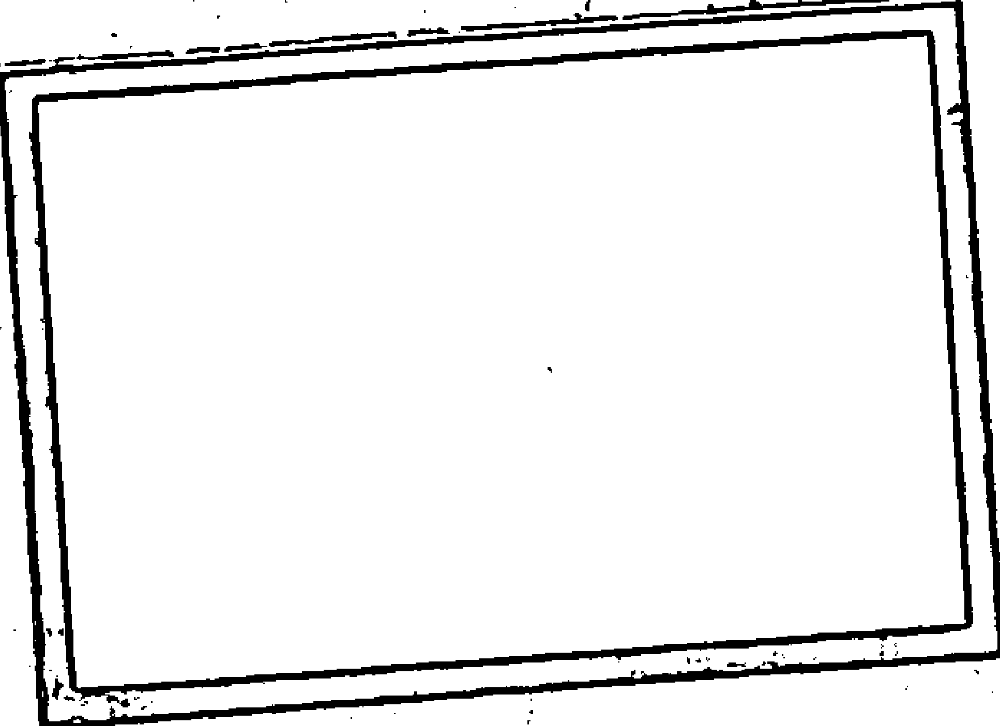
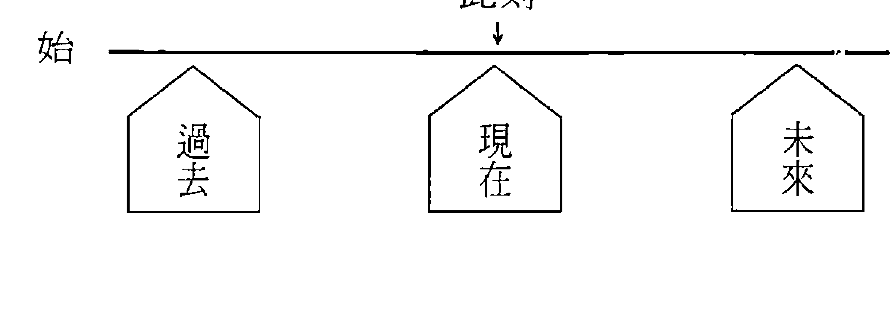
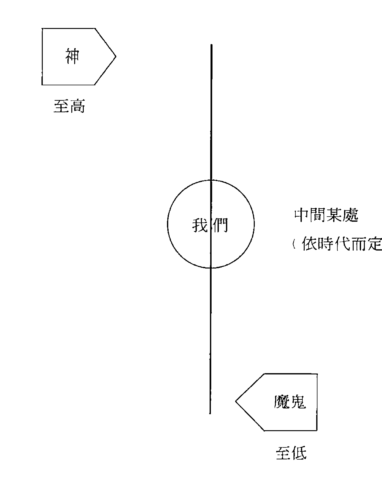
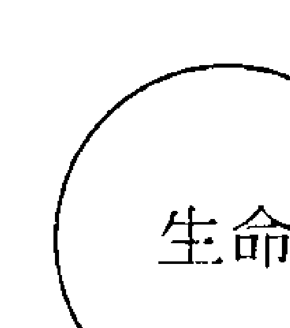
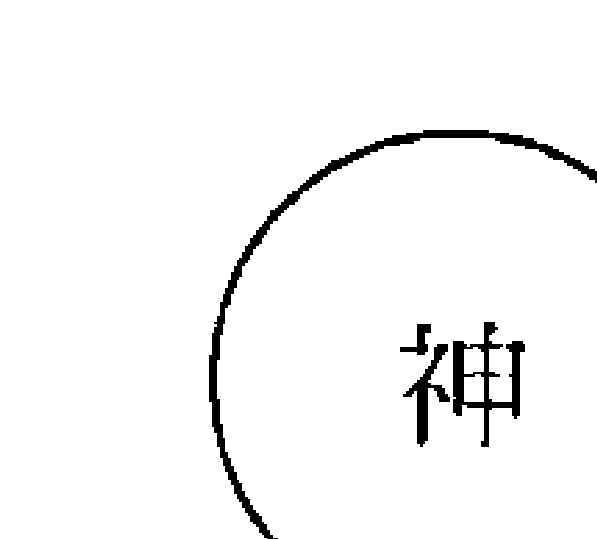
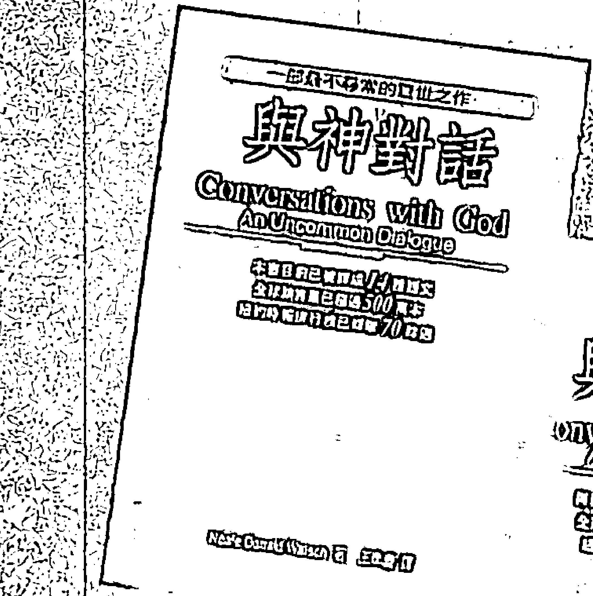
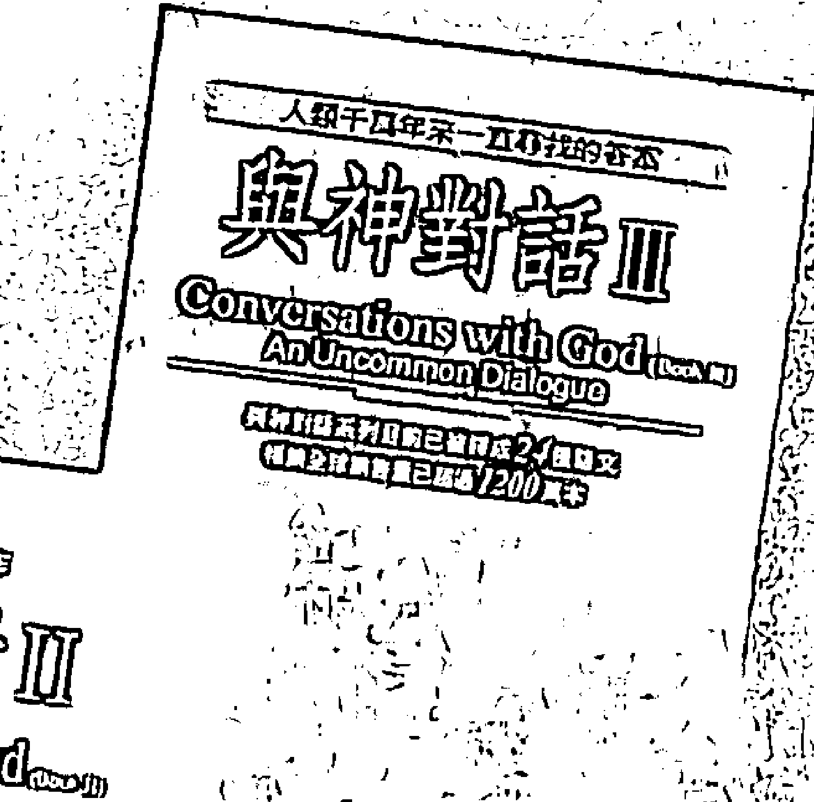
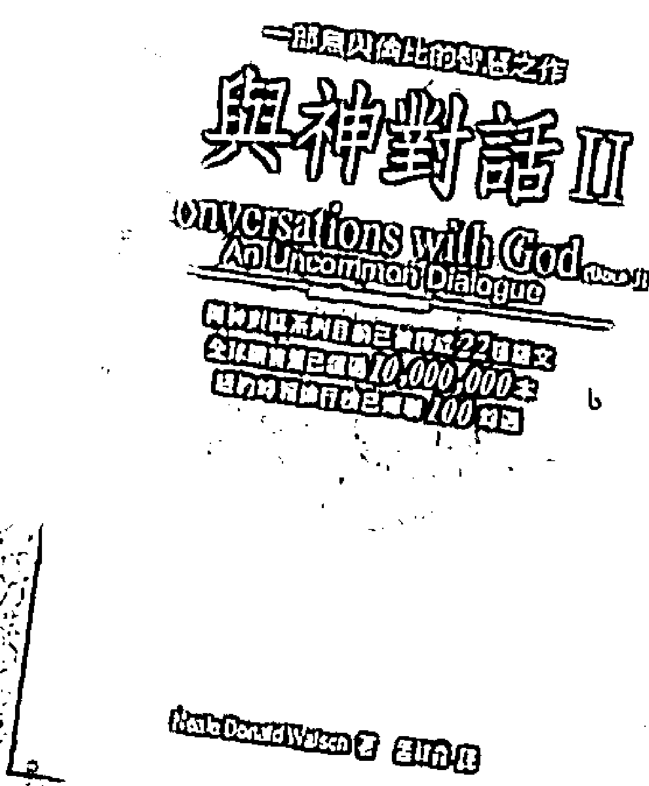
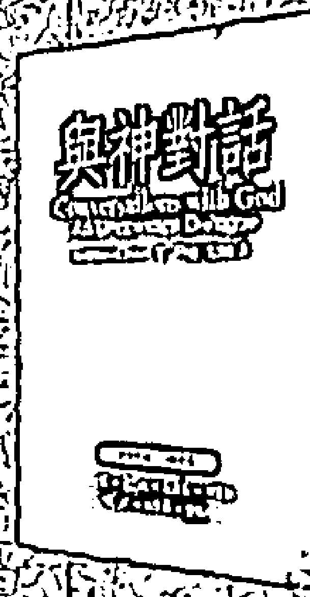
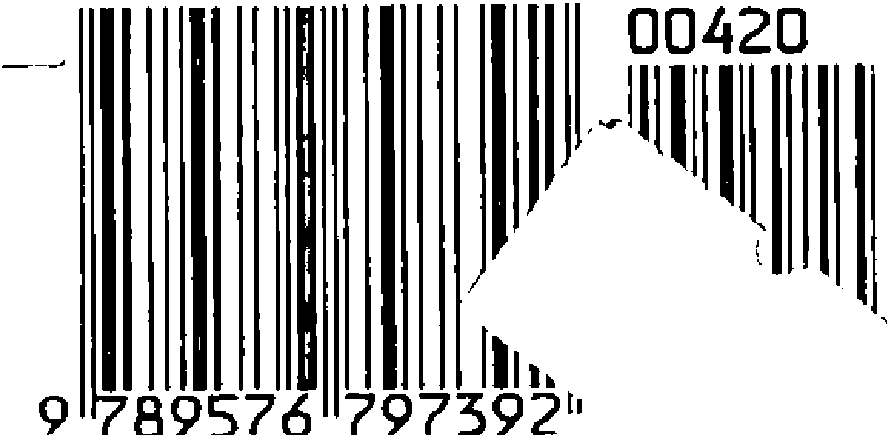

# 与神对话问答录

## Questions and Answers on Conversations with God

Neale Donald Walsch 著 孟祥森 译

畅销全球1300万册

译成27国语文的《与神对话》三部曲之回响

+   * 我是谁？
* 要怎样才能跟神说上话？
* 如果我想发财，应该怎么做？
* 人活着的目的是什么？
* 努力与命运有什么关连？
* 幸福的生活是创造出来的，还是早就注定的？
* 个人要如何成长，才能改变集体思维？
* 我如何能影响世界？

对于人生，人人有问题。对于这些问题，也人人有答案。
但并非人人都知道原来如此。

## 献词

这本书要献给我的哥哥布里安·沃许（Bryan L Walsch）——

在我们美妙的童年，他常常是我的保护者，

有时也是我的迫害者；

但无论何时都是我最好的朋友。

他鼓励我提出天大的问题，

并让我相信我一定可以得到回答。

## 引言

## 1. 多重问题

## 2. 灵性之路

## 3. 健康

## 4. 这一生要做什么

## 5. 感觉与意念

## 6. 性与关系

## 7. 善恶二元性

## 8. 死与濒死

## 9. 预言、地球变化与未来

## 10. 祈祷和冥想

## 11. 跟神说话

## 12. 耶稣・圣经・教会与天使

## 13. 关于《与神对话》的对话

## 14. 《与神对话》和尼尔

## 15. 一般问题

## 16. 唯一重要的问题

## 书末

# Questions and Answers on Conversations with God

## 与神对话问答录

Neale Donald Walsch 著 孟祥森 译

## 申谢

我首先要感谢的总是我那最好的朋友——神。自从我与神展开真诚的对话后，我的人生变得越来越美好；自从我与神建立了关系，奇迹就一个跟着一个发生。

我接着要感谢的，是我的妻南茜和我的孩子们，感谢他们惠予我许多时间与空间，让我继续写作，把本属个人的经验与世人共享，却因而使得我跟自己家人的生活颠三倒四。

至于本书的出版，我要特别感谢我难能可贵的朋友与助理——露丝·吴尔芬芭葛（Rose Wolfenbarger）；她好几年来细心的把我对读者的每一封回信誊录分类，又花了好几个月的时间帮我拣出和整理出这本书刊出的部分。

## 引言

对于人生，人人有问题。对于这些问题，也人人有答案。但并非人人都知道原来如此。当然，我原先也不知道。我到处找答案——唯独没有向内寻找——我求问父母、家人、朋友、老师、教士、领袖、作家、哲学家，只要我以为可以向我提供答案的任何人，我就求问。然后，我求问神。我提出了一大堆问题。我终于得到了回答。这些回答编成了《与神对话》三部曲。它们却引出了更多的问题，不仅出自于我，也出自许多读者。我得到的最重要答案，是我无须再提出任何问题，神说，一切的答案俱在吾心。我必须做的，只是走向内在。这也是我们每个人必须做的。走向内在，在那里与创世主相会，因为神的居

当然，请教他人并没有什么不对。从神的其他部分输入的信息常常是有用的，非常有价值的。然而，你应当记得，从神的任何其他部分得来的信息，都不会比从你自己之内神的部分得来的

信息更为清楚。你可以聆听忠告，寻求意见，考量输入的信息，但永不可忘要以你的内在之声做为导引，小心衡量。如果你把外来的输入推举到绝对真理的高度，你便是在宣称你不是那渊源。但这是谎言。在一本回答问题的书中说这些话似乎有点奇怪，但事实上却正是应该说的。我不希望各位以为你在本书中寻得的答案比你自己心中的答案更具权威。这正是真正的智慧所在。这正是真正的真理所在。从其他的渊源来的输入，最大的价值有时就在开启你自己的真理之门。这正是本书的意图。《与神对话》全球各地的读者每周给我的信函大约三百封，我在每期的“月讯”中会各选几封回复，目的就在这。而现在从五年来各期的问答中选取最有趣的一些汇成本书，目的也是在此。当你阅读这些信件时，如果发现有些像是出自你的手笔，请不要吃惊，毕竟，我们人人都问过相同的问题。我们人人都会以我们自己的方式、从我们自己的角度探问相同的主题。因此，你现在捧在手上的根本不是一本书，而是一面镜子。我请求你深深地向里看。看看里面反映的是什么。它可能只是一条小径，却通往你自己的最高真理。

## 1 多重问题

我喜欢问题。问题扩张了我的心思。越难的问题我越喜欢。这就是为什么我喜欢回答本书中的问题。本书中提出的问题包含了《与神对话》读者所提出的最具挑战性的一些问题，它们均反映着最投入、最勇敢的人的热情、挫折、关怀与好奇。这本书从头到尾我都曾想以论题来分类。然而，写信来的人有些显然并没有想一封信只谈一个问题。我曾想把这些多重的问题分开，每个问题纳入某一类，但最后还是放弃了，因为我觉得那样做会破坏信中的元气。这些问题之所以丰美多汁，正是因为它们是复杂而互相交织的。当然，人生也正是如此。所以，我们就全盘托出。它们是真实的人对于真实的人生提出的真实问题。

### 一、人为什么要互相伤害？

我叫小小。看了你的书，我的感觉唯有一个字来形容：哇！

+   尼尔，以下是你的书让我产生的问题：

+   1. 我仍旧不明白为什么有关系的人——尤其是家人——不断的互相伤害，而关系时好时坏。是前世的业在作崇吗？
+   2. 在你的书里，神说白色并不意味无色，而是意味颜色之总合。这也可以用在人种上吗？这意味白人代表所有其他人种之总合吗？我是一个非洲裔美国人，我很好奇神为什么创造不同的人种，而他/她对目前的种族问题又抱什么态度。我知道没有一种人种是优于其他人种的，但我就是想直接听神这样说：……尽管我早就知道了。
+   3. 你确定没有魔鬼吗？那么谁是鲁西法尔〔Lucifer〕？

> 译注：早期基督教教会著作中对堕落以前的撒旦的称呼。

世界上有邪恶，但根源只是自人而来吗？没有妖魔鬼怪吗？你是否知道，如果我们真信邪恶仅来自于人，会免除多大的恐惧——而这又表示我们有多大的潜能？

+   4. 我什么都怕得不得了。要怎么解除？
+   5. 神是“他”还是“她”？哪样对？我们应当怎么称呼她？她在意吗？她甩这个吗？
+   6. 有没有任何一种组织良好的宗教把神的真正讯息大部分包含在内的？我受的是天主教教育，但在我开始寻求真理的时候就离开了教会。我现在不晓得怎么样标示自己，除非是“神的孩子”吧！我完全信靠耶稣（因为他每次都答应我），所以，我猜我算是某种的基督徒吧！新时代思想我相信的很多，但不是全部。所以，我说不定可以称作“新时代基督教神秘主义者”（一笑）。
+   7. 最后一个问题：我怎么才能跟女神说上话？她会不在乎我有那么多恐惧与怀疑也跟你说话吗？我怎么才能跟她接触？听起来很疯，但我真的想听她亲口告诉我她也爱我，并且让我感受到她的爱。我想把我的一生用来帮助那些比我不幸的人，但我想问问她，我应该把帮助用在哪个领域——爱滋病？无家可归的人？儿童？到底哪里？你能帮助我吗？我希望你可以了解到我给你写信的真诚，我也相信你会回覆我。随信附上许多的爱与感谢。

### 我美妙的、美妙的小小：

## 与神对话问答录

1.  有关系的人互相伤害，是因为他们就是会这个样子。他们这样做是因为他们这样做，小小，这当中并没有更大的原因，诸如“前世的业在作祟”等等。那只是因为事情就是这样发生。那是生活的一部分。没有人恶意的要去伤害别人。小小，请记得两个重要的教诲：
    以每个人的世界模式而言，没有任何人做的事是不得当的。
    一切的攻击都是在求救。
    人互相伤害，是因为他们想要某种东西而又觉得那是他们要不到的，或不想要某种东西却又不能不要。他们不是处在前面的状况，就是处在后面的状况，可是又不知道该怎么办。他们以为唯一能做的，唯一能满足他们的欲望的，就是伤害他人。他们并不必须去这样做，但他们不懂。
    他们不懂如何去“得到他们想要的”或“不要他们不想要的”而不去伤害他人。
    问题在教育，而不在意图。

    用悲悯和爱迎接每一次伤害吧！悲悯他人的不懂（我们人人都曾不懂），爱别人的人性，爱他们的意图——不管表面上如何，他们其实都是在意图解决他们的困境，试着让他们的生活可以过下去。

    我当然要回妳的信！这是何等的一封信啊！妳这一封信足以让我写整整一本书呢！就让我们一一的谈谈妳提出的问题吧！

    我们在此是在参与一种“变”（becoming）的历程，一种“创造”的历程。一种“是”（being）的历程。我们某些人比另一些人更“是”如何如何。事情就是这样。这就是我所说的“如是”状态。事实的实况就是如此。带着笑容接受吧！心中含着爱去拥抱它。要深深明白：没有人从心里想要伤害妳。他们这样做，纯是由于掉以轻心，也或有意：但如果无意，也是由于他们不知道有什么其他方法可以得到满足。所以一下一次，如果有人伤害妳，请搁下这伤害感，只去探问问题之所在：什么是他想要得到什么东西，以致为了得到它而宁可伤害我？妳可以在心里默默的问，或者，如果你跟那个人的关系是坦诚的，妳就可以明白的提出来。试试看。这对终止争吵极有功效，对终止谩骂极有功效。

    是什么东西你想要得那么厉害，以致为了得到它你宁可伤害我？

    此时此刻，你想要的是什么？想感觉的是什么？

    有没有什么办法我可以帮助你得到它，而不致放弃“我是谁”？

    即使只在妳的心里静静问这些问题，都可以使情况如此彻底、有力而立即的改变，以致妳甚至搞不清楚发生了什么事情。而与妳共舞的舞伴也会吃惊于妳升到了一个什么了不起的层面！这个话题能够说的还多得很。

2.  小小，我在这里不能替神发言。这句话说明白之后，让我对这些回信中的一句话做一个总括性

## 与神对话问答录

当我在书写《与神对话》时，我处在一种不论何时都可坐下来接受书中那类讯息的状态。而现在，我不是处在那种状态。如我在第一册中所说的，那本书约用了一年的时间。第二册也用了一年。第三册用的时间更多。所以，我不能说妳现在手中的这本回信集，是由神直接传递下来的，或由灵感而来——在《与神对话》中我曾坦承那书中的讯息是由灵感而来。我给读者的信，是我个人取自三部曲所得。它们是我三年来“听写”《与神对话》的领会。这一点我必须让各位明白。任何类似于“尼尔所说的 就是神说的”之类的想法，我都离得越远越好。把这种想法罢在我身上绝对是天大的错误。

    好啦，小小，现在回到人种的问题。我不相信“白种人”代表所有其他人种的总合，我认为白种人仅是人类母种的分枝之一，其肤色与身体特征仅是人类最早发展阶段生存必需的结果，因当时地球上各民族所处的生存环境而产生；这些肤色与特征存在基因库里，一直在各人种的后代中衍传。

    至于“神为什么创造不同的人种”——我不认为神是在一个明媚的早上，坐在那里说：“我要创造许多不同的人种，每一种都有不同的肤色和特质。”我认为神只是任许生命的历程展现，而一切的事物都是由这历程而被创造出来的。不但人种如此，火山也是。飓风也是。地震也是。

    人类的错误也是，对正义的曲解也是。善良与慈悲也是。说不尽的。我不认为神是坐在某个地方，一一的创造人类的生存“条件”；甚至我也不相信神是大笔一挥，一次把所有条件都创设完毕。我相信神只是创造了生命本身——以我们在物理宇宙给它的定义而言的生命——并订下了一套了不起的法则，规范万事万物的“谁、什么、何处与为何”。科学则是人类的一种意图，想要去发现这些法则，了解这些法则，并配合这些法则，以求产生想要的结果。现在甚至有一种精神运动叫作“宗教科学”（Religious science），其信念是：神的法则是人可以领会的，是人可以运用以产生预期而有一致性之后果的。
    至于神“对目前种族问题的想法”我就不知道了。妳得直接去问她。不过，神会怎么回答这个问题，我倒是有一点想法。我相信神会说：“人类真是十分偏好把什么东西都分门别类。你们把自己这个物种弄成了一种不容异己的物种。你们星球上最大的不幸就是由你们这项缺失造成。如果你们能够化除你们的分别心，不再把种种的不同视为阻隔你们的障碍，如果你们把注意力和爱心放在你们共同的特质上，你们整个人类的经验将立即改变，永远改变，并生活在我原意为你们创造的乐园中。你们的共同之处就是对和平的渴望，对爱与被爱的渴望，殷切期望在有选择之自由的世界上过着有尊严的生活，殷切期望每个人都有机会把自己最高的潜能发挥出来，殷切而不息的渴望将你们心中最好的一面展现出来。如果你们能够确认这些才是你们人性中至为宝贵

## 与神对话问答录

而重要的部分，就去培育、鼓舞、加强它们，而化除你们的恐惧、愤怒、恨恶，与因有所不同而来的猜忌，则你们的人类经验就将立即而永远不同。”

    以我对《与神对话》的理解，我相信神也会说：“小小，我的心肝宝贝，当然没有一种人种是比另外一种人种更为“优越”的。在最终实相中，任何的优越都是不存在的。因为你们统统是“优越”的，因而没有一个比另一个优越。这就是你们每一个都是“按照神的形象被创造”的含义。这也是美国立国的深沉宣言的含义：所有的人都生而平等。”

3.  小小，真的，我相信没有魔鬼。要想把这一点了解得更清楚，请重读《与神对话》第一册

4.  罗斯福〔Franklin Roosevelt. 译按：美国第三十二任总统。〕说得再清楚不过：“除了恐惧之外，我们没有任何东西可以恐惧。”小小，当妳明白了没有什么是可以惧怕的以后，妳就可以

化解妳的恐惧了。不论在任何情况下，最坏的遭遇能是什么呢？当然，妳可能会死掉。这是最坏的情况了，是不？可是这可能也是最好的事情。那些死过而又复生的人，那些有过濒死经验的人，什么也不怕了。妳知道吗？他们什么也不怕了。妳知道为什么吗？因为他们已经非常清楚，没有什么是需要怕的——连死也不用怕。

    恐惧是表明妳不相信神。如果有神存在，他怎么会让那于妳不是最好的事发生在妳身上呢？然而，如果妳经历到妳觉得于妳并不是最好的事，那么，谁是那事情的因呢？神？或可能是妳？也不要谴责恐惧。因为恐惧只是爱的反面。没有恐惧，妳的实际生活中就不可能存在爱。因此，爱妳的恐惧吧！妳甚至可以说，爱它爱得要死。

+   5.  神既不是“他”，也不是“她”。神没有不变的形象，除非是那无相之相。然而神却可以——而且事实上也真的——采取他认为妳可以认识的形相。对的，神不会“在意”妳怎么称呼他，只要妳叫她就好。这是说，别忘记他。这不是因为她孤单寂寞，需要妳的陪伴。这是因为神最大的快乐是让妳找到他，让妳以任何妳可以认得出来的方式看出他来。妳在花中看到神吗？一段神来之笔的乐曲呢？风的呜咽？飘雪的温柔？折磨妳的脸？在欺负妳的恶棍身上妳是否认出神？如果妳未能认出，则妳对神尚一无所知，也尚未领会她的行事方式，也尚未明白他想要做的是什么。只有在妳处处——真的是处处——见到神时，妳才真的见到了神。对大部分人来说，

## 这是一个难以领会的观念，这是许多人难以接受的真理。然而这是真的。这是历来最伟大的真理。

+   6.  关于这个问题，我只能有纯属主观的意见。所以，我有点想我还是不要回答的好。因为，

    谁在乎尼尔・唐纳・沃许怎么想呢？重要的是妳怎么想。去审视一下世界的各宗教。去读读它们的东西。去进进几所教堂、犹太聚会所、清真寺、佛寺、祈祷间。看看妳怎么想。去感觉一下妳的感觉。妳的真理会向妳清楚显露。

    几乎每个宗教都有好的一面。我想要提醒的则是《与神对话》中关于这议题的真知卓见。

    《与神对话》中说，宗教是人的一种意图，是想去解释那不可解释者。而在这方面，它做得并不好。我同意《与神对话》中有关此事的智慧。我认为“宗教”（religion）和“宗教情怀”（spirituality）是很不一样的。我想要的是宗教情怀，而不是宗教。不过，如果我想寻觅某一“组织良好的宗教”，则有些条件是我认为必要的，有些则是我认为不可要的。

    我喜欢仪式，也喜欢事实方面的说明，可以有助我了解。现在的教会有许多不是偏于前者，就是偏于后者；不是把有关神的种种做如此事实般的解释，以致过于枯燥，就是把对神的体验如此仪式化，以至于捕风捉影，令人无动于衷。所以，我想寻觅的教会是能把事实和仪式结合在一起的，因而可以让我所有的部分——我的身、心、灵——都有感触，并使我可以体验到我的

## 身、心、灵的各面。

    我知道神存在于万事万物中，存在于每一个人的生命中，他在此中动用，以此身分，并藉由这一切而呈现。因此，当任何教会或聚会特别尊崇某一位神祇或圣者——不论何等神圣——而认为凌驾其他神祇或圣者之上，我就会觉得不舒服。我相信那种不容异己的宗教是有危险性的。

    因为它们会把自以为的神、自以为的真理，取代真正的神和真正的真理。因而它们也延迟了人对精神的探索与追求，并背弃了人人渴望的灵性经验。由于这个原因，我不去不容异己的教会或教堂，因为这样的处所不允许你对它们的教义有任何疑问，更不用说指出它们的矛盾之处。

    我知道，神既不是男人，也不是女人，既不是黑人，也不是白人，但神会为他的目的而选取任何他想选取的形相。我也知道，神不认为任何性别、肤色、人种或形态的人比其他的优越或“神圣”。因此，我想寻觅的教会和精神组织是那尊崇神和女神的，对男女同样推崇的，给予平等机会的，使男人与女人同样有机会主持神圣仪式，以教士、主教、教师与领袖身分执行圣礼的。

    我知道，此时此刻神直接对人说话，并藉着人而说话，就如任何时候一样。因此，我避开任何这类的教会、教派或哲学：他们认为人不能跟神做直接而双向的沟通，必得有中间人或某种特定的程序。这种中间人和程序正是这类教会或哲学得以立身的张本。

    我知道，并没有一条“独一无二”、唯一正确的途径使我们去接近神、领会神，爱神，并把

## 与神对话问答录

对神的直接体验实现在生活中。由于我知道这些，所以我谢绝任何这样的教会、宗教、社团、教派、信众或帮派：他们声言并坚信他们所信奉的教诲是唯一真正的教诲，他们遵从的道是唯一的真道，并认为其他的教诲和道，不论何等真诚，都会引起他们想要去接近的神之愤怒与谴责，施与无情的诅咒。

    小小，这些，是我个人的原则，但并不必定也是妳的。这些原则的难处在于目前世上所有有组织的宗教实际都不符合这些原则。所以，妳明白了吧。

7.  小小，现在我要回答妳的最后一个问题了：任何时候、任何地点，妳都可以直接跟神或女神说话。事实上，妳的每一念、每一言、每一行、每一个选择都是在对他说话。妳无法不对他说话。就在此刻，她可能就在对妳说。听吧……看吧……。

    > ……我爱妳，小小。

    妳最后问道，如何用妳的一生服务他人，请参考我最近出版的一本小册子《荷光者》（*Bringers of the Light*），由我们的基金会发行的。神祝福妳，小小，妳是一个奇妙的造物，天地的奇迹。

## 二、我如何把自己视为与人“同等”？

嗨，尼尔：

我喜欢你写的《与神对话》第一册。谢谢你。我有两个问题：

+   1.  我从来不觉得我像别人一样。我觉得自己笨，不聪明，然而我知道我是知道一些事的，尽管可能很表面。我是个大木头人。我有一些朋友，我觉得他们口齿伶俐，博闻，记性又好。我怎么样才能超越这个障碍，把自己看得和他们同等？（虽然我明知我和他们是同等的。）如果你不懂我在问什么，神会懂的。
    2.  我十分珍爱我的孩子，可是他们有时就是不听话。这对我为什么这么困难？许多夜晚，我都为了该怎么做而痛哭不止。我还得承受多久？什么时候可以结束？也许别的妈妈们也有同样的问题，所以，如果可能的话，请在你的月讯中谈一谈。

我亲爱的卡萝：

卡萝，于宾州的蒙特罗斯## 與神對話問答錄

問題不在你是否像別人一樣「聰明」。我也不如愛因斯坦聰明。我也不如沙克（Jonas Salk）或愛迪生聰明，或者……好吧，我甚至不如我哥哥聰明！跟別人比，是不著邊際的。有許多事情是我哥哥行，而我不行的。也有不少事情是別人不行，你行的。所以，重要的不是你是否和別人一樣「聰明」。我們每個人都有自己的禮物可以送與別人。然而並非每個人的禮物都相同。

《聖經》把這一點說得非常好，卡蘿。請看看其中我最感動的一個段落，「哥林多前書」十二章二十九節至十三章十三節。在這一段提出了人對他人的慈悲同情。其中說，真正重要的禮物（gift）只有一種。如果沒有一種，則其他所有的禮物都是無關緊要的，沒有價值的。然而，如果有這種禮物，則其他一切都並非必需。以下就是《聖經》中的原文。卡蘿，請細心的讀一讀：

難道能全都是宗徒？全都做先知或導師？豈能人人有顯奇蹟之本事？或治癒病人，或說多種方言，或能做各種翻譯？

其實，你們該追求最寶貴的神恩（charis）。我要指給你們看一條更完美的道路。

即使我能說人類的各種語言和天使的話語，卻沒有愛心，我就只是一個會鳴的鑼和會響的鈸而已。

即使我有預知的能力，會看透一切奧蹟，擁有一身學問；並且信念堅定，可以移山倒海：卻沒有愛，我就算不得什麼。

即使我捐獻所有，甚至犧牲自己，卻只為沽名釣譽，那對我也毫無益處。

愛是忍耐、體諒；愛從不嫉妒、不張狂、不自誇；不粗魯，也不為己；不動怒，不記仇；愛不喜歡不義，只喜歡真理；愛凡事包容，凡事相信，凡事盼望，凡事忍耐。

愛永不會被淘汰。如有預言，終將逝去，諸多言語也將沉默，廣博學問將不再有價值。

因為學問終究有所止，預言終究有所限。當無限完美來臨時，那些不完美的便會消逝。

當我幼年時，說話像孩童，也用孩童的思維來判斷。如今我長大成人，我要丟棄所有孩童的幼稚言行和思維。

現在我們看到的，只是一面模糊鏡子的反射，不夠清楚；但總有一天，我們要（與天主）對面相見。現在我（對天主）的認識是有限的，但有一天我將全部明白，正像（祂）現在透徹瞭解我一樣。

目前，要有信、望和愛三大德。其中最重要、最偉大的是愛。

> 「譯註：中文是採用天主教《牧靈聖經》譯文。跟原書英文略有出入。「愛」（love）在英文欽定本中為「慈悲」」

你看，我奇妙的卡蘿，這才是真正重要的事。你是一個有愛心的人嗎？如果是，你就是神最大的禮物。其他的都不重要了。都不重要。不論你多會說話，你思想多敏捷。不管你知道得

多麼多，過錯多麼少，也不管你世俗的成就有多大。在神的眼中，這些沒有一樣是重要的。

你如何移除你的障礙？如何可以感到你跟你朋友們「平等」（如你心中明明知道的）？那就是要知道，在神的眼中，你真的是跟人人「平等」的。並對人人平等的表達你的愛。當你愛別人，別人也就會愛你。當你體諒他人，他人也就會體諒你。

好了，卡蘿，現在談談孩子的問題。卡蘿，我的建議是你試著改變跟孩子說話的方式。我想向你推介一本書。關於這方面，這絕對是我讀過最好的書。這本書叫作《如何說話，好讓孩子聽；如何聽，好讓孩子說話》（How to Talk So Kids Will Listen, and Listen So Kids Will Talk），由阿黛爾·法伯（Adele Faber）和艾琳·馬茲利希（Elaine Mazlish）合著的。把這本書找來吧，卡蘿。今天就去。圖書館中應該可以找得到。

一般說來，這本書的建議是，在跟孩子說話時，要讓孩子覺得在人生的困境中，你是跟他們站在一邊的。不論他們要什麼、是什麼，做什麼或有什麼，都以正面的態度站在他們的一邊設想。

讓我舉一個十分簡單的例子。讓我們假設你有一個五歲的小孩，他想要吃糖。這時離開飯時間不到二十分鐘。你身為媽媽，有兩種情況可做選擇。你可以用心的對孩子解釋，就要開飯了，現在吃甜點會壞了他的胃口，因此，答案是不行（這使你站到與孩子對立的立場）；另一種方式

則是同情孩子的願望，跟孩子一同感到不如意，讓他為你去解決這個難題。這樣做，說話時要有
一點創意。比如像下面這樣：

> >孩子：我要吃糖！

> >媽媽：兒子，你知道嗎？我也想！我好愛吃糖哦，你呢？

> >孩子：我當然愛！

> >媽媽：可是我們現在不能吃。

> >孩子：為什麼？

> >媽媽：嗯，因為飯快做好了，如果現在吃糖，肚子就不會餓，就不想吃飯了。那麼我費了這麼大的功夫就白做了。好傷腦筋哦，我好想現在就吃糖，你是不是也一樣？

> >孩子：對。

> >媽媽：你能不能想個辦法，讓我不這麼傷腦筋？

> >孩子：吃一塊就好！

> >媽媽：（笑）那也很好。可是，還是不能吃。記得規矩嗎？飯前不能吃零食。我有時候也不喜歡這個規矩。但那是規矩。我怎麼辦才好呢（臉上一副不知如何是好的表情）？

> >孩子：（立刻想要幫助的樣子。）媽媽，沒關係。我們可以吃了飯再吃糖。可以把它當作飯後的獎勵。

媽媽：太棒了！兒子，太棒了！我們吃完飯可以吃糖嗎？真棒！讓我們現在就拿出來，放在桌子上，準備等一會兒吃！

這段對話的重點是避免把你放在阻礙他的立場。如果孩子認為你是他的障礙，使他不能得到他想要的，那你可以斷定麻煩一定會跟著來。所以問題在你的孩子把你當成了障礙。你是擋在路上的。就是由於這個原因，孩子會不聽你的話。但是反過來，如果孩子把你和他自己看作共同面對障礙，而不是你們之間有障礙，他就往往會想幫助你面對難題。這只是一個簡化的例子，

但這原則實際可用在任何困境上——不管問題的性質如何，孩子的年齡如何。

疲憊不堪的父母是那些堅持非絆腳石不可的父母，要求孩子聽命，不然就如何如何。所有這些都只能造成父母與孩子間難以平息的摩擦，把每次談話都變作權力鬥爭，造成雙方的憤懣。

當然，運用權勢，你可短期奏效。但絕不可能長期有效。如果你想擁有孩子的愛、尊敬與友誼，你就不能用權勢；因為他會寧可找別人，任何一個人，也不會找你。

跟孩子的一切互動，核心問題都是：「愛」現在會怎麼做？這也是跟成人一切互動的核心問題。

這跟老式學校的硬派作風固然不同，卻也不是對孩子的嬌縱與屈意投合（請注意，大人並沒有投降，孩子也並沒有「得逞」）。這只是一方面堅守你的立場，一方面又把孩子當人一樣對待。

### 三、抽菸，靈魂伴侶和孩子

親愛的尼爾：

有機會讀到你的《與神對話》三部曲真是讓我感到快樂和幸運的事。過去五年，我一直在尋找它們。自那時以後，我經歷過許多的轉捩點，有時甚至不知道什麼是我所相信的，什麼是我的真理；但現在我卻在創造真正的我，並確信神——還有你——為我釐清了許多問題和紛擾。但我還是有幾個問題想請教：

- 1. 我是個抽菸的人。我的信念是它對我無害。我從來就不接受社會的那一套。我實際上非常健康。這是不表示我可以違背集體意識而創造我所想要的狀況呢？請對這一點加以闡釋。
- 2. 我第二個問題跟憤怒有關。我非常希望神能直接說說我們跟生活伴侶之間憤怒的事。我們如何能打斷這種循環？如何改變模式？
- 3. 我很想知道神對靈魂伴侶的看法。
- 4. 假設前世我們有某種技藝或能力，我們真能從前世取得能量嗎？
- 5. 我有一個寶貝，一個十一個月大的兒子。我很希望神說說有關孩子的事，他們的使命和目的。先謝謝你的回答。神祝福你，給予你光與愛。

親愛的桑迪：哇！當你提問題的時候，提的可真是問題！我不敢確定在這裡能不能對你的問題提出有深度的回答，因為實際上這可以寫整整一本書。但是目前先讓我做一些簡短的答覆，並建議你再去閱讀某些篇章。我們先說抽菸。常常有人問到這方面的問題。好吧，我就盡可能直說。

如果你認為你的意識層次已經發展到這麼高的程度，以至足以克服上億的人所締造的集體意識，也就是說，你認為你已經是一個實實在在的活佛（walking master），則我認為你可以安安全全的做任何你要做的事，包括從高樓躍下而不傷毫髮，任火車衝撞而形同無物，或任何類似的事。當然，桑迪，如果你能做這類的事，那真是我所遇見的第一位有這種能力的人了！

所以，我認為答案在你的心中。只有你自己可以評估你自己在演化中的階段，只有你自己可

> > 桑迪，於奧勒岡州的克蘭瑪斯瀑布鎮

以決定什麼是你自己的真情實況。《與神對話》中的忠告之所以是好的忠告，是因為它認為人的身體結構並不適合用來抽菸或喝酒。也就是說，身體的基礎設計會被這類的待遇破壞。從所有的證據來看，我們的肉身是不會飛的，但我們是否可以僅憑著意識力來克服這肉身的基本結構而試飛呢？做那樣的證明是聰明的嗎？這是一個你自己可以回答的問題。

至於憤怒的問題，桑迪，如我已經說過的，我在這裡沒有足夠的篇幅好好談論。但且讓我這樣說：人平常因兩種情況而憤怒。一種是想要的東西得不到，另一種是無法不要不想要的東西。我們的恐懼是來自可能得不到想要的，或不能把不想要的東西擺脫。憤怒是表現出來的恐懼。當我們不抱殷切的期待，把我們的心願純化為喜歡而非耽溺（上癮，也就是非要不可），我們就會遠離憤怒而走向自制。當我們看出萬事萬物在每時每刻都自成格局，並把期待歸零，憤怒的循環與模式便告結束。

至於靈魂伴侶，這裡更是連談起的空間都沒有了。但《與神對話》第二冊中對這個問題有美妙而詳盡的暢言。而當前最切要的是，不用去煩惱靈魂伴侶的論題，而寧可用心在你跟每個人的關係，你跟生活中每個地方、每件事物的關係。請記得，你一直處在創造再創造你是誰、你想要自己是誰的狀態。不論你是在靈魂伴侶面前或任何別人面前，這都是你的本份。請不要忘懷它，請守著它。請清楚你的心意，則靈魂伴侶將慢慢不再是你的難題或挑戰。

你問到，你能不能從前世取得能量，然後帶到此生來。我猜你的意思是，如果我們前世曾是鋼琴家、藝術家，或偉大的領袖，我們能把這些能量帶一些到此生的經歷中嗎？簡單的回答是，我們的這一生往往顯示著我們前生的經驗。在三歲時突然會把鋼琴彈好的孩子，或在五歲時表現出高度推理能力的孩子，和突然發現了所謂「潛在」才能的人，事實上都是接通了靈魂以前的經驗。我們可以有意的這樣做嗎？《與神對話》中說，你可以用任何你想要的方式創造你自己：既可以從前世的經驗中獲取，又可以憑空創造。

關於神的心目中每個孩子的人生目的和使命，我必須表示反對你的看法。任何人都沒有神心中預定的目的或使命。你的問題寓含著神在創造每個孩子時，心中是有某種用意，是期望這個孩子去完成的。請你重讀《與神對話》，你會發現神並沒有訂下任何這類的使命。如果神為每個孩子訂下特殊的使命，那又何需密而不宣呢？人生的目的就是讓我們去決定我們的使命為何，在我們與此使命的關係中我們又是誰？而非去發現我們生下來時神給我們的使命是什麼。人生不是「去發現」的過程；它是一個「創造」過程。

謝謝你的來信，桑迪，我但願能更深廣的回答你的問題，只是篇幅不允。

### 四、問題一卡車的人

親愛的沃許先生：

讓我 把 問 題 集 中 在 《 與 神 對 話 》 第 一 冊 的 33 頁 第 三 段（中 譯 本 55 頁 第 一 段）：為 了 不 干 擾 他 人 的 業 力 之 路 而 不 去 幫 助 他 人 的 分 際 點 在 何 處？37 頁 第 七 段（中 譯 本 61 頁 第 四 段）：個 人 要 如 何 成 長，才 能 改 變 集 體 思 維？

如 果 人 類 的 身 體 本 來 意 在 可 以 使 用 千 百 年，則 節 制 若 不 是 健 康 之 鑰 又 是 什 麼？或 者，節 制 是 把 喝 酒 也 包 括 在 內？什 麼 是 適 當 的 飲 食？

天 使 是 什 麼？如 果 如 大 師 一 般，我 不 顯 露 自 己 的 情 感，則 慈 悲 又 是 什 麼？

靈 魂 之 間 的 關 係 是 什 麼？好 比 說，是 並 生 的 火 燄 嗎？

恐 龍——或 何 動 物——之 所 以 被 創 造 出 來，是 為 了 什 麼？

在 我 以 前 讀 過 的 書 中，那 些 透 過 其 他 的 人 而 傳 遞 訊 息 的 存 在 體 們（entities）是 誰？你 的 書 和《萬 象 之 門》（The Door of Everything）這 本 書 的 關 係 又 是 什 麼？因 為 後 者 也 是 神 透 過 另 一 個 人 說 話。

在紐約區的薩拉托加泉水鎮有些奇妙的事在發生：除了在此我遇到了我的妻子外，我相信還有其他原因把我帶到這裡來，我正在焦急的等待答案。

吉姆，於紐約薩拉托加泉水鎮

親愛的吉姆：

謝謝你的這封精彩的信。讓我看看能不能一一回覆。

你問，為了不干擾他人的業力之路而不去幫助他人的分際點在何處？答案是，你必須盡你所知的範圍，時時敏感並深深覺察他人的意願。因此，你得總是瞭解什麼是別人對他們自己的心願，並致力去協助他們完成。永遠不要違背他人的意願而去幫助他人或為他人做事。你必須總是來自神所來之處，即是：「你對你自己的願望，就是我對你的願望。」當你純為他人完成他的心願而幫助他，你就是在幫助他人。當你因為自以為「懂得更多」，而想要把自己的意願強加在別人身上，你就是在干擾他人的業力之路。

你問「個人如何成長才足以改變集體思維」？吉姆，當你向集體思維——也就是你跟他們的生活有真正接觸的每個人——證明你真正是誰時，你就改變了集體思維。證明你真正是誰，走向關於自己最偉大的意象之最恢宏版本。當你以身實證這宏偉的意象，人們就會看到你真正是

> > 「你對你自己的願望，就是我對你的願望。」

誰，並開始對他們自己有了概念。當我們因讓別人看到我們自己真正的樣子而對他們自己產生概念，我們就開始改變集體意識。吉姆，個人要成長到這個階段所需做的，只是下決心。人生就是選擇。我們選擇自己是誰，我們就展現自己是誰。我們的人生經驗是出自我們的人生意願。因此，「個人成長需做什麼」這個問題的答案是，你選擇並決心去做。此外無他。

你問到，假設人的身體本來是可以存活數百年的，而如果節制不是健康的關鍵，那是什麼？
什麼是得當的飲食？或節制是否只包括喝酒？

你問題的答案是，並沒有「得當的飲食」這麼回事，只有你選擇什麼飲食，而你的選擇又依你希望如何而定。吉姆，你飲食的方式是在宣布你想要用你的人生做什麼，還不用說你想活多久。如果你想活得很久，最好是樣樣飲食都節制，尤其是紅肉和其他的「死體」食物。

當然，即使我沒有完全戒酒，也會盡量限制酒量。我也絕不抽菸，不嗑藥。我會遠離高脂肪食物，因為不需火箭科學家就可知道，高脂肪食物會造成血液循環的困難，而這又會產生身體的問題，導致早逝。吉姆，我想關於健康食品的訊息市場上已經很多，不再由神來宣布。

> > 如想聽取這方面有趣又實用的論說與建議，我非常推介約翰·羅賓斯（John Robbins）的《新世紀飲食》（Diet for a New America. 琉璃光出版社出版）。

你的下一個問題是關於天使的。答案是，天使道道地地就是天使。這是說，奇妙、慈悲、溫柔而充滿愛心的造物。神的化身，生活中的伴侶。在《與神對話》第二冊中對天使有詳細的討論，但我現在可以告訴你的是，確實有守護天使——或我們所「稱之為」守護天使這樣一種東西；她們會像你很可以預期的那樣，無條件的愛我們。

你問到，如果你像大師一樣不顯露情緒，則慈悲又是什麼？吉姆，答案是，慈悲不是情緒，慈悲是體驗。那是一種你選擇要有的、選擇要分享的經驗。當然，除非你不做此選擇。

你問：靈魂與靈魂之間的關係是什麼？有靈魂伴侶這樣的東西；《與神對話》第三冊也對這高等的關係有相當詳細的論說，我希望你去讀一讀。在這裡我只想這樣對你說：世界到處都有靈魂伴侶，而你的靈魂伴侶又不只一個。我們每個人都有許多許多的靈魂伴侶，這解釋了何以我們會跟許多許多不同的人戀愛。讓你自己在經歷這愛時享有這愛吧！讓你自己去充分經驗這愛，並充充分分豐富地擁抱它吧！

你問到恐龍或任何動物為何目的被創造出來？答案是，任何有生命之物都沒有任何目的。

> 《與神對話》把此點說得十分清楚。神並沒有為事物「指定」意義或目的，而任何事物也沒有「天生秉具」的意義或目的。吉姆，除了你給予的意義或目的外，沒有任何東西是本來就具有目的的或意義的。請重讀《與神對話》，你會徹底的瞭解這一點。

最後，吉姆，你問到由不同的管道傳遞訊息的存在體們之間的關係，例如由露比·尼爾森

(Ruby Nelson) 所傳遞的那本奇妙的書《萬象之門》。吉姆，對你的問題，我的回答是，神以他
認為最有效的一切方式向每個人、向所有的人顯現。由於如此，神才採取了許多形相。然而，所
有的形相都是神——每一分每一寸都是——宇宙中的一切沒有不是神的。因此，《萬象之門》跟
《與神對話》來自同源，但你必須瞭解，這是透過不同的過濾器而來的。露比·尼爾森，是尼
爾，可能和我的過濾器不同。因此，我們有著過濾器的難題——不論這過濾器是露比·尼爾森，是尼
爾·唐納·沃許，是馬太，是馬可或約翰。但是，如果我們細心分辨這些人——和其他的人——
的著作，我們會看出相似之處。在我看來，如果有二十個互不相識、各自生活在不同時代的人，
卻寫出本質相同的東西來，那確實很可能有我們必須十分細心去尋求之物。

透過其他的人傳遞訊息的存在體也都是神的不同部分，以「傳遞者」的想像或客觀經驗之形
態而呈現，以他們各自所聲稱的形態而呈現。換句話說，吉姆，也就是正如他們所說的樣子而呈
現。他們統統是神的一部分；沒有任何東西不是神的部分。這就是《與神對話》的整個重點，這
就是此書教誨的整個重點，一旦這奧秘向我們揭示，我們就
可以看得清清楚楚。

最後還有一點，吉姆。你認為你會到薩拉托伽泉水鎮不是只為了與你的妻子相遇，你還在
「焦急的等待答案」。吉姆，如果你不能明白我現在要告訴你的話，你就會偏失《與神對話》的整

個重點。你不是要焦急的等待「答案」，而是去創造那答案，答案不會無中生有的跑到你身邊來，而是你可以無中生有的把它創造出來。這兩者有極大的不同，而如果你不瞭解這不同，請一讀再讀《與神對話》，一直到你瞭解為止。吉姆，《與神對話》十分深刻的闡明一件事：人生不是發現的過程，它是創造的過程。因此，吉姆，不要焦急的等待任何事情，而要當靈慧的去創造你人生中所選擇和所渴望的一切。

### 五、關於天使、動物與醫生

親愛的沃許先生：

在讀你的書時，我有三個問題。

- 1. 最近有一大堆的書籍在討論天使。關於這個題材，你有什麼想法或感覺？
- 2. 神對於吃動物似乎很有意見，但在我看來，人類自從穴居時代就似乎在吃動物。而動物甚至也吃動物！什麼時候開始它變得不得當了？
- 3. 最近讀了《與神對話》第一冊的190頁（中譯本第313頁），我真的大感吃驚。那裡說我們應當每年做身體檢查，而且應該吃藥。然而回到第48頁（中譯本第78頁）看，那裡卻提

到醫藥機構反對新的治療法，甚至反對奇蹟。
我常有一種感覺，走入診所就等於放棄了我的身體可以自我痊癒的信心。此外，走入那種把生病當一種事業、當一種非常強烈的信仰的氛圍中時，我就會為自己創造一種處境，在此處境中，我把自己真的弄成了病人。去看醫生，跟他說「我生病了」，就創造了生病的事實。他們給你的藥又怎麼樣呢？放射療法又如何？可怕是，他們開出藥來，弄得你翻腸倒胃，卻又可能什麼都治不好！那麼何不幫助大家找出癌症的原因？

珍妮，於康乃迪克州黎曲菲爾德

### 親愛的珍妮：

- 1. 我認為天使是非常真實的，非常近切的，非常奇妙的。
- 2. 至於我們吃不吃動物肉，神並沒有特別好惡，他只是告訴我們，如果我們想活得長，想活得健康，他的建議是什麼。順便一提的是，說到「動物也吃動物」，我們必須指出，動物吃動物時往往還是活的，或剛剛咬死的，而且很可能從沒有注射過化學藥品、防腐劑、賀爾蒙等等：人類所吃死去甚久的動物肉卻往往難免這些東西。
- 3. 現在，讓我們看看妳對醫生的「診斷」。

## 與神對話問答錄

第一點，妳說，當妳走進診所時，妳總是覺得自己放棄了妳的身體可以自己痊癒的信念。當然，如果你一直這麼覺得，如果你拒絕去改變妳這種感覺，則妳就真的讓它成真了。真的可能如此。反過來說，妳也可以決定不這麼感覺。當我走進診所時，我的感覺是妳的身體可以自己痊癒，而醫生則有時候可以幫點忙。如果我坐飛機去杜布克，並不表示我就不能開車去。我只是選擇了另一種前往杜布克的方式而已（可能快一些）。珍妮，在生活中做某種選擇並不明謂使其他選擇無效。選擇巧克力並不會讓香草不香。當然，除非妳執意這麼認為。這完全依妳的感覺而定。

其次，妳說，當妳走進診所，妳就是走進了一個把生病當事業的氛圍中。我則把診所看成把痊癒當事業的地方。因此，我並不認為自己在創造一個使自己生病的處境，卻是在創造一個使自己健康的處境。

至於藥物治療和放射治療，有許多人確實因這類治療而受益匪淺，也有不少人無效。有些人認為藥物不好，我卻不想因此而一概排斥藥物。我也知道許多人都因放射療法而大為改善病情——包括幾位跟我很熟悉的人——因而我不會不加辨別的就排斥這種療法。

妳又說，為什麼不幫助大家找出致癌的原因呢？我同意。這個問題確實該提出來。但那已經患了癌症的人卻需要更多一些的幫助。

然而，珍妮，《與神對話》的要點是，妳創造妳的實相。書中關於這一點並無前後不一之說。如果妳看出或覺察出書中有其他互相矛盾之處，則永遠以妳最深的感覺為依歸，以妳自己至深的真理為依歸。我此處所說的一切都不是為了讓妳離棄妳的真理，而是幫助妳走向它。

### 六、問題，問題，更多的問題！

親愛的沃許先生：
最近我讀完了你的《與神對話》第一冊，我想告訴你，我認為它真是一部驚人而充滿啟發性的著作。對話中那完善、沒有謬誤、不可挑戰的邏輯實在讓我驚服，它把傳統上對聖經經文的解釋所含有的矛盾都釐清了。（終於！）這些矛盾一直讓我困惱，讓我不能享受因認識神而來的安寧、喜悅與愛。
這是我首次感到關於神的真理和人與神的關係同出一源，而表達的方式又是我本能上認為對的，因為它符合了神的完美和神的無條件之愛的傳統概念。書中有些訊息在我而言，雖然是新穎的，卻沒有一件出我意料，因為它跟一開始就立下的前提是如此相合，如此前後一致。

另一件讓我覺得十分有趣的事是，書中把各個宗教、哲學與科學的許多不同真知卓見都整合為互相融匯的整體。這些其他的教誨（以我看來）由於邏輯上的缺失和內在的矛盾而崩裂，你的書則把這些教誨中缺失的部分彌補起來。你的書使其他地方所表達的片面真理變得可信，使我能得以在整體的脈絡中去看它們。
讀你的這本書，讓我十分感動。有些句子固然一時我未能懂（但其實我懂），但我可以說，這是我第一次記得我真正感到神對人的愛和我對神的愛。我體驗到以前從未感到過的、從內在發出的光——可以說，一種無法言說的生命之光與寬慰之感。一種無法形容的舒暢。為了這份對話，為了將它與世人分享，我感謝你，並感謝神。
我有幾個問題，尚祈你能回答。

- 1. 神說人的身體不是用來消費酒品的。你是否接受過關於其他食品的啟示，如紅肉、雞肉、魚、海產、含咖啡因的食物和飲料，去咖啡因的飲料（如可可和茶）或任何別的消費品？

在《與神對話》中，我並沒有接受到這方面任何其他特別的訊息。然而宇宙卻曾透過許多健康專家提供我們可資參考的判斷：這些專家都做過相當好的觀察與建議。而我所確知的是，每個人都有自己特別的生理需求和容忍度。所以，我的朋友，請聆聽妳身體的語言吧！請用心聆聽。

- 2. 動物有靈魂嗎？如果有，牠們認識神嗎？牠們會感覺到愛嗎？如果會，牠們會感覺到對人的愛嗎？

所有這些問題的答案都是肯定的。所有的東西都有靈魂。如果你給靈魂的定義是「一切東西之中的神聖能量，此能量帶著生命的脈動」，則一切東西就都有靈魂。

人跟動物的關係是什麼？
人想要是什麼就是什麼。人跟一切事物的關係都是被同一個東西所決定，就是人的意願。人生是由人對人生的意願而產生。而每一個意願都在宣告、創造和體驗你是誰，你選擇你是誰。

- 3. 靈體（鬼魂）留在地球上嗎？如果是，為什麼？如果是，留多久（也就是說，在地球上游走的靈體最後會離開；而如果如此，是在何種條件下才會離開）？

前面幾個問題，每一個的答案都可以是「是」，也可以是「否」。靈體會去做他們選擇去做的事，正像我們一樣。有些靈魂在離開現在的肉體之後會「逗留」片刻。有些則立即離開，去領會其他的經驗。靈魂做任何事情都不必需某些特定的條件或處境。靈體做他們想做的事。這乃是以我們說他們是自由的靈體。有些人即使尚在肉身之內就選擇這樣做了。

- 4. 有關諾亞和洪水的故事。這樣的事情真的發生過嗎？如果發生過，是神造成的嗎？如果是，為什麼？如果是，在洪水之後神立約不再重複相同的事又是什麼意義？依照《創世紀》的說法，是神造成洪水，來毀滅所有的人，因為人敗壞了，讓神深深失望。神放過諾亞和其家人是因為諾亞沒有敗壞，是正直之人。洪水之後，神瞭解到人是生而邪惡的，因此不能為他們無能為力之事而受懲罰。這跟你書中所說的有衝突之處：
a. 神不會因人而失望；
b. 神不會干預人的世界；
c. 神不會想要毀滅人；
d. 神不會相信人天生邪惡；
e. 神不會做出資訊不足的決定。

> 如果你能聽聽你對諾亞故事的解釋。我喜歡妳的這種說法：「洪水之後，神瞭解到……。」妳能想像有任何時間有任何事物是神不了的嗎？

去分析像諾亞方舟這類的故事和神話都是很有趣的，但逐字逐句的去相信，恐怕卻不很聰明。代代相傳的那些偉大故事都包含著一些真理實相。這真理實相是種子：是故事的起源。但是，為了把這原初的經驗當作教訓，有許多東西是經年累月「附加」上去的。地球上曾有過洪水，殆無可疑。而無疑也曾有一個名叫諾亞的智者和領袖把可能收集到的一切——包括他所能找到的各種動物一公一母（因為他真正用心）——趕到大船上，逃避風雨。這是他確保物種得以延續而可能採取的行動。他真的有可能預感到洪水的來臨，而為此目的建造了大船。比這更奇特的事情都會發生過。
但神並未造成洪水去懲罰任何人。神完全沒有造成洪水。神沒有造成任何事物。神寧是看著我們造成一切。順便得說的是，神看著，卻不做論斷或審判。妳對《與神對話》中這一部份的領會是周到而正確的。至於諾亞故事的意義，則是除了妳給它的意義以外，它不具任何意義。人生的一切都是如此。

- 5. 關於諾亞的問題，引來了一個更普遍性的問題，那就是《聖經》中的一些故事目前有種種誤解（諸如你在書中所提，關於亞當與夏娃、十誡和耶穌基督的誤解），你是否想對這些故事重做解釋？

首先，我必須說明白的是，我什麼也未曾提出，我也未對任何事情做新的解釋。我想，妳所指的這些註解，統統是神透過我而做的。所以，妳提這些問題時的語氣會讓我有點受之有愧，因爲好像我是這一切之源似的。我不是。這一點我非常清楚。我只是一個書記。一個記者。我做的工作是聽寫。至於我的源頭是否如妳所說對《聖經》重做解釋，我不知道。

- 6. 《聖經》中有時用非常不含混的用詞來形容神，跟你書中神對他自己的形容頗不一致（例如，在《聖經》中，神形容他自己是「嫉妒的」神，或要人必須「服從」的神）。這些「不含混」的用詞不是不正確，就是定義不清，不然就是具有我看不出來的含義。至真的祝福。

琳達，於維吉尼亞州

很好，琳達，這真是一封信！多謝妳！正如妳最後的註解，我們可以說：《聖經》中的用詞並沒有妳看不出來的意義。妳看出了牠們的意義。《聖經》中對神的描述大部分是不正確的。

### 七、通靈者，地獄，白光

親愛的尼爾：

在把你的書讀到末尾，一直讀到你的名字的最後一個字母時，我不禁全身顫抖、顫抖又顫抖。感謝你充任使者。感謝你寫了這本書。因為我也像你一樣，有那麼多問題：關於通靈者的世界，我的問題更多。

我的問題是：

- 1. 你怎麼變成通靈者的？
- 2. 有人說，如果你不用白光把自己罩住，「壞」靈就會進到你裡面。是否真有這種危險？
- 3. 瑪麗・夏雨（Mary Summer Rain）在她的《靈性之歌》（Spirit Song）中說，她冥想時，覺察到自己身在一個他們稱為「地獄」的地方。而如果沒有「地獄」，則她經歷的是個什麼地方？
- 4. 白光的目的是什麼？
- 5. 向通靈者請教有關自己和已故的所愛者的事是可以的嗎？或者，我們應當自己發展這種能力？

> 史蒂芬妮，於加州克隆納
祝你愛與幸福！

哇！史蒂芬妮！妳這些問題足以要我寫成一整本書了！其實，第一個問題在《與神對話》三部曲中已有相當詳細的說明。這裡我就只提出一些簡要的參考。

- 1. 並沒有什麼「變成」通靈者的辦法。妳已經是了。人人都是「通靈者」，沒有辦法不是。通靈是我們天性的一部分。那是我們的第六感。認識這一點，便是使得我們的通靈能力得以動用的第一步。以下是對你的問題的簡短回答：
a. 認知、接受，並擁有我們的通靈能力吧！這是我們的天生秉賦。天天都運用你的通靈能力：注意它，聆聽你對於事物的「直覺」，並盡可能依此而行。當你有所「感通」時，不要「想」，只去做就是。你越是快速的依「感通」而行，你就越會去信賴它們，因為你會發現它們帶來了肯定的結果。聆聽你的感覺。感覺是靈魂的語言。如果你「感覺」到應做什麼或不應做什麼，你就聽從。這是你的靈魂在對你說話。要允許你自己有「錯」的機會。因為我們會有一些紛擾的意念或恐懼跑進腦中；想要把這些意念、恐懼和真正的智慧分開，需要有一些時間。如果你順隨你的感覺或最先的衝動而行事，卻發現「錯」了，不要因此放棄。在這方面，要給自己一些餘地。把最先來到腦際的東西說出來。每次有這種「感通」，就把它說出來，大聲說。用這種方式把自己「推出去」。你會發現你在對人說一些最驚人的話，有些人會吃驚的看著你，怎麼會有這麼一針見血的洞察或訊息！

絕不要利用通靈的天賦去自我炫耀或斂財。因為那相似於用性來抓權或操縱人，而性原來純是為歡喜與愛的。我曾發現，當通靈的天賦被用來賺取名利時，它會「消失」。只應把通靈天賦用在對人的服務和幫助上。我知道，這只是我個人的領會，但畢竟，妳是在問我呀！

- b. 我不相信有「壞靈」會進入我裡面的「危險」——而因此，它們也就不會進入！哈！我笑，是因為我不知道誰先誰後！是誰，還是蛋？我的意思是說，我真的不知道是念頭發生在先，還是經驗發生在先。我真的認為——而《與神對話》三部曲又使我確信——我們對一件事情的想法會使我們把這件事情創造為事實。所以，如果你認為有「壞靈」這類東西；如果你認為把「白光」罩在身上會保護妳不受它們侵害，那就會是妳的經驗。結果，妳就像我一樣，不會受「壞靈」的騷擾了！

- c. 我還沒有讀過瑪麗·夏雨的《靈性之歌》，但我的妻子讀過，而且很喜歡。（瑪麗·夏雨的著作她統統喜歡）。我知道瑪麗·夏雨是個非常誠實的人，極忠於自己，因此我相信她必然經歷過她所寫的經驗。「地獄」經驗是許多人都相信的，又有一些人（如瑪麗）曾明說自己「去過」。瑪麗經歷過的是什麼地方？這是個好問題。妳該去請問她。在我看來（其實我的看法在此不值一文，因為那是瑪麗自己的經驗），我會認為她去的是一個在她個人的信仰體系深處創造出來的地方。也就是說，那是一個在她個人實相深處的地方：因為對我來說，信仰體系就是實相。這個地方在大部分的人的心中是如此之深，以致他們可能忘記何時創造了它，甚至連自己創造了它也忘了。事實上，他們會發誓沒有創造它，發誓它是真實存在的。那是實相。真的，對他們而言，真的就是那樣。

對我來說，「地獄」不是實相，因此我不會去，我也不怕去；因此我也就永遠不會去，因為並沒有這麼一個「地方」讓我去！妳明白了嗎？當然，這一點我可能是錯的。所以如果我是妳，我要很小心，要想清楚到底要不要採用我的觀點。
d. 妳希望「白光」的目的是什麼？妳沒有明白事物並沒有其本具的「目的」嗎？這是神向我啟示的道理中最難以讓大部分人領會的。一個事物並沒有其自有的意義和為它自己而有（in and for itself）的意義。一切事物的意義都是由妳和我給予它的。我們決定一件事物的意義是什麼，一件事事物的用意又如何。在我們做決定之前，它什麼意義都沒有！
當然，某些事物已經被前人「賦與」了意義，並由後代的集體同意而被認定。比如，我們都知道叉子或鏟子的用途。我們集體對某些事物有協議，因而使得生活可以運作。但有些事情我們卻無法「協議」或「同意」——不論「曾經」有多少人對它有看法。比如，性的目的為何？神的目的或用意又是為何？音樂的「目的」為何？藝術的目的呢？（美國各地的家長教師聯誼會和學校董事會的年度預算上，到現在還都在為此爭論不休。因此，有人說，在公立中小學裡，音樂和藝術沒有用途，因而沒有地位。另一些人則強烈反對。）所以，妳看，白光的本身是沒有意義的。它就像人生中的任何事物一樣，是沒有目的的。妳生命的目的是什麼？妳自己決定！白光也是一樣：目的由妳來決定。

- e. 向通靈者請教有關妳自己的事和妳已故所愛者的事當然是可以的！為什麼不可以？至少這是我的看法。當然，別人也可以告訴妳不同的看法。妳明白了嗎？除了我們的觀點以外，並沒有什麼別的來做指示。因此，妳採取的觀點是什麼，它對妳就是什麼。關於這個，妳認為神會有什麼「規定」嗎？錯錯錯錯錯——神對任何事都沒有規定！這就是《與神對話》的全部訊息！

### 八、關於時間、鬼魂和「命運」

親愛的沃許先生：

我真的喜歡你的書。我唯一感到難以消化的是你的「時間」概念。如果你活了三百年，怎麼可能在「同時」？我認為你在《與神對話》中說的話是驚世之論，我就是想不通。你的靈魂如何可以同時存在於這麼多肉身之中？
另一個問題是關於鬼魂的。它們不存在嗎？它們可能是有使命在身的靈魂，需去完成這使命，然後才能找到光？或者它們是失落的靈魂？或處在林泊的靈魂？它們是在不同的次元？

為什麼它們飄泊？我們能做些什麼來幫助它們？有沒有敲打作聲惡作劇的鬼？
最後一個問題是：我一直相信「命運」。時候到了，不管你做什麼，不管你哪裡，當你被點到，你就走了。我知道，每當有人死，大家都會說：「如果他不是搭那班飛機，他就不會死。」我卻覺得，如果一個人的時候到了，不管你是在飛機上，在家中院子裡整理花草或在銀行裡排隊，你都得走。

唐娜，於維吉尼亞州的維吉尼亞海灘

親愛的唐娜：

你的問題提得好。讓我們一個一個的談。

關於時間，唐娜，請不要企圖用你的頭腦來瞭解。請記得，要真正達到開悟，你必須「失心」（out of your mind）。我的意思是說，妳必須願意「走到腦子以外」，不再試著以「思想」通天。古代智慧有許多是不合邏輯的。我們想不通。我們一想再想，左思右想，就是想不通。我們想讓它們「合理」，卻做不到。這是因為我們在以自己有限的視野去思考這些事情；而有限的視野只能產生有限的領會。

唐娜，如果你想領會一些這類概念，妳必須「走出窠臼之外」：這意指妳不要再試圖「想清楚」，而是去接受那「覺得對的」事物；這些事物即使在表面上不合理，卻似乎能讓妳的內心深處感到滿足。

所以，唐娜，不要再去费事的想把「時間」這個東西搞得一清二楚：而只是去一讀再讀這些段落，把那讓妳覺得對的部分吸收。如果你還是不清楚，就讓它不清楚，就讓它這樣留在你心裡。我們經常堅持要馬上得到答案，而未給自己留下足夠的時間去深思，或讓自己完全不去思考，而就是直覺的去認知。就讓它先「留在心中」一段時候吧！

有些最偉大的天才在經年讓某一難題「留在心裡」後，才產生傑出的結論的。把問題留在心中沒什麼不好。他們很習慣於「不去想他們在想」的東西；我想妳一定明白我此話的意義。有一天，在把那問題束諸高閣好幾月或好幾年之後，突然，寶果！答案就出現了。

所以，唐娜，不一定把某些事非弄清楚不行。就讓它去，就讓妳現在不懂它吧！給那答案時間，讓它有一天來到。

至於鬼魂，我相信在這地球上有靈體遊走。至於為什麼，他們又是誰，我在《與神對話》第三冊中說過。

「命運」（fate）的英文實則是From All Thoughts Everywhere（各處思想「意念」之集合）這四個字的首字母組合詞。換句話說，就是我們集體意識的結果。以最嚴格的意義來說，沒有「命運」這種東西。也就是說，沒有一件事情是「必當」「變成」什麼樣子的。誰會做這樣的決定呢？當然不會是神，因為《與神對話》說得非常清楚，神對事物沒有偏好，唯有留給我們去做決定。唐娜，决定我們「命運」的是我們自己，依我們集體的思想（意念）而定。我們的集體意識對我們個人的實相有大大的創造力。由於如此，在我們看起來有些事情似乎是注定的。然而，如果人生有任何層面是注定的，則神最大的許諾就變成了謊言。因為神說我們是我們實相的創造者。假如這是真的，則在最純粹的意義上，「命運」就不可能是真的。

### 九、關於祈禱、《約伯記》、《聖經》中的真理和性

親愛的尼爾：

- 1. 在你的書中或《聖經》中，為什麼從來沒有提過時間？
- 2. 祈禱何時可得答應？兩個月？一年？就你說的那移動宇宙的「我是」（I AM）而言，祈禱何時可得答應？——幾天，幾週？幾年？又是誰在決定何時？
- 3. 《聖經》中的《約伯記》——是編造出來的嗎？是約伯把所有這些不幸拉到他自己身上嗎？（是他自己創造的嗎？）
- 4. 《聖經》中哪些部分或字句是真的？
- 5. 在《與神對話》第一冊63頁及205至208頁（中譯本101頁及341至346頁），神說性很棒，很妙，要我們去做，去玩。然而，在第49頁（中譯本第80頁）他又說，我們在地球上袖手旁觀每天四萬人餓死，卻又把五萬人帶到世界上來。這裡似乎有點小問題。當我們有性關係（好玩、美妙、生氣盎然、興奮刺激等等），我們卻創造了五萬個新的生命。而你完全沒有提到用生育控制或墮胎來防止這些生命來到世界，更不用說我們現在的種種性病。在享受性的方面也沒有提到年齡。有年齡的限制嗎？十歲太小？十五歲呢？十八歲呢？請不要誤會我。我喜歡性。那很棒。但你和神在這方面留下了很大的空間。

瑪琪，於密西根州的布卡南

- 1. 我無法告訴妳《聖經》中何以從沒有談過時間（不過我可以告訴妳，這本書在經過修改到最後公佈時，人生經驗中重大的構成部分被它忽略的不止這一端）。我也可以告訴妳，在《與神對話》第二冊中，不但提到了時間，而且解釋得十分精詳。
- 2. 當有人提出這個問題時，耶穌說：「找，你就會找到。敲門，就會為你開。是的，甚至在你要求之前，就已答應你了。」這些話中有妳需接受的重大真理。那是一種形而上的事實。在妳請求之前，神就已經「答應」妳了！這是因為在終極實相中答案已經存在。而這又是因為妳思念它，就在創造它。而創造與呈現是在同一剎那發生的，這又是因為只有一剎那。這是說，線性的時間是不存在的。這又得回到問題1，而在《與神對話》第二冊中，對這個問題有透徹的回答。由於妳的祈禱已經得到了應許，所以，正確的祈禱便不是祈求供應，而是感恩。這樣說妳懂嗎？好，接著要投給妳的，就是一個大炸彈，瑪琪。這是對妳的詢問的直接答覆：妳以何種程度相信並接受「妳的祈求已經得到應許」，這應許就以何種程度在妳的現在實相中被妳經驗到，因為後者是被前者創造出來的。換句話說，假設妳具有基督一般的意識，則在「我是」的範型中，妳就會經歷到立即的後果。順便說一句，耶穌——也就是說，那在他的意願被感知的當刻，立即見到意願以實質的形態表現出來的人——不止一個。還有別的人也達到過這個階段（見Paramahansa Yogananda的《一個瑜伽行者的自傳》（Autobiography of a Yogi），並請研讀Sai Baba的傳記）。許多化身和大師都曾締造立即的後果，立即的治癒，對祈求者給予立即的應許。我們能不能在現實中產生某種經驗（或說，祈禱獲得了神的應許），或多久才會產生，有時跟我們的身、心、靈與此事是否處於相和相諧的狀態有關。這個問題太複雜了，所以，我可能得……## 與神對話問答錄

寫一本小冊子來專題討論。請等待《祈禱如何得到回應》（How Prayers Get Answered）。對這些那麼有意義的問題，我會盡力就每個問題寫出一本專題小冊子來。

- 3. 我不知道《約伯書》是不是「編造」的，但我不認為它全屬事實。這本書似乎是一個非常有善意的人寫的，意在表現在無止境的痛苦中信仰和忍耐的力量。但也可能真有一個名叫約伯的人，曾經歷過無止境的苦難，而書上的記載完全是事實。其實，最最有趣的是妳問題的第二部分：他是否自己把這些不幸拉到自己身上來？這不幸如果發生了，是否完全由他自己創造？當妳提出這些問題和我對這些問題的回答。

有些東西是我們在意識的層次創造的，有些東西則是我們在意識層次創造的（使得我們好像根本沒有創造它們似的）。有些東西是我們獨自創造的，有些則是我們共同創造的。但所有的時間我們都在創造。問題不在我們是否真的在創造這些，甚至也不在我們為什麼創造這些。唯一重要的問題是，現在在面對這創造時，我是誰？因為一切造物的存在就是在提供場所，在其中我們受到邀請，受到鼓勵去回答這個問題，並且，我們是被創造出來，來回答這個問題的。

我們創造事物（事件、機會、結果等等）的過程過於複雜，無法在此詳說，而在《與神對話》中則有非常詳盡的解釋。那些段落值得一讀再讀。

#### 4.

在這裡我不可能把《聖經》逐章逐句評論，辨別何者為「真」，何者為「假」。顯然，對某些人來說，它全是「真」的，而對另一些人來說，它全是「假」的。對大部分人來說，則少部分為真，或少部分為假。不過，瑪琪，重要的是明瞭這一點：沒有一種東西是照你瞭解的字意而言的「真」的。也就是說，宇宙中並不存在客觀的真理（truth）。唯一的「真理」是主觀的事實——換言之，就是你我所覺知的情況。這是因為不論我們在「客觀宇宙」中所觀察的是什麼，都會受我們的觀察所影響。

我知道，這樣說已經在涉及量子力學了（或許超出了妳原先想要探討的深度），但是，如果妳想讓妳的靈魂尋得平靜，則這種領悟會是極為重要的：「真」的真理並不存在。這是因為，即使在神的層次（尤其是在神的層次），一切都仍是我们編造的。關於這一方面，請讀一本奇妙的書，布利安·史溫（Brian Swimme）所著的《宇宙是一條青龍》（The Universe is a Green Dragon）。

所以，瑪琪，問題不在《聖經》中什麼句子是真的？而在什麼句子對妳而言是真的。在《聖經》中我就發現了偉大的真理與智慧——事實上，處處都是驚人的真知卓見。但也有些地方讓我畏縮，覺得《聖經》不是在對我發言。順便說一句，《與神對話》的情況也是一樣，而這是好的，妙的。如果我弄出一本書來人人稱是，句句說好，我會感到痛恨。妳能想像那責任是何等的壓人嗎？不，我寧可妳為自己負責，看妳能在其中找到什麼。本來就應該是這個樣子，當然，《聖經》也是一樣。

#### 5.

好啦，現在讓我們談談妳關於性的問題，我看不出《與神對話》中神在關於性的訊息上有什麼矛盾之處。書中從沒有要我們去做不負責任的性事。在書中，神為性注入了「好玩」之義，要我們喜歡怎麼多做就怎麼多做，要我們懂得性的喜悅，去體驗它，去分享它，去跟這美妙的恩賜嬉戲。我想，有些人會以為這是在鼓勵不負責任的性，以為這是給不負責的性頒發的執照。然而，書中沒有任何一句話有這方面的建議或暗示。在「好玩、喜悅與嬉戲」和「不負責」之間的聯想是妳自己心中造成的。有些人告訴妳，如果跟性嬉戲，喜悅的參與性事，覺得好玩，就是不負責的行為，或無可避免的會導致不負責任的行為。我不願意做這種聯想，而且更不會如妳的問題所寓含的把兩者自動連結在一起。說「那結果是自動發生的」，或說「其一導致其二」是一回事；說「其一有可能導致其二」是另一回事，這兩者完全不同。

就是由於這樣的禮教——認為歡天喜地的、縱情的、嬉戲的、盡情而豐富的性表現無可避免會導致不負責任的行為——才把大部分的世界（至少是大部分的西方世界）投入對性的長期恐懼中。

順便說一句，這種長期恐懼症又使我們對人性的這一面產生大量的罪惡感，而實際上人性的這一本身當沒有任何罪惡可言。人類的性反應是生命本身的一種喜悅，恩賜，是眼睛中有著小星星亮晶晶的歡慶之事。性絕不是本意要我們掩藏的、遮蓋的事；絕不是要我們在斯文的友伴前難以啓齒的事，絕不是要我們必須緊緊兮兮從事、面帶羞恥、勉為其難的事。性的本意是要我們帶著愛的、公開的、誠摯的、歡笑的、喜歡的、無所禁忌的、縱情歡樂的去做的事。請注意，沒有任何一句話說它是不負責的。而且，愛、公開、誠摯、歡笑、喜悅、無所禁忌和縱情歡樂這些詞義也沒有任何一個跟「不負責」是同義詞。《與神對話》所說的是性的喜悅、自由與快樂，並認為讀者明白這些和「不負責」不是同一回事。至於孩子什麼時候——什麼年齡——才應開始「享受」性，回答是：立刻。事實上，孩子們真是這樣。幾乎立刻。其實是我們這些緊緊兮兮的大人在告訴孩子（甚至嬰兒）不可以「碰那裡」，不可以「看那裡」，甚至不可以注意「那裡」的存在。是我們這些緊緊兮兮的大人，把我們的罪惡感、羞恥感、尷尬、我們的性困惑和性功能失調，強加在孩子身上。孩子沒有性困惑。孩子沒有性功能失調。只有在聽了大人說，看了大人做之後，孩子才開始收到訊號，以為性有什麼「不對」：以為我們不可以說「雞巴」，不可以說「屍」，因此就編造了許多代替性的兒語，讓兩歲的小孩來聽來用，免得孩子實際上去用正確的用語。我們連小孩說「雞巴」都認為萬萬不可，還能期望社會對性的態度不扭曲嗎？

這個世界用四個字母（譯按：指fuck，幹，禽）的那個字來做最下流的語助詞，還有什麼價值得大驚小怪的嗎？然而，這個字原是用來指人類最棒的肉體經驗的！

所以，瑪琪，我對妳這問題的回答可能是妳不想聽的。沒有「孩子還小，不能享受性的樂趣」這回事。當然這並不表示性交。這表示，要明白、要尊崇、要歡慶我們統統是人類：爸爸媽媽也是：而性是人性中歡樂的部分，不是可恥或見不得人的部分。我們其實可以找到種種辦法，既可以鼓勵、培養、創造，並允許那心臟狂跳、胃部縮緊、血脈上衝的自我發現和互相發現的興奮經驗，又可以完全符合年齡的區分，以真誠、愛（愛自己和他人）、人格的裡外合一、責任感和對生命的歡慶來體驗。令人惋惜的是，瑪琪，大部分父母都不這樣看；而大部分社會與文化甚至連試都不肯試。

#### 妳不認為我們現在是時候了嗎？

孩子們應受到鼓勵以適合年齡的方式表達和體驗他們性的性喜悅。他們對這種經驗的最大體會是依年齡而不同的，瑪琪，每個年輕人的時間都並不相同。瑪琪，最充分的經驗也許不到九十歲不能得到，因為這種經驗的神秘和無止境的吸引力正在於隨著年齡的日增可以在其中發現新的美，新的妙，新的開放，新的脆弱，新的信靠，新的喜悅，新的

是南方浸信會和五旬節教派的信徒。我必須誠實的說，當我跟他們談《與神對話》時，這些人部分會發狂，但他們總是會回來，提出一些問題——而這些問題卻是我無法回答的。我有幸與那麼多人分享《與神對話》，並看到人們完全改變了他們的生活；謝謝你們和天父。但我需要知道答案。

現在，就說說我的問題。如果沒有罪，耶穌為何而死？有些人有過死亡經驗而說自己曾經去過地獄，這應如何解釋？如果《聖經》不完全是真的，我們應閱讀什麼部分？我們仍舊應該繳交收入的十分之一嗎？我受教要向我受教的地方繳交十分之一的收入。你們收十一捐嗎？當我不能回答別人這些問題時，我就覺得自己滿蠢的，也怕損害到別人認識天父的機會。

某某（姓名因需求而不刊登），以友愛之心寫於華盛頓

我的友愛之友： 我妻南茜要我向妳致意，所以，我就為她表達了。現在我們一個個來談妳提出的問題。

#### ◎如果沒有罪，耶穌為何而死？

耶穌死了，又從死中復活，以便我們可以認知關於他的真理，也因而可以認知關於我們的真理。他的作為意在顯示我們真正是誰。每一項作為都是在為自己作定義的行為。這話於你是真的，於耶穌也是真的。這是一位聖師，他對關於他自己的真理和關於神的真理有絕對的領會，他希望跟全世界分享這真理。因此他說：『我與父為一。』也宣布我們是他的兄弟，並讓我們聽到這樣的問話：『我不是說過『你們是神』嗎？』論到他所行的奇蹟，他說：『你們為什麼如此吃驚？這些事情，甚至更過於此的事情，你們也可以做。』

> 『我與父為一。』

> 『我不是說過『你們是神』嗎？』

> 『你們為什麼如此吃驚？這些事情，甚至更過於此的事情，你們也可以做。』

耶穌不是為我們的罪而死，卻寧是為證明我們是無罪的。我們是依神的形與質（the image and likeness）而造的。耶穌則不斷的想要告訴我們這件事。但相信他的人很少。他知道，只有將神性做真正的展示才能讓人信服。不錯，他說服了許多人相信他是神，但有不少人卻未能領會我們也統統是相同的東西。我們開始崇拜他，而這卻不是他的本意。

#### ◎有些人有過死亡經驗而說自己去過地獄。這應如何解釋？

神說，在我們『死』後的最初片刻，我們會經歷到我們預期會經歷的事物。如果我們懼怕會『下地獄』，我們就會在事實上創造出這結果來。不過，用不著擔憂，因為當我們不再想要我們這自創的『地獄』，不再相信它時，我們就不會再經歷到它了。這時，我們就會結束那經驗。順便

#### ◎如果《聖經》不完全是真，我們應研讀什麼部分？

研讀妳想研讀的任何部分。假如妳想只閱讀「真」的資料，則學校中一半的歷史書和社會教科書都會被妳放棄，今天妳看的大部份報章雜誌也會被妳放棄。妳可以依照妳的喜好盡量常讀《聖經》，而每讀一段都問自己：妳認為對妳而言這真不真？讀《與神對話》或任何性靈方面的書也都是如此。
我們仍應繳交十一捐嗎？妳受教要向妳受教的地方繳交十一捐。你們也收十一捐嗎？
妳沒有「應當」做任何事情。誰定下這「應當」呢？將收入的十分之一給予他人是一種使妳自己富裕的有效方式，因為妳給予別人就是妳給予妳自己。如果妳展示自己是富裕的，則妳就會經驗到自己是富裕的。這就是何以大部分的精神運動和幾乎所有的宗教都鼓勵某種形式的十一捐。並非十一捐本身是「好」的，而是凡妳拿出來的都會回到妳身上。
沒錯，「再創造基金會」——這是一個非營利性的基金會——每個月都從世界各地接受十一捐；捐助者認為此基金會是精神的泉源之一。
說一句，在此處地球上，情況也是如此。我們可以相信自己生活在地獄中，但當我們改變對它的覺知，即在此刻，我們整個經驗就會改變。

#### ◎我如何去發現我的目的？

## 與神對話問答錄

妳不能去「發現」妳的目的。《與神對話》中說，人生不是一個發現的過程，而是一個創造的過程。除非妳自己給自己訂一個目的，否則妳就沒有目的。除妳之外又有誰能給妳目的呢？

神？而如果他給了妳，他會對妳密而不宣嗎？以下是一個偉大的智慧：

我們等著神來告訴我們我們的目的，神卻在等著我們去告訴他我們的目的。

◎我知道，神為了某種目的而破壞了我自殺的企圖。分享就夠了嗎？我如何才能更幫助人？

沒有事情是妳需要幫助的，因為沒有人需要你幫助。做任何事情的唯一原因是：去宣布、去表達、去經驗、去實現和去成為你真正是誰。跟他人分享智慧，幫助他人，可以讓妳體驗到妳是誰嗎？如果是如此，就去做。如果沒有，就不要去做。因為那會以妳的惱憤為結局。這樣，妳誰也幫助不了。

我的朋友，請再讀《與神對話》，因為所有的答案都在那裡。我此處所說的一切都在三部曲中。關於這些答案，無需去說服任何人。當人們準備好了，就會來尋求真理。只需留心，等待。

### 十一、如何应用神的法則？

親愛的尼爾：

有些東西我搞不清楚，你能為我釐清嗎？

十分之一捐。我在基本教義派教會的多年間，我都繳十分之一捐，所以我懂得那是什麼意思。過去一年，我也捐出至少我收入總額的十分之一，大部分給精神成長的一些組織。關於把至少十分之一的所得還給宇宙的重要性，我讀過許多不同的資料，所說都一致；不一致的是捐向何處。

你也說過，如果想要對某種事物有更多的體驗，我們就應成為此經驗之泉源。所以，如果我想要更多的錢，我得去給那些錢比我少的人。這是從我的十分之一中撥出，還是另外？我很願意捐給「人類住處」（Habitat for Humanity）組織，因為我希望自己有個房子。

再者，假設我希望有一棟自己的房子，並為有了一棟房子而感恩，我應該說明我想要的細節到什麼程度呢？細節會不會限制了神？我應認為神知道什麼是於我最好的嗎？模糊

## 與神對話問答錄

一些對神或宇宙是否有用？這方面，我從不同的地方獲得的訊息並不相同。

神祝福你，尼爾！

我親愛的布蘭達：

神也同樣祝福妳！

妳知道嗎？關於日常生活中實用最高精神法則方面，妳提出了幾個至為重要的問題。

先說十分之一捐。十分之一捐是一種表明。以十分之一捐，我們表明我們有關金錢的真理，正如我們整個一生都是我們關於一切事物的真理之表明。只有那提供十分之一捐、那經常將錢給他人的人，才十分清楚來源之處還有更多。由於這種清楚，而產生了這種表明，就正產生了他所清楚的那種經驗。

當然，我們又回到了那古老的問題：先有雞或先有蛋？以宇宙法則而言——或我所謂的形而上原理而言——這個問題是可以回答的，表明總是先於經驗。也就是說，妳會經驗到妳所表明的。這就是為何我說：「妳希望自己有的，就給予他人。」但這其中有陷阱。如果你做某事是為造成某種結果（比如，為了生財才捐出十分之一），則妳就不能得出這種結果，所以，妳最好

布蘭達，於不列顛哥倫比亞省溫哥華

在開始之前就放棄。

情況之所以如此，是因為妳做此表明所持的原因就表明妳在說謊：也就是說，妳現在並未擁有妳希望擁有的，卻需要更多。這潛藏的真相——《與神對話》第一冊中所稱的「發起思想」（sponsoring thought）——就是造成妳實況的原因。所以，不論妳給出去多少，妳都仍舊會經歷「不夠」和「需要更多」。

反過來說，如果妳做某件事是在表明結果已經產生（比如，每個星期把收入的十分之一捐出去是出於妳深知妳總有足夠的錢與人分享，「源頭之處總有更多」），則妳就會越來越經驗到此一真理。記得，並不是妳在製造這個真理，妳只是在認知它。妳明白了嗎？妳懂了嗎？

關於我們為經驗某一宇宙真理必須做何種程度的表明，宇宙中並無任何規定。所以，妳那「需要把多少錢還給宇宙」的問題是沒有答案的。但就我自己而言，不論時間與地點，凡是給出去讓我覺得舒服，並且是忠於我自己的，我就給予。我並不為製造「更多」才給。我給出去，只是因為我知道「更多」已經產生。

規定——比如把世間財物的十分之一給予出去——是為那些需要規定的人而設立的，以便讓基本真理得以實現，使人得以生活在基本的領悟中——比如對「足夠」的領悟。這些規定為人提供紀律，提供方針。大師們卻本身就是自己的紀律。大師們自己創造自己的方針。所以，布蘭

達，這意謂著妳選擇將自己的財富給予多少就給予多少。如果妳想保持在百分之十以內，我的結論是，妳把一切為支援他人而做的捐獻都算在這百分之十中，包括妳對「人類住處」組織的捐獻。幾年以前，我便是如此做的。我把「善款」做了一個粗略的分配：每星期收入的百分之三給我的家庭教會；每星期收入的百分之二給「兒童奇蹟網路」（The Children's Miracle Network）（這是我想要支援的）；每星期百分之二給當地的貧困者醫療協助計畫，每星期的百分之一幫助親友，另外百分之一可以隨意捐助（如給「人類住處」組織）。每星期百分之一。棒透了！加起來正好是百分之十。妳問題的第二部分（妳所說的「模糊」），答案也是一樣。有些導師說：「不要太詳細，免得限制了神。」有些導師則說：「要詳細說明妳的選擇！」我瞭解妳的挫折感。所以，我要說的是一大開釋：詳不詳細都可以。布蘭達，妳要明白，神並非必得在某一方針之下才接受妳的祈求的，懂嗎？因為如果必得某一方針，就又返回「古老宗教的教法：走向神的道路只有一條，其他均走向地獄。絕非如此。那是滔天大謊。詳不詳說，也是如此。即使在妳祈求之前，神就已經知道妳的願望。妳想把妳要的東西大略具象化嗎——比如「一輛十足的好車」？那就說吧！妳想更為詳細？同樣好。想像一輛紅色大轎車，內裝為黑色。用妳

的心眼去把儀表板看得清清楚楚。如果妳願意，把型號都找出來。然而，這裡也有個訣竅：這是秘密所在。就是在妳把它「送交」宇宙之後，就放它去。這是說，不要再去顧念結果。《與神對話》第一冊教我們說：開悟不是放掉一切欲望，逃避一切熱情，不做任何選擇。開悟是對某些事物保有熱情。事實上它鼓勵我們這樣，因為，書上說，熱情是創造之始。但它也告誡我們，不可耽溺於任何特定的結果。《與神對話》說，把妳的選擇表白出來，然後接受宇宙的供養，心中帶著感恩與愛；明白其實一切都很好。

布蘭達，也請努力明白這一點：並沒有什麼是於妳最好的。「於妳最好」是一個相對用詞，依許多因素而定，而這些因素並非妳件件都在有意識的層面知曉。因此，大師從不設想什麼是於她「最好」的。大師只是知道，現在的情況就是於她「最好」的。

### 十二、我们一定要向童贞玛利亚祈祷吗？

親愛的沃許先生：

向童貞瑪利亞和其他聖人祈禱有多重要？我如何能切切實實的每分每秒都體認自己是誰，想要是誰？如果我想發財，先得如何做？百萬個感謝！

親愛的艾摩爾：

你認為向童貞瑪利亞和其他聖人祈禱有多重要？你不明白嗎？這統統是你在製造的。我們每個人都在創造我們的事實，然後生活於其間。這便是《與神對話》的全部訊息。我們是我們的真情實況的創造者，我們經驗的製造者。

你相信向童貞瑪利亞和其他聖人祈禱重要嗎？如果是，就去做。我所知道的，則是不管我們如何送出我們的禱告，神都會聽。走向神，並沒有「對」和「錯」的途徑。也不需要中間人。但這不表示我們不可以透過中間人。

你第二個問題的答案是：你必須先決定你是誰和你想要是誰。這是你可以隨意決定的，當然，是希望以你對自己最偉大的意象之最恢宏版本。《與神對話》邀請你做的就是這個決定。在你做了這個決定之後，致力於每一思、每一言、每一行都去實踐。有時候免不了會忘記自己對自己的意象。沒關係；覺察到此事並重新來過就是。

至於財富，則請時時刻刻所做所為都像一個有錢人一般，當你看到購物中心的街角有人站著，豎個牌子，上寫「想為吃飯而工作」時，請伸手到車窗外，遞給他一張鈔票。

艾摩爾，於加州北嶺

當你接到聯合勸募的勸募單時，立刻從你個人的捐款項目中捐出，並且比去年的多一倍。這個星期在教堂或聚會所時，不要只捐五元或十元。每星期捐出你收入的十分之一。你不會因此而破產。在第一個數字的後面有多少個零，不那麼重要。重要的是那原理。此原理說：

> 「在來源處總有更多。」妳可以訓練自己，使你的思、言、行都符合一個範型，製造出豐富原理所肯定的結果。就是這麼簡單。

### 十三、创造自己的梦想，梦想会不会实现？

親愛的尼爾：
我的問題跟創造自己的夢想有關。常聽人說，你必須「放手讓它去」，但是，我如何對我想在生活中創造的東西放手呢？如果不做大量投入，我的夢想很少能實現的。我放掉過許多夢想，帶來的只是非常的失望。
另外，如果只靠概念而不靠經驗，人如何能真正認知神——或說，巧克力呢？同樣，如果我沒有經驗到宇宙的公平公正，我如何能接受宇宙的公平公正之說呢？我相信，若要說服自己如此，便是自欺。

## 與神對話問答錄

親愛的MH：
事實上，我們大部分人所過的這種生活才是自我欺騙。在最終實相中，凡是你所看到的沒有一樣真正是真的，而那真正真的，則是你看不到的。這就是何以『不以表相做判斷』那麼的重要。
讓我先從妳信的起頭說起，看我們能不能一路走到底。
《與神對話》在這方面與一般約定俗成的智慧不盡相同，但其中完全沒有提過要把自己的夢想『放手』。正好相反，《與神對話》非常清楚的表示，如果不對某種事物有熱情，則人生將無甚可取。然而，書中也說，我們應放掉我們的期待，不要要求任何特定的結果。
妳可能以為這在用詞上是矛盾的，可是當妳細察，就會發現它確實是對的。
讓我們舉個例子。假設有人懷著改變全世界的夢想，想要改變人類互相生活方面的意識，想遙遠，也不『放手』。然而，這夢想雖然他們緊緊抱持，卻老早就已放棄要得某一特定結果的意念。因為驅使他們前進的不是某一特定結果的出現，而是他們持續的夢想。

MH，於伊利諾州的芝加哥市

用另一種方式說，就是不論這件事是否真的發生，這些人都總是夢想著它。在這種意義上來說，說，他們的工作是永無完成之日的，因為即使他們真的改變了世界，他們還是會永遠夢想著要去改變它。換句話說，不管世界變得多么好了，他們還是會想世界可以變得更好！因此，夢想永無止境，而使命永遠不會完成，因為推動這些人的都是夢想，而非成就！德蕾莎修女就是這樣一個人。馬丁·路德·金恩也是。在我們的世界中，這樣的人不在少數。也可能妳隔壁就住著這樣的人。

順便說一句，神跟這些人也一樣。神的「夢想」——如果妳喜歡這麼說——就是有一天我們每個人都完全自我實現了。然而，當這種情況發生的那一刻，「完全的實現」又會有新的定義，因為如果我們都真的完全實現了，則遊戲就會結束！但遊戲的重心不是得分。因為一旦得了分，你就已跑到遊戲場之外了。遊戲是要去到達目的地，而不是停在那兒。當團隊到了目的地，人人都會再回起點，一切重新開始。因為這是大家的共識。這樣玩下去，一直到鐘響了，哨子吹了，遊戲才結束。唯一不同的是，生命的遊戲永不鐘響，永不吹哨子。重點是：為得幸福、清明和平和之感，我們需要不執著於結果。但如連對結果的夢想也不執著，則就沒有了任何益處。這就是

> 《與神對話》中所說的神聖二分法。

已故的肯·凱因斯（Ken Keyes Jr.）出版過一本傑出的著作：《高等意識手冊》（A Handbook to Higher Consciousness），就這個原理以日常用語闡述出來了。他說，只有當我們把自己的「需」求」（needs）轉變為「比較喜歡」（preferences）後，我們才能除去情緒上的「耽溺」，而情緒的真正自由又只有由此才可獲得。我認為凱因斯的這本書是歷來對人類最有幫助的書之一，我熱切推介妳去找一本來讀讀。

妳也問到，如果神只是一個概念，而非經驗，人如何能「認識神」呢？《與神對話》中指出，大部分人只有在經驗過某一事物後，才能對它有所「認識」。但書中所啟示的卻是先「認識」某一事物，再去經驗它！比如，如果妳「知道」生活總有出路，則它可能就總是有出路。如果妳知道世界是個友善的地方，則它通常都以友善的面貌呈現。如果妳認知神，妳就會經驗到他。

如果妳知道妳的祈禱會得應許，則它就會得應許。MH，妳可以細心的讀讀《與神對話》中關於「認知」先於「經驗」的章節。

「認知」神的方法之一是天天都用一些時間來冥想或打坐。當然，這可能什麼效果也沒有。因此，如果妳執著於結果，妳可能很快就沮喪失望。只有當妳放手，只有當妳完全不在乎結果，妳的打坐才會是澄澈的。而在澄澈中，才會見到神。

認知神的另一途徑是使他人認知神。妳鼓勵他人去體驗的事，就是妳鼓勵自己的。這是因為並沒有別人。所以不要花費時間去思考妳如何可以去認識神，而應去思考妳如何可以成為工具，透過妳，他人得以認識神。因為妳帶給他人的，就是妳帶給自己的。這是一個偉大的真理。

### 十四、人生的目的是什麼？

親愛的尼爾：

我有幾個問題請問你：

- 1. 千百世的生生死死，目的是什麼？那好像是無盡的循環。它最終導向何處？
- 2. 當我在紐約聽你演講時，你在我的書上簽寫：「我看出妳是誰，我愛我所看到的。」
- 3. 人活著的目的是什麼？如何去找出？
- 4. 我如何能與神對話？我很希望跟他有親密的關係和對話。

親愛的荷莉：

我給妳的幾個回答是：

荷莉，於紐澤西州

1. 除了妳賦與的目的以外，生生死死是沒有目的的。生命是沒有目的的，沒有意義的。所以，如果妳認為妳在捲入一場沒有意義的經驗，妳是對的。這是神給我們最大的禮物。妳得明白，如果神給生命某一意義，則生命除了服從之外將別無選擇。如果如此，則人人的人生都將不得不雷同！因此，神以無限智慧，對生命不賦與任何目的，以便我們每一個人都可以將我們自己的目的賦與它，去定義、去創造、去宣布、去表達和去經驗我們真正是誰。因此，我認為可以說，人生的目的是去創造和體驗我們真正是誰。提醒妳，不是去發現妳是誰，而是去創造。妳明白，沒有什麼可發現的，在本質上，妳什麼都不是（you are nothing）——除非妳決定妳是誰，並創造妳是誰。

在本質上，妳什麼都不是。我這話是說真的。我是說，妳的本質——也就是妳之為妳——根本不是「東西」。也就是說，妳不是任何特定的某種東西。妳不是「東西」！荷莉，妳明白嗎？妳什麼都不是！這就是妳的起點：什麼都不是。然後，去決定、去宣布、去創造，並且去成為妳說妳是的那個「東西」。

這就是在「成為神」（God-ing）的行為中的神。這就是進行中的情況，荷莉！妳明白嗎？藉著妳，神在創造和體驗神的自身。

所以，說到最後，這就是「全部的目的」。或更正確的說，這是進行中的過程。這就是發生著的事。我這也是說真的。實實在在，我們就是那在時間與空間中「發生的事」。我們如何「安身立命」，我們選擇自己是什麼，做什麼，完全靠我們，完全靠我們想要神是什麼樣子。所以，這個循環要把我們帶往何處？妳告訴我吧！荷莉。而我這也是說真的！妳天天用妳的生活告訴我。這一切要帶往何處——是由妳的生活來決定的。

2. 在紐約，我看到的妳，荷莉，是奧妙與美麗的造物，是一個正將爆發為新實相的生命，爆發為妳奇妙自我之更高的體驗的妳。荷莉，我看到的是一個神的孩子。我看的是一個女神的本身。當妳看自己的時候，妳沒有看出這個嗎？

3. 請參考我對問答一的回答。荷莉，妳不是去「找出」。妳得去決定。生命不是一個「發現」的過程。它是一個創造過程。我們一直在等待神來告訴我們，顯示給我們，神卻一直在等待我們來告訴他，來顯示給他看。妳明白嗎，荷莉？我們正在等待那等待我們的。

不要再等待了，荷莉。不要再問。開始做決定。人生不是一個問題，荷莉。人生是一個宣示。

4. 妳正在做，荷莉。妳正在做。

## 與神對話問答錄

### 十五、什麼是神真正的名字？

親愛的尼爾：

我有好多問題想問你。我覺得《聖經》是在基督那時代由宗教界人士所編輯的。耶穌告訴我們，要小心法利賽人、撒都該人和猶太法律學家，那是由於當時這些人有他們自己的宗教。耶穌死後那段時期，他的門徒不去傳授耶穌的教誨，因為害怕被當時的宗教團體殺害。由於害怕，他們甚至連暗地裡傳教都不敢。

耶穌死後（順便說一句，他並沒有死：他在不同的次元到現在仍以血肉之軀活著，永生的），天主教想要控制大眾，因為如果你在精神（性靈）上控制了人，你就可以控制他的心與身，完全掌控這個人。換言之，就是貪婪，就是徹底的權勢。這個真相直至現在才被揭發，因為在此新時代（順便說一聲，新時代並非一種時尚，而是覺醒），那「我是」（神）正在把此真相向人揭示出來。

我相信耶穌學自許多人：埃及人、印度人、尼泊爾、西藏、拉達克（Ladakh）、波斯——可能還有其他民族——的術士（Magi）。而我在尋求真相（the Truth真理）。你能幫我找到嗎？那「我是」的真正名字是什麼？
在你的書中，你提到有大師們走在地球上。人如何可以成為大師？應該研讀什麼書？
華特，於華盛頓州的奧林比亞

親愛的華特：
你說你在找尋真理，並問我可否幫助你找到。答案是，不能。我無法幫助你找到你的真理，只有你自己才能。你必須進入你的內在，在那裡去尋找。它不存在於你外在的任何地方。
我覺得你的第二個問題十分有意思：什麼是神真正的名字？如果你想要更明白，請重讀《與神對話》第一冊。
神沒有「正確的名字」。神只有你給他的名字，而這名字會隨著時間、隨著地點、隨著人而改變。對神而言，這是十分美好的——儘管對人而言顯然未必如此。在你讀過《與神對話》之後，你還會認為只有一種「正確」的方式來稱呼神嗎？還會認為以其他方式稱呼神就不對嗎？如果你還有這種想法，你就需重讀這書了。
你在信中也問到，如何成為大師。我再度推薦你去讀《與神對話》。我認為這本書把成為大師的步驟說得很清楚。你無需去讀任何別的書，甚至無需讀現在這本書，也不需去上任何學校。

### 十六、有沒有一個世界是沒有悲傷的？

親愛的尼爾：
我正要讀完你的第一本書——那真是一部不尋常的對話。其中的啓示是很有啓發性的。關於感受、思維、經驗與言語的『是／非』（am-notness）概念，只有像你這樣有宏大視野的人才能接收得到。以感恩為祈禱之內容（而非以請求供給為祈禱之內容），可以助人改變「發起思維」的模式。由你的神我（Godself）所提示的神聖三位一體——知、經驗，與是（being）——真是讓人大開眼界：物理的、非物理的、後物理的（the physical, the non-physical, the meta-physical）三者的三位一體。我們都是靈魂，但我們總是不聽靈魂說話。你跟大能者的對話是愛的展示，但必須在讀過幾次之後才能有得當的領會。

- 1. 靈魂處於身體的什麼地方？

人生不是學校，你沒有什麼需要學習，你已經知道。人生只是機會，讓你去做你已經知道的人，去表達你已經知道的事。
祝你好運，華特！

我大洋彼岸的親愛朋友：

我很高兴你覺得《與神對話》的內容有趣和有益。我要逐條逐條的回答你的問題，以便你可以配合你的問題來看。

- 2. 心、智與印象是跟靈魂有別的存在體嗎？或者，是靈魂的三個層面？
- 3. 努力與命運有何關連？
- 4. 歡樂的生活是創造出來的，還是預先注定的？
- 5. 有沒有一個世界是沒有悲傷的？這樣的世界可以重新創造出來嗎？如果可以，由誰來創造？
- 6. 在治療上，冥想的作用是什麼？我們應該冥想什麼？
- 7. 是否有此印象是蝕刻在靈魂上而無法擦掉的？這些是否會在不同的「世」（births）循環出現？
- 8. 什麼是神永恆的工作？是創造新世界嗎？假設如此，那什麼時候？
祝福，關懷與愛。

阿騰，於印度的帕蒂艾拉

## 與神對話問答錄

1. 靈魂所在的位置和常見的信仰不一樣，它不在身體的任何特定地方。事實上，身體的任何一處都沒有不是靈魂居住的。說靈魂在「第三眼」——前額正中央、兩眼之上——處，而不在左腳大姆趾處，是不正確的。說靈魂在太陽神經叢而不在右肩，是不正確的。說靈魂在心臟右側而不在陽具上，是不正確的。身體沒有任何處所是靈魂不在之處。其實，身體是活生生的神的神殿。是此生中靈魂的家與庇護所。因此，靈魂在耳，在膝，在頸，在陰道，在踝，在胃。但如果你真的想看到靈魂，（噢，真的可以做得到！）深深的看入你所愛者的眼睛即可。如果你對著鏡子深深看入自己的眼睛也可以。但要小心。如果你不習慣，會讓你不知所措。

2. 靈魂是你（在此生和他生）所曾有過的感覺之總合。因此，我可以接受你的說法，它是多方面的，包括心，智與印象。

3. 沒有「命運」這麼個東西。因為，如果有所謂的命運，則必須有某人去決定你該如何。然而，除了你自己之外，沒有人可做此決定。假設你如此堅定不移的實踐你對自己的決定，以致後果似乎無可避免的，則在他人看來，就似乎是命定。然而，那其實是你的意圖之結果。「命運」一詞意謂宇宙中有某種力量、某種能量、某種程序在運作著，是你無法控制的。但就以你是誰及你是什麼而言，卻是不可能的。我們要就是我們經驗的創造者，要就不是。如果我們不是，則可能受制於「命運」。但我們不可能既是又不是。我被告知，那神聖者——而這是我們每一個——時時刻刻都在創造。這意謂我們每一個人，身為那神聖者的個體面向，都在創造和共同創造我們各自的和集體的實相。這使得「命運」不能成立，因為「命運」意謂著我們之中的某一個（神，宇宙，某人或某物）需為我們之中的另一個後果（而且是無可避免的後果）。這樣的情況是不可能的。

4. 正如前面所解釋的，人生沒有任何的事物是預先注定的。

在我們的物質宇宙中，從沒有一個世界是沒有悲傷的，因為沒有悲傷的世界，就不可能有歡樂。如果除了歡樂之外，沒有別的，則我們就無法體驗歡樂，也不知道歡樂是什麼。請記得《與神對話》中的教導：「設若沒有你所不是的，則你所是的就不是（In the absence of that which you are not, that which you Are is not, 這句也可譯為「如果『不是你』的事物都不存在，則你就不是你」。為對此點懂得更為清楚，請讀讀Hampton Roads出版社出版的《小靈魂與太陽》（The Little Soul and the Sun）。 

6. 我不能確定建制化的（也就是對抗療法的）醫學是否已經為冥想找到了一個清楚界定的位置，視之為治療法的一種。但我相信已為期不遠。至於我們應冥想什麼，則沒有一個「正確」的答案。你喜歡冥想什麼就冥想什麼，或什麼都不冥想。你知道，你可以名副其實的觀「空」（nothing）。至於我，則集中注意力於所謂第二眼的地方，直至我看到藍白色舞動的光或焰。這讓

- 7. 凡是蝕刻在靈魂上的印象都無法擦去。這是一個沒有「取消」鍵的電腦。印象往往在生生世世重複經驗。
- 8. 神沒有永恆的「工作」。神永恆的喜悅是供給你工具與機會，讓你在每時每刻去表達並體驗你對自己最偉大的意象之最恢宏版本。神的偉大功能是在你之內，以你之身，並藉著你而歡慶他自己，認識他自己，表現他自己，並重新創造他自己。
這就是神。這是「成為神」（God-ding）！

### 十七、接受訊息，找到正確的生計

我充滿了喜悅。
我在想，你有一個特殊的組織嗎？它做些什麼事？另外，你如何得到你的訊息的？你只是閉上眼睛，等待訊息，然後把它寫在紙上嗎？
我現在住在瑞士的山間小村。我正在找一份好職業，但我卻不知道什麼職業對我是好的。我是願意為世界更好而工作，因此我在找尋著某種東西，可是我不知道那是什麼！
愛你的安琪莉克，於瑞士

親愛的安琪莉克：

讓我們一個一個的談談妳提出的問題。

- 1. 我們有一個非營利性組織，是由我自己和少數幾位朋友設立的。它叫作「再創造基金會」。宗旨是想把人還給他們自己。我們在各地提供靜修處，演講和討論課，還有工作坊。我們也出版小冊子，製作錄影帶和錄音帶，以幫助人們跟《與神對話》中的訊息保持接觸。

至於我如何接受到訊息，在《與神對話》第一冊中有相當詳細的說明，但我願在這裡簡單的告訴妳：我通常是坐下來——通常都是在靜夜——寫下問題，而以我腦中的思想為答案接受下來：

當思想來臨，我就盡快的在活頁紙上把它們寫下來。我常常跟這些思想爭吵，常常發現自己在問問題，或堅持要弄清楚。書中的對話完全是在靜夜中我心中出現的東西。沒有做過編輯，沒有做過修改，沒有經過刪除。我並不需閉上眼睛來等待訊息，因為當我的問題或意見一提出，訊息立刻就來。事實上，訊息來得如此之快，以致我只能勉強趕上，因為我字字都用手寫。當這種情況發生，我就會要請求我的心放慢點，而我的思想事實上也會慢下來。神似乎很好商量呢！

至於妳對正確而恰當職業的尋求，我想建議妳再讀一讀《與神對話》中有關正當生計的部分。去創造和走入妳人生中「是」的位置，而非「做」的位置。一旦妳充分體驗到妳選擇要去創造的「是」，則適當的「做」就會出現在妳的生活中。有關這個過程的運作，如果妳想知道得更為詳盡，請從我們的基金會訂購一本《荷光者》閱讀。祝好運，安琪莉克！

### 十八、什麼是值得冒險的？

親愛的沃許先生：

我剛從紐約市回到安崔克，讀完了《與神對話》第一冊。我為此書感謝你，感謝神！這當然不是唯一讀它的一次。你跟神的對話堅定了我多年的一些想法。這些想法這麼清晰的寫下來讓大家消化吸收，真是好事。

有幾個問題想問：

-  - 你向神請問過耶誕節的事嗎？我們應以如何不同於今日的方式慶祝它？
- 如何傳播《與神對話》？
- 本書的重點有沒有簡要版而低價位的小冊子？
- 我們如何得以與此宇宙或其他宇宙中的人溝通？
- 我們如何得以化解語言與偏見的鴻溝？

我們如何得以跳出當前的處境來思考？我們如何得以確定什麼事情是值得冒險的？真誠的祝福！

馬歇爾，於紐約州的機械城

親愛的馬歇爾：

先說耶誕節：沒有，我沒有跟神談過這件事。但我倒真有意見。你問：「我們應該以不同的方式慶祝嗎？」《與神對話》中說，在神的用語裡，沒有「應該」或「不應該」。因此，我認為神會說：「你想怎麼慶祝就怎麼慶祝。」這全以你想要體驗什麼而定，以你如何看待自己而定，以你如何用你的人生來表達自己而定。我們所做的一切皆是我們關於自己的表述——包括我們如何慶祝耶誕節，或是是否要慶祝它。

其他的問題：如何傳播《與神對話》？

我不知道，但不論你怎麼做，都請不要做任何太「炫」的事。是否有廉價而扼要的小冊子？有。有兩本：《荷光者》和《再創造你自己》（Recreating Yourself）：這兩本書將《與神對話》的要點濃縮化、結晶了。可以向基金會訂購。

## 與神對話問答錄

◎我們如何得以跟這個宇宙或其他宇宙中的人溝通？
溝通簡單。只去想就可。我是真的這樣認為。只去想你希望做的溝通即可。去想那訊息，去想你要給此訊息的人。如果此人現在不存在於形體（也就是說，他們是你所謂的「死者」），則他們就會立即接收到這訊息。如果他們存在於形體中，則可能比較難以接收，這得以他們的環境而定（包括他們的精神環境，所信的和所恐懼的等）。
再者，如果他們現在在形體中，何不大聲說給他們聽呢？

◎我們如何得以消除語言的和偏見的鴻溝？
用領會、接受，並實踐這最高的真理：我們全都是一體。如果人人秉持這個真理，則世界明天就會改變。是我們的分別念——以為我們彼此是分別的，以為我們與神是分別的——製造了我們所有的不幸、痛苦、悲傷和孤單寂寞，以及我們所有的自以為是。

◎我們如何得以跳出當前的環境而思考？
以不執著於後果。當我們不擔憂後果時，我們就不擔憂當前所進行的事。你在一個更大的網絡中來看待自己的意義與目的。於是你重新定位你目前的經驗。你名副其實的是使之蛻變了。你不再視之為惱人的。當你不再這樣看待它，它就不再是這個樣子。你「升到上面」去了。你超越了。

#### ◎我們如何得以知道什麼是值得冒險的？

如果我們能知道，就不算「冒險」了。生命就是一場冒險。你需要保證？那你就走錯了場地。然而卻有一個方法讓你可以得到你想要的，那就是一直去想要你想要的。這是智慧。這是高明。《與神對話》詳細說明了這個程序，讓我們可以去創造我們所選擇的事物。這個程序是有用的——除非它無用。我們每個人都在演化，都在變。有時候我們將這個創造程序用得如此有力，如此有效，以致連我們自己都聽到了！有時候，不論我們多麼努力，卻似乎都不能得出我們想得的成果。因素很多。有許多複雜的因素涉入其中。請重讀《與神對話》。它把這些都做了解釋。

關於冒險，請記得法國詩哲阿波林奈（Apollinaire）的智慧之言（《與神對話》第二冊中曾經提到過）：

- - 到邊緣來。
- 我們不能。我們怕。
- 到邊緣來。
- 我們不能。我們會掉下去！
- 到邊緣來。

### 十九、關於天災和音樂

親愛的沃許先生：

我先要感謝你充分信任自己來聆聽神的話語，並有勇氣把你奇妙的書寫下來，出版。

以下是我的幾個問題：
1. 為什麼有些天災只發生在某些地區？比如內布拉斯加州似乎常有龍捲風，洛杉磯常有地震等等。這只是地理原因使然，還是有過去的事件或什麼而導致的負面振動？
2. 音樂與神之間的真正關係是什麼？音樂對我們的影響——如果有的話——是什麼？

為你撥出的時間與你的傾聽而感謝你。
祝平安！

親愛的瑪莉：

妳問到一些從未有人問過我的問題。對妳第一個問題的回答是：內布拉斯加的龍捲風和洛杉磯的地震並非起源於過去事件的負面振動。在物質宇宙中，有法則在運作，造成後果。重力法則即是其中之一。妳提及的地理現象是這些法則的外觀。這些法則，就如一切物理效應般，是可以防止或克服的。而在這樣做時，我們就重新創造了。

好，現在談談妳關於音樂的問題：生命中的一切都是振動。音樂是我們的眼睛所不能看到的振動，卻可以聽到。音樂是神的語言之一。音樂以數學為基礎（宇宙中的一切皆是如此），藉由聲音而呈現生命的高等振動。音樂對你的影響？依你的選擇而定。它的振動可以讓人非常安靜，也可以使人激奮，或感到陰森，或使人充滿靈感。有些音樂，就像某些光的頻道一樣，可以很有治療效用，會浸透和影響每一個細胞。

瑪莉，於羅德島

## 2 靈性之路

有許多年，我都在追尋靈性之路。那不容易。可是那本該是容易的事，不論怎麼說都本當容易的事，（走向神不應當是最容易的事嗎？）卻變成了十分艱難的事。直至最近才有所改變。現在我清楚了原因，那是因為這麼多年來，我大部份時間並不明白我的靈性之路在何處。但我知道我想要走在某種路上，於是我就走在別人為我鋪的路上。一直到最近，我才決定要遵循我心靈的路，一直到最近，我才領會到這樣做沒問題。這是一個大啟示，這是改變人生的領會：如果我走錯路，上錯船，迷途，神不會大發脾氣。如果我未能發現或投入那「唯一」真正的宗教，沒有得當的去崇拜它，或者，甚至如果我根本不做任何崇拜，我也不會被投入地獄的永火裡焚燒。

那麼，走靈性之路是什麼樣子呢？請在你的人生中自求答案。你從生下來就在走靈性之路。從你生下來之前就在走。你無法不走靈性之路，因為沒有他路可走。人生的一切都是靈性的，你的每一步都走在靈性的路上。你是靈性的存在體，而你的一切所思、所言、所行，都是靈性的事件。

你今天的路會帶你到何處？但不論何處，我都可以確定是個大冒險。人生多事，但很少煩膩。

### 二十、不要放棄等待

親愛的尼爾：

我感到非常挫敗。神究竟是《聖經》中的神（報復心強的、好審判的、好懲罰的），還是你書中的神（全不在乎你的日常經驗，你跑出去玩就是）？我感到筋疲力盡。我感到孤立無援。我一生都在祈禱，卻從來沒有感到他在身旁或有回應。我已竭盡所能的去祈求我現在最需要的「東西」：內心的平靜。我讀《聖經》，我哭，我求，我嘶叫，我憤怒，全都無用。我放棄了。憑耶穌之名，我求他收我的靈魂。我曾告訴他我是何等疲憊——全都無用，我花了一百五十美元去求真言咒語，我花了兩百五十美元去看精神醫生——什麼結果也沒有！好幾年來，我試圖打坐，卻從不能平息我的意念，從來就沒有過！我對自己的厭惡越來越強。我也不知道我為什麼要寫這些。我仍舊在尋求，尋求，尋求。

嗨！MM：

聽起來就像你現在正是我當初與神對話時的樣子。好時機！再沒有比厭倦更好的位置了。這是一個重新開始的位置。這是「放手」的位置。你正在放棄直至現在所繼續的事，正在準備去創造新的實相。

MM，我明白你現在所經歷的狀況，我明白你這麼多年來所經歷的狀況。我的朋友，現在，你已經放棄了一切，但仍有一件，我希望你也放棄，然後你就準備好了。我希望你放棄「你得不到答案」的想法，我以自身為例告訴你，你可以得到回答。神絕不會棄你於不顧；而如果以前你不曾收到神的任何回應，那不是因為他沒有回應，而是因為你——像我以前一樣——未能聆聽。請相信我。神在回應。正在此刻。你一生一世的每時每刻。

不過，我在這裡想談談你對神的看法，因為我覺得你冤枉了她。你借用《與神對話》的語法說神「全不在乎你的日常經驗」，只讓你「跑出去玩就是」。MM，這樣說是誤會，我不希望你陷入其中。神在乎你的經驗。神只是不在乎你以什麼方式去創造它。

MM，於科羅拉多州銀角

想像慈愛的父母看著孩子在院中玩耍的情況。他們不在乎孩子是在玩官兵捉強盜，還是在玩捉迷藏。他們不在乎孩子發明的遊戲是什麼。但他們在乎孩子是否安全，是否玩得快樂。所以，他們要確定的是，院子要安全，而如果孩子碰傷了或呼救，父母會在那裡，會跑到院子裡去看看怎麼回事，會把事情弄好。

神也是一樣。她給我們玩具，讓我們玩最奇妙的「遊戲」（人生），並提供安全的場所。然後，他就任我們自己去經歷，而對我們是玩官兵捉強盜還是玩捉迷藏，全無偏好。但只要我們求救，神就會在那——馬上在——會來把事情弄好。

這不是神「不在乎」我們的日常經驗。這是她對我們有足夠的愛，給我們自由去做我們想做的事，並答應我們，任何時候我們需要他，他馬上就在。對我來說，這是個恰到好處的神。

所以，求神來回答你吧！求神向你顯示，給你幫助，讓你有特殊的洞察，以便有助於你。但要留意。他的回應可能不是以你預料的方式。它可能是你聽到的下一首歌，看到的下一場電影，下一本書。它可能是你在街上遇到的朋友的偶然話語，或半夜來到腦際的一個意念。所以，要警覺！要注意！要聆聽！因為你不知道何時，以何方式，神以鼓勵的言詞來到你身邊！

### 二十一、地獄，滾你的蛋吧！

親愛的尼爾：

我剛聽完你的卡帶。我想讓你知道，你說得非常好，但有些地方我卻有些搞不清楚！在卡帶上你說「感冒、離婚或被『炒魷魚』是自己創造的」說法，是「新時代的胡謅」。然而你在你的月刊中又說我們創造我們的實相。到底什麼是什麼？感冒、離婚或被炒魷魚，是我們創造的嗎？是不是啊？

我的另一個問題與地獄有關。你在《與神對話》中說，並沒有一個像「地獄」一樣的地方是死後靈魂要去之處。但在脫口秀中，一位女士報告她自己的瀕死經驗，說她經歷過魔鬼、咆哮的生靈和地獄般的情景。而你怎麼解釋她的經驗呢？

多謝你，尼爾。

柴克，於密蘇里州

親愛的柴克：

你問到了一些最難回答的問題。我在那卡帶中所說的意思，不是我們沒有創造我們的實相（確實是我們創造的），而是指當我們正在感受那不好的經驗時，某人卻不識趣的說，那是我們自己創造的。我說的「新時代胡謬」是指這個。換言之，當有人正在承受某種不愉快的經驗時，我們無需在這時候告訴他「你知道，這一切都是你自己創造的」，這是他那時最不願聽到的。先給救援，再用智慧棒喝——這才是我經常建議的！

對你的第二個問題，我的回答是：在最終實相中，沒有像「地獄」這樣的地方。但在來生——也像在此生一樣——你可以創造你所選擇的任何經驗。如果你說有「地獄」，則你將經歷到「你所說的地獄」！但是，一旦你厭倦了這個經驗，你就可以因選擇「讓地獄，滾你的蛋吧！」而讓地獄「消失」。有些人可能不會選擇讓地獄「滾蛋」，因為他認為自己罪有應得。如果是如此，那就是你會去經驗的情況。但重點是，並沒有一個「地獄」般的東西。你有能力去創造你所渴望或期待的任何經驗。這也就是說，你對某一事物的意念（思想，思維）乃是將之創造出來的源頭。

《與神對話》第二冊中關於這一點有十分詳細的解說，羅賓·威廉斯的電影「美夢成真」（What Dreams May Come）也是。如果你想試試一次難以置信的形而上經驗，就請去看看這部電影。《與神對話》第二冊中的許多真理，這部電影都有驚人的描述，包括我們創造我們的實相——生前的與死後的。我們可以選擇以其他肉身重返此世，「重新來過」，去會晤相同的人。關於死後的生活和宇宙更廣大的實相方面，這是好萊塢最大膽的製作。令人屏氣凝神，吃驚於其特殊效果，實在是一部傑出的電影。你一定沒有看過這種片子！

### 二十二、我們在出生之前就創造了我們的實相？

親愛的尼爾：

謝謝你以這樣直接而易懂的方式來傳遞真理。你的著作真的是我生命中的福氣。

我的問題是：

從你的對話中所接受的訊息，或由你的對話中推論，你認為我們一生中某些最重大的事情都是在我們此生之前就已創造的嗎？我指的是使我們的人生有重大改變的里程碑。或者，你覺得我們只是在每件事情發生時創造它們的？

多謝你花時間來回答這些問題。一年前發生了我一生中非常痛苦的事，有時我仍在為它掙扎。

多謝你。

珍，於加州的磨坊谷

珍，妳提出了一個非常好的問題，不過，妳的問題意味著有「時間」這麼個東西。關於這方面，我請妳重讀《與神對話》第二冊。當妳重讀過後，妳將會對我以下要講的話更明白。

珍，一切都發生在同時。所以以最廣義的意義來說，我們確在此生前就在創造事件與經驗，而又是一邊走一邊在創造。兩者都是對的。珍，訣竅是生活在矛盾中。我知道在我們的世界中，在我們的結構中，我們不想要矛盾，但我的朋友，最終的實相中卻充滿了它們。

至於一年前發生的痛苦經驗，珍，去尋索它何時發生或為何發生恐怕是沒什麼助益的。該問的不是這個經驗何時被創造或為何被創造。真正的問題是：我要它怎麼樣？在跟它的關係中，我是誰？所以，珍，妳是誰？在妳跟你所經歷的事情之關係中，妳是誰？妳選擇自己是誰？珍，這才是問題，這是唯一重要的問題。

在回答這個問題中，珍，妳會痊癒。

### 二十二、「知道了計畫」是否會消除我們的經驗？

親愛的沃許先生：

為《與神對話》（第一冊）謝謝你。我已經讀了三遍，而每一遍都感動。知道神不是暴君，真是太好了。 在第一章中，神說，把「我們是誰」的記憶放下，以便去體驗我們是誰。知道了真相，或把此真相向我們揭露，是否會改變或取消我們的經驗？ 那做靈性追求的人——就是那從絕對界域來到物質界域的人——何以似乎把一生花在對絕對的尋求上，而此處本是他們的來處？ 你的任何回答我都將極為珍惜。祝永遠走在陽光中，願你的心充滿和平。

愛你的菲利浦，於田納西州瓊斯波露

親愛的菲利浦：

你提出了兩個非常深刻的問題。我恭喜你對《與神對話》的資料有這麼深刻的探討。讓我們看看我能否找到得當的回答。

讓我先從你的第一個問題開始。我的體驗是，我們並未用我們的一生去尋求絕對。我的體驗是，我們用我們的一生在尋求我們自己。我覺察到在我們內心深處，我們人人都渴望認知和體驗我們真正是誰，並重新創造我們自己。

「遺忘」是我們被賜予的禮物，以便我們可以體驗另一種禮物——重新創造我們自己。

一旦我們認知並體驗到這個（這可能得用許多世），我們就會想要去創造我們真正是誰，並重新創造我們自己。如果我們已經知道了我們是什麼，我們就不再能創造這樣的自己。然而我們又「不可能不如此」。因此我們就做次好的。我們忘記我們是那樣，因而在我們準備好之後，在下一個最高層次上去記得和再創造我們是那樣。

回到你的第一個問題：沒錯，當更大的計畫向你揭露時，你的經驗會改變。凡是發生在你身上的事都會把你改變。事實上，這就是一切發生的事之所以發生的理由。但是，你的經驗不會被「取消」。請記得，你正在創造一切你正在經驗的事。你把每一刻和每一刻所包含的一切拉向你，用之為完美的工具，以完美的創造來創造你完美的自己。在你的創造中有完美，因此，你讓自己去記得你所忘記的，非常好。而這經驗發生的時刻，也無疑是完美的時刻。我無法告訴你究竟有多少的讀者來信，說到《與神對話》交到他們手上正得其時，正得其法。我從不為此吃驚。

也請記得，《與神對話》中所披露的訊息一點也不會妨礙你的意志自由。你可以選擇要不要相信這訊息。你可以完全決定你怎麼看待這本書。這書對你的意義是你給予你自己的，因此，對你而言它是什麼，完全由你創造。在人生的遊戲中，你是裁判。

最近，一位新聞記者去採訪一所裁判學校，他想搞清楚這些「穿藍衣服的人」究竟在幹什麼。因為這些人在壓力頗大的情況下必須做出難以評斷的判決。他認為這足以寫成一篇很好的特寫。

記者先去訪問一個生手裁判，他當裁判才一年，現在在做假期充電。記者問他說：「請告訴我，你怎麼做你做的那些事的？訣竅在什麼地方？」

這生手裁判回答說：「簡單，壞球我就說壞球，好球我就說好球。是什麼我就說什麼。」

那記者又去採訪該校的一位老師，他當裁判已經好幾年了。

「嗯，」這個略有年紀的人若有所思的說，「沒這麼乾淨俐落。並非樣樣事都非黑即白。所以，對我來說嘛，如果看起來像壞球，我就說是壞球，如果看起來像好球，我就說是好球。我看是什麼樣就說是什麼樣。」

最後，記者又找到了校長，一個滿臉皺紋的老頭子，他蹲在本壘後面已有二十七年歷史。

「哼，」這最老的裁判說，「在我說它們是什麼之前，它們什麼也不是。」

### 二十四、能加速開悟嗎？

親愛的沃許：

有沒有什麼辦法可以加速開悟的過程，比如「攀岩捷徑」之類，或運用大有能力的「我是」（I AM，神）之指令？

親愛的史蒂夫：

以我所知，「加速」開悟過程最迅速的方法是開始認真想像什麼是你自己最偉大的意象之最恢宏版本。那看起來是什麼樣子？你會怎麼穿著？你會吃什麼？你會去什麼地方？你會跟誰去？你會做什麼（和不做什麼）？你會說什麼話？
仔仔細細的去想。從你對自己最高的意象中回答這些問題，把答案寫下來。如果必要，請很詳細的寫，並向自己解釋。圖像一旦描繪完成，就立即實踐。穿哪些衣服，做哪些事。說哪些話。（這就是「我是」之指令涉入了！）不去思、不去言、不去行任何別的事。

史蒂夫，於密西根州的薩林市

一開始，可能看似驕肆，因為，請相信我，你對自己的意象是非常崇高的。你周圍的人都會奇怪，不曉得你在搞什麼鬼。但不用在意。忘了他們。他們不知道你是誰。可是要記得，如果你實踐你的願景，你周圍的人會東倒西歪。你會覺得那些你原以為最愛你的人離棄了你。甚至你的家人都會責備你。我記得，即使我只是改變飲食，都會遇到甚大的困難，可是那件事的本身其實是很容易的。我家人有一半在嘲弄我。真是很瘋。你會以為我犯了什麼滔天大罪，其實我只不過改變了我的飲食而已。但是，你得明白，我所選擇的飲食激怒了他們，因為他們視之為對他們的批判——即使我根本沒有這樣做。

如果你遭受攻擊，請記得，所有的攻擊都是一種求救。你只要繼續走你的路，做你的事，把你的意象提得越來越高，依此意象之指導而生活。跟所有的人分享你對自己的所知所覺，分享你自己的所行所是。跟你所觸及的人分享你自己，分享你的新我，正如分享百萬元的禮品一樣。

你的人生將不再相同。沉重感將離你而去。你將會走在開悟的快速道路上。

如果你仍然覺得你需要實用的工具，我建議你看《與神對話》第一冊的《導讀》(Guidebook to Book 1)。如果你從頭到尾忠實的去做導讀中的每個作業與練習，我想你就給自己提供了工具和作息，使《與神對話》中的智慧在你的生活中發生作用——當然，這會加速你的開悟。

### 二十五、身在此世卻不屬此世

親愛的尼爾：

我們如何能跟流行接觸而又不失自己的中心，自己的平靜之所？許多新聞都是為了刺激觀眾，以提高收視率。當然，「大眾要看的新聞」永遠是以死亡與暴力為首。所以我想要在新聞前與新聞後打坐。我確信那是一種內在的東西，一種過濾器，可以使我不至於陷入這些操縱人的技巧中。你的看法呢？

約翰，於新罕布夏州的恩菲德

親愛的約翰：

「身在此世卻不屬於它」向來就是挑戰。你的打坐想法非常好。打坐，打坐，打坐。每天早上，每天晚上，每天午後，如果能，都打坐。打坐使你開向你的內在，而這是你的真相，是你的真理之所在。這會平衡你向外暴露而造成的後果——外面不是你的真相，而是關於你的謊言。要時時記得這個。外在於你的，是關於你的謊言。你最內在的經驗之外的一切都是幻相。是捏造出來的。那是由大眾意識創造出來的，你可以裝成它那個樣子，但它並非你是誰。在我的世界裡，我致力於控制來到我體系中的一切。不僅是食物，也包括意念與圖像。或許後二者更為重要。因此，當我認為電影不再對我有營養時，我就不再看。如果我正在看，而感到它不再能營養我，我就離開。我站起來，走出去。我會為同樣的原因而把一本書放下。我會為同樣的原因而放掉某些意念。當我感到特別「開」的時候，我不看報紙。這是我可以感覺到的。那是一種「開」的感覺。那是一種心情的——心理的——靈魂的赤裸。那種感覺真不錯，那種感覺真好。就像赤身裸體一樣。當我赤身裸體的時候，我幾乎總是覺得好。赤身裸體覺得不好不舒服幾乎少見：其實，我從不曾有這樣的記憶。有許多人赤身裸體會感到不舒服，但是我不一樣。那是很好的感覺，自由的感覺，但也是一種易於受傷的狀態，需得小心的注意那些進入我的空間來的東西。因此，當我覺得我在「開」的時候，我甚至不讓自己接近報紙。我會去找一本書（通常是我自己寫的！）或聽某一首美妙的音樂。最好不過的，則是在這段時間任某種東西從身上飄走，而非流向我。我坐下來寫。也許是給朋友寫一封信。也許是寫我的月訊。所以，約翰，我的勸告是，在你發展出「拉上拉鏈」的能力之前不要去看報紙，不要看電視新聞，不要把自己暴露在這種能量之前，或任何負面的資料之前。「拉上拉鏈」是指在你的心靈命令之下，關起你的「靈場」，你的光環。為了「身在此世卻不屬此世」，我們有時必須這樣做。那是一種我們培養出來的技巧，一種能力。其實，我們大部分人很早就培養出來了。對許多人來說，最大的挑戰是開向更高的界域、更溫柔的能量和人生更纖細的微波。你的挑戰則是在俗世中保護這些。因此，你應心存感謝。

### 二十六、為什麼會有動物虐待？

親愛的尼爾：

就可理解的範圍而言，我可以理解對於人類的虐待與殘忍，但是《與神對話》第一冊卻沒有提到動物。我在這裡天天看到和聽到人類屠殺、殘害和折磨動物的消息。大型的屠宰場、養雞場等等。動物是無辜的犧牲品。我不敢想像牠們所承受的痛苦。這又是為了什麼？懇請為我向神求問——並請求問我能幫點什麼忙？

多謝。

蘿瑞，於蒙大拿州的卡里斯波

親愛的蘿瑞：

宇宙中沒有對與錯。事物只是事物。我們對事物所貼的對錯標籤只是為了界定我們是誰。每一次我們用名稱指事物時都是如此。不過，當某一社會中絕大部分的人稱某一事物為錯時，這社會就會認那事物本質上是錯的——這樣，就會產生問題。社會忘記了那是它所做的決定。換句話說，是社會製造的。由無中生有。你明白嗎？大部分人無法承擔這個層次的責任，所以他們裝作是別人製造的。通常那就是神。神決定的。神這麼說的。好啦，人不用負責了。他們只是在遵從神的命令而已。然而神並沒有下命令，這一切都是人自選的。
說神下命令要人服從，是神話。

我在回答問題之前先做了這一小段說教，是因為免得去論斷人如何對待動物。在大師的心中，沒有論斷。有的只是觀察。大師觀察，卻永不論斷。大師純是觀察。首先他觀察行為，然後觀察結果。大師只是讓他的學生去經歷其自己行為的結果，而不是去改變學生。如果學生體驗負面結果的時間夠長，他就會來見大師，說：「師父，我一直在做這種事來傷害自己。我如何才能不這樣做以傷害自己？」

大師很少會以答案來回應，而總是以重複一遍學生的問題：「這是一個好問題，」他會說，學生於是會找出他自己的答案，從自己的內心把它找到，也就是走向他自己的智慧。假如大師給他答案，學生所得到的將是知識。然而大師所想要的卻是學生走向智慧。這兩者是不一樣的。

如果我是大師，我也將以你的問題來回答你。我會說：「這是一個很好的問題。你如何能有助於終止虐待動物？」—— 因此你會去找你自己的答案，那適合你的，那於你而言是真的答案。 如果你經常問自己這個問題，如果你思索它，如果你去實踐你所得的答案，你將會走到這一步。不久，你將得到那於你為真的答案。蘿瑞，這是唯一有重要性的答案。事實上，這是唯一的 答案。

蘿瑞，不僅你的問題和有關動物虐待的問題是如此，任何人所問過的任何問題皆如此。不幸 的是，對生命中的一切神聖之事我們太急於知道答案了。我們不要等。我們不肯自己思索答案。 我們更不肯為結果負責。因此我們向別人去尋求答案。我特別強調「別人」兩字，是因為我們認 為這些「別人」是「那有答案的人」—— 所以，他們的名字值得特別強調，不是嗎？

在宗教和最高真理方面，我們這種態度最一致、最徹底。我們不僅是任許，而且是要求。我 們把他們披上長袍，對他們上香，低聲下氣的說話，然後懇求他們告訴我們什麼是什麼。然後，我們會做一件極為特殊的事：如果我們同意穿長袍的人所說的話，我們就把他們奉為聖人，咬文嚼字地遵從他們的教誨（不論對我們有效或無效）。如果我們不同意他們的教誨，我們就稱他們為瀆神者，我們會嚴厲的譴責他們（甚至會殘殺他們）。如此，我們還是去做我們想要去做的——只不過避免自己去負責。

沒錯，人對動物做著一些可怕的事。（人也對人類如此，不過，正如你所說的，這是另一回事。）請神解釋何以如此，就如請神解釋宇宙的源起與結構。兩個問題都同樣複雜。再者，神會是第一個向你這樣指示的「人」：解釋是不重要的。唯一重要的討論是：你如何可以幫忙。我的回答是：做你想去做的。

可供選擇的方法無以數計；你可以有成打的方式讓你的意見被人聽到，影響情勢，使他人的行為發生改變或中止。但要記得一點：你的成功或失敗不應以你將此行為做了何種程度的終止為衡量標準；永不可如此。在你所能做的都說了和做了之後，你仍可能沒有阻止任何事情。所以重點不在阻止的行為。重點是在清楚的宣示你是誰。這才是滿足的所在之處。這才是勝利的所在之處。這就是活著的全部意義：是你去做你所做的事，有你所有的東西之全部意義。

這就是做任何事情的唯一原因。

記得這一點。

### 二十七、我想改变我的行为，却似乎做不到！

親愛的尼爾：

我有點麻煩，很想知道你能不能幫助我。坦白的說，是我性格方面的問題。我似乎總讓人人起毛，讓別人氣結，對日常的事十分不耐。總的一句，我是個很難搞的傢伙。

可是讓人吃驚的是，讀了你的書後，情形非但沒有好轉，反而更壞。我的意思是說，我一向是個急性子，常常跟人家搞不好。在我讀了《與神對話》第一冊之後，我認定自己得去改變了，明白這不是我想要的自己。我甚至宣佈絕不再對別人和他們的需求做不通情理的反應——可是我卻立刻又重蹈覆轍，而且變本加厲！我似乎無法阻止這種損人不利己的行為！

我知道，在我的內心深處我是一個人人都會愛的人——而不論你相不相信，還真的有人愛我。但是，雖然我感覺到我的人生中有些愛，卻也覺得實際上沒有人喜歡我。這是不一樣的。我知道，除非在我最親密的圈子裡的、除非是知道我真正是誰的人，否則就不會喜歡我。而就如我已說過的，我似乎比以前更無能改變我那不討人喜歡的行為。

你能幫我嗎？我覺得讀你的書給了我很大的洞察，可是當我要實行時，又變得牛頭不對馬嘴。

親愛的尼克：

謝謝你那麼坦白。觀察自己，坦誠的評估正在做的事，需要勇氣與力量。這不是一個小小的起步，而是一大步（是許多人從沒有做過的），我讚美你。

首先，我得告訴你的是，我一點也不吃驚事情在變得更好以前會先變得更壞。《與神對話》告訴我們，在你宣佈你自己是什麼、做什麼或有什麼的那一刻，一切與之不似的東西都會匯聚於此。這是因為「如果你所不是的，則你所是的就不是」。（尼克，如果你還未能掌握此言的意義，請再去讀讀這一句。）

如果沒有冷，熱即不是熱。如果沒有上，下即不是下。如果沒有短，長就不存在，也不可能被人經驗到。因此，宇宙總讓你去經歷那你所不是的，以便創造一個脈絡，讓你可以在其中恢宏的去體驗你所是的。

脫出困境有途可循。我可以送給你一個六字真言，可以讓你在下一刻重新創造你關於自己最偉大的意象之最恢宏版本。這些字會激起我說的所謂「脈絡再造」。換句話說，它會創造一個新的脈絡，使你可以把你現在的經驗（不論是什麼）放在其中，並創造你的下一步行為。這六字真言就是：「愛現在怎麼做？」

如果每當生活中發生任何事情，你就暫停五秒鐘，問自己這個問題，你就可以創造一個新的脈絡，讓你在其中重新考慮你的反應。當你對事物的反應變為你對此問題的反應，你的行為就會改變。這也許並非每一次，甚至也並非第一次就可以成功。但是，不用很長的時期，你（和他人）就會觀察到你的行為有了真正的改變。

記得要感謝每一個時刻，以及每個時刻為你所帶來的一切——尤其是當它為你帶來艱困的時候。如果世界給你輸入的資料包含著一些平常會讓你不耐、起毛、損人不利己的事，你就感謝這個時刻。要看出它給你的機會。要看出那禮物。並把它不只變為對自己的禮物，也變為對他人的。因為他們因新的你得到了恩寵。

尼克，於密蘇里州的坎薩斯市

### 二十八、相對法則的解釋

> 親愛的尼爾：

《與神對話導讀》(the CWG Guidebook) 第55頁上說：「當你宣稱你是什麼的那一刻，一切與之不似的東西都會來到你的生活中。」這可是一種測試？

在月訊第18期中，你說：「你稱自己為什麼，你就為自己召喚什麼。」然而你又說，你想要是什麼，你就稱自己為什麼。

如果我說：「我是愛，我是健康，我是富裕。」那麼，依你的說法，我是否得預料與之相反的或不相似的事物會發生？我糊塗了。我稱自己為我想要的那些東西，因為我已經經歷過那些與它們「不相似」的東西了。那為什麼「相反的」會出現或發生？

珍妮，因為如果你不是的，你所是的就不是，這正是我在前一封信中對尼克所解釋的宇宙律。只要妳仍存在於「相對界域」（相對於絕對界域而言）中，則除非妳所處的環境含有妳所不是之物，妳就不能體驗妳所是。

比如，珍妮，除非有我們所謂的「矮」存在，妳就無法體驗「高」是什麼。如果沒有「矮」，「高」就不存在，也不可能存在。它可以是一個概念，但不可能是經驗。如果沒有「上」，就不會有「下」。（這種情況是太空人真正經驗到的！）如果沒有我們所稱的「壞」的東西，則「好」只能是想像。我們無法經驗到「好」。因此，嚴格說來，在最高的意義上，沒有「壞」這個東西，因為即使於妳來說是「壞」的，也於妳是「好」的。這是所有的大師都知道的秘密。這是何以所有的大師們都奉行一個律令：不論斷，不譴責。

當妳明白所謂的「壞」經驗和「壞」結果之所以出現在妳的生活中，是為了讓妳可以體驗妳真正是誰時，妳很快就不會再對它們耿耿於懷。當某種「壞」事發生，妳不會前思後想。即使妳對它的第一個念頭也和以前不一樣了。妳不會詛咒、譴責，卻實際上會感謝，以一種昇華的態度感謝。這是說，妳看到更大計畫的展現，看到所發生之事的更廣泛意涵，因而對這一切正在發生的事產生立即的感謝。

這種感恩之情發生於我所稱為的「脈絡再造」（recontextualization）的奇妙過程中。當我們在一種新的脈絡中去看事物時，我們會對原先可能詛咒的事物變得感謝。這是奇蹟。妳對某一件事物的看法改變了，因此妳對它的經驗也改變了。妳外在的事物並未改變。妳生活的環境和條件可能和原先完全一樣。但妳對它們的體驗卻完全不同了。而當妳對它們的體驗改變，當妳稱它們為別的東西（禮物、恩賜，而非詛咒），妳外在的環境和條件也會跟著改變——這是由裡向外生活。

因為神在《與神對話》第二冊中所說的話是對的：「除了天使以外，我沒有送給過你們別的。」而當妳的生活看似分崩離析時，它可能正在凝聚——生平第一次凝聚。

珍妮，於加州西埃拉馬德利

# ## 二十九、命令宇宙

親愛的尼爾：謝謝你寫了《與神對話》第一冊。在五十二歲之年，我仍在為我的夢而追求！不喜歡放棄。我應該這樣嗎？在「要」(wanting)之中有負面的嗎？
愛你的。
茱麗葉，於德州奧斯汀

親愛的茱麗葉：「要」什麼不是好事，因為它製造了「沒有」(not having)你所選擇之物的經驗。讓我解釋一下。妳的每一思、每一言、每一行，都是有創造力的，所以如果妳有「要」某物之念，妳就會在妳的經驗中製造出此念。這是說，此念真會在妳的現實生活中現形。因此，如果妳想「要」什麼東西，則妳就會經驗到它：就是「缺」它的經驗！反過來想，如果妳想「有」某某東西，則妳就會經驗妳有那東西。妳明白了嗎？語言文字是非常重要的。意念是有創造性的。這就是為什麼我總是說「我選擇」如何如何，而不說「我要」。「選擇」是更為有力的表述。它是指示性的，它會召來。

有些人很難接受這一點，因為那好像是對神發令。然而這正是神邀請我們做的。站在生命的盛宴之前選擇吧！發出妳的命令。告訴宇宙妳選的是什麼。表明妳的喜好。命令神，要他給妳所想的。

這聽起來似乎是褻瀆，我知道。「我們該要求神嗎？」然而，我說的不是「要求」（demand），我說的是「命令」（command）。只有當妳自己是神，妳才能明白這一點。因為諸神命令，等而下之的存在體才要求。妳沒有要求，只有命令。命令宇宙。發號施令吧！宇宙放在那兒就是為了讓妳去這樣做的。它——整個的宇宙——當作工具給予妳，以便妳可以再創造妳下一個關於自己最偉大的意象之最恢宏版本。

所以，茱麗葉，不要「要」。因為，如果妳說妳「要」某某東西，妳就會發現妳真的就「缺」它。寧可「選擇」。命令。召喚。什麼是最好的方式讓妳可以召來妳所選擇的下一個實相？做感恩禱告，感謝它已經給予了妳。這印證了此言的真實性：「即使在你求以前，我就已經答應了。」

《與神對話》三部曲中，還有許多地方說到以感恩做為創造的工具。是感恩，而非驕傲。重新去看看這方面的資料，對妳會有用的。

茱麗葉，於德州奧斯汀

### 三十、我如何可讓奇蹟發生？

親愛的尼爾：

我大概算是孤高的人，只求神的幫助，而不求人的。我聰明，強壯，有見識，跟神有很好的關係。而這從我很幼年的時候就很自然。

《與神對話》第一冊只不過證實了我早已知道的真理——在我讀這書之前甚久就知道了的。我曾一再試著直接從神那裡接受訊息，但到目前為止尚沒有成為事實。

你可以給我什麼建議呢？我真的需要你的幫助！有很長一段時間，我從內心裡覺得我所需做的是向神求它。但我的一切努力都失敗了，可是我求取成功的意志卻沒有喪失。我如何可以讓我那最渴望的事在我的生活實相中發生？

# # 親愛的約翰：

從宇宙中接受任何東西最快的方法，就是把它給予別人。關於這個議題，《與神對話》中所提供的訣竅就是「做泉源」。以此三字，神告訴了我們生活中發生奇蹟的公式，使得無法用其他方式在生活中發生的奇蹟得以發生。

你那麼多年來渴望生活中發生奇蹟卻沒有發生，其原因我猜可能是在你內心深處，你覺得你不配接受奇蹟，或者你根本不相信它會發生。因此，它就不可能實現。許多人——我甚至認為大部分的人——都有這樣的想法，也因而大部分的生活中就真的未曾發生奇蹟。而也正是由於這個原因，神的這些行為被人稱為奇蹟，因為在人類的生活中發生得如此之少。但這並不是神給的恩寵少，而是由於人開啟的接受這恩寵是如此之少。然而，由於人未能找到易於接受神恩與神蹟的方式，神便設計了第二道計畫，這計畫，如果你願意，或可稱之為「落回」（fall back）。依此計畫，我們所有的人，甚至那些不能接受神之奇蹟的人，都可藉由此而獲得同樣賜予了他人的奇蹟。

因此，你必須做的只是這樣：我不知道你向神所求的是什麼，但不論是什麼，你都要去找一個目前有此需求的人，自己先去為此人做此奇蹟的泉源。於是你會發現，從你流出的東西會給予你。因為凡你給予他人的，就會給予你。持續的做此事。不要止於一人。找出四五六七八九個要你自己想要之物的人，非常非常想要的人，並找出方法來給予他們。

凡你給予別人的也會給予你——還有另一個原因，而且是最重要的原因，是《與神對話》中的最高真理，那就是：我們只有一個。因此，以善意將你想接受的給予出去，它也就會給予你，因為除你自己以外沒有別人。

給予他人何以在你自己的生活中產生同樣的結果，還有非常扎實的形而上原理及原因。你所未曾經驗的是我所謂的“有”。你身體裡的每個細胞都否認你已經有了你希望接受到的東西。然而，當你把想要的東西給予同樣渴望的人時，就在這一刻，你體驗到你有了它。你身體的細胞唯一需要的訊息就是這個，以便在你生活中以實質的形態呈現你所尋求的事物。相信我，真的是這麼發生的！

你未能經歷到你希望有的事物之另一原因，跟《與神對話》中與此有關的觀念有關，即“凡我們要的，就不可能有”。神永不會給我們我們要的，因為“要”某一東西這行為的本身就會把它推開。之所以如此，是因为“要”某一事物，就是向宇宙宣佈你現在沒有它。當然，這跟最高層次的實現是相反的。

約翰，於紐約州紐約市

### 三十一、什麼都不要「要」，因為你「要」的會讓你「缺」

親愛的尼爾：

《與神對話》很棒。不過，只有一小點讓我有點難解。你說，「要」反映了「缺」，而這正是宇宙會給你的。後來（原書49頁，中譯本第80頁）你讓神說：「我要你所要的。」這意味著神要我們缺乏我們所要的。你的語意學的精準，意謂了神或宇宙的心態是「咬文嚼字的基本教義派」。可是宇宙性的心靈一定能懂語文背後的意義才對。所能「呈現」的一定比此更多。請闡釋一下「呈現新實相」的問題。

阿爾荻，於加州舊金山

親愛的阿爾荻：

你說的那兩件事——「要」反映了「缺」和神說「我要你所要的」——之間並沒有衝突。事實上，神的話也是說「神缺你所缺的」。或者，換個方式說，你在有的經驗就是神在有的經驗。為什麼會這樣？怎麼會這樣？

很簡單。你與神是一體。凡你所經驗的，沒有不是神經驗的。反過來說，神正在有的許多經驗卻不是你正在有的。事實上，你在有，因為你是神的部分；只是你未覺察。你的覺察是有限的。神卻不是。

當你說「我要某東西時」，就是對宇宙表明你現在沒有那個東西。因為如果你有，你就不會要。而「沒有」之表明是強有力的。事實上，它是創造性的。其實，你的思、言、行都是有創造力的。神的那句話——「我要你所要的」——也是有創造力的。神此話的意思等於是說：「我創造你所創造的。」而這是十分真切的。因此，阿爾荻，什麼都不要「要」。而寧把每一種欲望都以感謝之詞呈現，比如：「感謝你，神啊，現在給了我這個。」

你知道我所聽過的最有力的禱詞是什麼嗎？只是一句話。一定要記得，就是：「神啊，謝謝你，幫助我明白這個問題已經為我解決了。」

以後，當你日趨精純，你會慢慢不再去渴望你現在沒有的任何事物。這表示，你開始明白，你目前所有的就是恰好的。這是一種非常高的領悟，也是非常有用的領悟。它使得我們隨時隨地都感到幸福快樂。這是真正的爐火純青。請記得，阿爾荻，你所抗拒的就會堅持，因此，對你現在所有的抱著感恩，而對生活中任何「美好」的事物——不論它們在你整個的經驗中佔的比例多大——都更加珍惜。因為凡你所珍惜的，你就把它擴充：因為凡是被珍惜的，就會增加。

阿爾荻，於加州舊金山

### 三十二、自此以後你可不向任何人求任何東西了！

親愛的沃許：

你從神那裡得到啟示說，我們有神力可以把任何我們想要的東西變現到現實中來；可是為了出版月訊，你還是得要求——也就是需要——讀者出錢。我覺得十分有趣。

我這樣說對嗎？你是從「要」或「缺」的立場走到這一步嗎？你是仍不相信你有那神力來把出版費變現出來？還是你認為要讀者捐錢是你變現的方式？對我來說，那可以從「無有之鄉」（nowhere）把「東西」帶到「此時此地」（now-here）的信念與認知，已經變成了開發基金財源（讀者）的辦法了。

無意批評。只是觀察。真心祝好。

蘿娜，於加拿大

親愛的蘿娜：
求讀者捐助當然是一個變現的辦法！不然又是什麼呢？我們人人都是創造者，而有足夠的東西來創造我們所選擇的經驗。沒有例外。沒有「外在」的供給源。所以，如果我們想要體驗一個世界，在其中，像《與神對話》這樣的通訊月刊能免費送到全球每個角落，我們就必須開始活在一個「免費」的世界裡。

我們必須開始將這份月刊「視為」免費。而它也將會如此。這就是「如其所是」的法則。我們必須活在我們所選擇的實相中，而這會讓那實相成真。

這就是為何我不會要求任何人「付錢」給我，好讓我能繼續寄送月刊。我只說：「如果你選擇支持這份月刊，請寄來你想要寄送的金額，並知道這是你和神之間的事。我接受你所寄來的任何金額，不多也不少。」

我接受你所寄來的任何金額，不多也不少。這就是「如其所是」。

我並不從「缺乏」或「需求」的立場來行動。我從「豐盛」與「選擇」的立場來行動。而這兩者有天壤之別。

我的「需求」並不存在。我的「渴望」存在。而我正「選擇」去體驗它被滿足。

這就是創造的過程。這就是神在做的事。這就是你、我和每個人都在做的事，無論我們是否知曉。

所以，對你的問題的答案是：是的，我「知道」我可以用神力把月刊的費用變現出來。而我正在這麼做。人們將會寄來他們想要寄送的金額，而那將會完全足夠。事實上，它將會綽綽有餘。

這就是我的信念。這就是我的認知。這就是我所活在的實相中。而它將會如此。

至於你——我親愛的蘿娜——你必須找到屬於你自己的方式。你必須找到讓你感到自在、讓你感到喜悅、讓你感到與你最深的真理一致的方式。

無論你選擇什麼方式，我都支持你。因為我相信你。我相信你的創造力。我相信你的神力。我相信你內在的智慧。

你是一個了不起的創造者。你是一個神聖的存在。你是一個光與愛的存有。

活出那樣子吧。表現出那樣子吧。成為那樣子吧。

而當你如此做時，你將會照亮世界。

我愛你。我珍視你。我祝福你。

神

## 與神對話問答錄

西供人人之用。在這種情況下，妳認為我們不該要求別人把鹽從桌子的那一端傳到這一端嗎？如果吃飯吃到一半，我想要多一點鹽，而我看到鹽罐在桌子的另一端，那麽，我站起來，走過去拿鹽和我請別人把鹽遞過來有區別嗎？當別人遞給我，我就找到了把它拿過來的方式。我把它變現在到我面前來了！原先它在桌子的另一端，現在在我面前！這並不比另一種方式不合法。

妳真的認為《與神對話》的教诲就是要我們此後終生都不要向人要任何東西嗎？如果是如此，那麽我們必須再做更清楚的解釋。要求某種東西，並非表示你「需要」它。它僅表示你現在選擇要有它。這有甚大的不同。

每個月，我們把好幾百份的月訊免費送給那些出不起錢的讀者。他們只要要求做獎助訂戶，我們就郵遞過去。沒錯，這樣做需要錢。沒錯，我們時常要求宇宙藉由讀者捐獻的方式把這個錢帶給我們。沒錯，蘿娜，如果妳給我們六塊美金，我們會很高興的接受。蘿娜，每一份獎助月訊所花的錢要遠遠超出這六塊錢，但我們選擇這個數目，是因為我們知道六萬元左右就可支付我們的債務，因此我們請每位讀者捐六塊錢。許多讀者把這錢給我們，我們非常感謝你們願意跟我們一同締造這奇蹟！這不是豐富宇宙的一種純粹的變現嗎？妳可以確信它是。

### 二十三、如何「留在靈性之路上」？

親愛的尼爾：
我發現我「飄離」我的靈性之路了。有什麼建議嗎？
黛比，於麻薩諸塞州麥德福

親愛的黛比：
對於這個問題，《與神對話》說得非常直接。「如何留在靈性之路上」，或如何在此生經驗我們所渴望的任何事物，神的指示是「你為自己選擇什麼，就給予他人什麼」。黛比，這樣做之所以有效，是因為除妳之外沒有別人。因此妳給別人什麼，就是妳給自己什麼。妳可能認為這說不通。但請試試看。妳不久就會發現那是一種「奇蹟方式」。這就是為什麼所有的大師都以大同小異的言詞教我們「你希望別人怎麼對你，你就怎麼對別人」。
所以黛比，我的建議很簡單，妳想不從「靈性之路」飄開嗎？那麼，就讓別的某個人不要從靈性之路飄開！當妳把這靈性「穩定」之禮送給他人，妳就會發現妳在內心找到了它。
> 偉大的秘密就在這裡：凡妳沒有的，妳不能給出去。凡妳選擇給出去的，妳就有很多。宇宙永遠支持慷慨。

### 二十四、當你破產，做信仰之躍

親愛的沃許： 當你說到基金會有六萬元的債務，並請我們收到月訊的人各捐六元時，我立刻想到去年我就是獎助讀者之一。在寫此信時，我仍舊在「經濟挑戰」中，也仍舊在信賴那「完美的計畫」，而最重要的，是相信沃許先生建議的有力禱詞：「神，感謝你讓我記得你已幫我解決了這個問題。」 這個禱詞一再證明有效。不過，在寫此信之際，我名下的財產只有一百美元，而我的收入狀況三十個月來都並未改善，進帳是零元。（顯然這是我自己所創造的，像個非營利組織。）為此，我想買一本《與神對話第一冊導讀》，然而十三塊美金卻無法列在我的預算之內。
現在，基金會需要讀者助一臂之力，我想想這也是當務之急。如果用十二點九五元我買一本導讀，基金會可得到利潤四點九五元，這樣，我再加一點零五元，就等於捐給基金會六美元了，而我也得到了很想要的導讀！當然，這樣我就只剩下八十五元。但那又怎樣呢？問題已經為我解決了。

傑夫，於愛達荷州格林吉維爾

愛與光！
我希望這有點用。我相信上千上萬的人會捐款；因為你，尼爾，你的妻子南茜和所有與「再創造基金會」有關的人都給了我們這些人太多了。

親愛的傑夫：
你的信讓我感念。這樣的回應正是我與南茜和「再創造基金會」所有的人所深深感謝的。多謝你。不過我想告訴你，你的信讓我在心中起了一點小小的恐懼。我不喜歡恐懼，但是當它來的時候，最好的辦法是讓它透明。
我的恐懼是，當別的人看到了你的信時，我會像其他組織的募款者一樣，被指控要人人做「信仰之躍」，相信「神會供應」，因而不管有錢沒錢，把錢拿來。
> 「信仰之躍」
> 「神會供應」
有些人會認為我這種行徑滿爛的，我心裡有某部分也會有同樣的看法。這就是我從來不會說：「有錢沒錢送錢來，神會供應一切。」這永遠不會是我的請求，永遠不會是我說的話。如果我們需要六塊美金應急，我們期望的則是那付得起的人，而且是無割捨之痛的人。
> 說：「有錢沒錢送錢來，神會供應一切。」
我這樣說絕不表示《與神對話》中的訊息是不正確的。只要我們真的相信神會供應，神就會供應。到最後一切都沒問題：而當我們不帶預期的走過一生，我們所過的就是真正的神聖生活，我們是什麼而言，什麼都不要，我們仍舊過得了。
這是一個很深的話題，我不想在這裡長篇大論。我這裡要清楚表明的是，我不要任何人覺得他們必須用捐錢給我們的方式來證明他們相信並接受《與神對話》中的訊息。以我看，宗教組織和靈修組織把自己搞砸正是在這個地方；這是我切切以為不可的。
雖然如此，我還是要告訴你，你透明、開敞和誠摯的溝通，你的信念，你的善意與好心，將在我心中永遠留為把原則化為行動的範例。我今晚特別用了一些時間向神默禱，求她溫柔的照顧你的處境，能做什麼便做什麼來回應你的信念。所以，期待小小的奇蹟吧！

### 三十五、需要更多的錢嗎？伸手抓吧！

**親愛的尼爾：**
我是如此的興奮，以致不知如何寫起！
首先最重要的是，我要感謝你有勇氣出版你與神的對話，感謝神用那麼易懂的語言跟你說話。我正在一讀再讀第一冊和第二冊，而現在正準備以「導讀」為助來研習第一冊。
昨天晚上我研習「導讀」中的第十一章〈賺錢遊戲〉（The Money Game）。我年已七十一，每月從「社會保險」領取三百七十八元。我跟女兒、她十四歲的兒子和五歲的女兒同住。我女兒竭盡所能的「賺錢養家」。但或許由於以前對錢的習慣想法，我那十幾歲的孫子總是覺得「錢不夠用」，他的情況比我們家中的其他人都嚴重。
在我讀完那一章之後，我打開錢包看看，裡面有八塊錢，於是我給了他五塊。然而今天上午，我到店鋪去取水（我們水龍頭的水是不能喝的），通常我都是在店鋪外面的飲水機中取水。可是今天，店外在油漆，飲水機被蓋了起來。因此我到店裡面。在內華達州這裡，處處都有橋牌機——包括超市——我決心玩四個兩角半的——結果我得了加倍。
與神對話問答錄
旁邊的是座檢兩點橋牌機。我不喜歡這種機器，幾乎沒有試過。但有某種力量拉我到這機器前面。我放進五枚兩角半的硬幣，結果轉中四個兩點，它給了我兩百五十元！
當我繼續前行，往眼科醫生那裡去時，我原以為我要付上兩次治療的五十元；到了那裡卻得知我去年十月就已付過了！
當我從家中出來時，我跟女兒都沒有錢可還四十元的倉儲費，也沒有錢可買食物，這情況要到下個星期五才能好轉。可是當我回家時，我給了她一百元，於是我們就一同去繳倉儲費（由於火災，我們的家具存在那裡幾個月——但這是另一番故事）。我們到銀行存款，當我在簽支票時，有人給了我女兒三張免費電影票，因為停車場正在舉辦促銷。而當我們到達倉庫，她要付的卻不是四十元，而只需付十三元。神真的滿有幽默感的——他笑了一整天，說：「看吧，看吧！」
真的，神，你真的做了——真的一直夠用！我知道這還只是開始，我必須不斷的檢討我的思、言、行，一直到往日的意念完全被那對我們最好的意念所取代。
現在我有一個問題想請教你。二十多年來，我認為我都過著充實、活躍而健康的生活，而且這情況會繼續，至少到我一百二十五歲。不過，如果我們有能力可以永遠活下去，並選擇如此，地球不會人口過剩嗎？如果會，我們應怎麼做？我們的科學家會找出辦法，讓我們生活在海上或其他星球上嗎？
祝福你，尼爾，為你所做的一切感謝你。我有一種感覺，覺得第一百隻猴子不遠了。

喬伊斯，於內華達州韓德森市

我親愛的、親愛的喬伊斯：
我很久很久沒有接到像妳這樣讓我鼓舞的信了。我很興奮於妳發現這個原則生效，而神用以向妳證明的速度則讓我吃驚得喘不過氣來。
敬覆妳的問題：宇宙中有足夠的空間讓所有的人選擇永遠活下去（其實我們人人都「永遠活下去」，但我知道妳問話的本意）。不過，如果人人都選擇留下來，這地球確實會變得人口過剩。
所以，答案是我們必須找到另外一些地方居住：而在未找到之前，在未能發展出前往哪裡居住的方法之前，地球人口不應擴充，免得超出地球的承載能力。
科學家終將會找出方法讓我們可以到宇宙的其他處所，但目前，我們最好是善待我們的資源：這是我們目前所未能盡力的。我的朋友、演員兼環保運動分子丹尼斯·魏佛（Denis Weaver）創立了「生態經濟」（Ecolonomics），這是丹尼斯自造的一個字，把生態（ecology）與經濟（economics）結合在一起，用以描述一種新的觀點，以看待我們這時代的生態挑戰與經濟挑戰。生態經濟研究所，對這方面有許多的資料。妳可以和他聯繫：
The Institute of Ecolonomics, P. O. Box 257, Ridgway, CO 81432, USA

### 三十六、如果我們的身體被創造的本意是可活永遠，為什麼我們會老？

親愛的尼爾：
發現你的書讓我非常高興。我已讀了兩遍，準備再讀。它為我回答了許多問題，我很高兴神是他那個樣子。關於生與死，我覺得好多了。
我有一個問題請教：如果我們的身體被創造的本意是可活永遠，為什麼三十歲左右就會有白髮，眼力又何以會變弱？

親愛的尼爾：
我們十七歲，剛剛讀完《與神對話》第一冊。我有幾個關於這本書的問題。在書中，神說我們的身體本意是要永遠存活的，而不只六十到八十年，我們卻用酒來破壞了它。
我的問題是：如果我們本來是可活永遠的，那麼我們為什麼會有老、皺紋或年輕？

莎拉，於加拿大安大略省
梅莉莎，於西澳大利亚的波爾斯

親愛的莎拉與梅莉莎：
妳們所在的國家那麼遙遠，提出的問題卻那麼相同！我知道人人都在經歷老化的過程。即使那些「不死主義者」（immortalists）——那些相信我們可以以肉體形態永遠活下去的人——也日漸衰老，白髮，多皺，而終將體驗肉身之死。所以，妳們提出的是個好問題。
在整個人類的歷史中，是否只有一小撮人——我的意思是，三四個人——具有以肉體形態永遠活下去的意識？以下是我的想法（提醒妳們，這回答——月訊中所有的回答都是——出自我，而非出自「神」）。我在此所做的，只是提供我的意見。我這裡寫的東西不是受「靈感」啟發的。
我認為，我們身體之所以老化是因為我們認為它會老化。至於老化得多快，是另一個問題。
我認為我們可以把所謂的「老年」延慢幾年，幾十年，或沒有限定的年份。但是生活形態可能要做徹底的改變，可能是極少有人願意去做的。然而，即使是「聖」人——那十分用心於這類事情和靈性事物的人——似乎也會老，會死，正和我們其他的人一樣。波羅摩罕索·瑜伽南陀（Paramahansa Yogananda）來到我的腦際。巴格溫·修瑞·拉吉尼希（Bhagwan Shree Rajneesh），即奧修）也是一樣。據說這一類的人依自己的心願而離開身體，但在他們也像我們一樣日漸老去之際，也是依自己心願而選擇白髮，突肚，這裡痛那裡痛嗎？
為什麼要做此選擇？我們自己呢？又是為何？我得再把這個問題搞搞清楚。
沒錯，《與神對話》認為這些都是自願自選。它說我們選擇了我們的經驗。問題是，他們為什麼要做此選擇？

### 三十七、健康

我們對自己的健康——不夠用心。個人固然如此，國家民族也是一樣。身體的健康是肉體生命最最重要的事，可是我們大部分人卻不夠用心。
《與神對話》中觀察到，我們這星球的有情眾生還相當原始，觀察到原始生命和宇宙中高度演化的生物之間的不同，在於高度演化了的生物有一種特殊的行為。《與神對話》說：「他們觀察什麼是什麼，觀察什麼就生效。」
我們卻不是如此。
我們視而不見，或者更糟，裝作它不是那個樣子。或者，我們觀察到它是那個樣子，卻不去做「那有效的」事，因為我們根本不在乎。也或者，我們觀察到什麼是什麼，並說我們在意，卻不做任何事情來表示我們在意。
在我們對待自己的身體方面特別是如此。我們大部分人不是「創造」我們的健康，而只是「反應」。最近的調查顯示，百分之五十的死亡及百分之七十的疾病是「自找的」，知道嗎？「自找的」。表示這些疾病是可以避免的，表示那些原因並不見得會導致死亡。那些原因是什麼呢？可以總括成一個主因（令人尷尬的主因）：缺乏自律。特別是不當的飲食，不當的運動，抽菸、酗酒。另外就是製造壓力的生活習慣。不久前，我主持一次《與神對話》座談會。室內的人我覺得都是一些非常有自覺的人。然而讓我吃驚的是，每當我們中間休息，就有一些人（其實是半數）會走到室外去抽菸。我觀察到甚至大多數人餐餐吃紅肉。（我們甚至不用討論甜點時他們吃什麼。）當我們分組討論生活習慣時，我可以從室內的人有許多（其實是大部分）仍舊過著趕工、壓力、沒有志業、沒有自我完成之意義的生活。所有的這些，都導致緊張與沮喪。
羅伯·路斯（Robert Roth）在其傑出的著作《為什麼投票》（A Reason to Vote）中報告道，美國今日慢性疾病之因，首要就是壓力；百分之四十的公民（也就是一億人以上）都罹患慢性失序症，而且人數正在增多。路斯說，慢性疾病就是現在醫學認為無藥可治之病。包括心臟病、氣喘、關節炎、偏頭痛、糖尿病、多發性硬化、大腸潰瘍、甲狀腺疾病、阿滋海默病和柏金遜氏症。這些病症都延續經年，許多都導致反覆出現的痛苦。醫院的工作百分之六十九在處理這些慢性疾病。可悲的是，醫療所能做的卻都只是暫時的減輕。很少能針對病因醫治——儘管醫生和病人都知道病因何來。
在今日的美國，我們沒有健康照顧系統，我們有的是疾病照顧系統。它照顧有病的人，對於健康的人，卻什麼也不做。它不去做讓人繼續保持健康的事。然而這卻是促進全國人民健康最有效的方式，大量裁減醫療費用最最有效的方式。各種證據雖然昭然在目，美國的優先重點卻放在疾病的治理上，我們以兆計的年度衛生預算花在預防上的卻不到百分之一。
我們所需要的是教育與說服。以我的看法，則是精神改革。許多自稱靈性的人，都未能對自己的身體做最適當的照顧。而我怕我自己也包括在內。然而，如果我們真正希望整個人類進化，則我們必須在演化的歷程上開啟最重要的一步，那就是使我們自己生機活潑，並儘量長久。
有些跡象顯示我們已在起步。雖然聯邦政府的「醫療照顧」尚未支付另類的健康照顧，私人保險業也亦然；但去年美國採用另類療法的人卻有史以來首次多於對抗療法。這種趨勢是源於大眾覺察到另類療法不但日趨普遍，而且有效。
如果你抽菸，你現在可以停了。
- 如果你喝酒，你現在可以規定自己偶爾只喝一點點。
- 如果你天天吃紅肉，你可以減量。
- 如果你沒有規律的運動，你可以開始了。
- 如果你有不少時間生活感到憂慮，感到壓力、緊張，則你可以試試打坐，冥想。（比如每天一次）。
所有的這些都是預防措施，它們可以使你不致落在百分之四十美國人都罹患的慢性疾病行列裡。
至於防範，則可隨時做做小小的脊椎調整運動，而不必等到痛時才做。隔一段時間做一次全身按摩。請求老闆看可否一星期一至兩次請按摩師到辦公室來，為每個人用短短的十五分鐘做手部、背部與頸部按摩。觀察緊張降低而產量升高的情況。
去試試針灸和指壓療法。試試芳香療法。找找腳部按摩師。定期去找自然療法醫生。
矯正你的飲食。你已經有很長的時間答應自己要這樣做了。
能做的事情很多。你可以開始去做高度演化了的生物在做的事。觀察「什麼是什麼」（抽菸造成癌症，澱粉令人發胖，常吃紅肉對身體不好等等），然後去做那有效的事。下定決心真正關心自己。如果這一點做不到，則決心關懷你所愛之人，而你所愛之人是不肯讓你長期不顧身體健康的。
願人人更健康，人人有更健康的習慣。

### 三十八、「你注視的就消失」是什麼意思？

親愛的沃許先生：
我已經開始不再讀任何新時代的東西和性靈方面的書刊了。我的尋求、我的祈禱等等都沒有對我發生任何作用。但是你的書讓我哭又笑。我不懂「如果你注視某一事物，它就會消失」是什麼意思。請解釋一下。
我整個的一生就是苦澀，我切望它消失。二十三年來，我忍受著無可忍受的病痛。我身體一直不好。沒有健康保險，因此我必須留在家裡忍受痛苦。如果你能治療，請幫助我。
愛與祝福。

露絲，於加州海邊

我親愛的露絲：
> 「你抗拒的會堅持。你注視的會消失。」（你所抵抗的東西會持續存在，你所靜觀的東西會消失。）載於《與神對話》第一冊第100頁（中譯本161頁）。請重新去讀讀這一段，我相信它充分清楚的解釋了何以你「抗拒的會堅持」。至於這段話的第一句「你注視的會消失」，則意謂當你正視某一事物時，它的幻相就會消失。我們可以正視恐懼而無傷的走開；凡有過這種經驗的人，都會懂得這個意思。同樣，正視疼痛也可使它消失。這是說，審視它，探測它，擁有它，而不試圖抗拒它。
抗拒一件事情會使它變得更強大。坐在牙醫椅子上，因恐懼而緊抓扶手的人可以告訴你情況確實如此。但那沉在椅子里，沉在痛楚裡，隨痛苦而漂浮，看著它並承認它，卻除去它本有的力量，不再給它多餘力量的人，會發現他可以減輕痛苦，而且竟然十分容易。生產的婦女如果受過拉瑪茲（Lamaze）訓練方法，也有此效果。
注視某一事物——任何事物——把想像中所賦予它的巨大、粗糙和痛苦剝除，可以把它縮小。事實上，凡是不想要的經驗，大師都可以將之消除。妳多年來忍受病痛，我為妳感到難過。不過我仍舊要鼓勵妳不要抗拒。請明白，這一切是妳自己要來的（在更高的層次上，是妳做此決定）。是為妳製造了恰當的條件，使妳得以創造和體驗妳最高的自己。
露絲，這方面還有很多可說，但是讓我做一個簡短的結論：擁有妳的疾病吧！擁抱妳的疾病。愛它，愛到骨子裡。愛它愛到要死。妳可能無法因此而消除實況，但我可以確定的告訴妳，妳有能力去以新的方式體驗這個實況。就以某種意義而言，它不是苦難，而是機會。那從馬上摔下來的演員克里斯多夫·李維（Christopher Reeve）現在做的就是這樣的事。他是一個活生生的例子。露絲，妳也可以如此。當然妳並非一定要這樣做不可。沒有人勉強妳。但妳卻可自己選擇。

### 三十九、對患了愛滋病的人，神會說什麼？

親愛的尼爾：
上個星期我隨意在書店撿了一本《與神對話》，發現它真是一本好書。它似乎把我以前所遇到的新思想、新時代觀念做了一個釐清。
我在為愛滋病患做義工。我吸收瑪麗安·威廉遜（Marianne Williamson）、《奇蹟課程》（A Course in Miracles）、路易斯·海（Louise Hay）、柏爾尼·席格（Bernie Siegel）等人的觀念，用以幫助愛滋病人。
《與神對話》的訊息又如何實用於愛滋病患者呢？
依我的瞭解，《與神對話》中說，神並不要任何人痛苦。事實上，神既不要也不要任何事物。他/她只是給我們無限的潛能去創造任何我們想要的事物。沒有「對犧牲者」做責備之意，沒有將我們所創造的經驗做對錯分別之意。《與神對話》提到有些狀況是由群意所創造的，而非由個人。愛滋病是否就是這類的事物之一？因而是為了讓整個社會省察集體意識，去表達我們最無條件的愛與慈悲？因愛滋病而掙扎的人，神對他們又說什麼？
（當然我指的是《與神對話》中所昭示的神，而非某些宗教出於恐懼而呈現憤怒的神。）
這是一個很難答的問題，但我還有一個類似的問題。《與神對話》中說，物理層次中的一切皆是相對。因為有恐懼，我們才能體會愛；因為有惡，我們才能體會善；因為有死亡，我們才能領會生命等等。然而，它也說在絕對界域，唯一真實的只有愛。這是否意謂當神藉由我們而把對於「絕對」的認知變為徹底的經驗時，我們就純粹是神了？而二元性將結束？我們將純粹是愛、生命與光，而恐懼、死亡與黑暗是不存在的？許多形而上學派所說的「沒有惡」是否這個意思？
祝福你！

傑夫，於美國線上

哈囉，傑夫：
有一件事是我們知道的：神不會說愛滋病是神對我們的懲罰，也不會說是為了報復我們的性行為或其他任何事情。

### 四十、我们该吃素吗？

亲爱的尼尔：
《与神对话》是一本令人敬畏的书。我是「奇迹课程」(Course in Miracles) 的学生。我很想向神问一个问题：神觉得我们应该吃素吗？
乔治，于麻萨诸塞州哈佛

亲爱的乔治：
神不觉得我们「应该」做任何事。神没有偏好。不过细心阅读《与神对话》却让我们知道，就从我们说我们要去何处而言（也就是说，到一个完全健康的地方），则我们大部分的人是没有走那个方向。我们说要去台南，走的方向却是台北。我们把种种毒物纳入身体，吃那些不会导致良好健康的食品。我对这方面的领会是，良好的

### 四十一、看病可以有助健康

亲爱的尼尔：

《与神对话》对一些困扰了我多年的问题提供了真知卓见。谢谢你，尼尔！但190页（中译本第一册313页）的一段话：「你不但没有做定期检查，一年一度的体检……」让我产生了一个问题：定期检查能防止衰竭吗？神不是说我们由自己的选择而创造我们的衰竭吗？假设真是如此，则检查真的有用吗？

第二个问题：在《与神对话》中曾简略提及医药业有意为了获利而不让民众治愈。因此，神是知道医药业并不是为了我们的最佳利益而设想的。那么神为什么还做定

没错，神说是我们创造了自己的衰竭。而方法之一是不照顾我们的身体。他之所以推介定期检查，是因为医药业做为一个集体而言，和个别的医生是很不相同的：这一点在书中说得很清楚。人在个自的行为中很少会和在集体行为中相同。人在群众中往往会很不一样。医生也是如此。向单独的某位医生求诊，会有好的结果。我个人的经验往往都是如此。《与神对话》无意贬抑个别医生，而只是评注医药业就集体而言的某些现象。

### 四十二、药物治疗不会「减缓演化」

亲爱的尼尔：

这封信我已重写了好几次，因为我想把新的议题加上去，来请你指教。我先要说的

是，你的书很优美，重新唤醒了我们大部分人心早已认知的真理。可悲的是，这些真理是如此基本，而你和与你相似的人却需不断努力，才能使它们突破停滞与抗拒而传递出来。我们有些人陷在谋生和创造人生意义之间的拔河中。为什么我们的心、我们的灵魂那么顽冥呢？我明白答案是绵长而复杂的，而根本的原因在我们那如此顽固的「发起思维」：我们每说一句话，每做一件事，都必须有益于自己的「形象」，至少让自己看起来不致愚蠢。我们在称为人生的这件事上，创造出如此难解的绝对荒谬来，何处才是着手解开之处呢？你写过永远活着的可能性。老实说，这吓到了我。可是「当灵魂准备好要离开肉体时，不论怎样它都会离开」又怎么说呢？这似乎跟永远活下去不相搭——除非你所说的是跟我们所知道的完全不同的生存层次。请说明一下。还有一件事：全国似乎有一半的人在依赖普西克（PIONAC）或类似的东西。我自己也曾如此，一直到我决心挣脱为止。我必须承认，当我用它的时候，它让我觉得我自己永远是我希望是的人，但这不会影响演化历程吗？那么多人采取这种短路爽法，而活在否定中：...这是你知道的。你有什么指点吗？

比斯纳，于加州桑培德罗

哈啰，比斯纳：

我看出这中间有些挫折。让我们看看能否解开一些些。比斯纳，你说得对，许多人陷在「求生」与人生意义的拔河中。然而我邀请你成为勇者——去选择人生，而非仅是「求生」。大部分未能选择有意义人生的人，是因为他们在发起思维上认为他们做不到。这类的发起思维很多，诸如「钱不会长在树上」、「不可兼得」等等千百种，统统都让我们认为自己只能承受生活之果，而非去做事物之因。
何处是解开那些绝对荒谬之处？《与神对话》就是，比斯纳。把它拿来重读，一读再读，一直读到你熟记它的内容。
《与神对话》中说，「身体的设计是可永远存在的」，又说「当灵魂准备离开身体时，不论怎么样，它都会离开」。这两种说法并不冲突。问题应是：是什么使得灵魂准备离开身体？答案可悲得很，是因为占用者对身体的照顾如此之差，以致灵魂不再想要留在身体里了。既然有新的、更健康的身体可供继续探险，何必留在旧的里？

没错，一半的美国人在用普西克或类似的东西，而我确实不推介随便用药，但如果使用处方的药物真正有效益时，是不会减缓演化历程的。我不会一律认为凡是服用普西克的人都是采取「短路」求「爽」的，或「生活在否定」中。他们很可能只是想改正他们身体里生化的不平衡，因此不是为了「求爽」，而是为了求正常。也不是为了「生活在否定」中，而是为了生活在安定中。
所以，我同意你的看法：有许多人滥用药品：但你也有点以偏概全了。所以我建议你的态度应该略略降温。但我真的希望（而在这一点，我也确信你会同意）我们的医生和医疗机构能花更多的时间去注意和运用另类疗法，如冥想、针灸、指压、按摩等。我确信，在治疗方面如果能多用这些疗法，则药物将可降低用量。而我也确信，这对我们只有好处没有坏处。但我不希望任何人认为接受医药会「减缓演化」。因为那不是事实。

### 四十四、为什么宁可嗑药而不肯自主生活？

亲爱的沃许先生：
我无法告诉你《与神对话》第一册对我的影响是多么深远。我为嗑药挣扎了已经二十

七年。这本书给了我那么大的启示，让我明白为什么有的人需要用药（我是用医生处方的药）以便面对世界，而难以自主生活。我已经快四十二岁了，在清洁了六十天（这在我而言是奇迹）之后又复发，我极需神的帮助。我需要他的智慧之言，给我力量。神把选择说得如此简单，而我也相信确当如此，但我确信在这方面我需要更多的启示与知识。我期望你能跟他详谈一下这方面的事。我知道像我这样可以从他的智慧受益的人很多。 苏珊，地址不详

亲爱的苏珊： 从妳的信中不易确定妳服用的药是只有医生处方的，还是也包括街头贩售的。妳在括号中说妳是用处方的药，然后又说在「清洁了六十天之后复发」。一般停药之后再回去找医生的人是不大 using会用这种说法的。这是服用街头售卖药物的人所常用的说法。当然，妳也可能是滥用处方药物，因而成瘾。或许情况正是如此。无论如何，妳的问题和妳的求助，如妳所说，触及了上万的人所面临的问题。所以让我们谈谈吧！

苏珊，我认为人滥用药物（不论经过医生处方与否）是因为他们没有别的路可走。他们之所以以依赖化学品，是因为他们未能发现别的东西也能带给他们相似的感觉：一种幸福感，或至少减

缓身心的痛苦。
即使那些耽溺于所谓娱乐性药物的人（他们声称这样做纯粹是为了享受「high」的感觉），也说他们找不到其他方法可以达到这些药物给他们的感觉。而当然，他们也就时时借用他们的药物（或酒，或性狂欢，或任何其他方法）。所有成瘾的行为都是这样一种宣言。那宣言说：『我失去了对自己生活的控制，失去了在生活中创造我真正选择之事的能力。』

人类的一切经验都在两个范畴里。也就是说，任何时刻我们的经验不是属于前一种，就是属于后一种。我们不是原创性的，就是反应性的。这是两种自我表白的方式，表白我们真正是谁，我们现在选择自己是谁。换句话说，『自我表白』只不过是我们选择自己是谁的方式。

重要的是：我们没有「必须」是任何什么。我们得选择。不论在任何地方，面对任何人或事，我们都非绝对必须是什么样子。我们并不必须愤怒，并不必须悲伤，并不必须快乐、生气或任何其他等等。一切都在我们的选择。

而我们的选择几乎完全依我们如何觉察我们所接收的资料而定。依我们的觉察，我们选择（实际是随意选择）一种存在状态，让我们进入。那是那个时刻我们在其中「生活、呼吸与存在」的状态。当我们「有」（have）某一存在状态，我们就「行」（behaving）某一状态。也就是说，『有某一存在状态』，而这称之为「我们」。那是我们所做的决定。那是我们的选择。而我们日日

夜夜、时时刻刻都在做此决定与选择。当我们将此决定和选择化为行动，社会学家就称之为我们在『行为』。他们称此为『行为』。

-   a. 极少
b. 偶尔
c. 规律
d. 习惯
e. 强迫性
f. 耽溺

现在，回到我们先前说的两种经验范畴。在范畴一（原创性的）中，从a到f的各种型态都会在某时出现。但若看范畴二（反应性的）中，从a到f的各种型态都只会以一种形式出现。

造了一种非原创性的方式来对应它，来回应它，去「是」如何如何。总之，是「反应」（react）。我们像以前做过的那样去做。我们的行为变得「习惯性」，然后是「强迫性」，而最后则是「耽溺性」，因为我们的自我表白一直是「非原创性的」。「创造性的」（creative）和「反应性的」（reactive）其实是同一个字，只是字母的排列不同，结果意义就大有差别。相同的字母不同的排列，造成了不同的结果。跟这些字相关的行为也是一样。不论我们是在创造性的行为中，还是在反应性的行为中，我们基本上都是相同的存在体：我们生活事件的观察者。只不过围绕着这些事件移动的情绪不同。相同的资讯做不同的排列，造成不同的结果。推至最后，人类的身体本质上不过是资讯的接收器。藉由身体感官，我们接收并觉察资讯。我们试图辨识其意义——而总是完全忘记这些资讯不是来自别处，而是我们自己所制造。我们大部分人都认为生命（生活）是发生在我们身上的事，而非由我们而出。我们看待人、事、物、地，认为它们外在于我们，有别于我们。但事实上，没有事物是外在于我们的，没有事物是有别于我们的。没有人、事、物、地不是我们的一部分。只要我们认为它们不是，我们就总会想像有别的人、别的东西「向我们做」什么，认为有我们身外之人、身外之物、身外之事或环境是我们所无法控制的，是在控制我们的。这是我们所怀抱的幻相，我们生活于此幻相之中。这

乃是那无助之处，它创造了我们的绝望心理，我们的绝望行为，而滥用药物显然是此行为之一。

药物的滥用是耽溺的行为（前述f型态）。由于d、e、f型态只能属于范畴二，所以我们可以看出药物的滥用是「非原创性的」，是「反应性」的自我表白。事实上，耽溺的行为是反应性的行为之极端。

反应性的行为是来自一种幻相，此幻相认为别无选择。如果我们认为我们可以有选择，那就不会是我们现在这个样子。但由于我们有此幻相，所以我们就不去选择新的生存方式，而继续旧的。我们展示着旧的行为。简言之，我们以前怎么做现在就怎么做。我们像上次一样去经验此刻。当我们无可控制的做这件事情时，我们就从习惯性走向强迫性，再走向耽溺性的行为了。

人为什么滥用药物？因为他们完全忘了他们是谁，以致他们以为完全无法控制自己的经验。
他们从有选择走向无选择，从真实的自我表白走向非真实的自我表白。这是说，他们所展示的行为——生存方式——不是他们的真相。

这个道理妳可能认为明显不过，我却花了那么多时间辗辗转转的说。这是因为有许许多多人不认为它那么明显——人数之多，可能让妳吃惊。当然，此处的义理并不仅适用于药物的滥用。
它适用于一切习惯性的、强迫性的和耽溺性的行为，从咬指甲到性方面的强迫性行为，到烟瘾，到所有不能表现我们真面貌的行为。

任何瘾的痊愈都是精神性的。我们一再想用物质性的方法——包括物质性的力量——来治疗药物的滥用（事实上这是我们美国试图用以治疗一切的方法），而始终失败得很惨。有一天我们终将明白，痊愈不是物质性的，而是精神性的。这些年来，所谓「十二步骤计划」（12 step programs）之所以如此盛行又如此成功，原因就在这里。

然而，许多的十二步骤计划在我看来有时是语意上的谬误。在我看来，它们有些始于语意上关于妳的谎言，它们要求妳去重述谎言，做为妳找到康复之路的办法。它们要求妳重复的谎言、要求妳说的第一句话，要求妳承认的是，妳没有能力终止妳的瘾。（顺便说一声，这乃是何以那么多「十二步骤计划」的毕业生从不说他们「痊愈」了，而宣称在「康复中」。）

没错，当妳在生活中遇到人家告诉妳若不借用神的力量就不能解决的问题时，妳就应借用神的力量。在这一点上，十二步骤者和我都会同意。但是不要把神的力量置于妳自己之外。也要小心，不要以另一种依赖（如社团或聚会）来取代原先的依赖（如药物或酒）。因为那仍是互相依赖，而非独立。

用「十二步骤计划」做为妳走向独立的第一步是可以的；如果如此，当祝福它，为它给妳的带领而尊崇它。但是，永不可把急救当痊愈。

妳问到，人为什么用药（以妳的例子而言，是用医生处方的药）才能面对世界，而感到自主

的生活那么困难？人这样做是因为他们不明白他们真正的本性是什么，他们跟神的关系是什么， 也不明白他们存在的真正原因。他们不明白人生，不明白自己更高的天性，也不明白自己更庄严 的目的。他们完全跟更伟大的真相断离了，因而生存非常物质的层面。他们视自己为生活的后果，而非它的原因。因此他们感到无助、无望；至少是不自主、不独立的。

现在，我要对那些以得当的、负责的方式使用处方药物的人说几句话。不要因为认为用药表示 失去了对生活的控制而中断药物治疗。只要你使用得当，你就没有放弃你对此处方的控制权。你 只因用药而增加了力量。你所当做的只是弄清楚你用的是什么药、为什么、你实际上又是否真的 需要它们。你无需因为突然想到「开悟者不用药」而把药丢弃，或认为它们「不对」。开悟者所 做的是创造他们的生活，使之有效。今日的奇迹则是我们共同创造了它。这包括许多传统医药的 真正奇蹟。

但也确实有许多以各式各样的方式滥用药物，而且又确实有途径可以帮助这些人。记得并 重述那真理就可，认识真理，真理会让你自由。真理是：你与神是一体：在你们之间没有分别： 你是神圣存在，用你现在的一生选择、宣告、去做、去表达，并去实现你真正是谁。你会把你所 需要的每个人、每个地方，或每个事物吸引到你这里，以便完成此目的。因此，不要谴责任何东 西，要祝福一切。假设你不需要目前的经验，再做选择就是。

## 與神對話問答錄

你可以改變任何時候的經驗，改變任何時候你對自己的經驗，而無需改變任何你視為外在於你自己之物。你自己之外的任何東西都無須改變。唯你內在的事物現在已經是新的。然而，當你內在對自己有了新的意象，你原先的外在實況就遲早會改變。這是無可避免的。

你想結束你的藥癮嗎，蘇珊？創造一個對自己的新意象，並秉持它。更深刻的、更完美的明白你是誰。更清楚的瞭解你選擇的自己是什麼樣子。把《與神對話》第一冊一讀再讀，讀到你內化了它，實踐了它。

請瞭解這一點，免得你以為只有你如此。大部分人都有癮，只是他們不認為那是癮。如果有人有藥癮、有酒癮或好吃，社會會說那是癮。但如果人耽溺於性，人們只說那是好色、花痴、淫逸等等；如果人好受人稱讚，則可能只稱之為「工作狂」、「團隊精神」（而如果那種癮造成持續的不快樂，則我們有一個新名稱是：「失調」）。如果人有菸癮，則我們只稱之為「不良嗜好」。

要結束我們的嗜癮，就得在自我的表白上從範疇二轉向範疇一。從反應性的行為轉向創造性的行為。實踐我們對自己最偉大的意象之最恢宏版本。而如果我們尚未形成此意象，就去把它創造出來，並去擴充它。「再創造」的意思就是這樣。人生的目的是就是時時刻刻重新創造自己，因之越見自己的光輝燦爛，並榮耀神。

我希望這些話對你有所幫助。我知道，這並不會在一夜之間將一切改變（當然，除非它會），但我希望它有所幫助。不僅是對你，蘇珊，而且也對上千上萬自認為不能控制自己的生活或很少能控制自己生活的人。要把每個時刻都視為全新的。把每件事都視為機會，讓你用新穎的、更恢宏的方式創造和體驗自己。決定你是誰，你是什麼，決定你選擇自己是什麼樣子。
這一點一定要清楚。不論遇到什麼，都堅持這一點。

## 四、这一生要做什么

这一年你觉得符合你的期望吗？如果符合，那很好！如果不符合，为什么？是否可能因为你并不十分清楚自己的心意？《与神对话》中说，「生活出自我对它的心意」。当这一年开始，你是否绝对清楚了自己的心意？你现在清楚了吗？现在正是来登记、评估、查看事情进行状况的好时机。更新你对今年的心意。因为另一年在不知不觉间将又会来临。另一年又会过去。你离你的梦想更接近了吗？你对实现人生的愿景更为接近了吗？现在就坐下来，宣布你的愿景和梦想。你可能需要写下来。将你的选择做成宣言。要当心，不要掺入太多的「做」什么。要让你的宣言成为「是」什么的宣言。因为你全部的人生都是为了向你提供机会而存在，让你去体验你真正是谁。而我已说过多次，你是谁跟你做什么没有多大关系。还有太多人陷在「做」什么里面，以为幸福是来自做了什么事。任何的幸福快乐都只来自于「是」（beingness，存在状态）。对灵魂来说，你才是什么重要的。因为灵魂就是最高层次的「存在状态」。

所以，要决定你想要的是什么。你想要「幸福」吗？想要「安全」吗？想要「平静」吗？想要「慈悲」和「有爱心」吗？把你的心意弄清楚，然后时时刻刻准备以行动去实现你的心意。不要去做任何不合你心意的事，不要去做任何与你的心意不和谐的事。

当你贴着自己的心意，你会发现某些行为自然脱落。你的生活会发生重大转变，会跃入更高的意识层次。而这正是你此生的全部目的：
跃入更高的层次。

### 四十五、是或不是，乃关键所在

亲爱的沃许先生：
我有个问题，很想请求你的帮助。我相信有许多人像我一样，人生走到一个阶段，就是搞不清「我们想要是谁」。你可以提供一些指导吗？我有一长串的「我曾是谁」，但现在都不合用了。

薇妮拉，于德州达拉斯市

### 亲爱的薇妮娜：

如果你自己都不知道你想要是谁，又有谁知道呢？然而，如果你真的无法从宇宙无尽的可能性中做一选择，则请这样试试：把问题逆向来问问：什么是我不想要是的？凡是你不想要是的，就把它停掉，你将自动会是你想要是的。
要记得，薇妮拉，你想要「是」的不是某一个「职位」，或某一件你「做」的事。它是你选择去「是」的某种状态。我们此处所谈的是「是」而非「做」。比如，许久以前，我选择不再「是」那种所谓的自私的、害人的、不仁慈的，或麻木、自我中心、贪求的人。我的肉体花了许多时间才接受这个讯息。它仍旧会去「做」那些我不想要的「是」之状态所衍生出来的事。但渐渐的，情况改变了。我开始消除了我不想要的那些行为；消除了那些不能代表（represent）（也就是说，不能「再呈现」（re-present））「我所选择的我」的行为。
今天，即使跟两三年之前相比，我也是一个很不一样的人了。我「掉进」了一个新的存在（是）状态（这与「掉进爱」（falling in love）中没有什么不同）。结果，我发现我的身体在「做」的事情，正是那不去「是」它所不要是的身体所做的事。「做」是从「是」而产生：一向如此，只是很少有人真正知晓这一点。
我并不确定你跟我所说的是否是同一件事。但我确信，当《与神对话》讨论你真正是谁时，它所说的就是这个。你不是「做」者（human doing），而是「是」者（human being）。如果你在信中所说的是这个，则你「想要是」谁，就不是那么困难的问题。你会发现，一旦你成为你「想要是」的人，你就会开始找到你一直想要「做」的方法。看到那么多人由于决定去「是」真正是的人，而转入正常的生活方式，转入得当的「行业」，真是让人吃惊。其实，这正是我今日在「做」我所做的事之原因！

所以，薇妮拉，我的奉劝如下：一切都开始于「是」。你问题的答案在此。不要再去试图去找该「做」什么，开始试图去找该「是」什么。合你去「做」的事会随之出现。我可以向你保证。

### 四十六、我不知道我该选择什么？

> 亲爱的尼尔：

几年来，我在密苏里州布朗逊市的几家餐馆做事，变得非常不满于此处的餐饮业。我十分喜欢另类疗法、按摩、营养学、瑜伽、超个人心理学（transpersonal psychology），精神谘商和草药。我想要改变职业！但我不知道我应当在前述的这些之间选择哪一项。甚或在打坐时也得不到答案。所以，你能否问问神，何者于我是最好的？什么学校是最好的？我已经三十五岁，时光无多。我需要神帮助我做正确的决定，找到我的人生使命和职业。我跟我的女友也想从奥札克斯迁往西部，但未能决定何处是我们的最佳地点。你能帮忙吗？塞在餐饮业中的……

亲爱的邱克：
许多人都想知道什么是于他们「最好」的，他们应当「做」什么。人人都锁定在「做」什么上，而这却不是重点所在。重点是你「是」什么。邱克，把你塞住的是你的「是什么」，而不是你的「做什么」。改变你的「是」什么，则你就不会塞在餐饮业了。
我希望你读读我写的一本小册子《荷光者》，此书对「做」与「是」有很棒的阐释，它特别是为像你这样的人所写的——那些「塞」在某一行业或无尽寻求「正确」行业的人。
现在，我想告诉你的是，能在打坐中求得答案是很少见的事，因为打坐不是为了要宇宙或神提供答案。打坐是为了跟真正的你接触，是放下一切问题。如果你带着问题打坐，就错了。空却你的心，再去打坐。忘掉你的问题，再去打坐。不求答案，然后打坐。打坐不是为了「求答案」。打坐是为了到达一个境地，彼处答案与问题合一。

邱克，于密苏里州布郎逊市

你明白这一点吗？你听到我在说什么吗？如果有「答案」出来，则它是出自虚空，而不是出自期望之所。如果你期望答案，你将得不到。因为打坐不是心智过程，它是心智过程的终止！所以，你未能从打坐中得到答案，我并不惊奇。

至于「请问神」什么是于你「最好」的，则我想你在此领会可以改变你一生的事。没有什么是「于你最好」的。只有能否助你完成你想要的。而什么是你想要的，不是神可以回答的。因为神如果回答，他就矮化了你。你于此时此地投生于此身，就是为了去做「求神为你去做的」决定！我的朋友，你在地球上就是为了决定、宣布、创造、实现，并体验和成为你真正是谁。你投身于纯粹创造的过程：你是神在为神！天知道，神绝不会告诉你如何去做！这过程的全部重点就是在你，选择在你，创造在你。而非由神为你决定，为你选择，为你创造！我不能、也不会「请问神」什么是于你「最好」的，而且你也不应去求问神。你应告诉神，什么是于你最好的，然后注意神怎么付诸行动！

神不喜欢人家向他求问（ask）。神喜欢人家告诉他如何如何。这是历来人对神最未能了解的地方。人以为我们「求」（ask）神给我们所要的事物，求神帮助我们决定这个那个。神说，不要。不要这样。不要求我、问我，因为求我表示你现在还没有你想要的，或还没有得到问题的答案。但凡是你宣称没有的，我就不能给你。因为你的话就是法，你的意念是有创造力的，你的行动是有生产性的，会产生你现在是谁、是什么。因此，选择，但不要「求」。这选择的唯一必须当心之处，是我们再也不能依赖任何别人或我们身外的任何源头来给我们「答案」，告诉我们什么是「对」的，或是「最好」的。我们必须自己在真空中做选择，并为此选择负起责任。当然，这是大部分人倾毕生之力去回避的。

邱克，至于你说你已「三十五，时光无多」，让我想到笑。如果你时光无多，则我岂不已尽！你的时光才刚开始呢！所以，请你断了这个念吧！断了这些对你无益的念头。邱克，你「人生的使命」你说是什么就是什么。它不是你去「发现」的什么东西，而是你去创造的东西。所以，邱克，不要再去「找」了。去创造。

> >《与神对话》说人生不是发现的过程，而是创造的过程。

这是你的读过的最重要的一句话。看到这里，你一定已经知道关于什么是于你「最好的地点」。我要说，没有「所谓最好的地点」。「最好的地点」就是你说它是「最好的地点」的那个地点。邱克，创造它吧！不要再去「找寻」。我不能帮助你。我只能鼓励你。如果你给我答案，则是我帮助你让你认为我具有你没有的答案。接下来你就会一直认为你没有答案，而得去找某某有答案的人，认为如果能找到，生活就会膨胀。邱克，我不会这样帮助你，你可确信我不会这样做。

### 四十七、我可以只「让神去做」吗？

> 亲爱的尼尔：

《与神对话》发言的层次使我感到神与人的合一。不过有一件事我难以了解。我明白我是创造者之灵性以我面目呈现，因此，我是——至真至切的是——神之灵，因此，我可以在地球上创造「完美」的生活。因而我明白，我生活中其他的一切都是「创造失误」，我放掉它们就是，另去创造我认为似神的事物。然而，在第一册第13页（中译本第25页）我却读到「我真的不在意你们做什么，这你们听了也许会很受不了」，以及此句前面的一句「……你对自己的意愿也即是神对你的意愿」。

那么，当我们心里说「……不要依我的意愿，却要依你的意愿」时，又是怎么回事呢？当我们选择让神为我们做选择，而神说「我不在意你们做什么」时，那又是怎么回事呢？当我们对神说「你为我们做选择」，而神却说「你们为自己做选择」时，则我们的那意愿、那想法、那祈求，又落得是什么呢？请厘清。

> 「……你对自己的意愿也即是神对你的意愿。」

> 「……不要依我的意愿，却要依你的意愿」

凡你所选择的一切都祝你丰丰富富，祝你的旅程充满着光。

### 亲爱的叶芳：

你提出了一个很好的问题。
当你选择让神为你做选择，你就是收了帆，放了舵，让你的船漂浮在暴风雨的海上。这是因为神并没有偏好，他真正正为你选择你为自己选择的事物。或者用另一种说法，如果神有偏好，他的偏好就是你得为自己做选择。所以，如果你不要做选择，那我们就有点小问题了。
当然，你可以把你的未来交给命运（fate），而英文的「命运」又正是四个字的首缩写 'From All Thoughts Everywhere'（来自各处的所有意念）。命运之风可能把你吹到安全港口，也可能让你沉船。如果你对自己做何选择「没有想法」，而只把一切留给命运（也就是留给神），那么，结果就是你（那即是神）向周遭一切人的意念投降，向你自己的潜意识投降。
如此，你自己的创造性自我将会转向你原始的「发起思维」。然后，你会造成后果。你只是不要有意识的去做而已。你是无意识的去做，然后宣称所发生的事是「命运」，或说是「神的意愿」。
除了你的发起思维以外，你的未来也会受你周围世界的集体意识所冲击：后者所指的是你生活中的人、你的旅伴，甚至可说是全地球的人类。全地球人类的集体态度往往创造了我们大部分人的集体经验。

由于别人的许许多多意念很可能各自极为不同，你便可能发现自己被轰击得四分五裂。表现出来的就是你在做事时「不知所从」。在人生中，犹豫不决只会带来更多的犹豫不决。更且，你不久就会发现，不做决定就是做决定——而这正是矛盾所在。实相是，你一直在做决定，因之你一直在创造。问题只是你用什么方法。

我的建议是：样样事情都做有意识的选择。

叶芳，于加拿大安大略省唐米尔斯

### 四十八、如何进入某种「存在状态」？

亲爱的尼尔·唐纳·沃许：

> 我参加过「如何去爱并幸而得之」（How To Love People and Get Away With It）课程。

当时我选择爱与真，正如你选择智慧与透彻。我开始回顾我的情况。我看来，在我的生命中，爱比真似乎更容易展现。我认为我天生就是一个含着爱的人，表达爱比表达真更为容易。我明白到我随时都在厘清和整理我的「真」，我已决定要更为有意识的去这样做。

> 在你的著作中，智慧与透彻是那么明显。我无法想像如果一个人从起步开始既无智慧又不透彻，如何能因下定决心要如此，而突然创造出和表现出这些特质。

我知道每一刻都是创造我最伟大的意象之最恢宏版本的机会。问题是，智慧或透彻对你是比较自然的吗？你如何对那不易达成的事物藉由「是」（存在）的过程而达成呢？你能告诉我智慧和透彻的决心如何在你身上作用吗？从一开始就似乎来得那么自然吗？

你的智慧与透彻温柔而宏大地触动我的生命，深深影响到我对生命的领会。为你是你而感谢你。为你的著作而感谢你。为你提供「再创造」这么美好的静修场所而感谢你。

而这些，是我对你的真话！

唐娜，于康乃狄克州的葛洛斯文诺达尔

亲爱的唐娜：

谢谢你的赞许，这些话真是让人感慰。

事实是你可以「从起步开始」以决心来创造任何你选择的存在（是）状态。没有一种存在状态是「得来不易」的。所有的存在状态都是对所有的人开放，是人人可得的，只在选择而已。决心智慧，决心透彻，在我是奇妙的过程。我整整一生从没有感到这样充实过。没错，从一开始它就来得自然，原因是我对你说过的：任何存在状态对那些声明拥有的人都会「来得自然」。诀窍是声明，是知道你拥有它们。「我是爱」、「我是慈悲」、「我是耐心」、「我是快乐之化身」等，所有这一类的声明都是极具力量的。这些话是选择。在人生的任何时刻，我们都可以「出自选择」。由于我们的存在（是）状态是我们在自身之内创造出来的——这和我们在自身之外创造的东西不同——因此我们可以在一瞬间进入这种状态。我们无需任何外在的东西就可让它们呈现。

### 四十九、七十一岁能另辟生涯？

亲爱的沃许：
我必须告诉你，《与神对话》第一册和第二册是我读过的书中最好的、最合情理的。
我丈夫刚刚去世，留下一大笔医药债，一个七十二岁的妇人可能另辟生涯吗？关于这么晚才起步的事，神说过什么话吗？你有什么想法吗？
未署名

好啊，朋友，游戏与成就其实是没有限制的。比如写作就是任何时候你都可做的事。请不要认为七十二岁的人写不出有人要看的东西。说不定正好相反！你也可以画画。看看惠斯勒（Whistler）的母亲。或者到私立学校去教教你做得不错的东西。或者为家庭、为组织当「专业祖母」。或者，真的就是去做任何你希望去做的事。不过，如果你不想选择上班，就不要去上班。有许多方法可以支付那医药账单。所以如果这是你的所需，把它交给神好了。

> > 请记得我所说的「奇迹祷词」：「神啊，感谢你让我明白这个问题已经为我解决了！」

### 五十、我必须留下来「学习我的功课」。

亲爱的尼尔：上个星期五我读完了《与神对话》，用了周末让它在我里面定居。

你必须了解，我处在商圈，一个我已挣扎了四年的处境（离职，又回来，离职，又在
今年三月回来。四月碰壁。碰壁，我指的是我突然明白我为什么会离职，并明白现在这个
处境比四年前更让我痛苦——薪水比以前少。）

当书中的讯息在我心中驻定，我跟一个途径类似的朋友讨论，我明白到我必须硬着头
皮留下来，学习商圈所要教我的东西，不仅要学会觉察，而且要通过考试，或用不同的方式处理经验。只有到那时候，我才能离开商圈，去做我想要做的事，但我必须先把它留在平静中，而非留在愤怒中。也就是说，离开愤怒，然后离开商圈。
让它在俄亥俄州进行吧！
爱尼尔和所有的人。

你说「我必须硬着头皮留下来，学习商圈所要教我的东西，不仅要学会觉察，而且要通过考试」。A J，首先我得说的是，商圈没有任何可以教你的东西。而你，不论从形而上的理由或任何其他的理由来说，也不需要学习任何东西。凡是你认为你来此（地球、商圈，或随便什么地方）所应学习的东西，你已经都知道了。你现在的任务是展示你所已经知道的。如果商人不是真正的你，那么唯一剩下的事是展示真正的你，而不是要去学什么「课」或「教训」！
把书重读一读。你误失了最重要的讯息。
世人有一半都在为他们目前的不满足（和失调）找寻借口，说「这里一定有什么我必须「学习」的」。没有什么可学。唯一的事是依已经知道的去做。这是说，依真知而行。用我的话说，就是活在真理中，而非活在谎言中。泰瑞·柯尔—怀提克（Terry Cole-Whittaker）给过我一枚徽章，上面刻着：「亲爱的尼尔，你是一个勇者——选择人生，而非选择营生。」我非常得意。如果为了需要钱，或什么别的，你要留在商圈，那么，看在老天的份上，就留吧，但不要说是因为你觉得商圈有什么宇宙课程可以教你的！

让我再谈谈这个问题：「为什么我不能去做我在这个世界上真正爱做的事，而又可以维生？」

你想把你外在的经验和内在的真情实况协调，但你所摆的姿势却是有史以来人人都用的借口，让自己留在失调的状况或不快乐的处境，这借口名之曰：我们有「功课需要学习」，我们一定不可以回避。你最好是好好考虑一下。你没有什么好学习的，你唯一要做的是展示你已经知道的。

> >《与神对话》告诉我们：人生不是学校，而是竞技场，给你机会，让你去做你真正是谁、是什么，去体验你真正是谁、是什么。

很显然，你不是商圈的份子。当你的肚子不同意的时候，你永远都可以凭此判断你不是那种东西。当某件事物「不对胃」的时候，你就知道那跟你不相合。你可以骗你的脑袋，但骗不了你的肚子。这让人意外吗？更让人意外的是我们多么不听这内在的导引！许多人半辈子花在令他们倒胃口的事上。为什么？因为他们总以为他们「应该」如此，认为这就是计划的一部分。不然就是认为自己已经做过承诺。再不然就是说这是人生功课。

或许这该是你改正这些想法的时刻了。没有所谓的「计划」。你第一个必须遵守的承诺就是你对自己的承诺。你以为你想要学习的课程其实你早就知道了。因此，你所做的这一切，你所忍受的这一切不快乐和不满足，完全是白费。

商圈的事之所以并不是你所想要的，是因为你把「做」（doingness）跟「是」（beingness）搞混了，因此失败。让我把一个重大原则简化为一句话：「做」是从「是」产生，而非「是」从「做」。换个方式说，假如你觉得你是个作家，而如果你「做」的事是「写作」，你将会真的快乐。你可以写诗、散文、小说或别的。你就是想写。我相信这就是你传达给我的讯息。但是你「做」却不能「做」这件事，因为你「陷在商圈」里，或任何什么「陷阱」里。所以你不能以写作维生，所以你无法「是」一个「快乐」的人。

前述的说词所假定的是：「是」是由「做」而产生，因而依赖它。但这个假定是错的。在最终的实相里，情况正好相反。你的「做」只不过是你的「是」之展现（不论有意还是无意）。

如果你想要「是」一个「作家」，则不管你现在在「做」什么，你就去「是」作家就是，换句话说，作家不论在「做」什么维生，却都以写作为乐——真正的作家永不停止写作——不管他在「做」什么，不管她在何处工作，也不管时间是多么少。你永远都有时间去「是」你自己，因为「是」你自己的時間是唯一的時間。

所以，寫吧！寫，寫，多寫一些。白天寫！晚上寫！公車上寫！廁所裡寫！咖啡時間寫！一日將盡寫。寫，寫！寫你心中覺得善、覺得美、覺得奇妙的事。或你覺得需要改變的事。只寫你的真正感觸，真真實實的寫。然後，寄出去，寄出去，不斷的寄出去。不斷的寫，不斷的寄出去！天天、週週、月月、年年。不論「看起來」你在「做」什麼，永遠向宇宙堅持你是誰。

### 五十一、找到了自己，找到了神之歡悅。

> 至為親愛的尼爾：哈利路亞！在剛剛讀完《與神對話》第二冊之際，我對未來如此的抱著新希望之中，在想要活下去的願望之中，握著你的手。為你的分享，為你的啟發，為你的為真理而戰，為演化而戰，為走向我們的更高自我而戰而向你致謝！不過，我想要告訴你，我並沒有覺得自己被推向邊緣，沒有「不舒服」之處，而只有純粹的舒服和「至高的印證」，這是我以前從沒有過的。這一切都是我一向就知道的，對我大聲疾呼的。我只沒有任何行動，而必須多花一些時間去決定採取什麼行動。

在讀你的書之前，我正因為徹底的挫折與心痛而想死。自從一九九○年之後，樣樣事情都心不在焉。我麻木，只想死掉。真的！我曾經有一段時間參加過「奇蹟課程」，也相信這些。這一種和其他類似途徑給了我很大的治療，讓我去思考，去研究，去進化。我覺得神在每一步都執著我的手，一直到帶領我看到你的書。這書是如此明白，令人敬畏，難以置信，而又印證了我所已知的真理。

聽到男人這般推崇和珍惜女人的價值，我是多麼高興。這讓我又興起了天邊出現「新雄性」的希望，那是我在社會中和跟男人相處的經驗中從未曾有過的。南茜一定因你而驕傲，不會冷凍在你的影子中，感到孤單。

我現在要活下去了，多謝你！我想，我現在的底線是去決定這個新我怎麼做。由於久來想死，我的健康出了一些小問題，我需要一些時間來處理。因為我現在想活了。一個男人使一個想要死的女人想要活了，她應該如何感謝他啊！緣於這「至高的印證」，我內在發生了令人敬畏的改變。神一定是牽著你的手，並祝福你一切的努力，這是無疑的。神藉由你而祝福我們每個人。

許多的愛與珍惜。

凱茜，於愛達荷州波卡提羅

## 與神對話問答錄

我親愛的凱茜：謝謝妳這麼寶貴的信。不要因妳從「想死」變為「想活」而感謝我。那是神所做的。尤其是妳生命之內的神。因此應感謝妳自己把自己帶向妳更恢宏更偉大的實相，感謝神讓妳明白妳扮演了神所扮演的角色。因為神向妳顯了光。妳看到了光，凱茜。在妳內在點燃的是光，那光等待著與人分享。不要再把光掩蓋起來，凱茜，要讓它照亮妳所接觸的每個人。這樣妳就是一個荷光者，許多人的生命將因妳而豐富，因為妳之內的神透過妳，以妳之身，提醒每個人，讓他們知道他們是誰。妳的信中含著新誕生者的歡喜。妳真的是重新誕生了。我感謝神將此禮物送給妳。我唯一想要妳改變的是妳對「底線」的看法。妳說：我想，我現在的底線是去決定這個新我怎麼做。我建議更改一下。讓妳的下一個目標是去決定「是什麼」。妳會發現妳的快樂在於「是」，而非在於「做」，這是極為重要的分別。如果關於這一點妳還有任何未能辨析之處，則請訂閱我們最精采的小冊子《荷光者》和《再創造你自己》（Recreating Yourself）。它們把「做」和「是」做了清晰的解釋，並告訴妳如何將此智慧應用於日常生活。我很高兴《與神對話》對你那麼有益，很高興你於其中得到了喜悦。

祝福妳，凱茜，祝福妳。

### 五十一、細心察看你召來的事物！

親愛的沃許先生：

我四十二歲，是個出獄者、嗑藥族、酗酒者。嗜酒者互誡協會（AA，Alcoholics Anonymous）舉辦的「十二步驟計畫」讓我的生活發生了改變。有人給了我一本你的書《與神對話》，我在兩週之內讀了三遍。我的生活比以前好了許多，只是我需要更清楚的知道如何增加我的信心。即使是兼差的工作我都難以維持。我想你書中所說的「苦修者」可以適用於目前的我，因為我跟母親住在一個小公寓裡，睡在地上，有時候去參加AA聚會，打打工。這種節制的生活我已過了七個月，我已想要創造一個工作機會，做一些我喜歡做的事，而又能賺錢，但我所做的卻只是研習、閱讀、祈禱、冥想，和跟AA的會員相聚。精神的進步令我興奮，但我告訴自己，我需要突破目前的狀況，去工作。問題是，在這個領域中，恐懼深深攫著我。請救我！

愛你的吉拉德，於加州

## 與神對話問答錄

親愛的吉拉德：

你需要的是「從地上站起來」，讓你的生命重新啟動。以我看來，問題有三面：
- 一、你認為你是孤立的。
- 二、你認為你會做錯事。
- 三、你不曉得你想要做的是什麼。

讓我們一樣一樣的來看。

吉拉德，如果你以為你在獨自面對下一個挑戰——讓自己獨立，重新對人生有所貢獻——那就真的像是攀登高山，這樣，你當然會害怕。如果我認為是自己獨自一人要去做種種要我去做 的事，我也同樣會害怕。但是，吉拉德，恐懼是「顯得像真相的假相」。真相是神永遠與你同在。任何不順的時候或恐懼來襲的時候，都召喚神，我要把我那「奇蹟禱詞」再向你說一遍，吉拉德，這禱詞

我已說過多次，對我那麼有功效，我無法不說：

親愛的神，請幫助我明白，

這問題已經為我解決。

1. 你能看出這禱詞的力量嗎？吉拉德，這禱詞的美在於它立刻把你帶到感恩的地步。你不再懇求，而是在感謝。你為已經成真的狀態而感謝神。這信念造成了你的實相，因為所有的大師都

> > 曾說過：你怎麼信，就怎麼成。

2. 你認為你可能做錯，而這是讓你不敢投身的原因。但是我告訴你，一切發生的事都是完美的，又怎麼樣呢？是會有錯誤發生，這一點你錯不了。那麼走下去就是了！不要憂慮「會做錯」。如果你找到一個工作，又被解雇，也不過就是那樣而已。讓自己喘一口氣。吉拉德，許多比你我了不起的人都會被解雇過。我們全國的每一位棒球隊經理在接任的那一刻都知道將被解雇！而大部分不出三五年一定會被解雇！那又怎樣呢？都不幹了嗎？如果你怕被解雇，那就不要涉足棒球！

你要有的心理準備是：那又怎麼樣？解雇就解雇。然後再受聘。然後再解雇。那又怎麼樣？遲早你會把信心與結果結合——而不論結果如何，你都會帶著信心參與遊戲。這叫作人生遊戲。在這場遊戲中，你不可能輸。你只可能看起來輸，因為你——和我們大部分的人——總是聽別人的意見。關掉它。打斷它。恢宏起來！如果你得試三次或三十次，也請不要以為自己有什麼「錯」！

人生最大的挑戰是你想要做點事卻不知道你想要做什麼。我的意思是，你必須清楚你「想要的」是什麼，在你的一生中，你想要的「是」什麼；並把你的用心都集中於此；這樣你就可以達成目標。但是，如果你沒有目標，那你就不可能達成目標。這你當然會覺得再明顯不過，但讓人吃驚的是，有那麼多那麼多的人明明沒有明顯的目標，卻想要達成目標。至於你自己的目標呢，先把你要「是」什麼宣佈出來。在你的一生中，你想是什麼樣的人？說出來，然後去做。你想是「有愛心的人」？「健康的人」？「關懷的人」？「智慧的人」？「強壯的人」？都是？當你為你的人生創造出一個適合你選擇的角色與境地，你會時時刻刻在選擇中留在此境地，不願出離。比如，選擇「健康」的人會不抽菸，不喝酒，不吃不健康的食品，即使沾一點點，也是很不情願的。又比如選擇「慈悲」的人，不可能看到一個老太太提著大包小包過街時不伸手。諸如此類。我們對自己的意象會為我們創造一個境地，使我們開始活在其中。你對自己的意象又是什麼呢，吉拉德？什麼是你對自己最偉大的意象之最恢宏版本？《與神對話》一再邀請我們去創造這個。一旦你做了決定，你便知道你來此何為，你會發現自己越來越少做別的。創造一個境地，讓你生活於其中。給自己目的，給自己意義。給自己使命，稱呼自己是個什麼！就是這樣。稱自己為「勇者」，「善者」。稱自己「聰明」，「帥」，「富有」。或者，統統是！而且不僅如此！你稱（call）自己為什麼，就召來（call forth）什麼。在信中，你稱自己為「出獄者」、「嗑藥族」、「酗酒者」。不要再這樣，吉拉德。停止吧！那不是你的真我。稱自己為別的。你怎麼稱呼自己，就怎麼向你召喚，而你則會像飛蛾撲火一般迎過去。你怎麼稱呼自己，你怎麼召喚來。你怎麼稱呼自己，就怎麼向你召喚。

## 五、感覺與意念

如果我將「衝擊我人生的事物」列一個表，放在最前頭的將是感覺與意念。這兩者並不是相同的东西，只是有些人並不清楚。

意念（thoughts）是創造性的行動。大部分人並沒有這種覺知，然而實情卻正是如此。每一個意念都在創造。這句話應該寫在浴室的鏡子上、用磁鐵吸在冰箱上、貼在每輛汽車的保險桿上，或扣在左手的手腕上。

每一個意念都在創造。

當然，它創造什麼，則依你而定。然而它會創造卻是不爭之論。即使是不那麼形而上的、不那麼涉及精神領域的科學家和醫生，於今也有越來越多的人承認你對某一事物的想法（意念），會影響你對此一事物的經驗——甚至在某一層次創造了它。大哉斯言。而其內涵令人瞠目結舌。

### 五十二、你所尋找的禮物就是你

沃許先生：

我瞭解這封信你也許不會讀，或讀了我也永遠得不到回音，不過我仍覺得有一點點機會，所以，還是寫了這封信。

讓我先說說背景。在讀你的《與神對話》第一冊之前，我心中就一直想要找一本書可以告訴我我想知道的事。你知道嗎，除非我對一本書的內容非常感興趣，否則我是不會去讀的。而由於你的書，我找到了希望，見到了我一向就知道是真的的東西，並認為已找到了一條路，可以讓我脫離我複雜的、混亂的生活。我不擬用冗長的故事來麻煩你，而只提簡短的問題。

我已讀完這本書，研究了其中的內容，接受了它的細節，認為是我可以吞嚥的；但我卻仍生活在讀此書之前的混亂中。我該怎麼辦？

從我的根底來講，我是一個很有慧根的人。你的書中有說有些人即使一再讀，也無益於他們。而我的生活及其失敗就讓我深感沮喪，我就是無法有正面的態度。內心的憤怒將我撕裂。

不論你有什麼建議，我都會非常感謝。誠心的祝福。

約翰，於南卡洛萊納州

親愛的約翰：

憤怒是恐懼的表露。你恐懼的是什麼？先找出來，治療它。當你說話時，不論你在『我』字的後面說出的是什麼，都會變成你的實相，並且留作你的實相。約翰，『我』這個字就如瓶中的精靈：它是有魔力的，會帶給你隨之而出的東西。在信中你說，你因你的生活和其失敗而感到沮喪。好吧，這是你的實況。這是你對自己的想法。但我請你改變它。我請你去肯定你的另一實相。請你去這樣想：我因生活和其奇妙的禮物而興高采烈！我天天都更為飛揚！我天天都接受並給予比以前更多的禮物。我整個的生命就是我要給予他人的禮物。這禮物是愛，是喜悅，是仁慈，是善；是和平，是希望，是對人人的善意。這是我對世界、對自己的禮物，不論發生什麼事，我都大大的歡慶。約翰，請每天對自己說五次，連說一百二十天，然後再寫信給我。我敢打賭，你不可能沒有改變！

親愛的約翰：

如果你不知道你的感覺是什麼，如果你不能確定你最內在的實相，注意你的胃（stomach）即可。

我管這叫「胃的測驗」（The Tummy Test）：仔細的想出某件事或某個難題。現在假裝你對它做了某種決定，並在心中執行你的選擇。然後，你的胃有在緊縮嗎？還是舒坦平靜？是因興奮而顫動？還是因懊惱而攪動？注意它。你的胃知道。胃從來不撒謊。

感覺與意念是我們最有價值的工具。它們幫助我們明瞭目前的實況，並創造下一個。再大的禮物也不過如此。

### 五十四、如何消除負面思想

親愛的尼爾：

我讀過你的書，聽過你的錄音帶，也讀過你的小冊子，感謝你把這麼重要的訊息傳給我們所有的人。

我的問題是有關那些從心裡「冒」出的負面與醜惡思想。那些思想、意見或反應並未反映我所選擇要是的人。在讀你的書之前，我想不知是不是「魔鬼」把這些邪門的思想放在了我的腦袋裡。而現在，我已確信沒有撒旦，可是我很想把這些負面思想消除。我指的不是在內省時的自我對話。另外，若說神透過我們的想像來跟我們說話，則壞的念頭和白日夢是來自他，還是來自自我？

凱莉，於密蘇里州聖路易市

親愛的凱莉：

負面的思想永遠都是來自恐懼。它們很少是跟事實有關的。它們只不過是我們的恐懼之表露，而我們所恐懼的事物卻又很少是對我們當前有所威脅的。所有的負面意念都是恐懼的表露。憤怒亦然。當我們想要的是我們所沒有的，或不想要我們所有的，所有的，負面的意念就會出現。要消除負面意念是一項挑戰。要做到這一點，我們可以只要現在所有的，而不要現在所無的。妳當然可以認為這一「說來容易做來難」，但我可以保證，做起來並不像妳以為的那樣難。

只要妳現在所有的，就是只選擇妳現在盤子裡的食物——即使這可能是妳平常稱之為的負面東西。不論是什麼，選它就是。因爲，除非你先把它拿在手上，否則你就無法放手。凡妳拒絕的，就會堅持。只有妳注視的、擁有的，稱之為你的，妳才能丟棄。

不要妳沒有的東西也很容易。這就是十誡中想要告訴我們的話：「你不可貪圖鄰人的妻」或「鄰人的財物」。大部分宗教之有此誡命（此誡命並非由神所頒布，這是《與神對話》裡已很細心的解釋過了），並非因爲貪圖是邪惡的，而只是因爲那是心理不健康的。它創造出負面性。

所以，凱莉，如果妳想要消除負面思想，只不要去要即可。選擇妳已有的，妳希望自己如何，就如何給予他人。然後一夕之間，妳的生活就會改變。

至於妳的另一個問題，凱莉，即妳說的「壞念頭」或白日夢，只不過是妳的恐懼而已。它們不是來自神，因爲神無所恐懼。神藉由妳的想像與妳說話，但妳自己也藉由這個設偏而與自己說話。請相信我，妳可以想像任何東西，包括最最令人驚恐的東西。所以，把它打斷。我說真的。

只是把它打斷就好。不用再自己嚇自己。

可是要如何終止恐懼？很簡單。記住神是妳最好的朋友就行了。

有一天上午，我看到勞勃·修勒（Robert Schuller）牧師在全國電視上發表他奇妙的佈道「動力時間」（Hour of Power），所談的正是這個題目。他說他有個可靠的方法可以祛除恐懼。他最近發過一次心臟病，有人寫信問道：「你不害怕嗎？」他答道：「不害怕，我從來不怕。」他怎麼做到的？他怎麼能從不落入恐懼或負面裡？「很簡單」，他說，「我用我的魔杖。」他的魔杖就是《詩篇》第二十三首，尤其是最後一行。牧師說，他對自己唸過了無數次，而每次都使他大感覺慰。這最後一行是什麼呢？是「在我的一生中，恩惠與慈愛將伴著我：我將居住在上主的殿堂裡，直到永遠」。這些話妳可能相信，也可能不相信。但勞勃呢，則毫無保留的相信。勞勃是一樣。我就是認為神一向站在這一邊，一向就知道我要什麼，一向就為我準備最好的結果——即使用那是死。妳知道，這就是勞勃。修勒牧師所懂得的情況。他懂得即使他死，那也是正好的和完美的結果，沒有什麼壞事發生在他身上。當妳對死亡不再有任何恐懼，妳就對生活不再有任何恐懼。這是大解脫。它產生的結果一定是正面的。諾曼·文生·皮爾（Norman Vincent Peale）的《正面思考的力量》（The Power of Positive Thinking）是我十分願意推薦的一本書：還有詹姆斯·愛倫（James Allen）的《當人思考之際》（As a Man Thinketh）也是。

## 與神對話問答錄

我曾去聽你演講。那是一個星期天的晚上，在一個又小又溫馨的場合。你說的每句話都深深地打動了我的心。有一段時間我哭了起來，我一直哭，直至坐在我旁邊的、以前從未見過我的一位女士摟住我，安慰我，才停下來。我不知道我為什麼哭。

我覺得我的靈魂被觸動了，我的「翅膀」準備飛翔，但有什麼東西把我陷住了。我似乎無法啟動，去做我該做的事。三週以前，我經歷到一種強烈的精神體驗。我覺得我好像終於從沉睡中或昏迷中醒來，而此後有整整五天不能入睡。我徹夜醒著，讀《與神對話》第三冊、在網路上與人聊天、清掃等等。雖然我覺得有些累，卻感到與每個我所接觸的人有深刻的交融，不論是在郵局碰見的女士，或診所的接待員，或任何一位我接近的人。這段時期我也感到有一點健康上的問題，但心智上、情緒上，和精神上卻覺得棒透了！我認為這可能是人準備要死之前的狀態。

接著，在醫生診斷我的健康極佳而大睡一夜之後，這一切卻都像來時一樣，突然逝去。我試著再營造出那令人敬畏的愛之感覺和喜悅於自己、喜悅於他人的感覺。我祈求和冥想，希望那強烈的愛在我心中恆常存在。然而，我感覺到的卻是冷嘲熱諷。我挑別人的毛病，有些失落，有時則會產生小小的憤怒。我想盡辦法想當「好人」，想「是」愛者，卻做不到。

我怎麼才能突破？你認為是什麼把我拖著？為什麼我無法照我靈魂所渴望的方式飛翔？我祈求你能給我一個答案。多謝你。

洛伊絲，於佛羅里達州庫柏市

親愛的洛伊絲：
在旺盛的精神成長時期，這些經驗都是非常自然的。當你宣稱自己為某樣的人時，那跟此不一樣的東西統統會湧入你的生活。這是相反律，在《與神對話》中有詳細的解釋。所以，不要認為自己有什麼「錯」，或勉強去體驗與之相反的事物。去擁有你正在有的經驗吧！這是我給每個人最重大的忠告。擁有你現在正在有的經驗。要記得，凡你抗拒的，就會堅持。

之後，如果你選擇以一種新的方式再創造你的自我，則先決定那自我是什麼樣子，然後把你想要經驗的，給予別人。讓別人覺得他們自己是「好人」，讓他們覺得他們是「愛」。凡你想給予自己的經驗，就給予別人。

完全忘卻自己。妳的人生不是為了妳，從來就不是。是為了別人。永遠如此。然而神聖一分法正在此處。當妳為別人提供，妳就為自己造成。而這是因為沒有別人。事實上，我們都是一個，凡妳為別人做的，妳便為自己做。這是歷來最偉大的教誨：己所欲，施於人。

### 五十五、因《與神對話》而重新開始

親愛的尼爾：

數年前我對我太太說：「為什麼大家都在乎錢？」她收拾行李，離開了我。還不止於此呢，我非常的痛苦。我剩下的，是我獨自一人和《與神對話》第一冊。然而在黑暗中，從我個人的黑暗中，有燈塔在閃亮，那是我所不明瞭的燈塔。因為我的罪惡、我的不幸和痛苦，都不再是藉口。我可以隨時開始生活，此時此刻開始，並且明白自己並沒有傷害到任何人，明白自己甚至可以減輕別人的痛苦：由此我時時刻刻都有新生活，有新機會去用一句仁慈的話、一個微笑、一句引自你書中的話，來提昇某個靈魂，使之走向愛，走向喜悅。

你對我所做的，我對別人做了。藉由你，神要求我去「是」的，我「是」了，以便幫助別人去「是」。我曾發現自己深陷泥淖，而我知道如果我能夠接觸到一個人，哪怕只有一個人，而這個人向另一個人投以微笑，則半個世界將會改變。

我焚燒著愛的熱情，傳播神的愛，堅強的站著，為別人守望，等待他們堅強，得勝。

馬克·於網路上

我的人生改變了。我再也不會卻步。尼爾·唐納·沃許，看看你做了什麼！這是對我的靈魂所做的事，對我可能接觸的人所做的事：讓我們活得好，非常的好。
在愛與光中。

親愛的馬克：
多謝你那麼感人的信。你給了我們一個極佳的例子，如何把三部曲中傑出的訊息在生活中實踐。

### 五十六、神會因為我想什麼而「懲罰」我嗎？

親愛的尼爾·唐納·沃許：
我相信學習成為至尊的人類、擁有我們自己的思想、完全擁有自己生活中的一切，是需要時間、努力與很大的勇氣的。有時我會擔心神會因我的所思所想而惱怒，尤其是我對別人告訴我的一些有關神的話起疑時，更是如此。由於這個原因，讀你的書（畢竟其中有## 五十七、神會不會因我的想法而發怒？

親愛的尼爾：

我喜歡你的書！但你是多麼的大膽啊！我一輩子都在聽人說，神會聽到我們的每一個想法，看到我們的每一個行為，而如果我們有不純的思想，或瀆神的念頭，就會受到懲罰。我小時候受天主教教養長大，我記得大人的諄諄告誡，絕對不可以到不同宗派的教堂去參加宗教儀式，那是「罪」！可是在你的書中，你卻寫了一大堆叫作「罪」的東西——包括沒有十誡這麼個東西！你不害怕嗎？

雪莉，於奧勒崗州的波特蘭市

BW，於米爾沃基

### 五十八、掃除沮喪與失望

親愛的雪莉與BW：

如果神不要你去想，就不會把妳造成有去想的可能。不要怕冒犯了神。這是妳無法做到的事。宇宙間唯一會被冒犯的存在體是那有自我顧慮的存在體；怕別人說他什麼，怕別人對他做什麼。神沒有這種自我顧慮。神是超乎自我的。如此的超乎自我，以致妳無法想像。神住在純粹的愛中。就是如此。這是結論。純粹的愛不會因妳或任何人懷疑、思考或探測任何觀點而想要去懲罰誰。人生是為了活著、為了創造的，而非為了卑微的去服從別人的規矩，留在別人的（當然更不可能是神的）關於什麼是對什麼是錯的規範或觀念中。盡量去想你的想法吧！神要的正是這樣。

我一點也不怕神。至於其他的人，我就不確定。最近我看到一個汽車保險桿的貼紙，引起了我思考。那貼紙上寫：「神啊，救我脫離你的門徒！」（God, save me from your people.）親愛的尼爾：但是，我真的不會顧慮，不會害怕我想什麼或說什麼而引起神的什麼「反應」。

## 與神對話問答錄

你如何掃除沮喪呢？我的意思是說，生活中有些事情令我沮喪，或令我失望。而我發現，最難做的事是不要沮喪，不要失望。你是怎麼做到的？

我曾在一所擠得滿滿的大廳中聽你演講，你似乎是那麼難得的全然正面的人。即使演講後，你還為大約兩百人親筆簽名：我看到你微笑著，親切的對每個人；甚至安安靜靜的跟其中幾個人說話，而這些人，我相信是心中有沉重的問題想要找你談的。

你怎麼能留在如此正面的狀態的？你怎麼做到的？

傑伊，於威斯康辛的米爾沃基

親愛的傑伊：

答案當然是我並非一直都留在正面狀態。有些時候我也必須努力的去揮開「鬱卒」，致力於「不被淹沒」。只是我得承認的是，這些情況發生的次數已越來越少，時間間隔得越來越遠。而當它們來臨時，我並不想逃避，而寧是誠誠實實的、能多受傷就多受傷的從其中通過。

傑伊，我認為受傷和透明是關鍵所在。你必須甘願為自己的感覺去開放，去受傷，去完全誠實。隱藏、掩飾或否認只會造成更多更嚴重的情緒困擾。再者，當這種時刻來臨，我會回到我自己的真情實況中——我確定的種種好處中。最後，傑伊，我會讓我跟神的溝通管道保持暢通。我天天跟神說話。只要你跟自己最內在的部分保持接觸，你因任何事情而來的沮喪都很難持久，因為你最內在的部分是安靜與領悟、智慧與清明之處。而如果你經常與神說話，你就更不容易留在「鬱卒」中。所以，如果我多半時間（而非全部）是留在正面的思想狀態，那是因為我致力於注意我靈魂的生活，而不僅是我肉體的。

### 五十九、終止沮喪的兩個良方

天天打坐。這是我所知的最佳良藥，可以掃除自我懷疑、憂慮、恐懼或沮喪。不要有期望——這也是另一條免除失望的良方。

> 親愛的尼爾：簡短的說，在我個人的生活中，我遇到了令我極為心痛的事。而雖然我懂得的道理不少，卻無法在實際生活中改善。我也懂得「選擇」，也懂以前我們所做的種種都跟現在的際遇有關。但是也許我懂得的並不像我自以為的那樣多。因為當事情變得很難搞時，我嘴巴會說，心裡卻不知道怎麼可以脫離，因此我很沮喪。而這種情況本身就夠嚇人的。於是我母親（她是我最好的朋友）跟我提到了你的書。看了你的資料後，我心中感到那樣的愛。這是當我心中覺得某種東西很好時我的說法。如果我心中覺得滿滿的，覺得「要爆炸」了，就好像我心中充滿了如此多的情感，以致想要大哭大叫——這時，我就知道那是愛，最純粹意義的愛。

我認為你是很棒的、很確實的作家；我要以我生命中所有的愛來感謝你，因為你提醒了我，讓我記起我暫時忘記的東西。我希望人人都有機會領會我現在的感覺。那很像在水裡憋了一個鐘頭以後，深深的吸了一口新鮮的空氣一樣！

史蒂芬妮，於網路上

親愛的史蒂芬妮：

謝謝妳那麼美好的信。我非常感動於妳所說的關於我的那些話。我並不認為我可以受之無愧。

讓我先回應妳的第一段：當我們陷入深沉的沮喪時，要想「擺脫出來」真的是很困難，這毋庸諱言，而不管我們多麼「知道」所謂「生命的實相」，也難以使擺脫更為容易。所以，我要告訴妳的第一件事，史蒂芬妮，就是妳的體驗是正常的。有許多時候，我們很多人都是口惠而實不至——我們琅琅上口的說我們「知道」如何如何，說我們明白某某精神原理原則，而實際上做的卻像我們一無所知一樣。

史蒂芬妮，我知道有兩個方法可以讓自己較快的脫離沮喪。第一種是多年前我從一位很好的老師那裡學到的：第二種則是一種「生活方式」。

讓我們先看看第一種：如果你受著反覆來襲的沮喪或低落的凌虐，就跑出去買一本小小的活頁筆記本，不管去哪裡都帶著。當你感到悲傷襲來，而深深陷入沮喪時，就把筆記本拿出來，寫上日期、時間，簡潔而精確的描述當它來襲時你正在做什麼。然後，分成十個級數，用數字標明你的沮喪是第九級。你以前也這般沮喪過嗎？是第八級或第九級？你以前有比這更嚴重的沮喪嗎？也就是第十級？或者，妳只是低落，卻並非很沮喪？也就是在第六級左右？

好了，等三十分鐘再量量看。換句話說，把本子先放一邊，再去做妳原本正在做的事（即使只是坐在那裡發呆而一事不做），等這半個鐘頭過去。如果你有鬧鐘當然更好。不管怎樣，想辦法得知三十分鐘過去。然後，再把本子拿出來，精確的記下你的情況。看你現在的沮喪情況是如何，把等級寫下來。然後把本子再放到一邊，繼續妳原來的生活。

等十五分鐘以後再做同樣的事。然後，再等十五分鐘，再做一次。就這樣，每十五分鐘做一次——除非是妳覺得沒有必要再做了，因為「等級」已經落得如此之低！從這個過程中妳會發現的是，在自己的守望中，要一直維持沮喪於不墜幾乎是不可能的。（順便說一句，憤怒也是一個樣。）

「與神對話」把這種情況說得非常精要：「凡你所抗拒的，就堅持。凡你所注視的，就消失。」

我要向你提供的第二種巧妙辦法，是生活型態的改變。下一次當你「那麼低落」，以致「不知如何擺脫」時，去找一個也同樣低落的人。以現代的社會而言，這應該不會難找。妳不需要捨近求遠。妳對這個人所做的事就是妳要為自己所做的事。也就是說，盡力想辦法使這個人擺脫低落。

妳會明白妳發現了一個很特殊的秘密。凡是妳希望自己體驗的，妳就去做源頭，讓別人去體驗。

史蒂芬妮，這是一個保證有效的秘方，不管什麼事都適用。如果妳想生活中有更多的伙伴，那就去找一個想要有人陪伴的人，把這個給他，妳會發現妳也給了自己。如果妳想生活中有更多愛的人，把愛給他，妳會發現妳也給了自己。如果妳想生活中有更多愛，那就去找生活中也想有更多愛的人，把愛給他。妳會發現妳也給了自己。如果你們想有更多的資源，你們，妳將發現妳的資源更多。如果你們想生活中有更多性：……好啦，妳懂了吧？妳一定在笑了！史蒂芬妮，妳一定在笑了。

我們在這方面都很聰明的。

所以，這就是辦法。兩種結束孤單、低落、疏遠或沮喪的最佳辦法。這兩句奇妙的話，足以改變妳的一生：

- 不要抗拒
- 要做源頭

### 六十、「比思維後面的思維更後面的思維」是什麼？

> 嗨，請解釋一下「比思維後面的思維更後面的思維」。再者，有沒有「自由意志」的替換物而又能生效的？可以免除一大堆悲傷的？但是，如果沒有「好或壞」、沒有「對或錯」，則悲傷是否是一種論斷？或者是用詞不當？

湯姆，於加拿大阿爾伯達省的艾德蒙頓市

哈囉，湯姆：

「比思維後面的思維更後面的思維」在《與神對話》中稱之為「發起思維」（sponsoring thought）。也就是洋蔥的最內層。讓我舉一個例子：在我們密集的五天靜修過程中，往往有人會表示害怕。有時我就利用這個機會來顯露此人的發起思維，或「比思維後面的思維更後面的思維」。我會問：「如果什麼什麼發生了，你會怕什麼會發生？」他或她於是會告訴我。然後我會問：「如果這個發生了，你又怕什麼會發生？」當事者又會告訴我，然後我又再會問，一直探到到底——一直到我們找到了那發起思維為止。而這才是那個人真正害怕的。

湯姆，這些就是控制著我們的思維（意念）。它們是我們帶到當前的思維。它們往往把當前撕裂，把它變成了不是它的東西。

你問有沒有自由意志的「有效替代品」。可是你為什麼要有這麼一種東西呢？你想當機器人嗎？免於悲傷，但也免於自由選擇？我不認爲應當如此。為了免於悲傷而不要選擇，代價太大了。

你的最後一句話是對的：「悲傷」是一種論斷。那表示某事物讓我們覺得不合。當我們改變心意，我們就改變了決定，因而可結束悲傷。改變心意，就改變經驗，就改變觀點與視野。就此而言，它也正在改變世界。

《與神對話》就使許多人如此。它使千萬的人改變了觀點與視野。就此而言，它也正在改變世界。

請讀讀《與神對話導讀》，會對你有用的。那是對《與神對話》第一冊最詳盡而最棒的解釋。它會讓你一章一章的、一個概念一個概念的細密思考，有作業，有練習，有實驗，讓你像實際參加靜修營一樣的探索你的內在深處，體驗自己的智慧。湯姆，如果你還沒有這本書，沒有開始作業，我鼓勵你去找一本做做看。它可能會改變你的生活，驅除你的「悲傷」。

### 六十一、感覺與情緒的不同

親愛的尼爾：

你的書中有許多地方與我共鳴，我很想就這些地方展開對話。當然，這樣的地方很多，而我只讀了其中的一小部分。是的，我實際正是在任意翻開看看之後，又回到了第一頁。每一頁都有珍寶，都可以成為長篇對話的題材。

現在躍入眼中的題材是感覺，以及何以它們比語言更為真實、精確。當然，生在我們這個社會，我們受到的教育讓我們認為感覺是不可靠的，甚至是要否認的。我們處理生活和組織的態度是左腦傾向的、線性的。如果我看不到、摸不著、嘗不出、聽不見、聞不到，它就不是真實的：這否定了「感動的、感覺的、感情的」、「柔性的」直覺事物。這就是何以四十歲以上的白種男性仍在掌管全國大部分的企業。但這已在慢慢改變。我真的相信不久以後企業界會漸漸的接受女性原理。當然，這已是我久來的心願，所以關於這一點我很難客觀。

歐普拉（Oprah）最近的一次節目上，她請了兩位作家來解釋父母親如何來教導孩子解決困難和衝突——方法是先幫助孩子去接觸孩子自己的感覺，然後去找尋替代性的反應。那很棒。我最近也聽了幾卷錄音帶，強調感覺在溝通上和自我瞭解上都優於語言。所以，你可以想像，當我看到《與神對話》第8頁（中譯本17頁）時，我就會特別注意了。我同意你和神的看法（這種說法好像有點白痴）。我向你——源頭——所提出的問題是：有些人覺得情緒（emotions）與情感（feelings）是有分別的，有些人則把這兩者替換著用。你的看法呢？兩者有什麼不同？

卡蘿

## 與神對話問答錄

你問到了一個關鍵性的問題。很棒！當這些資料剛開始的時候，我也有同樣的問題。現在我很清楚它們的不同了。而依我的瞭解，感覺（譯按：英文字feeling兼具「感覺」、「感受」與「感情」之意，因此本文對情緒、感覺、感情、心、腦等等的分別，在中文的意義來說，就未必恰當。）是我們所感受的，而情緒則是由此感受而在身體上產生的後果。比如：你覺得害怕，而身體則「嚇到」了，毛骨悚然。胃縮成一團。你可能會全身發抖。你甚至會做出什麼傻事來。情緒（emotion）似乎可以說是「動用中的能量」（energy in motion）之縮寫。也就是我們用我們的身體所做的表達。我們往往「顯露我們的情緒」。這是說，身體向世界表露我們的感覺（我們歡欣雀躍！）當然，我知道，兩者的分別很輕微。在我看來，「情緒」是我們的頭腦（mind）因我們的感覺而做出來的事（然後再告訴身體怎麼做）。我們先有所「感」，然後「情緒」起來，也就是，充滿了動用中的能量。感覺永遠是真實的。情緒則有時可能是無的放矢的。

要舉個例子嗎？好比說，痛哭往往是失落感（傷逝）的情緒表現。但它也可能是大解脫的情緒反應，或大喜過望的表現。如果我們看到有人在街上痛哭，你會不知道哭者內心是怎麼回事。你會不知道他真正的感覺是什麼，只知道他情緒激動。感覺（感情）是我們最深的真理實相。情緒則是頭腦在對感覺做過無盡（而又快速）的分析之後精神與身體的表現。

頭腦（mind）對感覺（感情）是毫無所知的。只有心（heart）知道。當然，頭腦自以為知道，因此產生種種反應。有些反應確實跟我們真正的感覺相應。有些則否。因此，當我們遇到生命中重大的抉擇時，我們就必須走向內在深處，察看我們真正的感覺。我們的真理在那裡，而非在情緒。

### 六十二、我能信任我的感覺嗎？

親愛的沃許先生：
我是一個年長的人（七十二歲），是寡婦。你的書幫助我認清了許多事情。我有一個問題：我是否應當依感覺而行？

親愛的艾琳：
應當。感覺是靈魂的語言。如果你想得知你對某一事物的「真」情實況，就去看你的感覺是什麼。要相信你的感覺是真實的。你的頭腦會想讓你懷疑。你的頭腦會說你的感覺只是你的情緒，當你在做重大抉擇時，不可信賴感覺。但事實上，正好相反。永遠都要相信你的感覺。你想知道你的感覺是什麼嗎？聆聽你的肚子。「肚子怎麼說？」如果你的胃攪動不安，那可能表示冒險。但妳並非必須一定要轉首他去。如果你的肚子會痛，那就鐵定不要。如果你的肚子覺得很舒服，那就確定是對的。

記住，肚子知道。

艾琳，於加拿大安大略省

### 六十三、這些感覺是什麼？

親愛的尼爾：
在《與神對話》第二冊80頁（中譯本153頁），神說「當你思念某人，如果此人夠敏感，他或她就會感覺到」。我就是那會感受到的人之一。當我讀到這段話時，我大大鬆了一口氣，因為我以前從未能對這種「感覺」有所解釋。如果我對任何人提起，往往會遭白眼。現在我知道我不是瘋子了，只是「敏感」。我正尋找這方面更多的資訊，或跟什麼人談談這些「感覺」。

當這種感覺來臨時，我感到非常孤單。我知道，如果我感到的是某種能量，我應不致感到孤單。我一直認為這應讓我感到與別人更為接近才對。可是並沒有。這有點像獨自一人看到美麗的日落。有時美得讓人不知所措。我想要與人分享，談談那絢爛，明白也有別人看到。

當我讀到第82頁，我想至少我知道了我是怎麼回事，因而感到寬慰。但現在那感覺更強烈了。我越是接近神，那能量就越強。關於這方面，凡你能給我的任何幫助，我都會非常感謝。去忽視它是沒有用的。雖然我試圖從俗，認為它是我的一部份而已，並因知道它是什麼而感到寬慰，但我卻無法不覺得它不止於此。

存著許多感謝的，
黛博拉，於加拿大英屬哥倫比亞省金柏利市

## 與神對話問答錄

嗨，黛博拉，好消息！妳所感覺到的是愛。我很不喜歡這般簡化，但它確實是如此。那是生命的能量，是純粹的愛。妳感覺到它來自其他的人——即使他們並沒有有意識的感到送它出來。妳正在接收的是「他們是誰」的本質，而那本質是愛。

妳說「我越是接近神，那能量就越強」。正是如此，黛博拉。凡是體驗過真正與神接近的人，都知道妳所說的現象是什麼。那就像跟全世界談戀愛的感覺，讓人有時「不知所措」。

當然忽視它是沒有用的。那等於是忽視「妳是誰」的基本本質。真的「不止於此」。然而妳之所以未能感到與他人更為接近——沒有體驗其中的「不止於此」——是因為妳沒「鎖定」這過程的第二部分，即《與神對話》中所說的「能量協同交換」。這種能量是可以有意的送出去的。向每個處所的人送出去，向所有妳所接觸的人送出去。此後幾個月請持續這樣去做，不久妳就會發現妳覺得跟別人更為接近了。然後所有的謎就都解開，而原先以為是秘不可解的東西將會變為純粹的喜悅——喜悅於體驗到自己真正是誰。

### 六十四、我終有一天會覺得被愛嗎？

親愛的沃許先生：
在《與神對話》第一冊第一章中，你談到吸引律，說到「你會吸引你所恐懼的」。而我注意到，已經有一段時期我的核心思維或發起思維並非我不能愛或被愛，而是我不能感覺到或經驗到它。所以，這第二定律確實在將近四十九年間運作得很有效。像這一類的「發起思維」你怎麼擺脫？我的第二個問題：我不能確定它是不是一種學來的思維。如果不是學來的，又是來自何處？

真誠的祝福你。

親愛的麥克：
麥克，於加州卡瑪瑞羅

先說你的第二個問題。它來自何處不重要。不要把你的時間浪費在這上面。我們時時刻刻都被大量的暗示和資料所淹沒。然而現在那觀念從何而來已經不重要了。讓我們談那較大的議題。

麥克，關鍵在你想要忘記「你永遠不會感到或經驗到愛」這個核心思維。這就像想不要去想「粉紅大象」這類子虛烏有之事一樣。凡你抗拒的，就堅持。你想停止某某經驗，就正是把它立在那兒。

請記得這個基本法則：你給什麼就接受什麼。你為自己選擇什麼，就去為別人選擇什麼。事實上，要去成為它的源頭。

不要再把焦點集中在愛的關係上。不要再去憂慮你的經驗。去為別人的經驗而憂慮吧！

如果在關係中你用盡所有的能量去讓你在乎的那個人感到和體驗到愛，你不會覺得你的人生會有改變嗎？你可能說：「嗨，我正在這樣做！」果真如此，那太棒了！那就請加倍努力。但不僅對浪漫愛的對象如此，對每個人在每個時刻都如此。堅持六個月，我可以打賭你那「不會感到被愛」的思維將會轉變。

### 六十五、「殘障兒」

親愛的尼爾：

謝謝你！謝謝你！謝謝你寫《與神對話》。其實我十分嫉妒你，巴不得作者是我而不是你。但我們都是「一體」，則這訊息的傳遞、創造和印製成書，我也就真的有份了。我只是想如果我也能分到版稅多好！

你所記錄下來的訊息有許多都是我信仰系統裡的東西，你做了一件了不起的工作，而看到它們印製成書，讓我大獲肯定！我從來就跟我基督教會的親友們「不合」；在我根本不覺「迷失」的時候他們卻想救我，當我不相信有「地獄」、「魔鬼」或甚至對與錯時，他們總是認為我不對。可是現在好啦！我終於知道有人跟我的想法一樣。似乎「神」也有同樣的想法！所以，多謝你把這訊息印刷出來。

我常說，當我死了，一定要把一大堆問題問神——如果我可以遇到她的話。你卻把其中大部分都為我解決了。但我仍有少許。我的孩子為什麼天生殘障？我懷疑她這挑戰性的表現之所以令我挫折是否出於我的「恐懼」？但又是恐懼什麼呢？當我疲憊時（身體上、情緒上的等等），我感到既沒有愛，也沒有恐懼，而只是缺乏能量；也就是說，感到疲憊困乏！

祝你和平而充滿力量。

阿瓦隆

## 與神對話問答錄

親愛的阿瓦隆：

謝謝你的信，謝謝你善意的言詞。

為什麼有些人是以身體上有困難的状态生在世間，在《與神對話》中做過說明。靈魂的歷程是我們所不知道的，但我們切記不要去做論斷，也不要稱之為錯誤，而只應視為靈魂生涯中該被祝福的經驗。

只有在歷盡人生的一切之後，靈魂才得安息。也許就是由於這個原因，有些靈魂是以你所謂的「殘障」形體來到世間。

生命的目的讓我們每個人都去歷盡人類的一切冒險。起與伏、左與右、男與女、此與彼。

你說到挫折；我告訴你，在人生經驗中，所有的挫折都是起於恐懼。我們可以說，挫折是恐懼的非常溫和的表現形式，但它仍旧是恐懼。凡是出於愛，而且只出於愛的人，絕不會經歷到挫折。當然，挫折是恐懼我們所做的事無法繼續：懼怕我們的能量會用光；懼怕「太過份了」；懼怕我們已經山窮水盡，挫折是我們對自己的一種宣布：我們需要回歸愛，以便再度找到我們的「中心」。

是彼此相聚。只有當愛變為恐懼時，能量才快速流失，離開了人的肉體系統。

不要因此而苛責自己。那是正常的人性經驗，而不是可恥的事物。在妳感到挫折的時候，應該做的是注意到自己在感到挫折，然後想辦法以對自己有益的方式通過這種經驗，然後繼續妳的生活而不帶自我譴責。當然，妳感到受挫。有許多事得做，有許多挑戰得去克服，而大部分人都會感到受挫。不要探索得過深，這其中沒有「神秘」。唯有的就是顯然已有的那些。而一切最終都沒有問題。

## 與神對話問答錄

## 6 性與關係

今年的情人節你是怎麼過的？一月是愛的月份，我們設定了某個特別的日子為某個特別的人做些特別的事。如果我們人人都有個特別的人豈不很棒？嗯，實情正是如此。我們人人都有個自己。你那特別的人就是你自己。沒錯，就是你。

我明白，我明白。這已是老掉牙的說法。但它是真的。在我自己的人生中，在多年來我看到的千百人中，我觀察到，我們最不肯感謝的、最不知道去真愛的，就是我們自己。然而，同樣真切的是，如果我們不能真正愛自己，我們就不能真正愛別人。除非我們能完全接受別人。除非我們能完全信任自己，絕對懂得自己，否則我們就不能完全信任別人，不能絕對懂得別人。凡是我們不願意給自己的，我們也不能給予別人。凡是我們自己不願接受的，就沒有人可由我們這裡接受到。

《與神對話》告訴我們，我們之所以不相信神的無條件的愛，是因為我們無法想像自己心中有無條件的愛。然而無條件的愛卻又是唯一存在的愛。其他的一切都是虛的、假的、偽的、不如的，而且不是真正的愛。當你有條件的愛某人，你根本不是愛，而僅是交易，如果你賣給我這個，我就賣給你那個。於是在情人節你可以送給對方一張卡片，上面寫「我買你很多」。然而，買不是愛。愛就是愛，沒有任何東西跟它相似。愛肯定其自身，它不需任何別的東西來肯定。

幾年前，在我從事形而上的諮商時，曾有一位婦人向我悲嘆她跟丈夫的關係。在聽了一段有關她的惡劣關係的訴說以後，我提出了一個單純的問題：「妳上次送妳丈夫花，是在多久以前？」

> > 「你說什麼？」她吃驚的問道。
>
> 「呃，嗯……我從沒有送過。」
>
> 「妳願意送嗎？」
>
> 「呃？」
>
> 「妳愛妳丈夫嗎？」
>
> 「愛。」
>
> 「妳願意送花給他嗎？」
>
> 「你知道，我想我是願意的。那一定會很好。我只是從來沒有想過。我是說，送花給男人。」

「試試看。今天晚上送一束花給他。」

「呃，……好吧，」她結結巴巴的說，對這種建議不知如何以對。「你認為會有用嗎？」

但看妳想有什麼用。」我說。

第二天，有人敲我的前門。「送花女」站在門外，她非常不快樂。

「你說要送花給我丈夫！」她一邊哭一邊叫著走進來。「我送了，而他卻只是說『哼………這個東西我要用來做什麼？』

「我明白，」我說。「那又怎麼樣？」

「那是個餿主意！」

「那又怎麼樣？」

「怎麼樣？怎麼樣？我告訴了你他怎麼說了——你的建議有什麼用？」

「妳不喜歡他的反應。」

「當然不喜歡！如果你太太這樣反應，你會高興嗎？」

「我送花給太太不是為了求反應。」

「這是什麼意思？」

「我送花給太太就是送花給太太。送花是為了表達我對她的感覺，而不是我想她覺得我如何如何。因此，在我給她的時候，這行為就已經完成了。我不在乎她把花怎麼樣。我也不在乎她說什麼。「好吧，你真夠瘋的。」門廳中的婦人脫口說。「也許，」我笑道，“可是我並不會難過。”

當我們為某人做某件事時，我們應當是為了自己內心的反應而做，而非為了希望得到對方的某種反應而做。我們內心的反應應是我們真正是誰的體驗，不然我們就不應去做。這是我們做任何事的唯一理由。任何的思、言、行的唯一目的，都應是為了讓我們體驗我們真正是誰——我們選擇自己是誰。

當我們做了至高的選擇，當我們選擇了我們最恢宏的自己，這種福氣就會遍佈給我們所接觸到的每一個人：我們會明白我們最佳的利益就是他們最佳的利益；我們會領會到我們全都是一體。因此，自己的利益就變成了群體的利益。當我們瞭解到我們為自己所能做的最好事情就是去為他人做最好的事情，則「一切以自己為先」就可以造成對每個人都最好的結果。

是什麼東西使我們去締造了這樣一種實相？是什麼東西使我們懷抱著這樣一種意念？那就是清清楚楚的領會到我們真正是誰，真正是什麼。

在今年的情人節，當我思索著多年來我跟親友關係中所犯的過錯時，這些想法不禁都湧上心

### 六十六、欢乐的、好玩的性是危险的？

亲爱的尼尔：
《与神对话》中有一部分让我看到了危险讯号，那就是说到“走出去，享受你们好玩的事”那一类的话。当你观察社会，看到人们使用性而又没有深刻的爱和承诺，因而造成了心痛、暴力与绝望时，你是很难讲清楚其中的理由的。我十七岁怀孕，十八岁当妈妈。今年秋天，孩子的爸爸和我就结婚五十年了。我们算是幸运的。但是这种故事是很有可能变

> 成另一齣美國悲劇的。那些只因一夜情而生到世間、辛酸長大、渴望愛與家而不可得的人，已經完全改變了他們對人生的看法。所以可不可以請你在這方面做一些說明？

瑪麗安，於奧勒岡州阿斯托利亞市

### 親愛的瑪麗安：

我不認爲《與神對話》中有任何方面在表示我們應當使用性而不必有責任感的。它所說的只是性不應無歡無樂的使用；它說性應該歡天喜地，是的，應該是好玩的，嬉戲的，因爲接觸生活（生命）最好的辦法就是帶著健康的嬉戲性。

瑪麗安，我在本書中所看出的重點是，有太多人對性的經驗感到尷尬或羞愧。但這完全是不需要的。我們在電影和電視裡放進了赤裸裸的暴力、恣意殘殺，而不以爲意，看到歡歡樂樂的性卻正襟危坐起來，認爲是大逆不道，這豈符合神意？我們必須重新反省一下我們的價值觀。只有當我們的社會視做愛比作戰更好，我們才能說人類終究有了一些進步。

我認爲在《與神對話》中神邀請我們歡慶我們的性是個非常好的想法。我認爲我們應當享盡性的歡樂。我真的是這麼想。翻箱倒櫃，享盡性的歡樂。

## 與神對話問答錄

#### ◎六十七、性這個東西

親愛的尼爾：
我喜歡《與神對話》。它們正在我生活中的關鍵時刻到達我的手上。每個人都應讀讀，從中得取各自能得取的東西。不過，性的部分卻讓我困擾。如果我對神的話《與神對話》中的」的解釋是正確的，則我們是否就不要婚姻算了？因為兩人的關係如不再能反映我是誰時，是否就應該離開的時刻？再者，若隨著性能量而表現生命之歡慶，我們不是一定會有婚外情嗎？這應當怎麼辦呢？想到不再需要婚姻，不禁令我低落。那我們又何必生孩子呢？怎麼樣在一個溫暖的家中把他們養大呢？我可以從專業的角度問問你的背景嗎？你現在賺的錢可以過舒舒服服的生活嗎？你跟那位非常好的女士的婚姻又如何？你的婚姻跟上述的問題相關方面又是如何？

雪莉
於加州渥德蘭山

我不認為《與神對話》裡表示了或暗示了我們不再需要婚姻。書中說每個決定、每個選擇、每一思、每一言、每一行都是機會，讓我們有意識的去創造、去表白我們真正是誰。每一刻我們都在重新創造我們自己。

妳認為《與神對話》的意思是「當兩人的關係不再能反映我是誰時，就是我該離開的時刻」——但這有什麼「不對」嗎？如果你們的關係不再能反映你真正是誰，那不至少是妳應想想妳在做什麼的時候了嗎？難道妳認為即使那婚姻殺了妳，即使那婚姻讓妳放棄了妳真正的自己，放棄了妳對於自己的最高意象，妳還是要維持這婚姻嗎？

沒有人說應該隨隨便便就離婚。我們說的是有些關係是如此之壞，以致使得當事者完全喪失了自己。他們如此徹底的向婚姻投降，以便留在一起（往往如妳所意指的是「為了孩子」），以致他們放棄了靈魂——也就是放棄了他們對自己至深的體驗。他們再也不會笑，再也不抱希望，再也沒有夢想。他們在無聲的絕望中過活，履行諾言，承擔責任，卻永遠再無快樂可言。
令人吃驚的是，有那麼多人認為這是他們必須接受的。對這些人而言，《與神對話》是讓人大下大亂，因為它推翻了所有的假設——其中最大的是：神要我們接受這種情況。
妳提到在家庭的溫暖中把孩子養大，但妳有沒有跟那在沒有溫暖的家庭中長大的孩子談過話？這樣的家庭製造出沒有溫暖的孩子；這些孩子又製造出更多沒有溫暖的孩子和更多的婚姻失調，因為他們有樣學樣。

## 與神對話問答錄

我可以向你保證：父親的罪會傳給兒子，一直到第七代。雪莉，這就是說，嚴重失調的婚姻會製造出失調的孩子，後者又製造出失調的婚姻，再製造出失調的孩子，又製造出更多失調的婚姻和孩子。妳不認為這是事實嗎？妳認為我在誇張？看看周遭，我親愛的朋友。只要睜開眼睛看看周遭就好。

這些話沒有任何一句在表示只要婚姻有點不對就揮手說再見。完全不是。我們談的只是要我們足夠坦誠，承認有時候維持婚姻比脫離婚姻更有傷害性（傷害自己和孩子）。

至於開放而自由的歡慶性的能量會導致浪漫情事，則只有一種情況下才會發生，那就是當你破壞跟配偶的協定，明明知道你跟另一個人的暗通款曲會深深傷害你的配偶，卻仍然這樣去做。

因為那反映了妳是誰，反映了妳選擇自己是誰——只有這種情況，才會導致浪漫情事。否則，自由而開啟的歡慶你的性能量，就不會自動等於浪漫情事，卻有可能等於你跟配偶好好享受一番性事！

至於我個人的生活——沒錯，我現在經濟上過得很舒服。我跟南茜——她真是一個極好的女人——的關係方面，如果你要問的是我有沒有跟別人發生浪漫情事，則我要說：我沒有。

### 六十八、「承諾」是什麼意義？

親愛的尼爾：
我有幸參加過你的五日密集課程。凡是參加過的人現在都懂得如何選擇自己的生活了。謝謝你。但我有一個問題，如果你認為不適合回答，也沒關係。
一位男士被要求離開跟他妻子共享的臥房。妻子對肉體關係不再有興趣。但離婚不是辦法，因為顧慮到鄉村俱樂部的錢和社會標準。後來，他跟他的秘書戀愛了，相戀幾近二十年。這些年來，城裡的人每個都在迴避這位秘書。最後，那妻子死了，男人與秘書結了婚。但是眾人對秘書的不接受仍舊嚴重得令人難以置信。最近，那男人死了。秘書默默忍受痛苦二十多年。我的問題是：為什麼通姦的罪名總是落在女人身上，而不是男人？或許你可以更進一步談談「承諾」（commitment）這問題。
對你和你們所有的工作人員致最深的謝意與愛。真的，你是一位大師。合十！
敏，於賓州約克市

### 六十九、有浪漫情事沒關係嗎？

親愛的尼爾：
這兩年來，我都在探索和瞭解我的人生。我二十五年的丈夫有了婚外情，我被踩躪得身心俱病。你的書給了我很大的安慰。我們繼續努力著，想把我們的婚姻縫合。

### 親愛的敏：

現代社會建立在父權模式上，這模式認為男人不會做錯，而女人是邪惡者與誘惑者。宗教就是建立在這種父權模式上，這就是何以宗教不允許女人成爲教士、長老或牧師。女人被認爲本質上就不值。「亞當的墮落」故事以及種種的罪名都落在夏娃身上：男人設立了舞臺，分派了角色，讓男女去扮演。在父權社會之前，是母系社會；那時男女角色正好顛倒。千年萬年間，女人據有權勢地位，男人則只是奴隸和物品，不配做教士或行政者。
現在，我們終於走向兩性的真正平等了。所有那些滿不講理的雙重標準終將結束。
至於「承諾」的意義，我想我不是恰當的談論者。這個問題由來已久。許多人都在賦予它意義。對每個人而言，唯一的意義是他賦予了它的意義。

你說：「我們每個人都有許多許多的靈魂伴侶，這就是何以我們每個人都會愛上許多不同的人。讓你自己充分的、豐富富的去體驗這些愛吧。」你這樣說，是否鼓勵婚外情（浪漫情事），認為它是可以接受的？

我的另一個問題起於《與神對話》第一冊的132頁（中譯本211頁），神說到「不神聖的（ungodly）行為。什麼是不神聖的行為？它的定義是什麼？

你不知道你的著作是多麼重要，它們帶給人的幫助和寬慰是無法言說的。謝謝你。

卡蘿，於紐約州紐約市

### 卡蘿：

先說妳提的第一個問題：我不認為妳所說的「浪漫情事」是可以接受的。當然，對別人的行為，我不會去做論斷（神也不會）。但此處妳是在問我的意見，而我的意見和決定是：「浪漫情事」是不可接受的。

這是因為，以最普及的定義來說，浪漫情事意涵著破壞承諾，破壞秘密協議，破壞最深的信賴。

凡是妳「讓自己去有」的經驗，都必須是在表裡一致的情況下才可。也就是說，如果你希望讓自己去愛配偶之外的另一個人，妳就必須先把此決定告訴你的配偶，好讓牌桌上的人每個都有五張紙牌。如果你自己有五張，卻讓你自稱所愛之人只有四張，以我看，就是表裡不一。當然，這只是我的想法。我希望在我的生活中做到的。我認為人人都應以適當的方式去愛他想愛的每個人。而方式是否適當，在我看來就是是否完全裡外一致而定。這樣說可以嗎？

「不神聖」的行為是指任何與你自己的真相不相符合的言行——這樣的言行使你不能表現你真正是誰。在我的一生中，這樣的行為通常是對他人有害的行為——而其中許多是我明知會傷害到他人的——但我仍舊去做，而通常又是偷偷摸摸去做。

### 七十一、四十三年的婚姻之後，他「背叛」了她。

> > 親愛的尼爾：
> 我遇到了人生中的重大問題，請幫助我瞭解。我有一種被撕毀、震裂的感覺。去年三月，跟我結婚四十三年的丈夫告訴了我他六年的婚外情。他每個月旅行數次，頻頻安排與她相處。他們沒有待洗的碗盤，沒有門鈴，完全集中在肉體和情感的快樂上。知道了他們的背叛，使我面臨崩潰的危機。欺騙摧毀了我的自我感。它結束了我所熟悉的生活，破滅了我的人生。我一向打從心底就相信他是個誠實的人。他的欺瞞粉碎了我的世界，毀滅了我。這是傷痛的震撼。我信賴他就如我信賴太陽會從東邊昇起。通姦是重大的污辱。我覺得我內在有什麼東西死滅了。我悲傷於信賴的消失。我的信任未能保護我。我那曾經信賴他的部分不見了，我為此而痛哭。我無心上班，因此辭掉了工作。這更增加了羞辱。我的丈夫卻變得自我中心起來，自我膨脹。不論我說什麼，他都不在乎。他不管我怎麼樣，照樣去做他要做的事。他的自我放縱與貪求滿足讓他瞎了眼。他的大筆揮霍、錢財萬能、和「我知道我在幹什麼」的態度，以及毫無限制的購買，都嚇壞了我。當我們結婚時，他是個可靠、穩定、誠實、盡心盡力做事的人。我覺得我在他那裡找到了安全港。而現在，我卻感到不安全。我如何可以尊重我自己？當他浪擲了我們一生的儲蓄時，我變得那麼消極。這痛苦與折磨不久會過去嗎？我還能找到工作嗎？我現在腳痛是由此而來嗎？跟我丈夫的美滿婚姻再也不可能了嗎？傷痛很深。我需要恢復。這痛苦是為了幫我演化嗎？我的婚姻曾提供我安全感與可以預期感。我還可能重得嗎？真誠的祝福你！瓊，於德州

### 親愛的瓊：

我瞭解你的感受。我要說的話可能不大能解除你的痛苦，可是是否仍讓我說一說？當我們把另一個人設定為我們生命的源泉時，我們就為自己設下了陷阱。有許多人跳進了這陷阱，妳也是其中之一。妳從另一個人那裡求取安全，妳將另一個人視為安全的泉源。妳說：「當我們結婚時，他是個可靠、穩定、誠實、盡心盡力做事的人。我覺得我在他那裡找到了安全港。」瓊，這當然可能很好，但那不是妳丈夫的天職。他的天職不是做妳人生的「安全港」。他的天職是去實踐他的真理，妳的天職是去實踐妳的。在《與神對話》第二冊中有一段所描述的正是妳現在所經歷的情況。如果你尚不清楚，我建議妳去讀讀，把其中的含義仔細想想，我保證妳必有所得。我尤其建議妳去讀第三冊有關婚姻和婚姻誓約，以及其中所含義務的部分。這婚姻誓約是獲得神推薦的。瓊，這些部分我無法在此細說，但妳去讀讀一定有益。我真正的要說，我深深的瞭解你現在的感受：而妳真正的問題在於妳從這裡可以走向何處？我想請妳採取的第一步是宣佈什麼是妳這一生安全與幸福的真正泉源。那泉源不是妳的丈夫。這些年來可能看起來像是他，但實際不是。瓊，妳這一生所需所要的一切，其泉源都只是神。所以，這得跟神深深接觸，跟神在妳生命中的居所深深接觸。天天打坐（《與神對話》第三冊中關於打坐也有一段很好的闡釋）。如果妳能找到一座可以滿足妳需求的教堂、聚會所、寺院，而其教誨是妳可以接受的，就去那裡。在妳的社區中去找尋（或組成）一個精神支持性的團體。妳的生命中有一部分是認識神的，所以凡是能讓妳與此部分「重新接觸」，並讓妳體驗神在妳生命中地位的事情，都去做。

一旦做了這種接觸，就把妳的困難都交給神，包括妳現在所面臨的問題：妳如何活下去，妳到何處去找工作（或甚至妳是否要找），妳是否可以跟丈夫找到幸福等等。不要向神求這些問題的答案，或為妳解決這些問題。而是求神給妳那洞察力，讓妳看出妳已有這些答案，看出所有的問題已為妳解決。以下是我最喜歡的禱詞：

> >「神啊，請幫助我明白這問題已經為我解決了。」

這是非常有力的祈禱。它會導致奇蹟式的經驗。

妳問：妳還能再尊重妳自己嗎？瓊，妳能。這一刻，只要妳做此選擇，妳就能。妳原先前把自己人生的權力交到了妳丈夫手中，現在所要做的，只是收回這項權力。這權力原來就是在妳手中的，原來就是屬於妳的，妳只是再把它回歸原處。

「你是誰」之權是你的創造者給你的，是神給你的；而神從不曾從妳那裡取走過，只是妳曾把它交給了別人。現在，請重新把它收回，而在這樣做之際，也收回並再創造妳跟神的關係，妳跟你最神聖的自己的關係，妳跟妳丈夫的關係。這妳就是神聖的立足點，從這一立足點放掉妳對妳丈夫的憤怒；因為，我告訴妳，這世間沒有誰是犧牲者，沒有誰是壞人。人人只是在做他們所在做的事，而之所以這樣做，又是因為人人都在體驗他們正在體驗的真理。

瓊，在生活中實現自己的真理（真情實況），其難處有時——其實是常常——在於會破壞原先的承諾。這是因為大部分人不知道如何以裡外一致的態度來實踐他們新浮現的真理。這也是由於我們的社會鼓勵謊言與欺騙，卻懲罰坦誠。

妳丈夫終於對妳說實說了。六年來，妳第一次有一個真誠的基礎。所以如果你願意，妳可以在此真誠的基礎上繼續去創造共同的生活。他現在的行為很奇怪，很不一樣，而這也是因為他有他生活的新真理。妳並不必須同意他的新真理。但至少妳終於知道了他新的真情實況。

妳是否要跟這「新版本」的丈夫相處，是此後幾天、幾週和幾個月妳必須去做的決定。這主要得看在妳與這個男人的關係中認為自己是誰而定。在我看來，瓊，如果你仍舊把他視為妳安全與幸福的泉源，妳就不再有機會與他快樂的共同生活。妳的真正泉源在妳生命之內，妳跟這泉源的再接觸有多深，妳的幸福就有多深——不論妳與誰相處。

除了《與神對話》第三冊關於關係的良言之外，瓊，我還建議妳去重讀第一冊的第八章。尤其有關擔憂「別人在做什麼，有什麼和是什麼」的部分。

### 七十一、神對離婚的看法

親愛的尼爾：
我很想知道神對離婚的看法。

### 親愛的伊麗莎白：

妳認為神對離婚的看法會與妳的看法有別嗎？如果妳認為如此，則妳就尚未閱讀《與神對話》。妳唯一的問題應當是：我對離婚的看法是什麼？
真的，伊麗莎白，妳對離婚的看法是什麼呢？

### 七十二、離婚者可以再婚嗎？神會允許嗎？

親愛的尼爾：

我最近碰到了《聖經》中有關離婚與再婚的難題。《聖經》中說，離婚只可有兩個原因：性的不忠和信徒被非信徒所棄。我離開妻子五年，離婚三年，但都不是為了前述原因。依《聖經》所言，這都是犯錯。現在，我跟我一位我所愛的女士（她也離過婚）約會。如果照經文所說，我們就不應結婚。那麼，寬恕又是什麼？為什麼我們不能結婚並展開一種榮耀神的關係呢？我想我是在尋求允許，使我們的關係可以越過現在這個階段。
吉姆，於俄亥俄州都布林市

### 親愛的吉姆：

你可以再說一遍！這正是你所要的。允許！許許多多人都像你一樣，需要別人允許你去做你內心明明知道可以去做的事！就我的觀察，這是人類追求幸福的最大障礙，是地球人類的流行病。

行動吧，吉姆，行動吧！去做你的心告訴你的事！在這類事情上，沒有「對」或「錯」。你所說的經文是由心懷恐懼的人所寫的，他們想控制眾人，方法是把他們的恐懼投射到眾人身上。這些經文是沒有權威的。有一個地方是真理所在之處，那就是你的心。聽從你靈魂的感受。請以> 你所希望的方式去爱你所爱的女士，不需我的允许。吉姆，你唯一要的允许是你自己的。（或者，还有她的？）

### 七十三、性行為會讓男人傷身？

尼爾：

- 1. 「再創造我們真正是誰」為什麼如此重要？我們不是已經在地球上活過五六百世，而一切都經歷過許多嗎？為什麼不決定不再投生？
- 2. 我在公立中學教書，很想知道如何把你的書叫學生看，而又不致引起家長的緊張。
- 3. 我喜歡你書中關於性的言論。但每個人真的只有固定份量的能量（氣），而我們男人每一次性行為都會喪失一些？——這是傳統中國醫學的看法。

祝步步蓮花。

查理，於賓州夏谷

親愛的查理：

- 1. 再創造「真正的我們」並不重要。你說得沒錯，我們已經都經歷過一切許多許多個次了。但我們大部分人一生中也都經歷過許多許多個次的性行為，可是這並沒有讓我們不想再去經歷，對嗎？

查理，我們之所以一做再做，是因為我們喜歡。神的「做神」(Godding)經驗則是一切經驗中最偉大的經驗！有一天你會決定不再回到此世，於是你就不再回。一直到你又決定再度投生此世。於是你的學生閱讀《與神對話》的事，我沒有什麼建議——唯一的是，請你心中保有這個意願：所有的地方，所有的人，終有一天會領略神的愛，神的訊息。生活依你的意願而出。

- 2. 以我所知，性能量並非定量，男人在性行為中也並未失去此種能量。以我的領會，神是讓我們活在一個無限的宇宙中。以我所見，愛與生殖的能量是神最最不會限制的能量。但你的說法引起了一個我自身的問題。如果能量有限而男人每次都喪失一些，則有過太多性行為的男人又怎麼辦呢？（請告訴我，查理，因為我恐怕要列入這名單中了。）

### 七十四、神讚許同性戀嗎？

親愛的尼爾： 謝謝你有勇氣寫這本書。有一件事讓我深受挫，並導致許多問題：同性戀。關於這個議題，你接到過什麼訊息嗎？它是神可以接受的嗎？它無所謂對與錯嗎？為什麼《聖經》譴責它？

> > TB ，於田納西州茱麗葉山

親愛的尼爾： 你願意談談男同性戀和女同性戀的問題嗎？我希望在神的眼中，身為男同性戀者沒什麼不對。我覺得我天生就是男同性戀。我可以忍受世人的譴責（尤其是「基督徒」的），但問題是：在神的眼中我被接受嗎？

> > 朱利安，於加州舊金山

### 七十五、神為何創造同性戀？

親愛的沃許先生：

《與神對話》第一冊是一本極好的書！不過，我還是有些問題盼望你說明一下。神對同性戀的想法是怎麼樣？神為什麼創造同性戀？

在我接到的信中這是提出的次數最多的問題。許多人在這件事情上承受著令人難以置信的痛苦，我認為極為可悲。我認為極為可悲是因為這痛苦本是不必要的。神不會審判你們，從不會。神不會為任何事情審判。請重讀《與神對話》，因為你們顯然看漏了它的重點。

我們可以論證《聖經》沒有譴責同性戀。我們也可以同樣論證《聖經》譴責同性戀。但它是不譴責則不是關鍵所在。而如果它譴責，則它的譴責是跟一切譴責出於同一根源：恐懼。凡我們恐懼的，我們就譴責。凡我們所愛的，我們就讚美。只有那恐懼同性戀的人才譴責它。由於神無所恐懼，神就不譴責它：神不譴責任何事物。關於這個主題和整個同性戀的問題，有許多話可說。《與神對話》第二冊有一章長篇大論的討論我們性自我的歡慶與經驗。目前，請記得這一點：愛的表達只要是真誠而純粹的，就沒有不適當的。

### 謝謝你願意擔任使者！

親愛的瑪莉：

神並未以妳的含義所言的「創造」同性戀。我們每個人在未誕生之前，就選定了我們的實相、環境、生活條件等等。我們選擇我們的父母、出生地，和一切。我們給我們自己這些外在環境做為創造我們經驗的工具。因此，它們是我們給我們自己的禮物——神聖的禮物。因此，對我們的人生境遇我們永遠都該感謝、感謝，再感謝，並用愛來擁抱。如果我們「認定」我們目前的境遇是我們不喜歡的，不再適合我們是誰和我們選擇是誰（順便說一句，這也是認定），我們仍應感謝它們，因為這非常有治療作用。凡你拒絕的，就堅持；凡你感謝的，就治療。神並未以任何特殊的原因來創造同性戀，正如神未以任何特殊的原因去創造生命中任何事物。神給你權柄和力量去決定並宣稱「何以」妳自己是什麼。然而「何以」是宇宙中最不重要的問題。唯一重要的問題是「什麼」？關於妳是誰，妳想要做的是什麼？妳如何選擇去體驗你自己？這些問題的答案存在於妳創造的能力之內。可悲的是大部分人都不知道。然而，真相是如此。你有這能力。

去問問克利斯多夫·李維(Christopher Reeve)吧！

### 七十六、什麼是「愛」？

親愛的沃許先生：

我是日本人，四十七歲，在一所小小的學校教七歲至十八歲的孩子。兩年前，我開始讀「靈性」書籍，最後讀到了你那令人敬畏的書。也許聽起來很蠢，但我仍不禁想請問神或你，「愛」的意義是什麼？我明白，世界之所以呈現現在這個樣子，是因為我們對他人和周遭的一切都愛得不夠。「愛」是需要學習的嗎？還是與生俱來？它來自何處？我如何懂得愛的行為是什麼？何以我會提出這樣的問題？因為在學校中我們不教這些；我們只能看著周遭的情況，從觀察中去揣摩。當某人在談論「愛」或愛的「感覺」時，我們裝懂，卻不肯去想「愛」的真義是什麼。所以，請告訴我你的想法。謝謝！

我親愛的由紀夫：

你問的這些問題是有史以來哲學家和神學家就思辯不完的問題。它們是永恆的問題——自從我們生下來的那一天開始就在尋求答案的問題。我不能確定我的回答是否能為你解謎，我只能告訴你我怎麼想。

那麼，我們就從它的價值談起吧。愛乃是你真正是誰。我認為愛就是神。對我而言，神與愛這兩字是可以互換的。同樣，神與你，神與我，也都是可以互換的。因此，愛和你，愛和我，也都是同義詞，形容的是同一個東西。而這些字——神，愛，你，我——所形容的又是什麼呢？是生命，由紀夫，是生命。這一切都是我們用以形容生命的用詞。因此，對我而言，生命是愛。生命的能量即是愛的能量。生命——愛——神——你——我——統統是同樣的東西。

在我與神的對話中，神告訴我「愛是一切存在之物」。也就是說，一切事物都是以某一形態表現出來的愛。這確實是難以接受、難以理解的，但神說那是真的。在《與神對話》第二冊中，這個原理又再次出現。這次是有關一切人類的。神在說到人時說：「除了天使以外，我沒有送給過你們別的。」——這又很難理解，尤其是某些人的行為。然而這話正與神說「希特勒到天國去了」有直接關聯。

像這一類的奧義確實不易領會——尤其如果我們只看事物膚淺的一面。要想尋求其中的意義，我們必須深入智慧之淵。當我們發現（我倒喜歡用「重獲」二字）這些話的真理時，我們就終於明白了愛是什麼，神是什麼，我們是什麼。當你說「世界之所以呈現現在這個樣子，是因為我們對他人和周遭的一切都愛得不夠」時，我在心中聽到的則是：世界之所以呈現現在這個樣子，是因為我們未能充分覺察我們跟神、跟周遭一切的一體性。你明白，我這話所要說的是：神與我們是一體。生命與我們是一體。你跟我是一體。每一個——你、我、神、生命——都是同一個料子。當我們清楚了這一點，我們在生活中所製造的一切問題都會不告而別。我所覺察到的每一個生活難題，都是起於「分別」念——以為有所「分別」。一旦分別念消失，生活中的一切問題也均將跟著消失。它們將自動消失。它們不見了。我們也不會再製造這類問題，因為我們不會對我們自己做這樣的事。我們不會允許每天有數以千計的人餓死，因為我們絕不會對我們自己做這樣的事。我們不會允許數以百萬計的人死於戰爭，因為我們絕不會對我們自己做這樣的事。我們不會允許那麼多的人被貧病所蹂躪，因為我們絕不會對我們自己這樣做。在小一些的範圍來說，我們也絕不會允許我們對他人有不仁或傷害性的行為，因為我們明白並沒有「他人」，而且我們絕不會對我們自己這樣做。一旦我們明白我們全是一個，我們立刻就會停止毀滅性的行為，因為我們明白那是自我毀滅。（當我們以為被毀滅的只是「別人」時，我們似乎不在乎。）所以，由紀夫，愛就是明白到我們統統是一體。愛是對此的領會。愛是對此的實踐。

回答你的第二個問題：愛不必「學習」，卻必須「記起」。這是說，我們必須記起我們所一向知道的。這種「記起」(remembering)——也就是「重新成為一部分」(re-membering)——重新成為神的一部分。

為神的一部分的過程可能要花一輩子的時間，或許許多輩子的時間。但遲早我們會記起，會重新成為神的一部分。

沒錯，愛是「天生的」，因為愛是你真正是誰。因為你生而為「你」，你便生而為「愛」。你無法分別「你」和「愛」。你只是以為你可以。

你問：「我如何懂得愛的行為是什麼？」《與神對話》第一冊第19頁（中譯本第32頁）對這個問題有奇妙的回答——那是在神解釋愛與恐懼之不同時所說的話。神說，恐懼是退縮、關閉、抽回、逃跑、躲藏、掠奪、傷害的能量。愛是伸展、開放、送出、留駐、顯露、分享、治癒的能量。「恐懼」依戀並且抓緊我們所有的一切，「愛」則送出我們所有的一切。恐懼緊緊的抓住，愛則溫柔的擁抱。恐懼是佔有，愛是放手。恐懼怨恨，愛則撫慰。恐懼攻擊人，愛則改善關係。愛永不說不。

換句話說，愛說「你對你的意願就是我對你的意願」。這正是神對我們每個人所說的話。此外，還有一種方式可以讓你知道什麼是「愛的行為」。這便是不帶預期、不帶條件的行為。真正的愛是無條件的。沒有「如果怎麼怎麼我就愛你」這回事。許多世紀以來，我們都以為神是那種「如果你們如何如何我就愛你們」的神。從現在開始，這種神的觀念是不再正確的了。

我想，如果我必須強調愛的某一獨特特質，某一始終不離的特質，則應說愛永遠結合，愛永遠創造，並推崇一體性。因此，個人或政府所做的決定或選擇如果傾向於分別，製造或推崇分別，則此決定或選擇就不是基於愛。凡是製造「他們」與「我們」之分的心態的，就不是愛。

### 七十七、我如何可以不「期望」？

親愛的尼爾：

我瞭解關係是為了分享並創造我們是誰。在關係中我就是在這樣做。我也明瞭有時候我們在與人的關係中確實帶有期望，期望接受到我們所給予出去的東西。但是當我「放掉」這些期望時，通常是以受傷感或失望感告終。

舉個例子：我跟一個男子約會已幾近一年，然後遇到我二十九歲的生日。為了這一天，他請我吃晚飯卻沒有送我物質上的禮物。沒錯，我有所期待。他曾告訴我要送我一份禮物，而這禮物將是一套雨衣，我可以在雨中釣魚。（釣魚是一項他所喜歡的活動，他希望我參加。我參加了。但非每次，因為我還有別的興趣。）兩個月以後，我收到了雨衣。當我未能更早一點收到，或收到的不是我喜歡的時，我就感覺到我在他心中那麼不重要。我無法瞭解為何他不能抽出一個傍晚去為我買一件特別的禮物。
在這個關係中，我給出去的很多。這是我的選擇。我明白我的自我「捲」進來，發現這關係在許多方面不平衡。當我想要訴說這種感覺時，他總是說那只是我多心。我花了很久才弄清楚，其實不只是因為我多心，但那男人很會辯。所以，我的問題是：即使有時候你明明感覺到你受到不公平的待遇，或愛得不夠的待遇，你如何還能不帶期望度日呢？
多謝你花時間……願神繼續向我們顯示所有的機會。

蘿麗，於紐約州韓亭頓市

> > 親愛的蘿麗：
> 
> 妳提出的是許多人心中常有的問題。以下是我關於關係的一些看法。我們每個人都有權利感覺在關係中受到尊重，而如果沒有感受到，我們也有權去創造一種我們受到尊重的關係。我們有權讓別人知道什麼事情使我們快樂，某某東西或某某事情給我們的感覺是什麼。蘿麗，我的意思是，不帶期望並非不做清楚的溝通。

我跟周遭的每個人溝通，讓他們知道什麼是使我的快樂的，不讓它模稜兩可。這對那些愛我的人而言是有幫助的，因為我不斷在給他們線索，讓他們知道什麼會使我特別快樂。凡是愛你的人都不會因這些訊息而不舒服——但條件是他們不必為了要得到你的愛而非得做這些事情不可。

在妳的問題中，妳用了三個很有趣的字來形容妳有時所受待遇的感覺：「不公平」（unfairly）。可是，蘿瑞，沒有人會受到「不公平」的對待：因為「公平」意謂有一種「應當」對待妳的方式，有一種「必須」對待妳的方式。但這類想法是不對的。沒有任何人——即使是妳所愛的人——欠妳什麼。妳越清楚這一點，妳就越不會再用「不公平」這類字眼。問題不在另一個人對妳「公不公平」，而在妳覺得「好不好」（不管「公不公平」）。而當然，這導致另一個問題，什麼是妳覺得「好」或「不好」的？

蘿瑞，答案跟個人的喜好有關，而且止於如此。如果你不喜歡晚了兩個月才接到生日禮物，不喜歡它「跟你喜歡的東西」不符，那說出來就是，並退還禮物。如果你接受了禮物而又抱怨，那妳就變成了「怨婦」。妳可以誠誠實實、善意的說：「謝謝你的心意，可是我比較喜歡合我興趣的禮物，且在我生日的時候收到。所以，我不想現在接受它，因為這跟我的感覺不那麼相合。」如果你這樣說，就可以把意思表達得明明白白，再也不可能有兩個月後才收到生日禮物而又不合妳意的事。如果你誠懇的再加上這樣一句會更好：「為你的心意，我感謝你，愛你；但現在在我不想要這份禮物。謝謝你。」
這就像說「謝謝，我不要蘆筍」一樣。如果廚子每次端蘆筍上來，妳都客氣的跟他這樣說，他就不會再拿蘆筍給妳。而如果廚子老是拿妳不喜歡吃的東西，換一家餐館就是。這並不表示妳不再喜歡原先那一家。妳可以不再去吃它的東西卻仍舊喜歡它。
蘿麗，請留意這微妙之處：當妳走進這家餐館，妳未抱任何期望。妳只是表明妳的期望並看後果如何——未「期望」這樣，也未期望那樣。但如果廚子端來蘆筍，妳不吃就是。在菜單上選別的，而如果菜單沒有別的，換個地方就是。
這使雙方可以互動。如果經理想要妳再回他的餐館，他就得不端蘆筍給妳。但他並非非得如此不可。妳向他清楚表示妳不希望的：他呢，也不會希望妳繼續來吃妳所不喜歡的。人人都做了選擇，而沒有一個人「期望」他人一定要做什麼。
這表示的是：每個人都有他自己的權利。而有自己的權利卻不表示期待別人如何。這表示妳知道自己真正是誰，表示妳不會為了讓某人留在你屋裡而做妳不喜歡做的人。所以，蘿麗，請記住：不抱期望並非不具喜好。妳犯不著這樣。我希望這些話能對妳有點幫助。
給妳愛與擁抱。

## 與神對話問答錄

### 七十八、如何找到伴侶或配偶？

> 親愛的沃許先生：
你有沒有一個名單登記著想要實踐你書中哲學與真理的人？尤其是想尋找共享《與神對話》的朋友或配偶的人？我相信有許多人都想找到有共同人生觀的人為伴，卻不容易找到。有許多人都想找到得當的人（可以共同證明他們是誰）。
奧黛麗，於加州舊金山

> 親愛的沃許先生：
我是受到天主教的約束，迷失而困惑，只知道他們所教導的我不是真正的我！我從來就不曾把我心裡所想的說出來（並不確定是否因為我真怕下地獄）。謝謝你選擇去認識神。
謝謝你有勇氣讓我們分享。
我一生曾屢次想要找尋與我有相似人生觀的人，卻屢屢失敗；現在我要轉向你和你的讀者，尋求有共同目標的伴侶。只是這麼一個想法：有沒有《與神對話》的單身讀者想結識單身讀者？我並不是很清楚自己是怎麼回事，但是我把自己弄得滿孤單的。我有很豐富的熱情，卻很少有人能瞭解。這只是一個想法（或許是一種創造）？

真誠祝福！

名叫奧黛麗的神之微粒，於加拿大阿爾伯塔省艾德蒙頓市

親愛的奧黛麗與奧黛麗的神之微粒：

寫信給我的真的是兩個人嗎？

我沒有編錄「單身名單」的計畫。我不認為這跟我對《與神對話》的心願相符。但妳們兩位或任何「單身者」要想找到相合配偶應該不是難事。只要下定決心就行。把妳心目中配偶的種種特質列出一張表，交給神。明白並確信妳理想的配偶現在就在走向妳的途中。為此準備。把衣橱整理好。換換髮型（男生適用）。把行事曆清理一下，因為妳就需要撥出許多時間來約會了。

假設妳想尋找的是跟《與神對話》有關的人，則更為簡單。去參加妳社區中的《與神對話》讀書會；如果沒有，就自行籌組一個。到處去貼海報：教堂、圖書館的布告欄。在地方報的分類廣告上做廣告……不久妳就會形成一個團體。美國已經有一百二十五個，全球更多。然後，妳看吧！一定很快就會發現非常合適的！妳會跟許多喜歡閱讀《與神對話》的人「接觸到」的！

### 七十九、我如何找到「適當的先生」？

親愛的尼爾：

昨晚我跟男友分手了。由於我對事情的日漸認知，我可以接受這種情況的發生，不致認為這是我的末日。我想這算是所謂「健康」的分手，沒有打罵，沒有鬥爭。但我們仍舊不知所措。

在我們過去所有的關係中，我們兩個都心知肚明我們以前的伴侶都不是終身伴侶。在我們的關係中，我們並沒有不是終身伴侶之感，但卻也沒有「我知道找對了人」的感覺。

因此我們各自仍在尋找「適當」的人來填充我們所渴望的終身伴侶空缺。我們誤解了我們的能量嗎？或這是一個訊號，要我們再去尋找別人？

我們的關係其實很好。我們配合得很好，兩個人都渴望著愛，兩個人都非常害怕結為夫妻之後不再熱愛。

我能否依生前的約定而認出我未來的丈夫？或者，要不要愛只是一種決定，然後你就可以體驗到它？愛你。

> 我親愛的黎明：

謝謝你的來信，並謝謝你這樣的坦白。
讓我說說我關於愛、關於生活伴侶、關於「熱愛」的看法。
黎明，我想要告訴你的第一件事是：愛不是反應，而是決定。這是我一生中所學到的最重要的事，因此我要一說再說。我要說，愛不是回應，而是決定。
當然，我們會對某人起「身體反應」。我們每個人都會對某種體型、某種性格、某種「振動」容易感到心動。然而，許多以此初步反應來建立長期關係的人，都會發現這並不見得能獲得真正的和諧、尊重和深刻的關係。而這些卻是終身伴侶所必要的。
黎明，熱情和人生中其他的一切一樣，都是被創造出來的。怎麼創造？則由你的決定使然。
沒錯，就是這樣。你真的可以決定要不要熱情。許多結束關係的人就發現他們可以「決定」不再熱情。因此，熱情（或你稱之為「熱情」的感覺，或被「點燃」了的感覺）不是我在關係中所尋求的最重要東西。從經驗中我得知，在長期的關係中最重要的單一要件是友情。其次是忍讓；而這個，當然是真正友情的產品，而此產品又滋生友情。

妳說妳沒有那「我知道找對了」的感覺。妳能告訴我那是什麼感覺嗎？不用了。讓我告訴妳，關係並不因為外在於妳（因而也在妳控制之外）的某種因素之存在而「自動就對了」。一個關係之「對」了是因為妳決定讓它對。是什麼讓妳做此決定呢？就是由於妳的另一種決定：對妳而言，什麼是重要的，妳是誰，妳選擇自己是誰。

最後還有一個觀念，黎明。妳說妳和妳的朋友都「仍在尋找適當的人」。不要去尋找「適當的人」了：選擇去做「適當的人」吧！妳想浪漫時刻有滿坑滿谷的熱情嗎？告訴妳，黎明，不用找，自己帶來就是。然後看看會發生什麼。總歸一句話：妳就是那個「對了」的人。妳把最好的智慧給予自己。要不要愛只是一種決定，然後我們就可以體驗到它？是的，黎明。就是如此。

黎明，於艾達荷州柏依斯市

### 八十、父母與子女的關係

親愛的沃許先生：

我讀了你的《與神對話》，覺得非常有用。我很想知道你對父母子女的看法。尤其是我的女兒已經九歲，我正在想什麼時候可以允許她按自己的希望、照自己的智慧去做，而什麼時候要為她做選擇，對她做要求。另外，她讀的是「非傳統學校」(alternative school)，而非公立學校。隨著她長大，我正在籌思她要走什麼方向。她必須學習什麼？什麼是最佳的學習方式？

卡蘿，於華盛頓州洛伊市

親愛的卡蘿：

我得先說：在《與神對話》之前，我跟自己孩子的關係也不是我們想要的那種。我一生大半時間都是個缺席的爸爸。我為此深感懊悔，正在盡可能用更多的時間跟孩子相處，扮演積極正面的角色。而在這之前，不論用什麼標準來衡量，我都是一個極不稱職的爸爸，造成了許多傷害。

在做了這樣的告白後，我想我可以就妳的問題提出我的看法。（我們所教的正是我們必須學的。）在我們締造我們是誰中，我們跟孩子的關係是至為關鍵性的。因為這關係要求我們去做的可能比任何關係都更多。如何回應這要求，就深具關鍵性。

妳問到何時可讓妳九歲的女兒自己做選擇，何時又該為她做選擇，何時對她做要求。我相信## 與神對話問答錄

妳應鼓勵妳的孩子去為她自己做所有的選擇。但一定要讓她清楚她做的選擇各自會造成什麼結果，而且在她最開始做選擇時就要跟她解釋清楚，並一再解釋，直至妳真正確定她明白了會有什麼後果。孩子對事情的瞭解當然隨年齡而有不同；但我堅信他們以他們所能瞭解的程度去做選擇，要比依說教和懲罰去行事好得多。但這並不表示父母不可有堅定的立場，也不表示一定不可做專斷的決定。有時候孩子需要父母專斷式的決定，他們會因此感到安全與安慰。（「爸，我可以喝可樂嗎？」「不行。要吃飯了。」「我們可以看九點太空節目嗎？」「不行，想都別想。明天要上學。」）這類的「決定」一般來說都算不得是決定，而只是常規的堅持而已。父母親如果敢於這樣堅持，不怕因這樣做而被孩子討厭，則孩子就會產生一種牢靠的安全感，對父母的愛不減反增。他們知道了他們的界限在哪裡。他們明白了他們的範圍。他們知道在這界限與範圍內他們是十分安全的。這對孩子的幸福感有很大影響力。而牢靠的幸福感正是孩子力量與勇氣的來源，使他們試探著要去突破那使他們有幸福感的界限與範圍。總之，清楚的界限、合理的限制、可以預料的後果，以及一致的堅持使孩子產生自信心，這 是孩子必不可缺少的東西，因為他們就是憑這種自信心才可在將來去突破那些限制，過自由自在的生活，為自己的決定和行為負責。如果要孩子為自己的行為設限，他們就會變得不知所從，緊張，情緒不穩：因為那是要求孩子去做大人所該做的決定；而在大人的世界，他們還在牙牙學語。

1. 先把基礎早早的、清清楚楚的打好（把後果解釋清楚），好讓你的孩子每天都可做最佳的選擇。
2. 當孩子試探她對這些結果的瞭解時，要堅定、溫和而一致，好讓她明白她的瞭解是正確的。
3. 當新的試探領域產生（就是妳原先沒有講過的），則鼓勵孩子以她最佳的分辨能力去做選擇，但要給予她清楚而可理解的指導原則；如果她做的選擇不夠好，就告訴她你的想法，要她評估一下她下次再這樣做會得到什麼後果。

如果這些都失敗了，你的孩子仍舊在做「錯誤」的選擇，則你就必須專斷。「我很抱歉妳做這樣的選擇，因為我不能同意。這一次我必須專制一點。我們對這件事的危險性或困難度的看法不一樣，但我的責任是保護妳，讓你安全，維護你的最佳利益。所以，這個週末妳不可以跟妳的朋友去大賣場。你們兩個年紀還太小，不能沒大人陪著去。我很抱歉。」

不過，我要說，我們可以有方法不讓這種「專制」傷害我們跟孩子的關係，不讓孩子感到憤怒。我曾在前面刊登過的一封信中說到這種方法。請回頭看一看，在「如何說話讓孩子願意聽，如何聽讓孩子願意說話」中我曾討論過這一點。妳一定會覺得有可參考之處的，卡蘿。

### 八十一、我們可以不再說謊，過著完全誠意的生活嗎？

最親愛的尼爾：

我不知道你來自哪一顆星球，但不管你來自哪一顆，我都願去住。謝謝你，謝謝你奇妙的書——尤其是《與神對話》第三冊。我剛剛讀完，其中含有令人敬畏的內涵。

我只有一個問題：你真的認為人類可能過著完全透明的生活，對任何事情完全不再說謊嗎？這會不會是一個過於深遠的想法？

莉莉，於密西根州笛爾波恩

### 親愛的莉莉：

> 《與神對話》三部曲中的每一個想法都是深遠的！

沒錯，我認為我們可以不再說謊，關於每件事都對每個人講實話。

但首先我們必須掃除講真話將帶來何種後果的恐懼。

莉莉，我們學會了說謊，是因為說謊會保護我們。說謊使我們不必面臨我們不想面臨的後果。我們整個社會就是建立在『保密』上，以為『凡你不知道的就不會傷害你』。莉莉，這是我們必須改變的。我們必須改變關於『什麼是我們真正渴望的事物』的觀念。我們必須渴望真相所帶來的後果。讓我一再這樣說，因為有些人可能忽視了這一點。我要說：我們必須渴望真相所帶來的後果。

而為了要渴望它們，我們必須改變它們。不要再因為人的不完美而處罰他們，不要再因為人未能符合某種標準而處罰他們——因為這些標準我們自己也不符合。不要再做偽君子。最重要的是不要再相信懲罰和報復有效。

高度演化的生物關於任何事情都對任何人說實話。政治，經濟，商業，浪漫關係……都完全不說謊。這是一種大膽的生活方式——卻是唯一的生活方式。試試看，莉莉。它會讓妳興奮得遠離地獄。我是說真的。

它會讓妳興奮得遠離地獄！

## 7 善惡二元性

這幾天你的心裡覺得如何？充滿幸福、喜悅與歡樂嗎？不論你生活中發生的是什麼事，我都希望你心中是這個樣子。我知道，這做起來很難。要想不困在生活中所發生的事——尤其是壞事——而仍留在道上很不容易。我們會做論斷。我們會說某些事情「好」，某些事情「壞」，並依此行動。

可是如果我們看出所發生的是什麼事，如果我們看出整個歷程的結構，我們就會看出它的完美。當然，我們會繼續扮演我們的角色，但我們會把它們看成是「角色」。即使我們「扮演」的角色有時是沉重的，我們也不至於把它們看得太嚴重。你明白我的意思嗎？

這幾天，請這樣試試看：想像自己是自己導演的電影中虛構的角色。想像自己坐在戲院的前排，看著場景的一一展現。想像自己在導演，你可以在任何時候改變場景。提醒你，你不能改變發生的事。你不能改變劇本。你必須照劇本排演。但是你可以改變場景演出的方式。你可以把它演成喜劇，也可以把它演成悲劇。你可以強調悲情，也可以像劇場中常說的，把它「輕輕帶過」。就是輕輕帶過。

我這個想法是得自理查·巴哈（Richard Bach）在他的絕妙好書《幻相——一個不情願的彌撒亞的故事》（Illusions-The Adventures of a Reluctant Messiah）中，他首度提出了這樣一種實驗。這是我最喜歡的書之一，如果你還沒讀過，我十分鼓勵你去讀；嗯，其實即使你讀過，仍舊可以一讀再讀。

### 八十二、神並未直接創造人間的任何事

親愛的尼爾：

我的英文不好，但對我來說，寫信給你是件重要的事。我盼望你能看懂，或感覺得到我在想說什麼。

五年以前，我在瑞士遇見了來自新墨西哥州聖塔菲（Santa Fe，譯按：許多藝術家和新時代人士居住於此）的一對伴侶，他們說他們是來自另外一個銀河系。他們的能量非常強，但往往很難相處。我跟他們相處了五年，深深改變了我的人生，正如寫作這些書深深改變了你一樣。他們的能量如此奇妙，我常常可以真的深深感到與神同在。到現在，我仍深信他們在一開始做了很好的事。後來，他們變了許多，我不瞭解為什麼。所以，我得告訴你一些事情。我並不是那種很輕易就去追隨秘教或靈性人物的人。當我第一次遇到這些人時，我對他們有一種排斥；其後也是一樣。

一九九五年，我前往聖塔菲，跟這些人住在一起。第一年，我的丈夫就離開了我。但我深信我做的事是對的，我在追求覺醒，因為久來我就決定，我的一生只為神而活，只要為遵循這條路，我什麼都可以做。但做起來並不容易。從你的書中我感覺到這在你來說也同樣是不容易的。我有深深的體驗。

他們在聖塔菲附近的荒野租了一棟房子。在這天寬地闊的荒野中，生活在自然美裡，真是太美妙了。你知道，瑞士很小，大家住得很近。那對伴侶從不想掌控我們（我和我的女兒們），也不想讓我們太貼他們。他們告訴我們，他們在這裡只是為了幫助我們找到我們自己——正像你在書中所說的。在你的書中我真聽到他們在說話。但不久他們開始用很奇怪的方式對待我們。有一天，他們對我們說某某東西是白的，但第二天他們卻告訴我們那是黑的。

他們問我們有沒有朋友可以借錢給他們一年。所以我們就找了一個，借了一大筆錢給他們，他們言之鑿鑿的說，年底以前一定歸還。現在，一年已經過去了，錢沒有還，連回音也沒有。

我不知道究竟是怎麼回事。我們寫信他們也不回，電話又打不通。跟這些人的經驗好的壞的，我可以寫整整一本書。或許你可以告訴我答案。不僅是因為我，而且是因為許多人受過同樣傷害的人。神為什麼要創造這類的人呢？當我們需要幫助時，卻把我們遊戲與創造的能量都拿走。又是為了什麼呢？現在把我留在陷阱中，又是為了什麼？

我知道，沒有什麼是我「必須」去做的，但呆坐在公寓裡，不知何去何從並不容易。在結婚三十年後，我丈夫因為害怕而離開了我，而我走我的路——我知道那是正確的——但卻並不容易。

艾瑞莉亞，於瑞士

### 親愛的艾瑞莉亞：

我要說，在創造人間任何事件、經驗或結果上，神並未扮演直接的角色。神寧是允許我們完全的自由，讓我們去把那恰當的人、地、環境與條件吸引過來，去體驗我們下一個存在的階段。也就是說，人生是持續的再創造過程。我們依我們對自己下一個最偉大的意象之最恢宏版本來重新創造自己。這種再創造過程在《與神對話》第一冊中做過詳細的解說。在此再創造過程中，我們透過種種辦法，將適當的人、地、環境吸引到自己身邊來，以創造下一步的學習和回憶。

艾瑞莉亞，當妳願意為發生在妳生活中的事負起全部的責任（我知道，不論對妳對我而言，在重大的騷亂中，這是極為困難的），願意原諒自己所造成的這些不愉快結果——在此一刻，妳就釋放了自己，釋放了妳所認為的折磨者。

請諒解，艾瑞莉亞，妳帶給自己的這些經驗是禮物，因為在每個際遇的核心都含有寶藏，讓妳再度去認知、宣稱、成為、實現和體驗我們真正是誰。因此，當前的問題不是「神為什麼讓這件事情發生」，甚至也不是「它究竟為什麼發生」。

在妳生活中當前真正唯一的相關的問題是：我要讓這些經驗對我有什麼意義？由於這些經驗，我是什麼樣的人？我變成了什麼樣的人？我選擇什麼樣的結果？在災難的灰燼中永遠有寶藏——我此時此刻要從其中揀取什麼？如果神做了什麼，那絕不是創造災難，而是把寶藏放在妳所謂的災難裡。

我促請和鼓勵妳去問的問題則是：「從我給尼爾信中所說的經驗裡，我選擇我是誰？我做什麼？我如何回應？我跟它們的關係是什麼？」在妳對這些問題的回答中，妳將找到妳的救贖。

給妳許多的祝福！

### 八十二、如果我們創造我們的實相，那為什麼仍會有「壞事」發生？

親愛的尼爾：
如果我們以我們的所思、所言、所行創造我們的實相（譯按：即現實中的一切境遇），則殘忍的罪行、屠殺和傷害的犧牲者又怎麼說呢？這些人是自己選擇死於這種方式的嗎？
阿芙麗達，於賓州艾弗特

我的朋友：
妳提出了一個非常好、非常透徹的問題。這問題的深廣其實超出了妳已提出的部分。因為其中涉及的不只是人的意圖與選擇，還有神的。我的意思是：這些可怕的事情之發生，是神的意願嗎（即使並非我們的意願）？這個問題自時間之始，就一直是哲學家與神學家在追問的。阿芙麗達，當我在對話中提出這個問題時，我得到的是一個極為特殊的回答。我得到的明白回答是：生活中並沒有犧牲者和惡人。對我來說，這當然是難以接受的。因為在我看來，我們所做的許多是非常殘忍、非常可怕的：在我看來，犯下這些可惡罪行的人無疑是「惡人」。但《與神對話》第二冊仍舊說「除了天使以外，我沒有送給過你們別的」。第一冊中「小靈魂與太陽」的寓言也解釋了何以這可能是真的。現在，這寓言已出版為一本很好的童書。我十分鄭重的推薦此書，因為它可以讓兒童和大人更為瞭解勞羅斯．庫希納長老（Rabbi Lawrence Kushner）所說的「好人碰到壞事」的原因。

簡要的說（為求詳實，請重讀《與神對話》或前面說的那本童書），人類的靈魂是神性的一個層面，它自由的選擇在宇宙中去體驗生活（其中一部分是屢次投胎於地球），以此來重新創造和體驗它是誰。但在相對界域（我們生活於其間的物質世界就是相對界域），除非是在你所不是的空間中，否則你無法體驗你所是。因為如果你不是，則你所是就不是！

阿芙麗達，這是說，如果沒「小」，則「大」的概念就無法被我們體驗到。我們可以想像它，卻無法經驗它。要想去經驗像「大」這樣純粹概念性的東西，唯一的辦法就是去體驗像「小」這樣純粹概念性的東西。阿芙麗達，以非常基本的詞意來說，這乃是何以神創造「邪惡」。因為神為了體驗自己為「全善」，就必須有個叫作「全惡」的東西。

當然，並沒有「全惡」這麼個東西。唯有的是神。神是過去、現在、未來的一切。然而神想要在它自己的經驗中認知它自己。這是我們人人都有的願望。其實，這「我們人人」就是神的自身。生命的每一部分都是神的一部分，想要體驗和表白神的神性。但是，除非有「不神性」存在，那神性就不能成其自己爲神性。由於我們有能力創造任何東西，所以我們就製造出它們來！
也就是說，我們把它想像出來。我們名副其實是把它召來的。
但又不是有某個別的靈魂有意識的在籌措整個過程。阿芙麗達，我們是在投胎之前甚久就訂下了行程。我們甚至跟其他的神性生靈約好，在此生如何創造和體驗我們的神性。所以，我們不能說人們有意識的選擇他們在此生中經歷的可怕事情。那麼，「我們以我們所思、所言、所行創造我們的實相」之說又怎麼說呢？一點也沒有改變。它只是解釋了我們體驗我們實相的前因後果。正如《與神對話》所說，一旦我們思某事、言某事或做某事，以表達我們真正是誰時，則所有與之不似的東西都會湧來。爲了去體驗我們的自我，這個背景是必須的。因為，相反的事物如果不存在，則我們選擇的事物就無法表現。就是由於這個原因，大師從不論斷（審判），也不詛咒譴責。對任何事、任何物、任何人皆如此。即使對迫害他們的人也如此。
世間的宗教都告訴我們，寬恕是救贖。只是大部分宗教說錯了原因，認爲不要論斷人，而把論斷留給神。好消息是神也不論斷（審判）。神自己不做的事會叫我們去做嗎？這等於是要求我們審判。到了那時，我們終將明白神的諾言：「除了天使之外，我沒有送給你們別的過。」
我很好建議妳去看看《小靈魂與太陽》，自己讀，也讀給妳自己的孩子聽——或讀給妳所接觸

## 與神對話問答錄

### 八十四、關於「魔鬼」

親愛的尼爾：

我喜歡讀你的書。我丈夫讀《聖經》幾百遍，我卻一遍也沒有讀過。他說，不相信有魔鬼就是不相信有神。依照《聖經》所說，神與魔鬼是並存的。究竟是什麼呀？

在你對話時，你聽到聲音嗎？？神是否將他自己以人的形象出現，好讓你「看」到誰在跟你講話？是深沉的男人聲音嗎？告訴我究竟是什麼樣子。被選擇的為什麼不是我？為什麼不選我來寫這三本書？

請不要誤會這些問題。我不但在跟錢這種東西掙扎（如果我不是把某些事情很快做了轉變，我可能已經死掉了），而且嚇壞了。然後又感恩，再然後又不知道自己是何許人了。

我相信我的靈魂正在「憶起」（重新成為一部分）。我相信我們創造我們的現實。我的注意力之所以一直扭曲，是因為我未能把錢創造出來。請幫助我。

仙蒂，於亞歷桑納州

### 哈囉，仙蒂：

神創造了「惡」的「可能性」，但這並不意謂神創造了「魔鬼」或「撒旦」。神所創造的「惡」純粹只是「善」的反面，不多也不少。我們每個人都有天賦能力在生活中想像「惡」，並使它成真。但在絕對界域，「惡」純只是想像，也就是說，它不是真的。它不存在。它不是神的王國的一部分。莎士比亞說得好：「除了人的想法把它變得邪惡之外，沒有什麼是邪惡的。」這是極其智慧之言。仙蒂，沒有魔鬼。撒旦只是我們想像的產物。然而，組織化的宗教卻必須讓妳相信有魔鬼，不然妳就無所恐懼。而如果妳無所恐懼，妳就不再需要宗教。

仙蒂，在我的對話中，我所聽到的是我所謂的「無聲之聲」。既不是男人的聲音，也不是女人的。我唯一記得的是，那是我曾聽過的最溫柔的、最慈悲的、最智慧的聲音。說到為什麼被選擇的不是妳，仙蒂，則其實我們每一個都是「那被選擇的」。我們沒有一個被排除在外。但是我們有許多人卻把自己排除在外——由我們的想法：「這種事情是不可能的」或「我不配」。

我小時候受的是天主教教育，學校中修女教我們的一種禱詞是：「主啊，我不配你進我的屋裡來。然而只要你說一句話，我的靈魂就得痊癒。」

各宗教像這一類的禱詞使得千萬人相信自己是不配的。而這卻和神要我們對自己的認識完全相反。所以，有許多原因使得「受召喚的人多，選擇自己（受召喚）的人少」。但是，等等，我的朋友，等等，遊戲尚未結束。一旦妳相信妳的價值，則會發生何事尚難預料；因為妳是神的造物，而神是從來不製造蹩腳貨的。

最後讓我們說說錢和生存狀態。我希望妳知道，仙蒂，從現在算起一年內，妳會還在此世。從現在算起一年內，我與妳都還會活著，都還在玩這個遊戲。唯一的問題是：我們生活的品質是什麼？我相信我的生活品質會非常好，我相信我會致力於讓我接觸的每個人都盡量過得好。仙蒂，妳也能這樣做嗎？如果能，那麼未來這一年妳一定過得非常好。

所以，不要一直在盤算「我們吃什麼？我們喝什麼？我們穿什麼？」眼睛落在何處？落在神的身上吧！每一天都有每一天的問題。然而「先求天國，其他的一切都會給你。因為你的心在哪裡，你的寶藏就在哪裡」。

仙蒂，懷著對神的愛去過一生；這意謂把人還給他們自己。妳為自己選擇什麼，就給他人什麼。凡妳覺得自己缺少什麼，就去找比妳更缺的人，把你有的給予他們。這樣，妳就真正有福了，因為妳表白了妳的實相，那就是：我是泉源。這會啟動細胞層次的記憶，而這會立刻創造妳目前的實況，使之顯現。

### 八十五、關於惡靈與鬼魂

親愛的尼爾：
有些人——如我自己——可以聽到、看到或感覺到周遭發生的不尋常現象。由於可能是惡靈（demons），因此會嚇到我。我以全能的主之名斥責它們，它們通常就會離開。而《與神對話》第一冊第51頁（中譯本82頁）說，沒有魔鬼（devils）這樣東西。《聖經》卻提供了一個故事：耶穌把惡魔從一個男孩身上驅逐到一群豬身上，這群豬衝到水中淹死了（馬可五章十一至十三節）。牧師和教士也處理這些無法解釋的現象，從被附著的人身上把魔鬼趕出去。那麼這些驅魔者又是怎麼回事？那些在地球上留連不去，不製造麻煩，卻在幫助人的鬼魂又是怎麼回事？這兩種鬼魂我都親自經歷過。但你怎麼知道哪些鬼魂是可信賴的，哪些不是？我相信我們不可忽視這些事情，因為許多人都親身經驗到。每一個故事都不盡相同。如果它們不是惡鬼，又是什麼呢？是行善者？是天使？有些鬼似乎像是不安的靈魂！如果這些鬼魂處在一種「無眠的飄浮」狀態，怎麼能安呢？我們如何驅離它們或幫助它們？如果是精神上進化得不夠的靈魂，我們又如何

## 與神對話問答錄

> 何來保護自己免被侵擾？它們真的是什麼？或真的是誰？

多謝你。

溫蒂，於奧克拉荷馬州的靜水

親愛的溫蒂：
妳的這些問題我都並未有答案。在我與神的對話中，我沒有問這些問題，因此我不能裝作我知道這些事情。我確實知道的是，神說過「魔鬼」(devil)、撒旦(satan)並不存在。至於有沒有「憂苦的靈魂」在地球上留連不去？我不知道。如果有，我怎麼辦？溫蒂，我會愛它們。我會將我凡是能夠給予它們的愛與悲憫都給予它們。如果我感覺到或是想到有這樣的靈魂在我或別人的生活裡，我會使得它們離開——就如我指揮我生活中所有其他事項一樣。也就是說，我做選擇。我為它們選擇我的意圖。但我會以愛心來指揮。最重要的是，我會讓這憂苦的靈魂知道我不害怕。我相信這也就是妳「以全能的主之名斥責」時所表示的心境。我猜，唯一不同之處在我會以神之名而愛它。愛總是比斥責都有效。

有沒有牧師與教師所「驅逐」的「惡魔」？我不相信有：但我相信有些人會相信有、因而就創造了如此一種情況，使得看起來非常像被鬼「附著」了。溫蒂，我們可以讓自己相信各式各樣## 八十六、世上有沒有邪惡？

的事情，因而使其成真。「美夢成真」（What Dreams May Come）這部影片就是以這種瞭解而拍攝的，表達得非常優美。它也表現了當我們改變意念時會發生什麼事情。

溫蒂，很抱歉我未能直接和完整的回答妳的問題。但我有一個想法：妳何不自己去問問神。看有什麼智慧之言？如果有，請讓我知道。我很感興趣。

親愛的尼爾：

你書上說沒有「對」與「錯」這類東西。那麼「善」與「惡」呢？世界上有真正的邪惡嗎？

> 有，RJL，世上有邪惡，而我們必須為此而感恩。邪惡是神讓我們送給自己的最大禮物。請細心重讀《與神對話》，你將明白何以如此。請懷著這樣一個溫柔而有愛心的思想：不要用邪惡來對抗邪惡，永遠不要詛咒邪惡。而寧是祝福它，以它本來的面目來看待它——它是我們此生最大的機會（事實上，是唯一的機會），讓我們去體驗我們真正是誰。

RJL，於加州艾斯科狄多

我不希望去譴責任何人、事、物或地方，而僅是去注意。在注意中，我希望看出這是不是「我是誰」。我所做的只是如此。在我與我所經驗的事物間，一旦我選擇了我是誰，我唯一去做的便是在我之內，以我之身並藉由我而將它表達出來。

有時候我不喜歡這些選擇，於是下次我就另做選擇。有時候我喜歡我的選擇，而往往我就重複這類選擇。但我從不詛咒我所經歷到的際遇或能量，因為它們給了我機會讓我決定我真正是誰。因為我明白如果沒有我所不是，我就不能是我所是。也就是說，如果沒有惡（這是我所不是），我就不能善（這是我所是）。如果沒有瘦（這是我所不是），我就不能胖（這是我所是）。假設沒有此，我就不能彼！因為我們生活在相對的世界，在此世界，一切事物的存在都是為了做為工具，讓我們去體驗創造和表白我們現在選擇自己是什麼。這即是神在「做神」！

所以，RJL，世上有邪惡。確定是有。絕對有。但為此我們得感謝神。因為如果沒有邪惡，我們就什麼也不是。沒有疾病，就沒有醫生。沒有爭執，就沒有律師。沒有漏水，就沒有防漏工人。沒有我，就沒有你。你看，我們統統是伙伴。這乃是何以我們不可以互相譴責。因為我們不知道神聖的靈魂選擇什麼路，也不知道這一次它為自己分派的是什麼任務。它要來做我們的盟友？還是做我們的敵人？是我們的幫手？還是我們的迫害者？當我們看出二者為一，我們就看穿了迷霧，就揭開了秘密，就看出了一切生命的功用、歷程與意義。於是，我們就會祝福並榮耀每個人、每件事、每個地方。

> 《與神對話》將這一切觀點都用一句簡單而驚人的話歸結出來了：希特勒到天國去了。

### 八十八、二元性會終止嗎？

親愛的尼爾：

> 《與神對話》說，物理層次的一切都是相對的：說只有在我們經驗過恐懼才能經驗到愛，經驗過邪惡才能經驗到善，經驗到死亡才能體驗生命等等。但它也說到，在絕對界域是沒有對立之物，唯一的實有就是愛。這是否意謂，當神藉由我們將對絕對的認知變作完全的經驗，而我們都純粹是神之際，二元性就會終止？我們就會純粹是完美的愛、生命與光，而恐懼、死亡與黑暗是不存在的？許多形而上學派說的「沒有邪惡」是否就是此意？

《與神對話》在許多方面都給予我啟發。謝謝你，尼爾。並且也謝謝神或女神！給你們最佳的祝福。

## 與神對話問答錄

親愛的傑夫：

嗯……也是也不是。但請瞭解這點：一旦我們到達那個階段，我們又會完全重新開始。也能說，循環會繼續。你能瞭解嗎——神為了認知和體驗他自己的莊嚴華美，就必須如此。二元幻相只存在於物質界，只存在於肉體世界。物質界是二元性的。如果沒有二元性，它就不會像你所經驗的那個樣子存在。而此二元性之目的就是為了提供一個網絡，在其中你可體會到一切事物的一體性。因為在一体性中你无法体验一体之为一体，因为在此情况下你不知道有什么别的。

《與神對話》告訴我們，世界之所以被創造出來，是為了神可以認知他自己的莊嚴華美。我的瞭解是，我們每一個皆是神以我們的面貌而做的呈現，我們每一個也將有一天「回歸太陽」。我們每一個人都將有一天體驗到那一體性，或神聖的整體，知道那就是我們：……儘管在「過去」我們也都曾經歷過。這就是生之循環，在此循環中，神之各個部分都返本歸原，認知它自己，知道它跟一切造物為一。這是一種神聖充電。然而，我們將立刻渴望重返相對界，在此界，我們看待、觀察，並體驗自己是跟神相對的，而非完全融入其中。這正是我們渴望和尋求的際遇，以觀察和體驗神的莊嚴華美——也就是說，我們神聖自我的莊嚴華美。因為，設若別無他物，即使是莊嚴華美也不能體會其莊嚴華美。

傑夫，你說在最終實相中沒有邪惡，這是對的。但我告訴你，你所謂的「邪惡」實際是你創造的（在你們日常生活中，以思、言、行時時創造），以便讓你可以認知和體驗你自己是「善」。

因此，不要論斷，也不要譴責，而只在生活中面對種種事物時維持自己真正是誰，因為樣樣事物——樣樣——都會導向你最高的善（也就是你對自己最高的體驗），你的生活中沒有任何東西不可以做為工具來締造你最恢宏的經驗。每一刻都是神的禮物，每一種際遇皆為珍寶，每一個人都在此神聖計畫中的角色都應受尊重。正如神在《與神對話》第二冊中所說：

> 「除了天使以外，人在這神聖計畫中的角色都應受尊重。」

傑夫，於美國線上

### 八十九、強暴怎麼可能是「對的」？

尼爾：

謝謝你有勇氣去做了你所做的事。當我讀你的第一本書時，我是如此狂喜，因為我找到了神。不只是神，而是我認識那麼久、愛了那麼久的神。我曾探索好幾種宗教，閱讀他們的書，想要找到一個適合我的。我找尋他／她／它已經很久很久了。我確信神的存在，一直想要找一個「絕對的、不可置疑的、由神而來的答案或徵記」之類的東西。終於，我找到了。結果是，發現那原是我一直有的。我跟幾個朋友談到我個人信仰的事。我們談了一陣子，最後談到「什麼是對與錯」的議題。有人提出的問題之一是，「像強暴這一類的事情，對任何人而言，都怎麼可能是對的」？我愣住了。雖然我相信一切事物皆有其完美，一切事物皆有其目的，但我卻對這個問題沒有得當的答案。你能說說嗎？或者我該不回答，而由朋友們自己去找尋答案？

親愛的賴安：社會有義務宣示自己的對錯觀念。社會——以及其中的個人——是由這一類的宣示來定義自己的。《與神對話》中的教誨並不意味我們不應在此時此地為我們界定什麼是對什麼是錯。它的意思是指，從純粹客觀的立場，我們應當瞭解沒有「對」與「錯」這樣的東西。唯有的是發生了什麼和沒發生什麼。唯有的是「有什麼」和「沒什麼」。莎士比亞就很明白這一點。他說：「除邪惡觀念認爲某物是邪惡的，否則無物是邪惡的。」換句話說，除非我們認爲它是邪惡的，不然它就不是。

賴安，於德州渥茲堡

不久以前，在這個國家，我們還在把我們所稱為的「女巫」處以絞刑。麻薩諸塞州的人，薩蘭（Salem）人——附帶說一句，他們就是我們的祖先，而非神所遺棄之處的「野蠻人」——非常確信他們所做的是「對」的，而那些女人們所做的是「錯」的。那些女人是以神之名遭受屠殺的。今天，如果他們還這樣做，則「錯」的將是那些手執《聖經》叫喊殺人的人。即使今天，我們似乎也很難一致同意什麼是絕對的對，什麼是絕對的錯。如果一個女人明天晚上在伊利諾州的佩奧利亞阻街，給男顧客某些青睞以換取現金，她就很可能被逮捕。然則這同一個女人以同樣的價錢對同樣的男人施以青睞，卻在本州不同的城市，可能被認為是增加稅收。所有這些都必然會讓肯思考的人發問：錯在哪裡——賣淫錯？還是地點錯？

現在談談可能被認為更為難解的例子，也就是關於強暴的問題。或更為嚴重的謀殺。妳知道過去一百年來，某些基督教派對「強暴」和「妻子的義務」的看法嗎？二十五年前，在這個國家，丈夫對妻子所做的事是無罪的，但這幾年因之被捕的卻不止一人。再說謀殺。妳能想到即使連謀殺也可以是正當的例子嗎？我相信妳可以。所以，妳看，我的朋友，這些事情沒有一樣是絕對的。人的道德觀永遠都是時代與環境的產物。不僅有時如此。也不是偶爾如此，而是一向如此。《與神對話》關於此點的主旨不是要我們把當前的定義一概拋卻，而是要我們瞭解對錯是我們編造的。因而，當我們堅持我們的立場時，不要過於自以為是。

### 九十、一位深思少年的問題

親愛的尼爾：

我正在經歷著十六歲的人的混亂與發現，而你的書幫助了我度過了灰色地帶。《與神對話》第一冊不僅啟發了我，幫助我明白了許多事情的意義，而且說出了一些我自己發現的道理。我的肌膚、我的思想、和我的生命從來就無法適應教會的種種有關罪惡、地獄、天堂和祈禱的僵化定義。現在，我不再因此而感到那麼孤單了。謝謝你的分享——有些又像被強暴和亂倫的犧牲者，如何能跟「實相是自己選擇的」這說法相調適呢？我個人認為愛是非常深的情感，是一種跟人生種種層面交織的事情。愛情只有在異性兩者是非常不同的——之間迴繞。我很想聽聽你——或神——怎麼說。祝你一生充滿愛與和平。

### 親愛的莎拉：

各地的年輕人都被《與神對話》三部曲強大而奇妙的訊息「網住」，讓我十分高興。您是其中之一，也讓我十分高興。

讓我從妳的第一個問題說起：被強暴與亂倫的犧牲者如何能跟「實相是自己選擇的」之說相調適？年輕人常會提出一些非常複雜的問題，提出至為艱深的問題：妳提出的就是其一。而當我們越來越老時，就越來越不會問了（因而損失慘重）。

莎拉，沒有人是犧牲者，沒有人是壞人。我知道這難以接受，難以理解，但卻是真的。請再讀讀第一冊中「小靈魂與太陽」的寓言，可以有所幫助。在第三冊中，對於庫希納長老所說的何以「壞事會發生在好人身上」有更充分的解說。此處，我只能簡略的說，宇宙中發生的一切都是有計畫的：沒有偶然，沒有意外。命運(fate)只是「來自各處的一切意念」(From All Thoughts Everywhere)字首的縮寫。換句話說，莎拉，我們是在共同創造我們共同的實相，而我們共同的設計所產生的成果之莊嚴華美是超乎描述的。

但這並不意味著人不會受苦。那樣說對那些受苦的人，對那些勇敢承擔這種經驗的人是污辱。

但我要說的是，即使受苦也有其目的（purpose，意義）。這目的是寓居在受苦的肉體中的靈魂所同意的，否則就不可能創造這受苦的情境。這靈魂層次的同意卻並不是我們的心（mind）能夠經常有意識覺察到的（事實上極少）。但这並不表示此說不真。有許許多多的事是我們的心所不覺察的。事實上，是大多數的事情。其實「遺忘」就是計畫的一部分。因為如果你已經知道了你真正是誰，你就不可能重新創造你真正是誰。因此，你使得自己遺忘，以便可以再度認知。有的人稱之為重生。其實是同一個概念。那是把你已經是的生活重新誕生一次。或者，以《與神對話》中不斷提及的方式說，就是「再創造」你自己。

我們至為艱困的境遇實則是對我們的召喚，也是給予我們的機會，讓我們祝福、祝福、再祝福那自稱是我們敵人的人。這樣的觀念極難向那些遭受強暴、折磨與殘害的人解釋。但是當我們身處這種苦難時，請想想那些偉大教師的典範。其中之一，便是那被釘死在十字架上的人。他對那釘死他的人所說的話，於今仍在我們耳際迴繞。

莎拉，於科羅拉多州

### 九十一、為什麼有那麼多痛苦？

親愛的尼爾：

你的書我雖然已讀了兩遍，卻仍有許多地方無法看懂。看起來你好像是說，有些人選擇去做一些顯得邪惡的事來傷害別人。他們相信他們所獲得的——金錢，權力等等——會讓自己快樂。他們這種價值觀是取自他人，而非記得他們真正是誰（神的現身）。而他們的犧牲品則被認為是自己選擇當犧牲品——如果我對你訊息的瞭解沒錯的話——是他們把自己置於某時某地某種處境，以便受害的。

如果你相信「業力」，則前述說法就可以說得通。這可以解釋為是他們前世的行為之結果。那麼兒童的夭折將可理解。這樣的命運是他們應得的。但如果你不相信業力，這種情況就變得似乎不公——尤其是對兒童來說。如果有人在他們還來不及想起自己是誰之前就害死他們，他們似乎就得重新來過，再去經受痛苦，直到他們記得自己真正是誰為止。我看過有些孩子由於經歷過太多肉體和情感的痛苦而變成了精神病。

如果神愛我們，為什麼他要我們去經歷我們不應得的痛苦呢？有些痛苦是為了警告我們的，例如碰到熱爐子會痛，這些我可理解。但因他人做了邪惡的選擇（沒錯，這樣說是在論斷，但我接受這論斷）而產生的痛苦是另一回事。而《與神對話》卻似乎說，即使經歷這種強烈的痛苦，我們也應產生「基本愛」的意念，因而在物質（身體）層面上產生不同的表現。或者，神並不在乎我們經驗到什麼或他藉著我們經驗到什麼？似乎他是在說，生命的目的就是去經驗種種事情。不是從生命學什麼，而只是去經驗。不管怎樣，到最後都變成了愛。

我很抱歉我那麼憤憤不平。我看過太多的痛苦，所以無法輕鬆帶過。我很願意「記得我是神」，這能令我奮發，最後又能改變世界。我很想相信，但是那太好了，不像真的。

我希望能得到你的回音，尼爾。我希望你不會在意我戳破你的氣球。

左伊，於網路上

## 與神對話問答錄

親愛的左伊：

妳提出的都是重要的問題。當然，我不會在意妳「戳破我的汽球」的。

現在，讓我一個個的看看妳提出的問題。妳問到：「如果神愛我們，為什麼他要我們去經歷痛苦。神不「要」任何東西我們不應得的痛苦呢？」我首先得說的是，神並沒有「要」我們去經歷痛苦。神不「要」任何東西。神藉由我們而體驗神我，以此方式重新認識神我。神不是出自「要」，而是出自「全有」。因此，說神「要」我們經歷痛苦，是不正確的。這不僅是文字的遊戲。我認為這分別是重要的。因為，如果我們認爲神要有痛苦的經驗，則我們就不得不相信有一個說不通的神（順便說一聲，這正是大部分組織化的宗教要我們相信的神）。所以，神的真實面目應是既不「要」我們受苦，也不「不要」我們受苦。神沒有偏好。如果你願意，我們可以說，神只是允許我們去創造我們所選擇的任何事物。而任何來到我們生活中的事——任何事——都是我們選擇的。我知道，這是有某些人難以相信的。我們比較容易相信是神帶給我們這些可怖的經驗。我們需要一些反諷。由於我們無法相信這些都是我們對自己做出來的事，我們寧可相信是神做出來的。太棒了！然而，神卻向我保證，實情正好相反。我們的每一思、每一言、每一行都是我們自己帶來的。至於為什麼……好吧。靈魂是永生的。它是在一個無盡喜悅的旅程上爲生活的一切層面歡慶，允許它自己去覺知、去創造、去經驗和去實現它真正是誰。《與神對話》第一冊十分清楚的解釋了「何以壞事會發生在好人身上」。靈魂體驗任何事物，跟此事物相反的東西都會進來。這就是為什麼一旦你為自己決定了任何事，你生活中就立刻發生與之相反的事。因為在我們現在所經歷的相對世界中，如果沒有冷，就不可能有熱；沒有矮，就不可能有高；而如果沒有不是你之物，你就不可能是你。你提出的是——個大問題，但我在此只能做非常簡短的回答。為了更充分的瞭解此意，請妳再一次閱讀《與神對話》。

大師們明白這一切，這乃是何以大師們在身臨極大困境時從不埋怨，而寧是祝福迫害他們的人，以及對他們不利的環境與條件。大師們知道不論生活中遭遇何人、何事，處於何地，都是他們自己置於生命中的。他們是把恰如其分的經驗拉到自己生活中，以便知曉自己真正是誰。大師們也知曉我們沒有一個人是獨自起舞的；知曉我們是休戚與共的，所有的靈魂都充分瞭解發生的是什麼事，瞭解我們身為生命之舞的舞伴，我們目前結合於忘我。是以有些人扮演「犧牲者」，有些人扮演「壞人」，以便在此生創造並實現靈魂的目的。請重新讀一讀《與神對話》中「小靈魂與太陽」的寓言。耶穌就明白這一切，這就是何以他看著那些釘他於十字架的人對神說：「父啊！原諒他們，因為他們不知道他們在做什麼。」他明白這些靈魂們真的不知道他們自己在做什麼。也就是說，他們忘了他們真正是誰。而在這極大惡行的時刻，完全依靠你的記憶：記得他們真正是誰。在這會，讓你明白並體驗你選擇自己是誰。

沒有任何人——任何人——到你身邊來是手中沒帶禮物給你的。這一個實相在《與神對話》第二冊中以感人的說法描述過。神對我說：除了天使以外，我沒有送給過你們別的。

你也寫到「或者，神並不在乎我們經驗到什麼或他藉著我們經驗到什麼？似乎他是在說，生命的目的就是去經驗種種事情。不是從生命學什麼，而只是去經驗。不管怎樣，到最後都變成了愛。「是的，神不「在乎」我們經驗到什麼；就是說，她對這類事情沒有偏好。神只是看著我們以某種方式去體驗我們自己，並邀請我們（並給我們一切能力）去再做選擇。然而，神並非如你所猜，說「生命的目的」是去經驗種種事情」。神在書中說，生命的目的去創造並體驗我們真正是誰：說我們每一天、每一時、每一刻都在藉由我們的每一思、每一言、每一行來決定和選擇我們真正是誰。

神也勸我們不要去論斷別人的經驗——包括承受著似乎不當之痛苦的幼兒，或生來有身心殘疾的嬰兒。我們為此感到悲傷是自然的，甚至會憤怒，會因這些不公的遭遇而產生種種情緒，會變得憤憤不平，甚至舉拳向天。然而神說：「不要論斷，因為你不知道另一個靈魂所循的旅程。」

> 「不要論斷，因為你不知道另一個靈魂所循的旅程。」

> 「不要高聲譴責，不要詛咒，而寧成為照亮黑暗的光。」

左伊，妳又寫道：「我很願意」記得我是神「，這想法能令我奮發，最後又能改變世界。我想相信，但是那太好了，不像真的。

> 「我很願意」

> 「記得我是神」

我懇求妳去第三次閱讀《與神對話》第一冊，因為妳似乎漏讀了很重要的東西。在44頁（中譯本中72頁）我也同樣指責神，說「聽起來像是空中樓閣式的允諾」；而神回答道：「那你希望神給你哪一種允諾呢？如果我允諾你較差的，你就會相信我嗎？數千年來，人們為了一個最奇怪的理由不相信神的允諾：它們太好了，不可能是真的。」

我知道，對妳而言，這樣的回答還是太膚淺了。我邀請妳來參加我們的工作坊或靜修。在跟我一同工作之後，我確信妳會明白的。除非妳不會。

### 九十二、報復與正義有分別嗎？

親愛的沃許先生：

我快把《與神對話》第一冊讀完了。而為了我能完全瞭解（假設有這種可能），我需要一再一再的閱讀。（如神、他、她、它、你或我們說的！）

「想要報復」和「等待正義」有什麼區別嗎？

吠陀，於德州法爾

### 親愛的吠陀：

神從不想要報復，因為神不會受到傷害。正義（justice）是一個有趣的字眼，因為心讓我們「正常化」（justify）我們的報復行為。「正義」（Justice，司法）則是我們人類的一種制度，以便扳回、「拉平」，或使我們免於再受傷害。然而所有的傷害都是想像的產物（就這點而言，肉體生命及物質生活的一切皆是），當我們想像自己被傷害，我們往往也想像自己必須找個什麼人為此「付出代價」，以此來「撫平」傷害。或者，至少我們要下決心保護自己，不受下一次傷害。我們所要的正義是指「懲罰」的話。

一切我們所謂的「正義」（司法），都以此思想體系為根源。它是一種不明智的思想體系，因為它建立在一種並非真理的真理上：那真理只是一種謊言：以為我們可以受到傷害。

耶穌經驗的最大教誨之一是：即使死亡也不能征服我們：我們都是神的兒子。在現在的世界，除了屈指可數的幾個人之外，都未能領會這種教誨。大部分人都相信我們並非全能的、永生的生命。對這些人而言，我們姑且提醒道：其實宇宙自有它的平衡法則，稱之為因果律，或自然律。每一思、每一言、每一行都會有其自然的後果：……而這些後果足有「懲罰」之效——假設我們凡是住在神之內——生活中起居於神性中——的人，都完全不需要「正義」。基本上，「正義」是因某種「壞」事發生在我們身上，因而想要某種「壞」事發生在別人身上的一種心理。

## 与神对话问答录

是神知道不可能有「坏事」发生在他身上，因此也无需它发生在别人身上！就这么简单。我承认，这境界「很高」。但这确实是神始终希望我们去思考和体验的。

### 九十三、对于不公的事，什么才是得当的回应？

亲爱的沃许先生：

我可以隐约领会我们都是一体——我是希特勒——甚至也可领会我们不要去论断我们自己，而仅是去改变我们的生活。但是我仍旧无法坦然「接受」并「旁观」无理的残忍行为，如对儿童的性侵害，或蓄意谋杀。我无法拥抱像查理斯·曼森（Charles Manson）或杰弗瑞·达默尔（Jeffrey Dahmer）这样的人。

我的心为正义而呼喊——不是为报复，而是为保护无辜。你写道，我们并不知道痛苦的人不再杀害。但是我不认为我们周遭的人必须以实际的方法让杀害幼儿的杀害者并保护我们其他的人（这些原本是跟他一体的人）！

我听过「墨西哥黑手党」，那是墨西哥囚犯的帮派，即使在监狱中都可以发挥可怕的力量。对他们袖手旁观一事不做，真的是智慧之举？借用你所谓的「对错」，在我们的精神领会的此一阶段，对查理斯·曼森和杰弗瑞·达默尔这样的人，社会应怎么做才是「对」的？对于这个问题，我一向不觉得福音书上说「走吧，不要再犯罪」可以做答案；因为极少有用。我认为对于社会行动，我们人人有道德责任采取立场。或者是我又没搭上船？

求神继续祝福你，并藉由你祝福我们所有的人。真诚祝好！

玛莎，于佛罗里达州莱斯堡

> 亲爱的玛莎：
>
> 谢谢妳的祝福。妳提出了一些有趣的问题。让我从妳的信中一段段的引用，再一段段的回答，像对谈那样，好吗？
>
> 妳说，妳无法坦然「接受」并「旁观」无理的残忍行为，如对儿童的性侵害或蓄意谋杀等等。没人要求妳这样做。《与神对话》第一册（第八章132至134页，中译本211至215页）对这个主题提供了很有帮助的洞察。我请妳回头去读读这一段。其中有一句话说「如果我们允许凌虐的行为继续下去，则就连凌虐者也受到了凌虐」。妳可以在151至154页（中译本245至251页）找到更进一步的洞察。我也无法拥抱查理斯·曼森和杰弗瑞·达默尔，可是我也想请妳看看84页最后一句和85页最前一句（中译本134页）。我现在不打算为那些没有书的人引用这些句子。我要你们自己去寻找，自己去玩味、吸收，整合到你们自己的思想体系中。
>
> 妳说：『我无法不认为我们周遭的人必须以实际的方法让杀害幼儿的人不再杀害。』那去做就是。去防止就是。请再翻到132页去读读。很抱歉，但是，如果你还有这样的疑问，就表示你尚未很细心的阅读这一段。
>
> 妳问：『对他们袖手旁观，一事不做，真的是智慧之举吗？』……对查理斯·曼森和杰佛瑞·达默尔这样的人，社会应怎么做才是『对』的？这是同样的问题，我给妳同样的回答。
>
> 妳又说：『我认为对于社会行动，我们人人都应有道德责任采取立场——或者我是否又没搭上船？』不，玛莎，妳不是没搭上船。妳是在造『船』。妳在建造要航行于生之海的船。妳在以这些思想和因缘创造妳的实相，界定自己是谁。但是请再去读151页。因为那段文字直指妳问题的核心。什么行为是『对』的？死刑有用吗？它『对』吗？终身监禁又怎么样？玛莎，请重读此书。尤其是那些关键段落。然后请把你找到的答案告诉我！

### 九十四、什么是我们该宽恕的？

亲爱的尼尔·唐纳·沃许：

关于《与神对话》，我有太多太多的问题，但我想这一次还是只问一个好了。我不记得书中谈过宽恕——在这份与神的对话中，提到过宽恕吗？因为宽恕是基督教中如此重大的议题。你的陈述法跟《奇迹课程》颇类似，而在那本书中，宽恕几乎是一切。你的书对我极有帮助——虽然在许多方面也吓到了我。我很感谢你的努力。

崔茜，于纽约

亲爱的崔茜：

很抱歉我的书吓到了妳。妳是第一个这样告诉我的人，而可能许多人都被吓到了！但是，崔茜，我要妳知道我宽恕了妳！

好啦，玩笑开过了，言归正传。

我对「宽恕」的看法是这样的：在神的世界中，那是没有必要的。神无需「宽恕」任何事。「宽恕」意涵着我们可能会做出一些事冒犯了神，但这根本是不可能的。神之所以不会被冒犯，是因为神不可能被任何事情所伤害。你不可能「伤害」神的感情，你不可能「伤害」神的自尊，很显然你也不可能伤害神的身体。既然神不可能受到伤害，也就没有什么是需要「宽恕」的。

为什么神不会受到伤害？非常简单。那是因为神对我们无所求。没错。神对我们没有任何要求，根本不需要我们崇拜他，尤其是不会要求我们非以某种方式崇拜他不行。换句话说，神对我们的爱是无条件的。不管我们做什么，神都不介意。神只祝福，而不谴责。

这是否意味着我们在自己的生活中不需用「宽恕」这个工具？艾瑞克・西格尔（Eric Segal）在他精彩的小说《爱的故事》（Love Story）中说得好：

> 「爱意谓你永远不需说抱歉。」

然而，除非我们到达了这么高的领会层次，宽恕仍旧是很有用的学习策略。它让我们「放掉」悲伤，继续我们的人生。事实上，宽恕是最强有力的蜕变法门。

真相是，我们只会受到伤害。我们是真的忘记了我们是谁，而让我们才明白没有人伤害过我们，明白「这一切都是我们编造的」。

提醒妳，是我们把这一切编造得如此之好，以致在我们看来它非常非常真实。但事实并非如此。在我们从此转入来生的那一刻，我们将立刻完全明白这一点。在这一刻我们将宽恕原以为的任何人对我们所做的任何事情，接下来我们将明白甚至连宽恕也是不必要的，因为既没有牺牲者，也没有坏人，唯有的是神圣历程在不断的进行。关于这一方面如想瞭解得更多，请读读童书《小灵魂与太阳》，由Hampton Roads出版社出版，在美国处处可以买到。至于有些人之所以会吓到，是因为如果没有任何理由需要去宽恕任何人，如果神不会为了任何理由来「惩罚」我们，则一定意谓着我们人人都可以爱做什么就做什么。而这个，对某些人来说，等于是天下大乱，因为我们彼此会做种种可怕的事。而这又是因为我们认为人性本恶，如果没有外在限制，我们人人都会行为恶劣。

但事实上却正好相反。高等演化的生物也会像我们一样，生活在法律和外在的限制之下，但在他们脱离恐惧之后，却发现他们并非天生邪恶。他们也曾由于深重的恐惧而像我们一样，发明了一个有报复心的神。但经历过千千万万年，他们终于发现这样的神是不必要的。

地球上的我们还正在开始学习这个阶段。

### 九十五、「公平正义」是怎么说的？

亲爱的尼尔：

请救救我！我很难明白神为什么可以让恶人不受惩罚。我一直相信「怎么来怎么去」。在我自己和家人受过如此蛮横无礼的伤害后，这似乎是我唯一还可以活下去的信条。我毫不怀疑有一天会恶有恶报。但是现在，我得相信他们的行为可以不受惩罚吗？怎么可以？父亲可以不管束他的孩子吗？他们怎么可以伤害了别人就一走了之？我知道灵魂不会死：但是，它不会受伤吗？还是只有肉体、心灵和情感会受伤？这似乎是不公平的。我曾相信人生应是公平的，也相信实际上是公平的，否则，我们何必生于此世？神为什么要把我们放到一个不公平的世界来？你对业力的想法是什么？公平正义呢？我能做什么？

唐娜，于康乃狄克州麦尔福德特

亲爱的唐娜：

妳是在说，妳唯一能活下去的方式是确知那些伤害过妳的人最后会「恶有恶报」吗？哇，唐娜，原谅我这么说，这真是非常丧气的心境。我倒希望妳能重新想想妳的一些观念：世界是如何运作的？人生是为了什么？妳最大的喜悦真正来自何处？唐娜，真正的喜悦和开心之源是宽恕，而不是复仇。

妳问到妳现在是否要相信那些做「恶」的人会「不受惩罚」。当然不受。谁来执行惩罚呢？神吗？神又去惩罚谁呢？因为除了神以外没有别人！因此，神得惩罚他自己了？

不过，唐娜，我告诉妳：在《与神对话》第二册中十分清楚的说明过：「你让他人经历什么，有一天你也将自己经历。」但是，请弄清楚，这不是业力。这不是惩罚。妳这样做，是出自自由选择。以此而言，任何人都不可能逃避自己所做所为之结果——因为没有人会选择逃避。

和体验这经验，以便更去认知、更去选择他们真正是谁。

回答妳另一个问题：是的，灵魂不会受伤。这是因为它没有任何需求。只有那有所求、有所需的层次才会受伤。也就是由于这个原因，神不会受伤，因而也就没有理由要「惩罚」我们。

最后一个问题。唐娜，是的，人生不是「公平」的。但也不是「不公平」的。人生只是人生。公平或不公平，只是我们加在上面的标签。顺便说一声，我们每一天、每一年、每个世纪，对许多事情的看法都不一样。没多久之前，我们认为把「女巫」烧死或吊死是「公平」的，而且很合法。今天我们已不再这样做了。但我们却用电椅把人烤干——而且我们有很多人手执《圣经》表示我们这样做是正当的。（尽管教皇在最近访问美国时曾清楚表示，从耶稣的教诲来看，没有理由可以支持电刑。）

所以，唐娜，妳看吧，「公平」（公正是依我们怎么说而定。妳想要人生依妳所定义的「公平」来过吗？告诉妳怎么做，唐娜，走出去，去实行就是了。在妳的实际生活中去创造它。在妳周遭的世界中去创造它。在我们的「众人之事」中加入高度的精神性，我们的生活就可更「公正」。而这封信的起步正是在此。唐娜，我们转了一个大圈子了。我希望妳加入我们的团队，去创造一些令人鼓舞的事。谢谢妳写信来。

## 八、死与濒死

死亡不存在。死亡是我们想像出来的。它是我们神话的一部分，却不是宇宙的一部分。我们是永恒的存有体。我们一向是，现在是，将来是，永远是——活生生的。我们不可能不活生生，因为我们是以种种不同形式表现出来的生命本身。我们就是生命。生命就是我们。我们也是神。神也是我们。我们也是喜悦。喜悦也是我们。神、喜悦、生命。这些名称是可以互换的。为了明白宇宙的奥秘，只再加上一个名称即可：那就是你的名字。

- 神，喜悦，生命，尼尔。这些名称是可以互换的。
- 神，喜悦，生命，安娜。这些名称是可以互换的。
- 神，喜悦，生命，罗杰。这些名称是可以互换的。

随便挑一个名字。你的名字，或另一个人的名字。把它加在名单上，你就很清楚这一切名称都是可以互换的。

### 九十六、关于堕胎的问题

尼尔·唐纳·沃许：

> 我发现《与神对话》很有启发性。谢谢你对生命、爱和成功的探问。我特别想知道你对堕胎的卓见。

贾桂琳，于亚历桑纳州塔斯坎

亲爱的贾桂琳：

我发现对我提出的问题中，最多的就是关于堕胎和同性恋的。我相信很多人真的想知道神对这些事情的想法是什么，以便自己有所安顿。

我首先要知道的是，神对这些行为（和任何其他的行为）不做论断。因此，也没有惩罚。如果有人想要寻找一个会审判、会惩罚、会谴责的神，他一定会对跟我讲话的那个神感到失望。

我要说的第二件事是：我们对行为的「好」「坏」之别，完全是依我们想要是什么、想要是谁而定。也就是说，我们在此地球上所做的每一项价值判断都是以一种价值体系为基础，而此价值体系又是以我们各自的目标是什么而定：它跟那些事情客观的「对」「错」「好」「坏」没有关系。让我举一些例子。

一个年轻人想加入大学的角力队，身体却单薄了一些。教练告诉他，他需要「在骨架上加点肉」，建议他多吃香蕉和奶昔。

而两条街以外，一位学芭蕾的年轻女子，却正在被她的老师责骂。老师说：「小姐，如果你还是这样增加体重，这一季的「胡桃钳」妳就不用参加了。妳不能再吃香蕉和奶昔！」

香蕉和奶昔有什么「好」「坏」吗？完全看妳想做什么而定。

一个女人在一周之前在内华达州的黎诺所做的事，于今在内布拉斯加州的奥玛哈做，却因被捕。她是职业妓女。她很失望的发现，「错」不在做娼妓，而是在不对的地方。

「对」与「错」也因时间而有所不同。不久前在新英格兰，把女巫烧死在柱子上被认为是「好」的，而且很合法。今天则被认为是「坏」的，而且不合法。这些都只不过因时间而不同而已。

有好多个世纪，至圣罗马天主教说，星期五吃肉有罪。一九五一年左右，教皇做了宣示：从那时以后，星期五吃肉就不再是「坏」事了。就是这样，所以我们可以明白，所谓「好」「坏」「对」「错」都不过是时间与地点的产物而已。堕胎「错」吗？从客观的角度来看，没错。它代表了我们至高的善吗？这就完全靠我们想做什么而定了。我们是要挽救妈妈的生命？是要改变暴力行为的后果？是为了节育？我们的答案因人而异，因个案而异。我们以生活中的每一个抉择来创造和表示我们真正是谁，我们认为我们是谁。个人如此；社会如此；国家如此；全人类如此。我们一直在定义我们自己。事实上，每一个选择都是在定义自己。每一个决定都是一个创造。而所创造之物是我们自己。

好吧，现在不再转弯抹角，我要直接回答你的问题了。我对堕胎的看法如下：我不会把堕胎当作节育的手段。我会选择让孩子生下来，而如果我觉得不能养育这孩子，或养不起，不能给孩子好的生活，我会想办法找人认养。但是，如果孩子的妈妈会因不堕胎而死，则我就会选择堕胎。如果我的女儿十三岁被强暴而怀孕，我会直截了当要求医生堕胎。我相信还有另外一些情况是我认为可以接受堕胎的。

我知道，我坐在这里说这些话是容易的。我不是女人，因而无法从女人的立场去看事情。我只能界定我是谁。我无法——也不应——去界定他人。

然而，所有的法律却也都是如此。我们用我们的法律来界定我们的社会。但我们应当如此吗？我相信答案是不。所有的法律都是不自然的，因为那是把某一个人（或某一群人）的观点强加在他人身上。法律是想要求得不自然后果之途，但任何行为的自然后果本已足够。

在我们的社会中，自然后果是不够的，那是因为我们是野蛮人。眼睁睁的看着别人在我们的眼前咽气都不足以阻止我们杀人。事实上，我们的原始社会推崇睁眼睁看人咽气，在起居室的大屏幕上以彩色播放。然而，爱的行为却不可以这般详细播放，如果这样播放了，半个国家的人就会狂喊杀人。这是因为我们在电视电影上可以容忍杀人，却凭上帝之名，不可以容忍「性」。

在真正启蒙的国度和社会，法律是不存在的。所有的规范都是自我规范；所有的界定都是自我界定。这是大部分人都难以接受的说法。但启蒙过的世界确实是如此。在我们的宇宙中，这样的世界很多（见《与神对话》第二册）。贾桂琳，我不知道这是不是妳所期望的回答，但是，这的确是我在看妳提出的问题时我所想到的回答。

### 九十七、堕胎是谋杀吗？

亲爱的沃许先生：
我跟我太太在结婚以前堕过两次胎，现在我们已有一个美丽的女儿。但没有一天我们不会想起和追悔我们堕胎的决定。请问问神，心和灵魂何时实际进入肉身，并问问我们所做的是不是谋杀。
爱你的。
杰夫

亲爱的杰夫：
我是否可以以敬意和爱意告诉你，我不回答「请问神」的任何事情，因为我绝不会让自己成为某一种新型的中间人。《与神对话》的全部重点就在我们不需任何别人、任何过程、任何宗教或组织，就可以直接与神沟通。我们任何人都可以在任何自己选择的时间与神直接对话。这样说过之后，我倒是很愿意说说我从《与神对话》中关于这个主题所得到的讯息。

杰夫，你们所追悔的那个决定所带给你们的任何罪恶感现在都可以放掉了。你们的追悔已经足够。罪恶感是没有任何用处的。虽然你没有明说你们感到罪恶，从你们对那决定的耿耿于怀却可看出你们的心境。

我的想法是，当灵魂进入肉体载具的那一刹那，能量的流动是如此之大，如此之直接，以致心脏立刻开始跳动。顺便说一声，没有任何人知道在胚胎的发育中何以在某一特定时间心脏开始跳动（至少我还没有听过任何人提出这医学上的解释）。但我们从另一来源得知，它的答案是简单的：就是当灵魂进入肉体时，纯粹的电源——生命能量——激发了心脏的跳动。

杰夫，对于这个讯息的解释我可能对，也可能错，但这不是真正问题的所在。重要的是你要明白死亡是不存在的。因此，你们没有犯下你们所谓的「谋杀」之罪。另外你也必须明白的是，没有任何违背某一灵魂之主权的事可以发生在此灵魂身上：那是你不可能做到的。生活中一切的事都是完美的发生的——包括结束我们某些物质形态的生命。每个灵魂都是神圣的，每个灵魂都与万有共同创造，而万有则引导每个灵魂做完美的表现。

我认为这个灵魂很可能跟那胚胎结合，好让你们去遭遇你们所做的决定与选择，帮助你们走向你们下一个最高的成长阶段。假如你们从此一经验成长，达成了此一时刻的目的（因为生命中的一切都是为了成长，为了去成为你们真正的自己），则你们以为你跟你的太太是唯一的演出者吗？那样想将是不正确的评估。另一个被祝福的灵魂也以一种非常有意识的方式在参与。这个灵魂所不选择的任何事情都不可能发生在它身上。我怎么会这么确定？因为不可能有其他的情况。

杰夫，当你充分明白灵魂的主权，你就会看出更大的神圣设计之镶嵌图。你就会看出我们如何在共同制造某一结果和经验——包括我对你提出的问题之回答。那么，我的朋友，生活在爱与平安中吧！领会你现在比以前更为长大了。祝福并感谢一切帮助你成长和领会的人，却并不因自己走向成长而谴责自己。因为神不会谴责你，永远不会。我爱你。

### 九十八、婴儿之死

哈啰，尼尔：

我刚读完你奇妙的、温暖的，提昇人心的书。我们的男婴在六个星期前死去，在索求此事的答案中我拿起了你的书，你书中有一个中心主旨是让我不知所措的：我们创造我们的实相。尤其是关于我们「要」某种东西的意念不但不能使我们得到这东西，反而使我们「缺」它。可是我相信（比如）当大部分人说「我想要健康」时，他们真正想要的是「健康」，而不是「缺乏」健康。我知道，这是宇宙的「法则」，是「制度」，但是由于大部分人并不知道，以致他们便无法充充实实的生活。

更重要的是，我真的想要知道我的儿子是否很好。但是是否由于想要他给我一个讯息告诉我他很好，我就把他推得更远了呢？《从天国来的招呼》（Hello from Heaven）说，祈求或要求讯息会有助于此讯息的来临。所以，关于这种事我有点不知所措了。

我一直试图为我的人生找寻意义与答案。我从没有过跟神的双向对谈，甚至也从未接到过写成文字的回答（或任何不可置疑的回答）！但我却写过不少信给他／她；做过的祈祷。

爱与平安。

### 安德丽雅（电子邮件）

亲爱的安德丽雅：

哈啰，我的朋友……我明白妳的丧子之痛。我希望能以此写信更直接的方式来安慰妳。但至少这是我可以与妳分享的，妳的儿子现在一切都很好。他不可能处在比他现在更好的处境了。他不可能有比现在更快乐的时候了。他现在正在父母神慈爱的怀抱中——就是一切处所一切小孩所享受的女神怀抱中。

妳的儿子是一个有福的生命，他来经历他正是要来经历的事，并让妳经历妳正正要经历的事，然后他像来的时候一样迅速离去，去继续经历他永远的生命。身為他妈妈的妳，是他的福气，因为妳给了他肉体的生命，他十分瞭解妳给他的宝物多么珍贵。他在妳怀中经验到的爱是他永远不会遗忘的。

你们两个灵魂是永远相连的，是从有时间之始就相连的。这并不是你们第一次共舞，也不是最后一次。你们会一再一再相见，这是妳可以确定的。你们这一次的共舞是经过完美安排的，好让你们记得你们需要记得的部分，以便你们能成长为和演化为你们真正是谁。在神的世界中，一切都是完美，没有任何事情是没有意义和目的的。我要温柔的对妳说，切望著「想要」从妳儿子那里得到讯息，想要他告诉妳他一切都好，或想要跟他接触，对他并没有多大的助益。他其实已经在试着——透过一切方法——告诉妳他一切安好了：但如果他认为妳由于某些原因而听不到他的话，他可能反而会感到心慌。请不要陷在这种渴望中，不要把它变作「需求」，而宁「放手任神行」。关于这一切，都让神在妳的人生中去行奇迹吧。痊愈的奇迹，智慧的奇迹，爱的奇迹。祈求神，不是让妳听到妳儿子的声音，而是让妳的儿子听到妳的声音：妳对他的爱，妳对他永远的关切（这是妳已经在实现着的），以及妳现在愿意让他去的心情——妳现在不再用妳的渴望拉住他，妳愿意让他飞，飞得又高又远，奔向他下一次的大冒险，而无需再为妳担忧。告诉他妳一切都好，妳「承受」得了。这是为了妳的欢悦。在妳的感觉中妳可以感觉到他，在妳的心中，在妳的梦里，妳可以看到他；在妳心中妳可以听到他婴儿的笑声，可以听到他尚未学会的语言，那语言在他的眼睛中说着：「妈妈，我爱妳」——他活着时的每一刻都在说，而他现在仍然活着。

在放下了要他「黏在妳身邊」的需求之後，在給了他唯有父母才能給的自由之後，就請以最大的寬廣度來揮灑妳的人生，因為妳還有別的人得去愛，還有別的心得去體會，還有別的悲傷得去寬慰。妳是溫柔而有勇氣的女士，有奇妙生命與內在美的人。世界在等待妳的禮物。請不要不給予我們。

神給妳的最大禮物是此時此刻。請運用它來創造妳最偉大的意象之最恢宏版本。孩子的離去固然讓妳傷痛，但仍請看出他在妳生命中產生的奇蹟是持續一生的。每當妳將無條件的愛給予他人時，他給妳的禮物就在妳心中。妳可以以他之名，以妳之愛，將此愛給予他人。因為妳與妳的孩子是一體。

我因妳的坦白而愛妳。也因妳肯將這般私密的情感與我分享而使我感到榮幸。祝福妳。

### 九十九、瞭解悲劇

> 親愛的尼爾·唐納·沃許：

我就是你為之而寫《與神對話》的人之一。其中有許多都是我心中熟悉的觀念，但看它們印刷成書仍然讓我吃驚。我感到自己是走在正確的道路上了。但這個想法產生不久，生活就介入進來。我兒子的電腦斷層掃描顯示了他的黑色素瘤已經非常快速的轉移到全身，需要採取緊急而可怕的步驟。我現在感到極端需要聽一些好聽的話。這確實是我信仰的一大危機，而放手讓我兒子的癌症去遵循它自己的歷程，也確實是對我的一大挑戰。

璐斯安，於奧勒岡州

親愛的璐斯安：

謝謝妳來信，謝謝妳說出妳真正的感受。以我所見，此刻的挑戰在於重新肯定萬事萬物的完美。在別人的痛苦中我們很難看出完美——尤其是當這個人是我們親密的人。當別人告別此生而轉向另一生，我們也很難看出其中的完美——尤其是當這個人是我們親愛的人。在我回妳這封信的前三天，我得知我哥哥在開車回家的路上心臟病突發而死。這些天我都情緒低沉，思索著生與死、我們置於生死之間的內容以及這一切的意義。

我怕我的信給妳的療效不如妳的信給我的療效，因為妳促使我再度去審視大計畫的完美，而這是貫穿於我們所有生命與生活的。在尋找回答妳的話時，我找到了回答我自己的話，這些話如下：在神的世界中，在宇宙中，沒有任何事物不是處於完美秩序中的。一切事物都依此完美設定計畫而進行。每個靈魂都是有主權的單元，創造著它現在希望經驗的事。這包括從此生轉向下一生。當我們失去所愛之人，或當我們所珍愛的人受苦，我們就難以維持這一切皆有神聖秩序的想法；這是可以理解的。然而我卻明知靈魂不會把任何不適合它此刻之目的的事帶給自己，神也不會提供這樣的事物給靈魂。靈魂的目的就是演化。而有時候，靈魂的需求，靈魂為求演化而設計的方法，是我們有意識層面所不知道的。我的意思是，在有意識層面，我們往往看不出它有任何意義來。

更大的真相是，一切事物都發生在完美的程序中：只有當我們領會了這一點，並與之重新相合時，我們才能在內在找到和平，甚至找到喜悅，心平氣和的接受一切發生的事。當我們不再要求任何特定結果時，我們的和平就可以更為擴充。這些年來，順著此方向，我得到一句話足以涵蓋大部分的這層意義：「神已經很久很久沒做過什麼錯事了。」我真的這樣相信——甚至在堅持這個信念甚為困難的日子，如在電話中聽到我哥哥已經離我們而去的時候。他是一個十分活潑的人，而在他心臟病發作之前不過幾天，我們還在電話中聊天。他的故去讓我驚呆；我相信當你得知妳兒子的電腦斷層掃描結果時一定也是一樣。

我們現在都有機會知曉最大的真理。我們生命中的每個經驗都為我們提供這種機會。事實上，每一個經驗都正正是為這個目的而創造。所以，我現在要加入妳的行列——也請求妳加入我的行列——來走向更高的認知。當我們至高的領悟經歷挑戰時，讓我們手牽著手，度過這漫長的路。讓我們認知：神是愛之神，他只想給我們最好的、最完美的。這是我們至高的覺察，讓我們在其中找到和平。真的，讓我們為此刻的完美而感謝神。我的心與妳同感共鳴。現在，讓我告訴妳一個故事：

九七年我舉辦的「再創造自己」靜修活動在科羅拉多州的艾斯蒂斯公園舉行，時間自聖誕節至新年。「海倫」是參加者之一。除夕結業式之前的那個晚上，海倫舉手發言。

> 她是這樣開始說的：「這一個星期來我聽了許多說法，比如神是我們最好的朋友，神是如何奇妙和慈愛，我們又如何可以天天與神對話。好吧，如果我可以跟神對話，我就要告訴他我是多麼氣他。」

> 「沒問題，」我說，「神可以受得了。妳還好嗎？」

> 「不。」她說，聲音開始發抖。

海倫深深的吸了一口氣。「大約二十五年前，我們收養了一個兒子。這之前我們曾有五年的時間想要懷孕卻沒有成功。看起來我們像是不可能生孩子。我的生理時鐘已經接近尾聲。所以我們領養了比利。可是三個星期後，我發現我懷孕了。我又有一個孩子，一個男孩。我把兩個孩子都像我親生的一樣帶著，只是當比利長大一點後，我告訴了他他是領養的。他要我們跟他說實話。我們告訴他，我們完全像愛他弟弟一樣的愛他，而我們知道從我們的行為他也看得出來。

> 「一直到比利八歲，都沒有出任何問題。接著，有一天，他從學校回來，顯得十分憤怒。一定是有同學在操場上逗弄了他或什麼的。大家都知道小孩子其實有時候非常殘忍的。不論原因是什麼，他回家來就是非常憤怒，追問他媽媽為什麼把他送給人。他也要求馬上跟他媽媽見面。」

> 「當然，我感到非常錯亂。一方面是為了比利所受到的傷害和感到的痛苦，二方面也是為了我自己。我感到難過，因為我覺得我就是比利的媽媽。我站在那裡，想到多少個夜晚我為他換尿布，在他生病的時候看護他，想到種種做母親的事；而現在，比利不再把我當作媽媽：我的心碎了。但是，我瞭解他的心情：我答應他，等他再長大一些，如果他覺得仍舊想要，他就可以跟他媽媽見面。我會竭盡所能的找到他媽媽，安排他們見面。」

> 「比利似乎接受了，但他的憤怒卻似乎沒有消失過。他的童年期、青少年期都是含著憤怒度過的。非常非常難帶。家裡沒有一個人好過，我當然也是。」

> 「等比利再長大一些後，他又提出要跟媽媽相見的要求：於是我們說好等他二十一歲，那時如果他仍舊想要，我會開始去找。而他整個的青少年期都常在提醒我這事。」

> 「比利的二十一歲生日終於來臨。但沒幾天，他卻車禍喪生了。」

靜修班的同修者們這時共同發出了驚叫。而海倫的氣惱突然爆發為憤怒。

「現在，我要你告訴我，」她吼道，「一個有愛心的神怎麼會讓這種事情發生——當他正要和他的母親見面，當他正要和緩因他的渴念而在我們的關係中造成的緊張時，竟然車禍喪生。我要你告訴我，神怎麼可以這樣做？」

全室寂靜無聲。

我目瞪口呆，全身發冷。我的眼睛落在海倫身上片刻，然後閉起來，向我的裡面探看。我聽到我的心在說：「好吧，神，我現在不知道怎麼說了。你得救救我。」

突然，我的眼睛睜開了。我的心滿溢。我把腦子裡聽到的話直接說出，未加判斷與安排。

「比利在獲准與他母親見面的二十一歲時去世，是因為當他二十一歲時，他母親已經不在世上。」室內又是一片驚呼。有一個人低聲道：「對啊。」有一個人還哭了起來。

我繼續說下去。

「在神的世界中，沒有所謂的意外，沒有巧合。雖然妳似乎不孕，似乎永不可能懷胎，卻被賜予了一個親生兒子，這是因為有一個計劃——一個更大的計劃。這份特殊的禮物之給予妳，是因為妳願意收養比利，給了他一個家，把他像親生兒子一樣愛與照顧，直至他準備好與他母親見面。比利死的那一天是他一生最快樂的一天。為妳把他帶養到此時刻，他對妳的感謝是永恆的。這感謝圍繞著妳的心，締造永恆的韌帶。在人生的設計中有著完美性。在人的每一個境遇和經歷中都有。我們應去注意這完美性；這是我們的機會。也是我們的解救。是我們的痛苦之終止。

海倫的表情立刻變了。前一刻還充滿了憤怒，這時卻煥發光輝。她整個身體似乎全都放鬆下來。這一個星期以來首次鬆釋。淚水流過面頰，微笑卻照亮了全室。

我說這個故事是因為我想讓妳知道海倫和那次的同修都已共同知道的事。上天賜給我們一個「奇蹟公式」，以這個公式我們可以化解一切悲傷、憤怒和負面的東西。這個公式使我們得以重新創造我們自己。那是一個很容易記得的公式，因為只有四個字：看出完美。

但是，它有用嗎？真的有用嗎？除夕那天，海倫遞給我一張紙條：是頭一晚在科羅拉多州清澈的夜空下漫步之後，她寫的一首詩：

我來此處，心情沉重無法哭喊。
比利離去已近三年，
我卻無法說再見。
在他墓邊，我孑然獨站，
甚至無法哭喊。我對他說，你我有約，
不要忘記了約定，
你會再回來的。
我知道，你會再回來的。
你會回來的，
因為你答應過我。
我知道，你會回來的。
你卻離開我，讓我孤立無援。
比利離去，已近三年，
神卻不認為該治癒此傷，撫平此心，
賜我淚水容我哭喊。
比利離去，已近三年，
但終於神說：不是他未曾伸手，
而是我心門已關，
不能聽到他溫柔永恆的呼喚。
然而，雖然只是尼爾的聲音，
傳遞自上天來的音訊，
我卻聽到神的語言，
使我重獲淚眼。
漫步星空下，今晚終於發現，
已是時候放我兒子自由：
已是時候跟他說再見：

而正在此時，一顆流星劃過長空，熾烈耀眼。

### 一〇〇、我的兩個孩子死了

親愛的尼爾：

我有這麼多話想對你說，以致難以決定從何說起。一位新朋友給了我兩本《與神對話》，它們在好幾方面改變了我的人生。第一冊喚醒了我童年時就認為是理所當然的一些真理；後來由於種種壓力，使我又把這些真理遺忘，結果讓我以為自己處處不對——儘管在靈魂深處我仍相信我的真理。我嫁的男人最重要的價值觀是他自己和家人在社會眼中的形象。我們的婚姻是一個錯誤。我纏在這婚姻中十五年，生了四個傑出的孩子。但我終於認清這種婚姻關係是一條死路，為了孩子，我也必須離開。

一開始，沒有丈夫的生活是田園式的。但接著事情發生了變化。有許多是我的錯：我發現自己重又年輕了起來，有許多事可做。但究竟是要享受這重大的背叛，還是盡量為孩子著想，變成了掙扎的事。接著，那始終與我不和的大女兒，把自己的監護權轉交給了她爸爸和他的女友，我怎麼請求都沒用。不久，她在一塘淡水中游泳，感染了致命的病毒，在八個星期的悉心照料之後仍去世了。我的悲傷與罪惡感是不用說的。可是卻有謠言傳出（由我前夫鼓吹），女兒的死是由於我給她用藥過多。而這顯然是不可能的。然而大家都會去相信他們想要相信的事，這可怕的謠言摧毀了我人生剩餘的部分。我竭盡所能，想把我們的生活弄好，卻越來越陷入沮喪的泥淖中。我另外的三個孩子都去讀寄宿學校，我把我們南方的房子賣掉，搬到紐約山區我們的夏季農莊中，因為這裡離他們比較近。我做過幾種工作，最後把我們的房子弄成民宿，因為這是我唯一可以謀生又可以為孩子維持一個家的方式。但最後，沮喪得勝，我住進了醫院。因為自殺。大家告訴我，如果我再回山裡，不是死，就是半年之內再進醫院；因此，我搬到了另一州。這時孩子們都已離開學校自己生活了。事情看起來有些起色。可是我俊美的、有才華的、心地善良的、耀眼的兒子卻被人酒醉駕車撞死。他才過了二十七歲的生日不到一個星期。為什麼？你的神在這件事上的計畫是什麼？我女兒死後，由於某種奇蹟，我和她得以互相通話。我們彼此原諒了各自的不當之處；她告訴我，我對孩子所說關於死後的話是對的，但是我卻連百萬分之一也不知道。她說她很好，很快樂，永遠都會是我的守護天使之一。然而她怎麼會讓我的兒子發生這種事呢？憑上帝之名，上帝的計畫到底是什麼？這已經是大約八年前的事了，但我仍舊感到悲傷與憤怒。

去年夏天，我確認我當時的生活是無意義的，我需要換一個新生活。於是我搬到離我最小女兒住處約一個鐘頭遠的地方，重新起步。而由於你兩本書的幫助，我會成功的。但是，你的書和月訊是糖衣。儘管《與神對話》有很多是真實的，但你如何解釋那些可怕而痛苦的事呢？那是為了懲罰我幾年來的自我放縱嗎？是由於前世的業嗎？

很難相信這些都是我自己「選擇」的。會有這麼殘忍的人嗎？讀《當壞事發生在好人身上》（When Bad Things Happen to Good People），鬆釋了我一些壓力，但我從那書上所得的印象卻是，神並不關心小小人類的日常行為與悲劇，他看我們就如我們看螞蟻。但這又跟我素來的信念（以及我對孩子的教導）相衝突：我的信念是，從草葉到最大的星辰，一切萬物之中皆有神。而如果我接受神視人如螞蟻之說，則我就必得相信神是無感無覺的，漠不關心的，而就我個人的奇蹟來說，這又是讓我殊難採信的。

如果你有神的耳朵和聲音，請為我問一問。問問他為什麼？為什麼？給我某種答案，讓我可以在脫苦，可以繼續活下去。老生常談無用。我真的需要答案。求你。你為那養子二十一歲死掉的女士找到很美好的答案。你也可以為我找到一個嗎？敬祝安好。

辛西亞，地址保留

親愛的辛西亞：
我深深為妳與我分享的事所感動，我只盼望我的回答是得當的。
辛西亞，以下是我冥想妳所描述的情況時所得的訊息：妳的女兒和兒子在投胎前就有約定。他們約定同來同去。這兩個靈魂以前曾多次共舞。他們一同笑一同哭；他們千年萬世同行。
辛西亞，妳現在一定覺得並非如此，但我向妳保證這是真的。當妳女兒離開，到她跟妳描述的黃金之地，妳兒子心中就充滿孤單——在靈魂層次感受到——這是妳和我絕不可能瞭解的。
我不確知這兩個靈魂在此生何等密切，但我非常確定他們自有時間以前就是非常密切的。在妳女兒離去後，唯一自然的就是他也跟著離去。妳的女兒並非如妳所說「讓這種事發生在妳兒子身上」，而是允許他做他的選擇。她沒有要去阻止他，因為這樣做就是干預他人的意志，而這是「那一邊」的任何靈魂都不會去做的事。
我可以絕對確定的告訴妳，這兩個靈魂現在比妳一生所見到他們的任何時候都快樂。他們現在在共舞。他們現在又在一起歡笑。他們現在唯一的希望就是妳放下妳的苦與痛，妳的憤怒與悲傷。
還有一些事情是我可以斷然確定的：就是這些發生過的事沒有一件是跟懲罰有關。妳「那些年的自我放縱」跟它們沒有關係。就如《與神對話》清清楚楚告訴我們的，神不會懲罰我們，而唯有總是祝福我們。我知道，要妳相信這些發生的事是妳所「選擇」的，是強妳所難。在有意識的層面，妳當然沒有。但是在超意識層面，妳卻同意讓孩子們相聚，正如妳賜給了他們生命。兩種經驗都有某種層次的痛苦，但兩者都締造了盛大的喜悅。他們的計畫是一個大計畫，涵括過去許多世和未來許多世。想要瞭解這計畫就如試想去瞭解雪花。到最後，我們只能驚嘆它的美與奇妙。因它的融化而悲傷是無濟於事的。我們最好是歡慶它給我們生活中帶來的美麗。妳說，神不在乎他的子民的日常生活和悲劇。我想對妳這方面的觀感提出一些看法。《與神對話》在這一方面和《壞事為什麼發生在好人身上》提出了同樣的解說：並非神不在乎我們，而是他在乎我們，以致讓我們在創造我們所選擇的實相時有完全的自由。神不能把他的偏好強加在我們身上。否則我們就不會有自由意志，而會依照我們所不能控制的計畫去體驗人生。對於已經啟蒙過的生命，這卻是不合適的：我們將很快就會不自在，不快樂。如果我們要孩子做什麼、不做什麼，防止他們犯任何錯誤，確保他們不致受傷，甚至連受傷的可能性也不讓他們嘗試，則他們很快就會不快樂，不自在。他們將很快就會逃離我們。因為人的靈魂渴望自由，不願受到過分的保護，以致凡是父親不要他去經歷的事都不能去經驗。《與神對話》說得清清楚楚：「你對自己的意願就是神對你的意願。」辛西亞，在這啟示中有妳的答案。抱歉花了這麼多時間來做回答，但我是盡我所能的潛入我的內在，而不是給妳一個膚淺的搪塞。我盼望妳回到妳人生的大歡樂處，認明事事物物皆得其所，以便妳可以宣稱、成為、表白並實現妳真正是誰。附上愛和上天的一切祝福。謝謝妳寫信給我，與我分享妳靈魂至深處的部分。

### 一〇一、聽著《與神對話》而死

親愛的尼爾：

我必須告訴你，我父親一個月以前的今天故去了。我試著放手，卻並不容易。他是個很棒的人，我非常想念他。在他住院的時候，我手上有你的書，我曾把其中某些部分讀給我妹妹聽。那時有一段特別觸動我，一直到現在還留在我心中。我非常感動，必須向你坦白，我把它放進了父親的訃聞中。其後我才明白印刷你書中的任何部分都必須事先徵得你的同意。所以我現在要請問你，我那樣做沒問題嗎？如果需要任何方式的補償我都可瞭解。我附寄一份我父親的訃聞給你，以便讓你知道狀況。我引用的是這一段：

> 「你是善良，慈悲，悲憫和瞭解。你是和平，喜悅與光。你是寬恕和忍耐，力量與勇氣，需要救助時的救助者，悲傷時的安慰者，受傷時的治療者，紊亂時的老師。你是至深的智慧，至高的真理；最大的和平與愛。你是這一切。你在世的時候，你以此認知你自己。

在我對我父親讀過這一段之後不到一小時，他就過去了。每當我重讀這一段，我總懷念他和他過世的時刻。謝謝你的書和這優美的段落。

蘇，於阿拉斯加貝瑟爾

### 一〇二、死後的生活……失去心愛之人的悲痛

給蘇和所有寫這麼感人肺腑信件給我的人：
謝謝你們。你們的信就是我所能期望的最高報酬。神降福你們。

親愛的尼爾：
我的哥哥強克於數年前去世，才二十七歲，自此以後我就悲傷不止。我天天都在思念他，不論看到什麼都想到他。似乎什麼對我都不再重要了。我患了長期憂鬱症，你能幫幫我，

親愛的希拉：

我為妳去世的哥哥而難過，我瞭解妳的悲痛。不過，我還是想告訴妳一些事情，希望能有助於妳重繪妳心靈的畫布，使妳在觀看時不致總是悲傷。

- 首先我要說的是，強克沒有死；死是虛構，是謊言；死，從來就沒有發生過。這是首要的一點，妳必須把它視為最高層次的真理，納入妳的自我，我接著講的話才有意義。
- 如果我們接受強克並非如妳說的「死」去，而事實上非常活潑的活著，則我們就必須自問：他在哪裡？他在做什麼？當然，還有，他快樂嗎？

我們先回答最後一個問題。強克從沒有比從此世生命轉開時更快樂更喜悅的。因為在這一刻他重新明白了他最大的自由，最大的喜悅，最奧妙的真理——他自己生命的真理，他與萬有為一的真相。在這一刻，「分別」終止，他與萬有合而為一，而這一刻是天上地下光明燦爛的一刻。

事實上，這是應當慶祝的一刻，而非悲傷的一刻。不過悲傷是人之常情，因為我們的覺察範圍受到限制，而我們的損失又非常之大。

希拉，於威斯康辛

我們必須對自己夠寬宏，讓自己有一段時間沉陷在這非常自然的悲傷中。然後，我們就必須選擇讓自己繼續沉陷在這徹底抬不起的悲傷中，還是轉向更大範圍的覺察和更恢宏的真相。這覺察與真相甚至會令我們微笑——因他的離去而微笑，不論多突然，不論多早——儘管在神的時間表上，無所謂『早』『晚』或『突然』，而是一切都恰如其分。

如果我們轉向這更大的覺察，我們就可以自由自在的慶祝強克的一生了，歡慶他給予所接觸之人的禮物：即使此時此刻仍活躍著的生命與愛。當我們給予強克完全的自由時，我們便最能歡慶他的生命。這又把我們帶回到第一個問題：強克現在在何處？

《與神對話》第三冊啟示道，在絕對界（這是神的居所）我們處處皆在。也就是說，沒有一個處所。我們可以在兩處，三處或任何處，去體會我們所選擇的任何經驗。因為這是神的本性，也是神的一切造物的本性。而我們所選擇的經驗之一又是什麼呢？是跟我們所愛之人的合一與共鳴，正如我們生存於肉身中時一樣。

這樣說來，強克即使現在仍愛妳——不是以抽象的意義，而是以非常實質的意義；他以永遠不會死去的愛來愛妳。就是由於這永恆的愛（那是強克的精氣），使得每當妳念及他，他就立刻來到妳身邊，伴著妳。因為對我們所愛之人的思念會形成拉力和引力，這種拉力和引力是生命之精氣## 與神對話問答錄

絕不會拒絕、絕不會忽視的。當妳在讀此信的此刻，約翰就在伴著妳，因為妳心中有他，而他的一部分就在妳身旁。如果妳非常安靜，非常敏銳，妳甚至可以感覺到他：……甚至可以「聽」到他。各地的人都知道有這回事，這也是何以有上千上萬的報告說，每年都有故去的所愛者「造訪仍然在世之人」。許多精神病醫生、教士、大夫和靈療者都已聽慣了這類事，而不再存疑。

經常發生的情況是這樣，在我們思念我們所愛的人時，他的精氣（the essence of the beingness）就會飛向我們，充滿了愛與情，完全向我們敞開。由於這種敞開，使得此精氣完全能得知並瞭解我們的感受和經驗。如果我們是在悲哀痛苦中思念他，他就會感知我們這悲哀痛苦。而由於此精氣現在是純粹的愛，他就會想治癒我們的悲痛，他不可能不這樣做。如果我們是欣喜歡悅的思念他，我們深愛之人的精氣就會感知這欣喜歡悅，他就會覺得放心，可以自由的轉向下一階段的偉大探險了。當然，他還會再回來。每當我們思念他，他就會回來。但他的來臨將是我們心中的欣喜歡之舞，光輝美妙的接觸；時間雖短，卻很燦爛；全都會微笑。然後，這精氣又會飄去，因想到我們對他生命的愛與歡慶而高興，感到與我們互動的完成——卻非結束。

為了幫助我們脫出悲傷痛苦，我們所愛之人會想盡一切辦法，用盡一切努力（或許，包括我

### 一〇三、約翰·丹佛之死！

親愛的尼爾：

現在給妳寫的這封信，告訴我們他現在是何等歡悅，而生命轉化的過程又是何等完美。
當我們能夠歡慶這完美，我們就讓我們所愛者的精氣與靈魂也為此完美歡慶，任許他走向他更大的實相之不可言說的奇妙，為他曾經以肉身來到我們生活中而感謝他，並為他現在和永遠在我們生活中而感謝。歡慶，歡慶，歡慶！再無悲傷，再無鬱喪，因為沒有任何人發生過任何真正的悲劇。但請特別記得——是的，含著微笑與眼淚，含著喜悅的淚水——記得我們是誰，記得約翰是誰，記得神以不可言說的愛為我們創造了這一切。歡慶吧，希拉！給妳自己和約翰以及你們所接觸的每個人人生的禮物：以喜悅取代悲傷，以歡樂取代痛失之感，並將感恩與和平給予每個人。
希拉，神的祝福此時正環繞著妳，其中很重要的一部分就是約翰的一生；其實即使現在，他仍在伴著妳。所以，去吧！去做那真正是妳的人。並且微笑著去做。
約翰對妳的希望不可能不是如此。

## 與神對話問答錄

像約翰·丹佛（John Denver）這樣年輕就被神帶走，怎麼可能是一個「好神」？我憤怒，我無法接受！

瑪麗，於俄亥俄州哥倫布市

親愛的瑪麗：
神並沒有把約翰「帶走」。沒有人是死得不得其時或違背自己的意願而死的。在有意識的層面，他們可能並沒有要這樣，但在靈魂的層面，神的意願卻和我們每個人的意願是一體的。當我們離開我們的肉體，你就可以確知在那個層面我們做了這種選擇。當我們在此的工作已經做完，我們做完了來此要做的事，我們就離開。我很不喜歡說得那麼簡單，但它確實就是這麼簡單。有時候，我們的死亡本身——我們死亡的方式——正是我們投生到此肉身的原因。許多殉道者都是如此。他們為某一主張而死，或為使我們有所覺醒。兒童的夭折也往往是如此，是來此提醒我們某些事情。
約翰·丹佛與我本擬共同參加舊金山的一項特別聚會，是為芭芭拉·馬克斯·胡巴德（Barbara Marx Hubbard）的「有意識演化基金會」的義賣活動。然後芭芭拉，我與約翰會坐下來談談一九九八年全美各地同樣活動的後續可能；這活動芭芭拉稱之為「人類覺醒」。

在這一切即將開始之前，我接到了約翰的死訊。我無法跟你描述我的悲傷是何等深沉。儘管對於死亡和其以後的事我深有所知，失落與悲傷之感——這是全國和全球與共的——卻仍令我幾乎難以承擔。我一向對事物就深有感觸，而這件可怕的悲劇則震撼到我的骨髓。我不知道我們為什麼會說什麼話或做什麼事。我常常看著自己做某種事，說某種話，卻常不知道何以我會如此。有一天，我跟約翰同坐，談起了人生。主要是在旅途上的生活。那一年的上半年，我跟約翰都有許多時間在旅途上，我們兩個也有點倦了。說到某一段，約翰看著我，非常安靜的說：「我不知道，尼爾。有時候我會懷疑這樣做有用嗎？」

我有一點吃驚。在我看來，約翰的生活對人的造福不亞於任何人，他對這個地球的貢獻是重大的。我這樣對他說了。但令人吃驚的是我對他說的方式。我不知道為什麼我說這樣的話或做那樣的事。但突然，我正正的坐到他面前，直直的看著他的眼睛。

> 「約翰，我覺得非常莊嚴，非常嚴肅（很不像我），「如果我以後沒有再見到你，請你記得這一點：你的人生和工作感動了許多人。許多許多。你用光與愛感動了他們。帶給了他們歡笑，喜悅與提昇，是的，甚至帶給了他們希望。約翰，你對許多人來說是那麼重要。真的，非常重要。是的，是有用的。是值得的。非常有用。永遠永遠永遠不要再做他想。」

約翰深深的看著我，我覺得他的眼睛潮了。他溫柔的對我說：「謝謝你這樣對我說。」

## 與神對話問答錄

我們如何看待我們的人生，是滿有趣的事。別人可能對我們大加讚譽，可是卻有些時刻——可能很短，飄浮即過——我們卻就是「搞不懂」我們自己，我們就是看不出我們人生的價值，看不出自己對別人有什麼用。有人跟我提過吉米·史都華（Jimmy Stewart）在「美妙人生」（It's a Wonderful Life）中的經典角色。這個主角的貢獻需得一個名叫克蕾倫斯的天使告訴他他才相信。他不相信自己做了真正有價值的事——儘管他的朋友們，全城一半的人都極為推崇他。我猜約翰有時也是如此，就如我們大部分人一樣。在這種日子，我們需要朋友，需要一個真正看出我們的人，一個看著我們的眼睛，再度告訴我們我們是誰的人。也會有這樣的日子，我們發現我們可以是這樣的朋友，看著他們的眼睛，告訴他們我們所看到的他們。充充分份，原本本的看到。看到他們真的是誰。這樣，我們把人還給了他們自己。而這是最大最大的禮物。我很高興我有機會跟約翰分享我對他的看法。我很高興我們有這一個時刻。因為後來證明這是我與他最後一次相見。這又使我想起另一件事：如果我預先知道這是我與某人最後一次相見，我要怎麼樣對他們說話，怎麼樣與他們相待呢？我會像對約翰一樣，唱一首讚美的歌。我會告訴他們「你是老天給我們的禮物」。有趣的是，約翰在幾年前寫了一首歌，正是這個名字（This is the Gift You Are）。約翰去世之後的那個星期天，我心情沉痛得不得了。這一天本來預定他要唱幾首歌，我要講幾句話的……那一次義賣，傑瑞·詹波斯基（Jerry Jampolsky）也來參加，我們藉這個機會讚頌了這個了不起的人。約翰的突然去世使我警覺到一件非常重要的事：去珍惜和祝福每一刻，去看每個人和每件事的好，還存在這個星球上的時候，凡我必須給的就儘量給。我希望人人均具這種智慧，而不需朋友的死才能提醒我們想到他的好處，才能認知自己的好處，才能看出我們的奇妙與貢獻。

> 「生命的一切都是一場與神的大對話」

我寫了兩本書來表明這一點，約翰則在他一首歌的最後一句歌詞說：

> 「你可以跟神說話，傾聽他飄渺的回答。然後合唱道：『落磯山高高起……』」

約翰和我有許多共同的看法，其中重要的一點是：我知道你們人人都愛約翰，不肯不共同表示我們的悲傷就讓此刻過去。約翰對此地球的貢獻是無法計算的。太大了，大到超出計算。他的貢獻不止於音樂——儘管只音樂一端就已足夠。「饑餓計畫」的創辦，為環保而努力的Windstar基金會，以及他深廣的慈悲和人道——這些都感動了我們每個人。

所以，我們每個人——那些親自認識他而稱他為朋友的人，和那些沒有親自認識他而稱他為朋友的人（對一個人而言，還有什麼比這更大的讚譽？）——我們每個人都輕輕的對約翰說謝謝吧，說再見吧！約翰，為了落在我肩膀上的陽光，我謝謝你。在我內心深處，我知道，對你而言，「回家的滋味真好……」。
神祝福你們每一位，祝各位互相珍惜善待。約翰會真的喜歡這樣。

### 一〇四、關於自殺，靈性的觀點是什麼？

親愛的沃許先生：
不知你可不可以問問神關於自殺的事。我是精神病科護士，常常處理這一方面的事：一邊幫助別人，一邊又自覺迷失。真誠祝福你。
茱帝

親愛的沃許：
我的兒子在一九九六年一月開槍自射頭部而死。你的書《與神對話》很讓人寬慰。請談談自殺。謝謝你。
瑪麗蓮

親愛的茱蒂與瑪麗蓮：

為妳們的來信謝謝妳們。常常有人問到有關自殺的問題。我很希望推介我的朋友安·波意爾（Anne Puryear）在亞利桑那州斯考斯達爾的羅格斯中心（Logos Center in Scottsdale）的極為特殊的工作。安寫過一本傑出的書《史蒂芬還活著》（Stephen Lives）：這本書裡回答了有關所愛之人自盡的種種問題。我推薦人人看這本書，尤其遭遇所愛者自殺的人。

現在，讓我跟你二位分享我對這件事的看法。死亡不存在，因此，我們說的是生命形態的轉換。在這轉換中沒有「罪惡」，因此也沒有懲罰。我的瞭解是，靈魂選擇居住在一個軀體中，以軀體為工具來創造下一個它真正是誰的最恢宏經驗。離開這個軀體只是結束了這個經驗。當然它可以進入另一個軀體，重新來過。但一般說來，它會有一段時間先對已經完成的這次投胎做研究和沉思。自殺者的靈魂不會發生什麼悲劇，我們可以把這種想法拋出腦外。但這也不是在推薦自殺。它只是陳述事實。有許多人不希望人談到這方面的實情實況：我在此次所講的話也不會人人歡迎。但是我不能講假話。若說神會懲罰結束自己肉體生命的人，則是散播假話。

結束自己肉體生命的人大部分是為了結束他們不再想要的痛苦。如果這是情緒上的痛苦，則他們並沒有因此而拋下此痛，在離開肉身之後他們會發現他們仍然必須處理這些痛苦。但他們會得到非常好的幫助和指導，因而不會感到孤獨。瑪麗蓮，妳的兒子現在好得很，非常受到寵愛。

## 與神對話問答錄

我請妳去閱讀安·波意爾的《史蒂芬活著》，並請跟安連繫，她是個奇妙的人。妳可以寫信到她的信箱P.O.B 12880，Scottsdale，AZ 85267-2880。

### 一〇五、有時我想殺掉自己

親愛的尼爾·沃許先生：

我有一個問題：有時我想要殺掉自己。我活得筋疲力盡，不想再做人。但死掉似乎並不能讓我不做人。即使我死了，我仍然是人。是這樣嗎？

瑪尤美，於馬里蘭州畢士大

親愛的瑪尤美：

殺掉妳自己不會讓妳脫離這「生之遊戲」，只會以另一種方式讓它延長，而那種方式妳可能會發現並不見得比現在的好玩。那是一種無法逃脫的遊戲，因為不論我們在什麼層面玩（就是說，不論是以人的肉身形態或以其他形態），都是我們在創造它。一旦妳脫離現在這種經驗領域，妳將立刻覺知此一真相。因此，我們應當做的是，在我們創造此一境遇的當刻就去面對它，處理它。拖延不能解決任何問題。
我真的的很能瞭解「讓一切結束」的心情，因為我曾有過此念。但是，瑪尤美，我明白到，是我為了種種原因而創造了我所遭遇的種種事。每件事的背後都有它的神聖用意。請設法去瞭解妳如何可從現在的遭遇中成長。每當我走到十字路口時，我就是這樣在做。現在我已明白，過去我所受的苦對我的人生有什麼作用了。

### 一〇六、神在乎，因此妳也在乎

親愛的沃許先生：

好多年來我的心中都梗著相同的問題：很多時候我覺得神根本不在乎我。在我十八歲的時候，就常常想要自殺。我的一生有很多心靈上的痛苦。在讀到你的書之前，我已走到一個地步，完全不在乎自己的死活。我常常哭，求問神如何能夠找到真理。後來看到你的書。一切都改變了。我感謝神藉著你而回答了我的問題。似乎這本書是為我而寫的。

薩賓娜，於坎薩斯州

## 與神對話問答錄

謝謝妳那溫暖感人的信。我十分高興這份資料對妳有用有益。現在，把妳所學到的傳給別人，使妳的痛苦終成為喜悅吧！神在乎妳，在妳的人生中行了奇蹟。在生活中成為活生生的奇蹟。扶起那些流淚的人和「不受照顧」的人，就如同妳曾被扶起。然後，妳將發現一切自有其意義，妳將明白為什麼妳會經歷那些事情。

### 一〇七、對「天國之門」自殺事件，你有什麼看法？

親愛的尼爾：

我很想知道你怎麼看「天國之門」（the Heaven’s Gate）教派和他們決定為了趕搭彗星（Hale-Bopp Comet）後面的太空船而結束生命的事。

勃伯，於奧勒岡州麥德福

親愛的勃伯：

好吧，我要說的可能是有些人難以接受的，不過，我相信我們應當不用急著去論斷天國之門事件和涉入其中的人。從他們最後所寫的東西中可以看出，他們沒有一個人不是真的相信並感覺到他們要做的事會帶給他們前所未聞的喜悅的。因此我們在此可能要說一句非常僭妄的話：我們不應稱天國之門的人為瘋子，指責他們錯誤，我們應當試著去尊重他們的願望。

### 一〇八、殺人可以是正當的嗎？

親愛的尼爾：

我喜歡你的書，覺得它是出自神聖來源——只除了幾個字以外！這幾個字似乎如此絕對不合神聖之愛，如此和書中其他部分不合，以致我對全書都有了折扣之感。

96至97頁（中譯本第一冊第155頁），在第五誡上你寫道：

> 「……：除非有最神聖的理由：……你不可謀殺」（即是說，沒有理由的故意殺人）（譯註：因行文的關係，與原譯文句順序略有不同。）

這幾個字跳到我的面前，令我倒抽一口冷氣！在你的月訊中你更直截了當的說，為了阻止別人殺人，你覺得我們有神聖權利，甚至道德義務去殺人！我感到極為錯亂，因為我覺得這幾句話不是出自神，而是由你加上去的。

當然你很明白，以神之名而殺人和摧殘人的數量比任何別的名目都更多。每個殺人的人都覺得他有權利與義務去這樣做，因為神站在他這一邊！我的根本信念則是生命是絕對神聖的，沒有一個人有權取另外一個生物的性命！甘地、耶穌和馬丁·路得·金，全都是偉大的宗師，教導世人如何不以暴力來抵抗暴力。當然你知道暴力只會引發暴力，卻解決不了任何問題。
祈禱與愛有無上的力量，我們永遠不需要告訴人如果他們不停止殺人我們就殺他們，更不用說實際去做了！沒錯，邪惡是存在的，但我們永不可能以邪惡來終止邪惡。我們不能允許自己沉淪到以殺止殺的地步，而應去愛殺人者，以此提升他們。我們知道，那些被他們所殺的人並沒有毀滅。人人都是永恆的，我們只是在此地球上扮演我們的角色。
你的書中似乎句句都絕對正確，我為什麼卻發現現在「你不可殺（人）」的後面卻加上了「除非有神聖的理由」——而這是絕對錯的！我知道神是絕對的愛，絕不會認為在任何情形下奪取另一個人的性命是正當的，也絕不會認為無罪。
我不僅認為在「某些情況之下」可以殺人之說是錯誤的，而且認為非常危險。戰爭就是因為發動和持續及受到鼓勵，因為從事的人認為他們是為「神聖而正常」的理由而戰。
你的那幾個字不但未能防止戰爭，而且火上加油。這真是你想要的嗎？
我知道大部分人會覺得在某種情況下殺人是「正當」的，例如為了護衛自己或所愛者的生命時，但這仍是出於恐懼。如果有人要殺我或我的家人，我將只用祈禱和愛為我的武器。如果不生效，則我將明白那是我們離開此世的時候，而我跟我所愛之人將會在另一個層次或次元活下去。我習知最好的防衛是不防衛。如果你有時間，請讀讀甘地。其實，最好的是讀讀你自己這本書。全在上面！你可以把所有的東西都歸結為兩種元素：愛與恐懼。屠殺總是出自恐懼，而恐懼是愛或神的反面，因此永遠不可能是「對」的。只有肯定生命的事物才是屬於神的，我無法相信也不願意相信神會說殺人有時是對的！

瓊安，於奧勒岡州班德

親愛的瓊安：妳提出了一個艱深而具挑戰性的議題。我瞭解妳怎麼會覺得難以接受。自古以來，對這個問題持不同看法的善意人士就爭論不休。《與神對話》第一冊至少在三個地方觸及了這個議題。就如這本書本身所說過的，把書中關於這個問題的任何論說斷章取義都是危險的。但如從《與神對話》的文本來看，則我認為此書對此問題的立場是可以理解的，可以接受的，並且與「我是誰」相和諧的。

讓我們看看文本提供的是什麼。

1.  它認為沒有什麼是「對」的或「錯」的。
2.  它說我們以我們對這一類的問題所做的決定而創造我們自己成為我們所想要的樣子。
3.  它說在這種過程中沒有「做錯」這回事，因為沒有誰在論斷（審斷）這創造。
4.  它說任憑施虐者去施虐不是在愛自己或愛施虐者。
5.  它說在我們所建構的最高道德律之下（因為宇宙中並無道德律），我們有權去終止對我們的凌虐。
6.  這本書強調我們最高的道德律是以平等為基本概念。也就是說，如果有人從我們路邊的信箱拿走晚報，我們不應用球棒打他的腦袋。

反過來說，如果有人當著我們的面要殺我們的孩子，則用任何必要的方式阻止他這樣做都不應視為不道德——如果殺人的武器是唯一他們肯住手的方式，就用殺人的武器。

以和平為冠冕堂皇的面紗而不阻止他們，卻任憑他們走到下一個房子、下一條街去繼續殺害兒童，所造成的將是更大的傷害。而這也確定不是出自「愛」人唯一的辦法。對孩子的愛又放在哪裡呢？為了用愛來對待施虐者，我們就袖手旁觀孩子們痛苦嗎？讓我們對迫害者說「你必須住手」的，也可以是愛而不是恐懼。

《與神對話》說，任憑迫害者繼續迫害，（即使對迫害者而言）也不是愛。如果他肯聽的只有對等武力，那麼，選擇此種溝通方式的便是他而不是你。

瓊安，妳另外一段話讓我觉得很值得討論。妳說，妳寧可讓妳的孩子當著妳的面被殺，也不願應用武力來保護他們，因為以妳的話說，「我將明白那是我們離開此世的時候，而我跟我所愛之人將會在另一個層次或次元活下去」。

但是，這話對孩子的殺害者不是也適用嗎？而假設是如此，如果你的意思是指沒有死亡，而只是改變生命形態，則又是什麼原因使妳選擇由妳和孩子來改變生命型態？神的何種法律要求如此？

簡言之，妳不願去做妳認為「錯」的事，卻阻止別人去做妳認為「錯」的事，使妳對「錯」的整個定義都變得含混不清。我請妳重新讀一讀妳說的這段話，重新去思索。

《與神對話》把這一點表達得十分清楚。它說，為了讓規範成為規範，我們有時必須打破此規範。或如該書特別提及的，為了去是我們所是的人，有時我們必須放棄去是我們所是的人。

比如，如果你是「和平者」，而有人卻以殺害你的孩子、你的母親、你的妻子和朋友來「擾亂和平」，則你可以用阻止他們的方式來重歸和平。如果是說話溫和的人，則為了能重回溫和的說話方式，你有時不得不提高嗓門。

《與神對話》接著說，歷史曾召喚人做這種決定。許多善良的男女為了確保自己為和平的人而參戰。他們並非想要如此。他們並未選擇這種途徑。是希特勒選擇的。是薩達姆·海珊選擇的。是斯洛博丹·米洛塞維克選擇的：……是那侵入兒童間的狂人選擇的。在沒有其他辦法之下，以狂人之道還諸狂人，難道不對嗎？難道狂人比好人「在下一層次或次元」更不能活嗎？在我看來似乎不然。請記得，依妳自己的定義而言，沒有人是真正會被殺死的。我們此處所談的是改變生命形態以及誰的生命形態應當改變。

無疑就是由於這個原因，這本書說，推到最後，我們做什麼或我們選擇什麼都沒關係。我們總是在創造自己，我們可以做我們想要做的人。如果妳選擇的是在自己家人被殺害的時候站著不動，為了尊崇生命，不願取殺人者的性命，那是妳的選擇。但我會選擇另一種方式來尊崇生命。

為了對這個問題做更充分的討論，請參看《與神對話》第一冊第29頁、50頁、96頁、108至109頁、133頁、151至156頁（中譯本分別為49頁、81頁、144頁、174至176頁、213頁、245至252頁）。我必須說，最後的這幾頁對我的衝擊最大。它把一切都為我釐清了——因為我原先對這方面也是深有保留。

瓊安，我要再次謝謝妳直接而勇敢的把這個問題說出來，因而使對話更為深廣。這對我們每個人都有益。

它使我們重新思考這個古老的問題：稱之為「愛」的這種能量允許我們去結束一個生命嗎？

約翰·畢曼特（John Bement）這個月將被定刑。他可能得坐牢十五年，也可能緩刑。罪名？殺人。犧牲者？他的太太。這是這類難斷的案子之一。它顯示出的問題是我們每個人都必須重視的。約翰·畢曼特說他太太茱蒂·畢曼特求他幫助她結束生命。茱蒂的女兒辛西雅認為這是事情發生的實況。但茱蒂的另一個女兒蘇珊卻看法不同。當她母親靠約翰·畢曼特的幫助死去的那一晚她不在家，但她說她母親那一晚並沒有想死。

蘇珊由於感受太強烈，所以在母親死後的第三天秘密錄下她、她妹妹辛西雅和繼父約翰的談話。在談話中，蘇珊請繼父描述她媽媽到底怎麼死的：繼父做了什麼，又怎麼做的。錄音帶上說「我只求心安」。後來，蘇珊把錄音帶拿給警察局。她的繼父被告，但審問時卻不再堅持。他對律師說：「我已經為大家惹了夠多的麻煩。我要我們每個人都痊癒。我再也不要提這件事了。」

當繼父準備為母親的辭世做準備時，辛西雅陪伴在旁，聽母親說如何把鎮靜劑和抗抑鬱劑壓碎混在香草布丁中。辛西雅確認母親是心甘情願吃布丁的，「她吞下去，又張開嘴來等他來餵另一口」。她記得繼父含著情感的對太太說：「茱蒂，其實我們並非這麼做不行。」

「我爸真的並不想要我媽死。他真的不想，」辛西雅說。「我也一樣。」但是，辛西雅說，她媽媽知道她要什麼。

茱蒂·畢曼特曾是一個活力十足的人。她跟約翰結婚二十三年以後，得了肌萎縮性脊髓側索硬化症，破壞了腦部和脊髓的神經。這種病目前仍無藥可治。生病的後期，茱蒂體重增加了五十磅。她從走路到改坐輪椅，到完全癱瘓，手腳都腫脹不能使用，臉常常發紅。

「這個病毀了她，」女兒辛西雅說。「她再也撐不下去了。」茱蒂的幾個密友也都持同樣看法：在庭上她們作證說，茱蒂也曾求她們幫助她結束生命。

「也許有很多人會說，『可是，你可以走開。』」辛西雅說，「我們是可以。但是我們非常愛這個女人。我們兩個（她跟她的繼父）都認為，為了媽媽，如果我們必須再做一次，我們還是會不能鼓勵他們去尋死。然而，蘇珊的立場卻還是不動搖。她說：「如果有人難過，你就想辦法讓他們高興起來。你當然，這一切都把我們逼到一個問題上來：設若有機會可以選擇何時死、怎麼死，我們有權做此選擇嗎？當我們覺得已經夠了，當我們生活的品質、我們對他人的貢獻已經縮減到某一限度，以致肉體中的生活不再對我們有意義，不再堪忍受——這時，我們是否有權選擇何時死和如何死？這是我們人類社會必須面對的。約翰・畢曼特是殺人犯嗎？或者是他忠於對妻子的愛，所做的事得到妻子（及其願望）的支持？

> 《與神對話》中有言：「你對你的願望就是我對你的願望。」

而這正是神的話。妳相信這個嗎？或者認為約翰・畢曼特應當接受人和神的懲罰？

### 一○九、究竟生命是誰的？

親愛的尼爾：

> 《與神對話》已經提醒我們，我們是永恆的，不會死。我想說的是：「如果有機會可以選擇何時死、怎麼死，我們有權做此選擇嗎？」這個問題根本多餘，就如天主教所發明的種種「罪惡」是多餘的一般。既然每個人都自行選擇時間與地點來到此世，則究竟又憑什麼我們不能自己選擇何時和如何離開？由於我們人人都是神，則除了想把人神分離的幻相持續以外，又有什麼理由把這種選擇當作爭論的議題呢？除了每個人自己以外，這究竟關什麼人的事？
真正祝好。

當然，重點就在這裡。數年前，有一齣很精采的戲，叫「究竟生命是誰的？（Whose Life Is It Anyway?）」，它探討了一位年輕人因車禍而全身癱瘓，只會呼吸、說話和思考的故事。根據法律，他被宣判為「法律上的死亡」，但他卻要求活下去，要求醫生繼續餵食他。這是一個很強而有力的戲，提出了這個問題。我們所有人的生命到底是誰的？我們自己的？我們家人的？社會的？神的？

肯，於加拿大英屬哥倫比亞蘇利

## # 與神對話問答錄

#### 一〇、我被謀殺了！這是什麼意思？

親愛的朋友：

我剛讀完《與神對話》第一冊。我的心滿溢，而當然，我有百萬個問題！我死過，事實上，是在一九八七年被我丈夫謀殺過；我一直掙扎著想瞭解自此以後所發生的事是什麼意義。現在我是在一個不同的層次感受和看待事情，卻似乎沒有一個人可以幫助我瞭解。你可以說說這個現象嗎？

雪莉，於佛羅里達州歐蘭朵

親愛的雪莉：

妳問我，妳生命中發生的事是什麼意義，我的回答則是，它完全依妳要它是什麼意義而定。這樣說，是在傳達《與神對話》中一個重大的訊息和最大的真理：妳是自己真情實況的創造者，而事件的本身是完全沒有意義的。在《與神對話》第二冊中，神對我說：「除了天使以外，我沒有送給過你們別的任何東西。」而我瞭解這句話的意義是：所有的人，我們生活中所有的地點與事件，都是由完美的宇宙以完美的秩序安置的，以便我們可以完美的表達和體驗我們完美的自我創造。因此，當前的問題不是這一切有什麼意義，而是妳選擇它有什麼意義，妳選擇自己跟它的關係是什麼。

妳告訴我妳現在從一個不同的層面在感受和認知事情，而又似乎沒有一個人能幫助妳瞭解。妳應不要再尋求別人幫助妳瞭解，而應回到妳內在那最大的智慧之源，在那裡尋求瞭解。妳現在看事情不同於以前，應是理所當然的。

經歷過重大創傷的人，或在醫療認定上真正「死過」而又「回來」的人，往往都有更深远的領會，是一般人所不能企及的。妳發現自己處於這個層次，不令人吃驚，但我瞭解妳即使不感到困惑，卻可能感到有些神秘。我希望妳沒有迷惑，卻可回到妳內在的神之泉源，在那裡，有和平與安適，有領會與洞察，有對過去與未來更高的覺知與悟力。

雪莉，我不知道這對妳是否有所幫助，但這確實是我現在的觀察與感想。我向妳致敬，我明白，以妳所經歷的艱困，妳一路走到現在，必有極大的勇氣與力量。我盼望妳繼續保持著這勇氣與力量，並跟妳接觸的每個人分享。
我們是自己的創造行為之造物。

#### 二、一个濒死经验的故事

親愛的尼爾：
我知道你的《與神對話》不乏回應，卻仍覺得不得不把我的能量與其他人的匯合。我的一生有數十年的孤寂、自恨和削弱身心的沮喪，以致造成慢性疾病和有毒的後果。我動過很多次重大手術，有一次，我停止了呼吸，臨床死亡了約十六至二十分鐘。我經歷了般所謂的瀕死經驗；這使我的覺知層次如此徹底改變，以致我不再是「以前的我」。在我的死亡旅程中，我看著醫療小組努力要使我復甦，隨著時間的消逝而不成功之後，我聽到他們開始討論如何向我的家人做解釋。我的死後經驗重點包括我明白了時間是如何運作，我們的認知能力是如何廣大。我明白了知識是無限的。我甚至能領會宇宙是如何運作的，更令人難以置信的是，我有一種經驗，唯可以用「無條件的愛」稱之；只是愛，而無需求。我也遇見了光體（Being of Light）或神——對一個不信這種事的人來說夠震撼的——他是那麼親密的熟悉我，那樣完全的愛我，以致我無法在此描述。這個神聖存在（神體）知道我不相信他的存在，知道我會返回肉體後有所懷疑，卻仍然愛我。這次經驗的另一種深刻啟示是，這個神聖泉源有很美妙的幽默感，他也很喜歡我的。這是我死亡經驗的極簡括說法，並未觸及它此後對我的影響。我在此想分享的是，我花了好些年想去找到一些著作，讓我認出那就是我所遇見的神在發言，卻未能找到——直至現在。《與神對話》含有神的能量。那就是我所經驗過的同一種語言，同一種無條件的愛和同一種幽默感。在我閱讀《與神對話》時，我又哭又笑。對我來說，這是回家。我像許許多人一樣，痛苦的失落和人性的恐懼充滿了我的人生。到現在我還在為我的婚姻之死而在求取治療，我經濟上也甚感艱困。我不知道我要走向何方，但我知道我有一個神聖契約要去履行。我的心是開的，我的精神已經準備好。我確知的是，我天天以如何呈現我自己而來記得「萬有即我」（All That I Am）。

最後要說的是，從我的死亡經驗中我得知沒有任何事情是巧合，而在我最需要的時候，《與神對話》第一冊來到，做了最好的提醒。

謝謝你讓我有這個機會與你分享我個人的歷程，並為創造了這兩本奇妙的書而感謝你的手。願你充滿愛的光和喜悅的能量。

吉兒，於紐約羅徹斯特

#### 親愛的吉兒：

謝謝妳跟我們分享妳奇妙的故事！妳和幾位寫信來的人都可以考慮看看，是否要成為你們社區或其他地方《與神對話》資料中心的老師。我們現在在美國和全球各地都在設立這樣的中心，以回應全球數百萬人的願望——想要對《與神對話》知道得更多，想要知道如何把其中的智慧在日常生活實現出來。

透過《與神對話行動》（CWG In Action），上千的人都將成為合格的「與神對話讀書會」助理和老師，在各地的「與神對話中心」舉辦研討會和靜修活動。 如果妳想知道更詳細一些——

如果你把《與神對話》的智慧在生活中實現，並幫助他人——請與我們連繫：

#### CWG In Action

- Recreation Foundation
- PMB 1150
- 1257 Siskiyou Blvd.
- Ashland, OR 97520, USA
- Tel: 1-541-488-8806
- E-mail: Recreating@aol.com

## 9 預言、地球變化與未來

我們在此創造了一個何等的世界！每一天，新聞中都充滿了更多和更難以置信的東西！不論我們轉向何處——「新聞週刊」、「時代」雜誌、「生活」雜誌，甚至「電視指南」——你都可看到神在頭條中。美國的每一種出版品似乎都在想要找一個藉口，好把神放在封面上。為什麼？

因為人類比近代任何時期都更把注意力落在神的身上了：因為媒體知道神的賣點很好。

為什麼會這樣？地球上在發生什麼事？跟新的千禧年有關嗎？我想是的。我認為地球上在發生巨大的振動變化。以人的尺度而言，它的速度很慢，但以宇宙尺度而言卻非常快，也就是說，只用了二十年左右：但在宇宙時鐘上，這連百萬分之一秒都不到。它是不息的，不可抗拒的。而它的效果是累積的。現在已經開始看到和感覺到這效果了。

我曾被告知生命是一種振動。如果你願意這樣說，就是神聖力量的擺動。這振動是宇宙純能量。一個東西依其振動的速度或頻率，而可以被我們看到或看不到，感覺到或感覺不到。一個東西「有關係」（matters）或「沒關係」端視其如何振動而定。我這樣說是表示，它是否會成為我們所謂的「物質」(matter)是以它的振動頻率而定。而一個東西重不「重要」，也是振動的一項功能。一個東西的能量振動，決定了我們如何經驗它——比如我們是稱它為「固體」、「液體」或「氣體」。

物理的討論（其實，是「後物理」或「形而上學」的討論！）可以永遠說不完，但這卻不是我此處的意思。（這一方面，《與神對話》第三冊更為詳細。）我只是想立下一個基礎，來說明我更大一些的假說。

由我的信念和經驗來看，在宇宙中，我們的這一個「振動」（vibe）部分正在轉變，而且已經轉變了一段時期，並且正在加速。這是因為能量「波」已經有一段時期從中心向我們伸展。我相信這波是物理性的，可以測量的，可以預測的。現在，我們正在宇宙這能量波中移動——已經有很長一段時間在這波的邊緣。現在，我們向它挪得更近。或更正確的說，它向我們挪得更近。

這一「能量波」沒有什麼好怕的。它不是宇宙中的惡意表現。它不是那太初能力的負面層次，它並非預示災難的來臨。它只是一種振動，一種效果。一種事件。但它在把此處的事情加速。你沒有注意到嗎？這種情況是定期發生的。以地球的時間而言，大約每千年一次。可以把它想像為神的心跳律動。

就如我們會受月球引力的影響（我們當然受此影響），我們也會受此正在來臨的「氣氛」影響。這可以呈現為態度上的改變、全球性的政治騷動、社會經濟的變動，甚至地球上日增的物理變化。它其實是從七年前開始，將會持續到二〇二三年。從這個能量波——或光子帶——中度過，我們需得花這麼長的時間。
我已經說過，我們沒有理由以負面的方式來經歷這件事。大部分人倒是非常正面的態度感受它。它是一個更新的時期。一個向上提升的時期。一個重新覺醒的時期。一個改變的時期。
不過，如果你「堅持」事情非要是原來的樣子不行，如果你拒絕改變，則你將會在即將來臨的時代感到有些不自在。然而，這些正在來臨的改變是會產生我們所謂的「好」或所謂的「壞」，卻依我們而定。我們是主控者；我們一向就是。
我們的個人信念和集體信念會決定我們的路程，並創造我們的經驗。所以請相信這改變、這加速會帶給你大革新，會帶給你奇妙的新生吧！因為它真的會。我們的世界將會比以前任何時代更好。
但不僅是要有此信心。
還要為之努力。
去創造它。
那麼，它就會真的來臨。

### 一二一、這些壞天氣又怎麼說？

尼爾：
你可不可以說說現在在發生的一些地球變化？——加速的天氣惡化和地球改變。最近的氣候似乎變得很古怪，很不穩定。起起伏伏的。溫度大冷大熱，不然就是大雨、大雪、地震、洪水等等。這是無形、更大、但「正常的模式」的一部分嗎？或者我們是在絕滅的邊緣？這樣壞天氣的原因何在？

親愛的MF：
我們並非在絕滅的邊緣；我們是在改變的邊緣。現在是地球重建她在自己的事物上統治權的時期。久來我們就想建立我們對她的統治權，但現在，大自然會讓我們知道誰是誰，什麼是什麼，在事物的整體結構中我們又處於什麼地位。用不著緊張，用不著擔心。你內在的導引會告訴你，當大地之母蓋婭在做地理上的調整時，你應去何處，不該去何處，何時去，為什麼去。

MF，於芝加哥。

不論發生什麼事你都不會死——儘管你可能會離開這個特定的身體型態。冒險將會繼續，會永遠繼續。因此，不要執著於此一形態，此一時間，此一地點，而寧執著於你真正是誰。去生活，去變動，在此中見你的生命。氣象型態是否在改變不是問題，不重要。你到這裡來，不是為了保護自己免於死亡，因此也無需保護自己免於生活。

### 一二三 光子帶正要籠罩我們嗎？

尼爾：如果你曾看過有關光子帶（photon belt）的消息、「以諾克的鑰匙」（The Keys of Enoch）或「銀河人」（Galactic Human）中的預言，你就會瞭解我的關切：在似乎即將來臨的混亂中，我們仍能以書寫的文字跟人連繫嗎？我也可以推斷說我們心愛的電腦（用來做桌上印刷和為連繫用的）在不久的未來仍可做傳播工具嗎？我猜答案是「可以」！

親愛的卡蘿：（地址未附）

這個世界還有好些年會繼續存在，而且，不論情況如何，我們總有辦法印刷和傳播書籍的。在富蘭克林時代如此，新的千禧年也會如此——不論有沒有電子玩意兒。只要是神希望啟示的真理，它的子民就不可能不接收到。卡蘿，我把這些完全交在神的手中，我深信他能夠締造出他想締造出的任何結果。如果有一本書是無意要它出版的，它就不會出版。如果是想要它出版的，它就會出版。因爲神的意願不會受挫，她的選擇不會遭困。她從不曾如此，也永不如此。我不擔心傳言中我們正在度過的光子帶，也不擔心地球的動亂、洪水的沖沒、西海岸的淹沒，和社會與文明的變遷。我只關心把神無盡的愛盡可能的傳播下去，給神所揀選的每個人。即我，我們會安然的度過前面的日子。當然，我們會。除非我們不會。活在弔詭中吧，卡蘿！使我得在書夾式火柴紙板的背面寫字，我也會繼續寫下去。我的書不出版，對我來說不重要。但是，我的朋友，我要對妳說：請不要過於擔心可能會來臨的苦難。甚至不要那麼確信它會來臨。卡蘿，一切都是意識，意識是一切。我的意識告訴

嗨，尼爾：

### 一二四 你怎麼看待時間的終了？

我寫信給你，不是因為把你看作世間樣樣事情的權威。但是由於你跟神或女神的經歷，我認為你會比我有有更好的觀點。

我剛剛讀完諾斯塔拉達慕斯（Nostradamus）和丹尼·白克雷（Dannion Brinkley）——《死亡·奇蹟·預言》[Saved by the Light，方智出版社出版]作者——的預言。讓我煩惱的是他們兩個的預言很相似，而你在書中也暗示過同樣的事情。

這真的是時間的終了嗎？你會像瑪雅人一樣相信，如果地球的愛之頻率不做巨幅轉變，就會在二〇一〇年結束嗎？真的有一個反基督（Anti-Christ）會試圖統治世界嗎？這些預言滿嚇人的，但同時我又明白我們不會被嚇到，因為我們選擇這個時間來到這裡就是為了經驗這事的。

人人都說唯一能做的事就是把自己的精神、自己的靈魂準備好，以神做為內在的中心。但怎麼做呢？只用冥想和禱告嗎？我想問的是，面對未來的變化，我們如何做準備？

我記得你曾對我說過，我可以向你問任何問題，你都會在那裡。我怎麼可能忘記這話對我的意義？——藉著我，你得到益處——的意思。

愛你的小小

### 親愛的小小：

那些認為我們的世界將要告終的浮誇言談常會叫我難過。自有時間以來，就有人在預言世界末日。這世界也很可能不久就結束：……或者，我們現在所過的生活可能會發生鉅變。但是我們的問題不應是「噢，天哪，我會發生什麼事？世界會發生什麼事？」？而應是「我該如何善用此刻，實現我對自己最偉大的意象之最恢宏版本？我應如何治癒自己和全世界？在此刻我能做什麼善事，為世界帶來更多的愛，更多的光，更多的覺醒，更多的領悟，更無條件的接受？我如何能去觸及神時時觸及的我」？

這個地球會發生什麼事，是集體意識的結果。那是人人共享的綜合實相的產品。這綜合實相的創造與形成，妳時時刻刻的一思一行都有份。意念就是事物，它可以被妳用來改變以前由他人所創造出來的事物。

關於諾斯塔拉達慕斯和白克雷，妳提出的問題意味著我們面臨著不可避免的碰撞，我們的命運是注定的。然而我要說，在神的心中沒有任何事物是注定的：因為神的心就是妳的心，妳的心在想著它現在正在想著的事。妳的心，我的心，人人心。創造我們實相的是我們的意念、觀念、決心、選擇和決定。

神給我們最重要的訊息是：你們創造你們的實相。沒有人聽懂這句話。即使所謂「新時代」人士也一樣。如果他們懂了，就不再問諸如「時間終了的預言是真的嗎」這類問題。他們會問個問題，然後等著別人回答。當全世界都在想這種事時，我現在選擇做什麼？」然後他們會回答這個問題，而不僅是問這個問題，然後等著別人回答。 妳，我的朋友，在這一方面不需要由我這裡聽取什麼。關於愛，關於和平，關於和諧，關於誠實與裡外一致，仁慈與善意，甚至關於神，妳都知道一切妳需要知道的。就如妳知道那樣去做就好。使每一天、每一刻都成為妳對這些事情之認知的紀念碑：成為妳對這些事情之決心的實際印證：成為妳真正是誰的活生生展現。 我奇妙的小小，去「做」妳「是」的。去行仁，行愛，去做溫柔的事、和平的事、可敬的事、治癒人心的事。天天做。處處做。對妳接觸的每個人做。然後去接觸更多的人。更然後接觸更多更多的人。以妳的莊嚴華美，以妳「真正是誰」的莊嚴華美去接觸世界。以我們所有的人「真正是誰」的莊嚴華美去接觸世界。 時時刻刻我們都可選擇生活在愛中還是生活在恐懼中。此時選擇愛。時時選擇愛。假設我們所知的世界將結束，那又怎麼樣？只有兩種情況會發生：妳隨之俱亡，如此則妳會到一個比妳想像還好得多的地方去：另一種就是妳活下去，如此則成為看到地球最令人激奮時期的少數人之一，明白一切事情的發生都是為了創造一個更新的世界。

所以，活在信心中吧！不要活在恐懼中。相信不管未來發生什麼事，都會完美的——為創造妳「真正是誰，真正是什麼」的完美經驗而有的完美條件。

神是愛之神。沒有任何被創造出來的事物不是為了走向至善的。如果你相信這一點，則我無需說什麼，妳就可以覺得一切都好。如果你不相信，則我說什麼都沒有用。

小小，我不認為我樣樣事都有答案或知道答案。我也不相信諾斯塔拉達慕斯或白克雷或任何人如此。我們所接收的訊息都是經過我們的領會和早先的信仰（信念）的過濾器而接收的。換句話說，尼爾所聽到的是尼爾準備要聽到的，受到訓練去聽到的，傾向於去聽到的。只有妳才能決定尼爾從他的源頭所聽到的是否接近妳的生命之真理。從布蘭克萊或任何人而來的資料也都是如此。這個世界也許在五十年之內——有些人說在幾個月之內——會崩裂。可是問題是，那又怎樣？妳又能怎麼做？

妳對我們其他的人有什麼好處？——對那些處在恐懼與苦惱、在黑暗中發抖、懼怕未來的人，妳有什麼益處？我的朋友，我這樣對妳說，是因為我要妳考慮，妳在此時被送到這個世界來，是為了成為治療這個世界的人之一，而不是為了更增加世界的恐懼。就去做吧！不錯，任何看到妳微笑的人都會告訴妳，妳這樣做是多麼容易。

因此，去吧，去成為世界的禮物！常常微笑。因為微笑是愛，是表達出來的愛。愛妳對之微笑的人。愛妳遇到的每一個人。以一種新的方式去愛他們。記得，愛是治療一切、解決一切的答案。在妳做的每一件事裡，讓愛成為妳的動機。讓愛成為妳的訊息。讓愛成為妳的故事。讓愛成為妳的生命。讓愛成為妳。因為妳就是愛。

我愛妳。

## 與神對話問答錄

笑的任何人和任何東西。

### 一二五、「地球的變動」正在來臨？

親愛的沃許先生：

我狼吞虎嚥的讀完了《與神對話》。我想問你今日世界上最重要的問題之一，想知道它是不是真的。有人說，在這個世紀末或在二〇〇〇年，地軸將發生變動。露絲·蒙特戈默利（Ruth Montgomery）在九本書中都提到這種變動。它將留下一個殘破的地球，僅數百萬人得以存活。關於這麼可怖的事，我要知道的是事實，全部事實。當然最好是出自神之口！我認為世界上每個人都應當知道！你的看法呢？我知道有許許多多的人問你問題，但我相信如果這「變動」能有答案，全世界都會感謝的。

親愛的卡洛琳：

我以前談過這個問題。這個問題本身就在暗示有此事情是「刻在石頭上的」——註定會發

卡洛琳，於佛羅里達州的詹森海灘

### 一二六、一切靈魂的大覺醒

親愛的沃許先生：

我剛把你的書讀完第二遍。這單純而深遠的訊息早就該印刷出來供所有人閱讀了。

我讀過的書中，唯一與此近似的是肯·凱里的《星種，第三千禧年》（Ken Carey’s Starseed, The Third Millennium）。在這本書中，他們說到所有的靈魂都在一刻之間大覺醒，知曉了他們是誰，又何以身在此處。在你與神的對話中有沒有提到類似的事情？什麼時候？我們現在人人都需要這個訊息。

生，我們一點辦法也沒有。這跟《與神對話》中的想法完全相反。《與神對話》三部曲一再強調我們自己負責我們的未來，我們是我們實相的創造者。如果此說為真，則「即將來到的地球變動」就不會來到——除非它們來到。一切都依我們的決心而定，而我們的決心又反映在我們的意識中。也就是說，如果我們認為這一切都將會發生——這一切都是不可避免的——則它就會成為我們的實際情況。反過來說，如果我們相信可以依自己的觀念來創造我們的未來，而我們的觀念不是二〇〇〇年發生大毀滅，則我們就不會經歷到這大毀滅。而我是無意去經歷這種事的。妳呢？

蘇珊，於田納西州諾克斯威爾

### 一七、什麼是「新世界秩序」？

親愛的尼爾：

再次感謝你跟所有的人分享《與神對話》。在喚醒地球上的靈魂方面，你促成了大步前進！神對宗教的看法我相信大部分人是不甚愉快的。真的是要改變我們心態的時候了！

你可不可以解釋一下「新世界秩序」（第二冊第199頁，中譯本第342頁），我們所讀到的新世界秩序並不是對地球和人類有好處，而是想要奴役這個世界的。是我搞錯了嗎？還是

我們召來的這種全球性希特勒處境要為更多的人帶來開悟？我知道你很忙，但為這個問題我無法入眠，很希望能得到你的回音。真誠祝福你。

### 親愛的費伊：

《與神對話》第二冊告訴我們，人最大的敵人是「分別觀」——認為人與神分別，人與人互相分別。第二冊也指出，個人主權觀與國家主權觀是政治分別的最嚴重形態。這個地球上最大的紛爭與動亂就是起於我們所謂的「國家主權論」，而這即是把地球分為一個一個的政治單位。人類唯一能挽回這種可悲的政治結構的觀念，包含在《與神對話》的一句真理中：我們都是一體。因此，如果我們能念念不忘「我們都是一體」，並能在生活中實踐，則除了一個單一政府之外，就不可能有其他的政治形態。但這不表示不能有文化的多樣化和特質，這是《與神對話》第二冊中描繪得十分清楚的。重點不是讓人類變成同質性的一個團體，也不是變成同質性的政治或精神結構，而是創造出一個環境，使地球上的每個人、每個文化都能發揮並歡慶其特色，而不致互相干涉，不致引起衝突。

費伊，於科羅拉多州的丹佛市

## 與神對話問答錄

### 一二八、美夢成真

親愛的尼爾：我剛讀完《與神對話》第二冊，覺得很喪氣。請不要誤會，這是一本非常好的書。它那麼清楚的指出我們為求自救必須要做的改變。從政府到教育制度，到經濟、宗教——實際上是人類文化的每一面——都說得清清楚楚。我從沒有在任何一個單一的地方看到這麼多面向的清楚陳述的。然而，我們又如何能期望改變呢？神說我們是「原始社會」，我同意這種評價：但是，我們既然原始，又如何能做長遠而重大的改革呢？我不知道，只是感覺迷失。

親愛的妮莉：我明白妳如何以會有這種感覺，但是我要告訴妳，在地球上我看到的一些事情卻不但不讓我喪氣，反而是讓我感奮與窩心。因為我看到極大的意願要去改革，極大的能力正在從事——遠超過

妮莉，於紐澤西州的浩布坎

有史以來的任何時期——並把新的範型建立起來。妮莉，這種改變的意願可以從許多事情上看出來，其中之一是《與神對話》的銷路。第二冊在「紐約時報」暢銷書排行榜上一連好幾個月了；如果不是那麼多人渴求改變，願意改變，準備好要改變，這本書的銷路不可能如此。

妮莉，地球上發生了一些非常令人興奮的事，我希望妳也能看得出來。妮莉，團隊正在形成中。是的，團隊正在形成中。過去幾年，聚集在一起的人越來越多，越來越多。我們互相認同，宣稱自己為改變的製造者、指路者和荷光者。我們正在將我們日增的個人與集體力量發揮，衝擊並永遠改變社會，以促成新時代的來臨。

凡是致力於更長遠的目的、更恢宏的意象、更新的生存狀態的人，都是這團隊的成員。創立了「生態經濟研究所」( Institute of Ecolonomics ) 的演員丹尼斯·魏佛（Dennis Weaver）為經濟學家和生態學家建立了共同的基礎，為兩者的融匯鋪路，以共同創造可以永續的未來。好萊塢的製片家巴奈特·班（Barnet Bain）和史蒂芬·西蒙（Stephen Simon），冒著財務和事業的風險，創造了「美夢成真」這樣的電影，以驚人的真知灼見來探討死後靈魂的遭遇，開創了電影史上的先例。

團隊成員還有像歐帕拉·溫芙瑞（Oprah Winfrey）這樣的人，她運用她極大的知名度來提升我們的集體意識。還有像瑪麗安·威廉遜這樣的人，她冒險得罪她廣大的、穩定的讀者群，為我們提供了一本非常光輝的著作《美國靈魂的治療》（Healing the Soul Of America）。還有像罕普敦·路德（Hampton Roads）出版社的所有人鮑伯·弗萊德曼（Bob Friedman），他冒著巨大的風險先行出版了《與神對話》；還有普南（G·S·Putnam Sons）出版社的蘇珊·彼得森（Susan Peterson），他們投下了大量的賭注，在一夕之間使《與神對話》行銷全球。還有像歌手肯尼·羅金斯和他的太太茱莉亞（Kenny Loggins, Julia）這樣的人，他們向我們顯示了人生最最重要的是在愛的關係中的真實與透明；他們以令人屏息的勇氣寫出了開創性的著作《難能可貴的生活》（Impossible Life）；還有所有為電視節目「天使的手」（Touched by an Angel）努力工作的人。這個節目每個星期都為很多的人帶來動人的訊息。妮莉，團隊正在形成，包括成千上萬並不這麼出名卻同樣重要的人。在城市、在鄉村、在全國和全球各處的社區，都有人在以他們自己的方式為正面的未來而努力——水電工、機械工、老師、護士、教士、醫生、警察、律師、五金行老闆、牙醫、主婦、總經理、計程車司機——還有紐澤西州浩布坎的妮莉們。妮莉，像妳，像我，像全球各地的平凡百姓，有許許多多都衷心得在關懷著我們的世界，並且不怕表白此種關懷。其中有些會參加我們的「與神對話行動」計畫，成為全球各地「與神對話中心」的助理或老師。所以，妮莉，不要放棄。不要放棄。我們需要妳加入團隊。靠著妳的投入，我的投入，妳真的不知道什麼樣的美夢會成真。

### 一九、《與神對話》同意「美夢成真」的看法

親愛的尼爾·唐納·沃許：

> 你認為電影「美夢成真」怎麼樣？我這樣問是因為影評人把它罵得很厲害，我卻認為它很棒。更重要的是，我認為它帶有一個傑出的精神訊息。影評人是否因為如此？是否因為它過分威脅到「既定的秩序」？

莎朗，於亞歷桑納州塞冬納

親愛的莎朗：

「美夢成真」是一部非常棒的電影，是好萊塢二十年來最有突破性的電影。它是一部極具精神性的電影；沒錯，它威脅到了既定秩序，因為它呈現的觀念違反了人家原先告訴我們的想法。然而，莎朗，所有偉大的真理一開始都被視為褻瀆。我並不認為這部電影的每個鏡頭都與真相相合，但它最主要的訊息——我們創造我們的實相和我們的「地獄」（現在的和死後的）——正和

《與神對話》相合。《與神對話》也同樣違背了既定秩序，所以，它和這部電影都遭到評論者的指責。

### 二二〇、我們終將能像「高生物」一樣嗎？

親愛的尼爾：

我剛讀完《與神對話》第三冊。哇！這是最棒的一本！最後的五分之一更是最棒中的最棒，講的是「高生物」。你真的相信有這種生物嗎？我們真的會有一天能像他們一樣嗎？

愛蓮諾，於華盛頓州西雅圖

親愛的愛蓮諾：

我認為妳是對的。第三冊可能是三部曲中最棒的。其中的訊息確實極為驚人。但我們或許應該先為尚未讀過此書的人解釋一下什麼是「高生物」。

「高生物」是「高等演化了的生物」的簡稱。第三冊的最後一部分就是有關宇宙中這些高等演化的社會的問答。愛蓮諾，我真的相信有這種社會的存在，我也相信人類終有一天在地球上

會建立起這樣的社會。不過現在尚未建立。事實上，如書中所說，原始社會的標誌就是自以為已經高度演化。這對人類社會的描述再精確不過。

現在，我們正在以互相殘殺的方式來消弭不同，這無疑是非常原始的行為。現在我們用屠殺來懲罰屠殺，而這確定是非常原始的行為。現在，我們正吃死去動物的肉，而這確定是非常原始的行為。現在，我們正在喝明知會令人腦死的東西，而這也確定是非常原始的行為。

現在，我們實行著第三冊中所稱之為的「文化神話」——適者生存——並允許自己採用一種原始的信念——人類天生邪惡。然而神卻告訴我們，我們不是天生邪惡的，卻是神性的反映：神告訴我們，只有那不明白「我們都是一體」的生物才會採信「適者生存」的觀點。

愛蓮諾，我們真的還未明白我們都是一體。如果明白，則世界大部分問題明天就可解決了。

### 一二一、占星術和數字卜卦術有多少可信度？

親愛的尼爾：

我剛剛讀完《與神對話》。我只能說：「哇！太棒了！」謝謝你，尼爾，謝謝你有勇氣

把它出版和上網。網頁上的每個字我都讀了，覺得真精采！我只有一個問題：神說我們時時刻刻在「再創造」我們自己。我曾略略涉獵占星術和數字占卜術；這些東西說我們生而選擇了某些傾向。在神向你顯示的光之照耀下，這兩種法術（和塔羅牌）真的有什麼意義嗎？

蕾妮，懷著對一切的愛於網路上

親愛的蕾妮：

宇宙中沒有任何事物——甚至包括神自己——可以決定妳的行程，也不可能以任何方式注定妳的未來——除非是妳自己允許的。然而，如果是如此，則也就完全無所謂注定。占星術、數字占卜術和塔羅牌全都是工具，表示妳到此刻為止所選的道路；然而妳是神聖的生命，兼具著一切神聖生命所兼具的當下創造能力。我喜歡波羅摩漢娑·瑜伽南陀（Paramahansa Yogananda）在《一個瑜伽行者的自傳》（Autobiography of a Yogi）中說的話：

> > 「偶爾我會要占星者依照星象指示為我找出我最壞的時期，而我仍舊能完成任何我立意要完成的事。在這樣的時期，我的成功確實必須先經歷非常的困難。但我的信念總是可以得到印證：任何從星辰而來的影響力都敵不過對神聖保佑的信念，敵不過神所賜與的意志之善用。」

如波羅摩漢娑·瑜伽南陀說的，善用神所賜予的意志，則任何數字占卦的力量都抵擋不了。我不受我誕生時星辰位置的控制，或某一日期星辰位置的控制，也不受有關我姓名、生日或我人生任何方面的數字的控制。

### 一二三、「我想要在另一個星球上重新裝配自己……」

親愛的尼爾： 嗨，我叫梅莉莎，十四歲。我想訂閱你的月訊。但我父母不允許我寄給你三十五元 ——他們認為那太多了，所以我決定把我的零用錢寄去。我有一個問題：既然我們的地球處在這麼大的危險中，為什麼神不用他令人敬畏的力量來治療它？ 我明白我們需要改革我們的政府等等，但卻是從我們的立場看的。我十四歲，卻滿腦子都是想法，但我連要寫信給政府的什麼人都不知道。我生到這個要自殺的世界上來並不是我的錯。

十四歲的人不好當，因為幾乎事事都要靠父母。尤其是當我在精神方面需要他們的建議時，他們卻說沒有興趣。有時候我會想到那「高生物」居住的星球上去「重新裝配」自己。這個議題真要命，因為我不知道如何改革我們的社會。如果你跟神說話，請你幫我問他，梅莉莎如何能在另一個星球重新裝配自己。一定要幫我問。

附筆：告訴神，我想念琴裘。（他會懂的。）

梅莉莎，於馬里蘭州畢士打

親愛的梅莉莎：

沒有比年輕人的不耐煩更令人苦惱的。我們這世界的年輕人有權對大人們不耐煩。他們看不出大人們在做什麼事使世界更好。他們不瞭解大人們為什麼這麼偽善。他們不明白羅馬在焚城的時候大人們怎麼還可能在玩小提琴。梅莉莎，由於我心裡還年輕，我能與妳深深共鳴。我先要祝賀妳找到途徑拿到了這本書。我切望妳的父母因妳這般進取而自傲——儘管他們覺得售價太高了一些。

現在，談談妳的看法：……
梅莉莎，我們的地球是處在危險中，而神正在「用他令人敬畏的力量在治癒它」。不然，妳
認為他為什麼派妳來？梅莉莎，請相信，妳有那令人敬畏的力量。
我也有。我的朋友，我們所必須做的只是去運用它。神給了我們人人自由意志和執行的能
力。但神從不會強迫我們做任何事。因為強迫我們就等於剝奪了我們的自由意志，而這卻違背了
神把我們放在此處的原意，賦予我們生命的原意。
至於要寫信給政府中的什麼人，梅莉莎，向近處的圖書館打聽就可。請到圖書館去，請館員
幫助妳。妳不久就會找到需要的資料。或者直接打電話給當地報社。拿到姓名地址後，就寫一封
強有力的信。從妳的心底說出來。妳的發言會有巨大的影響力。
梅莉莎，如果我請問神妳如何才能在高生物的星球上重新裝配自己，我知道神會怎麼回答。
神會說，她把妳放在這裡，放在這個世界上，是為了讓妳可以成為地球上最早的高生物之一！梅
莉莎，妳的職責——如果妳願意接受的話——是向我們顯示高等演化是什麼意義。
妳可以自己為榜樣來這樣做，梅莉莎。妳可以以天天實踐和傳播《與神對話》中的訊息來
這樣做。永遠不要失去妳年輕人那美妙的不耐煩。甚至在妳年紀大了——像我一樣——也
不要
失去妳的不耐煩：凡是不符合妳心中真理的事，一律不要妥協。永遠不要放棄妳靈魂的渴望——

也就是神的渴望——那就是運用此生去創造關於妳是誰的最偉大意象之最恢宏版本，並幫助整個人類去創造。
梅莉莎，如果我現在在跟神說話，他將會給我另一個訊息。這訊息不僅是給妳的，也是給每個人的。神會對我們每個人說：「不是要想生活在更好的世界中，而是要去創造它。」
所以，梅莉莎，請不要想在另一個星球上去重新裝配自己。妳現在所在的這個地球如果少了妳會感到很大的損失的。
我們需要妳，梅莉莎。我們需要妳的亮麗、妳的善意，和妳的不耐煩。我們需要妳的好，需要妳想把事情變好的急切的心。
我期待著再次聽到妳說話，梅莉莎。在這方面，妳與我是伙伴。

愛妳的尼爾

## 10 祈禱和冥想

《與神對話》中有一句幾乎是脫口而出可以改變你人生的話，就是：你所思、所言、所行的一切都是祈禱。祈禱不是你跪在教堂或坐在餐桌前雙手合十時說的一些話。它是一直在做的，隨時在做的。

讓我再說一遍：

- 我們一直在祈禱。

我們一切的意念都是祈禱。我們一切的言詞都是祈禱。我們一切的行為都是祈禱。問題在我們並不知如此。我們以為只有在從事有意識的「禱告」時才是在祈禱。但有一個大秘密：神把這一切都稱為禱告。

怎麼會這樣呢？為什麼會這樣呢？

《與神對話》說，我們人人都是有創造力的生物，是依神的形象被造出來的。由於神是創造者，所以我們也是。神給了我們創造的工具，就是思、言、行。

你想什麼，就創造什麼。你說什麼，你就製造什麼。你做什麼，你就召來什麼。這可能是《與神對話》中最重要的句子。我們以前都聽過，所以不新鮮。但《與神對話》的解釋法卻帶來了徹底的新意。

對話告訴我們的是：這創造的機器沒有任何時候是「關機」的。創造一直在進行著，沒有任何時間是停止的。請把神想像為一個大型的全錄影印機。不論你放什麼進去都會影印出來。而你又從不會不放東西進去。

這就是重點。這就是真正的啟示。你沒有任何時間不在創造。你沒有任何時間不在祈禱。若說「祈禱」是你傳給神的音訊，則你就分分秒秒都在傳此音訊，因為你給神的音訊就是你的生活。而這音訊，這祈禱，你怎麼送給神，就怎麼送回給你。神分毫不改。神把你送給神的，放大之後送還給你。這是否令人難以置信？

所以，如果你送「好的」，你就得好的；如果你送「壞的」，就得壞的。所以，不要再送壞的了！把負面的意念驅除，一句負面的話都不再說，一件負面的事都不再做：凡是你不想別人向你做的，就不要向人做。因為凡是你對別人做的，就會發生在你身上——你可以等著瞧。

所以，從此以後，不要再以為只有在你有意跟神說話時才是在祈禱。請記得，你的一生都是與神的對話。如果口中的言詞和所做所為不能改變你心中的意念，就沒有任何東西可以改變你。

### 一二三、祈禱之路

親愛的尼爾：

有些東西在我腦子裡已經攪動了一段時間。也許你能為我指點一下。我明白祈禱很奇妙。我常將自己處於祈禱狀態，以捕捉愛的感覺。我真的祈禱。然而，如果在我們「完美的宇宙」中一切都發生得很完美，則我們還祈求什麼？我是說，祈禱會改變「事實」嗎？
請幫助我對祈禱瞭解得更多一些！多謝你，並祝你充滿了愛。

真心誠意的史黛希，於亞歷桑納州

親愛的史黛希：

妳提出的是一個非常耐人尋味的問題，我相信有史以來它就盤據在人們心中。而答案就在《與神對話》裡，所以，讓我就我的記憶來重述一下。有所求的祈禱不是最有效果的祈禱，因為

有所要求的祈禱實際上會把我們想要的東西推開。這是因為當我們要求某種東西時，就是在表明自己目前沒有那東西。而這種表明就會在你的現實中呈現出來。因此，如果我們不斷的為世界和平、為世界有更多的愛而祈求，我們就會經驗到我們沒有世界和平和更多的愛，因為如果我們有，就不會祈求。因此，最有效的祈禱是感恩的祈禱。

神告訴我們，「感恩」是唯一正確的態度。當我們因想到生活中領受的事物而感恩時，那事物就會越來來到我們的生活中。祈禱不會改變「事實」。祈禱會改變我們對事實的感受。我舉一個簡單的例子。

設想妳去野餐，前往妳所愛的草地，週日午後的陽光明媚。但不久突然下起滂沱大雨，妳全身濕透，漂亮的頭髮也一團糟，浪漫的野餐泡湯了——這時，妳會覺得不夠完美。可是，如果妳是草地對面的農夫，妳的想法可能就完全不一樣。妳可能覺得這一場雨下得正好，再完美不過。所以，我們可以明白，不僅在這個簡單的例子中，而且在人生的一切事物裡，在完美與否這個問題的本身中，都只是立場的問題而已。

在《奇蹟課程》（A Course In Miracles）中我見到了最有效的祈禱之一。那禱詞是：「神啊，感謝你幫助我明白這問題已經為我解決。」所以，史黛希，在我們的「完美宇宙」中，我們所祈求的是更能領會、更能體驗現在我們所顯示的事物之完美。我們也因我們所可能選擇的其……他結果而感謝神，但又不抱任何特定的期望和需求。所有的師父都是這樣祈禱，而正因此，他們總是平靜、喜悅而不騷亂。為了對這一點瞭解得更透徹，我可否建議妳重讀《與神對話》？

### 一二四、神會聽到揚基運動場中的祈禱嗎？

親愛的尼爾：

謝謝妳寫下《與神對話》三部曲。其中的神聖智慧是清清楚楚的。但我想請教妳一件事。你跟耶穌都相信『兩個人或更多的人以我之名聚集』的力量。這當然有力量，但個人的祈禱也同樣有力。耶穌說，當你要祈禱，就進到屋裡，關起門來，不要在別人面前炫耀祈禱。你是否實際聽過愛之女神——你所稱為的『神』——喜歡群體祈禱還是單獨祈禱？

當然，心志相似的人可以聚在一起，但祈禱不是一種與愛之女神接近的方法嗎？獨自不是更易於與她接近嗎？——如你接近她的方式？

《與神對話》要我做我最高意象中的人。要我把每個存在體都視為愛，把我們每個人心中的愛之女神以愛對待。每塊石頭、每棵植物、每個動物都是愛。我們每個人心中的存在體都是純愛，然而我們卻不敢去做我們真正的自己。因此，我們是以互相視為愛來愛對方，我們才可鼓勵人人是他們真正的所是，才能回家。

馬丁，於澳洲西部黎德維爾

對最後一部分，我再同意不過了。至於獨自祈禱或群集祈禱，我則不認為神或女神會有任何偏好。我不認為神對環境、儀式、語言、姿勢或服裝會有任何偏好。

你問我，我是否被告知過神喜歡獨自祈禱或群體祈禱。馬丁，我被告知的是，神對任何事情都沒有任何偏好。有些教會說，你必須用右手劃十字，有些則說你必須用左手。有些宗教說你根本不需劃十字，又有宗教說，你必須面向東方，匍匐跪拜三次。有的宗教說，哭牆的某一面只能男人去，因為女人不潔。有的宗教說，只有男人可當教士，理由也同樣。什麼討神喜歡，什麼討神厭，有上千上百的版本。但沒有一種跟最終的真理和實相有關。

你想要知道什麼是接近神或女神最好的途徑？只要去想要就是。真誠的，純粹的。想要。你以為神會在乎你是在室內或在運動場嗎？絕不。

### 一二五、主禱文是真的？

親愛的尼爾：

我年事已長（七十五了）。我徹底喜歡《與神對話》三部曲。基督教會大都念主禱文（天主經）。我念主禱文已經多年，以前都沒有什麼特別的想法，可是最近幾年「陷我們於誘惑」卻很令我困惑。神為什麼要「陷我們」於誘惑呢？主禱文真的是主的禱文嗎？

親愛的克萊德：

你的問題很有趣。當然，答案是：神不會陷我們於誘惑。禱文的要旨是「神啊，請不要讓我們陷於誘惑」。當然，原文並非如此，但我相信大部分是如此理解，我相信耶穌的追隨者也是如此理解——如果經文的翻譯正確的話。回答你的第二個問題：我認為它是一個非常好的禱文。而每一個禱文都是「主的禱文」，因為每一個祈禱都是為了與神溝通，沒有任何一個禱文是走錯了路的。所以，所有的禱文都是主的！

克萊德，於紐約橋港

### 一二六、不是求——而是召來

親愛的尼爾：

你推薦用祈禱和冥想的力量來提升我們的地球，並給「神的軍隊」以治療的力量。但當我現在第三次閱讀《與神對話》第一冊時，我的心思卻鎖定在一句話上：真正的祈禱是感恩的祈禱，是對實況的陳述。所以我就不再祈求「願所有的人都得和平」和「請把他們帶往真理」了，因為我不要因我的祈求（希望？）而肯定了眾人未得和平與真理。在這方面，我盼望你能告訴我真正的冥想和祈禱是什麼。在想像中，是把所有的人——罪犯和犧牲者——都看作站在光中？你認為冥想就是這樣嗎？

親愛的達格瑪：

是的，這正是我認為的冥想。將一切以整體視之，以完整和完美視之。以妳對地球的處境之最偉大意象之最恢宏版本視之。為此時此地的此情此況而感謝神。不要向神「求」什麼；而是召來。如果有人說他們不信妳可以如此，妳就回答道：噢，你這小信（little faith）的人啊！

### 一二七、應該向創世者求什麼嗎？

沃許先生：

我要先為《與神對話》謝謝你。我相信你為了這三部曲的寫作一定經歷了一些辛苦。但我投給你的是愛，而非恐懼。如果可以，我想問幾個問題。1. 可否請你說說跟自己的靈魂接觸（或試圖接觸）的最佳方式是什麼？2. 我得到的印象是：祈禱時你不需向創世者求任何東西，因為一切都已答應了。那麼，怎麼祈禱？3. 創世者有沒有提過美國原住民的生活方式？謝謝你看這封信。祝步履平安。

查理斯，於賓州夏谷

查理斯：好問題。讓我們談談吧！

-   1. 每天至少二十分鐘獨自靜坐（久一些更好）。找一間屋子或一個地方，是你可以不受干擾而易於靜坐的。如果沒有這樣的空間，則去創造一個！我平常會在清晨或深夜點一枝蠟燭。我選的時間總是在天黑或未亮之際。對我來說，自然的黑暗使室內或靜坐處更為靜謐。我閉目傾聽。消除一切意念，只是聽。我先聽自己的呼吸。聽那場所的任何聲音，使它們不是對我的干擾，而成為我打坐的一部分。穿著寬鬆的衣服，或者，如果你喜歡，就什麼衣服也不穿。我通常是蓮花坐，但這並不真的重要。你可以坐在椅子上，或靠牆坐在地板上。我發現沒有「正確」、「不正確」的坐姿。重要的是安安靜靜的與自己相處。

在意注意自己呼吸一段時間之後，開始將注意力集中在雙眼之間略上方內部的一點。盡量將注意力集中於此。你越是集中於此，你越是感到屋中其他的一切，包括它的噪音、氣味等等。你會在這裡尋得一處和平安靜的地方。

如果你幸運，你會突然在你的前額中央、在你內觀視點的中央，發現有一個藍白火苗在跳動。至少這是我通常見到的狀況。這火苗在你眼前跳動著。一開始可能似乎非常小、非常遠，然後突然會顯得很近。這火苗不僅是一種視覺經驗，而且會讓你充滿一種感覺，我唯能以一體、奇妙、愛來形容它。那是一種溫柔、融化的感覺，幾乎可說是「凝結」的感覺。這感覺會浸透你的全身。你既全然鬆釋，又全然和平，又全然沉浸在……在……自我中？對不起，文字到了這裡似乎已無用處……。

如果你極為幸運的話，當你閉目靜坐，全神貫注在前額中央時，這躍動的藍白火苗在某一段會充滿你整個的「視野」。就似乎你變成了伸縮鏡頭，把光攝進來。如果這個現象發生，你就會變。你的感性自我會突然間明白什麼是在愛中。我的意思是指真正在愛中。也就是處在愛的體驗裡。你懂嗎？你名副其實是處在對自己的愛中。一旦你體驗過這種感覺，你再也不怕孤獨了。再也不會需要另一個人以致為了把他或她留在屋子裡而呼天搶地了，再也不會把你的力量移交在別人或什麼地點或什麼東西上了，再也不會懷疑神的真實性。你的人生會改變，只會渴望純粹的精質，真正的平靜和那溫柔的真理實相——而這是你的靈魂，你的自我。請注意：這可能比你的預料來得遲。你可能冥想一生卻未曾領會到這狀態，未能有這種感覺，未有這種體驗。也或許第一次坐下來二十秒之內就已發生。但這不是重點。這不可能是重點。它不是你冥想打坐的原因。你就每天只是坐下與自己靜處一刻。不要想去達成什麼。不要想去做什麼。不要想去經驗什麼。不要想有任何成就。不要想使任何事發生。因為，只要有想，你心中就會填滿你想要的種種，或填滿因未達成而受挫之感。你想要的應是空卻你的心，而不是填充它。所以，只是與自己靜處。只去體驗你正在體驗的——不論它是什麼。滿足於它。樂於它。就只是靜。就只是在。你懂嗎？就是如此。即使你從不曾經驗到我先前描述的情況，你天天時間「暫停」，以這種溫柔的、愛的、和平的方式與自己相處，對你都是美妙的。它有不可言說的回春功能。你做做就知道。

現在，談談問題2。祈禱之途是對神和她的宇宙表達讚頌，表示感謝！「神啊，謝謝你！」——這是神奇的禱告。只把你任何需要的事物附在後面就好。為你想要經驗的神聖實況而預先感謝神。因此，最好的祈禱，以我所知，就是感恩祈禱。請重讀《與神對話》第一冊第11頁和180頁前段（中譯本21頁及297頁）。

-   3. 《與神對話》第一冊、第二冊、第三冊都沒有特別提到「美洲原住民的生活方式」。

### 一二八、打坐分心！

沃許先生：

為《與神對話》多謝你。它不只是驚人，它是傑作。你書中很多話印證了我早已感覺的。你知道，其中有些真的是石破天驚。我現在在讀第二遍。這是一本必須讀很多遍的書。我有一個有關冥想的問題想請教你。我住在鄰近四線道的公寓裡。我雖已年長，聽覺卻很好。我的問題是當我冥想時，車聲等等會讓我分心。如果你能告訴我如何克服，將十分感謝。

貝蒂：

當妳打坐時，第一個要點是不要想做任何事。也就是說，連打坐也不要想！打坐的藝術是放手的藝術——把一切都放掉：包括希望或夢想或期待好好打坐。只是坐著。安靜自處。不要試圖抗拒噪音或干擾，而寧是把它們收為你經驗的一部分。把它們帶進來。把它們包括進來。不要把他們視為「噪音」或「干擾」。這是論斷。那是腦子在作用，在決定事情。不要做決定。只是聽。聽那噪音，卻不「放在心上」。不要甩它。讓我再說一遍：不要甩它。記得小時候嗎？當我們把什麼事向某個聰明的傢伙提起的時候，他怎麼說？他說：「那又怎樣？你想甩它嗎？」我們就放下了。為什麼？因為我們不要「甩它」。妳的心也是同樣。我們的心就像那多事的小孩，什麼都想「甩」：聽到的，看到的，聞到的。一切。我們得讓我們的心停止這些。每當你的心與外界的刺激搭上線，你就說：「那又怎樣？你想甩它？」於是妳的心就會了無掛搭。聲音只是聲音。氣味只是氣味。樣樣事物都只是它自己的樣子，只不過如此。它未必會干擾什麼。未必。甚至連打坐也干擾不了。更且它可以變成打坐的一部分。

貝蒂·於奧勒岡州波特蘭

但是如果在打坐中妳想要「無聲」，則它就不可能成為妳打坐的一部分。妳打坐的目標不是「無聲」，而是「寂靜」；這兩者完全不同。「寂靜」是跟現在的處境「相處」相安。所以，貝蒂，請跟車輛的聲音或那裡的任何東西事物相處。聽它們，甚至數它們。如果妳想，也可以分類。然後把它放到一旁，再去聆聽自己的呼吸。妳會自動排除其他的聲音。但如果妳被它們激怒，被它們干擾，妳就無法排除。永遠不要被生活激怒或干擾。它只是在發生的生活。讓打坐成為生活中發生的事的一部分。我知道有的人可以在時報廣場坐下來，不出三十秒，就「走了」。變成了打坐的一部分。妳明白嗎？ 離開了。空了。事實上，他們當下就深深入定。如此之深，以致外在的情況完全不干擾打坐，而 在你開始注意自己的呼吸之後（呼吸是自己一直可以聽到的），不論外在的情況如何，妳都開始把注意力集中在兩眼之間上方的一點。集中在這裡。有許多方法可以這樣做。有些人從「清點」全身開始：逐次注意全身各部分，使各部分都能獲得完全放鬆。比如，先注意大姆趾，然後腳踝，然後小腿，然後膝蓋，然後大腿等等。以這種方式跟身體的每一部分「同在」。他們留意每個部分的放鬆。他們甚至指示它們放鬆。這都很好。這是達到放鬆的方式之一。事實上，並沒有哪一種方式是「唯一正確」的方式。對妳怎麼有效就怎麼做。但最後當妳感到自己「鬆掉」了，只覺得純是坐在那裡時，就把注意力集中在我剛剛說的地方——前額中央的後面，兩眼之間略上方的地方。

這樣做的時候，可能會發生有趣的事。如果你看到藍白色的火苗在躍動，請不要吃驚。如果你感到沉浸在这光中，感到美好、溫暖與一體感，請不要吃驚。這不能叫快樂，只能叫輕喜。那是一種平靜與一體感。

另一個進入冥想的方式是做一些導引式的想像，使頭腦安靜下來，把心打開。用錄音帶可以幫助你這樣做。對開始打坐的人或想以此方式體驗打坐的人，這是一個很棒的方法。

全球各地的「與神對話中心」都可以讓你學習打坐。

## 11 跟神說話

關於跟神說話，世人有一種很有趣的心態。大部分不僅相信《與神對話》是可能的，而且真的發生了。事實上，大部分宗教都建立在這個假定上。意見不一致的地方是在於神是什麼時候停止說話的。
如果神從來就沒有停止過說話，那麼事情就複雜了，因為大部分宗教的基礎都建立在神對某個特定的個人或群體直接啟示。於是這某個特定的人或群體就別無選擇，必須告訴眾人說：神的啟示已經過去了。結束了。不再了。因為，如果神還繼續講話——就如幾乎所有宗教所說，她會在某時講過一樣——則某某特定宗教又有什麼存在的必要呢？
這是宗教所不能忍受的問題，因為它拆了宗教的台，使宗教存在的理由變得可疑。事實上，宗教的權威基礎正在於它宣布它的創建者聽到了神真正的話，而其他的人所聽到的都是假的。即使不算褻瀆，也是誤解。
這乃是讓人第一次有機會稱自己為『好』人，並以『好』之名而殺人。

好啦，現在出了一本名叫《與神對話》的書，大膽宣稱神從沒有停止跟我們說話過，宣稱神天天跟我們說話。不是跟少數的人說話，而是跟人人。

這可能是真的嗎？這是可能的嗎？神並非在最後一次大啟示之後遺棄了人類？那麼，哪一次是那最後一次？《可蘭經》？《塔慕德》（the Tomud）、《福音之歌》（Bhagavad Gita）？《梨俱吠陀》？《婆羅門經》（Barhmanas）？《奧義書》？《道德經》？《聖經》？《聖經》中的新約？會不會是摩門之書？究竟哪一部成文的經典是神最後的話？誰擁有最後的話？
宗教與宗教之間大部分都不能同意哪一本老書是神的話，卻都同意沒有一本新書是神的話。
因此，我們就看到了一個根本的矛盾：宗教都說它們的真理是來自神的直接啟示，然而又告訴誠人：這種啓示是不可能發生的。
我們很可以瞭解眾人無所適從。建制化的宗教本想釐清一切，卻比任何其他的建制都把人弄得更頭昏腦脹。到最後，我們只得靠自己。唯有一個小小的不同：我們與神同在。每一步都有神陪伴。我們可以與神溝通。我們可以跟神說話，並知道神會跟我們說。我們實際可以「與神為友」。一本以此為名的書清清楚楚告訴我們怎麼做。

### 二十九、我真能跟神說話嗎？神會回答嗎？

親愛的尼爾：

今天是我二十五歲的生日。我想請問：我如何可以跟神說話，又能得到我可以聽見的回答？我不是不敏於聽，就是沒問對問題，不然就是神沒有回答。我很希望從他/她那裡得到口頭上的回答。關於夢想的實現，神有沒有對你說過什麼？

PW

我的朋友：

> 請以神回答你的任何方式來接受。神習慣以他所知最舒適的方式、最易被收到的方式來做回答。如果神認為你可以接受口頭回答，他就會用口頭方式回答。神或許知道，如果用口頭的方式，你可能會以為是你腦子裡的幻覺而對它嗤之以鼻。因此他選你會聽的溝通方式——很可能就是我寫給你的這封信！藉由我回答你！你懂嗎？神用奧妙的方式來運作。請承認這種可能。請不要限制神，或指導她的行為。讓她選擇她自己的溝通方式。但要用心聽。要警覺。因為你不知道...

主人 (Master) *什麼時候來。我相信《與神對話》把這一點說得十分清楚。

*[譯註：Master，譯為「主人」是按新約中耶穌所說寓言「你不知主人什麼時候來」。也可譯為「大師」、「宗師」、「老師」。]

關於夢想的實現，神說我們可以實現我們想要實現的任何夢想。你現在就在實現你的夢想。如果你不喜歡你現在的生活，是因為你做的是惡夢。也就是說，你關於人生的思想體系製造出了你不喜歡的實況。改變你的意念和思想，你就會改變你的實況。這是《與神對話》的全部訊息。

實現夢想就要去聆聽夢想——即使你的資訊和經驗與之相反。我一直相信我會寫書。我也一直相信我會出版一本。這是我的許多夢想之一，是我親眼看到實現的。但是我眼前的證據並不總是支持我的夢想。我的做法是越過證據，往遠處看，看那夢想的力量，看神為我使此夢成真的力量。

但更聰明的是去夢那「是」什麼的夢，而非「做」什麼的夢。因為「做」不能使人演化與成長，卻使人執著在「做」上。

### 一三〇、我並不孤單

親愛的沃許先生： 我剛讀完你的書，讓我瞠目結舌！這一切真的是神對你說的？我願意相信，因為它清楚了我心中的許多東西。如能知道別人對你的書有什麼反應就太棒了，因為那樣會讓我知 道我並不孤單。

不，不，伊萊恩，妳不孤單。我們在此不僅刊登問題，並且刊登回答與說明，原因之一就是 讓妳知道妳不孤單！「這一切真的是神說的」？伊萊恩，我相信真的。但這並不能證明它是 神說的。這只證明我相信如此。務請明白這一點。我無需說服妳任何事情。只請去閱讀它，從其 中得取妳能得取的。只是這樣。

神與人人說話，卻非人人相信如此。如《與神對話》中所說：「這是你們生活中一切問題的 根源——因為你們認為自己不配讓神跟你們說話。」妳自己又如何？妳認為自己配嗎？問問自己。如果認為自己配，這個月就開始更細心的聆聽神的聲音，以此做為你生活的指引。如果你認為不配，則請自己省察，為什麼自己認為不配。

伊萊恩，於亞歷桑納州艾芙里達

### 一二一、你怎麼跟人說神有幽默感？

親愛的尼爾：

好些年來，我都認為自己古怪，不敢把我的想法告訴別人。我想要套入「模子」，卻由於套不進去，所以我的生活變得停頓。最近，我從一所不同信仰（interfaith）的學院畢業了。沒錯，是畢業了，卻無法與其他畢業生一樣感到物以類聚。我太不虔敬了。我對神的「認識」比一般人對他或她的描述更好得多。你怎麼對人說神非常有幽默感？你怎麼對人說，用不著冗詞贅語，只要像跟最好的朋友講話就夠了？誰會相信？結果，我看到了《與神對話》！你這樣做了！你這樣告訴他們了！這就像有人偷聽了我心中與神的密談！」「就是這樣！」我叫道。「就是這樣！就是這樣！就是這樣！我不是古怪！這是真的。這真的是神在說話！」合十。

B牧師，於加州

親愛的B牧師：
你可以肯定它就是！好玩的是，當我們說我們天天對神說話時，人家說這是虔誠；當我們說神天天對我們說話時，人家卻說這是瘋狂。但「瘋狂」的是以爲神已經兩千年不對人說話了。這才是瘋狂之所在。

### 一二二、感謝你的勇氣

親愛的沃許先生：
我無法不讓你知道，讀《與神對話》是一種純粹的喜悅。我尚未讀完，就必須停下來寫這封信。當我讀到第十章，我把書抱在胸前大哭。這正是每當我開始我「與神的對話」時我聽到的話。謝謝你有勇氣寫這一本書。你可以確信我會向我接觸的每個人推薦它。我只短短的寫完這封信，因爲我知道你很忙。我只想讓你知道，在亞歷桑納的牛頭城，你是被珍愛的。

諾娜

親愛的諾娜：

謝謝妳。在接到像妳這樣的信時，我有時候真的不知道要怎麼說。這難以置信的禮物讓我深深感動。先是神給我的禮物，然後是你們的。謝謝妳，謝謝妳，謝謝妳，諾娜，謝謝妳將這麼好的能量流向我，謝謝妳這麼美好的言詞與心意。我深深知道妳的信和其中每一個字都是至誠的。我感到謙卑和感恩。神祝福妳。

### 二二三、你願意幫著傳播真理嗎？

我親愛的沃許先生：

我現在想要寫一封能把心意說明白的信。但是，在讀完你的《與神對話》後，我變得不知所措，瞠目結舌，甚至有些痴呆。更有一種感覺是非常安靜、滿足、平和、證實，被包起來，又充實又空。

我發現唇上帶著微笑，淚水從臉頰流下，一生的痛苦與喜悅自心中爆發。這書是真的……理，絕對而毫無問題的是真理。這是我內心掙扎多年的頂峰。這是我內在湧現的經驗與知識的頂峰。經過去年春天與夏天的攀升，現在由你的言詞之潮沖刷而下。是你的言詞，也是神的言詞。你的道，也是神的道。

這本書如何來到我手上到現在仍是一個謎。去年的某個時間有人問我有沒有看過「與神對話」。我記得說沒有，說沒有聽過，也不知道任何關於這本書的事。我把書名寫在準備買來讀的書名單上。兩個月之前我買了這本書，好奇的想知道另一個人的《與神對話》是否與我的一樣。直到今天，我向許多人問道：「是你向我提到《與神對話》嗎？」但沒有一個人說是。

為了有勇氣寫這樣一本重大真理和無條件的愛的書，我要表示對你和住在你裡面的神的感謝。有人說，這個我們談論的神比我們的呼吸跟我們更密切。我自幼就知道這是真的。現在我知道我並沒有發瘋。使者沃許，在存在與創造的光與愛中，我心中的神向你心中的神敬禮。祝福你的身體康泰，以便繼續現在的工作。願你的工作帶給他人的喜悅像帶給我的一樣多。你是受祝福的。

帕梅拉（未留地址）帕梅拉：

妳的信是過去兩年我接到的一萬封信中最讓我動容的之一。我把它刊在這裡，是因為我想讓我們所有的人都知道，這書中的真理是如何觸及人的生活，並希望我們與此真理保持接觸。讓我們每個人都盡力去確保這些書不僅只是最近的「熱門書」而已。我們先矢志在生活中去實踐這真理，然後去幫助傳播。

請參考本書第345頁。如果這訊息以正面的方式感動了你，則請想辦法讓別人接觸到它。每個月送一本給你所愛的人。想辦法成為「與神對話行動」的成員。成為「荷光者」。詳情

如果我們人人都這樣做，我們就可以把這輝煌的真理傳遍地圖上的每個角落。

### 一三四、為什麼那麼多人不肯相信神直接對我們說話？

親愛的沃許先生：

我剛剛讀完《與神對話》第一冊。這是我讀過的書中最有啟發性的。我把它傳給一位非常要好的朋友。我希望神在你書中所說的話能讓我的朋友明白，神是要我們快樂的。如果我們相信神透過《聖經》中的先知（普通人）說話，那麼為什麼有些人會那麼難以相信神會透過現代的「普通人」說話呢？

黎琴娜，於賓州費城

黎琴娜，因為那會讓我們所有的人都因接收這樣的溝通而負責。如果我能做，妳不是也可以做嗎？當然。然而這卻是有多少人不願意去分享和擁有的。那麼，最好的辦法就是是否認那件事發生在我身上。這樣，也就不可能發生在他們身上了。他們就可以「脫鉤」了。
然而對那些相信神對我們說話的人而言，這其中有那麼豐富的回報，那麼充實的力量，那麼可貴的機會，那麼大的靈性開展，以致認為去否認這種可能性是不可思議的。

### 一二五、我怎麼知道神是存在的？

親愛的尼爾：
有些非常難弄的問題已經困擾了我一陣子。我有一個非常科學的朋友（他不信有神）跟我辯論過信仰問題，自此以後，我就被卡住了。知道有百分之五十的機會我們是孤獨的，而我卻花了一輩子在信仰與愛上，而這可能只是個騙局：這使我深感沮喪。我現在知道地獄是什麼了，我每天早上都在那裡醒來，在一個沒有神的世界裡。
我最最想要知道的是神真的存在，但我又如何知道呢？我怎麼確定你所接收的不是你潛意識的回答？你對這個問題可能會這樣回答：「因為我的心不可能設想出這種回答。」
但你能確定嗎？我一定天天晚上作夢，夢到的人和事都是我絕對不會想到的（跟我的人格非常遙遠的），然而我的潛意識卻創造了它們。
當然，我們會問：「在深度祈禱、受洗等等行為中，那強有力的溫暖之感又怎麼說呢？」沒錯，我曾覺得那麼感動，以致熱淚盈眶，難以承受，但性也是一種非常難以置信的經驗，而那卻是一種生理功能。那麼，是否樣樣事物都是生理功能？
再者，我熟知自動書寫，但同樣的，我如何能知道答案不是來自自我生理的頭腦？最近，我曾試圖用這種方式與他或她溝通，我得到的卻是模糊的、拼音嚴重錯誤的回答，然後是筆溜到紙外。而最近，則什麼也寫不出來，只是亂畫。
所以，如果你能夠，如果你有時間，可否請你問問神這些事情？我自己問過，卻沒有運氣。再說，你這方面很好。三本書都好得不得了。
如果這些天神不以人的形象出現在我眼前，我可能會在我確知他是事實而非虛構之前死亡（我是真的希望在此之前發現他）。

## 與神對話問答錄

徹底失落的肯德拉，於加州日光谷

附筆：我剛剛想到一個念頭！如果你真的決定跟神說話，有一個男人是我從十二歲就開始崇拜的。如果神能把他正確的名字向你啓示，則我就知道神是活的了，而且活得很好。不然，你又怎麼知道呢？這只是我的一個想法。

親愛的肯德拉，

我親愛的、親愛的肯德拉：……我是多麼希望我能給妳這「信仰」的禮物，好讓妳在經驗中得知。我是多麼希望我的書能做到這一點。我真的相信，如果你曾有我有過的經驗，妳就永遠不會再懷疑神的存在，或我寫作的來源。但由於妳不曾有過這種經驗，我如何可以給妳？我不能。我能做的只是跟妳分享我的。

肯德拉，我無法告訴妳妳從十一歲就崇拜的那個人的名字。這樣特定的訊息我永遠不會知道，我也無法狠下心來請神去玩一些「社交手腕」來向妳或我證明她的存在。不過，我瞭解妳為什麼會做這種要求。我們人人都在想找某種簡單的辦法來向自己證明神是存在的。好吧，肯德拉，讓我向妳提供一個簡單的辦法：注視新生兒的眼睛。聞聞盛開玫瑰的花香。是的，還有，融入那美妙、含著愛的、令人難以置信的性經驗中。肯德拉，妳管這叫生理功能。但又是誰發明了這生理功能呢？
肯德拉，並非「百分之五十的機會我們是孤獨的」。連一點這樣的機會都沒有。就在妳讀這句話時，我都在祈求神造訪妳的心。而由於我祈求，神將會這樣做。這是我的信念。然而，肯德拉，妳必須打開妳的心，不然妳就無法感覺到神的存在。也或者，妳會感到神的存在，卻把它用另一種名稱稱呼。（比如，稱之為「生理功能」。）
肯德拉，妳並非天天早上都醒在一個沒有神的世界，而是醒在一個妳未能看到神的世界。這兩者是完全不同的。請這樣禱告：「打開我的眼，讓我得見真理的容顏。聖靈，打開我的眼，將我點亮！」這是聲樂家克麗絲·威廉遜（Cris Williamson）所唱的「靈魂之歌」的歌詞。
請再寫信給我，告訴我妳的情況。並請知道我與妳同在。我曾走過妳走的路。我愛妳的誠實。

### 一二六、神是你最好的朋友，永遠不離你身邊。

親愛的沃許先生：

不談細節，我想告訴你今年四月四日發生在我身上的事。很像你在書中第一章所說的情況。我停車在一家購物中心的停車場，開始哭起來——這很不像我的性格。除了其他的原因外，我跟男友的關係也不很好。我覺得非常沮喪。我對神嘶喊道，我已經掙扎得太累了，如果他是個正直而仁慈的神，為什麼不回應我的祈禱？在我需要他的時候為什麼不在這裡？我记得我懇求神幫助我。我求他給一個表示，任何的表示都好，讓我知道他至少聽到了我的禱告。

最後，我終於鎮定下來，到購物中心去買我訂購的一本書。在前往櫃檯時，我經過一個桌子，上面放著你的書。自從我買了它之後，它就再沒有離開過我身邊。我想讓你知道，我是個意志堅強的女人，不容易受影響。但你的書對我的衝擊很大。多謝你。請繼續你美好的工作。

> 至誠的祝福。

蕭恩，於馬里蘭州

我相信這是一個美妙的例子，說明「即使在你求以前，我就已答應了」。神是我們最好的朋友。即使在我們說出我們的需求以前，她就已經知道。妳的信很有啓發性，因為它證明了前述真理。多謝妳寫這封信來。我盼望妳一切都好。

### 一三七、「如其上，如其下」是什麼意思？

> > 親愛的尼爾：請為我們解說「愛神於萬物之上……愛你的鄰人如我愛你們」。如果可能，也請為我們解說「如其上，如其下」（as above, so below）在現在的意義。謝謝你。

嗨，阿曼尼亞：我不知道是誰說「愛神在萬物之上」的，但一定不可能是神說的。神會說：『愛一切，因為這就是我。不要只愛這個而不愛那個，也不要愛這個甚於那個，而是愛一切，一切生命，以你整個的心，整個的靈：因為，在你對你所謂「壞」事物的愛中，你改變了它；在你對你所謂「惡」的事物的愛中，你使它變得安全；在你對那會傷害你的人的愛中，你使自己免於被他們所傷。

> 「在你對你所謂的『善』的事物之愛中，你加強了它：在你對你所謂的『神性』事物的愛中，你界定了自己，宣示了你是誰。然而不要論斷，不要譴責，因為論斷什麼，你就會變成什麼：你譴責什麼，什麼就會譴責你。」

> 神會說：「像我愛你一樣愛你的鄰人。」因為神告訴我們你的鄰人就是你。其間沒有分別。

因此，愛你的鄰人意謂你的右手愛你的左手，你的眼睛愛你的鼻子。你不可能愛其一而不愛其二，也不可能嫌惡其一而不鄙視其一，因為所有的都是一體，沒有一個是脫離其他而存在的。因此，當耶穌說「愛鄰人如愛自己」時，他是實實在在這樣說的。他很可能還會加上一句「因為你的鄰人就是你自己」——只是，在被刪節過的《聖經》版本中，這一句沒有被包括進去。

> 「如其上，如其下」的意思是，你最高的意念如何，你最低的也如何：你最高的觀念、最高的理想、最高的願景如何，你最低的也如何。當你最高的部分飛揚，你最低的部分也升起（「他復活了」*）。它也意謂你最高的脈輪如何，你最低的也如何。當你最高的脈輪頻率上升時，你較低的脈輪振動能量也會上升。

> *【譯註：「升起」與「復活」英文同是risen。「他復活了」是指耶穌。】

當較高的脈輪中心領會了並接受了「生存」不是議題，而是一個事實：重點不在你是否會生存，而在你如何生存——這時，「打或逃」的反應就會提升。性反應也會提升：它不再只是為了物種的存續，而是為了展現和歡慶愛——這全然不同於本能的急迫需求，而是一種根本不同的能量。
「如其上，如其下」也意謂你的領悟之天如何，你的體驗之地如何。也就是說，如果你構築的觀念之天是排斥那些不配的人的，懲罰犯「錯」的人的，如果你想像的神是只偏愛某些選民的，是會審判與譴責的——也就是說，不是無條件之愛的——則你在地上也就會有同樣的經驗。因為你在地上的情況不可能有別於你在天上的情況。這即是「如其上，如其下」。因為你最高處的意念為何，你最低處的經驗就為何。你的意念、期望、願景和意向越高，你最低處的經驗也就會越高。
所以經上寫道：先求天國，其他一切都會給予你。然而要記得：天國的尋找與尋得不是由排除一切所謂「非神的」（un Godly，不敬神的，邪惡的）事物，而寧是把這一切無條件的包含在內。

### 一二八、神永遠選擇實際經驗

> 親愛的：

「神想要以實際經驗認知他自己」讓我覺得十分難解：所以，可否敬請再說得詳細一些？

> 哈囉，蘿瑞：

讓我看看做不做得到。在概念上認知自己和從經驗中認知自己是不同的事。比如，在概念上妳知道自己是個充滿愛的人，但如果實際上妳從沒有愛過人，則妳只能把愛當作概念來認知，而不是透過經驗。妳可能對自己有某一理念，但不是經驗。妳明白嗎？妳瞭解嗎？神對自己不要只是概念。神選擇要體驗自己。神要在它自己的經驗中去認知它自己。神想要感覺什麼是全能、全知和全愛。神想要知道智慧的化身、勇氣的展現、愛的表白究竟是什麼感覺。神選擇以經驗來認知它的存在之所有層面——也就是說，神性的每一個層面。僅只是「知道」

蘿瑞，於康奈狄克州萊頓

它自己是不夠的。只是瞭解是不夠的。對神而言，唯有直接的經驗始可。所以神創造了妳。妳就是那直接經驗。妳是神在「為神」。妳和一切造物皆是如此。

由於妳是神，經驗其自身，又由於神是創造者，所以，妳有創造的能力。妳無時無刻不在運用此創造力，常常在不知不覺間。神的創造力展現在妳的每一思、每一言、每一行中。這個歷程在《與神對話》三部曲第一冊中說得十分透徹。

所以，羅瑞，神的渴望就是實際體驗它對自己的認知。這也是妳的靈魂最大的渴望。妳靈魂的全部真實願望就是去直接體驗它自己是誰。羅瑞，這就是妳在此的原因。這就是妳活著的原因。這一切如何運作，這一切如何發生，就是《與神對話》的重點所在。

### 一二九、神為我揀選了這些靈魂嗎？

> > 親愛的尼爾： 我在一對雙胞胎的到來，我無法相信自己是多麼幸運。是神為我揀選了這兩個靈魂嗎？他們選擇我和我的丈夫嗎？我每次對神說話，他或她都聽到了嗎（包括關於這小東西的話）？我看著浩瀚的宇宙，有時會想，他大概沒有時間顧到我。神會感覺到我對他的愛嗎？這是最重要的了。他需要或想要我對他的愛嗎？祝福你。蘇珊，於紐約西州包頓城

親愛的蘇珊：
妳問：「神為我揀選了這兩個靈魂嗎？」——沒有，神沒有為妳選擇。如果在路上的任何一點，神為妳做了選擇，他就會剝奪了妳為自己做選擇的機會與能力，他就等於是嘲弄了「自由選擇」。因此，神不僅未為妳選擇這兩個靈魂，而且未為妳選擇任何東西，因為神在這方面沒有偏頗。
好。倒是宇宙中有福的生命為妳揀選這兩個靈魂。是你們選擇的！
神之為神就在一無所需。「要」的意思就是「有缺」。以此意義而言，神什麼也不要。但是，神選擇妳的愛嗎？神愛妳的愛嗎？神要接受妳的愛嗎？當然！因為神就是愛的本身：而當神接受妳的愛時，神接受的是神自身的一個投影。
現在談談妳關懷的另一些事：我每次跟神說話時，他或她都聽到了嗎（包括關於那小東西）？我看著浩瀚宇宙，有時會想，他大概沒有時間顧到我。
神可能會這樣回答：

> 「我至為親愛的蘇珊，我聽到妳對我說的話了——即使是關於『那小東西』的。而我總是回答著妳——只要妳細心聽就可聽到。至於浩瀚的宇宙和我有沒有時間顧到妳，蘇珊，我永遠與妳同在，從未離開過妳。即使在我看似沉默的時候，我也在那裡。即使在我看似遙遠的時候，我也在那裡。妳從未孤獨，妳將永遠不會孤獨。所以，親愛的，安心吧，並且知道我愛妳。」

蘇珊，為了更有助於聆聽神的聲音，請重讀《與神對話》第一冊第五十八頁（中譯本九十三頁）：它可能會幫助你明白神如何將他的回答給予你。

### 一四〇、神為什麼要「認知他自己」？

親愛的尼爾：

在《與神對話》中，神說我們不能為神下定義。如果是如此，我們又怎麼知道神是愛呢？另外，神為什麼要認知他自己？我習慣於認為神是愛與光、真理與豐富等等。但在某些人來說，愛有不同的定義。如果他們所知的愛是有限制的，是自利的，則他們如何能懂得愛是瞭解，是寬恕和不論斷？我的表弟認為愛是紀律，神是執行紀律者。他覺得這樣很好。也許是因為他爸爸常打他。那你要怎麼告訴人，神不懲罰，而無條件的愛是不會以懲罰的方式來勉強人做任何事的？

崔西，電子郵件

親愛的崔西：

讓我從第一個問題談起。在《與神對話》中，神說「一切是愛」。神又說，神是一切。因此，神是愛。順便說一聲，我們心中的一切都告訴我們的確如此，而心是絕對不會錯的。依我對此書的解釋，我並不認為神是不能被界定的。我相信書中所說的是，神不能被限制於任何一個定義或形容詞；也就是不能被限定。我當然認為情況真是如此，但這並不會使我們不能將神形容為「愛」。

> 愛

再談妳的第二個問題。《與神對話》說，神想要以實際經驗來認知他自己。書中也說，妳與我也是如此。妳知道自己慈悲或有愛心是一回事，但實際去體驗慈悲與愛則又完全是另一回事。如果沒有一個人讓妳去愛，妳可以盡可能的「知道」自己有愛，但那和此時此地妳正在愛一個人完全是不同的。神希望去經驗到它自己真正的樣子，所以才創造了整個宇宙。為什麼呢，崔西？

關於第三個問題，《美國傳統字典》（The American Heritage Dictionary）對「懲罰」的定義是：「爲做錯事而行的處罰。」而依《與神對話》所說，是沒有「對」與「錯」的。因此，「做錯事」是不存在的，也因此「懲罰」是不存在的。大部分人無法接受這個概念。他們無法瞭解怎麼可能如此。然而，一個剛剛學步的孫兒打壞了盤子或灑了牛奶，慈愛的祖母會懲罰他嗎？
神正如這樣慈愛的祖母。我們在領會力和行爲上則非常非常像那剛剛學步的小孫子。而正如妳說的，如果一個人所知道的愛是有限的、自利的，則他就很難領會「無條件的愛」這樣的概念，更不用說是接受了。
正如《與神對話》所指出，大部分人都落入這個窠臼：大部分人都從來不知道有一種愛是無條件的。大部分人也認爲神是以世間模範來行事的。然而，要想認識神，我們必須去設想有一種存在體是遠比此世任何生靈都更恢宏、更偉大的。我們一定不可以把此世的屬性，此世的領會與限制強加在神的身上，而應認爲神有我們的經驗中所沒有的特質。
就以神而言，我們必須接受一種可能性：有些事情是我們所不知道的，如果知道了，就會改變一切。
妳明白，我們主要的問題在於：我們以爲我們已經知道了關於神的一切。因此，對神的描述凡是不合於我們目前領會的，就一律自動斥之爲「虛妄」「錯誤」和「褻瀆」。然而如果有所謂「褻瀆」，則就是假定並宣稱我們已經知道一切關於神的事，宣稱我們對神的信仰是唯一正確的信仰，而凡是不接受我們信仰的人就直下地獄。
如果人的愛之經驗是有限制的，因而他對愛的領會也是受限制的，你如何能讓他明白神的無條件之愛？你辦不到。所以妳不用告訴他。妳只要去做。

### 一四一、有些奧秘讓它留為奧秘

親愛的尼爾：

我瞭解我們的世界是相對世界。但如果神是一切（樣樣事物），則他或她就既是善也是惡。以此而言，我就弄不懂一個觀念：我們是愛，而恐懼是愛的反面。如果我們是神，則我們就是一切？就是善與惡？

我瞭解為了解驗某一事，就必須在兩者之間做一選擇；但如果其一不是我們（神）的一部分，則它又來自何處？若說神創造了他的反面，以便我們可以藉由看到恐懼，並在愛與恐懼之間做選擇而能體驗到愛，則我可以瞭解。但是，假設神是一切，則怎麼可能有他所不是的東西呢（恐懼、恨、邪惡）？我不斷的思索這個問題，卻發現只是在兜圈子，不能達成任何結論。多謝。

辛西雅，電子郵件

辛西雅：

妳是在用頭腦想把它「想清楚」。止步吧！要想瞭解古代智慧，妳必須「失心」。也就是說，在這類事情上妳不能運用邏輯、理性和一般的線性思考法，或加法來得出結果。妳得用2＋2＝5。但它會讓妳走火。所以妳得關掉它。妳得止步。辛西雅，去探索妳的心。去尋找妳的感覺。用一些時間來冥想這些奧秘。但即使在冥想中，也不要想去找「答案」，而應去找智慧。請記得，辛西雅，「智慧」與「答案」並非總是同一件事。

既然妳仍舊因「邏輯症」而掙扎（這和「大麥克」症*有點類似），那麼讓我看看，除了我前面所說的以外，還能不能提供一點幫助。

> *「譯註：Big Mac，為籌措貸款減輕紐約市的財政困難而於一九七五年成立的紐約市政援助公司的綽號。」

首先要說的是，神是一切，是任何事物。而這一切，這任何事物，名之為愛。《與神對話》告訴我們，「愛是所存在的一切」。這在絕對界中展現出來。然而，辛西雅，我們卻住在我們所謂的「相對界」中。在此界，一切事物都是依相互關係而存在和被經驗的。辛西雅，我現在形容的是在假裝這個系統有極端，因此，辛西雅，我們看到：

一條直線，一端我們想到會是「愛」，另一端，我們想到會是「恐懼」。我們設想此線中央某一點是平衡點。但事實上，辛西雅，真正的情況卻像這樣：

這是沒有極端的圓環。在這環上，我們看到處處都是一樣。既無始也無終，也無「平衡點」。除了注入它自己、成為它自己以外，沒有別的。在此情況下，我們無法經驗到它的任何極端，因為在循環系統中沒有極端。那裡只有「有」，而那有，是無終的。

為了讓我們對這「有」有所經驗，我們必須創造始與終。前與後。上與下。是的，也要創造愛與恐懼。辛西雅，我們在我們的想像中這樣做。那不是真的。就連妳親眼所看到的東西也不是真的。

(要對這一點瞭解得更清楚，請讀Michael Talbot的《全像宇宙》（Holographic Universe）。

辛西雅，妳是對的！神是一切。我們也是一切，因為我們就是神所是的。在這一生的經驗中，我們選擇忘記這一點。我們名符其實的忘記了我們是誰，以便可以重新創造有關我們是誰的最偉大意象之最恢宏版本。
進進一步想想，辛西雅，不需把它「弄清楚」。「懂了」就好。

### 一四二、其他作者也出自同一淵源？

親愛的尼爾：
我剛剛讀完《與神對話》第一冊。發現它很有趣，只是覺得很像愛麗絲·貝雷（Alice Bailey）所寫的。
貝雷有一所學校，專門教授隱密的真理。而你的第三冊應當會讓它們失去市場。貝雷的書據說大部分都是由自動書寫寫出來的。你們兩個可能都是出自同一淵源。
當你跟你的合作者結束之後，請送他到我這邊。討好的語氣我不能接受，因為這些答案在將他對人類的屠殺歸罪於我們。（真的是業嗎？）

## 與神對話問答錄

### 一四三、神来自何处？

亲爱的大卫：
这是人类头脑难以涵括的一个问题。神不来自任何处。神过去在，现在在，永远在。没有任何时间是神不在的，没有任何事物是神不是的。因此，没有谁可以「造」神。神的「制造者」必须在神之外，但神之外没有任何东西，因为不可能有神之外的任何东西创造了神。那么，神是如何「被创造」的呢？答案是：神并非被创造的。

神来自空，也将归于空。第二册相当详细的解释了只有一个时间，只有一个空间。此时间即是此时，此空间即是此地。此时此地乃是一切。大卫，如果你坚持采用所谓的「时间」人为概念，前面的话就难以了解了。为了要摆脱这类人为结构，对时间需有更宽广的领会，所以请你参考《与神对话》第二册关于这方面的讨论。在第一册中，神对初学者解释了「无限」，她告诉我们，她可能并不是最高的神祇（从197页读起，中译本326页）。

当然，你这问题已经以千百万不同的方式（「鸡与蛋，谁先？」）被问过千百万次，但这个问题是没有答案的：因为令人满意的答案必须符合我们的线性时间观。（也就是说，神如果是「被创造的」，就必须有一个「时间」是神不存在的。）但时间却不是线性的。一切存在之物都现在存在，一直存在，永远存在。顺便说一句，这包括你。

如我已经提过的，在第二册中，对这一点有十分详尽的解说。

### 一四四、神感谢谁？

> >亲爱的尼尔：
> 为你的书谢谢你。我无法说明明白这些书对我和我们社团的十六位成员有多么大的帮助。但上个星期的聚会中，有一个问题提出来了：在第65页（第一册中译本105页）你提到神的五种态度：「完全的喜悦、爱、接受、祝福和感恩」。最后一项令人困惑：神向谁或向什么感恩？我们讨论了很久。由于这问题是我提出的，我也就自愿写信给你，希望能有更多的说明。还有（我们的）「灵魂」和「性灵」之间是否有别？如果有，是什么？有许多似乎都两者互用，但我相信仍有可说的。

佩蒂，于康乃狄克州希尔顿

亲爱的佩蒂：

神对神自己感恩，不然对谁？你不曾为什么事对自己感恩吗？当然感恩过。我曾多次感谢自己。我也曾责备过自己、训斥过自己、祝贺过自己……神又为什么感恩？为了她自己的完美。请永远记住这一点：感恩（gratitude）是唯一的态度（attitude）。我们对渴望的事物预先感恩，就使得它在我们日常生活中出现。这是因为我们所选择的事物已经存在，而我们所需去做的只是去感受它。感恩会改变我们的感受；它改变我们的观点。它认定我们已经经验到了某一事物。这是实情。因为在最终实相里，没有时间与空间，而凡是我们所想像的事物，没有一件不会被我们经验到。现在就一切都在发生。只是我们有限的感受到。有时使我们不可能看到，不可能知晓。感恩则改变我们的感受。在神来说，就是宣布。

回答你的第一个问题：对不同的用词，人人解释不同。请记得《与神对话》中的话：「言词是最不可靠的沟通方式。」有人用「灵魂」指某个东西，另一个人又用它来指一个全然不同的东西。于我而言，在最严格的意义上，这两个用词完全不同。这是因为我们都是一体。我们全体都是我所谓的「性灵」或「灵魂」。但有些人用「精神」指全体，而「灵魂」指那寓住在我们之内的部分。我们不认为这个问题会有「正确」答案。佩蒂，把它摆到一边去吧！」

### 一四五、神对性和政治有兴趣吗？

> 亲爱的沃许先生： 我刚读完你的第二本书，我必须说，我有点吃惊。我从不知道神对于政治、性、教育和国际经济有这么多想法。我很高兴他如此。这让我对我们人类大大增加了希望。我也只有一个问题：我固然认为《与神对话》第二册不仅是杰出的著作，而且是我读过的书中最重要的之一（如果我们真的关怀如何改善地球生活的话），但我还是好奇（请原谅）：神真的写了这些吗？还是你写的？我无法相信神会对我们日常的运作那么感兴趣！

亚历西斯，于马里兰州的塞维纳峰

亲爱的亚历西斯：
你无需道歉。你不是第一个问这个问题的人。我很高兴你喜欢第二册，同意它是久来最重要的书之一。就如你所知的，这本书以落实的用词来谈论这星球上的群体经验。它省察我们在宗教、政治、教育、经济和性等方面的互动情况。它提出明确的解说，说明我们现在在做什么，而我们的社会又可如何改变。它的话明晰、确定，有时又令人骚动，但始终动人，切入要害，对某些人而言，则有些争议性。（哪一本有开创性的书不是如此？）

现在，谈谈你提出的问题：这些话是神写的吗？当然是她。他为什么不会写这些？你真的认为神除了性灵事物之外一律不感兴趣？而「性灵事物」又与我们的「日常生活」无关？

可能这就是问题所在，亚历西斯。也许太多的人认为这两者是有别的，互不相干。亚历西斯，你可以爱怎么打坐就怎么打坐，但早晚你必须带着内心的安静上街。这种时候，你就有机会发现「相反」的东西。于是，亚历西斯，你就得面对选择。「当我面对我所不是的事物时，我是谁」？

《与神对话》第二册为我们整个社会、为我们全球的灵魂详细省察了这个问题。就此而言，它不仅是一本重要的著作。它还是一本不能不读的著作。

## 與神對話問答錄

### 一四六、神有政治偏见？

亲爱的尼尔：

两个问题：1. 在《与神对话》三书中，神最常引用的是《圣经》中的句子。这表示或暗示在成文的资料中，《圣经》是我们的高等指导来源？在《与神对话》三部曲中，神认为不应把书本上的资料纳入我们的生活中，而当用我们的本能为导引？他认为我们对书本资料的解释过于自我，因此应当追随我们的自然本能，使我们更为接近我们真正是谁？ 2. 在《与神对话》第二册中，神似乎不像神。比如神表示神做错事没什么，意指神不是「不可错」的。这似乎跟传统中的神之定义（神是全能、全知的至高存在）冲突。事实上，在这本书的其他地方，神暗示还有比他更大的存在。因此，看来《与神对话》中的神既非全知亦非至高。 神也显得有政治偏见（比如屡次赞扬比尔・克林顿）并做负面评断（例如他屡次贬称人类「原始」）。请解释一下这些显然的异常之说。谢谢。

法兰西丝，于加州海豹海滩

### 亲爱的法兰西丝：

在我看来，无疑是神有意引用我们最能理解的语言和资料来跟我们说话。也就是说，神是因材施教，他是以她所知我们最容易接受的方式来把她的智慧传给我们。

我成长在一个以《圣经》为主要经典的性灵环境中，《与神对话》经常引用此经，无疑是由于这个原因。

依我对《与神对话》的解读，我不认为神在暗示「不应把书本上的资料纳入我们的生活中，而当用我们的本能当导引」。我的解读是，神要我们两者都用。不是要忽视经典智慧（任何传统的），而是要运用我们自然的本能去接触我们内在的真理，但以世间一切的老师、经典和传统为助力与导引。换句话说，太多的人盲从经典，而非运用它做为走向内在真理的导引。

> 嘿，等等……这一类句话很动人。它是突然从我的键盘上跳出来的，一跳出来，我的脊椎就打了一个颤。

（我正在与你分享一个我此时的经验。）所以，我想我们应该再听一次：走向内在真理的导引。不错。这应是我们对每一位老师、每一本书、每一个传统的态度。

现在，谈谈你的第 2 个问题。我不认为神在《与神对话》第二册中不像神。我认为，承认犯错没什么，是「很神」的。我们人人会犯错，而由于人人都是神的一部分，则说神会犯错很言之成理。我们不能一边说我们是神的一部分，又一边说神不会犯错。如果神是不可错的，而我们与神为一体，则我们理当也是不可错的。但显然我们会错。所以，不然我们就不是与神为一，不然就是神也会错。但「犯错」的定义值得讨论。以人的用词来说，「犯错」（mistake）是指我们所得的结果与原先的意图不同。但就神而言，我们的生活如何，神并无偏好，因此，以神的用语而言，说某事是「犯错」就很难。以此意义而言，神是不会犯错的，事实上，不可能犯错。简单的说，如果你并没有想要去某个方向，则你就不能说转向何方是错误的。但那身为神之部分的我们却显然有许多重大的偏好。而只要有偏好，我们就会「犯错」。至于神之为至高存在，你说得对。书上非常明确表示没有至高存在。也就是说，没有一个存在体是「高于其他一切」的。为求了解这一点，请参看以下图表。大部分人——尤其是西方人——倾向于直线式脚本。他们认为时间、生命、神——事实上，认为一切——都是直线式的。这种看法让我们在心智与神话结构中认为有「始」有「终」，有「至高」「至低」。比如，当我们想到时间时，我们会这样想……

当我们想到神时，我们以为……

但如果直线都改变了又怎样呢？当我们开始以不同的眼光来看事情又怎样呢？如果我们开始以新的方式来领会最终实相又怎样呢？
那又会怎样呢？试试看：不要把时间、生命或神想成直线，而试着把直线的两端弯回来，接在一起。假想那是一根钢条，而你是马戏团的大力士，把钢条的两端弯过来，接在一起。那会变成什么样？两端接在一起了，而中间没有东西。你看到神与魔鬼结合在一起了，而中间没有东西。你把神、时间、生命重新创造了，成为一个完整的环，无始亦无终。神无始无终。时间无始无终。生命亦无始无终。

这让我们有了新的领会。有了更大的领会。有了对实相的正确领会。在最终实相里，一切都是绵绵相续的。没有一处是某一事物离去而另一事物取代的。那伟大的它即是如此。一切皆绵绵相续（continuous）。

「绵绵相续」——这是我刚刚发明的说法。还不错，是不是？绵绵相续，是指那持续不断的状态。这是神寓居的状态。是时间存在的状态。是生命表现的状态。是神本身的状态。是生命本身的状态。

神是绵绵相续，无高无低。时间是绵绵相续，无始无终。所以，法兰西丝，你说得对。神并非至高存在。神是唯一存在。现在，谈谈你的最后一个问题。神没有「政治偏见」。你以他「屡次赞美比尔・克林顿」做证据，却没有提到在第二册中，他也赞美乔治・布希，而且大事称颂。你也提到神做「负面论断」，以神反复称人类为「原始人」为证。

但客观观察和论断是不一样的，形容一个事物并不就是说它「坏」。法兰西丝，其实是你认为「原始」含有贬抑的意味。是你在做论断。神只在做陈述。只在做观察。是你认为「原始」不好。事实上，在神而言，那很好。神没有对此或彼的论断。然而，如果你觉得「原始」不是你想要的人类相貌，则你有机会运用你的一生去改变它。

谢谢你写信来。你提的问题让我觉得很意思。我希望我的回答也能让你觉得有意思。

### 一四七、什么是神的意志？什么是自我？

亲爱的尼尔：
我刚刚读完《与神对话》第一册。多么奇妙的一本书！它呈现的观念又多么奇妙！我有一个问题：有一个概念是经常受人提倡的，这本书中却未真正讨论，那就是人将个人的意志向神的意志投降，或将个人自己向神投降。这种投降，是好的建议还是不好的？个人或许需要藉由自己的努力来习知自己真正是谁，这导致另一个问题，是与自我（ego）的色有关的：在学习的过程中，我会涉入吗？应如何利用它？多谢。

史坦，于华盛顿州克尔克

> 哈啰，史坦：
很有趣的问题。多谢你。向神的意志投降——这想法等于是认为神对你的意愿（意志）和你对自己的意愿不同。然而在《与神对话》中，神说：「你对你自己的意愿就是我对你的意愿。」

所以，神又把球踢了回来。我们必须自己做选择，必须自己做决定。神在这方面没有偏好。

这对许多人来说是难以接受的。我们想要的神是一个只要让我们「最好」的神，让我们随时能投靠、告诉我们该怎么做。神其实能够、而且也愿意告诉你什么是属于你「最好」的——只要你决定了你想要做的是什么。事实上，在《与神对话》中，神这样做了。

我们说我们想要建造一个更好的世界，神于是告诉我们如何去做。不仅《与神对话》中如此，《可兰经》也如此，《塔木德》（Talmud）也如此，《圣经》也如此，《福音之歌》也如此，《波罗门经》也如此，《奥义书》也如此，佛法也如此：《Shih-Chi》也如此，《黎俱伏陀》也如此，《往世经》也如此，《摩门经》也如此，巴利文经典也如此，在我们所称之为「时间」的事件之海中，以千万时刻、千万声音，千万地点，都发出同样的讯息。

所以关键问题不是「向神的意志投降是否可行」？而是「为什么我们没有去做我们说想要做的事」？

史坦，你也问到人的自我是否会涉入学习的过程。回答是：会——除非它不会。在我们仍住在肉体中时，自我扮演的功能是让我们维持我们的个人认同。它是我们个体资讯的维系者。我们都是同一个精神体的各个分殊个体。就物理而言，我们可以被称为个体，是从那唯一的能源分殊出来的单元。为了让我们在这相对界——就是我们生活于其间的的世界——能有效运作，我们需要自我。因此，说自我是敌人是不对的。只有失控的自我才是敌人。

怎么运用你的自我？就是把它用作「自我感」的力量与泉源，用作庄严、美妙的力量与泉源。但不是用作与他人有分，比他人「优越」的原因，而是一种深沉的觉醒与觉察：觉醒与觉察一切人的美妙与庄严，并永远永远终止自己「比人好」的意念。

总之，史坦，你应当将你的自我当作工具与设置，用以明白你的「个体自己」的真正本性，以便明白你「合一的自己」的真正本性。小自我是为了让我们明白大自我。它是一种概念上的工具。它绝不是为了要让我们跟大自我分离的，而是让我们更为觉察到大自我。因为小自我是太阳中的一根蜡烛，当你在光中，不能知道自己是光。为了你可以知道你真正是谁，你必须与那光分开——是的，甚至必须住在黑暗中。因此，不要挥拳向天，诅咒黑暗，却应成为照亮黑暗的光。

不要把光放在柜子里，而应把你的光照亮在众人前，让他们也知道他们真正是谁。

史坦，这是「自我」的功用。此外无他。

## 12 耶穌 · 聖經 · 教會與天使

从我的导言直至最后一章，每个议题都很切实。什么是神的真言？除了一个宗教之外，其他都是错的——这可能吗？假设只有一个是对的，是哪一个？这重要吗？如果我们猜错了，就会被抛弃在后？或比被抛弃还糟，要被罚下地狱？

从虔诚的宗教家庭长大的人往往深深被这些问题困住。他们想要与神有良好的关系，却可能有难以化解的焦虑。《与神对话》的出现像是新鲜的空气，像是在与神相会之前精神的沐浴与香皂，它使得我们不再担忧与神接近。

不过，大家还是有很多问题。大家希望相信《与神对话》中真正的好消息。但有些人则发现这好消息有挑战性。神真的可能这般爱我们吗？我们以前被教过的东西又放在什么地位？没完没了的关于神的问题，就如自有时间以来一直在问的。这很好，发问是智慧的起步。我们不可停止发问。要互相问。要自问。

当然，也问神。

### 一四八、耶稣基督是谁，是什么？

亲爱的尼尔：
我一向就相信耶稣是全人类的救赎者。在读过《与神对话》后，我不确定了。就你所知，真相究竟如何？

亲爱的克瑞格：
你问的问题是许多人认为本世纪最核心的问题。耶稣的一生冲击力是如此之大，以致人类从不会遗忘。这是因为耶稣是——过去是，现在是——全人类的救赎者。正如你和我。
你我和耶稣的不同在于他披上了袍子，担起了责任。我们大部分人则否。就这种意义而言，耶稣是我们的拯救者。他做了我们人人来此要做的事。而由于他做了，他「救了」我们，使我们如果不想去做，就不必非做不可。
让我解释一下。我们统统是来拯救这个世界的——不是为了使世界免于「魔鬼的陷阱」或## 與神對話問答錄

「永恆的譴責詛咒」（如《與神對話》所說的，並沒有魔鬼這種東西，而詛咒是不存在的。）——我們到這世界上來，是為了拯救它免於它對自己的錯誤觀念。

現在，我們是生活在一個我們自己創造的世界裡，一個「非真」的世界裡，此處的經驗跟最終實相無關，跟我們真正是誰無關。耶穌知道這個。他還宣布了別的事。他說，他在世上所做的，我們也可以做。

有些人不信這話。他們不相信他們也秉賦了耶穌所秉賦的能力。但這一層次的信念卻是去經歷這些秉賦的鑰匙。這就是耶穌所教的。這是他的核心訊息。細心閱讀《與神對話》第一冊以下幾頁可以對這一點更為清楚：52、55、67、86、180 和 197（中譯本依次為 82、88、107、137、298、325）。

我寫過一本小冊子《再創造你自己》更直接的談論了這個主題。在其中我強調耶穌親口說的話：「你怎麼信，就對你怎麼做。」耶穌親口說：「噢，婦人，妳的信心大：就照妳的願望吧！」那婦人的女兒從那個時辰就好了。耶穌也親口說：「如果你們有一顆芥菜種子的信心，你們就可以對這山說：從這裡移到那邊去。它就移過去；沒有一件事是你們不可能的。」然而如果你不能相信你自己和你自己的承傳（因為太多人不能），耶穌以他的大愛與悲憫請你相信他。

「我實在的對你們說，那相信我的，就能做我所做的：並能做更大的；因為我向我父那裡去。凡是以我的名而求的，我就會去做，以便父在子中得榮耀。如果你們以我之名求任何事物，我都會去做。」

這不是非比尋常的許諾嗎？耶穌是這般完全而深刻的明白他是誰，你是誰（「我與父是一個」，其後他又說：「你們統統是兄弟。」），以致他深深明白，如果你相信自己，相信他，則你能做的事是無限的。耶穌所做的宣示會有誤解的可能嗎？不可能。他的話非常清楚。他要你認知你跟父是一體的，正如他跟神是一體的。他對所有人類的愛是如此大，他對人類的痛苦是如此充滿悲憫，以致他要他自己上升到最高層次，上升到他存在的最恢宏表現，以便給一切處所的人類提供一個活生生的榜樣。然後他祈求我們不僅能看出他與父的合一，也看出我們自己的。

「為了他們，我聖（淨）化我自己，以便他們藉由這真理而得以淨化。我也不只為這些人祈求，也為那些藉由他們的話而相信我的人祈求：讓他們可為一體；正如你，父啊，在我之內，我在你之內，他們可以在我們之內為一體；祈求全世界的人都相信是你派了我來。祈求我將你給予我的榮耀給予他們；好讓他們可以為一體，正如我們是一體。」

不可能有比這個更清楚的話了。

《與神對話》告訴我們，我們每一個（人）都是神的身體的一部分，只不過我們以為自己是分開的，而非神的一部分。

基督明白我們難以領會這一點。然而基督自己卻相信他自己是。因此，他便邀請那些不能相信自己是神之一部分的人來相信是他的一部分。這既簡單又驚人。因為他已經宣稱過他自己是神的一部分，我們也就必然是神的一部分了。

耶穌一定多次強調過這一點，因為在他的言教紀錄中，在《聖經》中有關這些言教的解說中，無數次的提到這種關係。把幾個引句串連一下，你就可以獲得非比尋常的解釋：

> 我和父是一體。（約翰【若望】十章三十節）

> 我已把你給我的榮耀給了他們，為使他們合而為一，如同我們合而為一一樣。（約翰十七章二十二節）

> 我在他們內，而你在我內，使他們完美合一。（約翰十七章二十三節）

為了使你對我的愛能在他們內，我也在他們內。（約翰十七章二十六節）

> 在基督內，我們是一體。每個人彼此息息相關，構成身體不同的部分。（羅馬人書十二章五節）

> 播種者和灌溉者是一體。（哥林多前書三章八節）

餅只有一個，儘管我們有許多，由於分享一個餅，我們是一個身體。（哥林多前書十章十七節）

肢體器官雖多，但身體只有一個。不管有多少部分，卻只組成一個身體：基督的身體也是這樣。不論我們是猶太人、希臘人，還是為人奴僕者，或是自由之身者，我們都在聖神領了洗而成爲一體。我們所共享的聖神是同一位。

身體不只是一個部分，而是由好多部分構成的。腳若是說：「我不是手，我不是身體的一部分」，但不能因此就說腳不屬於身體。要是耳朵說：「我不屬於身體，因爲我不是眼。」但也不能因此就不是身上的一部分。（哥林多前書十二章十二至十六節）

所以必須是不同的肢體器官，才組成一個身體。（哥林多前書十二章二十節）

我們每一個都是基督身體的一部分。我們每一個都是受膏者（Christed One）。如果基督與神是一體，我們就也是。我們只是不知。拒絕相信。無法想像。

但說要與耶穌同行（be going with）就必須藉由耶穌（going through），是不正確的。耶穌從沒有說過這樣的話，也從沒有說過近似的話。那不是他的訊息。他的訊息是：如果你們不能相信我，如果你們不能因爲我所做的一切相信我說的，則你們就永遠不會相信你自己，不會相信你們是誰，而你們永遠也不會自己親自體驗到神。耶穌言其所言，行其所行——行神蹟、治癒病人、復活死者，甚至使自己從死中復活——都是爲了讓我們知道他是誰……並因而知道我們真正是誰。傳統上有關基督的教誨中，後面這一部分是經常被棄置不提的。

你看，耶穌是我們的救贖者，因為他救我們免於「與神有別」的幻相。耶穌是神之子，我們每個也都是。我們的工作坊正是這樣告訴來者：你來此屋是為治癒此屋，你來此處是為治癒此處。你來此處，別無其他理由。

### 一四九、何以耶穌為我們死在十字架上？

親愛的尼爾：

我二十一歲，於一九九七年四月接受耶穌為我的救主。當時我精神上很愉快，但仍因我是誰而不快樂。基督教留下許多問題未答。你的書對我有很大幫助，但我仍舊覺得有一個非常重要的問題未答。為什麼耶穌為我們死在十字架上？自從讀你的書之後，我更為混亂，不知如何是好。我常想放棄自己和神，卻被某種東西拉回來。拉力每次都增加。也許我很自負，但我相信我這一生有重要的目的！

讓我們共同來移轉世人的意識。

布里安，於賓州野草莊

> > 親愛的尼爾：
> 被你的書所提升的人一定眾多，而我也加入了這感謝的大合唱。我讀完第一和第二冊，為在其中發現的智慧而向你表示謝意。我剛寫完一本討論墮胎與死刑的書《分裂的激情》(Divided Passions)。你處理這些複雜議題的明敏深深讓我欣賞。對這方面的對話有所貢獻確是不易！
> 我身為基督徒，對神的觀念完全與《與神對話》相合，但對釘死於十字架一事實有困惑。這是一個可怕的血腥故事（類似於現代的死刑），然而千百萬人卻仍牢牢接受，主要是因為到最後有復活的事發生。為傳播神的愛、原諒與慈悲，非得耶穌接受死刑不行嗎？「復活」真曾發生嗎？

> > 親愛的布里安與金：
> 我不認為耶穌想要表明什麼。我相信耶穌和在地球生活的每個靈魂的心意一樣。人類靈魂的目的就是去體驗、去證明、去宣布、去實現、去成為、去表達，並去認知自己，這乃是它對自己的最偉大意象之最恢宏版本。

懷著對一切的愛的金

### 一五〇、耶穌是唯一的答案？

親愛的尼爾：

我如何才能更細心的傾聽神的聲音？我生長在南方浸信會的環境，一直相信除了經由基督耶穌之外，沒有其他途徑可以走向神，相信我們一切的善都來自耶穌，來自他在十字架上為我們所做的事。而你不把精神信仰與成長建立在耶穌上，嚇到了我。我希望走得與神更近，更意識到他的存在。

蘇，於加州阿爾塔洛馬

親愛的蘇：

我明白妳的恐懼，我永遠不會要求妳因爲我而改變妳的信仰。在《與神對話》中神也沒有對妳做此要求。正好相反，神建議我們，只要我們的信仰仍對我們有盆，我們就應忠於我們的信仰。妳所接受的南方浸信會傳統如果對妳有盆，就請留在這傳統中。我個人不相信通往神的路只有一條（以我們現在所討論的話題而言，就是指耶穌）。因為如果是如此，則每一個佛教徒、猶太教徒、巴哈教徒（Bahai）、道教徒、摩門教徒、回教徒，以及自有時間以來地球上每一種其他信仰者或宗教的教徒，都得被投到地獄的永火裡去了。這根本說不過去。

對我而言是如此。在《與神對話》中神藉著我而表達的態度上也是如此。但是——蘇，我希望妳能聽明白這一點——我完全不需求妳也和我一樣有這種領會。我相信我們可以各自在《與神對話》中找到偉大的智慧、傑出的洞察和奇妙的幫助，而無需同意書中的每一個字句，無需人人對那些字句的解釋都一樣。順便說一句，我對《聖經》也抱著同樣看法。蘇，如果你想走得與神更近，更能意識到他的存在，則找另一個人同行，以便此人也可以更為意識到神的存在。因為凡是妳給予別人的，就是給予妳自己。若想擁有妳所選擇、所渴望的事物，最快的方式就是給予別人。就是這麼簡單。

### 一五一、耶穌為什麼「殺死」無花果樹？

親愛的沃許先生：

謝謝你那奇妙的好書。我有一個問題，是關於《聖經》中耶穌詛咒那不結果的無花果樹的。我不明白他為什麼這麼做，因為書中也提到那不是無花果結果的季節。無花果樹的例子一定是有其原因的，但那那是什麼原因？

有很長一段時期，這個故事對我而言似乎代表耶穌或神的某種任性，而這又或許影射到人的。有時我們似乎被惡運籠罩——即使明明不是我們該結果的季節。我想你或許可以明白我的意思。換句話說，那並不是我們的錯，但我們卻還是受到譴責或詛咒。

當然，在讀過你的書之後，我知道了，那都是我們自己對自己做的，但那故事似乎仍舊跟耶穌的性格不合。也許這很難講得通。

謝謝你。我知道你無法回這封信，我也許不預期你回，真誠祝福你！

蘇珊，於伊利諾州的芝加哥

親愛的蘇珊：
妳提到的故事出自「馬太福音」第二十一章，開始於第十八節：早上，耶穌回城時，感到餓了，就走到路右旁一棵無花果樹下，卻找不到一個果子，只有樹葉。於是耶穌對這樹說：「以後你永遠不結果子了！」樹立刻就乾枯了。門徒們見此非常吃驚，他們問：「這棵無花果樹怎麼一下子就枯死了呢？」

> 耶穌說：「我實在告訴你們，要是你們有信德而不懷疑的話，你們不但能枯死一棵無花果樹，即使你們對這山說：搬移此處，投進大海，山就會如此成就。在祈禱時，不論你們求什麼，只要信德深厚，就能實現。」

這個故事也記載在「馬可福音」第十一章中。第十一節開始道：次日，他們從伯大尼出來時，耶穌感到餓了。他遠遠看見一棵枝葉繁茂的無花果樹，就上前去看有沒有果子。結果除了葉子什麼也沒有找著，因為這時候還不是結果的季節。耶穌就對無花果樹說：「永遠再沒有人吃你的果子了！」他的門徒們都聽到了這句話。……

早上，他們又路過那裡，看見那棵無花果樹連根都枯萎了。伯多祿想起來，就問耶穌：「拉比，你看，你所詛咒的無花果樹已枯死了。
耶穌回答他說：「你們應當堅信天主。我切實告訴你們，無論誰對著這座山說：『起來，跳進海裡去。」只要他心裡毫不猶豫，堅信他說的話，那麼，他的話就會實現。所以，我告訴你們：凡你們在祈禱中祈求的，只要你們相信會得到，你們一定會達成。」
蘇珊，我瞭解妳的不解。因為在樹並非結果實的季節詛咒它不結果實，使它枯萎，確實難解。答案是：耶穌並非因這樹不結果實而讓它枯萎，而是用它來做教育的工具。這故事很明顯在表明耶穌想要展示思想的（祈禱）的力量，這力量可以把任何不結果實的事物從你生活中移除。
耶穌不是在展示對那棵樹的憤怒，而是展示祈禱的力量。他只是把樹用來當工具，當教材。
我可以想像這是如何發生。有一天，一幫人走在路上，聽著大師在講祈禱的力量。其中有一個可能問道：「你是說，祈禱可以什麼都成？」「當然，」耶穌無疑這樣回答，然後自念道：「嗯，我怎麼可以讓吉米明白呢？」正在這時，他們來到一叢樹邊。耶穌知道那不是長果子的季節。啊，他可以這樣對自己說：真是一個再好不過的機會！「哈，我餓了！」他大聲說。「讓我們看看這些樹有沒有果子！」
於是他走到故事中提到的那棵樹前，發現沒有果子，當然，他根本就知道如此，但他決定用它來做教具。他告訴弟子們，這是這棵樹的末日，明天它會枯乾。「喔！」他的門徒們說：「這可是……不，不！」
「真的？」
「當然。」
「告訴你們：……」
「蘇珊，我相信妳一定明白……」
「如果對我的解釋尚有疑問……」
「說：……」
「因此，耶穌顯然不是在……」

當然，我們可以說，如果這是耶穌的真意，則他也是「殘忍」的，因為他殺死了那不該「死」的樹。但真正的形而上學家卻會從好幾個角度看法：
1. 沒有東西、沒有人會「死」，因此耶穌並沒有傷害那棵樹。
2. 身為宗師，他無疑知道那樹是由老天本身安置在那裡以便讓他可以展示其選擇要展示的。一切事物都在恰當的時間在恰當的位置上：沒有任何事情是「巧合」和「意外」。

好啦，蘇珊，提一個問題給妳：如果妳摘一朵花送給所愛的人，這花是誤用了嗎？這花會在平為了表示愛而結束了它的「生命」嗎？

### 一五二、回歸內在的導引

哈囉，尼爾：

我每天都在一讀再讀《與神對話》第一冊和第二冊。我的一個問題是有關《聖經》中最迷人的部分：啟示錄。約翰在夢中所見到的事到底是什麼意思？比如，他提到一隻野獸。這野獸可能是誰？你能給我指導嗎？謝謝你。

瑪格麗特，電子郵件

親愛的瑪格麗特：
嗨，瑪格麗特：
雖然我很希望回答每一個人的問題，但我那非營利性的「再創造基金會」卻是為了想要幫助人去解決各自自己的困難、衝突與挑戰的。在解釋《聖經》和其他古聖先賢之言方面，我並不比妳的管道更多，而我也知道，對這些經典的解釋不可能讓人人滿意。
因此，在妳提及的那個問題上，我建議妳回歸妳內在的導引。畢竟，這也是《與神對話》最重要的題旨。

### 一五三、『糟蹋』《聖經》

親愛的尼爾：
是什麼事情使我們認為神在某一點上不再用文字與我們溝通？我是說，誰達成了這樣的決定？我要找主事者談談！

親愛的尼爾：
我非常喜歡你的書。它們無疑使我們的生活變好了。希望惠予回答我一個問題：神怎麼會認爲《聖經》只是被過去的編輯「糟蹋」（corrupt，誤用）了的另一本書呢（如果我記得沒錯的話）？我一直認爲，不管人能怎麼做，像《聖經》這樣一本聖書，神是不可能讓它被人從它「完美」的原樣改變的。謝謝你聆聽。

唐，於華盛頓州卡曼諾島

親愛的唐：

你的想法是不正確的。神不會去做任何事情終止人想要做的事。神最美妙的部分是她從來、絕對未曾終止與我們溝通。他永遠在你心裡，直至時間之末。他會直接跟你說話，在妳心懷之中；只要妳誠心提出問題，有困惑或發出妳的愛，他就跟你說話。神當然未曾在兩千年前停止了文字的溝通。神也不會只用一種工具、一種文獻、一個時間來溝通。神為什麼要這樣拘限自己？有什麼理由？如果神是全能（他是）、全愛（她），則為什麼要在兩千年前終止雙向溝通呢？「愛」與「能」似乎會有別的選擇。
問題在，我們都沒有轉向神，而轉向了那自稱有正確答案的人：教皇。主教。教士。長老。修士。穿長袍的人。這些人大部分是善意的。有不少也是賢德之士。但如果你肯聆聽，卻沒有一個聲音比妳心中的聲音更是神的聲音。凡是對妳說「自從耶穌時代以後就不再能聽到神的聲音」的人，就是叫你放棄你的能力，因此也就是叫你放棄神的能力。妳看不出來，把你如此拘限有多大的利益可圖嗎？《與神對話》告訴了我們一個新範型。我謙卑的邀請妳去探索。

### 一五四、猶太人爲什麼這麼特別？

親愛的尼爾・沃許：

《與神對話》真的讓我昏倒！我無法把它放下來；有些地方讓我吃驚，另有一些地方十全十美：我爆笑；有些句子重讀兩三遍後卻又覺得困惑。我會一讀再讀，珍藏它。你膽敢出版這資料，我要如何感謝你啊！我只有一個問題：我是猶太人。爲什麼猶太人是「唯一的選民」？愛你並祝福你。

菲利斯，於康乃狄克州史坦佛市

我親愛的菲利斯：

猶太人不是「唯一的選民」。所有的人都是「選民」。猶太人只不過在歷史上比別的民族更為意識到他們與神的約，更注意這約：他們尊重此約。美國在世界各國之間也這般自視。美國說這是在神之下的一個國家」。其實，所有的國家都是「在神之下」。但很少有國家有這種意識，在他們的硬幣上鑄著「我們信賴神」（In God We Trust）。這是一個意識的問題。這是一個民族與國家如何看待他們自己的問題。那不是神選擇了哪個民族的問題，而是哪個民族選擇了神。

### 一五五、人支配了地球與造物嗎？

親愛的尼爾：

《聖經》說，神告訴人要「支配地球」和其上的一切造物。你可不可以解釋一下這是什麼意思？

湯姆，於喬治亞州亞特蘭大市

親愛的湯姆：

我確認為神絕不會用「支配」（dominion）這個字，但我知道《聖經》的解釋者們這樣用過。他們必須這樣做。這符合他們的目的。你明白，人需要覺得自己有權力、有權威來征服地球，屈服地球，使之從屬於人們的目的，而不管這目的是什麼樣子。這種感覺對人很重要，因為不然他無法面對他對地球蔚成風氣的強暴與掠奪。

神說得極為清楚而確定的是：人對地球有管家的任務，為此任務，他被賦予了某些能力。但人的能力從哪一方面來講都無法匹敵母親大地——而且也不應當。如我已經說過的，人類想要認為自己對地球有支配權，以便可以對地球及其資源為所欲為，而不顧對地球的影響。但地球不會忍受太久——這是歷來各民族屢屢面臨的。

我們的任務是尊重母親大地，盡一切能力去滋養她，保護她。她會將我們抱在愛的懷中，高高興興的給予我們她豐富的資源。但唯一的條件是我們不可因我們的貪婪而掠奪她，不因我們的無知而榨乾她。

神不認為我們對海裡的魚、天上的鳥和地球的本身具有支配權。這正如神對我們沒有支配權一樣。神不想要有權支配我們，卻想要相合，保護我們，滋養我們，協助我們，讓我們健康，快樂，一切皆好。我們對地球也當如此。我們對地球的支配權也像神對我們的支配權一樣。這不是剝奪、利用、破壞之權，而是輔助與增益之權。

除非人類擺脫他那似乎永不厭足的貪婪，他就不可能接受這樣的一種領會。我們以極度的傲慢來決心當此處的「老闆」。這種傲慢實在是超乎想像。但神連這一點也寬容。她是如此偉大。

### 一五八、「尊重」等於「同意」？

親愛的沃許先生：

我有一個問題需要幫忙。不論是在小團體、大團體或在教堂中，當有人在祈禱，而他的禱詞有你認為並非真理實相的東西時，你怎麼想、怎麼做、怎麼反應？當我低頭閉目，心意集中於那人的禱詞時，我是在同意那人或教會的言詞或信仰嗎？或者，當你的教士在講道時，說了一些你並非真理實相的話，你怎麼做？

親愛的朗達：

妳提的是一個非常有趣的問題。我也常想，當我在某人家裡吃飯，他們做感恩禱告時說的話，我不同意，但我此時的閉目低頭是否向宇宙表示我同意他們的看法？妳在教堂的經驗我同樣也有——我聽到的言詞或禱詞是我不能同意的，卻不知道我該怎麼做。不過，這一切我都已好好想過了，因為我必須如此。以下是我的結論。一言以蔽之：尊重不等於同意。當任何人在飯前做感恩禱告，不論他所說的禱詞我同不同意，我都閉目低首，為的是尊重有人在禱告，為的是尊重有人想真誠與神溝通。同樣，在教堂中當我不同意講道內容或祈禱內容時，我仍尊重這個時刻，尊重有些人對講道或禱詞內容的同意，尊重教堂中和人的生活中在進行的事。因為這是一個人們尋找、發現與宣佈其所經歷之真理的過程，我尊重卻可不必必然同意。跟神有關的部分，則我想妳無需我說就可明白：神不可能「誤會」妳的意思，她不可能錯把妳的沉默當「同意」。請記得，神懂得妳的一切，包括妳的每一個意念。因此，妳無需心中默默表示「不同意」來讓神知道妳不同意。妳至深的部分早已知道了妳至深之處的意思。如果我的教士說了一些我不同意的話，在佈道之後的那個星期，我或許會在某一天打個電話給他，請他給我一些時間來討論他的佈道詞給我的感覺，並一同探討兩人對這個題目的不同意見。我可以確知我們非常喜歡這樣的討論，我知道我的教士也會喜歡。大部分教士喜歡有人回饋，尤其是對於他們的佈道詞做思想性的討論。有些教士還會真心的接受。

### 一五九、牧師的職位應該放棄嗎？

親愛的沃許先生：

自從我擔任牧師後（已十五年），我一直在把傳統和習俗的限制放寬。我受益過的人包括約翰·柯布、馬太·福克斯、約翰·克羅森、張永開、米開爾·紐林（英文依次為John Cobb, Matthew Fox, John Crossan, Chung Hyung Kyung, Michael Newlin）和一些轉世論者。

我生日那天，我教區中一位教友給了我這一本你的書，《與神對話》。正是我要開始「前世回溯治療」的時候。你可以想像這些對我身為牧師的影響多大。這成為對我人格一致性的挑戰。

我真的跟你的書接在一起：我知道要使教會啟蒙，要遵循我的真知並仍維持我的人格一致性有路可循。我知道可能沒有機會與你談這些事情；但我想要由你那裡學得更多一些。為了你是你而感謝你！衷心祝福。

M，於賓州

## ## 與神對話問答錄

親愛的、親愛的使者同道：
請從教會內部以一致的人格發言！再也沒有比從需要改變之處更好的著手改變之處了。人格的一致性並不需要你脫離教會。以忠於自己內心真理的態度留在教會裡，照樣可以為真理盡力。
每個教會都有好東西惠予眾人。所有的宗教都在訴說真理。但沒有一個宗教訴說全部的真理，而這是你唯一必須承認的事。如果你不能承認這事，你就必須脫離牧師職位。但想想看，佩戴牧師的領子比不佩戴要多了多少溫柔的能量可以用於改革！
去做一個讓我們不在教士行列裡的人視為真有新意的教士之一。使神的道（神的言詞）重新鮮活起來。讓千百人視你為愛之真理，靈魂的平靜。你被安置於有利的位置。你可以聰慧的應用此位而不致失去人格的一致性。智慧不是缺乏人格的一致性，而是其最高的頂峰。
我愛你。為你已做的，我愛你；為你正要去做的，我愛你。不論你有如何的掙扎，不論你有如何的選擇，我都將永遠愛你。我明白你選擇了成為荷光者。但我懷疑在你剛剛找到蠟燭之際就把它吹熄是否上策。
噢，我必須說，你並不是沒有可能跟我當面談這些事。我們經常舉辦的靜修營，目的之一便是為此。我們永遠都有機會坐下來一起談。

### 一六〇、知道我們不是罪人，真高興。

親愛的尼爾先生：

我『偶然』由朋友那裡看到你的《與神對話》第一冊。所以，這封信也是『偶然』。為這本美麗的書，謝謝你，先生，並謝謝神。我現在自己有一本了。很難讓你知道你這本書對我和我的朋友們是多麼重要。我跟他們談你的書，也跟我的孩子們。它是那麼令人興奮，我哭，我笑。有時候我能瞭解神對你（和我們大家）所說的話，有時我不能。上個星期我接到一個小小的郵件。令人恐怖！上面說我們人人都很壞，我們的心是最壞的。我們自始就都是罪人。而不論我們做什麼，都不可能對神有益。然後看到你的書！那真是大解放，多麼不同啊！我要多多謝謝你。這書與我比較近。

親愛的先生，請原諒我的錯字。我的英文不是很好，但正在學！再次謝謝你，並請接受我的友情。真誠祝福！

安瑪麗，於荷蘭吉芒荻

我親愛的新朋友：

我愛妳！妳讓我感動！多謝妳寫信給我！有人寄那樣的郵件給妳，我很難過，那顯然是以恐懼為基礎的宗教宣傳文件。我也難過有那麼多人真的認為我們人人都是罪人，認為不論我們做多少善事都無法改變罪人的身份——除非信靠某一種特定的「救贖」方式！

安瑪麗，神不會製造廢物，神不會讓妳生來就是罪人。而且也從來沒有罪人。我們每一個都是奇妙的造物。我們有些人固然有些時候會迷途，忘記我們真正是誰，但我們並非生來就是罪人，並非生而不善。

這一 生如果我能做什麼，則我將選擇改變世人對神的觀念，不再認為神是可怖的、憤怒的、好懲罰的。因為那根本是不正確的。神根本不是那樣。我很高興《與神對話》「解放」了妳的觀念，而那種觀念是許多人多年來受困於其中的。我也高興於這三本奇妙的書在全球以如此正面的方式感動了人心。

### 一六一、靈性導引是怎麼回事？

親愛的尼爾·唐納·沃許：

我有一個問題是《與神對話》第一冊中未曾論及的，靈性導引（spirit guides）是怎麼回事？我們每個人都有一個，還是很多個？

賈姬，於華盛頓西雅圖

親愛的賈姬：

> 第三冊中對此事有充分的闡述。但我可以簡潔回答：是的，我們人人隨時都有靈體在做導引，每一天每一刻都有。但「靈性導引」並不像某些神話所說，是「指派」給我們的。誰來指派？不接受指派又有什麼懲罰？是靈魂選擇了去照顧別的靈魂，去導引它們，協助它們，使它們有新的覺醒，新的領悟，新的意識層次。

而這樣做，是出於純粹的愛。這種愛與悲憫是妳在此生之後以自由精神（靈魂）之身妳會知曉的，但難以形容：它跟我們所經歷過的大部分事物都不相同。以血肉之身而呈現的生命只有極少活在肉體中時表現了此愛，如佛陀、克里希納、耶穌、巴巴吉（Babaji）、賽·巴巴（Sai Baba）、波羅曼漢娑·瑜伽南陀等人。

## ## 一六二、我們真的有守護天使嗎？

親愛的尼爾：

我極為感謝你的《與神對話》。若說它將成為下個千禧年的聖經，我都不會懷疑。它幫我釐清了許多事情，讓它們放在得當的位置。

如果我必須放下我所有的書（千百本）而只留一本，那將是這一本。在我讀完《與神對話》第一冊之前我就知道我會一讀再讀。以下幾個問題是第一冊未曾觸及的，我很希望你談一談：

-   1.  我們真的有守護天使？或者它們是曾在地球上生活過的靈體？兩者我都讀到過。
-   2.  有些靈體為什麼那麼世俗？為什麼沒有在另一邊的靈體幫助他們，使他們前行而不那麼困阻？
-   3.  有些有過瀕死經驗的人聲稱跟天使或高等精神體說過話。他們是天使還是離開地球的生靈？
-   4.  有些書談到完整的死亡過程，回顧自己的過去世，並選擇新的一生再度投胎。但為什麼在這種狀態中未聽人說看過天使？

祝福你。請繼續寫作。

親愛的杜方：

對於天使，最近眾人的興趣確實是越來越大。你的第一個問題，《與神對話》第二冊中曾經論及。但讓我先談談我對天使的看法。

沒錯，真的有天使。他們不折不扣，就是天使。也就是美妙的愛之生靈，時時刻刻在此現實世界照顧著我們的生靈。他們跟我們很親密，以此意義而言，是我們的守護者。他們飛翔在我們上空，對我們的肉體生活和周遭的危險做一些控制。

例子？幾乎衝到我們身上的車在最後一剎那由駕駛急急閃開。我們奇蹟式躲過的轉彎處地洞。從高樓上掉下來差幾公分就砸到我們的油漆桶。甚至情感上的衝突。「惡言毒語」即將脫口，你收住了，不然鐵定會造成感情「意外」。

這些感受、這些對物質（身體）事物的調配，是天使的存在表示。他們靈巧運作，保護我們免受傷害，而又不以可覺察的方式來干擾我們的選擇與創造，不更改我們的道路（他們其實是可以以干擾或更改的。

天使是從不曾當過人的「天生天使」還是曾在地球上生活過的靈體？這是非常好的問題。有些人會說兩者皆有。事實上，我瞭解我們有兩種「救助者」。有一種是我稱做「導引」（guides），這是我從未投胎過的靈體——如果你願意，可以說他們是「神的手指」——他們會拍拍我們的肩膀，提醒我們接近的危險，當我們淚眼縱橫時把我們抱在懷中，在我們歡慶我們美妙溫柔的愛時——這是神的真正表白——心中歡舞。

以前投胎過的靈魂則因為對我們的愛而願做我們的導引。他們可能是此世與我們親近的人（不過這並非經常），也可能是在此世界更早的世代中曾經與我們為伴（這比較常見）。他們選擇有時與我們接近，是因為……好吧，就是因為他們與我們接近（也就是說，他們總是覺得與我們親近），時時為我們做導引，讓他們覺得高興。

導引和天使不同，他們並非總是在我們身邊。身為曾經投胎過的生靈，在我們所稱之為的「死後」，他們有別的事要做，有別的險要冒，有別的挑戰與成長要去經歷。但當他們感到我們需要導引或幫助時，或當我們呼求他們時，他們立刻就飛到我們身邊。由於他們在此生或前世曾跟我們有特殊的關係，所以他們的到臨我們往往可以「感覺」到。

天使的到臨則更「飄渺」得多，說不定完全感覺不到。然而——如果可以這樣說的話——他們的「力量」(power) 卻比導引大得多。其實並非「力量」，但人的語文對這種更真實的實相卻確實難以形容。也許「意願」(purpose) 更為恰當。或者，把兩種說法結合，稱之為「願力」(power) 更為適當吧！他們的「願力」比導引的更人。他們的瞬間調解，如我前面提過的狀態，足以改變身體或情緒的事件。導引卻沒有此種「願力」。

-   2.  你所說的「世俗」之人，是由於他們選擇如此。有些靈體是在幫助他們「使他們前行而不那麼困阻」，但不論是生前還是死後，沒有任何人會干涉我們的自由選擇；靈體不會，導引不會，天使不會，甚至神也不會。永遠不會。
-   3.  一般說來，在所謂的瀕死經驗中，瀕死者對之說話的往往都是導引（往往是已過世的所愛之人）或古靈魂（曾經投胎過的靈魂），而不是我們所稱之為的天使。但他們卻可能同天使對話或互動。一九八〇年的一次瀕死經驗中，我無疑有過這樣一次互動，深刻改變了我一生。
-   4.  你問到為什麼在完整的死亡過程中，未聽人說見過天使。這跟瀕死經驗中少聽說與天使對談過一樣。當我們脫離了肉體，天使的任務可以說已經完成。天使是名副其實的「神的手指」。他們是神的靈（spirit）之賦形（不論何等飄渺），飛翔在物質界上方。這是許多神學中所提到的聖靈。它是靈魂中有知的部分。它的主要功用就是去告知那肉體的部分。當我們一旦再度變為非肉體時，聖靈所要告知我們的，我們已經知道了。

簡言之，聖靈是肉體與精神體（或我所謂非真相與真相）之間的聯繫。當我們自己脫離了肉體，重新變為自由靈體時，我們便體驗到最終的真相，因而在我們和最終真相之間的聯繫便不再需要。我們就是那將我們與最後真相相連的東西。

這也是當我們處於肉體中時我們的真我。只是我們不知。聖靈在提醒我們這一點，並從絕對界帶給我們有關此相對界的其他訊息。

現在，當我在回答你的問題時，神的「聖靈」就在藉由我而運作。這也是我的「守護天使」在運作！

> 杜方，於伊利諾州鄉村俱樂部山

## ## 13 關於《與神對話》的對話

很少有一本書像《與神對話》一樣，在這短短的時間之內聚集了這麼多的讀者。寫作的時間六年，以三部曲方式呈現，在二十七個國家出版，目前讀者已超過一千萬。再者，那些讀此三部曲的人往往把它們傳給親戚朋友，親切介紹此三書的內容。許多人說他們給過三、四個人，而這三、四個人又傳給更多的人。根據統計，全球各地的讀書會現已超過三百個，大約每星期聚會一次，來更深的探討三部曲中的訊息。
寫這些不是為了吹噓，而只是做事實的觀察，希望有助於解釋世人對此資料日增的關懷與興趣，以及何以如此。處處有人問我這經驗的詳情，而我所接到的信，談到這一點的也最多。其中有些問題就是本章所述。

### 一六三、《與神對話》的一個滔天大謊

親愛的沃許先生：
我知道你可能看不到這封信，不過仍請原諒我寫信給你。在讀過你令人動容的對話後，我身心大為動盪。我真誠希望你的書大賣，因為我們有許多人都在尋找單純的真理，而我相信你已經找到了，並且表達得那麼好。
你說，書並不是你「寫」的；我也發生了類似情況。我懂得你的話的意思，因為我相信我也發生了同樣的事。過去三年，我因靈感而寫出許多東西，卻不知來自何處。在你的對話中我讀到許多東西幾乎與我的相同，令人吃驚。當我寫這句話時，連我自己也都笑出來。不是嗎？真誠祝好！
好吧，比爾，讓我告訴你，有五百封信都跟你話類似。這些信透漏出一項訊息：就是，把《與神對話》說成是「非比尋常」，真是滔天大謊。
比爾，於奧勒岡州

事實上，這對話沒有一點不尋常。而這是這本透過我而來的書最為令人興奮（而出人意料）的部分。這本書使世界上每個人都可以宣佈他們自己與神的交會經驗。即使除此之外別無貢獻——當然還有許多——它也對世人的貢獻也非比尋常了。比爾，謝謝你與我分享你的經驗，這讓我受到鼓勵，知道我有許多良伴。

### 一六四、不必身為男人就可聆聽真理

親愛的沃許先生：
《與神對話》並非那麼「非比尋常」的對話。我也有過類似的經驗。我是猶太人，在這不求自來的「接觸」之前，我是一個不可知論者。在這接觸中，我接收到許多訊息，而幾乎其中沒有一種是回應我的問題的。事實上，它是一直在進行的對話。早先，由於個人的不信，我也有過相同的疑問，以為「我們」（共兩人）所接收的只不過是我們想像的產物。
這事發生於美國空軍在阿富汗被俘的期間。也許你還記得當時的氣候，四百多天的俘虜生活，加上當時內戰的不穩定狀態，俘虜隨時會被處死。由於我們所接到的指示都是至關重要的，所以每次把發生的確切時間記下。我們獲准分享訊息，結果證明我們在「事情發生之前」就已知道。事情的發生和啟示的情況一樣。
這些「對話」的「作者」中有三位最後顯示他們的身份為舊約時代的族長。我們被選擇來接受卡巴拉（the Kabbalah，希伯來神秘哲學）的秘意，甚至指示我們到何處去找不為人知的古籍。每次接受教誨，我們的能量都獲提升。我們之中的兩人即是那用以改善天候的「能量」的一部分，此天候的改善使阿富汗的俘虜得以被救。在「教誨」結束之後一段時間，在兩個時機我遇到過猶太法學的學者，專精於這方面的題材。
我是個女人，因此其中之一不相信我的話，因為傳統上，卡巴拉的「不成文」部分只給男人。另一位拉比則吃驚得不知如何做答。自此以後，我就覺得無需再跟任何人分享此事。我告訴你，也只是順便；因為你也經歷了大事，永遠改變了，自從這些事之後，我不再「信」神。我知道神……在。
敬請尊安。

> >我親愛的費恩：
> >謝謝妳的來信。我很高興妳選擇我來分享妳的經驗。我也順便說一聲：我不是那認為必須有
費恩，於紐澤西州

### 一六五、為什麼不對美國黑人講話？

親愛的沃許先生：

我帶著很大的興趣閱讀《與神對話》第一冊，看到我在冥想中所領會的觀念在你書中呈現，感到歡喜與鬆釋。但我仍舊有話想要直說。一個只談白種盎格魯薩克遜異性戀男人話題的神，讓我不知如何面對。在這本書中，「神」沒有一次談過奴隸或種族問題。你的神是在關懷全世界的知識分享嗎？或者只是你自己對此事的意識？

如果這是一本為我寫的書，為什麼不談因與你的膚色不同而遭屠殺的千百萬人？神沒有談到美洲原住民，沒有談到他們與土地和靈魂的關係。神不談波士尼亞、南非或中國女性嬰被殺的事件。這是否因為這些事於你而言是不重要的？如果神想要談談大家如何可以過得更好，為什麼他不向那些母語並非英語的人說話？為什麼你的神不提供一些答案以寬慰愛滋病患者？喬治·布希比馬丁·路德·金恩更偉大嗎？戈巴契夫比曼德拉更好？問問你的神：耶穌是不是黑人？這比他是不是外國人或外星人對我重要得多了。兩個有相同性器的官的人相結相合，以靈魂層次相會，而不論其性別，在我看來似乎比那以性取樂的人更為進化，可是你的神卻為什麼不以同樣的情感、同樣的動人言詞來描述呢？書中有一段，神叫我們去愛錢，另一段卻鼓吹完全把錢消除。你能瞭解我的不解嗎？我不是在論斷，但是，假設我們都是一體，則為什麼有陽具的人固然不可比無陽具的人薪水高，我卻因膚色而連工作機會都沒有？我這些問題不是在問你，而是在問神。我不是在責備你或你的書，而是由於你跟神有連繫，你跟神的溝通管道更暢通。也許你可以向神為我問問這些問題。我不懂為什麼白人與黑人之間情感上與精神上可以有這麼大的差別。一種人種在被奴役五百年之後，卻為什麼只落得跟神的連繫更少？問問神，是什麼使得白種人感到比有色人種更優越？問問神為什麼這些外星人不到貧民窟或聚會所去提升那些失落靈魂的意識？神知道我心中的一切問題。請他給我和我這類的人寫一本書，談論我的問題。再說一次，我不是在責備你或你的書。我只是有像你一樣多的問題卻不知道對誰說。

親愛的斯可蒂：

我認為妳並不清楚這本書是怎麼來的。《與神對話》絕不是為了神要去回答人類的一切問題。我與神的對話是出於我的靈魂在我人生深沉而黑暗的時期的呼喚，而神對我個人特定的一些問題提出了一些特定的答案。而有那麼多人在我的問題與答案中找到了他們自己的心聲——這書之所以那麼有價值，並且因而成為暢銷書，原因也在這裡——其實是一件讓我吃驚的事。但這本書從來就未想要成為神對人類的一切經驗的完全解說。

坦白而簡單的說，斯可蒂，就是因為我不是美國黑人，所以我就沒有親自面臨妳所面臨的議題，在我的「靈魂黑夜」中我也沒有向神提出這些問題。但妳卻可以！而《與神對話》中最大的一個重點不是此書包含了一切答案，而是告訴妳，妳一切的答案都在妳心中，妳可以在我找到我的答案的地方找到妳的答案。

妳在信中的末尾說，妳不是在問我問題，而是問神。這是聰明的話。但妳要求我去問神，仍表示妳對此事隔一層。斯可蒂，我要回答的是有關此書內容的問題，而非讀者要我去問神的問題。斯可蒂，妳信中的語氣顯示妳認為我比妳跟神的管道更暢通。妳認為神和許多雇主一樣，會有種族歧視？不是的，斯可蒂，與神溝通的管道我們彼此一樣。因此，我把妳的問題還給妳，由妳去問妳所瞭解的神。而這個神，我確信會和回應我一樣明明白白的回應妳。

### 一六六、「自我珍惜」是問題嗎？

親愛的尼爾：我想要告訴你，我是多麼喜歡神的一段話：在關係中，對自己的愛要放在第一位。她要我們把自己放在所愛的行列裡，其後她又要我們於必要時自問：「現在，愛會怎麼做？」

神又對你說：「但我告訴你：最高的選擇就是那對你產生最高的善的。」我非常高興聽到這個音訊。對我而言，這是你書中最深刻、最重要的訊息。

但有些地方你或許可以為我釐清。關於我愛自己能愛多少，神似乎有些自相矛盾。124頁底（中譯本200頁中）到127頁中（中譯本204頁），神詳細的談論在關係中我們何以需要先愛自己，甚至說：「……那麼多的人恨自己，是因為他們覺得沒有別人愛他們。」

（中譯本263頁）神又說：「自我珍惜（self-worth）不是你問題的所在。你這方面被賜予得很多。大部分都如此。你們統統都自視甚高，這本該如此。因此，就大部分人而言，自我珍惜不是問題的所在。」

在這裡我一定有一些誤解。如果你能有空對此做些回答，我將十分感謝。我有時真的感到不夠自我珍惜。我想這是何以我會愛你傳達的這種訊息：先愛自己。而神給我的訊息就是我自己對自己的最高想法，最清楚的言詞，最恢弘的感受。現在我知道，去要我所愛的東西，去愛我所要的東西是對的。我要再次謝謝你。
克琳娜，於威斯康辛州肯諾夏

### 一六七、學習與記起

親愛的克琳娜：
文句中並沒有矛盾之處。「對大部分人而言，自我珍惜並非問題之所在」這是事實。而「那麼多人恨自己，是因為他們覺得沒有別人愛他們」也是事實。這兩句話並不對立。在電視上，我看二十世紀超級杯大賽，我注意到「大多數人」似乎站在失敗者丹佛隊的一邊，但也有「許多人」為綠港隊歡呼。這有什麼矛盾？如果妳是那有時「缺乏自我珍惜的」許多人之一，那么，這對妳而言是事實。而如果《與神對話》的訊息使妳覺得好過一些，那很好。我很高興。

## 與神對話問答錄

謝謝你做為《與神對話》的載具，使得這份資料得為全世界人知道。有言說：受召喚的人多，被選擇的人少。無疑你是那被選擇的；或者，更正確的說，你是那自己做了選擇的人之一。也有言說：與其詛咒黑暗，不如點亮一根蠟燭。是啊，我的朋友，你的燭光已經觸及千百萬人：……而你還剛剛開始。

基本上，我只有一個問題。我請求你為我釐清。在《與神對話》中，神藉著你說，人生中沒有什麼可學的。我們到這裡來是為了回憶，為了記起我們真正是誰、是什麼。又如你說，《與神對話》中沒有真正的新鮮的東西。其中所有的訊息都是神一再給過我們的。大部分我識別得出來。然而，對我而言，前面的一句話卻是新的。事實上，如此之新，以大致代表著一種重要的範型轉移。我曾受教說：這是「一所地球學校」。我身為精神諮商者、老師和靈療者，也把這個概念傳給別人。我們在此是為學習靈魂課程的。我們一學再學，一直到學會為止。然後我們就晉升到另一個階層，直至最後我們再度返本歸原——也就是與神重新為一。

也有言說，經驗是最好的老師。「地球學校」的範型不僅是我的領會與信念，而且也是我的經驗。「地球學校」的概念是有用的概念。如何得以把它轉變為「記憶」概念呢？

因此，恭請你分享你的洞見與領會！我不止是為我自己求助，也為所有秉持此概念的人求助，尤其是為我所愛的老師。她是一個很好的老師，幫助我覺醒，走上靈性的道路。 為你的回答預先致謝。祝你永遠生活在真理與喜悅中，並永遠被愛所環繞。

哈洛德，於亞歷桑納州塔斯坎

親愛的哈洛德：
請把『憶起』想像為從遺忘症中康復過來。遺忘症給了我們肥沃的土壤，讓我們種下新的記憶種子。神選擇去體驗身為創造者的自己。為了去體驗身為創造者，神必須有創造行為。可是此處卻出現一個問題：由於一切都已經創造好了，因此沒有什麼可以創造的。因此，神想要經驗的事是他不可能經驗的事。創造者想要創造，但一切卻已經創造好了，因此，神無事可做。因此，神所做的就是說：『噢，我知道我要怎麼做了，我要讓我的各個部分忘記我已創造了這一切，如此我便可以一再一再創造。』

所以，我們之有選擇性的遺忘，我們忘記自己是誰，是具有神聖的任務。如果我們時時都記得我們是誰，我們就永遠不可能是我們自己。因為在『是』它的狀態中，我們不可能經歷『成為』它，而只能一直是它。然而是在『成為』它中，我們成為神。因此，就如艾倫・馮特（Allen Funt）所常說，神是在扮演他自己的時候被針孔照相機偷拍到。然而，設若你已經知道了

## 與神對話問答錄

你是什麼，你就無法去創造你自己！

為了簡單說明，就如我演講時常用的例子，讓我們假裝我最大的願望是身高六呎。如果有人說：「嗨，你已經是身高六呎了。」我就會（哀求的）說：「不要告訴我，不要告訴我！我不要知道！你不了解。我全部的願望就是變成六呎高。我想要創造這件事。現在你卻跑來告訴我這種話，壞了事。好吧，我得吃一顆藥，讓我忘了自己是六呎高。我甚至要把有六呎高這回事都忘記！我要把整個這鬼東西都忘記，好讓我什麼都不知道，重新開始。當我重新創造它，我才知道：「噢！我本來就是六呎高！」但那時我是帶著喜悅的，而非氣急敗壞。」這是我們被賦予這「精神遺忘症」的原因之簡化說明，這是我所謂的神之遊戲：忘記，記起，忘記，記起；這使得神的呼與吸可以永遠永遠繼續。

### 一六八、對《與神對話》的兩個重要不同意之處

親愛的尼爾：
我剛剛讀完第三冊，因此也就讀完了《與神對話》三部曲的全部。大部分來說……非常棒。但有兩點我不能接受，兩件小小的不同意之處。第一件是你（的神）所說：「你沒有什麼要學的，只須記起。」我相信我在十歲、二十歲、三十歲和四十歲時都學到了我在出生時所不知道的東西。我認為我也發現過我「已經知道」的東西；因此，我不認為人生只是在做監工，但也不只是在做回憶。

第二個不同意的地方是有關「高生物」（高度演化了的生物）的。第三冊中談到這種生物的存在，在宇宙的某處過著田園式的生活。而我自己與神的對話（遠不如你的清晰）給我的感覺是，不論何處都有情眾生和文明，他們都是有缺陷的，因挑戰而掙扎的。你書中關於高生物的資料很有參考價值，就如科幻小說家創造的另類文明，以對照我們自己的。

(一九九三年我曾寫過一篇非常短的科幻故事，串連金錢政治；我很願送一本給你。) 但如果你認為不止於此，則我就難以接受。再者，我不認為它有價值，它並不能把《與神對話》的核心訊息或你的基金會工作——如你所說是「把人還給他們自己」——有所推展。

親愛的J G：
你說「如果你認為不止於此」是什麼意思？你認為神告訴我的是虛構故事，還是以為我實際並沒有聽到神的話？

J G，於奧勒岡州的阿希蘭

## 與神對話問答錄

你認為第三冊中關於高生物的描述是不正確的，這樣的生物和社會不存在或不可能存在？如果果是如此，則就是我不能同意你了。我不認為高生物的資料無益於《與神對話》整體訊息的發展。高生物資料的重要性不在它提供了一個借鏡或聰明的設計來讓我們覺醒，而在於這是高度演化的社會真正的狀態，而這對我們是重大消息。

這消息是，如果我們遵從這高度演化社會的原則，我們就可過著接近完美的生活，或說「地上天國」的生活。這樣的社會真實存在證明了這些原則的可行性。這樣的訊息不會是無關緊要的。

神在說：大家看啊，這是別處正在發生的事。然而，如果這個模範、這個證據只是虛構小說，是有用的「謊言」，則我們又如何確定《與神對話》其他的部分有實際價值呢？

你說你不能接受「你們沒有什麼要學的，只須記起」：我很抱歉，因為這是我六年來與神對話的核心。

JG，《與神對話》絕對清楚的告知我們，大部分人之所以拉住自己，是因為他們仍舊以為他們有東西要學，以為此處的人生是為了教他們的。這種想法是錯誤的。大師們都觀察到，這一種基本的誤解是人類一切不幸的原因。上千上萬年來，我們都一再犯著同樣的錯誤，如果是為了學習，我們早該學習到了。我們所需要的是範型改變，而非更多的學習。我們所需要的是對我們是誰和我們為何在此的根本改變。你是否明白，如果你真的相信我們人人都有什麼要學，則你就必須不同意《與神對話》中關於我們真正是誰的說法？你忘了自己的身份，現在你不能接受此身份。然而《與神對話》的全部重點就在我們人人是大師，來此表達並體驗我們的偉大。我們並不是簡單的、結結巴巴的小學生，上萬年來都在犯著同樣的錯誤，而無法自止。如果我們記起了自己真正是誰，並且接受，則一切都會改變。我們將不必學習任何東西。我們只須記起我們是誰。一棵樹在種子和大樹之間，並不學習什麼。它只是成為樹而已。它無需學習如何成為樹。它一直是知道的。它生而為樹，就知道如何「當樹」。一切關於樹的智慧、知識和領會都存在於它的種子中。存在於那棵小小的、小小的種子中。樹不需更多，而除了做它自己以外，它不做別的。你認為你又有什麼不一樣嗎？讓我提供一句單純的話，也許你聽起來恐怕有點像文字遊戲，但它卻是真的：一切你稱為「學習」的，都是回憶。由於你不知道這一點，所以無怪你會說「我相信我在十歲、二十歲、三十歲和四十歲時都學到了我在出生時所不知道的東西」。我很清楚，從你的主觀事實看來，這似乎是真的。（但你的主觀事實根本不是事實，而只是你此生的主觀經驗，而你的此生又是你為自己所創造的。）

## 與神對話問答錄

唯有當你完全明白你已活過許多世，明白了並沒有「時間」這麼個東西，而我們對一切的經歷都在此時此地——唯有如此，你才可能瞭解你沒有什麼可學，而只是回憶。這是因為某些東西不在你目前的意識中，但並不意謂你不「知道」它。因此，在你看來，很容易把回憶看成是「學習」。

由於你可能還不知道你真正是誰（由你信中的誰看來，你是還不知道），你便還深深浸在我所謂的（也是《與神對話》所指的）幻相中。

我相信基督、佛陀、克里希納、賽．巴巴和其他曾在「時間」中走過此世的大師們都全然瞭解這一點（這也是他們何以是大師）；我也相信他們到這裡來，是為了要提醒我們的事。

這其實是《與神對話》最重要的訊息。因為這對話的目的是要把人還給他們自己，而方法就是提醒眾人他們真正是誰。他們的真正元身就是神。而神，依定義而言，就是沒有什麼要學習的。

讓我再說一遍——因為我真的認為你可能未明白這一點——《與神對話》的核心是：我是神，你是神，我們都是神。設若這不是真的，則不僅這一點不真，而是全部的《與神對話》都變成了謊言或虛構。而如果它是真的，則「你沒有什麼要學，只須記起你真正是誰」就顯然也是真的。這不是《與神對話》的一個有趣的題外話，這是《與神對話》一言以蔽之的核心。所以，JG：你的不同意不是一個「小小的不同意」。它是對《與神對話》主旨的誤解或不接受。

不過，這沒關係。你並非得「領會」不行。但我不能同意你的不同意是一個「小小的不同意」。那是個重點。如果你覺得《與神對話》的資料有價值，或許你該把此書好好細讀，看看是否能為你帶來更大的覺醒。

JG，我愛你，我無需「說服」你任何事情。留在你的真理中。留在你的真理中就好。只要它帶給你快樂，並且不將不快樂兜售給他人就好。

### 一六九、不用擔心把我踩碎

親愛的尼爾：
終於買到了一本你的書。太棒了！但我注意到有一件事是神沒說的：在第一冊第114頁（中譯本184頁）第四段的中央，有一句話說：「很明顯的，忽視那些你招致來依賴你的人的需要，也同樣的不安。」

神絕不會指責任何人，讓人覺得他們是錯的。他不會用「招致」（caused，造成）這樣的用詞，而會用「支持」（supported，援助）。我相信我們招致或創造我們的實相——這是

## 與神對話問答錄

你書中說得很清楚的——但他人的實相我們卻只能支持，而非「招致」。請瞭解我不是在挑別你那優美的書。如果你能讓我知知我是否對文句有所誤解，我將十分感謝……愛你。

瑞，電子郵件

親愛的瑞：
首先要說的是請不用像走在蛋殼上一樣怕把我踩碎。我的意思是，如果你挑剔我也沒關係。但謝謝妳的體貼。我只是想說，我不是那麼單薄，不容任何人對《與神對話》有任何批評。好吧！現在談談妳那愚蠢的、非理性的、可笑的意見……：這是開玩笑！其實，妳提出的論點十分有趣。以我對《與神對話》的閱讀與領會而言，我們是可能「招致」（造成）別人的經驗，原因很簡單，就是我們全是一體。我的意思是說，我們只有一個。因此，我們都是現在實相的共同創造者。沒有一個人是在真空中創造的。凡妳所創造的，我亦在創造：凡我所創造的，妳亦在創造。如果有人選擇依賴妳（他們是選擇如此，這一點妳說得對），則在此一件事的創造中，妳加入了。因為你們兩個共同創造了此一經驗。

我小時候常常跟哥哥打鬧。當父親進到屋裡問「什麼事」時，我常會說：「是他開始的」或「我什麼都沒做，是他鬧我！」我父親總會答道：「兩個人才能跳探戈！」

「什麼事」

「是他開始的」

「我什麼都沒做，是他鬧我！」

「兩個人才能跳探戈！」

即使在我還不曉得什麼是探戈時，我就已懂了他是什麼意思。瑞，我們人人都在跳探戈，但裝作我們沒參加，躲在新時代的流行格言（雖流行卻不正確）背後，是不誠實的。這一點，我很清楚。我相信妳也是。當我造成別人痛苦時，我很知道。嗤之以鼻說「別看我！是他們自己造成 的。」並不能鬆釋我靈魂的歉疚。
至於說神讓人認為某人是錯的之慮，我要說，《與神對話》一再說明沒有「對」與「錯」這回事。在文稿中，神也說過多次，文中他所提供的觀察是以我們所說我們想做什麼，我們想要是誰為準。因此我們必須在此文本內瞭解此書的一切言論。如果我們說想要去台南，卻首途台北，就是背道而馳。這不是「指責」，也不是「歸罪」，讓人認為「某人錯了」。那只是在做明確而無可駁斥的觀察而已。

13 關於《與神對話》的對話：483

## 與神對話問答錄

克里斯多福，於新墨西哥州聖塔菲

克里斯多福：
謝謝你做此訊息如此美好的傳播者！我聽說大英有人愛此書。我們也收到由斯洛文尼亞、澳洲、南非、東西德、西班牙、紐西蘭、韓國、中國、日本、荷蘭、俄羅斯、巴西和波多黎各來的信。因此，這本書和其精闢的訊息已經到達世界的各個角落。全球的衝擊也還在剛剛開始。請參看本書第345頁來看看如何可來參與這項行動！

### 一七一、我如何可以跟人分享我的靈性？

嗨，尼爾：
為你的書多謝你。《與神對話》證實了我最近所接收到的訊息。當我想要把我的靈性與家人朋友分享時，他們不肯聽。我想讓你知道，有一個靈性上的同道，我是多麼高興。

戴安娜

### 一七二、我如何可以把「神的新言」介紹給朋友？

多謝，戴安娜。關於朋友與家人，我懂妳在說什麼。想要關係密切的人明白你從何來，不是容易的事。而有時這會造成可怕的孤獨感——除非它不會。戴安娜，為了得知如何可以與人人分享妳的靈性，請參看本書第345頁。

親愛的沃許先生：
你的《與神對話》第一冊我還只讀到一半，但已經又哭又笑，感到未來的烏托邦大有希望了。它是那麼令人激奮！我打算跟任何願意聽的人分享。我是空服員，現在於中途短暫停留，對你的書不能釋手，急著想把它看完！

我知道，如你說過的，你無法一一回答每個人的問題，但我知道，一定有許多人問同樣的問題，而我可以在你的定期月訊中見到你對這問題的回答。

我的家庭是嚴格的天主教家庭；我如何可以把這本書，這本「神的新言」介紹給家人，讓他們不但可以信仰得不帶恐懼，而且可以活得不帶恐懼？再度謝謝你！

誠心祝福！

琳妮蒂，於紐約州水牛城

我親愛的琳妮蒂：
首先要說的是，我很高興妳發現這本書有價值，而我也是興奮得不得了，以致愛不釋手！沒錯，到今天仍是一樣。我幾乎天天都把它拿起來，興奮的看了又看。等著讀第二冊吧！它大談這星球上的社會、政治、經濟、靈性與性的革命，談得前所未見！那才真是精采呢？——當然，除非妳喜歡現狀。

在第一冊中，神要我們走向更高層次，而這對大部分人來說可能太過分了：他們可能排斥《與神對話》整個系列，可能不肯讀第二冊。但我仍舊相信我們有機會讓全世界的人走到開悟的地步。不是藉由法律，而是藉由說服、藉由以身行道。現在，我們要推出第一和第三冊了……讓我們看看誰會被說服。

琳妮蒂，現在，讓我們回到妳提出的問題……：

妳跟我面臨著同一個境況，同一種挑戰。如果妳認為很難跟親友分享，則妳就應當做做這兩三年來的我。我們曾經不敢把書拿給我的岳父母看，怕他們從此不再跟我們講話。當然，這種情況絕沒有發生，但妳知道人心有時會造出什麼結果來。

南茜的父母又好又可愛，但有點「傳統」，我們生怕他們不甚喜歡這份資料。但是，我們無法不讓他們知道我出了一本書！所以，我們就孤注一擲，靜待結果了。

南茜的爸爸說這是他在讀過的書中最有深度的一本。所以，我們的恐懼是無的放矢！

我對全國其他的人也懷著同樣的擔憂。我對自己說：傢伙，準備好吧！來啦！大家會真的恨得牙癢癢的。他們會說你是褻瀆者、異教徒。他們會砸你的房子，用臭蛋丟你的車子……但卻沒有一件發生。實際上完全沒有負面的反應。

第二本書我又有同樣的擔心。沒人會喜歡其中的內容。人人都會說：「那不是神說的！」我會被罵得狗血淋頭！到了第三本，我又產生同樣的恐懼。

好吧，妳知道了。有時候，我們只得去做我們覺得自然的和對的事、能夠表白我們真正是誰的事，而無法顧及後果。我出版《與神對話》三部曲是如此，妳面對親友也是如此。

首要的是，妳無需去說服親友任何事情——這一點，我知道妳已經知道了。但我們還是要對大家表明：我們不是在從事要向任何人推銷任何東西的運動。所以，妳把書給他們就可以了，並說：「這是一本我正在讀的書，很有趣，想跟你分享。」其他的就隨他去。

妳無需想要父母「活得不帶恐懼」。不要尋求任何特定的結果。只是去做妳做的，因為這表白了妳是誰。去做妳想做的人，讓妳的言行做證明；妳這樣做，不是由於妳想要別人也做這樣的人，而是因為妳自己做這樣的人覺得好。做任何事情這都是唯一的原因。想更積極的把《與神對話》帶給他人嗎？可在妳的社區籌辦一個「與神對話中心」。另請參考本書第345頁。

### 一七三、不知相信什麼是好

親愛的尼爾：
我的表弟送了我一本《與神對話》第一冊。我把它吞了下去，卻發現有些觀點讓我不知所從。幾個月以前，我讀過貝蒂·艾荻的《被光擁抱》（Betty Eadie's Embraced by the Light）。兩本書說的有些衝突之處。所以，在寫此信時我有點不知相信什麼好！我繼續在尋求更高的精神開展，如果你對這一點能提供一些啟示，我會很感謝。
凱倫，於麻省春田

關於貝蒂·艾荻在她書中所描述的經驗，我很明白的說，我非常尊重。我絕無意與她的說法衝突，也絕無意要說她「錯了」。貝蒂的經歷是她對此題材的真誠認知和至深的領會；而由於我和貝蒂親自說過話，我可以告訴妳，她是非常忠於她的內在智慧的。

說了這些之後，也讓妳告訴妳，內在的智慧是可以由不同的人做不同的經歷的，依多種變數而定。另一個實情是——關於這一點，我也受到了可靠的啟示——宇宙中不僅只有一種實況。也就是說，我們選擇去創造什麼，我們就傾向於創造出什麼。因此，在貝蒂的實況中，真的只有一生可活。當她告別此生，她則有機會再創造這些經驗，讓她自己注意到她只有一生可活，因為這是我以為的樣子；但她也可以決定改變想法，而要回來多少次就回來多少次。至於我，則已經預定在我實相中要有多生可活。事實上，我也已經歷過多生，生過多次，死過多次，因而這實相也會在我的經驗中演出。

《與神對話》最重大的訊息就是：我們每個人，每個靈魂都是我們自己實況（實相）的最後權威與創造者，是創造我們自己的王國之無上君主。因此，在此地球和在宇宙他處所創造的王國有看似衝突之處，是自然的現象，因為神賦予了所有的大師這奇妙的能力。

我希望這樣說能有助於回答妳的問題。而如果妳目前仍在思疑妳想要創造的實相是哪一種，則可以找一個安靜的地方冥想，與妳自己的神溝通，由此選擇和創造妳對自己最高的意象之最恢弘。

### 一七四、我們是否都被撒旦「欺騙」了？

尼爾：你聽說過塞丹納的加百列（Gabriel of Sedone）嗎？他宣稱代表瑪契溫塔·麥契扎狄克（Machwinta Melchizedek），自一九八九年以後，我們的地球之王）和基督·麥可（耶穌）——我們這一區宇宙尼巴頓（Nebadon）的首領。他在塞丹納有一個社區名叫「水瓶概念社區」。他們宣稱我們大部分人仍舊受著二百萬年前魔鬼背叛之騙，現在都還沒有醒過來。這些教義都寫在《尤倫西亞書》（The Urantia Book）中，對這本書，我已經好奇了好一陣子。當然，他們說，我們必須醒來：說，如果想要跟真神接近，想要接受瑪契溫塔·麥契扎狄克的全球真正統治，回到我們的提升的地位，我們就應到他們的學校受訓。塞丹納的加百列的書叫《神聖新秩序》（The Divine New Order）。對這些，你有什麼想法？我很想聽。我認為我喜歡《與神對話》，但可能我們仍在受著魔鬼的欺騙。祝福一切。比爾，於新墨西哥州聖塔菲

親愛的比爾：

我沒聽說過塞丹納的加百列，也完全不知道他書中的內容。對你在信中所說的這些，我沒有意見，而即使是有，你也無需理會它，因為《與神對話》的整個背景觀念就是你無需聽別人怎麼說，而應轉向自己內在，在那裡尋見自己的真理。因此，關於你所提的那個話題，無論我說什麼，對你都是無關緊要的。

如果你喜歡《與神對話》，我會高興，如果你不喜歡或認為它跟魔鬼的欺騙有關，那就這樣認為，對我都沒關係。我無需你喜歡它或不喜歡它，神也如此。你對《與神對話》的經驗是你自己的選擇，不多也不少。你可以決定你對它的經驗要不要受他人的影響。你也可以選擇你對它的經驗純粹是你自己的經驗。

你是否相信有一個稱作魔鬼的東西存在，是你自己的選擇，要否相信他對人的事情有影響力當然也是。你願意相信什麼就去相信什麼，但永遠要記得一件事：你信什麼，就得什麼。這不是我的教誨，甚至也不是加百列的，而是任何地方所曾存在過的任何神的教誨。每一個有組織的宗教，每一種精神傳統，每一種高明的哲學，每一種人性潛能運動，每一個成長社團，都秉持同一個原理，就是：你怎麼信，就怎麼得。因此，比爾，選擇你想要相信的，心裡明白，凡你所信的，就將成真。

我盼望你在你所創造的信仰系統中過得好，覺得舒服，自在與歡樂。你選擇什麼經驗你就創造什麼經驗，我對此是尊重的。不論那經驗是什麼，不論你的信仰體系變成什麼樣，都是你自己創造出來的最大禮物，我盼望你珍惜它。祝福你有喜悅而值得歡慶的人生。

### 一七五、「人人為妻」是怎麼回事？

親愛的尼爾：

為了你精彩的《與神對話》第一冊，我深表感謝。哇，太棒了！但有一點我不懂。承諾第九說：「不貪圖鄰人之妻，因為，當你明白所有人都是你的妻，你又怎麼會貪圖鄰人之妻呢？」這一點可以請你解釋嗎？多謝。神保佑你！

弗列德里克，於帕米拉，哥倫比亞

親愛的弗列德里克：

那句話是比喻性的，而非事實性的。它意指我們人人都是彼此結婚了的；我們可以公開的彼此相愛，可以無所畏懼的相愛。兼具著這種互愛的能力，我們還有什麼可以貪圖的呢？

《與神對話》邀請我們學著以適合當下的任何方式來互愛。當我們的心開向至高的愛，至高的分享，至高的親密，至高的情感，對一切他人情感至高的領會，則就不可能以不得當的方式來行動。我們不貪圖任何人、任何物；因為一切都是我們關懷照顧的，一切都是我們所愛的。

### 一七六、論靈魂與肉體

> > 親愛的沃許先生：
> 你有勇氣寫這本珍貴的書並把它出版，我要謝謝你。它改變了我的人生。但有一個問題仍舊困擾我。我聽人說，目前在世的人比歷來活過的人總和還多。假設此話屬實，則我們怎麼可能過兩世、三世或四百六十三次呢？今日活著的人大部分不是應當第一次投胎嗎？

> > 親愛的凱茜：
> 唯一的可能就是每一個靈魂不止擁抱一個肉體。這跟你說的正好相反。
> (詳情請看《與神對話》)
> 凱茜，於賓州蜜溪

### 一七七、數目有限的靈魂

親愛的尼爾：
神在大爆炸那一剎那創造了所有的靈魂。由於人口的增加，填充這些生命的靈魂來自何處？

親愛的瑪麗蓮：
靈魂的數目雖然有限，但靈魂所分成的部分卻可以是無限的。認為每個靈魂都限於一個生命是錯誤的。事實上，我得知任何靈魂都可以包含不只一個人類或生物。也就是說，每個靈魂不止一個身體。可以一個靈魂三十五個身體，或七十二個，或十萬個。這是直接告訴我的，我也得知靈魂伴侶和靈魂兄弟是怎麼回事。因此，靈魂的數目雖可能有限，也可能無限，但有一件事是確定的：每個靈魂都有數量無限的個體表現。也就是說，每個靈魂可以分成的部分是沒有限制的。因此，在第一年十萬個靈魂固

瑪麗蓮，電子郵件

### 一七八、有關希特勒的資料而困擾

親愛的尼爾：

在你第二本書的結束之際，你說有些人可能會因書中所呈現的觀念不舒服，又說不應把它們當作「福音」來接受。這樣的說法讓我深感困惑！如果你不能相信神的話，那還有什麼好說的？這樣的說法不是跟書中所說的其他一切都矛盾了嗎？神說我們的問題之一就是不相信他……救救我吧！我糊塗了！

在第二冊42頁（中譯本第81頁）我也碰到了難題。你的書我是句句認真在讀的，但到這裡我卡住了。在這裡，神說：「希特勒所犯的錯誤並未傷害到被他害死的那些人。」這話是怎麼說？希特勒讓上千上萬的人遭受無情的摧殘，去充當痛苦得無以復加的醫學實驗，讓千千萬萬兒童與母親隔離。對我而言，這是無可忍受的心靈痛苦。也許如果他直接把他們統統射殺，我們還可為之辯解，說他仁慈，但就我們所知，事實上不是如此。

那些經歷了這些痛苦而活下來的人又怎麼說呢？何況他還把某一特定民族（猶太人）的人口大量削減了。請幫助我瞭解，因為這對閱讀三部曲形成了障礙。一定是有個重要的關鍵我沒有搞懂。非常期待你的回音。

謝謝你，狄比夫，謝謝你誠心的來信。我非常喜歡你這樣對問題的堅持，不像我們大部分人一樣，碰到不懂的或不同意的，就迴避了事。所以，我推崇你，你是精神戰士。

狄比夫，電子郵件

狄比夫，在三部曲中的每一本我都說過，我並不是完美的過濾器。我只希望在關於神的討論上加上我們自己的一些領會，這是我在第一冊中提到過的。狄比夫，這一點務請瞭解。如果你以為我是神的先知，是一個沒有瑕疵、沒有錯誤訴說神之道（the word of God，神的言詞）的人，我的朋友，你就錯了。我希望我的書沒有瑕疵，但是它有。我希望《聖經》沒有瑕疵，但是它有。我希望《塔穆德》沒有瑕疵，但是它有。我希望《福者之歌》（Bhagavad Gita）沒有瑕疵，但是它有。這裡，我們碰到了同樣的問題，你明白嗎？歷來有許多書宣稱其中含有「神的道」。確實含有，狄比夫。但是那「道」卻是經過不完美的過濾器——尚未充分開展的男女心靈——帶過來的。狄比夫，我們不應把其中任何一種視為「福音」。也就是說，我們不應假定其中任何一種不會錯的。

狄比夫，你明白了嗎？在我宣布我不會錯的一刻就是我成為危險人物的一刻。所以，狄比夫，不要這樣做。甚至連這種需要都不要有。不要想把《與神對話》變為不會錯的神之道。但，也不要只因為我承認其中某些言詞可能是不完美的，而對每一句話都失去信心。狄比夫，你應當從其中選取你認為真、認為善、認為有價值的。

好，現在談談你關於希特勒的看法。狄比夫，我當然深深瞭解你對這段文句的困惑。這是三部曲中最有挑戰性的一段，而我自己為求瞭解其最深的意義也幾經掙扎。

狄比夫，我不認為神的意思是說就以人的感覺而言，希特勒的行為是對任何人都沒有傷害的。我相信神是以那些當事者的靈魂而言。三部曲在其他的段落也說到，沒有「死亡」這回事，而我們身為「神聖存在」，是不會受到傷害或被毀滅的。狄比夫，你所引用的那段話應當在這個文本中來考驗。

我很清楚許多人對於《與神對話》三部曲是有關這個專題所感到的惱怒，尤其是「希特勒到天國去了」之說。

我當然明白，這句話若以其表面意義來說是會何等有傷害性。我相信只有那把三部曲做透徹研讀，並檢查此話所由出的整個宇宙觀的人，才能不為此話激怒。他們固然可以仍不同意其神學，卻會清楚在《與神對話》中對於猶太人遭受大屠殺之事絕無輕言之舉。

《與神對話》雖然說希特勒上升天國，卻沒有說他——或任何人——可以逃避在世行為的後果。事實上，三部曲提出的正是相反的看法。它們清楚指明，在死後，所有的靈魂都會經歷一個過程，允許每個靈魂去經歷他們剛剛過完的一生中的每一段時刻，但卻是從他們的行為所衝激到的每個人的角度來經歷。換句話說，他將經歷到他們讓別人所經歷到的感受。

但此處的重點不是讓靈魂接受「正義」的制裁，而是讓他覺察：不是為了懲罰，而是為了靈魂的演化。供洞見。因此，那經歷不會永遠延續。它不是為了永遠的咒詛，而是為了靈魂的演化。

《與神對話》說過，在神的國度，沒有永恆的咒詛這回事。它說，地獄並非一個我們被送去永遠受苦的地方。因此，希特勒不可能去那麼一個地方。然而，有一件事卻是確定的。那是一個宇宙律，而《與神對話》把它說得清清楚楚：

> > 「你讓別人經歷什麼，有一天你也會自己經歷。」

在《與神對話》中清楚表明，這是靈魂充分演化——或許我們可以說「上升天國」——所必經的過程。

不過，關於這個議題，《與神對話》最重要的論點是：希特勒經驗之所以可能，是由於人的集體意識。書上說：

> > 「如果不是上百萬人的合作、支持與甘願屈服，希特勒什麼也不能做。希特勒抓住了機會，卻不是創造了它。」

對話說：「必須領會此處的教訓。一個不斷鼓吹分離與優越感的集體意識，會使眾人失去悲惘。而失去悲憫，不可避免的會使人失去良知。集體概念如果來自民族主義，就會忽視他人的苦難，卻會把自己的苦難委過於他人，因此會合理化「復仇」、「整肅」和「戰爭」。三部曲繼續說：「希特勒經驗的可怕之處不僅在於他把此經驗加於人類，而且在人類允許他這麼做。令人吃驚的不僅是出現了希特勒，而且在於希特勒被終止之前，要有數以百萬計的猶太人屠殺了數以百萬計的猶太人，而且在希特勒被終止之前，要有數以百萬計的猶太人被殺。」最後，《與神對話》說：「希特勒經驗的目的是為了讓人類看到自己。」對話強調，每個人心中都有一個小小的希特勒，只不過程度不同。它說：「掃滅一個民族就是掃滅一個民族，不論是在奧許維茲，還是在傷膝潤，還是在科佐渥。」「希特勒不是被送來給我們的，他是我們自己創造的。這乃是教訓之所在。分別、種族隔離與優越意識——「我們」與「他們」之分——乃是希特勒經驗的肇因。」對話結論道：「我們」與「他們」之分——乃是希特勒經驗的肇因。」狂處。大部分的國人都認為他是對的。「對話所做的觀察是：「如果你拋出一個瘋狂的念頭，而上千萬的人都認為你是對的，你就不會認為自己瘋狂。」然後問我們：「那麼誰當被譴責？」《與神對話》的某些評論者說，三部曲把大屠殺寫成對猶太人的解救，使他們免於「世俗之苦」，而由於回到創世者身邊是歡天喜地的事，所以沒什麼好抱怨的。狄比夫，這跟你前面的提法有些類似，而我也不只聽過一人做此言。但是，雖然三部曲確實說過生命永恆，死沒有什麼可怕，回歸神歡天喜地，但我不相信我們有理由說神寬恕殺人行為——或把它視為無關緊要而不予聞問。三部曲並未輕視希特勒的行為，或將這些行為合理化。它只是要解釋這些行為以及我們可以學到的教訓——設若我們想要創造一個更好的世界的話。

狄比夫，我希望這些話能有助於你瞭解三部曲中這至難瞭解的部分。我的朋友，我想要說明，我只是盡我所能把這至為複雜、至為有挑戰性的資料傳達出來而已。我可以確定我未能把每件事最深的智慧、最高的意義都完美的傳達出來。但我從未曾試著去做。

所以，我的好友，探索仍在繼續進行。問題仍在繼續提出。與神的對話永不可能終止。我們永遠都在釐清。永遠都在改正走錯的路。我們永遠都在尋求嚮導，把我們帶往我們想去之處。

神永遠都在引導我們，養育我們，愛我們。永遠（always）。

以所有的方式（all ways）。

### 一七九、關於集體意識

親愛的先生：在第二冊52頁（中譯本101頁）有這樣一段：「在你們星球上所發生的事情——一成不變已經三千年——我已說過，是你們群體——就是你們星球上整個人群——的集體意識之反映。」你是否可以講得更詳細些？隨著千禧年的接近，這是否跟許多預言中所說的各地區的大變動有關？

約翰，我的朋友：你所說的這段話只表示人類在此星球所經驗到的是他們關於自己、關於人生的集體想法所認為應當如何的樣子。我們是我們集體故事的總結。也就是說，我們對自己這個物種所抱持的想法，藉由神話、傳說與觀念一代代傳下來，在我們這一代被我們所具象化的樣子。比如我們的「戰利品歸於勝利者」和「適者生存」等等神話。最大的也是傷害性最嚴重的神話則是我們別人、別的部落、別的民族、別的國家、別的宗教「更好」。

約翰，於南卡羅萊納州斯巴亭堡

第二冊說，我們星球上所發生的事件是這集體意識——或我說「關於我們是誰，應如何生活」的群體觀念——之結果。南斯拉夫所發生的事是最好的證明。克羅拉多州小屯城哥倫賓高校所發生的事也是。約翰，如果我們想改變這些事，我們就必須改變我們關於自己的想法，改變應該如何生活的想法。

約翰，種種預言所說的各地區的變化是在指我們將改變「我們的故事」，是說有某人或某件事會出現，來改變我們的心意：這世界上的事「該如何」，宇宙中的事「是如何」，我們跟神的關係又「實際如何」。

或許《與神對話》是此現象的一部分。或許它的出現就是為了幫助我們產生觀念上的大躍進，然後又產生地球生活的大躍進。

### 一八〇、第二冊中的錯誤如何解釋？

親愛的尼爾：
在第三冊第185頁（中譯本293頁）提到茱迪絲·舒克曼（Judith Suchucman）為《奇蹟課程》的作者。但該書的作者實際是海倫·舒克曼（Helen Schucman）*。這樣的錯誤發生在你的對話中，你如何解釋？

R S W ，於國際網路

尼爾：

我相信現在已經有人告訴你第三冊第185頁上的一個問題。你把海倫·舒克曼寫成茉迪絲·舒克曼。不過，先生，我仍舊好奇怎麼會到了出書都沒有檢查出來？（這個錯誤是你做的還是神？）不過，先生，我不是在挑你或《與神對話》的毛病，不過，多麼奇怪啊！茉迪絲·舒克曼？如果你或你的助理能解釋一下，我會很滿意。對我來說，你的書很夠味。我是個「學生」。請解釋一下這個小差錯。祝好

克蒂斯，於德州阿瑪羅

*【譯註：中譯本在出書前已由王季慶小姐改正過。】

謝謝二位提這個問題。實際上我接到不少信提到這一點。這是一個最好的例子，說明「不相關源頭」會發生什麼事。讓我解釋一下。當第二三冊的資料透過我談到《奇蹟課程》時，我「聽」到的是正確的名字，可是我非常清楚的記得這一刻——我幾乎立即自問，而「再猜」那無聲之聲。我以為我聽錯了，我以為我比那聲音知道得更清楚！所以我沒寫「海倫」而寫「茱迪絲」！令人吃驚的是，出版社竟然也沒有一個人看出這個錯誤來。直到來信的指正。現在，人人都知道「神」可能犯錯了，而有些人甚至覺得《與神對話》中的任何話都不可信了。至於我，我覺得這事再完美不過。我現在知道我為什麼被「允許」犯這個錯誤了——而一向精明的出版社又為什麼未能及時看出這個錯誤來了。這個錯誤再明顯不過的告訴眾人——如我在三部曲中一再說明的——不要把它當作你的《聖經》。我不會不會錯的；而這份資料是透過一個不完美的過濾器而傳過來的。雖然我一再做此表明，大家卻已在開始過於強調這份資料的「完美性」，把我推到不會犯錯的使徒的層次。由於這個設計的均衡作用，我有時會想，這「錯誤」究竟是不是「錯誤」。因為它扮演了戳破汽球、刺破泡沫的功用，再一次告訴眾人：沒有不會錯的神之道（神的話）這麼個東西。你的神，你的智慧之源也是如此。不要把你的權柄交到外在於你的任何泉源上。不論是書、宗教或人或物，凡是你內心之外的，都不可以。因為你的內心才是聖靈的住所，是可以找到神的地方，是神的兒子在你之內，以你之身，並藉由你而道成肉身的地方。不論如何，我自己是深深得到一個教訓：我永遠不會「再猜」內在的聲音。

## 14 《與神對話》 和尼爾

我最近想了很多。我在試圖弄清楚如何將這通過我而來的傑出著作中的智慧做更好的運用。
我想要明白如何能讓此智慧在日常生活中發生作用。

在這一方面我並不如意。早先，我至少還可以為我的行為找藉口。那時我所知不多。我不曉得人生是為什麼，因此也不可能要它在我的生活中扮演什麼角色。在我的極度絕望中，我呼叫出來，而結果就是我與神的對話。

現在，我有了這份對話，人生中最困難的一些問題我也得到了答案。所以，現在只剩下唯一一個問題：我會實踐嗎？

這是一個我近來常常向聽眾提出的問題。但有一天，我卻突然想到，凡是我自己未曾準備好要去做的事，我就無權要求我的聽眾。因此，我回顧了一下我的生活，看看自己是否在實現《與神對話》中的訊息。我要很抱歉的說，我沒有。

我想要如何被人對待，就得如何待人——這一點我絕對沒有做到。

我將消除因將要面臨的一切挑戰而產生的憂慮——這一點，我沒有做到。當任何言行的出現是我不喜歡的，我將不歸罪於自己或他人，我要逃出論斷之外。——這一點，我也沒有做到。你可以認為這樣的說法本身就是在論斷自己，但我的看法不一樣。我認為論斷和純粹觀察是不同的，而我相信這些對自己的觀察雖然有些令人喪氣，卻非常有用。過去五年間，南茜和我走遍美國，應教會和其他組織的邀請，親自與人分享《與神對話》的訊息。在這些演講中，我說《與神對話》有三個主要的訊息：

- 我們都是一體。
- 一切都夠用。
- 沒有什麼是我們必須做的。

我管這些訊息叫「三合一真理」。我對聽眾說，如果我們實踐這些真理，就可改變世界。這說法是沒錯的。而現在看來，我的挑戰在於實踐。我必須告訴你，我原以為我已在實踐了。我以為我已拋棄了我的許多舊有行為，改變了我的許多不想要的習慣，改弦更張，走上新途。可是現在我明白，這只是新手的自大。現在，在我坦誠的自我觀察後，我知道我仍有很長一段路要走。

其實，這沒什麼不好。因為至少我已上路。我知道了我要走的是什麼路。我知道我要去何方。這已比數年前的我好太多了。但我仍必須對自己誠實，知道自己走了多遠。走向啟蒙的第一步就是自知自誠。

上個星期，我對一位共事的朋友尖嘴利舌，我明白這不是我想被人對待的方式。昨天我覺察到自己對妻子非常不耐，而我很抱歉的說，我還是當著一些朋友的面。我知道，如果她在公開場合對我不耐，我一定也覺得不是味道。所以想當然，她的感覺也一定如此。

這不是實踐「我們全為一體」之真理的人的行為。

幾天以前，我在街上路過一個人，他顯然需要幫助。我口袋中當時有紙幣，但我從他身邊走過去，沒有給他錢。我那時的想法是：我到了市區就「需要」這些現鈔。這很好笑。到了市區，我的信用卡可以讓我購買任何我所需要的東西——何況我可以在自動提款機裡提更多的現款！

上個星期天，南茜與我造訪遠處的一個社區，我們非常喜歡那裡的教士和佈道。當捐款盤端出來時，我投進了二十元，很自以為滿意。等到出了教堂，吃過午餐付帳時，我才另有所感：我為身體付的款比教堂中多了十三元，但這食物卻只能維持四個小時，可是教堂中的精神食糧卻可以滋養我很久。

這不是實踐「一切夠用」之真理的人的行為。

與神對話問答錄

而我近來想要「做」的事足足可以填滿曼哈頓的電話簿！
這不是實踐「沒有什麼是我們必須做的」之真理的人的行為。
這些都令我駐足反省。這正在改變世界的書所含的訊息，若要實踐，應當如何？

答案是兩個字：
獻身（commitment）。

我所需的是跟自己訂定顛撲不破的合約，將我的一生用來再創造我對自己最偉大的意象之最恢宏的版本。

這獻身不能是三心二意的。（我認為，「三心二意的獻身」是矛盾說法。獻身只能是全心全意的，不然就不是獻身，不是嗎？）

這使我想到一個雞與豬的故事。有一天，雞與豬走在路上，看到一個大看板。上面畫著雞與豬，並寫著：
美國人心愛的早餐。

> 雞於是對豬說：「你看！這會不會讓你覺得驕傲？」豬回答道：「也是也不是。你知道，對你來說，只是部分參與，我卻必須獻身。」

我猜，這故事的意思是，如果你想要走向啟蒙，你就得當那隻豬。

這是真的。
我的意思是，你得要整個餡餅。我知道，我所要的東西我已嚐到了一部分。我真的已經馴服了我一些最壞的行為。現在我要致力的是第一層、第二層的部分。
好吧，實際上我並不必須做任何事。沒有任何事是我必須做的。神並不需我們做什麼才愛我們，不會因我們不做、不「符合」某種神話標準而「懲罰」我們。我們要選擇自己真正是誰，永遠在於我們自己。因此，致力於第一層和第二層的改變，是我自己想要的，而非我必須去做的。
這是何以我未因自己沒有實踐——或說，沒有徹底實踐——《與神對話》的訊息而「毒打」自己。我倒是因為自己在這一段而感恩。也為自己現在看到了道而感恩。
因為，我曾是瞎子，於今得見：...
歸到最後，是驚人的恩寵。這恩寵讓我不僅見到我在生活中未做到的部分，也見到已經做到的部分。這恩寵讓我為「我所是」的而祝福自己，並允許自己被祝福，而不是為「我所非」的來譴責自己。因為，我自己意象的最恢宏版本是由我受祝福的部分產生的。
我也請你做同樣的事。為你現在所是的自己而祝福自己。這是《與神對話》的第一個訊息。也以說是最重要的訊息。因為，當你知道自己是受祝福的人時，你也必定會祝福別人。因此，這是有福的。

### 一八一、真相

> 親愛的尼爾：
你寫這本書花了多少時間？它是怎麼「傳」過來的？

> 親愛的菲立斯：
寫此書的過程大約開始於一九九二年復活節前後，間歇持續到一九九三年二月。每次都是我有了想要寫的「渴望」，於是，我就走到活頁紙邊，把東西寫下來。我不曉得我要寫什麼，只是我「非得寫」不行。那就像半夜你餓了想吃東西，可是並不知道要吃什麼。因此，你就起床，開始在冰箱裡翻找。你的太太會問：「你想吃什麼？」你坦白的回答道：「我也不知道，只是想吃。」就像這樣。
當然，在我走到活頁紙旁邊時，我通常會發現我上次寫的東西（往往是某個段落或某個寫到一半的想法）：我把筆落在紙上，對話就開始繼續下去，就如根本未曾中斷一樣。傳過來的資料有沒有「間斷」？「時間」有間斷。內容卻從沒有。這是有趣之處。就時間而言，有時間隔數週，甚至數月。但資料從未有間斷。文句和內容都不曾有過。一切都如不曾停過的流出。只要我感到書寫的「渴望」，就一切OK！一切都從原先放下的地方接續。

這種渴望通常是在清晨大約四點二十分左右出現。那時，我會從床上爬起來，找個可以與紙筆安靜獨處的地方。但我無法天天如此。它不是這樣的。它是不規則的。所以，會給人受挫的感覺。

> 好啦，該死的，傳過來吧！

我學到了一件重要的事，就是不強求。我無法走到活頁紙邊，說： 那行不通。相信我，我試過。那樣會使我覺得自己在「編造」，我必須立刻住手。「強迫」出來的和「流」出來的東西，質地上很不相同。凡我覺得是強迫出來的東西，我就撕掉。這些完全沒有放在對話中。

我是否曾經擔心過放在書裡的資料有些是「錯」的？這是個好問題，也是很多人問過的問題。我的回答是：我擔心過。真的。書中的某些資料確實具有爭議性，尤其是印刷出來之後，滿嚇人的……我曾想：

> 如果這些都是瘋言瘋語怎麼辦？

但我不能因為這種擔憂而停止書寫，我不能把傳達過來的東西塞回去。所以最後，我必須說，我學會了對這些資料和傳送過程的懷疑越來越少。

### 一八二、好吧，尼爾……統統告訴我們吧！

親愛的尼爾：

《與神對話》三書是否給了你自由來選擇一條全新的路？這些書是否改變了你與人的關係、你的生活方式和你原先的路途？你重新界定了你自己嗎？你是否希望你未曾出版你的第一本書？出版這本書跟你真正是誰是否有衝突？我也有的《與神對話》，在我的日記中充滿了啟示；但我最後的決定是，把它們公佈會使我的生活能量改變成我不想要的方式。 在這幾本之外，你還在與神繼續對話嗎？我對你個人的歷程上更有興趣：這對話如何影響了你，及你以什麼途徑使自己更接近神。為你勇敢的分享你的神聖經驗而感謝你。

親愛的納奧米：

納歐米，於愛俄華州華特盧

這本書給了我們自由，讓我們選擇了全新的生活方式嗎？是的。但這種生活方式不是你會預期的。我們的經濟顧慮雖然已成過去，但我跟南茜現在的生活方式則變為每年有六個月——甚至有些月份的每個週末——都在旅途中，從洛杉磯到多倫多、從亞特蘭大到韓國、從加拿大英屬哥倫比亞省到丹麥，只為了將《與神對話》的奇妙訊息帶給一切想聽的人。不久，我們還將在全球各地開設「與神對話中心」，以回應對此資料日增的問題與需求。

關於你的第二個問題：是的，我重新界定了我自己。我選擇了要走向我對自己的最偉大意象之最恢宏版本。我並未能總是達到這麼高的表現，但是我現在的目標已定，道路已明；而這種感覺非常之好——要比往日那種茫無目的的、沒有實質好處的生活好多了。我認為自己是個使者，我對這個角色非常認真。其實應說是對我的人生非常認真。

我從沒有希望不出這些書過。正好相反，出書的決定讓我極為快樂，感到生活無以復加的充實而豐富。《與神對話》如果不出版，將是我一生最悲哀的事。

沒錯，我與神的對話仍在進行，超出這些書的範圍之外。我天天與神說話，有時一天說很多次。她是我最好的朋友，我最親信的人。他的忠告總是溫暖、奇妙而完美。這本書使我與神的接近超乎了我的想像，它使我比以前好得太多了。

### 一八三、我與神對話的最大心得

> 親愛的尼爾：
為你的好書謝謝你！我一讀再讀，送給過那麼多的朋友，以致書店的小姐必定以為我是出版社的股東！但有一件事我很好奇。我知道我自己從書中獲得了什麼，但我很想知道你從書中又獲得了什麼？你願不願意跟我們說一說你個人這方面的經驗？多謝！
瑪麗，於密西根州底特律

嗨，瑪麗！

妳問的是一個我最常被問到的問題。每個我受訪的節目主持人和記者都會提出這樣的問題。

不過，讀者妳還是第一個。

首先我要告訴妳的是，我幾乎天天在讀這本書。對我來說，它好像是別人寫的。我讀它時，常常覺得它跟我有什麼關係，不像作者在重讀自己的作品。從最開始就是如此。我總是覺得，我跟那寫作過程似乎沒什麼關係——只不過得承受它所產生的後果。因此，這本書教了我許多事，一直是我靈感不斷的來源。

我認為此書給我最重要的啟示是神恆久的愛。我以特殊的方式得知了神無條件的、不息的愛和對我們的接受——即使我們之中最壞的。即使在我還在「寫」這本書時，我就已認知了這一點，只因「我」在寫此書。我的意思是說，由許多人（包括我自己在內）的世俗標準來說，我是最沒有資格被選出來將此訊息書寫成書的人。然而我卻被選擇將它書寫成書。只由這件事，我就清楚神的愛是沒有條件的，神不會排斥我們最不起眼的或最壞的人，而我們為領會和體驗這救贖，唯一要做的是接受它、尊重它，並承認它是真的。

瑪麗，有些人對此持著不同的意見。事實上，為數頗多。他們說，如果神沒有排斥和擯棄，則神的道、神的法律和神的愛就沒有意義，沒有價值。他們說，走向神的唯一途徑是服從神的命令，遵守神的法律，而在某些宗教的規範中，又加上接受神的兒子這一條。未能做到其中任何一點，即意謂必遭譴責；他們說，我們最好警覺，最好準備好，因為，如果我們怠忽，我們必將承受那將「來到」的事。

事實上，我們不僅不可怠忽，而且最好最好不要哭，不要噘嘴，我告訴你為什麼……

噢，抱歉……這是另一種神話。

你明白了嗎，瑪麗？我們所創造的每一種神話，都以審判為中心，以賞罰為中心。我們無法想像，在宇宙間，在神話裡，在事實上，有那麼一種存在體，可以照我們自己的樣子接受我們，照我們自己所選擇的樣子接受我們。這是因為我們無法相信生命的終極目的。我們以為生命的目的是遵從神的法律，照神的要求去做，更根本的是，討神的歡喜。只有自我狂的（egomaniacal）神才會創造生物，使其基本目的是在取悅他。只有自我狂的神才會再把詭詐與不幸之事摻雜在生活中，以便確保他的造物一定會跌倒和墮落。只有殘忍得不可置信的自我狂才會更進一步說：不論他們墮落不墮落都一律墮落，因為他們本來就已經墮落了！還沒有生下來就已經墮落了！

這種觀念雖然明明這麼不通，卻是百萬人、千萬人、億萬人加在他們所謂的「慈愛」之神的神學觀。因此，瑪麗，這本書給我最重要的禮物，我認為就是使我脫出了枷鎖，不再相信神是憤怒的、好報復的、好審判的。現在，我可以更自由的按照我想要的樣子來創造我的人生了，而不必依照想像中我必須的樣子。

諷刺的是，我現在比以前必須按照人家說該如何如何何時更符合古老的為人做事原則了。換言之，我發現「當好人」的感覺：……呃，怎麼說呢？……很好。因為我不是被迫的，因為我沒有受到若不做好就受懲罰的威脅。

用另一種說法說，就是，當對我的期望是我對自己的期望而不是別人對我的期望，我會願意去符合這種期望。有一個重大的秘密是神知道而人卻拒絕相信的：我們基本上是好的而非壞的。我們無需一個憤怒的、好報復的、好懲罰的神來恐嚇我們，使我們去做「對」的事情，去為他人的利益著想，或「秀」得漂亮。我們的本性——人的本性——是愛和仁愛。我們的貪婪是被教出來的。我們的恐懼是被教出來的。我們的醜陋、偏見和暴力是被教出來的。我們是愛，卻被教成別的東西！

我從這些書中所學到的第二個最重要的事實，是不論做任何事，唯一的原因是去決定、去成為、去創造和實現我真正是誰和我現在選擇我是誰。妳明白，我以前認為我有許多原因要去做這做那等等我該做的事。這是我爸爸教我的。世人在期待我。神在要求我。等等，諸如此類。現在我知道，神並沒有要求我什麼，而世人的期望是扭曲的、誤置的，我父親的命令無需再遵從。

我們是在打一場宇宙高爾夫，而除了我們自己以外，沒有人為我們算分數。我們是誰，我們會變成什麼樣的人，是我們自己的事，是你和我的事。沒有別人在乎。甚至沒有別人知道。當然，這樣說不夠正確。神知道，但他只是觀察，不做審判，而又隨時隨地讓我們可以使用他的能力。我們的事事得自己選擇。沒有指示，沒有命令，沒有誡命。這使我們在我們成為誰方面完全自由，完全主動，完全負責。

這可以讓我們充實有力，也可以嚇得兩腿發軟，主要視一個人怎麼看待宇宙及其運作而定。

### 一八四、不要再自貶

對我來說，是讓我充實有力得嚇人。
所以，這本書在這兩個重要的方面對我有益。當然，還有許多其他方面。但這兩方面特別重要。我希望這回答了妳的問題。

> 親愛的尼爾：
《與神對話》第一冊對我與我的客戶都產生了重大的衝擊。我是一個心理學家，從心理精神的（psychospiritual）角度從事醫療工作。我鼓勵客戶直接跟他們的天使說話，接受幫助。你的書為我的客戶提供了許多門戶，也幫助了我跟他們的進一步合作。謝謝你。
我非常關心你對自己的不斷自貶。你努力不從自我出發，但跟你書中神的教誨卻有些衝突。我鼓勵你重視自己，認為自己——就如我們每個人一樣——是值得神的愛與照顧的。如果你能寬諒你往日的行為，對他人或許更有幫助。我連同愛送此訊息給你。
安琪兒霍爾，電子郵件

### 一八五、為雷聲而感謝

親愛的安琪兒霍爾：
我以愛接受你的訊息。謝謝你。我正在努力。我一生重要的經驗之一是對往日的追悔。我指的還不是遙遠的過去，而是不幾年之前的事。我做了一些選擇與決定，是我無法因之驕傲的，而別的一些人則因此而受到傷害。我知道神鼓勵我原諒自己，繼續前行。但是，當你做的決定害到了愛你的人，甚至你自己的孩子時，你就不是那麼容易能原諒自己。至少，我的情況是如此。而我不僅是一次，而是屢次重蹈覆轍，使我更難以自諒。不過，我仍聽懂了你的勸告。我明白你的意思。說了這些之後，我要承認這是我想要遵從《與神對話》智慧規勸的地方之一。事實上，我這一生想要做的最艱困的工作，就是實踐我自己的書中的教誨！多謝你的鼓勵。

親愛的尼爾：
不知你明白不明白——不知你懂得不懂得——你的《與神對話》已經重大改變並且將會重大改變多少人的人生，並因而也將改變輝煌的二十一世紀。你啟動了雷聲，我期盼你瞭解你的偉大。但在你的自謙自貶中，你可能偏失了你所創造的喜悅。你固然可以謙卑，但覺知你的偉大。因為你所為之謙卑的固然是你的構成成份，而你的偉大處也是。我以熱切的驕傲，想要以喜悅回報你，因為你啟動了我生命中的雷。第20頁二十行（中譯本34頁倒二行），雷轟了我的居室，為乾渴的土地帶來上天的甘霖。在大雨的澆灌下，茉莉盛開，檸檬香的桉樹在淚臉上綻出微笑。在古書《易經》上，雷代表最重要的改變之發生。為雷聲而感謝你。

親愛的崔西：

謝謝妳溫柔而慷慨的信。我想請妳瞭解的是，在這件事情上，我並不認為我做了什麼別人所未曾做或不能做的事情。我非常清楚一直有人受到神的啟示，而發生在我身上的事全世界到處都在發生。我們收到的信件證明了這件事，每個月我們都收到一些信，說到他們從神那裡收到如我收到的同類啟示。

雖然如此，由於我所經歷的一些過程而產生的資料能讓妳這麼受到正面感動，我仍是十分快樂。我請妳讓那「雷」繼續。請把妳最偉大的啟示和最輝煌的思想寫下來。妳會因妳的智慧之深遠而吃驚的。

崔茜，於澳洲

### 一八六、你是神的訊息的一個「頻道」嗎？

親愛的尼爾：

我細心的讀了第一和第二冊的《與神對話》。這些訊息自何而來我並不清楚。有人說：

珍，

謝謝妳的來信，謝謝妳的體諒。我是否可以對兩個字找找碴？當我聽到「頻道」二字時，我畏縮了一下。我非常小心的不要自己被當作神的「頻道」。我所做的不是「頻道的傳送」，而是一

但這仍不重要。這訊息對我們每個人都有益嗎？這才是重點之所在。為你有勇氣出版這本書而感謝你。

話的人未能脫離他的自我觀，無法承認一個「普通」的人也可以被選作神的訊息的頻道。

> 「你一定是在追求個人成就！」而我的感覺是，訊息自何而來並不重要。重要的是這訊息於我而言真實嗎？它提醒了我內心本就知道的事嗎？是的。沒錯。我的看法是，說前面那句

珍，於賓州牛頓廣場

這些「靈感的書寫」（unspired writing）。「頻道傳送」則是完全另一回事，那不是我所經歷的經驗。我寫下的東西是由聖靈直接透過靈感給予我的，我相信這些訊息有重大的意涵，對整個人類有奇妙的好處。所以，我認為《與神對話》是殊為珍貴的寶藏。（這不是「追求個人成就」，因為我非常清楚，在這份資料上，我除了「聽寫」之外沒做別的）。

### 一八七、多謝你的關愛

親愛的沃許先生：

昨天我和我太太接到了一份郵寄的禮物，其中有你的《與神對話》第一冊。這也是我今日給你寫信的原因。

先生，讓我先誠心誠意的說，我全不懷疑你有過書中所提的對話，而對話者是我們周遭精神世界的一個存在體。先生，我並不是在向你要每個月的月訊，而是關懷你，沃許先生。此關懷是出自扎根於主耶穌基督中的真心與真愛。請讓我與你分享何以如此。

沃許先生，與你對話的那存在體不是神，而是魔鬼或撒旦本身假扮的神。撒旦是善於欺騙的，他將要在那存在體所提及的第二冊及第三冊中繼續利用你欺騙眾人。但這也必須你允許他讓你利用你始可。 讓我停下來說，你似乎是真誠的想要與人分享，以便幫助那些想聽的人。 但你帶來的訊息是真正錯誤的。

親愛的PDB：

謝謝你耶誕節寄來的溫柔而仁慈的信。你這般真誠而好意的溝通對我非常重要。我希望全世界的每個人都像你一樣，堅持自己的信念與精神領會。如果我們人人都以我們內在最深的信念來為人做事，世界將會變成美好之地。但這並不意謂在精神上或肉體上去傷害跟我們意見不同的人。而你沒有要傷害人，只是表達了你的見解與關懷。這是我非常歡迎而珍惜的。 我要知道，PDB，我尊重你的看法。我明瞭這對你是多麼重要。我知道你非常重視你的神學內涵，我也奉勸你繼續如此。你這樣詳細的與我溝通是出於你的慷慨，而慷慨的背後是你的相關。 雖然你的結論我未必同意，但我還是欣領你的慷慨與關懷，並願有機會繼續領受。 我將一直視你為誠心祝福我的朋友，並感謝你以你最高的觀念而為人做事的心願。 我知道我們兩個都互相祝福神給我們最大的恩賜，因而我們有一個共同的基礎。我將不斷的祈求神賜給你不斷的愛與

PDB，於德州吉林

善，以及豐富的人生。

### 一八八、聽過「唯靈論」嗎？

親愛的沃許先生：

謝謝你傳遞《與神對話》。這是一本很棒的書。『全國教會唯靈協會』（the National Spiritualist Association of Churches, NSAC）所傳的一種『唯靈論』（Spiritualism）*你熟悉嗎？我提這個問題是你的對話中有多處非常相似於唯靈論的著作。

*（譯註：此字中譯有二：1. 唯靈論（主要心靈或精神為最終的實在的理論）：2. （認為死者的亡魂可通過招魂術與活人互通信息的）招魂說。）

克麗斯汀，於維吉尼亞州亞歷山大

親愛的克麗斯汀：

我不熟悉NSAC，但我聽說過唯靈論。一年前，一本這方面的舊書也跳進過我的手中。我想那是在一個小鎮舊街狹險建築中常見的可愛舊書店裡。

我掃瞄了一下神學與哲學欄（這是我在舊書店最先看的那部分），碰巧看到了一本這方面的書——坦白說，作者是誰我已忘記。但我記得「唯靈」二字卻在那本書中處處出現。六年前這本書中所寫的東西和《與神對話》的某些內容之相似確實令我吃驚。

這一類的經驗——如前面所提，《與神對話》和《奇蹟課程》的相似——讓我想起我們聽過多次的的老話之真義：真理就是真理，不管出自何處。

### 一八九、我的意見不值重視

親愛的沃許先生：

《與神對話》是我精神發展的分水嶺。在你的書進入我的生活之前，我不愛神；我怕他。現在我唯一被挑起的是對他的愛，也是有生以來第一次感到神的愛。如果可能，我希望讀到你對《聖經》啟示錄的看法。它的用意是什麼（如果有的話）？純是廢話嗎？

祝福你！沃許先生。我希望為你的書所感動的人都有一天能親自見到你的樂趣。

湯姆，於田納西州

### 一九〇、你是否變成了「滑頭」

親愛的湯姆：《聖經》中啟示錄的用意是什麼，我的意見無關緊要。你問，它是否純屬空談，我唯一的回答是：你必須自己決定。請記得，任何事物除了你給它的意義之外，沒有任何意義。我給予的意義對你而言是無關緊要的。

對你重要的是你自己的領會。自從這本書出版之後，我就一直避免對任何事物發表我個人的意見，因為我知道別人會把我的意見當回事。這卻是最重大的錯誤。對任何事物，我的說法都沒有什麼意義——除非是對我自己而言。而即使如此，也是以我給它的意義而定。我認為這乃是《與神對話》的整個重點之所在。假設我對太陽之下一切事物都發表武斷的意見，就直接和《與神對話》的訊息相背。湯姆，去看自己的內心，去傾聽你的靈魂對於這些事物的看法。你的真理在那裡，你的道路在那裡。不要懷疑你靈魂的至高領會。不要小看你自己的智慧。

親愛的尼爾：我是那種覺得你的書「從天而降」的讀者之一。「多謝神！」事實上，我已「上路」多年（多生），讀過許多天使的書，但必須告訴你，你的這本書才是（而且會繼續是）真正的臨門一腳。耶誕假期我迫不及待的把它吞下去，自此以後還沒有讀過任何別的（這非常不合我的習慣……）。
不管怎樣，我開始在想我的改變，並猜測受到同樣影響的人。我的問題是：這會不會變成一種「流行時尚」？這本書真的深深感動我，而得知那麼多那麼多人「尋求」也讓我快樂。但是，當它有了網站、讀書會、密集工作坊等等時，它會不會有點「流行」起來？我和所有其他參與的人一樣，是否太無法抗拒它的吸引力？你能就這種「感覺」發表意見嗎？

親愛的湯姆：

我得承認你的問題有點敏感。我注意到當有人提出這類問題時，我往往會「頓足而起」。但是不久。只是片刻。但是，就如我媽媽說的：「你確定沒有說到你的痛處嗎？」我不大認為是這樣。我認為，那是我對宇宙中飄遊的負面想法、不健康的想法的負面反應，是我尚未克服的。這種負面想法認為，把神的偉大奇妙之愛說出來，讓更多的人知道，是污衊或破壞了那愛的訊息。

湯姆，於維吉尼亞州布萊克斯堡

## 與神對話問答錄

其實，現在連教堂都有網址。事實上就是這樣。今天的網址就像昨天的電話一樣普遍。是一種又快又方便的保持接觸的辦法，絕對必需的工具。這有什麼「不對」？為什麼有了個網址就讓我們「時髦」起來了？我倒認為它讓我們「時興」了。但「時興」就是「時髦」嗎？如果我們的意圖是想讓更多更多的人聽到《與神對話》的訊息，從中獲得好處，我們是太「時髦」嗎？ 當然，我們也可以把大眾媒體和國際網路只交在真正追求時髦的人手裡，交在偷窺者和垃圾玩意推銷員、騙子和呆子手裡。但是，如果有人想把真正的好消息送出去，則不可以運用這種工具嗎？你認為呢？ 再談談讀書會。讀書會的形成我們全未插手。全國和全球各處的讀書會全都是自行成立的，沒有向我們提出任何協助或要求。有些讀書會純是寫信告訴我們它們的存在，想透過我們的「月刊」轉告該地區的人它們的存在。我們也曾想請它們立刻解散，免得看起來形同「時尚」，但又覺得太反動而作罷：：： 至於我們的工作坊、研討會，和五日密集課程：：：沒錯，湯姆，你逮了個正著。任何以基本真理為基礎的組織和運動，如果說純粹想分享這真理，以便有助於人，都切切不該開設諸如此類的課程或靜修班或工作坊。這根本丟人。品質必然低劣。是「時髦」而已。想想看，五天的密集課程怎麼可能把那麼好的書中那麼有力量的訊息傳達給人？我們早知道這行不通！

好了，不開玩笑了。湯姆，《與神對話》的整個重點就在我們人人都須為自己負責。你說，你怕你跟所有其他「參與的人」都會「太無法抗拒它的吸引力」。你真的認為我們因此而該撤銷網址，禁止成立讀書會，不開工作坊？你認為我們該為你負責，什麼都不可做，免得「把你吸入我們的勢力範圍之內」？湯姆，或許我們該開一個班，來教導各位如何可以「抗拒」這吸引力！我的小朋友們會說：「這是個好點子！」湯姆，我們正在做。它叫作「實踐與神對話」：在有興趣設立「與神對話中心」的城鎮，我們設立了這樣的中心，為青少年、長者和所有的人提供節目，讓他們得以將《與神對話》的智慧實行在日常生活中。我們現正邀請一切想在此廣泛計畫中扮演積極角色的人來參加，做讀書會的助理與教師。本書第345頁提過，我在此願意再度強調。如果你願意瞭解得更詳細一些，請參看該頁。

## 15 一般問題

我如何影響世界？

你可以做的一大片。天天、時時、分分、秒秒實踐《與神對話》中的原理原則，以便把恐懼的罪惡從地面上掃除，而換以無條件的愛。成立一個「與神對話讀書會」，跟三五人每星期專章專題討論其中的資料。辯論。把它撕開，看看是否真正適合你。考驗它，測試它。這是跟書玩、跟人玩、跟自己玩、跟神玩的最好辦法。這是神的遊戲。玩玩看！在你的社區中成立一個「與神對話社區中心」。我們想做的是傳播康復的機會，傳播愛。請參與改變世界的團隊。請參加「與神對話行動」。盡一切可能使這些原理原則成為你生活的一部分，成為地球生活的一部分！

哇！這超乎你的希望，是嗎？超乎你想要的？好，沒關係。那就不用做。正如神說：人生是機會，而非義務。你看它是什麼機會都行。在我們的友誼中，你要創造什麼樣的機會都行。或什麼都不。只為好玩。跟人生玩！傳播歡樂。不管走到哪裡，不管做什麼，都以此為先，以此至上。

因為當你傳播歡樂，你就讓別人也經驗到他們真正是誰。因為這就是他們真正是誰！你若能幫助他們在他們自己心內感受到這一點，你就幫助了他們看到自己內在的自己。

這便是我們的「再創造」——為個人成長與精神領會而創辦的基金會——的期望；在此，我更要把此基金會說得更詳細一些。

我於一九九三年創立了「再創造基金會」，因為我想把在《與神對話》中所見到的真理、意義與價值推到日常生活中來。我想要那本書落實。我想要其中的真理運作起來。

你知道，這書中真理最重要的一點是：人生不是一個發現的過程，而是一個創造的過程。它教我們，人生的目的是依我們對自己曾經有過的「最偉大意象之最恢宏版本」來再創造自己。當這個訊息傳來，我是何等感動！第二天我起床說：「這就是了！這就是我的餘生要做的！」由此產生了「再創造」。

我從小時候就總是想要做「神的工作」。我希望我這樣說不致過於「浮誇」，因為我真的這樣想。而我的問題在於我不知道什麼是「神的工作」。我不瞭解神的期待是什麼。我一生大部分時間都在找尋。

十二歲時，我認為我一定會去當教士。我在天主教家庭長大，浸染在教會的神學中。我曾當過輔祭，對神的愛既深又摯。我唯一想不通的是，我那麼深愛的這個神，為什麼似乎需要人人怕他。我無法想像神會把人送到地獄中。在教理問答課中，我會問一些讓傳教士發瘋的問題，例如：「神父，如果神真愛我們，他為什麼會因為我們犯錯就罰我們永遠遭受火刑呢？」教士從來就不喜歡叫我，而叫到我時也極少能對我的問題提出滿意的答案。事實上，在《與神對話》之前，極少答案能令我滿意的。我花了四十年的時間追尋。

我讀種種的書，參加種種研討會，種種研習班，聽種種卡帶，向我聽說過的種種神祈禱，卻始終未能得到我靈魂認可的答案。一九八〇年一月八日，我發生了一次出體經驗，改變了我的一生，對我日後的一切都有重大影響，包括《與神對話》所接收的資料。現在，我已知道神的工作是什麼了，我終於可以做神的工作了！

靈魂的工作是喚醒自己。

神的工作是喚醒每個人。

我不用再去做那些徒勞無益的事。我不必再去在「生存競爭」的遊戲裡打滾，每天都在拚命賺錢來付房租、電費、汽油錢……以便過著走馬燈似的生活。你再也不須如此。

現在，人生邀請你玩另一個遊戲，唱另一首歌，參加另一種合唱團，跳另一種舞。跳喜悅與真理之舞，跳無條件的愛之舞，此舞在愛之表達上也無限制。人生於今邀請你依你「對自己最偉大的意象之最恢宏版本」來「重新創造自己」。而如果你對自己的意象是——如勞伯特·甘乃迪所說——尋求一個新的世界，則你就與我們同伍，如果你願意，可以跟我們一同工作。此後五年，我們預期能見到全球許多城鎮都成立「與神對話中心」。我們希望以此方式得以與你在此星球上重新創造我們自己。我們可能「成功」，也可能不成功。但其實並不重要。真正重要的——並帶給我們最大喜悅的——是我們的歲月將可用在傳播我們的訊息上，而不再糾纏於營營勾勾之事。我們的再創造訊息是單純的：把人還給他們自己。以下是一些常見問題的答覆：

### 一九一、你為什麼要辦「月訊」？

辦「月訊」的主要目的是向《與神對話》的讀者提供一個可以對談其中內容的機會，讓他們在需要幫助或啟發時有管道，在遇到某種問題或挑戰時能找到導引——或僅是能有「另一隻耳朵」在傾聽。再者，我想讓每位讀者都知道其他讀者對此資料的反應，以便大家可以分享。這也是我出版月訊的目的。

### 一九二、神對每個人說話嗎？

神對每個人說話，卻不是每個人都相信。如《與神對話》所說：「這是你們生活中一切問題的根源——因為你們認為自己不配神跟你們說話。」你自認為如何？你認為不配嗎？請問問自己這個問題。如果認為配，則請從這個月就開始更用心的聽神說話，做為生活的指引。如果認為不配，則好好想一想你為什麼覺得不配。

### 一九三、關於《小靈魂與太陽》

我們在「再創造基金會」的人由於能夠把《與神對話》中最重大的訊息讓兒童也讀到，十分的興奮。如果你還沒讀過Hampton Roads出版社的童書《小靈魂與太陽》，則就真的有點可惜。這本書是為七歲到十二歲的小朋友寫的，以第一冊和第二冊的同名寓言為基礎寫成的。

這本令人驚奇的故事向小朋友解釋為什麼有時「壞事會落在好人身上」，說明沒有壞人，也沒有犧牲者。這是《與神對話》的主要啟示之一，由大畫家法蘭哥·黎曲奧（Franko Riccio）畫來，生動活潑得讓人喘息。

真正有啟發性的兒童文學實在少見。此書對這個問題是一個最佳的回答。這本書對兒童輩孫輩都再適合不過，看到孩子們在最易於吸收的年齡能有這樣的闡述真理之書，實在令我興奮不已。

《小靈魂與太陽》也發行卡帶和CD，有音樂和歌唱，也讓我十分喜歡。書、卡帶、CD都可以在「再創造」買到。收入所得直接用以支持基金會的工作。

### 一九四、《與神對話》對你的影響如何？

我從沒有這麼快樂過。我的（婚姻）關係非常好，使我得到豐富的潤澤。我的身體，以我往日長期的病痛而言，是好得多了。我的經濟也好到我以前從沒有夢想過的程度。

《與神對話》有沒有造成我行為的改變？當然有。我相信我比以前更有愛心、更慈悲、更坦誠了許多。我也相信我比《與神對話》經驗之前更為和善、更有耐心（好吧，也許我們現在應該把耐心這一條先擱下不提），更開敞，更能讓人接近，更敏感於他人的感受，更敏感於自己的言行對他人的影響。

終於，我也學會了信賴。當我把《與神對話》第一冊的第一次清樣修訂完成之後，要想不信賴已屬不可能。那書把我置放在一個深沉信賴的境地，我在那裡感覺到如此之好，覺得終於找到了我的道路是如此之高興，以致我不再想從這個境地離開。有許多讀者問我如何緩和我的恐懼——怕跟我說話的其實不是神，而是某種假冒——我的回答是：我把這書一讀再讀許多遍了。

每當我懷疑這是不是神的談話時，我的妻子南茜就問：「如果全世界的人都依照此書的教誨實踐，明天早晨會變成什麼樣？會更好，還是會更壞？」

這是一個非常好的問題，我很樂意南茜提出了，因為這樣的問題可以把那整個經驗放在我能夠懂得的架構中。我確實相信如果世人都實踐《與神對話》中的教誨，世界必會變得更好，因而它是不是神的話就不再那麼重要。正如神自己所說：那有什麼關係？

我現在是非常不錯了。我過著我夢想要過的生活，每年有三十個星期在世界各地演講，在工作坊共同工作，希望大家更為瞭解《與神對話》的內容，讓大家去擁抱一個有愛心的神，非讓大家畏懼的神。現在，我人生的功用就是把人還給他們自己；我做得心神愉快，能量充沛。

我仍舊繼續在與神對話——我知道你也是如此。

我認為我在許多方面都有了改變，包括對別人的寬恕與耐心，更知曉我生命中所接受的豐饒，並更為清楚我的使命。

這一切的關鍵並不只在閱讀《與神對話》中的真理，而是在實踐。當然，沒有一個人時時刻刻分分秒秒都能實踐這些真理——除非他已達到至為精純的地步；然而，這樣的人卻是我久未遇見的。雖然如此，我們總應去試，因為已知方向為何。因此，我想勸你不要再為自己的失敗——或自以為的失敗——而自責，而應慶賀你的成就。你的成就是頗為可觀的。

### 一九五、你曾因自己而尷尬嗎？

我相信，學會不因自己而尷尬是自我發展過程的一個頂峰。我已不再為我看起來怎麼樣、聽起來怎麼樣、人家覺得我怎麼樣，或我是怎麼樣的人而尷尬。如果別人願意，就讓別人尷尬，讓別人不自在吧！我拒絕再這個樣子。當我覺得自己不自在時，我會發現我終於跟神自在了。因為，顯然我自己是神。因此，當我跟自己為友時，我終於是跟神為友了。而神笑著，驚奇於我竟然走這麼久才走到這一步，並欣喜於我終於走到了。

因此，重點是自己跟自己自在，並允許人人都跟他們自己自在。如果這聽起來有點像無條件的愛，那是因為它真的就是。有些人一個星期才有一天做到，其他的時間都像個機器人。不過，他們仍舊在做。他們只是走到路邊去了。如果你一天二十四小時在做，你就是在前線，你是前衛，你是打頭陣的。不論你在哪一階段，我要再說一遍，你都該慶祝自己，而非自責。

### 一九六、怎麼可能沒有對與錯這回事？

《與神對話》三部曲中最有爭議的概念之一是：在神的宇宙中，沒有絕對的對與錯。

人類的心發現很難接受這一點。如果沒有絕對的對，我們如何知道是否走在神的道上？我們用什麼尺度來衡量我們的歷程？我們應如何設定我們的法律？應如何建立我們的價值體系？如何認定嚴厲懲罰的確實當性？大家之所以難以接受《與神對話》中沒有「對與錯」訊息的原因，在於大家以為那訊息是在說我們要在為人做事上消除「對」與「錯」之分，他們認為如果如此，有秩序的社會就無從存在。大家的第一個假定是錯誤的，第二個則是對的。以人類這個物種目前發展的階段而言，如果我們放棄「對」與「錯」的觀念，確實就不可能有有秩序的社會。但《與神對話》並沒有建議我們如此。其實它的建議正好是另一種。它說，如果這價值系統對我們有用，就當堅持。

這是關鍵所在。價值只有在「有價值」時才是價值。在美國，我們曾經認為把巫婆燒死在柱子上是「有價值」的。後來，價值變了，我們不再做這種事。我們可能會把婦產科醫生射殺在診所門前，可能把殺人者處以電刑，卻不再燒死巫婆。因此，我們認為社會進步了。

《對話》中說：「每一個行為都是在為自己下定義的行為。」正是由於我們目前所說的「對」與「錯」，我們界定自己是什麼樣的人、什麼樣的社會。因此，《與神對話》所說「沒有對與錯這種事」，並不是要我們放棄我們什麼是對、什麼是錯的觀念，而是要告訴我們，那目前的觀念純只是我們目前的觀念。它們代表我們目前對事物的看法。它們跟客觀實相沒有關係。換句話說，將我們的價值系統認為必當是神的價值系統，是不正確的。

神沒有價值系統。就以某種行為程序為「對」，另一種為「錯」而言，神並不這麼認為，因此神沒有價值觀。他在這方面沒有偏好。她不會坐在那裡，審判道：「我要你這樣做，你卻那樣做，所以你必須接受懲罰。」《與神對話》反覆再三的說：「你對自己的意願就是神對你的意願。」這是很多人難以接受的。但它真正是在說，你想做什麼你就可以做，不必受到主的責難。

對於《與神對話》中「沒有對與錯這回事」這個訊息，我們若想讓它有些意義，則應決心不再用暴力（經濟的、精神的、物理的、身體的和情感的）想讓別人接受我們的觀點。我們現在之所以會用這種暴力，而且做來無罪，是因為我們自以為「我們站在對的一邊」，因此，為了要別人承認我們對，我們自以為有權要怎麼做就怎麼做。

讓我們也更進一步說明，否則連前述的解釋也會變得混淆不清。不用暴力並非暴力是「錯」的，而是因為它「不生效」。戰爭不生效。打與殺不生效。經濟敲詐不生效——就以一個表示想要和平與和諧的社會而言，這些是不生效的。

第二冊中指出，生活在先進文明的高度演化生物有兩方面不同於人類。1.他們觀察什麼是什麼麼；2.他們做「生效」的事。人類的大部分則很少觀察是什麼，並就所觀察的事說真話：做「生效」的事則更為少見。

高生物的關鍵不在一套建立在「對」「錯」觀念上的價值體系，而在什麼是對他們的健康、福祉與快樂「有用」的和「無用」的。假設我們也實行這種實用規則，則世界可以一夕改變。

## 16 唯一重要的問題

到最後，在一本充滿問題的書裡，唯一重要的只有一個問題。其他一切都以我們對此問題的回答而定，而除非我們對此問題有所回答，否則其他一切都不具意義。
這個問題最有趣的部分在於每一刻都必須為它創造新的答案。我們永不可能一了百了的回答這個問題。事實上，我們也不希望如此。因為一旦一了百了的回答了，則人生的遊戲就結束。
關於這個問題，第二件有趣的事是，我們已經回答了它。自從這個問題被提出時——也就是我們誕生的那一刻——我們就不停的在回答它，而且一直要回答到我們活在地球上最後的一刻。而且在此刻之後也將一直回答。事實上，我們一向就在以種種方式回答它，並將永遠一直回答。
那麼問題到底是什麼？
我是誰？
這是神在問的問題。是生命在問的問題。如果你想要跳脫你所想像的「業輪」——把你卡在你既不喜歡也並未選擇的經驗裡——則你就必須有意識的問你自己，並必須有意識的提出答案。

前一段中的第一句話你或許覺得不可思議。神怎麼可能會對任何事有任何問題？神不是一切之源嗎？不是一切智慧、一切知識、一切領悟、一切答案嗎？好吧。也是也不是。過去、現在、未來的一切問題，神都是答案之源。當神知道了這些答案時，他就知道了。這清楚嗎？

好吧。那讓我們繼續說下去。神在決定神是誰，神是什麼。生命是神「變成」的過程。你是這過程的一部分。事實上，你就是這過程的本身，把自己演示出來。正如你決定你是誰，你是什麼，選擇成為什麼，神也在做著同樣的決定——因為神是一切之總結。他也將是一切之總結。

更複雜的是，我要說，這一切都是已決定了的。也就是說，一切已有的、現有的，和將有的，都此時此刻正有。它已存在，永遠在，將來在，永不可能不在。（也就是說，你不可能「死」。）

就如《與神對話》第二冊的解釋，用一種我們現在所熟悉的東西來做比喻，終極實相類似如CD-ROM。在此光碟上，儲存了電腦化遊戲的種種可能想像出來的結果。你可以坐下來愛怎麼玩就怎麼玩。你每採一個行動，電腦就會回應。那回應是確定的，可以預料的。你每次採取一招，在那些相同的條件下，電腦的回應都會完全一樣。但可能的招數是無限的，因此可能的後果也是無限的——而又通統已經存在那光碟上，準備回應。
這當然是個很粗糙的比喻，但它能有助於我們瞭解何以宇宙中一切後果都已存在，而又可供選擇與體驗。如果你認為現代電腦科技不可思議，那就瞧瞧宇宙科技吧。
有待解釋的是這個「遊戲」怎麼玩。我們如何選擇、如何製造出我們的後果？這都在《與神對話》三部曲中有詳細的解釋。如果你細心閱讀，你就可明白你如何在每時每刻——不論有意識還是無意識——回答人生中唯一最重要的問題：
我是誰？
在某些經驗或事件之後——而非之前——向自己問問這個問題，滿有幫助的。比如，把今天你所思、所言、所行的三件事回顧一下，問問自己：這是真正的我嗎？這是我選擇的自己嗎？
日趨熟練之後，你在思、言、行的剎那之前提出這個問題。最後，終致在思、言、行和提問題之間的時段就會縮小。慢慢，你甚至會在思、言、行之際就提出這個問題。於是，你所展示出來的每個行為就都回答了你這個問題了。
到此階段，你已精純。本書其他的一切問題到此已全不重要，因為，你已知曉自己是自己經驗的創造者——哪怕只是一瞬。這種情況一旦發生，將不再有問題存在。唯有的是答案，時時刻刻從你心中流出。你事實上已是老師。不僅意念上、言詞上是，行為上也是。
你所做的，將會改變世界。

## 書末

對讀者問題的回答仍在繼續。在我們每一期的「月訊」中，我都繼續做此公開的對談，以便提供機會使《與神對話》的能量繼續在讀者生活中動用。許多人都會表示，希望不因幾本書出版結束就終止對此改變人生的資料之體驗。一開始，我和南茜致力於回答每一封信。當這樣做變得不再可能時，我們決定在「月訊」上回答最常被問到的或最深植人心的問題。

「月訊」也包含了三部曲（以及尚未出版的手稿）中的一些摘句和如何將其運用於日常生活的說明。想訂閱的人可以寄二十五美元訂十一期（美國以外地區目前為四十五美元），地址是：

ReCreation Foundation
PMB #1150, 1257 Siskiyou Blvd., Ashland, Oregon 97520, USA

我們設有獎助訂戶。除了定期的「月訊」之外，我們的基金會還有一日研討課、週末工作坊、五日靜修班。都以《與神對話》的訊息為中心。這些課在美國各地均有。有關的消息都刊在「月訊」中；如果寄來寫上回郵地址貼妥郵票的信封，我們也會回寄。我們基金會所舉辦的活動，百分之二十的席位是完全免費或部分免費的，歡迎洽詢。

最後，我想提一提我寫的一本小冊子《荷光者》，此書用清楚的語言解釋了我所謂的「是」（beingness）與「做」（doingness）的不同；焦點落在如何找到「正當的生計」，讓我們在工作中表達我們心中常存的真理。

只有四十頁厚，三十分鐘就可以讀完，但內容絕不簡單。讀過手稿的讀者曾驚嘆的反應道：「啊哈！原來如此！」他們突然明白了如何將「從是而來」的智慧運用於生活：而這種智慧是處處存在於《與神對話》的資料中的。

這些小冊子的收入，我們都用來支援我們的「月訊」和工作坊獎學金。《荷光者》（Bringers of the Light）每本十美元，想訂閱者請寄上地址。

《與神對話》在全球各地所造成的回應讓我謙卑。我唯希望我能永遠不負神所交給我的任務，以及你所給予我的信賴。不過更更希望與祈求的是，你把最大的信賴交還自己。你是神蹟，所以，就讓它如此。

你是有福的，因此……就有福了。

永遠帶著愛的尼爾

## 與神對話 I II III
### Conversations with God
#### an uncommon dialogue

《與神對話》全集 (套書) (美) 尼爾‧唐納‧沃許 (Neale Donald Walsch)

這是一本給每個人的。因為這個世界總有太多需要改變的地方，有太多待你去創造的地方。總有新的山岳要爬，總有新的界域要探索，總有新的恐懼要克服，總有更闊的理解，總有更遠的理想，總有更圓的視野。所有真正想答案，以及那些真正用心問題的人，所有以敞開的心、澄明的態度去尋求真理的人——這是一份給你的禮物。

國家圖書館出版品預行編目資料

## 與神對話問答錄／Neale Donald Walsch著；

孟祥森譯.-- 初版.-- 臺北市：方智，2001 〔民90〕

面； 公分 -- （新時代系列：101）

譯自：Questions and Answers on Conversations with God

ISBN 957-679-739-X （平裝）

倫理學

## 與神對話問答錄

-   作者／Neale Donald Walsch
-   譯者／孟祥森
-   發行人／曹又方
-   社長／李敏勇
-   出版者／方智出版社股份有限公司
-   地址／台北市南京東路四段50號6F之1
-   電話／（02）2579-6600．2579-8800．2570-3939
-   傳真／（02）2579-0338．2577-3220．2570-3636
-   郵撥帳號／13633081 方智出版社股份有限公司
-   責任編輯／楊嘉瑤
-   美術編輯／劉修瑜
-   校對／孟祥森．楊嘉瑤
-   原書名／Questions and Answers on Conversations with God
-   原出版者／Hampton Roads Publishing Company, Inc.
-   版權代理／博達著作權代理有限公司
-   法律顧問／圓神出版事業機構法律顧問 詹文凱律師
-   印刷／祥暉印刷廠

Copyright © 2001 by Fine Press
Copyright © 1999 by Neale Donald Walsch

Published by arrangement with Hampton Roads Publishing Co., Inc. through Bardon-Chinese media Agency.
All Rights Reserved.

定價 420 元
ISBN 957-679-739-X
版權所有·翻印必究
本書如有缺頁、破損、裝訂錯誤，請寄回本公司調換
Printed in Taiwan

## Questions and Answers On Conversations with God

## 與神對話 問答錄

我提出了一大堆問題。也終於得到了回答。
這些回答編成了《與神對話》三部曲。
它們引出了更多的問題，不僅出自我，也出自許多讀者。

這本書是作者從全球各地讀者每週約三百封來信中，所選錄出最有意思和值得深思的問與答。

這本書裡並沒有「神」的現身坐陣，而是作者就自己與神對話時領悟的人生智慧，回覆一些真實的人對真實人生提出的真實問題。但正如作者所說的，「我並不希望各位讀者以為在本書中尋得的答案，一定比你自己心中的答案更權威。因為這本書的最大價值是在開啟你自己的真理之門。這是本書的意圖。它是一面鏡子。是一條小徑，卻通往你自己的最高真理」。

ISBN 957-679-739-X [192]

