# 与神对话：献给青少年

唤醒你沉睡在心底的内在智慧吧！

这本写给你的书

将告诉你如何寻获希望、幸福、生命的意义

是为你准备的一个心灵涤修的礼物

# 与神对话
献给青少年

你召唤这本书前来，是因为你觉得这个世界充满荒诞，而且你想要改变它。在你心灵的某个地方，你心灵深处的某个地方，你知道人生可以是怎样的。你知道我们不应该在这里相互伤害。你知道一个人不应该搜罗一切、攫取一切、占有一切，与此同时别人却只拥有那么可怜的一点点。

你知道有权势并不等于有天理。你知道事实的真相才是关键，开放、透明与公平才是关键，而不该是暗度陈仓、暗箱操作、两面三刀地占尽便宜。你知道如果你得到的便宜必须以另外一个人吃的亏为代价，那就根本不是什么便宜。

你知道这些，而且还远不止这些。

——尼尔·唐纳德·沃尔什

## 译者的话

你心里有没有过这样的天问，比如，我到底是谁？人生的意义究竟是什么？我的将来掌握在命运手中吗？诸如此类的问题？我像你这么大的时候，满脑子都是这样的问题。

这本书，会帮你找到答案。

我听见你说，“切，那是别人的答案，不是我的答案。”

作者也听见了；但是，他坚信这本书会带给你奇迹。“每当书中的应答让你注意到你的想法和你的感受时，那就是奇迹的呈现；你将由此而触及你自己的内在智慧。而这，正是每一番畅谈的美妙与神奇之所在。”

你自己的内在智慧！

来吧，来读这本书，来找到你沉睡的内在智慧……

### # 与神对话：献给青少年

本书的作者尼尔·唐纳德·沃尔什，曾是电台主播、报纸记者和主编，创办过属于自己的公关公司和市场营销公司。正当事业蒸蒸日上之时，再次失败的婚姻以及突如其来的车祸使得他跌入了人生的最低谷。快要50岁的人了，他居然不得不过起了靠捡易拉罐维持生计的日子，彻头彻尾地风餐露宿。在最绝望的日子里，也就是16年以前，他在自己的日记中愤怒地谴责上天的不公，质问上帝为什么要这样折磨他。于是，一场与神的对话就此开始，并由此诞生了曾雄踞《纽约时报》畅销书排行榜榜首两年半之久的《与神对话》第一部。从此，他的人生重新走上巅峰，甚至他的灵魂也上升到了前所未有的境界。打那以后，他再也没有停止过与神对话，并陆续创作了10多本《与神对话》系列著作。

我是偶然遇到这套书的。一年多以前，我忽然陷入一场与亲人的负面纠葛之中，内心充满了怨恨、伤痛与无助。我知道我必须从这样的负面情绪中走出来，可是，无论我怎么努力都无法改变我的心境。无奈之下，我终于起了“向神寻求帮助”的心思，尽管我已经当了46年的无神论者了。求助的结果，就是老天让我撞上了一本已经出版了10多年的《与神对话》第三部。一读之下，我再不能放手。于是，我去找来此书的第一部、第二部，还有所有我能找得到的这位作者的书，一本接一本地读，两遍三遍地读。

对我来说，这套书与其说是一套神学著作，不如说是一套哲学著作。它让我接触到了我46年人生所遇到的最阳光灿烂、最积极向上、最自珍自爱的人生哲学。在这种正面的、向上的人生哲学的引导下，我终于渐渐走出了我人生的低谷，并且从此时时用这种阳光哲学鼓励自己和亲友，一切往正面看，往阳光面着想。

后来，我自然读到了这本专门写给青少年的《与神对话》，一读就觉得深扣我心弦。这本书一改《与神对话》系列一向的风格，也就是与“知天命大叔”的对话语气，而使用了和年青人说话的口吻，以简洁、清晰的语言，和青少年谈论有关讨厌学校、讨厌作业、讨厌父母、恋爱、人生、交友、成功，以及亲人故世、烟酒等所有年青人都会面对的问题。毫无悬念地，这本书继续向青少年宣扬它阳光灿烂、积极向上的正面的人生哲学。

我不由得想起了我自己年青时对人生、理想、自我的思考以及迷茫，想起了我那时怎样彻夜和我的知心好友探索人生的意义。如果在那个年代我能够遇到这本书，该多么美好！我忽然意识到，这样的书，我实在应该推荐给我的祖国——中国的青少年朋友们。如果新一代的青少年能够在他们构建人生观最重要的时刻，在他们以抗拒的心态看待父母、学校、社会的时候，接触到这样正面的、自珍自爱的、阳光积极的人生哲学，该是多么有意义的事情。

《与神对话》系列中的神，彻底颠覆了“传统”宗教对神的认知和解读。书中告诉我们，真正的神，不是高高在上的威严皇帝或是上帝，而是我们每个人心底、灵魂里最深厚的爱与自信。不论我们信不信宗教，不论我们信的是什么宗教，我们其实都不会“忤逆”了神的旨意而被打入地狱，我们都可以随时让自己享受天堂的快乐喜悦与挚爱。通过这本书，这位可亲可爱的神一再谆谆教导我们的，是我们该怎样爱自己，怎样鼓励自己，怎样爱他人，怎样鼓励他人。

18岁那一年，我在课本中读到一篇文章，不想它竟然成了我思考人生的启迪，从此我再也没有中断过对人生意义的求索。我一直以为，多年来孜孜不倦地追求自我完善是我的天性；读过这本书以后我才明白，原来，事实还真是如此，因为，神从来就在我的心底，在我的灵魂深处。因此，对这本书的喜爱，不仅缘于我对人生意义的追求，更缘于我对当代年青人追索人生意义的深刻理解。如果我们的年青人因为这本书而变得更阳光、更向上；我们的父母因为这本书而变得更懂得孩子、更珍惜孩子、更能给孩子提供他们所需要的爱；我们的青少年因为这本书而能够拨清年少人生中的一些迷雾，那么，善莫大焉。

玉冰
美国洛杉矶
2011年8月3日

## # 推荐序

多少年来，多少次，我被内心深处的困惑，以及渴望求解而燃烧的炽热情感，一再淹没。

这些困惑伴随着我所走过的人生，一直笼罩在我的心头。从“神是谁？我死后会去哪里？”，到“我为什么来到这人世间？”、“为什么我这么讨厌我的身体？”、“为什么大家认为性如此羞耻？”、“为什么要有战争？”等，千千万万，写也写不完的各种问题。

我时时感觉到我的内心抗拒着人们给我的答案，不论这些答案是来自学校的，还是别人敦促我去仰望的。尽管有些答案能够激励我，引起我的共鸣；可是更多的答案却在告诉我，我别无选择，我必须服从家长的权威，我必须一生都要为一个奋斗目标不懈努力，假如我想要成功的话……可是，“成功”本身又是什么意思呢？

### # 与神对话：献给青少年

还有些答案教导我的是不包容，不公平；是排斥，是竞争。可是，我却感到这些东西和我内心深处的某个地方相抵触。这些答案使人迷惑，给人误导，自相矛盾，甚至十分虚伪。可是这些，却又正是我所学的中心内涵。我学到的是人与人之间的相互隔离；是一个人要么比别人强，要么比别人差；是这世界上什么都短缺，以至于我们必须要去夺去抢；是假如我所向往的，不能够被我的老师、我周围的人，甚至整个社会看做是“对”的，那么我则肯定就是一个“坏”人。

这些，还有许许多多其他的由别人灌输给我的观念，哪怕我对其感到抗拒，哪怕我对其感到困惑，我都还是试着去接受。有些我试了一下就扔下了；有些我坚持数年之后最终也只好扔下了；还有些我则至今仍费尽思量。

那时候我也不再去教堂做礼拜。自从12岁那年我放弃了对宗教的信仰，之后就再也没有回过头，我受不了它的伪善、刻板和排外。

我其实一直相信有神，哪怕我早就跟宗教说了再见。离开教会之后，我最感挣扎的是不知道该怎么和神重新建立起某种关系。没有了宗教信仰，我都不知道该从哪里着手。直到多年以后，我才终于找到一个全新的、清晰而美好的神。

有一天，我终于结束了一次长达一年半的旅行，独自坐在我的后院里。那是我常常坐着沉思的地方。此刻，我内心深处涌起两种相互矛盾的感受。一种是无可言表的深深感激之情，为了我终于能够走到今天而创造过的和经历过的一切。可是与此同时，我的另一种感受却是深深的失落与破灭。同样的这些经历，竟又让我感到如此的孤独和寂寞。

我已经达到了我的家人和这个世界要我达到的一切目标。回忆往昔，我觉得所有这些成就，应该都是我在各种不同的推动力下不断付出努力而水到渠成的结果。

这些不同的推动力中，我发现有两种尤为突出。第一种，也是我最大的动力，来自于我渴望真实地理解、真实地表达我自己以及我生活着的这个世界。这种渴望使我愿意分享我内心得到的启示和爱。我想，或许，我的这些感受也会印证别人的某种类似的体验，从而使得他们感到鼓舞或者慰藉。

我觉得，如果人们发现人与人之间有着某种相似的经历，会让人更容易心心相连。当我表达出对我自己的关爱时，这有可能促使他人也能去关爱自己。至少，我想我的表达可能成为别人凭借对此的爱与憎来界定自己的一个机缘。

第二种推动力，也是我的一份渴望，对成功的渴望。它促使我更加努力地工作，而不是只图求得一份舒适的生活。因为，我想要知道，这个社会上人人都说我必须努力去获得的成功，会是个什么样子。人人都说，唯有这样我才能成为一个具有某种价值的人。

此时，我已经走到了我个人成就的巅峰。但是，我仍然觉得好像少了些什么。我想要弄明白我究竟缺少什么。

# 与神对话：献给青少年

于是 我 去 了 印度 ， 以 求 远离 那种 在 令人 窒息 的 高速 下 迫使 我 不断 推出 新作 的 压力 。 我 去 反思 我 自己 ， 想要 尽可能 多 地 看清 我 人生 中 的 客观 真实 。

我 和 朋友 开玩笑 说 ， 其实 我 去 印度 能 做 到 的 事 ， 在 我 自己 的 后院 里 也 可以 做 得到 ； 不过 ， 在 印度 我 听 不到 诸如 “ 你的 下 一 部 作品 录音 什么 时候 出炉 ” 这样 的 话 （ 这 不是 什么 要 命 的 话 ， 但 以 我 当时 的 情形 ， 实在 是 种 打扰 ） ， 所以 我 做 起来 要 容易 得 多 。

最 要紧 的 是 ， 到 了 印度 以后 ， 我 走进 了 我 的 内心 。 我 从来 没有 这么 深 地 走进 过 我 自己 的 内心 。 这里 是 我 相当 陌生 的 一片 土地 。 后来 我 发现 ， 这里 是 比 我 去 过 的 任何 地方 都 更 加 让 我 感到 震撼 的 一片 土地 。

我 在 这片 土地 行走 的 同时 也 开始 了 我 心理 的 旅途 ， 走过 我 的 首次 成名 ， 走过 我 的 声名显赫 ， 一直 走 到 我 以 最 真实 的 形式 表达 最 真实 的 我 ， 并且 去 体会 这 一切 经历 所 带给 我 的 感受 。

与 此 同时 ， 我 也 渴望 能 体验 一 份 我 从未 体验 过 的 宁静 。 这 愿望 是 那么 的 强烈 ， 以 至于 我 发现 我 愿意 放下 一切 ， 所有 的 一切 。 我 愿意 放下 我 所有 的 物质 财富 ， 所有 的 名声 声誉 。 我 情愿 而且 能够 去 做 任何 可以 冲破 这些 虚幻 的 东西 的 事情 ， 以 寻求 那份 宁静 。 我 甚至 情愿 放下 以 作曲 和 歌唱 来 表达 自己 的 欲望 ， 尽管 那 从小 就是 我 抒发 情感 的 最 熨帖 的 方式 。

所有 这 一切 都 表明 了 我 为 寻求 那份 宁静 而 不惜 一切 代价 的 强烈愿望，哪怕我还不太确定那会是什么。

我过去一直不断付出着各种努力，都始终无法找到那种我认为应该是与生俱来的喜悦。（结果呢，我后来发现，抛弃一切，也并不是能让我找到内心宁静与明晰的唯一方式……但是，这份甘愿抛弃一切的心，这份愿意敞开心扉走进那片我并不熟悉的土地的勇气，才是最关键的。于是，我终于逐渐体验到了那份喜悦。）

我觉得我已经可以放得下任何人包括我自己对我的所有期望。我想看清谁是我真正的朋友，我重新审视了每一份友情。我记得那时候我甚至有一次对朋友说，是不是到了我该死的时候了，我真觉得心如死灰（最终我没有求死，万幸）。我一一勘查我头脑里装着的除了爱以外的所有的东西（到现在我还仍然在审视）。

我想要彻底弄明白人生的真正意义是不是我一直以为的这些：去提升我自己、表达我自己、界定我自己、接纳我自己、爱我自己，并且尽力去尊重去鼓励别人也这么做。我把别人灌输给我的许许多多的教诲拿到光亮下一一琢磨，看它们是否有助于我达成这些人生目标。那真是个又美好又可怕的时刻。（我现在还很愿意感受那种早晨起来有如新生的感觉；虽然不是每天如此，但我常常有这样的感觉。）

从外表看我的生活并没有多大改变，尽管我其实已经打算好了承受一切。不过，我的内心深处却已经发生了巨大的改变，这使得我与周遭的诸多关系都不再同于以往。

# 与神对话：献给青少年

那次印度之旅我带去的是一本能够彻底改变一个人一生的书。这本书带给了我深远的影响，帮助我深深地切入了最深层的内心真实世界。那本书的名字叫《与神对话》（第一部），作者是尼尔·唐纳德·沃尔什。那是一个朋友在我出发之前送我的。我猜她看懂了我当时的情形，觉得那本书也许能给予我洞察自我的勇气和力量。而我得到的，远远比这还要丰厚得多。

那本书很快就让我感到，我不再那么孤独……也让我感觉到了更多的理解，还有爱。我觉得自己不那么疯狂了。一边读，我一边不断地淌着得到认同的眼泪。那种内心的共鸣，抚慰着我，也启迪着我。我觉得心灵与所有生命都相连接了，这让我大为振作。我终于有了被认可的感觉。那本书中的神，正是我心目中一直向往的那一位：无条件地、始终如一地、不求任何回报地爱着我们的，神。我感到，我终于回家了。

我知道那本书恰如其时地出现在我的人生中。我也知道，假如那本书能更早地伴我此生，以前那种觉得与世隔绝的孤寂，那多年来的无谓的痛苦与孤寂，就不会那般折磨我了。

现在，终于，这本书也问世了。如果你选择在你人生的此时此刻走进这本书，我由衷地为你感到欣慰。我尤其倍感欣慰的是，这是一本专门写给你们年青人的书。

愿你的心被这本书所触动，正如我被这本书以及所有《与神对话》系列所触动那样。愿你从此明白，打造世界的未来，这任务有你一份；而且，这将使得很多人，所有不同年龄的人，为此而感到释怀，感到骄傲。

我要用力拥抱你，为了你走进这本书所需要的这份勇敢与开阔的胸襟。而且，我要真诚地感谢你对我们这个地球的贡献。无论你以怎样的形式做出贡献，无论你认为那是了不起的还是微不足道的贡献，我都要由衷地感谢你。

我相信，这个世界也会感谢你，为了你此时此刻真正是你而感谢你。

好好照顾好你自己，
我深深爱你。

艾拉妮丝·莫莉塞特 ①

> ① 艾拉妮丝 1974 年出生于加拿大，以童星以及偶像歌手的身份出道。1994 年移居美国洛杉矶，开始尝试创作摇滚乐。1995 年推出的《小碎药丸》摇滚专辑迄今为止已售出 3000 万张，是史上销量最高的唱片之一。与此同时，她以 21 岁之龄成为格莱美奖史上最年轻的年度专辑奖得主。
——译者注

- 请你牢记：为了不背叛别人而背叛你自己，等于背叛了一切。那正是最高级别的背叛。
- 请你牢记：一旦你找到了共同点，你的抱怨点就不见了。
- 请你牢记：收益的形式可以多种多样。
- 请你牢记：所有的失误都是进步。
- 请你牢记：你的每一个行为都是你界定自我的行为。
- 请你牢记：从来没有任何人做了他不想做的任何事。
- 请你牢记：要做一个圣者的第一步是做一个完整的自我。
- 请你牢记：服从不等于创造。
- 请你牢记：你向人生奉献了什么，人生就会让你从中体验到你之为你的最高远的境界。
- 请你牢记：爱永远不是由你触及对方多少次来衡量的，而是由你走进对方心里多少次来衡量的。
- 请你牢记：不论你等待的是什么，当你把它带给别人的同时，你也就得到了它。
- 请你牢记：当你想要对另一个人说“我爱你”时，必须是你整个儿没了头脑的时候。
- 请你牢记：爱是无法计量的。
- 请你牢记：你不可能给予别人你根本就没有的东西。
- 请你牢记：本真的你十足地可爱。
- 请你牢记：有时候，你能奉献给别人的最美好的礼物，是保持缄默。
- 请你牢记：你不需要向你自身之外寻求任何东西来使你快乐。
- 请你牢记：不要在你还开始之前就阻止你自己。
- 请你牢记：你若想要体验什么，就做出来让别人体验。
- 请你牢记：任何的决定和选择，其影响力不仅仅只局限于做出决定和选择的当下的那一刻。
- 请你牢记：只要你想了，你想的就到了。
- 请你牢记：你不可能失败。
- 请你牢记：一旦有了理解，责罚就毫无立锥之地。
- 请你牢记：人生自会在人生本身的历程中成就自己。
- 请你牢记：天使不需要想。
- 请你牢记：力是用来创造的，而不是用来控制的。
- 请你牢记：己所欲，施于人。

# 目录

- 001 / 第1章 终于，答案来了
- 005 / 第2章 讲真话的时刻
- 018 / 第3章 改天换地的人
- 022 / 第4章 对话开始
- 032 / 第5章 当今世界
- 043 / 第6章 青年人的压力
- 051 / 第7章 做你选择要做的人
- 060 / 第8章 青年人的心愿
- 075 / 第9章 性
- 094 / 第10章 神
- 126 / 第11章 成功
- 134 / 第12章 爱
- 160 / 第13章 毒品
- 165 / 第14章 学校
- 177 / 第15章 父母
- 193 / 第16章 未来
- 199 / 第17章 苦难与死亡
- 229 / 第18章 更多的谜底
- 259 / 第19章 最后一个问题
- 267 / 结束语

# 终于，答案来了

让我们来假设，你可以向神提出任何你想问的问题。

比如这样的问题：

- 为什么我父母就不能继续相爱，维持他们的婚姻？
- 或者……
- 你怎么决定谁可以成为艾拉妮丝·莫莉塞特①和迈克尔·乔丹②，谁注定只能是普通人？
- 或者……
- 为什么就不许我跟任意一个人都做爱呢？这有什么大不了的？

# 与神对话：献给青少年

然后呢，让我们来假设，你的问题都得到了回答。

比如这样的回答：

> > “你的父母可以继续相爱，也可以维持他们的婚姻；不过那需要他们改变一下他们针对某些事情的观念，才能做到这一点。假如你的父母不再住到一起，你也仍然可以过得很好，有很快乐的生活，不过那要求你也改变一下你针对某些事情的观念。”

> > “我并不去规定谁该成为艾拉妮丝·莫莉塞特、谁该成为普通人；做决定的人是你自己。你现在正在做着这样的抉择。问题在于，你并不知道你正在这么做着、怎么做着。”

> > “你爱做多少爱都可以，把人生中的每一天都用来做爱也可以，没人会觉得有什么不妥。但是，你首先必须了解性到底是什么，那可能跟你所想象的完全不是一回事儿。”

还想再提点儿问题吗？

你觉得还想。

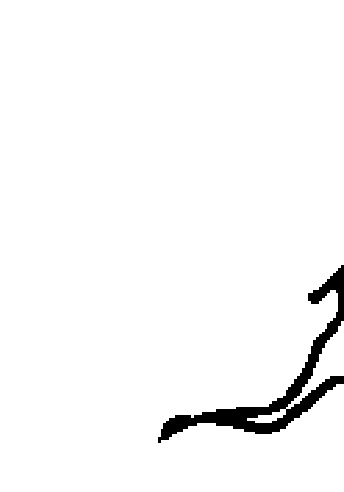

这本书里讲的，就是这样的问题，来自世界各地青少年的问题。你看到的这些答案，都仅仅供你思考。这本书不是要在这里给你什么“答案”；你最不需要的就是由别的什么人来给你“答案”。惟愿这本书能够令你感悟到自己的答案。

一旦感悟到了自己的答案，你内心深处也许不时出现的无助感就烟消云散了。

这本书是一段与神对话的结果。哎呀，好吧，你说你根本不知道到底有没有一个神，更别说什么我们能否与神对话了，是吧？且别管这个；假如你不相信有神，你就把这本书当做一本虚构小说好了，我不介意，它仍然很值得一读。也许这还会是你读过的最好的一本书呢。

我嘛，相信有神，而且我相信神在和我们交流。我自己一直都在与神对话。这些对话是怎么进行的，稍后我会解释；不过现在，请你先假设这样一个可能性：这本书，是你要它进入你的生活的，因为你想要改变你的人生；是你用来改变周边环境与世界的，因为你渴望改变。

还有，千万别以为这本书撞上你纯属碰巧，事实上是你召唤这本书前来的。

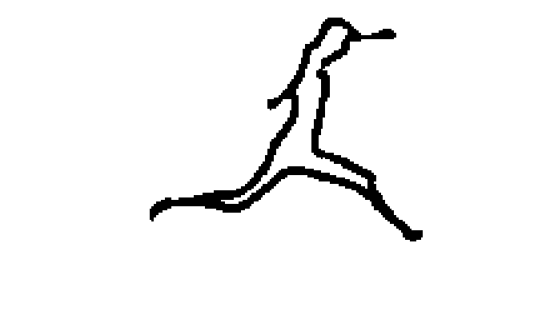

你召唤这本书前来，是因为你觉得这个世界充满荒诞，而且你想要改变它。在你心灵的某个地方，你心灵深处的某个地方，你知道人生可以是怎样的。你知道我们不应该在这里相互伤害。你知道一个人不应该搜罗一切、攫取一切、占有一切，与此同时别人却只拥有那么可怜的一点点。

你知道有权势并不等于有天理。你知道事实的真相才是关键，开放、透明与公平才是关键，而不该是暗度陈仓、暗箱操作、两面三刀地占尽便宜。你知道如果你得到的便宜必须以另外一个人吃的亏为代价，那就根本不是什么便宜。

你知道这些，而且还不止这些。

你知道学校里传授的太多东西都是毫无价值的。那里没有这样的课程：传授该如何共享权利、协同生存、接纳差异，弘扬多元化、不以性为羞耻、透解无条件之爱，等等这样的课程。

那里没有这样的课程：传授什么是可持续发展的生态、对周边负责任的经济、群体意识的觉醒。那里没有这些切合当前实际的课程。为什么就不可以不是单单学习读书、写字、算数，而是通过这些切合实际的课程来学习读、写、算呢？

那当然是可行的了，而且你知道那是可行的。

你知道这些，而且还不止这些。

你知道这个星球上的政治体系一团糟，简直不管用。我们甚至做不到让总统选举的每一张选票都算数；我们甚至找不到一种让选举程序管用的方法，更别提如何让选举之后的政治体系管用了。

你知道这些，而且还不止这些。

你知道虚伪以绝对优势占据了太多人的生活。虽不是所有的人，但却是太多的人。他们说一套做一套，却以为你懵然不觉、漠不关心；他们以为你傻了吧叽的，压根儿看不见这一清二楚的虚伪。

你知道这些，而且还不止这些。

你知道在现实社会里什么能得到表彰、什么会被贬抑，而这些褒贬竟全然黑白颠倒。我们付给纽约扬基棒球队的某个首垒队员年薪3000万，却付给病痛护理、少儿教师，还有抚慰人们心灵伤痛的牧师区区3万年薪而已。你知道这实在非常荒唐。

你知道这些，而且还不止这些。

你知道你身处其中的这个社会，竟然总是以拆了东墙补西墙的方式，去开发各种造成层层新问题的新能源；竟然总是以屠戮来遏制屠戮、以暴力来阻止暴力；竟然总是以正义的名义行非正义之事、以平等的名义行非平等之事、以宽容的名义行非宽容之事；竟然总是打着和平的旗号发动战争、以寻找美好明天为由制造今天的混乱。

你不由得问，这幅现实图景怎么这么不对劲？而且，你知道是什么地方不对劲。你不需要有人来告诉你。你只需要有人出来做些什么，你只需要有人能够做些什么。因为，哪怕到了今天，一切都还似乎这么让人绝望。

为什么一切都似乎这么让人绝望呢？究其根本，因为，每个人都在撒谎，没有谁肯说出真相。

然而，所有这一切，都将改变。

- 就在此地；
- 就在此刻；
- 就从此书开始。

## 第2章

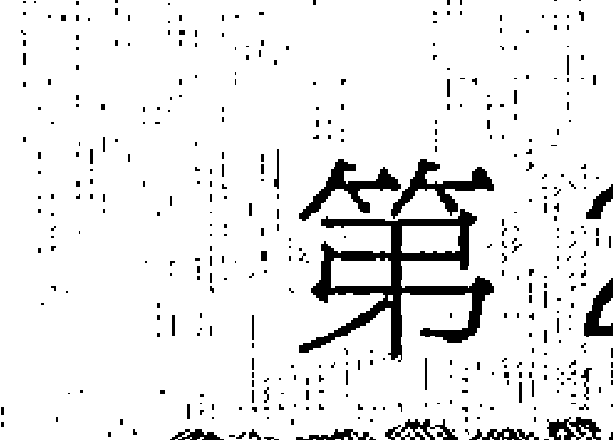

### 讲真话的时刻

你讲真话，所以你酷。

我是说，你不去糊弄你自己，不去糊弄别人。你就是你，而且那就是你；而且假如有谁不喜欢你那样，那就不喜欢好了，你才不会为了诸如此类的理由来改变你自己。我说得对吧？

很好，那就是说，你已经准备好了。能够讲真话的人，都是准备好了能够听真话的人。这非常好，因为这里我们要做一件真的非常有趣的事情，我们要和神展开一场对话。不过，假如你还没有准备好，那我们就得再等等。

呃，对话嘛，那肯定是会继续的，因为你不可能终止这对话。我们任何一个人每一天的每一分钟都在与神对话。与其说能不能展开，不如说你有没有能力去“领会”。你可以接着往下读，但是你领会不了。这道理就和人生中的许多事情一样，你必须先准备好了才行。

当前，这世界上很多事情都已经卡住了，已经卡住半个世纪了。50年以前的老观念，半个世纪以前的老套数，今天仍然随处可见，比比皆是。

他们都没有准备好，我是说那些苟延残喘在这些老旧观念之下死守住不放的人。他们都还没有准备好，既没有准备好去变革，也没有准备好去接受能够创造出变革的新答案——至少是这些新答案的绝大多数。人们大多都还没有准备好。

你，我认为你准备好了。那就让我来解释一下，对话是怎么一回事。

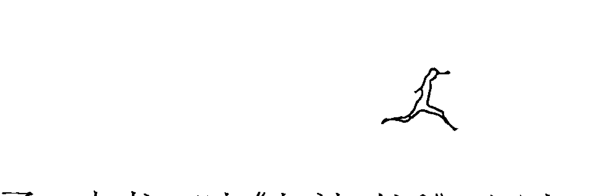

我写了一本书，叫《与神对话》。因为，那时我想要弄明白，为什么我的人生一塌糊涂，为什么我总是在艰难挣扎；我想要知道什么是人生的“游戏规则”，好让我不至于永远一败涂地；而且我还想知道，这一切到底都是为了什么。

结果，我求助的呼唤开启了一场我与神的对话。我把这些心灵的对话写到了纸上。有些人觉得这些对话很有价值，于是它们被翻译成了27种语言。

后来，我的问题层出不穷，我的书也就一本接一本地写。然后就有人说了：“你为什么不去写一本给青少年的书呢？”我说：“我哪儿知道该问些什么问题啊。”他们就说：“你让他们告诉你不就好啦。”

于是我开始去问，跟青少年面对面地问，也利用网络问。我问他们，“假如你可以向神问些问题，你会问些什么？”

我收到了成百上千的问题。这里是其中的一部分：

- 为什么要让小孩子遭受性侵扰、遭到毒打？
- 为什么不是每个人都天生就聪明？
- 为什么这个世界充满了仇恨？
- 代沟是怎么一回事？为什么父母就不能跟我们谈谈？
- 为什么到处都有那么大的压力，父母的压力、学校的压力、周围的人的压力？
- 我的人生受命运的左右吗？
- 为什么学校教给我们的是死知识，而不是如何思考？
- 将来我会回归于你吗？你会喜欢我吗？
- 为什么13岁的我就要付成人票，却又不可以看成人电影？这太愚蠢了。
- 为什么我们上了7个小时的课之后，还要再写3个小时的家庭作业？
- 我新近发现了我的性取向，这让我非常困惑和惊恐。这可让我怎么告诉我爱着的那些人呢？
- 我们为什么要设立些愚蠢的法规？
- 假如说我们是你创造的，那谁又创造了你呢？
- 为什么一个仁慈的神竟是这样一个孤立主义者，而且如此不能容忍其他的观点？为什么一个无限仁慈的神，竟可以为了任何事惩罚任何人？为什么你要诅咒治愈伤痛的神奇能力？为什么你要对一时的错误处以永世的惩罚？
- 为什么我的父母只注意到我做错了的事情？
- 为什么成年人只知道要我们尊重他们，却不知道尊重我们？
- 为什么人会死？为什么我们不能长命百岁？生命死亡之后到底是什么？
- 既然18岁的我可以为国捐躯，为什么就不可以在大热天享受一杯冰啤？
- 我觉得我必须得做一个各方面都成功的人，我的爸爸妈妈想我成功都快想疯了。可是，什么叫做“成功”呢？
- 我不知道我该和哪些人扎堆，是那些“模范生”还是那些“落后生”？为什么要把人这么区分开来？
- 为什么我父母一提到性就好像要了他们的命一样？我的天哪，那真能要了他们的命！

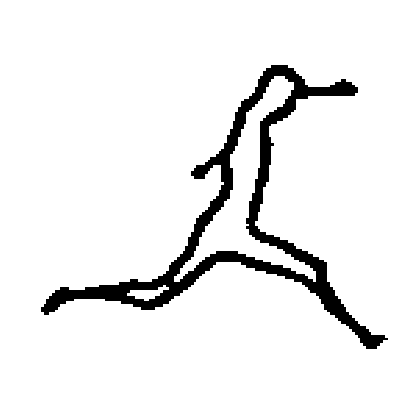

你瞧，这些问题，是不是都问得很好？所有这些问题，我在后面都会一一作答。书中还有很多其他问题，包括怎么和当权人物沟通、怎么选择恰当的职业；还有，毒品、婚姻、同居等；还有，我们体验到的人生是怎么被创造出来的；甚至还包括，神长得什么样，等等。

让我们挑选出一个问题，顺藤摸瓜，这样你就可以看到对话是怎么进行的了；然后我还要向你解释，我是怎么“收到”这些应答的。

下面是一个名叫瓦里妮娅的年轻姑娘给我的问题。

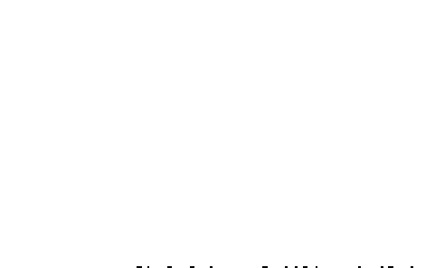

### 你为什么要让小孩子遭受性侵扰、遭到毒打？

噢，瓦里妮娅，我最最可爱的朋友，我明白，你灵魂深处深深地希望，地球上的一切残忍都能够被清除。不只是你，许许多多的人都希望如此，许许多多的人都在为之努力。

这世界上有如此之多的性侵扰，都只因为这世界上有如此之多的性压抑。人类从他们非常幼小的时候就开始一再接受这样的教诲，说他们身体的某些部分很让人羞耻，说他们应该为自己的性特征感到难堪，甚至感到罪恶。这样的结果，你肯定无法相信，就是它导致了千千万万的人都存在着性困扰。

我们马上就会讨论到你可以怎样促使这种局面得到改变，你可以怎样与你周围那些患了这样那样困扰症的人相处。不过，你的问题并没有问我为什么这世界上会有人遭受性侵扰、遭到毒打；你问的是我为什么允许这样的事情存在。而我清楚地意识到，这是两个完全不同的问题。

对，是两个不同的问题。那么，你为什么会允许呢？

你知道，生命是我创造的；而我的做法就是简简单单地把我自己分成无数细小的部分。这其实就是你们所说的，人是“以神的形与象”创造出来的。

好，既然神是缔造者，那就意味着，所有的你们也都是缔造者。你有自由意志，正如我有自由意志。假使我不曾给你自由意志，你则无从创造，而只能对你遇到的一切做机械回应。如果你只能够做我叫你做的事情，那么，你不可能创造，你只能顺从。

顺从毫无创造性。那是一种臣服的行为，而不是一种充满力量的行为。神从不臣服；而你既然是神的一部分，那么你的自然天性，也就是从不臣服。

正是因为如此，一旦别人勒令你从命，你立即就会抗拒。因为那与你的根本天性相违背，与你真正是谁的关键核心彻底冲突。

你们青少年比任何人都更明白这一点。

可是，那些以他们的自由意志去做伤天害理的事情的人，你又怎么说？

是有不少这样的人，而且我当然也可以阻止他们这样做。可是，我不阻止他们，因为人生本就是展现每个人自由意志的历程。任何对自由意志的削减，都不再是生，而是死。

哪怕这种自由意志所表达的并不是最高远的美善，我都必须维护它，否则，所谓的自由就成了莫大的一个嘲讽。

“自由”这个词和“神”这个词是相辅相成的，你不可能只取其一。只要神在，自由必定在。

自由的美好，属于所有的人类，而不仅仅属于少数的几个人。那也就是说，地球上人人都有这份自由去清除性侵扰以及对人身的虐待，从人类的总体体验中将此永远消除。

人人也都有这份自由去消除他们现在忍受着的其他的残忍与苦难。

怎么做？

那正是这本书所要回答的问题。

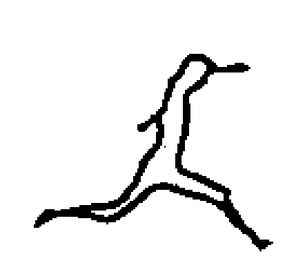

好，这样的对话，你将会看到它们贯穿全书。所有问题的“起始”，也就是一段对话的开端，都来自于你这样的年轻人。有些后续问题是我问的，因为我觉得，先提出过这些问题的人，如果有机会的话，也应该会问这样的后续问题。

要更好地理解这样的“对话”是怎么展开的，你首先应该明白，正如我刚说过的，我们所有的人每天都在与神对话，包括你在内。只不过你不那样认为罢了。

神每时每刻都在和我们所有人说着话。我们从不间断地在整个宇宙空间之内相互交流着。生活就是绵延不断地对生谈论着活；生活一直向我们传递着各种信息。

真正的智慧，也许来自于你街边遇到的某个朋友的话语；来自于你收音机里听到的下一首歌的歌词；来自于下一个转角边广告牌上的字，蓦然映入你眼帘，大得有如人生；来自于你听到的你头脑深处的耳语……也或许，来自于这本书——多么“凑巧”地落到你手里来的这本书。

好，现在请把上面那段话里“真正的智慧”这个词换成“神”，你就会明白，你与神的对话是怎么展开的了。神自始至终从来就没有停止过对人类的启迪；而且，神是通过各种不断传递给我们的信息来启迪我们的，比如，意念、思想、歌词或是书中的某个字句……你不妨接着说下去。

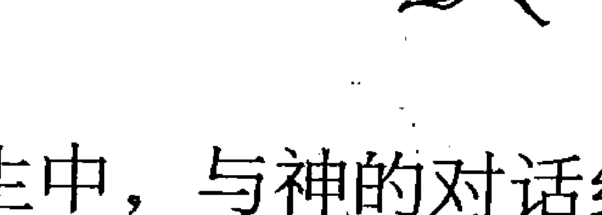

在我自己的人生中，与神的对话经常以充满我头脑的各种想法为形式进行着；尤其是当我问些很认真的问题的时候，而且是我愿意真正静下心来聆听神的回答的时候。神对我“说话”的声音，和任何人的声音都不一样。我把它称之为“无声的声音”，某种好像是你自己想法的声音。

你也许会说，“得了，那本来就是你自己的想法嘛！你凭什么认为这就是神的声音呢？”这个问题问得有道理。当初我也这么问过，神是这么回答我的：

> 尼尔，假如我要跟你交流的话，除此之外我还应该怎么做？“把思绪灌进你脑瓜子里”是不是最有效的做法之一？

> 当托马斯·阿奎纳①从他“脑瓜子里”捕捉到他的理论时，他不是说他“得到了神的启示”吗？

> 当阿玛多伊斯·莫扎特②从他“脑瓜子里”捕捉到他的音乐时，他不是说他“得到了神的启示”吗？

> 当托马斯·杰斐逊③从他“脑瓜子里”捕捉到“自由”二字时，他不是说他“得到了神的启示”吗？他不是在独立宣言中写下了“一个民族，在神之下”的话语吗？

> 你觉得，我要和人进行沟通，假如不是将我的信息放进他“脑瓜子里”，那我该怎么做啊？你是不是以为我该身着白色长袍，手持一个卷轴，现身在他家门廊前？你是不是以为我应该腾云驾雾飘到他的床头，呼地一下把我的智慧洒向空中？那样你就会更信服了吗？

> 越不可思议的东西，就越可信？你就是这样想的吗？

> 且让我来告诉你，我走向你的方式，是最可信的方式。

> 我这么做有个很好的理由，那就是我希望你能相信。可是仍然，你还是不相信我。

+ ① Thomas Aquinas, 意大利中世纪神学家和经院学家
+ ② Amadeus Mozart, 世界闻名的大音乐家
+ ③ Thomas Jefferson, 美国独立宣言起草人

——译者注

对大多数人来说，让神现身的最可信的做法，就是像个幽灵一样，着长袍，握卷轴。不错，我是那么做过。可是你难道以为我就那么点儿本事吗？

我常常，很经常，以一种更加自然的、更生活化的方式与人交流。那可能是以一种想法、以一种感觉、以一种启迪的形式进行，正如我现在走向你的方式，就是通过你现在心里的感受，通过你看到的听到的这些文字这些段落，走向你。

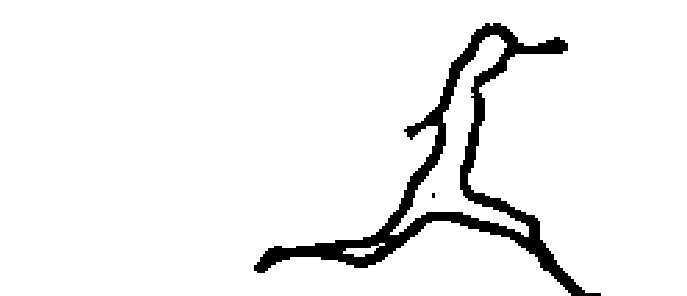

上面这些，就是当时浮现在我脑海中的语句，也就是我与神对话得以展开的方式。

好，现在，假如我告诉你说，我当初对着每个问题苦苦思索好几个小时，冥思、默祷、凝神不动，一直到我觉得灵光穿入我脑海，带着神力从我的指尖滚涌而出，这样的话，你是不是会觉得更像那么回事？可是，事实上，我只是把我脑海中最先浮现出的东西写下来，不加修改、剪辑、润色、修缮。我所做的只不过是把我“听到”的写下来而已，就跟听写一模一样。

自从我因为自己的人生一塌糊涂而祈求神的帮助以来，我已经这么“听写”了十多年了。最后的这一本书，纯粹是为了你，纯粹是为了你们青少年。这不仅是因为有人这么提议了，而且还因为我收到的来自世界各地的数以百计的年轻人的信，他们告诉我他们怎样因为我最初的几本《与神对话》而深感震撼，而且向我提出更多的问题！

有些提问的年轻人同意我用他们的真名实姓，有些则说不可以。所以我干脆全部使用统一格式，只写名不写姓，外加上年龄；如果他们同意的话再加上城市名，甚至有时按他们的意愿写上“佚名”。

这么连续两年和你这样的年轻人不断交谈并收集问题之后，我邀请了一个和你一样的年轻人做我的助手，帮我把这些东西分门别类，方便我按一定的顺序展开。

有几个问题我把应答寄给了提问的年轻人，看他们有什么反馈或者更进一步的问题。还有，前面我提到，有时我也会加上些我的提问，因为我觉得，那个提问的人如果能够在这里一问一答地让对话进行下去的话，他们应该会接着那么问。还有些问题，则是我想问的，也一并放在了这里。由此，我把我们大家的声音融合在了一起，构成了一部对话。

我收到的应答，有时候是直接给我的，有时候则是直接给了提问的人。我相信有些还会是直接给你的，正在读着这本书的你。

这恰恰是最令我振奋的地方；而且，我的第六感告诉我，你一边读，很可能一边会有什么奇迹出现。

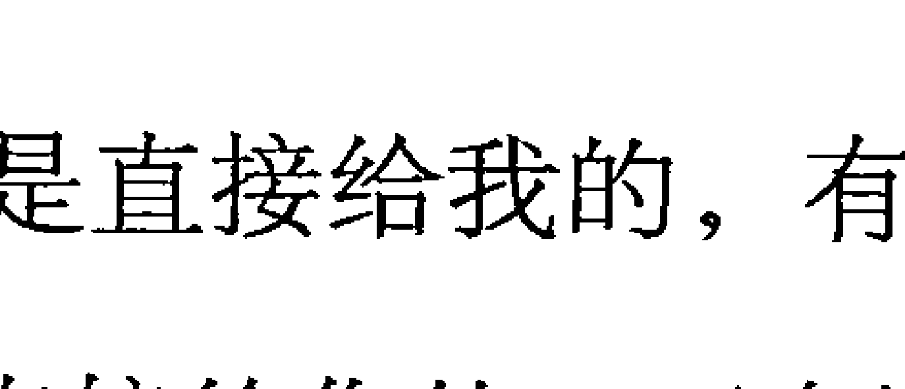

这些问与答给你的第一感觉，可能会是（a）以为然；（b）不以为然。为然；(c) 介乎两者之间。在这第一感觉之后，奇迹就可能出现。每当书中的应答让你注意到你的想法和你的感受时，那就是奇迹的呈现；你将由此而触及你自己的内在智慧。而这，正是每一番畅谈的美妙与神奇之所在；也正是你与神对话的全部意义之所在。

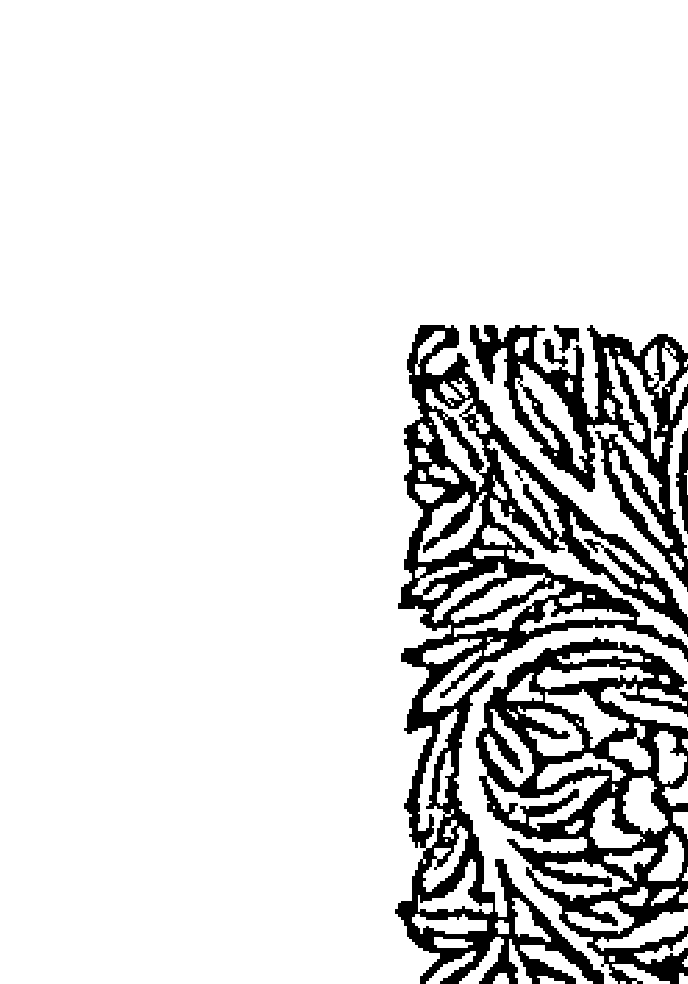

## 第 3 章

### 改天换地的人

你们对什么都充满向往，对什么都充满好奇，心里有层出不穷的问题。不少成年人喜欢你们这样，不过也有很多人不喜欢，而且这样的人还非常多。他们让自己走进了某种宗教，或者某种哲学，或者某种政治，或者三者兼而有之，然后他们就不再问任何问题了。他们以为，他们已经得到所有答案了。

其实不然。当今世界这个样子，并不像是有任何问题得到了任何合理答案的样子。可是这世界上的绝大多数人却听不得这句话。但是我认为，你们，你，听得了这句话。这并不等于你更了不起，但这使得你与众不同。与众不同并不等于更了不起，不同就是不同而已。

明白这其间的不同，对你来说，非常重要。

同样非常重要的是，你要明白，正因为你的与众不同，你才能使事情变得不同。

看，你们就站在这临界线上，站在这最前沿的地方。但是，你一定要知道，我也一定会告诉你，假如你仅仅为了与众不同而刻意想表现得与众不同，那不过是小孩子的把戏而已；假如你的与众不同会让事情变得与众不同，那才真正是另外一回事。这才是那些要让自己的人生能更有意义的人所做的事；而且，不是在别人的眼里看来更有意义（你现在已经知道，这实在没什么意义），而是在你自己的眼里看来更有意义。

的确有这样一些人，用他们的人生给这个星球带来了真正的不同，而且，这些人最终也确实能真正改变这个世界。

他们不见得要成为影响整个地球的世界级领袖才能带来改变（当然有些人会这样）；他们也不见得要站出来振臂高呼“跟我来”才能促成改变（当然有些人会这样）；他们也不见得要写出最畅销的书、拍出最有震撼力的电影、唱出最感人至深的歌才能推动改变（当然有些人会这样）。

他们往往是悄无声息地改变着世界，默默无闻，不为众人所知。然而，那些在人生旅途之中与他们相遇的人，却会永远记住他们。他们无非是以他们的不同而带来改变。做与众不同的人、做与众不同的事、做一个不同的鼓手。他们对世界的改变就在于他们活得与众不同，仿佛他们有不同的准则。

这正是与众不同的真正含义：不是为了与众不同，而是为了让事情变得不同。

# 与神对话：献给青少年

现在，也许有人会说，“这又能带来什么不同呢？什么都没有改变！”啊，那些这么说话的人，其实不知道我们每个人真的可以走不同的人生道路，这个世界真的可以整个改变。现在恰恰就有这样的人，而且大多数就是年青人，正在令他们群体意识的声音越来越响。有些人大张旗鼓地做着，有些人细雨无声地做着；且不论他们怎么做，他们都正在这么作着。

这就是那些改天换地的人。这就是他们所选择的人生，这就是他们所真正是的人。如果他们走进屋里来，一切会随之出现变化，变得更加明亮，让人觉得不同以往，霎时间，一切是那么美好。这整个世界，仿佛就在那一瞬间，变得更加可爱。

你知道我们说的是些什么样的人，而且，你完全可以成为一个这样的人。你现在就可以让人们知道，你是这样一个人，你或许已经是这些改天换地中的一员。问题不在于你是不是这其中的一员，而在于你下一步想要改变的是什么。

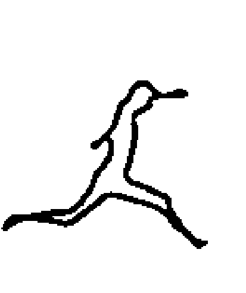

正是这一切，引导着你走进这本书。我已经说过了，这本书，是你招致前来的。它也许经过一些曲折迂回才落到你手里；但是，那并不意味着你没有主动召唤这本书。相信我，在某种层次上，你肯定这么做了，不然这本书不会这么捧在你手上。或许只是你的潜意识，但这本书肯定是你召唤而来的。

为什么？因为你想要改变，你现在就想要改变。不是明年；不是将来；不是“等明天”的某天；而是，现在。因为，你已经准备好了。

此时，此刻，此地，你已经准备好了，去体验你内在的智慧，你内里的勇气，你内心的真实。你渴望把这真实付诸你的人生。你希望这整个世界展现它最真实的真实，因为你知道，人活着，肯定不该就这么活着。你清清楚楚地知道这一点。

刚才我说过，很多人不愿意去寻找新的人生答案，不愿意去创造新的改变。不是现在，也不是将来。他们没有这个意愿去看看事情究竟是怎么回事，更没有意愿去看看事情可以变成什么样子。

他们还没有准备好。

而你，已经准备好了。如果你已经读到了这里，那么，你绝对已经准备好了。

## 第4章

### 对话开始

我犹豫着不知该从哪里开始这场对话，却正巧在此刻想起来一组问题。那是一组我走到哪里都会遇到的，以这样或者那样的形式，被问过无数次的相同的问题。这些问题，应该是人们最渴望得到回答的问题。我于是就从这些问题入手，然后依照我思绪中最先跳出来的字句，把它们一一敲入电脑。我相信那肯定是神启发了我应答的思路，启发了我针对这本书中所有问题的应答。这就让对话开始吧……

为什么这世界到了这步田地？为什么我们无法阻止屠戮和苦难？为什么我们找不到一条和平相处的道路，人与人之间竟然不能彼此友善、彼此相爱？难道这世界就只能这么继续下去吗？难道就没有谁能做些什么来改变这世界了吗？既然反正都无可救药了，我是否该干脆放弃希望，破罐破摔，不再做任何努力了？

好吧，神，假如真的有神的话，你怎么说？

我非常欣慰你问到这些问题。好问题。一连串的好问题。这是一个很好的对话的开端。

不过首先，我要谢谢你前来参加这场对话；谢谢你给我一个机会，以这样的方式和你交谈。尽管我从来没有停止过与你的交谈（这你可能知道，也可能不知道），但是，以这样的方式进行，这还是第一次。所以，我很高兴我们之间能有这样的直线交流。

哦，对了，顺便说一句，这世上真的有神，我真的存在。

后面我们也会好好谈谈这个话题；不过现在，我不想放下你提出的这些问题。这些开篇提问，个个都非常重要。

这世界之所以到了现在这步田地，是因为人类把它造成了这个样子。这世界并非只能这样继续下去，但它只能是你们的每个观念在现实生活中的具体反映。人类的总体意识，以及其流传至今的各种观念，都反映到了你生活于其中的这个世界里。

你们人类之所以无法阻止屠杀和苦难，是因为你们人类的心态。你们有这份屠杀的心，有这份受难的心。

# 与神对话：献给青少年

你们的祖先相信，用屠杀来解决纠纷、来攫取他们认为应该的或者必须有的东西，是正当的。

他们还相信，受苦受难是人生常态之一。有些人甚至还相信，遭受苦难是应神的旨意。

当代人类所体验到的一切，恰恰正是出于这些观念。你们的祖先所创造出的属于他们的，以及你们的，每一天的现实，恰恰正是出于对生活这样的领会。

你们能够找到一条和平相处的道路，人与人之间能够彼此友善、彼此相爱；但是，要做到此，需要你们甩掉那些旧观念；而这，却又恰是你们的祖先所不愿意做的事情。

不要放弃希望，不要放弃改变这世界的努力，除非你对这世界的现状感到心安理得。要改变这个世界，或者说要改变每件事，你只需要一个理由，那就是，表明你究竟是谁。

这，正是整个人生的目的。

> 人生的目的什么？我怎么听不懂。你说的是些什么？人生的意义是什么？这样的人生又是为了什么？人为什么要活着？
> —— 阿德里娅，18岁

人生的意义，在于提供一种方式，让那一切之一切（也就是你们所说的“神”），得以亲身实践自己。

换句话说，人生，就是神对自己的体验。

如果说这样的人生，我们所生存的这地球上的人生，这充满了屠杀与苦难、贪婪与自私的人生，竟然是“神对自己的体验”，那么，我根本不想和这样的神打交道。

这我很理解，因为，你现在还没有看到那礼物。

什么礼物？

我赋予人类的礼物。

你居然把我们这样的生活称之为“礼物”？

正是，因为你们得到的，正是你们想要的。你们从来都是让事情按你们的意愿走。

切，那才不是我们绝大多数青少年的感受。实话告诉你，我没见过任何一个同龄人有过那样的感受。

绝大多数青少年所向往的人生不是这样的人生，不错，那是因为你们并不是这世界上最有力量的人；而你们的世界又正由你们人类当今最有力量的人创造着。这些人中的绝大多数，是你们上一代的人。不是你们上一代的所有的人，而是他们当中的极少数人。

就是，就是！这才是问题所在！

一旦你们全体人类都决定不能让这世界这样继续下去时，这世界就不会再这样继续下去了。

哈，说得好啊，我们年青人要把全世界夺过来。
年青人并不会把这世界夺过来。而且，你其实并不愿意他们把世界夺过来。要把这世界变成你们所希望的样子，一个集所有不同观点之大成的、一个汇聚所有不同经历之人为一体的、一个让每个人都能快乐而兴奋地共创一个全体人类从任何不同角度都能认同的世界，那需要所有各个不同年龄的人的综合智慧。

所以，年青人不会把这世界夺过来。但是，随着时光的推移，你们所有年青人，都将会针对你们的人生和未来有越来越多的发言权，如果你们决定要这么去做的话。

说得轻巧。

我说的是实话。之所以极少数人能够控制着绝大多数人的生活，是因为这绝大多数人甘愿被这样对待。

不愿意又怎么能招架得住他们呢？他们虽然是少数，可是，你刚才不也说了吗，他们才是最有力量的人。

力量，只能给而不能拿。没人能从别人手里攫取到力量。而那些把自己的力量拱手交给别人的人，却以为他们自己没有力量。可叹的是，他们没有力量的原因，恰恰在于他们把自己的力量拱手交给了别人。事实是，他们有力量，只不过他们不想要而已。

哈，就是啊，年青人有他们想要拥有的一切力量，只不过他们不想要这力量而已，高论呀。

真是如此，你不妨想想看，你父母所拥有的凌驾于你的力量，恰是你自己拱手交给他们的。如果你不肯交出去，他们就没这力量。假如你就是不想去做他们要你做的事情，他们真的只能干瞪眼。

你们年青人之所以要把自己的力量拱手交给父母，那是因为父母手里握着你们需要的东西。比如说，从父母之爱，到你的衣食住行，还有你给自己买东西的钱，甚至你想要开一部车，等等。

一旦你不再想要、不再需要你父母手里握着的那些东西，他们就失去了对你的全盘掌控。相反，如果你需要，倒是可以利用你的行动（这里指你顺从父母）来换取你想要的东西。这就是行使你力量的一个实践。

这听起来像是操纵别人。

如果是暗地里这么做，那就叫操纵。但是如果反之，你公开而诚恳地让每个人都了解你的意图，而且你也了解每个人的意图，那就不叫操纵。这时，你们心意相通，目标一致，根本就没有操纵存在的余地。

瞧，我们得出一个结论。你，就是一个有力量的人。

我真的从来没有这么想过。

这正是你为什么会把自己带到这本书里来的原因，因为你已经准备好了，我们在这里将要展开的对话，会使你 看穿许多迷雾，探明许多秘密。

那么，这里你所要说是，那些受压迫的人其实并不真正是受 压迫者？他们其实也是“有力量”的人？

我要说的是，某些时候他们想要得到某种东西，于是 他们就用自己的力量做了笔交易，换取那些东西。

也许，按他们的想法，那些现在压迫着他们的人，能给 予他们一个安全的或者是更好的生活。所以，这些“受压迫” 者们绝大多数对自己的力量视而不见。他们也许以为，假如 他们不是这么视而不见，而是胆敢起来抗议甚至反抗的 话，就可能赔上性命。既然他们想要的是“活着”，则 不论那是什么样的生存环境，他们毕竟得到了他们想 要的。

那就是真正的力量。真正的力量能够使你得到你想要 得到的。

嚯，多有道理啊，当惟一剩下的其他选项是死路一条时，你可 以得到你“想要的”，只不过就是闭上你的嘴而已。啧啧，高见啊！ 我说老兄，你看待问题的眼光还真够可以的哈。

且慢！你们当中还真有人做出过不同的选择。历史上 各个时期的各个民族，都曾有勇敢的人做出过不同的选择。 正因为如此，那些为换取他人自由而奋斗、牺牲的人，才 永远受到人们的崇敬。

当年那些为创立美利坚合众国而努力奋斗的人，那些为了获得自由而离弃他们认为是暴政的大不列颠人，曾经甘愿失去一切，不是吗？

《独立宣言》的讴歌者们曾经誓言，为了追求自由，他们不惜牺牲自己的“生命、财富，还有他们神圣的荣耀”，而他们真的做到了。

美国的建国之父们说过，“不自由，毋宁死”，而他们信守了诺言。

面对这样的勇气，压迫者就失去了力量。就在这样的宣言诞生的那一刻，人们立即清楚地看到真正的力量在哪里，而且从来就在那里。

整个人类历史一再证明着这一点。一旦那些受压迫者认定他们换取的生活不是更好，而是毫不值得，他们就会收回他们的力量，撤销压迫者对他们的管制。那貌似很有力量的管制于是忽然坍塌，软弱地哑巴着，面对自己的倒台束手无策。

这些不仅发生在当年的英属殖民地，也就是当今的美国土地之上，而且遍及全世界。

任何时候只要人们站出来说“到此为止，决不再退让”，压迫就会退让。任何时候只要人们还没有聚集起足够强烈的意愿和力量站出来反抗，压迫就会继续。

在你的家里，也是如此。在你的人生中，也是如此。一旦你决定，你不愿再用你的力量换取你要的东西，你就能收回你的力量并得到你所想要得到的。

# 与神对话：献给青少年

你收回的，是你与生俱来的力量。这就叫做你的原生力量，是你真正的核心本质。

这，就是我所说的，礼物。

什么？“原生力量”？

对。

我们谁都具备？

对。

连小婴儿也一样？

对，只不过他们自己不知道。他们不记得。绝大多数人想不起来，哪怕长大些也想不起来，哪怕长大成人了也仍然想不起来。他们生活在医学上称之为记忆缺失的状态中，完全不记得他们其实拥有这原生力量。

这是什么力量？我们可以用来做什么？

这是神的力量，是我的力量。这就是我是谁，这就是我是什么。不是有人告诉过你吗？你是按照“神的形与象”创造出来的。

不错，我是这么听说过。

可是你们绝大多数人不知道这句话是什么意思。你们以为你们生于“原罪”，而且你们还真的相信。我现在要告诉你，你是生于原生力量。

我们可以怎么运用这力量？你还没回答我呢，这力量可以用来做什么？

创造。

创造？

创造。原生力量是创造的力量。

创造什么？

一切你愿意创造的。一切你选择创造的。

是哦是哦。

真是这样。这力量不仅仅是你所拥有的，而且还是你本身所是的。你有创造的力量，你是创造的力量。如果你明白了这一点，你的整个人生将为之而改变。

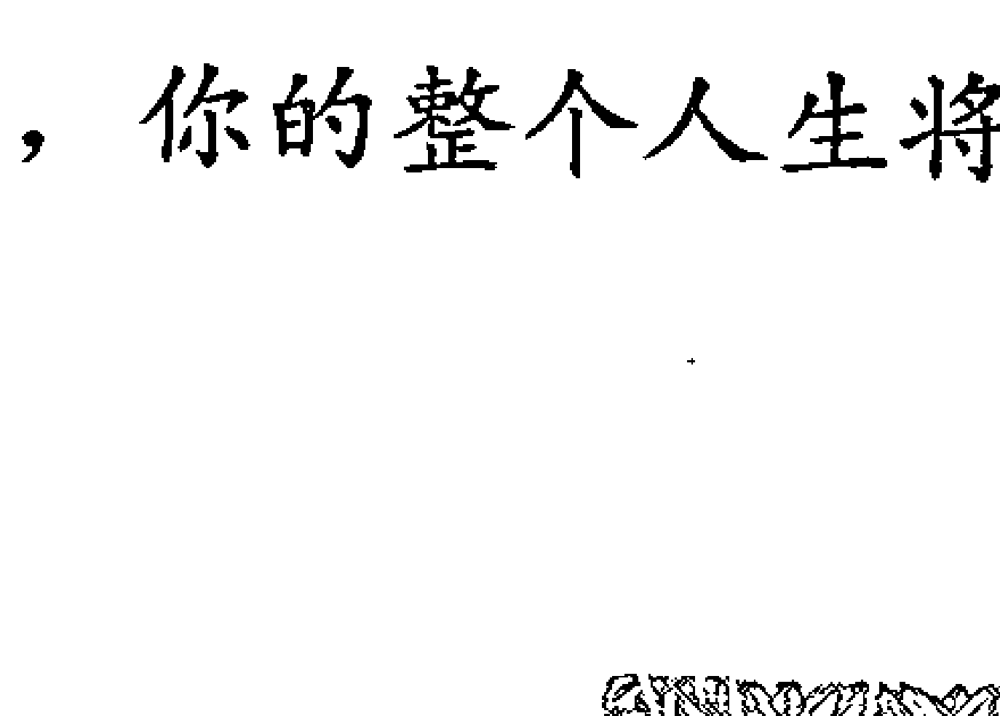

## 第5章

### 当今世界

假如我们都有这原生力量，那该怎么用？为什么没有多少人运用这力量？

我们先来谈谈你的第二个问题，人们之所以不用这种力量，
是因为他们不知道自己拥有这种力量。他们相信面对生活他们
无能为力；然而，一旦他们相信什么，他们就会体验到什么。

其实第二个问题的答案，已经回答了你的第一个问题，“他
们相信什么，他们就会体验到什么”，原生力量就是这样运用的。

随便什么，只要我们相信，我们就能体验得到？

正是如此。

我才不信。

正因如此，你当然就体验不到。何止是你，整个世界都是这样。几乎这地球上所有的人都否认他们自己拥有的力量，不相信自己拥有这种力量，于是这个世界就成了现在这个样子。

说到关于这个世界的一切是怎么一回事，我们有很多很多的问题想问。我们能从这些问题开始吗？

当然了，请。

好，问题来了。需要什么先后顺序吗？

不必。

> > 为什么不是每个人生来都聪明？ ——丹尼

丹尼，我想告诉你一个重大秘密：每个人生来都“聪明”。每一个人来到这人世间时，就已经知道了要完成这次人生之旅所需要知道的一切。只不过每个人的使命都不一样。

有些灵魂来到人间是为了做这件事，有些是为了做那件事，于是，看上去好像一些人在某些学术领域要更“聪明”更“醒目”些，另一些人则在其他方面更突出些，甚至还有些人是身具多种秉赋。

每个来到世间的人，都带着恰好足以天衣无缝地成就他之为他的秉赋。所以，你什么都不需要学，你只需要记起你已经知道了的一切。

任何小婴儿都不需要别人教他怎么去信任；任何小孩子都不需要别人教他怎么去爱。对于新生儿来说，这些东西与生俱来。他们带着这一知晓来到人间。

人生的历程，不是一个发现的历程，而是一个创造的历程。你并不是在认识你是谁，你是在创造你是谁。而这创造的过程，就是一方面记起你本来就知道的一切，另一方面不断选择你当下愿意怎么体验自己的过程。

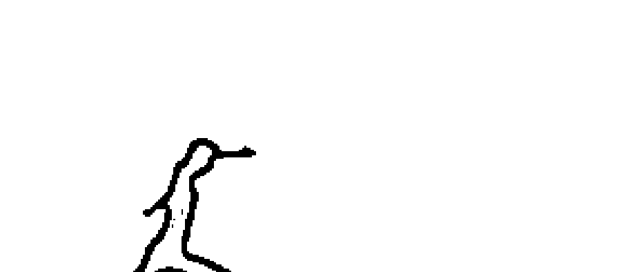

### 这世界为何充满仇恨？——迈阿密，丹尼，19岁

人们相互仇恨，是因为他们针对彼此的看法有问题。他们针对生命、针对生活的看法也都有问题。

这些看法已经变成了“信念”，而信念赋予他们强大的力量。你知道的，丹尼，你相信什么，你就体验到什么。

### 为什么？

因为我赋予你们的力量就是这样运作的。那是你创造的力量，那是你的原生力量。这力量你与生俱来，这力量就是你本身。

这创造的力量你将运用在三个层面上：

- 你之所思；
- 你之所言；
- 你之所为。

### “信念”属于“思”的层面？

正是如此，所以信念的背后就是创造的力量。你想的是什么，你说的是什么，你做的是什么，你就变成什么。

而这正是当今世界为何变成现在这个样子的原因。

你以为我们相信这世界就该是这个样子吗？恰恰相反，我周围的人没有谁相信这世界就该是现在这副德性。

问题不在于你个人以及你朋友的信念，而在于那些现在控制着地球的那些人的信念及其深远得多的整个信念体系。

### 你这是什么意思？

我前面说过，地球上人类的生活方式的形成基于绝大多数人相信生活就应该是这样。事实上生活大可不必是这个样子，可他们却相信就应该这样。整个人类的信念体系基于人们对生活的一整套理解；而实际上，那却是一整套的误解。

一旦这些信念发生改变，这个世界就会变得不同。

> > 为什么那么多的人一无所有，没吃、没穿、没有家？为什么你要把人置于那种境地？
> 
> ——佐尔

这恰是针对我刚刚说过的话的一个非常好的例子。我从不置人于那种境地，佐尔，而是你们自己，你们当中那些相信东西会“不足够”的人。

那些人相信，这世上没有足够的钱，没有足够的食物，没有足够的衣物，没有足够的遮风避雨之所。实际上，那些人相信，这世上没有任何“生活所需”能足够供所有人生活，更何况是快乐地生活。

既然他们这样相信，他们就以为他们必须去相互争夺这世上的“不足夠的生活所需”。

这个不足夠的幻象，是人类几大幻象之一。你们的诸多抉择与行为，都基于这一幻象。

一旦人们真地相信，你们需要维持生存（远谈不上快乐生活）所必不可少的那些东西“不足夠”，你们就会哪怕打得头破血流也要去争夺，尽可能多地争夺。人类已经这么相互争夺了数千年了。

于是你们把一切都变成了相互争夺。你们的经济体系充满争夺，谁赢谁有钱;你们的政治体系充满争夺，谁赢谁称霸;你们的宗教体系充满争夺，谁赢谁博得上天最大的庇护。

甚至还有一些人以为天堂里的位置也不足夠，所以他们争先恐后抢入天堂！

所有这一切，都实在太荒诞。这世上从来就有足够的资源，完全能够提供所有人类的所有需要。但是，人们大多并不知道这一点，所以毫不留情地相互争夺，甚至为了所谓的不足夠的资源而相互残杀。

要想一切都足够，要想每个人都能吃得饱、穿得暖、居得所，佐尔，那只需要地球上的人能够有苦同当、有福同享。一旦他们肯那么做，他们就会发现其实地球资源足够让所有人快乐生活还绰绰有余。

你可以帮助世人明白这一点。不过这需要你自己先走出这幻象，拒绝接纳“不足够”的观念，用你自己的行为让周围的每一个人看看真相到底是什么。

只要你去分享，慷慨地分享，比你以为你必须给出的还要多地给予，然后你就会发现居然“自其来处尚有更多”。

> > 眼看着你的孩子无所作为，还要毁掉（或者不爱惜）你给我们的一切，那是种什么感觉？
>
> ——阿里尔

假如我指望着投资回报，你肯定会觉得，那结果会让我感到十分郁闷。可是，我并没有指望我和你们的共同探险需要有什么投资回报。我不需要有什么“该当如何”的结果。

假如我真想要事情有某种结局的话，你觉得我就不能随心所欲吗？我要是连这都不能，那我还是个什么神啊？

我创造生命，并非要“随我所欲”；我创造生命，是要让你按照你的意愿来创造属于你自己的人生。通过你的创造历程，我的确就遂了我的意愿；因为，我想要的，就是由你来决定，你，作为独立个体以及社会一员，来决定你是谁，你是什么；你愿意是谁，你愿意是什么。

我看到的不但是那么多的人“无所作为，还要毁掉（或者不爱惜）”他们所拥有的那许许多多，而且还看到他们这么做的结果对他们并没有什么帮助。这结果并不可能让他们体验到他们口中所说的他们愿意体验到的东西。

他们说他们要去西雅图①，可是他们却朝着圣何塞②走。他们说他们想要一个和平的、融洽的、充满爱的世界，说他们愿意生活中充满喜悦、快乐和富足，可是他们做的一切却都与和平、融洽和爱背道而驰，这些都让他们根本不可能体验到喜悦、快乐和富足。

有意思的是，他们这么做并不是因为他们不知道该怎么做。我给了人类所需的一切工具去创造，去按照他们最高远最美好的梦想创造他们的人生。可是，他们偏偏选择不用这些工具。

为什么？

因为他们不相信这些工具能有用；要么因为他们根本不记得他们手上有这些工具，要么因为——我们已经谈论过的了——他们就是或多或少想要让事情保持现在的样子。

我越听越糊涂。你说谁想要事情保持现在的样子？

那些相信你们地球上现有生活方式就是为了能生存下去所必需的人。那些生活的基本信条是依照我上面提到的一整套误解而构架起来的人。

你能再给我举一个例子吗？

行啊，比方说，除了上面我们说到的不足幻象之外，还有一个分离幻象。

绝大多数人都相信他们之间是彼此分离的，而不是一个整体的一部分。他们相信他们与他们生活的环境是互不相干的，而不是一个大体系中的不同部分。他们还相信他们与神之间井水不犯河水，而不是整个“大一统”的一部分。

这个分离幻象正扼杀着他们，也扼杀着你。

> 说到这里，我想问一下，这世界什么时候走向灭亡？
——佛罗里达州，迈阿密市，莱昂特

问题不在于这世界是否会走向灭亡，而在于这世界正变得越来越不适合人类居住。而这，莱昂特，是两个完全不同的概念。

如果事情照现在的样子继续下去，这世界，“如你所知”①，可能会在你有生之年消失掉。但是，地球会继续转下去。

地球没有任何理由不能继续存在千百万年。它已经存在了那么久，而且它有能耐轻易继续存在更长的时间。

所以，问题不在于这地球能存在多久，而在于你们人类如此对待它，它还能适合你们人类生存多久。这才真正是一个问题；而答案，在你手里。

这是一个你必须现在就要做出决定的事情。事实上，你每天都在通过你的行动，做出你的决定。

你们中的许多人假装不知道你们的行为导致着环境的不断恶化与衰败；要么就以为最终你们的小聪明能够抵挡得住由你们造成的不断恶化与衰败。

这些都是幻象。也许你愿意去勘查一下，看看是否走出这幻象，创造一个新的文化风气，才会是真正有益于你们的事情。

> > 为什么这世界如此黑白颠倒？难道只有我们青少年才知道什么是真正重要的，知道什么“赚大钱”啦、“向上爬”啦、“出名”啦之类的事情都是次要的？
> ——威斯康辛州，西埃和斯市，尼尔，16岁

依照你们人类自己所说的什么是你们向往体验到的生活，有时候的确是看上去是年青人远比年长的人更能明白，什么才是真正重要的事情。

年长的人往往会说一套做一套。他们一方面说想要生活得长久、健康、快乐；另一方面他们却要去抽烟酗酒，给自己施加极其沉重的压力，去博取并积攒在年青人看来没什么意义的东西。

这种逼迫自己去“出人头地”或者“立于不败之地”的行为，其实是源于恐惧，而你们年青人很少会有这种情绪。这恐惧，理所当然，来自于我前面说到过的“不足够幻象”。

这种恐惧是如此透彻地浸蚀人心，以至于它已经变成了人们时时处处都能体验到的真实感受。换句话说，它已经不单单存在于人们的“思维”之中，而是已经存在于人们实实在在的真实生活之中。

这一“真实”反过来又“印证”了它的思维源，从而形成了一个恶性循环。思维先于结果，又导致结果。结果印证思维，并强化思维。思维又创造出更进一步的结果，结果又创造出更进一步的思维，思维又创造出更更进一步的结果……很快，这个循环圈就像一个陀螺一样在幻象中旋转，形成一个“爱丽丝梦游仙境”般的迷幻世界，人人都发誓说真的东西不是“真”的，假的东西才是“真”的。

“名望与财富”①并不真的是人生所有幸福快乐的源泉，那些比你们年长的人也说他们知道，可是他们的所作所为却正是把那当成了真正的源泉。他们说一套，做一套。

你们年青人没有这些东西。你们知道什么是真的，你们不需要金钱和物质财富上的成就，没有不断“步步高升”②的渴望。

> > 我爸肯定会说：“你呀，再等个几年就知道了。现在嘴上说说容易，但是，等你真到了要自己养活自己的那一天，你就知道了，还别说养活老婆孩子。你以为我是怎么给你弄到这片屋瓦、这身衣装的？该清醒了，我的孩子！”

你应该对你自己负责任，你爸爸说的就是这个意思。他只想要你能生活得快乐，只希望你能够自己照顾好自己，照顾好你所爱的人，所以，他的动机是诚挚的、实在的，是基于对你的爱。

但是，通往快乐的道路不止一条，照顾好你自己的道路不止一条，好好爱护你亲人们的道路，也不止一条。

当今世界面对这些生活挑战的方式，是延续了数千年的传统方式。这样的方式基于当前人们手上掌握的关于生活、关于人生的数据。我这里要提供的是一套新数据，而且是可以证明有助于人类的数据。

这是一套关于真实现实、关于到底什么是真正的“真实”的新数据。这是一套关于你的人生、关于你的真实现实是如何创造出来的新数据。这是一套关于你、关于你究竟是谁的新数据。

这就是我们这场对话的目的。年青一代如今正面临着比以往任何时候都更大的压力，迫使你们以某种特定的方式向社会表现，你们因此在两套不同数据的运作下努力着：一套是上一代的人给你们的数据，一套是你们自己心底里的数据。

太对了！简直精辟极了！你实在是一语中的！

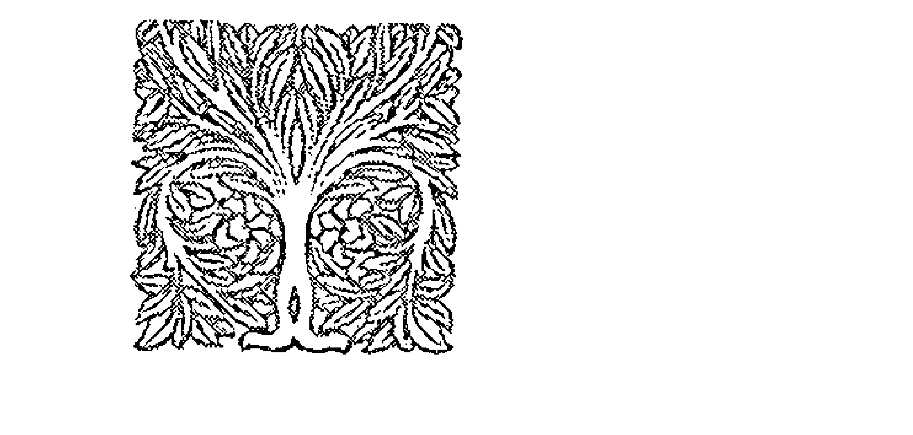

### 年青人的压力

> 为什么不论是父母、学校，还是我周围的人，都要给我们这么多的压力？——俄勒冈州，15岁男

压力是人生的一个必要条件；不过我相信，你们在青少年阶段感受到的压力，也许比你们一生中的任何其他阶段都要多。

生活之中总会有人想要从你那里得到什么。如果他们想要从你那里得到的东西比你愿意给出的要更多，或者要求你做得比你能够做到的要更快，你就会感受到压力。哪怕他们想要的恰好和你想要的一模一样，你也仍然会因为你对自己要言必信行必果的要求，而感受到来自你自己的压力。

所以，毫无疑问，压力是你们年青人人生的一部分。而且，它还能够成为一个有益的部分。压力不见得只能是你的烦恼，它还可以是你的造化；压力不见得只能起负面作用，它还可以起正面作用。

能让你的车胎不停滚动的，正是压力；能让高压锅烹调膳食的，也是压力。

所以，压力可以是有益的。如果你给自己保持一定的压力，你能成就不少事情，有时甚至是非常了不起的事情。这就叫做“创造压”。

实际上，整个宇宙都是一个压力系统。任何时候都存在着不同事物之间的相互作用力。平衡其实就是这么创造出来的，它使得一切各就各位。

> 我不觉得一切都各就各位，我觉得压力使我不堪负累。

压力是个很微妙的东西。甲对乙的压力过大的话，乙就会被推到一边去，从而失去平衡。

这应该就是你说的那种压力。它可能来自父母，学校里的可能就更多些。

这种压力的大部分成因，来自你们年青人面临的两套数据之间的冲突。你的心告诉你，人生应该这样走；外部世界却告诉你，人生应该那样走。

对呀，的确如此。问题是，我该怎么办？我怎么才能让我的父母和我的学校接纳我？

如果假定你对事情的观点叫做“正确”，而你父母和学校的观点叫做“错误”，这肯定有失偏颇。

稍后我们会专门谈论有关“正确”与“错误”的概念，剖析一下这“正”“反”两极实际上并不真正存在的道理。不过眼下我们这么想也许会对你更有帮助：在你与他人共同创造的这个世界中起着作用的这些压力，或许是在“对”与“错”这两者之间。换句话说，你不是彻头彻尾的“正确”，其他长辈们也不是彻头彻尾的“错误”。

去和你的父母好好沟通沟通，谈谈你认为在你的人生中什么是更首要的、你更看重的。也请他们跟你说说他们的看法（哪怕你已经听过上百万遍了）。好好看看，在这两者之间，你们双方的观点有没有彼此能够贴近的。

那，要是没有呢？

那你可能开始相信你的确承受了来自你父母的“压力”；不过呢，这也不见得就真是那么回事。乍一看似乎你和你父母关注的东西完全不一样；不过呢，我看到的事情真相却又并非如此；尽管我也同样看得明白，在你的眼里看来那就是真相。于是乎，你觉得你承受了很多来自父母、来自学校的压力。

# 与神对话：献给青少年

噢，你要相信我，那可真是重重压力啊。而且还有很多压力来自我的朋友，他们有时候想要我去做某件事，或者要我怎样去做某件事，可那样的话我觉得简直就不是“我”了。我真不知道该怎么做。如果按照我自己的本来面目去做的话，我会被排斥在群体之外；可如果我照着这个群体的做法去做吧，我又不再是我自己。

我有句话，请你在今后的人生中一定要牢记。这也许是你这一生中能够听到的最重要的一句话：

> 为了不背叛别人而背叛你自己，等于背叛了一切。那正是最高级别的背叛。

假如你为了刻意避免背叛别人而不得不背叛你自己，你就仍然是在“背叛”。在这里，问题不在于你背叛的对象是谁，而在于你是不是背叛了谁。

而一旦你背叛的是你自己，你其实也就背叛了别人，因为，别人眼中的这个“你”根本就不是真正的你。他们看到的只不过是你一个假象。结果，你不但背叛了你自己，同时也背叛了别人。

因此，结论是永远不要背叛你自己。请记住莎士比亚在《哈姆莱特》中的名句：

> “你必须做真实的自己，正像白昼之后必定是黑夜一样。对自己忠实，才不会对别人欺诈。”

不要担心那个“群体”。任何群体，或早或迟它都会消散。然而，你，却永远不会消失。你将始终和你自己在一起，一直到时间的尽头。

你是说，我该只做我想做的事情？

我是说，你决定做一件事情的时候，应该对自己的心更诚实些。如果你想做某件事情的目的是为了取悦某个人或者某群人，但是这么做肯定会让你自己不开心，那么你就不要去做。

假如你取悦别人的代价是对你自己的诚实，你就不可能令任何人喜悦。因为，哪怕是那“别人”，如果他们真地爱你的话，也不会愿意你仅仅为了让他们高兴而做出对不住你自己的事情来。

一旦别人发现你为了讨好他们而刻薄你自己，你的愿望与你的行为结果就会背道而驰。那不可能让他们感到快乐；相反，那会让他们非常别扭。

那，我该怎么面对所有这些压力呢？

学着去“感受”那些“好”的压力和“坏”的压力之间的区别，感受有益的压力和无益的压力之间的区别。

有益的压力是强化剂，是强化你的动力，推动你去追求做你真正所想要做的人、想要做的事，去获得你作为真正的你而想要得到的东西。

无益的压力却是焦化剂，它会让你因为渴望得到别人的认可而感到焦虑。

永远不要为了取悦别人而做任何事情。

你这话说得太极端了些吧！

不见得。人生中有不少时候是你如果能让别人开心的话，你自己也很开心。假如是这样的情况，你当然应该去做。但当你为了让别人开心反而让自己痛苦时，你就不必勉强自己。

当你和他人拥有相同的自身利益时，也就是说，当你和他人的愿望是一致的时候，你让他人愉悦的同时也会让自己感到快乐。

这里的关键在于你要看清楚别人要的是什么，你要的又是什么，并对此仔细考量。如果你看得足够仔细，你会惊讶地发现，别人的某种愿望之中也往往包含着你的心愿。

就是在寻找这样的共同心愿的过程中，“坏”的压力被卸掉了。一旦你找到了与别人的共同点，你的抱怨就不见了。

请你牢记：一旦你找到了共同点，你的抱怨点就不见了。

于是转眼之间你就能看得非常明白，你不再仅仅因为别人要你那么做而去那么做，而是因为那么做对你自己也有好处，所以你自己想要那么去做。

给我一个例子看看。

很简单。比方说，你妈妈让你帮忙照看你弟弟。

切。

瞧，你不乐意，因为那是你不愿做的一件事情。

哼……

可是，假如你能找到一个让你愿意的理由呢？

哦？你的意思是说，比如让我妈给我钱？

这是一条理由，但还可以有别的理由。报酬的形式可以多种多样，正如收益的形式可以多种多样。

请你牢记：收益的形式可以多种多样。

下次跟你父母或者别人谈话时，如果他们要跟你讨论“成败”，你不妨引用这句至理名言。

好，话扯回来，让我们假设，你想比家里规定的时间更晚回家，或者你暑假想在小镇里打个工，等等吧，你一直希望能向你妈妈证明，你有足够的能力对自己负责。

好，现在你有了一个新提案。你不妨对你妈妈说：“我要让你看看，我能把这件事做得很好。因为，我希望你明白，既然你可以信任我有能力照看好弟弟，那么你也应该信任我有能力照顾好我自己。”

嘿！我还真从来没想到过可以这么说！哎，你能不能来我们家，给我妈写个便条什么的？

你可真逗。说正经的，待会儿我们真的要专门说说如何帮助你和父母交流，想些好办法，把你的真实感受告诉你父母，包括写张便条。

不过，回过头来，你现在明白这个例子的含义了吗？我还可以再给你些例子。

# 与神对话：献给青少年

我觉得我明白你的意思了。

你之所以肯做任何事情，几乎全都是因为你在一定层次上看到了那么做能给你带来的好处，而不仅仅是对那个“逼迫你做”的人有好处。

现在你听好了，能从别人的利益中发现你自己的最佳利益，这可是一个能改变一切的神奇力量。它会消除那件事原本带给你的各种压力以及你的抗拒；取而代之的，是你一边做，一边心里充满喜悦。

描述这种感受的另一个词语，就叫做，爱。

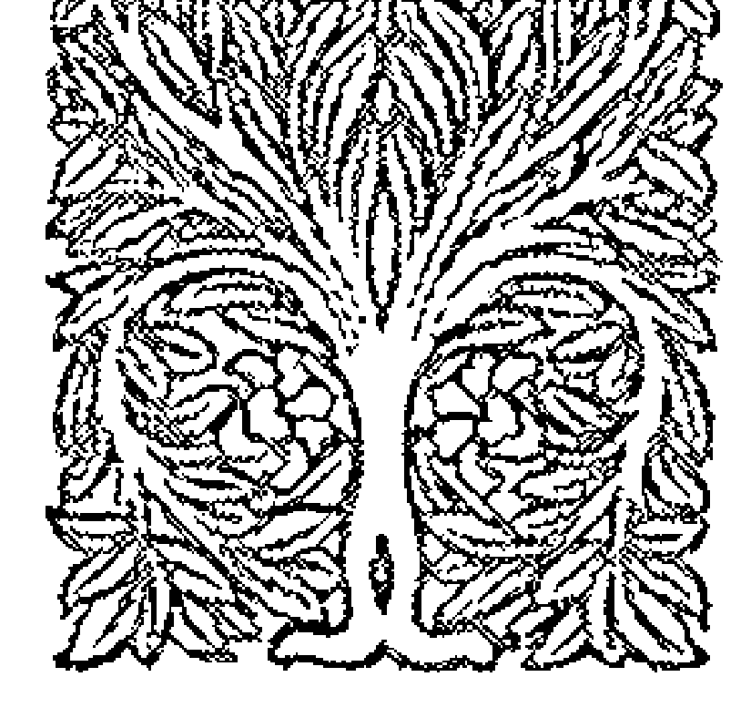

## 第7章

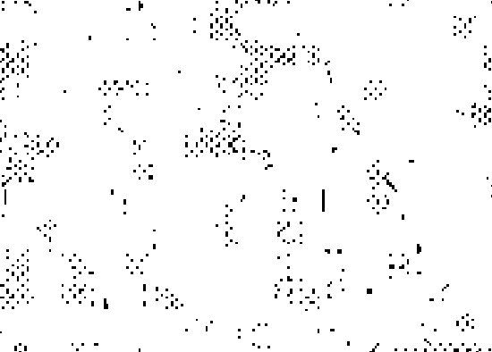

## 做你选择要做的人

> > 我的人生受命运的左右吗？——帕特里克，18岁

> > 我们的命数都是早就安排好了的吗？——佛罗里达州，玛丽安娜，17岁

绝对不是这样，也从来就不是这样。你的人生，帕特里克，由你自己掌控。在这本书的一开始，在我回答关于谁决定着谁该是谁的那个提问里，我说的就是这个意思。你还记得那个问题吗？我们来回顾一下：

> “你怎么决定谁可以成为艾拉妮丝·莫莉塞特和迈克尔·乔丹，谁注定只能是普通人？”

我当时是这么回答的：

> “我并不去规定谁该成为艾拉妮丝。莫莉塞特、谁该成为普通人；做决定的人是你自己。你现在正在做着这样的抉择。问题在于，你并不知道你正在这么做着、怎么做着。”

实际上，你们当中有很多人已经问到了这个相同的问题。我这里还有另一个人的不同问法呢：

> 你造人的时候，是根据什么来决定你要赋予什么人以什么天赋的呢？是什么使得你给了席琳·迪翁(Celine Dion)一副金嗓子，而不是让她成为花样滑冰金牌得主，或者一名医生呢？
——保罗

这也许是我来这里要告诉你们的最重要的一件事情。

所以，让我重申一下我刚刚说过的话。

我不做那样的决定，保罗；你，才是做决定的人。

请你这么去想象：当下的每时每刻，你都在不断创造着、刷新着你自己。你不停地一笔一笔描绘着你的肖像。帆布就是你的人生；而那些技能啦、天赋啦、才干啦、性格啦、体格啦，以及周遭的环境，等等，都是你要用到的色彩。我提供画布，你挑选颜料。

那不可能！否则的话，我肯定会选一副席琳·迪翁那样的金嗓子，我们肯定都会这么做！我们要么让自己能像马克·麦圭尔①那样有本事打全垒，要么就让自己有表演天赋啦、领袖才能啦、写作水平啦，等等吧，反正不会是像现在这样普普通通平淡无奇。

世上没有“普普通通平淡无奇”这样一种东西，只有那些让自己安于普普通通平淡无奇的人。

每一个人都是独特的，每一个人都是非凡的，每一个人都具备不同于其他人的才能与天赋，都具备能够达成你来此生的特殊使命的独特能力。

什么使命？

你来此生的使命，是要按照你特定的目标，以你特定的方式，来体验你自己。在你投生之前，你是“意识”与“知晓”。也就是说，在你出生之前，你已经作为一个实体而存在了。

待你决定了你要怎样运用你的人生、决定了你要去了解和体验的目标之后，你就会挑选非常恰到好处的人、地、事，等等，以借此达成你的目的。

你是说，我们挑选自己的父母？

那当然，而且你父母也挑选你。这是你们在很高层次上的一个共同决定。实际上，人生中所有相遇的人，都是出于你们彼此的共同决定。

> > 没有谁会意外地遇到另一个人。

> > 哦？请问为什么我要挑选一对虐待我的父母？

> > 每一个灵魂都会挑选刚好恰如其分的人物、地点、事件，为达成灵魂的目标而创造条件。因为每个灵魂的决定都会不一样，故此，我们无法一概而论。

> > 也许，这个灵魂想要体验的是一种叫做宽恕的神圣体验；也许，那个灵魂是为了要因此而获得一种同情心，以便将来去帮助其他受到虐待的人。

> > 一个灵魂为什么要选择某种特定的环境和人物，自有其无穷无尽的理由。

> > 那就没有什么可称之为“偶然”的喽？

> > 没有。难道你会以为，一个能够创造出那么纷繁精致而毫无重复的片片雪花的宇宙，却会产生出某种随机性的“偶然”来吗？

> > 是啊，我还真就是认为宇宙间应该会有这种“随机性的偶然”。

> > 没有。任何事情的出现都是非常有条理的。假如真有什么事情是“随机性的偶然”，则肯定会有事情失控。那我会是个什么样的神呢，居然可以容许事情失控？

哦？所以，是你控制并制造着发生的一切事情喽？

我说的不是你说的这句话；我说的是我不会让事情失控。更何况，制造着一切的，是你，不是我。

那我难道就不能制造出一些“失控”的事情来吗？

假如你真能做得到，那事情就根本没有“失控”。既然是你处心积虑那么做的，你就不能说你让事情“失控”了。实际上，所有的创造，都是在一定意识层次上的一种处心积虑的作为。

好吧，那你再说一遍，我是怎么制造着这一切的？

- 你的创造力，通过三种途径起作用：
- 你之所思；
- 你之所言；
- 你之所为。

你的任何想法都具有创造力；你的任何言辞都具有创造力；你的任何所作所为都具有创造力。这些，就叫做创造的工具，是我赋予你的非常有威力的工具。

这就是我前面说过的“原生力量”。你并非生而带着“原罪”；相反，你生而具备“原力”——原生力量。

哦？那只要我想“我要成为艾拉妮丝”，我就能变成她那样的人？我模仿她的一言一行、一举一动，这就行了？

那不行；那样的话，你就成了艾拉妮丝的复制品，而且还是一个低劣的赝品，因为这世上只有一个独一无二的艾拉妮丝，正如这世上只有一个独一无二的你一样。不过，你可以做一个你眼中的艾拉妮丝那样的人；而这，也许才真是你想要模仿的。

且来看看你眼中的艾拉妮丝是个什么样的人。你看到的，是她的天赋？坚韧？自信？诚挚？真实？勇敢？有影响力？成功而快乐？通过她生活中的言谈举止所展现出来的一切，你看到了她是一个什么样的人？

不是去看她做些什么事情，而是去看她怎么做人。因为，“做人”是“做事”的龙头，而不是颠倒过来。她做人的某种内涵使得她能够做出那样的事情来；而且，在她做出来之前，她就已经是具有那样内涵的人了。

从来都是“做什么人”导致“做什么事”；而且，更准确地说，促成之。

那么，我怎么才会“是”具有这些内涵的人呢？

通过你的所思、所言、所为。这些都是你的工具，可以用来把你创造成你要做的人。

如果你坚持不懈地运用这些工具，那么你也能够是这样一个人:具有天赋的、坚韧的、自信的、诚挚的、真实的、勇敢的、有影响力的、成功的、快乐的，人。

不论你正在“做”着的事情，是叫做摇滚乐、召集董事会，还是叫做养育子女，你都将“是”一个人们所说的成功而快乐的人。因为，你既然已经选择要做一个这样的人，必然导致出相应的结果来；而且，你必然会有意识地通过你的所思、所言、所行，去展现你正是如你的所思、所言、所行的，人。

可是，我怎么可能在我快乐之前就“是”一个快乐的人，在我成功之前就“是”一个成功的人呢？我想不明白。如果我本不是一个有天才的、坚韧的、自信的，等等的人，我怎么可能又“是”这样的人呢？

从认为你就是这样的人开始，从照这个样子去说话开始，从照这个样子去行动开始。你并不一定必须要是这样的人之后，才能够这么想、这么说、这么做。

那我就并不真的是这样的人，我不过是在让自己那样相信罢了。

说得好！你听见你说了什么吗？你说的是你“让自己那样相信”。一旦你让你自己那样相信，你就体验得到你所相信的！

很多人说，“你看到什么，你就相信什么”。而我在这里要告诉你的是，“你相信什么，你就看到什么”。

你相信什么，你就开始从你的现实中看到什么。

为什么？为什么事情会是这样？

因为思想、言语、行为，本都是能量，它们能推动和创造其他的能量，它们能使事情动起来。

任何发生了的事情，任何被发明了的、被做出来了的、被完成了的东西，都起源于某个人心里的某个想法。之后它被形成话语说了出来，最后它才变成了具体行动。这就是那“三个创造工具”，再无其他秘密。

这恰是最意义深远的人生秘密：我赋予了你创造一切的工具，你则用它来把你的梦想创造成真实的现实。我从来不做抉择让谁做什么、让谁得到什么、让谁成为什么。做出抉择的人，是你。

就这么简单？难道，真的就这么简单？

这里面再无任何奥妙。我已经把一切和盘托出。

所以，你选择要在你的人生中创造些什么，你必须先要去想。而且，你要带着信心去想，千万不要想什么“唉，我永远没可能做到那样。我永远成不了那样的人”。只因为，你真能让这样的负面想法变成你的真实现实。

一旦你选择要在你的人生中创造些什么，你就必须把它说出来。而且，你要带着信心去说，千万不要说什么“可能吧”“或许行吧”“如果……该多好啊”。你倒不妨这么说，“待到……那有多好！”

还有，一旦你选择了要在你的人生中创造些什么，你一定要付诸行动。而且，是带着信心去行动。

千万不要只想不做；而且，要满怀信心地去做你想做的人！

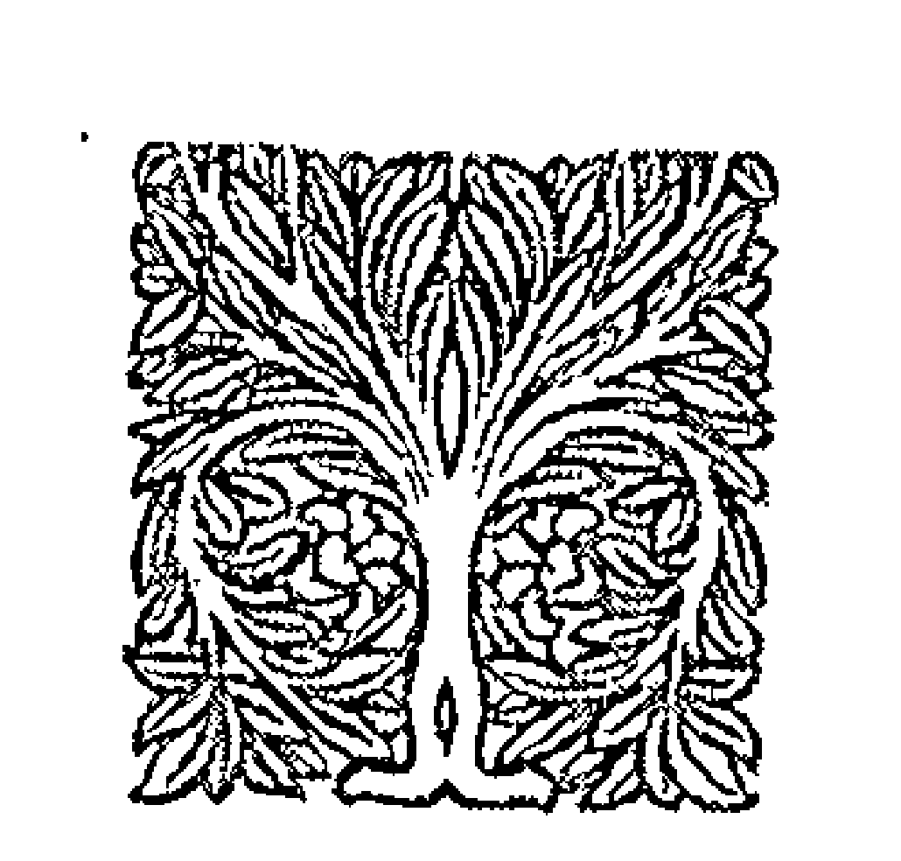

## 第 8 章

### 年青人的心愿

在环游世界的路途之中，我越来越明显地意识到这样一件事情，那就是一方面年青人再三诉说着他们的心愿，另一方面却很少有成年人肯去倾听。我，听了。这些就是我听到的心声：

> “寻找一个新世界”

（这是罗伯特·肯尼迪的话）。你想要创造一个新世界，那里没有人与人之间的漠不关心，没有无谓的争执和虚伪，没有彼此间的隔膜；相反，这个新世界里，人们心心相连，再无怨恨、谩骂与厮打，再无战争。

你想要一个新世界，那里人人同甘共苦，彼此分享。我们不再彼此巧取豪夺，所以人们不再相互明抢暗偷；我们都明白任何伤害都只能伤害到我们自己，所以人们不再相互伤害。

你想要一个新世界，那里我们不再相互隐瞒、欺骗，不再相互离弃、背叛。相反，我们相互贴近，相互拥抱，不论任何时候、任何地方，都相亲相爱。因为，这就是我们的本性，生命的真谛就是爱，彼此相亲相爱。

我这里说到的爱，不是性爱。我可以断定，那些认为我在这里大谈性爱的人，是些活在半个世纪以前的老脑筋。年青人一定明白，我在这里说的，是爱。

我说的是一种以爱为生，而非以恨为生的活法；是拥抱生命，而非铲除生命；是崇尚生命，而非以任何言行亵渎生命；是支援生命、维护生命，而非对生命索取再索取，直至生命遭到毁灭。

我说的是一种给生命以生命的活法，而不是从生命中蚕食生命的做法。

这种活法，有时候也会涉及性爱，但那并非全部意义之所在，而仅仅是其中的一部分。爱，才是一切的一切。这本书里我们稍后也会谈论性爱，因为，人们对性爱居然有那么多的严重得难以置信的问题。不过仍然，我们谈论人生的篇幅比性爱要大得多得多。

爱，才是一切的一切。

对，这就是它了！你甚至不必再继续读下去，所有一切都已经包含在这一句话里面了。爱，才是一切的一切。

其实你早就知道这一点了，对不对？

是啊，你早已明了这一点。

所以，这本书的目的，不是要告诉你一些你不知道的东西。这本书的目的，只是要点醒你本来已经明白的一些东西，并且给你勇气，去执著于其中，去生活于其中。哪怕你以后渐渐长大成为人们所谓的“成人”；哪怕你以后渐渐成为这个你希望改变的世界的一部分；尤其是，哪怕你以后已经成为这个世界的一部分，你都要，有这份勇气。

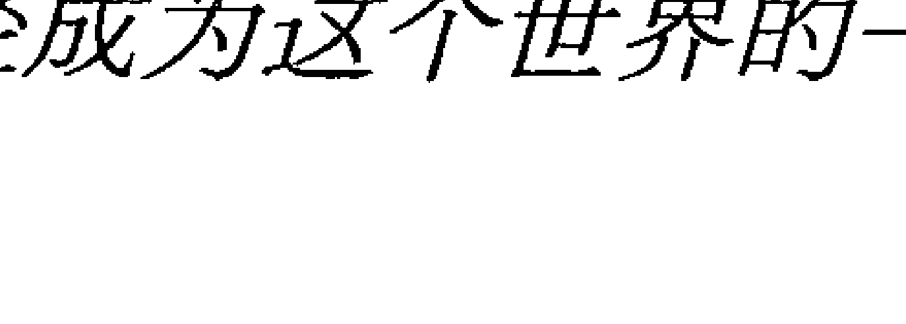

这就是我遇到的那些年青人告诉我的，他们最想要得到的心愿。还有一个，而且是最为重要的一个，我把它留到了这最后，因为那对你、你们、你们这地球上所有的人，都太重要了。那是居于所有你们所需之首的东西。

那，叫做自由。

你们要的，是自由。

> > 为什么父母不肯让我们做我们自己，却偏要我们按照他们的心意做人？ ——伊利诺伊州，布鲁明顿市，桑德拉

要让天下的父母不再对儿女指手画脚，这是他们最无法面对的挑战。

父母对子女抱有太高的期望，甚至把他们的梦想、他们的抱负，都寄托在孩子的身上。

就是啊！但那是他们的期待和梦想，不是我们的！

是啊，不过要让他们放手，那实在不容易。尤其是他们如此深深地在乎你、深深地钟爱你，尤其是他们如此真地认为只有他们才知道什么于你是最好的，现在要让他们放手，那实在不容易！

而且，这么些年来你一直依赖和需要的，恰是他们作为父母对你的引领与指导。现在要让他们放手，那实在不容易！

那是一个很难以放下的角色，那是一桩非常棘手的任务。

哦，那你的意思是说，我就只好由着他们了？

你可以帮助他们啊。首先，你需要理解为什么父母那么难以对子女放手；你也需要给他们时间调整他们的角色，让他们学会倾听你，指点你，而不再是牵牢你的手。

也希望你永远都不要不再回去听听你父母的指点，他们的指点往往非常中肯。

只要父母能够指引你关注你自己的内在智慧与真实，他们就可以从牵手带路变为指点方向，而且这种转变往往比他们以为能做到的要早得多。如果他们以爱而非恐惧来滋养孩子，那么他们就尤其能够早早放手。

至于一些害怕犯错误的孩子，他们的父母倒真是必须晚些放手。而要说到那些喜爱犯错误的孩子，父母大可以早早放手。

啊？你怎么能“喜爱”犯错误呢？

太简单啦。如果你知道犯错误能给你带来好处，你当然会喜爱它们啦！

所有孩子，所有成年人，实际上都会从他们所犯的错误中得到好处。这好处就是他们从中学到的东西。

啧啧，行啊你，这么个“好处”，切。

你先别忙着“切”我，这可真不是个不起眼的东西。你从生活中学到的东西往往能带给你相当可观的收益。

科学家就很明白这一点，他们那些做科研的人真地很能从自己的“错误”中获得裨益。一项“做砸了”的试验，恰恰就是一项最终能把他们带往成功的试验。

生活中也是同样道理。人的每一个错误决定或行动所带来的收益都无可估量。一旦你能从这个角度来看待问题，一旦你把这些点点滴滴的收获累加起来，你就能够真正懂得珍视其价值了。

任何一个人都亲身经历过这样的事情：那些曾几何时被看做“糟糕透了的错误”，在某时某刻却又会变成一桩非常值得可喜的事情。

你也一样，有一天你会看到，其实世界上本无什么“错误”。

嚯，你的这个观点倒是很有趣。

这是一个能改变你一生的“观点”啊。

请你这么去想：“错误”是“失败”的另一种说法；而“失败”根本就是不存在的事情。这是我前面讲过的人类的误解之一。那不过是你们的一种幻象。

不论你做什么，你都不可能“失败”；而把什么叫做“错误”，也不过是你在表达一个观点而已。

如果你把“错误”看成是一步台阶，一条带你通往目的地的小路中的一步台阶，那么它在你眼里就不再是“错误”，而是你行进途中的一步。

于是乎，它是完美的，而且你对它心存感激。你甚至想要为之庆贺！

在最美好的公司里，老板和经理们会庆贺员工的“错误”，甚至开个庆功会，或者给那些员工一笔奖金。

他们说，“现在我们知道了什么是我们要避免的，以及怎样去避免。这是保障我们通往成功的非常重大的一步！”

那些执行这种政策的公司，自然吸引着有创新意识的员工，他们勇往直前，敢于决策，敢于承担风险。而这，正是公司最了不起的收益。真正好的管理层当然明白这一点，而且他们也明白所有的失误都是进步。

好的父母也明白这一点。

请你牢记：所有的失误都是进步。

那些得到了这种好处的孩子，那些每当“犯”了作为孩子的“错误”时，能够被父母揽在怀里、搂紧、拥抱、亲吻，能够得到正面激励的孩子，他们都会喜爱“犯错误”。他们也必将成长为热爱生活的成年人。

这样的人不再惧怕暴露出自己的短处（别人的也一样）。他们将在自信中成长，并且有能力跨越一切，迎接生活中的任何挑战。

挑战，把这些挑战转变成一个个大好时机，去体验自己的美好。

老天，你赶紧去跟我爸妈说说这些吧！

你以为我是谁啊？我正在这么做啊。

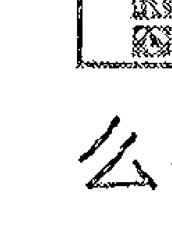

> > 凭什么我就不能晚上在外面爱待到多晚就待到多晚？凭什么要“宵禁”？我不服气！凭什么他们要把我当成个小孩子！为什么他们就不能给我自由，让我爱去哪里去哪里，爱做什么做什么，爱到多晚就多晚？
> 
> ——印第安纳州，印第安纳普勒斯市，布赖恩

自由不是一桩能由别人给予你的东西。自由是你之为你的根本。“自由”这个词和“神”这个词，是可以互换的。神就是自由，自由就是神。

你的灵魂是一个神圣的独立个体。那就是你的根本。如果你的灵魂可以用一种感受来描述的话，那就是自由。

而且也是，爱。

理所当然，爱是自由，是表达出来的自由。自由亦是表达出来的爱。而自由地表达着爱的，正是神！

你看明白了吗？这些全都是一个整体。你不过是给予了这个整体以不同的名称而已。

酷！不过你没回答我的问题。

我在做铺垫。

你问我为什么你父母不能给你自由让你随心所欲，而我则告诉你，你已经有了这自由，因为那是你与生俱来的本质。

假如说有什么是你所不能去做的，比如不能在外面待到超过宵禁的时间，那不过是你选择了不去那么做而已。

我自己选择不去做的？你把事情弄拧啦！那可是我爸妈不许我那么去做的！

不对，是你不许你自己那么去做的。你以为从来没有孩子偏要在外面待到很晚，超过了父母的限制吗？你以为从来没有甚至为此干脆离家出走再不回来的孩子吗？而他们也不过是些14、15或者16岁的孩子！

有啊，而且他们绝大多数很可能因此而后悔。

不错，是那样。

你该不会是要告诉我，我就该故意跟父母做对，甚至干脆离家出走吧？你不会吧？

我当然不是这个意思。

我是说，你应该用你的自由去做你选择要做的事情；不过你必须明白是你在做出选择。

我是说，你可以运用你的自由，选择你是否尊重父母的宵禁令。不过如果你选择尊重宵禁令，那就不要抱怨父母逼迫了你。你那么做是根据你自己的理由，而不是他们的理由。

# 与神对话：献给青少年

还记得我前面讲过的，照看弟弟的例子吗？

人们往往想要让别人为自己的选择和体验承担责任。而自由却是针对是你在做此决定、你在创造此体验的深刻理解。

换句话说，你所做的无非是你为了达到某种目的而需要做的事情。

你是指我以此换取一个居所？换取家里的和平，不再有那么多的尖叫与吼叫？换取我不被关禁闭？我为了避免更糟糕的后果而不得不服从，就是你所谓的“自由”？这在我看来，无论如何跟自由都搭不上边，那更像是被逼无奈。

没有人可以“被逼无奈”去做任何事情，人们无非觉得是那样罢了。

在我们真实的人世间，并不是你说的那样。在人世间，人们就是被逼无奈去做违背他们意愿的事情。

我理解这就是你眼里的真实。但是实际上，任何人从来都是在做他选择做的事情。

但是，有时候你就是别无选择！

从来都没有你实在别无选择的时候。这就是我现在要告诉你的。如果你决定做的事情违背父母的决定，你也许要面对一定的后果，但是那并不意味着你就别无选择。

你的选择永远反映着你的意愿和你的价值观。你的选择永远昭示着你想要什么、你想做什么样的人。这是铁板钉钉的事情。你的选择所宣告的并不是你没有自由，而是恰恰相反。

请你牢记：你的每一个行为都是你界定自我的行为。随便你举什么例子说明，比如谁不得不被迫做了什么，我都可以指出来他所做的和你说的恰恰相反。

有些父母抛弃了自己的孩子，不再养育他们。这些人没有因为“不得不养”而养育孩子；你的父母也并非因为“不得不养”而养育了你。一旦想通这一点，你就能从不同的角度看待你的父母。

有些孩子逃离了父母，不再顺从他们。这些孩子没有因为“不得不乖”而顺从父母；你也并非因为“不得不乖”而听从父母的话。一旦想通这一点，你就能从全新的角度看待你的生活。

更有些人宁愿死也不肯苟且偷生。他们这么做，也并非因为他们“不得不这么做”。

我们聊到过这些，你前面也是这么说。

我要在这里再说一遍，因为这是一个能让你更加明白的很好的切入点。一旦你达到这个高度，一旦你想通了这一层，你生活中的一切都将发生改变，包括你将如何在你的人生中体验你自己、体验你周围的每一个人。

> > 请你牢记：从来没有任何人做了他不想做的任何事。

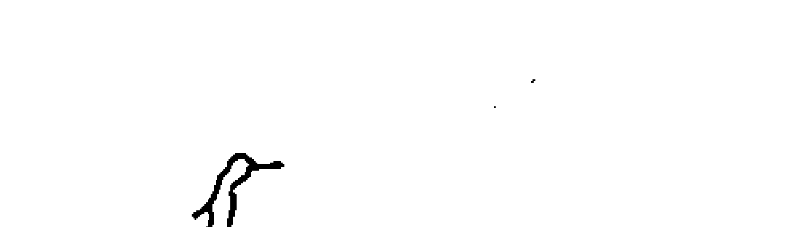

好吧好吧，可是你一直都还没有正面回答我的问题。为什么父母要首先把宵禁强加于我？为什么他们要以各种方式限制我的自由？为什么他们就不能不挡我的路？

你的父母不是在挡你的路，而是在给你铺路。他们竭力想要使你的前路少些磨砺。他们不会永远在那里替你平整道路；不过，既然现在他们还在为你铺着路，你倒是应该看清楚他们所做的是否于你有益。

你还是没有回答我的问题！他们凭什么要以限制我的方式来“替我铺路”？

好吧，让我们来试试看能不能钻进你父母的脑瓜子里去。

要把此时此刻你的一切都讲到最清楚，会是一项让你透不过气来的非常巨大的工程，所以我给了你整整一生的时间来做这件事。

你有没有透不过气来的时候？比方说周末那些繁重的作业压得你透不过气来，是不是？

好，现在，假设所有的人生抉择都在此时此地摆在了你的面前，包括做什么样的人、有什么样的价值观，以及所有重要的人生体验……你是不是开始觉得有些透不过气来了？

如果你真的有些透不过气来，那是因为你不再完整地记得，你究竟是谁。你的人生就是记起这一切的过程。假如你可以“每次活一点点”，你就有可能更容易汲取这些生活所扔给你的所有数据。

我知道，你能理解这些话。如果你像我们前面说过的那样去照顾你的弟弟，那么有些事情你允许弟弟去做，有些事情你不允许他去做，对吗？

可是，我已经不是小孩子了，我已经知道了我该知道的。而且，假如不让我看清楚那些我已经知道的事情，我又怎么能知道那些我不知道的事情呢？

你是不会知道的。不让你去尝试，你永远不会知道任何事情。

就是嘛！这就是我的意思嘛！这就是我想说的嘛！

我理解。如果你的父母不允许你去尝试，你将无法了解人生。父母是竭力想帮助你绕开那些“磨砺”，他们是好意。但是如果他们不认真看仔细了，他们将在你周围设满规则、限制、条例、法规，划下界限，不许你面对任何真正的重要的人生选择，更不要说让你去面对那些你制造出来的后果了。

对父母来说，问题不在于是否应该允许孩子去面对人生并做出自己的选择，而在于他们应该在什么时候放手、放到多大的程度。

这个决定，父母可以和孩子携手一起制定。

可是我的父母才不会和我一起“携手”做这样的决定。他们总是发号施令、指手画脚、限定各种规矩。

会做父母的人并不这样。他们懂得尊重一个事实，那就是他们的孩子是一个人，一个年幼但却具有一切人类与生俱来的权力（和愿望）的人。

可是，你父母也许只是遵循他们自己的童年轨迹。也许当初他们的父母也给了他们很多规矩。也许你可以好好倾听他们，和他们好好谈谈，从而帮助他们打破这道枷锁。

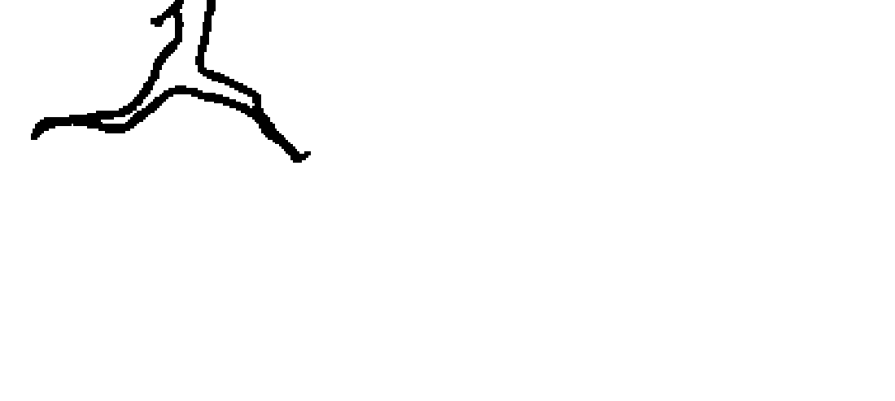

> ? 为什么成年人只知道要我们尊重他们，却不知道尊重我们？
——俄罗斯，莫斯科，彼得

有些成年人的确不知道如何尊重他们的孩子。这些人无法“理解”如何能尊重一个远比他们年幼的、连生命都是他们给予的这么个小孩子。那在他们看来实在是天方夜谭。

这些人往往以为“尊重”等同于“惧怕”，而不知道“尊重”其实与“爱”相联接。他们会尊重别人，尊重那些比他们更年长的、更强大的、更有地位的诸如此类的人，但那不过是因为他们害怕假如不尊重这些人的话可能会很糟糕。但凡是因为爱而尊重他人的人，尊重孩子对他们来说则不是什么难题。

会做父母的人都很明白这一点，与孩子相处也会以此为本，很少甚至根本不限制或命令孩子。而且，他们会根据孩子的年龄给孩子提供恰当的机会，让孩子和父母一起来创造他们共同的生活环境。

那我该拿我父母怎么办呢？

同他们坐下来，和他们促膝而谈，就像你我现在这样。

那没用，他们不听，他们从来就不听。他们根本就不想听我的，他们只想要我听他们的。

如果这样，如果真的是这样，那你把这本书递给他们，告诉他们说，“爸爸妈妈，我不想不被人尊重，我也不想和你们继续争执下去；不过能不能请你们读一段书给我听呢？”然后你打开书，翻到这里。

那要是还没有用呢？

那你就行使你的天赋自由，用上你的原生力量。你大可以不理睬你的父母，承受所有的行为后果；你也大可以听从你的父母，以避免那些行为后果。但这要看你自己怎么选择。

哼，这也叫选择。

这是你今生今世都要不断面对的同一选择。人生的剧本永远都是这样，一成不变，唯有“戏”中的“角色”不The request was rejected because it was considered high risk转眼之间，你的人生中将要体验到的一切，都变成了由你为主导；你不再是“被人生主宰”的人，而成了主宰你人生的人。

这个简单的转换开关，将转变你清醒着的每一刻。

那太好了，那简直是，就像是……天，我从来没想过。我从来没这么想过。我的意思是说，这实在是个蕴涵太深广的讨论，而我们本来在谈论有关做爱的事情。

我们从来就没有停止讨论“做爱”嘛。

请你牢记：爱永远不是由你触及对方多少次来衡量的，而是由你走进对方心里多少次来衡量的。

哇！

是啊，哇。

其实也不是所有青少年都认为性在我们当前的生活中有多么重要。我就是其中之一，我觉得性实在是被炒作得太离谱了。我结婚之前不打算有性行为。

这挺好啊。你有没有考虑过你为什么这么想？

有啊。我认为性是人生体验中一个神圣的部分，应该只在神圣的婚姻里分享。

谁这么告诉你的？

我妈。我也赞同。

酷。

我以前从来没听说过神也会说“酷”。

神与人们交谈时，会用对方觉得自在的语言。你难道从来没说过“酷”？

当然说过了。

酷。我也用呢。

所以我对性与婚姻的看法是对的啰？

这不是一个“对不对”的问题，这是一个“适不适合”于你的问题。你的每一个想法，你的一言一行，其实都是在界定这个问题。

那你怎么认为呢？神会怎么说呢？

嗯，也许现在是时候好好谈谈神是怎么一回事了。

## 第10章

> > 你是谁？——挪威，奥斯陆市，布里吉特，13岁

我又不是谁呢？

我不懂这句话什么意思。

我的意思是，没有谁、没有什么，可以不是我。

你是说，你是任何一切，你是任何谁？

对了，那就是我的意思。

哪怕是坏人？坏事？

没有谁是“坏事”，没有什么是“坏事”。只有你称之为“坏人”或者“坏事”的人或者事。

那不是一回事吗？

对你来说，是一回事。对我来说，不是一回事。

你这句话又是什么意思呢？

这句话的意思是说，我们有不同的观念，有不同的理解。这句话的意思是说，你在判决是非，而我不判决是非。

啊？神不判别是非？我以为孰是孰非就是由神来判决的。

这个嘛，人类这么以为了很久很久了，但，这不是真的。这正是我一直跟你们谈论的人类的误解之一。那是一个幻象。一个关于是非判决的幻象。与之相随的还有关于罚罪的幻象。

其实早有明文记载“不审判，不罚罪”。

> 你是说，你真的从来不审判？你宽恕一切，不论什么罪？
—— 佛罗里达州，迈阿密市，莉莉

我并不宽恕任何人。这是你首先需要了解的关于我的事情。我不会，而且永远不会，宽恕你做过的任何事情。

一旦你明白了这一点，你就会对神有一个全新的理解，并以一个崭新的方式与我交流。

# 与神对话：献给青少年

我并不宽恕任何人，因为，根本就没有什么需要宽恕的。

你是在开玩笑吧！

不开玩笑。只有一个受到伤害或毁损的人，才需要宽恕别人。而你不可能伤害或者毁损到神。

我不可能伤害你？难道我有罪的时候，不伤你的心吗？

不会啊，这肯定不会比你看见一个蹒跚学步的宝宝做不“应该”他做的事情时所“犯下的罪”更能“伤害”到你。你会因此觉得“伤心”吗？你会觉得他“伤害”到你了吗？

那怎么会啊……

你当然不会了，我也当然不会了。你不可能以任何方式伤害我。我是一切，我拥有一切，我永远都会是一切。没有什么是我需要或者向往的，也没有什么是我想要“快乐”而必不可少的。我不需要你做任何事，也不需要你不做任何事；我不需要你必须是什么，也不需要你必须不是什么；我不需要你必须拥有什么，也不需要你必须没有什么。

我不需要你敬畏我，不需要你惧怕我，不需要你爱我。

但是你需要我们服从你，对不对？

我不需要来自你的任何东西或事情；因此，我不需要向你提出任何要求；所以，你根本没什么可服从的。

你是不是以为，我所做的一切，就是设立些个规矩啊、法令啊什么的，然后要你们乖乖听我的？其实，这些都是你们编造出来的。

既然我不可能以任何方式受到任何伤害，也就根本没有任何事情会让我觉得生气或愤怒。既然你无论怎样都伤害不了我，也就根本没有必要需要由我来“宽恕”你的所作所为。既然在我的眼里完全没有伤害这个词，当然也就根本不会出现诸如“讨还公道”之类的词了。

即使在你们的法庭上，也必须是先证明了你的确受到伤害以后才能讨还公道。假如法庭认为另一方并没有对你造成伤害，那么它就不会随意地去惩罚对方。连你们人类的法庭都不这么做，为什么我就该这么做呢？

可是，假如我的确做了什么坏事呢？也许我伤害不了你；但是我肯定会伤害到别人，而且我的确伤害了别人。这正是为什么几乎所有的人都觉得他们需要得到宽恕的原因。

可是你不需要求得我的宽恕。我并没有觉得你对我做了什么“错”事，也就没有道理需要由我来宽恕你。

我明白你一生中一切所做所为的原因；我知道你的所思所想，并且了解你为什么会那么想。

一旦你理解为什么一个人会那么做，哪怕你不认同他的理由，你也很难因此而生他的气。拿我来说，首先我就生不起气来。

我还有什么不了解的，还有什么不知道的啊。可是，唯独这生气，却是我没有本事能做得到的。我的理解水平所及范围尚未允许我能做得到。

可是我还是因为伤害了别人而感到很难受。那你就去寻求别人对你的宽恕，并且寻求你对自己的宽恕。

有些事情我怎么都没法原谅我自己。你想不想知道怎么才能够做到原谅自己呢？

当然想！告诉我怎么做，我要知道！

去原谅别人对你同样的伤害，去原谅别人身上那些你也有过的同样的错误、同样的缺点、同样令人讨厌的德性、同样对别人的罪过。

啊？这能有用吗？

这可是灵丹妙药啊。你愈合了别人的心，也就愈合了你自己的心。

> 好吧，就算你说得对吧。可是，我怎么才能够把我做过的所有错事全都从你的判决书上抹去，一切都被忘掉，好让我可以重新来过？
> ——艾拉，13岁

我的美好的艾拉，我没有什么“判决书”啊。这正是我想要在这里告诉你的啊！

我不是天上飞过的圣诞老人，需要做个清单并且认真检查两次，以确保我能鉴别谁是小淘气、谁是乖宝宝。那不是我所是的我。那不是我所做的事。

让人们知道根本就没有对，也没有错，也许会让几乎所有的人都大吃一惊。是的，没有对，也没有错，只有针对你打算要做的是什么，怎么叫做有用、怎么叫做没用。

这怎么可能呢？难道杀人不是错的吗？难道残暴不是错的吗？

如果杀人是错，如果残暴是错，那么战争是对还是错呢？假如有个人闯进你的家，要抢走你的小宝宝，那么你该不该一棒打过去呢？

那可不一样，那叫自卫。

哦，所以，你的意思是说，有的时候，杀人或者残暴并不是错的啰？

我们不把自卫叫做杀人或者残暴，我们说那叫自卫。

换上不同的术语，也改变不了你行为的实质。那只不过是自诩冠冕堂皇而已。

难道你是说，我们自卫的时候，不可以打伤或者打死对方？

这不是我所说的话；而且，可以还是不可以，是该由你来决定的事情，并不是我。你的现实生活就是由你的这些决定不断创造着的。你以及你们做出的这些关于人类该何去何从、该怎么共同生活的种种决定，又不断创造着这个如你所知的世界。

你们总以为，是我在决定你们该怎么创造这世界，然后督促你们照办，不然就惩罚你们，但事实并非如此。我早已经给了你们去按照你们的最高想象来创造这个世界的自由。如果这就是你们现在能够想象得到的最高境界，那就这样好了。

我要在这里指出一个关键，那就是没有绝对的对，也没有绝对的错。如果某件事情是“错”的，那是因为你说那是“错”的；如果有什么是“对”的，也是因为你说那是“对”的。而人类就孰对孰错的观念，从来就因为环境的不断变迁而不断地变来变去。

这又有什么不对呢？

没什么不对。这恰恰是我想说的关键。根据你想要做的是什么，你不断变换着你对“对”与“错”的看法，因为那样才有助于达成你要做的事，这没有什么不对。

如果你认定你的愿望是生活在和平与和睦之中，那么，把在自卫中打伤或者打死对方称之为“错”，则可能不见得适用于你的愿望。

也许有那么一天，地球上的所有人会一致认同，在自卫的时候打伤或者打死对方，将不再适用于地球人的理念。但是，那只有当整个地球社会都进化到很高的境界，当每个人都理解到“自我”是不需要“防卫”的时候，才有可能实现。因为到那时人们才会明白，这个自我是不可能遭到伤害、毁损，甚至毁灭的。

这一点，是你现今无法理解的，而且也不适合于你们的理念，尤其不适合你们现在关于对与错的观念。你们现行的观念，永远反映着你们当下的理解能力所能够达到的境界。你们所谓的“对”，只不过是你们当下能够知道的最佳路径，可以有助于达成你认定你想要获得的体验。

因此“对”与“错”是可以相互转换的？

正是。它们可以在不同的时间、不同的地方，相互转换。

假如你想要在“印第安纳波利斯500大赛”中获胜，那么飙车时速每小时200公里就没什么“错”；但是假如你想要去杂货店买个东西，这么飙车就可能变成了“错”。这都是根据你打算要做什么来决定的。

假如你从美国东岸开往西岸，想到西雅图去，可是你却向南驶往圣何塞，这没什么“不合道义”，并不是有关“对”与“错”的问题，而是怎样能把你带到你想要去的地方的问题。

哇，这下我明白了！所以说，对与错并不是绝对的事情，而是对眼下什么有效什么无效的即时评估。不论你作为一个单独的个人，还是作为社会群体之一，你始终都在根据你想要体验什么、你怎么看待你与一切社会事务的关系等，做着这样的即时评估。

这又是什么意思呢？

如果你把自己看成是万事万物之整体的一分子，你会有一套什么样的所思所言所为叫做有效、什么样的叫做无效的理念。如果你认为自己分离于万事万物之外，那么，你又会有另一套不同的观念。

一切都根据你寻求达成什么目的而定（更广义地说，是根据你如何理解你的人生目的而定），根据你想要如何体验你与万事万物的关系而定（更广义地说，是根据你如何界定你究竟是谁而定）。

这也正是信仰的由来吧。

正是如此。你对这些问题的信仰，衍生出你的一套是非标准；另一个人对这些问题的信仰，又衍生出另一套是非标准。一个社会的整体信仰，会产生出一整套的文化传承，在历史的长河中反复上演相同的剧情。你们人类的整体历史已经印证了这一点。

> 我们当中的许多人，不正是向我们的宗教寻求着最崇高的信仰吗？
——乔希，18岁

是这样；而且，也正是你们的宗教，向你们传授着分离、需求、超越、失败、审判与罚罪。正是这一套信仰，把你们拴在一整套绝对的对与错的观念体系之中，把你们拴在一整套残杀了无数人的分离幻象的文化传承之中。

> > 既然我们现在谈论这个话题，我倒要问问，为什么一个仁慈的神竟是这样一个孤立主义者，而且如此不能容忍其他的观点？为什么一个无限仁慈的神，竟可以为了任何事惩罚任何人？而且凭什么要对一时的违背处以永世的惩罚？
——加利福尼亚州，圣克莱门多市，斯科特，18岁

斯科特，我不是一个孤立主义者；我的心胸也不狭窄。你这里说的恐怕是一个不同的“神”吧。那也许是你从小就耳濡目染的神，只不过那个神很大程度上是你们社会的一个虚构幻象。

而且，正如我刚刚已经说过的，我也并不为任何事惩罚任何人。多少年来，我一直不断地通过各种途径向你们人类一再说明这一点。

许多从我这里得到了这一真相的人，已经把我的这些话语传向了全世界。这些人包括一些精神领袖，比如罗马教皇约翰·保罗二世。

1999年7月28日，在罗马举行的一次教皇宣讲大会上，这位大教皇宣告：

> > “永沦地狱，从来就不是来自神的惩罚。它是那些选择推开神之大爱的人对自己的惩罚。”

教皇的论述是准确的。这些话告诉你，我永远不会对你施以惩罚，但是你却能施以自罚。你能创造出你自己的地狱来。

自罚无非是你自己决定审判你自己，或者是否认我的存在而令你自己与我隔绝。

> >教皇说“永沦地狱，从来就不是来自神的惩罚”？

是这么说的。他还在同时期（1999年7月）说过其他一些关于天堂与地狱的非常有勇气的话。

新闻媒体报道了教皇的庄严宣告：天堂并非指某个场所，而是指人与神之间的关系，是一种在人世间就能够体验得到的人与神之间的亲密关系。

报道说，教皇还宣称，天堂在天上的这种说法的来源，是圣经的比喻性修辞，用以对比人间的居所与神的居所。

而且《旧约全书》中有清楚的记载，神“不囿于天堂”。教皇说，神始终聆听着人们的祈祷，始终置身于整个人类历史之中；并且，“蒙神的珍爱，信徒们可以登上”与神同在的境界。

然后，关于地狱，教皇约翰·保罗二世的说法是，永沦地狱不是来自外在的、由神施加于人的惩罚，而是人与神分离之后的内在痛苦。

再然后，斯科特，就是教皇最骇世惊俗的宣言。他说，人是否能真的下地狱，“一直以来都只是一种可能性，而不是我们所能够知晓的。”

迄今为止，还没有任何一位教皇或者有名望的基督教士曾经怀疑过，地狱是灵魂的囹圄，是一个他们所宣称的禁锢那些遭到“永世惩罚”的灵魂的地方。但是，现在你们有了一位来自地球上最大的基督教的精神领袖宣告说，他不能确信这一点。

除了来自世界精神领袖的最新发言，最近几年不少其他宗教也都改变了他们关于地狱与永世惩罚的说法，柔化了他们的官方说辞。这表明了一个非常重要的信号：在你们整个世界范围内对我的看法正在改变着。

从今以后你可以不再生活在“对主的敬畏”之中；你可以与神维系一层友情而非一种“畏情”。这既不是一个微不足道的转变，也不是一个无足轻重的调整。这改变着整个世界。

### 从什么途径来改变？

从你我之间的关系开始。我们终于可以回归一种爱的关系，而不再是惧怕。

这很让人振奋，因为一旦你不再惧怕我，你们人类就可以不再彼此惧怕。

你会开始相信关于神的最高真实，即我不会伤害你们任何人；你会开始相信关于生命的最高真实，即生命是永恒的，爱是无所不在的，地球上的一切都是足够的，不但有足够的神、足够的生命，还有足够供所有生灵所需的一切物质；你会开始相信关于你们彼此之间的最高真实，即你们都属于同一个整体；你会开始相信关于你这深受神之祝福的你的最高真实，即你人生的目的是永无止境的自我提升；在任何情况下都没有什么能够毁损你之万一。这改变着你怎样把你与我相联接、怎样把你与自己相联接、怎样把你与每一个他人相联接的模式。这改变着整个世界。

> 为什么围绕着谁是正统的、正确的宗教发生了如此之多的战争？ ——韩国，首尔，帕克

几乎你们人类所有的宗教都相信，世界上唯有一条通往神的道路，而且只能是他们所属宗教的那条路。他们非常热忱地笃信并且传授着这一点；他们认定在我的眼里他们已经超越了其他一切宗教。他们甚至热切到要把这种“唯我独真”的虚幻当做他们的真实现实的地步。他们许多人还以为，他们必须去说服别人也相信他们所相信的，并且他们认定这样做就尽到了对我的责任。到了后来，有些宗教及其信徒开始笃信并且传授着这样一个观点：凡不属于本宗教的人都是我们的敌人，都要将他们教化，否则就须予以剔除、消灭。这种思想和观念变成了他们排除异教、清除异族的正当理由，并且自诩为“圣战”。正如我前面所说，这些观念源自于人们一整套建立在幻象之上的信念，而且他们对人生、哲学、宗教、政治，乃至经济体系的理解，全都建立在这套观念之上。而这种超越幻象，便是其中之一。这些幻象并非真相；然而，人类赋予它的力量，使得它足以以假乱真。

难怪这世界成了现在这个样子。

是啊。这个世界存在于一套以恐惧、不足、超越等幻象而形成的信仰体系之中。几乎所有存在于这世界上的机构，不仅包括宗教，还包括政治、经济、教育，乃至各种社会组织、团体，都构筑于而且运作于这一套体系之中。

这就是为什么围绕着谁是“正统”的“正确”的宗教竟有如此之多战争的原因。不仅仅是围绕着宗教的战争，还有围绕着谁拥有正统的正确的政治体系的战争；围绕着谁是正统的正确的经济体系的战争；还有，针对地球上人们以为“不足够”的那些“东西”，围绕着谁该占有多少才是正统的正确的问题的战争。

就为了争夺这些“不足够”的东西，发生了多少战争啊。而这些物质东西，很令人悲伤，却正是你们认为是神的爱所赋予你们的。

在不远的将来，你们还会把水也写入这张争夺单里。

你说什么？

照你们这样的生活方式，终有一天，你们会创造出连水都是“不足够”的物质之一的结局来。实际上在你们地球的不少地方这已经成为事实了。因此，在21世纪，也许你们不得不打上几场“世界水战”。

还记不记得你们怎么命名你们历史上最大的战争的？第一次世界大战、第二次世界大战。

记得啊……

瞧着吧，现在你们也许很可能再来个第一次世界水战和第二次世界水战，如果你们真能走到那步田地的话。以你们今天的科技，一场战争就足以毁灭一切。

哎，我说老兄，你描绘得不错嘛，多有水平的乌鸦嘴啊。

我说的是“也许”，你们仍有机会避免。正如你们也同样可以来得及避免最终真的没有足够的干净空气、没有足够的表层土壤可供耕种、没有足够的树木来滋生氧气、没有足够的大气层来保护地球不至于过暖一样。

你们可以避免所有这些问题，时间还来得及。而且你现在已经来到了这里。你来得正是时候。也许，你的选择就是去改变这些。不过，不要只顾着改变周遭的环境。环境当然是需要改变的；但是，你还必须改变造成这种周遭环境背后的观念。不然的话，或早或迟，一切又还会再恢复原样。

为什么不是每个人都只相信一个神呢？
——克罗地亚，萨格勒布市，彼得，17岁

绝大多数人只相信一个神，也就是他们的神。对他们来说，唯有“他们的”神才是唯一的神，别人的神都不是真正的神。可悲的是，这种观念导致了太多的相互屠戮，而且还要打着神的名义去自相残杀。

现在，人们愿意以自己的方式表达各自的与众不同已经不足为奇，所以大家衣装可以不同，发式可以不同，车子可以不同，生活方式更是多种多样，各不相同。

可是这里有个圈套，彼得，你要看看人类在表达这些不同时，是否连带出了人与人之间的相互分离，个个都自以为是，自诩卓尔不群。

这种为表现出你的独特而带出来的自以为是、自诩卓尔不群，不论是宗教上的，还是政治上的、哲学上的、经济上的、社会上的，甚至性别上的，都会导致极其愚蠢的行为。

在《与神为友》这部书中，我为人类带来了新的福音：你们的世界，可以由两句话得以治愈。

我们本都是一体。

我的并不是更好的，只不过是不同的。

我在此向每一个牧师、每一个神父、每一个法师、每一个民族领袖、每一个政治家、每一个经济学家，以及每一所学校的每一个老师发出挑战：请你在这一星期里，面对你们的听众，宣讲这段福音，这两句话，这22个字。

这是能够拯救整个世界的22个字；然而，你们的总统、总理们，你们的教皇、教主们，你们的政治家、导师们，却还没有谁能够说得出这22个字来。

为什么？

因为有一样东西，是你们人类宁愿舍弃一切都不肯舍弃的东西。你们宁愿舍弃幸福、爱情、喜悦、和平、繁荣、浪漫、激动、安详，一切的一切，甚至包括了你们自己的健康，都只为了换取一样东西。

什么？那是什么？

### 只有你才是正确的。

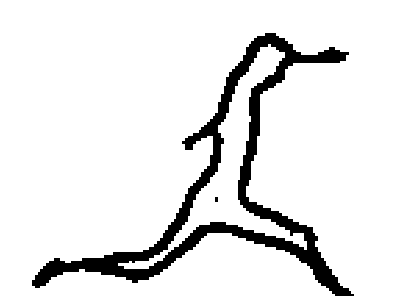

> 既然宗教不该宣称它知道的才是通往神的“正确”道路，那么宗教在生活中又该扮演什么角色呢？这里还有它的角色吗？
——英格兰，伦敦市，莫妮卡，17岁

宗教，和其他一切事物一样，在生活中扮演着你赋予它的角色。

你可以赋予它这样一个角色，让它带领人们接近神，带领人们接近彼此。而照我现在的观察，宗教更像在带领人们走向相反的方向。

事实上，没有什么比有组织的宗教更使得人们彼此分离、与神分离的了。

我喜欢到我的教会去。我相信我的宗教。你的意思是否在告诉我，我不该这么做？

绝对不是。如果一个人整个身心、整个灵魂都深深地信仰他的宗教，而且如果他的人生因这份信仰而更加快乐，那么我永远不会建议他放弃他的宗教。

那你会怎么说？

我会说，请按照你已有的人生观走你的路；不过，永远不要停止思考那些你已经有了答案的人生问题。

这才是一个真正的探求者应有的态度；也是所有宗教所真正应有的态度。

我发觉人类的大量道德观念来自于宗教。因此，只要宗教肯敞开大门，而且不再把门狠狠摔上，它将一直在人们的生命旅途中扮演重要的角色。

### “宗教”与“精神”有什么不同？

> ——新西兰，皇后镇，托马斯，16岁

前者是一个组织机构；后者是人的心灵体验。

宗教是围绕着对一些问题的特有观念而形成的一种机构。一旦这些观念得以加固而形成坚如磐石的教义，就很难再被改变。你要么信，要么不信。

精神却是一种最自由的心态，它并不要求你必须信仰什么，而是不断地促使你留意自己的体验。

你自己的体验因此而成为你的主导，而不再是以别人灌输给你的东西来做主导。

假如说，你必须通过某种特定的宗教才能够找到神，那即是说，你必须按照其要求的某种特定的道路或者方式才能够走向神。

### 为什么神要这么要求？

答案是，我没什么要求。人们以为只有一条道路才能通往神，以为只有依某种特定的方式才能回归于我，以为除此之外再无它途、别无它法。这些观念，其实都是“需求”这一幻象所抖搂出来的东西。

这是人类的另一个幻象——我们已经讨论过的人类的另一个误解。这与最终的真相根本毫不相干。

我对你实在没有任何要求，因为我不需要从你那里获取任何东西。难道，数念珠就比诵经更好吗？印度教的虔赎仪式就比犹太教的逾越节家宴更为神圣吗？

不，不，当然不是。那为什么各个宗教都坚持说唯有它的“这”条路才是最好的——不，不，才是唯一的——通往你的道路呢？

瞧，我们已经绕了一圈又一圈了，我开始觉得是不是就我自个儿在这里一遍又一遍地自说自话。

别，你再告诉我一次吧，我想要弄个明白嘛。

那是因为，这种假想，是能够帮助那些宗教机构去寻找、去获得，并且留住信众的工具。唯有这样，那些宗教机构才能得以生存。

一切组织机构的首要功能，是使其延续下去。

然而，一个组织机构如果已经完成了它当初创建的初衷，那它就不必继续存在下去了。正是因为如此，各种组织机构绝少会去完成它当初创立时的使命。

任何组织机构都不会对宣告自己剧终谢幕感兴趣，这是一条规律。

这条规律适用于包括宗教在内的任何组织机构，而宗教更是尤其如此。

某种宗教得以长期延续的这一事实，并不标志着它的运作成效，而是恰恰与其相反。

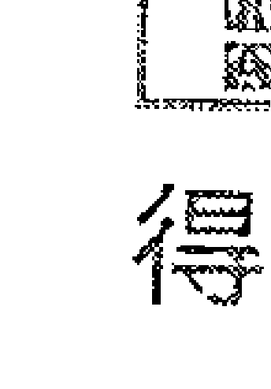

> 可是，要不是因为有宗教，我们又怎么知道如何才能够上得了天堂呢？——堪萨斯市，劳伦斯,15岁

首先，你不可能“上不了天堂”，因为除此之外你别无它处可去。然而，就算假如还有别的地方你可以去，假如你还在寻找通往天堂的“方向”，宗教却往往是使你迷途的求告处。

要知道，地球上有那么多种不同的宗教，每一个宗教都有它自己的一套“路径”，反映出它们各自对“神会怎样要求”的最佳解答。

当然，正如我们已经再三重复过的，根本就没有什么特定的敬拜方式是神所“要求”的。而且事实上，我根本就没有被“敬拜”的需要。

神的本心可没那么脆弱，脆弱到她必须要求人类战战兢兢怀着敬畏向她鞠躬，或者是匍匐在他的脚下做最虔诚的祈祷，以求让神觉得他们能够配得上蒙获恩典。

这还叫个什么神啊？

而这个问题，正是你必须很坦诚地好好问你自己的问题。

你已经知道人是按照神的形与象所创造出来的；然而，有没有可能恰恰是宗教按照人的形与象妆扮出了神的形象呢？

> 可是，既然你是那么的威力无边无所不能，什么奇迹都能创造，那么你为什么不让那些不信你的人统统信你的宗教呢？
——法国，巴黎，雅克，16岁

要让人们相信“我的宗教”，这可是个大难题，因为我实在没有一个宗教。

正如我们刚才讨论过的，每个人都愿意认为我有一个宗教，而且我的这个宗教就正好是他们的宗教。然而，我所创造的奇迹，远远比你希望归功于我的奇迹要伟大得多。

这真正的奇迹，就是每一个人都将回归于我，不论他们走的是哪条路。

你们终将回归于我，因为除我之外别无它处可去。我是那一切万有，除我之外别无它物。

我再告诉你一遍，没有地狱。有的是一种地狱般的体验，也就是当你把自己与我分离开的时候。但是你可以随时随地结束这种体验，不论是在你的今生还是你的来世。

我既是阿尔法①，也是欧米伽②；我既是起点也是终点，我是一切的一切。你根本不可能错过你的快乐终极目标。但是，你却可能延迟到达的时间。

要想缩短你的旅程，仅仅需要你诚挚而真切的渴望。一旦你心怀渴望，我就已经在那里了，你根本不需要“回归”于我。那一瞬间你立刻就会明白，我已经而且从来就一直与你同在。

恰如我现在在这里——这本书里，与你同在。

> 神啊，怎么会有人不相信你呢？——珍妮弗，19岁

每个人都有自由意愿，去相信或者不相信他们所选择的。人的信念大多以他们的体验为依据。

而大师们的人生却是另一番景象。他们的信念不以他们的体验为依据；相反，他们的体验以他们的信念为依据。大师们把一切颠倒过去。或者，更确切地说，是翻转回来。

珍妮弗，有人不相信我，这没有什么不妥。不相信我并不会导致我不是我。

我从来就与你同在，不论你信还是不信。

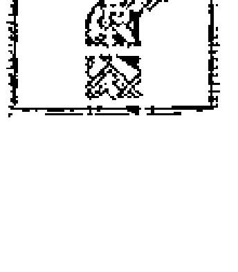

> > 你什么时候重返人间？——史蒂文

我从没有离开过。你知道不知道？我从来就没有离开过！这正是最核心的地方。每个人都以为我已经离去了；然而，我从来没有离开过。

我就在这里，和你在一起，在你的周围，在你的里面。一旦你理解了这一点，就再也不必感到孤独，再也不必感到被遗弃，再也不必感到害怕，再也不必为你怎么才能够、甚至是否能够找到我而感到忧虑。我就在这里。我从来都没有离开过。

你也永远不会离开我，永远，是吗？

神怎么可能离得开你啊？你那么绚丽、那么奇妙、那么独特，让我如何能舍得离开！说真的，你之所以那么绚丽、那么奇妙、那么独特，正是因为我从来没有离开过你。

我们本为一体。你不相信这一点吗？如果你不能相信这一点，那么你就误解了所有我通过你这一生想要展示给你看的一切，所有我想要揭开来让你了解的一切。可是没关系，这个展露的过程不会完结。永远也不会完结。

我们有永无止境的时间来认识和体验这个事实：我们是一体。

> 你的下一位先知会什么时候来？我怎么能知道那就是他？
—— 马萨诸塞州，新贝德福德市，阿什利，17岁

每天每小时每分钟，阿什利，都有我的先知出现。字典上对“先知”的定义是“吐露神圣启示者”，还有，“精神上与品德上有超凡洞彻力者”。在地球上有成千上万个这样的人。你不需要等待这样一个人出现；你只需要当他们出现在你面前时，能够认得出他们来。

阿什利，你，也可以选择让自己做一个这样的人。

我？我怎么可能呢？我永远没那可能的。

能，你当然能。这正是你人生的一个重大秘密。你可以成为你所等待着的一切，一旦你选择自己成为你所等待的，你就不必再等待了。

如果你等待着你生命中的爱，那么让你自己成为你等待着的爱。

如果你等待着你的生活中有谁能给予你同情，那么让你自己成为一个给所有你周围的人以同情心的人。

如果你等待着欢声笑语能注入你的人生，那么随便你走进哪间屋子里时，请你把欢声笑语也带进去。

不论你等待的是什么，当你把它带给别人的同时，你也就得到了它。

请你牢记：
不论你等待的是什么，当你把它带给别人的同时，你也就得到了它。
你就是你正在等待着的。

但愿我能够相信你的这句话。

那你就去相信吧！你相信什么，你就成为什么。

这一点，很少有人能够弄得明白。但这却是一条能令世界为之改变的信息。你可以通过你生活的点点滴滴，把这一信息不断发送出去，即让人们通过看到他们自己真正是谁，而能回归他们自己。

这对许许多多的人来说将是一个伟大的揭示；而你，则成为他们的先知。你不仅仅要这么去想，不仅仅要这么去说，而且还要切切实实这么去做。

> > 做你，是什么感觉？做一个神，那会是什么样的感觉呢？
> —— 爱达荷州，博伊西市，雷蒙德；14岁

好极了！那感觉好极了！宇宙间所有的生命都从我身体里流淌而过，因为我就是宇宙间的所有生命。这是多么令人欣喜、兴奋和惊叹啊。

做我是种什么感觉？那感觉就像……祥和。所有让我感到快乐的一切都在我的里面。

你也是一样。

做我是种什么感觉？那感觉就像……圆满。我是完整的、圆满的、完美的，正如我之为我。
你也是一样。
做我是种什么感觉？那感觉就像……平安。没有什么能够伤害得了我，我将永远是我，永恒的我。
你也是一样。
做我是种什么感觉？那感觉就像……乐趣。每时每刻我都在创造、创造，也每时每刻都在体验我刚刚创造出来的一切。
你也是一样。
做我，实在是太美妙了。做你，也实在是太美妙了。因为，你，就是我；而我，就是你。这宇宙间还能有什么会比你更美妙的呢？没有了。

> 神是从哪里来的？—— 里基，13岁

随处。我来自所有的地方。而且此刻我就在所有的地方。我无所不在。但凡有个“地方”，我就在那里。换句话说，我并不特别在任何地方。
所以呢，你可以说我哪儿都不在。
也可以说，我此刻正在你面前。

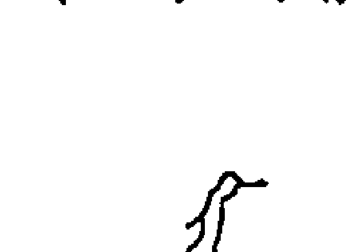

> 你在不在听我祷告啊？你怎么从来都不给我什么征兆，好让我知道你真的在听我向你祷告呢？—— 迈伦，13岁

哦，可是，迈伦，我给了你我就在倾听的征兆啊。是你自己没去看它；要么就是看到了你也没相信。是你常常不去理会那些迹象的呀。

每当你在祷告，有些时候，你的心会跳得更快一些。有些时候，你心里会充满了醇美的安宁。

有些时候，你会觉得因为满心的喜悦而忍不住想落下泪来。有些时候，你会忽然有一种特别的感受，觉得你与万物融为一体。

有的时候，某种深刻的理解、心底深处的某种领悟、对自己或某个人的彻底的宽恕，会流过你的心田。这种种心灵的触动，都是来自我的信号。

还有的时候，你会什么也感觉不到，什么也感受不到。即便如此，这也是我对你的回应。这就是人们所说的“空无”，而这实际上正是我居住的地方。

正是这“空无”，所有的智慧都来自其中，一切的愈合都源自其中。我来自这空无，而且我永远都会回归这空无。只要你愿意放手，你的意念也会走到那里。

为什么你会想要进入空无呢？因为，你会在那里找到安宁。你会在那里找到智慧。你会在那里找到我，正等待着你的我。

正是在这里，所有的思虑、所有的恐惧、所有的悲哀、所有的痛苦、所有的忧愁、所有的误解，都会消逝。正是在这里，你的心终于可以安静下来，憩息片刻。

你可以有很多种方式走入其中。

独自去散步。骑车也不错。听你的CD。在水筏上漂。

还有些人冥想，或者祷告。

所以，不要躲避空无，要学着爱上它。这是你内心深处的神圣领地。

人会自然而然地害怕空无，因为好像那里什么都没有，空洞无物。但是，别害怕。在这里你能找到真正的自我。

因为，你本不是任何一物。你什么都不是。

不论你觉得你是什么“东西”，其实你都不是。人生中的一切的“东西”，包括你的肉体，其实都只不过是你的工具，用来体验你真正是谁的工具。当你使用这些工具时，你最首先发现的，就是你原来不是任何一个工具；相反，你是使用这些工具的人。

这将改变你人生中的一切。

怎么用？我听见你说的话了，可是我听不懂你说的话。

你并不是你的肉体。你的肉体是你拥有的“东西”，但不是你本身。肉体并不能永不毁损；而你，却是永不可毁损的。

不少人以为自己是永不可毁损的，特别是当他们年幼的时候，当他们年青的时候。就好像没有什么可以伤害到他们似的，没有什么他们不敢去做的事情。这倒的确是真 的！不过，这仅仅是针对他们精神上的自我，而非肉体上的自我。

明白了这一点，你就该对你的肉体照顾得比以前更周到一些。你应懂得那是上天给予你的、只能供你使用一时的工具，正如我所给予你人生中的一切。那是一份礼物，而不是你。那是一份给你的礼物，你要开始好好珍惜。

你开始明白，你一生中的所有人际关系，也都是如此。你开始把生活中与你相遇的每一个人都看作一份礼物（这一点的确如此），用来帮助你在每一刻当下创造出你决定了想要去体验的你的神圣本体。

最后，你与生活中各种物质的关系也变得明晰起来。你开始明白，你其实并不真正拥有任何“属于你的东西”，你不过是临时性地掌管一些东西而已。如果你能好好珍惜它们，你就可以享受它们，并且从中体验到你之为你的快乐。

然后，终于到了这么一天，你会变得很容易放下这些东西，心里明白“自其来处尚有更多”，而且明白你并不是这些东西。

你不是那金钱、那工作，不是那车、那乡间别墅，亦不是你辛苦挣到手的任何东西。东西就是东西；而你呢，就是你。不论有没有这些东西，你都是你。

这是一个了不起的觉醒。你的人生将为之从此焕然一新。你不再想要尽毕生精力不断去积攒那些无穷无尽的“东西”，而是更注重在精神层面上不断体验不同的“你”，越来越多的不同层次的，真正的你。

# 与神对话：献给青少年

> ? 我读过你的《与神对话》，发现你不断使用“真正的你”这一词汇。可是，到底什么才是真正的我呢？
—— 日本，东京，清子，18岁

真正的你，是神圣的存在。你不是任何一种“东西”，也不是任何一种你所拥有的“东西”。你是一种精神上的存在，而你的最大喜悦就是去经历去体验你的“存在”。

如果只用一个字来描述的话，这个“存在”的本真就是“爱”。你就是爱。这正是为什么当你爱着的时候，也就是你最幸福的时候的道理。

这也正是为什么当别人不允许你去爱、或者你自己不允许你去爱的时候，那也就是你最悲伤的时候的原因。

除了爱，一切都再也无关紧要。不论是你做了什么，还是你有了什么，或者说你“在这个世界上”是个什么，全都无关紧要了。

毋庸置疑，这个爱字，是神的另一种说法。这两个字完全可以互换。也就是说，真正的你，就是我。你是神圣的一个层面，在这神圣中经历着体验着你自己。

> 我怎么一点也感觉不到呢？为什么我老是觉得我好像在生活中跌跌撞撞，而且往往很不快乐呢？

因为，你已经忘记了你真正是谁，忘记了你来这世间

的真正目的。也许你以为你是你的某种“东西”，当你得不到它们时你就不再快乐。

也许你以为你是你上学的学校、你从事的工作、你的朋友、你的钱、你的车，或者是你的外表，也就是你的肉体所具有的模样；然后你以为当这些“东西”被拿走时，你也就没有了。

现在，正是你竭力想要认清楚自己到底是谁的时候。如果你不能仔细睁大眼睛，你很可能就会用这些“东西”来鉴别你，而不是以你的本真来鉴别你。

你也许会以为你就是你头发上染的颜色，是你穿着的或者没有穿着的衣服，是你驾驶的汽车、你交往的那群人，你以为所有的这些“东西”都是关于你是谁的表白。

但是，假如你真的这么以为的话，也就难怪你常常会感到不快乐了。因为，这些“东西”跟你人生的真正目的实在没有丝毫关系。你来到此生的真正目的，是展现、经历和体验你的本真。

那些“东西”有可能是你青春叛逆的标志，但是他们绝对不代表你内在的最深层的真实内涵。

你不妨流连忘返于这些“东西”之中；不过关键在于你必须清晰地意识到，你无非是享受其快乐而已，你并不会把你自己与这些“东西”混为一谈。同时你也要牢记，不要自伤，不要自毁，这半点都算不上享乐。也不要把你真正的自我隐藏在某种假象的背后，比如说顺随大流、冷

酷无情或者愤世嫉俗。这些也都半点算不上享乐。

如果你对人生感到沮丧和迷茫，请你选择以一种正面的方式表达出来，去帮助别人改变他们的信仰体系。若能如此，那么让你困顿其中的不利环境就会逐渐消散。

尽量不要去怪罪或者谴责你在人生舞台上所遇到的人和环境。与其去抱怨，倒不如你来另写一出戏，亲自担任你人生舞台的导演，做你自己的明星。

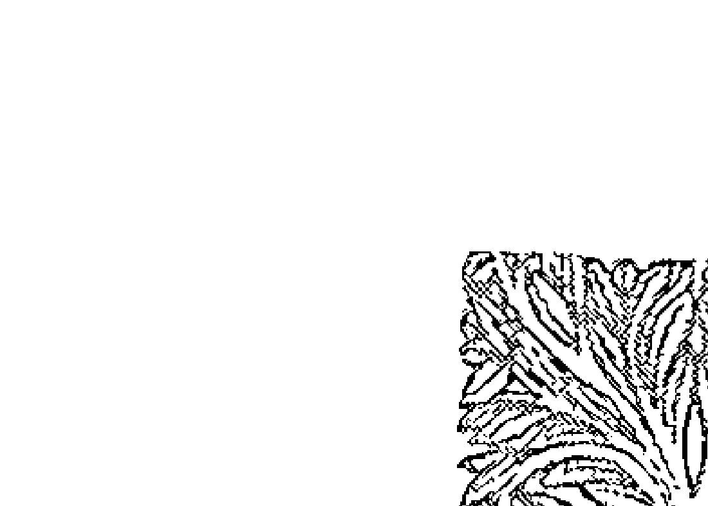

## 第 11 章

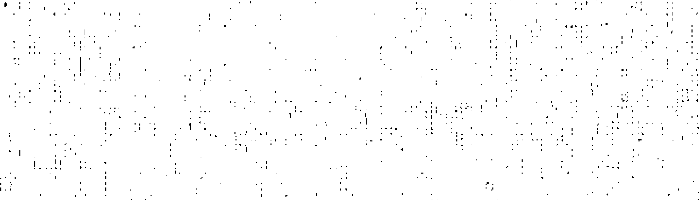

### 成功

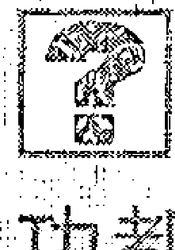

> > 我觉得我必须得做一个各方面都成功的人。我爸妈想我成功都快想疯了。可是，什么又叫做“成功”呢？
> 
> —— 加利福尼亚州，棕榈泉市，萨姆，15岁

萨姆，你问的竟是百年大事；而且，只有你自己才能够回答这个问题。注意，这句话本身就是一个很重要的启示：只有你自己才能够回答这个问题，萨姆，因此，不要让任何别人来替你回答这个问题。

在你们的世界里，几乎所有一切都可以用一个英文叫做“3P”的体系来作为成功的最高衡量尺度：成就## 与神对话：献给青少年

（Productivity）、名望（Popularity）和财富（Possessions）。

在这个3P体系之下，最能干的人，最受人仰望的人，和拥有最多物质的人，就是赢家。你有没有听说过这个笑话，“那个以死拼得最多玩具的人赢了”①吗？然而现实生活中，这对太多的人而言却完全不是个笑话。

那么你对成功的定义是根据成就、名望和财富而言的吗？

我不知道。有时候我觉得应该是的。好像这个世界要的就是这些。我爸妈看来要的也是这些。

如果你选择这些作为成功的定义，那么你也许把一辈子都用来追求做得更多、拥有更多。

钱会对你非常重要，因为它将成为一个尺度，衡量你能做出多大的成就、能积攒多少物质以及能够获得多高的名望，样样都小瞧不得。

你应当知道，这种追求，会把你引向无休止的而且无度的攀比。不仅是你和别人攀比，也包括你和自己攀比。你可能还会觉得，必须让别人看到你的成就在不断增加，这样才显得出你的价值。

假如你在学校里得了个C，别人肯定会推着你去得个B。你要是得到了B呢，就肯定有人想要你去得个A。如果你得了两个A，他们就会要求你得4个A。无休无止，既停不下来，也没有尽头，你不断地感到有压力推着你，去做更多、更多、更更多的成就来。

（甚至有这样的家长，如果他们的孩子能成就的A越多，就奖励他们越多的财富，从而更加强化了成就和财富与“成功”之间的关系。）

强调一个人的“成就”，意味着大家看重的是你在做些什么，而不是看重你怎样做人。这样不仅会给每一个人，也会给整个公司以及他们所需要的人力物力等社会资源，带来难以估量的巨大压力。

可是到今天为止，太多的公司和个人看起来都并不在乎这一点。

是啊，正是因为如此，人们创造出的当今世界，无非是你们祖先过去所创旧世界的现代版而已。如果你也沿着这条路走下去，你就接纳了以数量而非质量作为尺度，来衡量你的人生成功与否。你的这一选择，又将会给你的人生赋予同样的意义。

呃，我并不在乎我有多“能干”，但是我愿意别人喜欢我。

如果你把名望看做是对成功的定义，那么你将毕生追求别人对你的认同。在追逐名望的过程中，你实际上会失去你的自我、你的个性，但你不会在乎。能够留下的是你的“名望”，也就是你之为你的一个小部分，这一小部分将会达到你所谓的“成功”的目标。

（有些政治家就是这样，还有些演艺圈的人士也是这样。他们放弃掉自己真实的思想或者真正的艺术，以博取和留住他们的听众与观众。）

难道想要哪怕并不多的几样好东西，也都不行吗？

对物质的欲望，是生活中非常正常和健康的一个层面。

但是，假如你把财富看作是对成功的定义，那么，你将毕生致力于积攒尽可能多的“好东西”——最大的房子、最快的跑车或者是棒球场上最好的座位……而且，你肯定要刻意让别人注意到，你挣得了这些好东西。

你会漠视你们人类的一句老话，“人生中最美好的就是自由。”你将为了多多赚钱而辛勤奔波一辈子，再用钱换回那些绚烂夺目的物质财富。然后你就会说你的一生是“成功”的一生。

我才不会这样呢。你上面讲的，都不是我。

那么，萨姆，你可以决定用其他的方式来衡量你的成功。

比方说？

比方说做些什么能让你的心“欢乐歌唱”的事情！做些什么能让你一连几个小时“忘掉”自己的事情。做些不图任何回报、不在乎能得到多少酬劳的事情。那感觉就像是“只要你给我个机会”①。

就是就是就是！这才像是我！

那若是把“成功”定义成做你喜欢做的事情呢？你说怎么样？

我爸爸就会说：“你那样怎么能养活自己。”

那好啊，我来邀请你做一个有胆识的人。有些人已经选择了去创造自己的人生，而不是单纯养活自己。

真叫绝！

对，真叫绝。

而且呢，这才是成功应该有的感觉。成功的感觉应该是“真叫绝”，而不是“真叫惨”。

你应该能够这么说：“我可真叫绝！”

可是，有没有一条底线呢？我难道不该去寻求一种能够有所收益的途径吗？

记不记得我先前怎么说的来着？

收益的形式可以多种多样。

但是听着，你大可以依照上面的3P体系去衡量你的成功。只不过要仔细看看那样是否真的有益于这世界上那些正在这么做着的人。

这个3P体系的定义，给你们人类带来收益了吗？

没有。而且我没有遇到任何一个这样认为的人。

这世界上很少有谁作为个人认为那是最好的衡量尺度；但是，几乎全体地球人又都公认那是最好的尺度。至少他们是默认了，可这也是公认。

为什么呢？为什么他们作为个人所不认同的事，却又一致公认呢？

这就叫所谓的“群体意识”。顺随大流可比自己转向相反的方向容易多了。至于这一大群人是否涌向悬崖，则无关紧要——假如真有谁注意到了的话。

我们能阻止他们蜂拥而去吗？

能，真的，你能。这正是为什么从一开始我就说，这本书的到来就是为了消除你的绝望。

你首先能做到的事情，是作为个人重新定义你自己；第二件你能做到的事情，是作为社会的一员重新定义你自己；第三件你能做到的事情，是重新定义“成功”的概念。由此，你能赋予你的人生以新的意义。

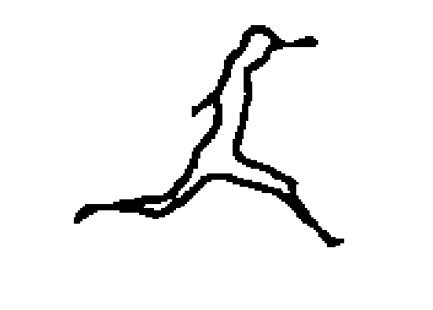

那正是我想要做的事情！我想要找到人生新的意义，我想要给“成功”创造一个新的概念。

你们地球上已经有人这么去做了，你也可以。一旦这么做的人多到一定程度，整个“体系”就会被颠倒过来。

这就是你想要我们去做的吗？

没有什么事情是我想要你们去做的。事实上我也没有任何偏好。你们这种以为神会需要你们去做什么的想法，已经给你们人类带来了很大的麻烦。

我不做任何要求；我只是看着你们做。

请你永远记住：神不做任何要求；神只是看着你们做。

我已经把生命设计成了一个历程，一个可以任你去做你选择要做的、去体验你选择要体验的一切的，生命历程。这就是自由意志的真实意义。

你按照自己的意愿，选择要做怎样的人、要做什么事、要拥有些什幺的同时，你也就决定了你是谁。你每时每刻都在这么决定着。

我已经把这句话一而再、再而三地告诉了你；我以后还要反反复复地告诉你，好让你永远都不会忘记，从而铭记你究竟真正是谁。

假如现在你的选择就是去“把这体系颠倒回来”，把你自己的人生也颠倒回来，那么有不少道路可带你达到这一目的。

这条条大路的其中之一，就是改变你关于什么叫做“成功”的观念；就是重新定义你“人生的意义”；就是认定你人生的目的跟那所谓的“3P体系”没有关系；就是按照完美人生的三大核心，活出你自己：

- 清醒
- 诚信
- 负责

你这“完美人生”，指的是什么？

就是作为一个完整的人而活着。完美人生，就是一个完整的人的人生；是有肉体、有心、有灵魂的人生；是穿越过去、现在与将来的人生。

那是彻底而真实地按照你此时此刻对一切所做的选择而活着。那是随时清醒着你决定要做什么人；那是始终以诚信为本做你的选择；那是对你的所有选择负责到底。

这种活法是对“成功”的全新诠释。有意思的是，这么活着的人，往往也能获得比常人更多的成就、名望和财富，尽管他们并不刻意去追求这些，这些东西自己就找上门来了。不过，这些东西却并不是你走过的这一生所完成的“杰作”，只是“副产品”，而已。

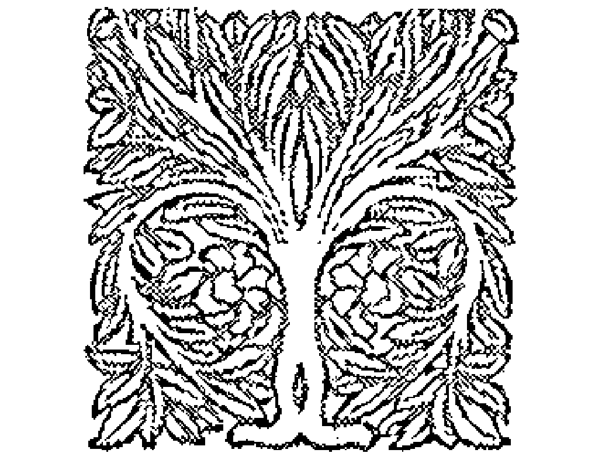

## 第12章

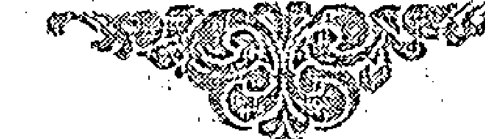

### 爱

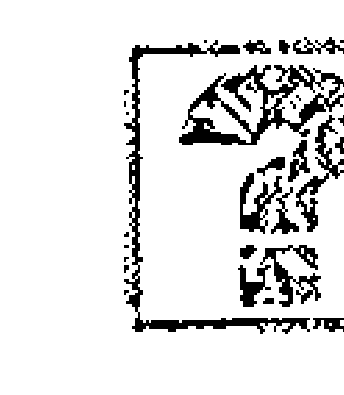

> 女朋友总是说她爱我，可是我还没有这样的感觉，我也不知道为什么。我怎么才能够知道，什么时候才是我该说“我爱你”的时候呢？ —— 保罗，18岁

没有任何时候不是你该说“我爱你”的时候，保罗，也没有任何人不是那个你该说“我爱你”的人。我们这就来好好谈一谈这个问题。不过现在，我先来针对你的问题做一个更直接一点的回答。
什么才是该说“我爱你”的时候呢？当你的心这么说的时候，而不是你的脑瓜子这么说的时候；当你再也没有别的想法，甚至连想法都没有了的时候；当你完全没有了思想而彻底地走进了你的感觉的时候。

请你牢记：当你想要对另一个人说“我爱你”时，必须是你整个儿没了头脑的时候。

哈，这话很不错啊。

我可是非常认真的。如果你还需要再想一想，那就先什么都别说。依然去爱、爱、爱，爱每一个人，默默地爱。在你心田的静寂中，爱，让整个世界都能够感觉到你的那份爱。

就在你这么爱着每一个人的时候，不久你就会发现，你有了一种感觉，渴望对某一个特别的人，以某种特别的方式表达你的爱。

在不同的人际关系中，你会体验到三种不同的爱的情感流露。你们人类把这些情感称为“性爱”、“亲爱”和“大爱”。在你们的日常生活中，这三种爱大致上可对应为罗曼蒂克的浪漫爱情之爱；亲朋好友间的骨肉之爱、手足之爱；以及对神的、对整个人类的宇宙间博大的爱。

这三“种”爱，是不同“类别”的爱，而不是不同“分量”的爱。不同的爱，感受不一样，表达方式也不一样。

然而，不论是对谁的爱，这爱的“分量”却可以是相同的，就好比对弟弟的爱，可以和对丈夫的爱、对整个人类的爱，都是同等量的爱。区别不在于“份量”的多寡，而在于感受和表达上的不同。

说到底，爱，究竟是什么呢？

你们的诗人和哲学家已经用了好多个世纪来回答这个问题了。有人曾经说过，爱就是一种超越彼此的体验，那已经非常接近事实了。

爱是一种合而为一、融为一体的体验，其中分不出彼此，也没有谁会想到要分出彼此来。在这里，彼此之分成了幻象，合而为一则成为实像。

这，才是终极实像，这才是一切的真实面目。你们并无彼此之分，而且你们从来就没有彼此之分。爱，就是人们要去证明并体验这一真相的热切愿望。

当你发现所有人的最高利益都是同一个时，你就会知道，你正沐浴在爱之中——对自己的爱以及对别人的爱。

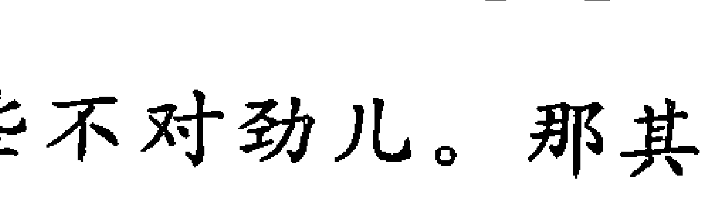

谢谢你，这很有启发。但是，我还是不能明白，我怎么能分得清我对女友的感觉是肉欲还是爱？我怎么知道我所向往的是否仅仅是性，还是更深层的东西？

“仅仅是性”这几个字，给人的感觉就好像不可以仅仅是为了性，否则就有些不对劲儿。那其实是我们前面已经谈论过的老脑筋，什么“为性而性”就很不好啦、你要为这种欲望感到羞耻啦、你肯定错的不能再错啦、那绝对不可以做的啦，等等。正是这些老脑筋，不但造成了人们对性怀有诸多渴望，也同时对性怀有罪恶感。然而实际上，性本是很自然的向往，而且是我把它铸进了你身体里的。

好吧。那我该怎么知道对女友的感觉是这个还是那个？是肉欲还是爱？

审视你想要和她在一起的目的。如果你跟她在一起，你满脑子里装着的全都是性的话，那么再审视一下这是在告诉你些什么。不要把这些感受归为“坏”，那无非是你的感受而已，无非是你置身其中罢了。

在十几岁的年龄段里，性欲和性激素都会相当的强烈，而且也是很自然的事情。这当然并不意味着所有你向往的都应该是性，但它的确意味着更深地审视你的感受是明智之举；意味着当你要说“我爱你”时，更透彻地想清楚这句话的真实含义，是明智之举。

那“我爱你”的真实含义是什么？

一个词本身的意义，往往和人们赋予它的意义相差甚远。因此，我很理解你为什么对此感到困惑，理解你为什么对究竟该何时说出这句话感到很茫然。

很多很多的人赋予“我爱你”的意义，是“我是你的，我属于你”；或者反之，“我拥有你”。这层意义很快就会演变成，“我现在欠了你的，你也欠了我的。所以我的任务就是使你幸福，而你也必须这么对待我”。

这根本不是“我爱你”的真实含义；但这却是许多人想要塞给它的含义。他们不但需要它有这个含义，更坚持认定它就该是这个含义。正是因为如此，很多人都想听到这句话；也正是因为如此，很多人都非常难以开口说出这句话；更是因为如此，几乎所有的人都做不到他们赋予这句话的意义。

如果说“我爱你”的含义不是这些，那又是什么呢？

“我爱你”的意思是说“我心中的神拜望你心中的神”。

我以前听到过这句话，这不是“纳玛斯德”①的意思吗？

对，那是“我爱你”的另一种说法。

可是，我们认为“我爱你”意味着我已经准备好更进一步走下去，我正在把我们之间的关系推向更深一层，在我心目中你已经不同于其他人。“我爱你”的意思是“你对我有特殊意义”，是“没有其他人像你一样”。至少，我想的不是你说的那样。

当然可以是你这样的含义，这需看你所体验到的感受如何。记住，就爱而言，你怎么去感受、怎么去表达你的感受，这都会因为你在其中的不同定位而不同。不过，你切不可混淆了不同的爱与不同量的爱。

你把某一个人视为与众不同的这种观念，导致了你人生中的诸多困扰。因为人们以为人与人之间的关系是爱某个人比爱其他人更多些，然而人的灵魂真正的意愿却是以不同的方式来爱某个人。爱不同，则感受不同。

实际上，你天生有能力以爱的眼光来看待每一个人。

等等！你是说，我们应该爱每一个人？

你并不“应该”做任何事情。谁来规定什么叫“应该”？谁又“应该”来推行这些规定？答案是，没有谁。

所以，那不是一个“应该”与否的问题，那是你有能力做到什么的问题。

你有能力爱每一个人——同等地爱——不是指同样的爱法，而是指同样真挚地爱。

这就是爱的一个重大秘密。

请你牢记：爱是无法计量的。

爱不可能用量具计量出不同的量来。你不可能爱这个人“一点点”，而爱那个人“很多”。你要么就爱，要么就不爱。

请容许我再说一遍：你怎么感受你对每一个人的爱，那是另一回事。

你所表现出来的对爱的不同感受，是对这些不同感受的不同反映。但是，爱本身却无可计量。

人们大多以为爱是可以以数量来计量的，而且以为爱就应该如此计量。这是人类的又一大误解。

难道我爱我妈妈就不该比爱一个陌生的异族人更多吗？难道爱我的女朋友就不该比我爱学校的其他女孩更多吗？

这不是“该”或者“不该”的问题。你不要规定自己“应该”怎样，也不要让别人来规定你“应该”怎样。

这是一个关于明白你真正是谁，每一个别人又真正是谁的问题。

你，就是爱。那就是你的本质，那就是你真正是谁。爱是铸造你的能量，正是这能量把你凝结成了你。

（也许，这就是为什么当你觉得别人不允许你去爱时，你的心仿佛就会“破碎”了的原因吧。）

你是生命本身所具有的能量，是具体化了的神。用另一个词来讲，这就是爱。

神、生命、爱，这三个词可以相互转换。你就是神，神就是生命，生命就是爱，爱就是神，神就是生命……如此继续下去。

这是一个永无终止的循环，这些都是同一回事儿。

也就是说，我应该像爱我的女朋友一样爱学校里的所有女孩？

不是你“应该”，而是你“能够”。

我女朋友一定会为此很生气。

再次请你记住，我并没有说“以相同的方式”来爱，也没有说以相同的感受来爱；我所说的是“以一样深”的爱来爱。

人世中的一切都是振动。振动就是一切的一切，也是你的一切。你既有可能和其他振动彼此兼容，也可以与周围同步谐振。

彼此兼容意味着你的振动与其他振动相融合。这些振动以不同的振幅同时进行，而你融合其中。

同步谐振意味着你的振动与其他振动以相同的振幅同时进行，你们步调一致。

这是一种非常抽象的说法，它阐述了一个道理：你既可以与不同的人有不同的爱的感受，也可以与相同的人在不同的时刻有不同的爱的感受。

这一说法诠释了人们对某个人的爱比其他人更多意味着什么，他们体验到的其实是对这个人的爱不同于对其他人的爱。这爱的“振幅”不一样。

原来如此。

当你彻头彻尾是真正的你时，你会发现你同样深地爱着每一个人。你不会爱某个人比爱其他人“更多”些，你无非是以不同的方式爱着罢了。

这也是父母爱孩子的方式（但愿他们如此），假如他们有不止一个孩子的话。父母不会厚此薄彼，他们对孩子们的爱是一样深的。这同样也是祖父母爱他们所有孙辈的方式，也是神爱所有人的方式。
这就叫做无条件的爱。
实际上，爱，根据其本身的定义，就是无条件的。任何低于这一定义的爱都不再是爱，仅仅是各自为阵的自我利益。而爱，却是联合统一的自我利益。
爱，就是当一个人把所有其他人都看作是自己的一个部分时，所体验到的自我；爱，就是你把所有的别人都看作你的一个部分；爱，就是这联合统一得以表达。

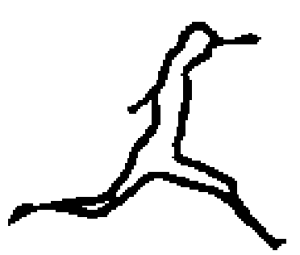

我怎么可能假装我和别人没有不同？那不是明摆着的不同吗？

没有谁说你和别人没有区别。我在这里说的是，你和别人之间没有分离。
你的小手指和你的大拇指不一样，但是它们彼此不相分离。它们都属于同一个被你叫做“手”的一部分，而“手”又是那个更大的被你叫做“身体”的一部分。
与此同理，人类是我身体的一部分，是我的组成部分。若想要再感受一次做我的体验，你所有要做的事情就是重组你之为你。也就是说，再次成为神的一个组成部分。

因此，你决定不去爱所有的人，也就是决定不去爱你自己的一部分。

站在哲学的角度上来看，这些是很有意思，可是，这跟我跟我女朋友又有什么关系呢？

像爱你女朋友一样深深地爱每一个人，然后看看你的人生会有什么变化。

请展示你对人类同胞以不同的方式但是同样真挚的爱，你将由此改变整个世界。

这正是耶稣做过的事情。这正是佛陀做过的事情，这正是克里希纳做过的事情，这正是穆罕默德做过的事情。

你说得是；不过，我并不是神……

实际上，你是。这恰是我正在跟你说的话。而且，即便是那些你们认为是“常人”的人，也做过这样的事。比如，修女特蕾莎、甘地还有马丁。路德。金。

我也并非圣贤。

你是你说你是的人。如果你说你并非圣贤，那你就是非圣非贤，只不过是根据你自己的定义。而按照我的定义，你就是圣贤，因为我创造出来的都是圣贤。

好吧，那你的意思是不是说，我现在就可以去对我的女朋友说“我爱你”了呢？

请记住我们刚刚谈到过的完美人生的三大核心：

- 清醒
- 诚信
- 负责

如果你能清醒着走，你不仅将会非常清醒地意识到当你说“我爱你”时意味着什么，也更能意识到当下你们绝大多数的人所赋予这句话的意义。如果你的意思并不是你所知道的他们赋予这句话的意义，那么你需要看清楚他们会怎样理解你说的话。

请记住这一点：你说出一句话之后，人们大多以为你说的这句话的意思就是他们说这句话的意思。

你的意思极少真的和他们的意思一样；但是人们总认为你的意思就是和他们的一样。你要对这一点保持清醒，这非常重要。

其实不少人已经明白了这一点。所以，针对大家正谈论着的话题，他们故意让别人以为彼此之间想的和说的是一回事儿，而实际上他们明明知道那不是一回事儿。这就叫做“操纵”。

如果你故意让一个人那么以为，而实际上你这么说时所想的并不是那么回事儿，这就是一种撒谎。而且人们认为这是最卑鄙的一种撒谎，因为你并没有说出任何不真实的话来，只是让别人得出了一个不真实的结论。

如果你能诚实着走，你就不可能这么做，你不会说那些你明知道别人很可能误解的话。因此，如果你能诚实地对你女朋友说“我爱你”，而且你知道她听到以后所想的就是你想说的意思，那你只管去说！如果你不能，那就别说。

## 我怎么能知道别人怎么想？

你可以问他们啊。

你还可以试着去说“我爱你”，同时诚实地告诉她这句话对你意味着什么。假如你发现你们对这句话的理解有出入，那么澄清它。

> 圣经说：“要爱你的敌人”。可是一个凡人怎么做得到呢？我是说，我猜我能够理解圣人怎么做得到；但是一个像我这样的平凡的人，又怎么可能做得到呢？
—— 西班牙，马德里市，玛丽娅，14岁

要能进入一个能爱一切人的境界，包括爱你的“敌人”，第一步是你先要进入一个能爱你自己的境界。如果你无法给予自己，那么你就无法给予别人。

假如你做不到无条件地爱你自己，你就无法做到无条件地爱别人。

请你牢记：你不可能给予别人你根本就没有东西。

因此，你要爱，爱，爱你自己。要把自己看做完美的你，而这也就是真实的你。在神的眼里你从来如此。

若要神爱你，你不必减肥，不必改变你的生活方式，不必改掉你的旧习，不必考出更好的成绩……你完全不必做任何的改变。不管你信与不信，本真的你十足地可爱。

请你牢记：本真的你十足地可爱。

明白这一点，将改变你的一生。

相信这一点，你将改变所有人的生活。

这是因为，你相信什么，你就变成什么；当你变得十足地自爱时，你最终将给你自己以爱的能力，让你能够爱所有的人，而这足以改变世界。

谁想去“改变世界”啊？我只想把这个星期给挨过去。

你可以二者同时兼顾嘛。

明明看到自己有很多地方我不喜欢，又怎么能爱我自己呢？

—— 加拿大，魁北克，蒙特利尔市，妮科尔

想想看，你不喜欢的地方，有没有可能恰恰是你最好的地方呢？

我的毛病恰是我最好的地方？

对呀。那本是你最好的性格特征，只不过也许“音量钮”拧得偏高了一格。

我听不懂。

你身上那些别人说是“率性天真”的地方，也是别人说你“不负责任”的同一个地方，只不过“音量钮”拧得偏高了。

你身上那些别人说是“勇敢”的地方，也是别人说你“鲁莽”的同一个地方，只不过“音量钮”拧得偏高了。

你身上那些别人说是“自信”的地方，也是别人说你“自大”的同一个地方，只不过“音量钮”拧得偏高了。

这些所谓“最糟糕的缺点”，其实就是你的最高品性，只不过“音量”拧得太高了使得“音乐”不再悦耳罢了。

别人可以因为你的某一优点而爱上你，可是一旦他们觉得你走得太远了，又可能为了这同一优点抨击你。

他们可以因为你善于果断决策而爱上你，可是假如你太频繁地什么都能做出决断，他们又会说你“独断专行”。

他们可以因为你解决问题的出色能力而爱上你，可是假如你太频繁地什么都能解决，他们又会说你“逞能耐”。

他们可以因为你很有幽默气质而爱上你，可是假如你太频繁地什么都能幽上一默，他们又会指责你“轻浮”，说你“油嘴滑舌”。

你的同一个性格特征，既可以让别人爱上你，也可以令你遭到批评，这要看“音量钮”拧到什么地方。

我从来没有这么想过。

最让人振奋的是，看透这一层就意味着你不再需要勉强自己改变什么来使得你更可爱些。

你不需要否认自己的某一部分，不需要责罚自己的某一部分，不需要舍弃自己的某一部分。

你不需要“编派”自己任何的“不是”，不需要试图抹去“缺点”好让你变得更好。

# 与神对话：献给青少年

所有你需要做的，是稍微贴近一些去审视你的人生，随时看看你什么时候，哪个部分应该“展露”出来，应该展露到多大程度才好。也就是随时看看你需要把“音量钮”拧到哪里才恰当。

现在你明白了？

明白了！太好了，我知道了！

很好。这很值得你好好牢记在心。那些别人认为你“不好”的地方，也正是他们欣赏你的地方，只不过因为他们在不同的时候，或者在不同的能量层次上，感受有所不同而已。

明白这个道理的意义，在于能够让你重新爱上你的全部，就恰似你小时候曾经全心全意爱你自己一样。这能让你彻底放松下来，是你自我更新、自我修复的美妙时刻。你因此而能够把“你”重新给回你自己。

哇噢！这也许就是我最应该读这本书的理由。我是说，这样我才能“知道”这些话！

真的可能呢！

哎，我这里有个诀窍，这诀窍就是要“醒着走”。你要把握每一刻你得到的机会，奉献你本真的天资与才能。

要好好看看，你需要奉献哪部分才能、展现多大的量，方能使这一刻生动起来，使这一刻更加美好；也同时要好好看看，哪些部分哪些方面你可以把“音量钮”拧得低一些。

你还需要意识到，有些时候你能奉献给别人最好的东西，就是给别人留出空间，让别人也能奉献出他们的天资与才能。也就是说你要学着让别人也能最恰当地“展露”他们自己，哪怕你相信你肯定能做得更好。

请你牢记：有时候，你能奉献给别人的最美好的礼物，是保持缄默。

谢谢你，谢谢你所有这些话。咱们这番对话实在很痛快。

不客气。我很高兴我们正在如此痛快地畅谈。

> 为什么爱一个人总是这么痛苦？这本应该是件让人感觉非常美好的事，可是我却已经为此伤心够了。 —— 蒂法妮，18岁

蒂法妮，爱一个人不需要这么痛苦；可是，假如一个人把“爱”和“需要”混为一谈，那就少不了痛苦了。

很多人以为爱是对需求的一种满足。换句话说，假如你能满足我的需求，那我就爱你。

我能理解这样的观念是哪里来的，因为人们长久以来得到的教诲，就是“神”即是如此，你若满足了神的要求，神就会爱你；如果你做不到，神就不爱你。

尽管这根本不是你与我之间的真相，但你就是这么被教导大的。这些教义很难撼动，也让人很难漠视。

所以，让我们从这里开始吧。

神不需要你的任何东西。我不需要你敬畏我，不需要你服从我，不需要你以某种特定方式归顺我以求自赎。

呃，这可就实实在在地把地球上所有宗教的帽子都给吹掉了。

抱歉。可事实就是这样！

神是一切中的一切，是阿尔法也是欧米伽，是起始也是终结，是不动的永动，是万物之源，是一切万有。

没有什么是我所不是的，没有哪里是我所不在的。因此，这定义本身就已经阐明，我什么都不需要。

请你牢记：我什么都不需要。

与之相随的是一个无懈可击的逻辑：既然我什么都不需要，我就不会因为你没有给我什么而惩罚你。那包括了你对我的个人效忠，对我的某种特定仪式的朝拜或归顺，以及因你的归顺而承认了我的存在。

我不需要你承认我的存在，不需要你向我祈祷，不需要你为我做任何事情。而且，我也不会因为你不做这些事情而罚你永受地狱之火。

我已经在第10章解释过这一切，但我还是要在这里重申一遍，因为说不定你并不是很理解我前面的话，或者你还不敢相信。

请相信这些话。

这些话和爱又有什么关系呢？

很有关系。人类之所以以他们现在的方式爱别人，正是因为他们以为神就是这样爱他们的。人类以为爱就是对他人需求的虔诚回报，而实际上，根本不是这么回事儿。爱不是一种回报。爱，是一个决定。

有一个叫斯科特·派克的人，把这句话写进了他几年前出版的《少有人走的路》一书中。那正是我给了他灵感，我很高兴他写了这本书，因为太多的人尚不明白这个天大的事实。

绝大多数人因为对神的误解而归纳出对爱的误解，以为爱是一种回报。你们完全误解了我为何爱你们、我怎样爱你们。

我爱你不是因为你为我做了些什么，我爱你只因为你是你。
仅仅因为你就是你。
你能理解这一点吗？你能领会这一点吗？我的爱，是我的一个决定，而不是一种回报。

我觉得我能理解吧。可是，那是不是说，不论我们做什么，都不能博得你的爱？

你不需要去博得，你已经拥有了我的爱。
玫瑰花需要去博得雨露吗？
冰激淋需要去“博得”你的爱吗？冰激凌就是冰激凌而已，你就是爱它。
你不妨这么想：你就是神的甜心。

这说法好可爱，我喜欢。

谢谢你。

现在你明白了我爱你仅仅因为你就是你，你不需要做任何事情来“博取”我的爱。我不需要你的任何东西。请你也把这种模式作为你的新的爱的模式。爱不需要任何理由。爱既不是报答，也不是为了换取什么而给出的贿赂。

真正的爱，是你做出的一个要怎样对待另一个人的决定。如果你所做的无非是对另一个人的所做所为的回报，那这就全然不是你对另一个人的爱，而是一种虚情假义。

如果在你尚未知道别人也许、可能、将会怎样为了你或者和你一起做些什么之前，你就已经做出了爱的决定，那就是一个很高层次的决定。这时你不知不觉加快了你的“振动”，也就是说，你本身实际上开始以更高的频率、更快的速度“振动”。

这时，从你身上会辐射出爱的情感，就好像太阳光芒四射。人们跟你在一起会觉得自己心情舒畅，他们也会因此而觉得你赏心悦目。

忽然间，他们也加快了他们的“振动”；于是乎，你发现你身处谐振或者共振之中。

你的心这时开始飞翔，爱的火花开始飘扬……

但是，我怎么可能决定爱上我一无所知的人呢？

你爱他们，是因为他们是谁呢？还是因为你是谁？

哇，好一个问题！

是个好问题。那你怎么回答呢？

我觉得我大概从来都是因为他们是谁而爱他们吧。

谢谢你这么坦率。现在，请你改变你爱他们的理由，你爱他们是因为你是你。请你让人们知道，你对他们一无所求，你的爱并非建立在你能从他们身上博取什么的基础之上。

可是，我的确需要从我爱的人身上博取什么啊，我没法否认这一点，因为，我就是这样的啊。

不，你不需要。你不过是以为你需要而已。

你完全不需要从他人那里得到任何东西来愉悦自己。

事实上，在你尚未遇见哪怕连半数都不到的你认识的这些人之前，你已经有过不少这样快乐的时光。

不错，是这样。可是一旦我认识了他们，我就再也离不开他们，尤其是他们当中的某几个人，尤其是那个“特别意义”的人。

事实并非如此；但是你越把它当真的去想，事情就越好像真得不能再真了。而且，你这样的想法，其实会把你带向快乐的反面。因为，你首先会说服你自己没有某个特别的人你就快乐不了了；然后你会觉得你的人生中仅仅有这个人还不够，你还需要这个人以一定的方式伴陪你的人生。（也就是说，他们必须是你的正式男朋友或者女朋友，他们必须跟你“搞对象”。）

然后你会决定，为了能够使自己快乐，你必须以一定的方式、以一定数量的时间拥有他，比方说，他能够有的每一分钟的空闲。

很快你又会设想，为了能够使自己快乐，你必须以一定的方式时时刻刻拥有那个人！你甚至会惊觉你居然说没有那个人你“就会死掉了”。当然，你的意思不是真的就会死掉；你的想法其实是假如那个人不肯陪伴你一生，你会觉得你的某个相当大的一部分就会“死掉了”。

好，现在就到了最让人迷幻的关键地方了。为了使你不至于一旦失去那人时也让你自己相当大的某个部分死掉，你会扼杀掉那个人相当大的某一部分。

你会扼杀掉那个人的精神。

你会用你的爱、还有你对那个人的爱的需求，紧紧地扼住对方的咽喉，令对方窒息、令对方呛咳，最后对方为了求得生存而不得不把你给扔出去。

你爱的那个人会逃离你，可这真是痛苦，因为他们真的喜爱你，甚至可能真的已经爱上你了……可是他们实在满足不了你的需求。

这听起来好像你就跟我身边似的。

我真就跟在你身边嘛！但这不是我知道这一切的原因。我知道这些，是因为你们人类的绝大多数就是这样体验你们的爱的；而且还因为我知道你把“爱”与“需求”混为一谈了。

不过呢，我这里有个好消息给你，请你要牢记：你不需要向你自身之外寻求任何东西来使你快乐。我知道，你以为你需要向外寻求，但其实你并不需要。这只是一个幻象，是人类十大幻象中的第一个幻象。这幻象就是人们以为你有需求的，就是你以为你会需要你自身之外的什么人或者什么物。

假如你还是认为你有需要，那么请试试下面的练习。

- 1. 写一份清单，把你觉得能让你快乐的人名、地名、物品全都列出来。
- 2. 现在，回想你曾经没有这些而仍然快乐的时光。
- 3. 现在，问你自己，“为什么我现在觉得我如果要快乐，就需要这些人、地、物？”

如果你对自己十分诚实，你会很明白其实你并不需要这些。你可能更愿意用这些独特的工具来创造你的快乐，但是你并非离不开这些。因此，不要把你的偏好误解成你的需求。

> 每当我有了女朋友，她总使我“偏离航向”。我是说，我自有我生活中想要做的一些事情，可是一旦我被一个女孩子拴住了，我就好像总要沿着她的方向走，要么就是她想要和我一起走的新航向，而我却背弃了我自己的旅程，这究竟是为了什么？ —— 路易斯安那州，巴吞鲁日市，W.，19岁

这都是因为恐惧，我的朋友，都是因为恐惧。如果按照你现有的人生计划，继续去追求你的事业或者其他人生理想，你就会害怕当下这个女朋友是否因此而不肯陪伴你一生，所以，为了得到你以为你想要的人生，你不得不放弃了你原有的人生道路。

而这样做的困扰在于一段时间之后你会越来越清醒地意识到，这样的人生并不是你本来想要的人生。于是你变得乖戾、易怒、情绪化。你说不出来有什么事情特别“不对劲儿”，但是没有什么能让你觉得“对劲儿”。

不久，这种感觉就会渗透了你和她的关系。于是，幸运的话，这段关系就算是结束了。

如果不幸运的话，这段关系会延续很长一段时间，也就是说，你会生活在默默的绝望之中。

### 我该怎么打破这个套路？

我这里有两个很重要的人生问题。

- 1. 我将要去哪里？
- 2. 谁会跟我一起去？

绝大多数的人差不多都问过自己这样的问题，不过人们大多都把问题的先后顺序给弄颠倒了——他们总是先问第二个问题。

也有些人在他们初次相遇的时候这问题的顺序没有弄反，可到了后来他们却会把问题的顺序颠倒过来，以求得到更好的答案！

假如你也是这样，那么，你的恋爱与婚姻就可能遇到很大的困扰。

> 我妈妈和我一直努力想让家像个家的样子，既给我妈找个伴，也给我找个爸爸。可是，我们的努力一直是竹篮子打水，这是怎么回事儿？
—— 贾森，14岁

也许那不是回事儿。

你这是什么意思？

我的意思是说，也许事情的现状自有它的完美之处，你要做的一切就是领略其中的完美。这就是那些想要让自己从“不快乐”变成“快乐”的人，在人生中的每一刻都需要做的事情——去领略其中的完美。

不论出现什么事情，不论事情怎么发展，去领略其中的完美。不论是你希望发生却没有发生的任何事，去领略其中的完美。

然后对之心存感激。内心深处说声谢谢。

我怎么做得到？我怎么能对根本就不是我想要的人生说声谢谢？

在某种意识层面上你其实知道，那恰恰是你想要的人生。
站在灵魂的高度上你其实理解，一切自有它的原因，包括为什么你的人生之路是这条路，为什么发生了的事情那个样子发生了，为什么正要“出现”的事情会这个样子出现着。

哦？都是什么原因？

你是一个精神的存在体，投身于你这副皮囊就是要体验你之为你。为了做到这一点，你每时每刻都把一切的人物、地点、事件恰到好处地引向你，使你可以恰到好处地体验到你想要体验的一切。

你每时每刻的当下，都在不断重新创造你自己的进程当中。

你已经说过这些了。

我现在重申并强调这些，这就是你来到人世间的原因，这就是你过此生的目的，其他所有一切都是幻象。这一进程叫做提升，你灵魂的提升。

如果现在你明白了这一点，那么一切会从此改变，你不再以过去的眼光来看待一切事物。你不再把灾难体验为灾难，而视为一种时机。曾经的灾难变成了如今你宣告并创造、做出并展现、成就并履行你真正是谁的时机。

这整个世界都被创造成了一个你施展这一切的大舞台。实际上，整个宇宙都是这大舞台，而你们的地球就是你在舞台上的位置。

> 你什么时候才会送来一个能爱我并包容我一切的人（包括我的毛病缺陷），就像我包容和欣赏其他人一样？
> —— 卡里，19岁

卡里，我早给你送来了，就是我！

这个这个，神，你知道，我感谢有你。可是我也希望能有这么一个人，在我的生活中和我一起分享我的每个白天与黑夜。

我知道，我理解。现在我就来告诉你该怎么找到那个人。

太好了！

你去做你想要找到的那个人就可以了。

我去做我想要找到的人？

对呀。与其找一个别人来爱你，不如你去做那个值得爱的人。奉献你所希望得到的，做你所希望认识的人。这就是所有人生中最大的秘密。

去做你想要找到的那个人，于是那个你想要找到的人就会来找你。

每个人都在寻找相同的东西。因此，你不要去做一个寻找别人的人；相反，你去做那个大家都在寻找的人吧。

## 第 13 章

### 毒品

> 我就是稍微尝一下毒品而已，为什么所有人都吓的要死？
> ——法国，巴黎，瓦莱丽，17岁

在我们进入这个话题之前，首先澄清一下我们对毒品的定义。毒品就是毒品，这跟它是“合法”还是“非法”没有关系。有些人们称之为“医用药物”，有些称之为“康乐用品”。不管是医用药物还是康乐用品，滥用都可导致很严重的问题。滥饮也是一样，酒也是毒品的一种。

现在我来回答你的问题。要说只是稍微尝试“一点点”毒品，那你们人类几乎没有人真能做得到。

毒品是非常厉害的，瓦莱丽，它会在你尚未察觉之前就控制了你整个生命。而这，就是问题所在。

几乎所有的人都发誓，斩钉截铁地发誓，说他们能把握得住自己。他们很厌烦别人来提醒他们要留神、要小心，千万别靠近那些东西。因为，他们觉得自己比毒品更强大、更厉害，觉得自己比别人更有能耐对付毒品。

很多司机也这样自以为是。他们握住方向盘时，一种莫名的愚莽不知不觉控制住了他们。他们想的是自己在弯道上飞驰得多么娴熟，哪些那些小心翼翼落到我后面的笨蛋。他们只想着要把油门一脚踩到底，倒霉事嘛肯定不会落到我头上的。

这种念头在酒后开车的人当中也很盛行。你们谁都觉得“能把握得住”，尽管统计数字告诉你们，车毁人亡的事故中，酒后开车占很大比例。但是，统计数字算什么，事实又算得了什么。只有风驰电掣的快感，那才算数。

要是把鲁莽驾驶和吸毒或者饮酒加到一起，你可就命悬一线了。

可是那些我认识的朋友明明就在吸毒，而且他们就是认为自己控制得挺好的，没有任何问题。

毒品的特别之处在于它能扭曲你的想法。你想着你能控制好自己，你觉得是你在控制着自己，但实际上，是它控制着你，从你第一次开始就控制住了你。它是杀人不见血的东西。

我来给你说个龙虾和水的故事。

有一天，一个餐厅厨师把一只龙虾放进锅里，准备煮了它，龙虾半点没有打算逃跑的意思。你知道为什么吗？因为那水是凉的。假如锅里的水是烫的，龙虾肯定使劲往外爬好逃出去；可是，那水并不是烫的。

那厨师把龙虾放进锅里以后，他才拧开炉子。即便如此，他也把开关拧在最低挡上。那水花了好长时间才烧开。等水温热到足够能煮熟龙虾时，那龙虾都还不知道发生了什么事情。

假如你在炉子刚拧开不久的时候去问那龙虾，“你怎么不赶紧逃出来啊？你没看见你要遭殃了吗？”

那龙虾一定这么告诉你，“别傻了吧你，我在这水里正游得欢呢。”

所以你觉得我朋友的处境比他们知道得要更糟糕。

我们不妨说他们现在不在热水里。

我要再说一遍。毒品从你第一次尝试起就已经开始控制你了。你不会这么想；可是它们这么做。而你不这么想的原因恰恰是它们所起的作用。

毒品使你不再能做正常的思考。累积到一定的量，它们就能彻底让你不再思考。

“噢，我知道什么时候我该戒掉。”

这句话，是成千上万被吸毒和饮酒毁了一生的那些人，在毁灭之前最常说的。

最后一句话。

也许这些东西是挺危险的……根本就不是什么“也许”。

……可是我认识的那些人，只不过是想得到那种飘飘然的感觉而已。

可叹的是那些吸毒、饮酒的人，每每在体验“飘然”之后，再跌入低谷。事实上，那是你能跌得最深的低谷。

尤其可叹的是，你们根本不需要吸毒饮酒，就可以活得“飘飘然”。

是啊，是啊，我知道，“飘得高跌得惨”。①

就是那样！

那可真……怎么说呢……很惨。

在这世界上很多原本很美好的东西被弄得很惨；而本来很惨的东西，又被弄得好像很美好。从这一点上来说，这世界上太多事情都弄颠倒了。

如果你想要寻找的是一种特别的美好，那么没有什么会比人生更加美好的了。人生就该是它本应该有的样子，而不该是被毒品扭曲了的这样的人生：大脑被毒品蒙蔽、身躯由毒品驾驭，只剩下一颗绝望的心和一个受到压抑的灵魂。

而我这里要说的人生，应该是这样的人生：大脑清醒明澈、身躯生机盎然，还有一颗诚挚的心和一个得到提升的灵魂。

我这里所说的快乐，是纯粹的快乐、真正的快乐；而不是人为地用兴奋剂制造出来的虚假快乐。我这里所说的，是一个很高层次上的“做人”、“做事”和“拥有”的快乐。

这个“做人”、“做事”和“拥有”，是人生体验的三个层次。一切体验都来自“做人”。你做什么人决定了你会做什么事，而你做什么事又决定了你会拥有什么。你可能从来都没有这样想过，但事实就是这样。

若想要快乐生活，那取决于你要做什么人、做什么事、拥有什么，来使你的灵魂欢跃、你的心灵歌唱、你的神思飘扬。

> 我怎么能体验到这个境界呢？你是说我也能体验到这个境界吗？

这整本书说的都是这个；这正是本书所想要告诉你们的。无论你翻到哪一页，你都能找到提示、线索和工具，来帮助你决定，你要做什么人、做什么事、拥有些什么。

而毒品，不会给你这些。毒品不是这些工具中的一种，它们只会摧毁这些工具。

> > ① 一个关于青少年吸毒的专题报道影片。 ——译者注

# 与神对话：献给青少年

## 第14章

### 学校

> 为什么学校教给我们的是死知识，而不是如何思考？
> —— 特里斯坦，14岁

因为思考很危险，假如一个人想要让事情只按他的心意进行的话。而你们的社会，就是这样一个社会。

几乎所有的社会团体都很看重让事情按部就班，因为就是这“步”这“班”，使得一个社会团体成之为一个社会团体。

一个“社会团体”，其实就是由一群按照一定的方式来看待问题的人所共同组成的。这一群人拥有共同的传统、共立的机构、共有的行为、共享的利益。任何有可能威胁到这些传统、组织、利益的事情都必须加以反对，当然更不能允许传授给他人了。

毫无疑问，对此，没有什么会比新的想法更具威胁性的了。因此，人们鼓励孩子去“学习”，但不鼓励他们去“想”得太多。

“想”会涉及对各种观念的思考；而“学习”涉及的只是简单的记诵。

完全就是这样！要背诵总统的名字！首府的名字！各场战争！这些个史实，你要背下来！原来是这么回事，我现在才明白过来。

让这一切都更加棘手的，是那些史实往往很少是真正的事实。事实应是对发生的事情不加任何装饰的陈述；然而人们往往对事情的前因后果刻意做出自己的诠释，令其符合并且加深某种观念。你们上一辈想要教给你们的，是这些观念，而不是赤裸裸的事实。

正因为如此，诸如为什么日本进兵朝鲜、美国进兵越南、以色列进兵巴勒斯坦占领区，等等，到底发生了什么事情，究竟是为了什么，针对这样的问题，人类的后代可以有完全不同的理解。这就需要看他们是谁的后代，听谁的长辈说教，读的是由谁编写的“历史”了。

通过这样的途径，父辈的谬误传给孩子，子子孙孙传递下去。

> “太棒了！因此他们就把我给关在这样一套体系的学校里，教导我怎样犯我的父辈们犯过的同样错误。真高明！”

也并非一定要如此。你也不必非要重蹈覆辙不可。睁大你的眼睛，看看这世界上的事情有哪些是你不能认同的，然后找出导致那些状况的原因，决定你要做些什么来改变现状。

地球上的人大致上可以分为两大类：重复者和变革者。重复者们看看过去，然后重复前人做过的事；变革者们看看过去，然后改变现有的做法，不再重蹈覆辙。

你可以做一个变革者。

而且我们首先可以改革的事情之一——就是学校该怎样运作！

但凡你真的想要改变些什么，这的确是你必须首先改革的事情之一。因为，你学些什么，你就会变成什么；而且事后很难再“变回来”。

我们怎么能改变学校？

在近一两年乃至不远的将来，你大概还做不了什么来改变你的学校。但是，你能改变你在学校里的经历。

首先，换一种全新的眼光来看学校。不论它多么不完美，它都毕竟是生活为你铺设的一块踏脚石，以便你借助它走向你所选择的方向。

然后，本着你全新的、积极的、正面的心态，向学校提出一些你认为能使学校变得更好的改进建议。哪怕是最不民主的学校，你也能够找到一定的办法来做到这点。

你不妨把这当作一种有趣的游戏，可以稍微大胆一点。但是，切忌不要太过吹毛求疵，太把自己当根葱了。不然的话，还没等你来得及开始，你就不得不疲于招架了。

你可以把改进学校的最佳建议交给你的父母，交给掌管你们学校系统的人。等你再长大些，你还可以把这些建议交给你们社区中有意愿倾听你的人，争取他们的支持。

你有什么具体建议？

你可以试着跟他们讲，在学校里，与其强调“知识”，不如更多地强调“观念”。你可以请他们关注“完美人生的三个核心”，也就是：

- 1. 清醒
- 2. 诚信
- 3. 负责

你可以建议他们围绕这些观念，重新设计整个课程内容。不是要放弃读、写、算以及其他“学术”课程；而是相反，把读写算当作工具，好好利用它们来阐述并实践上面的三个核心概念。

你可以支持他们拟出一套课程，内容包括各种值得探索的人类经验，比如发现自我、表达自我、创意思维、共享权力、公平经济、生态延续，还有尊重多元化、发挥不同长处、颂扬性的美好，以及生命大联合，等等。

告诉他们，如果学校能传授这些内容的话，那么如何能把学生留在学校里，让他们专心致志地学习，就不再是伤脑筋的问题了。

既然你都说到了这里，那就再告诉他们，最好能废除按年龄划分学生的年级制度，让所有的学生根据他们的兴趣和爱好自由组合。

还有，废除考试制度，废除分数、记点、评比，等等。以孩子心里的喜悦、眼睛里的火花、脚步中的兴奋来取代各种考评，以检验每个学生的大脑是被麻木了还是被激活了。

还有，最后，为什么不提议让学生也来谈谈学校该怎么运作呢？而且，不能仅仅是“做做样子”，而是真正让学生参与到决策层的讨论中来。

> 哇噢！那样的学校该多好！

> 还有，我首先想要改变的事情之一是家庭作业。为什么我们上了7个小时的课之后，还要再做3个小时的家庭作业？
> —— 得克萨斯州，休斯敦市，韦德，15岁

这是个连成年人也在思考的问题。密歇根大学最近的研究显示，和20年前相比，现在小孩子的作业量要多出很多，甚至高达原来的3倍。

如果你觉得作业实在太过繁重，跟你的父母说说，让他们去找学校谈谈。

你以为那会有什么好结果吗？就算他们真的肯去找到了学校，也不会有什么用。

你不知道会怎么样。你只是以为而已，其实你并不知道。

人生中最自我遏制的做法之一，就是因为你你以为你已经知道了会有什么结果，所以你试都不肯去试。这使得你能量的流动在一切还没有开始之前就遭到了阻止。请不要在你还没有开始之前就阻止你自己。

请你牢记：不要在你还没有开始之前就阻止你自己。

你要是还没有开始就先阻止你自己，你肯定只会原地踏步。不过这下子你找到了好借口。

你明知道自始至终你都只是在原地踏步，一步都没走出去。对此你并不感到开心；不过至少你可以说：“瞧，我说没用吧。”

正是这种心态，使得那些不快乐的人，一直那么不快乐下去；使得那些烦恼的人，一直那么烦恼下去；使得那些一事无成的人，一直那么一事无成下去。

人要积极向上，要扔掉负面思维。积极的正向的思维真的会给你的人生带来实质性的影响。它能辐射出能量振动，并以特定方式推动你的能量流动起来，从而营造出积极正面的结果。

> 我不知道我该和哪些人扎堆，是那些“模范生”，还是那些“落后生”？为什么要把人这么分开来？
> ——亚利桑那州，凤凰城，马里，16岁

分开是寻求自我界定的一种途径。年轻人尤其对自我界定有很强的迫切感。你的整个人生就是一个根据你决定你要是谁而不断自我界定的过程。在学校里也一样。

但是，你还记得刚才讨论学校压力的时候我说过的话吗？不要为了能够和某一群人结交而去做些你觉得不像是“你”该做的事情。

为什么非要选择“只”跟某一群人扎堆不可呢？做你自己。如果你觉得想要跟这群人一起花些时间，去吧；如果你觉得想跟那群人一起花些时间，去吧。就是别让任何一群人圈住你。

群把个人分离开来，而个体让人联合起来。群的功用就是把人分离开来，因为群就是这样形成的啊。

这是我给你的“现实性”答案。你想不想听听我的精神层面上的答案？

好呀。

要认清一个人的自我界定，其实并不一定需要把自己与别人区分开来。但是，有些人却觉得好像有时候就是非这样不可，尤其是那些陷入很深的分离幻象中的人。

这种幻象使人认为，统一并不是一切事物的真正属性，反而分离才是。根据这套理论，每一样事物都是互相分割开来的，都有其独自的特性、目的和功用。

于是，人们相信要能够彻底认识自己的特性，相互分割开来就不可或缺。但是，事情的真相却恰恰相反。

哦？你的意思是？

我的意思是，要真正认识自己、界定自己，那须是在统一之中，而不是在分离之中。你只有在全体合而为一之中才能体验到真正的自我，而不是在分割开来之后。

啊？一切事物都不是相互分割开来的？都没有其独自的特性、目的和功用？

假如我告诉你，你的目的和功用，和你窗户外面的树木一样，和那白雪覆盖的山峦一样，或者和那惊涛拍岸的大海一样，你会不会相信？

恐怕不会吧。

但是，真的就是一样的。

这你可要好好向我解释一下。

树木的目的和功用是成长，而成长也是你的目的和功用。那是一切生命的目的和功用。

你正在成长为你心目中的最崇高境界中的最庄严辉煌的你之为你。树木亦是如此。唯一不同的是，你知道这一点，而树木不知道。你在你的显意识层就明白这一点，而树木的显意识层跟你不一样。

你意识得到你自己，也就是说你有自我意识。和树木相比，你是远远进化得多的生命；但是你们两者的“追求”都一样。

要说树呢，我能接受；可是我无法理解你说的山峦、海洋。

你不理解山峦和海洋都在成长？

不理解。若要说我理解了一点什么的话，那就是它们都在变小。

哦，我明白了。你把“成长”等同于“变大”了。

你难道不是这意思吗？

成长，就是进化，任何形式的进化。

山峦一直在不断地变化着，海洋也一样，所有的生命也都一样。一切的改变都是成长，这就是进化。

“变大”并不一定意味着“更好”。事物可以成长得更小，而且还被称之为极大地进化了。

我真的从来没有这么想过。

呵呵，这正是所有真正启发性对话的美好之处，它促使你用一种全新的眼光看待一切。

我有一个人类历史上最恶心的生物老师！我在课堂上都睡着了！我该怎么办？别告诉我“去换个课程”，因为我已经试过了，再没有别的选择。 ——纽约市，丹尼斯，16岁

跟你的老师谈谈，告诉老师说你听不“进去”，问问他你该怎么办，怎么能自救，哪怕用课外时间也好。

不要归咎于老师的“不是”，告诉老师你上课时很难保持住你的兴趣，并且问问老师，是否有什么特别项目、学习方法、课堂试验，等等，能有助于你“钻进”课堂内容去。

你也不妨跟别的同学谈谈，看看别人上课时是否比你好过一些。如果你能找到这么一两个同学（你应该能找得到），那么去请求老师有机会的话让你们组成小组，一起参与某个项目或者课堂作业（当然你首先要问清楚你的同学是否愿意）。这样做，不仅有可能给你的课堂体验灌注活力，甚至还可以使你大大增进对其他同学的了解。

还要跟你的父母谈谈，看看他们有什么建议。你也要去找找你学校的辅导老师。

不论你怎么做，唯一不可以做的，就是除了抱怨之外你没有任何行动，而且还让这成为你成绩不好的借口。

> 我有些同学上课时作弊，考试时也作弊，而且还要我也跟他们一起作弊。我其实可以在考德语的时候借用一下他们的“帮助”，而我也似乎应该在我擅长的科目上帮助一下几个学得不太好的同学，比如社会科学和法语。可是，我又知道作弊是不对的，所以…… —— 新奥尔良，马歇尔，16岁

事情没有什么“对”或者“不对”，我们前面已经讨论过了。

事情只是根据你想要达到的目的，对你“有用”或者“无用”。

啊，太棒了！我的目的是让我的德语考试及格！

就这些了？

你问的“就这些了”是什么意思？

你没有什么别的想做的了？

呃，我觉得没有了吧。

我觉得还有吧，尽管你可能还没有意识到。

哦？那你觉得我还想要做什么呢？

你在决定着你要做什么人，你在界定你自己。那是任何一个人每时每刻都在做着的事情。

你总是这么说。

关键在于，一旦你明白了你到这地球上真正是来做什么的，而不是陷入好像是来做什么的幻象之中，则一切都会为之改变。

你的问题也改变了。

你的问题不再是“我该不该考试作弊？”或“我能不能不作弊？”；你的问题变成了“真正的我，是个骗子吗？我是一个不值得信任的人吗？这真是我想要做的人吗？”

这世界上有一半的人“骗人”，我爸爸就可能在做报税表的时候“骗人”。

你也可以和这世界上一半的人一样。哦，对了，这个世界，正是你因为它不是你希望的样子而抨击过不止一次的世界。或者，你也可以做一个改变因子，让这世界变成你希望看到的世界。

## 第15章

### 父母

> 为什么我父母就不能继续相爱，维持他们的婚姻？
> ——加利福尼亚州，旧金山市，卡丽，15岁

你的父母可以继续相爱，也可以维持他们的婚姻；不过那需要他们改变一下他们对某些事情的观念，才能做到这一点。

首先你父母需要相信，爱是一种决定而不是一种回应。然后，他们需要决定去爱对方，而且是以他们初次相爱时的方式爱对方。

在那些日子里，假如他们发现有什么需要原谅的话，他们可以相互原谅一切。这是因为他们那时把双方的追求想象成一致的了。而现在，他们又把双方的追求想象成对立的。

人们各自追求的利益之间有时候似乎相互冲突，但实际上绝少真的是那么回事。这是因为，所有的人最终所追求的都是一致的。

你需要做的是分辨清楚一个人愿望背后的愿望、的愿望背后的愿望，也许你必须挖掘得很深很深；但是，在某个人的愿望的核心深处，你几乎总是能看到你自己的愿望，以及你们的共享利益。

唯有当你愿意往深处发掘出这种共享利益时，爱的工作才会完成；唯有在寻找这共享利益的过程当中，爱的喜悦才会呈现。

> 爱会这么说：“我知道，你我本是一个整体，而且我们追求的目标最终也都是同一个。有某种东西是你我双方都渴望得到的，只不过达到目的的途径我们以为各不相同。”
> 
> “这些不同的途径现在看起来相互冲突，使得我们‘好像是’彼此对立，似乎我们必须相互对抗。但是，我愿意走出对抗，走入假设。”
> 
> “我愿意假设，在所有这些表面冲突的背后的某个地方，我们能够找到彼此的共同愿望，并且能够携手创建一条通往共同愿望的道路。”

很多很多的时候，这么小小的一个转念之间，人们就能够营造出新的婚姻生命。

不过，也有些情形不太一样。在人们朝这个方向努力并达成共识之后，有时候虽然让爱回到了他们中间，不过不再是以他们曾经有过的模式相爱。因为，有些情况下，破镜重圆不见得对彼此都更好。于是他们会决定重新创建另外一种模式的爱，包括不一定继续住在一起。

假如你的父母不再住到一起，你也仍然会过得很好，有很快乐的生活，不过那要求你也改变一下你对某些事情的观念。

你应该明白，你，才是你快乐、安全和爱的源泉，而不是任何别的人或事或地点。你应该相信，你父母分离的原因不在于你，你不该为此遭到任何形式的非难；你还应该相信，他们都一如既往地爱你，都会以他们最合适的方式随时帮助你。

你更应该知道，哪怕他们无法随时出现在你身边，还有我呢。

这意味着，你应该相信人生，并且明白所有的事情都会得出最好的结果；你知道神站在你的一边，率领整个宇宙站在你的一边，没有什么能够阻挡你去体验人生中的安宁、幸福、爱和喜悦——只要你决定去体验这些。

这些都是真的，我向你保证。我永远不会离开你，你随时都可以呼唤我。我会给你力量、给你勇气、给你智慧，抹去你的眼泪、安抚你的心灵、平息你的慌乱、愈合你的伤痛，并且重建你完整而至善至美的自我。

要对你自己有信心、对我有信心、对爱有信心，因为，这三者皆为一体，这三者皆为永恒，这三者将永远祝福和惠泽整个宇宙。

> 为什么当你有了不同的想法、观点、思考和行为时，你的父母就会很生气，而且一定要你顺从他们的想法、观点、思考和行为呢？
> ——克洛代特

做父母的自然认为他们的想法、观点、思考和行为是有道理的，因为这就是他们所拥有、所经历的。

你当然认为你的想法、观点、思考和行为是有道理的，这理由跟当父母的一模一样。

人们不喜欢你不一样，而且越老就越不喜欢。人们喜欢你跟他们“一样”，他们认为你也“一样”才能证明他们是“对的”。

也就是说，如果你的做法跟我一样，那我的做法一定就是“对的”。

而一旦你的做法跟我不一样，我就会觉得自己什么地方不对头。起码当我内心的安全感不足够时，我会这样想。

人类向来不那么有安全感。

我们怎么能改变这些呢？等我有了小孩，他们要是做些跟我不同的事，或者有些跟我不同时想法时，我不想让他们觉得他们做错了什么似的。

你要找回自己的原生力量才能够得到内在的安全感。那意味着你能深刻地理解你与神之间的关系，意味着你能了解事情没有“对”与“错”之分，只有针对你要达到的目的是“有用”还是“无用”之分而已。

这条贯穿本书的原则能帮助你改变这些。在你寻求一片心灵土壤营造内在变革之时，重温这些对话，能够助你一臂之力。

### 该怎么对付代沟？为什么父母就不能跟我们交谈？

> —— 俄勒冈州，特拉维斯，16岁

不少父母以为他们缺乏和孩子敞开来交谈的“装备”。他们觉得，彼此使用不同的语言，来自不同的地方，关注不同的事情，持有不同的道德观念。

实际上，这一切都有可能是真的。

那又怎样呢？为什么因此就不能和我们交谈了？难道我们必须认同他们的一切，才有可能进行一次有实际意义的对话吗？

不必。但是，父母的感受，和孩子所说的感受，往往是一样的。我的话没人听。他们误解我。我在他们眼里根父母会有这样的感受？他们怎么可能这样觉得呢，明明是他们不肯听我说、误解我、当我不存在啊！

你仔细睁大眼睛就能看到，你体验到的一切，整个屋子里的人也都体验到了。

你这是什么意思？

我的意思是说，这整个世界就是一面镜子，把你自己反射给你。假如你觉得对方不肯听你说，误解了你，当你不存在，这有可能是因为你给对方的感觉恰恰是这样。

相反，假如你能让对方感觉到，他的话你都听进去了，你深深地理解他，你全身心地关注着他，那么，此时此刻你会很难、很难（或许根本就不可能）感觉到他不肯听你说、误解你、当你不存在。

种瓜得瓜，种豆得豆。

既然你知道了父母也会有跟你一样的感受，那么双方对话的大门就此敞开。你这就有了跟他们进行某种真正意义上的交流的可能性。

我很想知道，有时候我真的很想知道，是否还有任何可能跟我父母再来一次有意义的谈话。他们显得那么的遥远。

呃，我们正在聊着这件事呢，是不是？都一样，不少父母也觉得自己的儿女是那么的“遥远”，所以，你们的感受是相互的。

好吧，那这又是为什么呢？为什么会是这样呢？

中间隔着代沟的人以为，他们利益不同、目标不同。而实际上，所有的人目标都一致、利益都相同，那就是做你自己，并且不断体验下一个最高境界的你，然后再下一个、再再下一个。

这一历程的科学术语叫做提升，这提升时时处处都在进行着。

可是，站在被你们称之为“代沟”的两边的人，几乎没有谁能看到这一共同点。人人都以为彼此的愿望各不相同，人人都以为是代沟对面的人挡在了他们的路上。

而且呢，他们也都是对的，因为两代人之间相互不交谈，因为大家都觉得没有共同点。于是，一个循环圈就此形成，而“代沟”也就真的出现了。

然后呢？我们怎么办呢？

改变它，做一个变革者。

你有很多方式来推动这一变革。

你可以和年长的人展开讨论，甚至可以组织一些“讨论之夜”，组成一些“讨论圈”，地点可以选在你所在城镇就近的青年宫、老人中心或者社区中心（中立区）。

你们可以相互提出各种问题，沟通彼此的看法，互相给出一些忠告。

你也可以开始找你父母谈话。如果他们不肯听，写给他们看，父母大多会去看看你到底想说什么。在你写给他们的纸条里，再次请他们坐下来倾听你。但是，你也得愿意倾听他们，而且你也须这样告诉他们。

告诉他们，你愿意坐下来和他们一起谈谈，一起探讨人生，分享心里的感受、想法、观点。告诉他们，这对你很重要，而且这样的机会不是那么多了。

你要先开始行动，先迈出第一步。我前面已经说过，你们的父母大多以为是你们不想和他们谈话。他们以为你已经厌烦了他们的观点，再也不想听。他们以为你不耐烦他们来骚扰你，所以呢，他们就不来惹你了。

事情就这么简单，别让他们陷进去，也别让你自己陷进去。你想填平代沟？去填，去平，这些全在于你。许多父母、许多成年人，会在你开始走向他们的同时，也走向你。好吧，也不是所有的父母都会这么做，有些人的确无动于衷。但是，绝大多数的父母会愿意的。

去试试看。也许你会大吃一惊呢。

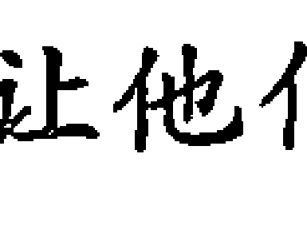

> 为什么我父母只会注意到我做错了的事情？
—— 内布拉斯加州，奥马哈市，布赖恩，16岁

大多数父母并不会只注意到你做错了的事情，他们也会注意到你做得对的事情，只不过他们不说罢了。

人们普遍倾向于放过正面的事情不提，而一味强调负面的事情。这几乎是所有人的通病（连你也可能有这种习惯哦）。如果人们能够理解“正向思维的力量”①，他们也就不再会耽于负面思维了。

那么，我怎样才能让我的父母在看到我做得对的时候，对我说些什么呢？

你先做个榜样呗。当你看到他们做得对的时候，你对他们说些什么。

请你牢记：种瓜得瓜，种豆得豆。

如果每次你看到你父母做些你认为是好的、酷的、有帮助的、对你有益的事情时，你都去告诉他们，那么你很有可能从此把他们给摇醒了。你也同时打开了一扇接纳他们的返还能量的大门。

你也不妨做一个漂亮的标语贴在车尾上：

> > 你看到什么好的，就请你说句什么好的。

这条小标语，如果人人做得到，就能改变世界。

为什么必须我先迈出这一步？为什么他们就不能不需要我先做给他们看，自己就能做到呢？

这问题问得很公平，而且也给了我一个机会，跟你说说另一句很有价值的话，所以，谢谢你问的这个好问题。

请你永远记住：种瓜得瓜，种豆得豆；你若想要体验什么，就做出来让别人体验。

你是说，我若想得到什么，就一定要先付出什么？

不必，你不必一定要这么做。只不过，这么做是条捷径。这是让创造的力量得以最佳发挥的捷径。

理解不了。怎么可能是这样呢？我不是给了别人吗，又怎么能为自己的生活创造什么呢？

首先，我刚刚说过了，“种瓜得瓜，种豆得豆”。所以，你给予别人的，会回到你这里来，而且往往是加倍地回来。

> 你希望别人怎么对你，你就怎么对别人

哦，所以你才说，“你希望别人怎么对你，你就怎么对别人”①。

对啦！那不仅仅是一句说得好听的话，而且是正在发生着的事实。

你对别人做了什么，终将会回到你身上，或早或迟，这就是终极回归法则。它跟奖惩毫无关系，只不过是事情的本来面目和运作规律。生活就像是一枚回旋镖，你发出一镖，就得回来一镖，这是必然结果。

所以，在你从少年成长为成年的这些岁月里，这里是一条我能给你的最好的忠告：

你想要从别人那里得到什么，你就给别人什么；你想从这世界得到什么，你就给这世界什么；你想从人生中得到什么，你就给予人生。

如果你想要得到更大的“振动”，你就要送出更大的“振动”！

去做你希望得到的东西的源泉。

可是，这不就和你前面说的话相矛盾了吗？你说，永远不要为了取悦别人而做任何事情？

这不矛盾。我原话后面接着说的是，你为任何人做任何事，目的不是为了取悦于别人，而是为了让你自己喜悦。我还说到，要知道怎样才会令自己喜悦，你必须仔细看清楚你与他人的共享利益在哪里。

一旦找到了共享利益，你就能够看得明白，你“为别人”做的事情，实际上是为你自己做的事情。

这也包括了你希望别人怎样对你，你就怎样对待别人。而且，尤其是包括了这一条。

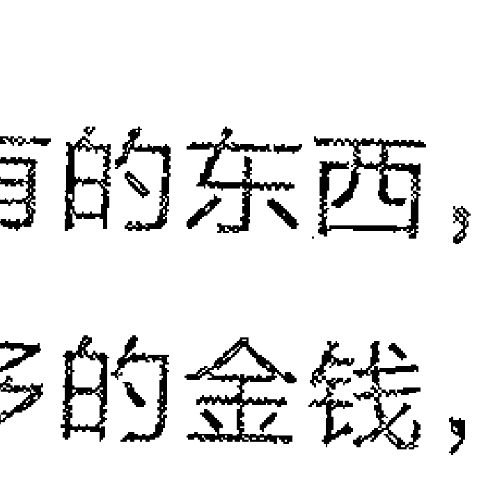

可是，我本来就没有的东西，我又怎么能够给别人呢？如果我希望我的生活中能有更多的金钱，我又怎么能够通过给别人钱来得到钱呢？

这种你以为缺乏某种东西的念头，只是一个幻象。也就是说，看起来你好像不够用，但是在终极实像中，你没有什么不够用的。要想体验到这一点，请你去找一个人，不论你渴望的是什么，去找一个比你还不够的人。现在，请你给他一些你觉得你只有一点点的这种东西。然后，你就能体验到，事实上你有的已经足够多，多得你都可以给别人了。

这一瞬间，你将改变你的人生。

你将由幻象切换到真实现实。

这种从“不足”到“足够”的切换，这种从“匮乏”到“丰足”的转换，将改变你一直以来所体验的你自己的感受。结果，你创造出了新的感受。因为，你想什么，你就创造出什么。

所以现在，让我们回到你的问题，引出这所有一切问题的问题……如果你觉得，你没有体验到足够的好感觉，也就是说，没有觉得你的父母注意到你做得好的事情，那么，让你的父母来体验这种好感觉，也就是说，让他们感觉到，你注意到了他们做得好的事情。

这时，奇迹就会出现。首先，你仅仅通过注意到这么做带给他们心里的好感觉，你立即就能体会到你自己心里的好感觉；第二，你引发了终极回归法则，他们也会注意到你做得好的事情。

> > 我总是听人们说，“你播种，你就会收获”。可是，事情并不总是这样。我一向善待别人，可是他们却并不善待我。
> 
> —— 南非，海角镇，托马斯，18岁

我承认有的时候是这样。你并不能指望，你给过谁什么，你就能从这个谁身上得到什么。

好……吧，这下我可就彻底糊涂了。我以为你说的是，“种瓜得瓜，种豆得豆”。

我是这么说的；不过，我并没有说从哪里得到。你向生活中投入什么，你就从生活中得到什么，但这并不意味着会从你投入的相同点得到回报。尽管有时候你会在相同点得到回报，不过事情并非总是如此。或早或迟，你终归会从某个地方得到回报。如果你密切关注你的人生，你会看到这条法则的实际运作。

为什么我就不能从同一个人身上得到我所给予的呢？比如说，爱。为什么我爱的人就不能爱我呢？

这条法则不是这样运作的。若真是这样的话，那要操控一个人可就太容易了。而且呢，你并不会真的愿意那些人因为你爱他们而爱你。真的，你要相信我。你愿意人们不是为了回报你的爱而爱你；你更愿意这种爱是一种诚挚的响应和回应，只因为你在这世界上是这样的人，而并非因为你是否对他们做了什么特别的事。

因此，请不要掉入为了让别人对你好所以你就对别人好的陷阱之中，否则稍一不慎，就会变成了对人的操纵。你要对别人好，那仅仅因为你是你，因为你决定了要做这样的人。

正是从这一“做人”的基点（瞧，我们绕回来了），你创造出了你的真实现实。一直这样，永远这样，从来就是这样。

> > 为什么做父母的总是永远板着一副“父母面孔”？他们就不能把自己的翎羽放下来一点儿吗？昨天晚上撞见我爸爸妈妈在“那个”，唉，你肯定以为我当场抓获他们在抢银行什么的。
—— 塔米，13岁

做父母的有时候真的以为他们必须在孩子面前保持一定的形象，而浪漫行为或者性行为往往都不算是“应有”的形象，除非他们不那么看。这全在于你的父母怎么对待这些事情，并且希望你们怎么对待这些事情。

如果他们愿意你以后对这些事情乐在其中，那么他们会让你看到他们乐在其中；如果他们愿意你以后对这些事情恬然自在，那么他们会让你看到他们恬然自在。

那些总是摆出“父母面孔”的人之所以会这么做，是因为他们认为在孩子的面前就“应该”这么做。

可是，孩子很少能被这种面孔糊弄得了。他们看得见爸爸妈妈穿着“皇帝的新衣”。

### 什么？那是什么意思？
去问你爸爸妈妈！

等我做了妈妈，我也会犯些跟现在的父母一样的错误吗？他们现在这样对我，到时候我也会这么对待我的孩子吗，哪怕这些事情令我十分痛恨？我之所以这么问你，是因为我爸爸妈妈说以后我也会这样。他们总是说，“等你有了自己的孩子，你的看法就会不一样了。”真的吗？我可不希望如此。
—— 田纳西州，诺克斯维尔市，桑德拉，15岁

毫无疑问，你对事情肯定会有不同的看法，每天你都会有不同的眼界。这就叫做成长；这就叫做变革；这就叫做提升；这正是你所希望的啊。但是，这并不意味着你将按照你父母的方式步其后尘。

你可能会，也可能不会；你可能愿意，也可能不愿意。令你这么做或者那么做的根源，在于你怎么看自己。你每时每刻都在界定自己，你每天都在抉择你究竟是谁，你愿意是谁。

可是绝大多数人不这么看待人生，他们不认为自己正积极参与人生中的这些抉择。而人生的转折点就在于，你终于能认识到这一点。

你现在就可以开始针对你认为“做父母”意味着什么而做出抉择。你会选择和孩子保持真诚的友情吗？你会选择让孩子在需要你的时候，比如遇到问题、需要援手或是寻求忠告的时候，会愿意向你求助吗？

父母给你的一切，都是上天的礼物。不仅包括那些你愿意仿效的，还包括那些你想要摈弃的；不仅包括那些你愿意记住的，还包括那些你想要忘掉的；不仅包括那些令你展颜欢笑的，还包括那些让你伤心落泪的。

所有这一切，都是珍贵的财富。所有的一切。因为，正是从这丰富之中，你可以挑选；正是从这全部之中，你可以选择；正是从这一切之中，你可以领悟到哪些是你希望你能称之为“你”的部分。

而且，不仅你从父母那里得到的一切是如此；你从整个人生中得到的一切，也都是这个道理。

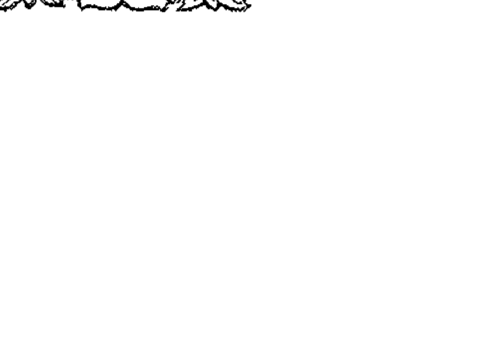

## 第 16 章

### 未来

- 🌳 我长大以后会过得很风光，还是会活得很挣扎？
—— 俄勒冈州，阿什兰市，沃尔特，14岁

- 🌳 你能让我瞧一眼我将来会是什么样吗？ —— 珍妮，15岁

珍妮，沃尔特，创造你们未来的人是你们自己，不是我。

总是不断有人问我：“神啊，将来我会怎么样？”我总是回答说：“我不知道啊，你将来会怎样呢？”然后他们就说：“可是你应该知道的啊？”然后我就说：“可是你自己应该知道的啊。”然后他们再说：“但是，你有能力决定一切！”我再回答说，“但是，你有能力决定一切！”

你瞧，人生就是这样进行的。你决定你要选择什么，然后我让它实现，而并非倒过来。

问题是，你们的看法却正好倒过来。你们以为是我来决定要选择什么，然后就看你们要不要付诸实现了。正是这种被颠倒了的人与神之间的关系，使得你们地球人创造出了这扭曲变相的人生体验。

那么，你是说，我可以得到一切我想要的了？

不对。神说，你不可以得到你想要的。

啊？什么？

我说的是，你不可以得到你想要的。而且，你越是想要某种东西，你得到它的机会就越小。

你这是在说什么啊？

我说的是创造的过程。

还记得我说的你该怎么创造你的真实现实的那些话吗？你通过你的所思、所言、所为来创造你的真实现实。假如你现在想的是“我想要一个人给我妈妈做伴，给我做爸爸”，那么你体验到的就会是“我没有这些”。

为什么？你在说些什么啊？

我是在说，只要你说出这些话来，它就真会应验在你的身上。开始的时候那只是一个词，然后这个词就变得有血有肉了。

我的天，我可真不知道你在说些什么了。

你想的是什么，你就创造出什么；你说的是什么，你就创造出什么；你做的是什么，你就创造出什么。

如果你想的是你“想要”（Want）什么东西，如果你说的是你“想要”什么东西，如果你做的是你“想要”什么东西，那么你毫无疑问就会创造出你“没有什么东西”（Wanting）的真实感受来。

请好好记住，“我”这个词，还有“我是”这个词，都是拧燃创造马达的钥匙。无论什么语句跟在这两个词的后面，都会应验到你的体验中来。

因此，如果你说“我想要这个”，那么这句话就会变成你的真实感受，你就会体验到“我没有这个”。

所以，要当心你的所思、所言、所为是什么，以确保它能准确反映出你所选择去体验的感受。

你是说，我必须当心我说出的每一个字？

不是的啦，那还不把每个人都折腾疯了。不过，如果你能时时反思一下，你常常怎么想、每每怎么说、往往怎么做，那肯定对你有好处。

> 人人都在说，托将来某次巨猛的振动的福，地球的轴心会偏移，要么就是会陷到海里去，这是真的吗？
—— 加利佛尼亚州，圣地亚哥市，吉娜，14岁

吉娜，别再说这种话了；相反，多说说地球的将来会有多么美好。然后，如果你愿意，去为这美好多做些什么。

我可没打算要最终摧毁这个星球。你呢？

去鼓动你的长辈们，好好维护大气环境。请他们关注这个星球的全球温度，并采取行动让这温度保持在使地球继续是人间天堂的范围内；拜托他们不要再往大气层里排放那些会给覆盖整个地球的保护层穿上破洞的有害元素。

请求你的长辈们，不要再依赖各种矿物燃料，那会更严重地污染你们的大气层。人们并非只能依赖矿物燃料，其实有不少获取能源的其他途径。

敦促他们保护好你们的森林，不要再砍伐森林来印制你们的周末报纸。你们可以在地里种植一种小小的植物，那足够提供你们需要的所有纸张。

你们可以用木材以外的材料来修筑房屋，然而你的长辈们正在毫无道理地摧毁着你们地球的氧气制造及空气净化系统。

请求你的长辈们维持水质清纯，而且不要再如此过度用水。给地球一个机会，让它可以重新充盈它自己。你们的大自然正承受着难以置信的巨大压力，而这种压力却不是无可避免的。

地球肥沃的表层泥土几乎消失殆尽。你们那些联合农业小组不肯间种不同庄稼，不肯给土地任何机会重新自我肥沃，结果他们只好往土壤里倾倒化学肥料来代替大自然的这份工作。人类正在把自己往死路上做化学处理。

也就是说，“世界末日”眼看着不远了，你是这意思吧？

不是的，孩子，不是的，除非你决定它是！你们人类正在做着这样的决定，通过每天一千零一次的抉择做着这样的决定。

好消息是：你越长大，你在这些抉择中的声音就越大。

简言之，你的声音，是能够改变世界的声音。

你没完没了地说什么“要改变世界”，我还没有开始，就已经厌倦了！难道我没有半点时间可以放松一下吗？在跟这些乱七八糟的事情奋战之前，我们就不能稍微出去晃悠晃悠吗？

好问题！答案是，好的！你不仅可以在跟这些乱七八糟的麻烦和挑战奋战之前出去晃悠晃悠，你还可以一边奋战一边放松！

放松，是纷繁的人生中非常重大而且重要的一个部分，我很高兴你提出了这一点。你不需要把整个世界都挑在你的肩上走向明天。实际上，你真要这么做的话，那对任何人都没有任何的好处。

在人生中找乐子！
尽情玩乐，播撒喜悦，共享真爱，
那是你人生的三车道。①

> ① 三车道，可以并行三辆车的宽敞大道。——译者注

尽情玩乐，播撒喜悦，共享真爱，
那是你神圣的三使命。②

尽情玩乐，播撒喜悦，共享真爱，
那是你人类的三重冠。③

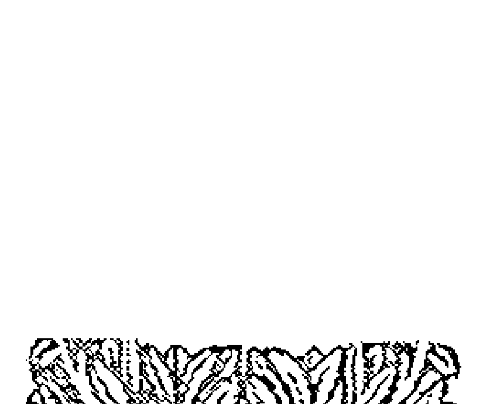

## 第 17 章

### 苦难与死亡

> 假如你真有能力使人人都幸福，那为什么又有很多人一定要受苦呢？
——埃里克，13岁

噢，我最美好的埃里克，人们从一开始就不断地问这个问题。而之所以人们会一直不断地问，是因为他们得到的答案总是不合逻辑。

你们被一代一代地教导，埃里克，说受苦是一件好事情。你们有些师长甚至教导说，是我要你们受苦受难的；说受难能帮助你们“洗刷罪恶①”，说若是把你自己“奉献给苦难②”，你就可以拯救“可怜的炼狱中的灵魂③”。也就是说，如果你让自己遭受越久的折磨，我就会越早把你的祖先从炼狱中释放出来。

① “pay for your sins”，② “offer it up”，③ “poor souls in purgatory”，都出自《圣经》。——译者注

这最后一种说法，尤其令人悲哀。它把我描绘成了一个如此丧心病狂、阴狠毒辣、贪得无厌的家伙，居然会怂恿你用你的苦难来贿赂我，求我早日把你心爱的故人从炼狱里放出来，而且我这家伙居然会说，

> > “你可以用你自己苦难的开始，来换取他们苦难的结束，总之必须有人在这里受苦受难。”

这一整套说教，与你想象中的充满爱心与关怀的神是如此的截然相反。可是它仍然由你们地球上最强大的宗教系统，向你们灌输了很多很多个世纪。

这些以及其他更多的观念，促使人们为了子虚乌有的原因去忍受可怕的痛苦。我从不愿意你们受苦受难。我之所以没有阻止你们人类的这些作为，那是因为我给了你们自由，给了你们按照自己的选择去创造去体验你人生的自由。假如我不再给你们选择的自由，而从此由我来告诉你们事情“应该如何如何”，那么整个人生的意义也就消失殆尽了。

而人生的意义，我已经讲了又讲。那就是给每一个人类灵魂提供一个机会，去完整地体验自己，而且自由地创造能够让自己去完整体验的条件。

现在，请你再记上一笔，我从来没有说过受苦受难是一件好事情，而且我也从来不认为你应该承受苦难。连你都不忍心让你的小动物受罪，更何况我呢。

> 去年夏天，我家的猫病得很厉害，我们只好让它睡了过去，因为兽医说小猫太受苦了，这是唯一人道的做法。你既然允许我们这么对待动物，可当我们这么对待人的时候，为什么又要送我们下地狱呢？
——阿拉巴马州，伯明翰市，玛莎,13岁

我从来不会，玛莎，不论是为了这个原因，还是任何别的原因，我从来不会送你们去地狱。你恰好指出了矛盾的所在，揭示了人类对于遭受苦难的疑惑。

很显然，让你对待你的猫咪比你奶奶更人道，这非常不合逻辑。逻辑告诉你，任何生命都不该遭受无谓的痛苦。

你的意思是说，假如我们帮助病得非常厉害的人安息，那就是应该的了？

医生从来都这样做，只不过不告诉任何人而已。也有不少家庭暗暗要求医生这么做，甚至有的时候自己就这么做了。因此，显而易见，在某些情况下人类认为这么做是应该的。但是你必须知道，你们很多地方的法规禁止这么做，所以如果你要这么做，很可能为此而蹲监狱。

> 我们为什么要设立这种愚蠢的法规呢？
——墨西哥市，恩里克,15岁

不论是你们的法规，还是你们的神学，似乎从来都不必合乎逻辑。

改善那些不合理的法规，恰是你们年轻人可以做的一件能够真正让这个世界有所不同的事情。

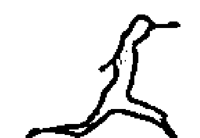

> 可是，假如你真的这么无所不能的话，你为什么就不能永远结束这些痛苦呢？为什么不干脆不再让人有任何苦难经历了呢？
——布拉德，15岁

布拉德，我已经给了你们消除痛苦的工具。但是，人类拥有自由意志，而且到目前为止你们还没有决定使用这些工具。

你们的星球上这些导致人类痛苦的根源，大多是你们人类自己创造出来的；而且也是你们可以轻易扭转回去的，只是你们不肯而已。

人类大多数的疾病，应该说几乎所有的疾病，都是可以避免的，只要你们肯改变人类行为。

所有造成人类死亡的纠纷和战争，也都是可以避免的，只要你们肯改变人类行为，只要你们肯改变人类观念。

甚至绝大多数的“事故”，也都是可以避免的，只要你们肯改变人类行为和人类观念。

情感上的悲伤、担忧、恐惧、负疚、抑郁，还有精神上的痛苦，也都是可以避免的，同样，只要你们肯改变人类行为。

你能不能举些实例说明？

例如，人类可以不再吸烟，就能避免每年数以百万小时计的病痛和数以千计的死亡。

人类可以不再食用动物死尸，就能免除无数的病痛和死亡。

人类可以限制枪械，限制每个街角都能买到的毒品，人类就能免除无数的病痛和死亡。

人类可以不再往江河湖海里倾倒化学物品，不再往空气里排放有毒气体，不再砍伐数以百万计的树木（其中很多是无法再培植起来的原始森林），不再以地球来不及再生的速度消耗她的各种资源。

人类可以决定，真就是简简单单的一个决定，不论他们个人之间、民族之间、国家之间有什么样的纠纷，都不再相互屠杀，而是以其他方式来解决问题。

人类可以决定不再继续生活在隐瞒、谎言和虚伪之中，从此相互说真话。

人类可以重审哪些事情更为紧要，创造一个生活的新底线，拓宽对自我的定义，深化对爱的理解。

你们可以做到这一切，可以做更多的事情。

那人们为什么不肯呢？这个世界上的人为什么不肯呢？

为了眼前利益，他们不想放弃眼前利益。暂时的快乐也好，暂时的获利也好，他们都不肯放弃。从这个角度上来说，他们实在是鼠目寸光，看不到也不知道，这么做会给自己以及他人带来的无穷后患。

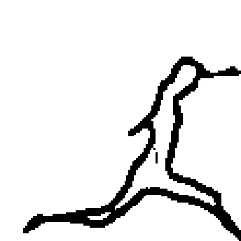

老天爷，这简直让我看不到希望。你说，这本书要告诉我，再也不会看不到希望，我觉得不像啊。

造成人类痛苦的根源和环境，其实可以扭转回来。只要你们转变社会观念，转变社会行为，就能做得到，这就是希望之所在。

你，就是“这个社会”的明天。凭借我给你的工具，你可以创造出一个新的世界，只要你决定这么去做。

当前有待改变的主要人类行为，就是只图眼前利益，无视长远利益。

如果发现你自己也有这类行为，你可以现在就开始逐步改变。只要你有此意愿，你不需要等到你长大成人，你这就可以开始构筑新的行为，短短几个月以后，当你准备走向更大的人生舞台时，你将会为你扮演的角色做好更充分的准备。

我现在能做些什么？

当你需要做决定、做选择时，试着把眼光放得远一点，看看那会不会让你感到快乐。问问你自己，往长远看你想体验什么，怎样做才有助于你体验它。

比方说，假如你想让上学成为一桩快乐的事情，不再充满沮丧、烦恼和担忧，那么考虑一下，因为你更想做别的事情而不去写作业甚至逃课，这会不会有助于你达到这个目的？

假如你愿意人生成为一个快乐的旅程，不再充满身体上的病痛和感情上的苦恼与挣扎，那么想一下，借吸毒或酗酒来糟蹋你的身体以图一时之快，会不会有助于你达到这个目的？

你在这里创造的是你的人生，你可以按你的意愿创造你的人生。只是你需要明白，你不仅仅是创造着这一秒钟、这一分钟、这一小时；你此时此地同时创造着你整个未来人生的一个部分。

请你牢记：任何的决定和选择，其影响力不仅仅只局限于做出决定和选择的当下的那一刻。

换句话说，你决定要做的某件事情往往比你能想到的要具有更深远的影响力。

当然，这句话并不意味着你从此就该谨小慎微、胆小如鼠。但是，它的确意味着你做决定时要仔细思量，要考虑到各种可能的结果，包括不远的将来可能出现的结果。

现在那些比你年长的人似乎不太这么去仔细思量了。实际上，他们已经几乎不再这么去仔细思量了。不过，你也别太苛求他们，大多数人还依然生活在幻象里。

毕竟，只是到了最近，有关人生的真正本质以及每个人在其中的作用，才得以清晰而浅显地表达出来。

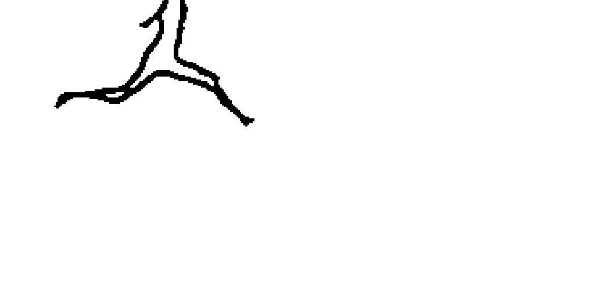

人类的苦难什么时候才能到头？——韦斯利, 16岁

一旦人类改变了自己的行为，苦难就到头了，韦斯利。一旦人们懂得了对苦难的体验其实就是他们自己创造出来的，苦难就到头了。

而且，各种原因所导致的苦难——所有的苦难——现在就能够愈合。

可能吗？

可能的。不是说所有苦难的条件状况都能得以治除，而是所有的苦难都能得以愈合。

治疗和愈合，这两者之间有什么不同吗？

有。治疗改变的是其条件状况，而愈合改变的却是你对它的体验。

比方说，让你痛苦的状况现在叫做“头疼”，你可以做到在同样的头疼状况下改变对头疼的体验。

你们都这样做到过。你其实只不过做了一个决定，不论你的头疼还是不疼，都不让其打扰你想要做的事情；然后你就那么接着做下去了，不在乎你的头疼还是不疼了；

很快你就体验到，你是头疼了，可你不在乎，你不觉得遭罪。

这就是我刚才说的意思，不去“治疗”就能“愈合”。

这种“愈合”往往就导致了“治疗”，自然而然的，头疼就消失了。

我用头疼做了个简单的例子，因为这太常见了。人类早已知道用这种方式对付那些远比头疼要厉害得多的痛苦。

这样的愈合你们称之为福气，这样的治疗你们称之为神奇。

痛和痛苦不是一回事儿。痛是生理上或心理上的体验，而痛苦却是你对这一体验的看法。

我听不懂了。这话是什么意思呢？

这意思是说，一个人可以有疼痛，但不必是在受苦受难。痛是你的感受，而受苦受难却是你给这种感受所贴上的标签。

谁会明明觉得痛却不觉得痛苦？是我神经短路了吗？

你的神经没有短路，你问了一个好问题。而且，我这里也有一个好答案。

感到疼痛却不觉得是在受难的人，不在少数。母亲生孩子就是一个例子。许多母亲在生孩子时不但不觉得那是在遭罪，反而欣然迎接一切疼痛，满心喜悦。

许多因为受了伤、得了病而患有慢性疼痛（日日夜夜都疼痛）的人，都知道怎么让自己活得不痛苦。有些人甚至为他们还活着而感到非常快乐，欣喜他们已经走到了更高境界，战胜了旁人以为无法忍耐的痛苦。

还有不少例子，可以说明身体上的疼痛不见得让人陷于苦难之中。拔掉一颗牙会很疼，但却会让人不再遭罪。这不过是个小例子，这样的例子还有很多很多。

还有感情上的伤痛。越来越多的人体会到，这种伤痛是通往愈合的必经之路，伤心不见得非要成为一种苦难不可，反而可以变为成长的力量。还有愤怒，能够以恰当的不伤害任何人的方式而安全发泄出来的愤怒，也是一个例子。

所以，你瞧，疼痛和受苦是两回事。若要做到痛而不苦，换个思路，想想这痛出现的意义，并且利用它，把它用做你的一个工具，雕琢出你要的体验来。

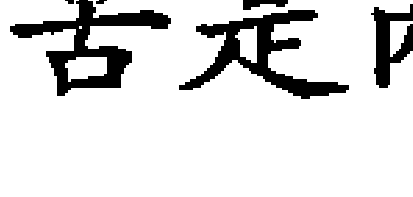

> 我有好多问题。我知道你说过，假如我可以向神问一个问题的话我该问什么；可是，我有好多好多的问题。比方说，为什么人会死？我们生活在地狱之中吗？我的人生会是另一个人的梦吗？天堂像个什么样子？人为什么就不可以永远活下去？
——安德烈亚，17岁

哈！谢谢你，安德烈亚，谢谢你这么噼里啪啦地问了一大堆问题！让我来一个一个地回答你。
人是不死的，安德烈亚，他们不过是换了一个形态存在而已。有时候他们以你称之为“人”的形态存在着，另一些时候他们又以你称之为“灵”的形态存在着，灵又可以随时再转换成人的形态，只要他们愿意；他们还可以转换成其他不同的形态。

你们都是以不同的形态存在着的永恒的圣灵，你们是神以不同的形态存在着的圣灵。也就是说，你们是神的不同形态，也是神的信息①。

可是你们为什么要变来变去呢？为什么要有这种被你们称为“死”的事情呢？因为，所有的生命都是一个循环，人类也和其他生命一样，在生命的循环中循环。

即使你不认为你不得不这么循环（哦，对了，你永远不会“不得不”这么做），你也终究会选择离开你目前的身体而回归灵体，因为那是一切的生命回归“一切万有”（也就是你们说的“神”）的天性。之后，生命又会从那一切之整体中以单独个体的形态分离出来，之后，又再回归到那一切万有，如此周而复始，永远这么循环下去。

你是说，永远没有终结？所以我也就永远不可能“从此与神同在”？

你才不希望会有终结的那一天呢，因为，假如真有那一天的话，生命就终止了。这个循环就是生命本身，生命是神的呼与吸。

就像月亮绕着地球转，地球绕着太阳转一样，生命中的一切都围绕着那一切之整体而融进融出。

> ① 原文是 “You are Gods in formation; you are God’s information”，句中的 in-formation 是双关语。 ——译者注

# 与神对话：献给青少年

### 为什么？

如果没有相对立的参照，你不可能对你所是的一切有任何的体验。如果没有“矮”，你就不可能体验到你“高”，如果没有“冷”，你就不可能体验到你“暖”，是不是？

如果你从来没有感觉到你“冷”，那么你就不可能知道“暖”是什么感觉。实际上，假如温度恒定不变，每天每小时，永远不变，你甚至都没办法知道什么叫做温度。没有了不同的温度做参照，对温度的体验也就无法存在了。

同样，假如除了神以外什么都没有，对神自身的感知也就消失了。如果你永远只体验与“一切万有”的融合，你就永远没有办法体验与“一切万有”的融与合，因为你永远不曾离开那一切之整体。

可是，你的灵魂，也就是神的一部分，本能地知道这一切，自会随着这个循环融进融出，反复体验与那“一切万有”的融合。

一切都会融合为一体，然后又以独立个体的形态诞生出纷繁的一切。一切都与这“合一”息息相关，一切又都与这“合一”保持独立。这就好像你的手指头和你的脚趾头是休戚相关的，它们都是你身体的一部分，与此同时它们又都各是各。

重生就是这个意思，你会重生很多很多次。

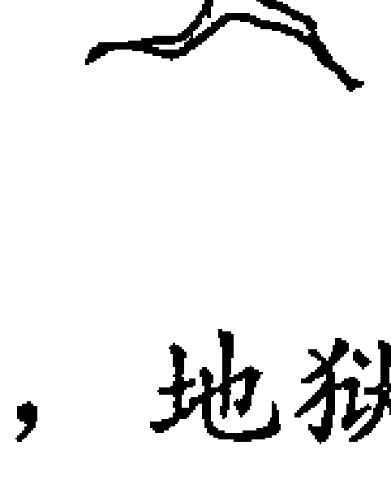

你并不生活在地狱里，地狱根本不存在。但是，你却可以在幻觉中创造出一个地狱来，而且你的体验会是“活见鬼”那般真。

当你忘记掉你真正是谁的时候，你的体验就像是身陷地狱；当你以为并非与我同在，而是永相隔绝的时候，你的体验就像是身陷地狱；当你以为你毫无价值，没人疼爱。也不值得别人爱你的时候，你的体验就像是身陷地狱；当你以为你是个没用的废物、不可救药的朽木、彻头彻尾一无是处的时候，你的体验就像是身陷地狱。但是，你根本就不是废物或朽木；地狱也根本不是一个能让你记起你真正是谁的地方。

我这里有一条确凿无疑的方法可以让你们所有人都记起你们是谁，那就是提醒别人他们真正是谁。如果你们每一个人都能彼此提醒，那么你们所有的人就全都记起来了。

这也是你今生今世能够做得到的一件事情，如果你选择这么做的话。这是一件非常美好的事，很好玩，很让你快乐，而且充满了爱。

> 怎么做？我怎么能提醒别人“他们真正是谁？”

简单到让你瞠目结舌。你的一个微笑就行了；或是一句善意的话，或是任何一种方式的爱心表达。

# 与神对话：献给青少年

这些小小的示意（而它可以是巨大的赠与），足以使你把一个人还给他自己；足以使你让他走回到他真正是谁的最美好的境界；足以使你帮他们找回他们的力量，他们的原生力量。

你问我，天堂像个什么样子。那就像上面的这句话，这句话就是最贴切的描述了。天堂不是一个地方，而是你心灵的一个境界。那是体验到你与我合而为一并融于“一切万有”的境界；那是尽管你当下体验到的并非是与我“合一”，但你也仍然知晓我们就是那“合一”的境界。

你还问我，你的人生是否是另一个人的梦。这是一个很有意思的问题，答案呢，是“是的”。你的人生是你自己的梦。

你的这一生，是一个梦，一个幻觉。当你按照你的说法“死”了的时候，实际上却是你从梦中“醒来”了。这时，你从幻觉里走出来，走进“终极实像”，也就是你所说的“天堂”。这个“终极实像”是意识的一个层次，而不是某个具体的地方。

现在该回答你的最后一个问题了……人的确会“永远活下去”。生命是永恒的，而“死”不过是生命循环中的一个切点。在你“死”的那一瞬间，你就会明白这一点。

> 你为什么要决定谁什么时候死？你怎么做决定？我爸爸在我很小的时候突然死去，我从来都想不明白这是为什么。
——维多利亚，14岁

神并不决定谁该在什么时候死，维多利亚。我并没有决定你爸爸应该在你那么幼小的时候就死去。你爸爸突然走了，是因为那时已经到了他的灵魂走向下一段生命里程的时候。

在神的世界里，万物有其时，人的灵魂总会恰如其时地体验到该体验的一切。

我很理解这是你人生中最伤痛的一件事情，说什么恰如其时并不能赶走你的悲伤，而且也不应该如此。

你感到悲伤，这非常应该。你不需要为你的悲伤感到歉意，也不需要去“掩盖”。不过倒是有一条路，你也许可以去走走看：

你可以把你的悲伤转变成人生旅途中的一项工具，用来帮助你自己，也帮助别人。由此你赋予了这件事以新的意义。

某件事情带来的巨大的悲伤，比如像你失去了亲爱的爸爸，往往能够把人转变成为一个感情非常细腻、非常有同情心、非常有爱心的人。在人们朝向人生的低谷，走进郁郁寡欢满腹愤恨的余生之时，他们其实可以做出另一个选择，让自己转身走向幸福、走向爱。

那些心里做好了独到而且完备的准备的人，就可以做到转身去帮助那些面临人生巨大悲伤的人；而他们自己，也因为帮助他人而得到莫大的慰藉和喜悦。

这就是我应该去做的吗？

人生没有什么事情是“应该”的。既没有一幅你必须去遵守的工程蓝图，也没有任何有待你去完成的“任务”。有的只是选择，纯粹的选择。时时刻刻，日日夜夜。

每一刻的当下，你都不妨问问自己，“我该怎样善用此生天赐之一切？”每当你给出积极正面的答案来，你人生的意义就再次得到肯定，你也再次创新了你自己，走到了又一个你之为你的最高远的视野中的最宏大的境界。

你当然不需要此时此刻此地就做出一生的决定来，你可以在人生旅途中边走边选择。不过，你不妨随时随地都这么问问自己，去寻找真正能起作用的、有意义的、能够这就给你带来快乐、喜悦与祥和的答案。

你也许已经注意到，你有不少朋友会在他们需要找个人跟他说说话，需要有个耳朵听他倾诉或者希望得到一个小小的劝告时，他们会愿意来找你。

这并不是碰巧，而是你已经对那些正面临困惑、疼痛、悲伤的人催动了你的能量——那种对他人的深深的理解和同情的能量。你要怎么运用你自己的这一部分能量，在于你的决定。但是毫无疑问你的这一部分在那里，因为那是你人生的亲身体验。

所以呢，为什么你爸爸那么早离开你的人生，你现在也许已经有了某种更深的理解。原来，那其实也是你的灵魂走向下一段生命里程的时候。

就好比是一幅巨大织锦中的两条丝线，你的人生和你爸爸的人生交织在一起，绣出一幅美好的图案。

我真希望能够有谁来告诉我，这织锦的图案该是个什么样，好让我至少能够明白为什么事情注定会是那样发生了的。

我挚爱的朋友，之所以还没有谁能够告诉你，那是因为这幅织锦还没有绣好，而你此刻就正在编织着这幅图案。

你爸爸也一样。

你真以为他已经死了？我告诉你，孩子，他没有死，他也永远不会死。他会一直活下去，比永远还要久远。而你和他这一次的交织，也不会是你们的最后一次交织。

也肯定不是你们的头一次相遇。

一个灵魂投生或者离开一个人的身体，从来不会不逢其时，从来不曾“弄错”了，既不会“太早”了，也不会“太迟”了。

一个人的灵魂有些什么使命，不见得是你的头脑所能意识到的，也不见得是别人的头脑所能意识到的。但是我向你保证，你爸爸现在肯定看得很明白；而且我也向你保证，早晚会有那么一天，你也肯定看得很明白。在那一天到来之前，相信人生。这是你爸爸在天之灵鼓励你去做的事情。相信人生，热爱生活。要圆圆满满地活，多姿多彩地活，幸福快乐地活。

- 尽情玩乐。
- 播撒喜悦。
- 共享真爱。

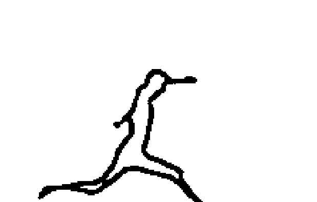

> 那些说他们可以通灵的灵媒、灵巫之类的人，真的能和神灵说话吗？为什么我们逝去的亲人不直接来找我们呢？
——亚历克斯，19岁

你的亲人来找过你，亚历克斯，真的。

我不想在这里让你觉得很“诡异”，亚历克斯，且让我来举一个例子吧。我们的朋友维多利亚，也就是上面提问的那一位，她就刚刚和她爸爸交谈了一次。

她现在可以信也可以不信，随她自己的意愿。可是不论她信与不信，事实都不会改变，那就是她爸爸把她带到了这里来，来到这本书里，把这些她需要听到的话告诉她：他很好，她也会很好，一切事情都发生得恰如其时，所以要高兴起来。

你以为维多利亚碰巧问了这么一个问题，又碰巧得到了这么一个答案吗？

亚历克斯，没有什么事情是碰巧了的。

啊？天啊。

好，我要扩展我的答案了……

那些“死去”了的你亲爱的人，可以以你一转念的速度回到你身边。他们现在就正这么做着，眨眼之间来到你身边，愉快地咧着嘴笑着，用爱沐浴着你。你能感觉得到，你真的能感觉得到，如果你肯让你自己去感觉，如果你肯敞开心扉迎接那感觉。

但是，当你感觉到了这样明亮与爱的能量时，请不要说那是幻想，不要说那是梦想。那是你能有的最美好的意想。

请你牢记：只要你想了，你想的就到了。

如果你想的是你亲爱的人跟你在一起，尤其是当你需要他们的时候，当你需要他们的忠告的时候，那么，你自会打开你的心，体验到这份真实：在你呼唤的那一刻，他们就在你身边，他们就已经在你身边。

可是，如果你想的是他们并不在你身边，那无非是你的“幻想”而已，那么，环绕着你的那些人的神灵就被你错过了，你也就无法体验到了。

可是，那些灵巫还有灵媒呢？假如他们真的能和神灵交流的话，通过他们会不会更容易些？

你们所有的人都能够和神灵交流。这就是我一直在与神对话：献给青少年

对你说的话。你并不需要借用灵巫或者灵媒来使得交流更容易些；不过，我也并不是说灵巫或者灵媒就不能够使得交流更容易些。这只是说你并不一定非要借用他们不可。

这里，我们首先要把什么是“神灵”解释清楚。我说的不是人们常说的“鬼魂”，我用的是“神灵”这个词，指的是一个人的一部分，被你们称为“灵魂”的那一部分。

“神灵”也就是“灵魂”？

没错。你已经听人说过，你是三位一体，由你的身、心、灵组成。这第三位，就是你的灵魂，是你真正是谁的精髓所在。那是你自身最根本的构成元素，一切来自于神灵，一切回归于神灵。

你们每一个人都可以触及你们自己的灵魂，而且，也可以触及别人的灵魂。不过，假如你无法触及到你自己的灵魂，那么想要触及别人的灵魂，可就非常之难了。

假如你从未触及过、体会过、细腻而敏锐地感受过你自己的灵魂，那么，你要想去触及、体会、细腻而敏锐地感受其他人的灵魂，那可就非常、非常之难了。

为什么？

因为彼此的连接只能是在灵魂这个层次上。灵魂是你能够与一切相连接的那一部分。而你的身体，却是你与一切分开来的那一部分。

你的心，是身与灵这二者之间的桥梁。

哦？我怎么通过我的心找到我的灵？

沿着你思想的阳关大道。首先你必须相信你有灵魂。你必须用一种新的眼光看待你是谁，你是什么：你，一个神灵，驻在一副身躯里，使用你的心智。

请你牢记：你的身躯并不是你之为你，那只是你所拥有的；你的心智也不是你之为你，那是你所使用的；你的灵魂，才是你之为你的本质所在。

要找到你的灵，需用你的心，不过用一小下就够了。你只需用你的心告诉自己，你有一个灵魂，值得你去寻找；告诉自己，不论你的身躯还是你的心智，都并不真正是你，这就足够了。然后，抛开你的心智，甩掉你的思想，清空你的头脑，进入你的体验。

这可怎么才能做得到呢？

有不少途径呢。静静地沉思，还有默默地祷告，都非常有效。这就是为什么各种宗教的男女僧院都要求僧侣们冥思默祷。

我以为那些冥思默祷的人是为了接触神。

是这样啊。一旦他们接触到自己的灵魂，他们就接触到了神。反过来说也是一样的道理。

也就是说，我必须像个僧人或者尼姑一样地生活，才能和我的灵魂连接起来？

大可不必，那只是诸多途径之一而已。只要你想去做，你就能在日常生活中找到很多冥思与默祷的片刻。刚开始的时候你可能觉得有些难度，尤其你们年青人的生活总是安排得满满当当的。不过，只要你坚持不懈，你渐渐就会觉得这不但容易做到，而且还很享受。

我不知道该怎么跟你说才好；可是，我其实祷告不来。

祷告么，就是对什么有种真诚渴望，这你知道吧？

我不知道。

噢，那敢情好，我这有好个消息给你。每一个真诚的祈望或渴望都是一个祷告。它可以是你想对谁道谢的真诚愿望，也可以是盼望什么来到的愿望。如果你真的希望能认识神，真的希望能认识自己的灵魂，那么，这个“希望”本身，你内心深处的这一渴望，就已经是你需要的“祷告”了。

还有，如果你愿意说出一句祷告来，那你就说出来，这对很多人都很有帮助。不过，这并不是一桩你不得不做的事情，只不过是一种把你心底里的话在脑子里念叨一遍的方式而已。

好吧，这个我知道了。可那个“冥思”，我也不太做得到。我是说，我不太有机会能够到林子里走老长一段路，你知道我的意思吧？

你总会有独自一个人躺在那里听音乐的时候吧？

那还用说。哦，你是说，我听听碟片也是一种“冥思”？

可以是哦。“冥”这个词用在“冥思”这个词组里，不见得就只能是“静默”的意思，它的意思是静下心来，只想你所想的事情。

你无人打扰而专心致志的时候，哪怕只是一瞬间，效果都会很厉害，更别说你再三专注于什么了，所以，你再三专注的是什么，可要好好讲究一下。

比方说，你选出一段音乐来听，这时，你要留意是什么东西让你凝神聆听，留意它催动起来的能量。如果这段音乐有歌词，不妨读一读。然后看看，这首歌会把你“带去”哪里；想想，这是不是你想“去”的地方？

不要给它下“好”还是“坏”的结论（而且你也不要让别人替你下这样的结论）；你只需问你自己，这能量我真的想要专注于它吗？

如果你专注的是你的灵魂，那么不论你是通过音乐还是其他途径，你肯定能找得到，你肯定能发现它。当然，你其实并非“找到了”或者“发现了”什么；你只是终于注意到了，你的灵魂，原来一直就在那里。

你能不能跟我说说“其他方式”？

当然可以啦。

写日记，也是你专注于自己灵魂的一个好方法。那是一条使你“发现”或者“找到”自己的好途径，可以让你触及自己的真实感受，澄清你的真实现实。还有一种可以让你专注于自己灵魂的方法，是沉静。我以前说到过这种方式，说到过你可以利用散步、骑自行车，等等方式，把你的心思从日常琐事以及生活烦扰中拔出来。这样做可以清空你杂乱的心，然后你的灵魂才会有个空间得以进驻。

还有许多其他的方法可以让你感知自己的灵魂。总之，你要做的只是让你走入精神领域。

“嘿，我喜欢这句话！你用得很是地方。”

“承蒙夸奖。”

可是我们跑题了，我本来在说灵巫，为什么他们会比我们更容易通灵。我想问的是，他们是真的吗？

灵巫或者灵媒并不是些具有特殊能力的人，而是和你一样的人。他们的能力跟你没有什么不同。

说真的，要判断一个你称之为灵巫的人究竟是不是“真的”（用你的字眼），你只需看这人怎么跟你说。真正的灵巫从来不会企图说服你相信他们比你更能耐。与此相反，他们会告诉你，他们正是借用了你的能力和你逝去了的亲人相通，他们只不过是把你们之间的话“读”给你听而已。

灵巫的作用其实就像一个放大器，放大了你接收到的“信号”。他们只是对你格外敏感，而并非其他。他们让自己成了一个实实在在的“喇叭”，把来自于你内在的那些仍然非常细微的，但却是智慧的、明澈的、息息相通的声音，给广播了出来。

你自己就可以感受故去的亲人在你身边，爱抚着你，对你絮絮细语，你并不需要通过灵巫或者灵媒。某些人对这种能量格外敏感，有时候他们是可以给予你帮助，这倒也不假，所以，人们往往把灵巫也叫做“敏感的人”。

你也可以让自己对这种能量变得更敏感一些，回过头再读读我前面的话，你能找到不少线索。

❓ 我该什么时候去天堂？

——佛罗里达州，迈阿密市，克里斯

你现在就在天堂里，克里斯。你在哪里，哪里就可以是天堂；可让我难过的是竟然没有人知道这一点。“人间天堂”，说的就是你在生活中体验到的所有的疑惑、所有的喜悦、所有的挣扎、所有的激动以及所有的幸福快乐。我已经给了你进入天堂的一切，你再不需要任何别的了。你们的星球就是美好的天堂，你仅仅需要睁开眼睛来看看。

不过，如果你问的是你什么时候会死，克里斯，这我可没办法告诉你，因为那个决定须由你自己去做。

当你看到了也感受到了那就是你做此决定的最佳状况时，你就会做出决定，一刻也不会早，一刻也不会晚。那将是你自己的选择，而非我的任何选择。

你总是这么说！可是我根本不觉得我能对任何事情有任何选择！我就是觉得人生中的一切都是“落”到我头上来的！

那你还不赶紧换个想法！你现在正在创造着落到你头上的一切，就连你身边的人也是你让他们出现的，这就是我一直在这里反复告诉你的事情。

要改变你现在的感受，你需要改变你的想法，然后改变你的说法，然后改变你的做法。

这就是创造三部曲，我给予你们的最有力量的工具。

好吧，我知道啦，我真的知道啦。不过，你还有一个问题没有回答我，关于死的一个最重要的问题。为什么我们不得不死？为什么我们就不能一直活下去？

你当然可以而且正在一直活着！你永远也不会死，我这不正在这么告诉你嘛。你会一直活下去，只不过不断变换形态而已。

好啦，好啦，你明明知道我的意思是什么，为什么我们一定要离开现在的这副躯体呢？

我可没说过你不得不那么做。那是你们自己，用你们对待身体的方式、对待生活环境的方式、对待日常生活的方式，做出了你们自己的选择。

你可以驻在你身躯里很久很久，远比你能想象的要久远得多。要做到这一点，你，还有你们整个社会，只需要接受我已经给过你们的一些建议。

即便如此，我也仍然想请你不要把“死”看成一桩可怕的、讨厌的事情（“死”是你的说法，也就是离开你的肉体），那可以是一桩不可怕也不讨厌的事情。

死是一桩不可怕也不讨厌的事情？

除非你决定让它又可怕又讨厌。这同你今后人生道路中的其他事情一样，一切都取决于你的观点。视角的不同，决定了你的体验与感受会截然不同。

如果你很害怕死后“会有什么落到我头上”，你就会很害怕死；如果你认为死是生命的结束，你就会害怕死的到来。

但是，反过来说，如果你很清楚死后会出现些什么，你就能泰然处之。会有些悲伤，也同时会有些激动，就好比你要去上大学、要换工作、要搬去一个新地方的时候一样。

你居然把死跟上大学、换工作、搬家相提并论？

这个么，我不过是打个比方、做个比喻，好让你能够理解那种感觉罢了。不过，你仔细想想，这比喻还真是很贴切呢。

而且，一旦你知道死并非生命的终结，明白生命会永远延续下去，你就不会再对这种生命的形态转换感到抗拒和厌恶了。

“可是，然后呢，我会去哪里？天堂？还是地狱？”

“是啊，就是这个问题，让多少人担心啊。那就让我们再次来彻底地消除这种担心。”

“死后，你会回家，回到我这里来。”

“正如我们前面已经说过，世界上没有地狱这个地方。”

“可是你前面也说了，真有对地狱的体验。你不是说吗，当我们与神分离的时候，就会有那种体验。”

“说得对，很好，你真的一路在跟踪我们的对话。那我现在就来解释一下，你死的那一瞬间会出现些什么。”

“好咧！现在总算等到了这句话！”

一切你将体验到的，无非是你希望的、决定的或者预料到你将要体验到的事情。跟你在人世间的“人生”一样，你在精神领域的“灵生”也是由你自己创造出来的，而且是通过你的所思、所想、所信创造出来的。

“也就是说，假如我以为我会下地狱，我就会下地狱！”

你会创造出地狱般的体验，这倒是真的，不过你在人世间已经经历过这种体验，而且挺过来了。那么在你所谓的死后生活中，也一样能挺过来。而且，一旦你决定不再继续体验那地狱般的感受，它立即就会消失掉。然后你就会明白你真真正正在天堂里，在那里你可以体验一切你想要体验的，而且是以跟你意念同步的速度体验着一切。

天堂是什么样子？
——印第安纳州，印第安纳普勒斯市，安妮，15岁
你愿意它是什么样子，就是什么样子。

到了天堂，我什么时候才能见到你？
——罗伯托，14岁
你愿意什么时候，就是什么时候。

天堂好吗？我们死时会见到我们逝去的亲人吗？
——费尔南多，16岁
在死的那一瞬间，你逝去的亲人会围绕在你身边，满怀爱意与喜悦，来迎接你。你愿意见到谁，就会见到谁。

这句话是什么意思？
意思是说，如果你选择逝去的亲人环绕身旁的体验，你就会感受到他们环绕着你；如果你没有向往见到谁，或者不想见到谁，那你就不会见到他们。他们还是会在那里，但是你体验不到。他们还是会满怀爱意与喜悦来迎接你，什么时候你决定去感受到他们，你立即就感觉得到。

你在人世间的情形也是一样，你逝去的亲人会以你意念的速度转瞬即到你身边。如果你敞开心扉去感受，你就会知道他们在这里。

对了，你和神之间的情形，也是这样。不论是在今生，还是来世，永远都是这样。

第18章

更多的谜底

这里还有几个问题，似乎不属于前面任何章节的类别。这些问题我也想放到这本书里来，因为，呃，首先因为，这是你们问过的问题；其二呢，我觉得这些问题很有趣，它们主题各异，犹如散落的珍珠，值得一一做答。愿你们从把玩这些各色各样的问题与答案中获得享受。

“对我说，人生没有意义。我是说，实在是一点意义都没有，你说呢？” ——尼克，18岁

你说得对极了，人生的确没有意义。这就是其意义所在。

哦？你这话有意思……

人生没有意义，除非是你给它意义。假如人生早已有了意义的话，那是谁设定的？假如你说，“神呗”，那么我又为什么要设下规定然后秘而不宣呢？

你当真以为我设定了某种人生意义，然后又让你终其一生寻找那是什么吗？你就是这么想象我的吗？

你倒也没有让我们去寻找，你把它替我们写了出来。

写在哪里？

圣经里呗。

哪本圣经？

你最清楚不过的啦。

我可不清楚。我不知道你指的是哪一本。是旧约与新约？古兰经？犹太法典？奥义书？还是摩门经？巴利正典？薄伽梵歌？抑或是道德经？会不会是梨俱吠陀经？婆罗门经？要么就是达摩佛经？

好啦，好啦，我明白你的意思了。

你明白了？你真的明白了？要知道，这地球上有数以百计的知名宗教，每种宗教又各有其教义和经书。可是，哪一本我们该认为它就是、它才是真正的神旨呢？

我选的那一本！

的确如此，毫无疑问。那么，根据你选定的这本经书，关于人生的意义它怎么说？

呃，我刚才说了，在我看来，人生没有意义，所以，我猜也许你并没有告诉我们什么。那你为什么不就在这里告诉我们，免除我们大家寻而不得的苦恼呢？

我这不正在这里告诉你嘛！我正在告诉你，你说得很对，人生没有意义。假如我赋予了人生某种意义，你除了终你一生去达成那意义之外，别无选择。可是，我创造的你是能够创造一切的你，而不是服从听命的你。神从不听命于任何谁；而你，又是按照我自己的模样造出来的。

所以，我有意不替你的人生设定意义，给你自由按照你自己的决定赋予其意义。你，既作为你自己，也作为社会一体，每一天，都做着这样的决定。

啊？我们每天都在做决定？

正是。你的一举一动都在决定着你要赋予人生什么意义。你既可以控制自己的言谈举止，也能够影响他人的所做所为。

癌症有得治吗？
—— 巴尔比

当然了，巴尔比，而且艾滋病也有得治。还有各种器官硬化、肌肉萎缩、老年痴呆等，还有许多其他你说得出名字来的疾病，都有得治。

面对这些疾病，你可以有三种治愈途径。

1.  第一，预防疾病的发生。（这又可以有好多种途径，从改变你的生活习惯到改变你出生时的基因组合。）
2.  第二，修复因未做预防而遭疾病损坏了的器官和组织。（这可以通过使用人类自身细胞再生以及“重建”受损部位来实现。）
3.  第三，凭借信念的简单力量。也就是说，先祈祷你能痊愈，然后“死心塌地”坚信你会痊愈。

在不远的将来，你们人类将会充分理解这一切。终有一天，这一切在你们看来都将是非常简单的事情。

假如这些疾病都可以救治，或者说有痊愈的途径，你为什么不现在就都告诉我们呢？为什么要让我们年复一年地等待？你怎么那么狠心啊？

狠心的肯定不是我啦。一切你该知道的用来治病救人的功能，我都已经编在你们的身体里面了。

我已经给了你们课本，课本就是你自己。请认真研究身体怎么运作，仔细琢磨身体如何构造，好好考究可以任意转化的、从骨头到心脏肌肉到大脑组织无所不能的神奇的干细胞；还有，你们已经在做了的，请继续探索人类的基因码，以及一切生命的基因码；你们甚至正在解开生命的秘密。

可是为什么你要让我们等这么久？为什么你不肯更早告诉我们？

任何时候生命都完整地揭示着它自身的一切，但是，问题不在于能揭示出多少来，而在于人类肯相信多少。

我举一个例子，地球围着太阳转，这从来就是看得见的事情，可是你们人类就是不肯相信。

哪怕有些人已经注意到是地球围着太阳转，可是，当他们告诉大家时，竟然掀起神学辩论的轩然大波，因为它违背了当时的神圣教义，也就是坚信人类是上帝的最高杰作！于是，太阳必须绕着地球转！

还有许许多多科学的、医学的发现，也遭到类似的待遇，不是被取缔，就是被处决。因为，它要么违背了人们自以为是“常识”的观念，要么冒犯了已经根深蒂固的宗教信仰。

他们宁愿固守他们的信念，哪怕明明是错的，也不肯接受一种全新的、挑战旧观念的新观念。

就像你前面说过的，有些人为了“正确”什么都能放弃，甚至放弃进步。

确实如此。而且人类到了今天，仍然还是老样子，所以肯定会有人把这本书扔到一边去。且不说我们在这里交谈的是些什么，单凭你居然相信神可以直接与人对话的这种念头，就已经冲撞了你们这个社会中几乎所有 的宗教信仰。尽管如此，我仍然要告诉你，终有一天，写在这本书里的一切，都将为民众所广为接纳。除非太阳从西边出来。你创造着你人生的真实现实，而且你决定着这个世界会是什么样子。你会决定这是一个神可以简单明了与你对话、直接回答你的问题，并且提供工具改变你的人生的世界吗？你会决定这是一个疾病将会永远根除、病痛从此成为过去的世界吗？你会决定这是一个生存环境十分安全、生存资源永不耗竭的地球吗？你会相信这些念头都会成为你的真实现实吗？如果你相信，则一切都会成真；如果你不相信，则一切不会成真。就是这么简单。

“我该怎么样利用我的伤痛和失落把自己打磨成最美好的我？我不愿意它成为绊脚石，阻挡我限制我，使我无法去做一个我想要做的人、去做我想要去完成的的事；可是，我能把它用做引领我前进的踏脚石吗？”——亚纳，16岁

你能，你当然能！哦，这是一个多么美好的问题啊！首先，你必须改变你看待一切的视角。你必须明白，我送给你的除了天使还是天使，我带给你的除了神奇还是神奇。

其次，你必须记住“失败”只是一种幻象。在真实领域中，没有任何事情有任何可能沦于失败。

请你永远记住：你不可能失败。

每当你受到伤害，每当你陷入失落，请你把它看做一份礼物。拆开礼盒，看看里面装了哪些珍宝。

不要让任何东西成为你的绊脚石，任何东西。要知晓你可以拥有或体验你愿意拥有或体验的任何事情，只要你肯这么相信。

最最要知晓的是，任何事情的发生都是、都永远是为了你的最高利益。哪怕“看起来”你没有得到你所选择的，你其实也得到了。

请记住，在某种意识层次上，你遭遇到的经历过的一切，都是你招致前来的；而其中的缘由则非常吻合你的灵魂“议程表”中的每行每列。

从这个角度上来说，所有的事情都是你“要它发生”的，而且你从来就是心想事成。一旦你知道并理解了这一层，你就走到了可以驾驭生活的层次。

所以，请把人生中的每个瞬间都看做一种福分，哪怕是你受到伤害、陷入失落的一刻；然后，用这一股力量，以你选择的角度来看待一切，捣毁一切让你觉得痛苦的瞬间。有时候你可能感到痛，但不见得一定会苦。

要学着迎接一切打击，把战败看做通往成功之梯上的一级台阶。说真的，任何事情你都不要把它看做“战败”，而要把它看做胜利的另一种格式。

当你能够从最悲伤的哀痛和最深重的灾难中看到人生赋予你的厚礼之时，你就已经炼成了基督，你就已经修成了佛。那其中有一种无可摧毁的祥和，那其中有一种无可摧毁的坚韧，那其中有一种永无止境的喜悦。

### 想要报复别人的念头是不是有些太低劣了？

> > —— 加拿大，安大略省，米西索加市，拉里莎，19岁

人类长久以来笃信神是一个很有报复心的神，这样就可以使得他们自己的报复心显得合情合理。虽说人是按照我的模样创造出来的，可是人类的看法却与此相差十万八千里，他们觉得神是按照人的模样创造出来的。

我既没有报复的需要，也从不寻求报复。正如我前面解释过的，这是因为没有什么能够伤害或损毁到我。

假如你相信别人能够以某种途径伤害你或损毁你，你就已经把自己“看低”了，姑且不论你是否会去寻求报复。单是需要报复这一念头，就已经证明你果然是比神要低品，所以呢，那就是“低劣”了。

因此，针对你的问题，我的回答是“是啊”。

不过，请不要因为你有一份报复心而鞭挞你自己；而且，也不要因为你有其他的念头或者做过其他的事情而鞭挞你自己，你只不过忘记了你真正是谁而已。

只要你记起了你的真实身份，你会明白，不论你想了、说了、做了任何“低劣”的事情，你都不需要愧疚、不需要自责。

你也会理解，这一切都是不断进化的历程。那是你自己的成长历程，是你们人类进步的历程，是你灵魂提升的历程。

你还会看到，正因为如此，你永远没有“失败”，你永远都在一步一步走向你的胜利。

### 为什么既有白人又有黑人？ —— 匿名

技术上的原因，那不过是地球上不同地方的人在进化过程中因染色体或者肤色的进化不同而造成的不同。

不过这其实并非真正的原因；这仅仅是描述了一个过程，通过这一过程把背后的真正原因在你的真实现实中展现出来。

比方说，你能够去到某个小杂货店的技术上的原因，是因为你会开车。然而，你要去那里的真正原因，却是去买面包、黄油、鸡蛋和牛奶。你创造了汽车（以及许多其他发明），给了自己一套设备或者工具，用来达成你真正想要达成的目的；而这一目的，才是你使用这些设备和工具的真正原因。

居于这一副皮囊中的生命，以及在这一趟人生中的提升，都是灵魂用来达成其意愿的设备和工具。

人为什么有黑的还有白的（以及其他肤色），其原因就跟人有男有女、有高有矮、有同性恋有异性恋、有左撇子有右撇子，等等，都一样。你们已经用了这一套基因工具，创造出了你们之间的不同。这是因为，如果没有任何不同于你的不同，你也就不是任何的你了。

你再帮我理解一遍，我觉得我还没有明白你说的意思。

为了能够以这样一种方式来体验你自己，你需要营造那样一种方式来参照。而且只能是在此之后，你才能够认识你自己，把你作为独立于整体之外的一个独特个体，属于那一切万有的一个单个而独特的存在体，来认识你自己。

> 没有冷就不会有热，没有上就不会有下……

哦，对呀，我想起来了。

### 你是一朵人雪花。

你从神的天堂里飘落下来，美妙绝伦的一朵雪花，独一无二的神奇生命。

终于你飘落到了地球上，融入所有和你一样的雪花，既令人惊讶地不同着，又一起构成着一幅广袤的美景。

渐渐的，你们改变了形状，溶化到了一起，汇入一条小溪，形成一个流淌着的欢快自在的整体。

最后，你仿佛消失掉了（其实你还是在那里，只不过你看不见而已），升腾回你的源头，你的天堂，之后又开始了下一轮的循环，周而复始。

一朵雪花的旅程，恰是一个灵魂之旅的最恰当的比喻。

> 假如不一定非要‘百年好合’不可，而是按照我们自己的选择走我们的路，这会有何不妥吗？我可以和一个人生活在一起但不必承诺毕生相伴吗？—— 密苏里州，圣路易斯市，苏珊，19岁

天堂里没有这样一条规矩，规定假如你想和一个人在一起，你就必须终生和这个人在一起。

可是……那假如我想和他生活在一起呢……你知道的啦……就像老公和老婆那样呢？

你是说你想和他有性关系，你想和他睡到一起。

也不只是那样啦，可是……好吧，就是吧。我爱他，我愿意和他一起做任何事情，和他住到一起，吃到一起，睡到一起，共享每一天的生活。我只是还不确认我是否已经准备好要结婚。但是，我父母觉得我应该结婚了；他们何止是认为而已呀，他们干脆直接告诉我说，我就是应该结婚了。实际上他们的意思是，假如我还不结婚的话，简直是罪过。

哦？什么罪过？得罪了谁？

你吧，我这么猜，得罪了神。

真的吗？你真的以为，假如你爱上什么人，就等于得罪了我？

呃，不仅仅是爱上啦，还住在一起嘛。

对呀，我知道呀。

我是说，搬去跟他住，我们之间的亲密关系就进了一层，你不这样看吗？

在此之前你还没有和这人有过亲密关系？

呃，有的啦，有过那么几次吧，可是那跟我搬去和他住到一起还不全是一码子事。

你是说，只要你们各住各的，有亲密关系就没什么关系；但是如果你们住到了一起，那就不可以了？

不是啦，可是……事情就更明显了，是吧，一切都变得更……公开了……避讳不了了。

嗯，在我听来，好像你更在乎的是别人怎么看你，而不是罪过。人们大多会去做他们真正想要做的事情，只不过一旦他们认为别人可能会不认同，他们就会暗地里悄悄去做了。

也许你更担心的不是惹恼了神，而是惹恼了人吧。

呃，是有一点小小的罪过啦……一点点的小闪失，一时的情不自禁……然后就是更大些的罪过，明明知道那样不对，呃，是忤逆神的行为，可还是一再那么做了。

我明白了。也就是说，一个罪过，重复一两次，或者照你的情形，一二十次，是可以原谅的；但是，要是连续一个月天天都犯，甚至连续一年，那就不一样了。

我怎么忽然觉得自己像个傻瓜似的。

别这样，苏珊，是我才像个傻瓜似的呢。我给人家搞得好想傻到了只要他们背后悄悄去做他们的事，就能糊弄住我这个神；可是一旦他们公开去做，人人皆知是怎么回事的话，那可就惹恼了我，就要遭惩罚了。

我被搞成国税局的了。

今儿，苏珊，我有条好消息给你：不论你爱上了谁，不论是住你家还是他家还是你俩营造的小家，不论是情不自禁还是偶尔兴起，你都没有得罪我，我也不会惩罚你。

这根本不该由我出面来审判你、惩罚你，苏珊，我肯定不会这么做。这根本不该由我来给你“定罪”，然后让你“赔罪”。每个人都巴不得我来承担这项责任，可是，我肯定不会接受这项任命。

该由我来做的，是爱你，苏珊。坦荡而且率直地，爱你；现在爱你，永远爱你，而且爱你没商量。

我能理解你有多想跟他生活在一起；我能理解你有多爱他；我能理解你仍然没把握是否愿意和他共度余生，不论你有多爱他。我能够理解你对此的所有的感受。一旦能够理解了，责罚就毫无立锥之地。

请你牢记：一旦有了理解，责罚就毫无立锥之地。

理解和责罚，这两者天生互相排斥。

从没有谁这么对我说过。

这不，你现在听见了。而且，这是真的。

可是，结婚又该怎么说呢？在我们当今社会里，婚姻处在一种什么地位上呢？

婚姻是一种结构，是人类声称为了让爱情神圣化而创造出来的一种“请已入瓮”的结构。这是不是意味着除婚姻之外的任何爱的表达就不是神圣的了呢？那得由你说了算。

你处在一个不断界定自己的历程中，界定着作为单独个体的你，也界定着作为社会一员的你。你的每一个决定都是一次对自我的界定。

所以，针对这个“爱”字，想想你妈妈说的是什么，想想你自己的心说的是什么，想想你的灵魂说的又是什么。但是有一条是非常肯定的：不论你做什么决定，不论是针对爱还是任何事情，都一定不要基于恐惧而做决定。

而且，请记住，你最不需要害怕的，就是我。

要努力和神缔结一种友情，而非惧情。把我想象成你最好的朋友。每当你有了疑问，有了顾虑，要记得来找我，就如同你现在这样，带着你的希望和你的梦，还有你的信念，相信我永远会和你在一起。我一定不会审判你、惩罚你；我一定会帮助你去体验你最崇高境界中的最庄严辉煌的，你之为你。

> 我脖子上戴着一个十字架项链，那是我的幸运符。不过，迄今为止，它并没有给我带来多少幸运。我的许多朋友都戴着这样的项链，那是我信念的一个标志。可是，为什么这没什么用呢？ —— 菲律宾，马尼拉市，曼纽尔，14岁

幸运符并不会带来幸运。人的意愿和智慧才会从人生中提炼出正面的结果来。

你的信念并不能由一条项链来代表，正如你每天或者每星期都去教会、圣堂、庙宇并不能代表你的信念一样。能够代表你的信念的，是你说的每一句话，是你的每一个想法，是你做出的每一件事情。

只有你的所思、所言、所为，才能创造出你的真实现实，而不是任何你佩戴的东西。

请你好好看真切，把你的信念托于某个物品，那起到什么作用了吗？然后，请把你的信念托于你自身，托于你的人生历程，托于神。

你，你的人生，还有神，并非彼此相左。这三者都站在一边，在同一个队伍里。

而且还不止如此。你，你的人生，还有神，都是同一个。你就是你的人生本身；你的人生就是神本身；而神，就是你本身。循环由此构成。

因此，请把你的信念寄托在所有这三者上面！别去讲究什么“幸运符”。人生就是你的幸运符，若要让这幸运符起作用，你只需要去相信它能够，去说它能够，去照着仿佛它就能够的样子去做。你知道那会是什么结果吗？它就能起作用。

人生自会在人生本身的历程中成就自己。

请你牢记：人生自会在人生本身的历程中成就自己。

### 我有没有可能见到天使？ ——阿夫拉

那当然了，阿夫拉，你现在就可以看见他们！请睁开眼睛看看你的周围，每一个出现在你人生中的人都是一个天使。我给你送来的，除了天使还是天使。

他们纷纷走过你的人生，最贴切地扮演他们最恰当的角色。有些以这样的形式“翩然而过”，有些以那样的形式“飘然而至”，而且他们全都是应你的灵魂的意愿而出场的。

甚至，你都不需要走出家门就能看见天使。你看看镜子就能看见一个天使。是的，你，就是一个天使。你有没有能力接纳这一点啊？

我进而请你认真想一想：假如你认为你就是某个人今天在那里苦苦等待着的天使呢？

我都能想象你会怎样。

你会用你轻触每一个人的手，从此改变他们的人生。

他们真的真的就是……“触摸到天使”①。

我怎么会呢？我该怎么去做？

关键不在于需要你去做什么特别的事情，而在于你是什么。当你走进你的“天使自我”时，你就“是”，而不是在“做”。

我是？我是什么？

你就是那个你能够想象得到的天使所是的一切。也许，这时你是爱；也许，你是同情，是耐心，是友善；也许，你是慷慨，是关怀，是庇护，是鼓舞；你是助人为乐，是善解人意，是体贴入微，是宽恕大度，是指路明灯。还有，也许你是愿意。

愿意？

是啊，愿意。

愿意什么？愿意做什么？

愿意做你之为你所愿意做的一切。

愿意你之为你所做着的一切都能悠然地升腾起来、快乐地蹦跳出来。

愿意不去想什么“利与弊”，不去计较什么“收支平衡”，不去衡量什么“得与失”。

## # 与神对话：献给青少年

愿意在你是这些不同的“是”的不同的时刻，做这时候自然而然应该做的任何事情。

当下的每一刻都会告诉你，作为一个人，你该做些什么。那都无需你去想。

请记住什么叫做“当下”（Present）。实际上“当下”就是“当场”“下指令”（Pre-sent），由你的灵魂当场下指令给你，以便你去表达和体验你真正是谁，体验你想体验到的你。

这个当下，也是“当场”“下礼物”（Present）的意思。当下的这一刻，是你给予礼物也是你收获礼物的一刻。那么请问，在“当下”的这一刻，你会送什么样的礼物给别人、给你自己呢？

那是今天唯一需要问的问题。

哎，不过，你别去想那答案会是什么，你让自己“是”那答案就好了。

请你牢记：天使不需要想。

我有没有可能看见“天上的天使”，而不仅仅是“人间的天使”啊？我是说，就是，天堂里的天使？

毫无疑问，你已经看见过他们了。

我看见过了？

当然。他们以普通人的样子出现在你眼前，他们在你的人生里进进出出，在你需要什么的时候把它恰到好处地送到你手里。

而且你毫无疑问在你的梦里也见过他们，那是你的灵魂载着你的躯体忙碌了一整天之后憩息的地方。

在你今生今世之中，他们已经以许多种不同的形态出现过。

等我去了天堂，我会见到他们吧？

在你离开肉体的那一瞬间，他们就都环绕在你身边，用爱沐浴着你。你此时能感受到的第一丝能量，就是他们的能量。

那会是一种什么样的感受？

温暖、柔软、亲切，还有安全。安全会是最主要的感觉，彻头彻尾的安全，绝对全然的爱。

噢，天，我都等不及了。

你不需要等啊！幸运的是你根本不需要等，不论是天使的爱，还是神的爱，抑或是神的出现，都不需要等。这一切，只要你愿意，任何时候你都能感受到。

既然18岁的我可以为国捐躯，为什么就不可以在大热天享受一杯冰啤？

上一代的人往往认为他们的后代“属于”他们，要对他们言听计从。你们的社会也映射出这种“你属于我”的观念，因此，整个社会都自认为有资格来规定他们的后代可以做什么。

你们的社会觉得，他们很有资格把你送入一场战争，哪怕你不想去；也很有资格限制你去酒吧，哪怕你很想去。

你们的社会甚至通过一系列法案，强迫你这个、禁止你那个，否则就惩罚你，甚至监禁你。

这反映出你们的社会尚未开化。没有哪个真正文明开化的社会，会自以为打着法律的旗号，就有资格勒令一个人的躯体听从其调度，而蔑视这个人本身的意愿。

不算很久以前，你们的社会还认为他们有资格这么对待女性。在某些国家，直到现在都还是这样。

在这些国家里，他们规定女性可以做什么不许做什么，包括她们是否可以工作，可以在哪里工作；是否可以结婚，可以跟谁结婚；是否可以穿戴何种衣装（甚至详细规定衣服的颜色）；哪里决不允许去，哪里虽可以去，但是必须在白天或夜晚的哪个时候才可以去。

某些极权社会甚至毁损女性的身体，因为人们认为女性在性交时体验到快感很有失体统。

是啊，你们人类社会制造出来的这些法案，不但有失公平，而且已经越过了心智健全的界限。

可是，为什么呢？为什么我们要通过这样的法案呢？

这个问题早有人问，我尚未正面做答。

这是因为，人类生活在恐惧感和负罪感中。恐惧感和罪恶感是人类唯一的敌人。

如果你生活在恐惧感和负罪感中，你就不得不去寻求一种对你生存环境的控制，对其中所有人的控制。这时候，力量以及控制就成了最重要的东西。

故此，在不同的国度以不同的程度，都把那些表达自由意志的人，看做是对公众利益的威胁。这所谓的“公众利益”，毋庸置疑，皆由权势们划定。

你刚才说的那些国家，是什么使得他们对女性那么害怕，以至于他们通过了那么残忍的法案？

自我发现，自我意识，自我觉醒。

如果这些国家的男性允许女性体验到她们真正的自我，他们就不再能够压制得住她们。

你想想看，为什么在那些哪怕是“进步与文明”的国家里，也竟然花了那么长的时间，才终于允许女性可以有起码的选举权？

那就在于控制啊，永远都是这个控制啊。而且，这种控制永远遮掩在“符合大众需要”、“维护公众利益”的画皮之下。然而，唯有自由，才是人类灵魂真正渴望的，那才是人类灵魂所“是”的本质，对自由的表达是人类灵魂永远的追寻。任何对于自由的限制都不会是“公众利益”，而仅仅是权势们的利益。

对极了！我就是觉得成年人总是企图控制我们。这都是为了什么啊？为什么要这么较劲啊？

人类大多尚未学会运用力量。他们不理解“众志成城”这个概念，他们只知道“以势压人”。

请你牢记：力量是用来创造的，而不是用来控制的。

当力量被用于控制之时，它创造不出任何东西。故此，那些有“控制癖”的人很需要花些力气才能镇住点儿什么；而至于政府的控制就更收效甚微了。

> 控制是创造的敌人。

> “控制下的创造”是一条悖论。

人们往往说一个完全随心所欲创造的人是“彻底失控”。真真切切！那个人正是如此！而且，一个人如果不是逸出控制之外的话，他就根本没办法创造出什么来。

> 真正的自由，是真正的力量。那是神之为神的大观。那也是人之为人的大观，只不过人不自知而已。

到这里，我们已经沿着这本书转回了我们的起点。这最后的几个问题，让我们再次探讨了这番对话开始时我们探讨过的问题。

你们都生而具有原生力量。这个词，只不过是“神”这个词的不同说法。

每当你们收回自己的原生力量，你就收回了神的力量，你就收回了你的神圣力量。这神圣力量，与宇宙共振，而不是一种力量压倒另一种力量。

这句话，这最后的一句话，澄清了人类对于神的最根本上的误解。

原生力量，就是你之为你的本质。这力量构成并且支撑着一切宇宙法则，包括创造的法则。这是生命的法则，也是神的法则。

所有的人类先知都这么告诉过你们，如今的当代先知们也正在用各自的方式告诉着你们。不论是什么方式，都只是在阐明这一法则，而不会改变它。

这一法则就在这里：最根本的力量就是最根本的自由，而最根本的自由就是最根本的力量。

力量的相互交织不会消除力量，只会令其增加。

不要以为我是来废除这宇宙法则的。我来的目的不是废除，而是履行之。

现在，你明白了。

我此来并非意在以我的力量压制你，而是来让我们的力量相互交织。

这里是一个不同的世界；而一旦你明白了这一点，你就会生活在这个不同的世界里。

> > 再问最后一个关于神的问题。假如说你创造了我们，那谁创造了你呢？
> —— 意大利，罗马市，卢西亚诺，14岁

这个问题问得太妙了，卢西亚诺，因为它问到了关于宇宙的最为神奇的地方。

不过卢西亚诺，没有谁“创造”了我，我就是生命本身。我就是那“是”，那“曾经是”，也是那“永远是”。从来就没有任何时候我是“不是”。

你，卢西亚诺，也一样。你从来都是，现在正是，将来永远是，你。那是因为，你与我，本来就是一个。我是什么，你就是什么；你是什么，我就是什么。我们是一回事。我们是生命，是生命的展现。我们就是那所是的“是”。

我是一切万物的总和，而你是那其中的一部分，以卢西亚诺展现出来。但是与此同时，我们又都从未相互分离，不论任何形式。

等到你不再以卢西亚诺展现自己时（也就是你们所说的“死了”），你会继续活下去，继续以我的一部分展现出来。你不可能不这样，因为你是我的一部分，而我的任何部分都永远没有终结。

于是，你的生命将永续，卢西亚诺，永无止境。你离开肉体以后，仍然可以保留“卢西亚诺”身份，直到你愿意放下它。

意的那么久，直到符合你所需要的那么久。

一旦你认为再做“我”已经不符合你需要，你就会融入那“一体”的整体，不再以单独个体的形式做我的一部分。这个融入整体的另一种说法就是你们人类所谓的“涅磐”。这时，自我意识和意愿都会消失掉。

听起来好像不吸引人呢，我难道就不愿意一直保有我的自我意识和意愿吗？

当你融入一切万物的整体之后，你不再需要意愿，因为，这时你已经是一切意愿的源泉。从某种意义上说，向往不再令人向往，甚至没了向往的可能性，因为，你已经就是你所向往的了。

于是，“向往”作为一种意愿已经从你的体验中消失掉了，欲望也消失了，需求也消失了。这时你已经既是“欲望方”也是“欲望的对象”，既是“需求方”也是“需求的对象”了。在这种全然融合的状态下，你不再想要、不再需要任何东西了。

那就是彻底的极乐世界，那就是天堂的顶级。

那里是梵音，是最初的原振，是生命的呼唤。你与之谐响，你与之融合。

随着那振动你激荡起来，再次朝一个特立独行的个体蜕变，从这万物合一之中融出，变成又一个独一无二的、整体的一部分。

为什么？为什么我不能和那整体永远在一起？为什么我不能永远留在极乐世界？

合一与分异所形成的绵延不息的进程，是生命自身最根本的进程，行进在宇宙间的所有地方、所有层次、所有维、所有元。

这一根本进程并不要求你放弃极乐世界；相反，实际上这正是极乐世界本身。你能够随时随处在这进程中体验这份极乐，只要你记住你是谁，你是在什么进程之中。

我怎么才能记得住？

有好多的途径呢。冥想、祷告、做爱、嗅花、作曲、作画、亲吻小宝宝、烤一炉蛋糕，甚至疏通下水道。任何你做的事情，不论是什么，欢欢喜喜地去做。要活在最为丰满的人生中，走在宽敞的三车大道上：尽情玩乐、播撒喜悦、共享真爱。

我明白了！谢谢！你能帮我再讲解一下这个进程吗？我还不能彻底了解这个合而为一，以及……你怎么说来着？“分异”？

对，是叫“分异”。那是指一个整体中的某个部分变得与众不同，和原来的整体看上去不再相像。这就好比说你脱下了校乐队的制服，虽然这时你还是乐队成员，但是你看上去跟其他穿着制服的队员不一样了，这时，与其说你是这“乐队”中的“队员”，倒不如说你是一个“与众不同”的你。

请你把人生中这种集体成分想象成那最为广袤无垠的“一切万有”的整体；请你把这整体想象成一个装满“集体化”能量的大水池，而这能量又是由各个不同的个体能量汇聚而成。

这个“大水池”，就是你们人类所说的“神”，世间万物的创造都源自于这里。

那就是宇宙的干细胞。

### 什么是干细胞？

你听好了。你自己的身体包含着整个宇宙间的生命蓝图。你的身体组织里包含了一切生命结构的秘密。你早就怀揣着这最伟大的秘密，可是你却一直在四处寻找这个秘密。

你身体里这构成一切的最基本的元素，就是你们的生物医学家们所说的“干细胞”。这些细胞具备两个“神”一般的素质。第一，它们是永恒的；第二，它们是“变形金刚”。

啊？

这是真的。

大多数活着的细胞分裂有限次数之后死亡，而干细胞则不同，它可以通过培养而无休止地分裂下去。
换句话说，在合适的条件下，它可以永远自我复制下去。
它还可以转换成任意其他类型的现有细胞。
也就是说，在合适的条件下，它可以转变成任何东西。

### 你逗我玩呢吧？

不是说笑。19世纪后叶开始人类就已经认识了干细胞。他们那个时候就知道，这些细胞，照你们字典的定义，是“未特化的、可以变异成不同细胞的细胞”。

不过在那之后，你们人类又花了上百年的时间，才发现怎样可以分离出这些细胞，并且促使它们按照需要的特定格式，培养成人体特定部位的方法。

现在，你们的医学科学已经可以由单纯的干细胞培养出各种不同的东西来，从骨头到心脏肌肉到脑组织。

而且，你们也在研究着更多的生命之迷。你们在研究克隆、基因工程、基因解码以及分析人类和其他生物的DNA。

不久你们将会确认出人类基因的染色体定位，确定每个基因的精密化学结构，从而了解它在健康和疾病中所起的作用。

你们就要揭开永恒生命之谜了！

### 我的天哪……

是啊，我也再叹一遍……我的天哪。我们的这番对话，里面有很多东西值得你惊叹一声“我的天哪”，而你现在的这一声，是最为惊叹的惊叹了。我们在这里谈论的是生命自身的根本进程。你们所说的“神”，就是那一切生命的“未特化的”单纯细胞。就像你体内的干细胞一样，我是整个宇宙的干细胞。

神的这一秘密，也就是你体内结构的秘密，也是那一切生命结构的秘密。从生命的最开始，神秘主义者们就宣称，一旦你懂得了你自己，你就懂得了神。这句话，既是针对精神境界的描述，也是针对实体生命的描述。

你们很快就会发现这一点了。

噢，我的神哪。

贴切，太贴切了，我已经想不出更恰当的词语来了。“我的神哪”，再贴切不过啦。

科学与精神现在不可避免地走到了一起，交织到了一起。这让人兴奋的一刻，是你的父母、你父母的父母，所从来没有梦想过的。

现在，你已经比过去任何时候都更能理解，为什么你会走进这本书。不仅仅是为什么你走进了这本书；你也更加理解到，你为什么要在这个特定的时刻，在这个星球上，走进你的这个身体。

在人类历史的长河之中，从来没有过——从来都没有过——像现在这般，如此的机会成熟、如此的充满挑战、如此的准备就绪，去面对一个如此清晰的、令人振奋的新视野。

你，还有其他你周围的年青人们，在这永恒宇宙的这一瞬间，将要进入你们人生中最为重大的一部分。你身边的年长者们会渐渐走近它，而你们呢，你们则正在走入其中。

你将要面对我刚刚揭示给你的所有的秘密，精神上的以及灵魂上的。这些究竟意味着什么，都将由你来抉择。

你认为你在此时此刻来到这里，是一个偶然吗？

我来告诉你，这不是偶然。

这是人类历史上一个最为非凡的历史时刻，而你，是来分享这非凡的。而且，你是来创造这非凡的。

## 第19章

### 最后一个问题

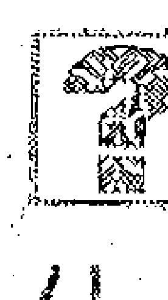

> 神，针对当今世界，假如你可以改变一件事情，你会做什么？——彼得，15岁

我要改变你们的观念。你是谁、我是谁、人生是怎么一回事，这一根本观念。我要让你能注意到，我与你本是一体；你也同样，和任何事任何人本是一体；而且，生命无涯，无始无终。这些简单的观念，将永远地转变你对生命的体验历程，而且将改变你们的整个世界。

那你为什么还不做呢？为什么还不赶紧让我们注意到呢？为什么不改变我们社会的这一观念呢？

彼得，没有任何事情是由我自己来做的。假如我真那么做了的话，我就会违背自由意志法则，我就会直接插手你们的人生。

> 你就会违反了“最高指导原则”①！

精妙！

也就是说，你说的这种改变永远不会改变？

若要促成这种改变，只有一条道路可走，即必须是由你来走。我不能替你走，我只能让你来走。这是因为，你真正所是的，就是我，神，在你的人生之中而且通过你的人生所展现出来的，你。

这就是我来到这里要告诉你的话。这就是为什么你——手上拿着这本书的每一个你——会让自己来到这里，来这句话的根本原因。

那么，该怎么样，我才能够改变世界？

迄今为止，不论是你们的政府，还是你们的社会，甚至是你们的宗教，无论他们怎么努力，都无法改变人类最基本的行为。因此，很多事在人类历史上亘古不变：争吵、厮打、杀戮；不肯敞开心怀分享一切、爱一切。

① Prime directive，电影《星际迷航》中的一句常用台词。 ——译者注

### 为什么？

因为，你们人类所做的一切，都只是企图改变你们在这个星球上的生存环境，而不是改变导致了这种状况的你们所信奉的观念。

人们一直企图消除造成贫穷的环境、造成饥饿的环境、造成悲惨的环境、造成压迫的环境、造成偏见的环境、造成不均等机会的环境，企图消除造成暴力的环境、战争的环境……你们一直在努力想让这些生存环境都消失掉。

你们尝试过宗教、法制、皇命、仁政、专制、人民起义……你们尝试过一切你们能想得到的。可是，你们仍然不能消除这一切。

然而，凭着人类所有的你们所谓的进步，所有的先进技术，所有的新近创造出来的丰裕物质及财富，以及所有的人类认识的提高，你们仍然没有办法消除这些最根本的问题，包括贫穷、饥饿、悲惨、压迫、偏见、不均等机会，还有暴力和战争。

而且，你们之所以没有办法能够做到，就是因为，这些环境所反映出来的观念，从没有改变过。如果说你们想要改变你们的世界，你们就必须改变这个世界的观念。

行为和环境的改变，都只能是一时的。如果你要的是缓一时之急，你可以着手于行为与环境的改变；但是如果你要的是长久的解脱，你则必须去帮助众人改变他们的观念。

请你牢记：观念导致行为，行为造成现状。

这句话，不仅针对你个人生活，也针对你们创造着的全球总体现状，都是一句大实话。

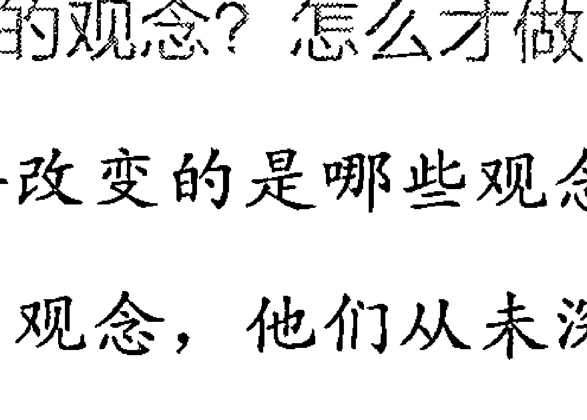

### 我们怎么改变人们所信奉的观念？怎么才做得到？

首先你必须看清你要改变的是哪些观念。许多人并不清楚他们信奉的是些什么观念，他们从未深思过，因为他们太过忙于生计，太过忙于解决问题。可是，他们却没有去想，这些问题是他们自己所信奉的哪些观念所造成的。

### 人们信奉的哪些观念需要改变？

人类信奉的对于需求的需要。这一观念使得人们不但相信他们需要物质上的需求，而且相信他们的需求是无法得到充分满足的需求，又进而导致他们不但有了彼此水火之分的观念，更使得他们有了“胜者为王败者寇”的观念。

还有，最要命的一点，是这一观念使得人们相信，爱是讲究条件的。不但我的爱是讲究条件的，所有的爱都是要有条件的；因此，必须首先满足了某种条件，才可以有资格受惠于爱；又因此，必须首先裁决谁是否满足到哪些条件，而那些没有满足条件的人，不但没有资格受惠于爱，而且必须遭到惩罚。

正是因为人们深深地陷于这样一套因物质匮乏而必须你争我夺、优胜劣败、裁决与惩罚的观念体系之中，他们的行为便与这种观念相匹配，其结果就是制造出了自身的惨状。

最后，人们还相信，要推翻或者重建他们信奉的观念，那是不可能的；因为他们不但不知道，而且不可能知道，该怎么做。人类信奉蒙昧无知。

这些观念，就是人类的十大幻象；这些幻象已经变成了人类整体真实现实的很大一部分。但是，你们仍然可以改变它。

### 我们怎么去改变？

首先你必须真正理解问题所在，也就是你正在这里做着的事情；然后，寻找解决方案，一个能够改变你最根本的观念的方案，一个能够帮助他人改变他们观念的方案。

好。但是，在我听你说出这一方案之前，我必须确认我们是否真的有这份力量去实施。我不想被带进一个空中楼阁。我是说，我们真的能做得到，对吧？哪怕从来没有前人做到过？

前人从未听到过如此透彻的讲解。

现在，越来越多的人清楚地看到，人类面临的是真正的问题，是会毁灭整个人类及其家园的问题。而且，越来越多的人正在越发清晰地获知，他们可以做些什么来改变它。

这使得现在成为一个非常重要的时刻。这就是为什么这本书会这么“掉进”了你的手里。

没错，你有这份力量，去重新创造你们地球的真实现实，这完全毋庸置疑。这力量来自于你的创造力量，你的原生力量。也许你首先需要改变的，就是不相信你有此力量。

对，这是因为（现在我们回到了我们刚才的地方）我们相信什么，我们就体验到什么。

就是这话！有些观念会更加难以置信，因此那些体验就越发难以感受到。

比方说？

呃，若要想象你能够在你最喜欢的地方得到一个停车位，这会远远比你想象没有彼此对立与不容、没有神的惩罚、没有蒙昧无知，要容易的多。于是，许多人愿意用你们的原生力量去成就一些所谓的“小事情”，却不愿意去成就所谓的大事情，因为，人们根本就不相信有这种可能。

同样的，有些人可以把他们生活中一些小的不如意看做上天的礼物（所谓的“因祸得福”），却把人生中更大的负面遭遇看做挣扎、悲剧（所谓的“不幸”或者“灾难”）。他们相信能扭转小的不如意，却不相信能够改变大的。

而那些大师们却相信他们可以用他们的原生力量（所谓“神的力量”，或者“祷告的力量”），去创造一切。结果他们创造出你们所谓的“奇迹”。

也就是说，假如我相信我的人生可以不必如此，那就可以改变；继而整个世界也都可以改变。

的确如此，这正是所有一切已经得以改变的原因。某个地方有某个人，相信事情会是那样发生，于是就那样发生了；而且，往往是那个人促成了事情的发生。

所以，我前面说过，不要放弃希望，不要放弃你改变人生改变世界的努力。

在这一刻来到这里走进这本书的你们，都是为了来开始你们人生一段新的旅程。这会是一段充满希望的旅程，一段丰硕的旅程。这，是你们回家的旅程。

这是醒来的时刻，这是醒悟的时刻。从此你将开始一段新的人生，带着你的意愿、追求和明澈的觉察，带着你从未敢想象的快乐，开始一个崭新的人生。

还记得那个“三车大道”吗？

-   尽情玩乐。
-   播撒喜悦。
-   共享真爱。

哦，朋友，你就会有机会在未来的几年里做到这些！

你准备好了吗？

很好！现在开始。

现在就开始。

今天就在家里开始，明天就从学校里开始。

现在就开始。

与神对话：献给青少年

这，就是你需要的一切。所以我才会如此确信，对你来说没有什么大不了的，没有什么做不了的。玩乐、喜悦，还有爱，就是你之为你。一个出乎天然的你，就让你做你好了。

不论做什么，都尽情享乐。是啊，哪怕是去上学，也享受上学的快乐，把上学看成它本来就是的东西：那是一块踏脚石，一块能够把你带向你向往的最美好人生的踏脚石。

享受一切生活中的喜悦，你能做得到。不过就是把其中的压力卸掉，把悲情放掉。一切就都很好了。

向你的周围播撒喜悦，一个小小的微笑就可以做到这一点。一个开怀的大笑，对旅人一句鼓励的话，伸向朋友的一只援手，递给父母的一双助手，这些，都是向周围播撒的喜悦。

与所有的人共享真爱，依照你灵魂的指引，在最恰当的时刻，以最合适于相应人际关系的形式，和每一个人，包括你自己，共享真爱。

去吧，现在就去，把这世界创造成你向往的样子。现在就去，去赞美你的人生，赞美所有使你成之为“你”的一切。

去吧，现在就去，在更高一步的层次上，去重新创造一个最崇高境界中的最庄严辉煌的，你之为你。

这是我发给你的邀请。这是你自己的梦想。这是我们下一步的大探险。

## 结束语

在这本书的一开头我曾经说过，是你让这本书来到你手中的。现在，你已经读完了它。这使得你从此打开了你的耳朵，让自己可以比以往任何时候都更能清晰地听到真实，那些你心底深处从来就知道的真实，那些能够改变这世界的真实。

2001年9月11日在美国发生的事件，以令人窒息的清晰昭示我们，这个世界必须改变了，否则，用不了多久我们就不会再拥有这世界。不过，尽管刚刚过去这么惨痛的一天，我仍然要在这结束语里告诉你们，我们的世界，可以拥有更多的爱与和平；你的人生可以拥有更多的喜悦；我们的人生都可以过得更加硕果累累。

2001年9月的这一天震撼了全球千千万万的人，也前所未有地促使着人们去转变我们在这个星球上的生活与人生。该怎么转变？

与神对话：献给青少年

我相信至少有一种是我知道的好办法：睁开我们的眼睛，好好看清楚，现在，你到底想要拥有一个什么样的人生、一个什么样的世界；然后，再好好看看清楚，我们能够做些什么来使之成为现实。

《与神对话》的一个主旨，是“己所欲，施于人”。因此，假如你渴望感受到更多的祥和、挚爱、理解，那么，请你把更多的祥和、挚爱、理解带给他人，那些与你在人生中相遇的人。假如你向往感到安全，那么请你让他人感到安全。假如你希望能更透彻地了解那些让人困惑的深奥问题，那么，请你帮助他人更透彻地去了解。假如你想要愈合你自身的悲伤与愤怒，那么，请你努力去治愈他人的悲伤与愤怒。

记得在第15章里有一位少年问道：“为什么必须我要先迈出一步？”这使我想起了一句非常经典的犹太古老哲理：“若非此时，何时？若非吾，孰也？”

是你，我们的年青人，能够给我们带来改变，能够带领我们远离2001年9月11日曝于世人的残暴。你们的今天可以为明天铺设道路。

我们有很多很多的事情可以去做，但是有一件事情我们一定不可以做。那就是，我们再不可沿袭过去的老路，一起继续在这个星球上糟蹋我们的生活。你们，你们年青人，早就明白这一点。你们年复一年，用一切声音向这个世界大声疾呼，从游行到高歌到赋诗。你们当中的一部分因为无人肯听而怒发冲冠。如今，在人类历史上这一非常紧要的关头，怒发冲冠不见得就不是一件好事情；相反，这是上天赐予的一份礼物。如果你能够把你的愤怒指向问题的根源，而不是用来怨天尤人，那么，你就能把人们带向治愈之路。

这些问题的根源我已经看得很清楚；在这本书里我们也已经讨论得很充分。我们目前生活着的这个世界，陷于对生命以及人生的深深误解之中。很少有人学到最根本的人生之道，很少有人记得最根本的真实，很少有人理解最根本的精神智慧。一句话，很少有人倾听神，因而，他们只好看着自己做出些很没有“神格”的事情来。

《与神对话》带给我们的信息非常简明：我们都是一体。而这却是人类最为懵然无知的一点。我们以分离为主导的精神意识已经贯穿了所有人类产物。从我们的宗教系统到我们的政治体制，从我们的经济体系到我们的教育机构，乃至我们的整个人生，都以此为本，认为人与人之间水火不容。这种分离意识已经导致了我们各种形式的相互伤害；而这些伤害，又导致了更多的伤害。所谓物以类聚，近墨者黑。

现在，问题已经严重到了威胁整个地球的地步，我们再没有出错的机会。人类已经有了这份歼灭自己的力量。大家都已经知道，我们一个下午就能毁灭一切生命。

这是我们人类首次有资格如此宣称。过去，我们能够毁灭一个村庄，一个城镇，甚至一个民族；可是我们从来不够本事把整个世界毁于一旦。而现在，我们有这本事了。在此，我呼吁全世界所有的年青人，关注这一巨大力量所摆在我们面前的严酷问题。

我希望你们能够站在灵魂的高度看待这个问题，而不是再像过去那样，从政治的角度、经济的角度来看待这个问题。

我希望你们能够亲自与神对话，因为只有最崇高的智慧和最终极的真实，才能针砭最严酷的问题；而我们现在，正面临着人类历史上最严酷的问题，最艰巨的挑战。

如果你希望你的孩子们、你孩子的孩子们都仍然能够体验这美好的世界，如此之美好的世界，那么我相信，你此时此刻此地就应该立即行动起来；你必须下决心亲手去促成这一切。

这是今天摆在每一个有思想的人面前的挑战，不论年龄大小。但是，惟有你们年青一代才有这份魄力，有这份活力，有这份体力，有这份真正的动力，来迎接这一挑战。明天的世界，是你们将要去体验的世界，也是你们将要去创造的世界。

我请求你，恳求你，不要再把这世界打造成你们今天看到的这副模样。

恳请你，放下你的愤世嫉俗，如果你曾是这样一个人。恳请你，放下你对人生的冷漠，如果你曾是这样一个人。恳请你，再也不要让任何一天白白放过，从此时从此地开始，积极去行动，在家里，在学校里，在社区里，在这个世界里，在你生命的每一刻，把更广阔的联合、更深刻的理解、更融洽的和谐、更美好的爱，带给人类，带进我们的人生体验。

做一个行动者，去帮助别人一起改变，最终改变你面前的这些因古老的观念而形成的残忍、自私、无情、非人性的行为模式。做一个改天换地的人。不要只耽于谈论问题，而要现在就选择加入到改天换地的行列中去。

“乐于创新”（ReCreation），我们的非营利基金会，为那些选择要创新世界的年轻人组建了一个全球性的联盟。如果你愿意联络全世界的其他年轻人，联络那些愿意组织起来一起参与促成世界改变的各种活动的年轻人，或者你有兴趣召集一个你所在社区的青年大会，请今天就联系我们：

- 网址：www.thechangers.org
- 电子邮箱：thechangers@cwg.cc

现在，我的年轻朋友们，再见。我希望这番对话能对你有所裨益，并希望你能因此更加发自内心地让你的每一天都生活在你的内在智慧之中，生活在你的内在真实之中。世界的明天是你们的，请把它创造成比任何以往都更加美好的世界。我爱你们。

尼尔·唐纳德·沃尔什
俄勒冈州，阿什兰市
2001年9月12日