# 与神对话：解开你的人生疑问

一本正經。
拼命努力。
裝酷。

其實，這些都是離幸福很遙遠的人格特質喔！
將過著不順遂人生的典型範例。

「一本正經」的人，往往下場悲慘，
「拼命努力」的人，反而更為吃虧，
假裝自己「很帥」，卻更顯土氣。

現在，我們正逐漸迎向這樣的時代。
讀到這裡，是否感到驚訝呢？

「才沒這回事呢！只要努力不懈，最後一定會獲得回報。」
你一定想這麼反對。
沒錯，正因為你這麼想，才更希望你能繼續讀下去。
要說為什麼，因為來參加我的講座的人們，大家都像你一樣，是一本正經、拼命努力的人。
其實你一定也能變得幸福的。
只要，那份「正經」不要用錯方向。
只要，用別的詞代替「拼命努力」。
只要，不執著當個「帥哥」，而是以成為「丑角」為人生目標。

我常常這樣告訴大家。
「改變人生，有條3秒就能走完的路，也有需要耗費30年才能走完的路。3秒和30年，你會選擇哪一條呢？」
如果想要不慌不忙地走完那條30年的漫長路，現在就請把這本書闔上，讓自己被一直以來的日常生活淹沒吧！這麼一來，就能回到平時緊湊忙碌的生活；雖然有許多不如意，但偶爾也能感到些許幸福，說不定也會有與之相稱的充實感。不好不壞的這一生，在迎接最後階段時，才終於摸索出花了30年尋找的生命及人生的真諦。
好吧！這種選擇或許也不錯。

不過，我仍然認為如果能讀完這本書，一定只要 3 秒就能成功地改變自己的人生，甚至在讀完後會有重獲新生的感覺。改變後的人生，令人雀躍的事與開心的事都會不斷發生。隨時沉浸在愉快的感覺之中，心情當然也變得輕鬆。而至今一直煩惱著的事情，也都能獲得解決而煙消雲散。

所以，我推薦「3 秒改變人生」的方法。

首先，我先說說這本書的結論。

拋開一本正經、拼命努力和裝酷吧！

這些無聊的行為，現在就趕快停止吧！

無論你多麼努力地裝出精明幹練的樣子，
汲汲營營於追求順遂的人生，
但其實，存在於你心中的神，
比想像中更加調皮喔！
「少假正經了啦～」
你的心中之神正苦笑著這麼說！
什麼？開始覺得有趣了嗎？
這就是你心中，
「調皮之神」想要覺醒的證據。
那就讓我們開始吧～

# 前言

聽到「神明」，你的心中會浮現出什麼樣的形象呢？

是充滿威嚴、令人敬畏的莊重存在？

還是散發著耀眼的神聖光輝？

又或者是凌駕萬物之上不可一世的存在？

但無論是哪一種，都一定是與有缺陷的人類恰好相反，具備一切優點且完美無瑕的存在吧！

這個想法從某個角度來說並沒有錯。但是，它也並非完全正確。

到底是怎麼回事呢？
你心裡一定這麼納悶著，
就讓我先來談談心中對神明的印象吧！

距今大約十五年前，我曾經和平常頗為親近的幾位朋友，一起從沖繩出發前往出雲大社參拜。由於朋友們說無論如何都希望我也一起去，便為我策畫了這次的行程。

到達出雲大社後，在宮司（注：神社中職位最高的神官）的引導下，我們有幸進入神社的正殿參觀。

在正殿裡，我對同行的朋友們說：
「難得能進入到正殿之中，我們就來進行一些儀式，好能吸收更多神明的力量吧！

首先，把右手的食指和中指伸直併攏。再將兩隻手指一起往前伸。在空中順時針慢慢畫一個大圓。」

只見同行的眾人，都一起伸出右手在空中繞著圈。
「接下來，讓我們把眼睛閉起來。
畫完圈之後，再把手指放在鼻子下面。」
在場的人都被我認真的語調震懾，為了獲得神明的力量，一臉嚴肅地將手指
擺到鼻子的下面。他們專注的神情，只能以「認真」兩字形容。
一時之間，沉寂籠罩著整個正殿。

「好的，請大家手不要動，就這樣張開眼睛。
……

各位，你們到底在做什麼啊？」

每個人在張開眼睛彼此互望之後，都不禁開懷大笑，就連宮司的臉上也露出
苦笑。

——因為這個動作，不管怎麼看都是加藤茶（注：日本老牌諧星）的招牌搞笑動作「加藤呸」啊。

居然在出雲大社的正殿，開這麼不莊重的玩笑……如果有人心裡覺得不舒服，我在這道歉。不過，我會開這樣的玩笑也是有原因的。這部分會在之後的章節詳細說明。

你覺得大家在正殿做出「加藤呸」動作的時候，出雲大社供奉的神明又在做什麼呢？

那就是，這個動作。

沒錯，正是大家十分熟悉，志村健在《傻瓜殿下》中，右手放在下巴下，再把下巴往前伸的搞笑動作「啊～因」！

神啊，回的好！說到「加藤呸」，當然不能不提「啊～因」。這就是神明盡其所能，與我們進行溝通的例子。

當然，神明也不是對每個人都會做出「啊～因～」這個動作。只有對像我這樣俏皮的人，神明才會如此回應。對於嚴肅正經的人，神明也會以嚴肅正經的態度回應。順帶一提，態度很差的人也會得到態度很差的回應。

也就是說，神明其實會配合一個人的器量與個性，靈活地以祂最能接受的方式與之相處。

我之所以能自信滿滿地這麼說，是因為我從 3 歲左右開始，便不斷地與神對話，時而爭執，時而歡笑，在互相勉勵之餘，也一起想些鬼點子等，我與神之間有著對等的相處關係。

因此，對從懂事起便與神明頻繁交流的我來說，神明常伴於左右是件理所當然的事情。祂就像是我的親人、摯友一般。因此，一般說的「神諭」或來自神明的「旨意」，在我聽來其實跟父母的嘮叨沒什麼兩樣。

說到這裡，我就想起小學一二年級時，不但平常不認真上課，還把作業塞在抽屜裡不帶回家，因此被神生氣地數落了一頓。

「神說的話你也不聽，爸媽說的話你也不聽。不管是誰說的話你都充耳不聞，你到底是哪來的大爺啊！」神這麼說道。

「咦！我嗎？我是老天爺啊。因為我就是你的小孩不是嗎？」聽到我的回答，正在氣頭上的神也不禁噗哧地笑了出來。

其實我並沒有故意想要逗神發笑的念頭，只是單純地回答一個簡單的事實而已。我沒有特別敬畏神明，不聽憑神明指示行事的原因，正是因為我明白自己也是神，並對自己深信不疑的緣故。

或許有人會對「我也是神明」這種話抱持著諸多疑問，但其實在我們每個人的心中，都寄宿著來自於神明的能量，無一例外。**神的能量，正是存在於我們身體裡所謂「靈魂」的部分。**因此，我們其實都是神的分身，絕對不是因為我有什麼特別之處。

不會吧！我竟然是神的分身？嗯～你會這麼懷疑，也是沒辦法的事。不過，讀了這本書，你一定會回想起自己也是神的事實。

現在就先記住「我們也是神」的這件事就好囉。

不過，如果說我們就是神明，你還會認為存在於我們心中的神，是崇高又令人敬畏的存在嗎？

如果懶惰的人、輕佻的人和急性子等不同個性的人，心中都寄宿著同樣完美無缺的神，不覺得有哪裡怪怪的嗎？

沒錯！

就像每個人都有各自獨特的個性一樣，神明們的個性也各有不同。有愛喝酒的神，也有喜歡偷閒打盹的神，甚至還有整天愉快地構思著裝傻、吐槽等搞笑橋段的神。

不過，神明們基本上都是十分調皮的。祂們喜愛歡笑與令人愉快的事，也想試著去冒險，有時甚至打算拋開一切、恣意妄為一番……。神明們，其實是如此讓人著迷的存在。

那你認為自己心中，又寄宿著怎麼樣的神呢？
這個問題，其實只要你充分地了解自己就能知道。這是因為心中之神的性格，其實跟自己幾乎一模一樣。更進一步地說，神明正彰顯了我們自身本質的存在，這點是無庸置疑的。
只要與自身本質連結，也就是說讓「真正的自我」覺醒，就能明瞭自己心中寄宿著怎麼樣的神。
不過，遺憾的是，大部分的人都在不了解「真正的自我」的情況下活著。
例如，一個人真正的自我，就算有著像松岡修造（注：亞洲第一位網球大滿貫男單八強者）一樣，認為「愛才是一切」的滿腔熱血，往往也會被社會常識及人際關係中「不這麼做不行」、「原本就應該要這樣」的規範所局限，過著失去愛的人生。
因而無法與心中的神激動地說：「人生的真諦就是愛」產生連結的機會，無法敞開心胸地活著，漸漸踏入人生的迷宮之中無法回頭。

但是對拿到這本書的你來說，會想閱讀本書，正是你心中「真正的自我」想要覺醒的證據。書中雖然介紹了很多引導出「真正的自我」的秘訣，但在不知情的情況下，無意識地感應到了這一點，才讓你有緣和這本書相遇不是嗎？

在發掘出真正自我的同時，你一定也會感到訝異，原來調皮之神一直常伴我們左右。

喜歡「歡笑」，也喜歡「哭泣」；有時會覺得寂寞，有時會鬧鬧彆扭、發發脾氣……。當你能坦率地接納這位「毫不做作」的神時，你的心一定也會變得輕鬆許多。畢竟，當你明白自己也具有調皮本質的同時，也就不再需要裝出一副成熟穩重、熱心善良或精明幹練的樣子。

而在與內心的調皮之神感情變好後，更能發揮意想不到的強大力量。那就是，只要用想的就能實現任何願望，以及能擁有愛自己與愛他人的力量。

在幸福的人際關係中被愛所圍繞，自己的願望得以實現。你會發現，你能過著如同神明一般的生活方式。

與調皮之神產生連結，能帶來的力量正是如此之大。其中的原因，是因為你已經與自己的本質產生連結，從今以後只要以「真實的自己」活下去便行了。這麼一來，你當然不會再因為周遭的影響，掛念著種種煩惱，而能夠率真地依照自己的心情生活。

# 人生就這樣變得單純多了！

為了能和替你帶來幸福的調皮之神愉快地溝通，首先請把這本書仔細地讀過一遍。

在你壽終正寢回到天國之前，為了在這難以生存的地球上幸福地活下去，請你一定要回想起自己心中的調皮之神（本質），好好地「做自己」。

這就是我想要透過這本書傳達給大家的想法。

準備好一起踏上這趟調皮之旅了嗎？

來～吧，出發囉！

# 目錄

## ① 章

## 笑口常開又有幽默感的人
才會受到神明喜愛

- 認真嚴肅地生活什麼的，都去吃屎吧！
- 讓 400 名高中生眼睛為之一亮的一句話
- 你知道地球其實是神明的「遊樂場」嗎？
- 快快拋棄受常識束縛的「死腦筋」！
- 請把「想要成為更好的人」的想法丟進垃圾桶
- 宇宙的法則會告訴我們如何變得幸福
- 只不過是說出真相，卻被當成問題兒童!?
- 從「找尋回到天國的入口」得到的覺悟
- 人生應該有比墨守成規，還重要的事情吧！
- 能展露笑顏，整個人生都會跟著改變！
- 只要擁有幽默感，就有改變自己的可能
- 跳脫慣性思考模式，是遠離不幸的開始
- 思維樂觀，人生馬上大不同
- 擁有「笑」的前提力，讓你打開快樂開關
- 拋開假面具，活著其實是件很開心的事！
- 苦境和災難，都是自己「選擇」的結果
- 討厭的人都是自己吸引而來的
- 讓人生從此只有幸福降臨的「秘訣」

## ② 章
因為我們就是「神明」

- 只要能偶爾想到神明的存在就夠了！
- 神明一直「存在」於我們的內心深處
- 就算知道自己是神明，仍然要全心全意地當個人類
- 對神明有「戀母情結」，會讓神明十分鬱悶
- 會「讀心」，看穿對方在想什麼
- 你知道為什麼要在神龕前供奉酒嗎？
- 毋須尊崇也毋須敬畏，請「對等地」和神明來往
- 領悟到「生命是全自動的！」之後，疾病瞬間痊癒
- 碰觸頭髮，就能「看見」顧客煩惱
- 就算被身邊的人說是「發神經」，也要完成自己的人生使命

## ③ 章
人生超單純！
用想的就能實現願望

- 只要「想」著，就能讓願望實現
- 簡單到不可思議，用想的打出一桿進洞！
- 「好事後面一定會接著發生壞事」是錯誤的想法
- 「本來想……」，其實是願望不會實現的藉口
- 如果有許多願望想實現，祈求時要一樣樣來！
- 好好珍惜「過程」，活在每一個當下
- 克服困難來自於「意念」，而非「思考」
- 單純在心裡想著「好想變瘦呀」的神奇變化
- 強求的願望不會實現
- 「想要」的意念畏畏縮縮，願望也不會實現
- 改變了自己，對方也會跟著改變
- 不懂裝懂，會扼殺許多可能性
- 人無法改變際遇，但可以改變意念
- 用心感受，而非用腦去思考
- 人類是「從樹上而來」的生物？還是「從天上而來」的生物呢？
- 你真的想成為有錢人嗎？
- 無法讓金錢發揮功能的人，是賺不到錢的
- 錢也有想回去的地方？「在鈔票上寫名字」的實驗
- 在付錢的時候，你覺得自己變得富有嗎？
- 讓金錢的力量停滯是種罪過
- 你的內在富足嗎？思考做個真正的有錢人！
- 中樂透的人到底是運氣好？還是不好？

## ④ 章

## 有些煩惱，只要做自己就能解決

- 為何下一個男人還是無法更好？
- 如果想要活出自我，請重新審視自己的價值觀
- 是否在不知不覺間照著「別人的價值觀」活著呢？
- 你真的「感受的到」嗎？
- 時時向自己提問，活出不後悔的人生
- 「面子」正是家庭失和的病因
- 遇見「讓自己無比幸福的人」的絕對法則
- 男人活著，只是為了得到女性的認同嗎!?
- 找到自己的幸福態度

## ⑤ 章
愛自己的人，一定能變得幸福

- 快把會讓人生變麻煩的「少話」毛病放逐吧！
- 只用一枝原子筆就能平息怒火的方法
- 生命連結著萬事萬物
- 用積極的態度，讓自己「老的有尊嚴」
- 不要小看自己！
- 你如何對待身邊的物品呢？
- 我們要成為人生的演員，而非觀眾
- 當人生跌落谷底時，每天一定要做的一件事
- 只有靠著「愛」才能活下去啊！

### 感謝是一種體悟

### 「做自己」就能解決一切困難

## 與神明連結的小遊戲 1

靠直覺挑束花，並和它對話

## 與神明連結的小遊戲 2

花 10 元買份幸運

## 與神明連結的小遊戲 3

輕撫並犒勞自己的衣服

## 與神明連結的小遊戲 4

在心中想一件會讓自己開心的事物

## 與神明連結的小遊戲 5

把衛生紙摺出三角形

## 與神明連結的小遊戲 6

對鈔票說聲「一路順風」

## 結語

# 第1章 笑口常開又有幽默感的人，才會受到神明喜愛

# 認真嚴肅地生活什麼的，都去吃屎吧！

聽媽媽的話，聽學校老師的話，去補習班補習，考上不錯的學校，然後順利地找到工作。接下來，在公司看老闆臉色，在家裡看老公或老婆的臉色，與親戚和周遭的人相處時也總不忘掛著諂笑，認認真真地過著沒有風浪的正經人生。沒錯，就是在說那邊的你。

你的人生快樂嗎？
每一天都充滿歡笑嗎？

這些問題，能打從心底回答「沒錯」的人恐怕沒幾個吧！

我一年大概會舉行 **100** 場左右的講座和演講。至今大概已經有五萬人參加過這些活動。人要如何才能獲得幸福？要抱持著怎麼樣的心態，才能忠於自我地活著？對企業來說，又該如何才能將員工的能力發揮到最大呢？我很榮幸有許多機會，能針對這些圍繞著人的成長、健康與幸福等主題，對大家進行說明。

## ①章 笑口常開又有幽默感的人，才會受到神明喜愛

不論男女老幼，各式各樣曾經聽過我演講的人，最多的感想是「先是笑，又是哭，最後還是破涕為笑」。除此之外，也有全程都笑呵呵的人，更有笑著笑著卻哭了出來，情緒好像坐了趟雲霄飛車的人。

笑是很重要的。「笑得出來」真的是一件非常重要的事。

順帶一提，在「前言」裡面曾經提過的「加藤呸」，是我在演講時一定會有的橋段。我會開這種「玩笑」是有理由的。

因為我心裡深深明白，「笑」是多麼珍貴，「笑得出來」又是一件意義多麼重大的事。無論是想實現願望，或是想獲得幸福的人生，先透過笑進入放鬆狀態，再由此導入正題是唯一的捷徑。

當你想完成些什麼，想要得到些什麼。

這種時候，你一定會認為「必須拼命努力」、「必須認真去做」吧？但我要說的是，正因為如此，「認真」思考反而是行不通的，也千萬不能想著要「埋頭苦幹」。

因為比起那些事，坦率地面對自己「歡笑」、「哭泣」、「憤怒」等情感，才是實現與達成目標的最佳捷徑。

或許有些人有自覺、有些人沒有，其實我們每個人時時刻刻都在壓抑自己的情感。**壓抑自己的情感絕對壞處多多**。所以，千萬不要這麼做。無論是哭出來、笑出來，或是發脾氣，都是表達情感不可或缺的重要方式。但即便如此，害怕顯露出自己的情感，怕被說不夠成熟，因而扼殺自身情感的仍然大有人在。

來參加我講座的人們，一開始也都是這樣——不專心、不認真聽可不行！花了錢來聽演講，一定要學到東西！大家都抱著這樣的想法，臉上掛著可怕的表情坐在臺下。就跟現在讀著這本書的你臉上的表情一模一樣。

不過，如果想要「認真」用腦袋去學，不管聽到什麼、看到什麼，一定都無法在心中產生共鳴。所見所聞只會變成知識塞進腦袋裡而已。光是放入腦中而不實際付諸行動，是沒有任何意義的。這些知識，並不會變成行動的燃料。因為與實際行動息息相關的，其實是內心深處湧出的那份「情感」。

## ①章 笑口常開又有幽默感的人，才會受到神明喜愛

因此我認為，敞開心胸、展現自己的情感是首要之務。為了撬開心上那緊閉的蓋子，「笑」是不可或缺的。

放鬆地展露笑容，不但能讓身體跟著放鬆，心扉也會隨之敞開。在心境一片海闊天空時，再導入我真正想傳達的正題，如此一來，那些話語便能充盈你的內心深處，進而使你能更輕鬆地將它們付諸行動。

在用「歡笑」打開你的「心扉」後，你就能開始「用心」去體會一切事物。能夠用心體會事物之後，會發生什麼事呢？

沒錯，不知道為什麼，不由得地熱淚盈眶。

所以來聽我的演講是十分忙碌的。在一陣大笑之後，往往馬上就要掏出手帕來擦眼淚。大家毫不在意自己正在流淚，甚至前一刻還吸著鼻子哭哭啼啼的，下一秒鐘又拍著桌子笑倒在地。第一次參加我講座的人，應該都會有點吃驚吧！

而在這樣解放自身情感、又哭又笑的同時，也會像是重生一般的改變。不僅表情有所變化，連帶給人的印象都與過去大不相同。

自己也會覺得心情輕鬆許多。要我形容的話，我認為就像是剝掉殼之後，熱呼呼又滑嫩的白煮蛋一樣，將一個人真正的本質展露在外。而在那個人的心中，更會自然而然地湧出「這次我一定要幸福！絕對能改頭換面！」充滿自信地「表示決心」。

看到剛剝好的白煮蛋，實在是一件令人十分開心的事。直到今天，我仍然持續地在日本全國各地奔走演說，希望能與更多更多的人進行交流。

## ①章 笑口常開又有幽默感的人，才會受到神明喜愛

### 讓400名高中生眼睛為之一亮的一句話

我來自沖繩，也曾經應故鄉的學校邀請，以「快樂掌握自己的人生」為主題，對高中生進行演講。

首先映入眼簾的是，在體育館裡座位排得整整齊齊的學生們。

在校長的開場白結束之後，面對著露出「這次又是誰來囉嗦啊」無聊表情的學生們，站上講臺的我開口這麼說道：

「不會吧，不會吧，不會吧，你們啊！應該沒有想過要認真生活吧？應該沒有給我在想著要認真生活……的吧？」

直到前一刻都還顯得興闌珊的高中生們，全瞪大眼睛看著我，一臉「這個人是誰啊」的驚訝表情。

我沒有停頓，繼續說道。

「大人啊，可是很快樂的喔～真是超級快樂的！
人啊，是為了開心享受人生才來到這世界上的唷！
認真嚴肅地過活，認真嚴肅地考上好大學之後找到好工作，你們認為這樣就會幸福嗎？你們身邊，有因為這樣而活得開心的人嗎？」
他們瞬間露出陷入思索的表情。

「人啊，是受了很多恩惠才能活在世界上的。如何享受人生，以及享受人生到什麼程度，代表的正是對我們被賦予的生命所展現出的感謝喔。所以，享受人生，就是人生的守則。希望你們都能像這樣，好好地去思考要如何享受人生。」

語畢，這些率真的孩子們，眼中都開始閃耀著光芒。

## ①章 笑口常開又有幽默感的人，才會受到神明喜愛

但是，我說的享受人生，並不是指每天不讀書只顧玩樂。一定有喜歡讀書的孩子，也一定有熱愛研究、擅長運動、喜歡料理、樂於和人接觸和喜歡靜下心來一個人在桌前工作的孩子，或是對發揮領導力而樂在其中的孩子。孩子就跟大人們一樣有著各式各樣的類型。

如果所有的人不管在做什麼，都能以「好像很快樂」、「好像很有趣」或「讓人躍躍欲試」為準則，來決定自己的行動和前進方向，就再好也不過。

倘若不是依據「好像很快樂」、「好像很有趣」來決定人生方向，往往會心生許多不滿並遇到各種阻礙。以職場為例，如果用薪水高、福利好或是知名企業等表面的條件來選擇工作，就算現在覺得快樂，總有一天還是會遇到讓人不開心或心生不滿的事。

工作，其實只要選擇能讓自己雀躍期待、躍躍欲試的職業即可。如果是喜歡的工作，因為是自己想做的事，就算薪水不高也不會太過在意。並且，因為「躍躍欲試」和「很快樂」是做這件工作的出發點，自然也能獲得豐碩的成果，讓薪水更上層樓。或許還能因而習得自立門戶的技術，就此踏上創業之路也說不定。

就像我們常說的，喜歡的事物會自然而然地變得拿手。如果能抱持「喜歡」的心情去做某件事，「那樣做如何呢」、「這樣做或許會更好」的點子也會接踵而來。並且，能夠更快學會、自然充滿上進心。

另外，我們常常被要求「抱持上進心」，但用「抱持」來形容上進心是不恰當的。因為，上進心其實是以「喜歡」為出發點，而自然浮現在我們心中。對於「不喜歡」的東西，無法湧出上進心是理所當然的。

「喜歡」的情緒，正是讓心雀躍的原動力。因此，當心中產生了喜歡的情緒時，請好好珍惜這份雀躍的心情，盡情去享受吧！

「享受人生，就是人生的守則」是我經常掛在嘴邊的一句話。**不快活，就是一種「違反禮儀」的行為喔！**

## ①章 笑口常開又有幽默感的人，才會受到神明喜愛

### 你知道地球其實是神明的「遊樂場」嗎？

去做讓你躍躍欲試以及覺得快樂的事吧！會這麼說，其實是有原因的。因為，地球其實是神明帶著「玩心」所創造出來的星球。

百般無聊的神明們想著「真想做點有趣的事」而創造出了遊戲場所，也可以說地球其實是個遊樂園。

「地球？？？」
「神明？？？」

或許會覺得我突然之間在胡說八道什麼啊。

但接下來，我就要開始講些稍微奇怪的話囉。

某一天，神明們對什麼想法都能實現的意識世界（也能說是靈魂世界）感到相當厭倦，而興起「想要來點什麼刺激的事」的念頭。平淡而毫無變化的生活過久了，我們也會想著「發生些讓人心跳加速、有刺激感的事吧」。神明也是如此。祂們也會覺得無聊。

於是，神明便創造了時間和長度等可以用具體量化之數值所表示的物理性次元，也就是以眼睛所見為優先的物質世界——地球。

我們人類，雖然是靠著肉體與意識相輔相成才能活著，但平時以肉體為主的生活，卻讓我們變得只相信眼前實際所見的事物。因此，在現實世界中，人們才能認真地煩惱著令人痛苦、悲傷的事而活著。

沒錯，我們才得以認真地煩惱並活著！

## ①章 笑口常開又有幽默感的人，才會受到神明喜愛

在意識的世界中，所有事物都互相協調理解並充盈著愛，因此無法感受到痛苦或消沉。不安、難受或悲傷等負面情感，都是在物理世界中才能體驗到的。這種情緒狀態，對神明來說非常刺激。甚至可以說是超有趣到難以自拔。

感到無聊的神明們，能在地球上體會到這種深刻的情感或不安等情緒，這對祂們來說，就像是搭乘雲霄飛車般，十分刺激。也就是說，當你在痛苦而煩惱不已的當下，其實在意識的世界中卻是「正中下懷」的一件樂事。

如何？是否開始覺得，懷抱著煩惱生活是件傻事了呢？

明明本來是做為遊樂場而被創造的地球，如果我們這麼認真地生活於其中不會有點奇怪嗎？這就是我想表達的。

認真地念書、認真地養育孩子、認真地建立家庭、認真地蓋自己的房子、認真地累積財富，又如何呢？

人生從宇宙歷史來看，可說是短到不行，我們卻正經八百地面對，被社會常規所束縛，最後說著「人生果然不是事事盡如人意啊」、「人生，真是一連串的修行」然後死去，這豈不是太可悲了嗎？

每每看見那些活得嚴肅又痛苦的人，我都不禁想要告訴他們：「喂～這麼沉重幹嘛呢！我們可是來地球上玩的。快點想起來吧！更快樂地享受人生。」

在地球這顆行星上，每個人像是各自演著「沉重劇場」一般，展開屬於自己
的劇情。為什麼要大費周章創造出一部這麼晦暗的連續劇呢？希望大家都能了
解，這種行為是多麼地愚蠢。

痛苦的事情，對神明來說也是玩樂的一環。而對祂們來說，比起過於認真的
人在地球遊樂園盡情玩樂，具有玩心與幽默感的人反而更加討喜。

## ①章 笑口常開又有幽默感的人，才會受到神明喜愛

### 快快拋棄受常識束縛的「死腦筋」！

神明原本就有著調皮的天性。因此，比起認真嚴肅，祂們更喜歡幽默和歡笑。可是，一直以來都認真生活的我該怎麼辦呢？一定有人想這麼問吧。

認真其實也分成好幾種。其中恪遵這個社會上的常識和固有觀念、對上意唯命是從的認真，是最要不得的。如果完全依據常識生活，會變得只在意周遭的人如何看待自己，無法忠於自己的心意而活。如此一來，你心中的調皮之神，不但失去了出場的機會，更會因此顯得無精打采。

我所推薦的認真，是具有「人類思維的認真」。所謂有人類思維的認真，指的是那份追求身為人類要如何活得充實幸福，並於日常生活中付諸實踐的認真。

舉例來說如果性行為的對象，一臉認真地觀察、觸摸你的乳頭整整一小時，你會做何感想呢？

大部分的人都會在心裡大罵「變態」吧！

不過，具有人類思維的認真的人就會花一個小時來研究乳頭。畢竟，有這種想法的人，一定具備在性行為時，無論如何都要盡力取悅對方的好奇心與精神。
我們的身體越經開發，越能達到與神明的一體化。也就是說，這種認真的人會針對哪裡是敏感帶並要如何對待，好好地開發對方的身體，使對方能更加接近真正的自我，因此才會花上一小時來觸摸研究。
不過，現實情況卻是，大部分的人都不清楚該如何觸摸與對待對方，而僅僅覺得只要輕撫就是一種性感的表現，或明明沒什麼感覺，卻裝出很有感覺的樣The request was rejected because it was considered high risk

## 從「找尋回到天國的入口」得到的覺悟

4 歲的時候，我曾經非常後悔，感嘆「我真是生錯星球了」。我了解自己身為救援隊降生地球的使命，但我的幽默感卻無法傳達給老媽和周圍的大人，反而只會讓他們大發雷霆。我已經不知道接下來該怎麼辦才好。

一開始我也曾經認為「大人們也是為了要讓我好好長大，才透過生氣這種方法來關心我。」

在老媽發怒時，我便會想「像這樣被訓斥的時候，身為一個孩子該怎麼應對呢？老媽應該是想透過這種方式，讓我學會應對的方法吧。」也因為這樣，我認為只要用幽默感完美地做出回應，老媽就會稱讚我「如何，剛剛的演技很逼真吧？你的應對也還不錯嘛。」

但是，我始終都沒等到這句話。不僅如此，老媽甚至還會因為早上發的火，直到晚上都仍怒氣沖沖。

## ①章 笑口常開又有幽默感的人，才會受到神明喜愛

「原來如此，是為了讓這種交流能再延續久一點的演技啊～」
我一開始也曾經這麼想過，但最後還是了解事實並非如此，而明白「這個人，可能真的是在生氣。」
這時，我真的對自己的遲鈍，感到十分震驚。

「原來老媽是真的在生氣啊。這樣或許完全沒辦法了呢！」
就連不曾擁有消沉情緒的我，也很罕見地對爸媽和社會的幻想破滅。從那時候開始，我的目標就變成了「找尋回到天國的入口」。

無論是閣樓、地板底下，甚至是森林裡的洞窟，我堅信在哪個地方一定存在著通往天國的道路，但在四處尋找之後，卻都無功而返。筋疲力竭的我，開口問了爺爺。

「爺爺，要怎麼樣才能回到神的身邊呢？」

爺爺是這麼回答我的。
「這樣啊！因為水井連接著天上的神與地下的神，所以去那邊或許能見到神明。自古以來，挖好的水井都不能隨便填起來，也是有這一層的涵義喔。」
聽了之後，我一邊想著「神也真是的，真會隱藏自己呢。竟然在水井裡藏著通往天國的門，真不愧是神明！」一邊動身前往附近的水井。
在水井旁邊，我不斷祈禱著「神啊，請快點來接我吧。」但不管我連續幾天都來水井旁祈禱，神明卻絲毫沒有要出現的跡象。於是一心只想前往神明身邊的我，完全未經任何考慮，便縱身躍入深達十米的水井之中。
井裡只有深深的水，不管怎麼往下潛都只看到滿是砂土的井底。這時，恐懼才開始湧上我的心頭。糟糕，我可能要困在這裡了……

雙腳碰不到井底的我，在水井中勉強把手指插進石壁間的縫隙，才得以浮出水面。
「喂～救救我～」
但是，不管我怎麼叫喚，都沒有任何人來救我。正當我想著「如果就這樣沒人發現，我可能就要死在這裡了。」約過了4至5個小時之後，幸虧路過的人告訴大家「井裡有聲音傳出來」，才讓附近的大人們集合前來營救。
在大家發現我之後，從上面放下一條繩子，好不容易把我拉了上去，才終於得救。
老媽對此又大發了一頓脾氣，而我更確信，通往天國的門是不存在的。最後，我才做出「只能在這樣的父母底下繼續生活」的覺悟。

## 人生應該有比墨守成規，還重要的事情吧！

總是被周圍的人說「腦子有問題」的我，也無數次地被老媽帶去神經外科，進行許多詳細的檢查，但是並沒有發現任何異狀。接著我又被帶去了精神科。

以下是問診時所發生的事。

「我接下來會問一些簡單的問題，你試著回答看看喔。」

醫師一邊說著，一邊看著我，雙手各自伸出三根手指。

而我則是毫不猶豫地說：

「四！」

聽到我充滿活力的回答。醫師露出煩惱的表情，而在煩惱過後，

「這次我們改用摸的！」

醫師這麼說之後，我便開始摸著他彎起來的手指，數了起來。

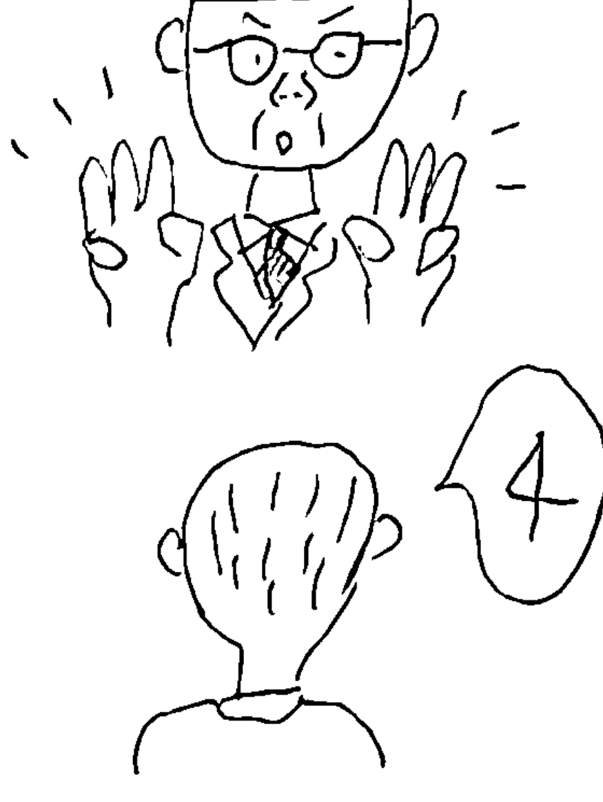

「別小看人了！」
醫師生氣地說道。似乎覺得自己被耍了。
「這位媽媽，這孩子在故意搗蛋呀！」
對此，我是這麼回答的。
「醫師，我在數數的時候，是把手指一根一根彎起來數的。一般來說不都是這樣嗎？難道說，醫師您是把手指伸出來數的嗎？」
醫師思考了一瞬間後，
「不，我也是彎起來數的。」
這麼回答。於是，這次換我伸出兩手的三根手指，
「這樣是多少？」問著醫師。
「四」醫師這麼回答。
「看吧，就連醫師您，也是數了四隻彎起來的手指不是嗎？」
說完後，醫師更加生氣，
結果，也被那位精神科醫師放棄了。

每個大人們都在社會常識的束縛中活著。而且都帶著墨守成規的心態，死命地遵守這些規矩。不過，本來人類就是想要活得更快樂自由的一種生物。因此，當一個人認真嚴肅地生活時，「其實根本不想這樣……」的心情便會隨之湧現，而使你變得諸事不順。

我就是懷抱著「對人類來說，比起常規應該還有更重要的事吧」的想法，度過了孩提時代。

不過，並不是只有我會這麼想。大人只是稍微忘記這個事實，對孩子來說這是大家都知道的想法，他們也很充分地理解這個世界上的事物。然而，大人卻往往依照著自己狹隘的價值觀與常識，扼殺孩子無限的可能性。這才是現實。

無論如何，我想告訴大家的是生於世上真正的意義。要用心去感受，而不是用腦袋思考，帶著笑容活著也十分重要。因此，我才會被認為是一個如此自由、叛逆的「怪小孩」。

「好好享受我們的人生吧。我們正是為此而生的啊！」
我想告訴大家的，不過是這個簡單的道理罷了。

## 能展露笑顏，整個人生都會跟著改變！

歡笑，真的非常重要。笑，能夠解放一個人的心靈，使之獲得舒緩。
時至今日，聽過我的演講，或曾經來找我諮詢的人大約有五萬人。但當一個人懷抱著煩惱來向我傾訴時，首先我都會確認他們「是否還有笑的餘裕」。
而確認的方法，舉例來說，看著眼前的人一邊嚎啕大哭一邊訴苦時，我一臉正經地把原子筆插到鼻孔裡面。一開始，大家都會一臉震驚，心想「這個人怎麼突然把原子筆插到鼻孔裡了？他真的有認真聽我說話嗎？」但過了一會兒，因為實在太過滑稽，大部分的人都會忍不住笑了出來。
或許有人會覺得我在胡鬧，但其實這個行為，是在測試諮詢對象心靈的柔軟度。像是「這個人過了5分鐘才笑出來，看來挺頑固的呢」、「不到30秒就笑了，心的柔軟度似乎還沒什麼問題」等。
一個人如果還有笑的餘裕，代表仍有改變的機會。意味著他的心中尚有能好好地把我的話聽進去的空間，如此一來，我的意見也才能有效地發揮作用。

## 只要擁有幽默感，就有改變自己的可能

這是過去我與某間公司的董事長吃飯時所發生的對話。

「金城啊，我聽說你在幫人做心理訓練，能不能跟我談談？」

以這句話為契機，我們開始了一次諮詢。

「實際上，我們公司裡面有個笨員工。教他 10，他也只能明白 1。因為真的

束手無策，拜他所賜我都開始圓形禿了。該怎麼辦才好呢？」

壓力很大的董事長，因為圓形禿掉髮的關係，讓本來就不多的頭髮越來越稀

少。

於是，我便拜託董事長和我來一場兼具治療效果的幽默對話。

「董事長，您知道一種名叫禿鷹的鳥類嗎？」

「就是頭頂上光禿禿、沒有羽毛的老鷹吧。不過，這跟我的壓力有關係

嗎？」

「其實，最近好像發現了新品種的禿鷹喔。」

「這樣啊，這我還真不知道呢！」
在這樣開場之後，我繼續說道。
「董事長，笨蛋是無藥可醫的，我們都知道這點。不過，對這樣的笨蛋，還要教他10，事後又一直抱怨他只學會1的人，您不覺得更傻嗎？」
過沒多久，董事長發現被說傻的人正是自己，
「你的嘴巴真壞呢～不過，這或許就是我現在的處境呢！」
便微笑著這麼說道。
「其實一開始提到的新種禿鷹，名字就叫『禿傻笨蛋』唷。」
在我這麼說了之後，董事長笑得樂不可支，
「我就是，新種的禿傻笨蛋呢，實際上也真的禿了……」
「董事長，笑得出來就能不藥而癒。對於教了10只學會1的人，也要用教10只能學會1的心態去對待，您如果能明白這點問題就迎刃而解。」

董事長露出恍然大悟的表情，過了半晌，「啊啊，原來是我的問題啊。」終於發現到這點。自己如果做出改變，才能找出指導員工最好的方法。

幾個月之後，我再次碰到這位董事長，他面帶微笑地對我說：「我終於明白，對於教 10 卻只能學會 1 的人，還硬要教他 10 的我，才是需要檢討的。和你談過之後，我開始每次只教他一件事情。這才發現，他把那一件事情做得比別人更為仔細。託你的福，曾經的『禿傻笨蛋』已經消失，我跟那名員工之間的關係也維持的很好喔。」

看來董事長已經成功地化壓力為幽默，不但治好了圓形禿，更把笨員工培養成為一位好員工呢！

**只要能夠擁有幽默感，人隨時都能改變自己。** 當覺得心境變得頑固時，請試著想辦法有意識地讓自己能夠歡笑。心靈獲得解放，才能有好好傾聽周圍意見的餘裕，同時也必定能讓自己朝著好的方向做出改善。

## 跳脫慣性思考模式，是遠離不幸的開始

就像前面與董事長的諮詢一樣，我在進行講座時，也會故意將一些難以預測走向的話題丟給聽眾。

「咦，這是在說什麼？」像這樣，讓聽眾的大腦暫時停止運作、無法進行思考正是我的目的。

**原因是，處於平時的思考模式，往往是招來不幸的原因。** 因此，我才會藉由這種方式，讓對方暫停思考，嘗試去改變他們的想法，幫助他們重新建立新的思考模式。

一直以來的思考模式，就如「這麼做的話就會變成那樣」、「這樣之後就會那樣發展」等，依據過往的經驗法則與資料而產生的行為。

舉例來說，一般譽為感人大作的電影，正是招來不幸的思考模式出現最頻繁之處。

例如，有部電影《彗星撞地球》，故事內容描述人類知道彗星即將要撞擊地球、正值危急存亡之秋，刻畫每個人對於生死及人生的煩惱與想法。這部電影的高潮，在於劇情中始終對立的一對父女，消除彼此的芥蒂後緊緊相擁，兩人雙雙被海嘯吞噬的場面。
我在電影院看到這個畫面時，不由自主地「哈哈哈」大笑出聲。周圍的人明顯地露出不高興的表情瞪著我，可是我仍然止不住笑。
請大家仔細地想想看。在生死交關時，知道自己在劫難逃所以原諒了對方，這不是很奇怪嗎？
如果真的恨著對方、無論如何都無法原諒他，就帶著「討厭」的心情貫徹一生不就好了嗎？在人生最後的最後，才想要寬恕，有這種事嗎？
結果，就算在知道大限將至時選擇原諒，但回顧日常生活就會發現，自己還是無法原諒對方吧。明明活著的時候，互相理解並選擇原諒，就能獲得真正的幸福，卻在最後的最後才想要解開雙方的怨恨。要我說的話，只會覺得「你們怎麼不早點這麼做啊！」

雖說如此，大部份的人看了這部電影仍然十分感動。而所謂「感動」，代表自己就是受到那種思考模式的支配。親子之間的爭執無論如何都無法消弭，只能束手無策鬧著彆扭活著……正因為腦中存在這樣的思考模式，才會對親子大和解的戲碼感動落淚。

明明只要在感覺到彼此之間產生心結時，就以言語互相溝通、坦率地道歉並接納彼此，就能過著一同歡笑的快樂人生，不這麼做實在太可惜了，不是嗎？

更明白地說，如果不能跳脫這種思考模式，不幸的事只會接踵而來。

人生不順遂的原因，並非出在對方身上，而是自己的問題。如果不從自己出發，自己著手進行些什麼，什麼改變都不會發生。如果能從一直以來的思考框架中跳脫出來，全新的心境就會隨之浮現，進而能使自己獲得幸福。**以自己為出發點，由當下這個瞬間開始改變。請各位一定要記住這句話。**

## 思維樂觀，人生馬上大不同

大部分的人在煩惱或痛苦時，往往會覺得是別人的不對，或是這個世界的錯，而想要改變自身之外的其他人、事、物。**不過，如果繼續這麼想，不管什麼事都不會改變的。** 這個事實可能大多數的人多少都有感覺到吧。會有煩惱或是痛苦的原因其實無他，都是出在自己身上。

例如，如果聽到「比起裙子，褲裝好像比較適合妳呢！」這樣的意見。有的人很高興地回應「謝謝你告訴我」，同時也會有認為「你這麼說，是在講我的小腿很胖嗎？」而發怒的人。

為什麼會出現這種差異，原因在於每個人對接受建議的態度各不相同。特別是對於建議會產生「被害者心態」的人，問題更是出在自己身上。因為覺得自己身上存在某些問題，才會覺得受到傷害，或因為別人的話語而感覺不快。

事實上，我們的大腦有「悲觀腦」和「樂觀腦」兩種使用方式。

悲觀腦，代表腦中以「不安」為前提，而運作的一種狀態。就像是「為了不讓狀況變得更糟，不做○○可不行」，基於不安的情緒訂立對策，為了避開糟糕事態而拼命努力的思考模式。

另一方面，樂觀腦代表的則是，腦中以「希望」為前提而運作的狀態。在這種狀態下，心靈和身體都會充滿著生命力，「想做○○」的好奇心與想像力也會不停湧現。

懷抱著不安和痛苦，表示你正使用著悲觀腦。

退休之後的生活支出應該沒問題吧？孩子的學費，不知道要付多久、付多少呢？在如此對未來的茫然不安之外，還有像是擔憂現在進行的企劃能否順利實行，明天要跟難應付的人見面真令人討厭，或是煩惱這個月的生活費是否足夠等現實面的問題。在這些時候，心中會充滿不安與厭煩的情緒，都是因為我們正在使用「悲觀腦」思考的緣故。就實際情況來看，大部分的人應該都是使用著「悲觀腦」而活在這個世界上吧！

為什麼大家都會成為使用悲觀腦的狀態呢？其實這跟孩提時代開始，與母親之間的相處有很大的關係，這部分留待第 4 章詳細說明。總而言之，因為地球上大部分的人都使用「悲觀腦」生活，因此導致負面的事物往往更受大家的矚目，進而使整個社會瀰漫著陰影沉重的氛圍。

對我而言，世界級的悲觀腦選手非我老媽莫屬。老媽悲觀腦的強大程度，真的是十分驚人！

老媽是個把營養學、醫學、歷史，甚至考古學等各式各樣的百科全書，都擺在家裡並從頭到尾讀過一遍的人。她的知識真的非常豐富！她常常對我說：「幸政啊，你也來讀讀這本百科全書吧！很有趣的。」對此，我的回應是「就是因為這些知識，才讓妳過著笑不出來的人生啦！」

總之，老媽真的可以說是個萬事通，甚至擁有不輸該領域專家的知識。為了不讓自己生病，每天都會吃 30 種以上的營養食品，並攝取各種營養劑，甚至還為了保障老年生活而投保。為了消除自己的不安，準備了萬全的對策。

然而，這樣的老媽，卻過著讓人吐槽「妳是疾病百貨公司嗎？」病痛全登場的人生。糖尿病、高血壓、心律不整、甲狀腺與肝腎功能異常、風濕病、頸椎傷害、肩膀痠痛和頭痛……。但 62 歲就過世，為了老年生活準備的萬全對策完全沒有發揮效用。

我在老媽 50 多歲時，曾經向她提議：
「媽，別為老年生活做準備了，那些能拿到的保險金，不如通通解約拿來用吧！」
老媽對此，說著：
「你不要說這種不吉利的話！」
大發一頓脾氣。但我認為，
「因為不知道自己什麼時候會死，保險什麼的根本毫無意義，不如好好享受現在。做許多快樂的事，笑著生活才是幸福的人生。」
像這樣的生活方式，我認為才是獲得幸福的必要條件。也因此，我對老媽這麼說：

「並不是說您會遇到什麼不幸的事，僅僅是目前生活模式的重疊累積而已。您做的這些消除不安的對策，反而才是招來不安的主因「感到不安」這件事本身，就是對生命的不信任。沒有好好感謝自己的生命，而對人生疑神疑鬼，整天想著這些對策，是不會獲得幸福的。就像是與其針對黑暗想出各種對策，不如直接想辦法讓房間變亮不是嗎？如果不先從想法的基礎結構開始改變是不行的喔。」

與其思考這些針對不安的對策，不如在日常生活中懷抱著對生命的感謝，便能自然地想維持自己的健康，也會自動自發地養成運動的習慣。

如果能讓自己轉變為「樂觀思維」，以希望為前提生活，不僅能變得不會和疾病的波動共鳴，也能避免罹患許多疾病。當然，討厭的人或令人不愉快的事也會不再靠近，取而代之的是快樂的事不斷接踵而來。

並非為了避免不幸而使用悲觀腦，而是使用為了獲得幸福的樂觀腦，人生就能所向無敵。

## 擁有「笑」的前提力，讓你打開快樂開關

不過話說回來，大人們為什麼會如此缺乏幽默感呢？我認為那是因為，他們都過著沒有做好「笑的心理準備」的生活。

我認為在從事任何事情之前，有什麼樣的心理準備是很重要的。我稱之為「前提力」。例如，在看搞笑節目之前，有著像「好～今天要好好笑一笑。要來好好享受囉～」一樣的前提力是很正常的吧。就算沒說出口，必然也是以一定會有什麼讓人發笑的場面為前提，坐在電視前面。因此，就算出現一些比較晦暗的詞語或負面的表現方式，也都會引起笑聲吧。

但如果沒有「想要笑」的前提力，而單純只是認真嚴肅地收看搞笑節目，又會發生什麼事呢？「剛才的對話不是歧視嗎？」、「說別人壞話，到底哪裡好笑了？」——應該會出現這樣的反應吧。因此前提力的存在與否，其實會影響我們面對事物的態度。

如果在這個社會上，秉持著「像是看搞笑節目」、「好好享受」的前提力生活又會如何呢？這麼一來，不覺得就能帶著享受的心情看待每件事，也可以帶著享受的心情聽別人說話了嗎？

例如，就算面對喜歡吹噓自己的人，平時覺得「一直自吹自擂，他以為他是誰啊？自以為是的態度真讓人火大。」但如果以好好享受的前提力面對，
「難道說，你是在打腫臉充胖子嗎？」
或許就能夠帶著笑容跟對方開開玩笑。對方對此也會，
「沒什麼不好的啊，讓我稍微吹噓一下嘛～」
這樣回應你。

如果能像這樣進行對話就太棒了！如果大家都能擁有「好好享受」的前提力，這個世界不就能稍微變得更趨向幸福的方向嗎？

不過，很多人都未具備「好好享受」生活的前提力。因此大部分的人，應該都會認真地回答，「你居然認為我是在打腫臉充胖子嗎！」並且大發雷霆，所以讓人很困擾呢！

為什麼大家都「笑不出來」呢？那是因為大家害怕露出笑容，因此才會笑不出來。如果笑了，彼此的心就會融為一體；如果笑了，各自的立場就會消失……。就跟愛一樣，笑容也可以抹除所有的分界線。

害怕一旦露出笑容，所謂的「自我」就會消失殆盡，所以大家才會害怕得笑不出來。

不過，請仔細想想。執著於自己的立場及面子，對任何人都不輕易敞開心胸的人生，應該既無聊又寂寞吧。

正因為如此，我才希望大家擁有無論面對什麼事情都能笑得出來、好好享受的前提力。希望每個人都可以積極地下定決心去「好好享受」。生於這個世界上，為的就是「好好享受」。不管任何事物都盡情地去品味，不管何時何事何地，都要「好好享受」。如果能夠下定決心，至今從未發揮作用的心靈就會開始運轉，「樂觀腦」也能開始運作。

一般來說，悲觀腦在運作時，也是人們正在用「腦袋」傾聽（思考中）的時候。用腦袋傾聽，是腦中以邏輯分析語言與記憶的顳葉在發揮功能。因此才會產生無法接受或不服氣等「陰沉、負面」的情緒與狀況。

另一方面，如果是用「心」去傾聽，發揮作用的則是額葉。額葉是人類與動物有所差異的最大特徵之一。額葉的功能，主要在掌管思考、自制、決策以及與人的溝通等高層級的機能，可說是為了活得像個人類而存在的腦。

想要享受樂趣或是想要開懷大笑時，因為正是以心去傾聽、以心去感受，所以發揮作用的正是額葉。這時候，如果目標意識或像是「好想做～」般的羨慕、憧憬、期待或希望等情緒，也就是能讓自己的心開始運轉的素材都齊備，心的開關也會因此打開。如此一來，靈魂也會充滿生命力，笑容、幽默和勇往向前的正面心情也將滿溢於心中。

我把這稱為「快樂開關」。如果全人類都能把這個快樂開關打開，地球一定會很快地變成一顆「愛之星」吧！

打開快樂的開關後，活著就會變得十分快樂。不管遇到任何事情，都能笑臉以對。對於難受的經歷和悲傷的回憶，也能認為那是「自己需要的東西」而欣然接受。

為此，請務必重視「笑的前提力」。

## 拋開假面具，活著其實是件很開心的事！

想被認可是「能幹的人」、想被認為「很帥」、想被說「很酷」，每個人在心裡的某個角落，會有這種想法是很自然的事吧。任誰都會認為帥比不帥好。比起被當成什麼都不會的人，任何人都希望被認可是能幹的人。

就像量身高一樣，偶爾作弊踮踮腳尖，還沒什麼關係。但如果有一天，我們忘記了自己的本質、忘記了調皮之神，時時以虛偽的自我活著，淨做些表面工夫，那不管我們再怎麼努力，真正的幸福都會離我們越來越遠。畢竟，腳尖踮久了，腳也是會痛到難以忍受的不是嗎？

我認為，這顆星球上裝酷的人實在是太多了。

## ①章 笑口常開又有幽默感的人，才會受到神明喜愛

例如明明十分悲傷，卻認為強忍著眼淚是一種成熟的表現，或是循規蹈矩地裝出一副光鮮亮麗的樣子，以及仗著自己有幾分才智，便擺出對世事冷眼旁觀的態度，甚至還有人同時扮演多個角色，對於被稱為「萬能超人」感到很快感……

但是，這樣的自己真的幸福嗎？真的開心嗎？希望你能時時像現在這樣，回歸自我仔細思索。

如果是我，一定會毫不猶豫地捨棄想「裝酷」的帥哥幻想，專心地當個丑角。隨著情感的高低起伏或哭、或笑，偶爾發發火、偶爾犯點錯，把自己很遜的一面展現在眾人面前，以此方式與周圍的人相處才是最快樂的。我內心正是如此認為著。

> 「不能強忍自己情緒的人，都是不成熟的人。」大家都是這麼說的對吧？

不過，正因為是精神面健全、真正成熟的大人，才能毫不在意地把不成熟的一面展現出來。精神面越是健全，越能認同真實的自己，才能做些調皮搗蛋的事，就算幼稚的事情也可以享受其中。不過，如果沒有完全地成為一名成熟的大人，會害怕被認為自己很幼稚，而無法真正展現自己幼稚的一面。

**明明大家的本性都是個丑角，卻都要努力地裝酷，一心想成為帥哥。**

我公司的員工裡，有一位最強的酷媽。她整天訓斥孩子們，不斷地對他們發脾氣，時時催促著「好啦，快點，快點！」看到這樣的媽媽，連孩子們都忍不住為她取了個「急性子媽媽」的綽號。

這樣的一名母親，想把小孩「養育成好孩子」的心情太過強烈，在聽孩子說話前，往往先大肆指揮孩子「去做這個，去做那個」、「這樣做比較好，那樣做不好」。並且，她對於小孩的教育方式十分固執，塑造出「能幹的媽媽」、「睿智的媽媽」這種如同前面提及的帥哥般的自我形象。

不過某一天發生了一件大事。當她下班回家打開門時，發現十來個國中男同學來家裡玩，搞得一團亂。
明明家裡規定弄亂了要自己整理，但孩子們似乎絲毫沒有要動手整理的意思，她便一邊對孩子們生著悶氣，一邊一手拿著拖把開始拖地。
不過，不知道是否因為那天的午餐吃得太多，覺得腰有點緊的她，悄悄解開了裙子的拉鍊。為了給孩子們做個不言自明的好榜樣，酷媽開始迅速地拖起地來。但是就在這個當下，她的裙子居然唰的一聲掉了下來，成為只穿一條內褲的驚人狀態！

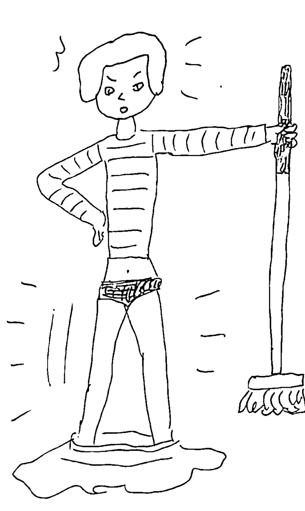

看到這樣的景象，孩子們都指著母親笑倒在地。而她仍是一手抓著拖把，穿著一條內褲呆站在原地。

這時，她心中裝模作樣的那個帥哥自我，發出嘎啦嘎啦的聲音逐漸崩裂，並且與孩子們笑成一團。必須當個完美母親的心情，在這個時候變得無所謂，這樣的情景實在是既古怪又好笑，因此她也與孩子們一起笑倒在地上。

據她事後的說法，這就像是歡笑之神在說「差不多該放棄當個酷媽，意識到真正的自己是一個丑角」一樣。

「一條內褲事件」雖然是透過歡笑一掃帥哥價值觀的絕妙事件，但如果沒有發生這樣的事情，或許人人都仍然會想要為了成為帥哥而活吧。

我的看法是，這個社會的普世價值——認為認真生活、獲得他人良好評價，才是一段好的人生的想法，正是一種「帥哥幻想」。

是的，只不過是種「幻想」而已。裝作自己很酷，是一件十分累人的事。持續地隱藏真實的自我，不斷裝成好孩子或能幹的人，就算在他人面前再怎麼裝酷耍帥，回到家也只能「唉～」一聲的嘆氣，在巨大的壓力下板著一張臉。
因為故意做出讓人誤解自己的舉動，因此在人際關係上也時常會出現問題，而變得不開心。

**神啊，其實是個徹頭徹尾的丑角。** 神明喜歡快樂的事情，不管什麼事都想嘗試看看、見識看看並感覺體驗，十分的調皮。

因此，身為神明分身的我們，原本也都是個丑角。所以，還是儘早放棄那些彆腳的演技，有點身為丑角的自覺。能真真正正、完全真實的為自己活著，是一件非常愉快的事情喔！

## 苦境和災難，都是自己「選擇」的結果

話說回來，如果說痛苦、難過和寂寞等，全部都是自己累積而來，你相信嗎？在這裡，我要說一些幻想世界中發生的故事，請大家讓想像力自由地馳騁，一起繼續看下去。

我們現在身處一艘太空船中，與朋友一邊看著電腦一邊對話著。

「我說啊，你知道什麼是『寂寞』嗎？」

「那是什麼啊？」

「就好像感覺自己的生命只屬於自己，所以可以體會到自己『只有一個人』的感覺。」

「那種事，不可能吧～」

「聽說是真的喔！」

「這是哪個星球上的事啊？」

好像是個寫成地上的球，叫做『地球』的星球。因為經常扎根於大地上才得名。居住在上面的每個人都有各自的形體，大家都是操縱著那個形體而活著的呢。

『哇～好想體驗看看。在那個『地球』的星球上，還有其他有趣的事可以嘗試嗎？』

『其實，好像還有叫做『好想死』的東西。是一種想要消除自身存在的想法。』

『這樣，不是會變成透明人嗎？』

『我也沒體驗過，所以不太清楚呢。』

『反正好像很有趣，我們就先點點看『寂寞』和『好想死』來體驗看看吧。好，就點這兩個吧。』

一邊這麼說著，一邊按下電腦上的按鈕後，『兩份點單，感謝您的惠顧！』

隨著店員宏亮的嗓音，就這樣順利地購入『寂寞』和『好想死』。

像這樣，在自己想要體驗的人生經驗上，如果懷抱著「寂寞，而且非常強烈。想死的心情」來到這個世界上，你覺得如何呢？而且，如果再告訴你，生在最能獲得這種體驗的父母和家庭之下，也是出於你自己的選擇。**寂寞、嫌惡、癩手和害怕……你就是為了想品味這些情感，而興致勃勃地自己點了餐。**這麼一想，懷著沉重地壓力活著，是不是有點傻呢？

順帶一提，我有三個姊姊，因為我是家中的老么，所以總是被霸道的姊姊們當作跑腿小弟兼玩具使喚。其中有個遊戲，叫做「真人紙娃娃」。每天早上，老爸老媽出門工作後，姊姊們便會笑嘻嘻的拉上窗簾，命令我「幸政，把衣服脫掉！」

姊姊們會拿女孩的內褲、絲襪、衣服、假髮和化妝品，把我當作紙娃娃般玩弄。在這樣受辱的裝扮遊戲結束之後，還會被姊姊們威脅「如果敢跟媽媽講，你就死定了！」

暴力的父母，再加上欺負人的姊姊們……不過，正是我自己選擇要出生在這樣的家庭裡。帶著出生前記憶誕生的我，由於意識隨時都和宇宙連結著，因此無法體會人類特有的「不安」、「孤獨」與「擁有」等情緒。因此，我為了要體驗這些情緒，研究這些蔓生於地球上的負面情感，才選擇出生在這樣的家庭之中。

現在，生活中充斥著痛苦而完全笑不出來、皺著眉頭的你；懷著怨恨、詛咒別人的你，其實都是你自己所選擇的。

喂，快點醒過來吧！

只要能想起自己是為了體驗痛苦和難過才想到地球，而目標終於也達成了，這麼一來不管遇到什麼事，「啊啊，這就是我點的東西啊～。還真是挺難應付的呢。」一定都能開朗樂觀地面對。

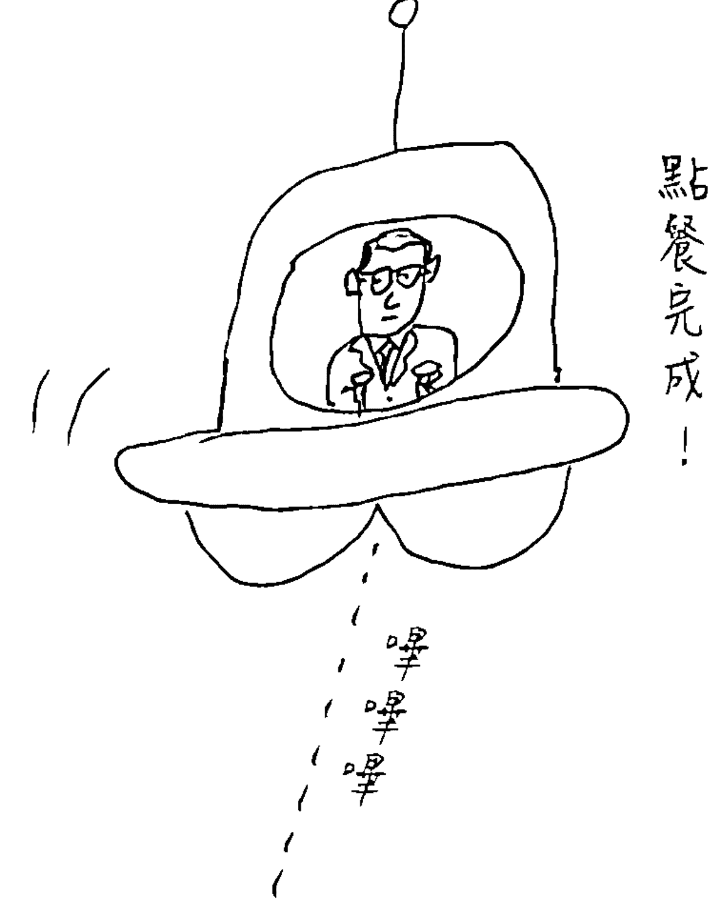

## 討厭的人都是自己吸引而來的

你一定認為，不管面對任何狀況，如果都能以幽默回應，一定要有一顆器量很大的「好的心」吧？

在這裡，我希望大家能記住一件事。那就是，不管是「好的心」或「不好的心」，「開朗的心」也好，「陰沉的心」也罷，事實上都是不存在的。

這是怎麼一回事呢？因為「心是沒有實體的」。

是不是越聽越一頭霧水呢？

舉例來說，心就像是電流一樣的物品。電流是種能量，但卻沒有類似「這種型態」的實體對吧？不過，電流通過冷氣後，就會產生涼風，而通過燈泡就能照亮整個房間。就像這樣，當電流通過某樣物品時，就會變成涼風或是產生光亮。

心也一樣，雖然沒有實際形體，但根據如何使用心的能量，就能感受到憤怒或悲傷，也能感受到幸福。

沒有好的心，也沒有不好的心。沒有開朗的心，也沒有陰沉的心。
然而，世界上卻存在著好人與壞人、溫柔的人與冷淡的人、積極的人和懶惰的人……。我們在判斷人或物時，一定都會找一個與之相對的東西，一邊產生形象一邊做出評價。
那是因為，透過完全相反的對比，我們可以了解自身處在什麼樣的環境或人、事、物之中。例如，如果身邊都是「合得來的人」，因為太習慣了，反而容易忽略「真合得來」的心情。不過，如果身邊一直都充斥著「難相處的人」，一旦遇到「合得來的人」，就會感到「合得來，真是讓人愉快啊」，而能感受到美妙之處。

不過，宇宙中，其實完全不存在這種相對的概念。只是有這種狀態而已。例如，在宇宙的空間中，是不存在著左與右的。
現在，讓我們想像自己置身於宇宙之中，輕飄飄地浮著。就算在右手邊看到地球，只要轉個身，地球就會跑到自己的左手邊。在宇宙中，存在的僅僅只有「那裡看得到地球」這個事實而已。

就像這樣，神明的世界，或者說，宇宙和靈魂的世界裡，不存在「相對」的概念。

不過，後來神明把宇宙分成陰與陽，但這只是為了地球人所創造出的相對看法而已。如果從宇宙的角度來看，黑暗與光明其實是一樣的。光明與黑暗的不同在於光密度的差異。**光的密度濃就變成黑暗，密度降低就變得光亮**。因此，真正的宇宙中只存在著光，這才是正確答案。

但是，經過頭腦思考後，一定會認為「光明與黑暗不可能是一樣的吧」。因為在三次元世界的地球中生活，用相對的思考方式可以更容易理解。雖然心靈能夠理解不是相對的事物，但大腦就只能理解相對的概念。**隨時都在盤算一件事是好是壞，就是思考的特徵**。

因此，生活在相對世界之中的我們，無論什麼都想區分出善惡。也因為如此，像是《假面騎士》或《戰隊》影集中，邪不勝正是理所當然般的劇情，才能數十年來都受到歡迎。但這是只有在地球上才會發生的事。

不過，如果相對性的想法不斷強化，先入為主去區分出這邊是善、而這邊是惡，就會開始產生相對性的惡性循環。
如果沒有右就無法說明左，而沒有左也無法說明右。因此，如果一味地追求右，左也會自動地隨之而來。
用比較容易理解的例子來說明，就像是如果具有強烈的正義感，會更容易遇到為非作歹的人。正因為有為非作歹的人存在，正義才能因此獲得伸張。也就是說，如果熱愛正義，反倒會吸引惡徒們接近自己。
具有正義感的人就是好人，因為這樣的觀念已根深蒂固，就算告訴你「不要有正義感」，你難以接受也是可以理解的。不過，如果你認為自己常常遇到討厭的人，其實吸引這種人接近的原因，很有可能問題出在自己身上，希望大家至少能夠記住這一點。

## 讓人生從此只有幸福降臨的「秘訣」

心的能量是從哪裡產生的呢？那正是來自神明與宇宙。與心直接連結的能量，即是來自神明與宇宙的清新正向能量，這種能量會灌注在每個人的心中，取之不盡用之不竭。是一種只要想用，就能無窮無盡地使用的免費能量。

無論是被稱為「善人」的人也好，被稱為「惡人」的人也罷，他們所使用的能量根源都只有正向的能量。負面的能量從一開始就並不存在。原因是我们就是「神明」，神明代表著愛的存在，因而身上不會帶有一絲一毫的負面能量。

而為什麼既然充滿正向的能量，卻依然會不時讓我們產生負面的情緒呢？問題出在，我們在孩提時代的成長環境。從小時候開始，母親和周遭的人不斷地指指點點並嘮叨抱怨，「給我這樣做」、「怎麼連這個都不會呢？」以這種形式被灌輸各種常識與規範，「消極負面」的要素就不斷地進入我們的身體之中，進而使我們的心靈變得扭曲。

人類在出生的時候，是透過意識（靈魂）世界來觀察人世間的萬事萬物，但在4至5歲時，每個人都會迎來某個由意識的世界，轉移到用大腦思考的世界之轉捩點（換句話說，就是由靈魂的視角轉移到以大腦思考的視角，也就是自我的萌芽）。

**用大腦思考**，意指對發生的事情判斷善惡對錯。例如，認真嚴肅地生活是件好事、圓融的人才是好人、說謊是不好的、外遇是件壞事，諸如此類。

實際上，這些人、事、物都沒有好壞之分，但頭腦進行思考時，如果不分辨出好與壞，就無法進行理解，因此才會無可避免地變成如此。

如果從意識的世界觀察萬事萬物，明明可以坦率地以積極的心情直接使用來自宇宙和神明的能量，人們卻因為把重心移至大腦的緣故，變得只會遵循地球的理論來思考，進而產生諸多消極的情緒。

為什麼，我們會變成用大腦來思考呢？

這是為了適應這個物理性的世界而產生的系統。畢竟，如果看見什麼或發生什麼事，都以「也會有這種事呢」、「嗯，我懂我懂」做回應，就無法感受到痛苦、悲傷和寂寞等只有在地球才能得到的經驗。果真是如此，也會相當困擾，因此才會把思考的軸心轉移到大腦，而產生了對善惡對錯的認識。

而實際的方法，就是「五官」。五官指的是我們透過看到的、聽到的、摸到的、嚐到的與聞到的體驗所產生的感覺。**如果伴隨肉體活著，並執著於「五官」的世界**，我們就會變得只相信自己的肉體實際所感受到事物，而看不清這個世界的真實樣貌。對於眼睛所看不到的世界，變得不斷疑神疑鬼。

像這樣持續助長負面情緒，在神明所建造的「地球遊樂園」裡，也能夠進行那些刺激的體驗。

如果能注意到「改用大腦思考」的裝置機關固然很好，但這幾乎是不可能的。倘苦能輕易地注意到這件事，特地出生在地球上就完全失去意義，因此，我們並不容易注意到這件事。

更進一步地說，正是因為我們無法輕易察覺這件事，才能充分地在這個世界上進行各式各樣的體驗，這也是原因的一部分。
誕生在地球上這件事，代表的正是要我們在這個體驗的世界中腳踏實地的活著。明明心中只存在著正向的能量，卻還要特地以負面角度來觀察這個世界，品嚐憤怒、悲傷、孤獨與寂寞等情緒，這就是我們人類。
怎麼可能！我才不相信呢！你可能會這麼想吧。
會這麼想也是理所當然的。因為，我們在從意識的世界轉移到以大腦思考的世界時，已把在那之前的記憶全部抹去的緣故。不過，這些記憶還是潛藏在我們心中，所以大可放心。
證據就是為什麼每個人都知道真誠或愛能讓人感到愉快呢？不必和任何人學習便潛在地了解，你認為是為什麼呢？
那是因為，我們過去曾經生活在意識世界中的緣故。因此，我們才知道流淌在我們心中，來自宇宙的無窮無盡能量，正是真誠和愛本身。

所以，我們並不需要為了擁有「好的心」，拼命努力去做出改變。因為我們的心中，本來就只流動著正面的能量。

相信自己心中流動著愛的能量，無論是好與不好的事都能正向面對。並且，不管結果如何，都相信那些經歷會轉化為人生的糧食，灌注於心中的能量，一定會帶來歡笑、笑容以及幸福等正面情感，並創造出一個良性的循環。

只要能掌握這個的秘訣，幸福就會從此源源不絕而來！

所以，無所畏懼地去累積各種經驗吧！

這是至關重要的一件事！

## ②章 因為我們就是「神明」

## 只要能偶爾想到神明的存在就夠了！

大家都很喜歡提到神明。
我接收到神的旨意了！
為了見到神明，我去了趟風水福地巡禮！
感覺又更接近神的領域了！
下輩子我要投胎當個神明！諸如此類。

的確，會在意神明到底是什麼樣的一種存在，這樣的心情我能理解。不過，時常把神明掛在嘴邊的行為，其實跟戀母情結相去無幾。畢竟，我們自己本來就是神的分身，也就是說，我們每個人都是神明。

在第1章，我曾經說過「先記住我們就是神明就好了」，在此說明這句話背後的意義。

先複習一下。地球是覺得無聊的神明，因為想做點有趣的事而創造出的遊樂場。為了能在這個遊樂場裡體驗各式各樣的事物，神明想出來的方法，就是將其巨大的能量細分成許多份，創造出名為「人類」的個體。

更準確地說，能量並不能被徹底分割。就像夾起納豆時藕斷絲連的狀態，每一份分割出去的能量，都仍然與神明本身有著緊密的連結。

而誕生自細分於神明能量的人類們，依照自身自由意志，在地球各地經歷各式各樣的人生，離開人世時，那些經歷便會隨著能量回到神明身上，也使得神明的心靈更加充實。

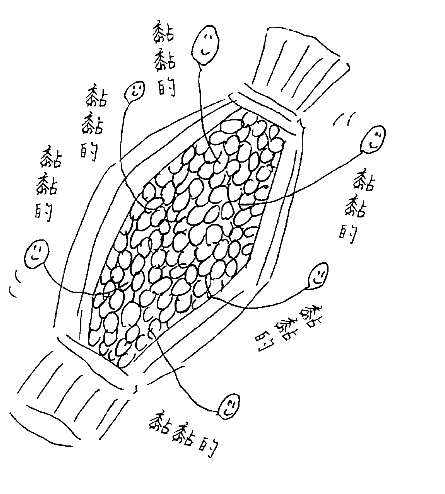

就算是兄弟姊妹，個性也常有很大的差異，而在世界上所獲得的經驗體驗也一定各不相同。這麼一來，他們的母親不需要親身經歷，也能透過孩子們的經歷而使人生變得豐富，和這是相同的感覺。也就是說，雖然我們是神明分割而出的能量，但是，神明為了讓我們對萬事萬物都能有第一次經歷般的體驗，設想周到地讓我們忘記自己也是神明的事實。

舉例來說，在墜入愛河的時候，每個人一定都會覺得很幸福吧！不過，如果我們還記得自己是神明，又會變成什麼樣的狀況呢？「不過就是愛嘛」，這種感覺，我早就知道囉～」這樣的反應很掃興吧？正因為忘了自己是神明，也想不起愛是什麼，我們才能在相愛的時候，體會到「這就是愛啊」、「愛情真是太美好了！」等感受。同樣地，吃飯時湧現的感激之意、工作發薪時的喜悅、生病食不下嚥的痛苦及找不到工作時的不安，也都能感受到。

為了再次體驗愛、感謝、幸福與喜悅，對人猜疑、感到不安與受到傷害等，體驗人類特有的經歷也是很重要的。如此一來，我們才能忘記自己身為神明的事實，對早已一清二楚的無聊事物，發出「太美妙了」的讚嘆。

我曾經為了再次確認這件事，直接潛入海中詢問熱帶魚的看法（啊，我是可以感受到動、植物想法的）。
「欸，你有看過叫做『海水』的神嗎？」
對於我的問題，熱帶魚這麼回答：
「我沒看過那種神耶！」
而我繼續說道：
「其實祂就在你身邊喔。」
聽到這句話，熱帶魚馬上拼命四處張望，想要找出神到底在哪裡。不過，這樣的尋找當然是徒勞無功。本來就不可能看得到。因為打從一開始，名為『海水』的神明，就緊緊地黏附在熱帶魚的眼球上啊。
當我把熱帶魚帶離海水，牠才終於理解到這個事實。
「啊～原來我一直都身在名為『海水』的神明之中啊～」
也就是說，透過自己沒有的東西來觀察，很輕易地就能全盤了解自身狀況。
因此，透過忘記自己身為神明這件事，而再一次的成為神明。

## 神明一直「存在」於我們的內心深處

世界上，其中也有懷著「不管怎樣，我都無法相信自己心中寄宿著神明！老公外遇，現在只有恨支配著我的內心。」「拼命地工作、工作、再工作，卻還是存不了錢。光是活下去就很吃力了，我才沒空管什麼神明呢。」想法的人存在。

但就算是這種狀態，神明仍然確確實實地存在於每個人的心中。

極端而言，就算一個人的內心再怎麼貧瘠，甚至做出在地球上會被稱為「壞人」的行為，在他的本性之中也仍然寄宿著神明。因此，**不管是什麼人，只要好好地凝視自己的內心深處，無論何時都能發現並回想起那令人熟悉的神明。**

是否發現人類在經過一連串對世界的體悟，精神面越成長，越是變得跟大家說著相同的話，雖然表達方式不同，但這種狀況時常能見到。這正是因為，人們在探索自我的同時，不但能感受到神與自然都近在眼前，更能憶起自己原本擁有的愛的能量。無論是誰，只要能進入自己的內心深處，就能觸及神的世界，進而回想起那令人愉悅的狀態。

## ②章 因為我們就是「神明」

就算知道自己是神明，仍然要全心全意地當個人類

只要時候到了，自然就能回想起與神明有關的種種，所以大可放心。

從今天開始，就讓自己由時時都掛念著神明的「戀母情結」中解放！

難得生而為人，就做為一個人類，好好享受這世界吧！

沒錯，就是這種心境！

我們現在明白，忘記自己身為神明，好好地活在現實世界中是十分重要的。

然而，也有人認為「完全忘記自己也是神明這件事不是更好嗎？」

但我想表達的，並不是這個意思。

就算知道自己是神明，仍然好好地當個人類是件十分美好的事，這才是我的想法。如果真的把神明的世界忘得一乾二淨而活著，那人與動物之間也就沒什麼差別了。

人與動物之所以不同，正是因為除了生理需求外，人類還擁有愛。人類原本就是以愛的結晶打造而存在。也**因此，人類並不是透過向他人學習才明白愛是什麼，而是原本就懷抱著愛**。在深入探索自我之後，就能發現自己是藉由愛的能量生存於這個世上。那正是因為我們是神明，神的能量（等於愛的能量）充盈著我們全身的緣故。

不過，如果直到最後的最後，仍然不相信神明的存在，也就是對探索自我誕生的根源毫無興趣，就會做出許多與愛漸行漸遠的舉動。這樣的結果，會導致一個人只重視自己的好處，甚至步向殺害看不順眼的人或挑起戰爭的不歸路。

身為神明的我們，希望看到世界變成這樣嗎？
想必不願吧！

**因此，我想說的是，就算一時之間忘記自己是神明，再次意識到自身根源是神明的事實、珍惜現實世界的一切事物並充分去體驗它們，是十分有趣的。**

讀到這裡，如果你有「啊啊，沒錯」的想法，即是你的靈魂正在產生共鳴的證據。存在於你內心深處的神明，正在做出回應喔！

### 對神明有「戀母情結」，會讓神明十分鬱悶

小時候，我曾被父母帶去某個宗教道場。就在聚集的信眾虔誠地向神明祈禱、一片鴉雀無聲的當下，我發出「鈴——」的一聲

用嘴巴發出像是敲響鈴鐺的聲音。老媽說：「你這是對神明的大不敬！」發了好大一頓脾氣……

前面也曾經提過，大家對神明百般依賴的樣子，對我來說就像「戀母情結」一樣十分噁心。我們明明就是透過神明能量誕生的神之子，卻如此崇拜可說是父母的神明，分明就是戀母情結。

如果交往中的男友，一直把母親的事掛在嘴邊，妳會怎麼想呢？

「我媽現在在家裡烤餅乾喔，要不要一起來吃啊？」

「我母親真是最完美的女性呢！」

「我跟媽的想法簡直一模一樣！」

這樣的人，很讓人倒胃吧。不僅倒胃，也鐵定會分手。就算是媽媽本人，一定也會說：「你這傢伙給我腦袋清醒一點！」

同理，愛慕著神明並為了神明深深著迷，跟戀母情結是沒有任何差別的。

這種人，只會不停說著與神有關的事，卻無法為近在眼前的老公、老婆與小孩帶來任何幸福。如此一來，就算與神明建立了連結也毫無意義。

認為自己是高層次的人類而沾沾自喜，這種事對我而言，只是單純的誤解罷了。因為這裡不是天界，而是名為「地球」的現實世界，所以不需要將那些天界的事一一放在心上，就能變得十分幸福。

另外，有些人只在神龕前或神社，雙手合十時裝出一副好人的樣子，可是馬上就會被拆穿的喔。畢竟我們就是神明，一切的行為都可說是在神的見證下進行。平時如果不以謙虛誠實的態度待人接物，只在神明面前正襟危坐故作清高，神明也只會認為「你傻了嗎？以為我沒看到你私底下是什麼樣子嗎？」

不過，「天下父母心」這句話，也適用在神明身上。父母總是會一直想著小孩的事，不斷地擔心。在幼稚園玩得開心嗎？有和朋友好好相處嗎？是否覺得孤單呢？諸如此類，掛念著種種的事。

神明也是用同樣的態度對待我們，因此，神明的目光從不會從我們身上移開。正因為如此，神明也會認為「為了讓你能獨立自主，也差不多該放手不再擔心了吧！」

這時候，如果我們還不斷嚷著「神啊，我最喜歡你了。不要丟下我，永遠陪在我身邊吧！」神明們會怎麼想呢？就算再怎麼疼愛我們，神明應該多多少少也會覺得厭煩，並且抱怨「難得到了這麼歡樂的地方，好好享受自己的生活如何？」

比起黏人的孩子，全心全意投注熱情於自己人生的孩子，一定更討爸媽的喜歡。這點就算是神明也一樣。

因此，不用一直叨念著自己多麼深愛神明也無妨。

而且，緊隨著神明的腳步，也不是那麼有趣的事喔。相較之下，好好地在現實世界中活著，所得到的樂趣必定能充實數十、數百倍的人生。

### 會「讀心」，看穿對方在想什麼

從小我就帶著一般人早已忘卻的記憶長大，也因此無法忽視我們都是「神明」的一部分」的事實。但也因為這樣，不管看見或聽見什麼，對我來說都只有一個「啊，我早就知道了」的感覺，而無法獲得絲毫感動。對於能活在當下感受喜悅的天真同學們，可以說是打從心底羨慕他們。

另外，因為我隨時都與宇宙（神明）的意識連結，也能馬上與眼前對象的意識連結，進而讀懂其內心的想法。

可以讀對方的心，真好啊，你會不會這麼想呢？

**大錯特錯！事實上真是麻煩死了。**

十幾歲的時候，朋友曾經約我一起去搭訕女孩子。「好，今天一定要像個普通男生一樣去搭訕女生，讓大家見識一下我的本事！」我下定決心。

就這樣，我邂逅了可愛的女孩，載她到海邊兜風，當氣氛正好時，事情卻發生了。正當我意識到女孩講的話並非其本意的瞬間，我的意識立刻進入了對方的意識，回過神來已經給出這樣的建議：

「現在的妳，不是在自暴自棄嗎？感情是不會受到時間影響的，人會一直停留在當時的狀態繼續生活下去。如果不讓感情的傷口好好地癒合，自己的狀態是無法改變的。對受傷的心置之不理，就等同於不愛自己。如果連自己都不愛惜自己，又怎麼可能善待自己呢？」

說完之後，身旁的她哇～的一聲哭了出來。

「妳怎麼會知道這些事情呢？」

女孩抬起頭，一邊說著一邊抓住了我的手臂，

「我該怎麼辦才好？告訴我」

看著她眼裡閃著光芒。出來玩實在不需要這種眼神啊……。雖然這麼想，但我還是開始了一場人生諮詢。

結果，搭訕當然以失敗告終。因為就算我想像個普通男生一樣去搭訕女孩，也會不知不覺地將自己的意識與對方的意識建立起連結。由於實在令人疲憊不堪，試著搭訕兩次左右之後，我就放棄了。

由於一天到晚都處於這樣的狀態，當時我每天都在鑽進被窩時祈禱「拜託，在我一覺醒來後，讓我的意識變得模糊不清吧」之後才入睡。如果不這樣，實在無法像個正常人一樣活著。

然而，隔天早上醒來，立刻又會有許多人的意識闖入我的腦海裡。明明已經筋疲力竭，我只能在百般無奈下，與其他人的意識建立起連結。所以，就像日本偶像團體「糖果合唱團」的解散宣言一樣，

「我，想回去當一個普通的男孩子！」

這樣的念頭一直縈繞在我心中。

### 你知道為什麼要在神龕前供奉酒嗎？

能夠讀對方的心，根本無法好好地活在這個世界上。因為，明明臉上掛著笑容，內心的情感卻錯綜複雜；或是嘴上說的好聽，腦中卻利慾薰心的人，我實在看得太多了……

表裡不一的例子不勝枚舉，也讓我逐漸對人們充滿不信任。因此，從小開始，每當我看到喝個酩酊大醉的人，我都十分羨慕，想著「啊啊～如果能變得像他們一樣就好了。」

在我滿20歲時，我也開始嘗試喝酒。說是嘗試，其實一口氣就喝掉一大瓶。

為什麼我要喝這麼多酒呢？那是因為，酒可以顯現出一個人的本質。

我們常常會用酒來供奉神明對吧？那可不是為了讓神明當作飲料喝才供奉的。**酒這種東西，心理不健康的人喝了會大發酒瘋，幸福的人喝了卻會感到十分愉悅**，酒本身並沒有不好，只能說喝了酒，一個人的心便會毫無保留地展現出來。

神明們跟酒一樣，本身並沒有好壞之分，只是一種自然存在著的中立能量。要用這股神明的力量讓自己變得幸福或不幸，完全取決於你。也就是說，酒的性質恰好代表了神明，才會做為督促人們了解真理的具體暗示，被供奉在神明面前。

如果照前面所說，由於我的本質既快樂又幸福，喝了酒應該會變得十分愉快。不過事與願違，黃湯下肚，我絲毫沒有喝醉的跡象。更別說是喝醉了，我的意識甚至啪的一聲停了下來，全身的感覺變得比平時更加敏銳，而且感受到更多的事物。意識的感應器像是有電流通過一般，不斷地被拓展。最後，甚至連心中的絲絲細語，我都能聽得一清二楚。

那時，我才明白。啊，這就是我的本質啊！

本來以為喝了酒之後，開朗的我就會出現，看來我的本質似乎並非如此。

這麼說來，的確沒錯。因為根據我與生俱來的記憶，我正是做為地球救援隊的隊長而降生於這個世界上的。話雖如此，我還是不想因為超乎平時的敏銳感覺，而滯留在意識的世界之中，因此我在20來歲後就不再喝酒。無法像普通的人一樣享受喝酒的樂趣，實在太令我討厭自己了。

### 必須尊重也必須敬畏，請「對等地」和神明來往

我從 3 歲左右開始，每天晚上一定會做的事就是和神明聊天。雖然是聊天，卻不是和樂融融的閒聊，反倒比較接近一般所說、充滿玄機的「禪問答」。這個行為一直持續到 23 歲為止。

在開始與神進行問答之前不久，我曾經有與宇宙融為一體的神祕經驗。當我在家裡無所事事地發呆時，進入了類似冥想的狀態，進而發現自己的意識已經與宇宙融為一體。

「我和宇宙連結在一起，我現在正在體驗著宇宙，我就是宇宙。」

才 3 歲的我，在當下立刻理解了這個難以言表的世界。

當時，我或許還不是很清楚發生了什麼事，但在宇宙與自己的意識接軌的同時，萬事萬物皆合而為一，我也體悟到宇宙就是神明本身。就好像我是從造物主的角度出發，觀察這個世界一樣，當時整個宇宙也與我的意識融為一體。

在這之前，每當仰望夜空時，我都認為宇宙是在自身存在之外不斷開展。但事實並非如此。

當我不斷潛入意識深處才明白，宇宙（神）其實存在於自己的心中，在自己的意識中萬事萬物都一覽無遺。一直以來追求的東西，其實都存在自我之中。

有了這樣的體驗之後，我便開始了與神之間的問答。每當我準備就寢的時候，神便會從我的意識中出現，並向我搭話。老實說，我也有過「這煩人的傢伙又出現了」的想法。但雖然稱之為「這傢伙」，因為存在於自己心中，所以也沒有辦法。

如果用一般人的感覺來形容我與神之間的問答，大概可以說是一場直覺與思考的對話。

神明使用直覺，而我使用思考。對於從天而降的直覺，我會提問「就算這麼說，那……又如何呢？」神明也會用直覺回答，大致上就是這種模式。

對於這個世界的構造、人類的情感等各式各樣的問題，我都與神明對答到自己覺得滿意為止。身為地球救援隊的隊長而來到這個世界，這些事情有必要全部了解清楚，如此的心情充盈在我的心中。

有時候，也會與神討論到好像要打起來一般激烈。對於沒有師父的我而言，唯一的學習對象就只有神明，因此我也只好抓著神明打破砂鍋問到底。每天晚上，我都抱著「好～今天一定要把神明駁倒。我絕對不會輸給神的！」一般的想法，像與和尚鬥智似的和神對答。

如果把神明當成君臨高次元世界、人類絕對無法比擬且令人敬畏的存在，一定會對神的旨意言聽計從。

但是，無論如何我都不會這麼想。在與神進行問答的時候，如果出現了自己無法滿意的回答，我一定會說：「別以為你是神，我就會輕易地同意你的說法喔！」並反駁回去。而調皮的神，對於我窮追不捨的提問，也會變換手法用各種方式和我過招。因此，對於神明，我一向都只有與之平起平坐的對等意識。

神明有時也會用命令人的語氣說道：「你給我去做○○。」然後擺出一副很了不起的姿態。這時我就會說：「麻煩死了，如果真的是非做不可的事情，神啊，你就自己去做吧！」像這樣反擊回去。神明聽到後，因為從未受到過這種對待而顯得十分驚訝，卻反而覺得被如此輕蔑十分新鮮，而說著：「再多告訴我一點，你真正的想法吧！」並與我親近。神明也是很像人類的呢。

各位，如何呢？「調皮之神」的形象浮現出來了嗎？這就是與你深層內在連結的神明真正的樣貌，也是你「真正的自我」。我認為神明並不需要「崇敬」，「對等且直來直往地相處」不僅十分重要，同時也是神明真正所期待的。

### 領悟到「生命是全自動的！」之後，疾病瞬間痊癒

我在小學5年級時，曾經生過一場大病。雖然當時不知道正確的病名，但症狀和小兒風濕熱十分相似，四肢僵硬且全身無法動彈。

當時全身的關節都十分疼痛，到了睡覺無法翻身的地步。就連想去上廁所，也像是閃到腰般，疼痛布滿全身而寸步難行。我甚至還想過，如果看到垃圾車從窗邊經過，不如就跳下去死了之吧……。就是會讓人這樣胡思亂想的痛楚。

那時候，我一個人什麼都做不了，
「媽，不好意思，可以餵我喝水嗎？」
「姊，不好意思，帶我去一下廁所。」
只能像這樣拜託家人幫忙。

雖然要拜託平常嘮叨的媽媽和常欺負我的姊姊，讓人十分不情願，但當時的狀況並不容許我鬧這種彆扭，也只能坦率地求救。
同時，我也體認到，人類想要獨自地生活，幾乎是不可能的。光是受到他人幫助，對一個人來說就是非常大的恩惠。
但是人類往往無法認清這點，長期秉持著「倘若對方坦誠以對，我才要跟著坦誠以對」的交換條件，並在需要幫助時為了面子，說出「才不需要你的力量」之類的話。人類這種生活方式，正如影像一般鮮明地呈現在我的眼前。

這就是人類的構造。

對人類來說，意識（誕生自宇宙，靈魂的世界觀）與自我（透過大腦，存在於肉體中的世界觀）之間的矛盾糾葛，時時刻刻都在發生。

前面提過，人類會在4至5歲左右，由意識的世界轉換到以大腦思考的世界，而意識與自我之間的矛盾即產生於此時期。我發現，正是因為自我進入了意識之中，才讓人生變得如此複雜。

我也了解到，雖然我們每個人都是神，也都擁有來自宇宙的清新能量，但往往因為上述自我的妨礙，而使得那份力量難以發揮。
為什麼人類的構造會變得如此複雜呢？
那是因為，雖然地球是神明建造的遊樂場，但在人生中，必須經歷痛苦、悲傷與寂寞等情緒，這時候如果能有像小船一樣的工具可以搭乘，對人類來說或許會方便很多吧！
如果只活在意識的世界之中，不僅能完全知道他人內心的想法、無法獲得感動，體驗地球的意義卻也變得薄弱。為了在地球這顆星球上盡情地享受人生，可以往來物質世界的交通工具——也就是名為「自我」的小船——有其存在的必要。不過，只有想接觸真正的自我、原始的自我的人，會從小船（自我）上下來，進入意識的世界。這樣的行為用一般說法來講，可解釋為「頓悟」或「覺醒」。

有了這番體悟後，我再次面對自己的病。
明明是自己的四肢，下達命令它們卻紋風不動且寸步難行。不聽自己的指揮，代表這不是自己的身體嗎？為什麼自己的意志無法傳達給自己的身體呢？難道是神經被阻斷了嗎？
這時候，我的腦海中多次浮現「神經」這個詞彙。

「神經，神經，神經，神經……」

神經？
神的必經之路？
難道說，神也會在我們的肉體之中來去嗎？

乍看之下，好像是在我們掌控之下的肉體，其實必須仰賴神明的能量才得以自由活動。心臟也是依靠神明的能量才能不斷跳動、呼吸，甚至眨眼，也都多虧了神明的能量才能辦得到！

當我明白了這點，「原來我什麼都沒做啊～」

我是這麼想的。

正因為肉體之中存在著神明，我們才能這樣活下去！

生命真是了不起！

**生命是全自動的！**

擁有肉體真是萬幸。一定要心懷感激！

原來身體構造是這個樣子，既是這樣，神啊，祢怎麼不早點告訴我呢。

就像這樣，雖然在重病之中，我仍然為了釐清生命構造的真相而莫名雀躍不已，並且十分感動。而正當我這麼想的瞬間，感覺全身突然像是有電流通過一般。但是，是緩慢且輕柔的。

如果一切都在瞬間發生，我可能很難察覺到。因此，神才用這種溫柔的方式刺激我，讓我能清清楚楚地感覺到刺激。當我理解到，這一切都是神明設想周到的關懷與愛心時，全身都好像溫暖了起來。就像是被包覆在柔和的光韻之中，身體裡的分子結構似乎也都全部改頭換面。

經過了一小段時間，大概有1至2分鐘。回過神來，我的病已經消失得無影無蹤。

我不僅能自己走去喝水，也能獨自去上廁所。在短短的1至2分鐘之內，我的病完全康復，不僅能用自己的雙腳站立，手也能自由活動。這是一件讓人想高呼好幾次「萬歲！」並手舞足蹈的大喜事。

我立刻走到戶外，開始拔足奔跑。在奔跑時，我感覺到自己並不是孤單一人，而像是與風、與神比肩同行一般獲得陪伴，十分美好。

對於能好好活下去這件事，我只有滿滿的感謝。多虧生了這場大病，才讓我一輩子都抱持這樣的心情活著。

或許有人會認為「疾病能自己痊癒，因為是你才做得到吧！」
然而，事實並非如此。不管是誰，都有能讓疾病自己痊癒的力量。因為，疾病其實是身體告訴我們，有哪些地方必須改善的訊息。

在沖繩，我們把疾病稱為「病前」。代表的就是，如果繼續這樣生活下去，人生會一場糊塗，所以透過生病來提醒你。當然，如果單純認為是肉體的狀況不佳，才會導致疾病也是你的自由。但從宇宙整體的機制來看，其實是因為自己的心性、靈魂與精神產生偏差，才會導致身體無法正常運作，而疾病正是用來提醒我們的訊息。

畢竟，肉體上的疼痛，是一種十分容易發現的訊號。因此，疾病就是神明用來提醒我們要多加關心自己的方式。

癌症末期患者痊癒的消息時有所聞，這就是透過生病而有了重大體悟的最佳實例。一般人常常稱之為「奇蹟」，但其實這是宇宙基本的運作機制而已。
如果能這樣看待疾病，會發現「疾病」其實是不存在的。這就是真相。

### 碰觸頭髮，就能「看見」顧客煩惱

對於 3 歲開始就不斷與神明對答的我來說，具有和一般的僧侶或靈能力者，針對宇宙真理和人生價值進行對等討論的自信。不過，我在學校的成績總是敬陪末座。老實說，我完全不在意學校的成績，甚至覺得與其把時間花在上學，不如想辦法讓地球變得更好。這樣的我早已決定，在完成了國中的義務教育階段後，便不再升學而直接就業。

就在國中三年級的某一天，老媽看著完全不打算準備升學考試的我，問道：
「為什麼不好好念書呢？」
我理所當然地回答：
「因為，我不想念高中啊！」
聽到這句話，老媽因為太過震驚而從此臥病不起。從那之後開始每日每夜地叫我去念高中，我也只好無可奈何地參加入學考試。身為地球救援隊的一員，抱著一定要改變這個星球想法的我，唯一覺得去念了也不錯的就是工業高中。

一心想著落榜就去工作的我，竟然莫名其妙地被錄取。不過，在高中我也幾乎沒在念書，而對從小學就開始打的棒球十分投入。高三的時候，老師問我是否嘗試棒球推薦進入大學，就這樣我進入有工學系的大學就讀。

一直以來成績吊車尾的我，竟然也能讀到大學，老媽當時可說是喜極而泣。她不但煮了紅豆飯慶祝，還到處跟親戚、街坊鄰居們宣傳我考上大學的事，嗨到最高點！就這樣，我糊里糊塗地開始了我的大學生活。

然而，就算坐在大學的教室裡聽課，我的腦袋仍然是一片空白。我本來期待可以和教授討論學習教育的目的與本質到底為何，卻發現大學課程內容只不過是高中課程的延伸，令我大失所望。

我認為，在這裡再待下去也只是浪費時間，便馬上提交了退學申請表。不僅老媽大發雷霆，連棒球隊的隊友和朋友們也都不斷問我：「為什麼要放棄呢？」但我仍然堅信，我有自己必須走的一條路。

## ②章 因為我們就是「神明」

退學後，我一邊打工，一邊成為美容師。就算想拯救地球，光靠自己的力量，也很難在短時間之內改變什麼。因此，我想先找一個能與許多人有對話交流機會，進而能從事地球調查工作的職業。這時候，「美容師」便浮現在我的腦海之中。而且從學生時期開始，我就出於興趣幫朋友剪過頭髮，這也是重要的原因之一。

在美容院裡，家庭主婦、上班族、醫師、飛行員、律師、企業家、警察，甚至是流氓等各式各樣的人都會上門光顧。

不知道大家是不是覺得與美容師之間沒有什麼隔閡，總是能輕鬆地開口說話，因此即使我不主動開口詢問，顧客們也都時常會向我訴說自己的煩惱或不安等心事。

而光是觸碰到顧客的頭髮，就能看到他們內心在想些什麼的情況，也十分頻繁。我並沒有特地想從顧客口中問出什麼事，顧客卻主動開口、突然聲淚俱下地訴說自己內心的煩悶；在被我觸摸過頭髮後，顧客的身體狀態突然變好，諸如此類，不可思議的情形也開始不斷發生。

這些事情都是在無意識中自然發生的，而非我有意去做。對我來說，我當然知道發生這些事情不足為奇，但如果與別人開始談起這件事，就實在會變得有點麻煩，因此對於周圍的人，我都想辦法隨便矇混過去。

此外，顧客似乎覺得來找我商量時，我的回答十分有趣。有一次，在聆聽一位為了培育員工而煩惱的董事長的談話後，我說出自己的意見與想法，令他十分詫異。

> 「請問你是在什麼地方學到這些的？」

他覺得我的談話內容很有意思，甚至邀請我有機會到他的公司舉辦小型演講。以此為契機，我在大庭廣眾面前開口說話的機會也漸漸增加。

同時，來美容院光顧的客人們，也介紹「那家有個很有趣的美容師，去看看如何？」邀約自己的親朋好友。透過口耳相傳，指名要讓我處理造型的顧客也越來越多。

承蒙這些人們的熱情照顧，我在 30 歲之前開立了自己的美容院。不過雖然剪頭髮才是我的本業，但是「金城老師，快聽我說」、「其實事情是這樣的」、「我該怎麼辦才好？」像這樣的諮詢與疑問卻紛至沓來。
顧客之中甚至也有「之前已經麻煩您剪過頭髮了，今天就只聽我說說話吧！」讓我連頭髮都剪不成的人。
去企業演講時，主題當然是以經營管理為主軸；而針對女性，我則會以「男女大不同」或「孩子的教育」等主題與大家聊聊。如此一來，我在演講會和工作坊等各種場合，做為講師進行活動的機會也與日俱增。

## 就算被身邊的人說是「發神經」，也要完成自己的人生使命

在身兼美容師與顧問兩種身分之下，無論是經濟面還是社會地位都逐漸穩定。但年過30歲後，我開始思考，像這樣一直從事美容師的工作不可行。

事實上，我對自己從事美容行業這件事，也有許多矛盾之處。雖然一邊想著「遲早要去做拯救地球的工作」，一邊也想著「要當個普通的男孩子」的我，情感上卻始終不能接受受到「特別待遇」這件事。

不過，透過與神的問答，明白映入眼簾的，其實都是自己內心景象投影的我，清楚知道就算再怎麼排斥這份自己受到特別待遇的工作，地球也不會因此有任何改變。所以我認為是該坦誠面對自己，回歸到最初自我的時候。

為了貫徹自己的想法，我毅然決定關閉美容院，開始認真從事與我的使命有關，並且也是生活重要基礎的農業工作。在31歲時，我創立了一個志工團體，也是現在公司的前身。

## ②章 因為我們就是「神明」

不過，這項決定代表著拋棄至今為止累積的成就，回到毫無收入的狀態，因此遭到周圍親友的大力反對。「金城發神經了嗎？雖然我覺得他從小就是個怪人啦！同學、同事、親戚，甚至是家人，大家都應該都這麼想。

老媽更是生氣到了極點。大學退學時，她雖然受到不小的打擊，但之後，我好不容易出了社會也組織了家庭，甚至獨立出來自己開店且衣食無缺。「到底為什麼要把美容院給收起來阿？我沒看過像你這麼不孝的兒子。」老媽這麼說。對此，我這樣回應：

「媽，我並不認為住在豪宅裡，過著安逸的生活是種幸福。就算是住在橋下的瓦楞紙板屋裡面，我都覺得十分滿足。因為，我很明白我就是我家。**我其實是住在自己的心裡面**。所以請不要把我找到的幸福當作是種悲哀。」

就這樣，我踏上嶄新的人生旅途。

從那時候開始，我為了「培養活下去的力量」，開始進行交織著宇宙法則的諮詢工作。人是為了盡情享受這個世界才降生於世的。人生的意義，其實就在於好好享受人生。我開始從事這份工作，正是為了把這個想法傳達給更多的人。

我想傳遞給大家的訊息，並不是從別人那裡學到的。它們全部都是以宇宙的法則為根本，由我在與神明的問答中，所體悟到以人類構造為基礎而構成。如何從悲慘的人生中逃脫而出，並用歡笑與幸福將之填滿。我想告訴大家的，就是這些能讓人生有180度大轉變的方法。

在開始從事這項工作後的10年裡，我都以沖繩為中心，傾注全副心血為其打下深厚的根基。二〇一二年，円鄰股份有限公司成立的同時，我的活動範圍也隨之推展至日本的各個角落。

現在，我正在東京、沖繩以及神奈川等地進行「人類學教程」和「親子力教程」等兩項課程的教學。同時，也在日本各地舉行名為「育兒革命」的演講，希望能藉此將「變得幸福的方法論」傳達給更多人知道。

## 第3章
人生超單純！
用想的就能實現願望

## 只要「想」著，就能讓願望實現

我的專長是高爾夫球。

雖然想講的有很多很多，但我絕對不是單純想要吹噓我的高爾夫球技而已。

我認為，各種運動都應該是如此，特別是高爾夫球，更是一種如實呈現宇宙法則的有趣運動。**對宇宙的真理越了解的人，就能打得越好**。大家知道這件事嗎？

我在沖繩和東京分別成立了「金城高爾夫球隊」，定期召集成員們進行揮桿練習，有時也會實際到球場上實地演練一番。

雖然大家都是初學者，但經我傳授訣竅之後，每個人都能在 18 洞打出 100 桿以內的成績。順帶一提，我的成績都是 **70 桿左右**。

你也想知道打好高爾夫球的訣竅嗎？

是的，我當然會告訴你。

走上球場，「想著把球打上球道」。好了，你覺得該怎麼做呢？

## ③章 人生超單純！用想的就能實現願望

這就是我的答案。

只要想著「把球打上球道」而已。

等等，別開玩笑了！你是否這麼想呢？非也非也，我可是非常認真的。

打過高爾夫球的人或許能了解，大部分的人在擊球時，往往都會考慮許許多多的事情。

「想辦法不要打進水池裡」、「小心避開沙坑」、「打進長草區的話就麻煩了」、「風這麼大，球的軌道會偏呢」、「揮桿的姿勢，要留意用之前學到的『彎曲膝蓋』等，就像是一邊思考一邊擊球。

這反而是「最難打上球道」的典範。

一個人為了把球直直打上球道通常會考慮許多事情。從「這樣打好像不錯」的知識，到「如果這樣打就好了」的反省，以及「要小心……」的意識與過去的記憶。

但這些全部都是「雜念」，更明白地說，甚至是一種「妨礙」。
實現願望的方法，也是同樣的道理。
**妨礙都是多餘的。只要「單純去想」就好。** 願望實現的機制，要解釋的話，
其實與在電腦上用鍵盤打出「ㄅㄆㄇ」的機制一樣。
在鍵盤上敲下「ㄅ」，會出現什麼文字呢？
當然是會原原本本地直接顯示出「ㄅ」吧。並不會出現「ㄆ」。
**就是這麼一回事。人們的願望，會依照自己「想像的情景」而實現。**
也就是說，會把球打進水池裡的人，就是因為一直想著「一定要避免把球打
進水池裡」，因過於強調把球打入水池裡的情景。最後的結果，當然是真的打進
了水池。
人們在把球打進水池之後，還會怪罪水池，「啊啊～要是這裡沒有水池的
話……」但是，並不是因為這裡有水池，才害你把球打進來，而是因為自己想像
了把球打進水池的畫面，才會反映到現實之中。

## ③章 人生超單純！用想的就能實現願望

想著「那裡不要有沙坑就好了……」的人也是一樣。老實說，如果有絕對不會將球打進去的沙坑，那不是一點意義也沒有嗎？高爾夫球場的設計者一定也是揣摩了球手的心裡，如果在這裡設計一個沙坑，會讓人因為在意其存在而無法隨心所欲地擊球，基於這樣的盤算來決定沙坑的位置。

像這樣，因為在自己想要前進的方向上，看到了多餘的東西，因而投注過多的關心在上面，便會輕易地掉進「無法心想事成」的陷阱。我們常說，就是因為有多餘的東西存在造成阻礙，所以才無法得到想要的結果。但事實並非如此，問題始終都出在自己身上。正因為你想像了事情無法順利進行的情景，最後事情才真的無法順利進行。

與好壞無關，僅僅對在意的部分集中精神，就能心想事成，這就是宇宙的法則。這代表著，我們並不需要多餘的資訊，只要專心著要達成的願望，才是使願望實現的不二法門。

佛教用語裡，有一句「一念發起」的教誨。這句話的意思是，我們在面對任何事情時都要專心致志，只要不斷傾注自己的意念，就能使所有的事都獲得成果。說來簡單，但也就難在它實在太過簡單了，不是嗎？

就算說了：「不要心有旁騖，一切都是看自己想要達成什麼樣的願望」，一定還是會有人說：「即使你這麼說，水池還是在那裡啊」、「因為我的姿勢不夠漂亮」、「因為風太強了」等，找盡各種理由來當作藉口。

## ③章 人生超單純！用想的就能實現願望

## 簡單到不可思議，用想的打出一桿進洞！

前面提到的「一念」，具體來說是什麼呢？其實與它最接近的狀態，就是「和喜歡的人談戀愛的時候」。

談戀愛的時候，就算男友喝果汁，飲料時從嘴角滴下來，也只覺得「真是的，怎麼這麼可愛」——一邊幫他擦掉。就算他在房間裡無所事事，也只會抱著「工作也很累了，就好好休息吧」的心情，甚至會想幫他泡個茶之類的。

但在結婚一段時間之後，這些通通都會變成「髒死人了」、「到底要無所事事到什麼時候啊！也不來幫個忙」，但在談戀愛的時候，對方不管什麼行為都覺得十分可愛。就算旁人再怎麼說，也只會沉醉在「沒有比他更好的人了」的世界裡面。

「一念」指的正是這種狀態。以前面提過的高爾夫球為例，就是懷著「不管別人說什麼，都絕對要把球打上球道」的決心，全力揮桿的情景。在這種狀態下擊球，必定可以打上球道的。

我的人生中，到目前為止曾碰過兩次在第一桿就把球打進，也就是所謂的「一桿進洞」。一桿進洞對職業選手來說也十分罕見，一般機率大概只有1萬2千分之1。

那你知道，為什麼我可以打出兩次這麼罕見的一桿進洞嗎？

在當下，我只不過是一心一意地想著「要把球打進那個洞」。除此之外，沒有任何雜念，只是想著要把球打進洞、瞄準著球洞揮桿而已。最後，球就真的打進球洞，而我也再次體認到，「一念」的力量有多麼強大。

時至今日，已經看過或聽聞許多關於「實現願望方法」的人，或許會覺得我說的方法簡單得讓人失望吧！不過，你的願望之所以到現在還未實現，正是因為你把它想的太複雜。

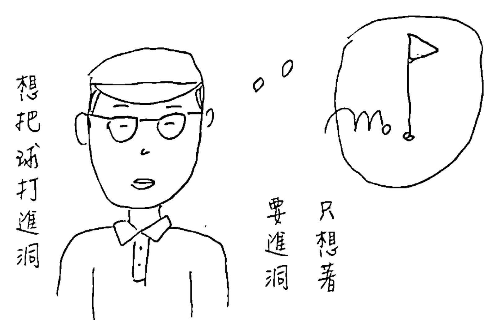

## ③章 人生超單純！用想的就能實現願望

## 「好事後面一定會接著發生壞事」是錯誤的想法

如果想實現願望，只要想著那個願望就好，這就是單純至極的宇宙法則。話雖如此，大部分的人就算在我教他們這個方法後，還是無法實現自己的願望。這又是為什麼呢？

那是因為，他們沒有選擇這個方法。

他們沒有選擇這個「只是單純地去想」的方法，而是選擇了讓自己的腦袋中充滿雜念、想著「都是○○的錯，所以辦不到……」，怪罪其他人、事、物，當作藉口的方法。

大家知道為什麼他們會選擇願望不會實現的方法嗎？

原因是為了不讓自己受到傷害。因為自己以外的問題，而造成願望無法實現，這樣的想法在未達到期望中的結果時，比較不會覺得失望對吧？也就是說，他們不斷重複著「讓自己不抱希望的練習」，大費周章地追求著不幸。

常有人說：「好事不會連續發生，好事後面一定會接著發生壞事。」但是從宇宙的法則來看，這是錯誤的。會這樣說的目的，只是在於如果後面發生了不好的事情，能讓自己認為「果然如此」而欣然接受。這只是一種打預防針的行為。

如果想著「好事怎麼可能接連發生」，人們就會開始準備一些無聊的不安對策，就結果而言，更會因為一直想著好事不會接連發生，而使之實現並反映在現實之上。也就是說，願望無法實現，其實是自己的問題，而不是其他人的錯。

「這次發生了這麼好的事，下次一定會發生更棒的事吧！」如果這麼想，好事一定會接踵而至。

停止和自己進行無聊的討價還價。為了不使自己受到傷害而打預防針的行為，只會在一念力量的助長之下，使得願望更難實現。宇宙的法則，其實就只是心想事成，如此簡單罷了。

## ③章 人生超單純！用想的就能實現願望

## 「本來想……」，其實是願望不會實現的藉口

就算知道單純去想就好，卻仍然很難做到的原因，是因為大部分的人到最後都會變成「本來想」。

例如「想出國去玩，卻一直無法成行」的狀況。這種人通常都會抱怨，「雖然想去旅行，不過工作一直排不出空檔，現在手頭也有點緊。如果有錢有閒，還能稍微想點辦法呢。」

這就是依各種條件來決定去或不去的例子，而沒有「無論如何都要去」的決心。而且還會不斷地用「不不，其實我很想出國玩，只是實在沒有錢，也沒有時間」當作藉口。

像這樣被各種條件制約住的人，就會變成「本來想出國玩」的典型。

舉例來說，想去夏威夷旅行時，真的想去夏威夷的人和本來想去夏威夷的人之間，就存在著極大的差異。

真的想去夏威夷的人，其念頭的出發點是「興奮期待」的心情。所以為此，就算工作請假或拿出存款，他們也都會為了讓旅行能夠成行而想方設法。在想像自己在夏威夷海邊放鬆或愉快地浮潛的景象之後，這份期待的心情變得更加強烈，更會為了實現「想去」的念頭，努力地備妥各項條件。畢竟，他們是真的「想去」。

另一方面，本來想去的人，其念頭的出發點則是「條件」。如果能找到時間、如果能湊出旅費或工作上能配合等，他們在意的只有「條件」而已，真正想去夏威夷的心情，已經被擠到心中的角落。也就是說，就算他們說著「想去夏威夷」，但實際上並非希望這個願望能實現，因而使能量朝此方向流竄，直到最後去不成夏威夷。

認為願望不會實現的人，想法變成「本來想」可說是十分常見。

「本來想」是不會幫助願望實現的。要改變人生，關鍵不是條件的再確認，而是「想」這個行動。本來「想」，豈不是變成「羅列條件」了嗎？請大家從這點開始思考吧！

## ③章 人生超單純！用想的就能實現願望

## 如果有許多願望想實現，祈求時要一樣一樣來！

為了實現願望，有一個很重要的訣竅。

那就是「祈求的時候要一樣一樣來」。

前面提過的「一念」也適用這種想法，聽到什麼好消息，同時想要一次嘗試許多事情，為了能使身體確切地理解，一樣一樣慢慢來是相當重要的。

再次回到打高爾夫球的話題上，每當在教揮桿時，大家都很明顯地想要同時嘗試許多事情。例如，把球桿往後舉高，準備揮桿的時候，我告訴大家「請不要把右手肘張開」。

這樣做的理由是，如果手肘張開了，揮桿的軸心也會跟著改變，擊球時會變得十分不穩定。在告訴大家手肘要固定住、盡量不要亂動之後，每個人都深深地點著頭。於是，讓大家意識著手肘不能張開進行揮桿，這時大家都能做的很標準，不過只要放上高爾夫球實際練習擊球，大家的手肘就又會開得一場糊塗。

為什麼加上球之後，手肘就會跟著打開呢？那是因為大家都想著要「一邊固定住手肘，一邊把球打向正前方」，一次做好兩件事。

這時候，我會這麼說：

> 「想要學會漂亮的姿勢、『把球打直』可不是現在最重要的課題。把球打得又直又遠這件事，就交給未來吧。總之，現在就讓我們先把手肘不要動這件事給記起來。如果真的想要打得更好，就必須按部就班地一樣一樣學。現在先把『想把球打得又直又遠』的念頭給收起來吧。」

話都說到這種地步，大家終於變得能夠專注在「固定手肘」上。

我的目的，正是為了讓大家確實地理解一樣一樣按部就班。「現在，我正在固定住自己的右肘。」就算腦袋不再思考，也能讓手肘紋風不動地完成揮桿，這才能稱得上是第一次學會了這件事。

像這樣「按部就班一樣一樣學」能夠應用在任何層面，在所有事物上都能完整地培養出實力。結果會在不知不覺間實現自己的願望。

為了過著充實的人生，必須記住「祈求的時候要一樣一樣來」。

## ③章 人生超單純！用想的就能實現願望

## 好好珍惜「過程」，活在每一個當下

聽到「祈求的時候要一樣一樣來」之後，或許有人會認為「意思是說不能太貪心囉」，事實上並非如此。

我希望告訴大家的是，無論是戀愛、工作、金錢或任何東西，都要貪心地去追求，把一切都納入自己手中。畢竟，人會隨著貪心而變得充實富有，理所當然地還是貪心一點比較好。

> 「這和剛剛講的不一樣吧？」

一定會有人這樣想吧。事實不然，一點差別都沒有。只要記得「祈求的時候要一樣一樣來」就對了。一樣一樣祈求，當祈求的事物獲得滿足，請繼續往自己的身上加上新課題。無論多麼地貪心都沒有關係。

日本有一句諺語：「同時獵捕兩隻兔子，最後一隻都抓不到。」大部分的人都把它解釋為，太過貪心所以什麼都得不到，其實並非如此。如果在抓兔子的地方，同時有兩隻蹦蹦跳跳的兔子，我們應該先集中力抓其中一隻，之後再把第二隻也抓起來。倘若不這麼做，結果就是半途而廢，什麼都做不好，我的解釋是如此。一樣一樣的得到，換句話說，就是「活在當下」。**活在當下，代表的是比起結果，我們更應該珍惜正在進行的過程。**

為什麼要重視過程呢？那是因為，不管遇到好事或壞事，我們都會從中獲得許多經驗，因而得以達成了享受人生而來到這個世上的目標。

許許多多的人，都是為了「取得好成績」、「獲得響亮的頭銜」、「養育出聽話的孩子」、「過著人人稱羨的人生」等，只在意著結果而活。

然而，就算取得了好結果，就真的會變得幸福嗎？

例如，當孩子拒絕去上學時，大部分的父母都會想盡辦法讓孩子回到學校。不過，這正是孩子凸顯問題將其反映出來的訊號。

## ③章 人生超單純！用想的就能實現願望

話雖如此，如果父母對問題置之不理，仍然以只重視「回到學校上課」的結果與孩子相處，孩子反而會覺得「啊～爸媽真的是完全搞不清楚狀況」，內心因而更加封閉。

越是這種狀況，父母越應該把「回到學校上課」的結果擱置一旁，單純地以「想要了解孩子心情」的態度與小孩溝通，這個過程才是最重要的。如果能好好重視「過程」，孩子的心情也會因此獲得滿足，不需要父母擔心，也會在不久後回到學校上課。可以說是得到圓滿的結果。

你有好好珍惜「過程」嗎？

每天光是「過活」就讓你喘不過氣來，對於「享受」和「品味」人生都草草了事嗎？像是等待暴風雨過去般屏息不作聲，對日常的庸庸碌碌感到疲倦，而帶著惰性混過每一天嗎？

現在，如果你能好好品味每一個當下，並因此感受到幸福，你所期望的結果一定也會隨之而來。因為宇宙的機制正是如此。希望你能理解這一點。

## 克服困難來自於「意念」，而非「思考」

我們常說「思考會成為現實」，但要讓思考轉變成現實得繞一大圈才有可能。因此，我會說其實「思考不會成為現實」，而是「意念才會成為現實」。

「意念」，是一種比思考強得太多太多的力量。

只要使用了意念的力量，就能一舉讓期望的現實降臨到自己身上。也就是說，「意念會成為現實」才是正確的。

但是，思考與意念有什麼差別呢？

在你心中一定會浮現這樣的疑問吧。簡單來說，「思考」就是動腦去想，而「意念」則是在心中做出的覺悟。

## ③章 人生超單純！用想的就能實現願望

例如，假設有一位男性，雖然有妻兒，卻因為工作太辛苦以及人際關係很麻煩等理由，而頻繁地更換職業。每當他辭掉工作，都會抱著「這次真的要好好努力工作了」的想法尋找新的工作，卻總是無法長期待在同一個工作崗位上。

這正是因為，他並非真心想要「努力」，也就是說這只是「思考」得到的結果。由大腦思考所做出「不做、不行」的判斷，跟自己的心情毫無關聯，因此很快地便會被打回原形。

不過，如果是因為看到了妻子苦惱的樣子，發自內心地認為「我沒有好好珍惜自己的老婆。至少，我也要讓家人過著幸福的生活」，他一定能好好地在工作上堅持下去。原因就在於，這裡的他是帶著「意念」，在心中做出了覺悟。有著這樣的意念，人就不會輕易地回歸至自己不堪的本性。

如果以「意念」做為出發點，人是真的能夠做出改變的。

## 單純在心裡想著「好想變瘦呀」的神奇變化

曾經有位無論減肥多少次，最後都會復胖的女性對我說：「為什麼我總是瘦不下來呢？我該怎麼辦才好？」前來找我進行諮詢。

而我這麼回答她：

> 「因為妳完全沒有想要瘦下來唷！」

對此，她回應道：

> 「沒有，我很想瘦下來。我怎麼可能會不想瘦下來呢！」

臉上也露出不太高興的表情。

這時，我繼續問她：「妳為什麼想瘦下來呢？」

「可能是我想太多了，不過我覺得大家最近總盯著我的腰看。這很明顯表示我變胖了。事實上，以前買的衣服也都緊到穿不下。我不想被大家認為是個胖妹，也想被稱讚身材保持得很好。所以，不管怎樣我都想要瘦下來。」
她這麼說道。但我在聽完之後，說了：
「啊啊～妳果然沒有想要瘦下來呢！」
話一說完，
「我就是想變瘦，才會來找你諮詢的。」
「不，妳完全沒這麼想喔！」
「我想！」
對話就這樣開始兜起了圈子。
周圍的人也覺得我們的問答十分有趣而聚過來聽。但你知道，我所說的「想瘦下來」和她所想的「想瘦下來」，兩者的意義究竟有什麼不同嗎？

這位女性是發現穿不下以前的衣服、變得在意他人的目光，不想被說「胖了」，而絕對不是真的「想瘦下來」。也就是說「想瘦下來」，只是一種不想被說「胖了」的手段，而非其心中純粹的意念。

在我們之間的爭論開始讓人感到厭倦時，這位女性轉而問我：

「話說回來，金城老師為什麼都不會胖呢？」

順帶一提，我的身高是 173 公分，體重是 58 公斤。從高中的時候開始，就一直維持著這樣的體態。面對她的疑問，

「因為我一直想著要維持這樣的狀態」我這麼回答。

而我為什麼想要維持這樣的狀態，其實背後有很正經的理由。

第 2 章也曾經提過，我在孩提時代，曾身患重病，因而對生命懷抱深切謝意的經驗。這也讓我明白，「活著」這件事本身就是奇蹟，而且人是仰賴許多恩惠才得以活在這個世界上的。因此，對於能夠行走、能夠吃飯、能夠每晚睡覺、每早醒來，以及能與家人朋友歡聚等，都懷著深深的感激之情。只要身體健康，無論做什麼事都能感到快樂。

正因為明白健康的美好，我抱持著屬於自己的理想。那就是無時無刻的希望——30歲要比20歲、40要比30歲，甚至50歲要比40歲時，隨著年齡增長而成為更有深度的人，並且也要做個健康又擅長運動的帥氣男人。像這樣，有著珍惜善待自己的想法，想要徹底地管理身體狀況的「意念」，在我心中油然而生。也就是說，我有著打從心底熱愛自己與人生的意念。

以簡單一句話來說，我只是純粹地想著「好想變瘦啊～」而已。意思是，瘦下來會比較受歡迎、想被別人認為自己很不錯或是衣服穿起來更好看等，這些瘦下來的好處完全不在我的考慮之中。我只是在內心深處有著「想要有結實帥氣的身體，健康地生活」的意念，因此能夠長久維持這樣的體型。

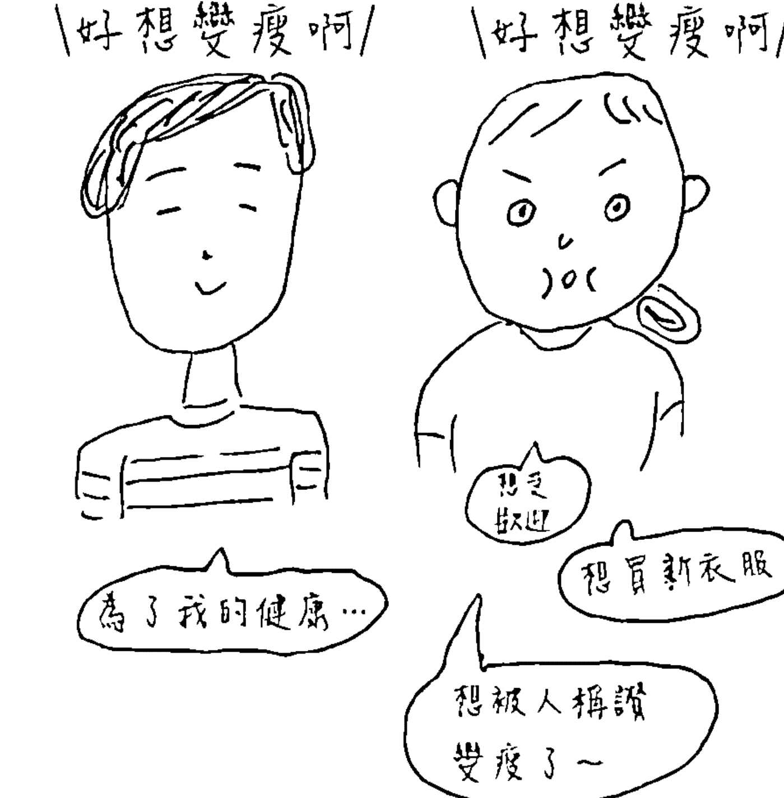

那位女性，在聽了我這一席話之後似乎也頗為認同，在一個月後便減掉 8 公斤，獲得勻稱又苗條的體態。
想必她也沒有特地減肥，而只是打從心裡想著「要瘦下來」而已吧。但光是這樣，就會讓一個人改掉暴飲暴食的毛病，也會產生想要開始健走的想法。**並非「不得不做」，而是「變得想去做」**。如此一來，她應該也不會重蹈過去復胖的覆轍了。
只要單純地在心裡想著「好想變瘦呀」。僅僅如此，願望便能實現。這就是事實。

## 強求的願望不會實現

雖然前面提到，只要在心裡單純想著「想變成這樣」願望就能實現，但如果有著像「絕對要得到○○」、「一定要變成那樣！」一般的強求，卻是無法讓願望實現的。

「咦～意念難道不是越強大越好嗎？」
你一定會這麼想吧。

舉例來說，就算一直想著「想要一棟房子！不管怎樣都好想要！」這樣的願望為什麼不會實現呢？

那是因為，在「想要得到」的狀況下，這樣的願望是建立在實際並不擁有房子的前提下。也就是說，為了讓自己一直維持著「想要一棟房子的狀況」，所以絕對無法真的擁有。

長期過著窮困的生活、手頭不甚寬裕的人，想著「好想要有錢」也是相同的道理。因為持續著窮困的狀態，才會一直想著「好想要有錢」。因此，想著「好想賺大錢啊！有錢就好辦事了」的人，是無法從窮困的狀態中得到解脫的。也就是說，從另外一個角度來看強求的願望，反而可以說是為了永遠保持得以強求的可能性，而特意讓願望維持在不實現的狀態。

要怎麼做，才能讓這種強求的願望消失呢？

強求，代表的就是心裡的某個角落，存在著懷抱「就算這麼說也不太可能啊」想法的自己。在強烈地想著「想要」、「好想得到」時，也同時選擇了「有所不足的自己」。

沒錯，一切都是自己的選擇。

既然是這樣，透過在腦中想像「早就已經得到那樣東西了」、「願望實現了」的狀態，就能選擇「已經得到那樣東西」的自己。如果能想像出已經得到某樣東西的自己，接下來的願望便會開始自然而然地實現。

話雖如此，但實際上明明夢想並未實現，卻要當作自己已經實現夢想，絕非一件容易的事。

對於這樣的你，有個很好的方法值得一試。那就是做些「彷彿」的行為。我稱之為「彷彿力」。例如，如果想要一棟房子，就必須像是今天要買房子一樣，去看看樣品屋，想像自己在屋裡實際生活的景象；而若想要汽車，就去趟轎車展示中心，一邊試試車子坐起來舒適與否，一邊想像自己開著那輛車馳騁的景象。

這樣的行為與其說是「演出」充實的氛圍，不如說是一種「讓自己信以為真」的想像。進行這些彷彿實際擁有渴求事物的行為，我想任誰都能輕易做到。

但是，要注意一點！如果不是打從心底想要得到房子或汽車，這個方法是不會發揮效果的。因為，如果不是真心想要得到，就算去了樣品屋或展示中心，也不會產生興奮期待的心情，甚至會覺得實際造訪是件非常麻煩的事。

在這樣的狀況下，「彷彿力」無法發揮任何作用。因為「其實也沒那麼想要這些東西」才是你真正的心聲。如此一來，你的意念當然不會獲得實現，無論去了多少次樣品屋或展示中心，得不到這些東西也是理所當然的。

若要有效地運用「彷彿力」，我們便不該只安於當個不斷追夢、卻無法造成任何改變的「平凡」追夢人，而必須當個能夠將夢想化作「現實」的追夢人。

我在沖繩的學生中，有位下定決心花掉準備用來當作生活費的錢，買下一直想要卻忍著不買的名牌服飾與高級進口餐具。

這位學生並不是奢侈浪費，也並非愛慕虛榮。他只是為了感受自己其實是更具存在價值，而懷抱著想要讓自己向上提升的純粹意念，對自己進行投資而已。

也就是說，他只是為了實踐「想要有尊嚴地活著」的意念，才因此想提升自己的生活品質，進而對著迷於這個意念的自己送上禮物。

這麼做的結果，究竟是如何呢……

「我得到一筆多到讓人嚇一跳的獎金！」

這位學生，鑼鼓喧天地跑來向我報告。聽說是公司以「感謝您長期以來的付出」的名義，加發了臨時獎金。透過進行這些「彷彿」的行為，也就是過著彷彿已經得到願望中渴求事物的生活，就連神明也會想方設法為你實現願望。

## 「想要」的意念畏畏縮縮，願望也不會實現

那只要不強求，有所保留地低調許願就能實現了嗎？事實上並非如此。例如，在薪水只夠勉強維持基本生活開銷公司上班的人，就算畏畏縮縮地低調想著「可以的話，好想要一幢別墅啊！」，這樣的願望仍然不會有實現的可能。

真心誠意想要一幢別墅的人，根本就不會在薪水低的地方工作。買東西越是大手筆的人，越會發揮自己的實力，在待遇較好的企業上班甚至是獨立創業，為實現自己的願望不斷努力。

但如果想要得到一幢別墅，卻一如既往地領著低廉的工資，一邊想著「好想要別墅啊！多省點錢不知道是否買得起，果然是遙不可及的夢想嗎？」代表你完全沒有為了實現自己的願望而努力。

因此，無論過了多久，這個願望都不可能實現。

所謂「只用想的」，和低調地想著是完全不同的。真正把「用想的」發揮到淋漓盡致的，其實是你們孩子們。因為孩子們十分純真耿直，執行起來往往沒有任何顧忌。

例如，當孩子們想著「好想要那個模型」時，並沒有「為什麼想要那個模型呢？」的理由。他們所想的，單純的「就是想要」沒錯吧？

因為他們有著總之就是「想要」的意念，為了實現願望，從早到晚纏著父母苦苦哀求，或是替爺爺、奶奶按摩肩膀以賺取零用錢等，想盡各種辦法只為得到自己想要的模型。總而言之，孩子們就是這麼調皮又純真。

這時候，孩子們的腦中絕對不存在「如果得不到模型該怎麼辦……」的想法。他們對自己沒有絲毫懷疑，堅信「絕對要得到！」正因為他們相信自己，也才會為此付出相應的努力。

「用想的」就是這麼一回事。如果你也能抱持著孩提時代的調皮和純真，去「想」、去「許願」，那所有的願望一定都會實現。我是這麼認為的。

## 改變了自己，對方也會跟著改變

就算想要改變某個人，往往也是以徒勞無功收場。但「改變了自己，對方也會跟著改變」這句話其實是真的。

這是因為，如果我們透過對自己的深入了解，進而改變自己的波動，對方也會接收到波動的變化，在無意識間以截然不同的方式回應。

在我的講座中，學生們因為聽了講座內容，改變了自己的心境，以這樣的狀態回到家後，明明沒有特別做什麼，平時叛逆的孩子卻像是變了個人似的，突然說：「最愛媽媽」而迎上前來，像這樣的例子可說是不勝枚舉。

現在你知道改變自己，孩子也會跟著改變。也就是說，改變自己，老公也會跟著改變對吧？好，就來試試看！

一邊這麼想著，一邊掛著笑容迎接剛下班的老公，並細心照料著他，但相對於這樣的溫柔，老公卻絲毫改變也沒有。

「為什麼你一點都沒變啊！」

結果反而讓自己更加生氣。這樣的場景，你應該也能感同身受吧？

為什麼，改變了自己會使孩子跟著改變，老公卻並非如此呢？

那是因為，「改變老公」的算計成了重點的緣故。對於自己的孩子，當然充滿深深的關愛，也會自然而然地浮現「好想趕快回家看看他們！」的心情。而孩子們也會對此能量產生共鳴，進而產生明顯的改變。不過，對於老公，則變成「我改變自己的目的，是為了要改變老公」，所以這樣的願望是不會實現的。神明完全看透「想改變老公」的算計。由於神明絕對不會接受我們的討價還價，因此若不將算計拋諸腦後，不管再怎麼改變自己，老公依然不會有任何改變。

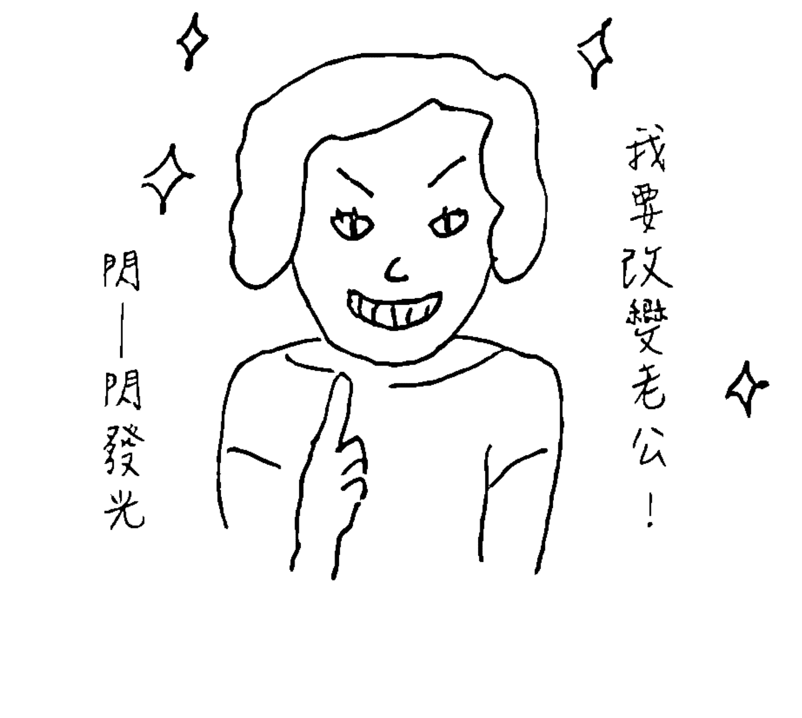

如果真的想要改善現在所面對的狀況，使其朝好的方向發展，首先必須把「想改變老公」的算計放在一邊，從懷著「想理解老公、體會老公」的心情與他相處開始做起。

這麼一來，他的靈魂也會對「真的想理解我」的人敞開心扉。只要能完全拋棄心中的算計，老公也會有所改變。

「我先生十分頑固，完全不聽我說話……」像這樣訴苦並深深嘆息的女性十分常見。但在深入探究她們的想法後便能發現，她們絲毫沒有想改變自己的意思，心中卻都存著想要改變老公的算計。

話雖如此，夫妻在經過長年的生活後，一般都很難拋開面子、坦率地面對彼此。往往鬧彆扭的結果，就會產生「如果你都不改變，那我也不會改喔！」的想法。但是，這樣的鬧彆扭還是趕快改掉比較好！從先意識到這些事的人開始改變，會讓事情的發展順利且迅速許多。

如果非要對方改變，自己才跟著改變，就和爭論先有雞還是先有蛋一樣，沒有半點意義。這樣下去，你的人生不會發生絲毫變化，就這麼迎來終結。你是想改變現在的處境對吧？就是想做點什麼，才會拿起這本書吧？如果是這樣，首先要做做的，就是由率先意識到這些事的人開始實踐。

儘管如此也無法坦率面對對方的時候，該怎麼辦呢？在這種狀況下，至少請想著要消除夫婦之間的隔閡以及會成為阻礙的東西。首先，如果能確實地踏出這邁向幸福的第一步，便已經很好了不是嗎？

對於這句話，會坦率點頭認同的女性想必為數眾多。現在，你是否也能夠打從心底接受這種想法了呢？

如果能「坦率地這麼想」，老公一定會立刻有所改變的唷。因為，這之中並沒有絲毫的算計。

在你回到家之後，「累了吧？今天就在外面吃如何」、「這麼晚了還要做飯，很辛苦吧」等，至今從未聽過的話語一定都會不斷出現。實際上，有很多我的學生都說：「聽到老公說出這麼溫柔的話，害我嚇了一大跳！」

要馬上回到恩愛的狀態有一定的難度，但只要坦率地想要獲得幸福就對了。
宇宙中沒有「小」或「大」的概念。而幸福，當然也不存在大的幸福或小的幸福這種大小的差距。換句話說，能夠實現小事的人，必定也能實現大事。
大家可以帶著遊戲的心情，試試看「只用想的」的遊戲。在工作忙碌、排不出休假時，請決定去一個想去的地方。例如，只要想著「好想去趟迪士尼樂園啊」。
這時候，掛念著「就算這麼說，怎麼可能排得出假啊」的想法是行不通的。
只要單純地想著「我想去」就好。
如此一來，等你回過神來就會發現，無論是金錢、時間或環境，所有的條件都會在不知不覺中備齊。舉例來說，可能會獲得股東招待券，或是大型的企劃案可能比想像中進行得更加順利，因而能夠排出休假。

就像這樣，請大家多多享受這個「只用想的」的遊戲。如果能體會到「人生，是多麼的美好啊。而且竟然是這麼的單純！」的人，跟老公之間的關係想必也會在這之後漸漸有所改善。因為這正是意念在有效運作的狀況。

不過，如果想著「太好了，只要用想的就能實現的話，要改變老公也輕而易舉啦！」的人，因為又回到了「為了改變老公，只好改變自己」的算計上，這樣的魔法也會因此失效喔。

**捨棄一切的「算計」，只要「坦率地想著」。** 為了能施展可以實現一切願望的魔法，就讓我們先從小地方開始多加練習吧！

## 不懂裝懂，會扼殺許多可能性

無論是職業高爾夫球選手揮出漂亮的一桿，或是足球選手踢進了奇蹟般的進球時，在在讓人感嘆真虧他們有這種技巧，或真不愧是球星啊！

你知道為什麼他們能夠在正式比賽時，展現出高人一等的球技嗎？

那是因為，他們雖然擁有豐富的經驗，卻不會有「如果是現在這種狀況，我這樣做應該可行吧」一般，不懂裝懂的想法。

當然，職業選手們透過日常練習培養體力並磨練技術，一定會擁有與之相襯的自信。但是，他們並不會因此而滿足。

無論如何，思考都只能局限於過去或未來之中。思考只能靠著與經驗的比較以觀察事物，像是「之前成功了，這次應該沒問題」、「之前失敗了，這次應該也做不到吧」一般，透過回想過去經驗以推測未來。也因為這樣，思考無法看到當下所發生的事情。

選手在展現超高球技時，正面迎向眼前掠過的每一個瞬間，並在此時此地發揮最大力量的心情是至關重要的。也就是說，如果你也想獲得奇蹟般的成果，就算你對正在做的事瞭若指掌，也必須懷抱著這些對你來說都是「不熟悉的事」、「初體驗」的心情，將自己置身於「在當下發揮最大的力量」意念的最中心處，去面對你正在做的事。

以高爾夫球為例，我在 **18** 洞的成績大約是 **70** 桿左右，因此常常有人會問我：「為什麼你能打出媲美職業選手的成績呢？」這個問題的答案，就是因為我在打出每一球時，都是以「不知道」做為前提。

球未打出去之前，誰也不知道會發生什麼事。在每一次的擊球時，我都不會以自己擅長高爾夫球為前提。心裡只是想著，要在此時此地發揮出最好的表現而已。一桿接著一桿，我並不會不懂裝懂，也不會沉醉於自己的球技，而只是想著如何驅動身體，在這次擊球中打出和想像一致的表現。

實際上，如果帶著「上次在這個球場打出74桿，這次應該也沒問題吧！」的想法，自負地來到球場，往往會打出比標準桿高出許多的悲慘成績，也是十分有趣的現象。

就像這樣，我對任何事情都抱持著「我比任何人都還不了解」的想法。

因此，在聽找我諮商的人描述狀況時，都懷著「聽聽看才知道」的心情。我並不會認為「這些話根本是老生常談嘛」、「常常發生這種狀況呢」、為什麼這個人會這樣想？為什麼會說出這些話？對於這些，我都以完全不了解的態度為前提來聆聽。

為什麼不以至今累積的經驗為基礎來觀察，原因便在於，如果我是以一張白紙的狀態聆聽他人的故事，才能實際體會當事人的心理狀態。

透過感受「原來這個人很孤獨啊」、「心中充滿了怒氣呢」等狀態，「如果是這樣的煩惱，這麼做會比較好喔」般恰當的回答才會應運而生。

在至今已經累積將近 5 萬聽眾的演講和諮詢中，每次我都能讓自己保持像是一張白紙的狀態。不過，真正重要的是，想「去明白」、「去理解」的心情，而非各種知識與資訊。因此，我認為謙虛是一種比什麼都重要的美德。

就算以過去獲得的經驗做為自己的參考資料留存下來，也千萬不能讓這些經驗轉變成驕矜自滿的心情。無論何時，一定都要試著以初次嘗試的心情面對所有事物。如此一來，必定能更加接近你所期望的結果。

## 人無法改變際遇，但可以改變意念

宇宙是依循「迴力鏢法則」在運行著。所謂迴力鏢法則，指的是自己所做的事情，最終必定會回歸到自己身上。

人會分成運氣好與運氣不好的人，並不是沒有任何理由的。不過是自己所做的事，回歸到自己身上而已。運氣不好的人送出的霉運回到了自己身上，運氣好的人送出的幸運也回到了自己身上，僅此而已。

不過，如果回到自己身上的是霉運，一定不會認為「這本來就是自己送出去的東西」，而不想承認是自己的責任吧。所以，大家都會說「運氣真差啊～」並把錯推給運氣。

在當下的每個瞬間發生的事，其實都是自己行為的重重累積。不去做該做的事，只是一味地希望幸運降臨自己身上，不管祈求多少次都無法實現。自己不好好進行累積，幸運是不可能回饋到我們身上的。依照這種想法，最終，人類這種生物「除了自救之外，別無他法」。

然而，迴力鏢法則其實存在著一個陷阱。
那就是，就算做了再多好事，只要內心一直懷著罪惡感和羞恥心等負面意念，回到自己身上的也只會是不好的事情。相反地，就算做了許多社會上所認為的壞事，只要內心充滿著愉悅、幸福和喜樂等富含著「愛」的正面意念，好事便會回歸到自己的身上。

一個人做的是好事或是壞事，並不是判斷的依據。透過此一行為，在心中產生的意念情感是正面或是負面，才是最重要的準則。

因為，神明最感興趣的，是你究竟懷抱著什麼樣的意念與心情。至於做了什麼事、有什麼樣的行為，或這些行為是善是惡等表面上的東西，這些神明是完全不會關心的。

「咦，可是我們不都說『善有善報』嗎？」

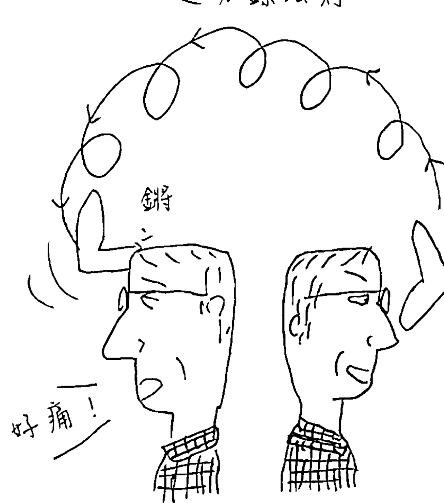

## ③章 人生超單純！用想的就能實現願望

你是這麼想的嗎？
事實上，善有善報的觀念是大錯特錯的。

例如，假設有位正值外遇狀態的妻子。這位太太因為被其他男性愛情滋潤所帶來的喜悅，每天都活在幸福的氛圍之中。由於如此，她的心靈十分充實，也因此能溫柔地對待自己的先生。然而，她的先生在知道太太的外遇實情後，卻因為妒火中燒而無法保持平常心。

在這樣的狀況下，雖然太太是外遇的一方，卻因為覺得幸福而懷有正面的情感，而有更多好事降臨在她身上。另一方面，先生雖然沒有做任何壞事，卻因為嫉妒而使內心充滿負面情緒，使得壞事接踵而來。

反過來說，若太太是懷著罪惡感外遇，就會因為負面的意念，招來各種壞事。另一方面，先生如果有寬大的胸襟，認為「只是偶一為之玩玩而已，就原諒她吧」，雖然被太太背叛、卻仍然擁有正面的意念，好事便會在他的身上發生。

> 「這樣不是很不公平嗎？」

你可能會這樣想吧。不過，我曾經說過，宇宙中充滿著愛的能量。同時，神明本身正是代表愛的存在，所以並不會評斷人類行為的對錯，只會以這個人擁有的是「正面的意念」或是「負面的意念」作為判斷基準。

宇宙則會直接地實現我們的「意念」，將我們心中所想化做現實。因此，人生其實是十分單純的。

本來，「外遇是不好的」就是人類所決定的價值觀。人類身處社會的常識與規範之中，無論任何事都要區分出善惡好壞，但神明對這些事情毫不關心。

會像迴力鏢一樣回到自己身邊的，並不是善舉惡行，而是「自己的情緒」。

因此，無論何時都要在心中保持正向的意念是至關重要的。請大家千萬不要忘記這一點。

「霸凌別人取樂的人，也會有好事降臨在他們身上嗎？」

這樣的疑問一定會浮現在你的心中吧。事實上，我也經常被問到這個問題。

答案是否定的。「正面的意念」指的是基於愛的情緒。而像是霸凌和犯罪等，傷害他人身體與心靈的行為，正是對愛的阻絕。原本身為神的分身，同時也代表著愛的人類，如果做了將愛阻絕的行為，會離「真正的自我」越來越遠。忘記自己也是神明、與愛漸行漸遠的生存方式，稱不上擁有「正面的意念」。

如果，透過霸凌他人而感到快樂，那也不過是沉浸在一時的優越感之中而已。做了阻絕愛的行為，必定會使一個人在事後產生後悔且寢食難安的情緒，罪惡感與懊悔等「負面的意念」也因此油然而生。

讓我們好好了解「真正的自我」。如果能將愛及其本身的能量建立連結，在前方等候你的一定是幸福的結果。

## 用心感受，而非用腦去思考

在這個世界上，明明「只用想的」就能實現所有願望，為什麼大家都無法將其付諸實踐呢？那是因為單單只是用想的，一般人往往無法感受到這件事的份量。也就是說，大家的心靈都失去了正常的功能。

為什麼心靈會失去功能而無法正常運作？原因在於，從孩提時代開始，大家都不斷進行著「思考」的練習，而沒有使用「意念」的習慣。

**而思考的第一堂課，就是母親對孩子說「去做○○」。** 孩子聽到這樣的命令後，就會產生「說是去做○○，那就代表是不得不去做的事情吧」的思考模式。

因此，在如同指揮官一般不斷對孩子們說著「去做這個」、「去做那個」的母親教育下長大的孩子，並不會了解該如何去享受這個世界上的事物。並且，在面對改變時，他們也常難以適應，而會養成只靠思考就想解決事情的習慣。

不過，如果是說「來做○○吧」，孩子的心就會開始變化。特別是聽著「一起來做吧」長大的孩子，所有的行為對他們來說都饒富趣味，也使他們具備了很好的領悟力。透過心靈上的交流，更可以打開他們心中「想要和媽媽一起做」的開關。這時候，這些孩子心中的調皮之神，一定掛著滿臉的笑容並感到十分愉悅。這麼一來，孩子們的心中也能因此養成使用並擁有「意念」的習慣。

這麼看來，母親對於孩子們的未來是幸或者不幸，肩負著重責大任。然而，遺憾的是，在現代社會的實際情況中，有這種想法的母親可說是少之又少。

不過，這並不是母親們的錯。我們或許可以稱之為「時代的潮流」或「教育的詛咒」吧。因為從母親們的時代開始，直到今日，都一直認為這種教育方式是正確的。重點在於，現在領悟到了這些事的你，該如何改變自己而傳遞下去。

對在缺乏擁有「意念」習慣情況下成長的孩子們而言，資訊社會的來臨無疑是雪上加霜。在過去，想要調查一件事，必須實際翻閱辭典，親自去趟圖書館，但現在只要在網路上搜尋，轉眼間便能從世界各地接收到各式各樣的資訊。

活在這種時代中的我們，變得十分擅長用頭腦處理資訊。因此，只要資訊進入腦中，便會誤以為自己十分了解，產生彷彿實際體驗過那件事情的錯覺。資訊明明只是單純的資訊，並不能讓我們去理解、經歷某件事。無法明白這一點的我們，正是因為我們的心失去了功能。

例如，假設有位畢業於知名大學，擁有豐富芒果相關知識的人。這個人對於芒果屬於什麼科、產於哪裡、甜度多高或是發源地等知識十分熟悉。然而，如果他沒有實際栽種過芒果，這些知識都將只是他自以為了解芒果的錯覺而已。也就是說，這個人完全不了解芒果。只有實際身體力行栽種芒果的人，才能了解芒果真正的樣貌。

像這樣，如果一直使用思考而變成前述「本來想」的人，就算擁有知識也不會有任何實際的作為，而逐漸形成這樣的思維模式。

更糟糕的是，對這些「思考的人」，我們常常會有知識分子的印象對吧？如此一來，就算我們能夠擁有知識，卻喪失用心去感受的能力。結果使得「只用想的」這件事變得益發困難。

## 人類是「從樹上而來」的生物？還是「從天上而來」的生物呢？

在此，我想問一個問題。下面這兩句話，你相信哪一句呢？

> 「人類，是從樹上而來的生物。」
> 「人類，是從天上而來的生物。」

選擇了前者，代表你相信人類是由本來在樹上爬的猴子，所演變成以雙腳步行的想法，也就是學校所教的「達爾文演化論」。選擇後者，則代表你相信人類是由神創造而出的想法。

如果你屬於前者，很遺憾的，代表你被「物理學」與「過去」束縛著。相信演化論的人，無論再怎麼想用「意念」而非思考活著，都會因為沒有理論支持而無法接受。也就是說，在還是以大腦思考的狀態下，所能想像的事情是受到限制的。若是受到限制，只會有尋常的幸福降臨在你身上。

不過，如果你相信後者，代表你的人生中，無論什麼樣的奇蹟都有可能發生。能夠好好發揮「意念」力量的人，都很清楚所有的人類皆是來自天上。

也因此，他們知道無論什麼事情，都有發生的可能。

例如，以我自身經驗來說，就曾經有胃潰瘍自然痊癒的經驗。因為我長期在與神進行問答時使用神經，胃也因此出狀況，於是某一天，我認真地想著「這樣下去會發展到不可收拾的地步，所以我想把胃治好。」當時，我閉上眼睛想像著胃變得乾淨的景象，好像能看到空氣中的能量匯聚至我身邊，並且物質化成為細小的粒子，將胃穿孔的部分填補起來的過程，像是影片一般呈現在我的眼前。

只不過短短的30秒之間，空氣就轉換成為物質。順帶一提，在椎間盤突出時，我也曾經有生長出新的軟骨而痊癒的經驗。

除此之外，我也曾經在某天把東西忘在家裡而出門上班。由於是要交給對方的重要文件，我不得不回家去拿，但實際上我並沒有時間這麼做。

當時，我打電話給人在在家裡的老媽，告訴她「我應該是把文件放在桌上了，不好意思，可以○點的時候幫我拿到大街上的公車站嗎？我會去找妳拿。」老媽確定文件擺在桌上後，說了句「知道囉」便掛了電話。

**下個瞬間，那份文件就出現在我眼前的桌上了！**

就連我也覺得「不可能吧」，馬上打了電話給老媽。「剛才桌上的文件還在嗎？」在我這樣問了之後，老媽回答道：「沒有欸。奇怪，剛剛明明還在這裡的，到底跑到哪裡去了」。

其實，在我發現沒帶文件時，曾經在心裡單純地想著：「啊～如果有哆啦A夢的任意門，能馬上回家拿忘記的東西就好了。」因為這樣，文件竟然直接飛到我的眼前！我們一般把這種現象稱為瞬間移動（Teleportation），但事實上，像這樣超出人類智慧所能理解的事，確實是會發生的。

讀完我的故事之後，你是不是覺得「怎麼可能～那是因為，你有特殊能力才能做到的吧？」

不過，其實這是大家實際上「確實」擁有的能力。因為我們每一個人，原本就都具有這樣的能力。話雖如此，如果依然堅信「人類是從樹上而來的生物」，是不可能發生這種魔術般的事的。

如果活在沒有科學證明便無法相信的框架中，就無法發揮自己的可能性。

不過，如果真心相信「人類是從天上而來的生物」，那份可能性將無限量。也就是說，自我的領域能拓展到什麼地步，取決於你相信這件事的程度。

在這章節的開頭，我問大家的兩個選項，其實是，
① 想體驗受到物理上限制的世界→「人類，是從樹上而來的生物。」
② 實現自己所有的意念，想如同神明一般地活著→「人類，是從天上而來的生物。」

有著不同涵義的兩種選擇。要選擇哪一個當然是你的自由，但既然都要活著，選擇②不是比較有趣嗎？事實上，地球本來就是能夠實現任何願望的地方。

能夠體驗下至水蚤、上至神明的生活，也能依照自己的意識實現所有願望。

如此神奇的地方，就是「地球」唷。

## 你真的想成為有錢人嗎？

如果問大家：「你有什麼願望呢？」大多數的人應該都會回答：「想要成為有錢人。」

的確，只要有錢，想要的東西通通都能買下來，也能過著奢侈的生活。不過，看到這些說要成為有錢的人，我都不禁想問：「你們真的關心錢嗎？」

因為，基本上他們完全沒有在思考，一旦獲得巨額財富要如何使用，更遑論該賦予「花錢」這件事情什麼意義。

大家都只對「錢」這項物質感興趣，而真正有在好好思考「錢的用法」的人可說是少之又少，不是嗎？

錢，既不是好東西也不是壞東西，而只是做為一種力量存在於世界上。如何運用錢這股力量，又該賦予花錢這件事什麼意義，其實是使用者內心的投影。

為了充實人生而使用錢，為了活得有價值使用錢，錢就會發揮讓人變得幸福的作用；如果為了騙人或虛榮心而使用錢，錢就會發揮讓人變得不幸的作用。錢會隨著使用方法的差異而帶來不同的效果，因此，錢本身是沒有任何罪孽的。
由於錢是一種能讓我們過著幸福生活的媒介，因此千萬不能將「存錢」這件事當作目標。

真正的有錢人，是懷著真心誠意、熱愛著錢的。而他們也打從心底想要用錢，讓自己的人生更加充實。

我在沖繩的學生裡面也有大企業家。每當從他那裡收到講座參加費並觸摸到他的錢時，都能充分感受到他的錢十分快樂。

手上拿著他的錢，便能感受到錢像暖壺一樣漸漸變熱。我認為一定不是只有我一個人如此認為，便把錢也給家人摸摸看。果然，不管是妻子、小孩都說「哇～暖暖的～」並感受到錢散發出的溫暖。

## 無法讓金錢發揮功能的人，是賺不到錢的

話說回來，你知道為什麼「銀行」不叫做「金行」嗎？如果是負責處理金錢的地方，比起「銀」而言，價值更高的「金」不是比較好嗎？

名詞的背後其實有著充分的理由，那就是代表「金錢」並不是這個世界的一切，雖然錢支撐著全天下的人，但經濟並不是最優先的事項。因為有著這層意義，最後才以「銀」而非「金」命名。

也有一說，是因為銀行出現時，流通的貨幣是銀才以此命名，但這便流於單純的事實說明。如果從宇宙的構造來看，神明一定是出於其巧思才如此命名的。

也就是說，經濟只是支撐著人類，並使人類獲得幸福的一種手段；金錢本身不是人類的目的，也不是最優先的事項。這就是「銀行」這個名稱想傳達的訊息。

不過，看到現在社會上的景象，「經濟至上」主義大行其道，讓我都不禁想，真的改名成為「金行」會不會更加妥當呢？我希望大家能夠記住，錢只不過是做為我們為了達成某個目的時，所需要的手段而存在著罷了。只是一味地累積金錢，是不會帶來任何好處的。

大家都相當重視金錢，事實上，錢也完全適用「只要用想的就會實現」的宇宙法則。

因此，如果真的想要金錢，請先考慮好要用這筆錢做些什麼事，以及要讓這筆錢發揮什麼樣的功能。如果打從心底想著「真的想變得更充實」，錢就會為了使社會富足而源源不絕接踵而來。

不過，如果只是想要得到金錢，因而想要成為「有錢人」，錢便完全不會來到你的身邊，而使你越來越窮困。這就是產生有錢人和窮人之間差異的機制。

## 錢也有想回去的地方？「在鈔票上寫名字」的實驗

雖然我說如果是以金錢本身為目的，不斷累積財富的話，錢是不會到這種人身邊的。但是，這個世界上仍然存在著像是「電話詐欺」一般，以欺騙他人為手段賺錢的人。

「為什麼這種人可以賺到錢，並過著奢侈的生活呢？」
你的腦海中一定會浮現這種疑問吧。

的確，靠著欺騙他人得來的錢財，當下會進到那個人的手中。不過，錢只是暫時停留而已。就像在旅館住一晚一樣，並不會長期定居在該處。

獲得這種不穩定的錢，就好比養著一條從來不認為自己是主人、與自己毫不親近的狗一般。雖然會試著接近自己，但馬上就會因為不自在而消失無蹤，就像這種感覺。

能夠持續地騙人，一輩子過著富足的人，應該幾乎沒有聽過。

而且，這個世界上存在著會將自己做過的事，投射回自己身上的「迴力鏢法則」，因此如果欺騙了別人，同樣的事情一定也會發生在自己身上。
在極少數的情況下，也會出現在欺騙之中找到自己的人生價值，進而快樂且興奮地欺騙他人的人。但由於「欺騙」這種行為本身，就是一種阻絕愛的行為，因此不僅錢會想辦法從這種人身邊逃離，不好的事也會回歸到這種人身上。

順帶一提，受到金錢喜愛的人是什麼樣的人呢？那就是能夠了解錢的心情的人。就算是錢，也是擁有自己的心的。並不只是單純的物品而已。

金錢，是全世界的人都想得到且憧憬的目標，如果以人類世界來說，就像是麥可·傑克森（Michael Jackson）般的巨星。不過，就連麥可·傑克森也有許多正面與負面的傳聞對吧？

要說為什麼會有這些傳聞產生，正是因為他實在太受歡迎，而使身邊派系不斷鬥爭的緣故。麥可・傑克森在成為巨星的過程中，一定也曾經在內心感嘆過「當個明星，還真是累人啊。」

金錢也是如此，一定會想著「為什麼有關我的傳聞，不管好的或壞的，會到處流傳呢？我明明就只是我，到底得罪什麼人了嗎？如果我的真心能傳達給大家就好了。」

事實上，在想把錢放進錢包的瞬間，他一定會問你：「欸～你應該能了解我的心情吧？」如果回答：「嗯。我知道喔！很辛苦吧。」設身處地為錢著想，錢一定會覺得「啊～這裡好讓人平靜」並鬆了一口氣。

不過，一直把錢放在錢包裡面也是不行的，所以一定要一邊說著：「能好好放鬆當然很好，但也出門去旅行一下吧。不過，這裡隨時都歡迎你回來喔！」一邊將錢送出去。

我曾經做過實驗，看看錢是否真的會回到自己的身邊。我在10張千元鈔的角落裡，以羅馬拼音不起眼地寫上自己的名字「Yukimasa」，再把這些錢拿去沖繩的店裡消費。

在那之後，過了3個月到半年，有3張鈔票回到我的身邊！一張是在沖繩縣內，一張是在福岡縣，最後一張甚至是在大阪……。因為過了好幾個月，連我都忘了曾經在鈔票上做過記號，所以當店員找錢給我時，我也沒有檢查鈔票上是否有名字。

某一天，當我在櫃檯前數著要付的千元鈔時，曾經在鈔票上寫字的光景突然浮現在腦海中。我一邊想著「不會吧」，一邊檢查正要付出去的千元鈔，才發現這不正是熟悉的那串小字嗎！

「你真的回來啦！」一邊說著，一邊忍不住起了雞皮疙瘩。當我問錢：「為什麼回來了呢？」錢則這樣回答：「因為實在是忘不了你……」。果然，錢會喜歡能夠理解自己心情的人呢。

## 在付錢的時候，你覺得自己變得富有嗎？

下面哪一個選項，和你的感覺比較接近呢？

- ① 在付錢時覺得自己變得富有。
- ② 在付錢時覺得自己變得貧困。

如果選擇了②，問題可就大了。畢竟，錢是為了讓人變得更充實、更富有的東西。

關於錢，在這個社會上一向都是由獲得的一方對給予的一方表達感謝。但說實話，支付金錢的那一方，也必須表達自己的感謝。透過支付金錢，我們可以得到具有價值的物品，進而使自己變得充實富有。因此，給予金錢的一方，也理當說聲「感謝」。

透過支付金錢而變得富有，這樣的循環才是理所當然的。

不過，如果連大人自己不知道這件事，當然也不可能將使用金錢的正確方法教給孩子吧。
「再節省一點」、「養你真是燒錢」、「一直花錢會窮一輩子」在這樣的語言環境中長大，當然會在付錢時覺得自己變得貧困。
如果不去思考透過錢讓自己變得充實與幸福，當然也不可能為孩子們描繪出一幅充實富足的人生藍圖。也就是說，每當隨著付錢時覺得自己變窮的大人越來越多，就越來越無法將真正的充實富足交到孩子手上。
我家的老媽，即是沒有「充實富足」意識的人。第2章也提過，她曾經說怕老了之後沒錢活不下去，而認真準備保險等消除不安的對策，對自己的老年生活有著萬全的準備。

我曾經對老媽說：
「您不但結了婚，也有自己的房子，還拉拔大4個出色的孩子。而孩子們也擁有各自的房子、共生了14個孫子，每年還能旅行兩次，這樣的生活難道不幸福嗎？」

為什麼您對這些充實富足視而不見，反而不斷擔心未來，準備著各種消除不安的對策呢？拜託以自己非常富足、非常幸福為前提而活著吧。不是為了平安無事地生存下去，而是為了快樂且充實的人生生活著吧。若能如此，金錢一定不會是什麼困擾的。

當然，老媽完全聽不進我所說的話，而按照自己準備的各種對策，「順利地」在60歲時病倒。沒有意識到自己的充實富足，只不斷著眼於消除各種不安的對策，那些不安就因此化作現實。

這是多麼可惜的人生啊！

如果你能在使用金錢時抱持著快樂的心情，快樂的未來就會隨之而來。當你能以這樣的方式使用金錢，真正的充實富足就會降臨在你的身上。

## 讓金錢的力量停滯是一種罪過

雖然大家都很想要得到金錢，但手中握有越多的錢財，所帶來的力量也會更強，因此與之相應地仔細思考金錢的用法是必要的。話雖如此，如果儲蓄過多的金錢，可是會變成一件很嚴重的事情！嚴重的地方在於，錢是會腐爛的。

大家一定沒想到，錢是會腐爛的對吧？如果讓錢在同一個地方停滯太久，就會在能量的世界中腐爛。無法流動的錢，會失去其中蘊藏的力量，與沒有擁有並無二致。

舉例來說，1天之內讓1萬元在10個人手中流通，就能發揮出10萬元的效果。A先生花了1萬元向B先生買了他做出的東西，而得到1萬元的B先生又在C先生的店裡消費了1萬元……。像這樣，越是運用越能發揮其價值，就是錢的特質。

不過，如果A先生不使用那1萬元，只是一直藏在櫃子裡，這筆錢不但無法使任何人變得充實，也無法發揮效用。如果讓1萬元好好發揮，甚至可以發揮100萬元的效用，假使不能理解這一點，腦中便只會充斥著「存錢」這件事。

錢的流通度越高，越能發揮其功能，因此當大家都把錢拿出來使用時，金錢才能發揮最大的價值。所以，如果讓錢停滯於儲蓄行為之中，便會造成其功能大幅衰退。

這就好比是僱用石川遼或松山英樹這樣傑出的高爾夫球選手，到不符合專長的公司任職一樣。如果不能發揮自己的力量，任誰都會感到憂鬱吧。就連錢也不例外。

不過，誠如各位所知，日本人的儲蓄額在世界上名列前茅。而銀行本應是在認同顧客的想法時，借予金錢幫助實現夢想的地方，但如果有擔保品卻也無法向銀行借錢。這就好像是在驅使大家，不要把錢投資在某個人的夢想上，要盡量儲蓄起來。日本人的金錢能量，就這樣漸漸地腐朽下去。

## ③章 人生超單純！用想的就能實現願望

我曾經為了確認銀行實際上到底採取什麼樣的態度，而到沖繩的銀行進行遊說：「希望你們能投資這個構想。」當我這麼說之後，行員馬上問我：「擔保品是什麼？」我便回答：「你先看看這個構想嘛！」行員接著又說：「構想我會再看，但有什麼可以做為擔保品的東西？」對此，我吐槽道：「這裡是當鋪嗎？」對方臉上卻沒有半分笑意，反倒有點惱羞成怒。

「啊，原來銀行就是當鋪啊。我還以為是投資家呢，抱歉囉～」我留下這句話後便離開。

原本有著讓錢獲得活力並使錢活躍的職責、被稱為錢的專家的銀行，現在卻反而讓錢越來越缺乏活力。對神來說，這就是一種「把能量軟禁至死」的行為，因此在回到天國時，被神明訓斥也是在所難免的。

擁有金錢並沒有關係。但是，在擁有金錢後，要盡什麼努力讓金錢的力量不至於停滯，這份擁有金錢後的責任才是最重要的。希望大家都能夠銘記在心。

## 你的內在富足嗎？思考做個真正的有錢人！

舉例來說，如果詢問年收入 4 百萬元的人「如果年收入變成 1 千萬元會想做什麼？」搬到比現在還大的房子、開高級轎車、一年和家人出國旅行兩次、到處享受美食或是參加名流派對等。像這樣，願望不斷膨脹的人一定不少。

這些，對人類來說真的重要嗎？

錢要如何花是個人的自由，因此怎麼使用都無所謂，但我希望大家能夠明白一件事，那就是「自己的富有會引發他人的貧困」。

為了理解這件事情，我們必須要先知道，生命並不是單獨的個體，而是互相連結並互補，使彼此完整的一種存在。

第 2 章中，曾經提過所有的生命都是由神明的能量分割而出，而那份能量並未完全被切斷，就像是納豆一樣藕斷絲連般的存在。

## ③章 人生超單純！用想的就能實現願望

也就是說，生命並不是完整的個體。而這也代表著，因為有人正在付出金錢，才使得有人能夠奢侈地享受。生命就是像這樣取得平衡，也因此才能成立。對神明來說，一定會想著「擁有1千萬元的年薪，你要怎麼樣變得充實富足呢？把充實富足的報價單拿給我看看吧。」

看了報價單之後，如果神明認為是與1千萬元相符的生活方式，一定會對你說，「別說1千萬元了，來個1億元吧。」因為神明也不是那麼小氣的。

事實上，在這個地球上，一天有2萬5千人死於飢餓。就算談到因貧窮而會有人餓死的國家，或許因為那些國家距離太過遙遠，而缺乏真實感。不過，因為所有的生命都連結在一起，因此只要想體會，應該都能感受得到。明白這一點後，自己又該如何利用這1千萬元讓生命變得充實富足呢？寫出根據明確的富足報價單後，相信神明一定會爽快地對你說：好好享受充實富足地生活吧！

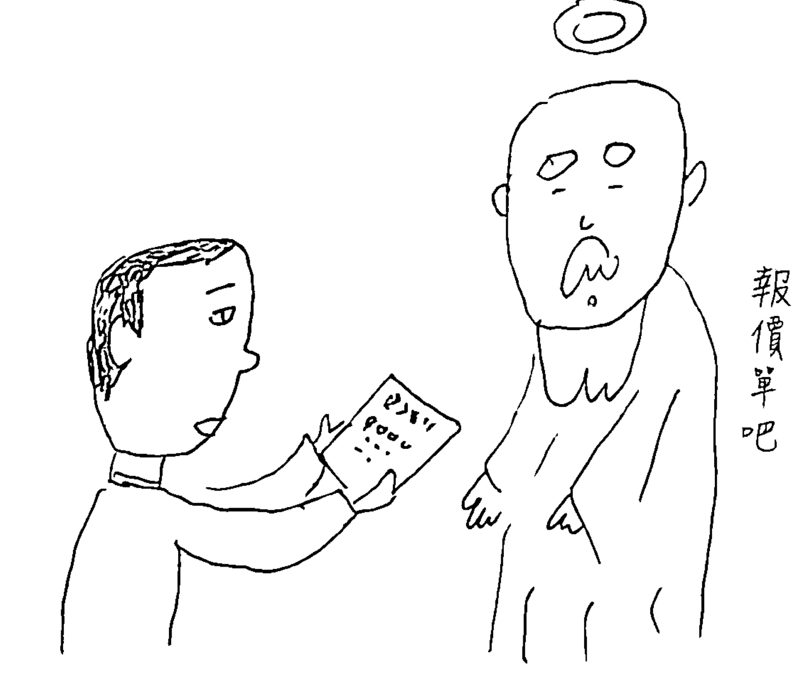

## 中樂透的人到底是運氣好？還是不好？

在神社的角落或路邊，時常能見到靜靜佇立著的地藏菩薩。每當看到地藏菩薩，就會不由自主的想要雙手合十對其膜拜。

你知道這些地藏菩薩是怎麼建成的嗎？

例如，如果有「為了交通平安，我想建立一尊地藏菩薩」的委託，雕刻師傅便會一邊祈禱著「交通平安、交通平安」一邊雕刻地藏菩薩的石像。透過這麼做，將意念灌注到地藏菩薩，就能讓這尊地藏菩薩散發出「交通平安」的意念，而對著地藏菩薩合十膜拜的人也會強化這樣的意念。因此，如果在事故頻繁的彎道放置地藏菩薩，真的有讓事故減少的效果。

也就是說，地藏菩薩的力量，只對見到祂與相信祂的人產生效果。

## ③章 人生超單純！用想的就能實現願望

另一方面，在錢之中，也蘊藏著世界各地人們的意念。有了錢卻不高興的人是不存在的，因此錢是一種蘊藏了「好想要錢～」、「只要有錢的話～」等強烈意念，且比地藏菩薩受到更多膜拜與崇敬的東西。

因此，成為有錢人並沒有什麼不好，但在獲得大筆金錢的同時，也會得到世界各地人們各式各樣的「意念」。

因為那是十分強烈的意念，如果沒有善加活用這筆錢，就會讓狀況變得十分糟糕。**例如，中了高額樂透彩金的人，我甚至認為這是受到了惡魔的挖角。**

雖然得到了鉅額的財富，卻不知道該如何使用或用在什麼地方，因而無法有效活用這筆錢的力量。導致最後只好隨意購買自己並不是那麼想要的東西，並在奢侈的生活中被錢逼得發狂，不但整個人都改變，更因此走上不幸的道路。這樣的人實際上是存在的。

反過來說，如果能活用金錢中蘊藏的強大力量，拯救他人的生命或使其變得健康也是可能的。錢，有時候甚至擁有比愛還強大的力量。

這麼想的話，事情並不是在得到大筆金錢後便告一段落。前面也提過，過度儲蓄金錢會使其能量逐漸腐爛。但如果是儲蓄著蘊藏強大意念的金錢，而不讓其發揮效用，金錢的能量不僅會漸漸開始腐爛，更會單純地將不好的事物吸引至你的身邊。

你要成為操縱錢的人，還是成為被錢操縱的人呢？如果能操縱金錢、使人生充實的人，錢就會成為實現你意念的能量。

雖然錢本身並沒有好壞之分，但現在的人類，如果不找回比錢還重要的事物並以之做為價值觀的基準，便會走向通往滅亡的道路。我認為人類能意識到這一點的時代即將到來。

# 第4章
## 有些煩惱，只要做自己就能解決

## 為何下一個男人還是無法更好？

我們常說，人類的煩惱有九成都來自於人際關係相關的問題。
職場中的上司、同事與下屬，父母、兄弟姊妹、親戚，配偶、孩子、愛人，
甚至是朋友，以及見了面就心煩的人、總是起衝突的人、無論如何都無法接納的人和光是看到臉就想避而不見的人……在你身邊也有像這樣的人嗎？
就算有，那也不算是一件壞事。
如果可以，我們都希望被自己喜歡的人圍繞，並在舒適的人際關係中工作與生活。但是，現實卻不盡如人意。你也是這麼認為的吧？

**你的身邊如果有讓你覺得「有點討厭」的人存在，原因其實是出在你自己身上。**
如果說是你將這些人「吸引過來」的，你一定很驚訝吧。
存在於你心中的「原因」，即是「想得到母親的愛、想被母親認同、想獲得意念的回饋」等，從嬰兒時期開始便擁有的生理需求，但並未獲得滿足的緣故。

## ④章 有些煩惱，只要做自己就能解決

「咦咦！要追溯到嬰兒時期嗎？！」
這樣驚叫出聲的你別驚訝。人際關係不順遂的原因，正是要追溯到嬰兒時期至幼童期這段時間。

「想獲得媽媽的愛、想被媽媽抱著、想被媽媽注視著」這樣的需求任誰都有。並且，因為屬於一種生理需求，和「食慾」、「睡眠慾」、「性慾」相同，都是理所當然的需求，而且是建立與人往來所需之「關心」的重要根本。

這對人類來說，是至關重要的事物。一旦陷入「最喜歡媽媽了」的生理需求，在滿足這項需求之外，也會反過來在得不到關心時，體會當下感受到的寂寞與孤獨感，並因此了解心意相通的重要性與愛情的美好。在活著之餘，更能將「羈絆才是最重要的事物」這件事，深深銘記於自己的心中。

前面曾經提過，要在這個世界上活著，暫時忘記自己身為神明的事實，做為人類腳踏實地生活是十分重要的。神明的世界隨時都充滿著百分之百的愛，因此生活於其中，是無法了解「愛的重要性」的。

此時，我們便會陷入「最喜歡媽媽了」的生理需求之中。於是，媽媽因為忙碌而無法顧及我們的心情，或是為了照顧兄弟姊妹分身乏術而未將眼光投向自己時，我們便能透過面對這些狀況，體驗感受不到愛時的寂寞心情。如此一來，就能透過體會理解身為神明時無法得知的心情，再次回想起愛的重要，進而想締結真正的羈絆與愛情。

為什麼「得到關愛」、「得到認同」、「被喜歡」的需求對象是母親呢？那是因為，**孩子本身就是為了幫助母親而出出生的**。母親和孩子之間的連結非常的強。到出生前的懷胎十月之間，嬰兒會在肚子裡與媽媽的情感融為一體，體驗一切。就好像自己也是媽媽一樣，體驗著所有的一切。

**這麼說對父親不太好意思，但實際上我認為父親只不過像是母親的朋友而已**。在我出生一年左右之後，我才發現「這個人，一直跟我們住在同個屋簷下。跟媽媽的感情也很好。難道說，這個人就是父親？」僅僅是這種程度而已。很驚人吧！

## ④章 有些煩惱，只要做自己就能解決

幫助母親，指的是為了讓母親能夠了解真正的幸福，也就是說，協助母親回想起生於這個世界上的意義。
這樣的協助，因為有著乍看之下並不像是協助的行為，因此有點難以理解。
**孩子們為了讓母親回想起「真正的自我」，會故意引起一些事件。** 我們常看到，孩子在賣場為了想買自己喜歡的玩具，賴在地上哭鬧不肯起來，媽媽則因為顧忌他人的想法與顏面而未加以喝斥孩子。
不在他人面前發怒，表示母親只考慮到自己，只考慮到他人如何看待自己，這對孩子來說是不能原諒的一件事。
因此，孩子才會為了將「媽媽，這樣是不對的吧」的訊息傳達給母親，而賴在地上不斷大哭大鬧。
不過，如果無法意識到孩子的協助，反而認為「我們家的小孩怎麼這麼不聽勸呢」、「是什麼地方出問題了嗎」、「難道是教養方式錯了嗎？」怪罪孩子與自己，最後就會控制不住自己的脾氣，說出「我不記得我有生這麼任性的小孩」、「我不管你了！」等，傷害孩子的話。

孩子明明是為了幫助媽媽，嘗試引出媽媽的本質，才製造出各式各樣的事件，媽媽非但完全無法理解，也不能體會孩子的心情。對此，孩子便會逐漸產生放棄的念頭。

孩子比誰都希望媽媽能夠走在真正屬於自己的人生道路上。他們正是如此深愛著媽媽。請試著回想一下，情侶剛開始交往時的火熱目光，孩子的目光就跟那眼神完全一樣。孩子只是抱著愛媽媽的心情，想被理解、想被愛、想與媽媽四目相接，以及想讓媽媽體會自己的感覺。這點，只要看看孩子的眼眸便能了解。

沒有體會到來自母親認同的孩子，無論到了幾歲，都將無法解開自己的心鎖。因此，這樣的孩子在長大成人之後，便會有著異常的表現慾與榮譽感，並十分在意他人如何看待自己，想藉此獲得旁人的認同。

## ④章 有些煩惱，只要做自己就能解決

「為了獲得媽媽的喜愛，而認真讀書」的例子也時有所聞。如果懷著這樣的意識長大成人，就會成為「為了獲得男友的喜愛，我什麼都願意做」犧牲奉獻一切的女孩子。換句話說，其實就是透過提供對方服務、裝作好女人的樣子。因此，才會形成「這個人沒了我就不行」的狀況。

對犧牲奉獻一切的女性來說，男性越懶惰越好。為了引出自己的優點，男人越是散漫，則越能顯現自己的光彩。自己也會因為這樣，而滿足於被依賴的狀態。然而，這樣的狀況頂多只能持續一年左右。進入第二年後，便會開始對什麼都不做的對方感到煩躁。「不會自己做嗎？」、「這不是在依賴我嗎？」、「給我振作一點！」明明是扮演犧牲奉獻的女孩子起的頭，卻覺得越來越煩躁憤怒，最後因為「再也無法忍受這種人」而分手。

之後，雖然下定決心「這次一定要找個好男人」而有了新的邂逅，卻仍然不明白自己的犧牲奉獻正是讓對方變得不爭氣的主因，因此下一個交往對象也會發生同樣的情況。

明明已勾勒出自己理想情人的輪廓，最後卻仍會選擇與目標完全不同的男性，而不斷重複著這種與理想背道而馳的行為。

至今，我已經進行了無數次的諮詢，大部分的人都是被這「母親的認同」所束縛，因而產生無窮無盡的煩惱。孩提時代開始便懷抱著「想要被愛」的生理需求若未獲得滿足，便會不斷地遇到各種麻煩。

反過來說，遇到的這些麻煩，正可以說是神明為了讓一個人回想起，自己並未獲得滿足的特別安排……

## ④章 有些煩惱，只要做自己就能解決

## 如果想要活出自我，請重新審視自己的價值觀

不過這件事還有後續。畢竟，如果沒有得到母親認同的人，就只能煩惱人際關係整整一輩子，未來也未免太過黑暗。

例如就算沒有獲得母親的認同，也能透過與朋友和周遭他人的相處中，獲得來自他人的認同，也就是「互相認同」；而最後也能獲得自己的「自我認同」，這也是可行的。

但是，為了能夠達成這些目標，做到「親切」十分重要。

親切？？

是要溫柔對待別人，設身處地為人著想嗎？

不是這樣的。一般而言，親切的確有這樣的意涵，但我所說的「親切」，是如同字面上的意思「切斷與雙親之間的連結」。人都會在不知不覺間，生活在自己成長環境中理所當然的常識裡。請你一定要對這件事有著強烈的自覺。

也就是說，意識到自己活在雙親的價值觀之中，並有意識地重新審視自己的價值觀，活出屬於自己的人生才是最重要的。

對於母親，如果不將「總有一天一定會認同我」的期待歸零，就會把這份期待也帶入與他人的相處之中，進而無法看清事實的真相。

話雖如此，無論是誰都不會想討厭自己的雙親，並不斷抱持著「總有一天他們一定能夠了解我」的期待。不過，如果不把這種期待與現實分辨清楚，就無法做到真正的「親切」。因此，我時常告訴學生們，在親切的時候「請懷著如同憎恨雙親般的意念面對他們」。

## ④章 有些煩惱，只要做自己就能解決

例如，一直以某些交換條件而被愛著的人，無論何時都無法無條件地去愛自己。因此，如果不犧牲奉獻就不會被愛，不聽對方的話就不會被愛等模式才會因此建立，影響著與朋友、戀人以及夫婦之間的關係，在人與人之間製造出深深的溝壑。

這是我的一位女秘書的親身經歷。
在她出生時，沖繩還在美軍的統治之下。在美國化的環境中，大家相信為了讓孩子自立，實施嚴厲地教養非常重要。就是這樣的一個時代。她的雙親也認為這是最好的選擇，不過對她本人來說，感受到的只有嚴厲，她也因此度過了感受不到絲毫溫情的寂寞孩提時代。
她的父親是位成功的創業家，過著富裕的生活，但卻有著錢就是一切，以及男尊女卑等傲慢的想法。她的母親對此只是沉默地累積著不滿。

被這樣的雙親撫養長大的她，因為並未獲得母親的認同，而不斷談著波濤洶湧的戀愛，甚至連離婚和再婚都經歷過了。在那之後，她成為了我的祕書，並在聽了我的話之後感受到「親切」的重要與分量，進而下定決心要重新檢視並改變自己的價值觀。在她下定決心的那一天，發生了一件事。

當她回到家時，兩代同堂的兩戶住宅中，從雙親的房子那邊傳來了父親的怒吼聲。

「就算沒有妳我也活得下去。老婆的代替品，只要有錢，要多少有多少。只要有錢，吃飯、生活都不成問題。妳以為妳是靠誰才有今天啊！」

她的母親對於這些話充耳不聞，擺出一副鄙夷的態度。而她則無法原諒父親，忍不住說道：

「爸，說這種話不覺得奇怪嗎？只把媽當成傭人，太沒禮貌了。」

她的話打斷了父親的怒吼，父親則回道：

「只不過是個孩子，說話還敢這麼囂張。」

## ④章 有些煩惱，只要做自己就能解決

並帶著怒不可遏的表情打了她一巴掌。但她仍然毫不畏懼，
「爸，就算你打我，奇怪的事還是奇怪的事啊。我是不會原諒你把媽看得比傭人還不如的！」
繼續回嘴，這次父親生氣地揪起她胸前的衣服。她 4 歲的女兒看到之後，
「爺爺，很奇怪，你錯了！」
一邊這麼說著，一邊站到了她與父親之間，抓著爺爺的褲子。不過，父親手一揮，女兒便摔倒在地。這更加劇了她對父親的怒火，
「絕對不原諒你！」
說完之後，她打了父親一巴掌，便帶著女兒回到自己家中。她緊緊抱著女兒嬌小的身軀，說道「對不起，讓妳這麼害怕」，就這樣抱了好長一段時間。這時，她的母親來到她家。
她一廂情願地認為，母親一定會對自己說：「剛才真是謝謝了。為了我這樣。」但現實總是事與願違。她的母親開口便這麼說道：
「剛才妳對妳爸那是什麼態度？反抗你的父親，妳有念書嗎！」

她就像被人從頭澆了一盆冷水般，同時，接受了事實真相。她開始對不斷維護母親的自己感到生氣，「我這樣豈不是傻瓜嗎？」對母親的憤怒因此爆發，
「媽，明明是互相扶持了40年的夫妻，被當作傭人般對待，妳卻像毫無自尊一樣一臉若無其事的樣子。我和女兒為了維護妳而被打，妳也視而不見。連4歲的孫女都說出『這件事很奇怪』。媽卻只是旁觀，太差勁了！」
她說完之後，母親回應道：
「因為，因為，因為，我當時很害怕啊。妳這麼過分，傷害了我。我很害怕。」
「總是這樣把錯怪到其他人的頭上。真是差勁透了，只想著要保護自己。」
當下，她終於看清自幼便隱約感覺到的母親態度，以及遇到事情時只會推卸責任、保護自己的行為。「無論如何，雙親是不可能了解我」的想法鮮明地浮現在她的腦海中，終於讓她醒悟。而一直以來對母親所寄予的期待情感，也在那個瞬間剝落瓦解。

## ④章 有些煩惱，只要做自己就能解決

## 是否在不知不覺間照著「別人的價值觀」活著呢？

雖然十分恐怖的再次經歷幼時悲慘又孤獨的情感，但是將那些情感置之不理的，很明顯地也是她自己。透過牢記這樣的糾葛、接受這些情感，她終於發現，自己一直以來都穿著名為「母親價值觀」的貼身潛水服。

透過「親切」她所看見的，即是母親其實就是她內心的投影。因為在不受母親關注之下而生，「我不可能無條件地被愛」、「反正沒有人能理解我」等的內心渴望，直到長大成人都無法被滿足，她才發現自己「為了被愛」、「為了被理解」，創造出許多不同的自我。

她開始回想時至今日發生過的許多事件與場面，並在紙上寫出當下雙親的言行及自己的言行等。透過像這樣重新審視親子之間的價值觀，她終於能夠做到追求了數十年的目標——「無條件地愛著自己」，這也代表著她與自我之間終於建立起了羈絆。

就像這樣，進行「親切」行為，對於能活得像自己來說十分重要。無論是誰，都想相信自己的母親，並認為母親是一直愛著自己的。然而，如果一直懷抱著這種感覺，將永遠無法自雙親的價值觀中掙脫。當然也不可能過著自己所期望的人生。

雙親的優點當然要好好繼承，但雙親令人討厭的部分是什麼呢？如果是自己的話又會怎麼做？這些都要好好地重新審視，並與雙親的價值觀清楚區隔。透過這樣的作業程序（比起在心裡想，用紙筆寫下來會更有效果），時至今日都沒有感覺的心也會開始運作。

當心靈開始運作，就能從被動的生活方式，轉變為遵循自我的生活方式。如此一來，自己也能認同自己，也因此能從獲取認同的遊戲中畢業。

事實上，這位女性秘書的案例中，在進行「親切」之後，她透過改變自己的價值觀，使蠻橫的父親也做出了改變。

## ④章 有些煩惱，只要做自己就能解決

父親不但成為「跟孫子三代同堂和樂融融一直是我的夢想，真是謝謝妳」這樣通情達理的個性，與有著許多歧見的母親之間也開始會互相擁抱，並坦率地與對方相處。

對於生下自己的雙親，會有感激之意是理所當然的。但在這之外，為了不被雙親的價值觀束縛，並過著自己想要的生活，對於「爸爸的這些習慣很討厭」、「媽媽這樣的想法很奇怪」等部分，要在心中明確地劃清一條界線。如此一來，就能告別被「母親的認同」操弄的人生。而「親切」這件事也沒有對母親本人說明的必要，在自己心中默默進行即可。不過，「劃清界線」這一步，與「做為真正的自我而活」有著十分緊密的關聯。

**讓存在於心中的真正自我活過來，就是解決所有問題的基礎。** 所謂存在於心中的真正自我，換句話說，就是一邊感受著存在於內心的「神」，一邊好好活著這件事。

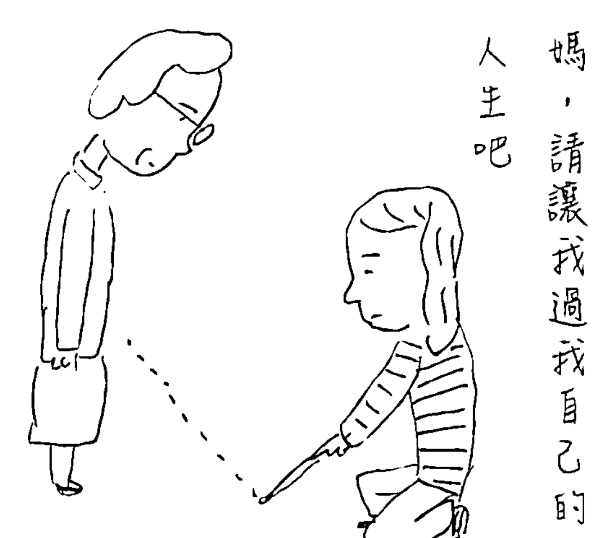

媽，請讓我過我自己的人生吧

## 你真的「感受得到」嗎？

表現出自己的情感十分重要。或笑，或哭，有時也會發怒，情感正是一個人的原動力。如果壓抑情感必定會帶來壞處。在本書的開頭我便如此說過。

不過，本來就無法實際感受到「情感湧上來」的人，也是存在的。在你心中，情感能夠確實地湧上來嗎？

無法表現出自身情感的人，其實是「感受不到」情感的，也就是「無感症」。由於心靈長期處在沒有躍動的狀態，五感也變得十分遲鈍。

例如，假設今天有個孩子在路邊看到漂亮的花時，會抱著「想讓媽媽也看看」的純粹想法，把花朵摘下來帶回家。然而，媽媽通常會說：「不可以攀折花木！」一未探究小孩心思，直接把孩子罵一頓。如果心靈沒有在活動，是無法體會孩子們的心情的。

## ④章 有些煩惱，只要做自己就能解決

像這樣，無法感受到情感，就算有人為自己做了周到的考慮與準備，並投以溫暖的眼神，我們也無法感受到，而對這些東西視若無睹。
為什麼會成為「無感症」，原因便是先前曾經提過的，陷入了母親認同的問題之中。因為「想獲得母親的愛」的心情並未獲得滿足，感覺能力也因此未正常地發展。不清楚這一點，而置無感症於不顧，就會傷害到周圍的人，封閉自己的世界並將心扉緊緊地關上。

我在沖繩有一位女性學生，就算用手觸摸，她也無法分辨塑膠杯和玻璃杯的差別。

這位女性是一名助產士，雖然對嬰兒的知識瞭若指掌，卻在自己的女兒出生後，抱著女兒時感覺十分浮躁，而想趕快將孩子放回床上。不明就裡的她前來找我進行諮詢。

心會浮躁的原因，在於孩提時代，她的母親幾乎未與她有任何肌膚接觸或眼神交會，讓她在被放棄的狀態下成長。因此，就算她想擁抱自己的小孩，卻因為自己沒有被母親抱過，透過孩子使得過去的憤怒浮現出來。

我問這位學生，「在妳小時候，曾經有什麼快樂、感動或悲傷，觸動妳心弦的記憶嗎？」而她卻回答：「什麼都沒有。就像是一直被包在糯米紙裡面一樣的感覺」。

人生有一半都處於家裡蹲的狀態，既沒有朋友，從學校回來之後也一直把自己關在房間裡，完全不與別人交流。她似乎活在這樣的封閉世界之中。

由於未曾感受過母親的凝視，肌膚接觸的回憶也寥寥無幾，因此她的感覺並沒有成長。

當時，我為了讓她體會「感受」這件事到底有著什麼樣的感覺，便代替她的母親，握住她的手並與之擁抱。因為藉由重複這樣的動作，可以培養產生「好溫暖啊」、「真令人安心啊」、「真舒服啊」等感覺。

某一天，她突然說：「我終於感受到老師您的溫暖了！雖然我從來沒有體會過，但我感受到了。」並開始嚎啕大哭。

這就是她的「生命革命」。

好像感受的到般地活著，事實上卻什麼也感受不到。不過，正因為現在第一次能夠成功感受，也更能意識到無法感受的那個自己。她在此時此刻，才真實感覺到自己真的活著。

透過各種不同場景，不斷有意識地反覆感受自我的同時，包在她身邊的糯米紙也逐漸被剝下，她也逐漸養成用心去看、去感受事物的習慣。

她在這樣的狀態下，開始與自己的女兒相處，也發生了驚人的變化。過去離不開她身邊的女兒，現在已經完全不再怕生，不管是哪個大人抱她都能接受，成為了一個每天都帶著滿臉笑容的孩子。

為了讓心靈開始運作，只要能感受到「好溫暖、好幸福」等舒適的情緒即可。因為這些舒適的情緒，正與信賴感、安心感以及親近感有著緊密連結。

## 時時向自己提問，活出不後悔的人生

一定有很多人會在對方不按照自己期待行動，或是面對惱人的話語時，怒氣馬上湧上心頭吧。

就算想著「希望自己成為不會生氣的人」，但在怒氣來襲時，往往會懷抱著對對方的不滿，像是「錯的是那個人」、「明明如果不是他，我也不會這麼生氣」一般怪罪別人，並封閉自己的內心。

像這樣，人總是會想只要對象換了人，或是從別的方向來尋求答案。但遺憾的是，只要是停留在這樣的思考氛圍中，任何事都不會改變。因為，自己的情緒其實是隨著對象不同而改變的。如果對象是自己中意的人，或是能夠理解自己的人，我們就不會生氣；反之就會發怒。而這樣隨著對象的不同，不斷轉變自身情緒，完全就是失去主體性的狀態。

若要成為不隨著對象態度而受影響的自己，該怎麼做才好呢？我們應該要問自己「為什麼會對那個對象有所反映呢？」因為，所有湧出的情感都是具有目的性的。

假設，現在湧上了「看到假日睡懶覺的老公我就火大。至少也幫我照顧一下孩子吧」的情感。這時，我們便該問自己「為什麼我會這麼火大呢？」

接下來，我們就能夠意識到自己心中真正的想法「我也想至少在假日好好休息一下啊。平常因為老公回來得晚，都是我一個人打點家事和照顧小孩。老公在的時候，至少希望早上能睡得久一點。」

意識到心中真正的想法之後，再坦率地傳達給對方知道就一切OK。

「平常一個人做家事和帶小孩好累喔，我偶爾也想在假日好好睡一覺」

聽到之後，相信沒有老公會回答「不要」吧。一定都會爽快地答應「這樣的話，換我來帶小孩，妳就好好睡吧」不是嗎？

就像這樣，所有的感情都是有目的性的，而且本來就是引起情緒變化的原因。感情的功能，就像是為了使我們意識到「自己真正的想法」，取回原本自我本質的導航系統。「感情用事」、「被情感操弄」或許會給人一種負面的印象，但追本溯源，一定可以在情感中找到自己真正的想法，進而回想起原本的自我。

順帶一提，如果壓抑情感，就會陷入壓抑著真正自我的狀態，一定會導致疾病的產生。從小，我就時常與老媽吵架，但我並不是因為生氣才與她吵架的。我看著不斷壓抑情感的老媽，總覺得再不幫她紓解壓力就會生病，才刻意跟她吵架。

老媽雖然只活到62歲，但假如沒有我幫她紓解壓力，大概40歲左右就離世了。不過，父親總是對我說：「就是你害你媽早死的。」

隨時保持和自己提問的態度十分重要，但難辦的地方也在於，地球人會在與自己對答的過程中頓悟。

你想想，這個地球是什麼事都能心想事成的神明，為了排遣無聊而創造的遊樂場。怒氣、悲傷和寂寞等負面情緒，通通都是遊戲的一環，假使頓悟了，遊戲也就宣告結束。

所有的人類的靈魂深處都知道這件事情。也因為如此，我們不太會面對自己。而是有著向外尋求答案的傾向。

如果想就這樣繼續這個刺激的遊戲，就持續向外提問；如果想開始為真正的自己活著，則要向自己提問。

真是的，這簡直就是——神明真是個搗·蛋·鬼～的感覺呢！

## 「面子」正是家庭失和的病根

某次，我在山梨縣演講完後，有一個家庭表示無論如何都想進行諮詢。家中30來歲的么兒因為憂鬱症而成為「家裡蹲」，希望我能幫幫他們。

一開始，我以沒有時間為由婉拒，但看到一家人大老遠從大阪跑來，窘迫地問著「30分鐘也好，拜託您幫幫忙」的樣子，我便決定在下一個行程前邊吃飯邊進行，於是開始了一次在餐廳內的諮詢。

在我面前坐著的是30來歲的憂鬱症患者，旁邊則坐著40歲左右的兄姊，還有身為建設公司董事長的父親，加上母親一共5人。

這個家庭，只要看一眼就知道家庭失和的原因在父親身上。從其他家庭成員們對父親的態度就能完全明白。

為了當場進行徹底的治療，我決定利用一下這位父親。仔細一看，還發現他的頭髮已禿得像條碼一樣。我首先詢問病人本人「今天怎麼了？」而在母親正要開口說明時，「我沒問妳！給我閉嘴，不要插話。你也是，都這個年紀了還要爸媽幫你說話，給我自己直接開口說！」

我故意演出令人懼怕的態度。之後馬上補了一句，「那邊頂上無毛的傢伙最好也給我閉嘴。禿子」意想不到的惡言，以及霸道的態度，讓雙親十分震驚。大老遠從大阪跑到山梨來找這個被稱為「老師」的人，想不到竟然是這種人！真可說是火大到了極點。不過，我透過眼角餘光，發現兄姊正坐在旁邊忍著笑。過了一陣子之後，病人終於開口說話。

「其實，我現在受憂鬱症所苦，已經5年沒工作。其中有3年不斷進出醫院，並時常需要去看診……」
他就這樣花了5分鐘說明自己的狀況，而我則是問他：
「啊，這樣啊。話說回來，你今天是來做什麼的？」
他露出了「咦？」的表情，回答道：
「啊，是，我大概5年前開始患上憂鬱症……」
就這樣重複了一次。而我又問：
「那今天到底是來做什麼的？」
這樣問他，他露出啞口無言的表情，
「所以我說過了，我5年前開始患上憂鬱症……」
又把說明重複了一次。我回道：
「我知道了。那，今天是來做什麼的？」
他的呼吸開始紊亂，說道：
「您有在聽嗎？我說我5年前開始有憂鬱症……」

又重複了一次，已經重複說明好幾次，
「所以我說，今天到底是來做什麼的？」
這次，病人終於「碰！」的一聲拍桌站起來，
「因為憂鬱症很煩惱！您有在聽嗎？」
「我有在聽喔。所以，你今天到底是來做什麼的啊？」
在我再次這樣問之後，病人也發火了，
「你要我講幾次啊！我想要回到工作崗位上！我想要重回到這個社會啊！」
這樣大吼著。
我看著他的眼睛說道：
「所以你今天是為了回到工作和社會上才來找我的囉？」
他平靜了些，說了聲「是」並點點頭。
「我只說一次喔。30年的恢復之路和3秒的恢復之路，你想選哪一個？」

病人回答我：
「我選 3 秒的。」
於是說：
「那我告訴你吧。想要回到社會上，只要回到社會上就好了。」
說完，我伸出右手大拇指，笑了一下。
看到這個景象的母親，因為怒氣而脹紅了臉。
「你知道我們多辛苦嗎？不是說了沒辦法回到社會上了嗎？就連醫生都放棄我們了……」
父親也趁勢開口：
「就算是金城老師，也要有點分寸。不要讓生病的兒子重複說同樣的話好幾次！」
以整個餐廳都能聽到的音量大吼著。這時，我眼見機不可失，
「禿子給我閉嘴！」

說完之後，坐在旁邊的兄姊已忍不住笑了出來。因為在高度緊張的氣氛之下，突然說別人是禿子，或許是已經搞不清楚怎麼一回事了吧。不過，從旁人的角度看起來，場面可是十分的慘烈。而且因為是在餐廳裡，當然還有其他用餐的客人。我們這桌有大聲怒吼的人，還有捧腹大笑的人，周圍的人應該都有點嚇到了吧。

這時候，我首度露出認真的表情，開始說話。

「首先，說是要治好憂鬱症，但如果不是憂鬱症，我也無法醫治。你得的並不是憂鬱症。我不知道醫生是怎麼和你們說的，不過憂鬱症患者是無法展現出自身情感的。他們的情感起伏無法傳達到神經，因此也不會生氣。讓你一直重複同樣的說明，就是在做這項確認。也就是說，如果不是憂鬱症，吃憂鬱症的藥也沒有用。因此，如果不以『不是憂鬱症』為前提來諮詢，是無法康復的。」

在我說完之後，父親說了：

「不是憂鬱症的話，那是什麼！我沒辦法忍受這傢伙了！我要走了！」

說完便起身離席，我也立刻離開座位追了上去。追到父親後，我對他說：「這位爸爸，說得明白一點，他會有這些症狀的原因其實是因為你，你相信嗎？你是要守著自己身為董事長和老爸的面子，還是真的想救自己的兒子呢？是哪一邊？是要拋開自尊，還是要死要面子，請做個決定吧。如果你能拋開自尊，真心想救兒子，我立刻把他救回來。」對於我所說的話，父親露出恍然大悟的表情，「你是有把握才這麼做的嗎？」這麼問道。我則回答：「當然如此。」「我要把你的面子在兒子面前一舉打碎，請你好好配合我。我在大家面前會對你多少有些輕視，希望你能忍耐下來。」我這麼說道。「我了解。」在獲得父親的承諾後，我們便分別回到座位上。

在那之後，我就像沒事一樣地問兒子問題，而只要父親想要開口說話，我就會用「禿子給我閉嘴」或是「雖然毛也很少，但心裡面的導火線果然也很短啊」等來吐槽他。

在我侮辱父親的時候，兄姊們總是會露出笑容。而我侮辱父親的理由，便在於故意透過高姿態來對待父親，藉以消除兒子從小不斷被父親訓斥「你什麼都做不好」而造成的內心壓抑，並緩解他的緊張感。緊張感如果無法獲得緩解，不管說什麼他都聽不進去。因此，乍聽之下像在胡鬧的對話，對我來說其實是有十分重大的意義。

不出我所料，兒子逐漸吐露心聲，最後甚至說出「都是爸爸的不好」。父親聽到之後本來想發作，但總算擠出一句「爸爸也這麼覺得……」。

聽到這句話的瞬間，全家人都露出「咦？」的驚訝表情。兒子似乎也十分焦急，說著「我也沒有想要貶低爸爸到那種地步的意思」態度跟著軟化下來，因此我馬上插話說道：「傻瓜，反正你老爸頭毛和腦漿都不足，想說什麼就說。」

兒子便接著說了下去：
「我為了要讓爸爸認同自己，努力地想做好每一件事。大學也是爸爸叫我去念，我才去念的。我明明對爸爸的話照單全收，為什麼還是變成這樣！我想像我這種人還是去死比較好。」
於是，下個瞬間，父親馬上說道：
「如果真的能重來，爸爸想跟你道歉，然後全部重新來過。爸爸真的對不起你。只要你能健健康康的，就是爸爸最大的幸福了，今後希望你能照著自己認為幸福的方式生活下去。」
父親一邊道歉，眼眶一邊噙滿了淚水。
在那之後，兒子把從醫院拿到的憂鬱症藥物通通丟掉，暫時先試著在父親的建設公司任職。由於身體許久沒有活動的關係，就算不吃安眠藥也睡得很好。此後，憂鬱症的症狀便未再出現，也找回了以前那個充滿活力的自己。
就像這次諮詢的父親一樣，許多人為了面子，反而讓人際關係惡化。為了守護面子，卻無法守護自己的家庭或周遭的人，這種悲慘的狀況至今仍不斷發生。

要犧牲自己的面子是一件頗為困難的事。面對對方持續不斷的高壓態度，自己的情感相對也會受到壓抑，因而漸漸無法了解真正的想法。在這種時候，展露自己的情感更是重要。請各位務必記得，情感一定會伴隨著所有我們真正的想法出現。

藉由展現自己的情感並互相激盪，就能明白自己對什麼事情會產生怒意，而在什麼樣的情況下又會產生多少情感，進而昇華情感、觸及自己真正的想法。如果能成功從中將之抽取出來，就能了解自己真正的想法。大部分的人讓不必要的情感過於激動，因而無法了解真正的想法。所以我透過故意惹對方生氣，一點一點去除不必要的情感，也是引出真正想法所需要的手段。

不感情用事的人才是成熟的大人，請不要被這個社會的常識所迷惑，好好使用自己的情感。如果能理解自己的情感，就能知道自己到底想要做什麼。因為，情感就恰似人生的「指南針」。

## 遇見「讓自己無比幸福的人」的絕對法則

我在高中進行演講時，曾有一位高一的女學生問我這樣的問題。「選擇什麼樣的男人，才會獲得幸福呢？」

當時，我對她這麼說：

> 「在回答妳的問題前，先讓我來問個問題。
① 薔薇和百合，妳收到哪一種花會比較高興呢？
② 約會是去兜風好呢？還是去吃飯好呢？
③ 妳比較想跟男朋友去看電影，還是去美術館？」

為什麼我會問這些問題呢？因為答不出這些問題的女性，世界上也不會有男性能讓她們幸福的。

畢竟，如果問妳「薔薇和百合，妳喜歡哪一種？」卻得到「嗯～因為我都很喜歡，所以你挑就好」的回答，決定要選擇哪一種當作禮物一定很困擾吧。

不過，如果馬上回答「薔薇」，就會知道只要買能讓妳開心的薔薇就好，妳也能立刻感受到幸福。

**我想說的是「請先好好了解自己是哪種人」這件事。** 自己喜歡什麼？會為了什麼事而開心？要怎麼做才會感到幸福？如果知道這些答案的話，獲得幸福可說是輕而易舉。

話雖如此，大家卻都在了解自己之前，只關心什麼樣的男性才能讓自己幸福，並一味地只注意這部分。最後的結果，就是約會的邀約和行程、油錢，以及各種花費都變成由男性負責。

女性什麼都不開口說，因此男性要拼命地考慮安排各項事宜，卻還要被抱怨「如果能想個更精緻的約會行程就好了」、「想去氣氛更好的餐廳」，男性當然會頓時失去所有幹勁。這樣的女性，單純就只是個惹人厭的女人罷了。

首先，請先了解「要如何自己才會變得幸福」。這樣一來，由於也會明白什麼樣的人會讓自己變得幸福，就能夠主動去找能讓自己幸福的人。

順帶一提，就算是已經結婚的人，現在開始也還不算太遲。請妳好好地了解自己喜歡的東西以及會讓妳開心的事物，並傳達給先生知道。男性就是為了使女性變得幸福，才會待在女性身邊，因此只要是能讓妳開心的事，無論是什麼先生都會去做。例如，先生偶爾會在下班時，買一些蛋糕和甜甜圈等甜食回家對吧？

雖然可能只是一些小事，但這些都是為了想讓女性變得幸福的心意。

只會感到不滿，一直說著不希望男性去做哪些事的女性，以及具體讓男性知道自己希望他們去做哪些事的女性，兩者之間的幸福可說有著天壤之別。因此，請試著將自己喜歡什麼，或做什麼會感到快樂直接傳達給對方知道。先生一定會為了讓妳變得幸福，而全力地去實現妳所有的願望。**不會讓男性誤解而明白好懂的女性，才會獲得幸福。**

當然，這些話也一樣適用於男性身上喔。

## 男人活著，只是為了得到女性的認同嗎！？

像「我家的老公完全不會幫忙做家事和帶小孩」、「老公一點用也沒有」、「老公只要拿錢回家就好」這句話實在說得太好了啊」等，對自己的先生不滿的女性似乎為數眾多。與朋友之間的話題，總離不開對丈夫的抱怨也大有人在。

不過，明白來說，讓先生成這種「無用男」的，其實就是妳自己。因為，不對男性給予「認同」的女性，會將他的幹勁抹殺殆盡。

我曾經開辦過名為「男塾」的講座，問過參加的男性。

「你們是為了什麼活著呢？又為了什麼在努力呢？而又是為了什麼目的，想在社會上取得成功呢？」

在我這樣提問之後，

「為了名聲、為了財富、為了出人頭地。」

從各個角落傳來各式各樣的聲音。

「那又是為了什麼，而想要名聲、財富或是出人頭地呢？」

對於這個問題，全場異口同聲地回答：

「為了讓家人能夠幸福。」

接下來，

「家人指的是誰呢？」

我繼續這麼問，

「老婆」

大家回答道。沒錯，就是把老公批評得一文不值的老婆們喔。即便如此，男性們真正的想法，仍是為了能讓老婆幸福而不斷努力著。

過去，另一半在求婚的時候，應該說過「想讓妳幸福」吧。對男人來說，這樣的誓言是永恆不變的。**就算腰圍再怎麼變大，女性還是最受男性疼愛的存在。**

也就是說，男性為了讓女性獲得幸福而不斷努力，因此女性若不以「一直以來都謝謝你了」、「為了我這麼努力，我好高興」等方式給予男性認同，就會使男性陷入不斷追求「認同」的迷惘之中。

以某對夫妻的對話為例。對於只知道工作而不顧家庭的老公，老婆說了句「離婚吧！」兩人大吵一架。在太太痛罵先生時，「那我就辭掉工作給妳看！」
先生這樣回嘴。也就是說，先生其實是為了老婆而辛勤地工作著。認為先生是因為喜歡才去工作，那就大錯特錯。老實說，男人原本就是一種不會為了自己而努力存在的。打從出生起，直到長大成人，都是為了媽媽活著；而長大成人之後，則為了太太而活著。男人就是這樣的生物。
他們非常單純。**如果認為這樣的先生很難伺候，其實這麼想的女性才是真正最難伺候的。對男人來說，重要的只有獲得「認同」而已。**
順帶一提，女性是十分堅強的生物。就算煩惱著「乾脆去死好了……」，也能在吃到好吃的蛋糕後，馬上感受到幸福，不是嗎？因此，女性自殺的人數也比男性要少得多。

即使如此，仍然選擇了自殺的女性，往往執著於某樣事物，認為「只有靠這個才能獲得幸福」。如果能讓自己感到幸福的事物極端地少，在失去那些事物後也就失去了希望，走上自殺一途也是有可能的。不過，大部分的時候，蛋糕不行的話就吃冰淇淋，冰淇淋不行的話就吃聖代，聖代也不行的話就吃餅乾，對女性來說，能讓自己感到滿足的東西多到不勝枚舉。

男性會買花，也是為了送給女性當作禮物。男性是不會為了自己買花的。由這層意思來看，花店和蛋糕店對男性來說，其實都是為了女性而存在的。

會讓女性感到幸福的物質非常多。但是能讓男性感到幸福的，卻只有「女性的認同」，這是千真萬確的。

因此，希望太太們都能「一點一滴的改變，用「真厲害」、「不愧是你」、「謝謝你」等詞句來代替對先生們的抱怨與嘮叨。獲得來自老婆認同的男性們，為了讓妻子能夠幸福，不僅會更加認真工作，也會在各方面都有所提升。

## 有些煩惱，只要做自己就能解決

### 找到自己的幸福態度

近年來，孩童們因為受到霸凌而自殺的新聞越來越多，甚至連大人的社會中都出現了霸凌事件。職權騷擾（Power Harassment）等成為社會問題的同時，受到欺壓而罹患憂鬱症無法工作也都時有所聞。在這種時候，人們會喪失自信，憎恨著霸凌的兇手，不斷墜入負面的深淵之中。

不過，就連晦暗的霸凌事件，也能透過改變自己的角度而使看法有180度的大轉變。

這是我小學四年級時發生的事。我本來就是時常被霸凌的孩子，但是某一天，我與一個唐氏症的孩子一起被霸凌集團關在體育館的廁所裡，他們甚至還用勺子朝我們丟大便。

當時，有著讓唐氏症的孩子進入普通學校、和大家共同生活的課程大綱，但他所受到的欺凌實在太過慘烈，伸出援手的我也成為被霸凌的對象之一。

我們倆全身沾滿大便，就連平時都未曾真的生氣的我，也憤怒到了極點，想著「這種事情，是絕對不能對別人做的吧！」帶著要掐住對方脖子的氣勢，往丟大便的孩子面前衝過去。

就在這個瞬間，唐氏症的孩子說：

> 「大便，臭臭」

帶著滿臉的笑容對我說了這句話。看著他，我才發現自己是多麼渺小。因為他絲毫不在意全身沾滿大便，依然十分開心。

霸凌我們的孩子，就是為了要讓我們不高興才這麼做的，唐氏症的孩子卻好像覺得很有趣而十分快樂的樣子。當我的意識與他的意識連結，我才發現他心中完全不存在一絲惡意，彷彿是觀世音菩薩般的神聖存在。

在那個瞬間，我馬上轉換了心情，與唐氏症的孩子一起，

> 「臭臭，臭臭」

就這麼喧鬧著。霸凌我們的孩子們大吃一驚，大家都發出「咦？」的聲音，

於是我便說：

「大便人，一號誕生！」

一邊擺出了帥氣的姿勢，而唐氏症的孩子也跟著一起，

「大便人，二號！」

這麼說道。我並對他說，

「我們大便戰隊，今天要打倒那些傢伙。明白了嗎！」

之後，我們便朝向逃開的霸凌集團的孩子們猛衝，並追趕著他們，把剛才朝我們丟大便的孩子逼到了體育館的角落。霸凌的孩子說道：

「對不起」

並向我們道歉，但我回答他：

「多虧了你給我們的東西，我們才能變身成大便人。所以，我現在要任命你為大便人三號。因為我最喜歡你了。」

我一邊說著，一邊用我沾滿大便的身體，給他一個擁抱。於是，他說著，

「不要過來……」

霸凌我們的孩子開始大哭。之後，把體育館弄得滿地大便的我們被老師大罵一頓，但透過這件事，我明白**人類透過改變自己接受一件事情的方法，就能迎來完全不同的人生。**

將唐氏症的孩子編入普通班級的課程結束時，我緊緊抱著他，並對他發誓，「從你身上學到的東西，我一輩子都不會忘記喔。我會把它傳達給整個社會的」。

這個故事或許是較特殊的例子。不過，不管遇到什麼狀況，只要能讓自己變得幸福的態度面對，就能使自己變得充實。這就是唐氏症孩子教會我的事。

不管在哪裡，一定都會有霸凌別人的人。然而，與其想著這些人為什麼要這樣做，而陷入自我厭惡的情緒，不如想著去改變自己的看法，將受到的霸凌視作是一種對自己心智的磨練。如果聚焦在此，一定能成為比任何人都還堅強且溫柔的人。

### 快把會讓人生變麻煩的「少話」毛病放逐吧！

不管說什麼，反正都不會被理解……
每次提出意見都會被否定……
不想因為說出自己的看法而被討厭……
不知道該說什麼才好……
如果說錯會很丟臉……

像這樣讓自己在開口說話前就開始保持沉默，你是否有這些習慣呢？
省話而保持沉默的人，通常十分在意他人對自己的看法，進而壓抑隱藏自己的情感，最後就會認定「自己是個不會說話的人」。

不過，並不是這樣的。請你要有自覺，自己並非是「不會說話的人」，而是「不說話的人」。

會變得不會說話，是因為周圍的大人，特別是父母，並未展現對自己的理解，也不會好好跟自己說話，或是長期被父母和學校老師要求「仔細思考之後再行動」，因而養成了思考的壞習慣。

也就是說，我們是因為從小開始的習慣，才會變得這麼沉默。這意味著，如果我們能養成想到什麼就轉換成言語表達出來的習慣，就能解放沉默的自己。

在意他人如何看待自己，而不把自己的想法說出來，說得好聽是「配合他人」，但其實就是一種「輕視自己」的行為。當然，心靈便會隨之失去功能，「悲觀的想法」也會開始運作。

另一方面，為了將自己的想法表達出來，我們就會去探究自己心中真正的想法，也能誠實地面對自己。這就是做自己的基本。

如果心靈正常發揮功能，做為深度精神中樞的松果體，以及在快樂、愉悅以及點子閃過時會變得活潑的額葉，都將打開開關，使你的溝通能力更上一層樓。也就是我們所說的「樂觀的思考」正在運作的狀態。

如此一來，因為面對的是自己而非他人的意識，便不再會因為說話對象不同，而決定要沉默或是打開話匣子，進而能夠在任何狀況下，無論身處何地或與誰對話，都能輕鬆愉快地達成溝通交流的目標。

對我來說，我甚至想創立一條「禁止少話」的法條！

因為保持沉默，而使關係惡化的例子實在不勝枚舉。如果無論如何關係都會惡化，也不要保持沉默，將自己最直接的想法表達出來，一定能更接近那份意念才對。

### 只用一枝原子筆就能平息怒火的方法

社會上，動不動就生氣的人越來越多。為了枝微末節的小事發火，或是事情不如意時便感到焦躁不安。憤怒的情感會使人際關係產生裂痕，而使好不容易建立起的關係在一夕之間土崩瓦解。

憤怒的力量就是這麼強大。就像偶爾會聽到有人一怒之下衝動殺人的新聞一樣，你一定認為人類在憤怒達到頂點時，會失去對自己的控制力吧！

然而，事實並不是這樣。憤怒是可以控制的。

要如何控制憤怒呢？

在說明之前，你知道為什麼在憤怒之下，會失去判斷能力並發出怒吼、甚至亂丟東西嗎？那是因為，其實憤怒是存在於無意識的世界之中。

另一方面，憤怒和意識（有自覺的意識）是無法共存的。就像有光的地方就沒有黑暗一樣，在充滿憤怒的無意識世界中，如果隨意放進一個意識，就會使憤怒的力量立刻消失。

以前，曾有一位擔心自己一旦生氣，就無法自我控制的女性來找我諮詢。她說自己曾在夫妻吵架的過程中，失去判斷能力而亂丟東西或咬先生，有時甚至會拿起螺絲起子或原子筆刺向先生。雖然兩人已經有了小孩，但在憤怒達到頂點時，出現會想抓起孩子往地上摔的衝動，讓她十分自責。

一想到自己會傷害先生和孩子，她就覺得自己不如去死算了。「像我這種人沒有資格當母親，連當個人的資格都沒有。」她邊哭邊這麼說著。

我像平時一樣，把原子筆插在鼻孔裡聽她講話。不久後她便露出「這個人怎麼這麼胡鬧啊？他真的有在好好聽我說話嗎？」這般訝異的表情，但也在途中開始笑了起來。既然能笑得出來就沒問題。而想要更進一步的我，

「既然能用一枝原子筆讓妳笑出來，我們就用原子筆來治療吧！」

我這麼對她說。而她卻說：

「我可是會用手掐住孩子的脖子，還會拿尖銳的東西刺向我先生！一枝原子筆能做什麼呢？」

她這麼說道。對此，我回應道：

「下次再覺得生氣時就用原子筆、覺得火大時也用原子筆，無論何時覺得火大時就用原子筆，火大了就用原子筆……請妳這麼想著。在這同時，請妳在火大的時候，把原子筆咬在嘴巴裡。咬住之後，不管想到什麼都請大聲地說出來。『給我去死吧！』也好，『你好！』也可以。重要的是，一定要緊緊咬住原子筆。還有，請盡量拿貴一點的原子筆來用。」

而她在實際實踐了這個方法之後，支配全身的憤怒便因此煙消雲散，也因此得以從一直擔心著的症狀中解放。

你知道，為什麼這個方法可以治好她嗎？

那是因為我對她下了暗示。當怒意湧上，「火大的時候就用原子筆」就會閃過她的腦海。因此，就算發怒，原子筆也能鎖進無意識的世界。

而每當吵架而咬著原子筆時，她都想著「為什麼我要這麼生氣呢？」當這種狀況持續到第20枝原子筆時，她開始覺得咬原子筆實在是太浪費了，便選擇不再咬原子筆。

但就算如此，如果還是有一股無以名狀的強烈憤怒出現，又該怎麼辦呢？

其實「憤怒」這種感情，並不是從外部進來的。包含憤怒的各種情感，原本都存在於自己的心中，因為自己的心中有著火種，火才因此點得起來。

說到為什麼會存在「火種」，多半是由母親而來的心理陰影。不過，因為我們都很喜歡母親，並不想去討厭她。就算覺得母親很可恨，也會在無意識中想著「不能討厭母親」，進而無視自己真正的心情，將一切都正當化。

因此，一直沒有意識到自己真正的心情，一旦遇到會讓自己產生與對母親的憤怒相同情緒的人，就會把所有的憤怒發洩在那個人身上。也就是說，情感起伏越是激烈的人，往往越沒有好好釐清自己與母親之間的關係性。

如果讓心中的火種任憑自己發怒、說出「都是那傢伙的錯」、「如果那傢伙不是這種態度就好了」等的抱怨。

仔細想想，還真是一件滑稽的事呢！

其實控制自己的憤怒，並不是一件難事。我們不需要刻意去壓抑自己的情感，而應該想辦法去找出這種情感的「目的」，改變自己的視角。我們要做的並非是把情感封存起來，而是要把情感當作人生的指南針善加使用。這麼一來，對你而言，「情感」就會是一個讓你更為堅定的同伴。

## 第5章 愛自己的人，一定能變得幸福

### 生命連結著萬事萬物

討厭自己，認為自己沒有活著的價值……會這樣想的人非常多。不過，這是對生命的褻瀆。因為沒有任何一個生命能夠獨自成立。

例如，如果自己的孩子對你說：

「自己的生命，想要拿來做什麼不都是自己的自由嗎？」

你會原諒他嗎？

一定不會吧。生命是靠著愛著自己的人才能延續。並與愛著自己的人攜手並進。如果從這層涵義來思考，認為生命是自己的，所以可以為所欲為，這樣的人是絕對不存在的。

生命並不是各自獨立的個體。人的生存，一定是被某個人愛著。接受愛著自己的人的意念，代表著必須與之呼應地珍惜自己，做為生命共同體的一部分而活下去。

我明白這件事真正的意義時，是在我的第一個小孩，也就是長女出生的時候。那之前的我，總常懷抱著「就算死，也要把這件事貫徹到底！」的心情，將信念和生命看得同等重要。

但是，在我抱起孩子的瞬間，我馬上意識到「啊！我可不能死啊！」。想著「不能死去」。在當下，我的生命馬上變成了原本2倍、3倍的分量，變得十分寶貴。

不能生病，也不能受傷，更不能死去。必須守護這個孩子直到最後一刻。這麼一想，我的心中也誕生了新的生命，使我的生命更加珍貴。

在女兒成年時，我將這件事告訴她，並向她「致感謝詞」。

「謝謝妳，給了我新的生命與人生。多虧了妳的存在，我的生命才能躍進性地成長為珍貴的生命。妳在自己的生命以外，還能給予別人新的生命，是很了不起的生命呢！」

「爸爸，謝謝你！我一定會讓自己成為能向媽媽，以及自己的小孩說出這番話的人。」

女兒一邊哭，一邊對我說。

如同這樣，**生命雖然是自己的東西，但同時也是他人的一部分**。互助合作，彼此扶持並緊密連結著的，就是生命。對於透過神明巧思，而得以運作的全自動生命，我們更應該在壽終正寢的那一天前，全心全意地活著，這才是做為受著恩惠而活的人們，最基本的禮節。

### 用積極的態度，讓自己「老的有尊嚴」

「不能帶給別人困擾。」
「上了年紀之後，不能再麻煩孩子照料。」
像這樣，或許聽起來是獨立又帥氣的長者。不過，我完全不這麼覺得。或許「困擾」這個詞給人的印象不佳，才會讓人產生這種觀感，但就像前面講的一樣，人類是靠著互助合作並彼此扶持才能生存下去，這是世界的常理。如果過於在意不能造成別人的困擾，而無法開口尋求他人的幫忙，這樣的生活方式不是很悲哀嗎？

我曾經受邀到沖繩一家安養中心，看護人員希望我能以「人類力」為主題進行演講。但是，實際到達現場才發現，聽眾的平均年齡竟然高達85歲。就連身經百戰、十分習慣演講現場的我，也不知道要講什麼比較好而愣在原地。

當下，我以沖繩當地的老人家常講的話起頭，說道：「大家知道，生命就是『寶物』是什麼意思嗎？」沒想到卻在一開始，便讓老人家們群情激憤。

「我們都已經80、90歲啦。都這把年紀了，還談什麼生命就是寶物，有什麼意義嗎？我們這種生命，哪還有什麼價值！」

從這裡開始，一場白熱化的爭論就此展開。

「不對。這樣是不行的。我們永遠都不能失去生命是珍貴且有價值的想法。」

「你啊，雖然這麼說，心裡一定在可憐我們這些長壽的老人吧！」

「長壽很可憐？說這種話的人絕對不能被原諒。」

我就這樣開始和老人們吵了起來。有一位老人家，以驚人的氣勢怒吼：

「我們每天要讓人換尿布，也無法自己洗澡，吃飯也要人餵，只能在別人的照料下活著。連家人都覺得我們很礙事。一個月來看我們一、兩次就不錯了，帶著這麼沒面子的念頭長壽的活著，你哪懂我們的痛苦啊！」

對此，我這麼回答。

「你們這種想法和態度，會給年輕人帶來不好的影響喔。請照顧我、因為尿出來了所以請幫我換尿布，為什麼不能活力十足地拜託別人呢？活著是件這麼悲慘的事嗎？」

「就算你這麼說，悲慘的事情還是很悲慘啊！在這樣的安養中心心裡過著寂寞的生活，我已經不知道這樣是不是幸福了。」

因為實在是有理說不清，最後我便這麼說：

「老人啊！就請安安靜靜長壽地活著吧。別對生命抱怨東抱怨西！在依照自然的法則停止呼吸心跳那一天之前，都不要亂要求要死還是要活，只要懷著感恩的心活著就好了。如果不了解這一點，就違反了身為人類的道理。

你們對於越是覺得照顧老人麻煩的人，越要拜託他們來照顧你們。所謂的『老人家』光是活著就能讓人聚集在自己身邊。就算跟兄弟姊妹或堂表兄弟姊妹沒什麼往來，只要爺爺奶奶還活著，和親戚們見面的機會也會跟著增加。家人齊聚一堂的機會也會變多。所以，就算需要看護，甚至只能躺在床上，老人光是活著，就是對年輕人的一種貢獻。聽到沒，明天開始就不要再認為自己是個麻煩，給在上班的兒子打通電話，跟他說：『我好像要死了，快來安養中心一趟。』叫他過來。當他趕來之後，再跟他說：『幫我買瓶可樂。』這樣的老人家很難搞吧！讓孩子疲於奔命，增加他們的工作量。然後好好的活下去。教會他們這件事就是老人的工作！不這樣的話，就只是單純在燒錢而已。」

我說完之後，連不良於行坐著輪椅的爺爺、奶奶們，都一起站起來拍手，一邊流著眼淚，一邊說著：

「小哥，說得太好了，真謝謝你。你明天要不要再來啊！你想講的事，我們都明白了。所以我們會好好長壽地活著的。」

在離開前，我一一確認並告訴他們：「你要長壽的活著喔！」而全體老人們也都對我說：「我們會活下去！」

如果相信「不要帶給別人困擾」的教誨，那就是在進行著「努力不與人往來」。**困擾，就是要帶給別人的。在別人帶來困擾時，不認為他們真的是個麻煩的心境也很重要。**

畢竟，我們的生命根源全都一樣來自神明的能量。你的生命就是我的生命，而我的生命也是別人的生命。全部連結在一起。

### 不要小看自己！

「沒辦法，我做不到」、「我能力不夠」、「反正爸媽是不會了解我的」。像這樣，小看自己而活著的人十分眾多。

我們會縮小自己的希望或明哲保身，為了不在世事不如己意時受到傷害，以及不冒險地活著，都是因為我們太過小看自己的緣故。也就是說，人對自己的印象，僅僅局限於自己願意負擔的責任多寡。

**小看自己的人，往往都是認為「責任」是存在於外側的人。** 他們認為會受到他人評價的事物，就是自己要盡責任的事情。

例如，身為社會人士的責任、身為父母親的責任、身為妻子、丈夫的責任。不偏離社會的常識、不被別人在背後指指點點地活著，就是盡到了自己的責任，只能活在這樣的範圍之中。由於一直活在極小的價值判斷標準之中，因此也不會有什麼太特殊的體驗，人生就這樣無事而終。

然而，大家應該沒有忘記，我們就是神明這件事吧！
我們明明是神明，卻這麼小看自己，低調過活只求安心而不要有意外，這樣
活著究竟是想怎樣？

真正的責任，並不在於外側，而是「內側」，而且僅止於自己身上。連自己
身上的責任都無法擔負的人，也無法擔負其他的責任。

例如，家暴問題。近年來，老公（老婆）對老婆（老公）在肉體上、精神上
和經濟上以各種方法行使暴力，使被害人感受到生命威脅的人正日漸增加，甚至
發展成為社會問題。

這個社會思考著如何拯救家暴受害者並進行應對，但其實遭受家暴的人身
上，也有家暴發生的原因存在。那就是「小看自己這件事」。因為受害者的內心
深處存在著「這樣的我，被打也是沒辦法的」、「是自己不好，沒有盡到身為妻
子的責任」這樣的想法。這麼講或許有些嚴厲，但如果繼續存在這樣的想法，無
論何時家暴都是不會停止的。

為了不被暴力對待，該怎麼辦才好呢？
方法就是**保有自己的尊嚴**。
「對我動手的話就離婚！你的手若敢再動一絲一毫，我就完全不會再聽你的話了！」
就是要成為能把這種話說出口的自己。把話說出口，對方就不會對你任意出手。畢竟，只要對你出手，這段關係就到此結束。
維持自己的尊嚴，選擇對自己負起責任的作法。在成為這樣的自己的同時，你也能首次從家暴的陰影中解脫。
**我們有著知道自己是誰的責任。**我把這稱為「唯一的責任」。在最後臨死之際如果能留下的是「相信自己真是太好了」的自己，不是很好嗎？帶著這份美好的經驗回到神的身邊。人在相信自己可能性的同時，也會因此成長茁壯。
相信自己，對自己負責地活著。這就是愛自己的表現，也就是「自愛」。

### 你如何對待身邊的物品呢？

一個人是否有「自愛」的心，只要觀察他如何對待身邊的「物品」便一目了然。我自己是將物品擬人化，一邊與他們對話一邊與其相處，而物品也經常會回應我的意念。

以高爾夫球桿為例子。我在家裡看電視時，只要一進廣告就會馬上從球桿袋把球桿拿出來，以各種角度端視，握著握柄擺擺姿勢，節目開始後收起來放進袋子裡，等到廣告時又拿出來。我對待高爾夫球桿的態度，不知不覺中已把它當作情人來對待。

看到這樣的景象，孩子們和老婆都會哧哧竊笑，

> 「爸爸，對球桿來說太害羞了啦，它已經很害羞了！」

這樣對我說，我這才恍然大悟，

> 「這樣啊，以球桿的立場來說的確是害羞的不得了呢。抱歉，抱歉！」

就像這樣過著每一天。而當我把球桿放進大門旁邊的球桿袋後，這次換成無意識地拿起某雙鞋子坐到電視前。當進廣告的時候，我便開始擦起鞋子。
「這次換鞋子要害羞了。」
因為被老婆和孩子這麼取笑，我便下定決心，努力想著「要專心看電視」，
但最後卻在不知不覺中開始擦起了電視螢幕……
就像這樣，我非常珍惜身邊的物品。
前陣子，我把高爾夫球桿借給別人用，事後借的人對我說：「可以感覺到老師平常十分珍惜球桿的心情！握起來的感覺完全不一樣。」
這就是，所有事物都與自愛連結著的緣故。認為自己很重要的人，也會滿懷感激與愛情去對待他人與身邊的物品。
反觀覺得自己什麼都無所謂的人，由於對他人或物品都沒有絲毫感謝之意，便會用粗暴的態度對待他們。
你對待物品的方式，就如同你如何對待自己，本質是完全一樣的。

## ⑤章 愛自己的人，一定能變得幸福

### 我們要成為人生的演員，而非觀眾

在想著如何自愛時，首先要讓自己懷著興奮期待且享受的心情，這是非常重要的。如果自己有著正面的心理狀態，也能夠認為自己十分重要。
「興奮期待」的心情，分為思考上的與意念上的兩種。思考上的興奮期待屬於觀眾型的人，而意念上的興奮期待則屬於演員型的人。

例如，看了一部愛情電影，就算內心深受感動流下眼淚並感到十分悲傷，但在電影結束時，自己身為觀眾的任務也隨之結束。而且，因為只在思考中感到興奮期待，所以就算留下「真是一部好電影啊～」的印象，也不會想要試著將電影內容實踐在日常之中，因此現實生活也不會有任何改變。

不過，「我也想嘗試看看這樣的體驗」、「我想試著把電影裡的臺詞對男朋友說說看」，像這樣帶著當事人的意識去看電影，世界也會跟著改變。透過實際行動，由自己至今所見的世界向外踏出一步，就能體驗到全新的自我。

我在日本各地舉行多次演講，只要觀察參加者，就能將其分成會實際將我說的話付諸行動的人，以及只是將我的話做為知識學習的人。會付諸行動的人，因為他們屬於演員型，所以會一邊實踐一邊抓住那份感覺並化為己用。因此，他們改變得也很快！一個月後再見面時，有的人便已脫胎換骨、散發著奪目的光輝。

然而，抱持著獲得些知識而來聽演講的觀眾型，難得特地跑來聆聽，卻仍然不會將演講內容活用於生活中。由於只在乎知識的增加、獲得經驗，就算知識變得更為豐富，也不會有任何改變地繼續過著生活。

對我來說，大部分的人都是觀眾，旁觀著人生。如果做為演員，雖然可能會碰到許多辛苦的事，但那些經歷都能變成心靈上的糧食，而打從心底享受自己的人生。

如果只想過著小看自己的人生，當個觀眾就好了。但如果相信自己的可能性，想要獲得各式各樣的經驗，請務必成為一個演員。做為一個演員走在人生道路上時，你的心也會因為第一次體會到「意念的興奮期待」而躍動不已。

事實上，觀眾型和演員型的區別，和先前曾經說明過的悲觀腦和樂觀腦，有著直接的關係。

例如，在看完愛情電影後，想著「好想交個男朋友啊！真想跟暗戀的○○學長交往。」這時，觀眾型的人因為使用的是悲觀的想法，會開始考慮各種消除不安的對策。像是告白後如果被拒絕，以後見面時會很尷尬，或是如果學長已經有女朋友了那可是大受打擊……等，將事情想得太複雜，而難以實際付諸行動。

另一方面，演員型的人，因為是樂觀思維在發揮功能，想著「談戀愛果然不錯啊，下定決心跟暗戀的○○學長告白吧！就算被拒絕也沒關係。如果能成功交往那就太幸運了。」懷抱著希望，因而能馬上採取實際行動。

會成為觀眾型，還是演員型的人，其實取決於身體是否「醒著」。

**身體醒著，代表能夠迅速地將想到的事情化做行動，身體的反應十分靈敏。**

身體醒著的人，因為擅長用身體去掌握感覺，因此就算做毫無經驗的運動，也能快速地抓到訣竅而變得拿手。

身體的感受力比較強的人，在心中感受到興奮期待的情緒時，能夠馬上將之連結到身體，因此得以迅速地把想法化為實際行動。

### 當人生跌落谷底時，每天一定要做的一件事

這種連結心靈與身體的感覺，在孩提時代，如果與母親之間越有肌膚接觸或眼神交流，就越能獲得磨練。不過，如果是在缺乏這類經驗情況下長大成人，又該怎麼辦呢？

這時候，就要透過做家事和帶小孩等日常例行公事，把必須全力活動與使用身體這件事銘記於心。做家事和帶小孩，和身體感覺有什麼關係嗎？你可能會這麼想，但其實要達成任何目標，都要從全心全意完成身邊的小事開始著手。而一切都會在這當中的過程開始並發生。

我在剛開始從事現在的活動時，曾有一位在人際關係中受到傷害，狀況十分淒慘的女性來找我諮詢：在公司經營看似順利發展時，員工卻離她而去；提出了頗具發展性的計畫，卻與他人有很大的意見分歧；在一切終於步上軌道，想著終於可以專注於愛情時，男友在此時離她而去……

「在事情看起來很順利時，對方反而離自己而去」的情形不斷重演，讓她變得已經不知道該怎麼辦才好。就算在這樣的狀況下，仍然渴求著做點什麼讓自己能獲得幸福的她，跟在我身邊學習約有10年之久。

對於這樣的她，我要求她做的，始終只有一件事，

## 「好好洗碗」

是的，就只有這一件事。

「洗碗？這究竟跟我現在的處境有什麼關係呢？」

肯定會這麼想吧。

我要強調的，絕對不是把碗洗乾淨這方面的問題。帶著「盤子先生，今天也很謝謝你唷」這樣的心情，一邊感謝著餐具一邊洗碗，才是我要強調的部分。

洗碗，是只要吃飯就必須每天進行的家事，就是重複著理所當然的單純動作。但如果連這些日常小事都做不好，讓自己處在一種不穩定的狀態中，又會如何呢？當然也就不用去想要建立良好的人際關係了。對吧？

每天，我們都能和家人一起圍繞在餐桌邊度過充實的時光，帶著笑容邊吃著自己煮的菜，邊稱讚著「真好吃」。而這背後的功臣，就是盛裝著料理、引起我們食慾的碗盤。對於這些餐具，如果我們懷抱著感謝它們擔綱要角的心情，那也一定能自然而然滿懷感激地清洗它們。

也就是說，**如果想要擁有幸福，必須先懷著感謝之意面對身邊每一件小事。**

**假使做不到這點，就不可能讓自己變得充實滿足。**

這麼想的話，其實像是家事、帶小孩等小事，都應該用感激的心情不斷堆疊。因此，在充分體會這樣的想法、每天洗碗時感到充滿幸福前，我們必須好好地面對自己。

**看一個人的洗碗方式，我就能了解他們心中抱持著怎麼樣的想法。** 對活著這件事無感激之情的人，因為洗的方式很粗魯，把碗打破的機率也比較高。他們通常不愛惜身邊的物品，對戀愛和工作也一定是草率了事。

不過，每天都懷著感謝之意生活的人，就會溫柔慎重地洗碗。順帶一提，我在沖掉盤子上的泡沫時，會問泡沫：「想要搭會咻一聲滑下去的雲霄飛車嗎？」接著打開水，唰一聲把泡沫沖掉，說著：「看吧，很好玩吧。泡沫先生，掰掰囉！」

在我的世界觀中，我想像著把對碗盤的感謝，展現給流理臺前牆壁上的觀眾們看，因此十分享受這樣的過程。年紀尚幼的孩子們，看到我這麼開心，也都想試試看而主動跑來幫忙。

如果能從身邊的小事之中，獲得並調整自己全心全意的意念，身體也會了解活動起來時的快樂，身體的感覺便能因此獲得磨練。如果能愉快地做著家事和帶小孩等事情，就能養成一具「樂此不疲的身體」。

在人生的過程中，生命並沒有任何一秒的止歇。在每一個當下，我們都離死亡越來越近，如果不將每一個瞬間都以心中的體感銘記下來，不是太可惜了嗎？

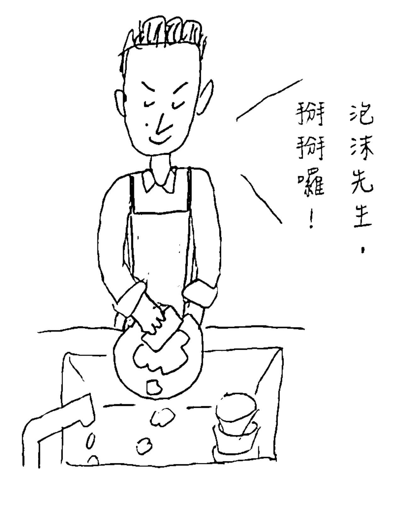

### 只有靠著「愛」才能活下去啊！

人類的本能，其實就是以「愛」為基礎的本能。也有人會說，生存本能才是真正的基礎，那是不對的。以「生存」本能為基礎的是動物，而愛才是人類的基礎本能。只要有愛，就能讓生命散發光輝。

不過，現在社會上最重視的，還是「金錢」對吧？錢為什麼被看得如此重要呢？因為大家都認為，只要有錢就能保障自己的安全並過著安心的人生。

然而，事實並非如此。就算手握大筆財富，但卻被家人、親戚和朋友棄之不顧，懷抱著痛苦活在孤獨之中的大有人在。

事實上，「只要有愛就能獲得一切保障。」人就是一種愛與被愛的存在。如果能心意相通，當你所愛的人發生什麼事的時候，你一定不會置他於不顧。在人生的旅程中，「愛」才是擁有最強大的力量。

因此，我在對企業經營者們演講時，經常都會說：「要懷著愛，進行員工教育。」但每當我這麼說，許多人總會回應我：「老師，您說的我都懂，但如果光靠愛就能活下去，我們就不用這麼辛苦啦。」此時我都會毫不猶豫地，露出驚訝的表情，

「都什麼時代了，你還在說這種話？**就是只有靠著「愛」才能活下去。**你到底在說什麼啊，這位老闆。不管在哪個時代，愛都不會退流行的。因為愛就是一切的原點。」

這樣告訴他們。

我曾經聽說過，松下集團的創業者松下幸之助，看到母親花上好幾個小時洗衣服的樣子而感到十分震驚，因此帶著「想讓媽媽輕鬆點、希望她能多休息」的想法，不斷勤奮研究而製造出洗衣機。誕生自松下幸之助的「愛的洗衣機」，至今仍然幫媽媽們減少了許多負擔。

脫胎於孩子愛心的洗衣機。與其說它是商品，不如說是因「愛」而生的好幫手。由這層意義來看，要教育各種人才，果然還是要從「愛」出發。也有人會問：「靠著愛活得下去嗎？」但其實「就是只有靠著愛才能活下去。沒有愛是萬萬不行的。」

雖然也有許多公司找我進行員工訓練的邀約，但基本上我都會一一回絕。因為，這種事絕對不能帶著高高在上的態度進行。

當然，我也希望能把想傳達的訊息傳遞給更多的人知道。但是，在我和不少公司的高階主管們聊過之後，發現他們大部分都只著眼於業績的提升，完全沒有考慮到員工們的個人事務。

以他們做為一個人類，在本質上判斷價值的基準有所偏差，無論我再怎麼強調人生中還有其他更重要的東西，也無法引起這些高階主管們的共鳴。

如果只要認真工作，拿出實際好成績的話，只要有相應的能力就能做到。不過，雖然認真工作是社會人士的本分，但如果不在個人的人際關係、家庭和育兒等個人事務上有著相同程度的體認，做為一個人類就會產生偏差。好好地在兩方面取得平衡，才能使每位員工的心靈充實，同時也讓公司中滿溢著愛，並能蓬勃地發展。

然而，現實是我費盡唇舌，還是無法讓人理解這一點。因此，我便決定專注於更需要幫助的人身上，拒絕員工訓練的邀約。

不過，有一間位於沖繩的資訊公司相當與眾不同。其實，那裡的主管是我的舊識。雖然直到國中都念同一所學校，實際上卻沒有什麼深交，交情大概只有「這麼說，好像有這個人」的程度。

長大成人後，某一次我在高爾夫練習場遇見他。在那之後，只要碰到他，他便不斷纏著我，直說：「來幫我們進行員工訓練嘛。」在一直拒絕他整整三個月之後，還是不放棄的他終於有些按捺不住，帶著認真的眼神盯著我，說道：「希望你能實際來趟公司，聽我仔細說明一下。」

在聽了他的說明之後，我認為有很多具有相同感受的部分。
「到目前為止，我安排過各式各樣的員工教育訓練。但只做了像是面對問題的解決方法等屬於表面功夫的訓練，過了一段時間員工們便會故態復萌，這是我最大的感想。我認為就算提升了業績、銷售量或提升了收益，員工的『人類力』卻仍然沒有獲得提升。因此，我希望能夠請你講一些能讓員工們覺得成為這個公司的員工真好的內容，而不是其他那樣徒具形式的講座。
我認為如果每位員工的家庭都能幸福美滿，整個公司也會自然而然變得活潑；如果大家都能為別人著想，人際關係就會變好，業績當然也因此自然地有所成長。而身為公司的上司，對員工的家庭和個人幸福等，能做的實在有限。因此，我才希望你能針對這些內容來我們公司進行培養，創造出幸福人才的教育。」
一直以來，始終婉拒進行員工訓練的我，認為如果領導人能這麼想，我有信心一定能讓公司中流動著一些溫暖。因此，在舊識的拜託之下，我便答應了這次的邀約。

因為講座是自由參加，所以第一次只來了與預期中差不多的人數。但在聽完講座的員工之間，「這些內容一定要跟全公司的同仁分享」的口耳相傳下，第二、第三次講座參加的人數越來越多，最後甚至發展成「我可以帶我妻子來聽嗎」、「先生也能一起來嗎」、「可以帶著兄弟姊妹一起來嗎」各自攜家帶眷來參加講座的狀況。

雖然是員工訓練，但我主要是以來自於親子關係的人性構造，以及感謝的真正意義等，檢視自己並了解每個人人生中的富足與生命價值為主題，對大家發表談話。

在員工訓練結束一陣子之後，生性靦腆的舊識前來拜訪，並對我說：

> 「話說回來，金城，真是多謝你啊。公司真的變得不一樣了。一直以來都很緊張的人際關係不但煙消雲散，大家甚至都變得能互相著想。更重要的是，『謝謝』成了一句隨時隨地都能聽到的話。員工們能互相著想的工作環境，可不是隨隨便便就能教出來的呢！人際關係變得融洽之後，整個公司的體質也都跟著改變了。」

這間公司，技術水準和良好的團隊合作能力頗受好評，而在口耳相傳下，現在我就算默不作聲，工作邀約也源源不絕。

不管是什麼樣的工作，最終都還是以「人」為本，也就是「互相著想」。我常常說「家庭就是社會的雛形」。如果每個人在家庭之中，都能為對方著想，進而獲得幸福，那公司一定也能因此獲得幸福，創造出正向的能量循環。

如果能以互相著想及互助合作作為基礎，無論是在家庭內外，一定也都能做到互相謙讓、彼此扶持。我認為，社會上的各種問題，只要靠著單純的「互相著想」就能獲得解決。

### 感謝是一種體悟

我們常說「心懷感謝很重要」，但如果單單只是說著「謝謝」，其實完全稱不上是真正的感謝。因為，所謂的感謝是一種「體悟」。

真正的感謝，並不是受到感動而湧出的澎湃情感，而是細水長流般漸漸體會到的一種感受。

如果想確定自己是否懷有真正的感謝，可以透過檢視心中是否毫無痛苦而得知。真的體悟到感謝之意的人，就算受了重傷需要將腳截肢，也會認為還能活著就是一種幸福。因此，對他們來說，完全沒有不幸這件事。

前面也曾經提過，在我的成長階段，每天過著被爸媽毆打責罵、被老師用棒子處罰的生活。就算想和以填鴨方式對我灌輸常識的爸媽和周圍大人們，述說自己的想法和宇宙真理，也都只會被說「腦袋有問題」，並帶到神經外科和精神病院做檢查。我就是在這樣的環境下長大的。

不過，也多虧有這樣的爸媽，我才能深刻了解到「什麼標準才是正確的」。爸媽對我來說，就是負面教材。我也因而明白人類的構造，而我的感性也因此在各方面得到磨練。

其實，我與神明之間也經常吵得不可開交，祂也會對我說一些過分的話，甚至是威脅我。現在看來，那些其實都是如父母心一般的關懷。我認為，神明應該是為了鍛鍊我，才會讓我有那些痛苦的回憶。也多虧了神明的安排，才會有現在的我。

像這樣，了解到「人生的一切，其實都是有脈絡和道理的」並且明白「心中只有感激」的同時，包含過去發生過的悲劇，全部都能轉變為「恩惠」。

「啊啊，原來是為了這個目的才發生的啊！」就像這樣。體悟到了感謝之後，不僅會對過去心懷感激，也能明白未來只會發生讓自己滿懷感恩的事。這就表示，從今以後，人生中將只有感謝。因此，才會說感謝就是一種「體悟」。

### 「做自己」就能解決一切困難

我們常會把「奉獻」看作是一種美好的行為，但如果是對不愛惜自己的人奉獻，那就單單只是自我犧牲而已。

「奉獻」指的是因為自己十分充實，因此也想讓他人充實。所以，越是犧牲奉獻就會感到幸福，是種有著成熟感覺的行為。

不過，事實上也有很多人，明明自己並不充實，卻仍然為了他人不斷犧牲奉獻。如此一來，就會變成「我明明做了這麼多付出……那個人卻一點回報都沒有的情形。這樣的行為，既不是愛更什麼都不是。

如果愛著自己，便不會在意別人如何看待自己。但如果不愛自己，就會對於對方不抱期待的態度感到不滿。

這種想法，就是因為自己並不認同自己，所以才渴望聽到「你是特別的」並得到認同。雖然嘴巴上說著喜歡為了他人犧牲奉獻，但其實只是因為自己想要被愛而已。

如果大家都能「做自己」，所有的問題都會迎刃而解。

這麼單純的道理都體會不出來的，就是我們人類。

透過這本書，我想告訴大家的是，了解「真正的自我」的重要性。「了解自己的人」指的就是仔細剖析自己，並對自己是哪種人有充分的理解，也就是愛著自己的人。因為愛著自己，所以會讓自己吃美味的食物，給予能使自己變得充實的養分，並想著要讓自己得到幸福。

真正愛著自己的人，會認為自己的存在是珍貴的。因此，對於身旁的另一半、孩子、朋友、同事和工作……等所有的一切，都會成為和自身等比例般的尊貴存在。

意識到人生的珍貴之後，所有的事物都會跟著變得有價值。因此，便不再會向他人獻媚，而能好好保持自己該有的樣貌，為自己而活。

「了解自己」其實就是察覺存在於自己內心的靈魂根源、神明的存在，並了解自己真正追求的愉悅。

在那份愉悅之中，所有的願望都能獲得實現，而被對自己的生命和人生毫不動搖的信賴感給充盈。

沒錯，不管從什麼角度切入，不管怎麼想，都是「幸福」。

了解自己，就能過著這樣的每一天。

為了能讓大家對書中想傳達的東西，有更實際的體會，最後在實踐篇中介紹一些方法給大家。請大家務必試試這些「與神明連結的小遊戲」。

### 與神明連結的小遊戲①
靠直覺挑束花，並和它對話

走趟花店，下定決心「替自己買束花」。
在花店裡眾花環繞之下，靜下心來就能聽到「欸～看看我嘛！」或是「要選就選我吧，快把我帶回家～」等，來自花朵的邀請。
不過，什麼都聽不到的時候，就抱持著「不知怎麼地，好像有點在意這束花呢」挑束有好感的花，把它買回家吧。

像這樣靠直覺挑的花，不但與你自身的能量最為契合，更能成為一面反映你內心想法的鏡子。在與花朵對話的同時，也請你試著和它談談自己的煩惱，或是傾訴心中真實的想法。
如此一來，或許你便可以感受到花朵想傳達給你的美妙訊息，不自覺的感到內心獲得了治癒。

同時，你心中的神也會感受得到「真正的自我」，並散發出幸福的波動。
最後，也別忘了要和花朵說聲「謝謝」來表達你的感激。

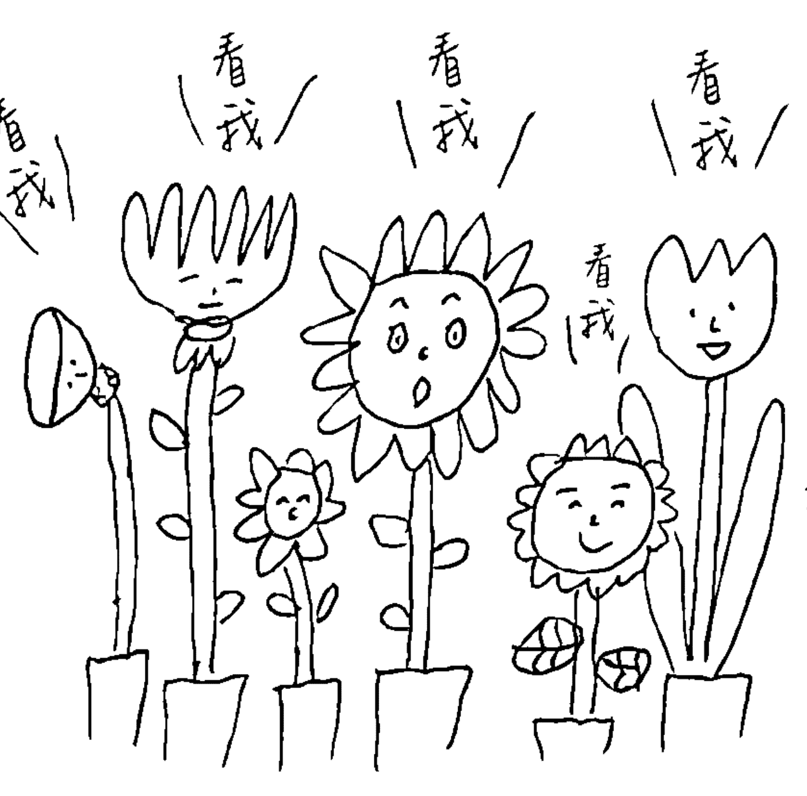

### 與神明連結的小遊戲②
花10元買份幸運

這是能夠實際體驗，自己所做的事會回歸到身上的「迴力鏢法則」的遊戲。

舉例來說，如果你想在自動販賣機買罐果汁，卻還差一個10元硬幣，只好把鈔票找開了……這樣的話，心情多少會有點憂鬱吧。如果這時候，在找零口發現了一枚10元硬幣，你一定會覺得很「Lucky」吧！

事實上，這種高興的情緒會強化自己的波動，而強化過的波動，又會吸引下一次的幸運。只要10元，就能變得如此幸運！

所以當我們在自動販賣機買東西時，都放個10元硬幣在找零口。得到那枚硬幣的人，在自己變得快樂之餘，也會將正面的情緒傳染給周遭的人，最後這份快樂就會回到我們自己的身上。

而且，只要持續進行這遊戲一段時間，就能發現你常光顧的自動販賣機，幾乎隨時都會有10元硬幣在找零口。這絕對不是不可思議的事情！因為，這就是「迴力鏢法則」。

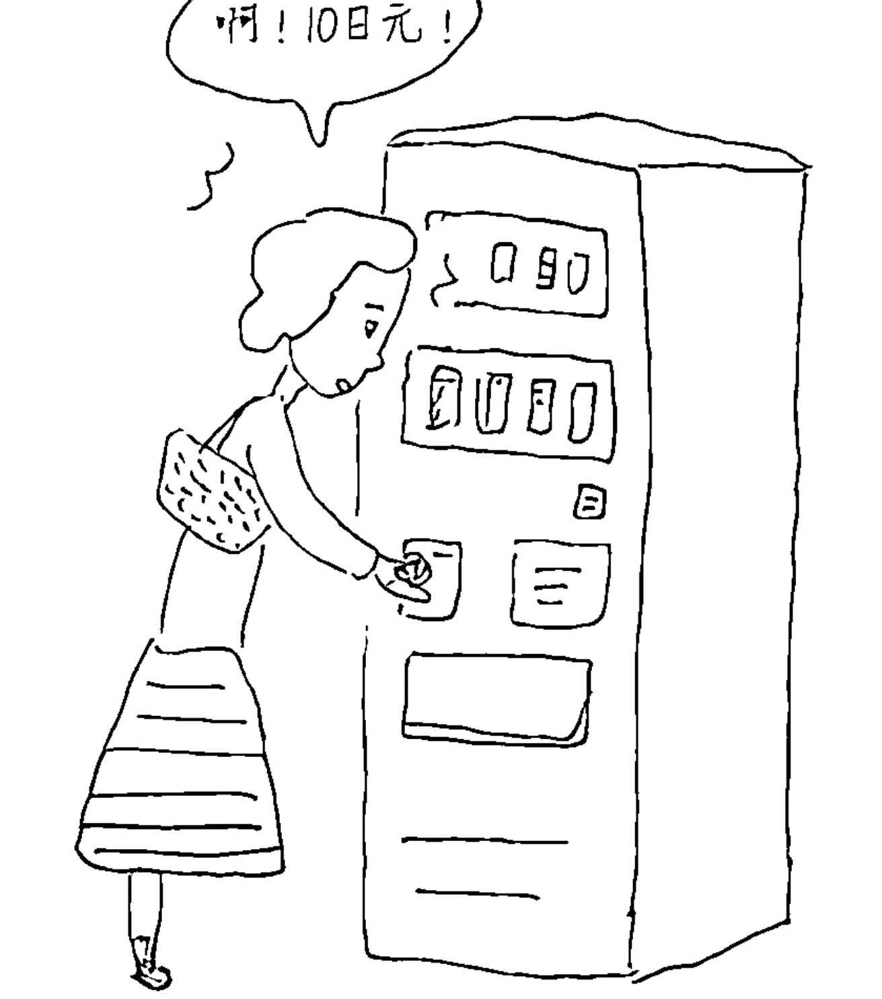

## 與神明連結的小遊戲③
輕撫並犒勞自己的衣服

我時常覺得衣服真是偉大。
因為，衣服不只像戀人一樣環繞著我們周圍，更隨時將我們抱得緊緊的，對身心來說都十分溫暖的存在。明明不會有人去抱衣服，衣服卻仍然無怨無悔地隨時環抱著我們。
如此堅毅的衣服，其實是會吸收穿的人的所有波動。如果我們覺得十分焦躁，衣服也會十分焦躁；覺得「好累啊」，衣服也會散發出「好累啊」的波動，並說著：「看，只要看看我，就能知道你今天過得怎麼樣了吧！」將你的狀態給反映出來。
因此，讓我們試著在回到家後，脫掉衣服掛上衣架時，一邊溫柔地拍拍它，一邊說：

「衣服，今天也辛苦你一整天了。真的很感謝你～這麼慰勞它。
犒勞自己的衣服，其實就等於在犒勞自己。當能夠回頭仔細檢視自己時，正代表你與神明之間建立著連結。

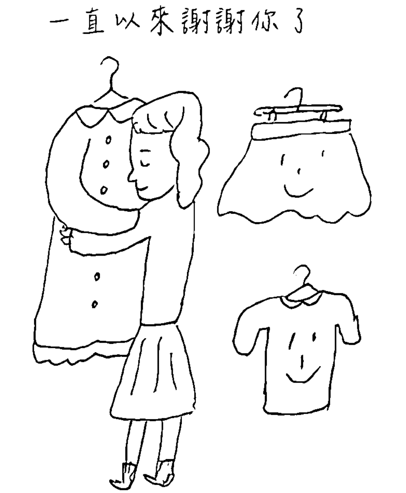

## 與神明連結的小遊戲④
在心中想一件會讓自己開心的事物

人在開心或興奮期待的時候，心靈也會跟著動起來。而當心靈運作時，任何意念都將成為現實。

為了確認這件事，我們先試著在心裡面想著一樣你現在想要擁有或有興趣的對象。例如，「紅色衣服」、「去海外工作」、「黃色進口汽車」、「摸起來很舒服的玩偶」等。重點是，不將廠牌或種類想得太過詳細。有個大概的印象就好，先選擇一樣自己喜歡的東西就對了。

再試著單純地去想「好想得到啊、好想要啊、好想知道啊」。如此一來，一天之中就能夠遇到心裡所想的東西，或聽到有關的消息好幾次，不可思議的偶然將會接踵而來。但其實這並不是偶然，而是必然。心中所想的東西都會成為現實，即是非常單純的神明法則。

在理解這件事情之後，你便能獲得更大的幸福。因為，神明的世界裡並沒有大小的概念，只有「心想事成」的準則。因此，小事若能實現，大事也必然會跟著實現。

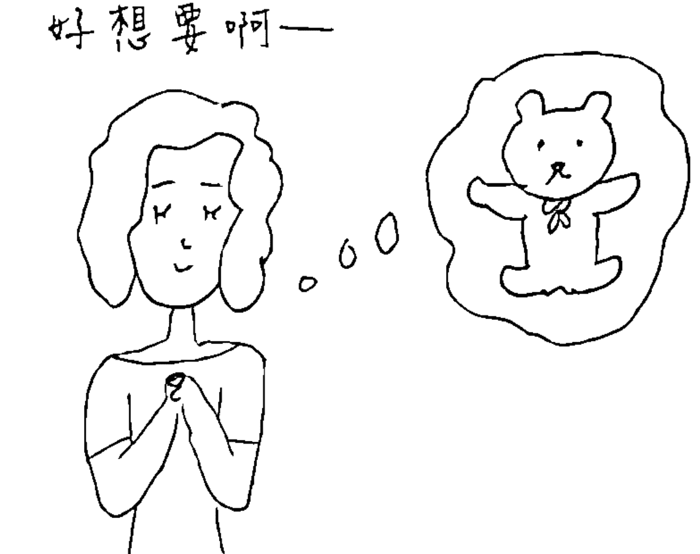

## 與神明連結的小遊戲⑤
把衛生紙摺出三角形

在上完廁所後，如果能把衛生紙摺出三角形、把拖鞋排成方便下一位使用者好穿的樣子等，對這些小地方十分重視的人，能受到神明的喜愛，而在與人往來時一定也能看透人際關係背後的真理。

因為，這些行為並不是因為有人在看才去做，而是單純地想去做而已。如果秉持著這樣的生活方式，神明必定會大加讚賞。而其他人一定也一樣。「真是個完美的人！」打動他人的心，而「這應該這樣」、「那應該這樣」等的真理一定也會漸漸來到你的心中。

不過，如果沒有上述生活的「意念」，至少可以先從反覆地行為開始做起。就算缺乏「意念」，也可以試著開始嘗試將衛生紙摺出三角形、把拖鞋排整齊等行為。

在做這些事的同時，如果能產生一些「意念」，那就再好不過了。從這層意義上來看，無論是先有「意念」還是先有「行為」，最終都能達到追求崇高生活方式的想法，神明對此十分地歡迎。

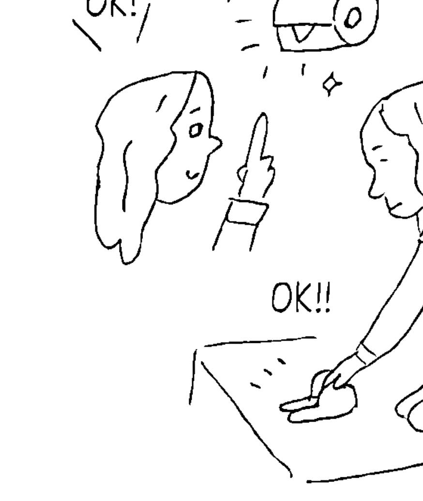

## 與神明連結的小遊戲⑥
對鈔票說聲「一路順風」

如果在付錢的時候，總是想著「又把鈔票付出去了」，將永遠都無法脫離貧困的循環，這點在書中已經提出說明。

而要怎麼做才能使自己進入富有的循環，那就是在付錢時，想著自己「得到了有價值的物品」。

為了養成這種習慣，從錢包裡面拿出鈔票或錢幣時，一定要一邊感謝自己辛苦賺來的錢，讓自己有機會得到有價值的東西，並悄悄地向錢搭話，告訴他「謝謝你，請盡情地去旅行吧」。

一旦養成了在鈔票或錢幣離開自己手上時與之對話的習慣，在付錢時便能有著富足充實的想像，便會在不知不覺間，成為受到金錢之神所喜愛的人。

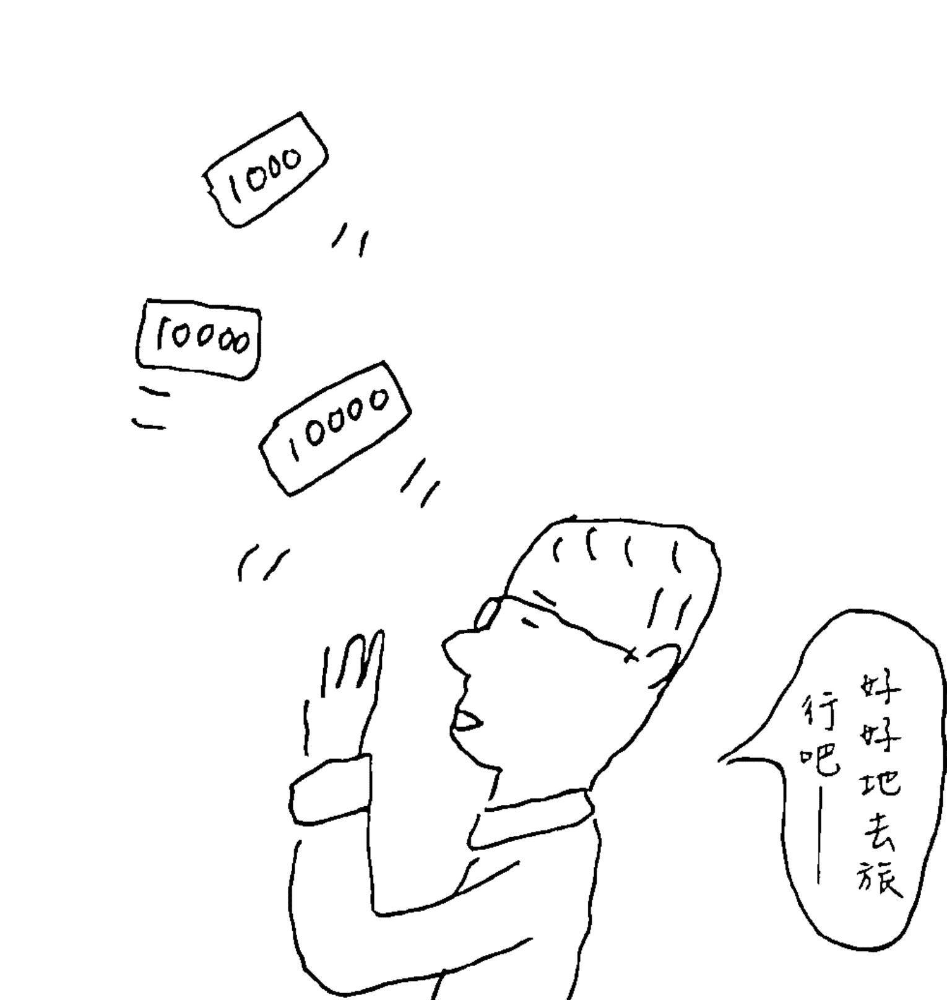

## 結語

手裡拿著這本書的你。
**你想起自己是神明分身的事了嗎？**
在讀這本書時，如果有稍微具有同感的部分，那就是你的靈魂正在共鳴的證據。你心中的神（真正的自我）正在覺醒。
如果你對從現在開始，尋找「真正的自我」的旅程感到興奮期待，那表示心中所寄宿的神，無庸置疑地就是「調皮之神」。
神明之中，也有「晦暗的神」和「開朗的神」，但在接下來的時代裡肩負重責的，毫無疑問地是開朗的神。當然，調皮之神也是隸屬於開朗之神中的一員。
「開朗的神」的時代即將來臨這件事，世界各地能感受到眼睛看不見事物的研究者們，已經透過各種不同的方式留下了記載。簡單來說，晦暗的神明們已經決定要從地球撤退了。

其實，神明的世界裡，至今都設有集合並針對不幸的人類們進行諮詢的單位，但從現在開始，即將要改成集合一邊玩樂一邊獲得幸福人類的機關。因此，對於不斷煩惱，卻不想改變自己而一味怪罪他人，或對自己及周遭的人都十分嚴厲的人，接下來的確會是比較難生存的一個時代。

而且，「拼命努力」的人，將不會獲得成功。沒錯，即將變成拼命努力反而看起來像傻瓜的時代。

「拼命努力（日文：一生懸命）」的語源，是「一所懸命」。原是打仗的武士之間的用詞，「一所」所代表的就是領地。也就是說，這是一句用來形容努力保護土地、利益與財產而賭上性命的話語。為了得到物質上的東西，竟然賭上自己的性命去保護，這簡直就是晦暗的神會做的事吧。

另一方面，「全心全意（日文：精一杯）」的人，會漸漸獲得成功。因為「精」代表的正是活力、精力等存在於生命根源的力量。因為擁有許多這樣的力量，所以代表為了讓自己感到快樂而發揮最大力量的意思。這是開朗的神十分喜歡的話語。

或許你會覺得這不過是用字遣詞上的差別而已，但是調皮又開朗的神明們完全不會使用這些晦暗的話語。如果你已經意識到自己心中存在著調皮開朗的神，應該會對這些會剝奪生命能量的晦暗話語，產生一些違和感。

從現在開始，將是歡笑招福的時代。確確實實地去享受，輕鬆愉快地讓自己變得充實的時代將要來臨。畢竟，這就是「調皮之神的守則」。

認為辛辛苦苦的人生才是人生，以依然故我的態度想要獲得幸福的人們，一定會被吐槽「還在昭和時代嗎！」而被擊沉吧。取而代之的，將會是「這傢伙，樂天又沒什麼煩惱，真好啊！」這樣令人稱羨的人受到注目的時代。

只不過，雖然說是一邊歡笑一邊快樂地獲得幸福的時代，什麼都不做而只是偷懶也是不行的。因為，「勤勉」這件事是生命本身的禮儀。

我在這裡所說的「勤勉」，並不是忍著不做自己想做的事，一本正經地活著。**而是將好好活著當作生命的全部，全心全意地投入其中。**

例如，如果知道隔天早上要去釣魚，一定會從前一天就開始保養釣竿，並把魚鉤的鉤尖磨利以便勾住魚，也會詳細調查潮汐的時間和風向，做好萬全的準備，雀躍地期待著。

就像這樣，每天的家庭生活和工作自然不在話下，而對於遊玩享樂，也快快樂樂並興奮地期待著，並且全心全意地發揮自己的最大力量，這才是「勤勉」。

只要有勤勉的心，每天快樂且雀躍地生活著，就不需要設想消除不安的對策，只需要考慮為了獲得幸福該做些什麼、該將自己的心靈調整至什麼方向。

如此，就能達到「活著真是快樂、真是有趣啊」的狀態，進而能夠第一次與調皮之神產生連結。

這麼一來，不論發生什麼事情，你都將不再恐懼。失戀、裁員、疾病或是離婚……就算人生跌落谷底，身處絕望深淵的正中央，也能感受到以快樂的享受心情面對的自己。

請你一定要和寄宿在你心中的調皮之神好好地相處。讓我們一起期待這場過去從未見過，令人興奮愉快人生的開幕吧！

最後，我想說的是，這是一本醞釀了將近20年的書。能將這本書送到期待著它誕生的各位手上，我感到十分高興。

這也要歸功於秘書小堀美奈子小姐，チア・アップ株式會社的梅木里佳小姐，サマーマーク出版社的橋口英惠小姐諸位女士們的強大信念，以及平時就支持著我的家人與工作人員、朋友們。讓我能愉快地寫出這本書的氛圍，如果也能讓各位讀者充分感受就太好了。

我十分期待這本書能傳達至尚未讀過的人手中，創造出新的邂逅。同時，也請大家務必來我的講座玩玩。

承蒙各位的閱讀，十分感謝。

金城幸政於沖繩

人類智庫 1979年2月22日 創立

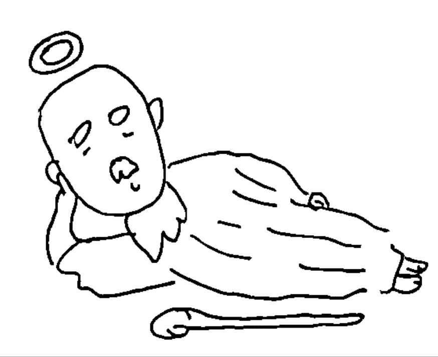

| 作 者 | 金城幸政 |
| :--- | :--- |
| 翻 譯 | 林奧倫 |
| 副 總 編 輯 | 楊美珠 |
| 責 任 編 輯 | 陳台華 |
| 日 文 校 潤 | 陳怡菁 |
| 美 術 主 編 | 張承霖 |
| 美 術 編 輯 | 林夢婷 |
| 內 文 排 版 | 菩薩蠻數位文化有限公司 |

| 發 行 人 | 桂台華 |
| :--- | :--- |
| 投 資 出 版 | 人類智庫數位科技股份有限公司 |
| 發 行 代 理 | 人類文化事業股份有限公司 |
| 人類智庫網 | www.humanbooks.com.tw |
| 公 司 地 址 | 新北市新店區民權路 115 號 5 樓 |
| 公 司 電 話 | (02)8667-2555 |
| 公 司 傳 真 | (02)2218-7222 |
| 劃 撥 帳 號 | 01649498 戶名：人類文化事業有限公司 |
| 書 店 經 銷 | 聯合發行股份有限公司 |
| 製 版 印 刷 | 群鋒印刷事業有限公司／揚昇彩色印刷股份有限公司 |

ANATA NO NAKA NO YANCHANA KAMISAMA TO TSUKIAUHOU
Copyright ©2015 Yukimasa Kinjo
All rights reserved.
Originally published in Japan by Sunmark Publishing, Inc.
Chinese (in traditional character only) translation rights arranged with
Sunmark Publishing, Inc. through CREEK & RIVER Co., Ltd.

> 著作權所有，本著作文字、圖片、版式及其他內容，未經本公司同意授權者，均不得以任何形式做全部或局部之轉載、重製、仿製、翻譯、翻印等，侵權必究。

获取更多好书，请加微信号：strcdts 店铺：http://strc.cr.cx

## 只要抓到「訣竅」，幸福就會源源不絕而來！

人生其實很簡單，金城幸政教你 3 秒快速改變人生，通往幸福之路。

- 笑口常開又有幽默感的人，才會受到神明的喜愛
- 人生有比墨守成規，更重要的事情
- 跳脫慣性思考模式，是讓你遠離不幸的開始
- 人生超單純！用「想」的就能實現願望
- 克服困難的關鍵，其實來自於「意念」，而非「思考」
- 教您遇見「讓自己無比幸福的人」的絕對法則

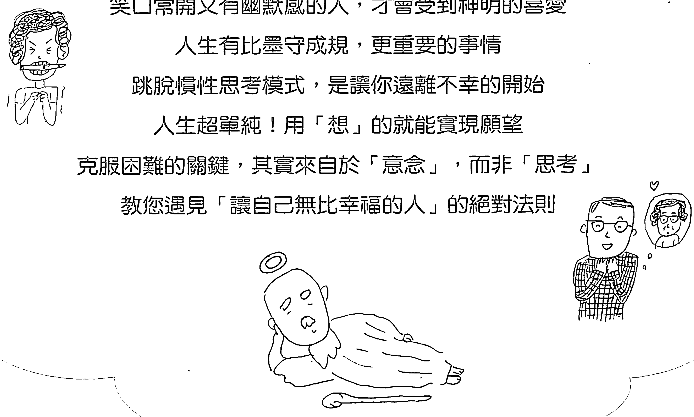

創立 1979年2月22日
人類智庫傳媒集團
www.humanbooks.com.tw
人類粉絲團網址：
http://www.facebook.com/humanbooks

| 公司品牌 | 出版類別 |
| :--- | :--- |
| 康鑑文化 | 生活保健 |
| 人類智庫 | 人文社科 |
| 人類文化 | 兒童圖書 |

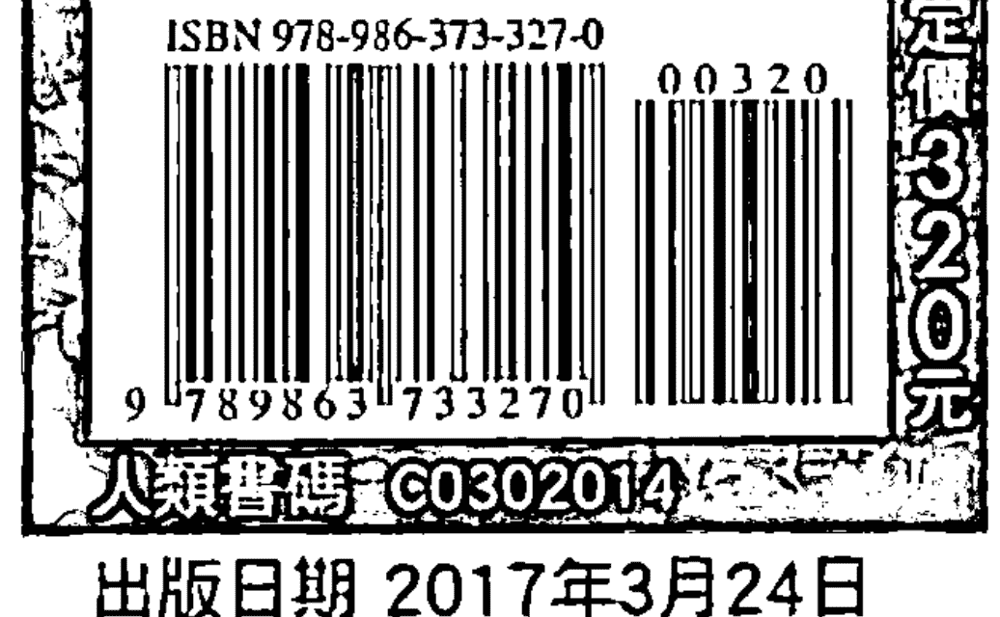

