# 与神相系的白魔女秘术

## 前言

我想應該不會有人認為，我撰寫了一本魔女與魔法相關書籍這件事，有什麼不可思議的。實際上，我透過與昴宿星人通靈，而得知我與以昴宿星為首的外星文明以及魔法世界之間，有著極其深厚的淵源。進一步說，所謂的巫術與天狼星之間也有著深厚的關聯，以「巫術主義」(Magism) 之名，從古埃及時代就廣為人知。埃及巫術的傳統基礎，據說寄寓於伊西斯 (Isis) 與歐西里斯 (Osiris) 的故事中，藏著以哈索爾 (Hathor) 為首的女神與男神的秘儀。試著探究其秘密，還能追本溯源到古代蘇美及巴比倫尼亞時代。而如果再繼續追溯，就會浮現出「亞特蘭提斯時代是地球上魔法發祥的起源」此一事實。魔法其實是亞特蘭提斯人留給未來的我們的遺產，也就是「巫術」的實踐。

這項傳統打從一開始就與以古埃及為首、地球上一切文明發源地有著深厚關聯。而「其實是外星人把這些古代文明帶來地球」的概念最近廣為世人接受。如此一來，就可以窺見其與「魔法」果然也是外星人帶來地球」的關聯性，並更進一步地發現人類至今崇拜的諸神與魔法之間的關聯性。

外星文明的特色之一 —— 「魔法知識」在文明萌芽的同時，也在地球上開花結果。到了中世紀歐洲時代，就由魔法師及魔女繼承；然而，隨著基督教的普及，這些秘儀被視為違背主的行為而被抹除，相關人士也受到嚴厲的懲罰，於是魔法師及魔女消失了蹤影，所有魔法知識遭到了封印。

我們每一個人都曾經憧憬過魔法世界。「奇蹟」也可視為魔法的一種。而且任何人都能獲得魔法。大家或許會問：「究竟要怎麼做？」而本書正是教導各位實際實踐魔法訣竅的導覽書。

人類為什麼從以前起就會受到魔法吸引呢？

那是因為我們之中的大多數人都曾是魔法師及魔女。而且曾經體驗過即使轉世投胎也不會遺忘的、不可思議而美好，並且快樂至極、充滿魅力的世界。各位忘了這件事嗎？如果說，其實你是下定「這次也要在地球上重現」的決心而投胎轉世的……那麼就差不多該認真地學習魔法，加以實踐了吧？仔細想想，「實踐魔法」是不是成為你面對任何情況的動機了呢？你想必嘗試過所謂的「吸引力法則」吧。如果能夠正確地理解並實踐這項法則，那也是魔法的一種。只不過，我們總會列舉各式各樣的理由，並自以為無法心想事成。各位是不是曾經想過「至今為止無論參加了多少工作坊或研討會，三次元依舊無法開啟，依然與魔法相距甚遠」呢？大多數人在生命當中，總會努力想獲得某些魔法。但即使擁有能維持長生不老的魔法肉體，並能成功改正自己人生中曾發生過的一切過錯，那也稱不上百分之百完全令人滿意的人生。話說回來，會注意到這類書籍，就可以證明你尚未達到自己的目標。那麼，請你務必專注心神閱讀這本書，並嘗試著確實執行書中各式各樣的魔法。首先，我會說明關於魔法最重要的重點。所謂的魔法，必須徹底對自己誠實才能獲得最棒的效果。因為魔法能夠與你如同孩童般天真無邪的一面產生共鳴！彷彿在魔法的引導下，我們正在將這個三次元，也就是物質次元導向能獲得自己所期望的現實——包括世界和平在內——的世界。每一個人才正要開始踏上成為「思考即現實」的大師之道。揚升進入高次元的附帶收穫，就是令這些事化為可能。那是個能愉快且順利地令想法化為現實的世界。太棒了！這就是魔法的世界！

相反地，如果是認為「不不不，所謂的根本就是騙小孩的伎倆，我敬謝不敏」，或是「根本不可能有這種事」的人，就請你不要開啟魔法之門，別再繼續閱讀本書。

隨著迎接二〇一七年到來，我們人類此時進入了新典範（New Paradigm）時代。已經完全進入這個時間軸而無法逆轉。各位能夠相信這件事嗎？證據就是，現在各式各樣的一切都在急劇變化。實際上，就連太陽也在急劇變化當中。從太陽照向地球的光線，性質已經確實變得跟以前不同。「這是為了讓你們的意識覺醒而發生的。」方才諸位P（與我通訊的昴宿星人們）如此補充。

最重要的是，由於太陽產生變化，使得至今為止的一切都正在變換。現在的地球可說正是進入了展開宇宙層級魔法的最棒時代；同時也來到了截至目前為止所封印住的一切都將被揭露出來的時代。

前述的「太陽變化」以及「從南極冰層底下現身地表的亞特蘭提斯時代」等重大新情報將在這個時代揭曉；不僅如此，地底人、巨人族的存在也將獲得證明；更進入了能理所當然地講述「UFO與ET接觸」、「與高次元存在溝通交流」、「在夢裡保持清醒的方法」，以及「人工智能產生的各項問題」這類事情的時代。地球此刻甚至已經進入有可能完全變成魔法之國的時代了。而關於這類課題的封印鬆動、遭到揭露一事本身，正是長達幾千年的魔法封印開始被解開的證明。實際上，在我們每個人有意識地搖身一變成為魔法師之前，我們所存在的世界甚至有可能先一步轉變成全新的世界。不可讓亞特蘭提斯時代的魔法智慧被埋沒在二十一世紀的塑膠文明垃圾之中。開啟魔法世界之門的時代終於到來了！這時候，請各位不要等待魔法從另一側到來，務必親手開啟魔法之門。請注視自古流傳至今的魔法知識，並實際嘗試看看那到底有沒有效吧。

魔法大致上可分為兩種：將內心所想化為現實的「顯現魔法」，以及反過來將內心所想或負面能量消去的「消除魔法」／「驅逐魔法」。本書將從世界上不計其數的魔法中挑選出值得期待其效果的類型，並介紹留存於古文獻中或是民間傳統文明的魔法。此外，我還會介紹幾種由昴宿星團（外星生命）直接傳授的魔法。

以上都是我實際嘗試過並確認效果值得期待的魔法，如果各位能夠從中發現有效且適合自己的魔法，請務必實踐看看。

那麼各位在聽到「魔女」或「巫術」這些詞彙時，首先浮現的是不是「恐怖」、「危險」一類的想法呢？或許不會有太好的印象。這是因為比起使用魔法，你首先考慮到的是被施法的受害者立場。或許也有相反的情況——深受魔女那充滿神秘感的魔法世界吸引，而湧現好奇心並感到興奮不已。如果是這樣，你就肯定是志願成為魔女的人沒錯。既然如此，拿起這本書對你而言，可說是一場幸運至極的邂逅，歡迎來到白魔女的世界！

開始閱讀本書的你或許會想著「我雖然對目前的生活方式並沒有不滿，但這樣下去真的好嗎？」或是「我雖然嘗試了吸引力法則，卻不太有效果，為什麼？」也不需要做任何事也無妨」。這樣當然也可以，不過你如果會覺得「我想令自己的人生過得更加積極、更具創造性、更為豐富」的話，就請繼續讀下去。然後請務必試著實踐本書的內容！這絕不是困難的方法，只不過是你至今為止完全沒想過有這種做法而已。

任何人在認真地採取行動時，都必須由衷表明自己的決心。為了像這樣將內心想法化為現實，就必須以具藝術性且具科學性的手法來驅動能量。這一點與「氣」的理論及實踐或許有重疊的部分，不過這就是魔法。但是，唯有在實踐魔法上，請以強而有力的方式追求強而有力的結果！

所謂的魔法，是為了產生特定效果，而將你本身的能量與自然界能量巧妙融合，使之產生作用的實踐以及結果。話雖如此，也不需要畏懼魔法。只要遵從特定規則，就一點也不需要感到恐懼。所謂的白魔女秘術，就是讓各位為了自己，如同玩耍般以輕鬆的心情享受的魔法。

最重要的是，魔法正是生命的存在本身，如同只靠水、陽光及土壤，就將森林裡的櫟樹果實培育成大樹那樣；你本身同樣也是降臨在這個次元的靈魂，作為嬰兒誕生，並像這樣生活至今的。如果這一點也不算魔法，那又算什麼呢？包含這類事情在內，三次元的無數現象正可稱之為奇蹟，就是鍊金術本身，也充滿了魔法。

即使如此，在我們的肉眼看不見的世界中，為了引發這類事情而確實存在著科學方程式。只要能夠理解那精巧組合的方程式，魔法就屬於你了！

# 巨石阵與雷霧

那麼，接下來首先敘述一段我實際體驗過的，所謂「消除魔法」的案例之一吧。

我與丈夫——蘇格蘭人約翰·戴拉維（Echan Deravy）從以前起就對古代遺跡或巨石文明深感興趣。因此我們倆曾經花了三十年以上的時間尋訪世界各地的遺跡。而在造訪英格蘭的某年夏天，發生了那起不可思議的事件。我們夫妻倆當時企劃了一個尋訪麥田圓及英國遺跡的工作坊，並與參加者一同造訪位於英國南部的遺跡巨石陣，進行某個實驗。據說巨石陣建造完成的時間，比吉薩金字塔還要古老。當時巨石陣並未受到嚴密保護，並不像現在會在巨石周遭拉起繩子隔離，人們都可以自由地碰觸巨石陣的石頭。不僅如此，只要委託英國國民信託（英國以保護歷史建築物為目的而設置的自治團體），甚至還能在晚上包下巨石陣幾個小時。等觀光客離開後，我們取得許可，包下了巨石陣遺跡深夜時段的使用時間。巨石陣是由多塊巨石構置而成，直徑約一百公尺的圓形陣。深夜的巨石陣與白天截然不同，寂靜無聲。我們大家一邊碰觸著巨石，一邊享受著當地的能量。

我們邀請了某位來自澳洲的專家，這位專家是發表「只要藉由組合特殊的石頭及特殊音層，就有可能開啟通往異次元的入口，讓人們進行時光旅行」學說的研究學者。我們認為這是個大好機會，於是就請他在這個巨石陣工作坊中做個實驗。

他引導眾人各自碰觸岩石，並根據他的指示發出相異的聲調。我們所有人在他下指示之前，都不斷發出聲音。我本身也充滿期待，興奮地跟著發聲，心想著魔法師梅林（Merlin）會不會出現呢？就結果而言，並沒有發生這樣的事情。但那一晚，我們卻在巨石陣中經歷了只能用不可思議形容的事。

我們一邊仰望晴朗無雲的星空，一邊持續發聲了大約兩小時。這時突然起了一陣濃霧，讓我們完全看不見彼此的臉。因為擔心或許要下雨了，我們連忙趕回飯店。但令人驚訝的是，一離開巨石陣，那陣濃霧就完全消失了。

那濃霧形成足以完全籠罩住巨石陣的大圓，形狀非常工整漂亮。純白的濃霧就這樣把巨石陣完全包覆起來。然而除此之外的範圍，卻仍是一片晴朗的夜空。從離巨石陣稍遠的位置一看，我們才總算察覺到這一點——那一瞬間，不知來自何方、看似UFO的物體突然出現，掠過了我們的頭頂。

那陣不可思議的霧，搞不好就是稱作「電霧（Electronic fog）」的霧。日後，我們夫妻倆偶爾還會因為當時在巨石陣發生的神秘現象陷入沉思。

各位聽說過所謂的「電霧」嗎？沒錯，就是在那知名的「百慕達三角」發生船隻或飛機消失事件之際會出現的，被稱作電霧的特殊霧。甚至存在著「物體消失之前會產生電霧，形成蟲洞（時空隧道）」的科學說法；不仅如此，还有专家认为那会包围住物体的雾能让物体瞬间移动（Teleportation）。根据此类学说，也就可以理解我们当时藉由发声让巨石阵周遭产生电雾的事了。

如果我们当时继续发声，或许会让 us 转化为非物质而能够瞬间移动也说不定。不过却无法如童话故事般顺利进行，此外，也可能发生移动到其他次元，而无法确保回得来。

不过，如果能获得正确的知识并正确地实践，或许就能安全地控制那个魔法。亚特兰提斯人全都有可能办到那样的魔法。

就和那个时候一样，只要以巨石阵那满溢的能量与巨石，搭配具有特定音层的声音组合，再加上一个重要元素——让满月之夜这种天体的微妙位置，与我们所在位置的角度完美配合后，魔法方程式就会成立，即使发动令人难以置信的魔法也不足为奇。

实际上，在许久之前的澳洲曾发生过这样的事件。那被称作「悬石公园（Hanging Rock）」事件，时至今日仍被视作不可解的神秘事件。

在二〇〇二年二月十四日情人节，墨尔本市郊一间女校的十九名学生及两名教师前往有着美丽岩山的悬石公园野餐。这原本应该是一趟愉快的远足，但是有三名学生与一名教师在山顶岩石（悬石）一带突然消失了。事件发生一週后，虽然找到了其中一名学生，但她的只有手及头部受了轻伤，身上的白洋装则不可思议地依然保持白淨。对于在悬石公园究竟发生了什么事，那名学生几乎没有记忆。搜索最后终于停止。剩下三人就在仍然失踪的情况下被视为死亡。而直到今天为止，这起不可思议的神隐般失踪事件依然悬而未决。

说起来，发生本起事件的悬石公园这个地点，是位于距离墨尔本往北八十公里处，维多利亚省的马其顿山附近的岩山地带。推测是一百万年以上之前所诞生的，根据当地的澳洲原住民传说，其岩石表面会释放不可思议的能量。对这些澳洲原住民来说，这岩山是令他们畏惧与崇敬的对象。这些失踪者会不会是凑巧在天体呈现特殊配置的日子，受到当地能量与特殊岩石的影响，而穿梭时空移动到其他时间线去了呢？这或许是消失魔法自然发动的案例。不过，我坚决拒绝这类违反自身意志的魔法！

若能不经历如前述，在偶然间受到魔法力量操纵而消失的情况，在确实理解科学因果关系的情况下，将包括被化为现象的魔法在内、各式各样的魔法运用自如，那一定非常棒吧！

为了避免受到魔法操纵而正确地实践，就需要相当程度的知识。而说到不能忽略的最大要素，就是借助高次元存在的帮助安全地实践！

# 大家都曾经是魔女？

我在三十几岁时，在当时生活的加拿大维多利亚这个城市，曾经数度接受过治疗师的退行催眠。在其中一次疗程中，我回溯到自己前世曾是魔女的那条时间线。而且自己曾遭受迫害的记忆清楚地复苏了。在众多民众面前接受火刑那种骇人的光景，就如同瞥见稍纵即逝的景象般映在我的内心。

然而，这类事情也随着时间过去而自然地被淡忘了。某一天，我受到进行退行催眠的男治疗师邀请，去参加他的家庭聚会，就在当天去了他家。他的众多顾客都聚集在客厅里，那些顾客几乎全是女性。而且，彼此明明都是初次见面，却都能轻松交谈，气氛渐渐热络起来。当众人聊得正起劲时，我听见某个人说：「我前世曾是魔女。」结果，其他女性也随即回应：「我也是，我也是。」其中甚至还有男性，这令我大吃一惊，当时的情况我至今仍历历在目。

在场的所有人，几乎全都有身为魔女的前世及遭受迫害的记忆。如果说这是我几乎全人类所拥有的集体潜意识的一面，那么「你当然也曾是魔女」。无论是男性或女性，大家身为魔女时代的力量至今仍潜藏在自己体内。相信在这般强烈的记忆背后，也隐藏着同等强大的魔法。既然如此，接下来请务必一起让沉睡在我们每一个体内深处的力量苏醒。能轻松且会让记忆逐渐苏的方法，那就是使用这本书。

本书的书名虽是《与神相系的白魔女秘术》，但内容绝不粗糙。当然也会混进类似愉快玩笑的内容，不过要找出本书中的哪个魔法跟自己最有共鸣、最有效果，就要靠你自己；并且，找出隐藏在各页当中的密码，开启沉睡在你体内的魔法潘朵拉之盒的人，也是你自己！

世界上有许多人喜欢水晶或矿石，并会学习香草或精油的知识；也有许多人对于占星术、塔罗牌、阿卡西记录（Akashic records）感兴趣。这些人如果活在中世纪欧洲，遭受魔女审判也没什么好奇怪的。人们是在历经了长期受压迫的历史后，才能够光明正大地做这些事。

即使如此，会对这类事情感兴趣这件事本身，或许是潜藏在我们内心深处，「猎巫」时代的记忆所导致。

我现在在日本过着一边当个家庭主妇（正是《神仙家庭》的情况（笑）），一边撰写文章的生活。除此之外，也会指导链接阿卡西记录的课程，偶尔接些演讲，藉此有了更多机会，见到像刚才所提的，对水晶或塔罗牌感兴趣的人们。而我与那些人之间的共通点，就是「魔女的前世记忆」偶尔会复苏。很有趣的是，有许多人拥有这类记忆，而且不仅限于女性。

你还记得自己是何时得知「魔女」这个词汇的吗？

大部分女孩子都曾经憧憬着成为魔女，而你想成为怎样的魔女呢？是《睡美人》中的魔女？还是在《白雪公主》中登场，拿着毒苹果的可怕魔女呢？不，一定是可爱的魔女吧。形象是戴着魔法尖帽、身穿黑衣服骑着扫帚在空中飞翔的丑陋老太婆吗？不，一定是《魔女宅急便》的琪琪、《小仙女》、《欢乐满人间（Mary Poppins）》、《魔法使莎莉》、《甜蜜小天使》等作品般可爱的魔女。我在小学时代，也是观看着《神仙家庭（Bewitched）》、《太空仙女恋（I Dream of Jeannie）》等电视节目长大的，所以也在不知不觉间曾梦想过自己能当个魔女。

魔女及魔法师的受欢迎程度从未衰退，倒不如说，反而是直线上升。为什么会这样呢？答案很简单。因为在我们体内的魔法师DNA正躁动着啊！

魔女及魔法師總是電影或動畫大受歡迎的主題，魔女也持續地忙碌活躍著。直至今，英國及歐洲各國實際上甚至都還存在著教導傳統魔法的「魔法學校」。

說起英國，就是《哈利波特》系列作品的發源地，這個國家有著自古存續至今的魔法傳統，這同時也是與古凱爾特、維京文化，以及魔法、魔女密不可分的傳統。最近也有魔女故事《黑魔女：沉睡魔咒》及重新翻拍的《睡美人》等電影大受歡迎，令魔女、魔法風潮更加朝氣蓬勃。

最近在日本也會盛大慶祝萬聖節這個西洋節慶。每到了這個時節，世界各地都能看見人們變裝成頭戴魔法尖帽、身穿黑衣的魔女。魔女就是有如此的魅力！

在《與神相繫的白魔女秘術》中介紹的魔法，請各位以自己獨自的做法實踐，與自然相繫，與神、女神們相繫，此外也跟自己的內在相繫，這麼一來就會產生某種化學變化，令某些事物發生根本上的改變。希望各位能以本書為基礎親自多方嘗試，並發現適合自己的工具。

想必你也能透過本書中的魔法工具，與眾神產生特殊的聯繫吧。藉由運作女神與男神融合的力量，也能更加接近祂們這些高次元存在。而所謂的白魔女正是透過各式各樣的魔法儀式，加深與高次元存在的聯繫，與祂們共同創造。

進一步說，這麼做不僅能與神祇、精靈、天使界的存在聯繫，或許也能透過魔法與我們不熟悉的亞特蘭提斯人接觸。是不是很讓人興奮呢？

我想各位單是拿起這本書就能感受到力量。本書蘊藏了眾多作為魔法符號的關鍵，你感覺到其中的能量嗎？實際上究竟有沒有效果，要不要嘗試各種內容，抑或是閱讀後收進書櫃裡，全都取決於你。

從以前起，操縱巫術的人就被稱作「魔法師」、「巫師」、「魔女」。隨著國家與文化的不同，也被稱作「咒術師」或「妖術師」等；也包括了「薩滿」、「治療師」，以及執行儀式的「法師」或「長老」。被稱作「靈媒師」的人們也能包含在「巫師」之中。稱呼的名詞廣泛、形形色色。只不過，無論用何種頭銜稱呼他們，「能量運作（操縱能量的行為）」這一點則是共通的。這些人擁有的將自己所想的結果實際投射於現實中的能力。他們所做的各種行為，都可稱為魔法。

白魔女為了提升自我而使用魔法。不會妨礙他人的能量場，只為了實現自己的願望。

那麼接下來，就來讓沉睡於你體內的魔女DNA甦醒吧！

## 第1章 基礎知識篇

### 魔女與女神互為硬幣的表裡

我從大約二十五年前起開始著手進行關於世界女神的研究。要學習女神的事，就不能無視關於魔女的知識。因為在神話中，大多數女神都擁有使用妖術的能力。然而這些個性多元的古代女神或巫術使用者，在歐洲演變為基督教世界後，就突然消失了。

舊約聖經當中記載著「行邪術的女人，不可容她存活」（出自《出埃及記》22:17）這樣的話語。迄今為止充滿多樣性的美麗女神傳說，就此遭馬利亞像所取代。

據稱為世界最古老文明的古美時代，存在著眾人也十分熟悉的「女神伊南娜（Inanna）」（在美索不達米亞亦被稱作伊絲塔（Ishtar））；亦有身為伊南娜的伯母，同時也是療癒女神的「寧胡爾薩格（Ninhursag）」；此外還有試圖逼死伊南娜的恐怖魔女神，也是伊南娜胞姊的「埃列什基伽勒（Ereshkigal）」。自遠昔的太古時代起，在我們人類的祖先誕生之前，地球上就已經存在眾多女神，並會使用魔法——這一點也刻在以楔形文字撰寫的世界最古老的黏土板上。

女神伊南娜化身為能在空中飛行的鳥形女神「莉莉絲（Lilith）」（或稱莉莉朱），自古巴比倫尼亞時代起就廣為人知。根據猶太的古老傳說，人類的祖先其實並非亞當與夏娃，而是亞當與莉莉絲。而莉莉絲是因為亞當要求性愛而心生抗拒才捨棄了亞當。換言之，就猶太傳統的角度來看，與其說伊南娜是女神，更明顯地是一名魔女。在基督教世界中，莉莉斯被視為對男性不服從的魔女而遭到厭惡。莉莉斯／伊南娜在古巴比倫尼亞時代均以殘暴女戰士形象受到畏懼；但到了現代，實際上甚至存在著魔女團體，將莉莉斯視為獨立女性的象徵，受到女性喜愛並崇拜。

在古埃及時代，有著至今仍受到世界各地女性喜愛的女神伊西斯；在希臘時代也有著以女神阿芙羅黛蒂聞名的神祇拉（Ra）之女哈索爾（Athyr）。身為眾神之母的女神伊西斯是偉大的女神，也是偉大的魔法師；而女神哈索爾則是擁有藥草與精油知識的治療師，也跟伊西斯一樣是一名魔法師。古埃及神托特、荷魯斯、芭絲特、阿努比斯、歐西里斯，以及女神伊西斯、奈芙蒂斯、帕夏、哈索爾／塞赫麥特、拉等神祇全都是能變成動物的魔法師。根據撰寫了《連接天狼星——人類文明不為人知的起源》（德間書店，一九九八年）一書的作者墨里．荷蒲（Murry Hope）所述，來自天狼星的造訪者對亞特蘭提斯人進行了基因改造，並以讓出古埃及的統治權作為交換；而亞特蘭提斯人的魔法，則以暗號的形式穿插進了至今仍廣為人知的伊西斯／歐西里斯神話中。關於伊西斯／歐西里斯神話與魔法，將會在本書第7章「世界上各式各樣的巫術」中詳細介紹。

在古希臘或古羅馬時代，為了祈願豐饒與盛產，位於土耳其中央地區的佛里幾亞人信奉希柏利（Cybele），土耳其西部的古代都市以弗所則信奉阿提米絲等被稱作大地女神或地母神的女神。此外，也有愛之女神及冥界女神等眾多神祇。

在希臘神話中，女神黑卡蒂（Hecate）受到宙斯敬愛，卻不可思議地鮮少在神話故事中登場。黑卡蒂以黑暗女神聞名，是支配聚集魔力的三岔路口或十字路口的女神。祂司掌咒術與幻術，正可謂符合「魔女女神」身分的存在。繪畫中的黑卡蒂形象多為魔女，受到在中世紀時期，以在夜空中飛翔的魔女形象，受到在當代確實被稱為魔女的人們崇拜。

古希臘時代的知名女神狄蜜特（Demeter）為奧林帕斯十二主神之一，是「母親」的象徵。在希臘神話中，女神狄蜜特的女兒普西芬妮（Persephone）遭統治冥界的黑帝斯（Hades）綁架，祂因此瘋狂地在地上徘徊。此時的祂已不再是原本美麗女神的容貌，而成了魔女般醜陋的姿態。祂因為過於痛苦，而對地上施加了春天不再造訪，陷入永恆冬季的魔法。

在古希臘詩人荷馬所撰寫的史詩《奧德賽》中，有個名叫「喀耳刻（Circe）」、居住於埃埃亞島上的女神登場。喀耳刻會使用魔藥將不順眼的人變成動物。史詩主角奧德修斯（Odysseus）曾在島上與喀耳刻共同生活一年，後來再由喀耳刻協助他返鄉。從這類故事看來，喀耳刻既是女神，也是魔女。

《女巫的預言》被視為研究北歐神話最重要的資料之一，其中有個名叫「古爾維格」，意思是「光輝閃耀者」的女神登場。古爾維格是三名巨人魔女神之一。根據北歐神話，祂們會使用魔法欺騙、玩弄人心。而在凱爾特神話中登場的女神們也都是能發揮強大魔力的魔女。

在亞瑟王傳說中，有個名叫「摩根勒菲（Morgan le Fay）」（意為「精靈摩根」）的女神，祂與在凱爾特神話中登場的女神「摩莉甘（Morrigan）」（意為「偉大女王」）被視為同一人物。祂擁有變身能力，能使用翅膀在天空中飛翔。女神摩根勒菲因為某起事件，而憎恨起圓桌騎士之一蘭斯洛特的情人關妮薇。女神摩根勒菲向亞瑟王密告關妮薇與蘭斯洛特之間的情事。不仅如此，祂甚至還將綠騎士送進卡美洛城，令關妮薇陷入恐懼——可說是有著宛如恐怖魔女行徑的故事。

女神可說是難以捉摸的女人心的象徵，會展現出女性特質的無數面相。而充滿能量，能接受並包容女性所有面相的，就是魔女女神。

從古代女神身上可以窺見女性所擁有的各種性情，女神可說是宇宙中女性的表現源頭。女性特質的表徵並非僅限於女性，也會反應在部分男性之中。所謂的女神是存在的所有次元之母，其母性本質會認同我們的心所創造的一切。因此，一切擁有生命之物全都是女神之子。因為女神是所有次元之母，是創造宇宙之母，而大自然也以「大地恩惠」的方式向我們表明女神的存在。

當我們親手碰觸祂們的肌膚——大地的土壤，或是將自己心愛的孩子擁抱在懷裡，吸入滿滿的新鮮空氣，感受到春陽的溫暖，對於某種事物產生熱情，目不轉睛地凝視著映照在鏡中的自己時——其實我們在這樣的日常生活中，都一直在直接感受女神本質的其中一面。

這不僅是透過自己本身，就連透過其他人，也同樣能感覺到女性特質的存在。我們同樣也會透過痛苦、悲傷、憤怒等負面情感來重現女神的其中一面。同樣有失去愛的絕望。超越樂觀或悲觀之別，透過體驗各種豐富的情感，就能在自己體內感覺到女神的存在。

若要說原因，這是因為「創造女神」會以人類整體的全體面貌呈現。而最重要的是，祂甚至能包容超乎我們預期的可能性。我們的一切創造全都是由女神與我們所共享。那不只具有我們人類暫時性或週期性的特質，而且是包容一切的遼闊的愛。

人類在生活中，每天都在扮演各式各樣不同的角色。就算沒有意識到，我們也能很好地維持每種角色的平衡，從一個角色切換到另一個角色。

接下來，就請各位參考「女神曼荼羅」進行比對，找出與各種女神原型相符的，自己各式各樣的面相吧。

### 女神曼荼羅

這裡將各種女神分類成六種原型。也請男性務必試試參考這份「女神曼荼羅」，比對自己與各種女神原型。各位能將不同的內在面向各自歸類到六種女神原型之中。比如說，將今天自己的心情套用到女神的特徵上加以分析，以促成內在的平衡。

- * 今天的自己最接近哪種類型的女神呢？
- * 哪一種特質最為強烈呢？
- * 哪種傾向的特質是你所需要的呢？

請試著確認以上幾點。

請與這些原型比對，觀察自己的內在，並確認是否維持平衡，沒有偏向六種的任何一邊。

配置在女神曼茶羅中心的，是於奧地利出土，據說年代距今兩萬兩千年、世界最古老的女神「維倫多爾夫的維納斯」。在舊石器時代，就已經存在著祭祀土著豐饒女神的習俗。

#### 1. 司掌力量的女神
- 哈索爾、希拉、寧胡爾薩格

#### 2. 司掌母性的女神
- 女神名字: 伊西斯、狄蜜特、玉米神、刻瑞斯、聖母馬利亞
- 關鍵概念: 大地之母、孕育者、生命、生產、子孫、養育、滋養

#### 3. 司掌文化的女神
- 女神名字: 雅典娜、索菲亞、童貞馬利亞
- 關鍵概念: 教育、文明、都市、職業、聰明、忠實的（或是反抗的）女兒、父系世界、邏輯性

#### 4. 司掌性愛的女神
- 女神名字: 阿芙蘿黛蒂、伊南娜、伊絲塔、維納斯 (Venus)、抹大拉的馬利亞
- 關鍵概念: 女王、統治者、力量、妻子的權限、結婚、倫理道德、一家之長、合夥關係

#### 5. 司掌冥界的女神
- 普西芬妮、埃列什基伽勒、奈芙蒂斯、黑卡蒂、佛洛拉（Flora）
- 關鍵概念：靈性能力、療癒能力、靈視能力、夢、死亡與蛻變、內在導師、司掌自然的女神

#### 6. 司掌自然的女神
- 阿提米絲、黛安娜（Diana）
- 關鍵概念：女性薩滿、神秘、冒險、女獵人、自然愛好者、愛護動物

只要按照上述方式將女神分成不同類型，就能得知隸屬於上半部三種層面的女神，其另一面向正好與下半部的三種女神對應；而隸屬於下半部三種層面的女神，則與魔女的特質十分契合。換言之，魔女與女神可以說互為硬幣的表裡。

於女神曼茶羅圖頂點的「司掌力量的女神」，既積極正向又勇敢、充滿魅力，是社會地位高的女神，但位於相反位置「司掌冥界的女神」那般隱藏於內在的力量也是同樣必需的。也就是說，藉由融合女神陰與陽的力量，你就能成為更有魅力且充滿力量的自己。白魔女接下來要進行的魔法也是一樣的。只要將自然之力、陰與陽兩種能量，以及隱藏於自己體內的力量融合，就能召喚魔法。

充滿魅力的個性派女性，身上一定同時交雜了魔性與神性。也就是說，藉由具備魔性的要素，就能產生使整體平衡的個人力量。我在祈禱接下來將會誕生許多擁有神秘氣場且帥氣的現代魔女女神。

## 第2章 巫術與魔女的歷史

志願成為魔女的人一開始要做的是了解魔女至今為止的歷史。由於了解過去能成為未來的重要立足點，因此雖然是有些黑暗的內容，但還是想請各位作為參考閱讀過一遍。

所謂的「巫術」，如同其英文 Witchcraft 所示，是將魔女（Witch）與技能（Craft）兩個單字結合而成的詞彙。也就意味著魔女能使用咒術、巫術。而巫術這種技法，則是以包含占卜在內的預知能力、符咒、咒語、藥草等相關傳統知識為基礎，以操控人力所不能及的自然之力的超能力。

我們也可能會在一知半解，甚至在沒有察覺是魔法的情況下，不知不覺地實踐著魔法。而巫術指的就是學習這樣的力量，並有意識地實踐。

巫術的起源，可追溯到兩萬五千年前的舊石器時代。正好與前一章所提到，位於「女神曼茶羅」中心的維倫多爾夫的維納斯所誕生的時代重疊。在那般久遠的古代世界，曾經存在著崇拜月亮與大地的母系社會，相對地，進入基督教時代後，就轉變為崇拜太陽與天的父系社會，並延續至今。

自十五世紀到十八世紀的歐洲，曾發生過「迫害魔女」這種恐怖的事情。受到迫害的對象從女性蔓延到男性，估計有多達數萬人因此被處以火刑或絞刑而喪命。

## 第2章 巫術與魔女的歷史

迫害的不僅止於女性。而他們究竟受過何種迫害，巫術又是在何時何地復甦的呢？

作為魔女知識的基礎，各位有必要知道這些事實。因巫術之罪而遭受火刑或拷問致死的人數，據說粗略估算就多達九百萬人。這項針對女性為主的大屠殺，在歷史上真實發生過。

「獵巫」、「迫害魔女」、「審巫」這類詞彙，直到進入二十一世紀的今天仍未被人遺忘，集體潛意識等級的恐懼心依然潛藏在我們內心的角落。在迫害魔女時代，會根據國家或法院的心證，而對魔女的罪狀有不同的判定，有時會遭受殘酷的處罰，有時則稍微監禁一陣子就會結束。在當時的英國，似乎鮮少發生野蠻的拷問或處刑這類殘忍的迫害魔女情況；然而在法國、義大利或德國等歐洲各國則發生了嚴重的迫害，即使在經過幾世紀的現在，心理創傷或對魔女的偏見依然殘留在我們內心的角落。

我在一九七○年初，曾受義大利朋友的邀請，在聖誕節假期造訪義大利的某個小村莊。我一抵達那座村莊，就看見牧羊人帶領著羊群穿過村莊最熱鬧的街道。那般閒靜的景色至今仍歷歷在目。我們留宿在朋友的祖母家中。在餐廳的暖爐上吊掛著火腿及香肠，因为天气很冷，我们就移到暖炉前的床铺上睡了一晚。

翌日早晨享用早餐时，朋友的祖母告诉我们一个至今仍清楚记得的恐怖故事。

村裡有名少女说什麼都不肯踏進教堂，因此「那名少女是魔女」的傳聞就在村裡不脛而走，那名少女最後遭到村民處刑。這個故事野蠻至極，令我不禁懷疑起自己的耳朵。而且這還是發生在第二次世界大戰前不久的事情。

迫害魔女的歷史不僅限於中世紀，在歐洲的偏遠地區或義大利那般的小村莊裡，一直到近代都還留下影響。我得知了人們因為恐懼魔女的存在而進行審巫的事實。而實際上，也確實存在著罪行本身被村民埋葬於黑暗之中的情況。

說不定，那名可憐的少女只是畏懼著教堂裡的什麼事物。我與朋友聽完那個故事後，戰戰兢兢地前往那女孩因為恐懼而不敢踏入的教堂。那座位於村郊的小教堂在朝陽的沐浴下，散發著沉穩的氛圍，令人難以想像曾經發生過那種事。

在歷史上有許多知名的女性明明不是魔女，卻被烙上魔女的刻印。有的人不過是擁有預知能力，或是熟悉草藥的治療師，就被視為魔女。接下來，我就從貨真價實的魔女，或是單純被誣陷為魔女而名留青史的女性之中，挑選幾位最有名的女性來介紹吧。

## 奧爾良的聖女。貞德（一四二二—一四三一年）

關於聖女貞德的事蹟已經有許多人講述，並拍攝了好幾部電影，所以在此就不再贅述，接下來我所介紹的，是聖女貞德接受魔女審判，並遭受火刑的原委。

聖女貞德於一四二二年出生於法國東部名為洛林的城鎮，是一名農夫的女兒。她十三歲時頭一次聽見「天啟」，並在查理七世加冕前送信給他。當時仍是王子的查理從臣子手中收到信件後，決定見見貞德，他刻意讓替身坐在王座上，自己打扮寒酸地混入一般人當中。然而貞德輕易地看穿這點，成功獲得查理王子的信任，查理王子從貞德口中得知自己今後將會成為法國國王，驚愕不已。

貞德年僅十七就握劍解放了奧爾良，幫助查理七世即位。她接受神的啟示從軍，參加了英法百年戰爭並獲得勝利，為查理七世做出貢獻。然而後來，貞德被勃艮第公國軍俘虜，並被英國以贖金換去。與英國交好的博韋教區主教皮埃爾·科雄懷疑她是不服從的異端分子，讓她接受魔女審判。貞德最後遭受異端分子的判決，十九歲就遭受處火刑，結束了她的一生。

她早在事前就预言了自己的未来，包括将会在何时受刑、何时死去。告发贞德的内容之一，就是她与精灵有所交流。 在贞德出生的城镇洛林，早在她出生一世纪前就将接触各种巫术、妖术、迷信书籍、观察日月、观察星座占星、崇拜女神黛安娜的人们视为魔女、魔法师，并严格取缔。 贞德死去的二十五年后，在罗马教宗加里多三世的命令下，重新审判贞德一案，并宣布了贞德的清白，替她平反。一九二〇年，贞德被封为守护法国的圣人之一。圣女贞德被冤枉为魔女并遭受火刑，死后则被当作圣女崇拜，可说是相当极端的例子。

前述的圣女贞德是十五世纪的人物，而另一位有名的赫德嘉·冯·宾根（Hildegard von Bingen）魔女体质获得认证的赫德嘉·冯·宾根（一〇九八～一一七九年）

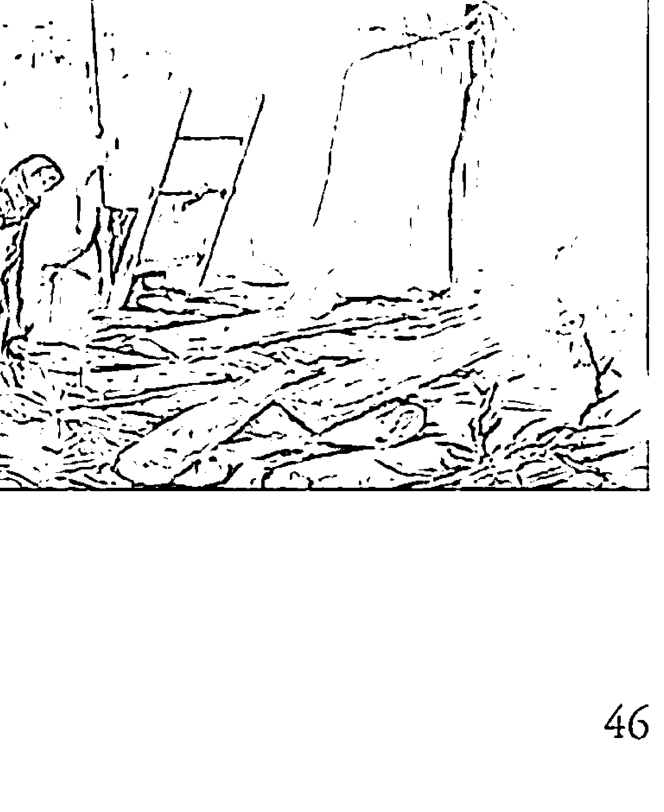

## 赫德嘉·馮·賓根（一〇九八～一一七九年）

von Bingen，則是出生在十二世紀德國的修女。她的音樂不僅在國內，即使在超越時代的今天也受到世界各地的人喜愛。

赫德嘉出生於德國萊茵河畔的城鎮賓根附近，八歲就進入附近的迪希邦登堡（Disibodenberg）修道院，並在三十年後成為德國本篤教派修道院的院長。而赫德嘉身為醫師、藥草學家、神學家以及音樂家所留下的功績也十分知名。

她在一一四一年接受神的啟示，歷經十年將自己的靈視體驗撰寫成《認識主道》這本書。她在序中坦承，自己早在五歲時就已經有過這樣的體驗。赫德嘉在書中述說自己狀態，而是在意識清楚、明白周遭狀況的正常清醒狀態下發生，即使處於這個狀態下，自己仍能得知周遭發生了什麼事。

而在她日後撰寫的《醫學與自然學》一書，記載了詳細觀察動植物及礦物等的記錄，是令人吃驚的醫學書籍，並從神的觀點宣傳自然界的治癒力對於人體有怎樣的效果。

不僅是動植物，赫德嘉也能與礦石溝通，並記載礦石在療癒上有何功用、該如何活用。尤其是她鉅細靡遺地撰寫了藥草的用法及功效，這點至今仍受到藥草研究學者的矚目。在《病因與療法》這本書中，她提倡應在滿月時採集治療用的藥草。

赫德嘉留下了眾多書籍，並留下七十七首宗教樂曲。她與當時的教宗、皇帝、學者們都有書信往來，是當時備受尊敬的女性。然而，赫德嘉因為在一七八八年庇護了一名遭開除教籍的貴族，並在他死後將屍體埋葬在自己管理的修道院土地上，導致她遭禁止拜領聖體及詠唱聖歌。雖然這項禁令在翌年解除，但赫德嘉也就在當年與世長辭。進入二十世紀後，人們在她的修道院原處重建了以聖赫德嘉命名的女子修道院。

在此應該思考的，是赫德嘉·馮·賓根的功績正是基於她身為魔女這點。為什麼儘管德國是中世紀世界當中對於魔女最為嚴厲的國家，她卻沒被當成魔女對待呢？不仅如此，她甚至還獲得包括教宗在內，當時的掌權人士的認可與尊敬。

原因想必在於她身為地位崇高的修女，獲得了名為教會的最強系統守護吧，抑或是因為她是在迫害魔女的十五世紀之前的女性呢？

當時的基督教，展現著充滿男性能量、且在其後開始活躍的天主教會截然不同的面貌。一一九年以十字軍身分進行了耶路撒冷巡禮，讓全歐洲見識其壯大的聖殿騎士團修士是忠實的女神信仰者。在騎士團的規章中也明確表示他們是為了馬利亞貢獻自身。

這裡所謂的馬利亞指的是聖母馬利亞，抑或是抹大拉的馬利亞，這點無法確認，不過自天主教會時代起，崇拜抹大拉的馬利亞之人，就會被視為最為糟糕的異端分子。聖殿騎士團於一三○○年初期，在法國國王腓力四世的計策下，呈現毀滅狀態，並在一三一二年羅馬教廷主導的異端審判下正式解散。赫德嘉·賓根生在發生这种事情的時代之前，確是事實吧。在這之後，在天主教會發展的社會中，迫害魔女的情況就越發嚴重了。

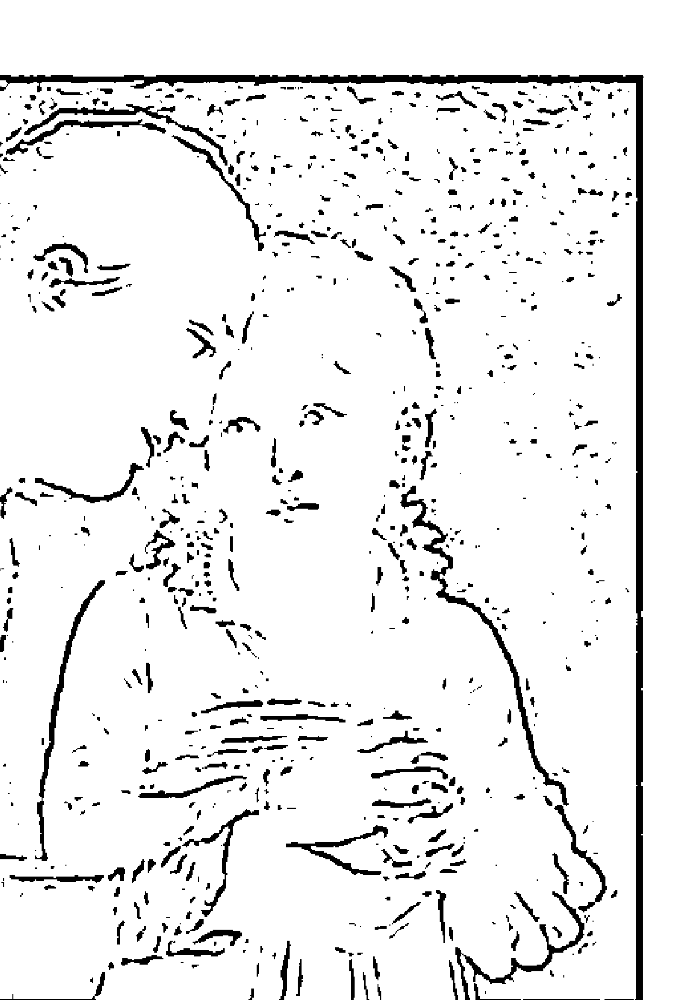

## 納瓦拉的瓊（一三七○？～一四三七年）

納瓦拉的瓊（Joan of Navarre）原為布列塔尼（法國西北部地方）的公爵夫人，其後成為英國國王亨利四世的王妃。她曾存在於現今法國到西班牙的納瓦拉王國國王查理二世與王妃胡安娜（瓊，法國國王約翰二世之女）所生。她第一任丈夫是布列塔尼公爵約翰四世，但丈夫先行離世。而當時，亨利·博林布魯克（日後的亨利四世）遭理查二世流放到布列塔尼，其間初次見到當時身為公爵夫人的瓊。她將與亡夫之間所生的孩子留在布列塔尼，於一四〇三年與國王亨利四世結婚。然而，亨利四世死後即位的繼子亨利五世，指稱瓊會使用妖術，而將她幽禁於英國南部的佩文西。遭控為魔女的瓊雖然遭受處分，但由於她的身分高貴，才會只是被幽禁而已。在她一四三七年過世後，就與長眠於坎特伯里大教堂的丈夫埋葬在一起。

## 蒙特斯潘侯爵夫人（一六四〇～一七〇七年）

蒙特斯潘侯爵夫人（Marquise de Montespan）為當時的法國國王路易十四的情婦之一。她是名門貴族莫爾泰馬爾公爵之女。一六六〇年成為王妃瑪麗·泰蕾絲（Maria Theresa of Spain）的侍女，並於一六六三年與蒙特斯潘侯爵結婚，生下兩個孩子。一六六六年，她在追悼路易十四的母后安妮（Anne of Austria）的彌撒上認識了路易十四。當時她的丈夫蒙特斯潘侯爵正被外派至遙遠的魯西雍地方駐紮，野心勃勃的蒙特斯潘侯爵夫人自之前起就一直在尋找機會，想趁丈夫不在的時候成為國王的情婦。

蒙特斯潘侯爵夫人是有著金髮碧眼的豐滿美女，個性爽朗又有才華、能言善道、機智過人且辛辣幽默，路易十四立刻就為她傾倒。然而，國王依然深愛著在她之前受到寵幸的露易絲·德·拉瓦利埃爾。性格偏激、渴望權力的蒙特斯潘侯爵夫人認為自己才適合成為國王的第一情婦，因此對於露易絲抱持著強烈的競爭意識。

在一六六七年的遺產戰爭之際，蒙特斯潘侯爵夫人發現與國王同行的女侍名單上沒有露易絲，而有自己的名字時，她確認了自己獲得勝利，終於成為了路易十四的第一情婦。

蒙特斯潘侯爵夫人在宮裡擺出恃為女王的態度，花錢如流水，訂製華麗的寶石和禮服。比起王妃瑪麗·泰蕾絲，甚至有外國使節誤以為引人矚目的蒙特斯潘侯爵夫人才是王妃。

然而，由於她一再懷孕且年齡漸長，國王也逐漸疏遠了她。正好在這時，蒙特斯潘侯爵夫人認識了一名以黑巫術聞名的女性——凱薩琳·蒙瓦森。這名凱薩琳·蒙瓦森日後因為身為魔女而被捕並遭受審判，而蒙特斯潘侯爵夫人也被發現她為了擄獲路易十四的心而使用春藥、為了挽回遠離的路易十四的心而使用黑巫術，甚至還用黑巫術詛咒國王的新歡豐唐吉斯公爵夫人 (Marie Angélique de Scorailles) 的事實。

路易十四雖然勉強壓下了這起醜聞，但蒙特斯潘侯爵夫人因此完全失去了國王的寵愛。她無法壓抑情緒地怒吼，也不再疼愛與國王生下的孩子，最後沉迷於賭博。她那善妒及歇斯底里的個性令國王厭煩至極。

蒙特斯潘侯爵夫人在失去了路易十四的寵愛後，被換到離國王寢室較遠的房間去，最後在一六八六年決定離開王宮，搬進聖若瑟教堂。蒙特斯潘侯爵夫人在一七〇七年於教堂過世，但路易十四卻禁止她的孩子們為她服喪。

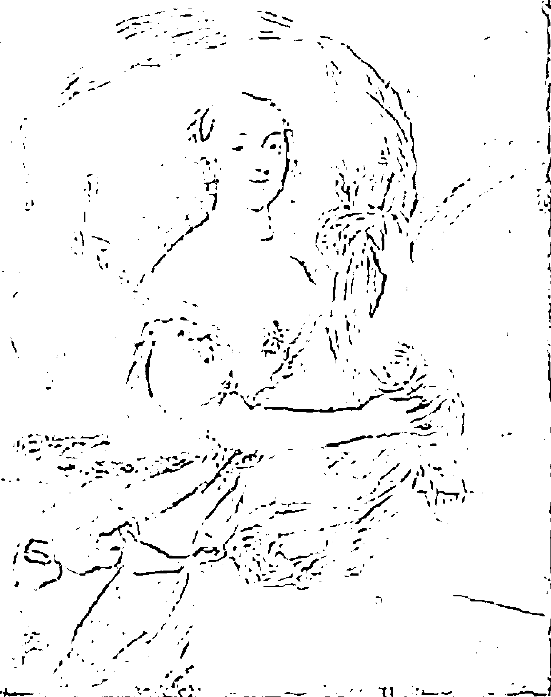

## 愛麗絲·吉蒂勒（一二六三～？年）

愛爾蘭第一個受到審判的魔女愛麗絲·吉蒂勒。她是佛萊明人（居住於北法或比利時的日耳曼民族）商人之女，於十三世紀搬到愛爾蘭居住。愛麗絲與一名富翁結婚，但在丈夫死後又再婚，一共有過四段婚姻。

由於愛麗絲一旦死了丈夫，財產就會隨之增加，使她受到周遭的嫉妒。她的第一任（一二八〇～一二八五年）與第二任（一三〇二年）丈夫都經營放貸生意，而且第二任丈夫還有殺害第一任丈夫的嫌疑，但因為他原本就相當富有，因此沒有正式成案。而第三任丈夫（一三〇九年）是愛爾蘭南部蒂珀雷里郡的地主。在第三任丈夫過世時，愛麗絲為了爭取全部遺產而告了自己的繼子。她的第四任丈夫於一三二四年因病去世。

根據第四名丈夫之子的證詞，愛麗絲用毒藥與妖術殺害了他的父親。愛麗絲被指控為魔女，將遭受火刑前，她隨即逃往了英國。然而她的侍女佩托羅妮拉·德·米茲卻遭到逮捕並受到火刑。佩托羅妮拉處刑之際大喊「我不過是個初出茅廬的魔女，吉蒂勒夫人才是力量強大的魔女。」並沒有求饒，就這樣抬頭挺胸地接受了火刑。

愛麗絲·吉蒂勒最後生活的宅邸位於愛爾蘭的基爾肯尼郡，這間古屋現在成了受歡迎的酒館。

## 維瓦萊審判（一六五六年）

在法國維瓦萊這個城鎮的法院裡，一個名叫伊薩博·榭涅的女性在法庭上，坦白自己曾經受邀前往魔女夜宴（Sabbath，據信是歐洲的魔女或惡魔崇拜的聚會）的事情。她的證詞如下：

- 「我的腳在十一歲左右狀況變差，為了治療而前往多菲內地方的蒙特利馬，去見一名住在郊區的女子。那名女子用惡魔之力治好了我。」
- 「我在兩～三週後又去見了那名女子，她帶我前往位於那裡的森林或山區舉行的魔女夜宴。」
- 「一開始，惡魔對我開口，保證會讓我獲得許多金錢。我因為很貧窮，於是立刻接受了。」
- 「實際上，惡魔當時確實給了我幾枚銀幣。但在我回到家一看時，那些銀幣全變成了黃楊葉。」

## 發生於美國的「塞勒姆審巫案」（一六九二年）

這是一起美國歷史留名的知名案件，一九九六年還改編成電影《激情年代》（The Crucible）。所謂的塞勒姆審巫案，指的是現今美國新英格蘭地方的麻薩諸塞州塞勒姆村（今丹佛斯）自一六九二年三月一日開始的一連串審判。事情的起因是少女之間的遊戲。一名名叫艾比蓋兒的少女，與幾名夥伴在夜晚的森林裡玩起了降靈術遊戲。接著，這些孩子開始出現異常行為，被醫師判斷為遭惡魔附身。艾比蓋兒為了詛咒與自己偷情的男子之妻而施咒，卻為了隱瞞而偽裝言行異常。艾比蓋兒並慫恿她的夥伴假裝成遭惡魔附身的狀態，並接二連三地做出虛偽的指控。

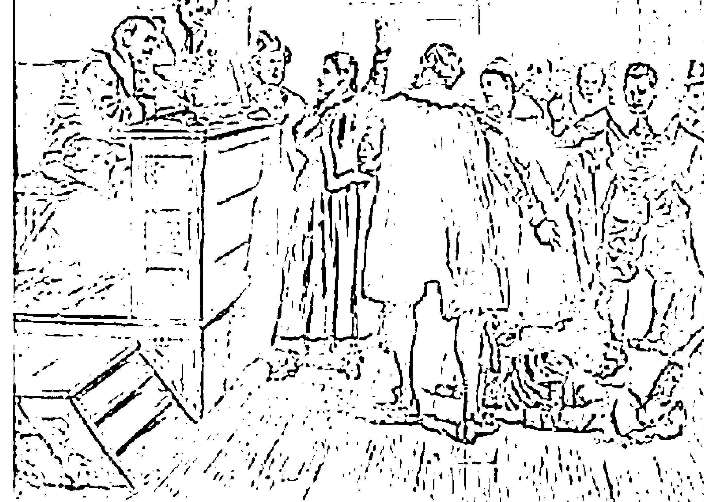

遭到舉發的人雖然否認自己是魔女，但艾比蓋兒等少女開始歇斯底里，接著又舉報了更多村民的名字。結果造成將近兩百名村民遭指為魔女，其中有二十四名受到絞刑，五名死於獄中，一名遭拷問致死。此外，還有一隻被懷疑是魔女變成的狗遭到絞死。無辜的人接二連三地遭到檢舉並判刑的整起事件，日後也被引用為集體歇斯底里造成情況失控的案例。

在十五世紀到十七世紀的歐美各國，人們相信當時有許多魔女與惡魔交媾以獲得特殊力量、引發惡劣氣候，並危害人類及家畜。被視為「魔女」的並不僅限於女性，也有男性。兩者在英文中都同樣寫作「Witch」。

根據審判記錄統計，在西歐多為女性，但在包括冰島或莫斯科在內的北歐諸國，也有男性較多的情況。在歐洲各國當中，尤以德國的獵巫、審巫格外盛行。此事跨越眾多地區，犧牲者則以貧窮階級的人們、未成年者、高齡女性居多。然而，到了十九世紀，也出現了「所謂的魔女其實完全是法官及教會捏造的」此一說法。

## 第3章 何谓威卡教？

### 基础知识篇

如前一章所述，中世紀時代的歐美世界處於基督教的統治之下，因此女性所蘊含的力量全盤遭到否定，並受到嚴厲的迫害，堪稱黑暗時代。眾多女性蒙受魔女的嫌疑，遭受社會審判或宗教審判的處罰。然而，進入二十世紀後，社會突然又變得可以接受魔女的存在。這是因為魔女的知識在不為人知的情況下，跨越時空被繼承了下來。因此在英格蘭誕生了被稱作新異教主義（Neopaganism）的宗教運動。

新異教主義中的「異教」（Pagan）語源為「邊境地區的居民」之意的拉丁語。從這個詞彙衍生的「鄉巴佬」這層含意至今仍然很強烈。

這些「鄉巴佬」並非基督教的信徒，而是與古代神祇有關聯的人。他們大多信奉密特拉（Mitra，流傳於古代印歐語系的光明、盟約、正義之神）或是希臘眾神。其中也包括了犧牲奉獻型的基督教徒，不過他們大多接受多神教，而不接受一神教。

由於「存在獨一無二的神祇，除此之外的存在不被認同為神」的基督教及其他宗教在歐洲、非洲、南美開始普及，使得至今為止將自然視為神性的顯現、信仰古老眾神的人們自動被視為異教徒（Pagan），並受到鎮壓。而讓早期基督教式的自然崇拜在歐洲再度復活——作為這種想法而誕生的，就是二十世紀初期英國的「新異教主義」，這是表示囊括各式各樣流派的用詞。新異教主義同時也是試圖改革基督教世界對待自然的觀點的運動。這是與基督教世界式的概念——即使征服、破壞也要以建立文明化為目標——完全相反的思考方式。

在新異教主義中稱作「威卡」的流派崇拜古代女神、發誓與自然同生共存，並如古代人們一般重視儀式。而實行巫術或占卜的，則是威卡教的魔女。魔女團體陸續誕生，並在歐美各地擴展開來。威卡教徒（實踐威卡教的人）大多被稱作「新異教徒」。

然而卻難以斷言異教徒全是威卡教徒。威卡教與其他大多數宗教大為不同的地方，在於威卡教接受巫術。更為不同的是，在一般宗教中，一定會有傳達神祇話語的職務，並由聖職人員或巫女擔任這份職務。他們是一般人與神祇之間的橋梁。

然而，在威卡教之中，威卡教徒各自擔任了橋梁的職務。並且安排引發超自然奇蹟的儀式、實踐巫術。關於這些儀式會在後續章節中詳細說明，而搭配各種目的，找出最適合自己的方式，被視為威卡教中最理想的狀態。

那麼，威卡教徒的魔女究竟崇拜著何種神祇呢？簡而言之，就是「孕育出大自然的神祇」。像這樣沒有崇拜特定神祇的自由的威卡教，實際上存在著難以計數、數量驚人的教派。而且這些教派所信仰的神祇也各有差異，可說是充分展現出多神教的精神。在他們崇高的神祇中，最為被一般人接受的，就是司掌月亮或大地的女神。在祭壇上，將女神與長有鹿角的男神成對祭祀也是相當普遍的情況。在威卡教中，認為神具有二元性，並平等地崇拜男神與女神雙方。此外，威卡教也相信投胎轉世。威卡教對於北歐神話、凱爾特／德魯伊教神話、希臘神話、埃及神話中登場的眾神也抱持著敬意；此外，也接納「卡欽納（Kachina）」或「玉米之神」等美洲原住民的信仰對象；同時也能接納波里尼西亞原住民的神祇；也可自由信仰印度教眾神。無論想崇拜何種神祇都沒有限限。

## 第 3 章 何謂威卡教？

### 威卡教的戒律——施行魔法的前提，是不對他人造成傷害

如前所述，威卡教在許多面向與薩滿信仰相通。實際上，現在信仰「天照大神」的西方威卡教徒也不少。我認為日本的神道教與其說是宗教，薩滿信仰的色彩更為濃厚。

因此，如果在執行威卡教徒的儀式時，召來日本傳統神祇，也完全沒有違反魔女之道。因為威卡教的目的就在於進行「加深與自己緣分深厚的神祇之間的羈絆」的儀式。

進一步說，藉由儀式嘗試與神祇之間的共同創造，就是威卡教，也是近代的魔女之道。

威卡教奠基於「愛著所有的生物」這樣的教誨。重要的是，在崇敬大自然的同時，也接納「神是孕育出自然的造物主」這樣的概念。

威卡教並不存在著信仰形式或實踐體系。只不過，身為威卡教徒首先必須遵守的戒律，就是「施行魔法的前提，是不對他人造成傷害」。

在威卡教中，配合以夏至、冬至、春分、秋分這種形式呈現的自然現象，或是每月重複的滿月、新月時期進行儀式是很常見的。

而所謂的儀式並無講究排場的規則，大多是點燃蠟燭或香，唱歌跳舞或吟詠。蠟燭在威卡教的儀式中是不可或缺的道具。由於抱持著放鬆的心情進行儀式是最好的，因此就算在儀式的過程中大笑也無妨。

### 威卡教、魔女與巫術

威卡教與魔女、巫術是密不可分的。說起來，「威卡教」一詞，正是因為一個名叫傑拉德·加德納（Gerald Gardner，一八八四～一九六四年）的英國男性於一九五四年所撰寫的《今日巫術》（Witchcraft Today）一書，才廣傳於全世界的。

加德納是一名作家，也是業餘人類學者，還有教授鍊金術。更令人感興趣的是，他儘管身為男性，卻也以魔女名賽爾（Scire）廣為人知。他撰寫了數本重要著作，並奠定了加德納派威卡教的傳統。

那麼，我將簡潔地介紹以加德納派威卡教為首，各種現今實際存在的魔女流派。話雖如此，想成為魔女，並沒有非得隸屬於某個團體或流派不可的規定。我本身就是沒有隸屬於任何一個流派，獨自學習白魔女之道的一人。關於白魔女，也會在下一章介紹。現在各位只要先記住，魔女並沒有必要特地加入任何團體，獨自也可以學習知識並實踐魔法。

## 魔女之道的各種宗派

## 加德納派

威卡教之中具世界級規模的核心流派。一九五一年，英國廢止了「魔女禁止令」後，加德納就試圖將自古延續至今的「魔女」體系化。加德納派崇拜女神及長有鹿角的男神，並存在男女祭司；強調生死與再生，崇尚自然。

加德納派曾學習民間故事、藥草等民間療法。加德納將「魔女的智慧」系統化，引發了「魔女風潮」。加德納派會以嚴謹的標準挑選成員，因此人數極為稀少。然而卻大量出現自稱「魔女」的人。誕生自英國的加德納派也傳至美國，並在美國大為發展出「新魔女運動（Neo witch movement）」。

## 撒克遜派

許久以前自歐洲大陸移居到大不列顛島的撒克遜人，在那裡構築起新的傳統。他們崇拜太古神祇，相信投胎轉世，編織出獨特的文字。而撒克遜派讓撒克遜人的宗教在現代新異教運動中復甦，試圖復興自然宗教。他們毫不吝嗇地公開長時間被視為秘儀的魔女儀式，將期望與眾神協調的魔女單純樸素的模樣公諸於世。

## 妖精派

他們崇拜自然，畏懼由生死與再生的力量擬人化而成的秘密神祇；讚賞愛、美與生，並將詩歌、音樂、祈禱詞融入儀式之中。妖精派實踐的是使用妖精力量與五芒星（Pentacle）的巫術。

## 亞歷山大派

源自於創始者亞歷山大・桑德斯（魔女之王）。幾乎是仿效加德納派，但著重於儀式。

## 黛安娜派

崇拜月與狩獵女神黛安娜（希臘女神）的母系流派。主張重新發現女性的神聖性。以月亮的各種型態作為儀式中心。也有女同性戀團體。

## 凱爾特派

與加德納派進行幾乎相同的儀式。基礎為古代凱爾特神話、眾神與巫術。不同於加德納派引進潘（手持笛子，長相為山羊與人類混合而成的半獸神）或黛安娜，他們只崇拜凱爾特眾神。

# 第4章

## 白魔女不同于普遍认知的魔女

## 基礎知識篇


如同本書標題所示，本書是關於白魔女的書籍。接下來就來說明白魔女與世人所知的一般魔女之間的差異吧。在此之前，想先讓各位稍微了解「魔女」一詞的語源。

「魔女」的英文是「Witch」。在十二世紀左右所使用的古英語中有個詞彙「Wicce」，這個詞彙的意思是「彎曲」「使其旋轉」，而「Witch」就是從這個語源衍生出來的。「Wicce」指的是使用巫術的女性，也就是魔女，而男性巫術師則稱作「巫師（Wizard）」。

巫術的英文為「Magic」，但這並非是在舞臺上展現，藏有機關的魔術。為了與意指魔術秀的「Magic」作區隔，在講真正的魔法時，似乎也常會在英文最後加上「K」，寫作「Magick」。

因正面目的而行使的巫術，稱作「白巫術」。

這是用來與崇拜惡魔的黑巫術（Black magic）區隔。黑巫術指的是因負面目的的試圖傷害他人的巫術。相對地，「白巫術」一般是像前述的「威卡教」，用於正向目的、不會危害自己或他人的「好巫術」。比如說治療病患所使用的巫術，或是祈求豐收的巫術等。

## 第4章 白魔女不同於普遍認知的魔女

所謂的「白巫術」是發掘「給予與自然共存的自己幸福的力量」的事物。因此會借用草木、天體、動物、眾神、精靈、天使等的力量來舉行儀式，相對地，「黑巫術」則是由魔法師本身召喚出惡魔來舉行儀式。

如同巫術分有黑白，魔女也分為黑魔女與白魔女。以下內容為維基百科當中關於白魔女的說明內容。

世上也存在與帶來危害的妖術無關的白魔女。他／她在英國稱作「靈巧之人（cunning man, cunning woman）」，在法國則稱作「占卜師兼治療者（devins-guerisseurs）」等。民眾十分信任白魔女。教會學者將白魔女視為魔女的同類，責怪白魔女的占卜或治療行為，然而在英格蘭的審判記錄中可得知，與白魔女相關的訴訟相當稀少。

由此可知，白魔女的傳統也是自古以來流傳至今。白魔女所實踐的巫術總是積極正向的。據說在法國，擔任「占卜師」、「治療師」職責的白魔女極為受到信任與尊敬。

而白魔女的戒律，就如同前述的威卡教戒律般，流傳著下述意義的話語：

> 「不可傷害包括自己在內的任何事物。只要不傷害任何事物，就能為所欲為。」

簡言之，所謂的白魔女只會為了自己而使用魔法，以獲得更加美好的人生。絕對不會為了操縱他人或加害他人而使用魔法。即使相信自己這麼做會為對方帶來好的結果，或者是可以預期有正向結果的魔法，在沒有獲得當事人同意之下，出手干涉他人對白魔女而言仍是禁忌。

白魔女會在季節交替時切身感覺生命之力，並為了讓月亮的陰晴圓缺所形成的自然秩序與自身協調而舉行儀式；也會憑著智慧接受守護環境的責任；會下意識、保持生態系平衡、努力與自然協調而活。因此，白魔女也是重視自然的生態學家。

白魔女的目的是擴展、提升、進化自己的意識。不僅如此，他們比一般人所知的更為深信極大的力量潛藏於所有人身上。因此他們總是時時關心著如何提升自己內在的力量與超能力。

白魔女不會被各種宗教或教派的善惡概念、形式、規矩所拘泥或限制，而是留心吸收好的傳統教誨，並將智慧分享給眾人。白魔女明白，宇宙的創造力會因為陰與陽的相互作用而活化。

如果說以上的內容就是白魔女的定義，相信你一定已經是個白魔女了吧？你是不是生來就已經具備了白魔女的資質呢？

一旦認知到自己身為白魔女，並積極接受此事，那麼你與以自然界為首的眾神、精靈、天使以及動物之間的關聯性應該會變得更加清晰，並能夠建立更強而有力的連結。

這麼一來，你與現在正好展開的「新典範（New paradigm）思維」中所提及的，與新次元之間的交流模式，想必也會更加深刻。透過巫術與神祇之間建立起特殊連結一事顯而易見。藉由運作女神與男神融合的力量，也能更加接近他們吧。

基於以上目的，本書將從各種觀點收集你身為白魔女所需要的知識，同時提供傳統魔法的實踐方式。對於白魔女而言，磨練包括預知能力在內的超能力也是必要的。

因此，接下來就來介紹關於自西元前六世紀～五世紀的古希臘時代，發揮預知能力的巫女吧。

# 第5章 魔女擁有預知能力及通靈能力

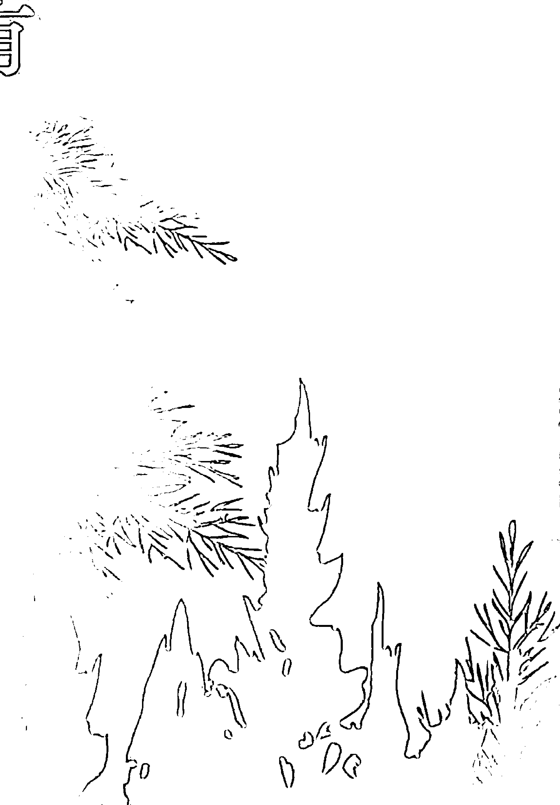

基礎知識篇

## 德爾菲的女祭司「皮堤亞」

因阿波羅的神諭而聞名的德爾菲，位於希臘首都雅典西北方一百七十八公里處的科林斯灣北邊。阿波羅是主神宙斯之子，與女神阿提米絲（Artemis）為雙胞胎，也是奧林匹斯十二神之一。

德爾菲這塊土地從古希臘時代再往前回溯，舊稱皮托（Pytho），這裡曾住著一隻大蛇培冬（Python），據說牠是大地女神蓋婭的代理者，抑或是蓋婭本身。

阿波羅擊退了逃進德爾菲洞窟裡的大蛇培冬，在此興建了神殿，並將神殿作為神諭處，設置了女祭司，根據神話所言，這些傳達神諭的女祭司就被稱作「皮堤亞」。

能聽取阿波羅神諭的德爾菲是全希臘最古老的神

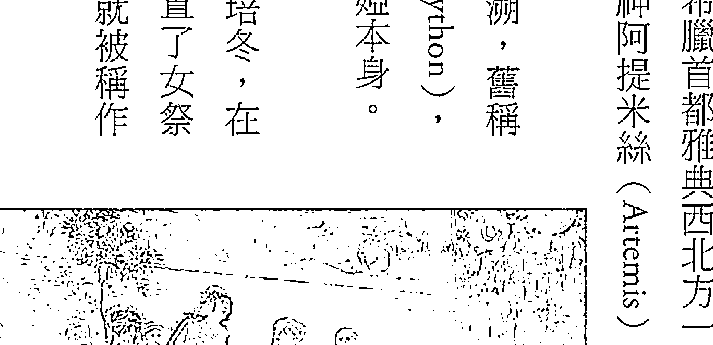

# 第5章 魔女擁有預知能力及通靈能力

諭處，在古希臘世界中被視為最重要的聖地。德爾菲的神諭儀式會在稱作一至聖室（Adyton）的禁止進入區域進行。根據傳說，稱作皮媞亞的女祭司會坐在三腳椅上，藉由從岩縫中溢出的天然氣引發恍惚，進入神靈附體的狀態，並傳達阿波羅的神諭。

在恍惚狀態下預言這點，與眾所周知的諾斯特拉達姆斯（Nostradamus）相同。據說預言。肉豆蔻確實具有引發幻覺的效用，不過據聞是極為恐怖的幻覺，怪不得諾斯特拉達姆斯的預言每一則都那麼黑暗。

什麼呢？在被稱作皮提亞的女祭司畫像上，總會繪有月桂葉。月桂葉當中也含有若是大量攝取就會引發幻覺的成分嗎？這會導致皮提亞改變意識型態而說出預言嗎？還是說，附附近的卡斯塔利亞聖泉泉水裡混了些什麼呢？抑或是當時從地下洞窟湧出的蒸氣中含有二〇〇一年，康乃狄克州立大學的地質學家所率領的研究團隊對德爾菲遺跡的古代神廟所在地進行地質學調查，調查周遭的湧泉後，發現當中含有少量具致幻作用的乙烯。因此團隊主張皮媞亞會改變意識型態，是因為乙烯中毒。不過由於含量極為稀少，所以這件事至今依然成謎。

據說皮媞亞會說出內容支離破碎的神諭，再由男性祭司們重新組成難以費解的預言。不過針對這項公認的說法，也有人提出反對意見，認為皮媞亞能夠意識清楚地開口，並以自己的聲音告知預言。

西元前五、六世紀，出兵遠征的將軍會在前往義大利、西班牙、非洲之前，前來求取戰略上的神諭；平民也會為了健康、投資等各式各樣的原因而來詢問皮媞亞。

古希臘作家埃斯庫羅斯（Aeschylus）所撰寫的《俄瑞斯忒亞（Oresteia）》這部悲劇作品中，就出現了德爾菲皮媞亞的預言。主角俄瑞斯忒亞向神詢問是否該對殺害父親的母親復仇，而獲得「去復仇吧」的神諭。

西元前五世紀，索福克勒斯所撰寫的知名悲劇《伊底帕斯王（Oedipus Rex）》中，德爾菲的皮媞亞告訴伊底帕斯「你將會殺害父親，並與母親結婚」這樣駭人的神諭。他為了避免預言成真而拼命努力，結果卻還是無法違抗命運。這就是「戀母情結（或稱伊底帕斯情結）」一詞的由來，伊底帕斯的故事曾於一九六七年被拍成同名戲劇《伊底帕斯王》。

史實中相當有名的德爾菲神諭，在西元前四八〇年向雅典市民下達了預言：「放棄都市，以木牆防衛。」雅典政治家暨前軍人地米斯托克利（Themistocles）將預言中的「木牆」解釋為船隻，投入了三列槳座戰船，在薩拉米斯戰役中擊敗了波斯遠征軍。

此外，根據柏拉圖（Plato）的《蘇格拉底的申辯》等古代文獻，尊敬蘇格拉底（Socrates）的朋友凱勒豐（Chaerephon）曾前往德爾菲詢問皮媞亞：「還有別人比蘇格拉底更聰明嗎？」結果獲得了「無人比蘇格拉底更聰明」的神諭。蘇格拉底對這個神諭抱持懷疑，因此四處尋訪當時被視為智者的人們。並得出了「那些人盡是些自認通曉真理的人」的結果，他認為世上並不存在真正的智者，只是自己在「體認自己一無所知」（無知之智）這一點上，比那些人稍微聰明一些罷了。

亞歷山大大帝也曾為了計畫遠征波斯而於西元前三三五年造訪德爾菲，希望獲得建言。然而，皮媞亞卻告知大帝「眾神僅會在祂們所決定的時刻下達神諭」，令大帝焦躁。被迫等待令他大為震怒，粗暴地抓住皮媞亞的頭髮將她拖進神殿。她只能大喊> 「放開我！你這小子！實在贏不過你！」而亞歷山大大帝就說「好，我獲得答案了」而放了皮媞亞。他將這段話解釋成神祇稱自己為兒子，並且無人能夠贏過他。

古希臘世界從崇拜女神的母系社會，轉為崇拜男神的父系社會。由於有著這樣的背景，因此有輕視女性的強烈傾向，不過罕見的是，皮媞亞雖為女性，卻是受到尊敬的對象。

不僅如此，當時大部分的希臘神官、女祭司職務，都是由出身高貴之人代代繼承的，但皮媞亞並非如此。雖然皮梃亞一定得是出身德爾菲的當地人，卻無關年齡、財產、教養有無，即使不識字也沒關係。被選為皮媞亞的女性會受到在神殿裡守護永遠聖火的女祭司支持，並必須作為傳達神諭的人，接受漫長而嚴厲的訓練。

阿波羅神殿的入口刻有三句給尋求神諭之人的箴言。這是神靈附體的德爾菲女祭司「西比拉（Sibyl）」所說出的神秘詩文神諭。

西比拉是早於皮梃亞的女祭司稱呼，當時的德爾菲

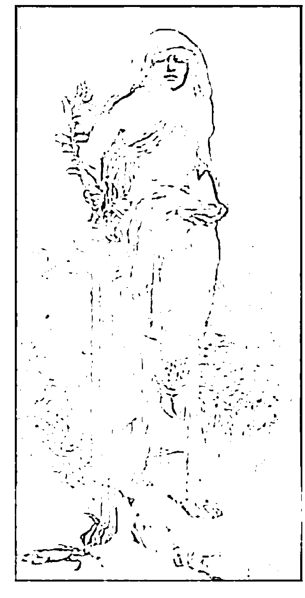

# 第5章 魔女擁有預知能力及通靈能力

> 存在崇拜女神蓋婭的古代神殿。因此西比拉的話語並非與阿波羅，而是與女神蓋婭聯繫而獲得的神諭。

女祭司西比拉的箴言：

1.  第一句箴言為「認識你自己」。
這句話是建議人們要透過認識自己內在的糾葛來解決外界的問題。
2.  第二句箴言為「凡事不過分」。
這句話是建議人們自身的行為要有節制，不可過度貪求。
3.  第三句箴言為「妄立誓則禍近」。
這句話是建議人們要了解自己，不答應難以辦到的事。

我認為以上三句箴言，對於實踐魔法的白魔女來說也是很好的建言。這意味著在試圖以魔法之力改變外界之前，最重要的是要先仔細觀察自己的內在，努力解決認為是問題的癥結之處。此外，也忠告我們注意謹守分寸，因為如果硬是想靠魔法之力讓一切事物都順心如意，祈願這種極為自私自利的事，將會導向自我毀滅。

自古以來就是聖地的希臘德爾菲，至今仍是深深吸引著世界各地的人們、讓人希望造訪一次的能量景點。德爾菲還有一件令我深感興趣的事——據說以與昂宿星人通靈而國際知名的芭芭拉·馬西尼克小姐，正是於一九八八年造訪了德爾菲的神殿遺跡後，開始與昂宿星人通靈的。

我本身在九〇年代也因為與芭芭拉小姐交情變得深厚，以此為契機與跟她一樣開始與昂宿星意識體集團通靈的。不僅如此，我還獲得翻譯她的著作《昂宿星光之家》(Family of Light: Pleadian Tales and Lessons in Living)（太陽出版，二〇〇六年）的機會，令我與昂宿星之間的連結變得更加深厚。

我在一九九五年企劃了一個主題為「喚醒內在女神」的工作坊，與參加者一起造訪希臘克諾索斯的神殿遺跡、義大利的古希臘神殿遺跡等，但遺憾的是當時並沒前往德爾菲。不過今年，達成造訪德爾菲的機會終於降臨到我身上了。

德爾菲的神殿遺跡果然是個驚人的能量景點！

尤其是位於德爾菲中央，昔日稱作「至聖室」的神諭處所在位置，散發著零磁場般的能量，讓我有種雙腳飄浮起來、離地約十公分的感覺。有趣的是，即使離開了德爾菲遺跡，這種感覺依然持續了好幾天。

我原本預定在德爾菲進行儀式，但遺憾的是未能獲得許可。世界上各個被視為能量景點的遺跡，如今都被禁止進行所有儀式，警衛總是睜大眼睛監視著遊客。我以前在參訪瓜地馬拉一個名叫提卡爾（Tikal）的古代馬雅都市金字塔遺跡時，也曾在儀式進行到一半時被警衛打斷。不知為何，即使沒有做出損壞遺跡的行為，卻仍完全禁止儀式一類的事情——據說即使只是換上儀式用的服裝這種程度，也是不被允許的。我認為這恐怕是因為某些高層人物明白該處的能量門扉可能會因為儀式而再度開啟

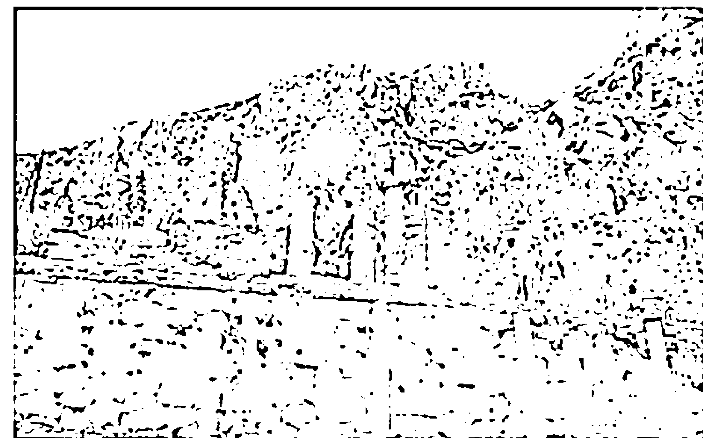

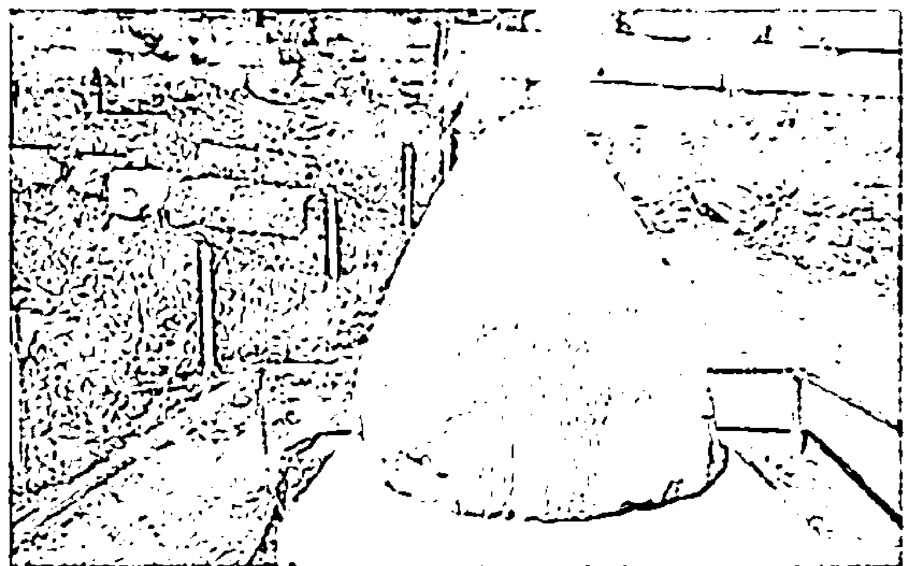

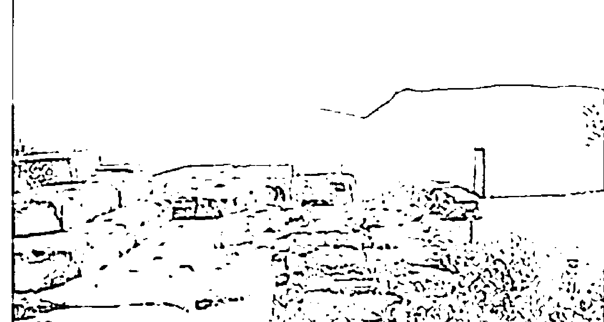

神諭處原本所在的區域

由於阿波羅放出兩隻鷲往相反方向飛行，最後正好在德爾菲匯合，因此將德爾菲定為世界之臍，設置了翁法洛斯（omphalos）之石。

啟；而守衛們則是完全不明就裡，只是被命令要加以阻止也說不定。

## 你的超能力是什麼？

魔女的資質之一，就是剛才所提的德爾菲女祭司皮婭一般的特異能力。我們知道皮婭亞也會藉由嚴厲的訓練以聽見神祇的聲音。換成現代的說法，也可以說皮婭亞是傳達阿波羅神神論的靈媒。任何人都能培養成靈媒的能力，只要摒除雜念，一心一意地磨亮與高次元存在通聯的迴路就行了。

接下來的這份清單，是為了確認你是否原本就具備特異的能力。請試著誠實回答是或否。

- □ 1 你在走進有數人聚集的房間裡時，能感覺到現場的氛圍（能量）嗎？
- □ 2 你曾經有過睡著時所作的夢境成為現實的經驗嗎？
- □ 3 在你長時間待著的房間，電燈燈泡是否不太耐用？或者，是否屢次發生你一打開在你與朋友講電話時，曾經有過一講到令人興奮的內容時，電話就擅自斷掉的情況？(造成這種現象的原因是你所放出的特異能量。)
- □ 4 在壞事成為現實前，你會有預感嗎？(這原因也是你所放出的特異能量。)
- □ 5 當你心愛的人面臨壞事或危險時，即使你不在現場，也能隱約感覺到嗎？
- □ 6 你曾經發生過聽見有人在叫喚自己的名字，但轉過頭去卻沒有半個人的情況嗎？
- □ 7 你曾在人體周遭看見氣場嗎？
- □ 8 你曾經在周遭沒有半個人的情況下，沒來由地聞到會觸動你某些記憶或感覺的香味嗎？
- □ 9 你是需要擁抱或肌膚接觸的感覺型人類嗎？
- □ 10 你曾有看見前世的經驗嗎？
- □ 11 在電話響起時，你曾經有過在接起前就知道是誰打來的經驗嗎？
- □ 12 在他人向你搭話時，你曾經有過在對方開口前就預測到他會說些什麼的經驗嗎？
- □ 13 你的電腦或電氣用品曾在你情緒低落時跟著出毛病嗎？(由於你的心情不悅，你所放出的特异能量也会对机器造成不良影响。)
- □ 14 你会觉得比起人类，自己更能跟动物沟通吗？
- □ 15 只要有人说谎，你几乎都能看穿吗？
- □ 16 你曾经没来由地打一开始就讨厌某个认识的人吗？
- □ 17 你对于与已死之人交谈不会感到抗拒吗？
- □ 18 在病患告知你自己生病之前，你就已经知道对方生病了吗？
- □ 19 你是敏感且容易受伤的类型吗？
- □ 20 你曾经不时从眼角余光看见光芒窜过吗？（这或许是灵体或是天使。）
- □ 21 你是否发现自己的情绪会随着在一起的对象不同而改变？
- □ 22 你曾经因为跟某些特定的人在一起，而感到能量被消耗吗？

那么，接下来看看结果吧。回答十八～二十三个「是」的你，可说原本就拥有强大的特异能力。即使如此也必须进一步磨练自己，朝专业等级迈进。接下来请学习更多关于超能力的知识。

回答十七個「是」的你，可說擁有超乎自己想像的特異能力。今後請更加相信自己的直覺，練習培養第六感。請使用神諭卡（Oracle Card）或塔羅牌等直覺工具，加深你與肉眼看不見的世界之間的聯繫吧。而只能回答九個以下「是」的人，請試著透過冥想等方式，除去原本阻擋住你自身可能性的障礙吧。

## 占卜能力及預知能力為魔女的拿手本事

我本身有在教導阿卡西記錄。我會登入聽講者的阿卡西記錄，同時製作讓大家使用的一張張阿卡西神諭牌（接受神諭的卡片工具），花時間準備課程。我一定會一邊吟詠著祈禱文「以（男）神、女神與其創造之一切……」一邊進行製作工作。這既是祈禱，也是咒語（參照第18章）。藉此可賦予各張神諭牌生命，刻印上每個人各自的能量模式。藉由使用這樣製作出來的神諭牌，就可能達成令人吃驚的阿卡西記錄。水晶球、塔羅牌或盧恩（Runes）從以前開始就是相當受歡迎的占卜工具，而易經卜卦或手相占卜在東方也十分盛行。以預言遙遠未來而聞名的諾斯德拉達姆斯，則會將墨汁滴進裝水的缽中，凝視水缽進行預言。

我過世的婆婆是愛爾蘭人，擅長「紅茶茶葉占卜」。這種占卜的方式是一邊專心想著待喝完紅茶後想知道答案的問題，並在喝完茶後將茶杯順時針轉動三圈，然後將茶碟蓋在茶杯上，靜靜地倒扣茶杯，然後再把茶杯翻回來，確認杯中茶葉散布而成的形狀同時占卜。雖然她沒有教過我如何從附著在茶杯上的茶葉讀取未來，不過她的解讀十分精準。夫家及親戚都是凱爾特人，他們從以前起就都很擅長通靈或塔羅牌占卜。果然是魔女呢！

## 第6章 基礎知識篇

## 沉睡於你體內的神秘能量一旦與自然界能量融合，就會產生魔法！

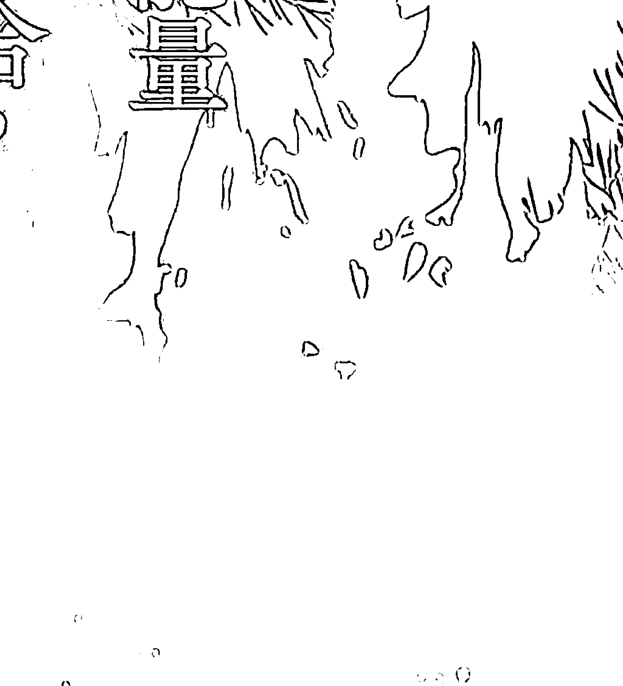

各位是否已經掌握堪稱巫術第一階段的前述基本情報了呢？在下一個階段，我們就來探究如何結合自然能量與蘊藏在你身上的力量吧。

首先請將焦點放在充斥於你周遭世界的自然界之力上。其實在我們每個人體內也充滿了相同的力量。而發掘這份力量一事，就是魔法！

你也可以將魔法視為一種藝術。正如字面上所示，「Witch Craft」（巫術）當中的「Craft」就是藝術的意思。而「Witch Craft」一詞也具有「理解自然界能量」的哲學性意涵。

在學習這項哲學時，首先必須實際加深你與自然界之間的關聯性。藉由沉睡於你體內、原本就擁有的力量，與自然界隨時供給的能量，可讓你用與古代人相同的方法再度取回聯繫。在有意識狀態下刻意那麼做，就是實踐魔法不可或缺的條件。

比如說，請從到附近的公園觀察鳥類的行動、傾聽鳥鳴這類事情開始吧；請前往山上或原野，一邊感受大自然分享給你的能量吧；請培養一邊欣賞日出、日落，一邊感受太陽的能量，或仰望滿月感受其能量的習慣吧；此外，也請閉上眼睛試著感受月亮完全隱匿無蹤的新月能量吧。藉由像這樣增加與自然界的接觸，你就能透過自身，敏感地捕捉到大自然所擁有的能量。也請記得每次都要將你所感受到的事物筆記下來。

## 第6章 沉睡於你體內的神秘能量一旦與自然界能量融合，就會產生魔法！

> （請參考第17章『何謂魔法書？』）

只要這麼做，相信你就能逐漸變得容易覺察到自然界中的特殊能量。接著，終於要開始進行實踐魔法的準備工作了。我會在後續章節中，介紹實踐各種魔法的方式。而現在則在這裡多告訴各位一些該如何感受自然能量的具體方法。

作為實現魔法的基礎，五種元素會被作為象徵納入魔法儀式。另外藉由吟誦咒語來連接沉睡於你體內的魔法能量根源，這就是魔法的目的。所謂的魔法是利用自然能量的運作帶來變化，為此執行的儀式。

雖然古代的人十分了解儀式所擁有的力量，但現代人卻遺忘了古代人有多重視儀式。藉由執行儀式，能夠讓自然界成為你的同伴，並與你本身產生更深的聯繫。就結果來說，你與大自然之間的聯繫能進一步加深，甚至能反映在日常現實之中。

這能讓你獲得愉快且具創造性的支援，使你的人生更具魅力且更有意義。若要最大限度地使用魔法的力量，可以利用地球能量最為特別的春夏秋冬四季交替之際，或是每個月造訪的滿月與新月的能量來增幅魔法效力。尤其是滿月與新月，是領受古代女神們之力與教誨的魔法最能生效的時機。為了了解這類能量變化及時機，學習天體運行、占星術等，在培養魔女知識的同時也能對實踐魔法有所助益。接下來就來實際介紹獲得滿月與新月能量的儀式與魔法吧。

### 新月與滿月的魔法——月亮儀式——

滿月與新月的儀式稱作「月亮儀式（Esbats）」。在滿月當天與其前後三天是最適合執行儀式的時機。

### 《滿月的月亮儀式》

一般來說，有人會推薦將滿月能量用於斷捨離作業上，但由於能量過強，一旦執行斷捨離魔法，反而有造成反效果的可能性。這麼一來就會導向不穩定的結果。從滿月到下弦月的時期，比較適合執行斷捨離作業，尤其是打算放掉感情或關係的話。滿月能量則比較適合領受與擴大、成長、前進有關的積極能量及創造性的能量。

滿月會施放充滿光芒的女神能量，是授予女神教诲的時刻。請將魔杖、水晶前端或指尖指向滿月，接著按照後面的內容祈禱。

> 「司掌月亮的女神啊！请让此时此刻与你同在，将你的神圣精华注入此身。」

像这样祈禱之后，请将魔杖、水晶指着月亮的前端，或是将你的手指一边碰觸心脏一带，一边在内心描繪銀光从前端流入体内，讓全身閃閃发光的形象。满月能量。你也可以仰望著满月，按照以下的内容祈禱：让水晶照射满月的光芒儲存能量也不错。在容器裡装水或是玫瑰水，同样也能儲存

> 「在夜空閃耀的圆月，你散發柔和光芒的优美姿态令我著迷。」

### 新月的魔法祈禱

偉大的女神們，我與大地同在，並崇敬大地。

即使無法得見你的身影，亦能感受到強勁力量。

請傾聽我由衷的心願。

我的願望是○○○（簡潔明瞭地說明自己的願望）。

### 《新月的月亮儀式》

新月會放出喚起新的變化或實現願望的能量。藉由伴隨著新月力量下定決心，將能導向你所期望的結果。

> 請溫柔地擁抱我的心，以神秘與調和盈滿我的心。療癒、清淨我的身心，使我充滿全新的活力！

接下來將會列出支援新月與滿月魔法的女神們。只要在祈禱或執行儀式時，在內心想像月之女神們的形象、呼喚名字，或是將女神們的形象圖或名字放在旁邊，就會使你的魔法更具威力。

- 司掌月亮之女神：哈索爾（古埃及）、阿提米絲（古希臘）、黛安娜（古羅馬）、盧娜（Luna）（古羅馬）、黑卡蒂（Hecate）（古希臘）、伊娜（Ina）（玻里尼西亞）、羅娜（Lona）（夏威夷）、瑪希奈（Mahina）（夏威夷）、伊希切爾（Ix Chel）（古馬雅）、塞勒涅（Selene）（古希臘）

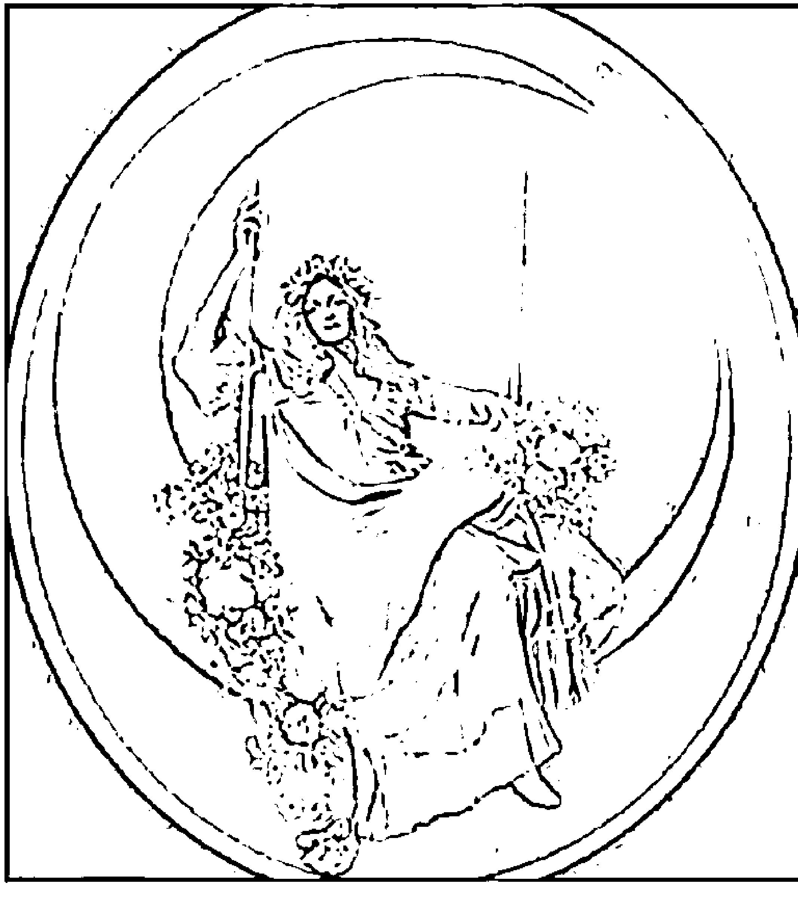

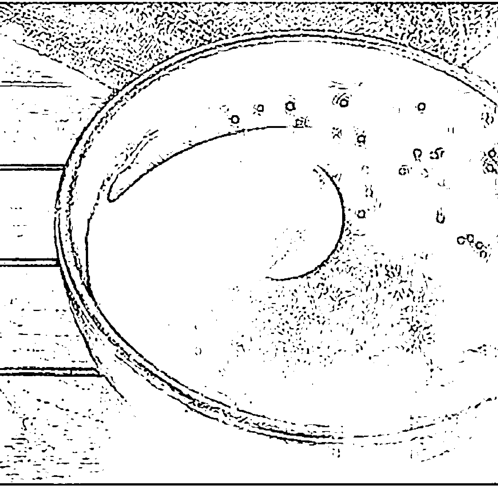

### 月桂樹葉的法術

請在月桂樹葉背後用筆寫上心願，然後在新月及新月前後三天之間一片片燒掉。比如說「我希望趕快找到對象！」等等。

用菸灰缸及打火機燒掉也無妨，用蠟燭也行。

這是自古傳承至今的傳統魔法。

在新月時執行的話效力最強，不過隨時都可以執行。

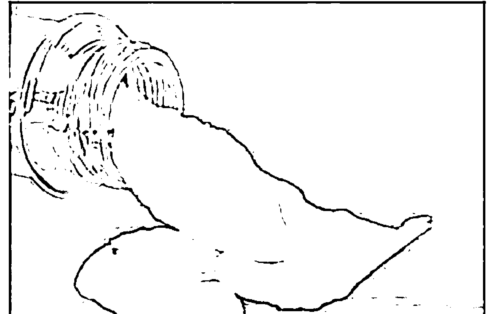

- ※ 請使用料理用的乾燥月桂樹葉

## 第7章 基礎知識篇

## 世界上各式各樣的巫術

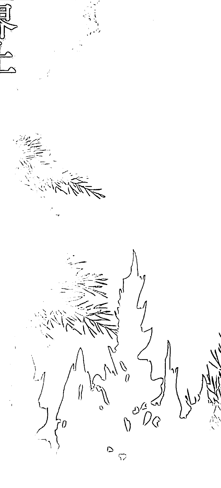

### 埃及巫術

魔法的起源幾乎與地球上的文明發源於同一個時期，可以回溯到古代蘇美、巴比倫尼亞時代（據稱為西元前三六○○年）。作為文獻開始受到保管，是古埃及時代的事。

在巫術開始興盛的中世紀時代，布拉格（捷克）、里昂（法國）、杜林（義大利）作為三大白巫術都市聞名歐洲；此外，倫敦、舊金山、杜林則是三大黑巫術都市。我曾經造訪過黑白兩種巫術都相當盛行的杜林市博物館。在杜林市有著不遜於開羅博物館或大英博物館的埃及相關館藏。據說杜林市自古以來就與古埃及有極深的關聯。

埃及巫術的起源是天狼星巫術。某個研究團體認為，讓亞特蘭提斯人與獅族結合的天狼星DNA操縱技術，就是埃及巫術的基礎。

在埃及文明起始之際，主要是由稱作「法老」的王與神官、巫師來執行巫術，並傳承其奧義。對他們來說，所謂的巫術就是利用埃及眾神祇的力量，並能將眾神的力量實體化到何種程度的證明。因此他們全都會競相研究巫術。

有專家表示，埃及巫術的一切關鍵都寄託於「伊西斯與歐西里斯神話」中。眾多象徵潛藏在神話裡面（請參考第10章）讓你恢復原本自我的「女神伊西斯」）。在古埃及巫術中，太陽神拉、女神伊西斯與其丈夫——司掌冥界的歐西里斯神的力量極為龐大，因此藉助這些神祇力量的巫術數量是最多的。埃及巫術中，稱作「Ka」的靈魂與靈、靈力和魔力有著密切的關聯。控制、鍛鍊「Ka」對於埃及巫師、神官來說具有極為重大的意義。

魔法三大都市之一——倫敦與阿瓦隆。那麼，作為三大黑巫術都市之一的倫敦，為何會盛行黑巫術這點先擱置不提，我在這裡居住了幾年的期間，確實能切身感覺到大都市倫敦四處散布著適合魔法的磁場。

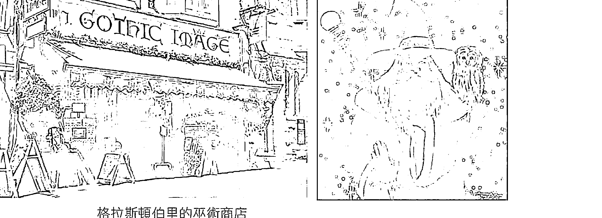

然而，近年來，則是在英格蘭西南部的小城鎮格拉斯頓伯里興起了巫術風潮。

據說整座格拉斯頓伯里本身就是個能量點，街上林立著新紀元、靈性相關的店家，同時也有許多販售巫術用具的店家。一到夏天，距離格拉斯頓伯里不遠處會頻繁地出現麥田圈（田地的穀物呈圓形倒下的現象）。此外，因為這裡離巨石陣也很近，有許多人會從世界各地造訪格拉斯頓伯里。不僅如此，在每年夏天會固定舉辦音樂活動「格拉斯頓伯里當代表演藝術節」後，更是有眾多觀光客蜂擁而至。

我的小姑直到大約十年前為止，都還住在格拉斯頓伯里附近，所以我也會頻繁地造訪這個城鎮周邊。我曾經爬上舊聖米迦勒教堂遺跡所在的蓋世聖丘（Glastonbury Tor）頂端附近，並在那裡發現羔羊的屍骸，是用作黑巫術儀式的活祭品嗎？格拉斯頓伯里的能量似乎也在一年年惡化。

從格拉斯頓伯里稍微移動，被稱作「卡美洛」，據稱是亞瑟王居城的凱德伯里城跡一帶，幾乎沒有觀光客造訪，我能感覺到那裡仍殘留有作為能量點的好能量。在亞瑟王傳說中有個名叫「梅林」的知名魔法師登場，這一帶或許就是梅林治療了因戰負傷的亞瑟王，也就是被稱作「阿瓦隆」的魔法島嶼也說不定。

### 圖博巫術「朱巴（ Tulku ）」

在伊斯蘭圈，從伊斯蘭教誕生之前就相信「鎮尼（ Genie ）（精靈）」的存在。各位所知道的電視節目《太空仙女戀》主角原文的Jeannie這個名字，靈感就是來自「鎮尼」。鎮尼於《天方夜譚》（一千零一夜）當中的〈阿拉丁神燈〉這個故事中登場，是摩擦神燈就會出現的魔法師，從以前起就受到全世界的孩童喜愛。鎮尼有許多種，既有為人類帶來災厄的恐怖惡靈，相反地也有身為人類夥伴的善靈；此外，似乎也有同時存在善惡兩種性質的鎮尼。

而在東方，巫術自古以來就是與宗教密不可分的存在。在圖博密宗當中，有著稱作「朱巴」的存在，被傳授塑造堪稱巫術具現化的奧義——化身（朱古，Tulku）的魔法。

根據法國女性探險家亞歷珊卓·大衛·尼爾（Alexandra David-Néel，一八六八～一九六九年）撰寫的《圖博魔法書》（德間書店，一九九七年）所述，朱巴以一句話來形容，就是「根據強力意念而成的巫術形成物」。總之，就是藉由受訓練的思考，從無到有塑造出靈體的方法。因為只有修行程度登峰造極的人，才能學習秘傳奧義，關於這部分請只作為單純的知識之一知道就好。

首先必須耗費好幾天，不，不僅如此，甚至必須耗費幾年時間，鉅細靡遺地從頭頂到腳趾想像出想要塑造的（屬於自己的）化身外表，層層堆疊般地形形象。接著再仔細而周到地決定化身的性格、內在特徵。在如此創造出化身後，一天要對著化身講好幾次話。一邊在化身有所回應之前持續這麼做，同時繼續累積對於化身模樣的想像。據說這麼一來，化身就會做出符合其人格的回應。這簡直就是精神讓靈體化為實體的魔法。據說在這麼做的期間，靈魂就會寄宿在化身身上。問題在於化身能否成為忠實的僕人。似乎也常發生化身變得比身為其創造主的僧侶還要偉大，或是自行動的失敗情況。這種情況下，要讓化身完全消失為止得耗費兩年以上的時間，成了棘手的魔法修行。

### 密續巫術——性愛是實現夢想的最強魔法

這個概念與圖博密宗創造化身的魔法極為相似，是親手製作布料製作人偶服裝，會更具效果。完成之後，請像創造化身一樣，每天對分身魔女講話，讓靈魂寄宿在其中吧。

所謂的密續（Tantras），指的是中世紀印度教中，講述女性原理——夏克提（性力）教義的經典。因為孩子是藉由性愛而誕生，因此是由兩人共同創造驚人能量，宇宙則加以回應，授予了孩子。在蘊藏驚人宇宙力量的性愛中，有著足以創造孩子的實體化力量。請在恍惚中到達高潮的時機，在腦中想像著男女所祈願的事情實現的模樣。關鍵在於雙方的想像必須一致。比如說，如果希望住進漂亮的房子，兩人就要事先看過希望的房屋照片，並牢記在內心。這時必須事先讓兩人內心浮現的形象一致。如果是希望強化兩人之間關係的性愛魔法，就要想像著繩子將兩人纏繞在一起的模樣。

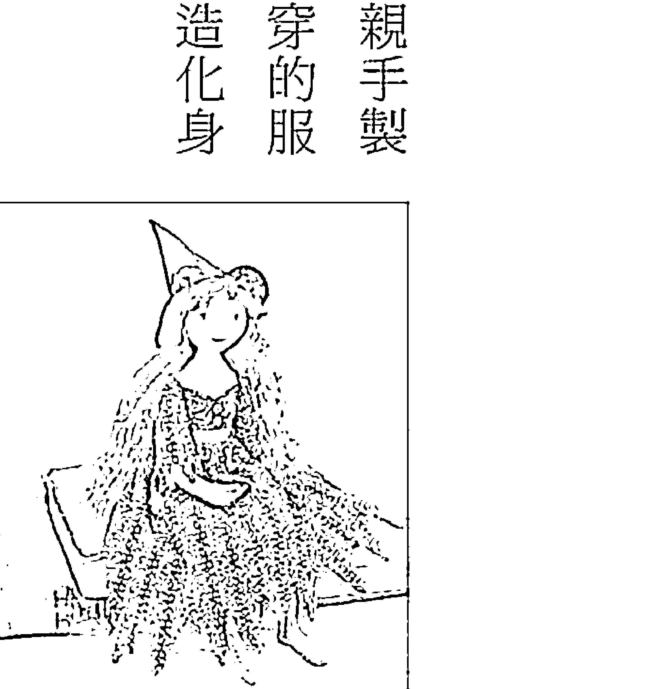

### 美國原住民的妖術師

美國原住民的薩滿信仰與魔法之間，被認為有著切也切不斷的關聯。

七〇年代的暢銷書，卡羅斯·卡斯塔尼達（Carlos Castaneda）所著的《巫士唐望的教誨》、《解離的真實》、《巫士唐望的世界》（均為新裝版，太田出版）等唐望系列，在六、七〇年代風靡了全世界。

因為這是通靈巫術的世界頭一次以文學形式展露在人們眼前。根據介紹，本系列全為作者——人類學學生卡洛斯與亞奎印第安人巫士唐望相遇，並將所學內容撰寫成書的個人經歷記。

唐望將卡洛斯稱作「盟友」，並教導他擁有前述圖博密宗中的化身，或是「使魔」（請參考第11章）般協助者的重要性。不僅如此，故事中還提及進入遠離日常現實的另一個現實，也就是「解離的現實」的方法。

我本身在七〇年代初期居住在倫敦時，也曾熱衷沉迷於唐望系列。不可思議的是，在我剛經歷瀕死經驗後的十九歲時，曾在倫敦街上遇見一個名叫阿爾弗雷德，令人懷疑他簡直就是唐望本人的人物。這本書在幾年後出版時，我與自己的實際經驗相對照，並對此感到吃驚萬分。在本書的最後，我也會告訴各位阿爾弗雷德在七○年代的倫敦教導我的魔法。在一九九○年後，我與丈夫為了向北美、中南美的薩滿學習，而一再四處旅行，在這一趟趟的旅行之中體驗了薩滿世界。不僅如此，我還得以拜見眾多以薩滿身分聞名的人士，或是人類學家兼薩滿的人士。他們給了我們窺見遠離現實世界，也就是魔法世界的機會。唐望所謂的「解離的現實」的存在，我本身也透過數次實際經驗而明白。

### 吉普賽巫術

所謂的羅姆人（Roma），指的是被稱作吉普賽人的集團之一，是源於北印度羅曼語系、移居至中東歐的流浪民族。雖然多為移動式生活者、流浪者，但現代似乎也有許多人是過著定居生活。

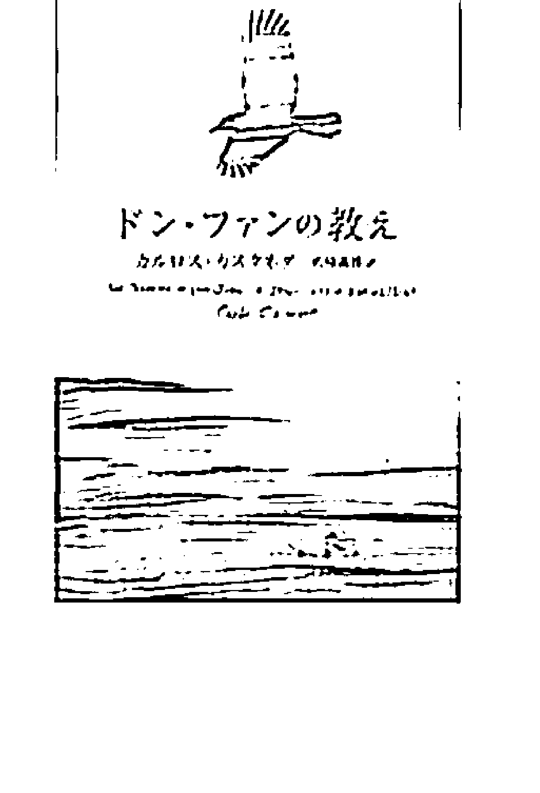

一般認為羅曼語系人是透過複數路徑屢屢從印度遷徙至歐洲。另一方面則認為，迂迴從東歐抵達中歐的團體說的是未受羅馬尼亞語影響的非瓦拉哈語系方言。在一九七一年的第一屆世界羅姆人會議後，作為更政治正確的名稱，而提倡採用多數團體自稱的「羅姆人」作為稱呼，廢止常見的「吉普賽人」這種稱呼方式，以 EU 為首的各國行政上均採用這個名稱。不過，羅姆人原本就並非代表所有團體，因此也有許多團體並未使用這個名稱。

在他們之中也有人抱持著異於「羅姆人」的一致性，而主張「自己並非羅姆人」。

> 「自己並非羅姆人」

這些人就是以科索沃戰爭聞名、被稱作阿什卡利人（Ashkali，塞爾維亞語）的團體或來自埃及的人們。身為埃及人子孫的他們自稱追隨亞歷山大大帝移民的埃及人後裔，但官方上並未被承認為埃及人的子孫。一九九〇年，馬其頓誕生了自稱「南斯拉夫·埃及人協會」的團體（會員人數號稱一萬五千人）。

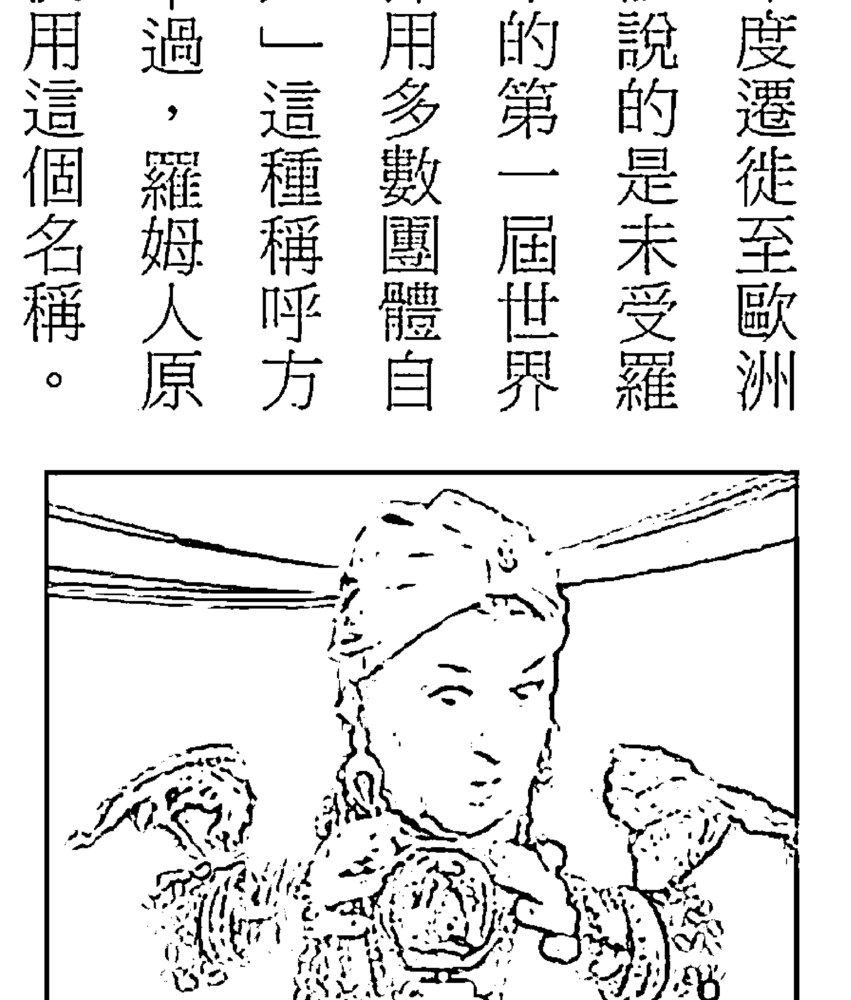

追隨亞歷山大大帝移居至歐洲的埃及系吉普賽人，自古以來就擅長以水晶球或塔羅牌占卜。以下的魔法咒語是羅姆人自古以來傳承的內容，請試試對你是否有幫助。

### 讓你有臨時收入進帳的吉普賽魔法咒語——「TRINKA FIVE」——

在面臨需要卻沒錢的時候，請試著誠心吟詠「TRINKA FIVE」這段羅姆吉普賽自古流傳的咒語幾次。吟詠太多次或太少次都不好，基本上最好是五~八次。這麼一來，在幾天之內就一定能獲得所需金額款項的臨時收入。只不過，這不過是用來獲得暫時需要的錢財，並不是永久改善財運的咒語。根據報告，實際上僅是吟詠「TRINKA FIVE」這句話，似乎也能有臨時收入進帳。

請一邊吟詠上述咒語，並將三枚硬幣投進裝水的缽裡，並重複七天。

> 請古代的精靈們現身！
> 
> 金流啊，請過來我身邊，讓我增加金錢！
> 
> TRINKA FIVE，TRINKA FIVE，TRINKA FIVE的精靈啊！

## 第8章 基礎知識篇

## 為身為魔女的自己取名吧！

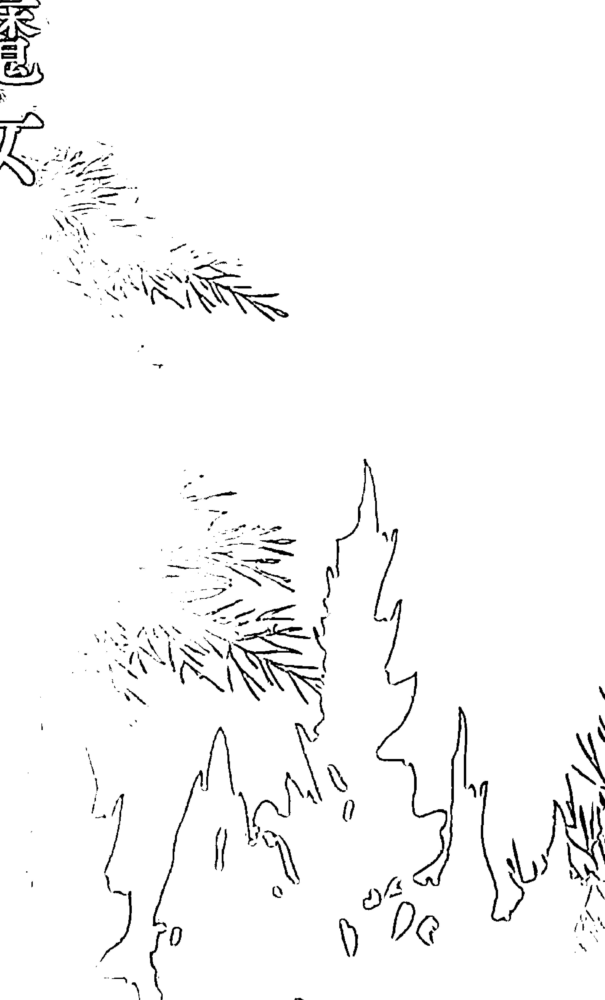

你已經擁有「魔女名」了嗎？如果還沒有，在做「白魔女宣言」（第9章）之前，請務必親自挑選魔女名，好告知眾神。許多魔女都會為了表明自己的特質而使用魔女名。加德納派威卡教的創始人傑拉德·加德納，儘管如前所述是一名男性，卻也以魔女名賽爾（Scire）為人所知。

在替自己取魔女名時，想挑選與《神仙家庭》的珊曼莎、《魔女宅急便》的琪琪、《魔法使莎莉》的莎莉等耳熟的可愛魔女同樣名字也無所謂，要選擇與魔法關聯深厚、在神話或童話中登場的女神或魔女的名字也沒關係。如果你能感覺到自己與古凱爾特或過去之間的聯繫，要取凱爾特人的名字或精靈的名字也可以；想自己取名也沒有問題。無論如何，請選擇能令人感覺到力量強大的名字，且更能感覺是你自己本身的、充滿魅力的名字。當然，使用現在的名字也無妨，不過向眾神報上魔女名，是跟魔女宣言同樣重要的事。

### 第8章 為身為魔女的自己取名吧！

接下來，我會告知挑選魔女名的傳統方式。自己的出生年月日是重要關鍵。名字在一生當中都可以更改，但出生年月日是個人的刻印，暗藏著來自阿卡西記錄、具威力且神秘的密碼。因此在取魔女名之際，選擇與巫術中的數秘術及誕生時的振動一致的名字，是最受歡迎的方式。

首先，請計算自己的誕生數字。以下用我的資料作為例子。

例：我是一九五三年七月四日誕生。

```
1+9+5+3+7+4=29
2+9=11→2
```

因此我的誕生數字就是「2」。

接著請參考左邊的表格，考慮英文字母所對應的數字總和須與你的誕生數字相同的名字。

「ISIS」（伊西斯）作為候選名字之一，用英文字母對應的數字試算。我的誕生數字是「2」，而我感覺到自己與女神伊西斯之間有聯繫，所以將

| 左列 | 右列 |
|------|------|
| 9    | I    |
| +    | +    |
| 1    | S    |
| +    | +    |
| 9    | I    |
| +    | +    |
| 1    | S    |
| \|\| |      |
| 20   |      |

| 列1 | 列2 | 列3 | 列4 |
|-----|-----|-----|-----|
| S   | J   | A   | 1   |
| T   | K   | B   | 2   |
| U   | L   | C   | 3   |
| V   | M   | D   | 4   |
| W   | N   | E   | 5   |
| X   | O   | F   | 6   |
| Y   | P   | G   | 7   |
| Z   | Q   | H   | 8   |
|     | R   | I   | 9   |[content]


20 的兩位數字總和為 2 + 0 = 2，因此我的魔女名若是取「ISIS」，數字就與誕生數字一致，所以 OK。

請你挑選幾個候選名字，參考前述的英文字母與數字對照表，選出一個拼音的計算結果與誕生數字一致的名字，並將其作為自己的魔女名。接下來，我會依照英文字母順序列適合作為魔女名、充滿力量的外國名字（耳熟能詳的女神、精靈、魔女的名字）清單，敬請參考。當然如果有合適的日文名字，那也完全沒有問題。

## 最適合魔女的名字清單 A — Z

### A
- 安潔拉（Angela）、安潔莉卡（Angelica）、愛溫笛兒（Aiwendir）愛鳥者、艾薇娜（Alwina）、安塔涅可（Antanneke）、亞玟（Arwen）高貴的少女、愛莉葉塔（Arietta）、亞歷珊卓（Alexandra）、艾比蓋兒（Abigail）、安納塔西亞（Anastasia）

### B
- 布倫—希爾達（Broom-Hilda）魔法掃帚使用者、芭絲特（Bastet）古埃及貓女神
- 布麗姬（Brigid）司掌藝術與收穫的凱爾特女神、貝拉多娜（Belladonna）

### C
- 卡珊德拉（Cassandra）、卡莉絲塔（Callista）、克勞蒂亞（Claudia）、凱勒布理安（Celebran）銀之公主、凱麗杜恩（Cerridwen）凱爾特的月之女神、賽多尼亞（Cedonia）、香妲（Chantal）

### D
- 茶吉尼（Dakini）圖博佛教中的巫女、老魔女、桃樂絲（Dorothy）《綠野仙蹤》的女主角、黛拉（Della）

### E
- 埃蘭迪爾（Earendil）愛海者、艾絲緹（Estel）希望、愛爾溫（Elwing）星星、伊莉莎白（Elbereth）星之王妃、伊蘭迪爾（Elendil）心受者、愛絲梅拉蓮（Esmeralda）

### F
- 菲黛（Freda）、弗蕾亞（Freya）北歐神話女神、芙拉蓮絲（Flodderbes）

### G
- 凱蘭崔爾（Galadriel）閃耀、吉爾索尼爾（Gilthoniel）燃星者、賈利安納（Galiena）、闕妮薇（Guinevere）亞瑟王傳說中的公主、茱莉艾塔（Giulietta）、加布里艾拉（Gabriela/Gabriele）大天使加百列的女性形

### H
- 黑卡蒂（Hecate）希臘神話的魔法師女神、哈索爾（Hathor）古埃及女神、赫斯提亞（Hestia）爐灶女神、海莉耶塔（Henrietta）

### I
- 伊西斯（Isis）古埃及女神、埃西鐸（Isildur）隨月者、伊南娜（Inanna）古蘇美女神、愛麗絲·克茵（Iris Queen）、伊莎朵拉（Isadora）

### J
- 喬瑟芬（Josephine）、潔西卡（Jessica）、喬伊（Joy）、茱莉安娜（Juliana）、潔西（Jessie）希伯來文「富翁」之意、喬漢娜（Johanna）希伯來文中「幸福至極」之意

### K
- 迦梨（Kali）印度的創造與破壞女神、凱薩琳（Katherine）具純粹之意、卡特琳娜（Katherine）音韻高雅

### L
- 露西安（Luthien）魅力與魔法、莉莉斯（Lilith）古巴比倫尼亞女神、拉克什米（Lakshmi）印度教司掌美、豐饒與幸運的女神、莉莉安·赫里恩（Lillian Helion）、露易絲（Louis）

### M
- 瑪吉卡（Magica）女性魔法師、梅格（Meg）小魔女梅格、梅爾菲森特（Maleficent）《睡美人》中的魔女、摩根勒菲（Morgan le Fay）亞瑟王傳說中的精靈魔女、梅露西娜·查爾斯（Melusina Chalice）、米凱拉（Michaela, Micaela）源自大天使米迦勒

### O
- 歐帕爾（Opal）、歐米茄（omega/Ω）、奧莉薇（Olivia）、歐迪娜（Odina）美國原住民語「山」之意

### P
- 普琳瑟絲（Princess）、佩雷（Pele）夏威夷火山女神、佩涅羅珀（Penelope）希臘語中具有「忠實」之意的名字、波提亞（Portia）召來好運的名字、琵琶（Pippa）召來成功的名字

### Q
- 克茵（Queen）、葵倫（Quinlan）蓋爾語「優雅且強勁」之意

### R
- 里安農（Rhiannon）威爾斯的月與魔法女神、蕾貝卡（Rebecca）、蘿絲瑪莉（Rosemary）、拉莫娜（Ramona）聰明女性之意、雷吉娜（Regina）義大利語「女王」之意

### S
- 司凱沃克（Skywalker）、拉斐拉（Raffaella）源自大天使拉斐爾、蘿貝塔（Roberta）、莎賓娜（Sabrina）、瑟拉菲娜（Serafina）、夏克提（Shakti）印度教的力量女神

### T
- 托帕（Topaz）、塔巴莎（Tabatha）、崔尼蒂（Trinity）、塔拉（Tara）圖博女神、提娜（Tina）敬神者、泰瑞莎（Teresa）

### U
- 烏娜（Una）精靈女王之名、烏列拉（Uriel）源自大天使烏列爾

### V
- 拜歐蕾（Violet）魔女喜歡的顏色、維若妮卡（Veronica）、薇薇安（Vivian）、維多利亞（Victoria）、吠陀（Veda）「有精神的」之意

### W
- 溫蒂（Wendy）、薇歐娜（Wiona）、威瑪（Wilma）

### X
- 仙納度（Xanadu）

### Z
- 薩爾達（Zelda）、扎里亞（Zaria）、扎樂・韋斯帕（Zale Whisper）

## 第8章 為身為魔女的自己取名吧！

## 白鹿女宣言

### 第9章

### 基础知识篇

讀到這裡，各位是否稍微了解白魔女或魔法了呢？雖然有許多書籍資訊批評魔法並非好事，但請注意別被錯誤資訊擾亂了。從許久之前，就有眾多恐懼你發揮自身力量，而企圖加以封印的資訊四處流傳；同時許多傳聞也被認為是基督教長年以來的陰謀，目的是為了避免人們獲得力量。

因此，為了與神聯繫，得以為自己本身使用強大的魔法，在此建議立志成為魔女的人，首先要明確地宣告自己要成為白魔女。

白魔女只會為了行善而使用魔力。白魔女會在善良的妖精、精靈及其他精怪協助下從事使用魔法的工作。不過，若是開始與這類肉眼看不見的存在合作，小惡魔或喜歡惡作劇的精靈也自然而然地會試圖接近你。因此必須培養分辨這類存在（低階靈）的能力，小心提防。

你本身想成為何種魔女，必須由你親自決定。因此請參考下述的「白魔女宣言」，發表屬於自己的宣言。

「我〇〇（報上自己的魔女名）是白魔女。我尊敬地球上的萬物，與神聖的光之存在聯繫共同創造。我本身與宇宙的光源合而為一，與希望群星共同照亮黑暗。我發誓絕不遺忘無形之物，與棲息在我體內的男神與女神們，共同創造光芒與愛。我是神聖之光的造物。我會繼續維持延續神聖之光。我會守護神聖之光。我被神聖之光所籠罩。我是與神聖之光融為一體之人。我的指導者們，請隨時以神聖之光引導我的思考、情感與行動。」

## 第9章 白魔女宣言

## 第10章

## 協助白魔女的 高次元存在們

## 基礎知識篇

## 支援魔法的天使們

白魔女的運作方式，是藉由眾神或高次元存在們、自然界的協助，以及你本身所蘊藏的力量引發魔法。將這三者在全部融合的情況下進行，正可謂是在三位一體之下實踐的鍊金術。

你需要肉眼看不見的存在來協助你引發魔法。最重要的第一個問題是，你是否相信那些存在。

能夠為你使用的魔法運作帶來助益的神明（男神、女神）、天使們、妖精或靈體必定在等著你。請與適合你的高次元存在取得聯繫。在天使界的存在當中，尤其與魔法有深厚關聯的是「大天使拉結爾」。接下來，我將會介紹以大天使拉結爾為首，能協助魔法的高次元存在們的代表。

### 讓你提升魔女力的「大天使拉結爾」

大天使拉結爾（Rasiel）是記載於《諾書》中的天使之一，其名為「神之奧秘」，此外還有 Ratziel、Gallizul、Saraquiel 等別名。拉結爾號稱擁有最為接近造物主的秘密與智慧的大天使，是被允許拜見神的十二名天使（御前天使）之一；也是擁有「秘密領域與至高神秘的天使」稱號的七大天使之一。據說大天使拉結爾每天都會站上西奈山，將一切關於人類的秘密告訴人類。此外也留有這樣的逸事：大天使拉結爾同情被趕出伊甸園的亞當與夏娃，而將撰寫了一千五百項關於宇宙創造過程及各種現象的知識的《天使拉結爾之書》交給他們。大天使拉結爾擁有魔法彩虹與巨大羽翼。由於是擁有煉金術、神聖幾何學、量子物理學、秘儀等豐富知識的大天使，因此能協助你提高能力，以與眾神或高次元存在聯繫，並能在你培養透視能力、心靈感應（Telepathy）能力上給予支援。因此，你可以將大天使拉結爾視為魔法界的最高導師。你可以試圖與大天使拉結爾連結，祈禱祂協助你提升你整體的魔女力。

### 祓除邪氣、守護你的「大天使米迦勒」

一說到天使，任誰都會想到「大天使米迦勒（Michael）」。米迦勒是四大天使（米迦勒、加百列、拉斐爾、烏列爾）之一，若是在四大天使的守護下實踐魔法，不僅能放心地執行，也能期待展現強力的魔法。關於大天使米迦勒，我想應該有許多人認識祂。祂是名字在舊約聖經《但以理書》、新約聖經《猶大書》、《啟示錄》、舊約聖經外典《以諾書》等書籍中皆有登場的天使。米迦勒是管束天使的天使界總司令官，以手持光劍的守護者形象聞名。米迦勒是引導先知以利沙一切行動的天使，也是所有王國的守護天使。人們相信祂是能以天之力擊退邪惡，帶來勝利的強大天使，因此在你實踐魔法時，大天使米迦勒將會賦予你勇氣，並以其劍守護儀式免於邪氣侵襲。

大天使米迦勒是最適合追求防衛、淨化情感、挑戰、勇氣或力量、誠實、清高、完整性、決斷魔法的天使。畢竟米迦勒的特徵就是其「強悍」。祂擁有人類的各種恐懼、展現人生目的、賦予勇氣的力量。當需要驅邪、強力守護的時候，或是希望在執行接下來的任務中獲得支援時，請在實踐魔法時召喚大天使米迦勒。

### 為你傳達神意的「大天使加百列」

與米迦勒並列高位的大天使加百列（Gabriel），其名為「神的人」的意思。加百列以將所有神之奧秘授予先知以利亞的神之使者身分聞名。加百列是猶太教、基督教、伊斯蘭教共通的天使。在聖經中登場的大天使加百列也曾出現在先知但以理的幻夢中（舊約聖經《但以理書》），在新約聖經中以告知聖母馬利亞耶穌基督即將誕生的「受胎告知」一事而為人所知。加百列在聖經中的角色是「傳達神諭的天使」。在基督教中，當最後審判之際吹響喇叭，讓死者復甦的也是大天使加百列。相對於大天使米迦勒與太陽有關，大天使加百列則是與月亮有關。天使基本上被認為並沒有性別，不過一般來說會將加百列描繪成女性，而米迦勒則描繪成男性。此外，加百列還與生產、水有關，米迦勒則與火有關聯。當從水（羊水）的世界誕生到這世上時，會受到加百列守護，而死後以火淨化時則會受到米迦勒守護。當追求直觀力、頭腦清晰、洞察力、創造性、傳達能力時，請在實踐魔法時召喚大天使加百列。

### 為你指引方向的「大天使拉斐爾」

大天使拉斐爾（Raphael）是源自猶太教，並由基督教繼承的天使，在舊約聖經外典《多俾亞傳》與《以諾書》中登場。拉斐爾的「Rpha」為希伯來文，意思是「醫師」、「被神治癒」，而在「神的治療」這個意思上，拉斐爾正可說是天使界的治療師。

在《多俾亞傳》中，拉斐爾與多比之子多俾亞一同旅行，並在旅途中教導多俾亞如何用魚的內臟製作膏藥，一直守護著他。在《多俾亞傳》中的拉斐爾手持水筒及拐杖，呈現人類的外型。從這類事蹟可以得知，大天使拉斐爾不僅從事醫療或治療行為幫助人類，同時也是旅行者的守護者。

在猶太教的傳統中，大天使拉斐爾也是「司掌治療的天使」。由於祂治療雅各與天使搏鬥時扭斷的關節、替年屆高齡才行割禮的亞伯拉罕緩和劇痛等事，而被視為「治療的天使」。此外，祂也是監督守護天使們的天使。

根據聖經外典之一，所羅門王使用強大的巫術令七十二柱惡魔屈服於自己，並建立耶路撒冷神殿。這時拉斐爾也有登場，將刻有六芒星的魔法戒指賦予所羅門王。

在伊斯蘭教中，拉斐爾以「伊斯拉菲爾」之名為人所知，而且同樣也是藥劑師、盲人、病患、精神病患、旅行者的守護者。

拉斐爾不僅能治療人，還能以治癒之力淨化邪惡之物或解放靈魂。祂為母星地球以及居住其上的所有生命帶來療癒。也能消除我們的壓力、煩惱及痛苦。

拉斐爾對於走在靈性道路上的人、治療師而言也是守護天使，會給予協助。

在實踐魔法之際若是向大天使拉斐爾請求支援，想必就能引導出製作藥草或精油的提示。當然，在你想要療癒自身、需要活力時，請務必試著與大天使拉斐爾連結。

此外，由於祂也是旅行者的守護天使，在出發旅行之前執行迎接拉斐爾的儀式，拉斐爾就會與你同行。祂不僅會在旅途中守護你，也會給予支援，讓你在處理車票、旅宿等旅行之中的一切事物上都能順利完成；當然，不只是旅行，在你試圖向人生中的重大目標挑戰時，也可以向祂祈求支援。

### 賦予你新點子的「大天使烏列爾」

最後一名神前的四大天使，是猶太神秘主義文學中被視為重要存在的大天使烏列爾（Uriel）。在舊約聖經外典《衣索比亞以諾啟示錄》、《以斯拉續篇下卷》、新約聖經外典《彼得啟示錄》中都記有祂的名字。在《衣索比亞以諾啟示錄》中，烏列爾擔任天國的引路者，將以諾引導至天國。在《以諾書》中，由於天主的天使們降落到地面上作惡多端，於是神派遣烏列爾去警告以諾，並向他說明將要進行的審判。因此，烏列爾是負責傳達神意，尤其是有關懲罰與審判內容的天使。此外，根據《以斯拉續篇下卷》，烏列爾也曾向以斯拉顯示未來的幻象。

烏列爾一名為「神之光」、「神之焰」的意思。由於身負「制裁與預言解說者」的職務，多被描述成手持書卷，攤開的手掌上有一種象徵「制裁」之眼。在面臨巨大災厄時，烏列爾會以手持火焰之劍的火焰姿態現身。祂同時也以鎮守伊甸園大門的「智天使」身分為人所知，因此有許多人會將祂與加百列搞混。烏列爾是司掌天上所有發光體與地上運行、氣象及自然現象的天使。據說關於「鍊金術」的知識也是由這名天使傳授給人類的。根據聖經外典《光明篇》，烏列爾使用超自然的光芒，引導著離開埃及的以色列人民。根據《以斯拉書》，烏列爾曾出現在名叫以斯拉的先知面前，回答他關於為了拯救以色列人民為首的全世界人民的神聖計畫的疑問。烏列爾也曾出現在諾亞面前，告知將發生大洪水的事，並教他建造方舟。烏列爾會指引特定的狀況、狀態，擔任預言及警告的職務，並守護著我們地球上的居民免於地震、洪水、火災、颶風、龍捲風以及地動等環境變化侵襲。另一方面，也是警告這類災害的大天使。將神秘主義思想傳給人類的也是烏列爾。烏列爾同時是與鍊金術淵源深厚的大天使，將金屬變成貴金屬的知識，據說也是大天使烏列爾傳授給地面上的人類的。祂是能為人們提升美感與想像力，長於取得平衡之術的大天使。

從為人類帶來神之光與鍊金術一事，可得知大天使烏列爾也是在實踐魔法上相當重要的天使。此外，也能為我們解除內心的迷惘及桎梏，導入光芒為我們帶來安全感與安寧。當你想獲得新點子時，請務必在實踐魔法時召喚大天使烏列爾。

在召喚以上四大天使時，請吟詠下列內容。

> 「拉斐爾於我前方， 加百列於我後方， 米迦勒於我右方， 烏列爾於我左方。」

這段咒語在日本的陰陽道中，與向四神祈禱時的咒語「左青龍，右白虎，前朱雀，後玄武」很像。陰陽道雖是我一簣不通的世界，不過陰陽道思想與占卜術等是源自中國思想，並汲取佛教與神道的要素而形成，最終發展成信仰。

如各位所知，日本傳統神道自古以來就包含了許多咒的要素。應該能將其視為包括實踐巫術在內的薩滿信仰的其中一種型態。剛才所提的四大天使召喚，一般來說會面朝東方進行，但陰陽道是面朝南方進行。關於四方方位與魔法的實踐，會在第16章的「魔法陣」中詳細說明。

| 四大天使 | 守護行星 | 四大元素 | 方位 | 方向 | 陰陽道四神 |
| :--- | :--- | :--- | :--- | :--- | :--- |
| 米迦勒 | 太陽 | 火 | 南 | 右 | 朱雀 |
| 加百列 | 月亮 | 水 | 西 | 後 | 白虎 |
| 拉斐爾 | 水星 | 風 | 東 | 前 | 青龍 |
| 烏列爾 | 天王星 | 土 | 北 | 左 | 玄武 |

除了前述的天使以外，在天使界中也有許多存在，同時也有日本自古以來的眾神。在你實踐與包括這類高次元存在在內的眾神聯繫的魔法之際，就能與你想構築關聯的全世界男神女神們連結。

## 第 10 章 協助白魔女的高次元存在們

這對你來說，或許是稍微難以接受的新觀念，不過希望你能珍惜這份超越東西方、男女神的界線，與高次元存在聯繫的心情。在進入二十一世紀的現在，我深切感覺到我們必須與自古以來崇拜的眾神之間構築起全新的關係。

我認為包括耶穌基督、聖母馬利亞在內的高次元存在，或許反倒希望我們別受到視野狹隘的固有觀念及宗教上的規則所束縛，應該跳脫所有界線，以孩童般天真無邪的心情與其接觸。請務必以寬大且自由的心接納眾神，並構築聯繫。

理所當然地，我們也必須除去魔女、魔法、眾神之間產生的，長達數千年的厚重牆壁。這類障礙壁多因諸多宗教的陰謀而築起，讓我們遠離能與眾神直接聯繫，以及因此可成就的魔法。魔法與眾神原本就是密不可分的，進一步說，所有神明在高次元中必定是彼此聯繫的。
[/content]# 支援魔法的女神們

讓你恢復原本自我的「女神伊西斯」

女神伊西斯是眾所周知的埃及女神，有許多女性會在自己的祭壇上擺設伊西斯像。伊西斯這個女神的名字是「賦予生命之人」的意思。自古希臘時代至羅馬時代，祂作為完美無缺的神明備受崇敬。伊西斯崇拜是自西元前八十年左右起開始擴展，在大約四百年之間，成為全歐洲人十分熟稔的女神。

在伊西斯的故鄉埃及，將伊西斯稱作「Au Set」或「Ast」。伊西斯的頭冠也是統治大地的王座「法老」的象徵。根據埃及神話，伊西斯是天之神「努特」與大地之神「蓋伯」所生。在這兩位天地之神第一次結合之日，伊西斯誕生了。

在伊西斯之後，歐西里斯、奈芙蒂斯、賽特等兄弟姊神也陸續誕生。在埃及，歐西里斯是被稱作「Asar」或「Usari」的神祇。這些神名的埃及名，其實是承繼自古蘇美時代。

如同我在第7章「世界上各式各樣的巫術」中的「埃及巫術」這節中提到的，埃及巫術的一切關鍵都寄託於「伊西斯與歐西里斯神話」。各位讀者，我在此簡潔地介紹故事大綱（參照：維基百科「歐西里斯與伊西斯的傳說」）。

伊西斯是歐西里斯的妹妹兼妻子。賽特是歐西里斯之弟，是伊西斯的雙胞胎妹妹奈芙蒂斯的丈夫。奈芙蒂斯是司掌冥界的女神。其實伊西斯的故事存在於自古埃及時代更往前回溯的古蘇美神話中，被稱作「阿斯塔（伊西斯）與涅芭特（奈芙蒂斯）」的故事，在拙作《人類創世紀 伊南娜聖經》（日文版ともはよし社出版）中也有介紹。

反過來說，埃及巫術的基礎早在古蘇美時代就已經誕生了。此外，根據專家所言，可以確認埃及巫術的源流正是由天狼星人傳承至亞特蘭提斯時代的。埃及眾神皆能使用變身成動物的妖術。伊西斯的魔法是由擁有朱鷲頭部的托特神傳授的，牠有時也會變身成燕子；歐西里斯與伊西斯之子荷魯斯也能變身成遊隼；哈索爾則以擁有獅頭的女神「塞赫麥特」身分為人所知。而最為年輕的賽特神總是十分嫉妒兄長歐西里斯。某天，賽特訂立了計畫，邀請歐西里斯來自己的宅邸，並召集七十一名家臣企圖暗殺兄長。而「72」也是自古以來就與魔法關係深厚的數字。歐西里斯抵達後，賽特舉辦了一個歡迎派對——能剛好進入棺木的人可獲得棺木作為獎賞。這棺木是賽特根據歐西里斯的體型打造的，但一無所知的歐西里斯愉快地躺進棺木裡，歐西里斯還來不及抵抗，棺木的蓋子就被蓋上，並將縫隙灌鉛。然後棺木就被扔進了尼羅河裡。歐西里斯之妻，女神伊西斯在得知這消息後痛徹心扉。

伊西斯使用自己擅長的巫術，變成乳母潛入比布魯斯（現在的黎巴嫩）的宮殿。裝有歐西里斯的棺木漂流到石楠叢生處，就這樣被一起加工做成宮殿的梁柱。伊西斯找到那根梁柱後，就變成燕子在梁柱周遭盤旋。

比布魯斯宮殿的王妃並不知道歐西里斯在棺木裡。伊西斯恢復原形告知王妃自己的身分及事情原委後，獲得王妃的同意，將那根梁柱讓給伊西斯，成功地隱藏在秘密場所。

然而，賽特得知此事後執拗地尋找棺木，並將找到的棺木裡的歐西里斯遺體切成十四塊撒進尼羅河裡。伊西斯再度前往拯救丈夫，並搭紙莎草船找出遺體碎片，然而卻只能找到十三塊，陰莖被魚給吃了。伊西斯將剩餘的所有碎片拼湊起來，讓歐西里斯的遺骸恢復原狀，並用強大的魔力讓他復活。然而，因為身體不完整，歐西里斯很遺憾地無法留在人世，就此成了冥界之王。

另一方面，歐西里斯與伊西斯之子荷魯斯（遊隼之神）則下定決心向叔父賽特報仇。由於身為父親的拉神替賽特撐腰，讓眾神之間評斷歐西里斯的正統繼承人是誰。於是伊西斯化身為老婆婆，前往進行評斷的島嶼。祂給了擔任擺渡人的安提金戒指，成功潛入島嶼。伊西斯接著變成年輕女性設計賽特，讓祂說出「父親的財產應該全部由荷魯斯繼承，並流放奪取財產的人」。也就是說，伊西斯讓賽特親自否定自己的正統性，成功奪走了眾神的支持。

震怒的賽特命九柱神祇懲罰擺渡神安提，剝下祂腳跟的皮，讓祂無法再穿鞋。接著賽特又變成巨大的豬襲擊荷魯斯。這份在眾神面前進行的侮辱，令父親拉神也對賽特感到憤怒地吶喊：「讓豬永生永世變成討人厭的動物！」拉神不快地放棄審判官的職責，但哈索爾則讓拉看自己的私處逗祂開心，讓祂願意再度擔任審判官。

然而，賽特不接受這結果，祂與荷魯斯一起變身成河馬潛入河川決鬥，先上岸的人就輸了。伊西斯原本用銅製釣鉤拋進水裡想協助荷魯斯，卻不小心勾起了兒子，由於兒子十分痛苦，伊西斯就命令釣鉤放開荷魯斯；接著伊西斯雖然成功勾起賽特，但賽特卻哄騙伊西斯「我們都是同一個母親生的吧」，伊西斯同情祂而拆下釣鉤。荷魯斯對此感到憤怒，追上伊西斯砍下了祂的頭。

伊西斯的巫術師父托特神將伊西斯的屍體送到拉面前，在伊西斯的身體上安置母牛頭代替。拉對荷魯斯降下懲罰，奪走荷魯斯的雙眼埋進山裡，結果雙眼長出了蓮花。哈索爾給予荷魯斯雌紅鹿的乳汁，讓祂的眼球復原。之後，荷魯斯與賽特仍持續激烈的戰鬥。復活的伊西斯再度試圖護子。荷魯斯在這一戰中失去了左眼，但這隻左眼長時間在整個埃及旅行，獲得了眾多見聞。托特借用月之力治癒了荷魯斯的左眼。接著在眾神的建議下，荷魯斯與賽特暫時和解並同住。然而，因為賽特又加害荷魯斯，伊西斯出手相助，砍斷了賽特的雙手，但過不了多久又復原了。在最後一戰中，賽特向荷魯斯提議以打造石船決勝負。賽特依言打造了石船，荷魯斯卻用了涂了黑漆的杉木打造船隻。因此賽特的船沉沒，荷魯斯的船沒沉。即使如此，賽特也變身成河馬企圖從水裡殺害荷魯斯，荷魯斯以長槍刺向賽特，奪走了祂的睪丸與一隻腳。

就這樣，戰鬥最後由荷魯斯獲得勝利，成功替父親報了仇。於是歐西里斯與托特商量的結果，將地上的王權讓位給了荷魯斯。自此以來，統治地上的王（法老）就被視為荷魯斯的化身。荷魯斯與賽特戰鬥之際失去的左眼，在埃及被視為明辨一切的眼睛的象徵，被稱作「真知之眼」。由於擊退賽特，被當作力量強大的驅魔印記（紋章）。關於荷魯斯神的能力，請參考第13章「能替你實現願望的魔法『印記』」。以上簡單地說明了伊西斯神話，不過整個神話是由許多故事構成，作為象徵，故事各處都嵌有魔法上的意義。比如說，歐西里斯的身體被賽特切成十四塊碎片，這說明了流動在地球的氣的能量經絡。古埃及雕刻中的伊西斯，讓孩子坐在自己腿上，強調著溫柔慈母的形象，象徵著「生命的起始」與「一切創造的起始」。伊西斯是教導人民農業的豐饒女神。與日本的天照大神之間有著許多共通點。連伊西斯頭上的頭冠，也不可思議地與神道的御神鏡形象一致。

在古埃及，從許久以前起就將玉米視為農業之神伊西斯創造的神聖穀物，十分珍惜。伊西斯據說也是將治療及稱作魔術的藝術帶給人類的神祇。伊西斯拿在手裡的物品看似聖杯，其實是名叫「叉鈴（Sistrum）」的打擊樂器，與日本神社的巫女手持的「御鈴」也十分相似。在伊西斯的儀式中，會使用叉鈴演奏神聖的樂音，據說是賦予人類愛、和聲、活力，提升精神性的魔法樂器。

伊西斯是使用妖術的巫術女神，以在埃及女神中最強而知名。在堪稱古代巫術發源的埃及巫術中，自太古時代以來就存在著與以女神伊西斯為首，女神哈索爾（塞赫麥特）、卜塔神（古蘇美名為恩基）、拉神、托特神、荷魯斯神、阿努比斯神、芭絲特神、帕夏神等眾神相連的巫術結構。

女神伊西斯也有使用言靈的力量。埃及巫術會使用「呼」這個言靈進行。能正確表現出事物本質的言靈可說是強大的魔法，被認為擁有支配事物的力量。因此，在埃及巫術中認為，若能得知表現神祇本質的真正名字並說出口，甚至可能支配眾神。所以在古埃及，眾神幾乎不會坦白自己的真正名字。有個故事可以作為證明。

女神伊西斯為了討伐太陽神拉，而將拉的體液混進土壤，以魔法創造出一條蛇。這條蛇咬了拉，讓拉因為蛇毒而痛苦掙扎，無人能夠治癒。於是拉派人帶伊西斯過來。

伊西斯裝作要治療蛇毒，在拉的耳邊低語：「只有藉由你隱藏的真名，才能靠魔法解除這種毒。」倘若得知身為萬物之父的太陽神真名，就與能統治萬物沒兩樣。

拉受到蛇毒折磨，終於忍受不了，將自己的真名告訴伊西斯。伊西斯就用那名字作為言靈的魔法治癒了拉。

就這樣，伊西斯成功獲得了拉的真名以及祂所擁有的偉大巫術力量，就此成為最強的巫術女神。

在你受傷、精神上受到打擊時，務必請求伊西斯支援，女神伊西斯一定會送給你最棒的魔法療癒話語。

## 引導你磨亮遲鈍直覺的「女神阿提米絲」

眾多魔女在實踐魔法時，經常會召喚希臘神話中登場的眾神。在這些女神中，我最喜歡的是「雅典娜」、「阿芙蘿黛蒂」（伊南娜）、「阿提米絲」這些女神，祂們直到基督教普及的時代為止，都還是庶民崇拜的對象。

雅典娜在羅馬時代，就成了被稱作「米娜瓦（Minerva）」的女神，兩者皆被視為司掌戰爭勝利與智慧的女神崇敬。雅典娜身為神聖橄欖樹的守護神，同時也以司掌學問的女神形象受到庶民喜愛。當你面臨什麼具挑戰性的課題時，可以向女神雅典娜祈求克服課題的魔法。

希臘時代被稱作「阿芙蘿黛蒂」的女神，在古蘇美時代是被稱作「伊南娜」（伊絲塔）受到崇拜的地母神，是司掌性愛的女神；在羅馬時代，伊南娜／阿芙蘿黛蒂則被賦予「阿斯塔蒂（Astarte）」的女神名。若是召喚祂實踐魔法，就能為你解決關於愛情的問題。

「阿提米絲」是古希臘時代的女神。在羅馬時代則以「黛安娜」一名為人所知。祂是月之女神，同時也是狩獵女神。是太陽神阿波羅的雙胞胎妹妹，與冥界女王黑卡蒂是堂姊妹。

阿提米絲不知為何雖是以「山羊守護者」受到農民喜愛的女神，卻也是以獵人聞名的女神。阿提米絲一向是司掌月亮、森林、生產等自然現象的女神，此外也以司掌夜與魔法的女神聞名。根據傳說，祂會在夜裡搭乘以白馬拉著的銀色馬車在空中奔馳。

阿提米絲起初是母神，後來變成了處女神。與女神「雅典娜」與爐灶女神「赫斯提亞」並列希臘神話三大處女神。也有人將其與希臘神話中登場的其他女神「塞勒涅」、「黑卡蒂」等女神視為同一存在。

年輕少女阿提米絲會自由且隨心所欲地挑選戀人。祂特別會幫助女性，魔女在分娩時也會召喚祂。

在希臘神話中，阿提米絲會守護母親，保護眾多女性免於受到強姦。祂也會為女性獨立提供助力，支援開朗且自由的女性。阿提米絲同時也是安產且多產的女神，還有幫助安產的藥草被命名為「阿提米西亞」，這也是取自祂的名字。阿提米絲在古代為山野女神，是與野獸（尤其是熊）關係深厚的神祇。這是因為阿提米絲在古希臘時代受到雅典市民喜愛，會為了阿提米絲舉辦祭典，讓少女們身穿黃色衣服成熊跳舞。阿提米絲被認為是地母神，也是孩子的守護神。自西元前七世紀到西元三世紀，在以弗所（Ephesus，現在的土耳其）曾經存在一座供奉阿提米絲的「阿提米絲神殿」，以全大理石建造。其中有尊以弗所的阿提米絲像（十八世紀製作的複製品）以「擁有多個乳房的豐饒女神」聞名而被介紹。身為森林之神的女神，與兄弟神阿波羅同樣擁有「神射手」的稱號。自古以來，魔女在感覺到自己的直覺變遲鈍時，就會向阿提米絲祈求，祈求賦予自己身為獵人的敏銳直覺。此外，阿提米絲總會帶著愛犬前往森林，所以魔女也知道在愛犬痛苦時，可以向女神阿提米絲請求協助。

## 將你導向最棒選擇的「女神黑卡蒂」

在講黑卡蒂之前，首先希望各位先知道「三相女神（Triple Goddess，三位一體女神）」這個名詞。所謂的三相女神，不用說，就是「三位女神」的意思。「三」這個數字自古以來對地球上眾多文明而言，均被視為神聖數字。尤其在凱爾特文明中最為顯著。而在女神身上也可窺見「少女（Maiden）」、「母親（Mother）」、「老婦（Crone）」三種面向，這顯示出的是自然界的循環。有趣的是，三相女神的概念自古以來也存在於日本文明中，就是所謂的「宗像三女神」。

被分類於西方女神研究中的「三相女神」，遵循著自然界的循環，尤其多以月的圓缺呈現。也就是說，在西方女神研究中，一般會試著以上弦月、滿月、下弦月將女神分為三種類型。根據這種分類方式，「黑卡蒂」就屬於下弦月女神「老婦」這類。不過這終究只是黑卡蒂的其中一面，作為月之女神的黑卡蒂，因為經常被與阿提米絲或塞勒涅視為同一存在，因此也是上弦月女神「少女」。

黑卡蒂本身也被描繪成有三張臉的姿態。三張臉會在夜晚的三岔路口，分別凝視著不同方向。而以前的傳說也有「在天為塞勒涅，在地為阿提米絲，在冥界為黑卡蒂」的說法。

黑卡蒂是泰坦神族系的女神，是勒托（Leto）之妹、星之女神阿斯忒里亞（Asteria）的女兒。一般會將黑卡蒂描述成黃泉國的恐怖女神，不過祂原本的形象其實是導向勝利與名譽的女神。被稱作「三分路的黑卡蒂」、力量強大的女神是黑暗女神，統治魔力聚集處的三岔路或十字路口。黑卡蒂以司掌咒術、幻術的女神身分，自古埃及時代起就受到信仰，並歷經希臘時代，甚至影響羅馬時代。

三相女神的概念也隨著基督教社會的發展，而以「童貞馬利亞」、「聖母馬利亞」取而代之，但不知為何只有老婦的女神像是由魔女、抹大拉的馬利亞替換。因此，女神黑卡蒂甚至鮮少在神話中登場，卻不可思議的是受到宙斯敬愛的女神。由於是老婦，比起女神，更常被描繪成接近魔女形象的姿態。話雖如此，祂是個由於活了很久，而顯得充滿智慧的女神。

黑卡蒂會在你面臨某些抉擇的時期出手相助。當面臨困難選擇的時機逼近，這時充滿智慧的女神黑卡蒂會給你很棒的建議。

> 「你要捨棄所謂正確或錯誤的選擇，存在於此的只有選擇而已。你是否被選項所壓制，而避免著做出選擇呢？還是認為那無論如何都是沒有勝算的選擇，而放棄了呢？認為那選擇會喚起對未知的恐懼嗎？認為停留在自己所知的範圍內比較安全舒適嗎？比起做出新的選擇，維持現狀比較輕鬆嗎？」

> 「即使感覺自己沒有做好十足的準備，首先還是下定決心做出選擇比較好。或許需要學習放手一段時間。若是適當的時機來臨，請相信自己一定能做出選擇。不過焦急是大忌。」

女神黑卡蒂在你迷惘時，會給予你做出最佳選擇的勇氣與提示，在這種時候召喚祂進行儀式，想必能將你導向最好的選擇與結果。

## 協助魔法的揚升大師們

除了天使界、男神女神之外，能夠協助你實踐魔法的高次元存在，還有從乙太（Aether）界看顧著我們的「揚升大師（Ascended Master）」們。陽升大師多隸屬於「淨光兄弟會（Great White Brotherhood）」，佛陀、庫圖彌（Kuthumi）、摩亞（Morya）、聖納庫瑪拉（Sanat Kumara）、耶穌、馬利亞、彌勒菩薩、聖哲曼等精神領袖，就是在眾多揚升大師之中為人所知的。其中有誕生於地球而成為靈的指導者的存在，也有並非誕生於地球的存在。他們與天使界的存在一樣看顧、引導著我們人類。你也可以試著尋找引導直覺的大師，委託他們協助你實踐魔法。

## 協助富裕魔法的「聖哲曼」

聖哲曼原本以「聖傑曼伯爵（Count of St. Germain）」為人所知，據說是十八世紀以歐洲為中心活動的人物。他的行蹤成謎，在歷史上對他的介紹很少，但他是實際存在的人物，也留有許多關於他的記錄。根據其中一種說法，他是葡萄牙系猶太人，是與羅馬尼亞王室淵源深厚的人物。

在陰謀論者之中，有人主張聖傑曼伯爵是秘密結社「光明會（Illuminati）」的領袖，而創設「神智學協會（Theosophical Society）」的布拉瓦茨基夫人（Helena Blavatsky）則將聖傑曼伯爵作為揚升大師崇敬。

聖傑曼伯爵最初於一七一〇年在歷史中登場。「聖傑曼伯爵是個不可思議的人物，外表年約五十歲，但或許更年輕，反之也或許更為年長。他的話題豐富得嚇人，不由自主地就會被他的話語吸引，在跟他交談的期間，總覺得自己似乎活在超越了時間的世界：……」

> > 「……」法國知名作曲家拉莫（Jean-Philippe Rameau）曾如此記述自己與伯爵見面時的情況。

聖傑曼伯爵鮮少出現在人前，不過似乎不時會在貴族社交場合上露面。法國貴夫人塞爾吉伯爵夫人也曾表示自己在與拉莫記錄同一年的一七一〇年，於威尼斯見過伯爵。
「當時那位大人看來年約四十五至五十歲之間，是聖傑曼伯爵沒有錯。」而自那時起又過了四十年後，她再度於巴黎的社交場合上見到聖傑曼伯爵，據說她當時幾乎嚇得腿軟——因為同一個人物以完全沒有變老的姿態再度出現在自己眼前。「我看起來雖然沒有改變，但其實我已經非常老了。」據說伯爵當時這麼回答。

聖傑曼伯爵之名隨即響遍整個巴黎社交界。有眾多貴族、藝術家、知識分子前往他的宅邸參觀，他本身也會受人邀請而進出各處沙龍，以精湛的話術、機智與博學多聞令眾人為之著迷。他所擁有的寶石或財產令人深感興趣，並被視為擁有龐大財富的富翁。

他所擁有的金屬或寶石類品質之高、數量之多，足以推測他所擁有的龐大財產，這個傳聞甚至傳進凡爾賽宮。然而他究竟來自何處，無人能夠得知。
「聖傑曼伯爵想必是發現了鍊金術師夢寐以求的『賢者之石』這種神秘的石頭。」這類傳聞不脛而走，但他本身並未刻意否認。根據記錄，他曾說過以下的話語：「我在## 第11章

## 基礎知識篇

#### 獲得作為「使魔」的動物幫助的魔法

不僅是魔女，對魔法師來說，實踐魔法時也會希望藉助鳥、貓、狗、魚等其他生物的協助。這是因為魔法師在學習火、土、風、水等自然事物時，最好的方法就是飼養棲息於此的生物。（這種寵物兼協助魔法的生物，獲釋協助巫術的精靈被稱作「使魔」，自古以來就與他們十分親密。）我想各位都曾在有魔女或魔法師出現的電影中，看過比如說鳥鴉會在敵人逼近，前往往偵察狀況後回來向身為主人的魔女或魔法師報告的場景。那就是所謂的使魔。與魔女關係深厚的動物，有貓頭鷹、渡鴉、貓、蜘蛛、青蛙、狼、狐狸等，或是龍這類虛構動物。在神道中，龍也以龍神廣為人知。自古以來就有人會在雲或湖畔感覺到龍的能量，並獻上蛋與龍神的能量聯繫的傳統。此外，日本人也會將狐狸的能量作為「稻荷大人」祭祀，祈求生意上的利益。像這樣，在日本也有類似與「使魔」相關的傳統。不止如此，包括過世的寵物在內，不存在於這次元的動物靈或森林精靈也能作為使魔執行任務。

倘若你想將現存的寵物當成使魔，首先你本身必須培養與動物溝通的技能。必須了解寵物的心情，才能讓他成為使魔。如果能跟自己飼養的貓狗交談，就可以詢問對方是否願意當你的使魔工作。如果跟寵物之間建立起良好關係，牠們想必會無條件地為身為飼主的你盡心盡力。

要委託寵物協助魔法時，首先請給予對方作為「使魔」的名字。一旦決定好賦予使魔的秘密名字，就用手在該生物上方撫過五次，吟誦以下的內容。

> 「我現在賦予你新的名字，是蘊含熱情的秘密名字。我以這隻手施加咒語。你的新名字不屬於你以外的其他人，是專屬於你的名字。那就是○○○！」

然後在這時對寵物大喊這個名字。這生物就會成為你的使魔，與你構築起非常重要的關係。不過，有時也會有生物不滿意自己名字的情況。比如說以下的故事。

### 黑豹 Diablo

這是實際存在的知名故事。有隻黑豹名叫「Diablo」，意思是「惡魔」。Diablo 長期受到比利時的動物園虐待，後來被位於南非、專門照顧曾在動物園或馬戲團受虐動物的設施營救。不過 Diablo 封閉了自己的內心，不與任何人親近，只懷抱著憤怒與殺意。

儘管生活在開放式庭院裡，卻從不離開自己晚上睡覺的地方。

於是，設施請來身為動物學家、世界知名的動物溝通師安娜·布雷特巴赫（Anna Breytenbach）。Diablo 在見到她時，先是低吼了一陣後停止，開始回應她的話語。「自己是不被任何存在的存在，我不想被叫 Diablo 這個名字。還有，在我之前待的地方，隔壁籠子裡有兩隻幼豹，不曉得牠們還好嗎？我很擔心牠們要不要緊。」 Diablo 這麼告訴安娜。

一開始，大家都不相信所謂的動物溝通，而動物竟然想改名這種事更令人難以置信。原本忘記此事的設施夫妻回想起他之前所在的地方的確有兩隻幼豹，為此大吃一驚，因為這是安娜絕對不會知道的資訊。然後在確認那兩隻幼豹的情況後，向 Diablo 表示那兩隻幼豹都很平安，並立刻替 Diablo 取了「Spirit」這個新名字。結果來到設施六個月來從未踏出睡覺處的牠，竟然主動往外踏出了步伐。在安娜日後再次造訪設施時，Spirit 向她表達了謝意。

就像這樣，生物也會有不中意自己名字的情況。這種時候就會變得很難使喚，因此作為「使魔」的名字必須徵求生物的同意。此外，如果需要作為使魔的生物協助你，你也必須竭盡全力保護對方，這就是條件。

魔女在將自己飼養的寵物當作使魔時，最重要的就是充分的照顧。你可以撫摸動物，試著詢問自己的照顧是否充分，對方應該會掌握時機好好地回答你。首先可以請對方告訴你簡單的事情。比如說「我的男朋友是不是命中注定的對象？」「我的工作這樣下去可以嗎？」「是不是搬家比較好？」詢問這類問題時，對方應該會給你一些作為答案的信號。

隨著與作為使魔的寵物之間的關係越發深厚，你也可以詢問更多問題。對方一定會以叫聲或動作送出信號回答你。等寵物習慣了之後，你甚至可以要求牠們幫忙跑腿，像是「請去把那本書拿過來」，或者是「今天晚餐想吃壽司，幫我從冰箱裡拿食材過來」等等。不過，牠們應該會在你有生命危險時，以「那個主人有危險」的第六感跑來通知你，這就是成為使魔的證明。當然，這是在建立深厚信賴關係的前提下。

習慣當「使魔」後，也可以拜託牠「在我不在家的期間，要保護這個家跟家人喔！」交給牠工作。這全都是基於與動物之間的信賴關係。

### 貓神大人的魔法鏡

在古埃及，有位被稱作「芭絲特」、深受人們信奉的貓神。芭絲特擁有引導你前往「魔法鏡」的能力，可協助你提升自我形象。請遵循接下來的誘導冥想，在七面鏡子中映出自己的形象。

- 第一面鏡子，會映出你所認為的自己。
- 第二面鏡子，會映出真正的你。
- 第三面鏡子，會映出你靈魂的姿態。
- 第四面鏡子，會映出你內心的姿態。
- 第五面鏡子，會以全彩映出你的脈輪。
- 第六面鏡子，會映出實際的你與盡你所能做到最好的你。
- 第七面鏡子，會映出與宇宙合而為一後的你本身的高我。

芭絲特會出現在最後一面——第七面鏡子裡，帶你前往你的朋友或等待你的家人身邊。請讓芭絲特帶你前往各個地方，試著觀察他們所見的自己。想必會發現令你興趣濃厚的自我。

## 第12章

### 魔女持有的道具

說到魔女所需的道具，可列出長袍（大衣，或稱斗篷）、權杖（魔杖）、短劍（匕首）、高腳杯（聖杯）、水晶或礦石、儀式用掃帚、大釜、蠟燭、香、鹽、水等等。接下來將介紹這些道具各自的使用方式或意義。

### 長袍／斗篷

魔法師大多會身穿豪華的長袍，手持魔杖。偉大的魔法師梅林也以這身裝扮為人所知。不過，打扮成那樣外出相當顯眼，還是勸各位別這麼穿比較好。話雖如此，披肩或附兜帽的長袍是對魔女而言意義深重的工具之一。這是因為在行使巫術時，保護位於頭頂的頂輪是很重要的。因此魔女或魔法師才會以這副姿態聞名。當然，就算不穿這身服裝，對於實踐魔法也不會有任何影響，不過穿上話，就會強化施展巫術的心念。以身為預言家知名的诺斯德拉达姆斯，在预言时也总会身披斗篷。就算只是披上丝巾也无妨，试著戴上魔女独有的尖帽子实踐魔法如何？相信一定能获得你所期待的效果。

### 魔杖／权杖

若是没有指示魔法的魔杖（或权杖），就像指挥没有指挥棒一样。权杖也用于与能量有关的事项上。权杖本身是火元素的象徵，主要作用是指定能量的方向，并用来施放能量。据说只要一边吟咏咒语一边挥起权杖，男神及女神就会看顾仪式。

照片中的权杖是我向美国的能量工作者订製，与我本身的能量契合的物品。木製权杖虽然也不错，不过推荐各位易於让能量通过的铜管与前端装有水晶等矿石的权杖。在前述的「月亮魔法」中，要汲取满月能量或创造魔法阵时，甚至是包括吟咏咒语时，在各式各样的魔法上若是有了权杖会相当方便。这类魔法工具首先必须与自己的能量一致，因此为了熟练及感觉得到从工具散发的微妙能量，必须频繁地碰触。喜欢简单方法的人，也可以使用小根蜡烛取代权杖表示火元素。

### 短剑（匕首）

一般来说，魔女会持有魔法短剑（匕首）。这是用来赋予魔法能量方向性的仪式用刀。根据魔法派别不同，称法也各有差异，不过大多数流派会称之为「短剑」，象征风元素。就算是用折信刀或折叠刀也无妨。魔法短剑并不是用来切割什么，而是在执行魔法仪式或吟咏咒语时，跟权杖一样是以提升并集中能量为目的。一般来说，在创造魔法阵时会使用短剑。在扫去乙太次元、肉眼看不见的负面能量时，短剑也会派上用场。请把短剑视作如同大天使米迦勒的剑。不过，如果对于持刀有些无法接受的话，也能以权杖代替，所以没有必要特地准备。

### 高脚杯（圣杯）

圣杯象征女神与丰饶。如果是女性，大多会被美丽的高脚杯吸引吧。我在出国旅行时，也会在各地购买美丽的高脚杯。然后将从格拉斯顿伯里的圣水井或世界各圣地帶回来的圣水与一般的水混合，装进高脚杯里举行仪式。藉由仪式让高脚杯里的水变得更清净，改变水的构造使其活化，成为具有高能量的水。只要喝下，就能清楚明白仪式前后的水之间有何种差别吧。应该会变得更为温润。只要在制作花精时稍微混入，在身体状况不佳时喝下，应该能亲身体会到水的力量。不用说，圣杯的元素自然是水。

### 水晶／矿石

关于水晶或矿石所拥有的力量，不需要我在这里多提。相信已经拥有各式各样的矿石或水晶的各位，已经很清楚这点了。水晶或矿石能传达振动与能量给你的身体及能量体。只要将矿石放在魔法仪式祭坛（请参考第16章），能让仪式稳定，同时也能替矿石补充能量。请选择适合仪式内容的矿石摆放。矿石象征大地／土元素，大地也代表女神与女性特质。就算不是水晶或美丽的矿石，只要能感觉到爱情，就算是随处捡拾的石头也不要紧；另外也能用小碟子盛装代替水晶或矿石。

### 仪式用扫帚

据说只要把扫帚竖放在门口，就能解除施加在那户人家的诅咒——有这样的说法；另外如果想做仪式用的魔法扫帚，建议使用柊木、桦木、柳树等木材亲手制作。柊木能保护我们，桦木能加以净化，柳树则是象征女神的树木。在创造魔法阵（请参考第16章）时，用仪式用扫帚在选择的地点上，从圆心开始顺时针扫过；整理魔法阵时，也要为了让该处的能量恢复原状，以逆时针方式同样扫过一遍。

> 「扫帚无论向前或向后，搭起来都很不舒服，所以魔女并不会用扫帚当飞行工具。」我觉得这话一点也没错。

### 大釜

在威卡教中，大釜与圣杯一样都是女神的象征，象征着女性特质的本质与丰饶。在童话故事中，经常出现魔女使用大釜制作诡异的汤的景象。在那大釜中，确实正在发生堪称炼金术的巫术性质变。一般会使用铁制大釜，不过那相当难取得。如果要放在仪式祭坛上，推荐使用直径十公分左右的小型釜。可在那里面燃烧鼠尾草等药草，用来净化环境。

在此介绍与大釜相关的凯尔特神话。大釜（Cauldron）这个名词，源自凯尔特的月之女神、冥界女神，被称作伟大魔女的「凯丽德温（Ceridwen）」。

凯丽德温拥有能赋予灵感与智慧的魔法大釜，她花了一年又一天的时间用大釜搅拌材料熬煮，成功做出了三滴魔法药，让人能获得世上最厉害的智慧、灵感与学问。

凯丽德温有个美丽的女儿与丑陋的儿子莫夫兰（Morfran）。她尝试了许多魔法，都无法让儿子变得俊美，凯丽德温可伶他，而用这大釜调配出能获得所有智慧、灵感与学问的魔法药，她命令仆人圭昂搅拌大釜一年又一天时间。一年后，从大釜溅出三滴液体，喷到圭昂的手指上，他因为烫到而含了手指。

圭昂一瞬间获得了所有的智慧、灵感与学问，预料愤怒的凯丽德温会杀了自己而逃跑。凯丽德温失去魔法秘药，果然愤怒地追赶圭昂。圭昂变身成鹿，凯丽德温就变成猎犬；他变成鱼，她就变成水獭；他变成鸟，她就变成鹰，持续紧追不放。

最后，疲倦至极的圭昂变成玉米粒躲进地底，而凯丽德温则变成黑色雌鸟将他吃下肚。进入凯丽德温肚子里的圭昂在九个月后变成婴儿出生。凯丽德温原本想杀了圭昂，却因为生下的孩子十分美丽而聪颖，最后没能杀害他而把他放到海上漂流。婴儿被王子捡到收养，并取名为「塔利埃辛（Taliesin）」，意思是「耀眼的容颜」。

天生拥有灵感、智慧与学问的塔利埃辛，日后侍奉亚瑟王，担任德鲁伊阶级之一的吟游诗人职务。

在凯尔特神话中，西方大海的另一头有着乐园，长在那里的智慧树上结有三颗苹果，只要吃下苹果的人就能治好百病。据说就是天上降下神圣雨水，让凯丽德温的大釜溅出三滴魔法药，成了长在智慧树上三颗苹果的来源。

### 蜡烛

在魔女的仪式中，一定会点蜡烛。在魔法仪式中，主要会使用白色蜡烛，不过也会根据目的而使用不同颜色的蜡烛。

| 颜色 | 象征意义/适用场合 |
| :--- | :--- |
| 白色蜡烛 | 神圣、纯粹、冥想、净化、满月、星期一（月曜日）。通常会用于寻求疗愈与内心平静的仪式上。适合用于解决问题、净化家中，能带来积极正向的能量。 |
| 红色蜡烛 | 力量、勇气、冬至、星期二（火曜日）。会在想要强化内在力量或需要勇气时使用。此外，也适合在交往关系上需要热情时使用。 |
| 黄色蜡烛 | 知识、学习、集中力、自信、星期三（水曜日）。适合用于提升智力、技巧的仪式。此外，在身体感到沉重、心情阴郁时，也能帮助你变得精力充沛。 |
| 紫色蜡烛 | 力量、智慧、直觉力、防护、星期四（木曜日）。能强化你的魔法力，因此是仅次于白色最常用于魔女仪式上的颜色。浅紫色的蜡烛... |
| 粉红色蜡烛 | 感情、疗愈、爱情、友情、星期五（金曜日）。适合祈求爱与幸福的仪式。在心情沮丧时点亮粉红色蜡烛，也能用来转换心情。 |
| 黑色蜡烛 | 驱邪、顺利前进、万圣节、星期六（土曜日）。一般来说是用在消除负面能量上。适合用于斩断坏习惯的仪式上。 |
| 蓝色蜡烛 | 和平、理解、疗愈、真实、星期一、星期四、星期五、星期六。深蓝色蜡烛适合用于增强超能力的仪式上；水蓝色蜡烛则适合用在寻求疗愈或平静的仪式上。 |
| 绿色蜡烛 | 经济繁荣、幸运、生产、成功、春分、星期三、星期五。适合用在追求富裕与繁荣的仪式上。也适合用在希望吸引财运、新工作、新家的时候。此外，想怀孕时使用绿色蜡烛举行仪式也很不错。 |
| 橘色蜡烛 | 适应性、魅力、温柔、星期日（日曜日）、星期二、星期三。点燃橘色蜡烛，能让你的精神与身体都恢复精神。适合用于为了达成目的而举行的仪式上。 |

### 香

以下是在威卡教中经常使用的香。若是搭配仪式的目的使用，就能产生相辅相成的效果。

- * 雪松（净化、保护、繁荣、精神上的成长）
- * 肉桂（爱、超能力、保护）
- * 柯巴脂（净化、净化仪式用空间与矿石或水晶）
- * 乳香（保护、灵性、集中力）
- * 茉莉（爱、和平、预知梦）
- * 刺柏（驱邪、疗愈与爱）
- * 没药（疗愈、保护、净化仪式用具与场地、冥想）
- * 松木（财运、净化、驱邪）
- * 玫瑰（爱、特异能力、幸运、幸福、保护）
- * 鼠尾草（精神上的成长、疗愈、净化家或仪式空间）
- * 白檀（保护、疗愈、爱与精神上的成长）
- * 香草（爱、精神力、魅力）

在蜡烛或火的周遭燃烧药草，会产生不可思议的效果。在美国原住民的汗屋仪式（Sweat Lodge）中，也会在小屋中间烧得火红的石头上撒上鼠尾草等药草举行仪式。无论是何种药草或香料的原料，甚至其根部都具有魔力与治愈力。

### 魔女常用的药草及精油

- * 多香果：能吸引财运、生意成功、幸运。在想翻新什么时，能帮助提升效力。
- * 琥珀：能吸引财运、生意成功、幸运。可用于帮助退行催眠或前世回溯上。
- * 当归：能加强女性特质的药草，有保护孩子的效果。
- * 罗勒：保护家庭免于邪气侵袭，促进家中的和平与幸福。
- * 月桂叶：魔女工作上的代表性药草，可用于保护、避免不祥的坏事。
- * 香柠檬：用于吸引财运、成功，提升精神。遭蜜蜂螫时可作为药膏涂抹，在魔女与药师之间广为人知。
- * 雪松：促进净化、爱、财运、特异能力。也适合用在促进男性力量的咒语上。作为香使用，可促进自身的健康与力量。
- * 洋甘菊：促进睡眠的药草，能吸引幸运与爱。在赌博或需决胜负时可带来好运。
- * 肉桂：由于可促进特异能力，在通灵或灵性工作上时可引导锐利的直觉力。对各种事物都具有强力的吸引效果。
- * 丁香：可唤来朋友关系及繁荣。让思考变得清晰。
- * 蒲公英：放在枕头上就能作清醒梦。将蒲公英茶装在杯里放在床边，热气就会召唤灵魂。在魔女之间，传说只要在满月之夜燃烧蒲公英叶，吸入烟后在吐出时许愿，愿望就会实现。
- * 紫锥菊：用于强化自己的力量。将干燥的叶片装进包里携带能强化精神面。挂在家里能让家运兴旺。在吟咏咒语时也能更有效果。
- * 乳香：用于净化、幸运、守护、精神上的目的。可消除压力或不安。在魔法仪式上也作为香广泛使用。
- * 大蒜：可作为驱魔的防护。
- * 生姜：将生姜粉撒在口袋里，可改善经济状况。
- * 桂树枝：驱邪，免于恶作剧或负面咒语侵袭，放在床旁用于梦境巫术。
- * 爬墙虎叶：对德鲁伊（凯尔特社会的神官）而言是神圣的守护植物，会种在家的周围保护家庭。能保有忠实的爱。

## 第12章 魔女持有的道具

- 茉莉：吸引爱、财运、预知梦。最好的是掺进蜡烛里的茉莉精油。可保护能量体，免于精神攻击。事先在寝室里点燃精油，就可期待作预知梦。
- 薰衣草：能吸引爱、浪漫、友情、热情、协调、协助合作。作为防护，广泛地用于许多地方。
- 柠檬马鞭草：在仪式的净化上有所助益。精油对于常作恶梦的人也很有效果。
- 万寿菊：一般来说会用于防护上。在家的周围种植可避免邪恶的灵侵袭。对于预知梦也很有效。若是遇到法律上的问题时，可强化自己的立场。
- 艾草：用艾草茶喷向水晶或魔法道具可用用来净化。艾草烟可提升超能力。魔女会在夏至当天泡艾草浴庆祝。
- 迷迭香：提供对女性来说强大的保护与精神力。为了消除场地的负面能量，会与刺柏混合使用。
- 肉豆蔻：能为比赛或赌博带来好运。添加肉豆蔻的蜡烛会用于召来财运的仪式上。
- 檀香：促进保护、疗愈、灵性。可吸取不幸与负面能量。适合用于满月仪式。与薰衣草混合使用能召唤灵体。
- 鼠尾草：促进长寿、保护、智慧。可吸取不幸与负面能量。
- 百里香：带来幸运及睡觉时的内心平静。能保护手中的钱财。与墨角兰混合使用，可治愈悲伤或疾病。
- 缬草：在高脚杯里与精油混合，可用来净化仪式空间。在窗边滴下少量精油可驱邪。
- 柳：柳属的树——白柳是广为人知的魔女阿司匹灵。对德鲁伊而言是圣树。精油最适用于新月仪式上，在占卜或为水晶补充能量时也能发挥效果。
- 著：能提升勇气与超能力，适合扎根接地（请参考第14章）。据说能促成永恒的爱，会添加于结婚典礼的装饰中。也可用于净化情感。
- 广藿香：精油萃取自原产印度的唇形科植物。最常用于与金钱相关的魔法上。自古以来就有在钱包涂上广藿香精油，可提升财运的说法。
- 松木：用于召来财运、驱邪或净化房屋。也会与回春魔法咒语共同使用。适合用于在困难时期寻求推力的魔法。
- 依兰：经常用于与金星相关的魔法上，比如说美、爱、喜悦、幸福、言归于好、回春等等。据说自古以来，印尼就会在初夜的床上铺上依兰促进性欲。与玫瑰、茉莉精油混合调配会更有效果。

如前所述，对魔女来说有效的药草或精油有许多种类。藉由在身上涂抹精油，也能帮助内在产生变化。这是拙作《创世纪伊南娜圣经》中伊南娜经常使用的魔法之一。

用于魔法上的精油，以乳香、广藿香、松木、刺柏、薰衣草、依兰等最受欢迎。请务必试着调配自己喜欢的精油，做出专属于自己的魔法用特制精油。

## 第13章 基础知识篇

# 能替你实现愿望的魔法「印记」

「印记（Sign）」是「小图像」、「印章」、「象征」之意的拉丁语，主要指的是在西方巫术中使用的图形、记号、文章、线形等。在中世纪、近世的古典仪式巫术中，可见各式各样天使或精灵的印记。也有为了达成目的而在魔法仪式中使用，或作为驱邪护身符携带的「魔符（Talisman）」、「护身符」。

世界上有许多将印记作为坠饰或戒指戴在身上的人。七曜、占星术的星座象征、代表天使的象征等也能包括在印记之中。在中世纪犹太人的「魔法书」（请参考第17章）《天使拉结尔之书》中介绍了各式各样的印记。以广义来想，挂在胸前的十字架坠饰也能视为印记的一种。

我以前在加拿大时，曾住过1800年代建造的古宅。当时在打扫庭院时，我在土里发现了一只银制的、在圆中有個十字的十字架。我用银链串起戴在脖子上后，感觉到比以往佩戴的金制十字架更为明显的能量。

制作印记的工作也是魔法之一，用于实现愿望的目的上。显而易见地，流传了几千年，受到信仰流传的象征之中拥有力量。此外，若是使用自己住处的泥土、圣地或能量景点带回的土与黏土混合，亲手制作以象征为范本的印记，做出来的物品肯定会比购买的物品更有力量。

## 第13章 能替你实现愿望的魔法「印记」

为了强化印记的力量，建议可将其放置在魔法阵中心的祭坛（请参考第16章）上反复执行仪式，或用指尖在印记上反复触摸。在实践魔法时加入印记，可获得远离失败的效果。即使不是亲手制作而是购买的印记装饰品，只要亲自通过仪式吹入生命，也能使其活化，成为促进成功或保护效果的能量道具。藉由向印记阐明你所希望的打算，可对魔法有所助益，实际产生推动能量的力量。

那么，接下来会介绍各位十分熟稔的，与魔法有着深厚关联的五芒星、荷鲁斯之眼、生命之符等印记。也有许多印记会使用于黑巫术上，那类印记乍看之下就会感觉到不好的能量，因此请注意避开。

**五芒星**

「五芒星」又称「五角星」，是魔法中最常使用的印记。最古老的五芒星出现于古苏美（现伊拉克）与古巴比伦尼亚的遗迹中。应该是从那里流传到世界各地的。

五芒星被解释为由木星、水星、火星、土星、金星等五颗行星（＝神）排列而成的图像。是自古以来就作为众多女神的象征，在古埃及与古希腊也被使用的古老象征。此外，在犹太教、基督教中，则据说是指源自神圣水果——苹果在横切成片时，果核呈现的形状，因此用于表示神的秘密之名。

古巴比伦尼亚的五行星经由波斯传往中国，发展成阴阳五行说。在阴阳道中也将☆野的安倍晴明神社里的桔梗纹☆。在阴阳道中的五行为木火土金水，这也保留了源自古巴比伦尼亚的五行星。

在中世纪欧洲，☆形被视为具有防止恶灵的灵力，而作为驱邪的印记用于咒术上。以圆圈起的五芒星顶点代表着「精神」，从右上顺时钟看起，依序代表「水」（东）、「火」（南）、「土」（西）、「风」（北）四元素与方位。藉由配置在魔法阵（请参考第16章）中间，可构筑木星、水星、火星、土星、金星的能量。在实践魔法上，一般会将五芒星本身作为土元素，配置在祭坛北方位上。

作为土元素的五芒星，是能帮助看见通往成功的道路、获得迈向成功的确实手感与成果、沉浸于满足感中的印记。当然也联系着经济繁荣。 此外，也能作为守护自己、守护自己的家免于邪气侵袭、出门前使用的咒语。也可在不想弄丢的贵重物品上描绘五芒星。在意识着要保护的事物，依照顶点→右下→左上→右上→左下→顶点的顺序用指尖大大地描绘五芒星，守护魔法就完成了。不过，因为形状本身就已经具有意义，没有必要坚持描绘方式，就算用自己习惯的画法，效果也不会改变。

**三相女神（三位一体女神）**

- 女神黑卡蒂（三位一体女神）（请参考第10章「协助白魔女的高次元存在们」中的「女神黑卡蒂」项目）是威卡教的象征，也经常用来作为仪式中的印记。用以表示三种月相（上弦月、满月、下弦月），以及「少女」（处女女神）、「母亲」（母亲女神）、「老妇」（老妇女神）三种面向的特征。
- 少女（处女女神）
- 母亲（母亲女神）
- 老妇（老妇女神）

在地面上，女神的三相分别可对应「处女魔女」、「成熟的母亲魔女」、「老妪魔女」这三种类型的魔女。三相女神为拥有三张脸的「黑卡蒂」，是与魔女之间有着深厚关联的女神。 在西元前七千年的安那托利亚村庄，描绘了表现女神三种面相的模样，以「三相女神是三名最高贵的人物」为人所知，象征反复死与重生的永远循环。将拥有多种面相的女神或魔女，与会时刻改变姿态的月亮形象重叠。 三位一体的地母神所司掌的主要概念为生产、死亡、丰饶、智慧、海洋、植物、森林、雨水、血液、生命的循环等等，也意味着反复死亡与重生的永远循环。 这个象征神与女神的印记，具有「所有生命会与神及女神一起开始，一起结束」的意思，适合用于追求永远的爱的魔法。也有在正中间的满月里绘制五芒星的印记。

**荷鲁斯之眼（真知之眼）**

在巫术中经常使用的「荷鲁斯之眼」这个印记，已经使用了好几千年，被作为保护、整体感受及健康的护身符。这个印记是从西元前250年左右，一个名叫海伦娜（Helena）的埃及女性，在进行埃及时术时所使用为开始。

在古埃及，太阳与月亮被认为是变成游隼模样，或是拥有游隼头部的天神荷鲁斯的双眼。为了区隔，日后将左眼（荷鲁斯之眼）作为月亮的象征，也称作「真知之眼」（请参考第10章「女神伊西斯」项目），右眼（拉之眼）则作为太阳的象征。

荷鲁斯之眼的装饰品是从以前起就很受欢迎的护身符。此外，在受到来自他人的精神攻击，感觉到精神或身体有危险时，一边意识着「保护自己」，一边用指尖抚摸拉之眼，就会非常有效果。

※左眼为荷鲁斯之眼，右眼为「拉之眼」，千万别搞错！

**安卡**

古埃及巫术中另一个代表性印记就是安卡（Ankh）。据信相信安卡力量的人，就能获得一次起死回生的机会。「Ankh」这个古埃及语本身就是「生命」的意思，是在十字上附有一个圈形状的印记。

在古埃及，日落意味着太阳之死。太阳为了迎接重生，会一边乘船储存能量，一边在黑暗之中朝东方前进，在安卡的力量支持下作为太阳神复苏。

安卡也具备驱除带来死亡的厄运、将太阳的生命能量赋予人们的职责。安卡是用来让生命之源——太阳与人类连结，补充力量或提升力量的护身符暨印记。也有许多人会将安卡作为坠饰，也能通过仪式加以活化，强化安卡原本具备的力量。

**蕴涵亚特兰提斯时代神秘力量的印记**

这个印记是我在义大利旅行时，某名巫师教给我的罕见印记，据说最远可追溯到亚特兰提斯时代。虽然几乎无人知道，不过正确地说，这是「迷宫」，蕴涵立即见效的不可思议力量。这是能立刻切换大脑思考回路的迷宫，是亚特兰提斯人所使用的魔法之一。在户外绘制这个印记的放大版，沿着线条行走，或是在桌上绘制A4尺寸大小的版本，用手指描绘都能获得相同的效果。虽然有点小，但沿着附录（P191）的图样描绘也能获得同样的效果。首先请在安静的地点，将图样放在腿上或桌上，深呼吸几次放松下来。然后首先在内心里想着自己「想达成」的事情。同时请积极地想像自己为了疗愈这颗地球能做些什么。请集中意识在这两件事上。使用哪只手指都没关系，从图样的哪处开始描绘也不要紧，即使反复抚摸同一处也可以。请一边抚摸所有的线条，将意识集中在刚才所说的两件事上，大约一到三分钟。完成后，对自己微笑。一边这么做，一边去感觉与地球深深联系起来的自己。

这份图样能让你的能量流向变得正向，藉此让你的思考变积极。不仅如此，由于与地球的知性能量同调，思考方式也会自然地趋向与自然协调。藉由一天进行一次这个仪式，可让自己的企划或工作逐渐朝着期望的方向前进。请务必试试看！

## [附录] 亚特兰提斯迷宫的印记

## 第14章 若要令魔法成功，首先必须扎根接地及净化！ 实体篇

那么，你已经决定好自己的魔女名，也做完魔女宣言了吗？更进一步地，也稍微了解能够帮助你实践魔法的高次元存在了吧？魔法必须不止步于理解理论，进一步实践才有意义。在实践正确使用强大力量的魔法时，必须让身心都保持在健康状态。否则与能量的联系无法保持清晰，实践的魔法也无法保持在纯净的状态，因此在实践魔法前，请从扎根接地，净化自己的内心与身体开始吧。

### 何谓扎根接地？

所谓的扎根接地，意思是「在现实中脚踏实地生活」。若能确实办到，就能对自己抱持信心，不容易受到负面影响。不仅是实践魔法，扎根接地也是为了确立稳定的自己最重要的事情。

魔法是藉由大自然的能量、众神的支援以及从自己体内涌现的能量三种元素融合而产生的，就某方面而言可说是炼金术。因此，首先藉由与大地接触，让自己更有效率地实践魔法。在实践魔法之前，建议赤脚踏在地上，引出强力的大地能量。所谓的接地正如字面上所示。从你脚底引出的大地能量，会让你体内的能量调整平衡。这与所谓的「Earthing」（与大地能量相连）是完全相同的。如果可以，请这么做大约三十分钟。藉由扎根接地让内心平静、调整好体内平衡后，接下来请试着净化身体。推荐使用烟熏净化（Smudging）、沐浴或用盐净化身体。所谓的烟熏净化是美国原住民的净化法，是一种有效的净化方式，现在在世界各地受到欢迎。一般会使用普通的鼠尾草或白鼠尾草绑成一束，在铺了沙的贝壳中燃烧，一边用羽毛（老鹰或雕的鸟羽毛）引导烟雾，一边净化身体、水晶或房间。除了鼠尾草外，也可以用杉树或茅香的叶子来净化。

### 自制魔女的熏香条吧！

我摘取了庭院里的植物，试做了像下列这样的熏香条。

- 松——召来财运、驱邪
- 迷迭香——保护、消除负面能量
- 鼠尾草——净化
- 薰衣草——引来和谐
- 玫瑰花瓣——引来爱情

将这些全部用绳子绑成一束，吊着四～五天，待干燥后就完成了。顺带一提，我用的是麻绳。

请参考第12章中的「香」及「魔女常用的药草及精油」，试着依照你期望的目的搭配制作熏香条如何？

### 【净化魔法①】盐魔法

自古以来，世界各地都会用盐来净化或驱邪。日本从以前起就会将盐用于神道的净化仪式或相扑活动上；欧洲会使用盐来驱魔，在伊斯兰世界里，同样也会将盐用于净化的目的上；而在基督教中，同样也会使用所谓的「Purification Salt」，在旧约圣经中将神与人之间的契约称作「盐约」，在《利未记》中，也有下令将供品全部撒上盐的内容。有许多民族会用盐来除魔、驱邪、净化，这已经远远超越了时代或宗教的范畴。

盐是结晶体。在盐魔法中，使用的必须是自然的海盐或岩盐，而不是食盐。接下来告诉各位使用盐的净化方式，是在25年前Walk-in（肉体的灵魂离开，高次元存在或外星人进入该肉体发生的灵魂交换现象）的昴宿星人夏丽教给我的方法。你或许会认为「外星人也能使用巫术？」不过出乎意料地正是如此。尤其是会与人类Walk-in的外星人，为了在这次元生存得更顺利，都具备许多魔法知识。

夏丽交给我的第一个盐魔法，是用来净化自己的身体。我们会在不知不觉间吸收到灵性能量。长时间待在闹区人山人海处，或是与拥有负面能量的人待在一起，海绵般沉重的能量就会不受自己控制地缠住身体组织。为了迅速净化这种我们不期望的能量，建议在洗澡或冲澡时用盐来净化，也推荐盐浴。
尽可能地抓起一大把盐，在容易累积邪气的大腿、膝后、手肘、脚底、腋下、喉咙、耳后、颈部等处搓磨，待几分钟后冲洗掉。这是建议有做个人谘商或治疗工作者务必使用的净化方式。
此外，夏丽也教了我另一种使用盐净化室内的方式（请参考 P 197 图①）。请准备一个玻璃制的大钵，首先在大钵里装水。然后放进大约两杯的自然盐，搅拌溶化。接着在铝制容器里放一根芳疗用蜡烛点火，让容器漂在水上。由于是装着盐水的钵，容器能顺利漂浮在上面。将这个放在各个房间的地板上，摆放二十一分钟以上。将装有点燃蜡烛的钵依序从一个房间移动到下一个房间，每个房间都保持这样的状态二十一分钟以上。
根据夏丽的说明，水会聚集邪气，而盐拥有与水晶相同的净化能力，蜡烛的光则会吸引神圣能量。

- 第一点，邪气有累积在低处的习性，所以请将净化用的蜡烛尽可能放在低处。
- 第二点，蜡烛具有强大的净化能力，可以为空间带来光与正面能量，但请注意不要让蜡烛在没有人看管的情况下燃烧。

用的钵放在房间最低的地板上；另一点是，净化结束后的盐水聚集了肉眼看不见的肮脏能量，请不要倒在厨房或洗手台，请倒进马桶冲掉。

以前曾经有个人来找我商量，对方表示虽然搬进了新公寓，屋里却总是莫名地飘散着奇怪的臭味，令对方非常困扰，因此我将这种盐水与蜡烛的净化方式教给对方。对方虽然半信半疑仍试着照做，结果讨厌的臭味竟然就这样消失，再也没有闻到令人不快的气味，令对方非常高兴。

### 【净化魔法②】让金钱乐意增值数倍回流的魔法

还有另一个跟前述相同的盐魔法可以净化金钱（请参考 P 197 图②）。你想必会觉得怎么可能？不过在遇到危机时，请务必试试看。我至今为止已经用这个方法度过了好几次危机。这同样也是昴宿星人夏丽教我的魔法。

如前所述，在一个玻璃大钵里装水，然后倒进两杯左右的自然盐搅拌溶化。接下来请将你在工作上赚到的钞票泡进水里。要放硬币、百元钞或千元钞都无妨，不过尽可能地放千元钞，回馈也会更大。想放几张钞票都无妨。接着，像前述方法一样点燃芳疗用蜡烛漂浮在水面上。在蜡烛熄灭后也尽可能地浸泡着，请浸泡二十一小时以上。这时也可以在水里滴几滴能吸引财富的精油。

接着，净化过的钞票请用水龙头的水洗掉上头的盐分。取出钞票后，跟净化房间一样，请将大钵里的水倒进马桶里冲掉。洗过的钞票用厨房纸巾吸干水分后让它自然干燥。请千万不要用熨斗去烫。净化过后的钞票请留一部分在手边，剩下的可以使用。比方说，如果你净化了一万元，请留下一千在钱包里或抽屉里，剩下的九千元则可以用掉。因为钱财要在市场上流动。这么做为什么可以吸引金钱呢？夏丽告诉了我原因。

她告诉我，所谓的金钱其实拥有意识，寄宿着灵魂。尤其是像一千元那种高额的钞票，会紧紧依附着「不想离开人类」的恐惧心。而你替金钱净化、冲去了这种紧黏不放的恐惧，对金钱而言是名副其实的「钱汤（澡堂）」。金钱会认为只要来到你这里就能够洗澡，所以会乐意带着朋友一起回到你身边——夏丽这么告诉我。我听到时虽然也笑着认为怎么可能有这种事，不过实际在遇到危机时这么一试后，经济状况不知为何就...## 第 14 章 若要令魔法成功，首先必須扎根接地及淨化！

突然變好了。我曾經有過好幾次同樣的經驗。所謂的魔法正是如此，是無法用道理說明思考的。只有親自實踐，才能明白這對自己而言究竟有沒有效。在利用這種金錢淨化魔法改善了經濟狀況後，我就忘了這種麻煩且花時間的事情。不過在下次遇到危機時，我又回想起這種金錢淨化魔法，並再次嘗試。結果不可思議的是，這次也順利脫離了危機。日本的鈔票似乎有麻纖維，即使泡進水裡也不會有事，不過會因為破壞了鈔票而在銀行挨罵。所以如果排斥讓鈔票泡濕，即使只是浸在鹽裡應該也會有些效果。這種淨化方式，一次建議最多使用一萬元。

> > ※在執行使用蠟燭的魔法時請小心火燭。

### 驅逐魔法

這是用來驅逐討厭之事的魔法。與祈神消災有相同的效果。最棒的是可以隨時隨地自己執行，以及藉由親手執行而獲得極佳效果這幾點。
在歐美的民間迷信中，有所謂的「如果鹽撒了出來，就要抓一撮鹽從左肩上方往後扔」。這麼做的由來有幾種說法：以前的鹽具備貨幣價值，十分珍貴，要是撒了出來非常浪費；在最後的晚餐中，背叛耶穌的猶大曾把鹽撒了出來等等。總而言之都是不吉利的情況。
不僅如此，還有一種說法是惡魔會跑到人的左肩上，所以會為了驅魔將鹽從左肩上方往後扔。據說是人的右肩上有守護靈，為了告知左肩上有惡魔而讓鹽撒出來。所以當你前往歐美旅行時，若是在餐廳碰到有鹽從後面座位飛過來，就請認為是「啊，他把鹽撒了出來啊」。

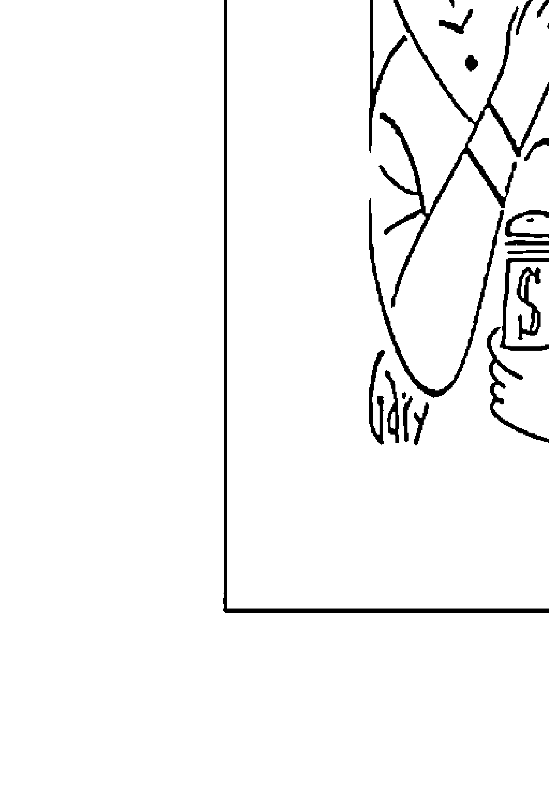

## 第15章

### 實踐魔法的時機

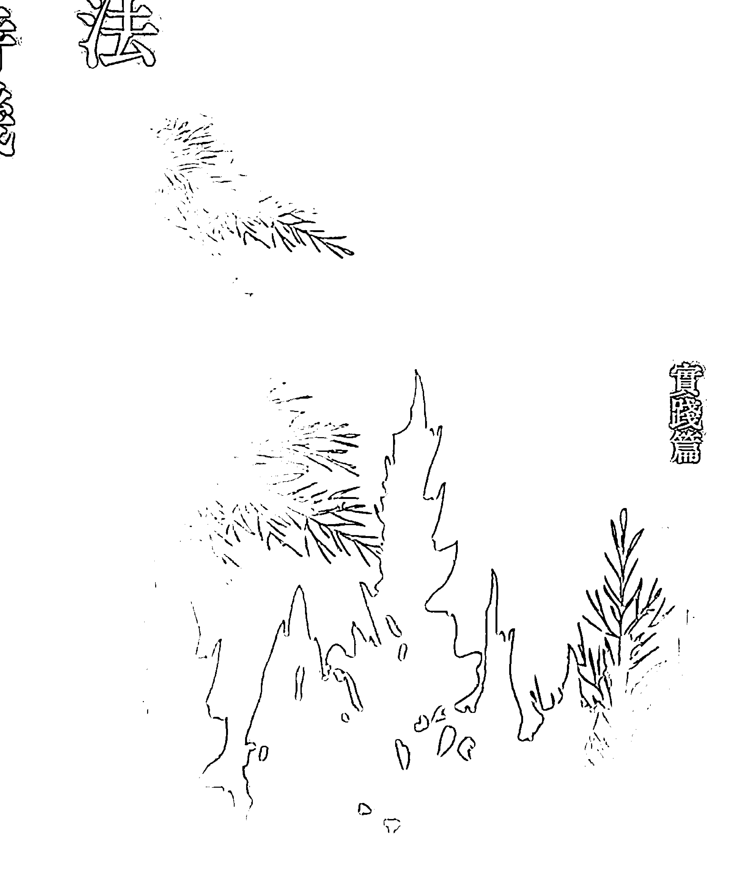

## 實踐篇

### 與魔法日的相稱的週間

在週內的每一天裡，各自支配著每一天的行星，都有著促進讓特定目的的順利達成的魔法的流程與能量，因此列在後方供各位參考。不過不用過於拘泥這點。

| 星期二（火曜日） | 星期一（月曜日） | 星期日（日曜日） |
|------------------|------------------|------------------|
| 与火星能量相连   | 与月亮能量相连   | 与太阳能量相连   |
| 追求熱情、勇氣的魔法；為了促進關係的魔法 | 促進靈感、直覺的魔法；為了讓交易順利的魔法；消除不孕的魔法 | 為了達成希望、成功、目標的魔法；為了健康、療癒的魔法 |

## 第15章 實踐魔法的時機

威卡教派的白魔女，大多會在每個月滿月之日舉行儀式。這是為了在迎接象徵女神與女性特質的滿月之際，汲取滿溢而出的能量（請參考第6章「新月與滿月的魔法 與魔法日的相稱的月份。

| 星期三（水曜日） | 星期四（木曜日） | 星期五（金曜日） | 星期六（土曜日） |
|------------------|------------------|------------------|------------------|
| 與水星能量相連   | 與木星能量相連   | 與金星能量相連   | 與土星能量相連   |
| 為了溝通的魔法，獲得智慧的魔法，為了旅行安全的魔法 | 為了促進繁榮、提升運勢、健康、療癒的魔法；追求領導能力的魔法 | 促進愛情、關係、提升財運的魔法 | 尋求守護、除去障礙、消災解厄、解決問題的魔法 |

——月亮儀式——」。此外，要實踐魔法也有相對應的時機。白魔女會用美國原住民的傳統稱呼方式稱呼每個月的滿月，並實踐與每個滿月相應的魔法。

| 一月 | 二月 | 三月 | 四月 | 五月 | 六月 |
|------|------|------|------|------|------|
| 狼月（Wolf Moon） | 雪月（Snow Moon） | 毛蟲月（Worm Moon） | 桃色月（Pink Moon） | 野兔月（Hare Moon） | 莓月（Strawberry Moon） |
| 為了決定年間目標，促使達成目標的魔法 | 為了克服人生的困難或挑戰的魔法 | 為了朝著造訪的春天提升自我精神力的魔法 | 為了促進自我精神成長的魔法 | 為了讓新開始的事情順利進行的魔法 | 為了追求友好關係或人際關係圓融的魔法 |

## 第15章 实践魔法的时机

一般来说，从新月到满月之间的期间适合使用促进爱情、成功、繁荣、健康、良好关系的「显现魔法」；从满月到新月之间的期间则适合消除坏习惯、负面能量或斩断坏关系的「消除魔法」／「驱逐魔法」。

| | 七月 | 八月 | 九月 | 十月 | 十一月 | 十二月 |
|---|---|---|---|---|---|---|
| 月份别名 | 雄鹿月 (Buck Moon) | 玉蜀黍月 (Corn Moon) | 收穫月 (Harvest Moon) | 狩獵月 (Hunter's Moon) | 霜月 (Frost Moon) | 橡樹月 (Oak Moon) |
| 魔法目的 | 為了促進生意或人際關係繁榮的魔法 | 為了增進收穫的魔法 | 為了促進繁榮與好的服務、貢獻的魔法 | 為了促進自我健康的魔法 | 為了增強家族情感與羈絆的魔法 | 為了完成展開企劃的魔法 |

## 第16章 魔法陣 Magic Circle

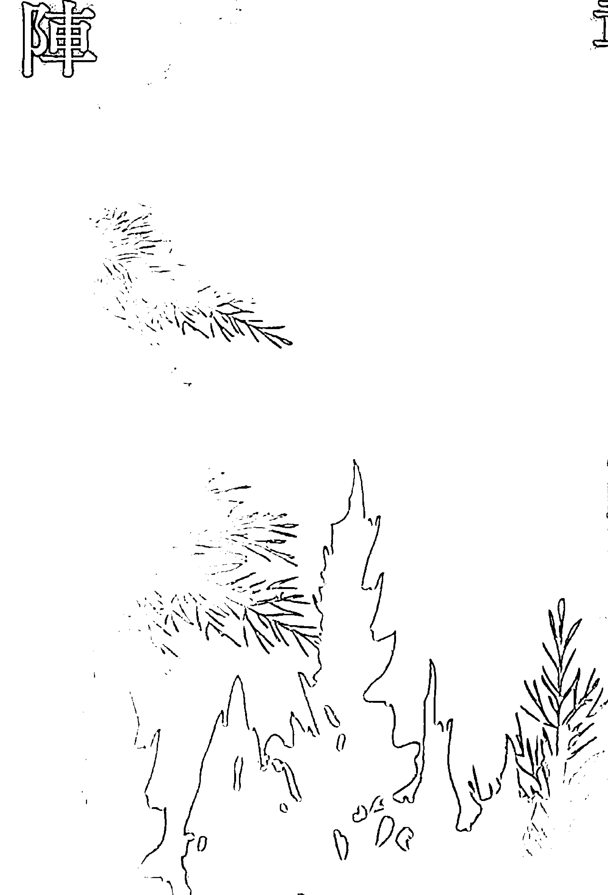

## 實踐篇

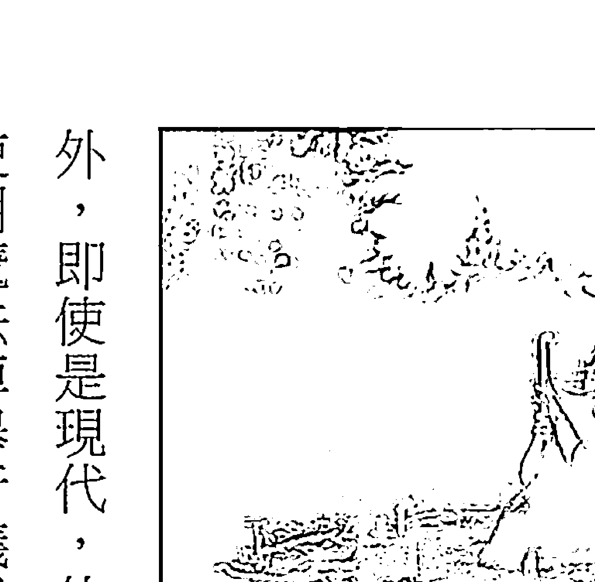

在實踐魔法上，魔法陣本身是重要的工具。想像著希望化為現實的事，並在魔法陣中感受化為現實時的心情，是魔法儀式中最為重要的事。

外，即使是現代，位於世界統治階級的人依然清楚理解舉行儀式一事的價值，並以會使用魔法陣舉行儀式一事為人所知。姑且不論魔法目的的善惡，魔法陣確實具有不可思議的效果。

關於舉行儀式的重要性，我就不特地在此贅述了，相信只要是東方人就能清楚理解。所謂的儀式是具有靈性意義的，神聖的有形行為，古代人們均清楚理解其深厚意義。

尤其是在沒有人煙的野外或森林中製作魔法陣，一邊以赤腳碰觸大地一邊進行儀式，會讓魔法更發揮其效力。

為了讓你實踐的魔法更有効力，創造魔法陣，在陣中進行想實踐的魔法儀式，會比單純吟詠咒語的魔法更具效果。

在藉扎根接地與稍微冥想讓內心平靜下來，再以沐浴或煙燻淨化（請參考第14章）淨身後，實踐魔法的準備就完成了。

## 第16章 魔法陣 (Magic circle)

在日本神道或佛教建築物前，也經常能見刻有看似魔法陣的圖案。比如說鞍馬寺正殿前的石版地上就刻有六芒星。六芒星與五芒星（請參考第13章）一樣是驅魔的護符。在六芒星中間有三角形的石頭，成了能更為集中能量的地點。在構築魔法陣開始儀式之前，為了讓巫術成功，最重要的是設置於魔法陣中央的祭壇，接下來首先要告訴各位祭壇的傳統設置方式。

## 為了實踐魔法準備的祭壇

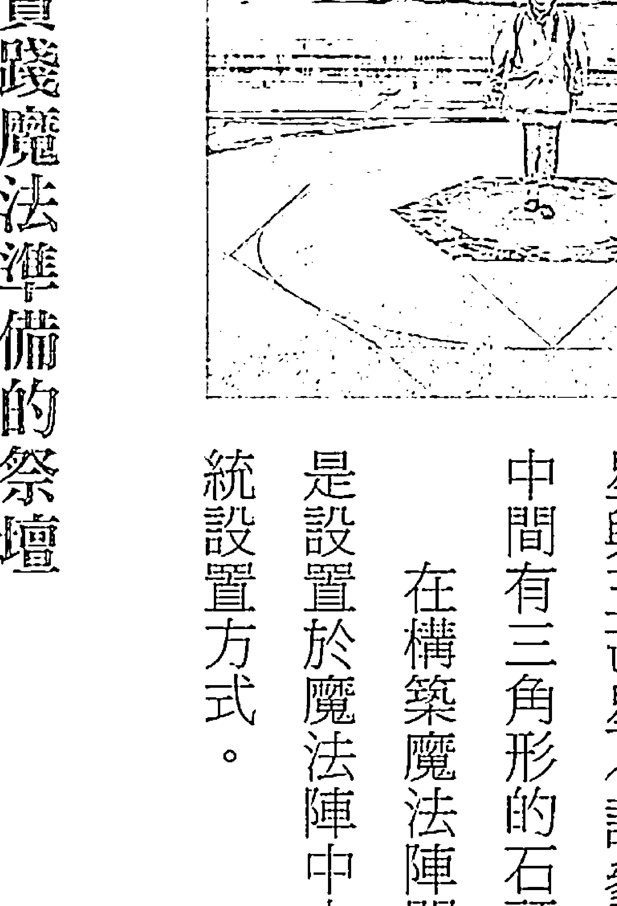

在日本這種具有古老文化的國家，家家戶戶多會留有從前流傳下來的神壇或佛壇等神聖空間。「想打造神聖空間」這種要求，或許是自太古時代以來就存在於人類意識之中的事物。靈性之路是有獨特個性的過程，不同於組織化的宗教。完全自由，沒有教義，個人與神聖存在之間的溝通，也不需要基本規則。因此，在設置與神聖存在聯繫的意義，個人與神聖存在之間的溝通，也不需要基本規則。

## 設置祭壇處需打掃潔淨

祭壇時，會產生充滿個性的結果是理所當然的。話雖如此，我們各自設置的祭壇雖然各有差異，但仍能從中發現共通點。

設置祭壇的地點請先用布打濕擦拭，進行美國原住民在舉行儀式時會做的煙燻淨化——燃燒鼠尾草或茅香用煙霧淨化（請參考第14章），或使用香來淨化。

也有神壇會與神道的神壇一樣擺設鹽、水與供品。當然也能點蠟燭，在祭壇上鋪上白色、橘色等自己喜歡顏色的墊子，或裝飾自己喜歡的物品或花朵等，做各式各樣的排列組合。

也有人會決定東西南北的方位來設置祭壇。你可以擺放漂亮的香爐、燭臺、提升靈感的物品，或是凝視就能與靈性自我相連的繪畫或照片。有人會在簡樸的布料上只擺設蠟燭，但卻能感覺到力量；此外也有人會在工作場所的桌面一隅設置祭壇。

在我家裡，每個房間裡都設有祭壇。即使不是在自己家裡，住在飯店時，我也會先在床鋪邊的桌上設置一個簡易祭壇。在戶外舉行儀式時，大家一起設置祭壇，在加深交情的同時，也能讓現場呈現更能共享靈性的氛圍。設置祭壇之際，最重要的是根據自己的直覺創造。完全沒有必要被「必須這麼做不可」的規則束縛，不過接下來，作為設置於魔法陣中央的祭壇參考，我會介紹一般的設置方式。

## 置於魔法陣中央的祭壇

設置魔法祭壇，是在我們的世界裡創造另一個世界，設置與自己面對面的場所。魔法祭壇具有的影響力，能讓肉眼無法察覺的強大自身產生變化，並改變發展方向。基本上會在木製檯面上朝南設置。大小會依魔法陣的尺寸變化，不過為了能在魔法陣中繞圈移動，請選擇較小的木檯，以能擺放圖中道具的尺寸為準。我會在直徑約四十公分的圓桌上鋪上白色緞面布料。祭壇上擺設象徵男神與女神的兩根蠟燭。由於沒有空間，就省略通常會放在右側的女神像與左側的男神像。右側擺放裝有庭院土壤的小碟與裝鹽的小碟，然後在中央設置適合所需目的魔法的印記（請參考第13章）。除此之外也常會擺放裝葡萄酒的高腳杯或裝水的高腳杯、權杖、香碟。要淨化設置在魔法陣中央的祭壇（神殿），選擇能賦予強大力量的新月之夜進行最有效果。

## 繪製魔法陣的基礎

在儀式開始前構築魔法陣的目的，是最大極限地聚集能量並產生變化。魔法陣在作為能量所及範圍的同時，也兼具結界的任務，是實踐魔法的基礎。

魔法陣有著各式各樣的類型，也有單憑想像創造出來的情況。簡單的方法是藉由動作想像圓形來製作。實際上在戶外杳無人煙的森林或公園地面上畫圓，在室內則用繩索或細帶（如果可以，紫色最佳）呈現魔法陣的圓周，就能更容易地執行具效果的儀式。這時候以直徑一百二十～三百公分為最適合的大小。

在形成魔法陣時，儀式就已經開始，這個過程考驗的是你的顯形（Visualization）能力。請將其中一隻手的掌心朝下，想像指尖放出藍紫色光束，描繪接下來要繪製的魔法陣邊緣。接著用儀式用掃帚清掃要設置魔法陣的位置。在室內以繩索或細帶製作魔法陣時，請將繩頭在東側打結作為出入口，形成漂亮的圓形。 在使用魔法時，必須確認東西南北的方位。實際呼喚對應方位的高次元存在或自己崇拜的男神、女神的名字，將其召喚至圓陣內。這是與美國原住民傳統儀式相通的行為。就像在日本的陰陽道中也有所謂的『方違』（占卜前往方向的吉凶，如果得出不好的結果，就會先朝其他方向前進，避免讓目的地對應凶方），在傳統風俗上多會重視方位。 在進出魔法陣時，請將位於東側的兩繩結之間稍微打開來，從那裡進出。藉由通過這裡，可確保魔法陣中的能量不受干擾。回到陣中時也必須確實關上魔法陣。 儀式從東側開始。在執行巫術的期間，請盡量避免進出魔法陣。在儀式途中或準備期間，若要離開魔法陣，請站在東側用儀式用短劍、權杖或水晶前端做出切斷圓陣的動作。在自己右腳腳邊揮動，然後在左腳腳邊揮動之後再離開魔法陣。

## 第16章 魔法陣 (Magic circle)

在製作魔法陣時，不得開口說話，也不能想像眾神的姿態。接著在設置好的魔法陣中央設置前述的祭壇。然後用魔法道具（權杖或魔法刀劍）或水晶前端朝著魔法陣順時針畫圓，將自己的能量填充進魔法陣中。

在實踐魔法時，魔法陣並不是必須的，不過在向眾神祈求協助，或是到決定施放自己接收的能量為止，圓陣的存在能夠加以維持。一旦魔法陣施放能量，也不會妨礙能量的流動。

由於在魔法陣中會產生陰與陽的能量，在分別選擇兩名男神與女神召喚進來時，請鋪設對應各個方位的四色布料。在神道當中同樣也有將四種顏色導入儀式中。

在魔法陣內側邊緣的四個方位分別設置象徵男神或女神的塑像、照片或代表物品。也可分別設置於四個方位的兩名男神與女神，選擇西方神祇或日本神祇都可以，交雜也沒關係。神祇的心胸寬大，無論你選擇哪位神祇，祂們都會爽快接受選擇吧。魔法陣終於設置完成。那麼，請進入魔法陣裡點燃祭壇上的蠟燭與香。如果需要，點精油或燃燒藥草也無妨，要燃燒鼠尾草在魔法陣裡再次執行煙燻净化也行。在戶外，有時也會不設置祭壇。接著請站到祭壇前方中央處，撩撥內在的力量。在

| 方位 | 顏色 | 元素 | 能量 | 魔法道具 |
|------|------|------|------|----------|
| 南   | 紅   | 火   | 火能量：勇氣與變化力 | 權杖     |
| 東   | 黃   | 風   | 風能量：智力與實現力 | 短劍     |
| 西   | 藍   | 水   | 水能量：包容力 | 高腳杯   |
| 北   | 綠   | 土   | 土能量：持久力 | 水晶、礦石、鹽 |

## 第16章 魔法阵 (Magic circle)

执行仪式的期间，请务必想像、感受、撩动力量。请实际感受召唤来的高次元存在，否则一切仪式都只是形式。

为了产生能量，请缓缓地顺时针绕圆周三圈。请想像圆阵周围有条光带，接著想像那条光带像圆顶般包围圆阵。你本身与中央的祭坛就位於那光之圆顶当中。创造魔法阵会产生洋溢魔女或魔法师个性的力量，不过据说在魔法仪式场合，如何想像出光辉闪耀的圆顶形状，其想像力也会影响魔法的效果。

在感觉得到魔法阵中能量的阶段，首先请向位於圆阵四方的守护神献上祈祷的话语。献上自创的祈祷词也无妨，祈祷方式并没有既定规则，不过在祈祷时，请别忘了向时向参与仪式的神只献上感谢的话语。

献上祈祷之际，首先维持站姿，双手在胸前交叉鞠躬。只要让内心归於无的状态，由衷献上祈祷，即兴的祈祷方式甚至比既定的传统祈祷方式更具效果。以下为祈祷词的例子之一，只要根据这类意义祈祷即可，没有必要过於严肃或拘泥形式。

## 閉合魔法陣的重要性

-   【朝向北邊】降臨北方的〇〇大人（呼喚神祇或天使的名字），請賜予我力量！
-   【朝向東邊】降臨東方的〇〇大人（呼喚神祇或天使的名字），請賜予我力量！
-   【朝向南邊】降臨南方的〇〇大人（呼喚神祇或天使的名字），請賜予我力量！
-   【朝向西邊】降臨西方的〇〇大人（呼喚神祇或天使的名字），請賜予我力量！

過於正經的信仰之心不適合威卡教。這雖是繼承神道習俗的東方難以接受的概念，但是在儀式途中若是自然而然地想笑，就笑出來也無妨。眾神最喜歡笑聲了。歌唱或舞蹈也會讓眾神感到欣喜吧。鈴鑑或音叉等樂器發出的聲音也不會妨礙能量流動，反而能幫助灌注力量。接著，在魔法陣中吟詠自己期望的魔法或咒語（請參考第18章）也無妨，默默冥想也沒關係。最好是自由創造屬於自己的儀式。等習慣魔法陣之後，你就能逐漸感覺到在魔法陣中生氣勃勃地釋放能量，實際在場的高次元存在了。

## 第 16 章 魔法陣 (Magic circle)

一般来说，事先於房間的某處設置祭壇時，會像神壇或佛壇那樣固定留置在某個地點，不過在每次儀式結束後，就必須處理魔法陣。在吟詠、唱歌祈禱或魔法咒語的儀式結束後，請一邊想像著圓陣中的能量全被自己吸收，一邊從東側開始逆時針繞一圈，再從東側出入口走出圓陣，收拾魔法陣。你可以用權杖、短劍或水晶前端朝著魔法陣將其閉合。一邊想像著魔法陣中的力量被道具前端吸收，一邊以逆時針方向朝著圓陣邊緣移動。為了排掉儀式中過剩的能量，建議再次執行扎根接地的儀式。在儀式中使用的道具、創造魔法陣的繩索或細帶，請收納在固定的位置。接著用魔法掃帚清掃設置魔法陣的地方。這麼一來就能消除魔法陣場地的能量，就算放著不管也能防止邪氣或負面能量進入。也可以當場撒鹽後再用掃帚清掃。接著喝完放置於魔法陣祭壇上的水與葡萄酒。將鹽撒在房子周遭是一般為人所知的方法，這點也與神道相通。

## 咒語

咒語與神道也有著深厚關聯。在魔法陣中施咒後再進行儀式，保證能獲得更好的效果。話雖如此，即使不使用魔法陣就施咒，效果也能依照施術者的精神力量而有所期待。

## 第17章

## 何謂魔法書？

## 實踐篇

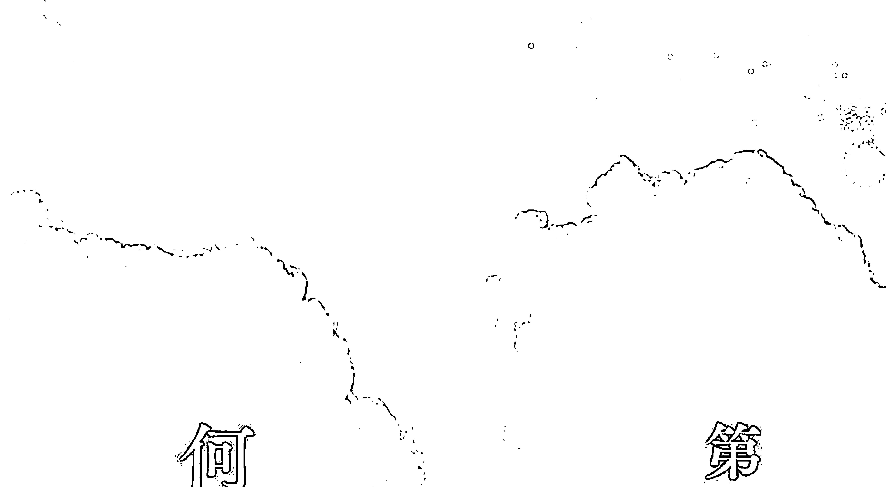

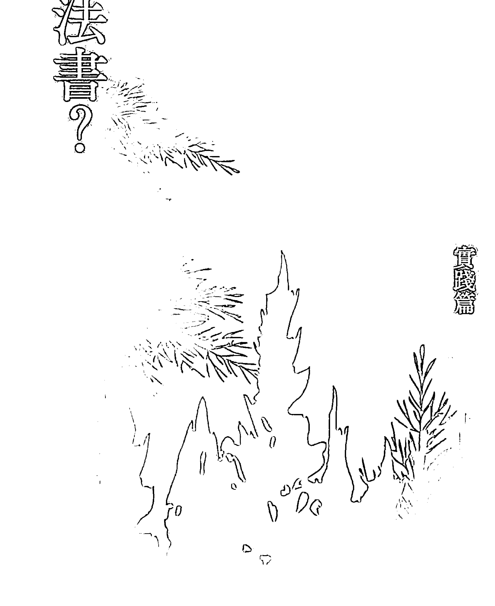

所谓的「魔法书（Grimoire）」，是法文中「巫术书籍」的意思，尤其指在欧洲流传的巫术书。也称作「魔道书」、「魔导书」，可以说是关于魔法奥秘的书籍。也被称作「影之书」。内容记载着召唤精灵或天使实现愿望的步骤，或为此所需的魔法阵、印记设计，以及托付关于魔法的知识与经验等。
从这样的定义来看，本书本身也是一本魔法书，不过无论怎么说，魔法必须实践才有意义，因此希望各位也都能制作属于自己的魔法书。与存在于世界上的许多魔女或巫师留下的魔法书籍「影之书」一样，成为各位亲手记载、与魔法相关的原创记录书籍。请朝着这个目的，从挑选空白笔记本开始。如今市面上有许多优秀的笔记本，这是为了今后一直身为魔女的你自己，比起封面漂亮却单薄的笔记本，选择重视分量的厚重笔记本比较合适。
请记下你所经历的仪式、咒语、向神祈祷的内容、因巫术带来的效果、使用的道具或材料等内容。意识到自己的思考与情感，在实践魔法上非常重要。你有何期望、为何实践了何种魔法、获得了何种结果，将关于魔法的一切事物都记录起来。也为了避免遗忘，而随时记下实践的日期、月分及天体状态吧。当时感觉到了什么、从内心涌上的正面思考等情感面上的事情也別忘了記錄下來。藉由回顧你本身的魔法書，相信能逐漸提升你身為魔女的力量。

## 魔法書記載項目舉例

-   身為魔女的自己的名字如何產生
-   魔女宣言
-   在何時因為何種原委嘗試了該種魔法
-   當時的儀式形式、當時的月亮或天體狀態
-   儀式中準備的物品（水晶、藥草、蠟燭等等）
-   召喚了哪位高次元的存在、為何召喚對方
-   在儀式中有什麼感覺
-   魔法的經過與就結論而言是否有效

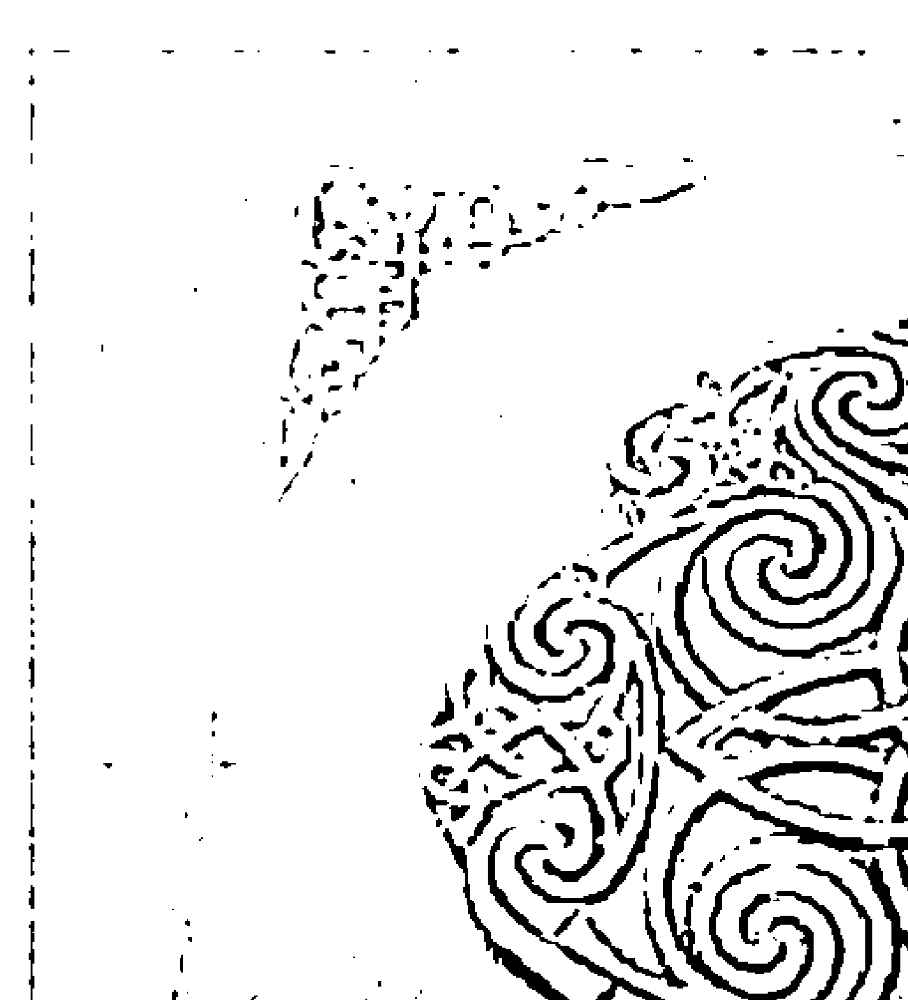

## 留存於世的知名魔法書

### 亞伯拉梅林之書

完整名稱是《巫師亞伯拉梅林的神聖魔法書》。這是一四四八年猶太人亞伯拉罕贈與兒子拉麥的魔法書。一八九三年，被名叫麥克逵格·馬瑟斯（Samuel Liddell MacGregor Mathers）的人物在巴黎阿瑟納爾圖書館發現，並翻譯成英文。

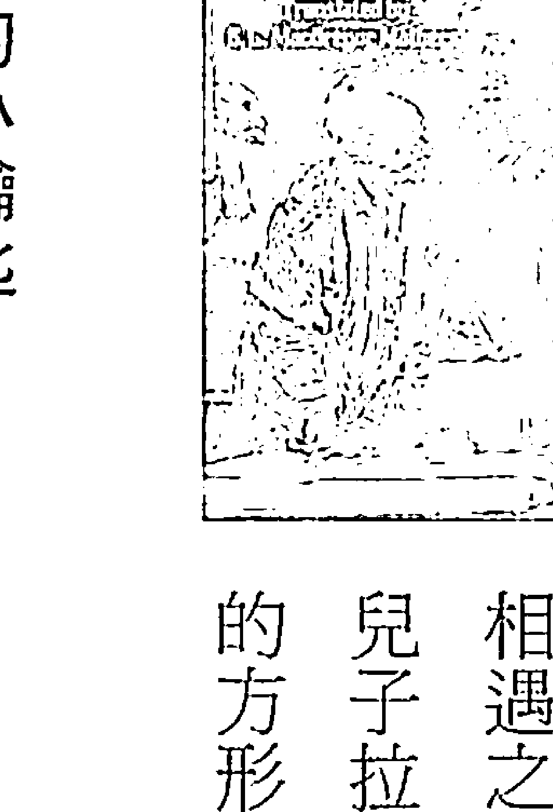

本書由三個部分構成，第一部分講述亞伯拉罕與這份奧義相遇之前的事；最重要的第二部分詳細記載了亞伯拉罕傳授給兒子拉麥的魔法秘傳內容；在第三部分則記載了使用記有名字的方形引發各種奇蹟的方式。

### 所羅門的小鑰匙

這是本知名魔法書。此外還存在另一本《所羅門的大鑰匙》，據說是由麥克逵格·馬瑟斯重新編排而成，不過作為基礎的是藏於大英博物館的《冠有所羅門之名的七種斷》。

## 第17章 何謂魔法書？

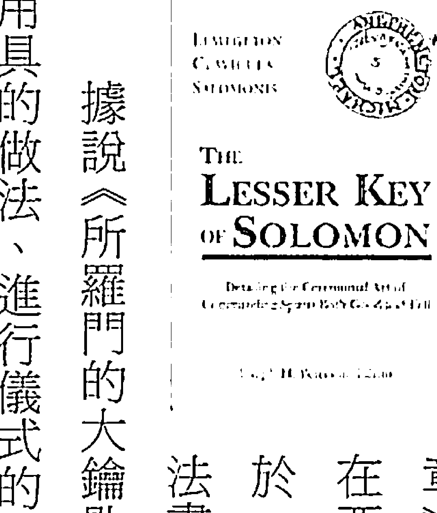

據說《所羅門的大鑰匙》的特徵為豐富的圖版與附錄的巫術用護符。內容記載魔術用具的做法、進行儀式的約定、召喚精靈的方法等，也是相當典型的魔法書；而《所羅門的小鑰匙》也一樣作為知名魔法書流傳至今。遺憾的是內容還包括了召喚惡魔的方法，為防萬一，還是保持距離比較好。

《翠玉錄》 根據傳說，這塊石板是由赫密士（Hermes Trismegistus）親自雕刻的翡翠石板。據說是由亞伯拉罕的妻子薩拉、或提亞納的阿波羅尼烏斯在位在古夫金字塔內部的赫密士·崔斯墨圖墳墓發現的。也有一說是亞歷山大大帝發現的。是刻有鍊金術最為重要原理的秘術書。（參照維基百科）

據說是十五世紀左右的魔法書。原本應該更為古老，由在西元一世紀的歷史學家約瑟夫斯（Josephus）的著作中也有關《冠有所羅門之名的魔法書》的記載，推測這是最古老的魔法書，可說是與《*翠玉錄（Emerald Tablet）》匹敵的重要書籍。

## 第18章 施咒

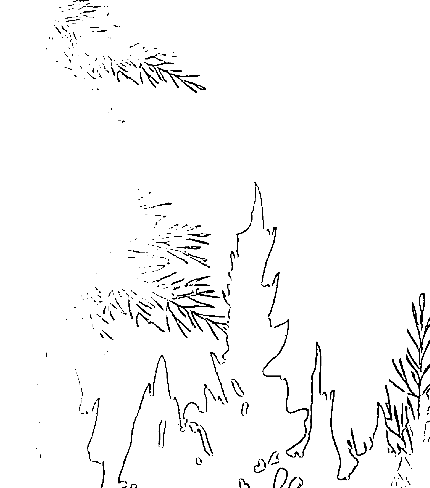

實魔篇

所謂的「施咒（Spellcasting）」，指的是吟詠咒語將氣息注入魔法中。「Spell」就是咒語的意思，而「Casting」也用於釣者將釣線投進水裡的行為。將這兩個詞彙合起來的「Spellcasting」，自不用說，就是指吟詠咒語進行的魔法。

說到咒語時，就是「仙女魔鏡！——或許還有許多人記得。《甜蜜小天使》中的女主角厚子要用魔法鏡子變身成別人時，只要喊出「仙女魔鏡，仙女魔鏡，請讓我變成○○的樣子」鏡子就會映照出厚子變身後的模樣。而要變回原狀的咒語，我記得是「甜蜜甜蜜甜甜」——雖然是漫畫世界，但只要誠心吟詠咒語，就能帶出乎意料的效果。

在施咒時，要讓思考保持清晰狀態，這是基礎。完全沒有必要按照魔法秘傳或奧義唸咒，創造為了自己、適合自己的咒語也無妨。自己創造出來的咒語，會隨著使用的次數增加而增強效力。

在日常生活中，不知不覺就朗朗上口，從以前起就廣為人知的詞彙其實也是咒語——也會重新認知到這一點。比如說《天方夜譚》中的《阿里巴巴與四十大盜》故事裡，

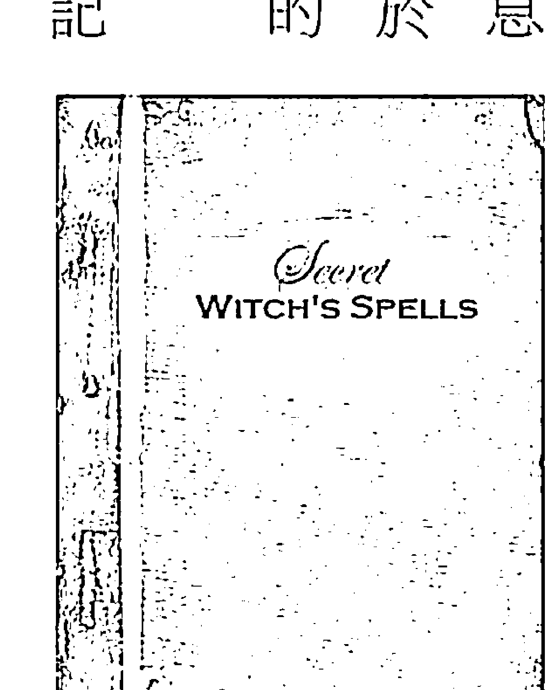

## 借助精靈之力施咒

我們都很熟悉的「芝麻開門！」這句咒語，其實蘊含著「塞得滿滿的重要寶物啊，快點出來吧！」的願望。因此在面對昏暗不明、遲遲無法真相大白的事情時，也可以低喃三次「芝麻開門！」喔。

作為傳統的施咒方式，可身穿儀式用長袍（請參考第 12 章），一邊揮舞魔杖一邊吟詠魔法咒語是最有效的。可以先從召喚適合協助施咒作業的妖精或精靈開始。比如說，如果是尋求和解的咒語，魔女或魔法師就召喚會被綠色、鴿子、橄欖樹吸引的精靈「伊莫克·烏洛克」。根據傳說，只要揮舞著橄欖樹枝，反覆吟詠伊莫克·烏洛克名字的咒語，簡單地說，就是將「Imok Urok」拆開成一個字母一個字母的「I、M、O、K……」反覆吟詠幾次，伊莫克·烏洛克就會出現，協助你使用和解成立的魔法。

此外，據說將「Imok Urok」拆開字母吟詠來施咒，能吸引妖精，製作出效果出色的魔法藥草或特效藥。在製作某事物時想必能助你一臂之力。

## 找尋失物的咒語

接著，我會傳授各種效果的施咒方式。如果在你自己創造的魔法陣中實踐，想必很有效。

首先來介紹幾乎不會違背期待的實用咒語。這是從以前起就經常使用的咒語。當需要尋找東西時，請向擅長尋找失物的守護聖人聖安東尼祈求。

> 「聖安東尼大人，聖安東尼大人，請找到○○！」

雖然很簡短，但只要這麼吟詠，不可思議地總會馬上找到。這是我近四十年來的經驗。而在覺得放棄比較好的時候，我也會有聖安東尼馬上告訴我「不行」的感覺。我以前因為工作坊而造訪羅馬時，因為發現某位參加者裝在袋子裡的土產弄丟了，大家就一起向聖安東尼祈禱希望能找回失物。然後一邊追溯著足跡尋找，前往大約一小時前造訪的教堂，結果發現土產就放在教堂裡的聖安東尼像前。這令大家都不由得笑了出來。

## 產生自信的咒語

我在二〇一五年十月的對談中，與昂宿星意識體通靈的最後，他們講了一句「阿布拉卡達布拉，不要忘了這句話！」之後就此離去。「阿布拉卡達布拉（ABRACADABRA）」是耶穌基督曾使用的語言亞拉姆語（Aramaya），意思是「變得如我所說」。自那時起，我就頻繁地使用這個咒語。當想讓某件事化為現實時，或是在需要自信心時，這句咒語非常有效。此外，人們自古以來就深信這句咒語具有驅逐所有惡靈的效果。

這種人們從以前起就開始使用的咒語，是因為具備眾多人們的群體意識產生的能量場而有效嗎？即使沒有意識到，但帶有某種意圖的話語全都會推動能量，這是事實。

## 召喚幸福的咒語

【準備的物品：喜歡的顏色的蠟燭、玫瑰花瓣五片、自己的照片】

在蠟燭周遭擺放五片玫瑰花瓣，在靠近自己處擺上自己的照片。然後坐在前方點燃蠟燭。一邊凝視著蠟燭的火光，一邊在內心描繪自己幸福的模樣。在深呼吸幾次之後，將最靠近自己的玫瑰花瓣放到手掌上，一邊想像將憂鬱的心情注入花瓣中，一邊凝視著掌中的花瓣。然後捏碎那片花瓣丟掉。剩下四片花瓣也同樣照著做。結束之後再次深呼吸。然後一邊想像幸福的自己，將形象與眼前的照片重疊，一邊將後述內容吟詠三次以上。

> 「請藉由我內在的力量為我帶來幸福。我已經將擔心的事從內心各處去除，如孩子般的幸福感充滿我的內心。沈重思考離去，幸福之流正自由地流進來。必會如此！」

吟詠結束後，閉上眼睛回想孩提時代的幸福心情。並將五片薔薇花瓣埋到外面的樹根下。

> Knock on wood

這句咒語源自為了避免壞事或災難發生而敲樹（敲樹驅邪）的行為。習慣上會在提起或炫耀幸運持續時，一邊喊出「Knock on wood！」一邊實際敲響附近的木製品。是藉由這麼做，就能避免不幸、持續幸運的小咒語。

## 吸引靈魂伴侶的咒語

【準備的物品：能燃燒十五分鐘左右的白色蠟燭一根、適合作為結婚戒指的金色戒指兩只（仿製品即可）、金色繩子或絲線】

*   這個魔法咒語最適合在從新月到滿月之夜的期間進行。請準備一張紙，詳細列出理想對象的條件。比如說身高夠高、擁有穩定工作、溫柔、住在何處、幾歲左右等等。接著用金色繩子或絲線將兩只戒指綁起來。在繩結上設置蠟燭，準備工作就完成了。點燃蠟燭後，在蠟燭燒完為止反覆出聲唸出清單上的內容。在蠟燭燒完後，將留下的兩只戒指好好收藏起來。這是能將靈魂伴侶吸引到附近的咒語。請感謝宇宙總會給予你期望的事物，並耐心等待吧！這類咒語稱作「束縛咒」，不能對實際存在的人物使用，因為這會妨礙對方的自由意志。

### 夏麗的吸引魔法①

首先，請相信你的靈魂伴侶此時此刻存在於某處，只不過尚未遇見罷了。這麼想好之後，請進行接下來的想像工作。在那名靈魂伴侶與你之間，有個可愛的孩子。即使你還不到能生孩子的年紀，作為兩人愛的結晶的孩子也存在於其他次元。無論是男孩或女孩都無妨，請在內心想像那孩子，然後向那孩子祈求「帶爸爸過來！」反之，如果你是男性，就說「帶媽媽過來！」——這是出乎意料有效的魔法！實際上在我認識的人之中，就有好幾人真的見效，過沒多久就遇見了自己的靈魂伴侶。

夏麗也曾教過我兩種吸引魔法。兩種都是能吸引靈魂伴侶的魔法，不過第二種不限於靈魂伴侶，而是能將希望化作現實。

### 夏麗的吸引魔法②

另一個魔法要一邊做激烈運動一邊進行。比如說一邊慢跑、跑跑步機，在肉體達到最痛苦狀態的瞬間，同時想像著在遇見靈魂伴侶或夢想實現時，會有多麼喜悅的情感竄過全身，讓身體去感覺。這個魔法因為要在痛苦之時產生相反的情感，所以相當困難，不過隨著訓練累積，就不會太難辦到。只要花些時間練習，使用這個方法，希望的事就能如魔法般化為現實。

## 消除負面能量的咒語

在我們的世界裡，四處飄散著令人不喜歡的能量，有時我們會因為這肉眼看不見的微妙能量而感到憂鬱。有個咒語能中和這種能量，能藉由這咒語淨化你本身以及你所在的空間。如果想排解某些情緒時也很有效。在這種情況下的施咒稱作『消滅咒』，大多會使用「神聖煙霧」。

> 「準備的物品：鼠尾草、雪松、柊樹樹枝、茅香等煙燻用材料、裝了鹽水的噴霧（也可混入檸檬、薰衣草、乳香等精油）」

請用準備的材料燃燒生煙，對自己或家中使用煙燻淨化（請參考第14章）。然後噴灑裝了鹽水的噴霧。若是使用儲存了滿月能量的水作為噴霧更佳（請參考第6章）。請用水晶前端或權杖前端指著，讓光在家中移動，並想像負面能量被中和的景象。然後誠心出聲吟詠下述咒語。

> 「請淨化我本身與這個空間。負面能量已經全被中和消除。讓愛與光芒充滿我本身與這個家！」

## 找到好工作的咒語

【準備的物品：在缽裡裝小茶匙一半分量的肉桂、肉豆蔻與羅勒，摻入橄欖油或薄荷油攪拌而成、三根新的綠色蠟燭、天然鹽】

請將摻入油攪拌後的香料塗抹在三根蠟燭表面。這個咒語從滿月的四天前到滿月當晚進行，帶來的效果最佳。分別握住蠟燭，祈禱能任職好工作，並將蠟燭擺成三角形。擺在敞開的窗邊也不錯，不過最好是擺在屋外執行咒語。撒上鹽讓三根蠟燭圍成的三角形呈現出來。並在三角形正中央放上五芒星（請參考第13章），也可以用綠色蠟筆繪製五芒星。接著從三角形的頂點依順時針方向點燃每一根蠟燭，反覆吟詠咒語。

> 「我很快就會找到我所尋求的工作。我點燃的每一根蠟燭會為我帶來財富與我所希望的命運。必會如此！」

只要將用在這咒語上的五芒星放在鞋底，在面試新工作時就能自信滿滿地應對。

## 賦予自信心的金圈（Golden Circle）

若是在需要增加自信的時刻、想在競賽中獲勝、需要保護自己時，請試著想像金圈從頭頂上降下，環住身體並下降到腰際。想像金圈的方法，也作為防護在『荷歐波諾波諾（ho'oponopono）』的祈禱中執行。

## 召喚財運的咒語

首先要充分感謝現在被賦予的事物及自己的人生，這是基礎。現存有許多種可召喚財運的蠟燭巫術。最廣為人知的做法是使用金色、綠色、白色等蠟燭與松木精油、肉桂香等，實踐在滿月的前後一週之間吟詠咒語的魔法。建議各位可以創造自己的祈求物質豐裕咒語來舉行儀式。在《亞伯拉梅林之書》（請參考第17章）中寫道，只要吟詠「歐那伊姆·培朗提斯·拉索那托斯」十一次左右，就會出現七名鎮尼（請參考第7章「圖博巫術『朱巴』」），協助你獲得錢財。接著介紹召喚金運、內行人都知道的強力魔符（護符）。這是上頭繪有五邊形與數字的奇特符咒，刊載於法國人阿布瑪茲·夏龍提耶（Albumaz de Carpentieri）於一七五四年出版的書中。這個魔符本身更為古老，似乎源自卡巴拉的秘儀。將這個護符影印一份放進錢包等處或許不錯。

### 召喚富裕的咒語

根據自古流傳的傳說，只要將一根新鮮羅勒與五枚小硬幣放在家里入口的門上，就能召來富裕。

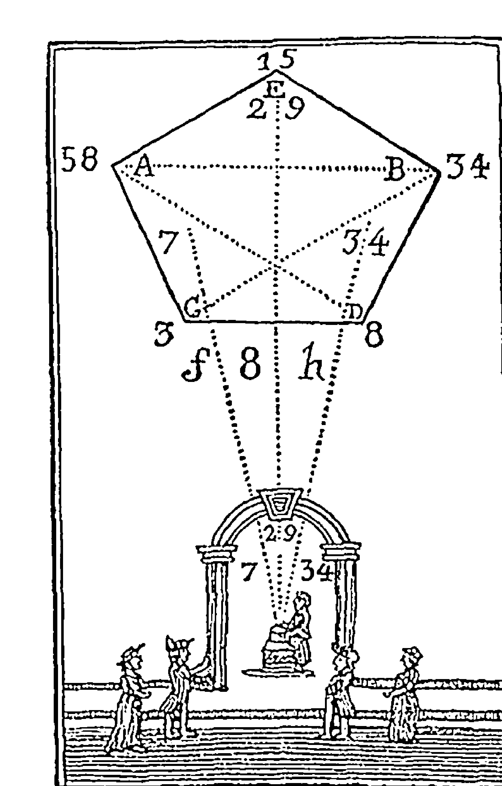

源自卡巴拉秘儀的護符

## 第19章 宣告法術

### 「潔西卡的結婚宣言」

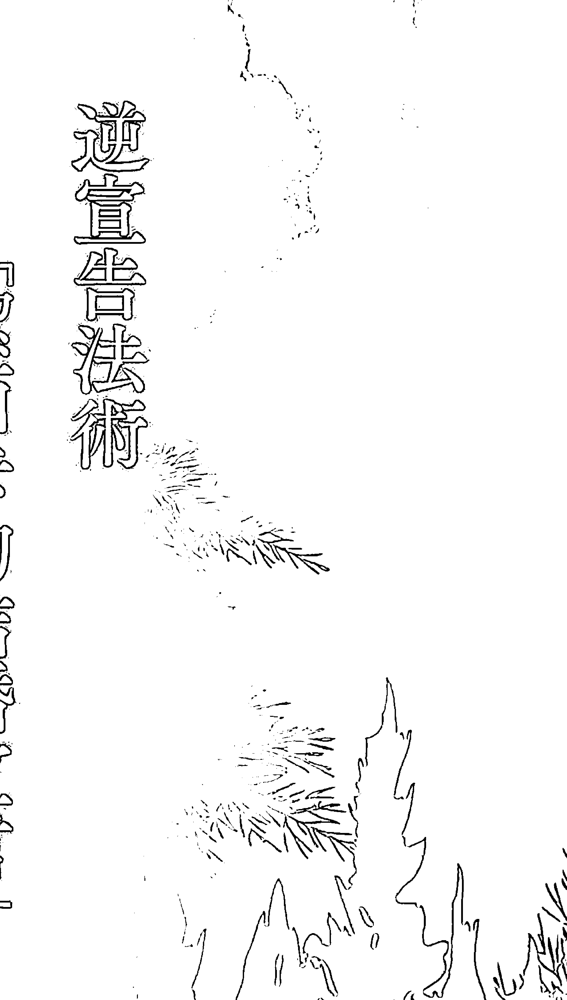

我有個老朋友叫做潔西卡·諾斯。她擁有「形而上學」這個罕見的博士學位，擁有豐富的女神與魔女知識，同時是我多年來在領域上的老師。二十幾年前，她是個邊養育五個孩子邊忙於工作的單親媽媽。她疲倦至極的模樣，有時看起來真像個老魔女。她原本過著忙碌到令人憐憫的生活，某一天卻突然寄了一張卡片給我。我打開信封，看見裡面裝著的是婚禮邀請函。這令我懷疑起自己的眼睛，反覆確認了好幾次，但上面的確寫著「潔西卡·諾斯的婚禮」。而且邀請函上的婚禮會場也在奇怪的地方，是我們當時居住的加拿大維多利亞市中心的碧根山公園裡。邀請函顯示會場位於公園裡池塘前方道路與通往街上道路的交叉路口。當天我前往指定地點，令我感到吃驚的，是聚集於此的大約三十名女性全都身穿中世紀魔女般的服装出席。其中還有兩名男性，身穿普通服装的只有那兩個男性跟我而已。「潔西卡究竟是跟這些人之中的誰結婚呢？哪位男性？該不會是那個拿著掃帚、看似魔女的女性吧？」我這麼想著的期間，神秘的婚禮就開始了。「來，各位，請以這個十字路口為中心圍成一個圓。」潔西卡如此呼喊。由於十字路口是聚集能量的地點，我想起中世紀魔女確實會在十字路口聚會的事。

我們圍成一個圓，手牽著手閉上眼睛稍微冥想了一會兒。手持權杖，乍看之下做魔女裝扮的潔西卡突然向眾人開口：

> > 「我今天跟我自己結婚了。我要捨棄總有一天會跟誰結婚的夢想！在這個圓裡的兩名男性是我孩子們的父親，但他們一點也不可靠，我已經受夠男人了。從今以後我也會堅強地活下去，請各位朋友今後也繼續支持這樣的我，非常感謝大家。」

她做出了驚人的宣言。那時，在我們附近的樹上正好停著一隻烏鴉。在那瞬間，不知道從哪裡冒出一隻黑貓爬上同一棵樹。烏鴉嘎嘎叫著攻擊，貓也發出嘶吼聲，接下來異常嘈雜到甚至聽不見她的聲音。因此儀式就此中斷。大家都目瞪口呆地看著那不可思議的景象。此時我甚至心想「到底發生了什麼事？她是真正的魔女嗎！？」並感到毛骨悚然。但是過了一會兒，「啊，原來如此，是逆宣告法術嗎！」然後果然如此，潔西卡在那天之後不到一年的時間就交了男友，熱鬧地舉行了真正的婚禮。對方是她教形而上學的大學生，是跟她同年紀的年輕帥哥。兩人直到今天仍處於熱戀狀態地一同生活。

## 魔法的三倍奉還

在魔法中有著無論出於善意或惡意，自己所做的事都會在經過循環後化為三倍回到自己身上的法則。因此無論期望何種魔法，在實踐之前都必須審慎思考。

## 第20章 讓魔法成功的秘訣

## 實踐篇

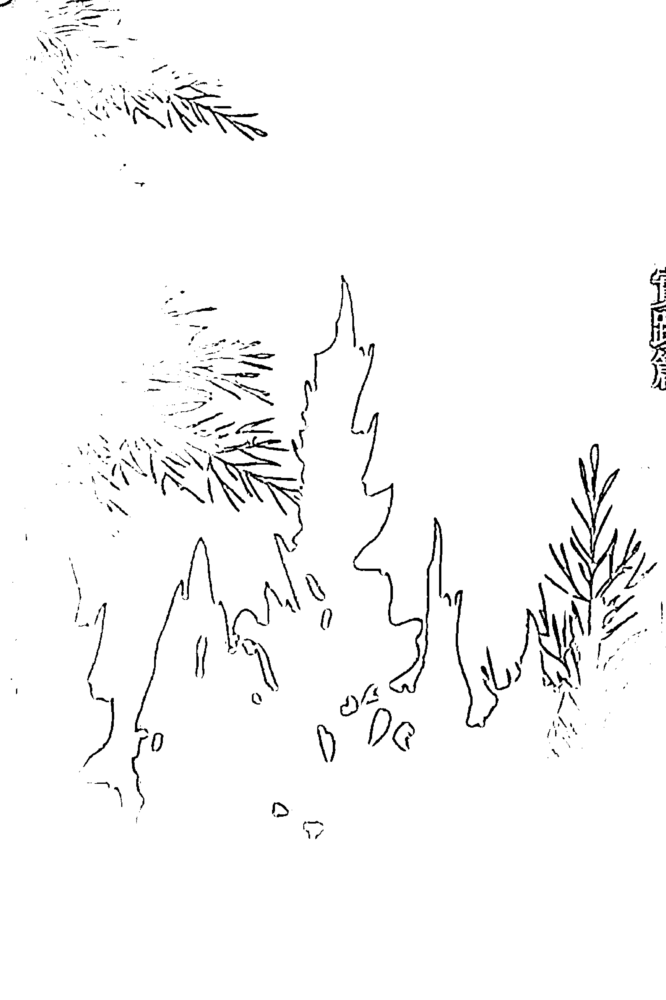

在本書中介紹的大約二十五種魔法，都是我實際實踐過或深感興趣的內容。想請各位在實踐所有魔法時謹記在心的，是千萬不能控制、妨礙他人自由意志，甚至傷害他人為目的而使用。請以自己的意志為了獲得最棒的結果而實踐。也就是只實踐與自己本身的愛與幸福相關的魔法。

任何事都一樣，重要的是為了順利達成目標付諸努力，魔法也是一樣的。如同在本書開頭所述，我小學時代非常喜歡《神仙家庭》這個電視節目。主角珊曼莎有個名叫克拉拉的阿姨，她是個所謂的「冒失魔女」。儘管一邊揮著魔杖、竭盡所能地專注於魔法上，卻會把意料之外的對象變成蟾蜍、讓人長出驢子耳朵，總是搞砸，怎樣都不順利。

一開始嘗試魔法時，大多數人都會順利成功，這可說是所謂的新手好運；反之，也有人會經歷暫時性的好轉反應，也就是說，一開始可能會因為能量反作用而感到不快；此外，也有可能違背自己的意志，產生完全相反的糟糕結果。以我來說，就在儀式之後沒有整理魔法陣而放置不管，導致經歷了那種情況。

即使在實踐魔法時發生事與願違的結果，也不表示魔法沒有任何效用，因為魔法會導致某些現象發生，所以反倒該感到高興。只要一再練習，就能跨越「沒有反應」、「好轉反應」、「僥倖」、「失敗」，而實際掌握確實的效力。也請務必將實踐的過程記錄到自己的魔法書上。

一旦熟練了魔法，想請你注意的是切勿傲慢。這與各種成功秘訣一樣。然後，最後我想強調的是「魔法絕對不是用來炫耀的」這個規則。就算魔法帶來好的結果，一旦得意而驕傲，魔法的力量就會消失。

最後，我想告訴各位在這本書中最重要的事。那就是千萬不要忘記，你的人生與神之間有著重要的關聯。你是身為造物主的神的一部分，神也是你的一部分。你與神是平等的，擁有生命的一切事物也都是平等地被創造出來的，因此必須互相尊重。或許這樣的概念非常難以接受，但包括你在內，神的創造物都是由神平等創造出來，沒有孰優孰劣的問題。所謂的「有神存在其中」就是這個意思。因此，並不是趴伏於神的面前，而是將眾神作為朋友往來，同時以孩童般坦率的心情，請對方協助你所實踐的魔法。並且請你永保一顆相信魔法的心！

## 第21章 尋找魔法陣！

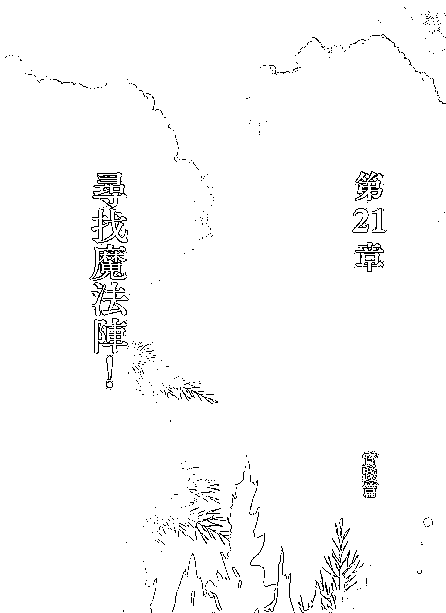

我與昴宿星人通靈的內容，在二〇一六年時出版了一系列的三本書。分別是《昴宿星返回靈魂故鄉》、《昴宿星前往新生地球》、《昴宿星在融合次元的生存方式》（暫譯，均為ヒカルランド出版）。作為最後一本的結尾，我寫了以下這段話。
「我在十九歲時（一九七二年），在居住的倫敦經歷瀕死經驗，伴隨著那強烈的經驗喪失了記憶，不過我不久就運氣很好地遇見了巫師阿爾弗雷德。然後在幾個小時內，我從喪失記憶的狀況中獲得解放。我從那時起就成為他的弟子，開始進入不可思議的魔法世界。」
那麼，接下來我會講述我當時向阿爾弗雷德學到了何種魔法課程。距離當時已經過了漫長的歲月，以下部分是我在二〇一四年，一邊回想起那段就要被我遺忘、堪稱人生至寶的記憶，一邊在自己的部落格連載的內容。

### 與巫師阿爾弗雷德邂逅

在經歷瀕死經驗後，我持續著宛如靈魂出竅的狀態。不存在於任何地方，既沒有過去的記憶，也沒有活下去的力氣。擔心我的朋友輪流造訪我的公寓，建議我可以去見見誰，但我照做之後依然沒有任何改變。後來朋友就帶著我慢慢地回到美大。

就在某個週六的午後，我獨自晃到波多貝羅的二手市集。直到那時候，我依然無法對自己本身有所自覺，甚至會對迎面走來的一名年輕人說出「你就是我吧」這種話來，因為「你與我」之間的界線消失了。「當然嘍，妳就是我。」那名年輕人揶揄似地這麼笑著回答後就跟我擦身而過了。我在波多貝羅緩緩地前進著，穿過古董店等各式各樣攤位林立的道路，走到牧羊叢站附近。這時，一名迎面走來的男人突然抓住我的手臂，那男人將我的手翻過來，仔細盯著我的手掌看完後這麼說：「妳的內在世界與外界分離，完全失去了平衡。妳知道這是很危險的狀態嗎？」他以銳利的眼神看著我。
「如果你知道是怎麼回事，請務必告訴我。」我對那名男子這麼說，他就說了一句「跟我來。」他的皮膚微黑，並不是白人。講話也有口音，所以似乎不是英國人。我一瞬間感到不知所措，不曉得該不該跟上去。除了相信眼前這個年約四十的男人之外別無他法——我迅速下定了決心後跟著他走。

「我的公寓就在轉角過去的位置。等一下，妳看，妳覺得那個茶壺怎麼樣？」他詢問我，我在古董店攤位前停下腳步，盯著那看似老舊的茶壺看。「這是來自死亡的贈禮喔。」他笑著這麼說完，就買下了那個茶壺。店裡的男人隨便地用報紙將茶壺捲起後交給他。

那是個散發著維多利亞時代氛圍，有著有趣裝飾的茶壺。話說回來，他所謂的「來自死亡的贈禮」指的是那個茶壺嗎？還是看穿了我而這麼說的？他的視線的確似乎隱約感覺得出我的狀況。我就這樣與他保持一點距離跟著他走。

## 被巫師阿爾弗雷德拯救

那個人名叫阿爾弗雷德·波涅特。是出身南美阿根廷，在巴黎住了八年後移居到倫敦的藝術家。他表示自己不是白人，而是原住民。在簡單自我介紹後，他來到有著許多集合住宅櫛比鱗次的一區，並打開位於一隅的建築物大門。沿著狹窄樓梯爬上五樓左右

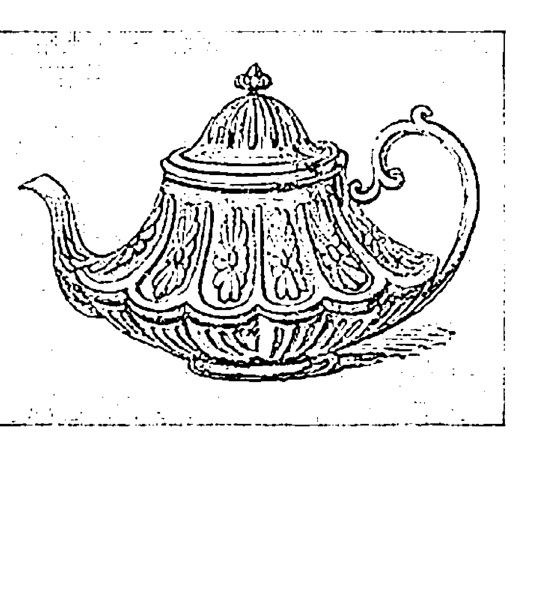

的小小閣樓，就是他的住處。他用剛買下的茶壺泡茶，在切得很厚的黑麥吐司上淋了滿滿蜂蜜後端給我。

從他的房間窗戶可以眺望染紅天空的夕陽。「好漂亮的夕陽。」我這麼說，他就告訴我：「那麼，妳能感覺得道夕陽的力量吧？就吸收它的能量吧。不要說話，保持沉默。」

就這樣過了大約一小時左右，周遭莫名地安靜了下來。過了一會兒，我隱約聽見小房間的四個角落，傳來簡直像置身海邊的海浪聲。那沙沙地逐漸逼近又後退的海潮聲，清楚地傳進我的耳裡。

「這究竟是什麼？」我終於無法繼續保持沉默，忍不住詢問他。「噓——安靜專注在那聲音上。」阿爾弗雷德只這麼勸告我。我們又繼續安靜地坐著。結果這次又從某處傳來一隻蒼蠅在房裡飛動的聲音。我看見那隻蒼蠅嗡地發出聲音，在擺在房間窗邊的觀葉植物旁飛著。

「不可以看，那傢伙比現在的你還強。專注在波浪聲上。」他再次提醒了我。太陽

> 「來，喝茶吧。不過還是要繼續專注於那聲音上喔。」

「這個人是魔術師嗎？還是那個奇怪形狀的茶壺造成的？」我在心中抱持著這種疑問，啜飲著冷掉的茶。阿爾弗雷德見狀，一臉傻眼地這麼說：「竟然那樣喝茶，妳真的是日本人嗎？彎曲手臂，伸手持杯，以杯就口。然後讓含進嘴裡的茶流過喉嚨。妳不會這樣一邊觀察一邊喝茶嗎？」

> 「這個人說的話真奇怪。」

我一瞬間這麼想，但還是照著他的話再次緩緩喝了一口茶。我將杯子放回原位後，「這次一邊觀察著蠟燭的火光映出自己的影子，再喝一口茶。」他這麼說，又倒了一杯茶給我。於是我一邊凝視著在蠟燭火焰下搖曳的自己的影子，按照他的話緩緩喝了一口茶。就在我放回杯子的那瞬間，發生了令人難以置信的事。

在那瞬間，我清楚地想起了自己喪失的記憶。

放下杯子的那隻手是我剛出生時小小的手，我回想起那是我五歲時的手，與我現在的手連結在一起，我的記憶伴隨著這種不可思議的感覺復甦。我不由得大大地攤開雙手大喊：「哇！我一直活著，這同樣也是我的手！」然後打了個大大的呵欠。「為什麼我」

## 第21章 尋找魔法陣！

至今為止都在沉睡？我現在已經完全清醒了，老師！」

在這一瞬間，我成功地完全脫離了過去、未來的時間幻覺。說起來或許愚蠢可笑，但我經歷了完全覺醒的自己。在這一瞬間甦醒的不僅是暫時喪失的這一世記憶，現在回想起來，我還經歷了前世記憶也如照相機快門喀嚓喀嚓地開闢般，某些場景迅速地出現在腦中，下一幕又接著復甦。當時的感覺難以言喻地暢快，我一輩子都無法忘懷。現在回想起來，那想必是我人生中最棒的覺醒狀態。

阿爾弗雷德看向小房間的時鐘，已經是半夜兩點了。我們從傍晚到這時候都一直靜靜地坐著。「妳一邊維持著那個世界，一邊輕輕站起來。」他對我這麼說。我們倆緩緩地走著，穿過海德公園，走到我位於肯辛頓的公寓為止，大約兩小時都沉默不語地走著。在抵達我的公寓前後，「這個世界與至今為止的世界不同，外界與內在世界保持了完美的平衡。妳至今為止一直都在那裡，不過今天找到了入口。是妳借助夕陽的力量找到的。」他這麼說完後就回去了。

那一天阿爾弗雷德教我的內容不過是入口，從那一刻起，我就在住在倫敦街上的巫師阿爾弗雷德身邊學習了各式各樣的魔法。

## 向巫師阿爾弗雷德學習

在與阿爾弗雷德分開後，我躺到自己公寓的床上，但沒有閉上眼睛。我的思考完全停止，睜著眼睛只讓身體休息。
這樣的狀態持續了一週。我沒有作夢也沒有思考，就這樣持續了好幾天所謂的「三摩地（三昧）狀態」。那恐怕是我人生中最為豁然開朗的經驗。我感覺到自己充滿不可思議的力量，不如應該說「自己」並不存在，或是說「自己就是全部」。在那一週左右的期間，我感覺自己就像擁抱著整顆地球般。
我是地球之母，包容著地球的一切喜悅與悲傷，一切責任在於自己的深切感覺好幾度湧上心頭。然後就在這種情況下，又像墜落回到平時的意識狀態，「三摩地狀態」與一般意識互相交替著。一旦尋求著「三摩地狀態」，那意識就逐漸消失，感覺自己簡直像是墜落的天使。這種狀態持續了大約一個月，某天，「約翰·藍儂會被殺」這句肯定的話語突然間浮現在腦海中。

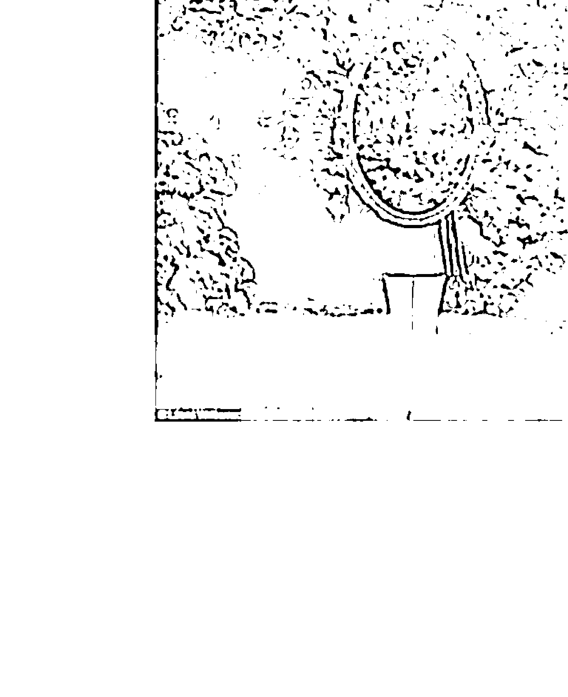

糟了，得設法通知約翰·藍儂才行！我出於使命感，甚至寫了封簡單的信寄到披頭四當時位於倫敦的唱片公司。不過他實際遭到暗殺是在那一刻八年後的事了。現在回顧自己的人生，我或許是為了回到當時強烈的三摩地體驗，才會從那之後一直持續追求著靈性世界。我在遇見阿爾弗雷德的一個月後，再度造訪了他的公寓。那時他也一樣指示我靜坐冥想。在我安靜地坐著時，上一次那種從房間四個角落傳來的海浪聲又再度傳進耳中。

「不可以說話。」他這麼說完後起身，我默默地跟著他走了出去。「聽好了，要保持著那個世界，一邊觀察人類。要拋棄主觀觀察人類。到荷蘭公園去吧。在那之前，為了避免過於顯眼，我先教妳變成透明人的法術。」他這麼說。那與其說是字面上的「透明人」，倒不如說是心靈感應能力者般的特技，能讓任何人在心理上都不注意到自己、不看向自己。

## 尋找魔法陣！

> 在你懷疑自己能不能飛的瞬間，那份能力就會永遠消失。

J・M・巴里（《彼得潘》作者）

阿爾弗雷德鮮少會開口跟我說話。不過他開口時總會充滿有意義的教誨。比如說，

> 「禪是到達無的道路，而魔法則是從那裡開始。」

他教導我的魔法課程幾乎都是在戶外進行。我們也很少搭乘公車，兩人就這麼一個勁兒地在倫敦街上走著。那一天我們終於抵達了荷蘭公園。在停止思考的世界，即使移動也會覺得周遭的世界是靜止的。周遭的聲音聽起來也沒有大到會引人注意，一切保持著協調與平靜。我們倆留意著不擾亂這氛圍，緩緩地在公園裡走著。

> 「首先，去尋找魔法陣吧。」

他突然打破了沉默。

## 第21章 尋找魔法陣！

他首先找到了一個的位置後，那裡長著與公園其他地點沒有兩樣的綠色草叢。並不是特別顯眼的地點，不過阿爾弗雷德指示我仔細凝視著那個場所。結果我在一瞬間看見了直徑約兩公尺的圓形範圍微微浮起，彷彿漣漪般動了起來。那就像在3D立體圖畫中，看見某個景物彷彿浮了起來的視覺錯覺。他指示我反覆進出那肉眼看不見的圓形。我一走進那個圓形中，的確就清楚地在保持思考停止的狀態下，獲得能確實待在那幾乎要消逝的另一個世界裡的力量。

「這是能量景點。還有其他地點，下次自己找找看。」阿爾弗雷德這麼說。我按照他的指示，成功地在公園裡找到好幾處有同樣不可思議圓形的地點。一旦掌握了發現的訣竅，接著阿爾弗雷德又教我如何在那裡面變成透明人的方法。該怎麼做才能辦到，很遺憾地我現在已經回想起那個方法了。

在他引導下進入的另一個世界也像夢境一般，在這個次元留下記憶幾乎是辦不到的

事。不過當時成功變成透明人的自己，確實充滿著即使光著身子在公園裡走路也不會有人發現的自信，與夾雜優越感的喜悅。實際上從圓陣中走出來後，完全沒有一個人會注意我們，擦身而過的人們也不會回頭看我們。「絕對不能與任何人四目相交。」阿爾弗雷德這麼勸告。我一邊確實遵守著他的話語，同時有種自己就像穿新衣的國王般的感覺。我們坐在長椅上，隔著小徑對面的年老男性正坐著看報紙。
「妳看，他很喜歡資訊喔。」阿爾弗雷德這麼說，感覺簡直像是在觀察罕見的動物或昆蟲。我們觀察那個老人好一會兒，然後又移動到其他地方，觀察其他人類或孔雀。也找到其他魔法陣。自那時起過了許多年，我也在日本發現過好幾處跟能量那樣能獲得特殊力量、直徑兩公尺左右的能量景點。現在也經常看到，在無意間造訪的神社境內也會隱藏著那樣的地點。話說回來，在倫敦街上更是到處都散落著那樣的能量景點。
阿爾弗雷德教導我的魔法課程基礎，首先是找出那樣的魔法陣，然後進入那之中補充能持續待在其他世界的力量。此外，阿爾弗雷德那小小的閣樓房間，一旦靜靜坐著就能隨時聽見房間四個角落傳來無疑是海浪聲的聲音，那裡也是不同於其他地方的特殊能量景點。

## 第 21 章 尋找魔法陣！

## 數秘課程

從在荷蘭公園尋找能量景點的時候開始，我就沉迷於他展現給我看的世界中，一放學就總是往他那邊跑。從牧者叢站下了公車後，明明是通過同樣建築物並排的附近，朝著他的住處前進，但不可思議的是，我曾經好幾次遍尋不著，簡直像是闖入迷宮般，怎麼也找不到。

我甚至連阿爾弗雷德這個人物是否實際存在都搞不清楚了。這該不會全是一場夢？

這時我會直接放棄回家，有時甚至就這樣過了一個月。然後無論如何都想見到他，又往他的住處出發。只有在有股「今天一定能見到他」的預感時，才能找得到他的住處。

我在一樓入口按了門鈴後，他走了下來。

「今天要不要去我的工作室？」他在入口這麼說。那天我沒有走進那個會從四個角落傳來海浪聲的閣樓房間，又像之前一樣一句話也沒說地走了大約一個小時，終於抵達他的工作室。那位於某棟建築物地下室，裡面很寬敞，有五、六個年輕人在。房間中央

放有蝕刻版畫用的機器。大家都在創作各自的作品。阿爾弗雷德一個個為我介紹，有阿根廷、哥倫比亞、墨西哥人等，全都是來自中南美洲的年輕人。他們全都是跟著阿爾弗雷德從巴黎移居到倫敦的。房間周遭，許多充滿個性的銅版畫擺滿牆邊。我發現這些作品全是維持他們所有人生計的藝術品。

我想起在波多貝羅的某間店也擺有襪框的蝕刻銅版畫。也曾倫敦各處的店家看過用同樣方法雕刻、裡側附有皮革的手環。

『原來如此，這就是阿爾弗雷德的工作嗎？……』不可思議的阿爾弗雷德，他的存在稍微多了一絲現實感。不過我也立刻察覺到他的弟子全都不喜歡我，我也知道他們彼此之間不只是工作夥伴關係，同時也是他的魔法弟子。簡單地說，因為我最近獨占了老師，讓大家很不高興。阿爾弗雷德察覺到一切，以辯解般的口吻說了『她還滿有天分的』，不過每個人都無視他說的話。

阿爾弗雷德跟我離開了工作室來到外面。他跟我之間的默契就是在外面行走時，除了非必要，不然不會開口、不讓意識專注在人或物上頭，以及盡快抵達世界靜止的狀態。

## 第21章 尋找魔法陣！

為此必須先找到魔法陣，確認在魔法陣之中變成其他世界。然後，阿爾弗雷德又繼續給了我學習的課題。那一天的課題是數字，換成時下流行的說法就是數秘課程。

12號公車迎面而來。「就是那個！」他這麼說。公車停靠在眼前的站牌後，我們一起跳上那輛公車。然後我們隨著共時性（Synchronicity），一個勁兒地追尋著12這個數字。「天都要亮了，我們要持續這個遊戲到什麼時候……」我感到疲倦不堪，開始厭煩起來。

「好，今天就到這裡吧。妳明白12了嗎？」他看著我臉上寫著「不，完全沒有」的表情。「等妳睡著後，12一定會傳來訊息喔。」他這麼說。關於那一天的課程，我幾乎什麼也想不起來，不過那天在跟阿爾弗雷德分開後，睡著後的我作了不可思議的夢，唯有這點我至今依然記得很清楚。我在那之後仍維持著好一段時間見不到阿爾弗雷德的狀態。在下一次見到面時，又開始追尋起另一個數字的共時性。在持續了幾個月之後，接下來又變成了解動物的課程。

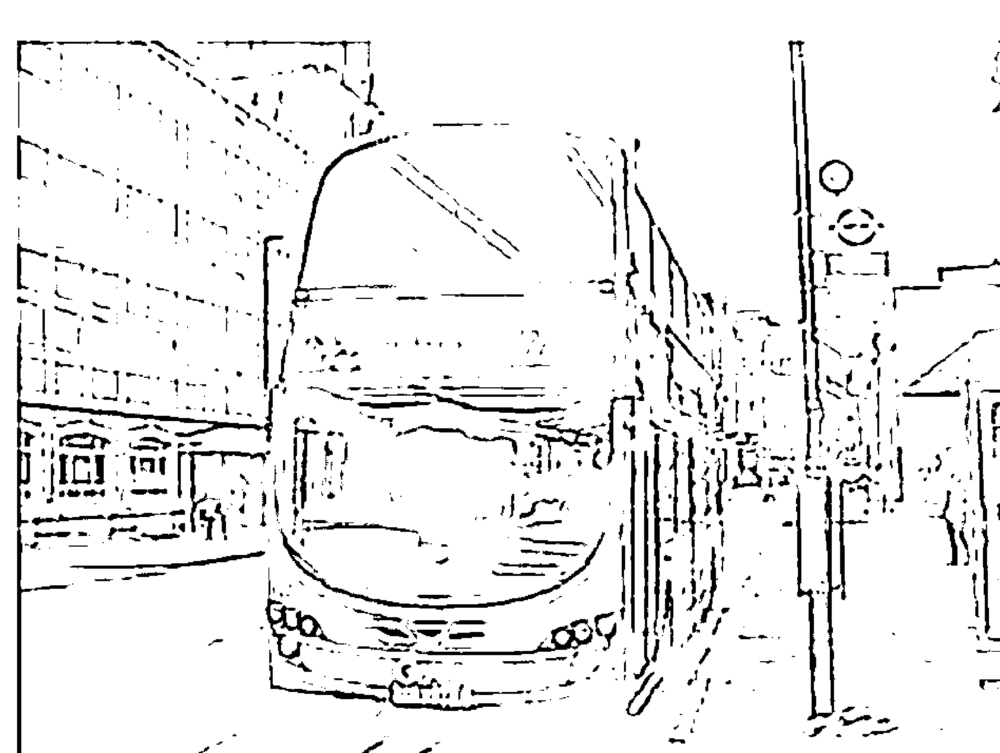

## 活在共时性

我們在過了閉園時間的倫敦動物園裡，用透明人之術讓任何人都看不見我們，留在那裡整晚與動物們交談。現在回想起來，我做了許多不可能辦到的事。也在滿月之夜像那樣與動物交談。我至今仍時常回想起在滿月月光照耀下的黑色鸚鵡所說的悲傷故事。

追尋數字共時性的學習，如果某一天是3，下一次就是17，以那一天第一個看見的數字為準展開的形式隨機發展。有時也會在幾天後再度追尋出現在眼前的同一個數字。 在這麼做的期間，我逐漸對某些特定數字產生朋友般的感覺；也發現某些難以靠近、會避著我們的數字。有的數字個性活蹦亂跳，有的數字沉穩而平易近人，還有的數字會呈現關係深厚的顏色，我逐漸感覺得出數字本身的特徵或振動。

結果，原本是以我們追尋著共時性的形式，但有時也會進入這次換數字主動現身的奇妙狀態。「原來如此，這就是阿爾弗雷德想讓我體驗的事情嗎？」作為自由吸引、

## 第21章 尋找魔法陣！

操縱某些事物的課程，讓我感覺、了解數字的性質，就是繼魔法陣之後的下一個課程的目的。

阿爾弗雷德對天體運行也知之甚詳。我某次造訪他的住處，他就露出一臉奇妙的表情，讓我看到兩個空果醬瓶。「都是金星害的，只要金星一來到天空中的那個位置，就一定會變成這樣。」他一邊說著，一邊開窗指向在夜空中格外閃亮的星星，要我看著。

> 「是麵包吃掉了嗎？」

> 「不，只有果醬。」

「還真奇怪……」我在內心這麼想，但沒說出來。後來我察覺到，阿爾弗雷德的飲食生活總會配合天體運行。更令我驚訝的是，他的生活方式總是等待信號出現，再藉著共時性的引導採取行動，等於幾乎不會依循自我本身行動。換言之，他隨時隨地、在面對任何事時，都會按照啟蒙我數秘課程的同一種方式採取行動。

「人類會受到自我耍弄，做出相當無謂的行動。若是在確實傳來信號之前就起身，所有時機就會偏移，招致混亂。」他這麼告訴我。這對我來說是一輩子受用無窮的教誨。我從近三十年前起，好幾次獲得被稱作薩滿的北中南美原住民一對一指導的機會，

他們共通的基礎全都是這個教誨。
我在阿爾弗雷德門下學習了大約一年半的時間，接受了各式各樣的魔法課程，不過
就在某天，我的內心突然萌生強烈的懷疑——魔法該不會並非我個人的力量，而是藉由
他的力量所引發的吧？幾乎就在同時，阿爾弗雷德就從我面前消失了蹤影。

## 後記

非常感謝各位讀到最後。市面上有許多關於魔女與魔法的書籍，不過也有許多題材相當偏頗的。本書基本上僅止於提供基礎資訊，並作為任何人在日常生活中都能嘗試的入門書籍介紹。

如同我在本書裡好幾次告知的，只要依循神明之力、自然之力，加上從自己體內湧出的力量的三位一體法則，魔法就能發揮力量。甚至還有方法可預測只能認為是奇蹟的效果。從這層意義上來看，「魔法」其實也可以說成「真法」；而學習魔法的白魔女，也可稱作勤勉探究自然之人。在累積探究的過程中，或許能找出極為科學性的秩序：只要原因相同，結果也總會相同——我對此深信不疑。

如同本書告知的，所謂的「魔女」是至今受到人們恐懼、輕蔑、嫌惡與偏見的對象，這是事實。實際上，就算我主張本身是「白魔女」，一開始還是相當抗拒撰寫這種

關於魔女的書籍。我依然還有許多需要學習的地方是原因之一，不過老實說，我其實是討厭自己明明有靈媒這個頭銜，卻突然被貼上魔女的標籤（笑）。
話雖如此，仔細想想，這次會決定撰寫關於魔女的書籍，可以視為我本身學習的自然趨勢。這是因為我在二〇一五年翻譯了《接地（Earthing）》一書。接著又出版了三本與昴宿星人通靈的系列書籍，之後繼續出版了兩本《創世紀伊南娜聖經》系列。接地是與大地能量連結，與魔法一樣汲取自然界的力量；通靈則是藉由蘊藏體內的能量，傳達來自高次元存在的訊息，這也與魔法定義相通。而《人類創世紀伊南娜聖經》則介紹了許多身為外星人的伊南娜的魔法。因此作為下一個階段，《與神相繫的白魔女秘術》的誕生，可以說是自然而然的結果。
不知何時極為自然地開始動筆，甚至連「完成」這件事本身都顯得不可思議。回想起來，一切簡直就像被施了法一般流暢進行著！在兼作為實驗各式各樣魔法的撰寫過程中，我也學習到所謂的魔法並不是咬緊牙關使出力量，而是只要接納迎面而來的魔法即可。
我也明白了只要信任人生中乍看是隨機發生的共時性，完美的秩序就會自動引導著你。這正是最棒的魔法！就連能將水變成葡萄酒、讓病人立刻痊癒、讓空蕩蕩的網子

## 後記

塞滿魚的耶穌，一定也是因為祂比任何魔法師都能掌握那份完美又極為簡單的秩序。如果自己嘗試的魔法施展不順利，原因應該有二。其一是不了解自己本身的真正意志；其二則是不清楚達成意志的手段。我認為人生中所發生的任何事，都不能單憑表面來判斷，而是必須察覺其背後的深奧能量流向，讓自己逐漸被導向成功的魔法。為了了解長時間封印並持續支配我們人類的咒語，取回真正的力量，必須讓原本受恐懼且輕蔑的對象轉變為受尊敬、信任與愛的對象。這麼一來，古代亞特蘭提斯人的智慧與力量應該會自然而然地在我們每個人身上甦醒。我們取回原本具備的力量，將所有人類從無力的奴隸狀態解放，是眾多人們由衷的期望，同時也是我們大家所追求的極致魔法！

藉由本書的出版，在此感謝準備封面構圖與文中插畫的山本那珂子小姐總是不吝提供協助。並由衷向這次繼續將本書付梓出版的ヒカランド股份有限公司，以董事長石井健資先生為首，擔任本書編輯的兒島祥子小姐，以及各位工作人員獻上感謝之意。

二〇一七年五月二十一日
愛知索妮亞

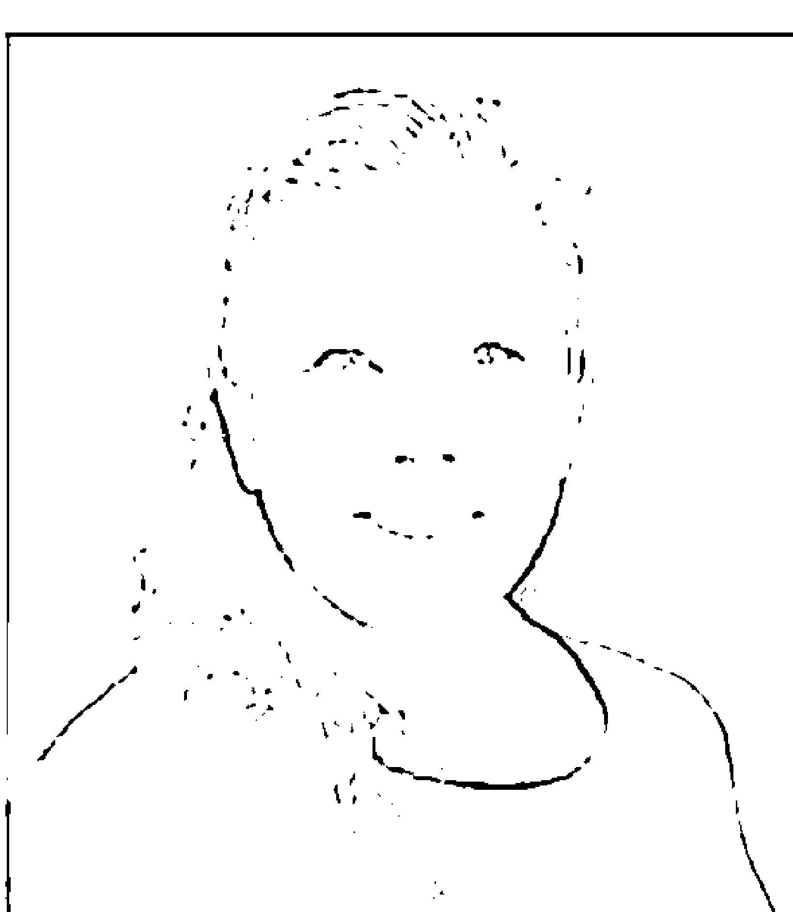

### 愛知索妮亞

大阪出生。譯者、作家、昴宿星集合意識體接觸者、阿卡西記錄者。一九七〇年前往義大利與英國留學，專攻藝術。與約翰·戴拉維（Echan Deravy）結婚後的十五年間，在日本過著一邊育兒，同時潛心研究坐禪、瑜伽、正食的生活。自一九九三年起，與丈夫共同翻譯數本書籍，同時也進行演講或國外工作坊。歷經旅居加拿大的生活後，於二〇一三年一月回國。定期舉辦的「MAO阿卡西神諭講座」大受歡迎，報名總是於幾個月前就爆滿。

主要譯作為《昴宿星 光之家族》（太陽出版）、《靛藍天使》（Natural Spirit）、《心靈能量：藏在身體裡的大智慧》（三五館）、《來自水的傳言 II》（負責英語版翻譯，波動教育社）、《新的光子帶？》、《接地》（ヒカルランド）等。著作有《昴宿星 返回靈魂故鄉》、《昴宿星 前往新生地球》、《昴宿星 在融合次元的生存方式》（ヒカルランド）、《人類創世記 伊南娜聖經 前往阿努納奇之旅》、《人類創建期 伊南娜聖經 伊南娜之旅》（ともはつよし社）。
