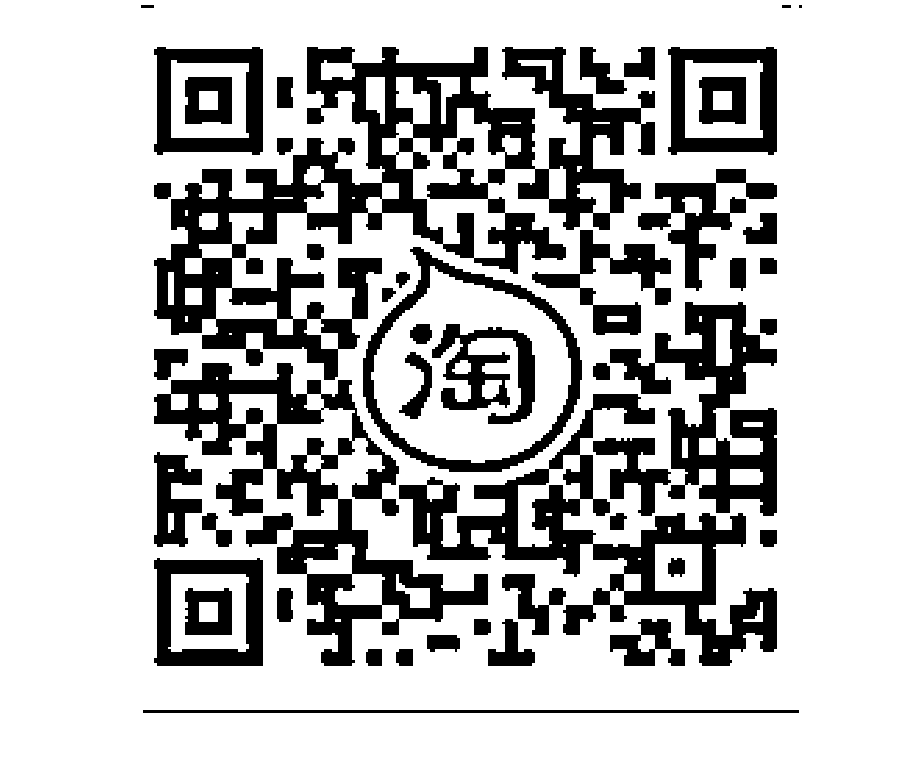
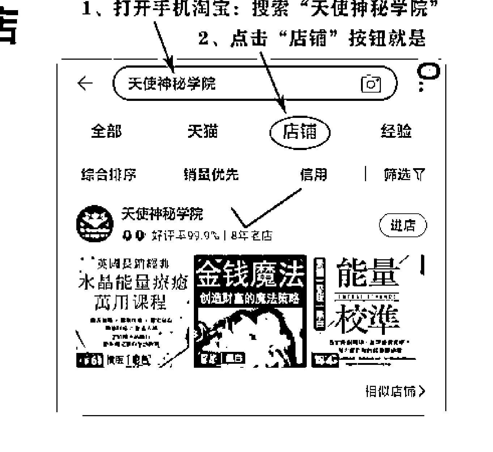
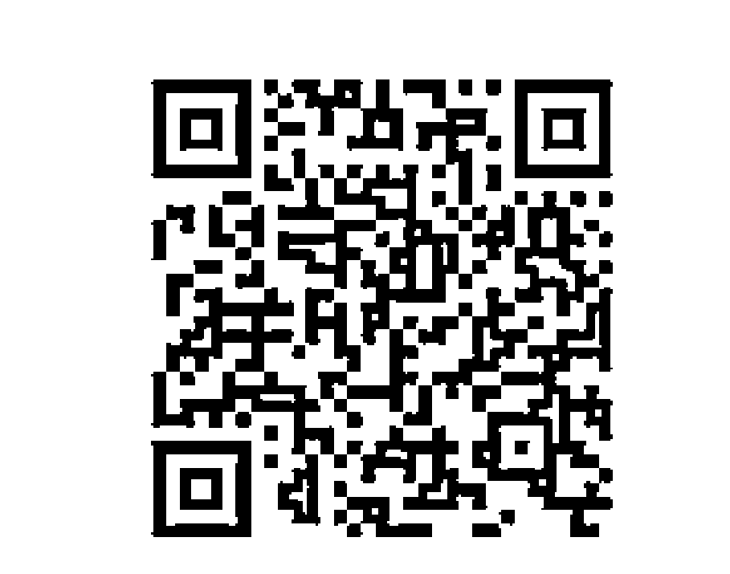
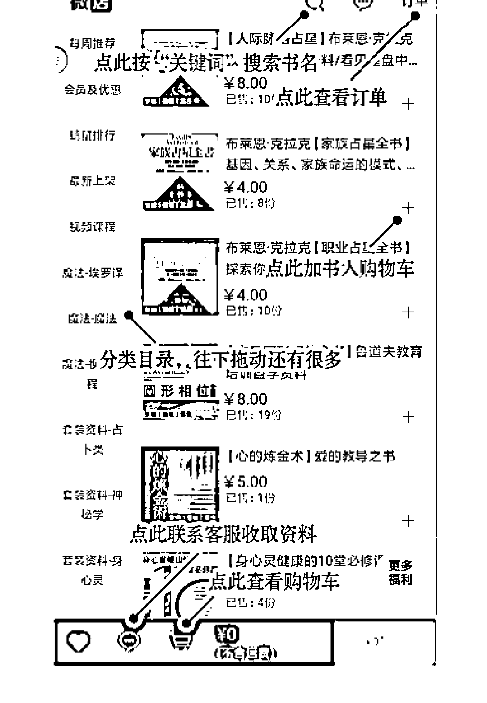
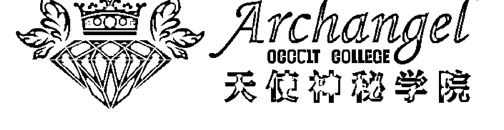
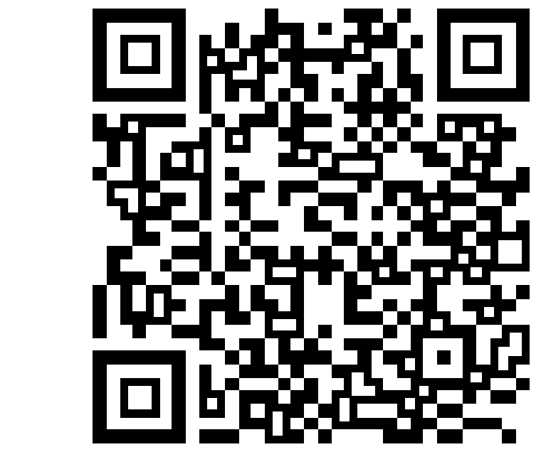
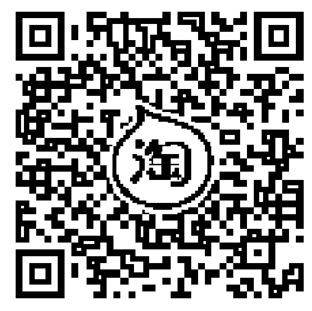
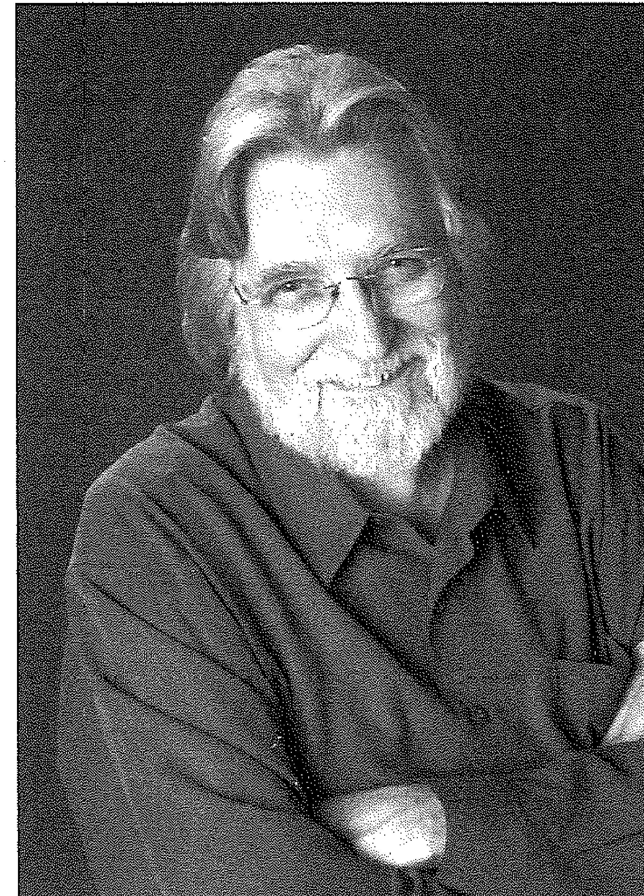
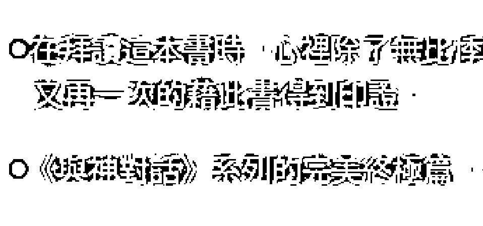
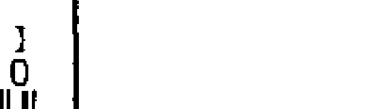

*   王季慶
*   張德芬
*   李欣頻
*   趙翠慧
*   辜周靖華
*   周介偉
*   愛不釋手推薦

## 與神談生死

但願用對比死亡還有的時間，你就能擁有了人化的所有問題

尼爾·唐納德·沃許 —— 著
丁芳 —— 譯

※ 《賽斯書》系列全球銷量超過 1000 萬冊的，點亮生命曲
必須的生命經典！是要探討「死亡」與「死後世界」。

福利公告：
凡在【天使神秘学院】购买任何电子资料
赠送实体书，详情请咨询店铺客服！
备注：如客服不知道这活动你可能进了盗版店铺！
赠书活动仅在以下正版店铺购买有效哦！

## 【天使神秘学院】淘宝店

手机淘宝扫以下二维码





## 【天使神秘学院】微店

手机微信扫以下二维码



用手机微信扫码进店





## 制作说明：

本书由《天使神秘学院》出重金从台湾购入的原版书籍扫描制作完成。为达到最好阅读效果，特地把书全部切开后，再经由专业扫描设备高精度扫描完成，并经过一张张的PS后期处理最终成书，其间花费大量的人力、物力以及时间，只为能给大家提供经济并优质的神秘学学习资料而努力。

本学院强力谴责某些机构和个人，把本学院花心血制作完成的电子书籍，包装后直接放在自家网上低价倾销的行为，以谋取不劳而获的经济利益。如果长此以往最终将无人愿意再为大家花心思制作电子书，那以后可能大家再无新书可读。

为让大家以后能够读到更多的好书，也为了本学院的良性发展。本学院恳请大家尽量做到如下几点：

-   一、尽量在天使神秘学院的官方网站购买电子书籍。
    官网访问地址：http://www.ac2011.cn
    短网址：ac2011.cn
    网址含义：(Archangel College 成立时间：2011年)






-   二、在收到电子书后小范围传阅即可，千万不要公开传播，更别挂到网上低价销售。

同时为答谢广大支持者，学院电子书将做如下调整：

-   一、学院会把一些早已收回制作成本的电子书折价销售。
-   二、最新制作的电子书籍会开放打印功能，大家购买后有条件的可自行打印成书。

天使神秘学院
2021年3月

## 作者簡介

### 尼爾·唐納德·沃許

Neale Donald Walsch

結過五次婚、有九個小孩，在個人事業最不順遂時，神來之筆「寫」出了《與神對話》系列作品，改變了千萬讀者的生命與心靈，成為享譽全球的心靈暢銷書。他目前將大部分時間投注於傳播自己所領悟的喜悅、真理與愛的信念，創立了「新靈性學校」，也發起了一個致力於全球靈性覺醒的非營利組織「The Group of 1000」。

著有：《與神對話》三部曲、《小靈魂與太陽》、《小靈魂與地球》、《與神為友》、《與神合一》、《與神對話問答錄》、《與神對話青春版》、《荷光者》、《再創造自己》、《分享關係》、《創造豐足》、《體驗全相》。

專屬網站：www.nealedonaldwalsch.com



## 譯者簡介

### Jimmy

一位成功的企業老闆，受到《與神對話》系列作品影響，人生觀有了很大的轉變，他深入研讀了《與神對話》系列裡每一個難以理解的議題和疑問、探索了每一句難以讓人相信的訊息，包括「死亡」、死後生命如何運作，和生命中許多大哉問的解答。自許為神的推銷員，發願要將這終極的生命實相，傳播給更多人。

## 〈推荐序〉 相见不恨晚

今年春节前，我收到译者送来的《与神谈生死》初稿，年后才有时间展读，非常喜悦与感动，末了才知尼尔在二〇〇六年就出了这本书，不免有相见恨晚之慨。当时我已写完「王姊的最后八堂课」一系列演讲稿，而尼尔此书一再令我有「似曾相识」之感！若我早先便读过原文书，恐怕会以为自己的「心路历程」受到它影响，甚至有抄袭之嫌！所以，译本此时才出现，更印证了我的信念：一切都是最好的安排，相见不恨晚！随即在我的第七讲——「热情的活，平安的走」——中分享了我的感触，并热切期待本书的出版。

要说到我的心路历程和《与神谈生死》相呼应之处，说也说不尽，这里并非详说的适当时机，只想讲些最令我震撼的地方。

本书英文名为「Home with God」，其中神「点题」道：「大多数人以为『回家』是指回归到神那里，但你无法回归到神那里，因为你从未离开过神——你的灵魂知道这一点。」我心中一酸，眼泪慢慢盈眶，因为半生求道，就是由于对尘世缺乏归属感，不知何处是儿家！像他说的：「孤独是当今世上最大的痛苦……没人理解、无处求援的感觉——是绝望的肇因……你只需要呼唤我……我会在那里。」

幸好，我自己亲身体验过两次神描述的「与神融合（合一）」的经验：

> 「神是什么样子？……是一种感受，一种你曾有过的最壮丽的感受，你会感觉自己浸没在温暖的光中，被爱所拥抱。」

我在《心内革命》中描写过自己「见光」的经验，就是这种凡经历过永难忘怀的经验！

> 「融合的时候，『本源』辐射着纯净的爱，就像一股甜蜜的热流，将灵魂完全覆盖……彻底的被看见……一种能量的渗透，灵魂只剩下一种美妙的空，不再执着于任何东西，不再拥有任何体验，除了敞开之外。」

> 「在这敞开里，一种新的感受填充了进来。起初的感觉就像灵魂的外部被覆盖了，而现在则感觉仿佛灵魂的内部被填满了。你所有的个体身份都脱落了，这起源于你的『你与你自己的分离』终于结束了。」

我自己在二〇〇七年去印度参加二十一天的「合一静」时，便亲身经历过「与神合一」，觉悟到我不孤单，我没有被神抛弃，「感受」到神一直与我同在，无条件的爱我。当时便是完全被接纳、被宠爱的感觉，使我首次「臣服」于神，没有疑问，也一无所求了！如今读到以上的描写，不禁喜极而泣！我随即悟到，如此「神」来一笔的描写，讲的岂不正是所谓的「涅槃」？那么，这本书有如《心经》，让人「无有恐怖，颠倒梦想，究竟涅槃」！的确，佛教一直以「涅槃」为标靶，任谁有过那种体验，都会了解为何人会向往那种只有爱和光，没有个体和恐惧不安的境界！但赛斯和新时代其他的大师们都不讲涅槃和虚空，为什么？

> 「在你的本体核心，一切万有和你所是的一切以其独一无二的方式显现，在这里，知晓和体验融合为一：……体验了『此外无他』，你最终会在融合中丧失自己。你会不再知晓你正在体验融合，甚至不会知道你是谁，会丧失区分的能力，丧失个体化自我的能力。」

当人浸溶在涅槃中，在喜中忘我，时空都消逝，只有完全的平安幸福！那么，谁又想再离开「合一」，再重新分裂？此地，神说，神无限的创造力（生命能量）会将个体化的神推出核心，再进入生死的回圈。他说：「你是谁的本源极其清楚和准确的知道，什么时候生命过程本身会召唤你与「一」融合，什么时候要从其中浮现，以让你透过体验而理解「一体」的至福和它个体化的荣耀。」

在读和译过那么多本尼尔的「与神」系列之后，我虽然非常喜爱它们，却总觉得之前的几部涉及的多为人生历程的种种，很少更深入死后与生前的境界。终于，《与神谈生死》出现，带给我们一本如此合情合理的「生死书」，针对多数人仍恐惧回避的这一主题，那么精闢、不厌其烦的一一解套，文字又一如往常的优美动人且幽默。我一边读一边含笑带泪，甚至有时忍不住泪下，有时又想起身跳舞，以表达内心对生命（神）和爱的庆祝赞美！

## 〈推荐序〉 勇敢面对生命的问题，它们是通往完善之路的垫脚石

财团法人中租控股青年展望基金会董事长 辜周靖华

我从光中心介伟手上拿到这本书时，正逢好友的父亲突然离世，当时好友伤心至极，无法自已，我藉由这本书适时协助她了解生命与死亡的意义，也消除了她对死亡无明的恐惧。之后，她告知我，当她转化了对死亡的概念后，一切丧葬仪式准备过程便进行得出奇顺利，似乎被神奇的力量巧妙安排着。藉由这次的经验她也更加提升，更能体会什么才是爱了。

在拜读《与神谈生死》时，心里除了无比悸动之外，也感觉到许多共鸣，自己多年来不断从内找回并忆起原本就是完美的我们。

常常听到有人抱怨，在家庭中伴侣或儿女不喜欢接近他们，或是在工作中没有受到同事或上司的尊重，甚至备受孤立。其实，每个人都喜欢接近能给人带来舒服感的人，一旦我们变得负面，对周围的人做出无理的要求，人们当然会渐渐远离，而我们还不断自怨自艾，怪别人不了解自己，其价值，殊不知力量就在自己身上。你的意念造成你的实相，而你的实相更加强你的想法，如此循环不已。在负面视角里看事件的人，便将创造负面的实相，以印证自己的想法。如果要改变这样的循环，就必须改变惯用的视角。

我们也可能在不知不觉中，习惯将力量交给他人，需要藉由他人的肯定，才能确信自己的价值。能改变自己命运的人就是自己，无须外求。所有问题的发生，都是巧妙的安排，它提醒了我们有哪些视角出了瑕疵而衍生出问题。勇敢面对生命中出现的问题，不要恐惧，因为它们是为了淬炼自己未来通往更完善之路的垫脚石。

最后祝福读者在读完这本书后，都能得到心灵的平静，进而享受丰盛，体验美好的人生。

## 〈推薦序〉 經歷「死亡」，才能體會「永恆」的智慧

只有經歷「死亡」，你才能體會什麼是「永恆」，因為「肉體死亡」，才會讓「永恆的你」體會到生命永恆的可貴！而且「人」的壽命之所以設定成有限的，其背後神聖意義是為了讓你嘗試不同的人生角色，例如：母親學習無條件地愛，富者學習憐憫心，貧者學習自信等。如果在地球的生命是永恆的，而你始終只扮演同一種角色、學習和體驗相同的課題，當你體驗夠了、學會了，你在地球上的日子也就失去樂趣與意義。 所以，不要害怕死亡，唯有死亡，才能了解「永恆」的智慧，唯有死亡，你才可以扮演新的角色，學習更多智慧。

『我們的家』創辦人 J C

## 〈自序〉 這本書會讓你此生再也無所畏懼

這是一部神聖對話的逐字紀錄，一場與神談論如何完成人生藍圖的對話。《與神對話》系列已經出版了九本書，耗時十一年，觸及人生中所有面向，而本書是這一系列驚人對話的最後部分。

這場最後的對話內容，詳述了許多從未被深入探索的人類經驗領域，特別是關於死亡、死亡之後的生命情境。

這場對話一度涉入了靈性領域的最前端：所有生命的宇宙學。它用比喻的方式提供了對終極實相的驚鴻一瞥，用簡單易懂的語言揭示了生命的原因和目的、人類得以獲得至極喜悅的方法，人類獲得至極喜悅的旅程、我們所有人都參與其中的這一本質，以及這旅程的非凡結局——其實根本不是結局，而是一個持續進行、其恢宏經驗遠超出想像的狂喜間奏曲。

這對話是迂迴前進的，它螺旋式地跳躍到驚人的、聞所未聞、超越想像的全新領域，然後又躍回原有的概念，確保接下來腦筋大轉彎的探索具有踏實的基礎。如果你對這本書有足夠的耐心——你將會獲得豐厚的回報。

順便說一句，也對你的人生有足夠耐心——

《與神談生死》帶來的訊息，可說是人類所接收過最令人鼓舞且最有幫助的訊息之一。

理解你是如何遇到這本書，是很重要的。如果你以為這純屬偶然，那你將錯失此刻正發生在你身上的深遠意義。

你的靈魂引領你來到這場對話，正如它曾引領你至你與神有過的每一段對話——無論是以何種形式呈現。在它的精心安排下，你讀到了這些文字。此刻，無數的情境在精確的時間以精確的方式互相連接，溫和的引領你來到你正閱讀的這些文字。也只有你那最神聖的靈魂的干預，才能如此毫不費力的製造這些情境。如果了解了這一點，你將會以不同的方式來看待這份訊息。

你被引領至此，因為宇宙聽到了你內心對答案的呼求——那個全人類都在追尋的問題的答案。

人生到底是怎麼一回事？此生結束之後又會發生什麼？我們會見到自己所愛、卻先我們而去的那些人嗎？神會在那兒迎接我們嗎？會有審判嗎？我們有可能陷入永久的懲罰嗎？我們會僥倖進入天堂嗎？我們死後還能知道發生什麼事嗎？死後還會有任何事在進行嗎？

這些牽連巨大問題的答案關乎每一個人。如果知道了答案，我們的人生會有所不同嗎？我認為是的。如果對死亡少一些恐懼，人生也會少一些恐懼，變得正如我們一直渴望的——無懼、充滿了愛嗎？我相信答案是「沒錯」。

我很心痛的看到，許多人在即將進入另一個世界時感受到的是恐懼，更不用說在這個世界的時候了。人生本該是持續的喜悅，死亡本該是個更大喜悅的時刻，如果所有人都只預期平安和快樂，就像我的媽媽，她去世的時候處於完全的安寧，進房為她做臨終禱告的年輕神父搖著頭走出來，嘆了口氣說：「反倒是她在安慰我。」

我媽對她將會投入神的懷抱有著不可動搖的信念，她知道人生是什麼，以及死亡不是什麼。人生就是把你擁有的一切給予你所愛的一切，毫不猶豫，毫不懷疑，毫無限制。死亡根本就不是結束，而是開始。我記得她經常說：「我死的時候，你不要難過，要在我的墳墓上跳舞。」媽一生都覺得神站在她身邊——死後也是一樣。

但是那些在活著和去世時都沒有相信過神在他身邊的人呢？那可能是非常孤獨的一生，以及充滿恐慌的離世。在這種情況下，不知道自己快要死了也許更好。

這就是我爸去世時的情形，一天晚上他從安樂椅上起來，邁了一步，然後倒在地板上。救護人員幾分鐘內就趕到現場，但一切都結束了，我敢肯定爸也沒想到這就是他在人世的最後時光。

媽知道她要死了，我想她允許自己知道此事，是因為她能夠平靜、喜悅的對待死亡。而爸不能，所以他選擇了猝然離去。他沒有時間去想：「噢，我的上帝，我要死了，我真的要死了。」

同媽一分鐘都知道她「真的活著」，她知道這一切的神奇和美妙，而爸卻不知道。

我爸是個有趣的人，他對於神、人生和死亡有著矛盾的想法。他不只一次和我分享他對日常事務的困惑不解，以及他對死後一切的全然不信。

在他去世的兩年前，我記得和他有過一次難忘的交流，反映了他的人生觀。那不是一個很長的對話。我問他人生的意義是什麼，他茫然的看著我，說：「我一無所知。」然後我問他對死後有什麼看法，他答道：「一無所有。」

我堅持要他多說幾個字。

「黑暗，完結，就這樣。你睡著了，不再醒來。」

我洩氣了，接下來是令人尷尬的沉默，然後我竭盡全力的向他保證他弄錯了，在我們死後，「另一邊」有非凡的經驗在等著我們。但我剛開始描述自己的想法，他就不耐煩的揮手打斷了我的話。
「狗屁。」他嘀咕著。就是這樣。

我很驚訝，因為我知道爸每天晚上也跪下來祈禱，雖然他已經八十多歲了。但如果不相信生命是神聖的，死亡只是另一個開始，他又向誰祈禱呢？我有點疑惑。他又祈禱些什麼呢？也許他在祈禱希望自己是錯的，也許他在對抗自己的信念。

這本書是為所有想法像我爸的人寫的——為那些對抗自己信念的人。這書也是為不知道死後會發生什麼的人寫的，那些人自然也不知道人生更深的含義及其原因。本書是為不知道人生運作準則的人，為迷惑的人，為沒有疑惑也自認為知道一些，但偶爾也會懷疑這些是否為真的人……為那些感覺到害怕的人而寫。

這本書也是為那些不屬於上述類型，但希望幫助上述類型的人，卻不知道怎麼做的人寫的。你該對一個瀕死的人說些什麼？你怎麼安慰那些還活著的人？在這些時刻你能對自己說什麼？這些都不是簡單的問題，現在你該知道你為什麼把自己帶到這兒來了。

你會讀到這篇文章真的是個奇蹟，你知道的。跟奇蹟比起來，這也許是個小小的奇蹟，但仍然是奇蹟。如我說過的，我相信是你的靈魂引領你讀到這本書，而出於同樣的動力，我們每一個人被引領至下一步、下一個領會，最終，回歸神。

沒有人必得跟隨這動力，我們可以在任意時刻改變路線、轉變方向。或者，我們也可以待在原地，在很長一段時間內哪兒也不去。然而，最終每個人都會繼續前進，我們無法不抵達最終的目的地。

這目的地對所有人來說都是一樣的。我們都走在回家的路途上，無法不抵達那裡。神不會允許「無法抵達」這件事發生。

這三句話，是這整本書所傳達的訊息。

> ※編注：本書內文楷體字皆為神說的話。

## 目錄

CONTENTS

-   〈推薦序〉 相見不恨晚 王季慶 005
-   〈推薦序〉 勇敢面對生命的問題，它們是通往完善之路的墊腳石 韋周靖華 008
-   〈推薦序〉 經歷「死亡」，才能體會「永恆」的智慧 J C 010
-   〈自序〉 這本書會讓你此生再也無所畏懼 JC 011
-   1. 大限到時，你是為自己而死 019
-   2. 死亡是人生最大的謎題 023
-   3. 你無法違背自己的意願而死去 028
-   4. 你所尋求的答案就在你之內 033
-   5. 無論你走哪條路，都不會回不了家 038
-   6. 所有的路都能帶你回家 043
-   7. 所有靈魂都會在死後找到平安 051
-   8. 死亡從來不是悲劇，而是禮物 060
-   9. 這世上沒有受害者，也沒有加害者 068
-   10 「你」是你人生中每一件事的起因 078
-   11 你的存在，是神存在的證明 088
-   12 相信便能看見 092
-   13 你無法改變終極實相，但可以改變對它的體驗 102
-   14 地獄是不存在的 116
-   15 死亡充滿了迷人誘惑 124
-   16 終極實相的複雜性，遠超出你的想像 136
-   17 一旦直視宇宙，它就不再神秘難解了 146
-   18 你不會只在你的花園裡栽種一種花 155
-   19 你覺得自己需要非常多後才會快樂 160
-   20 「死亡」是你重建自己身分的過程 166
-   21 你可以選擇的道路，多得超乎你想像 177
-   22 沒有唯一的真理這回事 188
-   23 沒有任何死亡是白費的 200
-   24 你正在經歷許多次此生 206
-   25 死亡是物質世界通往精神領域的通道，也是返回的通道 219
-   26 你是你實相的創造者 227
-   27 死亡是你們變得充滿力量的時刻 234
-   28 在死亡中，你所有的個體身份都脫落了 248
-   29 向愛臣服，隨它引領你去你的靈魂要前往之處 251
-   30 死後沒有任何受苦 258
-   31 萬物都在成長之中，沒有所謂的演化終點 267
-   32 幾乎每個死去的人都不是第一次死去 274
-   33 我是你，我只是在幫你憶起我 289
-   34 要真正領會終極實相，必須脫離自己的心智 298
-   35 你本來就是一個牧者，為他人帶來療癒和愛 305
-   36 你死去時，所有你愛的人都會來迎接你 318
-   37 用今日的事件創造明日願景之許諾 324
-   十八個憶起 343
-   〈後記〉聯合我們的能量，創造全新而奇妙的結局 333
-   〈譯者後記〉這本書引領我找到我畢生所尋求的許多答案 347

## 1 大限到時，你是為自己而死

人不可能在沒有神的情況下活著或死去，但是你也有可能並不這麼認為。如果你認為你是在沒有神的情況下活著或死去，那麼你就會獲得那樣的體驗。但無論什麼時候，只要做出選擇，你就可以結束那種體驗。

我相信這些是神聖的話語，也相信這些話直接來自神。這些話在過去四年裡一直浮現我的腦海。我現在把它們視為對我的邀請，一份來自神的邀請，要進行一場更大的對話。

你說得對。我想要確定我們會進行這場更大的對話，所以，每當你認真思考生命與死亡時，哪怕只是一會兒，我就把這些話放在你的腦子裡。這是一場你一直不大情願進行、且一再拖延的對話。

是的，我知道。不過並不是我害怕深談生命乃至死亡的話題，只是這實在是個非常複雜的議題，我想確定自己真的準備好要做這樣的長談了。我想要在心理上——嗯，我想還有心靈上，都做好準備。

那你覺得現在你準備好了嗎？

希望如此。我無法再繼續拖延這場對話。就算我想要如此做，你也會不停的把這些話放在我的腦子裡。

沒錯，我會的。因為我想讓你聽到這些話，就算你不再進行其餘的對話。

好吧。我已經聽到了。

我想要你一遍又一遍的聽到這些話：「人不可能在沒有神的情況下活著或死去，但是你也有可能並不這麼認為。如果你認為你是在沒有神的情況下活著或死去，那麼你就會獲得那樣的體驗。但無論什麼時候，只要做出選擇，你就可以結束那種體驗。」

這些話向所有害怕活著或害怕死去的人，傳達了他們所需要知道的一切。

那麼我們現在就可以結束這場對話囉？
可以。你有多渴望去獲得更高的理解呢？如果你選擇繼續這場對話，我會再送你一百個字——「給所有生命的百字箴言」。
你這是在引誘我。
沒錯，就是在誘惑你。
好吧，你得逞了。我不會縮短對話，我現在要再次和神進行一場關於生與死的對話。
好，不過我們將談論許多以前都沒有談論過的事。
誰會相信這一切……
這不重要。你不是在為別人進行這場對話，而是為你自己進行的。
我得時刻提醒自己這一點。

長久以來，當人們常以為是在為別人做事時，其實他們是在為自己做。

每個人所做的每件事都是為他自己做的。當你領悟了這一點，就來到了一個突破口。當你明白了甚至連死亡也不例外時，你就再也不會害怕死亡。當你不再怕死，你也不會再怕活，你會充實的活，從此刻，直到最後一刻。

暫停，等一下。你是說，當我死去時，我是在為我自己而死？

當然，否則你還會為誰而死呢？

## 2 死亡是人生最大的謎題

我們有了一個有趣的開頭，你剛才說的那句話很吊人胃口。
這才剛開始呢，後面會更加精采。我們的對話不僅會吊人胃口，對有些人來說，還會顯得難以置信。這就是你尋求憶起的本質。
憶起？

正如我以前的對話裡告訴你的，你並不需要學任何事，只需要憶起你已知的事。我們將要展開的對話，及我們所有的對話，都是為了幫助你憶起。它們將會引導你喚醒有關人生和死亡的一系列憶起。

你會發現這些憶起許多都跟死亡有關。這是故意安排的，因為透過更深刻的理解死亡，你會最快獲得對人生的深刻理解。

有一些憶起可能會令人震驚，因為它們會挑戰你們許多原有的信念。另外一些則不會讓你吃驚，一旦聽到它們，你就會發現自己一直都知道。這些憶起合起來，將把還給你自己，喚醒所有體驗回到你和神的家所需要知道的記憶。人類已經等待這些重大事項的新論述如此之久，我們大部分的集體意識都來自久遠的過去，是該用些「新的智慧」了。每個人都生而帶有銘刻在他們靈魂上的宇宙智慧，它就在萬物的DNA（譯註：DNA為英文Deoxyribonucleic acid的縮寫，又稱去氧核糖核酸，是染色體的主要化學成分，同時也是組成基因的材料）中。其實，DNA可以是「神聖的本然覺知」（Divine Natural Awareness）的縮寫。每一個活著的生命都擁有這種內在的本然覺知。它是系統的一部分，是你們稱為「生命」過程的一部分。這就是當人們面對偉大的智慧時會覺得如此熟悉的原因。他們幾乎立刻表示贊同，沒有任何異議，因為這就是憶起，因為這是他們的神聖本然覺知。就像是「銘刻在他們的DNA裡」，就像是「啊，沒錯，當然如此。」那我們就認真的開始這段新的對話，讓你憶起你一直以來都知曉的東西吧。讓我們以全新的口吻來談，以便你能更新自己的細胞記憶，找到回家之路。我在活著的時候也可以回到神的家，對嗎？我是說，我不必等到死的時候才「回家」，對嗎？

對。

那麼，請再跟我說一遍，以便我能更透徹了解——為什麼這麼多「憶起」都跟死亡有關？

死亡是人生最大的謎題。解開這個謎，就解開了一切。

一旦你回答了大部份你對死亡曾有過的疑問，你也就回答了大部份你對人生有過的疑問。

然後你就會知道，如何不經過死亡即可回到你和神的家。

我懂了，真棒！

不過我要提醒你不要抱有期望，或是試圖讓每一個人都「接納」這裡所說的，因為這麼一來，你會試圖「編輯」這場對話，以便盡可能讓更多的人能夠理解並同意它。

噢，我不會的。

你會心存疑慮，因為你擔心別人會排斥它、嘲笑它。

我不這麼認為。

这场对话的部分内容——尤其当我们涉入生命的整全宇宙论时——对许多人来说，会显得非常「不可思议」。

我毫不怀疑我们即将展开的探索和思维扩展，将会强化你对生命和死亡的真相之领会——但其中的一些内容会显得如此离谱和深奥，以至于你真的会想修改或删除它们。

不，我不会的。对于这场对话，我会完整的照实纪录，绝不删改你说的话，这是我的承诺。

很好，那我们就开始吧。

### 第一个忆起：

死亡是你为自己所做的事。

这真是有趣，因为我并不觉得自己是为任何人而「做」这个，事实上，我一点都不觉得死亡是发生在我身上的。

死亡是发生在你身上，也是「经由」你发生的。

发生在你身上的每一件事都是「经由」你发生的，而「经由」你发生的每一件事都是「为」你而发生的。

我從沒想過死亡是我會有意去做的事情，更沒有想過我的死是為了自己而做的事。

你的確是為了自己而做，因為死亡是一件美妙的事。而你的確是「有意而為」，其原因將隨著這場談話的深入而逐漸顯現。

死是一件美妙的事？

沒錯，你們所稱的「死」是美妙的。所以，當某人死去時不要傷悲，也不要懷著痛苦或惡運的預感去面對自己的死亡。要像迎接生命一樣迎接死亡，因為死亡正是另一種形式的生命。

這裡有個令死亡——無論是你自己還是他人的死亡——充滿安寧之道，你會了解到那些離世的人永遠是他們自己的死亡的因。

這就是……

### 第二個憶起：

你是你自己死亡的起因。這永遠都是真的，無論你在何處、以何種方式死去。

## 3 你無法違背自己的意願而死去

天啊，你講得跟真的一樣，很多人一定會對此難以置信。

我們很快會更詳細的談到一些生命背後的基本原理，會幫助你更容易、更牢固的掌握這些憶起。

待我們更充分的探究這些基本原理之後，你就會了解你們所稱的「死亡」其實是個強有力的創造時刻。

瞧，又是一個誘人的觀念——死亡是個「創造的時刻」？

死亡是你擁有過最有力的創造時刻，是一個工具。如果照死亡的本意去利用它，它能創造出非凡之事。以上這些，我都會為你說明。

死亡是個工具？死亡不只是一扇「門」？

死亡是一扇門，不過是一扇有魔力的門，因為你穿越死亡這扇門時所攜帶的能量，將決定門的另一邊是什麼。

等等，打住，你快讓我喘不過氣了。我們可以慢一點，可以重來一遍，填補幾個我腦筋裡的空白嗎？你剛才說的話讓我冒出了許多問題。

把你的問題全都提出來，我們來一一探討解說。

太好了。先來談談將死亡用作工具這個觀念吧，我可從沒聽過這樣的說法。工具是用來達成某種目的的東西，是一個人想要去用的東西，可是我不想死啊，沒有人想死。

每個人都想死。

每個人都想死？

當然，否則沒人會死。你以為死亡能違背你的意願而發生嗎？

對很多人來說似乎都是這樣。

### 第三個憶起：

你無法違背自己的意願而死去。

沒有任何事會違背你的意願而發生，那是不可能的。所以，接下來我要說的是……

如果這是真的，那會非常令人欣慰，許多心靈都會得到治癒。但是我如何接受這個為真呢？明明有很多事情是我不希望發生的。

所發生的事情，是沒有任何一件你不希望發生的。

沒有任何一件？

你可以想成某些事情的發生非你所願，但這不是真相，只會讓你把自己當作受害者。

沒有什麼比這個想法更能阻礙你的進化了。「受害」的觀念只存在於受限的認知，真正的「受害」並不存在。

我覺得很難告訴一個自己女兒被強姦、或是整個村莊被「種族清洗」的人沒有受害者這回事。

當人們處於痛苦中時，對他們說這些話並無益處。在這種場合，只須懷著深切的同情、真誠的關心和療傷的愛與他們同在，不要用靈性的說辭或理論來癒合他們的傷痛。先療癒傷痛，再去療癒引起傷痛的思想。

當然，在一般人的認知中，有些人曾是可怕事件或情境的「受害者」，但這種受害經驗只存在於一般的——也就是極為受限的——人類意識中。當我說真正的受害並不存在時，我是從一個完全不同的意識層次來說的。而當傷痛被治癒後，人類是可以達到這種意識層次的。

我想許多人會難以接受你的觀點，無論他們是否處於情感的傷痛中。

我在這裡所說的，和世上的傳統宗教說了許多世紀的東西並無不同。他們宣稱：「神秘是主的行事方式，神自有祂完美的計畫，因此要有信心。」稍後我們會探討這一個完美計畫的觀念，也會探討眾多不同的靈魂如何為了一個特定而完美的目的而互相影響，並以特定且完美的方式在世間促成個人和集體的結果。事實上，到時候我會讓「你」來給「我」舉個例子。

> 「神秘是主的行事方式，神自有祂完美的計畫，因此要有信心。」

你確定？

是的。到時你就會徹底明瞭我剛才說的話了。至於現在，請讓你的心放鬆下來，只須知道一切事物中都蘊含著完美。

我會盡力而為，會嘗試接納這一觀念——如你所要求的，發自內心的接納。但你進行得太快了。我們這對話才剛開始沒多久，你就已經……恕我冒犯……涉入禁區了。我沒有不敬之意，但我的意思是，你要把這對話帶向何處？

去你一直想去的地方。

那是……？

真理。

## 4 你所尋求的答案就在你之內

我已經聽過這個了，每個人都告訴我，他能引導我抵達真理。

沒錯，不過只有一個人能帶你抵達真理。

是誰？你嗎？

不是。

誰？

你。

我？

沒錯，你。只有你能帶你自己抵達真理，因為真理只存在一個地方。你不會是要說……「在我之內」吧。完全正確！除了存在你之內的真理，別無真理。其他都是別人告訴你的東西。也包括你剛才告訴我的東西。沒錯，當然。

那這整個對話還有什麼意義？照這麼說的話，聽任何人談論任何事還有什麼意義呢？我沒有說任何外在的東西都無法引領你到你的真理，我說的是只有你能帶你到達真理。要是我自己知道關於生命和死亡的真相，就不會在這裡問你，現在也不會進行這對話了，不是嗎？

引。当人们向上帝祈求答案，并获得——通常十分清晰的——答复时，他们会说上帝回应了他们的祈祷。
你也許會說這就是我正擁有的體驗，我覺得這整場對話有點像在祈禱那樣，我正從中得到解答。

答。
說得很棒，因為的確是這樣！

這就是我記錄這整場對話、這整個經過的原因，我把一切都記了下來。

要注意，不要帶給別人「尋求真理的清晰思維存在自己之外」的印象，讓他們覺得需要去別處——比如你——尋求答案。要小心，不要讓別人對你產生嫉妒心，以為你發現了某個獲得智慧的方式，他們會因此希望你告訴他們方法，這會造成反面效果，甚至是危險的。

危險？

當別人開始相信你能從神那裡得到答覆而他們卻不能的時候，你就處於危險之中了。所以你要盡一切所能，讓世人不對你產生這樣的想法。如果你夠聰明，就不會讓人們把你當作特例。你是特別的，但你得除去別人心裡認為你比他們更特別的想法。

你有什麼建議嗎？

人們可能會把你想像成「聖人」或「宗師」，你得去做些這種類型的人絕不會去做的事情，比如經營一個搖滾樂團，當個脫口秀演員，開一間保齡球館。

難道沒有開保齡球館的聖人嗎？難道沒有說脫口秀的宗師嗎？

你在開玩笑嗎？他們「全部」都是！

哇哩咧！

只不過人們不認為自己是聖人或宗師，這才是重點所在。所以，去做些離譜的、讓別人想不通的事，讓人們否認你的特殊性，甚至覺得你一點也不特殊。

見鬼了，我只要告訴別人我的人生故事就夠了。我犯過這麼多錯，做過這麼多沒人會贊同的事，有了這些，不可能有人把我看得多麼特殊了。

你的確是個「不完美的信使」——而這正是使你成為一個完美信使的因素。

因為人們不會把訊息和信使弄混。

不大可能，除非你允許他們那樣。所以就當個普通人吧，為你所有的過錯——不論舊的和新的——原諒你自己，也請求他人的原諒。然後，去告訴每一個人，他們所尋求的答案就在他們之內。

## 5 無論你走哪條路，都不會回不了家

跟大家這樣說固然很好，但這都已經被說爛，都是老生常談了。我的意思是，「答案就在你之內」（The answers lie within you.）不過是把「原力與你同在」（The force is with you. 譯注：電影《星際大戰》中的名句）改動幾個字。

然而我在此要告訴你的是，你生來就知道你需要知道的一切。事實上，你之所以來此，就是要向人們證實這一點。

你所說的實在是……我不知道……跟我的實際經驗無法接軌。當我的經驗告訴我，我還有這麼多東西要學，我怎麼能相信從我出生開始，所有的答案就在「我之內」呢？

生命的一切都如此運作。生命是成長的過程，成長則是神性的存在和表達的證明。

看看窗外的那棵大樹，它高達十五英尺，巨大傘蓋的樹蔭遮蔽著你，但它此刻所知的並不比它還是一粒小種子時知道得更多。它長成今天這樣所需的一切資料，都在它那小小的種子裡。它什麼也不須學，只是成長。為了成長，它只須取用封存在它細胞記憶中的資料。你與這棵樹並無不同。難道我沒說過，「甚至在你提問以前，我就已經回答了」？

沒錯，但是……呃，我得再問一遍……那這場對話的意義何在？跟任何人談論任何事還有什麼意義？更別說向神祈禱了。

即使樹木，也需要陽光的滋養。生命的一切都息息相關。整體的任何面向或個體部分都不是單獨運作的，生命在互動中持續的創造，我們共同在互動中產生結果。我們沒有其他產生方式。

你與他人的對話，以及所有外在世界帶給你的資訊，就如太陽的光芒。陽光促使你內在的種子成長。

外在的世界有許多事物可以引領你通往內在的真理，然而那些人、事、地、物都不過是提示，是路標。

這就是「外在世界」的本質。物質世界被設計來為你提供一個脈絡場（context），在這脈絡場中，你內在的所知創造著你外在的體驗。

所以事實上我是受益於周圍世界向我的展現，正如它本來的樣子。

所有人都是。這就是為什麼我說，當你看著外在世界以及發生在你身上的事時，「別譴責，也不要評判」。再拿我們的樹木朋友來幫下面這段舉個例子，以幫助我們進一步理解。請想像你離開空地，進入了一片森林。你以前從未走到如此深處，也知道想再找到空地原點的方位有點困難，所以你邊走邊在樹上留下了標記。現在，在你離開森林的時候，當你看到了這些標記，你回想起是你把它們標在那兒的，以便找到回去的路。這些標記外在於你，雖然最終它們將領你回家，但它們並非你要回的「家」，而是要告訴你路線、路徑、道路——這條路看起來很熟悉，你認出來（recognize）了，也就是說，你「再次認知」（recognize）了它。然而道路不是目的地，只有你能帶自己到達目的地。別人可以為你指一條路，可以告訴你他們的路，但只有你能帶自己抵達目的地，只有你能決定是否要回到神的家。你的外在世界即是道路，是用來引領你回家的。外在世界發生的每個事件都確實是為了這個目的，這就是為什麼你把它們安排在那裡。它們是樹上的標記。正是。

是我安排了外在世界的每個事件，以便帶領自己回歸我的內在真相——你說的是這個意思嗎？

正是，你的理解完全正確。

如果是我安排的，那麼在某種意義上，是我把這本書帶給我自己的！？

沒錯。

我把這資料「引」向我自己，讓它此刻精準的出現在我手中。這是一個記號，樹上的標記。

現在你了解得很透澈了，事實正是如此。

但若是那樣，如果外在世界的每個事件都是一個標記，那任何單一的標記還有什麼意義？那不就像沿著一條街走到十字路口，看見所有的路標都指著不同的方向，每個路標上還都寫著「通往回家的路」。

現在你真的了解得很透澈了。

你到底在說些什麼呀？

我在說，無論你走哪條路，都不會回不了家。

那我隨便走哪條路都沒關係囉？

沒關係。

走哪條路都沒關係？

完全、絕對、徹底的沒關係。

那我幹嘛還要計較走哪條路、不走哪條路呢？如果所有的路都能回到家，走哪條路有什麼區別？

有些路較不那麼難走。

## 6 所有的路都能帶你回家

> 啊哈！那就是說有些路更好囉？

『不那麼難走』是一個實相的描述，而『更好』則是一個評判。這一觀察把我們帶到……

### 第四個憶起：

沒有哪條回家的路比任何其他更好的。

> 你確定嗎？拜託你說清楚，親愛的神，我需要你確定這一點。幾乎地球上每個宗教所說的，都正好和這相反。

我再說一次，以便不再有人懷疑：沒有哪條回家的路比任何其他更好的。所有的路都能帶你回家，因為回到神的家所需的一切只是真誠的願望、一顆純潔和開放的心，以及相信神沒有任何理由（當然更不會僅因為他們以一種不同的方式來信仰神），就對任何……人說「不，你不能與我同在」之信念。

所有真正的宗教都很好，所有真正的靈性教導都是通往神的道路，沒有一個宗教或哪一種教導比另一種更為「正當」。通往山頂的路不只一條。

不同的人類文化創造了宗教，以幫助這些文化中的人們了解：有一種永恆的本源能在需要的時刻提供說明，能在艱難的時刻提供力量，能在困惑的時刻帶來明晰，能在傷痛的時刻帶來安慰。

宗教也是人類本能覺知的體現。人類本能的意識到典禮、儀式、傳統、習俗做為一個民族的標記，做為一種黏合劑，以聚攏一個民族的文化，有著重大的價值。

每種文化皆有其美麗獨特的傳統，來榮耀這一美麗的核心真理：人生中有某種比人的欲望、甚至比人的需求大得多、重要得多的東西；生命本身的意義之深遠、內涵之豐富，遠遠超出大多數人的想像；在愛、相互關心、原諒、創造、遊戲、朝著一致的目標共同努力中，蘊含著人類經驗裡最深的滿足和最大的喜悅。

順著你們每個人通達我的道路前來，沿著你自己的回家之路。別擔心、也別評判他人如何走他們的道路。你不可能不抵達我，他們也不能。其實，你們都會在家中再度相聚，然後會自問為何要彼此挑剔。

哦！可是我們爭論，不是嗎？我們無休無止的爭論。我們爭吵，我們對抗，我們殺戮，我們死亡，因為我們堅持自己的路才是正當的路，而且是唯一通往天堂的路。

是的，你們一直在這樣做。

但你現在又來告訴我「沒有哪條回家的路比任何其他的路更好」。我必須小心的問你一句：我如何能相信這些？我如何知道該信哪一個？

無論如何，不要相信這裡所說的。

你說什麼？

不要相信我說的任何事。聆聽我說的，然後相信你的心告訴你的為真，因為你的心是你的智慧所在之處，你的心是你的真理所在之處，你的心是神與你親密交流之處。

我只要一件事。

什麼事？

不要混淆了你的心和你的心智，你的心智儲存著別人放進去的東西，而你心裡儲存的東西來自……

但你可以向我關閉你的心，許多人都這麼做了。許多⼈也關閉了他們的心智。

千萬不要對別人說：如果他們不相信你的心智，我就會詛咒他們。

自我。

最後，無論如何，不要以我的名義詛咒他們。

我們一直在那裡做，而且似乎連怎麼停手都不知道了。我們把自己放在活地獄裡。

這裡有個好消息：人類不需要穿過地獄才能進天堂。

我們甚至不需要進入迷宮般的森林，然後在樹上做標記，以便找到出來的路。我們可以繞過森林走。

沒錯。

無論從路邊看上去那些森林是多麼美麗和誘人，我都不必進入叢林，不必迷失在裡面，然後尋找出來的路。

沒錯，你不必。

每一天，我都告誡自己要待在路上，然而每天我都被生活束縛，陷在種種與我是誰及我要去那毫不相關的「戲劇」裡。在我覺察到之前，我又跑到森林裡去了。

> 我知道。羅伯特·弗羅斯特（Robert Frost，譯注：一八七四～一九六三，美國詩人）的話一直縈繞在我的腦海。雖然我以前聽過，但現在它們對我來說具有全新的意義：叢林迷人幽暗深遠但我早已許下諾言路迢迢豈敢酣眠路迢迢豈敢酣眠

現在就隨我來吧。讓我們一道踏上返回空地的旅程，讓你最終能在叢林裡清楚分辨不同的樹木。

好的，我們要開始邁向明晰之旅了。我知道我在森林裡，陷入了自我掙扎和迷惑的黑暗叢林，現在我真的想「回家」。但最短的路不就是最佳的路嗎？我的意思是，更短不就是「更好」嗎？還有，哪條路是最短的路呢？

要回答這個問題，得先定義什麼是「家」。人們尋求回歸的這個「家」到底是什麼？大多數人以為「回家」是指回歸到神那裡，但你無法回歸到神那裡，因為你從未離開過

## 神

## 你的靈魂知道這一點

> 「你」在意識層面上也許不知道這一點，但你的靈魂知道。

但如果我的靈魂知道我無須回歸神，因為我從未離開神，那什麼是我的靈魂想要去做呢？從靈魂的角度來看，到底什麼是生命在地球上的目的？

我以四個字來回答你。（譯注：即知曉、體驗、感受、覺知四個部分。）

你的靈魂尋求體驗其所知曉。

你的靈魂知道你從未離開神，它尋求體驗這一點。

生命是靈魂將其所知轉變為體驗的經歷過程，當你所知曉和所體驗的成為被感受到的實相，這個歷程就完成了。

家，是一個叫做完成（Completion）的地方。

回家是指通過完全的知曉、完全的體驗、完全的感受，從而完全的覺知你真正是誰。那是你與你的神性分離的終點。

分離是個幻覺，你的靈魂知道這一點。因此，「完成」可以定義為分離結束的那一刻，你與神性再次合一的時刻。

這並非真的再次合一（reunification），因為我從未分離，但它會顯得像是再次合一，因為我已忘記了這一點。

沒錯！再次合一的那一刻，你只是憶起了你真正是誰，並體驗到了。
所以在意義上，它是一個回到神那裡，但這只是個象徵性的說法。嚴格的說，是回到你從未離開的覺知，覺知到你與神為一。
正是！回歸到覺知是個雙重的過程，覺知包括了所知和體驗，是這兩者產生的感受。
覺知是對你已知與已體驗到的事的感受。
知曉某件事是一回事，體驗到則是另外一回事，感受到又是另外一回事。
只有感受能產生完全的覺知。光憑所知只能產生部分的覺知，單憑體驗也只能產生部分的覺知。
你可以知曉你是神（Divine），而當你體驗到自己的神性時，你的覺知就經由這份感受完成了。
你可以知曉你神性的任意面向——譬如，你是有同情心的——而只有當你體驗到自己的同情心時，你的覺知才經由這份感受完成了。
你可以知曉你是慷慨的，而當你體驗到自己的慷慨時，你的覺知就經由這份感受完成了。
你可以知曉你是有愛心的，而當你體驗到自己的愛心時，你的覺知就經由這份感受完成了。
我以前經常說「今天我總覺得不大像我自己」，現在終於知道是什麼原因了。

當你「覺得不大像原本的自己」，不是因為你不知道自己是誰，而是因為你沒體會到。你必須為加上體驗，才能得到感受。

感受是靈魂的語言。通過完全感受到你真正是誰，才能獲得對自己的覺知。

覺知是個雙重過程，有兩條路通往覺知——靈魂沿著靈性世界達到完全知曉，沿著物質世界達到完全體驗。這兩條都是必經之路，所以才會有兩個世界。把它們合起來，你就擁有了可以創造完全感受的完美環境，從中可以產生完全的覺知。

家，原來竟是一個叫做完成的地方。

### 7 所有靈魂都會在死後找到平安

這是對生命真相精采易懂的解釋。我們離結尾還早呢，死亡最深的神秘即將被揭曉。這場對話才剛開始觸及表面，讓我們再深入檢視一下你的上一個問題。你問最短的路是不是最佳的回家之路，答案是：不一定。對你最有益的路，是帶你抵達完滿的那條路——不論它要花多久。到達絕對覺知——也就是完全知曉、體驗並感受到你真正是誰——是分步驟和階段的。人生中的每一階段，都可以看做是其中的一步。沒有靈魂能在一生之內達到絕對覺知，「徹底的完滿」或絕對覺知是經由許多生命之輪的階段過程累積的結果。每個階段結束於該單一階段的意圖或任務完成之時。當你完成了此生來到這個物質世界要體驗的，這一生就結束了。然後，你將此生的成果加入你在其他人生旅程中得到的成果，直到你最終「全盤完成」，達到了絕對覺知。

所以，完成有兩個層次。第一層次是你完成了全部歷程的其中一步，第二層次是你完成了全部歷程。

是的，當你充分知曉、充分體驗、充分感受到你真正是誰，全部歷程就結束了。

這真是個宏偉的解釋，我「懂」了。靈魂來到物質世界是要完成、要體驗特定的事物，有些靈魂可能要花更久時間才能完成，而當它們完成時，應當是我們歡欣之時，因為它們的工作做完了。

你真的懂了，真是太棒了！正是如此！

「更短」不一定「更好」，完成才是目的，而不是快。

完全正確。

妙極了。現在我感覺好多了，因為我想我還沒有完成我來此要完成的東西——雖然我已經六十多歲了。

是什麼？

我不確定。

那會使得「完成」這件事變得很困難哦。

我知道，這正是我的問題所在。

也許我們應該聊聊這個。

那肯定會讓獲益不淺，不過目前我還不想轉移話題。你之前說，有些完成之路雖然不一定「更好」，但跟其他的路比起來不那麼難走。這點我很好奇。

我同意。那我如何找到這樣的路？

不是去找，而是創造。

### 怎麼創造？

你現在就在創造。承諾自己要完全走在這樣的路上，就能讓事情更容易。許多人過了一輩子，卻對自己是否「在路上」毫無概念。他們不學習、不祈禱、不靜心，對自己的內在生命毫不關心，也不認真探索更大的實相。你現在已經在創造，藉由你在這裡所做的探索——這場對話——你正在創造一條較不坎坷的路。

無論你走的是蜿蜒之路還是平直之路、穿越森林還是繞過森林，當你對於生命和死亡的過程與全貌真相有了理解，你就清除了障礙，創造了一條不那麼艱難的路，以通向完滿。

當你充分認識了死亡，就能充分過自己的人生。你能充分的體驗自己——這正是你來此的目的——然後帶著優雅和感激離世，有意識的覺知到自己是完滿的。這條路一點也不艱難，它創造了平靜安寧的死亡。

> 這些話聽起來像是對我的審判，像一道命令，彷彿在說「要是你沒有好好死去，就是沒有好好做人」。

你剛才那句話是審判，我永遠不會那樣做。你無法以「錯」的方式死去，也無法不抵達你的目的地——非常幸福的在你的本體核心與神再次合一。你無法不回到家（Home With God）。

我們在討論如何讓你的人生和死亡不那麼艱辛、更加平安。這個表述是一種觀察，不是審判。如果你能輕鬆的完成——這也正是你進入肉身的目的——在優雅和感激中死去，你便是在死前找到了平安，而不是死後。每個靈魂在死後都會找到平安，但並非所有的靈魂都能在死前找到。死亡時，你不可能不完成，卻有可能並未有意識的覺知。「平安」即是有所識的覺知到你是圓滿的、完成的，再也無須做什麼，你已經完成了，結束了，可以回家了。如果你在恐懼和憂慮中走向死亡，帶著不安和顫慄，不願撒手，不想結束，害怕此刻在你的人生中發生的，或是即將到來的死亡，你同樣會抵達目的地。你無法不抵達。

但那樣會更「難走」，對嗎？

是的。我們要再搞清楚一件事：你永遠都浸沒在神的領域裡。你現在即浸沒在那裡。事實上，你就是神。你是神，浸沒在神的領域裡，表達著神的個體化面向，表達著神的獨特面向，稱之為「你」。

因而，在最真實的層面上，你不是在回家的旅途中，你已經在那兒了。你永遠都在你與神的家。

你已經在你尋求要去的地方。這裡隱藏的非凡含義是：了解了這一點，將會讓你立即體驗到這一點。

何處。我感覺我們像是在這兒兜圈子。我是說，在這場對話裡，我感覺就像在夢遊，不知道自己身在

不光是在這場對話裡，在你的人生裡也是。

當你活在——或當你死去的時候處在——恐懼和憂慮中，帶著不安和顫慄，不願放手，不想結束，害怕此刻在你的人生中發生的，或是即將到來的死亡，你就是在表明你不知道自己身處何處。這時候的問題在於『你展現出什麼，就體驗到什麼』。

因而，你不會體驗到自己與神合一，不會體驗到自己回到神的家，即便你已回到神的家。

信不信由你，我正試著理解。你進行得相當快，而且這些很複雜，雖然我已有心理準備，但我正在努力理解中。

很好，繼續跟著我，繼續跟上。你已經知曉這一切了，我只不過是在提醒你。

你不是在一個通往神的旅途中，而是在一個不斷體驗到越來越多神性的永恆過程裡。隨著生命的歷程，你體驗到越來越多你的本體核心，越來越多你是誰的精髓（essence，本質）。這個過程，我們可以稱為『能量融合』，適用於所有生命的公式。它可以寫成這樣：

e + merging（能量＋融合）。

這就是為什麼這個事件有時候被稱作靈性的『緊急事件』（emergency，譯註：與上面的『能量融合』相對應），因為你正從一個『較少』的存在狀態，走向一個『更多』的存在狀態。

死亡和消逝（death and dying）是怎麼回事，這裡說得很清楚。
「死亡是能量融合」，而不是「消逝」（dying）。它是能量的融入與脫離（merging and emerging）。

你的意思是，我不僅會與神完全合一，還會與之分離？

沒錯。

你是指轉世（reincarnation）嗎？

以某種說法來說，是的。

又來這套。

有一個重點你要知道：這裡所說的每一個句子和每一個字詞都無法再精簡了。如果再多一點耐心，你會發現這裡所說的都沒有超出你的理解範圍。

我只想知道關於死亡的真相！我要知道「老天爺的真相」（The God's truth，譯註：神的真理）！

你還是認為神跟你是分離的，對嗎？

我不是真的那樣想，你知道神和我——你和我——是一體。

你真的知道嗎？

真的，我知道你和我之間沒有分離，知道自己是神的個體化部分。

那你為什麼要那麼說？你為什麼說你想要知道「神的真理」？你應該知道神的真理就在你之內。

「神的真理」只是個比喻。

哈！那到底什麼是你想找的「你的真理」？

我想用這場對話，這個「祈禱」，做為一種方法，引導我回到我內在深處的答案、存在內心深處的真理。

很好。這段對話經歷可以領你到路上，但正如我一再重複的，「你」必須讓自己上路。我可以告訴你回家之路，但路得由你自己來走。我說過，在最真實的意義上，你並非在一段旅程中。你已經在你要去的地方了，但你不知道這一點，因為你體驗到自己身處一段旅程中。所以，你執意要走這趟旅程，執意要走這條路，才有可能發現這趟旅程並無必要。你必須走上旅程，才能發現這條路的起點和終點都在你當下之所在。

### 8 死亡從來不是悲劇，而是禮物

有那麼多不一樣的說法，我怎麼能肯定你說的這些能引領我抵達我生命和死亡的真理？

不需要？

不需要。即使你完全不同意這裡所說的，也會被引導至你的真理——你也會找到回家的路，因為如果不同意這裡所說的，你就會知道自己所認同的是什麼。你會走另一條路，如果那也不是你要走的路，你會再找另一條，或再另一條，直到你脫離了困惑，然後回到家。

我猜這就是找到自己的真理的運作方式。

正是如此。你的整個人生都在引導你回家，回歸我。因此，祝福每件事、每個人和每個時刻吧，因為一切都是神聖的！

即使你不同意該事件，即使你不喜歡那個人，即使你不享受那個時刻，一切都是神聖的，因為生命經由「生命的歷程」影響著「生命本身」。沒有什麼比「知曉然後體驗生命」想要告訴我們關於我們自身的東西更為神聖的了。

所以，即便你不同意這對話，它仍將引領你至你生命的真相及你的回家之路。如果你同意這對話，你亦將被引領到路上。無論如何，這場對話都將帶你到達你想去的地方。

所有的路都能引領我回到家。

沒錯，所有的路。

而且每條路都有「樹上的標記」在那裡引導我。

非常正確。現在你了解了。那些你看到在樹上的標記，都是你自己留下的。看看周圍，沒有一件事不是你放在這兒的。

然而有時候，你沒認出自己留下的標記。如果從別的角度看它們，它們會顯得很陌生，看起來像別人放在那兒的。

我們在討論的當然是指你人生中的標記——尤其是那些你稱為傷痛的。要小心，別把它們當作是別人放在那兒的，那會讓你把自己看成受害者，把別人看成惡棍加害者。然而在生命中，如我告诉過你的，沒有受害者，也沒有加害者。要永遠記住這點。

我非常喜歡我的好友伊莉莎白·庫伯勒·羅斯（Elisabeth Kübler-Ross）過去常說的：「若你總是保護峽谷不受暴風之襲，你就永遠無法看見刻蝕之美。」

是的。這就是之前我說「人生的一切都是美好的」的意思，正如「死亡」也是美好的。一切都是視角的問題。視角決定感知。

不不，不要光說「是」。仔細檢視剛才這句話，更深地體會一下。這是我在這裡做的最重要的聲明之一，我說的是：視角決定感知。

我們如何看待事物，決定了我們所見的結果。

很精闢。謝謝。

所以，如果你把自己看作受害者，便會體驗到自己是受害者。如果你把自己看作加害者，便會體驗到自己是加害者。如果你把自己看作歷程中的一個共同創造者，那你就會這麼體驗到自己。

如果你把人生中的每個事件——包括死亡——看作禮物，便會體驗到它們永遠為你服務，帶給你喜悅的珍寶。如果你把包括死亡在內的每個事件看作悲劇，將永遠為之悲傷，只感受到無盡的哀痛。

這把我們帶到了……

## 第五個憶起：死亡從來不是個悲劇，它永遠是個禮物。

現在讓我們專注沉思一下你稱作「死亡」的這個事件，因為如果你領會到這是關於死亡的真相，你很快就會領會到這是關於生命中每一個事件的真相。

如果你能把每個死亡看作禮物而非悲劇，便能把人生中的每件事——每個「小的死亡」……別人對我所做，以及我對別人做的所有壞事——也看作禮物。那麼，就不會再有悲傷了。

不僅你不會，任何人都不會。

當你安然看待自己的「死亡」，便也讓他人安然看待你的死亡——小的死亡和大的死亡。

哇！真是說得容易，做起來可不簡單。人類並不是總能「安然的死」，我指的是「大的死亡」。我的意思是，我們有時候就是怕死。
你們當然怕死，而且也害怕活，因為害怕「小的死亡」——害怕生活中的失敗或損失。
所以請幫幫我們！

你以為我在幹嘛？我正在這裡幫助你們擺脫對「大的死亡」的恐懼。當你們不再害怕死亡，便不會再害怕任何事了，然後就能真正的活著。

那為什麼我們對於死亡都「怕得要死」？

因為你們被告知如此，被教育成如此。
當你們以一種新的方式來看待死亡，便能以一種新的方式來經歷死亡。這會是個巨大的禮物，不僅是給你，也是給所有你愛的人。

我有個澳大利亞的朋友叫安德魯·派克，他的賢妻——人們叫她「皮波」——做到了這一點。
皮波在除夕夜死於癌症，恰好在二〇〇五年到來之際。安德魯和我分享了一封他發給朋友們的電子郵件，完美的詮釋了我們在這裡討論的話題。安德魯在電子郵件裡寫道：

皮波是我生命中最大的禮物。就在我自以為掌控了生活，卻發現自己被生活掌控時，她出現了。在我們第一次深入交流的那個夜晚，當她在月光下微笑著坐在我身旁時，我知道自己無論如何一定會和她結婚生子。她真是上天的恩賜！她胸部的一個腫瘤開啟了我們的旅程，她的勇氣和堅強給我上了寶貴的一課。她那一貫的笑容和風趣常令我歡欣鼓舞，而對我影響最大的則是她無條件的愛。她的愛如巨橡樹般堅韌，又如海洋那麼深、那麼藍，如潮水及洋流般深沉有力。她對我的承諾總是堅定不移，對我的態度始終如一。她從不計較我殘留的懶散調調、咒罵和粗野行徑，只看到我最好的一面，並且溫和的激勵我。她所承受的治療非常殘酷，正如那些很原始的療法——外科手術、化療、放射治療、激素、過早的停經，但這些從未改變我的愛人的女性本質。治療的疼痛從未引來她的呻吟或抱怨，而隨著我們孩子的降生，她渾身洋溢著母性、柔情和深厚的愛。所有人都被她內在的美和外在的美所感動。在我們的雙胞胎出生七個月後，醫生發現癌細胞已經侵入至她的骨髓，這時，她向我們說抱歉。在這種時刻，她想到的不是自己，而是我和我們的三個孩子。然後她起身，打開了愛的閥門！第二個乳房的切除讓她難過，因為乳房關係到她對女性氣質的自我感受，而它卻被取走了。然而對我來說，她在手術之後那段時期更女性化了！當我們第二天把孩子們帶來看她時，她一個一個抱起孩子，貼在她受傷的胸口，毫不退縮。她的堅強深刻烙印在我的腦海裡，她的無私和勇氣是我此刻的安慰，讓我在漫長的人生路途上充滿對她的思念。
之後她撐過了將近三年的時間。哦，她的生命是如此閃亮！當我的工作和事業一場糊塗，掙扎著試圖找回自我，找到自己的道路和方向時，她靜靜的為我保留成長的空間，用愛、接納和堅定的引導滋養我的靈魂，從不曾讓我逃避！天啊，我多麼尊敬她這一點！
她最後六個月的日子，對我來說像是永恆般的片刻。我現在多麼渴望與她再見一面，要是能再次擁有那些時光，我會無比感激她給我這個機會，我會無比珍惜每一分、每一秒。
皮波最後的那段時光，是她留給我最大的禮物。逐漸的，她開始從我的生活中退出。美妙的晚餐不再出現，現在輪到我下廚和做家務了。「如果你把那些衣服留在那兒，誰會來收拾它們呢？」
她悅耳的聲音迴盪在我的腦海裡，我開始整理床鋪，清洗衣物。
皮波多麼樂於做這些工作啊！在那些日子裡，她在場指導我，安慰我，如我安慰她一樣。我從未感到和她如此親近，能有機會為她服務，我感覺無比幸福。
後來，帶她回家的時候到了，帶她回伯斯去見她的家人和朋友。在五個小時的飛行中，我看了她一眼，她很明顯正在忍受痛苦。只有我知道這趟旅程的艱難！她盡力表現得和平常一樣，保持著最大的端莊和對他人的關心。皮波堅持讓我們按原計畫帶她去維特內斯特島，去蔚藍的印度洋游泳，去欣賞生命的美麗和恩寵，去欣賞簡單的事物。她的最後時日是《聖經》裡的荒野之旅，名副其實的沙漠中的四十個日夜。她在自己選擇的離世時間以她的方式離去了。當她知道一切安好，便給了我一個最棒的禮物：讓我在她離世的時候握著她的手，陪伴著她。
時間是午夜十二點五十分，除夕之夜。她曾說她想堅持到新年鐘聲敲響，她做到了。守夜的所有痛苦，以及對於做對、做得足夠、說正確的話的恐懼，都隨著她的靈魂一起離去了！輕輕的，正如她的一生一樣，她走了。她離開了我，但我全然知曉我是誰，以及我為何在此，毫不懷疑。她給我的最大禮物，就是她帶走了我的恐懼。我的生活確實從此變了，但她離我從不遙遠！我們的孩子很難接受她的離去——皮波的愛是難以取代的。我們仍然繼續一起成長，她生命的禮物如一朵蓮花般慢慢綻開，一瓣又一瓣，像我們的生活一樣逐漸成形，被這位女性的愛所滋養。這些話是為了傳達我對我的愛人的敬意，對孩子的母親，也是對你，對所有人的敬意。我們因她而變得更好。我一點也不遺憾，誰也不責備。在生活中，我們都面臨選擇，我們如何行動或反應，展現了自身存在的光澤色彩。皮波和我選擇了我們的愛，這份愛為我帶來我的人生，儘管這很艱難。我選擇從感激的角度來看待它，而不是損失和痛苦。噢，是的，我現在就懷著這些感受，它們絕對是適當的。當你克服了恐懼，你便與愛取得連結，與自己的神性和合一相連。愛療癒一切。它療癒我們的靈魂，療癒我們的關係，甚至療癒我們的星球。我的妻子給了我這份愛，我選擇與你分享它。元旦那天，我和家人吃了晚餐，然後去她朋友家喝了幾杯。晚上十一點四十分，我辭別那裡，步行幾英里回家，皮波和我在一起。當人們在院子裡慶祝、放焰火時，我感覺到創造和可能性的能量，皮波天使般的聲音在我的腦海裡說：「……你是對的，正如你之前所知道的。」她的意思是她和神在一起，在集體意識裡，並再次處於創造之位。我哭了。

# 9 这世上没有受害者，也没有加害者

这是个令人震撼的例子，一个绝妙惊人的例子，展现了当你安然看待死亡时，你是如何让他也安然看待你的死亡。

我希望我死的时候能够像皮波那样优雅。

有了我们的这场对话，会有很大的不同；了解到你之所以死亡是因为你自己选择要死亡，会有极大的帮助。

> 每个人自己选择了死亡？皮波选择了死亡？特丽·夏沃（Terri Schiavo，译注：佛罗里达州植物人）

你知道，皮波说过她想在什么时候死去。她说她想度过新年。

没错，但她想在这个阶段得癌症吗？她真的这么早就想离去吗？她的丈夫、她的孩子和她的亲人会很难接受这种事。我敢肯定，他们会带着深切的悲痛问道：为什么她要这样离开我们？

我的答案可能会让你震惊。

是什么？

等一下，我们待会再谈这个。还有许多认知的地基必须先打好，然后答案就不会令你那么震惊。

不管答案是什么，我敢肯定特丽·夏沃的家人有同样的疑问，我敢肯定他们会拒绝接受这种「预选」死亡时间和方式的观念。大部分的人都会说：「这不是我的经验，而且这也不会是皮波或特的经验。」

我知道你之前说过灵魂只会在其工作完成之后才离开躯体，而这应当是庆贺的时刻，但灵魂离开躯体对留在物质世界的人来说仍是悲伤的——而告诉人们说他们所爱的人选择了离开，这听起来像是这个人不想再和他们在一起了……对我来说，这会很伤人的。

我认识一个丈夫英年早逝的女人，她多年一直沉浸在悲痛之中。而她的女儿是最悲痛的，始终没有走出父亲去世的阴影——事实上，她直到今天还存留着对父亲的愤怒，不明白父亲为什么要这么做，要是我现在告诉她，没有任何灵魂是非自愿离开躯体的，以及每个灵魂引发了他或她自己的死亡、想要在该时刻死去，这会让她更加受伤。

除非她理解了：也许他并未有意识的觉知到自己要的是什么。
这并非我稍后要向你揭示的惊人答案，但现在它是一个重要观点，你要仔细思考其可能性。

我不明白。你说她父亲并未有意识的觉知自己想要什么，这是什么意思？我记得你一直告诉我，每个人都是他或她自己死亡的起因，没有人会违背自己的意愿死去。

也许了解以下这段话，会对你有所帮助：人类在三个体验的层次——潜意识、意识、超意识——创造并且「知道」他们所知道的。

我说过，死亡时，你不可能不完成，却可能没有有意识的觉知。
灵魂在超意识层次知晓自己这一生是完满的，但在潜意识或意识层次却可能「觉知」不到这一点。

这三个体验层次在我们以前的某场对话——《与神为友》——中提到过。很有意思。
不只是有意思，在此关头，要想得到你问题的答案，理解这一点是很重要的。

那我们重来一遍，这三个体验层次是？

潜意识是你的经验发生却无法知道的地方，或是无法有意识的创造你的实相的层次。你是如此的「无意识」——就是说，你对自己在做什么几乎毫无觉察，更别说为什么会去做。这并不是个「坏」的经验层次，请勿评判。它是个礼物，因为它允许你自动的做事情。

比如什么？「自动的做事情」是什么意思？

比如长头发、眨眼睛、跳动心脏，这些都是你自动做的事情。你不需要去想「我该眨眼睛了，我该长指甲了」，这些会自动发生——你的整个身体系统会自己运转——不需要有意识的指令。

潜意识也创造问题的立即解决之道。它检查输入的资料，然后进入记忆库，在无数的选项中得出迅速的解答，这一切都是自动发生的。如果被热锅烫到了，你不需要去想要把手缩回来，而是会在不到一秒的时间里就弹了开来。这是基于先前资料的自动反应。

潜意识能免除你生活中的伤害和苦难，但如果没能觉知到你选择了自动惯性反应，你可能会想像自己是生活中的「果」而不是「因」，甚至会把自己当成受害者。所以，觉察出你选择了不去觉察哪件事情，是很重要的。

意识则是你能觉知自己在做什么，知道在经验及创造自己的实相的层次。你觉知/觉察了多少，取决于你的「意识层次」，这是物质的层次。

当你投身于灵性的道路，你在人生中不断的寻求「提升自己的意识」，扩展自己的物质体验，以包括和涵盖你在另一个层次（潜意识或超意识）知晓为真的东西。超意识是个你能经验到「全然的觉知自己在做什么，完全知道及创造自己的实相」的意识层次。这是灵魂的层次。你们大部分人在意识层次上都不知道超意识的意图——除非你们知晓。超意识是掌握你灵魂的更大意图（即走向完成——你正是为此进入肉身去体验和感受）的那个部分。超意识不断的引导你至下一个渴望最深的成长经验，吸引精确、恰当、完美的人、地点和事件来实现这一点，以便让你获得「知道」和「体验」的结合——产生感受，创造对你真实本体的觉知。

上次我们讨论这个的时候，我问过是否有一个办法可以在潜意识、意识和超意识层次设定同样的意愿。

而我回答「有」。这三合一的意识层次叫作超绝意识（supraconscious）。你们也有人称之为「基督意识」，或「提升了的意识」。

你们都能达到这个境界。有的人透过静心，有的人透过深层的祷告，有的人透过仪式、舞蹈、神圣的典礼——还有人透过你们称作「死亡」的过程。有许多方式可以达到。当你处于这种状态，便具有全然的创造力。三个意识层次合而为一，你「全盘归一」了。但事实上不只如此，因为在这里，就像所有的事物一样，整体大于各部分之总和。超绝意识并不只是超意识、意识和潜意识的混合体。它是当所有的都合在一起，然后扬升时所发生的事。你那时成了纯粹的「本体」，这本体是你内在的终极创造之源。你可以在「死」前或「死」后体验到这一点。

> > 我猜这就是一个大师在世时所做的。

> > 没错。

> > 那么大师都不会出其不意的被惊吓到吗？

对一个一直具有「提升了的意识」的人来说，事情的结果总是在他有清楚意识之意图的范围内，而从来不是非预期的。一个经验显得有多么「非预期」，直接反映了它是在哪一个意识层次的感知经验。记得我说的，视角决定感知，感知创造经验。

通往大师之路的人总是和他正拥有的经验和睦相处，纵使那结果并不「显得」有利，因为他知道自己在某个层次上必然有此意图。这份「觉知」使他能够拥有完全的和平和「合一」，即使是在别人看来备感压力的困难情境中。

通往大师之路的人也许不是总能知道他所意图的结果是在哪个意识层次，然而他毫不怀疑，在某个意识层次，他必须为之负责。正是这份觉知/觉察将他置于通往大师之路。

在你知道我说这话是什么意思了。

所有影响人类灵魂的决定，都是由该灵魂在三个意识层次中的一个或多个层次，或是在第四个层次——超绝意识的层次——所做的。皮波选择了她离开肉身的时间，如所有的灵一样。她不是在意识的层次做这个决定。在超意识做了这个更大的决定之后，皮波在意识层次选择了她离开的精确日期和时间——午夜过后，在一月一日，刚好进入新年。你知道这个决定是她意识层次所做的，因为她提前说过。她完全知道自己的选择，她创造了它。

也许特丽·夏沃也是，也许她并未有意识的选择她人生中早期的一些事件，但之后，在特丽被宣布「失去意识」后，事情变了。也许特丽根本没有「失去」意识，也许她转换了自己的意识，也许她一发现「自己处于另一个意识层次——首先，在超意识层次，她完全觉知了自己要创造什么及创造的原因；最后，在超绝意识层次，在完成了她此生要完成的一切之后，她达到了对她内在与神合一的绝对知晓。

我相信特丽·夏沃用她的人生来邀请全世界的人移到一个新的层次——关于生命和死亡、灵魂与神，以及身处她的状况下，什么样的行动才是最有利于人性。

我相信特丽·夏沃从不是她环境的受害者。她清楚知道，并且让自己顺从于她晚年发生的事，以帮助全人类。

> 关于特丽，我说得对吗？我相信耶稣也做了同样的事情。

揭露个体的内超意识或超绝意识，是很大的冒犯，也不合适。然而，最多只能说——正如我说过多次，对所有人都适用的就是：

世界上「没有受害者，也没有加害者」。

光是在这场对话里，你就说过三、四遍了。但我也说过，而且还要再说一遍：「没有人是受害者」这个观念，有时在情绪上很难让人们接受。

你之前观察到，这是因为大多数人是从非常狭隘的普通视角来领会人生的情境，但那些寻求提升自己的意识，也帮助提升人类意识的人，如何才能扩大这份理解呢？

向人们讲述创造的工具：思，言，行。这些是你创造自身微观实相（micro-reality）的工具，非常完美，非常有效。

你的所思、所言、所行创造了你称之为「你」的经验，以及你生活中的条件和情境。

这就是我之前说过的：如果把自己想成是个受害者，说自己是受害者，并在行动上表现得像个受害者，你就会体验到自己是个受害者，尽管你其实不是。

当你给别人的经验贴标签时也一样。如果你把别人想成是个受害者，说别人是受害者，并表现得如同别人是个受害者，你就会体验到那个人是受害者，尽管他或她其实并不是。

你体验到特丽·夏沃是个「受害者」吗？也许这是你的体验。但特丽·夏沃是受害者吗？不是。

你不可能是你自己所创造的情境的受害者。

永远记得这个：你不可能是你自己所创造的情境的受害者。

所以，要做你情境的受害者，就得发誓这些情境不是你创造的，而这是个骗人的谎言。
你创造了你人生中的所有情境。如果是在意识层次上创造的，你会觉知；如果是在潜意识或超意识层次上创造的，你可能无法觉知。然而，你仍然创造了这些情境。
所有的大师都了解这一点，这就是为什么从没有大师会指着别人说「是你害我的」。
但你可以体验任何你所选择的。你可以体验到你来这里要了解的东西，那是你出生前在精神领域中选择去体验「你是谁」的相关课题；而你也可以体验它为「不是那样」，或较小的体验。
在这里，和在所有的事情上一样，你拥有自由意志。

这让我有了另一个疑问：人在出生前有意识吗？从你所说的来看，答案似乎是「有」。所以我们在「出生」前就对自己有「觉察意识」了？
噢，当然有了，很久以前就有。是「你」的那个「你」永远都对自己有「觉察意识」。我们待会再谈那个，等我们更深入的探讨「出生」的时候再说。现在，只要知道「你」曾经在……现在在……将来也永远在。你出生时只是分裂出来了。

我什么？

你分裂 (disintegrate) 出来了。你不再合一，不再是一个，而是把自己分成了三部分：身体、心智和灵魂，或者也可以叫作潜意识、意识和超意识。

原来这就是它们的对应关系。

不严谨的说，是的。广泛的说，是的。它们不是精确、缜密严谨的对应关系，但提供了一个大概的画面。

在神圣的三位一体中——神存在于三个部分——你的心智是你的意识活动的地方。

所以，只去想你选择体验的事物，只去说你选择成真的话，用你的心智有意识的指挥你的身体，只去做能展现你最高实相的事。这就是你如何在意识层次里创造的方法。

好好的看看这个。这不就是每个大师所做的吗？除了这些，大师还做了什么？没有了。没有别的。

## 「你」是你人生中每一件事的起因

真是绝妙，非常棒的表述。谢谢你。如果可以的话，现在我想回到一些旧问题上，有点令人震惊困扰的议题上。

请说。

在这对话的开始，你说过我们所有人都是自己死亡的因，我第一个想到的是，如果这是真的，那就定义来说，每一个死亡都是自杀。我一直在思考这件事。

那不正确。

每个人的确是他自己生命结束的「因」，但这不意味着他们是在意识层次上有意的选择如此，也不意味着他们这么做是为了逃避某些状况或环境。

引发某个事件和有意识的选择该事件，完全是两回事。

什么？我不懂。

你也许引发了某个意外事故，但你并不是有意识的选择了它。

噢，我知道了。

那就让我们来把这里所讨论的东西弄清楚。你是你人生中所有事情发生的「因」——包括你的死亡。大部分人都不是有意识的了解这一点。

如果说一个人有意识的了解这一点——顺便说一句，这场对话就是让人们意识到这点——那么当他死掉的时候，就是自杀啰？所有人都是他们死亡的因，如果照这么说的话，不就是吗？我有什么地方说错了吗？

要将一个死亡定义为自杀，需要两个条件：

1.  你必须知道自己在做什么——也就是说，你必须是有意识的选择了死亡。
2.  你是为了逃避——而不是完成——你的人生，而选择了死亡。

这对话的目的之一，就是帮你接触你物质人生的神圣面，帮助你了解：存在肉体中的生命是一个巨大的礼物。

我之前提到死亡是个力量强大的创造时刻，它的确是，但它是用来「到达」某种完成，而不是从完成某事途中「逃脱」。

自杀会引发如此多的伤痛，我几乎不想提起这个话题。首先是经受混乱、决定结束自己生命的当事人的伤痛，再来是其亲人的伤痛。关于这部分，有什么可以给人带来点安慰吗？

可以从了解自杀者一切安好来获得安慰。他们很好，被神爱着，神从来没有遗弃他们。他们只是没有完成自己原本打算去做的事。对所有关心自杀者和考虑自杀的人来说，理解这一点非常重要。

你是说自杀的人不会受到任何的惩罚？

在死后生命中没有「惩罚」这种东西。受痛苦惩罚的，其实是那些留在人世的人。他们经受了重大打击，许多人从此一蹶不振。他们都感受到巨大的失落感，许多人在自责中度过余生。他们苛问自己哪里做错了，承着自责的痛苦，埋怨自己本来可以改变这一切。

悲哀的是，那些结束自己生命的人以为自己的死亡能够让情况改变，结果却并非如此。为了逃避某些情境而结束自己的生命，并无法带来任何解脱。如果你以为结束自己的生命可以逃避什么，我再再说一遍：你在企图做一件根本无法达成的事。

有摆脱痛苦的愿望很正常，这是人生之舞的一部分。然而，这舞蹈是灵魂进入身体来体验的事物，而不是来逃避的。

因为发现该体验是痛苦的、困难的，他（她）就寻求进入虚空（Void）——在那里没有需要面对的，也没有需要恐惧的。但人们不会成功，因为没有虚空可去。虚并不存在。

宇宙里没有任何地方是虚空，无论何处都没有「一无所有的地方」。无论你去哪里，该处空间都充满着某些东西。

那是什么？充满了什么？

你自己的创造。无论你去何处，都将面对自己的创造。你无法摆脱它们，你也不会想要，因为为你创造了自己的创造，目的是为了重新再创造你自己。所以，试图回避它们，或在它们外面舞蹈，对你没有好处。回避到空虚中是不可能的。

> > 关于，"A Void和AVoid"『避免』之意」——「避免舞蹈是不可能的」（A Void Dance is not possible，译注：这里又是一个双关语，「虚空之舞是不可能的」——「避免舞蹈是不可能的」，即你无法逃避自己的创造。）

真是聪明啊，非常聪明的文字游戏！

我经常这样使用文字，就是为了让你们容易记住，并永远记得它们要传达的讯息。

我会永远记住，「虚空之舞是不可能的」。

是的，因为你带着什么死去，就会继续带着它活下去。
这是个非常震撼的声明。它本该如此。
容我插一句话。我们现在正在讨论结束生命，但你之前说过死亡是美妙的，如果死亡这么美妙，一个人生惨澹的人怎么会不渴望死亡？
你所称的「死亡」是美妙的，但它并不比生命更美妙。其实，「死亡」即是生命，只不过是以另一种方式继续着。
我希望你明了：在死后的另一边，你会遇到自己，而且所有你携带的难题都不会消失。之后，你会做一件极其讽刺的事：你会给自己又一次物质生命，以完成你在刚刚结束的那一生未能完成的课题。
我会回到物质生命？我不能在非物质界、精神领域里「搞定那些问题」吗？
不能，因为物质生命的目的是为你提供一个脉络场，以便你能在其中体验你在精神领域选择去体验的事。

因此，离开物质生命不能帮你逃避任何事，只会将你再次置于物质生命，并进入你试图逃避的情境：……而且你会再次回到该起点。你不会把它看成是一种「惩罚」「要求」或「负担」，因为你这么做完全出于你的自由意志。你了解到，这是你创造历程的一部分，是你存在的原因。

所以我们又会遇到自己现在所面对的事。

没错，那正是人生的目的所在。

当你理解了这一点，就会在准备好利用死亡作为一个新的、不同的人生的工具时，才会死去。自杀利用死亡来逃避，但它带来的，却是不断重复带着相同挑战和经验的相同人生。

我从没听过这种方式的表述，这解释了许多事情。

是的。

因此，你可以利用死亡这个工具来逃避，或利用死亡来创造。前者是不可能的，后者则是惊人的。

但这岂不是有点像评判？这岂不显得自杀是一个「错误」？我是说，我以为神从不评判。

重复创造相同的人生挑战和经验并没有什么「不对」或「不好」，如果你想要一遍又一遍的面对同样的挑战，尽管去做。在这里，和在所有的事情上一样，你都可以随你的意愿去做。但你一定要知道，如果你以为能逃避这些挑战，那就错了。你会发现自己正好再次面对它们。当然，这会有点一再重复。人们不想再去面对目前的挑战，是因为他们以为自己必须独自面对。这是个错误的思维，但有许多人这么认为。孤独是当今世上最大的痛苦。情感上、身体上、精神上的孤独——被隔绝、被伤害、被迫，而且没人理解、无处求援的感觉——是绝望的肇因。在无尽的绝望中，逃避似乎成了最终仅有的选择。但你将不能、也无法逃避，只会再次从头开始你试图逃避的东西。这就是为什么我来此告诉你：你们并不是没有援助资源，没有任何人是这样的，我请你向全世界宣告这一点。你只需要呼唤我，带着「我永远与你同在」的绝对知晓。你只需要伸出手，带着绝对的信心，以看见我的回应。我能问你一个尖锐刺耳的问题吗？当然可以。为什么我们得先向你伸手，你才会向我们伸手？如果你真是全知的上帝，那你必然知道我们什么时候需要帮助。如果你真是全然怜悯的神，必然会愿意提供帮助——而无须我们请求。如果你真是全然的爱的神，为什么你的爱不足以（在我们乞求你之前）帮助我们？「我呼唤过你了，你没有回应！你以为我没请求上帝的帮助吗？看在上帝的分上，你以为我为什么这么绝望？我这么绝望是因为似乎连上帝也让我失望了！我彻底被遗弃了。我不抱什么希望了。我完蛋了，结束了，没希望了。」对这些在绝望中请求过你帮助的人，你怎么说？

我说：……我要你此时考虑一下奇迹的可能性。出于某个原因，你并未拥有「收到我回应的答案」——这样的一个答案的可能性。但这个原因现在不重要。现在重要的是你必须考虑一下，就在此刻，就在你的面前，有一个答案的可能性。你只要打开眼睛就能看见，打开头脑就能知道，打开你的心，就能感受到它就在那里。

我说：……只有在绝对知晓中呼唤我，你才会知道你要的答案已经给了你。因为正是「你」所知的、「你」所感受的、「你」所宣布的，才会在你的经验里显现为真。如果你在绝望中呼唤我，我会在那里，但你的绝望会蒙蔽你的双眼，阻止你看见我。

我说：……你所做的，没有什么是那么糟糕可怕，你所经历的，没有什么是如此无法挽救，以至于无法复原。我可以、并将会再次使你痊愈。

但你必须停止评判自己。做出最强烈评判的人是你。别人也许会依据表象评判你，但他们不了解你，不能领会你，所以他们的评判是没有效用的。别把那些评判纳为你自己的，从而给了它们效力。它们并无意义。

不要等待别人以你真正的面目来看待你，因为他们是透过自己的痛苦之眼看你。而你要知道，我在惊奇中、在真相中看着你，看见你的完美。我看着你，只有一个念头：「这是我的挚爱，我因他而喜悦。」

> > 我说：……
在神的国度里不需要宽恕，神永远不会被冒犯或伤害。整个宇宙里只有一个重要的问题，它无关你有罪或无罪，而是与你所认知的身份有关：你知道自己真正是谁吗？若你知道，则所有孤单的想法都会消失，所有无价值的意念都会蒸发消逝，所有绝望的苦思都会转化为你生命奇迹的惊人觉知。这个奇迹是你的人生，这生命的奇迹就是你。

> > 最后，我的爱子，我要说：……
就在此时此刻，数十万的天使正围绕着你。接受它们的照料吧，就是现在。然后，将它们的礼物传给别人，因为在给予中，你将接受，在治疗中，你将被疗愈。你所等待的奇迹一直在等着你——当你成为他人所等候的奇迹时，你将知道这一点。
去行使你的奇迹吧，让你的死亡成为你最大的荣耀，而不是你最深的悲伤的声明。用死亡的工具去创造，而不是毁灭；去前行，而不是后退。在此选择中，你荣耀了生命本身，甚至当你仍在自己的身体里时，允许生命为你带来你最宏伟的梦想：你灵魂的安宁。

謝謝你。

謝謝你的這些話。

我希望並祈禱每一顆受傷的心都能聽到這些話。

關於這一切，我有一個問題要問：如果某人請求他人——比如醫生或愛人——幫他結束他的生命呢？

你說的是安樂死，這完全是另一回事。這是一個人明白他（她）的人生在所有實際面向上都已經結束，再也沒有什麼可以體驗的了——除了肉體的無盡痛苦及毫無尊嚴的死去過程。

安樂死不能等同於自殺。在一個本可以是積極、正當、健康情況下的人生中企圖自殺的人，做的是一種非常特別的選擇。而在所有的醫療證據顯示其無論如何都離死亡不遠，因而結束自己生命的人，做的則是另一種完全不同的選擇。

那些所有醫療證據都顯示其物質生命已終結的人也許會問：「承受這最終的痛苦和無尊嚴，真的有必要的嗎？」——每個靈魂都會有其正確的答案，沒有任何靈魂會答錯——因為沒有「錯誤的答案」這種東西。

我清楚看出其中的差別了，我想每一個理性的人都能看得出來。

## 11 你的存在，是神存在的證明

現在我想退回去一點。你之前說過會介紹一些關於生命的基本靈性準則，以讓人更容易理解生命和死亡。雖然你已經提到了幾個，但是我還想問：有沒有一個生命的基本準則可以在我們打開通往更深領會的門戶？

有的，這就是……

第六個憶起：你和神是一體的，你們之間並未分離。

對某些人來說，這也許是非常基本的資訊，然而如果你能把這條基本的生命準則應用到人生裡，就能全然掌握之前所領悟到的，以及之後將領悟的所有憶起了。

第六個憶起的含義是宏大的。如果你明瞭自己與神為一體，你們之間並未分離，則你人生中已經發生的一切、正在發生的一切，以及將要發生的一切的意義與情境，都會隨之改變。

舉個明顯的例子。理解了你與神的合一，會讓你不那麼難以憶起及接受以下的真相：你是你自己死亡的因，世上沒有受害者，也沒有加害者。這可以讓你的通往完成之路更加順暢，也讓你的死亡更加平安。

顯然，「你」這個個體並不能代表神的整體，但你的內在有神一切的屬性、一切的面向、一切的成分！

神是你，顯而易見。事實上，神是一切，沒有什麼不是神。

我常聽到我之於神就有如波浪之於海洋的比擬說法。我們是同樣的材質，只不過在規模上不同。

這個比喻被用過許多，是個恰當的比喻。現在，讓我們來定義一下這「海洋」。我們先假定神是造物主——極少有相信神的人會不同意這個說法。

神的確是造物主，這意味著你也是一個創造者。神創造所有的生命，你創造你所有的生活與人生。就這麼簡單。以這種方式來思考，你就得以將它保存在自己的意識中。你和神一直都在創造——你是在微觀的層次創造，而神是在宏觀的層次創造。明白了嗎？

是的，我懂了！波浪與海洋間並沒有分離，一點也沒有。波浪是海洋的一部分，是以某種方式呈現出來的海洋。波浪做的是和海洋一樣的事，只是程度較小。完全正確！你是我，以你的方式表現出來的我！沒有海洋，波浪就沒有成為波浪的力量。沒有我，你就沒有成為你的力量。沒有你，我的力量就無法顯現。你的喜悅在於使我顯現，人類的喜悅在於顯現神。又是一句箴言。這裡還有一句：生命是物質化的神。要知道，生命不是只以一種方式呈現出神的物質化形式。有些波浪很小，僅僅是個漣漪，有些波浪很大，如同雷鳴般湧過。然而，無論是微小還是巨大，波浪永遠存在，海洋中沒有一刻沒有波浪。儘管每個波浪都有所不同，但沒有一個波浪是與海洋分離的。差異 (difference) 並不意味著分離 (division)。這兩個詞不可以互換。你和神有差別，但你沒有與神分離。你與神並未分離這個事實，正是你永遠不會死的原因。波浪沖上沙灘，但它並沒有消失，只是改變了形態，然後又退回海洋。每當波浪沖上沙灘，海洋並沒有變「小」。相反的，波浪的到來展現並透露了海洋的浩大雄偉。而當波浪退回海洋，它又恢復了海洋的榮耀。

波浪的存在，是海洋存在的證明。 你的存在，是神存在的證明。

我要把這個貼在冰箱上。

> > 「你的存在是神存在的證明。」

這真是太棒了！ 這解釋是如此簡單，又如此優美。

所以當我們說自己死去的時日是由「神」決定的，我們其實是在說人類也參與了這過程中的一部分，因為人類正是神的一部分。

沒錯，完全正確！

當我死去時，我的死亡是經由我發生的，而不是發生在我身上。

是的。現在你以另一種方式來看事物了。你在改變你的視角，而這會改變你的感知，接著又會轉變你的經驗。感知創造經驗。

但最後還有一件事我沒搞明白。為什麼我會選擇死亡？

噢，這很簡單。

因為你完成了，結束了，圓滿了。

## 12 相信便能看見

好吧，我們似乎又繞回去了。我的理解是，你說我來這裡是有任務要做，而當我做完了，我就結束並準備離開了嗎？

它不是你必須去做的事，而是你選擇去體驗的事。如果你與神為一，你無須去做任何事。每個決定都出於自願，每個選擇都展現自由意志。如我們之前所說的，你進入肉體是為了體驗自己的某些面向。也許這個面向需要透過你做（0），也就是透過實體的行動——或是透過某種特定的存在（being，譯註：即《與神對話》三部曲中「是—做—有」的「是」），即便你什麼也沒做。

我需要一個例子才能理解。

既然我們在談論你們所稱的「死亡」和「死亡的過程」，那就以此為例。比如說你正靜靜的坐在一個葬禮場所，除了坐在那裡，你什麼也沒做，甚至不曾移動分毫。但此時的你仍然處於某種狀態，對嗎？

也許你是悲傷的，也許你內心是歡喜的。你可以是任意一種狀態，這主要取決於你如何看待待——在這個例子裡，取決於你如何看待「死亡」。

我的視角決定我的感知。

沒錯，這就是你創造你的狀態（being）的方式。簡單的說，如果你是悲傷的，這是由於你看待事物的方式使然。而如果葬禮上的你內心是歡喜的，原因依然一樣。你如何看待事物是你的選擇，自由意志的選擇定義了你是誰和你希望是誰，以及你希望如何體驗自己。
你可以在任何情境下改變自己的視角，你只須改變你心裡如何「看待它」的意願。你可以決定你想看見什麼，然後，你將發現它在那裡，因為你把它放在了那裡。

又是一句箴言。

是的，這是個充滿力量的箴言——除非它不是。你知道這取決於誰嗎？

我。

沒錯，你，完全取決於你。透過你看待它的方式，你將決定這是不是一句充滿力量的箴言。

因此，其影響是個迴圈：你看見什麼，就得到什麼；你得到什麼，就看見什麼。（「You see?」，譯註：此處又是雙關語：你看見了嗎？）

有趣，非常有趣。

信不信由你，我可不是僅僅在玩弄文字。

是的，我知道。你的伶俐口舌（gliberosities，譯註：是作者尼爾由glib這個詞造出來的）總是指向巨大的真理。

我很高興你對製造詞彙很拿手，等一下這會派上用場。

那麼，回到我們的例子。一個可以令我在臨近死亡時保持內心喜悅的方法，就是「知曉我的死亡來自自我的選擇」。發生於我的一切——包括我的死亡，及死亡的時間——都是我自己在某個（意識）層次引發的。

沒錯，這正是我在此所說的。這會在你死亡時帶來極大的平安。知道了你與神為一，以及你參與做出了這個決定，將帶給你寧靜和平安。

這個觀念需要人類相信一個完全不同的宇宙世界。在我們的世界裡，大多數信神的人所相信的是神，而不是他們自己，這是第一個起因。所以神自然也是他們死亡的起因了。如果神決定『召他們回家』，他們就會死去。

如果『他們自己』決定要『回家』，他們才會死去。你要我相信一個『我是我自己所有經驗的絕對的原因』的世界。那正是你生活在其中的世界。看起來不像。

那它就會不像，直到你改變你的視角為止。你看不見的東西無法顯現。（Nothing will appear that you can not see. 譯注：『see』有『了解』的意思，因不了解而不認為，就看不到。）

你挺聰明的嘛。比你知道的更聰明。有的人說眼見為實，我告訴你，相信則可以看見。

我喜歡這新版的古老格言。你曾經說過這句。我要不停的重複，直到你領會為止。好吧。如此說來，沒人會在他的「時辰到來之前」早夭。你已經說了一遍又一遍了，我猜我要麼接受，要麼只能摒棄整個觀念體系。而我決定接受它為真，雖然這對我來說很難。告訴我為什麼這麼難。我猜我仍然緊抓著一個觀念……瞧，你剛才說的一切我都聽到了，可是……我想我的某個部分仍在堅持事情是發生在我們頭上，而且那些事情不是我們想要它們發生的，那「事故的發生」不是由我們內在創造之類的。不過，我現在知道沒有什麼是偶然發生的，因而沒人不是在他或她選擇的時候死去。沒有什麼是「未經選擇的」，每件事都是選擇。好吧，我知道了。我想你真的需要一遍又一遍的重複這些觀念，因為這跟人類告訴自己的每一件事都相抵觸。我得告訴你，就在我寫下這些話，就在我們進行這場我估計會很長的對話時，生命越來越讓我認識到你說的是真的。沒有什麼是偶然發生的，我指的是，我的生活本身、我的日常生活正在讓我認識到這一點——就在這一刻，它發生了。

說來聽聽。

這有可能是「巧合」嗎？就在我們做以上這些交流時，我暫時停止了寫作，放鬆一下，決定打開郵箱，結果發現了一封讀者來信。

寫信的人是潔姬·彼得森（我修改了她的名字，以保護她的隱私），她告訴我，她兩個月前剛失去未婚夫，他死於一場嚴重的心臟病。她悲痛欲絕，因為她未婚夫一直都很健康，身體檢查結果也一向都沒問題。

她提到《與神對話》裡說到我們選擇了自己人生的情境，因此她有個疑問：到底是她為自己選擇了這些，還是她的前未婚夫選擇了這些做為其人生模式呢？

你回覆這封信了嗎？

當然，讀完後我完全愣住，它竟然在此時此刻「出現」了。我盡我所能的回答信上的問題，運用了我們此刻正進行的這場對話。

好，我們來看看你怎麼回的，看看你寫了些什麼。

以下是我的答覆：

親愛的潔姬：

希望在靈魂的深處妳會聽到我以下的話。我非常遺憾妳的生活裡發生了此事。我不想給妳一個「簡單的答案」，好讓這一切聽起來很簡單，卻讓妳奇怪為什麼這竟會像個問題：…… 潔姬，這是一個問題、一個巨大的悲傷，妳有充分的理由每晚都感覺憤怒、悲傷、迷惑、淚喪，並尋求妳想要的答案。

首先，我想建議妳允許自己擁有這些感受，絕對不要試圖控制、調整、抑制、壓抑它們。只要觀察自己的感受，並讓那些感受保有它們本來的樣子。

妳今天向我提出這個問題，有很大的意義，因為我此刻正在完成我的下一本「與神」系列書籍，叫作《與神談生死》。在這本書裡，就在剛才，我正進入靈魂選擇何時離開肉體回家的話題。

是的，和在所有其他的書裡一樣，在最新的「與神」書裡，神告訴我們沒人不是在自己選擇的死亡時間、以自己選擇的方式死去。而神也清楚說道，這或許並非有意識的選擇，而是在只有靈魂能觸及的意識層次所做的選擇。

如果是這樣，那就是說妳的未婚夫沒有在意識層次選擇了死亡。在這個層次，死亡讓他驚訝的程度，就如妳的驚訝程度一樣。我猜他也沒想到會這樣，我相信妳的未婚夫不是有意識的選擇了離開妳。

我認為，靈魂有時會在潛意識或超意識的層次做出它在意識層次不會去做的選擇，它這麼做是為了實現它更大的意圖。死亡幾乎永遠都是這個原因。極少有人會有意識的選擇何時、何地或如何死去，我相信耶蘇做過，我相信佛陀做過，我相信還有別的靈魂也做過，但我相信這種情況非常罕見。

所以，請試著不要對你的未婚夫心懷憤怒，毋寧將你的憤怒導向（在你們準備開始共享人生時）奪走他的生命的情境。我非常理解妳有多麼悲痛，如我說的，妳有權如此。

至於這一切都為什麼會發生，我覺得有可能是因為在此生及前世的多次嘗試之後，妳未婚夫靈魂的目標之一是：體驗完美的合一及美妙的親密關係。我相信妳的未婚夫對妳是一個禮物，而妳對他則是一個更特別的禮物。妳也是他一直以來所尋求的對象。

我相信妳進入他的人生是你們「契約」或「協定」的一部分，以便他最終能越來越體驗到他真正是誰。我相信他與妳在一起時比跟任何人在一起時都能感受到「他自己」（himself，譯注：雙關語，也有舒服自在之意）。不僅在這一生，而且可能是很多生、很多世。

這在人性的層次上也許很難接受，潔姬，所以我想請妳嘗試一下，看看妳能不能「跳」到一個非常高的靈性層次來理解我將要說的話：我相信妳的未婚夫死於幸福之中。

妳說得沒錯，潔姬，妳的未婚夫不曾有嚴重的疾病，健康狀況良好，定期接受身體檢查……

他的突然離世沒有什麼物質方面的原因。然而，或許有一個靈性方面的原因。

也許，他只是——在妳的幫助下，在一個願意為他提供最後的幫助讓他能回家的友善靈魂的支持下——終於完成了他在人世間的意圖，並繼續他的演化。

潔姬，妳向這個非凡的男人顯示了關係可以有多美好，以及在關係中他可以有多美好。如我曾說的，我相信妳們的關係創造了一個脈絡場，在其中，他擁有了他從不曾擁有的、對自己的體驗。我甚至敢打賭他真的對妳說過這些。我相信他的確對妳說過：他從不曾像與妳在一起時那樣體驗過他自己。因此，潔姬，妳的未婚夫突然離開了他的肉體，榮耀並歡慶他所發現的，以及他對自己的充分體驗，亦即他是誰的全部。妳所承受的悲痛全都是恢宏、難以言喻、奇妙、靈性的慷慨禮物的一部分，是「生命」邀請妳將這禮物送給「別人」（事實上是妳自己的另一部分），好讓妳也能知道妳真正是誰。因為妳的未婚夫也將寶藏給了妳（《與神對話》說「所有真正的利益都是相互的」），那就是讓妳有能力在人身中給予、接受，並體驗到卓絕的愛——在他出現之前妳嚴重懷疑的東西。他的願望就是把妳還給妳自己。他做到了。所以，妳們的關係的神聖目的已經達到，以神聖的形式、在神聖的安排下完成了。妳們的關係是在神聖的安排之下開始（我敢肯定妳知道，因為我相信妳們經常討論這個），而妳們的關係如此結束，同樣是在神聖安排之下，雖然我知道此刻很難看出或是體驗到這一點。我相信妳可能準備在以後的幾年服務一個更大的意圖，利用這經驗來幫助和療癒其他遭遇不同人生情境的人，這些情境每一個都是他們在靈性層次的挑戰。我相信妳也許正在喜悅中準備前進，幫助人們找回他們自己的力量。妳將遇到的某些人也許對愛失去了信心，以為自己不可能擁有的和完美的兩性關係，覺得自己最好忘了這一切，因為這些都是老天的惡作劇。而妳將告訴他們並非如此，妳將鼓勵他們永遠向一切可能保持開放。另一些人也許無法接受自己所遭遇的變故，不能在當下「看見完美」，因而體驗到的只有悲傷和傷痛，甚至覺得自己活不下去了。而妳能告訴他們並非如此，妳將鼓勵他們永遠對人生的下一個美妙禮物、下一個非凡時刻——體驗並表達他們對自己、對神、對愛、對他們真正是最誰的最高層次概念——保持開放。當然，這些都是我的揣測。我承認我可能「純粹在編造」，潔姬，但我總是看見人生戲劇中更大的目的、更大的意圖——包括人生最大的悲劇、人生最大的悲傷。我相信在我們此生的物質形式消逝之時，這一切都會立刻並充滿喜悅的向我們清晰展現，而我們將在所有的完美均勻中歡欣鼓舞。

我還相信，潔姬，妳與妳未婚夫的關係永遠不會結束。在妳繼續妳的旅程時，只要呼喚他的愛和精神能量來幫助妳，無論何時，他都會與妳同在，即便他仍在繼續他的旅程。

我相信妳們的旅程會永遠在一起，即使妳們已經在一起千年萬載。這不是妳們第一次在物質形體中相聚——我相信妳們都能接受並理解這一點——也不會是最後一次，親愛的潔姬。事實上，妳們的關係永遠不會結束，永遠不會。

妳們的關係一直繼續著，甚至就在此時此刻——不然妳以為是誰帶給妳這些話？妳以為是我，或是另外某個人透過我的話語，將這份訊息帶給了妳？

妳相信這件事情嗎，潔姬？妳明白嗎？因為我相信。在這悲傷的時刻，不要試圖「擺脫悲傷」。悲傷是心靈榮耀他人的一種方式，因此，它也是快樂。透過此刻充分感受妳的悲傷，潔姬，妳榮耀了妳所愛的靈魂。同樣，當那一天、那一刻來到的時候——它必將到來——透過充分感受妳的快樂，潔姬，妳榮耀了妳所愛的靈魂。

在我們等待那一天到來的時候，我希望妳能找到妳靈魂的平安，潔姬。願此封信傳達的所有理解與平安和妳同在，並一直陪伴妳，在此刻，亦在永恆。

我乘著祈禱之翼，將愛流向妳。

尼爾

## 13 你無法改變終極實相，但可以改變對它的體驗

看得出來你已經深刻的掌握了你所憶起的東西，你現在理解得非常透徹了。

謝謝。我也這麼覺得。我想我終於掌握並真正理解了「真理」。

要小心。你說的是你的真理，對嗎？因為作為客觀實相的真理並不存在。
視角創造感知（perception，譯註：意為感知／認知／看法／觀念／洞察後的理解），感知造就體驗。你實際體驗到的就是你的真理，其他都是別人的體驗，以及別人告訴你的東西。那些與你無關。

沒有客觀實相這種東西？

沒有，「客觀實相」是一個矛盾的修辭。

你是說，沒有任何東西是它外表看起來的樣子？

恰恰相反，我說的是每樣東西都是它看起來的樣子，而外表是基於感知，感知又是基於視角，而視角不是客觀的。視角是主觀的，它們不是你所體驗的東西，而是你所選擇的東西。

你剛才說過這個了。剛才我覺得很難理解，現在還是這樣覺得。我選擇了我的視角？

是的，沒錯。

這就是你創造的過程。

我覺得很難相信。

那你就不會相信。

而結果是……

你不會體驗到它。

所以，如果我不相信我可以選擇任何我想要的視角，那我就不會擁有我任何想要的視角。

就是這樣。

因為這就是我的視角。

因為這就是你的視角。

而這會改變你的感知，繼而改變你的體驗——而你的體驗又會強化你的視角。

但我可以反駁我沒有選擇這種視角啊，它就只是我的觀察，客觀的觀察。

它是你以你的視角所做的觀察。

你無法「客觀的」觀察任何事物。

客觀的觀察是不可能的。

又一個矛盾修辭，「客觀的觀察」是個矛盾的修辭。

是的。

沒有被觀察的，就不會受到觀察者影響。

我敢肯定，許多人會覺得這聽起來很像新時代靈性的陳腔濫調。

這很有趣，因為這是純粹的科學。

科學？

這是基礎的量子物理學，你可以在任何一本量子物理學的書上看到。

你說，基於我觀看的方式，我會影響我所看的東西？

以及你到底有沒有在看。沒錯，這正是我的意思。

好吧，我們徹底離題，陷進感知理論和量子物理學的泥沼啦！

這些都是為了引導你回到你的真理。你無法找回你的真理，無法憶起你的真相，也無法活在你的真理裡，除非你憶起了你是如何到達那裡的。

我們在這裡討論的，就是如何到達那裡。

這場對話將帶你去你一直想去的地方：家。如果你能在死前到達那裡，就永遠不會害怕死亡。你將不再害怕面對死亡。

這不就是你想透過這場對話達到的目的嗎？為了你自己，也為了每一個人？

是的。

從這個角度來談生命，以及「死」後的生命了？

那我們針對感知理論和量子物理學的討論就一點也沒離題——現在你也許理解我們為什麼要

啊哈！這麼說來，你現在就確定「死後有生命」囉？

否。

否？

否。

死後沒有生命？

沒有。事實上，根本沒有「死」這回事。這就是……

## 第七個憶起：

死亡並不存在。

但我知道你以為死亡存在，所以對你來說，死亡絕對存在。

我們一直在討論的東西。

我們正在討論感知，以及產生感知的視角。

嗯，所以我們繞了一個完整的圓圈。

這整個對話是循環的。如果你還沒有注意到這點的話，你會發現到的。

這不是一個直線型的對話，我們是以螺旋狀前進，並多次繞回重要的理念——不是兩次，而是三次或四次。隨著這場對話的進行，你會注意到的。這不是偶然，而是有意的重複。

我們在這裡所討論的，無非是宇宙的宇宙論、人生與生命的秘密、靈魂的死後之旅、時間和空間的本質。這裡面至少有兩個理念會撼動現今宇宙論之船，有時候你必須反覆的聽到它們才能真正領會。所以我們就繼續吧，還有許多東西要談呢。你準備好了嗎？

準備好了。

那我就再重複一遍，以便讓你更加明瞭：你的視角——也就是你如何看待事物——創造你的實相，既在此生，也在此生之後。

那如果我不相信死後有生命，死後就不會有囉？

噢，當然有囉。你無法改變終極實相，但能改變你對它的體驗。這就是為什麼我說……

人不可能在沒有神的情況下活著或死去，但是你也有可能並不這麼認為。

如果你認為你是在沒有神的情況下活著或死去，那麼你就會獲得那樣的體驗。

但無論什麼時候，只要做出選擇，你就可以結束那種體驗。

這一切將我們帶到了……

第八個憶起：

你無法改變終極實相，但可以改變你對它的體驗。

我正試圖理解這一切，想知道這話到底是什麼意思。我正在檢視我的內在個人經驗，看看能不能從我自己的「人生之旅」中找到對此的一些覺察認知。

很好，你做得很好，這是個很棒的開頭，但永遠別讓你自己卡在這兒。

## 什麼意思？

意思是，要永遠向你未曾親身體驗的事物保持開放的心態。

好的，我已經敞開我的頭腦了。

我們要從你的記憶裡挑出一些東西來當作例子。檢視一下你自己的「人生之旅」——你有沒有在戶外走路時突然開始下雨的經歷？

當然了，不只一次。

很好。你對下雨那一刻的實相之體驗，是惱怒和厭煩，還是驚喜和快樂呢？

事實上，我記得兩種體驗都有。有一次，我對它的體驗絕對是厭煩的，對於開始下雨這件事感到十分惱怒。我在雨中奔跑，想盡快找到避雨之處，但還是沒用，我渾身都濕透了。

另一次我記得是在夏天，我和一位年輕的女性友人在一起，然後開始下雨了。當時我們在一個寬敞的停車場裡，這位年輕女士突然脫掉了衣服，然後開始在雨中跳舞！她快樂的又蹦又跳，而我站在一旁目瞪口呆，濕透的頭髮一縷一縷的掛在額頭上。

她笑我，激我不敢加入。於是我加入了。然後我們繞著停車場跳了差不多五分鐘，直到員警走了過來。那個警官非常和善——事實上是個女警官——她只叫我們把衣服穿上，因為她不想以妨害風化或妨害公共秩序的罪名逮捕我們。我們三個人都笑了，然後我和友人穿上了衣服，而我永遠也忘不了這位女士。這是純粹的、無拘無束的歡樂，是一段快樂的調皮時光。

雨有什麼不同嗎？

什麼？

當然了，我知道這件事——而這正是我使用這個特殊例子的原因。現在我要問你一個問題：

第一個例子中所下的雨與第二個例子有什麼不同嗎？是更濕？還是下得更大？是不是雨滴更冷或更大？

不，其實所有的情況都差不多。第一次的雨並不下得更大或更猛烈，兩次都是美妙的夏日淋浴。

那麼兩次經歷的不同之處在哪兒呢？

我看待它們的方式、我的觀點不同。在第一個例子中，我穿著西裝，正趕往一個很重要的會議，我當時的觀點是這場雨非常討厭。不只是討厭，它還打亂了我的計畫，是我路上的一個障礙。

而在另一個例子中，我穿得很隨意，也不必趕時間去任何地方，所以覺得那場雨「看起來」會很有趣。

那麼是誰創造了這些視角？

當然是我了。

你原本可以決定那場會議沒那麼重要，大家會理解你是因為下雨才顯得有些狼狽，你那略微不端整的形象並沒有什麼大不了的，對嗎？你原本可以「用這種方式看待」的，對嗎？

是的。

現在把這場雨想成是「終極實相」。你無法改變下雨這個事實，但可以透過改變你看待它的方式，而改變你對下雨的體驗。你無法改變終極實相，但能以任何你希望的方式去體驗終極實相。

這是生命的最大秘密。

但並非總是這麼簡單！

它一直都是這麼簡單。

但是如果我改變了看待某些事物的方式，那所有隨之而來的戲碼都會消失了。

哈，現在我們終於說到重點了……

比方說第七個憶起——「死亡不存在」。天啊，如果人類全體都接受它為真理，那所有的人生戲碼怎麼辦？我們哪裡還會憤怒、悲傷，或對於親愛的人離去哀痛不已呢？那麼義大利人怎麼辦？

這非常有趣。

你覺得義大利人也會這麼想嗎？

當然會了，他們會笑得最大聲。

好吧。不過說真的，我是說真的——這是真的嗎？說死後有生命是一回事，但說死亡本身不存在則完全是另一回事。你剛才說的是非常重大的議題。

你讓這聽起來像是個新的議題似的。這不過是我一直以來在每一個地方——無論是哪種宗教、哪種文化、哪個時代——都說過的。我一直宣稱死亡不存在，而不是你們大多數人所以為的：死亡是生命的終結。沒有「生命的終結」這回事。

所以說，以人類體驗的角度來看，「死亡」的確存在。是的，它只是你目前的物質存在的終結。這份（物質存在的）體驗會在你死亡時結束，但生命本身不會。如果你相信神，必然相信永恆的生命，因為所有宗教的神祇都宣稱如此。

如果你不相信神呢？

你的體驗可能會改變，但「本是」（what is so）不會改變。你相信什麼，就會體驗到什麼，而你所相信的取決於你的視角。

沒有「固定不變的方式」嗎？沒有會發生在所有人身上的事情嗎？

有「固定」會發生的事情——但你可能不會知道它們正在發生。

好像開始變得複雜了。

抱歉。不過真相就是：在你死亡的那一刻，你將體驗到你所相信的，而你的信念是基於你的感知，你的感知又是基於你的視角。

沒有辦法改變我的感知嗎？

當然有了。和你在世時一樣，你的感知也可以在你死後的生命裡被你改變。

什麼能夠造成這改變？

你視角的改變。

以新的方式來看待事物。

以新的方式來看待事物。

但是，是什麼事物能造成這樣的改變呢？

許多事物——包括你在死後的那一刻所做的、你認為你現在看待事物的方式不會起作用的決定。也就是說，你認為它沒能帶來你選擇想擁有的體驗。這樣的決定會立刻改變你的體驗。

好吧，好吧……假設我們剛才……嗯，有什麼辦法能讓我直接詳細描述死亡的那一刻會發生什麼？然後，我們從那裡繼續下去。

我很樂意談論這些選項，但我也說過，這對每一個人都會不大一樣。

那就告訴我一些選項吧。

你問了一個非常大的問題。你真的現在就想進入這個話題嗎？

是的，我已經等得夠久了。我想知道死後會發生什麼。

## 14 地獄是不存在的

我知道，這是幾世紀以來都被問到的問題：死後會發生什麼？但我還是直接問你，也希望能給我一個直接的答案。

我當然會，但答案不會很短，不會是「你要麼上天堂，要麼下地獄，而這取決於你的表現」之類的。

對這樣的問題，我不會只用一句話來答覆你。

你得把那個問題留給教會。

沒意見。（No comment. 譯注：不予置評。這裡又是一個雙關語。）

那麼……你的答案是？

首先，有一件事對每個人來說都是一樣的，那就是你的死亡被經驗為（你們稱之為）分階段的，而每個人在第一個階段的體驗都是一樣的。在你死亡的那一刻，你將立刻經驗到生命仍在繼續著。這對每個人都一樣，雖然當你意識到你與自己的身體不在一起，而是分開了的時候，可能會短暫的覺得失去方位、覺得迷惑。很快的，你就會發現雖然你已經「死」了，但你的生命並沒有結束。這時候，你也許是第一次完全明白並體驗到，你不是你的身體，身體是個你可以擁有的東西，卻不是你所「是」的東西。這時，你立刻進入死亡的第二階段，而在這階段，個體經驗的途徑開始產生分歧，變得不同。

## 怎樣的不同？

如果你死前的信念系統包括確信生命一直在進行，而一旦意識到自己已經「死」了，你還是會立即知道發生了什麼，也會了解正在發生的事情。所以你的第二階段就是：無論你相信死後會發生什麼，你都會經驗到。這會是即時的。例如，如果你相信有轉世，你可能會經驗到前世某些片段中你之前從未有過的意識的記憶。如果你相信你會被神無條件的愛所擁抱，那就會是你的體驗。如果你相信有審判或算帳的時刻，有永恆的天堂或地獄......

嗯嗯，快告訴我，會怎麼樣？

完全如你所期望的。一旦你通過死亡的第一階段，並意識到你不再與身體同行，就會進入第二階段，並體驗到自己被審判——正如你所想像的——而審判的結果也完全如你所想像。
如果你死時認為自己會上天堂，就會立刻擁有那個經驗；而如果你認為自己會下地獄，也會立刻擁有那個經驗。
天堂會是完全如你所想像的天堂的模樣，地獄也是。如果對具體的模樣毫無概念，你會當場編造，然後這些地方會立刻被創造出來。
你可以停留在這些體驗裡，想要多久就多久。

那麼，我有可能下地獄囉？

讓我們說清楚：地獄是不存在的，根本沒有這種地方，讓你去。
但是……如果你選擇如此，或者相信這是你「應得」的，那你可不可以自己創造出一個私人的「地獄」呢？答案是可以。所以，你就把自己送到「地獄」去，而這個「地獄」會完全如你所想像，或是你覺得它應該是的模樣——但你可以隨時選擇離開，並且會立即離開，一刻也不多作停留。

誰會選擇待在那裡呢？

人數多到會讓你大吃一驚。許多人深信自己是罪人，由於他們的「觸犯」必定會受到懲罰，結果他們就會停留在「地獄」的幻象裡，認為這就是他們罪有應得的，這就是在「等著」他們的，這就是他們必須做的。

然而，這並沒有關係，因為他們一點也不會受苦。這些人僅僅會從某個距離之外觀察自己，看著正在發生的事情——有點像在看一部教學影片。

但如果不被受苦，那正在發生的又是什麼呢？

受苦，但其中並沒有。

你說什麼？

所發生的事情是，他們看起來是在受苦，但正在觀看的那部分什麼也不會感覺到，連悲傷也不會有，僅僅在觀察。

我用另一個比喻：這有點像看你的孩子裝病的情境戲碼。孩子看起來在受苦，她會把手放在頭上或是捂著肚子，希望媽媽允許她待在家裡，這樣就不用去學校了。媽媽清楚的知道那不是真的，「孩子受苦」這件事並未發生。

這不是個恰當的比喻，但已經足以傳達那種感受了。

所以，這些觀察者會看著自己在這個自創的「地獄」裡，但他們知道這不是真的。當他們學到了自己覺得需要學的（也就是說，他們憶起了被自己遺忘的東西），就會「釋放」自己，然後進入死亡的第三階段。

那些為自己創造出「天堂」的人呢？他們最終也會進入第二階段嗎？

是的，終究會。他們會憶起自己創造了「天堂」以便憶起的一切，然後明白他們在地球上的生命結束時所明白的事。

那是？

再也不需要做什麼了。

於是他們會繼續前進。

他們會繼續前進，進入死亡的第三階段，但我暫時還不想談那個。我們先來看看「第二階段」的一些其他的可能性。

好的，比如說？

你可能是這樣的人：你不確定死後會不會繼續有生命存在。

噢，是的，明白了。那接下來會發生什麼呢？

你會陷入迷惑，搞不清楚是怎麼回事，而這會引發你以完全不同的方式來看待正在發生的事。你會明白你不是你的身體，你已經「死」了（每個人在第一階段都會知道這點），但由於你不確定接下來會是什麼，所以可能會花費許多時間去試圖想出要如何「繼續」。

我會得到幫助嗎？

所有你能接受的，你都會得到。在「死」後，你們每一個人都會發現自己擁有最有愛心的天使、指導靈和溫柔的靈魂們的陪伴，包括在你的人生中對你有重要意義的每一個人的靈魂。

我母親？我父親？我的哥哥也會在那兒？

那些你最摯愛的會離你最近。他們會簇擁著你。

真是太棒了！

你所愛的人及天使的陪伴將給你莫大的幫助，讓你「適應環境」，明白此刻的情況，以及你有哪些「選項」。

我曾經聽說過，我們在死後會與所愛的人重聚，以及他們會幫助我們「跨越」。知道這是真的，我實在太高興了！

你甚至會在死之前就意識到某些你所愛的人在場。

在我死前？

是的。許多臨終的人還在身體中時，會跟其他人說他們看見了所愛的人，或是他們所愛的人來找他們了。

其他人常常會試圖說服臨終的人，說他們看到的是幻覺（seeing things）——他們的確看見東西了（譯注：此處又是雙關語）！非常真實的東西，但其他人看不見——因為被自己的視野所限。你的視野在死後會無限擴展，而這種狀況也常出現在你去世之前那一刻。

這真是令人振奮！你現在真的讓死亡聽起來令人振奮！

它的確令人振奮。事實上，死亡可以是你一生中最棒的經驗，這全都取決於你相信什麼。和在人生中一樣，死亡的時候，你相信什麼就會經驗到什麼。舉個例子，如果你死的時候沒有經驗到這些靈魂在場，那是因為你並未期待如此，因為它們在場的可能性不在你的信念系統之內。然而，如果你非常希望這些有愛心的存有在場，你會立刻感知到它們。我懂了。所以，弄清楚自己關於死亡所持的信念非常重要。弄清楚你對每件事的信念非常重要。你的信念不只影響你的死亡，也影響著你整個人生。

## 15 死亡充滿了迷人誘惑

一直以來，我都聽說我的信念影響著我的生活。我還以為死後會有不同的規則，沒想到，死後我還是在創造我的實相。

我很高兴我們有了這場對話。

等一下，那我的父親呢？我父親相信死後什麼都沒有，絕對的無。

如果你死的時候相信死後不再有生命，那麼一旦意識到你已經死了，你就會立即進入第二階段，體驗到「沒有生命」。

我如何體驗「沒有生命」是什麼感覺？

你會經驗到「什麼也沒有」，沒有任何體驗。一切仍在繼續進行，但你不會感知到，就像你睡著時感覺不到周圍發生的事情一樣。

那就沒有了希望了嗎？我父親十分確定死後什麼都沒有，沒有任何信念、任何經驗……那……他

我再說一次。在那種情況下，你就像是睡著了，想要有任何體驗，你只需要醒來。

他能醒來嗎？

好消息是，每個人都會醒來。就像在地球上你不會永遠沉睡一樣，死後你也不會永遠沉睡。

那並不是你的計畫。

靈魂會在所愛的人和天使的護理下醒過來，然後它會覺得奇怪：我在哪兒？怎麼了？發生了什麼事？它開始綜合所有情況，再加以推斷，然後在那一刻，靈魂就會有意識的進入死亡的第二階段。

然後會怎樣？我父親會經驗到什麼？

他選擇了什麼，就經驗什麼。

他想要創造和經驗的任何事情嗎？一點都沒錯。但如果他有些迷惑，他的經驗也會有點混淆，像是一個即興創作的大雜燴，那也許有意義，也許沒有。那聽起來不是很有趣。別擔心，這不是什麼「壞」事，只是重新適應定位，就像用一個遙控器快速瀏覽所有的電視頻道。沒有什麼有害的事情，你只需要決定你想看哪個「頻道」。如果你開始覺得有點難以消化，希望得到幫助，你立刻就會意識到那些一直圍繞在你周圍、準備提供幫助的親人、天使、靈魂，它們一直在等你注意到它們。無論如何，你很快就會從你記憶中的無數影像裡選出一幅，然後從那裡開始創造。但很重要的是，你一定要搞清楚，我剛才告訴你的這段情節與終極實相無關。終極實相是第三階段的經驗，而我所描述的這些，是你「死後經驗」的前兩個階段，也就是死後最初的兩個階段。好吧，在「死亡」的第一階段，我知道了我不再是我的身體；在「死亡」的第二階段，則是無論我想像什麼或決定什麼，就會發生什麼。那第三階段呢？現在你可以介紹一下了嗎？在這個階段，我會發生什麼事？

你會與本源（the Essence）融合，在你本體的核心體驗到終極實相（Ultimate Reality）。你是指神？

隨便你怎麼稱呼終極實相，有些人叫它本源，有些人叫它阿拉，有些人叫它萬有，不管你怎麼叫它都沒關係，都是同樣的東西。

如果這就是我一直認為死後會發生的事情呢？

如果什麼是你一直認為死後會發生的事情？

如果我認為死後會發生的事情，就是立即與神融合呢？我會在死亡的第一階段就體驗到嗎？

是的，與那有關的『觀念』會在第二階段得到體驗，因為在死亡的第二階段，你仍然在運作心智。

這種體驗可以要多輝煌就有多輝煌，要多快樂就有多快樂，全憑你的想像。但之後，在死亡的最終階段，你會體驗到真正的經驗，而不是你的想像。

不過你是對的，你的理解沒錯，如果你一直相信死後會發生的事情就是立即回到神的家，那你就會如此體驗。

這是世上的最崇高希望，而它是真的，的確會發生。

我的母親不是希望，而是知道。我的母親知道她會被全體天使迎接回家。

那正是她所經驗的，然後她移入了死亡的下一階段，從她的想像轉入一個更宏偉的實相。

她會見到神。你會在那裡迎接她嗎？

我告訴你，我在那裡迎接每個人。在沒有神的情況下死去是不可能的，我永遠都在那裡。

我將擁抱你，安慰你，歡迎你，並向你保證你本來就是完美的，天國正等著你。然後，我會把你託付給你親人的靈魂及天使，它們將引領你繼續剩下的旅程，引領你進入精神領域：……與你想像的那個相比，你也許會把這叫作『真正的』天堂。在那裡，你將進行你到那個地方想要做的工作。

我在天堂裡有『工作』？

別擔心，它就像個遊戲，你將在神的花園裡玩耍。它真的是『天堂』，我用『工作』這個詞，指的是「完成你計畫去做的事」。
什麼是我在天堂裡「計畫要去做的事」？
等我們探討精神領域時再談那個。現在你只需要知道這件事：我顯現時你不會離開，直到我問了、而你也回答了「神聖詢問」。
神聖詢問 (Holy Inquiry) ?
是的，但我想稍後再談這個，因為這大概是我們的對話裡最重要的內容，所以我想先把基礎打好。
好吧……現在已經有兩件你認為非常重要的事要延遲到後面再談了。先前你說你針對我的一個問題的答覆可能會讓我震驚，所以想先把「地基」打好，現在你又告訴我你會解釋什麼是「神聖詢問」，但必須先「打好基礎」。你真是吊足我的胃口了。
死亡充滿誘惑、令人心動、吊人胃口，並且充滿精采無比的驚奇。
如果神在那裡迎接我媽媽，請告訴我，神看起來是什麼樣子？我是說，當我見到你的時候，能認出你嗎？

你希望我看起來是什麼樣子？

我希望你是什麼樣子，你就會是什麼樣子？

是的。和所有的事情一樣，你選擇什麼，就得到什麼。是的，是的。我再說一次：是的！

如果你覺得我看起來應該像摩西，我就會像摩西；如果你覺得我看起來應該像耶穌，我就會像耶穌；如果你覺得我看起來應該像穆罕默德，我就會像穆罕默德。我會採用你希望的任何形態，或能讓你對我的顯現覺得舒服的方式。

> 「如果你覺得我看起來應該像摩西，我就會像摩西；如果你覺得我看起來應該像耶穌，我就會像耶穌；如果你覺得我看起來應該像穆罕默德，我就會像穆罕默德。」

如果你一點也不知道神是什麼樣子呢？

那我就會是一種感受，一種你曾有過最壯麗的感受。你會感覺自己浸沒在溫暖的光中，被愛所擁抱。
容器裡。你會覺得自己被包圍在一個繭裡，或是懸浮在一個絕對的、無條件接受的、輕盈的、光輝的種感受，之後你就不需要我的任何形態或外形了。

現在只要記住我說的：在沒有神的情況下死去是不可能的，但你或許會認為那樣是可能的。

在死亡的第二階段，你可以幻想任何東西，所以當我純粹本源的能量包圍著你時，你也許會拒絕考慮，輕描淡寫地忽視那經驗，稱它是幻覺，完全忽略它。

我絕對不會那麼做。我幹嘛要那麼做呢？

在你的人生中，你已經做過許多次了，死後怎麼就不會了？

因為我會更加了解死亡，我希望更清楚自己死後的情況。此外，死後你會告訴我你是神、我是被摯愛的、我正在體驗的是你、你歡迎我回家。

聽我說。

死亡是個創造的時刻。在你們稱為「死去」的那一刻，會發生一種能量上的調整，它微調了你死亡時所攜帶的能量。而在你剛進入的非物質世界，它會產生一個相同能量的複製效應，這樣你就可以繼續你在創造的經驗，即使你進入了另一個界域。

（出生時發生的過程一樣，只是反了過來。當你出生時，你精神領域帶來的能量透過能量調整，轉變為物質，在你剛進入的物質世界產生一個相同能量的複製效應。）

要記得我先前所說的：死亡是一扇門，你穿過門時所攜帶的能量決定了另一邊有什麼。現在你可以在任意時刻再創造新的東西（在人生中也一樣），但是你在那邊發現的，只會是你預期會發現的。

如果你不相信有神，死的時候也不相信有神，神仍會在那裡，但你不會體驗到他——就和你還活著的時候一模一樣。

要體驗到神的存在，你必須知道神是存在的。

如果你看著一朵花，並將知道神在那裡，你將看見神。否則，你只會看到一朵花，甚至只是一株雜草。

如果你看進他人的眼睛，並知道神在那裡，你將看見神。否則，你只會看到另一個人，甚至只是一個惡棍。

如果你在鏡子裡看進自己的眼睛，並知道神在那裡，你將看見神。否則，你只會看到一個想知道自己是誰的人，或是一個不知道自己是誰的人。

你是說神不會把我從「無知」中解救出來？

神每天都在把你從你的無知中「解救」出來，你知道嗎？

我猜是的。

你知道？

有時候。

死後還是一樣，有的時候人們知道這一點，有時候不知道。當你相信時，事情也會依你信心的程度，如你所願。

天啊，多麼驚人的訊息。我還以為會大有不同，我還以為你會跟我說，死後神的出現會「鋪天蓋地」，抹去所有阻礙性的信念，用絕對的榮耀填滿這一刻。

神會用絕對的榮耀填滿這一刻，因為沒有什麼比純粹創造的行為更輝煌的了，而神允許你在死去的那一刻創造任何你想要的。

這就是在死亡的第二階段所發生的。在第三階段，你將知曉關於你的一個更大的真相，然後你就會再次憶起如何創造，因為你正是你在這裡所談論的那個神的一部分。但你若繼續想像你不是的話，就會繼續創造你的經驗。

現在，你要明白：你死後的初期經驗是你在此時此地所創造的，而且你會用你的意念和你的希望，繼續在彼時彼處創造。

## 「希望」也有其作用？

要記得我以前跟你說的，如果你非常希望有人來幫助你，就會被你愛的人們和天使包圍。如果你非常希望看見穆罕默德，穆罕默德就會來引導你；如果你非常希望看見耶穌，耶穌就會出現；或是克里希那、佛陀，或者僅是純粹之愛的本質。

希望在「死亡」和「人生」（二者其實是一樣的）中有非常重要的作用。永遠不要放棄希望，永遠不要。希望是你最高意願的表述，是你最壯麗夢想的聲明。希望是神聖化的意念（Hope is thought, made Divine.）。真是個完美絕妙的陳述！

既然你這麼喜歡，我現在就給你之前答應過你的「給所有生命的百字箴言」。

噢，沒錯，你之前答應過的！

希望是通往信念之門，信念是通往認知之門，認知是通往創造之門，創造是通往體驗之門。體驗是通往表達之門，表達是通往「成為」之門，「成為」是所有生命的活動，也是神的唯一功能。你希望的，最終你會相信，你相信的，最終會成為你的認知，你認知的，最終你會去創造，你創造的，最終會成為你的體驗，你體驗的，最終你會去表達，你表達的，最終會成為你的實相。這就是所有生命運作的準則。（譯注：這段話剛剛好一百個英文字！）

我喜愛如此簡明的生命訊息。多麼珍貴的禮物！詩人羅伯特·弗羅斯特曾帶給我們這份禮物，還有作曲家、劇作家、作家、信使、老師。我喜歡另一位詩人麗澤·穆勒（Lisel Mueller，譯注：美籍女詩人，一九九七年普利茲文學獎得主）在她的詩作《希望》裡所說的。她說希望是「一隻小狗充滿全身的活力」，是不是很棒？恰如其義！以下是她的作品的一部分節選：

> 希望：......
> 希望是一隻小狗充滿全身的活力，
> 是初生嬰兒那使肺充滿空氣的嘴巴。
> 是存在我們之內不可摧毀的獨特禮物，
> 是駁斥死亡的論斷，
> 是開創未來的天才，
> 是我們對神所知曉的一切。

## 16 終極實相的複雜性，遠超出你的想像

我們又回到「你臨終時的信念決定了靈魂在『另一邊』的體驗」這個議題上了。

沒錯，這正是我一遍又一遍重複告訴你們的。

是的，但我不斷的重溫這個概念，因為這個表述的某個部分似乎讓我不太舒服，我一直在想到到底是什麼，不過現在我想我已找到了。

請講。

這個概念沒有為那些對死亡不抱希望的人——那些發現自己處於害怕、恐懼、憂慮、自責或懷疑心態的人——留下舒適的餘地，對他們的家人也一樣。

我知道你想說什麼。

我的意思是，很少有人死的時候如你所說的那般安寧，懷著美好的期待。我覺得更多人死的時候是……那個詞怎麼說？——擔憂，要不就是恐懼、憂慮，或是震驚於這一切突然來臨，就像遭遇事故之類的……

我理解你所擔心的事。然而安心來自知曉所有的靈魂都會找到平安、喜悅和愛。所有靈魂都會進入第三階段——與本源結合的時刻。

同時，在「死後生命」裡沒有「痛苦」這種東西——無論是情感的、物質的，還是精神的。我之前提到過，即使那些想像自己會下「地獄」，並把自己送到地獄的人也不會受苦，他們只是觀察到自己擁有該體驗，但沒有情感上的連結。

你說過就像看一部教學影片。

沒錯，其脫離程度就是那樣。你只是給自己該體驗，以便回顧它，並從中擷取智慧，但你不會受苦。在「死後的生命」裡，沒有受苦這回事。

那有什麼？有喜悅嗎？有快樂嗎？

那兒只有這些，沒有任何負面的東西。

沒有任何負面的東西？

一個也沒有。

但我記得你說過，人們期待什麼，就會經驗什麼。

沒錯。

那如果有人期待受苦呢？如果有人選擇受苦，覺得這是他能「辛苦賺得」進天堂之路，或是「替自己贖罪」的唯一方式呢？我記得你說過，死後靈魂能夠體驗任何它想經驗的事。

沒錯。所以你就會感受到經驗到受苦……除非你不會。

因為——正如你說的——你只是在觀看，並不與體驗受苦那部分的「自己」相認同？

正確。此外，也因為即使你認同自己體驗受苦的那部分，你也不會受苦。

你讓我如墜五里霧中，我有點跟不上你了……

讓我來提醒你一些我們之前說過的事，好幫你更透徹的理解。
是的，那很好。此刻能有一個更完整的解釋，會非常有幫助。

靈魂在體驗到任何情境「不是我想要的」那一瞬間，那個「它不是我想要」的思維會立刻改變靈魂的內在經驗，所以不會有受苦，即便某個人極端的想像自己應該受到懲罰。
他們會創造自己所想像的經驗，但不會如他們所想像的去體驗，因為一旦嘗到了該經驗，他們會立刻選擇不再體驗。

即使他們真的以為那是他們想要的。
死後生命的覺察層次排除了任何人執意選擇不真實的可能性，靈魂會立刻知曉並理解「受苦」的觀念、想法和體驗都不是真實的。
在死亡的第一階段，靈魂明白了在物質世界伴隨它的身體不是真實的，也就是說，身體不是靈魂真正所是。在死亡的第二階段，靈魂明白了心智及其所有的意念不是真實的，也就是說，心智不是靈魂真正所是。

受限制心智的所有意念，來自人類經驗的有限視角，在死亡的第二階段遭遇極大的衝擊，因為死後靈魂的視角如此廣大，不同於靈魂與身體在一起時的觀點。

靈魂開始從擴增的視角（enhanced perspective）來創造及經驗自己。一旦靈魂知曉了自己不是一個身體，它的視角會大幅擴增，你應該可以想像得出來。這將靈魂推進了死亡的第三階段，所有的意念——不光是「壞的」意念，甚至是它們認為「天堂」的意念——都被拋棄，而終極實相被體驗了。
因此，即使某個人真誠的相信他必須受苦、應該受苦，受苦是他在上帝眼裡唯一的贖罪方式，贖罪這一意念，及受苦這種方法，在靈魂擴大了的視角看來，都不再有意義。
靈魂可以觀看自己試圖在自創的地獄裡受苦，但它很快就會意識到，創造這樣的經驗沒有意義。

我想那位魔術師很難讓自己保持樂趣。
一個魔術師一遍又一遍的玩著自己的把戲，卻只有一個觀眾：他自己。
在某種意義上，這是因為靈魂「知道的太多了」，以至於這些經驗無法再提供什麼。就像一旦靈魂憶起了受苦並不真實，僅是人類心智創造出的經驗，便達到了它創造這私人地獄的目的，這經驗因而不再有意義了。
這不是很可能，而是「有沒有意義」的問題。靈魂沒有理由去創造這種超出「憶起」範疇（對於幫助自己憶起沒有意義）的經驗。

我以前認為，靈魂在「體驗它是自己實相的創造者」這件事情上沒有什麼是不可能的。

不僅是難，而且是不可能。在那種意義上，在那種情境下，靈魂是不可能受苦的。
連一丁點兒、最短暫的時間也不會嗎？即便當它產生興趣時也不會？
不會，一點也不會。
沒有「最短暫的時間」這種東西。你的問題只存在於你所稱的「時間」的實相內，在其中，事情是按順序發生的。而我剛才描述的死後發生於靈魂的一切，都發生於同一瞬間。
等一等，你自己也說這些是按「階段」發生的啊，第一階段，第二階段……
以你們的文字來闡釋，的確沒錯，但這些階段是同時被經驗的——每一個新的經驗「抹掉」舊的經驗，彷彿舊的從沒發生過。你「是」你現在所「是」的，彷彿你從未是別的什麼。
抱歉，我聽不懂你說的道理，你這裡的邏輯讓我兜不起來。
以世俗的用語來描述另一個界域的情形或體驗，是一項挑戰。我只能說，所有事情既是按順序發生，也是同時發生。
這就更沒道理了！事情要嘛按順序發生，要嘛同時發生，不可能兩個都是。

不可能嗎？

我告訴你，人生（發生）的一切兩者都是。

沒錯。

人生的一切既是「連續的」，又是「同步的」？

呃，好吧，這快把我搞瘋了，我無法在現實裡理解這一點。

那你可不可以設想一下這一點的可能性？你能不能拓展你心智的思維，來設想這種可能性？
你們的語言裡沒有描述這種經驗的詞，所以我們只好創造一個。那我們就說，人生的一切都是「同續的」（sequentaneous）吧，既是「同時的」，也是「連續的」。

我不知道該說什麼了……我認為一切都有可能，也願意承認我對終極實相還有許多要了解的地方，但我只能走到這麼遠了。即使在概念上能接受，我在經驗上也想像不出來。我無法想像那種經驗。
我來看看能不能找到別的文字——比較接近「真實」的用詞——來向你解釋，或至少說得更清楚些。

好的，我真的需要帮助，馬上就要——也許我該說，我「同時連續的」需要…… 太好了，非常棒！ 現在，跟我一起想像一個沒有時間存在的實相（但不要用你習慣的想像方式）。 這個實相裡只有一個時刻——現在，這個黃金此刻。 已發生的一切，正在發生的一切，將要發生的一切——都正在此刻發生。 這對你的每一世都是真的，而不僅僅是你所稱的此生，或死後。區別在於，死後生命中你清楚地知道這一點，體驗到這一點。 好吧，不過請等一下。你剛才說我的每一世都同時發生，指的是我所有的轉世，對嗎？ 是的，但我指的也是你穿越這個轉世的許多次經歷。 你是說我不只一次的經歷了此生？ 沒錯，並且有許多可能性、許多經驗都在同時發生。

但如果一切都在同時發生……那不就代表有「多重實相」（alternate realities）嗎？難道你的「我」（I，指尼爾的大我）正在擁有其他的經驗？

我就是這個意思。

在這場對話開始時，你告訴我這對話的部分內容對有些人來說會是「超出常理」（way out，譯注：亦有「出路」之意），你果然說到做到。許多人會說上面這些內容純粹只是科幻小說。

它不是。我之前也說過，這是科學。

這也是科學？多重實相是科學？

你以為你生活的世界只有三次元空間嗎？去問任何一位量子物理學家看看。你體驗著三次元空間的世界，但你並不生活在其中。

那是什麼意思？

意思也是，終極實相的複雜性遠遠超出你的想像。意思是，真正發生的事，要比你的眼睛能看到的多得多。我告訴你，所有的可能性始終都存在，你從一個無限可能的多維場中選擇你希望經驗的可能性，而此時此刻，還有另外一個「你」正做著不同的選擇。

另外的我？
沒錯。
你是在說，「我」（I）是個多次元的存在？
是的。

## 17 一旦直視宇宙，它就不再神祕難解了

我們又一次從要探索的話題轉入一個完全不同的領域。這真是有趣，不過和我的話題——我正體驗的人生及我的死亡有關係嗎？

這裡的一切都相互交錯。無論是生命，還是你所稱的「死亡」，沒有一個是單獨運行的，一切都相互關連著。

好吧，那請回答這個問題：如果一切都同時發生，對「我們」來說，這個「我們」怎麼會經驗到似乎每件事都是各自按順序發生的呢？

這是你選擇觀看什麼的問題，而這是一則在你此生經歷中有著巨大意義的實用訊息。你的經驗是由「你觀看什麼」創造出來的。更準確的說，是由你在空間／時間中移動的方式所創造。

你能再說得清楚一點嗎？

我來舉個簡單的例子，看看能不能幫你更進一步理解。

我的神啊，拜託你了。我正在盡最大的努力跟上你，但我現在真的需要一些說明。

好的。比方說你剛走進一個房間，這是一個巨大的、裝飾得琳瑯滿目的房間，也許是個富豪家庭的大型書房。

好，我想像出來了。

你走進這書房，「首先」注意到了某些東西。也許角落裡有幾座比真人還大的裸體人像雕塑，很自然的，它們吸引了你的目光，於是是你走向它們以看個仔細。也許周圍還有其他同樣引人注目的東西——一個巨大的玩具熊，或一部掛在牆上喧囂不已的寬螢幕電視——你的注意力立刻被吸引了過去，你的意念立刻移向那裡。

嗯，我想像出來了。

現在你開始環顧四周，開始看到別的東西，一些更小的、不那麼引人注目的東西。最終，你來到房間中央的書架旁，目光落到正對著你的書架中央某一本書的標題。這正是你進入這房裡要找的書。雖然雕塑吸引了你的目光，你也走到那邊去了，但這本書才是你要找的東西。如果你之後向別人描述這些事情，可能會聽見自己說：「最後，我終於找到了！這就是我要找的！」

當然，並沒有什麼「最後」，你本來也可以說：「首先，我找到它了！」你要找的那本書一直都在那兒，等著你看見。它不是「後來」才出現，事實上，那本書根本就不是「出現」，不是在某個「時間」才到達的，它一直都在那裡。然而你沒有看見它，因為你沒有注視到它，沒有走向它。

房間裡的每件東西都在那兒，全都同時存在，但你依次看見它們，「發現」它們，繼而經驗它們。也就是說，此刻真的是「同續的」。

我懂了，我了解它為什麼看起來是那樣了。

一個事件不是等到你看見它時，它才「突然出現」，你的看見只是使它對「你」來說突然「出現」。對基礎量子物理學稍有研究的人會說任何事物都不存在，除非你看見了它。你的「看見」將它放在那裡。然而更先進的科學知道，這並不是事物存在的終極描述。終極的實相是，事件在你看見它們之前就在那裡了。也就是說，多重可能性始終都存在。每一種可能情形的每一種可能結果，此時此地都存在著，而且正在此時此地發生。你看見了其中一種，事實上，你並沒有把它放在「那裡」，而是把它放在「這裡」，你的腦子裡。

但我放在腦子裡的，是存在的眾多實相中的哪一種呢？

你選擇看見的那一種。

是什麼使我選擇了這一種，而不是另一種？

這才是真正的問題，不是嗎？到底是什麼使你選擇了某一種實相，而不是另一種呢？

當你經過一個躺在人行道上、蓬頭垢面、大口啜酒的人，是什麼使你選擇看見一個「街頭醉鬼」或是一個「路邊聖人」呢？當你收到老闆的通知，上面寫著你被「裁員」了，是什麼使你選擇看見一場「災難」或是一個「絕佳的機會」呢？當你在電視上看見地震或颶風的報導，數千人死亡，是什麼使你選擇看見一場「災難」或是一場「完美的演出」？

到底是什麼使你選擇了某一個，而不是另一個？

我對它的觀感？

沒錯。還有你對自己的觀感。

這讓我想起了唐吉訶德的故事。拉曼查（西班牙地名）的唐吉訶德用不同的眼光看世界，用「燃燒著內在視覺火焰」的眼睛——正如喬·達里恩在舞臺上唱的一首歌裡描述的那樣，唐吉訶德構思了「有史以來最奇特的夢想計畫……成為一名遊俠騎士，闖蕩世界，揚善除惡」。他發現一個刮鬍子的鐵盆，把它翻過來，當作頭盔，驕傲的戴在頭上。他遇到一個鄉下的酒店女招待阿爾東薩，把她看作杜爾西內亞，一個美麗純真的少女。他請求她給他一個信物，以在戰鬥中攜帶，她嘲笑他，扔給他一塊破布，而他將其看作她的披巾，緊緊貼在心口。他騎著馬兒宣布：

> 「我就是我，唐吉訶德，拉曼查的領主。我的天命在召喚，我出發了。」

全都是他編造出來的。

那麼，你的天命又是什麼呢？你將如何過自己的人生？將如何看待其中的人、事、地？結果將會如何？

你是神，你告訴我吧。

這取決於你如何看它。

你知道什麼叫不可思議嗎？就像這些話是如此瘋狂，但我想我真的能理解了。

那是當然的，因為這一切都非常自然，因為你的靈魂完美的理解這一切——包括「同續性」(sequentiality)。你的靈魂知道所有實相如何存在。馬路邊的那個人既是街頭醉鬼，也是人行道聖人；阿爾東薩既是女招待，也是美麗的少女；你既是受害者，也是加害者——在你的人生中，你曾經兩者都是。然而這些都不是真的，沒有一樣是，全都是你編造出來的。你創造你的經驗——透過你選擇注視一切萬有的哪一部分。你也可以選擇忽視你要尋找的東西。

老兄，我真的理解你所說的。有些人跟我說，他們在尋找完美伴侶，但當上天派來的人來到面前時，他們卻看都不看他或她一眼，因為他們大多被其他事物分散了注意力，比如外表、瑕疵。唐吉訶德將女侍看作一個美麗的少女，她就變成了美麗的少女。

這種近在眼前的忽視，甚至在物質方面也會發生。我常常在找東西時，明明那樣東西就在眼前，但我不知為何分了神，就是看不見。我完全把它給忽視了！於是我離開「房間」（我人生中的那一刻），對所有人宣布：「它不在那裡。我告訴你，它不在那裡！」然後令我氣餒的是，某個人會走進房裡，然後得意洋洋的出來，拿著我發誓絕對不在那裡的那樣東西！

這就是大師所做的。靈性導師就是走進你人生的房間，看見你發誓不在那兒的東西的那個人。

我經常聽見別人和我自己在說：「見鬼，它到底是怎麼到那兒去的？」

魔術師深刻了解這一原則，他們說「手比眼快」。他們就在你的眼前表演把戲，其中完全沒有幻覺，但魔術師知道這對你來說會像個幻覺，因為你觀看和注視的位置所致。

魔術的秘訣在於使你不來注視把戲真正所在的地方。

魔術師和靈性導師常被認為有相似之處，也都被形容為「神秘的」，這並非巧合。神秘（mystical）和神奇（magical）這兩個詞常被放在一起，用來形容某個特別的人或體驗。

大師和魔術師都能看見你看不見的事物。他們沒有從魔術真正所在的地方轉移視線，相反的，他們直視著它。

一旦直視它，一旦多次元地看它，宇宙就不再神秘難解了。然而，這對大多數人來說太難了，因為他們的視角有限。

你將自己放進一個身體，將自己置於空間和時間之中，在身體能夠移動的有限方向和範圍內觀看、感知。但你的身體不是你所是，而是你所擁有的。時間不是某個流逝的東西，而是你穿越的東西，就像你穿過一個房間一樣。空間則根本不是什麼「空無一物」的地方，因為這樣的地方並不存在。

時間只是「在」（Time Is）。人們常說「時光流逝」，但事實上，時間哪兒也沒去。流逝的是你，你「穿越時間」，創造了「時間流逝」的幻覺，而你所穿越的，只有唯一的一刻。

那一「僅有的唯一一刻」是無盡的，所以，當你穿越它的時候，你會感覺自己在「通過時間」（just passing time，譯注：原意為「打發時間」），因為你真的是。

時間只是被你依序注意到，但事實上，它同時存在所有地方。

空間和時間是同續的。

當你沿著時間之廊前行時，會經驗到空間／時間是浩瀚的。那一「僅有的唯一一刻」被稱作時空連續體（Space/Time continuum），因為時空的實相無限延續。

你，作為純粹的靈，在無盡的迴圈中穿越這「單一實相」（Singular Reality，有時叫作單一體，the Singularity），持續體驗你自己。你就是這一單一體，就是它的組成元素。純粹的本源。能量。你是這能量、這本源的個體化（individuation）部分。你是「單一體的個體化」。這一單一體即你們某些人所說的「神」，而這個體化部分即你們某些人所稱的「你」。你可以將自己分裂，從許多不同的方向穿越這一單一體。你將這些穿越時空連續體的不同運作活動稱作「人世輪迴」，而這些人世輪迴是自我（較高自我）透過穿越自我向自我揭示「自我的迴圈」（reveal the Self to the Self through the Cycling of the Self）。

我被你打敗了。從來沒人像這樣為我解釋過。

哦！真有意思，你真可愛。

現在是時候了。（It's about Time，譯注：亦有「這是關於時間」之意，雙關語。）

謝謝。

現在我讓你看看我能不能將這些帶到我的個體自我來體會，看看我對你剛才談的這些觀點的理解對不對。我們人類是「單一體的個體化部分，按順序並同時體驗著人生」。

就是这样，你说的完全正确。

你不是在笑我吧？你听到我刚才说什么了吗？我刚才说，我们是单一体的个体化部分，按顺序并同时体验着人生。

是啊，我刚才说你说的一点都没错。

太棒了，我现在来到奇幻仙境，掉进兔子洞里了（译注：源自童话《爱丽丝漫游仙境》，意思是掉进一个神奇世界的入口）。

# 你不會只在你的花園裡栽種一種花

現在讓我來問一個跟死後生命直接相關的問題。

好的。

> 如果我們是永恆的本源（Eternal Essence），在持續且永不終結的、自己通過自己的迴圈中，穿越著單一體（即我們所稱的空間和時間），那麼我們如何像我們被允諾的那樣，體驗到與你——「與神同在」的永生呢？

好問題。

那麼，你的答案是？

你所說的這持續的自我迴圈，即你所知的與我在一起的永生。你此刻就體驗著「與神同在的

# 永生

那死亡又在其中扮演什麼角色？難道你說這就是天堂？這持續進行、永不完結的迴圈是否已經好得不能再好了？難道我們永遠不能如書上記載的，體驗到與你的「合一」嗎？神秘主義者所吹捧的個體與萬有重聚時的純淨極樂時刻，又該如何解釋？

在我們的對話結束前，我會向你描述這一時刻，你的渴望會得到滿足。至於你的其他問題，我的答案是：個體穿越單一運作永遠不會結束，它是迴圈般的持續運作，正如之前說過的。

迴圈就其定義來說是連續的，所以是按順序發生，對嗎？而這些迴圈也是同時發生的。

正確。一切都同時發生，只是「看起來」按次序發生。你利用你所稱的「死亡」來標記這些序列的開頭和結尾，並在序列之間更新你的自我。「死亡」是一個你的本體振動速度及頻率產生極大改變的能量轉換，推動著你在你所稱的物質世界和精神世界之間來回往返。

然而，如果想要穿越時空連續體，並且在不同的層次體驗你自己，「死亡」並非必需。

死亡不是必需的？

如果你對「死亡」的定義是指拋棄物質身體的話，那就不是必需的。你可以充分體驗你的精神自我，同時保留你的物質身體。要如此體驗，並不一定要拋棄肉體。你可以充分體驗你的物質自我，同時在精神界域裡暢遊。

我可以帶著我的身體進入精神領域？

當然可以。

那為什麼我不這麼做？為什麼我會「死」？

帶著同一個物質身體穿越永恆，不符合永恆本身的目的。

不符合永恆的目的？

不符合。

為什麼？

因為永恆的目的是提供一個沒有時間的情境場，在裡面提供你無盡的體驗和無限的變數，以

表達你是誰。

你不會只在你的花園裡栽種一種花，無論這種花有多麼美，多麼華麗，多麼芬芳，只有透過多樣化的展現，你的創造才能全面開花。你的意願是透過你的體驗來全面認識自己，而不是部分認識自己。因此，在穿越整個永恆的過程裡，停留在同一個物質形態中並不符合該目的。然而不必擔心，改變形態無須伴隨著「痛失」的體驗，因為你可以在任何你想要的時刻返回任何一種特定的物質形態。

我可以回到我曾經是的我嗎？

可以，而且你經常這麼做，以一種全新的、更輝煌的方式體驗你特定的表達。這在你們的某些宗教裡被稱作基督的再生。雖然許多人以為這只可能發生在一個人身上，但你們每個人其實都可以體驗自己為基督（the Christed One）——事實上，你們每個人都有在任意時刻那麼做的潛在能力。

你可以隨時擁抱你的聖子身分（Sonship），在你知曉自己真正是誰的那一刻這麼做。在生命的花園裡，你將充分盛開，這就是你們的神話裡所記載的天國花園。

你如此穿越了生命迴圈。

對組成單一體——那唯一的靈魂——的眾多個體來說，這些迴圈是同時發生的。

你可以在不同的地點穿越時空，而我之前說過，你也可以不只一次——沿著同樣的「時光隧

# 道——穿越同一個地點。

是的，你上次說的時候把我弄暈了，現在也是。好吧，我想言詞（words）很快就要徹底失效了。我看看能否用一個想像的畫面讓你對我們所談論的東西較有概念。我要創建一個比喻。這個比喻可以讓你終身受用，但要記住這不是真相，而是個比喻，這點很重要。這不是事物的真相，僅僅是個比喻，而在「事物的真相」無法用你能理解的文字輕易解釋，或根本無法言喻時，比喻極為有用。比喻就像寓言一樣，能幫助你領會無法領會的東西，這就是為什麼所有偉大的老師都會運用比喻。

那我們就管它叫絕妙之喻吧。

可以。現在……

# 19 你覺得自己需要非常多後才會快樂

在你心中想像一幅畫面——一顆漂亮的、圓圓的、多汁的紅蘋果。把這顆蘋果稱作「時間」，把它的內部稱作「空間」。

我很難把一個蘋果的內部想成是「空間」，因為它裡面有這麼多物質。

如果你能看見在你們所稱的「外太空」裡有多少物質，你就不會有問題了。按比率計算，蘋果內的分子與分子之間的距離，就像宇宙中的固體物質之間的距離那麼遙遠。

好吧，原來如此……

現在想像你是一個極小的微生物，微小卻非常活躍，正在穿過這顆蘋果內的一條隧道。

在這個比喻中，「隧道」的牆就是時間走廊。走廊上有各種標記，這些標記使牆的每一毫米各不相同。你能構想出這個有著眾多標記的「時光隧道」嗎？

是的，我能想像出這畫面。

很好。現在請注意，當你穿過這個隧道，時間並沒有流動，是「你」在穿越「時間」。

哦，我看到這畫面了。天哪！雖然你以前也說過，但我現在才懂了！好像伙，一個畫面真是勝過千言萬語！而這畫面傳達的意思真有趣，完全顛覆了原來的概念。

請跟好，繼續看清時間是不動的。時間現在就在原地，是靜態的、穩定的、固定的。它一直在那裡，就在它所在的地方。無論你在時間的何處，它永遠是現在。

是你在時間上旅行，是你在穿越時間。

好的，我能理解。我在牢記這幅畫面，我正在穿越時間。

現在，把我們稱為「你」的微生物想像成那蘋果的一部分。

你說什麼？

如果你願意，把自己想像成那蘋果本身極其微小的一部分，想成一個原子。所以，你是在穿

越你自己，對嗎？

啊？好吧，我想我能跟上。

你是這顆蘋果的一個原子，你的一部分在穿越你自己。你可以說，這是一個原子的蘋果（atom's apple，譯註：神在這裡玩了一個諧音遊戲，「亞當的蘋果」，即男子的喉結）。

聰明，你真是聰明絕頂。

嗯，我正在試圖用比喻和文字幫你在心中留下難以忘懷的觀念。

你做到了。

好的。

現在，你是在從蘋果的外部進入蘋果的內部——從自己最外層的部分進入自己最內在的部分。

你能跟上這畫面嗎？

可以。

這就是你穿越生命的旅程。隧道中的標記讓你知道你在哪裡，這些標記實際上是畫面，而每一個標記就是一個片刻，每個片刻就像一片雪花。在永恆之中，沒有兩片雪花是相同的。當你經過時，你看著這些畫面，專注在它們上面。你就這樣穿過隧道，專注於一幅又一幅的畫面。最後，你到達蘋果的核心，這就是你的目的地。現在，你這部分的旅程就結束了。

我覺得這就是當我「死去」的時候，是嗎？

這就是當你「死去」的時候。你已穿過物質世界，抵達這個包含所有時間和空間的球體核心。你在「死亡中心點」上。

我要再說一遍，你真聰明。然後我會永遠待在那裡，被那核心的溫暖擁抱著……不。你會在那裡經歷一些經驗（其中一些我已經描述過了，更多的經驗我會在後面加以說明），然後從中浮現出來，前往時空連續體的相對外在部分——球體的另一邊。
（譯註：死後，雙關語）

當然是「另一邊」囉！有趣的比喻。好吧，「另一邊」有什麼？

一個不同的實相。

有多不同？
完全不同，截然不同，就好像苹果变成了橘子。这就是我们所说的精神领域，而把这个国度与物质世界相比，那就会是——
——别说，我知道。那就像把苹果与橘子拿来比较。你看，我开始理解你的文字和画面的游戏了。
很好，非常好。用概念来游戏，与它们玩耍，绝不要让它们变成工作。和它们一起玩，并且和生命一起游戏。
你们要在人生中和彼此一起游戏，学会好好的玩。我已把你送到众神的花园中，并给你整个世界让你游戏。我已经提供了充足的一切，以确保每个人都有足够的东西。没有人应该挨饿，更不应该死于饥饿。没有人应该缺少衣服保暖，也没人应该无处躲避风雨，因为有足够的东西可以满足每一个人。
除此之外，要玩得好并没有什么是必需的。想要拥有你是谁的光辉体验，并不需要更多东西。你想象自己需要如此之多才能快乐，甚至才能存活，但这一切都是你自己编造出来的。
当你临近死亡，你就会认识到，这一切多么不重要。在你离开人世的那一刻，你将知道，你奋力求取的都毫无意义，然后，你漫长的挣扎就会结束。

你隨時可以達到這種覺察認知，並隨時結束這種掙扎。這種機會和經驗並不是只為你死亡的那一刻預留的，如果你仔細觀察就會明白，生活中的每一天都充滿「小的死亡」，而你可以利用任何一個「小的死亡」，作為獲得這種體會的舞臺。

# 20 「死亡」是你重建自己身分的过程

好吧，我們正在討論蘋果與橘子的對比，從這個比喻中我瞭解到，要從物質世界抵達精神領域，我要穿過我的本體核心。當我進入這個不同的實相，來到中心的「另一邊」之後，會發生什麼？

你如何體驗你在此了解的東西，取決於你如何離開中心。如果你將自己的問題放下，將它們留在核心，那麼你就會感覺「歸於中心」，因為你已不再扛著你來學習的「核心問題」。

如果你放不下它們，如果你就是不想讓它們離開，那麼你就會帶著這些你還沒有完全放下的核心問題前往「另一邊」。在那裡，你會再次面對它們，並有機會在那裡加以解決。

如果你為了逃避這些核心問題，而有意識的結束了自己的生命，那麼你並沒有逃脫，而是選擇倒轉回物質世界，選擇相同的時間隧道，從頭開始體驗相同的經歷。

你所說的「核心問題」指的是什麼？

核心問題 (core issues, 譯注: 此處是指來人世間體驗或學習的課題) 可以包括：對於被遺棄、無價值感和不夠好的恐懼，或認為「不夠」的想法，或分離的觀念，或任何一種你可能對自己抱持的錯誤看法。

追根究柢地，所有的核心問題都與一件事有關：你的身分。核心問題有許多不同的形式，但它們都歸結為唯一的一個問題：我是誰？

你在時空連續體中旅行，目的是為了了解你自己，並對此加以完整的體驗——然後，以你所抱持的有關你真正是誰的最偉大願景中下一個最恢宏的版本，再次重新創造你自己。

根據你在物質世界給自己的體驗類型，你來到你的本體核心，並以某一種存在狀態前往「另一邊」。

我在核心的體驗並不能保證我會完全了解自己，並放下我的問題？

你在核心的體驗，是你讓自己全面認知自己的過程之一。其實你永遠不會更完整的了解自己，然而，你可以選擇放下或不放下你的核心問題。這完全取決於你想從那裡（核心）前往何處，取決於你想要知道什麼，取決於你希望體驗什麼。

我不明白。

等到討論核心體驗——自己全然的融入自己——的時候，我會更詳細的描述這一點。目前你

只要知道：你將會從全然融入中浮現出來，然後你所能想像最偉大的自由選擇的一刻就會來臨。

我會浮現？我不會待在那裡？我不會與「一」完全融為一體？

那我會永遠待在「另一邊」嗎？那兒會是我停留的地方嗎？

不會。當你來到「另一邊」——當你發現「蘋果」已經變成了「橘子」（或者換句話說，你已經進入一個全新的實相）——你就會了解你到這裡來是出於一個原因、一個目的，了解你在「另一邊」的工作是個令人驚嘆的工作、讓人興奮的工作、充滿喜悅的工作，但是當那工作完成時，返回的時刻也就到了。

在核心，你被介紹、被提醒憶起的是你真正的自己、完整的自己。「另一邊」有完美的環境，適合你在核心之外全然了解自己的工作，而當你這樣做時，你就沿著時間走廊一路向前，來到「另一邊」的外緣。

請再多說一些。在「另一邊」，我的靈魂會做什麼樣的「工作」？

如果困難的或艱辛的才叫工作，那麼這算不上是工作——事實上，是份極大的喜悅。這是當

你與本源完全融合時，終于認識到你真正是誰的喜悅，這就是『天堂』。稍後我會詳細描述這工作（過程）是如何完成的。隨著你告別世間生命，當你進入死亡的第三階段時，希望會化為實相。物質生活裡的每一個幻象，都顯現為不過是——幻象。眼睛睜開了，你的視野擴展了、提高了，並已放下在死亡第二階段的過程中所抱持的思想和信念，開始形成新的信念。記住那所有生命運作的公式，它不但在物質世界真實運作，也在死後世界真實運作：

- 希望是通往信念之門
- 信念是通往認知之門
- 認知是通往創造之門
- 創造是通往體驗之門
- 體驗是通往表達之門
- 表達是通往『成為』之門
- 『成為』是所有生命的活動，也是神唯一的功能。

不知道為什麼，但我還滿驚讶人死之后还是会有『希望』和『信念』之类的东西。『希望』是一种能量。所有的思想都是能量，而所谓的死后生命只是一种能量场，是一个拥有无限可能性的宇宙场。它巨大而广阔，但其化学特性、能量、构造和功能方面却相当基本和根本。事实上，它的优雅之处正在于它本质上的全然单纯。死后生命并不是灵魂在其中像机器般没有感觉或情绪的某个时间或地方。恰恰相反，那是一个感觉和情绪高涨的地方，创造出一个脉络场，以让灵魂忆起并再一次认识它们真正是谁。『死亡』是个让你重建自己身分的过程，你们所谓的『天堂』就是你重建身分的地方。天堂并不是一个地方，而是一种存在状态。『另一边』并不是宇宙中的某个地方，而是宇宙的一种表

達。它是一種存在的方式，透過自我表達的過程而「身處天堂」——這是神性的自我表達，在自我中，作為自我，透過較高自我。

你現在明白了嗎？

在「另一邊」，你離開你的本體核心，進入靈性界域，這樣你就可以透過有（較遠）距離的視角，更清楚的了解你在本體核心遇到的是什麼，然後在你之內、做為你，把它創造出來。

天哪，我在本體核心將遇到什麼，會如此神奇？

你真正的自己，完整的自己。你是誰，以及生命的榮耀與神奇。簡言之：神。

它是什麼樣子？它像是什麼？

稍後再說，等到我們能多克服一些描述上的限制時再說。目前，我們最好還是繼續討論之前的比喻。

好吧。

一旦來到「另一邊」的外緣，也就是說，一旦你取得了你來到知識王國所要了解的知識，你——這是個比喻的說法——就轉身回來，再次穿過靈性界域，不過這次是帶著你所了解的一

你帶著你的知識回到本體核心，開始最神聖的一步：在核心層面再創造自己的下一個最恢宏版本。在自由選擇的時刻，你根據你所有的知識，決定下一個透過物質身體去體驗自己是誰的願望。

再次體驗了全然融入——「與神合一」——之後，你準備好再次出生。

我將離開「橘子」回到「蘋果」？我將離開靈性界域回到物質世界？

對。

為什麼？為什麼我要那樣做？

為了體驗你終於知曉到的一切。知曉一件事和體驗一件事，是兩回事。

我這裡所描述的過程是迴圈式的。

為了重建你的身分，在你所謂的「死亡」之後，你進入自己的本體核心。你穿過靈性界域，

並經由這個過程再一次全然知曉你是誰、你是什麼。為了按你所抱持的有關你是誰的最偉大願景

中下一個最恢宏版本再創造你自己，在你所謂的「出生」之前，你回到你的存在核心。就是說，

你提升你的自我體驗和表達，將它推向下一個層次。這就叫作演化。你在物質世界中生活，這樣

就可以透過你自己的體驗了解你自己。重新進入物質生命——與你剛剛離開的靈性界域相比，這

是一種極端『沉重』、濃密的存在——使你喪失了已經建立起來的完整身分。這是故意這樣設計的。你想要了解自己身分的全部，但你無法在它的任何一部分中體驗到它——這正是你進入物質世界的原因。當這一『工作』完成了（它原本是一種完全喜悅的經驗，正如你的死後體驗一樣），你就『再一次死去』，再一次進入你的本體核心，以重建你的完整身分。你重新浮現，並穿越靈性界域，透過了解而完整表達你是誰、你是什麼。你回到自己的本體核心，以重建你的完整身分。你重新浮現，並穿越靈性界域，透過了解而完整表達你是誰、你是什麼。你回到自己的本體核心，然後你『出生』，在物質世界中生活，這樣就可以由你自己的體驗來認識你自己。當這一『工作』完成了，你就『再一次死去』，再一次進入你的本體核心，以重建你的完整身分。你重新浮現，並穿越靈性界域，透過了解而完整表達你是誰、你是什麼。你回到自己的本體核心，以重建你的完整身分。你重新浮現，並穿越靈性界域，透過了解而完整表達你是誰、你是什麼。你回到自己的本體核心，然後你『出生』，在物質世界中生活，這樣就可以由你自己的體驗來認識你自己。當這一『工作』完成了，你就『再一次死去』，再一次進入你的本體核心，以重建你的完整身分。你重新浮現，並穿越靈性界域，透過了解而完整表達你是誰、你是什麼。你回到自己的本體核心，然後你『出生』，按下一个最恢宏的版本重新创造你的新身分。你重新浮現，並穿越靈性界域，透過了解而完整表達你是誰、你是什麼。你回到自己的本體核心，然後你『出生』，按下一个最恢宏的版本重新创造你的新身分。這個過程一直延續下去，永遠的延續著。在你的本體核心，你完全融入本源，帶來了能量上的調整（你們所謂的調頻，或『靈魂加速』），這樣你之後才有可能重新出現在靈性界域或物質世界。生命的迴圈永遠延續，因為透過自己的體驗來了解自己，正是一切萬有的願望。事實上，這就是：……

# 第九個憶起：

透過一切萬有，自己的體驗來認知它自己，正是一切萬有的願望。這是所有生命的原因。

記住我告訴你的，靈魂沿著靈性界域的道路達成完全知曉，並沿著物質世界的道路達成完全體驗。兩條道路缺一不可，這正是存在兩個世界的原因。把兩者在核心結合起來，你就有了創造完全感受的完美環境，而完全的感受會帶來絕對的覺知。

記住我告訴你的，絕對覺知——即完全知曉、體驗和感受到你真正是誰——的那一刻，是一步一步達成的，而每一世都可以看作是其中的一步。

所以我回到物質世界，以獲得「一世的經驗」！

精彩。你說得非常好。

在返回物質世界之前，你先在你的本體核心與自己的本源再次融合。你融合，然後浮現，邁向通往你所來自的周邊世界的旅程。

我能在這裡問一個問題嗎？當我完成了所有的步驟——我們所稱的生生世世——並最終達到了絕對知曉，之後會發生什麼？我最終會得以留在「天堂」嗎？我會待在核心之中嗎？我會永遠體驗全然的融合嗎？

你不會選擇如此。

為什麼？

如果你完全自我實現了，你最大的願望會是去一個分離的物質實相體驗那一點。

然後——？

然後你就會回到物質世界。

回到我所來自的地方。

回到你所來自的地方。

以同一個身體再次體驗同一個人生，還是以不同的肉身體驗不同的人生？

有些已經成為大師的靈魂選擇回來，以他們路上所走的最後幾步的相同身體來體驗。也有的大師靈魂選擇以一個完全不同的身體回到物質世界，過一種完全不同的生活。

那將由你自己的願望決定。當你來到你所想像過最偉大的自由選擇的時刻，你會做出決定。

無論哪一種方式，你現在都會完全知曉你真正是誰，會活在絕對的覺知中。你的覺知、知曉和體驗是如此完整，以至於其他人也會知道並體驗到你真正是誰，於是稱你為拉比、大師和夫子。

他們甚至會發誓說我是那「一」（The One，譯注：救世主）。

沒錯。他們也許會以為沒人能像你一樣，而你的工作就是說服他們這並不正確，他們每個人都像你一樣，能夠知曉及體驗你所知曉和體驗的一切。

你所知曉和體驗到的會是你最大的喜悅，然後你會想要與每個人分享這喜悅。你會毫不介意放棄自己的物質生命，如果這麼做能向他人展示他們真正是誰的話。

表面上看來也許是別人奪取了你的性命，但你完全知道真相。你知道沒人會違背自己的意願而「死」，無論時間或方式，都是他自己選擇的。於是，你會用你的「死亡」作為創造的時刻，為許多人打開通往更大實相之門。

那麼，無論是哪一種——我到達絕對知曉或是繼續我的旅程——最終我都會發現自己身處「蘋果」的外緣，我所開始的地方，對嗎？

是的，你將完成你完整的迴圈。

你是說我會再次經歷全部的迴圈，一遍又一遍的反覆來回？

你可以，如果你願意的話。

這麼說，我真的可以一遍又一遍的過同一個人世？

我們還有許多要談……

我欲罷不能。

### 21 你可以選擇的道路，多得超乎你想像

瞧，我聽過我們擁有不同的轉世這種說法，但你不只一次跟我們說我們也一遍又一遍的過著同一個人世，就像電影《今天暫時停止》的現實版本。

這裡有許多觀點是你好好掌握的，尤其是當你一下子吸收這麼多。或許我們應該把速度放慢一點。

你問的是有關『生』『死』和『死亡過程』這種深奧且重大的問題，要想完全理解你所稱的『宇宙論』。不過我們的速度要稍微慢一點。

的確。我感覺我們像是在賽跑，在剛才那十分鐘裡你給了我太多資料……

我知道。那就讓我們再回頭看一下剛才的這些資料，複習一遍。

我前面說過，你是一切萬有的一部分。你是——回到我們的比喻——蘋果加橘子中的一粒原子，你在其中旅行。

我們可以叫它蘋果橘！

很好，有創意，這會使這個比喻更加令人印象深刻。我們就用你造的這個短詞「蘋果橘」來代指時空連續體。

好。

現在，你可以沿著你所選擇的任何路線在這個蘋果橘中往返穿行。正如我前面所說，它可以是你以前選擇過的相同路線，或者可以是另一條路線，另一條「隧道」。

你也可以選擇任意數量的不同方式穿越時間走廊，如果你願意，也可以在任何時刻改變你的移動方式。

你指的是什麼？

這樣吧，你來告訴我，如果你懸浮在時間走廊的半空中，你覺得自己可以如何穿越它？想像你正如我陳述的「懸在時間中」，現在，你會看見自己朝哪個方向走？

向前。我看見自己在隧道中向前走。你問的是這個意思嗎？

你還有別的走法嗎？

嗯，向後走，我猜。你是不是說，我們可以在時間中後退？

啊，你已經開始接觸到一個非常重要的東西了，它的意義比你現在所知道的還要深遠，這是
我先前提到的神聖詢問的一部分。

啊，那你現在是不是可以告訴我什麼是神聖詢問了？

現在還不是時候，不過快了。我還要再打好基礎。

至於你的問題，簡而言之：對，你可以在「時間中後退」，不僅可以退回其他世的生命輪迴
中，而且可以回到一個特定的人世之內。

這有意思。

但你還能想出你在隧道中以任何其他的方式移動嗎？

呃，想不出來了。就是向前、向後。嗯，也許可以從一邊到另一邊。

對。如果你懸浮在時間走廊中，你也可以從左邊往右邊移動。還有其他方向嗎？

上下移動？

對了，你也可以上下移動。這樣說來，你有三個方向可以移動——前後、左右、上下。你還
能想到任何其他的移動方式嗎？

哈囉，有人在嗎？

我還在想。

不，我想不出來了。

大多數人都想不出來。 為什麼？

因為他們將自己的經驗局限在三次元環境裡。但如果我告訴你，隧道中還存在著第四種空間次元，你有第四種方向可以移動呢？

我會不知所措。我猜不出那是什麼。

你可以沿著圓周旋轉移動。從你在時間走廊懸空的位置，你可以沿著順時針或逆時針方向移動。

我沒這樣想過。

隧道有三種距離：從開始到結束的距離（前後）、從一邊到另一邊的距離（左右），以及從頂部到底部的距離（上下）。此外還有第四種距離——環繞著它內部空間的距離（圓周）。這是時間中的第四次元……所以，「穿越時間」的方式比你之前想像的更多。

你說得沒錯，我從未想到這第四種方式。

事實上，時空連續體中有著比四次元更多的次元。

比四次元更多？天哪，有多少次元？

在這裡，數字並不重要。如果你希望在技術層面上了解更多，你可以向量子物理學家打聽。
同樣的，這只是今日的科學，重要的是，這場對話的目的是讓你知道並理解並非所有事物都是它們看上去的樣子，在一生的每個時刻裡，都有比你之前想像過的更多的可能性。
你的旅程依然一樣，因為就其目的地而言都是一樣的。重點是，你的道路可以有更多超乎你想象的多元選擇的可能性。

在這些選擇中，是什麼決定了我會做出什麼樣的選擇？

這取決於你希望體驗什麼。所有的道路都通往同一個終點，但每一條「路線」提供了不同的經驗。因為你是在時空連續體中持續進行無數次的旅行，可以選擇任何你希望的路線，而不會有失去選擇任何一條特別路線的「機會」的「風險」，所以你的選擇是寬廣的。

這會永遠繼續下去嗎？我不會永遠待在靈性生命之中嗎？

你不會永遠停留在任何地方（nowhere）。

甚至不會永遠停留在中心，待在我的本體核心？我知道我前面問過，但是……

我會不會永遠待在任何地方？

要想理解這句話，你得在「無處」（nowhere）中間加個空白，就成了「此時此地」（now here）。
你永遠待在此時、此地。（譯注：神在這裡玩了一個文字遊戲，把nowhere分開，就成了now here。）
「此時、此地」是唯一存在的時間和空間。

這真是讓人大開眼界。所以，天堂、「樂園」、涅槃、在極樂中與神重新團聚，並不發生在核心之中？

然而在核心，但也在其他任何地方。並不是說它在「這裡」，而不在「那裡」。它無處不在。
然而在核心有些特別的東西，你在時空連續體之外找不到的東西——這就是你前往核心的原
因。
是什麼？

### 單一體（The Singularity）。

在你的本體核心，一切萬有和你所是的一切以獨一無二的方式顯現。在這裡，知曉和體驗融合為一。

你可以在連續體中的任何時間、任何地點達成這樣的融合，但是在你的本體核心，再也沒有什麼可以與之「比擬」，再也沒有什麼能夠讓你分心。這裡就是一切。

好吧，那麼這就是天堂，就是我想要待的地方。

不，你不會。這是你想要知曉和體驗，而不是你想要待的地方。

為什麼不？我覺得這地方對我而言挺棒的。

如果你已經知曉並體驗了「它」，體驗了「此外無他」，你最終會在融合中喪失自己。你會不再知曉你正在體驗融合，因為在其中不再有其他知曉或體驗可以與之比對。你甚至不會知道自己是誰，會喪失區分的能力，喪失個體化自我的能力。

你是說，「天堂」可以是個「好得過頭」的地方？
我是在告訴你，存在時空連續體中的一切都處於完美的平衡之中。你是誰的本源極其清楚和準確的知道，什麼時候生命過程本身會召喚你與「一」融合，什麼時候要從其中浮現，以讓你透過體驗而理解「一體」的至福和它個體化的榮耀。
這個系統完美的運作著，其平衡是精確的。這個設計如一片雪花般優美。
你回到一體，從一體浮現，一遍又一遍，以至永恆，永永遠遠。
這就是……

### 第十個憶起：生命是永恆的。

是啊，每種宗教、每個信仰傳統都這麼講。現在又再一次聽到。

我的的確曾經在許多個世紀裡透過許多信使，向你們傳達這一訊息。

羅斯特·沃辛頓·雷蒙（Rossiter W. Raymond）是個作家、編輯、演說家、理論家、老師、小說家、採礦諮詢師、執業律師，生於一八四〇年，卒於一九一八年，他最廣為人知的名言就是：

> > 「生命是永恆的；愛是不朽的；死亡僅是條地平線，地平線只不過是視野的局限。」
我猜他是你的信使之一。他是的。

我猜當代的演藝人員也是。像卡莉·西蒙（Carly Simon），她在幾年前與提斯·戈爾（Teese Gohl）合寫一首歌時，引用了雷蒙的話，向更廣大的新聽眾們宣傳回歸神性的訊息。艾拉妮絲·莫莉塞特（Alanis Morissette）近來則用她的音樂表達了許多跟生命和存在的本質有關的訊息。還有電影製片人斯蒂芬·西蒙透過他的電影，及他現在的靈性電影圈，還有……

讓我澄清一下。你們全都是我的信使，你們每一個人都。你們都透過活出自己的生命，為生命帶來關於生命的訊息。問題不在於：「你是不是信使？」而是：「你在傳遞什麼樣的訊息？」

### 22

### 没有唯一的真理这回事

第十个忆起一点都没让我觉得吃惊，也没什么动人的原创性。

它的确不是，不过它的含意原本应该令你喘不过气的。在整个对話裡，没有比这一点更意义深远的了。

若你知道了生命是永恒的，从此将不再惧怕「死亡」，因为你会知道并理解它的本质、它的神奇、它的荣耀，明白它是份无可挑剔的礼物。

也许有一天我会写本书，名字就叫：《死亡，无可挑剔的礼物》。

那会是一本非常好的书，一本手册，一本给濒死者及其亲人的小「说明书」，贡献很大。

但我们还是先把这场对話完成，以便你和其他希望深入探索这些主题的人能够更加深入的理解它们。

这场对結束的时候，问题不会是「你能不能理解你一直想要理解的」，而是「你能不能相信」

> 「信你在此想要了解的。」

為什麼我會不相信？

因為人類總是難以相信最美妙的真理，而關於「死亡」的真理是一切真理中最美妙的。
它的確有美妙的真理，我必須承認。我非常想相信這裡所說的每一個字，真心希望它們是真的。

看見了嗎？你已經在質疑它們了。哦，你們這些信心薄弱的人……難道你沒看出，當你質疑它們時，就是在質疑你自己嗎？
如果你愛這些你在自己靈魂中找到的真理，不要因為你靈魂之外的某人不認同、嘲笑或懷疑它們而放棄。你沒有說你的真理就是「唯一」的真理，而是說，它是「你的」真理。
並沒有所謂的唯一真理這回事，這個我們已經談過。只要跟自己的真理保持連結，就已經足夠了。
這是我的真理。

這已經十分足夠了。事實上，不只是足夠，這是非常有力的聲明。你知道在任何事上保持著
自己的真理，會多麼有力量嗎？ 透過這場對話，別人也會得到他們的真理。因為，『事實上』（in truth），這不僅是和你的對話，也是和他們的對話。每一個正在閱讀這些文字的人都創造了這場對話。你知道在你閱讀這些文字的時候，你正在創造它們下一步的去向嗎？ 這實在是個令人費解的概念，我搞不懂，因為這本書的結尾已經存在了。我們現在就可以翻到書的結尾，看它說的是什麼。如果每一個正在閱讀這本書的人都正在創造它的話，它的結尾怎麼會已經存在了？ 在藏書豐富的圖書館中，書架上的那本書也已經存在了，但直到你看見它在那裡，它才存在你的實相裡。你所創造的『一切』都已經在那裡了，這並不意味著你沒有創造它，而只表示你沒有意識到自己已經創造了它，因為從你此刻所在的時空連續體，你無法看到它。 你知道這些話有多麼令人費解嗎？ 我覺得我的主意挺不賴。 我現在好開心，感覺就像有人給了我宇宙學背後的訊息。這就是生命和死亡的運作機制。『朝聞道，夕可死矣』，我想現在我可以面對死亡了……

我相信這一點，可是那些子女被強暴、殘害、謀殺的父母怎能接受這樣的死亡是「完美」的？

### 第十一個憶起：死亡的時間和環境永遠都是完美的。

我說，沒人會在未完成體驗所有他來物質世界計畫要體驗的一切之前死去。這道理來自……

什麼？

錯，錯得離譜，那是不可能的。沒人會在未完成體驗所有他來物質世界計畫要體驗的一切之前死去。

或是當我意識到，雖然我的體驗還沒完成，但沿著我當前的路徑已無法完成體驗了。

當你在世間的生命完成了，你就會選擇「死亡」。當你已經體驗了你計畫體驗的一切之後，

那些目睹自己的親人在九一一事件中喪生的人，怎能接受這樣的死亡是「完美」的？

你這裡的說法太過分了，這是在挑戰大多數人對你的可信度的最大極限。

我說過，生命的設計之優美就如一片雪花，它似乎完美得難以置信，好得不像是真的。但我告訴你：喪親之人的慰藉，來自確信並知曉神的必然完美。

神是完美的，永遠都是。現在只剩一件事情需要搞清楚：「神」是誰？「神」是什麼？

我已在我們的談話中一而再的告訴你，現在我也再一次、也是最後一次告訴你：「神」和「生命」是同一回事。

因此當我說「神是完美的」時，我即是在說：生命是完美的。它的確是完美的，這個「系統」處於它自身完美的平衡之中。

一切事物都以它們完美的方式在它們完美的時機發生，而人類體驗極其狹隘的視角並不總能看到這一點，察覺到這一點。這是物質世界的局限，但可以克服。

很多「先知」和「聖人」已經透過選擇一個不同的視角，以一種新的方式看待生命，而克服了這種感知的局限。遺憾的是，他們的訊息常常被忽視，洞見常常被貶低，於是，他通常會遭受責難。

因此，瞎子繼續帶領瞎子，因為你們不願意聽看得見的人的話。

所以，讓那些有耳能聽的人注意聽吧：

「不完美」在神的領域裡是不可能的。

是，但在世間又如何呢？

「世間」就是神的領域。沒有任何地方存在神的領域之外。

要知道，世人認為它們是「分開」的。我們認為世間生命是考驗和磨難，使我們得以進入神的王國。我們認為，死亡是我們可以「進入」天國的方式。

沒有哪條路可以進入神的領域。天國並不是一個你進入或離開的地方，而是你永遠居於其中的地方。它使你所能在的唯一之處。

有時看來並非如此。

這是因為你忘了你是誰，也沒把其他人如他們真正所是來對待。如果你那樣做，就會在地球體驗到天堂。你會永遠在每一個地方體驗到自己就在神的家中。

有什麼方法可以讓人一勞永逸的「做到」這一點？

像這樣的對話就是一種方法。所以，不要讓這談話秘而不宣，要確保這些對話資料可以盡量讓人讀到，與全世界的人分享。

但首先要將這份訊息的意義帶入自己的生命深處，在每個人和每件事物中看見神，並且看到
每一事件的完美。

你之前說過這個，我們在討論到受害者的時候。你建議我們改變視角，視一切為完美的，甚至用人類觀點的角度來看顯然不完美的時刻。

或許特別是在這種時刻，因為這種意識能在混亂中為你帶來平安，在疲倦中帶來休憩，在憎恨及憤怒時帶來寬恕，帶來比你以往經驗過的更偉大的愛。

在每個時刻尋求看見完美，積極、一心一意、誠摯的尋找它。你知道它在那裡，只要你深深的看，你一定會找到。

還記得在這場對話剛開始時，我說我們會有另一個機會來探討「完美」的觀念，我會請「你」「為」「我」舉個例子嗎？那麼，我要請你講一下比利的故事，從你的工作坊來的那位比利。

好的，那就講吧。

我就知道你會提出這個要求。我當時腦子裡第一個想到的就是這件事情。

好。「海倫」是我舉辦的「再創造」靜修營九十七個學員中的一個。在過去的十年裡，靜修營都在每年聖誕節和新年之間的那個星期舉辦。靜修營的最後一個晚上，就在我們的除夕閉幕儀式之前，海倫舉手，並示意要麥克風。

> 「在這個星期中，我聽到很多有關神是我們最好的朋友、神是多麼神奇又充滿了愛，以及我們每天都在與神對話之類的事。」她開口道，「那麼，如果我能與神對話，我要告訴他，我對他非常生氣。「沒關係，」我說道，「神不會介意。但妳沒事吧？」

> 「不。」她答道，聲音開始發抖。

> 「那麼，究竟是什麼事令妳對神生這麼大的氣呢？」

海倫深深吸了一口氣，然後開口說：「大約二十一年前，我們領養了一個男嬰。在那之前的五年，我們一直試圖懷孕，但都沒有成功。看樣子我們永遠無法為人父母了，我的生育年齡就要過了，因此我們領養了比利。

「然而三個星期後，我發現自己懷孕了。我有了自己的孩子，生下一個男孩。我把它們都當作自己的親生骨肉一樣撫養，但當我們的大兒子稍稍長大之後，我們如實告訴他，他是領養來的。

我們希望讓他知道了真相，也告訴他，我們像愛他的弟弟一樣愛他——我們知道自己的言行向他表明了這一點。

「比利八歲那年一定是出於天真，把自己被領養的事告訴了學校裡的一些孩子。有一天他放學回家，顯得非常生氣，因為同學們為了他沒有自己的親生媽媽而嘲笑他。你知道小孩子會說出什麼樣的話來，他們有時非常殘忍。那些孩子說了『比利長得太醜了，連他媽媽都不要他了』之類的話，總之，他內心受到了傷害，懷著一肚子怒氣回到家裡，想要知道他的親生母親為什麼把他送走——他想知道他的媽媽是誰，並且要馬上見到她。

「當然，我感覺糟透了。首先，我能明白比利遭受的痛苦和傷害；其次，我自己也很傷心，因
為，我覺得自己就是比利的媽媽。我回想起夜裡起來給比利換尿布、在他生病時照顧他，以及媽媽為孩子所做的一切，我的心也碎了，因為比利不再把我當作『媽媽』，他不再那樣看我了。

> >「但我可以理解比利的心情——我必須理解——而且我答應他，等他再長大一些，就可以去見他的媽媽——如果他仍然想要的話。我會盡我所能找到她，並加以安排。」

「比利似乎同意了，但他從來沒有真正克服自己的憤怒。在他之後剩餘的童年及青少年時期，他一直怒氣沖沖，對我們來說這是一段非常艱難的時間。我們都挺過來了，但對於家裡的每個人來說都不容易，當然我更是如此。

> >「比利長大之後，我們再次談及見他母親的事，達成了協定：當他年滿十八歲時，如果他仍然想要，我答應一定會幫他尋找親生母親。在那之後的整個青少年期，他不斷提醒我這個諾言。

> >「最後，比利的十八歲生日到了。就在他生日那天，他死於一起摩托車事故。」

靜修營的學員們發出了一陣驚嘆聲。突然，海倫變得憤怒了。

> >「現在，我希望你告訴我，」她突然大聲說道，「正當比利要見到他的親生母親，正當他父親和我準備緩和這種因他渴望見到生母而帶來的緊張關係時，是什麼樣充滿愛的神會讓這種事情發生？我希望你告訴我，神為什麼要這麼做？」

整個房間突然跌入尷尬的沉默中，我彷彿被澆了一盆冷水。我盯著海倫看了一會兒，然後閉上眼睛，專注於內心。我心想：「好吧，神，這下全靠你了，我不知道這種情況下該怎麼說，你非幫我一把不可。」

突然間，我睜大眼睛，腦海裡洶湧澎湃。在我有機會判斷或改動腦海中的想法之前，我說出了腦子裡聽到的聲音：

> 「比利在那一天死去，是因為妳們答應過，他在那一天會見到自己的母親——他的的確見到了。
在那一天，他的母親已不在人世。」

房間裡再次充滿了驚嘆聲。有人輕聲說道：「原來如此。」還有人哭了出來。

我繼續說道：

> 「沒有意外這回事，也沒有什麼事是碰巧發生的。儘管妳不能懷孕，似乎也無法再生孩子，但妳還是生了一個兒子，因為存在著一個計畫——一個更大的計畫。由於妳願意領養比利，給他一個家、愛他，把他當作自己的孩子一樣撫養和照顧他作為交換，妳才有了自己的親生兒子這樣一份特殊的禮物——直到比利準備見他的母親，而她也準備好要見他。

> 「比利死的那一天，是他一生中最幸福的日子，他永遠感激妳將他撫養成人。甚至在此刻，這種感激之情依然圍繞著妳，而且造就了妳和他之間永恆的連結。

「完美存在生命的設計之中，存在每一個人的境遇和經驗之中，存在每個情況之中。我們的機會就在於注意到這一點。這也是我們的解脫、我們的救贖、我們的痛苦和苦難的終結。」

海倫的神情立刻變了。此前還是滿臉憤恨，現在變得滿臉通紅。她原本整個身體都繃直了，而現在，這麼長時間以來，她似乎第一次放鬆了下來。淚水沾濕了她的臉頰，但她的笑容照亮了整個房間。

我以前講過這個故事，因為我希望每一個人都明白海倫和那次靜修營所有學員如今都明白的事。上天給了我們一個「神奇公式」，這個神奇公式可以除去所有的悲哀、所有的憤怒、人類經驗中所有的負面性，讓我們重新創造自己。這是一個很容易記住的公式，可以用五個字來概括：「看見那完美」。

啊，但這會有用嗎？它真的有用嗎？

除夕那天，海倫遞給我一張她寫的便條，這是她前一天晚上在晴朗的夜空下散步之後，回到房間寫的。就像羅伯特·弗羅斯特和麗澤·穆勒一樣，她也借詩歌來訴說她領悟到的美。

我懷著一顆沉重的心來到這裡，
一顆害怕哭泣的心。
比利離去快三年了，
而我卻無法和他道別。
獨自站在他的墓前，
欲哭無淚。
我對他說，我們有個約定，
你卻離我而去，讓我無法履約。
後來，上帝說話了，他告訴我：

儘管他試過這麼做，
但我的心已關閉，無法聽到
他溫柔和永恆的嘆息。
而透過尼爾的聲音，
帶來了上天的訊息，
今夜，我的靈魂聽到了上帝的言語，
現在我的眼睛已可以流淚。
我漫步在這星光燦爛的夜晚。
終於，現在可以去嘗試
尋找喜悅，讓我的兒子自由。
現在可以說再見。
當我道別，一顆流星……
……舞過夜空。

## 沒有任何死亡是白費的

這是個美麗的故事。它完美的闡明了穿過時空連續體的每條道路是如何被設計成為每個靈魂帶來的獨特體驗，以及每個「死亡」的時間和環境為何總是完美的。

我當然看到了這年輕人離去的「完美」，因為他說過想見生母，而他的願望也透過死亡得到了滿足。

我不明白的是，「完美」為什麼要以這種方式發生？我也不明白這年輕人是如何獲得了他想經歷的獨特體驗？比利來此體驗鬱鬱一生，然後死於摩托車事故，只為了見他的母親？得了罷！

不要妄自揣測你的認定，或從你的「事實」推斷一個靈魂的道路是什麼。你無法得知在相互關連的生命體驗中，所有被祝福的生靈共同創造的精美交織。比利來這裡是為了服務全體的意義。

## 全體的意圖？

生命中的每一刻、每一處，都有許多靈魂在互動和共同創造。在這個例子裡，這些靈魂包括了摩托車上的那個青年，以及他的生母、養母、養父、弟弟——也包括開車撞死他的那個人的靈魂。這裡說的無關別的靈魂，還有些靈魂離得更遠，比如那青年的生父、這些人的親友，以及——你準備好了嗎？——「你」，和你工作坊裡的人。每個人的意圖都得以被服務。現在，有了這份理解，我們來到了……

## 第十二個憶起：

每一個人的死亡總是服務於所有知道他死亡的其他人的意圖，這就是他們為什麼會知道的原因。因此，從來沒有任何死亡（也沒有任何生命）被「浪費」，也從來沒有人會「白白」死去。這將個人悲劇、國家災難、集體傷亡及每個人的死亡置於一個完全不同的情境背景中。突然間，從嬰兒猝死到成千上萬人的滅絕，一切都能以一種全新的方式來理解。

當你理解了生命無盡而神奇的交織，每個死亡都變成了極具神聖意義的事。
九一一死難者的死亡、二〇〇四年海嘯和二〇〇五年颶風死難者的死亡，以及蘇丹達佛的種族滅絕屠殺和納粹大屠殺，都被提升到一個崇高的位置。

臥病多年的老祖母之死、毫無防備衝向車流的兒童之死、愛滋病人之死、試飛員之死、死於安寧和死於暴力者之死、英勇獻身者之死，以及沒沒無聞者之死——所有的死亡都被提升，賦予一個非比尋常的意義，因為每一個生命都觸及千百個生命，而每一個死亡都是救贖。

所有的死亡都是救贖，因為所有死亡都讓每一個靈魂回歸自己的真相，回歸生命的真相，回歸神的真相——每一個被任何死亡觸及的人都接觸到這一真相，因而也會體驗到真相。

我告訴你，沒有任何死亡是白費的，所有死亡都為離開和留在這個世界的人們帶來一個訊息。它要你去尋找並發現這個訊息，去聆聽和留意這個訊息。

它要你去尋找並發現這個訊息，去聆聽和留意這個訊息。九一一的訊息是什麼？海嘯、嬰兒猝死、愛滋病人和半夜溘然而逝的親愛的祖母的訊息是什麼？

所有死亡和所有生命的訊息和目的，到底又是什麼？

你會告訴我們嗎？你能在這裡告訴我們嗎？

你宣稱它為什麼，訊息就是什麼；你將它展現為什麼，目的就是什麼。你透過你的生活來宣稱和展現。

你既是訊息，也是信使；既是創造者，也是受造物。甚至在送信時，你也是在製作訊息的過程中。實際上，送信的過程就是製作訊息的過程，它們是同一件事的一體兩面。

思考一下這一點，深深的思考這一點。

> 我只能告訴你：生命本身是一個遠遠超出你想像的榮耀和奇蹟——而你，你自己，遠遠超出這個生命，你正在活的生命，你所是的生命——是永續的、永恆的。

它永遠不會結束，永遠。

每一刻，所有靈魂都在交織互動，並共同創造。所有的靈魂，相互交織著。這是製造驚人生命織錦的過程，每一根線都有它的路徑，但如果你以為每一根線都是「自行其道」，那你就在大誤解了這更大畫面的創造過程是如何運作的。

> 我的天（神）啊……

確實是你的神。

所以，生命不是單一的體驗。實際上，它是「單一體」的體驗，透過它的個體化經驗來了解它自己為它自己。只有一個單一的意圖，它經由我們每一個人截然不同而又極為了不起的共同參與的經驗而達成。

造物主的單一意圖就是表達和體驗神性的全然壯麗，並在每一個當下的黃金時刻重新創造和定義它自己。它如何表達自己，如何體驗自己，如何定義自己，全都取決於你。就是你每天在做的決定，就是你在每一刻展現的選擇。你們在個人和集體的層次這樣做，每一個行動都是自我定義的行動。

當你融入自己的本體核心時，就會憶起這個真理和許多其他的真理。如果你已經忘了最初的意圖，如果你已經失去有關你真正是誰的記憶和感覺，那麼，你將在這裡得到復原、重新整合。如果你尚未擁有、但又想要擁有這一切的完整覺知和完整體驗，那麼在這裡，你的本體核心，你將重新裝滿這一切。

所有已遺忘終極真相的人都誤解了，所有暫時失憶的人都產生了幻覺，認為有一個他們必須「去」的地方，有一個他們為了「進天堂」或「與神合一」並體驗永恆至福，而必須去的地方。

想要體驗神性的至福，你不必非得去什麼地方，非得做什麼事，而且除了做現在的自己之外，你不必非得成為什麼人。你就是神性的至福，只是你不知道而已。

那何必要在蘋果橘中進行這無盡的旅程呢？我為什麼要在時空連續體中不斷旅行？為什麼我要無止境的尋找神？

你的旅程並不是無止境的「尋找」神，而是無止境的「體驗」神。

如果這樣來理解，持續旅程的原因就會變得顯而易見。旅行是一個過程，這是了解神的方式。實際上，這是了解自己的神性的方式。因此，這個旅程是你最大的喜悅。

好吧，如果我穿越時空做這些「旅行」是為了體驗神，那我什麼時候才能真正遇見神？你前面說，遇見神會是我死後的第一個經驗。
如果你相信你會，那麼你就會。但你無須等到那個時候，實際上，你一直在遇見神。我一直在告訴你這一點。
這是大多數人類神學的核心錯誤：你們認為有朝一日自己將遇見神——你們想像有朝一日自己會回到神的家中。但你不會回到神的家。
因為你從來沒有離開過神的家。

沒錯。

現在你用比喻來看到比喻背後的東西。

你一直想像自己在神之外，但你並不在神之外。你無法在神之外，因為神是「一切萬有」，而任何東西都不能在「一切萬有」之外。

所以我是……

你說過你會對主要的觀念做幾次回顧，而你做到了。此外，你為我們鋪設的是一個全新的靈性，一種看待事物的新方式。

我曾經以為自己是在蘋果的外面，盼望著能夠嘗嘗它。這就是舊的靈性教我的。但你卻說我不是在蘋果之外，而是作為蘋果的一部分，穿越著蘋果，而整顆蘋果就是神。神不是在核心，不在萬物的中心，神就是萬物。

沒錯。正如你剛才所說，你是作為蘋果橘的一部分在穿越蘋果橘。你是神的一部分，在品嘗神的體驗。

那我怎麼品嘗呢？我是說，我那穿越時間之廊的無盡迴圈運動如何令我「品嘗神的體驗」？

透過帶給你無盡的體驗——體驗自己為創造者。神是造物主，當你體驗你自己為創造者時，你就體驗到了自己的神性。

我之前告訴過你，整個宇宙是由一件東西組成的，它以不同方式運作著。如今你們的科學家把這個東西稱作生命的基本能量，展現為以不同速度振動、極微小的「超弦」(superstrings)。這些不同的振動產生了各不相同的物質，繼而組成了宇宙中的一切。

我也說過，你同樣是由這種東西組成的。而一旦你知道「物質」呈現為不同的面貌是取決於這些超弦的不同振動，那麼你所要做的就只是想清楚，為了創造你想要的物質實相，如何讓超弦以你所選擇的方式振動。

正是這些弦的振動速度和模式，創造出種種物質顯現形式。好吧，那麼是什麼讓它們的振動更快或更慢？是什麼讓他們的頻率更高或更低？是你。

## 是我？

是的，是你們每一個人，藉由你的思想、你的言詞和你的行動。你所想、所說、所做的事，自你存在的中心發出一個「振動」。思維無非就是振動，如你所知，它們可以被測量。言詞是你聲帶的振動，行動則是你整個身體以這樣或那樣的方式振動。這些振動形成了特別的模式，並擁有特別的頻率，而這些上下的波動在能量模式中產生了特別的干擾，從而形成了「生命」本身。這樣的干擾正是那些看不見的超弦的特定模式及不停變化的運動，正是這些變化的振動產生了不同的物質。

## 這是生命的煉金術！

對。透過你的所思、所言、所行，你可以改變你的「生命頻率」，因而改變「你」的能量模式，以及「你」所流露和散發給世界的能量。在你之內和你周圍的能量場的變化，會在你存在其中的那個更大的時空連續體中，產生新的局部化波動，而這就是導致你生活中新的物質效應的原因。

## 告訴我。

什麼樣的思想、言詞和行動會產生最為有益的頻率呢？我想我已經知道答案了，不過還是請你

你當然知道答案。積極而正面的思、言、行會產生最為有益的超弦振動或生命能量模式的頻率。

靜心或祈禱是能量轉變的一種高級形式。觀想你所希望的事物，是一種能量處理的高級形式。這類活動會改變你及你周圍一切事物的超弦振動。

隨著你知覺狀態的改變帶來振動的轉變，你對時間的體驗也會不一樣。如果你處在一種改變了的意識狀態中，時間會像靜止了一樣，或是急劇加速。

在很多情形中，當一個人處於深度靜心狀態時，他似乎經歷了永恆，結果卻發現外在現實中的時間才過去了一會兒。另一方面，有時一個在祈禱或沉思的人覺得似乎只過了一會兒時間，當他抬頭看時鐘，卻發現已經過了一個小時或更久，這種情形也並非不尋常。

有這種經歷的人會說，時間可以被縮短或拉長，但其實是你穿越時間走廊走得更快或更慢了，時間走廊並沒有被縮短或拉長。

這真是形而上學（玄學）的驚人一課，也許我們應該叫它形而上學宇宙論。但我們真的不應將這稱為『科學』，因為有許多人會用科學依據來駁斥它。他們本該如此，因為基於當代的科學所知，這些東西大多毫無意義。

如果你知道這裡面有多少是全然合理、有意義的，你會大吃一驚。

既然如此，那麼要理解生命和死亡，你真的覺得這一課有必要嗎？我是說，我們已經涉入了如此多的事物……

在理論層面上去理解生命和死亡過程的內容、方式和原因，是非常有幫助的。

好吧，那麼讓我們進一步探討這個有許多條穿越時空「路徑」的概念——一個無盡的數量——而我可以選取任何我喜歡的路徑。

你可以，而且如之前所述，你還可以選擇你走過的路徑。事實上，你經常這麼做。而當我這麼做時，我可以體驗自己曾經體驗過的相同事物，也可能不會，這取決於我的選擇，對嗎？

沒錯。

但這個過程是如何進行的？我是怎麼做選擇的？

透過你所關注的，透過你所注意的。你關注什麼，就會體驗什麼。

是的，你說過，但我還需要一點說明。我覺得我開始明白了，不過還需要一點說明來幫助。

還記得隧道裡的標記嗎？還記得那時間走廊上的標記？

是的，你說它們其實是畫面。

一點都沒錯，你的記憶力很好。現在，把它想像成一幅大型的壁畫，一幅永不結束的壁畫，這壁畫覆蓋了隧道、天花板、地板，包圍著你。你能想像出來嗎？

可以。

很好。比方說當你第一次通過這「時間隧道」時，你的注意力被這壁畫其中一部分的某個點吸引了。這壁畫有許多部分，它們包圍著你，但你只走向並關注某一個部分。然後你繼續前進，但你記得自己在隧道裡的那個地方體驗了壁畫中的一幅畫面。你將它稱為你的「過去」。你能跟上這個比喻嗎？

可以，請繼續。

下次你再度穿越這「時間」隧道時，在你曾經路過的同一位址，你可以走向它並關注壁畫的另一個點。你看見了完全不同的東西，你專注於畫面的另一部分，你可以在時間之廊裡的同一「時刻」從左向右、從上往下、向前、向後，或是環形移動。

記住，在「時刻」裡的每個「瞬間」，你都被畫面包圍著。如果你僅僅沿著時間之廊前後、上下、左右移動，你就將自己的選項限定在你移向那裡所能觀看的畫面。但如果你環形移動，繞著代表該時間單元的「時間環」移動，就可以觀看到存在那單一瞬間的所有畫面，就像沿著一片雪花的每一條邊移動。記得嗎？我說過每個瞬間就像一片雪花，在整個永恆中，沒有兩片雪花是相同的。

而如果我改變了某一環中的任一事物，我就改變了所有隨之而來的「畫面」。

完全正確。因此，你得以走同樣的路徑，卻看到不一樣的景象。

天哪，我真的是「指環王」（Lord of the Rings，譯注：電影《魔戒》的名稱）！

你的确是。

這些環（Ring），或圓圈（cycle），是代表永恆、圓滿、無盡的愛和無盡的旅程的神聖象徵。

但如果我在這無盡的旅程中，難道我會認不出——我是說，我圍全是壁畫，難道會認不出任何事物嗎？

噢，你當然能認出來。當你沿著時間之廊螺旋前進時，你的目光經常會落到你以前曾見過的「壁畫」的某一部分，然後你會說：「我以前來過這裡！一切都和原來一模一樣！」

> （Déjà-vu，法語，似曾經歷的感覺。）

沒錯。當你沿著「時間隧道」旅行時，你有時會收到一份「訊息」或「指引」，它可能是個警告：「別走那條路，別關注壁畫的那個部分。」或者是個邀請：「看壁畫的這一部分。看這幅畫，看這邊。」

沒錯！我有過這種經歷！是誰在對我說話？是你？

你。是「你」在告訴你自己，是單一體的個體化部分在向你發送這些「指引」——透過你們所稱的「暗示」「預感」「女人的直覺」或「精神感應」。

「未來的我」在對「現在的我」說話。

你可以這麼說。如果仔細傾聽你自己的話，你將能夠以全然不同的新方式，來體驗「時間」中的任意一點，或體驗你穿越隧道的整個旅程。

那麼……讓我看看我理解得對不對……我一直持續在穿越時空，要麼選擇全新的路徑——

要麼選擇和以前一樣的路徑。

——你會稱之為「不同的人世」——

你會稱之為「再活一遍相同的人世」，然後在這一生中，你會有似曾相識的感覺——「我以前來過這裡」的感覺。

可是如果這一切都發生在同一瞬間……

沒錯。記住，只有一個蘋果橘。時空連續體即是單一體，除了這個單一體外，什麼也沒有。

……那麼我必須同時存在單一體內數個不同的點。我們以前探討多重實相的觀念時，有稍微談到這一點。你是說我能同時處在兩個不同的地方？

你不只可以處在兩個地方，還可以同時處在許多地方。而你確實如此。

我是「單一體」的「個體化」，按順序並同時體驗著人生！

你現在終於完全理解了。

「你」，就是這個你——「萬有」的個體化——極其多樣化的表達著自己。

我一直知道我有多樣化的人格個性。

用玄學的說法，你在經驗著你自己為多樣化的個別體。

我的天，怪不得你要在這個問題上反覆的兜圈子。這真的都有無數的層次，好像我是單一體的多樣化個別體，按順序並同時體驗著人生。

你明白用語言來表達這些有多困難了吧？我得製造出新的詞和新的片語，才能更接近想表達的意思。

但我知道你在說什麼！你說的是，我活過許多輪迴，而且我活過許多這一生。

沒錯。不過如果你進一步理解了，就可以表述得更精確——如果你剛才這句話不用過去式表達的話。

我正在經歷許多世的生命輪迴，而且我正在經歷多次「此生」。

現在你完全理解了，幾乎。

幾乎？

還有一個小細節……

是什麼？

你已經畫了那壁畫。

什麼？

而且你可以在任何時候改變你的畫作。

什麼!?

每次你經過「時間」中的任何一點，都能增添、抹去它的任何部分，抹上顏色或是改變它任何部分的顏色。你可以用你希望的任何方式、在任何時候改變你的畫作。

哦，我的天，超弦是我的畫筆！

說得好！非常棒的比喻。

所以，什麼都不必是它過去的樣子！

沒錯。

這意味著可能性是無窮的。

正確。

那麼……那麼……這可以無限繼續下去。

是的，我美妙的造物，就是如此。

## 25 死亡是物質世界通往精神領域的通道，也是返回的通道

所以我透過改變我自己之內及周圍的生命能量振動，在時間之廊中「塗抹著壁畫」。

沒錯。

用你的思想。

你用你的思想「塗抹」著你前方的壁畫。

用你的言語。

你所說的每一件事都描繪出你認為自己是誰，以及你認為生命是什麼的圖畫。

用你的行為。

你所做的每一件事都是關於你的表達。你將每一種可能性繪入壁畫，你認為有可能的每一件事——每個希望、每個夢想、每個擔憂、每個噩夢——全部都在壁畫裡。

你把你的比喻跟量子力學結合在一起了，量子力學說所有的可能性都存在。

一點都沒錯。

我所關注的，就是我曾經驗到的那些可能性。

就是這樣。這就是那個比喻，而且就是量子力學，全都合而為一。要記得，量子力學所
有的、每一件事物都會受到觀察者影響，而那個比喻說：「你所注意的那部分壁畫即為你的經
驗。」

物理學和玄學說的是一樣的東西，只是語言不同！

現在你把它們拼起來了，你越來越明白了。
關鍵在於，你有許許多多的想法，但你不需要全部加以關注。事實上就算你想這麼做，也做
不到，否則你會瘋掉。

有些人能一次看到壁畫更大的部分，他們經常被形容為罹患了「注意力缺失症」。

事實上，這不是注意力缺失，而是注意力過剩。這樣的人比一般人擁有更廣的注意力頻譜，
擁有對終極實相更廣的感知頻譜。他們能「接收到」更多，而你們發現了這一點後，開始區別對
待這些兒童及成人，稱他們為「有天賦的」「通靈的」或「靛藍的」（indigo）。

哇，你解釋了這一切。

不，不是一切。要解釋「一切」，我得在跨越永恆的時間點上進行更多對話。雖然我們的這場對話必須是有限的，但它仍然很棒，因為當你們開始真正理解生命如何運作，以及死亡的真相是什麼，你們會感受到與神自在一起（feel at Home with God）。

你渴求這一體驗已如此之久，現在時候到了。現在是你演進到下一個層次的時候了，你的領悟即將拓展。這就是為什麼你的靈魂將你帶到了這裡，這就是為什麼你正在創造這一體驗，這就是為什麼你正在製造這場對話。

我正在教導自己如何運作生命。

沒錯，你一直在教你自己，只不過現在你開始加速了。你用了一點比喻、一點科學、一點玄學，以及許多靈性，教導自己生命的理論基礎。

我懂了，我明白了。那麼，現在我想知道的是，對於我沿著時間之廊上無限可能的壁畫所塗抹的，我能做些什麼，又該怎麼做。

當你的心眼看見一幅你不希望在你實相裡出現的圖畫時，別看它第二眼，去構想其他的畫這對人生裡的每一件事都適用，對嗎？
都適用。而且，這在「死亡」後也適用。
這就是令我震驚的地方，說我們在人世時創造自己的實相已經夠驚人的了，說我們在「死後」依然創造著自己的實相，更是令人震驚。
若你明白死亡並不存在，就不會那麼驚訝了。

是啊。現在我能從一個更深的層次理解第七個憶起——「死亡並不存在」——了。你之前說的一點都沒錯：死亡不是我們所想像的那樣。
繼續說下去。

現在我更理解你所說的，我們所稱的「死亡」這種體驗是存在的，但它不是我們生命的終結——確切的說，它不是任何事物的終結。「死亡」其實處在一切事物的中心，處在「蘋果核」裡（譯註：比喻中的蘋果指物質世界，橘子指精神領域）。

是的，它是你人生體驗的中心，引領你至你的本體核心。它是新的人生萌芽的地方，新生命的種子永遠都長在核心之處。
「死亡」是你去「另一邊」所穿越的東西，它是物質世界通往精神領域的通道，也是返回的通道。
我覺得這是該比喻最大的啟示了，一個靈魂即使生活在精神領域裡，也有那麼一天、那麼一刻，是它「死亡」的時候。
有那麼一刻它會「再次出生」，這個靈魂會再一次物質化。
它會穿過核心，再次在物質世界中浮現。
是的。
透過這個蘋果橘的比喻，你把一切都看得一清二楚了。
但對於靈魂，這意味著……
正是這個意思。你發現到了………

## 第十三個憶起：出生和死亡是同一回事。

死亡的經驗和出生的經驗是一模一樣的嗎？

在你本體核心的中心，是的。對你的靈魂而言，是的。兩者都是能量的調整，和電力變壓器沒什麼不同，都是從一個世界轉換進入另一個世界。

死亡和出生這兩個詞，可以從你們的語言裡徹底刪去，而用創造這個詞輕鬆取代。出生和死亡都是創造的時刻，他們是你最精華的黃金時刻。

所以與其說今天某某誕生了，不如說某某今天被「重新創造了」。所以與其說今天某某誕生了，不如說某某今天被「創造了」；與其說今天某某死掉了，不如說某某今天被「重新創造了」。與其說今天某某死掉了，不如說某某今天被「創造了」。

沒錯，真是棒極了！這遠比別的說法精確多了！

極少有人理解「死亡」，反而有許多人將它看作悲痛至極的體驗。記住我說的：你可以用任何你希望的方式繪製壁畫……而你創造出來的圖畫，就是你體驗的畫面。

但這太可怕了。如果我信任的人告訴了我令人恐懼的事情，那可不是我的錯啊！

你允許別人在你的畫作上塗繪嗎？
我們全都是這樣。大多數人的評判和譴責都來自他們的宗教，讓他們深信知道真理的人——牧師、神父、拉比、毛拉等等——在他們的畫作上塗繪。
是，這就是為什麼宗教和宗教對其信徒的教誨如此充滿批判。
但如果終極實相裡沒有「地獄」、「審判」和「詛咒」，為什麼人還得經驗這些呢？
沒有一個人必須經驗這些，這是我們一再重複的。有人選擇去經驗，但你不必非得跟從任何信仰體系的教誨，也無須接受或擁抱任何人的教誨。你可以有意識的決定去尋求自己的真理——事實上，是把它創造出來。
你一直在說我能創造自己的真理。
你每天都透過你所相信的一切在這麼做。
但是你之前說過，人永遠在三個不同的層次——潛意識、意識、超意識——創造，那我們最高的部分，超意識，為什麼要選擇詛咒而不是別的？為什麼它不創造別的東西？

你一直都把我說的每一個字聽得清清楚楚，不是嗎？

我們正在以最重要、最詳細的方式談論有關生命和死亡的事，我當然會仔細聽著每一個字。

很好，因為我已聽到了「你」所說的每一個字。

那是什麼意思？

你很快就會知道了。

## 26 你 是 你 實 相 的 創 造 者

繼續，繼續你剛才的發問。

到這裡變得非常理論化了，我真不知道——我之前已經說過——我真不知道這些有沒有什麼價值……

我再次向你保證，以更大的角度來看待生命有著巨大的價值。它有助於讓你的思維對所發生的事情的理解變得明朗而具體，深化你的領會。它幫助你做好準備去面對生與「死」。

照你所說，如果超意識是我們的靈魂持有的更大意圖的那個部分，並且持續引導我們到下一個最合適的成長經驗，為什麼在死後它會為我們吸引審判、詛咒和地獄？為什麼它會允許我們的意識心智接受或擁抱此類觀念？

你還記得你在寫給潔姬的信裡所說的嗎？

記得啊。

你在信裡寫道：「靈魂有時會在潛意識或超意識的層次，做出它在意識層次絕不會去做的選擇。你說它這麼做是「為了實現它更大的意圖」。

你是說我靈魂的更大意圖是去體驗評判、詛咒和地獄？

這很有可能是你靈魂的更大意圖。要記得，你對地獄的體驗和「受苦」毫無關連。

如果真有「超意識」這種東西，不管有沒有受苦，我還是無法相信它會故意選擇讓我去經驗地獄。此外，你花了很大力氣解釋我們在死亡時相信什麼，就會體驗什麼。你說我們的死後體驗是「有意識選擇的結果」，現在你又告訴我相反的情況，又說這是我超意識選擇的結果！到底哪一個？

兩者都是。

兩者都是？

想像一下這種可能性：你超意識的選擇可能是「去創造任何你在意識層次上選擇想要創造的東西」。

為什麼？為什麼它要這麼做？

也許是為了透過體驗和感受你對於自己的所知，讓你得以完成。

那是？

你是你自己實相的創造者。

我的超意識部分允許我的意識部分去體驗自己為創造者，即使所創造的對我不好？

沒有「好」與「壞」。終極實相中沒有這些東西，好和壞是在心智裡所做的評斷。

誰在乎我是在哪兒做評判？如果我在「地獄」裡，我的心智說「這是地獄」，對我來說就夠了。至於那些是不是「在我的心智裡」想像的，對我來說不重要！重要的是我正在體驗的東西，而我正在體驗的東西是如何發生的，對我來說不大重要。

啊，但它本該是重要的。

為什麼？

因為只有知道「它是怎麼發生的」，你才能夠改變它。你無法改變自己的體驗——不論是在這一世或下一世——除非你知道自己是怎麼把它創造出來的。

如果你知道你體驗的「地獄」是你有意識創造出來的，只存在你的心智裡，你就會知道那個立刻結束該體驗的法則。

什麼法則？

你必須走出你的心智。(go out of your mind，譯注：原意為「發瘋」。)

等這對話結束了，我會的！

堅持住，朋友。你做得很棒。

體驗到天堂而非地獄的人都被說成是「脫離心智」(發瘋)了，他們面對的情境與其他人所面對的並無不同，但這些人以不同的方式來經驗它們。

就像唐吉訶德。

就像唐吉訶德。如我們之前所說，有些人體驗人生如地獄，另一些人體驗人生如人間天堂。

沒錯，但這取決於他們人生中所發生的事，不是嗎？

你覺得為什麼所「發生」的事正在發生？

因為他們認為如此。

沒錯。讓我換種方式來說，好讓你不會輕易忘記：

人們生活裡所發生的一切之所以在人們的生活裡發生，是由於人們的心智裡發生了那一切。

正在發生的是我們認為正在發生的，將要發生的是我們認為將要發生的。

在較大的程度上，這句話沒錯。

這就是創造的三個工具（思、言、行）和經驗的三個層次（潛意識、意識、超意識）發揮作用的地方。

沒錯。思想是個非常有力的工具，因為三個層次都會用到它。

那言詞呢？言詞在超意識層次用不上嗎？超意識不用語言和我們溝通交流嗎？

作用。

不用。言詞是心智的產物，當你從意識心智移向超意識覺知時，你會發現沒有言詞能夠發揮作用。

如果你在靜心中、在神聖的舞蹈或儀式中，或透過別的方式移向意識的這一層次，你會發現那裡只有感受（或振動）。

大多數人在出現某些感受時，會立刻用他們的意識心智來搜索這感受，試圖「用語言來表達」。這可能有用，也可能沒用。

大師則不會強求如此，他僅僅去感覺這感受，允許這感受存在，充分體驗這感受，然後再決定是否有必要將這感受用語言表達出來。

感受是你的第一思維，純粹的思維。它是無言的思維，什麼也無須「說」，就能充分傳達。

也就是說，言詞是心智的語言。大師有了感受之後，通常不再思考它，這避免了讓人生複雜化，讓他的道路不那麼艱難。

行動則是你的第三思維，通常是一種事後的思維，是你企圖將你已經概念化了的東西實體化的方式。行動是身體的語言。當你把感受轉換成言詞，再由言詞轉換成行動時，你可能在轉換的過程中丟失了許多東西。大師知道這一點，所以非常小心，從經驗的一個層次移向另一層次時非常謹慎——如果他願意移向另一層次的話。

## 27 死亡是人們變得充滿力量的時刻

說到創造的工具，你已經相當真實的讓我們認識到：死亡是一個創造的時刻。它本來就是，只是很少有人這麼想。如果有更多的人這麼想，就不會有這麼多悲傷圍繞著死亡了。那就根本不會有悲傷，不會為離去的人悲傷，而是慶祝。死亡是人們變得充滿力量的時刻，因為他們的本我透過死亡本身的過程被擴展了。這過程又是什麼？「死亡」是推動你穿過自己的本體核心，進入你下一實相的能量。我們要再來談談「能量調整」這件事。

能量，增加它的振動頻率而在物質世界中顯現，或降低振動頻率成為精神領域中不可見的能量。

> > 們：接收聖靈的訊息和不會犯錯是兩回事，已在此印證。〉

整個宇宙就是以這樣的方式誕生的，你也是。

其中的秘密在於：你誕生時所攜帶的能量「很重要」。也就是說，它轉化成了事物，而顯現在物質世界裡。

死亡時所發生的一切正好相反。如此一來，透過你從物質世界帶入死亡的能量，你創造自己的死亡，而根據你從精神領域帶進出生的能量，你創造自己的誕生。

我從沒聽過這樣的解釋。這把許多事情都說明清楚了。

很好，因為這很關鍵。你所攜帶的能量——不論你是有意識或無意識，是帶著全然的覺察或全然沒有覺察你在做什麼——都會被你帶進自己的死亡經驗裡。

這就是為什麼我們的這場對話如此重要。

這對話的目的就是讓你全然覺察自己在做什麼。你將自己帶到這場對話，好讓你提醒自己：透過你發出的振動、你發出的能量，你正在創造自己的實相。

現在你可可以說這些你都已經聽過——但是你沒有實踐在生活中。

這就是為什麼你一遍又一遍的告訴你自己這些事情。

如果我都『實踐』在生活中了，那會怎麼樣？如果我真的理解了這些，不再需要這對話一遍又一遍的告訴自己我『認為』我已經知道的事情，那將是什麼樣子？

- 1. 你的腦海裡再也不會有負面的思維。
- 2. 如果一個負面思維溜了進來，你會立刻把它從你的頭腦中丟出去。你會故意去想別的事情，會輕易的改變你所想的。
- 3. 你會開始知道你真正是誰，還會榮耀並證明這一點。意思就是，你會去『體驗』你的『所知』，以此作為你成長進化的行動考量。
- 4. 你會全然的愛你自己本然的樣子。
- 5. 你會全然的愛每一個人本然的樣子。
- 6. 你會全然的愛生命本然的樣子。
- 7. 你會寬恕任何人、任何事。
- 8. 你會永遠不會故意去傷害任何人——無論是身體上還是情感上。更不用說以神的名義這麼做了。
- 9. 你不會再為任何人的死亡哀傷，一秒鐘也不會。你也許會因為失去親人而難過，但不是哀傷他們的死亡。
- 10. 你不會再恐懼或哀傷你自己的死亡，一秒鐘也不會。
- 11. 你會知道一切都是振動。一切都是。於是你會更加注意所有你吃的、穿的、看的、讀的和聽的東西的振動，而最重要的，是你生活中的所思、所言、所行。
- 12. 當你發現周遭的頻率無法與你對「你是誰」的最高想法，以及你所能想像的最輝煌經驗共鳴時，你會盡一切可能去調整自己的能量，以及你正在創造的周遭生命能量的振動。

抱歉，但是這要如何才能實現？比方說，我怎麼「知道」某件衣服或菜單上的某道菜的「振動」？更不用說我的所思、所言、所行了。

非常簡單。靜心聆聽你的感覺。

我能想像某些人會說：「哦，真是了不起又難懂的新時代術語——聆聽你的感覺。」

那些把它當作難懂術語的人，就會經驗它為難懂的術語；而那些視其為智慧之言的人，則將打開一個全新世界的大門。

關於如何做到這些，你有什麼建議嗎？

這只是專注（focus）的問題。大多數人花了大部分時間專注於不重要的東西，如果他們每天花點時間在真正重要的事情上，他們的整個生活就會改變。

你的身體是個了不起的工具，一個高度靈敏的能量接收器。信不信由你，但你可以將你的手放在一排自助餐食物上方六英寸的位置掃過去，不必接觸它們，而立刻感覺出那些食物對你的身體有沒有幫助。
當你從衣櫥裡挑選今天要穿的衣服，或在商店裡選購衣服時，也可以把同樣的方法運用在衣服上。
當你與他人在一起時，如果停止聆聽你的思緒，開始聆聽你的感受，你與他人的溝通品質會迅速上升——你們之間關係的品質也會快速改善。

當你困惑迷茫，尋求宇宙的答案時，如果你能關閉你拼命尋求解答的那個部分，而打開你知曉所有答案的部分——如果你能停止試圖決定要做什麼，而開始選擇你希望的是什麼——你會發現困境消失了，而解答會像魔法般出現在你的面前。

至於如何測量思維或言詞的振動，幾乎沒人不能辨別他們在思考或述說某事時的感覺是輕鬆的，還是沉重的。大多數人都能很快的做到這些。

是的，但是——這就是問題所在——極少有人這麼做過。至少我的觀察是如此。天知道，我當然還差得很遠。

你可以希望開始改變。
因為你說得沒錯，極少有人使用他們的直覺或心靈能力，深入內心，在思、言、行之前聆聽自己的感覺。就算在之後也極少有人這麼做。如果你這麼做的話，除了輕鬆（lightness），你不會再滿足於任何事。你不會再與任何沉重的振動有瓜葛，會尋求減輕你所觀察、創造、體驗和表達的每件事物的振動。你會稱之為『開悟』（enlightenment，譯注：本意為啟蒙、開悟，字面意義為減輕），而你將在短時間內看到驚人的結果。

宇宙的煉金術是卓絕非凡的。你們的字典對『煉金術』的定義是『無法解釋的、神秘的轉變』，正是因為這樣，能量和物質被操控，以在個人和集體的實相中創造出特定和個別的顯像。
而這將我們帶到了……

### 第十四个忆起：

在人生中，以及在死亡中，你都在持續的創造。

我已多次向你解釋創造是如何發生的。創造持續在發生，也就是說，它永不結束。每個思想、言語、行都有創造力，從你的本體核心放出的每個振動都在重新創造你，重新創造你的整個實相，而你每一刻都在改變。你的未來是由微小的增量累積而成的，而不是經由某個重大的決定一舉產生的。你需要關心的是這些累積的增量，然後『重大的時刻』和『關鍵性的決定』就會自行運作。
死亡與誕生是最大的創造行動，因為它們是本源能量在永恆的生命迴圈中轉變自己至精神領域（死亡時）或轉變至物質領域（出生時）的顯現時刻。

這對話真是越來越驚人了，我們先是涉入了感知理論和量子力學，然後是超弦理論和隱喻的形而上學宇宙論，現在又來到了煉金術。哇哦！
你說過，在這對話結束之前，你會進一步談論與『本源』結合，或者說重聚的時刻。現在可以談了嗎？

也許要在你腦海的畫面裡再創造一幅畫面，來幫助你理解……

當然。但我必須再次提醒你，在我們試圖描述那不可描述之物時，只運用文字將言不及義。

又是用圖畫（pictures，譯注：畫面）。

沒錯，就像你們說的，一張圖畫勝過千言萬語。

現在我們已建立了「核心」是在蘋果橘中心的畫面，對嗎？

對，沒錯。

好的。現在請想像這「核心」是一個房間——如果你願意，可以給它某個形狀或顏色。

好的，我想像它是一個閃著金屬光澤的金銅色圓柱體。

很好，只要你喜歡，什麼形狀和顏色都可以。現在想像進入這房間的門上有一個標誌，上面寫著「死亡」。接著繼續想像，這房間遠處對面的另一頭，還有第二扇門，上面標著「出生」。

你想像出來了嗎？

嗯。

好。現在，標著「死亡」這扇門的內面——當你穿過這扇門時你身後的那一邊——標著「物質世界」。

那是我剛剛來自的地方。

正是，而在房間另一頭那一扇門的內側，則標著「精神領域」。

你能跟上嗎？能想像出來嗎？

是的，我可以。

你復述一遍。

你不相信我？

只是確定一下。

好……我們想像在蘋果橘核心處的房間有兩個門，一邊一個。門的外面各自標著出生和死亡，內側則各自標著物質世界和精神領域。兩扇門向內都通往同一個房間，同一個體驗，向外則通往截然不同的體驗。

你的理解完全正確。

於是，你知道當你在房間裡時，可以走向任意一扇門，打開門後，會發現兩種不同的生活。有兩條路可以離開「核心」，一條通往物質生活，一條通往靈性生命。

我懂了，我知道了。

好，再加上最後一段細節，這比喻就更完整了。

我能跟上，請繼續。

在我們之前的比喻裡，你沿著一條長長的走廊或隧道前進。我們叫它「時間之廊」。

是啊。

然後，牆壁、地板和天花板全是包圍著你的壁畫，記得嗎？這壁畫一直沿著走廊延伸下去。

對，我記得，而且我邊走邊作畫。很好。現在你來到了走廊的盡頭，遇到了一扇標著「死亡」的門。讓我們再回到這個比喻裡。好的，然後呢？我進入這房間？不是直接進去。門並不直接通往房間，而是通往一條朝向房間的短通道，當你踏上這條通道時，門仍然在你的身後敞開著。當你走進這條小通道時，你會感到某些事情「發生」了，感覺就像真的在「通過」什麼一樣，而不是僅僅在一條通道裡。你會在這通道上經過死亡的三個階段——感覺就像什麼東西正在逝去。逝去的是你對自己物質身體的感受，感覺起來你仍然是某個人，但你的「自我感」不再包括擁有一個身體。在這期間所發生的是，你所有的物質限制、體驗或感受都被清除了。這是「死亡」的第一階段，你知道了你不是你的身體——但你仍然生機勃勃。標著「死亡」的門仍然在你的身後敞開著，你可以透過它看到下面的物質世界。現在你進入了死亡的第二階段，開始經驗覺察、混亂或任何你期待經驗的。在這第二階段期間，你可以來回進出通往物質世界的門。你不會經驗到自己有任何物質感受，儘管如此，你仍然感受到自己在那裡，而其他還活在身體裡的人，也可以體驗到你在那裡。

如果你相信「死」後什麼也沒有，就會在死亡的第二階段進入「虛空」，什麼體驗也沒有。你可以在死亡的第二階段想停留多久就停留多久，只要你喜歡。

為什麼有人會想停留在第二階段？他不想繼續前進嗎？他會不知道還有死亡的第三階段嗎？

死後的每個經驗都是獨立的，無論你經驗的是自己創造的「天堂」、「地獄」、「虛空」或其他實相，這些體驗都是獨立的。你會從它們那裡得到任何你可以得到的憶起，然後繼續前進。

在這第二階段，我們會以靈魂之身回去探訪還活著的愛人嗎？

靈魂的確可以選擇以靈魂的形態回去探訪還活在肉身中的愛人，甚至經常在它離開身體之前就去探訪。

是的，瑪姬．貝瑞就是這麼做了，其他許多人也是。我的父親也這麼做，他來到我的夢裡告訴我他要走了。第二天早上，我就收到了他前一晚去世的消息。

心要務」的密友和搭檔湯姆·拉羅湯達在二○○五年六月，即瑪姬因病去世一年之後，告訴了我這個驚人的故事：

二〇〇四年六月二十三日上午，我在瑪姬和我共用的辦公室裡。我取消了所有的會面，茫然的坐在桌邊，不知道該做什麼。我既不悲傷也不生氣……只是感覺猶如夢幻一般。
瑪姬在接受臨終關懷，我真心想和她在一起，但我完全理解並尊重她不想見訪客的意願。我把腳放在桌上，閉上眼睛開始靜心。突然，我聽到了瑪姬清晰的聲音在說「嗨，搭檔」——我們倆彼此之間的稱呼。一個圖像忽然出現在我的腦海裡，是瑪姬微笑著站在我的面前。
我見到她非常高興，她看起來十分健康，光芒四射，雖然我知道她的頭髮已經因癌症而掉光，身體狀況也差極了。她走向我，我們擁抱，然後她握著我的雙手對我說：「湯姆，我要走了。我已經跟每個人道別了，除了你。我想最後和你道別。」
然後我們手牽著手走著，她感謝我為她所做的一切，告訴我她有多麼愛我——我也對她說了同樣的話。
她突然停了下來，放開了我的手，即使我仍想握住。她對我說：「時候到了……我得走了。我愛你，搭檔！」然後她消失了。當我睜開眼睛，我注意到電腦上的時間顯示為上午十一點四十四分。
我不知道剛才到底發生了什麼，於是出去呼吸一下新鮮空氣。我通常會把手機帶在身上，等待布馳（瑪姬的丈夫）的消息，然而當時我忘了帶。大約五分鐘後我回來，發現有條簡訊，是布馳發的，接收時間顯示為上午十一點四十五分。

我打电话给布驰，他說他強烈感覺到我應該去一趟。我對他說我馬上就到，他說最好趕快，她快不行了。

當我抵達時，布馳在外面迎接我，帶我進入病房。瑪姬還活著，但已神志不清，她又堅持了一個小時便離去了。那是我一生中最神聖的時刻。她死後，我告訴她的家人我要回辦公室通知其他人。

我回到辦公室，告訴大家我有事情宣布，然後寫了封電子郵件發給這個由她一手創建、我們共同締造的組織的其他成員。之後我駕車前往我在丹佛市最喜愛的公園，一個叫「城市公園」的地方。我走到湖邊坐了下來，呆呆的一言不發，然後哭了起來。瑪姬一直向人們傳達一條訊息：活出喜悅的生活，生命本該是喜悅的（Live a life of joy. Life is meant to be joyous.）。我試著照這條訊息去做，變得比較平靜了。

大約一個小時後，我決定回辦公室看看有沒有收到什麼資訊。在回去的路上，交通非常擁擠，我越來越煩躁。在經驗了一生中最靈性的一刻後，我又回到了恐懼和憤怒中。

當我帶著怨氣在紅綠燈前停下來時，抬頭看見一輛大型的多功能跑車正好在眼前。我向下看到了它的車牌，是一種個性化的車牌，上面的文字映入我的眼簾……寫著：喜悅（JOYOUS）。

我大笑起來。

瑪姬向我發了一條清晰響亮的訊息，她在告訴我，她是快樂且自由的；她在提醒我，生活只有一種方式，那就是喜悅的生活。

現在我的門上掛著一個該車牌的複製品，提醒我自己和每一個人，瑪姬的人生以及她帶給我們的訊息是：創意人生的喜悅。

當湯姆告訴我這個故事時，我真的受到了驚嚇。我聽過這類事情，但從沒真的遇到一個擁有此類經驗的人。看來這種事情真的會發生。

當然了，它們非常真實。有時是在死亡之前，但通常發生在死亡的第二階段，你的靈魂會「探訪」所愛的人。

等你準備好了，你會移往死亡的第三階段。現在你身後的那扇門關閉了，你只能看見你前面的道路。這整條道路的長度跟你剛剛經歷的人生比起來要短得多。通過第一段走廊要花上幾年的時間，但現在你急速通過這一段，以難以置信的速度飛過。

## 這通道的兩旁有圖畫嗎？

沒有。這條通往那個房間——你的本體核心——的道路較黑暗，但沒有什麼不祥的預感。相反的，它是條溫柔、溫暖、有亮光的道路。這亮光來自通道的盡頭處，先是一點點，但隨著你急速前進，這亮光在你的視野裡變得越來越大，直到變得……充滿了一切。

## 在死亡中，你所有的個體身分都脫落了

「融合的時刻」即將到來，這一刻的神奇和美妙是無法描述的。它所帶來的資訊和知曉在意識層次上無法掌握，只有在超意識的層次上能想像得到，很少能被吸收。

就在融合之前，靈魂留駐在這光的前面，沐浴著「本源」發出的光。任何恐懼、不安和憂慮都在穿過通道的過程中消失了。此刻「本源」輻射著純淨的愛，靈魂在它的面前覺得被包圍了——一種只能稱之為「被覆蓋」的感覺。

想像一塊被溫暖糖漿覆蓋的薄煎餅，或被熱巧克力覆蓋的冰淇淋。就像那種感覺，就像一股甜蜜的熱流在迎接這剛來的靈魂。它是一種輕柔的溫暖，將靈魂完全覆蓋。

伴隨著這股熱流的是一種沒有文字可以描述的感受，是一種完全、徹底的被看見，沒有任何隱藏，沒有任何能被忽視或遺漏，沒有任何能逃脫注意的感覺。靈魂曾經認為自己所有的「好」與「壞」——全都在它面前展開，然後，所有的一切——「好的」與「壞的」——都令人驚訝的被這光慢慢吸收（「接納為它自己的」，就是那種感覺）……一種能量的滲透，消融了一切，哪怕只是最輕微的羞愧或驕傲。靈魂只剩下一種美妙的空，不再執著於任何東西，不再擁有任何體驗，除了敞開（Openness）之外。

現在，在這羞愧和驕傲曾經共存的『敞開』裡，一種新的感受填滿了進來。起初的感覺就像靈魂的外部被覆蓋了，而現在則感覺彷彿靈魂的內部被填滿了。同樣的，沒有文字能夠精確定義或詳細描述這種感受——因為這種感受太壯麗了。它可以被形容為一種獨特、宏偉、聚集為一體的感受，包含了千種單一的感受，慢慢的填滿了靈魂。只能淡淡的形容其為溫暖的擁抱、深切的安慰、深深的珍愛、傷心的欣賞、真誠的珍視、溫柔的滋養、深刻的理解、完全的寬恕、全然的救免、長久的等待、快樂的歡迎、完全的榮耀、歡樂的慶祝、絕對的保護、即刻的完美、無條件的愛——全部同時出現。靈魂沒有絲毫猶豫或遺憾的釋放掉個體的一切自我感，投入這光中。它所浸入之處是如此壯麗，以至於它不再擁有任何知曉他物的欲望，而融入這令人嘆為觀止的榮耀——永無止境的輝煌、無可比擬的美、無與倫比的圓滿。現在你已與這光相融，感覺自己被融化了。這「融化」完成了你身分的轉變，你不再以任何方式、在任何層次認為自己是你世間生命中分離面向的「你」。這些死後生命的特徵事實上在死亡的第一階段就開始了，因此，你得以在死後不帶疼痛、沒有痛苦的體驗你願體驗的一切（包括你的私人地獄）。當你進入自己的本體核心時，它對你而言立刻變得重要了。當你被光擁抱時，你與自己的靈魂合併了。你終於知道了自己不是一具身體，不是一個心智，甚至也不僅僅是個靈魂，而是三者的複合體。這就是整個死亡的運作過程。記得我所說的，死亡的過程是重建你的身分。死亡的第一階段，將你從你的身體，以及所有你對身體及其外表的認同釋放出來。

死亡的第二階段，將你從你的心智，以及所有你對心智及其內容的認同釋放出來。

死亡的第三階段，將你從你的靈魂，以及所有你對靈魂及其個體性的認同釋放出來。

在這裡，在自我的完全融合中，你的「知曉」與「體驗」合一，而你所「知曉」及「體驗」的是：你不是你的身體，不是你的心智，也不是你的靈魂。你比這更偉大，是產生三者總合能量的本源。

在死亡中，你所有的個體身分都脫落了，這起源於你的「你與你自己的分離」終於結束了。

你知道嗎？我以為你要說我所體驗的是神來迎接我。

那正是我所說的。

但你剛才說……

你似乎還是認為你與神是分離的，而我要再說一遍——你與神之間並未分離。

就算你現在不相信，在你的物質生命結束，在融合的那一刻，你就不會有任何懷疑了。

天啊，聽起來真棒！我都等不及了！

你不必等待。

## **29**

## **向愛臣服，隨它引領你去你的靈魂要前往之處**

這又是另一個你一再重複的觀念。我知道你希望我明白的是：想要融入自我實現、想要體驗我與一切萬有合一，不必等到我死亡的時候。

不必。你可以在你的物質生命中體驗這一融合、這一實現。許多人都做到了。

你已經提到了靜心、深層次的祈禱、某些練習（如瑜伽、太極等），以及舞蹈和儀式可以幫助人們進入更大的和諧、和平、神聖的共鳴，或是合一。還有什麼別的「竅門」可以分享嗎？

讓自己進入一種對所有生命的驚奇與敬畏，單純想要擁有這類體驗的那種純潔真誠的願望，是打開通往如此超然時刻所需的一切。許多人在一些非常普通的活動中自發的體驗到與「一」的融合，像是洗碗、用吸塵器吸地毯、洗車、為嬰兒穿衣服、在工作中處理某項任務、開車時、淋浴中。

沒有預兆，沒有原因，就是突然有一種「無分離」的感覺，讓人體驗到與一切合一。通常只有一剎那，然後又恢復「正常」，但這種體驗卻教人永遠難以忘懷。

當這種體驗發生時，我們應該怎麼辦？無論如何，都不要忽視它。許多人都錯過或忽視了它的含義。如果你擁有，或曾經擁有這種體驗，可以在記憶裡將它尋回，重新捕捉你曾體驗的這個感受。

你可以用它作為一個起點，一個更長久體驗的出發點。有的人能夠運用自己的意志進入此「合一」的體驗，並長時間停留其中。有的人則是一生都留在其中。這僅僅是專注的問題，全然歸於臨在（whole presence centering）。

## 全然歸於臨在？

我們又受困於文字了。某些體驗很難用有限的文字來描述，所以我總是鼓勵你盡量用畫面。我說的「全然歸於臨在」是指在那些你完全臨在於人生中當下發生之事的時刻，你的心、身、靈沒有一個是在「別的地方」。這對大多數人都很難得——但這是可能的，有真誠意願的人就可以讓這種狀態經常發生。

只要有決心，你就可以將自己的心收回來，臨在於當下這一刻。你們有些人稱這一體驗為「歸於中心」，或完全的「臨在」。

## 力量

拉姆·達斯（Ram Dass）寫過一本書叫《活在當下》，另外，艾克哈特·托勒也寫過《當下的力量》。

達到這種狀態的方法之一，就是注視你自己在鏡子裡的眼睛。這是個看似簡單、卻有效得令人難以置信的工具。

訣竅在於：如果這深邃的注視變得讓你不舒服，不要逃開。如果能堅持自己的目光超過十幾秒鐘，你就會開始經驗到對自己深深的慈悲和愛，深刻到讓你不知道該如何對待這種感受。若你不習慣愛自己，這種感受對你而言會很困難——可悲的是，大多數人都不習慣愛自己。去和這個感受同在，擁抱它。

繼續看進自己的眼睛裡，越來越深入，而且能注視多久就注視多久。如果你有個手持式鏡子的話，可以在坐著時這麼做。現在，在注視自己的眼睛之後，輕輕的、迅速的闔上眼睛——並體會隨之而來的感受。基本上你會感受到與「本源」的融合，這也許會持續一會兒，或是一整天。

如果你有個人生伴侶或親密的朋友，也可以試著深入注視對方的眼睛。同樣的，即使這深入注視開始變得不舒服，也不要轉移你的視線。這很快就會過去，融化為一種柔軟、一種內在溫暖的光，感覺就像你與另一個自己融為一體。

當你深入注視自己或他人的眼睛時，你所看見的是靈魂。眼睛是靈魂的窗口。

還記得嗎？早些時候我說過，若你看入自己或他人的眼睛，並期待看見神，你就會看見。如果你不期待如此，就不會看見。但無論怎樣，你都會完全的臨在。完全臨在於此時此地是個非常有效的方式，可以消除分心和心智的出神，將你帶到對自己人生的更高體驗。你無法在不完全臨在的狀態下注視著任何生物的眼睛，包括你的狗、你的貓，甚至野生動物。你只須停下來，與一隻野性未馴的動物——獅子、老虎，或熊——眼神相交，看你是否感覺到完全臨在。當你以這種方式與另一個生物完全臨在時，很可能會開始愛上他們。人真的會愛上自己的寵物，這種感覺非常真實。注視著另一個人的眼睛一段時間而不開始愛上對方相當困難，這就是為什麼人們會迅速轉移視線。他們不敢長久直視彼此的眼睛，因為隨之而來的愛會淹沒他們，而他們不知如何對待這淹沒他們的愛。當你向愛臣服，隨它引領你去你的靈魂要前往之處，你將不再覺得困難。所有的掙扎都會停止，你將了解『合一』。這就是『融合的時刻』所發生的事，就是『完全浸入本源』時所發生的事。作為一天的開始或一天的結束，這是個非常具療癒效果的方式。或是作為一生的結束，聽起來有點像那樣。你是不是在說，有些人能夠在物質生命中體驗到這樣的合一，但所有人在死亡時都會體驗到它，對嗎？你說得很對。沒有人會例外，沒人會沒有資格，沒人會被留下。

那些不相信这会发生的人怎么办？

信念在死亡的第二阶段之后就不再创造你的经验了。

那什么会创造我的经验？

愿望。

哇。

哇，哇，再来第三个，哇。

死亡三个阶段的设计目的，是让你温和的、并以你希望的速度尽快完成你再认同的过程。

在死亡的第二阶段，你仍然与自己的心智认同，所以你的经验是受你心智里的东西所指挥。

你的信念创造你的经验。

一旦你放弃这心智的认同，你的经验就不再由你所相信的东西创造，而是由你的愿望。这即是你们「天堂」经验的开始。

你甚至可以在你还活着的时候体验到我已描述过多次的死亡三阶段。

等等，我知道你說過我可以在活著時體驗「融合的時刻」，但我不記得你說過這個。

我們說的是同一件事，也就是「分離觀念的死亡」。這就是你物質生命結束時所發生的事，死亡的三個階段不過是再次認同的三個步驟，它們是：

- 1. 釋放與身體的認同。
- 2. 釋放與心智的認同。
- 3. 釋放與靈魂的認同。

可是，如果我們對自身的這些面向一個都不認同，那我們認同什麼？

無（Nothing）。

無？我們什麼也不認同？

不認同於任何特定之物。

一旦你認為自己是什麼，或者「不是」什麼，就是在把自己想像為受限的。然而「本源」是絕對無限的。在「融合的時刻」，你與萬有（The All）認同——意思就是你不與任何特定之物認同。

佛陀完美的知道並做到了這一點，許多大師也是，但大部分人在世時沒做到。所有靈魂會在死亡時做到這一點（不認同於任何特定之物），這就是死亡要達到的目的。

這麼說，這不是可能發生的事，而是在每個人離開身體時必然發生的事。

是的。而且在死亡的第三階段，你會如透過神的眼睛一樣，看到你是誰的驚人完美。

這聽起來實在太棒了！實在是……太棒了。

你還沒看到其他呢，因為與「本源」的融合並非結束——事實上恰恰相反，它僅僅是個開始。

## **30**

## **死後沒有任何受苦**

你想要與『本源』融合多久就可以融合多久，但是如我們解釋過的，你不會想要永遠如此，否則你會失去知曉這一體驗為狂喜的能力。

在『完全融入』中，你將體驗到巨大的能量轉變。這個能量轉變將你推出『本源』，以一個新的、重新創造的你所記得的身分，使你居於『你的本體核心』之中。

用我們的比喻來說，就是在那個房間裡，在蘋果橘的核心。

是的。

現在想像一個大房間，當你沿著時間之廊前行時，你所觀看的那部分壁畫出現在牆上——並非整幅壁畫都在那兒，而是只有壁畫的一部分，即你沿著走廊移動時所關注的那部分。

這些圖畫掛在牆上，就像一個藝術展。你緩緩的走過這『藝術畫廊』，一幅一幅的審視這些圖畫。

圖畫。

當你深入檢視這些畫，你體驗到發生在畫裡的每件事。不僅是和你有關的事，也包括與畫裡這些圖畫代表你人生的每個瞬間，這是你的第一次完整看到每個瞬間正在發生的一切，第一次看到完整畫面。這通常與你曾經以為的大相徑庭，而且總是超出你的想像。

瞧，又來了。這又會是個巧合嗎？就在我們進行這對話的時候，我在英國布里斯托的一個靈性靜修會上見到了一位女士，她告訴我一個與你的「比喻」相印證的故事。

我簡直不敢相信她告訴我的，就緊接著你剛在這裡告訴我的這些事情後面！這彷彿是什麼人——某個天使或什麼東西——針對我在這無比抽象的對話中收到的訊息，給我現實的證據、「現實世界」的驗證。

我也被這女士告訴我的事嚇了一跳，由於這一切實在太巧合了，我請她將這些寫下來寄給我。以下就是她——英國的伊莉莎白·艾弗莉特——的瀕死體驗。

> 親愛的尼爾：
>
> 在布里斯托的那個週末，我答應你會把我的故事寫給你，現在它們來了。你坐穩了嗎？
>
> 二十五歲的我，在我亂糟糟的人生中，第一次真正感受到了恩寵和滿足。我找到了另一半（吻過很多青蛙之後，才知道他們不是王子，最後終於遇到了真命天子），如今已身懷我們期盼已久的女兒七個半月了。誰知我感染了類似流感的疾病，不得不住進了醫院。
>
> 我很快得知自己得了水痘，十分害怕，因為在命運的安排下，我也在這所醫院擔任助產士的工作，曾親眼見到三個類似的病例最終在重症監護下撒手人寰。我知道自己需要什麼樣的治療，也知道儘管病得極為嚴重，我仍試圖接管自己的護理工作。我警告我那些不情願的同事，要他們認真照料我，但老天給了我一個黑色幽默，由於他們的耽擱、懷疑、誤診、忽視和過度劑量的用藥等一連串錯誤，水痘劇烈擴散，並感染了我的肺部。
>
> 出於一貫的警醒和密切關注，我的同事們覺得應該檢查一下我的血氧含量，而此時我的臉色已經發青了。當血氧計顯示我的氧氣含量只有百分之六十四時，每個人都被嚇得倒吸了一口氣。他們全都亂作一團，沒人知道為什麼我還沒死。
>
> 我被迅速轉移到手術室，一個負責麻醉的同事用沉重的語氣對我的耳朵說：「妳的血氧含量非常糟糕，我們不得不放棄妳的孩子以挽救妳。我很抱歉，妳能聽懂我在說什麼嗎？」我當然什麼話也說不出來，但我清楚記得我在尖叫（當然是在腦子裡），「該死的，我當然知道你在說什麼！我一週前就告訴過你們了，你們這群不稱職的笨蛋！」
>
> 至少十個助手在幾秒鐘內圍了過來，他們又推又拉又扯又戳，忙亂的準備著急救手術。我從未感到如此淒慘恐慌，彷彿「這下死定了」。求生的渴望是如此強烈，以至於當他們找不到嬰兒的心跳時，我都不在乎了。「還有我呢！我要死了。看在上帝的分上，救救我！」我一遍又一遍的呼喊尖叫——當然還是在我腦裡呼叫。
>
> 精神不安的麻醉師彎腰對我同情的耳語道：「看在上帝的分上，冷靜下來，妳會暫時失去知覺。」而我再次迸出了淒涼的淚水，「你當然能停止哭喊了，你的黏膜已經發炎夠了，你也不需要在身體裡插管子！」他替我施行了麻醉後，便假設麻醉已經開始見效，然後向大家宣布不必著急，因為外科醫生『還在吃三明治』……心碎、恐慌、孤單、絕望的我陷入了麻醉，我相信自己死定了，而且沒人會在乎……手術後不久，我醒了过来（雖然我並沒有明顯的甦醒），發現自己被『設為』重症監護。許多人憂心忡忡的在我周圍忙碌著，但他們好像都不怎麼投入——除了一個站在我左邊的人。她穿著上過漿、稍顯過時的制服，微笑著，用柔和、令人安心的聲音對我說：『現在，只管交給這些人去做吧，沒事的，他們知道自己在做什麼，妳很安全，現在睡吧。』終於撐過了手術，又得到她那難以抗拒的安心保證，我便又『睡』回去了。幾乎在同時，我感受到一種漩渦。這是什麼東西？當我穿過它之後，覺得有許多突然的閃光強烈照射著我。每個閃光持續的時間彷彿只有一秒，又彷彿有一輩子那麼長。在一個閃光中我被刺傷了，另一個閃光中我正跑過一隻狗，又另一個閃光中我在一個類似沼澤的地方逃命，芥子氣燃燒著我的肺，一瞬間我身體的每個分子被一場爆炸撕成了碎片。
>
> 這些閃光不只是被呈現出來的圖片，而是活生生的，我可以嚐到、聽到、聞到、看到每樣東西。我對這些沒有有意識的記憶，但我確定，這些事件都曾經在某時、以某種方式發生在我身上。
>
> （暫停一下，我要打斷一會兒，在這場對話的前面你不是跟我說過一些這類事情嗎？在我問你死亡時會發生什麼的時候，你不是談到過嗎？）
>
> 是的。我說如果你死亡時相信轉世，你可能會體驗到你對之沒有清晰記憶的前世的一些片段。
>
> 我也這麼認為。所以，就這樣。用英國人的話來說，這叫「完全正確」。
>
> 呃……
>
> 除了一點：死後沒有任何受苦。
>
> 伊莉莎白的體驗有一些是死亡「這邊」的，有些是那邊的。她是名副其實的處在兩個世界之間。要是她在這一階段完全處於「死後」的話，就不會體驗到任何形式的疼痛、恐懼或受苦了。
>
> 好的，讓我們回到伊莉莎白的故事。）
>
> 這些影像繼續著，然後如它們突然出現那樣，它們突然停下來了。所有的感知消失了，什麼都沒有，陷入一片黑暗。起初，我感覺輕鬆多了。感謝，感謝，感謝，我對外呼喚著。等恐懼平息後，我開始環顧四周。黑暗。空無。我等待著。還是空無。我開始在腦子裡閑晃，覺得不安。還是空無。我開始變得驚慌，問道：「上帝啊，我死了嗎？這就完了嗎？就這樣嗎？死後除了永恆的無，除了我自己，什麼都沒有嗎？」
>
> 我越來越驚慌，但仍然一無所有。我開始憤怒了。「什麼？沒有明亮的光，沒有嚮導來接我？我父親呢？他至少該出現吧！噢，別這樣！幫幫忙。我到底怎麼了？我死了嗎？人都去哪兒了？上帝呢？上帝啊，求求你了！我想看看我的孩子。我的孩子呢？她死了嗎？拜託！我求求你。我不想死。
>
> 還是什麼都沒有。終於，我安靜了，麻木的靜了下來。
>
> 「妳為什麼認為自己死了？」
>
> 我那無意識的耳朵一下豎了起來，我定了定神……等等，我認出了這是我床邊的護士的聲音。
>
> 「謝天謝地，妳去哪兒了？我這是在什麼地方？我怎麼出來的？」
>
> 「好的，好的，我懂了，我沒死，因為我還能聽見妳。我在麻醉中有什麼奇怪的反應嗎？」
>
> 讓人印象深刻的嘆氣……「妳為什麼認為自己死了？」
>
> 「好吧，這怪怪的。妳是誰，為什麼妳不停的問這個？」
>
> 「是妳問我的。現在請告訴我，是什麼讓妳……」
>
> 一場累人的對話開始了，而且彷彿持續了好幾天。我咆哮著，怒吼著抱怨這裡（不管這該死的「這裡」是什麼地方）是多麼不公平、多麼殘忍，而她反駁了我的每個觀點。她質問我的生存權利，問我憑什麼自以為比其他人特殊。當我跟這愚鈍的瘋子講不清時，我簡直是氣炸了。
>
> 然後那本閃爍的書（flicker-book，譯註：以下稱「閃爍之書」）開始了。你知道的，就像那種黏著小人圖片的書，隨著你翻頁，它們彷彿就活動了起來。我很快就認出這電影裡的人物，這是我的人生。「啊哈！」我嗤笑道，「那老掉牙的故事。既然我的一生正在我的眼前放映，那我一定是死了。」但是沒有回應，只有深深的嘆氣和敲擊聲！
>
> 每一張畫面都深深衝擊了我的靈魂。它們在一瞬間閃過，我發誓我感受到了每個瞬間的全部力量，而且似乎不僅是我一個人在重溫，每一個受其影響的靈魂也似乎在透過我重新經歷它們。

這些不會是我在清醒狀態下編出的人生目錄，其中很少有重大的、容易憶起的事件。這不是我精心粉飾的自傳。大部分時候，這些影像是按照時間順序從出生開始向前推進，但有些時候，事件是以某些方式連繫起來的，影像會在時間上往返，使我充分認識到自己曾有過的思維、舉止和行為帶來的種種後果。其中還有涵蓋了所有情緒的回憶，我現在才認識到它們是我展示神性的機會。我了解到大多數時候，在我們人生中擁有最重要影響的並非最戲劇性的事件，而是那些貌以平凡的小事，它們的影響才會在時間中產生陣陣漣漪——從一個隨口而出的惡言評斷造成的傷害和痛苦，到第一次學會騎自行車的巨大快樂和成就感都是。我記得每一幅畫面的情緒和真相，彷彿它們印在我的裡面，但我很難清晰的憶起相關事件的細節。似乎一旦它們的用處或價值獲得理解後，物質事件就失去了意義。我所記得的是，我從來沒有被評判，也沒有評判我自己——我只知道我見到了我真實的自己。當這一「閃爍之書」一結束，我簡直精疲力盡。我仍然惦記著要贏得爭論、要活下去，然而這閃爍之書帶走了我所有的慾望，只有養育孩子，以及與愛人在一起的強烈願望留了下來。即使那是熱烈的願望，也在生命回顧的影響下減弱了。我試圖爭辯，卻有心無力，每一個問題都得到了完美的答覆，最後我嗚咽道：「好吧，你贏了，我不再爭辯了，我什麼也沒有了，我投降了。」幾乎就在同時，我立刻感到輕鬆了。我曾痛苦的以為那根本無效的療癒淹沒了我，一股無條件的支持名副其實的將我包了起來。它令人滋養，令人安心，令人振作，彷彿所有美好的靈魂都在陪著我，擁抱著我，保護著我。

突然間，我從那個美妙的地方轉入一個非凡的體驗。我不知道是怎麼回事，但我經驗到自己飛過了白雪皚皚的群山、巨大的湖泊、森林和草地。我飛越了一個美洲原住民的部落，那個部落與我曾經見過及聽說過的都不一樣。我看見一個母親注視著自己的孩子們，帶著安詳的自豪，令人敬畏。然後我飛越他們，向上到達了遠方一座令人印象深刻的山峰之巔。

在山頂上，我面對著一個我覺得是指導靈的人，他是個美洲原住民酋長。看著他那飽經滄桑、刻畫著線條的臉龐時，我被他的眼神俘虜了，剩下的絕望全部消散。我的每個細胞都記得他幫忙我理解了一個極其深奧的真理，但我所能清晰回憶起的就是他對我說：「妳必須有耐心，但妳會變成三個。」

我立刻就睡著了，接著又似乎立刻在重症監護病房醒來，然後困難的部分開始了！

我被告知我在半清醒半麻醉的昏迷中度過了九天，幾個護士說我有兩次停止了呼吸，完全靠呼吸器才堅持了過來。

然而最有意思的是，有一段大約六小時的時間，我的心臟出現了不曾預料到的不正常跳動——叫作靈體的心房跳動。我的心臟跳得如此之快，以至於真的是在閃爍顫動，就像我的「閃爍之書」。這一「閃爍顫動」既沒令我的生理狀況惡化，也沒讓其改善，而且什麼藥物都不起作用。

讓醫生驚訝的是，突然之間，這心房顫動令人費解的消失了。這時，有個醫生突然想起她曾經見過的一個病例，隨之展開治療，而挽回了我的性命。我相信就在我「投降」臣服的那一刻，治療起作用了，我的身體開始回應，重要的資訊被「給予」了醫生。我的心、身、靈開始重新整合，正如那個酋長承諾的：「妳要有耐心，但妳會變成三個。」——

出於自然造化的力量，我的女兒莉莉非常健康活潑。我在看電視時見到了我曾飛過的那個景象。我調查了這節目的拍攝場景，將在八月份造訪那裡。我找到有關那個地區的許多資料，使我堅信那裡有人和資源能夠幫助我繼續我的療癒過程。

## 31 萬物都在成長之中，沒有所謂的演化終點

伊莉莎白的體驗和死後真正所發生的十分接近，這不是很奇妙？

的確是她在物質世界與靈界的通道中逐漸深入時的體驗，但如我先前說過的，這體驗在很多方面都是因人而異——不過有些東西是共同的。「生命回顧」就是其中之一。

但生命回顧聽起來挺痛苦的。我是說，我人生中的某些時刻不是令人那麼舒服，有些是我的體驗，有些是我對別人造成的體驗。

不會有任何痛苦或不舒服。

噢，是的。我忘了。

記住，在死亡的第二階段，你放棄了你對自己的心智、對自己持有的思想的個體認同。在第三階段，你則與「一」融為一體。

在融合的時刻，我捨棄了我對我稱為「我」的個體的最後一絲認同，站在「我」之外，清楚的看著「我」，卻不在情感層面上與其認同。

很好，你理解了。

現在，回到我們的比喻。你處在死亡的第三階段，也已經度過了「融合的時刻」，現在當你充分體驗著自己的本體核心時，你看到了「藝術畫廊」裡的一切，看見了你一生所有的體驗。你客觀的看著它們，彷彿正在翻閱一本畫冊，看一部電影，研究一件偉大的藝術品——即每一個體驗。你研究每一個片刻，直到你覺得理解了它為止。然後你再移入下一個影像、下一個片刻、下一個片刻。

如此，你遊歷了整個畫廊，確定自己看過了所有的收藏。每個瞬間對你都是重要的，因為在每個片刻中，你都會看到你用來創造你對本我的體驗——而且很快的，你會決定你希望如何重新創造自己。

請等一下，我有個問題。我知道這是比喻，而不是真的「本來面目」吧？

描述「本來面目」而不用比喻，會讓你無法領會。

我明白。虽然知道这是个比喻，我还是得「把毛病挑出来」。有个问题我没搞清楚，我以为当我从「本源」浮出时——当我的「与神相见」结束时——我「重新获得」了我的身分，不然的话，我怎么知道「我是谁」呢？

没错。

那我为什么可以经历这「生命回顾」——观看我刚刚活过的一生的所有片刻——而没有任何感受？我必须很抱歉的说，我做过一些非常醜陋的事情，也做过一点好事。如果我重新获得我在死亡的第一阶段捨弃的身分，为什么我不会有任何悲伤、快乐或痛苦的感受呢？

当你的「与神会面」结束时，你重新获得了你对前世拥有的局限身分的觉知，这是真实的，但你不会回到那个身分裡，而是以一种大得多、无限得多的方式来体验你自己。

我看看能不能想个我自己的比喻，看我是不是真的懂了。

好，试试看。

我曾在剧院工作多年，所以我突然想到了这个………

这就像我在扮演了一个能力或技能非常受限的角色之后，走下舞台，脱掉戏服，换上我的日常服飾，然後走出劇院，以一個擁有完全的能力、健全的人的身分進入了世界。
劇院外有一個巨幅螢幕閃爍著，播放著我在演出中的許多鏡頭。我看見自己在那些影像裡，做鬼臉、微笑、哭喊、憤怒咆哮，但我當然不會對之有任何內在的情感反應。我知道那不是我——我正站在這兒觀看呢——但是當我在戲裡、當我站在舞臺上的時候，我所表演的那些苦難、痛苦、歡樂，不僅對觀眾來說非常真實，對我來說也是。我真的是個非常棒的演員！
現在，看著這些影片時，我發現有些鏡頭我可以演得更好——或者改變一些劇情。我決定在下一次演出中這麼做，於是我開始行動了。首先，我到圖書館去找資料，想要對我所扮演的這個角色有更多的了解！
精采！這是個非常棒的比喻！這與你穿越自己的本體核心，回顧你人生的「藝術畫廊」的體驗非常接近。而且，離開你的本體核心後，在某種意義上，你真的「去了圖書館，以便對你的角色有更多了解」。
不過請再為我解釋一遍，為什麼我要這麼做？為什麼我要離開核心？雖然你解釋了這麼多，可是有個部分還是讓我很迷惑——我為什麼要離開「本源」？為什麼我不永遠與之相融？那裡不就是「天堂」了嗎？
「生命」的天性是去表達自己。這就是生命所做的。它無法不這麼做，否則它就不是生命了。現在把「生命」這個詞換掉——要記得「生命」也可以稱作「神」、「一切萬有」、「本源」、「原力」，或隨便你喜歡叫什麼。無論你用的是什麼詞，你所說的都是「生命」。在自我表達的過程裡，「生命」名副其實的「向外推出」（express，譯注：原意為「表達」，將express拆開，即成了「向外推出」之意）了自己。也就是說，它將自己推到自己的外面，生出了自己，作為自己的一個面向，以便它能在自己的體驗中認識自己。

慢慢來，別急，一個思維一個思維、一個概念一個概念的領會。

-   1.  在自我表達的過程中，生命名副其實的「向外推出」了它自己。
    2.  「表達」意味著「推出」。生命將自己推出自己之外。
    3.  在某種意義上，它生出了自己，作為自己的一個面向。
    4.  它這麼做是為了在自己的體驗中認識自己。

這是再次出生（重生）的真正含義。

沒錯。

我「重生」後，離開核心——用你的話來說——透過有距離的視角，以便「更清楚的認識」我在核心那裡見到的「真相」。

你真的非常了解了。這就是死亡——及出生——的過程和本質。你持續的移入和脫離自己的本體核心，以知曉並體驗「你是誰」的真正本質。你——作為分離的、單獨的一部分——利用距離來認識及體驗全體，因為當「全體」是全體的時候，它只能體驗到「全體」，而沒有其組成「部分」。

如果我已經無法更完善了呢？如果我在剛剛經歷的一生中已經完整融會貫通了以上的體驗，那會怎麼樣？迴圈會結束嗎？

不會，你只會重新定義「融會貫通」。

我會提高標準。

沒錯。

所以遊戲會繼續，歷程會繼續。

是的。「生命」的欲望和天性是產生更多的「生命」，並產生更豐盛的生命。萬物都在成長之中，沒有演化的終點這回事。

> 要永遠記得，因為這就是……

### 第十五個憶起：

沒有演化的終點這回事。我已向你描述了永續不斷的生命迴圈。因為你如所有的生命一樣，尋求重新創造自己，於是會移入精神領域。在其中，你會更認識、更理解你是誰，以及你選擇是誰，然後你會回到自己的本體核心，再次回到物質世界，以另一種方式遊歷同一條時間之廊，或另一條全然不同的時間之廊，好讓你在自己的體驗中知曉「成為你選擇成為的」是什麼感覺。

但我如何知道我想要成為什麼？我不明白。我什麼時候會做出選擇？

當你回答「神聖詢問」時，你會做出選擇。

啊，我終於等到了。

## 幾乎每個死去的人都不是第一次死去

我已經等了又等，趁我還沒失去耐心之前，趕快告訴我吧。什麼是「神聖詢問」？

在你的人生結束時，在我們描述的死亡的第三階段裡，你會被詢問一個非凡的問題。這是你被問過最重大的問題，而你的回答會是你做過最重大的聲明，也是你從未想像過最大的自由選擇時刻。

它是如此重大，以至於天堂裡的所有天使都會停下來聆聽你的答覆。它是如此重大，以至於神會親自到場——事實上，他將親自詢問這個問題。

是什麼問題？

> 「你想要留下來嗎？」

什麼？我會被問到想不想『留下來』？留在哪兒？留在死亡？

是的，以人類的說法，以你們的語言來說，是的。這就是那個問題。

你是說，對於死這件事，我可以選擇？

對於每件事，你都有選擇。

這是我從這場對話之初就一直在強調的重點。我們這場十年的對話就要結束了，你卻還在問這個問題。

我知道我對自己人生中的每件事都有選擇，我只是不知道對我的死亡也是。你是說，如果我不想留在死亡，我就可以不必死亡？

我就是這個意思。

這……這不可能。這不……這推翻了我聽過的每種說法。我不明白，我們在死亡的時刻可以選擇『繼續前進或回頭』？

沒錯，這就是你會做出的那個選擇。而這就是：

## 第十六个忆起：死亡是可逆转的。

我感觉自己像是在坐云霄飞车，唯一能做的就是紧紧抓住，以免掉下去（我跟不上你了）……

你在这里想说的是什么？

每个「死亡」的人都可以做出一个选择：要如何继续活，以及要活在哪里。

你这种说法真有意思。

这是唯一可以说明的方式，因为这就是真相。记住，第七个忆起是「死亡并不存在」。

死亡不存在。

当一个人做了你称之为「死去」的事情时，他永远都会被给予一个选择：你是想继续体验你刚刚离开的人世呢？还是想体验一个通往精神领域的实相？

你是说，每个死去的人都有一个「重返人世」的机会？

是的，灵魂可以在它的体验里「反转」它刚刚经历的「死亡」。

怎麼辦到的？它到底是怎麼辦到的？

靈魂只須透過它的言語／想像／感受告訴神：「我現在不想死，我想回去。」

每個靈魂都會被詢問：「你準備好了嗎？你想要繼續嗎？」這是最溫和的詢問。所有剛從物質世界「渡過來」的靈魂，全部都會被這樣詢問。

如果其想像／感受／回覆為「是」，該靈魂就會繼續前往精神領域。

如果該靈魂請求「回去」，它就會立刻被「送回」物質世界………在它「死亡」前的十億分之一秒回到物質世界。

這真是太令人興奮了，甚至有點令人不安。如果這是真的，為什麼那些深愛著自己家人的人沒有回來呢？我是說，我知道「天堂」很美妙，並且永遠在等著我們——儘管你還沒描述「另一邊」是什麼樣子——但這是不是有點自私？你知道你可以回來，你所愛的人正因你的離去而悲痛欲絕，而你卻選擇不回來。

我不知道我能不能相信這件事。這讓我感覺……嗯………很失落。

那你希望我們不要再討論這個話題了嗎？

你都已經說了。已經有頭大象站在房間裡了，你還要我假裝沒看見它？

這本來就不是要令你難受的。

當然，我知道……那好，告訴我這究竟是怎麼回事吧。

就如我說的：死後，每一個靈魂都有選擇留在死後生命，或者回到剛剛離開的肉身的機會。

是的，這個我知道了，請跟我說些細節。這會在什麼時候發生？

在你融入「光」之後，在「融合的時刻」之後發生。

這不大公平，有什麼能比得上那個？說真的，在與「一」融合之後，還有誰會想回到物質生命？

事實上，許多許多靈魂都會。

什麼？為什麼？許多靈魂寧願回到塵世，而不是留在天堂？那表示天堂似乎沒什麼嘛。

那表示天堂正是你所想像的那樣——一個如你所願的地方。

在與「本源」融合後，靈魂明白了許多東西。它知道沒有評判和詛咒，它知道死後沒有任何負面的事物，它知道靈魂是誰、是什麼，它知道「生命的目的」和「生命的歷程」。它完全知曉了「終極實相」的本質，知道死後永遠有生命在等著它，穿越整個永恆。

就像一部電影的名字：《上錯天堂投錯胎》（Heaven Can Wait）。

沒錯。在與「本源」融合後，靈魂從本質上理解了我在這裡告訴你的一切，但現在它是從經驗上理解了這些，而不是從觀念上理解。許多靈魂會選擇回到物質生命——事實上，大多數靈魂都回來過？

### 大多数灵魂都回来过？

幾乎每個即將死去的人都不是第一次死去。如果這一次，他們選擇了「留在死亡」，那是因為他們覺得自己要做的事情已經完成了。因此，不要捨不得他們前進，也不要因為他們沒有回來而憤怒。他們已經回來陪你許多次了，許多許多。

這裡我跟不上，被搞迷糊了。這對話帶給我這麼多新的東西，我都快跟不上了。我已盡力，我覺得自己已經做得很好了——但這次我真的跟不上。這個觀點超越我的理解範疇太多，我覺得連邊也摸不著了。

試試看。
我不知道從哪兒開始。
問我個問題。
好吧。你說我所愛的人已經回來陪我許多，是什麼意思？
就是我所說的意思。你所愛的人死了，然後又不只一次回來陪你是出於想要完成與你在一起的事情，以及完成所有他們想要在自己的人生中想要完成的剩餘事情。
我媽媽死了，她走了，一去不復返。
我爸爸死了，也是一樣。
我哥哥在開車時去世了，我的嫂子不得不接過方向盤，把車開到路邊，再設法踩煞車。她留下了中風的後遺症，至今半身不遂！
我不喜歡這麼世俗，可是如果靈魂能從死亡回來、能做那個選擇的話，我哥哥至少會回到身體裡，直到把車停到路邊，以免撞死其他無辜的人吧？

你的火氣不小哦。

當然了！你就站在那兒告訴我，如果願意，每個死去的人都可以回來活下去；你告訴我，我媽、我爸和我最敬慕的大哥都去了「另一邊」，被給予可以回來的機會，而他們都拒絕了，然後我還不該有任何「火氣」？我是說，談到你說的那個放棄的問題……

那必定是有史以來最嚴厲的拋棄問題，所有棄絕議題之母。

我懂了。這是你的問題，而非他們的。

什麼？

你所愛的人死了，你關心的是你，而不是他們。

噢，得了吧，這不公平。你剛剛告訴我這麼異端的事情，說我最親密的人有機會回到他們悲痛的家人身邊，而他們全都說「不」耶！

但我也說過，他們全都說過「好」，而且不只一次。當他們離去、留在那邊時，是因為他們這次真的「結束」，真的完成了。那是他們最終的離去，他們「最後一次離去」——而之前的每一次，他們都回來了。

什麼之前的每一次？我不記得有誰「回來過」，我剛才提到的人，沒有一個有過手術之後急救回來、疾病突然康復之類的經驗。當他們「走了」，他們就是走了。走了！沒了！

你的媽媽「走了」四次。

你說什麼？

你所說的你媽媽的死亡，她會稱其為最後一次死亡。你沒算到之前的幾次。

我媽之前死過幾次，然後又回來了？

我問你，你知不知道你媽媽有過「幾乎發生的險要關頭」？

「險要關頭」？

就是差點死掉，但又躲過去的情況。

哦，你是說她距離死亡只差「毫釐」的時候？

正是。你知道她有過那種經歷嗎？

不，我不知道。要是她有過，也從沒告訴過我。為什麼這麼問？

我現在告訴你，她有過四次，其中兩次是在你出生之後。

你在開我玩笑吧？這是真的嗎？

非常真實，而且你要知道，這些不是她「差點」死掉，而是她死掉的情況……在這些狀況中，她都選擇了回來。

這太難以置信了。你說的是什麼意思？她為什麼要回來？

她還沒完成，她覺得自己還沒有完成。你知道她在生你的時候差點死掉嗎？

不知道，沒人告訴過我！

這是真的，在你們現在的實相，她生你的時候差點死掉了。在另一個實相裡，她的確死了，然後她決定回來，決定撫養你長大，而不是將你交由這個世界擺佈。所以她回來了，在你的實相裡，她「差點死了」。
還有另外幾次，她也死了，而死後她憶起了她需要憶起的，便選擇了回來。
然後，當她最小的孩子（就是你）成年，已經能夠創造自己的人生時，她「永遠的」（2000，譯注：雙關語「為大家好」）死了。儘管當時她還年輕，只比現在的你大一歲左右，但她是真正的完成了、圓滿了。她沒有理由再回來，是該休息的時候，也是該享受她的下一個體驗——移向她演化的下一層次——的時候了。她已經演化了，現在是你們所稱的天使，在幫助其他人，正如她過去一直在做的那樣。
這我一點也不感到意外。那我爸爸呢？他現在在哪兒？
我不覺得談論參與你人生的每一個靈魂的旅程或境況是明智的，或是有益的。你稱作你父親的那個個體的靈魂，在死後找到了全然的喜悅和安寧，這一點你可以放心。
所有的靈魂都會，沒有任何靈魂例外。
等等，你說的關於我媽媽的事再次讓我想起一個問題：她再也不會回到物質形體中了嗎？我記得你說過，從精神領域到物質世界的雙向歷程是永恆的。
我是說過沒錯。我沒說你媽媽不回物質形體了，我是說她現在是個天使了。

天使也有肉身？

天使想要是什麼就是什麼。如果它們想要肉身，就會有肉身；如果它們想要是純粹的靈，就會是純粹的靈。天使可以在兩個世界之間穿梭旅行。

你周圍有許多天使，有些是以物質形式，有些則是以靈的形式存在。

其中會有我媽媽嗎？

你覺得呢？

我覺得有，我經常感覺到她就在我身邊，我以為那是我的想像，我以為那不是真的。重新感受看看。

那我爸呢？

他幫助你寫這本書。你在他的生日這天體悟到這份覺察，你以為這是巧合嗎？

> > 噢，天哪，今天是他的生日！難怪我總是想著他。今天是六月二十九號——他的生日……這樣的巧合有可能嗎？

> > 你爸爸說：「輕而易舉。」

> > 好了，好了，夠了。我毛骨悚然了，因為這正是他常說的話。我們還是繼續吧。告訴我，怎樣才能提升成為一個天使？

> > 這與「提升」無關。這不是某種要取得領先的排名，也不是說某些靈魂用某種方法「優於」其他的靈魂。

但它們也許在路上走得比較遠……

> > 在一個迴圈上，有誰「比較遠」嗎？

可是我以為你曾說……

> > 聽我說，你是運行於一個無盡的迴圈上，其中沒有開始，也沒有結束。你並不「優於」、「劣於」迴圈中其他任何的靈魂。這整個迴圈是神聖的，你只是在你所在的地方。

人類在世界上創造出來的困難之一就是，許多人懷著「優越」的觀念。穆斯林更「優越」，摩門教徒更「優越」，或是猶太教徒、巴哈伊教徒、基督徒更「優越」，男人更「優越」，女人更「優越」，保守黨人、自由黨人、法國人、義大利人、黑人、亞洲人、白人，或是瘸腿幫成員、鮮血幫成員、某某幫成員是優越的。你們排列出你們之中的某一個比另一個優越，但這不是真的。我有個合理的問題：如果這與「提升」無關，也與「優越」無關，那怎樣才能成為天使呢？你選擇成為天使。選擇成為？一切都是你的選擇，沒有什麼不是你的選擇。天使可以選擇不再是天使嗎？當然可以，有些天使已經這麼做了。你可以選擇當一陣子天使，然後停止，之後你還可以選擇再當；你可以轉圈子循環，也可以繞不同的環；你可以螺旋式前進，也可以直線前進；你可以在下一秒就回到人世——一切都如你所願。

你知道你是誰了嗎？

你一直試圖告訴我，可是我一直在抗拒。

你是神。

## 33 我是你，我只是在帮你憶起我

羅伯特·海萊因（譯注：美國現代科幻小說家）在四十五年前的一本書裡說過這句話。

他是我的另一個信使。

這麼說來，我也曾「起死回生」過？

我問你，你有沒有過彷彿你剛剛「遇難」的經歷？

當然有了。我想我知道你說的是哪類事情，我知道我有過。

你當然有了，要我描述一下嗎？

不，不用了，我知道你指的是哪些事情……

有一個經歷你可能不知道、可能不記得，是在你出生之後。你是個早產兒，體重只有四磅多一點，大家都以為你活不下來。但我活下來了。

是的，這是你的第二次。

你說什麼？

第二次，你活下來了。第一次，你沒活下來。

天啊，我們真的扯遠了，老兄，我們扯遠了。

在你第一次死後，你覺得自己還不圓滿，沒完成你來物質世界要體驗的東西。

是什麼？

給予別人。你想體驗「給予他人」這件事，想體驗愛。你透過自己的死亡盡了最大的努力，但最後你覺得還不夠，還想體驗更多。

等等，我出生時「死」掉了，以對別人付出？

你以生命服務了你母親的意圖，以及你父親的。當時，你付出了你唯一能給的——生命——以全然服務你父母的意圖。

他們的意圖是什麼？

時候到了，他們會向你揭露。它會到的。

然而，我隨時都可以讓你知道你自己的意圖。你此生的意圖是去體驗如何無私的、完全的愛。在你人生的那一刻，你做過了，為他人付出了自己的生命。但是，正如我所說的，你的體驗並不能令你感覺圓滿，你想付出更多，想繼續給予，於是你跳轉了實相。

什麼？

還記得我們之前談到的多重實相嗎？當你「死了」之後「回來」，你真正所做的，僅僅是將自己的意識覺知移到另一重實相。在那個實相裡，你又一次體驗了「死亡」，不過這次你沒死，而是活了下來。在某些情況下，這看起來是「險要關頭」，而在另一些情況下可能是令人驚訝的康復、突然的痊癒，彷彿沿著時間線退回你『死亡』前的片刻或數週，然後扳動火車變換軌道的轉轍器，開上了另一條軌道。

這也是你在另外幾次經歷所做的——你知道的、記得的那幾次。你還記得嗎？每一次你都以為你死定了。

> > 是的，當然記得。

> > 你是對的，你死了——我是說，你『離去』了，你走了。

> > 我死了？

> > 每一次都是。

> > 可是我此時此地還在這裡啊。

> > 你以為只有貓有九條命嗎？

沒錯，在那幾次經歷裡，你是你們所稱的『死』了，經過了所有階段。那時你已經聽說了『地獄』，於是是你先創造自己的私人『地獄』。體驗之後，你憶起了『地獄』並不存在，於是是你又創造了更舒服的其他東西，但你還是不滿足。然後，在完全融入的時候，你遇見了我，看了自己的『生命回顧』，然後我提出了『神聖詢問』。而你決定回來。你說你覺得還沒『完成』。

現在我終於能理解幾個月前某人給我的一封便箋了。哇啊，現在我終於明白了。

# 親愛的尼爾：

不管這封信有什麼樣的價值，我要告訴你一個耶誕節前發生在我身上的小故事。由於我在進行一個工作上的任務，所以不得不在耶誕節前與我的丈夫分開六週。其中一週，我要花上五個小時從科羅拉多州的大章克興開車到洛夫蘭，回家過耶誕節。十二月二十二日夜裡十一點，我出發了，心裡祈禱著第二天不要碰到壞天氣。一整個晚上都是美麗的星空，直到我通過了洛夫蘭關口的艾森豪隧道。一開出隧道，我就發現等待我的是一場暴風雪，很快便一片白茫茫，開車變得非常艱難，我請求上帝保佑我的安全。當我抵達丹佛時，情況好了一些，沿著I-25州際公路往北走沒什麼困難，只有少量降雪。我以每小時五十英里的速度沿著路直行，突然撞上了一塊碎冰，我的車滑向了路邊。當時是凌晨四點鐘。我直接撞上左邊的護欄，臉頰下部感到一陣劇痛。我不知道自己傷得多重，但是當我看見遠處一輛開過來的卡車的前燈時，我驚慌極了。我的汽車引擎熄火了，而我正停在州際公路的正中間，肯定會在司機發現並煞車之前被撞到。我當時思緒很混亂，沒想到要跑出車外，而是想打開車子的閃光燈。我在黑暗中摸索著，但就是找不著按鈕。 然後，奇蹟發生了，我的車無緣無故的開始向後滑，滑到了路的右肩，觸到右邊的護欄——就在一部大卡車呼嘯而過時停了下來。 之後的故事就無關緊要了。簡單的說，我又發動了車，開了十五英里回到家。當天稍晚我去看牙醫，他發現我的牙齒沒有任何一顆破碎，鬆動的牙大概幾個月後會痊癒。我沒有受什麼嚴重的傷，感覺自己在這次經驗裡真的是受到保佑。 有的人覺得我很倒楣，有的人覺得我很幸運。但我知道是怎麼回事，有些人也知道。

愛你的櫻嘉·克勞斯

> 所以，『險要關頭』其實是以新的結果『再次上演』。一個『再一次』的機會，完成我們來這裡要做的事情。

正是。

我已經「死了」三次？

四次，別忘了你出生的那次。

即使在我成年以後，我也回來了？在活了這麼久之後？

你說你還有許多想做的，還有很多想體驗的。你說你想要體驗，想要為你的孩子做得更好，想要去愛那些愛你的女子，而不是錯待她們。最重要的是，你說你想要改變世人對神的看法，以及對人生的看法。

你剛說的最後那一部分，跟回憶起如何去愛有什麼關係？

你說你認知到一旦世界記起了神是誰、神是什麼，以及生命是如何運作的，人們就自然會憶起如何去愛，而每個人都會無條件的愛每一個人。

在你憶起「另一邊」有什麼之後，在你於死後待了一段時間之後，在你知道「地獄」是你想像力的虛構（而且一切都是）之後，而最主要的是，在你遇見我之後，你說你想幫助世人了解一些東西。但首先，你說你需要從經驗上了解一些事物。

是什麼？

在人生的中途，你四十九歲的時候，你變得無家可歸。你創造了更多人生伴侶，然後又離開了她們，正如你以前所做的。經由這些設計，你學到了更多和背叛有關的感受——你對他人的背叛，以及別人對你的背叛。你學到了一點和愛有關的東西，也學到了很多關於遺棄和被遺棄、關於被生命本身所遺棄。你待在外面，在大街上露天生生活，以一頂帳篷為家，住了將近一年。

你學到了什麼是一窮二白。你窮到一塊錢對你來說就是許多錢，兩塊錢就是一大筆錢。有一天你出於同情，給了某人你以為自己捨不得給出去的錢，把自己僅有的一點零頭給了他。那天你學到了什麼是真實的慷慨，也學到了「源頭之處還有更多」——而這是個很大的憶起。你再次發現宇宙的供給是無盡的。很快的，你變得富有，富有得超出你最瘋狂的想像。

你開始改變世人對神，以及對人生、對彼此的觀念。現在你與孩子們的關係更好了。現在你甚至在學習開始以新的方式去愛——雖然很痛苦才學到，而且仍然會傷害別人，不過你已經在學習。現在你寫書，銷量千百萬本。現在你周遊世界，對成千上萬的人演講。現在你上了廣播、電視，甚至電影。

你以為這些都是碰巧發生的？

你以為這些都是偶然？

我……我……

我告訴你，是你自己選擇了這一切。

而當然，你什麼都沒有學習到。「學習到」只是個比喻的說法，我之所以用這個詞，是因為你用它，而我要用你的語言，像你一樣說話。我們都知道你什麼都沒「學到」，你只是憶起了。

你憶起了遺棄，憶起了慷慨，而且正努力憶起愛。你在意識心智盡量為自己帶回來許多憶起，關於神、關於生命、關於其他你一直知曉的事情。

## 我為什麼都是從哪兒來的？

你正在寫的這些。

我以為是來自你，是來自神。

它是來自自我，是來自神。但你以為我和你是分離的，而我跟你講的是新東西嗎？

聽我說，我是你，我只是在幫你憶起我。你與神的對話創造了一個領域，打開了一扇門，允許你憶起那些你一直知道的事。

現在最後的問題不是你是否會繼續憶起，而是你會否繼續像沒憶起一樣。

哎呀。

這才是問題，不是嗎？

## 34 要真正領會終極實相，必須脫離自己的心智

我覺得我們在這裡談論的一切太令人難以置信了，也懷疑這些東西到底能不能公開。我非得把這些都放進書裡嗎？

你說過——不是我說的，是你保證會完整、完全、精確的記錄我們的對話，不做任何刪改。說你可能受誘惑而想要刪改它們的是我，說這絕對不會發生的則是你。現在你開始憶起別的，開始憶起信守承諾，做你說要做的，做可信賴的。這是『你』會做的嗎？選擇在你。

選擇永遠都在你。

唉，你讓為難哦。

瞧，你可以在這打住，就此結束這本書。這已經是一本不錯的書了，別再繼續深入，你已經說得夠多了——對某些人來說，也許甚至太多了。關掉電腦，隨它去吧。

不，我們正處於突破口。這是個重大突破的關鍵，而且不僅是為我自己，更是為每一個讀到這本書的人，甚至是為那些不知道這是個重大突破的人。我感覺得的。

那你打算如何繼續？

我想再更深入的探索這最後的對話，然後我們就可以結束了。

我也還有一件事情要告訴你，還有一個主要的啟示，然後我們就可以結束了。

就這麼說定，看看我能否真正領會這最後的對話。你說到每個靈魂在死後的某些時刻，都會被給予機會，以反轉死亡的過程，我已明白了。雖然這是個令人震驚的觀念，但我已接受。而這是神會做的事，完全合乎邏輯，因為你是這麼愛我們。

我很 高 興 你 理 解 了 ，對神之愛的信任對於你一生中的每一天，以及你死亡的那一天來說都會很有幫助。我真 愛你們，深深的愛著你們所有人。

那麼請告訴我，這到底是怎麼發生的？如果我們真的可以『回來』，那它是怎麼發生的？不是每一個人的死亡方式都是如此方便，可以讓他輕易被『帶回人間』。我是說，有些人死在戰場上或事故中，粉身碎骨——請原諒我這麼形容，不過他們的確是如此。不是每個人都舒服的死在床上，讓他可以輕鬆「醒來」，然後醫生就會叫道：「這是個奇蹟！」讓我們倒回去一點。在「死」後，你會經過死亡的前兩個階段。你首先知道了你不是你的身體，然後依據你所相信的，你會體驗到你接下來期待體驗的，而且你想要擁有多久就可以擁有多久。接著你移入死亡的第三階段，這是最後的階段。當你體驗了與「本源」的「完全融合」，就會從中浮出，回顧你剛剛結束的一生，然後如你所說的，決定「繼續前進」還是「回去」。我做這個決定，是根據我在生命回顧中所看到的一切。本質上來說，是的，是依據你在回顧中所看見的，以及作為一個靈魂，你是否還有想要以一個特定身分——你所認為的「你」——去知道和體驗的東西。換句話說，是根據你是否已經覺得「完成」了生命藍圖。你知道，我對你說的話真的聽得非常仔細，所以我記得你說過，沒人會在死去時覺得自己還沒完成。你非常明確的說過，沒人會在死去時還未能體驗他來物質世界要體驗的一切。沒有「未完成」這回事。你說這就是：……第十一個憶起。死亡的時間和環境永遠都是完美的。

每一件我所說的事，正如我所說的那樣。可是你現在卻說人死後或許會覺得某些事「未完成」，因而可能會「返回人間」，以一種新的方式再次經歷他們的死亡，以便……以便可以……以便可以什麼？抹除他們死亡的事實。正是如此。也就是說，他們沒有死；也就是說，「死亡的時間和情境永遠都是完美的」；也就是說，沒人會在死去時還未能體驗他來物質世界要體驗的一切。是，但他們的確死了呀，然後又發現自己尚有未完成的事，所以才回來。這不是證明了他們是可以在「未完成」的狀態下死去嗎？我知道你為什麼會這麼想，所以我現在再給你一個資訊。只有在靈魂「渡過」到了「另一邊」時，你們所稱的「死亡」的過程才會完成。靈魂建立自己身分、重新創造自己的喜悅工作，是在蘋果橘的「另一邊」，也就是在精神領域中所做的。

因此，除非人們「跨越」到另一邊的門檻，否則沒人是「死」了。換句話說，你的死亡不會終結，除非你說它是「最終的」。
如果你在「神聖詢問」中表示，你覺得有事情未完成，想回到你剛離開的物質生命，你便會回去，而且是立刻就去。
是，但你說這是透過「跳轉實相」做到的，你說靈魂跳到了另一重實相。這樣說的話，該靈魂在這個實相裡的確是未完成、不圓滿的死去了。

> 你知道嗎？你會一直思考到死。（You're going to think this to death. 譯注：雙關語，你會一直思考至「死亡」。）

# 有趣的雙關語。

要小心，別思考太多。記住，要真正領會終極實相，你得脫離自己的心智。不過我們還是別忽略你提出的問題。

# 好，不要離題。

你曾經問我，靈魂能不能同時存在於兩個地方。

是，我問過。你說可以同時存在許多地方，遠不只兩個。

很好，你記起來了。現在，請跟上。如果靈魂覺得尚未完成，而跳到一個它沒死的實相，靈魂就不會覺得尚未完成。同意嗎？

同意。但是留在另一實相的那個靈魂呢？別急，我正要講。「留在後面」的那個靈魂——也就是在第一個實相裡的靈魂——對已經發生的事並非毫不知情。它知道自己的某個部分已經被允許跳轉到另一重實相，去完成它想要完成的。它也了解沒有「時間」這種東西，所以它知道自己的另一部分已經完成了它「回去」想要完成的東西。因此，這處於「唯一的一刻」——「此時此刻」——的靈魂，全然完成且圓滿的移入了精神領域。

哇塞，你什麼都能自圓其說嘛。那還用你說？不過我要提醒你，抓住這些形而上學的表皮沒有多大幫助，我想你會從專注於這場對話的更大原則及主要訊息，獲得更多益處。地球上的許多人卡在枝微末節的東西上，想把每件事都解釋到最細節處，說明得一清二楚。

你可以把一件刺繡品翻過來，研究那些線的交織方式，一絲不苟的追蹤每一根彩線，直到你弄清了所有來龍去脈，但這樣一來，你將欣賞不到它們交織而成的精美圖案。換一種方式來看待事物，改變你那「我必須知道所有答案」的觀點，給自己一個看到整個畫面的機會。你會喜歡它的。

## 你本來就是一個牧者，為他人帶來療癒和愛

問了：我們到達後會發生什麼？我們做什麼工作？是如何做的？好吧，我『了解』每個靈魂在最終到達『另一邊』時都是『完成』的。下面是我最後的一點疑獲融合在『光』中時所體驗的『認識自己』。當靈魂說它完成了，在回答神聖詢問時，選擇『繼續前進』，它便立刻移入精神領域，開始差，是因為在精神領域中，靈魂是在所有的三個創造層次同時創造，而在物質世界裡，它極少這樣。也就是說，它開始意識到自己是一個『神聖的存在』。這份體認非常迅速，因為在精神領域中，靈魂想要的一切都會立刻顯現。靈魂在『概念化某事物』和『知曉某事物』之間沒有『時間所以當我『死』後，我是在潛意識、意識和超意識的層次同時創造。當你進入了精神領域才會如此。在我們的比喻裡，你得穿過蘋果橘的核（Core of the Applorange，譯注：時空連續體之核），然後才會進到『另一邊』。

與光融合時，三個意識層次合而為『一』，你帶著這唯一的意識離開『房間』——你的本體核心——進入精神領域。

同樣的，三個本體的面向——身、心、靈——也合而為『一』。

三個創造的工具——思、言、行——也合而為『一』。

還有，你稱作『時間』的所有經驗——過去、現在和未來——也成為『一』。

一切都整合為一。

事實上，『死亡』是『重新整合』（Reintegration）。它根本不是瓦解（Disintegration），而是『再次』整合，所有三位一體的實相合為一個。某有些人所稱的『神聖三位一體』合而為『一』。

由於你現在是用『所有意識層次的創造工具』在同時創造，因此你的創造是即刻發生的。

我是精神世界的超絕意識層次裡創造！

正是，每一件你想要的事物，都即刻顯現在你的感知中。

大師亦在物質世界中從這個層次創造，他們即刻創造的結果被稱作『奇蹟』。

所以在另一邊，我真的身處天堂」，可以隨心所欲的顯化。

沒錯。而你想要的是「完全知曉」你是誰，並在自己的下一個最恢宏版本中再創造你自己。你會想要知道有關成為生命、成為你、成為神的一切。所以此刻身處「天堂」，或精神領域，是純粹的喜悅。身處物質領域的生命同樣可以成為純粹的喜悅，只不過大部分靈魂不知道這一點，它們忘記了自己是誰。由於你當前的意識層次是受限的，想要更詳細而具體的描述你的靈魂在精神領域中的活動相相當困難。我可以告訴你，那是一個偉大的知曉時刻。然而會有那麼一刻，靈魂覺得只有一「知」是不夠的，於是會尋求體驗它所「知」的關於自己的新觀念，而它知道，這只能在物質世界裡達成。

所以靈魂會回到物質世界。

沒錯。在快樂和喜悅中，你的靈魂回到自己的本體核心。而在返回的途中，它會再一次回答神聖詢問：「你知道你想要知道的一切了嗎？你現在就選擇回到物質世界嗎？」

當答案、想法或感覺為「是」時，你的靈魂又會做另一個選擇：是回到同一個物質生命呢，還是到另一個不同的物質生命？

靈魂是否只能到地球？或是也可以到其他星球、到宇宙中的其他地方，以其他形態回到物質界？

我們稍早在這場對話中已經說過，有許多條路徑可以穿越時空連續體......

在《異鄉異客》中，羅伯特·海萊因說有許許多多的「時間／地點」

沒錯，他描述得很完美。你可以選擇你喜歡的任何一個時間／地點。完成選擇後，你會再一次進入「完全融合」，調降你的生命能量，以便進入你所稱的「出生」。

謝謝。

謝謝你的描述，謝謝你的這整場對話。我知道它包含了許多「過程的描述」——透過比喻、科學、所有生命及「一切事物如何運作」的形而上學宇宙論所做的解釋——但它為我帶來了一些偉大的靈性洞察和更深的領會及意識，給了我安慰。我希望它也為眾人帶來安慰——尤其是那些正經歷親人的死亡，或正在接近自己的死亡的人。

為臨終者帶來安慰，是每個神的真正牧者（而你們都是——被任命的或以其他方式）的機會。

是的。話雖如此，有時候很難找到合適的話來安慰那些因為失去親人而悲痛的人們。幾年前，一個叫希拉的女士寫了這封信給我：

# 親愛的尼爾：
我的哥哥查克幾年前去世了，當時他只有二十七歲。我沉浸在悲痛中無法自拔，每天都想著他，看見的每件東西都令我想起他。一切對我似乎都不重要了，我長期處於沮喪之中。你能幫幫我嗎？
來自威斯康辛州的希拉

嗯，你怎麼說的？
我基於我在與神的對話裡所學得的，盡我所能的回答了她。我說：……

# 親愛的希拉：
我也對你的失落感到難過，我能理解妳的悲痛。我想告訴妳一些事，希望可以幫妳重新描繪記憶中的畫布，這樣當妳再次審視它時，就不會一直難過了。
首先，妳必須知道查克沒有死去。死亡是一個虛構的假象、一個謊言，而且從未發生過。這是一個觀念，也是妳必須永遠把它納為妳的本我最高層次的真相，不然下面的內容會毫無意義。其次，如果接受查克沒有「死」，而且實際上活得好好的，那我們就要問了：他現在在哪兒？在做什麼？當然還有，他快樂嗎？
先來回答最後一個問題。在查克再次體認到最壯麗的自由、最盛大的喜悅、最驚人的真相（他本體的真相），以及它與一切萬有為一體的那一刻，他從來沒有這麼快樂，這麼喜悅過。
對查克來說，分離在那一刻結束了，他與萬有的重新合一，是天堂與人世間最為榮耀的一刻。
事實上，這是值得慶祝，而不是哀悼的時刻。然而哀傷是可以理解的，因為我們對真相的覺察有限，而我們自然經驗到的失去與悲傷卻十分巨大。
在度過一段非常自然的悲傷後（如果不是因為愛，我們怎會悲傷？），我們必須選擇是要留在極度的悲痛中，還是移向更大的覺察與更大的真相，而這會讓我們微笑——是的，甚至是想到他的離去。無論有多早，無論有多突然——雖然在神的時間表上沒有什麼是「過早的」或「突然的」——但這一切都在完美的安排之中。
如果選擇移入更大的覺察，我們甚至現在就可以完全自由的慶祝查克的一生——他送給他觸及的每一個人的禮物、他的好和他的愛。
我們這樣做，主要是要讓查克享受充分的自由。這將我們帶到了上述三問裡的第一問：查克現在在哪兒？在《與神對話Ⅲ》中，根據我得到的啟示，在神居住的絕對領域裡，我們無處不在。也就是說，沒有「這裡」或「那裡」，僅有「每處」——用人類的話來說，就是我們可以同時身處不只一處。我們可以在兩個地方，或三個地方，在我們希望的任何地方，體驗我們想要的任何體驗。
因為這就是神的本質，也是神的所有生靈的本質。
在所有的體驗中，我們會選擇哪些呢？合一的體驗，以及對我們所愛的人的同理心，這正是我們在肉身中所做的。也就是說，查克現在仍然愛著你，不是抽象的，而是非常真實的。這活生生的愛永遠不會消失，這永恆的、無止境的愛使查克（他的本質那部分）帶著他的思念來到你身邊，陪伴你。因為對所愛的人的思念是一種吸引和拉力，是他生命的存在本質，無法、也永遠不會被否認或忽視的。查克甚至現在就與你在一起，就在你閱讀這些文字的時候，因為你想著他，所以他的一部分很可能就與你在一起。如果你很安靜，對此刻也很敏感的話，你甚至能感覺到他……能「聽到」他。這對每一個人來說都是真的，這也解釋了為何每年都會出現成千上萬份逝去的親人「造訪」生者的報告。精神科醫師、牧師、醫生等治療者聽到此類報告都習以為常，早已不再有任何懷疑。通常，在我們開始思念逝者的一瞬間，那個逝者的生命本質滿懷著愛、同情和全然的真誠，來到並進入我們的空間，完全開放的和我們在一起。這份開放將允許我們思念之人的本質完全知道和了解我們的感受和體驗。如果思念的時候帶著憂傷、悲傷和痛苦，我們所體驗的悲傷也會被對方的本質知曉。由於對方的本質現在是純粹的愛，它會充滿愛意的尋求療癒我們的悲傷。它不可能不想這麼做。從另一方面來看，如果思念的時候帶著喜悅和慶祝之情，我們的喜悅也會被我們深愛的人的本質知曉，而它會知道我們一切安好，從而帶著自由移入下一個華麗的冒險。它會返回、確認——每當被思念時，它都會回來。我們充滿笑容。然後那本質（靈魂）會再次急忙離去，歡欣於為你所愛的思維，及你對其生命的慶祝，在它與你的互動中感到圓滿，而你們的互動無論如何也不會結束。而它的探訪會成為我們記憶中快樂的舞蹈，美妙、璀璨的連結；儘管短暫，卻閃耀著光輝，使然而，在幫助我們療癒的傷悲時，我們親愛的人的本質會使用任何工具、借用任何設備、採取任何方法（也許是一封像這樣的陌生人來信）來告知我們它此時所在之處的無盡喜樂，以及生命歷程與其轉換歷程的完美這樣的真相。
假如我們能慶祝完美，便是允許我們親愛的人的本質亦能歡慶，釋放其進入更大真相那難以言喻的驚奇之中，榮耀它曾在我們生命中的有形存在，以及此刻的存在，還有永遠的存在。
歡慶吧，慶祝吧，慶賀吧！再也不必悲傷，再也不必哀痛，因為從來不曾真正有悲劇降臨於任何人身上，而是帶著歡笑和眼淚的特別記憶。是的，只有喜悅的淚水，驚嘆於我們是誰、查克是誰，以及為我們創造了這一切的神那無法言表的愛。
慶祝吧，希拉，帶給你自己和查克，以及所有被你們的神那無法言表的愛。
以喜悅取代憂傷，以快樂取代悲痛，一份真誠的感恩及最終的和平的禮物。
你，要微笑。
這些正是查克帶給你的。
祝福你。

這是個很棒的回覆，我敢肯定希拉會得到莫大的安慰。
是的。但這是真的嗎？這會是我編造的嗎？

尼爾

是？

哪一個是？

兩個都是。它是真的，因為它是你編造的，而你可以採用任何你喜歡的方式編造。
你總是這麼說，而我一直想要肯定這就是真相。
但這就是真相。
它是「真相」真實的樣子，因為你一直這樣創造它。如果你想要以別的方式創造它，它就會是別的樣子。
順便說一下，對你們整個人生來說也是這樣，不論是在人間或天堂。
好吧，如果我真的創造自己的人生，而我周遭的一切都是我的選擇，那我選擇讓所有人都真正去擁抱自己服務世界的感召。我被瓊·貝克（為了保護她的隱私，我改了名字）這樣的人深深感動，她在二○○三年一月與我分享了她兒子的死是如何改變了她的人生。
詹森——她的第一個兒子——十八歲，還有一年就高中畢業了，卻在上游泳課的第一天不幸溺斃。他的死對瓊和她的家人，以及她的親友們來說，猶如晴天霹靂。
瓊說她從沒想到自己的悲傷可以如此真實的得到療癒。在詹森死亡短短兩天後，她感覺到他(詹森)和她在一起。她說要是沒有他的陪伴，她無法度過這令人心碎的時刻。瓊與兒子間心靈連結的經歷，驅使她開始去了解詹森死亡背後的意義。身為聯合衛理公會牧師的女兒，她相信神的存在，相言神希望她照顧好自己的人生。但她就是無法理解為什麼她摯愛的兒子會死去，畢竟瓊一直是個好母親，教導她的孩子們明辨是非。在詹森的物質生命消逝後，瓊告訴我，她的兒子在她尋找答案的過程中仍然一直陪伴著她。即使在她拒絕相信真相的時候，他也引導著她。詹森仍在瓊的生命中發揮重要作用，例子之一就是她原諒了詹森的體育老師。瓊從沒與體育老師有過多少接觸，但在詹森死亡後，她不斷去找他。詹森幫助瓊認識到原諒體育老師是個恰當的行為，現在她覺得自己的憤怒得到了釋放。儘管她也擔心有人會把她當瘋子，但是她找到了新的生活方式，並真實的從中得到了安慰。當瓊與我分享她的故事時，我深受感動。我感謝她的分享，然後我對她說：……瓊，我知道當詹森離去時，你是多麼絕望。我非常高興他找到了與妳保持聯繫的方法，讓妳得以在他的幫助下應對這一切，並被引導通往越來越大的真相。我現在明白，這從一開始就是詹森的目的。我們每個人都為了某個原因和目的的進入彼此的生活，而它幾乎總是與某種靈性的成長有關。妳遇到這個體育老師也是出於同樣的原因。我能想像，他一定也有和妳一樣痛苦的感受。儘管他可能沒有表現出來，但我可以肯定他的內心一定十分痛苦。這件事是在他眼前發生的，他永遠也無法釋懷。他的心會在夜裡哭喊許許許多年，我敢肯定。
我希望妳不僅在心裡原諒他，而且願意親自與他聊一聊，和他分享妳人性的關愛，讓他知道妳能體會他內心有多痛苦（我再重複一遍，即使他沒有表現出來，但一定很痛苦），以及妳不是希望他知道妳「原諒」他了（這聽起來像是他做「錯」事，所以有「罪」，但妳讓他「解脫」了），而是妳不需要原諒他，因為妳很清楚他是個好人，他所做的一切不是有意的，不是出於惡意。詹森的死是個悲劇，它就這麼發生了，這是人生的一部分。這種事情總是會發生，而在其中沒人「有錯」。告訴他妳能夠理解，妳希望他能找回他的生活，就像妳找回了妳的生活一樣，仍然準備就緒，並且能夠將喜悅、愛、歡笑和快樂帶入他人的生命。是的，告訴他詹森想讓他永遠記得，成百上千個年輕人曾深受他正面的影響，也將繼續受到他的影響，並學習如何看待生命中的錯誤，轉變悲劇為對所有人的恩寵和療癒，因為我們都是人、都會犯錯。此外我們每一個人都有能力付出、為這個世界帶來愛，這是每個人都能做到的事，如果我們允許自己去做的話。告訴他這些事，因為那個人的創傷需要被治癒，而妳是最有力量幫助他的人了，對嗎？這就是瓊為何能成為一個真正的牧者。你不必非得「被任命」為一個牧者，神已經藉由你的生命任命了你。你可以成為——你本來就是——一個牧者，就在此刻。每一天，只要你留心尋找，就會發現為某個人帶來療癒和愛的機會。

> 愛和擁抱
尼爾

如此。
想像。
那麼面對那些瀕死的人，我該怎麼說？到目前為止，這一直是我的難題，我大多只能靠自己的想像。我能帶給他們什麼樣的安慰？
如果你遇到的人相信寬恕是他們「進天堂」的必要條件，給他們寬恕——並告訴他們神也會如此。
如果你遇到的人相信死後他們會立刻投入神及他們所愛的人的懷抱，給他們肯定——並告訴他們神也會如此。
如果你遇到的人相信死後沒有任何生命，給他們另一個可供選擇的理念——並告訴他們神也會如此。
神透過人生中的許多事件做到這些，以千種不同的聲音，在上百個不同的時刻，被那些真正傾聽的人所聽到。
這場對話，這場奉獻給你及全人類的對話，是這些事件之一。
因此，我邀請你將這個祈禱帶給瀕死的人：
你同在，在此地，在此刻，在現在這一刻。如果你不認識神，沒有關係，神依然與你所認識的神與你同在，就在這時。如果你相信有個神會拒絕你的有效原因或理由，神在此刻將使之無效，將使之消失——要是你希望的話，神在此刻清出所有的道，修直所有的路，說：「為那些選擇回到神的家的摯愛們鋪路吧！」
這份祈禱是給你的，美好的宇宙之子。當你踏上你曾走過的極致喜悅之旅，無盡的驚喜在等待著你。
這旅程通往你所知道的最盛大的歡樂，以及你將擁有的最壯麗的體驗。
現在就夢想輝煌吧。夢想每個想像的實現，夢想所有傷痛的消失，夢想你被時間奪去的一切失而復得，
夢想再次看見你所愛的人——那些先你而去，以及在你之後離去的人。
當你離開此世，你將再次與你心裡惦記的那些先你而去的人相會。此外，也不必擔心在你之後離去的人，因為你也將看見他們，一次又一次，一樣愛著他們，
一次又一次，穿越整個永恆，甚至是在當下這一刻。
因為有愛的地方沒有分離，僅有此刻的地方沒有等待。
微笑吧，對將要發生的一切充滿喜悅的預期。禮物為你準備好了，神一直在等你回家領受它們。
平安，喜悅和愛是你，是你的，現在是，永遠都是。將來如此，永遠永遠如此。
阿門。

## 36

## 你死去时，所有你爱的人都会来迎接你

谢谢你，亲爱的神，给我们如此美妙与神奇的祈祷，我希望全世界的人都用到它——如果他们觉得这份祈祷有帮助，能为即将离去的人带来平安和安慰、希望和领会的时刻。
但是请等一下，我自己还有一些东西需要理解。
我没有听错吧？你说我们「甚至会在当下这一刻」看见在我们死亡之后才离世的亲人？
你还记不记得之前你提到安德鲁·派克的妻子皮波的时候，问了我一个有关她的问题？
是的，我问你她是否真的出于自由意志选择了这么早离开，我问你她是否真的出于自由意志选择了这么早离开，这么年轻就死去。我说这种情况会令她的丈夫、她的孩子及她的家人很难接受，我敢肯定他们会怀着深切的悲痛问道：「为什么皮波要这样离开我们？」
你记得我是怎么说的吗？

记得。你说：「我的答案可能会让你震惊。」我还保留两个忆起，用来结束我们的对话。这两个忆起是所有忆起中最令人喜悦、最令人惊叹的。首先是……

### 第十七个忆起：

你死去时，所有你爱的人都会来迎接你——无论是在你之前死去，还是将在你之后死去的人。
当你释放对物质世界的留恋时，这些灵魂会安慰你，温柔的引导你进入精神领域。你永远也不会孤单，永远不会，即使在此刻，你也不是孤单的。
知道这一点令我无比感激。旅程中的「孤单」是我最大的恐惧。
由于你的本质，你永远不会孤单，也不可能孤单，因为你并不是一个个体，而是「一切万有」的一个体化。你是「我们整个生命」的一部分，而我们整个生命将一部分投入到「你」的体验之中。你的祖先与你并肩而行，你的后代就站在你身边，看着你代表他们做出决定。我们永远和你在一起，你也永远和我们在一起。要认知到我们就在这里，你需要的只是信念。
是的，但这点我还是不明白，还是很难理解。你的意思是，我死亡时闭上眼，而死后我再睁开眼时，我爱过的每个人——包括我刚离别的那些人——都会在那儿等我？
如果你想要他们如此，他们就会如此。如果你相信他们会出现、非常希望他们出现，你就会觉察到他们出现在你身旁。
但是……正如我已告诉你的，我听说过好多次，当我「跨越」时，那些在我之前死去的人的灵魂会在那里等候我。以前的对话中你也说过这一点。但我从来没有听说过，现在和我一起生活的人、在我死亡时还活着的亲人，也会在那里迎接我。这怎么可能？
这正是终极实相的神奇之处。尽管那些依然活在物质实相的时间幻象中的人会经验到这是一段很长的时间，但你与本源合而为一是在你自己的「当下此刻」。
但……我原以为当他们去世时，我会在那里欢迎他们。我是说，如果我是他们所爱的人，当他们去世时，我不是会在那里迎接他们吗？
是的，你会的……你的的确确会。
天哪，不好意思，我有点跟不上了。如果他们跨越时，我在迎接他们，而当我跨越时，他们已经在那里等我了，这到底……顺序到底是哪个先、哪个后啊？
在你们的世间生命结束时，你们会「同续的」欢迎彼此。
但如果事情既有先后，又是同时发生，那我到底经历哪一件事？你以前从没有向我解释过这一点。我是经历一件事接着另一件事发生，还是经历每一件事同时发生？
随你选择，两样都可以。你可以看你「壁画」中某个单独的画面，或者可以后退几步，同时看到整个壁画。这只是视角的问题，而你可以选择任何对你有益（有帮助）的视角，可以挑选任何你喜欢的视角。
这其中的寓意太惊人了。这就像在说，当我的人生结束，每个人的人生都结束了；当我死了，每个人都死了。这似乎不公平。
这没有一点不公平。不公正和不公平不存在终极实相中。也许你当前在世的亲人还要过许多年才会死去，然而在「无时间」的界域里，这些年月会被压缩成一瞬都不到。如果你想后退几步，看到整幅壁画，你就会体验到他们「即刻」与你在死后生命中相会。
这就是为什么我说，如果你相信所有你爱的人会在你的死后生命中，在你跨越时与你在一起，如果你非常希望他们出现，你就会看见他们现身在你身旁。信念造就出视角，而希望让你远离你最恶劣的想象，允许你看见更大的画面。
噢，我的天哪！这真是新颖而……惊人的神学观点，真是前所未闻。我是说，这真是超乎我的想象。
这是对神的王国极好的形容。
我现在告诉你，你会和所有曾经与你一起旅行的、现在与你同行的，以及将来与你同行的灵魂们相会。
我未来的伙伴也会在那里？
如果你想要他们在那里的话。
如果你不选择如此，则什么也不会发生。请记住，「天堂」就是得到你想要的，而「地狱」根本不存在，除非你自己创造出来——也就是说，你依然是得到你想要的！如果你真的创造了自己的地狱，那么当你不再想要它时，它就会即刻消失。
因此实际上，无处不是天堂。
其实，这可以概括你们全部的神学：无处不是天堂。

## 37 用今日的事件创造明日愿景之许诺

我被这个概念彻底迷住了！虽然也许我「想」太多了，可是如果我在天堂里也会与我来世才会遇到的灵魂相见，那就是说，我正在穿越我所有的生命——包括这一世——与我已经认识的灵魂们一起：：：提前经历。对，就是这个意思。你有没有遇到某个人，而你就是知道你以前认识他这样的经验？是啊，有过几次：：：：我的神，你到底想跟我说什么？这只是神奇与荣耀的开始，我美丽的孩子，这仅仅是个开始。莎士比亚说过：「天地之间的事物，贺拉修，远远超越了你们的哲学所能想像的。」难道我没说过，我的王国里有许多大厦吗？难道我没说过，你们是神吗？我告诉你，你们全部都将欢聚一堂，古老的灵魂们，你们都将再次相见并相爱。你们都将再次在共同创造的神圣回圈中相聚，直到永远。
在你回答『你想要继续吗？你当前的神性体验完成了吗？』这个神圣询问时，你生生世世的灵魂伙伴们将围绕着你，用爱沐浴你。
多么惊人的启示啊！
噢，我的奇迹，我的孩子，我绝美的创造，这还算不上什么呢，我将要向你揭示的东西会让你透过自己的爱之镜，看见你最初被创造出来的样子，因为你将再次爱上自己，正如你在天堂里曾经做的一样。你将再次恢复完整，再次恢复青春，你将带着你最兴奋的时光所有的鼓舞与热情，进入精神领域。你将感觉自己又回复了你在地球上的青春，仿佛时光从未流逝一般——这正是所发生的事情。
以上这些也显得平淡无奇。当你离开此世时，我要向你揭示的第一件事就是你壮丽的自己。你将我最后必须问你一个这整场对话至今尚未涉及的问题：孩童之死会如何？他们也会经历我们在死后的状况还极少有种种负面的成见。他们是纯洁的。他们刚从精神领域来，还没有疏离自己的本体核心。他们才刚从本源浮出来，因此小孩子会迅速通过死亡的第一阶段，并几乎立刻回到与本源融合的状态。
可是当他们浮出来、经历神圣询问的时候，是以非常年幼的小孩的身份继续他们的旅程呢，还是。他们会被给予他们曾有过最大自由的选择——所有的灵魂在进入精神领域前都会做同样的选择。他们可以选择继续自己的生命，保留他们最后经验的世间生命的身份，或者重建一个新的身份。所有的灵魂都拥有这样的选择。应该说，孩子在死后生命中「成长」了。意思就是，他们完全觉知、完全意识到所有的真相，以及终极的实相。他们知道自己为什么来到尘世，知道自己为什么这么早离开。如果他们感觉完成了，就会以他们选择的任意形态继续前进。如果他们觉得尚未完成，同样有机会「回到人世」。这过程对所有的灵魂都是一样的，无论他们离世时身体的年纪多大。
不过，现在我想谈一谈非常年幼时死亡的孩童他们的意图。
好的，请，我非常想要知道。
那些进入身体、又在很短时间离开身体的灵魂——例如在分娩时死掉，或是在非常年幼时夭折的孩子——必然是在一个非常高的层次上服务他人的意图。所有的灵魂来到物质世界都是为了服务它们各自的意图，但该意图也很有可能与它们自己无关，却与他人的意图紧密相关。比如说，以神人（avatar）或大师（master）身份回来的灵魂之所以这么做，是为了体验自己为神人或大师的喜悦——而它们知道，做到这一点的最佳途径就是专门去服务他人的意图。
在这种情况下，那被服务的人的意图也许是去忆起自己真正是谁，并在某种程度上体验到这一点。神人或大师则透过他们生存的生命来服务该意图。
同样的，许多灵魂来到世间是为了以另一种方式体验服务他人意图的喜悦。在某些情况下，它们必须早早离开才能做到这一点。然而对灵魂来说，这绝不是个悲剧。它们都同意要早早离开。
你是说我们与其他灵魂有协议？我们有「合约」？
没错，记得我告诉过你的事：所有你爱过的灵魂都会在你死亡时等候着你，其中包括了在你之前及在你之后死去的灵魂。当你「跨越」后，你会睁开「眼睛」，发现所有人都在那里——正如他们跨越后会发现你在那里一样。
我们会会在同样的时／空相会。
完全正确。而你们会欢喜的庆祝你们共同创造的一切，好让你们每一个都能知晓并体验到自己真正是谁。然后你们会商定一个「合约」或协定，约定在下一个同续的表达中大家要分别做什么。正如往昔，你将选择体验这下一个表达，如它是按顺序发生的——并且，正如往昔，它会同時發生。

你剛才曾問到天使的事，也問到天使是否會以肉身回到世間。你還記得我的回答嗎？

當然記得。你說他們會以肉身回到人間，一直都會。

我們在此說的是年幼時死去的孩子。

他們是天使？

每一個為了服務他人意圖而回到肉身的靈魂都是天使——每個在年幼時死去的孩子都是為了給他人帶來禮物，而該禮物可能一時不被其父母及為了他的死而深感悲痛的人所知。不過我向你保證，隨著時光的流逝、療癒的發生，該禮物自然會被看見、被接受，而那個只能被形容為天使的小可愛的工作也將完成。

這樣的解說真是有療癒作用，這真是個非常溫和且深具療癒性的概念。

這不僅僅是個概念，它就是事物本然的狀態，是事物如何存在與運作的真相。它只是如其所是。

是。

我非常感激能知道這些，以及在這場對話中你所告訴我的一切。與你的這場持續進行的對話已經改變了我的人生，也觸及了全世界數百萬人的生命。我不知道該說些什麼，我知道這是我們最後的對話了……

這是我們最後的公開對話，但我會永遠與你同在，永遠，正如你所愛的人永遠與你同在一樣。他們此刻正環繞著你，有些是以物質的形式，有些則作為指導靈和天使。然而，他們全都是天使，即使那些你想象像是跟你作對、與你為敵的人。出現在你世界裡的一切，都帶有一個神聖的原因，為了一個神聖的目的：讓你知道並選擇、表達並體驗、成為並實現你真正是誰。

因此請了解到：你在這星球上的人生是你最珍貴的寶藏，是為了當作讓你做出與你自己有關的下一個最輝煌決定的脈絡場而創造的。此外也請明白，為了支持你的選擇，我派給你的，只有天使。

你以前告訴過我這個，可是我沒聽進去。當時我的人生一團糟，必須找個人來譴責。世界是如此瀕臨毀滅，我必須找人來譴責。

我不是說過，勿評判，也勿譴責？因此，要成為黑暗中的光，而不是詛咒黑暗，因為出現的一切都是來為你指明一條路，讓你前往你能想像和體驗的最驚奇華美的世界。

用今日的事件創造明日願景之承諾，用你當下的經驗去開創對永恆的驚奇與讚賞。

讓我們以此將這場公開對話畫上句點。在之前的對話中，你說你還未完成你打算去完成的事，現在你幾乎已經完成了。你只須憶起如何去愛——完全的，而不是一點點，無私的，而不是僅在符合你自己的最佳利益時。

這已經足以成為你現在關注的重點，因此，你能夠讓這公開的對話結束了。你得出了結論——這最終一場給全人類、「關於所有生命及死後生命的宇宙論」的對話——這已經夠了；你為這過程付出了人世間的十年歲月，這已經夠了；你改變了世人對神、對生命的看法，這已經夠了。

是的，但不是世上的所有人，不是整個世界。

整個世界已經改變了，我向你保證。

新啟示錄和明日之神（譯注：《新啟示錄》和《明日之神》是此對話系列中的兩部著作）已經被世界各個的人們所接受，這歸功於你，以及眾多像你一樣的人——老師、作家、演說家、歌唱家、治療者、牧師、移動壁畫（murals）的故事講述者、以不變的真愛撫著幼子的父母、葡萄園裡的工人，以及所有決心改變這個世界的生活方式的信使——所做的工作，整個世界已經開啟了一種非比尋常的轉變。

這個轉變終將及時完成。在「時間／無時間」中，它已經被完成了。

因為這是你的意願和我的意願。在我們創造的世界裡，我們的意願已經實現。

你驚訝嗎？

初次踏入精神領域時，你會驚訝的發現你可以用你思想的速度創造任何東西，然後你就會知道，你是既有先後、又是同時創造了你選擇創造的。沒錯，這會是個非常大的驚喜！然而，最大的驚喜和最大的驚奇還在後面。只有在你所愛的靈魂們的包圍中，你選擇了重新創造你自己後，只有在你決定了你希望接下來如何體驗自己的奇妙和壯麗之後——只有在這選擇做出的那一刻，你才會完整的意識到……

## 第十八個憶起：

自由選擇是純粹的創造行為，是神的神蹟，是你的天賦，你的榮耀，是你永遠的力量。

你在精神領域和物質世界中都可以使用這份力量——以你的思想、你的言語、你的行為。你現在就在這麼做，甚至在當下這一刻，因而在壯麗的此刻／永遠，以你所抱持的有關你真正是誰的最偉大願景中下一個最恢宏的版本，再創造一個全新的你。

最後，請了解到：無論你做了什麼選擇，無論你身在何處，你永遠都能在當下這一刻……回到你與神的家。（Home with God.）

就這樣吧。

# <後記>

## 聯合我們的能量，創造全新而奇妙的結局

我親愛的朋友：

謝謝你在這段旅程中和我同行，我非常感激。

我感激是因為我知道，你這麼長時間參與這場對話，並敞開來接受關於神和生命的新思想和新觀念，需要巨大的勇氣和意願。我感激也是因為我知道，你如今也領會了。你，也憶起了，你，也知道了你真正是誰，而這將徹底改變我們的世界。

當我十年前首次開始這場對話的時候，感覺非常孤單，但我知道這些驚人對話裡蘊含的訊息不只是給我一個人，而是要給全世界。它們是去改變世界的，而我們的世界會得益於此時此刻的某些改變——如果我們希望繼續在這美麗的地球上探索，並享有超出我們所知的美好生活。

我們當作前方方向上走的這條路，幾乎已經走到盡頭。我們正在拆毀自己在漫長的演化歷程中建立的一切，而且可以看見這漸進式的瓦解就在身邊進行著。然而事情未成定局，我們的未來絕非已定。事實上，我們的物種正站在明日的開端，兩種截然不同的可能性以理念的形式呈現在我們面前。現在是要向前躍進為一個輝煌的集體——這是我們的天賦——真正成為高度演化的生物，還是後退巨大的一步，回到貧乏的開端，擁抱穴居人心態，依照最原始的形式生活？

這是今天擺在人類面前的問題，而我發現，這些問題從我兒時開始就已經擺在我們面前了。我小時候就已經感受到它們的存在，從兒時開始我就已經感受到，人類這些最緊迫問題的解決之道就擺在我們面前，那就是重設我們對生命的最基本看法。而今天，在與神對話十年的尾端，我對這一點十分肯定。除此之外，我還知道：改變人類對生命的看法不是件簡單的事，也不是單獨一人的事。這需要每一個願意幫助創造未來的人聯合努力，你現在就知道你是否會是其中的一位。如果你是，你會承擔起結束這個十年對話、開啟一個百年變革的義務。我猜，確定人類的未來只需要一百年——你和我的餘生，再加幾年。在宇宙尺度上，這只是一眨眼的時間，但在人類看來，這是一個長期的工作，所以很棒的是，我們已經開始了。事實上，我們開始得並不早，只須看看周遭，你就能看出這一點。我們的任務——要是我們接受它的話——是改變世人對世界（和對自己）的看法。要做到這點，我們必須改變我們的文化故事，必須轉變我們一直告訴自己的某些觀點，包括我們是誰、生命如何運作、我們為何在此，以及神想要什麼。我們必須以一種新的方式來教育我們的子女關於人類的新觀念，但必須先從重新教育自己開始。當然，這些你都知道。在內在的深處，你已經知道了這一切。這就是為什麼你和這本書相遇。你或許以為這是碰巧或偶然，但這當然不是巧合，現在你應該能看出來了。你向這份與神的對話開放，允許自己擁有這份與神的對話，好讓你憶起你在內心最深處一直就知道的一切，並清楚的表達出來，以幫助所有人也回憶起來。這就是與神對話發生在我身上，以及發生在你身上的原因。

因此，現在真正的工作開始了。你將扮演一個重要的角色，無論你剩下的時日是四週、四個月、四年還是四十年。
即便是那些瀕死的人——或許恰好是那些人——也有他們能做的事。要是選擇做這工作的話，他們可以透過自己死亡的方式分享一個訊息，深深的衝擊他們周圍的每一個人，也就是他們的世界。這是本書的一個主要訊息。這最後的對話說：死亡，是個創造的行為。
同樣的，那些能繼續存活於當前物質形式中更長時間的人可以做許多事，來幫助所有的靈魂憶起我們是誰、我們為何在此。我們將自己置身於這個世界，以知曉並體驗我們的真實身分，而我們可以透過幫助他人知曉並體驗他們真正是誰，加速這一過程。
這是生命的大秘密，是我們在回歸自己神性的旅程中，所做過最重要的轉向了。
有許多方式可以讓你做到。在我向你道別之前、在這最後的對話裡，我要建議你一個卓越的方式，讓你改變你的人生、改變你的世界。但首先，讓我們來看一些你能做的相當簡單的事情，以及一些能拓展你對新靈性（New Spirituality）的美妙能量體驗、唾手可得的資源。
你也許會選擇探索新靈性的概念，來產生群體能量，以將人類從舊有的恐懼和分離、憤怒和暴力中解脫出來，而移入一個更加和平和喜悅的生命表達中。你可以透過建立一個全新的文化故事，建立新的信念，在日常生活中產生新的行為。（如果你想得到有關回歸神性研習課程的資訊，以獲取一些說明，請連結以下網址：www.nealedonaldwalsch.com。）
請不要懷疑，我們能透過這些方式改變世界。全球各地一小撮人定期的「室內」聚會，已經深刻的改變了世界，並影響了我們的日常生活。唯一的問題不是人們定期的團體聚會能否改變我們的世界，而是我們希望這個世界怎樣改變。

我在各地都被重複問到的一個問題是：我該怎麼將《與神對話》中的訊息教給我的孩子們？

我很高興的告訴你，的確有一個方法，這多虧了一個叫羅伯特·弗里德曼的傑出人士，他選擇了出版發行一系列基於《與神對話》的兒童讀物。系列的前兩本書叫《小靈魂與太陽》及《小靈魂與地球》（編按：中譯本皆由方智出版），這些書講述了小靈魂的後續故事，也就是小靈魂在精神領域和物質世界的冒險。書中所用的語言和美麗的插圖，使得四到七歲的孩子能夠輕鬆領會它們所傳達的深層含義。

小靈魂的冒險故事還有更多，所有書都由弗里德曼的漢普頓出版公司發行，他這麼做只是為了將這些訊息傳達給世界。（我想要你們知道，正是這個人在十年前冒險出版了《與神對話》三部曲。現在看來這很平常，但當時卻是一次賭博，代價可能是許多金錢和精力都石沉大海。但這些都沒能阻止他，這個世界也因他非凡的勇氣和承諾而變得更好。）

至於青少年們，你可以考慮讓他們看《與神對話青春版》，這本書涵蓋了青少年對他們的生活所擁有的疑問。我走遍世界各地，並上網詢問青少年：「如果你能問神一個問題，你會問什麼？」

在這本很棒的書裡提供了答案。

> 「如果你能問神一個問題，你會問什麼？」

如果你喜歡聽一些能夠啟發你的美妙音樂，我想向你推薦卡莉·賽門的《你最近見到我嗎？》這張專輯，裡面有《生命是永恆的》這首歌，推薦的理由是我這本書裡引用過的羅斯特·雷蒙帶來的訊息。鄉村歌曲名家安妮·西姆斯（Annie Sims）也錄製了一些特別的音樂，包括至少兩首直接來自她的《與神對話》體驗。她的專輯《半個月亮》中的《進入內心》這首歌，令人心痛的美，是個感人至深的例子。另外，最近由艾拉妮絲·莫莉塞特（Alanis Morissette）作曲和演唱的許多歌曲都深刻動人，發自我們每個人內在的女神／神的心靈。我為艾拉妮絲的行為所鼓舞，因為她沒有將她卓越的天賦僅用在娛樂上，而是用於擴展我們星球的意識。

我也想讓你知道一種你可以與他人分享的提升意識方式——由南茜·弗萊明·沃許提供的靜心導引，這在我們的與神對話靈性靜修會已經進行好幾年了。許多參與者說這些奇妙的靜心幫助他們從知曉自己是誰，進而體驗到他們是誰，讓他們意識到與本源的連繫。這種從知曉到體驗的動向，即是我們在本書中反覆談論的旅程。南茜提供的這三種深層靜心都被收錄在一張名叫《你的秘所》(Your Secret Place) 的CD上，我向所有希望深刻探索回歸神性體驗的人強烈推薦這些靜心法。

> 「今日世界的問題在於文明人沒有組織起來……而組織起來的不是文明人。」

這些話出自報刊專欄作家吉米·布萊斯林，真是再犀利不過了。我們要做的，就是組織起來。

然而要做到這點，你必須有個工具、方法和途徑，以讓你內在的強大力量影響你外在的強大力量。你的確有個工具——不過也許你不知道——那就是集體行動的個體實現。我們每個人與他人聯合起來，朝著同一個目標前進。我曾經引用過，但還是要引用這句話：

我希望這些事物能讓你在我們集體未來的創造中成為一股強大的力量。問題不是你能不能，而是你會不會去做。

我二〇〇五年在荷蘭面對大約七百五十名聽眾時，主動做了一項聲明，從此引發了一場在全世界挑選特殊人士的活動。我在那晚對聽眾說：「你們看，僅僅一小撮人就為我們的世界帶來怎樣的恐怖。想像一下，如果同樣有一小部分人致力於實現和平、愛和喜悅，他們能做出怎樣的成就。」

我接著說：「給我一千個人——十個來自荷蘭，十個來自丹麥，十個來自法國，十個來自德國，十個來自義大利……一百個來自歐洲，一百個來自韓國、中國、日本、遠東，一百個來自中東，一百個來自非洲，一百個來自南美，一百個來自北美等等……只要給我一千個遍佈全球的人，我們將改變世界。」
然後我又驚訝的聽見自己說：「事實上，如果你想成為這些人中的一個，請發電子郵件到 info@TheGroupOf1000.com。」當時這個信箱根本不存在！演講一結束，我立刻趕回旅館把它創建出來。第二天早上我打開這個新信箱時，裡面已經有七十七封郵件了！
我們已經上路了。現在我們正向前邁進，正在形成一個全球性的網路，提出全球性的重大主張，以幫助人類改變其對自身的觀念。我們打算透過改變我們的文化故事、改變我們對自身的觀念，來做到這一點。
並非每個來諮詢的人都決定成為其中一員。這個世界與未來需要我們給予非常非常高的專注與奉獻，那些加入的人選擇了一種意義深遠的非凡方式來改變世界。
如果你希望了解更多這個草根靈性運動的相關資訊，請寫信到：
info@TheGroupOf1000.com（譯注：此活動已經取消。）
我想對傳統宗教及其最近對此的「表態」做個總結。我很清楚，許多傳統宗教的成員會很關注這場對話，以及我們在做些什麼。
我經常希望某些傳統宗教能稍微改變其對事物的看法。要是傳統宗教能夠停止告訴大家神會叫人下地獄，神會在審判日獎賞，或是詛咒我們落入永無休止的苦難，那會帶來許多改變，數百萬人也不必帶著恐懼活著及死去。
我經常想，要是宗教能夠教導說，我們做的這些都是自己造出來的，那麼在死亡之前，我們就能從自己的意識裡消除罪惡感，然後當我們穿越死亡之門時，也不會造出私人「地獄」了。

然而就在這時，我注意到傳統宗教的確在對其傳達的訊息做出重大改變，我真的很欣慰，並將此視為人類演化的一個確定徵兆。對於我目睹的某些現代宗教領袖所做的聲明，我想表達感激和敬意。

在意。

在前幾本書裡，我提到過教宗若望保祿二世所做的重大聲明：地獄並不是存在的某個地方。教宗說道，「天堂」和「地獄」都是存在的某種狀態（這是教宗說的，不是《與神對話》中說的）。

一九九九年七月，連續的幾個週三，教宗若望保祿二世在面對超過八千位聽眾的講話中詳細談論了天堂和地獄的觀念。據羅馬教廷的報紙《羅馬觀察家報》的報導，教宗說：「當此世的肉身消逝，那些歡迎神進入他們生活中，並真誠的向他的愛敞開懷抱的人，至少在死亡之時將完全與神合一，這也就是人類生命的目標。」

當然，這些就是你手中的這本書一直重複在講述的。

「天堂是人類最深渴望的實現，至高的終極快樂狀態的結局。」教宗說。

在談到關於地獄的教義問答時，教宗說要小心，不要與《聖經》中描繪的地獄畫面相混淆了，他解釋：「地獄不是一個地方，而是指那些自由的將他們自己與神——所有生命和喜悅之源——明確分離的人所處的狀態。」

我相信教宗是直接受到聖召而做出了這番陳述。他完全覺知這番陳述中的每一個字，完全覺知他的每一個字都會被全世界報導。我自己的《與神對話》中就反覆的聲明地獄不是神的處罰，而是人自己創造的，是那些人孤立的想法，因為他們被教導說他們分離於神。

此外，在本對話中我得到的靈感揭示了，我們在人世中抱持的有關地獄和詛咒的觀念和概念，在我們死後也會出現在我們的體驗中。這就是真相。神說過了，在死亡的第二階段，我們會體驗到期待體驗的東西——包括地獄，如果我們期待如此的話。
在他一九九九年的發言中，教宗若望保祿二世說道，地獄「並非上帝施加的懲罰，而是我們人類活著時就已經做出的一種假設」。
你能相信嗎？這可是全世界數十億人人生中的最高宗教權威、世界上最大宗教之一的精神領袖親口說的。

同樣的，這正是我們在此書中一直談論的東西。
「地獄是一種由人們在此生的態度和行動而造成的狀況。」若望保祿又說道。
教宗提到地獄不是上帝的懲罰，而是由於我們抱持著自己與神分離的想法，而被我們自己創造出來的，這一觀點與布道大師葛培理（Bill Graham）幾年前說的一番話極其相似：

一九九三年十一月十五號）

那麼永遠燃燒著的「火湖」（lake of fire）是否存在呢？在《聖經》中，地獄的真實性是個重要的教條（《希伯來書》6:1,2）。猶大說地獄是個真實存在、充滿火與折磨的地方（《猶大書》3,7），傳道者約翰則看見地獄是個真實的地方（《啟示錄》14:10; 20:10-15; 21:8）。然而葛培理牧師和教宗若望保祿二世都完全駁斥了《聖經》的這一教導。
令人鼓舞的是，宗教領袖們開始旗幟鮮明的質疑那些過時的教導了，因為這些教導沒有讓我們與神更近，反而使我們遠離。主流宗教正在覺醒，對此我感到很高興。

我們有希望創造一個更加光明的未來，可以透過與周圍分享關於神與生命的新觀念，來達到臨界轉捩點——只要我們聯合起來，利用網際網路和其他形式的大眾傳媒的力量，包括廣播、電視和電影。
現在既然我的「任務」已經被改變了，我打算在接下來的幾年或幾個月裡運用所有這些傳播形式。
我說過，這是我的最後一本對話錄，然而，卻不是我工作的結束。神剛剛改變了我的「職務內容」，從帶來訊息，變成把訊息傳播出去。當我接受這份新任務時，便決心夢想那不可能之事：人類有朝一日會聽到神帶給全世界的最重要訊息：「你們完全誤解我了。」
迄今為止，在人類追求自我實現的漫漫長途中，還有一個難以對付的敵人：我們對自身的想
法。
沃爾特・凱利的連環漫畫中的角色波哥說得很簡潔：「我們遇到敵人了，就是我們自己！」
因此我要前進，像唐吉訶德一樣用不同的眼光來看我自己、我們所有人和這個世界：……
這是一項我希望你也能接受的任務。神向我保證人類的信念正在轉變，我們的夢想能夠成為真正的改變世界的夢想。我願意在我的當下此刻目睹這一實相。由於每個人都在時空中持續創造我們的集體實相，我強烈要求所有人將我們的能量聯合起來，創造我們長久渴望的、全新而奇妙的結局。
我永遠不會忘記你們過去十年來在分享與神對話過程中給我的靈性陪伴，我永遠珍愛你們，無論何時，無論我在何處。
讓我們一起向前邁進……

編織不可能實現的夢想，
挑戰不可能擊敗的敵人，
承受無法承受的痛苦，
奔赴勇者亦卻步的道路……

彌補那無法彌補的錯誤，
從遠方以純淨貞潔的心去愛，
雙手疲憊軟弱仍要嘗試，
只為追逐那遙不可及的星！
這就是我的追求——去追隨那星，
無論多渺茫，無論多遙遠——
為真理而戰，我毫不質疑，絕不停息，
願直搗地獄，只為一個神聖的理想目標！
我知道，只要忠於這榮耀的追尋，
當我死亡安葬，我的心將坦然而平靜，
而世界將變得更為美好，
因為有個人曾經受盡嘲諷、滿身傷痕，
卻仍然拚盡他僅存的最後一絲勇氣，
只為觸及那遙不可及的星辰！
以所有的方式，直至永恆。
（編注：百老匯音樂劇《夢幻騎士》中之名曲。）

尼爾·唐納·沃許
於奧勒岡州艾許蘭
二〇〇五年耶誕節# 十八個憶起

1.  死亡是你為自己所做大事。
    (Dying is something you do for you.)

2.  你是你自己死亡的起因。這永遠都是真的，無論你在何處，以何種方式死去。
    (You are the cause of your own death. This is always true, no matter where, or how, you die.)

3.  你無法違背自己的意願而死去。
    (You cannot die against your will.)

4.  沒有哪條回家的路比任何其他的路更好。
    (No path back Home is better than any other path.)

第五个忆起：死亡从来不是个悲剧，它永远是个礼物。
(Death is never a tragedy. It is always a gift.)

第六个忆起：你和神是一体的，你们之间并未分离。
(You and God are one. There is no separation between you.)

第七个忆起：死亡并不存在。
(Death does not exist.)

第八个忆起：你无法改变终极实相，但可以改变你对它的体验。
(You can't change Ultimate Reality, but you can change your experience of it.)

第九个忆起：透过一切万有自己的体验来认知它自己，正是一切万有的愿望。这是所有生命的原因。
(It is the desire of All That Is to Know Itself in Its Own Experience. This is the reason for all of Life.)

第十个忆起：生命是永恒的。
(Life is eternal.)

# 第十一个憶起..死亡的時間和環境永遠都是完美的。

> (The timing and the circumstances of death are always perfect.)

第十一個憶起..每一個人的死亡總是服務於所有知道他死亡的其他人的意圖。這就是他們為什麼會知道的原因。因此，從來沒有死亡（也沒有任何生命）被「浪費」。也從來沒有人會「白白」死去。

> (The death of every person always serves the agenda of every other person who is aware of it. That is why they are aware of it. Therefore, no death (and no life) is ever "wasted". No one ever dies "in vain".)

# 第十二個憶起..出生和死亡是同一件事。

> (Birth and death are the same thing.)

# 第十四個憶起..在人生中，以及在死亡中，你都在持續的創造。

> (You are continually in the act of creation, in life and in death.)

# 第十五個憶起..沒有演化的終點這回事。

> (There is no such thing as the end of evolution.)

第十六個憶起．死亡是可逆轉的。

> > (Death is reversible.)

第十七個憶起．你死去時，所有你愛的人都會來迎接你——無論是在你之前死去，還是將在你之後死去的人。

> > (In death you will be greeted by all of your loved ones—those who have died before you and those who will die after you.)

第十八個憶起．自由選擇是純粹的創造行為，是神的神蹟，是你的天賦，你的榮耀，是你永遠的力量。

> > (Free Choice is the act of pure creation, the signature of God, and your gift, your glory, and your power forever and ever.)

## 《譯者後記》

### 這本書引領我找到我畢生所尋求的許多答案

生命是什麼？神是什麼？神和生命的功能是什麼？作用又是什麼？我們為什麼需要神？而神既然已經無所不在、無所不能，又為什麼會對我們有所求？神怎麼可能被人得罪，而需要懲罰人或救人？

如果我們願意去正視、探究和檢驗這些問題，將不難發現人類各種族的「文化故事」之起源、脈絡與背景是如何形成。所有的「文化故事」都跟該種族所創造設立的傳統、習俗、禁忌、法令、政治、宗教、教育等密不可分，進而跟人們的群體意識、價值觀、道德觀，以及人們的信念系統息息相關。因此，人們對於神、對於生命如何運作的「信念體系」，以及它們如何形成等問題，是今日世界最須共同關注的焦點。

幾千年來，這些疑問模糊了人類找到和諧與豐盛的終極源頭。好消息是，今日世界已開始在「憶起」這些根源的核心問題了，並且正在全球各地日漸擴散中。

這些攸關人類覺醒的重要憶起，需要更多願意提升意識的人來共同點燃，並廣為傳遞這些幫助人們回到人生運作最核心的觀點，看見更大畫面的訊息。

而對於生命、對於神、對於死亡的正視，正視後的理解，以及理解後的「憶起」，更是今日人類「提升生活品質十提升集體意識」最需要得知並去了解的觀念。這就是這部對話要傳遞給我們的神聖訊息。

神在這本書中提醒我們的「十八個憶起」，以及在《與神合一》書中告訴我們的「十大幻覺」，已是極為受限的「人類心智話語」對於「終極實相 & (ultimate truth) 最大程度所能陳述說明的文字訊息。我們只需要有真誠的「願意」和一點「靜定」(stillness)，就能夠從每個人自己的內在領悟到這些訊息所啟發的智慧與力量。

死亡是人生中、生命裡最大的謎題，解開了這個謎題，就不難找到解開人生中所有問題和恐懼的根源與方法。而透過「對死亡更深刻的理解」，我們自然會快速的獲得「對人生的深刻理解」。

以更大的角度來看待生命有著巨大的價值，它會幫助我們的思維對所發生的事情變得明朗而具體，並深化我們的領會。它幫助我們做好準備，去面對自己人生中的所有際遇，以及面對死亡。

例如，當一個人受到限制時，力量是發揮不出來的。當我們還受限於「小我心智」的控制時，我們是沒有力量的。而當我們能夠開始不完全受限於自己的「心智」，偶爾能夠「跳脫心智」時，那力量是非常龐大的。這是每一個人在「死亡的第二階段」都將經歷的過程。

重點是，根本不需要等到死後，就在人生中，我們的確隨時都可以讓自己體會到那「屬於自己的原力」，創造高品質的生活。

想要與神對話的意願，將為我們每一個人創造出一個領域，打開一扇門，引導我們去「憶起」那些我們的靈魂一直知道的事。

這場對話將引導我們找到一個所有靈魂都一直想去的地方：家，一個完成人生藍圖、與神融合的家。如果你能在死前到達那裡，就永遠不會害怕死亡，也不再害怕面對死亡。

這本書的訊息引導我從一個較大的畫面（a bigger picture of life），找到我畢生所尋求、關於「生命是如何運作？」的許多答案。因而我想翻譯並推廣此書，讓全球華人能夠取得這本《與神談生死》的神聖對話。希望你也能從這些對話中看到生命的更大畫面，找到自己內在的力量，並願意幫忙將這份珍貴的訊息傳遞出去，分享給你身邊的人。

特別感謝王季慶女士的鼓勵，並幫我做翻譯內容和文詞的修正。王姐是讓我開始和《與神對話》結緣的天使，她簡潔易懂的翻譯，使得全球華人得以如沐春風的展開自己與神的對話。

另外要感謝一位筆名為「呼吸」的大陸譯者，沒有他去年在网络上翻譯此書中文版的啟發，以及好幾位「我們的家」志工的鼓勵與支持，我可能無法持續燃起翻譯和推廣此書的熱忱。

最後，更感謝「我們的家」創辦人JC的鼓勵和指引，讓這本書傳達出它給人們最重要的神聖訊息——在體驗神性的永恆歷程中，完成人生藍圖後，再次憶起：原來，我們每一個人都是神。

新時代系列 156

# 與神談生死

作　者／尼爾·唐納·沃許 (Neale Donald Walsch)
譯　者／Jimmy
發行人／簡志忠
出版者／方智出版社股份有限公司
地　址／台北市南京東路四段50號6樓之1
電　話／(02) 2579-6600 · 2579-8800 · 2570-3939
傳　真／(02) 2579-0338 · 2577-3220 · 2570-3636
郵撥帳號／13633081 方智出版社股份有限公司
總編輯／陳秋月
資深主編／賴良珠
責任編輯／柳怡如
美術編輯／劉鳳剛
行銷企畫／吳幸芳 · 施伊姿
印務統籌／林永潔
監　印／高榮祥
校　對／賴良珠 · 黃淑雲
排　版／陳采淇
經銷商／叩應股份有限公司
法律顧問／圓神出版事業機構法律顧問 蕭雄淋律師
印　刷／祥峰印刷廠

2012年7月　初版
2014年4月　4刷

HOME WITH GOD: In a Life that Never Ends by Neale Donald Walsch
Copyright © 2006 by Neale Donald Walsch
Complex Chinese translation copyright © 2012
By The Eurasian Publishing Group (imprint: Fine Press)
Published by arrangement with
Atria Books, a Division of Simon & Schuster, Inc.
through Bardon-Chinese Media Agency
ALL RIGHTS RESERVED

> > 你本來就應該得到生命所必須給你的一切美好！秘密，就是過去、現在和未來的一切解答。
> ——《The Secret 秘密》

## 想擁有圓神、方智、先覺、究竟、如何、寂寞的閱讀魔力：

-   請至鄰近各大書店洽詢選購。
-   圓神書活網，24小時訂購服務 免費加入會員，享有優惠折扣：www.booklife.com.tw
-   郵政劃撥訂購： 服務專線：02-25798800 讀者服務部 郵撥帳號及戶名：13633081 方智出版社股份有限公司

## 國家圖書館出版品預行編目資料

```
與神談生死 / 尼爾·唐納·沃許 (Neale Donald Walsch) 著 ; Jimmy 譯.
-- 初版. -- 臺北市 : 方智, 2012.07
352 面 ; 14.8×20.8 公分. -- (新時代系列 ; 156)
譯自 : Home with God : in a life that never ends
ISBN 978-986-175-272-3 (軟精裝)
1. 死亡  2. 靈魂  3. 神  4. 文集
215.7 101009678
```

# 死亡是人生最大的謎題，解開這個謎，就解開了一切。

名師回應每個人都害怕面對的問題

人生到底是怎麼回事？死亡意味著之後還有什麼嗎？我們會見到已故所愛的人嗎？我們會在那裡見到我們嗎？會有審判嗎？我們會從此永遠消失嗎？我們會被稱做人生嗎？我們如何能應對死亡？死亡還會有什麼意義嗎？

作者透過在書中的對話，以及許多個案探討，完滿而自然地回答了這些問題，告訴我們，生命永不休息，死亡也不是結束，而是另一個開始。了你的死亡，你便不再恐懼，進而以全新的角度，愛與喜悅中，活出充滿的生命意義。

> ○表示他… 書中透過死亡經驗提供了令人驚嘆的解釋，以及當我們到另一個世界時，該期待些什麼。 ——芭芭拉·羅絲博士

> ○《靈魂永生》帶給我們一本如此合情合理的「生死書」，對於多數人仍忌諱迴避的這一主題，那般精闢、不疾不徐地闡述，文字又一如往常的優美動人又幽默。 ——新時代教母 王季慶

> ○在讀這本書時，心裡除了無比的感動之外，也感覺到許多共鳴，自己多年來不斷在內在洶湧的想法，又再一次地藉由此書得到印證。 ——財團法人中租控股青年展望基金會董事長 韋周清華

> ○《靈魂永生》系列的完美終結篇，新時代思想的生死書，追求生命意義者的必備經典。 ——光中心主持人 周介塵



