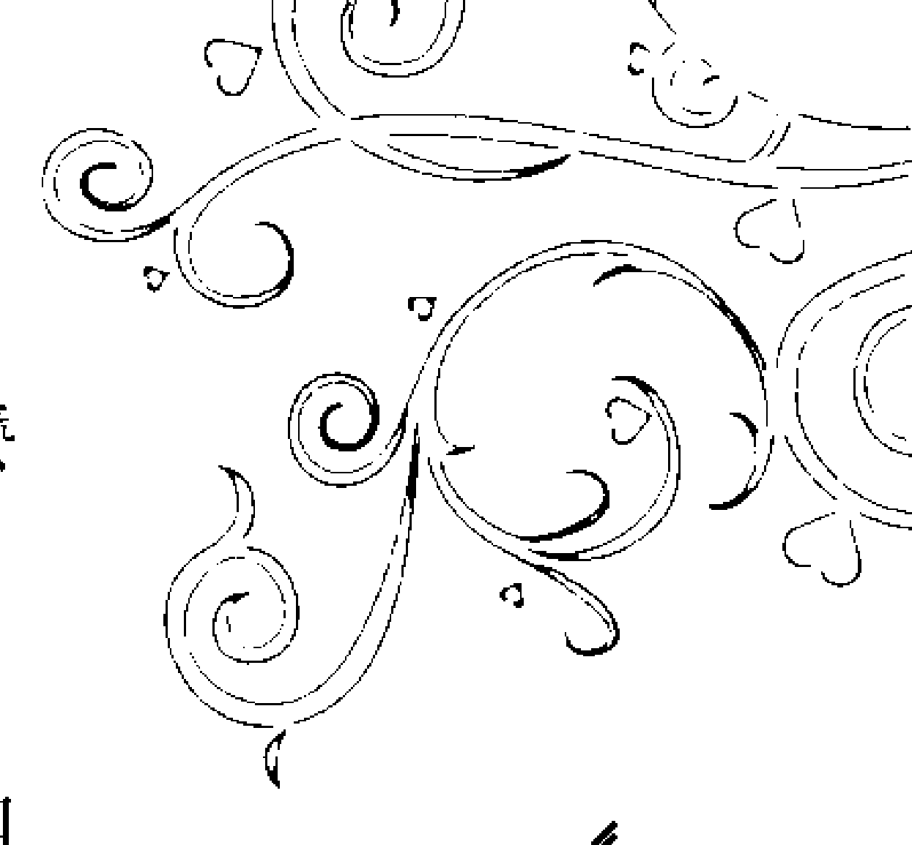
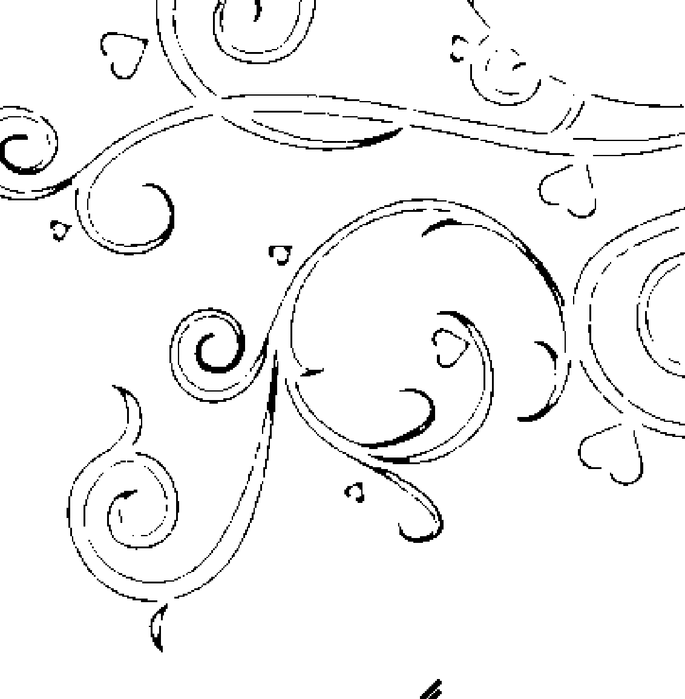
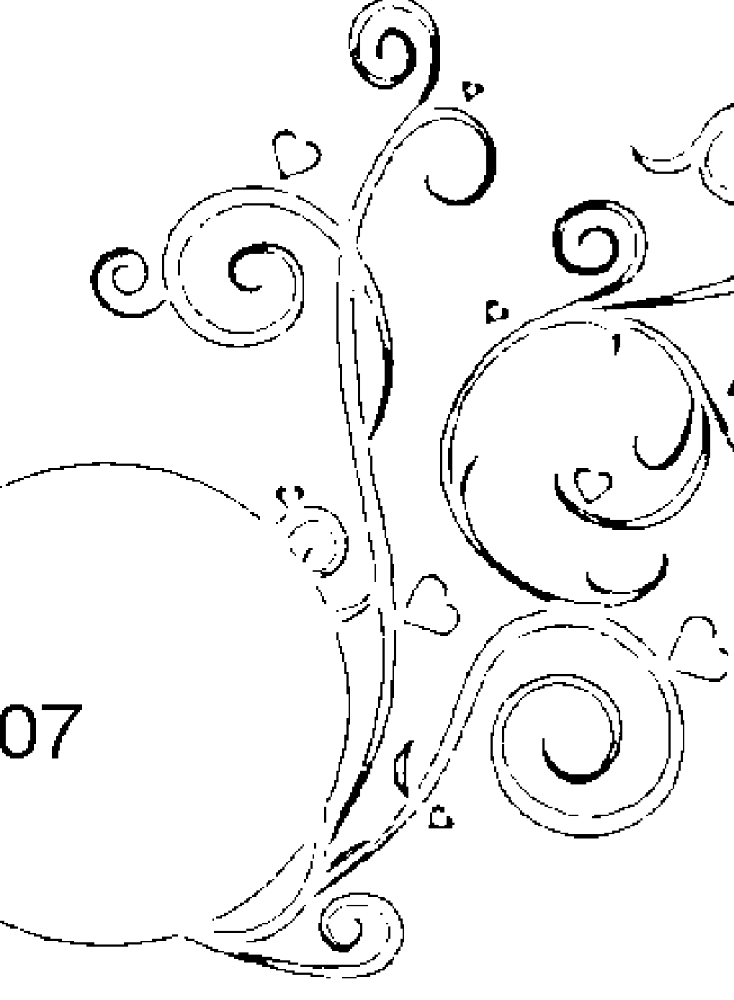

# The Great Law of Attraction in the World

珍藏本

## 吸引力法则：终极成功宝典

生命的终极秘密

The Law of Attraction: The Ultimate Success Manual

## 大師經典 MASTER CLASSICS 珍藏文庫

- 一个隐藏千年的秘密
- 神奇的个人磁场效应

## St. Royal College

## 天使神秘学院

- 专业占卜预测机构
- 神秘学培训机构
- 水晶能量研究中心
- 神秘学资料库
- 官方微信：strcdts
- 微信公众平台：strc2011
- 读书交流QQ群：
   占星塔罗占卜师交流群：814594478（加入密码：PDF）
   神秘学其他综合群：659338717（加入密码：PDF）

微信号：strcdts

天使神秘学院

天使神秘学院 院长QQ：715104687

微信公众平台：strc2011

## 制作说明：

本书由《天使神秘学院》出重金从台湾购入的原版书籍扫描制作完成。为达到最好阅读效果，特地把原版书全部切开后，再经由专业扫描设备高精度扫描完成，并经过一张张的PS后期处理最终成书，其间花费大量的人力、物力以及时间，只为能给大家提供经济并优质的神秘学学习资料而努力。

本学院强力谴责某些机构和个人，把本学院花心血制作完成的电子书籍，包装后直接放在自家淘宝网上低价倾销的行为，以谋取不劳而获的经济利益。如果长此以往最终将无人愿意再为大家花心思制作电子书，那以后可能大家再无新书可读。

为让大家以后能够读到更多的好书，也为了本学院的良性发展。本学院恳请大家尽量做到如下几点：
一、尽量在本学院的网站购买电子书籍。
二、请勿用技术手段把电子书内的水印及加密去掉。
三、在收到电子书后小范围传阅即可，千万不要公开传播，更别挂到淘宝网上低价销售。

同时为答谢广大支持者，学院电子书将做如下调整：

一、学院会把一些早已收回制作成本的电子书折价销售。
二、最新制作的电子书籍会开放打印功能，大家购买后有条件的可自行打印成书。

天使神秘学院
2019年1月

## 前言 Preface

### 吸引力法則：一個埋藏千年的秘密

吸引力法則這個說法，儘管被許多作家廣泛應用，但並沒有一致的定義。然而，在「新思想主義者」（新思想主義是19世紀末到20世紀初美國發生的一場思想運動，主要發起者為當時的心理學家、作家和醫生等，影響非常廣泛）眼中，他們對吸引力法則的普遍共識是「相似的吸引相似的」，並把它應用到有意識的渴望中。也就是說：一個人的思想（有意識的和無意識的）、感情和信念會引起物理世界的變化，即吸引與上述思想一致的積極或消極的經驗，且透過或不透過行動獲得這樣的經驗。這個過程一直被描述為「吸引力法則的和諧共振」或「你獲得你所想的；你的思想決定你的經歷」。

這個說法與新思想的信念及實踐緊緊相繫，它最普遍的定義也就從其中產生，但它也在其他深奧的領域，如神祕主義和神學中佔有重要地位（並得到更複雜的發展）。近年來，因為2006年的電影《秘密》，新思想運動在100年前的觀念重新大為流行。

## 世界最偉大的吸引力法則

吸引力法則中「物理世界能夠不透過任何物理作用而被改變」的觀念一直遭到科學界的嚴厲批評，舉出「法則」這個科學辭彙的誤用及宣導吸引力法則者和一些新思想運動、精神性廣泛的支持者所做的聲明缺乏科學證據。

其實，吸引力法則背後的觀念並非創新。這個觀念可以在印度教中找到。由於印度教在神學上的影響，它在早期的神學教程中也被提到。在1877年，「吸引力法則」被赫勒娜·布拉瓦茨基（Helena Blavatsky）在她第一本關於神秘學深奧理論的書——《揭開伊西斯的神祕面紗：古老智慧傳統的神祕》中提到。在1902年，一個與「吸引力法則」相似的原理，但不叫這個說法，在詹姆斯·艾倫寫的《像一個人那樣思考》中被提到。這個題目來自於古代的《猶太箴言書》第23章第7句：「一個人在他的心裡怎麼想，他就怎樣。」

真正研究吸引力法則的鼻祖是威廉·沃克·阿特金森，他在他的新思想主義書籍中第一次運用這個說法，即《吸引力法則——神奇的個人磁場效應》。阿特金森是《新思想》雜誌的編輯，信奉印度教，是一位印度大師的學生，還是100多本各種各樣關於宗教、神靈和神祕學等主題書的作者。之後，「吸引力法則」這一概念在當時很多的作家、心理學家的著作中得到廣泛的介紹，如華勒斯·華特斯的《失落的百年致富聖經》、查理斯·哈尼爾的《世界最神奇的24堂課》、羅伯特·柯里爾的《秘密》系列叢書、拿破崙·希爾的《思考致富》等著作都對「吸引力法则」进行了大量的闡述。到20世紀中期，並持續到21世紀早期，不同的作者在一個術語範圍內對這個主題進行了闡述，諸如積極思考、精神科學、新思想、實用形而上學、心理科學和宗教科學等。

2006年，一部建立在「吸引力法则」的基礎上、名為《秘密》的電影得到發行，進而發展為一本同名的書籍。這一成功的電影和書籍在美國的媒體上得到廣泛的關注，從《星期六夜生活》（Saturday Night Live）到《歐普拉·溫弗瑞脫口秀》（The Oprah Winfrey Show）都報導了這一現象。2006年9月，一本埃斯特·希克斯（Esther Hicks）寫的名為《吸引法则》的書上了《紐約時報》（New York Times）的暢銷書排行榜。也是在2006年，演講家貝斯（Beth）和李·麥克采恩（Lee McCain）出版了他們的書籍《感激生活：活生生的吸引力法则》；該書成為一本暢銷書，緊接著他們收到演講邀約，並在《奧普拉和朋友》（Oprah and Friend）XM廣播節目中接受採訪，其中他們把他們積極的職業生涯的轉變歸因於吸引力法则。

許多接受吸引力法则作為正確生活的指導者的人們，以他們對宇宙和宇宙法則的信念作為基礎；正是如此，對他們來說，法則的本質不是科學地被安置，「法则」這個詞帶有同樣的信念基礎，就像來自其他非科學的「律令」那樣有價值，例如「因果法则」和「十戒」。在那些遵守各種新思想的人中，這尤其正確。新思想主義者遵循的一個普遍方法是：透過積極的斷言練習來應用吸引力法則。

一些更現代的吸引力法則研究者宣稱，它（吸引力法則）在量子力學中有科學根基。他們認為，思想具有一種吸引相似能量的能量。為了控制這種能量，人們必須練習四件事：

- ①知道一個人渴求什麼，並要求宇宙為它服務。（「宇宙」被廣泛提到，說明它可以是個體所想像的任何事物，從上帝到不知來源的能量。）
- ②帶著巨大的情感如熱情或感激之情把一個人的思想全部集中在所渴求的事物上。
- ③像所渴求的目標已經實現那樣感覺和行動。
- ④開放地接受它。

一個人如果時刻想著一個人所沒有的，它自然會在現實中得到相同的結果，如果一個人遵循這些原理，並避免「消極的」思想，宇宙一定會顯現出一個人的渴求之物。

這個四步驟的清單（不確定來源），用科學的術語表達，類似於米爾德雷·曼在《成為你所相信的》一書中第一次概括的「示例七步驟」的影響：

### ①渴望

對你在生活中所想要的事物懷有強烈的熱情，並對一些現在還沒有的事物真正渴求。

### ②決心

明確地知道你想要什麼，以及什麼是你想做或擁有的。

### ③要求

（在確定和充滿熱情的時候）用簡潔、明確的語言要求得到它。

### ④相信

有意識和無意識地帶著強烈的信念相信能夠得到它。

### ⑤工作

為它工作……然後每天幾分鐘，想像你自己身在已經完成的圖景中。永遠不要描述細節，但要看到你自己正享受著特定的事情……最終，你會看到在某個時刻它恰好出現，作為一個禮物或類似的東西，或者你將得到一個能獲得你正在要求的事物的機會。

### ⑥感激

總是記得說：「謝謝！」並開始在你的心理感覺到感激之情。如果我們真正感覺到它，那麼我們所做過的最強而有力的祈禱，就是這兩個單字。要像你已經得到你所想要的那樣來感覺。

### ⑦期待

訓練你自己生活於一種幸福的期待狀態中……找到一種使它出現在你的生活中的方法，並對之保持信心。或許是某些人把它送給你，或者你找到一個啟發來獲得它。

不管我們如何從科學的角度去驗證「吸引力法則」的正確性，事實上，這一法則一直存在，就像牛頓在發現萬有引力定律之前，萬有引力定律也一直存在一樣。

## 世界最偉大的吸引力法則

本書是「吸引力法則」領域最早的一本著作，也是最權威的著作。對我們每個人都具有不可估量的價值。如果你現在遇到諸多困難，找不到人生的方向，心中充滿了消極、失落的情緒，想尋找人生的終極答案，那麼，本書就是寫給你的！在這裡，你會找到人生的終極答案，並且教給你一些簡單實用的秘訣，讓你快速改變人生！

如果你對自己的生活比較滿意，想讓你的人生好上加好，讓生活更加幸福、快樂、富有，能夠輕鬆擁有最美好的事情，那麼，這本書同樣也是寫給你的！你將輕鬆地得到你想要的，從容不迫、毫不費力！

如果你已經聽說過吸引力法則，讀過一些這方面的書，卻在運用上不那麼順心自主、施展自如；似懂又好像非懂，不知道自己的問題究竟出在哪裡，要怎樣才有改善的餘地，想從更基礎、更系統的理論學起，本書將告訴你「吸引力法則」的所有秘密！

## 關於作者和本書

威廉·沃克·阿特金森生於馬里蘭州的巴爾的摩，他於20歲那年起開始經商，32歲時被賓夕凡尼亞法庭錄用為律師。儘管他的律師職業給他帶來了物質上的富足，然而強大的精神壓力和過度的精力消耗最終令他精疲力竭。

這段時期，阿特金森遭受了生理和心理上的雙重重創，加上他在財政上的重重危機，他整個人幾近崩潰。於是，他試圖尋求治療。他發現了一本《新思想》期刊，並從中找到了絕佳的療傷方法。

阿特金森康復後不久，便開始在那本期刊《新思想》中發表文章。這本期刊後來更名為《精神科學》。不久，他寫的一篇命名為《精神科學教本》的文章刊登在了這本期刊上。

一年後，阿特金森成為了《新思想》的一個副刊——《建議》的副總編輯，完成了他的第一本書《吸引力法則》。之後，他又遇見了《新思想》的知名出版商西德尼·弗勞爾。他們兩人開始通力合作，阿特金森出任《新思想》的總編輯，在這個職位上，他一直做了5年。

阿特金森在《新思想》上發表了許多作品，這些作品在《新思想》忠實的讀者群，尤其是醫生和律師中廣受歡迎，影響頗大。阿特金森的名氣也被廣泛地流傳開來。

《吸引力法則》是作者的第一本著作，更是「吸引力法則」領域的最早著作和文獻，可以說是「吸引力法則」的開山之作。這本書在塑造個人魅力、提高精神影響力、增強思想的力量、集中注意力、培養意志力，以及實用精神科學方面都有發人深省的見解。

在這本「新思想」的經典著作中，阿特金森專注於吸引力法則在思想世界中的作用。他指出萬有引力法則和心理吸引力法則之間的相似性。他解釋說，思想振動波就像那些表現為光、熱、磁和電的波一樣真實。不同之處只在於振動波的頻率，這也闡明了「思想波」為何不能被我們的5種感官感知到的事實。

他說明在光和聲音的波譜中其實存在著一個巨大的波動空間，該空間寬闊得足以包含其他世界。這些空間裡的波動將被與它們相互諧調的感覺器官所感知到，這是符合邏輯的。更加精密的科學儀器就能夠記錄更多這些隱藏著的頻率。

在消極和積極的思想波之間經常有著相互作用——個體的任務就是透過意志的作用來把他們心理的主要振動頻率提高到一個積極的程度上。阿特金森從兩方面討論斷言的目的：首先，建立一個新的心理態度，第二是提高心理波的主要振動頻率。他也提到，在釋放表達和吸收印記之間必須有一個可以接受的平衡狀態。

許多心理的功能被發現和討論，作者宣稱意志力之流沿著精神導線激烈地流動著，但個體必須訓練，以便最好地接通這個能量的泉源。「我」是心理的主人，「意志」是「我」的工具。用來內化這種洞察力的斷言在這裡獲得提供。

阿特金森也說明怎樣克服消極的情感，如恐懼、焦慮、嫉妒、憤怒和仇恨。他堅決相信宇宙法則在一切環境中運行，並建議讀者使自己與這些法則互相諧調。我發現宣揚生命力量和訓練心理習慣的章節尤其有用和令人振奮。

儘管這本書寫於多年以前，但其內容依然令人聽來就感到新鮮和屬於當代。其中對「吸引力法則」的解釋及過程非常清晰，各種訓練也相當簡單和實用。作者極具感染力的樂觀主義和他簡明、直接的表達方法深深地吸引了無數的讀者。

如果誰還沒有讀到這本書的精華，那麼你正在錯過一件真正美好的事物。對於如何運用「吸引力法則」，阿特金森闡述得極其精彩，如怎樣永遠不反抗進入你心裡的消極、對立的想法，以及如何將注意力只集中到你所想要的事物上。而且，在必要的地方以幽默而彷彿話家常一樣的方式進行極清楚的解說。而在這本書中他闡述的最重要的理念是：他強調把你的能量投入到唯一的目標上是多麼重要，對於它，你的注意力永遠不要動搖。

如阿特金森對憂慮的論述：「你不必與憂慮抗爭，那不是戰勝它的方式。你只需練習專注，學會集中注意力到一些恰好發生在你面前的事物上，而後你將會發現那些憂慮的想法已經消失。有一些比與之抗爭更好的克服對立思想的方法——學會集中注意力到另一種具有相反特徵的思想上，接著你會發現問題已經解決。」

對於如何消除恐懼，阿特金森指出：第一件要做的事是開始「切除」恐懼。恐懼思想是眾多不幸和失敗的根源。你已經被告知這種情形一遍又一遍，但它仍將繼續重複。恐懼是一種被消極思想強加在我們身上的心理習慣，但透過個體的努力和堅持，我們可以從中獲得自由。他指出，我們要選擇「勇氣」而不是恐懼……因此，不是重複說：「我不害怕！」而是大膽地說：「我充滿了勇氣！」、「我是勇敢的。」你必須宣稱：「沒有什麼可害怕的。」，如此一來，儘管在本質上也是否定的，但與其簡單否定導致恐懼的客觀事實，不如承認恐懼自身，然後否定它。

> 正如一位讀者所說：「這本書將改變你的心理程式，安裝上那些你所想要的，而非你所不想要的模式。」

你是否正在期待一本系統化講解吸引力法則，有助於你從基礎學起，系統化學習其理論和應用的書？你是否學了吸引力法則卻還是常常覺得使用困難？窒礙難行？那麼，從本書開始吧！

## 總編輯推薦

亞馬遜網站心靈勵志類暢銷書排行榜冠軍。

吸引力法則宗師原著。

暢銷書《秘密》思想源頭。

最權威最經典最完美的『吸引力法則』正宗原著。

從出生那天開始，你就在等待的一本書。

「吸引力法則」領域奠基性著作你一生要讀的最重要的書。

擁有美好的事物，是我們天生的權利，而擁有這些的秘密就是運用吸引力法則。

從查爾斯·哈奈爾、羅伯特·柯里爾、拿破崙·希爾、華勒斯·華特斯、到安東尼·羅賓、博恩·崔西、朗達·拜恩、傑克·坎菲爾，100年來全美所有勵志大師的思想源頭。

## 媒體評論

> 本書可能是你讀過的書籍當中最重要的一本，我很感激作者完成了這部著作。
>
> …………《世界最神奇的24堂課》作者 查爾斯·哈奈爾

> 正是因為看到這本書，才讓我動了寫作《秘密》這本書的念頭阿特金森才是這個秘密的真正發現者，我不過是在向更多的人們傳播它。
>
> ………………………………《秘密》作者 羅伯特·柯里爾

> 我想，沒有一本著作能夠和威廉·沃克·阿特金森的《吸引力法則》媲美，它第一次發現了這個秘密，就像牛頓發現萬有引力定律一樣。
>
> …………………………《喚醒心中的巨人》作者 安東尼·羅賓

> 吸引力法則二十世紀初就有記載，第一個發現它的人就是威廉·沃克·阿特金森，我的這本書是在100年後對它的一種致敬！
>
> ……… 2007年美國暢銷書《吸引定律》作者 麥可·羅西爾

## 目録

### 第一章 思想世界的吸引力法則／025

今天，我們已認識到吸引物體到地面和維持圓周世界有序運行的法則的力量，但對吸引我們渴望或恐懼的事物，以及建造或毀壞我們生活的強大法則，我們卻閉上了眼睛。

### 第二章 同類相吸、異類相斥／033

一個內心充滿了對成功的渴望的人，就會很容易和有類似想法的人產生共鳴，而這種共鳴，會讓他們互相吸引，並且最終走到一起，而當他們在一起的時候，他們會為了共同的目標一起努力、互相幫助。相反地，那些時常讓自己的心靈徘徊於失敗的陰影之中的人，只能吸引同樣絕望的「失敗者」，而當他們在一起的時候，他們只會一起滑向「失敗深淵」的更深深處。

### 第三章 關於頭腦的討論／045

我們精神上創造、改變和摧毀的力量都源於一個相同的源頭，這個力量的泉源就是我們那些活躍積極的行為。我們精神上被動的行為只不過是一個執行者，它亦步亦趨地跟隨著我們的主動意志，執行它所做出的決定，並且恪守著它所制訂的規則，不敢越雷池半步。

### 第四章 頭腦的建構／055

一旦一個人向世人宣稱「我」，並且因此「找回了自我」，他就已經在「自我意志」和「宇宙意志」之間建立起了一個緊密的聯繫。雖然總有一天他會因為掌握了這種強大的力量而獲益匪淺，但是在在此之前，他必須首先實現對自己的統治。

### 第五章 意志的秘密／063

我相信每個人都具有一種潛在的強大意志力，所以他所需要做的就是訓練自己的頭腦如何去利用這種強大的力量。我認為每個人頭腦中較高層次的部分都深藏著潛力無窮的意志力等待他來發掘和運用。

### 第六章 消滅你的恐懼和憂慮／073

從今天開始就下定決心，告訴自己必須有所改變——永遠不要向你面前的困難妥協。直到它向你投降為止，你要堅持與它對抗。剛開始的時候你也許會感覺這件事十分困難，但是隨著你一次又一次的和它抗衡，你會發現：它將變得越來越虛弱，而你，卻變得越來越強大。

### 第七章 清除走向成功的路障／081

我們所做的每一件事、每一個行動之下所隱藏的動機都是我們的渴望和興趣。如果一個人真心實意地渴望得到一樣東西，他自然而然就會對如何完成它產生巨大的興趣，繼而就會抓住他周遭每一件可能幫助他做好這件事的細節。

## 第八章 精神控制的法則／091

想透過有意識的「壓抑」來對抗一個強制運行著的思維是不可能的——那是對你自己精力的巨大浪費。你越是對自己說「我不要想這件事！」，它就會更頑固的根植在你的頭腦裡。正是因為你用這種方式去驅除它，所以只會更牢固的抓著它不放。

## 第九章 發掘生命的力量／095

我們當中有太多的人一直以來就如同行屍走肉般的活著——沒有野心——沒有激情——沒有活力——沒有興趣——沒有「生命」；而且也許永遠也不會有。你被陷在泥濘中了。醒醒！讓我們看看你還活著的蹤象！

## 第十章 訓練你的慣性思考／101

如果你正面對著這樣的問題：「這兩件事中我應該做哪一件？」那麼最好的回答是：「做那件你想讓其成為習慣的事。」

## 第十一章 情感心理學／105

每一次你向這些消極的情感所做的讓步，都會使它們在下次遇見同樣的，或者相似的情境時更容易表現出來。甚至有時候當某一種消極的情緒受到了鼓勵時，你會發現你在不經意間，讓出了一大片空間令精神上的雜草在你的意識中瘋狂生長。

## 第十二章 開發大腦的新領域／111

人的意識會自動地根據「主人」的喜好把一類想法視作是「好的」，它會為這些想法清理道路、毫不抵抗。這類想法對你的影響遠大於另一類——「消極思維」。一種「積極思維」的力量要比好幾種「消極思維」的力量更強大，因此，戰勝「消極思維」最好、最有效的辦法就是培養「積極思維」。

## 第十三章 有吸引力的力量—欲望的力量／119

記住，你的頭腦是在潛意識的平臺上工作的，而且絕大多數時候是追隨著你的熱情和欲望在行動。它會安排好事情，將計畫表整理打包，當你最需要它們的時候，它們就突然地出現在你的腦子裡，這時你便可以享受靈光閃現的快感，就像你從上帝那兒得到了額外的饋贈。

## 第十四章 強大的動力／125

如果你把一個人和許多成功的人放在一起，一起生活、工作，那他也很有可能會獲得成功。其中一個重要的原因就是他可以觀察那些成功的人，並從中發現成功的「秘訣」所在。

## 第十五章 相信自己／133

不管看起來是多麼神奇、美妙的事物，也不管你是如何看待自己，你有資格擁有一切美好的事物，這是你生來就擁有的權力。所以不要害怕要求和擁有。

## 第十六章 法則，不是機率／141

一個人的思考處在消極、沮喪的境地時，是不會閃現出智慧的火花的。只有當我們充滿熱情和希望的時候，我們的頭腦才能有效率地運轉起來，為我們創造財富。

## 第十七章 神奇的「個人磁力」／147

世上所有美好的事物都有可能會降臨在我們身上，只要我們能學著接收周圍的力量，並且善用它們，這些我們夢寐以求的好事就會發生在我們身上。

## 第十八章 你想要什麼，就吸引什麼／155

你一直告訴自己「我不行」，而不是「我可以」。現在，我希望我能幫助你把「我不行」換成「我可以」，但這還不夠我還要你把「我可以」進一步變成「我一定行」。而這正是我現在站在這兒的原因：我會努力讓你們產生改變，直到你們都能做到和我一樣為止。

## 第十九章 學會運用思想的力量／163

只要你在頭腦裡堅定地抱有某種思想，你就能從周遭環境裡數量龐大的思想中吸引到相似的思想，並且獲得它裡面的能量，雖然沒有人能看見這些思想，但它們確實存在於我們的周圍，而且它們裡面也確實蘊含了很大的能量。

## 第二十章 發揮你心靈的感召力／169

我們每時每刻都在接受或是拒絕來自外界的暗示，而最終我們是接受還是拒絕這些暗示，取決於它們對我們所具有的暗示性，而這些暗示性對我們所產生的影響力強弱，則取決於我們對自身抗暗示能力的培養和發展。

## 第二十一章 一點世俗的智慧／177

努力讓自己的聲音聽起來能讓人感覺很舒服。說話的時候既不要讓你的聲音聽起來含混不清，也不要太大聲而讓人覺得你很粗魯。比較恰當的作法是用清晰的聲音和他人交談，同時和他人保持適當的距離，以保證你不用太大的聲音說話，別人也能聽清你在說什麼。

## 第二十二章 眼神的力量／183

要對任何試圖利用心理攻勢來提出要求的人心存警惕，因為很多危險都是因為心理戒備不夠才造成的。要讓你「積極的工作夥伴」行動起來，別留有餘地讓你「消極的工作夥伴」聽從對方的任何一句話。

## 第二十三章 有魔力的眼神／189

一旦你掌握了這項技能，你離成功也就不遠了。你不能僅僅滿足於下面這幾項練習，而是一定要在與他人接觸的時候實際運用它，並記錄下每次的結果和心得。只有在與人交往時運用，你才能獲得真正實用而有價值的經驗。

## 第二十四章 揮發性的力量／195

沒有什麼會損傷或毀滅真正的自我。身體和精神都會變化，但是你的本質卻不會因為任何原因而改變。它是非常強大的，一旦你瞭解了它的力量，你就會變成另外一個人，能夠獲得不可知的能量。

## 第二十五章 直接影響力／201

要想做好一件事只有一個辦法，那就是盡心盡力地去做。你必須把握好前進的方向，不要回頭。選擇好你的目標，清除前進道路上的荊棘，而後朝著目標前進。要達到你的目標，你必須時時保持強烈的欲望和動機，保持對真正的自己、對「自我」清醒的認識，以便在實現目標的過程中，你能完全發揮所謂的「意志力」的作用。

## 第二十六章 神奇的心靈感應／213

一切思想，無論是自發的還是無意的，都會產生思想波動或者說振動，並向宇宙發送該波動或振動。而別人接收到你的波動，或多或少都會受其影響。

## 第二十七章 思想的聚合功能／223

思想不僅是一種強大的力量，更是確實存在的物質，就像任何實物一樣。思想只是物質更美好的形式，或者說是精神更粗俗的形式。這兩種說法都是正確的，物質不過是思想更粗俗的表現，而思想不過是物質更美好的表現形式。它們本質上是同一種東西，只是有許多種形式，既有最物質化的形式，也有層次最高的精神形式而已。

## 第二十八章 品格的塑造／231

不要輕易的忽略了這些東西，雖然它看起來確實很簡單。這對你來說是一個價值千萬的機密，一旦你感覺到了它所帶來的利益，無論多少錢你都不會放棄它。

## 第二十九章 全神貫注／243

精力集中的人將其思考能力、注意力都集中在一個目標上，結果是，他有意無意的行動都使其更接近目標。正如前一章我所說的：「人能夠得到想要的一切，只要他的欲望夠強烈。」如果他的精力都聚焦在某一事物上，而不因其他事物分心，就能產生強大的動力，使其得到他想要的結果。

## 第三十章 集中精力練習／251

集中精力的第一必備條件是具有免受外界思想、聲音或事物影響的能力，繼而得到克服疏忽大意的能力，與獲得對身心完全控制的能力。身體必須受大腦的直接控制，而大腦又受意志力的直接控制。意志力要足夠強大，因為大腦必須要在意志力的直接影響下才能得到增強。大腦經過意志力的刺激而增強後，就變成思想振動更強大的投射器。

## 第三十一章 最後的忠告／259

朋友，走你自己的路吧！下定決心，增強你新發現的力量。首先你要對自己負責，其次要對他人負責。要認識到人間的友愛，並意識到所有人都是你的兄弟。

## 後記／265

## 世界最偉大的吸引力法則

宇宙由一個法則來統治——一個偉大的法則。它的表現形式是多樣的，但從根本上來看，只有一個法則。我們對它的一些表現很熟悉，但對其他的某些表現形式卻幾乎渾然不知。現在我們每天都更多瞭解它一些——面紗正逐漸被揭開。

我們很隨意就談到萬有引力法則，然而卻忽略了同樣令人驚嘆的現象——思想世界的吸引力法則。我們對吸引且維持構成物質的微粒結合在一起的法則所表現出來的奇妙現象很熟悉——。

我們認識到吸引物體到地面和維持圓周世界有序運行的法則的力量，但對吸引我們渴望或恐懼的事物，以及建造或毀壞我們生活的強大法則，我們卻閉上了眼睛。

當我們漸漸明白思想是一種力量——能量的一種表徵——具有一種磁性——就像吸引力，我們就開始理解為何迄今為止許多事物對我們來說似乎是隱密的。沒有任何研究能像對這個思想世界最偉大的法則——吸引力法則的運行之研究這樣，能夠給學生投入的時間和努力帶來這麼好的報償。

當我們思考時，我們會傳送出一種美好精妙的物質波，它們就像呈現為光、熱、電和磁的波那樣真實。我們的五種感官無法明顯地感知到這些波，並不代表它們不存在。

一塊強大的磁石會放射出波，並施加足夠的力量來吸引一塊一百磅重的鋼鐵，但我們既不能看見、品嚐、聞到、聽到，也不能感覺到這種強大的力量。

同樣的，這些思想波，不能看見、品嚐、聞到、聽到，也不能以通常的方式來感覺到，儘管有記載案例說感官特別靈敏以致能通靈的人已感知到強大的思想波是真實的，以及我們之中的很多人能夠證實我們曾本能地感覺到他人的思想波，包括近在眼前和相隔遙遠距離的傳播者。心靈感應及其相似的現象並非徒耗時間的白日夢。

表現為光和熱的波，其強度遠遠低於思想波，唯一的不同只在於波的頻率。科學的記載在這個問題上投入了一線有趣的曙光。伊利沙·格雷教授——一位著名的科學家，在他的小書《自然的奇觀》裡說：

> 有大量資料可以作為依據來推測，在思想裡存在著人類的耳朵聽不到的聲波，和眼睛看不見的有色光波。長遠、黑暗、無聲的空間，聲波的頻率在40000赫茲和4000000000000赫茲之間，而光波的頻率極限則僅止於7000000000000赫茲，在這些頻率範圍之外還有無限的波頻範圍。

M·M·威廉斯在他題為《科學上的簡短篇章》的著作中說：「在使我們產生聲音感覺的最快速的波動或振動和最慢的、給我們喚起最輕微的溫暖感覺的那些波之間並沒有等級之分。在它們之間有一個巨大的間隔，寬廣得足以包含另一個運動的世界，一切存在於我們聲音的世界和我們熱與光的世界之間；沒有任何合適的理由能假定物質不能進行這樣中間狀態的運動，或這樣的運動不能引起中間狀態的感覺，如果有器官來感受或感覺它們的運動的話。」

我引用上面的權威論述只是給你提供資料來思考，不是試圖給你證明思想波存在的事實。名字後面標明姓氏的事實已足夠讓這個課題的審查者感到滿意，只要進行一點思考，你就會明白它與你的親身經歷相吻合。

我們經常聽到眾所周知的精神科學的陳述：「思想就是事物」，我們嘴裡說著這些話，卻從未明白地意識到這個陳述的確切涵義。如果我們充分理解這個陳述的真實性及其背後帶來的自然結果，我們將會理解許多原本我們覺得隱晦難懂的事物，而且能夠運用這種令人驚奇的力量——思想的力量，恰如我們運用其他任何形式的能量一樣。

正如我已經說過的，當我們思考時，我們便開始放射出一種強度非常高的運動波，它恰如光、熱、聲和電的波一樣真實。當我們理解並支配這些波產生和傳送的法則，我們就能在日常生活中運用它們，就像我們更清楚理解能量的形態一樣。我們不能看見、聽到、秤重或測量這些波，但這並不證明它們不存在。有不少波是人類的耳朵所不能聽到的，但這些波的一部分無疑是被一些昆蟲的耳朵注意到了，而其他的波則被人類所發明的精密的科學儀器捕捉到。然而，在被最精密的儀器感知到的聲波和人類心理所能察覺到的聲波限度之間仍有一個巨大的間隔，依此類推，可知聲波和一些其他形式的波之間確實存在著分界線。同樣地，也有人類的眼睛所不能注意到的光波，其中一些可能可以被更精密的儀器覺察到，而許多更為纖弱的光波，能覺察到它們的儀器還沒有被發明出來，儘管每年在這方面的發展都不斷地在進步，尚未探索的領域也逐漸在減少。

由於新儀器被發明出來，因此新的波也被它們注意到——然而在這些新儀器被發明之前，波還是像儀器發明之後一樣確實存在。

假如我們沒有儀器用來測量磁力——那麼，一個人否認這種強大的力量很可能被認為是正常的，因為它不能被品嚐、觸摸、聽到、看見、秤重和測量。可是，這種強大的磁石仍然傳送出足夠的磁力波來吸引幾百磅重的鋼鐵。

每一種形式的波需要符合它本身形式的儀器來檢測。目前人腦似乎是唯一可以注意到思想波的器官，儘管神秘主義者說：「在這個世紀科學家將會發明出足夠精密的裝置來捕捉和記錄下這樣的思想感覺。」而且，從目前看來，這種發明終究有望在任意的時刻實現，因為既然有需求存在，供給無疑不用多久就會得到滿足。但對於那些已經沿著實用的心靈感應路線進行實驗的人，沒有比他們自己實驗的結果更進一步的證明。

我們任何時候都在傳送強度或大或小的思想波，同時我們收穫這些思想波的結果。我們的思想波不僅影響我們自己和別人，同時它們具有一種吸引力——它們吸引別人的思想、事情、環境、人群和「幸運」到我們這裡，而吸引來的這一切與我們心中最重要的思想特質相一致。

愛的思想將給我們吸引來別人的愛、與這種思想相一致的環境和周圍的事物，以及喜歡這種思想的人們。惱怒、憤恨、嫉妒、惡意和猜疑的思想則將為我們吸引到從別人那裡散發出來的惡臭的相似思想；我們所身處的環境將被邀約來證明這些糟糕的思想，而且我們也接受來自別人的同樣糟糕的思想；還有表現得不和諧的人們如此等等。一種強烈的思想或持續長久的思想，將使我們成為吸引他人相應思想波的中心。在思想的世界裡，同類相吸——你怎樣播種，就將怎樣收穫。

在思想的世界裡，同一種羽毛的鳥飛到一起——然而一直詛咒不停的人也會走到一起居住，並帶來他們的朋友。

充滿愛的男人或女人在任何情境下都看見愛，而且吸引來別人的愛。滿懷憤恨的人只會得到一切他所能承受的憤恨。想著戰鬥的人，在他獲得認同之前，通常不得不面對所有他招惹來的戰鬥。道理就是如此，每一個人都會透過心理的無線通信而獲得他所召喚的。早上起床感覺「易怒」的男人，在早餐吃完之前常常想方設法使全家人處於同樣的情緒狀態。「嘮嘮叨叨」的婦人，一般整天都會找到足夠的事情來使她「嘮叨」的習性感覺愉悅。

思想吸引是一件重大的事情。當你停下來思考它，你就會明白一個人確實製造了他自己的環境，儘管他把原因歸咎於別人。我已經瞭解到，掌握這項法則的人持有一種積極、平靜的思想，而且絕對不受他們周圍不和諧環境的影響。

他們就像裝滿油的容器被注入煩人的水——當風暴在他們周圍肆虐，他們還是安然平靜地歇息。一個懂得這項法則運行之道的人是不會任由一陣陣思想的風暴擺布的。

我們已走過肉體力量的時代，進而來到智力至高無上的時代，現在正進入一個全新和幾乎一無所知的領域，那就是精神力量。這個領域的能量有它的建構法則，正像其他的領域一樣，而我們應該讓自己熟悉它們，否則，我們將由於在努力層面上的無知而陷入困境。我會努力為能讓你順利掌握關於這個新領域能量的偉大潛在原理鋪平道路，這些能量正在我們面前展現，你可以充分利用這種偉大的力量，將它用於合理且有價值的目標上，就像今天人們應用蒸汽、電和其他形式的能量一樣。

## 第二章 同類相吸、異類相斥

就好像一塊被拋入水中的石頭，思想也能在我們的頭腦中激起一重又一重的波紋和浪花，它們會在思想的汪洋大海中盪漾、擴展，直到遍佈我們的整個頭腦。但是，頭腦中的浪潮和大海中的浪花又存在這樣一個顯著的差異：

- 不管向多少個方向擴散，水中的波紋只處於一個平面上；然而，思考的波紋卻是從一個中心向四面八方擴展——就好像太陽發射出的光芒一樣。

我們現在都知道，當我們站在地球上時，我們無時無刻不被浩如汪洋的空氣包圍著；可是我們不知道的是，同樣的，我們也無時無刻不被我們思想的海洋包圍著。而我們思考的波紋就在這片精神的大海之中擴展、飄散，只不過，像我剛才強調過的：這種擴散是向四面八方各個方向同時進行的。如同水中的波紋一樣，這種浪潮會隨著距離的增加漸漸削弱。造成這種情況的原因在於，我們的思緒彼此之間的聯繫、牽制和阻礙，以及包圍著它們的思維海洋對它們的摩擦、阻塞，這一點和波紋在水中受到的阻力是一個道理。

這些思維浪潮還具有其他一些水波所不具有的性質。首先，它們具有「自我繁殖」的能力，在這一點上，它們和聲波的共同之處更大。這就好像小提琴奏出的音符能讓薄玻璃杯跟著顫抖，甚至「唱起歌來」；同樣的，一個強烈的思想也能引起我們內心深處思想的共鳴，不管它們曾經被深埋了多久。很多時候，他人強烈的思想，能讓我們自己許多散佚已久的想法又重新浮現。但是，除非和我們自身的思想和諧，否則，再強烈的思想也無法讓我們產生共鳴。如果我們全身心地投入到對一個正確想法的思考中去，我們就能為我們的思想定下一個基調。這個基調一旦得到確立，我們就能很容易地和他人類似的想法產生共鳴。截然不同的是，如果我們養成了按錯誤的方式思考的習慣，我們就不得不面對成千上萬的反對者，而我們思想的浪潮在傳播的過程中，也會遭到這些人的圍堵追截。

基本上，我們希望自己是什麼樣的人，我們就會成為什麼樣的人；而我們就在自己想法的獨木橋上，借助別人的建議和思想努力保持著平衡。

這些建議和思想，有些時候是由別人直接告訴我們的，在另外一些情況下，它們就是用我們剛才說的那種「思想電波」的方式影響我們的。不管是別人傳達給我們的思想，或者是我们自己正在發射的「思想電台」，歸根結底，它們都是由我們精神上的態度所決定的。我們只會選擇和我們精神態度諧調一致的思想進行接收，而那些和我們的態度相悖的想法對我們的影響則微乎其微，其原因在於這種想法根本無法喚起我們思想上的共鳴。一個堅持相信自己的力量，具有強烈自信和決心的人，即使整日和一個沮喪絕望的人待在一起，也絕不會受到他散播出來的# 世界最伟大的吸引力法则

这些负面想法的影响，但是，在同样的情况下，如果把我们的主角换成一个思想上倾向于灰暗的人，这些想法无疑会加重他绝望颓废的情绪，如果说绝望的火焰正在吞噬着他的力量，这样的结果无异于火上浇油，或者，让我们换个你更喜欢的比喻：这样的结果，熄灭了这个人激情和活力的火焰。

我们内心的想法能吸引其他具有类似想法的人。

譬如说一个内心充满了对成功的渴望的人，就会很容易和有类似想法的人产生共鸣，而这种共鸣，会让他们互相吸引，并且最终走到一起，而当他们在一起的时候，他们会为了共同的目标一起努力、互相帮助。相反地，那些时常让自己的心灵徘徊于失败的阴影之中的人，只能吸引同样绝望的“失败者”，而当他们在一起的时候，他们只会一起滑向“失败深渊”的更深处。

对世界充满了绝望的人，一定会看到更多的绝望，而他遇见的人，似乎也都在证明他的看法是多么的正确。可是，一个认为生活中充满了美好的人看到的却是另外一种景象，他看到的事物都是那么的美好，他遇见的人都是那么的乐观……事实上，我们怀着什么样的心看世界，我们眼中的世界就是什么样子。

也许试着这样想可以让你更清楚地理解这种现象，对于无线电报接收机来说，虽然我们周围的环境中充斥着各种各样的无线电码，但是，只有那些由对应的发射机发射的，和接收机具有相同频率和密码的电波才会被分拣并接收，与此同时，其他的电波就这样消失在空中，而不会对这台接收机造成任何影响，而我们的大脑，就是这样一台“马可尼电报机”，这种法则同样适用于我们的思想。我们只会接收那些与我们的精神频率相同的资讯。

如果我们有一天遇到了无法逾越的障碍，开始变得气馁，我们有可能就此被困在消极的情绪中无法解脱，甚至越陷越深。造成这种结果的原因是多种多样的，要知道，当我们气馁沮丧时，我们自己本身的思想就会让我们萎靡不振，可是这并不是最糟糕的。这个世界上的大多数人并没有学过我们关于“心 wave 电波”的理论，所以他们并不知道自己对别人有着怎么样的影响力，但是事实上，当我们情绪低落时，我们就吸引了更多情绪低落的人，而他们的坏心情，会向我们的头脑“发射”沮丧低落的电波，这些影响，会让我们的心情越来越低落。可是这时候，如果我们的情绪在偶然之间变得热情洋溢、活力四射，很快的，我们就能感觉到我们周围那些具有积极向上心态的人们散发出来的热情，那些勇气、活力、欢欣的情绪、积极的思想……它们就在我们的周围，无时无刻不在，它们一直都欢快地流淌着。现在，我们可以说，当我们和其他人建立起精神上的联系，清楚地感觉到他们的“思想浪潮”时，不用费什么周折我们就能意识到他们的情绪——不管是压抑还是鼓舞——我们都能很快意识到。但是，实际上，即使不在我们周围的人也能和我们建立情绪上的感应——虽然还没有那么强烈。

我们的情绪是非常多样化的，从最积极、最活力充沛的情绪，一直到最消极最低落沮丧的情绪；当然，更多的时候，我们的情绪都是处于这两者之间的，具体的程度取决于我们和这两种极端的距离。

当你的头脑沿着一条积极的轨迹运行时，你会感觉自己强壮、轻松、聪敏、愉悦、快乐、自信、勇气十足，这个时候，你感觉自己能胜任任何工作，你自信一定能实现自己的想法，这个时候，你会在通往成功的路上大踏步地前进。你就像一台功率强大的发报机，不停地发射着积极向上的信号，这些信号会吸引其他积极进取的人们，让他们与你展开合作，或是追随着你的领导——具体会采取什么样的作法取决于他们自己的思想基调。

但是，相反的，如果你的头脑滑向了消极的一端，你只会感觉沮丧、虚弱、被动、迟滞、怯懦、退缩。这种时候，你会发现自己根本没办法取得较大的进步，更不用说获得成功了。这种情况下，你对他人的影响也降到了零点。你只能屈从于其他人的领导，而不要妄想去领导其他人，更糟糕的是——你成了那些活力充沛之人的垫脚石，甚至被他们当成皮球一样踢来踢去。

在有些人身上，你能看到积极的因素占了主导地位；

## 第二章 Chapter 02 同类相吸、异类相斥

可是在另外一些人身上，消极的因素很明显占据了优势。很显然的，在我们每个人的身上，积极和消极的因素都在不停地改变着的，而这种改变无论从程度或是范围上来看都有可能非常的大，举个例子：同一个人张三，他有可能和李四在一起的时候很积极，同时，却在和王二在一起的时候很消极。两个陌生人第一次见面时，通常情况下，都会有一场精神层面上的交锋，这场交锋静默无声，却激烈异常，两个人先是相互试探，试探对方的信心和决心，并且最终透过这场交锋确定他们之间的关系以及地位。这个过程在很多情况下都未被我们察觉，但是，它却是真实存在的。这个调整的过程经常都是无意识地进行着的，虽然如此，这场斗争有些时候却是如此尖锐——他们之间的竞争太过火爆——在这种情况下，两个人都开始有意识地想要赢得这场竞争。有些时候，竞争的双方都全力想赢得这场竞争，而他们俩恰巧在信心上也旗鼓相当，那么，他们都不会在精神上做出妥协，这两个人将永远不可能真正和谐地相处，他们最后的结局将不外乎因为不可调和的矛盾而分开，或是永远都生活在争吵和煎熬中。

我们对周围每个和自己有关系的人的态度都不外乎积极或是消极。我们可能会以一个积极向上的态度对待我们的孩子、我们的员工或是那些依赖着我们的人，而与此同时，我们又会以一种消极的态度对待那些让我们感到自惭形秽，或是让我们感到没有安全感的人们。当然了，有些时候，因为某些特定的原因，我们会忽然对一个本来一直让我们抱有消极态度的人积极起来，这种情况也不是不可能发生。事实上，我们经常能见到这种情况。而且，随着我们关于精神法则的知识得到越来越广的普及，我们将会看到越来越多的人学着运用这项新兴知识的力量，并且因为掌握了这门知识而开始能够灵活地掌控对别人的态度。

> ∞ 请你记住，有一种力量能让你的情绪电波的基调得到全面的提升——提升到一种积极进取的状态，而只要你愿意拥有这种能力，你就可以做到这一点！

既然我们提到了这一点，相应的，你也应该明白，如果你的意志不够坚定，或是你自己不够用心，那么，你也完全有可能坠入一种消沉低落的情绪基调中。
这个世界上，心情低落，精神消极的人总是比开拓进取，精神处于积极层面的人要多，而正是因为如此，在我们头脑电台运转的过程里，它始终处于一种消沉电波占据优势的环境里。但是，对我们来说，幸运的是，积极的电波里包含的力量要远远比消极的思想里所具有的力量大得多，这种差异，在很大程度上平衡了它们数量上的不平等。所以，如果我们能够依靠意志的力量让我们的精神电波爬升到一个更高的基础频率上，我们自然就能够掩盖掉那些消沉抑郁的情绪，同时，被我们自己改变的“头脑电台”的频率还能帮助我们接收到更多具有强大力量的积极的讯号。其实这是一个秘密，某几个研究如何运用自我激励和自我暗示的精神力量的精神科学学校，以及另外一些新思想信徒所保有着的几个心灵的秘密，这个秘密正是其中之一。

自我激励本身其实并没有什么特别的优点，但是它们却能为我们做到以下两点：

- （1）它们能重建我们的精神状态，而且它们能让我们重建自我的工程——也就是重新塑造自我的性格——按一个良好的方向发展。
- （2）它们能帮助我们把自己精神的基调提升到积极进取的状态。

而正如我们曾经一而再，再而三强调的，当我们的精神基调处于积极状态的时候，我们接收到精神处于良好状态的人发射出的讯号的可能性将会大幅增加。而且，不管是不是真的相信它的作用，我们还是会经常对自己进行精神催眠。如果一个人对自己进行暗示，暗示他一定能做好一件事——不是偶尔为之，而是长期地进行这种暗示——渐渐地，他那些有助于这件事的成功的能力将会得到培养，而与此同时，他还把自己头脑的“频率”调节到了最合宜的“波段”，在这个“波段”中，他最有可能接收到那些能帮助他成功的讯息。如果做到了这些，他离成功还远吗？可是，反过来说，如果一个人每天念兹在兹的都是“我成功不了”，那么，首先，他就把自己潜意识里那些本来能帮他解决难题的因素扼杀在襁褓之中了，他自己就扼杀了自己的想象力和创造力，与此同时，他的头脑也就和那些失败的资讯“同调”了，更糟糕的是，在我们的身边到处都散布着这种资讯。结果会如何还用我告诉你吗？

> ∞ 永远不要让你的内心被这一类不利的、消极的思想侵袭，要小心，它们遍布我们周围的每个角落。你要做的就是把自己的心灵移居到更积极，更高层次的处所，同时，你应该把自己的头脑调整到更乐观积极的频率，只有做到这些，你才能远离那些不利的讯息，远离那个消极的思想层面。

到那个时候，你将不但可以对那些消极的资讯免疫，更重要的是，你将会和那些坚强、积极的思想建立联系，而这不正是渴求成功的人最渴望得到的吗？那么，到现在为止，我们的目的明了了，我们想做的是训练你合理地运用你自己的思想和意志。如果你能做到这一点，那么，你将能够把自己的命运牢牢掌握在自己的手中，你会发现你具有了让自己的情绪随时积极起来的方法，而且，你将常常能够用到这个方法。但是，我们也没有必要在所有情况下都追求极端的完美。更好的解决方法是让你自己保持在适当的状态中，千万不要让自己过分紧张，

> ∞ 你要做的是：掌握一种方法，一种能在你需要的时候立刻激发自己的神经，让它们处于合适的状态的方法，只要你能做到这一点，这就足够了。如果能够掌握这些知识，你就能够在让自己的头脑保持轻松的同时，让情势随时都处于自己的掌控之中。

意志的成长和我们对肌肉的锻炼非常类似——它们都需要不断地进行锻炼，而且，都是一个循序渐进的过程。在刚开始的时候，这个锻炼的过程可能会很枯燥，但是，随着练习的不断深入，你会渐渐变得越来越强壮，直到最后，你会发现自己的力量的确得到了提升，变得更强大而且不会再衰退。大部分人只有在别人要求或是有其他情况时才会突然紧张起来，一如我们通常习惯于在形势所迫的情况下才“痛下决心”。但是通过合理的练习，你会发现自己的头脑得到了极大的强化，以前那些让你觉得习以为常的情况会变得有些不同，你会发现自己能试着避免“临时抱佛脚”的情况，渐渐地你发现能依靠自我激励让自己随时保持在“斗志昂扬”的状态，一旦做到这点，你会发现自己已经站在了以前连做梦都没想过的舞台上。

请不要把我理解为鼓吹你让自己的精神时刻高度紧张的人。只做到这一点是远远不够的，你会发现我们不但要学会让自己的精神紧张，在很多时候我们还要学会时常给自己减压，将自己身上的压力消弭于无形。能够学会放松身心并且具有一定程度承受压力的能力对我们来说是再好不过的事情了，只要做到这几点，你就总能够依靠自己的意志力量从巨大的压力中振奋起来。总是习惯性地保持亢奋的人会失去许多生活的乐趣和消遣。亢奋的时候，你能对别人给出许多建议，但善于倾听，你才能从别人那儿获得有用的建议。亢奋的时候，你是“老师”；倾听的时候，你是学生。做一个好老师固然是件好事，但是有些时候，做一个好的倾听者也非常的重要。

The Great Law Of Attraction In The World

## 03 Chapter

### 第三章 关于头脑的讨论

人类不只拥有一颗头脑，并且具有众多的精神能力，而这其中任何一个能力在我们的精神上都有着两方面截然不同的作用。但是这两方面的能力之间并不存在一个明显的分界线，它们之间水乳交融，渐渐演变，如同光谱上的颜色一样。

我们的精神上的主动努力能转变为能力上的进步，实际上，我们精神能力上任何一次进步必然是由一次精神上的努力所推动的。而我们精神能力上一次被动的进步则有可能是前述任何一个原因造成的，而且，有可能和我们主动取得的进步具有完全相同的诱因。此外，取得主动的进步的另外一种方法是多接受别人的建议。思想的电波来自于其他人的头脑；思想还能由我们的祖先遗传给我们，这是由自然界中的遗传法则决定的（从人类起源的上古时代开始就由每一代人薪火相传的思想，对我们现在的思想也具有推动作用，而正是这所包含的内容，这种推动作用刚开始的效果并不明显，它是在我们数亿年的进化中，一点一点显露出来的）。

∞ 主动努力崭新的如同刚从铸币厂里被铸造出来的新硬币，而与此同时，被动的成就跟它比起来就显得缺乏创造力，而且实际上，被动的成就是很久很久之前偶然的精神冲动所带来的波动造成的。积极的努力会开辟自己成功的道路上，人会披荆斩棘，推开拦在路上的障碍，踢飞绊脚的石头……

任何事情都无法阻止它。而被动的努力只会沿着前人铺就的道路前行。思想上或是行动上的冲动，通常都是由主观的努力推动的，这种冲动有可能被坚持下来，成为我们的习惯，甚至是本能，这种由主观的努力推动的冲动有可能成为一种强大的动力，这种动力能让我们把这种行为一直坚持下去，渐渐地，转变为一种被动的行为，直至另外一种主观的冲动出现，改变了我们坚持的这一切，然后，我们会进入另外一轮循环。

同样的，反过来说，思想上的冲动，或是行动上的冲动，如果是沿着被动努力的方向行动，那么这种冲动很有可能被我们的主观意愿所阻止，或是因为受到主观意愿的影响而改变方向。

> ∞ 我们精神上创造、改变和摧毁的力量都源于一个相同的源头，这个力量的泉源就是我们那些积极的行为。我们精神上被动的行为只不过是一个执行者，它亦步亦趋地执行着我们的主动意志所做出的决定，并且严格遵守着它指定的规则，不敢越雷池半步。

我们的主观意愿让我们养成了思想以及行为上的习惯，更重要的是，它会给我们的身体发射精神电波，指挥它们按部就班地工作，将你思考的结果贯彻执行。我们的主观意志还具有另外一种能力：它能向外释放一种电波，这种电波能抑制我们长久以来养成的那些习惯——不管是精神上的还是行为上的，同时，它还能释放一种新的电波，这种电波的作用更强，它能帮助我们克服以前的习惯，强迫我们改变自己的头脑和身体，并且借此建立起一种全新的习惯。我们身体里所有的思考反应，当然了，行动上的反应也一样，一旦开始了它们的使命，它们就会一直“运行”下去，直到我们的主观意志——也有可能是其他具有相同作用的能力——发射出我们前面所说的那种电波来改变或是阻止它们的运行为止。在这种初始的冲动持续不断的作用下，它们的运行又被注入了新的动力，在这种情况下我们若还想阻止它们的运作，这件事就会变得尤其困难。明白了这层道理后，我们就不难解释人们常说的“习惯的力量”了。有些时候，我们可能很轻易地就养成了一个习惯，可是想要克服这个习惯时，却发现这实在太困难了；有过这种经验的人对我们所讲的这个道理将有着更深刻的理解。而且，这项法则对于好的习惯以及坏毛病都同样适用。人类的道德准则就是明证。

经常地，我们的几个能力会联合起来发挥作用，显现出一个共同的结果。现实中的任务常常要求我们不得不同时发挥多种能力的作用，而它们之中，可能既有主动培养出来的能力，也有我们早已养成习惯的行为。

当我们遇到新的状况——当然也包括新的问题——这时候就需要我们的主动反射来处理；但是，如果只是一件司空见惯的问题，或是任务，那么我们就可以只依靠已经养成的被动反射弧来处理这件事，而不必动用它那个更富有开拓进取精神的“兄弟”。

在自然界里，任何一个活着的生物体都具有一些本能上想要表现出来的行为，对于一个完整的高等生命，它所具有的本能就是不断地去追寻能满足自己的需要的方法。这种本能有些情况下会被称之为欲望。这种“欲望”是真真正正的被动的精神反应，是从人类最初的起源就开始流传的原始动力所推动的精神反应。

这种精神反应随着生命的进化历程也在完成着自己的完善和进步，在完善和进步的过程中，它不断吸取着力量。而我们进化的原始动力在推动这个反射的进化过程中还得到了更高层次的力量的帮助，我们把这种力量称为“绝对的力量”。

在植物身上，这种本能的趋势是明白可感的，我们只要去找到它们从低等到高级各个层次品种的样本放在面前，结果就再明白不过：它们的一切活动都可以算得上是本能。我们常常把这称为植物的“生命力”。但是同样的，一个未经发展的原始精神只会沿着我们本能的路线运作。在许多更高等的植物身上，我们能看到“生命活动”所显现出来的微弱迹象——它们开始显现出微弱的意志。植物生命学的研究者记录下许多与此现象相关联的匪夷所思的现象。毫无疑问的，这就是生命体最根本、积极的精神活动的展现。

在低等动物的世界里，我们找到了一种进化程度非常高的被动的精神成果。同时，随着不同物种以及其他一些因素不同程度的改变，这种主动的精神活动会发生显而易见的改变。我们都认为低等的动物跟人类相比，毋庸置疑，它们只能具有更低等的精神力量，但是事实上，智慧动物所展现出来的意志力量经常能够达到较低智慧的人类，或是人类儿童的水准。

对于一个人类幼童来说，在他出生之前，他的身体的变化情况就真实再现了人类身体进化的过程，而同样地，对于这个孩子来说，在他出生前和出生之后成长的过程则再现了人类精神逐步进化的过程。

人类——这颗行星上迄今为止出现过的最高等的生命体——向我们展示了主动精神力量的最高级形式。这种形式的主动精神力量和我们在低等动物身上所见到的相比，已经产生了巨大的发展和进步。与此同时，尽管同样是人类，由于各自族群个体上的巨大差异，这种精神能力存在着非常巨大的差异。而且即使是同一种族的人类，每个个体的精神能力的差别也是显而易见的。这些区别既不取决于这个人所具有的“文化程度”，也不取决于他现有的社会地位，或是曾经接受的教育程度。人所掌握的文化知识和对自己心理的发展能力是完全不相干的两件事。

 你所能做的就是在自己周围的生活环境里努力搜寻，搜寻那些能让你的精神能力得到发展的方法。对许多人来说，他们积极的精神能力只比那些原始的被动的精神能力稍强。每个人的意志都寄托在自己的思想里，但这些人所展现出来的具有强大的意志力的思想寥寥无几。他们总喜欢别人为自己做出决定。积极主动的思考让他们感觉乏味而厌烦，他们总是“跟着感觉走”，让自己的直觉做决定——本能做出决定总是比思考得出结果要简单得多。他们的头脑永远选择阻力最小的路线前进。这种人从本质上讲和绵羊没有任何区别。

在低等的动物以及“低等的人类”身上，积极的精神能力极大程度上受限于他们物质上的能力——我们所处的精神层面上可供使用的材料越多，我们本能所具有的能力也就越强，我们就能更轻易地跟随我们的本能做出决定。

在那些低等的生命体渐渐进化为高等生命的过程中，他们逐渐将潜藏在他们身体里的精神能力唤醒，并且最终将它们发掘出来。这些能力总是披着一层“外衣”出现，这层“外衣”在形式上常常表现为某些未发展的本能。然后，这些能力会逐步发展成为更高等形式的本能行为，它们将一直发挥作用，直到我们主观积极的思想接管這一切。這種進化過程還在持續不斷地進行著，它們會一直沿著把我們的主觀思想推向更高層次的這個方向進行下去，在循著這個目標前進的道路上，它將永遠不會停歇。這個進化的過程是受我們的「最初起源」所提供的持續的震盪推動的，另一方面，我們所說的「絕對力量」也對這個過程提供了它的幫助。

這種進化的法則還在發揮著作用，而且人類已開始學著發展自己思想上新的能力，當然，這種能力最早又是以我們的本能的形式顯現的。有些人已經把這些剛剛開發出來的能力發展到了一個相當可觀的程度，如果這種情況持續下去的話，我們很有可能在不久的將來就能夠沿著我們的主動思想的方向來鍛鍊我們自己的頭腦。事實上，我們已經發展出了一點這種力量。這本來是一些東方的「術士」們的秘密，知道這個秘密的，還包括一些他們在歐美的同行們。透過正確的指導，我們可以進行一些合理的練習，並且藉此增強我們的思想對自己意志的服從性。我們所常常說的「決心的力量」，從本質上來講其實就是對我們的思想進行訓練，讓它能夠意識到並且發掘出潛藏在我們內心裡的力量。

- ∞ 任何一個人的意志其實都是足夠強大的，我們已經不需要對它再進行強化了。但是我們要對它們進行訓練，只有這樣它們才能夠接收到我們的意志對它的指示，並且將其付諸實行。

我們的意願其實是「我們自己到底是什麼？」這個問題的答案。我們願望的電流總是沿著精神的線路在全力向前奔湧著；但是你必須瞭解讓你自己的「電車電路」和這條線路接通的方法，只有這樣，你的「精神電車」在抵達時才能夠馬上開始正常的運行。如果你總是習慣接受那些傳統精神力量的研究者的看法，那麼這又將是一個和你以前接觸到的理論或多或少有所抵觸的觀點，但是，我沒有騙你，它的的確確是正確的——比以前那些研究成果更準確。如果你打算遵循著正確的方法去實踐這個觀點，那麼最終你一定能得到讓自己滿意的結果，而這個結果亦將證明我剛才說過的話。

- ∞ 「絕對力量」對人類的吸引力一直都在驅使著我們進步，而「最初起源」所傳遞下來的波動性的力量也還沒有耗盡。當人類有能力幫助他們自己的時候，人類就將迎來又一次的進化。懂得這個道理的人，同時也就懂得了發展自己的思想力量的方法，利用這種方法，他們甚至可以完成我們眼中的奇蹟，與此同時，那些對這項法則一無所知的人們，則有可能終其一生都與真理背道而馳。

那些懂得自己精神本質的人們能夠很好地發展自己的潛能，並且合理地運用這些偉大的力量。他們從不輕視自己本能中所具有的那些能力，也會充分運用好這些能力。

他們會把這些能力用在最能發揮它們作用的地方；正因為如此，他們總能從他們的工作中得到最好的回報。這些人能好好地訓練和掌握他們的本能，讓這些本能的能力去執行他們本我的命令。如果這些能力沒能很好的完成它們的任務，我們可以對它們進行引導，而且我們的知識可以保證我們不會不理智地對它們進行干擾，因此也就避免了由此引發的對我們自己造成的傷害。我們應該學會發展潛藏在我們體內的能力和本領，並且能夠在主動和被動方面的精神活動中顯現出它們的力量。這樣我們就能夠瞭解到潛藏在我們身體裡的那個「我」才是我們自己的主人，無論主動還是被動的本能都只不過是他進行自己統治的工具。他祛除了我們心頭的恐懼，並且充分享受著我們賦予他的自由。他終於找回了自我。他，最終明白了「我們自己」的秘密。

## 第四章
頭腦的建構

## 世界最偉大的吸引力法則

人類可以對自己的思想進行建構，而且，他希望自己的頭腦成為什麼樣子，最終就能夠將它建設成什麼樣子。實際上，在我們生命的每一秒裡，我們都在進行著「頭腦建構」的工作——不管我們是不是有意識地在進行這項工作，但我們中的大多數人在進行這項工作的時候並沒有意識到這一點，但是，那些能夠透過事物的表象看待問題的人們，已經開始著手嘗試照自己的想法對頭腦進行建構了，他們正在有意識地成為自己精神的設計師。他們再也不會別人的意見和看法所左右，能做到這些，他們已經成為了自己的主人。

- ∮ 他們能夠勇敢地向世人表揚自己，告訴人們：「『我』才是主宰！」，更重要的是他們能夠迫使那些低層次的能力和本領聽命於自己。這個「我」就是我們頭腦的君主，正因為這樣，我們可以說「意志」只不過是「我」的工具。

當然了，在這種說法的背後還有些別的東西：我們都知道「宇宙意志」要遠高於我們自己的意志，但是我們不知道的是，跟人們通常情況下想像的相比，我們的意志和「宇宙意志」之間的溝通和聯繫原要緊密的多，當一個人成功征服了低層次的自我，開始勇敢地向人們說出「我」時，他就開始和宇宙意志建立起緊密的聯繫，而這種聯繫，讓他開始享受宇宙意志的奇妙力量。

- ∞ 一旦一個人向世人宣稱「我」，並且因此「找回自我」，他就在「自我意志」和「宇宙意志」之間建立起了一個緊密的聯繫。雖然總有一天他會因為掌握了這種強大的力量而獲益匪淺，但是在在此之前，他必須首先實現對自己的統治。

一個人努力想要得到顯赫的力量，可是與此同時，他卻只不過是自己精神世界中最低等的奴隸——他根本不知道究竟什麼才是更重要的，你想想就會發現這有多麼荒謬，但是這種荒謬卻並不少見。

- ∞ 有的人總是受控於自己的情緒、欲望、原始的本能，卻總想著獲得意志帶來的裨益。我並不想蠱惑你們都成為苦行僧，在我看來，那都是軟弱的表現。我只是在強調我們的自我控制力——這種能力是對「自我」的宣稱，這種宣言是凌駕於我們本身那些無關緊要的事情之上的。

從更高遠的視角來看，只有這個「我」是真正的自我，而其餘的則都是非我。但是在我們生活的空間裡，我們是不會允許這種說法存在的，我們說「自己」這個詞的時候，指的就是作為一個整體的我們本身。只有當一個人具有完全掌控自己各方面問題的能力，尤其是那些次要方面的問題的時候，他才能夠用盡自己所有的力氣理直氣壯地向世界宣誓出那個頂天立地的「我」！

- ∞ 當我們學會控制它們的時候，任何難題都不再成為難題；但是相反的，如果我們被我們面對的問題掌握了，任何問題在我們眼裡都會變成難以逾越的險阻。

只要我們還在放任「自我」中處於最底層的那些部分給我們發號施令，我們就只能做自己的奴隸。只有當「我」登上自我的王座，並且真正開始行使「我」的王權時，一個人才能保證自己命令的正常運作，也只有這樣，我們面對的所有繁瑣複雜的問題才能變得協調得體起來。

有些人會在低層次自我的影響下左右搖擺，但我並不認為他們有什麼過錯——他們正處於進步的起步階段。隨著時間的推移，他們一定能克服這些問題。雖然我相信這些人一定能夠成功，但還是不得不提醒他們：「我」必須按照你們「自己」的意願發號施令，而你的身體也要堅定不移地去執行這些命令。我們接收到的所有的命令都應該是由我們自己發布的，並且應該得到完全的貫徹。所有妄圖動搖這種權威的行為都應該被鎮壓和扼殺，取而代之的是「自己」不可動搖的權威。從這一秒鐘開始，你就應該馬上著手去做這些事。過去，你一直在放縱你頭腦裡那些搗亂的反叛因素，因此它們一直阻撓著你的「國王」登上王座，在你的縱容下，你頭腦裡那些不負責任的念頭一直活躍著，讓你的精神王國陷入「無政府」的混亂之中。你變成了自己頭腦中那些欲望、貪婪、無意識的念頭和沒有任何價值思想的奴隸。你的意志被拋到九霄雲外，本能裡那些低級的趣味則佔據了心靈的王座。那麼，現在，是時候顛覆這一切了：

> ∞ 你有能力讓自己的心靈灑滿陽光，你一定能克服自己的情緒、食欲、情欲或是諸如此類的思想，並且讓自己的意志建立起對它們的統治。你可以讓恐懼從你身上消失，讓嫉妒躲得遠遠的，讓憎恨從你眼前消失，讓憤怒自己銷聲匿跡，讓擔憂不再來困擾你，曾經不受控制的欲望和激情則匍匐在你強大的統治面前，並且從驕橫跋扈的統治者變成俯首聽命的奴隸——這一切都要歸功於「我」的統治。

如果能做到這些，你還有可能讓自己從今往後都生活在勇氣、愛和強大的自控力這些榮耀的名詞的包圍之中。如果你能向自己發號施令，並且督促它們貫徹和執行，哪怕只做到這一點，那麼你也馬上就能平定精神王國裡的叛亂，讓它重獲和平、安寧和秩序，但是在你登上王位之前，你必須先保證自己具有了這種能力——你要先向我們展示出你統治自己王國的能力。而第一場戰役，就是把低等的「自我」趕走，代之以真正的「自我」。

## 宣言

> 我在此宣示我對自己的完全控制！

保證每小時至少有一次真摯而且肯定的重複一遍這句話，尤其是當你受到引誘，想要按照低層次自我的方式處理問題，而不是嚴格遵循真正的自我的指示來解決問題時，你更應該對自己宣讀這句話。當你感到困惑和憂鬱的時候，堅定的對自己重複這句話，你馬上就會知道自己該怎麼做，在你感到疲憊，甚至昏昏欲睡的時候，請把這句話多重複幾遍。但是請你務必要透過表面去理解這句話之中蘊藏的內涵，而不是像鸚鵡學舌一樣單調的重複。想像一下吧！在你的頭腦中構建出一幅「真正的自我」，建立起它掌控你頭腦裡的低層次自我的畫面——你會很高興看到它是如何君臨天下的。

你能清楚地感覺到新的思想是如何湧進你的頭腦裡的，到那個時候，你會發現：

- + ∞ 曾經看起來難以逾越的困難已經變得容易得多。

你會感覺你已經把自己牢牢的掌握在手中了。這個時候，「你」就已經不再是奴隸，而成為了主宰！

你所掌握的思想會在實際的運用當中自動顯現出它們的作用來，所以，你會漸漸發現自己正一刻不停地向你心目中理想的形象成長。練習把你的頭腦堅定的定位在更高層次的自我，並且在你受到天性中那些低層次部分引誘的時候，學會從你的目標中汲取鼓勵來幫你克服這些念頭。當你感到被激怒，馬上就要大發雷霆的時候，對自己默念；「你應當堅持自我！」，這個時候，你馬上就能冷靜下來。對於心智已經發展完備的人來說，沒有什麼事值得他們大動肝火。如果你感到煩惱和憤怒，堅守你的「自我」，並且想辦法使自己超然於自己的感情之上，如果你感到恐懼，牢記「真正的自我」從不懼怕任何事物，並且努力從中汲取勇氣。如果你感到自己正受著妒忌的煎熬，想想你高貴的天性，對此一笑置之。如果你遇到諸如此類的問題，請牢牢地堅守「自我」，不要讓任何低層次的精神渣滓污染你的「自我」，它們不值得你那麼做。你應該教會它們安守本分，待在它們應該在的地方，絕不能允許這類事情掌控你——它們應該是你的工具，而不是你的主人。你必須想辦法脫離這個層次，而做到這一點唯一的出路就是切斷你同那些低層次思想之間的聯繫。因為這些思想總能在你的頭腦裡找到適合它們根植的地方，所以在剛開始的時候你可能會遇到一些困難，但是你一定要堅持下去，那種克服自己天性中的低等本能的快樂，只有在你堅持下來之後才能體會得到。你委身做一個奴隸的時間已經夠久了，現在，是時候解放自己了！如果你能一直堅持恪遵這些建議對自己進行鍛鍊，一年終了的時候，你會發現自己跟以前相比，簡直就是脫胎換骨，而那個時候，你會帶著一種略帶憐憫的勝利微笑回顧你過去的生活。這些建議已經開始發揮作用了，這不是孩子們尋常的遊戲，而是以嚴肅的態度對待生活的人們的任務，你，會接收它嗎？

# The Great Law Of Attraction In The World

## 第五章
## 意志的秘密

## 世界最偉大的吸引力法則

心理學家們發展出了許多不同流派的心理學理論。所以，他們對於意志的本質，在認識上存在著很大的分歧。但是，沒有一個人否認意志的存在，也沒有一個人會質疑它所具有的力量。

所有人都意識到了強大的意志力所具有的力量——我們都見識過如果能夠妥善利用這種力量，我們是如何克服那些巨大的困難的。但是，幾乎沒有人知道，其實透過正確的練習，我們的意志還可以得到更大的發展和強化。

- ∞ 很多人都說如果他們的意志足夠強大的話，他們甚至可以創造奇蹟，但是，他們似乎就停滯於在事後發出這些徒勞無益的感慨，卻從未想過怎麼去發展和增強他們的意志力。他們只會嘆息，卻不做任何努力。

那些曾經就這個課題進行過深入研究的人們瞭解這種「意志的力量」，它所具備的所有潛在的可能性和強大的力量都能夠由我們進行發展、規範、控制和引導，就好像自然界中其他的任何一種力量一樣。你對意志力的本質有什麼樣的看法並不重要，只要你能堅持用這種正確的方式對它進行鍛鍊，最後一樣能達到理想的效果。

從我個人的角度來講，對於意志力我有些不成體系的想法。

- ∞ 我相信每個人都具有一種潛在的強大的意志力，所以他需要做的就是訓練自己的頭腦學著利用這種強大的力量。我認為每個人頭腦中較高層次的部分都潛藏著數量龐大的意志力等待他來發掘和運用。

意志力量的「電流」正沿著精神的「線路」奔騰不息，我們要做的就是把我們精神上的「導電輪」升上去，然後我們就可以按照自己的意願使用這些強大的「能源」了。而且這種「能源」是取之不盡，用之不竭的。因為我們那顆微不足道的「蓄電池」現在已經和宇宙中的意志力量這個強大的「發電廠」連接在了一起。所以，它能提供給我們的能量是沒有任何限制的。你需要訓練的，不是你的意志，而是你的頭腦。我們的頭腦是獲取意志能量的工具，我們的意志所能展現出來的能量，是和我們用來取得它時使用的工具成正比的：我們使用的工具越好，我們意志的力量也就越大。但是如果你不喜歡這個理論，也不用太在意！我們將要進行的課程對所有的精神理論都同樣適用。

一個人如果把他的頭腦發展到了較高的層次，從而使得他的意志力量能完全透過它顯現出來，那麼，他已經為自己開啟了許多美妙的可能性。這不光是因為他發現了蘊藏在自己體內的強大力量，而且他還能讓這股偉大的力量運作起來。他將獲得這種力量帶給他的能力、才華、本領等等他以前做夢都不曾想像的事物。我們的意志中所隱藏的這個秘密，是我們打開所有美好未來大門的魔法鑰匙。

> 唐納德・G・米歇爾後來在自己的一份著作中寫道：「唯有決心才能讓一個人變得出類拔萃，而且這種決心不是那種脆弱的決心，而是天性中那種純粹的決心，也不是那種游移不定的目標——而是那種堅定和強烈的意志，這種意志能征服困難和危險，就如同年輕的勇士征服寒冬的凍土一樣。這種征服的驕傲能點燃他的眼睛和大腦——這種火焰能幫他征服那些無法逾越的障礙。意志能讓一個普通人變成天才。」

我們當中許多人覺得，只要能發揮我們自身意志全部的潛力，就有可能創造奇蹟。但是不知出於什麼原因，我們好像並不想面對困難——不管這困難是大還是小，我們並不是真正的在運用意志的力量。我們一次又一次的拖延我們該做的事，只是含混地說「過兩天」，但是，這個兩天卻從來沒有過完過。

我們出於本能就能感知到意志的力量，但是我們當中的大部分人卻沒有足夠的能力發掘出這種力量，因此，他們一生只能隨波逐流，除非遇到某些友好的困難，或是在生命中出現了一些能幫助他們的障礙，再或者是一些溫和的痛苦震顫了他們的靈魂，讓他們行動起來。以上這些情況中的任何一種都能強迫我們發揮出我們意志的能量，讓我們開始努力完成人生中的目標。

有些事是我們不情願去做的，但是這些事情卻能夠發掘出我們意志的力量，這些事就是我們遇到的所謂的麻煩。我們的精神從來都不夠堅強。我們都是精神上的懶人和只追求面前的弱者。如果你不喜歡「追求」這個詞，我們也可以用「渴望」來代替它。（有些人把那些並不是非常強烈的需求稱為「追求」，而把非常強烈的渴求稱之為「渴望」——這只不過是說法上的區別，但到底怎麼說都隨你）這就是癥結的所在。這種毛病會讓一個男人面臨迷失在生活中的危險，而對於一個女人來說，她則有可能錯失一段偉大的愛情——而你，則會見證意志的力量從你從未想過的源頭噴發而出。如果一個女人的孩子陷入了危險之中，你會發現她將展現出前所未有的勇氣和意志力，這些能幫她戰勝橫亙在她面前的所有障礙，並且救出自己的孩子。然而這樣的女人卻會在她蠻橫無禮的丈夫面前感到恐懼，而且也會顯得缺乏表現自己想法的勇氣。如果一個人能懷有一種玩耍的態度，那麼不管他面對的是什麼樣的任務，他都有可能把任務圓滿地完成，而事實上，他可能只是個手無縛雞之力的小孩子：強烈的渴望能帶來強大的意志力。

如果你真的非常非常想完成一件事，那麼你將能夠不斷發展自己的精神力量來幫助完成這件事。但是問題是，你常常並不是真的想要完成一件事，最後卻將失敗的責任推到意志的身上。你常常嘴上說著「我的確想把這件事做好」，可是如果你停下來仔細地思考，你就會發現自己更想做的其實是另外一件無關緊要的事，而且你還妄圖不勞而獲，什麼都不想付出就想達到你的目的。

暫停你前進的腳步，仔細地看看這篇文章，然後對照你自己看看在你身上有沒有類似的情況。

你是個精神上的懶人——這就是問題的關鍵。別跟我抱怨你缺乏足夠的意志力。從你來到這個世界上的一瞬間開始，你就擁有足夠你完成任何事情的意志力儲存在身上，如果說你缺乏意志力，那只是因為你太懶了，根本沒把它們發掘出來。現在，如果你真的是認真的在對待這個問題，那麼請馬上開始你的工作，並且找出什麼才是你真正想要的，然後你應該馬上投入到工作中去完成這件事。

- ∞ 永遠不要擔心你的意志力量不夠——你會發現不管任何時候，只要你需要，你馬上能擁有充足的意志力量。你應該做的是：找到一件能讓你下決心為此努力工作的事。

現在，我們要面對的才是真正的考驗——怎麼來找到這件關鍵的事。把我們所說過的這些事都回想一下，然後下定決心到底要不要真正做一個在工作中強硬的、有決心的人。關於這個問題，前人寫過許多傑出的文章和著作，而這些所有的言論都認識到了「意志力的偉大力量」——而這句話也是這些著作中用的最多的一句話。但是，遺憾的是，這些著作中卻鮮有介紹如何讓那些不具備這種力量的人也進入這偉大的行列，或是教那些雖然已經具有了這種能力，卻在運用時受到諸多限制的人突破這種限制的方法。有些著作中教給了我們如何「增強」意志的方法，而實際上，這種練習強化的是我們的頭腦，這種強化讓我們能夠從我們力量的倉庫中獲取更多的能量。但是他們大多忽略了一個事實，那就是自我暗示既然能增強我們的頭腦，那麼它也一定能直接作為我們開發頭腦吸取意志力量的工具。

## 自我暗示

我正在運用我的意志力量

讀完這篇文章之後，馬上認真而且肯定的把這句話重複幾遍。然後在以後的每一天都把這句話重複幾遍，每小時至少說一遍，尤其是當你面對著要求對精神進行鍛鍊才能完成的任務的時候，更要多重複幾遍。在你下班之後準備休息之前，也一定要記得把這句話重複幾遍。現在，這句話沒有任何意義，可是如果你用心品味其中的內涵，你會有不同的發現。實際上，這個思想就是「問題的全部關鍵」，而正是這幾個詞充分表達出了這個思想的內涵。所以，好好思考研究你所說的到底是什麼，它們到底有什麼內涵。在一開始的時候，你必須全力投入自己的意志，並且相信這幾個詞一定能為你帶來好的結果。堅定一個信念：

- + - 你正在意志能量的儲藏室裡吸取著能量，不久你就會發現這個思想開始發揮作用，而你的意志力量也開始自行運作了。

你會發現隨著你一遍又一遍地重複這句話，力量正源源不絕地流入你的身體。你會發現自己開始能夠戰勝以前無法克服的困難和壞習慣，你甚至會驚訝於你所面對的一一切都是那麼的順利。

# 練習

每個月中至少有一天去嘗試完成自己感到厭惡的任務。如果有一個任務讓你感到萬分的頭痛，你一想到它就想要逃避，那麼，這個任務就是你要嘗試戰勝的。這並不是要你做出自我犧牲或是折磨自己，也沒有任何諸如此類的意味，我要求你這麼做不過是想鍛鍊你的意志力。任何人都能夠輕鬆勝任一件令他感到輕鬆愉悅的任務，但是如果想要在完成一件讓人厭惡的任務時還能夠輕鬆自如，就需要強大的意志力了——而這正是你在工作中應該做到的。這種考驗能讓你培養出一種可貴的能力。堅持這樣做一個月，你就會發現它「發揮作用」的徵兆。如果你對這種練習感到反感，那麼請你現在就停下來，我們只能說你根本就不想獲得意志力的能量，你就想繼續保持現在的狀況，並且一直都做一個停滯不前的人。

# 第六章

# 消滅你的恐懼和憂慮

我們首先要做的就是「消滅」我們的恐懼和憂慮。恐懼的思想在許多情況下是苦惱和失敗的導因。我已經一而再，再而三的向你們強調過這一點了，但是這種情況還是會一再的發生。

恐懼是一種頭腦上的習慣，隨著我們那些消極的慣性思想運行，這種習慣會如附骨之蛆一般地纏著我們，但是，只要能保持對目標堅定的不移，透過不懈的努力還是可以把我們從這種可怕的慣性中解救出來的。

- 強烈的期待是塊強力的磁鐵。那些具有強烈、自信的渴望的人能把那些最能幫助他的東西都吸引過來——周圍的人、事物、環境，都會自動以他為中心；當然了，前提是他冷靜、滿懷希望、自信、深信不疑的渴求這些東西。另外，同樣可以確定的還有，如果一個人對一件事懷有強烈的恐懼，他也就很有可能恰恰從他所害怕的那件事上開始他的工作。

難道你沒發現嗎？那些內心恐懼的人實際上是在期待著他所害怕的那件事的到來。而這條法則的作用相當強烈，就好像他是在渴望、懇求這件事的發生一樣。這條法則對兩方面的情況都適用，不管是什麼樣的情況，這條法則仍舊會發揮作用。

克服恐懼習慣的最好方法就是先從精神上想像出戰勝這種恐懼的勇氣，就好像擺脫黑暗最好的方法就是點燃一盞明燈一樣。如果你想要認識到思想習慣的力量，然後透過暴力解決的方式強行否定它的存在，試圖用這種方法來克服你頭腦中消極的思考習慣，我可以告訴你，你純粹是在浪費時間。最好、最有把握、最輕鬆而且也是最快的解決思考慣性的方法，就是在自己的頭腦裡想像出一種積極的思想，並且讓它取代消極思想的位置，同時，透過對消極思想堅持不懈的思索，我們就能漸漸認清它客觀上的本來面目。

> - 所以，以後與其說「我不害怕」，不如明確地告訴自己「我充滿了勇氣！」，雖然在本質上都是對恐懼的否定，但是完全否認能導致我們恐懼的事物，跟先承認恐懼的存在然後否定它相比，效果要好得多。

想要克服恐懼，我們就應該在精神上堅定地保持對勇氣的追求。你應該時刻想著勇氣，把勇氣掛在嘴上，尤其要表現出你的勇氣。你應該時時刻刻在頭腦裡，在自己的面前掛上一幅勇氣的圖畫，直到你的勇氣成為你的生活態度中不可分割的一部分。把你的理想堅定地擺在自己面前，那麼你漸漸就會成長為你理想中的樣子——你的理想開始在你自己的身上顯現。

> - 讓「勇氣」這個詞深深地烙印在你的頭腦裡，然後就讓它牢牢地釘在上面，直到你的頭腦能把它完全吸收。

# # 世界最偉大的吸引力法則

到骨子裡去。想像一下你充滿了勇氣的樣子——然後你會發現，自己在處理問題時真的會變得勇氣十足。

你必須認識到這個世界上其實根本沒有什麼好害怕的——恐懼和擔憂永遠都不會給任何人帶來幫助，只要記得永遠不要害怕。你應該認識到恐懼能讓你的能力陷入癱瘓，而勇氣卻能提升我們的才能。

自信，無畏，期待，高喊著「我願故我能」的人擁有強大的磁場。他能把獲得成功所需的所有因素都吸引到自己身邊。好像所有的問題都在按著他的想法發展，人們都說他實在太「幸運」了。這都是不正確！他們的成功和「幸運」根本扯不上關係！這只不過是他們精神的態度在發揮作用。那些整天說「我做不到」或是「我害怕」的人，他們的精神態度就決定了他們不可能獲得巨大的成功。關於成功，無論從哪方面來看，它都沒什麼神秘的。你只要努力認清我對你所說的這番話中核心的真理就能明白。你曾經聽說過哪位獲得成功的人不是堅定的抱有「我可以，我一定能成功」的想法的？他們能超越那些「我不能」的人們，而這些人當中甚至有一些擁有更傑出的才華，你想過這到底是為什麼嗎？最強烈的精神態度會把我們潛藏著的能力激發出來，而且，它還能從外界獲取幫助；與此同時，我們那些消極的精神態度則不但會吸引那些「我做不到」的任何事物，甚至還會讓人們本身具有的才能也難以發揮出作用來。我已經證明過這種觀點的正確性了，除了我，還有許多人也都證明過，而且，現在，瞭解這一點的人每天都在增加。

不要再浪費你思想的力量了，想辦法充分利用它的優勢。永遠也別再把失敗、沮喪、矛盾、悲傷吸引到你的身邊來。從現在開始，努力向外界散發出歡樂、光明、積極的思想。

- 讓你的頭腦中「我一定能，我想做好」的想法佔據思想的高點，一直思考著「我一定能，我想做好」，夢想著「我一定能，我想做好」，說著「我一定能，我想做好」，在所有人面前表現出「我一定能，我想做好」。從今以後生活在「我一定能，我想做好」的層面上，如果你能做到這些，那麼在你意識到之前，改變就已經在發生了，你的生活中會有全新的改變出現。

這種改變的作用顯而易見，你會發現你生活的改變，你會發現你可以從全新的角度看待問題，你會意識到「自我的回歸」。你會感覺自己正在變得更好，你會表現得更好，看到更多更美好的事物，不管做什麼，你都會比以前更好，而這些改變，只要你變成一個「我一定能，我想做好」的人就可以辦得到。

恐懼是焦慮、憎惡、嫉妒、怨恨、憤怒、不滿、失敗和所有不幸的源頭。只要能擺脫籠罩在自己頭上的恐懼，我們就會發現這些所有的煩惱都不見了。想獲得自由，唯一的出路就是想辦法擺脫你的恐懼。把恐懼連根拔起！我一直認為，一個人如果想掌握獲得精神力量的方法，他首先要做的就是戰勝自己的恐懼。一旦被恐懼控制了你的頭腦，你就徹底失去了在思想的領域取得進步的可能性——正因為如此我才一直堅持要你現在就開始著手克服自己的恐懼。你一定可以做到這一點——只要你是真正認真的開始做這件事。而當你開始擺脫這些讓人厭惡的事情時，生活看起來就和以前徹頭徹尾的不一樣了——你會感覺自己變得更快樂、更自由、更強大、更積極，因此你生活中的每份事業都能夠成功。

- 從今天就開始，下定決心，告訴自己必須有所改變——永遠不要向你面前的困難妥協，你要堅持住直到它先向你投降為止。剛開始的時候你或許會感覺這件事很困難，但是隨著你一次又一次的和它抗衡，它會變得越來越虛弱，而你，卻變得越來越強大。

只要你切斷它的「營養來源」，它就會漸漸被「餓死」——困難在無畏的思想裡找不到生存的土壤。所以，從現在開始用優秀、強大、無畏的思想填滿你的腦袋——只要你能讓自己一直無所畏懼地進行思考，恐懼就會漸漸消亡。無畏是「正義」的，那麼，恐懼就是「邪惡」的——我們都知道最後取得勝利的一定是「正義」。恐懼的周圍一定環繞著「但是」、「如果」、「或許」、「恐怕」、「不可能」、「要是……就好了」……或是諸如此類的懦夫的藉口，只要你的身上還存在這種詞，你就一定不可能全力發揮出你的思想的力量。而一旦把這些詞從你身上趕走，你就能在頭腦的大海裡自由的航行，你能到達它的每一吋海面——你的思想就是風帆，它們會推動你向前進。而你身上的恐懼就是對上帝不敬的約拿，把他拋到海裡去吧！（我對那些吃了他的魚們表示由衷的同情）

我建議你先從那些你並不害怕而且願意嘗試的事情開始對自己的鍛鍊。馬上行動起來開始做這些事，並且在你做這些事的時候始終保持高昂的勇氣，你會驚訝於你身上發生的變化。你的精神態度會清空你前進道路上的所有障礙，你會發現這些事做起來遠遠比你想像的要簡單得多。這種形式的練習能讓你獲得讓自己驚喜的進步，只要是按照這種方法進行練習，哪怕你堅持的時間並不長，獲得的進步也是驚人的。

前方還有無數事業等著你去完成，只要能擺脫恐懼的桎梏，你就一定能完成這些事業——想知道怎麼擺脫恐懼嗎？你只要不再接受慣性思考對你的控制，並且勇敢地向世界宣告「我」和這個詞裡蘊藏的偉大力量就可以了。而征服恐懼最好的辦法莫過於鼓起自己的勇氣，不再去想關於恐懼的事。用這種方法，你就能訓練自己的頭腦養成新的思考習慣，從而進一步的，你就可以根除頭腦裡的消極思想，使它們再也不可能摧毀你，或是扯你的後腿了。把「勇氣」當作是你的格言，並且在行動中顯示出它的力量。

記住，這個世界上最可怕的事情莫過於「恐懼」本身，所以，現在，別再害怕「恐懼」了，其實它充其量只是個懦夫，只要你能顯示出你的勇氣來，它就會逃跑的。

## 第七章

# # 清除走向成功的路障

# 世界最偉大的吸引力法則

憂慮是恐懼的產物。如果你把思想中的恐懼都趕盡殺絕，憂慮就會因為缺乏營養的供給而漸漸死去。這裡有一條古老的建議，但是我們總有必要把它再重複一遍，因為它能教給我們的事對我們永遠都是大有裨益的。有的人認為如果我們把內心裡的恐懼和憂慮都清除了以後，我們將一事無成。我就曾經在一本很優秀的期刊上看過一篇社論，那篇社論的作者就說如果沒有憂慮感，一個人什麼都做不好，因為他認為憂慮是讓我們產生興趣和勤奮工作的一種必要的刺激。這完全是胡言亂語，不管是誰這麼說，他都是在胡說八道！憂慮從來就不可能幫助我們做好任何一件事；相反的，它總是在我們成功的路上阻礙我們的前進。

我們做的每一件事，每一個行動下面所隱藏的動機都是我們的渴望和興趣。如果一個人真心實意地渴望得到一件東西，他自然而然的就會對如何完成它產生巨大的興趣，繼而就會抓住他周圍每一件可能幫助他做好這件事的細節。

更重要的是，他的頭腦開始在潛意識裡自動地工作，而它的努力工作能讓我們發掘到很多有價值而且非常重要的想法。渴望和興趣是我們最終獲得成功所必需的因素。憂慮和渴望扯不上任何關係。有一件事是千真萬確的：如果一個人周圍的環境讓他感覺難以忍受，他就會陷入絕望中，而且會失去對自己的信心，他會覺得無論怎麼努力都無法達到自己的目標，然後他就會退而求其次，追求另外一個更簡單，同時比較符合他的心意的目標。但是這只是另外一種形式的渴望——人們會追求和他們現有的不同的事物，而當他的渴望足夠強烈的時候，他就會把所有的注意力都投入到這件事當中去，他付出了巨大的努力，到那時，他自然能做出改變。但是，導致我們付出努力的卻絕對不是焦慮。憂慮只會使人滿足於絞緊自己的雙手無助的哀號：「我就是哀嘆的代名詞」，總有一天他會耗盡自己的勇氣，最終一事無成。渴望表現出來的則是完全不同的另外一種樣子。如果一個人周圍的環境變得愈加難以忍受，渴望只會變得更加強烈，當有一天他感覺痛徹心扉再也難以忍受的時候，他會說：「我受夠了這一切了——我要做出改變」，看看，渴望轉化為行動了。如果一個人一直「想要」改變這種糟透了的情況（這就是一種棒極了的情況），那麼他所有的興趣和注意力都會被投入到這件他下定決心要做的事情當中，這個時候，他就有能力推動事情向前發展。焦慮從來不能給我們提供任何幫助。焦慮是消極和死亡的產物，而渴望和野心是積極和生機的產物。一個人可能會擔心他有一天會死去，在他死去的時候卻發現自己還是一事無成，但是只要他能把心中的焦慮和不滿轉化為渴望和興趣，並且堅定自己一定能做出改變的信念——這就是「我可以，我渴望得到」的想法——然後你就會看到改變的發生。是的，在我們大展身手之前，我們必須先驅散我們心中的恐懼和焦慮。

- 我們必須努力驅除出我們頭腦中這些消極的入侵者，並且用自信和希望取代它們的位置。把焦慮變成渴望，然後你就會發現你的興趣正在覺醒，然後你就會開始思考讓你感興趣的事。思想會從貯存的倉庫裡紛紛湧進你的頭腦中，而你會開始在行動中發現它們的功用。

與此同時，你將能夠和那些具有和你相似思想的人們和諧相處，並且從周圍的思想電波中獲取幫助和援救，而這種電波在我們周圍的環境裡比比皆是。一個人會吸引那些和自己同調的思想電波，所謂的同調，就是與我們爭強好勝的天性產生諧調。然後又一次的，他會開始重新證明「吸引力法則」的偉大，為什麼他會吸引其他和他相似的人來幫助他，而且，相對的，他也會被其他能幫助他的人所吸引。這條「吸引力法則」絕不是開玩笑，也不是形而上的謬論，而是一條無比正確，而且也一直在發揮功能的天然的法則，只要透過實踐和觀察，任何人都能學會這條法則。

- 想要成功地做好任何事情，你必須對它有非常強烈的渴望——想要變得有足夠的吸引力，渴望必須要非常強烈。渴望很微弱的人只能為自己吸引到非常少的利益。你的渴望越強烈，你在行動中所表現出的力量就越強。

# 第七章 chapter 07 清除走向成功的路障

在你有能力得到一件東西之前，你必須先對它表現出足夠強烈的渴望。你必須要比你身邊的人都更強烈的想要獲得這件東西，而你也必須時刻準備好獲得這件東西所必須付出的代價。這個代價就是你必須為了這個最大的願望，拋棄其他阻撓你達到這個願望的其他一些小的願望。舒適、安逸、閒暇、消遣，還有其他許多諸如此類的願望，都是你必須捨棄的（雖然你並非一直得不到這些東西）。所有這一切都取決於你想得到什麼。一般性的規律是，你想得到的東西越珍貴，你所必須付出的代價就越大。大自然只相信有得必有失。但是如果你真的很熱切地渴望得到一件東西，你會毫不猶豫地付出你需要支付的任何代價；因為你的渴望會讓其他任何事情都變得不再重要。你說你非常希望想要得到某件事物，而且已經盡了你力所能及的所有努力去追求它了。其實你只是在戲弄你的渴望。你真的像囚犯渴望自由一樣渴望那件事了嗎？你真的像將死之人渴望生命那樣渴望那件事了嗎？想想歷史上囚犯們為了追求自由所做的那些看起來幾乎就是奇蹟的事。想想他們是怎麼只用一塊小石塊去鑿穿厚厚的鋼板和堅實的牆壁的。你的渴望真的有這麼強烈嗎？你是不是把你追求的那件事看得如同你的生命一樣重要了？不可能！你根本不知道渴望是什麼東西！我可以告訴你，如果一個人像囚犯渴求自由一樣追求一件事，或是像一個瀕死而生命力頑強的人渴望生命一樣去追逐它，那麼他一定可以戰勝那些橫亙在他追逐的路上，看起來牢不可破的障礙和阻撓。獲取成功的關鍵就是渴望、自信和意志。這把鑰匙能打開任何一扇門。

恐懼能麻痺我們的渴望——它會使我們的生活驚惶不安。你必須擺脫恐懼的影響。在生命中的某些時候，我們會被恐懼緊緊地抓住，而一旦被它們抓住，我們就可能深陷其中無法自拔，而在這種「生死攸關」的時刻我們做了錯誤的選擇，我們就會失去所有的希望、追求、樂趣和雄心壯志。但是，謝天謝地，我總能找到辦法擺脫這隻魔鬼的糾纏，然後像個真正的勇者一樣面對困難，結果怎麼樣呢？瞧！所有的問題都解決了，我擺平了這些難題。無論是那些困難自己消失得無影無蹤了，或者我找到了解決問題的方法，我可以繞過去，或者從它上面越過去，或者，從它底下鑽過去。這一切到底是怎麼發生是一件很奇妙的事情。

> - 不論這個困難有多大，只要我們能充滿自信和勇氣地去面對它，最終一切問題都會得到解決，當這一切都結束後，我們會很奇怪當初是什麼原因讓我們如此驚惶失措。這不僅僅是想像，而是宇宙法則在主導著這一切的發生。

雖然到現在我們對這項法則還只是一知半解，但是這項法則卻可以隨時隨地的得到驗證。人們經常會問：「所有人都可以輕鬆的對別人說『別擔心』，但是當他自己在構思未來的計畫時又能比別人好到哪兒去呢？到底是什麼在擾亂我們的頭腦和計畫？恐怕，我只能說，人類就是一種總是會無謂的杞人憂天的蠢貨。大部分我們擔心的事情最終根本不會發生，而那些最終發生了的事其實也要比我們所想像的要好得多，而且實際上，每次遇到困難的時候，我們都能得到外界的幫助，比較輕鬆的解決遇到的問題。事物都具有自我調節的能力。我們應當時刻做好解決問題的準備，能做到這一點，我們就會發現困難真的來臨的時候，我們完全有能力應付它們。上帝不只會把餡餅扔到有準備的人頭上，祂還會把有準備的人扔到餡餅下面。牧人不會只剝一隻綿羊的毛，他一定會有足夠換季的綿羊，而且在冬天的寒風咆哮之前，所有的綿羊都能換上厚厚的羊毛。

有一句非常有道理的諺語：

> - 我們百分之九十的擔心都是多餘的，剩下那百分之十也是過分的。

那麼，你耗費了多少精力在多餘的擔憂上？是像我們所說的這樣嗎？所以與其每天為了虛無縹緲的事情擔驚受怕，不如等它真正到來時積極尋求解決的辦法。你會發現，有了之前儲存下來的這些精力，你完全能夠處理任何前進道路上的麻煩。

總之一句話，到底是什麼耗盡了人們的精力？是為了解決困難的殫精竭慮，還是如我們所說的杞人憂天？我們總是說「萬一如何」、「萬一怎樣」，可是我們所擔心的這個「萬一」從來沒像我們想的那樣發生過。「萬一」沒那麼可怕，它給我們帶來麻煩的可能性並不比它給我們帶來利益的可能性大。上帝保佑，當我空閒時坐下來回想那些曾經讓我無比擔憂，擔心會突然降臨到我頭上的厄運時，我簡直會笑出聲來！那些讓我寢食難安的擔憂現在到哪兒去了呢？我不知道——我幾乎已經忘了這件事曾經讓我惴惴不安、提心吊膽。

你根本沒必要去和擔憂對抗——那不是克服壞習慣的正確方法。你只要練習讓自己專心致志，把所有注意力都集中到眼前的問題上，你就會發現曾經困擾你的那些擔憂就自己消失不見了。我們的頭腦一次只能思考一件事情，所以如果你把視線集中到了正確的事情上了，其他不和諧的聲音就會自動銷聲匿跡。比起和它們進行對抗，我們有更好的方法來克服讓我們討厭的想法。學著把注意力集中到另外的方面，你就會發現解決問題的方法。

當你的頭腦裡充滿了擔憂的想法時，你永遠都抽不出時間來實踐那些對你有益的計畫。但是如果你把精力集中到明智的、有益的思考上，你將會發現你從潛意識裡就會把精力用在有益的事情上。而一旦你能達到這種境界，你會發現設想中那些大有裨益的計畫和方法都會派上用場。你只要保證自己的精神態度正確，所有的事情就都會向著好的方向發展。

对你的有利方向发展。你必须把自己头脑里的担忧完全排除出去，因为无论何时，你都不可能从它里面得到好处！明智、愉悦、快乐的思想能为我们吸引明智、愉悦、快乐的事物——担忧会把它们吓跑的。你必须从现在开始培养自己正确的精神态度。

全心投入工作的人，将会有层出不穷的创意和计划。

### 第八章 精神控制的法则

## 世界最伟大的吸引力法则

你的思想既不是忠诚的奴仆也不是凶残的暴君——除非你允许它这么做。你必须对它说点什么，你必须自己做出选择。

如果你成功的驾驭了它们——前提是你的意志必须足够坚定——它们将能够在意志的指引下着手完成你的工作，它们在你清醒的时候当然是在工作着的，然而即使你睡着了，它们仍在继续着自己的工作——所以我们某些最成功的想法都是在我们有意识的思考活动停止之后出现的，而这种情况的外在表现就是一觉睡醒，我们会突然发现一直以来困扰着我们的问题突然得到了解决，甚至包括那些我们已经放弃了的难题——当然了，这只是表面现象。

但是，如果你没能控制住它们，它们就会凌驾于你之上，让你成为它的奴隶——我想你不会愚蠢到允许它们这么做的。世界上超过一半的人都是各种各样漂泊不定的想法的奴隶，这些想法看起来很美，但实际上却是他们痛苦的泉源。

你的头脑应该被你所用，为你带来利益——而不是让它利用你。但是实际上只有很少的人能认识到这一点，至于懂得驾驭思想力量的艺术的人就更是少之又少了。

破解这种神秘的关键就在于专心致志。只需要一点练习，我们每个人就都能够正确的建设我们身体里的精神机器。

从事一件精神工作的时候，全身心地投入进去，排除其他一切杂念的影响，你就会发现你的头脑能非常投入的进行这项工作——全部投入到你手头上的工作中——那么，所有问题马上就会迎刃而解。你不会遇到任何阻力，多余的工作和对力量的浪费也都能够得以避免。每一点能量都得到了充分的利用，你头脑的车轮正在向着革命性的方向前进，这条道路上的每一块石子都有它们的价值。这些东西就足以提供我们思想的车轮前进所需的能源了。

那些懂得如何让自己的精神引擎运转起来的人都知道，其实最重要的一件事是如何在不再需要的时候让自己的精神引擎停下来。他不会无休止的向精神的炉火里添加燃料，他也不会在工作已经完成——也许只是当天的工作完成的时候，还保持着高度的紧张，这个时候，我们应该停下来，让炉子里的火苗慢些燃烧，直到第二天重新开始工作。有些人并不懂得这些道理，不管需不需要，他们会让自己的火炉一直燃着熊熊大火，然后抱怨自己的燃料就快耗尽了，火炉中的温度也并不稳定，也许需要进行维修才能继续工作。那些精神发动机都是品质上乘的，所以它们更需要我们的精心维护。

## 世界最伟大的吸引力法则

对于那些熟知精神控制法则的人们来说，一个人，夜里躺在床上不好好睡觉，却在那儿为白天发生过的事——或者，当然，这种情况更常见：为了第二天而感到焦虑；这实在是一件无比荒谬的事。

想给我们的头脑减速实际上就和给一台机器减速一样简单，而且已经有成千上万的人开始跟着「新思想」学着这么做了。

想做到这一点最好的办法就是去想点别的事情——和你正在运作着的思维差异越大越好。

想通过有意识的「压抑」来对抗一个强制运行着的思考是不可能的——那是对你自己精力的巨大浪费，而且你越是对自己说：「我不要想这件事！」它就会更顽固的根植在你的头脑里。正是因为你用这种方式去驱除它，所以只会更牢固的抓着它不放。

由它去吧！再也别拿正眼看它；把你的思绪完全投入到另外一件截然不同的事情中去，并且依靠你的意志力让你的思维定格在这件事情上。在这件事情上，一点练习就能为你带来很大的好处。在你注意力的焦点上，一次只能容纳一件事，所以把你所有的注意力都放在对一件事的思考上，那么其他事就会渐渐消隐了，为了你自己的未来，这件事值得一试。

### 第九章 发掘生命的力量

## 世界最伟大的吸引力法则

我已经对你说过摆脱恐惧的好处了。现在我想在我们的「课堂」上教会你如何生活。

- 你们当中有太多的人一直以来就如同行尸走肉一样的活着——没有野心——没有激情——没有活力——没有兴趣——没有「生命」。而且也许永远也不会有。你被陷在泥淖中了。醒醒！让我们看看你还活着的迹象！

在这个美丽的世界上像一个活死人一样活着是不合时宜的——这是一个精明、积极、「活着」的人的世界，完全的、虔诚的觉醒才是我们需要的。加百列大天使的喇叭中吹奏出的旋律不过是一阵清风，却可以让懵懂的人们如醍醐灌顶般觉醒，而对于那些心已经死去的人们来说，再响亮的声音也不会对他们产生什么影响，这种人的生命也不会再有什么价值和意义了。

- 我们必须让我们的生命在我们的身体里流动，而且我们还要给它们留下自然而然展现自己的机会。不要让生命中的小小忧虑——大的也不行——把你变得沮丧，甚至因此丧失自己的活力。时时刻刻向自己重申你的身体里有着生命的力量，并且在你的每个想法、行动和作为中把它展现出来，那么不久之后你就会为此高兴起来，而你的活力和精神也会因此热络起来。

把你的一小点生命投入到你的工作当中——投入到你的快乐当中——投入到你自己当中。再也不要心不在焉地做一件事了，学着对你正在做的、正在说的、正在想的事情产生兴趣。只要我们能觉醒过来，我们会发现生活中任何一件平常的事情都隐藏着许多乐趣，这种发现真的会让我们惊异不已。我们周围到处都是有趣的事情——有趣的事情每分每秒都在发生——但是只有发掘出生命的力量，开始「生活」，而不仅仅是「活着」，我们才有可能发现这些乐趣。

除非能把生命投入到每天生活的任务中，否则没有任何一个人能从生活中收获任何一点东西。这个世界需要的是精力充沛的人。仔细注视你见到的人的眼睛，你就会发现他们当中真正「生活」的人是那么的少。大部分人都让我们感觉缺乏主动积极去生活的感觉，而这种感觉正是区分「活着」的人和「生活」的人的标志。

我希望你能获得这种积极生活的感觉，只有这样你才能在生活中展现出这种「生活」的感觉。同时，也能够展现出「精神科学」在你身上产生的显著效果。我希望你从现在就开始努力，努力按照最佳的模范来对你自己进行改进。只要你能在这件事中获得乐趣，你就一定可以做到的。

## 我们的观点和练习

你必须在脑中牢固树立起这样一个想法：你身体里的「我」是非常活跃的，而且你应该在生活里处处展现出这一点来——无论是行动上还是思想上，你必须让这一点得到充分的验证。而且你必须让这种想法一直坚守在那儿，你可以通过不断地重复这句口号来帮助你做到这一点。别让你的思想从身上逃走，你要不断地把它推回你的脑袋里，尽可能多的让它在你的精神视野里盘旋。在你早上睁开眼睛时，重复这句口号——在你晚上休息之前，也别忘了重复这句话。吃饭的时候记得重复这句话，其他任何时候，只要有机会，就重复这句话，要做到每小时至少把它重复一遍。在精神中为你自己绘出一幅充满生机和活力的图像。尽可能久的坚持这一点。慢慢的你会发现自己开始在生活中时时记得说：「我充满了活力！」而且能尽可能多的展现出你的活力。如果你发现自己感觉沮丧，对自己说：「我充满了活力！」然后做几个深呼吸，并且随着每次吸气，告诉你自己你正在吸进去的是力量和活力，而呼气的时候，告诉你自己你正在呼出去的是衰老、死亡和消极的思想，你会为把它们排出体外感到无比的高兴。然后当你做完这些时，怀着热忱、强健的心情说出这句话：「我充满了活力！」然后让我们看见你如何证明这句话，让你的思想真正形成可以发挥作用的能量。

不要永远只是停留在口头上说说「我充满了活力」而已，你要用自己的行动去证明这一点。对你要做的事投入充分的兴趣，不要只是发昏或是做白日梦似的说说就算了。现在就开始认真考虑这件事，然后，开始你的生活吧！

永远不要相信你无法验证的东西

### 第十章 训练你的惯性思考

> 著名的教育家和心理学作家威廉姆·詹姆斯教授，有一次非常真挚地说：

“在所有教育中，最伟大的成就莫过于让我们紧张的情绪成为我们的盟友，而非敌人。要想做到这一点，我们必须在无意识与习惯性的状态中完成它，而且要越早越好，尽我们的可能运用的越多越好，对它的引导越细致越好，只有这样我们才能让它沿着我们设想的方向前进，而不会产生不利的副作用。在我们养成一个新习惯，或是摒弃一个旧习惯的过程中，我们让自己时刻处于尽可能强烈和主动的意志的保护之下。除非新的习惯已经在你的头脑里扎根，否则永远不要放松，一刻也不要放松。只要可能的机会一出现，马上抓住它！无论是你做出的决定，或者是你曾经经历过的鼓舞，再或者是你一直以来迫切想要养成的好习惯。”

这条建议所遵循的思考是所有精神科学的学生都再熟悉不过的，但是它比我们以前所学过的内容更加清晰明了。它让我们对潜意识的推动作用和它所传递的重要性都留下了深刻的印象，所以这些「推动作用」就会变成自动的和「第二天性」的。我们潜意识的精神活动是我们和他人提供给我们自己的建议的大仓库，而这就是「习惯性思考」，在提供给它精神原料的时候，我们必须加倍小心，因为这会让我们形成习惯。如果我们养成了做某件事的习惯，我们就会确信因为潜意识精神力量的作用，在做这件事时我们将会比只是一遍一遍地重复要简单得多，每多做一遍这件事，这件事就会变得更简单，直到最后我们就会坚定不移地跳进习惯的绳索中，一旦到了这个时候，我们就会发现，想要从这件让我们厌恶的事情中摆脱出来几乎已经变得不可能了。

我们应该培养自己的好习惯，哪怕会花费我们很长的时间。总有一天，我们会被要求展现出我们好的习惯，而到底能不能做到这一点，就取决于我们现在是不是花费了充足的时间在这上面。如果我们投入了足够的时间和精力，我们就会发现根本不需要思考，我们就能做好这件事，我们也不必在做这件事的时候努力克服其他阻力，或是在关键时刻被反对的意见束缚住手脚。

我们必须时刻保持高度的警惕以防止我们养成不需要的坏习惯。也许你今天做这件事并没有什么特别的坏处，也许明天也没问题，但是如果你养成了做一件特定的事的习惯，那就有可能会有很多害处了。

> 如果你正面对着这样的问题：「这两件事情中我应该做哪一件？」那么最好的回答就是：「做那件你想让其成为习惯的事。」

在养成一个新的习惯，或是改掉一个旧的习惯的过程中，我们必须让自己投入到一种尽可能高的狂热状态中，只有这样我们才能取得更好的成效，因为相反习惯的阻碍作用会慢慢消耗掉我们的精力，只有这样做，我们才能在精力耗尽前达到我们的目标。我们应当现在就开始着手在我们的潜意识里刻下尽可能深刻的烙印。然后我们就应该持之以恒地抵制种种诱惑，来防止这些「下不为例」的诱惑毁掉我们的心血。对我们的习惯来说，这种「下不为例」的想法比其他任何原因有着更大的杀伤力。

这一刻，你滋生出了「下不为例」的想法，就象征着你向自己意志的坚壁刺入了一把利刃，而这把利刀所造成的裂纹最终会让你的意志土崩瓦解。

同样重要的还有，每次你抵挡住了诱惑，你的决心也就变得更加坚决。尽可能早，而且，尽可能经常的按照你的决心行事，并且在每一次思考的过程中实实在在地表现出这一点来，你的决心就会变得越来越强大。每次你对自己决心的支持都能提供给它更强的力量。

我们的头脑可以被比喻为一张从没被折过的纸，而后来，它总是习惯沿着先前的折痕翻折——除非我们再折出一条新的折线，否则它总会沿着最后的折线翻折。而这些折痕就是我们的习惯——每一次我们养成一个新的习惯，我们的头脑都会很自然地顺着它翻折。所以，让我们沿着正确的方向来折这张纸吧！

### 第十一章 情感心理学

## 世界最伟大的吸引力法则

大部分人都倾向于认为情感不受习惯的约束。我们都认同习惯是从人们的行为模式中获得的，甚至可以从思考方式中获得，但是我们却认为「情感」和「感觉」是有着密切联系的，所以情感在某种程度上并不我们控制，因此和精神能力无关。实际上，虽然行为与情感这二者之间有着很大的不同，但这二者都与习惯密切相关。一个人可以压抑、培养、发展和改变自己的情感，正如同一个人可以用理智和意志力来改变自己的行为和思考方式。

因此心理学上有一句话是这样说的：

> 「重复可以加深情感。」

如果一个人某一次在某一种情境中完全被一种情感攫住，那么在下一次出现相同情境时，他就会很容易陷入同样的情绪中，周而复始，直到这种特定的情绪变成一种条件反射。如果某种你不希望存在的情绪牢牢地占据了你，你最好尽早尝试克服这种情绪，至少也要控制它。

> 想摆脱情绪的控制，最好的时机就是它刚刚出现的时候，因为每次重复都会加深这种情感对你的控制力，你想摆脱它的控制也就变得困难。

你曾经嫉妒过别人吗？如果有的话，你就应该知道，嫉妒在你不知不觉中到来，阴险地在你耳边进献着谗言，你逐渐地屈服于它的淫威，听从它的蛊惑，你的脸色由于妒忌变得苍白发绿（这是因为嫉妒的情绪会影响胆汁的分泌，因此血液的成分和颜色也发生了改变，所以脸色变成了绿的）。

你应该记得嫉妒是怎样在你心里生长，甚而完全占据了你的心灵，直到你因为恐惧而不得不用理智来克服你的嫉妒心。但是下一次，你会发现你很容易又开始嫉妒了，它看起来是如此恰如其分地出现在你的面前，让你没有任何理由抗拒它。你成为了善妒的「红眼恶魔」的奴隶。

其他的情绪也是一样。假如某一次你的情绪屈从于愤怒，你会发现下一次即使在较少的刺激下，你也很容易变得愤怒。某种情绪或行为成了习惯，也就是说只要它得到了鼓励，就会在很短的时间内在你的意识中扎根。烦恼就是一种很容易养成的习惯。人们刚开始时是为一些大的事情而烦恼，后来就开始为比较小的事情感到烦恼和焦虑，到最后连鸡毛蒜皮的事情都会困扰他们。他们觉得仿佛所有的不幸都将降临到他们身上。如果出去旅行，他们相信一定会发生事故；如果接到电报，那一定是有某个坏消息；如果孩子今天表现得很安静，那么悲观的母亲会认为孩子一定是病了，说不定还有生命危险；如果丈夫脑海中思考着一些商场上的事情，看起来很深沉，那妻子就会觉得丈夫不爱她了，她甚至会伤心地哭起来。

不停地担忧、担忧、担忧——每一次你放纵自己的感情都会让你越陷越深、无法自拔。而且很快，你的这些念头都会在行动中呈现出对你的控制和主宰。不仅仅你的意识被这些悲观的想法毒害，你的面容也会随之改变，终日忧郁烦恼的人，前额上、眉毛之间会出现深深的皱纹，声音也会变得如同可怜的人在哭诉一般无力和低沉。

「吹毛求疵」是另一个极其常见的，通过重复很快会发展壮大起来的情绪之一。刚开始你觉得这个不对，然后那个也不对，最后什么你都看着不顺眼。这个人就会变成一个「唠叨专业户」，他/她成为了朋友和亲人的负担，所有人都像躲瘟疫一样躲着他/她，不愿意和他/她交往。女人总是比男人更喜欢唠叨，并不是因为男人更优秀，而是男人一开始唠叨，他周围的其他男人就会非常受不了，然后他就会发现自己的处境很不好，就会强迫自己改掉这个毛病，然而女人有唠叨的毛病时，却比较容易被纵容。但是这种唠叨纯粹就是一种习惯。它一开始很微小，而你每次的纵容都会让它在意识中生根发芽，长出新的须根和枝条，把自己紧紧攀附在你这位养料提供者身上。

嫉妒、无情、聊八卦，都是这一类的坏习惯。不好的种子就藏在你心中，只需要一点养料和水分就会成长得十分茂盛。

每一次你向这些消极的情感所做的让步，都会使它们下一次在遇到同样的或者相似的情境时更容易表现出来。甚至有时候当某一种消极的情绪受到了鼓励时，你会发现你在不经意间让出了一大片空间，让精神上的杂草在你的意识中滋生。

现在我所说的这些，并不能算是关于错误的思考习惯的一次传统、正规的宣传。我说这些话，只是为了唤起你对于情感心理学的重视，其实并没有什么新意，但是就像万古长存的山川一样，它们存在的时间太久，以至于我们都忽略了它们的存在。

如果你想保持这些令人不愉快的特点，并甘愿忍受它们带来的痛苦和烦恼，那也随你的便——这是你自己的事情、你的特权，和我并没有多大关系。我也有我自己的事情，就是时刻关注我身上的坏习惯和坏行为，并想办法改进。我只是告诉你这件事情发生与发展的自然规律，剩下的事就要靠你自己了。

假如你想抛开这些坏习惯，在你面前有两条路：第一，无论什么时候，一旦你发现你的思考或情感被某种消极情绪控制，立刻掌握住这一点，坚决地、真诚地对它说：「走开！」。刚开始它肯定不喜欢这样，它会发怒，像一只被侵犯了的猫一样躬起背脊高声怒骂。但是没有关系，大声恐吓它，直到把它赶跑。那么下次它就不会再如此自信和富有侵略性了，虽然它还会继续反抗、挣扎，但它会开始带有一点畏惧。每次你压抑和阻止思考不好的倾向时，它都会随之变得一次比一次更加软弱，而你的意志却会更加的坚定。

> 詹姆斯教授说：「拒绝表达一种热情，这种热情就会死掉。当你想要发怒的时候，先从一数到十，也许这看起来有一点不合情理，但这样会使你避免犯下后悔莫及的错误。但从另一方面来说，整整一天以一种忧郁的姿势坐着、叹气，对所有问题都以一种低沉忧郁的声调作答，这也是一种愚蠢的行为，因为这样你的忧郁就会永久延续下去。」在道德教育中，没有比这更有价值的教训，每一个体验过的人都会知道：如果我们想战胜自己的思维倾向，就必须勤奋努力。

展开你紧皱着的眉头，点亮你迷茫的双眼，挺直你的脊梁，自信地在众人面前发表你独特的见解，并坦然接受别人投来的赞叹目光，在这样的成勀和自信中，除非你的心是石头做的，否则一定会感到心灵如同寒冰在春风中渐渐融化一般温暖。

### 第十二章 开发大脑的新领域

## 世界最伟大的吸引力法则

我在之前讲过，我们可以用驱逐的方法来摆脱你不希望其存在的情绪或感觉。但是实际上还有一种更好、更直接的方法，就是培养与你想根除的情感相对立的情绪或感觉。

有些人可能会以为我们人类是由我们每个人不同的感觉和感情所定义的一种生物，而且把那些感觉和感情当作我们的本质特征。但这并不是正确的想法。

事实上，如果把人生比作竞赛，绝大多数的竞争者都是自己的感情的奴隶，并在基本上为自己的情感所统治。他们认为人生来就是要被自己的感情所控制的，并且没有办法将自己解放出来，因此他们都不会去反抗。他们未经怀疑就向自己的情感做出了让步，即使他们有可能知道这些感情或思维倾向累积起来后，将对他们造成不利的后果，带来不幸和失败而非幸福和成功。他们说：「我们命该如此。」然后让自己的人生就这样进行下去。

新的情感心理学为人们纠正了很多认识上的盲点。它告诉我们，我们完全可以掌握自己的情感和感觉，而非做它们的奴隶。它告诉我们，我们可以按照自己的意愿开发新的大脑细胞，以前那些给我们带来不愉快的旧的大脑细胞应该被放到退休名单上，以后也不要再用到。每个人都可以做自己的主人，改变自己的性格。这些并非空论，而是被成千上万的人所证实过的真理。不管我们持有怎样的……## 第十二章 chapter 12 開發大腦的新領域

意識論，我們都得承認大腦是進行思考的器官和工具，至少在人類發展的現階段是這樣的，這一點是毋庸置疑的。

大腦就好比一架精巧的、有數以億計按鍵的樂器，用這些按鍵，我們能夠演奏出無窮多的樂曲。我們的出生都是伴隨著某種傾向的，它表現在性格、愛好等各方面，我們可以把這種傾向看作是遺傳自父母，或者是來自上帝的旨意，這都無關緊要。對我們來說，其中某些按鍵用起來要比其他的更為順手，而有一些卻使我們感到很陌生，甚至有一些幾乎從來不會被用到。但是我們發現，如果我們願意用我們自己的意志去克服這種傾向，不去撥動那些比較熟悉的按鍵，那麼次數多了，它們就難以再發出聲響，偶爾掠過的微風也不會攪起沉寂的它們。同樣地，如果我們開始注意那些以前並不常用的按鍵，它們在我們的指引下也很快就可以高效率地工作起來。這樣的變化和指引最終將使我們的大腦這架樂器發出的聲響更加悅耳，偶有不和諧的音符也會很快被淹沒在和諧中。

我們的大腦有無數未使用的腦細胞等待著我們去開發。我們只使用了其中很少的一部分，這一少部分中每天還都會有很多死掉。我們可以透過使用其他的細胞而使這一部分細胞得到休息。大腦以一種你完全意想不到的方式被開發和訓練。

> ∞人的性情可以獲得和培養，改變和放棄，一切都由你的意願決定，所以人們也就不應當再有任何藉口固守著不利於個人健康發展的思維態度，因為治療方法就掌握在我們自己手裡。

我們獲得思考、情緒和行為上的習慣，是因為重複地去使用它們。也許我們生來就有某種傾向，也許我們是聽從了別人的建議而去有這種意願，比如學習身邊的榜樣、從書中得來的建議、聽從老師的教導等等。思考上的習慣是束縛我們的繩索。每次我們放縱自己沉浸在一種不健康的習慣中時，下一次我們重複這種習慣的可能性就又增加了一成。

研究人的思維的科學家們，把你希望持有的想法或態度稱為「積極思維」，不希望持有的叫作「消極思維」。這種叫法是其來有自的。

人的意識會自動地根據「主人」的喜好把一類想法看作是「好的」，它會為這些想法清理道路，不設障礙。這類想法對你的影響遠大於另一類「消極思維」。一種「積極思維」的力量要比好幾種「消極思維」的力量更強大，正因如此，戰勝「消極思維」最好、最有效的辦法就是培養「積極思維」。

「積極思維」是生命力最強的植物，它會日積月累地吸收養分壯大自己，最終將「消極思維」全部驅逐出自己的領地。

當然，一開始你也會遭遇「消極思維」的劇烈反抗，因為這是一場為生存而戰的戰爭。如果「積極思維」得到空間生長和發展，那麼「消極思維」就要眼睜睜地看著自己滅亡了。結果，它讓它的「主人」越來越不愉快，直到某一刻下定決心把它們從頭腦中趕出去。

> 最好的途徑就是不要去注意生長在你頭腦中的雜草，而把所有的精力都放在種植、澆灌和照料那些新的欣欣向榮的美麗花朵上。

比如說吧！如果你恨某個人，戰勝這樣的消極情緒最好的辦法，就是在恨的領地上種植愛的種子。存有愛的觀念，並在行動中表現愛，對每個人都盡可能以一顆善良的心去包容、理解和幫助，並且持之以恆。也許剛開始並不是那麼容易做到，但是漸漸地，當愛越來越多，恨也就一點點土崩瓦解，不復存在了。又如果你總是很悲觀，那就練習微笑吧！並學著去看事物光明的一面。

> 在你想要說出喪氣話之前先來一個轉折，不說悲觀的一面，而說樂觀的一面。「猶豫惡魔」剛開始一定會抵抗，但是不要管它——只要全心全意去培養積極和樂觀就夠了。讓「光明、樂觀、快樂」成為你思考問題的出發點，並且要堅持不懈。

### 第十三章 有吸引力的力量——欲望的力量

也許這些教導看起來都很古老，該被時代的潮流所淘汰了，但是它們確實是心理學上的真理，而且可以給你帶來很多有用的啟示。如果你理解了這個規律，那麼你學習到的很多建議就可以被真正的理解和運用。透過這種方法，你可以變得更積極勤奮、充滿動力，而不是懶懶散散、虛擲光陰。其實做到這一點並不難，關鍵是要勤奮。有新思想的人經常談論到「堅持自我」，的確，要想成功，「堅持自我」是必不可少的素質之一。但是僅僅這樣是不足夠的，你必須積極地行動起來。直到它成為一種固定的習慣。思想透過行動展現出來，但另一方面，行動也影響和塑造著你思想中與這種行為密切相關的那一部分。頭腦中有某種意識的次數越多，你做出相應的行為也就越容易，同樣地，你做出某種行為的次數也就越多，與之相關的意識就會越深刻。所以這是一個互相作用、互相推進的過程。

> ∞ 如果你歡欣鼓舞，那你很自然地就會笑。如果你試著笑一笑，心情也會隨之變得愉快起來。你明白我想說什麼了嗎？沒錯，簡單地說就是如果你想要養成某種習慣，那就從養成這種思維開始；想養成某種思維呢，也可以把你想要獲得的理念一次一次地付諸實踐，並在實踐中加深和強化你對它的認識。

現在，讓我們來檢驗一下你是否能運用這條法則。想一件你覺得確實應該做，但是你一直不想做的事情。在做之前向自己傳達這樣的思想：「我喜歡做這件事，願意做這件事。」然後帶著這樣的情緒（記住：要保持愉悅！）去做這件事情。在做的時候帶著興趣，找出做這件事情最完善和最有效率的方式，用心投入地去做，帶著驕傲去做，然後你會發現你用相當愉快的心情和非常有效的方式完成了這件本來很頭痛的難題，並且你又獲得了一個新的習慣。

如果你想把這個方法用於擺脫某些思維定式，那它也是同樣行之有效的。你只需培養起與之相反的想法和思維，然後將這些想法付諸實踐，用你最大的努力去做這件事情。逐漸地，你會發現自己身上的變化。不要為剛開始的挫折而灰心喪氣，要充滿信心地說：

> > 「我能做到，而且我一定會做到。」

在這個過程中，最重要的是要愉快和保有興趣。只要你做到了這些，那其他的事情就變得易如反掌了。

我們懷著什麼的心看世界，我們眼中的世界就是什麼樣子。

## 第十四章 強大的動力

在你的生活中，不難看到兩類對比鮮明的人，一種是成功的有魄力的人，另一種是圍繞著他們的碌碌無為的人。你一定已經發現在這兩類人身上存在著許多差異，但是你不一定能明確說出這些差異究竟在哪裡。今天我們就來討論一下這個問題。

博通說：

> > 「我活得越久，就越看清楚弱者和強者、偉人和庸人之間的最大區別就在於充沛的精力和不可扭轉的決心——一旦確立了目標，只有成功，不許失敗。這種特質可以幫助一個人實現世界上所能實現的一切。而沒有一點的話，不管是什麼樣的天分、環境和機遇，都不能將一個人造就成一位偉人。」

我想博通的這句話是一種最清楚無誤的表述了。他的見解無疑是一針見血、一語中的的。

> > ∞ 充沛的精力和不可扭轉的決心——這二者結合起來所產生的威力是無可比擬的。但是有一點要注意：這二者必須同時擁有、缺一不可。只有充沛的精力，沒有決心，那麼這精力也就被荒廢了。

許多人都是精力充沛的，有些人甚至精力過於旺盛，但是他們卻缺少專注，缺少那種能夠使他們的精力用到正確地方的專注力。對於大多數人來說，他們的精力與能量絕對是不缺乏的。我周圍就有很多人每天都充滿能量，但卻從來沒見他們做出任何驚人的成就。他們一直在浪費和揮霍著自己的精力。他們會做很多亂七八糟的既不是他們興趣所在，也並不重要的事情，從而浪費了他們本可以支撐一整天辛勤工作的能量，所以當他們用完了能量，卻什麼也沒有得到。還有一些擁有充沛精力的人，沒有用意志力將能量用到自己的目標上。

∞ 什麼叫作「不可扭轉的決心」？這種決心會使你全身心為之激動和興奮，會使你的能量全都被激發出來，投入到你要做的事情中。「不可扭轉的決心」會指引你走向成功，無論什麼事情。

每個人身體裡都住著一個「意志巨人」。但是絕大多數人都太懶惰而將它棄置不用。其實，我們可以用這樣一些話來激勵自己：「我可以。如果我能拿出所有的決心，並且義無反顧、絕不回頭，那我就會擁有一筆巨大的財富——人類的意志。」其實，大部分人根本就沒有意識到意志的力量有多大，而那些學習過並掌握了這門課程的人卻知道，意志是宇宙間最具爆發力的能量之一，如果恰到好處地加以運用和引導，是可以創造出奇蹟的。

∞ 「能量和不可扭轉的決心」——難道它們不是神奇的詞語嗎？把它們交付給你大腦裡的記憶——就像把模具按在蠟裡一樣，它們就會在你需要時為你提供足夠的支援。如果你能讓這幾個詞在你的意識深處扎根，你總有一天會出類拔萃、鶴立雞群。

在你的腦中一遍遍複述這幾個詞語吧！體會你的血液如何為之沸騰，神經如何為之興奮。把這幾個詞語化成你的一部分，然後帶著勇氣和信念，在生活的戰場上勇往直前。讓「能量和不可扭轉的決心」這幾個詞語成為你工作和生活的發動機吧！你將會成為世界上少數真正能「做成事情」的人之一。

很多人之所以沒有將事情做到最好，是因為他們把時間和精力都放在了把自己與那些成功人士相比較上，或者是過高地估計那些成功的人，因而把自己看得一無是處。但是一個很有趣的現象是，他們往往在比較之後才發現，那些成功的人其實並沒有多麼與眾不同。你有時遇見一些著名的作家，接觸之下，你會發現他們其實都是普通人，他並沒有多麼聰明絕頂，可能在你周圍很多人，都顯得比這個寫出了讓你為之拍案叫絕的作品的天才更加聰明機智。或者你遇見某些著名的政治家或外交家，他們的智慧也許趕不上你村子裡那些將全部智慧都用在對付沙漠化氣候上的老人們。或者你遇見一些商業上的成功人士，他們的顯得還沒有你鎮上那些跟客人討價還價的小商小販更精明。那麼為什麼會這樣呢？難道這些人都是徒具虛名嗎？

問題究竟出在哪裡呢？

問題的根源就在於：

你把這些人想像成超人了，但其實他們並沒有三頭六臂，他們也是普通的人。但是你要問了：「那麼他們的偉大和成功是怎麼來的呢？」概括地說就是相信自己天生的能力，當他們工作時，就集中全部的精力在手頭的工作上；當他們不工作時，則不讓絲毫能量被浪費。他們相信自己，並做了該做的努力，所以他們成功了。

至於你村子裡的聰明人則把他的聰明用在了許多雞毛蒜皮的小事上，每天和許多蠢人說話聊天。如果他真的聰明，他就應該把自己的智慧運用在最有價值的事情上。明智的作家不會把他的智力浪費在沒有任何價值的瑣事上，他將他的聰明才智都鎖在抽屜裡，只有當他準備專心致志地投入到工作中時才把抽屜打開。商業大亨也不會想在你面前表現他的精明和機智。在他年輕時，當他的朋友們都在聊天、吹牛和夸夸其談的時候，這位未來的企業家已經把精力都放在他所將要開拓的事業上了。

所以這些偉大的人與你、與我、與所有的人都沒有很大的不同，我們在基礎的本質上都是相似的。你跟他們多多接觸就會發現他們其實很「普通」。但是，不要忘了這一點：他們懂得如何運用自己的才能，而大多數人卻不懂，甚至還懷疑自己究竟有沒有才能。

事實上，那些成功人士的成功都是從他們意識到原來自己與經常聽到的那些事蹟卓越的人並沒有天壤之別開始；這一點給了他們信心。結果他們發現，事實果然如此；別人能做到的，他們也能做到。然後他們就學會了少說、多做，避免在無聊的事情中浪費自己精力的技巧。他們把能量儲存起來，集中用來打理自己的事業，而這時他/她的同伴們卻整天忙於耍小聰明和自我炫耀。他們會等著周圍那些人為他們所做出的成就喝采欽佩，而不會羨慕那些因為夸夸其談和耍小聰明而受到稱讚的人。因為，「笑到最後的人笑容最燦爛。」

> ∞ 如果你把一個人和許多成功的人放在一起，一起生活、工作，那他也很有可能會獲得成功。一個重要的原因在於他可以觀察那些成功的人，並從中發現成功的「秘訣」所在。

他發現那些人雖然也都是普通人，但卻擁有一個不普通的特點，那就是他們相信自己的能力，並且從不浪費精力，把每一分能量都用在工作中。那麼說了這麼多，主要的意思是什麼呢？簡單地說：

∞ 不要低估自己，也不要高估別人。要明白自己天生就擁有成功的潛質，你有許多天性都還未被開發出來。所以要盡量去發掘自己的潛質，並用這些天分來為自己的夢想而努力。

其中最基本的一點就是集中精力於眼前的事，將每一件事都做到最好，要相信自己的能力完全能夠應付即將到來的各種挑戰。真正用心地去做，而不要抱有僥倖心理，或者草草應付。你的精力是不會被用光的，但這並不代表你可以隨意浪費，因為能量在一段時間內總是有限的，你如果窮於應付一些雜亂的瑣事，只會焦頭爛額一事無成。『好鋼用在刀刃上』，所以要把你的能力都用在最有意義的事情上。急功近利也是不可取的。如果你是一個作家，那就把你的靈感留在寫作上；如果你是一個商人，那就把你的創意都留在生意上；如果你是一個政客，那就把你的智慧用在國事上；無論做什麼，不要被眾人的嘈雜干擾了心神，不要為了滿足眾人的膚淺而耽誤了自己的未來。

我在此所講述的課程並沒有任何誇張，也並不高深，但卻可能是你目前最需要的。不要再執迷不悟了，照我說的做吧！用你的天賦，為自己創造一個更美好的明天！

你有資格擁有一切美好的事情，所以不要害怕要求和擁有。

### 第十五章 相信自己

在最近一次談話中，有一位女士向我傾訴了她的苦惱，她說她這些年一直希望得到的東西已經近在眼前了，但她卻不知道該怎麼辦。我告訴她，這說明「吸引力法則」發揮效用了，她所追求的東西受到她欲望的吸引而靠近了她，現在不用猶豫，「花開堪折直須折，莫待無花空折枝。」但她卻不是很相信，一直在重複這麼幾句話：「噢！是真的嗎？我有這麼幸運嗎？這不可能實現的——太不真實了。」她的「夢想之地」明明已經近在眼前，她卻因為相信「這太好了，所以不像是真的」而不敢向前邁出半步，差點就這樣和機會白白擦肩而過。後來我想是我的勸說發揮了作用，她因為我的話而建立了自信，我最近一次聯繫她時，她已經在積極行動了。我在這裡講這個故事並非為了吹噓自己，而是想告訴你們，事實上，永遠沒有什麼是「太好了，所以不太可能實現的」。

> ❦ 不管看起來是多麼美好的事物，也不管你是如何看待自己。你有資格擁有一切美好的事情，因為這是你生來就擁有的權力。所以不要害怕要求和擁有。

這個世界並非屬於一些「幸運兒」的，這世界屬於我們每一個人，但是實際上，卻只有少數人明白自己所擁有的這種天生的權力，並有足夠的智慧和勇氣去獲取。就因為你覺得自己不配，你沒有勇氣去要求和佔有，所以你就與很多美好的事情失之交臂了。

古老的諺語說：「只有勇敢才有資格獲得一切。」這句話是放之四海皆準的道理。如果你一直重複地對自己說你沒資格擁有這麼美好的事物，那個「太好了，所以不會是真的」，那麼你就會被這種消極的心理暗示所俘虜。如果按照我們的心理法則，你所認定的一切都會變成現實，所以最終你什麼也得不到。

所以你自己是怎麼認為的最為重要，因為你的「頭腦精靈」聽命於你，並嚴格地按照你所說的去做。如果你說：「我有資格獲得我想要的一切，我天生就有這個權力。」那麼你的「頭腦精靈」就會說：「我想他是對的，我將要給他那些他所要的東西——因為他懂得自己的權力，就算我想要否定也是無濟於事的。」但是如果你說：「噢！這太不可思議了，怎麼可能是真的呢？我簡直是癡心妄想。」它就會說：「那肯定是這樣了，他自己怎麼會不瞭解自己呢？我只好相信他了。」然後它就照你所想的去做了，事情的結果事實上都是直接反映著你的想法的。

但我們為什麼說你有權擁有一切美好的事物呢？你有沒有想過你是誰？按照哈姆雷特的說法，人，是「宇宙的精華，萬物的靈長」。人是上帝的子女，生來就承襲了優秀的基因和豐厚的遺產。

因此，實際上不論你要求什麼，那都是你應得的。而且你的欲望越強烈，對自己越自信，你就越容易獲得，越可能成功。

## # 世界最偉大的吸引力法則

強烈的欲望、自信的期待、勇敢的行動，這三點是成功的基石。但在你付諸行動之前，你要首先明白一個道理，那就是你要求的東西都是你應得的，而不是「癩蛤蟆想吃天鵝肉」。只要你頭腦中還存留有對自己的權力的一絲懷疑，就會給這條法則的實現製造阻礙。也許你可以擁有十分強烈的欲望，但是如果你懷疑自己的權力，那你往往缺少行動的勇氣。如果你堅持認為自己想要的東西是屬於別人，而非屬於你自己的，那就等於你把自己放在了一個只能仰望和嫉妒別人的位置上。在這種情況下，你的頭腦在做事情的時候總會畏縮不前，因為它總帶著一種拿了別人東西的畏懼心理。但是一旦你意識到，作為一個神聖的繼承者，宇宙間最好的一切都是你的，你完全不需要從別人手裡搶任何東西，這樣矛盾就消失了，戰爭平息下來，「吸引力法則」就能繼續發揮著作用。

我從來不喜歡「謙卑」一詞的意義。這種謙恭和低下的態度從來不會出現在我身上——因為那是無意義的。那種以此為美德的人在我看來是很愚蠢的，因為人類是宇宙的精華，人類有資格得到使自己幸福和滿意的一切。但我並不是鼓吹一個人要有一種目中無人、驕傲自大的態度——那樣也是很荒謬的，因為真正的力量從來不會炫耀自己。那些氣勢洶洶的人其實骨子裡都是自卑的，他的氣勢洶洶只是為了掩飾他內心的虛弱。而內心真正強大的人總是冷靜沉著、含蓄內斂，他內在強大的力量使他不可能氣勢洶洶或者大驚小怪。但是要遠離那些關於「謙卑」的催眠術，那種自卑自賤絕對是不可取的。你記得烏利亞的例子嗎？千萬不要重蹈他的覆轍。要依靠自己的頭腦去開拓自己的疆場。

> 沒有什麼好害怕的，如果你不害怕這個世界，那這個世界就會害怕你。做一個頂天立地的人，而非蠅營狗苟地生活。不僅是思想上要如此，行動上也是。不要做「思想上的巨人，行動上的侏儒」，大膽地去追求你的理想吧！它們並不遙遠。

從來沒有什麼東西對你來說太過遙遠——什麼都沒有。你現在擁有的都還不是最好的，還有更好的在後面等著你。

> 這世界所能給你的最好的東西和宇宙的贈予比起 來都是小菜一碟。所以不要害怕，儘管去追求你在生活中想得到的一切吧！把它們當作使你的生活變得更加豐富多 彩的工具，直到你對它們感到厭倦為止。

就好比這兒有一間玩具商店，你大可以直接走進去，喜歡什麼就拿走什麼，這是你生來就有的權力。不要有任何猶豫。

## # The Great Law Of Attraction In The World

何猶豫！不要再讓我聽到那種愚蠢的論調，說什麼東西太好了，所以不是屬於你的。你就像是國王的一個膽小的兒子，覺得你不能得到士兵的玩具和小手鼓，也不敢要求。但是我們都知道，國王的兒子幾乎要什麼就有什麼。你也是一樣，因為你是上帝的孩子，你有著最豐厚的天賦和最優越的環境。其實，你在實際生活中會發現，小孩子從來沒有這種「某種東西不屬於我」的想法，小孩子凡是看見好玩的東西都會索要，都想據為己有，覺得他們要什麼就應該擁有什麼，彷彿這是他們天生的權利。在這一點上我們應該向小孩子學習，因為他們的思維是天生的，未受任何說教或行為習慣的污染，因此他們更接近宇宙的真理。如果我們不能像他們一樣，那我們也就永遠到達不了幸福的天國。我們身邊的這些東西就好比上帝的幼稚園裡的玩具，任你取用，不必客氣。

如果有什麼你想要但是沒看到的，只管開口要求，我們有充足的儲備。你可以隨心所欲地用這些玩具來愉悅自己，盡情享受生活的快樂，用這些條件搭建起自己理想中的王國。

但是，還有一點我必須提醒你！雖然我所說的這些話都是真的，但是玩具終究是玩具，不管它有多麼精美，帶給你多大的愉悅，使你獲得了多大的滿足，當有一天，你的人生超越了現在的階段進入更高的境界時，你以前所留戀的這些玩具都應當更新換代，切不可流連忘返、止步不前。因為人生的每一個階段都有著不同的認識和不同的需要，在這一階段合適的觀點，到了下一階段就不再合適，如果固執地堅持舊的生活方式和生活態度，就會在新生活中碰壁。因此，不論什麼時候，絕對不要沉迷在你的遊戲之中，這些玩具只是用來愉悅、滿足你，為你提供快樂的事物，而非你的一部分，並非你幸福的根基，說到底，它們只是身外之物。你應當隨著環境和身分的變化及時淘汰舊的玩具，索要新的玩具。是你控制你的玩具，而非讓玩具控制你。

這就是做環境的主人和環境的奴隸的區別所在。奴隸們認為自己不夠優秀，能擁有一小部分玩具已經很值得慶幸了。他們不敢再要求更多，害怕連到手的這一點也失去。而且他們患得患失，為了眼前的利益而放棄了更高的追求。他們甘於被玩具所控制，甘於做一個奴隸。而主人們呢！他們想要什麼就要求什麼，因為他們知道這是他們的權利，他們不怕自己被人說貪心，也不會為現在所擁有的一切感恩戴德，因為他知道在未來還有更好的寶藏在等待他們。隨著時過境遷，現有的玩具已經過時、被淘汰，他們就會繼續要求新的娛樂。當他們的人生又上了一個台階時，他們會毫不留戀地將那些過時的玩具拋棄，帶著自信的微笑走向未知的、充滿新鮮感的明天。

強烈的欲望、自信的期待、勇敢的行動是成功的三要素。

## # 第十六章 法則，不是機率

## # The Great Law Of Attraction In The World

從前有一次，我和一個人說起思想的「吸引力法則」，他說他不相信思想可以有一種吸引力把他想要的東西吸引到他面前，他說這不過是一種偶然。他還說，他每隔一段時間就會走倒楣運，那段時期基本上做什麼都不順利，但是過了那段時期就好了，下一次不一定什麼時候就又開始。在那段時間裡，他要做什麼事情時總會覺得這件事情肯定做不好，因為我現在正在走倒楣運，做什麼都做不成，所以說什麼「吸引力法則」，那都是碰運氣的事情！

這個人沒有發現，其實他的這段話，恰恰印證了「吸引力法則」的正確性。他自己也承認，他總是認定事情做不順利，所以事情才像他所認為的那樣發展。他自己就是「吸引力法則」起作用的一個鮮明的例子，可是他自己卻不知道。他仍然固執己見，不願意嘗試從這個怪現象中跳脫出來。甚至每過一段時間就會想：我好像又快要走倒楣運了。然後因為事實證明他的想法是正確的，他下一次就越發堅定自己的想法，聽不進別人的勸告。

有許多人認為，要想讓「吸引力法則」產生作用，唯一的方法就是讓自己的欲望變得強烈、堅定和持久。他們沒有意識到，強烈的信仰和強烈的欲望是一樣有效的。那些成功的人相信自己的能力，相信他們最終會獲得成功，他們不在乎路上出現的小小的困難、障礙和偶爾的失誤與跌倒，他們堅定地朝著自己的目的地前進，從始至終都堅信自己會到達目標。

在他追逐的過程中，觀點和目的地都有可能改變，計劃也會隨著環境的不同而有相應的變更，但是在他的心裡他一直都相信自己會「到達那裡」。他不只是堅定地「希望」能夠到達，而是「感覺」和「相信」自己會到達，所以他才能夠獲得最多的「精神吸引力」。

而那些相信自己會失敗的人都毫無疑問地會走向失敗。誰能拯救他呢？他自己都不相信自己，別人能有什麼辦法？他想的、說的、做的每件事都沾染上失敗的氣息，別的人因為感受到這種氣息，就開始懷疑他的能力，並且會把這歸咎於他的壞運氣而非他對失敗的信仰。他自己給自己創造了失敗的條件和前提，因此他的失敗也就不可避免了。同時，他消極的想法也阻止了他大腦中那一部分本可以為他的成功獻計、獻策的工作，因為這一部分思維只為那些對成功抱有堅定信仰的人服務。

> ∞ 一個人的思維處在消極、沮喪的境地時，是不會閃現出智慧的火花的。只有當我們充滿熱情和希望的時候，我們的頭腦才能有效率地運轉起來，為我們創造智慧和財富。

人們有一種直覺，能夠感受到某些人被失敗的氣息所籠罩，同時另一些人則具有與此相反的氣息，也就是成功的氣息。當這些人遇到暫時的困難時，他們會這樣說：

> > 「沒關係，我們很快就會好起來的，我們絕不會被打敗。」

這種氣息是由你主導性的思想態度導致的。所以行動起來，清除你身邊的消極氣息吧！

世界上沒有任何事是靠碰運氣的，而是靠一些法則維持，任何事情的發生實際上都在法則的控制之下。不信你可以試一試，隨便找一件事情來分析，到最後你就會發現，它肯定是符合宇宙間的規律的。這簡直就像1+1=2一樣清楚明白。

計畫和目標、原因和結果、大到宇宙的運轉、小到一粒種子的萌芽生長——全都遵循著一定的規律。從懸崖上掉下一塊石頭並非偶然——它有可能是承受了幾個世紀的地心引力的吸引才導致的，而地心引力的存在又是由於其他的原因，我們可以一直這樣追溯下去，直到沒有原因的原因為止。

而生活也從來不是靠運氣的，也有法則在其中。不論你知道還是不知道，相信還是不相信，法則都無時無刻不在運作。你可能是那個無知無覺地生活在法則之中的人，並且因為對法則的無知或者違背，而不停地給你自己製造麻煩。或許有時你遭遇了法則的運轉，被捲入了它的洪流中，這使你的生活會變得與從前大不相同。因為不管你如何不配合，你都無法擺脫它的控制。你有自由反對它，製造你想製造的任何矛盾，但這並不會傷到它一絲一毫，你大可以這樣做下去，直到受到教訓。

「吸引力法則」是我們給這項法則所取的名字。我所要重申的是：

+   ∞ 你的想法是很重要的東西，你做的一切都源自你的思維，你接受與你的思維相似的東西，抗拒與你的觀念相悖的東西，做它們感興趣的事情，對不感興趣的事情就不理不睬。別人也會有意或無意的發出某種思維信號，你的大腦就會自動辨別他人的與你的是否和諧。如果和諧，你們彼此之間就會產生一種吸引力，反之則不然，不僅不互相吸引，還有可能互相抵觸，產生矛盾。

因此，如果你的思維一向是積極、活躍、樂觀向上的，那你也會將具有同樣特質的人和物吸引過來。你的主導性思維決定了什麼會對你產生吸引力，你會和什麼樣的人做朋友或夫妻。你的性格基調日積月累變成你的氣質，而那些與你能夠產生和諧共鳴的人和物就會主動靠近你，為你造就適宜的生存環境。你會在不知不覺中被這些人影響，同樣地，這些人也會被你影響，時間久了，你們之間就會達成一致的目標，成為生活道路上的夥伴，直到你們中有一個人改變了自己的思維為止。

∞ 記住這項法則的運轉，真正地理解它，讓它成為你的一部分，並自覺地去遵循它，讓自己的思想保持積極、自信、敢於成功，並且在千千萬萬人中尋找到與你相似的人，並與他們達成合作，你們可以一起保持正確的思維，產生強大的吸引力，把你想要的一切都吸引到你的身邊。你一定已經被這項法則弄得頭昏腦脹了——現在首先去尋求和諧吧！

## 第十七章 神奇的「個人磁力」

> 人們若活得越實際，他們就越能在抽象、含混的事情上浪費更少的精力，他們所說的大話與空話也就越少，他們的力量也就越強大。—— 湯瑪斯·L·哈里斯

「所謂的真理不過是那些有權勢的人們吹出來的肥皂泡泡，懂得從科學的角度看待問題的人只會把它們當作自娛自樂的玩意兒。」大多數就這個課題進行研究的學者都會把自己所有的精力、空間、努力都投入到他的課題中，而他們的目的，首先是想要證明每個人的周圍確實存在著一個「磁場」，除此之外，他們還希望能用他們自己獨特的理論證明這個觀點，我們需要的證據，實際上就在我們身邊。雖然素食主義在有些人身上效果並不理想——它讓他們的胃口「步入墳墓」，但還是有許多人把我們之中某些人所具備的奇異能力歸結於他們的素食習慣。當然，也有另外一些人堅持說有些人具有特異的能力是因為他們獨身，而且不進行性生活，但是他們如果調查一下就會發現，實際上那些有特殊能力的人們也和大多數普通人一樣有著正常的性生活；還有人認為我們所說的「磁力」就存在於我們周圍的環境裡，它從環境和我們的體能中汲取能量，然後就像蓄電池一樣把能量儲存在我們的體內。這些說法不一而足，而每一個類似的理論都有他們自己的理論根據。

## # The Great Law Of Attraction In The World

目前，上面所提到的每一種理論看起來都是無懈可擊的。雖然我並不支持獨身主義，但是，很明顯，能夠克制住自己的欲望是有許多好處的，而我們對於貞潔的讚美是不可能出現什麼分歧的。我並不相信我們能從大氣裡汲取「磁力」之類的理論，但是，我卻堅定地支持，而且極力地推崇「深呼吸」對我們的好處，我甚至相信如果我們都能堅持用深呼吸來克服自己的懦弱，那麼每個人心理上的弱點和身體上的缺陷都將能夠得到克服。我們提到的這些事情對我們都有很大的好處，但是你稍微反省一下就能發現這樣一個事實，其實對任何人來說，在想辦法培養所謂的「個人磁力」——或是諸如此類的品質的時候，我們自己都無法產生決定性的關鍵作用。那些研究這個課題的學者們經常只是告訴他的追隨者們事情最美好的一面：

> > ∞ 世上所有美好的事情都有可能會發生在我們身上，只要我們能學會接收周圍的力量，並且運用它們，這些我們夢寐以求的事情就會發生在我們身上。

但是，即使是那些懂得運用這種偉大的力量的人們也很難告訴我們到底如何才能獲得這種偉大的力量，事實上，甚至他們自己也完全不清楚這是怎麼一回事——這已經超出了他們知識所及的範圍。

> > ∞ 他們永遠只是裝模作樣的教訓我們，卻從來不對教給我們的知識做任何解釋。他們只是這些「知識」的宣揚者，卻並非「真理」的宣揚者。他們把所有的精力都投入到空洞的理論研究中，卻忽略了現成的事實。

真正對這門學問做出巨大貢獻，推動它向前發展的人，既不是那些專著作家，也不是那些理論家。屈指可數的研究者們做了不計其數的實驗性研究，然後認真地蒐集、記錄每一次的實驗資料，是這些人推動了這門學問的發展與進步，為我們每個人做出巨大的貢獻——他們讓這門奇妙的學問不再被人們視為投機取巧的旁門左道。他們為它奠定了堅實的科學基石。

筆者就是一位這門學問的研究者，或者我們換個更精確的說法——探索者。我曾經對這門學問進行過長期而深入的研究，現在我所做的一切也不過是試圖向我的學生們傳授一點這門學問中最基礎，但同時也是最重要的原則，雖然看似平常，這些原理卻是我自己以及我的同事在這門學問中長期思索鑽研，並且進行試驗之後總結得出的。正因為這樣，我們在進行這門課的時候主要會向大家介紹那些已經得到證明的事實，輔以教給大家那些實踐中的經驗，除非迫不得已，我不會給你們灌輸任何純理論的知識。

在我看來，如果我只是想向你們證明前面所提到的那種潛藏在我們身體裡，雖然已經得到某種程度發展，卻仍然不能被廣泛開發應用的力量的確是存在的，然後挖空心思向你們灌輸這種想法，那我簡直就是在侮辱各位的智商！如果我那麼做了，那麼我和我一直在批評的那些人也就沒有任何區別了。但是，我們還是得給這種我們夢寐以求的力量取個名字，不如，就叫「個人磁力」。

任何一位智力正常的人都瞭解磁鐵能夠改變針的磁性，X射線能夠穿透人體，甚至其他更厚、更難以穿透的固體，電子訊號可以透過電路隨著電流傳遞，而現在，我們還可以透過無線電技術擺脫電纜的束縛，讓我們的訊息在空氣中自由的傳遞，而不必借助任何媒介。而對於一個智力正常的人來說，想證明我們所說的「個人磁力」的存在也是如此的簡單。

每一個有智商的人都能意識到我們上述所提到的這些現象的存在，而且根本不需要我們再專門去向他解釋什麼。而如果他對這些現象很感興趣的話，他會對這些現象的本質產生強烈的好奇心，在這種好奇心的驅使下，他就有可能弄明白這其中的原理。明白其中的原理，他就有能力自己重現這些奇妙的實驗。對於「個人磁力」的研究者們來說，同樣如此。

∞ 如果一個人很長時間以來就意識到這種力量的存在，那麼他每天都能在生活的各個角落中看到這種力量的作用，他也會因此明白人們眼中的奇蹟其實都是在這種力量的推動下發生的。而且，他還有可能發現自己已經在某種程度上發展出了這種力量。

## 世界最伟大的吸引力法则

因此，对于这种人来说，更重要的是到底如何才能全面开发出自己体内潜藏的这种力量，同时在全面开发出这种力量后，要如何运用才能把这种力量发挥到最极致。正因为如此，我觉得我根本不必去证明这种力量的存在，我相信它是不证自明的。

另外，我还希望我们能够避免因为对那些繁复的理论进行讨论而浪费我们的精力，而且，我们都很清楚，那将会是非常乏味无趣的。事实上，我们之前所列举的那么多事实都已经明白无误地向我们传达了这样一个信息：

‘个人磁力’的确存在，而且我们也都能实实在在地感受到它的作用。在对这些理论的态度上，我不会对你们施加任何偏向性的影响。我只想努力让你们认清事实，然后你们可以自己结合已有的理论来分析这些事实，或者，你们也可以自己开创一门新的理论。

因为我会一直坚持我自己对这个问题的看法，所以在我们的教学过程中，我可能会在举例或是其他做法中反映出我自己的偏好，但是，我绝不会强迫你们接受我的观点。

你们就好比置身于一所图书馆中，到底要不要接受一种理论完全取决于你自己的想法，而最终结果所反映出来的，其实只不过每个人世界观的区别罢了。有些人从实践中总结出很多重要的结果，这些结果无法用现有的任何一种理论来解释，于是他们抛弃了一个又一个自己曾经相信过的理论，最终，他们也找不出一个合适的理论来支持他们所做的研究，因此，这些人干脆抛弃了对理论的执着，不再教条地追求形式上的理论，而专注于对事实的研究。因为重视对事实的研究，他们一样能做出许多重大的发现。

费了这么大周折解释，我们现在就要脱离理论的束缚，让你们从实践中收获成果。我会努力让你们认清我们所研究课题的整个发展进程，然后从实践的角度教会你们怎么去利用这种力量，至于接下来的工作就只能靠你们自己了。你们也许只能重现前人的工作成果，但是你们也有可能可以成为这门科学的专家，甚至领袖，带领我们拨开长期以来包裹在这门科学外的重重迷雾，从迷宫中开辟出一条新的出路，让这门科学彻底摆脱长久以来的迷信和神秘色彩。请你记住：

> ∞ 永远不要相信你无法验证的东西。

一个人的思维处在消极、沮丧的境地时，是不会产生智慧的火光。

## 第十八章
### 你想要什么，就吸引什么

以大部分人的理解来说，‘个人磁力’这个术语指的是一种由我们自己所发射出的类似磁场的物质，而一切处于这个场域中的人和物质，都会在这个磁场的吸引作用下被拉到我们身边来。这种想法虽然从整体上来说是错误的，但是也包含着某些真理的种子。在我们的四周确实存在我们所散发出来的吸引性的力量，但是这种力量并非一种磁力，因为只要提到‘磁力’这个名词，人们就会将它和电或是天然磁石联系在一起。但事实上人所散发出来的这种‘磁力’，只是在作用上表现得有些像这种物质，如果我们去分析它们的本质和起源，我们就会发现它们其实是完全不同的东西。

我们称之为‘个人磁力’的这种东西是我们思想电波——或者说思想振动——在环境中微弱的传播，而这些振动是由我们的头脑所产生的。我们头脑产生的每一个思想都具有自己的强度，这些强度有大有小，而它们的强度大小是由产生这种思想时，我们附加在它们上面的推动作用决定的。

当我们思考时，我们从自己的脑中发射出一种微弱的波动，这种波动会像射线一样自动向外扩散，而从空间上，它有可能会穿透到离我们非常远的地方去。一个强大的思想能在强而有力的能量的支持下一直履行自己向外扩张的职责，而且它的力量足以压倒其他人脑中本能的对抗能力，以你的思想取而代之，并且去引导其他人思想的走向。而一个疲弱的思想就没有足够的能力攻破别人头脑中的堡垒，它甚至连一个入口都找不到——当然了，如果这个堡垒的主人根本就没有用心去守护他的领域，结果就又不一样了。而如果我们一直坚持一种思想，我们就能一直不断地沿着相同的路径发射我们的‘思想电波’，在这种情况下，即使是强度远比它们大得多的思想都无法攻陷的坚壁也有可能被攻陷。这种现象在我们实际生活中可以得到清晰的验证，而且，它也正应了那句老话——‘绳锯木断，水滴石穿’。

在大部分时候，我们都是在自己没有意识到的情况下受到别人思想的影响。我并不是说我们会被别人的意见所左右，而是指他们的思想会在潜移默化中对我们产生影响。有一个这个课题上的权威人士曾经就这个问题说：‘思想也是一种物质。’它们的确就是物质，而且是蕴含了这个世界上最是巨大能量的物质。除非我们能够明白这个事实，我们才能够获得最为强大的力量，但是我们却对这种力量的本质一无所知，我们当中的大部分人甚至根本就不承认这种力量的存在。反过来说，一旦我们弄清这种奇妙力量的本质和主导它的法则，我们就能够让它为我们所掌控，从而把它变成我们的强大助力。

> ∞ 我们创造出来的所有思想，不管它们是强还是弱，是好还是坏，健康还是不健康，都会向外发射自己的电波，而它所发射出的电波其影响的范围，或多或少都会跟我们有点关系，或者能和我们脑电波的频率发生共振。思想电波就像我们向池塘扔一块小石头，在水面上激起的波纹一样，它们会以一个点为中心一圈接一圈地向外扩散。当然了，如果我们想让这种波纹成为某种特定的形状，就需要在特定的点施加更强的作用力。

除了对别人施加影响力，我们的思想还能影响到我们自己，而且这种影响并非暂时的，而是会持续施加作用的。我们希望自己变成什么样子，最终我们就会成为那个样子。圣经所告诉我们的‘心有所思，表于外相’这句话从这个层面来看，每个字都是很恰当的。我们每个人都是自己精神产物的作品。你很清楚只要我们愿意，就能很容易地让自己的心情变得忧郁，反过来也一样。但你不清楚的是，如果我们一直按照一种方式重复类似的思考，这种思想就不仅会仅仅在我们的性格上表现出来（当然了，它是一定会表现出来的），而且还会在我们身体的变化上表现出来。这个事实是很容易得到证实的，你只要环顾四周就能轻而易举地发现活生生的例子。你过去一定就曾经注意到一个人的职业特点是怎样渗透到他的日常行为和性格中的。那么你是怎么看待这种现象呢？其实这不过是一个人的思想在发挥作用。如果你换了份工作，那么你会随着思想习惯的改变而养成新的性格和习惯。你的新工作会为你带来一种新的思考习惯，而‘所为即所思’。你可能从来都没怎么注意过这件事，但它却是一直存在着的，而你只需要向周围看看就能证明这件事确实存在。

∞ 一个渴望变得活力四射的人就会变得比常人更有活力；一个希望自己有勇气的人就能变得更勇气十足。那些坚信‘我一定能行’的人们就能做到他所想做到的事，而那些想着‘我恐怕不行’的人们就会落在别人身后。你知道我没说谎。那么，到底是什么导致了这种差异的发生？思想——只有你的思想能做到这些。

但是，这是为什么？——其实就是因为他不能控制自己。一个强力的思想会让我们自然而然地行动起来。只要你是很认真地在考虑一个问题，你的行动就会自动帮助你完成这件事。思想是这世界上最伟大的事物。如果你现在还不知道这件事，那么在经历过一些经验教训后，你就会牢牢记住这一点了。你可能会认为这对你来说不算什么新鲜事——你会告诉我你一直都知道：想做成一件事就应该‘下定决心’，或是诸如此类的说法，而且在很久之前你就已经知道这些事了。那么，你为什么不把这些教训付诸实践，让自己亲身体验一下它的功效呢？我会告诉你症结何在的。

∞ 你一直告诉自己‘我不行’，而不是‘我可以’。现在，我希望我能帮助你把‘我不行’换成‘我可以’。

∞ ‘我可以’，这还不够，我要你把‘我可以’更进一步变成‘我一定可以’。而这，正是我现在站在这儿的原因：我会努力让你们发生改变，直到你们都能做到和我一样为止。

我想你们先前一定以为我会就一些你们看来遥不可及的东西发表一场天花乱坠的演说，并且希望我能直接告诉你们如何能一下子就拥有无穷的‘个人磁力’，而后你就有了点石成金的能力，能像捻起一根针那样把你们所需要的人拉到自己身边来，那么，现在你还会这么想吗？好吧！不管你们怎么想，我都做不到这些，但是我打算告诉你们怎么样才能为你自己培养另外一种力量，和这种力量相比，磁力根本不值一提；这种力量能让你变成一个真正的男子汉；这种力量能让你感觉到上帝真的与你同在；这种力量能让你的人格变得更加完善；这种力量能让你获得成功。我会告诉你们如何才能获得你们称之为‘个人磁力’的力量，然后当你发现你获得了这种以前未曾发现的强大力量时，你们刚学到的新知识将能让你们明白这并非偶然。

为何你们现在就开始觉得已经变得比以前强大一点了呢？别否认，难道你们并非像我所说的那样吗？好了，你当然已经变得更强大了。我以前从来没有像对你们这样跟我的学生们说过类似的话，我以前从来没在我的培训班上就‘我一定可以’和‘上帝与你们同在’这两句话说过这么多的内容，哪怕他们伸长了脖子，眼巴巴地等着我给他们说点什么，我也从来没这么做过。我想告诉你们的最重要的事，就是‘思想会指导我们的行动，也会在行动中得到展现’。你现在清楚问题的关键了吗？我先前在你们的心中种下了自知之明的种子，而现在，它们即将破土而出。

在我结束这堂课之前，我想请你们先把注意力放到关于思想的另外一个重要作用上——思想的收敛作用。请你们一定要对这一点给予足够的重视，把它当作最重要的重点来重视。为了避免过于追求科学上的严谨，并且避开过多的学术术语，我想用一些简单的话来解释这个概念：思想会吸引其他类似的思想；好的思想会吸引其他好的思想，而坏的思想就只能吸引其他坏的思想——如果你感到气馁，你气馁的思想就会产生其他更多气馁的想法；而这对于所有的思想都是同样适用的。

> > ∞ 你的思想会吸引其他人身上和它相协调的思想，然后你自己身上这种思想就得到了加强。你明白我的意思吗？拿恐惧来举个例子吧！如果你觉得害怕，你就会把所有邻居身上害怕的想法都吸引过来。所以你想得越多，你就会觉得更加害怕，因为周围恐惧的思想都涌到你身边来了。这时候，如果你努力去想‘我无所畏惧’，那么你周围所有无畏的思想就会来到你的身边，让你变得愈加无所畏惧。你可以试试看，去试试吧！不过等我们下课后再去试。而且，别去试着想可怕的事。

## 世界最伟大的吸引力法则

恐惧和憎恨是所有卑劣思想的根源。我们在之后的课程中会就这个问题做更加深入的讨论，但是我现在就必须告诉你的是，无论什么时候，无论谁，只要发现自己有了恐惧或是憎恨的想法，就必须马上把它扼杀在摇篮之中，这是凭着我的良心告诉你们的。你必须把它们连根拔起。它们毁了你的精神花园，它们不停繁殖，渐渐霸占整个花园，然后不停地向外传播其他‘杂草’，譬如忧虑、质疑、胆怯、丧失自尊、嫉妒、自私、怨怒、妒忌、诽谤等等病态的思想。我不是想对你们说教，而是因为我很清楚我所列举的这些病态的思想将会毁了你的前途和事业，而这一点是你们自己也可以意识得到的。把你的眼睛张开，让聪颖、快乐、愉悦的阳光撒进你的心窗，它们能杀灭怀疑、绝望和恐惧的病菌，而且它们能为你带来更多美好的思想。

如果你是我在这个世界上最好的朋友，而这是我所能对你说的最后一句话，我会用尽我全身的力气告诉你：

> 「永远不要害怕，也永远不要去憎恨！」

## 第十九章
### 学会运用思想的力量

我现在所做的演说，是想教会你们如何发展你身体里的力量，并且凭借这种力量让自己获得成功。我们能否取得成功主要在取决于我们能否号召起一群追随者，并且是否有足够的感召力让他们一直追随在我们身边。

∞ 不管你具有多出众的才能，如果你缺乏一种我们称之为‘个人磁力’的微妙力量，你就有可能被阻截在通往成功的道路上。看看你的周围吧！几乎所有成功的人都具有一种能够吸引、说服、感召甚至控制他的追随者的能力。

在我们眼中，他们就是‘强者’。我们几乎不可能找到一个例外的情况能够打破这种规律，那些所谓的例外其实更能证明我们所说的这条法则。那些常被拿来作为例外来反驳这条规律的例子，往往都是些从事艺术创作、科学研究、发明创造、文学写作等等类似工作的人，我们都认为他们的成功更多是建立在一个封闭、集中、枯燥单调的研究或是努力上，而非以奋进、激情、活力以及对于人类天性的深入了解和对他人的掌控为基础的。对于他们的付出和努力而言，我们可以说他们已经获得成功了，但是，同样有这样一条规律：他们的工作成果往往都被那些头脑与世界更加紧密地联系在一起的人们所收获了。如果这些只知夜以继日埋首工作的人们最终有幸看到他们的工作成果获得人们的认同，和经济上的成功，那常常都是因为有位更加实际的人为他们处理好生意上的事，并且最终把他们的作品推向人们的面前，不过，有些时候，我们会认为这些人是‘狐假虎威’。

我所说的都是事情的真相，在我们的时代，金钱已经成了衡量成功的标准，而想要获得这种意义上的成功，很大程度上要依赖我们所说的‘个人磁力’，所以我们完全可以称它是‘成功的播种者’。发明家、学者、作家或是科学家可以从对精神控制力的合理运用中获益匪浅，所以他们懂得怎样运用这种力量就足够了，但是想成为‘人上人’，还是必须学会运用‘个人磁力’的作用，因为它不仅能带给运用它的人成功，还能带给他们许多这种成功的附属品——金钱。

∞ 金钱，如果只把它当作一般等价物来看待，就不会具有什么非同寻常的价值，但如果我们把它看成是通往我们身边那些最美好的事物的路径，那么也许它就值得我们为之努力奋斗了。所以说，我认为我应该向你们确认这一点，那就是：金钱，的确是值得我们付出努力来得到的代价。

再重申一遍，成功的人生主要是依赖于我们吸引别人，引起他们的兴趣，感召他们追随我们，并且合理地控制他们的能力。我不希望你们在这一点上还存在什么争议，你们应该记住，这是你们在这个世界上安身立命的根本，永远不要忘记，也永远不要怀疑。

那么接下来我们所要学习的就是我们该如何才能获得这种奇妙且很有价值的能力。我们的答案是：

∞ 你要学会掌握精神控制的法则。这不仅仅是‘个人磁力’的秘密所在，同时也是我们获得成功人生和快乐生活的关键。对任何人来说，只要他掌握了这条法则，世界对他来说不过就是一个等待开启的宝箱，他要做的不过是打开这个宝箱，然后享用里面的宝藏。

即便是那些毅力不够而没能坚持对自己进行锻炼，最终没能真正发展出这种潜藏力量的人们也会比普通人更强，而且要更加积极进取。也许你会说：‘你所说的都很有道理，但我们到底要如何才能发挥我们的这种力量呢？’很好，这正是我现在要教给你们的。我一直在为让你们能够充分理解这个理论做着准备工作，而且我是循序渐进地教给你们的。因为我希望能够自然而然地把这个理论呈现给你们明白，而非把这些知识填鸭式地硬塞给你们。

我们马上就要开始详细的讲解这门知识的细节部分，那么，现在，让我们把前面讲的基础知识做个总结。

我已经告诉过你们，思想的力量在运用到感召你的追随者和追求成功时有很多条可以遵循的途径。我也告诉过你们，思想是如何在不同的面向上发挥作用的了。在开始下一阶段的课程之前，我觉得我们最好打起精神再来总结一下我们的思想是如何以不同的方式，在不同的面向上帮助我们获得成功、感召追随者的。

- 1. 利用暗示的方法运用你积极思想的力量，以此帮助你感召别人来追随你。
我这么说是想告诉你，你应该学会去吸引你计划和方案中那些关键人物的注意，并且博得他们的好感，获得他们的帮助，让他们来为你保驾护航，能够一直在你的感召下为你服务。这种才能，有些人天生就能具备，但即使是那些普通人，只要有发展自己这种能力的决心和毅力，也一定能获得它。

大多数这门学科的学生都非常渴望获得这种力量，跟其他分支中的能力相比，这是他们最看重的一项能力，所以下次我们就会开始深入探讨这个问题。

- 2. 引导自己的思想，让你的头脑按你自己的意愿进行活动，如果你能做到这一点，那么你将能够给其他人的头脑施加一种非常强大的影响力，除非他也了解这一点，能够引导他自己的力量与你对抗，并且使自己保持主动，否则他几乎可以算是被你控制了。对于这项原理的理解还能够使你在别人施加电波给你的头脑时保持主动。

- 3. 思想具有互相吸引的内敛作用，所以它可以产生一种‘惺惺相惜’或是‘臭味相投’的效果。

只要你在头脑里坚定地抱有某种思想，你就能从周围环境里数量庞大的思想中吸引到相类似的思想，并且获得它里面的能量，虽然没有人能看到这些思想，但它们确实存在于我们四周，而且它们之中也确实蕴含了很大的能量。

这种能量是宇宙中最强大的力量之一，如果我们能够合理地运用这种力量，我们就能从中获取无穷的力量。‘思想也是一种物质’，如果你能学会获取这种物质，并且运用它里面的能量，你就一定能获得成功。

- 4. 运用思想的力量，你可以重塑自己的性格和气质，这能让你更加协和地工作。你可能缺乏某种通往成功所必需的特质。而且你非常清楚这一点，甚至可能比任何人都更了解你自己的这个缺点，但是过去的常识往往让你认为自己没有办法改变这一点，就好像‘江山易改，本性难移’，你也认为自己的缺点是永远都无法克服的。但是，通过对精神控制法则的学习，你会发现你能够克服这些缺点，你不但将可以补强你的短处，而且还能够让自己的优点更加突出。我的任务就是在这门课上为你指明一条正确的道路。我可以为你找出这条路，但是你的路必须自己去走。我们这门课上的每个人都要完成一次对自我的救赎，你们要学会塑造自己的性格，并且克服自己的缺点。

## 第二十章
### 发挥你的心灵感召力

在这节课以及下节课中，我会着重为你们阐明我们到底是如何在一次会面中对别人产生一种感召力，以及这种感召力是如何发挥作用，让它对我们的计划和方案产生兴趣的，而我们又是如何获得他人的支持和帮助，并且博得他们的支持，让他们与我们产生心灵上的感召。

我们都知道许多看似具有神奇力量的人们，他们总能让自己的计划顺利实施，但我们只是满足于把这当作一种传奇故事来传颂，却从没想过我们要怎样才能获得这种能力。

当我们与其他人会晤时，我们与他们之间的心灵感召其实是一门艺术，在这门艺术中，我们以前学过的课程中所提到的精神感召的方法当然会包含在其中，那些方法中的每一种都对我们所将要学的内容有所贡献。想要说清楚这个阶段的精神感召是很困难的，我们后继的课程恐怕也很难完全覆盖这个课题的各个层面。我只能提纲挈领式地为你们介绍一下这个课题的各个主要阶段；所以你将会在晚些时候才接触到它们，我会循序渐进地在每次提及时讲得更加深入一点。我的意见是在完成这一系列课程之后，你们最好再把它们重新复习一遍，且要注意经常进行温习。只有这样，你才能把这门课程学得更加透彻，只有在厘清了所有的盲点后，你才算真正学会了这门课程，也只有这样，这门课程才能在你身上发挥最大的作用。

## 第二十章 發揮你的心靈感召力

當我們和一個人面對面的交談時，若想要對他產生精神上的感召力，方法是多種多樣的，但是我們可以把它們大致概括為以下三種形式，即：

-   1. 透過你的聲音、禮貌、外型以及眼神來引導你對別人的暗示。這裡面不僅包括我們故意做出的暗示，同時也包括我們在無意識的情況下對他人所做出的暗示。
-   2. 透過我們頭腦主觀意願傳遞給別人的思想電波。
-   3. 利用思想的收斂特性，透過我們在以往課程中所講過的——控制自己的思想，來獲得我們想要的結果。這種力量一旦開始產生作用，就能在潛移默化中改變我們，而當它演化到一定階段時，就成為了我們所說的「個人磁力」。

在這節課裡，我們只研究我們提到的第一種形式的個人感召力，其他的那幾種形式我們會放在後續的課程裡進行。

在我們有限的時間和課程裡，想對「暗示」這個課題提出一個全面而又清晰的定義恐怕會是一項非常困難的任務。如果有的同學已經對「催眠」和「催眠性暗示」具有一定程度的瞭解，那麼我想當我提到「暗示」這個詞的時候，他就能明白我指的到底是什麼了。而對於那些之前沒學過相關知識的同學，我只能說「暗示」就是一種「印象」——一種在我們有意識或是無意識的情況下，因為我們的感官所接受的資訊產生的一種印象。

## 世界最偉大的吸引力法則

∞ 我們每時每刻都在接受或是拒絕來自外界的暗示，而最終我們是接受還是拒絕這些暗示，取決於它們對我們所具有的暗示性，而這些暗示性對我們的影響則取決於我們對自身抗暗示能力的培養和發展。

我們不能讓我們所說的「雙重頭腦」在我們的頭腦裡過度發展，我們把人的頭腦分成明確的主觀和客觀兩種想法，這就是所謂的「雙重頭腦」。如果我們之中的哪位同學非常渴望從這個角度來充分地瞭解自己，我想他將來一定會在「催眠」或是「催眠性暗示」這個領域有出眾的表現。關於這方面的課題有很多優秀的學術著作，但是我想向你們推薦的是書架出版社出版的玄學圖書（共分ABCD四個系列），這個系列的圖書主要介紹關於個人磁力、催眠、暗示以及精神分析學的某些分支學科中的一些基本概念。

也許有的同學會問我們要講的不是如何在和別人面對面的交談中產生心靈感召嗎？請你們稍安勿躁，現在我要跟大家說明的是我們大家都知道，我們的頭腦分為兩個不同的官能區，我們把它們分別稱之為主動官能區和被動官能區（我在自己其他的一些著述中也沿用了這種說法）。其中主動官能區主要是進行我們主動的、有意識的思考，而這個官能區展現了我們所說的「意志的力量」。

∞ 當一個人很清醒、精力充沛、活力十足而且積極進取的時候，主動官能區就開始它繁忙的工作。被動官能區則主要處理一些我們本能的、無意識的思考，而它也不會表現出「意志的力量」，同主動官能區相比，它所負責的工作是完全相反的。

被動官能區是我們身體裡最盡職盡責的僕役，它在我們的精神活動中也具有非常重要的作用，它總是包攬了所有吃重的工作，而且即使沒有任何獎勵，它也總是會很好地完成它所被分派到的任務。它總是任勞任怨，似乎從來不會感到疲勞。而主動官能區則恰恰相反，只有當我們的意願催促它時，它才會開始工作，而且它工作時所需消耗的能量要遠比它的兄弟多得多。它只從事我們的頭腦分配給它的積極的工作，而且在工作一段時間後它就會感到疲勞，然後喊著要休息。而且，當你的主動官能區在工作時，你有意無意的總能感受到它的工作進程和結果，但是當你勤勞、踏實的被動官能區在工作時，這種情況就不會發生。我想，在聽完這一段簡要的介紹之後，你就能明白這兩種官能區各自的特點了。

有些人幾乎會用他們的被動官能區去處理他們所遇到的所有問題。這種人會覺得自己去思考實在太麻煩了，所以他們更喜歡沿用別人既成的思考成果，而非自己進行思考和解決問題。他們就是我們所說的「綿羊」。他們非常容易輕信別人，並且幾乎會接受別人主動傳達給他們的任何想法。這種人有許多都是軟耳根，而且他們對於更加主動的人來說，從來都是處於被動地位。對他們來說，說「不」實在是太難了，他們總喜歡說「好的」，就好像那樣要更加的容易，且不必經過太多的思考。其他的人就不是那麼容易隨波逐流了，有些時候，他們甚至會完全不理會他人的意見。但是，當他們的主動官能區開始休息時，他們就會變得比任何時候都更容易聽信別人的話。

為了讓你們能夠對這兩種官能區有個更清晰的認識，也是為了讓我們能夠全面的完成這一階段的闡述，讓我們把它們想像成一對在生意上有所聯繫的雙胞胎。他們的外表看起來完全一樣，但是卻有著不同的性格，而且他們倆都很適合他們正在從事的工作。他們會共同分擔事業上的收穫與損失。被動的哥哥負責接收貨物、填訂單、包裝貨物、保存收發貨單等等；而積極的弟弟則負責融資、外銷等等，總之在適合發揮他能量與活力的地方奔忙。但是當需要購買貨物的時候，兄弟倆都要接手。

被動的哥哥是個好脾氣，有點慵懶，從某種程度上來說是個「濫好人」，而且乏味、機械、呆板。他有點固執己見，相當迷信、頑固；然而卻很容易輕信別人，不管別人告訴他什麼他都會相信，當然了，前提是這個新鮮的觀點和他所堅持的觀點之間沒有直接的衝突。如果你想讓他接受某些激進的觀點，就只能迂迴地告訴他，而且得是一點一點循序漸進的。如果弟弟在他身邊，他會習慣於聽從弟弟的意見，而如果弟弟不在身邊，他就會選擇聽從別人的意見。如果你堅持要做一件事，他會認同你的選擇，而且幾乎會滿足你的任何要求，因他惟恐拒絕會傷害到你的感受。你想擺脫任何事情他都會幫助你，但他會竭力避免正面回絕你。如果他的弟弟不在身邊，而且方法得當，你向他推銷任何東西幾乎都會成功。其實你只需要擺出一種自信、大膽的表情，然後把你的商品拿出來就行了。你知道我所說的是什麼意思。

而積極的弟弟卻是一個完全不同的人。他很多疑、警惕，並且尤其精明，他的性格從某種意義上來講是個「像釘子一樣倔強的老牛」。他從不廢話。他覺得他有必要時時緊盯著他的哥哥，這樣才能保證他們的公司不遭受損失。而他老實的哥哥也的確總是被某些人，或是某些事「黏」住，所以似乎也的確有必要找人時刻盯著他。一旦他疏忽或是實在太忙，因而忘了盯著他的兄長，那麼必定會有事情發生。大部分時候，這個警惕心特別重的傢伙都不會輕易讓你去見他的哥哥，除非他覺得你並沒有惡意，或是他認為你不像個會算計別人的人。而如果他認為你起來像是個想算計他哥哥的人，他就會告訴你說：「我哥哥不在」等等諸如此類的話。即使他允許你去見他哥哥了，他也會時刻注意你的一舉一動，防止你對他的老好人哥哥有任何企圖，而一旦他發現你想要什麼花樣，他會馬上打斷這次談話，然後把你趕出去。所以建議都會提交到他那裡，他會仔細考慮這個提議，然後視具體情況決定到底要不要接受這個建議。如果他對你的存在已經習以為常了，那麼他有可能會對你不再那麼懷疑，甚至還有可能會信任你。如果他被他哥哥看得特別緊，他會感覺寂寞、惱火，而他一旦和你交上了朋友，就會常常找機會和你聊天。對於和他熟識來說，最困難的就是邁出第一步。

∞ 請記住任何人在內心深處都是渴望和別人合作的，就如同我剛才所為你們描述的，我們頭腦中不同「性格」的官能區之間的合作一樣。

但是，這和合作經營公司還是有很多不同。被動的那個人不管在什麼情況下都差不多是一個樣子，雖然有些時候他會來到台前拋頭露面，但在更多時候，他會老老實實的待在自己的後台，但是合作中大部分的變化都是由積極的那個人所引發的。也正因為如此，在合作中被動的人總是處於從屬地位，而他的搭檔也會習慣於對他指手畫腳、發號施令。這和兄弟倆的合作就不同了。那麼，搭檔中被動的那一方該怎麼辦呢？要知道一個桶子中所能裝的水，其高度永遠不會高過它縱深最短的地方。這個道理放在人身上同樣適用，所以我們的辦法就是找出他最薄弱的弱點，然後把所有攻擊的矛頭都指向那一點；你很快就會發現最重要的事情就是躲避你積極而且過分警惕的搭檔的質疑。你會發現想做到這一點有很多種方法——而我們要做的不過是找出最好的那一種。如果一條路走不通，那就換一條。只要你堅持下去，你就能贏得最終的勝利。

## 第二十一章 一點世俗的智慧

在之前的課程中，我將個體思維的兩種職能比喻為一個企業中的合夥兄弟。為了更方便的解釋，我將會繼續使用這個比喻，因為它還是非常恰當的。

這個積極的工作夥伴是一個「特別的」老員工，需要適當的遷就和小心的對待。在某種程度上，他會被談話、外表、禮節、音調、眼神等細節所影響。每個工作夥伴都有他自己的品味和喜好，雖然他們也有一些共同的特徵。就拿談話來說，我們應該瞭解什麼話題是他感興趣的，而非喋喋不休。給老前輩一個機會。你只要說到讓他對這個話題產生興趣即可，然後保持安靜就夠了。

> ✦ 你應當學習傾聽的藝術，因為這是這個世界上最有價值的成就之一。許多人都是因為善於傾聽而獲得高位的。

有一個關於湯瑪斯·卡萊爾的古老傳說：某天，有個人拜訪了卡萊爾，他就是一位善於傾聽和懂得迎合別人的人，他說到一個卡萊爾感興趣的話題。接下來，卡萊爾滔滔不絕地講了三個小時，沒有給這位拜訪者一次插話的機會。當最後這位拜訪者起身告辭時，他親自把這位客人送到門口，以一種出奇的好心情向他道別，說：「有機會再來吧！和你聊天非常愉快。」你看到了嗎？因此，要專心傾聽你的老員工的談話，表現得就好像他所說的每一個字都比金子還珍貴——但是卻不要輕易被他的言論說服。雖然你傾聽了他的話，但卻不要讓那些話給你留下深刻的印象，否則，你消極的工作夥伴就會聽命於他。要讓自己保持積極樂觀的心態，而不要消沉，因為在那個人陶醉於自己滔滔不絕的廢話中時，你需要說點什麼來讓他徹底放鬆警惕。你需要用各種方法來培養自己聆聽的藝術。

至於你的外表，我希望你能夠使自己的穿著打扮既不要太刺眼，也不要太暗淡。盡量讓自己保持中庸。你應當特別注意避免因為自己的服飾而吸引到不應有的注意，不管是因為它的樣式還是它的材質。你應當使自己看起來簡單，但又乾淨整潔。不要戴著一頂破舊的帽子或穿著一雙骯髒的鞋子出現在別人面前。如果你這麼做了，再漂亮的衣服也穿不出好的效果。尽可能穿着優質亞麻布料製的衣服，因為這種布料讓你看起來像個貴族。不要使用濃重的香水。對大部分人來說，這種行為都是令人厭惡的。我們甚至沒有必要專門向你強調自身清潔的重要性。對於大部分的客戶來說——即使他們自己這方面做得並不妥當——這也是吸引他們聽你說下去的一項重要先決條件。在談話時，你的語氣聽起來應該顯得歡快而愉悅，但請你千萬要拿捏準確，別讓別人感覺你很輕浮。當然了，你也必須有所保留。在和客戶交談的過程中，毫無疑問地，你應該時刻控制自己的脾氣。憤怒並不是力量的展現，相反地，那是軟弱的表現。而一個憤怒的人總是會讓自己陷入到不利的環境之中。

∞ 你應當變得無所畏懼，不要為物質上或道德上的枷鎖而束縛。這樣堅持下去，你才有可能獲得非同尋常的品質。如果你很容易急躁，或是常常因為害怕而放棄自己的目標，或者總是為不必要的事情而擔憂，那麼你應該著重去學習我們關於性格塑造方面的課程，並且來改變這些缺陷。

你和別人交往時應當做到不卑不亢，但是同樣的，你也應當學會讓別人體會你對他的喜愛。如果你現在做不到這一點，那麼你無論如何也要想辦法培養自己這方面的能力。因為在你試圖和別人交朋友，或是想要贏得你的夥伴的好感時，這種能力具有不可替代的重要性，雖然從表面上你也許覺察不到這一點。如果你能夠在腦海裡時刻牢記「我這樣對你，是希望你也能這樣對我」這條信念，而且又在實際行動中確實做到這一點，你就能夠掌握這項寶貴的技能。

努力讓自己成為一個坦誠、直率的人。大部分人都會喜歡這一點的。在你和別人交談時請務必保持認真的態度。首先，這能夠抓住正在和你交談的人的注意力。其次，它對於你提供給談話者的想法是一個強而有力的補充。正因為如此，它能夠讓傾聽你的人更容易接受你的建議。堅定、誠懇、像個男子漢一樣去跟別人握手。沒有人會喜歡跟一隻疲憊軟弱的手握手，當然，你自己也不例外，永遠別忘了這一點。如果你現在跟人握手時還做不到這一點，馬上開始練習，直至你也能做到這些為止。把每個人都看作是你女朋友那個腰纏萬貫的父親，然後你跟他們握手時就不一樣了。此外，在你跟別人握手時，請用心注視他的眼睛。關於眼睛的力量，我們會在下一章中進行更深入的闡述。但是我希望在現在就能夠讓你們瞭解到它在一次成功的握手中重要性。只有你的眼神足夠到位，你的握手才算成功。

-   ∞ 努力讓自己的聲音聽起來能讓人感覺很舒服。說話的時候既不要讓你的聲音聽起來含混不清，也不要太大聲讓人覺得你很粗魯。比較恰當的作法是用清晰的聲音和別人交談，同時和別人保持適當的距離，以保證你不用太大的聲音說話，別人也能聽清你在說什麼。

如果對方大呼小叫地和你說話，你就更應該把自己的聲音放低。那麼，漸漸地，他就會放低聲音，跟你用同樣的語調交談。與此同時，這也是與那些情緒亢奮，或是想要用聲音上的優勢鎮住你的人們交談的一個不錯的方法。如果你遇到了這種情況，務必要控制好你的情緒，保證自己的聲音平靜低調。用不了多久，你就會發現他（當然，也包括她）的聲音將會平靜下來，而且，隨著他聲音的漸漸降低，他將會為自己之前的所作所為感到羞赧。那麼，恭喜你，你贏得了這場戰爭。儘管去試試吧！聲音中的學問可大著呢！最讓人舒服的聲音就是溫柔的聲音，溫柔的聲音可以贏得許多戰爭。讓你的聲音委婉地表達你想要傳達的情緒吧！這也是一種給出建議的好方法。做一個成功的勸導者，必須要學會有效地使用自己的聲音工具。

如果你們發現自己缺乏我們上述所提到過的某些成功的必備條件，並因此而對自己感到失望的話，那大可不必。要知道，只要你願意克服困難去追求它們，那任何才能都是你的囊中之物。我在《性格的塑造》一章中詳細闡釋了這一點。

還有一個影響別人（包括我們的「積極的工作夥伴」）的重要工具，那就是眼睛。誰還不瞭解眼神的力量？誰還不知道如何運用眼神與別人打心理戰？還有如何影響別人，甚至影響低等的動物？如果你的答案是肯定的，那麼我們的課程就對你有用。我將要用下一章來闡明這個問題——如何使用眼睛作為影響他人的工具，如何吸引別人對你的重視，以及如何避免被別人的眼神所影響。

### 第二十二章 眼神的力量

眼神是影響別人最強大的力量之一。它不僅能使你獲得與你談話的對象的注意力，從而使對方更容易接受你的意見，而且它本身也是一種力量。當它被恰當地運用時，它能夠表現你堅定的意志，從而給對方留下深刻的印象。它可以吸引住你「積極的工作夥伴」，從而給你一個機會和這位平易近人的兄弟好好談一談。掌握了精神控制法則的人，其眼神是一種強而有力的武器。眼神可以給你身邊的人以強烈的心靈震撼。你應該聽說過人類的眼神對野獸和野蠻人的力量，也應該遇見過那種看起來一眼就能看穿你的人，他們的直視幾乎是令人難以忍受的。在我們的下一堂課中，我會給你一些練習，使你學會怎樣獲得一種重要的個人魅力——吸引別人的目光。在這一課中，我會假定你已經獲得了這種人格魅力。

> > 在與別人的談話中恰到好處的運用眼神交流，會使你向別人施加一種類似於催眠術的影響力。這是經過訓練的眼睛發出的目光，給與你近距離對視的人帶來的強大的心靈震撼。

當然，每個人都會被環境所影響，要應對的場合也不盡相同。要提出一個放之四海而皆準的指示是很困難的。這就要求你在掌握我們所教的這些基本原則的基礎上，根據情況的不同隨機應變、靈活運用。

在一次交談開始的時候，最重要的事情是你要自然地直視對方的眼睛，以一種堅定和平靜的眼神。你並不需要目不轉睛地盯著他看，但你的目光必須不能游移不定、躲躲閃閃。因為堅定的眼神暗示著堅定的意志力量和全神貫注。

在談話的過程中，你可以改變目光的方向，但是當你要提出某種觀點、提議、要求，或者你想要引起對方對你的话的重視時，你必須向他投射以堅定的凝視，直視他的眼睛。這一點非常重要，萬萬不能忽視。你談生意時，要以一種認真誠懇的目光來保持對方的注意力。如果你想要有任何要求，就要先有一種莊重、誠摯的姿態，保持與對方對視的目光，同時帶著一種他會按照你要求的去做的期望。不論用什麼方式，都不要讓他與你意見相左。你必須抓住一切機會來保持他的注意力。一旦你吸引了他全部的注意力，那麼他那個「積極的工作夥伴」就會沉浸其中而無暇反對他溫和的兄弟了，而後者就會逐漸靠近你，傾聽你的見解。但是如果你的談話對象總是躲避你的目光，我們也有辦法重新獲得他的關注，那就是你也向別處看（但要一直用餘光注意著他的一舉一動），一旦他發現你在看別處，他就會忍不住偷偷瞄你一眼。你要留意他的視線，一旦你發現他的目光轉向你的臉，你就馬上轉過來看著他，用銳利、堅定的眼神盯著他的眼睛，並用自己的意志力去拴住他的目光。這時，就是一個進言的好機會，因為現在正是他處於被動的時候，從心理學上來說，這時提出要求和建議是最合適的。

如果上述這些辦法還是不能讓他的目光被你牽引，那麼你可以想辦法找一些東西拿給他看：表格、圖片或者其他和話題相關的東西。你會發現，當他看完你拿給他的這些東西之後，他就會抬頭看著你，這時你就要抓住他的這個目光，不失時機地盯住他，並且提出你的看法。如果在一次談話中，你能吸引住對方的注意力，使他的視線一直集中在你身上，那麼你或多或少都會影響到他。除非那個人也學習過這種課程，那你就很難影響到他了。但這是機率非常低的事情，在這裡，我們完全可以不考慮這種情況。你會發現對方開始發覺你對他的影響力了，出於自我保護意識，他有可能要試圖結束你和他的談話。在這種情況下，你絕對不能答應他，因為你已經成功的向他施加了你的影響力，必須乘勝追擊。直到你得到了想要的結果，你才能起身離開。

與此同時，我們還要提醒你一件事情。既然你已經認識到了眼神的強大力量，知道在一種有磁性的眼神的注視下，人們往往無法冷靜應對，那麼如果別人也知曉了這一秘密，並且把這種手段拿來用在你身上，這時該怎麼辦呢？當你發覺有人試圖用眼神的力量來影響你時，你必須保持一種積極主動的態度，向自己強調這樣一句話：「我很強大，不會被別人所影響。」這種態度可以保護你，同時你必須要以其人之道反治其人之身。如果有人要向你提# 第二十二章 chapter 22 眼神的力量

出他的想法，在談話中不要讓他一直抓住你的目光。你可以假裝不經意地避開他的目光，裝作正在思考的樣子，從而自然而然地把目光移向別處。這樣可以使你有時間把他施加給你的影響反彈回去，使你得到平衡。如果他想提出建議，不要看他的眼睛，只管看向別處，裝作你在思考他說的每一句話。如果被他捕捉到你的目光，並且乘機提出要求時，你先不要做出任何回答，把你的目光移開，然後考慮一分鐘，使你避免被動。如果你要給出否定的回答，那麼務必以一種積極的態度去直視他的眼睛，冷靜而堅定地說「不」，當然一定要有禮貌。

> ∞ 要對任何試圖利用心理攻勢來提要求的人心存警惕，因為很多危險都是因為心理戒備不夠才造成的。要讓你「積極的工作夥伴」行動起來，別留有餘地讓你「消極的工作夥伴」聽從了對方的任何一句話。

如果很習慣聽從對方的意見，你就要靠自己積極的行動來加以阻止。在談話中，有所要求的、目的明確的一方通常是一個積極的因素，而另一方就或多或少處在消極被動的位置。而且他的傾聽越是專注、認真，他也就越被動。主動總是比被動更有力量，所以無論什麼時候，一旦你處在了被動的位置，那就要提高警惕來保護自己不被別人的力量左右。

你應當學會以一種認真、積極、堅定的態度向別人提出要求或建議，你的聲音表明你希望對方能聽取你的意見，你的思維要相信你一定能成功的說服對方。若是你還缺少某些必備的能力，那我建議你聽從一些專業人士的意見，並且好好進行一些相關的練習。你從中得到的經驗會使你受益終生。在這種書面的講解中，我們很難形象地描述有關動作、聲調之類的具體規範，因為這些要在課堂上進行親身示範與現場指導，才會收到滿意的效果。如果你腦子裡對於「自信」、「誠懇」兩個詞有一個清晰的認識與理解，那你已經基本上抓住了我所講的所謂「恰當的態度」的精髓所在。我們關於「全神貫注」的課程也會在這方面對你有所幫助。下一章我們要講的是——有魔力的眼神。

### 第二十三章 有魔力的眼神

# # 世界最偉大的吸引力法則

所謂「有魔力的眼神」，是指那種由神經與肌肉都訓練有素的眼睛所發出的堅定不移的眼神，這種眼神能夠表達一種強烈的精神意願。關於精神意願的產生我們會在隨後的課程裡講述。在這裡我們來講一下關於眼睛本身。以下幾種練習是非常重要的，我相信大家都會認真地練習。透過下面的練習，你會掌握一種讓別人都無法忍受你的凝視的眼神。這是一個非常有趣的練習，隨著練習的不斷深入，你在與人交往時將會發現你的眼神力量變得越來越強大。你會發現在你的凝視下，別人會變得緊張、呼吸不暢，如果你繼續凝視他們，他們甚至會表現出畏懼的情緒。

一旦你掌握了這項技能，你離成功也就不遠了。你不能僅僅滿足於下面這幾項練習，而是一定要在與別人接觸的時候實際運用它，並記錄下每次的結果和心得。只有在與人交往時實際去運用，你才能獲得真正實用性的有價值的經驗。

# # 練習

## 練習一：

找一張大概六英吋寬的白紙，在紙的正中央畫一個一枚銀幣大小的圓圈，然後將圓圈塗黑，使這個黑點與白紙區分開來。然後把紙黏到牆上，高度與你坐著時視線的水平高度一致。把你的座椅放在屋子的正中央，正對著這張紙坐著。凝視紙上的黑點一分鐘，保持視線的穩定，盡量不眨眼睛。然後在休息一下眼睛後再做一次。再休息一下，再做一次。一共做五次。保持座椅不動，把這張紙向右移三英吋。你還是身體朝向正前方，在頭不偏轉的情況下，將視線投向那個黑點，看一分鐘。將這一步驟重複四次。

之後，再把那張紙拿回正中央，再朝左邊移三英吋，還是像剛才一樣凝視黑點一分鐘，同樣重複五次。接連三天都這樣練習，然後把凝視的時間延長為兩分鐘。再過三天延長到三分鐘，一直這樣練習下去，每過三天都把時間增加一分鐘。有的人能夠一直練到保持凝視20到30分鐘，期間既不眨眼，也不會分泌淚液，但是我認為能夠做到15分鐘就已經足夠了，因為15分鐘的凝視就和30分鐘的凝視力量相當了。

這個練習是極重要的，如果按照這要求做了，你就可以在與別人談話的時候毫不畏懼且堅定不移地凝視著別人的眼睛。這會傳達一種強烈的具有控制力的信號給對方，基本上很少有人能夠忍受這種凝視。狗和其他動物在這種凝視下會感到恐懼。這個練習的過程可能非常枯燥乏味，但是為此付出時間和精力的人會收到應有的回報。如果你正在練習催眠術，你會發現這種凝視對你很有幫助。

## 練習二：

這個練習可以作為第一個練習的補充，它可以增加多樣性，減輕第一個練習的枯燥，並且使你看著別人時不感到尷尬。站在一面鏡子前，盯著鏡子裡你自己的眼睛，用我們在練習一裡提到的那種方法逐步延長時間。這種練習可以使你不會畏懼別人的凝視，同時還學習到眼神的各種表達。在你自己的眼神的凝視下，你可以看到在被別人凝視時，一般人的表情和眼神是怎樣變化的。要系統地做這個練習。有些專家認為這個練習應該放在上個練習之前，但是我覺得把二者結合起來做效果是最好的。

## 練習三：

筆直地站立在距離牆三英尺的地方。把你的那張紙放在正前方，黑點正對著你的眼睛。把你的視線固定在黑點上，然後向旁邊轉頭，視線不要移開。這個練習就是讓你的頭部偏轉，但視線卻不偏轉，這樣就使你眼睛周圍的神經和肌肉得到了適當的鍛鍊。做這個練習時剛開始要比較溫和，以防止眼睛疲勞。

## 練習四：

背靠著牆站立，和另一面牆面對面，視線快速地從一點轉移到另一點——左、右、上、下、之字形、環形等等。如果眼睛感到了疲勞就停止，最好的結束方法是盯著一個點看，可以使眼睛在做過上面的練習之後得到放鬆。這一練習仍舊是在鍛鍊眼部的神經和肌肉。

## 練習五：

在獲得了一種堅定的眼神之後，為了有信心，你最好說服一位朋友讓你在他/她身上練習凝視別人。請你的朋友與你面對面地坐在椅子裡，然後平靜、堅定、持久地盯著他/她的眼睛，並且要求他/她盡可能長時間地與你對視。你會發現他/她很容易就放棄了，當他/她說「我受不了了」的時候，他/她幾乎就已經被你催眠了。如果你也學習過催眠術，那他/她能支撐的時間就更短。你還可以在小貓、小狗或其他動物身上來練習，要保證他們待著不動，然後你就凝他們的眼睛。一般情況下，牠們一定會走開，或者轉過頭去，避開你的視線。

> 當然，你應該明白堅定、平靜的凝視和放肆無禮的凝視之間的不同。前者表明一個人精神力量的強大，而後者表明一個人的無賴面目。

剛開始的時候，你會發現你的凝視讓與你接觸的人感到手足無措，甚至在你的注視下感到非常尷尬，他們會緊張和慌亂。但你很快就會習慣自己這項新的武器，慢慢學會適當的運用它，在使用的時候也不會再讓別人感到尷尬。

還有一點我要提醒你，那就是不要對別人說起，也不要和別人討論這種「有魔力的眼神」，更不要在好朋友以外的人面前做這種練習。因為別人一旦知道了就會對你有所懷疑，從而在你試圖影響別人時帶來很大的阻力。

+   ∞ 保守這個秘密，讓你的力量藉實際行動表現出來，而不是透過自我吹噓。除此之外，還有神秘的原因讓你必須要對這個秘密守口如瓶。如果你對我的提醒置若罔聞，你以後一定會後悔的。

拿出時間來好好做這些練習，不要拖延每天的計畫。跟隨自然的法則，一步一步、腳踏實地地去增強自己的力量。

# 第二十四章 揮發性的力量

# 世界最偉大的吸引力法則

在之前的課程中，我已經向你解釋過為什麼在一次談話中，透過提建議等等方式，一個人會對另一個人產生吸引力。一個人對另一個人產生影響還有另外兩種方式，一種方式是思想的內斂性的影響，在後面的課程中我們還會再次說明這一點；第二種就是揮發性的影響。意識力量的這兩種顯現方式有一個明顯的區別，對於內斂性的力量來說，一旦有了這種感情投入，它並不是刻意透過一種主觀的努力去影響對方，而僅僅是認真深入地思考一件事情，就可以使別人的情感受到影響。但揮發性的力量卻是發出者有意識地運用自己意志的力量，向對方施加精神電波，直接作用於具體的事情上，當動作發出者停止施加影響，電波也就消失了。

我沒有辦法找到一個通俗的名詞可以特指這種形式的思維力量，我也不想用「意志的有意識的力量，能產生精神電波，可以作用於一個既定的客體」這種生硬的語句來定義它。但為了便於表述，我不得不找一個詞來給它命名。所以，從此以後我就用「揮發性的力量」（volition 原意為飛行）來指稱上面定義的那種事物，這個詞來源於拉丁語volos，指意志。不要把這個詞同volition弄混了，volition是指做出有意識的選擇或者決定，而「揮發性的力量」則是自然界最有效的力量之一，但卻幾乎不被人重視。有些人感覺到它的功效，卻不明白它的產生和發展。如果一個人願意為此投入時間和精力，那麼透過訓練和實踐，它是很有可能獲得大幅度的提升的。在《全神貫注》那一章，我會教給你一些科學的練習方法供你學習。

☞ 想要恰當運用「揮發性的力量」，就必須要瞭解有關人的意志力的一些規律；要瞭解有關人的意志力的規律，首先就要瞭解人究竟是什麼樣的狀態。

可能有很多人認為，人的「自我」就是一個肉體的實際存在，就是我們的身體。這是唯物主義者的觀點。還有一些人認為人的身體是受靈魂支配的，人的靈魂就在大腦裡。這種說法有一部分是對的，但只看到了其中一部分。還有一些人認為在人的身體裡有一個「超我」存在，這個「超我」指示著人們的所作所為。而真正的「自我」要超出精神許多，正如精神比肉體要超出很多。肉體和精神都是它的下屬，都在它需要的時候為它所用來完成工作。

☞ 「自我」是你在幻想和反省時所認識到的那個自己。我們每個人人都會在某時某刻意識到它的存在，但卻對它缺少足夠的重視。

現在，放下這本書，坐在椅子裡放鬆全身，讓頭腦冷靜下來，然後靜靜地想一想這個問題：「我是個什麼樣的人」，盡力勾畫出一個真正的自己，超越思想和肉體的「真正的自己」。只要你將身體和精神都調整到最佳狀態，你就一定能感知到真正的「自我」。要經常這樣做，這樣才能使你逐漸認清自己。

> ∞ 沒有什麼會損傷或毀滅真正的自我。身體和精神都會變化，但是你的本質卻不會因為任何原因而改變。它是很強大的，一旦你瞭解了它的力量，你就變成了另外一個人，就獲得了不可知的能量。

由於整個課程篇幅和教學目的的限制，我不能用太多語言來講述這一點。但這一點的重要性是需要很多篇幅才能講得清楚。在這裡，我真誠地希望能夠喚起你們十二萬分的注意，一定要引起你們對它的重視。

> ∞ 要把這樣一個信念種在心裡：這個「自我」才是你真正的自己。當你明白了這一點，你也就明白了人生的秘密。我將種子種在了你腦中，它會生根發芽，開出美麗的花朵，芳香勝過你平生所見。當它伸展開葉子，露出動人的花朵時，你將會知道你找到了你自己。

當我們提到「意志」一詞的時候，我們所指的其實是一種個人「自我」的顯現。我們說「培養意志」，其實是說要培養我們的精神去認識和服從意志。意志本身是很強大的，不需要特別去「培養」什麼。這種說法可能聽起來不太符合常理，但事實確實是這樣。一股強大的意志的電流會隨著身體的「電線」傳送出去，但在開動精神機器之前，你要先學會控制電路的開關。

人透過不同的途徑思考。一種思考的方式是「消極的思考狀態」，它比本能的思考要高級一些——它是「自行思考」的，它的產生不需要或只需少量的「揮發性力量」。另一種是「積極的思考狀態」，它是由思考在意志的控制下所發出的要求。在這裡，我只是想引起你對這個問題的重視，至於更為具體的應對措施我現在還不講，因為我希望你知道得更深入。現在我的主要任務是要教會你們「怎樣」而不是「為什麼」，因此我不想把話題扯得太遠。人將「積極的思考方式」使用得越多，思想就會越強大有力。反之，越使用「消極思考」，思想就越軟弱無力。懂得精神控制法則的人因此就處在了一個非常佔優勢的地位。

各種各樣的思想都是由大腦發出的，從個人發出的「頭腦電波」會影響到他周圍的人。根據每個人意志力的不同，對別人的影響也就不一樣。消極思考沒有積極思考的影響力大，但消極思考若不停重複，也是一種強而有力的力量。

為了使精神電波對別人的思維產生直接的影響，意志的努力是非常重要的。努力的越多，影響就越大。下節課我們要講的是，如何鍛鍊意志力。

> 從開天闢地那一刻開始，我就統治了世界的一切。在我的注視下，日與夜不斷地輪迴，我將永無停歇，直到時間靜止的那一刻。我，就是人類的靈魂！
>
> ——查理斯・H・歐爾

# 第二十五章 直接影響力

# # 世界最偉大的吸引力法則

本質上，個人影響力因人而異。從廣義上來講，我們可以說每個人都具有一定程度的影響力。有很多人在此方面已經達到很高的水準，雖然他們往往是在無意間習得，或者他們自己也不知曉自己有如此巨大的能耐，但更多這樣的人卻坦誠他也無法解釋自己為何會對別人有如此大的影響力。他們知道自己具有這種能力，卻不知曉其實質及其規律。

拿破崙就是一個擁有超凡個人影響力的傑出例子。他成功地讓成千上萬的人聽從他的指揮，把他的意志當成他們自己的意志，為他拋頭顱、灑熱血。如果不是滑鐵盧戰敗，拿破崙只差一步就能創造一個巨大的奇蹟了。從他的言論中我們可以得知，至少他對自己所擁有的這樣強大的能力有一點點瞭解，並且充分地發揮了其作用。後來，由於他沒有看清這種能力產生的來源，忽視了其規律，試圖濫用這種能力，因此最終導致了他的失敗。

你應該注意到了，所有的成功人士都有這種強烈的「自我」意識。他們自信，總感覺自己能得到幸運女神的眷顧。他們就像拿破崙一樣，感覺自己擁有一顆「幸運之星」。這就是本能的「自我」意識的表現。他們意識到了自己對他人的影響力，並且將其發揮到極致。對權力、名譽和金錢的渴望驅使著他們本能地去利用「自我」的強大力量。

而很多人，雖然意識到了「自我」的強大力量，他們中有些人也懂得其規律，卻不願將其用在追求物質利益。他們擁有這種影響他人的能耐，但卻全沒有這種欲望和野心。他們滿足於既有的一點物質享受，而不願承受所謂的成功或操縱他人所付出的「代價」。很多人雖然掌握了這種神奇的影響力，卻對名利錢財等事物嗤之以鼻、不屑一顧，認為這些並不值得他們去追逐，而情願將這種影響力用於他們所認為的更值得追求的目標上。他們相信，「名利和錢財，一切都是虛幻，萬物皆虛幻」，因而嘲笑「世人的愚蠢」。俗話說：「有得必有失」，這道理似乎放之四海皆準。財富、名譽和地位並不一定就意味著幸福。俗話說：「高處不勝寒」，「再美的玫瑰也是帶刺的，萬事沒有盡善盡美」，此話千真萬確。

然而，我並不打算就人生說教，我也不想將話題引到道德問題上。每個個體都必須自己做選擇，沒有人能代替你做決定。但我所要說的是，無論你做什麼，都要把它做對。

∞ 要想做成事只有一種辦法，那就是將全身心都投入地去做。你必須「把握好前進的方向，不要回頭看」。選擇好你的目標，清除前進道路上的荊棘，然後朝著目標出發。要達到你的目標，你必須時時保持強烈的欲望和動機，保持對真正的自己——「自我」清醒的認識，以便在實現目標的過程中，你能發揮好所謂的「意志力」的作用。

在接下來的講述中，我將影響力定義為「像任何波動一樣產生振動，並在他人身上產生有回應的、有意識的意志行為」。這種振動通常是短波形式。例如在近距離與人交往時對人施加影響的，也可能是長波的振動形式（通常稱「心靈感應」）。第一種形式很普遍，我們都見識過。第二種形式卻很罕見，而有這種感知能力的人卻又無法解釋這是如何產生的。然而，有很多比我們想像中要多更多的人，正悄悄地練習這種能力。在心靈感應、思想溝通和讀懂人心時，我們能看到一點影響力的痕跡。但是只有對其一知半解的人才會經常向人展示這種能力。我認識好幾個在這方面有很高造詣的人，他們絕不會在別人面前展示這種能力，除非是在幾個很要好，彼此都很默契，並對此都很有瞭解的朋友面前。他們對這種影響力的實質瞭若指掌，不願以此向人炫耀而降低其自身的影響力。他們自己知道自己有這個能力，卻不期待別人去信服自己。他們滿足現狀，不希望有所改變，不同意向公眾展示他們這種神奇的能力。因為他們認為，時機還未到，一旦公之於眾將導致人們濫用這種能力。

獲得這種影響力最基本的前提是要意識到真正的自己——「自我」的力量。你對它的認識越全面，其力量就越無窮。我無法給你專門的指導，告訴你如何獲得這種認識。你必須自己去感覺它，而非去推理思考。你不用懷疑自己的感覺是否正確，你的感覺會告訴你一切。我所能告訴你的是，如果你能達到這種認識，你將感覺你的軀體只是一具外殼，一具暫時包裹著你的外殼，而不是真正的你。你和你的軀體是兩個獨立的部分，並不是一體的。雖然你暫時被你的外殼包裹著，但實際上你卻凌駕於你的軀體之上。你會意識到，你的思想意識也不是你，而只是真正的你的載體，而且你的思想意識並不完美，它阻止了真正的你的完全表露。簡而言之，當你用「自我」去思考或言談時，你就意識到了真正的你的存在，並能感覺到一種嶄新的自我意識正增長於你的內心之中。這種認識可能很微弱，但是在你的鼓勵下，它會不斷增長，並且在增長的同時，不斷向你的思想意識提供更好的發展試驗，以證明它的存在。這就是「對於已經有這種認識的人，這種能力將不斷增長，而對於沒有這種認識的人，連這僅有的這種能力也會消褪」的例子。在某些人身上，對這種影響力的注意會喚醒對這種影響力的認識；某些人卻需要更多的時間去思考，才能慢慢喚醒這種認識，而有些人卻永遠也達不到這種認識。對此我要說，或許現在還不是你形成對這種影響力的認識的時候，但是這種認識的種子已經播下，在適當時候它就會自行發芽成長。我現在所說的你可能會覺得荒謬至極，但是總有一天你將不得不承認我說的都是正確的。對那些已經有喚醒真正的自己的跡象的人，我要說：「保留這點跡象，它會像睡蓮一樣自然地逐漸展開。」已經形成的影響力是不會消失，也不會保持靜止不變的。它會一直存在，直到你生命的終結。

變的。而對於那些已經形成對這種影響力的認識的人，我所要說的將會更多，但不是在這裡。

在後面的文章中我會講到，注意力的練習，能幫助真實自我的形成和發展。在你集中注意力時，「自我」的思想會慢慢發展膨脹。

在個人交往中，對他人影響力的練習，你只需從思想上去支配他人，要知道你這樣做是對的，同時要全心地、專注認真地期望他人會聽從你的支配。在整個過程中要達到預期的效果，真摯的期望是必備的要素。如果你不能全心地、專注認真地去期望，那你就不能取得預期效果。當你完成整個課程後，你就會知道為什麼必須要全身心地去期望預期效果的取得了，這我將會在之後的文章中講到。

但請別期待你能僅僅依靠你的意志力和期待，就能讓任何一個人按照你的期待行動。只有當這個人的思想沒有抵抗、不具有和你的影響力相媲美的神奇的「沃利奇能力」（volicforce）和「自我」的意識時，你才能達到你想要的效果。很不幸地，有些人雖然具有微弱的這種能力，卻只能被他人的影響力影響，成為聽他人命令行事的人，是任他人操縱的木偶。也有些人擁有更強的這種能力，並且正在使這種能力不斷增強，直到他達到更高的層次。

然而，我要說，透過不斷的練習和與他人的來往，你會獲得一定程度的成功，至於成功的程度，這完全取決於你和對方的「沃利奇能力」的對比。試過幾次後，你就會理解這句話了。不要遲疑猶豫，馬上開始練習這種思想影響力吧！透過練習，你將會不斷提升，只有透過實踐，你才能更輕易地消化和理解我所說的。你還記得那個不會游泳的小孩嗎？只有當他相信他會游泳並不斷嘗試，他才能學會游泳。同樣地，你只有在人際交往中透過前面所說的自我暗示法，才能運用這種影響力。按照注意力這一課所給出的練習做，你自然能夠集中你的期望的力量。在下面的內容裡，我將詳述為何這種神奇的能力不能用於作惡或是傷害他人。但我想現在是時候警告你們這種能力不可濫用了。濫用這種能力，不僅從道德上講是錯誤的，還會給濫用者自身帶來不利。如果堅持這麼做的話，將會是自毀前程。因為，你雖然可能成功一時，但最終還是免不了失敗，理由很難解釋。但我希望讀者能夠注意並記住我的警告。將此影響力用於合法的商業利益或福利事業，但必須保證不會損害到受影響力作用的人的利益。你可以利用你的影響力，使他人與你做生意，如果你能公平待人，那就不是濫用你的影響力。但如果你利用你的影響力去詐騙和欺騙他人，或是對他人造成危害，那你就犯大錯了，終有一天你會嚐到惡果的。我所說的並不是來世的報應，而是今生的懲罰。

記住，「種瓜得瓜，種豆得豆」。當你的影響力達到極高的層次後，你就不太可能利用它作惡，因為你新獲得的這種能力將會使你本能地抵抗這種作惡的念頭。然而，在這世上有極少數人，像撒旦就將其強大的能力用於作惡，像這種人的結局注定是極其不幸和悲慘的。他們就是墮落的天使。

要增強這種影響力，最好是多進行注意力的練習。但是對某些第一次嘗試的人來說，透過幾個簡單小測試以增強自信心是很有必要的。為此，我特意增加了幾個小練習，後面還會有更多的練習。先嘗試幾個小測試，然後慢慢地再嘗試更難的，所謂熟能生巧，不斷練習才會不斷提高。

要我說，當你用你的意志力影響某事時，不要以為你必須皺眉或握緊拳頭。這種能力源於安詳平靜的心境，冷靜、熱切的渴望和期待會實現的信念。熱切的期待就是成功的秘訣，很快你就會找到竅門。即使失敗了，你也不要灰心喪氣，只要堅持，你就會達到目標。

下一課，我們將講述遠端的影響力，更確切地說，是心靈感應的影響力。

## 練習

- 練習一：當你走在街上時，將注意力集中到你前方的人身上。保持你們之間的距離在至少6～10英尺，更遠點也可以。目光堅定、熱切、一動不動地盯著他的後腦勺和後頸看，想像他會轉頭朝你的方向看過來。要練到好，你需要幾次這樣的練習。但是當你掌握訣竅後，你就會驚奇地發現自己居然能對那麼多人產生影響力。女性比男性更容易受別人的注視影響。

- 練習二：當你在教堂、劇院或音樂會上時，用你的眼神緊盯著坐在你前排的人，你倆的距離應保持在上一練習的要求內，想像他會轉身去尋找你的目光。你將看到，他開始坐立不安，看起來很不舒服，而後稍微轉過頭來，迅速朝你的方向望上一眼。如果對方是你認識的人，這效果會更好。你們之間越熟悉，這個練習所需要的時間就越短。在這兩項練習的基礎上，你可以靈活地將其改編成很多不同的小練習。原理都是一樣的，集中精力的注視、熱切強烈的期望和意志力是產生預期效果的關鍵因素。當然，你會知道，你所集中的意志力透過注意力那一課給出的練習將會得到提高。如果你發現很難取得上文所說的效果的話，那就是你的注意力還未發展到這程度，因此你還需要在這方面勤加練習。

- 練習三：當你坐公車時，選擇一個坐在你斜對面的人作為目標。眼睛直視前方，好像你是在盯著別人看，用你的餘光盯著他。在心裡向他發送命令，期望和想像他會朝你的方向看。如果你應用正確的話，很快那人就會突然朝你的方向掃上一眼。有時候，這一眼似乎是無意的，就好像他突發奇想看了你一眼似的，但是多數情況是，他的眼光突然很犀利地直指你，彷彿他聽到了心靈的召喚似的。聽從召喚的人，當他轉身朝向你的方向，眼睛遇上你充滿磁性的注視時，通常表現出很尷尬、局促不安的樣子。

- 練習四：當你和某人談話，那人卻似乎在猶豫著不知該說什麼時，用你的雙眼銳利地看著他，用你的眼神暗示他講出你希望聽到的詞。多數情況下，他會馬上講出那個詞。但是你暗示的詞必須符合當時的情境，否則，他的消極意識會猶豫到底用不用這個詞，而後他的積極意識就能適時地插進來干預並換上另一個詞。有些人在和公眾人物或演講者談話時做過這個試驗，而且在他們的試驗中列舉了很多有意思的例子。我記得讀過一本從德語翻譯過來的書。書裡講述了一個注意力和影響力很強的年輕人的故事。他是一流學校的學生，但他對體育的興趣遠遠大於對學習的興趣。冒著學習落後的危險，他將心思投入到體育上。偶然地，他發現自己具有這種神奇的能力。接著，他想出一套學習計畫，每一門課他都只記憶少數知識點。當教授提問測試時，他總能向教授發送強烈的大腦波動，期望教授能提問他記住的知識點。結果每次，每堂課他都順利通過。然而，這本書接著說這個計畫是失敗的，因為在正式考試中，考題是學校統一編寫的，而且是書面考試，他無法再將意志力的影響發揮出來。

- 練習五：一個很有意思的試驗是用你的意志力影響某人朝某個方向移動。當你上街時，走在某人背後，你可以嘗試這個試驗，像前面教你的那樣，緊盯著你前面那個人。當他快要和迎面走過來的另一個人擦肩而過時，用你的意志力命令他向左或右轉，同樣地，在你和某個人面對面走過時，你也可以嘗試這個試驗。你就只管往前走，既不向左轉也不向右轉，而是一直盯著你的目標人物，用你的意志力命令他按你的意願向左轉或向右轉。

- 練習六：站在窗前，將目光投到向迎面走過來的人，同時用你的意志力命令他，在他走過你面前時要他抬頭向你的方向看。很有可能你會發現，他遵從了你的命令，只要你的注意力足夠強烈。即使沒有做過注意力練習，你也能夠影響過路人，使你相信自己具有這種能力。如果你站在一樓的窗前往外看，而不是二樓、三樓或更高的地方，效果會更好。樓層越低，得到的結果越讓人滿意。這個試驗也可以變成是：你自己是過路人，而對方坐在你經過的窗子前或是其他地方。當你做這些練習時，你會發現這很有意思，你自己也能發明在不同情境下練習和測試你的影響力的試驗。

這些試驗對增加你自身的這種能力的信心，並掌握向外發送大腦波動的訣竅很有效。當然這些小試驗其實並不重要，除了作為練習，也不值得用來展示這種能力。這種影響力不應該被用於娛樂他人。誰也不能將這種強大的能力視為兒戲，也不能為滿足粗俗的好奇心而展示這種能力。真正懂得精神控制規律的人是不會向人炫耀他的本事的。

## 第二十六章 神奇的心靈感應

我不打算佔用你寶貴的時間費盡口舌向你證明心靈感應的存在。心理學已經邁過了這一步，不僅學過心理學的人懂得心靈感應，就連普通大眾都對此有所瞭解，並逐漸普遍地把它當作一個既定的事實接受。就像他們相信X射線和無線電波的存在一樣。事實上，可以說大家一直都相信思想轉移的存在，並以此娛樂自己，而最近的心靈感應試驗也證實了他們的想法。因此，此章的目的不在於向你證實心靈感應或思想轉移這個既定的事實，而是要告訴你如何應用這個能力為你服務。

> 一切思想，無論是自發的還是無意的，都會產生思想波動或是振動，並向宇宙發送該波動或振動。而別人接收到你的波動，或多或少都會受到一些影響。

如果透過直線路徑向別人發送波動的話，就能吸引他人對你的興趣。這相比其他非直線的波動方式，就像發射一顆步槍子彈一樣。相比於一整箱芥子種籽的威力，步槍的子彈威力要遠遠高於後者，因為它能直擊目標。

很多精神科學方面的專家在心靈感應方面十分精通，而且他們取得的成果換用在別人身上就不一定有效了。他們透過成年累月的研究和試驗，創造了不同於普通百姓的生活。我猜想，只有極少數讀者願意承受要達到這種成就的昂貴代價吧！

確實，這種能力不易獲得，否則的話，很多人都能掌握並用於做惡了。我相信，有些人擁有這種神奇的能力，並且見識過很多次思想轉移的表演。但是，我對這些朋友承諾了為他們保守秘密，不得對外洩漏。出於對這方面的考量，我很猶豫是否應該宣傳這種能力，因為這種能力可能會被不法之徒用於危害他人。甚至，這種能力已經被洩漏並被濫用了。有人可能對這種能力認識不夠，被前幾條準則所困惑了，而不願繼續研究這種能力，通常可能是他們取得的結果讓他們大吃一驚。

然而，出版這本書的目的並不是為了讓讀者掌握這種神奇的能力，而僅僅是為了讓讀者透過意志力的練習，知曉一些個人影響的規則。簡而言之，就是個人吸引力。所以，我不打算講述這種能力的精通者透過個人意志創造奇蹟的傑出例子。接下來我將告訴你第一條規則和心靈感應的練習，這些都是你在日常生活中能夠應用得到的。我只想教你如何隔著幾百公里的距離吸引你的目標。如果你想在這方面繼續深究的話，你可以購買相關的書籍去閱讀，你也可以做實驗，但我要提醒你的是，要達到更高層次不是一件容易的事。如果你掌握了理論知識，你所需要的就是不斷地練習以達到完善了。

在前面我已經提到，一切思想都會產生振動，就像扔一塊石頭到池子裡會產生水波一樣。這些振動向四面八方擴散，對所有人都會產生影響。然而，如果你沿著水面飛擲石頭的話，就只會在石頭經過的水面上產生水波。這就好比心靈感應的波動和普通思想的振動的區別。例如，假設你對某人非常有興趣，極其渴望對方也能回應你的話，你可以透過不斷的想像和強烈的渴望吸引他。如果你對思想科學有所瞭解的話，你可能想像他也同樣對你很感興趣，透過這種假想，你自然就會從四面八方向他發送強烈的思想振動，而有些振動將可能被他接收，或多或少對其產生影響，這取決於你的想法有多強烈。但他接收到的振動最多也不會超過其他人。但是，如果你能調整好你的心靈感應器，以直線方式傳輸強烈的振動波，讓它直達目標的話，他就能接收到更多更清晰的振動，振動的影響也就可能更大。

為了取得最好的效果，你應當多練習本書中所提示的注意力練習。雖然即便沒有這些知識和練習，你也能達到目的，但是有了它們，你將達到十倍的效果。假設你已經掌握了注意力的知識，並做過那些練習，那麼，為了達到預期的效果，你應該照著以下的方法去做：

如果你即將和某人進行面試，你希望他能對你的工作或職業產生興趣。或許他是個陌生人，或是毫無來往的人，而他對你絲毫不感興趣。你知道透過前面提到的方法你能夠吸引他，但是如果可能的話，你希望你能在面試前就和他進行過直接的交流，並透過遠距離和他建立良好的關係。如果你覺得這樣你面試成功的機率就大大增加的話，那就對了。因為，一旦你能和他建立起良好的關係，那將對你非常有利，因為，這樣一來，那人將情不自禁地對你產生興趣，或許還可能遠遠超出你的期待。

在這種情況下，你最好是先透過心靈振動和對方建立良好關係。首先要做的是，將自己置身於安靜之處，或是平躺，或是坐在椅子上。放鬆自己，全身肌肉都放鬆，並且忘記你的身體，直到你感覺自己輕如鴻毛，似乎已經超脫了你的身體。平靜下來，拋棄一切雜念，什麼也不要想。最重要的是，拋棄讓你分心的恐懼心理。集中注意力，你就能很容易地做到。

做到這些之後，聚精會神地、平靜地想著對方。不要握緊拳頭或皺眉，而要保持放鬆，冷靜、持續地想著對方。閉上眼睛，在腦海中想像對方的模樣，效果會更好。如果你從未見過此人，那就在腦海中假想他的身體輪廓。這樣試上幾次後，你就會感覺這個人對你越來越熟悉。做到這一步後，就在腦中默想你對他的期望，並想像他會照你的意願去做。但是你必須在腦子裡不斷想像他的模樣。因為這樣能使你和你想像中的他更好地聯繫起來，因為你的想像只能產生微弱的思想波動，這些微弱的思想波動會向四面八方呈環形擴散，但是更多的波動會朝你的目標擴散。這樣之後，直接的交流就產生了。透過練習和試驗，你將取得更好的效果。

當你產生出彷彿透過大約一英尺直徑的管道看到對面的他，你在管道這頭，而他在那頭這種想像的時候，就說明你已經取得最佳的成果了。集中注意力去想像，你就能獲得這種幻想。這就意味著你和他已經建立起良好的關係，意味著你成功阻止了一切外來干擾，和他建立起心靈上的溝通。當你達到這一步後，你就可以放心的說你正在給他很深的印象，除非這個人也懂得精神控制規則，能察覺到你正朝他發送思想振動，這樣的話，他就會採取積極的精神對抗。此時那人的反應越消極，你取得的效果越佳。練習能鍛鍊這種能力，你能更清晰地形成對管道的印象，並在腦海中形成更清晰的對方形象。

要做到這一步，你需要一些練習，但有些人可以根本不練習就能做到。首先，你必須全身心地放鬆，沒有雜念。然後你就能看到管道。剛開始這種想像會很模糊，你只能看到一塊環形的陰影。慢慢地，管道會越來越清晰，你將能看到管道的另一頭，然後管道會不斷延長、延長，以致你能清楚地看到它的全長。經過多次試驗後你將取得這種成果，而且只有透過多次練習你才能達到。這說明你掌握住了在腦海中構思對方模樣的「竅門」。即使你不能達到管道效果，你也能構思出對方的模樣，但是只有能達到這種效果時你才能算取得了最好的成果。

現在，我可以告訴你了，你應當培養積極的精神反應，因為這有助於你取得更好的效果，而且能對抗別人的影響力。如果你感應到外界的影響力，你只需要喚醒「自我」意識，這種意識就會立刻給予你精神的力量，將你保護起來，不受他人影響。認可並讚賞更高層的自我，你就能將自己環繞在思想的光環裡，除非你的大腦自發接受外界的影響，否則外界將無法影響到你。直到你完全形成自我的意識後，你只需要偶爾想想，向自己大聲宣稱肯定自我和真正的自己的思想概念的存在，精神上的你的形象就會在思想光環的環繞下，轉移從別人那接收到的振動，自己創造一個光環阻擋他人的振動影響，最後更自發形成一個更大的光環。只要你堅信自我，這個光環就會一直存在，而且它會擔當起抗衡外界振動影響的工作。你應當練習如何在內心形成圖像，因為這對你非常有用。如果你感覺需要獨處，獨自思考一些問題，不希望受別人意見左右的話，你就坐下來，像上文所說的那樣拒絕接收他人的振動，你將會發現此時你的思想是如何清淨。

下一課我將給你講述他人思想振動的影響。即使這些振動的對象不是我們，當它們向四面八方擴散時，我們也或多或少會受其影響。自然力給了我們本能去抵抗它的能力，但是或多或少我們都會受到他人振動的影響。我們所以為的自己的意見，通常只是我們周圍人的意見的反應。當一個人變動住處後，他對於宗教，政治、種族等的觀點都會發生改變以適應新環境。這種改變可以說是他的新鄰居們的思想振動共同作用的結果。我舉一個小小的例子，你就可能依此想起更多類似的現象。某種流行的思想的振動可能波及一個國家中的每個人，然後銷聲匿跡，正如它突然的興起一樣。原本安分守己的良民也可能突然轉變成暴民。每個人的思想和看法，在一定程度上都是由他所接收到的思想振動形成的。當你瞭解如何對抗這些外來的影響力，並且因此保證你全憑自己的理性思考判斷和直覺行事時，你將感到欣喜不已。不要低估這種能力，因為或許有一天，這將使你得到極大的益處。有時候，清醒的思考對我們來說至關重要。當你進行某事時，可能會面臨巨大的壓力，讓你不知如何是好。這時，你就需要最理性的思考，最好的辦法是將自己環繞在思想的光環裡，安全地待在你精神的城堡中，自己去決定怎麼做。很多聰明的決策都是這麼想出來的。但是無論如何，你必須先掌握這種能力。

說了這麼多，我好像離題了，我本想告訴你避免他人影響力振動的辦法。我們不必採取攻擊。假定你遵從了這些關於透過心靈感應的影響與他人建立直接精神溝通的指示，那麼當你後來出現在你的目標面前時，你將發現他似乎對你興趣大增。他可能表現得彷彿跟你已經是相識已久，於是你就會覺得和他相處變得更加自在。我並不是說他一定會照你的意願行事（你還沒達到這一步），但是他將突然表現得很高興見到你。事情可能比你所期待的還要順利。當然，不斷練習心靈感應振動所取得的效果會越好。但即使遭遇失敗，你也不要灰心，而是要繼續練習。或許當你都不抱持希望時，希望就出現了。

在面試過程中要保持無畏和自信，同時不要忘記眼神交流。眼神交流能重建你和對方的心靈振動，重建你們之間良好的關係，使得面試更加朝著你的意願進行。你必須要根據具體情況靈活應用之前講述的方法。之前提到的面試只是一個小小的例子，原理是正確的，放之四海皆準。如果你認真學習前面的課程，你將會發現很多一般人錯過的東西，你將讀懂字裡行間的深意。如果你能的話，請再回頭重讀這本書一次，每當你多讀一次，我所說的話對你而言就將變得更簡單易懂一些，每一次你都會有新的感受和體會，而一般囫圇吞棗的讀者將無法真正領略到它的要旨和內涵，結果他們將無法掌握這門知識，而只能略懂皮毛，覺得這些講解和練習都很不清楚。這我早就料到了。每個人追求不同，收穫也就不同。有的人可能得到暴露在地表外的煤炭，有的人卻可能得到地層下的鑽石，但煤炭和鑽石實際上都是由相同的元素組成的。「有追求才能實現目標」。在結束本課時，我要說，精神的力量就像本課和以後的課中會講到的一樣，可能會非常神奇美妙。下一課我將講述精神的聚合能力，這是高於我前面所說的另一個層次。

充滿了對成功的渴望的人，就會很容易和有類似想法的人產生共鳴。

## 第二十七章

### 思想的聚合功能

世界最偉大的吸引力法則

對思想的力量分析得很透徹的偉大作家馬爾福德，將他的理論歸結為「思想就是物質」。這一語暗含一個深邃的真理——一個一旦人類深刻理解就能徹底改變世界的真理。

思想不僅是一種強大的力量，而且是真實的物質，就像任何實物一樣。思想只是物質更美好的形式，或者說是精神更粗俗的形式，這兩種說法同樣正確，物質不過是思想更粗俗的表現，而思想不過是物質更美好的形式。它們本質上是同一種東西，只是有多種形式，既有最物質化的形式，也有最高的精神形式而已。

我們之前說過，當我們思考時會向外界發送無形的振動，就像水氣和蒸氣、液體或固體一樣真實。雖然我們看不見思想，就像我們看不見蒸氣和水氣，也聞不到思想的氣味，嘗不出它的味道，就像我們聞不到空氣的氣味、嘗不出它的味道一樣，但是我們能感覺到，而且可以證明其存在。我們無法說它僅僅是強大的磁體的振動，能夠對外界產生足以重達100多磅的吸引力，卻對我們毫無影響。它的振動能夠穿透我們的身體，對我們產生影響力，而我們並不知情。光和熱發送的振動密度遠遠小於思想振動的密度，不過原理都是一樣的。五種感官的存在不足以證明物質實體或力量的存在，但科學年鑑上全是這種證明。

威廉斯（M.M.Williams）在其著作《科學短篇》（Short Chapters in Sciences）裡講到「產生我們的聽覺最快及最慢的波動（或稱振動）之間並沒有分級。在我們的聲音世界和電熱世界之間存在著另一個巨大的運動世界。總之，既然有器官能夠捕捉並感知到這些運動，我們就沒理由說，物質無法進行媒介傳輸，或是這種傳輸不能作用於人的感知。」

這只是給你的精神食糧，而不是要去證明思想振動存在這個既存事實。上一段最後一個主題已經遠遠超出我所要講的範圍和目的了，因此只能稍微提及。

我們發出的振動的特點取決於思想本身的特徵。如果思想是有色的（有人說思想真的有顏色），我們應當能看到我們恐懼擔憂的思想，就像濃密的烏雲沉沉地壓在天空上；而我們陽光、快樂和自信的思想，及「我能，我會」的思想將輕如鴻羽，猶如輕飄飄地浮在天空的白雲，自由自在地飄浮著，和別的白雲相交相容形成輕飄飄的雲床，高高地位於濃密的恐懼、擔憂和「我不能」的思想生成的烏雲之上。

> ∞ 無論你思想的振動波能擴散到多遠，都和你脫不了關係，對你對他人都會產生影響。你無法輕易擺脫它們的影響，因為它們是你思想的產物。

如果你向外發出了邪惡的思想，那麼你將受制於它，唯一的辦法是改變這種思想，並以強烈且正確的思想振動波對抗這種思想。或是借助「自我」的思想生成精神光環，或者雙管齊下。

俗話說：「物以類聚」、「同類相吸」，思想波動也有同種趨勢。這就是所謂的思想的聚合功能。其中聚合（attractive）一詞來源於拉丁詞「adductum」（聚集的意思）。思想的這種功能是心理現象最奇妙的特點之一。

- ∞ 擔憂恐懼的思想只會吸引他人擔憂恐懼的思想，結果你不僅會受到自己思想產物的影響，還會受他人發出的同類思想波動的影響，這將是很大的包袱。受這種思想影響時間越長，包袱就越重。另一方面，如果你所想的都是輕鬆愉快的事物，那你接收到的也將是他人愉悅的思想波動，這樣你的快樂將成倍增加。

這絕對是真的，但我並沒有強迫你相信。當你自己去嘗試時，你自然就會信服了。但在試驗過程中，請記得一定要對結果保持自信，這樣就能更快更好地取得效果。如果半信不信或懷疑，思想的動力就將大大減少，這是可以預料的。

如果你氣餒、缺乏自信、不敢嘗試或被「我知道我不行」的思想影響，你所接收到的就也是其他同類思想。你就會發現你真的「不行」了，而且，別人對你的能力似乎也會抱持著同樣的看法。但是只要下定決心，向外輸送真摯、自信無畏的「我能我會」的思想，你就能接收到他人的同類思想，使得你更受激勵、更加強大，從而實現你的目標。

如果你向外發送嫉妒、羨慕的思想，你將接收到許許多多同類的思想，飽受它們的折磨，直到這種思想消失。同樣地，對他人的憎恨也會接收到更多的憎恨，對你的傷害更大。俗話說：「詛咒就像出巢的小雞，總會歸巢的。」這句話千真萬確。憤怒的思想會吸引他人憤怒的思想（除非他人的思想裡沒有憤怒），然後返回到你身上，此外其他人的憤怒思想也會糾纏在一起助紂為虐。聽說過這句話吧！「每個人都會收穫他所追求的事物。」當然是如此，因為這不是由他控制的。因為他的思想會吸引他人同類的思想，他所看到的同色世界就是他的精神世界。

好的思想吸引好的思想，而邪惡的思想也會相互吸引。如果你討厭一個人，向他發出討厭的思想波動，你也會接收到討厭思想的波動，討厭思想就回到你這裡，你所面對的將是一個充滿厭惡的世界。在精神世界裡，你總會接收到你自己發出的同類思想。如果你發出的是善意的思想，那接收到的也將是善意的思想，而且將會成倍的增加，你會發現自己處在一個善意友愛的世界中，你將大大受益。

如果僅從自私的角度想，最好的想法總要付出代價才能想到。如果持續這樣想，一段時間後，就說一個月吧！你就會發現一切都變了，你自身也發生了變化。你會發現如今的你對過去那種小心眼的可憐思考方式，充滿了厭惡與不屑，無論如何也不願回到過去的那個你了。在這一個月的過程中，你會感受到積極的思想波動的有利力量，你的生活會完全不同。嘗試一下，現在就開始，你永遠不會後悔的。

有兩種你應該根除的特別不好的思想：首先第一種，當你心理失去平衡時，你會發現與其一致的思想也就跟著消失了，這裡我所說的是恐懼和憎恨。這兩種思想是很多其他思想的根源。擔憂是恐懼最古老的伴隨者，且兩者極為相似。嫉妒、怨恨和憤怒以及其他難以計數的思想都由憎恨所產生。丟掉憎恨，你就能免受這些思想的糾纏。在品格培養這一課我會講到更多這方面的內容。

接下來我要講的是思想的聚合功能的另一階段。我指的是你正確的思想將把你導向成功。

這看起來令人無法置信，但卻是事實。所有的成功人士都把成功歸功於虔誠、有力且集中的思想振動。他們將精力聚集在某一思想上，借助思想以及「自我意識」的幫助始終堅守目標，並不斷磨練他們的品德，藉此達到他們初定的目標。也有些人瞄準的也是同樣的目標，卻失敗了。因為他們沒能堅守目標，慢慢地氣餒了、被嚇到、誘惑了，或是偏離了原來的目標。

堅守目標的必備條件是，首先，要有超強的欲望（而不僅是願望），其次要堅定地相信自己擁有能實現這種慾望的能力（而不是半信半疑），最後，還要無敵的致勝決心（而非中氣不足地說：「我盡力了！」）。

這很奇怪卻難以解釋（如果你不瞭解哲學的話），但是照這麼說的話，成功似乎主要是取決於你對思想的力量的信仰。半信半疑只能使你思想的力量事倍功半，而真摯、堅定、自信地堅信「你終會成功」，結果就會奇蹟般地變好。培養那種信仰，伴之以你對目標堅定的思想命令，你就會成功。「要求得到某物，你就能得到；主動索取某物，某物才是你的。」但是在要求和索取的同時，請記住務必要伴以堅定的信仰和對成功的期盼。

> 海倫·威爾曼說：「膽敢聲言『自我』的人將能夠冷靜地等待，而倉促的命運總會滿足他的願望。」

但是「冷靜地等待」一詞指的只是心境，暗示了對「肯定的事物」冷靜而自信的期盼，而並非認為人應該輕鬆地坐著，空著雙手什麼也不做的只是等著「倉促的命運」扔餡餅下來，砸到他的口袋裡。不是這樣的，海倫·威爾曼從沒這麼說過，她所說的並不是那個意思。擁有強烈的慾望和集聚的思想衝動的人才不會乾巴巴地、被動地坐著等待。這樣做只會讓他焦急的願望和誠摯的追求落空。「思想在行動中證實自己」，思想越堅定，行動就越有力。或許你追求時走錯了路，還很自信你是正確的，但不管如何，你選擇了一條你所知道到達你的目標最好的道路，而且你的確正在「接近目標」。你會贊同加菲爾德（Garfield）的說法——「不要等待事情水落石出，而要四處探索，自己找出問題」。用盡你所有的能耐，但要帶上冷靜的精神命令，相信事情「會隨著你的探索和努力而水落石出」。你將會感覺對事物自信的期盼也遵從了你的命令。

我希望我的講述能讓你瞭解到思想和行動的試驗能產生神奇的效果，但是我只能點到為止，希望你能對這條法則的運作多加注意。但人畢竟都只能透過自己的實踐經驗來理解真理，否則「自我」是不會得到滿足的。我希望每位讀了這課的人都能開始實踐這個新思想的試驗。剛開始你可能只是不得不信任我所說的，但慢慢你就會被自己的實踐證明這是正確的，真的，然後你就離成功不遠了。

一切都將是你的，只要你有超強的欲望。想想吧！一切！嘗試一下，真誠地嘗試，你就會成功。這就是一條重要法則的應用。

下一課，我們將講述品格塑造，告訴你「人的思想是如何塑造人的品質的」。

## 第二十八章

### 品格的塑造

世界最偉大的吸引力法則

讀過前面章節的學生讀完後說：「是的，那確實都很正確，我也承認那些結論，如果我擁有必備的思想素質和品質的話，我就能收穫那樣的結果。」

這似乎對很多人來說是絆腳石。他們只知道成功必備的特質，但是因為他們不具備有他們所認為的成功人士的特質，他們就不能獲得成功。這種錯誤思想並沒有錯，只是具有畏懼思想的同時竟未意識到「自我」的強大力量。

毫無疑問地，人可以透過意志力將自己塑造成理想中的樣子。每個人都是自己思想的產物；這是大膽的說法，但絕對是真的，隨時隨地都有很多實例可以證明。很多人都可以驗證它是否正確，也有很多人正在驗證。重塑自己並不是白日夢，這是千真萬確的事實。

如果你駐足想想一切事物皆有因果的話，你就會意識到這句話的正確性。商業上的成功取決於思想的品質、性格或性情。這三種品質中，只有第一種是唯一真正的源頭，而第二、三種則是第一種的結果。擁有某種既定品質的人就能得到成功，反之則失敗。一旦你意識到這些品質都在你的掌握中，你能夠獲得的話，你就能看到你具有無限的可能性。獲得這些品質就是關鍵。

你應該知道這些品質指的哪些吧？它們是：活力、雄心、決心、勇氣、信心、恆心、耐心、謹慎等等。每個人都具備這之中的某些品質，而缺乏某一些。某些人可能在某些品質上很強，另一方面卻很弱。每個人都本能地知道自己缺乏哪些品質。他可能不會在朋友甚至伴侶面前承認，但是在他的內心裡，他無意識的行為卻暴露了真相。如果他能僅僅透過意志力獲得缺乏的品質，毫無疑問地，他一定知道自己要獲得的品質是哪些。

然而他可能缺乏獲得那些他需要的品質所必備的信心和恆心。他不願承受獲得這些品質的代價。如果某位科學家向世人宣稱，他已經發現了某種神奇的化學合成物，或是某種能使大腦停止萎縮的新「血清」，那將能夠增強人們薄弱的品質，或許人們會瘋狂地去購買這種「重塑物」吧！成千上萬的人都會想得到它。每個人都能告訴別人他需要的是哪種「血清」。他可能需要先進行診治或開處方。每個人都能自己給自己開處方，對症下藥。有人可能需要活力的三種提煉物；有人可能需要「恆心」；也有人需要小瓶的貼著「我能」的標籤的信心良藥，等等。他們都能獲得他們所需要的品質，並且獲得成功。但現在沒有產生這種效果的良藥，而且永遠也不會有，但是應用精神控制法就能獲得理想的結果。

我只能給你初步地講述這條法則是如何應用的，但如果你認真聽我講述，你就能掌握住原理以供自己應用。

首先要記住的一點是，無論是生理上還是心理上，我們都是「習慣」的產物。我們的性格相當程度上是「思想習慣」的結果。可能有遺傳的動力使得我們更易於形成某些習慣，而難以形成其他習慣。我們經常都會照習慣行事，畢竟性格是某些既成習慣的結果。在心理上，我們遵從早已形成的老模式，而不願開闢新路，雖然我們知道新路或許會更好，但至少老路比新路更容易，畢竟它早已形成。這我們早都已知曉，那麼為什麼我們不願開闢新道路呢？只是因為「開闢新路太麻煩」。我們缺乏這樣做的意志力、決心和恆心。我承認這樣做並不容易，但是想想回報吧！

當然，對你來說，這些都是老套的話，但我並不認為這是如此「古董」的東西。我建議你充當開路的先鋒，在最短的時間內花最少的精力清除這些路障。

這一新試驗很簡單，卻很有效，能夠使你「重塑自己」而不用放棄借助其他方法。我會盡量用最少的言辭把我所要講的講得很詳盡。我已經說過，你的大腦有兩個努力的面向：積極和消極兩種功能。積極功能進行意志性的、原創的思考，而消極功能只會做積極功能（或是其他思想）要它做的，它是堅定思想的懶散的夥伴。

上一課我已經講過堅定思想。催眠師就是在將積極功能，也就是它的勁敵催眠之後，再對這一部分進行催眠的。消極功能在某種意義上雖然不如積極功能，卻能真正統治我們，除非我們知道如何控制它。這是習慣和慣例的功用，我們都能感覺到它的存在。它很容易受影響，不過它卻由獨有的方式形成。如果你希望它相信某事，就要不斷地向它重述，慢慢地它就會將其當成新的事物接受，並將其嵌入到已有的思考模式中以取代舊的思考模式。這就是打破舊的思維、行動、性情和性格習慣的秘訣。

給消極功能的暗示可能來自你自己的積極功能，或是別人的思想。這就是一個新習慣的形成，無論其是好是壞。要打破舊的思想習慣，代之以新的，可以用一個或幾個試驗。僅靠意志力，人就能達到這樣，或是透過有經驗的催眠師對你的消極思想進行假想暗示，此外你還可以透過我所說的「吸收思想」。僅僅依靠意志力打破思想的舊習是非常困難的，我們很多人都知道這點，因為我們都嘗試過。這是強者得勝，弱者失敗，此外還得經歷沮喪和絕望的過程。我們只有增強意志力或者更準確地說，是透過意志力增強大腦的積極功能，使其能夠干涉、直接控制消極功能，甩掉思想舊習並用新的思想習慣代替它，才能達到這個結果。這是一場重大而難以實現的革命。同樣的結果可以用一個更簡單的試驗實現。應用本課我所將要講的更簡單的試驗，你就可以使得消極思想的習慣行程更有修正性，聽從積極功能的命令。

第二項試驗，也就是透過假想暗示改變思想習慣，這已經有很多優秀的例子。只要是合適的催眠師，對自己的事業非常瞭解，也對根除不理想的思想習慣的最新方法瞭若指掌的話，就能產生良好的效果。但我要說選擇合適的催眠師非常重要，應該謹慎小心。人不可以因為某個催眠師有很多成功催眠的案例，能夠進行假想暗示而選擇他，就像人不會因為某人很會記賬，算錢非常快而雇用他當出納一樣。

第三項試驗，也就是透過自動暗示產生理想結果，尤其是輔之以吸收思想的方法時。在自動暗示時，你只需不斷對消極的大腦重複新的習慣已經存在（忽視舊習慣）。雖然消極的大腦起初可能會反抗，但最終會接受你所說的作為新的思想，就像很多人在同樣的情況下的作法一樣。這就是「每個人都是自己的催眠師」的例子。

第四項試驗，吸收思想，在於間隙性地將自己處於完全被動的狀態，將大腦集中在新思想存在這一念頭和精神陳述上。發揮你的想像力，想像自己已經擁有你想要的品質。你應該時刻「擁有這種思想」，想像自己一直擁有理想的習慣。這是一個純粹的被動式思考方式，得益於你的想像力。它看起來很簡單，可是它產生的結果簡直就是一個奇蹟。它是至今在改造你性格方面最容易、有效的方法之一。夢想在一個相對短的時間內就可變成現實，同時行動也應緊跟於思想之後。

依我看來，吸收思想和自動暗示的結合是治療性格缺陷最理想的辦法。如果我們能夠堅持，它將在一個極短的間隔時間裡達到我們最想要的結果，這個影響在一開始就能感覺到。

不要輕易的忽略了這些東西，雖然它確實看起來很簡單。但對你來說卻是一個價值千萬的機密，一旦你感覺到它所帶來的利益後，無論多少錢你都不會放棄它。

我現在給你做一些關於上述所提到的幾種方法的簡要解釋。我們以畏懼（焦慮）的思考習慣為例進行說明。它給了我們一個關於其他壞思想習慣很好的說明，因為它比其他任何壞思想都更使人無法完成人生的職責，同時它能衍生出一系列使人變軟弱的思想習慣。將邪惡的恐懼思想連根拔起，人就能在自由的道路上邁出一大步。恐懼思想從不幫助人，以後也不會。相反地，它摧毀了很多人的事業，麻痺了他們的活力，阻止他們進步，並且使其大腦衰弱、身體病老。我們都能感覺到它，擺脫了它的人無論如何也不願再受其束縛。對那些擺脫掉恐懼思想的人來說，生活完全不一樣了，自己也也完全變了。令我們恐懼的事情再也不會發生，而即使真的發生了，我們也可以借助令恐懼和擔憂思想聞風喪膽的勇敢的精神和力量擊潰它們。花在擔憂上的精力使我們戰勝現實中的麻煩時綽綽有餘。你應該還記得一個即將死去的老人給兒子臨終建議的故事吧！他說：「約翰（John），我活了80多年，經歷了很多人生只此一次的大難，但是幸好只有一次。」老人一語道破了人生的經歷，其中寓意顯而易見。

> 「約翰（John），我活了80多年，經歷了很多人生只此一次的大難，但是幸好只有一次。」

我想你就是恐懼的受害者（只怕我說對了），而且你正試圖用這四項試驗擺脫恐懼！我想你會一個一個嘗試這些試驗吧！你首先會嘗試意志力，對自己說：「我不害怕」、「我將驅走恐懼」。這是勇敢的療法，但我不想細說，你已經都知道了，也試過了。接下來你會嘗試假想暗示的方法，聘請一個很好的催眠師，他將讓你全身放鬆，進入精神的寧靜狀態。在將你的精力集中起來後，他會不斷重複而強烈地向你灌輸無畏、勇敢、充滿希望和信心等的思想。一個有能耐的催眠師會仔細研究每一個案例，將精心挑選的暗示完美地組織起來，為你植入新思想習慣的種子，以代替和取代舊的思想習慣。這種方法已經取得了很好的結果，而我本人也用這種法治好很多擁有不良思想習慣的人。當病人覺得他們需要外界幫助的時候，為了使他們能在一條正確的思想道路上前進，使其對自己，對這個辦法充滿信心，我也用過這個方法。我在理論、自動暗示和吸收思想的實踐上對他進行引導，讓其自己戰勝自己。再接著你會嘗試自動暗示的方法，不斷向自己重述、「我無畏」、「我很有信心」、「我已經擺脫恐懼了」、「我什麼也不怕」等等積極勇敢的話。這些自動暗示必須是真摯的，就像你是在向他人暗示一樣，而且你必須努力證實你做到了。

讓你被動的大腦看到你相信你所說的，它就會對你的話有信心，將其接受為正確的思想，照此行事。如果你對此充滿信心又很虔誠，一開始你就能感覺到進步。但是你必須記住，如果被動的大腦已經將恐懼植入你的無意識中，你就得付出加倍的努力，直到恐懼消失。這在剛開始時可能比較困難，因為擔憂的思想對其友軍——恐懼更為熟悉。但是就像任何其他污穢一樣，它終將會知道你握有控制權，並將清除出去，只要你堅持不懈地發出新的命令。

世界最偉大的吸引力法則## 第二十八章 品格的塑造

棍棒，一看到棍棒它就会匆忙离去。

在大脑里紧握这种思想的棍棒，遇到恶犬时你就不会有任何麻烦了。你会轻视恐惧如同对待咆哮着的恶狗一样，如果它还不走，你将毫不犹豫地用你精神的棍棒给它一棒。它很快就会夹着尾巴后退，此后对你的棍棒报以畏惧。不要等到它真正袭击你了你才动手，要养成一看到它的踪迹就马上抡起棍棒的习惯。

接着你该尝试吸收思想的效果了。将自己置于被动，易受暗示影响的状态，就像当催眠师准备给你有益的暗示时邀请他开始一样。你越处于被动状态，效果就越好。换句话说，你放松，再放松，让生理上和精神上都处于十分被动的状态。让你消极的大脑替换积极的大脑组织，掌握所有控制权。然后冷静坚定地吸收「我无畏」及其他前面所提到的任何思想。同样地，在你的想像里想像着自己是无所畏惧的，精神上和身体上都很勇敢，就像用你精神的棍棒赶走恐惧的恶狗时一样。

让你的想像看见理想的思想的全景。你会发现集中注意力的练习在这里非常重要。同样地你应该时刻抱持着无畏的思想，努力自然地表现出来。我所说的是，根据你个人的情况应用我前面所说的，就像演员演戏时要根据情况挑选合适的台词一样，这样才能使他演的角色更加生动逼真。几次练习之后，无畏的思想就将成为你的第二天性，并且最终会成为你真正的本性。

之前我已经说过，将吸收思想和自动暗示结合应用是治疗性格缺陷的良方。在这一课结束时，我将介绍几个帮助你吸收思想的练习。不要忘记练习集中注意力，但是不要等到你完全掌握好了再开始与恐惧思想的恶犬作战，现在就开始战斗。准备好你的棍棒，等待恐惧思想的恶犬出现。一旦你将它驱走，你就能够继续学习下面的内容，而没有它在你身边咆哮大叫的干扰。治疗缺乏精力、信心、恒心等的方法和治疗恐惧是一样的，不过自动暗示和自我肯定的词汇要加以改变以适应特定的情况。

## 吸收思想的练习

- 找一个安静安全的地方，尽量远离喧闹的凡世。如果没有理想的环境，你必须满足于能够得到的最好的环境。办法是不要分心，使自己独处。
- 躺在沙发、床或是躺椅上，让自己处于绝对放松舒适的状态。全身心地放松，舒展紧张的神经，让自己从头到脚变得轻飘飘的。慢慢地深呼吸，吸进一口气后，屏住呼吸，几秒后再呼出，而后持续进行深呼吸，直到你平静下来为止。
- 将大脑的注意力都集中到自己身上，不去想外界的事物。集中注意力的练习能帮助你做到这一点。
- 当身心都处于放松状态后，将精力冷静而坚定地集中到「无畏」一词上，让它自外往内慢慢渗透到你的大脑中。集中精力想这个词，想它的意思，想能做到这样的人的性格等等。
- 在心里想像自己拥有理想的品质，在大脑中将它构造出来，就像做梦一样。想像拥有理想思考习惯的自己为了得到利益而做某件事。简而言之，就是为了获得理想的思考习惯将自己沉浸在「白日梦」中。给你的想像全部的自由，只要求它坚持向你展示梦境中的场景和情况。在这个梦结束时，要带着「自我」的强烈印象和思想。
- 经常练习这些练习。这就像往火炉里添柴一样，不断重复的思想扎根了，就会迅速发展。睡了一晚早起时，或是夜晚睡不着时，你都可以练习。这些练习会让你不再困倦，相反地还会减少睡意。如果你感觉自己想打瞌睡了，不要坚持，因为你带入睡梦中的思想会在你睡着时，仍和你同在，并处于活跃状态。

在前面的练习中，我用了「无畏」和其他同类词来阐述诱发思想吸收的过程。你要明白你也将用这些词来形容你渴望习得的品质。如果你想抛弃不想要的品质，那就选择与之相反的词。例如，如果你原本很懒散，那就用「主动」、「活力」等词汇。你必须记住当我们想要照亮一间房间时，我们并不需要先驱出黑暗，而只需要打开盲闭的双眼承认光明，而后你就会看到，黑暗离去了。别为不想要的思想烦恼，而应把精力集中在与它们相反的思想上。积极的思想会中和消极的思想。如果结果并不如你所预期的，别感到沮丧。记住，理想的结果一定会在某时出现。你应该做的就是不断练习。大脑就像肌肉一样，可以通过不断反复地练习而得到发展。

我已经告诉你战胜缺陷的办法了。如果你没能受益，那即是因为你并不想那样做。如果你没有强烈的想要改变的欲望，我也无能为力。如果你宁愿放弃自己与生俱来的高贵的精神控制，满足于现状，那是你自己的选择。你的命运由你自己掌握。按照你自己的欲望塑造自己吧！

### 第二十九章 全神贯注

## 世界最伟大的吸引力法则

在平常的谈话中，我们经常用到「专心」这个词，意思是「聚集」，或是「整合以增强力量」，或是「增强巩固」等等。为避免使用了错误的概念，我选择「集聚」一词。简单的定义是「聚焦到一个中心」或是「聚焦」的意思。在脑中思考这个词的分析，进行「聚焦」、「集聚到一个中心」。

「集聚」一词有通俗或称普通意义，此外，用在和大脑能力的练习时有其隐含意义，或者说内在意义。普通意义是指将大脑集中到某一特殊思想或行动上，排除外界思想或事物的影响。隐含意义则是指将大脑集中到「自我」上，排除肉体的影响去关注更高层次的灵魂。第一种形式的集聚是在日常生活中我们最需要拥有的。而第二种形式则对那些对自我了解更多的人，或是渴望对精神科学的奥秘有更多瞭解的人来说最为重要。在这一课，我只讲集聚的实用这一方面，这就是我的目的。而其实我已经给了读者很多关于集聚的隐含意义的暗示了，感兴趣的读者就会知道该如何去做。

集中意志到某一思想或行动上是人能够具备的最重要的能力之一。我们已经知道「集中精力做某一件事」和「一次做好一件事」等等的益处；我们知道雕塑家之所以能雕出杰作，是因为他将所有精力都集聚在雕刻上；矿工之所以能找到钻石或黄金，是因为他所有的心思都集中在他捡到的石头上；我们知道，只要我们能够将思想和行动结合起来，就能把最简单的工作做得更好。工人与工人之间的差别就在于其在工作上所花费的精力的多寡。「对自己的工作很感兴趣」的人和对工作总是充满理想和乐趣的人是将工作做得最好，也是最快乐的人。而时时盯着手表，或是一听到休息的哨声就马上扔掉手中的工作的人，则纯粹就是工作的机器，永远不会有所收获，除非他改变对工作的态度。我们需要的是「用自己的双手思考」的人或是能「把信带给加西亚（Garcia）的人」。这种人非常罕见，很多雇主都希望找到这样的人。什么时候你才能懂这个事实呢？

好吧！你可能要问这和集中意志有什么关系？人投入工作的兴趣和精力是集中意志练习的结果。在日常生活中练习集聚的人将能够摆脱外界的影响，全力地将精力投入到他所从事的工作中，也就能将工作做得更好，无论他是普通劳工、建筑师、公司职员、销售商、诗人、雕刻家还是银行家，能达到这种境界的人已经掌握了集中意志的能力。他可能不曾意识到，但他确实拥有这种能力，而且已经掌握这种能力的人将达到这种境界。不信你试试，试了你就信了。你会亲眼看到结果肯定是那样。如果你将精力集中到某一目标上，紧紧盯着它不放手，你一定能做得很好。如果你做到很好了，你一定会得到回报，你只要坚信你生来就有这个能耐，只要你不受「你不过是世俗中不起眼的小虫或受气包」思想的催眠。如果你做得很好，你就能为自己的成果找到市场。如果你现在的雇主不赏识你，还会有很多人赏识你的。但是你必须努力工作，这点不要忘了。没有人会傻到雇用一个根本不做事的人。没有人会那样做的，如果他那样做的话，就不可能成为雇主。但是同样地，他也不会允许你离开他投靠他的对手。如果你已经做得很好了，那么只要你集中精力工作，你就会做得更好。

如果你为了现在的工作上找不到成功的迹象而沮丧的话，那么首先学会集中精力去做，从现在起重新开始，稍微再努力点。如果你努力了，你肯定会得到回报的。不要浪费时间去抱怨任何外在的事物，那只会招来更多你不希望的麻烦而已。

如果你能集中意志，任何阻碍都会自动让路以方便你得到成功。你没看到？你会看到的。不要再迟疑了！开始努力工作吧！马上就开迅速行动。如果你拒绝接受我告诉你的办法，一辈子都像受气包似的躺着一动也不动，有谁会关心呢？如果有人懒得无药可救，为什么要拯救他，就让他自生自灭吧！他活该！你们需要有人站在你身边，手里拿着棍棒，一边指引你一边拿着棍棒鞭答你，就像赶羊一样。停止呻吟抱怨，马上就开始工作吧！有的人一辈子都在梦想着过上帝王般的生活。他们一定是被愚弄了，因为关键在于行动。上帝每天都在辛苦地工作着，我相信当你到达天堂时，你将会看到「不许无所事事」的标志，但如果你对你的工作充满兴趣，你就没有这种担忧了。现在就开始吧！想出摆脱贫困和不幸的对策。开始吧！现在就开始！

能够集中精力的人就有治疗「忧郁」的良药。如何治疗？就是透过将精力集中到令人喜悦的事情上以摆脱不愉快的思想。不要说你做不到，你做不到，只要你掌握了「诀窍」。很多人都觉得这个方法尤其适合治疗忧郁、沮丧、担忧、恐惧等等负面情绪。试一下，你就会发现生活对你完全不一样了。试一下，你会感觉非常好，即使处境并未改变。试一下，你会觉得生活拜倒在你的膝前，你会感谢上帝，你还活着，而非厌烦地细数着你出生以来的日子。你的工作会越来越好，你会感觉越来越好，而你也会越变越好，这些难道不值得一试吗？

你可能会认为你已经知道如何集中精力了，可是你真的知道了吗？拿起一枝铅笔，将它削好，花点时间在上面，将这工作做好。现在就看看你是否能够将精力集中到这枝铅笔上，而不去在乎其他。努力将精力和思想都集中到你手头的工作上，暂时只为将铅笔削成最好而活着。

感觉怎么样？非常辛苦是不是？我想是这样的。你还年轻，需要练习，做做这一课的练习，直到你能做点其他的事了再跳过这些练习。无论如何，思想不要左摇右摆。谁都可以将注意力集中在使之惬意的工作上。但如果给他们的是乏味、单薄而没有意思的工作，你就会发现尽管他们在做，他们的思想却在游离状态，除非他们学会用意志力将精力集中起来。这就是检测将精力集中到单调乏味的工作上的能力的测试。当你能够克服困难做到它，那就说明你已经不再从事浪费精力的无效运动了。透过集中精力，你将能够将注意力、思想和力量聚焦到某个既定事物上，从而获得最好的结果。当用凸面镜将阳光聚焦到某一物体上，那将会产生比同样的光和热经过正常传播途径后大得多的光和热。注意力也是如此。将其分散，你只能得到一般的结果，但是将其聚焦在你要做的事情上，它就会产生巨大的能量。

精力集中的人将其注意力、思想力都集中在一个目标上，结果是他有意无意的行动都使其更接近目标。正如前一课我所说的，人能够得到他想要的一切，只要他的欲望够强烈。如果他的精力都聚集在某一事物上，而不被其他事物分心，就能产生强大的动力使其达到目的。

所有这些的意思是无论你做什么，都要尽心尽力去做，并且要虔诚地做。一件事、一件事做，每一件都要做好。

正如前一课所讲的，要想透过思想控制获得最好的结果，你必须掌握集中精力的能力。透过集中思想，就能像突来灵感一样，增加其力量。在前一课的练习就应该辅之以集中精力的练习。这些练习多少有些乏味单调，但是你应该坚持，直到你做得很完美为止。当你集中精力的能力持续地增加时，你就能得到回报，而在一开始你就能感觉到。

在开始练习之前，还有一点是我想对你说的，那就是集中精力作为身心休息的益处。即使这是练习能得到的唯一好处，也值得你这么做。假设体力或脑力工作后，你感到非常疲劳，急切地需要休息，这时如果你躺下来，占据大脑的思想反而会反过来烦你，不让你的大脑获得它亟需的休息。造成这种状况的原因是因为每一种思想都能召唤并启动一系列的脑细胞，同时让另一些脑细胞得到休息。因此当某些细胞由于过度劳累而完全累坏后，要想使它们得到彻底休息的方法并非躺下来将脑袋放空，而是将你的精力集中到另一种思想上，让你累坏了却因为还在受刺激而运作的细胞停下来。透过将精力集中到一种新思想上，正在运作中的细胞就能停止工作，得到亟需的休息。但这些细胞是如此地忠于工作，即使这样也可能返回它的工作岗位。但是如果你能够好好地集中精力，你就能够操控它们。你一定记得，当你的大脑由于辛苦工作而感到疲劳时，你只要拾起你感兴趣的小说，就会马上变得兴致勃勃。此时你原本正在进行工作的脑细胞就能得到片刻的休息，因此当你看完小说时，你会感觉精神抖擻，无法否认的是，阅读本身就是对大脑不小的练习。这就是原理，现在就开始付诸实践吧！如此一来你就没有抱怨精神过度劳累的必要了。你就能像穿大衣一样，随时放下或拾起某一思想，只要你觉得合适，就能随时更换。

现在我要给你几个练习，练习之后能让你获得集中精力的能力。在结束这个话题前，我再提醒你一次，集中精力的原理是集中注意力到某一思想或行动上。练习抑制那些无关紧要的思想十分重要，这里讲到的练习只是作为其它练习的提示而已。

### 第三十章 集中精力练习

## 世界最伟大的吸引力法则

集中精力所必备的第一条件是具有免受外界思想、声音或事物影响的能力，进而获得克服疏忽大意的能力，以及能够完全控制身心的能力。身体必须受大脑的直接控制，而大脑又受意志力的直接控制。意志力要足够强大，因为大脑必须要在意志力的直接影响下才能得到增强。大脑经过意志力的刺激而增强后，就能变成思想振动更强大的投射器。

在这些训练中，我将以训练身体乐意去接受大脑的命令开始。

第一个训练，意即一个在接下来的训练之前必须要被掌握的训练，是控制肌肉的运动。乍看之下，这项训练可能显得很简单，但是经过几次体验后你就会觉得并非那么一回事了。以下的训练将帮助你获得对肌肉的控制能力。

- 静坐。这不是一件容易的事。它将在一开始就要求你尽你最大的思想集中能力去克服无意识的肌肉运动，但是藉由几次的练习后你就可以达到静坐且没有一点肌肉运动的地步，并且可以维持十五分钟甚至更久的时间。最好的方法是使你自己坐在一张舒适的椅子里，以舒适的姿势坐着，然后全身心的放松，同时努力去保持绝对的静止约五分钟。坚持这项训练直到你能很容易地做到它，然后把时间增加到十分钟。当你能够很轻易地维持十分钟后，你就能把时间增加到十五分钟了，这种训练就是你需要去追求的。你不应该让这训练使自己疲惫，当然也不能因为我们其他任何一项训练使自己疲惫。最好的方法是每次训练一会儿，但是要经常进行。记住不要坐得太紧张，一定不要向肌肉施加任何压力，你必须全身心都处于放松的状态中。当你经过疲累的体力劳动后想得到品质很好的休息时，这个放松的方法将对你很有用。这是一种理想的「完全休息」的休息方法，你也可以坐在椅子里或躺在沙发里或床上来进行此项训练。
- 笔直地坐在椅子里，抬头、下巴往上抬、肩往后缩。抬起右臂与肩平行，指向右侧。然后转头看着手，保持手臂的动作一分钟。左右臂交替进行。当你能够完美的做到这样后，把时间增加到两分钟，然后三分钟，不断增加时间直到你能够保持这个姿势五分钟。手掌应该朝下，这是最容易的姿势。透过保持眼睛紧盯住指尖的动作，你将能够看到你是否让你的手臂保持相对的稳定。
- 用水装满一个酒瓶，然后让手指夹住此瓶，伸直右臂到前方。眼睛紧盯著这瓶子，同时尽量保持手臂稳定而不产生明显的颤动。从一分钟的训练开始，然后增加到五分钟。同样左右手臂交替进行。
- 在你的日常生活中，当你在休息时，应尽量避免肌肉紧张、过度疲劳的状况。努力去获得一个镇定自若的行为和态度，并且养成一个悠闲、属于自己的风格，避免任何紧张、过度疲劳和过度忧愁的表现。精神训练将帮助你获得正确的姿态和行为。不要敲打在桌子或椅子上的「魔鬼的纹身」。这种行动显示你缺乏自我控制。不要用你的脚在楼梯上踢打，也不要在你谈话或坐著的时候前后摇摆你的脚；不要坐在摇摆椅上前後晃荡；当你在阅读、学习或写作的时候，也不要咬你的手指、咀嚼你的嘴唇或脸颊；不要在你的嘴里转动你的舌头；不要不停地眨眼。你必须摆脱所有颤动身体任何部位的习惯，即使那些习惯可能已成为了你的第二天性。你可以透过不断训练思想集中的方式轻易地停止这些习惯。训练你自己在面对让你感觉难受的事物时保持镇定和沉著，例如突然关门的巨响、一本书或其他东西突然掉落地上的声音等等。换句话说，就是要你控制好自己。上面的训练将对你达到这种目标很有帮助。

以上的练习只是教你控制无意识的肌肉运动和让身体处于意识功能的控制之下的办法。以下的练习将使你有意识的肌肉运动处于意识的直接控制下，换句话说，就是训练精神器官产生有意识的肌肉运动。

- 坐在桌前，将右手放在桌子上，拳头反握，然后将手背放在桌上，拇指放在其他手指上。眼睛盯着拳头看一会儿，然后慢慢地移开眼睛。然后倒过来，握拳，越握越紧，直到拳头恢复原来的样子，拇指放在其他手指上。然后用左手重复这个练习。继续这个练习五分钟，然后再增加到十分钟。

这个练习会使你疲劳，但你必须坚持。因为它在将你的注意力转向乏味而繁琐的运动，从而在训练你的注意力方面非常重要。此外，它能帮助你直接控制你的肌肉运动。很快你就会从这些简单而看起来不重要的练习中获益。不要将你的注意力离开拳头的伸缩动作，那是不容忽视的关键。如果你忽视了，那你就得不到练习的益处了。
- 这个练习很老套，乡下的小孩们经常玩，叫作「旋转拇指」。固定一只手的其他指头，只让拇指活动，然后慢慢旋转拇指让它绕圈。不过一定要盯着指尖的动作。
- 将右手放在膝上，指头并拢，除了第一根手指指向自己的位置外。然后慢慢地将手指从一端移到另一端，眼睛一直盯着指尖。

这些练习可以让你增加练习训练的灵活性。关键点是练习必须由几个琐碎、熟悉和单调解的动作组成，而且注意力必须集中在移动的部位。你的注意力会反抗你对它的控制力，并尽可能摆脱控制。这就是训练要克服的地方，你不能转移注意力，从头至尾，不要转移到更有趣的风景或事物上去。把自己想像成一位严格的教师，而你的注意力是一个厌烦看书，总是走神去看窗外或门后更有吸引力的风景的顽皮小孩。你的工作就是让小孩将注意力始终放在书上，你知道这是为了他好，虽然他暂时无法理解。而后不久以后，你就能注意到，你能更好地控制你的肌肉运动、姿态和行为了。同时你会看到你的注意力的能力增长了，也更能将注意力集中到日常琐事上，这将对你非常有好处。

这一课的练习是要帮助你将注意力集中到某一与你无关的具体目标上。选择一个你不喜欢的目标，例如一枝铅笔，将全部注意力放在它身上达五分钟，专心地看着它，## 世界最偉大的吸引力法則

然後把它翻過來，思考它，想想它的用途、它的書寫對象、它的組成物、生產過程等等。不要想別的與鉛筆無關的東西。想像你人生的目標就是研究這枝鉛筆；想像這世界除了你和鉛筆外什麼也沒有。「這個世界上僅有兩個物體，就是鉛筆和我。」在練習過程中，不要讓你的注意力離開那枝鉛筆，一刻也不允許。練習中，你會意識到你的注意力有多麼叛逆，但絕對不要讓它反過來佔了上風，這對它來說可能很無聊，但這是為了它好，所以你要堅持。當你制服了你反叛的注意力，你將獲得你現在所想像不到的勝利。今後，每當你需要集中精力在某事上時，你會感謝我讓你堅持進行完這些練習。

你可以根據情況變動這些練習，選擇你不感興趣而很熟悉的對象將注意力集中在上面。不要選擇你感興趣的事物，因為這不需要集中精力。你需要的是能讓你的注意力進行工作的事物。這個目標越是無趣，工作量就越大，練習也就越多。這個練習的問題是你很快就得放棄該練習。因為不斷將注意力集中到某一事物上後，最終會導致你的注意力出於自衛而對該事物產生出興趣。然而，這樣的話你就沒必要繼續這個練習了，因為此時你已能將注意力集中到任何事物或人身上。

以上的練習對你來說已經足夠了，你可以根據條件靈活地改變練習對象。你可以選擇日常生活中發生的事作為對象來進行練習。既然你已經掌握了要旨，你就不會因為練習對象的改變而感到茫然。

## 第三十章 集中精力練習

上一課的練習可以更靈活地應用，只要你懂得集中注意力所能得到的益處，你將能夠更正確理解原理，並根據暗示發射思想振動。眼睛練習將步入一個新階段，心靈感應振動等等亦同。你將能夠克服不好的習慣，取而代之的是好習慣。簡而言之，藉由習得集中注意力的辦法，每當你做一件事，你就可以比以前做得更好。你將能夠對你的身體和心理進行全面的控制，你會發現你已經成為你習慣的控制者而非奴隸。用控制自己的能力來控制別人也是有效的。征服了自己，你就能輕鬆地將自己的意志施加給別人。繼續這項集中精力的練習，使身體更能服從大腦和意志力的控制，如此一來，與那些沒有這種能力的人相比，你將成為巨人。用不同的方式在自己身上練習這種能力，直到你確信你已經贏得了控制自我的能力，不過不要滿足於外物。當你獲得上述那種能力後，你就已經掌握了控制他人的能力了。

一個人真心地渴望得到一樣東西，自然就會對如何完成它產生巨大的興趣。

## 第三十一章 最後的忠告

我覺得跟隨我從前面一直讀到這裡的讀者，一定發現了這個過程中所包含的對真理的主觀保證。在一部這麼多內容和章節的書裡，除了指引思想外，我還可以做得更多，我可以給他們真理的提示，讓他們瞭解一些練習，並有意識地進行訓練，從而發展潛在的能力。再多說就超出了這本書的內容了，因為這本書的目的是要提供普遍性的練習，與日常生活中個人吸引力和精神影響作用方面的指導。一般讀者僅滿足於對這個主題實用方面的應用，而不會更深一步去瞭解其神秘的部分。極少數人會想更深一步地去瞭解，如果他們想瞭解面紗後的真相，我將很樂意向他們提供更多的資源。

在此，我並不打算繼續深入講述這個主題，只想說，依我的看法，靈活理解大腦科學的規律能使人振奮；把握生活和自己的行為則讓人識到個人的個性、力量、內在真實的自己——「自我」和認識現實的能力。自我意識帶來的是一種新的責任和行為表現的方式。

「新思想」的學生感覺自己被很多文學作品所環繞，但很多都是虛假無意義的泡沫，只有少數真文學的麥子被穀殼圍繞著。想要瞭解更多，可透過書本卻只能得到文字，而沒有什麼新思想。這方面的著作真正值得閱讀的很少。此外，學生也不知道該如何應用書裡的知識。很多人渴望有這方面淺顯易懂而非千篇一律的著作，總有一天這方面的著作一定會出現的。
對這些學生，我要說，不要被什麼「主義」或領導人所迷惑，真相就在你內心，它會在恰當的時間向你證明自己，就像花兒總會開放，你對自我的認識終會得到回報，小小的火焰將發出光照亮一切的。

真摯而冷靜地探索你的人生之道。要掌握時間但不要過於急促。匆忙和吵鬧都是無益的。冷靜、認真、堅持不懈的人總能比與之相反性情的人更早達到目標。自信、充滿期望和冷靜的命令能夠產生三倍大的強大動力，只要人能夠意識到，就能解決很多問題。智者懂得應用這種強大的動力，而愚者卻忽視它。「你扔掉的石頭可能就是高樓大廈的奠基石。」

不要像蠕蟲一樣匍匐在地；不要自暴自棄、讓上帝知道你是多麼可鄙；不要稱自己為「可憐的墮落者」活該受詛咒。不是這樣的！根本不是這樣的！站起來，抬起頭，臉朝天空，將肩膀往後挺直，吸進自然的空氣，然後對自己說：「我是永恆世界法則的一部分；我是按照神的形象創造的，我擁有神的生命的呼吸。什麼也不能傷害到我，因為我是永恆的。」

朋友，走你自己的路吧！下定決心，增強你新發現的力量。首先你要對自己負責，其次要對他人負責。要認識到人間的友愛，意識到所有人都是你的兄弟。

不要將你的影響施加給你的兄弟，也不要讓他的影響力施加到你身上。如果你不顧自己的判斷和意識屈服於他，那你不僅傷害了自己，也傷害了他。不要相互廝殺，但也不要讓任何人因傷害你不會受到懲罰而重擊你。如果有人在你臉上打了一拳，不要傻到把另一邊臉也伸過去，而是要重重地還他一拳，但心裡不要帶著絲毫怨恨，也不要在他已經悔恨了之後還在猶豫是否要原諒他。不抵抗主義被誤解了，它並不是指你應該沒有骨氣，像綿羊一樣任人欺負；當你允許某人將他的影響力強加給你，允許他誹謗你時，你對他的責任是讓他知道他自己在做什麼。我說的是當他真正侵犯了你的權利，而非做了些無關痛癢的事，這又另當別論。但是不要讓憎恨在你的心中找到棲息地，帶著「對上帝的感恩之心和一根善良而有力的棍棒」走遍世界。不要用這棍棒冒犯別人（永遠不要那麼做），而要用於自衛。如果你是「正當事業的裝甲上的一片金屬」，全世界都會看到你擁有自尊不胡作非為的樣子，因此對你尊敬不已。擁有自信、冷靜的狗絲毫不擔心會遭到路人的腳踢，而膽小地將自己蜷縮起來，夾著尾巴走的狗反而成了被踢的目標。牠得到了牠料想的。做人也是這個道理。如果你聽從此書的建議和指導，你就不會遭到腳踢，要記住，沒有人會踢你，但是你必須聽從此書的建議。

一位老作家用以下的話總結了人的職責，這些話應該被當成至理名言貼在每家每戶的門前：

> 「不要誹謗別人，給每個人應有的待遇。」

The Great Law Of Attraction In The World

## 第三十一章 最後的忠告

如果上面的話能夠成為生活和行動的準則，這個世界將不再需要律師、法庭和監獄。生命將看起來是一首「長而甜美的歌」。要盡自己的職責去實現這個目標。我再一次提醒你不要去濫用你新發現的能力，不要將精神的天才拖到泥濘裡去。

你可以隨意應用這種能力，只要合法。但是無論如何不要用來傷害別人。如果你沒有抓住本書所講述的意思，不要灰心沮喪，因為你總會懂的。對你來說，這本書或許非常難懂，但在讀過之後，請讓自己全身心放鬆地進入心靈科學，那麼智慧之光將照射到你頭上。

> ∞ 「敲門，門就向你開放；要求索取，你就會得到想要的。」

現在，我的朋友，我們該說再見了。我們還會再見面的，但是，如果沒機會的話，讓我們在分離之時，感覺並沒有因短時的相識而受害。如果我對你有一點幫助的話，如果你喚醒了你的新思想、希望和期待的話，希望你能用行動和結果證明它們。

我們沿著小河漂行的旅途對我來說很愉快，而且我相信，我還沒有令你感到厭煩，沒有讓你後悔認識我，若不是偶然相識，你可能會說什麼也沒發生。

感謝你的關注。

思想不僅是一種強大的力量，更是確實存在的物質。

## 後記

我有過一個計畫，想要把討厭的感覺、不愉快的狀態從心裡驅逐出去。事實上，一個更加行之有效的辦法是努力去培養與你想根除的情緒恰恰相反的情緒。

我們通常容易把自身當作是情緒和感覺的產物，誤以為這些感覺和情緒就是「我們」。但這偏偏與真相相距甚遠。不可否認地，我們當中有相當一部分的人淪為了自身情緒和感覺的奴隸，任由其擺佈。他們相信人是由感覺來操控的，人根本不可能擺脫感覺，於是他們停止了對感覺的反抗。

儘管他們可能也明白感情和精神特質正在虎視眈眈地想傷害他們，他們卻依舊心甘情願地向情緒俯首稱臣，以至於遭到不幸和挫敗，與幸福和成功絕緣。即使是這樣，他們也總是為自己找到藉口，總會說這是命中註定的，聽天由命吧！

新心理學傳達給人們的是更加積極美好的事物。它的全新概念是人們絕非感情和感覺的奴隸，而是它們的主人。它還透露了一個秘密——人們可以隨心所欲地照著自己的意願改變腦細胞，給人們帶來不幸和失敗的舊腦細胞可以被我們剷除掉。

只要我們對舊腦細胞棄而不用，它們便會自動地衰敗滅亡。只要願意，人們是可以顛覆自我、徹底改變自己的內在屬性的。這絕非紙上談兵的空頭理論，而是證據確鑿的事實。這個理論已得到成千上萬的人的驗證，而且受到人們越來越多的關注。

## 後記

不管我們接受的是何種思想理論，毋庸置疑的是，在我們活著的時候，大腦是我們思想的工具和載體。這是我們對大腦的認識。大腦就像是一種奇妙的樂器，用其數百萬的按鍵奏出不計其數的動人音符。

我們降臨到這個世界，帶著各自不同的喜好、性情和癖性，我們可以將其歸因於遺傳因素，或者可以解釋為這些都是先於肉體存在的靈魂中固有的東西，肉體誕生以後，性情癖性便隨靈魂而至。

相較而言，大腦中的某些鍵可以更敏感地回應我們的觸擊。微風輕拂過琴弦，一些音符即刻彈跳而出，而其他的一些音符則難被奏響。但如果我們內心強行克制，不讓心中那些敏感的琴弦輕易振動發音，那麼這些琴弦將變得越來越遲鈍，不再隨風而鳴。

另一方面，要是我們願意將注意力轉移到之前甚至連一個音符都發不清楚的琴弦上，我們會立刻將它們井然有序地重新排列整頓。如獲新生的琴弦即刻便能發出清脆悅耳的聲音，這些音符響徹雲霄，頓時會令其他的音符黯然失色。

大腦中有數百萬閒置著的細胞亟待我們去開發和利用。我們所啟用的只是很小很小一部分的腦細胞，其中有一些由於被過度使用而死亡。我們何不讓這些使用著的細胞稍事歇息，而啟用那些閒置的細胞呢？

對於那些不了解真實情況的人來說，大腦可以被訓練和培養的潛力是難以置信的。我們可以按照自己的意願人為地取捨、薰陶和改造精神狀態。人們為什麼會亂發脾氣和隨心所欲地發洩不良情緒？答案就在自己手裡。

我們重複的思想、感覺和行為等會形成慣性。我們每個人自出生以來就有某一方面的傾向，也可能受他人影響養成某些偏好。比如我們周邊的例子、書上的啟發、老師的忠告等。我們有一籮筐的思想習慣，每當沉溺於不快的想法或習慣時，我們便會輕易地隨著慣性重複這種不愉快的行徑。

精神科學家的習慣是把稱心如意的想法或思想態度稱之為「積極」，把令人不快的想法稱之為「消極」。這不難理解。大腦會本能地為持有者辨別事物的好壞，而且會為美好的思想掃清道路，最大限度地遮蔽障礙，令其一路暢通，如入無人之地。

積極的思想與消極的思想所受的待遇不可同日而語。一個積極的想法可以以一敵三，消除諸多消極的想法。戰勝討厭的或消極的想法和感覺，其不二法門是釀造積極的想法。積極的思想猶如無敵的參天大樹，它會不斷地汲取消極思想賴以生存、不可或缺的養分，最終令其枯竭死亡。

當然，消極思想可能一開始就佔據強勢地位，畢竟這是決定其生死的較量。但只要給予積極思想生存發展的空間，那麼消極思想就如一句歷久不衰的諺語所說的那樣——「死亡在望」了。起初，消極思想總是給人設置障礙，令人不快，當我們調整好心態輕裝上陣並決定將其斬草除根時，消極思想必將無所遁逃。

與其他任何生命形式一樣，腦細胞不喜歡被閒置在倉庫裡，他們持續不斷地反抗掙扎，尋求出路，直至殫精竭慮，再也無力反抗。我們最好的作法是盡可能少地關注思想的種子，而盡可能多花一些時間去照料心靈花園裡美麗的新生植物，給它們施肥澆水，除草去蟲。

舉個例子，你容易對人產生憎恨情緒，最好的改善方法是在心中培養愛別人的感覺。盡可能地把愛放在心裡，並付諸行動。在心中薰陶善念，碰到熟人也好，素未謀面的陌生人也好，以悲天憫人的善心去對待他們。雖然剛開始時可能不盡理想，但不用擔心，循序漸進地，憎恨最終將是愛心的囊中之物，很快憎恨就會如敗軍之將，消失殆盡。

要是你有抑鬱的傾向，擠出一個笑容，樂觀開懷地看待周遭吧！要堅信天無絕人之路，要堅定信念，努力發掘事物的光明面。當抑鬱的惡魔氣勢洶洶發起進攻時，我們要視若無睹，不予理會，做到處變不驚，一如既往地保持樂觀、愉快的心情，因為我們的座右銘是：「陽光，愉快並且幸福！」，我們一直在努力實現我們的座右銘。

上述這些豪情壯語似乎顯得有些不切實際而且費時耗力，但它們是貨真價實的哲理，能為你所用，助你一臂之力。一旦你領悟了事物的真諦，就會頓悟年輕時所做的宣誓和自我暗示的意義，並且好好利用它們。

這樣的，懶惰和散漫都會成為過去，你將呈現出精力充沛、積極向上的全新面貌。當然，要獲得這些變化，關鍵是你對心中所希望達成的美好願景進行長期的、有條不紊的、按部就班的實踐。

新思想的擁護者總是不遺餘力地宣揚「堅持信念」。事實也是如此，為達到預期的目標，「堅持信念」是不可或缺的精神。然而，要達成目標，僅僅「堅持信念」顯然還不夠。你必須不斷地用行動驗證你的信念，直至使其成為與你融為一體的固定習慣。

所以，用行動驗證腦中的一些想法，行動再把效果回饋給大腦，這可以幫助與這個行動親密相關的一部分大腦進一步發展成熟。有如規模經濟，每一次大腦新添了一個想法，想法變為實際行動的可能性，就會更大得以實踐的行動相對增加，而大腦也就更容易得到一個回饋資訊了。你會發現一個想法可以帶來雙重的作用——行動和回饋。

你高興愉快時，很自然地就會想開懷大笑，然而你只要稍微咧一咧嘴，你就會開始感覺到陽光的溫暖和生活中的輕鬆愉悅。一言以蔽之，如果你想養成一種行為習慣，首先要培養與它相關的心理態度。而要培養出這樣的心理態度，則要表現出與這種心理相對應的該有的行為，哪怕僅僅是繞場一周、裝裝樣子；這樣便能透過行為對大腦進行回饋暗示，培養出美好的心態。具備了相關的心態，而你想要養成的行為習慣便水到渠成了。

試試你能否運用這條規律吧！找出你覺得不得不做卻又不情願做的事情，清理出要做好這件事必須具備的心理態度，告訴自己：「我喜歡做這件事」，然後開始出場，把說服自己樂意做的心理表現在具體的行動上。在行動的過程中多花心思尋找興趣焦點，比如我怎麼做才能達到最好的效果，我要在哪些地方多下點工夫，我為我現在做的事感到自豪……久而久之，你會發現這個過程十分愉快，並從中獲得了相當多的樂趣。一個新習慣就會在不知不覺中誕生了。

如果你想摒棄思想上的某些缺陷，這個方法同樣行之有效。怎麼做呢？首先要開始培養與缺陷相反的特質。先把它從大腦中整理出來並付諸實施。看看你自身有了多大的變化。當遭遇挫折時不要灰心喪氣，要大聲高歌：「我行！我會！」然後認真地繼續努力。要獲取成功，重要的砝碼是持續保持輕鬆快樂和興致勃勃的熱情。能做到這一點，其他問題也就能迎刃而解了。

## 生命中要讀的書

### 一生讀書計畫書系 全國各大連鎖書店 強力推薦

本書是一部激勵人心的鉅著，包含了數十位世界頂尖的勵志大師們的成功思維和經典著作中的精華內容，適合所有沿著知識、品格努力提升自我的人們。

本書蒐集了企業和個人成功的20部法則，它改變了無數人的智慧思維，從莫非定律、木桶定律、80/20法則…到馬太效應等，它是追求完美智慧者，不可不讀的一本好書。

### 1. 世界最偉大的勵志書 NT320
### 2. 世界最偉大的智慧書 NT299

一本迄今市面上，最為全面與權威的教育學著作，包含了數十位教育學大師的思想及其經典著作中的精華內容，讓你的孩子可以享受到世界級教育大師們的教導。

世界管理大師們一生的思想精華，都可在書中找到！我們慶幸時間為我們淘汰了劣品，而留下偉大管理思想的生輝。沿著大師們所說去實行，讓一本好書做為生命中的最佳良師。

### 3. 世界最偉大的教子書 NT299
### 4. 世界最偉大的管理書 NT320

一個人的成功20%來自IQ，80%來自情緒智商EQ，本書在情緒智商的理論上，精煉出一套最簡單方法，它將能大大地提升你的EQ指數，從而獲得個人和職業上的無形裨益。

猶太民族是世界上最聰明和富有的民族之一，美國是世界首富，但美國的財富大多裝在猶太人的口袋裡，猶太人的生意講究創意、實用、信任，有著與眾不同的經營技巧，是全世界商人必讀的商業聖經。

### 5. 世界最完美的情緒智 NT299
### 6. 世界最偉大的生意經 NT299

影響一生的博弈理論，博弈是一門很高深的學問，但又不是一門純理論的學科，它無時不在，貫穿於每一個歷史時期；無處不在，滲透在生活中的每一個角落。人們所熟悉的下圍棋古時稱之為「對弈」，這就是一種策略選擇。

卡內基曾說過：「一個人的成功，約有15%取決於知識和技能，85%取決於人脈溝通」。所以說話的能力是代表成功的捷徑，能言善變的人，往往使人尊敬，受人愛戴，得人擁護。

### 7. 世界最偉大的博弈論 NT299
### 8. 世界最簡單的口才書 NT299

# 生命中要讀的書

## 一生讀書計畫書系 全國各大連鎖書店 強力推薦

最有效的執行力，是以時間管理和目標管理為主軸，闡述了積極正確的情緒和態度，顯現個人工作中的重要意義，本書所闡述的執行力8大修煉術，最主要的就是教您的想法變成行動，並將行動變成結果的一門簡單學問。

- 9. 世界最有效的執行力 NT299
  本書中的哲理是古今中外流傳百代的哲理故事，是作者從日常生活點滴匯集而成，每一個故事均有它發人深省的內涵。其實，聽一堆道理，不如念一段故事，故事讓道理更簡單，用一個簡單的心境來面對複雜的人生。

- 10. 世界最簡單的哲理書 NT280
  洛克菲勒、卡內基、愛默生、摩根、富蘭克林、阿爾伯特·哈伯德6位大師的勸誡，是智者的睿語。接受別人的忠告可以避免重蹈覆轍；接受新知可以使自己的生活多彩而喜悅；接受有益的忠告，可以幫助你樹立正確的人生觀。

- 11. 世界最偉大的人生忠告 NT280
  社會是紛繁複雜的，人與人交往之間，必然會發生矛盾和衝突，本書闡述成功者的不二法門，厚結人緣、廣積人氣、常養人情的平常心。膽大心黑、臉皮厚的為人之道已成過去，仁愛與寬容已成現代人的真理。

- 12. 世界最偉大的厚黑學 NT299
  20世紀美國資本主義下，政府不容太多富人，以免社會貧富不均，本書才成禁書。一本在美國被禁70年的致富經典！一部讓拿破崙·希爾受益匪淺的引導書，一部令比爾·蓋茲輟學創業的神秘之作。

- 13. 世界最神奇的24堂課 NT280
  本書是全世界知名推銷員的記錄史，精選了世界頂級推銷大師們的故事，闡述他們寶貴的成功思維，發掘他們的成長經驗，激勵奮鬥向上及鮮為人知的心路歷程，不論你是否是從事推銷工作，這都是一本值得推薦的好書。

- 14. 世界最偉大的推銷員 NT280
  培根的《培根論人生》、葛拉西安的《智慧書》、富蘭克林的《窮查理年鑑》被許多學者認為是人類歷史上，具有永恆價值的三大處世智慧奇書，它影響的價值和力量，會使你得到意想不到的效果。

- 15. 世界最偉大的處世經 NT280
  生活中，做人做事是相輔相成的，先做人後做事，人做好了，事自然就會做好。一個人很風光，人們往往都會說這個人「會做人，會做事」。那麼在當今由人際關係編織的社會網路裡，怎樣做人做事才算「會做人，會做事」呢？請您熟讀本書向您闡述的「12心機」吧！

- 16. 世界最簡單的心計學 NT289

# 生命中要讀的書

## 一生讀書計劃書系 全國各大連鎖書店 強力推薦

《伊索寓言》透過簡短的寓言故事來呈現日常生活中，不為我們察覺的真理，這些小故事各具魅力，言簡意賅。不但讀者眾多，在文學史上也具有重大影響。作家、詩人、哲學家，一般讀者都可從中得到啟發。在千年後的今天，《伊索寓言》已成為西方寓言文學的範本，也是世界流傳最廣的經典作品之一。

- ### 17. 世界最古老的伊索寓言 NT289
  從經營基礎認識、有效管理秘訣、營造和諧的人際關係、提升心理素質、展現領袖魅力等五項專門為管理者的人所撰寫，本書既有宏觀的理論指導，也有成功者的寶貴經驗；既集中了前人的智慧，也為未來的企業管理和個人學習提供了參考，將幫助你從一般管理者跳脫為優秀的管理者。

- ### 18. 世界最成功的經營學 NT299
  幽默是一門藝術，也是人生的智慧之花，它呈現出一個人樂觀積極的處世方式和豁達的人生態度。本書以幽默的基本內涵，分別從愛情、家庭、工作、管理、人際、演藝等諸多方面，詳盡介紹了幽默的方法技巧，同時穿插了大量的幽默故事，於意趣橫生之中，讓讀者輕鬆改變人生境遇。

- ### 19. 世界最完美的幽默學 NT289
  在古代，如果一位國君，有賢不知，知而不用，用而不任，這是一個國家，三種不祥之兆的表現，所以作為一個領導者，最大的隱患乃在於不能識別人才。「識人難，難識人，人難識」，識人的效果何其不同，可見學會識人的本領是何等重要。它會影響你一生的人際成敗。

- ### 20. 世界最偉大的觀人學 NT280
  本書的教育家是經過嚴選的，主要有：盧梭、蒙特梭利、阿德勒、羅素、史賓塞、第斯多惠、歐文、蒙田、皮亞傑、昆體良、維夫斯、福祿貝爾、叔本華、莫洛亞、泰戈爾、艾德勒、赫爾巴特、柯美紐斯、烏申斯基、亞里斯多德、伊拉斯謨、勞倫斯等…教育大師。論述他們關於子女教育的問題。

- ### 21. 世界最偉大的教育大師 NT280
  全書共蒐羅經典寓言故事500多個，每一個故事的背後都蘊藏著深刻的哲理，這些哲理涉及到人生的各個方面，是一部盡攬人生哲理的故事書。人生的經歷不同，往往對人生的體驗就不同。本書是解讀人生哲理的首選讀本，它囊括了古今中外流傳最廣，引用最多的寓言故事。

- ### 22. 世界最簡單的寓言書 NT289
  把複雜的生活簡單化，是生活的真諦；讓沉重的人生和著輕閒的節奏起舞，這是人生的本源；讓繁雜的思想返璞歸真，這是思想者的最高境界；把過多的選擇拋棄掉，這是尋覓者最大的秘訣。一加一不一定會大於二，一減一不一定會等於零，會做人生的加法固然重要，會做生活的減法卻更加可貴。

- ### 23. 世界最偉大的人性學 NT299
  中國古聖先賢的識人智慧，本書以古人的識人方法為基礎，全面闡述了古今識人用人的理論，並列舉了大量事例，總結古人識人用人的成功經驗和失敗教訓，並對歷史上知名人物的才能與性情進行品評，發人深思、令人反省，對於個人的人際發展，和社會的向上提升皆具有積極意義。

- ### 24. 世界最偉大的識人學 NT280

# 偉大的一生讀書計畫【第1～50本】

把時間花在經典上，生命的意義將會不一樣。
你的知識在哪裡？財富就會在哪裡？
流連太多的選擇和誘惑往往徒勞無功。

大師經典珍藏文庫
18K大開本全集版

> 經典將巨人的肩膀悄悄放在你的腳下，
> 鉅匠的思維、大師的眼光、
> 智者的歷史、偉人的聲音，
> 可使你在從未走過的路上坦然無懼。

| 編號 | 書名 | 定價 |
| :--- | :--- | :--- |
| G001 | 世界最偉大的勵志書 | 320元 |
| G002 | 世界最偉大的智慧書 | 299元 |
| G003 | 世界最偉大的教子書 | 299元 |
| G004 | 世界最偉大的管理書 | 320元 |
| G005 | 世界最完美的情緒智商 | 299元 |
| G006 | 世界最偉大的生意經 | 299元 |
| G007 | 世界最偉大的博弈論 | 299元 |
| G008 | 世界最簡單的口才書 | 299元 |
| G009 | 世界最有效的執行力 | 299元 |
| G010 | 世界最簡單的哲理書 | 280元 |
| G011 | 世界最偉大的人生忠告 | 280元 |
| G012 | 世界最偉大的厚黑學 | 299元 |
| G013 | 世界最神奇的24堂課 | 280元 |
| G014 | 世界最偉大的推銷員 | 280元 |
| G015 | 世界最偉大的處世經 | 280元 |

德威國際文化事業有限公司

劃撥帳號：19945231 戶名（德威國際文化事業有限公司） 客服專線：(02)8914-7746

# 世界最經典的智慧書 20種

| 編號 | 書名 | 定價 |
| :--- | :--- | :--- |
| G016 | 世界最簡單的心計學 | 289元 |
| G017 | 世界最古老的伊索寓言 | 289元 |
| G018 | 世界最成功的經營學 | 299元 |
| G019 | 世界最完美的幽默學 | 289元 |
| G020 | 世界最偉大的觀人學 | 280元 |
| G021 | 世界最偉大的教育大師 | 280元 |
| G022 | 世界最簡單的寓言書 | 289元 |
| G023 | 世界最偉大的人性學 | 299元 |
| G024 | 世界最偉大的識人學 | 280元 |
| G025 | 世界最感人的真情書 | 280元 |
| G026 | 世界最神奇的心靈潛能 | 269元 |
| G027 | 世界最溫馨的散文集 | 280元 |
| G028 | 世界最偉大的哲學巨著 | 280元 |
| G029 | 世界最著名的黃金定律 | 299元 |
| G030 | 世界上最神奇的心靈課 | 280元 |
| G031 | 世界最完美的糊塗學 | 280元 |
| G032 | 世界最神奇的成功鑰匙 | 280元 |
| G033 | 世界最聰明的門智學 | 280元 |
| G034 | 世界最精明的用人術 | 280元 |
| G035 | 世界最偉大的兵書 | 280元 |
| G036 | 世界最偉大的商聖 | 280元 |
| G037 | 世界最富有的軟體大師 | 280元 |
| G038 | 世界最經典的智慧奇書 | 280元 |
| G039 | 世界最經典的勵志奇書 | 280元 |
| G040 | 世界最感人的女性傳記 | 280元 |
| G041 | 世界最完美的說話術 | 280元 |
| G042 | 世界最簡單的創意行銷 | 280元 |
| G043 | 世界最經典的廣告創意 | 280元 |
| G044 | 世界最偉大的沉思錄 | 280元 |
| G045 | 世界最完美的心態學 | 280元 |
| G046 | 世界最完美的性格學 | 280元 |
| G047 | 世界最偉大的品格書 | 280元 |
| G048 | 世界最簡單的狼道法則 | 280元 |
| G049 | 世界最傳奇的富豪家族 | 280元 |
| G050 | 世界最神奇的商品復活術 | 280元 |

世界最偉大的吸引力法則／威廉・沃克・阿特金森原著；張亞楠譯．——初版．—— 臺北市：德威國際文化, 2010.01
面； 公分．—— （一生讀書計畫；53）
譯自：The law of attraction
ISBN 978-986-6498-65-7（平裝）
1.吸引力 2.成功法
170 98022194

# 世界最偉大的吸引力法則

- 原著 威廉・沃克・阿特金森
- 編譯 張亞楠
- 出版總監 吳志文
- 版面構成 黃雲華
- 執行編輯 楊淑惠
- 執行校對 耿立予
- 美編 陳天助
- 企劃 吳郁佳
- 發行 何响輝
- 社長 吳德威
- 出版者 德威國際文化事業有限公司
- THEWAY INTERNATIONAL CULTURAL, LTD.
- 地址 [231]臺北縣新店市寶興路45巷8弄10號3樓
- 電話 (02)8914-7746
- 傳真 (02)8914-7426
- E-mail theway.a1688@msa.hinet.net
- 網址 http://www.wusbook.com.tw
- 永久信箱 [116]木柵郵政3-007號
- 劃撥帳號 19945231（德威國際文化事業有限公司）
- 星馬總代理 諾文文化事業私人有限公司
- 電話 (603)9179-6333
- 出版日期 2010年1月 初版一刷
- 總經銷商 吳氏圖書股份有限公司
- 電話 (02)3234-0036
- 傳真 (02)3234-0037
- 書號 G053

# 世界上最神奇的24堂課

吸引力法則的核心就是「同頻共振，同質相吸」。這八個字的意思是說：同頻率的東西會共振，同性質的東西會因為互相吸引而走到一起。你是否正在期待一本系統化講解吸引力法則，有助於你從基層學起系統化學習其理論和應用的書？你是否學了吸引力法則，卻還是常常覺得使用不上？威廉・沃克・阿特金森是吸引力法則的發現者，他的《吸引力法則》是這一領域的奠基性著作，這本書在塑造個人魅力、提高精神影響力、增強思想的力量、集中注意力、以及意志力和商用精神科學方面，有引人深省的理論，被無數大師認為是「吸引力法則」這一領域的開山之作，並被譽為此學派的研究鼻祖。世上所有美好的事情都有可能會發生在我們身上，只要我們能學著接收周圍的力量，並且能夠運用它們，這些我們夢寐以求的事情就會發生在我們身上。

叢書系列 心靈勵志類

| 項目 | 內容 |
| :--- | :--- |
| ISBN | 978-986-6498-65-7 |
| CIP | 170 |
| 書號 | G053 |
| 建議售價 | 280元 |