# 世界宝石经典图鉴

THE JEWELLERY'S DIRECTORY OF GEMSTONES

[英] 朱迪丝·克劳 著

上海人民美术出版社

这本精美的书籍可以给金银工匠、珠宝商人和首饰制作师以完备的参考，当你面对琳琅满目的珠宝首饰无所适从时，它也能为你提供有关珠宝首饰的鉴定、选购、佩戴和保管等全面的指南。
本书将带您探究宝石的起源，了解宝石原料筛选的过程，而关于宝石颜色和净度的优化处理方法将使你获益匪浅，词汇部分针对用及的主要专业术语作了详细解释。从紫晶、钻石到碧玺、无色水晶，书中的图示和彩色照片可供珠宝首饰制作师有效地鉴别宝石，并对宝石在不同的设计和镶嵌中的使用方法作了说明。

朱迪丝·克劳（Judith Crowe），一位居于伦敦的珠宝首饰制作师、设计师，同时也是珠宝经销商。她忠爱着她的工作，为宝石倾注了满腔热情。早年她是一位收藏家，经常在她的首饰藏品中接触到宝石，她坚信一件珠宝首饰设计作品应该是从对宝石的设计开始的。与别人作为宝石学家进入这个行业不同，她的身份是珠宝首饰设计师和制作师，这也使她具有了良好的洞察力，她谙熟首饰设计之道，并不懈探索着珠宝首饰中宝石运用的新方法。

# 世界宝石经典图鉴

这是一部关于宝石鉴定、评估及使用的全面指南，从宝石的形状、颜色到切割、镶嵌工艺，本书全方位地引领大家进入一个五彩缤纷的宝石王国。

[英] 朱迪丝·克劳 著

张正国 倪世一 马婷婷 译

上海人民美术出版社

# 目录

图书在版编目（CIP）数据
世界宝石经典图鉴 / (英) 克劳 (Crowe,J.) 著; 张正国, 马婷婷, 倪世一译. — 上海: 上海人民美术出版社, 2008.4
书名原文: The Jeweller's Directory of Gemstones
ISBN 978-7-5322-5634-1
I. 世... II. ①克... ②张... ③马... ④倪... III. 宝石-首饰-制作 IV. TS934.3
中国版本图书馆CIP数据核字 (2008) 第 026875 号

Copyright© 2006 Quarto Publishing plc
All rights reserved. No part of this publication may be reproduced or used in any form or by any means — graphic, electronic, or mechanical, including photocopying, recording, taping, or information storage and retrieval systems — without the written permission of the publisher.
本书经由英国Quarto出版公司授权，由上海人民美术出版社独家出版。
版权所有，侵权必究。
合同登记号：图字：09-2007-880 号

世界宝石经典图鉴
著 者：[英] 朱迪丝·克劳
译 者：张正国 倪世一 马婷婷
责任编辑：帅 茨
技术编辑：陆尧春
出版发行：上海人民美术出版社
（上海长乐路672弄33号）
印 刷：利丰雅高印刷（深圳）有限公司
开 本：787 × 1092 1/16 11印张
版 次：2008年4月第1版
印 次：2008年4月第1次
印 数：0001-4000
书 号：ISBN 978-7-5322-5634-1
定 价：88.00元

- 前言 ........................................ 6
- 导言 ........................................ 8
- 第一部分
  - 宝石的起源与概况 ............................ 10
  - 宝石的成因 .................................. 12
  - 宝石的产地 .................................. 14
  - 宝石原料开采 ................................ 16
  - 宝石的用途与供应 ............................ 18
  - 宝石的特性 .................................. 20
  - 包裹体及光学现象 ............................ 24
  - 宝石的加工 .................................. 26
  - 圆形刻面宝石的琢型 .......................... 28
  - 方形刻面宝石的琢型 .......................... 30
  - 弧面宝石 .................................... 32
  - 宝石的定制加工 .............................. 34
  - 珠形宝石 .................................... 36
  - 天然晶体 .................................... 38
  - 宝石的雕刻 .................................. 40
  - 宝石的优化处理 .............................. 42
- 第二部分
  - 宝石的种类 .................................. 44
  - 宝石的家谱 .................................. 46
  - 1. 刚玉 ..................................... 48
  - 2. 金绿宝石 ................................. 52
  - 3. 尖晶石 ................................... 54
  - 4. 托帕石 ................................... 56
  - 5. 绿柱石 ................................... 58
  - 6. 夕线石 ................................... 61
  - 7. 碧玺 ..................................... 62
  - 8. 董青石 ................................... 65
  - 9. 石英 ..................................... 67
  - 10. 锆石 .................................... 70
  - 11. 石榴石 .................................. 72
  - 12. 玉髓和玛瑙 .............................. 74
  - 13. 玉 ...................................... 78
  - 14. 锂辉石 .................................. 80
  - 15. 黝帘石 .................................. 82
  - 16. 橄榄石 .................................. 84
  - 17. 葡萄石 .................................. 85
  - 18. 长石 .................................... 86
  - 19. 苏纪石 .................................. 90
  - 20. 蓝晶石 .................................. 91
  - 21. 欧泊 .................................... 92
  - 22. 赤铁矿 .................................. 94
  - 23. 硅铍铝钠石 .............................. 97
  - 24. 透辉石 .................................. 98
  - 25. 方柱石 .................................. 99
  - 26. 绿松石 .................................. 100
  - 27. 青金石 .................................. 102
  - 28. 榍石 .................................... 103
  - 29. 天然玻璃 ................................ 104
  - 30. 磷灰石 .................................. 105
  - 31. 异极矿 .................................. 106
  - 32. 菱锰矿 .................................. 107
  - 33. 萤石 .................................... 108
  - 34. 孔雀石 .................................. 109
  - 35. 钻石 .................................... 110
- 第三部分
  - 宝石的设计 .................................. 140
  - 镶嵌 ........................................ 142
  - 颜色 ........................................ 144
  - 纹理与光泽 .................................. 146
  - 尺寸 ........................................ 148
  - 单颗宝石 .................................... 150
  - 宝石组合 .................................... 152
  - 易碎宝石 .................................... 154
  - 非标准宝石琢型 .............................. 156
  - 珠形、水滴形和梨形宝石 ...................... 158
  - 戒指 ........................................ 160
- 实用指导 ...................................... 162
  - 拿放宝石 .................................... 163
  - 宝石的评估 .................................. 164
  - 选购宝石 .................................... 166
  - 获取宝石的渠道 .............................. 167
- 术语表 ........................................ 171
- 有机宝石 ...................................... 122
  - 36. 珍珠 .................................... 123
  - 37. 琥珀 .................................... 132
  - 38. 珊瑚 .................................... 135
  - 39. 贝壳 .................................... 138

# 前言

我是一名宝石经销商，但同时也从事珠宝首饰的制作加工，因此，每当我看到那些未经雕琢的宝石原石时，首先会被它们所特有的宝石属性深深吸引，进而一想到这些石头在经过精雕细琢之后能够成为各式各样的绚丽珠宝首饰，又会兴奋不已，我写作此书就是基于这样的深切体验。本书的出版一方面旨在通过生动、翔实的描述让读者清晰地了解各种宝石的主要特征及实用信息，另一方面在于促进珠宝业同仁们在珠宝首饰设计中更富有特色和想象力，以充分彰显宝石的璀璨风采。

本书适合于从事珠宝首饰设计和加工的专业人士、珠宝专业在读学生以及对宝石及其镶嵌首饰有兴趣的爱好者。本书中不仅解答了一些学生和首饰设计、加工人员经常问及本人的有关宝石使用的诸多问题，还全面而细致地介绍了各种类型宝石的性质和特征，其中不乏一些稀有、罕见的宝石品种。期待本书能让您心有所动！

朱迪丝·克劳

# 导言

本书共分三个部分，每一部分都穿插了有关珠宝首饰设计与制作的章节和内容。按照硬度从大到小的顺序，对各种宝石进行了分门别类的介绍和讲述（钻石和有机宝石放在该部分的最后），并就宝石的加工和使用提出了许多切合实际的观点和看法，例如宝石的感官特性、颜色处理、产地情况、加工方法等；另有部分章节讲述了与宝石相关的其他一些内容，包括宝石的开采、筛选、原料利用、切割设计等。在专门介绍珠宝首饰设计的章节中，主要探究了宝石的颜色、质地、比例等因素对设计师的设计会产生怎样的影响，以及如何通过一些突破常规的设计形式来更充分地利用这些珍稀、娇贵的石头。最后，本书对消费者在日常生活中如何进行宝石的优劣评价与选购提出了中肯的建议，也希望以此帮助珠宝首饰生产商更好地了解与适应当前的珠宝市场交易活动，从而获得更好的市场回报。

# 第一部分

## 宝石的起源与概况

大自然的神奇力量孕育出如此众多缤纷奇妙的宝石，人们为了认识和利用这些珍贵的石头，通常根据其形状、颜色和晶体结构进行相应的分类命名。随着现代科学技术的发展，同样的宝石原料在加工制作成珠宝首饰时比以往有了更为丰富多彩的变化和选择。

### 宝石的成因

地质学家根据岩石的形成方式将其分为三种类型：火成岩(igneous)、沉积岩(sedimentary)和变质岩(metamorphic)，在这些岩石中都有宝石生成。每种岩石的形成都要经历各自不同的变化过程，由此形成了一个连续不断的循环圈——岩石圈(the rock cycle)。

### 岩石圈

最初生成的岩石在经过雨雪风化、搬运侵蚀和沉淀堆积等一系列地质作用之后逐渐土崩瓦解，而在此过程中，新的岩石同时又会不断地生成出现，如此循环往复，周而复始。

大多数宝石级的磷灰石晶体都形成于一种名为伟晶岩的火成岩当中，在一些像大理石（变质石灰岩）这样的变质岩中，也有大块的晶体生成。

### 宝石的来源

宝石通常存在于它们最初所生成的岩石当中，也常见于因岩石风化侵蚀而形成的沉积物之中（如河谷的泥砂碎石）。例如，钻石和其他一些宝石在河流溪水的冲刷搬运下沉积在河谷的转弯处（冲积型宝石矿床）、海滩的砂粒中（海岸型宝石矿床）或大洋海床上（海洋型宝石矿床）。

肯金石属于变质岩，其中包含了深蓝色的天蓝石，白色的方解石和金色的硫化铁矿（愚人金）等矿物。

几种不同的矿物晶体共生于同一块岩石中，有些岩石可能包含了许多其他的细小矿物晶体，只是这些晶体颗粒太过微小而无法用作宝石加工。

水蓝宝石晶体通常埋藏于斯里兰卡的一些河谷砂石沉积物中。

## 火成岩

“igneous”一词来自于拉丁语“ignis”，即“火”的意思，它被用来命名那些由火红燃烧的火山熔岩冷凝而成的岩石。

### 侵入火成岩

岩浆在地下或由地下涌向地表时会缓慢冷凝形成岩石，这通常需要上百万年的时间。在此过程中，随着温度和压力的变化，冷凝中的岩浆内部会生成某些晶体，并最终固化形成坚硬的岩石。这种冷凝进行得越缓慢，所形成的晶体就越大。以这种方式生成的岩石，如花岗岩，被称为侵入火成岩，即形成于地球内部的岩石。

### 喷出火成岩

当岩浆涌达地表并从火山口或地壳裂缝中喷涌而出时，就会生成喷出火成岩，橄榄石玄武岩就是一种包含了橄榄石晶体（地质学家称之为贵橄榄石的一种矿物）的火山岩。在火山熔岩冷凝过程中，还会生成锆石、红宝石、蓝宝石、月长石、黄玉和珍稀的红色绿柱石等多种晶体。

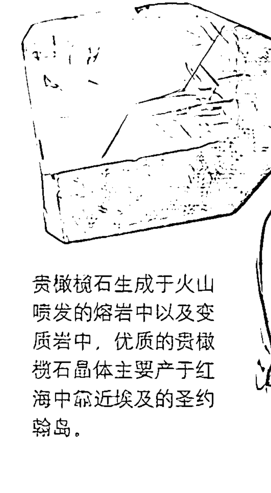

### 伟晶岩

伟晶岩属于侵入火成岩，一般在岩石形成结晶和固化的最后阶段才生成，它能够形成特别粗大的矿物晶体以及比其他任何类型岩石都丰富得多的宝石品种。世界上最著名的伟晶岩地区位于巴西的米纳斯吉拉斯，该地区出产的黄玉、碧玉、电气石和铯绿柱石不仅晶体巨大而且晶形完好。其他知名的伟晶岩地区还包括美国加利福尼亚的帕拉地区、阿富汗东北部的纽利斯坦地区、中国西北部的阿尔泰山和俄罗斯的叶卡捷琳堡（原为斯维尔德罗夫斯克）。而那些聚集在地壳裂缝中炙热而富含矿物的岩浆冷凝之后会生成紫水晶、黄玉、祖母绿和蓝锥矿等晶体。

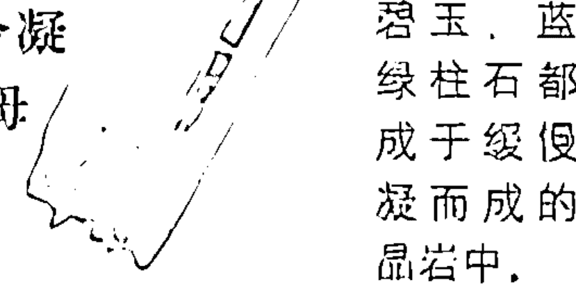

### 黑曜石

喷出火成岩冷凝得很快，有时候因为冷凝得太快，以至于所形成的晶体细微到必须使用放大镜才能看得见，但也可能由于冷凝迅速而生成比较典型的火山玻璃，即黑曜石。

涌出地表的岩浆冷凝得足够迅速就可能生成天然玻璃，其断口边缘就如刀刃一样锋利，可以用作刀斧、箭头和切割的工具，打磨之后还能当镜子使用。

## 沉积岩

被风化、侵蚀和沉积的岩石碎屑在经过富含矿物的溶液的挥发、冷凝或搬运作用之后就形成了沉积岩，在此过程中生成的宝石主要包括绿松石、孔雀石、紫水晶和玛瑙等。

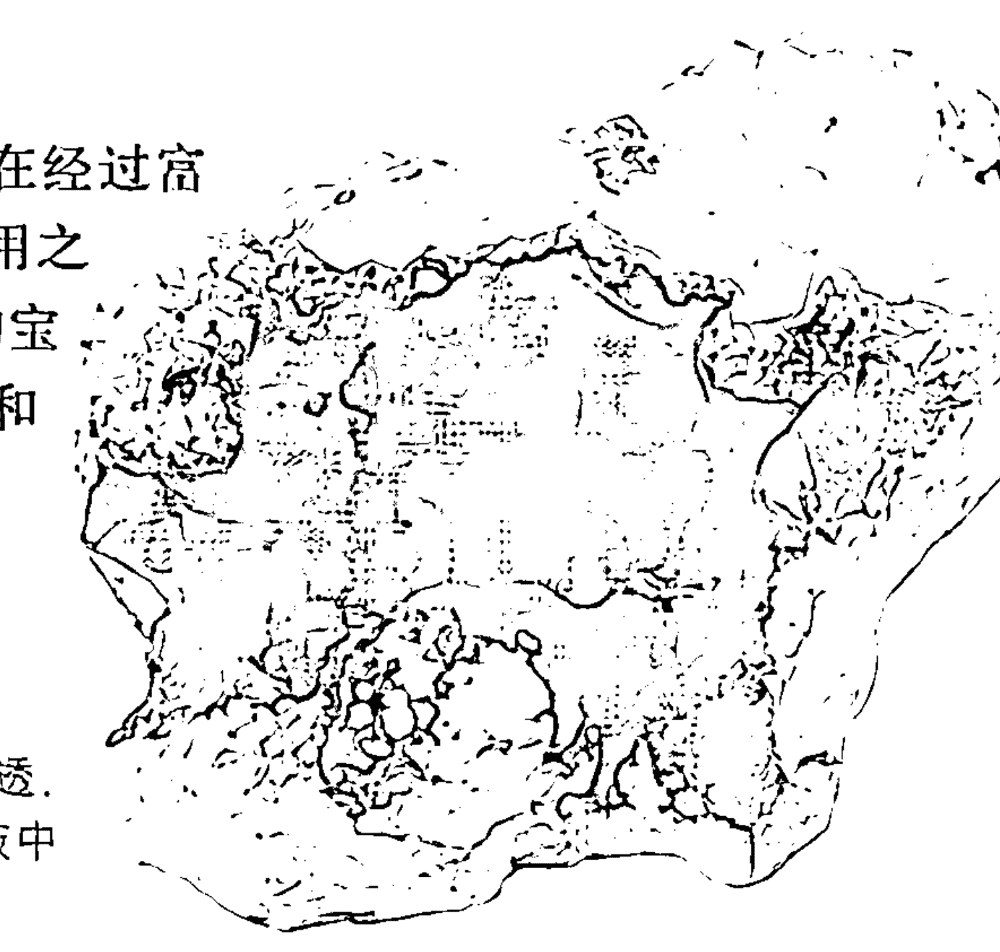

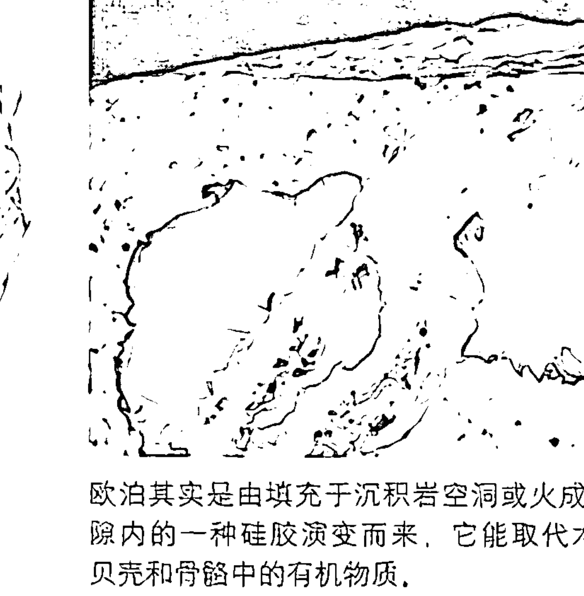

## 变质岩

当岩石因温度、压力的影响而发生变化并生成新的矿物晶体时就形成了变质岩，这种影响可能来自于大规模的造山运动，也可能源于小范围发生的断层或褶皱。缅甸的红宝石矿床就是6500万年前印度次大陆与亚欧大陆相互碰撞的产物，这次碰撞还使地壳抬升形成了世界上最高的喜马拉雅山脉。在该地区的变质岩中，还能找到看似河底鹅卵石模样的珍贵翡翠原石。

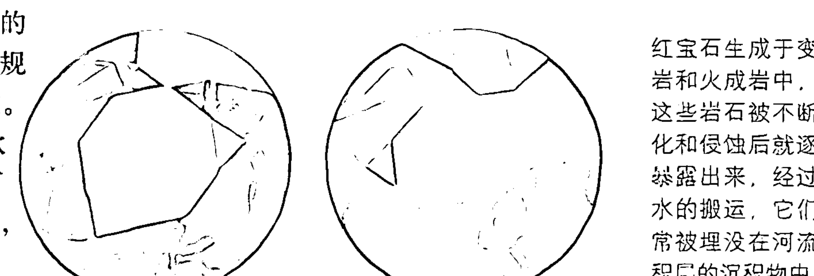

## 宝石的产地

持续不断的勘探开发、开采技术的快速发展以及新兴矿源的不断涌现，使当今世界上的宝石产地越来越多。曾经只有在印度、婆罗洲和巴西才有出产的钻石，如今在非洲许多国家以及澳大利亚、俄罗斯和加拿大都已探明了相当可观的储量。

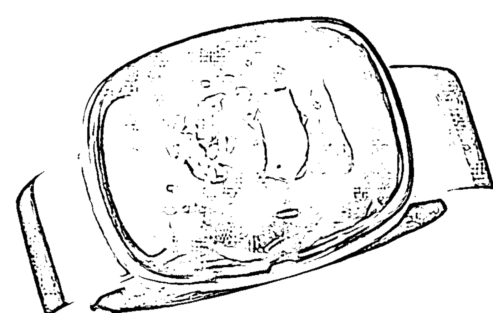

面对当今如此众多可供选择的宝石，珠宝商需要更为全面而深入地了解各种宝石的性质和产地，因为宝石的价值与声望取决于宝石自身的品质、出产地以及时尚的流行性。

是向独立的宝石经销商、批发商或大型零售商采购货品，还是从拍卖行、小店铺或货摊上进货，这取决于你自身的需要和经验。你需要考虑可能遇到的困难，例如为一副耳环寻找两颗相配的宝石，或是给一根项链配齐所有的珠子，两者的难度不一样。与此同时，你还必须清楚自身对于宝石是否有特别要求，例如颜色、形状、尺寸等，以及是否需要相关宝石实验室出具的证书。

某些特定的客户或首饰款式有时候会要求宝石经销商提供一些大颗粒的宝石或能够匹配的宝石，因此，一些经销商通过专营某一地区或某一种类的宝石而变得更加专业化。例如，一个专做红宝石或蓝宝石生意的买家对于泰国和斯里兰卡的宝石行情了如指掌，而有的人则只从非洲购入各种有色宝石。不过，多数的宝石经销商还是采取多种经营的方式。

坦桑石(tanzanite)最早发现于1967年，这颗弧面坦桑石镶嵌于紫银戒指上，男女均适合配戴。

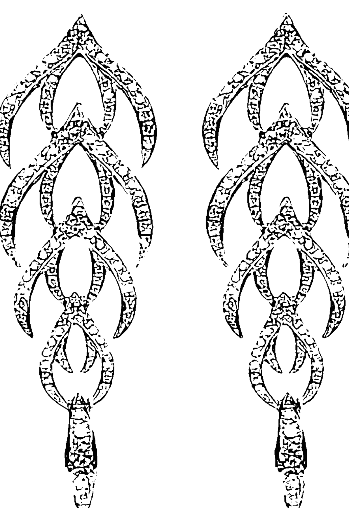

形状、尺寸相近的诸多钻石，配以其他宝石而制成的精美钻饰。

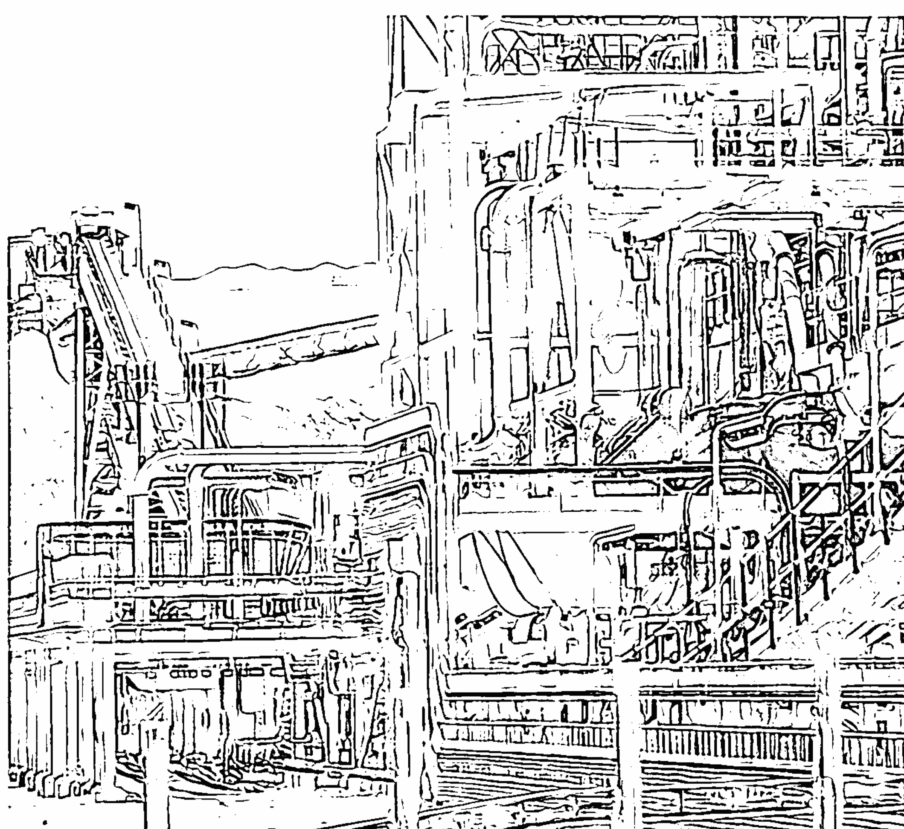

宝石开采是一个高度工业化的过程。

如今宝石的颜色不再完全取决于它最初的原色，通过高温加热和辐射处理来改变或强化宝石的颜色已是平常之事。这就使那些原本被认为品质不佳的宝石能够经过处理后成为具有市场价值的产品，其色彩甚至可以与著名的缅甸鸽血红宝石或斯里兰卡矢车菊蓝宝石相媲美。

## 供给与需求

政治动荡和政权更迭会直接影响宝石的开采和供给。1969年，一个军事政府占领了缅甸著名的抹谷(Mogok)红宝石矿山，并封锁了传统的红宝石贸易往来。泰国和柬埔寨边境的红宝石矿山却随之兴旺发展起来，能够满足当时市场对于可加工红宝石原料的需求。尽管该地区出产的红宝石颜色和品质较差，但经过现代技术处理后，这些宝石在颜色和净度上均大为提高，泰国和柬埔寨也由此控制了世界红宝石市场。不过，柬埔寨红色高棉政权上台后曾一度中断了该国的红宝石供应，而如今泰国的许多矿山也濒临枯竭。

时尚对于某些宝石的流行会产生明显影响，钻石一直以来都是新人结婚购买戒指时的首选，而随着社会名人、明星们对大颗彩色钻石青睐有加，那些天然的和人工处理的彩钻目前在市场上也备受推崇。

黝帘石在1967年被第一次发现，全世界只有在坦桑尼亚的一个矿山上才可以开采到，由于这种资源日渐枯竭且难以找到合适的替代品，其珍稀程度和升值潜力也随之不断增加。在市场销售中，商家宣传的“过了这个村，就没了这个店”，也让人不由得不信。

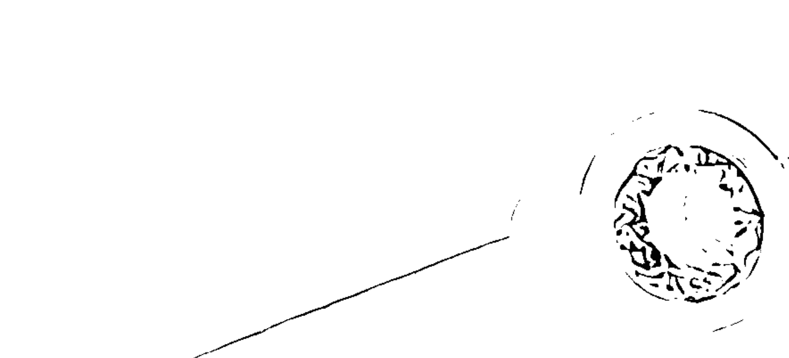

用激光在钻石上刻出特定标志以表明钻石的身份和来源，主要用于防止假冒产品和阻止“血腥钻石”贸易（即销售收入用于支持战争和冲突）。

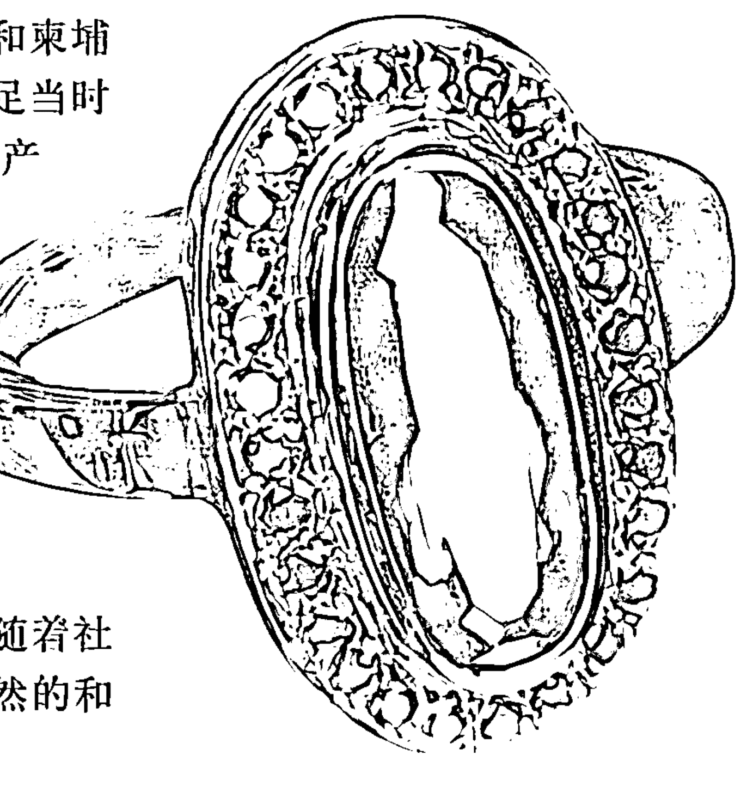

一圈黑色钻石环绕镶嵌在蓝色碧玺周围，近来黑色钻石开始流行，甚至出现将工业用的黑色钻石打磨成珠子制成项链出售的情况。

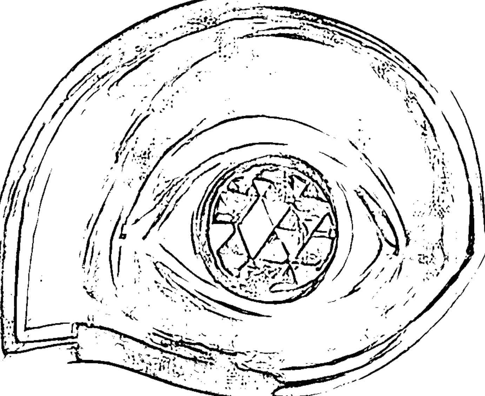

这枚戒指的“眼睛”是一颗玫瑰式琢型的米色钻石。

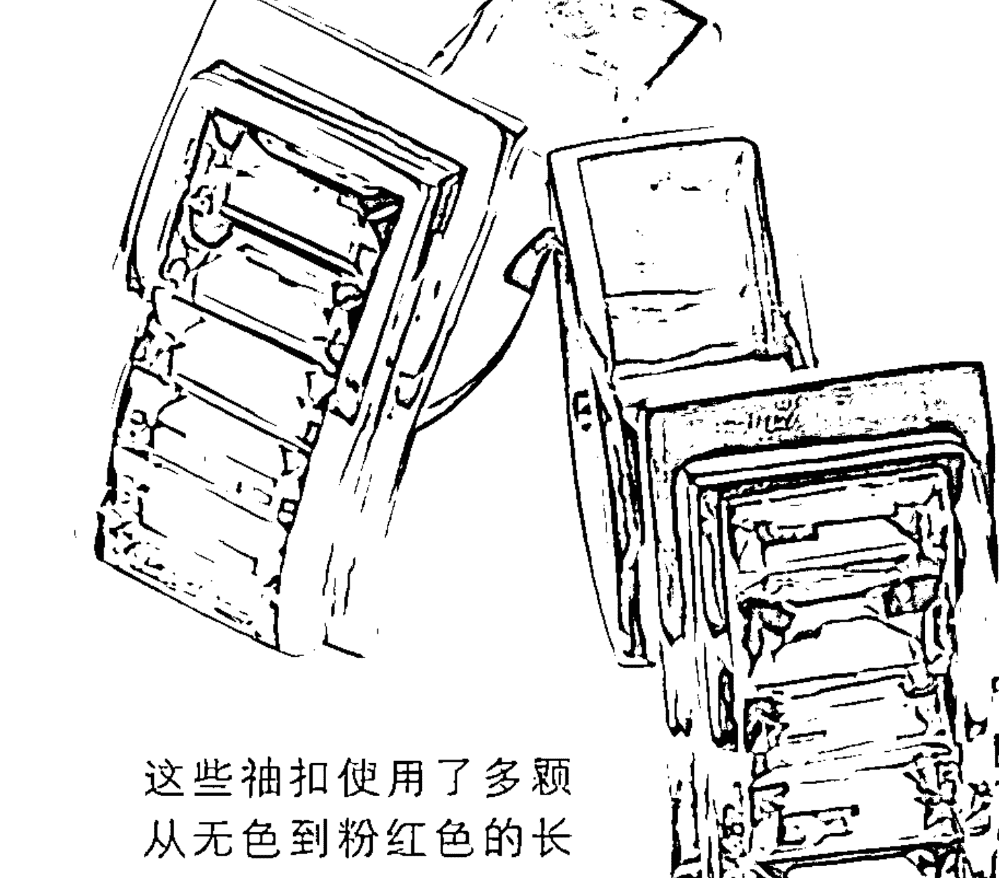

这些袖扣使用了多颗从无色到粉红色的长方形蓝宝石，使用形状相近但颜色各异的宝石制成五彩缤纷的珠宝首饰较为常见。

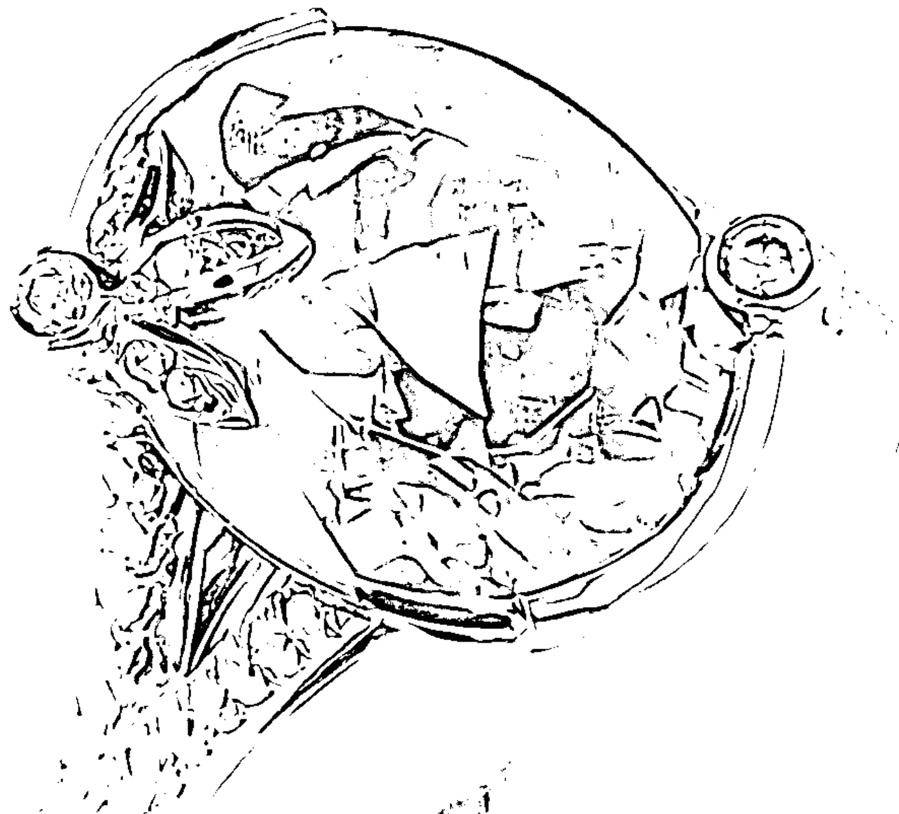

这颗采用明亮式琢型的椭圆形蓝色黝帘石与钻石共同镶嵌在戒指上，这种仅在一地出产的坦桑黝帘石经常被高温加热处理来优化颜色。

## 宝石原料开采

目前，宝石原料开采的方法较为多样化，既有沿用了数千年的那种在河底砂石中淘宝的原始方法，也出现了像钻石工业化开采那样采用高精尖科技手段、设备完善的现代化开采方式。

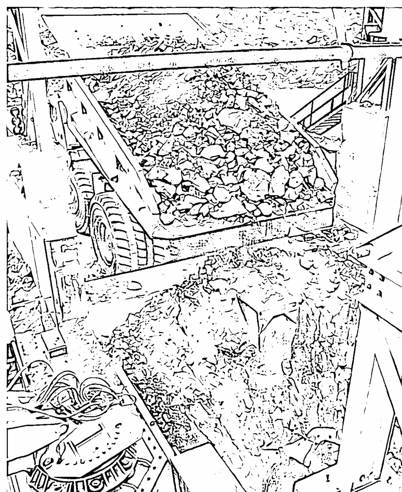

宝石是一种贵重商品，如今在全世界范围内都有开采，它给不少地方带来了可观的经济收入和就业机会。不过，它们也经常与暴力和冲突联系在一起，历史上一些著名的宝石就一直充满了有关阴谋、杀戮的传说，而如今又有一些地区利用钻石赚取的钞票资助游击战争或毒品交易。因此，那些正规的、信誉良好的钻石供应商感觉必须采取措施重振钻石产业的信心，戴比尔斯（De Beers）公司就引入了激光标志的方法给钻石标明身份来源，以促进“非血腥钻石”（conflict-free diamonds）贸易的发展（关于钻石产业的伦理与道德详见121页）。

钻石开采是一个高技术行业，整个生产过程高度机械化并被严密监控（见上图和右图）。

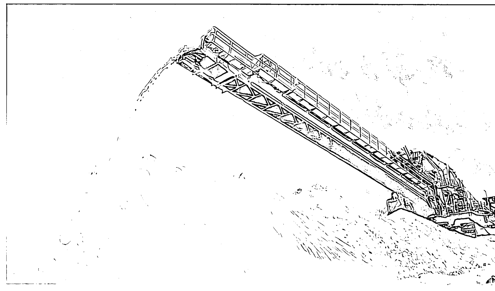

### 露天开采

宝石原料开采通常都从地面的露天矿坑开始进行，首先去除地表土层露出岩石，将岩石爆破后装车运送到专门进行碎石的地方，然后送往主要的加工厂作进一步处理，地面的露天开采一般能持续较长时间。

### 地下开采

随着开采持续进行，矿井越挖越深，直至变成地下开采，矿工和开采设备沿着金刚石岩矿的走向开凿竖井和隧道深入地下。

### 次生沉积矿

除了在火山岩这样的原生沉积矿中可以找到金刚石之外，在砂积矿床的次生沉积物中也能发现金刚石。例如，含有金刚石的岩石被风化、侵蚀后，经过搬运、沉积变成了河中的砂石或海滩的砂粒，这些砂石被运往专门的加工处理中心进行仔细的人工筛选以发现留存在其中的金刚石。

### 真空抽吸

经过特别改装的船只利用真空抽吸装置从海底把含有金刚石的沙子收集起来，然后金刚石被分离出来密封在专门的容器中，而废弃无用的沙子则被重新排入大海。

### 传统方法

埋藏于河床、沙滩中的宝石一般比普通的砂石分量更重、更经久耐磨，因此简单的筛淘就能分离出宝石原料，然后可以手工将它们冲洗干净并进行分类。

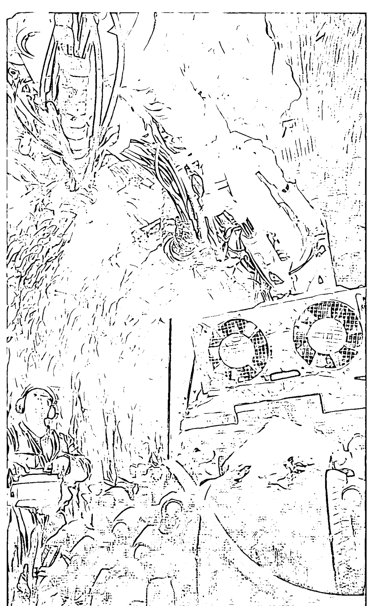

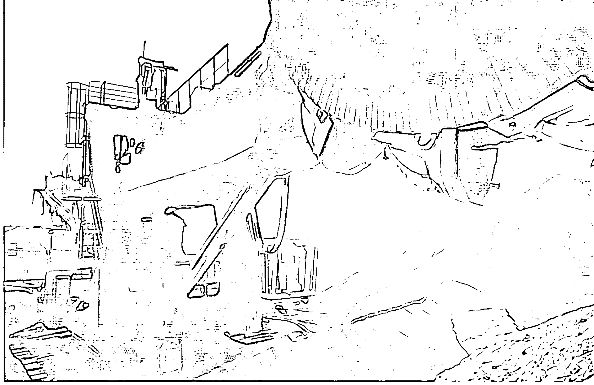

采用机械化开采固然提高了矿石的出品率，但与此同时，开采加速缩短了矿山的开采寿命，如今一些已经丧失开采价值的矿山被保留下来作为旅游景点对外开放。

铲轮挖掘机在纳米比亚海岸作业，这个庞然大物能够挖掘出大量的沙子，其中就有可能埋藏着金刚石。

## 宝石的用途与供应

宝石的用途主要取决于大小、外观和产地等因素，那些尺寸、颜色和净度没有达到宝石级别的原料一般用于工业用途。顾客获取宝石的途径可能多种多样，其中钻石从矿山开采出来到顾客最终购买所经历的环节被称为“钻石通道”（the diamond pipeline），目前主要为戴比尔斯公司所控制。这在钻石贸易中是非常独特的情形，不过在其他宝石贸易中并非如此。

曾几何时，戴比尔斯公司控制了全球90%的钻石交易，成为当时唯一的主要钻石供应商。即使在今天，全世界开采出来的钻石仍有超过一半通过戴比尔斯公司经手或分销。而其他宝石从挖掘开采直至最终到达顾客手中所经历的环节，要比戴比尔斯公司所控制的“钻石通道”复杂、繁琐得多。钻石交易一般在矿山、出产地和加工中心进行，或者先在全球范围内交易、切割和镶嵌，然后再销售给批发商、零售商和消费者。

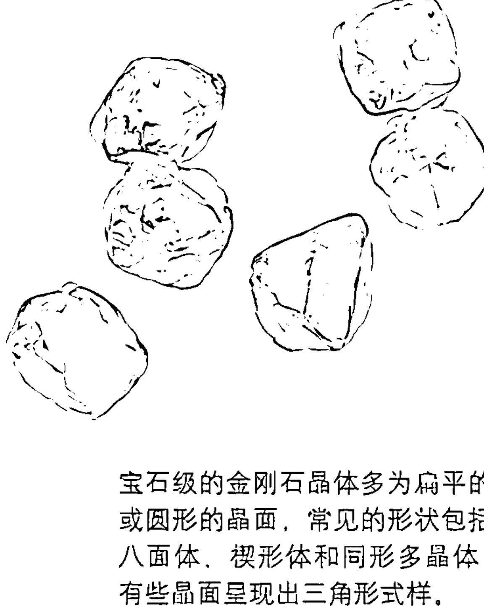

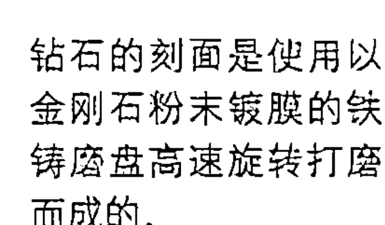

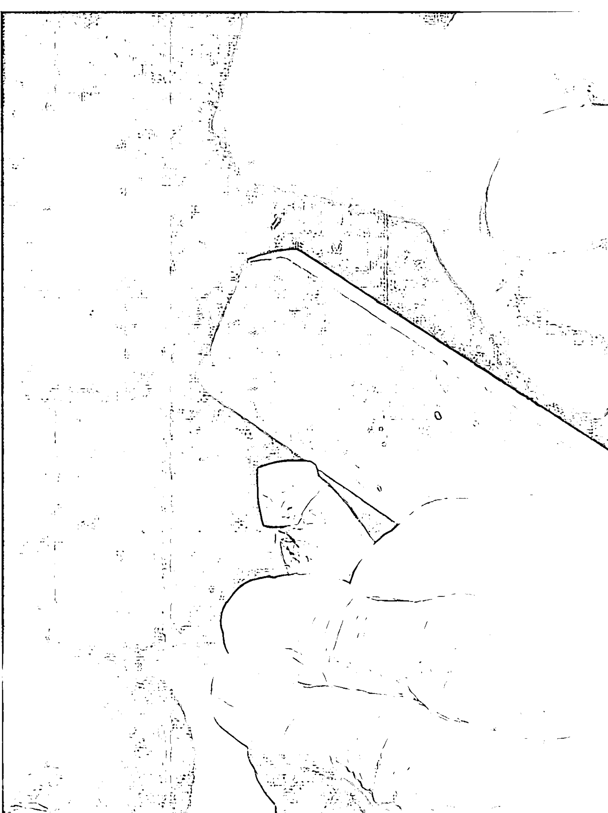

### 工业用途

那些尺寸、颜色或净度达不到宝石级别的金刚石可用作工业用途，一个矿山产出的宝石级金刚石与工业用金刚石这两者的比例并不固定，冲积沉积岩中宝石级金刚石的出产比例要高于矿山，这是因为在金刚石被风化、侵蚀的过程中，大自然也在对它们进行第一次的筛选分类，那些有瑕疵的金刚石很少留存下来。其他种类的宝石也大多会经历这样大自然的“洗礼”，经过多次辗转搬运之后最终沉积于砂石之中。

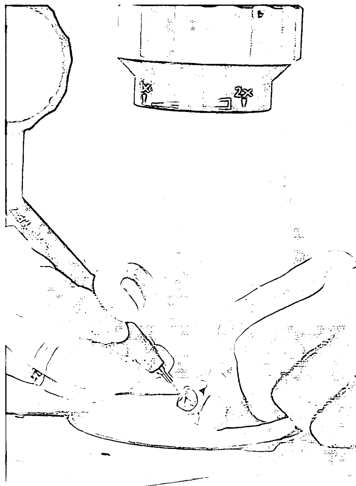

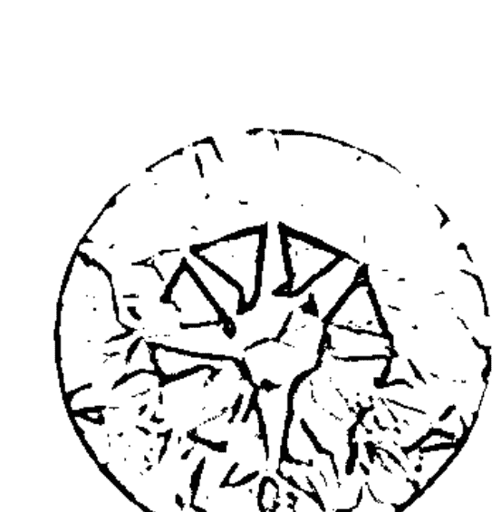

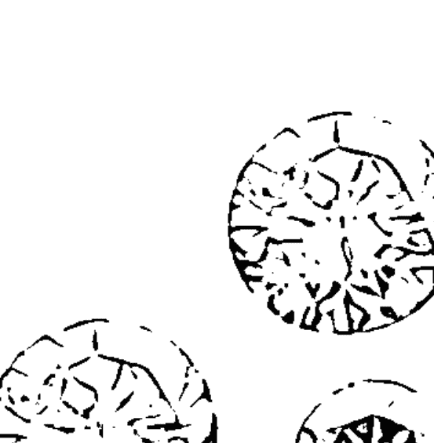

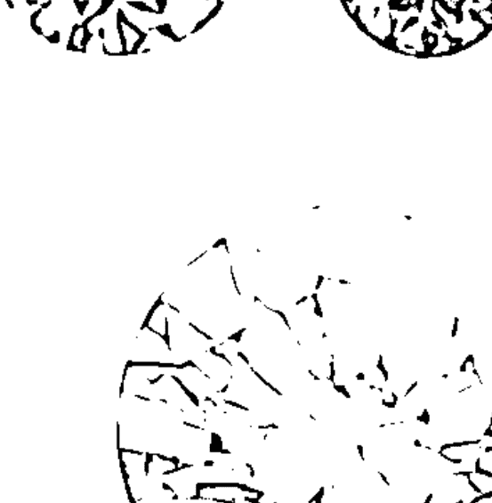

### 钻石通道

1. 尽管钻石加工的一些过程采用机械化作业，但仍然需要技艺娴熟的分拣专家按照钻石的尺寸、形状、颜色和净度之间的关联组合，把所有钻胚分成多达16000个不同的种类。除了在伦敦的分拣中心外，戴比尔斯公司还在南非的金伯利、纳米比亚的温得和克以及瑞士的卢塞恩设立了主要的分拣工厂。

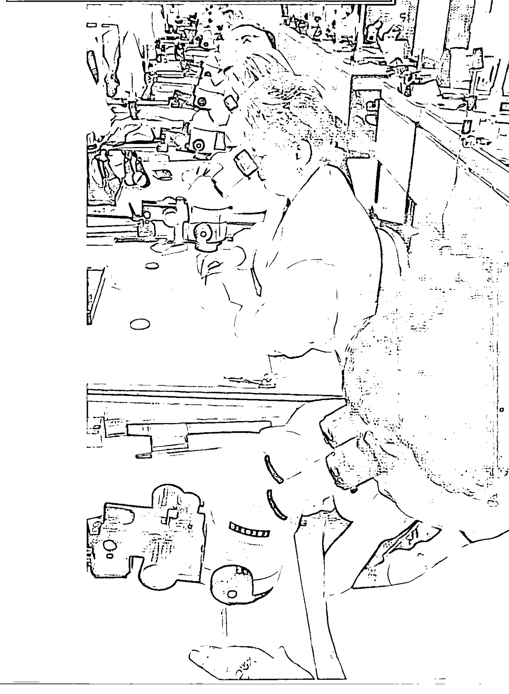

2. 整理包装好的钻石主要出售给全球一些大的钻石加工商（即戴比尔斯公司的特许看货商），他们再将这些钻石通过钻石交易所进行销售，或者经过其他渠道进行切割和抛光。戴比尔斯公司每年在伦敦举行10次钻石看货会，为了顾及各加工中心的利益和要求，每个看货商一般都会购买某一个包含多种类型钻石的组合。

3. 钻石加工商一般都专注于某个特定的市场，小颗的钻石通常都在印度进行切割、抛光，大一些的钻石则主要在亚洲其他国家和欧洲加工，而特别巨大的钻石只在中东、英国和美国进行加工。世界上主要的钻石加工与交易中心包括安特卫普、孟买、纽约、特拉维夫和约翰内斯堡，近年来泰国的钻石加工呈上升之势，中国也在大力培养这方面的人才且很快会成为一个强有力的竞争者。

4. 绝大部分经过打磨抛光的钻石都会进入全球24个专门的钻石交易所进行买卖。

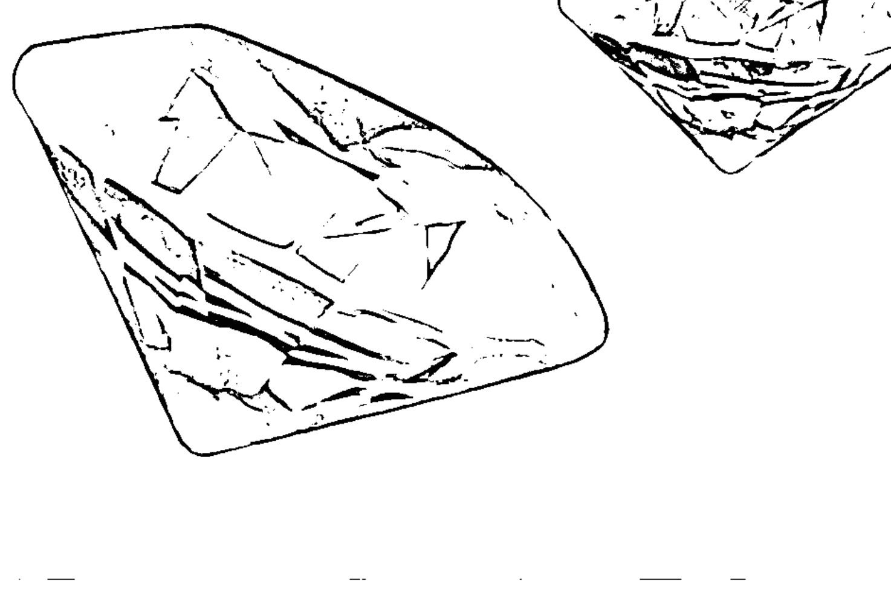

## 宝石的特性

如果你想将宝石运用得恰到好处并最充分地展现其迷人特质，首先需要了解这些宝石原料的光学和物理特性。

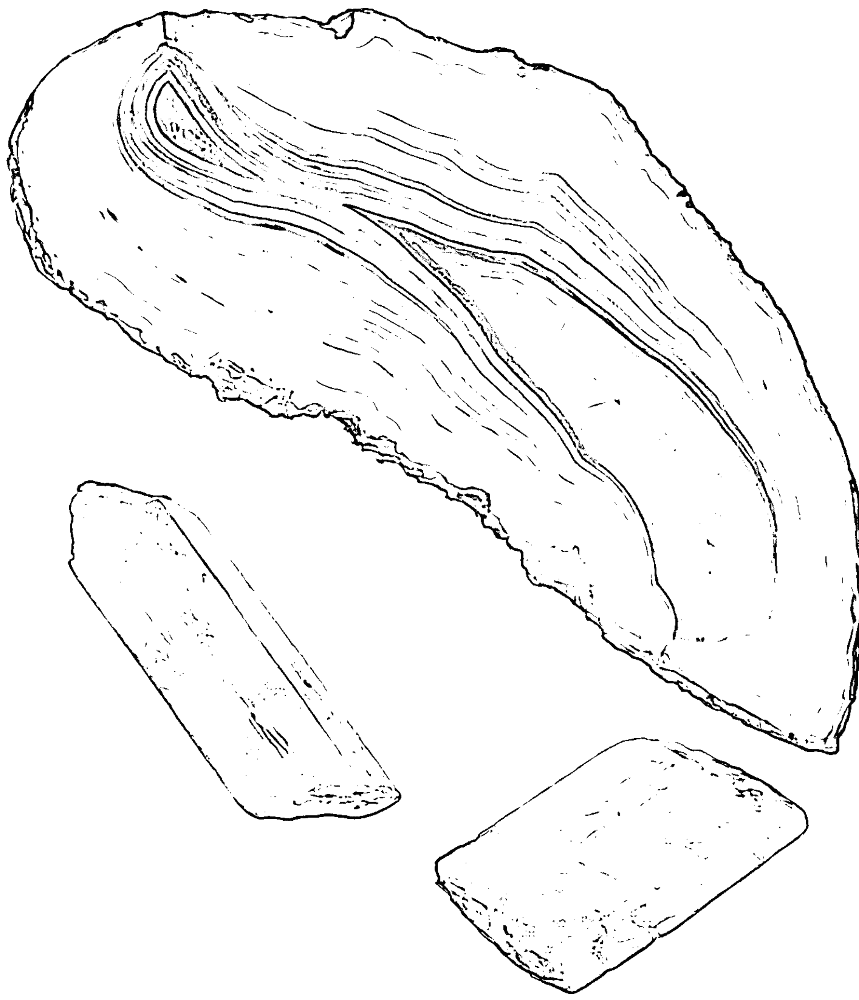

### 晶体形态

大多数的矿物都是由晶体组成的，它们一个原子挨着一个原子逐层生长，形成了常见的立体原子结构。大多数岩石中的晶体由于颗粒太小而只能用微晶或隐晶显微镜才可以看见，如果晶体过小或不规则都难以形成宝石。由于晶体结构很差或不完整，还有一些矿物是非晶质的。晶质矿物在外形上可能会形成一些不规则的块状，也看不出任何晶面，但在它内部肯定存在立体的原子结构。晶体的物理特性（硬度、耐磨度、裂解方式等）和光学特性（表面光线反射或折射的方式）都与其原子结构密切相关。

### 晶体习性

矿物晶体的晶面生长方向及速度决定了晶体的最终外观，这就是晶体习性。大多数的宝石都有其自身典型的晶体习性，例如金红石中生长的针状晶体、石英内部的包裹体、紫水晶内的棱柱体、尖晶石中的八面晶体以及萤石当中的立方晶体等。

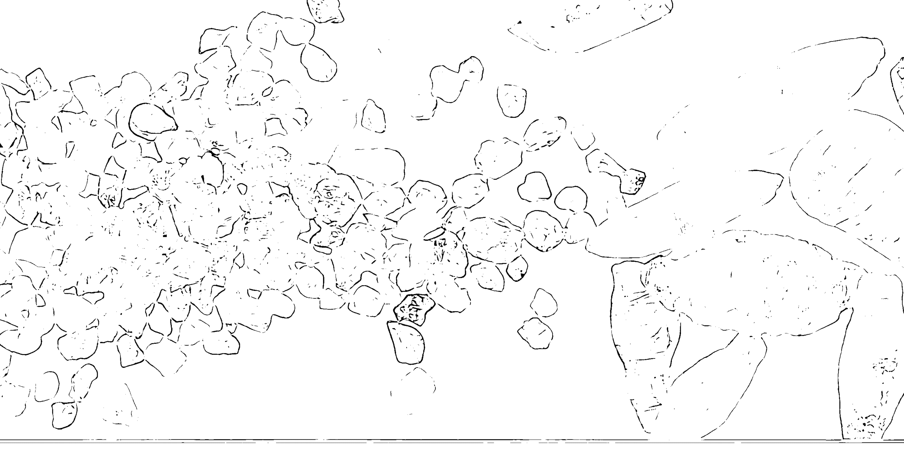

### 晶体形态

### 晶系

地质学家、矿物学家和宝石学家根据对称性将矿物晶体分成不同的晶系，例如金刚石是由碳原子以立方体、八面体和其他立方晶体的形态聚合而成的矿物，与尖晶石、石榴石一样同属于等轴晶系。根据晶体的最小对称性来划分，主要有七大晶系。

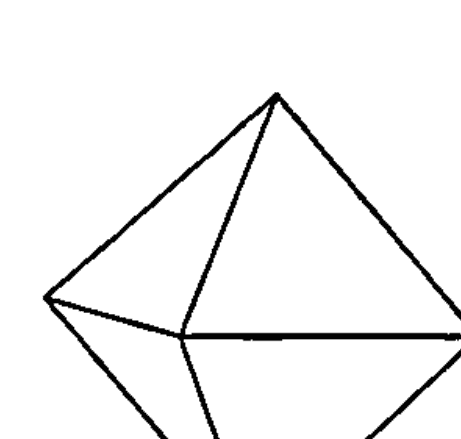

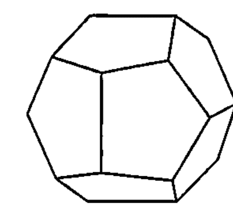

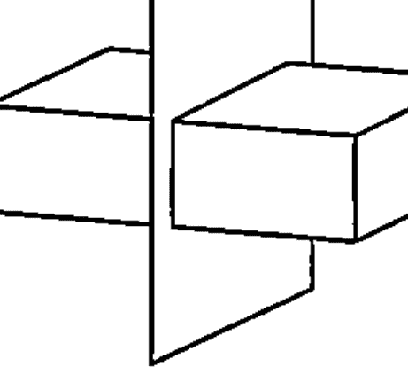

#### 等轴晶系

有三个四次对称轴。

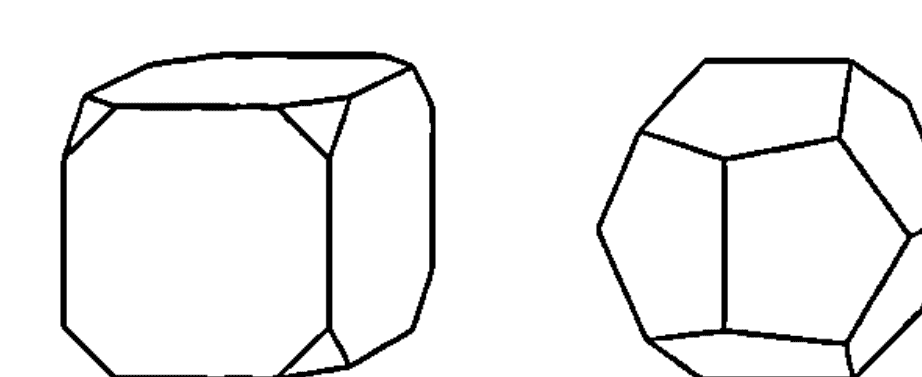

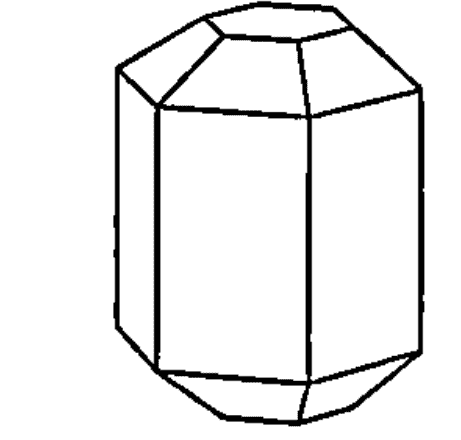

#### 四方晶系

有一个垂直的四次对称轴。

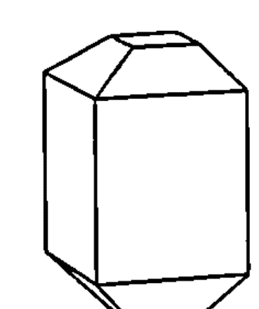

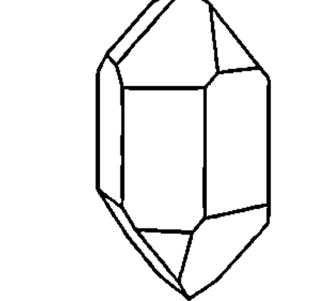

#### 六方晶系

有一个垂直的六次对称轴。

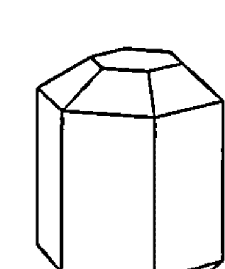

#### 三方晶系

有一个垂直的三次对称轴。

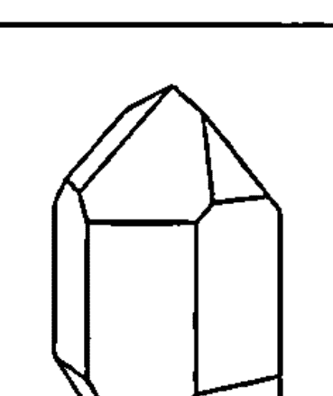

#### 斜方晶系

在两个共同垂直平面的交会点有一个或三个二次对称轴。

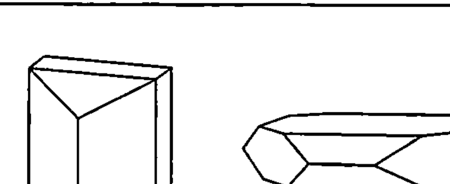

#### 单斜晶系

有一个二次对称轴。

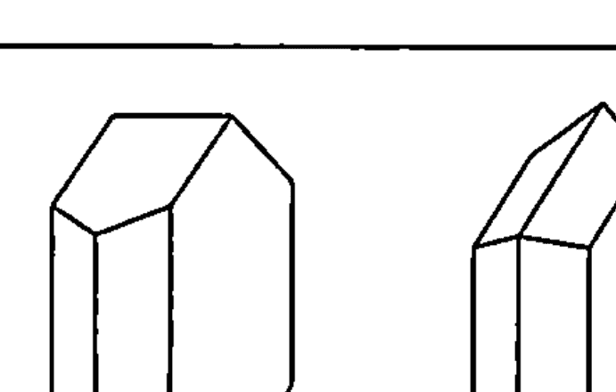

#### 三斜晶系

有一个对称中心或无对称。

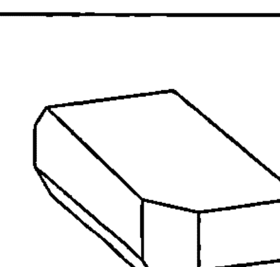

### 解理与断口

矿物晶体受到外力作用时如果能够沿着一定结晶方向分裂成平面即为解理(cleavage)，所形成的平面称为解理面。根据解理的难易程度和解理面的发育状况，可以将解理分为完全解理、中等解理和非完全解理。矿物受外力作用后不沿固定的结晶方向断开时所形成的断裂面就是断口(fracture)，其形态是不平滑的，主要有参差状断口、锯齿状断口、贝壳状断口等。

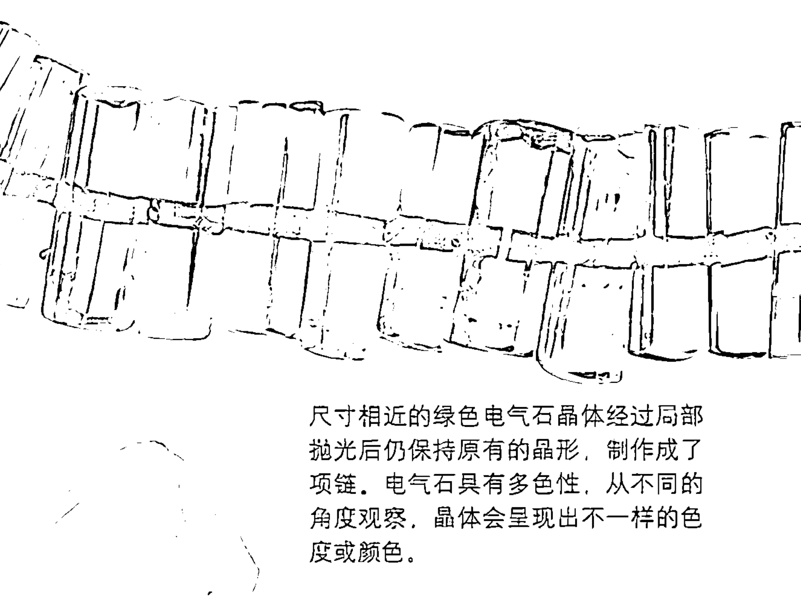

尺寸相近的绿色电气石晶体经过局部抛光后仍保持原有的晶形，制作成了项链。电气石具有多色性，从不同的角度观察，晶体会呈现出不一样的色度或颜色。

### 完全解理

解理和断口会影响宝石的强度以及加工时的难易程度，在处理那些具有一个或多个完全解理面的宝石时，需要倍加小心，例如托帕石就有三个完全解理方向，其他具有完全解理面的宝石还包括钻石、萤石、方解石和锂辉石。

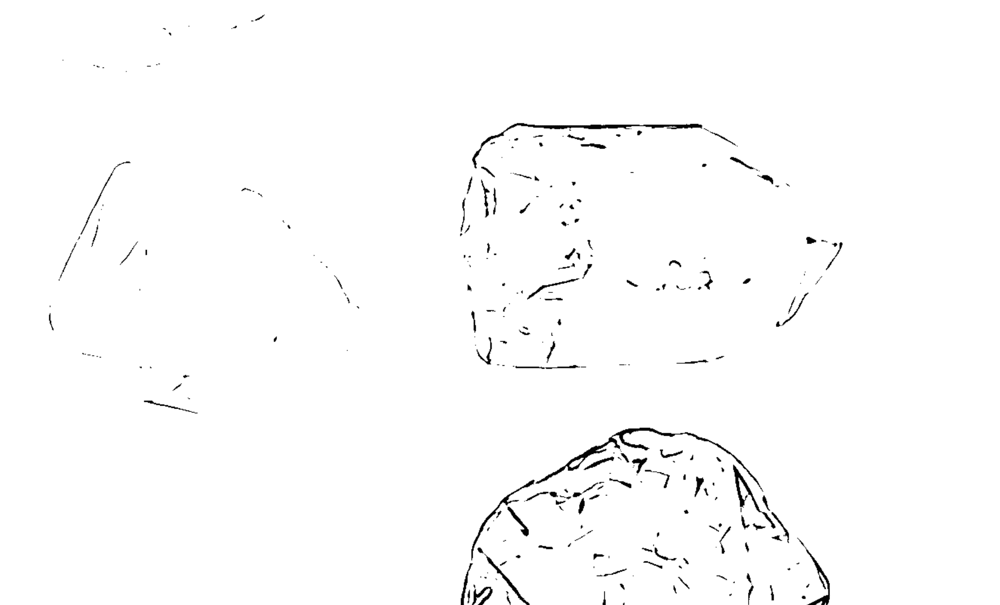

### 硬度

宝石的强度和耐磨度还取决于其内部结构本身是脆弱易碎还是坚韧牢固，即硬度(hardness)。用于衡量宝石硬度的标准有很多种，而地质学家最常使用的是摩氏硬度(Moh's scale of hardness)，它将10种常见的矿物按照彼此相对刻划能力进行排序，硬度最小的滑石能够被其他所有用于测试的矿物刻划，其摩氏硬度为1；而硬度最大的金刚石能够刻划其他所有测试矿物，其摩氏硬度为10。

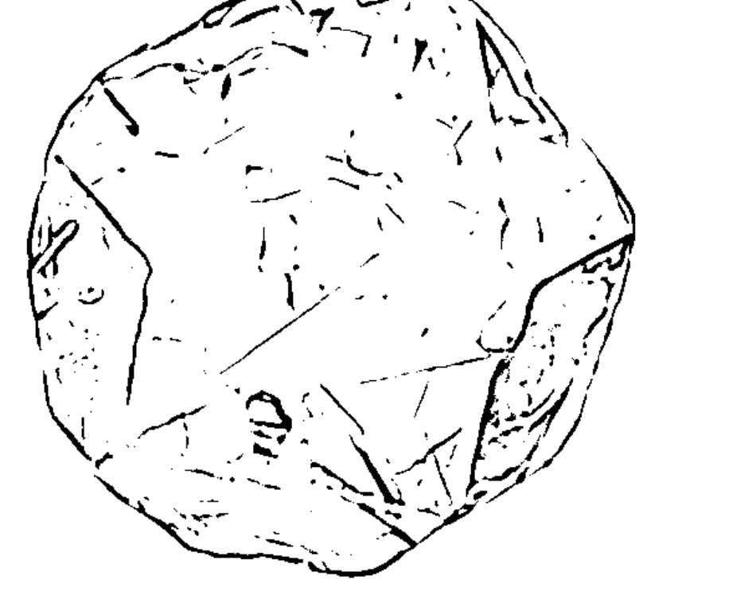

将摩氏硬度标准与Knoop硬度标准进行对照可以看出，金刚石的绝对硬度远远高于其他测试矿物，这些矿物之间的绝对硬度值相差并不大，基本上成线性关系（Knoop硬度是以在被测试物体抛光表面产生永久性变形所需的单位面积上的力来计算，是物体的绝对硬度）。

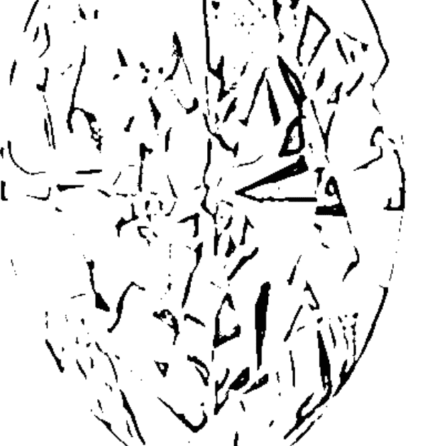

### 摩氏硬度标准

- 1. 滑石
- 2. 石膏
- 3. 方解石
- 4. 萤石
- 5. 磷灰石
- 6. 长石
- 7. 石英
- 8. 黄玉（托帕石）
- 9. 刚玉
- 10. 金刚石

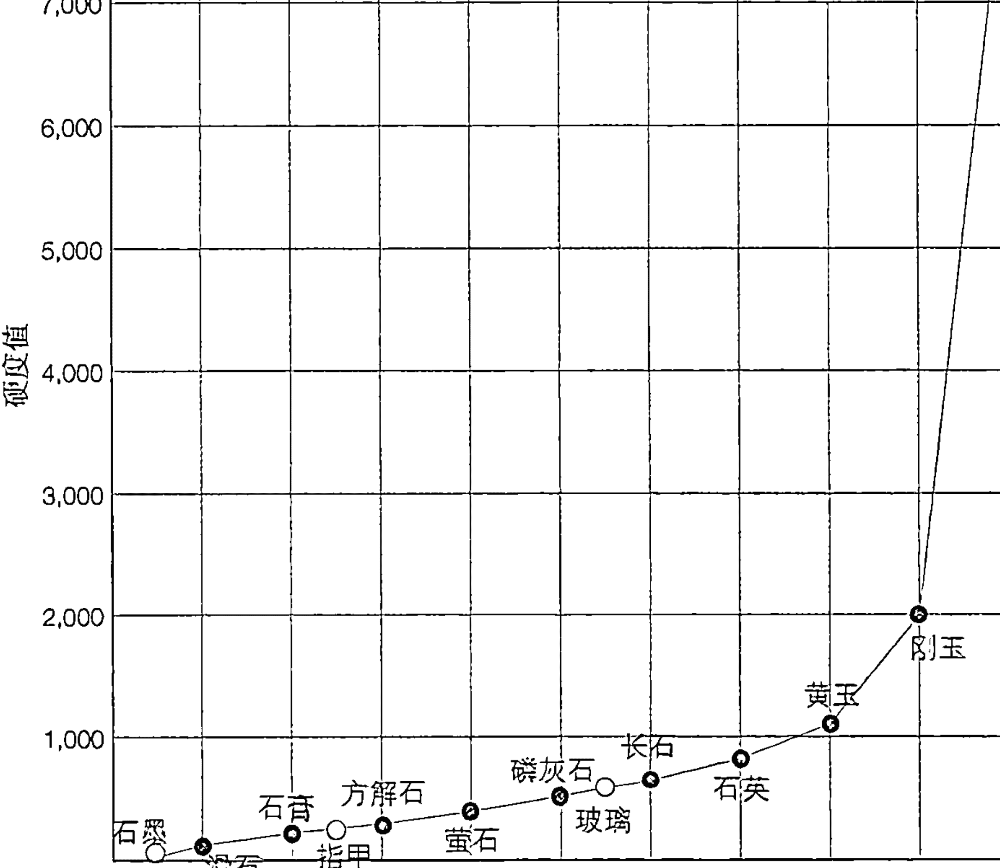

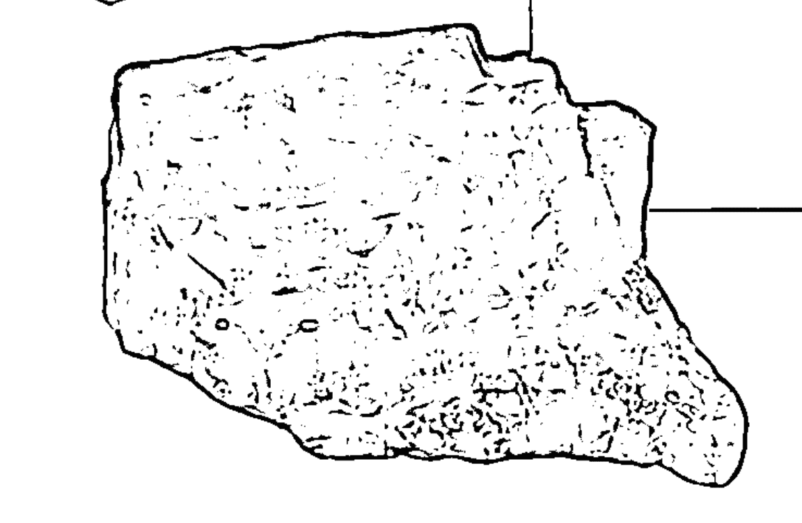

### 相对密度

在制作珠宝首饰时，必须考虑所用宝石的重量，因为它会对最终产品的使用产生影响。太重的宝石佩戴起来会令人感觉不舒适，而分量太轻的首饰又通常不太合身。宝石的这种重量被称为相对密度（specific gravity），是用宝石的质量与同体积水的质量之间的比值来进行衡量。

### 颜色的形成

矿物晶体中很少出现那种通体连贯、艳丽夺目的完美颜色。在晶体形成的过程中，温度、压力的变化以及周围化学因素的作用都会导致晶体生长速度的改变或中断，这会影响晶体的形态与颜色，产生像玛瑙中的色带或蓝宝石中不均匀的色块那样的颜色变化，颜色的多样性及形成的特殊图案能够提升宝石的价值。不过，在挑选宝石原料时需要特别注意从各个角度进行观察，看看是否有色变。

### 多色性

有些宝石从不同的角度欣赏时会呈现出变幻的颜色或色度，这被称为多色性(pleochroism)，它主要是光线通过晶体内部的立体原子结构发生作用所形成的结果，而不是晶体生长过程中的变化造成的。能够显现出两种不同颜色或色度的宝石被称为二色性宝石(dichroic)，而具有三种不同颜色或色度的则为三色性宝石(trichroic)。

用橄榄形红石榴石珠子串成的项链，由于没有进行封闭式的镶嵌，光线能够穿透这些宝石展现出漂亮的色彩。

### 包裹体及光学现象

宝石之美很大程度源于它们对光所产生的反应，一些宝石因为具有特殊的光学效应而身价倍增，还有一些宝石由于内部含有包裹体而更显珍稀。

这些淡蓝色的绿松石珠子中含有棕色褐铁矿或黑锰矿的包裹体，它们在每颗珠子上都描绘出独一无二的图案。

#### 光泽

宝石表面所呈现出的外观被称为光泽(lustre)，大多数透明的宝石都具有玻璃般的光泽，其他较为常见的还有金刚光泽（金刚石和红色翠榴石）、金属光泽（赤铁矿）、蜡状光泽（绿松石）、油脂光泽（托帕石）、树脂光泽（琥珀）、丝绸光泽和无光泽，通过抛光、上蜡和浸油能够强化宝石的光泽。

赤铁矿具有金属光泽而非常光亮，适合用于打磨、雕刻或抛光制作成项链首饰或装饰品。

绿色翠榴石具有金刚光泽，其特有的马尾状包裹体实际上是金色或棕色的纤蛇纹石丝状晶体。

### 包裹体

宝石在生长发育过程中内部有可能生成包裹体(inclusions)，它既可能是固体（如晶体或化石），也可能是液体或气体。有些宝石还可能拥有不止一种包裹体相，例如哥伦比亚祖母绿就可能同时包含盐的晶体、液体和气体三种体相。宝石内部的包裹体要么让宝石显得更为奇特、稀有而价值大增，要么就成为瑕疵而降低宝石的美感和身价。

金色的金红石包裹体和黑色的针状电气石包裹体给这根无色石英石项链增添了光彩和价值。

由于表面反射的作用，这颗位于18K金项链顶部的大颗弧面宝石具有很好的光泽。

### 猫眼效应

内部含有原生的纤维状、针状包裹体或空洞的宝石切割成半球形弧面，可能会产生猫眼效应（即一条闪亮的光带）或星光效应。猫眼又称猫眼石，其名字源于法语中“猫”(chat)一词。猫眼效应是由宝石内部定向排列的包裹体对光线的折射和反射作用所引起，具有这种猫眼效应的宝石主要有石英、金绿宝石和石榴石。

### 光的干涉现象

我们平常看见的那些泼洒在路上的油膜所闪现的五彩颜色，其实就是光的干涉现象(interference)，在宝石中也比较常见，它主要是由光线通过宝石内部表层的反射所致。光包含着彩虹一样的缤纷色彩，有些宝石通常无需切割成弧面就能在表面显现出光的部分或全部颜色，不过打磨抛光之后的宝石看上去更为亮丽夺目。欧泊就具有变幻明显的色彩，俗称虹彩(iridescence)，是光从宝石内部反射出球形表面的结果，赤铁矿、彩虹石英也有类似的效果。

### 星光宝石

当弧面宝石内部不止一组的定向排列包裹体对光线产生折射和反射时，就会产生星光效应（星彩）。六射星光宝石（即为三组定向排列结构）最为常见，其他还有四射星光、十二射星光乃至更多的星光，具有星光效应的宝石主要是石英、刚玉和石榴石。

这颗星光宝石显现出四射星光，其实是一颗不透明的弧面形透辉石表面的反射光，通常比较典型的是两道星光为平直的，另两道星光呈轻微波浪状。

这根黄水晶项链具有非常迷人的气泡效果，其实它并非是天然形成的，而是设计师刻意制作出来的；上面那枚戒指上的无色石英石内部含有针状的黑色电气石包裹体，令人瞩目。

## 宝石的加工

每当看到一颗颗光彩四射的宝石时，我们往往会想到它们背后那些才华横溢的设计师，但却忽略了宝石工匠们高超的加工技艺，优秀的宝石工匠会选择适合的加工方式来最完美地展现宝石的颜色、净度尺寸和包裹体等特性。

接下来的几个章节将揭示宝石是如何用于切割设计和制作加工的，包括刻面和弧面宝石的成型、手工雕琢的技艺以及宝石天然形状的利用等。珠宝商必须相当熟悉宝石加工的这些过程和方法，清楚地掌握每颗宝石的优缺点，才能建议客户如何进行恰当的选择。

这颗切割完美的粉红色尖晶石充分展现出宝石的光芒和色彩。

### 宝石展示

右图这件由祖母绿和碧玺制作而成的首饰使用了梨形、水滴形和椭圆形等好几种明亮式琢型的宝石。

这颗由一整块金色绿柱石晶体手工雕琢而成的宝石清澈明亮但颜色较浅，由于金色绿柱石的质地坚硬，轮廓分明且易于打磨，是一种很好的雕刻原材料。这颗宝石原料经过精心的设计和加工之后呈现出最佳的效果，特别是22K金的反射光增强了宝石的淡黄色效果。

这些颜色各异的高品质梨形刻面蓝宝石用作项链材料并不多见，它展示了刚玉的迷人魅力和丰富多样性。

### 宝石交易的常用语

在宝石交易中，通常使用一些专门术语来描述和评价一颗宝石的品质，这些由来已久的宝石术语使人们不必亲眼看见宝石本身就能比较准确地了解它的情况。
形状(shape)：即宝石的外形轮廓，如圆形、椭圆形、梨形等。
加工(cut)：即宝石呈现出的比例、对称性、光亮度和修饰效果，换言之就是它的整体外观而非外形，有时也被称为制作，它用于描述由宝石原料变成宝石成品过程中所涉及的各种相关因素。
研磨(faceting)：即将宝石表面打磨成许多不同角度的小平面（刻面），让光线穿透宝石而变得光彩明亮。

### 刻面宝石的各个部位

圆形明亮式琢型（round brilliant-cut，标准圆钻式琢型）宝石的各个部位都有专门的名称，它们之间比例的变化会直接影响宝石的亮度、颜色和美感。
腰部(girdle)：宝石冠部与亭部结合处的外部边缘部分。
冠部(crown)：宝石腰部以上的顶端部分。
亭部(pavilion)：宝石腰部至底尖的下端部分。
台面(table)：宝石顶部最大的平面或刻面。
底尖(culet)：宝石最下端的尖形部位。

完美的八面形金刚石晶体。

### 圆形刻面宝石的琢型

刻面宝石的形状主要有两大类型：圆形和直边形，而钻石的琢型切割形式是所有曲边形宝石中最具代表性并被广泛应用的，它也同样适用于有色宝石的加工。

#### 圆形明亮式琢型的比例

#### 加工方法与常见问题

明亮式琢型最初设计用于钻石的加工，后来也常用于那些具有高度色散、颜色较淡的透明宝石。玫瑰琢型原本也专门用于钻石加工，但现在却更多地使用于硫化铁矿类和石榴石类宝石。大多数的宝石原料无论透明与否都可以切割成梨形和水滴形，并能横着或竖着钻孔。而刚玉类宝石（红宝石和蓝宝石）通常采用混合琢型，这样能强化宝石原本较淡的色彩。

圆形明亮式琢型最常见的问题就是切割比例不当，有时候宝石原石的形状或瑕疵、包裹体的位置也会直接影响对切割比例的把握。在远东地区，宝石加工通常以尽可能多地保留原石重量为目的，而不太考虑比例的问题。事实上，切割比例对于宝石的色彩饱和度具有重大影响，一般颜色较深的宝石通常会切割得比较浅，使之看上去更显光亮，而颜色较淡的宝石则需要深度切割才能获得最佳色彩效果。

明亮式琢型和混合琢型都比单一的阶梯式琢型能更好地掩饰宝石色彩的不规则分布，如果颜色主要集中在宝石亭部的底尖区域，或者某种单色光正好穿越宝石的中心部分，通过合理的切割能够让原本着色不均的宝石看上去完美无瑕。此外，加工时将宝石内部的瑕疵和包裹体有意识地藏于上腰面下方或亭部主刻面外缘，宝石的中心区域会显得很洁净。

粗糙的切工和不当的比例会让宝石不仅难看而且易碎，例如明亮式琢型宝石的腰部如果太厚，看上去会很不美观，而腰部切割得太薄又会使宝石脆弱易碎。又比如，宝石的底尖如果过于尖细就容易受损，而底尖太宽则通过台面就能被清楚地看见且会反射到其他刻面上。在浅色宝石中，底尖如果偏离中心，透过台面就会看得一清二楚，而深色宝石则能在一定程度上掩饰这种缺陷。

#### 宝石的重量与计量

大多数小颗粒刻面宝石是由机器切割而成的，这种由经过标准化调校的机器切割出来的宝石规格统一。右表中的数据显示了不同尺寸的圆形宝石所对应的相应重量标准。由于各种宝石的密度不同，所以表中列出了几种不同宝石的重量标准。

### 明亮式琢型

明亮式琢型已经成为一种理想的宝石切割形式，它有经过精确计算的完美比例（其发展历程详见112页）。这种琢型能最大程度地利用宝石的色散特性，将光线折射到宝石的中心部位之后再反射出去形成“火彩”(fire)，这实际上是光线发生折射时白光被分解成各种不同的颜色而形成的特有现象。明亮式琢型的角度和比例经过改良调整后适用于许多其他形状宝石的加工，例如椭圆形、鞍垫形、橄榄形、梨形等，本书第26页的祖母绿和碧玺图集中展示了各种形状的宝石。

### 梨形琢型

梨形琢型实际上是一个双面玫瑰式琢型，其上端的冠部为拉长了的锥形，圆形的亭部表面覆盖着三角形或矩形刻面。

### 混合琢型

混合琢型是明亮式琢型与阶梯式琢型的结合（后者主要用于直边形宝石），在混合琢型中，宝石的亭部一般采用阶梯式琢型，而冠部通常为明亮式琢型。

#### 圆形 天然宝石的克拉重量

| 宝石 (毫米) | 2 | 3 | 4 | 5 | 6 | 7 | 8 | 10 |
|---|---|---|---|---|---|---|---|---|
| 石英 | 0.04 | 0.10 | 0.20 | 0.40 | 0.70 | 1.30 | 1.80 | 3.30 |
| 祖母绿/海蓝宝石 | 0.04 | 0.12 | 0.27 | 0.48 | 0.80 | 1.70 | 2.50 | 6.10 |
| 石榴石 | 0.05 | 0.13 | 0.30 | 0.60 | 1.00 | 1.60 | 2.50 | 5.75 |
| 红/蓝宝石 | 0.05 | 0.15 | 0.34 | 0.65 | 1.05 | 1.60 | 2.25 | 4.50 |
| 蓝色托帕石 | 0.04 | 0.11 | 0.30 | 0.56 | 1.00 | 1.55 | 2.50 | 5.75 |
| 金刚石 | 0.03 | 0.10 | 0.25 | 0.50 | 0.75 | 1.25 | 2.00 | 3.50 |

### 方形刻面宝石的琢型

刻面琢型另外还适用于具有直边腰棱的各形宝石，包括方形、矩形、八边形、三角形、梯形、六边形和桶形。它们通常被加工成以台面为中心、具有一系列规则分布的同中心矩形刻面的形式，因其刻面排列形如阶梯，故被称为阶梯式琢型（step cut）。

### 宝石展示

镶嵌着水雷形镜式琢型海蓝宝石的戒指。

#### 加工方法与常见问题

阶梯式琢型适用于所有的有色宝石，它虽然没有明亮式琢型那样的亮度效果，但其清晰的线条给人以简洁明快和优雅大方的感觉。花式琢型也能用于所有的宝石材料，不过，宝石采用了这种琢型一般就难以再改作他用了。

镶有采用交叉式琢型的粉红色八边形碧玺的戒指。

采用阶梯式琢型的直边形宝石如果厚度不合适就可能会出现一些问题，如果宝石的底部比较厚重，颜色看上去就会很暗，而太薄的宝石，颜色则浅而淡并有明显的“窗口效应”。不过，交叉式琢型却能够给颜色不佳的宝石注入更多的活力。此外，如果加工不够精确，会导致阶梯式琢型宝石的各个面不平行，这将给镶嵌带来很大的困难。

在镶嵌长阶梯式宝石时，如果在宝石转角处用力过大就容易使宝石破裂。镜式琢型（mirror cut）常见于那些内含包裹体、有瑕疵的宝石，这种琢型能够制造出比较好的光学效果，不过这些瑕疵也会使此琢型宝石变得相当脆弱，尤其是当包裹体位于腰棱或宝石切割得稍浅的时候，很容易成为薄弱部位。另外，由于面包形顶面（buff tops）要更为牢固坚硬，这种琢型适合于质地较软的宝石原料，经过打磨后的光滑表面比刻面冠部更不易遭受损坏。

不对称的花式琢型蓝宝石耳环。

采用花式琢型的一对等腰三角形紫水晶（左图与下图）。

### 阶梯式琢型

这种古老的琢型最初用于钻石的加工，而如今却主要用在有色宝石上，因为它无法制造出明亮式琢型那样的光亮和活力，但却能很好地展现有色宝石的丰富色彩。由于长方形阶梯式琢型常常用于祖母绿宝石的切割，因此也被称为祖母绿式琢型(emerald cut)。矩形阶梯式琢型宝石的底面一般呈山脊状，而不是通常的尖头形状。

长方形的阶梯式琢型简洁明快，这种粉红色托帕石展现出清晰的几何线条和时尚感。更窄而长一些的长方形宝石即为长阶梯式宝石。

### 交叉式琢型

交叉式琢型是阶梯式琢型的一种变形，它将阶梯面切割成许多三角形的刻面，以便于宝石吸收更多的光而增添活力，这种琢型通常使用于颜色较深或较浅的宝石，能够较好地掩饰宝石边缘部位的瑕疵，或者将切割得较薄的宝石的“窗口效应”隐藏起来。

### 法式琢型

阶梯式琢型的另外一种变形是法式琢型，用于切割小于1/4英寸（6毫米）、形状为矩形、方形或三角形的小颗粒宝石，红宝石、蓝宝石和祖母绿常使用这种琢型，用于槽镶或加工制作成手镯和项链。

### 直边形宝石的琢型

这颗晶体为交叉式琢型的长六边体。它能够突出宝石的净度和色彩，比一般的阶梯式琢型能产生更大的亮度。

### 花式琢型

设计花式琢型最初是用来尽可能保持不规则宝石晶体或大颗粒宝石切割所余原料的原重，而如今已成为首饰设计中大受欢迎的一种款式，它能产生诸如镜式琢型、棱柱式琢型等多种不同的光学效果，还可以在现有其他琢型的基础上进行变型。例如，阶梯式或明亮式琢型宝石的冠部就经常被改动，其表面被加工成低凸面的方形小刻面，或者被切割成具有光滑的面包形顶面的弧面宝石形状。有时候花式琢型也用于掩盖宝石本身的缺陷，所以需要仔细检验。

### 冠部的变形

这颗晶体有顶面为面包形，亭部采用了变型的明亮式琢型。

#### 弧面宝石

不同国家对于弧面宝石的看法和态度并不一样，例如美国和英国的消费者就非常青睐刻面宝石而对弧面宝石较少关注，但在德国却一直流传着加工制作高品质弧面宝石的悠久传统，那里的消费者更喜欢弧面宝石的色彩、质感和光泽。

弧面宝石可供选择的范围要比刻面宝石广泛得多，而且价格更低，它虽然并不是当前主流的宝石形式，却赋予首饰设计以更多的变化和更大的灵活性。所以，当代的珠宝首饰设计师越来越倾向于选用弧面宝石并不令人感到意外。

这颗弧面石榴石的净度和颜色相当罕见。像这种尺寸（25.49克拉）的弧面石榴石通常都加工成空心凸面形状，以避免看上去过于暗淡。此外，这样的宝石原料一般更多的是制作成刻面，而很少加工成单颗的弧面宝石。

### 宝石展示

#### 加工方法与常见问题

从红宝石、祖母绿到玛瑙、石英，大多数种类的宝石都能加工成弧面，还包括那些由于硬度低而无法加工成刻面的宝石材料，例如琥珀、磷灰石、菱锰矿和萤石。过去加工成弧面的主要是一些低档的宝石材料，但现在原料档次正在不断提高，但总的来说，最好的宝石原料仍然主要采用刻面切割。

硕大的弧面火欧泊镶嵌于缎纹22K金的戒指上，色彩非常丰富。

这对耳环使用了与粉色金镶嵌在一起的子弹形弧面玉髓，采用了木纹锻造工艺。

星光宝石和猫眼宝石一直采用的都是弧面切割，包括其他大多数具有特殊光学效应的宝石也是如此，例如欧泊和月光石。这类宝石在加工时需要正确定位，因为切割本身会直接影响光学效应的好坏。相比于高凸面的琢型，低面包型的琢形能更好地显露出宝石的虹彩和光泽。

项圈中有一个镶嵌在黄金上的倒水滴形弧面碧玺。

包镶在刻金上的弧面碧玺显得更加光亮照人。

弧面宝石最常见的问题包括宝石表面有裂隙和磨损、瑕疵过于贴近宝石表面（既难看又易引起宝石碎裂）、抛光修饰工艺拙劣、缺少对称性以及颜色混浊暗淡。此外，还必须确保弧面宝石底部的斜面正好适于镶嵌，如果斜面的坡度太大，宝石在镶嵌时就存在发生腰棱缺口的危险，同时也难以被牢牢地固定住。而在镶嵌细长的、子弹形的弧面宝石时需要特别小心，因为用力过大就会将其折断。对于空心的红榴石则需要仔细检查是否有裂隙或明显的瑕疵，这些会令宝石脆弱易碎，在加工时常配以金属衬箔作为反光镜，能大大提高宝石的亮度。

这个双戒面戒指采用18K金与纯银的合金作戒托，镶嵌着两个大颗弧面宝石。

### 弧面琢型的种类

根据腰形和截面形状的不同，弧面宝石的琢型也有多种式样，其形状包括橄榄形、梨形、长方形等，能够与刻面宝石一样采用相同的规格和尺寸进行加工，不过两者的重量有差别。弧面宝石的外形轮廓变化比较多，从平板形到高凸子弹形都有，不过其底部一般多为平面，但也有顶部和底部均为弧面的双凸面琢型，它能够提高彩色透明宝石在光线下的色彩浓度。平底形弧面较为流行和常见，其圆凸面朴素而光滑，或者弧面的隆起线相交于对角线而形成交叉拱形。

#### 弧面宝石的琢型

#### 弧面宝石的形状

这个镀金的球形吊饰制作于1930年，使用了多颗绿色的弧面天然玛瑙。

18K金的耳环上镶嵌着热情的粉红色弧面碧玺和无色的刻面钻石。

### 宝石的定制加工

面对现有的众多宝石，首饰设计师并不是每一次都能找到自己所想要的宝石。有时候，你在脑子里已有一个很好的设计方案，需要特定的某个宝石品种或琢型，可就是无处可寻；或者你打算重新加工制作某款已出售的首饰，需要使用相同或相似的宝石却始终找不到。在这种情况下，你唯有选择定制加工宝石。

这颗蓝色玉髓根据客户要求加工成玫瑰琢型，其目的是将通常用于弧面切割的宝石材料加工成刻面，尝试把刻面琢型用于半透明的宝石。

毫无疑问，定制加工要比购买已加工好的宝石成品昂贵得多，不过你不要因此而犹豫不决，因为对于首饰设计师而言，定制加工的宝石能够更好地体现自己的设计理念和追求，更可能产生令人满意的理想效果。而且，只要定制的宝石能够按要求被加工出来，通常你就能得偿所愿，物有所值。

#### 宝石原石的评级

宝石原料的质量和价格相差甚大，最好品质的宝石原石一般只占所有被开采原石的5%，价格通常高得令人咋舌。宝石原料的品质一般划分为以下几个等级：

- **A+** 颜色和净度罕见
- **A** 高品质/无瑕疵
- **B** 良好/肉眼观察无瑕疵
- **C** 一般/内含包裹体

#### 宝石定制加工注意事项

首先，你需要找到一个见多识广的宝石经销商，他能获得你所需要的宝石原料，同时与工艺精湛的宝石工匠关系密切，并且愿意倾听你的想法。宝石原料及其加工的费用一般按照每克拉计算，而不是按件计费，通常定制加工的宝石颗粒越大，费用也越高。由于弧面宝石的原料及其加工费用更为便宜，所以选择使用弧面宝石比较省钱。不过，定制加工刻面宝石还是物有所值的，尤其是当设计的首饰需要使用大量尺寸相同、多种材质的小颗粒宝石时更为合算。

其次，你要考虑哪一种宝石材料适合于你的设计，硬度、解理以及耐磨性都是重要的考虑因素，你最初所选择的材料也许并不是最为适合的。宝石晶体的形状、尺寸和颜色也必须有所考虑，例如有些宝石只有小颗粒的尺寸。此外你在设计时还要考虑到实用性和可操作性，例如，耳环的重量一般不超过7克，否则佩戴起来就会不舒服。由于各种宝石的密度不同，适当大小的绿松石用于制作耳环是合适可行的，而用相同大小的石榴石、托帕石或刚玉制成耳环就不适合佩戴了。

最后，宝石原料的外观有时候具有很强的欺骗性，让你无法了解宝石的真实情况。例如宝石表面艳丽的色彩可能只要稍加打磨就会被去除，宝石的颜色饱和度也随之大大降低。因此，为了获得两颗相互匹配的宝石，宝石工匠也许需要加工多达5颗的宝石原石。

某些宝石具有非常突出的颜色、尺寸或其他特性，还有些宝石由于资源枯竭如今已无处可寻，因此要找到类似的宝石就可能非常费时费力，甚至根本就不可能。

该菱锰矿弧面宝石是在德国加工而成，尺寸为0.5英寸×1.6英寸（13毫米×41毫米），并不多见，因为像这种尺寸和品质的菱锰矿原料不太容易找到。

这种蒲公英式的琢型（dandelion cut）如今已很少见了，笔者在南非偶然看到了这样一颗宝石并在德国进行复制加工，此琢型结合了刻面亭部和凸面形冠部两种不同的形式。

### 宝石展示

这根由金和银制作而成的项链展现了一种与众不同的宝石琢型，通过特殊的手工雕刻将萤石与整个项链垂饰有机地融合在一起。

此款软玉手镯的各个组成部分是根据设计师的详细图稿在德国加工制作的，然后设计师本人将其组合成形并制作镶嵌物。手镯通过弹簧来折叠开启，并用里面的搭扣系牢确保安全。

高凸弧面的水雷形宝石立体镶嵌于戒指之上。为了不超出预算，设计师通常会选择产地和价格都可以接受的宝石材料，例如天然的蓝色托帕石、紫水晶和芙蓉石等弧面宝石。

这些细长的垂饰物由纳长硬玉制作而成，这种材料质地坚硬适合加工成这样纤细的形状，佩戴也比较轻盈。

18K金的胸针上镶有花式琢型的粉色和蓝色宝石，其中蓝色宝石是定制加工的。

### 珠形宝石常见的琢型

#### 椭圆形

用扁平椭圆形宝石串成的项链在佩戴时总是比较整齐美观，在你购买绿松石珠子之前先要仔细查看它们有无裂隙或钻坏的孔眼。此外，并非所有绿松石珠子都是天然的，因此要特别提防那些经过处理的或仿冒的材料。

#### 圆珠形

这些圆珠形祖母绿外形匀称，穿孔和抛光都非常好，是制作珠形宝石的优质材料。

#### 梨形

这些梨形宝石由于其外观形状也常被称作“小圆筒形”（tubbles）宝石，它们的切工和形状都相当不错，半透明的玉髓适合采用这种扁平的琢型。

#### 刻面纽扣形

像这些比较低档的钻石珠子通常都加工成刻面的纽扣状，以产生最大的光亮，采用激光穿孔的珠子形成的孔眼细小而不规则，穿线的难度比较大。钻石珠子一般都有锋利的边角，所以要使用结实的丝线或金属线绳来穿线。

#### 刻面金块形

就像这些金块一样的形状不规则的大颗粒珠子目前相当流行，这类重量比较大的珠子需要仔细检查有无裂缝或表面刮擦痕迹。

#### 刻面水滴形

这些是被加工成刻面水滴状的嵌红宝黝帘石，宝石工匠们充分利用了宝石自身的天然图案和效果，制作出这条优雅而富有想象力的宝石串珠。

### 天然晶体

现在有不少珠宝首饰设计师都不太愿意使用传统琢型的宝石，转而投向那些尽量不需要太多人为加工的天然形式的宝石。无论何种形式的宝石晶体原料，往往只需要对其整体外形略加修整，将其底部磨平或表面抛光，就能变成可用于镶嵌制作的贵重宝石。

天然宝石晶体的内部结构形式和表面纹理图案能给首饰设计与制作增添很多的生机与活力。珊瑚和木头化石具有明显的装饰性抽象图案，而蛋白石化木（opalized wood）、贝壳或形状不规则的珍珠凭借其天然的结构和外形能够制成独具特色的珠宝首饰。很多种宝石的天然晶体形状都适用于首饰的设计和制作，其中包括海蓝宝石、金色绿柱石、碧玺、石英和钻石。

宝石的内部世界。

#### 加工方法与常见问题

宝石工匠将这颗绿柱石进行了部分刻面加工，保留了底面的天然晶体形式。该宝石的外形被加工成橄榄形，冠部采用刻面镜式琢型，因此能清晰看到整个宝石晶体的天然形状。

那些为人所收藏或用作矿物标本的天然宝石晶体一般比同种类的普通晶体更为珍贵，主要是一些晶形非常完好的宝石晶体、含有独特包裹体或色带的宝石原料以及一些矿物晶体岩组。此外，任何适于加工成刻面宝石的金刚石、电气石和绿柱石晶体都价格不菲。

很多宝石原料都能加工成抛光的晶体薄片，例如具有双色或三色剖面的电气石相当奇妙，不过价格也非常之高。石英晶体在切割开之后有时候能看见非常有趣的叶片状赤铁矿包裹体、针状金红石或电气石包裹体以及铁和锰染色所形成的色块等。绿柱石的晶体形状非常适合切割成薄片，而祖母绿则有些脆而易碎，代价也太高。有时候切割后的玛瑙晶片中含有美丽的色带和树枝状的包裹体，具有很高的价值。

宝石晶体外部的边缘刃角不能被损坏，否则当你对晶体表面进行打磨抛光时很容易碎裂。表面具有晶簇状和葡萄串形状的宝石晶体略微有点脆，需要小心地处理。较为理想的是将这种宝石晶体切割成平底斜面，以适于采用能使宝石表面闪闪发光且具有保护作用的镶嵌方式。

该赤铁矿表面的天然纹理被保留下来，而侧面与底面被磨平。

在给某些宝石晶体钻孔时会遇到一些棘手的问题，因此事先要听取有关的专业意见以防患于未然。目前主要使用的是手钻穿孔和电动工具穿孔两种方法，高速螺旋钻适用于对贝壳、琥珀、孔雀石、大理石、苏纪石和青金石这类硬度较低的宝石进行穿孔，而对于硬度介于5和7之间较硬的宝石，就必须使用刃口镶有金刚石砂粒的碳化钨钻头，这种金刚砂锉刀不仅能够将宝石原料打磨成形，还能把宝石粗糙不平的刃角平整光滑。在钻孔的操作过程中，需要用水对宝石进行冷却，以防止摩擦过热引起宝石损坏。

天然形式的宝石晶体一般需要特殊的镶嵌工艺，例如平板状或薄片状的宝石晶体通常衬以采用抛光的金或银制成的箔片，便于光线穿透宝石。在对宝石晶体进行打磨抛光时用力要轻，因为单薄的或表面积大的宝石材料很容易因为用力过大而破碎。此外，金刚石晶体的钻孔需要使用特别的专业设备，你可以向钻石切割工匠寻求帮助。

### 宝石展示

此十字架由粉红色的、含有钴元素的方解石加工制作而成，这种材料的硬度较低而不适宜制作戒指。宝石由22K金的衬箔包裹保护，位于宝石边角部位的包边还被特别地打磨抛光，整个饰品奇特的纹理和色彩使之看上去非常美丽诱人。

这副可爱的耳环使用了18K金和抛光的海蓝宝石晶片。

经过抛光的紫水晶晶片中含有黑色的针状包裹体，与胸针的氧化银材料形成对照，这颗宝石没有镶嵌背衬，所以光线穿越宝石时仿佛穿过一个染色的玻璃窗。宝石的边缘部位被切割成斜面，这样有利于扁平、宽阔的齿爪牢牢地夹住宝石，并显露出其几何外形。

这根项链由手工雕刻的大块弧面发晶与晶簇状石英、天然的漂流木组合在一起制作而成，在纹理图案和外观形状上相互映衬。

这枚戒指的设计使用了一个稀有的箭石欧泊（belemnite opal，即欧泊化了的乌贼的墨囊），深色的22K金衬箔既强化了宝石的色彩效果，又能保护它免受损坏。

### 宝石的雕刻

宝石雕刻在古代就开始出现，例如玉雕在中国已经流传了3000多年，如今，宝石雕刻生产主要集中在印度、中国内地、香港、泰国、意大利、德国。

传统的宝石雕刻技法主要有浮雕（cameo）和凹雕（intaglio，也称阴雕），偶尔也能看到其他的一些装饰性雕刻技法。德国的宝石工匠们具有非常悠久的雕刻传统，他们的产品一般使用高档的原料，制作精美，价格自然也相当昂贵。由于劳动成本低廉，远东地区的雕刻产品价格比较便宜，而且大多为传统图案。

目前，还有一小部分的宝石工匠和珠宝商正在从事形状不规则宝石的雕刻工作。大规模的宝石雕刻需要很多专业设备，例如水平磨盘、滚筒打磨机、金刚石磨床和抛光机等，这样成本很高。不过，宝石雕刻也可以小规模进行，只需使用一些诸如镶有碳化硅或金刚石颗粒的钻头、手工操作的黏杆、电动磨盘以及金刚石抛光粉和皮革、毛毡制作的抛光盘等工具。

#### 安全防范措施

在进行宝石雕刻时，加工人员必须去除首饰，将头发捆扎在脑后，并使用护目镜和防尘面具。某些宝石材料的粉末如果被人体吸入会产生危害，例如珠母、绿柱石、石英和孔雀石。

#### 雕刻材料的选择

理想的宝石雕刻材料应该具有紧密交织在一起的颗粒状结构，例如玉石、玛瑙和玉髓。如果用于雕刻的是结晶体材料，那它必须比较坚硬，内部能够受力，并且易于打磨抛光，例如绿柱石。宝石的硬度和解理会影像其打磨抛光的效果，例如在宝石的解理面上进行抛光难度就非常大，因为在操作过程中会有部分晶体剥落。此外，影响宝石雕刻的另外一些重要因素还有宝石晶体的断口、多孔性以及它承受热与化学物质的能力。

宝石雕刻工作还必须考虑宝石晶体的多向色性，因为它会影响到如何进行切割和雕刻定位。而且你也需要对雕刻材料中包裹体的数量、类型、位置和宝石的颜色及其分布情况加以认真考虑。此外，宝石如果曾经进行过染色、稳定或填充处理，那它在被雕刻时会发生褪色或碎裂。

#### 雕刻小窍门

- 始终保持雕刻原料湿润避免过热；不要过于用力或过长时间使用打磨机的钻头并保持钻头湿润；高温会影响宝石的颜色和净度，或者导致破损。
- 不要省略抛光的程序，它能消除雕刻所造成的宝石表层损伤，使晶体表面光洁度达到比较理想的效果。
- 宝石雕刻的连接部位必须使用优质的合成环氧树脂进行胶合，它能保持少量的弹性（伸缩性），这是快速胶黏剂所不具备的优点。而超级胶水会随着时间的推移变得越来越脆弱，连接处最终会破裂。使用环氧树脂只需涂抹薄薄的一层，多余的部分可用解剖刀刮除。

时尚的粉色弧面碧玺展现出典型的印度风格装饰图案。

### 宝石展示

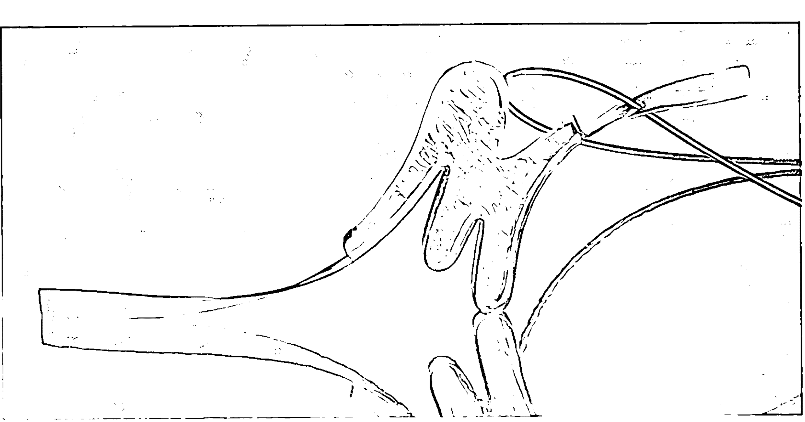

这根流线形的精美项链上有一颗精心雕刻的发晶，18K黄金缎带更增强了其外形效果，而且它与石英中的金色针状包裹体相互呼应。

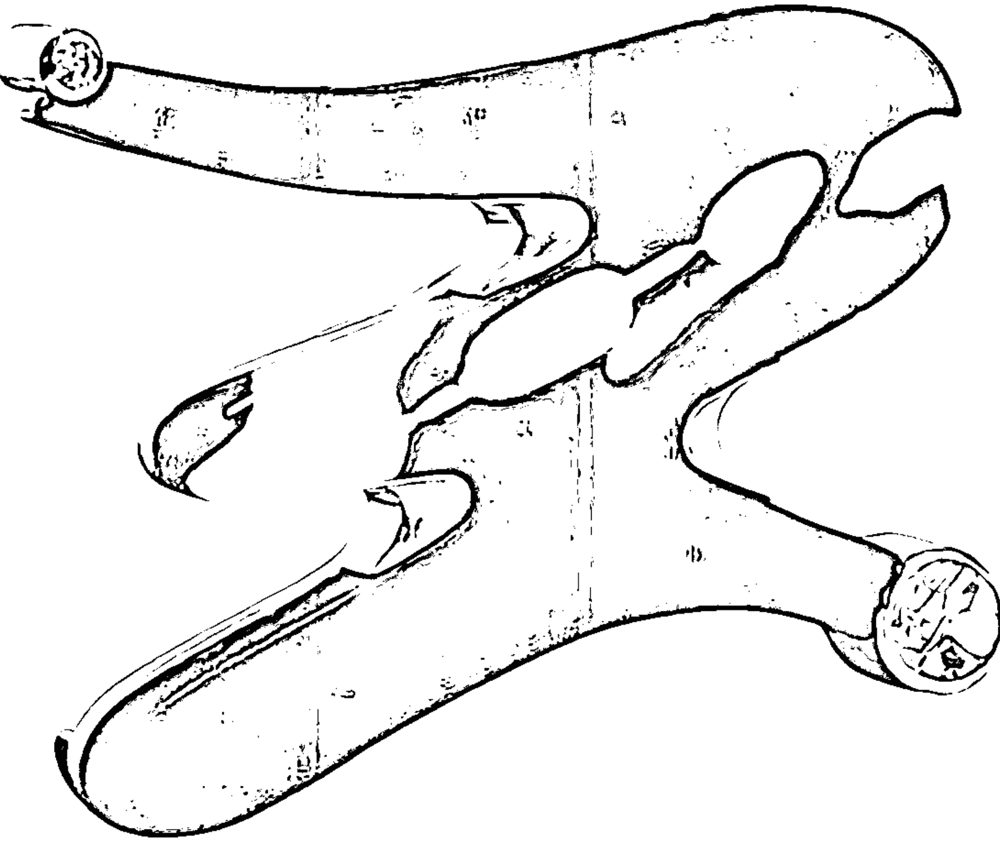

这枚胸针由一块平板状的单色碧玉雕刻而成，镶嵌于18K黄金之中，而一颗采用包镶的橙色锰铝榴石（2.43克拉）又嵌在胸针的末端，给这个令人印象深刻的设计增添了更多的色彩。

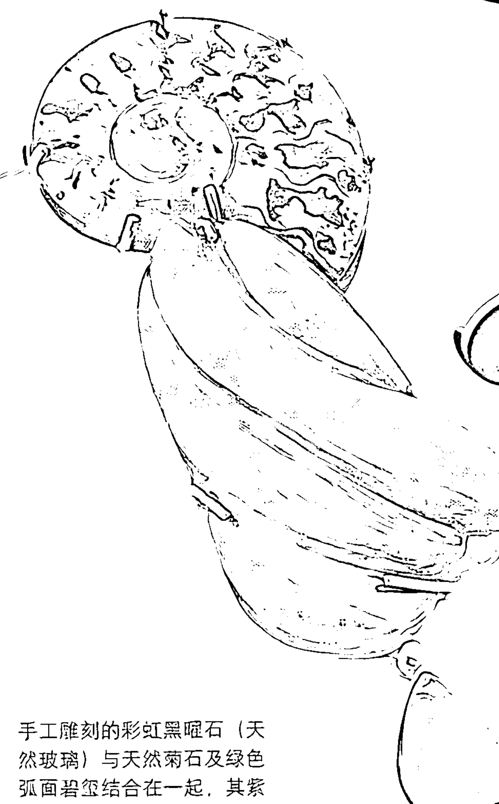

手工雕刻的彩虹黑曜石（天然玻璃）与天然菊石及绿色弧面碧玺结合在一起，其紫色和绿色的虹彩与碧玺交相呼应，而它的玻璃光泽与菊石的天然纹理相得益彰。

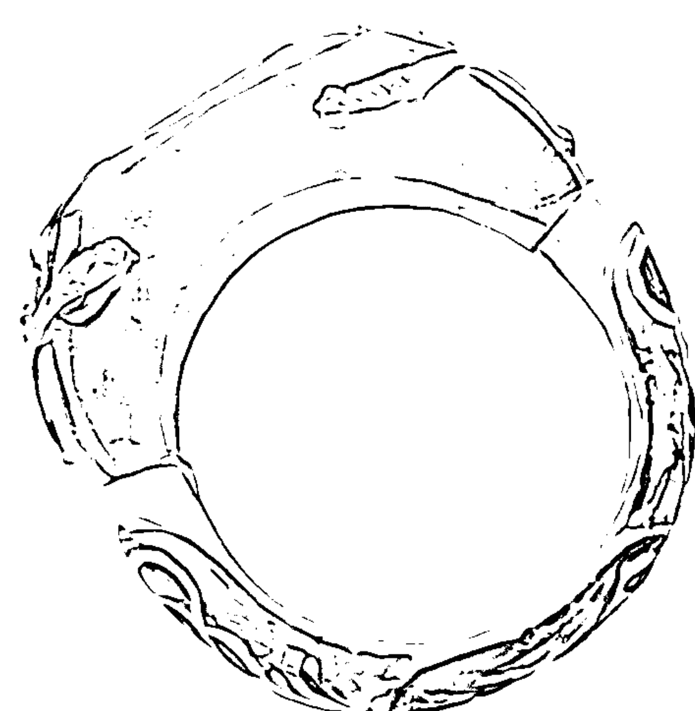

在金属衬箔的映衬下，这颗明亮的粉色碧玺展露出真实的面目。由于碧玺具有内部张力，因此雕刻起来很困难，通常只对其晶体的局部或含有包裹体的晶体部位进行雕刻，这些地方的张力一般会比较弱。


19世纪制作于印度的祖母绿戒指上装饰了钻石和珐琅，并镶入了黄金。这颗祖母绿的使用非常引人注目，因为这种材料比较脆弱很难进行雕刻，所以雕刻这枚戒指所用的应该都是一些非常基本的工具，并使用了石英砂粒或刚玉作为研磨料。

#### 宝石的优化处理

按常理，市场上大多数宝石都要用一系列的处理方法进行优化，你应该清楚地意识到这些处理方法对宝石的利用和宣传以及珠宝销售可能带来的影响。


磷灰石可以通过热处理在保留蓝色的同时去除黄色或者褐色调，从而改善宝石的外观；或者加深蓝色使其外观更加吸引人。


如果要进行珠宝首饰的销售或宣传，那对珠宝的描述必须准确无误。特别是有关优化处理宝石的描述必须真实准确，任何相关信息都必须对消费者声明。建议你从声誉良好的渠道购进宝石，还要掌握一些如何鉴别优化处理的方法，常用的优化处理方法包括热处理(heating)、染色(dyeing and staining)、漂白(bleaching)、涂层(coating)、辐照(irradiating)、灌注充填(impregnating)、裂隙充填(fracture filling)以及扩散处理(diffusion)。

### 宝石优化处理的声明

FTC提出“如果处理结果并不持久或者处理后的宝石需要特别的保养，商家需要告知消费者”；即使不是这样，“如果处理结果对价值影响显著，商家也需要告知消费者”。为此，FTC建议以下几种情况需要声明：

- 如果处理后宝石的颜色会随着时间的推移而褪色，商家需要告知消费者“宝石是经过处理的，处理结果不会长久，随着时间的推移宝石的颜色会变浅”。
- 如果处理后的宝石不能使用超声波或者溶剂清洗，要告知消费者宝石经过处理并且要避免使用超声波或者溶剂清洗。
- 如果用激光打孔改善了钻石的净度，处理后的钻石要比同样品质未经处理的钻石价格低，需要告知消费者钻石经过激光打孔处理。

镶有黄水晶的银戒指，黄水晶可以通过热处理改善颜色；紫水晶可以通过热处理变成黄水晶。

有很多珠宝组织，如联邦贸易委员会（FTC）、国际珠宝联合会（CIBJO），都提供了如何对优化处理宝石进行声明的指南并对处理方法进行了描述，罗列出了目前珠宝贸易中可接受的优化处理方法。


绿松石可以上蜡、注油或者充填树脂来改善外观或者防止脱水，也可以通过染色来改善颜色。

### 表面优化处理

宝石的表面处理包括上蜡（waxing）和涂色(inking)，不过这种处理并不持久，可以擦掉。宝石表面还可以通过覆膜或者贴箔来改善外观。染色、涂层或漂白的颜色可能只出现在宝石表面，无法进入宝石内部，颜色可能集中在裂隙或瑕疵的周围，也可能扩散到整个宝石，从而改变宝石的颜色、净度和外观。

无色或有色的蜡、油、树脂、塑料和玻璃被用于灌注充填宝石，用以掩盖裂隙和缺陷，进而改善宝石的外观，提高宝石的价值。例如，绿松石常进行注蜡处理，祖母绿的注油处理也很常见，甚至都无须额外的声明，但这仅限于无色的油和树脂，所有的有色的处理都必须声明。天然的油和树脂会随着时间而干涸，祖母绿应该定期进行注油处理以避免油脂干涸或宝石开裂。

托帕石可以通过辐照和热处理来改善颜色。不透明的褐色托帕石可以通过这种处理变成一系列能用于首饰镶嵌的漂亮蓝色。

### 热处理、辐照和激光处理

热处理在宝石和珠宝贸易中使用广泛，除非特别声明，否则可以认为所有的宝石都经过了热处理。热处理用于改变宝石的颜色，或者淡化或加深宝石的颜色，也可以用于改善宝石的净度，热处理的结果一般是永久的。

辐照处理是用电子或者伽玛射线轰击宝石来改变宝石的颜色，钻石可以通过辐射处理去除黄色调，提高钻石的色级以及价值。托帕石可以通过热处理和辐射处理将不透明的褐色晶体变成很受珠宝界欢迎的浅蓝色宝石。激光打孔用于去除钻石中的深色包裹体，从而提高钻石的净度。


## 珍珠

商家应该告知消费者所销售的珍珠是天然的、养殖的还是仿制的（人造的或者仿制品）。

珍珠的成因需要在描述中详细声明，例如是海水养殖珍珠还是淡水养殖珍珠。

如果商家知道珍珠是有核的（围绕一颗珠子或者核养殖）还是无核的，应该在描述中声明。

天然和养殖的珍珠都可以染色或通过辐照处理改变颜色，商家应告知消费者珍珠是否经过了这些处理。


## 宝石的家谱

具有相同或者相似化学成分的宝石被归类到同一个宝石族内，例如红宝石和蓝宝石因为具有相同的化学成分而被归类到刚玉族宝石，珠宝商可以通过颜色将它们区分开。颜色的差异是因为宝石中含有不同的微量元素，铬元素使红宝石呈现红色，铁和钛元素使蓝宝石呈现蓝色。下表给出了除有机宝石以外的其他主要宝石家族的“族谱”。

- 磷灰石
- 绿柱石
  - 海蓝宝石（蓝色）
  - 红色绿柱石（红色）
  - 祖母绿（绿色）
  - 透绿柱石（无色）
  - 金色绿柱石（黄色）
  - 摩根石（粉红色）
- 玉髓/玛瑙
  - 玛瑙
    - 条带玛瑙
    - 蓝蕾丝玛瑙
    - 牛眼玛瑙
    - 火玛瑙
    - 堡垒玛瑙
    - 彩虹玛瑙
    - 风景玛瑙
    - 苔丝玛瑙
    - 染色玛瑙
  - 血石
  - 光玉髓
  - 绿玉髓
  - 碧玉
  - 肉红色玉髓
  - 红玉髓
  - 红条纹玛瑙
- 金绿宝石
  - 变石
  - 普通的金绿宝石
  - 金绿宝石猫眼
- 刚玉
  - 帕巴拉恰
  - 红宝石
  - 蓝宝石
- 金刚石
- 透辉石
- 长石
  - 正长石
    - 冰长石
    - 黄色正长石
    - 月光石
    - 微斜长石（天河石）
  - 斜长石
    - 拉长石
    - 奥长石（日光石）
    - 钠长石
    - 透长石
- 萤石
- 石榴石
  - 铝榴石系列
    - 镁铝榴石
    - 铁镁铝榴石（镁铝榴石和铁铝榴石的混合物）
    - 铁铝榴石
    - 马来石（镁铝榴石和锰铝榴石的混合物）
    - 锰铝榴石
      - 橘色石榴石
      - 变色石榴石（铁铝榴石、镁铝榴石和锰铝榴石的混合物）
      - 镁铝榴石
  - 铬钙铁榴石系列
    - 铬钙铁榴石
    - 钙铝榴石
      - 桂榴石（肉桂色石头）
      - 绿色钙铝榴石
      - 玫瑰色钙铝榴石
      - 德蓝士瓦玉
      - 沙弗莱石（铬钒钙铝榴石）
    - 马里石（钙铝榴石和钙铁榴石的混合物）
    - 钙铁榴石
      - 钙铁榴石（翠榴石）
      - 黑榴石
      - 黄榴石


## 宝石的家谱

- 玻璃/玻陨石
- 赤铁矿
- 异极矿
- 堇青石
- 玉
  - 翡翠
  - 软玉
- 蓝晶石
- 青金岩
- 孔雀石
- 欧泊
- 橄榄石
- 葡萄石
- 石英
  - 紫水晶
  - 褐色水晶
    - 烟晶
    - 墨水晶
    - 黑水晶
  - 黄水晶
  - 磨睛石
  - 乳石英
  - 无色水晶
  - 蔷薇石英
  - 金红石发晶
  - 含电气石的水晶
  - 虎睛石
- 菱锰矿


- 金刚石
- 方柱石
- 硅线石
- 榍石
- 尖晶石
- 锂辉石
  - 紫锂辉石
- 苏纪石
- 托帕石
- 碧玺
  - 红色碧玺
    - 无色碧玺
    - 深蓝色碧玺
      - 帕拉伊巴碧玺 (氖蓝色)
      - 紫蓝色碧玺
    - 杂色碧玺
      - 西瓜碧玺
      - 双色碧玺
      - 三色碧玺
    - 粉红色碧玺
    - 绿色碧玺
    - 黄色碧玺
    - 祖母绿色碧玺
    - 褐色至褐黑色碧玺
    - 黑色碧玺
- 硅铍铝钠石
- 绿松石
- 锆石
- 黝帘石
  - 坦桑石 (绿色)
  - 锰黝帘石 (粉红色)


## 1. 刚玉

刚玉作为最重要的宝石族，包括了两种最为知名的宝石：红宝石(ruby)和蓝宝石(sapphire)。这类宝石因为美丽、耐久、品种多样而备受欢迎，价格一直居高不下。遗憾的是，随着合成品、仿制品以及优化处理品的不断涌现，选择和购买红、蓝宝石越来越困难，风险也越来越大。


宝石工匠和消费者应该预先假设他们所见到的大多数刚玉都经过了处理，因为从20世纪60年代开始，热处理就被广泛应用。对于那些经济能力有限的人来说，天然未经处理的红宝石和蓝宝石价格太过高昂：就价值和稀有性而言，一颗10克拉的天然缅甸红宝石的价格相当于天然彩钻的价格。

在刚玉中经常能看到与生长层有关的色带，呈平行于棱柱晶面的六边形同心环带状。红宝石具有强多色性，从不同的角度观察可见黄红色和深红色，这种光学效应也能在蓝宝石中看见。刚玉既有透明的，也有不透明的，具有玻璃光泽或油脂光泽。如果是透明的刚玉，亮度通常相当柔和。


### 宝石的性质

摩氏硬度：9
相对密度：3.97–4.05（红宝石），3.95–4.03（蓝宝石）
折射率：1.762–1.778
晶形：三方晶系，红宝石晶体呈六方柱状、菱面体或轴面。蓝宝石的晶体为桶状或者六方双锥。刚玉产于岩浆岩、变质岩和冲积砂矿床中。

### 刚玉的价格

- 红、蓝宝石根据颜色、净度、大小、切工和性质定价。评价蓝宝石时，净度和蓝色的浓度是关键。理想情况下，蓝宝石应该具有紫色调而没有灰色调或者绿色调。此外，颜色的亮度、色带和净度都需要考虑，不规则的色带会影响宝石的美观和价值。有包裹体并非都是坏事，他们能显示宝石是否经过处理或者帮助判断宝石的产地。宝石尺寸越大越昂贵，但颜色和净度好的小颗粒宝石也有一定的价值。
- 红宝石应该在不同的光线条件下来观察，因为商店里的光源会使颜色看起来更浓而艳丽，而日光则会使颜色看上去更为冷色调。在白炽灯下，深色宝石会呈现近乎黑色。
- 产地对价格有直接的影响，因此要确保你的收据上标明产地，特别是来自缅甸的宝石。如果你计划买一颗昂贵的天然红宝石或者蓝宝石，一定要记住在付款前索要实验室检测报告——大多数信誉好的珠宝商都会同意你的要求。
- 无色蓝宝石有时适合仿制钻，如果切割得好，无色蓝宝石也可以很明亮甚至呈现部分火彩。小颗粒的红、蓝宝石要比无色的托帕石和水晶更坚硬，后两者在采用吉普赛镶嵌时易于破裂。

### 红宝石的产地

阿富汗、澳大利亚、柬埔寨、印度、肯尼亚、缅甸、坦桑尼亚、泰国、美国（北卡罗来纳）、越南。

### 蓝宝石的产地

蓝色蓝宝石：非洲（坦桑尼亚、尼日利亚、马达加斯加、肯尼亚、马拉维）、澳大利亚、巴西、缅甸、斯里兰卡、泰国、美国（蒙大拿）。
粉红色蓝宝石：马达加斯加、缅甸、斯里兰卡、坦桑尼亚。
帕帕拉恰蓝宝石：斯里兰卡。
黄色/绿色/紫色蓝宝石：澳大利亚（昆士兰、新南威尔士）、缅甸、斯里兰卡、坦桑尼亚、泰国、美国（蒙大拿）。
无色蓝宝石：斯里兰卡。
变色蓝宝石：坦桑尼亚。


### 刚玉的加工

- 大多数大颗粒的优质蓝宝石都加工成椭圆形、祖母绿形或者垫形，较小的宝石切割的琢型更多一些。红、蓝宝石的切工需要仔细地加以检查，有些宝石为了保留重量，亭部切得很深，导致宝石很难镶嵌。因此，宝石如果超过了这个尺寸该有的重量，每克拉的价格就应该降低。亭部浅的切工会牺牲颜色的明亮度，并且会在冠部形成一个明显的“窗口”。热处理后的刚玉必须重新抛光去除受损的外层，如果处理不当，宝石会出现双层的腰或者麻点。在西方，红、蓝宝石经常被重新切割，但重量和尺寸的损失会导致每克拉宝石成本的增加。

- 刚玉的耐磨性很好，它是继钻石之后最坚硬的材料，因此常被用作工业磨料。尽管刚玉没有解理，但是它有容易开裂的方向，这就意味着尽管这种宝石很硬但是也可能较脆。刚玉具有贝壳状断口，红、蓝宝石中的缺陷或者裂缝会使宝石易碎。红宝石晶体中常见的双晶也会使宝石易于破损，这些因素在刚玉的加工、抛光和镶嵌时必须要考虑，超声波和清洁剂对于刚玉类宝石没有影响。

- 刚玉的硬度使得宝石很耐久，所以这种宝石是用于制作常年佩戴首饰的理想选择。红、蓝宝石很耐磨，随着时间的流逝，棱角磨损很轻微，相比而言，金属托更容易磨损。因为经常使用，弹簧或者镶嵌物常会松弛，齿爪也会变松、开裂或磨损。为了避免贵重的红宝石或者蓝宝石脱落丢失，在运动时要经常检查宝石，还要经常检查镶嵌的情况。

### 刚玉的种类

### 红宝石(RUBY)

红宝石是粉红色、蓝红色到黄红色的刚玉，最好的颜色是微微带有蓝色调的纯正红色，就像燃烧的煤或者交通指示灯的红色。缅甸“鸽血红”红宝石就拥有这样的颜色，也是最昂贵的红宝石。因为抹谷的红宝石矿从1963年起就被缅甸政府严格控制了，只允许缅甸国民开采，因此事实上其他珠宝商不可能进入到矿区中。反之，个体经销商可以把红宝石带过边境运到泰国境内。因此在泰国已经发展起来了一些提供这类珠宝贸易的城镇。


1克拉以上成对的红宝石很难找到，而且价格昂贵。这对缅甸红宝石被重新加工成理想比例，价值也随之增长

越南和坦桑尼亚都曾出产过和缅甸纯正红色红宝石相似的红宝石。但是其实大多数都是经过热处理的紫红色或者褐红色的红宝石。坦桑尼亚红宝石通常是不透明的，和绿色的黝帘石共生在一起，常用于做装饰性的摆件。斯里兰卡红宝石一般为浅红色到黑莓红色。泰国红宝石一度因为颜色和微瑕石相似而被珠宝界排斥。但是现在泰国生产的红宝石要多于缅甸红宝石。泰国的宝石级红宝石具有轻微的深紫红色，和缅甸红宝石相比，整体更加干净，金红石针状包体更少，光泽更好。


这种特征对于星光宝石并不理想，但是这颗宝石的星线清晰锐利

红宝石的体色可能稍有些不均匀，这样的宝石一般含有少量的包体，如矿物、生长结构、空管和空洞。包体经常显示宝石的产地信息，如缅甸红宝石最典型的包体是金红石、方解石、磷灰石、橄榄石、锆石和尖晶石。围绕着天然矿物包体出现的扁平的裂隙通常是热处理的证据。一些红宝石，特别是缅甸红宝石，在紫外荧光灯下发荧光。好的红宝石甚至在日光下也会发荧光。然而，合成红宝石的一个有力的证据也是具有很强的荧光。

当红宝石中的金红石针状包体定向排列时，在宝石中会出现六射的星光。理想情况下，星光红宝石应该是良好的半透明的红色，而不是通常看到的不透明的深紫色。星线应该是锐利的银白色，并且延伸到宝石的底部。红宝石也可能具有猫眼效应，但是非常罕见。达碧兹(Trapiche)红宝石很受收藏者欢迎，它是几个柱状的红宝石晶体轮状排列生长而成。当被切割或者打磨平坦之后，达碧兹红宝石呈现出带有黑色叶片的轮子的外观。


红宝石切割琢型的选择和宝石的截面密切相关。如果宝石是六边形柱状晶体，通常会被加工成非常浅的琢型或者底尖偏离中心的琢型（如图所示）

红宝石的加工通常在其产出地进行。多色性显示出红宝石的方向定位。将台面按照一定的方向切割可以使宝石呈现最好的红色。红宝石通常被加工成阶梯式琢型或者混合琢型，以最大限度地保留原石的重量，但可能并非最佳的比例。

### 仿冒品

- 在19世纪以前，红色尖晶石、红色石榴石和红宝石因为颜色相似被认为是同一种宝石（红宝石）。因此出现一些不当的命名：铁铝榴石红宝石（铁铝榴石）、澳大利亚红宝石（石榴石）、巴拉斯红宝石（尖晶石）、波西米亚红宝石（石榴石）和开普(Cape)红宝石（石榴石）。
- 在市场上，已经出现了将浅色或无色的刚玉作冠部，合成蓝色蓝宝石作亭部，两者胶结在一起制作成二层拼合石。也有用石榴石作冠部，蓝色钴玻璃作亭部，或者用质量较差的蓝宝石作冠部和亭部，用有色的环氧树脂将两者胶结起来冒充价值昂贵颜色的蓝宝石。大量的这种拼合石被卖给了远东的游客；当镶嵌在首饰上时，这种宝石很难被察觉和检测。蓝色星光蓝宝石也可以人为加工：在星光蔷薇石英的平底部涂上一层蓝色的釉彩，或者在合成的弧面的宝石背后刻上六射星光。

### 宝石展示

这颗红宝石吊坠以前是一款20世纪早期北印度加工的头饰，它使用了弧面红宝石（背部贴箔）、刻面祖母绿和古典明亮式琢型的钻石，用18K黄金搭配釉彩作背景，项链用的是现代淡水珍珠。


这些耳饰最下面悬垂的是刻面珍珠形的粉红色蓝宝石，周围排镶了小的粉红色蓝宝石，中间连接的链子采用狭长琢型的各种杏黄色、淡紫色和玫瑰色的蓝宝石。刚玉很坚硬，能够承受链子所经受的磨损和破坏。

#### 宝石的优化处理

- 有几种改善刚玉颜色的方法，一个是裂隙充填，这种方法在珠宝行业中很常见，因为降低裂隙的反射度，使得瑕疵的可见度也随之降低。宝石的颜色没有变浅，但是裂隙周围的白色斑纹消失了。油、蜡、石蜡、玻璃和环氧树脂都可用作充填物。
- 热处理可以使刚玉的颜色变浅或者变深，热处理还可以融化宝石中常见的丝状体，改善宝石的净度和颜色的均匀程度，这种处理结果是永久性的。包裹体是显示宝石可能进行过热处理的证据，因为高温会熔化或改变某些小的晶体包裹体。但是如果宝石中没有包裹体，那么鉴定宝石是否天然将会十分困难。辐照偶尔也会用于蓝宝石的优化处理上，但是因为颜色并不持久和褪色而在商业上不被接受。
- 对于辐照处理的讨论很多，不像传统的热处理方法，辐照只对宝石的表面着色，而宝石内部始终是无色的。处理工序包括在无色或浅色的宝石表面放上化学元素（红、蓝宝石的致色元素），然后高温加热较长时间。这种处理结果是永久性的，但是如果宝石被切割得很深或者重新抛光，表面的颜色可能会被磨掉。不过，还可以通过再次处理来恢复宝石的颜色。只要对消费者声明并在宝石的价格上反映宝石被处理的真实情况，这种方法在商业上是可以接受的。此外，扩散处理还可以在红、蓝宝石中诱发出星光效应。
- 含有铍元素的红、蓝宝石还可以被用于进行扩散处理。低等级的刚玉可以通过和金绿宝石一同加热而变成深橙色和帕帕拉恰蓝宝石的颜色。越南和坦桑尼亚红宝石通常呈石榴红色，铍处理后会变成明亮的橙红色。然而铍扩散处理并非总能成功，有些宝石会在内部出现紫黑色的斑块。对这种处理方法还存在很大的争议，很多人担心这种方法会影响天然红、蓝宝石的销售。然而事实并非如此，反之，未经处理的红、蓝宝石还是更加受人青睐，价格也更高。常规的宝石学检测方法不能检测出这种处理，需要对包裹体进行显微分析。建议应该在这些宝石标签上标明热处理以及所使用的添加剂（包括铍元素所赋存的矿物），并且声明宝石在损坏或重新抛光后颜色可能被去掉。除此之外，铍处理还有一个扰人的现实问题，就是会对从事处理操作的工人、宝石切磨师和珠宝商的健康造成损伤。

带有内嵌式铂金的18K黄金和蓝宝石项链，蓝宝石为蓝色、粉红色、红色和紫色，采用不对称的切割。宝石中含有少量包裹体，这使得宝石的颜色很深但价格不高。这种参差的镶嵌方式突出了蓝宝石不同的琢型，就像项链一节一节所展现出来的那样。


右边那块宝石明亮的红橙色显示出它是经过铍扩散处理的红宝石，左边的是用传统热处理方法制成的缅甸红宝石。

### 刚玉的类型

### 蓝宝石(SAPPHIRE)

因为致色元素比红宝石更加常见，蓝宝石的产量比红宝石大。蓝宝石最有价值的颜色是蓝色，特别是缅甸和克什米尔所出产的蓝色蓝宝石更加畅销。克什米尔蓝宝石矿位于印度和巴基斯坦的边界，宝石呈深的天鹅绒蓝色，这种颜色有时被描述为矢车菊蓝色。由于该宝石矿基本上已经枯竭了，现在市场上没有新的克什米尔蓝宝石，而缅甸蓝宝石呈现一种浓艳、明亮的带有紫色调的蓝色（品蓝）。


蓝宝石的颜色非常广泛。除了蓝色和粉红色以外，其他颜色的蓝宝石价格都还可以接受。

斯里兰卡蓝宝石也很受欢迎，颜色从中等微带紫色的蓝到柔和的蓝色。宝石经常具有不规则的色调，斯里兰卡的宝石切磨师利用了这一特征，切割时使某些颜色总是出现在宝石的底尖上，这使得宝石看起来颜色很好，即使从另一个方向看过去，宝石几乎是无色的。从20世纪70年代起，斯里兰卡的亮达（或者称为无色）蓝宝石使用一种秘密的工序进行热处理制成明亮的蓝色蓝宝石，有时用以充当天然的蓝宝石出售。

和泰国宝石矿主有合作关系的宝石商向市场大量提供泰国蓝色蓝宝石，不过这种宝石颜色偏深。而澳大利亚蓝宝石在人造光下呈现墨水蓝色，因此这些宝石被运到泰国加工，并且通过热处理使颜色变浅，净度提高。不过遗憾的是，这会导致蓝宝石出现绿色调。

非洲蓝宝石颜色比较多样，尼日利亚蓝宝石颜色一般很深，但是坦桑尼亚生产优质有色蓝宝石，包括蓝色宝石晶体。蒙大拿产的宝石级蓝宝石通常呈现柔和的紫蓝色到钢青蓝色，由于含有很细的色带，颜色可能不均匀，宝石还可能含有包裹体。总之，美国蓝宝石都很小，很少超过1克拉，但是它们一般都是天然的。然而，西方的开采方法和劳动力使得蒙大拿蓝宝石的开采成本很高。


坦桑尼亚蓝宝石呈美丽的紫蓝色。价格比缅甸或者克什米尔蓝宝石便宜得多。

除了蓝色以外，还发现有其他各种颜色的彩色蓝宝石。粉红色蓝宝石非常受欢迎，经常出现在珠宝首饰设计上。颜色可以是柔和的婴儿粉色到浓重的蓝粉色。理想的颜色应该是均匀的深粉红色，不带有紫色或者褐色调。天然的浓粉红色蓝宝石价格波动很大，在价值上和中等级别的蓝色蓝宝石相近。黄色蓝宝石很普通，从浅黄色到深琥珀色都有，后者通常被称为东方托帕石。纯净的金黄色蓝宝石很稀有，因此很多蓝宝石被热处理成金黄色。

帕巴拉恰（僧伽罗人语中为一种荷花的名字）是一种稀有而昂贵的蓝宝石，同时具有橙色和粉红色色调。产地是斯里兰卡。买家需要警惕的是，因为帕巴拉恰的产地经常产出橙色蓝宝石，粉红色蓝宝石可以和铍元素一起处理产生同样的颜色。

无色蓝宝石很少含有包裹体，小颗粒的很容易获得，一般大量的无色蓝宝石都被热处理成蓝色。绿色蓝宝石被称为东方祖母绿，经常含有很细的黄色和蓝色交互的色带。遗憾的是，这种宝石的颜色可能很暗并且沉闷。紫色蓝宝石是由钒元素致色，颜色从浅紫色到深紫色，和优质的紫水晶相似，但是稍微更红一些。较小的紫色蓝宝石品质一般较好，而较大颗粒的就可能很昂贵。

和红宝石一样，蓝宝石中的包裹体也可以揭示其产地。例如，泰国蓝宝石通常含有指纹状的小液滴。蓝宝石中的金红石针状包裹体不仅展示丝光效应（丝状外观），而且可能显示星光效应。理想情况下，星光蓝宝石应具有深的半透明的蓝色（不是常见的灰色或者黑色），尽可能小的六边形生长带，星线位于正中央且明亮清晰。蓝宝石常见的缺陷有裂隙、小坑、不平的底面，这些会降低宝石的价值。在泰国和斯里兰卡的宝石商中有一种做法，如果在加工中星光宝石的某一部分破裂，会将它的底座用粘胶粘合起来，这可能使宝石看起来很整齐而易于镶嵌，但随着时间的推移，粘胶会老化使宝石变黄，破坏宝石的外观。


星光蓝宝石可以有一系列的颜色。这颗淡紫蓝色蓝宝石的净度很好，星光切亮。但是宝石被切割得太深以增加重量，会影响宝石的价格。

变色蓝宝石很稀有，这种宝石可能仅仅是在不同的光源下呈现不同的蓝色调，或者是呈现完全的颜色变化，例如在日光下为蓝紫色，在人造光下为红紫色。

#### 人工合成品

20世纪早期，市场上充斥着大量的合成红宝石，导致天然红宝石的销量大减，价值降低，引起广泛的关注。人工合成红宝石主要是采用维尔纳叶法(Vereuil)，将氧化铝的粉末和致色元素在火焰上燃烧而成。合成的无色蓝宝石，又称赛金刚石合金(diamondite)，也是用这种方法合成的。


这颗合成星光红宝石拥有完美的浮在宝石表面的六射星光，完美得让人难以置信。不过要注意，与天然星光红宝石不同，这些宝石被加工得很浅。

## 2. 金绿宝石

金绿宝石族含有三个彼此完全不同的宝石种类，每一种宝石都具有其吸引人而有价值的品质：一种具有变色效应，一种具有猫眼效应，还有一种宝石是明亮的透明品种。这些宝石品种为珠宝商提供了既有趣又具有挑战性的选择。


金绿宝石家族包含两个非常重要的宝石品种：变石(alexandrite)和金绿宝石猫眼(chrysoberyl cat's-eye)。变石是1831年在俄罗斯发现的，以沙皇亚历山大二世命名。许多国家和地区的文化中都认为这种宝石能给人带来好运，特别是远东地区。金绿宝石猫眼也被认为具有神秘的魔力，被很多人用作护身符来抵抗邪恶，并保护它的佩戴者远离疾病和财产损失。

金绿宝石是金绿宝石族的第三个成员（也是常被遗忘的一员），这种宝石具有一些优异的品质，宝石尺寸大、耐磨并且纯净，颜色美丽，而且价格只相当于该宝石族另两个成员的零头，是很受珠宝商青睐的宝石品种。

### 宝石的性质

摩氏硬度：8.5
相对密度：3.70-3.78
折射率：1.746-1.763
晶形：斜方晶系。晶体具有典型的楔形终端。完全解理、贝壳状断口，包裹体和刚玉的相似：沿同一方向排列的金红石针状包裹体。包裹体还有重复双晶的指纹状和平行线状包裹体。

### 金绿宝石族宝石的产地

变石：巴西、俄罗斯、斯里兰卡、南坦桑尼亚(那里曾发现一颗重达14克拉的变石)。

金绿宝石猫眼：产地很少，有巴西、俄罗斯（乌拉尔地区，但是矿源几近枯竭）、斯里兰卡（产出的宝石最好）、坦桑尼亚。

金绿宝石：巴西、马达加斯加、缅甸、斯里兰卡、坦桑尼亚、津巴布韦。

### 优化处理和仿冒

- 变石很值得投资，因此了解变石的合成和优化处理情况非常必要。早在20世纪70年代，就出现了用于仿制变石的合成尖晶石和刚玉，不过它们很容易被鉴别。1973年，一种很好的合成变石被生产出来，它的性质和天然变石完全一样，此后很多年许多买家都曾上当。它是用焰熔法(flux-melt)生产的，颜色从绿蓝色变化到紫红色。这些合成品中的一部分极有可能还在市场上流通，并被当成天然变石买卖。如你有打算购买变石，不管从谁那里购买都要记住对宝石进行检测。
- 合成刚玉也有变色效应，因此被广泛地用于仿冒变石。它的颜色从灰绿色变化到灰紫色，正确的命名应该是合成变色刚玉。天然的变色刚玉的性质和变石很相似，但是颜色变化不同（从蓝色到红紫色）。
- 合成尖晶石和变石的变色效应一样。
- 金绿宝石猫眼的唯一的仿冒品是石英猫眼，后者是不透明到半透明的灰褐色品种。猫眼石一词总是特指金绿宝石猫眼，而不是指石英猫眼、虎睛石或者鹰睛石，这些具有猫眼效应的宝石要便宜得多，也不具有猫眼石独特的光学效应。
- 金绿宝石没有特别的仿冒品，但是有时会与黄色和褐色的托帕石、黄色和绿色的绿柱石以及绿色的碧玺、橄榄石和红柱石相混淆。


### 金绿宝石族宝石的价格

- 市场上有大量品质中等到差的变石。小颗粒的变石一般含有瑕疵，颜色相当暗，而且变色效应中等。因为变石比刚玉更加稀有，所以即使是这样，变石价格仍很高。变石的尺寸很小，一般在1-1.5克拉之间。如果有人给你一颗很大的变石，那就要心存怀疑，最好送实验室检测。
- 金绿宝石猫眼的价格由宝石的大小、颜色和光学效应所决定，大颗粒的宝石价格昂贵而稀有，稍小的宝石价格低廉而易得。
- 金绿宝石不如变石和金绿宝石猫眼昂贵，该种宝石性价比高，很值得拥有。

### 金绿宝石族宝石的加工

- 变石对压力和冲击力很敏感，在高温下宝石的变色能力会受到影响。
- 变石通常很小，因此珠宝设计师不得不寻找合适的镶嵌方式，以便宝石能充分展示变色效应，这是一个很大的挑战。
- 金绿宝石猫眼的镶嵌也很重要，宝石必须正确地定向和固定，以便眼线位于宝石的中央。这些宝石常常具有不平的底面，这需要花费一定的工夫来正确镶嵌宝石。

### 金绿宝石的种类

### 变石(ALEXANDRITE)

变石是具有特殊变色效应的透明的宝石品种：在日光下呈现蓝绿色，在人造白炽灯下呈现红褐色。这是由光源中不同的颜色决定的。日光中含有绿光而白炽灯中含有红光，在较好的变石中能观察到最好的颜色变化。
变石是一种坚硬耐磨的宝石。一般加工成刻面，而一些变石猫眼被加工成弧面。这些宝石通常很小，但是它们具有变色效应。


### 金绿宝石猫眼 (CHRYSOBERYL CAT'S-EYE)

金绿宝石猫眼和变石完全不同，通常被切割成弧面，具有特殊的银白色的猫眼效应。当转动宝石时，眼线可以从一头移动到另一头。宝石的颜色从蜜黄色到蜜褐色，从黄绿色到接近亮绿色都有。金绿宝石猫眼理想的颜色是亮金褐色，带有较暗的阴影使宝石呈现“牛奶和蜂蜜”效果或者猫眼效应。这种宝石一般是半透明的，拥有漂亮的天鹅绒般的丝状光泽。
金绿宝石猫眼石的另一个名字是波光石 (cymophane)，源自于希腊语“波光”，意指金绿宝石及其金红石针状包体的光学折射产生的光学效应。白色的眼线应该被放在宝石的中央。如果弧面宝石的顶部不光滑或者不对称，眼线就会偏离中心，或者眼线会断开，宝石的价值也会随之降低。宝石的眼线越细、越白、越清晰，宝石的品质就越好。


### 金绿宝石 (CHRYSOBERYL)

金绿宝石族最不为人知的宝石品种就是金绿宝石，它是一种明亮、纯净、透明的宝石，耐磨性很好。颜色从黄色到黄绿色、金褐色，从绿褐色到绿色都有，其中最吸引人的颜色是金褐色。


## 3. 尖晶石

美丽、稀有、明亮而且具有一定的价值，这些都使得尖晶石成为很受珠宝商和首饰设计师青睐的宝石。尽管它外观美丽，几乎和红、蓝宝石一样经久耐磨，但是尖晶石却不像其他宝石那样有名，这也使尖晶石成为那些希望节约成本的珠宝商们一个不错的选择。


在以前，尖晶石常被称为橙尖晶石 (rubicelle)，因为直到19世纪50年代，它都被当做和红宝石一样的材料。这个原因很简单：尖晶石一般埋藏在红宝石和蓝宝石矿中，颜色与缅甸和泰国的红宝石又相似，并且和红宝石一样在紫外荧光灯下发荧光。

典型的尖晶石包裹体主要有小颗粒的八面体尖晶石晶体、针状金红石和晕轮 (halo)锆石晶体。很少有超过4克拉的大颗尖晶石，大多数刻面尖晶石都很小，重量在0.5-2克拉之间，大颗粒宝石的稀有性也可能是造成尖晶石鲜为人知的原因。由于尖晶石并不脆而易碎，其刻面边棱随着时间的推移仍很尖锐，因此很适合切割。如果切割的比例合适，刻面尖晶石能产生像钻石一样明亮的外观和火彩。

这一套尖晶石晶体展示了宝石的晶形和颜色种类。

### 宝石的性质

摩氏硬度：8
相对密度：3.54-3.63
折射率：1.712-1.762
晶形：尖晶石属于立方晶系。一般为完好的八面体晶体或者呈卵石状。不完全解理，玻璃光泽。

### 尖晶石的产地

尖晶石最重要的产地是柬埔寨、缅甸和斯里兰卡。在马达加斯加、坦桑尼亚、尼日利亚、阿富汗、巴基斯坦、泰国、巴西和俄罗斯也有发现。

### 宝石展示


这串华丽的印度项链的制作时间可以追溯到19世纪，粉红色刻面尖晶石和天然珍珠被镶嵌在线状的框架上，形成精致美丽的花朵图案。

下图中，一颗明亮的红色尖晶石和一对明亮式琢型的钻石被镶嵌在一个折边镶的底座上。在钻石的白色对比下，尖晶石的颜色显得更强了。


明亮的红色八面体尖晶石晶体被镶嵌在22k黄金上制成了这对迷人的耳钉。晶体的背部没有被遮挡，以便让光线通过，使宝石的颜色展示得更为充分。

### 尖晶石的颜色

由于所含杂质和致色元素的不同，尖晶石的颜色种类很多。
最受欢迎的颜色是明亮的红橙色，像罂粟和火焰的颜色，这种颜色的尖晶石有时被称为火焰尖晶石(flame spinel)，价格要远远高于其他颜色的尖晶石。尖晶石中的钴尖晶石和镁钴尖晶石呈现蓝紫色，能与蓝色蓝宝石相混淆。此外，绿色、黄色和无色的尖晶石同星光尖晶石一样非常稀少。


### 优化处理与仿冒

- 和其他宝石不同，尖晶石很少被热处理或者辐照处理来改变或改善颜色。不过，合成尖晶石在1920年就已被生产出来，即将粉末状的原料在高温下熔化，然后加入重金属以产生和其他宝石（如碧玺和海蓝宝石）非常接近的颜色。
- 尖晶石可能与其他宝石，例如红宝石、蓝宝石，锆石，红色、粉红色和蓝色碧玺，紫晶以及石榴石相混淆。

### 尖晶石的价格

除了红橙色尖晶石很昂贵以外，尖晶石的价格和海蓝宝石、碧玺大体相近，大颗粒的尖晶石因为稀有而更加昂贵。遗憾的是，随着公众对尖晶石的认知不断提高，尖晶石的价格也在不断上涨。

### 尖晶石的加工

- 在古老的亚洲珠宝饰品上经常会发现尖晶石，因为它的硬度很高，使得尖晶石能长时间地保持完好。
- 尖晶石适合切割成小的刻面宝石，特别适合吉普赛镶。尖晶石的高硬度使它在棱角受到压力的情况下也不易破碎或开裂，特别适合镶嵌在婚戒或其他日常佩戴的首饰上。
- 越来越多的刚玉都进行过加热或其他优化处理，而市场上买到的尖晶石多数都是天然的，这成为尖晶石吸引珠宝商和首饰设计师的一个重要卖点。
- 尖晶石最常见的颜色是柔和的红色，如上图中的小晶体所展示的。如果你想购买弧面或者珠形尖晶石，最可能就是这样的颜色。只是在很偶然的情况下，你能发现其他颜色的珠形尖晶石。
- 黑色尖晶石相当便宜，易于抛光，是诸如染色黑玉髓和煤精等这类硬度较低宝石的良好替代品。

### 托帕石的颜色

尽管托帕石很美丽，种类也很多，但是贵重的托帕石很少出现在珠宝首饰上。托帕石是一种坚硬明亮的宝石，由于含有杂质或者致色元素，而具有一系列柔和的颜色。托帕石最常见的天然颜色是黄色、黄褐色、橙褐色和粉褐色、浅到中等的红色、蓝色和无色。最昂贵和最美丽的是雪莉酒色托帕石（红橙色，偶尔会和黄水晶相混淆）、帝黄色托帕石（一种美丽的柠黄色）和粉红色托帕石（从浅粉红色到紫粉红色）。

托帕石经常被进行优化处理，例如天然粉红色托帕石很稀有，价格很高，因此黄色托帕石常被热处理成粉红色。处理后的托帕石颜色更深，通常不含包裹体。辐照处理的宝石常呈浅天蓝色（有时会与海蓝宝石相混淆）。明亮的瑞士蓝（Swiss blue）和被称为伦敦蓝（London blue）的深灰蓝色石，而扩散处理的托帕石颜色通常为深绿色和蓝绿色。


这颗未经处理的鲜红切磨的浅黄色托帕石产自非洲。你为布依托帕石(champagne topaz)


这颗天然粉红色托帕石一颗具有略带橙红色的帝黄色。这样的宝石多数经过处理去除橙色调。但是老者更喜欢带有一点色带的未经处理的托帕石。


这颗辐照处理的玛非蓝托帕石被切割成一颗有趣的宝石。内凹的台面使宝石呈现出有趣的光学效果。

很少看到珍贵的叶形粉红色托帕石。这些美丽切磨的椭圆形珠子由帝黄色托帕石和粉红色的托帕石混合在一起。

会维持较长的时间，因此，这种托帕石必须要放置几年才能消除放射性的危险。

由于据称已有“热”托帕石流入到市场上，美国和欧洲的权威机构要求对辐照处理的托帕石开具证书，目的是控制辐照处理托帕石的分布，确保这些宝石达到了安全的辐射范围。此外，法律上还要求相关的宝石生产商必须在商品上标注辐照的详细情况。在美国，深蓝色（伦敦蓝色）的优化处理托帕石必须要检测辐射程度，美国宝石学院（GIA）为客户提供此类相关的服务。

在20世纪80年代早期，辐照处理的蓝色托帕石价格很高，但是随着此类宝石大量涌入市场，价格也随之下降。尽管人们还很关注辐照处理的过程，但是市场对辐照处理托帕石的需求量一直很大，不过市场的大量供应也使它的价格一直维持在较低的水平。

托帕石，处理过程就称为“上粉色”。只要颜色稳定并且无染色剂，热处理的过程被认为是合法的。

### 托帕石的价格

- 托帕石的颗粒可以很大，不过由于它的密度很高，就像石榴石一样，因此比同样大小的宝石要重得多。如果你要选购一颗大的托帕石时要记住这一点，因为这会对价格有显著影响。
- 粉红色和帝黄色托帕石的价格相当高，如果是天然的粉红色价格还要高。黄色、褐黄色、蓝色和无色托帕石价格要低得多，性价比很高。

### 扩散处理

扩散处理是将托帕石和化学元素一起进行较长时间的加热，处理后只在宝石表面出现颜色改变，而内部颜色未发生改变，扩散处理能够产生绿色和蓝绿色。

### 托帕石的加工

- 托帕石具有完全的解理、贝壳状或不均匀断口，其结果就是宝石容易垂直于长轴方向裂开，沿宝石长轴方向一点轻轻地撞击都可能导致宝石开裂，因此在镶嵌时要格外小心。建议如果用托帕石镶嵌戒指，最好采用保护性的镶嵌方法，以防止宝石的腰部和棱角遭到意外的撞击。
- 不是所有托帕石的颜色都是稳定的，一些辐照处理的褐黄色托帕石暴露在阳光下几天时间就会褪色，一些天然的黄褐色托帕石在阳光下也会逐渐褪色。因此，应该避免镶嵌着托帕石的珠宝首饰直接接触阳光和热。
- 托帕石不能抵抗热的硫酸，因此在焊接或者加工托帕石首饰时要当心，在焊接和抛光镶嵌托帕石首饰时还应该尽量避免过热。

### 热处理

在热处理前，褐色托帕石一般被加工成半成品，在摄氏450度下加热到颜色消失，然后慢慢冷却直到宝石变成粉红色（颜色的饱和度各不相同）。热处理时间的长短和加热冷却的速度是处理的关键：如果速度过快，颜色可能变浑浊，或者会失去颜色。这种处理得到的宝石往往是粉红色

## 5. 绿柱石

几乎没人能抗拒祖母绿(emerald)的魅力，正是它让克里奥佩特拉矿(Cleopatra's mine)闻名天下，也成了绿柱石宝石族中的骄子。但不要让祖母绿妨碍了你对绿柱石族其他宝石的欣赏，它们也决非一般的宝石。


绿柱石族宝石家族非常庞大，除祖母绿外，还包括闪闪发光的海蓝宝石(aquamarine)、鲜艳的金黄色绿柱石(heliodor)和美丽的摩根石(morganite)。它们都应被视为珍贵的宝石品种，在设计珠宝首饰时，它们都能发挥很大的作用。判断和评价绿柱石族宝石的主要因素就是其颜色的饱和度，这就使得很多这类宝石都通过优化处理来改善颜色。


### 宝石的性质

摩氏硬度：7.5-8
相对密度：2.69-2.80
折射率：1.57-1.59
晶形：绿柱石属于六方晶系，柱状结构，产于花岗岩、伟晶岩以及冲积砂矿中，玻璃光泽。

### 绿柱石的产地

祖母绿：最主要的产地是哥伦比亚、赞比亚和巴西，澳大利亚、印度、巴基斯坦、俄罗斯、南非和美国也有产出。
海蓝宝石：巴西、莫桑比克和阿富汗出产最优质的天蓝色海蓝宝石，尼日利亚和马达加斯加出产暗蓝色的海蓝宝石。
金黄色绿柱石：最佳的品种产自巴西和俄罗斯的乌拉尔，在马达加斯加、纳米比亚和美国也有产出。
摩根石：马达加斯加和巴西出产优质摩根石，莫桑比克、纳米比亚、巴基斯坦和津巴布韦也有产出。
透绿柱石：巴西、加拿大、俄罗斯和美国。
红色绿柱石：美国。


### 绿柱石的种类

### 祖母绿(EMERALD)

祖母绿中的铬元素和钒元素使宝石呈现鲜艳的绿色，它的颜色能够抵抗光和热，永远都不会褪色。祖母绿的颜色会因来源和产地不同而有所变化，最有价值的颜色是微带蓝色调的浓绿色。
哥伦比亚祖母绿为微带蓝色调的纯绿色，并具有双色性，也就是说，它的颜色会因为你观察角度的不同而稍有变化。哥伦比亚祖母绿多年来一直主导着祖母绿市场。但是推取式的宝石开采方法对矿山造成了长期的破坏。为了加快采矿过程，开采中使用了炸药和巨大的推土机，由于祖母绿对震动十分敏感，这些做法对祖母绿造成了潜在的伤害。

巴西祖母绿颜色稍浅，与哥伦比亚祖母绿相比带有更多的黄色调，宝石中常含有少量云状物，但是大多数不含有大的包裹体。
津巴布韦的祖母绿具有美丽的深祖母绿色，净度很好。
几乎没有祖母绿是纯净无瑕的，宝石中常含有纤维状包裹体或者透闪石，有时候有内部裂隙或者不规则的色带，也可能呈现云雾状或者朦胧状的外观，由此产生的内应力使祖母绿对压力很敏感。祖母绿琢型（阶梯式琢型）就是特别设计用来最大限度展示祖母绿的价值并加深宝石颜色的一种琢型。为了避免碎裂，同时也为了保护这种脆性较强的宝石，这种琢型将宝石的棱角都免去了。


祖母绿鲜艳的颜色源自于内部所含的铬元素和钒元素，能在光照和热条件下保持颜色稳定而不褪色。祖母绿最好的颜色是带有蓝色调的浓绿色，就像哥伦比亚祖母绿的颜色。

### 海蓝宝石(AQUAMARINE)

海蓝宝石的颜色有海绿色、天蓝色和深蓝色。在19世纪末20世纪初，海绿色海蓝宝石很受欢迎，但自那以后，天蓝色和深蓝色的海蓝宝石逐渐成为更加吸引人、价值更高的颜色品种。最好的海蓝宝石产自巴西和莫桑比克，蓝色浓艳，宝石纯净，晶体很大。海蓝宝石具有双色性，颜色的深浅与观察的角度有关。海蓝宝石的加工往往是根据观察颜色的最佳角度来决定的，而不是从最大尺寸的角度去考虑。阶梯式琢型或者祖母绿琢型常用海蓝宝石的加工上，用以加深宝石的颜色。

海蓝宝石的净度好于祖母绿，获得大颗且纯净的海蓝宝石也容易得多。缺少包裹体和裂隙意味着宝石的内应力比较小，因此海蓝宝石不是脆性的宝石。有瑕疵的海蓝宝石当然也存在，通常具有云雾状的外观，几乎不透明，但是一般都加工成弧面或者球形，有时可能显示猫眼效应。


### 金色绿柱石(HELIODOR)

金色绿柱石是绿柱石中的黄色品种。在古代文明中，这种宝石与太阳联系在一起并由此得名。它常与海蓝宝石共生在伟晶岩矿床中，颜色从浅柠檬黄到黄绿色，至饱和的吸金色。金色绿柱石可能含有细的管状包裹体，当切割成弧面时可能具有猫眼效应。

### 摩根石(MORGANITE)
(粉红色绿柱石)

大多数摩根石呈现柔和的桃粉红色，当采用白色金属进行封闭式镶嵌时宝石的颜色会显得更深。第一颗摩根石是在加利福尼亚发现的，和绿柱石共生在一起。根据锰的含量多少，这种宝石可能呈现浅粉红色、玫瑰粉红色、桃红色、杏红色/鲑鱼色，甚至是紫色。像海蓝宝石和祖母绿一样，摩根石具有双色性，从不同的方向可以观察到两种色调，有时有些矿物晶体同时含有粉红色的摩根石和蓝色的海蓝宝石。

### 绿色绿柱石
(GREEN BERYL)

大多数绿色绿柱石都通过在高温下热处理变成蓝色的海蓝宝石，颜色和色调的浓度决定了它究竟被称为祖母绿还是绿色绿柱石，两者不应该混淆。祖母绿应该是较浓的深绿色、蓝绿色，或者稍微带黄绿色调的绿色。而绿色绿柱石应该是浅绿色或者浅黄绿色，还具有和祖母绿相似的纤维状、带状或者云状物包裹体。


### 透绿柱石 (GOSHENITE)

透绿柱石是以它的发现地马萨诸塞州Goshen镇命名的，它是纯净的绿柱石品种，不含有致色元素。晶体中可见针状包裹体，当加工成刻面时，透绿柱石具有很好的亮度，可能会和无色的托帕石和无色的蓝宝石混淆。透绿柱石如果衬上银质箔片，并采用封闭的镶嵌方式，就可以用来仿冒钻石。

### 红色绿柱石(BIXBITE)

这是很少见的绿柱石品种，宝石级的晶体一般很小，因此加工好的宝石一般小于1克拉。也存在较大的宝石，但是内部包裹体较多。红色绿柱石很难得，因此价格昂贵，对于珠宝商来说并不实用。


### 优化处理与仿冒

- 祖母绿常使用注油处理以掩盖其白色裂隙，改善整体的颜色。这种处理方法早在古希腊时期就开始采用，只要油不将宝石染成绿色，商业上就可以接受。祖母绿中的油会随着时间的流逝而干涸，显露出原来的裂隙和差的颜色，这时可以将宝石重新进行注油处理。
- 现代采用真空和热处理技术充填祖母绿并引入了环氧树脂，使其成为宝石的一个组成部分。可是一旦对处理过的祖母绿进行去污时，例如超声波清洗，树脂或者注入的油会被一同除去，之前隐藏的缺陷就会显露出来，颜色也会随之变浅。多数哥伦比亚和巴西祖母绿都用这种方法处理；赞比亚宝石一般不进行真空充填处理，但是仍然会采用传统的注油处理。
- 大量的海蓝宝石通过热处理来加强颜色，从绿蓝色变成天蓝色。除非特别声明，否则你就应该预先假设你所购买的海蓝宝石都是热处理过的。海蓝宝石的颜色也可以通过中子和伽玛射线辐射改善颜色，但是这种处理的结果并不长久，颜色也不稳定。此外，摩根石可以通过热处理得到纯净的粉红色而不显示黄色或者橙色调。
- 成功地获得合成祖母绿已经有一段时间了，早在1848年就首次运用助熔剂法合成了祖母绿。这种方法是将原料粉末熔化在助熔剂中，维持在极高的温度下几个月，然后再缓慢冷却，合成一颗能足够加工出2克拉宝石的祖母绿晶体需要一年的时间。合成祖母绿可以通过它内部的窗纱状或者羽毛状的液态包裹体特征来加以鉴别。
- 质量很差的浅色祖母绿和绿柱石有时也会采用合成方法进行涂层处理，将切磨好的宝石放入水热釜内，在其表面合成一层祖母绿。生长层很薄（大约1毫米），因此抛光好的宝石呈现漂亮的祖母绿色，但是还能看到天然的包裹体。如果通过放大镜观察，在宝石的表面会发现相互呈十字交叉的裂隙，这些证据无法通过抛光去除。
- 祖母绿也能用一种像绿色指甲油一样的物质来进行涂层处理，用尖锐的物质刮擦宝石表面或者用像丙酮一样的溶剂清洗宝石来对这种处理方法进行检测。
- 莱恩特祖母绿(lannyte)、苏打祖母绿(soude)和莫斯考特祖母绿(mascot)都是拼合宝石，即将两颗优质的浅色宝石（可以是无色水晶、海蓝宝石、绿柱石或者质量较差的浅色祖母绿）用祖母绿色的胶黏合在一起。上层宝石常含有包裹体用以欺骗消费者相信宝石是真的，但是从侧面可以看到宝石的黏合带。
- 曾经有人用焰熔法合成出的尖晶石来仿冒海蓝宝石，对于成批的混合包装的海蓝宝石要进行逐一检测，因为其间经常混有一些合成品。此外，合成的摩根石也有发现。
- 绿色玻璃甚至也被用于仿冒祖母绿。曾经有一次，赞比亚的绿色交通灯被打碎了，玻璃碎片被人混进了祖母绿原石的包裹里，其实可以通过气泡和气泡组成的云状体来识别玻璃。
- 祖母绿还可能和其他颜色相似的天然宝石相混淆，特别是铬致色的碧玺、铬透辉石、翠榴石和铬钒钙铝榴石。


### 绿柱石的价格

- 绿柱石最主要的定价标准是颜色的饱和度，因此改善颜色的优化处理被认为是通行做法。祖母绿通常经注油以掩盖瑕疵，而商家应该告知消费者宝石是否经过了这种处理，并且宝石的价格也应该反映出宝石是否经过处理。
- 大颗、纯净的深绿色祖母绿十分稀少，这样的祖母绿价格几乎接近钻石的价格。颜色决定了祖母绿的定价，如果颜色很深或者很浅，价格都会降低。净度和大小是另外两个评价因素，质量较差的祖母绿一般被加工成弧面或者珠形。
- 海蓝宝石很容易被错认为是蓝色托帕石，出产海蓝宝石的国家也出产蓝色托帕石，因此宝石包中常有混淆两者的情况发生（有意的或者无意的）。蓝色托帕石要便宜得多，且常是辐射处理过的。海蓝宝石是一种珍贵的宝石。

### 宝石展示


### 绿柱石的加工

- 由于大量的海蓝宝石被热处理以改善颜色，因此在抛光或者焊接镶有海蓝宝石的珠宝首饰时一定要格外小心，避免宝石过热。
- 即使一颗祖母绿看起来是纯净无瑕的，它内部往往也会有小的瑕疵，在某些特殊的条件下，如宝石镶嵌、抛光和清洗时，这些瑕疵会暴露出来。含有包裹体的祖母绿很易碎，在对祖母绿加热的操作中要格外小心。
- 对于祖母绿的镶嵌来说，某些刻面琢型比其他琢型更易于破损。如果你希望将祖母绿加工成细长的阶梯式琢型或者圆三角形琢型，那么要尽可能地选择纯净、无裂隙和无瑕疵的宝石。

## 6. 夕线石

一段时间以来，这种耐久坚硬的宝石，或被爱好者收藏，或用于工业领域（生产火花塞）。后来这种宝石被珠宝商逐渐认识，珠宝商看中夕线石的原因无疑是它那微妙的颜色和光学效应。

### 宝石的性质

摩氏硬度：7.5
相对密度：3.25
折射率：1.65-1.68
晶形：斜方晶系。以变质岩中产出的细长晶体形式出现。

### 夕线石的产地

缅甸（蓝色和紫色）、斯里兰卡（绿灰色），还有巴西、德国、印度、意大利、肯尼亚和美国（爱达荷州）。

### 优化处理与仿冒

当夕线石以块状非晶质形式出现时，和玉石很相似，而像宝石一样的刻面夕线石又与蓝宝石、浅色蓝宝石很相像。

### 夕线石的价格

除了天然的刻面蓝色夕线石之外，其他类型夕线石的价格都比较低廉。刻面夕线石还是相当罕见的，而弧面夕线石和夕线石猫眼数量并不少。

### 夕线石的加工

- 夕线石是一种相当坚硬耐久的宝石，宝石能够忍受外力的撞击和化学变化，且很耐热。然而，沿着宝石长度方向有一组很好的解理，因此如果受力方向不当的话，宝石会从中裂开。
- 含纤维状包体的夕线石比纯净的晶体稍软，具有不均匀的破裂状断口，适合加工成雕件和珠子。

### 夕线石的品种

以耶鲁大学silliman教授的名字命名的这种宝石具有比较明显的两面性。当加工成刻面时，夕线石是一种鲜艳明亮的宝石品种。具有玻璃到金刚光泽。呈现一系列微透明的颜色：灰色、蓝色、紫蓝色、蓝绿色和褐灰色。最受人欢迎的颜色是蓝色。产自缅甸红宝石矿区。夕线石具有多色性，特别是蓝色的夕线石。可以从三个方向分别观察到浅黄绿色、深绿色和蓝色。

夕线石的另一面与上述情况完全不同。具有另一个名字——纤维石(fibrolite)。这个名字来源于一种长而纤细的夕线石晶体。这种晶体像纤维一样平行排列。这种纤维状的特征在不透明的块状硅线石中非常常见，不过在半透明和透明的具有猫眼效应的夕线石中也能观察到垂直的纤维。硅线石具有猫眼石常见的丝绢光泽，可产生刀锋般锐利的眼线。


### 宝石展示

这些刻面夕线石珠子的颜色从透明近乎无色逐渐过渡到半透明的深灰色。尽管珠子的切工不规则，这串珠子仍因其稀有而具一定的价值。


## 7. 碧玺

碧玺（也称电气石）是一种令人喜爱的宝石，具有各种让人惊艳的颜色，有时甚至在一颗宝石上出现几种不同的颜色。在流行和时尚快速变幻的年代，碧玺能够适应各种潮流，适合各种设计，它是真正意义上的现代宝石。

西方国家是在1703年由荷兰人从斯里兰卡引进这种宝石时开始认识碧玺的，碧玺的名字来自于turamall，意思是混合的颜色。如今，碧玺在西方的首饰设计中占有重要的地位，它的魅力体现在它五彩斑斓的颜色上，如霓虹灯般多样的颜色，还有独特的双色和三色碧玺，这些颜色可能是并排的也可能是独立存在的。设计师喜欢运用这些宝石，消费者也喜欢佩戴这种宝石，流行颜色的碧玺价格在近几年中翻了三倍。

### 宝石的性质

摩氏硬度：7-7.5
相对密度：粉红色和红色碧玺3.01-3.06；褐色、绿色和蓝色碧玺：3.04-3.11；黑色碧玺：3.11-3.20
折射率：1.614-1.666
晶形：三方晶系。晶体为六方柱状，横截面或者是圆滑的三角形，或者为三角形。一端为锥体。沿着宝石的长轴有明显的晶面条纹。单色的碧玺晶体很少见，多数碧玺晶体都有不同的颜色或者色调。碧玺产出在伟晶岩中，常和托帕石、石英、紫锂辉石、绿柱石共生在一起。

碧玺家族中的宝石具有相同的晶体结构，当存在杂质时，宝石会呈现出不同的颜色。这些宝石有着不同程度的双色性，根据观察角度的不同，可以看到变幻的颜色或者不同色调。在某些碧玺中，这种效应会很明显，如蓝色碧玺从一个角度观察是很深的蓝色，而从另一个角度观察是浅蓝色的，红色碧玺显示深红色和浅红色，而绿色碧玺或者是深绿色和黄绿色，或者是黄绿色和蓝绿色。蓝色碧玺通常显示很深的颜色，因此加工成刻面的时候需要留意将浅色调凸现出来，将台面沿着宝石的长轴切割（这个方向显示的是浅蓝色），亭部刻面要近乎垂直于台面切割，防止从深蓝色方向观察到宝石整体颜色变深。浅色碧玺加工时要把台面垂直于宝石的长轴，好让台面的颜色最强。此外，碧玺具有玻璃光泽。

### 碧玺的产地

非洲（纳米比亚、尼日利亚、坦桑尼亚、津巴布韦）、巴西、缅甸、巴基斯坦、俄罗斯和美国（加利福尼亚）。

碧玺常见的包裹体是垂直于晶体长轴方向的平行裂隙，裂隙的反射能力很强，常出现在粉红色到红色的宝石中或者在颜色过渡的位置上，有时候也能看到刺状的液体包裹体。许多刻面碧玺被加工成阶梯式琢型或者交叉琢型来展示其最好的颜色，使光线能更多地进入到深色的碧玺中。碧玺晶体的形状限制了成品宝石的形状，一般加工成长方形或者八边形。

### 碧玺的品种

#### 蓝色碧玺 (INDICILITE)

蓝色碧玺包括所有蓝色调的碧玺，从蓝宝石的蓝色到绿松石的亮蓝绿色。多数蓝色碧玺的颜色为深蓝色或者墨水蓝色，对珠宝商的吸引力不大，所以蓝色碧玺常被进行热处理以淡化颜色。

#### 红色碧玺 (RUBELLITE)

这是碧玺家族中最美丽也是最有价值的一个品种。rubellite简单的翻译就是红色的，真正的红色碧玺应该是明亮的深红色到带有紫色或蓝色调的红色，而不应有混浊的黄色或者褐色调。由于一些著名的珠宝商在他们的设计中采用了红色碧玺，红色碧玺的受欢迎程度和价值在近几年上升惊人。优质的红色碧玺矿位于坦桑尼亚和尼日利亚，而质量差的红色碧玺常用热处理的方法加深颜色。

#### 绿色碧玺 (VERDELITE)

很多人都把蓝绿色到黄绿色的碧玺与绿色碧玺联系在一起，因为这些是最常见的绿色调，毫无疑问这些颜色也是最好的。祖母绿色、明亮的叶绿色和铬绿色也是非常受青睐的颜色，同时也很难得，价格当然也很高。要么是含有这种颜色的碧玺颗粒太小，要么是宝石中包含裹体，再或者是晶体的颜色太深或太浅，总之要找到一颗纯净的超过5克拉的绿色碧玺还是很有难度的。明亮的黄色碧玺数量不多，收来之不易。通常黄色的晶体外有绿色的外壳，使得内部黄色的宝石也显示绿色调，或者黄色是金桃红色而不是理想中清晰的黄水晶色。

#### 帕拉伊巴霓虹碧玺 (PARAIBA NEONS)

在20世纪80年代，巴西帕拉伊巴省的若斯德巴塔赫 (Jose de Batalh) 矿山开始出产一种特殊的碧玺，这是20世纪碧玺研究最重要的发现。这种宝石的颜色包括明亮的浓绿色、绿松石蓝色和紫色，被称为霓虹碧玺。它的出现引发了珠宝界的狂热追捧，价格也迅速超过了其他的碧玺。有一种观点认为这些霓虹碧玺可能是特殊热处理的结果，但是这种观点一直都没有得到证实。市场对帕拉伊巴碧玺的需求量很大，目前，这种宝石的原生矿已经枯竭了，市场上只有少数（还在不断减少）还在流通，当然宝石的价格还是很高。

#### 双色和三色碧玺 (BI-AND TRICOLOUR TOURMALINES)

很多碧玺含有两种、三种或者更多种的颜色，最有名的颜色组合是西瓜碧玺 (watermelon tourmaline)，晶体的中心是粉红色的，外边是绿色的，横截面看起来像西瓜。这种碧玺颜色的组合变化很大，有些碧玺的颜色对比明显，还有一些仅仅是色调的轻微变化，颜色对比效果很弱。这些多色碧玺在切割时要突出其颜色的变化，宝石切割师通常采用阶梯式琢型。宝石颜色对比越明显，内部越纯净，宝石的价格越高，一颗天然的西瓜碧玺能够卖很高的价格。消费者尤其喜欢这种碧玺，因为每一颗宝石的颜色和色调的数量都是独一无二的。优质的粉红色和绿色的西瓜碧玺晶体产于南非、东非和巴西。

#### 镁电气石 (DRAVITE)

镁电气石常常为黄褐色至橙褐色，致色元素是镁，宝石常和黄色碧玺一起埋藏于宝石沙砾中。这种宝石具有很强的多色性，从不同的角度可以观察到两种不同的颜色，它的颜色有时可以通过热处理改变。

#### 黑色电气石 (SCHORL)

黑色电气石除了加工成珠子外很少用作宝石，它的产量很大，晶体可达几英尺长。黑色电气石在维多利亚时期的英国应用广泛，因为它比煤精更坚硬耐久而被用于首饰镶嵌。

#### 无色碧玺 (ACHROITE)

天然的无色碧玺很少见。浅粉红色的碧玺可以通过加热去除颜色成为无色碧玺。

#### 含电气石石英 (TOURMALINATED QUARTZ)

这类宝石同时属于碧玺和石英。当黑色的针状电气石包含在清澈的石英晶体中时，就形成了含电气石石英。如果石英晶体很纯净，不含云状物，它的效果既抽象又独特，也就为珠宝商提供了有趣的设计材料。找到这种黑色针状包裹体分布良好的纯净晶体并非易事，因此质量尚佳的含电气石石英作为收藏品具有很高的价值。

石英中含有排列适当的黑色电气石包裹体。

#### 碧玺猫眼 (CAT'S-EYE TOURMALINE)

碧玺中常出现猫眼效应，特别是在粉红色和绿色碧玺中尤其常见。当含有大量的针状包裹体时，碧玺具有近似纤维状的结晶习性。如果针状包裹体平行排列，且宝石的底部平行于针的方向，宝石将出现猫眼效应。质量好的碧玺猫眼具有收藏价值。

这颗绿色碧玺猫眼颜色很好。

这颗蓝色碧玺具有很好的纤维状包裹体。宝石的体色偏暗，但有白色的眼线。

### 优化处理与仿冒

- 通过热处理可以使深色的碧玺颜色变浅，特别是蓝色和绿色的品种，产自纳米比亚的深绿色碧玺通过特殊的热处理会产生和祖母绿颜色相近的亮绿色。
- 另有一些碧玺通过辐照处理加强粉色、红色和紫色调，还能将无色和浅粉红色的碧玺变成浓粉红色。经辐照的颜色会随着时间而褪色，因此如果你打算购买深粉红色到红色的碧玺，建议检测以确定是否经过处理。
- 缘于碧玺及帕拉伊巴碧玺较高的价值，常规合成尖晶石加以仿冒。如果你花了一大笔钱购买了一颗霓虹碧玺，一定要对宝石进行检测，以确定宝石是否天然的。
- 粉红色和绿色碧玺可能会和绿黄色的金绿宝石、祖母绿、粉红色锂辉石、粉红色托帕石和摩根石相混淆。

### 碧玺的价格

- 最美丽也最昂贵的碧玺是红色碧玺、蓝色碧玺、铬绿色碧玺和霓虹碧玺，由于对产量不断缩减的帕拉伊巴碧玺的需求居高不下，这种碧玺成为最具价值的碧玺品种，其价格和顶级的蓝宝石和红宝石不相上下，而且这种现状似乎看起来很难有所改变。
- 碧玺的价值由颜色的质量决定，一颗大的、纯净的蓝绿色碧玺售价相当高，而一颗稍暗的海军蓝色碧玺要便宜得多。红色碧玺如果颜色变浅成为粉红色或者红色变暗，价值也会降低。黄褐色和橙褐色的碧玺价格不高，但也可以被认为物有所值。

### 宝石展示

20世纪70年代设计的黄金和绿色碧玺戒指，它流线形的有机设计结构反映了19世纪早期新艺术时期的怀旧风格。

### 碧玺的加工

- 碧玺具有不完全的解理和不均匀的脆断口，这使得宝石对压力比较敏感，因此在镶嵌时要小心避免宝石破裂。因为宝石很脆，某些镶嵌方式就不能用于碧玺。碧玺并非最硬的一类宝石，故将其镶嵌到戒指上时要采取一些保护措施。
- 由于碧玺的颜色种类繁多，因此很难配成对，特别是绿色的碧玺。宝石的多色性也是一个问题，最有效的方法是从一个晶体上选取成对的宝石，这要比为一个现有的宝石配对容易得多。切割成对的碧玺时，要确保宝石从一个方向上切割，这样会匹配得更好。当然，也意味着你需要找到一块较大的原材料来加工两颗宝石，这对价格会造成影响，但这可以免却为一颗切工好的碧玺配对所耗费的精力。
- 摩擦或者加热碧玺晶体，可使其导电，从而吸附灰尘、绒毛和尘土。因此，用碧玺镶嵌的珠宝首饰需要更频繁地进行清洗。

这两颗颈饰上镶嵌着水滴形的绿色碧玺，它们的组合方式给人感觉并未固定在吊坠上。

## 8. 堇青石

大多数人可能都不了解顶级的堇青石在颜色的饱和度上可以和优质的坦桑石相媲美，如果把堇青石和蓝色蓝宝石、坦桑石的原石混在一起，很难把堇青石和它们区分开来，堇青石最受欢迎的颜色是蓝紫色。

尽管堇青石在珠宝店里难得一见，但仍然赢得了人们的喜爱。它是蓝色宝石中稀少的品种之一，不过价格总体上能够让人承受。堇青石的名字来自于希腊语“紫色的”，有时也被称为“水蓝宝石”(water sapphire)或者“山猫蓝宝石”(lynx sapphire，通常是珠宝商希望提高宝石的价值才这样称呼)。

### 宝石的性质

摩氏硬度：7-7.5
相对密度：2.53-2.78
折射率：1.522-1.578
晶形：斜方晶系，堇青石为菱形晶体（短柱状）。产于变质岩、片麻岩和片岩中。宝石级的晶体还见于冲积砂矿中，以小的透明的水磨卵石形式出现。

堇青石是一种透明宝石，颜色有深紫蓝色、浅灰蓝色、黄灰色、绿色和褐色。大多数常见的堇青石是中等的紫蓝色，上面提到的深紫蓝色堇青石产量不大。堇青石具有玻璃光泽，耐磨性相当好，亮度适中。尽管堇青石不是特别鲜艳的宝石，但其所具有的三色性让它增色不少，从三个不同的角度观察宝石会分别显示不同的颜色：浅灰蓝色、黄色到无色、深紫蓝色。

### 堇青石的产地

印度、马达加斯加、缅甸、斯里兰卡、坦桑尼亚和美国。

从这颗刻面堇青石的台面能看到深蓝色，从侧面观察可以看到浅灰色到无色，沿着晶体长轴方向总是可以观察到最好的颜色。

质量较差的堇青石常含有包裹体，通常被加工成刻面。最常见的是深色的纤维状包裹体，还有赤铁矿和针铁矿的片状包裹体，在宝石表面形成红色的闪光或者砂金效应，颗粒较大且不含包裹体的堇青石很少见。

### 堇青石的价格

### 优化处理与仿冒

- 拥有迷人的蓝色和较好净度的中等级别的堇青石价格非常适中，供应量很大。顶级的堇青石具有特殊的蓝紫色，价格与优质的刻面碧玺相近。当你亲自比较这些宝石时，你就能理解为什么宝石有这样大的价格差别。
- 有报道称德国伊达奥伯斯泰因（Idar-Oberstein）的珠宝商购进大量顶级的堇青石原石，显然可以预见，堇青石的价格和受欢迎程度还会大幅提高。

尚未找到能够成功地淡化堇青石的颜色或者去除包裹体的处理方法。

### 宝石展示

### 堇青石的加工

- 堇青石的硬度使其适合于珠宝首饰加工，但是堇青石具有一个方向的完全解理和贝壳状断口。要牢记这一点，当抛光和镶嵌宝石时，宝石偶尔也会破裂，堇青石对压力和化学物质并不敏感。
- 堇青石常被加工成阶梯式刻面宝石，这种琢型能增强宝石的亮度。然而暗蓝水蓝色的宝石常被加工成略带有窗口效应的琢型或者加工成很浅的琢型，好让宝石的颜色显得浅一些。堇青石的多色性也要求在加工宝石时要考虑正确的切工方向。

在这款“咖啡豆领结”上，堇青石被手工加工成咖啡豆的形状，这样会使光进入到堇青石的不同层之间并产生跳跃，以使宝石获得好的蓝色。大颗堇青石原石很少，因此小颗堇青石常被粘结在一起，拼合缝用银屑镶嵌起来。最后，一颗祖母绿缀于咖啡豆上，领结用染蓝的铁编成的铠甲状的链子串起来。

## 9. 石英

石英是最庞大的宝石家族，也是当代珠宝界中应用最广泛的宝石品种之一。石英家族中宝石种类繁多，包括一系列范围很广的价位适中的有色宝石，有些宝石中含有非常奇特的包裹体。

石英产量丰富，外观美丽，这使得它从人类诞生之初就被作为宝石使用。在以色列的洞穴中曾发现过石英珠子，其历史可以追溯到5000到6000年前。在人类历史上，不同品种的石英都曾被人们所崇尚，人们佩戴石英当做护身符来抵御不幸和疾病。

### 宝石的性质

摩氏硬度：7
相对密度：2.65
折射率：1.544-1.553
晶形：单晶体的水晶属于三方晶系。六方柱状结晶习性，晶体一端呈六方锥体。晶面经常有水平的生长纹。

本节所讲述的是石英中的晶质类，以单晶体石英，而非隐晶质石英，后者是一个大型的宝石族，往往成块状产出。请参见第74页“玉髓和玛瑙”，认识隐晶质石英。

### 晶质石英的产地

无色水晶、黄水晶和烟晶：非洲、澳大利亚、巴西、日本、缅甸和西班牙。
紫水晶：俄罗斯的乌拉尔出产优质的紫水晶。紫水晶还产在纳米比亚和赞比亚。
蔷薇石英：非洲、巴西、印度、马达加斯加。
石英猫眼：斯里兰卡。
虎睛石和鹰睛石：最好的宝石产自南非和纳米比亚。
含蓝线石水晶：纳米比亚和马达加斯加。

晶质石英的颜色范围很广，色带是鉴定这类宝石的常见的特征。石英从透明到不透明都有，尽管亮度不是很高，但仍是十分吸引人的宝石品种，有些还具有特殊的光学效应，如猫眼效应和星光效应。

晶质石英典型的包裹体主要有小颗粒晶体、针状体、微小纱状物和内部裂隙，能够使宝石呈现一种彩虹效应。水晶经常包含云母碎片和片状赤铁矿，在光下转动宝石时会有闪光效应，云母片的闪光为银色，而赤铁矿的闪光是红色的。

### 宝石展示

这颗锐式切工的无色水晶吊坠的特点在于洁净的线纹中含有亚当石包裹体，抛光后的底座把光反射到宝石的背面，水晶的无色效果对这款极为现代的首饰贡献颇大。

### 石英的种类

#### 无色水晶 (ROCK CRYSTAL)

优质的无色水晶看起来像一块透明的冰，这种水晶产量丰富，在古代珠宝首饰上常被加工成刻面珠子，还大量用于制作灯具和放大镜。

尽管珠宝商和消费者都希望宝石不含包裹体，纯净无瑕，但是水晶常含有构成图案的包裹体，这种水晶可以用于不同的加工方法和设计款式。有时宝石的包裹体很重要，甚至影响了宝石的命名，如含碧玺水晶和含金红石水晶等。每一种宝石中的包裹体都是独一无二的，为宝石设计提供了很好的思路。

#### 烟晶 (SMOKY QUARTZ)

遗憾的是，烟晶长期以来一直被人们忽视，它拥有的价值一直不被人们所认识。烟晶拥有一系列的柔和而微妙的颜色，包括柔和的黄褐色、浓巧克力色、深木炭的褐色和近黑色。它有时以苏格兰的两个矿区（凯尔古恩 (Cairngorm) 和莫瑞昂 (Morion)）来命名，这两个矿区都出产烟晶。此外，烟水晶还经常被错误地称为烟色托帕石。天然的烟晶产量丰富，大颗粒的宝石比较常见，因此非常具有经济价值。当镶嵌在白色的金属上时，烟晶因其朴实而显得非常别致。

#### 含碧玺水晶 (TOURMALINATED QUARTZ)

在含碧玺水晶中，黑色或者绿色的碧玺针状体和清澈的水晶相映衬产生强烈的视觉冲击，形成引人入胜的图案。

#### 含金红石水晶 (RUTILATED QUARTZ)

这种水晶中含有黄褐色或金色针状体，有时像发丝一样在宝石中分布，因此又被称为“维纳斯之发宝石”(Venus-hair stone)。含碧玺和金红石的水晶，如果内部几乎不含雾状包裹体时看起来最完美。

金色的金红石针状包裹体定向排列产生了强烈的猫眼效应。

#### 草莓水晶 (STRAWBERRY QUARTZ, 含赤铁矿水晶 HEMATITE QUARTZ)

针状或者片状的赤铁矿带状纤维状平行排列出现在清澈的水晶中，这种宝石有时被称为草莓水晶。

#### 紫水晶 (AMETHYST)

紫水晶一直是最受欢迎的晶质石英。19世纪到20世纪，大量的珠宝首饰上都有紫水晶。俄罗斯出产的紫水晶一直被认为是最好的，因为在人造光下宝石呈红色。然而，紫水晶可以呈现不同的紫色调，从浅紫色（玫瑰色）到深色西伯利亚紫水晶，后者被加工成刻面时显示最亮的洋红色。西伯利亚一词由此被用于描述任何浓紫色的水晶，而不管它的产地是哪里。一颗颜色分布均匀的深紫色水晶要比浅色水晶昂贵得多，不过如果颜色太深，宝石接近黑色，也不那么受人欢迎了。

还有一种紫黄水晶，它的一部分是紫晶，一部分是黄水晶，在颜色过渡的区域常含有许多包裹体。除了色带以外，紫水晶还含有几种包裹体，特别是平行的充液管穴，用放大镜观察看起来是锯齿状或斑马状条纹。紫水晶具有弱双色性，从不同的角度观察，它具有蓝色调或者红色调。

#### 黄水晶 (CITRINE)

和烟晶一样，黄水晶也曾被误称为托帕石或水晶托帕石。黄水晶不仅比托帕石便宜得多，而且它产量丰富。同珍奇的托帕石不同，黄水晶的颗粒很大。黄水晶的颜色从柔和的柠檬黄色到深红褐色以及琥珀色，最常见的天然颜色是金黄色，但是颜色很浅。不过也有天然的深色黄水晶，帕米拉 (Palmeira) 黄水晶具有明亮的橙黄色到琥珀色，而马德拉 (Madeira) 黄水晶呈现美丽的深白兰地色。这种宝石的名字一般和产地有关。较深颜色的黄水晶产量相当少，价格也要比其他黄水晶高很多。水晶的颜色越深，宝石的价格越高。还有一种明亮的柠檬黄到橙黄色的黄水晶，是由浅色紫水晶和烟晶热处理形成的。

帕米拉黄水晶有漂亮的茶水色。和大尺寸的宝石相比，这个尺寸（直径4毫米）的珠子相当便宜。

### 优化处理与仿冒

- 颜色分布不均匀或者浅色的紫水晶加热到摄氏400-450度，颜色会变成褐黄色或者褐红色，即深色的黄水晶（如果紫水晶加热超过摄氏575度，水晶就会完全失去颜色）。大多数深色的黄水晶实际上都是由热处理过的紫水晶形成的，外观和优质的巴西托帕石相似，其中一些在市场上就被称为托帕石水晶，而深褐色到红色的水晶被当做马德拉或者西班牙托帕石出售。紫水晶和烟晶也可以通过热处理形成柠檬黄色、酸橙黄色的黄水晶，一些热处理的紫水晶会变成绿色，被当做茎块绿泥石出售。普通虎睛石加热后会变成红色虎睛石。

- 热处理过的黄水晶中很难找到优化处理的证据，而且不同宝石的颜色深度和色调也各不相同，这使它很难被鉴别。不过，水晶的常规价格可以帮助你判断宝石是否天然的，热处理过的黄水晶很便宜。一些热处理的紫水晶颜色不稳定，暴露在阳光下几年以后，就会褪色。

- 还可以使用各种材料染色来改善水晶已有的颜色或者仿冒其他天然的宝石，有时用绿色的塑料染料对石英晶体染色来仿冒祖母绿，且被放入祖母绿原石中充当主石。主石是指一包宝石中最重要、最漂亮的宝石，决定了整包宝石的价格。因此，有色水晶和其他宝石混在一起，很难被识别。水晶晶体的底尖破碎后常留下六边形晶体的外观，这和祖母绿晶体很相似。如果水晶使用的是这种处理方法，用硬的金属针尖刮擦表面的涂层就能把颜色去掉。

- 水晶还可以染成红色来冒充红宝石，然后加工成弧面，使得折射率很难被测到。水晶有时也放在红色的油中浸煮来仿冒红宝石，这也不太容易检测，不过用丙酮或者酒精擦拭表面，一些红色的颜色层可以去掉。

- 在远东地区，砂金石英（aventurine）常被当做绿色的玉石出售给毫无防备的观光者，还有将优质玻璃仿冒成砂金石英在市场上销售。

- 据发现，烟晶的颜色来自于地下天然辐射的影响，无色的水晶经常通过辐射处理变成中等的灰褐色。

### 石英的价格

- 总的来说，晶质石英价格低廉，是一种消费得起的宝石，很多买不起其他贵重宝石的消费者都能承受得起水晶的价格。颜色均匀的深色西伯利亚紫水晶价格稍高，纯净的桃粉玫瑰红色水晶也一样。马德拉和帕米拉黄水晶是品质石英中最昂贵的，因为它们是天然的，而且产量有限。

### 石英的加工

- 石英用途广泛而且耐磨，产量又丰富，宝石颗粒大且亮度好，硬度适中，但是在镶嵌的时候也要小心避免损伤宝石。石英的使用寿命不是无限的，当你观察一颗古董水晶珠宝首饰时，你会发现宝石磨损可能相当严重，棱角被磨蚀，表面有大量的划痕。蔷薇石英因为内部含有大量的裂隙而更脆，因此最好避免使用包裹体严重的蔷薇石英，在镶嵌或者佩戴时很容易破裂。水晶的硬度不高，这使得它适于雕刻。

- 当焊接和抛光水晶时要小心，有时高温会使宝石褪色，建议避免在阳光直射的环境下佩戴水晶宝石，阳光也可能使水晶褪色。

### 宝石展示


含有金红石的水晶运用强烈的棱角线条设计制成的一款项链。


这是一枚20世纪20年代装饰艺术风格的银胸针，橄榄形的淡紫色紫晶和玫瑰琢型的白铁矿搭配在一起，构成了这款让人惊艳的花朵形设计。

### 蔷薇石英（ROSE QUARTZ）

蔷薇石英很漂亮，颜色从浅粉红色到深桃红色都有。多数蔷薇石英包裹体很严重或含有云状物而成半透明外观。清澈的宝石级蔷薇石英产量很有限，价格昂贵，特别是较深的颜色。质量差的蔷薇石英很脆，充满了裂隙和瑕疵，因此在购买较便宜的这类宝石时要当心，因为在镶嵌或者佩戴时裂隙可能变大。尽管很脆，大量的蔷薇石英仍可以用于雕刻或者加工成珠子，也可能由于含有金红石包裹体而显示星光效应的星光蔷薇石英。如果颜色和星光很好，那它一定价值不菲。

清澈的宝石级蔷薇石英很难找到，与含有包裹体的水晶相比颜色较浅。

### 蓝色水晶（BLUE QUARTZ）

对珠宝商而言，有两种蓝色水晶。一种是含有蓝色石棉（被称为青石棉）的水晶，天然产出但是色调沉闷；另一种是用一种类似石青（蓝铜矿）的矿物颜料浸泡或染色而成的蓝色水晶，具有水晶的高硬度（和石膏的低硬度相比）。还有蓝绿色的半透明的颜色。后一种蓝色水晶相当漂亮，若非产量太少，会很受欢迎，这种水晶价格亦不菲。

### 绿水晶（PRASIOLITE）

绿水晶是一种浅绿色的透明到半透明品种，一般是由经过热处理的紫水晶或者黄水晶得到的，而且绿水晶只能通过加热某些产地的水晶得到。最开始，这些水晶都来自巴西的水晶矿，但是其他类似的产地后来也有发现，从此大量的此类水晶进入到市场中。绿水晶一般被加工成刻面、弧面或珠形。它可能与黄色或者绿色的珍贵的绿柱石相混淆。

### 砂金石英（AVENTURINE）

这种宝石的颜色为暗淡的中等到深度的绿色，由于含有小片的闪光的铬云母而呈半透明状，还可能因为含有黄铜色的赤铁矿包裹体而呈金属般的橙褐色。砂金石英价格适中，一般加工成漂亮的弧面宝石或者珠子。

### 紫水晶石英（AMETHYST QUARTZ）

这是一种不透明的紫水晶品种，带有明显的白色和紫色的色带。它是一种较为坚硬、密致的紫水晶品种，常和乳石英放在一起，具有很好的装饰价值，可以加工成弧面宝石和珠子。

### 乳石英（MILKY QUARTZ）

乳石英具有云雾状外观，颜色发白，呈半透明至透明，乳状颜色是由气液包裹体造成的，乳状的程度由包裹体的数量所决定。商业上，乳石英没有太大的价值，因此一般用于廉价的首饰上，抛光后看起来像月光石。

砂金石英很美，颜色为深蓝绿色。

### 蓝线石石英（DUMORTIERITE QUARTZ）

这是一种很罕见的宝石，呈美丽的紫蓝色到牛仔蓝色。当蓝线石石英抛光成弧面宝石时，表面有时会留下小凹坑。其产量不大。

### 石英猫眼（QUARTZ CAT'S-EYE）

石英猫眼很常见，颜色从绿色到黄绿色、灰绿色、黄褐色、深灰色都有。宝石的中央有明亮锐利的白色眼线，这种眼线是由平行排列的波纹状或纤维状的石棉包裹体造成的。为了获得猫眼效应，必须将宝石的纤维状包裹体加工成平行于弧面的底部。石英猫眼具有柔和的丝绸光泽，与金绿宝石猫眼相比，价格适中。

### 虎睛石和鹰睛石（TIGER'S-EYE AND HAWK'S-EYE）

虎睛石有褐黄色、金黄色、红褐色、绿褐色等多种颜色，黄褐色的虎睛石条带是氧化铁侵入造成的。鹰睛石的外观和虎睛石相似，但是颜色是深蓝色到黑色的。这些宝石有奇妙的光学效应。石英替换了紧密排列的石棉纤维，纤维状的结构使得转动宝石时在宝石表面出现微光。为了展示光学效应，宝石常被切割成板状或片状。这种宝石的价格较为低廉。

由于石棉纤维的存在，这颗宝石具有丝绸光泽和猫眼效应。

这颗弧面宝石重达50克位。这样大小和颜色品质的蓝线石石英不太容易找到。

石英猫眼对某些酸很敏感，因此处理时要小心，防止和日用化学试剂接触。

这颗椭圆形宝石放大了虎睛石的光学效应。它的眼线平行于长轴。

## 10. 锆石

很难理解为什么珠宝商一直都不那么喜欢锆石，它的硬度和断口并不比石榴石或者碧玺等其他宝石差，而且它还有很多让人喜爱的性质，例如亚金刚光泽、强双折射率、美丽的颜色和适中的价格。


锆石是一种明亮透明的宝石，有很多天然颜色，包括黄色、褐色、橙黄色、紫色、绿色、蓝色和红色。最常见的颜色是灰褐色到红褐色，而最受人欢迎的颜色是金褐色。无色锆石很罕见，当它被切割成宝石时，由于其明亮的亮度和火彩而很容易和钻石混淆。同钻石一样，锆石具有金刚光泽。经常有人会把锆石和立方氧化锆相混淆，珠宝商和消费者可能认为锆石不是天然的，是合成宝石或者认为锆石和立方氧化锆是同一种宝石，这种混淆可能是因为两者的名字相近，以及人们缺乏对锆石的认识，还有就是一些处理过的锆石颜色（明亮的蓝色和黄色）与立方氧化锆的颜色相似。

### 宝石的性质

摩氏硬度：6.5-7
相对密度：3.93-4.73
折射率：1.81-2.024
晶形：四方晶系。晶体呈短四方柱状，两端成锥体。有时在冲积砂矿中以水磨卵石形式出现。锆石的光泽为树脂至金刚光泽，由宝石的种类所决定。

### 锆石的产地

高型锆石：柬埔寨、泰国和越南。
低型锆石：斯里兰卡、澳大利亚、巴西、柬埔寨、法国、马达加斯加、莫桑比克、尼日利亚、俄罗斯、南非和坦桑尼亚。


### 宝石展示

这副美丽的黄金耳钉镶嵌着处理过的亮蓝色锆石，宝石的深色调被鲜亮的金属色所弥补，形成了这款夺目的首饰。


### 锆石的种类

锆石含有少量放射性的铀和钍元素，导致不同的锆石在硬度、密度、折射率和颜色上存在差异。锆石主要有两种类型：高型锆石（high zircon）是一种比较坚硬美丽的黄褐色宝石；低型锆石（low zircon，低品质的）为绿黄色到绿褐色，由于放射性衰变，它的硬度不高。

从不同的方向观察锆石，颜色可以有不同的变化。多色性的强度由锆石的类型和锆石颜色的浓度所决定。深色的高型锆石具有比较强的双色性。锆石的另一个特征是其不均匀的颜色分布，这在鉴定宝石时非常有用。


这两颗褐色锆石的颜色在过去曾被称为红风信子色（hyacinth）。产自俄罗斯，未经处理。

这是一颗钻石颜色介于褐色钻石和干邑色、褐色钻石之间。锆石颜色明亮活泼，具有钻石的外观，但是锆石比钻石更脆。


处理过的蓝色锆石非常像绿松石的颜色，不容易和其他宝石混淆。锆石的亮度、火彩和颜色浓度使它也有别于托帕石和海蓝宝石。

### 优化处理与仿冒

- 热处理锆石已有几百年的历史，这是一种可以为人接受的处理方法，它可以使锆石的颜色变成红色、蓝色、橙黄色和绿色。但是有些颜色并不稳定，会逆转回原来的颜色或者发生褪色。由于天然的无色锆石非常稀有，因此红褐色的锆石经常被热处理后变成无色，不过在阳光或紫外线的照射下，这些锆石可能变成黑褐色。褐色锆石还可以通过热处理变成明亮的蓝色，如果褪色，还可以重新加热恢复颜色。在重新加热蓝色锆石的同时，还可以加入氧元素使它变成金黄色。
- 有人用无色的玻璃或者合成尖晶石来仿冒锆石，黄绿色的锆石可能与蓝宝石、翠榴石、金绿宝石、桂榴石、托帕石或者碧玺相混淆。在一些古董首饰上，锆石曾经用于替代钻石。如果用放大镜观察刻面锆石表面的划痕和磨损以及刻面边棱的破损，可以将它和钻石区分开来。

### 锆石的加工

- 遗憾的是，热处理会影响锆石的性质，使得它在佩戴或者碰撞时更容易损坏。热处理后的锆石不仅会随着时间的流逝而磨损，而且刻面棱相交的尖点更容易被磨蚀。
- 锆石具有贝壳状断口，是天生较脆的宝石。尽管硬度中等，但是如果受到碰撞，锆石会受损，因此在镶嵌和抛光时要小心。锆石更适合用于镶嵌吊坠和耳钉，如果你想用锆石镶嵌戒指，那么尽可能选择未处理的锆石，并采用保护性的镶嵌方法。
- 锆石具有很高的双折射率，这意味着当你通过台面观察宝石亭部的刻面棱时能看到重影，锆石的琢型就是用于展示这种特殊的性质，这种款式是在明亮琢型基础上发展起来的，它使光线尽可能多地进出于宝石，最大限度地展示锆石明显的双折射（double refraction）效果。

### 石榴石的种类

#### 镁铝榴石（PYROPE）

镁铝榴石是含有包裹体的一种血红色宝石，它在18至19世纪波西米亚风格的首饰中特别流行。最好的颜色为火红色，即使用于镶嵌，其颜色也不会变深很多。优质的镁铝榴石的产量很大，主要产于南非金伯利岩筒和俄罗斯。


#### 铁铝榴石（ALMANDITE）

铁铝榴石的颜色从深红色到紫红色和黑色都有。弧面切割的铁铝榴石经常将底面掏空让更多的光进入到宝石中。铁铝榴石质地比较脆，当加工成刻面时可能会磨损。
这种宝石偶见星光效应。它内部常含有包裹体或者半透明状。包裹体一般为黑色的矿物晶体、圆形晶体和针状金红石。
不要把铁铝榴石与红宝石或者尖晶石混淆。

#### 铁镁铝榴石（RHODOLITE）

铁镁铝榴石呈现为漂亮明亮的紫红色，几乎不含包裹体。成分介于镁铝榴石和铁铝榴石之间。但铁镁铝榴石是要比两者更漂亮，因为它的颜色比镁铝榴石明亮，包裹体比铁铝榴石少。优质铁镁铝榴石产于斯里兰卡、坦桑尼亚和肯尼亚。


#### 锰铝榴石（SPESSARTITE）

锰铝榴石呈现鲜艳的橙黄色，含有羽状或者花边状包裹体，实际上是小液滴组成的云状物。光泽很强，不过纯净的宝石级石榴石很少见。锰铝榴石容易和钙铝榴石相混淆，但是在放大检查时可见包裹体的不同。


#### 锰铝榴石（橘色石榴石）（SPESSARTITE-MANDARIN）

这种产自纳米比亚具有完美晶形的锰铝榴石有非常神奇的亮橙黄色。宝石级的橘色石榴石非常少见，价格很高。


#### 水钙铝榴石（HYDROGROSSULAR GARNET）

水钙铝榴石的颜色是与众不同的苹果绿色，半透明到不透明。它经常被加工成弧面和珠形。此外，粉红色的水钙铝榴石也有发现。它通常含有黑色的磁铁矿，在宝石表面形成小黑点。在南非，这种宝石被称为德兰士瓦玉或者石榴石玉，缘于它和绿色的玉石很相似。


#### 钙铝榴石（GROSSULAR GARNET或HESSONITE）

由于钙铝榴石的颜色为褐橙色到褐黄色，因此在非洲它也被称为桂榴石。这种宝石具有典型的旋转糖浆状包裹体，多数都是小的磷灰石晶体。古希腊和古罗马首饰中经常使用钙铝榴石，一般被加工成刻面、浮雕或者弧面。


#### 钙铝榴石（铬钒钙铝榴石，TSAVORITE）

这是一种透明的酸橙绿色到祖母绿色的钙铝榴石。于1968年首次在肯尼亚被发现，目前在坦桑尼亚也有产出。这种宝石几乎都被加工成刻面。但是祖母绿色的晶体一般只有2克拉甚至更小，结果就导致祖母绿色石榴石比酸橙绿色石榴石价格更贵。铬钒钙铝榴石的光泽很强，包裹体常为金黄色的针状体、磨蚀的棒状体或者黑色的云母片。


#### 钙铝榴石（马来石，MALAY）

最近在马里发现的一种宝石级的钙铝榴石，颜色很漂亮，多为金褐色、黄杏色和桃粉红色，有时是绿色，也称为马里石榴石（Mali garnet）。

#### 翠榴石（DEMANTOID）

这是石榴石族中最绿的钙铁榴石，相当罕见。几乎没有超过1克拉重的翠榴石，传统的产地是俄罗斯的乌拉尔山脉。翠榴石的亮度和色散比钻石还强，具有明亮的火彩（颜色闪烁）。然而，由于它的摩氏硬度只有6.5，所以刻面边棱很容易磨损。翠榴石具有典型的马尾状包裹体，实际上是黄褐色的马尾状石棉，这是最具价值的石榴石。


#### 变色石榴石（COLOUR-CHANGE GARNET）

这些石榴石在日光（荧光）下呈蓝绿色，在白炽灯（人造光）下呈紫红色，还有的在红紫色到黄红色之间变化。这种宝石是镁铝榴石和锰铝榴石的混合体，非常罕见。

### 玉髓的种类

玉髓通常呈半透明的灰色到蜜黄色，具有较多孔隙，因此常被染色。天然的玉髓颜色均匀没有色带。

#### 蓝玉髓（BLUE CHALCEDONY）

这是一种真正可以称之为漂亮的宝石。展示出花朵般的颜色，从紫丁香色到玉黍螺蓝色，以及薰衣草色。最好的蓝玉髓为半透明的，质量差的玉髓含有云状物。过去几年里，蓝玉髓的受欢迎程度增长迅速，推动了它的价格上涨。顶级的深蓝色蓝玉髓价格相当昂贵。


这颗蓝玉髓颜色美而深邃，不含有云状物，非常迷人。

#### 红玉髓（CARNELIAN）

红玉髓多年来一直是比较受欢迎的宝石。它温暖的色调同时吸引珠宝制造商和珠宝消费者。它的颜色从纯净的深红橙色到柔和的褐橙色和红色。优质的红玉髓是半透明的，颜色较深，看起来像会发光一样。红玉髓的颜色可以通过热处理或者染色加强，有些红玉髓就是染色或者热处理过的玛瑙。天然的红玉髓应该含有云雾状的色区，但是不含有任何规则的色带或者色区。红玉髓的应用历史悠久，在一些古董首饰上以雕刻或者浮雕的形式出现。许多穆斯林都崇尚红玉髓，据说先知穆罕默德的戒指上就镶有红玉髓。除了最好的橙红色以外，其他红玉髓的价格相当便宜。

#### 绿玉髓（CHRYSOPRASE）

最好的绿玉髓应该是深苹果绿色，半透明，没有任何云状物。然而，绿玉髓根据镍元素含量的不同而呈现出不同的颜色，可能是浅绿色、祖母绿色甚至是深绿色。绿玉髓的透明度也是变化的，某些可能是不透明的。绿玉髓没有色带和色区，颜色一般均匀分布，包裹体呈黑色或者褐色的斑点沉淀，使它呈现特有的外观。有些矿床产出的绿玉髓在阳光下会褪色，但是优质的澳大利亚绿玉髓能一直保持深颜色。购买绿玉髓时要小心，因为绿玉髓经常被染色以改善或者加强颜色，染色的绿玉髓价格非常低廉。

对宝石制造商来说，绿玉髓是一种理想的宝石。几个世纪以来，由于绿玉髓美丽、耐久而且易得，它一直被用作装饰用材。深色的绿玉髓很受欢迎，因此价格很高，而颜色质量差的绿玉髓价格比较适中。


#### 肉红色玉髓（SARD AND SARDONYX）

肉红色玉髓是一种红褐色到橙色的宝石，内含条纹，具有杏黄色和褐色的条带。这种宝石经常被加工成浮雕形式，非常适合镶嵌。

#### 缟玛瑙（ONYX）

天然的缟玛瑙有平直的白色和土褐色条带，被大量用于浮雕和制作雕件。黑色缟玛瑙不是真正的缟玛瑙，而是染色的黑色玛瑙或者玉髓，并不存在天然的黑色缟玛瑙。玛瑙有时被浸在糖水溶液中，然后在硫酸中加热，使糖粒碳化，宝石就变成黑色了。染色的黑色缟玛瑙多年来一直被用于珠宝首饰，在装饰艺术风格时期很受设计师的欢迎，他们用黑色缟玛瑙片镶嵌白铁矿，设计出几何图案的造型。


### 优化处理与仿冒

- 玛瑙几乎不存在仿冒品，不过有人曾试图用硝酸银生产树枝状玛瑙的图案，也曾出现过苔丝玛瑙的拼合石。
- 因为存在大量的染色制品，买家在购买玛瑙和玉髓时要提高警惕。在19世纪20年代，玛瑙就曾在伊达奥伯施泰因（玛瑙加工和抛光的中心）被染色。染色工序中需要用到一种特殊的有机颜料，无机颜料会在阳光下褪色，且染的颜色不深。这是一道复杂的工序，颜料的吸收是由玛瑙不同颜色层间的孔隙分布程度决定的。
- 许多染色玛瑙的颜色很浅，肉眼观察不太明显，因此不要只因没有明亮的蓝色或者绿色就认定这些玛瑙是天然的。尽管染色玛瑙在珠宝界很寻常，但是染色的工序也应该向消费者告知。天然颜色的玛瑙很贵，而质量差、价格低的玛瑙通常都被染色。
- 识别染色玛瑙的一个方法是把玛瑙放在一个塑料袋或者塑料盒子中，玛瑙在温暖的天气会变得潮湿，便会留下明显的颜料沉淀或者其他痕迹。

### 玉髓和玛瑙的价格

- 尽管玉髓和玛瑙的产量丰富，但是由此就认为它们很普通而价格低廉的观点则是错误的。优质绿玉髓可以卖到很高的价格，某些具有特殊图案的玛瑙也极具价值。

### 玛瑙和玉髓的加工

- 绿玉髓在加热时颜色会消退，因此在焊接和抛光绿玉髓时要当心，而把它放在潮湿的环境中时颜色可能会恢复。
- 总体而言，玛瑙和玉髓都是坚硬的材料，不怕化学腐蚀。然而，某些玛瑙在加工的时候要格外当心，应该避免撞击。碧玉可能沿着宝石内的分层而劈开，因此条带状或者有图案的宝石在切割、抛光和镶嵌时要谨慎操作。
- 单色玛瑙的包裹体位于宝石的不同深度部位，常常通过切磨让它们接近宝石的表面，其结果就是宝石的表面可能不平，一些部位比另一些部位薄。在加工之前，最好检查一下宝石本身的缺陷。

### 宝石展示

半透明的椭圆形蓝玉髓用银丝串成了雅致的水滴形耳钉，螺旋形的线条为设计增添了纹理和趣味。


手工雕刻的蓝玉髓，五颗无色钻石和一颗弧面玉髓共同镶嵌在银饰上面，吊坠和蓝玉髓的珠子串连在一起。


左图这款很有创意的颈饰包含两种各半的宝石：玉髓和晶簇。

### 血石(BLOODSTONE或HELIOTROPE)

血石是一种不透明的暗绿色宝石，含有红色氧化铁的斑点。当绿色显黑色且并不很暗，而红点又很明显时，它会显得很迷人。这种宝石易得而价格低廉，通常用于制作男士戒指。

### 碧玉(JASPER)

碧玉是粒状不透明的玉髓，通常颗粒较细。常含有明显的环形和条带状图案。最受欢迎的碧玉是不透明的红色（氧化铁致色），还有黄色、绿色和褐色的碧玉。碧玉上的花纹种类繁多，外观很时尚，给年轻的珠宝制造商提供了很大的创作空间。


### 玛瑙的品种

玛瑙常常呈现为结节的块状，当玛瑙被切割开后，展现出非常吸引人的颜色和色带变化。

#### 树枝状玛瑙（风景玛瑙）(DENDRITIC AGATE 或 LANDSCAPE AGATE)

这是一种很神奇的宝石：半透明、纯白色的玛瑙含有令人惊奇的黑色或者暗褐色的树枝状包体形成的风景。包体由氧化铁和氧化锰致色。看上去同黑色的真的树枝有机物质一般，但实际上它的结构和玻璃表面上形成的冰晶很相似。树枝状的玛瑙常常被加工成片状，并被抛光成吊坠和胸针。这种玛瑙的风景越迷人，细节越清楚，它的价格就越高。

#### 苔丝玛瑙(MOSS AGATE)

苔丝玛瑙的名字来自于半透明乳状玛瑙中所含的黑色、褐色的氧化物或者绿色氧化物的苔藓状包体。这种宝石常被加工成薄片来展示苔藓般的图案。

#### 条带状玛瑙(BANDED AGATES)

条带状的玛瑙在不同厚度的圆形层间有明显的色带，常含有白色的水晶晶体，这些特征是玛瑙区别于玉髓的证据。条带的颜色由所含的杂质决定。作为多孔性的宝石，这种宝石常被进行染色处理。


#### 火玛瑙(FIRE AGATE)

这是一种很奇特的宝石，彩虹状的油光池浮在深褐色的体色上。光线通过石英中的氧化铁层发生衍射而产生焰火般的颜色。通过细心的切割可以令宝石产生虹彩。它的外观通常是不规则的，通过宝石匠的加工后使颜色更加靠近宝石的表面。


#### 硅化木(FOSSILIZED WOOD或 AGATIZED WOOD)

当埋藏于地底的树木各部分在经历了数百年的极高压力作用之后，其成分逐渐变成了矿物，由此形成了硅化木。不过，这些木头实际上并未真正转化成石头，只是当有机质腐烂后，树木的结构和形状被保存下来，树木的成分被矿物质取代。硅化木的颜色多为红色和红褐色，但也有绿色的，价格并不昂贵。

#### 硅化珊瑚(FOSSILIZED CORAL或 AGATIZED CORAL)

硅化珊瑚和硅化木的形成过程一样，都是在几百年的高压下形成的。这种宝石表面覆盖着由珊瑚枝的横截面形成的美丽图案。它的颜色范围很广，有精致的粉红色、黄褐色和黄奶酪色，以及明亮的红色和褐色。硅化珊瑚还是收藏石，因此好的宝石价值不菲。


## 13. 玉

玉有两大类型，一种产量很大，而另一种非常稀有珍贵。不过，翡翠(jadeite亦称硬玉)和软玉(nephrite)都有漂亮的纹理，很好的硬度及油脂光泽，颜色也多种多样。总的来说，和玉相伴是一桩令人愉悦的事。


这款黄色的翡翠海马是16岁的泰国女孩kimi手工雕刻的。

在过去的2000多年里，全世界都有玉的开采和加工。中国人是最早使用玉的民族，玉石在中国古代是祭祀的一个重要部分，也是权势和地位的象征。在哥伦布之前的中美洲原住民把玉看得比黄金还贵重。而17世纪的毛里求斯人已经认识到这种坚硬、细粒的岩石非常适合雕刻成护身符和工具。直到1863年，玉才最终被分成两个品种——硬玉和软玉，不过让人不解的是，人们仍将两者统称为玉。

### 宝石的性质

**翡翠**
摩氏硬度：7
相对密度：3.33
折射率：1.66-1.68
晶形：翡翠是单斜晶系，具有油脂至珍珠光泽。产于变质岩和冲积卵石中。由细粒的辉石晶体组成。

**软玉**
摩氏硬度：6.5
相对密度：2.96
折射率：1.61-1.63
晶形：单斜晶系，具有油脂至珍珠光泽。软玉由纤维状的阳起石晶体集合体组成，这些晶体形成了纤维交织结构，使得软玉非常适合雕刻。砾石状的软玉由于风化作用经常有褐色的皮，有时在雕刻品中也能被看到。

### 玉的产地

**翡翠**：历史上，危地马拉和土耳其都出产翡翠，今天缅甸是翡翠的主要产地，在日本和美国（加利福尼亚）也有发现。

**软玉**：澳大利亚、巴西、加拿大、德国、意大利、墨西哥、波兰、西伯利亚、瑞士、中国、美国和津巴布韦。

### 宝石展示


这款手镯包含产自怀俄明州（美国）的黑色爱德华软玉(Edwards black nephrite)和俄罗斯白色软玉。


黑色的翡翠与绿色的砂金石英、黄铁矿菊石共同镶嵌在18K黄金上，黑色的玉石颜色很深，具有光滑的丝绸光泽。

### 优化处理与仿冒

- 大量翡翠被注蜡或者充填塑料类树脂来冒充优质的特级翡翠的颜色，有时候浸染的颜色会随着时间的流逝而褪色。其他宝石也可以通过染色使其看起来像玉石，例如玉髓是半透明的，可以用来仿冒翡翠。
- 玻璃和塑料也曾被用于仿冒翡翠，拼合的三层石和二层石用来欺骗消费者，通过放大镜能够观察到翡翠凹凸不平的表面特征。
- 软玉和翡翠都可能与其他宝石相混淆，存在着无数玉石的误称，其中一些如下面所列。需要说明的是，和玉不同，皂石(soapstone)和蛇纹石玉(serpentine)都很容易被刻划。

朝鲜玉(Korea Jade)=蛇纹石玉（岫玉）
科罗拉多玉(Colorado Jade)=天河石(amazonite)
印度玉(Indian Jade)=砂金石英
澳大利亚玉(Australian Jade)=绿玉髓
德蓝士瓦玉(Transvaal Jade)=水钙铝榴石
河南玉(Honan Jade)=皂石

### 玉的种类

#### 翡翠(JADEITE JADE)

翡翠是一种珍贵的宝石，纯净的翡翠是无色的，翡翠可以有很多种颜色：绿色、紫色、粉红色、褐色、红色、蓝色、黑色、橙色和黄色。翡翠一般都是多种颜色混杂的，具有特级翡翠为充满生机的饱和祖母绿色或者苹果绿色。翡翠的颜色来自于所含的氧化铬，它有时还含有小的黑色包裹体。特级的翡翠一般是半透明到近乎透明的，价值非常高。

##### 特级翡翠 (IMPERIAL JADE)

颗粒极小但很光亮，颜色纯净，为半透明质地。


##### 绿色翡翠(GREEN JADE)

这颗绿色翡翠显示出典型的混杂颜色和油脂光泽。它的绿色调显然是翡翠而非软玉的颜色。


##### 紫色翡翠 (LAVENDER JADE)

这些紫色翡翠能够说明净度和颜色对于价格有怎样的影响，那颗颜色较深的小粒弧面翡翠价格更高。


##### 黑色翡翠(BLACK JADE)

怀俄明黑色翡翠是雕刻用的优质材料，它的颜色很深而且不含任何白色。

##### 魔希希 (MAW-SIT-SIT, 暗绿玉或钠长硬玉)

魔希希是最近才在商业上被接受的一种翡翠，含有一种类似硬玉的矿物，由硬玉和钠长石组成。这种玉很漂亮，呈活泼的特级苹果绿色，含有暗绿色至黑色的绿泥石小斑点或脉状物。魔希希和硬玉的结构、硬度和耐久性相近，适合雕刻，主要产于缅甸北部。


#### 软玉(NEPHRITE JADE)

软玉的晶体结构比钢铁还坚韧，曾一度被用作武器和工具，例如剑和斧头。软玉的颜色不如翡翠那样丰富纯净，从黑绿色（富含氧化铁）到奶酪色（富含钙）都有，颜色可能呈条带状、斑点状或纯净。软玉典型的绿色调是菠菜绿或者鼠尾草绿，比翡翠的绿色深，有些软玉看起来甚至是黑色的。实际上可能只是很深的绿色。当软玉内部的纤维结构平行排列时，就可能出现猫眼效应，而由于翡翠是粒状结构，这种效应在翡翠中不可能存在。


### 玉的价格

- 玉雕的产业规模巨大，主要的加工中心是中国大陆、台湾和香港。但是，市场上出现的如此众多的染色和劣质软玉，导致玉作为一种宝石材料在现代首饰设计中逐渐贬值。
- 翡翠的价格很高，特别是颜色纯净的翡翠，例如明亮的特级翠色和紫色。翡翠的颜色越纯净美丽，价格就越高，颜色上佳的不透明翡翠比颜色普通的半透明翡翠价格还贵。染色翡翠的价格应该反映出被优化处理的情况，它要比同样颜色的天然翡翠价格低很多。
- 评价翡翠的价格时，颜色的均匀程度和纹理结构也是考虑的因素。翡翠颜色多种多样，这意味着在一块翡翠上可能存在不同颜色的组合，如绿色可能和紫色同时出现。翡翠中的纹理和瑕疵也会影响翡翠的价格，所以纯净、光滑、颜色均匀的翡翠价格最高。
- 评价魔希希时，考虑因素是一样的，黑色包裹体尽可能少的翠绿色能够提升宝石的价格。魔希希具有特级翡翠的颜色，因而品质很高，但因为相对鲜为人知，它的价格却并不高。

### 玉的加工

- 硬玉和软玉一般都被加工成弧面、雕件和珠子。
- 产自西伯利亚的优质绿色软玉供应稳定，它具有美丽、明亮和分布均匀的颜色，耐磨性好且易于加工，因此物有所值，这些品质也使得它成为首饰设计和制作的良好材料。珠宝设计师法伯格（Faberge）常常在他的作品中采用俄罗斯软玉，它们和我们今天所看到的进口软玉差别很大。

## 14. 锂辉石

锂辉石是近年才发现的一个宝石品种，只部分地用于宝石收藏，但是你不应错过这种宝石。这个品种的宝石颗粒很大，拥有迷人的光泽和颜色，目前具有很高的性价比。


这颗刻面锂辉石的多色性很明显，显示出两种颜色。


这颗紫锂辉石呈漂亮纯净的淡紫色到粉红色。宝石很大（14.7克拉），切工的比例恰好，并不太深。

锂辉石呈透明的粉红色、绿色、亮黄褐色或无色，晶体具有多色性，这意味着从不同的角度观察宝石能够看到不同的颜色或者颜色的不同强度。多色性影响着宝石的切割方式，为了拥有最强最好的颜色，宝石的台面必须垂直于晶体的主轴。宝石级锂辉石的净度非常好，一旦被切割或者抛光，它将充满活力，拥有生动如虹彩般的光泽。

锂辉石的外观有时候呈现一些纤维状结构，紫锂辉石和希登石中的包裹体通常平行排列，以平行于晶体长轴的管状或者裂缝的形式出现。当宝石被加工成刻面以展示最佳的颜色时，包裹体一般垂直于宝石的台面，尽可能地不被察觉。

### 宝石的性质

摩氏硬度：6.5-7
相对密度：3.15-3.21
折射率：1.66-1.68
晶形：单斜晶系，柱状晶体，具有不均匀的脆断口，完全解理，强的玻璃光泽。

### 锂辉石的产地

锂辉石：马达加斯加、加拿大、墨西哥、俄罗斯和美国。
希登石：巴西、马达加斯加、缅甸、美国（北卡罗来纳和加利福尼亚）。
紫锂辉石：阿富汗、马达加斯加、缅甸、巴基斯坦和美国。

### 宝石展示


这枚白金戒指镶嵌了一颗较大的刻面粉色紫锂辉石，开放式的爪镶让光线进入到宝石中，突出了它的亮度，不过如果采用闭合式的镶嵌更能强化宝石的颜色。

优质的紫锂辉石珠子很罕见，它很难切割和抛光。但是，这条项链采用了优质的宝石级紫锂辉石，并以高标准的要求进行加工修饰。


### 锂辉石的种类

锂辉石一词来自于希腊语“灰烬的颜色”(ash-coloured)，因为大多数非宝石级的晶体是不透明的白色至黄灰色。据发现，绿色或者蓝紫色的锂辉石在阳光下会变成蓝粉红色。由于这一现象，锂辉石常被热处理以改善或者改变颜色。此外，辐照常被用于浅紫色锂辉石的优化处理，使它变成浓烈的粉红玫瑰色。


大多数希登石都是浅色的。深绿色的希登石非常昂贵。

#### 紫锂辉石(KUNZITE)

紫锂辉石比希登石更容易获得，是以比兹(G.F.Kunz)的名字命名的，他在1902年首次对这种宝石进行过描述。紫锂辉石的致色元素是锰，具有一系列的颜色：粉红色、蓝紫色、淡紫色和桃红色。紫锂辉石颜色一般很浅，因此任何天然深色的紫锂辉石都非常稀有并且价格较高。为了获得更吸引人的粉红色，常将褐色调的紫锂辉石加热到摄氏150度进行优化处理。

#### 希登石(HIDDENITE)

这是很罕见的锂辉石的品种，1879年被美国人希登(A.E.Hidden)发现并由此得名。希登石的致色元素是铬，在浅黄绿色、蓝绿色或者明亮祖母绿色的希登石中都存在。其中，祖母绿色的希登石非常罕见而十分昂贵，常作为收藏石。

这颗粉红色弧面紫锂辉石展示出典型的包裹体和断口。同时具有有趣的油脂光泽。


锂辉石的晶体通常很大。这颗宝石重31克拉，为天然的粉红色和黄色。


这颗宝石的侧面显示了锂辉石的多色性。最重要的是宝石切割的深度适中。这个深度既展示出宝石良好的颜色，又不会难以镶嵌。

### 优化处理与仿冒

- 希登石可能与黄绿色的金绿宝石、透辉石、黄色或绿色的绿柱石、橄榄石以及祖母绿相混淆。紫锂辉石可能用于仿冒更昂贵的宝石，因为它和珍贵的粉红色托帕石、粉红色尖晶石以及蓝宝石、摩根石，或者玫瑰色碧玺都很相似。此外，它还可能和优质的蔷薇石英或者紫色紫水晶相混淆。
- 合成刚玉（蓝宝石和红宝石）和合成尖晶石能仿冒紫锂辉石。

### 锂辉石的加工

- 在商业上，锂辉石比希登石更容易获得，它的解理导致它难以加工成刻面和进行抛光。不过，在劳动力便宜的地区，例如巴西和巴基斯坦，锂辉石还是通常被加工成刻面。
- 这种宝石通常采用阶梯式祖母绿琢型，因为这种琢型能很好地展示宝石的颜色，而且保证宝石在镶嵌时没有易碎的棱角被磨损。要特别注意检查宝石亭部的厚度，因为紫锂辉石常被加工成很厚的琢型来增强宝石的颜色，导致宝石很难镶嵌。厚的宝石戴在手指上会异常凸出，这样宝石可能就不够稳定而容易被碰撞，如果用于镶嵌吊坠，在佩戴时宝石就可能倾斜或者旋转。
- 紫锂辉石的脆性使得它用作戒指镶嵌时比较易碎，如果发生撞击，宝石可能会碎裂。如果消费者坚持将宝石应用于戒指，尽可能采用保护性的镶嵌方法，而且最好不要经常佩戴。
- 一些商家建议锂辉石应放在暗处保存，这种宝石对阳光较为敏感，阳光可能会使宝石的颜色改变。

### 锂辉石的价格

- 除了作为收藏以外，紫锂辉石还是一种高品质的宝石。它的价格适中，使得珠宝制造商和设计师能采用大颗的宝石创造出惊人的效果而不必担心成品的价格过于昂贵。紫锂辉石明亮的光泽和吸引人的颜色，也使它成为首饰设计师和制造商们所惯用的其他粉红色宝石的一个良好替代品。

## 15. 黝帘石

这类宝石中有一种非常特殊的、使人为之倾心的品种，它同蓝宝石一样有着已知宝石中最佳的蓝色调——坦桑石（Tanzanite），尽管很稀有，但其在短时间内就赢得了社会空前的关注，成为各国消费者的奢求之物。

这颗深蓝色的弧面坦桑石可能会和优质的蓝色蓝宝石混淆。宝石重13.69克拉。

坦桑石是一种稀有、美艳的透明宝石，颜色为靛青色至紫色，只在坦桑尼亚的特定地区有发现。它是目前为止黝帘石家族最重要的宝石品种，也是珠宝界的新贵，1967年才首次出现在文字记录中。20世纪60年代末，坦桑石被纽约的珠宝商蒂凡尼公司(Tiffany&Co)投放到国际市场获得巨大成功后，它就变得供不应求。在这个宝石的颜色成为珠宝买家和设计师首选的时代，坦桑石发挥着举足轻重的商业作用。对多数人来说，一颗大型的蓝色蓝宝石可能因其昂贵的价格让人望尘莫及，而一颗大型的蓝色坦桑石颜色品质与其相当，但价格却要便宜得多。

### 宝石的性质

摩氏硬度：6.5-7
相对密度：3.30-3.35
折射率：1.69-1.70
晶形：斜方晶系。多面棱柱状的晶体很少见，宝石有完全的解理，使得宝石软而脆。坦桑石原石的颜色是墨水蓝色、褐色或者蜜黄色，只有经加热处理后才会变成其闻名于世的蓝紫色。

### 黝帘石的产地

坦桑石：坦桑尼亚，靠近阿如沙(Arusha)。
黄色和绿色的黝帘石：坦桑尼亚和肯尼亚
锰黝帘石：澳大利亚西部、纳米比亚、挪威和美国。

### 宝石展示

这些嵌红宝黝帘石（ruby-in-zoisite）珠子非常特别，宝石上颜色自然的变化和分布构成了令人惊艳的图案。

这对22K黄金耳钉镶有内含嵌红宝黝帘石，为的是使用它所具有的颜色、纹理和图案，而黑色的角闪石包裹体则为设计带来了绘画风格的元素。

### 黝帘石的加工

- 对坦桑石饰品进行抛光、焊接时需格外小心，高温加热可能会损伤宝石或者影响宝石的颜色，很容易伤及抛光面，在冠部和腰上留下斑点状的痕迹。
- 使人遗憾的是，坦桑石相当软，也可能很脆，极易破损。它不适合每天频繁的佩戴，作为戒指用宝石，坦桑石需要在刻面棱和角上采取保护性的镶嵌，一些商家建议最好将坦桑石制成耳钉、项链或者吊坠。

这款黄金手镯的特点是其末端的嵌红宝黝帘石的心形薄片。

### 黝帘石的种类

#### 坦桑石(TANZANITE)

坦桑石的颜色从深蓝宝石蓝色至蓝紫色，而到浅紫色、丁香色都有。由于其多色性，从不同角度观察宝石时，刻面坦桑石经常呈现出紫红色或者绿黄色闪光。这些宝石一般经热处理后，能产生更吸引人的深蓝色，同时去除了绿色调。坦桑石会出现不明显的颜色变化：日光下，优质的宝石显灰蓝色到蓝宝石蓝色；在非自然光下（白炽灯），宝石将出现紫水晶的紫色。

坦桑石常见的包裹体是细小的各种颜色的晶体，看起来像个小点，还有微小颗粒状的云状物、细发丝样的针状包体、多种大型柱状晶体。发丝状的包裹体会在宝石中产生人们不希望看到的朦胧现象，加热时也可能导致破损，因此刻面坦桑石最好保持“干净”。

切工是评价坦桑石的一个重要因素。坦桑石不像蓝宝石那样明亮，也适合加工成三角形、垫形和明亮式琢型，可使宝石看起来更加耀眼，产生浓烈的粉色光。狭长方形和祖母绿琢型（阶梯式琢型）要求宝石原料有很好的颜色和净度。这样宝石看起来才不会暗淡无光。

绿色或者带绿色的坦桑石也有发现，颜色从黄绿色到灰绿色、蓝绿色。但是这种宝石产量很少，无法进入商业领域。

#### 锰黝帘石(THULITE)

锰黝帘石是一种深色的、不透明的粉红色到红色的黝帘石品种，由锰元素致色。一般加工成弧面或者珠子，或者用于制作雕件。不过，其商业价值不高，还可能与蔷薇辉石混淆。

#### 绿色黝帘石(ANYOLITE)

1954年发现于坦桑尼亚。这种不透明的绿色黝帘石含有黑色的角闪石和大型不透明的低级红宝石（称为“假红宝黝帘石”）包裹体，颜色对比鲜明，制成雕件、串珠和弧面宝石很受欢迎。尽管含有红宝石，这种宝石的价值也不是很高。

### 黝帘石的价格

- 最初坦桑石由于产量太不稳定而无法达到商用，其收藏市场也有限。但是20世纪80年代，坦桑尼亚的宝石矿中出产了一大批这类宝石并涌入市场，广受关注，宝石的供需量都很大，这也使得这种宝石的价值不高，使消费者可以选择到颜色品质高的黝帘石。自然和政治因素时常会影响这种宝石的供应，但是哪怕世界上只存在一个黝帘石产地，市场对其兴趣和需求还是持续增长，坦桑石的价格也会水涨船高。而一旦宝石矿最终枯竭，无疑会导致价格的加速高涨。
- 坦桑石的定价基于颜色的饱和度，深蓝色的价格要高于紫蓝色。由于深色坦桑石的价格高，造成人们所能看到和佩戴的多是浅丁香色和紫色的坦桑石。坦桑石的颜色较柔和，价格也较低，为设计师提供了更多样的加工材料，它们还可与其他宝石很好地搭配在一起，受到消费者的青睐。

### 优化处理与仿冒

- 成就坦桑石的秘诀在于其热处理后颜色的明显变化，还有它特殊的多色性。从不同的角度观察坦桑石原石晶体时能看到三种颜色，这种多色性影响宝石热处理后最终的颜色。热处理是在一个特殊的炉中进行的，切割好的坦桑石被放在沙砾或者白色的水泥片上，然后加热到摄氏480-680度。较深颜色和较大的坦桑石需要更高的温度和更长的加热时间。褐色和蜜黄色的坦桑石将变成蓝紫色，原来是墨水蓝色的坦桑石会变成最为昂贵的深蓝色品种。
- 坦桑石可与其他宝石相搭配，如紫水晶、堇青石、蓝宝石、尖晶石或者合成刚玉。
- 坦桑石的畅销导致了极具欺骗性的玻璃仿制品和拼合石的产生，或用玻璃作坦桑石的冠部，或两颗无色的坦桑石中间用一层似坦桑石颜色的胶黏合起来。市场上其他坦桑石的仿制品的名称有镁橄榄石、超特奈特（Chortanite）和考特纳特（Cortanite）。
- 如果你购买一颗颜色珍贵的坦桑石，最重要的一点是把宝石送交实验室检测，或从信誉好的商家处购买，他们将提供给你书面的证书或者收据。

## 16. 橄榄石

橄榄石的质量差别非常大，市场上涌现出如此之多暗淡无光的橄榄石，以至于人们很容易对它视而不见。不过一旦具有了很好的颜色和良好的切工，橄榄石的确是一种让人印象深刻的重要宝石品种。

橄榄石只有绿色的：浅黄绿色、橄榄绿色、瓶绿色（或深绿色）、鲜艳的苹果绿色（后者最具价值）。最好的切磨原料来自巴基斯坦，靠近阿富汗边界。大颗的优质克什米尔（Kashmir）橄榄石具有迷人的深绿色，价值不菲。

橄榄石是自色性宝石，这意味着宝石是由其基本的组成元素（铁）致色的，而不是像其他宝石一样由杂质致色。橄榄石透明，包含很多类型的包裹体，最常见的是由硅玻璃小滴组成的水百合和指纹状的包裹体。还能看到小的深褐黄色的黑云母片、镁铝榴石和尖晶石的小晶体、小的黑色包裹体和丝状体（产生丝状外观的纤维状包裹体的反射）。橄榄石亮度不高，为玻璃到树脂光泽，极少数情况下可见星光和猫眼效应。

### 宝石的性质

摩氏硬度：6.5-7
相对密度：3.27-3.37
折射率：1.64-1.69
晶形：斜方晶系。橄榄石以平的柱状晶体产出，平行于宝石的长轴有明显的条纹。宝石学名称是橄榄石(olivine)。

### 橄榄石的产地

澳大利亚、巴西、中国、埃及（圣约翰岛）、缅甸、巴基斯坦、南非、美国（夏威夷、亚利桑那）、扎伊尔。

### 优化处理与仿冒

- 橄榄石和绿色碧玺、绿色锆石、绿色磷灰石，还有绿色蓝宝石都很相似。
- 橄榄石可以通过浸油或环氧树脂处理来掩盖瑕疵，环氧树脂是一种常用于改善祖母绿的聚合充填物。

### 橄榄石的加工

- 橄榄石具有不完全的解理、贝壳状的脆断口。由于含有包裹体，橄榄石内部的应力可能很大。很难看到典型的水百合状的包裹体，有时看起来像解理面一样，给橄榄石的刻面切割增加了难度。如果水百合状的包裹体靠近宝石表面，橄榄石在切割和抛光时可能会破裂；如果位于宝石的内部，就不成问题；如果平行于台面将很难看到。
- 因为橄榄石具有很高的双折射（光线进入到晶体内部以很小的角度分开），需要对橄榄石的切工进行检测，可能会看到背部刻面棱的重影。如果宝石切割的方向不当，当透过台面观察时，映像和刻面的结合处看起来就会模糊，宝石将损失一定的亮度。
- 为了获得最好的颜色，避免损伤，橄榄石一般被加工成阶梯琢型或者混合琢型。对橄榄石抛光难度较大，很容易就会划伤宝石，因此保持橄榄石镶嵌后的表面光洁非常重要，这样才能使其达到最完美的效果。
- 橄榄石对热很敏感，很容易被硫酸和盐酸损伤，因此要避免使用蒸汽清洁器和化学洗涤剂。最好在焊接和抛光首饰时取下橄榄石。

### 宝石展示

这款新艺术风格的吊坠将刻面橄榄石和天然珍珠有机地结合在一起，兼有流畅的线条、精致的金属丝网。

### 橄榄石的价格

- 橄榄石尺寸越大，颜色越深，价格就越高，这不仅是因为很难找到颗粒较大且透明的原石，而且切工和抛光橄榄石的过程也漫长。不过浅色的橄榄石供应稳定，价格适中。

## 17. 葡萄石

只有加工后，葡萄石才能完全展现它的美丽。其潜在的价值隐藏在宝石原石的背后，直到抛光后葡萄石才呈现出明显的珍珠光泽和半透明的颜色，这使得葡萄石具有了近似发光的特性。

这些弧面葡萄石为丝状的半透明状，看起来宝石像在发光一样。

葡萄石的名字来自于科隆·万·坡瑞赫 (Colonel von Prehn)，他于1788年在南非发现了这种宝石并把它引荐到了欧洲。葡萄石呈现黄色到薄荷绿色、浅黄色到浅褐色、明亮的黄色、灰色、白色和无色。单个宝石级透明的晶体很少见，通常都颗粒较小，因此主要以收藏为主。漂亮的半透明的绿色葡萄石在市场上用“开普祖母绿” (Cape emerald) 的名称进行销售。

市场上大多数葡萄石以半透明的壳状或者结核状（典型的葡萄状习性）的块体天然产出。黄色纤维状葡萄石也有发现，当切割成弧面宝石时会产生猫眼效应。葡萄石在极少情况下具多色性，这种现象很罕见，并会提升宝石的价值。部分葡萄石呈半透明，而且净度很好，其余的葡萄石则可能满布瑕疵包裹体，如断口、黑色碧玺针状包裹体和亮铜片。

### 宝石的性质

摩氏硬度：6-6.5
相对密度：2.82-2.94
折射率：1.611-1.669
晶形：斜方晶系。单个扁平或者锥状棱柱状晶体很少见。葡萄石产于火山玄武岩和变质岩中。

### 葡萄石的产地

澳大利亚、加拿大、德国、印度、纳米比亚、南非、英国（苏格兰）、美国（密歇根州）。

这些刻面的珠子显示了葡萄石典型的鲜薄荷绿色。

### 优化处理与仿冒

漂亮的绿色葡萄石的外观和软玉、翡翠相似。宝石还可能和蛇纹石玉、磷灰石、绿玉髓和橄榄石相混淆。

### 葡萄石的价格

刻面葡萄石被视为收藏石，须在商业活动中被接受后才可能定价。珠形和弧面葡萄石价格低廉，供应稳定。

### 葡萄石的加工

- 加热会导致葡萄石失水，并且不可逆转，因此要避免使用蒸汽清洁器清洗宝石，焊接首饰前要取下葡萄石，抛光时则要注意避免过热。盐酸会使葡萄石变成酱状物质，因此要避免和化学物质接触。
- 葡萄石具有一个方向的完全解理，解理面是弯曲的。葡萄石不均匀的断口使其有些脆，因此在镶嵌时要格外当心。镶嵌在戒指上的葡萄石应该采用保护性的镶嵌，不要将边棱凸露出来。葡萄石被视为很好的雕刻材料，这种宝石很软，易于加工，而且能承受一定的磨损和碰撞。

### 宝石展示

多排项链显示了葡萄石富有变化（同时也使人着迷）的柔和绿色。刻面珠子上可见黑色的碧玺针状包裹体，这种宝石中常见这样的包裹体。

## 18. 长石

尽管是地球表面最常见的一种造岩矿物，长石族宝石仍为珠宝制造商提供着真正让人着迷的宝石材料。长石得到了珠宝消费者极大的青睐，这归功于长石明显的光学效应和市场对这些宝石的需求持续高涨。

长石是非常吸引人的宝石品种，它拥有大量的天然颜色、颗粒很大、性价比高，拥有美丽的光学效应，让人永不厌倦。长石一般有着青铜光泽、欧泊晕彩或者冰长石晕彩，这些词汇都是用来描述长石放在光下或者在光下移动时的效果，宝石表面有着微光效应，这种光看起来好像就在宝石表面上下。月光石以其特殊的光学效应而著名，宝石表面的反射光造成了蓝色或者白色的青铜光泽。内部反射光，或者干涉效应也会产生晕彩，拉长石中的晕彩就是一个例子。长石族宝石被分成两大类：正长石类（碱性长石orthoclase feldspars/alkali），包括月光石（moonstone）、正长石（orthoclase）和天河石（amazonite）；另一类是斜长石类（plagioclase feldspars），包括拉长石（labradorite）和砂金长石（aventurine feldspar）。

### 宝石的性质

摩氏硬度：6-6.5
相对密度：2.56-2.62
折射率：1.52-1.53
晶形：三斜晶系和单斜晶系，宝石产在水蚀卵石和岩浆岩中。长石宝石有完全的解理、不均匀碎裂的断口。玻璃到丝绢光泽。

### 长石的产地

月光石：最好的蓝色月光石产自马达加斯加、缅甸和斯里兰卡，还产于澳大利亚、巴西、印度、墨西哥、坦桑尼亚和美国。
正长石：黄色和无色的正长石产自马达加斯加、缅甸和斯里兰卡。
天河石：主要产地是印度，还产自巴西、加拿大、纳米比亚、俄罗斯、坦桑尼亚和美国（科罗拉多州）。
拉长石：加拿大、马达加斯加、墨西哥、挪威和俄罗斯。
日光石：加拿大、印度、挪威、俄罗斯和美国。

### 优化处理和仿冒

- 蓝色月光石和日光石存在玻璃仿制品。
- 黄色的正长石可能和浅黄色的黄水晶、托帕石、葡萄石和黄色的绿柱石相混淆。
- 天河石可能和绿色的玉石、绿玉髓或者绿松石相混淆。

### 长石的价格

- 虹彩月光石比蓝色的月光石价值要低，优质的完全透明的绿色月光石价格适中，比虹彩月光石贵一些，但是没有透明度好的蓝色月光石价值高。
- 日光石可能是最贵的长石，随着蒂凡尼公司将这种宝石用到他们的首饰中，长石可能和坦桑石一样会流行起来。

### 正长石的种类

正长石的名字来自于希腊语“断线”，这是指宝石的完全解理，与晶体几乎呈90度角的方向平滑地断开。

#### 月光石(MOONSTONE)

月光石是具有晕彩的正长石，月光石在传统意义上是幸运石，能吸引人的激情，常作为恋人之间的礼物赠送。月光石的表面可能显示强烈的蓝色青铜光泽，并呈透明，它还可能由于宝石的内部光线呈现半透明或者乳光外光，月光石可能具有神奇的猫眼效应或星光效应。青铜光泽是光从碱性长石和正长石互层反射的结果，较薄的碱性长石层产生蓝色，而较厚的正长石层产生白色的青铜光泽。

月光石中常见昆虫样的包变体，它们实际上是内部应力或者压力引起的平行裂隙，这也是为什么宝石制造商在加工月光石时要当心的原因。此外，月光石还具有其他一系列的颜色和许多不同的性质。

##### 蓝色月光石(BLUE MOONSTONE)

透明清澈的宝石表面泛着青铜光泽，这是价值最高的月光石。蓝色的青铜光泽越强，宝石越漂亮，也就越吸引人。质量最佳、体积最大的蓝色月光石产自缅甸，但是现在已很难找到这种优质原材料，价格也在不断升高。蓝色月光石少数情况下也可以加工成刻面，但是在加工时要小心，因为这类宝石很脆，受压后容易碎裂。

##### 虹彩月光石(RAINBOW MOONSTONE)

虹彩月光石具有斑点状的丝状外观，这是由白色的正长石层和包变体引起的。当光照到宝石上时，互层和包变体对光的反射产生了彩虹效应。这种晕彩效应使宝石很受消费者青睐，虹彩月光石通常被嵌在银饰上。遗憾的是，市场上大量的低品级宝石并没有晕彩效应，而且遍布裂隙和刮痕。质量好的虹彩月光石应该有着极好的硬度。

##### 绿色月光石(GREEN MOONSTONE)

绿色的月光石不像虹彩月光石和蓝色月光石那样有名，这种宝石不具有晕彩，但它仍不失为一种漂亮的宝石。绿色月光石通常具有清澈的、或者微朦胧的外观，呈浅黄绿色，直视宝石时，能够看到像满月的光从宝石内部透出。这种宝石常被加工成高凸起的球型以加强这种光学效应，从宝石顶部都能看到星光效应。

##### 粉色月光石(PINK MOONSTONE)

粉色一词包括从桃红色到蜜色的所有颜色，半透明到不透明。宝石应该具有青铜光泽或者闪光，常见猫眼或者星光效应，这种材料通常以多色的串珠形式出现。

#### 正长石(ORTHOCLASE)

正长石是中等价值的透明宝石，颜色为无色或者浅黄色，可能有蓝白色的青铜光泽或闪光。无色正长石也称为冰长石(adularia)，缘于它是在瑞士的阿杜拉(Adular)山发现的。冰长石晕彩这个词就是从这个名字衍生来的。正长石因为易碎常被加工成刻面阶梯式球型，也正是因为这个原因，这种宝石没有得到广泛生产和运用。

#### 天河石（微斜长石，MICROCLINE）

天河石是吸引人的不透明宝石，由于铅元素的存在，宝石或呈绿色和白色相间的条带状，或呈单一的蓝绿色。即使是单一颜色，宝石的颜色分布也并不规则。天河石还可能呈黄色、粉红色、红色和灰色。但蓝绿色是最受欢迎的颜色，极为常见。该种宝石通常具玻璃光泽，但是可能显现明亮的丝光或者闪光。天河石对压力很敏感，并稍有些脆，常以珠子的形式出现。

### 宝石展示

这款黄金胸针被设计成太阳造型，中央镶嵌着一颗弧面桃色月光石。

拉长石和煤精悬挂在黑白条的带子下面，构成了这款让人耳目一新的项链，拉长石深蓝色的青铜光泽和黑色的煤精形成了鲜明的对比。

下图这枚戒指采用折边镶嵌工艺，镶着一颗白色月光石。

椭圆形刻面虹彩月光石被穿成一串，让光线透过产生颜色。

未抛光的拉长石原石碎片和同样形状的手工制作的黄金珠在这件项链中形成了强烈的对比。

### 斜长石的种类

#### 拉长石(LABRADORITE)

这种绚烂的宝石拥有一系列的颜色和光学效应，已成为珠宝消费者和珠宝制作商的宠儿。它的名字来自加拿大的拉布拉多 (Labrador)。拉长石显示金属彩虹效应，除了略小的色斑以外，和黑色欧泊产生的效果很相似，这种光学效应被称为拉长石晕彩。和月光石一样，颜色是由光在内部结构的结合处的干涉造成的。拉长石可呈透明的粉黄色、黄色、无色和红色，可以被切割成刻面宝石。同时，拉长石还可呈半透明的灰黑色到灰褐色的体色，在光线下转动时，宝石表面出现蓝色、黄色、绿色和粉红色的虹彩闪光，所以消费者非常喜欢这种宝石。

马达加斯加拉长石是浅灰色调的近乎透明的宝石品种，内部含有闪光的云母包裹体，呈美丽的桃红色、绿松石色、黄色和粉红色晕彩。

#### 光谱石(SPECTROLITE)

这是芬兰拉长石 (Finnish labradorite) 的商业名称，和普通拉长石的性质一样，但颜色稍暗，不透明，有粉红色、蓝色、橙色和黄色的青铜光泽。最受欢迎的光谱石具有铁蓝色的青铜光泽，还可能具有猫眼效应。

#### 日光石 (SUNSTONE, 砂金长石或奥长石，AVENTURINE FELDSPAR, OLIGOCLASE)

尽管日光石色彩丰富，也很适于镶嵌，但它不像月光石、拉长石那样有名。不透明的弧面型日光石通常显示褐黄色到红橙色的闪光。宝石中会有平行排列的赤铁矿薄片包裹体。一些铜色的宝石具有金属光泽和星光效应——清晰的四射星光。极少见清澈的无色日光石，表面可见红色、橙色和绿色片状晶体引起的明显的反光。这种效应很让人吃惊，因为多色的包裹体看起来像闪光一样——很容易让人误以为宝石是人造的。同时还存在绿色和蓝色的日光石。刻面日光石呈透明到微半透明，颜色从柔和的粉橙色到明亮的火红色。最早的时候，这种宝石只为极少数收藏者所有，不过得益于俄勒冈发现的优质矿，现在日光石已正式进入市场。

### 长石的加工

- 长石的成层结构影响了其耐久性和光学性质，内部的结构层或裂隙经常会穿过抛光的表面，虹彩月光石和拉长石都存在这样的情况。长石完全的解理意味着轻轻的撞击或者稍大的压力都会让宝石裂为两瓣，因此在镶嵌、焊接和抛光这类首饰时要当心，所以将长石制成手镯或者袖扣的想法并不明智。正确的保存和保护长石也很重要，这类宝石很容易磨损或碎裂。
- 具有光学效应的长石应该采用完全展现青铜光泽或虹彩效应的镶嵌方式，尽量选择最好的镶嵌位置。像拉长石这样的宝石需要不时转动来吸收光并产生闪亮的颜色，因此镶在戒指和水滴形耳钉上要比镶在项链上合适，后者往往是静止的。一颗垂直悬挂的吊坠不会显示宝石的星光效应，而戴在不时移动的手上使得拉长石戒指的效果会更好。采用背封式镶嵌，或者将镶嵌宝石的背面涂黑会增强蓝色月光石的蓝色青铜光泽，最大限度地显示宝石的闪光效应。任何星光或者猫眼效应都应垂直观察，好使眼线或者星光位于宝石的正中央。为了强调净度良好的宝石内部反光（如绿色月光石），需要将镶口的内面抛光，确保宝石的背面没有可见的灰尘。

## 19. 苏纪石

尽管苏纪石的发现历史很短，但是已有报道称这种宝石资源已近枯竭。还未发现其他具规模的苏纪石矿，倘若你还未收集到这种宝石，那么得要抓紧了。

这些苏纪石珠子展现出颜色的微弱变化。

这颗弧面苏纪石含有清晰可见的含锰包裹体。

苏纪石，又称为钠锂大隅石（sugulite），有时使用其商业名称“皇家亚瑟尔”（Royal Azel）出售。第一颗苏纪石是1944年在日本发现的，是一颗很小的粉红色晶体。1973年，在南非发现了大规模的苏纪石，20世纪70年代，苏纪石成为商业品种。

苏纪石的颜色呈特有的深蓝色、红紫色和蓝紫色，有时在色带和色斑上呈现几种不同色调。苏纪石也常呈黄褐色、浅粉红色和黑色，但是这些很少用于珠宝首饰。苏纪石一般呈半透明到不透明，宝石级苏纪石呈明亮的半透明，与优质的玉髓相似，但是很难获得。如果幸运的话，你能看到苏纪石晶簇（微小的晶体镶嵌在表面上的不透明材料）。苏纪石呈玻璃到树脂光泽（蜡状光泽），宝石中常点缀着黑色、褐色和蓝色线状的含锰包裹体。

### 宝石的性质

摩氏硬度：6-6.5
相对密度：2.74-2.800
折射率：1.607-1.610
晶形：六方晶系，含锰的苏纪石是多晶质的块状岩石，产于基性火山岩中。由锰元素致色。

### 苏纪石的产地

南非喀拉哈里沙漠的含锰区域，日本和加拿大（魁北克）有零星的小矿区。

### 宝石展示

这对耳钉是由扁平片状的苏纪石包镶在22K黄金中制成，齐顶镶保护这种较脆的宝石避免撞击。宝石采用磨砂修饰，产生了一种自然的外观，同时加深了迷人的紫色。

### 优化处理和仿冒

- 苏纪石有时被误认为紫色绿松石，和苏纪石相似的天然宝石包括紫色的翡翠、紫硅碱钙石、紫晶色的玉髓和块状的紫水晶。
- 市场上没有特定的苏纪石仿品，而出现了一些非正规的仿冒品。长在聚合体母岩上的硫酸钡可以通过硬度鉴定，它比苏纪石软，染色菱镁矿颜色分布更加规则。热处理和染色的块状绿柱石和托帕石也能仿制苏纪石，但在裂隙中可见染色剂的沉积。染色石英岩，即我们所知的紫色缟玛瑙，也和苏纪石外观相似。
- 当玉髓和苏纪石共生时，宝石呈紫色。大量被标记为苏纪石的宝石实际上是玉髓和苏纪石的混合石，这种宝石硬度更高，半透明，而这类性质在苏纪石中很少见，这种混合石完全是天然产出的，并非人为合成。

### 苏纪石的价格

苏纪石因为颜色漂亮而受到珠宝设计师和消费者的青睐，其价格由颜色的深浅和宝石的品质所决定。明亮的半透明苏纪石价格昂贵，随着苏纪石供应量的下降，其价格一定会上涨，目前其供应还能满足商业需求。

### 苏纪石的加工

- 苏纪石具不规则断口，解理差（一个方向的），常被加工成弧面和珠子。宝石的颗粒状结构还使宝石适于加工成雕件或者镶嵌饰品。这类宝石适合日常佩戴，但需避免撞击。
- 不要用超声波和蒸汽清洁器清洗，如果经常佩戴珠宝，宝石需要定期抛光。

## 20. 蓝晶石

几乎所有的宝石无论从哪个位置测量都只具有单一的硬度值，而蓝晶石很特殊，有着两个硬度值，这一特征也是加工蓝晶石的工匠所面临的挑战之一。

蓝晶石晶体很容易识别，穿过晶体内部观察，可见典型的蓝色条带。

蓝晶石不仅美丽，而且其各种性质也使其成为最具吸引力的宝石之一。宝石级蓝晶石中能看到蓝色、白色、绿色、灰色，偶见黑色等色调。蓝晶石的名字来自希腊语“kyanos”，意思是“蓝色的”。最好的蓝晶石应该具有似蓝宝石般清澈的品蓝色，一般的蓝晶石多数有条纹状的色带，宝石级蓝晶石呈透明到半透明，光泽从玻璃光泽到珍珠光泽，偶见猫眼效应。大量的珠子和弧面蓝晶石含有石英、黄铁矿晶体、赤铁矿片和钛铁矿和金红石纤维状包裹体。

蓝晶石的两个硬度值为：4.5-5或7。沿着晶体的长轴、平行于解理的方向质量较差。穿过晶体的横截面，垂直于解理的方向质量较好。加工蓝晶石的宝石匠必须经常调整加工的压力和速度，切磨较硬的区域要加大压力，而切磨较软的区域则要避免过度切割。蓝晶石具有中等的双折射和强三色性（无色、紫蓝色和钴蓝色）。

这颗弧面宝石的净度和颜色很好。

### 宝石的性质

摩氏硬度：4.5-5或7
相对密度：3.55-3.69
折射率：1.712-1.734
晶形：三斜晶系。具有典型的拉长的扁平柱状晶体，蓝晶石产在石英脉、金伯利岩筒中，和镁铝榴石共生在一起。

### 蓝晶石的产地

澳大利亚、巴西、欧洲阿尔卑斯、印度、肯尼亚、缅甸、俄罗斯、美国（北卡罗来纳、佐治亚）。

### 蓝晶石的价格

蓝晶石供应情况良好，珠子的质量和价格范围差距很大。质量好的蓝晶石不便宜，颜色和净度也对价格有着很大影响。

### 蓝晶石的加工

- 蓝晶石的断口为不均匀破碎到纤维状断口，完全的解理，充满在高压下形成的内部应力小裂隙。较低的内聚力意味着平行于晶体的主晶面常出现水平的生长纹，沿着晶体的长轴有明显的解理面形成的小裂隙，这使得蓝晶石较脆，易于破裂。处理时要小心，须低速抛光，避免超声波和蒸汽清洗，不过蓝晶石对热不敏感。
- 由于蓝晶石的性质，宝石的切磨受到了一定限制。尖角易于破碎，角状和几何形面并不适用于它，低品级蓝晶石珠子需要检查划伤、破裂、破损的孔洞和棱角。
- 尽管蓝晶石会给宝石工匠和珠宝制造商带来麻烦，但也不应该拒绝使用这种宝石。有些漂亮的刻面蓝晶石用于镶嵌吊坠和耳钉。天然的蓝色宝石很罕见，宝石级蓝晶石有着蓝宝石般的颜色，而不具有蓝宝石的价格。此外，瑕疵较少的优质蓝晶石是一种较安全的饰用宝石。

### 宝石展示

这对漂亮的耳钉采用长椭圆形弧面蓝晶石镶嵌制成，窗形宝石镶嵌在白色黄金中，光线穿过宝石并显现其深蓝色。

## 21. 欧泊

以前人们对欧泊的看法不尽相同，有人认为欧泊会给人带来厄运和磨难，亦有人认为欧泊能够治疗眼疾。不管这些说法正确与否，一个不争的事实是：欧泊很容易破损，需谨慎加工，但无论是谁一定会被欧泊奇异的颜色所吸引。

欧泊表面灵动的颜色是宝石内部紧密堆积的细小的二氧化硅小球对光的衍射造成的，这就是从不同的角度观察欧泊可以看到颜色变化的原因。这些二氧化硅小球越大，排列越整齐，产生的颜色就越多、越强，这种光的干涉效应被称为虹彩（晕彩iridescence）。蛋白光（opalescence）一词不适用于描述欧泊，该词实际上是描述像月光石这样，表面具有蓝白色闪光或者青铜光泽的宝石词汇。

与大多数加工成标准大小和形状的宝石不同，欧泊常被加工成随形弧面。这种琢型被广泛接受，宝石切磨师可以从原石中获得最大体积的欧泊和变彩。不规则的形状使每一颗欧泊都是独一无二的，欧泊也经常为设计带来灵感。

### 宝石的性质

摩氏硬度：5.5-6.5
相对密度：1.98-2.50
折射率：1.37-1.52
晶形：欧泊是非晶质，产在沉积岩的孔隙中，如铁矿石和砂岩中，或者充填在岩浆岩脉中。欧泊由含水的硅酸盐组成，宝石中含有5%-30%的水。欧泊还可能成为石化物质，取代贝壳、树木和骨头中的有机成分。

### 欧泊的产地

直到19世纪末，捷克斯洛伐克一直是欧泊的主要产地。但是今天欧泊最大的产地是澳大利亚，巴西、埃塞俄比亚、洪都拉斯、印度尼西亚、日本、墨西哥、秘鲁、俄罗斯和美国（内华达、爱达荷）也有产出。
贵黑欧泊（precious black opal）：澳大利亚（闪电岭、新南威尔士）。
贵白欧泊（precious white opal）：南澳大利亚（库伯派迪、安达莫卡）。

### 欧泊的种类

#### 贵白欧泊 (PRECIOUS WHITE OPAL)

贵白欧泊底色很浅，变彩较强。这种欧泊的质量都很好，但许多贵白欧泊看起来可能暗淡无光。贵白欧泊需要采用背封式包镶来将变彩最大化。

#### 贵黑欧泊 (PRECIOUS BLACK OPAL)

贵黑欧泊有黑色的底色，可呈深灰色、深蓝色、深绿色或灰黑色，底色越深，宝石的价值越高。贵黑欧泊比贵白欧泊罕见，因此每克拉价格也更高。

#### 贵果冻欧泊 (半黑色欧泊) (PRECIOUS JELLY OPAL, SEMI-BLACK OPAL)

这是一种半贵黑色欧泊，或称为“果冻”欧泊。透明的蓝灰色底部上呈现琥珀色体色，可显非常漂亮的蓝紫色变彩。采用折边包镶方式是为了保护欧泊。如果采用爪镶，宝石的棱角易于磨损。贵果冻欧泊有着很好的性价比，但是很难找到具有强烈变彩的这种欧泊。

#### 砾石欧泊 (BOULDER OPAL)

砾石欧泊是山砂岩或者铁矿作为基底的欧泊，由于贵欧泊常常由于太薄而达不到宝石的切割深度，因此常把基岩也切割下来，这样的宝石要比纯欧泊的宝石便宜。浅色的砾石欧泊有贵白欧泊层，而深色砾石欧泊有黑色欧泊层。因为含有母岩，砾石欧泊比贵欧泊的要坚固一些。砾石欧泊易于加工，适合镶嵌成戒指。

#### 欧泊母岩 (OPAL MATRIX)

一些欧泊母岩和贵欧泊成条带状生长，在欧泊中可能有母岩的包裹体。欧泊母岩中的图案色彩丰富，极具装饰性。较深的宝石可以一直看到欧泊的内部，结构复杂的欧泊母岩价值不菲。

#### 火欧泊 (FIRE OPAL)

火欧泊的颜色从黄色到红色都有，橙色到红色是最常见的颜色，而红色是最吸引人的颜色。火欧泊通常不显变彩，因此这颗显示变彩的火欧泊非常罕见。优质火欧泊性透明，具玻璃光泽。火欧泊不具乳光，也不应是不透明的。不像其他类型的欧泊，火欧泊常像下图这颗宝石一样加工成刻面，颜色品质好的大颗透明的刻面宝石价值很高，但是火欧泊却达不到贵欧泊的价值。

#### 彩纹欧泊 (HARLEQUIN OPAL)

彩纹欧泊是透明到半透明的贵欧泊，带有马赛克色斑，它是最吸引人也是最昂贵的欧泊品种。下图这颗欧泊展示了蓝色和绿色的马赛克图案。

#### 晶体欧泊 (CRYSTAL OPAL)

晶体欧泊是完全透明的，在玻璃状的宝石表面有很好的变彩。具有这些形式的宝石很罕见，也会很昂贵。第94页左上照片是镶嵌在吊坠上的晶体欧泊。

#### 安第斯欧泊 (ANDEAN OPAL)

因其明亮的绿松石色，安第斯欧泊很受欢迎。这类宝石通常呈不透明，偶见半透明。据报道，安第斯欧泊接触空气会改变颜色，因此常在宝石的外部常被涂上一层胶，既能使宝石更坚固也可以保护宝石的颜色。

#### 埃塞俄比亚欧泊 (ETHIOPIAN OPAL)

埃塞俄比亚欧泊是非常漂亮的金黄色体色，可呈现非常华丽的变彩。但是这种宝石很昂贵，现在不易购得。

#### 欧泊猫眼 (OPAL CAT'S-EYE)

欧泊可显猫眼效应，是光线从平行排列的纤维或者空管反射而引起的。这种现象很罕见，大颗的欧泊猫眼很贵重。

#### 普通漂洗欧泊（蜜色欧泊）(COMMON POTCH OPAL, HONEY OPAL)

蜜色欧泊无变彩，可呈半透明到不透明。这类宝石不贵，常被加工成珠子。

#### 普通欧泊（绿石英欧泊）(COMMON OPAL, PRASE OPAL)

绿石英欧泊由于铁的存在而显漂亮的绿色，这类宝石常具云雾状的外观，会与绿玉髓相混淆。

#### 普通欧泊（海景欧泊）(COMMON OPAL SEASCAPE OPAL)

海景欧泊具有一种迷人的、深浅不一的蓝绿色，还可能含有树枝状的包裹体。这里所示的椭圆形宝石有效地利用了原材料。但宝石很软，只适合加工成项链。

### 首饰中的欧泊

新艺术时期的珠宝制作师一改维多利亚时期的传统设计风格，开启了“有机”设计风格。设计作品中运用了廉价的、彩色的弧面宝石。欧泊得到了广泛的应用，它们非常适合昆虫图案的设计，而欧泊的颜色也和美艳的珐琅釉色很相配，它们是用途广泛且普受欢迎的宝石品种。

与钻石相比，欧泊在设计中更为重要，欧泊和钻石可以构成使人倾心的组合。小刻面钻石的亮度和火彩弥补了弧面欧泊微弱的变彩，钻石还为欧泊提供了一道保护屏障，承受突发的撞击，并确保脆弱的欧泊完好无损。

一般火欧泊被加工成刻面珠子，并按颜色的深浅变化串珠。目前市场上还能看到其他品种的欧泊珠子，包括贵欧泊（黑色或白色）、砾石欧泊、安第斯欧泊以及其余较廉价的普通欧泊。

### 优化处理和仿冒

- 欧泊二层石和三层石是合成欧泊拼合石，二层石的顶部是贵欧泊，而底部是普通低等级的欧泊。三层石有三层：底部是普通欧泊，中间层是贵欧泊薄片，顶部是无色的水晶以保护弧面顶。不过，从侧面观察这些宝石是很容易检测出来的。
- 1937年有实验室研发出了吉尔森仿制欧泊（Imitation Gilson opal），它们具有很好的晕彩，但是颜色样式和天然的不同，可以据此鉴别出来。
- 在美国，约翰·斯洛坎姆（John Slocum）用硬玻璃来制作欧泊，但它们不具有欧泊的结构，在放大观察下可见起皱现象。
- 运用聚苯乙烯橡胶制成的欧泊珠子被广泛应用，它们有乳状的蓝色闪光，很容易鉴别。

### 欧泊的价格

- 欧泊的定价完全由颜色决定：颜色越好越均匀，宝石的价值就越高。为了评价欧泊变彩的均匀性，需要将宝石360度旋转。优质的欧泊应该在整个宝石表面都具颜色，不存在“盲区”。
- 最昂贵的欧泊颜色是红色，黄色、绿色和蓝色比较普通，价格也相对较低。

### 欧泊的加工

- 设计一款欧泊饰品时，必须同时顾及背景材料的类型。观察欧泊的变彩，然后再考虑你想要的效果。不同颜色的金属适合不同颜色的欧泊，镶嵌方式也会影响欧泊晕彩的强度。

- 设计和镶嵌欧泊饰品时，要记住欧泊是一种很软的宝石，极易在压力和撞击力下受损。若将欧泊用于镶嵌戒指，可用包镶工艺保护宝石，而爪镶会将宝石的边棱完全暴露出来，使其易于受损。欧泊的硬度不高，适合加工成雕件，但这种宝石很脆，加工时仍需要当心。

- 如果你打算用钻孔工具加工欧泊，那你要知道，任何加热装置都可能导致欧泊中水分的蒸发，进而导致欧泊失水、开裂、变彩消失。有时将欧泊浸没在水中可恢复受损欧泊中的水分。随着时间的流逝，天然欧泊中的水分也可能蒸发，可将欧泊保存在潮湿的棉绒中以避免这种情况发生。

- 欧泊对酸和碱敏感，它多孔的性质使其对香水、肥皂和清洁剂都很敏感，因此在清洗或使用化妆品时要把欧泊取下来。

### 宝石展示

刻面火欧泊很脆，不容易镶嵌，这对耳钉上采用了较软的22K黄金，这样可以降低这道工序的难度。

## 22. 赤铁矿

具有金属光泽的银灰色赤铁矿晶体表面的反射能力非常强，以至于赤铁矿以前被当做镜子使用，很可能就是因为这些反射性质和明亮的光泽，赤铁矿被误认为是阿拉斯加黑金刚石（Alaska black diamond）。

赤铁矿是氧化铁或者铁锈的集合体，如果切成薄片或者研成粉末，它会显现红色。赤铁矿的名字来自于希腊语，意思是“血”。作为宝石，赤铁矿呈不透明，抛光后显示金属银色到青铜灰色，抛光前是蓝黑色到暗褐色。宝石的紧密度和形态各不相同：肾状结节体和用作宝石的镜面反射晶体。赤铁矿的光泽可呈无光泽到亚金属光泽。

### 宝石的性质

摩氏硬度：5.5-6.5
相对密度：5.12-5.28
折射率：2.94-3.22
晶形：三方晶系。晶体呈六方柱状，以肾状集合体和具有晕彩的板状晶体形式产出。赤铁矿产在岩浆岩中。

### 赤铁矿的产地

巴西、加拿大（苏比利湖）、德国、意大利（阿尔贝）、斯堪的纳维亚、英国、美国（亚利桑那）。

### 赤铁矿的种类

赤铁矿的外观不同，在市场上的名字也不同。虹彩赤铁矿（iridescent hematite）是一种产自亚利桑那州的富赤铁矿（hematite-rich）的板岩，表面有多种颜色的晕彩。这种效应显然是宝石长时间暴露在矿堆上产生的。产自巴西米纳斯吉拉斯州（Minas Gerais）的虹彩赤铁矿是粒状的光滑集合体，具有很好的晕彩。

### 优化处理和仿冒

- 在某些国家，赤铁矿被称为“血滴石”，不要与血玉髓混淆。
- 海默里克（Hemalyke）是美国生产的一种再造材料的商业名称，它将小颗粒的赤铁矿磨成粉末，然后和黏合剂混在一起再重新铸模成型。海默里克和赤铁矿的成分相同，但没有赤铁矿脆。
- 海默太（Hemetine）是另一种用来制作印章戒指的合成材料，但戒指是压制而成而不是雕刻的。其与赤铁矿的硬度相同，但是含有氧化钛或不锈钢。
- 1967年第一次生产出了助熔剂法合成的赤铁矿。

### 赤铁矿的价格

赤铁矿价格低廉。

### 宝石展示

高度抛光的赤铁矿球让这对袖扣产生了夺目的时尚外观。赤铁矿不是最坚硬的宝石材料，很容易损坏，因此在佩戴时要当心。

### 赤铁矿的加工

- 赤铁矿有贝壳状、不均匀断口，没有解理，但是有天然的两个方向的裂理，在抛光宝石时需要特别小心避免宝石破损。
- 赤铁矿价格低廉，使得它适合加工成珠子、弧面宝石和雕件。宝石较软的性质也意味着容易雕刻，几个世纪以来一直用于加工印章戒指。有些赤铁矿被加工成刻面，另一些弧面赤铁矿宝石的上表面切割得和玫瑰琢型相似。随着时间的流逝，边棱和刻面会钝化，因此过段时间宝石需要重新进行抛光。
- 赤铁矿的密度很高，这意味着一串赤铁矿珠子感觉上要比同样大小的其他宝石重得多。
- 赤铁矿遇酸溶解，因此避免和日化用品接触。

## 23. 硅铍铝钠石

如果近距离观察，可以看到硅铍铝钠石微弱的色斑以及白色碱性长石的反光。

根据因纽特人（Inuit）的传说，硅铍铝钠石拥有神奇的魔力：在恋人面前，在他们的浪漫和热情的映照下，能发出火红的光，其颜色的亮度能反映他们爱情的深度。尽管多数人可能认为这些说法荒诞不经，但其中仍不乏有一些真实的成分。

硅铍铝钠石确实有发射红光的能力，在短波紫外光下，宝石能发火红色、樱桃红色的荧光，在长波紫外光下能发出柔和的鲑鱼红色的荧光。硅铍铝钠石是一种罕见的宝石，它的性质和美丽的外观使其具有较高的价值。硅铍铝钠石还被称为“驯鹿石”，据记载，在1960年才得到官方的认可，并以它的发现地格陵兰的图格图普（Tugtup）命名，而因纽特的艺术家很可能在1960年以前就使用过这种宝石。这种宝石不仅能发荧光，甚至能发变色荧光，这意味着宝石放在暗处时，浅色的部分能变成白色，当宝石放在阳光下或者紫外光下，颜色能恢复并增强为红色。

### 宝石的性质

摩氏硬度：5.5-6.5（也有记载为4）
相对密度：2.30-2.57
折射率：1.49-1.50
晶形：四方晶系。单个宝石晶体以短的四方柱出现。一般以不透明的集合体形式分布在水热矿脉和伟晶岩矿脉中。

### 硅铍铝钠石的产地

加拿大（魁北克、圣海埃尔山）、格陵兰、俄罗斯（柯勒半岛）。

宝石级纯净的硅铍铝钠石呈红色，透明，晶体很小且很稀有，一直是收藏石。半透明到不透明的硅铍铝钠石比较多，由无法识别晶形的晶体组成的大颗块状集合体。集合体硅铍铝钠石的颜色常呈白色、亮粉红色、带有紫色调的暗红色和橙色的各种色调。粉红色部分可能有不同颜色的色带，包裹体可能有不明显的点状外观。白色的碱性长石常与硅铍铝钠石共生在一起，经常是生长在硅铍铝钠石的内部或者作为块状宝石的宿主岩石出现。硅铍铝钠石为玻璃到油脂光泽，透明的宝石级硅铍铝钠石具有明显的多色性，显示蓝红色到橙红色。格陵兰的克凡福尔德（Kvanefjeld）地区产出优质的硅铍铝钠石。

### 硅铍铝钠石的价格

较小的硅铍铝钠石价格适中，但是大颗的优质宝石很贵，因为这种宝石很罕见，故受收藏家青睐。

### 硅铍铝钠石的加工

- 克凡福尔德硅铍铝钠石呈典型的亮红色，一直被用于珠宝首饰。宝石可以被加工成弧面或者切成薄片，并精心抛光（一旦表面抛光，宝石的深粉红色会得到完美的体现）。硅铍铝钠石具有特征性的亮红荧光，在任何珠宝设计中都能产生有趣的设计效果。而且不用担心，硅铍铝钠石不具有放射性。
- 硅铍铝钠石很多年来一直由于它的柔软、细致紧密的结构被格陵兰人制成雕件。硅铍铝钠石具有完全的解理，贝壳状的、不均匀的断口。在佩戴频率不高并保证不会受到外力冲击的情况下，这种宝石适合加工成多数形式的首饰。用作戒指时，需要使用保护性镶嵌方式。换句话说，加工硅铍铝钠石应该像对待欧泊一样。

### 宝石展示

这枚白金戒指用包镶的方式镶嵌了一颗山莓粉红色的硅铍铝钠石，它具有与众不同的特征：在紫外光下，宝石发明亮的樱桃红色的光。

## 24. 透辉石

“透辉石”这个名字真的很难吸引消费者，也无法反映这种呈明显铬绿色宝石的真实情况，这也使得人们现在还在努力为这种宝石取一个更具吸引力的名字。

透辉石包括几种饱和度较高的颜色：瓶绿色、褐绿色、浅绿色、褐色和紫色。这种宝石的折射率很高，因此刻面透明的透辉石显得很鲜亮，并具玻璃光泽。有些透辉石实际上是黑色的，含有平行排列的纤维状包裹体，并形成明显的四射星光效应。还有一种不透明的紫色到蓝紫色的品种，称为青透辉石（violane），产自意大利和美国。

星光效应是弧面透辉石内部几组平行排列的纤维状包裹体发射光的结果，光线交于一点时形成星光。

因为颜色和净度都很好，俄罗斯铬透辉石加工成弧面看起来更棒，这些宝石大约每颗重3.5克拉。

### 铬透辉石

这是最重要也是最具价值的透辉石，由于铬元素的存在，使得宝石呈明亮的祖母绿色。俄罗斯是优质铬透辉石的主要产地，西伯利亚宝石矿每个月产出10000到15000克拉的刻面铬透辉石，大多数都是标准的9毫米×7毫米的椭圆琢型（重2克拉）。也有加工成型的较大的单颗透辉石，但是产量比较少。很少发现超过7克拉的纯净铬透辉石，一些铬透辉石在市场上以沃特莱石（Vertelite T M）的名字出售。

### 宝石的性质

摩氏硬度：5.5-6
相对密度：3.22-3.38
折射率：1.664-1.730
晶形：单斜晶系。宝石级的晶体是具有长方形横截面的柱状。透辉石的名字来自于晶体结构的二重对称性，但是宝石还以紧密堆积的粒状形式出现，铬透辉石产自富含钙的变质岩和金刚石的金伯利岩筒中。

### 透辉石的产地

铬透辉石：缅甸、巴基斯坦、俄罗斯（西伯利亚）、南非。
透辉石：澳大利亚、巴西、加拿大、意大利、马达加斯加、斯里兰卡和美国。

### 优化处理和仿冒

目前为止，透辉石没有针对它的优化处理方法。和祖母绿不一样，这种宝石不存在改善颜色的处理方法，亦没有注油或者裂隙充填的证据。

### 透辉石的价格

小于2克拉的透明、明亮的铬透辉石的价格适中，但是大颗粒的透辉石由于罕见而价格很高。优质的透辉石珠子也能获得，但铬透辉石的串珠价格不低。

### 透辉石的加工

- 透辉石对热敏感，所以在焊接和抛光首饰时，要把宝石取下来，不要使用蒸汽清洁器和超声波清洗器，还要避免接触漂白剂和酸性洗涤剂，酸会损伤宝石的抛光。
- 透辉石具有粗糙、不均匀的断口，呈近乎垂直的两个方向的完全解理。宝石级透辉石常含有内部应力和宝石固有的脆性形成的瑕疵，这也是为什么很难找到较大的内部纯净的原材料。典型的透辉石琢型是长方阶梯琢型，晶体的形状是柱状的，刻面宝石一般加工得较浅，以获得最好的颜色，透辉石颜色的饱和度可以使得宝石看起来很暗。而完全解理使透辉石无法抵抗撞击，不可承受压力，因此椭圆形或者圆形的明亮琢型比浅长方形琢型更安全。采用安全琢型的透辉石价格要高得多，因为它需要补偿圆形或者椭圆琢型宝石所损失的原料。
- 透辉石作为首饰偶尔的佩戴相当安全，刻面透辉石不是理想的戒用宝石，折边镶的弧面宝石更能抵抗磨蚀。

### 宝石展示

这两串项链展示了铬透辉石的美丽，宝石的颜色非常深，白色小颗的客旭珍珠被镶嵌在宝石之间作为缓冲，以防止较脆的铬透辉石珠子损伤。

## 25. 方柱石

方柱石对珠宝制造商和珠宝消费者来说还比较陌生，这种宝石具有很好的设计潜力。由于宝石的产量非常可观，不管是用作透明的刻面宝石还是半透明的具猫眼效应的弧面宝石，方柱石均能胜任。

重8.14克拉的紫色方柱石，看起来很像紫水晶。

方柱石是一种惹人喜爱的宝石，直到近年都主要作为收藏石使用。宝石的名字来自于希腊语中的“柱”和“石头”（scapos和lithos），这两个词很好地描述了方柱石晶体的形状。宝石还被称为钙钠柱石（wernerite），取自德国地质学家A. G. Werner的名字。

### 宝石的性质

摩氏硬度：6-6.5
相对密度：2.50-2.74
折射率：1.540-1.600
晶形：三方晶系，晶体呈沿着c轴伸长的三方柱状产出（像棍子一样），还可能以块体的形式出现，方柱石产于变质岩和伟晶岩中。

### 优化处理和仿冒

- 刻面黄色方柱石和黄色绿柱石、金绿宝石与黄水晶很相似，粉红色方柱石会与芙蓉石相混淆，但是芙蓉石不显猫眼效应。紫色方柱石很容易和紫水晶相混淆，特别是它的性质和水晶的性质很相似。
- 已经出现了改善或者改变方柱石颜色的优化处理方法，但是方柱石在商业上的大量供应使得这种处理方法并不普遍。除了有些经热处理后黄色方柱石变成紫色的品种（最受欢迎的颜色）以外，市场上还存在经热处理的巴西方柱石，呈山莓粉红色和橙粉红色。

### 方柱石的产地

巴西、加拿大、肯尼亚、马达加斯加、缅甸、俄罗斯（西伯利亚）和坦桑尼亚。

### 方柱石的颜色

透明方柱石有无色、金黄色、浅红色、蓝灰色、橙色和紫色。黄色是最常见的颜色，颜色反映了内部杂质的不同，从富钠杂质到富钙杂质均有出现。它呈玻璃光泽，可能含有暗色矿物或者针状的包体。
半透明具有猫眼效应的方柱石有粉红色、橙色、白灰色、浅红色和紫色。最常见的颜色是粉红色。猫眼效应总体比较好。锐利的银白色的眼线位于宝石的中央。
方柱石耐磨性相当好，可以加工成透明的刻面宝石，或者半透明到不透明的具有猫眼效应的弧面宝石。方柱石有很好的解理和贝壳状脆的断口，具多色性，在紫色方柱石中尤为明显。

### 方柱石的价格

- 方柱石的产量在上升，使得宝石的价格开始趋低，方柱石不是一种特别昂贵的宝石。
- 方柱石的价值由颜色的质量所决定，例如，具有猫眼效应、带有米褐色调的粉红色方柱石比一颗纯净清澈、丝光粉红色的方柱石价值要低。优质的紫色方柱石的颜色从柔和的紫色到柔和的黑莓色，而低品质的宝石颜色很暗或者色调发灰。黄色刻面方柱石比紫色的便宜，这是因为黄色方柱石更为常见，而具有猫眼效应的方柱石和紫色刻面的方柱石价格相当。

这颗方柱石猫眼的颜色美丽而纯净，并且不含褐色调。银白色的猫眼线清晰而突出。

### 方柱石的加工

- 刻面方柱石并不适合加工成戒指，弧面具有猫眼效应的方柱石镶嵌在戒指上更漂亮，不过宝石需要适当地放置使得眼线位于宝石的中央。此外，还需要采用保护性的折边镶，这样宝石能够承受偶尔佩戴造成的磨蚀。
- 方柱石的解理和较脆的断口决定了在镶嵌和抛光刻面宝石时需要特别小心，不过方柱石并非解理问题最严重的宝石。

## 26. 绿松石

古代波斯人向全世界出口绿松石的历史超过了3000年，当时绿松石持续供不应求。如今市场对绿松石的需求依旧很大，以至于全世界的人们不仅致力于开矿，还致力于仿制和再造绿松石。

这颗弧面美洲睡美人绿松石不含母岩。

绿松石在亚洲和非洲备受欢迎，许多古代文明都相信绿松石拥有治疗疾病的能力和某些精神上的魔力。历史上，阿拉伯国家认为绿松石是幸运宝石，能保护佩戴者抵抗邪恶，并能治愈很多疾病。北美土著人、古印加人和阿兹特克人（Aztec）也崇拜这种宝石，在他们的出土文物中发现了大量完好的镶嵌绿松石的古代首饰，其中包括护身符。

这颗高拱起的伊朗弧面绿松石重30克拉，由于伊朗绿松石已经不再开采，因此这成了一个收藏品。这颗结构紧密的宝石没有裂纹，因此不需要加以处理。

### 仿冒品

- 大量的绿松石都是非天然的。由于绿松石可以作为贵重的宝石材料，因此市场上出现了大量的仿冒品和用来改善绿松石外观的优化处理方法。
- 从维多利亚时代开始就存在绿松石的玻璃仿冒品，一旦镶嵌到珠宝首饰上，它们就很难和天然的绿松石区分开，但是有时在绿松石的近表面可能找到小的气泡作为鉴别依据。珐琅也可以用来仿冒绿松石，但是珐琅的光泽要比天然绿松石强得多。
- 还有其他一些常用来仿冒绿松石的宝石和材料，比如硅硼钙石（howlite）、化石骨头（蓝铁染骨化石，ossil bone or odontolite）、石灰石（limestone）和染色玉髓都能用来仿冒绿松石，并出售给无心理防备的消费者。1972年，法国吉尔森公司生产出了绿松石的仿冒品，这种仿冒品中甚至含有母岩，并让宝石产生久为流行的蛛网状图案。

### 宝石的性质

摩氏硬度：5-6
相对密度：2.80
折射率：1.61-1.65
晶形：三斜晶系，多晶质块状形式产出，有硬壳状的、脉状的和结节状的。绿松石呈不透明到半透明，蜡状到暗淡的光泽。遗憾的是，宝石孔隙度很高，随着时间的推移，宝石容易褪色和开裂。

### 绿松石的产地

最早，绿松石的最重要的产地是波斯，但是现在美国出产最优质的绿松石。绿松石还产于阿富汗、澳大利亚、巴西、智利、中国、墨西哥、俄罗斯、坦桑尼亚和土耳其。

### 宝石展示

这对戒指本身是用绿松石雕刻而成的，黄金部分是用来保护绿松石和作装饰用途。珍珠被嵌入戒身，周围珠子似乎在保卫着它们，而实际上珍珠是粘上去的。

右边的这款吊坠由睡美人矿山（Sleeping Beauty mine）出产的绿松石、玉髓晶簇和海蓝宝石手工雕刻而成。

### 绿松石的颜色

绿松石传统的颜色是天蓝色，这是从伊朗（波斯）来的绿松石颜色。伊朗一度被认为是世界上最优质的绿松石产地。伊朗的绿松石矿实际上已近枯竭，因此该地产的绿松石很稀少，也很珍贵。目前认为世界上最优质的绿松石来自美国亚利桑那州的睡美人矿，该矿出产非常纯净的深蓝色绿松石。还有大量的绿松石来自中国、巴西、俄罗斯。此外，多数绿松石和母岩一道加工成珠子。

绿松石的颜色从中国蓝到深蓝色、蓝绿色、深绿蓝色和黄绿色。杂质会影响绿松石的颜色，而导致绿松石呈现蓝色调的是铜元素，铁元素则使绿松石呈现绿色调。母岩，也称为基质，常以黑色、褐色和赭色脉纹贯穿绿松石。

### 绿松石的优化处理

- 除了大量的仿冒品以外，市场上还充斥着优化、涂层、稳定化处理和再造的绿松石。各种优化处理让消费者极为头疼，也难以弄清哪些处理方法在商业上是被接受的，哪些处理方法则是欺骗行为。其实商家有义务告知消费者宝石所做的任何处理，但是也可能连商家都无法确切地知道进行了哪些处理方法，因为有些绿松石可能在出售以前就被开矿的公司处理过了。
- 再造和压制绿松石：将绿松石粉末或者小型绿松石块用液态的合成树脂胶黏合在一起，然后染色烘烤，一旦固化以后，这种处理宝石可以像天然绿松石一样进行切割，并染成各种颜色，包括价值不菲的深蓝色和天蓝色。这可用放大镜检测压制绿松石的原石，有时可能检测到原先绿松石的小颗粒或者小片。同时，加热一小块这样的绿松石还能产生一股塑料的辛辣味。最后的检测依据是价格，再造绿松石比天然绿松石要便宜得多。
- 稳定化和涂层绿松石：绿松石的孔隙度和脆性因其产地而各异，古波斯产出的绿松石孔隙度很小，因此很少进行处理，这是消费者可以放心地购买到的天然的未经处理的宝石。现在，大多数美国产出的绿松石都是多孔的，并且加工时易碎，因此都要通过某些方法进行稳定化处理或者涂层处理，包括把绿松石原石浸在人造树脂中或用蜡来灌注充填，以改善宝石的颜色，让宝石的表面硬化以利于切割，随着时间的推移仍能保持宝石的外观和强度。这种处理方法往往在矿区进行，不影响宝石的价格。
- 优化绿松石：一般情况下，优化意味着对绿松石进行染色以改善颜色，也可以用油、石蜡和铜盐来改善绿松石的颜色和光泽，但是结果一般都很不稳定。有一种检测这种处理方法是观察绿松石珠子的孔洞或者用尖点去划擦绿松石的表面——珠子的内部或者划擦过的表面的颜色比外部要浅。当然，优化和染色的绿松石应比天然的绿松石便宜。

### 绿松石的价格

绿松石的品质是由颜色、强度以及母岩的存在与否决定的，一块睡美人矿出产的不含母岩、浓烈深蓝色的绿松石是比较理想的宝石。由这种较理想品质绿松石组成的一串12毫米的圆珠价格，与一串颜色和透明度不错的直径为4.5-5毫米的刻面红宝石的价格相差无几。价格反映了颜色的级别，因此浅蓝色的绿松石比天蓝色和深蓝色的绿松石要便宜得多。

### 绿松石的加工

- 绿松石的密度较低，这意味着绿松石感觉很轻，这使它成为加工大型饰件的理想材质。作为一种较软的多晶质宝石，绿松石适于雕刻。许多阿拉伯古董首饰上都镶嵌着绿松石雕件，雕刻的内部充填着金叶。
- 绿松石具有贝壳状断口，这意味着宝石在加工时易破碎、易被划擦或者被刻划，因此用绿松石镶嵌于戒指中时需要采用保护性的镶嵌。用作手镯时需要非常小心地佩戴，而用绿松石串珠时，在珠子之间打结是一个比较周全的做法，这样珠子之间不会相互摩擦导致破损。
- 和其他宝石不一样，绿松石会逐渐老化，颜色变暗或者微微变成绿色。光、油脂和天然水成分的缺失都会对颜色产生副作用，还可能导致宝石破裂。因其多孔性，绿松石与清洁剂、油脂或者汗水接触时可能会使其褪色，因此洗手之前应该将绿松石戒指取下，并且记得用水轻轻拭去宝石上的汗渍。
- 绿松石加热处理后，颜色会变成暗绿色，最后变成褐色并破碎。如果焊接或者抛光镶绿松石的首饰，应将宝石取下，避免宝石受热或与抛光剂接触。当使用黏合剂将首饰的顶帽或扣柱连接到椭圆形或心形绿松石时，要格外小心，这种化学品可能会影响宝石的颜色。
- 绿松石首饰应该保存在阴凉的暗箱中，用脱酸的薄纸包裹，避免其他首饰对它造成磨损。

## 27. 青金石

宝石工匠对这颗青金石的加工方法为：弧面宝石的表面保留为自然状态，上面覆盖着黄铁矿的包裹体层。

青金石是从阿拉伯语“天堂石”（heaven stone）翻译而来，它在古代被置于很高的地位。关于青金石今天的状况，如果仿冒品的数量可以作为宝石价值高低的一个指标的话，那么青金石可以认为是市场上最受欢迎的宝石之一。

天然青金石呈深亮蓝色，它的颜色来于青金石矿物的存在。青金石是完全不透明的，常含有金色或银色的小黄铁矿包裹体，在宝石内部以脉状或层状出现。等级最高的青金石呈现均匀的带有紫色调的深蓝色，不含黄铁矿的包裹体。阿富汗现在仍旧被认为是最优质的青金石产地，那里的青金石拥有最好的蓝色调，价值也最昂贵。产自西伯利亚的俄罗斯青金石有时会出现较好的宝石，但是由于含有黄铁矿包裹体，颜色一般较浅。

### 宝石的性质

摩氏硬度：5-6（根据成分发生变化）
相对密度：2.38-3.00（如果黄铁矿的成分多，相对密度值也高）
折射率：1.50-1.53（根据成分发生变化）
晶形：等轴晶系。青金石含有三种矿物成分：青金石、蓝方石和方钠石。方解石和黄铁矿包裹体的含量各不相同。

有时青金石含有明显的其他矿物的斑块，常见为白色的方解石充填于裂隙和空洞中，形成了蓝白色的斑块，被称为青金石母岩。青金石的光泽为玻璃到油脂光泽。

### 青金石的产地

阿富汗、阿根廷、加拿大、智利、缅甸、俄罗斯（西伯利亚）和美国（科罗拉多、加利福尼亚）。

这颗鸡心形青金石高度抛光，使得这款宝石看起来像涂了一层漆一样。

### 优化处理和仿冒

- 优质的青金石广受欢迎，它所具有的价值使大量的仿冒品出现在市场上。多种矿物被染成蓝色以仿冒青金石，不过可通过观察黄铁矿的缺失、结构和硬度的不同以及染料的沉积进行鉴别。法国的皮埃尔·吉尔森(Pierre Gilson)生产出了成分和天然青金石相似的仿制品，但是它较软的性质使其并不实用。
- 20世纪50年代生产出合成青金石，由氧化钴染色的粒状合成尖晶石和用来仿冒黄铁矿包裹体的金片组成，它比天然青金石硬度高，因此很容易鉴别。
- 再造青金石的量也很大，和再造绿松石的生产方法类似，将小的青金石碎粒和黄铁矿的颗粒、聚合物、染料混在一起，然后再压制，以备切磨。
- 遗憾的是，大量的天然青金石被染成匀色，或优化处理其蓝色调。有些青金石进行了选择性的染色处理，染料只用在白色部分上。染色的青金石常被注蜡、注油或者用聚合物涂层以改善宝石的光泽，或者覆盖在染色层上保护染料，这使得检测的难度增大，还有报道称青金石可通过加热来改善颜色。

### 青金石的价格

- 市场上染色和经优化处理的青金石泛滥成灾，而且都没有明确标示，因此最好从信誉良好的商家处购买青金石，并询问一些有关所购宝石的问题。天然优质青金石比染色青金石昂贵得多，价格上就应该会反映出这点。

### 宝石展示

青金石保持了天然的形态；不均匀、粗糙的边棱，未抛光的表面。用弯曲成一定角度的金属框架支撑，构成了一枚夺目的胸针。

### 青金石的加工

- 青金石对压力和高温敏感，因此不应该用超声波或者蒸汽清洁器，还要避免和日化用品接触（酸或碱），储藏前要经常擦拭首饰表面的香水和汗渍。
- 青金石有不均匀断口，不完全的解理，但是它紧密的粒状结构使得它成为雕刻的理想材质，青金石可以锯成片状，用以马赛克或者精细的镶嵌，青金石还可以加工成弧面和珠子。它是一种多面宝石，可在表面进行各种修饰，高度抛光可以使深蓝色的宝石看起来效果更好，磨砂处理则可以增强浅色宝石的色调，而显示结构特征的表面一般都被保留下来。

## 28. 榍石

榍石是一种受收藏者高度关注的宝石，但是直到现在，这种宝石的稀缺性使它一直没有进入商业市场。不过，新矿床的发现应该能确保这种明亮的小型宝石最终会有它应得的关注。

这颗黄绿色的榍石呈现出明亮的彩色火彩，照相机不可能完全抓住这种色散效果。

弧面榍石可以是单色的，也可以是绿色与红褐色的双色，这颗榍石有着美丽的油脂光泽。

宝石级榍石呈现一系列明亮的颜色：草绿色、金红色、褐黄色和红褐色。最畅销、最珍贵的颜色是铬绿色，还有绿色和橙褐色混合的双色榍石。榍石具强多色性，从不同的角度观察能看到三种颜色：无色、绿黄色和红色。它是一种拥有金刚光泽且色散比钻石还要强的明亮宝石。在人造光下，榍石的亮度得到增强。
榍石具有较高的双折射率，这使得宝石亭部边棱产生重影。应该说很难找到透明度很好的原石，超过10克拉的透明度良好的榍石也非常罕见。由于这种宝石卓越的性质，即便含有细小的包裹体，刻面榍石仍然非常美丽。榍石常含有针状包裹体和圆化斜长石包裹体，以及面纱状和薄雾状包裹体。

### 宝石的性质

摩氏硬度：5-5.5
相对密度：3.52-3.54
折射率：1.995-2.05
晶形：单斜晶系。晶体具有典型的楔形横截面，常以双晶的形式出现。宝石级榍石产自变质岩和岩浆岩中。榍石的矿物学名字为“榍石钛铁霰辉岩”(titanite)，来源于宝石中钛元素的存在。

### 榍石的产地

巴西、加拿大（安大略）、印度、马达加斯加、墨西哥、缅甸、斯里兰卡、瑞士和美国。

### 优化处理和仿冒

- 榍石经常通过热处理把颜色变成红色或者橙黄色。
- 榍石可能会和金绿宝石、镁电气石、金色绿柱石、托帕石或者锆石（也具有较高的色散）相混淆。

### 宝石展示

### 榍石的价格

榍石的供应情况有时稍有波动，但是很容易得到透明度较好的超过2克拉的原料。这样大小的榍石价格适中，但超过3克拉的大型宝石很难找到，也更为昂贵。另外，榍石一般从不会加工成珠子的形状。

### 榍石的加工

- 榍石是比较软的一种宝石，但是仍适合做吊坠和耳钉。如果用作戒指，宝石需要采取保护性的镶嵌，而且只能偶尔佩戴。不要用超声波清洗，在抛光的时候需要当心，对榍石的处置方法类似于欧泊。
- 切磨榍石相当具有挑战性，这种宝石具有完全解理和贝壳状脆的断口，这也就意味着很容易磨损。多色性和高双折射在选择刻面宝石台面的切割方向时都需要考虑到，最好的颜色应该从宝石的顶部台面就能观察到，而且不应该看到背部刻面棱凌乱的重影。榍石更适合椭圆形和圆形明亮式琢型，这样的琢型不太容易造成宝石的损伤。明亮式琢型是一种适合用于设计高色散宝石的琢型，能最大限度地展现榍石的亮度和火彩，而公主方琢型和细长方形琢型并不适合榍石。

这款戒指的亮点是红褐色的刻面榍石，尽管含有包裹体，佩戴的时候仍会显现不错的火彩和亮度。

## 29. 天然玻璃：黑曜岩和莫尔道玻陨石

由于人造玻璃广泛地被用作宝石的仿制品，天然玻璃作为宝石一直被人们忽视。然而，黑曜岩和莫尔道玻陨石都具有重要的价值，前者因其图案和光学效应著称，后者以其形成于外太空而闻名。

### 天然玻璃的种类

### 黑曜岩(OBSIDIAN)

黑曜岩由熔融的岩浆快速冷却结晶而成，为半透明到不透明。有黑色、烟褐色、灰色、绿色、红色和绿色等颜色。蓝色和绿色都是不常见的颜色，红色最为罕见。黑曜岩的颜色可以是均匀的，也可以是斑点状的，有时具有流动岩浆冷却时形成扭曲的、或者挺直的色带。黑曜岩还可能含有晶芽或微小的气泡，在光照下会闪光。黑曜岩具有明显的晕彩，当光从宝石内部的结构反射出时，会有紫色和绿色的图案。雪花黑曜岩(snowflake obsidian)因其像雪花一样的白色痕迹而得名，这是由内部的气泡和小晶体引起的。

### 宝石的性质

摩氏硬度：5-5.5
相对密度：2.20-3.00
折射率：1.48-1.51
晶形：均质体。天然玻璃呈贝壳状断口，没有解理。

### 天然玻璃的产地

黑曜岩：厄瓜多尔、危地马拉、匈牙利、冰岛、墨西哥、俄罗斯和美国。
莫尔道玻陨石：澳大利亚、中国、塔斯马尼亚，泰国。

### 莫尔道玻陨石(MOLDAVITE)

莫尔道玻陨石是18世纪晚期在捷克斯洛伐克首先被发现的。这种宝石被认为有可能是陨石穿过大气层熔化而成，也有可能是大的陨石或者彗星撞击地面而造成岩石熔化而成的。莫尔道玻陨石的颜色是由浅到深的绿色、深褐色、灰或者黑色。宝石可能是纽扣状，宝石的表面有粗糙的黑色到褐色的由冷凝产生的裂纹，也可能是绿色的半透明到透明，有明显凹凸不平的表面。

### 宝石展示

### 优化处理和仿冒

- 目前还无法区分天然和人造的玻璃，因为任何可见的典型天然玻璃的特征都很容易被仿造出来，不过人造玻璃更容易融化。
- 莫尔道玻陨石可能与绿色的透辉石和碧玺相混淆，但是没有这些宝石的亮度和色散。莫尔道玻陨石有时也被称为波西米亚(bohemian)贵橄榄石或者水贵橄榄石(water chrysolite)，但是这些都是误称，贵橄榄石常会使人联想到橄榄石。

### 天然玻璃的加工

- 黑曜岩和莫尔道玻陨石都很软，都很容易划伤或破碎。
- 多年来黑曜岩一直被用于珠宝首饰的制作，常以珠子和弧面宝石的形式出现。清澈的绿色莫尔道玻陨石很适合做首饰，但是在设计中却很少用及，这种绿色并不吸引人，也缺少其他宝石中常见的闪光效应。莫尔道玻陨石，尤其是透明到半透明的绿色品种，保留天然形态会更具吸引力，因此设计师选择让宝石的自然形态进行设计，而非加工成刻面。

## 30. 磷灰石

浓缩的都是精华，这句话很适合磷灰石。尽管很少在珠宝店中看到它，颗粒也不大，磷灰石仍然以其美妙的净度和颜色受到消费者的青睐。

西班牙人称磷灰石为“芦笋石”（asparagus stone），源于宝石的绿黄色。实际上，宝石级磷灰石可以具有一系列美丽、纯净、透明的颜色，包括各种色调的蓝色、绿黄色、绿蓝色、柔和的粉红色和紫色。总之，蓝色是最受欢迎的颜色，也是销量最大的颜色。近年，马达加斯加出产了大量虹彩（neon）蓝绿色磷灰石，引起广泛的关注，这种宝石可以仿制虹彩帕拉伊巴（paraiba）电气石。产自加利福尼亚的优质粉红色磷灰石也开始进入了市场，具有猫眼效应的蓝色和绿黄色弧面磷灰石含有纤维状包裹体。

### 宝石的性质

摩氏硬度：5
相对密度：3.18
折射率：1.632-1.642
晶形：六方柱状晶体，一端呈六方锥体；有时以柱状晶体出现，宝石级磷灰石产在岩浆岩、变质岩和铁矿床中。

### 磷灰石的产地

巴西、加拿大、东非（莫桑比克、马达加斯加）、墨西哥、缅甸、俄罗斯、西班牙、斯里兰卡和美国（加利福尼亚）。

磷灰石色散中等，具玻璃光泽，这些特征让宝石显得更为鲜亮。但是，宝石材料经常因大量包裹体存在而受损，包裹体常呈现为黑色的碳点、小的云状物、熔融的内含物和丝状物（丝状包裹体的反射形成了丝状外观）。磷灰石原料含有包裹体的部分被切磨去除后就能得到透明度较好的小颗粒刻面宝石，缅甸蓝色磷灰石显示强烈的多色性，具两种颜色（蓝色、淡蓝色或无色）。

### 优化处理和仿冒

- 磷灰石的名字来自希腊语“欺诈（deceive）”，这是因为磷灰石很容易与其他矿物相混淆，比如贵绿柱石（precious beryl）、托帕石、锆石、电气石和榍石。
- 磷灰石目前已可进行人工合成生产。
- 磷灰石经常使用热处理来改善颜色，并去除丝状的包裹体。

### 磷灰石的价格

磷灰石的价值由颜色的饱和度、净度和宝石的大小决定，深蓝色、蓝绿色和紫色是最受欢迎的颜色，也是最珍贵的颜色，它们和透明的刻面碧玺（非帕拉伊巴）的价位大致相同。大颗粒的磷灰石由于其稀有性，价值不菲，天然的颜色应比经热处理优化的颜色价值更高。

### 磷灰石的加工

- 磷灰石具有不完全解理，贝壳状、不均匀的断口，宝石很脆也很软，因此要避免不当的拿放宝石的方式，特别当心宝石的边棱和尖角。换句话说，与对欧泊的处置方式一样。
- 磷灰石对热很敏感，因此在抛光和焊接宝石时要当心，不要使用蒸汽或者超声波清洁器。切磨磷灰石并非易事，不当的压力和加热会导致宝石沿解理面裂开。磷灰石很难抛光，宝石的尖角极易磨损，划痕也很难除去。由于这些问题，一颗切工良好、修饰度较高的宝石价值不低。
- 磷灰石具有各种颜色和品质，常以珠形宝石的形式出现。遗憾的是，廉价的珠子也可能意味着其质量不尽人意，可能会较易破损或破裂，孔口经常会被磨损，而且运输途中易碎的珠子被压在较重的珠子下面时往往会碎裂。观察磷灰石串珠时，绳子互相摩擦也会导致宝石的损伤，低等级磷灰石珠子在穿绳时也可能破裂，珠子之间的绳结可防止宝石之间的互相摩擦。
- 正是由于需要花费那么多额外的努力，磷灰石常被摒弃在饰用宝石之外。不过，在其他宝石中很难发现像磷灰石一样纯净的颜色，特别是蓝色和蓝绿色。所以务必要选用优质的、切工良好的磷灰石，购买前也要仔细检测。

## 32. 菱锰矿

这块菱锰矿看上去非常诱人，让人不禁想咬上一口，巧妙分布的颜色使它形成了令人惊奇的纹理。

菱锰矿是宝石交易中另一个新近出现的品种，从1940年才开始出现在珠宝市场上，因为具有鲜艳的颜色而易于识别，另外还有一个更形象的名字——红纹石(raspberryspar)。

宝石级的透明菱锰矿晶体具有鲜艳的粉色，虽然硬度较低，但仍能加工成刻面，由于这种高品质的菱锰矿相当稀少，因此通常主要为收藏者所有。半透明的菱锰矿更为适合制作加工成珠宝首饰，颜色多为粉红西瓜色或粉红葡萄柚色，它本身的集合式构造看上去也真的很像葡萄柚的果肉。不透明的菱锰矿一般具有明显的粉红玫瑰色或红白相间的条纹，可以将其加工成平面或曲面以及多种颜色交织的图案。

菱锰矿主要呈现玻璃光泽或珍珠/树脂光泽，取决于原料的种类以及加工的方法。透明、纯净的菱锰矿非常少见，通常都含有指纹般的幔状包裹体，并时常伴有黑色的锰包裹体。虽然粉白色条纹的菱锰矿最早开采于阿根廷，但是目前商业用的宝石级菱锰矿却主要来自美国科罗拉多州的甜蜜家庭矿山 (Sweet Home)。

### 宝石的性质

摩氏硬度：4
相对密度：3.45–3.70
折射率：1.600–1.820
晶形：三方晶系，单形晶体为菱面体，但多为致密的集合体，颜色的形成是因为含锰。

### 菱锰矿的产地

阿根廷、加拿大、墨西哥、纳米比亚、南非（卡拉哈里）、美国（科罗拉多州）。

### 宝石展示

### 优化处理与仿冒

### 菱锰矿的加工

- 粉色与黑色搭配的饰品在20世纪50年代曾风靡一时，当时的首饰设计师就结合使用粉色的宝石级菱锰矿和黑色的缟玛瑙制成项链和手链，那时候菱锰矿对于消费者还是个很新鲜的宝石品种。
- 菱锰矿会与酸发生反应，所以要避免让它与化学物质接触，如果菱锰矿进行过稳定性或填充处理，那最好不要使用超声波和水蒸气清洗。
- 菱锰矿具有贝壳状的不规则断口以及三面完全解理，呈菱面体状。它的质地比较软，但是颜色非常鲜艳，所以如果不将它用作首饰材料相当可惜。细粒的菱锰矿岩石较为坚固，可以用于进行雕刻、切割以及加工成弧面或珠形，美国和欧洲一些珠宝公司目前就在将菱锰矿使用于耳饰和垂饰的设计与制作之中。由于宝石的弧面琢型比刻面琢型更不容易遭受损坏，所以加工成弧面菱锰矿首饰风险相对减少。
- 已经有一些宝石匠尝试过对菱锰矿进行优化处理，通过填充聚合树脂可以使菱锰矿更为持久耐磨而不易碎裂。
- 菱锰矿容易与蔷薇辉石、铍方钠石和火欧泊等其他天然宝石弄混淆，而经过染色的条纹方解石是目前所知的仅有仿冒品，不过它比菱锰矿硬度更低。

### 菱锰矿的价格

- 粉白色的条纹状菱锰矿产量很大，价格低廉，而品质更好的宝石级弧面和珠形菱锰矿由于原料珍稀而较为昂贵。

## 33. 萤石

萤石因其块度大、颜色艳丽、产量丰富及性价比高而成为珠宝首饰生产中一种非常吸引人的制作材料，不过也要提醒注意：萤石也是一种问题多多的宝石，需要正确合理地使用。

萤石的名字源自于拉丁语中“流动”的意思，它比其他矿物都更容易熔化，曾经用作助熔剂。萤石具有非常丰富而漂亮的透明至半透明的颜色：明亮金黄色、蓝绿色、粉红玫瑰色、蓝色、绿色、紫色以及无色，同时还具有玻璃光泽和很好的光亮度。

### 优化处理与仿冒

- 对萤石进行辐照能加深它的颜色，有时候将浅色的萤石放在油中加热处理也能达到同样的效果。由于萤石具有完全解理，用于制作珠宝首饰容易碎裂，因此经常会填充树脂或聚合物来提高其坚固性，使它在被切割、雕刻和抛光时不会沿着解理面碎裂。
- 弧面萤石有时会被镶嵌上岩石晶体（白水晶）制成的顶帽，以防止宝石磨损或破坏。
- 氟化钙(calcium fluoride)是一种在实验室里人工合成的萤石，在这种合成的萤石中注入不同的矿物元素就能够产生任何一种想要的颜色。

### 宝石展示

### 萤石的价格

萤石的产量很大，价格低廉。

### 萤石的加工

- 萤石通常用于雕刻装饰品，而不是制作首饰，它质地较软尤其适合浮雕或凹雕。
- 萤石具有贝壳状的断口和带有四个完全解理面的八面形晶体，这使得它易于碎裂，萤石受热之后会膨胀并沿着解理面裂开，据说在强太阳光下也会如此。刻面萤石主要是针对收藏者的，珠形和弧面萤石更为坚固，可以用于制作珠宝饰品，但也不适合加工成易受外力影响的首饰，如戒指和手镯。
- 如果你购买萤石制品，一定要仔细检查它的品质，尤其是萤石珠子。萤石珠子如果与其他材料的珠子产生摩擦很容易出现磨损、碎裂或破坏光亮度，所以萤石应该被单独存放。在给萤石珠子穿线时，最好在各个珠子之间打上绳结，以避免相互之间的摩擦碰撞。
- 如果萤石制品碎裂或受损，顾客会要求退货，所以要提醒购买者萤石本身比较脆弱，而且暴晒于阳光下会发生褪色。

### 宝石的性质

摩氏硬度：4
相对密度：3－3.25
折射率：1.434
晶形：等轴晶系，典型晶形为立方体，生成于热液型或沉积型砂矿中。

### 萤石的产地

阿根廷、奥地利、法国、德国、缅甸、纳米比亚、英国（德比郡）、美国（科罗拉多和伊利诺斯）。

### 萤石的种类

一种产自纳米比亚被称为非洲祖母绿(African emerald)的透明绿色萤石是最受欢迎的品种之一。这种萤石通常在单个晶体上就同时具有多种颜色，呈现为条状、块状或点状，彼此之间要么自然融合在一起，协调统一，要么都非常显眼而形成鲜明的对比。此外，萤石也有不透明的种类。

## 34. 孔雀石

孔雀石通常以微晶集合体的形式生成，具有如图中所示的凹凸不平的葡萄状晶体习性。


流行时尚的变化真是快，在19世纪孔雀石曾广受欢迎，以致于俄国皇室用它来装饰整个房间，维多利亚女王也喜欢用金子来对它进行镶嵌。而如今，人们基本上只对珍稀的宝石予以重视和感兴趣，孔雀石也就沦落到只能用于制作廉价银饰的地步了。

孔雀石通常是作为铜矿开采的伴生矿采集来的，也正是由于此矿物中含有铜的元素，孔雀石才形成了广受欢迎的绿色。孔雀石原料一般都是不透明的绿色大块体，单个的晶体都颗粒很小而难以加工。在整片绿色的表面，它具有明显的粗细不等的条纹或同心条带外观特征，呈现出玻璃光泽至无光泽。

### 宝石的性质

摩氏硬度：4
相对密度，3.89
折射率：1.65－1.90
晶形：单斜晶系，孔雀石是由已形成的矿物经化学反应后而生成的次生矿物。

### 优化处理与仿冒

### 孔雀石的加工

### 孔雀石的产地

- 孔雀石容易与天然的绿玛瑙和砂金石（aventurine quartz，国内也称东陵玉）混淆在一起，伪祖母绿（pseudoemerald）和银峰玉（silver peak jade）则是常用作仿冒孔雀石的拙劣材料，还有一些仿冒的孔雀石使用其他材料制作染色而成。
- 尽管天然的孔雀石产量很大，还是出现了人工合成的孔雀石，这种由俄罗斯合成的孔雀石与天然的孔雀石基本上没有什么区别。
- 结构松散的低档孔雀石可以使用塑料树脂进行稳定性处理或用石蜡进行表面抛光，一般用油、环氧化物或石蜡来改善其颜色，在用树脂黏合或塑料填充的孔雀石中通常含有与树脂黏合在一起的小碎片。孔雀石内部各层的硬度并不相同，有时候由于硬度相差太大，对孔雀石进行填充能使它更便于加工。

- 孔雀石遇酸会起泡，因此应避免与化学物质接触，而氨类物质会破坏孔雀石的光亮度。粗糙的断口和完全解理造成孔雀石易碎，因此在加工时要仔细。这种石头对热也很敏感，所以不能用超声波或蒸汽进行清洁。孔雀石并不适合用于制作经常受外力影响的首饰，例如戒指、手镯，而比较适合制成耳饰、领带夹、胸针和吊坠。
- 孔雀石因为硬度低，所以容易雕刻成型，多为珠形、弧面和平板形（用作镶嵌物）。
- 孔雀石打磨过程中产生的含铜粉尘是有毒的，所以在加工孔雀石时要戴上保护性的呼吸工具，并在研磨时保持原料的湿润。

澳大利亚、纳米比亚、俄罗斯（西伯利亚）、美国（亚利桑那州、北卡罗来纳州、宾夕法尼亚州）和扎伊尔。

### 孔雀石的种类

基于孔雀石生成的其他宝石还有好几种。例如有带孔雀石（azurmalachite）就是孔雀石与蓝铜矿的混合物，主要产于亚利桑那州的钙孔雀石（calcomalachite）是孔雀石与方解石相结合的产物。孔雀石基质（malachite matrix）的主要成分是孔雀石，但也含有微量的其他铜矿物元素。还有玉髓孔雀石（prase malachite），是天然填充了孔雀石的玉髓矿物。星光孔雀石（star malachite）则是含有能形成星光效应的孔雀石包裹体的玉髓。

### 孔雀石的价格

- 孔雀石是一种廉价的材料。

### 宝石展示

漂亮的银耳环上的孔雀石在金属光芒的映衬下闪闪发亮，这副耳环是双面制作的，从前后两面都能看见宝石。


大块的孔雀石通常用于雕刻并抛光，以展现独具特色的条纹或环带。


## 35. 钻石

在广告中，钻石总是被描述为一种稀有、贵重的东西。毋庸置疑，钻石目前仍然是全球珠宝产业中最重要的一种宝石。不过大家也要知道，其实钻石如今在全世界范围内已经大批量地开采，而导致市场供应受限的主要原因是钻石卡特尔（cartel，大企业联合）控制了整个市场。因此，钻石价格之所以如此之高，与其说是钻石本身稀有、珍贵，还不如说是精心制订的市场策略的结果。


钻石产业的运作方式与其他有色宝石的市场运作方式存在相当大的不同，它具有其他任何宝石行业所不具备的文化积淀和体系结构。钻石贸易之所以令别的宝石相形见绌，不仅因为它是开采最多的宝石，更是因为它是质量分级最明确、控制最严格的一种宝石。如今钻石已经形成了一套完善而详细的评级体系，每一项用于评价钻石品质和价值的因素都趋于成熟而稳定，这是其他有色宝石所没有的。
对于首饰设计师和制作者而言，深入了解钻石产业及其市场体系非常必要，这有利于他们为客户提供明智的建议以及自身做出正确的商业决策。由于钻石的价格高出其他宝石许多，因此对钻石不知情的消费者受骗上当的风险就很大，这种代价往往很昂贵。

### 宝石的性质

摩氏硬度：10
相对密度：3.417-3.55
折射率：~2.419
晶形：钻石属于立方等轴晶系，其化学成分为结晶的碳元素，它生成于高温高压的地下450公里深处，在火山喷发时随着上升的岩浆涌向地表，主要埋藏在金伯利岩岩筒中，需要开挖地下坑道才能开采出来。另外，在河流砂石的冲积沉积物中也能找到钻石。钻石晶体一般晶形比较完整，从透明到不透明的都有。钻石原胚的形状通常为八面体、立方体、菱形十二面体和双晶体，具有很强的金刚光泽。


### 主要的钻石产地

安哥拉、澳大利亚、博茨瓦纳、纳米比亚、俄罗斯、南非、扎伊尔。

### 主要的钻石切割中心

安特卫普、孟买、纽约、特拉维夫。


钻胚的筛选一般在矿山专门的分拣室进行。

### 钻石经济

全球大约一半左右的宝石级金刚石按价估算，来自于由戴比尔斯公司所有或共同所有的非洲矿山。
该公司还与全球其他主要的钻石生产国签订协议，由它下属的中央销售组织（CSO）负责这些国家及其自身的所有钻石原料的分级归类和市场销售。除此之外，戴比尔斯公司还控制了钻石产业中成品钻石的市场推广和营销，已在全世界28个国家开展相关的市场推广活动。
不过，戴比尔斯公司绝不是第一个意识到钻石所蕴涵的经济价值潜力的。早在约2500年前，印度是当时宝石级金刚石的主要生产国，有记录显示当时的钻石产量就已经被严格调控了。印度的戈尔康达矿山就因历史上出产了多颗非常优质的钻石而举世闻名，其中包括重达108克拉的“光之山”（Koh-i-Noor）钻石和45克拉蓝色的“希望之钻”（Hope diamond）。


如今，绝大多数的钻石都是在戴比尔斯公司中央销售组织在伦敦的办公所在地进行分类和销售，只有戴比尔斯公司认可的客户（看货商）能够直接购买组合销售的钻石（diamond lot），而用于销售的钻石数量由戴比尔斯公司视市场价格行情和消费者需求来决定。当市场需求比较弱时，就将钻石原胚回收囤积起来，等到市场需求变旺盛时又会增加供应量，这种单一渠道销售系统能够维持钻石的高价并让人相信钻石是一种极具吸引力的投资对象。钻石的再销售和分销主要在世界各地的钻石交易所进行，钻石交易商一般都会参考每月公布的钻石价格指数，例如Rapaport国际钻石报价表，它根据颜色、净度、重量等标准分类，定期公布各类无色钻石当前的最新价格，该报价能够为钻石交易设定一个有效的价格参考标准。


这款镀银的印度德干吊坠（左上图，左下图为细部）制作于19世纪，使用了戈尔康达矿山地区的钻石、天然珍珠和红色玻璃珠子，用于悬挂吊坠的项链则采用的是养殖珍珠（右上图）。

### 明亮式琢型的发展历史

在13世纪，钻石被首次进行加工以改善其外观效果，在此之前，人们只是简单地将钻石晶体的粗糙边角磨平或将水平面抛光。当时所用的加工形式是最为基础的桌形琢型(table cut)，它将八面体钻石晶体的一个顶角磨平（称为台面），在底部再磨出一个小的水平面（称为底尖）。到了15世纪后期，出现了切割转轮，钻石加工开始出现圆形的外形。

玫瑰琢型(rose cut)从17世纪早期开始被广泛采用，由于重量损失小，它用于加工平坦的钻石原胚非常经济合算。这种琢型的钻石具有刻面的拱顶和平面的底部，通常底部会衬以金或银制的金属箔片用于反射光线，使钻石产生一种柔和的火彩。在远东地区，这种钻石加工和镶嵌方式使用了数百年；而在亚洲，简单加工成弧面形的金镶宝石（kundan）一般都镶嵌于纯金箔片上，而平坦带有棱角的钻石经常与珠形有色宝石或天然珍珠结合在一起使用。

17世纪末，一位名叫帕鲁兹（Vicenzio Peruzzi）的威尼斯钻石切割工匠发明了众所周知的古典琢型(old cut)。尽管形状更加不规则，但这种琢型却被认为是与现代明亮式琢型最为接近的形式，受到相当广泛的欢迎。它具有58个刻面，使钻石能够产生更多的活力和火彩，不过整个琢型看上去还是有些纤细且纵深较大，并未达到最佳的比例。


1919年，现代明亮式琢型(modern brilliant cut)被运用于钻石的加工，至今仍被业内视为理想的钻石切割形式，也称为标准圆钻式琢型。首饰制造商和顾客都非常喜欢这种琢型，因为它最大程度地发挥了钻石天然的强色散特性，制造出最大的亮度和火彩，已成为钻石交易中的标准琢型。


### 花式琢型

花式琢型是除标准圆钻式切割形式以外的其他现代钻石琢型，包括橄榄形、梨形、心形和卵形。采用花式琢型的钻石数量相当少，而且由于钻石原胚的损耗更大，这种琢型钻石的每克拉价格要更高。橄榄形或祖母绿形的钻石比标准圆钻式琢型钻石的亮度略低，因为阶梯式琢型主要用于有色宝石，其宽大的台面能充分展现宝石的色彩，阶梯式的亭部刻面则使光线能穿透到宝石的背面。现代切割技术的发展已经创造出了许多新的花式琢型，方形、三角形、公主方形和橄榄形等切割形式都是由标准圆钻式琢型演变而来的。


### 钻石的琢型

#### 桌形琢型

桌形琢型一直沿用到18世纪早期，主要是通过劈裂将钻石晶体加工成型，由于这种加工方式可能会损坏钻石，因此它是在不断地尝试和失误中逐渐发展起来的。这种琢型的钻石晶体一般为八面体，顶部和底部都被劈开磨平，分别形成一个较大的顶部台面和较小的底尖平面。


长阶梯式琢型的钻石（0.75克拉）。近期出现的诸如Princette和Bagillion的新式长阶梯式琢型很受欢迎，它们能比图中这种传统的阶梯式琢型产生更大的亮度。


#### 玫瑰琢型

玫瑰琢型最早可追溯到17世纪早期，主要特征是具有平坦的底部，这样可以使钻石像弧面宝石一样进行镶嵌。这种琢型有的很简单，只有三个或六个刻面，而有的则比较复杂，具有众多发光刻面，刻面数一般为六的倍数。它的外观形状也比较多样，拱顶或高或低，或椭圆形或梨形。


#### 标准化小钻

大部分的小颗钻石都是标准圆钻式琢型，不过其他形状（例如公主琢型）的标准化小钻也同样有生产。小钻的重量与其尺寸之间存在特定的对应关系，这也是为什么小颗钻石存在标准化的原因。标准小圆钻的尺寸介于1.3毫米（单颗重量0.01克拉）至3.8毫米（单颗重量0.2克拉）之间，一般情况下用重量单位“分”（pointer，1克拉=100分）来表示其相应尺寸，例如1.3毫米的小圆钻为1分，1.8毫米的则为3分。根据小颗钻石已知的既定重量，可以计算出每一克拉包含多少颗这种尺寸或重量的小钻。小颗钻石在颜色上也要进行相应的分级，通常多为G色至L色。既定重量的标准化小钻在尺寸上差别甚微：重量为1分的钻石尺寸介于1.2毫米至1.4毫米之间。如果你打算在设计中采用密镶，为了不给你的宝石镶嵌工匠制造麻烦，你最好购买某一标准尺寸的小钻，例如1毫米的标准小圆钻。标准化小颗钻石每克拉的价格要略高于单颗同等重量钻石的价格，因为分拣筛选的过程耗费了更多的时间和劳动力。

#### 古典琢型

18世纪，具有58个刻面的古典琢型出现了，它一般为圆垫形，具有与其他八面体钻石晶体相似的尺寸比例。该琢型的主要特征是底尖比较大而明显，台面相对较小，亭部深而冠部高，它的亮度不如现代标准圆钻式琢型，但火彩要胜于标准圆钻式琢型。


#### 标准圆钻式琢型

#### （现代明亮式琢型）

1919年，马歇尔·托尔科夫斯基（Marcel Tolkowsky）发表了他经过精确计算得出的标准圆钻式琢型的各种角度和比例，这种琢型看上去明显比古典琢型浅而薄：亭部和冠部都要更浅，整个轮廓为正圆形，底尖平面要小很多。此琢型能够产生最佳的亮度和火彩，还能适合其他不同形状的宝石，都为58个刻面。


密镶的黑色标准化小钻给经典的戒指款式增添了一分现代感。

### 钻石首饰的设计与款式

#### 维多利亚玫瑰琢型

这枚维多利亚时期的戒指制作于19世纪80年代，镶嵌了美丽的椭圆形玫瑰琢型钻石，并在底部衬以金属箔片来反射光线制造出明亮的光泽。由于玫瑰琢型钻石的底部平坦，因此这枚戒指戴在手指上的戒面比较薄。该戒指的戒圈由黄金镶嵌制作而成，上面浇铸有精致的装饰性图案。所用的玫瑰琢型钻石品质相当高，具有良好的颜色、净度和外形，每个刻面都是精心打磨而成。采用玫瑰琢型的钻石通常多为微黄或微褐色，其顶很浅并覆盖着小刻面，整个外形不太规则。


#### 古典琢型的款式

古典琢型在维多利亚时期和爱德华时期被运用得最为广泛和成熟。这枚由白金制成的戒指制作于1900年前后，镶嵌了一粒重达3.73克拉的大颗古典琢型钻石。这颗钻石颜色微黄，呈明显的圆形垫状，底尖宽大而清晰可见。它的亮度并不十分突出，但亨深尺寸合适，散发出天然的迷人魅力。古典琢型的钻石一般都采用背部闭合的爪镶与包镶相结合的夹镶法，这样就使金属衬箔隐藏在钻石后面，由此提高钻石的亮度。


#### 爱德华时期的镶钻首饰

19世纪后期，随着南非钻石的大量出现，激发起了那些渴望炫耀自身地位和财富的人们对镶钻首饰的巨大需求。这件新艺术风格的吊坠在当时就是一种财富的体现。中间那颗天然的淡褐色钻石采用的是垫形琢型，重量在5.5克拉至6克拉之间。在这颗大钻的四周围绕一圈采用古典琢型、被精心包镶的无色小颗钻石。该吊坠使用金和银制作而成，以黑色的珐琅作为背景。下部还悬挂着一颗水滴形天然珍珠，整个造型精致而优雅。


#### 装饰艺术风格

这枚制作于1910年至1920年之间的铂金戒指上镶嵌了一颗采用古典琢型的珍珠形无色钻石和一颗明亮的弧面哥伦比亚祖母绿。引人注目的不对称设计中结合使用了两种截然不同的非标准形状宝石。装饰艺术风格的首饰设计师都非常喜欢使用当时最新出现的宝石形状和琢型，通常将蓝宝石、祖母绿、欧泊、红宝石以及黑色缟玛瑙等有色宝石与钻石搭配使用，给首饰以丰富的色彩和意想不到的效果。此外，当时的珠宝商也非常愿意将最新开发出来的人工合成蓝宝石和祖母绿运用在首饰设计中。


#### 20世纪50年代的钻石首饰

这枚白金戒指使用了一颗硕大的刻面翠榴石（3.37克拉）以及共计2.5克拉的多颗长形无色钻石，体现出相当巧妙的设计构思，而具有流动感的钻石搭配设计也需要很高超的镶嵌技术。这种尺寸的翠榴石比较稀有，它内部还含有典型的马尾状包裹体，整颗宝石美丽而独特。从20世纪50年代早期开始，珠宝首饰产业开始在全球范围内兴起，随着第二次世界大战之后各国经济的回复和发展，人们的消费能力显著增强。当夜晚的各种时尚活动再次重返大家的日常生活之后，人们对于时装和配饰的兴趣与关注随之迅速上升，使用多种不同的有色宝石制成华丽、前卫的首饰成为当时的一种风潮。


#### 蒂凡尼的设计

成立于1837年的蒂凡尼公司在突破传统、发展艺术首饰的过程中发挥过重要的作用，它创造出了以动植物为主题的大自然系列首饰，并善于运用一些与众不同的宝石材料及琢型。蒂凡尼与钻石首饰之间也有非常密切的关联，它首次将镶嵌技术运用于单粒宝石订婚戒指的制作。该公司还让许多古老的首饰加工制作工艺得到了恢复，例如花丝、粒化和珐琅掐丝等。这条制作于1870年的项链在镀金底座上镶嵌了许多无色钻石，每一部分都采用了非常复杂精细的花丝装饰工艺。

#### 现代钻石首饰设计

这条珍珠钻石项链使用了令人吃惊的83克拉标准圆钻式琢型钻石，其中包括一颗天然的黄色钻石。不过，这件首饰的焦点却是一颗硕大的马贝（Mabe的译音）珍珠，尽管这条项链使用了数量众多的钻石，但它们并不像我们通常所见的钻石首饰那样在这款首饰中占据主导位置。相反，这些钻石都不规则地分布在珍珠周围，在黄金的衬托中尽显光芒，同时又与珍珠相互映衬。这件首饰的设计和制作极为复杂，采用了压花、制粒的工艺和精致的纹理来吸引大家的目光。


#### 返璞归真

这副22K金的水滴形耳饰镶嵌了八面体的钻石原坯，一些现代首饰设计师已不再愿意使用传统的刻面明亮式琢型的钻石，而喜欢那些未经加工的钻石原坯，钻石晶体本身所特有的天然金刚光泽能使它们成为引人关注的独特焦点。不过，这种钻石原坯并不容易获得，因为绝大多数的都会被加工后用于交易，因此钻石原坯首饰就很少见。这副耳环的黄金圆片中间有穿孔，镶嵌于其中的钻石从正反面都能突显出来。


#### 波尔基钻石

这是一只制作于印度斋浦尔（Jaipur）的现代波尔基钻石耳饰，波尔基是当地方言中的一个词语，用于描述那种经简易加工而成的扁平状的钻石琢型，通常在首饰制作中用于比丹（Kundan）镶嵌。比丹镶嵌是当地一种闭合式的镶嵌方式，它使用24K金的紧压金属衬箔将宝石固定。波尔基钻石并没有西方标准圆钻式琢型那样的亮度，但它淡淡的光线和简洁的形状非常适合这种风格的首饰，能够与祖母绿珠子、籽珍珠（seed pearls）和装饰性珐琅保持协调和平衡。不过，这种类型钻石的价格一般只及得上标准圆钻式琢型钻石的一个零头。


由国际宝石学院（IGI）出具检测证书的粉色钻石，该钻石被专门密封在特制的小袋中，以防止被更换。


### 钻石的价格

所有由戴比尔斯公司进行市场销售的钻石都要经过质量或品质的分级，分级结果直接影响钻石的价格。开具的钻石证书主要用于证明钻石的真实性，上面会注明该颗钻石的各种检验特征，用以表明其品质和价值。如果你将来要出售钻石，这张证书就非常有用而且必要，虽然开具一张证书会增加一些支出，但是购买没有证书的钻石所承担的经济风险是相当大的。

购买钻石时，一定要仔细阅读它的检验证书。如果这张证书不是出自于主要的钻石检验机构（见右列表），那就与相关实验室联系，报上证书编号以查询详细情况。因此，必须确保所开具的证书上标明为真钻，并记载有全面而详细的品质描述。如果证书的报告日期至今已超过10年，那最好再重新办理一张检验证书。

### 全球公认的钻石检测实验室和机构

- CIBJO 国际珠宝联合会
- CSA 南非珠宝委员会
- DPL 德国钻石检测实验室
- EGL 欧洲宝石实验室
- GIA 美国宝石学院
- HRD 比利时钻石高层议会
- IGI 国际宝石学院

### 激光刻印

为了保护钻石的消费者和检验机构，钻石的证书编号一般用激光刻印在钻石的腰棱部位，只需用10倍放大镜就能看清楚，这样并不会损伤钻石或影响它的净度和颜色。这种激光刻印标志只有通过打磨才能去除，而这可能会导致钻石重量的损失或尺寸的变化。


### 钻石的颜色分级

| D E F | G H I J | K L M | N O P Q R | S T U V W X Y Z | 淡彩 | 中彩 | 浓彩 |
|---|---|---|---|---|---|---|---|
| 无色 | 基本无色 | 微带黄色 | 微浅黄色 | 浅黄色 | 黄色 | 黄色 | 黄色 |

### 钻石的净度分级


### 钻石的分级要素

#### 净度

钻石的净度级别用于表明在10倍放大镜下可见的钻石内部和外部特征，钻石内部常见的特征包括羽毛状的细微裂隙、金刚石微晶体以及碳元素沉淀物等，它们一般并不会影响钻石的亮度，但直接影响价格。

#### 颜色

将钻石的台面朝下放置在白色的比色槽内，通过检查其亭部能够最好地观察到钻石的颜色，如果是从台面查看钻石，钻石本身的亮度会将颜色掩盖。D级钻石的颜色为最佳，不过你一般很难看出D级与E级颜色之间的区别，但如果两者的尺寸和净度相同，那它们的价格差距就会比较明显。

#### 重量

钻石重量的最小计量单位一般为0.01克拉，钻石通常按照重量进行标价，你可以通过参考每克拉价格对两颗钻石进行比较。钻石的1克拉也计为100分，75分就是0.75克拉。钻石的重量与尺寸密切相关，例如1克拉的标准圆钻的腰围直径应该为6.5毫米。如果钻石切割得浅了，那么同样重量钻石的腰围直径就会更大，如果切割得太深了，腰围直径则会相应减小。


重量为2.76克拉的鞍垫形古典琢型钻石。

#### 切割比例与修饰

在标准圆钻式琢型中，钻石冠部（即钻石的顶端部分）的高度应该为亭深（从腰棱到底尖的距离）的三分之一，良好的切割比例能够使光线通过钻石台面反射出来产生最佳的亮度。钻石的台面宽度与腰部直径之间的比例决定了亮度和火彩的效果：台面越小，火彩越强；台面越大，亮度越大。切割比例不理想的椭圆形和花式琢型的钻石会出现横贯台面的“蝶形领结”(bow-tie effect)效应，这会大大降低钻石的美感和价值。

#### 荧光

宝石如果在紫外光线照射下能够产生颜色反应，就称之为具有荧光性。如果一颗钻石具有蓝色的荧光，在日光下它会显得更白，把可能原有的细微黄色给掩盖了，因此这对于颜色等级比较低的钻石具有一定作用。如果是带有黄色荧光的无色钻石，在日光下仍会泛出淡淡的黄色，由此很容易被误认为是颜色不佳的无色钻石。


#### 切工和形状

钻石的切工包括比例和对称性，对于钻石的亮度具有最为重要的影响。不良的切工，例如腰棱太薄，会影响钻石的耐磨性并使它更容易受损或碎裂，而台面倾斜、刻面不齐或对称性不好会阻碍光线恰当地穿透钻石而影响亮度。此外，切割失误还会给钻石镶嵌工作带来很大的麻烦。

### 天然彩色钻石

天然彩色钻石最常见的颜色为黄色、橙色、棕色和黑色。粉色、浅绿色和淡紫色相对较为少见，不过也无须花费太多气力就能找到。而深蓝色、红色和深绿色的钻石就非常稀有而罕见了，也是价格最为昂贵的天然钻石颜色，一般只有宝石收藏者才能负担得起。
颜色的纯度、饱和度和均匀性对于彩色钻石的价格至关重要，许多彩色钻石都会有分布不均的不规则色块，加工后一般集中在钻石的某一部位。此外，颜色灰暗或混杂的彩色钻石价格会比较低。如果你打算购买一颗天然的彩钻，那么权威机构出具的鉴定证书就非常重要。如果没有这个证书，那也需要获得证明钻石颜色为天然的相关报告之后才能购买。


#### 干邑色钻石(COGNAC DIAMONDS)

干邑色棕色钻石目前仍然具有很高的价值，其颜色由浅至深能够出现浅黄色、橙红色、深干邑色（深棕色）到暗褐色等多种变化。当它们镶嵌在高纯度黄金上时看上去非常漂亮。


#### 黄色钻石(YELLOW DIAMONDS)

黄色钻石比干邑色钻石更为稀有，其中又以强烈的淡黄色最为珍贵。略带黄色的彩色钻石有时候看上去就像CAPE系列的钻石（指无色至浅黄色的无色类钻石）。图片中的钻石为雷地恩明亮式琢型（radiant cut），相当于明亮式祖母绿琢型，通常为矩形或方形。


#### 粉色钻石(PINK DIAMONDS)

这颗鲜艳的粉色钻石能够产生极好的橙色光芒。具有如此色彩饱和度的天然粉色钻石在平时并不容易见到（通常多为浅淡的色彩），因此价格也非同寻常。由于社会名流对于粉色钻石情有独钟，加之顶级的首饰设计师又对它特别偏爱，粉色钻石如今非常受欢迎，价格自然也相当昂贵。


#### 黑色钻石(BLACK DIAMONDS)

虽然黑色钻石也是天然生成的，但价格却无法与其他的彩色钻石相比，通常主要用于工业用途。不透明黑色金刚石的颜色源自于其内部黑色的矿物包裹体、多晶结构或裂隙。这种材料实际上一般都非常坚韧，对它进行切割和抛光之困难众所周知，腰棱和刻面边角部位通常容易碎裂。大量用于销售的黑色钻石都是经过优化处理的，一般采用辐照或极高温度加热处理的方法。


#### 蓝色钻石(BLUE DIAMONDS)

蓝色钻石中很少见到鲜艳的蓝色，一般都带有一点蓝灰色调，这是钻石中所含的硼元素所致。处理过的蓝色钻石颜色不太一样，比较接近于偏绿的蓝色。天然的蓝色钻石比黄色、干邑色、粉色的钻石要贵出许多。下图中的蓝色“希望之钻”(Hope Diamond) 是银行家亨利·菲利普·霍普 (Henry Philip Hope) 在19世纪30年代购买的一颗著名钻石，现收藏于华盛顿的Smithsonian博物馆。这颗古老的垫垫形明亮式琢型的钻石重达45.52克拉，不同寻常的是它在短波紫外线照射下具有亮红色的磷光。这颗钻石的颜色分级为深蓝灰色，净度为VS1级（具有蓝色钻石所常见的白色晶粒）。“希望之钻”吊坠的四周还环绕着16颗无色钻石，悬挂在一根镶嵌了45颗无色钻石的项链上。


### 优化处理的钻石

如果你的预算还无法承受得起天然的彩色钻石，你可以尝试在首饰设计中使用优化处理的彩色钻石。小颗粒的优化彩钻颜色相当丰富，例如荧黄色、铁青色、洋红色、珊瑚粉色、巧克力色、黑色以及少见的绿色等。宝石生产商将廉价的褐色或黄色钻石经过辐射和高温加热处理后得到颜色更佳、销路更好的彩色钻石，虽然这种钻石远比天然的彩色钻石便宜，不过由于优化处理的难度相当大，因此它的价格仍然不菲。钻石高温加热和辐照处理得到的结果并不是确定的，有时候很难得到所希望的颜色或者难以在钻石上形成协调一致的颜色。


为了提高无色钻石的外观效果，如今已经出现了大量的优化处理技术和方法，其中有一些是存心用来欺骗消费者的。例如，用激光将钻石内部的黑色包裹体去除，然后由钻石表面往里注入透明的填充物，这种优化处理效果是永久性的，在任何一份检测证书上都应予以注明。此外，钻石中的裂纹和缝隙可以通过填充玻璃状物质进行处理，这只有在放大镜下才能看出来。这种处理方法不是永久性的，使用不当会导致填充物松动或变色。还有一些泛黄的钻石可以采用高温高压（HTHP）的方法使之变得透明，这种结果也是永久性的，而且不可逆转，不过这种处理过的钻石在实验室里还是能被鉴别出来。

### 钻石的仿冒品

很多年前，一些缺乏诚信的人曾经采用底部闭合的方式将所谓的“钻石”进行镶嵌，把放置在底部的、能够使假宝石产生类似钻石亮度的银制衬箔隐藏起来。所以，如果你想要购买年代较久远的镀钻首饰，一定要用放大镜仔细检查。钻石的硬度很高，刻面的边棱应该能一直保持锐利，表面能够经受得住刮擦。而玻璃或其他无色宝石，例如锆石、透明托帕石或岩石晶体硬度要低得多，它们经过较短一段时间的磨损后就会出现刻面边棱磨圆和表面擦痕。近年来，不断有人工合成的宝石用来仿冒钻石，它们价格低廉、经久耐磨且光芒四射。消费者经常会被这些合成宝石所欺骗，因此了解它们的相关特性对消费者会很有帮助。

#### 立方氧化锆

立方氧化锆是迄今所知的与钻石最相像的仿冒品之一，它比钻石的火彩还要强，亮度与钻石几乎相同。不过，立方氧化锆的密度要比钻石高出将近75%，而且用一个优质的碳化合金划线器能够在上面擦出划痕，而真正的钻石则不会这样。


可能是为了让消费者能够承受得起它的价格，这颗氧化银和黄金制成的吊坠使用了合成宝石代替钻石。

#### 合成钻石

合成钻石与天然钻石并不完全相同，在实验室里能够被鉴别出来。如今可以买到最重达2克拉的多种颜色的合成钻石，然而，由于合成钻石的成本非常高，因此目前它仍未进入商业流通领域。

#### 人造钇铝石榴石

人造钇铝石榴石(yttrium aluminum garnet)由于硬度高且佩戴美观而被广泛运用于珠宝首饰当中，但是它的色散很低，因此实际上没有火彩。

#### 钛酸锶

也被称为锶钛矿，硬度比较低（摩氏硬度5至6），所以很容易刮擦和碎裂，但它具有所有宝石中最强的火彩。

#### 碳硅石

这种宝石能够轻易骗过用于测试导热性的钻石检测仪，它具有比钻石和立方氧化锆都要高的亮度和更强的色散，硬度也非常之高（摩氏硬度9.25），但价格只有同等条件钻石的约十分之一。

密镶要求所用的宝石大小相同，颜色也必须协调一致，因为白颜色的差异看上去会很明显。

### 钻石的加工

- 镶嵌所用材料的颜色会影响钻石所展现出的色彩效果，无色透明的钻石镶嵌在白色的金属上颜色最佳，如果使用黄金镶嵌则会有黄色的色调反射进入钻石，使钻石看上去泛出微微的黄色。不过，如果钻石本身就带有微黄色，镶嵌在18K黄金上就会因为颜色对比而显得更加亮白。鉴于此，钻石最好是在未镶嵌之前进行检验并开具证书。
- 钻石的摩氏硬度为10，能够长久保存，因此用于镶嵌钻石的首饰材料也最好像钻石一样能够长期保存下来。黄金的质地较软，会越磨越薄，黄金钻饰上的黄金齿爪最终会断裂，运气好的话只需重新镶嵌宝石，运气不好则会发生钻石脱落并遗失。铂金是一种更为经久耐磨的材料，首饰设计师可以将它用于一些很少见的镶嵌方式。在现代流行的壁镶方法中，只用两个小的接触点就可以将钻石固定在镶嵌物上，钻石的腰棱和亭部都露在外面，也只有铂金才具有这样长久地支承钻石的力量。
- 钻石对于化学物质没有反应，但是高温会引起刻面的腐蚀。如果你在镶钻首饰的原部位进行钻石焊接，需要采取预防措施来保护钻石。如果是经过高温优化处理的钻石，那在焊接时最好把钻石先拿掉。
- 钻石具有完全解理，这就意味着它也会遭受损坏。如果钻石的解理面正好与硬物发生碰撞，那钻石就可能会出现断口。此外，镶嵌钻石时如果在棱边部位用力过大，腰棱也可能会发生碎裂。

### 钻石的拿放与保管

- 钻石一直采用克拉作为重量的计量单位，可以精确到千分之一克拉。为了计量准确，必须确保天平完全水平，并将秤盘上的盖子放下，以避免有风吹动而影响准确读取数据。
- 钻石经销商通常使用专门的宝石卡尺(Leveridge gauge)来测量钻石的尺寸，一般精确到十分之一毫米。
- 在取放钻石时，使用带有锯齿末梢的镊子可以防止钻石变得油腻，而且应该放松、均匀地用力夹住钻石的腰部，如果你握得太紧，钻石就容易从镊子蹦落到桌面或地板上。
- 油脂很容易黏附在钻石上，会影响钻石的颜色和亮度，化妆品中所含的油脂以及清洗碗碟时所产生的油腻都会使钻石的颜色降低好几个等级。清洁钻石最简单的办法就是把钻石放在滴入洗碗液的热水中，用柔软的牙刷擦拭即可，也可以使用酒精去除钻石上的油污。
- 最好使用钻石纸存放钻石，而不要用塑料袋，因为刻面钻石的边棱相当锋利，容易戳破塑料袋而遗失。

### 非血腥钻石

- 钻石让人感到阴暗的一面就是它会引发冲突和悲剧。目前，刚果、塞拉利昂、安哥拉、俄罗斯、利比里亚和象牙海岸等地都在经历着由钻石滋生的腐败或资助的内乱。为此，钻石行业使用“非血腥钻石”(conflict-free diamonds)这个词向消费者保证，他们所提供的钻石是“干净”的，不用于资助军队或战争。究竟这是阻止由钻石所引发悲剧的真实努力和尝试，还是只不过是为了促进钻石销售而采取的一种市场营销手段，我们仍需要拭目以待。也许只有当越来越多的人开始关注所购买钻石的来源时，钻石行业才会真的有动力去采取措施和施加影响来保证钻石贸易是真正非血腥的。

公主式琢型实际上是一种正方形的明亮式琢型，特别适合用于槽镶和折边镶，而四方明亮式琢型(Quadrillion)又是典型的公主式琢型，能够让宝石产生最大的亮度。

这件上世纪20年代装饰艺术风格的纯银手链镶嵌了底部衬有箔片的人造宝石，看上去就像钻石一样，虽然经过多年的佩戴，它却令人吃惊地鲜有损坏。

右图这枚戒指的中前部位上镶嵌了一颗漂亮的粉色钻石。

## 有机宝石


本部分主要论述那些具有宝石品质与特性的有机类宝石，它们是当今珠宝贸易中一个重要的组成部分，尤其是珍珠和珊瑚，具有相当重大的价值。本部分内容主要涉及了目前市场上最常见以及最适合用于首饰制作加工的一些有机宝石材料，包括珍珠、琥珀、珊瑚及贝壳。象牙和煤精(jet)也属于有机类宝石，但不在本书的论述范围之内。因为象牙交易自1989年起就已在全球禁止，如今象牙已经很少用于首饰制作；而煤精由于其质地脆弱且产量有限，不太适合制成珠宝首饰。


## 36. 珍珠

珍珠，是大自然生物多年孕育而成的璀璨结晶，每一颗都具有独一无二的颜色、光泽、尺寸和形状，同时也是首饰制作者所钟爱的最美丽、最令人惊奇的宝石之一。珍珠可以用于各种式样的首饰设计之中，它的多变可塑性和独特魅力已经在全世界的首饰消费者心中赢得了广泛而持久的认可与喜爱。


这些装饰性饰品是通过将贝壳穿孔制作而成，其中还黏附着一些小颗粒的珍珠。


产自密西西比河的漂亮“天使之翼”珍珠是天然形成而非人工养殖的。

第一次购买珍珠的人可能都会遇到这样令人困惑的情形：在市场上你能看到数以百计种类的珍珠，价格相差悬殊。其实，珍珠之间最大的区别在于它们的生长环境（即分为海水珍珠与淡水珍珠）和生长方式（相应划分为天然珍珠和养殖珍珠）。海水珍珠是由海洋中贝类生物所产出的珍珠，一般品质较好，比淡水珍珠价格高。淡水珍珠主要生成于江河湖泊中的蚌类生物之中，形状比海水珍珠更不规则而富有变化。

### 宝石的性质

摩氏硬度：3-4
相对密度：
东方天然珍珠：2.68-2.74
日本珍珠：2.72-2.78
澳大利亚珍珠：2.70-2.79
淡水珍珠：平均为2.68
折射率：1.53-1.68
晶系：斜方晶系。

### 珍珠的产地

天然珍珠：波斯湾（靠近巴林）、马纳尔湾（位于印度和斯里兰卡附近）和红海。
养殖珍珠：日本、中国、波利尼西亚、澳大利亚、库克群岛。
鲍贝珍珠：新西兰、美国（加利福尼亚、俄勒冈、阿拉斯加）、墨西哥、日本、韩国、南非、澳大利亚等地沿岸。
珍珠的计量：用于衡量珍珠大小的标准单位是毫米，这是全球公认的用于描述和比较珍珠尺寸的计量指标。

这些珍珠只有客旭珠（日文keshi的译音）的外形，但实际产于中国，它们属于淡水珠，比海水客旭珠便宜很多。


这串琵琶珠（Biwa pearls）的尺寸相当罕见，直径达到18毫米。


### 天然珍珠与养殖珍珠

非常的不幸，我们对于珍珠的喜爱及时尚的追求已经使全世界天然珍珠的数量急剧减少。过去150年来人们对天然海水珍珠持续不断地需求导致了海底的天然珍珠生长区域过度捕捞，其中很多水域已永久性地绝产。天然淡水珍珠也遭遇了相同的命运，上世纪初期，在当时新艺术风格(Art Nouveau)的珠宝首饰中，产自于密西西比河及附近湖泊的“天使之翼”(Angel-wing)珍珠使用得非常普遍，而如今我们只能在珠宝店里而非水中找到这种珍珠了。因此，天然珍珠的价格非常昂贵。

由于天然珍珠的供应持续减少，人们想到了通过人工养殖来增加珍珠的供应量，以提供大家都能承受得起的珍珠。日本人首先开创了一种行之有效的珍珠培育养殖方法，即将一个成长了三年左右的海洋贝类的外套膜切开，在其体内植入一至二十颗不等的圆形珠母。珠母(mother-of-pearl,也称珠核)作为受植贝类体内的异物，会刺激贝类分泌珍珠层(nacre)将珠母包裹住，由此形成了珍珠。人工养殖珍珠的珠核比较大，因此珍珠成型所需要的时间就会缩短。一般情况下，需要三年的时间才能形成1毫米的珍珠层。

### 珍珠的尺寸

圆形或半圆形的珍珠通常都会根据其尺寸大小被相应地分别归类，然后将它们钻孔、穿线制成40厘米左右的串珠用于销售，当然也可以单个或成对出售。

淡水珍珠直径一般最小为2.5毫米，然后按每0.5毫米往上递增至9或10毫米，最大的淡水珍珠直径可达10-12毫米。

伊势海养殖珍珠(Akoya cultured pearls)也是根据其尺寸划分为相应等级：直径在2-5毫米之间的为小珠；6-7毫米的为中珠；8毫米的即为大珠，直径达到9-11毫米的为特大珠。尺寸最大的这类珍珠一般都来自于日本伊势海(Akoya)地区的贝类，随着珍珠的尺寸每大一圈，其价格就会往上跳一级。

南洋和大溪地珍珠直径最小为8-9毫米，最大可达约14毫米。成串的大溪地珍珠的价格非常高，因为要找寻并配齐足够数量的具有相同形状、尺寸和颜色的这类珍珠难度相当大。南洋珍珠多为黑色的不规则形状，直径介于9毫米至20毫米之间。

马鼻(Mabe)珍珠的直径一般为10毫米至17毫米。

### 海水珍珠的种类

#### 伊势海珍珠(AKOYA PEARLS)

这种珍珠产自于日本伊势海(Akoya)地区的贝类，通常为圆形，其自然体色主要有浅粉、白色和淡黄等颜色，同时具有绿色和蓝灰色的伴色。伊势海珍珠常常与日本联系在一起，尤其是那些直径超过7毫米的这类珍珠。此外，在中国，韩国和斯里兰卡等地也出产尺寸小一些的伊势海珍珠。

具有天然颜色的不规则形状的伊势海珍珠。

#### 南洋与大溪地珍珠(SOUTH AND TAHITIAN PEARLS)

这种珍珠是在大型的贝类生物白蝶珠母贝体内培养养殖而成，通常需要比伊势海珍珠更长一些的生长时间，它们的颜色主要有白色(略带玫瑰色或绿色)、绿色、蓝灰色、金色和淡黄色等。深色的南洋珍珠的表面光泽比浅色的要更为强烈，金色的南洋珍珠现在非常受欢迎，价格也很高。白色中带有玫瑰色的这种珍珠也是如此。南洋珍珠是所有养殖珍珠中颗粒最大的，其价格随着尺寸的增加而不断上涨，其中圆形的又最为稀有而昂贵。

#### 黑珍珠(BLACK PEARLS)

生长于黑珠母贝体内的大溪地珍珠是世界上唯一的天然黑珍珠，其他所有的黑色珍珠都是经过染色而成。这种珍珠的黑颜色既有银黑色，还有暗灰黑色，同时可能伴有粉色和绿色的伴彩，还有些黑珍珠看上去就

#### 客旭珍珠(KESHI PEARLS)

伊势海地区的贝类生物体内在生成大颗粒贝核珍珠的时候，其体内会自发生长出其他一些小颗粒珍珠，这就是客旭珍珠。因为这种珍珠是无核生成的，所以实际上也属于天然珍珠。它们具有与伊势海珍珠一样的颜色。在南洋和大溪地珍珠所生长的贝体内也会长出客旭珍珠，不过尺寸要更大，长度可超过10毫米。由于这种珍珠的形状生动有趣，常被用于制作珠宝首饰。

### 珍珠的颜色

要辨别珍珠的颜色是否为天然是件相当困难的事，而要想从销售商那里了解这方面的准确信息也不容易。珍珠的颜色主要取决于它所生长的贝体的种类及其生存的水域，实际上是珍珠的体色与表面光泽（也称为晕彩，overtone）的综合效果，例如一颗黑色珍珠就可能具有灰色的体色和绿色或粉色的晕彩。白色-玫瑰色（白色体色与玫瑰色晕彩相结合）是伊势海珍珠中最为珍稀和赏心悦目的颜色，当然也是最贵的颜色。天然颜色的珍珠总是比那些经过染色或放射处理的珍珠要具有更高的价值。（详见129页“优化处理与仿冒”）

### 珍珠的形状

珍珠具有各式各样的形状，因此适合制作成形形色色的漂亮珠宝首饰，珍珠的形状主要取决于珍珠所生长的贝体种类以及贝体对珠核所作出的反应。

这些近似圆形的珍珠具有天然的颜色。

这串白色的正圆形伊势海珍珠具有玫瑰色晕彩。

成对的不规则形状的珍珠通常很难完全匹配。

#### 正圆形和近似圆形珍珠

当放入贝体内的异物或珠核并没有附着在贝壳上时，就会生成圆形或近似圆形的珍珠，完全正圆形的珍珠非常罕见。

#### 不规则形状珍珠

放入贝体生物内的异物或珠核会逐渐生长为不规则形状的珍珠，而南洋和大溪地珍珠由于在贝体内生长时间很长，形成了更厚的珍珠层，因此它们往往能生成一些令人惊异的不规则形状，这种不规则的表面通常能更加突出珍珠的光泽和虹彩。客旭珍珠也多为不规则形状，既可以单个地卖，也可以成串销售。

#### 水滴形珍珠

水滴形珍珠的生成几乎和正圆形珍珠一样的困难，通常这种珍珠的外形越对称，其价格就越高。优质的水滴形珍珠不仅要平滑、匀称，还必须比例适宜、协调。小颗粒的水滴形珍珠还相对容易看到，而直径超过8毫米的就很少见了。

这颗水滴形珍珠的比例虽好，但表面的环状沟纹降低了其价值。

这两颗白色珍珠的形状相比于水滴形更接近于椭圆形。

这对珍珠形状匀称、协调，体色非常匹配。

这颗树叶状的珍珠生长于一颗具核的大溪地珍珠旁边。

#### 异形珍珠

当两颗或多颗珍珠在生长过程中碰巧结合成为一体时，就会形成双核或多核的异形珍珠，有时候是由于贝体内放入了特殊形状的珠核而形成异形珍珠，双色珍珠也属于异形珍珠。因为异形珍珠较为稀有，所以它们一般都适合用于一次性的设计和加工。

四个珠核合为一体形成的异形珍珠。

#### 土豆形和米粒形珍珠

这种主要产自中国的淡水珍珠生产的速度很快，由于养殖周期太短，直接导致那些米粒形珍珠形成了表面皱起的不规则外形。土豆形珍珠的尺寸比较大，但光泽较差，通常表面环绕着凸起的线纹，不过能够被磨平去除。

这颗粉色的三核珍珠能够成为所在首饰的焦点。

这颗异形珍珠的颜色完全是天然的。

米粒形珍珠由于生长周期短而价格便宜。

如果一个贝体内放入的珠核过多，就会无法生成珍珠或者导致所生成的珍珠形状、尺寸都不规则。

#### 纽扣形珍珠

这种形状的珍珠的生长形成方式与马鼻珍珠相似，通常用于制作耳环，通过在珍珠上钻孔并插入金属耳钉将其固定，纽扣形珍珠同样也能被穿成串珠。

#### 人为加工的形状

人为加工而成的四分之三个珍珠或半个珍珠特别用于镶嵌在预制的钉式耳环或戒指上，当它们被镶嵌在金属配件之后，这些珍珠看上去一般为正圆形。

纽扣形珍珠的外形与弧面宝石接近。

这些珍珠像硬币一样地在侧边穿孔。

这颗黑色的伊势海珍珠被修整为3/4个并钻了一个半深的孔口，用于嵌入钉杆。

### 淡水珍珠的类型

#### 琵琶珍珠(BIWA PEARLS)

琵琶湖 (Lake Biwa) 是日本最大的湖泊，也是淡水养殖珍珠的发源地。琵琶珠以其良好的品质、光滑的表面和均匀的光泽而闻名。由于当地的贝体对异物有排斥，所以琵琶珍珠通常没有珠核，也由此而形成了一些奇怪的形状。这种珍珠的颜色主要有奶白色、白色中略带玫瑰色、浅橙色、深酒红色和紫罗兰色。目前市场上很多淡水珍珠都被称作琵琶珍珠，其中很多是在中国养殖的，这么做也许是为了便于向顾客进行宣传，也能卖个好价钱。

#### 中国淡水珍珠(CHINESE FRESHWATER PEARLS)

中国的淡水珍珠在外形上与日本琵琶珠非常相像，但它使用了珠核。这种养殖珍珠并不使用圆的珠母颗粒作为珠核，而是从别的贝体身上切下外套膜薄片制成需要的形状，然后植入养殖用的贝体之内。它的颜色非常多，主要包括玫瑰色、白色、绿白色、绿色中略带玫瑰色、浅橙色、酒红色和紫罗兰色等。

#### 马鼻珍珠(MABA PEARLS)

马鼻珍珠是通过将一个半球形珠核植入贝体的壳与外套膜之间进行养殖。当半球形表面覆盖了一层天然的质膜（珍珠层）后即被取出。将其中的珠核去除并用填充物将洞孔填上，然后再拼上一块珠母层加工成圆形珍珠。由于马鼻珍珠是人工拼合而成，所以它不像其他种类的珍珠那样经久耐磨，时间长了之后就会出现珍珠层剥落、损伤或褪色。如果马鼻珍珠的四周有边沿，那看上去就像一个煎蛋，称为水泡马鼻珍珠 (blister mabe)。

除了四周的边沿，水泡马鼻珍珠和普通的马鼻珍珠完全一样。

#### 水泡珍珠(BLISTER PEARLS)

这种珍珠是附着在贝体生物的贝壳内部表面上生长而成，而不是被放置在外套膜里面。它具有和贝壳内部表面一样的彩虹般珍珠层，而背部是平坦的，没有任何珍珠色的覆盖层，又称为贝附珍珠。

#### 籽珍珠 (SEED PEARLS)

籽珍珠是直径不超过2毫米的小颗粒天然珍珠。由于它的颗粒很小，因此这种珍珠通常都在那些劳动力低廉的国家进行钻孔和穿线。同时因为籽珍珠的尺寸太小，摆弄起来费时费力，所以人们购买之后都不愿意再拆穿线。

### 珍珠的价格

#### 光线与背景

要判断珍珠的颜色和光泽，你必须在漫射的自然日光下观察，而绝不能在非自然光下进行评判。同时，最好将珍珠放置在中等灰度颜色的表面物体上观察，而不能使用亮白色或暗色的背景。

#### 尺寸与形状

你需要查看一串珍珠中每一颗的尺寸与形状是否协调一致，近似圆形的珍珠要比正圆形珍珠更为常见和便宜，不过如果它们都被制作成串珠并佩戴起来，那就很难看出彼此的差别了。

#### 珠面质量

不同贝体生物所生成的珍珠珠面质量不尽相同，有些比较光滑，有些则分布着细小颗粒。珠面瑕疵主要有斑点、腰线、隆起、划痕、裂纹和色斑等，这些都会降低珍珠的价值。

#### 颜色

#### 珍珠层厚度

珍珠层的厚度与品质直接影响珍珠的寿命，高光泽通常意味着珍珠层比较厚以及珍珠层能持久地保持良好状态。有时候，珍珠层未能恰当地形成结晶，那么无论它有多厚，其光泽都会很差。

#### 光泽

简单地讲，光泽就是珍珠表面反射光颜色的亮度与饱和度，珍珠层上的细小脊线能够将光线分解，使珍珠具有漂亮的虹彩（也称为珍珠光泽）。通过寻找并观察珍珠表面可能存在的苍白、沉闷的部位，可以检查其光泽的匀称性。如果把某颗珍珠和其他的珍珠放在一起比较，就能更好地看清它的光泽质量。

高品质珍珠的体色应该是均匀而无任何杂色或褪色的，而且晕彩非常明显。在白色-玫瑰色的珍珠上你能看到粉色的晕彩，而在深灰色的大溪地珍珠上则可能见到绿色的晕彩。

#### 做工

该词用于描述一串珍珠的整体质量，可以通过将一串珍珠平放在一个平坦的表面上来检查做工，主要看排列成行的所有珍珠是否匀称整齐，如果有珍珠朝某一侧突出来，那么这些珍珠所钻孔口的位置肯定偏离了中心。还有，每颗珍珠孔口的大小也必须一致，否则很难进行穿线。此外，需要仔细查看孔口周围的珍珠层有无碎屑或损坏。

#### 综合因素

我们都希望能够买到品质最好的珍珠，但由于受到预算的约束，我们实际选购时不得不对珍珠的形状、尺寸、光泽、珠面和做工等各种因素进行取舍考虑。对于成串的珍珠，通常光泽和珠面质量比形状和尺寸更为重要，而对于大溪地珍珠，则更看重尺寸和形状。

### 特殊种类的珍珠

#### 鲍贝珍珠(ABALONE PEARLS)

鲍鱼属于一种大型的能生长珍珠的软体动物，所产的鲍贝珍珠形状不规则，但颜色非常漂亮，由绿、蓝、粉、紫、银等多种色彩混合而成，有时候则为纯粹的白色。由于数量极为稀少，这种珍珠无论尺寸大小都非常昂贵。据估计，大约在5万个鲍鱼贝壳中才能找到一个这样的鲍贝珍珠。目前，已经出现人工养殖的鲍贝水泡珍珠。

#### 海螺珍珠 (CONCH PEARLS, 粉色珍珠)

粉色的海螺珍珠同鲍贝珍珠一样珍稀，它通常生长于加勒比海地区一种大型的海螺体内。这种珍珠的形状不规则，表面具有瓷器一样的光泽，优质的海螺珍珠具有对称的外形、浓郁的粉色或桃红色表面，以及明显的火焰形图案。就价格而言，由于产量非常稀少，一颗小小的海螺珍珠与一粒大颗粒的优质大溪地珍珠价格不相上下。

### 优化处理与仿冒

为了改善珍珠的外观，有时候会对珍珠进行优化处理，但是与非有机类宝石的热处理情况不同，珍珠优化处理的方法不能按照常规进行划分。如果所售珍珠做了以下任何一种优化处理，经销商都必须明确告知消费者：

- 硝酸银处理 将珍珠浸泡在硝酸银溶液中，能够使其颜色变黑，这会使珍珠变得脆弱而容易受损。
- 漂白 低档的淡水珍珠或伊势海珍珠在钻孔之后经常被进行漂白处理，以便其颜色看上去更为光亮和均匀。如果这一过程操作不当，它会造成珍珠层软化而缩短珍珠的寿命。
- 上光 此方法用于提高珍珠的光泽和去除表面明显的划痕，通常使用化学上光剂或黄蜡来处理。不过，黄蜡退逝得很快，而化学上光剂又会侵蚀珍珠层。
- 涂层 有时候珍珠表面会被粘贴上一层很薄的涂层，用以加深珍珠的颜色，这一般通过触摸就能察觉出来。时间久了之后，这个涂层就会磨损脱落，露出光秃的补丁。

这串珍珠的颜色优化处理做得非常好，不但保持了它们原来的光泽，而且每颗的颜色都相当不错。

- 染色 珍珠染色从20世纪30年代就已经开始出现，而且在珠宝交易中已经被认可（只要买者事先被告知相关情况）。有时候将白色珍珠浸泡在粉色的染液中，以形成赏心悦目的粉色调，这种情况下，只要查看珍珠孔口内部的颜色就能知道珍珠是否经过染色。而浅金黄色的大溪地珍珠时常被染成更浓郁的金色来抬高价钱，这可以通过实验室化验来检测有无颜色处理。

大多数黑色和灰色的珍珠都是染色而成的，而那些具有孔雀般鲜艳颜色的珍珠也同样是经过处理的。如果经过染色的珍珠为不规则形状，在其表面坑洼的地方就能发现积淀下来的染料。如果一串珍珠上所有珍珠的颜色完全相同，那就表明它们肯定是经过染色的，因为天然颜色的珍珠绝不会看上去完全一样。如果染料本身不稳定或者操作不得当，染色珍珠会随着时间的推移而逐渐褪色。

- 辐照 这种方法用于处理淡水珍珠最为有效，它使用伽玛射线对珍珠进行辐照而将珠核改变成黑色，目的是让珍珠层的颜色更深。有些珍珠既经过染色又进行过辐照处理，经过辐照的珍珠具有鲜艳的蓝绿灰混合色。如果经过辐照处理的珍珠层上有坑洼或瑕疵，你通常能从中看见黑色的珠核。

这些作为琵琶珍珠销售的淡水珍珠实际产自中国，它们的光泽不错，但无法与真正的琵琶珍珠相比。


### 宝石展示


这颗独特的马贝珍珠成为胸针的焦点和亮点所在。

### 珍珠的制作加工

- **穿线** 珍珠通常都是穿在丝线上，丝线必须足够粗以防止珍珠上下滑动以及绳结没入孔口之中，珍珠之间的绳结能够避免彼此相互的刮擦造成珍珠层损伤，而且万一项链不慎断开，也能减少珍珠的损失。
- **钻孔** 使用高速螺旋钻能够很容易地在珍珠上钻孔，不过在操作的时候动作要慢以防止珍珠过热产生裂隙。另外，尽可能在珍珠的坑洼或瑕疵部位钻孔，这样在装上金属钉杆后就能掩盖这些缺陷。如果事先将钻孔部位弄得粗糙一些，钻孔时钻头就更不容易打滑而损坏珍珠层，使用锋利的新钻头则可以避免孔口周围的珍珠层产生缺口。小颗粒珍珠钻孔一般采用从头至尾一穿到底的方法，而对于大颗粒珍珠则更适合采用从两端分别钻孔至中间贯通的方式。如果钻孔的珍珠是用于穿线，那孔口应该比较小（0.3-0.5毫米），而如果是用于放置金属钉杆，那孔口需要更大一些（0.8-1毫米）。
- **固定** 用于置入固定珍珠的金属钉杆长度应该为珍珠直径的一半，能够紧紧地嵌入珠孔。在珍珠顶部安装一个金属帽可以掩盖珍珠的孔口或瑕疵，还能在对金属钉杆进行胶合时成为一个着力点。不过必须使用优质的珍珠黏合剂，例如含有催化剂的环氧树脂，使用一个小针准确、利索地将它涂抹在金属的相关部位，并用刀片将多余出来的黏合剂去除擦净。快速胶黏剂并不很适合用于这种固定，因为它硬化得很快而导致珍珠以后无法再另作他用，而且较长时间之后这种胶黏剂会变得很脆弱。
- **保管** 由于珍珠是有机类宝石，热量、香水中的酒精成分、奶油和洗涤剂等都会对它产生影响，使珍珠失去美丽的外表并缩短寿命。人体的汗液是酸性的，也会损伤珍珠的光泽和珍珠层，因此在将珍珠收起存放之前要把它擦拭干净。防酸的纸巾非常适合用于存放珍珠，小布袋也很适合，而塑料袋因为有冷凝作用并不能真正保护珍珠免受影响。


正圆形的大溪地珍珠与密镶的钻石相结合制作而成的奢华耳环。小颗粒钻石的眩目光彩与大颗粒珍珠的华丽光泽相互映衬。


真正的日本淡水琵琶珍珠具有很高的光泽度。


精美的金属丝网与颗粒造型配以水滴形的银白色珍珠。其中金饰的图案并未掩盖或压倒珍珠的光芒。

珍珠 131

左图的珍珠链匣是由24K镀金的织银制作而成，采用的是印度风格的图案，珍珠与金属珠子的颜色很好地融合在一起。


## 37. 琥珀

琥珀，一度被称为北方黄金（亦称波罗的海黄金），在历史上曾经为人们所珍视而价格昂贵。当你剥去风化了的硬壳般的外皮，一块温润如丝绸般的美丽石头展现在眼前，这就是琥珀。琥珀早在史前时期就开始为人类所加工和欣赏，是最早被使用的宝石材料之一。


抛光面显示这是一块黄色透明和白色不透明两种琥珀结合在一起的混合体。

实际上，琥珀是一种5000多万年前的松树树脂化石，它的外观从透明到完全不透明，但均具有树脂光泽。琥珀中常常包含着昆虫或地衣，这些都是当时黏稠的树脂将它们困陷或包裹其中而形成的。有些琥珀由于内部含有空气，会形成睡莲叶子状(lily pad)的包裹体（这种包裹体也是人造压塑琥珀的一个重要鉴别特征，详见“优化处理与仿冒”）。

### 宝石的性质

摩氏硬度：2-2.5
相对密度：1.05-1.09
折射率：1.54-1.55
晶形：非晶态，表面有风化和裂纹，为不规则形状的小颗粒矿体。


### 琥珀的产地

最有名的琥珀产自波罗的海地区（波兰、俄罗斯），在靠近西西里岛的地中海地区以及挪威、丹麦、缅甸、罗马尼亚、多米尼加、墨西哥、法国、西班牙、意大利、德国、加拿大和美国也有出产。

这块波罗的海琥珀一旦去除外皮并被抛光，就将充分展现出迷人的颜色和光彩。

直到20世纪初，琥珀还是一种相当贵重的宝石，但是随着人工合成琥珀的出现，它逐渐开始失宠。近年来，天然琥珀的地位在宝石市场又呈现上升之势，重新获得了一部分人的认可和重视，这也反映在持续上涨的价格上。


这颗黄色的弧面琥珀展现了典型的睡莲叶子状包裹体。

这块白色琥珀具有粗糙的黄褐色表皮。


琥珀的内部世界非常奇妙，可能包含着植物碎片、矿物颗粒以及较为常见的各种昆虫，内含大型昆虫的琥珀标本值得收藏，价格不菲。

### 琥珀的颜色

#### 黄琥珀(YELLOW AMBER)

明亮透明的黄色被认为是琥珀的最佳颜色，同时也是价格最贵的一种颜色。不过，许多顾客更喜欢由琥珀内部包裹体所引起的闪闪发光的效果。


#### 干邑色琥珀(COGNAC AMBER)

干邑色琥珀具有从棕黄色到深白兰地色的多种颜色，这个抛光过的琥珀切片中就包含了非常多样的颜色。


#### 绿琥珀(GREEN AMBER)

绿色的琥珀非常受欢迎，但并不容易获得。

#### 白琥珀(WHITE AMBER)

波罗的海琥珀中只有10%为白色，有时候也称之为乳白色琥珀，它的内部充满了小气泡，具有从不透明的纯白色到浅白奶油色的多种颜色变化。白琥珀经常与黄琥珀相邻而生，在两种颜色交会处往往会产生奇异的涡流状图案。


#### 紫罗兰色琥珀(violet amber)

紫罗兰色琥珀极其稀少，还没有用于商业销售的。

#### 红琥珀(RED AMBER)

红琥珀有天然生成的，但非常稀少。珠宝店里绝大多数的红琥珀都是仿冒品，通常使用干邑色琥珀衬以红色的箔片制作而成。

#### 黑琥珀(BLACK AMBER)

与紫罗兰色琥珀一样，黑琥珀也极其稀少，一般只有宝石收藏家才可能拥有，也还没有用于商业销售的。

### 优化处理与仿冒

- 柯巴树脂(copal resin)常被当做琥珀销售，它实际上是一种热带树木所分泌的树脂。
- 压塑琥珀(ambroid)是一种合成琥珀，它是将小块的真琥珀在适当的温度、压力下烧结而形成的较大块的琥珀，通常经过染色，比天然琥珀坚固得多。压塑琥珀的外观一般较为模糊，时常含有定向排列的扁平拉长状气泡，通过放大镜能清楚地看到。
- 使用一根热的针可以区分真的琥珀与人造琥珀：真的琥珀在针刺之后会产生一种闻起来类似焚香一样的烟，而塑料在针刺后会熔化并形成黑斑点。
- 波兰是出产优质琥珀的一个主要国家，该国政府已将琥珀列为自然遗产的一部分，因此波兰商人需要有许可证才能加工和出口琥珀制品。要检验从波兰商人那里买来的琥珀是真是假，一个很有效的办法就是让他出示这个许可证。


### 琥珀的价格

琥珀属于一种比较廉价的宝石，不同颜色的普通琥珀成本差别很小。

### 琥珀的加工与使用

- 用普通的钢制刀片或研磨料就可以对琥珀进行切割和雕刻，一般放在磨刀石或磨砂纸上将它加工成型。
- 如果贴近观察琥珀，你会看到一些细小的拉伸裂纹，它会使琥珀变得比较易碎而难以进行钻孔。为了避免这个问题，可以在刚开始钻孔时使用一个极为细小的高速螺旋钻头，然后逐渐改成越来越粗的钻头。此外，为了防止孔口周边出现碎裂，应该采取从琥珀的两端分别钻孔至中间贯通的方式。
- 琥珀在摩擦的时候会产生负电荷，如果抛光过程中冷却不够充分，这种电荷会导致琥珀出现爆裂。最适合用于琥珀抛光的物质是粉笔和氧化锡，抛光用的转轮则要采用毛毡或绒布制成的，最后在抛光结束时用植物油擦拭琥珀本身。
- 绝不要把琥珀浸放在镀液中或对它使用珠宝去污剂，因为琥珀对于酸性的、腐蚀性的溶液、汽油和酒精非常敏感，它们会被树脂所吸收，由此影响琥珀的光泽和外观。
- 不要把琥珀放在靠近热源的地方，因为热会使琥珀产生脱水而出现裂缝，另外要避免在强烈的阳光下或炎热天气时佩戴琥珀饰品。


琥珀是很难用作刻面加工的材料，但这些琥珀珠子形状匀称、协调。


这枚可爱的小蜜蜂胸针结合使用了一颗弧面琥珀和密镶的钻石。


这款项链中的琥珀颜色各异，且被加工成与众不同的复叠式珠形。

### 宝石展示

下图的银手镯镶嵌了不规则形状的弧面琥珀，这些大颗、高边的宝石展示出琥珀的美妙之处，而有机宝石的性质又让它具有较轻的分量。


这副耳饰上刻面琥珀强烈的黄色色彩与光芒夺人眼目，与采用密度大的宝石所制作的耳饰相比，它佩戴起来轻巧而舒适。

## 38. 珊瑚

珊瑚以其迷人的色彩和稀有性曾经同钻石、祖母绿以及红蓝宝石一样珍贵，不过近年来由于人们对环境问题的关注，使原来的珊瑚饰品消费者转向选择其他的宝石，珊瑚的市场地位也由此而改变。各国的环境保护法现在已经开始控制对珊瑚的采集以长期保护珊瑚礁，所以也应该对珊瑚这种宝石进行重新认识了。

珊瑚实际上是由一种被称为珊瑚虫(polyps)的小型海洋生物转化而成的，它们一般都群体聚居在温暖的浅海礁石上，或者生长于它们在深海的聚居地。当珊瑚虫死后，它们的钙化骨骼逐渐堆积起来就形成了树枝状结构的珊瑚。珊瑚枝的颜色多种多样，主要取决于珊瑚虫的种类、生长的环境以及海水的深度。

人们普遍认为采集珊瑚直接导致了海洋环境的破坏，这其实是一种错误的信息和看法。现存的2000多种珊瑚中，只有少数的某些种类濒临灭绝，而且这也并不是主要由珠宝工业所导致的结果。


这根项链使用了带有独特叶脉状斑纹的橙色海绵珊瑚，金银等金属饰件散布在桶形珠子之间，金属表面的绿锈和纹理与海绵珊瑚的斑纹相互呼应。

### 宝石的性质

摩氏硬度：3-3.5
相对密度：2.68
折射率：1.49-1.66
晶形：三方晶系，具有类似于树干的聚集结构。

### 珊瑚的产地

红色、粉色和白色的珊瑚主要产于地中海西部的非洲海岸、红海、马来西亚群岛、日本和夏威夷；黑色与金色珊瑚主要产于西印度群岛、澳大利亚和太平洋群岛。

### 宝石展示


细长的白色珊瑚枝镶嵌在抛光的黄金帽口内，浇铸成型的黄金枝条分布其中，精美的设计使这只手镯充满了动感。


这个经典款式中结合使用了玉髓、珊瑚和黄金，明亮的红玉髓与编织成串的红珊瑚项链非常般配。

红珊瑚和绿色玉石分别镶嵌在薄薄的白玉上，并嵌入了带有白色珍珠的耳钉，珊瑚和玉石在品质上有很大的相似性，使得这副原本并不般配的耳环看上去相当不错。


白色的贵珊瑚不如粉色和红色的贵珊瑚珍贵，因此通常会被染成其他颜色。在这些廉价的粉色珊瑚枝上还可以看到残积的染料。

竹珊瑚(bamboo coral)还不是濒危品种，常被加工为珠形并染成粉色或红色。

造礁珊瑚（reef coral，包括珍稀的贵珊瑚以及其他蓝色、金色和黑色的珊瑚）和深海珊瑚最主要的威胁其实来自于捕鱼业、全球变暖导致的海水温度上升以及深海的油气开发。澳大利亚、新西兰、加拿大和挪威都已采取措施改变他们的捕捞方式，以此保护其管辖范围内的深海珊瑚丛和造礁珊瑚，其他国家也正面临着类似的呼声和压力。


### 优化处理与仿冒

- 瓷器、染色骨骼、玻璃、塑料及合成材料都被用来仿冒过珊瑚，而且人工合成的珊瑚能用于雕刻、抛光或制成与真珊瑚一样的珠子，甚至可以染成任何一种优质珊瑚的颜色。
- 天然珊瑚很少具有完全均匀分布的颜色，通常都会有灰白色或白色的斑块，而合成的珊瑚颜色分布均匀且带有一种不自然的橙红色。天然珊瑚有时候也会通过染色来改善颜色，这种珊瑚比真正天然颜色的珊瑚价值要低得多。

### 珊瑚的价格

- 贵珊瑚的价格取决于它的质量、颜色、形状和尺寸，通常按克销售。
- 珊瑚枝比圆形珊瑚珠要便宜很多，直径超过7毫米的珊瑚珠价格更会有个飞跃，因为它需要耗费更多的原材料。另外，单个的大棵珊瑚比较少见，价格也不菲。

### 珊瑚的加工

- 由于珊瑚的硬度比较低，在加工和使用时需要加以小心，不过这也使它成为一种优良的雕刻材料，使用锉刀和研磨就能很轻易地把珊瑚加工成型。
- 注意珊瑚周围的温度不可过高，因为那会使珊瑚褪色或老化。不过随着时间的推移，珊瑚的颜色也会自然地褪化，这在那些古董级的珊瑚上可以看到。

这些弧面珊瑚价格低廉，很有可能是染色而成。


这些灰白色珊瑚珠子略带一些粉色，它们虽然是批量加工的，但都是产自日本的未经染色的天然珊瑚。


### 珊瑚的种类

#### 海绵珊瑚 (SPONGE CORAL)

海绵珊瑚一般附着生长于礁石上，属于很常见的品种，在世界各地都有生长，远未达到濒危的程度，因此不属于国际公约保护的种类。


海绵珊瑚颜色鲜艳而价格低廉。其天然颜色多为红色、紫色和黄色，但也有染色的。


与相同尺寸的其他宝石比较起来，海绵珊瑚的分量很轻。

#### 贵珊瑚 (NOBLE CORAL)

贵珊瑚在温暖的浅海珊瑚礁和深海采掘地都有生长，把采集来的贵珊瑚原料加工为抛光成型的宝石需要耗费大量的人力，这也大大增加了贵珊瑚的成本。

墨红色珊瑚珠子上的白色斑纹表明它是天然的颜色。


##### 撒丁岛珊瑚 (SARDEGNA CORAL)

这种珊瑚因其适中的红色而非常受欢迎，如果它是亮红色的，那就是经过染色的珊瑚，而不是天然的撒丁岛珊瑚。


天然的弧面撒丁岛珊瑚，颜色略微有些不均匀。

##### 桃红色珊瑚 (MOMO CORAL)

桃红色珊瑚具有美丽的淡红色或粉红色，通常还分布着一些白色斑纹。

##### 摩洛珊瑚 (MORO CORAL)

摩洛珊瑚具有如牛血般的深红色，是最为珍稀和昂贵的贵珊瑚品种，主要产自意大利沿海，由于过度捕鱼和环境污染造成对珊瑚礁的破坏而使它变得非常珍稀。

##### 日本红珊瑚 (JAPANESE RED CORAL)

一些珠宝商认为产自地中海的红珊瑚品质要优于日本红珊瑚，因为日本红珊瑚带有白色斑纹。


这些红色珊瑚枝完全一致的颜色表明它们是染色而成的。


这两颗巨大的玉滴形珊瑚表面上的白色斑纹表明它们产自日本。不过这些斑纹并未破坏珊瑚的外观和颜色饱和度。

#### 孩儿面珊瑚 (ANGEL SKIN CORAL)

也称为天使皮肤珊瑚，是一种漂亮的带有白色或浅红色斑点的粉玫瑰红色珊瑚，是比较受欢迎的一个珊瑚品种，比摩洛珊瑚更常见。


这个罕见的孩儿面珊瑚除了背部有一块白色小斑纹外，颜色相当均匀。

#### 黑色珊瑚 (BLACK CORAL)

黑色珊瑚在市场上并不受重视，价格很低廉，它被认为是处于衰退早期的珊瑚。

#### 金色珊瑚 (BLUE CORAL)

和黑色珊瑚一样，金色珊瑚含有角状的贝壳素物质，通常生长于夏威夷沿岸海域，具有树脂状或漆状光泽和纹理。

#### 蓝色珊瑚 (GOLDEN CORAL)

蓝色珊瑚作为装饰品看上去很不错，但作为宝石却价值不高，它被认为是处于衰退初期的珊瑚。


这些蓝色珊瑚珠子尺寸很大（直径为25毫米），整串珠子的分量不轻。

## 39. 贝壳

贝壳是一种最便于进行加工制作的首饰材料，既可用于雕刻，又能被打磨钻孔，它以自身多变的色彩和外形受到诸多首饰设计师和消费者的青睐。

大颗的珍珠牡蛎贝、鲍鱼贝和马蹄螺贝因为具有光滑、艳丽的贝壳珠母衬里(linings)而受到人们的珍视，它们可用于制作首饰、镶嵌物或珠子。这些贝类的珠母衬里含有与天然珍珠和养殖珍珠表层所覆盖物质一样的珍珠层，不过珠母的价格只是珍珠价格的一个零头。

### 宝石的性质

珠母
摩氏硬度：3.5
相对密度：2.65-2.78
折射率：1.57

贝壳
摩氏硬度：2.5
相对密度：1.30
折射率：1.53-1.69

### 贝壳的产地

牡蛎贝壳(oyster shell)：澳大利亚北部
鲍鱼贝壳(abalone shell)：美国和南非的沿海。
新西兰鲍鱼贝壳(paua shell)：新西兰。
海螺贝壳(conch shell)：印度太平洋近海沙滩。

白色的贝壳串珠。

### 宝石展示

珠母圆片配以黄金衬箔制成的箱荚的多股串珠项链。

### 贝壳的种类

#### 海螺贝壳(CONCH SHELLS)

这种贝壳表面为粉色和白色，通常被加工成复杂精细的浮雕形式，价格相当昂贵。海螺贝壳主要产自巴哈马、马达加斯加和马尔代夫群岛等地。

#### 珍珠贝壳 (珠母)
(MOTHER-OF-PEARL)

绝大多数的珠母都为扁平薄片状，但有些能生成约2毫米厚的珍珠层，可以使用机器将它加工成球形、钻孔或制成珠子。珍珠贝壳通常为灰白色，但大溪地和南洋地区的贝类生物所生成的贝壳却为深色。

#### 鲍鱼贝壳(PAUA SHELL)

鲍鱼贝壳的珠母具有极为漂亮的蓝绿色虹彩现象，故也被称为海洋欧泊。鲍鱼贝壳不能加工成圆珠形，但可加工成双面扁平珠形、低凸面弧形或平板形，用于制作成镶嵌物。

#### 河流贝壳(RIVER SHELL)

市场上绝大多数的这种贝壳都被加工成珠形，一般为中等灰色、褐色，另有一些为黑色，但表面都具有虹彩斑澜的虹彩。

### 贝壳的价格

贝壳是一种廉价的首饰材料，价格变化不大。

### 贝壳的加工与使用

- 珠母的质地相当软，用手工的锯、锉就能加工成型，但贝壳的结构比较坚韧不容易断裂。可以将珠母放在刻磨棒上，像加工弧面宝石一样用硅石土和红铁粉抛光，同时也能对它进行翻滚、钻孔、砂磨和酸蚀。此外，贝壳还可以用于雕刻并填充彩色的树脂。
- 贝壳雕刻一般使用配有各种不同切割刀头的钢制加工工具，也可以使用带有金刚石钻头的电动旋转钻机。
- 弧面和抛光平板形珠母可用于包镶或齿镶，如果是用作镶嵌物，抛光平板形珠母最好使用环氧树脂进行黏合。
- 珠母一般能很好地保持其光泽和光滑度，如果表面不慎被酒精、酸性的汗液或清洁剂磨损破坏，可以用氧化锡、硅石土或红铁粉重新抛光。如果损坏比较严重，那在重新抛光之前需要先磨去贝壳最外部的表层。
- 如果贝壳首饰受潮，所有黏合的镶嵌物都会松动或脱落，所以佩戴时应避免将它与水接触。

## 第三部分

## 宝石的设计

本部分主要探究宝石在首饰设计中的地位以及首饰设计师和制作师们是如何利用宝石的这些性质的。通过研究宝石的颜色、质地、大小和饰品组合等因素对首饰价值的影响，以及针对天然宝石和有机宝石材料所作的优化处理，突出了宝石作为一种设计工具的作用。文中还回顾了宝石镶嵌的各种工艺，并详述了如何在设计中更完美地搭配各种宝石。

## 镶嵌

宝石的镶嵌不仅仅是为了固定宝石，它在首饰设计中的作用不可小觑，首饰设计师会根据作品的设计意图在一开始就考虑镶嵌工艺问题，镶嵌的好坏甚至决定了宝石的命运。虽然宝石原材料的种类基本决定了采用何种镶嵌工艺，但偶尔也可以尝试一些新工艺进行改进和修饰。

### 关于镶嵌工艺

同宝石加工一样，镶嵌工艺过程也通过专业术语加以描述，这样就可使用简练的语言向首饰匠或镶嵌师传达设计意图。

这枚爪镶戒指由铂金制成，要避免大形宝石松脱就需要更多的镶爪加以固定。所使用的金属也要具有一定的耐久性。

这枚采用吉普赛镶(Gypsy setting)的银质钻戒只适合偶尔佩戴。原因是银质材料较易磨损，且固定宝石的只有薄薄的一层金属镀层。

宝石的镶嵌工艺通常被划分为传统和现代两种类型，这样分类可能会约束首饰设计师对新工艺的尝试。由细圆的金属丝与毫无装饰的单层包边构成的爪镶的确会让人感觉缺乏现代气息，不过稍作改变便会令其焕然一新，比如加粗爪脚，并将其制成方形截面，同时去除包边即可。

这颗大尺寸的弧面电气石使用黄金包镶。类似的较大、较重的宝石就需要更坚固、更粗厚的包边来保证镶嵌的安全。

在决定对宝石采用何种镶嵌工艺时，必须尽可能地考虑宝石材料的种类、尺寸、重量以及宝石的用途。牵引镶(Tension setting)富有现代感的边棱的确令人印象深刻，但你若频繁佩戴，宝石可能会脱落。因此，我们必须权衡设计与实用性之间的关系，同时又要找到体现设计思想的有效途径，这对镶嵌首饰设计来说的确是一种挑战。

这几枚黄金和钢制成的戒指采用了牵引镶工艺镶嵌钻石原石和祖母绿原石，使我们对宝石装饰应用的思路有了全新的理解。

这件首饰使用了幻觉式镶嵌(Illusion setting，亦称“花形镶嵌”)。将宝石刻面嵌入外部金属边中。这样可以充分吸收光线以迷惑人的眼睛。

这枚胸针上既有采用珠镶(Grain setting)的碎钻，也有采用包镶(Bezel setting)的单粒钻石。珠镶工艺准确地表现并突出了设计中的曲线之美。

使用密镶(Pavé setting，亦称“密钉镶”)的钻石仿佛一张“光毯”铺满在首饰上。镶嵌这些碎钻需要耗用不少黄金，所以必须用较厚实的黄金材料进行制作。

### 镶嵌工艺的类型

#### 爪镶

爪镶在透明的刻面宝石中应用十分普遍，这种工艺的特点是使用尽量少的金属来支撑、展示宝石。镶爪与底托相连以保持首饰的造型和牢固度，而且至少需要四个镶爪来扣住宝石。在此基础上可以加入一些细节的修饰，比如将爪脚分开形成叉状镶爪，抑或可以在镶爪的顶端镶嵌碎钻。

#### 槽镶（轨道镶、夹镶、迫镶）

槽镶用于固定成排的方形或狭长方形的阶梯式琢型宝石。首先在凹槽的边缘车出槽沟，然后将金属弯折固定住宝石腰棱的两侧。连续这样的操作过程就可以使宝石连接起来。采用这种镶嵌工艺的宝石必须在颜色和尺寸上保持一致。槽镶工艺一般用于寓意爱情恒久的婚戒（eternity rings）。

#### 吉普赛镶（隐蔽镶）

吉普赛镶因其简洁精致的造型而广为流行，它将刻面宝石深深地嵌入金属中，这样宝石的腰棱才能与饰品表面严丝合缝，然后再对宝石边缘上的金属部分进行抛光。而弧面宝石要具有合适的弧度方可嵌入，金属通过外力推挤与宝石紧密接触，这样就不会留下任何镶嵌的痕迹。

#### 壁镶

牵引镶利用戒圈的张力（牵力）只需两个接触点就可以固定宝石。由于使用牵引镶的宝石时常会脱落下来，故此镶法并不适于贵重的钻戒。如果在固定腰棱的戒圈两侧锉出一道槽沟，然后将宝石的边棱嵌入金属中，便可使镶嵌更为牢固。牵引镶最好使用在具有良好的延展性又不会轻易松脱的铂金饰品上。

#### 包镶（折边镶）

这是各种镶嵌工艺类型中最安全的一种，且弧面和刻面宝石皆可使用。包边的上端（或镶口）可以使用磨粒（millegrain）工具修饰成颗粒状纹理。高纯度的黄金使用包镶工艺最为合适，其较软的特性使得宝石边棱部分的金属包边打磨起来更方便。

#### 幻觉式镶嵌（花形镶嵌）

幻觉式镶嵌经过巧妙设计后可以使宝石看起来比实际更大。幻觉式镶嵌具有一个白金或铂金制成的圆盘，圆盘中心钻上一个同小钻尺寸相仿的小孔。宝石通常会使用珠镶，而且原盘上凿出的钉珠要有刻面，这样做可使人眼产生错觉，进而提升宝石的价值。

#### 珠镶（钉镶）

珠镶可适用于弧面、刻面宝石以及球形或半球形珍珠。此工艺是将宝石轻轻嵌入金属，随后借助许多小珠加以适当固定的。制作这些小珠首先要錾开金属片，再使用制珠工具将金属片修整为圆珠状或颗粒状。该镶嵌工艺最好使用于较软、纯度较高的黄金饰品。

#### 钉镶

钉镶用于弧面宝石或玫瑰琢型宝石的群镶组合。所采用的宝石就需要一个平整的底面和角度合适的边棱。将小钉或小针固定在宝石之间的相应位置，然后向下垂打挤压至其变粗延展，就可夹住四周的宝石。

#### 密镶（密钉镶）

该工艺同样使用珠镶工艺，它将小型的宝石紧密排列在一起（仅留极小的间隙），然后轻轻铲起金属小珠来加固宝石。密镶工艺需要极高的技巧，因此许多首饰设计师都雇用专业镶嵌师进行操作，而使用镶爪代替钉珠可以达到相似效果。

#### 颜色

颜色是评价有色宝石的一个最关键因素，也是有色宝石设计中首要考虑的因素。无论色彩、明度和色调的运用是为了突出宝石，还是为了同金属形成强烈对比，抑或是为了产生各种曼妙的色调效果，它们都会对设计的最终效果产生直接的影响。宝石的加工会激发宝石颜色的活力，同时也会使设计作品迸发出生命力。镶有透明刻面蓝宝石的首饰会让人怦然心动，而透明的弧面宝石则能营造出一种更为平静、优雅的气氛。

有色宝石在设计中的运用可以非常直白。一颗颜色纯净而艳丽的宝石注定成为引人注目的焦点，有色宝石的各种搭配形式也可以使人过目难忘。而金属颜色可以起到烘托宝石的作用，运用缎光面（satin finish）或无光面（matte finish）（磨砂）打磨修饰可以使红色、黄色、绿色金的颜色比单纯精抛光看起来更为强烈，同时也可以起到改善宝石颜色的作用。对金属的正确使用可以改善和突出宝石，反之亦然。黄金与艳粉色的宝石搭配或靠近时会呈现出橙红色，粉色调的红宝石则会呈现樱桃红，但黄金颜色会破坏红碧玺中偏蓝的那种粉色。玫瑰金的颜色会使海蓝宝石的蓝色更加丰富，白金却会使其变得暗淡无趣。

类似于珐琅（enamel work）和表面做锈处理（patination）这样的工艺对于有色宝石来说有时候效果非常理想，这种颜色和纹理的组合确实绝妙，首饰本身也因为这种色彩而熠熠生辉。在偏冷的环境色中，金属锈层和金属镶嵌部分可以呈现出精致、优雅之感，而褐黄色调的玛瑙、软玉髓和软玉这种色彩不够鲜艳的宝石就会明显影响其展示效果。

这对耳环采用了两颗不同颜色的梨形弧面碧玺，由于色彩协调、色调统一，这种错配看似随意却并不极端。

这件首饰中的色彩如此灿烂夺目，黄色、白色、红色和绿色金的条纹相互映衬，同时将蓝宝石的蓝色突显得格外深邃。

这件项链由24K金、纯银、珐琅和红宝石制成。其中一些小圆片使用了粉色的掐丝珐琅工艺（cloisonné enamel），其他部件则镶嵌有红宝石或由纯金铸成。对粉色的适度使用使这件作品与众不同。

### 颜色的修饰运用

#### 珐琅釉彩 I

本图中使用的原料是经光蚀刻 (photo-etched) 工艺制成的银片。将金属掐丝（铜丝）放在焊药上高温焙烧，随后将珐琅釉料填入丝纹空隙中，经高温烧熔直至干结平整。

#### 珐琅釉彩 II

光刻银片上的图案经手工镂刻，然后填以灰色透明的珐琅釉料。

#### 金箔与银箔 I

银片上涂抹紫色釉彩后高温烧结，敷上银箔后很快烧熔，然后用磨光辊 (burnisher) 轻轻打亮。

#### 金箔与银箔 II

该银制铸件的修饰方法是敷以金箔再加以烧熔。

#### 锈蚀 (patination) 与氧化 (oxidization) I

银件经退火锻打后，浸入浓硫化钾，然后用冷水漂洗，就会即刻显现出氧化后的金属色。

#### 锈蚀与氧化 II

将锻打后的银件经浓硫酸钾氧化。凹陷部分保留了氧化层，而突起的部分则被打磨以显现出新的金属光泽。

#### 嵌入 I

先对圆片打孔，然后将银片与铜片焊接起来，经滚轧机 (rolling mill) 嵌入，最终就形成这样的效果。

#### 嵌入 II

将18K白金片与18K红色金片嵌在一起，然后加以焊接，最后加工成穹顶状。

这枚银质胸针上的弧面彩色半宝石与珐琅彩的搭配十分巧妙。

这件项链与耳环的组合中使用了红珊瑚、红玉髓和黄金。其中玉髓非同寻常的颜色与珊瑚非常地般配。这样浓艳的色调总是让人过目不忘。

这件造型简洁的黄金手镯镶有一颗耀人夺目的六角形扁平切工的蓝宝石。在这件首饰中异常突出。

这些胸针由经滚轧的金和银制成。弧面宝石点缀其上，与细致精美的彩色底纹形成鲜明反差。

这件极富异国情调的垂饰用不同色调和形状的有色宝石呈现出奢华之风。这种风格不禁使人联想到古代的亚洲首饰。

### 纹理与光泽

饰品表面的纹理修饰与有色宝石的品质有相互提升和弥补的作用，而宝石与金属部分的和谐搭配会成为名副其实的“金玉良缘”。类似于粒化、印纹（texturing）和熔结（fusing）的处理方法可产生如宝石光泽一般的效果，当然宝石的选择与搭配也需要一定的设计灵感和情感的融入。

熔结的金丝和印纹使得这件银锁饰件生动活泼，也衬托出电气石的光彩。

有色金属与有色宝石相互烘托，金属纹理也会对镶宝首饰的设计效果产生影响。同宝石一样，金亦会由其色泽之美而备受称赞，而且这两种材料的组合会给人意料之外的效果。粒化工艺会产生丰富的金色纹理，与光泽柔美的珍珠贝或清澈透明的弧面宝石相得益彰。经过熔结和印纹处理的金属表面会弥补刻面宝石光彩的缺失；亚光或未经抛光的金属表面则反而会在视觉上增强宝石的亮度和火彩。反之，精抛光的效果则适合比较柔润的具“油脂”光泽的玉器雕件或青金石原石。

具有特殊光学效应的宝石需要用心镶嵌，这样它的晕彩或变彩效果才能充分展现。装饰性修整与缎光面修饰对宝石的影响均无法与抛光相比，当变彩效果难以观察的时候，表面的纹理便可转移人的注意力。首饰设计与制作是一份应该值得尊敬的工作，这个过程所创造的价值在于每一件首饰都是唯一且独特的。

这是一枚镶有碎钻的玉雕胸针。玉石颜色的分布与所雕的纹饰将人的注意力不由自主地拉进这个黄金边框中。玉石的光泽与黄金表面的抛光形成鲜明反差。

这枚金戒指由多组不同的条带构成。当手指移动的时候，弧面拉长石会吸收光线引起内部包裹体产生蓝色闪光，而黄金与宝石的光泽和纹理形成对比。

这件垂饰上由熔结的黄金制成的不可思议的纹理和颜色，与欧泊薄片形成了对比，黄金也照亮了欧泊的深色部位。

这件设计简洁的钻石耳钉经过机械压纹，中凸的结构让人产生错觉，使钻石看起来比实际要大。耳钉不应穿过耳朵后留出太多，故所用的长针需略超过所饰一半即可。

这枚花卉形（Celtic）风格的十字架二层结构的纹理给每朵花都增添了光彩。

“8”字形的耳环由熔结的银制成，表面经过压纹处理，看起来像被磨光。耳环的形状与宝石的形状相呼应。

### 装饰性修饰


**刻印（STAMPS）与锻打（HAMMERING）I**
在退火后的银件上用圆头槌捶打刻有细纹的錾子。

**刻印与锻打 II**
银件经退火后用金属丝捆绑，然后放在铁墩上对其两面进行捶打。

**烧熔 I**
将银件加热直至两边塌陷向中间鼓起。


**烧熔 II**
不同厚度的18K金经烧熔后呈现波浪状的底板。

**粒化 I**
先在银件上雕刻出一个三角形，然后从下端加热将18K金珠依次焊接。

**粒化 II**
将半球形的22K金浸泡在硼砂（borax）溶液中，然后加热直至形成火红的小珠。


**网状结构（RETICULATION）修饰 I**
这件银片上使用了网状结构修饰，且经氧化处理后呈现出蓝与粉色的效果。过渡区域则用抛光布进行抛光。

**网状结构修饰 II**
这件9K金饰所呈现的是典型的网状结构修饰后的特征，而使用9K金制作的最终效果通常难以预料。

**滚轧纹理**
这种纹理参照了叶脉的图案，然后通过氧化发黑使其更为明显。

### 尺寸

为一件首饰选择大小合适的宝石并不只是出于比例和设计效果的考虑，同时还应顾及首饰整体结构的协调性。小颗粒宝石需要缜密的设计方案、精确的操作和镶嵌技巧，而较大的宝石则需要对重心、整体平衡和可操作性考虑周全。

宝石尺寸的选择通常取决于首饰的价格和用途。耐磨性和舒适性是首饰设计首要考虑的问题，所以较大尺寸的饰品设计中使用较大的宝石有时并不可行。较大尺寸的戒指总显得平衡性不够，而且会在手指上打转，过于突露的宝石甚至很容易受损。使用大颗粒宝石镶嵌考究的耳环固然引人注目，也使人乐于佩戴，不过在佩戴两三个小时以后就有可能会让人觉得痛苦。

首饰中使用较小尺寸的宝石并不意味着所要面临的技术问题就少，与较大尺寸的宝石相比，其设计与镶嵌样式中通常需要更为巧妙地增加强度和耐久性。小颗粒的刻面宝石只用少量的金属固定，因此镶口的磨损会更快，一旦钩住头发或是衣物，这种精细的首饰结构就极易毁坏。总得来看，周密的设计可以解决一些涉及到宝石尺寸的问题，亦保证首饰设计中的牢固性和佩戴的舒适性。


### 针对尺寸的考虑

#### 长深型宝石戒指 I

戒指镶上珍珠看起来不错，不过它们一般都显得比较高突，需要加以保护。这种设计式样借助戒指肩部（戒指环上部加宽的部分）的金重来降低重心。


#### 长深型宝石戒指 II

这枚戒指所镶的宝石显得比较高而宽，重量也不轻。篮状的镶口加了一个比宝石更宽的底座，且紧贴手指，这样可以降低戒指的重心，避免在手指上打转。


#### 镶小型宝石的戒指

密镶着小型宝石的戒指很容易受到损伤，所以将钻石隐蔽在戒圈壁的下凹处能使戒指牢固得多，而铂金对于增加戒指强度很有效。


#### 欧米加链 (OMEGA FITTINGS)

使用大颗粒宝石制成的欧米加链主要用来作点缀或耳坠。这种式样看起来非常利落，不会出现拉扯耳洞或是耳钉倾斜的情况。


#### 坠饰搭钩 (PENDANT BAILS)

如果将这个坠饰搭钩设计在圆片背部中心部位，这件吊坠就会在宝石的重量牵动下转动或是倾斜。两侧的搭钩支撑起宝石的重量，保证了吊坠的垂直。


#### 管状搭钩 (TUBULAR BAILS)

图中的管状搭钩与首饰的设计样式风格协调，确保吊坠不会倾斜。不过，如果这个吊坠搭钩太短或者绳链过细，首饰就会左右摇摆。


这件由黄金和银制成的手镯镶有大量不同形状的刻面蓝宝石。如此之多的小颗粒宝石给人的视觉冲击可想而知。运用这种简单的设计却显现出了奇妙的色彩和装饰效果。折边镶 (Rub-over setting) 和表面粒化处理则有效地防止了宝石脱落。

这些耳坠上的弧面宝石可以说相当大。半球拉长的水滴形原型使其不至于重量过大。同时也保持了流线型的设计。

这枚戒指采用了一种极端的单颗宝石设计。尽管这枚黄金镶嵌的红色宝石很小，但仍然非常惹人注意，成了金黄色中的一个亮点。而抛光光反而会掩盖这种效果。

这枚白金戒指上较宽的肩部和戒圈是用来确保这颗大型弧面宝石的安全的。而那些古旧式样的小钻石起来仿佛要穿透它一般的呼之欲出。

大颗粒的宝石通常需要宽厚的戒圈在手指上来支撑它。图中的宝石却呆组在外而非紧紧包裹。这种轻巧而具流线感的设计也足够牢固。金属的抛光则弥补了丝细光泽的宝石在亮度上的不足。

### 单颗宝石

人们通常认为单颗使用的宝石会成为一件首饰设计中的重点所在，但实际情况可能并非如此，精心镶嵌的单颗宝石可能只是为了突出设计中的特色。比如，初看一颗二尖式明亮切工的钻石，我们的眼睛会被其表面现象或只是因为它有趣的造型而吸引。宝石可以通过多种巧妙的方式来保持首饰结构的平衡，并连接首饰内不同的元素，也可以按照不同角度镶嵌表现设计中不同方向的力量。


单颗宝石一般运用在传统的独粒宝石戒指设计中，宝石显眼地镶嵌在戒圈耸起的镶爪或是富有现代感的折边镶口上。其实宝石在首饰设计中的潜能远不止这些，它可以在许多方面发挥作用。打破常规的设计和不对称的镶嵌方法，都可以使单颗宝石轻易地改头换面。宝石也可能仅作为首饰设计中的一个元素。而将珍珠镶嵌在具有珐琅釉彩的颜色或纹理之中，就会使它光彩不再。大小不一的宝石显现出来的效果并无二致，顷刻间你的眼睛会被这金属颜色中的一抹亮点所吸引，稍后才会注意到包裹饰品的材质和表面纹理。本章节主要阐述了那些体现宝石多功能性的设计思想，同时表明宝石的用途不仅在于它所表现出的美丽，更在于给予一件首饰设计内在的精神。


### 单颗宝石的设计

#### 焦点 I

充满活力的珠形祖母绿显然是这件细长耳饰上的焦点，它将人们的注意力慢慢移向天鹅颈般的挂钩。宝石的尺寸至关重要，它需要平衡细长的挂钩，且不能超过承受范围。


#### 焦点 II

在这件项链中，宝石随意地镶嵌其上。单颗宝石的形状与吊坠的形状呼应，蚀刻的纹饰则吸引人们去仔细观赏这件首饰。


#### 亮点

无色的钻石突显了这枚胸针设计中“方形”这一要素，宝石的尺寸则与整件饰品上重复出现的方形镂空部分尺寸一样。


#### 连接用宝石 I

这对耳环具有简洁的线条，由银和18K白金镶嵌而成。运用单颗的小型弧面红宝石连接耳环的各个组件则是为了配合这种简洁的设计。


#### 连接用宝石 II

单颗的小粒钻石连接起这枚胸针的两个部分。这种设置十分关键，它既要平衡饰件又要将整体结构连接在一起。


#### 锁扣用宝石

在这两枚非常精致的饰针设计中，使用宝石锁扣来吸引眼球。宝石的形状和颜色给饰物增添了几分情趣和活力，却并不影响整体结构。


这些三角形的弧面青金石成为贯穿这套饰品的特征。大胆的形状和颜色占据了整件作品。磨砂的表面则强化了其纹理效果、平衡性以及对饰品的保护。

这枚戒指或指环对宝石的运用十分保守。宝石嵌入缺口凹处，两侧则深埋在外。这也意味着这件饰品需要经常进行清洗。

这件整个吊坠上布一颗奇特的雕刻宝石作为纹饰的主体。将这件像是小绘画的宝石用黄金包起，叫人无法视而不见。

磨砂表面纹理给这件简洁、精致的首饰带来了丝般光泽。需要留意的是，佩戴珍珠时不宜使用香水，它可能会破坏到珍珠表面的光泽。

这件由金丝制成的手镯你给了一种简洁设计风格。每节都镶嵌有小颗的钻石，成了设计中的一部分。

### 宝石组合

宝石组合既可以传统而正式，也可以随意而多变。在宝石组合设计中，通常使用一至两种尺寸较小的宝石组成线条或几何图形。不拘一格的组合形式则更倾向于利用宝石的亮度、光泽、尺寸、造型和颜色之间的对比赋予首饰作品更多感性色彩。“凌乱”分布的宝石实际上是精心安排的，可以凸显出设计特色，同时首饰造型或宝石的组合营造出了一种有趣的视觉和触觉效果。


这枚胸针的金片上镶嵌着三颗采用包镶的不对称切割的蓝宝石，这些宝石的切工衬托出了首饰部件的形状，仿佛是开启的蓝色视窗。

传统的、结构化组合的宝石通常使用槽镶、珠镶（密镶）或爪镶，这样可以在宝石周围严丝合缝地构成线条或轮廓。更具活力的首饰设计中则需要使用到更多样化的镶嵌工艺，例如包镶和吉普赛镶，因为它们具有质朴的风格和凝练的线条，无过多装饰的包镶是为了突出宝石的造型，而吉普赛镶因其几乎没有金属结构而成为简洁风格首饰设计中的理想工艺。


这件首饰作品中钻石的组合产生了极好的效果，黄金表面的亚光层也提升了钻石的光彩。

宝石的组合设置方式能够激发首饰设计中的灵性，那种将宝石密集、均匀覆盖首饰表面的镶嵌形式看上去引人注目但不够活泼，而几颗经过精心定位镶嵌的宝石却能给饰品带来更多的张力和动感。混搭的宝石则可以运用不同的光泽、纹理、颜色和光线强度。镁铁铝榴石或粉色蓝宝石的光彩和颜色巧妙地反衬出蓝色玉髓半透明的特性，富有晕彩的银色珍珠与蓝绿色祖母绿或烟晶的搭配看起来也如此绝妙。

这条绶带由纯银、18K金、宝石、玻璃和贝壳制成。弧面宝石上这种柔和的绿、蓝色调产生了一种具有内在凝聚力的外观，同时宝石也成为贯穿整条绶带的要素。

### 多重镶嵌的类型

#### 结构性组合

结构性组合镶嵌的公主方形宝石能产生很好的效果，给人以一种错觉，宝石的尺寸看起来比实际的要更大一些。两端镶嵌的宝石烘托出了这件首饰的这种结构。


这枚胸针上将成堆的小型弧面宝石用钉镶法密合镶嵌。尽管宝石的颗粒很小，但它们的颜色、轮廓和外观之间的搭配营造出了一种使人难忘的纹理效果。


#### 非结构性组合

在首饰设计中，仅仅是对几颗宝石的巧妙布局就可以起到平衡作用，并增加其情感色彩。这枚混合宝石的胸针采用了非结构性布局，镶嵌了一系列刻面形宝石，这些带有暖色调的宝石给人内心的鼓舞。


这件首饰比较小巧，钻石采用非结构性组合镶嵌，突出了金属丝的外轮廓。


#### 有机组合

有机设计令人印象深刻之处在于其组合运用不同材料的方式。这枚表面经印纹处理的金戒指上，一颗珍珠、一颗祖母绿和一对钻石组合在了一起，这种组合中没有任何结构或形式上的考虑。


有机设计中采用脱蜡铸模的方法，不规则形状的灰色珍珠和钻石围绕着戒圈四周镶嵌，有些部分被隐藏起来，宝石的不规则布局与首饰的不规则造型相互辉映。


在这件吊坠中，钻石隐藏在内部黑暗的孔洞中，又隐约露出一角。宝石的布置十分随意，而孔洞成为了设计中的结构要素。

在这枚戒指的设计中，宝石整齐地沿着一颗主石一侧组合排列。这些小碎钻突出了大型宝石，同时平衡了戒圈不对称的结构设置。

这件形式自由的几何形弧面宝石运用包镶工艺，表现出了每颗宝石的外轮廓。同时也让我们可以调整观察的角度对首饰整体进行观赏。

这件首饰设计中抛弃了结婚戒指的传统线条样式，而将不同形状和尺寸的钻石随意地连接在戒圈上。

这件首饰设计中子母形的宝石组合在一起，突出了其简状的造型。这款手链戴在手腕上时可以展示它们那不规则的外形。

### 易碎宝石

像欧泊、绿松石以及有机宝石（珍珠、珊瑚、煤精、石化木（fossilized wood）、琥珀、贝壳和珠母（mother-of-pearl））这类质地较软的宝石，不论它们多么美丽都有可能因撞击或暴露在高温或化学品中而被毁，因此要预先做好防护措施。首饰不可避免地要承受一定量的磨损，此类材料对设计师和制作师来说是一种真正的挑战。那么该如何结合以上的考虑为易碎宝石制订一套适用的保护措施，同时又使其成为首饰设计中的元素呢？


这是一件22K和18K金包镶的欧泊。粒化工艺本身就有装饰的功能，也可以提升宝石的美感，更可以作为一道保护的屏障。

用包边包围是保护易碎材料最有效的方法之一。例如，粒化工艺处理的饰品表面不仅看起来不错，如果在整个镶宝戒指上使用该工艺就可以有效防止宝石脱落或受到撞击，金属丝网和半球形杯（domed cups）可以起到同样作用。也可以使用其他宝石来保护较脆弱的材料，由于无色钻石具有足够的韧性和耐久性，同时也很漂亮，故常用来镶嵌在欧泊周围，另外也可以选择彩色蓝宝石和尖晶石。

为了更好地保护宝石，可以对宝石镶嵌方法本身进行一些修正，例如戒圈的肩部可以用来框住宝石定型，也可以将镶口扩张成帽沿状提供一些额外的保护。易碎宝石可以考虑使用像吉普赛镶这类隐蔽的镶嵌工艺，只是必须使用高纯度的黄金，而且在接触宝石的边缘时需要格外小心。


内嵌是可供易碎宝石使用的另一种保护工艺。如果宝石表面与金属表面齐平，就不会因为突出而受到损坏。较软的材料很适于使用嵌入工艺，钻孔珍珠上就可以增加一些金属工艺的修饰，比如将小金珠嵌入或粘入珍珠层，这种工艺可以运用于珊瑚、绿松石、珠母和琥珀等。

这对富有特色的珍珠耳钉嵌有22K的金珠。


使用新工艺得以制成这条令人惊艳的项链，珍珠犹如置身笼中。在连接处使用了激光焊接（laser welding），可以局部高温加热而珍珠安然无恙。这种工艺使得铂金或18K金的笼结构可以采用物理连接来取代机械连接。

这颗大溪地珍珠非常紧贴地固定在一个设计新颖的底座之上。

### 易碎材料的保护

#### 保护性镶嵌

两边延伸的肩部对这块秀美的欧泊加强了保护。


#### 嵌入

这对链扣上运用了嵌入的方法镶嵌欧泊，这种镶嵌形式按照惯例并不适用于较脆弱的材料。


#### 金属线网

欧泊上使用了一种有机形态的金属丝网设计，这是一种既有效又极具装饰感的镶嵌方式。


#### 珍珠的保护

这种别出心裁的设计不只是为了突出珍珠，也是为了给这颗只有一处扣柱的珍珠提供有效的保护。


#### 半球形杯

只要易碎宝石的表面低于半球形杯的边缘，它就可以有效地加以保护。对于宝石来说这也是一种吸引人眼球的镶嵌方式。


#### 铸模

脱蜡铸模在设计制作时可以有效保护宝石，同时产生了引人入胜的设计。单颗珍珠如一只鸟蛋一样在其间若隐若现。


这颗大溪地珍珠牢牢地镶嵌在这枚银钻的挂件上。金饰的光泽和清晰的线条与珍珠的光泽和不规则的造型产生对比。

这条黄金短项链镶嵌着脆弱的有机材料，很可能是木头。钻石镶嵌到这些木板中。皮肤油脂和酸性的汗液可能会损害有机材料，因此要注意保持其表面清洁。

这两颗珍珠使用了简单却讨人喜欢的形式。颜色和纹理的组合镶嵌在金质别针的两端。看起来好像是先将珍珠放在扣柱上，再用胶粘合上去的。

不同尺寸的珍珠可以用来保护这种易磨损的金属丝网别针的两端。而珍珠的光泽与生锈的金属丝产生强烈的对比效果。

类似于木头的有机材料经塑形后，将银造成型的银件嵌入其中。木头松软的性质使得它易于雕刻、钻孔和嵌入。而且它分量轻，佩戴起来非常轻松。

### 非标准宝石琢型

非标准宝石琢型是指非标准切工琢型（如椭圆形或方形）的宝石形状，也不是常见的弧面或刻面宝石，它包含了自由形式或不规则形态的宝石、珍珠、晶形以及雕刻材料。这类宝石独特的外形非常受欢迎，但是真的运用在首饰上，并保证它们镶嵌妥当还是要花些心思的。解决问题的过程通常意味着要随机应变，但这也许正是产生独特的首饰设计作品所需要的方式。

宝石的“非标准”形式包含了已知的作品和手工雕件中大多数自然和有机的形态。采用非标准形式最好是在有机设计中，而非传统的首饰样式或常规的宝石排列形式中，在设计中经常需要构建实物模型来寻找固定宝石的适当方法。

鉴于宝石的自然形态比采用传统琢型更为脆弱，必须事先对宝石材料的强度和耐久性作仔细研究。例如晶簇和水晶薄片非常易碎，所以需要轻拿轻放，镶嵌时也要格外小心。用于这类宝石的镶嵌工艺必须足够安全牢固，同时能够防止磨损发生。有些技巧可以用于镶嵌非标准琢型的宝石，比如使用兜状设计、金属丝缠绕、加框、上钉和铆接。这些方法适用于各种材料，能够创作出令人惊异的、非同寻常的首饰作品。

紫水晶薄片上的色带为这枚胸针带来了一些活泼的纹理和色调。开放结构上的非对称镶嵌形式造就了这件别出心裁的抽象首饰作品。

这条颇为调皮的手工雕刻项链有着流畅的线条和外形。无色水晶的内部被掏空，所以这件看起来很大的首饰佩戴起来并不累赘。然后用黑色玉石镶嵌，使水晶的内部空间加以封闭，而舌状部分使用的是合成红宝石。

这枚令人称奇的18K金胸针嵌有一块钻孔的块状海蓝宝石，而宝石只是用一根长针来固定。黄金的颜色和表面纹理衬托出宝石那深邃的蓝色。

### 非标准琢型宝石的固定

#### 条带围裹

用条带从小颗粒晶体中间围裹住，就可以从不同的角度欣赏它，使之看起来似乎是飘浮在主体之上。不过，这种固定宝石的方法并不适合于那些经常佩戴且易于磨损的首饰。

#### 旋帽盖

旋帽让我们可以欣赏到完整的箭石欧泊或晶体，它需要用优质的环氧树脂加以固定。欧泊的密度较低，所以较轻的重量使它比较适合采用这种固定形式。

#### 笼子

笼子可制成多种形状和尺寸，它们可以密实地包围住宝石，也可以做得稍宽松一些，使得宝石材料在里面可以转动。

#### 缠线

将珍珠串或者宝石串珠缠绕成为主石的外框，是一种极富吸引力的造型工艺，这可以使这些较小尺寸的珍珠达到最完美的效果。将丝线穿过宝石底板上的孔洞，就可以固定住这些宝石。

#### 上钉

这枚豆荚状的胸针使用铆钉固定住一排大小循序渐变的珍珠，珍珠紧紧地顶在铆钉或扣柱上，然后用双组分环氧树脂黏合。

#### 铆钉(别针)

当首饰中的几个组件无法进行基本的焊接或固定的时候，铆钉可以派上用处。同时铆钉自身也可以成为设计中的特色。

为了使其免受磨损，这块天然形状的玛瑙欧泊嵌在了这枚铜件戒指中。这种镶嵌不需要宝石的外形整齐规则，但是表面必须平整。

椭圆形的玛瑙欧泊用铆钉从中间穿过，然后用奇特的再生铸件压住。玛瑙欧泊虽比晶体欧泊要坚硬得多，但是这枚戒指佩戴时还是要格外当心。

光线透过用金边包住的碧玺晶片，显露出它美丽的颜色。转动耳钉，首饰上半部的宝石面变得光彩熠熠。

这块陨石碎片镶嵌在金戒指上，戒圈逐渐变细，仿佛流星一般。黄金反射出石块的土黄色调和光泽，而且粗糙的包镶镶口保留了其未加修饰的原始状态。

精心挑选的鹅卵石与经过锻造的银质圆片串在一起，体现出流线型的有机设计。石头的外形与银片的外形相当匹配。

### 珠形、水滴形和梨形宝石

珠形宝石具有极大的灵活性和多样性，它能与刻面梨形和垂滴形（垂直的水滴形）宝石一起，与首饰（包括戒指和胸针）的外形有机结合。使用此类宝石时，可以在设计中另辟蹊径来保证首饰的灵活性和较轻的质量。一串转动着、带有鲜亮颜色的水滴形宝石呈现出的反射光的确让人着迷，而且珠形宝石可以采用的形状和尺寸范围非常之广。珠形宝石无论是单独使用，还是与其他宝石材料组合运用，都能碰撞出激情的火花，呈现出多种不同的效果。

珠形宝石表面具有很强的触感，能够与不同颜色和纹理的金属巧妙结合，金属表面若再加以适当的修饰，例如金属锈色、蚀刻和掐丝珐琅，效果定会令人惊叹。珠形宝石可以再加工成链式或者穿上细金属丝，经搓捻后打上别致的绳结串在项链或手镯上。

珠形宝石一旦具有有趣的造形或颜色，就可以作为主石来使用。例如，单颗漂亮的珠形水晶就可以代替传统琢形宝石，使用非常规的方法镶嵌到胸针或者戒指上。钻孔的水滴形宝石作为项链上的主石看上去就非常漂亮，而纤长的垂滴形宝石可以用细金属丝缠绕制作出奇异的耳环。较小的刻面梨形宝石可用金属丝反复缠绕成吊坠，然后与珠形宝石在手镯甚至戒指上形成对比，创造出一种具有流动感、令人惊艳的款式。

珠形与梨形宝石在被固定和穿孔时必须谨慎，这样首饰才能坚固耐久。细金属丝不可用力搓捻，否则很容易断开。如果珠形宝石的孔口太小，那就最好是用更牢固、更具韧性的铂金丝。

这是一种针对珠形宝石非常具有创新性的使用方法，经过抛光的银吊坠与红色的籽状珠形宝石形成强烈对比，宝石悬挂在尼龙丝上，感觉像是要从吊坠上呼之欲出。

### 珠形宝石的设计

这枚胸针上所用的珠形宝石用金属丝穿过，组成了别具一格的算珠形款式，金属丝穿过钻孔并固定在了胸针的背面。

珠形宝石和刻面梨形宝石在这款别致、多彩的手链上加以组合，当手臂转动的时候便闪耀着斑斓的色彩，这是将金属丝搓捻后连接制成的。

小颗的梨形宝石用金属丝缠绕后镶嵌在中央主石外圈的镶环上。梨形宝石的色彩能够反射到主石上，同时这种设计风格也给这枚戒指锦上添花。

这枚戒指简洁、轻盈的设计风格散发出非常现代的感觉。树状枝干呈分叉状，末端用钻孔珍珠或珠形宝石镶嵌。

纤长的垂滴形宝石用金丝缠绕装饰，如同蔷薇藤蔓盘旋而上，再用微型的黄金花朵装点。耳坠的固定使用了简洁的扣柱与旋帽搭配。

细小的宝石珠子上的流苏为这条项链带来了一丝装饰艺术风格的感觉。宝石流苏需要用丝线串起，悬挂后随风摇曳，这些增加了设计的纹理效果和运动感。

大颗的刻面宝石和串起的水滴形宝石使得这件饰品具有了多彩的魅力。这些宝石与绝色的编织银链形成对比。色彩与纹理的搭配增加了设计的趣味性。

这条多排形的项链使用的是珠形宝石，嵌入珠母和金箔。这些珠形宝石被分别固定，使这款首饰看起来更大。尼龙线则在保证饰品美观的基础上增加了牢固度。

银链上的这些拉长石珠子成对地连接在一起。为这件首饰增添了动感与色彩。这种宝石在吸收光线后会显现蓝色的闪光 (schiller光彩)。

钻孔的宝石晶体两边镶铂，然后连接成串。黑色的完全氧化形成的边框可以用来弥补宝石暗淡的色彩。看过这条项链的人都会被设计中的这些细节所吸引。

在这条项链上，珠形宝石被简洁地独立镶嵌。定制的银件将这些珠形宝石连接、固定起来。然后镶嵌到位。颜色和纹理的运用非常巧妙、恰当。同时发白的水晶与银色的磨砂表面产生共鸣。

### 戒指

戒指属于一种表达个人情感、反映佩戴者个性与生活方式的载体。它既可表达对另一个人的爱恋，也可象征着社会地位和财富。购买戒指可能是为了庆祝人生中新的阶段，也可能只是一次别无他意的购买行为。一枚戒指对于不同的人有着不同的含义，而宝石也成为其设计中不可缺少的部分，没有宝石就无法完全满足一件首饰的根本需求。

这是一枚精致且适于佩戴的戒指。白金戒圈上凸出的外边成了脆弱的珠镶宝石的防护栏。

戒指是女性和男性最常见的佩戴饰品，同时也是最流行的镶宝饰品。以下章节向我们展示了戒指设计中宝石所起的作用，它们可以轻易地改变一件首饰的风格。确定了首饰属于哪一种类型，就可以采用一种统一的风格来作用于镶宝首饰的设计，同时也可以控制首饰匠在此风格上进行制作。在此处着重描写的每一枚戒指，多多少少都符合了“宝石的设计”中的设计思想，其中包括了宝石镶嵌中的创新、宝石和金属的颜色与纹理的运用、宝石尺寸大小的影响、单颗宝石或宝石组合的位置固定，以及非标准琢型和钻孔珠形宝石所涉及的问题。

这枚金戒指制作于20世纪60年代，它那拼接的戒圈由五部分组成，翘起的镶口上使用爪镶工艺镶嵌了一些红宝石。

这粒闪亮的大颗红色弧面碧玺仿佛耸立在戒指上，简单的包镶与宽戒圈固定了宝石与戒指，抛光修饰也使得这枚戒指造型别致。

这件饰品中别致的爪镶镶口由钻石密镶而成，将方形粉色电气石紧紧包裹，这种镶嵌形式使主石更为突出。镶爪的这种曲线形设计与方形切工的电气石形成反差。

钻孔的海蓝宝石从中间用钉铆住，饰品中包含的金属圆片和螺栓增加了一定的装饰效果，也为这两枚在半正式酒会（cocktail）上佩戴的灵巧的戒指带来了一丝工业设计风格。

扁平镜式切工（flat mirror-cut）的电气石和海蓝宝石用包镶工艺镶嵌，目的在于既强调突出这些橄榄形宝石，又可保护其免受碰撞。宝石镶嵌的角度在戒指上产生了一种定向的力量感，金属的表面修饰也弥补了宝石亮度的不足。

这枚铂金戒指简洁地镶嵌着一粒大颗弧面宝石。渐细的边缘减少了饰品的重量，也保证了戒指的安全。流线的造型使得这枚戒指适合日常佩戴。

蓝宝石的高度决定了戒指镶边的深度。宝石的表面会将其托盖。戒指的上半部（包括边棱）使用碎钻密镶与顶形成对比，而戒指的下半部高度抛光以适于佩戴。

单粒的刻面宝石严密地镶嵌在了黄金镶边中。设计中只是用了一些简练的线条。但黄金表面的刻纹和颜色给这枚戒指带来了一些暖意和纹理效果。同时也避免了看起来过于拘谨。

镀雕和凹纹工艺制成的富有流动感的线条包围着不同形状的钻石。而宝石的这种不规则的布局正符合这枚造型自然的戒指。

这枚戒指有着一种厚实的外形和丰富的触感。彩色弧面拉长石则恰好与金属的颜色和纹理相互映衬。较浅的宝石侧面可以保护它们自身免受碰撞的伤害。这种设计也可以让人不经常地注意到戒指上的雕刻纹饰。

宝石的线条在任一方向都与边框相协调。边框也能起到保护这些小颗红宝石的作用。这种设计使这枚永恒戒指的边棱显得更为现代。

经过位化工艺精心修饰的大颗弧面宝石与镶嵌的小钻之间形成了一种平衡。恬静而朴素的主石相对于繁复的金属工艺来说是一种衬托。

开放的流线型边棱结构弥补了主石尺寸的不足。而密镶的碎钻所起的作用亦是如此。这种雕刻工艺使得从任何角度都可看到祖母绿。首饰表面也显得相当别致。而铂金可以让首饰的结构更为牢固。

这枚花式连接的戒指上使用了更为耐磨的合成宝石。天然的宝石可能无法经受这种设计带来的晃动和压力。

这件极为新颖的单颗宝石首饰设计颠覆了传统的首饰形式与功能。戒指被设计成夹在手指中的形式。钛与铝的使用可以使得戒指轻便而坚固。

## 实用指导

以下章节的内容对首饰工匠和首饰设计师来说是一些基本而必要的知识。掌握一些保养的小窍门可以使宝石看起来更漂亮，而了解一些评价和购买宝石的专业知识可使你成为一名精明的买家，文后还附录了资源目录和术语表，有助你了解如何操作和表述。除此之外，这些章节中还涉及了珠宝商如何在珠宝首饰设计中取得成功的经验。

紫锂辉石因其易碎的性质存在碎裂的危险，必须轻拿轻放。宝石镶嵌在戒指上后，进行家务和体育活动时最好取下。如果油脂和尘土堆积在镶嵌部位的后面，将破坏紫锂辉石的色泽，因此需要定期的清洗方可保持其完美的外观。

### 拿放宝石

#### 镊子的使用

一般而言，应该尽可能避免经常拿放宝石，宝石被碰触得越频繁，它们的亮度就会越弱，损坏的风险也就越大。观察宝石之前需要用绒布擦拭，因为油脂和污垢会影响宝石的亮度和颜色，积有尘埃的钻石可能就会降低颜色和净度等级。不要把宝石放在玻璃或金属表面上，这样很容易产生刮痕。可以试着用白色绒布做一个简易的保护套，白色的背景色也可以更好地展示宝石的色彩。称量宝石时要格外小心，表卡尺和游标卡尺可能会在宝石上留下划痕。

用手指直接捏拿宝石，这样不仅会留下油污也会使其降低亮度，你自己观察宝石的角度也会受限。最佳的方式是使用镊尖内侧具有锯齿的镊子，而夹取和移动宝石的时候，镊身越纤细夹取宝石的成功率就越高。锯齿部分是用来防止宝石滑动和旋转的，不过不要对硬度较低或易碎的宝石使用这种镊子，粗糙的镊子会破坏宝石的表面。一段时间后，锯齿会被磨损，尤其是用于夹取硬度较高的宝石（比如钻石）。不规范的使用方法会使得镊子本身的弹性减少，随后变得松动。发生这种情况时，可以临时用纸折叠起来放入张开的镊子内，这样就会恢复弹性。操作时始终要夹住宝石的腰棱，如果夹住冠部或亭部就有可能划伤主要的刻面。不要将镊子握得太紧，使宝石承受过大的压力，否则宝石有可能崩飞（掉到桌子下面或者飞到房间的某个角落）。总而言之，使用镊子的方法就是用力轻微、均匀而保持宝石固定。另外，可以配备一个手电筒，在寻找掉落的宝石时非常有用。

#### 宝石的保养

所有的宝石或镶嵌首饰都要单独放在盒子或袋中保存。如果把电气石或托帕石之类的宝石放在一个袋中，会造成相互磨损。易碎或硬度较低的宝石（包括有机宝石）需要格外地当心，存放时必须将它们远离热源或者化学制品。串珠最好是收卷后放在无酸绵纸中，而不是直接放在塑料袋中，有机宝石在热胀冷缩后比较容易损坏，而绵纸保证了空气在珍珠周围循环流通。

#### 放大镜的使用

镶有易碎宝石的首饰对香水、沐浴露、家用化学品和洗涤剂非常敏感，所以洗澡或做家务时应该摘下首饰。金属抛光剂也可能会影响某些有机宝石和普通宝石（比如欧泊和绿松石），宝石会吸收抛光剂，然后开始褪色，变得暗淡无光。阳光直射会损伤镶有紫锂辉石和紫水晶的首饰，造成宝石的褪色，炽热的阳光会使欧泊脱水，导致开裂和变彩消失。

最适合的种类是具有三片组镜片的10倍放大镜。有些商家更愿意使用黑色外框包裹镜片的那种放大镜，而不是镀铬外壳的，这样不致影响宝石的颜色。

用拇指和食指的中间夹住放大镜，然后与眼睛保持大约2.5厘米的距离，手贴在脸颊上。

镶嵌在一些精巧的戒指上的宝石需要经常清洗，污垢会积淀在镶口之下影响刻面宝石的亮度。直接将饰品浸泡在溶有少许洗涤剂的热水中，然后用刷子轻轻刷洗。需要注意的是不要对有机宝石和内部多孔的宝石使用洗涤剂。

使用镊子的时候，将宝石面朝下放在托盘中，用镊子夹住宝石腰棱（宝石的最外侧边棱），转动手腕至宝石台面朝上，向着镜头移动宝石或首饰直到清晰。为了避免抖动，可以将手臂肘部放在桌面上。此外，还要学会如何正确地为宝石照明，光线按照角度射入的是宝石而不是你的眼睛，这样就可以清晰地观测宝石的表面和内部了。

### 宝石的评估

放着宝石的托盘一下子展示在你面前的时候，很容易会眼花缭乱而变得不够理智，然后就忘了去仔细检查宝石。这是我们很容易犯的低级错误，只消两三天你就会发觉买的宝石与你想象的不一样了。

这一节会指导你了解有关珠宝评估的基本知识，这样你就可以挑选到品质良好的宝石，并对其价值做出大致的判断。首先你要确定看到的是真品，蓝宝石必须是天然蓝宝石，而非仿制品。除了想办法将宝石送交实验室做检测之外，你应该找一家声誉比较好的商家。最好是经由熟人推荐的卖家，清楚地了解所售宝石的来历，并能提供一个合适的价格。要知道，在珠宝首饰贸易中，信誉意味着一切，对顾客实施欺诈而名誉扫地的商家是无法长久生存的。

这颗缅甸红宝石加工后保留了尽可能多的重量和深度，但是底尖偏离了中心。不过由于其颜色饱和度非常高，所以从顶部观察时切工缺陷并不那么显眼，这些内部特征昭示了红宝石的产地，并不影响交易。像这样的一颗体积较大且未经热处理的缅甸红宝石价值不菲。

#### 检验

宝石放在陈列柜中展示时显得非常漂亮，如果宝石还未从盒子或包装袋中取出来就决定买下的行为是不理智的。盒子会掩盖住宝石的瑕疵、裂隙、染色的痕迹和不良的切工。一个有信用的销售者应该主动取出宝石给顾客查看。宝石的缺陷问题包括许多方面，比如对称性、颜色品质、包裹体和表面瑕疵，只要具备良好的光源这些都可以用肉眼察觉。光线应该来自你的上方或下方，这样就可以透过宝石观察。有些珠宝店的灯光设计使宝石看起来让人目眩，所以应该要求在日光下检查宝石。一张白纸也可以帮助你准确地鉴定宝石的颜色，夹住宝石后将其背对着白色的背景，注意观察宝石的顶端和边缘，然后将宝石翻转后检查颜色分带情况。

如果你使用镊子还不够熟练那干脆就不要用，你可以在一个托盘内捏起宝石，然后360度地转动。用你的手背保持宝石平衡，将宝石的底尖放在你的指间，这样可以帮助你粗略地鉴别宝石，并根据你的手的大小比例估算出宝石的尺寸。如果你想自如地运用放大镜，就需要在购买前认真实践练习。随身带着小型笔形电筒对于看清楚弧面宝石上的裂隙非常有用，而脱棉绒布可以擦除表面的油脂。

如果你是个新手的话，不应选在晚上检验宝石，除非你白天忙于其他事而无法脱身。对比是学习宝石评估的最好渠道，看得越多，区分其优劣也就越迅速。同时还要掌握不同种类宝石的单位克拉差价。虽然宝石的名称写得很明白，但你还是要跟销售商反复询问、确认。有些不规范的叫法仍然被沿袭下来，比如黄水晶被误称为托帕石。最后，问一问你自己，这颗宝石真的令你非常感兴趣吗？如果一块宝石完美得不像真的，那么很有可能就不是真的。

#### 弧面宝石

同刻面宝石一样，净度、颜色和光学效应是判断弧面宝石价值的主要依据。对称的外形、平直稳固的底面和良好的修饰度都十分重要。净度级别并不是关键因素，弧面宝石通常都由净度较低的材料制成，镶嵌时最重要的是稳定性，否则有裂隙的宝石就会碎裂。可以用指甲在宝石表面滑动来检查裂隙，并用笔形电筒透过宝石照射。

#### 珠形宝石

对珠形宝石来说，饰品表面的修饰、钻孔、对称性和平整的镶嵌是评判质量的主要因素。裂隙、缺口、钻孔毛糙和较差的表面修饰均是常见的瑕疵。

这颗弧面粉色紫锂辉石的颜色让人倾心，但切工和表面修饰并不理想。粗糙的外形和凌乱的绿色抛光痕在宝石的底部随处可见。众所周知，由于紫锂辉石的解理和断口，对它进行切割和修饰难度很高，但人们喜爱这种宝石的油脂光泽。

这些夕线石的琢型呈不规则状，外形和厚度显得凹凸不平，材料的质量也良莠不齐。不过，夕线石采用串珠的形式制作比较罕见，因此这件饰品还是具有一定的价值。

### 需观察的宝石特征

#### 稀有性

造成宝石稀有的原因很多，例如宝石的种类、产地、颜色或者大小。不过，稀有并不意味着宝石就珍贵，还需要其他的评估标准，并注意检查宝石的鉴定证书。

多数人都会认为这颗翠绿锂辉石的颜色平淡，切工太浅，而且遗憾的是，交叉琢型未能减轻其窗口效应 (window effect)。翠绿锂辉石是一种稀有宝石，不过很难出现浓烈的颜色（只在少数较小的宝石中出现）。尽管这块宝石颜色清淡，但其稀有性和尺寸大小仍然使其具有一定价值。

#### 优化处理

一般来说，无论是高温加热、辐照、改色、染色、裂隙充填，或者稳定化处理都会造成宝石的贬值。由于热处理不会影响未来的佩戴，所以相比其他处理方式更容易让人接受。像辐照处理、裂隙充填和铍扩散处理 (beryllium diffusion treatment) 都缺乏稳定性。

这颗斯里兰卡蓝宝石有着让人赏心悦目的颜色，纯净浓烈的粉色中带着蓝色调，而且其尺寸大小和垫式琢型都使其充满了吸引力。但是宝石的整体比例并不是很好，宝石的深度较浅，切磨师也似乎在尽力掩饰这点，所以放弃了切磨台面，而在冠部布满刻面。宝石边角周围的颜色饱和度相对高一些，而中心看起来要淡一些，这就是所谓的“窗口”效应。

#### 颜色

这是有色宝石最重要的方面，可以决定宝石总价的一半。宝石的颜色质量越好，切工、净度和重量对价值的影响就越小。如果宝石的颜色不尽人意，光泽就会成为重要因素。宝石的色调越接近纯色（光谱色），就显得越稀有珍贵。颜色的亮度和饱和度也是质量的一个重要指标；而颜色非常理想，但分布不均匀和灰色调也会降低质量。检测宝石既要在宝石灯下，也要在自然光下进行。有些宝石（例如紫锂辉石和紫水晶）随着时间的推移会渐渐褪色，所以尽量不要在阳光直射的场合佩戴。镶嵌的式样也可能会影响宝石的颜色，折边镶口会使得深色的宝石看起来更深，或者增加浅色宝石的颜色深度。

鞍垫式琢型的刻面变石（1.57克拉）。质量上乘的变石很难看到，它们最重要的特点是具有变色能力，颜色可以从红棕色变成鲜翠绿色，变石也因此而得名。有时会在宝石底部边缘看到包裹体，切磨师将它们藏匿在冠部刻面以下，不过这一点也不会影响宝石的价值。

#### 硬度与耐磨性

宝石是否能满足你的设计需要？是否能经受得住长时间的穿戴和磨损？

这枚做工精良的戒指制作于20世纪早期，珍贵的欧泊明亮、艳丽，周围镶嵌的钻石与之非常协调。不过欧泊随着时间推移有些脱水，表面开始疏松，变彩效应也随之减少。

#### 光学效应

像星光或变彩之类的光学效应如同颜色或净度一样重要，也会影响宝石的价值。

这颗宝石令人过目难忘，对于像金绿猫眼这类宝石来说，它显然算尺寸很大了，而且它有着很好的净度和理想的蜜色，猫眼效应的眼线清晰、锐利，呈银白色，位于宝石的中央，这几点都很重要。宝石的外形平滑，可是底部的切工欠佳（部分缺失），这样会稍稍降低宝石的价值。

#### 净度与包裹体

净度的优劣决定了一颗宝石总价的20%到30%。但有些包裹体是普遍为人接受的，它们可以证明宝石的身份和产地，不会影响其价值。不过一般来说，刻面宝石中包裹体数量较多时其价值与“纯净”的宝石是有差异的，内部的瑕疵可能会破坏宝石表面并成为破坏宝石稳定性的一种隐患。

这颗弧面赞比亚祖母绿含有许多包裹体，我们对此不能过于挑剔。这种尺寸大小的祖母绿中不含包裹体的十分稀少。作为一颗祖母绿来说它的颜色可算上等（总体为草绿色，略带蓝色），不含任何棕色或浅色包裹体，表面也没有裂隙充填和裂纹的迹象。外形光滑、平整、匀称，切工和抛光同样令人称道，这样尺寸和质量的祖母绿极为鲜见。

#### 切工

切工影响宝石总价值的10%到20%。由于它是可以加以改善的，所以相对颜色和净度没有那么重要。如果宝石切工较深就会在其尺寸上超重（也会更昂贵），同时使其显得黯淡无光。较浅切工的宝石面积更大，看起来似乎很华丽，但也许寿命不长，镶嵌时很容易损坏。对一颗优质的宝石重新进行切磨达到较好的比例是必要的，即便这样会损失一些重量和大小。

公主方形琢型的金色黄水晶（22.14克拉）。

这颗黄水晶的颜色有些淡，分布也不均匀。从边棱看，宝石的底面没什么颜色。从侧面看，宝石的颜色两面有差别。深度稍稍有些浅，但整体的切工和修饰都令人满意。

#### 表面磨损

表面修饰大约占总价值的10%左右，所以销售商在销售珠宝时抛磨除去所有的磨痕、刮痕或者砂眼是有道理的。

### 选购宝石

近年来，宝石优化处理和合成宝石的研究进展对消费者选购宝石提出了更高的要求和挑战。总而言之，寻找到一家你信任的销售商或者店铺是选购宝石的关键。不要用看照片来取代亲手检验宝石，这一点非常重要，毕竟平面的、静态的照片始终无法替代真实的宝石。

将这三颗合成的粉色蓝宝石与先前章节出现的天然斯里兰卡粉色蓝宝石做一下对比，除了它们的切工不一样，你能把它们区别开来吗？

#### 购买指导

珠宝销售商大部分是讲诚信的，从事这个行业也是因为他们对宝石充满了热情。多数的珠宝商并不会糊弄你，因此最好不要对他们所售的宝石过分杀价。倘若你随意诋毁其所售商品，他们可能也就不再对你笑脸相迎，更不会给你任何折扣，所以还是以礼相待为好。当你看到商家拿出宝石时，不要未经允许就从盒中随意取出宝石。要知道，珠宝经销商在这些宝石上投入了巨额资金，最好还是让他们自行拿放宝石。一旦你不慎损坏了宝石，经销商的损失将由你来承担。

在你购买比较昂贵的珠宝首饰前，尽量多了解一些相关知识。比如你计划购买一颗质量上乘的红宝石，就得事先了解不同种类和等级的红宝石价格，这样你就清楚店家或销售商是否在虚报价格。需要清楚的是，一般的商家不得不将售价制订为宝石成本的两倍或三倍，这样才能抵消一般的管理费用（比如租金和员工酬金）。较小规模的独立销售商，不用支出如此多的管理费用，所以价格也相对低一些。

非常有必要了解一些常见的宝石优化处理方法，这样就可以知道哪些宝石最有可能使用到何种优化处理方法。染色的珊瑚和软玉比较常见，大量的青金石和绿松石都是再造的。要是选购价格不菲的宝石，就需要找一个检测机构开具一份关于颜色优化处理的鉴定报告。还要尽可能地从经销商处获得出售商品的相关背景资料，如果你不是很明白经销商的意思，就要求他详细解释，不要怕麻烦。

再造绿松石看起来似乎跟天然绿松石一模一样，上面的这两颗珍珠形弧面绿松石是A级“睡美人”绿松石，价值连城，而下面圆形的弧面宝石属于再造绿松石，价值很低。

一旦遇到了一颗宝石让你打心眼里喜欢，要尽量装着不那么在意，避免表现出急于得到它的神情。等卖家先开价，稍过一会儿再作应答。而有时候让第三者参与购买行为可能会对你有利，这样会让你更为理性。如果你对此不确定的话，不要觉得有压力而强迫自己去接受一颗宝石。

有些珠宝经销商或者零售商提供了“试用服务”（on appro），换句话说，顾客将宝石带回去佩戴一段时间，再考虑这件首饰是否适合他。如果你接受了某项试用服务，就必须在指定的时间内归还，不要一下拖延几个礼拜，这样你会失去销售商的信任。而当商品在你手里的时候就意味着你必须对它负有责任，一旦丢失或是损坏就需要赔偿。

购买宝石时，务必取得一份详细、确切的描述其身份的凭据，其中包括宝石种类、克拉重量、是否经过染色优化处理、净度和瑕疵的细节描述、尺寸和切工。如果经销商或商家不依此操作（包括对所售商品作出承诺），你就该考虑另寻他处了。

#### 在线购买

互联网也许提供了一个购买日常用品的快捷、个性化的途径，但作为珠宝首饰来说，还为时过早。在你还未有机会亲眼看到或比较过宝石之前，网上交易就已完成且不允许再更改，而且拒收规定了只允许你在很短的时间内检查收到的商品，有时候销售商坚持只允许换货而不是如数退还货款。美国联邦贸易委员会（The Federal Trade Commission）报告显示，在线销售的珠宝首饰所提供的服务与支持通常不够准确、完整，甚至不可靠（存在为了提高顾客购物而伪造实验室报告的情况）。商品常常定价过高，有时甚至无法交货。出现这些问题的主要原因在于这些销售商通常缺乏需要或试图维护自己的良好记录或信誉的初衷。

#### 展会交易

贸易展览中环境嘈杂，而且空间狭小，人头攒动，展示柜台的照明灯光也铆足了劲，所有的这些都对正确判断宝石起到了干扰作用。参展商在展会结束后就返回国外，此时所购的伪劣产品就很难退货了。要做成一笔好买卖，你就需要又快又准地看清宝石，同时要在那些能言善辩的经销商前坚守自己的立场，像经过铍扩散处理的这类宝石很容易在这种情况下被忽略。

#### 从声誉良好的商家购买

当你准备购买珠宝时，一家实体门店或者固定的经销商都会使你感到非常踏实。你应该试着查询他们的资质和从业记录，最好有其他买家向你推荐，并确保对方提供公正而不模棱两可的退货制度。最重要的一点是，知名的商店或经销商会在收据上确切描述所售商品作为承诺，并一贯提供实验室检测报告给顾客。

### 获取宝石的渠道

所有的珠宝首饰制造商一般都需要专家提供相关指导意见。实验室检测报告可以作为证明或验证蓝宝石或钻石的主要依据，购买贵重珠宝时寻求专业珠宝评估师的支持也很重要。珠宝商也需要掌握最新的关于某些宝石优化处理的资讯，并考虑加入某个珠宝贸易协会，遇到诽谤或欺诈的情况，需要制订一套处理方案，还要试着获得消费者权益组织的法律支持。

#### 珠宝商贸展会

展会提供了很多机会看到新种类宝石，并达成一部分交易，因此参展在珠宝制造商间变得越来越普遍。这些展会消息可以从某个组织的网站上获得，比如美国宝石贸易协会（American Gem Trade Association, www.agta.org）。土桑宝石与矿物展（Tucson Gem and Mineral Show, www.tucsonshowguide.com）是美国最著名的国际性珠宝商贸展。来自世界各地的珠宝商在每年的1月底或2月初聚集到这座城市，参加为期6天的活动。土桑贸易展不愧为一个商贸盛会，即便你没有采购计划，也非常值得一看。

英国主要的珠宝展会是每年9月初在伯爵宫（Earl's Court）举办的伦敦国际珠宝展（www.jewellerylondon.com）。这个展览依据宝石种类将来自世界各地的贸易商划分成三个部分：宝石类、珍珠类和串饰类。

德国则拥有两个精彩的展会。每年9月的德国国际宝石及宝石饰品展（Intergem, www.intergem-messe.de）举办的时候，伊达奥伯斯泰因，这个以宝石加工而闻名的小镇向所有的参观者敞开大门。伊达奥伯斯泰因人也以他们那令人惊叹的矿石与珠宝工艺博物馆而引以为豪。每年2月，国际钟表、珠宝首饰、银器及加工设备博览会（Inhorgenta, www.inhorgenta.com）在慕尼黑开幕。它是欧洲主要的珠宝首饰展会之一，拥有大量的展位和来自世界各地的珠宝商。

此外，可以从网站www.jewellwery.reedexpo.com获得国际上几大珠宝首饰展会的相关信息。

#### 美国消费者可获得信息和指导的渠道

**美国联邦贸易委员会 (Federal Trade Commission-FTC)**
消费者反馈中心
600 Pennsylvania Avenue NW
Washington, DC 20580
网址: www.ftc.gov
在你准备或已经购买了一件珠宝首饰，由于商家或经销商的做法或规定令你感到不满的时候，可以向FTC寻求帮助。

**美国珠宝首饰信息中心 (Jeweler Information Center-JIC)**
52 Vanderbilt Avenue, 19th Floor
New York, NY 10017
电话: (646) 658-0240 800-459-0130
网址: www.jewelryinfo.org
这个机构提供关于购买镶嵌首饰的所需信息。

**美国宝石协会 (American Gem Society-AGS)**
8881 W. Sahara Avenue
Las Vegas
NV 89117
电话: (702) 255-6500
网址: www.ags.org
该协会提供宝石选购信息。

**商会促进会 (Better Business Bureau-BBB)**
各地均有分支
网址: www.bbb.org
该团体旨在调查核实关于某企业关于业务和行政的投诉。

### 美国提供宝石评估的机构

美国评估师协会（American Society of Appraisers - ASA）
555 Hendon Parkway, Suite 125
Hendon, VA 20170
电话：(703) 478-2228
网址：www.appraisers.org
可以提供宝石学评估专家的名单。

美国宝石协会实验室（American Gem Society Laboratories - AGSL）
8881 West Sahara Avenue
Las Vegas, NV 89117
电话：(702) 233-6120
网址：www.agslab.com

珠宝商警戒委员会（Jewelers Vigilance Committee-JVC）
25 West 45th Street, Suite 1406
New York, NY 10036
电话：(212) 997-2002
网址：www.jvclegal.com
如果某个珠宝商涉嫌虚假描述宝石，JVC将提供援助并出面调查纠纷。一旦确定欺诈事件属实，该组织将采取措施着手处理。

注册宝石学家协会（Accredited Gemologists Association - AGA）
888 Brannan Street, Suite 1175
San Francisco, CA 94103
电话：(619) 501-5444
网址：Accreditedgemologist.org
可以提供宝石检测实验室及认证宝石学专家名单。

美国钻石登记处（The Diamond Registry）
580 Fifth Avenue
New York, NY 10036
电话：800-223-7955
网址：www.diamondregistry.com

国际评估师协会（International Society of Appraisers）
1131 SW 7th Street, Suite 105
Renton, WA 98055
电话：(206) 241-0359
网址：www.isa-appraisers.org
可以提供注册的个人资产评估师名单。

国际有色宝石协会（International Colored Gemstone Association - ICA）
19 West 21st Street, Suite 705
New York, NY 10010-6805
电话：(212) 620-0900
网址：www.gemstone.org
ICA是一个属于宝石批发、切磨和开采等各类企业的一个组织，总部设在纽约，会员遍及41个国家。

#### 美国宝石贸易实验室

美国宝石实验室（American Gemological Laboratories - AGL）
580 Fifth Avenue, Suite 706
New York, NY10036
电话：(212) 704-0727

国际宝石学院（International Gemological Institute - IGI）
589 Fifth Avenue
New York, NY 10017
电话：(212) 753-7759
550 South Hill Street
Los Angeles, CA 90013
电话：(213) 955-0008
网址：www.igi-usa.com

宝丽（网上市场）
宝丽阁（Polygon Network）
Polygon Network
PO Box 4806
Dillon, CO 80435
电话：800-221-4435
网址：www.polygon.net
为珠宝业提供在线的网上交易平台。这个网站提供所交易的货品的详情和相关服务，进而提供钻石的行情报表。

宝石鉴定与评估实验室（Gem Certification and Appraisal Lab – GCAL）
580 Fifth Avenue LL
New York, NY 10036
电话：(212) 869-8985
网址：www.gemfacts.com

美国宝石学院（Gemological Institute of American – GIA）
全球总部
懋琬梦德拉校区
5345 Armada Drive
Carlsbad, CA 92008
电话：800-421-7250
网址：www.gia.edu

GIA宝石贸易实验室（GIA Gem Trade Laboratory – GTL）
580 Fifth Avenue, Suite 200
New York, NY 10036
电话：800-366-8519
网址：www.gia.edu

美国宝石贸易协会（American Gem Trade Association – AGTA）
宝石检测中心
18 East 48th Street, Suite 502
New York, NY 10017
电话：(212) 752-1717
网址：www.agta.org

专业宝石科学研究所（Professional Gem Sciences – PGS）
5 South Wabash Avenue, Suite 1905
Chicago, IL 60603
电话：888-292-1888
网址：www.progem.com

欧洲宝石学协会（European Gemological Laboratory – EGL）
30 West 47th Street, Suite 205
New York, NY 10036

欧洲宝石学协会美国分部（EGL USA）
6 West 48th Street
New York, NY 10036
电话：(212) 730-7380

欧洲宝石学协会美国洛杉矶分部（EGL USA/Los Angeles）
550 South Hill, Suite 840
Los Angeles, CA 90013
电话：(877) 893-8593
网址：www.eglusa.com

#### 加拿大宝石学组织

加拿大宝石学协会（Canadian Gemmological Association CGA）
1767 Avenue Road
Toronto, ON M5M 3Y8
电话：1-877-244-3090
网址：www.canadiangemmological.com

加拿大宝石与地矿联合会（Gem and Mineral Federation of Canada GMFC）
Box 136
Slocan, BC V0G 2C0
网址：www.gmfc.ca
GMFC拥有宝石业界和矿物学方面的详尽资料以及一个包含全国宝石、矿石和化石的展览。

#### 加拿大独立的宝石学实验室

欧洲宝石学协会加拿大分部（EGL Canada）
United Kingdom Building
409 Granville Street
Suite 456
Vancouver, BC V6C 1T2
电话：(604) 630-0464
55 Queen Street
Suite 500
Toronto, ON M5C 1R6
电话：(416) 368-1200

国际宝石学院加拿大分校（IGI Canada）
27 Queen Street East
Floor 12
Toronto, ON M5C 2M6
电话：(416) 594-2500
网址：www.igi-canada.ca

#### 哈罗德韦恩斯坦有限公司（Harold Weinstein Ltd-HWL）

55 Queen Street East, Suite 1301
Toronto, ON M5C 1R6
电话: (416) 366-6518
网址: www.hwgem.com
具有职业资格的评估师出具的钻石分级报告和宝石检测证书。该公司同时提供首饰评估服务。

#### Gem Scan公司（Gem Scan International Inc.）

27 Queen Street East, Suite 406
Toronto, ON M5C 2M6
电话: 1-877-868-6656
网址: www.gemscan.com
该独立珠宝首饰评估实验室提供宝石检测、钻石分级以及其他相关服务（比如激光印记）。

#### 加拿大珠宝行业组织
（提供消费者服务）

#### 加拿大珠宝商会（Canadian Jewellers Association-CJA）

27 Queen Street East, Suite 600
Toronto, ON M5C 2M6
电话: 1-800-580-0942
网址: www.canadianjewellers.com
CJA是一个首饰业内组织，遵守该协会准则和职业操守的单位才能进入其会员名录。

#### 加拿大珠宝商警戒委员会（Jewellers Vigilance Canada-JVC）

27 Queen Street East, Suite 600
Toronto, ON M5C 2M6
电话: 1-800-636-9536
网址: www.canadianjewellers.com
JVC是一个协调消费者与企业之间矛盾的独立协会组织，同时其也处理行业内的欺诈行为。

#### 欧洲宝石贸易实验室

#### 英国宝石协会（Gemological Association and Gem Testing Laboratory of Great Britain-Gem-A）

27 Greville Street
London, UK EC1N 8TN
电话: +44 (0) 20-7404-3334
网址: www.gagtl.ac.uk

#### 德国宝石学协会实验室（German Gemmological Association Laboratory - DGemG）

Prof.-Schlossmacher Strasse 1
D-55743 Idar-Oberstein
Germany
电话: +49 (0) 6781-50840
网址: www.dgemg.com

#### 古伯林宝石实验室（Gubelin Gem Lab）

Maihofstrasse 102
CH-6006 Lucerne 9
Switzerland
电话: +41 41-429-1717
网址: www.gubelinlab.com

#### 瑞士宝石学院（Swiss Gemmological Institute）

Falknerstrasse 9
CH-4001 Basel
Switzerland
电话: +41 61-262-0640
网址: www.ssef.ch

#### 安特卫普世界钻石中心（HRD）

Hoveniersstraat 22
BE-2018 Antwerp
Belgium
电话: +32 (0) 3-222-0511
网址: www.hrd.be

#### 国际珠宝学院（International Gemological Institute - IGI）

Schupstraat 1
2018 Antwerp
Belgium
电话: +32 (0) 3-231-6845
网址: www.igiworldwide.com

### 世界主要的有色宝石及钻石交易中心

#### 非洲

南非：约翰内斯堡和开普敦
非洲主要的宝石出产国：肯尼亚、马达加斯加、纳米比亚、尼日利亚、坦桑尼亚、赞比亚

#### 亚洲

中国：香港
印度：斋浦尔和孟买
日本：东京
韩国：首尔
斯里兰卡：科伦坡
泰国：曼谷

#### 大洋洲

澳大利亚：悉尼

#### 欧洲

比利时：安特卫普
意大利：卡瓦雷斯和米兰
德国：杜塞尔多夫和依达-奥伯施泰因
瑞士：巴塞尔和卢塞恩
英国：伯明翰和伦敦

#### 中东地区

迪拜
以色列：特拉维夫
巴基斯坦：拉合尔

#### 北美洲

加拿大：多伦多和温哥华
美国：洛杉矶和纽约

#### 南美洲

巴西：圣保罗

## 术语表

**冰长石晕彩 (adularescence)**
由光的干涉作用在宝石的各层结构中产生的蓝白色光学效应，亦称“乳光”(opalescence)。

**集合体 (aggregate)**
含纤维状细晶的宝石矿物集合体，密集地生长在一起。

**星光效应 (asterism)**
由弧面宝石内的纤维状或金红石包裹体的反射光产生的四角形或六角形星状光芒的光学效应。

**砂金效应 (aventurescence)**
片状或叶状的赤铁矿、铬云母等矿物包裹体所产生的星点状的彩色反射光。

**包镶 (bezel)**
宝石的边缘被镶配的金属包裹起来固定在饰物上的镶嵌方法。亦可指爪镶中穿过镶爪的水平排列的金属丝。

**双折射率 (birefringence)**
宝石双折射中最高和最低折射率之差。

**葡萄状矿石 (botryoidal)**
形状或结构似一串葡萄的矿物。

**明亮式琢型 (brilliant cut)**
是一种经精确计算比率而最大化钻石的火彩和亮度的理想切工方式。

**水滴形/梨形 (briolette)**
边线圆润的水滴形宝石，整体刻面，常钻有悬挂佩戴用的小孔。

**素面形/弧面形 (cabochon)**
一种底为平面，上表面为光滑弧面宝石琢型。

**克拉重量 (carat)**
在国际宝石贸易中使用的重量计量方式（1克拉等于0.2克）。

**槽镶 (channel setting)**
用于方形或狭长方形宝石的一种镶嵌方式，宝石在轨道槽内拼接后用两边固定。

**猫眼效应 (chatoyancy)**
在弧面宝石中平行排列的纤维状、管状或针状金红石包裹体经光反射产生的一种如猫眼般的光学效应。

**爪镶 (claw setting)**
是一种使用金属丝制成的镶爪包围住刻面宝石外侧边缘的高起、开放的镶嵌方式。

**解理 (cleavage)**
矿物晶体受力后沿一定方向的平面破裂。部分晶体易于裂开（完全解理），部分晶体则不会裂开（无解理）。

**底托镶 (collet)**
一种用于刻面宝石的折边包镶工艺。

**颜色分带 (colour banding)**
在玛瑙或孔雀石等宝石上由韵律或层状结晶导致的不同颜色或色调的平行条纹。

**颜色分区 (colour zoning)**
宝石因生长层和致色因素的存在而产生的颜色与分布的变化。

**冠部 (crown)**
刻面宝石腰围以上的部分。

**晶体 (crystal)**
晶体是宝石内部原子结构（晶格）有序排列呈均质体的状态。

**底尖 (culet)**
刻面宝石最下面的部分，呈点状或小八边形刻面。

**结晶习性 (crystal habit)**
指矿物优先形成的晶面排列方式，亦可指晶体的类型或形式，例如板状或八面体。

**扩散处理 (diffusion)**
指宝石原料表面加入致色剂，持续高温加热的处理过程。其在宝石外层形成稳定的改色效果，但内部并未改变。

**色散 (dispersion)**
光线穿过成角度的宝石表面分散形成彩色光谱（比如火彩）。

**双折射 (double refraction)**
光线进入非立方体矿物时会一分为二，造成宝石底刻面的两次折射。

**拼合宝石 (doublet)**
由两部分组成的宝石，透明水晶或合成宝石材料制成的上半部与底部的薄片型材料黏合压制而成。

**晶簇 (drusy)**
玛瑙岩球中心或内部孔隙的晶面一般由水晶晶体形成。

**宝石刻面 (facets)**
宝石上的抛光平面按不同的角度切磨而成，因此光线穿过宝石呈现出璀璨的明亮。

**花式琢型 (fancy cut)**
指的是除却圆形和椭圆形明亮琢型之外的其他琢型的宝石。

**荧光反应 (fluorescence)**
由晶格结构中的杂质或裂隙引起宝石在紫外光线下发光（可见光）的性质。

**助熔剂法 (flux-melt process)**
将粉状添加剂熔融后混合入助熔剂中经过数月高温处理的过程。这种方法用于诸如红蓝宝石之类质量较高的合成宝石中。

**断口 (fracture)**
宝石受外力冲击破裂形成的不规则断开面。

**熔结 (fusing)**
通过高温加热替代焊药连接金属，金属熔化在水平表面，随后熔合在一起。

**腰棱 (girdle)**
宝石宽度最大的外部边棱，也是冠部与亭部连接之处。

**珠镶或钉镶 (grain or bead setting)**
使用雕刻刀铲起金属，并用制珠工具制成金属小珠，然后运用这些金属珠固定刻面宝石的一种镶嵌工艺。

**粒化 (granulation)**
运用小银珠或小金珠在金属表面进行修饰的方法。

**吉普赛镶 (gypsy setting)**
是一种将刻面宝石深陷金属中的一种镶嵌方法，使宝石的腰棱与饰品表面严丝合缝。

**硬度 (hardness)**
宝石的硬度等级取决于其抵抗机械作用（如刻划、研磨）的能力。

**热处理 (heat treatment)**
一种常见的宝石处理方法，用于改变或增强宝石的颜色，亦可用于改善净度。

**自色的 (idiochromatic)**
该词形容的是由宝石本身化学成分所致颜色，而非外部的致色剂所产生的颜色。

**幻觉式镶嵌 (illusion setting)**
通过运用白金或铂制成的圆盘包围钻石，使钻石看起来比实际更大的一种镶嵌工艺。

**摩氏硬度等级 (Mohs' scale)**
运用摩氏硬度1到10级来表示宝石的耐刻划硬度（10级为最硬）。

**多色性 (pleochroism)**
指从不同角度观察宝石出现两种以上颜色，甚至色调变化的整体性描述。

**丝光 (silk)**
由透明宝石内细小的似针状或管状包体产生的折射光形成的雾状现象。

**包裹体 (inclusions)**
宝石内部出现的外来或晶体变异的物质，其有助于鉴别宝石种类、产地和真伪。

**木纹金 (mokume-gane)**
不同颜色的金属片熔合在一起，压制成薄片，锉开后露出波浪状的表面纹理。

**分 (point size)**
小型刻面宝石的直径尺寸与其质量之间存在联系，可用比克拉单位小的分来标注（1克拉等于100分）。

**台面 (table)**
刻面宝石的顶部平面，也是最大的一个刻面。

**晕彩 (iridescence)**
光线经宝石内部结构折射，分裂成似彩虹般的光谱颜色。

**镶口（底座，mount）**
戒指上包裹宝石的部分，比如由一颗主石和两颗副石组成的多颗宝石镶嵌。

**镶爪 (prongs)**
爪镶中垂直竖立的爪柱，柱的顶端加工成镶爪固定住宝石。

**桌形琢型 (table cut)**
古代的一种钻石切工形状，只是将钻石劈成八面体形成一个平行台面和底尖。

**辐照 (irradiation)**
一种改变或改善宝石颜色的处理方法，但稳定性不够。

**乳光 (opalescence)**
一种蓝白色的晕彩，亦称“冰长石晕彩”。

**折射 (refraction)**
光从空气进入不同介质中（比如宝石）传播方向发生偏折。

**变色荧光 (tenebrescence)**
将宝石放置在黑暗环境中便会出现褪色，但若是暴露在日光或紫外光下宝石颜色则恢复原状甚至得到改善的奇特现象。

**开（K，亦称克拉）karat (also carat)**
黄金或黄金合金纯度的计量单位。纯金为24K，而18K是指含有18份纯金和6份其他金属的合金。

**伴色 (overtone)**
指浮于珍珠体色之上的彩色光。

**网状结构 (reticulation)**
将金属加热到某一温度使其表面形成波浪状，导致熔融状的装饰效果的一种加工方法。

**三层石 (triplet)**
一种三层拼合宝石，其中一层为真正的宝石，其他层可能是玻璃、金属箔、合成材料或低档材料中的一种。

**脱蜡铸模法 (lost-wax casting)**
首先用一体的模具包裹住三维的蜡模，再温热去蜡，接下来往空隙中注入熔融的金属。

**氧化 (oxidization)**
指金属接触化学试剂后变黑，或金属暴露在空气中发生的化学反应。

**戒圈 (ring shank)**
戒指上包围住手指的部分。

**阶梯式琢型 (step cut)**
针对边棱垂直的宝石的切工方法，这类宝石中垂直并排的刻面沿腰棱呈阶梯状排列。

**宝石放大镜 (loupe)**
用于观察宝石的放大镜。标准的放大率是10倍。

**锈蚀 (patination)**
将金属暴露于不同化学品中生成着色层的过程。

**滚轧纹 (rolling-mill texturing)**
将退火后的金属穿过有轧纹的滚轧机，在银或黄金表面形成的浮雕轧纹。

**牵引镶 (tension setting)**
利用金属张力将宝石支撑并固定在戒圈两端的镶嵌方式。

**光泽 (lustre)**
由宝石外表面反射产生的光亮。最高为金刚光泽，最低为无光泽。

**密镶 (pavé setting)**
将成批小型刻面宝石使用珠镶紧密排列在一起的一种镶嵌方式。

**玫瑰琢型 (rose cut)**
从17世纪开始使用的一种钻石琢型，具有平底和刻面弧顶，通常会用金属箔加以烘托。

**做工 (make)**
用于描述宝石的整体切工好坏，包括比率、形状、对称性和修饰度。

**亭部 (pavilion)**
刻面宝石腰棱以下到底尖的部分。

**折边镶 (rub-over setting)**
指包镶中包边顶端与宝石的边棱紧密接触或对超过宝石腰棱部分的金属进行抛光的工艺。

**母岩 (matrix)**
包裹宝石原石的基石或母体。

**钉镶 (pegged setting)**
用金属钉固定密集组合的弧面宝石的一种镶嵌方法。

**顶视图 (plan view)**
宝石俯视图。

**闪光 (schiller)**
由宝石内部层理和结构折射的光线产生的一种类似于晕彩的发光效果。

## 索引

*页码斜体表示图注*

- abalone: pearl 129, 129
  shell 138, 139
- achroite 47, 64
- adularescence 25, 86, 87
- adularia 46, 87
- agate 46, 74, 76–77
  carved 40
  dendritic 76, 77, 77
  dyed 75
  fire 77, 77
  formation 13
  green 33
  moss 76, 77, 77
  slices 38
- albite 46, 87, 97
- alexandrite 46, 52–53, 53, 165
- amazonite 46, 86, 86, 87, 87
- amber 132–134, 134, 154
  colors 133, 133
  slice 132
- ambroid 132, 133
- amethyst 30, 47, 67
  crystals 20
  formation 13
  heat-treated 68
  slice 39
- anyolite 83
- apatite 36, 46, 105, 105
  cat's-eye 105
  crystal 12, 105
- aquamarine 30, 46, 58, 59, 156
  carved 40
  crystal 13, 38, 39, 58, 158
  formation 13
  treatments 60
- asterism 25, 25, 165
  corundum 50
  cutting 32
  diopside 98, 98
  garnet 73
  quartz 66, 69
  sunstone 89, 89
- aventurescence 65
- aventurine 68, 69, 69, 86
- beads 36, 57, 105, 107, 108, 109, 134, 136, 138, 139, 158–159
  appraising 164
  cuts 37
  fluorite 108
  opal 94, 94
  spinel 55
  synthetic latex 94, 94
  tassels 159
- beryl 46, 58–60, 59
  carved 40
  colorless 59
  colors 13, 46, 58, 59, 59, 60
  crystals 38, 38, 59
- beryllium diffusion 50, 165
- birefringence see double refraction
- bixbite 13, 46, 59, 59
- bleaching 44, 45, 129
- bloodstone 77
- botryoidal crust 38, 96
- briolettes 28, 29, 158–159
  tubby 37
- buffing 129
- cabochons 32
  cuts 33
  settings 143
- cages 154, 156, 157
- calcite: drusy 39
  dyed banded 107
- capping 157
- carnelian 32, 46, 75, 75, 145
- carving 40–41
- cat's-eye effect 25, 25
  apatite 105
  aquamarine 59
  and cutting 32
  nephrite jade 79
  opal 93, 93
  pink moonstone 87, 87
  prehnite 85
  quartz 66, 69, 69
  sillimanite 61, 61
  spectrolite 89
- chalcedony 37, 74–77, 76
  blue 75, 75
  carved 40
- chalcedony-sugilite 90
- chatoyancy see cat's-eye effect
- chrysoberyl 46, 52–53, 53
  crystal 52
- chrysoberyl cat's-eye 25, 46, 52–53, 53, 165
- chrysoprase 46, 74, 75, 75, 76
- citrine 25, 44, 47, 67, 67, 158, 165
  crystal 66
  heat-treated 68
- clarity 165
- cleavage 22
  in carving 40
- coating 44, 60, 129
- color(s) 144–145, 165
  disguising irregular 28
  distribution 40
  effect of setting 165
  enhancement 15
  grading 116, 117
  metal 144
  orientation 23
  pearls 125
  spinel 55
  topaz 57
  turquoise 101
- color banding 23, 38
  agate 74, 77
  obsidian 104
- color change 165
  alexandrite 53
  garnet 73
  sapphire 51
- color zoning 23, 40, 164
  corundum 48
  quartz 66, 67, 69
- conch: pearls 129, 129
  shell 139
- consumer advice 167
- coral 36, 38, 135–137, 135, 136, 154
  angel skin 137, 137
  carved 136
  colors 136, 137, 137
  fossilized 77, 77
  Momo 137, 137
  Moro 137
  noble 136, 136, 137
  protection of 136
  Sardegna 137, 137
  sponge 135, 137, 137
- corundum 46, 48–51
  asterism 25
  color-change 52
  treatments 50
- crocidolite 69
- crystal(s) 20–21, 156
  natural 38–39
  slices 38
- cubic zirconia 70, 120, 120
- cuts 165
  Asscher 112
  baguette 30, 112, 113, 143
  brilliant 28, 29, 112, 113, 117
  briolette 28, 29, 158–159
  buff top 30, 31, 32
  cabochon 32–33
  chess 31
  cross 30, 31

# INDEX

dandelion 34
drop 28, 158–159
emerald 31, 58, 59
faceted round 28–29
faceted square 30–31
fancy 30, 31, 112
French 31
mirror 30
mixed 28, 29
old 112, 113, 114
princess 113
radiant 118
rose 28, 29, 112, 113, 114, 143
step 29, 30, 112, 143
table 112, 113
trillions 30
cutting to order 34–35
De Beers 16, 18, 19, 111, 116
dealers 14, 164, 166
decorative finishes 145
diamond 46, 110–121, 112, 113
    beads 37
    calibrated 113
    certificate 116
    clarity 116–117
    cleaning 121
    cognac 71, 114, 118, 118
    colored 15, 15, 110, 118–119, 118, 119, 121
    "conflict-free" 16, 121
    crystals 18, 27, 38, 110, 112
    cut/cutting 18, 112–113, 117
    economics 111
    finish 117
    fluorescence 117
    grading 116–117
    handling 121
    Hope 111, 119, 119
    improving color 45
    industrial usage 19
    Koh-i-Noor 111
    laboratories 116
    mining 16, 17
    pipeline 18, 19
    Polki 115
    proportions 117
    rough 110, 111, 115
    shape 117
    sourcing 14
    storing 121
    structure 21
    trading 18, 19, 111
    treated 119, 119
    weight 117
diffusion treatment 44, 50, 57, 165
diopside 46, 98, 98
    asterism 25, 98, 98
dispersion 103, 112
domed cup 154, 155
double refraction 71, 84, 103
doublets: emerald 60
    jadeite 78
    moss agate 76
    opal 94
    sapphire 50
    tanzanite 83
dravite 47, 63, 63, 64
drilling 38
    laser 45
drops 158–159
drusy 38, 106, 156
dyeing 44, 45, 75, 129, 165, 166
electrical charge 106, 134
emerald 24, 37, 46, 58, 58, 59, 60, 165
    carved 41
    crystals 38, 58
    filling 60
    formation 13
    inclusions 24, 58
    mining 58
    oiled 45, 45, 60
    setting 60
enameling 144, 144, 145, 145, 158
faceting 27; see also cuts
feldspar 46, 86–89
fire 29, 48
fluorescence 49, 54, 97, 117
fluorite 46, 108, 108
    carved 35
    crystals 20
flux-melt process 52, 60
foils 145
fracture 22
    in carving 40
    of corundum 49
fracture filling 44, 50, 165
framing 156, 157
fusing 146, 147
garnet 46, 50, 72–73
    almandite 46, 72, 73
    asterism 73
    carved 41
    cat's-eye effect 25
    color-change 72, 73
    demantoid 24, 24, 46, 72, 73, 73, 115
    grossular 46, 73
    hessonite 46, 72, 73, 73
    hydrogrossular 73, 73
    inclusions 24
    malai 46
    Mali 46, 73
    mandarin 72, 73, 73
    pyrope 23, 32, 46, 72, 73, 73
    rhodolite 46, 72, 73, 73
    spessartite 46, 72, 72, 73, 73
    tsavorite 46, 72, 73, 73
    uvarovite 46
gemstones: appraising 164–165
    availability 15, 34
    buying and selling 44, 166
    care of 163
    cuts 26–27
    density 34
    faceting 27
    families 46–47
    formation 12–13
    fragile 154–155
    grouped 152–153
    handling 163
    mixed 152
    nonstandard forms 156–157
    single 150–151
    size 148–149
    sourcing 14–15
    terminology 27
    treatments 44–45
goshenite 46, 59
granulation 146, 147, 154
hammering 147
hardness 22, 165
    of corundum 49
    of diamond 121
    of kyanite 91
hawk's-eye 47, 69
heat treatment 15, 44, 45, 165
    aquamarine 60
    topaz 57
heft 23
heliodor 26, 58, 59, 59
    carved 40
    crystal 38
hematite 47, 96, 96
    botryoidal 96
    crystal 38, 96
    iridescence 25, 96
hemimorphite 47, 106, 106
hiddenite 80, 81, 81, 165
igneous rocks 12, 13
imitations: alexandrite 52
    amber 133
    aquamarine 60
    citrine 68
    coral 136
    diamond 71, 120
    emerald 60, 68
    jade 68
    kunzite 81
    tanzanite 83
tugtupite 97
plissovy 109
point size 113
prasiolite 68, 69
prehnite 47, 85, 85
pyrite layers 38
quartz 47, 66–69
    amethyst 69
    asterism 25, 69
    carved 40, 41
    colorless see rock crystal
    colors 47, 67, 67, 69, 69
    cryptocrystalline 66, 74
    crystal 66
    crystalline 64–66
    drusy 39
    dumortierite 69, 69
    dyed 68
    inclusions 20, 24, 38, 39, 66, 66
    milky 47, 69
    rose 47, 68, 69, 69
    rutilated 47, 67, 67, 68
    smoky 47, 67, 67
    tourmalinated 47, 64, 64, 67
    yellow see citrine
rarity 165
reconstruction 101, 102, 166
reticulation 147
rhodochrosite 34, 36, 47, 107, 107
    formation 13
rings 160–161
riveting 156, 157
rock crystal 25, 36, 66, 67, 67, 150, 156, 159
rock cycle 12
rolling-mill texturing 147
rubellite 62, 63, 63, 64
ruby 13, 46, 48, 49, 50
    asterism 49
    Burmese 15, 48, 49, 164
    cat's-eye 19
    formation 13
    pleochroism 49
    trapiche 49
    twinning 49
ruby-in-zoisite 37, 82, 83, 83
sapphire 27, 30, 35, 46, 48, 50, 51, 144, 145
    asterism 51
    Ceylon 15
    color-change 51
    colorless 48, 51
    colors 15, 50, 51
    crystals 12
    cuts 49
    fancy 51
    formation 13
    heat-treated 165
sard 46, 75, 75
sardonyx 46, 75
scapolite 47, 99, 99
schiller 25, 32, 86, 87, 89
schorl 47, 63
sedimentary rocks 12, 13
settings: basket 149
    bead see grain
    bezel see rub-over
    channel 31, 143, 152
    claw 142, 142, 143, 152
    grain (bead) 142, 143, 148, 152
    gypsy (invisible) 48, 55, 142, 143, 152, 154
    illusion 142, 143
    invisible see gypsy
    kundan 115
    for natural crystals 38
    pavé 121, 142, 143, 149, 152
    pegged 143
    rub-over (bezel) 30, 142, 143, 152, 152
shell 138–139, 138, 154
    abalone/paua 138, 138, 139, 139
    conch 139
    opalized 38
    oyster 138
    river 139, 139
    topshells 138
sillimanite 47, 61
    cat's-eye 61
spectrolite 89, 89
sphene 47, 103, 103
spinel 47, 54–55
    colors 26, 50, 54, 55, 55
    crystals 20, 54, 55
spodumene 47, 80–81
    crystal 81
stabilization 101, 165
staining 44, 45, 165
star stones see asterism
strip surrounds 157
sugilite 47, 90, 90
sunstone 46, 86, 89, 89
synthetics: alexandrite 52
    amber 133
    coral 136
    corundum 52
    diamond 120, 120
    emerald 60
    ruby 51
    sapphire 51
    spinel 52, 55, 64
    tanzanite 14, 15, 15, 47, 82–83, 82, 83
    pleochroism 83
tektite 104
tenebrescence 97
texture 146–147
thulite 47, 83
tiger's-eye 47, 69, 69
    heat-treated 68
topaz 31, 47, 56–57, 57
    colors 56–57, 56, 57, 60
    formation 13
    imperial 56, 57
tourmaline 26, 30, 31, 32, 33, 47, 62–64
    bi- and tricolor 62, 63, 63
    carved 40, 41
    cat's-eye 64, 64
    crystals 22, 38, 62, 157
    formation 13
    to match 64
    paraiba neon 63, 63, 64
    watermelon 47, 63
trade events 166, 167
triplets, opal 94, 94
tugtupite 47, 97, 97
turquoise 24, 36, 37, 47, 100–101, 100, 101, 154
    colors 101
    formation 13
    reconstructed 101
    treated 101
    waxed 44, 45
verdelite 63
Verneuil method 51
Vertelite™ 98, 98
waxing 45
wernerite 99
"window" 30, 31, 49
wire work 154, 155
wire-wrapping 156, 157
wood: fossilized 38, 77, 77, 154
    opalized 38
YAG 120
zircon 47, 70–71, 70, 71
    crystals 70
    formation 13
    heat-treated 70, 71, 71
zoisite 47, 82–83, 164