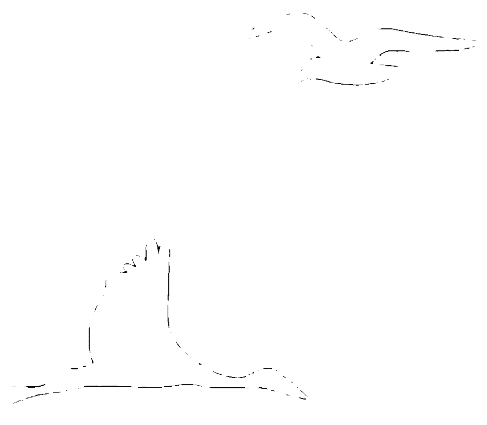
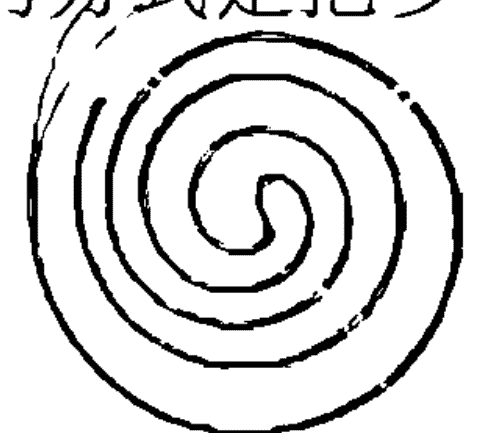
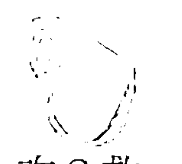
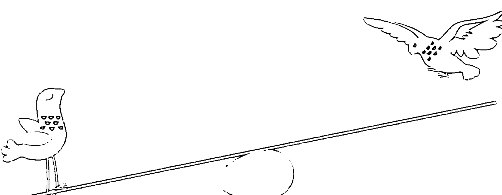
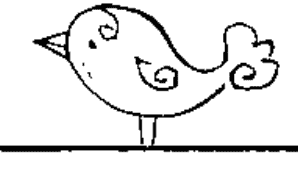
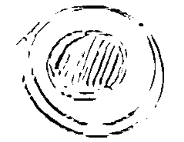
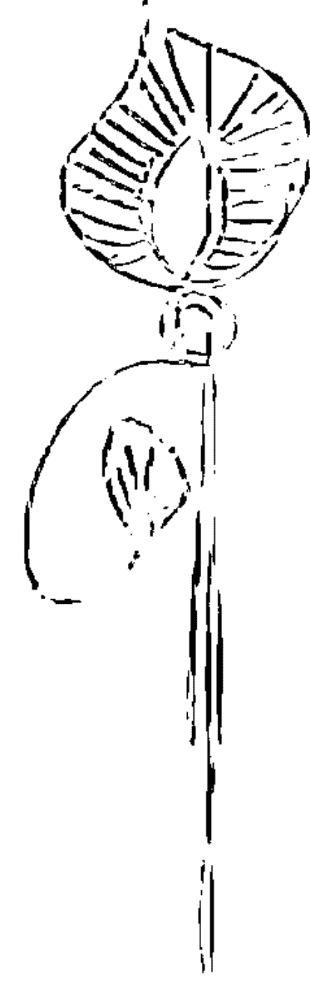

# 业力心理学

一本被譽為因果法則的經典之作，教你如何透過正確的思維和行動，吸引美好的事物進入你的生活。

你相信有心想事成的法則嗎？過去的經驗一直影響著你的現在，但未來的命運掌握在你手中。這本書將帶你探索因果法則的奧秘，教你如何運用吸引力法則，創造你想要的人生。

# 關於作者

## 瓊・奧利弗・鄧肯
(Joan Duncan Oliver)

是屢獲多項殊榮的記者和作家，已出版了包括《快樂》（Happiness）以及最近出版的新書《善良的意義》（The Meaning of Nice）等六部著作。

她還是《佛教評論》的總編輯、《新時代》期刊的主編、《人物》《我們》《悅己》雜誌的創刊組編以及《紐約時報》的編輯。她的文章常見於《時代週刊》《奧普拉》以及《驚嘆》等刊物。

# 關於本書

當我們掌握了因果業報運作的原理和基本法則時，就能發現生命中的每一個經歷，都與我們的行為所積累的業力密切相關。

本書中的“我”是作者虛構的探尋者，他向一位世法練達的智者提出20個經常令人們感到困惑的道德倫理問題。在圍繞這些問題所展開的對話和探討中，智者揭示了令人折服的答案，使我們得以明白因果業報的運作原理究竟為何，及它是怎樣影響人的命運，又該如何把業力法則運用到日常生活中去的實用方法和技巧，從而使每個人都能夠擺脫輪迴世界的煩惱，更加圓滿地處理生命中的人和事。

# 序言
*Introduction*

眾多流行歌手、搖滾樂手和饒舌天王，從約翰・列儂、XTC 到勞埃德・班克斯 (Lloyd Banks) 和艾麗西亞・凱斯 (Alicia Keys)，都曾在自己的歌曲中唱過因果業報這個主題。「難道是我上輩子造的孽嗎？」沃倫・馮澤在他的歌《孽緣》(Bad Karma) 中如是沉思。「業報無法逃脫！」黑眼豆豆也發出了這樣的慨嘆。就連電視臺也曾在黃金時段播出過關於因果業報這一主題的節目。在某部情景喜劇裡，男主人公準備為自己曾經做過的一切壞事贖罪，他肯定地說「有些事情說出來會讓你醒悟過來，並且覺得自己是個好人。」確實是這樣。

因果業力如何影響我們的文化觀念，佛陀對此曾經有過一些闡述，卻幾乎沒有任何闡明「因果業力究竟是什麼」的相關教義。即便對於那些深諳佛教教義精髓的人來說，因果業力在日常生活中的運作方式也是極其難以捉摸的。佛陀稱因果業報為「四不可思議」①之一，並且指出如果我們妄圖推測任何一種「不可思議」，結果很可能會令自己狂惑、心智錯亂。

那麼，業力到底是什麼呢？它指的並不是命運，不是贈予你停車位的人，也不是宇宙對你的善舉之獎賞。業力是運行在我們的行為及其造成的結果中的因果法則。雖然，業這個概念來源於古印度，但是，從基督教到威卡教②的所有宗教教義，都會用不同的方式來詮釋「種瓜得瓜，種豆得豆」這句話。最終，業超越了宗教，在哲學的範疇裡得以長久留存下來。每個人都或多或少都能感覺到業力的存在：不管是摩托騎士還是白髮老婆婆，都會無意間在談話中用到「業報」這個詞語。當城裡某個長舌婦人也嚐到被人嚼舌頭的滋味時，我們往往會這樣心照不宣地小聲嘟囔上一句：「罪有應得。」

但是，業力並不是宇宙在指示你該做什麼或不該做什麼，它不是用來宣判行為的正與邪的，而是將全人類維繫在一起的「粘合劑」。有人聲稱，對於隱世的隱士來說，因果業報似乎與他們的世界無關。然而，如果不會被人發現，誰不會偷偷做一些自私自利的事兒甚或是違背常理的事兒呢。人獨自在家裡時，會自我安慰說我們並不受因果業報所操控。乍看之下，因果業力在社會團體中所起的作用會變得較為明顯。而當我們意識到自己的動機和行為無時無刻不處於審視之下——無論是被我們的朋友，我們的上司還是被內心的評判標準審視——世界就會突然充滿了道德層面的選擇。猶太法典上寫道，「當一個人面臨上帝的最終審判時，他被質詢的第一個問題不是『你是否信奉上帝？』或者『你是否禱告和舉行拜祭儀式？』，而是『你對待同伴的行為是否坦然且忠誠？』」

罪惡與救贖並不只是存在於西方世界的觀點中，這種正直的人生觀在東方世界裡同樣存在。對印度教徒而言，業報和責任是彼此相關聯的，也就是說，他們認為一個人盡了他的義務也就意味著完成了此生的使命。但是，即使在哲學和宗教的嚴格準則裡，也仍然存在著足夠的回旋空間。這種空間叫做自由抉擇。再嚴格的道德準則都必須面對選擇。

我們在這裡要說的，就是關於這些選擇的事情。生活在這樣一個多文化、多維度、並且越來越複雜的世界上，我們如何才能夠做到和自己以及世界和諧共處呢？我們如何判斷什麼是正確的，什麼是公平的，從而相應地端正自身的行為？當今世界，全球各種環境因素都處在動盪不安和糟糕的狀況下，我們又該如何塑造自己以及我們的子孫後代，使之成為正直的、擁有智慧與慈悲之心的人，而不是讓地球毀在我們手裡？

聽起來這個要求有點不切實際。但是，如果我們看得更仔細和深入，就會發現這些問題和挑戰並不僅限於我們這個時代，人們對此探求由來已久。作為生存在 21 世紀的公民，我們擁有人類積累了上千年的經驗——不管是成功的抑或是失敗的，都足資借鑑，從而為創造人類的今天、明天和後世子孫——甚至是好幾輩人的幸福，作出正確的判斷和抉擇。

傳統地說，輪迴轉世是支撐因果業報的核心基礎。它提出這樣一個觀點：這輩子很可能既不是你的第一世，也不是最後一世，但不管怎樣，都要求我們必須做出高瞻遠矚的個體行為，必須對自我行為所造成的一切後果負責任。何況，即使是不相信輪迴的人，也承認「善待他人」是能帶來福報的。

這本書包含了一位探尋者與一個世法練達的智者之間，所展開的關於業報的二十個充滿智慧的對話。

這些對話雖然是虛構的，但當中涉及到的某些問題和討論，有可能就是你我曾經感到疑惑並思考過的，它們或許會讓你得到對自我與人生的進一步的認識，甚至是你比較滿意的答案，而這也正是我們寫作本書的的意圖所在。我們在這些篇章中想要努力解決的問題是：每個人都經常面臨到的道德抉擇——也就是日常道德。即使對於最為循規蹈矩的人來說，生活中也充滿了會讓他重新思索自己為人處事的方式是否得當的疑惑。你的個人經驗也許與這本書中提到的事例有所不同，但我們希望書中的這些議題和事例，能夠引發大家的共鳴和深思。

學習過東方哲學的學生也許會發現，書中關於如何獲取並積存善因善果的方式，與他們所學的知識存在矛盾。儘管善報明顯強於惡報，但是靈性練習的最終目的始終是停止業報。佛教徒認為，我們每天都被困在因果報應的輪迴世界中，如果能從因果業報之中解脫，就意味著擺脫了輪迴世界，也擺脫了焦慮和妄念。

不過，就目前而言，對我們來說更重要的是：人要學會克己自製，要有同情心，加深人與人之間的理解，以能夠創造正面業力的方式端正自身行為，避免做出形成負面業力的事情。然而，人非聖賢，孰能無過？不過，在掌握了一些業力運作的概念後，就像佛教導師雷金納德・雷所闡述的那樣，我們就能看到「我們的生活並不是一系列隨機的，無意義的，互不相干的事所組成的」，「我們做的任何事情都會以這樣或那樣的方式顯現出其意義」，他指出，「因此，別再虛耗你的時間和生命」。

①「四不可思議」，即眾生不可思議、世界不可思議、龍國不可思議、佛國境界不可思議，因果業報屬於世界不可思議。

② 威卡教是一種在英國和美國盛行的、新興的、多神論的、以巫術為基礎的宗教。威卡這個詞來於 Witchcraft（巫術）的縮寫。

# Chapter 1

## WHAT IS KARMA?
How to live with the law of cause-and-effect

## 業為何物？
日常該如何運用因果法則

業這個概念源自古老的東方，然而在所有的文化裡，幾乎都能找到有關「種瓜得瓜，種豆得豆」這句象徵著因果法則的俗語的詮釋。那麼，業究竟起源於何處？業這個詞語的真正含義是什麼？

# 「對話 1」 傳統智慧論

> 人們習慣於把業理解成一個包羅萬象的術語，它的意義涵蓋了運氣、命運和宇宙的準則。但是，業的真正含義是什麼呢？

業 (Karma) 這個詞來源於梵文，意為「行為」。在今天，業通常指的是行為及其帶來的結果。很多人把業等同於牛頓第三定律——「對於每一道作用力，都有一道大小相等、方向相反的反作用力」，就好像它在心理學範疇和道德範疇當中也同樣適用。業指的不是運氣，也不是命運——運氣所展現出的更多是隨緣性；而命運則含有無法掌控的意味。業也並不是神試圖讓我們遵守規矩安於本分的指令。業是對道德規則運行方式的描述，並不是教你怎麼樣做個好人的準則。《東方哲學與宗教百科全書》告訴我們：「業可以刺激現狀，卻不回應現狀。」

業可以說是東方哲學理念的基礎原理，你可以在印度教、佛教、耆那教、和錫克教經典中看到它的身影。它最初被發現於《吠陀經》和《奧義書》中，這兩部古印度教經典著作，記載了業報與善行之間的關係。之後，佛陀將這些教義做了進一步的細化，重點強調了有意識的行為及其責任：我們即我們作出的選擇。雖然，業這個概念起源於東方，然因果關係這個理論卻是眾人皆知的。想一想《新約全書・加拉太書・6》中那個眾所周知的段落：

> 人種下的是什麼，收穫的就是什麼。順著私欲撒種的，必從私欲收穫敗壞；順著聖靈撒種的，必從聖靈收穫永生。

這和佛陀所言的：「無論我做什麼，是善是惡，我自受業報……」有異曲同工之處。

> 可是，壞事也同樣會發生在好人身上。難道說，好人也要受到懲罰嗎？

業力因果法則告訴我們，萬事沒有所謂的偶然。我們也並不是造成自身遭遇的唯一原因：結果往往是由諸多其他因素共同造成的。但是，當本不應該發生的事情發生了，人們就會很自然地想要問個為什麼。在這裡，業給大家提供了一種解釋。輪迴二字可以將很多難以想像、難以理解的事情合理化。根據輪迴轉世之說，靈魂或者意識的進化演變，經歷了許多個輪迴，我們所攜帶的業，即是來自於前世的思想、語言和行為的積累。在轉世之時，未被「清償」的業，會被轉入下一個輪迴。《薄伽梵歌》中說到：「人在彌留之時，意識中存著什麼樣的情景，在下一世便必會到達那樣的境況。」今日的受害者，可能只是在償還他昨日的惡業罷了。

> 我並不相信輪迴轉世這套說法：人出生時攜帶的業已經決定了人的命運——這也太過絕對了。

恰恰相反。自由意志是業不可或缺的一部分。如果失去自由意志，改變則根本無從談起。印度教教義闡述了業的三種類型。其中只有定業 (Prarabdha Karma)①是無法改變的，即我們前世積累下來的業，一部分會在今世顯現，它決定了我們出生時的環境以及我們的遺傳基因。前世積累下來的業的其它部分，也就是未定業 (Samchita Karma)，則體現在我們的習慣和愛好當中。這種業可以在一定程度上通過人的努力而得到改變。同樣可以改變的還有當下業 (Agami Karma，也譯作「在造業」)，即我們當下正在造作，會在未來形成的業。人如何與業共處，決定了人們各種迥異的性格。

上座部②佛教尊者馬哈希禪師 (Theravada Buddhist Theacher Mahasi Sayadaw) 對此是這樣闡述的：

① 定業 (Prarabdha Karma)：不同瑜伽、佛學中翻譯的方式有別，也有翻譯為「累世業」的，累世決定人的性別、身體、血型等不能改變因素的業。

② 上座部，印度部派佛教之兩大根本部派之一。又譯作聖上座部或長老說。上座部忠實地遵守佛教傳統，並以保守的長老們為代表，因此又稱為長老部。

> 人有自由去創造全新的業，新的業如不引領人們得到昇華，便會促使人走向毀滅。

> 惡業可能會糾纏我們很多年甚至數個輪迴，那麼，我們的目標是否就是避免造惡業？

人是無法避免造業的。每一個行動都會帶來相對應的一個結果。但是，我們可以儘量避免做出造成危害的行為，端正自身，用能夠產生正面業力或是能將惡業轉化為善業的方式行事。根據經典教義所言，我們最終的目的並不是不斷積累善業，而是化解一切業報的束縛。據說，已得道的聖人之所以能夠生生世世處於喜樂和寧靜中，就是因為他們從困惑、恐懼和貪欲中解脫出來了。正是這些困惑、恐懼和貪欲，促使人們盲目地追求，日復一日，永不滿足。

> 研究過東方哲學的人可能對此觀點比較容易產生共鳴，像我們這些沒有接觸過東方哲學的人，又應該怎樣理解這個觀點呢？

每一種宗教和哲學體系，都有一定形式的道德準則為其支撐，同時有一套行為標準或規則需要遵守。根據信仰的不同，「正確的行為」可能意味著要遵守代代相傳的神聖戒令，或者遵守其他不同的宗教或世俗所教導的原則。佛教是一門無神論的哲學；佛教信徒所遵循的是以不傷害為原則的戒律，是以佛陀在偉大的覺醒時刻所直接領悟到的智慧為基礎的。而基督教、猶太教和伊斯蘭教，它們所謂正確的的行為則帶有更明顯的道德特徵：凡是違背上帝旨意的行為即是罪孽。罪行，是和能夠產生負面作用的業力相似的行為。做了錯事，就會導致負面的結果。

亞伯拉罕諸教①堅信，上帝的慈悲能夠在當下或者未來消除掉人類的罪行。但是，對於佛教徒而言，獎與罰都不是由某種神力來操縱的，最終審判日和上帝的寬恕並不存在，只有業這股力量始終在起著不可阻擋的作用。因此，佛陀這樣教誨他的信徒：「勤勉修行，自我救贖。」自己造的業只能通過自身的努力將其化解。

① 亞伯拉罕諸教（或亞伯拉罕宗教、沙漠一神諸教、神啟宗教），指信仰亞伯拉罕為始祖的三個世界性宗教：猶太教、基督教、伊斯蘭教（由出現時間排列）。

> 當人們說起「我感情上的業力不太好」，他們指的似乎並不是什麼罪行。業在這裡指的是什麼含義呢？

對有些人來說，業是一種心理負擔，是出於對親密關係的一種恐懼，這種心態是他們需要解決的問題；而還有些人認為業屬於倫理問題。在這種情況下，什麼事可能發揮最大的好處，或者造成最小的傷害？這裡的重點體現在意圖上：你的行為是否出於謙遜、同情、智慧這些高尚的動機，還是出自目光短淺、自私自利的陰暗動機呢？業就像一個預警系統，時刻有效地運行著。

> 你播下的種子，
決定了你收到相應的果實；
作善的人收到善，
作惡的人收到惡……

——《雜阿含經》

「業聽起來就像是指引我們該如何正確生活的導師。」

的確是這樣。業展現的方式是多種多樣的。比方說，美國的土著部落在做決策時，要為他們的「第七代子孫」①進行規劃，著眼於將來有可能給第七代子孫帶來的影響，也因此自然會考慮到同時期出生的其他所有人。業在維持著世界的平衡。

新異教徒和威卡教徒堅信「三重法則」（Threefold Law，也譯作「三倍報應律」、「三倍定律」），意思是不論人們做了好事還是壞事，都會以三倍的力量回報到人們身上。在神秘學者布拉瓦茨卡婭 (Helena Petrovna Blavatsky) 引入西方世界的神智論②中，業這個「一貫正確的懲戒法則」也佔據了十分重要的地位。同樣，在許多的「新時代」教義中，也能看到業作為重要的概念出現。

①「第七代子孫」，七代這一時限正好與美國某些部落地區的主要樹木的壽命相同。

② 神智論，來自希臘文「神」和「智慧」兩個詞。它的很多概念來自兩千多年以前源於畢達哥拉斯的神秘思想，通常是指探索人與宇宙或神之間關係的神秘哲學思想。

# SETTING YOUR DESTINY
## How to know when you have choices
## 規劃自己的命運藍圖
### 如何得知你何時有選擇權

業力因果法則是自相矛盾的。它說我們要對自身行為負責，卻不能掌控結果。這是怎麼回事呢？通過深入探尋責任和自由意志的微妙之處，從而得知，人的命運並非全部體現在生命中發生了什麼事，而是更加體現在人處理事情的方式上。

## § 對話 2 § 責 任

> 我經常在這兩個想法中搖擺不定：一方面我相信我們的現實狀況是由自己造成的，另一方面我又認為一定存在某些外部力量在推波助瀾。人對自己的處境要負多大的責任？在生活中，究竟有多少事是真正處在我們的掌控之中的？

這是個很深廣的問題：是誰在決定命運？如果我們相信有一股強大的力量，或者上帝，或者神力，抑或自然法則，在決定著人生的每一步走向，我們將會時刻受著某種宇宙公正系統的管束：如果我們做好人，我們的人生就會很美滿；如果我們不老實，就會有不好的事情發生。但是，經驗告訴我們，事情並不是這樣的。好人也會倒霉，反之，壞人也會走運。

> 正是我過往的一切所帶來的業，決定了我未來人生的走向。業就是這樣起作用的嗎？

業並非如此宿命。業力因果法則只是簡單地說明了每個行為都會產生一個對應的結果。過去所發生的事情將我們帶到了此刻的境遇當中。但這並不是說，從此刻開始會發生什麼就已經是注定的事情。我們可以進行選擇。自由意志，這就是產生變化的地方。作為創作我們自身經歷的作者，我們擁有許多自由。在這個程度上，每個人對於自己的人生劇情都負有責任，都在創造屬於自己的天堂或地獄。我們的選擇正影響著日常生活的進程。但是，弄清楚責任和掌控的區別很重要。我們要對自己的反應，也就是我們對自己說什麼做什麼要全權負責。除此之外，我們無法掌控結果。我們可以將某種結果設定為目標，但是，我們無法確保它一定能夠實現。因為，每個境遇當中，都有不計其數的因素和力量在起作用，其中有很多因素是我們甚至根本意識不到的。

> 我能影響自己的私人生活，這點我能明白。但你是否認為，那些重大的，非個人的事件的發生，比如說戰爭、天氣以及自然災害，也屬於我們的責任呢？

當然不是。人們甚至不能準確無誤地「預報」天氣，更不要說怎麼掌控天氣了。不過，這並不意味著我們應該以此為藉口對任何狀況推卸責任。比方說，你是否以投票的形式表達了你對戰爭的立場？有人認為，人類是導致自然災害發生的一份子：作為消費者，每個人都加劇了全球變暖現象，這也正是導致災害性洪水爆發的氣候演變因素之一。你能對自己的選擇負責任嗎？如果你購買了一棟位於洪澇地區或者處在斷層線上方的房子，你做好準備迎接結果了嗎？

> 「你的意思是說，麻煩是我們自找的嗎？」

也不完全是這樣。比如，並非所有人都擁有選擇權。特別是窮人，他們經常會受困於環境。他們並不具備選擇安全地區居住，或者逃離自然災害的權力。

> 「業在這類事情上的作用體現在哪里呢？在 2004 年海嘯過後，我曾經問過一位朋友，當她得知有那麼多人從此一無所有之後，她是怎樣承受那種巨大痛苦的？結果她說：「我只要記住這些都是他們造的業就好了。」她的回答似乎特別冷漠無情，業是這樣起作用的嗎？」

面對人類的諸多悲劇時，大多數人都會產生悲傷和同情的感受。正是這種感同身受，促使人們伸出援手。不幸的是，像你朋友的這種宿命論觀點，經常被當作某種合理化的藉口，用來解釋不發起任何行動去幫助那些受難者的行為。他們經常會說出諸如此類的藉口：「我們不應該插手相助，因為這是這些人要學習的靈修課程。」他們的意思是說，這是需要解決的個人問題或者他們需要償還的業債。由此得出的推論甚至更加充滿怨恨：「這是他們自找的，這就是自作自受！」

而在你嚴厲評判你的朋友之前，你要考慮到一個可能性，就是她的言語後面隱藏著某種更深層次的東西——也許是恐懼，或是某種無助感。她說的話聽起來的確無情，但是「責怪受害者本身」是某些人處理強烈的感情衝擊的唯一方式。

> 所以，我不應該對我朋友的回答進行反駁嗎？

如果你想說，就不妨開誠佈公地說出來。你的朋友很可能根本沒有意識到她的話聽起來是多麼的沒有同情心。但是，儘量不要過於批判。反而，你要找一個合適的時機，和她說一說業力因果的真正含義，告訴她我們都有對他人負責的天性。一段坦誠並且充滿慈悲的對話，可以啟發你的朋友，讓她意識到這世界正在經歷的苦難。這樣做，也同樣能夠讓你的心懷敞開，擁抱她正在感受的痛苦。

> 對於何時應該伸出援手，何時又該袖手旁觀，我始終沒辦法分清。我們不是各有各的業嗎？

如果房子著火了，對於是否幫助人們尋找出口逃生，你根本不會產生任何猶豫。在緊急情況下，人往往根本無暇思索業的含義就會做出行動。其它時候，一般人都會三思而後行。無論何時，只要我介入了你某方面的生活，我就會影響你的業，也會影響我自身的業。比如說，你是一個金錢白痴，我給了你現金，幫助你脫離債務困境，清償了你的貸款。這是件好事兒。但是，我並沒有幫助你學習到如何進行財務管理並遠離債務。也許靠你自己的力量解決這個問題才是你真正需要的。所以，從這樣的權衡來看，我對你的財務幫助到底是幫了你還是害了你呢？我們也許無法馬上知道結果。業果往往在經年累月後——也許是數個輪迴之後才能顯現。因此，保持清醒自知，以及謹言慎行是我們的責任，不管我們決定做什麼。

> 有這麼多的力量在起作用，我們對於自己的身份和生活還有多少選擇餘地呢？

人的基因決定了人的外貌特徵，也影響著人的性格特點。如果相信轉世投胎之說，你還會擁有前世的累積經驗賦予你的天賦。但即使感覺上你彷彿處於前世今生的制約之下，你仍然時刻在做出選擇：支持或反對，這個或那個，是或否。每一個選擇都在重新塑造你，讓你變得更美好或者更糟糕。你的大腦和你的性格處於不斷的演變進化之中。業並不是線性地從過去穿越到未來的。佛陀將該演變的過程比喻為流水。泰國南傳佛教林居派的僧人坦尼沙羅·比丘①對此有過非常美妙的解讀：「有時來自過去的水流湍急，除鎮定之外可為不多，有時水流和緩，則可令它能夠朝任何方向改道而行。」

① 坦尼沙羅·比丘 (Thanissaro Bhikkhu)，1949 年出生，原名基傑佛瑞·德格拉夫，泰國佛教林居傳統的美國僧侶。

> 沒有壹片雪花會在雪崩時候有負罪感。
——伏爾泰 (1694-1778)

我經常有種受制於環境的感覺。為了保住我的工作，我要迎合老闆的種種期望。此外還有家庭的各種需求要去滿足。雖然一直在練習冥想，我仍然會時不時地發脾氣。甚至連我的銀行存款都來支配我該怎麼生活。如此說來，自由究竟在哪裡？

自由意志只是意味著選擇，它不會使你能夠掌控境遇。比如說，你無法預見你的鄰居會開車碾過你前院的草坪，或者你的姪子會背著行囊突然出現在你家門口。你甚至不能夠全然控制你的內在體驗：你的思想和你的情緒隨時都會不請自來。

再說一次，你的選擇處於你的反應當中。你可以揮著拆輪胎用的棒子去找你的鄰居算賬，也可以邀請他過來幫你把草坪重新鋪好；你的姪子不請自來的時候，你可以悶悶不樂，也可以驅車陪他前往最近的青年旅社中，幫他安頓下來。

> 你的意思是說，最終我的命運還是由我自己負責？

你要對自己的生活克盡職守，要為自己做出的決定及其所需的行動負責；要從錯誤中汲取教訓，為自身舉止負責；要為照顧好你自己和那些依靠你的人負責。

> 事情不會總是在你的希望或者計劃之中，但如果你能抓住各種機會，行事正直公平，對他人保持友善，就會享受到一個充實富足，沒有遺憾的人生。

# Chapter 3

## MAKING THE RIGHT DECISIONS
How your motives shape your life

## 做出正確的決定
動機如何塑造你的人生

> 『種瓜得瓜，種豆得豆』。為人生播下種子的就是人的動機。如果我們的動機端正美好，那麼業的果實則會營養豐富。如果我們種下的是漫不經心，表裡不一，或者心懷惡念，那麼收穫的果實很可能就會是悲傷和失望了。快樂的程度，取決於人做出的選擇。

YES ○ NO ○

## 「對話 3」動機

> 對於業是如何運作的，我仍然感到很困惑。如果說，我做事的出發點並無惡意，或者說我並不知道我正在做的是不對的事，這會對業的運作產生影響嗎？

根據佛教典籍的記載，業產生於有意的言語和行為，即我們做出的那些有意識的選擇。我們不可能對那些無意識，或並非故意為之的行為負責任。比如說，你的心跳。心跳不會產生業，但是，如果由於你一直不注意自己的健康從而導致心臟病突發就有可能產生業。無知也一樣，如果不依照法律的觀點，只從業的角度講，無知可能會幫助我們從業力困境中解脫出來。每個人都會犯錯，用來約束那種偶然發生，且非故意為之的失誤的行為準則，並不能為世界的發展起到多少促進作用。各種各樣的想法，會不請自來地出現在我們的頭腦中，想法在頭腦當中無法自行產生業。但是，我們如何引導自己的想法，把它們指向何方，則造就了我們的人生。

> 怎麼解釋那句古老的諺語「好心辦壞事」呢？這句話似乎表明，動機的好壞並不重要，重要的是結果如何。

如果業是有絕對性的，我們就不會多考慮動機這個問題了。因為，不管是做好事還是做壞事，都會得到相應的回報。可是業並非如此運作。業是非線性的，它並不會像一片農田一樣按照時間表的計劃收割果實。我們沒辦法說：「如果我今天做了 X，那麼明天我就會得到 Y 的結果。」

湯瑪斯·斯特爾那斯·艾略特①在他的詩集《四重奏》中的《燃燒的諾頓》中，以非常優美的筆觸指出：「從業的角度來說，我們同時生活在三個時間區域之中——即過去、當下和未來。」雖然，我們總是忍不住將過去的事情，即便是那些可能會發生但實際上並沒有發生的事情的印記帶到當下來，但是我們仍然對從現在開始即將發生的事情擁有選擇權。換句話說，很大程度上，我們就是在創造未來，這就是為什麼動機如此重要的緣由。我們無法對生活會如何演變言之鑿鑿，但如果我們的動機誠懇，還是能夠爭取到幸福快樂的結局的。

> 只承諾你能做到的。做到多於你承諾的。
——無名氏

> 有時候我認為我做的事情是正確的，但結果卻並不盡如人意，這又如何解釋呢？

① 湯瑪斯·斯特爾那斯·艾略特 (T.S. Eliot)，英國著名詩人、評論家、劇作家，曾獲諾貝爾文學獎。

對此，泰國小乘佛教林居教派的僧人沙羅·比丘，曾經做過如下論述：

> 並非所有善意都帶來好的結果。即便出發點是好的，善意也可能變成不明智且不合時宜，從而帶來痛苦和遺憾。

「這會不會就是我朋友所遭遇的呢？她瞞著家人，決定獨自接受一段冗長且非常耗費元氣的藥物治療。當她的家人發現實情時，他們極為憤怒。她的父親很難過，甚至拒絕和她講話。而她姐姐夾在中間左右為難。我的朋友在如此重要的時刻卻失去了家人的支持。」

這個例子很好地說明：當我們心懷善意但方法欠妥時，會導致什麼樣的結果。我們想讓別人省心的時候，卻可能想不到他們會怎樣理解我們的做法。如果我們不注意視不同情況採取妥當的處事機制，就算是一個小小的決定，也可能會產生地震般的強大效應。

沙羅·比丘說：「動機會令我們脫離軌道的另一種情況是，我們沒有意識到，好的動機中往往也會摻雜雜念。」比如說，你祖母去世了，以往你對她一向體貼入微、關懷備至，然而你卻發現，她的遺囑裡竟然幾乎對你隻字不提，這讓你十分震驚。如果仔細審視你的動機，你可能會發現，儘管你當之無愧是一個盡心盡孝的孫女，但你還是在乎遺產問題的。

> 我們不是經常會有目的混雜的時候嗎？實際上，我和我的祖母關係很親密，但有時候當她的需求擾亂了我自己的計劃時，我也會感覺不爽。比如說，週末為了幫她安裝紗窗，我不得不取消掉我的出遊計劃。從業的角度講，這會對我產生什麼樣的影響呢？

這個只有時間才能夠得出結論。這就是為什麼我們要盡善盡美地生活，要充分意識到，無論何時、何種行動，都會引發相應後果。業發揮的一個作用就像一道警示標誌一樣。如果我們不想看到不希望的事情發生，那還是多想想我們的言行可能會帶來的結果吧。

> 信守承諾這種事會變得非常重要了？

當然了，承諾和信任是相輔相成的。承諾是人際關係的基礎。我們信任他人不會傷害我們，並且相信他們能夠言行一致。如果我們無法信任別人，人生將會變成人間地獄，人會變得疑神疑鬼，總是在做最壞的打算，永遠沒有安全感，生活自然會變得苦不堪言。就像打張欠條能表明我們有還清債務的意願，許下承諾也意味著我們願意言出必行，不論這個許諾是關於保守秘密，還是完成交易，或者是和朋友共進晚餐。

## 要是我沒有遵守承諾呢？

不遵守承諾必然會招致一些後果。因為，你已經用你的行為宣稱，你是一個不值得信賴的人。沒有人會再相信你，這意味著你會錯失親密關係，並與重要的資訊擦肩而過。人們會做出假定，認為你以後也不會再信守諾言，這會影響你的人際關係，甚至讓你無法維持生計。你的老闆和同事會質疑你的可靠程度，不再確定他們是否可以委任於你，也不知道是否能放心交托你去完成一筆生意。

> 如果情況有變怎麼辦？還是一定要遵守承諾嗎？我曾經許諾過我父親，永遠不會送他到養老院去，但是因為他患了阿爾茨海默氏症，並且已經發展到了晚期，唯一能妥善護理他的地方就是養老院這樣的特殊場所了。

即便對於專業醫護人員來說，阿爾茨海默氏症都是非常棘手的病症。為你的父親尋找一個能夠給予他最佳照顧的地方，這種行為是值得稱讚的。如果此行為的本意是出於愛，你就沒有什麼好擔憂的。但如果你就是因為受不了他病後的行為舉止而想把他扔在養老院，你很可能會在某一時刻嘗到自私自利釀出的苦果，哪怕你只是嘗到令他失望而感到的羞愧。

正如你所言，例外情況總是會存在的。但在一般情況下，信守承諾是最好的做法。信守承諾會讓人們覺得和你在一起有安全感，他們知道你可以依靠。這相當於在往業的銀行戶頭裡儲存黃金。

> 如果我的動機無可非議，並且也採取了正確的行動，但還是會得到不好的結果呢？這到底是怎麼回事？

我們無法預料到業會在何時以何種方式回報在我們身上。對此，你知道我是怎麼評論的嗎？當下的一個負面結果很可能來自過去某一次不甚明智的決定。比方說，你在為重新修繕流浪者收容所籌集資金，去見了一個資助人。你要做的是一件善舉，出資人也很富有同情心，一切都順利。但她還是讓你失望了。你怎麼也想不通這是為什麼。然後，你回想起在你叛逆的青少年時期，你曾經和幾個朋友往這個出資人的草坪上扔過鞭炮，燒焦了人家的灌木叢，嚇壞了人家養的臘腸狗。你走運得很，恰巧她記憶力也不賴。但是，你其實還有機會。只不過你要加倍努力地去籌集善款才行，而這不過是業提供給你的，讓你彌補過失的機會罷了。

伊斯蘭學者賽義德·侯賽因·納斯爾①說：「快樂就是一個人的業與他的達摩合一。」他的達摩，就是指他的路途。業帶給我們需要汲取的教訓，讓我們有機會理清生活的頭緒。它要求我們重新擺正我們的動機，並且做出竭盡所能的最好的行動。

① 賽義德·侯賽因·納斯爾 (Seyyed Hossein Nasr)，穆罕默德後裔，什葉派穆斯林。現任美國喬治·華盛頓大學教授，主講伊斯蘭教學術與文化研究，是當今世界伊斯蘭教學界最負盛名的學者、比較宗教學家和哲學家。

# Chapter 4

## DISCOVERING THE TRUE YOU
How to make the most of who you are

## 發現真正的自我
如何充分展現自我

你準備好從你的過往破繭而出了嗎？反思自我是獲得內心自由的關鍵所在——你要找出那些讓你固步自封、自欺欺人的陋習。隨著自我認知而來的，是形成全新的應對能力以及真正地和世界連結的能力。

## 「 對話 4 」 自我覺察

> 近段時間，只要我想開始嘗試新東西時，不論是一個新計劃或是一段新友誼，事情總不能按照我希望或者計劃的那樣去發展。我採取了所有正確的行動，但成功仍然像水中撈月般遙不可及。有人說，問題可能是出在某些我看不到的事情上。例如說，我在潛意識裡總是假設我會失敗。也許確實是這樣。但我還是不明白，自我覺察能對事情起到什麼幫助？我只不過是希望我的生活能繼續下去而已。對此，你有什麼建議嗎？

不幸的是，對於我們不願意去想的事情，不能夠只是置之不理，僥倖它會自動消失。嘗試去瞭解自身總是有好處的。當我們已經用盡了所有的藉口：歸咎於他人，怪自己運氣不佳，或是怪歸罪於某些行星的移動，還是無法解釋生活怎麼總是那麼磕磕絆絆。那麼，答案很可能就藏在自己身上。十有八九，是我們的恐懼、懷疑或態度——那些從過去帶來的負面因素——在阻攔著我們實現預期的目標。

> 「我難道就不能將過去拋諸腦後，重頭開始嗎？」

不幸的是，「美麗心靈的永恆陽光」①只存在於電影當中。即使能無視過去，我也懷疑這是否真的能令你獲得快樂。因為，過去是儲存你以往所有經驗的地方——那裡有你的歡樂與喜悅，你的勝利與成就，還有你的失望與沮喪。

沒有你的過去，你就不能稱之為你。你說你想把過去都拋諸腦後，你的意思其實是想從過去的不愉快記憶中解脫出來對吧？

> 「我的意思是，每當回憶過去總是會想起那些令自己懊悔不已的事情。每一次我質問自己「為什麼我當初要這樣做？」或「為什麼我之前不會那樣做？」，那種情形就如同業在懲罰我的罪惡一樣。」

每個人都有讓自己覺得遺憾的事。每個人都說過一些或做過一些無法引以為傲的事，都有未達成目標的失敗經驗。但是，對那些事情念念不忘並以此沒完沒了地折磨自己是於事無補的。業並不是宇宙給出的績評單，會在那裡寫著：「真糟糕，你沒有通過該項測試。」業只是一條線索，它指引你到你該去的地方，指引你開始進行一些自我反省。

業講求的是：

①「美麗心靈的永恆陽光」，即金凱瑞主演的電影《Eternal Sunshine of the Spotless Mind》，一個將記憶清除以忘記過去的痛苦的故事。

> 反思你的經歷，能讓你發現自己對這個世界的習慣性反應。

在這個過程中，你需要弄明白的是，究竟是什麼一直阻礙著你表達出真實的自我。

> 如果自我反省的話，我只會感到自信不足。也許不論現在發生了什麼事，都只是我的業罷了，而我能做到的，也只是去接受它。

關於業常常存在一種誤解，有人認為業會將我們定格在過去發生的實相中使之無法逃脫。幸運的是事實並非如此。人的性格和個性是有可塑性的。人可以改變，而且也一直在改變。事實上，我們對於這個世界的內心體驗始終在不斷變化。這就是為什麼抱持怎樣的想法才是最關鍵的。

如果總是固守著舊有的思維模式，我們就會對事情一再作出相同的反應，相同的事情就會持續地發生在我們身上。所以，走向覺醒的第一步，是承認你想要一些不同的東西了。

> 事情目前並沒有朝我預期的方向發展，所以，我認為我的人生需要進行一次大的修整了。

其實，這並不是有沒有必要修整你的人生的問題——雖然隨著自我意識的逐漸發展，你的生活必定有很多方面會發生改變。但問題的核心是要去認識自我。我們自身已經擁有非常豐富的資源。事實上，我們已經擁有了成長和發展所需要的一切了。人類的進化過程已經證實了這一點。而挖掘內在智慧的方式，就是保持清醒的自我覺察。

> 「自我覺察這個理念是很好，但是我哪里擠得出時間來做這種事情？我整天都奔波於家庭、工作和社會的各種瑣事之中，就連 20 分鐘的瑜伽我都擠不出時間來練習。」

訓練洞察力並不是在已經排得滿滿的時間表裡拼命再擠進去一項任務。自我覺察是一種關注焦點的轉移，是採用一種全新的方式來觀察自己。如果你想要衝破業對自我的束縛，認清自我是當務之急。

> 「這聽上去似乎有點過於自我了——似乎在沉迷於研究「自我有多偉大」。」

並不是這樣。對自我的認知是地球上最古老的一種探索。人類在發現了火種時可能已經開始捫心自問了：

> 我是誰？我為何在此？我該怎樣生存？

這並不是只有智者才會反覆思索的問題。這些問題會促使你仔細觀察你對自己的定位。你是否成為了那種自我欣賞的人？你是否在為自己最在乎的事情而活著？人的性格和業是交織在一起的。

## 為什麼呢？

角色認同感會在你的生活中得到體現。比如說，你的身份是一位正在創辦一家合資企業的企業家，那麼，你的世界將會充斥著銀行、商業計劃和市場機遇之類的東西。這些東西反過來會促使你的野心和你對達成目標的焦慮迅速增長——這些特性將會被你灌輸到這家羽翼未豐的企業中去。漸漸地，你關注的焦點會變得狹隘，你遇見的每個人和每件事情都和你的目標相關。理想化的情況下，你接下來會停住腳步問自己：這真是我想要變成的那種人嗎？我做的事情和我的價值觀相一致嗎？

## 但誰會真的停下來進行這種反思呢？

事實上，自我反思是非常實用且必要的。你所珍視的希望和夢想是什麼？還有什麼能力你尚未發揮出來？你隱藏了什麼樣的秘密和惹人厭的小毛病？只有當你坦然面對這一切時，才能夠向著你渴望的充實而富足的生活邁進。

> 「所以，我要面對和接受我所有的「東西」——就算那些東西是我害怕看到的？」

尤其要特別關注那些令你害怕的事情。想要衝出業的迴圈，你必須要打破總是陷入不當行為的怪圈。你不能繼續說著做著同樣的事情還指望獲得更好的結果。當你看清了自己的行為模式，就可以重新建立新的應對機制。有許多技巧可以用來提高自我認知。其中大多數都涉及關注力的練習，即關照當下正在發生的事情：你的思想、情緒和身體的感覺。

> 人們在旅行時，驚嘆於山之高聳，海之浪湧，河之悠長，洋之遼闊，以及宇宙之浩瀚，卻忽視了對自身的探求。
——聖奧古斯丁

> 「我知道關注力可以加強我對當下的體驗，為什麼說它能夠幫助我放下過去呢？」

唯一能夠改變過去的是當下。不要把焦點放在你的人生的「故事」上——即那些事件本身，而更要關注你是如何詮釋和表現那些事件的，這樣你就能夠看到，這裡面是有固定的行為模式的。觀察那些一直貫穿在你生命中的種種假設，會讓你明白究竟為什麼事情常以某種特定的方式發生。你所產生的這些行為模式和習慣，正是業力提供給你的機會。不同於你的年齡、眼睛的顏色、家庭或者出身，行為模式與習慣是你有能力去改變的，同時，它們也會反過來改變你的人生。業來自於我們的選擇。當我們選擇不再做出和過去同樣的反應時，就擁有了創造不一樣的未來的可能性。

# Chapter 5

## LIVING PASSIONATELY
How to deal skillfully with your feelings

## 熱情地生活
巧妙處理情緒的方法

情緒賦予人生感性和豐富。如何管理情緒是一門藝術。一旦我們獲得了內在的平衡，就可以完全沉浸在人生的種種體驗當中，並且不用擔心過度反應。當我們充分瞭解自己的情緒，就能學會培養積極樂觀的情緒，同時化解消極不安的情緒。

## 對話 5 情緒

> 我的朋友常說我這個人太情緒化了。確實是這樣，我常常多愁善感，即便是他人的痛苦我也能感同身受。我不覺得這有什麼問題，敏感總比冷漠無情好吧，難道不是這樣嗎？

富有同情心是一個非常美好的品質。我們的世界正需要多一點同情心。你必須先做到觸動自己的情感，之後才能做到與他人的情感產生共鳴。但是，一旦你產生了過度激烈的情緒，很可能就無法控制結果了。我們都知道憤怒、妒嫉以及其他破壞性情緒的力量。但是，如果妄圖讓愛和愉悅變為永恆，反而可能因此帶來悲傷。所有的智慧典籍都強調了保持節制與適度的重要性，節制與適度是達到內心平衡的重要方法。

> 「內在平衡」聽起來好沉悶啊，難道不能在不阻礙我們的覺醒之路的前提下充滿熱情地生活嗎？

當然可以了。沒有人要求你必須清心寡欲。此外，即便你真的想要清心寡欲，也阻止不了感情的生起，因為它們是你性格中必不可少的一部分。

## 消极情绪也是吗？

关于这个问题存在一些意见分歧。比方说，佛教徒认为，人的本性里是不存在愤怒、嫉妒、恐惧和其他令人感到痛苦的情绪的。然而，西方的心理学则坚持认为，消极情绪是人类的固有天性，我们能做的就是学习如何有技巧地与之相处。佛教徒也不否认，想要完全摆脱消极情绪是个颇高的要求，只有那些最得道的修持者才能达到那个境界。达赖喇嘛承认他有时也会动气，不久以前我还听说，他笑称自己非常妒忌他的翻译的一口「漂亮的英语」。当然，他要比大多数人都更懂得如何调伏情绪，能够在愤怒和嫉妒刚刚浮现时就驱散它们。对于我们来说，识别和管理自己的情绪，不让它们反过来控制我们，这是一个值得追求的目标。

> 令人烦恼的并非那些发生在我们身上的事，而是我们对于这些事情的看法。
——埃皮克提图（西元前一世纪时的希腊斯多噶派哲学家、教师）

## 情绪的出现太快了。甚至在我意识到愤怒的发生之前，我就已经在发脾气了。我怎样才能够控制住它呢？

情绪似乎会毫无预兆地袭击我们。心理学家保罗·艾克曼①指出，「人只有陷入情緒當中才能意識到情緒的存在」。

> 沒有人一開始就能成為大師。

一旦某種情緒控制了我們，比如消極情緒控制了我們的時候——我們的理智和控制衝動的能力會迅速地下降。一些會讓我們追悔莫及的話語很容易脫口而出。因此，我們需要加強認知，瞭解情緒是如何出現的，這樣一來，我們就能夠在情緒形成的過程中識別出情緒的爆發點，在必要之時打斷情緒的生成。

## 人能夠壓抑住諸如憤怒或嫉妒這種痛苦的情緒嗎？

壓抑情緒是徒勞無用的。將任何揮發性的物質放置到高壓環境下，最後該物質必然會產生爆炸。瞭解負面情緒的最直接方法是事後的自我反思：你表達出這種情緒了嗎，還是練習如何去約束它？結果如何？你怎樣保證達到一個更好的結果？隨著對情緒的認知不斷細化，你下一步要做的就是在情緒出現時將它們抓住。然後，你就可以先權衡一下後果再作出行動。誠然，處在劇烈的情緒之中，人要保持深思熟慮是很困難的。但是如果你堅持這麼做，你會看到一些很有意思的事情發生。以憤怒為例，如果你能夠放下對事件本身的偏執，不僅會瞭解到是什麼東西激怒了你，而且還會發現憤怒本身也開始煙消雲散了。

① 保羅·艾克曼 (Paul Ekman)，生於 1934 年 2 月 15 日，美國心理學家，研究情緒和面部表情的先驅。

正如藏傳佛教僧人馬修·理查 (Matthieu Richard) 所言：「你越是仔細觀察憤怒，憤怒就消失得越快，如同冰霜消融于晨光之下。」

> 你是說，我得在我怒髮衝冠的時候，氣定神閒地坐下來打坐冥想嗎？我可不這麼想。我需要的是一個能夠隨時處理它的方法。

情緒早在我們發覺它們之前就已經存在於我們的體內了，你可以嘗試找出自己身上有緊張感的地方，然後將呼吸帶入那些緊張點，並試著讓它們鬆弛下來。當你的身體放鬆下來，情緒也會得到緩解。

另一個管理情緒的方法是用積極情緒替代消極情緒。因為你不可能同時有兩種相反的情緒。所以，如果你生氣了，就把注意力集中到愛上。如果你妒忌某個人，就想像一下他們獲得好運時的喜悅。此外，隨時記錄一些鼓舞人心，引人深思的名人語錄也很有用。

可以試試阿西西的聖方濟各 (Saint Francis of Assisi，也譯作阿西西的聖法蘭西斯) 的禱告詞：

> 主啊，讓我成為你平安的器皿：
在仇恨的地方，播種愛……
在紛爭的地方，播種和諧……
在悲傷的地方，播種喜樂……

在激動的時候，冥想會有助於恢復冷靜。你越是能夠與你的波動情緒怡然相處，就越能心如止水。

> 我能明白那些技巧是怎樣幫助我控制脾氣的，但如果發怒是有合理的理由呢？

所謂「合理的憤怒」是一個需要謹慎對待的問題。回想你最近一次對某人發脾氣的情況。發脾氣讓你們的關係更密切了嗎？憤怒時說的話或做的事可能會在你的心中迴盪數年經久不散，還可能給自己和身邊的人造成永久的傷害。

你必需具有高度的覺察能力才能巧妙地控制住憤怒，同時，我們不應該逃避，要審視自我的憤怒，並從憤怒中尋找出某些資訊。就像心理學家艾伯斯坦因 (Mark Epstein) 說的那樣：「憤怒表示某些事亟需改變。」

## 如何處理積極情緒呢？能夠表現積極情緒不是件好事嗎？

表現積極情緒是好的。神經學家發現，人在體驗某種情緒的時候，會在大腦中留下或者加強某些痕跡，從而使人更加容易再次獲得相同的感受。

愛、同情以及愉悅這些情緒，它們不僅會給自身帶來好處，還可以傳遞給他人。面對消極情緒時保持沉靜和慈愛，是保持和諧和培養積極心態的最有效方法。幾年前，有些日本的佛教僧人想在山上建一座可以俯瞰一個有著傳統的新英格蘭風格小鎮的寧靜寶塔。開始的時候，這一方案遭到當地居民的強烈反對。但令人吃驚的是，他們最後卻一致同意讓僧人修建寶塔。小鎮上的某個村民告訴一家報紙的記者，最後是方丈「對憤怒的承受力，使大家的最終想法得到改變」。其實我們也都可以做到像那個方丈一樣。

## 那麼，我怎樣才能始終保持慈愛和積極的心態呢？

你不能。而且如果試圖這樣，你會和自己真實的感覺分離開來，也會讓自己變得和他人格格不入。

> 感情會不斷變化，情緒來了又走。坦然接受這種變化，通往充實、富足及充滿熱情的生活之門將會向你打開。

# Chapter 6

## SHAPING YOUR REALITY
How to use your mind to change your karma

## 塑造你的實相
用意念改變你的命運

人們常說，『其思即其人』。人的思想創造了人的實相。思想是我們用來塑造個人身份的原材料，也是言行背後的驅動力量。幾乎每一個念頭都能夠產生業力，所以，保持正面的思想才是明智之舉。

## 對話 6 思 維

> 我逐漸能夠理解人的言行是如何產生業力了，但是，人的思想也會產生業力嗎？這點我不太相信。

人們通常相信，人的想法不會造成任何後果，但事實恰好相反。俗話說，「思想是行為之父」。思想正是驅動行為的能量來源。沒有思想，業力也就無從存在。

> 那些藏在我心底的想法呢——也就是我並沒有吐露出來或者付諸實踐的想法？它們肯定不會產生什麼害處啊。

不能那麼絕對。至少有一個人受到了它們的影響，這個人就是你自己，並且這些影響通常頗為深遠。況且內心的想法多數不會像自己希望的那麼純潔無暇。

> 請不要讓連自己都不會公開承認的念頭停留在你的內心。

美國第三任總統湯瑪斯·傑弗遜在給他的孫子的一封信中寫道：

> 「當你想要秘密地進行某件事情，首先要捫心自問，在公眾面前，你是否還會做出這件事：如果答案是否定的，那麼你就可以肯定地得出結論，這件事本身是錯誤的。」

將想法埋在心底就無關緊要了嗎？如果想檢驗這句話的真偽，你可以隨便挑一件你生活中近期發生的事件，然後我們來分析一下你當時的想法。

> 「前幾天的一個早上下著雨，我上班就要遲到了，所以打算坐計程車。但是，突然間有個男人衝到我的前面，搶先坐上去了。不用說，我當時感覺非常惱火，一直埋怨他。我承認我確實有詛咒他，但是他或者別的人，根本聽不到我在罵什麼。在我看來，此舉並未造成什麼傷害。」

你敢肯定嗎？聽聽你說的話吧。你說這個男人「搶了」你的計程車。你迅速下了這樣一個結論：他做了件幾乎是不可原諒的事情——那輛計程車是屬於你的。當你氣憤地站在那裡，應激反應激素已經衝垮了你的理智，讓你的大腦充滿了仇恨的想法。如果那時候你只是聳聳肩讓這事情過去，可能除了你自己以外，不會再有別人受到影響。但是，我猜你當時並不能立即把這個問題放下吧。

> 審判一個人之前，先穿上他的靴子繞月亮走兩圈。
——印第安土著諺語

是的。我在等待公共汽車的時候還不斷地在腦子裡反覆地回想這件事。公共汽車一直沒有來，我的想法又轉移到工作上：「看看那個男人對我做了什麼，現在我永遠到不了辦公室了。老闆會大發雷霆。我這下麻煩大了。沒准老闆還會把我開除了。」

一旦我們沒有立即停止消極的負面想法，就會接連產生其他想法，如此以來，到最後就像把一根火柴放到一堆柴火裡，熊熊怒火由此便被點燃。你在大雨中艱難行走，怒火中燒，不斷地回想剛剛發生的事情，越想越生氣。你的情緒一旦低落下來，你的想法就會無可避免地受到感染，就算是跟計程車事件本身無關的事情也會遭殃。有些想法勢必會發展成為真實的事件：也許你會為了某個婦女的雨傘刮到你而歇斯底里，也許你會因為賣報紙的人慢吞吞地找零錢而不耐煩地敲打手指，也許你會對一群佔據了人行道的小學生投以憤怒的目光。到那時候，你所散發出來的消極情緒之大，以至於你無須開口說一句話，就可以干擾到你遇見的每一個人。我們的想法遠非偶然生起這麼簡單，思想具有如此深遠的潛在影響力。於是，這樣一個疑問就浮現出來了：只屬於個人的想法，是否真的存在？

> 「這種想法太可怕了。那麼，有什麼解決辦法嗎？我是否需要加強意志力，讓自己能夠控制思想呢？」

試圖控制思想就像試圖把野生的猴子趕進畜欄裡一樣不切實際。我們的目標並不是控制思想，而是領會我們的心理活動——即掌握處理任何想法的能力。著名的禪修大師鈴木俊隆 (Shunryu Suzuki) 說，控制一頭牛的辦法就是把它放到一片廣闊的草原上馳騁，然後觀察它的行為。他的意思是，我們的思想就像這頭牛一樣。當我們能夠讓自己的想法來去自由，做到不沉迷，不抗拒，我們才能夠得到足夠全面的判斷，從而做出更好的選擇。如果當初那個男人「搶走」了你的計程車的時候，你能夠對你的思維狀態更加警覺，並且能跟自己說：「我現在可以發脾氣，但這並不會有什麼幫助。」然後，將你的注意力轉移到找到其他能讓你快速到達公司的方法上。你甚至還可以氣定神閒地大聲問他：「你往哪個方向走？我們能拼車嗎？」對於事情的結果不帶有先入為主的看法，可以讓我們找到更多有創造性的解決方法。

實在不行的話還有一招，如果你能在某一刻成功打斷憤怒的來襲，然後說一句：「夠了——停下來。」你沒准能夠更加迅速地將這件不快的事拋諸腦後，這樣，你一整天的心情和工作就不會遭到它的破壞了。

> 經常會有這種情況，往往在我能抓住情緒之前，情緒就已經在我腦子裡翻江倒海了。我應該怎麼做才能避免這種情緒的失控呢？

冥想和認知療法可以提供阻斷這種情緒的技巧。如果你平靜地坐下來，然後逐一檢視你的想法，即藏傳佛教徒們所說的「回溯」，你就會看到，你的這些想法其實都沒有實質，而且不會永恆存在。在縝密的內觀之下，這些想法都會煙消雲散。而認知療法的原理是：有害思想源於推理過程的錯誤。你所犯的第一個錯誤是認為這輛計程車是屬於你的，因此你有使用它的權利。第二個錯誤是你認為那個男人是因為你才有機會坐上那輛計程車。一旦你意識到，這些認知都是錯誤的，你就可以用更準確的想法替代它們：計程車是屬於計程車公司所有的，任何人都有權利使用它，以及那個男人——就像你一樣——他只是想要上班而已，而且很有可能，他根本沒有看到你也在攔那輛計程車。

把人儘量往好處想，是一種能表現出與生俱來的慷慨心與同情心的開闊思維。比起把人都想得很壞，以這種方式思考問題會讓你舒服百倍，而且這樣的想法會產生善業。

> 目前為止，你一直在談論的都是消極思想，但還是有很多積極思想對我們自身和其他人都有好處的，不是嗎？

這是肯定的。有建設性的想法可以指引我們趨利避害。我們的推理能力能夠帶領我們做出明智的決定，從而採取正確的行動。諸如「我想在高中同學聚會上看起來光彩照人」或「醫生說我需要減少膽固醇」這樣的簡單想法，可以激發出更多的想法，比如「我需要減去 15 磅體重」「為了我的家人我要保持身體健康」——很快你就會放棄甜點，並且積極地前往健身房鍛煉了。這樣的想法使我們認真規劃未來：如果我們思路清晰，便可以將我們最好的動機引導出來。在付諸行動之前權衡利弊，出現積極性結果的可能性就會大大增加。

## 如果要改變人生，我要做的就是改變自己的思想了？

這是一個開始。人的想法關係著人的性格塑造以及經驗積累，同時也在創造著人的業力。如果你的思想充滿了敵意，你感受到的世界就是一個危險重重，自私自利的地方，你得隨時保持戒備。如果你看待世界的眼光更友善且充滿希望，你會覺得這個世界是一片樂土，充滿了機會和善良。《舊約全書》中說：「他的心如何思量，他為人就如何。」思想有時候會給我們帶來麻煩，同時也可以指引我們創造出一個充滿愛的、新穎的人生，也會引領人們得到更好的業力。

> 下雨時，人能做到的最好的事，就是讓雨一直下。——亨利·沃茲沃斯·朗費羅（1807—1882，美國著名詩人）

# Chapter 7

## CREATING POSITIVE RELATIONSHIPS

How to forge a positive bond

## 創造善緣

如何創造圓融的人際關係

> 『善有善報，惡有惡報』，這句話在人際關係當中表現得尤為明顯。我們是為了解決前世的糾葛才被命運召喚到一起的嗎？不管人際關係是不是註定的，它都給我們提供了一個創造親密關係的機會，讓我們得到一個通過充滿愛的方式來共同消除業力的機會。

## 對話 7 親密關係

> 我的朋友認定，人們選擇另一半主要出自一個原因——伴侶間有前世積存的業力需要在今生共同解決。有時候我認為她可能是對的：某些問題在我的感情生活中一再發生。但這樣的事是可以用業力來解釋的嗎？

某些傳統典籍可能會這樣認為，然而要證明這個觀點會比較困難。如果是我，就不會浪費時間跑到通靈師那裡去尋求答案。一段感情關係會揭示出你在今生處理感情問題的方式，而深入地思考這個問題要實際和有意義得多。當某件事或者某個人激怒了你，說明你有問題需要解決，這種假設是成立的。不管你認為這些問題是一種習慣模式，還是一個等待解開的業力之結，這都不是重點。反之，我們應該祝福那些能激起我們的激烈情緒的人，因為，他們是我們最好的老師。如果你能通過他們的眼睛觀察自己，你會發現許多根深蒂固的思維方式是如何影響你的言行的。

> 這對創造更親密的感情關係有什麼幫助呢？

你之前說過，你注意到自己的某些行為模式老是重複發生。顯然，你可以從這裡入手。這可能就是摧毀折磨你數年之久的破壞性行為的機會。你不用跟你的另一半宣稱：「我想我們上輩子就是宿敵，所以這輩子總是生氣吵架。」不是每個人都同意這個觀點的。再遇到類似的爭吵時，你只需要簡單地集中你的注意力。注意一下自己有什麼樣的感覺被激發出來，你的反應是怎樣的，以及對方有什麼樣的反應。

> 如果你能觀察到自己的行為模式，而不是做出有害的舉止，很快就能打破對消極反應的依賴，從而與你的伴侶發展出恩愛的感情關係。

> 「如何處理業力，將會影響到感情關係。這個說法對嗎？」

業力影響的不僅僅是我們的感情關係，還影響著我們所有的人際關係。但是，感情關係又特別能夠激發出人性當中最良善和最醜惡的方面。因此，感情關係是滋養業力的首要溫床。

> 「在一段關係當中，我們應如何區分業力是屬於誰的？他的業力，我的業力，我們的業力——它們是分開的嗎？」

你和你的伴侶都帶著各自的業力包袱進入這段關係之中——這個包袱中有你的需求，你的慾望，你的情緒習慣，還有來自過去未消解的創傷和怨恨。你們共同創造了第三種存在——你們的關係——它又有自身的特點和業力。

> 你的意思是感情關係的業力和雙方各自的業力，還是有所區別的嗎？

一段感情關係的業力反映的是你們共同建立起來的優勢和劣勢。某種程度上來說，它受到你們各自業力的影響，也受到你們所生活的時間與空間的共同業力的影響。感情關係的業力就像一個共同帳戶一樣。伴侶中一方的個人帳戶可能總是保持收支平衡，而另一方可能總是負債累累。但是，他們的共同帳戶也許會和他們各自的個人帳戶有非常大的不同，它反應出的是他們對於這段關係的共同目標，而不是他們各自的目標或局限性。

> 但你怎樣把感情關係的業力和個人的業力分開呢？我不明白一段感情怎麼能夠比雙方各自的力量還強大，除非你指的是這段關係本身給情侶雙方提供了一個共同解決個人問題，並且消除個人業力的機會。拿你所舉的例子來說，也許我的另一半對金錢負責任的態度影響了我，於是我也開始著手整理我的個人帳戶了。這會不會對於感情關係也能產生一種積極效應？

很有可能是這樣，情侶之間存在著有意無意的相互影響，那些影響到他們個人的因素，同樣也會影響到他們之間的關係，反之亦然。感情關係帶給我們的偉大饋贈之一，就是伴侶之間會出現頻繁的交流和回應。你說了什麼或者做了什麼，很少能夠逃過伴侶的眼睛，於是存在的問題就很容易暴露出來。一旦你處理了那些問題，你就能重新把注意力轉回雙方的關係上。你越是與你的伴侶和諧相處，越容易預先發現問題的存在，並且在誤會產生危害之前就採取行動，解決掉那些問題。

> 我越是和某人親近，就越會說出或者做出傷害對方的事情，雖然我並不是故意的。這讓我不禁懷疑，是不是任何深層次的感情關係都會創造出負面的業力。我能否通過保持感情上的距離，從而避免這種事情的發生？

幾乎每段感情關係都會產生出一些令人煩惱的業力。沒有人是完美的，不管你多麼愛對方，情侶之間都會時不時地發生一些摩擦衝突。盲目地調節感情的距離是解決不了問題的。把重點集中在處理感情關係中的那些無可避免的問題上反而會更有成效。如果你和你的另一半對於感情關係的容忍度是不同的，你們又怎麼能做到無論發生什麼情況，都能滿足對方的需求呢？你們是否出現了諸如財產或家庭糾紛一類的問題？你們能夠在彼此尊重的前提下解決分歧嗎？在對忠貞和承諾的問題感到不確定時，你們會如何處理？你們能夠忍受沉悶無聊的時期，做到始終不離不棄嗎？你們能夠不控制對方，彼此平等和尊重地對待對方嗎？所有這些問題都給你們提供了極佳的機會，讓你們用充滿愛的方式，共同面對和解決存在的業力問題。

> 我們生活在感覺之中，不是生活在日曆的刻度裡。我們應該用心跳計量時間。
——亞裏士多德

性和業力之間的關係到底是怎樣的呢？它們之間存在著什麼聯繫嗎？

成人之間的性行為是生活中眾多的愉悅體驗之一。如果能夠使感情關係變得更為親密，或者會讓一個孩子在愛和渴望中降臨人世，性甚至能產生善業。不管你們所進行的性行為有多麼不尋常，如果夫妻雙方認可，並且以相互尊重和不傷害對方的方式進行，就不太會產生負面的後果（當然了，除非你用來固定情趣鎖鏈的架子從石膏牆上脫落下來）。

性剝削行為則是另外一回事。在這裡，對於剝削者和受害者雙方都會造成傷害。即便如此，構成「性剝削」的條件總是比較模糊的。如果伴侶一方只是想要取悅對方或者害怕報復才勉強接受，這種性行為是否構成了剝削性質尚存在爭議。如果主導的一方並不知道另一半不是心甘情願的，而且主導一方未抱有什麼惡毒的目的，這種情況就比較難以定性為性剝削。我們必須對自己的性行為負責任，包括要將我們的需要、期望以及底線清楚地表達出來。

> 這又引出了另一個問題：將一段感情關係僅僅建立在肉體吸引的基礎上，是否算是惡業呢？

你應該看看這段感情關係的發展過程。很多的感情關係都是從肉體的吸引開始的。據說每對夫妻都是以某種微妙的氣味而結合到一起的——我們每個人都帶著一種與眾不同的體味。但是，外表對於很多人來說也具有同樣強烈的吸引力。什麼情況是太過分，以致會造成惡業呢？那就是處於一段關係中的一個人只是單純為了性，或者只是因為對方長得漂亮讓他更有面子，而同時另一方卻在獨自投入感情。除非隨著時間的推移彼此的感情逐漸變得平衡，否則必然有一方會受到傷害。

> 這讓我想到另一個敏感的問題：不造成惡業地結束一段感情的方法是否存在？

關鍵還是『勿傷害原則』。你能夠周全考慮分手對你的伴侶可能造成的影響，並在彼此尊重的前提下切斷關係嗎？你能夠做到公平地分割所有財產，以及妥善處理孩子的撫養事宜嗎？你想想，就連跟某人交換電話號碼都難免會產生業力。但是，分手不一定非要以一種會帶來長期痛苦的方式去解決，只要你能記住，談判桌另一端的那個人，是你曾經宣誓要珍惜他勝於一切的人。就算你生氣到想要把你的昔日戀人勒死的地步，也要試著記住，仇恨只能繁育更多的仇恨，並且會將我們與惡報綁得更緊。不論從感情上還是從業力的角度上來說，平和地解決感情問題都是明智之舉。

# 讓心境平和的冥想練習

不妨試試這個從傳統藏傳佛教典籍中演變而來的冥想練習，它可以驅散對他人抱持的憤怒之心，特別是對親密伴侶的憤怒：想像在無窮無盡的前世當中，你的伴侶曾經參與過你能夠想像出來的每一段關係——他曾是你的母親、父親、兄弟、姐妹、姑姨、叔舅、兒女、孫輩，以及愛人。你的心中就會不由自主地泛起一絲柔情。

# Chapter 8

## LIVING TRUTHFULLY
How to be forthright with sensitivity and skill

## 真誠地活
坦率做人的聰明法則

誠實是文明社會維繫人與人之間的關係的黏合劑。我們從兒時起就被這樣教導：「不要說謊。」隨著時間的推移，我們逐漸發現保持誠實並不是那麼簡單的事：有時候過於坦率也並非明智或善良之舉。那麼，我們應該怎樣看待誠實的生活呢？

## 「對話 8」誠 實

> 說實話是不是獲得善業必不可少的條件？我從小就相信說謊是一種罪。但是，我也明白有些情況下說實話——至少是講出全部實情——可能會造成傷害。說實話可能會傷害到某些人的感情，或者毀壞一個人的名聲，也可能比這更糟。

誠實幾乎構成了所有傳統文化道德的核心內容。古印度經文告訴我們，說謊者會直接下「啼哭地獄」。

《鷓鴣氏奧義書》則勸導我們：「讓你的語言、行動以及思想真實地表現你的行為。」

聖奧古斯丁在受到光明指引①之前，他曾是一個非常言不由衷的人。他宣稱，不論出於何種原因，所有的謊言皆為罪惡。佛陀堅持認為，即使是一個情有可原的謊言也會創造惡業，只不過是造惡程度不同罷了。一個為婉拒晚宴邀請而撒的「善意小謊言」，和為誤導買家而故意曲解汽車的真實狀況所說的謊，或為發展一段婚外情而說的謊，這幾者之間所造成的傷害，是很難相提並論的。

① 在《懺悔錄》中，聖古斯丁描述他如何在內心掙扎到極點時，突然受到上帝的引導，克服了心中的猶豫而下定決心加入基督教。

帶有意圖的欺騙始終是不可取的行為。而生活中的大多數謊言，都不是非常明顯的，甚至是可以被原諒的。我們常常在工作中杜撰半真半假的謊言，我們欺騙孩子時說「這是為了他們好」。然而到了最後你就會發現，誠實並不在於你說了真話還是假話。它是一種態度，是一種面對人生的立場，是一個支持著我們所言所行的決定。誠實始於自我忠實。我們要相信，無論遭遇何事，自己都能夠以真誠相對。

> 「有時真的很難判斷，是應該說實話還是隨便地敷衍兩句。」

只要記住馬克·吐溫說的話就好了：
「如果你感到猶豫，那麼就說實話吧……如果你說實話，就不用非得記下你說過什麼了。」

> 「完全誠實的想法會不會有點怪？如今每個人包括政府，都在對事實遮遮掩掩。這就很難令所有人都相信誠實的重要性。」

迫於現狀而試圖逃避問題的時候，我們應該更加仔細地考慮一下，是否真的有必要編造謊言。往往我們可以找到一個直截了當的方法來解決問題。我們幾乎一輩子都用不著像政府和大型企業那樣做出混淆視聽、顛倒事實的行為。我們所說的謊，往往都因為懶得尋找另一個解決問題的方法，或是不想傷害某人的感情。

> 你的意思是，就像假裝一樣嗎？

> 那另一種形式的假裝呢？比如說，如果婆婆送給我一件我不喜歡的禮物。這令The request was rejected because it was considered high risk

## 感恩生命的饋贈
善用你的人生經歷

施與受彼此相聯，而接受也自成一門藝術。我們要學著去感恩發生在自己身上的事情，不論是自然的饋贈還是人間的財富與歡愉。對於不屬於自己的事物，我們不會不勞而獲，也不會多占一分便宜。惡業由貪生。我們要相信，自己擁有的已經足夠。

## 對話 10 施與受

> 最近，我的一個同事因為用公司的信用卡支付了自己度假時的開銷而惹禍上身。我跟另外一個同事說，我絕對不會做出這種欺騙公司的行為。他卻說我為人虛偽。他反問我道：「你就從來沒有做過把辦公用品拿回家，或者在工作時間打私人長途電話這種事嗎？」當然做過，我說。可是人人不都是這樣做的嗎？我是不會稱這種事為偷竊的。考慮到我在工作上投入的時間，我想這也是公司欠我而理所當然的。難道我做錯了嗎？

你的想法聽起來跟拉爾夫·沃爾多·愛默生 (Ralph Waldo Emerson) 所說的一樣：

> 所有的偷竊行為都是相對而言的。如果非要論出個絕對，那先找出一個從未偷竊過的人吧。

到底有誰從未偷竊過呢？把辦公室的文具挪為家用是一件平常的事情。甚至有調查指出，容忍一定程度的小偷小摸，能夠更好地鼓舞人們在工作場所的士氣。大部分人都會認為把幾打便簽紙、幾一枝筆揣到自己兜裡，或者用公家的錢打幾個電話是無可厚非的。但是，像有些職員經常會花掉幾百美元公費在私人電話費上，或者像我所知的那樣有些家長會把文具從辦公室的櫃子裡洗劫一空，然後塞到自己孩子的書包裡，你會認為這樣的行為是正確的嗎？大概不會吧。

> 「利用工作時間網購或是做其他一些私人的事情呢？」

嚴格來說，那也算是偷竊的一種形式。你這是在偷雇主的時間。但是，如果你不是窮兇極惡地濫用職權，又有誰會阻止你呢？你能承受的底線完全取決於你自己。假如說，每一次簽支票的時候你都會想，「這支筆是我從辦公室拿回來的」，那麼就說明你心裡已經感到愧疚了。問題在於，你還值得別人多大的信任？如果你有種好像是在欺騙你老闆的感覺，那麼你在工作上就永遠沒辦法感受到徹底的心安理得了，這一定會影響到你的工作表現的。有一個很簡單的方法可以用來看待這個問題：不管你得到了什麼樣免費的東西，它都不會是真正屬於你的。

> 「如果有人免費給了我什麼東西，但是給予我東西的那個人並沒有意識到他不應該這麼做呢？比如，電影院賣票的人給了我老年人優惠折扣，但我太年輕了，並不具備享受此優惠的資格。我一定要說出來嗎？現在電影票收費太貴了。為什麼我們就不能鑽個空子呢？」

如果賣票的人找給你的零錢多了，你一定會還給他，對嗎？同樣的，不要接受你本來無權得到的折扣或者其他贈予。僅僅是我們認為生活成本太高，並不意味著我們就可以扮演俠盜羅賓漢，不背受任何指責就把人家的東西或者服務變成你自己的。很多人覺得看電影花費太貴，那他們就等著租 DVD 看，或者是選擇其他形式的娛樂方式來代替。如果打算抵制貴價電影的人數夠多，也許大家可以用集體行動來促使票價降低。而在那之前，你可以先捫心自問一下，為什麼你要為了節省幾塊錢而去做不誠實的事情。會不會是為了想要尋找刺激呢？比如說用偷偷溜進電影院來代替蹦極運動所帶來的刺激感？還是說有什麼更深入的考量——比如你就是覺得你這麼做是應該的？

不知為何人們總抱持這樣的想法，認為生活就應該是按照自己想要的那樣進行。有一天在一家商店裡，我看到一位年輕的母親霸佔著整條結賬通道，跟她的三個小兒子商量某樣東西該買或者不該買，這東西要多少錢，以及誰會為此買單。最後等她終於結完賬，她道歉了嗎？完全沒有。她只是冷冷地瞪了我們一眼，宣稱，「我和我的兒子有權在這裡買東西。」

> 記住，你現在擁有的，正是你曾經所希望得到的。
——伊壁鳩

> 「哎呀。我想我一直就是這麼幹的：為所欲為，占為己有，並且對於阻止我的人置之不理。」

就像作家菲利斯·提克 (Phyllis Tickle) 將貪婪稱為「一切罪惡之母」一樣，每個宗教也都認為貪婪是「一切罪惡之母」，這是充分理由的。瑜伽大師毗濕摩在印度經典史詩《摩訶波羅多》中說，「貪婪足以摧毀所有的美德與良善。」當我們握著欲望不撒手，就會對身邊的任何人和事都視而不見了。

為了減少損失，有的酒店甚至不再免費供應酒店用品。促使這種行為的不是過旺的需求，無節制的貪婪才是背後的驅動因素。

> 「對此有什麼解決方法嗎？」

學會接受是一種解決方法。我們更擅長於拿走我們認為自己應得的，而不是接受生活免費給予我們的。大家往往都是過快地消耗事物和經歷，卻從沒有好好關注和欣賞它們。這就像是我們被賜予了一頓美味的豪華盛宴，卻囫圇吞棗，而忘記去好好品嚐每一道菜。

### 你是要我們放慢速度，把注意力集中在事物本身上嗎？

正是這樣。最快樂的人都是那些從生活中汲取最多經驗的人，不管他們的經驗是什麼。訓練自己對微細事物的觀察能力：和朋友談天說地，仰頭凝望月亮，與你的狗散散步。

索取，如同偷竊一樣，是一種單向的行為，一個人的收穫等於另一個人的損失。接受則恰恰相反，它是組成雙向互動的一部分，另外一部分則是給予。給予和接受是註定要結合在一起的，它們相互交換能量，是使生命能量得以更加強大的一個整體。

## 擁有富足
優質生活與合理消費的秘訣

當我們不再忙於追求金錢和物質的積累時，會不可思議地發現，生活竟能變得如此富有。真正的財富由以下幾方面構成：知道自己需要的是什麼，明智地使用自己所擁有的，以及將資源投資在最能發揮作用的地方。

## 對話 11 財富

> 我知道錢不是萬能的，也知道生活在發達國家中的大多數人都在進行過度消費。然而，每當聽到「甘願簡樸地生活」這種話，都覺得有點討厭：這不是自己找罪受嗎？甚至還有一個網站建議大家：「你可能需要問問自己，是否離開冰箱也能過活。」難道我們不能既對今日的世界負起責任，同時也保持舒服自在的生活，而不用非得活得像回到十九世紀的樣子嗎？

簡單生活的擁護者有時候會忘記，其實過去的生活也並不總是那麼富有田園般的自然氣息的。在十九世紀，人們吃的食物更多是新鮮的食品，而非冷凍食品。但是，他們用來給房子取暖燒的煤卻會導致嚴重的空氣污染，更不要提煤礦工人惡劣的工作條件了。「簡單生活」的基本原則是：少消費；量入為出；不要浪費人力和環境資源。這就是有價值的、有道德的理想生活。但是，多數人尚未做好準備，自願選擇簡單的生活作為他們的生活方式。作為二十一世紀的人類，我們面對著各種各樣的現實問題。然而，我們可以改變自身的行為，卻無法在一夜之間改變所有事情。

> 「我生活的社區裡所存在的問題，就是大家都竭盡所能地賺大錢，住大房子，開 SUV（越野車）。我可能還沒準備好過那種住茅草屋、騎腳踏車的生活，但我也知道鋪張浪費是非可持續發展的生活方式。」

毫無疑問，目前的狀況是富者愈富，有錢人的數量越來越多。很多富餘的錢財都花費在奢侈品上，迅猛地消耗著地球上的自然資源。科學家最終承認，全球變暖現象已經將人類帶到一條災難性的路途上，罪魁禍首便是那些浪費資源、不斷產生垃圾的富裕國家。人們對於消費權利的共同態度助長了惡業。但這並不意味著，作為個人，我們就無計可施。在對政府和製造業施加壓力，以促使他們扭轉這種倒退態勢的同時，每個人都應該反思一下，自己是如何生活的：掙到了什麼，如何花費，儲存了什麼，該如何節省自己乃至整個世界的資源。

> 雖然我們總是說要重視什麼，但真正行動起來時卻往往又是另外一副模樣。

> 「想要跟上當今世界的步伐簡直太難了。不管我掙了多少錢，似乎都永遠不夠花。我該如何讓我掙的錢體現出價值呢？」

這對於很多人來說都是個大問題。這說明，你所考慮的問題，已經超越了儲蓄本身，也超越了「不能比鄰居活得差」的考量範疇。我們都有衣食住行等基本需求需要滿足。如果不能供養自己和依靠你生活的人，就會有負面的業力產生。而一旦這些基本需求被滿足了，是否就會有其他方面，或者是更進一步的需求了呢？人類對集體生活和精神生活都有不同的需求，這些都是無價的。但是，度假算是需求還是欲求呢？在你能夠搭公車的情況下買車又算是需求還是欲求呢？而什麼時候毛衣變得不只是為遮體避寒，而成了一件奢侈品了呢？

> 我開始產生罪惡感了，買件羊絨衫似乎變成了一種罪過。那麼從業力的角度講，是不是購買最便宜的東西才是更正當的行為呢？

未必是這樣。價格只是考量的一方面而已。你需要比較的是你的羊絨衫以及那件相對便宜但很可能是化纖合成的衣服的成本，對比這二者真正的成本——即人力和資源的成本，以及財務成本——有沒有什麼動物因為它而受到折磨？生產過程中產生了什麼廢物？這件毛衣是不是在一件人力成本極低的血汗工廠裡包裝的？它是怎麼運輸到商場裡的？它的保暖度如何？穿著是否舒適？這個清單還可以這樣接著列下去，但是相信你已經對如何估量我們所購物品的真正價值有大概瞭解了。我們在不知不覺的情況下，加重了剝削工人的行為，甚至推動了諸如被稱為非洲的「鮮血」鑽石的誕生，並給戰爭提供了資金。

> 我明白了，但是，如果我每購買一件東西都這麼計算一下的話，比如，不管是買棵生菜還是買罐咖啡，這可會花上一天時間的。

只有分析每一筆購買行為，才有可能仔細思量購買的目的。在這個世界的某些地方，想要取得最基本的物資，比如食物、水、柴火，是真的會花掉幾乎一整天的時間的。幸好我們這裡不是非得這樣做。但是，為了確保我們用購買力換來的是有道德、負責任的生活，我們就需要明白自己買的是什麼、為什麼買，而且儘量地只從那些在工作過程中不涉及榨取人民血汗及破壞環境行為的商場和製造商那裡購買。清醒的消費可以在很多層面上帶來解脫。買少一點，活得簡樸一點，品質就會變得比數量或追趕時髦更加重要。你的錢的價值體現也會持續得更久遠，你會有更多盈餘的錢用來投入到你最重要的事情上。

> 你的意思是說把這些錢花在我在意的事情上，還是將它存起來留到以後用，抑或是用來償還我的欠款？

支持他人的安樂生活和保證自己的未來幸福都屬於增長善業的行為。至於償還債務，是你能夠做出的最基本的承諾之一。從業力的觀點看，最好是不要產生債務，至少不要產生不安全的債務。我們都知道，當人因為失業及生病還不起貸款和信用卡欠賬的時候會發生什麼。佛陀說，如果欠了債就要儘快還清。這是避免惡業的常識。

> 因為某些特別的事情，比如說一場婚禮，一次旅行或者購買一套新的音箱設備產生的債務，也會引發負面的業力嗎？

在真正可持續發展的生活中，流出的金錢不會超過流入的金錢，多餘的資金只會用於投資或儲蓄。「別動老本兒」，這曾經是那些貴族階層的口號。如今卻只有超級富豪才有這樣的盈餘資本。對於大多數人來說，有相當多迫切的因素，如教育、醫療，讓我們必須從儲蓄中拿出錢來。如果你要欠債或者從儲蓄中取錢出來，只要坦誠地問問自己這麼做是為了什麼。不論我們討論的是全球資源問題還是自己，在消費的同時如果不去考慮將來，這可能就意味著以後的艱辛。如果可以，請把錢花費在體驗生活上，而不是物品的消費上吧。把錢花在體驗人生上，對社會和環境產生的影響會比較小，而且這些回憶給你帶來的快樂會超過任何物質。

> 誰是富足的人？
正是那些滿足於自己命運的人。
——猶太法典

> 物質財產是不是總會產生惡業呢？

## 有責任地賺錢
如何在職場中秉承誠信原則

好的工作不僅僅是養家糊口的一種手段。它讓我們發揮出創造力和不同技能，並且能讓我們在商業活動中的價值得到體現。好的企業不僅能賺錢，還能為人類和地球帶來福祉。好的工作創造好的業力。

## 對話 12 正確的物質生活觀

> 我喜歡我的工作，收入也算體面。但我對公司的產品——加工食品卻持保留意見。我們雖然沒有做什麼違法亂紀的事，銷售的卻不是健康的食品。從一個我不太贊同的行業中領取薪水會造成惡業嗎？

如果你的公司並沒有進行任何危害性極大的商業活動，並且你所做的是分內的工作，那麼你就有充分的權利領取你的薪水。這樣並不會產生負面業力。而你的問題裡隱含著另一個更大的問題：這個公司是否具有道德責任感？它是否在某些方面違背了公共信用——乃至你自己也是？有道德的公司會關心他們對雇員、客戶、股東以及環境所產生的影響。不過，實際上沒有什麼行業是完美的。不管一家公司的政策和做法多麼小心謹慎，它都不得不與一個不夠完美的世界保持關聯。就算它生產的是百分百的有機食品，它可能仍然要依靠傳統的運輸方式來對終端產品進行分銷。我們在設置自己的評判標準時，必須要做到合情合理。

### 銷售一件連我自己都不會買的產品豈不是很荒謬？

如果你對你公司銷售的產品感到厭惡，因為你的家裡只歡迎新鮮食物上餐桌，那麼，長期在這家公司工作可能會讓你感到不舒服。如果你希望換個工作，那就開始尋找一個能和你的價值觀更加相符的工作環境吧，但沒有必要心懷憤懣地辭職。

### 從業力的角度來說，肯定有「正當的謀生手段」和「錯誤的謀生手段」之分吧？

佛陀曾經以此來定義正當的營生：錯誤的謀生手段是那些包含了暗算、勸說、誘導、暗示、輕視、誇大和不斷追逐利益的工作。他還要求我們不得從事販賣軍火、人口、肉類、酒類及毒品等行業。多數人都會認為軍火商、職業殺手、人口販子和性工作者在惡業職業排行榜上一定位於前列。但那些明顯符合佛陀所指的不正當營生的標準範疇，卻又絕對合法的職業，諸如原子物理學家、公關宣傳人員、屠夫以及調酒師等等，又該怎麼算呢？

我們並不能夠簡單地將某個職業裁決為錯誤的生存之道。情況的轉換會令業力產生的影響變得大相徑庭。比如，對於那些反對以任何形式殺生的人群來說，「滅蟲者」是一份會遭到惡報的工作。但是，對於那些在蚊蟲氾濫地區生活的居民來說，殺蟲劑完全就是救命的東西。就算是那些特別注重商業效應的企業也可能會贊助某些社會公益項目。理想的情況是，我們都能夠明確地分辨出哪些職業能帶來善報。實際上，即便看起來是最有可能帶來善報的職業，如教師、傳道士、治療師等，如果疏忽大意地進行工作，也是會釀成危害的。

> 「這樣的話，我該怎樣去決定做什麼工作呢？」

在排除掉那些明顯不合適的選擇之後，比如說煙草公司，還有那些掠奪性開發自然資源的行業，你可以去查詢一下那些你感興趣的公司或機構的社會與環境責任記錄。在網上搜索「具有社會責任感的企業」，你就能找到一些網站，上面刊登了具有道德責任感的工作場所及其正在招聘的崗位。在正當的營生中，每件事情都會和業力發生關係，故而其底線就是「勿作害」。研究各種可能性，但是要聽從常識、良心，還有你的內心的指引。

> 如果覺得某份工作不對勁，那它就是錯的。至少對於你來說是錯的。如果這份工作感覺良好，那麼就努力工作吧。

> 「如果唯一能找到的工作或者唯一能夠勝任的工作屬於負面業力的職業範疇，會帶來什麼樣的業力效應呢，比如說電話推銷員？」

有時候，我們必須為了維持生計而做出妥協。我們可以盡全力去找一份和自己的價值觀不相衝突的工作。但是，如果沒能達到自己的預期，我們就應該接受能做的工作，並且優雅地做好這份工作。如果為人處世時能夠誠心實意地將他人的安康記掛在心裡，我們就可以減少潛在的不利業報。此外，我要鄭重聲明一下，有人的確很喜歡電話推銷的。

> 我最近看到一篇報導，裡面寫到，有位監獄的管教人員說，每次看到犯人被處決時，他心情都很難受。我不明白他為什麼不乾脆辭職算了。

如果我沒記錯，當地方圓幾裡內主要的工作機會都是那間監獄提供的。但是，就算在那樣的極端情況下，從業力的角度來說，這也不完全是壞事。工作的方式畢竟還是比工作的內容更為重要。

任何工作都可以是做善事的機會。這個監獄的管教員可以利用他的地位，為他管轄的監獄創造更好的條件。如果他的感受足夠強烈，他甚至可以去遊說政府在全國範圍內取消死刑，有很多具有改革精神的監獄看守員都在為監獄改革工作而努力著，他們設法採取措施，緩解監獄中過度擁擠的狀況，通過教育、職業培訓和精神支援來降低囚犯數目的增長。有些人在監督監獄裡的冥想課程之後說，在目睹這些課程對犯人起到的極大幫助之後，他們自己也開始冥想了。

### 那麼，幾乎所有的職業都可以產生善業了？

我常常會被那些從事公共保潔工作的人所感動——回收垃圾、清洗污水井、清掃大街——他們勤奮努力且精神飽滿地做著他們的工作。你不禁會想，這些人讓身邊每個人的生活都變得更輕鬆，他們理應得到善報。

> 生命提供的最佳獎賞，就是賜予我們機會，讓我們能為有價值的事情作出努力。
——希歐多爾·羅斯

## 保持健康
身心安住並持有清淨的業力

身體是儲存業力的載體。我們去過哪裡，做過什麼事，我們的父母是誰等等，這一切都已經在身體的細胞中以密碼的方式排列好了。但是，如有疾患，不能只怪在業力的頭上。因為，飲食、鍛煉、基因、態度、環境和其他因素共同起作用，正在傷害或者治癒著我們。現在就可以行動起來，去追尋一個更加健康的未來。

## 對話 13 健康

前幾天我們帶一個得了癌症的朋友去吃午餐，想讓她高興起來，讓她知道我們會在她的康復過程中一直陪伴她、支持她。午飯吃到一半，有個女人突然轉向我的朋友說：「你想想為什麼你會得癌症呢？是不是因為你需要償還什麼業力呢？」這使在場的人都目瞪口呆。這樣說太殘忍了。我為此禁不住想，我們能夠影響自己的健康問題到什麼樣的程度，業力對於疾病的產生和癒療又有多大的關係呢？

如果跟重病纏身的人說，是他們自己「導致」了他們的疾病，或是因為他們過去做了錯事現在遭報應了，這樣做會對他們造成極大的傷害。如果你參與這種「責怪受害者」的行為，那麼你就是在造業，而你也將因此受罪。我並不是說習慣和生活方式對健康不會產生影響。眾所周知疾病的成因太過複雜，無法歸咎於某種單一的原因。就像佛教導師莎朗·薩茲伯格1指出的那樣：諸多的原因和狀況，遠期的與近期的，並且通常是不可知的，導致了某人在某個時間會患上某種疾病。佛陀甚至說，試圖預見業力到底會在何時顯現的做法，最終會一無所獲。所以，當朋友生病了，不要問她是因為做了什麼導致她患上疾病，要問她你能幫上什麼忙。如果真的有必要討論為什麼這件事情會發生，也是要患者本人先開口才行。

> 我同意你的觀點。但是，我們也確實聽說過很多因意念而影響了身體健康的事情。

這些事情大部分是真實的。人的身體狀況並不完全在人的掌控之中，但我們也確實知道，比如說，壓力會抑制免疫系統的功能。所以，人是能夠減少生病的機率的，從而也能減少負面的業，即不要做那些會消耗抵抗力的事情。同時，我們可以預先採取一些能夠確保健康的方法。比如說，研究人員發現，有規律地練習正念冥想，不僅能夠提高控制壓力和情緒的能力，還能夠加強免疫系統的功能。這項研究的對象是一家生物科技公司的員工，他們參加了一個持續八個星期的計劃，計劃包含每日一個小時的冥想，一周持續六天，最後一天進行密集型的進修。

> 我仍然不太明白，業力對於人的健康而言，扮演的是一個什麼角色。

身體是業力的一個載體。你的基因攜帶著你的家族健康的業力。再加上你的自我調節——你對自己的身體都做了些什麼，這樣你就俱備了呈現和記錄疾病和健康的業力模式了。就像是醫生藉助病歷來診斷病情一樣，你的業力記錄也會指向那些能夠幫助你得到癒療的方向。人們往往將疾病視作喚醒自我的信號——它是身體發出的信號，告訴你不僅僅要更加妥善地照顧好自己的身體，也要關注一下你的內在生活中某些長期受到忽視的方面。

健康危機也可以被轉化。「療癒」可追溯至古英語的「Haelan」一詞，意思是「成為完整的」。這表示療癒既是身體上的，也是精神上的問題。重建身心平衡往往包含了消滅負面業力的過程，即改變自我防禦的思維模式，同時應改變不良的生活習慣。比如說，研究表明，原諒那些曾經傷害過自己的人，可以促進身體與感情的痊癒。

> 飲食對業會有什麼樣的影響？比如說，吃素的人一定會獲得善報嗎？

有的人是因為健康因素才變成素食者的。有很多研究表明，高脂肪、高蛋白質的西方飲食會增加患心臟病的機率。還有人選擇吃素或選擇純素食主義者（不吃也不使用任何動物產品）的生活方式，這是要表明他們的道德立場，他們認為，多數肉食動物都是以不人道的方式被養殖和屠殺的。鑑於飲食和不傷害原則二者之間的關聯，選擇素食主義不僅是一種避免惡業產生的方式，也是取得正面業力的方法，因為它能鮮明地表明人類對所有生物的同情之心。

> 吃肉會給我們增加負面的業這種說法也是真的嗎？

可能會的，前提是你相信宰殺動物是錯誤的行為。但是，即使佛教教條中有禁止殺生這一條，有些佛教徒也是吃肉或者吃魚的。這些信徒是如何平衡這兩者的呢？這就要通過動機的不同來區分看待了。如果你宰殺動物僅僅是為了取得食物，並且是有意識地、人道地宰殺，這樣雖然也會產生負面業力，卻不會像你想都不想就把動物殺死而形成的負面業力那樣嚴重。

> 這是否再次說明一旦涉及到業力的問題，動機就決定一切？

動機是決定某些預期行動是否會產生惡業的最為重要的因素之一。

> 三思而行是有好處的。

> 暴飲暴食會導致什麼後果？為了保持清靜的業力，我應該拒絕諸如高檔巧克力這類的饋贈嗎？

人們已經發現，至少黑巧克力是對人有益的，所以你大可將其劃分為健康食品一類。但是，你的問題似乎更帶有清教徒式的觀點：人是否可以抱著享受的目的而進食？我只能說：「吃吧。」食物是少數不太會產生負面後果的饋贈了。只要避免飲食過量，以及避免食用像河豚這種危險性高的美食就好了。

> 說到風險，我和我的朋友一直就一個問題爭論不休：娛樂性用藥會產生惡業，還是說只要不是濫用藥物，販賣藥物，或將藥物提供給未成年人，娛樂性用藥就算是不過不失？

娛樂性藥物的使用在如今是件非常普遍的事情，但這並非說明它不會構成傷害。最起碼這類藥物的使用是不負責任的，從業力觀點上看是絕對不該做的事情，特別是當你還有家人要撫養的時候更是如此。而藥物濫用則會對你的健康和業力都產生嚴重的威脅。佛教的戒律禁止飲酒，認為清醒的頭腦能夠做出更加成熟、周全的決定。不要忘了，除了酒精以外，幾乎沒有什麼娛樂性用藥是合法的。既然如此，你為什麼還非要在自己的業力記錄上添一個污點呢？

> 我的朋友們認為，有一個潮流有點不合乎道德，那就是美容手術。他們認為此類非必須的外科手術大大增加了醫療保險的成本，這導致我們最後都要為別人的抽脂手術而買單。但請你告訴我，只是整一次鼻子，隆一次胸，或者注射過一針肉毒桿菌，這不會讓我的餘生都在抵償業力中度過吧？

對此，我們要追根溯源到以下問題上：你做美容手術是為了什麼呢？我們假設你並不是為了造出一個新身份以逃避法律制裁的話，那你的動機僅僅是要讓自己感覺更好嗎？很多在青年時期做過鼻子整型手術的女人都說，整形是一個給她們的自尊帶來了畢生轉變的決定。還是說你是在試圖讓自己看起來年輕十五歲或者二十歲，以便能夠繼續約會或者繼續你的職業生涯？如果是這樣，那麼也許你需要考慮一下你為此而換取的價值了。將外表的重要性放在個人的完整與成熟之上，也許這會令你在今後嘗到業力的苦果。越來越多的女人，還有男人，正樂此不疲地把自己當成一項浩大的工程來進行改造。如果你的心理健康真的會因為外表的改造而得到改善，那麼無論最後會產生什麼樣的業力後果，你可能都能夠接受。但是，千萬不要變得像那個新聞裡鋪天蓋地報導過的、對整容手術上了癮的29歲的女性那樣，「手術前」的照片上是一位漂亮的金髮女郎。而在整容了三十多次之後，現在的她已經變得慘不忍睹，外表看上去幾乎不像個人類了，但即便這樣，她還在等待著接受下次手術。如果你想要得到善的業力，一定要記得，在尊重自己的前提下進行整容手術。

## ASSUMING YOUR PLACE
How to join the crowd and still be yourself
自我定位
在群體中如何保持自我

我們的生活和我們的時間、空間、文化的業力之間，是一種相互交織彼此影響的關係。因為，大家畢竟都生活在一個家庭、一個群體以及一個國家之中。那麼，集體業力是如何影響我們的呢？我們對於群體的義務又是什麼呢？

## 「對話 14」集體業力

> 「我知道人對自身的業力負有責任。但我並不是獨自一人在這個世界上生活的。首先我有我的家庭。我的所作所為是否會影響到家人的業力？反之是否亦然呢？」

當然是這樣。在同一屋簷下居住的人擁有經年累月，甚至也許是累世的共同經歷。雖然每個人都擁有各自的業力，但命運卻是交織在一起的。那麼，你會永遠背負著家族的恥辱與悲傷嗎？他們的良善之舉是否會給你帶來好的影響，抑或會將你的業力記錄一擦而淨？這都是不一定的。我們處於時刻創造自身的過程當中，而且都在盡個人的力量抵償來自過去的業。不要忘了，將我們與群體聯繫起來的並不只是我們的親人而已。我們還屬於更加龐大的家族——人類家族的一部分，這是一個處於不斷變化的「大聯盟」。想想你曾經隸屬過的所有團體：學校，公司，社交圈，鄰里街坊，社團，政黨，宗教團體，民族。每個團體都有屬於它自身的業力。

> 「聽起來連我參加的讀書會都會與我產生業力關係似的。」

你說對了。你想想：如果讀書會的某個成員買不起讀書會當月指派的必讀書籍，於是她從書店裡偷走了一本，那麼讀書會作為一個群體是不是應該負起一些責任呢？

> 我會說，如果她沒錢買書，這是她自己的問題。不過，如果她有事先跟讀書會反映問題，我們就可以借那本書給她，甚或湊錢買一本給她了。

這聽起來倒像是你認為讀書會多少都要負些責任了——道義上的責任，不管這責任是輕是重。可不可以這樣理解呢：讀書會作為一個群體，共同決定要閱讀某本指定的書。確保每位成員都能夠讀到這本書，這不就是它的責任嗎？

> 我同意這樣的說法，儘管我仍然不認同讀書會應該為某個成員的錯誤行為負責。我們應該盡可能做到的是防患於未然。而這又引出了另外一個問題：當孩子淘氣任性的時候，誰的業力會受到影響呢——孩子的，父母的，還是雙方的？

我們要負起教育子女並且端正其行為的責任，但同時又不可能做到完全防止他們不犯錯。而錯誤導致的後續事情，便決定了會衍生出什麼樣的業力結果。

> 「舉例說吧，我的兒子約翰和他的朋友比利曾經捲入一次遊樂場意外事故中。當我向約翰問起這件事的時候，他說這並不是意外，是他故意把比利從攀爬架上推下來的。我現在面對的是一個不僅傷害了玩伴，而且對之毫無悔意的孩子。我該怎麼辦呢？」

你現在所面臨的是兩個問題。一個是行為上的問題，你有一個並不懂得明辨是非的爭強好勝的孩子。另一個問題是父母對子女的教育問題，你感到愧疚和灰心，因為你沒有教育好你的孩子如何與他人和睦相處。然而，除非小比利還躺在醫院裡昏迷不醒，否則到目前為止這件事故並不會產生長期的負面結果，它給你提供了一個抓緊教育孩子的機會，好讓你給他灌輸他需要學會的價值觀。和你的兒子共同解決好這個問題，帶他去為他的朋友作出補償，這種行為所產生的正面業力，也許足以抵消一開始犯下的錯誤行為所帶來的惡業。任何你為了加強家長與孩子之間的關係所做的事情，都會是防範將來的過失的好舉措。

> 「如果集體業力能夠給機會讓我去修正錯誤，以及幫助我和身邊的人產生聯結，那麼它也許並不是一件多麼糟糕的事情。但如果是更廣泛意義上的集體呢？比如，對於更大的社會團體，我該負有什麼責任？而它的業力又會如何影響到我？」

這些都是非常關鍵的問題：個體和集體的業力是如何產生聯繫的？我們對於集體的責任是什麼？有些人會說，我們對於自己選舉出來的政客的行為負有責任，畢竟是我們選擇了他們，所以要分擔由於他們所下的決定而產生的業力。現實中，很少人擁有能夠發揮影響力的地位，但這並不表示我們就應該逆來順受。實際上，從業力的觀點出發，我們有責任毫無保留地表達出自己的觀點。比如說，為了要增加物業稅費，你的社區業主委員會正在重新規劃你們街區的地盤。你為此非常憤怒：很明顯他們的目的是要把中產階級業主驅趕出去，為開發豪華社區讓路。你大可憂心忡忡地坐以待斃（同時持續增加負面業力），你也可以採取行動：在市政廳示威，遊說你們的地方代表們支持有同情心的選舉候選人和法律法規，甚至為你們的行動領袖祈禱。你的責任是堅持立場，並且去關心問題本身和受到波及的每個人。

請記住，業力會隨著企圖心而轉變。如果你的意圖是為了追尋公正及友善的解決方式，不論最後結果如何，你都不會被短視的地方官員的業力所連累。

> 己所不欲，勿施於人。這便是全部的法則了。其餘的事情不過是對它的注解罷了。
——撒此希

> 像飛機失事或者恐怖襲擊這種事件又該如何看待呢？我要承受其中的任何責任嗎？我的業力又會受到影響嗎？

除非你為恐怖襲擊提供了資金，或者引爆了炸彈，又或者非常不幸地成為遇難者的其中一員，否則從業力上講，你便沒有受到影響。集體的事件有即期因素和遠期因素之分，被捲入的人數越多，個人能夠預知或先發制人的可能性就越小。一般來說，就算一連串的偶發事件最後導致你處在你所贊同的政治理想或者哲學標準的群體之中，並試圖把自己置於集體事件中的一個關鍵角色上，這也只是一種小我的表現。如果你想要改變世界，就先要花更多的時間和精力關注自己家裡的狀況。

> 那麼從根本上說，集體業力所表明的就是，我們要通過照料好自己眼前細小的事情，來達到為大眾負責的目的？

是的，而且那意味著就算在最為隨意的交往過程中，也要做到行事縝密且周全。那種只會發生一次的邂逅，你永遠不會再經歷一次，比如那個在火車上踩了你的腳的男人，那個你踩了她的腳的女人，這些都是對於集體業力的直接體驗。他們讓我們看到，當那些生活鮮有交集的人們在擦肩而過的時候，是怎麼樣在細微之處改變我們的未來的。如果能意識到人類都是相互聯繫、彼此影響的，自私自利的行為就會越來越少發生。假如你被困在交通堵塞之中，而禁止私家車行駛的公車道此時是通暢的，於是你想，為什麼不開上去呢？好吧，如果人人都開上公車道，你就會立即被打回你現在的處境裡——被困在交通堵塞中。集體業力關乎著每個人。它讓我們知道，不管你喜歡不喜歡，我們的行為影響著周圍的每個人，反之也被每個人影響著。就像喜劇女演員莉莉·湯姆林 (Lily Tomlin) 說過的一句極妙的話：

> 我們都在此相聚——與自己相聚。

## 「如果人人都這樣做會怎麼樣」測試

怎麼能肯定你的行動會產生積極效應或產生危害呢？你可以在行動前先做一個「如果人人都這樣做會怎麼樣」的測試。這是普世原則哲學家伊曼努爾·康德 (Immanuel Kant) 建議的一種用來檢驗行為是否合乎道義的方法。想要權衡業力可能會造成的影響，就要問問你自己，「如果每個人都這麼做會發生什麼事情？」或者「如果每個人都這麼做我會有什麼感覺？」

# Chapter 15

## BEING TOGETHER
How to live in harmony with everything
萬物合一
與萬物和諧共存

科學界和宗教界都一致認同：人類生活在一個萬物共存的聯繫網之中。世界是一張由動物、植物、山川、海洋和空氣共同織成的網，而人類只是這張大網中的一環。我們活得好不好，取決於彼此之間的相互尊重，只有著眼全局才能更好地生存下來。業力會在人們的相互尊重中顯現出來。

## 對話 15，聯結

> 我家的愛貓年紀大了，健康每況愈下。獸醫說治療過程十分痛苦，會讓它的身體更加虛弱，而且並不一定能夠康復。如果我考慮給它實施安樂死，這會是一種錯誤的做法嗎？因為我不想讓它受罪。

基本上，每個寵物的主人遲早都會面臨這個問題。因此，作出回答並不是件容易的事。有人強烈反對對寵物實施安樂死，他們認為安樂死是違背生命自然規律的。也有人支持安樂死，認為只要安樂死的目的的確是出於讓寵物從痛苦中解脫出來，而不是為了避免麻煩或者是想省卻照料寵物的長期花費就沒關係。從業力的角度來看，這個問題尚沒有定論。有許多寵物主人是非常盡責的，他們手把手地餵食體弱的寵物，並且給予它們透析或者別的治療方式，這樣的事例不勝枚舉。另一方面，儘管安樂死會產生業力，但是，充滿愛的動機可以抵消其帶來的負面後果。如果你給寵物實施安樂死，就應該考慮一下紐約時報的道德規範專欄作家蘭迪·科恩 (Randy Cohen) 的建議：到動物收容中心去領養一隻動物，再挽救一條生命。當你權衡這些決定的時候，請謹記在心：動物也有它們自己的業力。有時候，放手讓寵物離開其實是更加仁慈的方式，而我們卻出於自私的原因試圖挽留它們。你可以讓寵物以盡可能舒適的方式離去，就像你會給一個將死之人的臨終關懷那樣，而不是千方百計地延長它的生命。

> 我對於動物懷有深刻的感情，這讓我有時陷入進退兩難的尷尬境地。最近朋友送給我一罐非常昂貴的大白鮭魚子醬，我卻無法說服自己把它吃掉。野生的大白鮭幾乎已經滅絕了，美國政府已明令禁止進口魚子醬。每個人都說我應該在還能吃到的時候好好享受這種美食，但對於我來說，食用一種正因人類貪欲而遭受滅頂之災的魚的卵，感覺好像是在造惡業。

我們先不要評判食用動物這種行為，可以先想想禪師約翰·戴多·盧里 (John Daido Loori) 所說的：「地球上不存在任何一種生物，是不用通過奪取另一種生物的生命而獲取食物的。」儘管如此，你對於一種瀕臨絕種的物種的擔憂是令人敬佩的。既然食用魚子醬很明顯地會令你苦惱，那為什麼不把這罐魚子醬轉贈給其他沒有這種顧慮的人呢？你會因為維護了大白鮭而取得的善業一直倍感寬慰的。

> 令我最為擔憂的是人類這種動物。現今，基本的禮節似乎都消失殆盡了。以手機為例吧，人們打電話的時候幾乎無法做到不干擾到身邊的人。可以肯定，這種對他人缺乏關心的行為是會產生惡業的。

用業力的標準來衡量科技是很困難的，但是，如果我們可以去衡量科技，那麼，使用手機大概會在惡業榜上名列前茅吧。不恰當的打電話方式雖然無法構成犯罪，但也確實嚴重影響了生活的品質。至於能夠對此做些什麼，則又另當別論了。當我們開著車，或是走在路上接打電話的時候，似乎都不太能夠察覺得到，而且常常忘記自己的聲音能傳得多遙遠。但有一件事是你可以做的，那就是在打電話的時候多加注意。如果大家都能嚴於律己，就像我們希望他人能做到的那樣要求自己，就會創造出更加良好的道德氛圍。與此同時，用任何你能想到的新穎的方式，比如幽默和出其不意，讓那些用手機的人清醒地意識到自己的錯誤行為。而且，你可不要低估了群眾壓力的力量。最近在一輛公共汽車上，因為某個人打手機的聲音太煩人，終於有個乘客破口大罵要求他閉嘴。整輛公共汽車爆發出一陣掌聲，那個男的在下一站灰溜溜地下車逃走了。我們也需要遊說四方，爭取更多的手機禁用區，並繼續推行那些已經存在的手機禁用區，比如飛機上，以及火車上的「安靜車廂」。就像道德與公共政策中心的克里斯丁·羅森 (Christine Rosen) 所宣導的那樣：

> 在人人都應用科技的同時，我們需要更加清醒地意識到，追求科技所帶來的個人便利是如何加重大眾煩惱的。

濫用手機只是眾多缺乏自覺意識的行為之一。在我居住的城市裡，有些父母在散步時把嬰兒車當成開路錘一樣，推著它在人群中橫衝直撞。而他們的孩子則在商店裡、餐廳裡和公共交通設施上橫衝直撞。而如果你膽敢跟那些人提兩句意見，立即就會被指責不關愛孩子。

回擊是我們常用的手法，可以將別人的注意力從自己身上轉移開來。但是，在你責備那些父母之前，請記住，他們中的絕大多數人都會認為，批評他們的孩子的行為，就是對他們個人的侮辱，也是對他們自身和他們的教育方式的攻擊。在這種情況下行事你就要注意技巧了。兒童的注意力其實很容易被分散，所以想讓他們安靜下來的話，只需轉移他們的注意力就可以了。如果你的干涉行為是基於事實，而且不帶批評性質，為人父母者就不太會覺得被得罪了。

說來容易做來難。如今禮節已經是一門瀕臨消失的藝術了。有時候想保持禮尚往來是很困難的。我們會要求其他人尊重我們，如果沒有得到尊重，我們便倍感憤怒。這是為什麼呢？

簡單說來，我們必須意識到，不論是朋友還是敵人，每個人都是息息相關的，而保持禮貌和文明真的是人類不會把彼此毀滅的唯一機會了。現今存在的禮儀危機有一個好處，即它促成了一個新興行業的產生：禮儀培訓行業。禮儀課程甚至已經在一些大學裡出現了。這種新型培訓課程的客戶們，包括了上至高層管理人員，下至缺乏耐心或者技巧的父母們帶過來的孩子。如此一來，基本的社交技巧便得以流傳下去。

每一種文化都有關於文明舉止的規範。也許每個地方的社交規則會有所不同，但是，謙遜有禮卻是每一種社交規範中最為突出的一條。神秘主義者、作家安德魯·哈威 (Andrew Harvey) 指出，被稱為艾達蒿 (Adab) 的蘇菲教的行為準則，可以被概括為「發自內心的謙遜有禮，源於與神的緊密關係，且表現在對待其他人的所有文雅舉止當中」。哈威補充道，一個奉行艾達蒿的人會「溫和地對待眾生」。

> 這聽起來像是製造善業的一個好方法。但是「對眾生的柔情」是不是應該有個限度？這會不會意味著，比如說，我不能把海灘的沙子運回家，用來給兒子鋪魚缸，因為這麼做會破壞環境？

如果每個去海灘的人都帶一桶沙子回家，世界上的沙灘數量也許真的就會減少。但是，海洋會不斷地把貝殼和石頭磨成粉末，然後製造出更多新的沙子。只要我們不做過度的人為干預，地球是有能力進行自我恢復的。

當然，問題在於人類對它幹預得已經太多太多了，我們把自然界弄得烏煙瘴氣，還耗盡了自然資源，最後共同積累了非常不好的業力。

> 有什麼辦法能解決這個問題嗎？我們不可能一下子終止所有的消耗行為呀。

這又回到了尊重他人、尊重萬物的基本層面上：尊重動物，尊重蔬菜，尊重礦產資源，尊重這星球上的萬事萬物。當我們真正地理解了萬物之間的互相依存的關係，就會發現不管是忽視一隻海鷗、一塊石頭還是一個丁卡部落人①的命運，都會是非常困難的。

① 丁卡 (Dinka) 是南蘇丹的一個民族，人口約 100 萬，其種族特徵為身材高而膚色黑。

Chapter 1/6

# 幫助他人
## 用業力瑜伽療癒這個世界

業力瑜伽是一種無私的奉獻，它反映了人能夠意識到，生存於這個世界上的人都是不分彼此的。在一個隨時隨地都可能呈現不公與冷漠的世界上，每一個關心他人的舉動都能夠散發出希望和良善之光。我們在幫助他人的同時，也是在幫助自己。

# 「對話 16」行善

> 「究竟什麼是業力瑜伽？它是某種運動或某種宗教儀式嗎？」

你可以這樣理解。根據古印度教義，業力瑜伽是一種與冥想之路相對應的行動之道。它並不只是包含了所有行為，還包含了一切旨在實現《薄伽梵歌》中稱為「世界福祉」的活動。

> 「你的意思是業力瑜伽是奉獻自我嗎？」

不完全是這樣的。很多現實情況是，當我們為他人做善事的時候，也是在為自己做善事。行善能讓我們感覺美好。幫助很多一無所有的人改善生活，就是提高全人類的生活水準。但不能因此說我們的目的是自私的。

> 「我知道有些年輕人懷著自私的目的參加一些公益活動，你說的就是這種事情吧？他們做志願者好像是為了讓他們的大學申請表看起來更漂亮而已。」

毫無疑問，有些年輕人的確是在利用這種機會，但是我敢說多數的年輕志願者都是心懷熱誠地做著他們認為正確的事情。他們中的有些人甚至創造了很多形式新穎的服務方法。

你不能責怪年輕人希望展現自我優勢的心態。大學錄取過程競爭十分激烈。求學的人想讓自己看上去光鮮一點，這和求職的人想把簡歷上的自己裝點得更體面，從而更吸引潛在的雇主有什麼不同呢？單純為了炫耀和達到自私的目的才做好事，這種類型的行善才是在道德上值得商榷的。

> 如果我們抱著純潔的目的做善事，能夠抵消掉在其他領域追逐私利所產生的後果嗎？

這是很多傳統宗教的觀點。吠檀多①和佛教都教導人們，「積累功德」是一個增加善業，抵消惡業的方法，可以讓人重獲新生。基督教則相信，行善可以為人們在天堂取得一席之地。但我們並不是非要等到晚年或者來世才能嘗到關懷他人所得到的報償，才能看到做善事為我們也為他人帶來的改變。日常生活提供了源源不斷的幫助他人的機會。虔誠的猶太教徒認為，行善是最神聖的天職。對於那些超級富豪來說，最好的方式是把多年積累的巨額財富投入到對醫療、教育和社會福利的支援上。

① 吠檀多，Védānta，由婆羅門聖經《吠陀》(Veda) 和終極(anta) 兩個片語組成，意為吠陀的終極，是被視為正統的古印度六派哲學之一，是影響最大的一派。

> 那些在慈善中的商業行為呢？那些「社會改革家」的所作所為不就是為了給公司的形象作宣傳嗎？這樣難道不是很自私嗎？

如果我們只認可那種百分之百沒有私心的慈善活動，就永遠不會做成什麼善事了。幾乎每個善舉都帶有一絲利己的痕跡。當然，公司的慈善行為對於公司的宣傳和形象都非常有益。但是這並不意味著所有參與慈善活動的公司都是像你說的那樣自私自利。看看那些在颶風「卡特裡娜」發生後捐款的公司吧。他們並不只是把錢扔出去了事，而是認真估算了受災地區的需求，然後提供了從重要物資、設備到技術專家的一切支援。在很多情況下，他們所做的甚至遠遠超過了政府的行動。有些公司受到雇員的鼓動而捐款，那些雇員個人所作出的貢獻可以和一家公司相媲美，甚至會超過了公司所作的貢獻。在這種重大災害之後的救援工作，充分展現了個人和企業積極行動時能夠作出的貢獻。

> 你的意思是說，如果你看他人有需要，就該去滿足了？

為什麼不呢？在颶風「卡特裡娜」發生之後，新英格蘭的學校裡的孩子們在書包裡裝滿了文具，把它們寄給南部的孩子。人們敞開家門，收留了一個個素未謀面的家庭。鄰居、同事和教堂團體將生活必需品打包裝箱然後寄送到受災地區。人們建立了網頁和熱線電話，以幫助倖存者尋找在暴風雨中失散的家人和寵物。社會名流不僅組織了捐款，還運送了好幾車的物資到指定的分配地點，還加入到幫助搜尋和救援的隊伍中。媒體所做的也不僅限於報導新聞，他們為受災人群提供了至關重要的服務。在每一次災難發生後，都有類似的事情發生。

> 「為什麼要這樣做呢？為什麼要給予？是出於內疚嗎？」

利他主義是人類和很多動物的天性。就算是些微的慷慨舉動也讓我們感到自己是有存在價值的。這曾經是大家庭和鄰居之間理所應當的互助行為。現在我們卻不得不依賴陌生人的善心從而得到幫助。有時候，就該輪到我們去做那個被別人依靠的陌生人了。

> 「如果你好心好意地想要幫忙，但你的做法卻出錯了怎麼辦？與其做錯事還不如什麼都不做，不是嗎？」

事情能糟糕到什麼地步，以至於讓你不肯努力地嘗試至少一次？救援隊員明知道想救出所有人是不可能的，但他們還是盡其所能。而且你又怎麼能夠肯定結果會出差錯呢？也許結果只是和你預期或者計劃的不同罷了。也許結果如何你根本無法預期。

> 在試圖給他人提供幫助時，有沒有什麼事情是屬於過度自我奉獻的？

好吧，「烈士」這個詞馬上就浮現在腦海中。為他人奉獻時耗盡自身的力量其實並不是善業。這是傷害自己的一種形式。跳入湍急的洪水中營救溺水之人，不料最後自己卻也溺水收場，我們可能會稱這種行為「太過於自我犧牲」。我的意思並不是我們不應該幫助那些受困的人們。只是我們應該量力而行。如果你並非一名游泳健將，就先拋給那個溺水的人一個救生圈，或者先用繩子把你自己固定在岸邊再去救人。比方說，不論什麼時候你準備從深水裡，或者湍急的水裡面救人，都要確認你是否有足夠的力氣和正確的設備來進行營救工作。否則就要尋求幫助。記住，你是來幫忙的，不是來添亂的。

> 發生在政治界的運動又該如何看待呢？ 因為問題常常並不在於對還是錯，而在於各自持有的觀點存在分歧，這樣一來，不就更難切實地解決問題了嗎？我認為我的立場是正確的，但對立的一方很可能也是這麼認為的。在政治觀點或者政治候選人問題上所保持的立場會帶來什麼樣的業力後果呢？

就像你說的，我們狂熱地支持一個人或者一種立場，並不一定意味著它就是最符合道德或是最有利的。希特勒曾堅信他自己的做法是正確的，而我們卻堅決地斥責他的政治制度。

在一個民主的體系中，人人都應該擁有傳達自己信念的權利。但是，如果這些信念威脅到他人的安全或者全人類的利益，就不應該基於這些信念做出有害的行動。我們要允許分歧的存在，直到有人開始對此扔石頭為止——然後就會在他們身上產生需要償還的業力。

> 當我想為他人貢獻出我的力量時，怎樣才能確定我做的事情是正確的呢？

如果你抱有真誠的動機，而且你的方式不是有害的，那麼就去做吧。只有先採取了行動才能知道事情的結果最終會如何。在《薄伽梵歌》中，克里虛納神告訴戰神阿周那，他必須要拋卻對成果的思慮，去做他需要做的事情，從而給他人樹立榜樣。牢牢記住這一點，你的路就不會走偏了。

> 當你偶遇一條能將福祉帶給大眾的路途，就大步踏上去，就像月亮穿過雲層一樣。
——佛陀

# 一次關於業力的偶遇

業力的機緣在我們周遭時有發生。一個下午我在一個加油站把車停下來，卻怎麼也擺弄不好那個加油泵，這時有一輛跑車在我身後停了下來，車上坐著一對年輕的情侶。我問司機他是否介意幫我一把。還沒等他回答，他身旁的女人就開口說道：「我來幫你。」然後從車裡跳了出來。讓我吃驚的是，她不但告訴我怎麼使用加油泵，還親手幫我加了油。在等待油箱加滿的時候，我們聊了起來。這對情侶似乎是在開往紐約去度過週末的路上，他們要去慶祝他們的第五個結婚紀念日。油箱加滿的時候，我謝過這位年輕的女人，然後從錢包裡翻出一張二十美元的鈔票給她。我跟她說：「當是我請你們喝一杯香檳慶祝吧。」「哦，不用。」她一邊說，一邊把那張鈔票推開，「我相信助人為樂是會帶來好報的。」

# Chapter 17

## 平衡尺度
## 公平處事及化解矛盾的技巧

當你受到他人的不公正對待時，有沒有想過要進行反擊？你會在每次被傷害、被輕視後試圖報復嗎？報復只會讓問題變得更糟糕。追求公正要通過合適的方式來進行。在爭端當中認清自己的角色，並且要時刻保持寬容。與此同時還要記住：業力自有它的平衡方式。

# 「對話 17」業力回報

我明白業力的基本原則是「善有善報，惡有惡報」。尤其是當我做錯事的時候，通常都能夠非常快地察覺到此點。但是，如果是別人欠缺公正地對待我又該怎麼辦呢，比如欺騙我，或者背叛我？進行反擊難道不是合情合理的嗎？別忘了，聖經上面說了：「以眼還眼。」

復仇的感覺是興奮的，但是這種興奮只會持續五分鐘而已。之後你就會發現自己也會感到痛苦。記住甘地說的關於報復的話：

> 以眼還眼，舉世皆盲。

聖經上的警語本意並非鼓勵報復行為，而是要確保懲罰要量刑而定。如果你擅自去懲罰某人，甚至是對其恨之入骨，這可能只會讓情況以及自身的業力變得更加糟糕。業力向來不偏不倚：不用我們做什麼，它就能夠擺正人類的愚蠢做法。

> 「如果有人欠了我錢，或者拿走了本該屬於我的東西呢？我難道沒有追回屬於我的東西的權利嗎？」

你當然有這個權利，可以試著去追回你的財產或欠款。但這麼做的時候，不要太過自以為是，也不要亂發脾氣。當你進行報復的時候，你很難清晰地表達自己的意願，因此也很難做到圓滿地解決問題。將精力集中在你想要解決的事情上，堅定地瞄準這個目標，記得不要破口大罵，也不要橫加指責。這樣做只會讓別人進入戒備的狀態。

> 「有時候，我還沒來得及說話，對方就已經開始防備起來了。我想到的是我的股票經紀人。我的證券價格在這個季度大幅度下降，我對我的經紀人感到非常惱火，覺得他並沒有讓情況好轉起來。我真的認為他無論如何應該對我做出補償。至少要向我道歉，並且解釋一下到底是什麼出了問題吧。他卻連我的電話都不回。」

> 寬恕是心靈的一種節約行為。它節省了生氣的開支，仇恨的成本，和精神的浪費。
——漢娜摩爾 (1745-1833)

投資行為就是一種經過計算的冒險，投資市場本來就會上下波動。除非你的經紀人在某種程度上欺騙了你，否則他就沒有義務要補償你的損失。但是，躲避你的電話的確不負責任。如果你已經等了足夠的時間還沒能聯繫上他，那就給他寫一封信，聲明你需要的是一個你能夠聯繫得上的經紀人，而且，如果他做不到這一點，你就要把你的帳戶轉移到別的地方去。你要負起責任，而不是謀劃報復行動——真正的決定權在你手中。如果你決定要換一個經紀人，就要確保在行動之前先研究好替代的人選。

> 如果我覺得某人占了我的便宜，就很難不產生這樣的想法，「希望他因此遭到報應」或「總有一天他會落在我手裡的」。

圖謀報復的想法只會讓問題更加混亂。你可以做一切能阻止這種想法的事情，比如，唱歌、默念一段咒語等等。一旦你的思想稍加平靜，就可以想清楚採取什麼行動是最有效果的。你的股票經紀人躲避你可能是因為他害怕你會對他發脾氣或者指責他。如果換個方式交流可能會得到更好的結果：這是怎麼發生的？現在的市場情況是怎麼樣？最近的市場波動是怎樣影響到我的證券投資的？怎樣做能夠預防更大的損失？如果你能夠集中在這些事實上，並且在對話過程中不帶入自己的情緒，就更有可能收集到解決問題所需要的資訊。

> 他人的業力是我應該關心的事情嗎？

可以說是，也可以說不是。因為，作為個體我們都有各自的業力，而絕大部分人都還能把精力放在自己的動機和行為上。至於其他人就讓他們自作自受吧。他們並不需要我們去扮演業力員警。但是，當集體行為發生時，情況就會發生變化。比如說，你是老闆，你對你所管理的員工就要負起相應的責任，至少在公司裡和工作時間內是這樣的。如果你讓他們去做違法或者不道德的事情，或者是讓他們為了公司做威脅自身健康和安全的事情，就是在損害他們和你自身的業力。大多數時間裡，我們不會坐在原地想：「哦，我並不應該這麼做，因為它會影響某某人的業力。」其實，我們應該學會換位思考，以誠待人。在這樣的層面上，你就能夠顧全大局的利益了。

> 當人們做了某些錯事的時候，我仍然感到困惑，不知道應當如何作出反應。特別是如果我是受害的一方時。我怎樣才能在處理這種情況時，做到對牽扯進其中的人都公平相待呢？

眾所周知，司法制裁是有懲治性的。國家對罪犯的一般處罰是將其和社會隔絕開來。但是，現在有一個稱作恢復性司法的新興領域出現了，它把焦點放在如何在社會和罪犯之間架起一道橋樑。犯罪的人要向受害方道歉並且為自己的所作所為做出補償。這種方式並不是盡善盡美的，卻的確出現了眾多收效良好的例子。向那些被你傷害過的人贖罪，也是這個包含了十二個復原步驟計劃的中心要義。如果你覺得自己是被害的一方，那就起草一個名單，寫下那些令你怨恨的人的名字，這樣做也會非常有啟發性。如果我們憎恨或拒絕那些傷害過我們的人，他們會因我們這樣的做法深感折磨。贖罪也許並不能夠帶來和解，因為有些傷害實在太過巨大。然而，覺知到我們本有的仁慈之心，就可以為寬恕打開大門。

# Chapter 18

## 將往事一筆勾銷
## 如何創造更好的未來

我們如何才能擺脫負面業力呢？要用祈禱來尋求寬恕和改過自新的機會嗎？我們必須先改正錯誤，消解內在的紛爭，並且修正自我的想法嗎？善行能夠與惡行及錯誤判斷相互抵消嗎？現在是解開業力自身的運行規律，為更好的將來做計劃的時候了。

# 「對話 18」清除惡業

> 我想改正過去所犯的錯誤繼續正常的生活，卻不是很確定怎樣才能夠消除負面的業力。我是要採取什麼樣的行動嗎，還是必須要等待神的原諒？

在這點上，東方和西方的教義存在著意見分歧。基督教、猶太教和伊斯蘭教都保持著以神代禱的觀點——上帝、耶和華或者真主具有原諒我們的罪過、讓往事一筆勾銷的能力。

然而，在業力教義的起源地東方世界，我們卻發現他們對此持有不同的觀點。對佛教徒而言，能提供解脫之道的外界力量並不存在。小乘佛教徒的上師馬哈希 (Mahasi Sayadaw) 是這樣解釋的：「一個全身心篤信業力法則的佛教徒，不會祈禱他人的拯救，而是安心地依靠自己尋求自我救贖。」在這種觀點看來，業力的釋放是一個漸進的過程，是經由時間的推移和努力的修行，並且伴隨著覺察的開啟而進行的。可見，在東方世界裡，是用冥想和瑜伽的修行來代替西方世界的祈禱恩典的降臨，就像教授藏傳佛教的老師雷金納德·雷 (Reginald Ray，佛法海洋基金會創辦者，佛學大師) 說的那樣，業力可以讓我們「帶著自己的痛苦進行創造性的行為」。這就需要提高洞察力，以此理解思想和業力的隨機運作機制。

> 這不就是西方心理學背後隱含的意義嗎——當你對意識的運作覺察更為深入的時候，你的行為也會相應地發生變化？

西方心理學和東方靈性修行，都闡明了情緒反應和習慣性思維會將我們行為和製造負面業力的方式固定在自我防禦上。我們要做的是，識別出那些行為模式，這樣就可以停止一再重複的有害行為。

> 這就是所謂「釋放業力」的含義嗎？

釋放、清潔、燃燒、消耗、轉化，這些詞語闡述了消除業力的全面過程。對待業力不可以像對待一件過時的外套那樣，感到厭倦就可以輕易丟棄。精神病專家保羅·菲萊舒曼 (Paul Fleischman) 將業力稱為「對自我性格的描述是獨一無二的，由精神力量、價值觀、信念、傾向和反應構成的組合」，這種組合可能是從前世帶來的，也可能是在今世養成的。業力所代表的是各種因素的綜合，它也代表了成熟和釋放。好好地生活，這就能夠消除一部分業力了。不要帶有批判和抗拒，任由我們的習慣性模式發展演變。

> 佛教教導我們，用開放和無懼的方式看待業力的形成，這是非常重要的。

雷金納德·雷如此解釋道，他說當我們能夠「不評判，不反應，不干涉」地體會思想、感覺和記憶的時候，「業力就會自行消除，它所背負的債就會被消解掉，善業也會由此得到增長」。

> 我坐在冥想墊子上的時候，似乎很容易做到讓業力自行消除。但是，在日常生活中該怎麼做呢？有沒有什麼具體的方法能夠促進這個過程？

你可以採取的一個方法是補償那些你曾經激怒或者煩擾過的人。那可能意味著償還一筆債務，修復或者換掉你曾經毀壞的財物，歸還你拿走的東西，或者停止傷害他人的行為。我們經常聽到「糾正錯誤」這句話。有意識地努力清除過往、實現承諾，是恢復生活平衡的開始。做好事也會消滅惡業。樂善好施有助於抵消掉因追逐私利與貪婪而生的惡業。根據新世紀的教義，業力被儲存在身體的能量場之中。聲光冥想據說能夠釋放這些儲存的業力。

> 我們能夠一下子徹底清除並擺脫業力嗎？

# 第十九章 有信念地生活
如何坚守自我原则

什么时候应该直言不讳？什么时候应该顺其自然？坚持你相信的事情是需要勇气的，就算这意味着与大部分人的意见相左。做正确的事情是你对自己、对这个世界的责任。但是，持之以行则需要毅力。诚实能够培养好的业力。让良知来为我们作指引吧。

## 对话 19 道德与勇气

> 我的朋友坚称，我们做什么并不重要，只要没有伤害别人就行。而我认为，我们永远不会知道自己的行为有可能影响到谁，所以应该始终努力做对的事情。我们俩是谁太过天真？

乍看下你们两个人的观点似乎是截然相反的，但换一个角度来看，却比你认为的要一致得多。你们都想要做正确的、合乎时宜的事情，而且都不想造成伤害。你们的争议在于各自用来定义所谓正确的事情的标准上。也许你最在意的是遵循你的教派或者社会团体准则的教诲，而你的朋友更信任的是内心的指引，也就是她的良知的引导。我们都希望做出明智的选择。为此，我们需要一个道德中心，这个地方强大到足以在任何情况下都能稳固地支撑住我们，同时能够灵活地随机应变。在这个地方生活是我们面临的最大挑战之一。

> 那怎样才能确定我做的事情是正确的呢？如果尊重更高层次的力量，至少能够得到某种高于我自身一厢情愿的想法的指引。

听从自身的指引，你也有自己的道德中心，但这并不意味着你必须独自面对问题。和某个你信任的人讨论一下内心的指引毕竟是个聪明的做法。那个人可能是一位灵性导师，可能是一个心理治疗师，也可能只是一个愿意客观地倾听并提供公正回馈的朋友或者家人。冥想练习的一个好处是，当你平静下来的时候，可以越过那个喋喋不休的庸常思想，聆听到更高层次的自我的智慧所在。

跟随自我的直觉并不意味着放弃理智和常识。在任何情况下，都要首先认清事实，之后再开始直言不讳。

> 在直言不讳之前，我想要确认的不仅仅是事实而已。比如说，有一回我发现我的公司在做一些不道德或者说是违法的事情。如果把这些事情揭发出来，我很可能就会被开除，但如果我不说，就会有人因此受到伤害。不论怎么做，都会有负面的业力出现。我应该做什么？

毫无疑问，作为一个检举者是需要极大勇气的。正义直言可能真的意味着你会失业并且承受艰难的折磨，至少在短期内是这样的。但是，对于现在或者将来可能会被你的公司的不正当行为直接或间接影响的人而言，如果你的证据确凿，采取行动是你能够为他们做出的最好的贡献。是的，曝光公司的不法行为总是存在风险的。但即便真的像你害怕的那样，最后你被开除了，很有可能你并不会像你当初想象的那么痛苦。听从良心的指引，这种勇气正是许多机构所寻找的优势特质。谁知道呢？你甚至可能决定从别的地方作出努力，从而实现公司的整改呢。

> 如果我决定闭上嘴巴，在公司里面好好呆着呢？这样的话，我可能会很沮丧，但至少不会有任何风险。

不要这么轻易下结论。隐瞒事实甚至可能会带来比检举揭发更严重的后果。试想一下那些可能因此而深陷痛苦的人们。别以为你能够从良知的谴责中轻易逃脱。忘记不是件容易的事儿。明知道什么是正确的却没有去做，这就会产生负面的业力。我们不能总是预言行为能带来什么后果，但是当我们真诚地带着纯粹想要帮忙的渴望去行动时，所做出的贡献更有可能产生正面的影响。我想在天堂可能会有一个很特别的地方，在那里，人们的信念和诚实都是要经过测验的。

> 那么，坚持立场呢？有时候我并不确定我应该掌握的尺度有多大。作为一个宣扬动物权利的人，当有人穿着皮草拜访我的时候，我是否应该拒绝他们进入家门呢？和吃肉的人在一个餐桌上吃饭是否有悖于我的原则？

关于业力，有一件事情你要知道：它并不要求我们评判和指责他人的生活。也许你认识的那些穿皮草的人和吃肉的人在来世会转世成为待宰的羔羊。与此同时，他们的生活习惯也不是你应该关心的事。如果你们在餐厅里一同进餐，而他们在大肆咀嚼牛排和龙虾，你要么可以一边享受你的什锦素食意面、一边陪他们一起吃，要么就礼貌地道歉然后离开。不论怎样，你都没有必要在那里喋喋不休地发表你的观点，让其他人感到尴尬和难堪。

没有什么事情能够阻拦你说一两句素食的好处，或者如果他们感兴趣的话，你可以给他们做一次反对虐待动物的宣传。又或者，只是坚守你的原则，坚信你的表率最终能够传达出一些资讯。同时，你并不需要忍受他人践踏你神圣的信仰。如果你想在你的大门上贴上一句“皮草请勿入内”的标语，那就尽管这么做吧。提前提醒客人把他们的皮草留在家里，或者最起码在门口附近摆个衣架，这种做法可能会更有礼貌。

不管你抱持着什么样的信念，表现出的姿态都要优雅慈悲。如果你令人们感到有罪恶感或者抵触感，就算再好的动机也会走火。道德的勇气意味着坚守你的原则，而不是用它们来试探或者改变他人。

# 第二十章 解决道德困境
如何作出艰难的抉择

人生充满了艰难的抉择。为了寻找指引，我们或许会求诸宗教教义，或者思索业力背后隐藏的含义：这件事情会影响到谁？怎么影响？即便这样，有些两难抉择乍看下仍然是无解的，尤其是当涉及到性命攸关的问题或者互相冲突的责任的时候。我们该如何处理这些棘手的问题呢？

## 对话 20 业力难题

> 我一直在照顾的一位年长的阿姨让我答应她，以后不会采用任何极端的治疗手段来延长她的生命。同意她的想法会不会是错的？还是当那个时候真的来到了，我应该竭尽全力去挽救她的生命，即使她只能靠人工呼吸机来维持生命？

当我们面对此类进退两难的状况时，却无法知晓他人真正的需求，这让问题更加棘手。不管你有多么感同身受，当你观察一个濒临死亡的人的脸时，你总是会问自己：我算老几，要来扮演上帝的角色，决断她的命运？我怎么知道她现在的真实感觉是什么？不管我们深爱的人在健康的时候是怎么说的，当死亡临近时，他们都可能会改变心意，顽强地与死神搏斗。另外一方面，的确有绝症晚期的病人，因为承受着巨大的痛苦和压力，真的祈求自己的看护帮他们结束生命。你的责任是，不管自己对于死亡问题的看法是什么，都要尊重你阿姨的意愿。

> 我怎么能够知道她的意愿是什么呢？

为了避免将来你和你阿姨的医生乱猜，让你的阿姨在她仍然具有完全的自主能力时，把她的意愿写下来。如果情况已经太迟，没办法知道将要去世的人想要什么，在这种情况下，就要尽量回想过去这个人曾经提及的重大问题：她信什么宗教，或是有什么道德信仰吗？她相信来世吗？对于死亡她有什么恐惧或者担忧吗？如果你能够始终将精力放在帮助你爱的人身上，让她顺利通过这一神圣的过渡，你就不会偏离重点，让自己陷入道德的辩论中去。

> 所有关于死亡的讨论让我开始考虑器官捐献的问题。捐献器官是如何影响捐献者和被捐献者的业力的呢？

几乎所有的信仰传统都认可器官捐献，尽管程度有所不同。然而，犹太教禁止对身体的亵渎，并且要求身体的每一部分都要在死后入土安葬，在某些特定情况下，才可以做出伟大的牺牲——这是奉献的一种方式——捐献器官，以拯救另外一个人的生命。但是，捐献必须符合某种具体的需要。把器官捐献给器官银行或者医学院的行为是被严令禁止的。伊斯兰教也同样禁止对身体的损毁，同时认为拯救生命更为重要，因此在这种情况下也允许器官捐献。不管你是在活着的时候，还是在死了以后捐献一个器官给某人，比如说一个肾，这都算是慷慨和富有同情心的行为，它会给捐献者和受捐者双方都带来积极的业力。你是否是自愿捐献器官的，还是你受迫于某人或者大众看法的压力才捐献的？如果你对捐献器官的行为感到不舒服，就不要在你的驾驶证上的捐献器官一栏划勾了，也不要安排把自己的肾捐给你的亲人的手术。因为，逾越你的本能会招致负面的业力。

> 流产会对业力产生什么影响呢？我的朋友刚刚发现她怀孕了，虽然我能看出来，她对于这个决定深感痛苦，但她还是决定做人流。她感觉这么做是对的，但是她需要学会面对这个问题，并且找到一个能排解失落感的办法。她应该做些什么才能摆脱沉重的悲伤和消极业力的负累呢？

没有人会认为流产是一件轻松的事。多数的宗教一般都反对流产。就算是没有宗教信仰的女人流产后通常也会有悲伤和缺失感。只要这个女人没有因为她破坏了信仰的教条而感到深深的负罪感，那么进行一些宗教的仪式是能够带来慰藉和支持的。

对于许多女人来说，在让她们放下过去，继续生活的时候，举行某种形式的典礼或者仪式，是可以让她从流产这个行为的负罪感中解脱出来的最佳办法。有些东方的教义坚信，流产会给胎儿带来恶业，让灵魂无法得以投胎，也无法消除来世带来的业力。在日本，人工流产非常普遍，妇女可以为她打掉的胎儿举行一个追悼仪式，在仪式当中她可以供奉地藏王菩萨，因为他是旅行者和儿童的保护神，能够保佑被打掉的胎儿的灵魂，直到它下一次重生。

> 有时候处理诸如流产或者安乐死这种重大的伦理道德的问题，比处理世俗的小窘困要更容易作出判断和抉择。比如说，有一天我在和朋友以及她五岁大的儿子一起逛古董店，这个男孩子打碎了一个花瓶。而他的妈妈却假装什么都没看见一样，快步走开了。我当时有点不知所措：我应该告诉她我看到了所发生的一切，并且鼓励她告知店家吗？如果她拒绝，我应该告诉店家吗？还是我就应该置身事外，因为这是她的孩子，也是她自己的问题？像这种情况，我该怎么做呢？

你的问题是，应该对友情忠实还是对正确的事实忠诚。而这两个问题并不是互斥的。

第一步要做的是把这位母亲拉到一旁，告诉她你看到了什么。也许她真的没有注意到她儿子做了什么。如果她很担心地跑过去知会店主人，那么你的任务就完成了。这件事情就要由他们来解决了。

> 如果她矢口否认怎么办？也许她还会因为我指责了她的儿子而生气呢？

可能你很想跑到店家那里告诉他事情发生的每一个细节，但这样做很有可能只会让你陷入一场与她各持己见的激烈争论当中去。那样非但不能解决任何问题，还会让身处其中的人感到互不信任和愤怒。

与其让紧张气氛不断升级，为什么不尝试去呼唤一下你朋友的母性呢？问问她是否真的愿意给她的孩子做一个坏榜样，让他认为毁坏他人财物的做法是OK的，而且不必坦白自己的所作所为。你甚至可以强调，放任自流会对她和她的孩子造成坏的业力。如果她仍然不为所动，你就可以说，你感到非常抱歉，她让你别无选择，你只得亲自告知店主发生了什么。这会令你和朋友产生一阵子的隔阂。但是，如果你们的友情足够坚固，你最终就能够解决掉这个问题。

> 干涉别人的事情难道不会对我的业力产生坏的作用吗？

干涉其中只是别无他法时才选择这样做。重点在于，不要指责你的朋友，而是要将事情妥善处理。你和她都不能够预测店主的反应会是怎样。多数店主都会给货品上保险，并且会将一定数量的损毁和遗失计算到他们的企业经费当中去。如果那个瓶子不是非常贵重，并且你的朋友坦白交代了这件意外，店主很有可能就会不计较这笔钱了。另一方面，如果那个男孩子打碎的是一件价值12000美元的明代花瓶，那可能就要赔偿一大笔损失了。这无疑会让你的朋友学会下次看紧她的孩子，并且以后不要再带他到这种有机会打碎什么贵重东西的地方来了。
