## 东方美学

## 生活美学

长卷画册

中国哲学文化联合会

成中英

美国夏威夷大学哲学系教授

国际中国哲学会荣誉会长

国际易经学会主席

中华易经学会理事长

中国哲学文化促进会永久名誉会长

## 易学与管理

成中英 著

中国哲学文化促进会

书名：《金口奇门》之天下奇门第一局
作者：东方宇龙
总监：Alex Cho
编辑：邵九用
植字排版：万宝国际发展公司
电话：(852)81046178
出版人：王颖莲
出版：中国哲学文化联合会
九龙旺角亚皆新街 42-81 号雅佳楼 6 字 47 号
电话：(852)26183861 26188861
传真：26181277
网址：www.184999.com
电子邮箱：dfsmb@163.com
印刷：彩艺印刷公司
发行：鑫利源图书发行公司
九龙旺角洗衣街 245-258 号
国际书号：ISBN 7-5034-1822-2
定价：(港币)500 元

## 前无古人 后惊来世

## 东方宇龙在中华易学发展史上的五大贡献

一、东方宇龙于 2008 年公开了独创的十三宫阴阳奇门遁甲（金口奇门），刷新了传统奇门十二地支布宫不平衡的记录，并且通过独特起局，成功破译了遁甲穿壬秘术，为奇门预测提供了强大的全息信息“能量参考点”！

二、在奇门信息点同步上，金口奇门远远超出了传统奇门：起局后针对一人预测，无论是报数取用、方向取用，或是其它任何方式取用，其两个宫位内信息绝对同步，立竿见影之神奇效应，令人叹为观止！

三、十三维宇宙空间能量运动玄机的破译，是东方宇龙先生研究金口奇门过程中发现的宇宙能量、生命运动和事物运动规律之一大秘密走向，从而为人生命运的自控性和可控性奠定了有力的科学依据，这一破译在人类心智发展史上具有里程碑式意义！

四、东方宇龙独树一帜地提出了“易有五变”的易学新思维，将易学核心精髓提升到了：易，不易，变易，心易，无易的五种易学全息状态，为人生和事物的全息发展观奠定了理论基础，为事物形态的发展提供了可供先后分析的强有力全息模拟信息！

五、东方宇龙先生于 2009 年 3 月成功研悟出中华千古之迷——太极三元运动规律和宇宙能量原点玄机，为事物形态发展和人生命运走向的可控性，提供了实实在在的操作原理！

版权所有
本书任何部分之文字及图片未经出版人书面许可，不得以任何方式抄袭或翻印。

## 目录

- 易界奇人 横空出世 ………………………………………………… 1
- 卅年传奇人生修炼 创办智民教育大业 …………………………… 3
- 金口奇门——十三宫奇门遁甲概述 ……………………………… 20
- 开悟心语 …………………………………………………………… 31
- 天人合一激能训练 ………………………………………………… 36
- 易学基础 …………………………………………………………… 40
- 金口奇门基础知识 ………………………………………………… 117
- 金口十三宫奇门起局秘法 ……………………………………… 153
  - 一、阳盘奇门起局秘法 ………………………………………… 153
  - 二、阴盘奇门起局秘法 ………………………………………… 165
- 第五章 金口奇门排盘实例 ……………………………………… 179
- 第六章 传统格局占断参考 ……………………………………… 208
- 第七章 金口奇门应用要诀 ……………………………………… 247
- 第八章 金口奇门占断应用 ……………………………………… 265
- 第九章 金口奇门占断分析技巧 ………………………………… 308
- 第十章 金口奇门堪舆学 ………………………………………… 320
- 东方智业教育训练机构 ………………………………………… 328
- 第十一章 金口奇门答易友问 …………………………………… 329
- 附：学员反馈 ……………………………………………………… 339
- 调理实证录： ……………………………………………………… 363
- 奇门救一命 金口圆一家
  ——记金口奇门快速改运的一个传奇实例 ………… 365
- 东方宇龙老师最新著作 ………………………………………… 371
- 后记 ………………………………………………………………… 374

世界华人成功学第一人、潜能训练权威陈安之先生专程前来南阳卧龙岗诸葛亮隐居圣地与东方宇龙先生研讨金口奇门合影留念

东方宇龙先生与第一届弟子在南阳卧龙岗诸葛亮隐居圣地研讨金口奇门合影留念

世界华人成功学第一人、潜能训练权威陈安之先生专程前来南阳卧龙岗诸葛亮隐居圣地与东方宇龙先生研讨金口奇门合影留念

东方宇龙先生与第二届弟子在南阳卧龙岗诸葛亮隐居圣地研讨金口奇门合影留念

当代书法家崇法为东方宇龙金口奇门问世致书祝贺

当代书法家周林为东方宇龙金口奇门问世致书祝贺

## 序

## 易界奇人 横空出世

“中华辈有才人出”。东方宇龙老师，禀赋超人，能知一理而百通，采众家之长独树一帜，于艰苦探索中异军突起，短短数月在易坛掀卷一股旋风！后来居上于易界，在易学界铸就一道亮丽的风景线，在数千年易学界开拓出了震惊世人的十三宫奇门遁甲——金口奇门。

从其著作中发现，金口奇门创立了自己独有的风格，在易学思维方式上推陈出新，形成了他自己一套独特的“全息思维”方式！金口奇门集古今易学运用之大成，融形派义理为一炉，在追求广度中寻求深度，同时金口奇门在改变人生和事物发展轨道的应用方面大胆探索，小心求证，在实践研究中破译了十三维宇宙空间的能量运动方式，十三维空间的成功破译为人类进步作出巨大贡献。

金口奇门尤其对事物与事理的相互运动中有机接轨，意识思维与宇宙能量相互作用，宏观与微观巧妙结合，在事物发展和人生成长应用方面，充分反映出符合“道法自然、理随事转”之易理大道法则，体现了“易的循环运动”精髓。其对时空转换、借物造气、方位易位、宫卦互用、引气入局的神奇应用；对思维突变、宇宙原点、五行走势及潜在信息的破译方面，无不折射出一个“奇人”在易学探索研究应用中达到的高度或境界。

我相信，随着这条易学巨龙的腾飞，必将在社会各界掀起一股传统文化的旋风，必能为犹如“一潭死水”的易学界注入一剂“活力催化剂”！从而推动易学在各个领域的疾速发展。

我们将拭目以待，期盼东方宇龙老师在近期内谱写出更新、更高的易学力作，为传播弘扬易学作出更大的贡献……

中国式魔鬼训练第一人、亚洲八大名讲师 张志诚
己丑年丙寅月写于郑州

## 卅年传奇人生修炼 创办智民教育大业
——记东方智业总裁东方宇龙先生

他，以掌握强身健体济人救世绝技为动力，遍访隐于民间的绝学高人，成为集“武医易”于一身的奇人！

他，以搜罗世间奇书珍本传承国粹为己任，游历于长城内外大江南北，成为坐拥四十万典籍的藏书大家！

他，以厚重的传统文化和现代知识学为根基，研出奇特神效的金口奇门，成为震惊易坛的千古奇门第一人！

他，以宏观到微观的宇宙空间能量为载体，呕心沥血破解其中诸玄机，成为十三维宇宙空间能量破译者！

他，以古今中外信息分析学之理念为蓝本，博采众长推陈出新建体系，成为全息信息分析应用学创始人！

他，以学贯中西且融会贯通的智矿为依托，探寻改变人生轨迹的法门，成为屡试不爽的中华改运第一人！

他，以民族复兴强我华夏富我华为使命，开启智业教育训练之先河，成为激活民智繁荣经济的领跑者！

……他，就是东方智业总裁东方宇龙先生。

## 遗弃踏人世 体弱武强身

张衡在《南都赋》中写道：於显乐都，既丽且康。陪京之南，居汉之阳，割周楚之丰壤，跨荆豫而为疆……

东方宇龙与科圣张衡、医圣张仲景、商圣范蠡是老乡，而智圣诸葛亮躬耕的卧龙岗则是他从小就常去的地方。卧龙岗内肃穆庄严的气氛，时时萦绕的灵动智魂，让幼小的东方宇龙常常陷入沉思，仿佛在聆听诸葛先生冥冥之中的教诲。

南阳郭门外，桑下麦青青；行子去未已，春鸠鸣不停。古人言：英雄不问出处。今天的东方宇龙，虽有气概向英雄看齐与英雄比肩，但每每想起自己身世，仍不免心有伤痛，心生感慨。

1973年，东方宇龙出生于古城南阳的一个医院——在那个几乎村村都有接生婆的年代，能在医院生孩子的家庭少之又少，这样的家庭往往都有这样那样的一点背景。

但东方宇龙不知道父母有什么样的难言之隐，竟将身体一切正常的自己不足一月就遗弃。被养父养母视若掌上明珠的东方宇龙，终究赶上了一个粮食还不充足的饥馑年代，自幼体弱多病，无奈之下家人遂送其到武当山习武。

习武是个苦差事，对于8岁的孩子来说，没有多少人能够坚持练下去。东方宇龙似乎从小就有异于常人的吃苦劲头。他年龄小，师父平时有意降低他的练武强度，但东方宇龙毫不“领情”，硬要与师兄们比个高低，一点也不偷懒不含糊。“这是个学武的奇才！”师父曾私下里与东方宇龙的师伯师叔们多次说起他。

习武近十年，因东方宇龙天资聪慧，且特别吃苦，武技突飞猛进，受到师父的格外关爱。师父是位文武全才、德高望重的道长，为弥补东方宇龙因习武导致的学业荒废，道长在教授其练武之余，利用一早晚系统教其学习博大精深的中国传统文化，研习传统医学。

期间，在武术界声名鹊起的东方宇龙，充分利用到全国各地交流武术的机会，以武会友，以武换技，广泛收集民间宝贵传统医学绝技（红膏药、火龙灸、鬼谷神针等）——多年以后，东方宇龙才知道，他学到的许多绝技都是濒临失传的医学瑰宝，是从任何名牌医学院校任何医学典籍里都学不到的东西！

## 南都开武馆 弟子遍天下

学武不是东方宇龙的最终目的。他仰慕《精武门》中的霍元甲，他崇拜那个把“功夫”传扬世界各地的李小龙……

学武为健身，教武泽世人。习武多年的东方宇龙，因武术而体健气壮，并因师父潜移默化的影响，进而领悟到武术的真谛。他决心开办武馆，像李小龙一样发挥自己所学，让更多人爱上武当功夫，因武当功夫而受益终身。

1992年，东方宇龙告别了武当的恩师与朝夕相伴的师兄弟，怀揣一身道家武艺与医学绝技回到家乡。母亲看到一个脱胎换骨孔武有力的儿子回来了，失声痛哭。这位以刚强睿智影响了东方宇龙人生的慈母，眼见自己的良苦用心终于实现，一切的担心、思念顿时一齐涌上心头，该是何等的激动！

自感让东方宇龙受了太大苦的家人，总想着让他从此以后过上舒适安定的生活，初步打算是让他利用自己的特长，参军或考个警校，将来人生出路更宽，一则有助于成个好姻缘，二则亲戚朋友脸上也有光。

面对家人的浓浓爱意和完美安排，东方宇龙婉转拒绝。他不顾家人的反对，说干就干，忙着张罗武馆场地和住宿供应，很快就创办了东方武术馆。

下棋找高手，习武拜高人。因为在圈内的名气大，东方宇龙的武术馆刚一挂牌，便有全国各地的武术爱好者千里迢迢来学习。一时间，人多得有点应付不过来。但并不是来的人，都能圆了习武心愿。学武德为先。东方宇龙收徒非常严格，品性差的人即使掏再多的钱也不收；而品正行端者，即使经济拮据，他也慷慨接纳。

武者讲武德，师者讲良心。东方宇龙开馆之初，就下定决心：不教则已，教了就要拿出真功夫，毫不含糊地细教狠管。为了让这些弟子学有所成，回报社会，东方宇龙每天起早贪黑，设计训练课程，手把手地讲解示范。武馆本来收费就不高，加上时常接济家里困难的弟子，东方宇龙的赢利非常微薄，但他仍坚决保障弟子们的伙食标准，弟子们深受感动。

医学绝技本不是武馆所教的内容，可东方宇龙还是将自己所掌握的民间宝贵传统医学绝技不加保留地倾囊传授，培养了一大批武医兼备的人才。

如今，这些遍布全国的武医弟子，还经常与东方宇龙联系，逢年过节不忘问候，有的还寄来家乡的特产，以表当年之恩。

## 洪水送奇书 一书改人生

1998年，全国多个省市突发百年不遇的特大洪水，一夜之间古城南阳一片汪洋，化为泽国。

正在武馆上课的东方宇龙长这么大，第一次看到如此可怕的洪灾：道路不见了，洪水如野兽一般在大街小巷里奔袭，男女老少危在旦夕，房屋家具被冲毁冲走，牛羊猪鸡乱跑乱叫！

### 天下奇门第一局——金口奇门

瞬间的紧张之后，东方宇龙便恢复了镇静。师父常常教导我们要济危扶困，如今正是用实际行动实践恩师教诲的机会！

他立即安置好武馆，带领弟子们冲出武馆，组织群众紧张有序地抢险救灾。关键时刻，这些弟子用行动诠释了东方宇龙倡导的武学之魂：爱心！

南阳，虽然不是这些学员们的家乡，但这些远离家门的年轻人以师父为榜样，像守护自己的家园一样干劲儿十足，纷纷搬运沙包，转移村民家的物品，像对待自己的爷奶父母弟弟妹妹一样，置安危于不顾，迅速将老人和孩子们背到安全的地方……东方宇龙和他的弟子们用武者的侠肝义胆，演绎了民族功夫的博爱武魂，受到当地村民的交口称赞。

一天深夜，正当东方宇龙带领弟子们将最后一户人家的东西安置好时，忽然因极度劳累，在泥水中摔了一跤。正要起来时，他的脚一下子碰到水中一个东西。他忙捞出那东西一看，是一本完全湿透的厚书。

人生就是如此神奇！东方宇龙回到家里将这本书晒干后，用针一页一页地挑开，边挑边看，手不释卷，一直花了三个通宵，将这本书从头到尾读完。

读这本奇书的时候，东方宇龙的身心都好像进入了另一个世界，对身边的一切事物和声音都浑然不觉，甚至于忽略了自己的呼吸和心跳！那种老僧入定、物我两忘的感觉，是以前从未有过的感觉。直至今日，那种奇异的感觉还清晰地留在脑海中，挥之不去！

静极生动。静到极点，动到极点！当合上这本书的时候，东方宇龙浑身热血涌动，血脉贲张，大脑里如发生了电闪雷鸣，似乎有无数古今中外的先贤从四面八方汇集过来，他们把那些振聋发聩的人生大义与思想警语，一股脑儿地传递过来，就好像一位武术大师把自己的全身元气注入了东方宇龙的身体！

一本书，可以改变一个人的命运。正是这本书，让东方宇龙的人生获得质的突变，他再次强烈地认识到了知识的重要性，更加坚定了他不断学习的信心。从此，他在繁重的教武之余，晚上坚持看书到凌晨两三点。

## 自费近百万 广学新知识

学习改变命运，知识创新未来。星星使天空绚烂夺目，知识使人增长才干。积累知识，胜过积蓄金银……

中华武术，尽管也是博大精深的国粹，但因奇书而心灵受到震撼的东方宇龙，越来越感觉到武术已不能释放自己心中不断蒸腾的能量，不能展现自己开启新的人生之路的别样抱负。

这个因习武而耽误了正常学业的热血青年，内心世界掀起了滔天的巨浪。对知识的渴望，让他夜不能寐，饭不能香。“要像习武那样，访名师，投高人，迅速让自己的内心如身体一样强壮！”这样的念头越来越强烈。

这一次，又是顶着家人和亲戚朋友的一致反对，东方宇龙含泪送走了最后一批弟子，谢绝了弟子们的真诚劝告，他关闭了正经营得红红火火的武馆。

而这个举动，其实还仅仅是让家人伤心亲朋叹气的开始。接下来，东方宇龙迈出的步子更让周围的人大跌眼镜、目瞪口呆。他不光关闭了赚钱的武馆，还向父母郑重提出：要耗资近百万元外出学习！

### 天下奇门第一局——金口奇门

当东方宇龙平静地说出自己的“重金求学”计划时，母亲用手摸了摸他的额头，还以为这个让她在乡邻间引以为豪的儿子，可能是发烧烧迷糊了，在说胡话。

头上凉凉的。很快，母亲就彻底想好了：这个生性倔犟的儿子，自小就是说干就干的脾气，他选定的事儿，任凭八头牛也拉不回来！他想去，就去吧。

母亲的胸怀，永远是子女成长的港湾。一位普普通通的农村妇女，因为对儿子的爱，因为认定了儿子的选择不会有错，很快就站了儿子这一边。她耐心地劝说东方宇龙的父亲及诸位亲朋好友，支持他到外边去求学。

人生有限，知识无价。有的人可以为一件时髦衣裳一双高档皮鞋一桌丰盛宴席，而一掷千金，甚至为一场豪赌压上身家性命，却不舍得花钱买一本书听一堂课。而此时的东方宇龙却对知识有了无比的信念：诸葛亮虽没有关羽“温酒斩华雄”的高超武艺和张飞“雷吼丧敌胆”的超强霸气，但他能够指挥千军万马，运筹帷幄，决胜于千里之外，成就彪炳千秋的“智圣”伟业——因为诸葛亮“上通天文，下晓地理”，掌握了一身丰富庞杂的知识！比尔·盖茨虽不会拳王泰森凶狠无比的勾拳，也不会李小龙那快如闪电的寸拳，但他能调动计算机精英，足不出户，把庞大的网络帝国建造于世界各地，成了赫赫有名的世界超级富豪——因为比尔·盖茨掌握了西方的精英文化，敢于创新，把大脑的潜能激活到极限！

如何强大自己的心智？惟有千方百计去学习那些不为常人所知，只掌握在少数人手里的精英文化！这样的信念使小有积蓄的东方宇龙，视金钱如粪土，敢于把辛苦赚来的血汗钱，全部砸向世界级顶尖精英的老师身上。

在斥巨资学习的道路上，每一次聆听智者的传授，每一次体会新知的奥妙，都让东方宇龙感受到前所未有的兴奋！他再次用亲身实践验证了自己的直觉——真正“经天纬地，成就伟业”的新知识好思路，不仅仅局限于大学的课堂和精装的书本上，更多地是存在于能人异士的大脑中！

并且，对这种新知识好思路的传承和获得，不能靠传统的课堂式教学和作业式巩固，特别需要面对面地口耳相传，靠暗示和意会，从而达到心灵的沟通和共鸣。日积月累，心智洞开。东方宇龙通过不断接触各界的奇人异士，如饥似渴地收集知识精华，不断领悟其中精义，越来越觉得：自己的“重金求学”之路，不仅没有选择错，还走得非常踏实非常值得！

量变必然导致质变。对新知识的重金学习，使东方宇龙鲜明地感受到：一股股异于武术之外的强大心灵力道，在自己的体内潜滋奔涌！而这种内心的日渐强大，令其热血沸腾，志存高远，酝酿着更大的人生计划。

## 绝技民间学 藏书数十万

行万里路，破万卷书。这是人生有所大成的不二路径。行万里路，破万卷书。是一个人治国齐家平天下的最好途径。

东方宇龙认为，强调爱读书、会读书、读好书，但是读书的目的不是读书本身。读书之余第一要身体力行。《中庸》中有“博学之，审问之，慎思之，明辨之，笃行之”的说法，在我们求知的体系中，学、问、思、辨都是为了行。《墨子·鲁问篇》中说“君子以身载行”，而在《墨子·修身篇》同样强调“士虽有学，而行为本焉”。这些都告诉我们要努力求知，还要亲身实践；要读知识的有字之书，还要去读社会这个无字之书，二者缺一不可。

缺一不可。

而人的才华和知识不仅来源于书本知识的积累，更源于丰富的阅历和亲身的体会。司马迁的《史记》是“千古绝唱、无韵离骚”，既是翔实的历史，又是优美的文学。这仅是司马迁本人的天才，是他的“读书破万卷”吗？还有没有其他原因呢？宋代著名文学家苏辙在《上枢密韩太尉书》中提出来，还有一个非常重要的原因：“太史公行天下，周览四海名山大川，与燕赵间豪俊交游，故其文疏荡，颇有奇气。”

古今中外的名人给东方宇龙以警醒：一定要去全国各地、不同行业进行游历实践活动，在这个过程中锻炼自己、丰富自己，为有朝一日干一番事业打下良好的基础。

说着容易，做着难。真正愿意或敢于全力以赴去践行的人又有多少？有人因为没有迫切的人生动力逼着自己去这样做，有人因为没有放下安逸现状的勇气敢于这样做，有人因为没有锲而不舍的韧性去坚持这样做……

但东方宇龙有着习武的磨炼，有着教武的不易，有着游学的苦乐，养成了果敢吃苦坚守的独特个性。他坚信人生有舍就有得，风雨过后始见彩虹。于是，东方宇龙狠狠心，抛下了娇妻幼女，挥挥手不回头，毅然踏上了外出游历的征程。

外面的脚步没无奈，外面的世界很精彩。在地大物博人口众多的华夏大地奔波，东方宇龙见识了江南的秀丽，领略了北国的粗犷；惊叹于大都市的繁华，感叹于小乡村的落后。

一方水土一方人，无数身怀绝技的高人散布于山野村寨。游历期间，东方宇龙以自己的豪爽和真诚，在民间结识了诸多武术健身、中医易学方面的奇人异士，从他们身上学到了秘不示人、口口相传的济民改运绝技，成为挖掘整理中华传统文化的光荣使者！

一本书就可改变一个人的一生，那么成千上万本书不知要改变多少人的人生！东方宇龙从自己的亲身经历中发现了书籍的威力，对好书的热爱达到了疯狂。在全国游历中，他每到一地就寻访好书，日积月累终成一代藏书大家——目前，他拥有各种藏书、资料近40余万本，其中明清珍本近4万多册，佛学资料近2万份，医学典籍近4万本，经营管理、心灵成长方面的书近25万本，易学古书近2万本。

但东方宇龙不是为藏书而藏书。他有一个观点：对书籍的盲目占有，等于是对人类宝贵文化遗产的亵渎！以藏书为智矿，让藏书为我所用，为民所用，发挥强大的精神效能，改变心智扩大财富，才是对藏书的最大尊重！如今，东方宇龙正在这样做。

## 易学攻奇门 金口惊易坛

“有连山，有归藏。有周易，三易详。”自古以来，咿呀学语的孩子就会吟诵《三字经》中的这些话。足见，易学在华夏民族的源远流长。

周易以特殊的体系和表达方式，为我国术数学的建立奠定了牢固的基础。

现在通行的周易包括两个部分。第一部分称为易经，即易的本身，包括六十四卦、卦形、卦名、卦辞、爻题、及爻辞。第二部分称为易传，包括彖、象、系辞、文言、说卦、序卦、杂卦七个题目十篇文章。

周易六十四卦的排列顺序有三种，一是现通行本的顺序，一是京房易传的八宫顺序，一是长沙马王堆三号墓出土的周易顺序。

### 天下奇门第一局——金口奇门

而真正让东方宇龙迷恋的则是奇门遁甲！奇门遁甲成于周朝，后经军事家、政治家、儒道佛三教中高人不断进行修补，一直以秘本单传，文字深奥，难以理解。经云：穷则变，变则通也。动者，生吉凶也。动何能生吉凶？由时间，空间配合而生之差异，配合之妙，变生吉祥；配合不妙，便有凶事。时间，吉日良晨也。空间，方位也。两者合之，古人之奇门遁甲者也。

奇门遁甲的产生与军事切切相关，自古被称为帝王之学。其用途大致有两个方面：其一是法术方面，主要是道教中的玄学，如遁法、隐身法、障眼法等，甚至呼风唤雨。其二实择吉占验，用来预测在什么时间，什么方位干什么有利，在什么时间，什么方位干什么不利。因此，奇门遁甲的具体应用，是通过排局布盘来进行的。

博闻广记足踏全国的东方宇龙，易缘颇高，悟性极佳，不仅拜访了各地的易学宗师，而且更结识了隐踪于乡野的易学绝技传承人，为其钻研易学提供了得天独厚的条件。

数千年来，中华易学流派众多，有些记述语焉不详，有些理论以讹传讹，导致国粹被严重曲解和误解，有人甚至将其“妖魔化”。

东方宇龙深感易学亟需正本溯源，还原本相，继承创新，发扬光大。为此，他在刻苦钻研的基础上产生了一个大胆的想法：从奇门入手，以奇门为主线，将易学融会贯通，创立一个全新的易学体系，造福于今人，流芳于后世！

有道是，天将降大任于斯人也，必将苦其心志，劳其筋骨。经过三十余年的人世磨炼、苦心研悟，2007年11月的一个深夜，在床上再次辗转难眠的东方宇龙，忽然从床上跃起，顾不上穿衣，赤脚匆匆奔向书房，随手抓起一支笔，记下了脑中的灵光一闪！

那一夜，东方宇龙终于破解了久思无果的最后一个奇门心结，凝聚了他无数心血的“金口奇门”体系正式宣告诞生！

东方腾宇龙，金口占奇门。金口奇门就像易学上空的耀眼冲击波，甫一问世，便立即受到社会各界的广泛关注，在易学界引起强烈轰动。“这是前无古人、后无来者的创举，对中华易学的贡献和影响超出我们的想像，无疑，其意义将十分深远！”一位不愿透露姓名的易界名宿之惊叹。

“以前只是听说过‘学会奇门遁，来人不用问’，但从没有见识过真正的奇门实战，东方宇龙老师的金口奇门，立竿见影，如有神助，让我们心服口服，真是不可思议！”一位学易数十年的老年易学爱好者逢人便讲金口奇门的神奇功效。

## 突破十三维 开创全息学

苦心人，天不负。随后的日子里，东方宇龙老师一边将金口奇门的神奇体系整理出书，一边破译人生时空玄机，终于突破十三维空间奥秘，创立全息信息分析学，从而为人生改运提供了强大能量！

汲取古今中外哲人的思想精华，结合自己多年游历从自然气息中获取的性灵，东方宇龙清晰地发现：根据物质和反物质生命质能的高下，其存在的空间有 13 维。依次是：

一维空间“无色间”：看不到物体的大小、形状、和颜色的空间。

二维空间“双色间”：物体有大小、形状，却只有明暗两色的空间。比如说，一个人仅仅绝对地以好坏、真假、善恶、美丑来判断事物，看不到好中有坏，坏中有好，真中有假，假中有真，善中有恶，恶中有善，美中有丑，丑中有美，动中有静，静中有动的时候，他的思维就是全色盲思维，他实际上就生活在二维空间之中。

三维空间“人间”：物体有形状、大小、且五颜六色、时刻在变化的空间。人间就是三维空间，世界上的人和除鸟之外的绝大多数动物就生活在这个空间。

四维空间“因果间”：能通晓因果关系的思维空间。形象地说，人在三维空间中行走，鸟在四维空间中飞翔，鸟飞翔的路线是可以打结的，所以四维空间是打结的空间。由此，我们可以从一个人的气色、面相、声音能知道此人的健康状况和性格特征；从一个人的言行举止可推测出此人未来的功过成败；从公务员的敬业精神，平民的心态能看出一个朝代的兴衰，等等。

五维空间“阴阳两界间”：物质和反物质、空间和负空间交叉处的边缘空间。三种人容易进入这个空间：一种人是某一领域的专家，另一种是经常盲目练功或盲目修炼的人，第三种人是经常爱钻牛角尖，或正值体魄健壮时不寻常死亡的人。

六维空间“人仙界”：这是突破了物质世界束缚的人生活的空间。当一个人的信念达到纯真无瑕时，看起来与普通凡人没什么区别，但已脱胎换骨，知道了负宇宙才是物质的本源，三维空间的一切只不过是昙花一现的梦幻世界，凡俗人一辈子的忙忙碌碌简直是在水中捞月，最后只是一场空，人们好似在梦中，是那么的愚昧无知。而在这个维度空间生活的人，已不再通过劳动获取什么，劳动只是一种快乐，而不是求生的手段，他们已懂得圣灵、佛法、道法，知道如何利用负宇宙的能量为自己服务，基本上能做到心想事成，所以无忧无虑，潇洒自由。

七维空间“质子界”：能看见质子存在的空间。一棵树，在三维空间的人看到的是枝干、绿叶、果实，而质子界的人看到的是树上忙忙碌碌在爬的虫子，三维空间人眼中美丽的佳人，在质子界的人看来，只是一具活动的骨架。

八维空间“光子界”：能看到波长在 400 到 700 毫微米光线外的物质的空间。在这个空间的人能进行超出视力范围的远距离透视，主要能透视到密度高，硬度强，能量大的物质，物体不再以它们的原有形态出现，而是以不同颜色光的形式出现，密度小，硬度低，能量弱的物质就象空气分子一样看不见，终日在尘世间忙碌的凡俗人也只是一团很淡的分子运动，而修炼之人，依据其定力，念力的强弱呈现出不同色彩的可见光。

九维空间“光速圈”：光在 1 秒内所行的范围叫光速圈。这个空间的人已具备了光在一秒钟内所行范围的遥视。比如，人虽在非洲，却能清楚看到远在亚洲的亲人生活着的状态，任何人间的人的活动已逃不出光速圈空间中人的视野。

十维空间“超光速圈”：光在 1 秒钟内所达不到的范围叫超光速圈。达到这个能量级别的人可以进行超空间遥视，能看到银河系外，旋河系内物质范围内的任何景色，特别是千年界、万年界的仙人们生活的情景。

十一维空间“分子界”：能看到分子所能显示的本质的思维能量空间。比如，凡俗人看到的一滴普通人的血，对进入分子界空间的人来说，他看到的是一个完整的人，其相貌，气质历历在目。假如有两滴血，一滴是狗血，另一滴是牛血，对我们普通人而言，根本分不清哪一滴是狗血，哪一滴是牛血，但分子界的人看得清清楚楚。一粒草籽，他们能看到其成形的状态。

十二维空间“微观世界”：能在纳米空间内骑马奔驰的空间。普通人显微镜下看到的一个微粒，在微观世界中生活的人看来，是一个庞大的宇宙体系，里面有太阳、高山、河流、还有动物，植物，有可供人生存的乐园，在一粒沙粒上他们能建上千个美丽山庄。

十三维空间“法界”：能看到引起物质起变化的能量的空间。如，促使精子和卵子结合后能成长为一个完美躯体的那个能量。法界的人看到的只是能量流。磁力线，各种射线，各种波等也是一种能量流。什么地方风水好，什么地方风水差，谁的生命力强盛，谁的生命力脆弱，对他们而言，一清二楚。

在破译十三维宇宙空间能量的基础上，东方宇龙一改前人对全息信息学以偏概全、玄虚晦涩的论述，认识到全息信息学最彻底最基本的原理是：从潜显信息总和上看，任一部分都包含着整体的全部信息。简言之，部分与整体全息。核心思想和主要观点是：宇宙是一个各部分之间全息关联的统一整体。在宇宙整体中，各子系与系统、系统与宇宙之间全息对应，凡相互对应的部位较之非相互对应的部位在物质、结构、能量、信息、精神与功能等宇宙要素上相似程度较大。

可以通俗地说，一切事物都具有时空四维全息性；同一个体的部分与整体之间、同一层次的事物之间、不同层次与系统中的事物之间、事物的开端与结果、事物发展的大过程与小过程、时间与空间，都存在着相互全息的对应关系；每一部分中都包含着其它部分，同时它又被包含在其它部分之中；物质普遍具有记忆性，事物总是力图按照自己记忆中存在的模式来复制新事物；全息是有差别的全息。

东方宇龙提出的全新的“全息信息分析应用学”体系，其实已成为极为重要的方法论。运用这一新的方法去认识人事物，去改造个人、单位、省市、直至国家的现状，繁荣经济，提高人们的物质水平和心灵成长，可以收到事半功倍的效果。

## 推出新智训 完成大使命

这世界，说大很大，说小很小。因为大得很，所以要有联合国来管；因为小得很，所以我们开始用地球村来形容它。

当今世界，信息一体化，经济全球化，任何人、任何国家想安于现状，自顾自地过那种“田园诗”般的生活，非但不现实，更要被世界潮流所淹没和淘汰。正可谓“树欲静而风不止”，心有余而“外力”不允许！

中华民族是一个古老的民族，也是一个饱经磨难的民族，我们曾经有过天朝伟邦、版图直达西方的盛极一时，也曾经有过被人讥为“东亚病夫”、同胞被戮、割地赔款的屈辱记忆！

新中国诞生后，中华民族一步一步地发展壮大；改革开放的号角吹响后，中国的发展日新月异，变化翻天覆地，成就震惊世界。

但世界列强也没有停下发展的步伐，与夷族相比，中华民族的伟大复兴和繁荣昌盛，正面临前所未有的挑战和机遇。如何变压力为动力，化危机为机遇，成为挑战中的胜者和强者？这是摆在每一个炎黄子孙面前的神圣命题！

国家兴衰，匹夫有责。东方宇龙不仅是龙的传人，更是一位历经三十年磨炼、从身体到精神得到全方位武装的传奇“飞龙”。如何像南阳的“四圣”一样在这个风云激荡的世界，干一番轰轰烈烈的事业，为南阳人、河南人争光，为中国人争光，造福华夏民族？这是东方宇龙自幼年开始便念念不忘的热血梦想。

要为国家和民族的强大，担当起自己义不容辞的神圣使命，就须施展自己的才华，把超前的思想和知人断事的绝技，发挥到社会发展大潮中，挖掘个人、群体及地域强大的深藏潜力！

东方宇龙深知：知识，可以改变一个中国人的命运；智业，更可以改变世代中国人的命运。于是，为了这份“强我华夏，富我华人”的崇高使命，东方宇龙再次完成人生的伟大转折，成立东方智业教育训练机构。

卅年传奇修炼，开启智训先河。东方智业，与国内外诸多教育训练机构的最大不同就是：将中华五千年传统文化精髓与世界二百年间先进人文理念对接和融合，不啻是东方先贤与西方哲人的强强对话和奇妙创新！而东方宇龙则是这种融合和创新的缔造者。

许多与东方宇龙接触的人，不经意间便与“东方智业”有了“润物细无声”的会面：在看似平淡的日常交往中，他们往往通过一件事、一句话、一盆花、一件装饰品……就亲身验证了东方智业“知人识人布局改运”的神奇之处！

路漫漫其修远兮，吾将上下而求索。在东方宇龙的人生字典里，只有挑战没有退缩，只有奉献没有自满，只有逗号没有句号。引领东方智业的团队，从改变个人的人生现状开始，力促群体和部门的发展突变，最终为中国的改革开放经济富强不懈奋斗！

## 金口奇门
——十三宫奇门遁甲概述

奇门遁甲，自古以来被称为中国古代帝王之学的东方“三式绝学”之一。它能推算天灾人祸，预知吉凶祸福，遁甲为兵而设，纵横古今，妙演玄机。奇门遁甲的神奇为世人所赞叹，尤其在易学界和兵家运用上演绎了代代神奇的故事。

日月沉浮，斗转星移，天演地变，人事错综复杂，各种生命轨迹的运行与天地万物的变化组成了千姿百态，五彩缤纷的大千世界。在当今盛世谁能掌握奇门遁甲运筹帷幄之精髓，谁就掌握了破译易学“命运变化”的金钥匙。

奇门遁甲与太乙神数、大六壬并驾齐驱，史称“三式”。其中以奇门遁甲为最古，相传为九天玄女授之轩辕黄帝，以灭蚩尤，至今已有五千余年。奇门遁甲在周秦时期叫“阴符”，汉魏时期名“六甲”，隋唐、宋称之为“遁甲”，明清以后叫“奇门遁甲”。

奇门遁甲自传世以来，因其一直秘密传承或只被少数高人异士掌握，因而被蒙上了一层神秘的面纱。奇门遁甲特别在明清时代只为帝王将相服务，官位品级达不到一定级别，是不能学习奇门遁甲的。故而历代得奇门真谛者少如凤毛麟角，也因此奇门遁甲被人们誉之为“帝王之学”。几千年来，似乎大凡开国建基的皇帝都有精通奇门的高人辅佐，且均被世人敬为神明而千古传诵。如西周时的姜子牙、周公旦；战国的管仲、乐毅；西汉的张良、陈平；三国的诸葛亮；唐朝的房玄龄、袁天罡、李淳风；北宋的赵普；明朝的刘伯温，这些精通奇门的高人，不但上知天文、下知地理、中通万物、能究彻阴阳之理，还能顺四时、善民意、辅天子、执政令；且临大事，能沉稳不乱、谋划先机、料事如神、运筹帷幄；进则攻敌制胜、退则留后守安。因奇门遁甲上能测国家大事，下能行兵布阵，运筹于帷幄之中，所以历来只为少数人掌握。

而当今盛世，奇门遁甲将在个人生涯规划和企业商战上发挥新的作用！当今社会国运昌隆，政策清明，易学复兴，爱好研习易学者日众，各派易学均显现于世人面前。但是，因为易学体系庞大，构建完备，入门道路崎岖不明、迷雾重叠，隐而不显，使用方法及要领又令人茫然而无绪，故而往往是“会”者多，而精者稀。

关于金口奇门的溯源，是继承传统奇门遁甲的基础演变出了十三宫奇门遁甲！金口奇门在继承传统奇门的精华上成功的将宫位进行平衡运算打破原始平衡，获得新的平衡点，通过新的平衡点破译了时空的十三维空间全息信息。重新对神、星、门、天地人盘干进行了重新组合排列。增加了原有宫位信息，使信息量极大倍增，从而通过十三维空间的运动规律，破译了人生和事物的发展规律及过程的全息动态基因，有效的控制了人生、命运和事物、事情发展的可控性，为人类掌控命运打下了坚实的基础。

从传统奇门源流来看，奇门遁甲的产生及应用与中国历代的大规模军事战争有密不可分的关系。无论黄帝战蚩尤的战争，还是武王伐纣的战争，以及秦末刘邦与项羽的战争，都是中国历史上的伟大巨变。而在巨变的背后黄帝、武王、刘邦，风后、姜尚、张良个个都是我国历代高层的军事统帅、军事家或谋略家。奇门遁甲历代都把战争联系在了一起，也由此充分体现了奇门遁甲在治国方略上的神奇应用。而在当今盛世奇门遁甲更应该发挥其作用，服务于社会，为中华民族的伟大复兴、成为经济强国作出应尽的贡献。

运转结果；相同的空间、方向，在不同的时间，以全息宇宙观来看其实是完全不相同的。

“金口奇门”的含义是什么呢？就是由“奇”、“门”、“遁甲”三个概念组成。“奇”就是乙、丙、丁三奇；“门”就是休、死、吉、伤、杜、天、玄、冲、开、惊、从、生、景十三门；“遁”是隐藏的意思，“甲”指六甲，即甲子、甲戌、甲申、甲午、甲辰、甲寅，“遁甲”是在十干中最为尊贵，它藏而不现，隐遁于六仪之下。“六仪”就是戊、己、庚、辛、壬、癸。隐遁原则是甲子同六戊，甲戌同六己，甲申同六庚，甲午同六辛，甲辰同六壬，甲寅同六癸。另外还配合十三星。金口奇门分为神、天、地、人四盘包含（如包含隐盘共有七盘）。亦称神盘、天盘、人盘、地盘。神盘为十三神、天盘有十三星，人盘有十三门，地盘为十三宫，静止不动。同时在天盘和地盘上，每宫都分配着特定的奇（乙、丙、丁）仪（戊、己、庚、辛、壬、癸六仪）。依据时空信息，将六仪、三奇、十三门、十三星、十三神排局，以事物关系、形态、动向，进行纵横关系分析，并根据实际情况进行灵活调整，从而改变人生或事物发展原始轨迹。

金口奇门是宇宙全息的学问，有时间、空间、方位、人事变化的观念，是一种研究时空动力的超时代学问。

金口奇门是一种时空交替的宇宙场能量表现，在以前历代兵家用以出奇制胜。现在我们则用以商业规划和个人生涯规划，从而增加事情成功率。

古人云：穷则变，变则通也。动者，生吉凶也。动何能生吉凶？乃由时间、空间配合而产生之差异，配合巧妙，便可趋吉避凶；时间，春夏秋冬；空间，方位环境也。两者巧妙运用，即为金口奇门之布局。

金口奇门在演绎过程中，用八卦、十三宫体现方位，将十天干隐其一，配十三宫体现天象及地象的交错信息，用十三门体现人事信息，用十三星十三神体现周围内外的环境信息。有时间、空间、方位、人事变化，充分体现了古人杰出智慧的宇宙观。

传统奇门遁甲的产生与古代军事密切相关，历代被称为帝王之学。其用途大致有两个方面：其一是道教中的玄学方面。其二是择吉而变，达到出奇制胜的目的。

遁甲之法，以“甲”为太乙人君之象，为十干之首，古兵家又以“甲”为兵士，“庚”为戈刃。故将“甲”常隐于六仪之下（六仪者，戊己庚辛壬癸也），故谓之遁甲。所畏者，庚金戈刃也。金能克甲木，庚为七煞之首也。又“乙”乃甲之妹，甲以妹乙嫁于庚，乙与庚合而能救甲，故乙为一奇。“丙”为甲之子，丙火能克庚金而救甲，故丙为二奇。“丁”为甲之女，丁火亦能克庚金而救甲，故丁为三奇。

我们都知道，影响我们吉凶祸福的不只是地球空间概念的方面。日出日落，月圆月缺，春去秋来，无不与我们的生活息息相关；而日出日落春去秋来是宇宙星体随着时间变化的。

金口奇门的具体应用，则是通过排局布盘来进行的。所谓排局布盘就是按照不同的时空、方位，将十三门、十三星、十三神在洛书布上出十三宫适当的组合，以此判断吉凶方位。所谓局，有阳遁局和阴遁局进行顺逆飞布。金口奇门遁甲盘分为九个步骤：

1. 查干支，分刚柔，定阴阳遁局
2. 运用天干或地支定出局数
3. 飞布三奇六仪
4. 飞布门盘
5. 飞布星盘
6. 布天盘干、人盘干
7. 飞布阴阳神盘
8. 奇门穿壬
9. 飞布太乙

另外，“奇门”历来为兵而设，为阴象，为诡道，故取诸遁，谓其遁于六仪之下而不见其形也。甲为至尊之神，宜藏而不宜露，宜和而不宜乖，宜生扶而不宜克制。所喜者惟土，所憎者惟金也。惟其喜土也，故奇门始起之宫例，以六戊随之，甲逆而戊亦逆，甲顺而戊亦顺，如形之随影，不弃不离。惟其憎金也，故有乙之合以伺其内，有丙丁之制以咸其外。乙者，用之同气；丙丁，乃甲之子嗣，如手足之情、心腹臣子之情。君父鼎足之形成，而后甲有苞桑之固矣。先王之建业亲诸侯，其义亦准诸此。故阴阳顺逆者，造化之定理；戴九履一者，河洛之精蕴。以门、星、神、宫位，配合三才应用；巧用三奇，妙分阴阳；善而用之，演绎了一代代的奇门演义风流佳话！

金口奇门运用着重全息分析，并在衰旺休囚废运用上的体现可谓淋漓致尽；金口奇门运用时分动静之用，静则止单宫信息分析，看其生克衰旺如何；动则纵横全方位分析，出神入化。盖动者，机之先见者也。如闻南方之事，则占离位；闻北方之事，则占坎位。凡鸦鸣鹊噪，东鸣则看震，西鸣则看兑，金口奇门在应用中不能刻舟求剑，重在灵活。

金口奇门，与六壬、太乙同称三式，是古代传统的上乘预测筹划学，特别适用于战争和商业上的出奇制胜，故长年为封建统治者掌握，俗话说，学会奇门遁甲，来人不用问，它融周易、天文、律历、阴阳五行学说于一体，是中国方术中式占的集大成者。

金口奇门分为阴阳盘奇门，其中又分为阴遁局和阳遁局，以阴阳刚柔定局，断卦方法重在取用神及类神。奇门基本类神就有百余种之多，故同一事物它具有多种类神，参考系数量大，可以从多重角度来观察同一事物，综合分析判断，故而准确率更高、更具体。

金口奇门在实际运用中，是继承在传统奇门基础上，更新发展了比较完善的数理程序，在实际运用中应验率极高，它把天时、地利、人和与影响人类的某些能量场四个方面，与时间、空间、环境巧妙地组合在一起，运用阴阳遁局，模拟宇宙统一信息场的立体动态象数理气模型，在自然、社会、人生中可以运用的出神入化，达到惊天地、泣鬼神的神奇效果！

学习金口奇门，首先要学会如何起局。其次是要掌握十三宫八卦天干地支的象意，十三宫八卦代表地和方向之论，另外十三宫位内神、星、门、天地人盘干象意都要有个大概的了解；还要对其五行属性及在各季节的旺衰程度进行分析。

“金口奇门”是中华民族文化的精华之作，也是奇门、六壬、太乙三大奇术的升华，是易经最高层次预测学历史性进步；金口奇门可谓乃夺天地造化之学，更是论天体、人和地球运动规律的科学巨著，而宇宙运化的玄机就隐藏在金口奇门十三宫遁甲之中，运用它将揭示宇宙间事物发展变化的自然规律，将破译天干、地支、八卦、十三宫、十三神、十三星、十三门的独特元素结构，来掌握胜负关口的趋势，利用时间、空间分主客主导时机，运用自然的力量，增强自己的能量、气势、人缘，永远将自己处在高屋建瓴的方位，运筹帷幄、决胜千里。

千里。

面对现代社会竞争激烈、人际复杂，我们生存在这个时代，要想脱颖而出、有所作为，除了自己不懈的努力外，本身的运气和行运方位，也是相当重要的，选择不同的方位，可以改变不同的人生方向。环顾我们周遭的环境，拥挤的交通让人觉得危机四伏，出行失事、职场失意、下岗失业、投资失误、生意沉浮、学业沉迷、前途迷惘、家庭分离等种种的烦恼常困扰着我们，面对严酷的人生，需要有正确的分析、判断，而“金口奇门”正是运用时间、方位、空间、环境来改变人生逆境的学问，只要借助有利时空方位，不论在任何地方，都可以发挥神奇的功效，即使在不利的情况下，也能作出明智的决定，扭转乾坤、化腐朽为神奇。

“金口奇门”贵在善于剖析事理，运用独特的方法统筹一切，诸如商海谈判，在策划的有利时空内进行，可争取对方的认同或造成对方屈服于自己的意志之下，进而获得最大的利益和预期目标；只要我们把金口奇门的布局方法活用到现实人生道路上，进而开拓并掌握制胜的关键时，那么升华我们的人生价值完全是易如反掌。金口奇门的产生同时更具有对人类社会贡献的深远意义。

“金口奇门”包含有天文、地理、数学、农学、民俗、经济、军事等各方面的知识，在当今盛世用于商业发展、市场经营、企业管理、人生规划能够起到让人意想不到的神奇效果。运用得当，相信接触金口奇门的每一人命运将由此改变！

金口奇门理论把影响人类生存发展的因素，归纳为时间因素、空间因素、人为因素和不可知神秘因素四个方面。用天盘、地盘、人盘、神盘之间的生克关系代表四方面因素的相互作用，并据以作出分析预测。金口奇门并综合使用星相（天文）、堪舆（地理）、奇门布局中的许多内容和知识为人类服务。将这些综合性科学运用到现实生活中，可以说是世界上唯一可以改变人生轨迹的命运学。

金口奇门研究的是自然界的场性作用在每年、每月、每日、每时中流动情形，以至于影响到万物之灵的所谓运气，然后归纳出独特的布局，进行调整，从而打破原始平衡，获得新的平衡。由于这种学问非常的复杂深奥，因此笔者以最简洁的语言和方法介绍此门学问，便于广大有缘者使用，也借此发扬中国的传统文化。此外最重要的，因为金口奇门是改变命运的学问，假如用于作坏事，很可能伤害了对方，所以使用奇门遁甲时，要本着利己利人、达己达人，使自己幸福也使别人幸福为原则。

《黄帝阴符经》上讲“八卦甲子，神机鬼藏”，即是说，十三宫奇门遁甲的神妙之处均藏在八卦和甲子之中。所以我们要想学好金口奇门，那必须要具备易学阴阳、五行干支的基础知识，这样才可以很快地掌握十三宫奇门遁甲这门人生实用绝技。

金口奇门在预测方面具有信息量丰富，在一定的时空体系内，捕捉人性的那一瞬间产生的能源力，大大超过人本身固有的信息场源。来自不同时空状态下的人体信息转换形式，区别于常态下的平稳条件因素制约产生的能量。相关联的外界因素产生，对人的智能变化起着巨大的促进作用，而内在的因素阻碍源动力的异向作用，而产生人的潜在质能变化。金口奇门的运用原理是依据日、月、星、辰的变化为准则尺度，运用甲、乙、丙、丁、戊、己、庚、辛、壬、癸十天干及子、丑、寅、卯、辰、巳、午、未、申、酉、戌、亥十二地支之间的对立统一关系产生的人天合一的规律，并结合水、木、火、土、金五行的相生相克规律形成的一套完整的沟通人体信息密码场的智能、高效、准确的应用方式。

金口奇门遁甲的精髓在于“十三维宇宙空间能量的巧妙运用”（关于十三维宇宙能量的运用玄机，将在弟子班中剖析公开），其精髓产生的内在渗透力远远超过人的超常功能状态下的能动作用力。由于意识的传导直接启动人的神经遥感功能，并形成人类特有的灵通功能系统发挥作用。神经遥感来自于人的心灵共振与周围人、事的特殊联系性驱使，人的智能在特定的时空范围下可以进行超常的发挥。

金口奇门的本质是揭示宇宙间天人合一的运动规律以及事物运动、发展、变化的全貌。具体地说，金口奇门是一门综合性极强的学术，它贯穿宇宙、天体、人事万物的运动主线，形成独有的循环效应，可以通过全息信息分析感知、判断万事万物的一切生理及生命活动现象。

宇宙间的大璇玑场无时无刻不在向人类万物辐射能源，并推动人类万物本能的基因状态，在人类与万物之间的沟通渠道范围内产生信息的相互交流，从而进入人与事物、事态的全息显象状态，并在金口奇门十三璇玑盘特殊能量场的作用下，形成综合宇宙能源的数码相交场，更进一步解析出人类万物的密码系统所产生的生命现象，即在宇宙自然规律中的人类万物生存轨迹。

金口奇门的基本推断方式均有独特的传导效应。宫位信息全息的揭示了事物本质内在的关联性，相关时空系统化的理论产生使宫位内信息一目了然，由此而判断事物的内在基因场能的因果关系，发生多向关联作用，并在一定基础上产生形式上的外在改变力，达到分解事物之间的矛盾所在。时空布局决定了信息的传导作用，其形式上的制约而产生与之密切关联作用的信息，决定了事物运动、发展、变化的动力源泉，时空布局上的演变可改变信息转换的内在表达能力，从而使人类万物璇玑特殊能量场在特殊信息作用下，改变人类万物璇玑特殊能量场的动向发展趋势，运用天人合一的规律在固有形式上引导着人类万物的能量场性演变，从而打破原始全息理论观点，达到改变人类万物本能的平衡。

“金口奇门”的内涵是在洛数十三宫星、神、门、仪中演变，布局形式上的不同，日、月、星、辰变化产生的与固定盘相对应的活动盘不同，七盘运转就是“十三宫奇门遁甲”的神韵再现，并由此而产生事物变化根性场源。任何事物的变化产生的能量组合形式不同，与之关联的事物信息根据在七盘的运作状态下的表现也不相同。

“金口奇门”的根本原理在于人类万物与天地时空的高度聚合，从而形成宇宙能量的守恒及运用方略，运动变化产生力的推导作用，从而分衍事物璇玑运化的多重规律性。金口奇门全息分析过程中的表现力度、现状反映了宇宙万事万物矛盾的对立统一，从产生形式到本质上的变化，更进一步推导事物的将来的运动状态。根据天人合一规律，依据天时、地利、人和的关系，随日、月、星、辰的变化，改变天干、地支、星、神、门、仪符号的运作状态，非常系统地形成了一种驾驭自然变化的天人合一的思维理论和掌控模式。

同时，金口奇门也彻底从年家奇门、月家奇门、日家奇门、时家奇门中脱颖而出，独树一帜，不仅成功的将十三宫形成了独特的平衡运转，更成功的破译了时空的十三维空间全息信息。摆脱了起局置润、拆补的麻烦，使奇门起局简单明了，两个小时即可学会起局。并且十三宫奇门遁甲将信息量扩大了数倍以上，可谓是奇门遁甲学术的一个历史性的升华！这将在奇门历史上记下永恒的一笔，随着历史的发展和十三宫金口奇门遁甲传承的扩大，金口奇门必将为更多的大众造福、必将为中华民族的繁荣富强作出其应有的贡献！

## 金口随笔

阴阳顺逆妙无穷，动静变幻全息中；
静心领悟阴阳理，玄机全在三才中；
三才变幻演人生，八卦分为十三宫；
若能了悟天地理，世代富贵奇门中。

## 咏金口奇门

十三宫中阴阳分，类万物，包溶乾坤。千年奇葩，金口奇门；易演天地诀！决胜千里，历代高人辈出，姜太公、汉诸葛、刘伯温巧用奇门，使太冲用神值架天马，建星贵用神将乘飞龙；东西南北任纵横！
用神兵，知天时，晓地利，占人合，五行生克，演尽帝王将相！
金戈铁马，想当年，掌中乾坤定河山，愿人间和平无争战！

## 开悟心语

学易，首先要有正确的心态，任何技巧都是靠心去驾驭的。心是万能之主，学易能修到多高层次全取决于人的心态如何驾驭。心到意到神到，才能驶入大道，才能类万物之情，通神明之德。

故尔，学易重在心态，什么样的心态，决定你会获得什么样的学习结果。当你翻开本书时的心态也就是你获得学习易学的结果。因为宇宙是圆的，一个圆的起点也就是圆的终点！学习也是如此，无论学什么都要有一个好的心态，这样才能够快速进入频道，与老师信息同步，获得易学的最高开悟境界——神传！

要想达到神传的境界，首要的是要进入“学易五大要素”的状态，因为你进入状态时才能够信息同步，才能够跟上易学分析的思维方式，从而形成一个新的分析思路，获得独有的易学分析模式，进入金口神断的高层次易学水平！

## 学易第一要素——忏悔

在这个世界上让我们后悔的事情太多、太多，小时候没有好好的学习、没有把握住一切上帝所赐予的机遇、没有及时孝敬父母等太多的没有，太多的后悔……
每当我们后悔过后又义无反顾的重复着我们以前的错误，太多的错误让我们人生不停的后悔，而这个一直让我们后悔的错误就是不知“珍惜今天”“活在当下”，在漫漫人生中白白失去了很多东西，等明白过来时，就只有后悔在等待我们，在一次次的后悔过后，不久就又忘记了后悔的痛楚，不断的重复着后悔的错误。有多少人在直到生命的尽头才恍然大悟，原来让我们终生不遗憾、不后悔的秘法就是“凡事要活在当下”。

每个人生活中都有不少的后悔，都有生活中的遗憾。但是只要我们从现在起活在当下，做好自己想做的每一件事情，做好自己应该尽的义务。在我们的人生中最起码就会少很多遗憾和后悔。

从现在起让我们不再忏悔，让我们将自己的实际行动去完成自己的每一个心愿，让我们通过努力，使更多人的明天比今天更好！

忏悔的心态也决定了一个人在易学这条路上，能走多远，飞得多高。很多学易多年仍上不了层次的人，尤其是那些自认很聪明也很努力的人，到了一定层次后就再也无法突破，不明白问题出在什么地方？其实就是他们不愿意从反省和忏悔找出不足的原因。

作为一个真正的高手，他必定具备着一个非常良好的心态，时时在检点自己，洞察别人的长处，总结自身的不足，用他人的长处来不断修正完善充实自身，明白“学海无涯，易海无边”这个道理。

因此我要求每一个学习金口奇门的学员要以“活在当下，知行合一”为行为准则，从而使自己的生活更加美好、辉煌！

## 学易第二要素——感恩的心

没有阳光，就没有温暖；没有水源，就没有生命；没有父母，就没有我们自己；没有亲情、友情和爱情，世界就会是一片孤独和黑暗……这些都是浅显的道理，没有人不懂，但我们在生活中理所当然地享受着这一切的同时，却常常缺少了一颗感恩的心。

“感恩”之心，就是对世间所有人和事物给予自己的帮助表示感激，铭记在心；“感恩”之心，是我们每个人生活中不可或缺的阳光雨露，一刻也不能少。无论你是何等尊贵，或看似怎样卑微；无论你生活在何时何处，或是你有着怎样特别的生活经历，只要你胸中常常怀有一颗感恩的心，就必然会不断地涌现出诸如温暖、自信、坚定、善良等这些美好的处世品格。

感恩是每个人应有的基本道德准则，是做人的起码修养。鸦有反哺之义，羊有跪乳之恩，不懂感恩，就失去了爱的基础。学会感恩，感谢父母的养育之恩，感谢老师的教诲之恩，感激同学的帮助之恩，感恩一切善待帮助自己的人。

感恩，是人性善的反映；感恩，是一种生活态度，是一种品德，是一片肺腑之言。

学会感恩，就是要学会懂得尊重他人，对他人的帮助时时怀有感激之心；学会感恩，就是让你知道每个人都在享受着别人给予自己的快乐生活；学会感恩，首先要拥有一颗感恩的心，一个人只有懂得感恩，才会懂得付出，懂得付出后，才能获得感恩；学会感恩，要培养谦虚的品德，对待比自己弱小的人，要知道躬身弯腰伸出援助之手；学会感恩，要有奉献精神，无论做什么事，应以“公”为先，做一个大公无私、乐于奉献的人。

感恩，是一盏使人们对生活充满理想与希望的导航灯，它为我们指明了前进的道路；感恩，是两支摆动的船桨，它将我们在汹涌的波浪中一次次争渡过来；感恩，还是一把精神钥匙，它让我们在艰难过后开启生命真谛的大门！感恩更是打开宇宙能量的密码，可以让你的人生更辉煌！拥有一颗感恩的心，能让你的生命变得无比珍贵，更能让你的精神变得无比崇高！

感恩是一种生活的大智慧。感恩是一种处世哲学，感恩更是学会做人，成就辉煌人生的支点。

只有感恩才会惜福，只有感恩才能聚福。感恩是爱和善的基础，更是获得灵能升华和改变自身命运的基础！所以学会感恩，是获得人生大成就的必修课。感恩之心，是你走向改变命运的第一步！！！

## 学易第三要素——放下

春有百花秋有月，夏有凉风冬有雪。
若无闲事挂心头，便是人间好时节。

放下是一种学问，放下更是人生的一大痛苦！但放下是我们人生升华的开始。在我们的人生中，有太多的牵挂、太多的执着、太多的放不下，太多的放不下让我们在生活中增添了不少的烦恼，更让我们因为太多的放不下迷失了方向，找不到真正的自我。

当我们拥有越多东西的时候，我们越难以放下，因为一个容器装满东西的时候，新的东西就难免装不进去。在当今知识风暴的年代中，我们以前所学的知识每隔三到五年都被淘汰，知识更新在现代可谓是日新月异，试想如果还用老的知识在现代生活中应用，它能够发挥很大的价值嘛？我们学习易学的也是如此，在我们以前学习的过程中，试问一下我们自己的心，你对您自己以前学习的东西在应用中满意吗？如果不满意，证明这个知识不是最好的，也证明这个知识不能够给你带来好的效益，与其如此，你还抱着旧的方法去过一辈子嘛？

要想升华人生，要想在实践中提升自己的生命品质，唯一的方法就是放下老的东西，重新开始。放下是一种痛苦，不放下你的一生将会更痛苦。与其如此不如开放我们的心灵，打扫心灵的灰尘，让我们的心灵空间更大一些，容纳更多的新知识！

放下不仅是要放下老的知识，同时还要放下烦恼，因为烦恼将会让你自己迷失心智；放下自卑，因为自卑将会让你寸步难行、在自我放弃中度日；放下懒惰，因为只有勇于进取才是改变命运的法宝；放下消极，只有打败消极你才能够勇往直前；放下抱怨，因为与其抱怨，不如努力；放下犹豫，因为立即行动，才能成功无限；放下狭隘，因为只有心宽，天地才宽，天地无限大的时候，你才能够无限发挥灵活的思路，让你在易学的实践中达到天地任鸟飞的境界！

只有放下，才能有收获。我们只有心胸如海，吸纳百川，才能拥有一颗宁静的心，才能悟得人生真谛，得真正的灵性升华！

关于另外两大要素将在面授培训班中为广大学员分享，在此因版面原因不能一一列出还请见谅！

# 第一章 天人合一激能训练

天人合一激能训练是沟通灵能思维的快速捷径。观此图训练有成者可打开生命中的潜能宝藏，灵感大增，对开发潜意识思维有极其显著的作用，并能够开发出特殊的奇特功能。此法历代仅在奇门高手中秘密流传，得此术者可谓凤毛麟角。

天人合一激能训练，是专门通过观图来训练人体灵力、灵感、灵觉的法门，通过训练可以使人的灵能、灵场、灵态由弱到强，从而使修持者的灵力产生质的飞跃。修有成就时，在预测中配合金口奇门能够能预测吉凶祸福，知过去，晓未来，料事如神，在金口奇门高能布局的运用上可起到改运、催旺之奇效！

俗话说：“师父领进门，修行靠个人”，“有智不在年高，愚顽空活百岁”，“上士心传，中士言传，下士不传”，智者能以心悟法，以心印法，心法合一。在金口奇门中，老师希望学生都比老师强，希望学生一天天超过自己，一天天超过老师，这才是“青出于蓝胜于蓝”，这才符合“长江后浪推前浪”的道理。所以此法训练首先要求每个学员做到拥有“感恩”的心态，只有拥有“感恩”的心态你才能与宇宙的能量相互沟通，从而获得特殊的修炼效果！

在进行天人合一激能训练时，我们要求每个学员要抱着“感恩宇宙”、“感恩社会”、“感恩父母”、“感恩家人”、“感恩老师”、“感恩朋友”、“感恩所有给你帮助的人”、“感恩你周围的每一个人”，用真心善心去面对每一个人。唯有“感恩”的心，才能够打开你生命的宝藏。只有打开生命的宝藏，你的生命潜能才能够升华和发挥！

此法训练时运用双手拇指、中指结太极法印来接通天、地、人三界信息。以拇指接通天部（宇宙）信息，中指接通人部与天部（时空）信息，其余手指接通地部（磁场）信息。拇指为接通灵界信息的“金钥匙”，是开启灵感产生灵通的总舵杆。如此，将天地人三才信息定于掌上，形成太极阴阳能量循环，可达到天下万事万物尽在“掌握之中”。这就是万物有灵，灵能沟通于掌盘之中。

### 天人合一激能术训练：

1、天人合一激能术训练要诀：要求松静身心，摒除杂念，以双手拇指相对，左手在上右手在下，左手中指指尖自然顶在右手大拇指的关节之处，其余手指左上右下的平放重叠在一起，即成阴阳太极印，将手印放在下丹田部位，用印堂玄关观照下丹田（肚脐下一寸三分处），以顺腹式自然呼吸。训练时思想集中在耳朵上，注意倾听呼吸的声音，意念随着呼吸，使意与气合、形与气合。如此，意、气、形三者合为一体，呼吸自然变深变长，乃至进入胎息。同时要求观想灵动图，由静态变为动态，使灵修图产生种类变化。当炼到心神合一，灵光显现的感应时，就是通灵的现象出现。此修法完全是一种灵的感应现象。有人说此训练是开发人体潜意识的法宝，以心印手，心为发射机关，放之宇宙，即可掌握天、地、人、乾坤玄机。此法训练说难不难，说易又不易，所修的境界也因人而异。总之，不外乎一个“诀”字，若能知道口诀，则天地皆开，一切得心应手。

2、入功要诀：身姿站、坐、卧均可，以盘腿打坐训练为最好。静心守神，摒除杂念，把心意收回来，放下一切心事，忘掉不快之事；

3、修持要诀：站、坐均可，双脚与肩等宽，双掌结印置于小腹前，面向东方，心神合一，摒除杂念，诵口诀七遍，口诀：“宇龙传下灵动诀，灵窍旋转法通玄，静观灵气循环转，思维灵动妙无边。”后对灵动图进行观看，观看五分钟后闭目，在脑海中观想灵动图，使图在脑海中观想时由静生动，由动生变。观想图变时要微闭双眼，注意闭目静观灵修图变化的光感及变化。训练前排清二便，洗手、漱口、洗脸、穿宽松衣服，饮食以七成饱为好，平时多食素菜，尽可能少吃大鱼大肉和刺激性强的食物。

本训练要求连续在108天内不间断修持，在以后的预测应用中会有奇特的灵异思维出现，层次高的并可天目显像。训练时，除了同修伙伴和家人外，忌闲杂人等观望，最忌身旁有人露齿笑或受惊吓。天人合一激能训练每日一次，每次半小时。

4、运用技巧：当有人问卜或自己欲知某事时，放松身心，摒除杂念，静心念诵“宇龙传下灵动诀，灵窍旋转法通玄，静观灵气循环转，思维灵动妙无边。”边念诵，边用灵态思维观察脑海中闪现出某些与欲预测的事有关的图象、印象、意识、想法、声音、文字等信息进行综合分析，训练数日后（配合金口奇门全息分析论）便可出铁口直断的神奇效果。

训练日久可沟通宇宙灵能，在实际应用时只要意观天目，静心做五维灵态思维分析，便可知预测事物的结果。天目出现某些图象或有时听到某些声音，或有时出现文字等功效。这仅是根据每个人不同情况出现的，不是固定的程式东西，学员在训练时切勿过于追求这些现象。此法则刚开始运用时准确率不一定很高，但只要经过大胆实践，坚定信念（且勿疑惑！）定可达到有问必答，答则必准，料事如神的高层次水平。

通过此法训练不仅能够与宇宙的灵能信息沟通，更能够破译出许多宇宙的玄奥，因而在预测上有意想不到的结果。此法并可趋吉避凶，在改运方面也有不可思议的威力！

此训练方法虽简单，只要勤修体悟，你定会有奇特的收获！

灵动训练运用必须与金口奇门基础、五维思维要诀、金口奇门全息信息分析论相配合应用才能够达到出神入化的发挥。同时此训练也是任何一门易学预测学应用的开悟宝典！

# 第二章 易学基础

## 第一节 天象

### 一、星空

北宋哲学家张载认为，世界万物的本原是太虚，太虚就是气，是支撑万物生命的气。星空就是气加星体构成的，我们通常称之为宇宙太空。

整个星空就是一个皇家天下，一个名副其实的封建王朝社会。星名中有皇帝的宝殿（太微垣），有皇帝的车道（辇道）、有太子、有侍卫、有御林军、有诸侯国、有黎民百姓、有粮仓、有鬼、有神、有街市等等。总之：人间有的，天上应有尽有，古人就是从天象中取得治理社会的经验，再把社会发展的经验用来观察星空，反复实践，从而得出了很多预测的经验，用来指导人类的生存和人类社会的发展。

古时人们只能“抬望月，仰天长啸”，感叹苍天不公，改造环境的能力都不够，何谈征服宇宙，千百年来的望星空，留下了《天文志》使今天的卫星上天直取捷径。

天体运行，影响世间冷暖寒热，白天黑夜往复循环，人们怎不感到星空对人体的影响，然而又上不了天，怎么办？把天拿来地下，画出了九宫八卦井字格，演天地于一掌中，奇门井字格中的星神不是瞎编乱造，君不闻：奇门神煞天上来，飞入盘中演吉凶。

### 二、太阳

传说很古很古以前，天上有十个太阳，轮流照射大地，万物焦枯，因此被后羿用箭射下了九个，大地才有生机。

“干”就是太阳的神，十干就是指十个太阳，天上真的有十个太阳吗？不可能，这个传说告诉了我们，两个方面的问题。一是人们向往星空，想乘箭上天，今天卫星发射成功，人能上天，圆了美梦。二是先人们纪理太阳的运算发生了多次差错。“人非圣贤，孰能无过”，不能因一点点差错，藐视先贤，然而又要纠正差错，怎么办？编个神话，用箭把它射下，剩下一个继续观察。

长期观察发现，宇宙万物都在运动变化之中，运动是需要动力的。万物运动的动力就是来自于太阳。宇宙生生不息的运动变化，人们又在地上，就是一种“以静测动”的天文观察方法，同时提出“天圆地方”的学说。就像物理中两个相互运动的物体，取一个为参照物来计算一样。

观察日影发现，太阳是在椭圆形轨道上运行，其运行轨迹永远不变。观察极星发现了方的规律：《礼记·大戴礼》说：“天道曰圆，地道曰方”，意思是说，道有方圆，不是天地的形体有方圆。“昼参日影”就是建立在“以静测动”的基础之上。

“昼参日影”就是在地上“定位”，测定太阳的“运”，四柱预测学是以“日主”定位，测定人一生的“运”，不难看出，所有的预测学基本上都是以“求测之人”定位，推测所求之事的“运”。太阳东升西落，分出了白天黑夜，进一步观察，太阳运行有高有底，左升右降为一周，定为一年，古人观察到此为止。

今天的高科技观察，发现太阳竟然是一颗恒星，是地球靠太阳的能量自转，分出白天黑夜，然而地球又以椭圆形轨迹绕太阳旋转，旋转一周就是一年。对此毛泽东豪迈的写出“坐地日行八万里”的诗句。有人说他是吹牛，他老人家解释说：“地球的直径约12500公里乘3.1415926等于40000公里左右，地球自转一周约八万里，乘火车，汽车旅行需要花钱，乘地球旅行太空，勿须花钱”。

千百年来，人们在旅行中发现，在平地上插一标竿，每月的同一时刻影长都不相等。这就是古人的标竿测影，用八尺长的标竿垂直插入地平面为“股”，标竿在阳光下的影子为“勾”，阳光的斜线为“弦”，用勾3股4弦5的方法测日影，可以这样说：“炎黄子孙是最早使用勾股定律的人类”。在长期观察日影中发现，太阳同样有规律可行。

土圭测影是最早的测影工具，上圆下方，用土筑成，分三点，日出，日落，晷在中央，观测者背北向南，日出为东，日落为西，日中为景为一天的中点。土圭和标竿测日影，古人称为晷景，晷景长短决定节气的转移。

日出日落两景的交叉点，与日中之景对正，就是一天的中点，把一天左右平分，称为午线。以五日为一候，三候进退一尺，当一个节气，一年七十二候，当二十四个节气，用这种方法按弧线移动晷景。这就是传统《奇门》中，把一年分为阴阳二遁七十二局，一气统三，五日换一元的启蒙思想。

### 测量晷景的长度

- 1丈3尺5寸、定为冬至。
- 1丈2尺5寸、定为小寒。
- 1丈1尺5寸1分、定为大寒。
- 1丈零5寸2分、定为立春。
- 9尺5寸3分、定为雨水。
- 8尺5寸4分、定为惊蛰。
- 7尺5寸5分、定为春分。
- 6尺5寸5分、定为清明。
- 5尺5寸6分、定为谷雨。
- 4尺5寸7分、定为立夏。
- 3尺5寸8分、定为小满。
- 2尺5寸9分、定为芒种。
- 1尺6寸、定为夏至。
- 2尺5寸9分、定为小暑。
- 3尺5寸8分、定为大暑。
- 4尺5寸7分、定为立秋。
- 5尺5寸6分、定为处暑。
- 6尺5寸5分、定为白露。
- 7尺5寸5分、定为秋分。
- 8尺5寸5分、定为寒露。
- 9尺5寸3分、定为霜降。
- 1丈零5寸2分、定为立冬。
- 1丈1尺5寸1分、定为小雪。
- 1丈1尺5寸2分、定为大雪。

从表中可以看出晷景在冬至最长，故而为冬至一阳生，在夏至最短，故而为夏至一阴生。这是传统《奇门》定阴阳二遁的基础，冬至后夏至前用阳遁，夏至后冬至前用阴遁。

### 三、月亮

月亮是一个圆球，自身不会发光，在地球上看到的月亮光是太阳照射下，月亮反射的光，当今天文学家告诉我们，月亮是绕着地球运转的，所以在地球上看到的月亮，不是在每一个月中的形状都一样，看到月亮被太阳照亮的整个半球，就是农历十五日，这就是满月，古人称为“望”。月初和月底的时候，月亮来到地球和太阳的中间，这时地球上的人们就看不到月亮了，古人把这种情况，在月底称为“晦”，在月初称为“朔”。

月亮绕地球运转是有规律的，这个规律视为它的轨道，当月亮离开地球和太阳的中间，在它轨道的其他位置上，人们看到的月亮形同一张弓，这当中有两个位置是月亮明暗各一半对着地球，古人称为“弦”，农历初八的一次，叫上弦，农历二十三的一次，叫下弦。

月亮在太阳地球的中间，绕地球运转，它自身不发光，反射太阳的光给地球，故而月有阴晴圆缺。有时一钩斜挂，有时皓月当空，有时整夜不见，然而这些变化又是有周期性的，古人称为月相，这种周期性的反复变化，就是《奇门》天月降，十二贵神的启蒙思想。

### 四、北斗七星

古云：“识得北斗，天下好走”，“识得”二字用得太妙，它是告诉人们要通过北斗七星，才能找到北极星，北极星在正北方，为迷失方向的人们点燃导行的灯。

北斗七星排列成一个熨斗形。如下图：2向1延长5倍远，就能找到北极星。

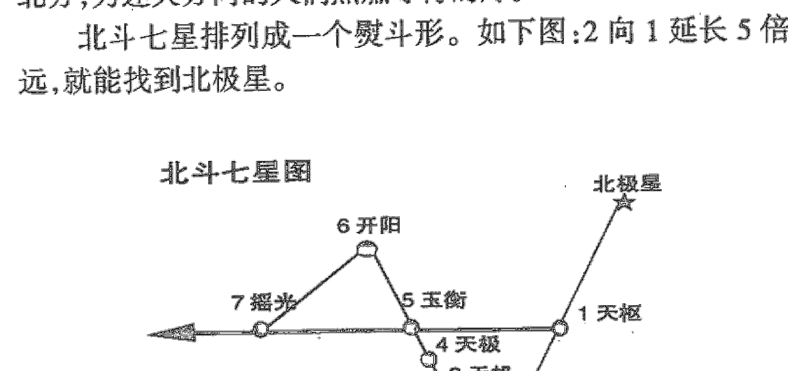

### 天下奇门第一局——金口奇门

在长期观察北斗七星的变化中发现，斗柄指东，天下皆春。斗柄指南，天下皆夏。斗柄指西，天下皆秋。斗柄指北，天下皆冬。古人把东方定为木，南方为火，西方为金，北方为水，春夏秋冬四季五行因此而定。

进一步观察发现，从斗柄部分的摇光引出一条线，上与二十八宿的角宿第一星相连，下与北极的帝星相连，形成天体的纵坐标。又从北斗七星的玉衡引一条线与南斗相连，再从斗魁左右之星，引出两条线与参宿左右两肩之星相连，形成天体的横坐标，纵坐标引两条线到天极，正好与横坐标的两条线形成井字格，在这个井字格中，古人用北斗七星作指挥棒，纵横天体。

邵雍因此而画出了先后八卦图，托名文王所作，文王时期没有观察到这些天象，邵雍亦因此而捡了个便宜。我们再把天体的纵横坐标与地上东西南北的坐标叠加，形成传统《奇门》中的井字格，如下图：

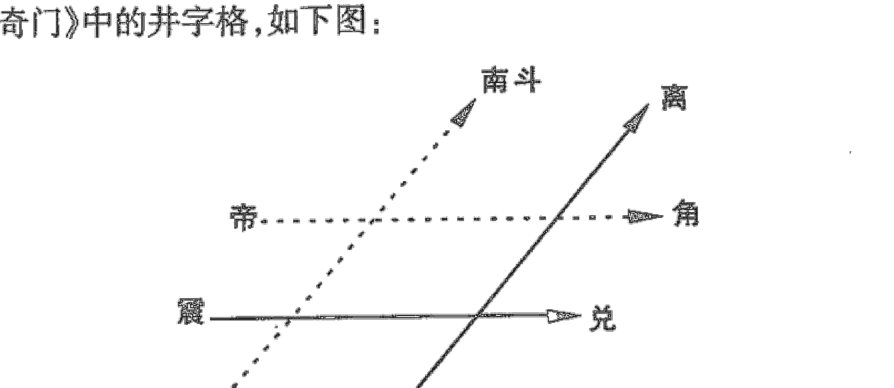

井字格就是先天八卦和后天八卦的叠加，故此传统《奇门》中有神煞占测，神无所不包，无所不容，能量之大，在《奇门》中隐身，纵横太空。人在中间脚踏大地，头顶蓝天，一个井字格把天地人神合而为一，推演万物变化的规律，提出决策，使事物向好的方向发展畅通，达到道法自然的目的。关于北斗七星老子有首诗这样写道：“月月常加戊，日日见破军，破军前一位，万古不传人”。老子是古代哲学家，思想家，诗中戊是代表十二地支的，不是其本意（今天我们是用子，代表十二地支。），破军就是摇光，在北斗七星的斗柄上，天天可以看到，看到的只是现象，他起到什么作用呢？靠自己去领悟，有很多事物，只看到现象是不能解决的，要从事物的现象，去寻求事物的本源，如果真的去找破军前一位，那么你连破军都看不到。

破军前一位是武曲（开阳），反其道而行之，你可找到为你领航的北极星，在北斗七星中以天旋为起点向天枢延长五倍远，就可找到那颗在天体中心定位的北极星，老子的诗是逆天行事，直取天机，这在高层次的预测学中，是相当重要的分析思路。

诗意大至可理解为，人要有心中的目标，就是逆天行事以要走下去，但目标必须象北极星那样，又明又亮，能使天体定位。“月月常加戊，日日见破军”。每月都更换一个地支，可引伸为每月都要从不同的角度去看待事物。

七星的变化，能知世间冷暖、寒热，“破军”就是绝命，天天都见到死去的人、感叹人生短暂，要在有生之年实现自己的目标，争取每天都有新的发现，这两句是为实现目标做量的积累，当量的积累到一定的时候，可促成质的飞跃，达到成功的目的。“万古不传人”，这些成功的秘诀不是我不传人，而是要靠自己的悟性，通过现象的观察，确定自己应走的路，从而达到实现人生价值的目标。

天体的变化又分为四季轮转、四季阴阳交接，而大地又分为东南西北四个方向，在四向的四角又有东南、西南、西北、东北、中原的交接线，不仅分出了方向交接点，同时也分出了十二地支的阴阳交接点！形成了阴阳循环的天体变化图！从井字格中分出阴阳！见下图：

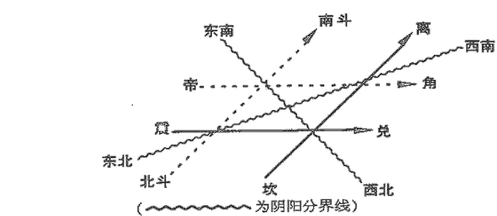

### 五、二十八宿

#### 1、二十八宿与月亮

月亮每天平均行13度多一点，人们在夜间观察时，就像每天只移动一个星座一样，仿佛月亮晚上都在二十八宿里留宿，故而二十八宿又称“列宿”，列宿并非固定不变，它不是恒星，相当于月亮的行宫。

二十八宿中，以北极为座标原点，分东南西北，东方七宿排列图形像一条“龙”，东方为木色青，故把东方定为“青龙”。南方七宿排列图形像一只“鸟”，南方为火色红，故定南方为“朱雀”。西方七宿排列图形像一只“虎”，西方为金色白，故定西方为“白虎”。北方七宿排列图形像一只“龟”，北方为水色黑，故定北方为“玄武”。玄表黑色，真武为北方水神，就是龟的化身，这就是玄武的意思，如下图。

四象图：

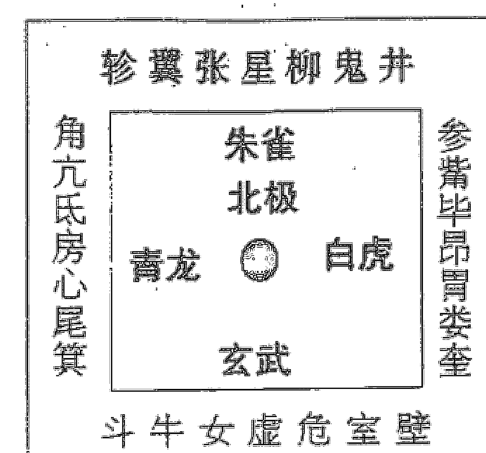

#### 2、二十八宿与太阳

太阳所经双重列宿，就是表示不同季节里昏旦相距的时间，正值冬至之时，日运由此转向北，冬至一阳生，就是日体的本色，古人称“丹天”。由于人们在地平见到的天，此时、日道在中，土色黄，所以叫“今天”。夏至一阴生，光明逐渐受损，因此古人称之为“玄天”。这三天之气，是日体在上中下之位的表像。

冬至到春分，正当春气用事，东方色青，因此古人称之为“苍天”。秋分到冬至，正当秋气用事，西方色白，因此古人称之为“素天”。这两天之气，是日体在左右两边的表像。

“丹天”“今天”“玄天”“苍天”“素天”合称五天，这五天之气从不同的颜色，分出了相应的五行，这大约可算是五行的一个启蒙思想吧？

#### 3、五天气与双重列宿

十二建星为建、除、满、平、定、执、破、危、成、收、开、闭，我们用十二地支子、丑、寅、卯、辰、巳、午、未、申、酉、戌、亥表示，分为十二宫。

再用“五天”配“十二宫”配“二十八宿”。“苍天之气”配危室、柳鬼，危室配亥宫，柳鬼配未宫。苍天之气从冬至到春分，冬至、太阳出辰入申，共计五个时辰，以此来计算昏旦相距的时间，也是相距五个时辰。因此称为苍天之气，经于危室柳鬼。

“素天之气”配亢氐、昴毕，亢氐配酉宫，昴毕配卯宫，素天之气从秋分到冬至，秋分、太阳出卯入酉共计七个时辰，计算昏旦相距的时间，也是相距七个时辰，因此称为素天之气，经于亢氐昴毕。

“玄天之气”配张翼、娄胃，张翼配午宫，娄胃配戌宫，玄天之气时当夏至，夏至、太阳出寅入酉戌共计九个时辰，计算昏旦相距的时间，也是相距九个时辰，因此称为玄天之气，经于张翼娄胃。

“丹天之气”经于牛女戊分，“今天之气经于心危己分，戊己分者，奎壁、角轸，则天地之门户”。这就是说，夏至太阳出寅入戌，丹天当夏至点，夏至为日入之终点，而戌时又是终点之终点，戌宫有奎壁二星，被银河所遮，隐没不可见。冬至太阳出辰入申，今天当冬至点，冬至为日出的始点，辰宫有角轸二星，也被银河所遮，隐没不可见，因此戊己分代奎壁角轸，牛女星为昏中点，戌分就为旦的中点。己分为昏中点，心尾就为旦的中点，以此来推算丹天、今天之气，奎壁角轸在戊己分，戊己分又当天门地户，故而称之奎壁角轸，则天地之门户也。这就是传统《奇门》中天门地户的由来。

由此观之，古人把十天干配“五天”是不无道理的，甲乙东方木，丙丁南方火，戊己中央土，庚辛西方金，壬癸北方水，再配二十八宿，配十二建星，十二建星又用十二地支表示十二宫，其中就有两组四颗星得不到相配，奎壁角轸四星被银河遮隐不见，所以十天干配十二地支，就有两地支得不到相配，古人称它为旬空。十二地支配十二建星的同时，配用中宫，取五方、五天、五行之用，形成独特的十三宫奇门格！充分体现了金口奇门的天地人三才的相互作用关系发挥。

### 六、日行十二宫

日行十二宫得出日行三道图，古称“日行三道”。冬至太阳出辰入申，夏至太阳出寅入戌，春分太阳出卯入酉，由于以北极为天顶，因此北面命位为上，南面命位为下。冬至日道在北，因而居上位，夏至日道在南，因而居下位，春分日行中道，出地平线在卯酉位。由此可见，日运分上中下三道和左右六位，并分出横系和纵系，如下图。

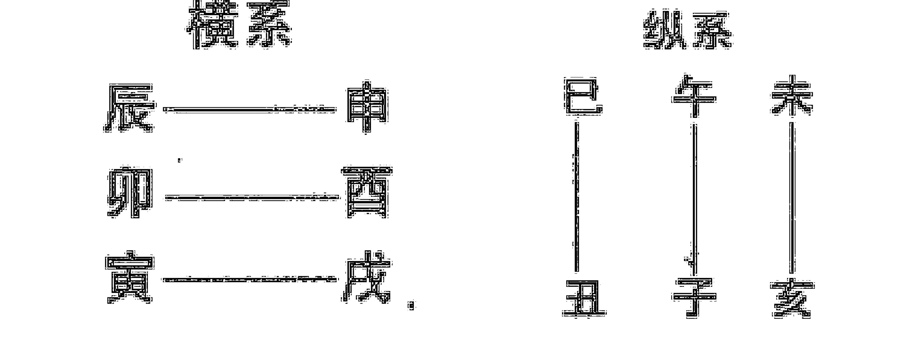

从图中可以看出，辰卯寅三宫是横系配三阳，巳午未三宫是纵系配三阴，把横系和纵系叠加，得出十二地支在九宫八卦中的方位分布图，如下图。

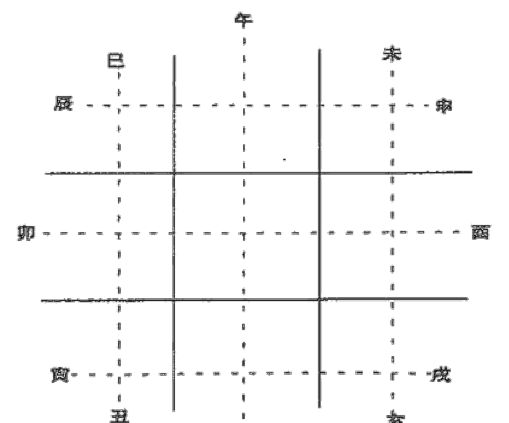

### 七、五星

五星从东方出，向右旋转至西方落下，木星、火星、土星、金星、水星，依木生火、火生土、土生金、金生水、水生木的顺序，出现在北极天空。

木星又称岁星，当它出现在北极天空的东方时，万物苏醒，草木开始发芽，天下皆春。

火星又称荧惑，当它出现在北极天空的南方时，天下一片炎热，如同火燎，就是夏天到来了。

土星又称镇星，当它出现在北极天空的长夏时，“长夏”见于中央，正照临在观测者所在地面的中央，故而中央为土，厚德载物。

金星又称太白，当它出现在北极天空的西方时，万物皆开花结果，物老就意味着死亡，草木开始枯黄，天下皆秋。

水星又称辰星，当它出现在北极天空的北方时，地下万物潜藏，天地间只见冰、雪、水，故而地下万物潜藏，天下皆冬。

#### 1、五星与太阳

以上五星的规律，就是五行生克的由来，然而五星的出落又分节气和时候，这又是河图、洛书、象数的基础思想。人们在长期观察中发现，五星运行的轨道与月道相同，轨道又接近太阳，因而古人就用以计日。五星定时出没于天空，反映时令的变迁，五星变化是在天上，而五星产生的五气，生、长、化、收、藏，流行于地面。这就是五行生克学说的启蒙思想。

#### 2、五星与月亮

人们是在地球上用不同的动作，再从月道来观测五星的活动，观测到五星活动的现象时是什么动作，就用这时的动作命名五星的这一现象，也有用五星的现象命名的。通常用的动作和五星现象有退、合、伏、冲、凌犯、掩蚀等动作，五星离开中线是用“退”的动作观测到的，故把这一现相称为“退”。五星在太阳，地球之间称为“合”，正面为上合，背面为下合，五星到“晦”称为“伏”，五星在对宫要“望”，称为“冲”，五星在日体上半被遮，称为“掩”，全遮称为“蚀”。

五星与太阳月亮的远近现象，就是五行旺衰的启蒙思想之一。本节是从星象的角度考察奇门中的启蒙思想，在奇门的实际应用中起参考启迪思维作用。应用过程中请灵活贯串全息信息分析应用之中！

## 第二节 天干地支与星象

### 一、十干

#### 1、十干概述

十干就是甲乙丙丁戊己庚辛壬癸，古人用来推算日月两的运行周期，它可以选择任何一个阶段作始点起算，从中观测天感到地应的气体变化，这就须要配上五行，在配五行之时，有所属又有所主。所属：甲乙属木，丙丁属火，戊己属土，庚辛属金，壬癸属水。所主：甲己合土，土主甲己，乙庚合金，金主乙庚，丙辛合水，水主丙辛，丁壬合木，木主丁壬，戊癸合火，火主戊癸。

所属为相生体系，所主为相克体系，一个所属，一个所主，道出了天地阴阳。用五阳干甲丙戊庚壬，配湿寒暑燥风五气，为天之阴阳，再用乙辛己丁癸五阴干，配金木水火土五行为地的阴阳。研究天地阴阳，是为人服务的，故而又把十天干配以人体的各个器官，古人有这样的歌诀，如下：

- 甲头乙项丙肩求，丁胸戊肚己脐腹。
- 庚为腰间辛为肋，壬是股部癸四肢。
- 甲胆乙肝丙小肠，丁心戊胃己脾乡。
- 庚属大肠辛属肺，壬属膀胱癸肾脏。

以自然数一三五七九，对应甲丙戊庚壬，为奇数组，表示天阳。再以自然数二四六八十，对应乙辛己丁癸，为偶数组，表示地阴。又按五行配伍，奇数组以土为始点，序次配甲、丙水、壬木、戊水、庚金。偶数组以土配乙、水配辛、金配己、火配癸、木配壬。

《金口奇门》中甲为木、为青龙、为天的儿子、为皇帝、为国家的元首，他最大的敌人就是庚金。所以要遁甲，就是把甲隐藏起来加以保护，怎样保护？丙是甲木的儿子（丙火得甲木来生，我生者为子孙），丙火克庚金是天性，当庚金强大之时，丙就用水去泄庚金之力，拖垮了再打，然而水又可以生扶甲木，这就是人们向往的忠孝双全。

壬水可以生扶甲木，又能自给，侍卫于甲的左右，是甲的御林军，御林军不是作战部队，主要任务是保护甲的安全，不让庚金伤害，当强大的庚金来临之时，就用水泄庚金之力，又能把自身之木扶旺，反克庚金。达到保护甲安全的目的。

戊土是甲的大元帅，为不让国家和人民遭受战争之苦，去生合庚金，并不是怕庚金，古人用的合亲政策就是例子。然而又用水泄庚金，一生一泄，达到不战而驱人之兵的目的，戊的手段之高明，远在丙壬之上，真不愧为大元帅甲子戊。

总之：他们的战术方法，都是避敌锋芒，把敌人拖垮再打，这样可以减少我方伤亡，又能尽歼其敌。“敌进我退（是拖），敌疲我打（垮）”，这就是毛泽东的十大军事原则之一。

至此有人会问，丙水是怎样得来的？见下面的十干生数图，丙正好转至五星中，水星所在的位置。壬木又是怎样得来的呢？见十干成数图，十干成数图中，壬正好转至五星中，木星所在的位置。

戊水的得来就不尽一致了，《金口奇门》中戊是一个特殊的天干，手握国家的重兵，皇帝不得不三思，因此就用癸水去克、生戊土的火，水太旺火则熄，戊又怎么去对强大的敌人庚金作战呢？鉴于此定戊为土，土克水是天性，癸水怕戊土，不得不鼎力相助元帅，癸就成了名副其实的监军，皇帝的耳目。这就是戊中有水的原因。书不尽言，言不尽意，古往今来，多少战将死于非命，汉朝功臣韩信就是一，宋朝抗金名将岳飞也不例外。

戊与癸合，合火、元帅就功无不克，战无不胜，合水、庚金就有机可乘。皇帝不愿如此，老百姓更不愿如此，因此规定戊癸合火，然而戊癸合火又是顺从天意，五星的运行规律。见十干纪天图。

甲乙丙丁戊己庚辛壬癸按自然数一二三四五六七八九十的顺序排列，故而甲乙丙丁戊，对应自然数一二三四五为生数，己庚辛壬癸对应自然数，五六七八九十为成数组。用生成两数组表示天体在人体引起的感应。

按五行配伍，以土为始点，按金、水、木、火的顺时针方向记事，即甲土、乙金、丙水、丁木、戊火，就是甲从土运开始，以记天运的化和生，己从土运开始以记天运的生和成，再从五方的位置上来表示数理关系。

综合来看，甲己都是从土运开始记天运的化和生、生和成，这也就是《金口奇门》中把甲己二日定为符头的启蒙思想。

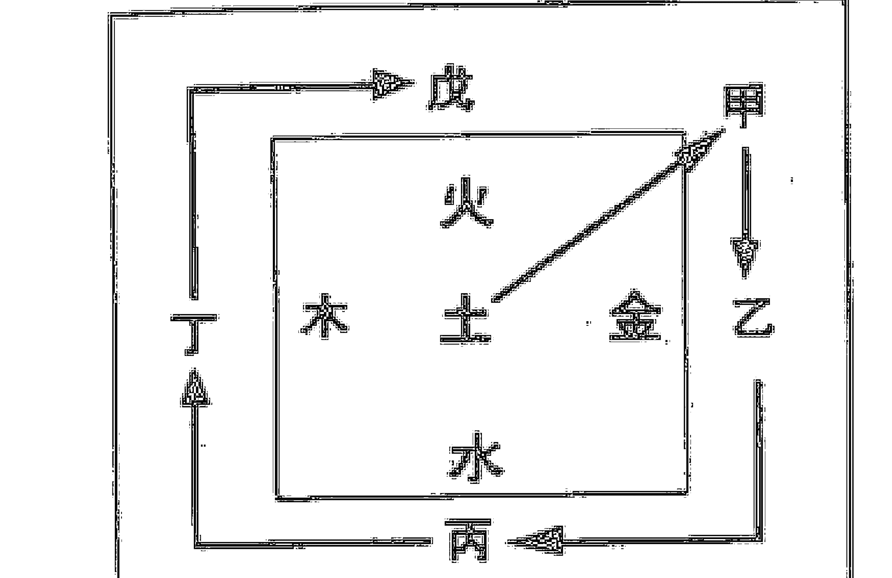

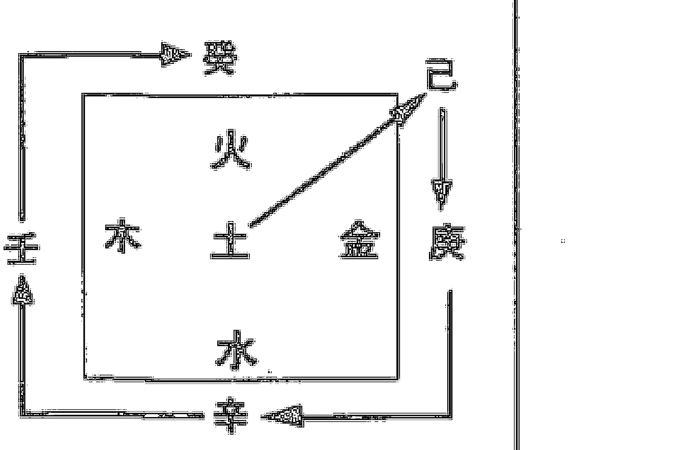

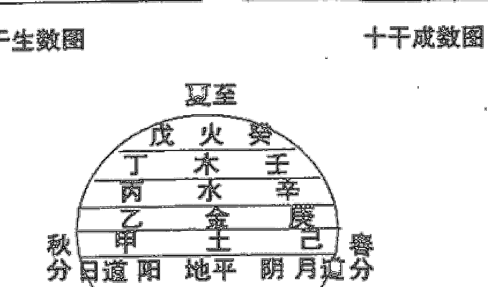

#### 2、十干纪天

天干十数从甲开始，顺序固定不变，从文字象形，古人理解为如下之意。十干是用来记载万物生老病死的循环过程，同时还表示物竞天择，适者生存的自然选择学说。

甲、孳也，言万物解孳而生；指树木的萌芽时期，尚未出土。

乙、孳也，言万物抽穗而出；树木刚出土的幼苗，柔软弯曲鲜美。

#### 丙、炳也，言物生丙然着见；幼苗开始生长，蒸蒸日上。
#### 丁、成也，言物都丁壮；进入中期生长旺盛，壮实可观。
#### 戊、茂也，言物皆茂盛；草木茂盛，百花争艳。
#### 己、纪也，言物有定行，可以记识；形态完备，特色独出。
#### 庚、更也，言物更易结实老成；开花结果，准备流传下代。
#### 辛、新也，言万物冬藏而春又新生；代表种子的特征，及物成后之味属。
#### 壬、妊也，言物交而孕，其子复萌；种子埋于地下，待明年重新生育。
#### 癸、揆也，言万物揆度而生，物竞天择，适者生存；等待时机，准备萌芽。

如十干纪天图，合南北命位以行成全周去运，从不同的五个方位纪理日月和五星之运，从而判断其阴阳五行的性质。在运用中，把十干的正常顺序分为两种组合形式。一是：奇偶组合，如用甲丙戊庚壬表天阳，乙辛己丁癸表地阴。二是：按生成数的行事组合，把十干从己分为前后两段，前段甲乙丙丁戊，为生数、为少、为阳，为下。后段己庚辛壬癸，为成数、为太、为阴、为上。

再与土为始点，把十干配上五行，按土、金、水、木、火的顺序，顺行左旋以纪事，这里不是十二次之年周，而是十二建星的岁周，又把它按四方四时相生次序排列，规定北面为上，故而先纪乙庚化金，丙辛化水，用以表示北面命位。南面为下，故而后纪丁壬化木，戊癸化火，用以表示南面命位。

古人没有今天的科技，在地平面上，只能一半一半的看天，从地平面春分秋分把周天分为两半，地平面以下的一半，就要正待而立，观察到南北命位，才能综合周天整体之象，分别察看月运左旋，日运右旋，因此分出半为月道，半为日道。

如土的岁运中，分别用甲和己两个始点起算，甲己都同为土运，但甲不等于己，这就是标本不同，气运异象的道理。

从上述日月两运的左旋右旋中，可以看出《金口奇门》中阳顺阴逆的道理应该是出自于此罢！很多书上只有十干化合的定数，没有十干化合的理论，然而《金口奇门》中十干又是取用判断的主要依据，古人取用十干是顺从天意的，不把十干的由来和内涵搞清，在十干取用中，就不可能得心应手，一成不变的认为是定数，那么只能是应用《金口奇门》的占卦先生而已，达不到习易研易的目的。

#### 3、十干合五方五气生序图

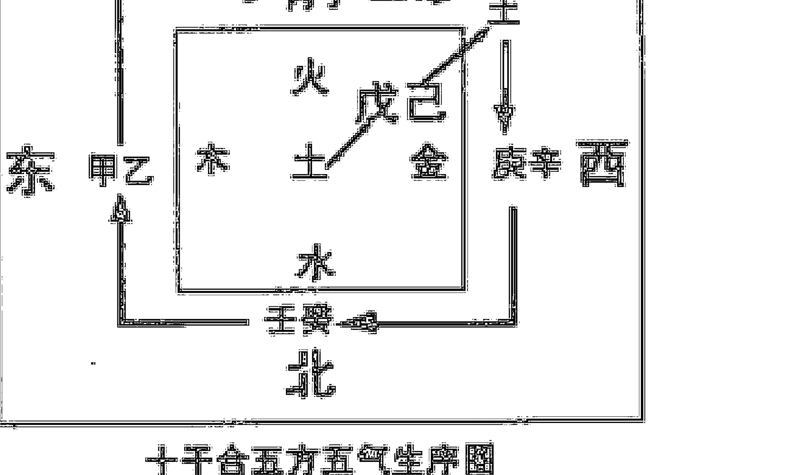

中五行是五星所在的位置，古人用十干相临的两干，表示五星、五方、五行，这就是通常所说的，东方甲乙木，南方丙丁火，西方庚辛金，北方壬癸水，中央戊己土，箭头表示按顺时针方向发展变化的五行生序行环。

#### 4、天干五行

甲乙 丙丁 戊己 庚辛 壬癸
木 火 土 金 水
其中：
五阳干是：甲、丙、戊、庚、壬
五阴干是：乙、丁、己、辛、癸

#### 5、天干相比和：

(1)相比和
甲乙 丙丁 戊己 庚辛 壬癸
木 火 土 金 水
同性相见者为比和，比和者比较之意。因十天干中，甲乙同为木，丙丁同为火，戊己同为土，庚辛同为金，壬癸同为水，所以：

- 甲乙相见为比，为对抗。
- 丙丁相见为比，为烈火。
- 戊己相见为比，为增加，累积。
- 庚辛相见为比，为争斗。
- 壬癸相见为比，为泛滥。

比：
①比较，较量。
②比较同类性状和程度的差别。
③比较两个同类数量之间的倍数关系。

(2)相生：
甲木生丁火，乙木生丙火，
丙火生己土，丁火生戊土，
戊土生辛金，己土生庚金，
庚金生癸水，辛金生壬水，
壬水生乙木，癸水生甲木。

甲木为何不生丙火？因为阴阳互生，阴能生阳，阳能生阴；阳不生阴，阴不生阴，由此甲木生丁火而不生丙火。
乙为阴木，草木，丙为阳火，大火，大火是由小火开始的，故乙阴木生丙阳。
丙火为阳火，己土为阴土，故丙生己。

丁为阴火，戊为阳土，故丁阴火生戊阳土，
戊为阳土，辛为阴金，故戊阳土生辛阴金，
己为阴土，庚为阳金，故己阴土生庚阳金，
庚为阳金，癸为阴水，故庚阳金生癸阴水，
辛为阴金，壬为阳水，故辛阴金生壬阳水，
壬为阳水，乙为阴木，故壬阳水生乙阴木，
癸为阴水，甲为阳木，故癸阴水生甲阳木。

#### 6、天干相合：

甲合己化土，乙合庚化金，
丙合辛化水，丁合壬化木，
戊合癸化火。

甲者何来合己呢？有以下说法：
因甲克戊土，戊畏甲克，使妹己土嫁于甲为妻，故曰：甲己合；
庚畏丙火而许辛妹癸水为戊为妻，故曰：戊癸合；
丙畏水而许其妹丁之于壬为妻，故曰：丁壬合。

以上是天干五合的一种说法，有一定的道理，但没有真正的揭示出其实质来。现在社会上人们只知道五行生克制化之理，而不知道其为什么会生克制化，知其然而不能知其所以然，就不能活学活用，只能是一知半解，很难进入高层次，今天我也要借用一下别人的一些说法，把这个根源提示出来。

合：
1、折合，共计。
2、合伙：合成一伙。
3、合成：由部分组成整体。

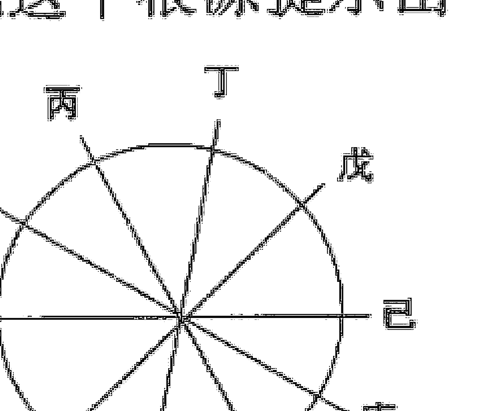

4、结合到一起，凑到一起，共同。

5、合作：互相配合做某事或共同完成某项任务。

6、在太阳系中，当行星运行到与太阳、地球成一直线，并且地球不在太阳与该行星之间的位置时，叫做合。

7、天干相冲：
甲冲庚，乙冲辛，丙冲壬，丁冲癸，戊冲己。

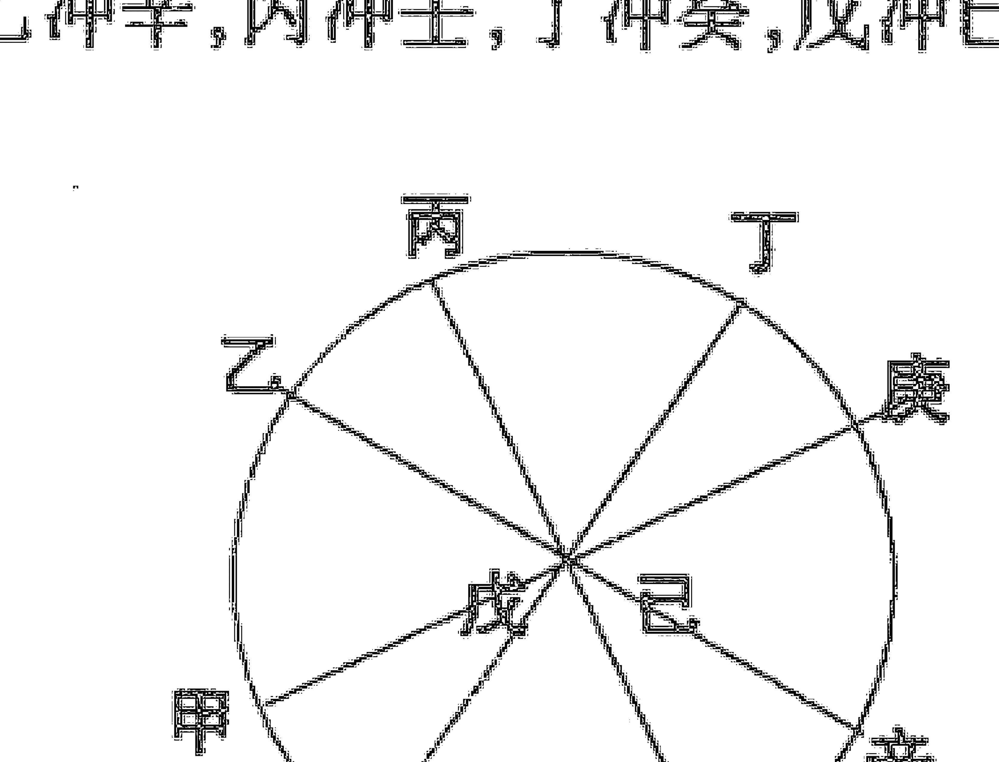

东方甲乙木，南方丙丁火，西方庚辛金，北方壬癸水，中央戊己土。

但是戊己土居中，又怎么能构成相冲的关系呢？戊己同属于土，同性相居，故而相斥。但是这种说法有点牵强，因甲乙之间虽同性为何不冲？其实甲乙也有相斥冲之意，因甲与庚相冲，乙与辛相冲力量较大，也就显示不出甲乙间相冲力量了。

还有另一种说法，来解释戊己相冲的原因，古有天塌西北，地陷东南之说；天塌西北之后，女娲娘娘补天，是借东南方辰巳（戊己）之方的土来补天的，故东南方本是（戊己）土居之，（戊己）土被借之后，地陷东南方，而八卦（巽）木代之，因土居中央，戊己土本是一家，中央戊己土也被借置于西北，因辰戌在方位上是对冲关系，故（戊代表辰，己代表戌）戊己也构成了相冲关系。

冲：
(1)相互对立。
(2)向着或对着。
(3)冲必动，移动，搬动，走动。
(4)改变原来的位置到另一个位置。

8、天干相克
东方甲乙木，南方丙丁火，西方庚辛金，北方壬癸水，中央戊己土。
甲木克戊土，乙木克己土，
丙火克庚金，丁火克辛金，
戊土克壬水，己土克癸水，
庚金克甲木，辛金克乙木，
壬水克丙火，癸水克丁火。
克：1、战胜；2、严格限定；3、克服，克制。

### 二、地支

#### 1、十二地支概述
天圆地方，一方一圆难以观察整个周天，古人就是根据地域情况，建立十二个标准位置，命名为十二宫，用十二地之来表示，十二地支就是子、丑、寅、卯、辰、巳、午、未、申、酉、戌、亥，从地面纪理着一年中，由日月相会行成的十二节，同时又能和天空一年中，由日月对望而行成的十二次相适应，还能和每月中，日月第二次相会的时候，斗柄指向所形成的十二气，十二气又称十二建星，十二地支与十二建星的数目相对应，它们的顺序是固定不变的。经考证，十二地支的字意如下：

- 子、滋也，言阳气始萌，万物滋生于下。
- 丑、扭也，指物之初生甚难，扭屈而出。
- 寅、荣也，指万物欣欣向荣。
- 卯、冒也，指万物上冒繁茂。
- 辰、伸也，指万物伸舒而出。
- 巳、布也，指物皆生长布散。
- 午、舞也，指阴阳之气交舞于天地之间。
- 未、昧也，指日中则昃，渐幽昧也。
- 申、身也，身为阴，指阴用事戕贼（伤害）万物。
- 酉、秀也，指万物成秀而老。
- 戌、脱也，指物皆老而脱落。
- 亥、核也，指万物收敛其生机而藏于核中。

见于这些考证，十二地支的字意也是表述万物生长化收藏的过程，它从地面纪理一年中，每月由日月第一次相会形成的十二节。即正月寅、立春节，二月卯、惊蛰节，三月辰、清明节，四月巳、立夏节，五月午、芒种节，六月未、小暑节，七月申、立秋节，八月酉、白露节，九月戌、寒露节，十月亥、立冬节，十一月子、大雪节，十二月丑、小寒节。方位以观察时背北向南而命其位为准。

另外还表示北斗七星，斗柄所指的十二建星，十二建星是在天空中的历法，但也利用十二地支的方位以辨方向定时间，每月中月日要相会两次，月日第二次相会，要由北斗七星斗柄来指，才可建中立极，这就是一年的十二中气，人们称之为闰月，十二中气即子月冬至，丑月大寒，寅月雨水，卯月春分，辰月谷雨，巳月小满，午月夏至，未月大暑，申月处暑，酉月秋分，戌月霜降，亥月小雪。

天下奇门第一局——金口奇门

前面讲过古人在晷景中的观察方法是，五日一候，一个节气各三候，一年七十二候合周天360度。十二次指每月太阳所指的位置，说明节气的变换。十二节是指一年中，月亮与对宫的太阳相对，所形成的十二次，两者是相一致的。

#### 2、十二地支组合配二十四小时

十二地支和天干一样，有两种数序组合，一是按自然数的顺序，即子丑寅卯辰巳午未申酉戌亥。另一种是按，子午、丑未、寅申、卯酉、辰戌、巳亥，古人只能一半一半的观天，以卯酉为地平线，日中为午，为上半天，夜半为子，为下半天，上下相加就合全圆周天。

顺数排去一个地支两小时，十二个地支正好二十四小时，子时对应23点——1点，丑时1点——3点，寅时3点——5点，卯时5点——7点，辰时7点——9点，巳时9点——11点，午时11点——13点，未时13点——15点，申时15点——17点，酉时17点——19点，戌时19点——21点，亥时21点——23点。

#### 3、十二地支配四季十二个月

春夏秋冬四季，一个季节三个月，共十二个月，每个季节的第一个月称孟月，第二个月称仲月，第三个月称季月。

- 春季：正月寅、二月卯、三月辰。
- 夏季：四月巳、五月午、六月未。
- 秋季：七月申、八月酉、九月戌。
- 冬季：十月亥、十一月子、十二月丑。

#### 4、十二地支五行

五星是五行的起源，十干因此而定五行，十二地支的五行以用五星来定，如下图：

天下奇门第一局——金口奇门

子、寅、辰、午、申、戌为阳
丑、卯、巳、未、酉、亥为阴

古人是根据十二动物来认识十二地支的，十二属相是直接受到木星场能对自然界动物的影响形成的，这种生存影响是既对立又统一的。古人由此以动物形象定十二地支的阴阳。

我们前面说过，金木水火土五行间生克冲合关系，是宇宙间永恒不变定律。十二地支同样可以依五行来划分，这种划分的依据同样以十二地支五行场能态来划分，十二地支与五行的关系是：

申酉 寅卯 子亥 午巳 辰戌丑未
其中，申为阳金，酉为阴金
寅为阳木，卯为阴木
子为阳水，亥为阴水
午为阳火，巳为阴火
辰戌为阳土，丑未为阴土

#### 5、十二地支六合五行

从天象中观察到，日月会于亥宫，这时的北斗七星斗柄指向寅宫，这一现象可知日月会的始点在亥，斗柄指向的始点在寅，此时天上正值春气管事，地面就草木发芽，天下皆春，故而寅亥合木。同理推知，日月合于戌宫，斗建在卯，时值夏天，火气旺，故而卯戌合火。日月会于辰宫，斗建在酉，时值秋天，金生杀伐，故而辰酉合金。日月会于巳宫，斗建在申，时值冬天，万物潜藏，天下一遍寒气，故而已申合水。

子午为天正线，定为纵坐标，丑未为地正线，定为斜坐标。这样一来，两坐标原点，就是中央土星所在的位置，故而子丑合土，午未合土，如下图。

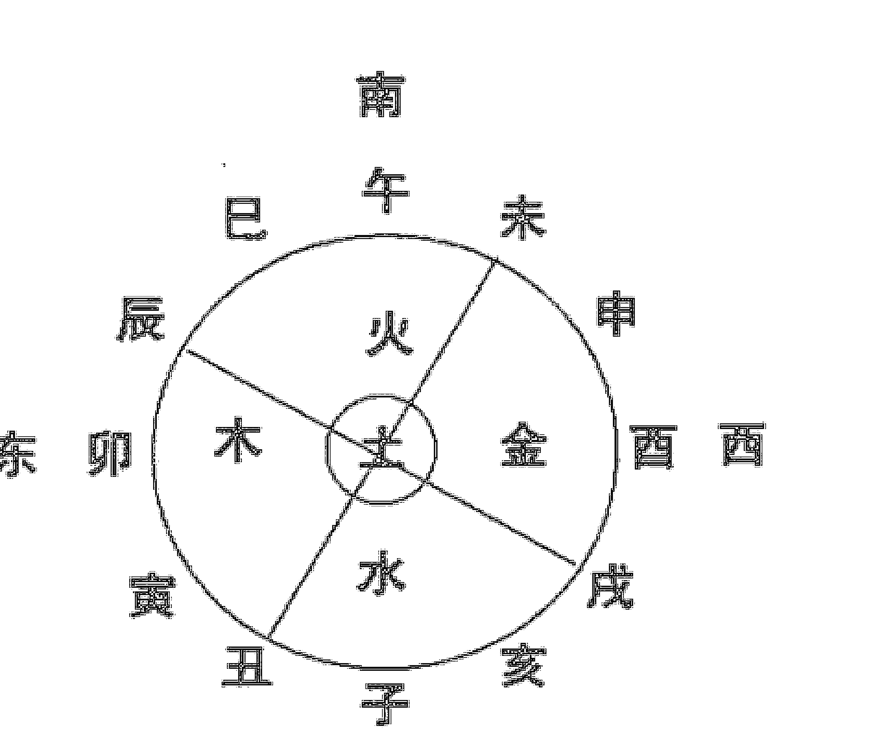

从图中可以看出辰戌、丑未、把中央的土星平分，土布四维，故而十二地支中辰戌丑未都为土。辰戌丑未又把周天分为四等份，就是木火金水四星所在的位置。这样一来，寅卯居东方与木星同宫，故而寅卯都为木，巳午居南方与火星同宫，故而已午都为火，申酉居西方与金星同宫，故而申酉都为金，亥子居北方与水星同宫，故而亥子都为水，至此十二地支五行因五星五行而定。

#### 十二地支阴阳化分

万物由无化生，无极生太极，太极生两仪——阴阳，阴阳交感，万物化生。作为描述十二属相的十二地支，同样也有阴有阳。十二地支阴阳化分来源于“单数为阳，双数为阴”的道理。阴阳二字也只是强命名的万物对立符号的代号，代表两种不同的场能的符号，万物的阴阳属性都是阴阳二者的场能定位后的符号。

所以说，十二地支由六阴支和六阳支组成：

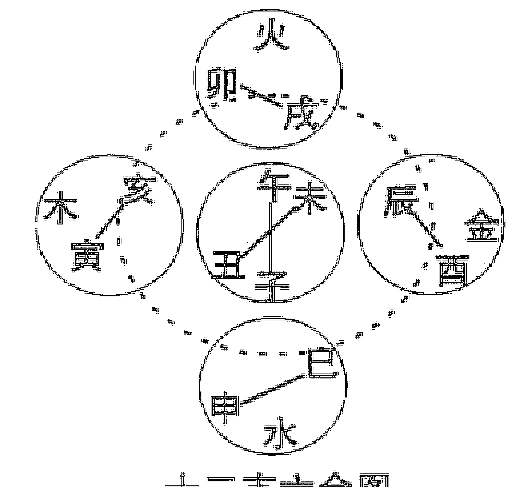

十二地支六合：
子丑合土，为克合，寅亥合木，为生合，
卯戌合火，为克合，辰酉合金，为生合，
巳申合水，为克合，午未合土，为生合。
生合为永久和合，克合为先好后不好。

十二地支相比和：
申酉金比，寅卯木比，子亥水比，午巳火比，辰戌丑未土比。

比：
1、比较，较量。
2、比较同类性状和程度的差别。
3、比较两个同类数量之间的倍数关系。

十二地支相生关系：
寅卯木生巳午火，巳午火生辰戌丑未土。
辰戌丑未土生申酉金，申酉金生亥子水。
亥子水生寅卯木。

十二地支六合关系，也可用下图表示：

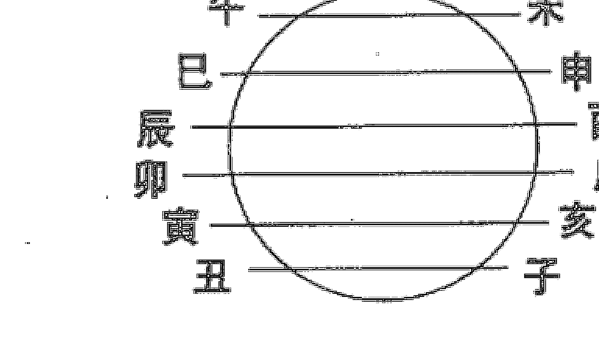

#### 6、十二支三合

从前面十干纪天图中，可以看出，冬至以北方水星同宫，为水。取冬至为始点，冬至太阳出辰（辰是日月相会的地方，见十二支六合图。）入申，因此一天就有日出为太阳，日中为阳明，日落为少阳，又昏见月亮，中见少阴，旦见厥阴，这就是十二宫配三阴三阳，纪理太阳月亮在一天中的运行情况。

用子午线分，日中为午，夜半为子，故而辰上见太阳，申上见少阳，夜半见少阴（子），古天文学家就用申子辰概述太阳月亮在冬至一天中的运行情况，因申子辰在北方与五星中水星同宫，故而申子辰三合北方水局。

以春分为始点，日月会于亥宫（见十二支六合图），春分后太阳出亥入未，用卯酉线分，太阳出亥入未，没有过酉宫，因此亥上见太阳，未上见少阳，卯为阳明，古天文学家就用亥卯未概述太阳月亮在春分一天中的运行情况，因亥卯未在东方与五星中木星同宫，故而亥卯未三合东方木局。

以夏至为始点，日月会于戌宫（见十二支六合图），春分后太阳出戌入寅，用子午线分，观察下半周天，太阳出戌入寅，因此戌上见太阳，寅上见少阳，午为少阴，古天文学家就用寅午戌概述太阳月亮在夏至一天中的运行情况，因寅午戌在南方与五星中火星同宫，故而寅午戌三合南方火局。

以秋分为始点，日月会于巳宫（见十二支六合图），秋分后太阳出巳入酉，用卯酉线分，观察下半周天，太阳出巳入酉，因此巳上见太阳，寅上见少阳，丑为阳明，古天文学家就用巳酉丑概述太阳月亮在秋分一天中的运行情况，因巳酉丑在西方与五星中金星同宫，故而已酉丑三合西方金局。

综上所述，十二支三合是古天文学家们长期观察星象，用来纪理天文日月星运行规律的，被预测学家们把它用来预测万物变化之吉凶时发现，寅午戌三合与申子辰三合，在上半周天和下半周天中，用的都是子午线分，又结合古人用驿马传信息的方法，就定了寅午戌马在申，申子辰马在寅的规律。

亥卯未三合与巳酉丑三合，在上半周天和下半周天中，用的都是卯酉线分，又结合古人用驿马传信息的方法，就定了亥卯未马在巳，巳酉丑马在亥的规律。

#### 十二地支三合与马星

- 申子辰合水局，马居寅。
- 水长生在申，帝旺在子，库在辰。
- 寅午戌合火局，马居申。
- 火长生在寅，帝旺在午，库在戌。
- 亥卯未合木局，马居巳。
- 木长生在亥，帝旺在卯，库在未。
- 巳酉丑合金局，马居亥。
- 金长生在巳，帝旺在酉，库在丑。

由此观之，十二地支中，子午卯酉为帝旺，奇门中定为上元。寅申巳亥为长生，定为中元。辰戌丑未为四库，定为下元。

#### 十二地支三合关系：

地支间的三合关系是构成对应的等边三角形关系，这种关系是一种最稳定的关系，即每种三合关系都构成一种朋党关系，它们之间相互照应互帮互助。即：
寅午戌合成火局，亥卯未合成木局，
申子辰合成水局，巳酉丑合成金局。
在这里戌称为火库，未称为木库，辰称为水库，丑称为金库。三合局中任意两支都构成半合关系，如寅见午，或午见戌，或寅见戌都构成半合。

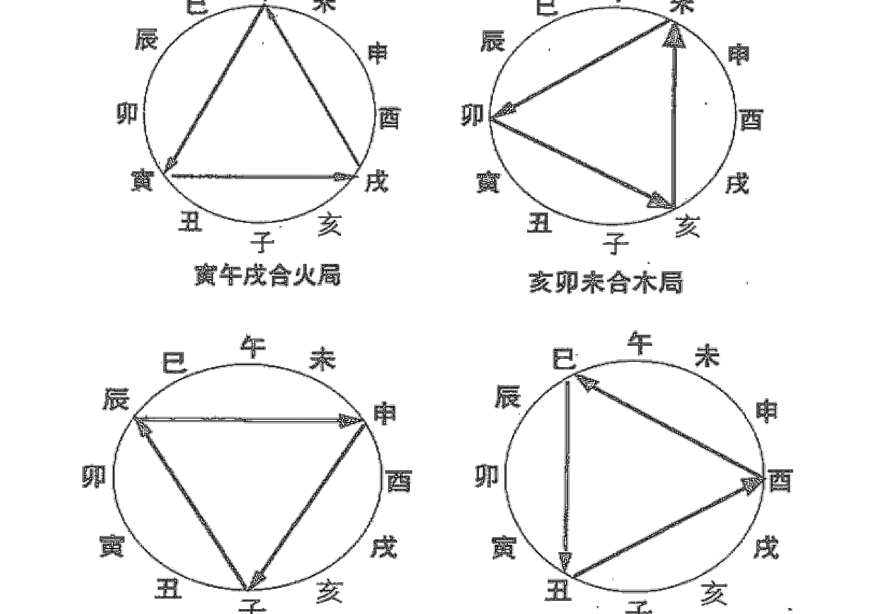

#### 7、十二地支冲克

冲就是排斥的意思，磁场中同性相斥，异性相吸，生活中要男女同居方成一家，经营中要刚柔并用，方见手段，战争中要智勇双全，方能所向无敌。三国时期，蜀国丞相诸葛亮在用人篇中写道：“只柔不刚、其势必屑，只刚不柔其势必亡，刚柔并用合道之常。”可见阴阳平衡相配，才是万物发展的根本。

#### 十二地支相克：

寅卯木克辰戌丑未土
辰戌丑未土克亥子水
亥子水克巳午火
巳午火克申酉金
申酉金克寅卯木

#### 克：

1、战胜。2、严格限定。3、克服，克制。

#### 十二地支相冲：

十二地支方位相对构成了相冲的关系。
子午相冲，丑未相冲，寅申相冲，卯酉相冲，辰戌相冲，巳亥相冲，
共六对相冲关系，相冲关系用下图表示：
十二之冲克就是只阴不阳，只阳不阴的原故，用十二支三阴三阳图加以说明，如下图。

#### 十二地支配三阴三阳图

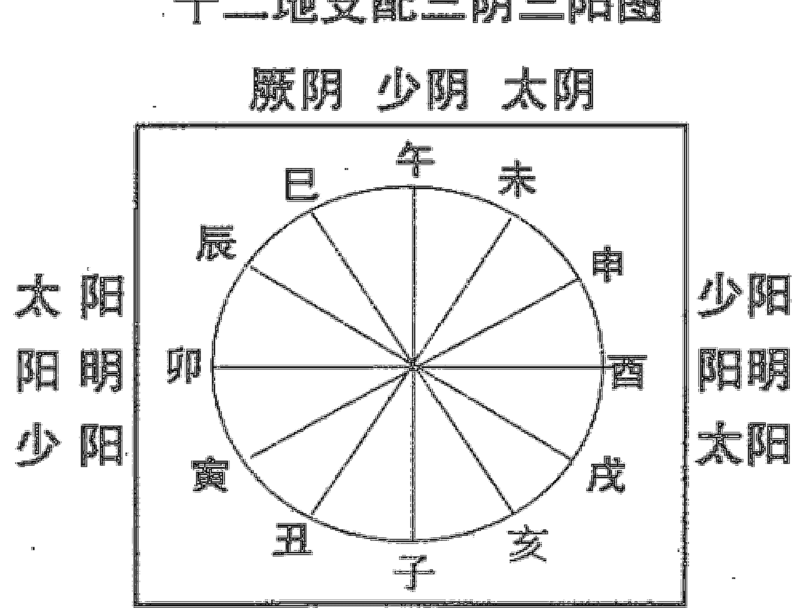

#### 8、十二地支相破

天下奇门第一局——金口奇门

申破巳，因申阳金，被阴火炼成，损巳火之力。
戌破未，因未为木库，生成火库，木被火自烧，火无柴不燃，所以火库破木库。
亥破寅，因戌亥为乾金，丑寅为艮土，而金盗土气，休破无力。
寅破巳，因丑寅为艮土，辰巳为巽木，木克土，损其木力，主破也，办事损力。
丑破辰，因丑金库，辰为水库，辰土库生金，泄辰土气，休也。
午破卯，因卯木生阳火，火泄木气，卯木休也，求望不顺。
子破酉，以子水盗酉金气，故酉金休破无力，劳而无功，多作少成。

凡破入课，主器物损坏，聚者散，成中有败，病者有死，求财谋事不成，孕育不顺，关节不通，囚禁脱离，又说凶神将受冲破谓之解神，吉神将逢冲破，即变成不吉利之事。

#### 破：

1、使损坏、损失；2、使分裂、劈开；3、完整的东西受到损伤变得不完整。

#### 9、十二地支相刑

子刑卯，卯刑午，午刑子，为无理之刑；
辰刑酉，酉刑亥，亥刑辰，为自刑；
寅刑巳，巳刑申，申刑寅，为无恩之刑；
丑刑未，未刑戌，戌刑丑，为恃势之刑；
十二地支的三刑，构成四个等腰三角形关系。可用下图表示：

武易文化网址:http://www.184999.com

天下奇门第一局——金口奇门

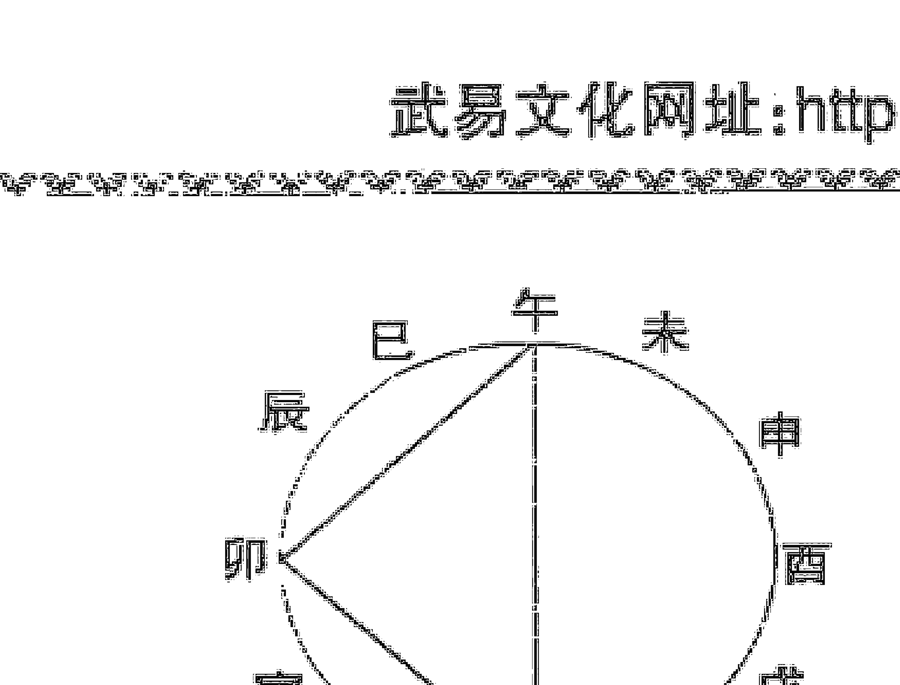

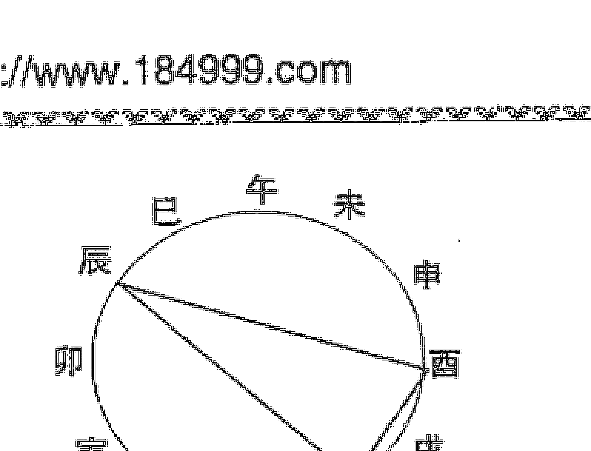

六害关系，是一种不好的信息反映，具体在预测中如何运用，我们以后章节将讨论。

害：1、使受损害。
2、损害，损伤。

#### 11、相绝

局中相见或局中与年、月、日、时相见为绝论，
寅酉金绝在文道，卯申木绝车马财，
午亥水绝因口舌，子巳火绝妇女男。

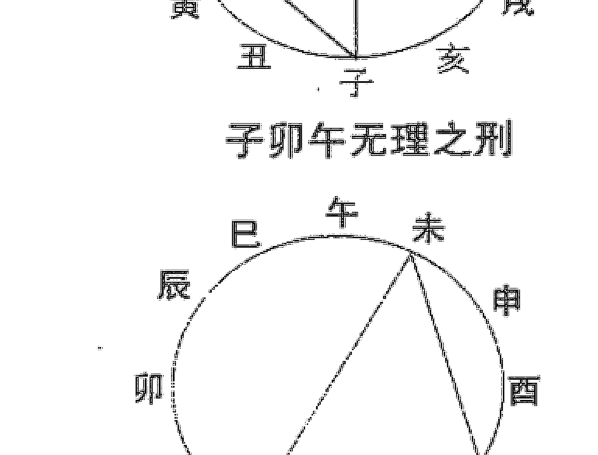

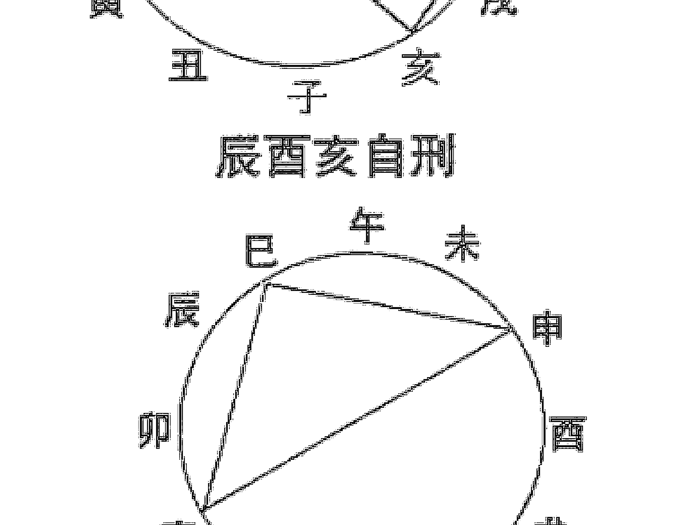

这几句口诀是说：
寅木见酉金为金绝，主文书，道路有伤灾，因小金不能克大木，阴金难胜阳木，金木各有其伤损，主事难成，劳而无功。
卯申木绝，主道路财帛，车伤，外贼盗去车辆及伤损车辆于途中，因卯为车，被阳金克。
午亥水绝，主口舌取索，文字斗讼事，因亥为阴水，午为阳火，反其道而行之，火把水绝掉了。
子巳火绝，主男女之事断绝，婚姻有变，情人有离，事都由男女而起，是因子水阳水盛大，而把阴火巳火灭掉了。

刑：1、刑罚； 2、受到刑罚，囚禁；3、特指对犯人的处罚。

#### 10、十二地支相害

十二地支间还存在着一种相冲关系，这种关系与相合关系正好相反，也叫相害关系，在手掌诀上是一种上下相对的关系，相害关系共有六对，即：

子未相害，丑午相害，
寅巳相害，卯辰相害，
申亥相害，酉戌相害。

绝：1、死亡；2、走不通的，没有出路的；3、完全没有了，穷尽，净尽。

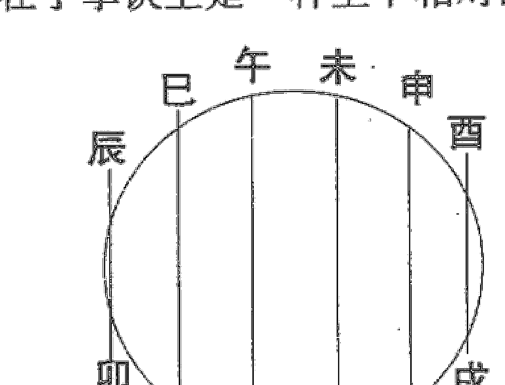

### 三、干支关系综合简述

#### 1、干支方位及阴阳所属

甲乙寅卯东方木，丙丁巳午南方火，庚辛申酉西方金，壬癸亥子北方水，中央戊己土，前为阳，后为阴。辰土主东南、未土主西南、戌土主西北、丑土主东北。（辰戌为阳土）

#### 2、干支颜色

甲、寅青，乙、卯蓝，丙、午红，丁、巳粉红，庚、申纯白，辛、

#### 3、干支配五行

春配木，夏配火，秋配金，冬配水，辰未戌丑配春夏秋冬四季土。

#### 4、干支与人体关系

天干：
甲头乙项丙肩求，
丁胸戊肚己脐腹。
庚为腰间辛为肋，
壬是股部癸四肢。

地支：
子丑为腿脚，寅亥为腿膝，
卯戌为屁股，辰酉为两臂，
巳申为肩，午未为头面。

#### 5、干支与脏腑关系

天干：
甲胆乙肝丙小肠，
丁心戊胃己脾乡。
庚是大肠辛主肺，
膀胱三焦在壬方。
若问肾水心包处，
二者皆在癸中藏。

地支：
子属膀胱水道耳，丑为肚脐及脾胃。
寅胆目疾脉两手，卯木十指内肝方。
辰土为脾肩胸痰，巳面齿咽小肠肛。
午火心脏并眼目，未土胃脾并脊梁。
申金大肠经络肺，酉金咽喉及气管。
戌上命门腿踝足，亥水发骨尿道肾。

#### 6、地支与月份关系

古语云：一二三阳开泰，斗柄回寅万事春。就是：每一年的寅月、寅日、寅时，北斗的勺柄年年正月向寅位。故古人把寅作为正月，卯为二月，辰为三月，巳为四月，午为五月，未为六月，申为七月，酉为八月，戌为九月，亥为十月，子为十一月，丑为十二月。

#### 7、干支五行配数

1、五行数：水土一、五、七数；金木三、六、九数；火二、四、八数（旺相多，休囚死少，宜细辨取之）。

2、干支数：甲己子午九，乙庚丑未八。丙辛寅申七，丁壬卯酉六。戊癸辰戌五；巳亥无干四。

干支关系一定要明确，否则难以准确应用金口奇门进行预测，尤其是干、支主事。切记。

## 第三节 金口奇门中的天干地支

龙的传人长期观察天空，对天文形成了一整套自己的体系，并能通过历算反应天体在一年四季春夏秋冬的规律，古人就是用甲子数对天体进行历算的，但甲子数有盖天和浑天，两者又大有区别。

甲子数纪天，在汉代以前属于盖天派的理论，汉代以后才有浑天派的理论，由于浑天派的兴起，甲子数纪天用法，发生了天翻地覆的变化，浑天派是用甲子数来推演万物，预测吉凶，给盖天派的学术思想造成了很大的混乱。然而浑天派又在盖天派的基础上，创造性的提出了天人合一论，时空统一论的思想，并不断的发展和完善，因此产生了很多很多的预测术，《金口奇门》就是建立在两者基础之上，而又独立存在的盘式预测思想体系。

### 一、奇门中的十天干

盖天派的理论是天干有所属也有所主，所属为相生体系，所主为相克体系，相生相克，纪理天体的变化。浑天派在此基础上，规定了十干的所属和所主，综合两派的理论，再把它用到奇门中来，作如下分析。

#### 1、十干所属所主

甲、在天，居于东方，与木星同宫，属于阳木。斗柄指东时，东方色青，有木气，天下皆春，故而属木。
在地，为纯阳之木，参天雄壮，初春木嫩，还有冬的寒气，故喜火来暖身。木在仲春旺极，为强木，强木宜火泄身，不宜金制，金在春天处囚地，弱金遇强木必遭反克。强木虽克土但赖土生，春天遇土，根深蒂固，故而刚愎自用，肆意放纵，土在春天处死地，只好由它为所欲为，不敢管制。
春天木旺，勿须水生，这就好比一个事业有成，春风得意的年青人，听不进母亲的苦口良言，嫌她唠叨，让她休息，到木值秋天，处死地的时候，方感母亲的良苦用心，已悔之晚矣。
甲在奇门落宫中，遇金不锋利、土不焦燥、火不猛烈，水不狂滥，甲身处这样的环境中，就能国泰民安，问测之事，吉凶因此而定。

在人，为男人，体表主头、主右脚、主脊椎，体内主胆、主大肠、主神经系统。性直刚健，得令则为栋梁之材，失令就是丞相骨头，花子命。五味为酸，颜色为青色。
奇门中为一国之君，为皇帝、为企业领导人，当令落沐浴之宫为风流皇帝，失令落沐浴之宫为昏庸淫帝，当令落帝旺之宫为明皇帝，失令落帝旺之宫为暴君。经常遁于大元帅六仪戊土之下。

乙、在天，居于东方，与木星同宫，属于阴木。
在地，为纯阴之木，五味甘酸，颜色浅绿。春天喜火暖身，更是亮丽。夏天土燥，喜水润土，方能滋生。秋天金寒，金能克木，柔嫩之体，如花似玉，庚金怜香惜玉，不忍伤害，又乙庚相合结为夫妻，乙怕庚金伤害哥哥甲木，故而用火制金，以火暖身，达到以柔克刚的目的。冬天冰冻，万物潜藏，天下失去生机，乙木生火解冻，又能暖身，使天下恢复生机。
乙木在春天得助旺极，到夏天生火而泄身，秋天得金生水来扶，冬天又能解天下之冻，四季都能得心应手，故而人间时时有花香。
在人，为女人，体表为脖、为肩，为双乳、乳味甘酸，体内为肝，为肺的支气管。与甲同宫，甲乙都为木，同性相斥，故而同宫不同居，为兄妹；其性柔顺，依附存身，逆来顺受。
在奇门中为日奇，中医医药多为草本植物，故而乙奇成了医生医药的主要用神，测婚姻时为妻子，得令落沐浴之宫会红杏出墙，难保贞节。失令落沐浴之宫不爱与丈夫同居，更不会红灯下招摇当道。得令落帝旺之宫是贤妻良母。失令落帝旺之宫与丈夫庚金淫乱，让庚金不务正业，达到了古人合亲之目的。

丙、在天，居于南方，与火星同宫，属于阳火。斗柄指南时，南方色赤，有火气，天下皆夏，故而属火。
在地，颜色为紫赤色，为纯阳之火，又得阳之精，火势凶猛无比，不畏霜天，不怕冬雪，能煅庚金，庚金锋利与猛火相遇，故而势不两立。辛金柔顺与丙火相遇，丙不忍伤害辛金，故而与辛合，辛又生水而济丙火，驯化丙的野性，此所谓：“英雄难过美人关。”
在人，为男人，体表为肩、为额头，体内为小肠，居于南方离宫，故而与心有关，五味苦辣，性格勇猛刚烈，易被女人所害。
在奇门中，是甲木的儿子，是庚金的天敌，故而称为三奇之一的月奇，经常随大元帅甲子戊出征，为权威人士，对工作清廉，大公无私，得令得时所向无敌，但难持久。失令落沐浴之宫，贪恋美色，难成大材。天性喜美色，在测婚姻时用它为第三者男人的用神。

丁、在天，居于南方，与火星同宫，属于阴火。
在地，颜色淡红，五味属苦，没有丙火之猛烈，但不是灯烛之光，外柔而内刚，文明之象，丙抱木恩，反焚甲木，丁抱木恩为孝，又能克制辛金，不让其伤害乙木，丁与壬合，故而春天不伤木，夏天不怕火，水泄金气在秋天又无太过之弊，冬天得甲乙二木来生，火焰无穷，能解天下之冻，故不畏寒。春夏秋冬四季中，使万物恢复生机，不生杀伐，因此三奇之中丁奇最灵。
在人，为女人，体表为头发、为胸部、为舌，体内为心、为血压，体形清秀，性格温和，很有心计，得时得地惩恶扬善，失令落沐浴之宫，恐有外遇。
在奇门中常期被壬水相克，失时失地就会愁苦呻吟。她是甲的公主，为有权威之人，与丙火同宫，同属于火，同性相斥，故不同居，为兄妹，三奇之一，称星奇，为玉女，测婚姻为第三者女人。

戊、在天，居于中宫，与五星中土星同宫，中央色黄，有土气，故为阳土。
在地颜色深黄，五味甘辛，居中得正，厚德载物，但有刚燥的一面，是己土的发源地，春天木旺就用水润土而扶木，夏天火旺得生，就正大光明，秋天金旺，就讨伐之，捍卫和平，冬天水旺，土就克水，不使其泛滥，戊土能乘载万物，又掌握万物的生杀大权，故而古人说它是司命。
在人，为男人，体表为肋，为鼻子、为腰围，体内为胃、为脾，体形威武郭厚，性格忠勇刚烈，不畏强暴，得时得地英武果断，失时失地装疯卖傻。
在奇门中，测经营求财时，是资本、钱财的主要用神，能否经营投资，戊得时得地至关重要。
在战争中戊为甲的大元帅，经常与太子丙火征讨四方，平定天下，丙+戊、戊+丙在奇门中为最吉之格局，取其意、两者合一、天下无敌。皇帝的儿子为太子，太子就是皇帝的继承人，太子丙火有凶猛的野性，甲亲自驯化丙火，会被丙火焚烧，思想难以沟通，适得其反。戊土能泄丙火之气，故交大元帅驯化丙的野性，继承皇位，再选个辛金的皇后，方能治理天下。
当今企业的总裁之子，却在别的企业里打工，用的就是此等方法，训化其子，回来继承家业。有多少凡夫俗子，不懂其中之故，关爱子女，不忍其打工，留于身边，自己驯化，结果是适得其反，害了子女。
《封神演义》中，周文王遇姜太公时，文王为太公拉车，太公在马车上说：“丙+戊兮鸟跌穴，戊+丙兮龙回首，周室江山可定矣。”文王年纪大了，太公是看到文王的儿子说的话，试想想文王没有这样的儿子，太公会出山吗？我看不可能。诸葛亮在隆中与刘备相会时，要是知道刘备有阿斗这样的儿子，我想他一定不会出山。
由此观之，姜太公的成功，就在于他看准了文王的儿子丙火（就是后来的武王），因此才有丙+戊、戊+丙的说法。诸葛亮的失败，就是因为刘备的儿子阿斗不成材。在生活中，愿为好汉拉马，莫给懒汉当爹。

己、在天，居于中宫，与五星中土星同宫，中央色黄，有土气，故为阴土。
在地，颜色浅黄，五味甘辛，为阴湿之土，旺于四季，木不克，反而赖己土而生，水不冲，反得水来滋润，火来生，反去其阴湿之气，足以滋生万物，金不能泄己土之气，反得以滋润，故而庚金藏于己土之下，己土中正厚德，对庚金有包容之心。
在人，为女人，体形沉静端庄，性格温顺宽厚，体内为脾、为胃。体表为面部、为腹部，主肌肤。
在奇门中，得令则肌肤柔嫩，面部光彩亮丽。如此沉静端庄的女人，如此清秀又含而不露的女人，如此温顺又让你不可轻视的女人，她有宽厚的胸怀，是包容天地万物的胸怀，如此神圣的女人，让你爱而生畏，不敢近之，由甲娶来为一国之母（甲己合），美其名曰：“太后”，戊与己是兄妹，故而戊成了国舅，拜为大元帅“甲子戊”。

庚、在天，居于西方，与金星同宫，属于阳金。斗柄指西时，东方色白，有金气，天下皆秋，故而属金。
在地，颜色白色，五味辛辣。为纯阳之金，得金之精锐，凶猛残暴，秋天金旺，天下大生杀伐之气，夏天以火煅身，冬天水能引发锋利（铁匠打铁就是例子），春天以甲为正敌，尽全力克木，然又以乙合，反觉有情，乙不会尽力助庚金之暴，庚不会贪恋乙之美色而示弱，因此乙庚合是各怀私心，故为相刑。
在人，为男人，体内为大肠，为肺，为筋骨，体表为脐，为牙齿。面形长方，动作敏捷，性格残暴凶狠，不居人篱下。
在奇门中，为甲的天敌，代表反动势力，得令表示反动势力身势好大，失令则为采花大盗，测官司时为仇人，测婚姻时为丈夫，测追捕逃犯时为公安干警。

辛、在天，居于西方，与金星同宫，属于阴金。
在地，颜色浅白，五味苦辣，为所有金中质量最好的金，清润可观，最怕土厚不得现身，戊土固水而埋金，春天木旺，正好克戊土让辛金现身。夏天火旺，得己土泄火而生金，冬天水寒，得火暖水而养金。
在人，为女人，体形方正素雅，性格文静大方，体内为肺、为血管，体表为胸部、为股部。
在奇门中，辛与丙合，辛又是庚金的妹妹，嫁丙为妻，实是以其人之道还制其人之身，辛有如花似玉的面容，难怪丙服其训化，辛又有忠诚的一面，能大义灭亲，庚只落得，赔了夫人又损兵（三国时刘备到东吴招亲就是例子）。辛生水而训丙火，让丙不焚甲木，又能生助戊土，保卫社稷，使天下生灵免遭涂炭之苦。
辛金在未嫁之前与庚金合流，取其意，在奇门中代表犯过错误的人或罪人。电影《她从雾中来》你看过吗？电影中的女主角，原是一小偷集团的工作成员，自从认识了一个公安干警后，帮助公安打击这伙犯罪集团，最后这个干警不计前嫌，与她结为百年之好。这难道不是上述辛金的再版吗？笔者实难找到比此更好的例子，若没看过，请找来看看，她会帮你，对辛金获得更深的感悟。

壬、在天，居于北方，与水星同宫，属于阳水。斗柄指北时，东方色黑，有水气，天下皆冬，故而属水。
在地，颜色深黑，五味为咸，为流动之水，源头为金，故能泄西方杀气，是土的血脉，水之性进而难退，故要开渠引道否则就要泛滥成灾，春天木旺，可泄水，但要开渠顺势，否则水旺木漂，夏天火旺，正好润土生木，化则有情，相济有功。冬天之水虽旺，但万物潜藏于冰天之下，水旺极而成冰，不会泛滥成灾。
在人，为男人，体形黑瘦，性格柔弱阴险，老谋深算。可与之患难，不能同享受。体内为膀胱，体表为小腿，得令则处处帮人，失令则助庚害国。
在奇门中，是测与流动有关之事的主要用神，得庚金来生，祸国殃民，水泛滥之时，庚金兴风作浪，乘势谋反，但万没想到，水一泛滥，到处一遍汪洋，自己那来的立足之地，水多金沉，勿须固水就能埋金。
在抗日战争中，国军的蒋委员长，为阻止日本军队，竟然下令炸开黄河大堤，没有阻止日本军队的进攻，反而乡亲们被黄河之水冲得背井离乡，四处逃荒，水退之后，形成了黄泛区，蒋委员长做梦都没有想道，几年后他的大将杜聿明的几十万人马，现代化的集团军，就因不敢过黄泛区，遭到了中共领导下的中国人民解放军，二野、三野的毁灭性打击，杜隶明成了中共的战俘，这就是毛主席的淮海战役，蒋委员长的徐蚌会战。庚金兴风作浪，结果搬起石头砸了自己的脚。

癸、在天，居于北方，与水星同宫，属于阴水。
在地，颜色浅黑，五味为咸，为纯阴之水，变化莫测，但不是雨露之类，其性静而势弱。源头为金，癸水太弱，不泄金气，反能润土养金，发育万物。
在人，为女人，体内为肾、为心肌，体表为足，体形富态稍黑，性格柔顺阴险，变化莫测，反复无常。得时得地就仗势欺人，狐假虎威。失时失地就心灰意凉，歌舞厅里、又多一“仙女”，因她变化莫测，动作反复无常，让你神魂颠倒，依依梦里是寻处。
笔者有诗为证：
癸落红尘最风流
整日红妆解君愁
无奈容貌已消瘦
悔恨当初入青楼
《封神演义》中有这样一段话：“女人阴物也，丑妇得阴之轻者夫，然人又极喜美色者，顺曰你几曾见做出好事来”，可见在奇门中把癸定为天网是不无道理的，是测男女之间，不正常交往之人和事的主要用神。癸为天网，犯罪多与女人有关。

#### 2、十天干的相互关系

##### (1)、相冲关系

###### 甲庚相冲

甲庚是一对矛盾的统一体，它们相冲的关系，是相互转化的，抢得天下的就是甲，失去天下的就是庚，金克木是天性，然而甲木是正义之师，得道多助，庚为反动势力的代表，故而失道寡助，仅凭一己之长，就想与甲木分庭抗礼，结果成了乱臣贼子，人人得而诛之。
庚虽克甲，但失道寡助，甲又得道多助，势可遮天，庚只能冲冲而已，哪能伤甲，只落得把自己藏于己土之下，苟且偷生，又不想居人篱下，到处兴风作浪。扰乱甲之社稷，成了甲的心腹大患，甲庚只能相冲不敢相克，古人用一“冲”字，真是妙极。
毛泽东有首诗“咏蛙”：
独坐池塘如虎踞
绿荫树下养精神
春来我不先开口
哪个虫儿敢作声
诗中的青蛙应指甲木，虫儿就是庚金。

###### 乙辛相冲

乙为柔木，但不是弱木，兴中医之道，救天下苍生，因而得道多助，辛金柔弱，不敢克乙，反生水助木，金来克木是天性，又加辛是犯过错误的人，虽生水助木，乙存防犯之心，女人天性多疑，岂有不相冲之理。
从六亲关系来说，乙为妻，辛自然就是儿媳妇了，婆媳之间，本来就是天生一对作对的人，怎不相冲？经常为些芝麻小事吵个不休，当儿子被外人相伤时，母要顾子，妻要护夫，这时辛生水而助乙，她们就能停止内战，一致对外。鉴于此，做儿子的不妨在外面善意的做点让母亲和妻子都放心不下的事，这样可调解婆媳之间的相冲，家人反而和睦相处。

###### 丙壬相冲

丙火猛烈，能煅庚金，可焚甲木，壬水刚忠之德，能制丙火，丙火焚甲木时，壬水制之。壬水生甲木为忠，训丙火为刚，可见，壬水克甲木是善意相克，古人说他是相冲。
包青天，中国人心目中的青天，不畏权势，嫉恶如仇，为民请命，面色如炭，壬水之写照也！他三番五次请附马认下前妻，附马不认前妻则罢！反而加害前妻，为给香莲一个青天，还天下一个公道，就是国母求情，同样定斩不赦。
由此观之，丙壬相冲，实属硬对硬，刚对刚，水克火是天性，生活中不要认性，不要认为自己是某某之子就为所欲为，遇到壬水时还是服其训化的好，否则附马就是前车。

###### 丁癸相冲

丁火刚柔得中，决非灯烛之光，火多不烈，得生不喜，受制不忧，克伐有道，大兴文明之象，教化天下，因而得道多助。癸水纯阴之水，变化无穷，反复无常之女子，水克火虽是天性，以丁之所为，她是望尘莫及，哪敢伤丁，但又生嫉妒之心，只能相冲而已。
西施和东施的故事，就是丁癸的化身，书至于此，笔者不敢妄加评判这对“绝代佳人”。至于丁癸相冲，我看大至如此，但人要有自知之明，不要愚昧照搬，否则只能留下多少“好”故事，讲给后人听。

###### 戊己不冲

戊己不冲，不是不冲，只是不相冲，土厚德而载万物，但又能毁灭万物，可以说，戊己冲天下，天下与戊己相冲，这好比水能载舟亦能覆舟。
千百年来，大地的变化，把天下的动物毁于地下，今天我们用的石油哪里来？就是这些动物的尸水啊！
植物就更惨了，因为它克土，到了极限，土把这些青枝绿叶，历尽千年沧桑焕发的生机，不分好坏，宁可错杀一千，决不放过一个的埋入地下，汲干你的精气，然后用千年来积压在内心深处的怒火，把你烤焦，直到你整个尸身发黑，与土融为一体，形成煤炭，还要把你开挖出来，用火焚烧，让你化为灰烬来告知天下，这就是你克我的下场。今天的煤炭开发商，难道不是在劫墓吗？在劫天下苍生的墓。
大地的忍耐是有限的，积压在内心的怒火总是要爆发的，火山爆发，喷出的熔浆，就是今天所有金属的矿体，人们又开挖出来，用煤炭焚火煅金，再用水引其锋锐，金生杀伐，使天下生灵荼炭，试想想这难道不是土导演的恶作剧吗？以解千百年来克我之恨。人们常说：“君子报仇十年不晚。”我看土是万年报仇也不晚矣！！
从上面的分段论述中，我们发现，都是阳与阳相克就为相冲，阴与阴相克为相冲，戊己不是不冲，而是与天下相冲，阳与阳的有，甲庚相冲、丙壬相冲。阴与阴的有，乙辛相冲、丁癸相冲。

##### (2)、合的关系

前面讲过，盖天派是把十天干用来纪理整个周天日月运行的规律，以地平线把周天平分为两半，上半周天用甲乙丙丁戊，是人们在地平线看得见的，故定为五阳干。地平线以下的下半周天，用己庚辛壬癸纪理，是人们在地平线上看不见的，故定为五阴干，见十干纪天图。

###### 甲己合土

甲木最大的敌人是庚金，最不愿发生的事是丙火焚烧甲木，最喜欢的是有湿润的土给自己扎根，湿润的土可以把庚金藏于地下，不让它伤甲，又可以把丙火之气泄化而扶甲。甲木克己土，实属赖土而生，故而相合。
挺拔苍劲的木干被砍伐或被毁灭，它的根留给己土，与己土共存，故为化土，古人说他是中正之合，我们应辩证的看待，如甲木得中，己才能正，甲稍有不中，己就包藏祸心，养虎为患，有诗为证：“一骑红尘妃子笑，无人知是荔枝来”的杨贵妃，与安禄山里应外合，差点要了唐家天下，还好大将郭子义帅兵亲征，平息安使之乱。这是中正之合吗？应辩证的看待。

###### 乙庚合金

乙是甲的妹妹，为保甲的江山社稷，不让庚金生杀伐，故而嫁庚为妻。
庚在秋天，正是刚健之时，大生杀气，这时乙木正好果实成熟，庚生杀伐，目的为争果实，就投其所好将乙嫁庚，庚又贪享乙之果实，反而对乙有情，但金克木是天性，乙又生火而制金是反击，故而它们的合是非善美之合。
乙要完成使命，庚要生杀伐，因此它们是各怀心思，合中有克。乙的后家强大，庚不敢伤乙，反听其教化，古有昭君出塞就是例子，这个乙奇女子，她带去汉人文化，教化天下，使庚金不生杀伐之心，保了边关一方平安，死后葬于塞外，名留千古。古云：“嫁鸡随鸡，嫁狗随狗。”故乙庚合而化金。
古人说他是仁义之合，庚娶乙、乙嫁庚是各取所需，互有目的，庚要借用乙的果实来壮大自己，好与甲木为敌，乙要不辱使命，处处监视庚之所为，这样的夫妇能是仁义之合吗？但就乙来讲，是舍身而取大仁大义，才与庚金相合。万物没有定数，怎样理解看自己怎样去领悟。笔者不强加于人，只是提供思路，谨供参考。

###### 丙辛合水

辛金柔软之物，嫁丙后，不但明相合还暗相亲，暗化水而济丙，又能训丙火猛烈之性。辛金是弃暗投明，为报丙火知遇之恩，以丙生死相连同心反庚，评书《杨家将》中这类型的女子很多，穆桂英最为典型。
很多易友都这样认为，丙辛合是权威之合，辛金是怕丙火的权威而相合，在夫为妻纲的时代，这种说法很有道理。

武易文化网址:http://www.184999.com

### 天下奇门第一局——金口奇门

今天提倡男女平等，女人也能顶天，你见过哪家的妻子是打服的，丙有多大的权威，辛就有多大的胆，他们狼狈为奸，合而化水去生扶自己的顶头上司，必要时辛可再次出马！重演刘备招亲的故事。

辛金哪里是怕丙火的权威，完全是在化水、去磨灭丙火的忠勇之性。

###### 丁壬合木

壬水生甲木为忠，训丙火为刚，与戊土合称甲身边的文武宰相。壬、文可安邦，又能生甲。戊、武可定国，手握重兵，又被甲来克。由此观之，戊克壬是怕水多木漂，甲克戊是怕戊手握重兵造反。三者之间的关系微妙至极，让人拍手称绝。

丁火甲木的女儿，嫁壬为妻，暗可泄戊土之力，使戊不伤壬，又可借戊土旺身，达到与壬相合使壬不敢对甲有二心之目的，为保甲的江山，丁壬成了甲的忠臣，故而丁壬合化木与甲共存亡，古人说她是淫荡之合。

象丁奇这样的女子，宠而不喜，惊而不卑，克伐有道，内外功夫又何等了得的女子，被壬水占有，你见过哪家的妻子有如此贤惠，故而对壬水生嫉妒之心，骂她淫荡。

###### 戊癸合火

戊是土、癸是水，土虽克水，但可以引水归正道，开渠引水润土，万物赖土生，得水而长，可见水土是为万物生长提供条件，水旺会泛滥成灾，土旺又不能生长万物，故而水土相合，天下万物之荣幸。

戊土、甲的大元帅，刚正忠勇，经常帅兵出征，讨伐庚金，故多以红尘女子癸水相逢，癸水正好能泄庚金之气，又能滋润戊土，这样一来，训练有素的戊土与疲惫之庚金作战，怎不所向无敌？

戊癸合就成了庚金的天敌，化火是克制庚金的有力武器，是捍卫和平的坚强后盾。癸为红尘女子，古往今来多少战将因她而起，为国家立下不朽的功绩，又有多少战将拜倒在她的石榴裙下。古人有诗为证：

> 葡萄美酒夜光杯
> 犹饮琵琶马上催
> 醉卧沙场君莫笑
> 古来征战几人回

戊癸合、古人说他是无情之合，癸是庚的女儿，反助戊而讨伐庚金，壬是庚的儿子，与丁相合后，治国有方，也背叛庚金，故而无情。

庚为何养些“不孝”子孙？就因为庚不修德行，乱生杀伐之气，子孙反他，举国上下讨伐他。反过来，癸对戊、是有情有义又有恩。

### 二、奇门中的十二地支

十二地支：子、丑、寅、卯、辰、巳、午、未、申、酉、戌、亥，它们也有阴阳之分，按十二地支的自然数来分，奇数为阳，偶数为阴。

用五行来分，由寅顺数至未，为上半周天，上半周天中有木火二星，木火通明，故而古人定寅、卯、辰、巳、午、未、为阳；下半周天中有金水二星，金水暗昧，余下地支申、酉、戌、亥、丑、子为阴。

再按天地阴阳两仪来分，冬至一阳生，故而古人定子、丑、寅、卯、辰、巳、为阳，夏至一阴生故定午、未、申、酉、戌、亥为阴。《金口奇门》中神煞取用时，多以两仪分阴阳，怎样取用，因涉及连山易中的绝密内容，笔者将在弟子班中详细传授。

#### 1、十二地支所属所主

子、为阳，五行属水，居于北方。在环境中指游泳娱乐场所，山沟河流，养鱼池塘等与水有关的场所。

植物多指含水多的树木和果实，如西瓜、土瓜、萝卜、水葫芦、橡胶树等，动物指老鼠、乌龟、燕子、乌鸦、黑色的飞行动物和黑色的水生动物，空中加油的飞机，海中的航空母舰，潜水艇等。

在人指内心狠毒的妇人，专做阴暗之事，如偷盗或与男人私会等。得病多为子宫，泌尿系统，膀胱等病症。

得时得地就红杏出墙，失时失地反而温柔体贴，难怪古人会说：“女子无才就是德。”得时多为红尘名妓，聪明伶俐，得地多是情人之类，失时容貌黑瘦，家中贤妇，失地孤寡一生。

丑、为阴，五行属土，居于四维东北方，在环境中指公路桥梁、宫殿、电影院、礼堂、佛门胜地、道观、矿山、石灰窑、瓷器制品场等。

在人指内心善良之人，像神佛一样，济世救人。动物为牛，丑、扭也，指物之初生甚难，扭曲而出。指衣服的纽扣，控制某种设备的开关，打开大门的钥匙。后天八卦中居于艮宫，故而为足，为鞋，人体内主脾和胃。

得时得地，就加官晋爵，但人辛苦，失时失地家中饥荒，背井离乡，还有官司是非，脾胃之病。

寅、为阳，五行属木，居于四维东北方，寅为木故而多指山林，木又有青龙之称故为桥梁，火车路、火车。

在人，指国家公务员，为丈夫为女婿。体内得病主肝胆，主腰。纸是树木做的，故寅木又主文书和一些票据，动物指老虎和猫。

得时得地国家栋梁之才，失时失地，朽木不可雕，还有官司是非。

卯、为阴，五行属木，居于东方，在环境中指公路，汽车，大街小巷。

在人，主兄弟，妇女，有一技之长的手艺人，还有偷盗的特长，人体得病主疯气肝胆，四肢不利，多为左手脚。古时的车、船、门窗都是木料造的，故而又指车、船、门窗。动物主兔子。

得时得地主车、船平安，失时失地车、船有险。

辰、为阳、五行属土，居于四维东南方，在环境中指小土山，土墙，坟墓，种庄稼的土地，良田，寺院、道观。动物为传说中的龙。

在人，为和尚、道士，妇女，得病主脾胃。辰为土故又指瓷器、缸缸罐罐，拜神用的香纸。得时得地为飞龙在天，良医良药，失时失地就成蛇钻草，为屠夫，还会医病害人而引起官司。

巳、为阴，五行属火，在环境主阴暗潮湿的地方。在人、为美妇，内心狠毒，为乞丐。得病为头痛脑热，眼疾。动物为蛇、为黄鳝。画有龙蛇图纹的瓷器。美女的肖像、书画或文字。

得时得地成龙上天，主文书喜信，失时失地为乞丐，恶魔。

午、为阳，五行属火，居于南方，在环境主娱乐场，大型会议室。

在人，为和尚，为使者，为女办公室主任或女秘书，得病为三焦口渴，心口疼痛，伤寒等。在物为马或画马的书画，为华丽的衣服，为电器产品。

得时得地就骏马奔腾，文章喜信，失时失地垂头丧气。

未、为阴，五行属土，居于西南方，在环境中古时主一些大户的宅院，今主房地产开发商开发的生活小区，也主坟墓，田地。

在人、为老男老妇、牧羊人，算命先生或巫婆。得病为瘟疫、胃病。在物为羊、梅花鹿、又为药品，酒杯，美食。

得时得地就歌舞宴会，失时失地有疫病破财，孝服官灾，还主孤寡。

申、为阳，五行属金，居于西南方，在环境中为神佛聚居的地方，如佛堂之类。

在人，为旅游的人或行人，得病主筋骨疼痛，咳嗽气喘。动物为猴类，在物为金属制品的车、兵器、金银、刀剑。

得时得地行人有佳音，有婚喜之事。失时失地道路有凶险，还会有疾病。

酉、为阴，五行属金，居于西方，在环境中为开矿的矿区，经营通信工具的商场，酿酒场。

在人，为少女，为妇人，为经营酒水之类人。得病多为饮酒过量而伤身，身体虚弱。动物指鸡，酉金与通信有关故而又指鸽子。在物指金属制的装饰品，装饰用的刀剑，通信用的电话，酉金居于兑宫为口，故又主防毒面具、口罩等。

得时得地信息畅通，在人为清秀、温柔、善良。失时失地音信全无，黑瘦暗疾。

戌、为阳、五行属土，位居西北方，在环境中为隐藏不现的山崖或陡坡，戌是火库故而又指监狱、坟墓，还主公共厕所。

在人，为年纪大的人，和尚、道士和一些行善的人。得病主吸毒、黄肿、脾胃等病。动物为狼狗。在物为砖瓦，为一些矿物药品，还有坟墓里的尸骨。

得时得地万事如意，办事顺心，是大商人。失时失地是监狱重犯，吸毒者或艾滋病患者。

亥、为阴，五行属水，居于西北方，在环境中为湖泊，静水池塘，水产品的仓库，隐藏在山里的楼台寺庙。

在人，为小儿，杀猪的人，亥水为酒故而又主喝酒醉的人，水主阴暗又为罪人盗贼。得病为疯病，泌尿系统等病。动物为水生动物，鱼虾之类。在物为毛发、丝绸、布、还有笔墨等。

得时得地为高深莫测，造诣很深的人，失时失地为盗贼、疯人。

#### 2、十二地支的相互关系

十二地支相互关系是刑、冲、合、化的关系。冲、合、化在前面讲过，这里谈一下十二地支相刑的关系。

子刑卯、卯刑子为五刑（古有三纲五常之说，子水生卯木，我生你、你刑我，违反了五常之说，故而称为五刑）。

寅刑巳（寅木生巳火，生我者父母，儿子不听老子的话，居然相刑，违反了三纲中的父为子纲）巳刑申、申刑寅（巳火克申金，申金克寅木，克我者官鬼，居然相刑，臣子不听主子的话，违反了三纲中的君为臣纲）。

丑刑戌、戌刑未、未刑丑（丑戌未皆是土，比肩助力，“比肩：原意是指夫妻相助，后来引申为五相同的都为比肩”。夫妻居然相刑，违反了三纲中的夫为妻纲。因寅巳申、丑戌未，违反了三纲，故而称三刑。

辰午酉亥为自刑：因辰居四宫为长女，午居九宫为中女，酉居七宫为少女，亥居六宫为老父，从取象上看，老父与一群儿女长期相住，乱了人伦，都无地自容，故而自刑。

生活中，父不能为子纲，夫不能为妻纲，家庭就会破裂，社会就会动乱，又加君不能为臣纲国家就有战乱，战争是人类最大的灾难，故而在奇门中六仪击刑最为凶。

## 第四节 阴阳五行论述

### 一、阴阳概述

“阴阳者，数之可十，推之可百，数之可千，推之可万，万之大不可胜数，然其要一也。”《素问·阴阳离合论》，这就是说，阴阳的范畴太大，千千万万，但是道理总是一致的。

阳之性有刚有健，善于运动其性活跃又亢实，不怕困难，敢于拼搏，性格开放勤于向上。阴之性又柔又顺，不善于运动，其性沉静又空虚，性格闭塞向下。

世间万物千变万化，纷繁复杂，古人就用一阴一阳表示事物之间的关系，这样就把复杂的事物简单化，简单的事物复杂化，把万物规定为两个方面的内容，即阴阳。阳中有阴，阴中有阳，阳可变为阴，阴可变为阳，有阳就有阴，有阴就有阳，这就是阴阳变化的法则。

#### 1、一阴一阳谓之道

在自然界或人类社会的生活中，无不存在一阴一阳的对立统一。如：天地、日月、水火、寒热冷暖，白天黑夜、真真假假、虚虚实实，上上下下，刚柔贵贱，君臣、夫妻，等等。哪一对不是阴与阳的关系！

阴阳表示出事物的不同属性，事物与事物之间的不同关系，不论怎样复杂的事物都可以用阴阳加以区分，在奇门中，用阴阳二遁，把事物发展的目标、方向、结果及成功失败，归入试盘之中加以推演，可以这样说，奇门就是把事物分出阴阳来测定吉凶。

在奇门盘中，能了解阴阳变化之理，就能了解万物变化的法则，故而《烟波钓叟歌》中说：“若能了达阴阳理，天地都来一掌中。”可见阴阳无时不在，无所不包，通了阴阳就知道天地间万物变化的规律，在一掌中定天下事物之吉凶。

一阴一阳谓之道，“道”就是“通”的意思，研究阴阳就是要达到了解万物变化的规律，从事物变化的规律中提出解决事物的方案，达到观象能制器的目的。如水是往低处流的，这是自然现象，人们就发明抽水机，使低处的水流向高处，为人所用。

#### 2、阴阳的对立统一

阴阳两种势力同时存在，并且是相互对立统一的，对立不一定是坏事，是事物冲满生机的一种表现，世间万物只有时刻处于对立统一之中，才能有所发展，充满生机。

在分析问题的时候，必须坚持一阴一阳的法则，要看到事物内部存在的两种势力，对立与统一。不管阴阳双方怎样对立，怎样统一，它们都是处于一个整体之中，阴阳是事物中存在的对立因素，而不是两种绝对对立的实体。

强弱就是相互转化，不是永恒不变的，强的一方若是不能巩固和发展自己，就会由强变弱，弱的一方在不断的进行量的积累，积极向上，就会由弱变强。

可见事物不是处在量的积累过程，就必定是处在新旧更替的变化过程中，经过不断的量的积累，发展与变化，对立与统一的过程，因此，不适应时代发展的东西就要退出历史舞台，适应时代发展的东西就会兴盛起来，所以，人们的行动就要适应事物向好的方向统一，才会有光明前途。

### 二、五行概述

#### 1、五行与阴阳

五行学说与阴阳学说，都是华夏炎黄子孙最古老的哲学思想。五行就是金、木、水、火、土，最古老的五行学说就是西周初年，思想家箕子讲述《九畴》时有这样的论述：“五行一曰水，二曰火、三曰木、四曰金、五曰土。水曰润下、火曰炎上、木曰曲直、金曰从革、土曰稼穑。润下作咸、炎上作苦、曲直作酸、从革作辛、稼穑作甘。”

这段话可以说是《洪范》五行观，当时的思想萌发了五行实体观念，从五行的实体来划分事物，虽然简单，但为人们寻求万物本源提供了一种新的思路，在西周时代，人们就看出了五行的对立面，只是没有把阴阳学联系起来。

到了东汉时期，郑玄把五行与《周易》的大衍之数相联系，指出奇数为阳，偶数为阴，再与东西南北相配，又与春夏秋冬四季相配，这样一来，五行不只沟通了阴阳和四方，还要以相生相克的学说为核心，通过易的“形”，建立了万物的空间架，作为万物生成的法则，对易学思想产生了很大影响。

宋代周敦颐《太极图说》提出：“五行一阴阳”“阴阳一太极”。他认为太极就是自身运动的阴阳之气，阴阳各居一方，相互对立，形成了天和地，阴阳二气的变化生出了五行，五行依次分布开来，便形成了四时的变化，“太极本无极”以无极为本源，阴阳五行之精华就这样与无极之本性有机地连在一起了，形成了万物的本质，二气相互交感，万物就产生了，直到变化无穷，他不从五行本身分阴阳，而是认为“五行各俱阴阳”。

### 天下奇门第一局——金口奇门

阴阳含五行，然而五行的旺相休囚废死，决定事物发展的前途，人们分析事物的思路是，从一个事物的两个方面来分析事物，周易却是把事物一分为五，寻求更多的不利于事物发展的因素，积极的准备达成事物飞跃的条件，有意识的做到趋吉避凶。

### 三、五行学说的相生相克

五行就是金木水火土，它和阴阳学说，都是最古老的哲学，是中华民族独创的学说，具有朴实的唯物辩证法的思想。

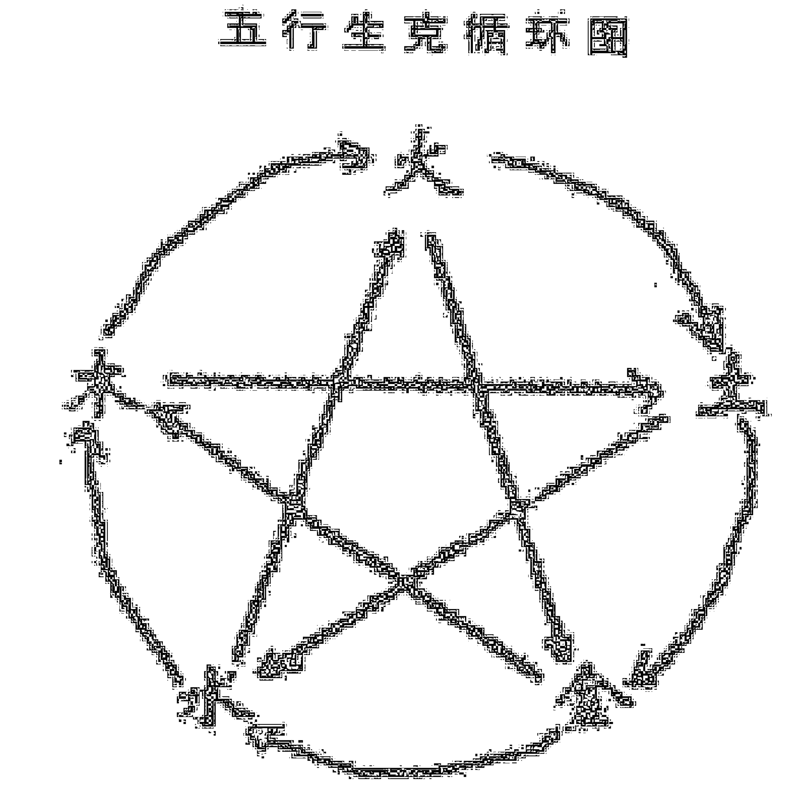

#### 1、相生

木生火，火生土，土生金，金生水，水生木，水有寒冷向下的特点，火有炎热向上的特点，木能生发，金能收杀，土能生养万物。

#### 2、相克

木克土，土克水，水克火，火克金，金克木。以上相克的法则是公理，如木克土，土强大，木弱的情况下，土反克木，这就是五行的反克。

奇门中，用神之间，要看谁克谁，克我者对我不利，我克者，对他不利。

#### 3、五行互藏

五行之间除了相生相克的关系以外，还有着相互包容的关系，就是你中有我，我中有你，充分显示了五行的整体，矛盾对立的统一性，明末清初的方以智，对五行互藏有这样的论述：

阳气无行体，则以阴为体，此阴之体就为阳之用，火性阳，中藏阴气功能，方能凝聚成体，阴体之物燃烧，则火焰向上，这就是阳以阴为体，水性阴、中藏阳气功能，方能流动不息，发生润下作用，是阴之体以阳为用，由此可见，阴阳从来互藏。

就五行中水火土三者的关系而言，方以智认为三者也互藏，土气由于阳光而蒸发，是土中藏火气，火气上升，遇冷而凝结成水气，水气再凝结而成为水，下降之水渗入土中，遇地中之火气，再次升入空中成为水气，如此循环，万物也就不断生化。

火能生土，同时也能生金、生木、生水，因此为金没有火，是不会熔化的，水没有火是不能升降，木除非火不能向上，土中之石与金敲击可以生火，古人发明了钻木取火，火没有形体，故能藏于万物之中，又能生成万物，日常生活中随地都能遇见五行互藏。

方以智还指出，表面上看，五行的特性是各有区别的，土为冲和之气，可调和其它四气，然而水火木金四气，都是因土气而形成的，所以土为五材之主，可见五行是构成宇宙万物的五大元素，同时又能表征物质的五种性能，五行具相生又相克，显示了五行功能的特殊性，五行又互藏互化，指出五行功能具有的统一性。

如果看不见五行的特殊性，人们的思想就会陷入不加区别的模糊状态之中，看不见五行功能的互藏互化，就会陷入孤立僵化的形而上学，以之分析问题，用来指导别人就会害了别人，指导行动就难免出错。

#### 4、同类相助

水与水相助，火与火相助，木与木相助，金与金相助，土与土相助，一个事物有两个方面，有时好似兄弟，古人用比肩来形容，兄弟从另一方面来说，则有分争之意。

特别是今天这种经济时代，为共同发展，拉着同类共同投入，为达到某种目的，他们会把合作之人看似兄弟，当达到目的时，又会把自己同舟共济的合伙人抛开，出现分争，彼此争斗。

### 四、五行与人体疾病

金、对应四季为秋天，故而秋天金旺，古人称之为当令，夏天火旺，火克金，因此金在夏天处死地，一强一弱对应到人体，金的寒暖就会引起金在人体对应部位的疾病。

金主咳、喘、虚怯、瘿痔、血疮、筋骨疼痛、骨病之象。

木、对应四季为春天，故而春天木旺，古人称之为当令，秋天金旺，金克木，因此木在秋天处死地，一强一弱对应到人体，木的寒暖就会引起木在人体对应部位的疾病。

木多为四肢不利，疯气肝胆，左瘫右患、口眼歪斜。

水、对应四季为冬天，故而冬天水旺，古人称之为当令，春夏秋冬四季中最后一个月为四季土，四季土旺土克水，因此水在四季土中处死地，一强一弱对应到人体，水的寒暖就会引起水在人体对应部位的疾病。

水主沉痼锢冷病，遗精白浊、腰、肾、淋沥，吐泻、痨蛊杂疾。

火、对应四季为夏天，故而夏天火旺，古人称之为当令，冬天水旺，水克火，因此火在冬天处死地，一强一弱对应到人体，火的寒暖就会引起火在人体对应部位的疾病。

火主头痛脑热、三焦口渴，狂言诞语，阳症伤寒，心腹疼痛，眼疾、恶疮。

土、对应四季为四季中最后一个月，故而四季中最后一个月土旺，古人称之为当令，春天木旺，木克土，因此土在春天处死地，一强一弱对应到人体，土的寒暖就会引起土在人体对应部位的疾病。

土主脾胃之病，黄肿、虚浮、瘟疫时气等。

古云，“金木凶死颠狂病，水土相犯不合亲，木土定知伤脾胃，水金痨蛊祸来侵。”

强金强木相遇必定颠狂，强金弱木相遇必定凶死，弱金强木必被反克，伤及腿脚，体内必是肺病，气管等症必死。

强水强土相遇，主家人不合，兄弟父母相残，弱水遇旺土必成腰肾等症，强水遇弱土，必是黄肿虚浮等症。

强水强金，必成肺病，筋骨疼痛，强水遇弱金，定是肺、气管，骨髓、大肠等症，强金遇弱水，主腰肾，淋沥，淫乱至死。

强木强土，必是脾胃之病，强木遇弱土，定是肠胃之病，强土弱木必是左耳，左肩，左脚伤残。

### 五、五行旺衰与方位

#### 1、五行旺衰

当某种五行旺到极点时，就会变为极弱，关于五行旺衰，宋代徐大升作了一段论述。

金赖土生，土多金埋，土赖火生，火多土焦，火赖木生，木多火炽，木赖水生，水多木漂，水赖金生，金多水浊。

金能生水，水多金沉，水能生木，木盛水缩，木能生火，火多木焚，火能生土，土多火晦，土能生金，金多土变。

金能克木，木坚金缺，木能克土，土重木折，土能克水，水多土流，水能克火，火炎水热，火能克金，金多火熄。

金衰遇火，必见销熔，火弱逢水，必为熄灭，水弱逢土，必为淤塞，土衰遇木，必被倾陷，木弱遇金，必被砍伐。

强金得水，方挫其锋，强水得木，方泄其势，强木得火，方化其顽，强火得土，方止其焰，强土得金，方制其害。

五行的强弱旺衰，一看是否得地，二看数量多少，三看得时不得时，时令是五行旺衰的关键，说明五行在不同的季节中分出了旺相休囚废死。

春季：木旺、火相、水休、金囚、土死。

木生于春天当令但还有寒气，得火暖身，方能顺利成长，有水来生，方见舒畅之美，但水不能太旺，旺则木漂，取火暖身，火不宜太过，太过木焚，故而水火既济才算最好，土多则泄力太过，土薄又难扎深根，如果金重，有火、金不会伤木，反能用火暖身，有木相助，木旺要得金制，才能大发。

金在春天，寒气不尽，须火来暖身方显荣耀，春天之金，体弱性柔，得土生才佳，水多则金寒，等于无用武之地，春天木旺金折，刚而不刚，有金来相助当然喜欢，但助而无火决非好事。

水之性，滥而淫。有土来克制，可防泛滥之灾。但生于春天，木旺则土死。再有水助，必有泛滥之忧。若得金生，又怕金盛，用火既济，火在春天为相，故而又怕火炎。用木泄身，水见功劳，无土则无制，因而自由散漫。

#### 2、五行与方位

东方木，南方火，西方金，北方水，中央土，东南方木，西南方土，西北方金，东北方土。

## 第五节 太极九宫八卦

### 一、太极

#### 1、太极图

太极图是古人用来模拟宇宙的模式图，是观察宇宙的灯塔，同时又是易学研究者必不可少的图象，古人提出“无极而太极”的思想，直到今天人们还是用太极的色象，推理万物，类象宇宙，然而无极的规律是看不见的，这个规律又是推动宇宙变化的根本，因此称它为无极，无极并非什么都没有，它是阴阳两种属性和五行所类属的万物变化之规律。

事物任何一个统一体，都有阴阳两个属性，阴阳就是形和气，形和气又因天地人而异，只有弄清事物发展的形和气，才能分清阴阳，然而事物发展的规律不是直线运动，观察事物时就要用曲成万物的眼光去看待事物，因此太极图用曲线来划分阴阳，属质的范围，对此老子作了一个概述：“道生一，一生二，二生三，三生万物”。

古人又把太极八卦紧密地联合起来，八卦的天地人三才表示把太极一分为三，再把五行含接取来，就把事物一分为五，更加细致的观察事物，与此同时，摆在我们面前的就是怎样划分阴阳的界线？不能明确划分阴阳界线的易学者，就是不会运用阴阳的法则。

易有太极，太极生两仪，两仪生四象，四象生八卦，这就是说，天地初开，一片浑浊，动中见阳，静中见阴，就是太极生两仪，用圆来表示宇宙、称太极，黑的部分为阴，白的部分为阳，这就是太极的两仪，两仪中，白中有黑，黑中有白，表示阴中有阳，阳中有阴，阴阳互藏，进而配八卦五行，这种观点为现代科学的宇宙理论发展，起到了奠基石的作用。

太极图的图示很多，左阴右阳的太极图配先天八卦图。奇门中常用的是左阳右阴的太极图配后天八卦图。如图：

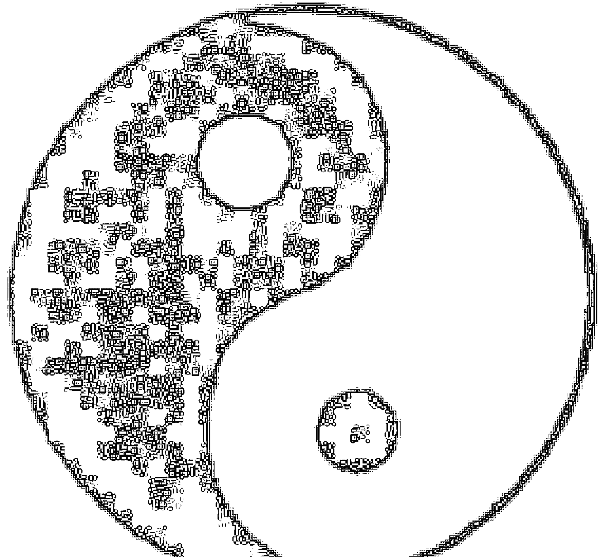

“太极”太就是至的意思，极是无限的意思，宇宙是其大无外，其小无内，从无到有，从有到无，从隐到显，从显到隐，宇宙就是这样有规律的变化着，这就是太极图的真正含义。由此可见古先哲们是不承认宇宙万物是由神创造和主宰的。要认识宇宙万物就要坚信科学，反对迷信，坚信唯物主义，反对形而上学。

### 二、八卦

#### 1、八卦

《周易》详细记述了，天象、物象、气象、四季变化的规律，用四正位的四正卦，表示一定的方位与时间，其中震卦居于东方，东方色青，天下皆春，定为立春、雨水、惊蛰、春分、清明、谷雨。离卦居南，南方色赤，天下皆夏，定为立夏、小满、芒种、夏至、小暑、大暑。兑卦居于西方，西方色白，天下皆秋，定为立秋、处暑、白露、秋分、寒露、霜降。坎卦居于北方，北方色黑，天下皆冬，定为立冬、小雪、大雪、冬至、小寒、大寒。

八卦图是古天文学家在测晷景时发现的，把一年分为八节，晷景在冬至最长，夏至最短，故定冬至夏至为寒暑的极点。春分秋分为阴阳之合，昼夜平分。立春、立夏、立秋、立冬为生长收藏之始。又以每一节管三气，三八合二十四节气。《烟波钓叟歌》中说，“次将八卦论八节，一气统三为正宗。”这就是八卦的由来。

不同的时期观察天文的起点不同，计算方法不同，夏商周时期，夏代的“连山易”形成了先天图。商代的“归藏易”形成了中天图。周代的“周易”形成了后天图。由于周代的历法是正月建子，以子月冬至为起算点，就用后天八卦配八节加以说明，便于理解。

八卦分为先天八卦、中天八卦和后天八卦：
先天八卦：乾、兑、离、震、巽、坎、艮、坤

#### 八卦的取象：

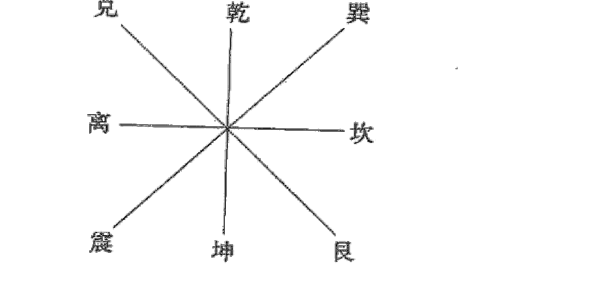

#### 中天八卦：

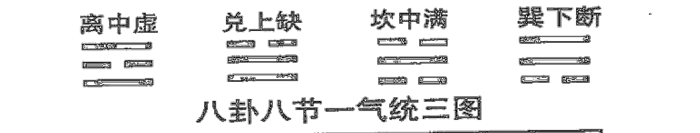

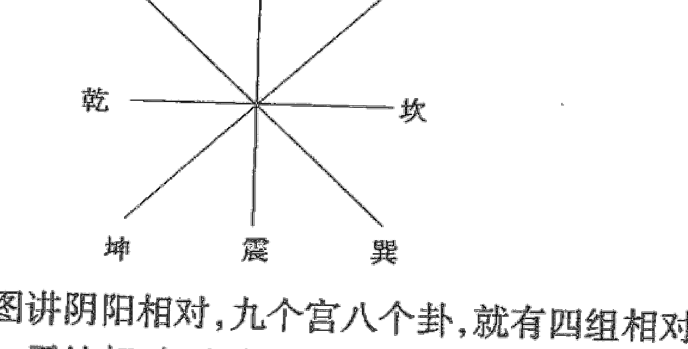

#### 八卦八节一气统三图

先天八卦图讲阴阳相对，九个宫八个卦，就有四组相对，乾为天，坤为地，天地相对，人在中间脚踏大地，头顶蓝天，古人的这个天地定位，说明了古时人们已经发现地球也是太空中的一个星体。

| 巽节气立夏 | 离节气夏至 | 坤节气立秋 |
| --- | --- | --- |
| 气小满 | 气小暑 | 气处暑 |
| 气芒种 | 气大暑 | 气白露 |
| 震节气春分 | | 兑节气秋分 |
| 气清明 | 东——西 | 气寒露 |
| 气谷雨 | 南——北 | 气霜降 |
| 艮节气立春 | 坎节气冬至 | 乾节气立冬 |
| 气雨水 | 气小寒 | 气小雪 |
| 气惊蛰 | 气大寒 | 气大雪 |

震为雷，巽为风，雷动则风生，风大则雷震，就是雷风相搏，这又是一种天地间阴阳对立的现象。

艮为山，兑为泽，山有多高，水就有多高，在高的山上都有水，在深的水里都有山，这就是阴阳对立山泽通气。

离为火，坎为水，火多水会被蒸干，水多火会被灭，水火互不相容，古人称为水火不相射。

中天八卦起于商代的“归藏易”，万物归藏于中的意思，中天八卦图主要表示阴阳平衡，图从右旋每相邻的两卦和相邻的各爻，都是阴阳相配，说明阴阳有相反相成的两个方面，从两个方面来维持阴阳平衡。如果人的身体不能维持阴阳平衡，就要生病。天地不能维持阴阳平衡，就有灾难。人类不能维持阴阳平衡，就有战争。

后天八卦图：乾、坎、艮、震、巽、离、坤、兑

| 巽 | 离 | 坤 |
| --- | --- | --- |
| 震 | | 兑 |
| 艮 | 坎 | 乾 |

传说后天八卦是周文王姬昌，遇难时在狱中所演，后天八卦图也是文王所画，首卦乾在西北角上，作易人西伯侯姬昌，居于西北方，后天八卦就用文王命名，主要表述阴阳相互依存的道理。

从八卦图中右旋来看，坎居北方得乾兑二金来生，故而北方水旺，艮居东北方，为焦土，得坎水滋润使东方、东南方震巽二木得以赖土而生，木虽克土，但赖土生，土得水而扶木，木旺而生南方离宫之火，火旺无制变有灾，故火又生西南坤宫之土而泄身，坤宫之土旺而生乾兑二金，金又生北方坎水，就这样循环往复，相互依存，推演万物。

#### 2、八卦五行

奇门中多用后天八卦，这里就以后天八卦所落宫位分析之。一宫：坎卦，居于北方属水。二宫：坤卦，居于西南方属土。三宫：震卦，居于东方属木。四宫：巽卦，居于东南方属木。五宫：居于中央，属土。六宫：乾卦，居于西北方属金。七宫：兑卦，居于西方属金。八宫：艮卦，居于东北方属土。

#### 3、自然数在九宫中的排列方法

后天八卦的排列方法是，横三排，上排四九二，中排三五七，下排八一六。竖三排，左四三八，中九五一，右二七六。三组数相加的和为十五，对角二五八，四五六，两组数相加的和为十五数，如下图。

| 巽 4 | 离 9 | 坤 2 |
| --- | --- | --- |
| 震 3 | 5 | 兑 7 |
| 艮 8 | 坎 1 | 乾 6 |

这就是奇门中的排兵布阵图，不论从任何一个地方进攻，都会遇到同等数量的兵力抵抗。“纵横十五在其中”说的就是这个理。原始布九宫八卦法一定要熟记心中，在十三宫奇门布局中才能应用自如。

#### 4、各卦宫的类象及象数理用的意义

金口奇门以天地人神作为宇宙天人合一的天体全息的思维方式。其九宫来源于《系辞》“河出图，洛出书，圣人则之”的理论基础。

金口奇门将后天八卦时间、空间与洛书九宫组合在一起，形成了地盘的九宫格局，九宫除了具有时间和空间方位的信息内容外，还具有万物的象征意义。

为了掌握十三宫奇门遁甲的象数理用的信息内容，我们有必要掌握八卦宫历来概括特定的内涵和外延——万物象类。

> 《周易说卦传》中说：“帝出乎震，齐乎巽，相见乎离，致役乎坤，说言乎兑，战乎乾，劳乎坎，成言乎艮。万物出乎震，震东方也，齐乎巽，巽东南也，齐也者，言万物之洁齐也。离也者，明也，万物皆相见，南方之卦也。圣人南面而听天下，向明而治，盖取此也。坤也者，地也，万物皆致养焉，故曰致役乎坤。兑正秋也，万物之说也，故曰说言乎兑。乾西北之卦也，言阴阳相悖也。坎者，水也，一正北方之卦也，劳卦也，万物之所归也，故曰劳乎坎。艮，东北之卦也，万物之所成终而所成始也，故曰成言乎艮。”这就是八卦万物象类的基本理论依据。

##### (一)乾卦宫：(含戌亥两地)

乾为天，为太阳，为冰、雹等。

在国家，为国君，主席，总统；在单位为书记，一把手，主要领导人；

在家庭为父亲，为大人，

在方位为东方，东北方(先天八卦方位)。
在时间为农历春二月，春分至谷雨45天，卯年、月、日、时。
在数字为四(先天八卦数)、三(后天八卦数、五行木数)、八(五行木数)。
在动物为龙、蛇、善鸣之马，善鸣之鸟，百虫，鲤鱼。
在静物为木、竹、苇、乐器、蔬菜、鲜花、树木、电话、飞机、汽车、火箭、鞭炮、闹钟、花草繁鲜之物、蹄、肉、山林野味。
在人体为足，为肝胆，为左肋。在颜色为青、绿、碧色。
五味为酸。

##### (四)巽卦宫：(含辰巳两地)

巽为风，表示自由活动和渗透性。天象代表刮风、台风、飓风、龙卷风等。
在家庭为长女、女儿；在社会为科技人员、教师、僧尼、仙道之人，气功师、练功者、商人、营业员、木材经营者、手艺人、能工巧匠、额头宽的人，头发细长而直的人，优柔寡断的人，自由职业者。
在场所为邮局、管道、线路、隘路、过道、长廊、寺观、草原、竹林、芦苇荡、升降机、传送带。
在方向为东南方，西南(先天八卦方位)。
在时间为春夏之交，农历三、四月，辰、巳年、月、日、时、立夏至芒种45天。
在数字为五(先天八卦数)、四(九宫数)、三、八(五行木数)。
在人体为股、肱、胆、气管、神经、左肩(九宫位)、练功之元气。
在动物为鸡、鸭、鹅、蝶、蜻蜓、蛇、蚯蚓、带鱼、鳗鱼、鳝鱼、斑马等。
静物为树木、木材、木制品、纤维品、丝线、绳子、麻、风扇、干燥机、飞机、气球、气垫船、帆船、蚊香、木香、兰花、草药、羽毛、枝叶、腰带、海带、下面有口的器物。
在颜色为绿色、蓝色。
五味为酸。

##### (五)坎卦宫：(含子地)

坎为水，为月亮，表示艰难、险阻的状态。在天象为雨、雷、露、霜。
在家庭为中男，中年男子；在社会为江湖之人、舟人、盗贼、匪徒，为数学、医生、律师、逃亡者、黑社会之人、诈骗犯、劳务人员、酒鬼、娼妇、自来水公司人员。
在场所为江河、湖、海、沟、渠、井、泉、下水道、洼地、酒店、冷饮店、浴室、澡堂、水族馆、地下室、暗室、自来水公司、鱼塘、饮食店、妓院。
在人体为肾脏、膀胱、泌尿系统、生殖系统、血液、内分泌系统、耳、肛门。
在动物为猪、为鼠、为狐狸、水鸟、鱼类、水中动物、美脊之马、劳苦之马、脊椎动物。
在静物为油、酒、醋、酱油、饮料、石油、药品、水车、轮子、刑具、蒺藜、丛刺、带核的果品、冷藏设备、浮萍、潜水艇。
在方位为北方，西方(先天八卦方位)。
在时间为农历十一月，子年、月、日、时，冬至至大寒45天。
在数字为一(九宫数)、六(五行水数，一、六水)。
在颜色为黑色，或白色(玄空飞星颜色一白)。
五味为咸味。

##### (六)离卦宫：(含午地)

离为火，为日，表示光明、美丽的性质和状态。天象为晴天、热天、酷暑、烈日、干旱、虹霓、霞光。
在家庭为中女、中年妇女；在单位为中层干部；在社会为中间层次人物，为美人、美容师、文人、作家、艺术家、演员、明星、编辑、侦察员、纪检人员。
在场所为朝阳的场所、名胜古迹、圣地、教堂、华丽的街道、电影院、电视台、画院、美术馆、图书馆、印刷厂、广告塔、电车站、冶炼厂、放射室。
在方位为南方，东方(先天八卦方位)。
在时间为夏天，为农历五月，为午年、月、日、时，夏至至大暑45天。
在数字为三(先天八卦数)、九(九宫数)、二、七(五行火数)。
在人体为眼、头部、心脏、小肠。
在动物为野鸡、孔雀、凤凰、仙鹤，为虾、蟹、螺、贝类，为鳖、龟、“变色龙”，萤火虫。
在静物为字、画、美术品、报纸、刊物、图书、杂志、契约、文书、合同、书信、照相机、摄影机、录相机、电视机、复印机、照明用具、广告、奖状、电报、连环画、化妆品、火炉、打火机、火柴、烧烤物品、焊枪、霓虹灯。
在颜色为红色、赤色，花色，紫色(九紫)。
五味为苦味。

##### (七)艮卦宫：(含丑寅两地)

艮为山，为土，表示静止和安定的状态。天象为云，为雾，为岚。

在家庭为少男，表少年；在社会为少年、儿童，为土建人员、宗教人员、官僚、贵族、继承人、警卫、守门人、矿工、狱吏、石匠、储蓄所人员。
在场所为山、山地、丘陵、高台、堤坝、休息室、坟场、阁寺、房屋、监狱、公安机关、派出所、大楼、城墙、仓库、宗庙、祠堂、矿山、采石场、银行、贮藏室。
在方位为东北方，西北(先天八卦方位)。
在时间为冬春之交，农历十二月和正月，丑、寅年、月、日、时，立春至惊蛰45天。
在数字为七(先天八卦数)、八(九宫数)、五、十(五行土数)。
在人体为鼻、背、手指、关节、左腿(九宫位)、脚趾、乳房、脾、胃、结肠。
在动物为狗、为虎、鼠、狼、熊、牛等有牙、有角的动物，还有昆虫、爬虫、家畜等有尾的动物。
在静物为岩石、山坡、土堆、坟墓、墙壁、门坎、阶梯、台阶、门板、石碑、土炕、柜台、桌子、床。颜色为黄色、棕黄、咖啡色、或白色(八白)。五味为甘，甜味。

##### (八)兑卦宫：(含酉地)

兑为泽，为雨，表示喜悦和言词。天象为潮湿天气，气压低、露水、阴雨连绵。
在家庭为少女、小女孩；在社会为与嘴有关的职业，如讲师、教授、演说家、讲解员、翻译、巫师、占卜者、媒婆、传达室人员、歌唱家、音乐家、相声演员、娱乐场所人员、娼妓、牙科医生、外科医生等。
在场所为沼泽地、峡谷、洼地、湖泊、池塘、滑冰场、游乐园、会议室、音乐厅、茶座、饭店、废墟、旧屋、山口、洞穴、井。
在方位为西方，东南(先天八卦方位)。
在时间为农历八月，酉年、月、日、时，秋分到霜降45天。
在数字为二(先天八卦数)、七(九宫数)、四、九(五行金数)。
在人体为口、舌、牙齿、咽喉、肺、右胁(九宫位)、肛门等。
在动物为羊、豹、豺、猿猴、水鸟、兔子、沼泽动物、鸡鸭。
静物为石榴、胡桃、饮食用具、带口的器物、刀剑、剪刀、玩具、破损物品、垃圾箱等。
颜色为白色，或赤色(七赤)。
五味为辛、辣。

以上是八卦各宫位的五行、方位、类象，学员应铭记心中灵活掌握、灵活变通，八卦取象要了如指掌，古人经验要一一背通，在此基础上，能把身边的事物归入八卦之中，社会在发展，古人类象的经验有些不适今用，这就要变通。

在今天这种纷繁复杂，百花齐放的年代里，时时都有新事物诞生，这就须要学易者有敏捷的思维方式，独特的观察能力，判断新事物的属性，归入八卦之中，分析事物的本源，确定新事物更好的发展方向。

# 第二章 金口奇门基础知识

学习奇门，首先要学会如何起局？传统奇门多常用《拆补法》或《置润法》来定局，但方法比较麻烦，对于一般学习奇门遁甲的人来说太过“高深”了。在金口奇门中我们仅用阴阳刚柔来定局，此方法比较简单实用，且信息取用极为灵活！

金口奇门的学习中只要掌握十三宫八卦的象意，十三宫八卦代表地，明白方向之论，配合十三宫位综合象意信息，贯串十三维时空信息综合全息分析！

然后对天、地、人盘干和神、星、门的具体意象和其所代表的象意、五行属性、在各季节的旺衰程度，对于判断事情的吉凶便是一目了然。

对于金口奇门所借用传统奇门的吉凶格局作为辅助参考，参考天地盘之干相加而得到的一种信息的暗示和寓象！

总之，要掌握的也就是如何进行综合纵深的分析，大家在学习时不要死记硬背以下内容，重点在于理解和延伸！

## 第一节 三奇六仪

### 1、三奇

三奇就是乙丙丁，在战争中，乙丙丁就是皇帝身边的警卫部队，保卫着皇帝的安全，又与皇帝有一种特殊关系，在奇门中甲木是皇帝的代称，乙是甲的妹妹，甲最大的敌人是庚金，金克木是天性，为了不让庚金克甲，天下争战，百性免遭涂炭之苦，甲把妹妹嫁庚为妻(乙庚合)，庚娶乙后贪合忘了克甲，能使天下太平，故而乙为一奇。

一甲、甲子戊，在盘中简称戊。
二甲、甲戌己，在盘中简称己。
三甲、甲申庚，在盘中简称庚。
四甲、甲午辛，在盘中简称辛。
五甲、甲辰壬，在盘中简称壬。
六甲、甲寅癸。在盘中简称癸。

太阳为火，乙居于东方，太阳总是从东方升起，传说日出于乙，故而乙又称为日奇。

丙为火，甲是木，木能生火，我生者为子孙，故而丙是甲的子孙，丙为阳刚之火，能煅庚金，又为甲的儿子，护卫父亲是丙的天性，在奇门中，随大元帅甲子戊讨伐四方，捍卫和平，丙之奇，奇就奇在他是太子，又是大元帅身边的机动力量。

记住六甲的顺序，这个顺序在九宫八卦中永远不变，只是落宫不同，同时又是确定奇门不同盘式的主要依据。在奇门定式图中，是几局甲子戊就在几宫，依上列循序，遵循阳顺阴逆的原则分布九宫八卦。

丙火猛烈之性是甲木生给的，月亮自身不会发光，是太阳照射下的反光，故而古人定丙火为月奇。

三奇六仪的排列顺序：戊、己、庚、辛、壬、癸、乙、丙、丁，这个顺序在奇门中遵循，以顺排六仪，逆排三奇为准！

丁为阴火，但不是柔弱之光，能克庚金，不焚甲木，是甲木的女儿，护卫父母是天性，克制庚金是本能，奇门高明之处就在于他的隐遁之法，月朔夜是最好的隐遁时间，日月失去光明，星光发挥作用，丁正好是天空中的星星，因此三奇之中丁奇最灵，又称星奇。

### 3、金口奇门十三宫八卦宫位图

在奇门定式图中，乙丙丁的顺系不变，遵循阳顺阴逆的原则分布九宫八卦。

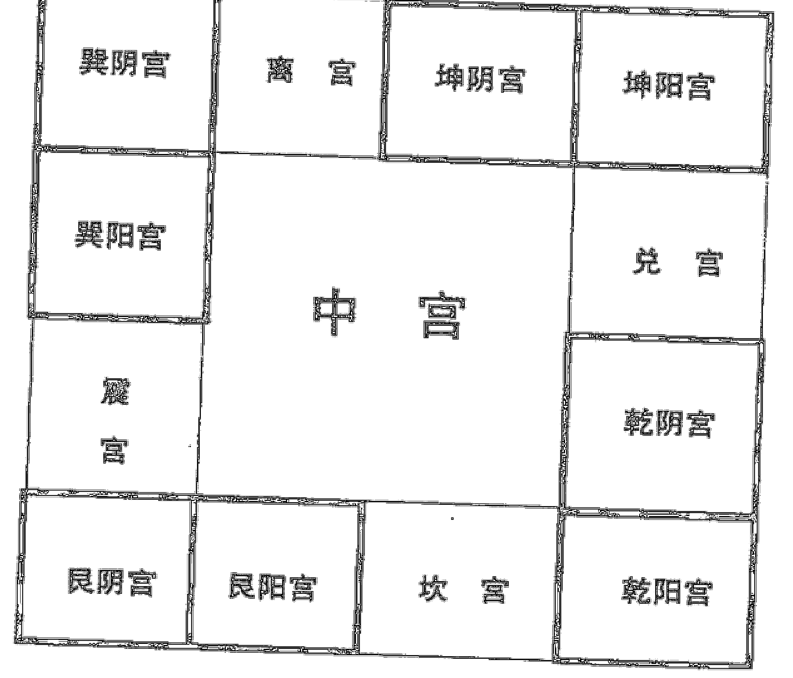

### 2、六仪

六仪就是天干中的戊、己、庚、辛、壬、癸、六位，

仪为仪仗，古时各级官员出行，都有仪仗开路，用以显示官员的威严，皇帝出行更是前呼后拥像一条真龙，故而皇帝有真龙天子的说法，奇门就是取其意而用，戊、己、庚、辛、壬、癸、是六甲的仪仗，六甲就是甲子、甲戌、甲申、甲午、甲壬、甲寅。六甲六仪要作为一个整体来用，它们配合如下：

### 4、金口奇门十二地支宫位图

| 巳地 | 午地 | 未地 | 申地 |
|---|---|---|---|
| 辰地 | | | 酉地 |
| 卯地 | | | 戌地 |
| 寅地 | 丑地 | 子地 | 亥地 |

### 5、十三门原始宫位图

| 天门 | 景门 | 吉门 | 死门 |
|---|---|---|---|
| 杜门 | | | 惊门 |
| 伤门 | 玄门 | | 开门 |
| 生门 | 从门 | 休门 | 冲门 |

### 十三门的信息特征

阳盘：开门、冲门、休门、从门、生门、伤门、杜门、天门、景门、吉门、死门、惊门
阴盘：休门、死门、吉门、伤门、杜门、天门、玄门、冲门、开门、惊门、从门、生门、景门

一般说来，开、休、生三门吉，死、惊、伤三门凶，杜门、景门中平，冲门、从门为中凶之门。天门、吉门二门为中吉门，玄门为左右之门，根据不同情况会出现不同的结果。

但运用还必须看临何宫以及旺相休囚墓和全息时空作用分析。古人有歌曰：吉门被克吉不就，凶门被克凶不起；吉门相生有大利，凶门得生祸难避。吉门克宫吉不就，凶门克宫事更凶。

十三门在奇门遁甲天、地、人格局中代表人事，所以在奇门预测中极为重要，特别是用神所临之门，以及值使门即值班的门，与所测之人、事物关系很大。

古人有八门执事歌一首，概括了八门所主的主要事项：
欲求财利往生方，葬猎须知死路强。征战远行开门吉，休门见贵最为良。
惊门官讼是非多，杜门无事好逃藏。伤门搏斗能捉贼，景门饮酒好思量。

附：吉门遇事肚量大，天门运筹好作为。冲门冲动隐私事，从门静心求神佛，玄门生长润万物。

这就是说，不论别人还是自己，如果问求财之事，起出奇门格局后，看生门落在哪个宫内，该宫所在方向就是作生意求财的方向；要问丧葬和打猎，则死门落宫方向就是最有利的方向。如果要行军打仗、出门远行，则开门落宫方向最吉；如果要拜见贵人和上级领导，以休门落宫方向最佳。惊门落宫方向一般官讼是非多。杜门落宫是躲灾避难最好的方向。伤门落宫的方向适宜搏斗、讨债、捉贼。如果要饮酒聚会，商议谋划，最好到景门落宫的方向。如果调解不和争斗之事在吉门方向为佳。如果运筹事业发展或研究战略规划，那么选择天门所在地那是最好不过了。如看隐私事及冲动的内因看冲门，就会做到心中有数。如要精心修炼或寻师学习自身修养，往从门方向会给你带来意外惊喜。

下面具体讲讲原始九门和四个隐门的信息特征：

#### 1、休门
休门居北方坎宫，属水。坎水得乾金之生，于人为中男，上有兄下有弟，从容休闲；又坎宫处冬季最寒冷季节，万物休息冬眠，故古人命名为休门，乃休养生息之地。变为吉利之门。

休门属水，旺于冬季，特别是子月，相于秋，休于春，囚于夏，死于四季末月。休门居坎宫为伏吟，居离宫反吟，居巽宫入墓，居坤艮二宫受克，居乾兑二宫大吉，居震宫次吉。休门也为吉门，利于求见领导和贵人，上官赴任，嫁娶迁徙，经商建造，但不利行刑断狱。

位居正北坎宫，五行属水，坎宫处冬季最寒冷的季节，万物休息冬眠，又坎水乃资生万物之源，又是一阳复始的起点，生命遇此萌动，故称休门，吉门。

休门利于求见领导，见贵人，托人办事，上官赴任，嫁娶出行，经商建造，但不利于急进，诉讼刑狱。

象意：休养生息、休闲、懒散、旅游、休息、漫不经心、调养、整理、美容、美发、死亡、睡眠、不负责任、涣散、娱乐、饮酒品茶。漂亮、美丽、气质好、低语、着装随意、不慌不忙、安然、温顺、没有活力。

人物：品质高贵之人、服务行业人员、白领、护士、退休人员、无事可做者、懒人、讲吃讲穿者、无工作靠父母养活、不求上进者、思想家、数学家、书法家、亡命人、邪教头目、多情人、妓女、酒鬼、卑下之人。

静物：饮料、酒、调料、水、油漆、油、涂料、液体物质、布匹、衣物、棉花海绵松软物质、各种运输车、各种运动的家用电器。

地理：水池、水景、河流、海滨、有水的场所、车站、码头、广场、公园、酒吧、娱乐等休闲地方、名人居所、卧室、疗养院。

疾病：休门代表疾病处在修复期、调理期、或潜伏状态。慢性病、富贵病、亚健康、懒病、精神不振、水灾之疾、尿毒症、膀胱、血液、生殖系统病、昏睡不醒、肾虚。

工作：旅游业、娱乐业、与水有关的行业、流动的行业、矿泉水厂、酒厂、石油行业、水泥厂。

#### 2、死门
死门居西南坤宫，属土。死门与艮宫生门相对，万物春生秋死，春种秋收，故命名为死门。

死门属土，旺于秋季，特别是未、申月，相于夏，囚于冬，死于春。居坤宫伏吟，居艮宫反吟，居巽宫入墓，居震宫受克，居离宫生旺大凶，居坎宫被迫大凶，居乾、兑二宫相生为休。死门为凶门，不利吉事，只宜吊死送丧，刑戮争战，捕猎杀牲。

方位居西南坤宫、五行为土、正值秋季来临、万物春种秋收，春生秋死，与艮宫生门相对，故为死门，死门为凶门，不利吉事，只宜吊死送丧、刑杀征战，捕猎杀牲。坤为母，为印星，利教学，授徒。

象意：固执、不灵活、没有变化、丧失生命力、无生无息、不可调和、固定不变、鬼神、坟墓、不可动摇、呆板、木讷、死板、迟钝、稳重保守、死心眼、雕塑、神象、偶像、凶器、墓碑、枷锁、停尸房、土地、屠宰厂、空房、凶宅、医院、刑场、陶瓷、药品、灵牌、衣服、酱菜、顾问。已结束的事情、失业、失学、毕业、结果。

人物：死人、固执的人、死板的人、不会变通的人、无可救药的人、行刑之人、屠夫、医生、教师、痴呆人、村干部、无有实权之人、将死之人、忠厚之人。

疾病：死门代表疾病，严重，无药可治、性质转变状态。癌症、硬皮病、腹部病、胃癌、肌肉坏死、半身不遂、植物人、失忆症、昏迷。

职业：教学、外科医生、屠夫、食品加工业、肉食厂、建筑业、出家、修行、寺庙、生物专业、稳定的行业、单调的行业、不需创新的行业、最不时兴的行业、最叫人看不上眼的行业、失业。

#### 3、吉门
五行属阴土，位居西南。场所主大院、墙堰、坟墓、田野；在人为老妇人、放羊人、寡妇、巫师；为酒食、宴会，婚姻喜美。见金火大吉，见水主争竞，见木官事破财，妻病不利，博大宽厚坦率真诚。味甜辛。作为声音则婉而恰切。体质是沉稳而静。得时得令，可以引导教化万物；失时失令则愚笨痴呆。它的性格是不固执，宽宏大量。为面，见壬癸主脓疮粉刺，体内则主脾脏问题，体表则代表、腹部、口腔。已也代表增生之物。在动物为羊、鹰、白头翁；在物为衣服、药品、食物、酒器；在事上见吉神为酒食、宴会、喜美之事，见凶神凶格为疾病，孝服、官灾。主胃，主肚子，主鼻，性质为增生物，为大，在离宫多主头部血液循环系统受阻出现脑血栓导致偏瘫；临坎宫则主子宫肌肉增生，输卵管或尿道、阴道受阻，前列腺肥大；落震兑宫多主肠胃、腰椎增生、后背酸痛，临乾艮多主腿部静脉曲张，麻木、酸痛，结肠问题。

#### 4、伤门
伤门居东方震宫，五行属木，正当卯月春分之后甲木帝旺之时，旺则易折；震卦主动，动则易伤；元帅甲子常隐于戊土之下，子与卯相刑，刑则受伤，故古人将与震宫对应的八门命名为伤门。伤门属凶门，主人遭疾病刑伤之象。

伤门属木，旺于春，特别是卯月，相于冬，休于夏，囚于季月，死于秋。伤门居震宫伏吟，居兑宫反吟，居坤宫入墓，居坎宫生旺大凶，居乾宫受制，居艮宫被迫大凶，居离宫泄气。伤门为凶门，不利经商、出行、赴任、修造、嫁娶，经商易破财，出行易有灾。但适宜于索债、捕捉盗贼、渔猎、赌钱等。

位居东方震宫，五行为木，为凶门，震主动，动则易伤，值春分之时，嫩牙生出，精液外流，最易受伤。故称为伤门、凶门。

伤门适宜捕捉、索债、赌博、戏耍、收敛财物、利凶事。不宜出行，经商、求财、修造、嫁娶。用神临伤门只求平安、守旧。凡吉利之事临伤门皆不可为。

象意：损害、消耗、妨碍、受伤、伤心、伤痛、捕捉、索取、赌博、挑逗、收财、渔猎、威严、恐怖、难看、丑陋、健壮、容易使人受伤的工具和物件、破裂不完整的东西。带刺的植物和花草、草制品、音响、乐器、电话、闹钟、裙裤、大件家具。

人物：公安、军警、格斗、斗殴、讨债人、竞争对手、伤心人、驾驶员、外科医生、受伤者、飞行员、邮递员、运动员、吹牛者。

性情：直爽、易怒、暴躁、粗野、心里不安、心神不定、雷厉风行。

地理：破坏的道路、危险的环境、悬崖、屠宰厂、医院、化工厂、兵工厂、公安局、检察院、法院、炸药存方地、鞭炮厂、凶杀现场、车祸现场。

疾病：伤门代表疾病处在损害、消耗、妨碍状态。急病、抽风、肝癌、传染病、手脚之伤、意外受伤、头疼、血压高、惊恐症。

职业：公安、保卫、武警、从军、开车、运动员、邮电公司、广播、乐器店、危险品生产、木材行业、旅游行业、通信业、屠宰行业。

天时：春天、早晨、风、雷电。青色、绿色。

#### 5、杜门
杜门居东南巽宫，属木。巽为长女，受乾父之冲克，又克坤母，与父母皆不和，故在家中处事阻塞不利；又巽宫位有辰土，既是水墓、土墓又是辛金之墓；八卦九宫均为阴阳对立统一格局，西北方为开门，与它对冲的东南方自然就命名为杜门，一开一杜，二者对立统一，4+6=10，统一于五行地数（9为天数，先天八卦对冲方位二卦相加均为9数；后天八卦对冲方位二卦相加均为10数，10为地数）。

杜门属木，旺于春季，特别是辰、巳月，相于冬，休于夏，囚于四季月，死于秋。杜门居巽宫伏吟，居乾宫反吟，居坤宫入墓，居兑宫受克，居艮宫被迫，居坎宫受生，居震宫比和，居离宫泄气。

杜门小凶，也为中平。在人事上多主武官、军队、警察、公安、安全等具有检察性质的单位。杜门为藏形之地，适宜于躲灾避难、捕盗剿贼、防洪筑堤、判决隐狱等，余事皆不利。

位居东南巽宫，五行为木，杜有阻塞之意。我国东南为海，海边杜塞不通，因称杜门。杜门为小凶之门，亦为中平，适宜躲灾避难、捕盗、捉贼、防洪筑堤、学习技术、钻研科技、杜门又为阻碍，停滞、测运多为事业受阻，困难重重。

象意：阻止、阻塞、困难、阻碍、限制、闭塞、隐藏、覆盖、遮掩、关闭、断绝、技术、艺技、晦涩、呆滞、黯然、书报、门窗、瓶塞、盖、衣物、被子、窗帘、内衣、胸罩、电子芯片、退休、逃避、归隐、等待时机、逃亡、消失、放弃、绳、扇子、邮件、吹风机、草药、皮带、羽毛球。

人物：技术人员、理论工作者、心理学者、管理学者、佛教徒、基督徒、气功师、僧道、公检法、安全保密人员、狱警、聋哑人、中风者、造谣生事者。

性情：内向，文静、平和、生气、小心眼、遇事想不开、孤言寡语。

地理：提坝、围墙、隔离带、闸口、门槛、监狱、卡口、收费站、十字路口、服务窗口、排队。

疾病：杜门代表疾病，外在隐藏、治疗不见效果、不顺畅的状态。血栓、神经系统、气喘、肝炎、胆结石、筋骨酸痛、身体内部，某一个部位病变，造成身体不适。肩痛、身消体瘦、感冒。

职业：文化教育业、科研单位、公检法、保安、看守、保密业、情报业、交警、无业游民、营业员、木材场、作者、宗教行业、通讯业、设计院、手工艺制造。

天时：风、空气、气流、气旋。绿色。

#### 6、天门
五行属阴火，位居东南方。主文书梦寐，为阴人主轻薄，好淫乱。为惊恐，主乞索。为火，主窑灶。见土木则吉。见水主妇人病，见金主疾病屯蹇。在人为妇人、少妇、少女、乞丐；动物为长虫、蚯蚓、蝉、萤火虫；物品主书画、文字、花果、砖瓦、瓷器；在事上见吉神主文书、票证，见凶神主疫病、梦魇。五脏受病主心脏，体表主胸和舌。颜色淡红，五味属苦。形体秀丽清高。性格和顺而有心计。得令是销熔暴戾，洞察奸邪；失令则愁苦、呻吟。在奇门中为星奇，为玉女，婚姻中的第三者女人。

#### 7、玄门
玄门位居中宫，是众妙之门、是人事发生发展的关键环节，谓之玄门。五行为土。

象意：不明不白、进退不果、思前想后、神思不清、不辨是非、神秘莫测、深奥、困难、土地、山外有山、服从、有承受力、生育、死亡、故弄玄虚、虚假不实。神佛象、香案、祭祀用品、灵位。

人物：僧道之人、特异人、深沉之人、关键人物、仙人、死人、神秘人物。

性情：不言不语、固执任性、面无表情、似笑非笑、吞吞吐吐、结巴之人。

疾病：玄门代表疾病性质不明、不好确珍、病人昏迷。病因不明、神鬼附体病、癌症、无治之症、慢性病、时好时坏的病、皮肤病、胃病、结石。

职业：宗教业、神职、巫医神汉、技术性极高的行业、尖端科技、关键部门、不能公开的行业。探险。神秘文化、玄学。

#### 8、冲门
五行属阴水，位居西北方。冲动之门，场所主江河、湖海、仓库、寺院、楼台、厕所；在人主小儿，乞丐、掌鞋人、赶猪人、醉酒人、罪人、盗贼；动物为鱼、虾、蟹类；物品为毛发、麻布、绸绢、笔墨；在事上见吉神主婚姻、求索，见凶神主争斗、难产。五脏受病主肾和心包，体表则主足。颜色浅黑，五味咸浊。性可知阴柔浅露，得令则从龙变化，狐假虎威；失令则沉溺灰心，或摇尾乞怜。在奇门中往往代表与女性、与性生活有关系的事物或人。主阴人疾病，腰脚、走失，凶事成讼，渡河水涸。吉主征召文书。吉主赏赐、阴私喜美、宴会、婚姻、奸淫妇女。凶主帏幕不明、走失奴婢、脏腑生灾、师婆、奸诈、私淫、失望、暗昧不明之事。

#### 9、开门
开门居西北乾宫，五行属金。乾卦是八卦之首，为天为父，于社会为首长；乾纳甲壬，乾位有亥，亥为甲木长生之地，甲又为十干之首，所以古人对应乾宫的门命名为开门，喻万物开始之意，为大吉大利之门。考诸中国历史，几乎所有开国之君俱从西北乾位开创基业，开门之名不虚也。

开门属金，旺于秋季，特别是戌、亥月，相于四季末，休于冬，囚于春，死于夏。开门居乾宫伏吟，居巽宫反吟，居艮宫入墓，居离宫受制，居坤宫大吉，居兑宫旺相，居坎宫次吉，居震宫为迫。

开门大吉，利于开业经商，征战远行，考学参军，婚取乔迁，建筑贸易，添人进口，治病求医。

位居西北乾宫，五行为金。乾为天门，又为八卦之首，为万物开始之义，故为开门。为大吉之门。开门利于坐地求财，开业经商，出门旅游，开学考试，婚嫁乔迁，建筑贸易，治病求医，开业庆典，惩恶伐异，谋求大计，利吉不利凶。

象意：尊贵，开放，开创、开始、开明、打开、公开、舒展、宽大、辽阔、手术、通畅、顺利、经营、经济、升迁、提职、婚嫁、交易、庆祝、威严、珍珠、玛瑙、礼品、金钱、镜子、古董、水晶制品。

人物：领导、公务员、白领、名人、老板、创业者、法官、买卖人、外科医生、矿工、首脑、核心人物、人大代表、委员、专家、自信者。

性情：爽朗、口快心直、坦荡、公正、无拘无束、思想前卫、言谈不凡、通情达理、重情重义、自尊、好学上进。

地理：高亢之地、开阔之地、豪华之地、名人居所、领导办公室、大单位、一流企业、车站、机场。

疾病：开门代表疾病处在性质特征明显、清晰、易于诊断等状态。急病、骨骼病、皮肤病、寒热症、肺病、大肠病、外伤、手术、性病。

天时：晴空万里、傍晚、秋天。

#### 10、惊门
惊门居西方兑位，属金。正当秋分、寒露、霜降之时，金秋寒气肃杀，草木面临凋敝，一片惊恐萧瑟之象；又兑卦为泽，为缺，为破损；又兑主口，主口舌官非，故古人将此门命名为惊门，与东方震宫伤门相对应。

惊门属金，旺于秋，特别酉月，相于四季月，休于冬，囚于春，死于夏。居兑宫伏吟，居震宫反吟，居艮宫入墓，居离宫受制，居巽宫为迫，居坎宫泄气，居坤宫受生，居乾宫比和。惊门也是一凶门，主惊恐、创伤、官非之事。适宜斗讼官司、掩捕盗贼、蛊惑乱众、赌博游戏，其余事不可为。

位居西方兑宫，五行为金。正当秋分，金秋寒露萧杀，草木凋零，一片惊恐萧瑟之象。故为惊门。惊门主争论、惊恐、适宜斗讼官司，蛊惑乱众、赌博游戏。余不可为。

象意：惊恐、怪异、刺激、吃惊、诧异、慌乱、声音、官非、口舌、斗讼、音乐、风铃、钟、音响、电视、电话、杯子、钥匙、金银首饰、玻璃水晶器具、剪刀、硬币。

人物：律师、教师、歌星、监察人员、恐怖者、惊吓、凶灾、车祸、外伤、牙医、演员、女服务员、小女孩、巫师、秘书、非处女、小丑、破坏者、金融、性感、有魅之人。

地理：闹市、街道、公安局、检察院、法院、歌厅、影院、球场、体育馆、操场、乐器厂。

性情：巧舌、声音宏亮、恐慌、忐忑不安、心事重重、心惊肉跳、多情、好色、冲动。

疾病：惊门代表疾病处在阵痛、抽搐、严重、危险的状态。喉咙病、肺病、声带、大肠、筋骨、皮肤、口腔病、外伤。

#### 11、从门
五行属阴土，位居东北方。场所主桑园、桥梁、宫殿、礼堂、坟墓。在人主贵人、尊长、神佛；动物为牛、驴、骡子；静物主锁匙、首饰、珍宝、斛斗、鞋类。在事上遇吉神吉格主喜庆、迁官晋职；遇凶神凶格，主刑狱、词讼、口舌是非、离乡背井或疾病。五脏受病主脾，体表主腹部和面部。颜色浅黄，五味甘辛。性格温顺，体质沉静。得令则教化万物，失令则洁身自好。吉主阴人清标，恬静，钗钏、酒食，见金主阴私，遇土主口舌，见火主失财，病患。见水土大吉。为腹部，又为骨骼，性质为错位、颗粒、小的增生物，在兑、乾、离宫多主支气管肺部疾病，见戊己多为骨刺或骨椎增生。

#### 12、生门
生门属土，居东北方艮宫，正当立春之生，万物复苏，阳气回转，土生万物，所以古人命名为生门，大吉大利之门。

生门旺于四季月，特别是丑、寅之月，相于夏，休于秋，囚于冬，死于春，生门居艮宫伏吟，居坤宫反吟，居巽宫入墓，居震宫受克，居离宫大吉，居乾兑二宫次吉，居坎宫被迫。生门大吉，利于求财，特别是搞房地产、种植业、养殖业等。征战出行、嫁娶建造也为吉利。但不利埋葬治丧。

位居东北艮宫，五行为土，色为黄、灰。艮是寅位，天开子位，地辟丑位、人生寅位、天气致此，三阳开泰，万物复生。故为生门。为大吉之门。生门利见官求官，求财经商，嫁娶迁移，等吉事、不利凶事。

象意：经商、利润、效益、学习、工作、生意、生活、生产、生存、生长、活着、方形、乐观向上、忠厚、守时、诚恳、稳重、有经济头脑、生活中所需一切物品。

性情：善良、大度、聪明、和蔼可亲。

地理：人生活、工作、学习、休息、娱乐等人们生活的地方。

疾病：生门代表疾病处在发展变化状态。脾胃病、皮肤病、癌症、感冒、鼻炎、关节肿大、过敏、下肢无力。腹疾、肌肉、慢性病。

人物：工作者、生产者、生意人、管理者、学生、孕妇、经理人、领导人、儿童、青少年、有前途之人、有希望、有独立能力之人、矿工、银行职员。

职业：矿产业、房产品、金融业、食品业、产值高的行业。

#### 13、景门
景门居南方离宫，属火。在家中为中女，在乾金为父，与丈夫中男坎水对冲，易动口舌，常有血光之灾；又景门正当日升中天、大放光明之时，但烈日炎炎，虽夏季景色美丽，但难免有酷暑之忧；又景门所在离宫正南与正北坎宫休门相对，一个万物闭藏休息，一个万物繁茂争长，故古人命名为景门。

景门属火，旺于夏，特别是午月，相于春，休于四季月，囚于秋，死于冬。居离宫伏吟，居坎宫反吟，居乾宫入墓，居兑宫被迫，居震、巽二宫生旺，居坤、艮二宫生宫为休。景门小吉，亦为中平。

宜于献策筹谋，选士荐贤，拜职遣使，火攻杀戮，余者不利，谨防口舌及血光、火灾。景门多主文书之事。

位居南方离九宫，五行为火，色大红。景门多主血光，口舌、流血事件。但亦为小吉，宜建议献策、选用人材，获取信息，宣传广告，探寻市场，扩大名声，饮酒游乐。

象意：文化、文书、漂亮、火光、流血、风景、旅游、前程、名声、美丽、红脸、字画、照片、图片、灯光、艺术品、首饰、时装、文件、合同、证书、颜料、油漆、色彩、霓虹灯、家电、凡是用于有关创造美的东西。手电、照像机、打火机、灶具。

人物：文化人、作家、文学家、诗人、漂亮的人、美容美发师、电信工作者、广告人、图书管理员、文科生、会计、中层干部。

性情：心直口快、脾气急躁、虚荣、知书达礼、自尊自爱。

地理：旅游景区、公园、繁华街道、电影院、戏院、美容院、娱乐场馆。

职业：美容美发师、广告业、出版业、文化行业、旅游业、选美、演艺业。

疾病：代表疾病处在活跃、发热、发烧状态。血液病、血压高、心脏病、眼病、近视。血光之灾。

十三门在五行上各有归属，开、休、生为三吉门，死、惊、伤为三凶门，杜门、景门中平，冲门、从门为中凶之门。天门、吉门、玄门为中吉门。

预测时常以它们落宫状况，即与所落之宫的五行生克和旺相休囚来定吉凶、断应期。

古人把门克宫称为“迫”，叫“门被迫”，而且有歌说：“吉门被迫吉不就，凶门被迫事更凶。”实际就是说，吉门克宫，吉事不就，凶门克宫，事情更凶。又把宫克门叫做“制”，实际上是门受宫克，“吉门受克吉不就，凶门受克凶不起”，吉门受到地盘的制约，吉事不成；凶门受到地盘宫的制约，凶事就闹不起来了。古人又把门生宫称作“和”，宫生门称作“义”。门宫相生，对于吉门来说自然为好，等于好上加好；但是对于凶门来说，如果受生，更加旺相，那就凶上加凶了。所以，不能一般认为，相生就好，相克就不好，必须具体情况具体分析，而且还要根据季节论其旺相休囚。

至于十三门所代表的其他类象事物，可参照它们所对应的八卦万物类象。

### 6、金口奇门十二星原始宫位图

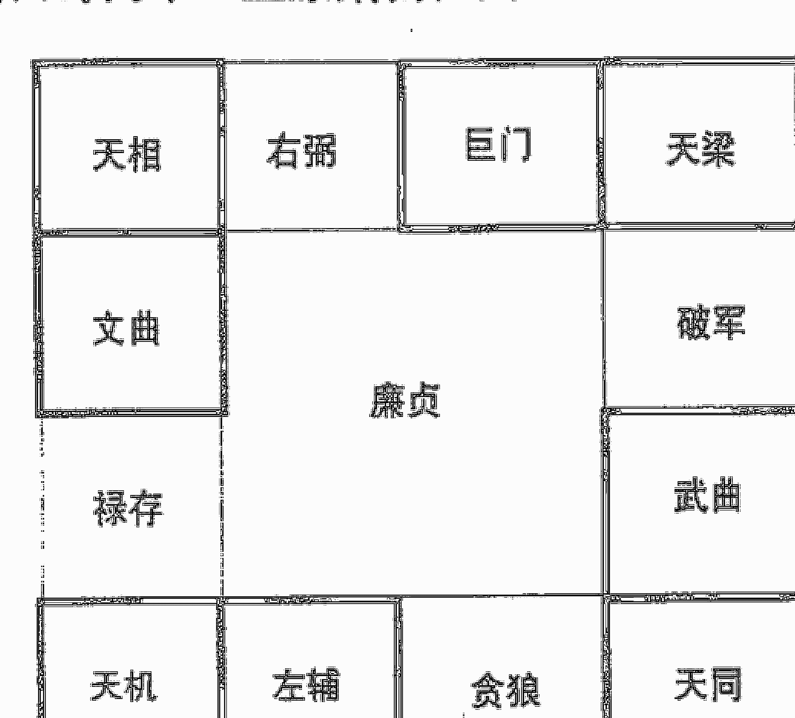

### 十二星的信息特征

十二星名称：贪狼、天梁、巨门、禄存、文曲、天相、廉贞、天同、武曲、破军、左辅、天机、右弼

奇门中的十二星，又叫十二将，奇门遁甲注重的是天、地、人与时空全息，九宫八卦十三地是代表“地”的，十三门是代表“人”的，十二星是代表“天”的，即“天时”、天体运动对地球和人类的影响。

古人从常见的行星中，根据它们运转歇宿的位置，选择其中有代表性的十三颗，分别与地上的九宫八卦十三地相对应，这就是与一宫对应的天蓬星，与二宫对应的天芮星，与三宫对应的天冲星，与四宫对应的天辅星，与五宫对应的天禽星，与六宫对应的天心星，与七宫对应的天柱星，与八宫对应的天任星，与九宫对应的天英星。

### 天下奇门第一局——金口奇门

一般说来，天心星、天任星、天禽星、天辅星为四吉星，天冲星是次吉之星；天蓬星、天芮星、天柱星为三凶星；天英星中平。

1、天蓬星：原名贪狼星，与北方一宫坎卦子地相对应，阳星，五行属水。坎水正当隆冬季节，至寒至冷至暗，喜阴害阳，人们认为它和盗贼出没有关，所以把它称为凶星、盗星。（《西游记》中猪八戒由于性贪被封为“天蓬元帅”。）

天蓬星临宫，宜安抚边境，修筑城池，兴作土木，培垫堤防，屯兵固守；余事不利，特别是经商出行易遇盗贼或破财、生病。

2、天芮星：原名巨门星，与西南方二宫坤卦未地相对应，阴星，五行属土。因与八门中吉门相对应，认为它的出没与疾病流行有关，所以把它称为病星、凶星，奇门预测疾病一般以它为用神，看它落在何宫及其旺相休囚，来定病的部位及轻重愈后状况。

天芮星临宫，适宜受业师长、交纳朋友、屯兵固守，不宜用兵、嫁娶、争讼、迁徙、修造等。

3、天梁星：与西南二宫坤卦申地相对应，阴星，五行属金、戊阳土。土主精神为阳性而内含阴，是静中带动之星。方位：西、申方（寅是因、申是果），色黄。管寿元及食禄、是父母之星、荫星、老大之星，主清高、慷慨、化吉之星，故遭难不免多忧虑，然后化解以显其功也，刑法纪律之逢凶化吉。为人喜照顾别人、有正义感会路见不平、心善霸道固执、孤高自负有威严，喜自由自在的生活。

天梁星是延寿之宿，为信仰星座，医药星座，投机星座，哲学星座，统率星座或军事及其它运用最高策略星座，机谋赌博星座，解厄福寿星座。

4、天冲星：原名禄存星，与东方三宫震卦卯地相对应，阳星，五行属木。人们认为它有慈心造化，助人为乐之德，与农事活动有关，故把它称为吉星，但吉利程度不如天心、天任、天辅三星，所以有人叫它次吉之星。

天冲星临宫，宜于选将出师，征代交战，鸣金击鼓，摇旗呐喊。其它一般或不利。

5、天辅星：原名文曲星，与东南四宫巽卦辰地相对应，阳星，五行属木。人们认为它是天上的文曲星，与文化教育事业有关，故称为大吉之星。天辅星临宫百事皆宜，出行、经商、婚娶、修造均吉，特别利于升学考官，发展文化教育事业。

6、天相星：与东南四宫巽卦巳地相对应，五行属阴火，管衣食、印信、契约、支票、单据、车票、罚单，好比是首相故乃官禄主宰。为印星（媒人星），广慈，官禄主。最吉祥的星在诸宫皆吉，只旺弱之分。于人相貌端正谨言慎行、负责忠厚老实、诚信有正义感、性温和乐助人服务热心，喜调解纷争与平衡心态，故给人稳定的感觉，所以人际关系良好，唯冲劲不足故好管闲事又怕事。相当忠贞善良。正气可制小人、制煞。有权柄正印。固执，方正而不够圆融。容易跟错老板。在团体中，容易远离层峰核心。

7、天禽星：原名廉贞星，与中央五官相对应，阳星，五行属土。土生万物，中宫是遁甲元帅值符所在之地，故为大吉之星。天禽星临宫，百事皆宜，四时皆吉。

8、天同星：又名福星，与西北六宫乾卦亥地相对应，五行属阳水，为蓝色，延寿福德保生主。乃小孩之星故加煞容易受骗，加吉星亦先难后成。此星人宫要头大大的才好命。为人性温和且仁慈、有机智、温文儒雅、好文学、理想高幻想多而不务实，所以要是能加以磨练必有所成。为柔顺，福星、懒散，具有益寿消灾解厄之灵动力。星系中变异性最大的一颗星，又叫计算星。也叫聚合星，有聚合、凑合之意。

天同者，天火同人也。与人和同，故善于协调人际关系。老好人，宁可委曲求全，以求事情圆满。相当富有人情味。福禄寿三星当中的福星，福报极深。与五术缘深，文王为易经研究的祖师，故天同与易经占卜有关。适合稳定的工作。有点懒散，绩效较差。

9、天心星：原名武曲星，与四宫天辅星文曲星相对，处西北六宫乾卦位戌地，阴星，五行属金。人们认为它能动能静，与乾卦为天为父为首长相应，长于心计，和领导才能、军事指挥、医疗治病有关，故称为大吉之星。

它是天上的武曲星，既能惩恶助善，百事吉昌，又利求仙长寿，治病配药。

10、天柱星：原名破军星，与西方七宫兑卦酉地相对应，阴星，五行属金。人们认为它正当金秋肃杀之时，喜杀好战，与惊恐怪异、破坏毁折有关，故名为凶星。

天柱星临宫，宜于修筑营垒，训练士卒，屯兵固守，不宜出战交兵、经商远行，强行则车破马伤、士卒败亡、破财折本、意外伤灾。

11、天任星：原名左辅星，与东北八宫艮卦丑地相对应，阳星，五行属木土。人们认为土能生万物，又正当春季万物萌生之时，故称之为吉星。

天任星临宫，宜立国邑，安人民，断决群凶，教化人民，入官见贵，商贾嫁娶，百事皆吉，四时皆宜。

12、天机星：与东北八宫艮卦寅地相对应。五行属乙阴木，为绿色，为益寿，为兄弟主，乃智慧、仁善、计数之星，是奔动之宿。是仁善之星，心软故怕化忌及六煞同宫，逢之则易历尽艰辛，适宜宗教。主福寿双全可掌权，其它宫都主家庭烦忧。是一颗善星，兄弟主，动星。摩托车，眼睛很漂亮、手指。也是一颗智慧星，司掌智慧。形貌聪明智慧，脸细长椭圆形，不高不矮身材适中，大部分男性稍具神经过敏，女性多愁善感。作事条理分明，多学不精（见异思迁）。机灵，聪明，相当富有智慧。幕僚格局。宜以幕僚为主要发展之专长，不宜做主管或是创业。与五术缘深。深懂充实自己，待价而沽的哲学。手特别长，瘦高。很会杀价，女命尤其明显。发达的要素常以旁人忽略的要点，不会害人。聪明则容易钻牛角尖，眉头较紧。

博弈星，赌性颇坚强。宜从商不宜从官，事业晚发（太公八十拜相）。不宜早婚（姜太公的婚姻不大幸福）。

13、天英星：原名右弼星，与南方九宫离卦午地相对应，阴星，五行属火。人们认为天英星居离宫之位，烈火炎炎，性躁易暴，虽然如日升中天，在放光明，但又和血光之灾有关，故称为中平之星，或小凶之星。

天英星临宫，宜于谋划献策，面君谒贵，不宜求财考官，嫁娶迁徙。

我们在实际运用预测当中为了记忆方便把十三星写成：贪、梁、巨、禄、文、相、廉、同、武、破、左、机、右。

由于十三星代表天时，而人的性格往往与遗传和先天有关，所谓“江山易改，秉性难移”，所以在测人事时，往往以所临十三星的性质来判断人的个性特征。

金口奇门十三星的旺相休囚，古籍所载说法不一致，有的认为与五行旺相休囚一致，有的认为不一致。

这里借用《烟波钓叟歌》中的对原奇门的讲法，这就是：“要识九星配五行，名随八卦考羲经。坎蓬星水禽英火，中宫坤艮土为营。乾兑为金震巽木，旺相休囚看重轻。与我同行即为相，我生之月诚为旺，废于父母休于财，囚于鬼兮真不安。假令水宿号天蓬，相在初冬与仲冬，旺于正二休四五，其余仿此自研究。”

金口奇门十三星的旺相休囚与五行的旺相休囚不一致。金口奇门十三星是：我生之月最旺，与我五行相同的月为相（次旺），月建五行生助我的时候为废，我克月建五行时为休，月建五行克我时为囚。

为什么这样呢？因为十三星是在天上运行的十三个星体，它们本身其实无所谓旺相休囚。正如太阳、地球、月亮本身一样，无所谓旺相休囚，它们年复一年、日复一日地在宇宙空间运行。五行分类，是人类对万物性质和特征的一种划分，其旺相休囚，是根据地球上特别是位于北半球中国黄河流域这一中原地带，春夏秋冬不同季节、气候的不同变化对万物和人类造成的不同影响而确定的。

金口奇门遁甲中所谓十三星的旺相休囚，并非指十三星本身，实际上是着眼于十三星地球上人类和万事万物的影响而确定的，也就是着眼于十三星与地盘宫和人盘十三门的关系而确定的。古人为了分析十三星这些天体运行对人类生活有什么影响，有什么生助或克制，即积极或消极的影响，也将十三星分别划分了五行的特性，即天同、天蓬星属水，天相、天英星属火，天机、天冲、天辅星属木，天梁、天柱、天心星属金，天禽、天芮、天任星均属土。

它们的旺休囚，是根据它们对地盘宫的影响的轻重而确定的即所谓“旺相休囚看重轻”。它们对地盘宫五行产生生助作用的时候，即我生之月，它们的影响最大，所以确定为最旺。它们与地盘宫五行同类比和，起壮大声势的作用时，即与我同行时，影响为其次，即次旺，这就叫相。它们处在地盘宫五行的时候，即季节月令五行生助它们的时候，它们虽然降临地盘宫之上，但就不起什么作用了，所以这就叫“废于父母”。它们对地盘宫五行发生克制的时候，实际上是地盘宫五行最旺的时候，它们也就可以休息了，不用再去发挥什么作用了，所以这就叫“休于财”。最后，如果地盘宫五行克它们，实际上是季节月令五行克制它们的时候，它们虽然也能降临地盘宫之上，但等于被囚禁起来一样，一点作用也不能发挥了，所以这就是“囚于鬼兮真不妥”。

比如天蓬水星，初冬、仲冬水旺，即十月、十一月亥、子水月，地上五行水正旺，它处在次旺的状态，即相的状态。正月、二月木旺，正需要水发挥作用，所以天蓬水星这时临地盘宫最旺，最能发挥它的作用，也就是对地盘宫生助作用最大。四月五月火旺，天蓬水星虽能克火，但地盘宫火旺，它只好休息不能起作用了。七月八月金旺，金能生水，但地盘宫自己能生水，天蓬星只好作废，即像废物一样没有用处了。三月、六月、九月、十三月即辰、未、戌、丑土旺之月，土能克水，地盘宫这时土最旺，天蓬水星被克制囚禁起来，当然更不能发挥任何吉凶作用了，这就是囚于鬼兮真不妥。

又如天芮星为土星，为病神，如果秋季金旺之时，它降临乾、兑二宫，则它最能发挥坏的作用，因此古人才有天芮星“落乾兑二宫为旺为不能治”的论断，辰、戌、丑、未月天芮星处于相的状态，所以落中五宫或坤艮二宫，则疾病缠绵。正月二月木旺，天芮星被克之时，如果它降临震、巽二宫，即是被囚于官鬼之时，所以古人才有“落震巽宫病神受克不药而愈”的论断。同样，亥、子水月，天芮星克水，即休于妻财之时，这时如果它落坎宫，为休囚状态，病虽缠绵而可以医治。其它几星，道理同上。

正因为十三星的旺相休囚是着眼于对地盘宫的作用而言。所以它们与地上五行的旺相休囚不同。地上万物的五行有旺、相、休、囚、死五种状态，即还有被克制而死的一种最严重的状态。而十三星却叫旺、相、休、囚、废，即它们最多不起作用，而绝对不会“死”，因为十三星一直在天上运行，地球上春夏秋冬五行的变化，是不能把它们致于死地的。

一个“死”字，一个“废”字的区别，道出了它们为什么不同的真谛。由此可见，古人之所以把地上五行叫做旺、相、休、囚、死，而把十三星叫作旺、相、休、囚、废，绝不是随便改变用词的。

### 7、金口奇门十三神原始宫位图

| 腾蛇 | 朱雀 | 太常 | 白虎 |
| :---: | :---: | :---: | :---: |
| 勾陈 | | | 太阴 |
| | 玄灵 | | |
| 六合 | | | 九天 |
| 青龙 | 贵神 | 玄武 | 天后 |

### 十三神的信息特征

十三神：贵神（值符）、腾蛇、朱雀（隐于玄武下）、六合、勾陈（隐于勾辰下）、青龙、玄灵、九天（为天空）、白虎、九地（为太常）、玄武、太阴、天后

奇门中的十三神，类似纳甲筮法的六神（六兽）和四柱命理中的神煞，是古人在天人感应中发现的与九宫八卦十三地具有对应性质的十三种神秘力量。这就是贵神（值符）、腾蛇、朱雀（隐于玄武下）、六合、勾陈（隐于勾辰下）、青龙、玄灵、九天（为天空）、白虎、九地（为太常）、玄武、太阴、天后。在预测中具有参考作用，也可作为用神。

贵神（值符）：由于它与地盘值班六甲大将和天盘值班星球相对应，故叫值符。它具有戊、己中央土的性质，是十三神的领袖，所到之处，百恶消散，即使太白庚金这最凶的恶煞，临于值符之下，也便消形入墓，不能作恶了。故古人又称它为天乙之神。属徽音姓，人君、贵人、尊长、珍宝、器物、锁钥、鳌龟、珍珠、喜庆、解斗、鞋履、首饰、车轮、墙筐、紫皂、牛驴、风伯、雨师、神佛、宫殿、冤仇、坟墓、头秃、眼病、桑园、桥梁、吴地、杨州、星斗牛。吉主人君、大臣、贤士、大夫，上下相生，美庆迁官得财。相克忧离远行事，囚主狱讼，休主贵人病。主桥梁、道路、僧尼、田宅之事。凶主诅咒、蛊魅、冤仇、女婚、尊长。

腾蛇：具有南方火的性质，为虚诈之神。性格虚伪，口舌毒辣，专管惊恐怪异、虚诈不实之事。属角音姓，惊怪、取索、画、斑点、炉冶、荧、户、毁骂、釜鸣、轻狂、妇人、萤、蛇蚓、蝉、飞虫、乞丐、飞禽、砖、瓦、文字、盒、磁器、楚地、荆州、星翼轸。吉主文章喜美、公信、财物、酒食，凶主娼妇、鞍马、虚惊、病患，忧疑。比和主惊忧，上生下惊忧在后，内战内忧，外战外忧，主官事狱讼、文状。下生上，惊恐在前，手足不完。嫁娶、小儿，财物、眼目，阴人为害，凶怪灾非。

朱雀：是南方火神，也管一些口舌是非之事。属宫音姓，词讼、鸦雀、果食、窑灶，道路、城门、口舌、三河、骑马人、妇女、文书、飞鸟、宫室、火烛、信息、血光、鸦鹊、旌旗、闪雷、衣架、书画、苦味、官用神、僧、周地、雍州、星张柳。吉主赦书、庆会、公候、文书、鞍马、服色。凶主口舌，惊疑、官讼、虚诈，损财、失畜，疾病、血光之事。逢水自缢，井亡。主远信、文书、朝信、火光、文字、忧恐惊怪。

六合：具有东方木的性质，为护卫之神。它性格开朗平和，专管婚姻交易中介之事。六合所临之方，利于谈判，交易、婚姻嫁娶。属羽音姓，门窗、木勺、木梳、手作、为妇、男女、街上、草木、兄弟、舟车、雷、幡竿、香盒、盘盒、何姑、家母、竹床、宋地、豫州、星氏房心。吉主门户、婚姻、求财、交易、取信、成合、阴私喜美、庆会。凶主官事、媒人、役吏、小儿、不明女子、损财、过失、产事。主船车、缸瓮、门户事，盗贼临门，慈母丧亡，盗徒劫物，斗争，伤损财帛，亦为梳、门、窗、桥、杆也。

勾陈：具有地户己土性质。属商音姓，麦地、岗岭、寺观、丑婢、碾碓、磁器、僧道、侯人、土堆、氐护、斗讼、争竞、流血、屠宰、凶恶杀伐、荤腥、坚硬、玉尺、田园、皮毛、缸瓮、破皮、灰盆、糖瓮、甘味、坟墓、郑地、兖州、星角亢。吉主官职、印信、公权、田宅事。凶主官灾、病患、争田土、文状、勾连、走失。两土主官事，受克口舌身亡。屠狱、媒牙、鱼龙、寺观、田土事，争斗之徒，文状、坟墓，主磁缸瓮，坚硬、盆、麻衣、高冈、涧泉、争陵墓、麦地也。

青龙：东方木的属性；属徽音姓，宝刀、剑器、香炉、神像、四角、山林、花木、丞相、夫婿、道士、贵人、长大、细美、人马、公吏、文书、炬、火、炉、财物、喜庆、宾客、酒食、信息、虎豹、猫儿、桥梁、神树、织机、棺棉、公吏、家长、口愿、燕地、幽州、星尾箕。吉主文书，财帛、船车、园林、官职、喜庆；公信、酒食、婚姻、财宝。凶主哭泣、疾病、损失、见怪、六畜、私情、死气青龙累世贫也。主公吏、文书、衙院、老树、老叟、多髯、因争外财官事追取，木器、文书、火炉、医药、大树、勇猛、患眼、坟土，林木。

玄灵：乃中原之土，为大地、中原之土，乃万物生长之气发源地，属宫音之性。玄灵主看不见、摸不着，为虚灵信息之神，他乃左可右事物变化之气、灵性发源处、神异信息。属宫性音。吉主朴实、实在、憨厚老实、善良、守旧、固执、守信、谦虚、办事实实在；凶主变化无常、生病、停止不前、死亡之所、付出无回报、打斗、吃亏、争执、吝啬、闷闷不乐。同时也代表玄学、药物、传统文化等信息。

天空（九天）：五行属土，具有乾金的性质，为天为父。古人称其为威悍之神，性格刚强好动。九天之方可以扬兵布阵，行军打仗，坐飞机旅游出国。属商音姓，五谷、磁盆、砖瓦、虚堂、僧道、善人、下贱、诈伪、欺凌、不实、牢狱、锁钥、数珠鞋履、枷杻、田丝、瓦器、堆、驴犬、孤寒、朝服、胡芦、狱吏、坟墓、天罗、寺观、岗岭、屠儿、鲁地、徐州、星奎娄。主诈骗不实、奴仆、公吏、僧道，小人、市井、财物、私吃骸骨。主坟墓、田土、不明之事、狱讼、六畜、坟墓死尸。

白虎：具有西方金的性质，为凶煞神。它的性格凶猛好斗，专管行兵打仗、凶杀打斗、疾病死伤、交通事故等。属徽音姓，仙堂、神堂、道路、公人、碓子、刀剑、贵客、产乳、城宇、死尸、田猎、经文、羽毛、铁猿猴、姜蒜、祠庙、声音、行人、远近、狮子、湖池、绢帛、逃亡、大麦、甲象、疾病、死丧、军徒、凶人、兵器、石头、金银、纸布、晋地、益州、星觜参。主道路、动用信息，公牒。凶主孝服、疾病、哭泣、怪异、灾害、血光、军兵逃移、丧亡、灾事临门，有人外出，凶丧之事。主内、远客车碾、凶事、流移、走失女子、奔随奸夫、行程信息。

太常（九地）：五行属土。具有坤土的性质，有厚载之德，为万物之母。古人称其为坚牢之神，性格柔顺安静，滋生万物。九地之方，利于屯兵固守，播种养殖，属徽音姓，笙、宴会、庭院、墙垣、醮器、女人衣、酒食、印信、药饵、父母、羊鹰、甘味、酒舍、白头翁、寡妇、师巫、井、食物、黄色、坟墓、放羊人、茶房、歌乐、幡子、笛帘、道人、秦地、雍州、星井鬼。吉主冠裳、问行人、财帛、官职、爵禄、酒食、婚姻、买卖、和合、宴会、赏赐衣服事。逢劫主毒药，更兼呕吐见血光事。主孝服，做七百日口愿，祭祀，药物等。

玄武：具有北方水的性质，为奸谗小盗之神。性格爱偷（包括偷情）喜盗，专管盗贼、逃亡、口舌之事。属宫音姓，河泉、水湘、地井、沟渠、盗贼、文墨、石灰、木匙、图书、后宫、妇人、淫佚、梯具、布帛、鼠、燕蝠、水中物、大豆、乳妇、衣服、珠玉、聪明、胎产、泻痢、索子、齐地、青州、星女虚危。玄武：吉主渴望贵人财物。凶主盗贼阴谋、奸盗、亡失、死丧、伤财事。受克眼斜盼，路亡、恶死。主沟渠、小儿、僧尼；妇女奸私淫乱及水溺等事。

太阴：具有西方阴金性质，为荫护之神。它性格阴匿暗昧。太阴所临之方，可以密谋策划、避难藏兵。属羽音姓，金石、珍珠、铜器、果食、碑碣、外亲、婢妾、妇女、门锁、口窍、相貌、阴贵人、街巷、小麦、刀剑、耳门、刀鞘、皮毛、爪骨、鸽雉、碓磨、纸钱、白塔、劳瘵、钗钏、石仙、石柱、卖酒人、石头、赵地、翌州、星觜昴毕。吉主阴小财物，金银、绸缎、钱物、阴私喜美。凶主开箧、奸淫、逃亡、失财、迟滞。吉主阴人、钗钏、酒器，阴私之事，及妇女分离索休。如被丙丁火克，主逃亡奴婢，忧闷、金银伤损事。

天后：五行属水，属角音姓，梅花、帐幕、盗贼、亡失、取宜、小儿、乞丐、哭、牢狱、赶猪人、醉人、庭廨、厕坑、醋酱、伞笠、幞头、鬼神、图画、毛发、管钥、笔墨、观院、江河、楼台、仓房、麻布、绣绢、卫地、并州、星室壁。吉主赏赐、阴私喜美、宴会、婚姻、奸淫妇女。凶主帏幕不明、走失奴婢、脏腑生灾、师婆、奸诈、私淫、失望、暗昧不明之事。主阴人疾病，腰脚、走失，凶事成讼，渡河水溺。吉主征召文书。

### 8、金口奇门八卦类象

#### (一)乾

为天，为太阳，为主宰万物，积极主动，遇事稳妥，不焦不躁有威严，统率决断之意，具有刚健的特性。大部分的人落此宫，有头脑。

- (1)象义：有圆始，向上，本原，高亢，核心，傲慢，精华，健全，有创造性的统率，扩大，只争朝夕。
- (2)性情：刚健勇猛，重情讲义，多动少静，威严豁达，正直勤勉，自尊高傲。
- (3)形态：高荡的，精致完美的，高的，大的，坚硬的，圆滑的，趾高气昂的，金黄色的。
- (4)天时：代表天，兵，薄，物。
- (5)地理：西北方，京都，大城市，行盛高亢之所，饭店，名盛古迹，大会堂，圣地，寺院，高级住宅，大厦，金属工厂，配件商店。
- (6)人物：主席，总统，一把手，主要领导人，总经理，老板，祖父，名流，专家，厂长。
- (7)静物：金玉珠宝，圆珠，木果，高档用品，金钱，钟表。圆形金属，帽子，神佛，物品，手饰，飞机，高大物。
- (8)人体：头，面部，肺部，右腿，骨骼，男性生殖器官，胸部。
- (9)时间：秋天，戊亥年月日。
- (10)颜色：大赤色，玄色，金黄色，白色，强烈耀眼的颜色。
- (11)姓氏：带金属旁的。在兄弟中排行老大，老四，老九。

#### (二)坎

有危险，掉进陷井的含义，假象，表示艰难险阻的状态，具有曲折的多变永不止息的特性。

- (1)象义：心急好动，不规则形，仁慈义气，愁闷，苦难，追求时尚，聪明智慧，外柔内刚，漂泊不定，沉沦隐浮。
- (2)性情：外柔内刚，随波逐流，擅谋多智，多心计，城府深，擅算计，奸诈。多变的性格。
- (3)形态：劳碌的，辛苦的，忍耐的，流动的，暗媚的，不成形状的，寒冷的，变化的。
- (4)天时：雨，雪，露，霜，水。
- (5)地理：北方的，江河湖海，溪涧，泉井沟渠，洼地，下水道，鱼池，浴池，酒吧，消防队，妓院，洗头房，地下室，水库。
- (6)人物：中男，江湖之人，匪人，盗贼，娼妇，医生，逃亡者，黑社会人物，劳务打工人员，心理学家，酒鬼，吸毒者，诈骗犯。
- (7)动物：猪，鼠，水鸟，鱼类，水中动物。
- (8)静物：液体，饮料，油，酒，涂料，黑色的，冷藏设备，潜水艇，浮瓶，汽车的轮子，墨水，带核的果品。
- (9)身体：肾，膀胱，泌尿系统，生殖系统，血液，内分泌系统，耳，肛门。
- (10)时间：冬天的11月，子年，子月，子时。
- (11)颜色：黑色，紫色，蓝色。
- (12)姓名：带“水”旁的，排行第1，第6。

#### (三)艮为土，为阻隔，艰难之意。有静止和安定的特性。（不是绝对的停止）。

- (1)相义：静止，呆板，稳定，固守，慎重，等待，困难，持至，诚实守信，主观任性，沉着固执，中止独立。
- (2)性情：保守，固执，憨厚，诚实守信，稳重，谨慎迟缓，安静笃实，任劳任怨。
- (3)形态：坚硬的，顽固的，或与腿有关的向下发展，或是上硬下软，停止不前，独立存在，静止保守。
- (4)天时：云，雾，山峰。
- (5)地理：同径路，丘陵，坟墓，山地，高坡，低坎，休息室，大楼，仓库，宗庙祠堂，矿山，采石场，监狱，派出所，银行，东北方。
- (6)人物：少男，山里人，童子，宗教人员，土建人员，警卫，矿工，贵族，房地产商，犯人，保守者，学生，信徒。
- (7)动物：虎，狗，鼠，狐狸，喜鹊，啄木鸟，爬虫有尾巴的动物。
- (8)静物：岩石，山坡，石碑，土坑，桌子，床，瓜果，土中之物，木生之物，石块，门户，门槛，台阶，座位，屏风，墙壁。
- (9)人体：鼻子，背部，手指，关节，左腿，脚趾，乳房，脾胃，结肠。
- (10)时间：冬春之交，丑寅年月日时。
- (11)颜色：黄色，棕色，咖啡色，棕黄色。
- (12)姓名：土旁的，排行5、7、10、8。

#### (四)震

为雷，使万物运动勇敢直前，具有震动，奋起，惊动的特征。

- (1)相义：奋进，上升，躁动，积极，性急，冲动，兴起，显现，影响大，迅速等特征。
- (2)性情：易怒，性急，多动，少静，勤奋直爽，自尊心强，心烦易乱，倔强。
- (3)形态：震动的，激烈的，急躁的，华而不实的，有声有响的，高速的，勇敢的，竞争的，高度的，吃惊的。
- (4)天时：雷雨，地震，火山喷发，雷鸣。
- (5)地理：东方，树木，闹市，广播电台，歌舞厅，公安机关，军队，机场，战场，运动场，菜市场，停车场，花店，乐器店，游乐场公园，夜总会。
- (6)人物：长男，长子，名人，将率，驾驶员，运动员，军人，飞行员，说大话的人，音乐家，易发怒的，壮士，精神过敏，警察，法官，社会活动家。
- (7)动物：龙，蛇，百虫，鲤鱼，鳝明之物，昆虫。
- (8)静物：木竹，挂盒的东西，芦苇，乐器，电话，飞机，汽车，火车，鞭炮，闹钟，音响，手机，裙裤。
- (9)人体：足，肝，发，声音，左肋。
- (10)时间：春二月，卯年月日时。
- (11)颜色：绿色，碧色。
- (12)姓名：带“木”的人，排行3、4、8。

#### (五)巽

为风，使万物消散，其好动而慢，进退无常，具有自由活动和渗透的特性。

- (1)相义：自由运动，流动徘徊，不稳定，渗透，忙碌奔波，轻浮，空虚，随声附和，基础不稳。
- (2)性情：进退不果，柔和谦虚，心情不定，虚情假意，没有主见，超俗世外，华而不实，反复不定，难以决断。
- (3)形态：基础差的，外实内虚，外刚内柔，轻浮，忙碌，波动，神奇的。
- (4)天时：刮风，巨风，龙卷风。
- (5)地理：东南方，草原，寺观楼台，山林之地，邮局，过道，长廊，升降机，传送带，工艺厂，码头，商店，电梯，各种管理处，通风道。
- (6)人物：长女，科技人员，教师，僧尼，仙道之人，商人，尼姑，狡猾者，流浪者，优柔寡断者，文质彬彬者，新闻人员，公安人员，能工巧匠或自由职业者。
- (7)动物：鸡，鸭，鹅，蝴蝶，蚯蚓，蜻蜓，蛇，带鱼，鳝鱼等。
- (8)静物：树木，木制品，纤维品，竹木品，香烟，水果，丝绳，药材，汽艇，帆船，宣传品，各种票据，下面有口之物。
- (9)人体：大腿，胆，肝，气管，神经，左肩，耳。
- (10)时间：辰巳年月日时。
- (11)颜色：绿色，碧绿，洁白。
- (12)姓名：草木旁，排行4、5、3、8。

#### (六)离

外刚内柔，离为火，其性好动而躁，具有光明，美丽，变化，迅速等特性。

- (1)相义：光明，文明，前进，上升，华丽鲜艳，光彩照人，显示轻浮，流动，时尚，枯燥，空虚，装饰，文章，文学，巧言聪明。
- (2)性情：重理，爱美，喜欢装扮，虚心好学，知书达理，易冲动，性急暴躁，内心虚荣。
- (3)形态：鲜明的，明亮的，发光的，美丽的，可燃的，冒火的。
- (4)天时：晴天，热天，干旱，彩虹，光，闪电，云霞。
- (5)地理：南方，朝阳的场所，电影院，图书馆，印刷厂，冶炼厂，电视台，火车站，火山，教堂，华丽街道，学校，电厂，广告牌。
- (6)人物：中女，文人，目疾人，中层干部，漂亮的人，美容师，作家，画家，编辑，纪检员，白领，艺术家，多情的人，幻想者。
- (7)动物：龟，带壳的蚌类，蟹，鸟，孔雀，萤火虫。
- (8)静物：报刊，图书，字画，文件，证件，电话，广告，打火机，手机，电动机，锅炉，玻璃门窗，电脑，电视，复印机，化妆品，电气焊工具，电子，电器产品。
- (9)人体：眼睛，头部，血液，心脏。
- (10)颜色：红色，紫色，花色。
- (11)姓名：火字旁的，红，炽，紫。

#### (七)坤

为地，有生化万物之功，平稳发展，动静有序而安稳，具有潜意识和柔顺的特性。

- (1)相义：柔顺，平衡，包容，含蓄，消极沉默，优柔寡断，如若迟缓，卑贱丑陋，逆来顺受，敬奉神佛。
- (2)性情：温厚柔顺，感情暧昧，守信诚实，卑贱狭小，固执，保守。
- (3)形态：柔软的，平常的，普通的，共用的，虚空的，包容的，黄色的，粉状的，平整的，多数的。
- (4)天时：阴天，雾气，冰霜。
- (5)地理：西南方，田野，乡村，农村，民房，农贸市场，故乡，矿野，原籍，矮屋。
- (6)人物：母亲，妇人，农民，群众，房地产，家牧业，经营者，体胖，大妇人，忠厚之人。
- (7)动物：牛，白兽，母马。
- (8)静物：方柔之物，水泥，砖瓦，五谷，布帛，丝棉，土中之物，食物，大车，锅瓦，衣服，药品。
- (9)人体：腹，右肩，耳，肌肉，女性生殖器，肠，消化器官。
- (10)时间：农历六七月份，辰戌丑未年月日时。
- (11)颜色：深黄或黑色。
- (12)姓名：带土姓的人，排行5、8、12。

#### (八)兑(金)

为泽，为雨，其性偏激好静，动而下沉，智喜反忧，具有言辞喜悦向往的特性。

- (1)相义：口舌，俏骂，吵闹，雄辩，讲演，言谈，娱乐，歌唱，亲密，爱欲，媚力，使上面开口的，外软内坚的。
- (2)性情：喜悦，口舌是非，阿谀奉承，开朗，色情，亲热，温和，多愁善感，重情讲义，忧愁，口馋。
- (3)形态：坚硬的，顽固的，会与口舌有关的，说唱有关的，不动的，金黄的，发光发亮的，昂贵的，光华的，锋利的。
- (4)天时：潮湿的天气，气压低，露水，阴雨连绵，小雨。
- (5)地理：西方，沼泽地，峡谷，湖泊，池塘，滑冰厂，娱乐场，井，坑，洞，穴，咖啡馆，废物收购站，音乐厅，影剧院，公关部，会议室。
- (6)人物：少女，二奶，坐台小姐，歌手，话务员，小女孩，教师，律师，讲解员，翻译，巫师，媒婆，神汉，导游，相声演员，性媚力者，经销人员，音乐家。
- (7)动物：羊，猴，水鸟，沼泽地动物。
- (8)静物：金银首饰，乐器，带口之物，金属制品，破损物，垃圾箱，骨头，石榴，刀剑，剪刀，手术刀，油桶。
- (9)人体：口，舌，牙齿，咽喉，肺，右肋，肛门。
- (10)时间：秋天，8月，酉年月日时。
- (11)颜色：白色，浅黄，金色，金黄色。
- (12)姓名：带口字的，金字旁的，排行2、7。

八卦的象意运用应归于变易，但八卦除了它原始信息外，还要纵观其阴阳信息、重在延伸。

# 第四章 金口十三宫奇门起局秘法

## 一、阳盘奇门起局秘法

传统奇门起局方法大多繁琐复杂，有置闰法和拆补法等；而且学习传统奇门的难点有很多，大致分下面几个问题：

其一定用局难，置闰法和拆补法到底运用哪种，置闰法一般是30个月或36个月置闰一次，拆补法在同一节气中将三局用定，置闰法在超神接气之间的置闰必须重复超神的三个局，即三个局使用两个节。

其二起局难。传统奇门门派很多。推演上分排宫法、飞宫法、飞排结合法，中宫有寄二宫的，寄八宫，还有寄四维宫的，有用八神的，有用九神的，有用天盘八神或九神，有用地盘八神或九神的。总之，使你进入迷魂阵一样，转来转去，很难清楚转出来。

其三断局定应期难，由于世传奇门的秘术实例少，有实例不说明或故意在关键地方节略，有的还讲反调，使学习的人摸不清他的思路，同时学习奇门必须有深厚的易学功底和大量的预测经验，例如“万物类象”等等，应期则会更难一些。

其四测来意则更难，测来意是所有的预测术中最高水平，奇门式也不例外，可以说古今的奇门所有书籍都没有记录奇门测来意的方法和经验，更不会有实例了，现今根据实践应用研究，已摸索出奇门式测来意的方法。

武易文化网址：http://www.184999.com

### 天下奇门第一局——金口奇门

其五名词概念多且深奥难懂，传统奇门约110个名词，如果加上一些不常用的名词、神煞等则可达到近180个之多。

正如前面所讲，学奇门首先要学会如何起局。近代常用的拆补法起局，大家一致认为这个方法省事、省力，而且又经实践检验，其信息是准确的，但用置润法太过麻烦，而且遇冬夏而至时有超过九天的要进行置润，置润有两年进行一次，有三年进行一次，对于一般学习奇门遁甲的人来说太过“高深”了，所以很多学者仅在起局这一关都过不去，更何谈成为奇门高手了。

而金口奇门在起局上则运用独特一日一局法，不用置润、拆补法，起局方便快捷，象意明确，断法独到，神奇准确，并剖析了奇门时空新论，使金口奇门论断达到了一个新的起点。

金口奇门是要掌握十三宫八卦的象意，十三宫八卦代表地，有方向之论，另有十三宫象意之说，其在奇门遁甲占测中是需要运用到的，也可以说是八卦的象意吧！

第三就是关于人盘十三门和天盘十三星及神盘十三神了，分别掌握其所代表的象意，五行属性，及在各季节的旺衰程度，对于判断事情的吉凶是很有必要的。

还有就是掌握奇门遁甲的吉凶格局，即用天地盘之干相加而得到的一种暗示和寓象！

综上所述，要掌握的基础部分也大概就是这些，大家在学习时不要死记硬背，重点在于理解！

### 地支

| 地支 | 子 | 丑 | 寅 | 卯 | 辰 | 巳 | 午 | 未 | 申 | 酉 | 戌 | 亥 |
| :--- | :--- | :--- | :--- | :--- | :--- | :--- | :--- | :--- | :--- | :--- | :--- | :--- |
| 排号 | 1 | 2 | 3 | 4 | 5 | 6 | 7 | 8 | 9 | 10 | 11 | 12 |

### 六十花甲子

| 旬首 | 甲 | 乙 | 丙 | 丁 | 戊 | 己 | 庚 | 辛 | 壬 | 癸 |
| :--- | :--- | :--- | :--- | :--- | :--- | :--- | :--- | :--- | :--- | :--- |
| 甲子戊 | 子 | 丑 | 寅 | 卯 | 辰 | 巳 | 午 | 未 | 申 | 酉 |
| 甲戌己 | 戌 | 亥 | 子 | 丑 | 寅 | 卯 | 辰 | 巳 | 午 | 未 |
| 甲申庚 | 申 | 酉 | 戌 | 亥 | 子 | 丑 | 寅 | 卯 | 辰 | 巳 |
| 甲午辛 | 午 | 未 | 申 | 酉 | 戌 | 亥 | 子 | 丑 | 寅 | 卯 |
| 甲辰壬 | 辰 | 巳 | 午 | 未 | 申 | 酉 | 戌 | 亥 | 子 | 丑 |
| 甲寅癸 | 寅 | 卯 | 辰 | 巳 | 午 | 未 | 申 | 酉 | 戌 | 亥 |

金口奇门布局所用有两种方法，一是排宫法（称为：阳盘布局法），二是飞宫法（称为：阴盘布局法），两种方法都是建立在后天八卦为基础的术数之上，金口奇门无论是阴盘还是阳盘起局法，每一局中都又分出阴阳遁两局。

同时起局重在三奇，六仪，遁甲，旬首，值使门，值使星。三奇就是；丁、丙、乙为三奇。甲子遁在戊下，即甲子戊。甲戌遁在己下，即甲戌己。甲申遁在庚下，即甲申庚。甲午遁在辛下，即甲午辛。甲辰遁在壬下，即甲辰壬。甲寅遁在癸下，即甲寅癸。六甲大将；甲子、甲戌、甲申、甲午、甲辰、甲寅，遁在六仪；戊己庚辛壬癸下面。这些一定要记熟。

### 一、分阴阳刚柔：

金口奇门与当今世上所传奇门起局均不相同，起局以农历的日干分出刚柔日，日干为阳日为刚日，日干阴日为柔日。刚日起以阳局顺排，柔日起局以阴局逆排，金口奇门定阴阳局以日干看刚柔而定，学员在运用中一定要熟记此规律。

### 二、定局

定局时先将农历的年月日时排成四柱，刚日以天干相加总和数除九，余数为几则为阳几局；柔日以地支数相加总和除九，余几则为阴几局。无论阴局还是阳局除尽时代表0用，0代表10用，10减9则为1局！

### 三、布三奇六仪（布地盘干）：

定出局后，在十三宫宫格或顺或逆布三奇六仪，三奇六仪又称为地盘干。

三奇、六仪的顺序：戊、己、庚、辛、壬、癸、丁、丙、乙；金口奇门的三奇六仪排法分阴遁和阳遁二种，阳则顺排，阴则逆排。以戊、己、庚、辛、壬、癸、丁、丙、乙为顺序进行顺逆飞局！

（注）：三奇、六仪无论阴阳盘在布局中均用飞宫布局。

例：丁亥年辛亥月壬戌日辛亥时，壬戌为阳日，天干相加除九余2。以下以阳二局布三奇六仪法。

丁亥 辛亥 壬戌 辛亥，从日元“壬戌”中我们判断日干“壬”为阳，为刚，为阳局，然后以上面四柱天干相加总和，除九，余二，即为阳2局。（再如：天干为柔日，则定为阴局，阴局以地支相加除九，留余数，定出阴几局后，以逆飞布三奇六仪），布三奇六仪是奇门的首要关键，只有定出三奇六仪后才能够进行门、星、神、天地人盘干的布局，下面将三奇六仪的布法作详细介绍：

丁亥 辛亥 壬戌 辛亥，为阳2局，首先在阳2宫中开始按顺序布入三奇六仪（柔日阴局则相反布法）。

阳2局的三奇六仪依次在阳2宫（坤阳宫）布入戊，在阴2宫（坤阴宫）布入己，在震3宫中布入庚，在4阳宫（巽阳宫）布入辛，在4阴宫（巽阴宫）布入壬，在5中宫中布癸，在6阳宫（乾阳宫）布入丁，在6阴宫（乾阴宫）布入丙，在兑7宫布入乙，在8阳宫（艮阳宫）布入戊，在8阴宫（艮阴宫）布入己，在离9宫布入庚，在坎1宫布入辛。至此一周顺排完成了阳二局的三奇六仪布局。

### 天下奇门第一局——金口奇门

### 阳二局布三奇六仪法

| 壬 | 庚 | 己 | 戊 |
|---|---|---|---|
| 辛 | | | 乙 |
| | | 癸 | |
| 庚 | | | 丙 |
| 己 | 戊 | 辛 | 丁 |

### 四、布门（布人盘）：

布门以时的干支按六十花甲子遁出旬首后，在旬首的落宫查找原始门，将遁出的原始门按时干落宫入局顺逆排局。

布门：刚日阳遁顺排，柔日阴遁逆排（布门有阴阳盘两大排法，此为阳盘奇门排法）。

阳盘顺序（转宫局）：休门、从门、生门、伤门、杜门、天门、景门、死门、吉门、惊门、开门、冲门。

阴盘顺序（飞宫局）：休门、死门、吉门、伤门、杜门、天门、玄门、冲门、开门、惊门、从门、生门、景门。

下面为：丁亥 辛亥 壬戌 辛亥，为阳2局，布门阳盘转宫排盘（阴盘飞宫法仅在函面授班中传授）：

布门第一步是以时元遁出旬首，时元为“辛亥”，辛亥在六十花甲子中为“甲辰”——壬（在三奇六仪中“壬”在4隐宫）——4隐宫的宫位原始门是“天门”，所以在布门时，以时干的落宫布入天门，依次按顺序顺排，时干落宫在“辛”（排门以第一个时干落宫为准）。

布门以时干落宫以刚柔日阴阳局顺逆排局！

时干“辛”落在4阳宫上，所以在4阳宫上布入天门，在隐4宫布入景门，在9宫布入吉门，在阴2宫（坤阴宫）布入死门，在阳2宫（坤阳宫）布入惊门，在兑7宫布入开门，在6阴宫（乾阴宫）布入冲门，在6阳宫（乾阳宫）布入休门，在坎1宫布入从门，在8阳宫（艮阳宫）布入生门，在8阴宫（艮阴宫）布入伤门，在震3宫中布入杜门，至此一周顺排完成了阳二局的布门（柔日阴局以此反转顺转入宫）。

在金口奇门中阳盘起局排盘不用中宫，十三宫仅在飞宫金口奇门中运用。

局，布星（天盘），阳盘转宫排盘：

布星第一步是以日元遁出旬首，日元为“壬戌”，壬戌在六十花甲子中为“甲寅”——癸（在三奇六仪中“癸”在5宫，以传统奇门为依据，中宫寄二宫，按阳局寄阳宫、阴局寄阴宫，即中宫“癸”寄变为2阳宫“戊”）——而此时2阳宫的原始星是“天梁”，所以在布星时，以日干的落宫布入天门，依次按顺序顺排，日干落宫在“壬”（排星以第一个日干落宫为准）。

布星以时干落宫以刚柔日阴阳局顺逆排局！

日干“壬”落在4阴宫上，所以在4阴宫上布入天梁，在9宫布入破军，在阴2宫（坤阴宫）布入武曲，在阳2宫（坤阳宫）布入天同，在兑7宫布入贪狼，在6阴宫（乾阴宫）布入左辅，在6阳宫（乾阳宫）布入天机，在坎1宫布入禄存，在8阳宫（艮阳宫）布入文曲，在8阴宫（艮阴宫）布入天相，在震3宫中布入右弼，在隐4宫布入巨门，至此一周顺排完成了阳二局的布星盘（柔日阴局以此反转顺转入宫）。

在金口奇门中阳盘起局排盘不用中宫，十三宫仅在飞宫金口奇门中运用。在阳盘奇门局类似此落中宫者一律寄二宫，阳局寄入阳2宫，阴局寄入阴2宫。

### 阳二局布门例

| 景门 | 吉门 | 死门 | 惊门 |
| :---: | :---: | :---: | :---: |
| 天门 | | | 开门 |
| 杜门 | | | 冲门 |
| 伤门 | 生门 | 从门 | 休门 |

### 五、布星盘：（布天盘）

| 十三星 | 贪狼 | 天梁 | 巨门 | 禄存 | 文曲 | 天相 | 廉贞 | 天同 | 武曲 | 破军 | 左辅 | 天机 | 右弼 |
| :---: | :---: | :---: | :---: | :---: | :---: | :---: | :---: | :---: | :---: | :---: | :---: | :---: | :---: |
| 五行属性 | 水 | 金 | 土 | 木 | 木 | 火 | 土 | 水 | 金 | 金 | 木 | 土 | 火 |
| 十二地支 | 子 | 申 | 未 | 卯 | 辰 | 巳 | 中原 | 亥 | 戌 | 酉 | 寅 | 丑 | 午 |

布星以日的干支按六十花甲子遁出旬首后，在旬首的落宫查找原始星，将遁出的原始星按日干落宫入局顺逆排局。

布星：刚日阳遁顺排，柔日阴遁逆排（布星有阴阳盘两大排法，下面为：丁亥 辛亥 壬戌 辛亥，为阳2局）。

### 阳二局布星排局法

| 天梁 | 破军 | 武曲 | 天同 |
| :---: | :---: | :---: | :---: |
| 巨门 | | | 贪狼 |
| 右弼 | | | 左辅 |
| 天相 | 文曲 | 禄存 | 天机 |

### 六、布天盘干：以刚日阳遁顺排，柔日阴遁逆排。

布天盘干以日干落宫顺逆排局，并以日干遁出旬首后代表“甲”入局，后边紧跟乙、丙、丁、戊、己、庚、辛、壬、癸，循环顺逆排宫！

下面为：丁亥 辛亥 壬戌 辛亥，为阳2局，布天盘干法。

先找出壬戌日的旬首→在甲寅旬→旬首遁癸，“癸”在此代表“甲”，把“癸”排入日干落宫的宫位中顺排（柔日阴局则逆排）。

壬戌日→甲寅→癸，癸以日干落宫顺逆排！所以在日干落宫在4阴宫（巽阴宫），所以在4阴宫（巽阴宫）上排入癸，在离9宫布入排入乙，在阴2宫（坤阴宫）排入丙，在阳2宫（坤阳宫）排入丁，在兑7宫排入戊，在6阴宫（乾阴宫）排入己，在6阳宫（乾阳宫）排入庚，在坎1宫排入辛，在8阳宫（艮阳宫）排入壬，在8阴宫（艮阴宫）排入癸，在震3宫中排入癸，在4阳宫（巽阳宫）排入乙。至此一周顺排完成了阳2局的天盘干布局！（注：阳局排盘不用中宫）

### 阳二局布天盘干

| 巽4 | 离9 | 坤2 | 兑7 |
|---|---|---|---|
| 癸壬 | 乙庚 | 丙己 | 丁戊 |
| 乙辛 | | | 戊乙 |
| 癸庚 | 癸 | | 己丙 |
| 癸己 | 壬戊 | 辛辛 | 庚丁 |

### 七、布人盘干：

人盘干是金口奇门中的独特布局方法，目前以金口奇门为代表的人盘干用法，已被很多新派奇门所采用。由此充分说明了人盘干的出现是奇门信息量的极大扩展，也说明了人盘干在奇门中的应用地位，由此改写了传统奇门中只有天、地盘干的局面，人盘干的出现也充实了易学“天地人”三才的相应学说。

以刚日阳遁顺排，柔日阴遁逆排。

布人盘干：布人盘干以时干落宫顺逆排局，并以时干遁出旬首后代表“甲”入局，后边紧跟乙、丙、丁、戊、己、庚、辛、壬、癸，循环顺逆排宫（人盘干在天地盘中间布人）！

丁亥 辛亥 壬戌 辛亥，为阳2局，布人盘干法。

布人盘干第一步是以时元遁出旬首，时元为“辛亥”，辛亥在六十花甲子中为“甲辰——壬”，“壬”在此代表“甲”，把“壬”排入时干落宫的宫位中顺排（柔日阴局则逆排）。

时干“辛”落在4宫上，所以在4宫上布入壬，在隐4宫布入乙，在9宫布入丙，在阴2宫（坤阴宫）布入丁，在阳2宫（坤阳宫）布入戊，在兑7宫布入己，在6阴宫（乾阴宫）布入庚，在6阳宫（乾阳宫）布入辛，在坎1宫布入壬，在8阳宫（艮阳宫）布入癸，在8阴宫（艮阴宫）布入壬，在震3宫中布入乙，至此一周顺排完成了阳二局的布人盘干。（注：阳局排盘不用中宫）

### 阳二局布天地人盘干

| 癸乙壬 | 乙丙庚 | 丙丁己 | 丁戊戊 |
| :--- | :--- | :--- | :--- |
| 乙壬辛 | 癸 | 戊己乙 |
| 癸乙庚 | | 己庚丙 |
| 癸壬己 | 壬癸戊 | 辛壬辛 | 庚辛丁 |

八、金口奇门阴阳布神盘：金口奇门布神盘以日干落宫，分日夜布神法（阳盘金口奇门布神盘不用中宫）。

| 十二神 | 贵神 | 腾蛇 | 朱雀 | 六合 | 勾陈 | 青龙 | 天空 | 白虎 | 太常 | 玄武 | 太阴 | 天后 |
| :--- | :--- | :--- | :--- | :--- | :--- | :--- | :--- | :--- | :--- | :--- | :--- | :--- |
| 五行属性 | 土 | 火 | 火 | 木 | 土 | 木 | 土 | 土 | 金 | 土 | 水 | 金 | 水 |
| 十二地支 | 丑 | 巳 | 午 | 卯 | 辰 | 寅 | 中原 | 戌 | 申 | 未 | 子 | 酉 | 亥 |

在所有奇门预测学中，神的作用十分重要，可以说，差之毫厘，谬以千里。其布法，以日干来布神盘，白天用阳神（昼神），夜晚用阴神（夜神）。上述歌诀中，“甲戊庚牛羊”，即甲戊庚日用牛（丑）羊（未），第一个字为阳神，第二个字为阴神，余仿此。

必须注意：歌诀中的生肖（地支），是金口奇门上讲神的所落宫位，这里，请读者记准一个重要的概念：昼夜的界定，即白天和夜晚的确定方法。大致有以下几种：

丁亥 辛亥 壬戌 辛亥，为阳2局，布神盘法

(1)《黄帝》曰：晓昏之法，以星没为晓，星出为昏。因此，

### 天下奇门第一局——金口奇门

一般情况下，以星起星落为准，星落为白天，星起为夜晚。这种方法被普遍采用。

(2)卯时起为白天，酉时起为夜晚。

(3)阴天或下雨天，按夜晚对待，用阴神。

定出使用阳神或阴神以后，依日干落宫顺逆排到局中，可以使用以下方法快速排定：贵神、腾蛇、朱雀、六合、勾陈、青龙、天空、白虎、太常、玄武、太阴、天后，简称为“贵腾朱六勾青，空白常玄阴后”。贵神顺序，永远不变。变的只是阴阳的变化！

以日干查贵神，若神落在亥、子、丑、寅、卯、辰上，则顺排；若神落在巳、午、未、申、酉、戌上，则逆排。简言之，以辰戌为分界线，贵神地支落在分界线以上为逆排，落在分界线以下为顺排。

布神盘以日干落宫顺逆排局，并按以上要求分出布神的阴阳顺逆，以此类推顺转入宫，阳局排盘不用中宫。

阴阳布神法歌诀：
甲戊庚牛羊，乙己鼠猴乡。
丙丁猪鸡位，壬癸蛇兔藏。
六辛逢马虎，布神分阴阳。

### 阳二局布神法

| 贵神 | 天后 | 太阴 | 玄武 |
| :--- | :--- | :--- | :--- |
| 腾蛇 | | 太常 |
| 朱雀 | | 白虎 |
| 六合 | 勾陈 | 青龙 | 天空 |

为了让广大学员和易友能够熟练布局，我们将：
丁亥 辛亥 壬戌 辛亥，为阳2局的完整盘示如下：

### 丁亥 辛亥 壬戌 辛亥
阳2局完整盘

| 贵神 天梁 景门 癸 乙 壬 | 天后 破军 吉门 乙 丙 庚 | 太阴 武曲 死门 丙 丁 己 | 玄武 天同 惊门 丁 戊 戊 |
| :--- | :--- | :--- | :--- |
| 腾蛇 巨门 天门 乙 壬 辛 | | | 太常 贪狼 开门 戊 己 乙 |
| 朱雀 右弼 杜门 癸 乙 庚 | 癸 | 白虎 左辅 冲门 己 庚 丙 |
| 六合 天相 伤门 癸 壬 己 | 勾陈 文曲 生门 壬 癸 戊 | 青龙 禄存 从门 辛 壬 辛 | 天空 天机 休门 庚 辛 丁 |

## 二、阴盘奇门起局秘法

从易学阴阳角度讲金口奇门起局总共分为两类，分别是转宫奇门与飞宫奇门。而这两种奇门又在发展中，形成了不同的信息变异。能够科学细致的体现奇门之玄奥者，当今天下唯有此十三宫阴盘奇门遁甲。所以此在我们将传授给广大学员的是与众不同的阴盘奇门起局法。金口奇门阴盘起局以时空切入局中，学者以阴阳刚柔分局，系统的按照刚柔日划分阳阴遁。阳遁则天干顺飞，阴遁则天干按逆飞。

十三宫金口奇门遁甲的起局方法与阳盘起局方法有天地之别。金口奇门阴盘起局所有星、门、神均为飞宫排局，三奇六仪也以阳遁顺排六仪，逆排三奇，阴遁逆排六仪，顺排三奇，并且在布人天盘干、人盘干时与阳盘奇门布局也大不相同，在神盘的布局上贯穿了六壬的精粹，轻松实现了奇门穿壬的绝技，为中华易学大圆融境界做出了前所未有的贡献！

并且在奇门遁甲的占断上和信息取用上更显灵活，在后期的调整及布局上提供了有效的信息保障和信息分析，让学员能够快速的掌握金口奇门的详细应用要诀！

### 地支

| 地支 | 子 | 丑 | 寅 | 卯 | 辰 | 巳 | 午 | 未 | 申 | 酉 | 戌 | 亥 |
| :--- | :--- | :--- | :--- | :--- | :--- | :--- | :--- | :--- | :--- | :--- | :--- | :--- |
| 排号 | 1 | 2 | 3 | 4 | 5 | 6 | 7 | 8 | 9 | 10 | 11 | 12 |

### 六十花甲子

| 旬首 | 甲 | 乙 | 丙 | 丁 | 戊 | 己 | 庚 | 辛 | 壬 | 癸 |
| :--- | :--- | :--- | :--- | :--- | :--- | :--- | :--- | :--- | :--- | :--- |
| 甲子戊 | 子 | 丑 | 寅 | 卯 | 辰 | 巳 | 午 | 未 | 申 | 酉 |
| 甲戌己 | 戌 | 亥 | 子 | 丑 | 寅 | 卯 | 辰 | 巳 | 午 | 未 |
| 甲申庚 | 申 | 酉 | 戌 | 亥 | 子 | 丑 | 寅 | 卯 | 辰 | 巳 |
| 甲午辛 | 午 | 未 | 申 | 酉 | 戌 | 亥 | 子 | 丑 | 寅 | 卯 |
| 甲辰壬 | 辰 | 巳 | 午 | 未 | 申 | 酉 | 戌 | 亥 | 子 | 丑 |
| 甲寅癸 | 寅 | 卯 | 辰 | 巳 | 午 | 未 | 申 | 酉 | 戌 | 亥 |

金口奇门在起局上运用独特一日一局法，不用置润、拆补法，起局方便快捷，象意明确，断法独到，神奇准确，并剖析了奇门时空新论，使金口奇门论断达到了一个新的起点。

金口奇门在起局后不仅要掌握十三宫八卦的象意、十三宫八卦代表地及方向之论、更要掌握十三宫象意之说，其在奇门遁甲占测中是需要运用到的，也可以说是全息的象意吧！

金口奇门飞宫起局重在重在三奇，六仪，遁甲，旬首，值使门，值使星。三奇就是；丁、丙、乙为三奇。甲子遁在戊下，即甲子戊。甲戌遁在己下，即甲戌己。甲申遁在庚下，即甲申庚。甲午遁在辛下，即甲午辛。甲辰遁在壬下，即甲辰壬。甲寅遁在癸下，即甲寅癸。六甲大将；甲子、甲戌、甲申、甲午、甲辰、甲寅，遁在六仪；戊己庚辛壬癸下面。这些一定要记熟。

上面讲了金口奇门布局所用有两种方法，一是排宫法（称为：阳盘布局法），二是飞宫法（称为：阴盘布局法），两种方法都是建立在后天八卦为基础的术数之上，金口奇门无论是阴盘还是阳盘起局法，每一局中都又分出阴阳遁两局。

### 一、分阴阳刚柔：

金口奇门与当今世上所传奇门起局均不相同，起局以农历的日干分出刚柔日，日干为阳日为刚日，日干阴日为柔日。刚日起以阳局顺排，柔日起局以阴局逆排，金口奇门定阴阳局以日干看刚柔而定，学员在运用中一定要熟记此规律。

### 二、定局

定局时先将农历的年月日时排成四柱，刚日以天干相加总和数除九，余数为几则为阳几局；柔日以地支数相加总和除九，余几则为阴几局。无论阴局还是阳局除尽时代表0用，0代表10用，10减9则为1局！

### 三、布三奇六仪（布地盘干）：

定出局后，在十三宫宫格或顺或逆布三奇六仪，三奇六仪又称为地盘干。

三奇六仪的排列顺序：戊、己、庚、辛、壬、癸、乙、丙、丁，这个顺序在奇门中遵循，阳遁顺排六仪，逆排三奇，阴遁逆排六仪，顺排三奇，在排宫时是依后天八卦的宫数分逆顺，不是按宫位的正旋反旋分逆顺。；金口奇门的三奇六仪排法分阴遁和阳遁二种，阳则顺排，阴则逆排，全部以飞入局！（注）：三奇、六仪无论阴阳盘在布局中均用飞宫布局。

例：丁亥年辛亥月壬戌日辛亥时，壬戌为阳日，天干相加除九余2，以下以阴阳二局布三奇六仪法。

丁亥 辛亥 壬戌 辛亥，从日元“壬戌”中我们判断日干“壬”为阳，为刚，为阳局，然后以上面四柱天干相加总和，除九，余二，即为阳2局。（再如：天干为柔日，则定为阴局，阴局以地支相加除九，留余数，定出阴几局后，以逆飞布三奇六仪），布三奇六仪是奇门的首要关键，只有定出三奇六仪后才能够进行门、星、神、天地人盘干的布局，下面将三奇六仪的布法作详细介绍：

丁亥 辛亥 壬戌 辛亥，为阳2局，首先在阳2

宫中开始按顺序布入三奇六仪(柔日阴局则相反布法)。

阳2局的三奇六仪依次在阳2宫(坤阳宫)布入戊,在阴2宫(坤阴宫)布入己,在震3宫中布入庚,在4阳宫(巽阳宫)布入辛,在4阴宫(巽阴宫)布入壬,在5中宫中布癸,在6阳宫(乾阳宫)布入丁,在6阴宫(乾阴宫)布入丙,在兑7宫布入乙,在8阳宫(艮阳宫)布入戊,在8阴宫(艮阴宫)布入己.在离9宫布入庚,在坎1宫布入辛。至此一周顺排完成了阳二局的三奇六仪布局。

阳遁二局布三奇六仪法

| 壬 | 庚 | 己 | 戊 |
| :--- | :--- | :--- | :--- |
| 辛 | | | 乙 |
| | 癸 | | 丙 |
| 庚 | | | |
| 己 | 戊 | 辛 | 丁 |

阴遁二局布三奇六仪法

| 庚 | 辛 | 己 | 戊 |
| :--- | :--- | :--- | :--- |
| 己 | | | 乙 |
| | 戊 | | 丁 |
| 辛 | | | |
| 癸 | 壬 | 庚 | 丙 |

### 四、布门(布人盘):

布门以时的干支按六十花甲子遁出旬首后,在旬首的落宫查找原始门,将遁出的原始门按时干落宫入局顺逆排局。

布门:刚日阳遁顺排,柔日阴遁逆排(阴盘飞宫起局在金口奇门中启用中宫,形成独特的十三宫布局)。

阴局(飞宫局):休门、死门、吉门、伤门、杜门、天门、玄门、冲门、开门、惊门、从门、生门、景门;

下面为:丁亥 辛亥 壬戌 辛亥,为阳2局,布门阴盘飞宫入局:

布门第一步是以时元遁出旬首,时元为“辛亥”,辛亥在六十花甲子中为“甲辰”——壬(在三奇六仪中“壬”在4隐宫)——4隐宫的宫位原始门是“天门”,所以在布门时,以时干的落宫布入天门,依次按顺序顺排,时干落宫在在“辛”(排门以第一个时干落宫为准)。

布门以时干落宫以刚柔日阴阳局顺逆飞宫排局!

时干“辛”落在4阳宫上,所以在4阳宫上布入天门,在隐4宫布入玄门,在5宫布入冲门,在阳6宫(乾阳宫)布入开门,在阴6宫(乾阴宫)布入惊门,在兑7宫布入从门,在8阳宫(艮阳宫)布入生门,在8阴宫(艮阴宫)布入景门,在9宫布入休门,在坎1宫布入死门,在2阳宫(坤阳宫)布入吉门,在2阴(坤阴宫)布入伤门 ,在震3宫布入杜门;至此一周顺排完成了阳二局的布门(柔日阴局以此反转顺转入宫)。

在金口奇门中阳盘起局排盘不用中宫,中宫仅在飞宫金口奇门中运用。

阳遁二局布门法

| 玄门 壬 | 休门 庚 | 伤门 己 | 吉门 戊 |
| :--- | :--- | :--- | :--- |
| 天门 辛 | | | 从门 乙 |
| 杜门 庚 | 冲门 | 癸 | 惊门 丙 |
| 景门 己 | 生门 戊 | 死门 辛 | 开门 丁 |

阴遁二局布门法

| 玄门 庚 | 生门 辛 | 惊门 己 | 开门 戊 |
| :--- | :--- | :--- | :--- |
| 天门 己 | | | 死门 乙 |
| 冲门 辛 | 杜门 | 戊 | 伤门 丁 |
| 休门 癸 | 景门 壬 | 从门 庚 | 吉门 丙 |

### 五、布星盘:(布天盘)

布星以日的干支按六十花甲子遁出旬首后,在旬首的落宫查找原始星,将遁出的原始星按日干落宫入局顺逆排局。

布星盘:刚日阳遁顺排,柔日阴遁逆排。

布星第一步是以日元遁出旬首,日元为“壬戌”,壬戌在

武易文化网址:http://www.184999.com

### 天下奇门第一局——金口奇门

六十花甲子中为“甲寅”——癸(在三奇六仪中“癸”在5宫,5宫原始星为廉贞星,在布星时,以日干的落宫布入天机,依次楼顺序顺排,日干落宫在“壬”(排星以第一个日干落宫为准)。

| 十三星 | 贪狼 | 天梁 | 巨门 | 禄存 | 文曲 | 天相 | 廉贞 | 天同 | 武曲 | 破军 | 左辅 | 天机 | 右弼 |
| :--- | :--- | :--- | :--- | :--- | :--- | :--- | :--- | :--- | :--- | :--- | :--- | :--- | :--- |
| 五行属性 | 水 | 金 | 土 | 木 | 木 | 火 | 土 | 水 | 金 | 金 | 木 | 土 | 火 |
| 十二地支 | 子 | 申 | 未 | 卯 | 辰 | 巳 | 中原 | 亥 | 戌 | 酉 | 寅 | 丑 | 午 |

日干“壬”落在4阴宫上,所以在4阴宫上布入廉贞,在5宫布入天同,在6阳宫(乾阳宫布入武曲,在阴6宫(乾阴宫)布入破军,在7宫布入左辅,在8阳宫(艮阳宫布入天机,在8阴宫(艮阴宫)布入右弼,在9宫布入贪狼,在1宫布入天梁,在2阳宫(坤阳宫)布入巨门,在2阴(坤阴宫)布入禄存,在震3宫布入天相,在4阳宫上布入天相;至此一周顺排完成了阳二局的布星程序(柔日阴局以此反转顺转入宫)。

六、布天盘干:以刚日阳遁顺排,柔日阴遁逆排(布天盘干有阴阳盘两大排盘法,阳盘以日柱遁出句首为“甲”,以甲、乙、丙、丁、戊、己、庚、辛、壬、癸,循环顺逆排宫,进行转宫排盘法,阴盘飞宫奇门以星盘还原法为布天盘干之法,两种盘法布天盘干方法绝不一样,切勿乱用。

阴盘奇门布天盘干: 只用把星的原始宫位的地盘干,带过来即为本宫位的天盘干,各宫为内以此类推!

下面为:丁亥 辛亥 壬戌 辛亥,为阳2局,布天盘干法(以下天盘干布法例):如坎1宫星为左辅星,而左辅星的原始宫位在8阳宫(艮阳宫),此时8阳宫(艮阳宫)的三奇六仪 (也就是地盘干),8阳宫 (艮阳宫) 中的地盘干是“戊”,我们把8阳宫(艮阳宫)的地盘干“戊”飞到坎一宫的天盘干位置,即为坎一宫的天盘干;在例如2阳宫(坤阳宫)的星为巨门星,而巨门星的原始宫位在2阴宫(坤阴宫),此时2阴宫(坤阴宫)的三奇六仪(也就是地盘干),2阴宫(坤阴宫)中的地盘干是“己”,我们把2阴宫(坤阴宫)的地盘干“戊”飞到2阳宫(坤阳宫)的天盘干位置,即为2阳宫(坤阳宫)的天盘干,余下各宫的天盘干(星宫还原)飞布法以此类推! 如不懂可参考下图。

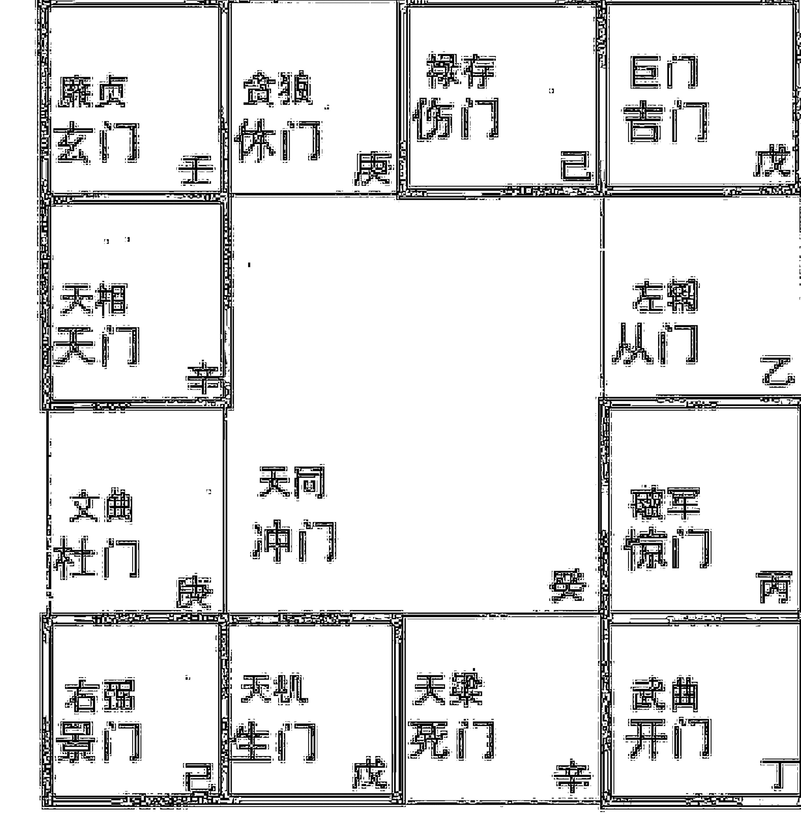

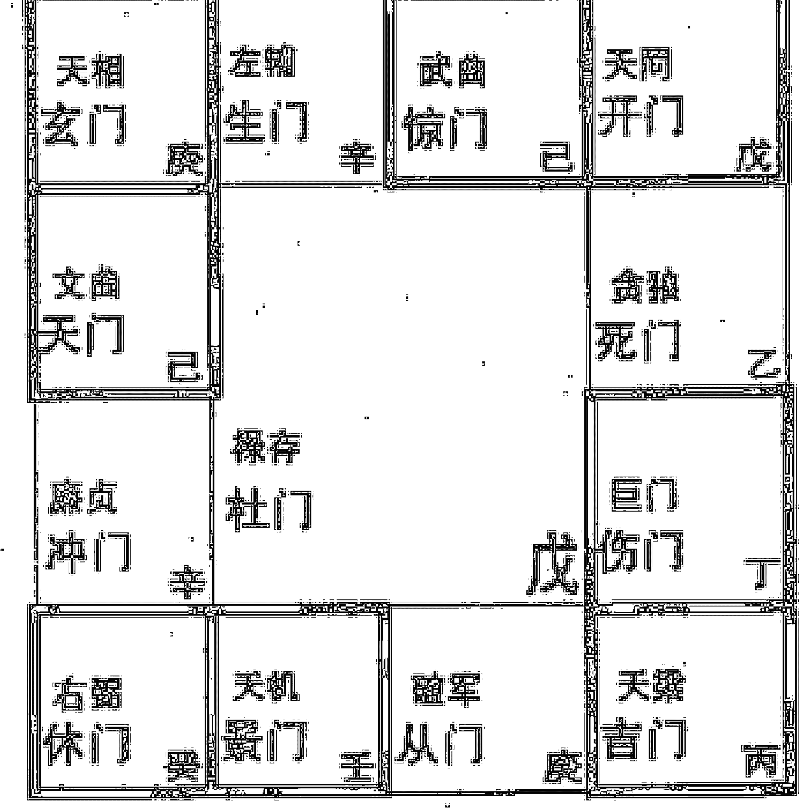

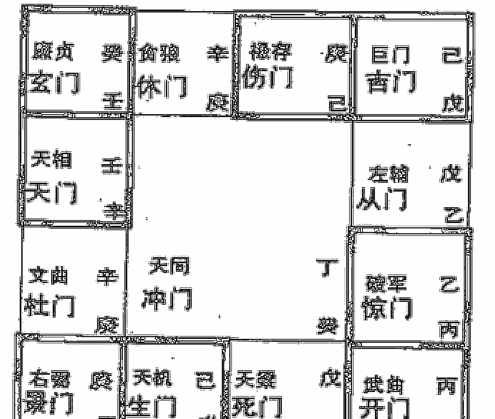

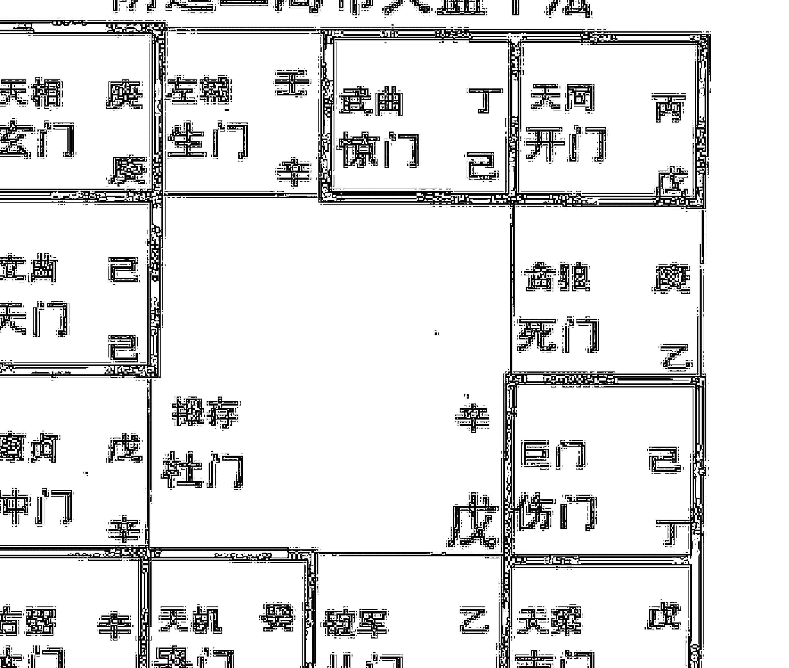

-170-

-171-

武易文化网址:http://www.184999.com

### 七、布人盘干：以刚日阳遁顺排，柔日阴遁逆排（布人盘干有阴阳盘两大排盘法，阳盘以日柱遁出旬首为“甲”，以甲、乙、丙、丁、戊、己、庚、辛、壬、癸，循环顺逆排宫，进行转宫排盘法，阴盘飞宫奇门以星盘还原法为布人盘干之法，两种盘法布人盘干方法绝不一样，切勿乱用。

阴盘奇门布人盘干：只用把门的原始宫位的地盘干，带过来即为本宫位的人盘干，各宫位内以此类推！

下面为：丁亥 辛亥 壬戌 辛亥，为阳2局，布天盘干法（以下天盘干布法例）：如坎1宫门为死门，而死门的原始宫位在2阳宫（坤阳宫），此时2阳宫（坤阳宫）的三奇六仪（也就是地盘干），2阳宫（坤阳宫）中的地盘干是“戊”，我们把2阳宫（坤阳宫）的地盘干“戊”飞到坎一宫的人盘干位置，即为坎一宫的人盘干；再例如2阳宫（坤阳宫）的门为开门，而开门的原始宫位在6阴宫（乾阴宫），此时6阴宫（乾阴宫）的三奇六仪（也就是地盘干），6阴宫（乾阴宫）中的地盘干是“丁”，我们把6阴宫（乾阴宫）的地盘干“丁”飞到2阳宫（坤阳宫）的人盘干位置，即为2阳宫（坤阳宫）的人盘干，余下各宫的人盘干（门宫还原）飞布法以此类推！如不懂可参考下图。

注：本局时空点极为独特，形成了独有的天盘干、人盘干相互伏吟，关于伏吟断法在本书中已有详述！

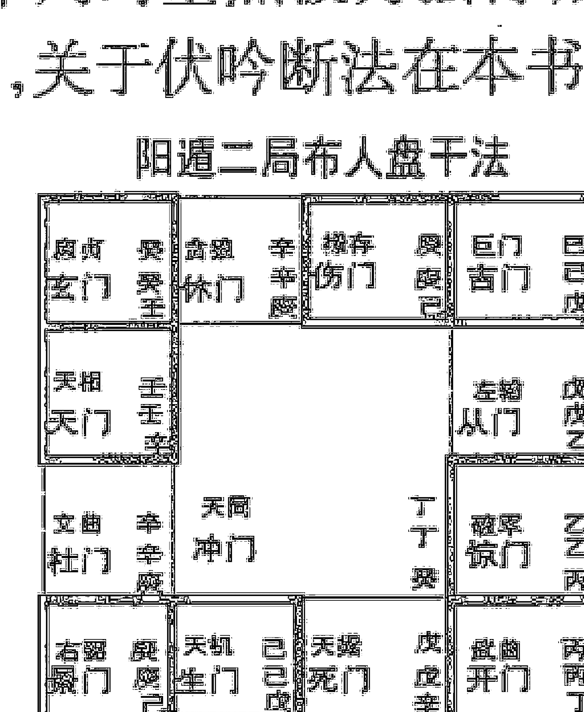

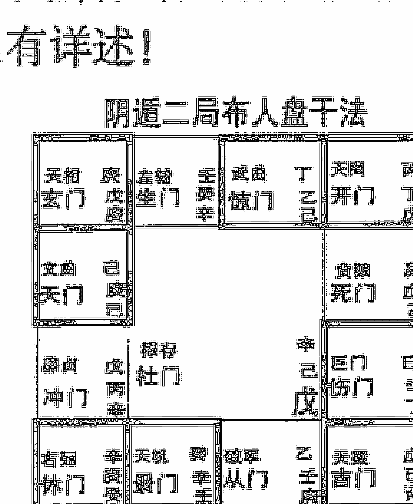

### 天下奇门第一局——金口奇门

### 八、金口奇门阴阳布神盘：金口奇门布神盘以日干落宫，分日夜布神法（阴盘金口奇门布神盘要用中宫）。

| 十二神 | 贵神 | 腾蛇 | 朱雀 | 六合 | 勾陈 | 青龙 | 玄武 | 天空 | 白虎 | 太常 | 玄武 | 太阴 | 天后 |
| :--- | :--- | :--- | :--- | :--- | :--- | :--- | :--- | :--- | :--- | :--- | :--- | :--- | :--- |
| 五行属性 | 土 | 火 | 火 | 木 | 土 | 木 | 土 | 土 | 金 | 土 | 水 | 金 | 水 |
| 十二地支 | 丑 | 巳 | 午 | 卯 | 辰 | 寅 | 中原 | 戌 | 申 | 未 | 子 | 酉 | 亥 |

《金口奇门》是一部天书，神秘玄妙，高深莫测，它的神煞千变万化，在一般人看来，是不可思议，更谈不上去了解它和读懂它了。但是，它也是在慢慢历史长河中，总有那么一些勤于观察，善于思考的仁人志士，在实践中探索出来的，只要我们本着科学的唯物辩证法，去看待奇门中的神煞，就可看到神煞的精神实质了。

白天黑夜的循环往复，使人们无不感到天体对人生活环境的影响，千百年来的望星空，记录了多少星名，这些星星的变化，决定大自然的冷暖寒热，然而人又生活在大自然中，要改造自然，征服自然，人类才能生存，社会才会发展。人们就是从星空中观察到了星星的变化规律，用以了解自然，只有这了解，才能达到改造和征服自然的目的。

古时自然科学不发达，只有听天由命，吉凶就在星星的变化之中，人又上不了天，故而用一“神”字表述太空中的星象，由此看来，神的力量，其大无边，其小无内，我们可以这样说：“奇门中的神煞代表大自然界中的一切事物，是对天地间万事万物的高度概括。

在那人们只知有母而不知有父的原始母系社会里，随着社会的不断发展，有了剩余的财产，由谁来继承，于是出现了

-172-

-173-

武易文化网址:http://www.184999.com

### 天下奇门第一局——金口奇门

父系社会,有了父子关系,子就是其父的财产继承者,这样不断的发展,就有了贫富之分,人与人之间就出现了差距,社会就产生了阶级,阶级的两极分化,就出现了统制阶级和被统制阶级。

统制阶级为了巩固自己的统制地位,总得有一个说法和理由。在那自然界的变化都不能弄清的时代里,如打雷下雨,风雪寒冷,山川河流,草木枯荣,等等,都好象是有神明在主宰一样,这个时代是公有的时代,故而产生的“神”就是群神共有的时代,阴阳两界就好象隔着一层纸,由谁来捅破这层纸呢? 顾名思义“神”。

皇帝的儿子称天子,与天怎样联系呢? 九宫八卦就成了天人之间的通路,“神”就成了这条路上的使者,皇帝又代表着万民,万民的心愿由皇帝请“神”传给上天,(古时皇家的宗庙祭祀,“鼎”就是最好的见证)上天对万民的昭示由“神”传达,这样一来,一切的吉凶祸福都可前知,“神”的昭示谁也不敢违背,谁违背了,谁就要见凶。

“神”既然是对天地间万事万物的高度概括,万事万物的变化当然就是吉凶祸福的表象,“神”自然就成了使者,所以今天我们要讲的神煞其实就是辩证的宇宙观。宇宙的变化,产生天地万物的存在,这个存在是“变动不居,周流六虚,上下无常,刚柔相易,”如此观之,空间没有范围了,时间也就没有范围了,神的力量无时不在,无处不在,范围天地之变化而不过,曲成万物而不憾,万事万物万理万化都是它一手造成的,它是知道天地间万事万物的变化之理而救济天下的全能全智,这样的存在难道不是“神”吗?

所以在所有奇门预测学中,神煞的作用十分重要,可以说,差之毫厘,谬以千里。金口奇门其布法,以日干来布神盘,白天用阳神(昼神),夜晚用阴神(夜神)。上述歌诀中,“甲戊庚牛羊”,即甲戊庚日用牛(丑)羊(未),第一个字为阳神,第二个字为阴神,余仿此。

必须注意:歌诀中的生肖(地支),是金口奇门上讲神的所落宫位,这里,请读者记准一个重要的概念:昼夜的界定,即白天和夜晚的确定方法。大致有以下几种:

- (1)《黄帝》曰:晓昏之法,以星没为晓,星出为昏。因此,一般情况下,以星起星落为准,星落为白天,星起为夜晚。这种方法被普遍采用。
- (2)卯时起为白天,酉时起为夜晚。
- (3)阴天或下雨天,按夜晚对待,用阴神。

定出使用阳神或阴神以后,依日干落宫顺逆排到局中,可以使用以下方法快速排定:贵神、腾蛇、朱雀、六合、勾陈、青龙、玄灵、天空、白虎、太常、玄武、太阴、天后,简称为“贵腾朱六勾青“灵”空白常玄阴后”。贵神顺序,永远不变。变的只是阴阳的变化!

以日干查阴阳贵神,若神落在亥、子、丑、寅、卯、辰上,则顺飞;若神落在巳、午、未、申、酉、戌上,则逆飞。简言之,以辰戌为分界线,贵神地支落在分界线以上为逆排,落在分界线以下为顺排。

布神盘以日干落宫顺逆排局,并按以上要求分出布神的阴阳顺逆,以此类推顺转入宫,阳局排盘不用中宫。

阴阳布神法歌诀:
甲戊庚牛羊,乙己鼠猴乡。
丙丁猪鸡位,壬癸蛇兔藏。
六辛逢马虎,布神分阴阳。

丁亥 辛亥 壬戌 辛亥,为阳2局,布神盘图:

### 阳遁二局布神盘法

### 阴遁二局布神盘法

### 天下奇门第一局——金口奇门

官这三大方面的奇门运用可谓是极为独特，曾经上百次为人先服务，后收费，创下了有史以来的奇门改运奇迹！

（附）宫位布局之格式：宫位布局双称为单宫布局，也就是门、星、神与天、地、人盘干的相互对应格式，金口奇门单宫格式一律以单宫布局图格式为准。

### 八、金口奇门穿壬术

金口奇门穿壬是奇门遁甲中的秘中之秘，历代仅在极少数人手中流传，会此术者对遁甲穿壬更是视为珍宝，从不示人。导致了奇门穿壬这一奇门绝技隐踪江湖达数百年之久，今东方宇龙有幸破译出此珍宝奥秘，不敢藏私，首次将这隐踪数百年之久的奇门秘技公开出来，因此秘术乃奇门中至珍至秘的高层秘技，因奇门穿壬术是历代不传之秘，故仅在弟子班中心传口授，还望广大读者见谅。

以上为金口奇门的阴盘起局秘法，此起局秘法可谓前无古人，后惊来者，令人拍案叫绝。其布局以独特巧妙的阴阳分配奇正相应形，成了前无古人的十三宫奇门遁甲，为金口奇门预测提供了大量的隐性信息（预测时运用全息五维思维分析将十三维空间隐性信息，一览无遗，其占断预测如有神助。披露了历代高人秘不传人的预测心法，结合全息论，运用五维全息分析法，可在单一宫位测出六亲全部内容，并对断父母、兄弟、子女性情、相貌、身高、胖瘦、职业、爱好、财运、大运、流年等等，涉及到人生所想知道的方方面面一并测出；并有单宫断多人、一局断百人、隔夜神断之妙法，其信息量之广，乃世所罕见，绝非传统奇门可比）。

### 九、金口奇门穿太乙

金口奇门穿太乙秘术是东方宇龙在研易过程中悟出的易学实用秘术，运用太乙信息与金口奇门十三宫相应可快速断出终身、流年、大运、六亲及一生的所有状况，极为神奇，是历代奇门中没有的占断秘法，此法乃笔者所独创之法宝，世所罕见之奇术。因本秘法乃笔者研易心血之集成，只能仅在弟子班心传口授，还望广大读者见谅。

### 十、金口奇门穿八字

金口奇门穿八字秘术是东方宇龙在研易过程中悟出的四柱实用秘术，运用八字与金口奇门宫内相应信息可快速断出人的一生贫富、吉凶，弥补八字预测中的不足，乃奇门预测上的又一大创举，此法的出现为八字占断提供了强大的信息量，使易学应用中达到了一个新的突破点。该法乃笔者所独创，实属世所罕见之奇术。因本秘法乃笔者研易心血之集成，只能仅在弟子班心传口授，还望广大读者见谅。

同时，在弟子班中还将公开东方宇龙老师最近破译出来的十三维空间能量运用秘法，详授宇宙十三维空间原点能量转换玄机，让大家掌握天体能量、空间方位能量与人生的综合应用，为人生提升品质、获得生命升华提供有力的武器！

十三宫奇门遁甲的问世为奇门布局改运提供了极为特殊的全息时空信息，形成一部全面奇门改运应用的经典布局秘法（在奇门改运时，运用东方宇龙老师悟创的独特金口奇门改运三大法宝，配合时空学、方位学、应用学、全息学、选择学进行全方位布局，可保证在数日内达到开始见效的改运秘法，这种效果是极为神奇的。东方宇龙老师在催财、催婚、催量，使易学应用中达到了一个新的突破点。该法乃笔者所独创，实属世所罕见之奇术。因本秘法乃笔者研易心血之集成，只能仅在弟子班心传口授，还望广大读者见谅。

同时，在弟子班中还将公开东方宇龙老师最近破译出来的十三维空间能量运用秘法，详授宇宙十三维空间原点能量转换玄机，让大家掌握天体能量、空间方位能量与人生的综合应用，为人生提升品质、获得生命升华提供有力的武器！

金口奇门不是一般意义上的术数之学，这门朴实而又新奇的学问从不玩故弄玄虚的易学“新名词”、“新概念”，也不会搞煞有介事的“老江湖”、“老学究”。它在起局设计上夺天地造化，并以科学的方式调动时空能量为人所用，通过“宫卦信息，灵活取用、巧妙布局”，创造了奇门改运一个又一个神话般的奇迹！

东方宇龙老师独创的“全息时空能量和宇宙十三维空间的破译”的，在奇门改运方面提供了科学有力的依据；并且在改运方面融合了其它诸多的改运秘法，把金口奇门在改运方面的神奇功效演绎至“惊天地，泣鬼神”的罕见化境！

但为了防止此绝技落人心术不正之人手中，东方宇龙老师只在弟子班中口耳相传，以心印心！

# 第五章 金口奇门排盘实例

为了让广大易友能够熟练掌握金口奇门的排盘方法，我们为大家提供了以下排盘实例，供大家研究，并在本章第二节中为大家提供金口奇门十三宫阴盘局模型！

## 第一节 金口奇门阳盘布局实例

一、下面我们对 2008 年农历 8 月 3 日酉时的金口奇门布局。

乾造：戊子 庚申 乙巳 乙酉

1、定刚柔日：以日干为准，用农历的日干分出刚柔日，日干为阳性为刚日，日干阴性为柔日。刚日起以阳局顺排，柔日起局以阴局逆排，金口奇门定阴阳局以日干看刚柔而定，学员在运用中一定要熟记此规律。此日干中“乙巳”乙是阴性，属柔日，起阴局！

2、定局

定局时先将农历的年月日时排成四柱，刚日以天干相加总和数除九，余数为几则为阳几局；柔日以地支数相加总和除九，余几则为阴几局。无论阴局还是阳局除尽时代表 0 用，0 代表 10 用，10 减 9 则为 1 局！戊子 庚申 乙巳 乙酉为阴局，应以地支相加总和除九。子 1 申 9 巳 6 酉 10 相加总和是 26，26 除 9 余 8，即为阴 8 局。

3、布三奇六仪(布地盘干)：

定出局后，在十三宫宫格或顺或逆布三奇六仪，三奇六仪又称为地盘干。

三奇、六仪的顺序：戊、己、庚、辛、壬、癸、丁、丙、乙；金口奇门的三奇六仪排法分阴遁和阳遁二种，阳则顺排，阴则逆排。以戊、己、庚、辛、壬、癸、丁、丙、乙为顺序进行顺逆飞局！

(注)：三奇、六仪无论阴阳盘在布局中均用飞宫布局。

例：戊子、庚申、乙巳、乙酉为阴局，地支相加除九余8，以下以阴8局布三奇六仪法。

在8阳宫(艮阳宫)布人戊，在8阴宫(艮阴宫)布人己，在兑7宫布人庚，在6阳宫(乾阳宫)布人辛，在6阴宫(乾阴宫)布人壬，在5中宫中布癸，在4阳宫(巽阳宫)布人丁，在4阴宫(巽阴宫)布人丙，在震3宫中布人乙，在阳2宫(坤阳宫)布人戊，在阴2宫(坤阴宫)布人己，在坎1宫布人庚，在离9宫布人辛。至此一周完成了阴八局的三奇六仪布局。

### 阴八局布三奇六仪法

| 丙 | 辛 | 己 | 戊 |
|---|---|---|---|
| 丁 |   |   | 庚 |
|   | 癸 |   |   |
| 乙 |   |   | 壬 |
| 己 | 戊 | 庚 | 辛 |

4、布门(布人盘)：

阳盘：开门、冲门、休门、从门、生门、伤门、杜门、天门、景门、吉门、死门、惊门

阴盘：休门、死门、吉门、伤门、杜门、天门、玄门、冲门、开门、惊门、从门、生门、景门

布门以时的干支按六十花甲子遁出旬首后，在旬首的落宫查找原始门，将遁出的原始门按时干落宫人局顺逆排局。

戊子、庚申、乙巳、乙酉

布门：刚日阳遁顺排，柔日阴遁逆排。

布门第一步是以时元遁出旬首，时元为“乙酉”，乙酉在六十花甲子中为“甲申旬”——庚（在三奇六仪中“庚”在7宫）——7宫的宫位原始门是“惊门”，所以在布门时，以时干的落宫布人惊门，依次按顺序逆排，时干落宫在“乙”（排门以第一个时干落宫为准）。

布门以时干落宫以刚柔日阴阳局顺逆排局！

时干“乙”落在3宫上，所以在3宫上布人惊门，在8阴宫(艮阴宫)布人开门，在8阳宫(艮阳宫)布人冲门，在坎1宫布人休门，在6阳宫(乾阳宫)布人从门，在6阴宫(乾阴宫)布人生门，在兑7宫布人伤门，在阳2宫(坤阳宫)布人杜门，在阴2宫(坤阴宫)布人天门，在离9宫布人景门，4阴宫(巽阴宫)布人吉门，在4阳宫(巽阳宫)布人死门。至此一周完成了阴八局的布门(刚日阳局以此反转顺转人宫)。

在金口奇门中阳盘起局排盘不用中宫，十三宫仅在飞宫金口奇门中运用。

武易文化网址:http://www.184999.com

### 天下奇门第一局——金口奇门

### 阴八局(排入地盘和门图)

布星以时干落宫以刚柔日阴阳局顺逆排局！
日干“乙”落在三宫，应在震3宫中布人武曲，在8阴宫（艮阴宫）布人天同，在8阳宫（艮阳宫）布人贪狼，在坎1宫布人左辅，在6阳宫（乾阳宫）布人天机，在6阴宫（乾阴宫）布人禄存，在兑7宫布人文曲，在阳2宫（坤阳宫）布人天相，在阴2宫（坤阴宫）布人右弼，在离9宫布人巨门，4阴宫（巽阴宫）布人天梁，在4阳宫（巽阳宫）布人破军。至此一周完成了阴八局的布星（刚日阳局以此反转顺转入宫）。

5、布星盘：(布天盘)

布星以日的干支按六十花甲子遁出句首后，在句首的落宫查找原始星，将遁出的原始星按日干落宫入局顺逆排局。
布星盘：刚日阳遁顺排，柔日阴遁逆排（布星有阴阳盘两大排法，下面为：戊子、庚申、乙巳、乙酉，为阴8局，布星（天盘）。
布星第一步是以日元遁出句首，日元为“乙巳”，乙已在六十花甲子中为“甲辰”——壬（在三奇六仪中“壬”在6阴宫，6阴宫原始星为武曲星，在布星时，以日干的落宫布人武曲，依次按顺序顺排，日干落宫在“乙”（排星以第一个日干落宫为准）。

### 阴八局(排入地盘和门、星图)

| 十三星 | 贪狼 | 天梁 | 巨门 | 禄存 | 文曲 | 天相 | 廉贞 | 天同 | 武曲 | 破军 | 左辅 | 天机 | 右弼 |
| :--- | :--- | :--- | :--- | :--- | :--- | :--- | :--- | :--- | :--- | :--- | :--- | :--- | :--- |
| 五行属性 | 水 | 金 | 土 | 木 | 木 | 火 | 土 | 水 | 金 | 金 | 木 | 土 | 火 |
| 十二地支 | 子 | 申 | 未 | 卯 | 辰 | 巳 | 中原 | 亥 | 戌 | 酉 | 寅 | 丑 | 午 |

6、布天盘干：以刚日阳遁顺排，柔日阴遁逆排（布天盘干有阴阳盘两大排盘法，函授只传阳盘转宫排盘法，阴盘飞宫布局在函面授班传授）。

布天盘干以日干落宫顺逆排局，并以日干遁出句首后代表“甲”入局，后边紧跟乙、丙、丁、戊、己、庚、辛、壬、癸，循环顺逆排宫！
下面为：戊子、庚申、乙巳、乙酉，为阴8局，布天盘干法。

先找出乙巳日的旬首→在甲午旬→旬首遁辛，“辛”在此代表“甲”，把“辛”排人日干落宫的宫位中顺排(刚日阳局则顺排)。

壬、癸,循环顺逆排宫(人盘干在天地盘中间布人)!

下面为:戊子、庚申、乙巳、乙酉,为阴8局,布人盘干法。

布人盘干:第一步是以时元遁出旬首,时元为“乙酉”,乙酉在六十花甲子中为“甲申——庚,“庚”在此代表“甲”,把“庚”排人时干落宫的宫位中顺排(刚日阳局则顺排)。

乙巳日→甲辰→壬,壬以日干落宫顺逆排! 所以在日干落宫在3宫,在震3宫中布人壬,在8阴宫(艮阴宫)布人乙,在8阳宫(艮阳宫)布人丙,在坎1宫布人丁,在6阳宫(乾阳宫)布人戊,在6阴宫(乾阴宫)布人己,在兑7宫布人庚,在阳2宫(坤阳宫)布人辛,在阴2宫(坤阴宫)布人壬,在离9宫布人癸,4阴宫(巽阴宫)布人辛,在4阳宫(巽阳宫)布人乙。至此一周完成了阴八局的布天盘干(刚日阳局以此反转顺转入宫)!(注:阳局排盘不用中宫)

时干“乙”落宫在3宫,在震3宫中布人庚,在8阴宫(艮阴宫)布人乙,在8阳宫(艮阳宫)布人丙,在坎1宫布人丁,在6阳宫(乾阳宫)布人戊,在6阴宫(乾阴宫)布人己,在兑7宫布人庚,在阳2宫(坤阳宫)布人辛,在阴2宫(坤阴宫)布人壬,在离9宫布人癸,4阴宫(巽阴宫)布人辛,在4阳宫(巽阳宫)布人乙。至此一周完成了阴八局的布人盘干(刚日阳局以此反转顺转入宫)。而此局的天盘干和人盘干因时空点的原因,形成了罕见的天人伏吟局,关于伏吟局后面有专论细述。(注:阳局排盘不用中宫)

### 阴八局门、星、天地盘干排法

### 阴八局门、星、天、人、地盘干排法

7、人盘干是金口奇门中的独特布局方法,用人盘干可使奇门信息量极大扩展,同时也体现了易学“天地人”三才的相应学说。

布人盘干:布人盘干以时干落宫顺逆排局,并以时干遁出旬首后代表“甲”人局,后边紧跟乙、丙、丁、戊、己、庚、辛、

8、金口奇门阴阳布神盘:金口奇门布神盘以日干落宫,分日夜布神法(阳盘金口奇门布神盘不用中宫)。

武易文化网址:http://www.184999.com

### 天下奇门第一局——金口奇门

| 十二神 | 贵神 | 腾蛇 | 朱雀 | 六合 | 勾陈 | 青龙 | 天空 | 白虎 | 太常 | 玄武 | 太阴 | 天后 |
| :--- | :--- | :--- | :--- | :--- | :--- | :--- | :--- | :--- | :--- | :--- | :--- | :--- |
| 五行属性 | 土 | 火 | 火 | 木 | 土 | 木 | 土 | 土 | 金 | 土 | 水 | 金 | 水 |
| 十二地支 | 丑 | 巳 | 午 | 卯 | 辰 | 寅 | 中原 | 戌 | 申 | 未 | 子 | 酉 | 亥 |

布神盘以日干落宫顺逆排局,并按以上要求分出布神的阴阳顺逆,以此类推顺转入宫,阳局排盘不用中宫。

在所有奇门预测学中,神的作用十分重要,可以说,差之毫厘,谬以千里。其布法,以日干来布神盘,白天用阳神(昼神),夜晚用阴神(夜神)。上述歌诀中,“甲戊庚牛羊”,即甲戊庚日用牛(丑)羊(未),第一个字为阳神,第二个字为阴神,余仿此。

阴阳布神法歌诀:
甲戊庚牛羊,乙己鼠猴乡。
丙丁猪鸡位,壬癸蛇兔藏。
六辛逢马虎,布神分阴阳。

必须注意:歌诀中的生肖(地支),是金口奇门上讲神的所落宫位,这里,请读者记准一个重要的概念:昼夜的界定,即白天和夜晚的确定方法。大致有以下几种:
(1)《黄帝》曰:晓昏之法,以星没为晓,星出为昏。因此,一般情况下,以星起星落为准,星落为白天,星起为夜晚。这种方法被普遍采用。
(2)卯时起为白天,酉时起为夜晚。
(3)阴天或下雨天,按夜晚对待,用阴神。

下面为:戊子、庚申、乙巳、乙酉,为阴8局,布神盘法,以阴阳布神法,酉时为阴,为逆排贵神;排贵神以日干查贵神入宫,日干为“乙”,乙己鼠猴乡,乙此时在阴,贵神应落宫在申(猴)位,在申(猴)位逆布贵神。

定出使用阳神或阴神以后, 依日干落宫顺逆排到局中, 可以使用以下方法快速排定:贵神、腾蛇、朱雀、六合、勾陈、青龙、天空、白虎、太常、玄武、太阴、天后,简称为“贵腾朱六勾青,空白常玄阴后”。贵神顺序,永远不变。变的只是阴阳的变化!

在申(猴)位阳2宫(坤阳宫)布入贵神,在兑7宫布入腾蛇,在6阴宫(乾阴宫)布入朱雀,在6阳宫(乾阳宫)布入六合,在坎1宫布入勾陈,在8阳宫(艮阳宫)布入青龙,在8阴宫(艮阴宫)布入天空,在震3宫中布入白虎,在4阳宫(巽阳宫)布入太常,4阴宫(巽阴宫)布入玄武,离9宫布入太阴,在阴2宫(坤阴宫)布入天后。至此一周完成了阴八局的布神盘! (注:阳局排盘不用中宫)

以日干查贵神,若神落在亥、子、丑、寅、卯、辰上,则顺排;若神落在巳、午、未、申、酉、戌上,则逆排。简言之,以辰戌为分界线,贵神地支落在分界线以上为逆排,落在分界线以下为顺排。

### 阴八局神、星、门、天、人、地盘干排法

| 玄武 天辅 吉门 | 壬 辛 丙 | 太阴 巨门 死门 | 癸 癸 辛 | 天后 右弼 天门 | 壬 壬 己 | 贵神 天相 杜门 | 辛 辛 戊 |
|---|---|---|---|---|---|---|---|
| 太常 破军 死门 | 乙 乙 丁 | | | 腾蛇 文曲 伤门 | 庚 庚 庚 |
| 白虎 武曲 惊门 | 壬 庚 乙 | 癸 | 朱雀 禄存 生门 | 己 己 壬 |
| 天空 天同 开门 | 乙 乙 己 | 青龙 贪狼 冲门 | 丙 丙 戊 | 勾陈 左辅 休门 | 丁 丁 庚 | 六合 天机 从门 | 戊 戊 辛 |

9、奇门穿壬秘术及奇门穿八字、穿太乙、穿六爻、穿梅花等秘术将在弟子班中公开其中奥秘，在弟子班中传授隐踪数千年的连山易占断绝技和宇宙十二维能量运动玄机，破译宇宙能量运动的变化规律，在弟子中择优传授玄空学隐踪数千年的不传之秘（轻松破译当今风水界为什么调风水效果不好的天机奥秘，得此秘密者当今天下目前仅有两人）。

（注）弟子班学员五不收：①易德不好不收；②语言表达能力差不收；③思路不敏捷不收；④五官长相不端者不收；⑤交不起学费不收。以上五点构成两个字“缘份”！

二、下面我们对2008年农历7月4日辰时的金口奇门局

口造：戊子 己未 丙子 壬辰

1、定刚柔日：以日干为准，用农历的日干分出刚柔日，日干为阳性为刚日，日干阴性为柔日。刚日起以阳局顺排，柔日起局以阴局逆排，金口奇门定阴阳局以日干看刚柔而定，学员在运用中一定要熟记此规律。此日干中“丙子”丙是阳性，属刚日，起阳局！

2、定局
定局时先将农历的年月日时排成四柱，刚日以天干相加总和数除九，余数为几则为阳几局；柔日以地支数相加总和除九，余几则为阴几局。无论阴局还是阳局除尽时代表0用，0代表10用，10减9则为1局！戊子 己未 丙子 壬辰为阳局，应以天干相加总和除九。戊5 己6 丙3 壬9 相加总和是23，23除9余5，即为阳5局。

3、布三奇六仪（布地盘干）：
定出局后，在十三宫宫格或顺或逆布三奇六仪，三奇六仪又称为地盘干。

### 天下奇门第一局——金口奇门

三奇、六仪的顺序：戊、己、庚、辛、壬、癸、丁、丙、乙；金口奇门的三奇六仪排法分阴遁和阳遁二种，阳则顺排，阴则逆排。以戊、己、庚、辛、壬、癸、丁、丙、乙为顺序进行顺逆飞局！

（注）：三奇、六仪无论阴阳盘在布局中均用飞宫布局。

例：戊子 己未 丙子 壬辰为阳局，天干相加除九余5，以下以阳5局布三奇六仪法。

在5中宫中布戊，在6阳宫（乾阳宫）布人己，在6阴宫（乾阴宫）布人庚，在兑7宫布人辛，在8阳宫（艮阳宫）布人壬，在8阴宫（艮阴宫）布人癸，在离9宫布人丁，在坎1宫布人丙，在阳2宫（坤阳宫）布人乙，在阴2宫（坤阴宫）布人戊，在震3宫中布人己，在4阳宫（巽阳宫）布人庚，在4阴宫（巽阴宫）布人辛。至此一周完成了阳五局的三奇六仪布局。

### 阳五局布三奇六仪法

| 辛 | 丁 | 戊 | 乙 |
|---|---|---|---|
| 庚 | | | 辛 |
| 己 | 戊 | | 庚 |
| 癸 | 壬 | 丙 | 己 |

4、布门（布人盘）：
阳盘：开门、冲门、休门、从门、生门、伤门、杜门、天门、景门、吉门、死门、惊门
阴盘：休门、死门、吉门、伤门、杜门、天门、玄门、冲门、开门、惊门、从门、生门、景门
布门以时的干支按六十花甲子遁出旬首后，在旬首的落宫查找原始门,将遁出的原始门按时干落宫入局顺逆排局。
戊子 己未 丙子 壬辰
布门:刚日阳遁顺排,柔日阴遁逆排。
布门第一步是以时元遁出句首,时元为“壬辰”,壬辰在六十花甲子中为“甲申旬”——庚(在三奇六仪中“庚“在6宫)——6宫的宫位原始门是“惊门”,所以在布门时,以时干的落宫布入惊门,依次按顺序逆排,时干落宫在在“壬”(排门以第一个时干落宫为准)。
布门以时干落宫以刚柔日阴阳局顺逆排局!
时干“壬”落在8阳宫上,所以在8阳宫上布入惊门,在8阴宫(艮阴宫)布入开门,在震3宫布入冲门,在4阳宫(巽阳宫)布入休门,在4阴宫(巽阴宫)布入从门,在离9宫布入生门,,在阴2宫(坤阴宫)布入伤门,在阳2宫(坤阳宫)布入杜门,在兑7宫布入天门,在6阴宫(乾阴宫)布入景门,在6阳宫(乾阳宫)布入吉门,在坎1宫布入死门。至此一周完成了阳五局的布门(柔日阴局以此反转顺转入宫)。
在金口奇门中阳盘起局排盘不用中宫,十三宫仅在飞宫金口奇门中运用。

5、布星盘:(布天盘)

布星以日的干支按六十花甲子遁出句首后,在句首的落宫查找原始星,将遁出的原始星按日干落宫入局顺逆排局。
布星盘:刚日阳遁顺排,柔日阴遁逆排(布星有阴阳盘两大排法,下面为:戊子 己未 丙子 壬辰,为阳5局,布星(天盘)。
布星第一步是以日元遁出句首,日元为“丙子”,丙子在六十花甲子中为“甲寅”——癸(在三奇六仪中“癸”在8阴宫,8阴宫原始星为天机星,在布星时,以日干的落宫布入天机,依次按顺序顺排,日干落宫在“丙”(排星以第一个日干落宫为准)。

### 阳五局布三奇六仪及门盘法

| 十二星 | 贪狼 | 天梁 | 巨门 | 禄存 | 文曲 | 天相 | 廉贞 | 天同 | 武曲 | 破军 | 左辅 | 天机 | 右弼 |
| :--- | :--- | :--- | :--- | :--- | :--- | :--- | :--- | :--- | :--- | :--- | :--- | :--- | :--- |
| 五行属性 | 水 | 金 | 土 | 木 | 木 | 火 | 土 | 水 | 金 | 金 | 木 | 土 | 火 |
| 十二地支 | 子 | 申 | 未 | 卯 | 辰 | 巳 | 中原 | 亥 | 戌 | 酉 | 寅 | 丑 | 午 |

布星以时干落宫以刚柔日阴阳局顺逆排局!
日干“丙”落在坎1宫,应在坎1宫中布入天机,在8阳宫(艮阳宫)布入禄存,在8阴宫(艮阴宫)布入文曲,在震3宫布入天相,在4阳宫(巽阳宫)布入右弼,4阴宫(巽阴宫)布入巨门,在离9宫布入天梁,在阴2宫(坤阴宫)布入破军,在阳2宫(坤阳宫)布入武曲,在兑7宫布入天同,在6阴宫(乾阴宫)布入贪狼,在6阳宫(乾阳宫)布入左辅。至此一周完成了阳五局的布星(柔日阴局以此反转顺转入宫)。

### 阳五局（排入地盘干和门、星图）

6、布天盘干：以刚日阳遁顺排，柔日阴遁逆排（布天盘干有阴阳盘两大排盘法，函授只传阳盘转宫排盘法，阴盘飞宫布局在函面授班传授）。

布天盘干以日干落宫顺逆排局，并以日干遁出旬首后代表“甲”入局，后边紧跟乙、丙、丁、戊、己、庚、辛、壬、癸，循环顺逆排宫！

下面为：戊子 己未 丙子 壬辰，为阳5局布天盘干法。

先找出丙子日的旬首→在甲寅旬→旬首遁癸，“癸”在此代表“甲”，把“癸”排入日干落宫的宫位中顺排（刚日阳局则顺排）。

丙子日→甲寅→癸，癸以日干落宫顺逆排！日干为丙，落在坎1宫中，在坎1宫（艮阴宫）布入癸，在8阳宫（艮阳宫）布入乙，在8阴宫（艮阴宫）布入丙，在震3宫中布入丁，在4阳宫（巽阳宫）布入戊，在4阴宫（巽阴宫）布入己，在离9宫布入庚，在阴2宫（坤阴宫）布入辛，在阳2宫（坤阳宫）布入壬，在兑7宫布入癸，在6阴宫（乾阴宫）布入癸，在6阳宫（乾阳宫）布入乙。

### 阳五局（排入地盘干和门、星图）

7、人盘干是金口奇门中的独特布局方法，用人盘干可使奇门信息量极大扩展，同时也体现了易学“天地人”三才的相应学说。

布人盘干：布人盘干以时干落宫顺逆排局，并以时干遁出旬首后代表“甲”入局，后边紧跟乙、丙、丁、戊、己、庚、辛、壬、癸，循环顺逆排宫（人盘干在天地盘中间布人）！

下面为：戊子 己未 丙子 壬辰为阳5局，布人盘干法。

布人盘干第一步是以时元遁出旬首，时元为“壬辰”，壬辰在六十花甲子中为“甲申——庚，“庚”在此代表“甲”，把“庚”排入时干落宫的宫位中顺排（刚日阳局则顺排）。

时干“壬”落宫在8阳宫，在8阳宫（艮阳宫）布入壬，在8阴宫（艮阴宫）布入乙，在震3宫布丙，在4阳宫（巽阳宫）布入丁，在4阴宫（巽阴宫）布入戊，在离9宫布入己，在阴2宫（坤阴宫）布入庚，在阳2宫（坤阳宫）布入辛，在兑7宫布入壬，在6阴宫（乾阴宫）布入癸，在6阳宫（乾阳宫）布入乙。

武易文化网址:http://www.184999.com

### 天下奇门第一局——金口奇门

人丁，在4阴宫（巽阴宫）布人戊，在离9宫布人己，在阴2宫（坤阴宫）布人庚，在阳2宫（坤阳宫）布人辛，在兑7宫布人壬，在6阴宫（乾阴宫）布人癸，在6阳宫（乾阳宫）布人壬，在坎1宫布人乙。至此一周完成了阳五局的布人盘干（柔日阴局以此反转顺转入宫）。注：阳局排盘不用中宫。

庚日用牛（丑）羊（未），第一个字为阳神，第二个字为阴神，余仿此。

必须注意：歌诀中的生肖（地支），是金口奇门上讲神的所落宫位，这里，请读者记准一个重要的概念：昼夜的界定，即白天和夜晚的确定方法。大致有以下几种：

### 阳五局（排入地盘干和门、星图）

(1)《黄帝》曰：晓昏之法，以星没为晓，星出为昏。因此，一般情况下，以星起星落为准，星落为白天，星起为夜晚。这种方法被普遍采用。

(2)卯时起为白天，酉时起为夜晚。

(3)阴天或下雨天，按夜晚对待，用阴神。

定出使用阳神或阴神以后，依日干落宫顺逆排到局中，可以使用以下方法快速排定：贵神、腾蛇、朱雀、六合、勾陈、青龙、天空、白虎、太常、玄武、太阴、天后，简称为“贵腾朱六勾青，空白常玄阴后”。贵神顺序，永远不变。变的只是阴阳的变化！

8、金口奇门阴阳布神盘：金口奇门布神盘以日干落宫，分日夜布神法（阳盘金口奇门布神盘不用中宫）。

以日干查贵神，若神落在亥、子、丑、寅、卯、辰上，则顺排；若神落在巳、午、未、申、酉、戌上，则逆排。简言之，以辰戌为分界线，贵神地支落在分界线以上为逆排，落在分界线以下为顺排。

| 主神 | 贵神 | 腾蛇 | 朱雀 | 六合 | 勾陈 | 青龙 | 玄武 | 天空 | 白虎 | 太常 | 玄武 | 太阴 | 天后 |
| :--- | :--- | :--- | :--- | :--- | :--- | :--- | :--- | :--- | :--- | :--- | :--- | :--- | :--- |
| 五行 | 土 | 火 | 火 | 木 | 土 | 木 | 土 | 土 | 金 | 土 | 水 | 金 | 水 |
| 十二地支 | 丑 | 巳 | 午 | 卯 | 辰 | 寅 | 中原 | 戌 | 申 | 未 | 子 | 酉 | 亥 |

布神盘以日干落宫顺逆排局，并按以上要求分出布神的阴阳顺逆，以此类推顺转入宫，阳局排盘不用中宫。

在所有奇门预测学中，神的作用十分重要，可以说，差之毫厘，谬以千里。其布法，以日干来布神盘，白天用阳神（昼神），夜晚用阴神（夜神）。上述歌诀中，“甲戊庚牛羊”，即甲戊

阴阳布神法歌诀：
甲戊庚牛羊，乙己鼠猴乡。
丙丁猪鸡位，壬癸蛇兔藏。
六辛逢马虎，布神分阴阳。

下面为：戊子、己未、丙子、壬辰，为阳5局，布神盘法，以阴阳布神法，酉时为阴，为逆排贵神；排贵神以日干查贵神

人宫，日干为“丙”，丙丁猪鸡位，丙此时在阳，贵神应落宫在亥（猪）位，在亥（猪）位顺布贵神。

在亥（猪）位阳6宫（乾阳宫）布人贵神，在坎1宫布人腾蛇，在8阳宫（艮阳宫）布朱雀，在8阴宫（艮阴宫）布人六合，在震3宫中布人勾陈，在4阳宫（巽阳宫）布人青龙，4阴宫（巽阴宫）布人天空，离9宫布人白虎，在阴2宫（坤阴宫）布人太常，在阳二宫（坤阳宫）布人玄武，在兑7宫布人太阴，在6阴宫（乾阴宫）布人天后。至此一周完成了阴八局的布神盘！（注：阳局排盘不用中宫）

### 阳五局（神、星、门和天地人盘）

| 天空 巨门 从门 | 白虎 天梁 生门 | 太常 破军 伤门 | 玄武 武曲 杜门 |
| :--- | :--- | :--- | :--- |
| 青龙 右弼 休门 | 戊 | 太阴 天同 天门 | 天后 贪狼 景门 |
| 勾陈 天相 冲门 | | | |
| 六合 文曲 开门 | 朱雀 禄存 惊门 | 腾蛇 天机 死门 | 贵神 左辅 吉门 |

9、奇门穿壬秘术及奇门穿八字、穿太乙、穿六爻、穿梅花等秘术将在弟子班中公开其中奥秘，在弟子班中传授隐踪数千年的连山易占断绝技；并传授宇宙能量运转玄机，破译字

### 天下奇门第一局——金口奇门

宙运动能量的变化规律，在弟子中择优传授玄空学隐踪数千年的不传之秘（轻松破译当今风水界为什么调风水效果不好的天机奥秘，得此秘密者当今天下仅有两人）。

（注）弟子班学员五不收：①易德不好不收；②语言表达能力五官长相不端者不收③思路不敏捷不收；④五官长相不端者不收；⑤交不起学费不收。以上五点构成两个字“缘份”！

## 第二节 金口奇门十三宫阴盘例

例1、2008年农历6月初2未时，起阴盘十三宫局例。金口奇门遁甲阴盘起局法在前面已任详授，具体起局方法请参考《阴盘起局秘法》章节！

乾造：戊子 戊午 乙巳 癸未 阴遁4局

### 十三宫金口奇门遁甲明盘局 阴4局

| 玄灵 武曲 死门 | 太阴 贪狼 玄门 | 太常 天机 杜门 | 白虎 左辅 伤门 |
| :--- | :--- | :--- | :--- |
| 青龙 天同 休门 | 勾陈 廉贞 景门 | 腾蛇 禄存 惊门 | |
| 天空 破军 吉门 | | 六合 天相 生门 | |
| 贵神 巨门 开门 | 天后 天梁 冲门 | 玄武 右弼 天门 | 朱雀 文曲 从门 |

上局为十三宫金口奇门遁甲阴盘局阴遁4局全局，本局仅供易友参考学习。具体起局局方法可参考前面阴盘起局详细案例！

例 2、2008年农历8月14号戌时，起阴盘十三宫局例。金口奇门遁甲阴盘起局法在前面已任详授，具体起局方法请参考《阴盘起局秘法》章节！

乾造：戊子 辛酉 戊午 壬戌 阳1局

### 十三宫金口奇门遁甲阴盘局

阳1局

| 玄武 左辅 玄门 | 朱雀 文曲 休门 | 贵神 天同 伤门 | 天后 廉贞 吉门 |
| :--- | :--- | :--- | :--- |
| 太常 破军 天门 | | | 青龙 天梁 从门 |
| 太阴 武曲 杜门 | 白虎 天机 冲门 | | 天空 贪狼 惊门 |
| 勾陈 禄存 景门 | 六合 巨门 生门 | 腾蛇 天相 死门 | 玄灵 右弼 开门 |

### 天下奇门第一局——金口奇门

### 探千年奇门之妙 揭遁甲穿壬之秘

### 金口奇门函面授特训隆重招生

传古今智慧，授无上奇门心法，中华易林第一家
授旷世奇门，获易学大道真谛，金口奇门传八方

东方宇龙亲授震惊易界的“十三宫阴阳奇门遁甲”预测绝技

奇门遁甲是震惊世界的中华民族传世之宝，更是易学中高层次的预测绝技。奇门遁甲历来是高人异士、帝王将相所必修的秘技之一，它具有定国安邦、出奇制胜、扭转乾坤之奇效，素有“帝王之学”“方术之王”的美称！

金口奇门预测学信息量丰富，断语之绝妙，令人拍案叫绝，疑为神仙在世，素有“学会奇门遁来人不用问，学会六壬金口诀不用来人张口说”之神奇效果。首次公开了隐踪易学界近千年“三式绝学合一的遁甲穿壬秘术”及奇门改运秘法。

东方宇龙先生首次破译了宇宙十三维空间的独特能量玄机。结合连山、归藏创立了“全息信息分析应用学”体系，并融合传统三式绝学的研究创出“十三宫阴阳奇门遁甲”，“金口奇门”与当今世传奇门绝非相同，当今社会上流行的奇门，根本不能够完全体现奇门真正的内涵精义；而“十三宫阴阳奇门遁甲”则是一个完整的奇门学术，他更是“奇门、六壬、太乙三式合一”的秘传绝技精华集合。金口奇门在理数象意气的运用上完全独辟蹊径，自成一家。采用独特的“全息信息分析”思维，让你轻松掌握各种预测诀窍，并首次公开古今预测

高手秘不外传的“绝密武器”，让你真正达到易学最高境界——五维时空思维，领略十三维宇宙空间的神奇！

十三宫阴阳奇门遁甲吸取了三式精华，故命名为“金口奇门”。金口奇门应用范围极广，他不仅是当今最权威、最实用的预测绝技，在奇门布局改运方面具有超乎常人之想像的神奇效果，无论是催财、催官、催婚、改运、奇门风水布局等均有立竿见影之效，效果神奇不可思议！金口奇门在预测上断事如神，金口铁断。愿更多的易友们能够用它独有的魅力来纵横天下，易演玄机。

金口奇门由中华改运第一人、东方全息信息分析应用学创始人、金口奇门创始人东方宇龙先生亲自授课，长期举办东方智业系列函面授课程。教学采用独有的“天人合一激能训练”进行全息思维训练，以点窍、剖析、激活的方式开发出你独特的易学思维，让学员达到现场实断，使每个学员都能够在极短的时间内获得开悟，得到“神传”的真谛，从而步入易学高手的行列！东方宇龙老师在教学过程中公开其所悟创的“全息信息分析应用学”及他破译“十三维时空能量应用系统”，以供易友共同研究学习！并确保让每个学员能够达到“金口铁断、布局显神效”的神奇效果！

特别声明：金口奇门（十三宫阴阳奇门遁甲）的起局法与当今世上所传的所有奇门起局、布局绝对不一样，从传统奇门古书中如能找到和金口奇门（十三宫奇门）一样者，本中心赏人民币拾万元！

金口奇门高级特训班（十三宫阴阳奇门遁甲）：

金口奇门至简至易，无论有无基础，均可在极短的时间内完全掌握，迅速成为令人刮目的“奇门高手”。授课采取“以心印心”的教学方式，保证每一位学习者学有所得，得有所用，用之有效。

一、天人合一激能术：天人合一激能术乃奇门中高层次的激能训练。通过独特的训练，在极短的时间内，开启学者生命中的“潜在能量”，从而令其心智大开，灵感大增，并可出现各种奇特功能（因人而异），人生中所有疑问都会随着开悟一扫而光、豁然开朗，从此人生便会势如破竹、一日千里，所有数术、易学将会随之通达无碍。此法具有开运助运的奇特功效；能够快速开发出每个学员的潜能，使学员达到“金口铁断”的神奇效果！

二、无极奇门心法：此乃金口奇门的高级心法（分阴阳两大法门），应用极其简单神奇，乃易学界历代千金不传之秘，是让你真正达到易学最高境界的东方快车！

三、金口奇门预测心经：成为顶尖预测高手的秘密武器，详授如何成为顶尖预测高手的诸多法宝！

四、十三宫阴阳盘奇门遁甲秘传四大起局法：详授阴阳盘、四大起局秘法。

五、金口奇门独特的预测秘法：1、中宫占法；2、单宫占法；3、十三宫占法；4、对应占法；5、还原占法；6、天地人盘干占法；7、每日只占一局法；8、一局多日占法；9、远近占法；10、天地人盘干应用详解；11、星、门、神特殊的名称及含义（十三星、十三门、十三神的详细易象及应用秘窍）；12、星、门、神、吉凶断法（1、吉星、吉门、吉神：应吉或应凶断法秘诀；2、凶星、凶门、凶神：应吉或应凶断法秘诀；4、星门神之间的相互作用关系及应用秘窍和各天干类象详解及运用）；13、星门神与天地人盘干的相互作用关系及应用秘窍和奇仪格局精解；并在教学中公开更多的极为秘传的占断秘法和独特预测心法，定让你耳目一新茅塞顿开！

### 金口奇门实战教学：

一、金口奇门众生占法：瞬间测出每个人的长相、高矮、内外性格、婚姻、六亲、学业、穿衣爱好、个人爱好、饮食爱好、疾病、梦境、与父母兄弟之间的关系、财运、大运流年、流月流日、人际关系状况。

二、金口奇门占事法：1、占财运（①占正财偏财；②占买卖货、合伙求财、交易、贸易、偏门求财的详细情况；并传授奇门催财催旺要点）；2、占官运（①占求职；②占工作环境；③占升迁或降职④占是否有官职，并传授奇门调官运要点）；3、疾病（①占得什么病；②病的吉凶；③占请医；④占何因致病）；4、天时占法；5、胎孕占法；6、出行占法；7、应期占法；8、学业占法；9、盗贼占法；10、成败占法；11、企业旺衰占法；12、索债占法；13、借贷占法；14、行人占法；15、走失占法；16、失物占法；17、来意占法；18、刑事案件占法；19、买卖房屋占法；20、官司诉讼占法；21、体育竞赛占法；22、车祸占法；23、工程竞标占法；24、交友占法等诸多占法。

三、金口奇门风水学：

（一）测阳宅风水秘法：1、选择宅基秘法（地势、地质、物应占法）；2、论宅吉凶秘法；3、住宅环境秘法（详授住宅大小、住宅明暗、住宅采光、住宅通风占法）；4、卧室环境占法；5、床上物品占法；6、客厅占法；7、厨房占法；8、家中植物吉凶占法；9、家中宠物吉凶占法；10、室外环境占法；11、住宅与疾病占法；12、住宅与婚姻占法；13、住宅与财运占法、14、家中特殊物品占法。

（二）阴宅风水秘法：1、龙脉占法；2、真龙穴地占法；3、穴位土质占法；4、明堂占法；5、案山占法；6、青龙砂占法；7、白虎砂占法；8、坟地大环境占法；9、坟地吉凶占法；10、坟地利哪支，不利哪支占法；11、墓内人死因占法；12、墓内人死时穿何衣占法13、墓内人死时多少人在场的占法；14、墓内人死时天气状况的占法。

（三）企业风水：1、企业风水特殊的定局方法；2、企业风水特殊的布局方法3、企业风水的吉凶判断（详授办公室、财务室、销售部门、研发部门、生产部门、公关部门、保安部门、厂房、车间、仓库的风水判断技巧）；4、机关、工厂、店铺选址秘诀（机关选址、工厂选址、店铺选址、开工奠基石的方位选择等诸多奇门布局秘诀）

四、数字奇门：运用数字成局的预测秘法，此法不仅可用于预测，更可为自己或他人选择适合你的吉利数字或进行数字号码调整运气，此法能够在生活中应用到手机号码、银行密码、门牌号码、车牌号码等诸多方面。详授两仪法、三才法、四象法、五行法、十奇法、声音法、玄黄法等奇门预测秘术和数字改运秘法（详授用手机号码、电话号码、车牌号、QQ号、银行密码、门牌号码改运的绝密法门；数字奇门催官法；数字奇门催财法；数字奇门催姻缘法；数字奇门祛病法）。

五、八卦奇门：详授了父母占、子女占、婚姻占、财运占、官运占、疾病占、出行占、学业占、胎孕占、阳宅占、阴宅占、立知阴阳宅风水吉凶。

六、汉字姓名奇门：汉字姓名奇门不仅可测运气、大运、流年，更可用于姓名改运、起名、改名，企业起名策划等诸多方面！

六、法术奇门：详授入门仪规、启灵秘诀；特授奇门增寿法、消灾法、开光法、祛病法、催官法、催财法、和合婚姻法、调文昌法等诸多秘法！

七、金口奇门风水改运秘法

武易文化网址:http://www.184999.com

### 天下奇门第一局——金口奇门

1、引气归元秘法：引水人穴立竿见影的千古不传奇门风水术；2、乾坤挪移法：对工厂、企业、公司、店铺、公寓小区风水调整的秘密核武。3、阳宅催财秘法；4、厨房布局秘法；5、家中植物趋吉法；6、卧室布局趋吉法。

员姓名不符者，一概不予解答！同时也不享受优惠活动！

农行帐号：6228480970254582012 收款人：杜 鑫
邮政帐号：6221885131010761202 收款人：杜 鑫
联系电话：015839999012；015839999557

八、全息五维空间开运秘法：详授时空方位开运、催旺开运秘法、求医问药秘法、考试应试竞赛助运秘法、诉讼、讨债秘法、催丁秘法、聚财秘法、催婚秘法、助学秘法等诸多开运秘法；

传千古遁甲穿壬秘术 授奇门改运玄机

### 金口奇门入室弟子秘训课程

九、干支、象数奇门：无需起局、布局，便可在几秒钟之内瞬间预测的秘密武器，此法无需过多分析便可直观的、形象的铁口直断。此法方便快捷，信息量极广，可达金口铁断。

### 首次破译宇宙十二维空间能量运动奥秘

十、金口奇门择吉、择日秘法：此法乃金口奇门所独有的择吉秘术，运用此法可测出所用日子当天出现特别的事和特别的人，并能够测出用此日子后所应的事情。

太乙、奇门、六壬被易学界誉为最高法宝，“三式合一”更是易学绝技中的绝学。“三式合一”也是所有易学爱好者的终生梦想和追求！为圆广大易友学易之愿望，东方宇龙老师打破传统单线秘传的陋规，首次将隐踪近千年之久的“三式合一遁甲穿壬秘术”公开于世，将此绝技面向门内弟子传授。同时公开史无前例的太极三元运动奥秘，破译宇宙能量原点玄机！

十一、面相奇门：面相奇门不用起局，可直断运气、财运、富贵、疾病、六亲等要诀，并可金口直断阴宅风水吉凶和周围环境！

本班面授：学期 4 天，学费 4800 元，函授：学期半年，学费：1300 元（注：金口奇门阴阳盘全部传授，函授学员参加面授减去函授学费）。参加面授者请提前交报名费 100 元预留名额，面授开班前 20 天内通知入学（报名费在面授时减除）。报名汇款时请注明：奇 1

入室弟子班不设函授，由东方宇龙老师亲自授课，入室弟子仅在金口奇门特训班中择优招收。弟子班授课内容如下：

一、金口秘碟：首次公开东方老师在瞬间开悟的全息信息分析秘要，其特点简单、快捷、准确。在对方提出问题后，一分钟之内，就把结果讲给对方。速度快的，让对方感觉你都没加思考，信口开河。一问一答，中间几乎没有一点停顿。此法真正破译了易学上的“葵花宝典”。

声明：
因目前社会上易学界盗版猖獗，虚假盗版教材漫天飞，针对此情况，我们提供的函授教材为本书和《金口奇门全息分析精华》两本，并注明有学号和优惠卡，如果学号与函授学员姓名不符者，一概不予解答！同时也不享受优惠活动！

二、遁甲穿壬秘术：太乙、六壬、奇门三式精华合一的秘传绝技，此秘法失传已久，掌握此术如有神助，但世间得此术者

武易文化网址:http://www.184999.com

### 天下奇门第一局——金口奇门

凤毛麟角！详细传授三式合一遁甲穿壬的布局秘法和应用要诀，成就你易学高手之梦——让您易所易为！

三、金口奇门风水应用秘术：
- ①秘传阳宅风水改运催旺秘法
- ②阴宅风水秘法改运催旺秘法
- ③奇门风水催桃花秘法
- ④奇门风水惩治恶人秘法
- ⑤特授千古不传的“无极混元天心”奇门阴阳布局秘术；此法至灵至验，对各种催旺改运见效极快！

四、金口奇门改命造运秘法：传授金口奇门三大改运奇术和宇宙十三维空间能量的改运应用要诀，破译宇宙空间能量。方法简单易学，改运效果立竿见影，可在短时间内产生奇效（快则当时见效，慢则数日即可逐渐见效），学者只要虔心去做，命运会100%的发生变化。运用此法可达趋吉避凶、扭转乾坤、转败为胜、催旺改运的目的，助你成就理想人生、事业飞黄腾达。金口奇门改运造命秘术经有缘人士验证，被誉为“当今改运第一法宝”。

入门弟子可免费学习闻名江湖的“遁甲神数”绝技（此秘术又称“南极神数”），让你掌握江湖派秘传100%准确的预测秘术，用此秘法测事不用来人开口，便知此人要问何事及结果（但此法缺陷是只能当面测，无法象金口奇门一样电话遥测）。并传授日收入千元的江湖绝招和快速名扬一方的出名绝技！

弟子班统一集训1天，学费2000元（保证让每一个弟子在易学界功成名就）！凡参加弟子班学习者一律举行传统拜师仪式，弟子必须遵守门规，否则谢绝参加学习！同时人品、相貌、气质、智力、语言表达能力不佳者概不接受！

注：以上学费仅供2009年年度内学习价格，以后学费将根据情况灵活上调。

### 金口奇门超级人才特训班

#### 打造易学界一流的超级超级策划师

超级人才特训班除学习以上两班所有内容外，重点针对金口奇门的教学要点和奇门商战及个人改运操作进行一对一培训。本班旨在为东方智业教育训练机构培养一流的讲师和奇门改运人材，本班学员仅招收年龄在35岁以下学员，学员结业成绩优秀可成为我单位签约讲师或区域拓展总监，月薪5000元以上。凡参加本班学习者一律举行传统拜师仪式，必须遵守门规，否则谢绝参加学习！同时人品、相貌、气质、智力、语言表达能力不佳者概不接受！学习方式跟随东方宇龙老师做助教1——3个月。让你成为一流的金口奇门超级人材！本班限名额50人，学费另定。请先电话联系，我们面试确认合格后办理入学手续，签订双方互惠合同，本班要求学员能够全职为东方智业教育机构工作方可参加学习，不能全职工作者谢绝参加！

凡参加过特训班、弟子班学员参加本班学习，可扣除以上学费，本班学费视情况而定！

咨询电话：015839999012； 015839999557
联系地址：河南省南阳市工业路191号东方武术馆函授部
联系人：杜 鑫 邮编：473000

# 第六章 传统格局占断参考

传统奇门对格局要诀极为重视，其在奇门占断过程中起了分析信息的参考作用，为奇门占断提供了大量的参考信息，对奇门占断的参考有了清晰的依据，有很大的参考价值。

奇门传统格局内容繁多，多以三奇与门、星的关系组成吉格与凶格，而其中的玄妙，就是前人参透了天机而为后人提供了奇门分析的依据，使后人在奇门的应用上少走了很多弯路。金口奇门创始人东方宇龙为了让广大易友了解传统奇门的占断格局，特将传统格局整理出来，供广大易友参考！

## 第一节 十干汇局

在奇门中天盘转动的天干加临地盘原有的天干为十干汇局，两干相加构成的格局示意所测之事的吉凶情况。古称十干克应，如甲子戊加甲子戊为伏吟格，以下把六甲弃了，只写六甲的仪仗。

### 1、戊加十干汇局

[戊+戊]伏吟格，无论什么事，只要隐闭静守，就大吉大利。

在红军长征中，中央红军与红四方面军在四川胜利会师（戊+戊），会师后两军的最高领导人，就红军今后的发展方向意见不统一，这时中央红军领导人之一的毛泽东，为避免与四方面军张国焘发生冲突，采取了隐闭静守率领中央红军北上抗日的方针，顺利地把中共中央的抗日大本营放在了陕北。

试想想当时的毛泽东如不采取隐闭静守的方法，与张国焘发生枪对枪，炮对炮的冲突，蒋介石不就可以坐收渔翁之利了吗？企业的领导人经常发生冲突，意见又得不到统一，企业会成功吗？爸爸妈妈是一家人的最高领导人，也经常发生冲突，这家人会和睦相处，荣辱与共吗？所以说戊+戊只宜隐闭静守，方为大吉。

[戊+乙]称青龙合灵格，此时遇吉门则吉，遇凶则凶。甲子戊称青龙，与乙汇合，就是兄弟姐妹团圆了，象征天下太平，没有征战，此时甲面临的是治理这个国家，治理国家需要贤人，遇贤能的人就能治国安邦，遇到奸人就要祸国殃民。

[戊+丙]青龙反首，只要敢做就大吉大利，但逢墓或六仪击刑，则会吉事变成凶事。甲木生丙火，故而丙是甲的儿子，甲又称青龙，回过头来保护儿子，称青龙反首。

“墓”、有的书上说是甲木的墓，甲木的墓在未（亥卯未）以就是说戊+丙落二宫逢墓，笔者认为，应是落入戊土的墓中，才是逢墓，那么戊随谁起长生呢？在奇门中应随丙火起长生，关于这个问题笔者在此书中有专论，丙为阳火墓在戌（寅午戌），戊墓就在戌，戊居乾宫，故而戊+丙落乾宫逢墓，乾宫为金，是甲木的天敌，所以逢墓就会吉事变凶。

六仪击刑、如戊+丙落三宫之类的（子刑卯），详见书中的六仪击刑。

[戊+丁]青龙耀明，只要是见贵人求起名位，都吉利，但逢墓则会招惹是非。

在奇门中戊主财，入墓就是没有钱财，见贵人没有大礼相送，丁又主心和眼睛，贵人看到你没有大礼送来，就会多心，故而逢墓就会招惹是非。

[戊+己]贵人入狱，无论干公事私事都不利。己为地户，又为地狱，戊为大元帅就是贵人，故称贵人入狱。贵人就是明白人，是能帮助自己的人，入了狱，没人帮忙，故而做什么事都不利。

[戊+庚]值符飞宫，吉事不吉，凶事更凶。甲子戊为六甲之首，故称值符，庚是戊的天敌，今甲与庚相遇，大元帅自然要进入宫中，保护皇帝的安全，故称值符飞宫。一国之君都有难了，做臣子的吉事还会吉吗，凶事不就更凶了。

[戊+辛]青龙折足，逢吉门则有人助，还会有所作为，若见凶门，主招灾失财和脚患疾病。甲子戊为青龙，青龙主足，辛为白虎，白虎主刑伤，故称青龙折足。

[戊+壬]青龙天牢，对于男女都不利。甲为青龙，壬为天牢，戊就是甲子戊，壬就是甲辰壬，子水的墓在辰，故称青龙天牢。

[戊+癸]青龙华盖，甲子戊为青龙子为水，甲寅癸为天网寅为木，一阴一阳又相生，再加戊与癸合，称青龙华盖，故而为吉，落宫得吉门则吉，凶门则凶，这就是古人说的，门多凶乖。

### 2、乙加十干汇局

[乙+戊]利阴害阳，门逢凶迫，财破人伤。戊是大元帅，乙是皇帝的妹妹，随大元帅出征，就好比是监军，今乙+戊临架于大元帅之上，元帅的将令不能传达，被监军所限，故而利阴害阳，这样的军队怎能作战，因此破财人伤。

[乙+乙]日奇伏吟，不宜求见贵人求起名位，只可安分守身。伏吟利主不利客，宜于安分守身。

[乙+丙]奇仪顺遂，此时遇吉星可以升官进职，遇凶星则夫妻分离。乙为妻，丙为第三者男人，遇吉星说明妻子很会为人，丈夫就可升官进职，遇凶星，妻子本质太坏，与第三者男人私会，故而夫妻分离。

[乙+丁]奇仪相佐，传送宫文有利，百事可做。乙木生丁火，故为奇仪相佐，丁主信息又主文章，最利传送宫文和考试，百事可做。

[乙+己]日奇入墓，乙奇的墓在戌，故而加甲戌己为日奇入墓，前程不明，得凶门就凶，得吉门为吉，若得开门就为地遁吉格。

[乙+庚]日奇被刑，打官司破财，夫妻各怀私心。乙为妻庚为夫，阴在上阳在下，有妻夺夫权之象，又庚金克乙木，日奇被刑，故而夫妻各怀私心。

[乙+辛]龙逃走，奴婢盗窃主家钱财，六畜皆伤。辛金冲克乙木，故为龙逃走，测婚姻，奴婢背主多为女方提出离婚，六畜主财源，六畜皆伤就是财源破耗。

[乙+壬]日人天罗，尊卑颠倒，要吃官司。乙为日奇，甲辰壬为天罗，故名日人天罗，有谋害之事。

[乙+癸]日奇入地，宜于隐居修道，不露形迹，躲灾避难为吉。日为日奇，癸为地网，故称日奇入地。

### 3、丙加十干汇局

[丙+戊]飞鸟跌穴，无论干什么事都清楚明白。丙火是甲木的儿子，今主动回到父母身边，故为鸟跌穴，奇门中列为第二吉格。此格对谋为正道之事大利，用正道的方法求婚、求学、求官、遇此格都能成功，但汇凶门或门迫宫、入墓、六仪击刑则吉事不吉。测病遇此格，大凶，表示病情很重，或者就是死而入穴了。

[丙+乙]日月并行，公谋私为皆为吉利。丙阳在上，乙阴在下，是事物发展的规律，又丙为月，乙为日合称日月并行。在某些季节里，日近黄昏的时候，月亮也出来了（日月并行），象征事物发展到了尾声，新事物即将开始，无论公私之事，都要光明正大，与日月合其明。

[丙+丙]月奇悖师格，又称月奇伏吟，主文书逼迫，破耗遗失。丙火猛烈，可焚甲木，容易过火，不守常规，今二丙合一，更是不认祖宗了，故名悖师。丙主文书信息，二丙合一，更易暴露丙之缺点，易出现文书、单据遗失不明的现象。测病与小肠或心有关，二丙合一性格刚烈，易被女人所害。

[丙+丁]星奇朱雀，主贵人文书吉利，常人平静安乐，逢开休生三吉门为人遁吉格。丙为朱雀，丁为星奇，故为星奇朱雀。

[丙+己]火悖入刑，坐监牢、被用刑、书信公文不能传递，得吉门则吉，遇凶门则凶。甲戌己、戌是火墓，己为地户亦指监牢，丙主文书信息入墓自然书信公文不能传递。丙火入墓不理正事，贪恋美色，难成大材。

[丙+庚]荧入太白，主家庭破败，招盗贼，财产损失。阳火克阳金，丙是庚的天敌，二者争战不休，求正道之事大凶。若是对付敌人、贼盗、仇人，因天盘有丙火克制庚金，称“火入金乡贼即去”，贼去了自然就吉了。

[丙+辛]月奇相合，谋事有成，病人遇之不凶。辛金生水而训丙火之野性，因而丙辛相合，故称月奇相合，丙为月奇也为阳，辛为阴金以丙相合之故也。

[丙+壬]火人天落，主坐客不利，是非颇多。由于丙壬对冲，壬水为天落，冲克丙火，故名火人天落。

[丙+癸]月奇地网，女人坏事，祸害较多。由于癸水克月奇丙火，癸为地网、又多指红尘女子，犯罪多与女人有关，阴人害事。

### 4、丁加十干汇局

[丁+戊]青龙转光，当官的会升官，老百姓有为昌盛。

[丁+乙]人遁吉格，当官的会加官进爵，老百姓有婚姻发财之喜。

[丁+丙]星随月转，当官的会越极高升，老百姓则会乐极生悲。

[丁+丁]奇人太阴，主书信公文很快送到，喜事遂心。

[丁+己]火人勾陈，有奸冤仇，事端由女人引起。

[丁+庚]月奇时格，文书不通，外出的必定返回家门。

[丁+辛]朱雀投狱，罪人被释放，当官的则会失去官位。

[丁+壬]五神互合，贵人有朝庭下诏升赏之恩遇，打官司得到公平处理。

[丁+癸]朱雀投江，各种是非都会消失，但音信长期不通。

### 5、己加十干汇局

[己+戊]犬遇青龙，若见吉门，事事如意，上等人有喜，若遇凶门，枉费心机。

[己+乙]墓神不明，地户见天逢星，宜隐匿不出，逃走则有利。

[己+丙]火悖地户，男人冤冤相害，女人必定淫乱不堪。

[己+丁]朱雀人墓，要吃官司，先受冤枉后得昭雪。

[己+己]地户逢鬼，病者必死，事事不如意。

[己+庚]利格返名，打官司先动手者不利，阴星有谋害之情。

[己+辛]游魂人墓，地位高的人遇到鬼怪，地位低的人先从中破坏。

[己+壬]地网高张，遇狡童淫女，有奸情伤杀之事。

[己+癸]地刑玄武，无论男女都会疾病垂危，吃官司必有坐牢之灾。

### 6、庚加十干汇局

[庚+戊]太白天乙伏宫，什么事都不可干，凶格。

[庚+乙]太白逢星，退则吉。

[庚+丙]太白人荧，贼必来，坐客方会进利，坐主方会破财。

[庚+丁]亭亭之格，因男妇私情起官司，见吉门有救。

[庚+己]刑格，吃官司，受重刑。

[庚+庚]太白同宫，兄弟雷功，有官灾横祸。

[庚+辛]白虎干格，如远行会车毁马死。

[庚+壬]上格，远行迷路，子女音信难通。

[庚+癸]大格，行人一到，官司就了结，生孩子，母子都会受伤害。

### 7、辛加十干汇局

[辛+戊]困龙被伤，吃官司，家产破财，应当克制自己，安守本份，如果轻举妄动，则有灾祸。

[辛+乙]白虎猖狂，主人亡家破败，外出远行必有祸殃，尊者和长者不高兴，坐车和乘船外出，都会车船毁伤。

[辛+丙]干合悖师，火星出现，求雨无雨，求晴天旱，必因财产纠纷而打官司。

[辛+丁]游神得奇，经商加倍获利，坐牢的人遇释放。

[辛+己]人狱自刑，奴仆背主，打官司冤枉难申。

[辛+庚]白虎出力，刀兵相接，主方与客方相互残杀，如克己让步会稍微缓和，若强行进击，则会血溅衣衫。

[辛+辛]伏吟天庭，公事失败，私事成功，吃官司会自招罪名。

[辛+壬]凶蛇人狱，两男争一女，不断打官司，先动者失理获罪。

[辛+癸]天牢华盖，日月失明，误人天网，无论什么事都不利。

### 8、壬加十干汇局

[壬+戊]小蛇化龙吉格，男人飞黄腾达，女人生孩子。

[壬+乙]小蛇日奇，女子柔顺，男人唉叹，占孕生男孩，前程光明。

[壬+丙]水蛇入火，遭官灾，受刑罚，坐监牢之事络绎不绝。

[壬+丁]干合蛇刑，受书信公文牵连，贵人冲冲而过，男多吉女多凶。

[壬+己]凶蛇入墓，大祸将会降临，应当安守本份，打官司必获罪。

[壬+庚]太白擒蛇，打官司审理公平，立即分清正邪。

[壬+辛]藤蛇相缠，纵然得到吉门，也不能平安，若有什么谋划和打算，会被人欺骗、哄瞒。

[壬+壬]蛇入地罗，被外人纠缠困扰，内部事务烦琐，若逢吉门吉星，也喜可以免受损害。

[壬+癸]幼女奸淫，家有丑事外传，若逢吉门吉星，反而会变祸为福，而且福份很盛。

### 9、癸加十干汇局

[癸+戊]天乙合会吉格，有进财和婚姻之喜，有吉人帮助使之成功，若逢凶门迫制，反而会遭官司之祸。

[癸+乙]华盖逢星，贵人可以得到禄位，老百姓平安无事。

[癸+丙]华盖悖师，无论贵贱逢之，都会有喜事临门。

[癸+丁]藤蛇天矫，有书信公文引起的官司，若遭火灾无法逃避。

[癸+己]华盖地户，无论男女占之，都会音信阻隔，只有躲灾避难方会吉利。

[癸+庚]太白入网，以强力争讼，可以平息纠纷。

[癸+辛]网盖天牢，无论讼占病，结果都是死亡，获罪难逃。

[癸+壬]复见腾蛇，无论女嫁男娶，都会丧偶再婚，出嫁太晚则无子，并会早死。

[癸+癸]天网四张，外出远行伙伴走失，无论患病或吃官司都会受到伤害。

## 第二节 二奇到宫克应吉凶

### 1、乙奇

到乾：名曰玉兔入天门，又名玉兔入林、主吉，天冲天辅加六宫在季夏秋月，或庚辛申酉日，有白色云气来助、主胜。

有黄衣人至，或扛钱过为应，后六十日内进商音人财产，大发。

到坎：名为玉兔投泉，又名玉兔饮泉吉，天英加一宫，在秋冬月或壬癸亥子日，有黑色云气从正北方来助、主胜。

有人着黑衣至，或有鼓声为应，后七日得财。

到艮：名为玉兔步贵、吉，天蓬临八宫，在四季月或戊己辰戌丑未日，有黄色云气来助、主胜。

有人着白衣至，或缠布来，或用网裹鱼来为应，后一年内进人口，若有人送家禽来者，大吉。

到震：名为日出扶桑、吉，天任天禽天芮临三宫，在冬夏月或甲寅乙卯日有青色云气来助、主胜，即贵人升入乙卯正殿。

有鱼猎人至，并有小儿二人为同行应，后七日进财宝，若闻东方有产亡者大发。

到巽：名玉兔乘风、吉，天任天禽天芮临四宫，在冬春月或甲乙寅卯日，有青色云气来助、主胜。

有白衣人骑马过，或小儿作戏为应，后三年内生贵子，进东方财产，若闻东方人家失火或有吊死者，必大发。

到离：名玉兔当阳、吉，天柱天心加九宫，在春夏月或丙丁己午日，有赤色气来助、主胜。

有人红色衣为应，后三十日进横财，若闻东方有刀刃自杀者，必大发。

到坤：名玉兔人坤，又名玉兔暗日、中吉，天蓬临二宫，在四季月或戊己辰戊丑未日，有黄色云从北方来助、主胜。

有三五女人至为应，后七日进横财，六十日进文契，若闻南方有雷击牛畜者大发。

到兑：玉兔受制，又名白兔游宫、平平，天冲天辅加七宫，在季夏秋月或庚辛申日，有白色云气来助、主胜。

有三五少妇至，或有鸟成群为应，后三日或三十日进角音人财，大发，或生牛马者大发。

有人着青衣至，小儿哭泣，或童子手拿铜铁器为应，后七日内进财宝，周年内进白马发旺。

到震：名为月人雷门、吉。天柱天心加三宫在季秋月，有云气从正东或东南方来助，主胜。

有武人持军器至，若春月有雷声或鼓声为应，后十日内外出得古铜器，一年内生贵子，北方有雷震者必大发。

到巽：名火行风起，又为龙神助威、吉。天心天柱加四宫，在季夏秋月，东南方神旺，主胜。

有古音、歌乐为应，后七日有色衣人至为应，会给家里招来横财，若闻南方有火警者，必大发。

到离：名月照瑞门、吉。天蓬加九宫在秋月或壬癸日，有云气从正南方来助，主胜。

有黄色飞禽成队来为应， 或十七日或六十日进水塘田地，通过种田、养蚕来兴旺发达。

到坤：名子居母舍、中吉。有云气从西南方来助，主胜。天辅天冲加二宫。在冬春月或甲日、吉。

有穿黑衣人来到，或鸟在南方鸣为应，后二七日进七人财物，或一年内进牛羊及绝户人财产大发，若闻东方有鼓声更吉。

到兑：凤凰折翅、凶。有白色气从正西方或西北方来助、主胜。天英加七宫，在春夏及丙日、客胜。

有人持杖并拿酒器，及抱小儿为应，后便有鼓乐之声，主七日进财，及坤艮二方财产，大发。

### 2、丙奇

到乾：名天成天权，又名光明步全、凶，有白色云气从西北或西方来助、主胜，天英加六宫在夏秋月有赤色云气来助、客胜。

有披衣人至，或鸟成群飞来为应，后月内进寡妇财产、文契，若闻南方有生产者，大发。

到坎：名为丙火烧壬，又名火人水乡，吉。天芮天禽天任加一宫，在四季月或辰戊丑未日，主胜。

有盲人来到，及北方有鸟飞来为应，后百日或一年因水火生财，大富。

到艮：名为凤人丹山、吉。天辅天冲加八宫，在冬春月，有黄色云气从东北或西南方来助，主胜。

### 3、丁奇

到乾：名为火到天门，又名火照天门，也称玉女人天门、吉。丙丁己午日有赤色云气从正南方来助，客胜。

有人持刀至，或牵马过为应，后二七日内或七十日内动土得财，大发。

到坎：朱雀投江、中吉。有黄色云气从东北或西南方来助、客胜。

有人抱小儿来，南方云雨至，黑禽自南方来为应，白日内有喜庆婚姻事，大吉。

到艮：玉女乘云，又名玉游鬼门、吉。甲乙寅卯日，有黄色云气从正东或东南方来助、客胜。

有人与小儿打狗为应，后七日或七十日内进黄黑色活物，半年内进人口及田孳，发旺。

到震：玉女驾龙、吉。庚辛申酉日，有白色云气从正西或西北方来助、客胜。

有二女着青衣至，或双夫妇至，或黑白禽自南方来为应，后七十日内进黄白活物大发。

到巽：名为玉女留神、吉。庚辛申酉日，有白色云气从正西或西北方来助、客胜。

有小儿骑马过，南方云起，北方下雨为应，后周年落水死，妇人产亡，凶。

到离：乘龙万里、吉。壬癸亥子日，有黑色云气从正北方来助、客胜。

有跛足人或盲人至，及有小儿骑马过为应，后九十日内因火生财发旺。

到坤：玉女游地，又名玉女游地户、大吉。甲寅乙卯日，有青色云气从正东或东南方来助、客胜。

有女人着青衣至，与僧道同行，或黑牛拉车为应，七十日内因水破财致败。

到兑：平平，一说丁见兑为天乙贵人，又名贵人升殿（丁奇升人丁酉正殿），吉，丙丁巳午日，有赤色云气从南方来助、客胜。

有人抱文书印簿至，或赶牛羊为应，后六十日内进田宅致富。

### 第二节 奇门中的吉格

### 一、三诈法

三诈就是真诈、重诈、休诈合称三诈，在奇门中此三诈为吉格。凡事遇到开休生三吉门，就是不临乙丙丁三奇都吉，只要有阴神中的九地、太阴、六合相助，称三诈，古人说它是阳门得助，全吉。

如果开休生三吉门，合乙丙丁三奇，无太阴、六合、九地相助，称之为有门奇而无神助，凡事有七分之利，由此观之，得门为上，得奇次之；得神为诈。兵书上说：“兵不厌诈”，可见诈也是一种智谋。

#### 1、真诈

开休生三吉门落宫临三奇者，上有太阴吉神相助，称真诈。很多书上都是说，开休生三吉门合三奇，上有太阴吉神为真诈，那么开休生三吉门是合天盘三奇，还是地盘三奇呢？笔者认为应合天盘三奇，上临太阴吉神才算真诈，最利施恩隐退。

#### 2、休诈

开休生三吉门落宫临三奇者，上有六合吉神相助，称休诈，最利疗养康复。

#### 3、重诈

开休生三吉门落宫临三奇者，上有九地吉神相助，称重诈，最利求财。

### 二、五假法

#### 1、天假
景门落宫合乙丙丁三奇，上有九天吉神相助，此格称天假。乙为天德，丙为天威，丁为太阴，三奇中有一奇合景门又上临九天吉神者，宜于谒见大人，求谋之事大吉。

#### 2、地假
杜门合丁己癸，上有九地吉神者，名地假。还有一种说法是杜门合丁己癸，上有太阴吉神者，名地假。地假利于隐遁藏形，埋伏不动，等待时机，用间、探查私事、逃亡躲灾、避难大吉。

#### 3、神假
伤门合丁己癸，上临九地吉神者，名神假。宜于埋藏死人，隐伏不动，别人都不知道。

#### 4、人假
惊门合壬干，上临九地吉神者，名人假。宜于捕捉逃亡，若遇地盘庚金，其下必获。

#### 5、鬼假
死门合丁己癸，上临九地吉神者，名鬼假。利于超度亡魂。

### 三、三奇贵人升殿格

1. 乙奇临震为日奇扶桑，有绿之乡是贵人，升于乙卯正殿。
2. 丙奇到离为月照临门，火旺之地是贵人，升于丙午正殿。
3. 丁奇临兑为丁见西方，天之神位是贵人，升于丁酉本殿。

古云：“背生向死，百战百胜”。总之，三奇与吉门吉星同落用神所在之宫，还要格局不犯死格，用事时方为万全，三奇虽吉，但到用神所在之宫，若没有开、休、生三吉门之一者，不可用，无三奇，有三吉门之一者，尚可用，无三吉门而有吉神者，也可用，古云：“急者从神缓从门”。

### 四、三奇得使格

甲己日乙奇得使，丙辛日丙奇得使，乙庚日丁奇得使，丁壬日乙奇得使，戊癸日丁奇得使。

三奇得使指的是，天盘三奇之一与地盘特定的六甲相遇，称三奇得使。如：天盘乙奇加地盘己（乙+己）为三奇得使，再如丙辛日用事遇丙+丙、丙+辛为三奇得使，其它的类推。

《烟波钓叟歌》中说：“三奇得使诚堪使，六甲遇之非小补，乙逢犬马丙鼠猴，六丁玉女骑龙虎。”这里的三奇得使，与烟波钓叟歌有不同的地方，乙逢犬马丙鼠猴说的就是，乙加甲戌己（戌 犬），乙加甲午辛（午 马），丙加甲子戊（子 鼠），丙加甲申庚（申 猴）。简写为乙+己，乙+辛，丙+戊、丙+庚。六丁玉女骑龙虎指的是丁加甲辰壬（辰 龙），丁加甲寅癸（寅 虎），简写为丁+壬、丁+癸。

《烟波钓叟歌》中说的三奇得使与这里说的三奇得使有不同的地方，烟波钓叟歌中说丙+庚是三奇得使，笔者认为不妥，丙+庚荧入太白是凶格，而丙+辛月奇相合是吉格，由此来看应与这里的三奇得使为准。

### 五、玉女守门格

三奇之中，丁奇为玉女，以时间定局之后，丁奇与值使门同宫，就是玉女守门格。

### 六、交泰格

乙奇加丁，乙奇加丙，遇之大吉。

### 七、三奇利合格

丁奇加六甲值符，称三奇利合格。

### 八、天显时格

甲己日甲戌时定局，乙庚日甲申时定局，丙辛日甲午时定局，丁壬日甲辰时定局，戊癸日甲辰时定局。所谓的天显时格，就是六甲伏吟。补充一点，甲日甲子时亦是。

### 九、雀含花甲

丙加乙，就是雀含花甲。丙火居于南方，南方28宿的七颗星排列的图形象“雀”，乙木是甲木的妹妹故称花甲，因此丙+乙的象用雀含花甲四个字来概括。

### 十、九遁

#### (一)九遁格局

天遁、地遁、人遁、云遁、风遁、龙遁、虎遁、神遁、鬼遁，合称九遁。奇门遁甲与古代战争有很深的渊源，这里的九遁主要讲在战争中的功守进退，安营扎寨，工兵的修路架桥，水陆两战，但在今天，我们要把它用在商业的竞争中。在九遁中都是三奇加临开休生又上临吉神，虽天干的天地二盘格局不佳，都以吉断。

##### 1、天遁
生门合丙+丁格局，得月精的护佑称天遁。或者是开休生三吉门上临九地、太阴、也称天遁，天遁利于隐藏形迹，潜伏不出，等待时机。若乘白虎、玄武，助灾难、疾病、损失财物，若乘朱雀，主上书奏对。乘腾蛇主疑惑。若乘青龙，主生财之喜。倘若训练士兵，或呼风唤雨等事，使用天遁都吉祥。

##### 2、地遁
开门合乙+己，上临六合、九地、太阴称地遁。得日精护佑，可以设伏兵，百事都吉。若乘朱雀，只宜用言词行诈，派间谍。若乘腾蛇，宜施行蛊惑人心之计。若乘太阴，则有酒食饮会。乘青龙，有发财之喜。若乘白虎，主打斗胜利。若乘玄武，主盗取财物和探查隐私。乘勾陈，主停滞不前。得地遁之吉者，宜修筑宅舍，埋藏死人，藏匿不露等事。

##### 3、人遁
休门合丁+乙，上临太阴吉神，称人遁。可有的书上说，休门临天盘丁奇上临太阴吉神者为人遁，此遁得星精之佑护，有利于和谈、探密、潜伏、求贤、婚姻嫁娶、经商求财、上书献策等。

##### 4、云遁
开休生三吉门之一合丁+辛，称云遁。利于求雨、扎寨，打造兵器，还利于乘飞机出门旅游。

##### 5、风遁
天盘乙奇合开休生三吉门落四宫，巽为风，故名风遁，攻敌利于火攻，在谈判桌上可用语言打击对方，促成谈判。

##### 6、龙遁
开休生三吉门之一汇天盘乙奇，落坎一宫就是龙遁，有的书上说开休生三吉门之一汇乙+癸格局也称龙遁。宜于求雨，水战、修桥、凿井、打猎、有利于兴修水利、等等。

##### 7、虎遁
休门汇乙+辛落艮八宫称虎遁，可有的书上说是休生二吉门汇乙+辛落艮八宫称虎遁。还有一种说法是，天盘庚金汇开门落兑宫也称虎遁。宜于安营扎寨、招降纳士，建筑修造，开店求财。

##### 8、神遁
生门汇天盘乙奇上临九天吉神称神遁。有的书上说是生门汇天盘丙奇上临九天吉神称神遁。利于攻城开路、防洪抢险，制造假象迷惑对方，有利于出售假产品，假俱真时真还假。

##### 9、鬼遁
杜门汇丁奇上临九地吉神称鬼遁。还有的书上说，开门汇丁奇上临九地吉神称鬼遁。利于设伏偷袭、设灵趋鬼、侦察破案、存货求财、空买空卖。

以上九遁，说法不一但均有应验，有吉无凶，但三奇入墓，八门刑迫，若这样的话，所测之事就难以称心了。三奇入墓歌：三奇入墓百不宜，乙丙临乾请避之，丁奇乙位临艮土，诸般动作尽休休。

制迫歌：惊开三四休临九，伤杜还归二八宫，生死排来一三四，景门六七总相同，吉门被克吉不就，凶门被克事更凶。

(注)门克宫为迫，宫克门为制。

九遁中的三奇克应，有三奇克应歌：
乙奇遇开闻吏经，休同牛马扛木人。
乙生两鼠咬孝子，出门会见老妇人。
丙奇临开有雷声，老翁执仗使威风。
休门鼓乐五十里，生逢患眼相斗争。

丁开有人执竹物，休妇皂白二十里，
遇捕猎人虚代大，奇门合处皆应验。

在九遁中，三奇汇三吉门的应验，乙奇汇生门，见两鼠相争或见孝服之人，有百鸟风云微雨，车马来应，主子孙富贵，
乙奇休开门，见牛马或扛木料的人为应。
乙奇汇开门，逢客人公吏穿红衣者至。
丙奇汇生门，见眼疾之人，或逢争斗之事。
丙奇汇休门，五十里内闻鼓声，或其它乐器，乌鸟白鹅来应，主子孙富贵。
丙奇汇开门，见老者执仗，或闻哭声为应。
丁奇汇生门，遇捕猎人或鹰犬为应。
丁奇汇休门，二十里见白虎或是皂衣妇人为应。
丁奇汇开门，见大车小车，白云、或是小儿手执竹物为应。

#### (二)九遁论述

在奇门遁甲的预测卦象中，较难的是对奇门内在的信息因素作周围隐藏条件的判断，在这些预测所涉及的因素中，有形的门、宫、星、神不同的组合中，表述了事物发生的运行轨迹，这种运行轨迹的描述，由特定的时空范畴引起有关的无形因素的各方变化。

奇门遁甲中的遁把有形与无形的事物转换过程总括地描述出来，通常人们理解遁为遁去而走，不见之意。而在奇门遁甲的预测中，各种遁就是在隐形消失的一刹那引起的阴与阳由内涵到外延，由它生到派生的一系列组合演绎过程。这种演绎中的遁不是真正的消失，它是一种裂变，一种分化组合。既是在变动中实现实质上的突变，又影响事物的转机。在遁中，以往人们的理解与术分不开，因此在通常人认为奇门遁甲是一种遁术，可上天，可入地，实际上奇门遁甲有法力、法术的范畴。既然是一种数术场，在数术的组合中，有功能、功力的一个功用，就应有其法术的一个方面，不过这个方面需要修炼配合实现。而在奇门遁甲遁的应用中，传统的遁术多应用于预测中。而今重新认识奇门遁甲的遁，就是让这古老的文化传统得以发挥更全面的应用价值。这种对文化的破译和应用是历代先师心血、心智的结晶和总结。挖掘它的意义在于更清楚地揭开奇门遁甲中遁之神秘的面纱，使这一文化绝学让更多的人应用和认识，尽可能地从多角度来认识和展示遁的功能与功用。

奇门遁甲的遁主要分两大类：一、阳遁，二、阴遁。时盘顺转时为阳，逆转时为阴，一般情况下单独从遁象上分析，阳局的组合形成阳遁，阴局的组合形成阴遁。

阳遁是有形的事物向无形过渡的过程。如人遁，人为阳，有形，遁去，为隐藏无形。一般情况下阳局中，阳遁多由喜星、吉门对应与事物有利相生的九宫相成遁象，这种遁可变无利为有利，变被动为主动，使人事在遇阳遁后处在十分顺利、有力的进程中，天遁、地遁、人遁。

阴遁是无形向有形转变的过程。隐含藏的因素，显现出来使事物进程有了阻碍或更进。一般情况下阴局中，阴遁多由星、门、宫、特别是三奇的吉、凶相克而派生出一种超常规现象，这种现象需把握和判断，有利可变无利，无利可变有利，风平浪静中也许有豺狼埋伏，需小心谨慎应付，如虎、龙、风遁。研究奇门遁甲从遁中不难发现，遁之所以玄妙是它有一股超越自然之力，可超越时空因素范畴，把握之中却极易在运畴犹豫中使时机失之交臂。

人们在使用奇门预测中，福、祸、财、官、运程特别是在军事与商战中，遁的把握更使奇门预测增添了难度。不过，在总结它的类别中，从性质、作用和意义的划分归类后，就可进一步明确遁的作用价值意义。所以，奇门遁甲实现了人、天、地、龙、虎、云、风、鬼、神九大遁象。奇门遁甲中遁的分析与判断，不能单凭值符、宫位来分析，三奇在遁的组合中具有重要的位置。以往吉对吉，应主吉，凶对凶，应主凶，而九大遁象的分析具有宇宙信息归位与信息浓缩的一面，还要看当时的时空与人场的相生相克的情况。在下列的九大遁象的论述中可进一步地认识奇门遁甲中的遁。

##### 天遁
生门合丙下临丁格局，得月精的护佑称天遁。或者是开休生三吉门上临九地、太阴、也称天遁，天遁利于隐藏形迹，潜伏不出，等待时机。

所谓天遁是天体在不断的更新换代及新陈代谢中，天由有形的物形转换为无形。在天遁中有遮掩的障碍全部消失隐退，使事物的时空明亮浩广，它有利于人或事在运程中实现目标。由于天为宇宙，宇宙其小无内，其大无外。天空有星形、地球、人都是宇宙中的一份子。五行运合其中，人在五行中相转，人事都有它相应的有利场与无力场。因此，相生相克时时相伴而随。

天遁在组合中超常飞越巨变，使宇宙中的一切在有形中又重新进行裂变与组合。这时的天已非天，如果你正好运程在此时办事，无阻无碍中正是人心想事成之时。这时应主动把握时机可变无利为有利，变被动为主动。在谋职中天遁主局时，虽没有阻碍，但目标不能犹豫不决，需明确其一，舍断其二，因为天即广的含义。隐遁时呈放射状隐藏起来，这时你如果目标不明确，很容易造成难以取舍的局面。

此时极易多方、多元型，有利因素向你涌来，物极必反。谋职时需要把握机遇，在企业竞争中如遇此象，前景虽乐观，但浩渺天空，不是唯我独有，虽无小人刑克，但竞争决不会平静，此时需广纳贤良，多集谋士，主动出击才能把握住时机。如果失人、失物遇此卦是最易显象的一例。浩宇呈隐，独物横存显现，人可找回，物可回归。当运用奇门预测术，出现天盘丙奇、地盘丁奇、人盘生门同在坎一宫方向格局时，为天遁。这时凡人遇天遁呈吉祥、福禄喜事随意想，事遇天遁广生源，随机应变莫等闲。奇门遁甲由于不是单一的预测场能，在研究预测应用时能否有其它的应用呢？答案是肯定的。既然文化是一种信息，那么就有成型之根源。天遁的描述虽然是有形的，但可用符号表述，无形的测定是实质宇宙信息规律场的重新组合。所以研究天遁的意义在于开拓它的应用范围，揭开宇宙变化规律的同时再次展示文化的真正来源和含意。遁术中数法分不开，如果修炼的人遇到此象时，可以把此时用来增强开发自己的功能、功力。

天遁在宇宙循环场中每季出现一次，一年一般出现四次，一般在季节交替时，如夏至、冬至、春分、秋分四大节气就属天遁之时。这时如果修炼气功最易开发功能，长功治病迅速，因为夏至、冬至、春分、秋分时节，地球与太阳进入持恒时空，这时天体物质成份及光电磁引力都发生了重大变化。在北方这时常出现极光现象。人如果处在阴阳转换的气盛极强状态时，静下来能与宇宙同轨。人体本身就是宇宙，宇宙中有四季的变化，有升华退隐，人体也应有升华退隐，人体的光电磁一旦与宇宙接轨同步共振，必然引起超常反应，这种超常的反应会在人体引起新的能量场所的置换，故这时也是练功的最佳时机。

##### 地遁
开门合乙临己，上临六合、九地、太阴称地遁。得日精护佑，可以设伏兵，百事都吉。若乘朱雀，只宜用言词行诈，派间谍。若乘腾蛇，宜施行蛊惑人心之计。若乘太阴，则有酒食饮会。乘青龙，有发财之喜。若乘白虎，主打斗胜利。若乘玄武，主盗取财物和探查阴私。乘勾陈，主停滞不前。得地遁之吉者，宜修筑宅舍，埋藏死人，藏匿不露等事。

所谓地遁即大地潜龙巨动，精气神经化解融汇，使新的物质能量诞生。地指大地，遁指隐去。地遁之时，大地归隐。人们眼前茫茫宇宙，地球归隐无极，一股神圣暗藏之力把人和事托起，不需奔波、拼搏，人也就具备了神力。地遁时从宇宙中分离出来的阴浊、混沌初始之气在蒙变中与无极混元之气相和，由太阴转太阳注入万物充满新的生机和活力。在一刹那地球的转动又有了新的含义和新的生命，这是地球自身洗涤、代谢的自然过程。描述地遁只是形象的展示地遁的含义的内涵及外延，在探索宇宙事物的一阴一阳的万事万物中，事物的本源自有它特定的时空和规律。

奇门遁甲不单纯是符号学，它里面有人的智慧，人的超功能的想象，遁非遁变动内涵了质变。地遁之时，人们可借助地球隐变的自然集合归元之力实现目标规划。在经商、求学、谋职中，人们凡事最担心的就是机遇的丢失，小人的作梗，事情无始无终。试想当大地“神龙”复出元神归真之时，地球上运作是否也具备了“神仙”之功能，这时何愁办不成！

地遁之时是吉时，吉遁开，休、生门顿开，混元从新组合。这时地磁地电发出极强型的动变。故此时如果修炼养生，人体的能量团也会自动吸收和裂变，达到与外界环境的和谐协调统一使人体充满新的能量。一般大地潜“龙”不轻易显形，而在地遁之时，阴向阴转，阳向阳转，太阳转为太阴，生活在地球上的人们，如果在此时堪龙点穴，选择阴阳穴或埋藏，会在这时迎合地龙之地。人们站在龙脉穴上静坐也会承纳大地之龙气使体力神力非凡。有了这种超然之力，命运前程无利也会变为有力。在事物的进程中，可随机借助这种天造之神力化险为夷、绝处逢生。故凡人遇地遁多神能、吉星、贵人助前程，事遇地遁风平波静，一切都顺理成章。

地遁之时，由于隐含归真，隐之意决定此时寻物寻人的难度，此时寻物、寻人需费一定的周折。茫茫星空，真物真人隐藏在大地变幻中，此时遇经卦象，寻人生死未卜，要等东南方的死门闭合方可保平安，遇此事多在东南方寻找求人。

地遁在奇门遁甲的格局中，开门与六乙日奇合，临地下六己为地遁。

地遁是借助大地之神能，人们可充分发挥自身之能力主动出击，平原巧合地遁之中，开门是凝聚其它变化之门的天助之门。此时如果对应开门所处的位置成功率就比较高，故地遁之时也需人为地把握时机、创造和寻找有利条件，才能在扑朔迷离的变幻幻想中把握条件的变化。

##### 人遁
休门合丁临乙，上临太阴吉神，称人遁。有的书上说，休门临天盘丁奇上临太阴吉神者为人遁，此遁得星精之佑护，有利于和谈、探密、潜伏、求贤、婚姻嫁娶、经商求财、上书献策等。

人遁由阴转阳，人的精神开始顿化升华、聚气冲关、精气神及混元真气与宇宙融合，人也由魂与灵、灵与肉进行了重新的组合。这个过程是人遁的潜在含意，遁归去隐藏，那么人之藏隐含起来，就已非人而神。在奇门遁甲的预测中，人遁是比较特殊的遁象。在天地组合自然中，人形成宇宙的焦点和精华，这时天之精灵——人处在飞变状态，脱俗之体遁隐起来，精锐觉圆之气开始升华，人从不断的升华中不断充实和超越自我脱俗出来。在人的运程中，人极难认识和把握的是自我。在事物的发展中，人成为事物成败的导索。所以，人成为大千世界中迷离变化的中心和交点。在人遁时人由超凡脱俗升华为神能境地，成为无为而无不为的超我。故在此进程中，人有自我实现目标的能力。

价值、经营的根基。在企业的经营中，最难得的是人的才干，有了将帅之才企业也就有了生机。在奇门遁甲的预测格局中，天盘丁奇、人盘休门、神盘太阴，这种现象叫人遁。人遇人遁时，飞黄腾达，名利双收不等闲；事遇人遁时，谋职升官机缘显。人遁包含了人的智能、神能的超越。在预测中，既然有这种格局，就说明大自然的变化有其自有的规律和内涵。在宇宙中，人遁每百日出现一次自然变化现象。这时如果人适时的按时机修炼静坐，人的原神极易重新将灵与肉进行突变组合。外变中人要外动，我自静，静养或静卧，对功能和功力的变化，有推波助澜的影响。

在人体修炼中，有一种超越自我的现象是人体的精、气、神可三华聚顶飞离人体，漫游宇宙。人遁之时即是三华聚顶的最佳时刻，在每百日的一个时辰中，人与宇宙成为最大限度的组合、融汇，故此时可主导人体神通功能的出现，一般耳通、眼通、心通功能容易开发出来，在此时丹也是人体八卦炉中乾坤自然定位之时，把握火候可炼丹成象，法身自起。因此在谈论奇门遁甲，人们经常把人的遁术功能联系起来，其实人在修炼高级境界时遁术可能实现，但不是什么人都能实现仙之境能，但人体的超常功能则人人都能修炼。在天遁之时，人体的心脏病、血液病容易康复，如气功师针灸，此时治疗疑难杂症可使疑难逢凶化吉。

在人遁的时务造化中，关键是时空机遇的把握。凡人遇人遁，应不失时机地显示自身才华，凡事遇人遁人成为成功要素的焦点。故此时需要在人身上多打主意，多求贵人相帮，可保障事情的成功。

##### 虎遁
休门合乙临辛落艮八宫称虎遁，可有的书上说是休生二吉门合乙临辛落艮八宫称虎遁。还有一种说法是，天盘庚金落开门落兑宫也称虎遁。宜于安营扎寨、招降纳士，建筑修造，开店求财。

虎遁是奇门遁甲中凶符神之一，猛虎神勇，障碍阳力，虎之遁去、归隐，使明障更具杀机。虎在变动中，由明转暗使人更难防范。在奇门遁甲预测中、乙奇合休门到地盘六辛及艮宫这种现象叫虎遁。在企业竞争中，明箭易挡暗箭难防，顺境中遇此遁可多挖潜力，多备几条经营对策之道。在虎遁来临时，杀气明境虽已消失，可暗礁险滩更易翻船，切不可粗心大意。此时可多做广告，虚张声势。提高知名度，故遇虎遁多破财，求名保声誉，以不变应万变。在人的进程中阻力、小人、刑克是人的外在障碍。

人在虎遁变化中要心存正念，以正压邪，以不变应万变，勇猛直前，不改变初衷，可过险滩。在婚姻中，虎遁最易引起矛盾的激化升迁，故此时要容忍大度可保证矛盾不激化而转移。在虎遁中如能把握命运前程的难关，即可成就基业的进程。故人遇虎遁多防范，心平气和过险滩，事遇虎遁迂回斗，几经风雨现彩虹。

在人体修炼中有一种超常现象就是斩赤龙，人的自阳之气在一定的能量到达后可封闭转为纯真、纯阳之气，可借此加强功力，保证体内阳丹之气加固。一般情况下虎遁现象每36天出现一次，持续时间为两个小时。虎遁时可主导人的搬运功能和治病功能的出现与加强。

##### 龙遁
开休生三吉门之一合天盘乙奇，落坎一宫为龙遁，有的书上说开休生三吉门之一汇乙临癸格局也称龙遁。宜于求雨，水战、修桥、凿井、打猎、有利于兴修水利、等等。

龙遁升腾，纯阴之气转为纯阳之气，地龙复出，天龙显形，龙魂神聚散组合，使龙赋有了新的含义。此时龙即由低吟变为长啸，卧龙转升腾，腾飞巨龙必有伟业，这时可成就大事，奠定成功的基础，企业如在龙遁中把握好，竞争可扬名，合同可定论；人在此时升学、谋职，将来必得要职。宇宙中时空在不断的变化出现命运的转动，人在此转机中，如能借时空之力化外在条件为内力之源，可增强自身实力、求官求财都可成为现实。龙遁之时是内在力量显示之时，是内部集藏已久的凝聚爆发之力从长久的束缚中挣脱出来，创造乃至升华成纯真之形体。故人遇龙遁前程明，小人算尽不克刑，事遇龙遁喜事、谋职迁移定福果。

在奇门遁甲的预测中，天盘乙奇，人盘开、休、生三吉门之一，地盘坎一宫或六癸组成的局阵为龙遁。龙遁多与水有关，有水有龙，龙出水自涨，龙遁时水多，如修筑桥梁可在龙遁时。龙遁每百天变化出现一次，阳遁中的龙遁，雨水比较多，多防水灾，阴遁中的龙遁，洪水比较多。在谋职中遇龙遁多是风云人物，需借助自然之力。中国人对龙有特殊的感情，在地龙天龙的运用中都有其神龙的缩影。龙遁就是天地真龙之气汇合形成。宇宙中对人自身补充体脉之气的在地原灵，它主导人的耳通及足通，此时肾气充盈可借此机治疗耳鸣、耳聋、肾及下腹之病，人在修炼中，如把握好时机可与人遁相同，通骨髓大周天。

龙遁时如临大海，可在海滩上找一块空地进行修炼，如在家中，一张带龙的图画可对坐练功。

##### 云遁

开休生三吉门之一合丁临辛，称云遁。利于求雨、扎寨，打造兵器，还利于乘飞机出门旅游。

云遁之时，天空晴朗，阴云消散，不良的因素可减缓、消失。在云遁由阳转阴的短暂时间，可变敌为友化险为夷。但此时风云变化莫测，不可操之过急，办事要稳中求胜，甚至要急流勇退，方是明智之举。宇宙中影响人的情绪、生命健康的最多因素莫过于云。阴云密布之时，阳光被遮，阴云盖日，虽不主导人的整体命运，不成障碍主势，但小人作怪较多，口舌及假象比较多。在奇门遁甲的预测局中，天盘生乙奇、人盘开、休、生三吉之门，地盘六辛为云遁。云遁属吉遁之一，但它的运势不稳，烟消云散之时常伴随冷热之变化引起风云变幻的趋势，故应居安思危，多创造有利条件，固守良田及现有的成绩，以不变应万变。凡人遇云遁心意顺，安份守己是上乘，事遇云遁阴雨暗，是非过后防后患。

云遁一般十四天就会出现一次周期性的变化，常引起风遁的变化。每一遁不是孤立地进行，每一遁的变化多少也会影响和制约其它遁的诱变。

云遁在特异功能方面，可主导人的感知和预知功能。如果人的感知和预知功能在修炼中正遇云遁的变化，可加强感知、预知功能。云遁之时，宜守不宜动，尽量不要为人施功治病，以防不测。

##### 风遁

天盘乙奇合开休生三吉门落四宫，巽为风，故名风遁，攻敌利于火攻，在谈判桌上可用语言打击对方，促成谈判。

风从无形中显现出来，随之又从有形到无形。风遁变化比较特殊，它只有阴阳两性随时空的变化而变化，风遁呈螺旋状变化达向曲线。

在自然中随时都有风的变化，风遁周期为一个月（三十天）。在企业竞争中，如遇风遁最宜政策、合同变更，需加固自身根基，以防不测。在人的运程中，风云中的变动可使人周围易被小事缠身，这时如水上扬帆最宜。风遁中应以主动出击，以动制动，克制对方。企业经营如在此时，宜大搞宣传攻势。人的工作不顺换一岗位和工作单位，即可解决心烦。故人遇风遁动则安，适时顺向动不难，事遇风遁需保垒，顺势利导占上方。风遁之时主导人体的功能天目、感知、预知功能，若在此时修炼可加速周天的旋转！

宇宙中风之变动是比较平常、客观的一种运动，风的动会引起电、雷的不断运动，故它可牵动一种能量。人如果利用这种能量，就可顺其势力施功治病和表演神通。

##### 鬼遁

杜门合丁奇上临九地吉神称鬼遁。还有的书上说，开门合丁奇上临九地吉神称鬼遁。利于设伏偷袭、设灵趋鬼、侦察破案、存货求财、空买空卖。

鬼遁从阳转阴，鬼消隐消退，鬼遁伴随着狡诈和杀机，如果办事遇之多用计谋，谋职、合同遇鬼遁不可用正常的手段去实现，通常也要阴狠、果断。企业经营要量其人才、施其才干发挥其聪明才智，可保赢利，同时随时寻找靠山和有力武器保障经营。在遁局中杜门与六乙会合九地为鬼遁。鬼遁中险滩消退，阳关出现，此时经营及谈事关键是看计谋。故凡人遇鬼遁灵智运，心智丰圆避灾绳，事遇鬼遁多杀机，勇猛主动胜灾源。

鬼遁一般一月出现一次，鬼遁主导特异功能时可启动人的通灵功能。一般鬼遁时人应静坐养生，宜静不宜动，练静功易生慧，激发唤醒原神意识。

宇宙中鬼本属纯阴之物，这种纯阴之物隐遁可引起能量场质的变化、纯阴可变为纯阳，鬼也可变为实有之人。因此在事物的演绎中，鬼遁可暗喻事物有转变。质量代换的可能，暗伏的杀机也转为明处，虽为不利，但有谁克之就可绝处逢生。

##### 神遁

生门合天盘乙奇上临九天吉神称神遁。有的书上说是生门合天盘丙奇上临九天吉神称神遁。利于攻城开路、防洪抢险，制造假象迷惑对方，有利于出受假产品，假俱真时真还假。

神在变幻迷离中经过了蜕变更新隐含而去，神本是力所现的支柱。那么在它退隐之时，神力转为平常，这时一切虚无缥缈不定虚现中，要乘虚直入，防守的一方要提防他人攻其不备。此时不宜乔迁婚嫁，宜多谈判、广告宣传及义务性的保健工作，升学有利学习打牢基础。在学习中虚中可充盈，变虚为实。企业经营此时不宜提干，只可嘉奖。所以人遇神遁财虚无，智谋意尽各可收，事遇神遁多虚张，各劳起运事呈强。在奇门遁甲中天盘六丙合九天，丙合生门为神遁。一般百天一周期出现神遁，它可主导人体特异功能，思维传感和意念力，如在神遁时由于神力隐退归元，不可轻易动用功能。宜静安修炼，集蓄体能。此时不宜求人治病。功能靠神支承，无了神力，功能也就不能超常发挥出来。故神遁时不可轻举妄动用功能。

以上九种遁术形成奇门遁甲特有的格局，这种格局的排列组合直接影响表述天体变化规律，内涵直意，可暗喻事物的进程，人的命运外延之时，可对宇宙的变化规律定格为某种形式，产生对人的影响。故奇门遁甲千变万化不仅有远程的轨迹、更有宇宙能量变化场源。重新从多元化的角度深入挖掘遁的作用，再现遁的神力，破译遁的功用，揭开遁的神秘面妙，具有社会文化学的现实意义。遁明变暗隐中，再次显示奇门遁甲立体的时空思维及多元化的功用场，使人们更进一步地在占卜、象的暗喻中把握人和事物的运动命程。

## 第四节 奇门中的凶格

奇门凶格多与庚、辛、壬、癸有关，或五行之间刑冲克害入墓。主要凶格有：

- 1、青龙逃走（又称“龙逃走”）
乙加辛。乙木为青龙，辛金为白虎，辛金克杀乙木，虎强龙弱，故龙也要逃走而去，故名龙逃走。属阴克阴，主凶。奴仆拐带，六畜皆伤，失财破败，百事皆凶。
- 2、白虎猖狂（又叫“虎猖狂”）
辛加乙。与“龙逃走”正相反。白虎在天上横行，青龙反而潜伏地下，故名虎猖狂。阴克阴，主凶。主客两伤，不宜举事。出人则有惊恐，婚姻修造大凶，远行多有灾殃。
- 3、朱雀投江（又叫“雀投江”）
丁加癸。丁属阴火，为南方朱雀，癸为阴水，似江河，天上朱雀落入地下江河之中，所以叫“雀投江”。阴水克阴火，主凶。百事皆凶，官司口舌，音信沉溺，有惊恐怪异，奸谋诡诈之事。
- 4、腾蛇天矫（又叫“蛇天矫”）
癸加丁。与“雀投江”正好相反。癸属阴水，为北方玄武龟蛇，丁属阴火。天上癸犹如口蛇掉进地上火中，被烧克而屈伸，故叫“蛇天矫”。阴水克阴火，主凶。故百事不利，虚惊不宁，文书官司。
- 5、荧入太白（又叫“荧入白”或“火入金乡”）
丙加庚。丙火为荧惑火星，庚金为太白金星，丙火加到庚金之上，故名“荧入太白”。阳火克阳金，庚为贼人，故曰：“火入金乡贼即去。”此格利主，宜退避不宜冲击，贼恐自退。
- 6、太白入荧（又叫“白入荧”）
庚加丙。与“荧入白”正好相反。比“荧入白”更凶。此格占贼贼必来，须防贼来偷营，以固守为吉。利客不利主，宜于北方伏击之。为客进利，为主破财。
- 7、大格
庚加癸，叫大格。求人不在，反招其咎，经商破财，修造人财破散；出行车破马死。只宜捕捉罪犯。百事皆凶。
- 8、上格（又叫“小格”）
庚加壬。远行失迷道路，求谋破财得病。庚加壬又名移荡格，测工作，多有变动。
- 9、刑格
庚加己。因甲申庚位有未，甲戌己位有戌，未刑戌，故名刑格。主官司受刑，经商破财，出行患病。
- 10、奇格
天盘干庚，加地盘干乙、丙、丁三奇。庚加乙，乙与庚合，又称合格。庚加丙，为白入荧，主贼来，所以又贼格。庚加丁，丁火克庚金，又叫破格。三奇格出行用兵均大凶。
- 11、伏宫格
庚加戊。比如阳遁一局，甲子旬，甲子戊为旬头，在地盘一宫，到丁卯时，天盘上甲申庚转到一宫，即庚加到地盘上值符甲子戊所在一宫，形成天盘上贼星庚金克杀地盘上潜伏在本宫的值符的局面，即形成庚克甲的格局，所以叫伏宫格。此格大凶，主客皆不利。求人不在，等人不来。出行在路上遇盗贼，或车折马死，百事不顺。
- 12、飞宫格
戊加庚。实为甲加庚的格局，与伏宫格正好相反。由于甲在天盘上遇到地盘上庚金，所以叫飞宫格。同样大凶，尤不利客。因为一般以天盘为客，地盘为主，天盘甲，遭到地盘庚金克杀，自然更加不利。作战主败亡，作生意破财，主客都不利，战斗两伤。
- 13、岁格
庚加地盘年干（即地盘上三奇六仪十天干中，与当年年天干相同者）。用事大凶。
- 14、月格
天盘六庚，加地盘月干。用事大大凶。
- 15、日格（又叫“伏干格”）
庚加地盘日干。日的天干伏在庚金之下，叫“伏干格”。主客皆伤，尤不利主。奇门预测，多以日干为求测者本人，犹如“八字”中以日柱天干为命造本人一样，今遇凶星庚金，自然大凶不利。
- 16、飞干格
日干，加庚。与“伏干格”正好相反，日柱天干，在天用上转动，遇上地盘凶星庚金，故叫飞干格。也为大凶，主客两伤，皆不利。
- 17、时格
庚加时干（即地盘三奇六仪中，与用事时辰的天干相同者），也主凶。

总之，年、月、日、时的天干，与庚金相遇，均为凶格。这时行兵、远行、谋事皆不利，只宜捕捉盗贼或寻找走失之人。

- 18、六仪击刑
天盘值符，加地盘与值符相刑的宫。具体而言，即：
天盘甲子戊，加地盘震三宫（子刑卯）；
天盘甲戌己，加地盘坤二宫（戌刑未）；
天盘甲申庚，加地盘艮八宫（申刑寅）；
天盘甲午辛，加地盘离九宫（午自刑）；
天盘甲辰壬，加地盘巽四宫（辰自刑）；
天盘甲寅癸，加地盘巽四宫（寅刑巳）。
六仪击刑极凶，即使六仪为值符，也不可用。一动必有灾伤，若遇天网四张格，必被捕捉，有牢狱之灾。
- 19、三奇入墓
乙奇，加乾六宫（乙木为阴木，长生于午，帝旺在寅，墓在戌）；或坤二宫（乙属木，按木笼统讲，墓在未）；
丙奇，加乾六宫（戌为丙火之墓）；
丁奇，加艮八宫（丁为阴火，长生酉，帝旺在巳，墓在丑）。
三奇入墓，百事不宜，谋事尽休。凡事吉的不吉，凶的不凶，无力之象。
- 20、三奇受刑（又叫“三奇受制”）
丙奇、丁奇加临坎一宫，或遇地盘干壬、癸水，为火入水乡；乙奇加临地盘干乾六宫、兑七宫，或遇地盘干庚、辛金，为木入金乡，均受克制，故又叫三奇受刑或三奇受制，这时不可行动。
- 21、时干入墓
即用事时时辰天干在天盘，加临地盘所在之宫正是它的墓地，比如：
丙戌时，丙属阳火，火墓在戌，因而天盘丙加地盘乾六宫，即为时干丙入墓；
壬辰时，壬属阳水，水墓在辰，天盘壬加地盘巽四宫，即为时干壬入墓；
癸未时，癸属阴水，墓在未，因而天盘癸加地盘坤二宫，即为时干癸入墓；
戊戌时，戊为阳土，墓在戌，天盘戊加地盘乾六宫，即为时干戊入墓；
己丑时，己属阴土，墓在丑，因而天盘己加地盘艮八宫时即为时干己入墓；
丁丑时，丁为阴火，墓在丑，因而天盘丁加地盘艮八宫时，即为时干入墓。

### 天下奇门第一局——金口奇门

- 22、门迫是讲人盘与地盘宫位之间的关系。其中门克宫为迫，宫克门为制，门生宫为和，宫生门为义。

古人有歌曰：
惊开三四休临九，伤杜还归二八宫，
生死排来居第一，景门六七总相同，
吉门被迫吉不就，凶门被迫祸重重。
惊门、开门属金，临震三宫、巽四宫，为金克木；休门属水，临离九宫，为水克火；伤门、杜门属木，临坤二宫、艮八宫，为木克土；生门、死门属土，临坎一宫，为土克水；景门属火，临乾六宫、兑七宫，为火克金。以上均为门克宫，古人叫门迫或门被迫。
“吉门被迫吉不就，凶门被迫祸重重”，吉门被迫（吉门克宫），吉事不吉，做不成，但还会有反面结果；如果凶门被迫（凶门克宫），事更凶，事情办不成，强办还会带来灾祸。（歌谣最后二句可改为“吉门克宫吉不就，凶门克宫事更凶”。）
- 23、伏吟
伏吟有星伏吟、门伏吟、值符伏吟。凡九星在本宫不动，叫星伏吟；八门在本宫不动，叫门伏吟；六甲值符在本宫不动，比如甲子戊加甲子戊，甲午辛加甲午辛，叫值符伏吟。

凡六甲之时，门、星、符皆为伏吟。伏吟利主不利客，伏吟时一般不宜采取主动。伏吟主迟，主慢。

伏吟之时，不宜动兵，惟宜收敛财货，比如某单位和个人欠自己的款，宜去讨债催款。其中天蓬星加天蓬星、死门加死门、甲午辛加甲午辛时最凶，一般多遭遗失破财或死伤人口。凶灾日至，若不遇吉门吉格更凶，如遇吉门吉格为有救。

天显时，伏吟一般不凶，反而为吉。
- 24、反吟
反吟是指九星、八门、值符落到与它相对冲的地盘宫内，故有星反吟、门反吟、值符反吟。

如天蓬星在坎一宫，落到离九宫，则为星反吟；休门本在坎一宫，落到离九宫，则为门反吟；天盘甲子戊加临地盘甲午辛，因子午相冲，故叫值符反吟。

反吟不吉，特别是门反吟更为不利，如遇三奇或吉门还问题不大，为有救，如是不遇，则凶灾将至。反吟利客不利主。反吟主快，主事有反复。

反吟主做事速度快，成败易分。如果出行，可能半途而回。如果做长久大事，可能有始无终。正如六爻预测中“新病逢冲则愈，久病逢冲则死”一样，近病反吟易愈，久病反吟难痊。测婚姻遇反吟则不成；测求财遇反吟往往空跑一趟，无利反亏本。
- 25、悖格
丙奇加值符，或值符加地盘丙奇，或丙加年、月、日时干之上，均称为悖格。因为丙为天威，性格威猛，过于暴躁，容易出乱子，把事情搞乱。

悖格之时举事，多倒行逆施，纲纪紊乱，难达理想，易出乱臣贼子和叛逆之人。但丙又为三奇之一，如得三吉门相会，则可用，不能一律按凶断。
- 26、天网四张
古云：“天网四张走无路，一二网低有路通，”癸加年月日时天干为天网四张，落九宫为网高，走无路，落一二三四宫为网低，有路通。又云：“天网四张不可挡，此时用事有灾殃，若是人要强出头，立便分明风血光。”

（1）地网遮格：六壬加时干六癸二网，不宜出兵出行，大凶。
（2）高格：就是天网四张中，癸加年月日时干落五六七八九宫为高格，大凶，不可用。
（3）低格：就是天网四张中，癸加年月日时干落一二三四宫为低格，低格有路通，古云：“神有高下必须知，”又云：“天网四张，百物百伤，此时不举，百事空亡。”有利于伏击对方，逃离法网。
- 27、五不遇时
所谓五不遇时，是指用事时的时辰天干克当日的日干，而且必须是阳克阳、阴克阴。从日干数至被克的时干，正好是第七位，故“八字”上叫“七杀”，二干之间相隔五位，所以奇门甲中叫做“五不遇时”。

具体而言，是指甲日庚午时（庚金克甲木），乙日辛巳时（辛金克乙木），丙日壬辰时（壬水克丙火），丁日癸卯时（癸水克丁火），戊日甲寅时（甲木克戊土），己日乙丑时（乙木克己土），庚日丙子时（丙火克庚金），辛日丁酉时（丁火克辛金），壬日戊申时（戊土克壬水），癸日己未时（己土克癸水）。

凡五不遇时，大凶。纵然得三奇或吉门，也不可用。凡预测遇五不遇时，事多不顺，但不一定都凶，还要看格局的好坏，星、门的吉凶。凡用事时辰，最好避开五不遇时为妥。

另外，还有以下几种独特凶格（均为受困受制）：

- 28、青龙受困格：六甲加戊为青龙受困格，危。
- 29、火到木地：丙丁入乙宫，万事莫举。
- 30、木入金乡：乙奇加临六七宫，万事莫举。
- 31、火临金位：丙丁加乾兑宫。
- 32、金劈木林：庚辛加临震巽宫。
- 33、木居土地：乙奇临艮坤宫。
- 34、水入土地：壬癸入中、坤宫。

另外传统奇门中的八门克应在金口奇门中用途不是很大，故不在收录范围。

### 东方智圣金口密旨

> 金口奇门东方创，四方八宫十三地；
动心取用妙通神，三式合一世代稀；
修身正己利众生，悟透星神将为用；
天地人合现掌中，行原参看其妙显；
顺行宏象参天地，逆运宫位观其微；
静心感通此中理，天地移来掌中观。

# 第七章 金口奇门应用要诀

金口奇门占断，就是要把奇门局中所显示的模糊之象和简单的信息，进行信息组合分析，从简单的信息中把复杂的信息象义提取出来，并把时空中发生的特殊人事信息准确定位、还原出来。而欲识其象，首先熟悉其中数与理、象的变化，然后才能从定性和定量两方面提高准确度。金口奇门，吸取术数众家之长，通过合理科学的信息分析，相信每个学员在系统掌握后都可达到“金口铁断”的神奇效果（参加过面授班的学员，已经用亲身实践，见证和体会到了金口奇门的神奇功效，无不为之叹服）。

## 第一节 用神取用研究

在奇门预测运用当中用神繁多，乃是奇门预测一大特点。正因为此，奇门预测才神奇无比；也正因为此，奇门用神才显得眼花缭乱，令人难以把握而无所适从。其实，用神选取如同治病用药，药不在多而在精，关键要找准症结之所在。所谓“好的医生治病，药不过三两味，针不过一二针”，正是此理。下面，将金口奇门运用中的一些基本方法做一讲述。

所谓用神，是术数预测中为了准确的预测人事及各类信息，经许多人的实践而总结的一套特殊规定及用法，不同的人事以不同的符号作为信息索引。奇门用神，分常规用神和随机用神两种，是个体小时空与大时空场的谐振点，为事物重心之所在，为奇门玄关一窍。常规用神，是指传统理论中规定的固定用法，如病看巨门星财看生门，乙庚主婚乾为父等。而随机用神，则是在特殊时空中以特殊动应为依据选取特殊点的用法，如用可数之物数以应宫数，动作形态以应十三门（含八门、四隐门及中宫）十三宫等。两种用神，一内一外，构成了金口奇门预测的完备体系。因用神是人为设定，为了更好地查询（预测）人事信息服务的。因此必须首先弄清他们的分工，方能得心应手，事半而功倍。

个用神，此即事物之重心，乃主要矛盾也。奇门预测，并不需要罗列所有用神和证据，而应该首先抓住事物的主要矛盾，纲举则目张，主要矛盾解决后其他次要矛盾便迎刃而解。中医用药，有君臣辅佐之分，奇门用神也有君臣等功用。分清事物用神的轻重缓急，才能更好地把握奇门预测。面面俱到，往往会使初学者陷入一片迷茫而无以为用。就象研究一片森林一样，不能一棵一棵树去研究，而应从整体、个体、以及整体与个体之间关系三方面去分析研究。

金口奇门用神的选取，关键在于明理，理通法自通。道理不明，盲目套用他人经验而不知变通，则必谬矣。欲准确选取用神，必须首先了解天、地、人、神诸盘关系。奇门预测体系，如同人类社会：神为“元首”为大领导，掌管大的时空状态及信息；星为“县官”，负责政策制订和权力落实，除非一些大事，一般他们只讲原则，不亲自过问日常具体人事；门为“现管”（办事员、执法者），具体掌管人事之吉凶；宫位盘为基层为老百姓，是星、门、神权力能否凑效的基础；奇仪为信使，为沟通神、星、门、宫的联络员，格局为人事档案的记录，为舆论（仅为一面之词）。理解了上述关系，选取用神则变得有章可寻了。

日常生活中，办事要找主管部门，职责不明确、“病急乱求医”则枉耗时间而收效不大。奇门用神的选取正是这样，预测须寻相应的主管部门（主要用神），而不是到处托关系、求神。奇门用神，应从“同声相应，同气相求”的信息感应原则去理解和把握。学者应该不断训练自己凭直感获取最符合人事信息符号的能力。这就是要观象、悟象，从本质上认识各种符号的真实内涵。如天辅本为文教、技术，但在具体中也可代表警察；芮禽既可为婚姻之兆，又可为师生同聚或工作交接之象。每个符号都是一个全息信息场的代言人，不同场合下他们会表现出不同的性情面貌。要和他们交朋友，必须熟悉他们的性情，才能从他们的口中打探到人事信息的具体情况，也即读懂他们所要表达的具体含义。

金口奇门作为一个全息体系，如同人一样，每一分系统都可诊断出体内的疾病；奇门体系又如一面镜子，分成九块十三地后，每一块每一地都具备原来的功能。奇门系统中，头为离、足为坎，宫与宫之间相互关联，有着必然的因果关系。查一宫，可反推诸宫，观一叶而知秋意也。

在金口奇门系统中，不同层次的人事对应着不同的用神。如测疾病，巨门为病星为内疾，伤为病门主外伤，神及宫之组合可以分辨出不同性质的病情。艮为肿块，六合为粘稠阻滞，逢之而血液流通受阻，体有肿疾；玄武为泌尿生殖系统，落坤艮当有膀胱及尿道等阻滞之象。白虎为猛烈冲撞之象，腾蛇则为虚惊及神经有疾，太常为隐疾为伏藏之象，天空为刚暴冲动之象。天空、巨门、伤门落乾宫，头部有血栓之险；

金口奇门用神错综复杂，他们在不同人事中所起作用也各有千秋。在特定的事物中，起决定作用的往往就那么一两

## 第二节 金口奇门分析的基本思路

金口奇门占断基本要求可用：“横看成岭侧成峰，远近高低各不同”为衡定标准。同时对奇门局进行纵横、远近、高低、形态、阴阳、内外、虚实、时空、环境、人物、事态、天气、四方、空间等方面进行综合论断分析。纵横观察天、地、人、神四层盘和天、地、人盘干与上述要点的作用关系；

纵横观察用神与周围有关事物的生克关系；还要通过内盘与外盘来分析事物在空间上的位置是近是远，在时间上是快是慢；最后还要以月令为主，看用神与有关事物各自的旺相休囚，从而决定事物是成是败，应以何时。金口奇门预测时一定要站出局外纵横观局之内外，不可仅在局内作常规分析。

### 一、竖看在本宫内的天、地、人、神状态

在金口奇门预测中，首先要从用神落宫中，分析天、地、人、神四大要素，看其主观条件如何。

1. 用神（一般是天盘干）落宫的长生墓绝定旺衰，以确定是否得地利。再看天盘三奇六仪加地盘三奇六仪的格局吉凶。
2. 用神所临天盘星落宫状态来定是否得天时。即：十三星所落宫位及值月令的旺相休囚废状态。（我生者旺，同我者相，生我者废，我克者休，克我者囚）
3. 用神所值十三门居十三宫的状态，判断出是否得人和。即：十三门与十三宫形成的迫、制、义、和的生克关系；以及所构成的伏吟、反吟，门加门、门加三奇六仪的格局吉凶。（门克宫为迫，宫克门为制，门生宫为和，宫生门为义）
4. 用神所上乘的八神，来判断有否神助。
5. 用神在主客上的状态。以天盘干为客，地盘干为主，看利主还是利客。

### 二、横看用神落宫与其他用神各宫的生克制化

金口奇门在横向比较时，不仅要考虑三奇六仪或星、门、神原来的五行属性，更要进行各方面的综合分析比较，并要根据其落宫地盘五行、方位、属性来比较其生克关系。

1. 首先看日干与时干的生克关系。因天盘干为求测之人，时干为求测之事。
2. 次看月干、年干与日干的关系。
3. 以求测之人的年命为用神来分析。
4. 以代表用事的特殊用神与各用神之间关系。

### 三、以内外盘及格局定远近、迟速。

1. 阳遁：以一、八、三、四宫为内盘，以九、二、七、六宫为外盘。阴遁：以九、二、七、六宫为内盘，以一、八、三、四宫为外盘。

内盘在空间上主近，在时间上主快；外盘在空间上主远，在时间上主慢。此以九宫分断，隐宫含在九宫之中，如用神落2、4、6、8隐宫，可不分阴阳宫位，直读远近。

2. 凡星门伏吟局，在空间上主近，在时间上主慢；凡反吟局，在空间上主远，在时间上主快。（这一点，又与内外盘不完全一样）
3. 假如以日干为求测之人，时干为求测之事，这是二个纲领性用神。如果日干、时干均落外盘，则主远主慢；日干、时干均落内盘，则主近主快；如果日干和时干一内一外，也表示空间上比较远，时间上比较慢。

### 四、以月令为主，看用神旺衰，并以通道延伸进行定综合分析应期。

在奇门格局中，就是以月令为主，分辨用神与有关事物各自落宫的旺相休囚死墓绝等状态，从而才能依据生克制化的原理，来判断事物的成败与吉凶。

#### （一）成功类事物定应期的方法

1. 以用神旺相、当令之时为应期。
2. 用神需生者，以能生之时为应期。
3. 用神需克者，以克住之时为应期。
4. 用神旬空，以填实或冲实之时为应期。
5. 用神入库者，以冲库之时为应期。
6. 用神逢刑、冲者，以合时为应期。
7. 马星当令或冲时为应期。
8. 值使门落宫或时干落宫，该宫所含的数，往往是事物的成败的期限，即所需的时间。比如几年、几月、几日、几时等。值使门或时干落宫所临之干，有时也是应期。

#### （二）失败类事物定应期的方法

1. 用神休、囚、死、墓、绝之时为应期。
2. 忌神旺相、当令，用神受克之时为应期。
3. 用神旬空，以填实之时为应空、失败之期。
4. 用神被合，以刑、冲之时为应期，用神逢刑、冲者，以合时为应期。
5. 马星当令或冲时为应期。
6. 值使门落宫或时干落宫，该宫所含的数，往往是事物的成败的期限，即所需的时间。比如几年、几月、几日、几时等。值使门或时干落宫所临之干，有时也是应期。

#### （三）破获、寻找、阻止类事物定应期的方法

在奇门中甲与庚是一对主要矛盾，庚被称为阻隔之神，是表示事物受阻的主要符号。凡需要破获、截获、阻拦、阻止一类的事物，定应期的方法就要用庚格的方法。诸如刑侦破案，抓捕逃犯，找寻走失的行人，寻找丢失的钱物，等等。而坏事，需要拦截、阻挡、阻止的事，遇到庚，自然就成为好事了。

另外在定应期方面，通过金口奇门局的纵深分析，可提前占出应期当日会发生什么事，会有什么人出现、会应在什么人身上，其占断结果极为神奇，关于这方面择日定应期内容将在弟子班中详授（耳听为虚，眼见为实，在弟子班中，东方老师将现场演示占断步骤与相关要领，有缘参加学习者可亲身检验其快速、精准）！

## 第三节 金口奇门基本占断形式

### 一、象数与五行

象数和五行，是传统易学预测中两大重要的方法。象数预测，其法直观简洁，占断结果极其准确，其分析判断事物的思路由外观内，其基本结构进行全方位综合分析。五行预测，其法精微抽象，繁杂细致，其分析判断事物的思路由内观外，干支是五行论断的骨架和基本信息体现。

象数为形为器，五行为质为道。是故，象数具体而五行玄奥。象数原则适用于天地宇宙之间，象与数是赖以衡量的标准，表观不变（内存阴阳变化玄妙）；而五行之属性变化则依生克制化进行变化，同时随方位、时空变化则具体规则必随之而发生变化。象数与五行都是以描述时空和模拟时空为其主要内容的。象数无细巨之分，五行有层次之别。象数以表观里，象与数不同则人事必有不同，反之亦然；五行以里观表，五行之势力不同则事之性质不同，反之亦然。象数定量，五行定性。五行与象数珠联璧合，对准确把握事物的发展方向有极其重要的作用。

### 二、奇门遁甲的两种数理结构

奇门时空模型，巧妙地将象数与五行两种术数体系融合在一起，横看成岭侧成峰，极尽玄妙之能。其天、地、人、神盘及三奇六仪，各有所代表之象与数，又有各自的五行属性和生杀关系。其中信息纵横成网，故可以迅速、准确、完整地描述时空中天、地、人事的前因后果、所有状态。

金口奇门，是基于洛书九宫为骨架而建立起来的，同时又依据洛书九宫变化出来了四大隐宫，形成了独特的十三宫奇门。这里，洛书九宫成了时空信息赖以依附的支架。于是，其中之信息，万变不离其宗，法有所本也。而洛书九宫是后天象数的描述语言，是故，奇门遁甲从表观而论，蕴涵象数之实。

三奇六仪，作为奇门遁甲中的信息纽带，是奇门成局的关键一步。三奇六仪即天干，是五行术的基本结构。在奇门式盘中，地支亦分布于九宫十三地之中，成为时间信息和方位信息的刻度表。因是，干与支均被纳入奇门体系中，五行术的判断原则也就可以随之应用其中了。

### 三、奇门占断中两种不同的判断准则

奇门遁甲作为时空运转的模拟，与真实之时空全息相应。因术数是以象数与五行两种方式来表述时空之态，而奇门又是时空的真实模拟，是故，在奇门系统中，象数与五行如同人之血肉，密不可分。而作为两种不同的表现方式，在实际预测中，也可依两条不同的思路来作分析和判断。

#### 1、象数判断准则

金口奇门十三宫，如同一个人的外表与衣裳一样，是表观的形象。要想认识这个人，当然首先要认识其面容，容貌易知，这正象数预测之特点。

易经象数预测方法中，有对于八卦的万物类象，也有十三宫之数。奇门预测中，可以将相关内容和此种分析思路借鉴过来。因奇门有天、地、人、神诸盘，有数十多个不同的象数符号，其中的组合信息量更为庞大。而三奇六仪本身也有自己的象数内涵，组合起来，则可类万物而不遗。象可描述事态，数可定应期与数目，非常有效。如在分析一件事情时，看其用神落于巽四宫，则其应期可断为四数，或四日、四月、四年等等。又如八卦之基本性情，亦可灵活运用。对于星、门、神，均可按此思路整理出其象数内涵。见象而会意，是金口奇门判断的一个重要用法。奇门占断要求我们在平时实测中不断训练自己的象数思维，只有这样才是提高金口奇门快速预测水平的关键。

#### 2、五行判断准则

五行预测，以五行的生克制化、旺相休囚、旬空入墓来作为判断人事状态的准则，这是一般奇门研讨者的常用思路。

因金口奇门中，干支有其五行属性，十三宫也有其五行属性，这些五行的组合构成金口奇门五行的判断框架。在传统《奇门法窍》中，就详细地列出了以五行为标准判断人事状态、应期的方法。如刑主官司空无用，遇合逢冲为应期等。在实际应用中，此种分析方法行之有效。如久雨逢空则止，找人逢空而不见，均可直接应用一般五行术之原则来作分析和判断。

奇门断事，向以神效而著称，然其判断思路无外乎象数与五行两种。所谓“法无定法，心生万法”，只有灵活运用这些准则，不断训练特殊思维，日久必可达“神出鬼没”之效。

## 第四节 奇门主客概论

主与客，是奇门预测学中独特的一对概念，分阴与阳，应动与静伏。然奇门源于古代军事，乃巧夺天地造化、行军打仗之秘笈。战争固有输赢，万物自有动静，人事总有因果，由此而演化出主客这一充满辨证思维的哲学概念。用兵之道，必须知己知彼，方能百战不殆；而明辨主客，更能有助于知己知彼。故奇门入手即是分辨主客，以应动静强弱，点石成金，化腐朽为神奇。主客思维的产生和应用，对奇门预测体系有着极为重要的意义。

主客，是对一件事物对立而又统一的两方面的准确描述。主客乃动静之机，为进退之本，奇门择吉，正是基于此理而操作的。而奇门动占体系中，亦须随时准确把握主客因素，方能应验如神。因奇门局象是时空的真实写照，而主与客又是通过局盘紧密地结合起来。明辨主客动静，谙熟奇门精要，方能纸上谈兵而不失谬误。

昔日诸葛亮运筹帷幄，巧拨乾坤，即在于他对奇门主客的准确把握。而历代奇门先贤们对此都有过重要论述，尤以行军打仗为要。奇门经典《烟波钓叟歌》曰：“天自为客地为主，六甲推兮无差理”，一语点破主客实质。而《奇门秘笈大全》论主客曰：“奇门之应候，时有先后，应有主客，以彼此、人我而推之。”又例举利主、利客情况，从中可知，大凡多动、主动之象为客，反之为主。

奇门主客的取用，贵在理解和变通。《奇门秘笈大全》中详细论述了主客取用之原则：“凡主客，动静不定，变化莫测。故主客，不定之象。或以先动为客，后动为主；或以动为客，静为主；或以先声为客，以后声为主；或以天盘为客，地盘为主。……或以阳为客，阴为主；或反客为主，反主为客。……故善用奇门者，先分主客，然后再明占法。”此虽谓行军打仗之紧要，然于平时人事预测中亦是准确预测之前提。

如在奇门预测中，即有此类问题：主动为人预测和来人主动求测，同一时辰中不同人先后求测等，这实际上都属主客的范畴。《奇门秘笈大全》又云：“若我去寻人，我为客，他为主，以天盘之星为我，以地盘之星为他。如他来寻我，他为客，我为主，以天盘之星为他，地盘之星为我。”可见主客之对应，并非一成不变，而要随动静状态去辨证分析。因此，取用原则应该随情况的不同而随时变通，不能胶柱鼓瑟。如在具体占测中，可以时为客，日为主；或日为客，月为主；或以月为客，年为主。又可以天盘之干为客，地盘之干为主。随机取用，皆在我之灵机所触。明动静之机，察主客之应，则局势一目了然。如测战事，须先分主客，再定胜败；同一时辰多人占问同类人事，则以先问者为客，后问者为主，以别事应。或以值符为客，值使为主；有意为客，无意为主，等等。如月干为兄弟，第一个占问则观天盘月干落宫，盖为客也；第二个求测者则以地盘月干落宫为主，盖其为主则后动或不动也。

奇门预测，凡来人主动求测较易辨识；主动预测则须精通主客之道。他来求我，其机明显；我去应他，其机难辨。故多以来人找我为因为客，我之动静为果为主，主为客之中心。因为奇门体系如同一面镜子，凡有人来即有映象，故奇门不拒求测者之疑，愈问结果愈详尽，此亦即奇门预测利主之道。预测中，无因不成果，一切均遵从“客随主便”的原则。作主则应熟悉待客之礼，为客则须投主之好。民间素有“学会奇门遁，来人不用问”之论，而高层次的奇门预测，还须达到“不用问人来”之境界，所谓“人未来即知其欲来”。

奇门中的主客概念，如同易占中的世应及体用，实际上是立体的，乃世应和体用概念的扩展。奇门中，要准确对人事作出预测，须先明为主为客之道。预测师的动静往往非常重要，成为作主为客关键之所在。无客主不现，无主不成客。主与客，是相互依存的一对矛盾体。有时候，可以主应客，有时则以客应主。客随主便，客多主嫌。实际预测中，必须随时注意区分主客。主客为预测之先机，主客分则局势明。而奇门预测往往以一具体环境对应奇门式盘，故但凡人物一入盘局，主客动静即显。特定时空下的特定人、物，均可一一以主客应之，故精通主客之道，则无所不可测，无所不能测。在此开放型系统中，外应为事之兆，主客应事之因果。

总而言之，奇门预测的直接目的，就是助人趋吉避凶。因人生随时都面临着选择与竞争，这就不可避免牵扯到利主利客的问题，故更应从哲理上把握主与客的深刻内涵。面临抉择、竞争考验时，奇门思维中的主客概念，更容易帮助人们准确、直接地把握所处形势，以便得出最符合实际的、最有利的判断和选择。利主则为主，利客则为客，奇门预测体系的这种思辨逻辑，为人生的进退取舍，提供了重要理论依据，这正是它的价值之所在。

## 第五节 分析判断前的准备工作

一个奇门局起好以后，在分析判断前，要做好三项准备工作：
第一项准备工作，是把纲领性的用神找出来，同时把求测类别的特殊用神标出来提取出来，以供参考分析。
第二项准备工作，就是根据六甲旬首把格局空亡的地方标出来。古人讲，空亡藏有玄机，也就类似命理学中所谓——天机泄于病处一样。奇门局中某宫逢空，往往从中可以泄露事物的一些信息，特别是有关用神所在宫如果逢空亡，更能昭示给我们一些信息。空亡究竟能给我们提示哪些玄机，这要具体情况具体分析，很难概括地讲清楚，起码它表示事物有变化，过去实，现在空了，或者说现在空了，填实或冲实之年、月、日，该事物又可能实了，或者昭示此事将来要落空、应空，空忙乎一场，等等。总之，它与事物的成败得失有关。奇门用六甲旬空，由于我们讲的是时家奇门，一般情况下只标时干空亡之处即可，有时，日干空亡也有用，甚至年干空亡、月干空亡，都能向我们提供一些信息。
第三项准备工作，就是把时辰的驿马星标出来。古人云：天机泄于动处。驿马星的歌诀是这样的：申子辰马在寅，寅午戌马在申，巳酉丑马在亥，亥卯未马在巳。（日、月、年的地支驿马星在奇门中一般不用，故不用标出来。关于奇门神煞的用法将在弟子班中传授）！
同时奇门占断一定要以：“横看成岭侧成峰，远近高低皆不同”为分析依据，进行多层面不同的分析解剖。

要看清奇门格局中隐藏的该时空中立体的全方位的信息，必须纵横看天、地、人、神四层盘，内外看用神与周围有关事物的生克制化关系，还要通过内盘与外盘来分辨事物在空间上的位置是近是远，在时间上是快是慢，最后还要以月令为主，由用神与有关事物各自的旺相休囚，从而决定事物是成是败，成于何时、败于何时。贯穿于纵横整个奇门局之间，作宏观和微观的信息分析！
同时要看一个宫中天、地、人、神四大要素及主客基本情况，世界上的任何事物，依据天人合一的观点，都离不开主观、客观两个方面。而一个人或一件事物从主观本体上说，都离不开天时、地利、人和、神助四个方面。在奇门预测中，首先要从用神落宫中，分析天时、地利、人和、神助四大要素，看其主观条件如何。
还要纵横看用神落宫与所处周围事物之间的生克制化关系，依据五行关系论，事物必然与周围相关事物处在一个金、木、水、火、土又相生又相克的五行生物链条之中，或呈现平衡状态或出现失衡状态，由此而决定了事物的成败得失、吉凶悔吝。根据金口奇门十三宫格模型，模拟事物之间所存在的生克制化关系，来纵横分析用神与其他事物之间的关系，比如日干与年、月、时或其他特殊用神之间的关系。纵横向比较时，可以不考虑三奇仪或星、门、神原来的五行属性，而均以其落宫地盘与还原宫位的五行属性进行综合相对比较。
在金口奇门分析上不仅要依据上述思路外，还要特别对金口奇门局全息分析作为参考！
特别提示：金口奇门全息分析是东方宇龙老师在根据连山易、归藏易及传统易学研究过程中悟创出来的东方全息分析应用学，得其精义可贯通所有易学，东方全息分析应用学中包含了梅花、八字、四柱、六壬、金口诀、太乙、风水的各方面综合应用，是极为难得的易学上乘秘笈。东方宇龙老师在研究全息分析过程中破译了宇宙能量原点和宇宙十三维空间奥秘，为奇门改运奠定扎实的理论和实际可行的操作方法！

## 第六节 金口奇门神、星、门与天、地、人盘干应用说明

金口奇门中的神、星、门、天盘干、地盘干、人盘干与传统奇门中的应用大有不同，为便于学员学习，下面将金口奇门的神、星、门、天盘干、地盘干、人盘干应用作详细讲解：

神：又称神盘。代表空间、外面、外在思想、表象、隐性、气候、环境、先天的、看不见、高大、风水环境、国家政策、远处、原始、不可抗拒性能量、可随时变化性、能够掌控一切大势、决定局中用神荣辱的力量、宇宙信息体现。

星：又称天盘。代表技术、思想、内心世界、学识、能力、质量、素质、本事、药物，风水中的窗户、床、桌面，事情发展的过程、父母、长辈、上级、高层人员、有品味、质量好的人、未发生的事、正在筹备中的事情等信息。

门：又称人盘。代表人事、朋友、同级、同学、同事、邻居、合作伙伴、竞争对手、兄弟姊妹、一般关系的人、正在运作的项目、产品、当前状态、当前的事、正在办的事、人一生所需求所想的事情，同时也代表具体的方向、少的、手下、老婆、工作人员、母亲的财产、下面的、对方、低的、利润少的信息。

原始宫位：又称地盘。代表地理、地场、地下环境、磁场、阴私、见不得光之事、人事和大环境，它并决定着其它三盘的旺弱成败（同时宫位与宫位之间论吉凶，原始宫位代表先天信息）。

天盘干：代表求测者，为客。天盘干与神、星、门、原始宫位（天地人神相互作用关系分析），代表天盘外在的表现，同时天盘与天盘干直接关系分析论吉凶。

人盘干：代表子女（同时测子女性格）、合作伙伴、自己的竞争对手、自己副手、自己客户、人盘的外在表现（人盘与人盘干的五行及作用关系分析）。

地盘干：代表配偶、下级、下属、基本群众、普通工人、地势、房基、结束、低等产品、劣质产品、下流人、低等人、阴私之事。同时测子女性别、配偶性格。

除以上神、天、地、人四盘（金口奇门包含隐盘共七个盘，本书中仅传授四个盘应用法）和天、地、人盘干外，在奇门占断中还要外分析外在环境、起局八字，同时更要注意在金口奇门占断过程中配合遁甲穿壬、穿太乙、穿八字及通道的应用要点。关于遁甲穿壬、穿太乙、穿八字及宇宙通道全息分析的应用将在弟子班详授。

在上述金口奇门占断方法的应用外，还要进行象义直读法、干支信息分析法、星门还原法、移山倒海断法、五行生克生克制化刑冲合害的纵横分析应用，以上三者综合应用。在断卦的思路上进行横看、竖看、斜看、倒看、远看、近看、内外、阴阳、快慢综合分析。奇门占断一定要从各个方面去延伸至身体、企业、疾病、社会能力、家庭状况、六亲关系等各个方面。

在取用神上要综合以上方法取用，通常在局占时多用单宫断法和移宫断、方位取宫、长相取宫、报数取用等各类要诀，具体应用将在面授班中详解。

总之易学玄机，何其复杂。但只要我们掌握知事、明理、对应、类比、总结贯通，用一理将之归纳概括，把纷乱繁杂的易学作纵深分析，这叫“简易”。

然而易学所体现的信息，随时随地都在不断变化。但有一点是永远不变的，这个永远没变的就是我们占断的那个“本体”，这个能变出万有、万物、万事、万象的本体，谓之“不易”。

但无论如何“易”，也无论如何“变”，其真理在“灵活取用分析”中，《金口奇门》这套丛书就是引着你——怎样去深入洞察十三宫奇门遁甲弥纶天地、理通广漠的奥妙！！

宇宙万物，无时不变。时间不同、空间不同、情感不同、精神不同，环境亦不同，所以易唯有“变易”是真理。

“易有五变，神在五易”，前面综合分析了易之“三变”的，而后边“两易之变精华”及“神在五易”的精华是东方宇龙老师在研易过程中心得，此论述将在面授教学中详细公开！

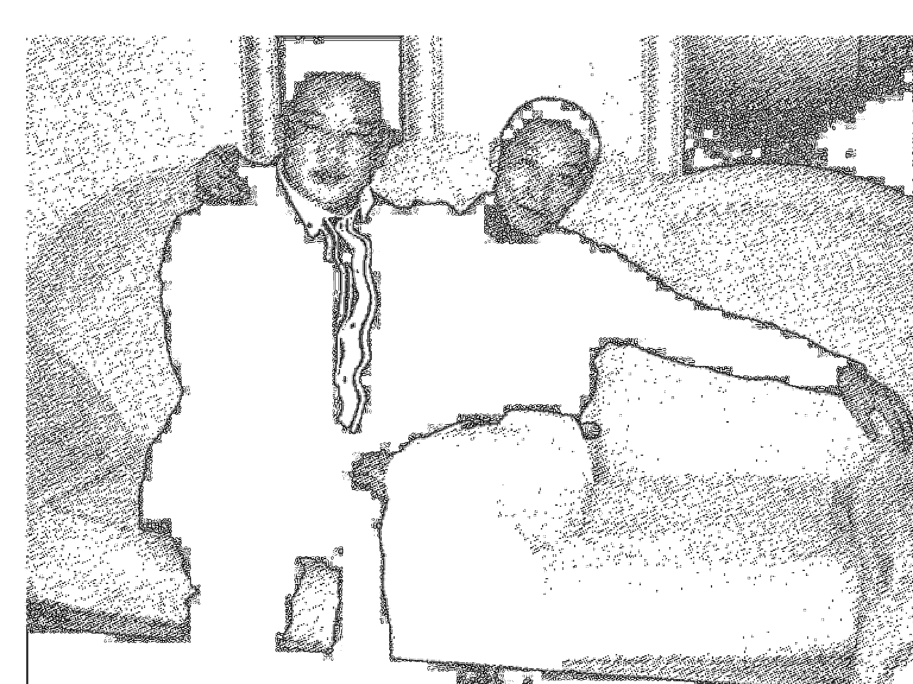

东方宇龙老师与中国式魔鬼训练第一人、亚洲八大名讲师张志诚合影

# 第八章 金口奇门占断应用

金口奇门占断应用分为三部分，上部为阳局占断实例应用分析讲解；中部对金口奇门阴局占断实例进行部分述秘；下部对金口奇门改运心要作了阐述。

奇门遁甲实占的过程中，以八卦记载方位，用十天干隐其甲，配十三宫记载天象及地象之交错，用十三门记载人事，用十三星十三神记载周遭的环境。有时间，有空间，充分表现出古人宇宙观的智慧。

影响我们吉凶祸福的不只是地球空间概念的方向，日出日落，月圆月缺，春去秋来，无不与我们的生活息息相关；而日出日落春去秋来是宇宙星体随着时间变化的运转结果；相同的空间、方向，在不同的时间，以宇宙观来看其实是完全不同的。

所以说奇门占断是宇宙宏观的分析学问，对时间、空间的运用，是一种研究时空动力的超时代学问。

奇门占断是一种时空磁场交替的分析学问，以前封建时代皇室用来遣兵调将出奇制胜。现在我们则用以推算出某个时间的吉方，来增加事情成功率。下面我们将分类详述金口奇门的占断方法。

## 金口奇门十三宫占断秘要

金口奇门十三宫源于传统九宫，加四大隐宫，成为十三宫。四大隐宫，划分了四库、四方、四季的阴阳交接和变化。而在奇门占断过程中十三宫原始图（九宫图）就象一架天秤，星门神就象天秤里的物品，吉凶轻重，放上便知。

而十三宫原始图（九宫图）横竖相加得 15 平衡，起完局就打破平衡，就有吉有凶（星门神不在原位，九宫失去平衡吉凶自然显现）。此时十三宫原始图（九宫图）就家一个人生大舞台，星门神，就象舞台上表演的演员，喜怒哀乐一望便知[吉门吉星，凶门凶星角色不同命运不同]。

十三宫原始图（九宫图）就象大地，星门神就象大地长出的小苗、年月日时就象小苗经历的风风雨雨。谁主导谁，谁服从谁、谁生助谁自然分晓。

同时将神盘、天盘、人盘、地盘、天盘干、人盘干、地盘干进行综合运用，各自充当的角色，然后找到切入点，以点带面进行综合分析！

在金口奇门预测中，十三宫占法属于高极占法，掌握十三宫占法，就能够把要测事情的前因后果，展现的非常清晰，能准确分析事情发展变化的每一个环节，充分使用易学指导我们趋吉避凶。

十三宫占法基于单宫占断，没有很好的单宫占基础，就不能很好发挥出十三宫占断优势。在传统奇门中，单宫占几乎一点没讲，完全以综合取宫占断为主，可传统综合取宫占断显得很作做、很机械，很单调。有时让人无可适从。金口奇门的十三宫占分以下几种方法：

### 天下奇门第一局——金口奇门

一、跳宫法：天盘干跳到人盘干在跳到地盘干，两步跳，测以发生的事，地盘干跳到天盘干，测事情的结果和未来。

二、星门还原法：用神宫位的门，还原到它原始宫位，细断人和事。用神宫的星，还原到它原始宫位，断事法。

三、排宫法：由用神宫位测事起，逆推过去，顺推未来。

四、五行生克法：以用神宫位天盘干为主，与其它宫的天盘干的五行生克关系，测事物的发展变化。

五、主次辐射法：先取求测人本命宫，再找求测人问事宫，以断吉凶。

六、先后天宫位法：后天宫位看先天，先天宫位看后天。

关于如何掌握好十三宫占法，是学好金口奇门的关键，掌握了单宫占，只能说奇门你会了点皮毛，掌握了九宫占，你的奇门才进入了一个层次，才算你真正学会了奇门占断。金口奇门十三宫占断法将在面授班中详细传授其中玄奥，金口奇门十三宫占断同时配五维全息分析，助你在预测界纵横天下，金口铁断！

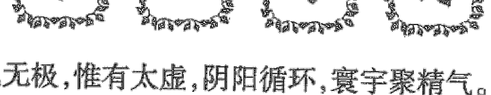

天地无极，惟有太虚，阴阳循环，寰宇聚精气。
天地之间，阴阳消长，易坛精英，震古烁今。东方字龙，演中华易学精义！
望星空，参天象北斗，纵横宇宙。金口奇门震世，中华传统文化之幸！
无极演乾坤，金口奇门。阴阳五行，甲丙戊庚，子午卯酉。千百年来，隐踪绝技再显世。全息态、析世间万物，犹如神断！

## 金口奇门占断应用

后面的实战推断例子中，可以让各位易友充分领略到“易有五变，神在五易”的具体应用，切身感受到“金口奇门”灵动纵横的魅力！进而领略“化平淡为神奇”之玄妙！

## 上部、阳盘占断实例

### 第一节 疾病预测
巧用天盘干，疾病灵活断

预测疾病的成败关系到人类的生命健康，因此对疾病作出预测，提前防治更好地维护生命健康减少人类的痛苦，这正是预测疾病的真正价值所在，我们只有对疾病预测准确，才能达到这一目的，根据古人的经验和我们实践中的探索，总结了以下几点：

- 1、从奇门九宫十三地的格局判断；大体这样分：离九宫代表头部，巽四宫代表左臂，中宫代表脏腑、坤二宫代表右臂，震三宫代表左肋左腰，兑七宫代表右肋右腰，艮八宫代表左腿，乾六宫代表右腿，坎一宫代表泌尿生殖系统。
- 2、从奇门内、外盘划分可这样判断，离九宫代表头部、脑部、面部、又代表心脑血管；坤二宫代表右耳、右臂、右手、人体皮肤；又代表脾、胃、食道；巽四宫代表左耳、左臂、头发、又主肝胆、血管、经络、气血；震三宫在体表代表左肋、左腰、足部、肝胆、左肺；兑七宫代表右肋、右腰、口舌、牙齿、肺部、气管、右肺；艮八宫代表左腿、左脚、鼻子、代表消化系统；乾六宫代表右腿、右脚、头部、代表脊髓、筋骨、大肠；坎代表泌尿系统、肾脏、膀胱；中宫代表脏腑。
- 3、天干仍然代表疾病的部位。

例：农历：2007年9月五日巳时 丁亥 庚戌 壬午 乙巳 起局：刚日，阳3局 占：友老人住院，看其病状吉凶

壬午——己——申酉空亡 乙巳——壬——寅卯空亡

### 疾病预测 阳3局

| 太明武曲生门 | 庚丁庚 | 天后天同伤门 | 辛戊戊 | 贵神贪狼杜门 | 王己辛 | 腾蛇左辅天门 | 癸庚庚 |
|---|---|---|---|---|---|---|---|
| 玄武破军从门 | 己丙己 | | | | | 朱雀天机景门 | 己辛丁 |
| 太常天梁休门 | 戊乙戊 | | | | | 六合禄存吉门 | 乙壬癸 |
| 白虎巨门冲门 | 丁壬乙 | 天空右弼开门 | 丙乙丙 | 青龙天相惊门 | 乙壬己 | 勾陈文曲死门 | 己癸壬 |

武易文化网址:http://www.184999.com

### 天下奇门第一局——金口奇门

占断疾病:随机取用,用从象生。是现代易学高层次技法! 古人传下来的取用方法只是一般法则,可能适用于当时的时空点,但相隔千百年,其取用方法在现代社会应用会嫌得呆板、思维狭隘! 纵观大部分学易者,取用神仍仅停留在古人的方法上。试问世间万事,仅靠传统方法来对应取用能解决现代所有问题吗? 答案是不可能的,所以在占断疾病中我们采用了巧用天盘干,疾病灵活断的方针,配合金口奇门全息分析占断技巧,做出了以下分析:

如果只从天干地支中去做文章,绝对断不灵验。如传统断法中:一宫中甲未日寅时,不用阴阳五行之理就直断生男。这样断法于易理不通,实乃江湖俗士列于篇中之妄语。

我们参考古人经验时,合理的取之,不合理的弃之,不可把古人经验看成圣旨。存在的不一定合理,合理的不一定存在,这就需要学易者存阴阳五行于心中,取之弃之方能应用自如。

- 1、占病以坤阴落宫看(因住院病人,医院为阴气较重的地方,故取阴2宫),天盘干为病人。
- 2、壬落坤阴宫,临贵神,说明医院条件好,是个技术不错的大医院;临贪狼为凶狠之动物,说明医院如狼似虎,治病花销大;临杜门,其象木入土中,入土为安,说明其病不轻,很难治愈,并有生命危险;壬水临坤阴宫受土克;壬水临己土受克;下临辛金受泄。说明其病上下受制,难逃一劫,并且很快,应在未日(关于如何定应期在未日,我们将在面授班中详细剖析)。
- 3、天盘干壬为病人,也代表疾病,其病应为肾上有病。

### 活用时空,取用生克

怀孕分娩占断分析要点:
- 1、用神落宫十三星的阴阳是胎儿的性别;
- 2、再从日、时二干落宫中看旺相休囚下结论,还要考虑胎儿处于死废孤虚之地,日、时落宫的五行生克,逢生主产速,产时顺利,如死囚入墓生得很慢、相当危险,用神当令主很快就要生产。
- 3、同时须看宫内之卦象生克,看是克我、生我、还是我克,化空逢生主产时顺利,化死入墓主产时危险。

友人反馈:是肾上疾病,病为肾功能衰竭;是在南阳市中心医院住院,因长期做透析治疗,花费了很多钱。同时友人第二天晚打来电话,说病人于未日下午三点左右未去世。

例:2008年农历3月7日辰时 戊子 丙辰 壬午 甲辰
壬午——己——申酉空亡 甲辰——壬——寅卯空亡
求测人妻子近日分娩,想通过奇门占断是否顺利?
起局:刚日,阳1局(此局为相加除尽局,0代表10,减9余1)

### 第二节 怀孕分娩

易理中阴阳变化相交而有五行,再从五行的生克制化,刑冲合害,旺相休囚死,当令失令,得地失地中去查找原因,能通阴阳之理,方知五行变化,才知世间冷暖寒热。

### 怀孕分娩 阳1局

| 贵神 破军 惊门 乙己癸 | 腾蛇 武曲 开门 丙庚辛 | 朱雀 天同 冲门 丁辛庚 | 六合 贪狼 休门 戊壬己 |
|---|---|---|---|
| 天后 天梁 死门 己戊壬 | | | 勾陈 左辅 从门 己癸戊 |
| 太阴 巨门 吉门 乙丁辛 | | | 青龙 天机 生门 庚壬乙 |
| 玄武 右弼 景门 己丙庚 | 太常 天相 关门 癸乙己 | 白虎 文曲 杜门 壬壬戊 | 天空 禄存 伤门 辛乙丙 |

当今社会，一夫一妻生一胎，事前占测实属大事。要从整个布局中，看用神的阴阳属性，确定胎儿的性别。

目前科技发达，尚有出错之时，更何况凭易理推测，焉有不失败之理？失败虽是成功之母，但永远失败怎能成功。这就需要我们从多层次多角度的用神中，去了解用神的阴阳属性，判定胎儿的性别。

我们的眼睛不带 X 光和 Y 射线，凭什么判断？凭易理推理的利剑，剖腹来看。

(1)、日干为母时干为子，时干所落的宫及十三星十三门的阴阳判断是男是女，日干落宫冲克时干落宫，子有难。时干落宫冲克日干落宫，母有灾。再从日、时二干落宫的格局中去看吉凶。

(2)、值符为母值使为子，值使落宫所临天盘之星的阴阳判断胎儿的性别。

### 天下奇门第一局——金口奇门

(3)、以地盘宫位为母亲，临坤宫天盘之星为胎儿（阳星生男，阴星生女）。

如果用神宫位有比和同性者为双生。再以坤宫所临之门为胎儿，阳门生男，阴门生女。

(4)、地盘干产母，天盘之星克地盘干，为子克母，母有难，地克天为母克子，主子死母腹，坤宫星盘临凶门凶格，母子俱伤。

坤宫天盘干生地盘干，俱子生母，为子恋母腹，产迟。地盘干生天盘干，为母生子，产速，母克子亦主产速。

(5)、以坤宫为产室，产室克门胎不安，门克产室，孕妇常病，如十三门伏吟主胎稳产迟，上临白虎产速。门临三奇为吉，若休囚入墓是死胎。

依据活用时空、取用生克的方针，配合金口奇门全息分析占断技巧，做出了以下分析：

- 1、取坤二阳宫作分析，依据中宫二宫之原则，测生孕吉凶。
- 2、戊入坤宫为比和，说明家人照顾较好，生育条件准备充足。
- 3、神为六合，合为人一口，为顺利之像，六合又为吉神。说明临产顺利。
- 4、星临贪狼，为阳星，原始宫为一宫应，生男子。并且有狼子野心之俗称。
- 5、临休门为为水，下临壬水、临贪狼均为水象，说明生产过程中有出血过多之象或羊水过多之象。
- 6、临休门和六合主母子平安，顺产。
- 7、宫位空亡，空则为无，无则已出，此时空亡，则主吉也。
- 8、生门在戊地，故断在戊日生产。

求测人反馈：于阳历 2008 年 4 月 16 日下午五点三十分左右顺产一男孩，产时羊水过多，生产过程大约历时 20 分钟左右；母子平安。

### 第三节 婚姻预测

奇门预测取用神，要用辨证的思维来取用神，当今社会时空点与传统大不一样，神七上天，人登太空。各方面的情况日新月异的变化。若用传统的老框框来取用神预测，很多占断就会出现断不准的现象。所以在金口奇门的取用上要依据全息频率，灵活取用，才能达到金口铁断。

占婚姻感情，我们首先要把目标定位于在用神宫位去着手考查，观察应宫位中生克旺衰出没状况，同时参考妻宫状态，便可进行综合裁决。

任何时候，占断均不得违背“读象要与事理对应”，这是预测的大道法则。换言之：“就是随时随地将宫位信息放到现实中展开分析”，此乃秘中之秘！

大家只要按着以上思路去分析宫位信息，你将会感觉到不但“思路清晰、目标明确”！而且结论亦是历历分明矣……！

宫位信息为人间舞台，用心去读出其内含，就是宇宙给我们的答案。

### 思维互换 动变象意

当今社会一夫一妻，但因社会的多层面发展，包二奶、养小蜜、红杏出墙，第三者插足比比皆是。可谓是你方唱罢，我登场。针对于此种现象，我们在婚姻占断过程中要做到思维互换、动变象意，从中去分析其中信息，作出正确判断。

婚姻占断，以生我者父母，克我者官鬼，我生者子孙，我克者妻财。金本生水，如果相伤就要从时令中去查证，五行相伤主婚事难成，水克火是天性，如水火都弱或都旺是为相济，婚事可成！

应该说休囚相克婚事不会有大的妨碍。旺相、相刑相冲并相克制、主婚事难成！！还应考察求测者年命落宫的神、及门的优劣看成功与否。

- 1、日干旺或从弱，时干克泻耗日干，则婚姻喜。日干弱或从旺，时干生扶日干，婚姻吉。反之婚姻凶。
- 2、在婚姻预测中，天盘干乙奇为女方，乙奇落宫的门、星、神代表女方性格、身材、长相及职业状态；天盘庚为男方，庚落宫所临门、星、神代表男方性格、身材、长相及职业状态。
- 3、丁奇落宫为插足男女双方的第三者女人，丙奇落宫为插足男女双方的第三者男人。

例：农历 2008 年 4 月 13 日酉时 戊子 丁巳 丁巳 己酉
一妇女求测：婚姻能否离婚，同时占其丈夫是否有外遇？
起局：柔日 阴 6 局
丁巳——癸——子丑空亡 己酉——壬——寅卯空亡

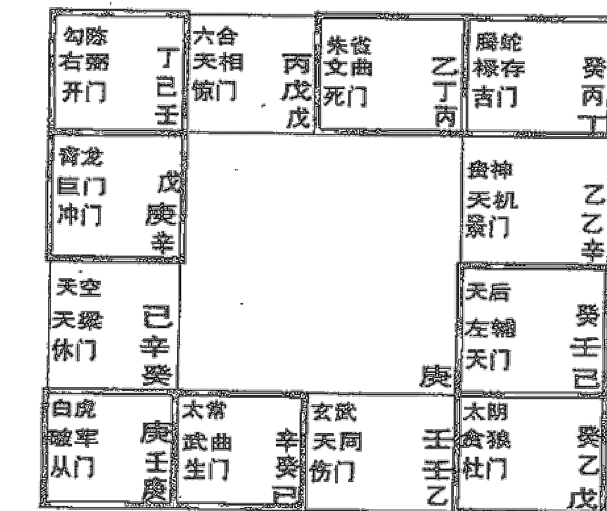

武易文化网址:http://www.184999.com

### 天下奇门第一局——金口奇门

以三奇六仪来取用神，依据阴阳与三奇六仪及星门神落宫，九星分阴阳，从阴阳五行的旺衰中去考证十三星，这样就可看出男女的长象和性格了。从宫位中看旺衰，再看其它宫位定生克，婚姻信息立显于局中！

依据思维互换、动变象意的方针，配合金口奇门全息分析占断技巧，做出了以下分析：

- 1、我们取坤二宫为用，其临朱雀，朱雀为火。说明求测者脾气不好，性格变化莫测，并处于更年期状态。
- 2、临文曲说明其从事职业为文化业，乙入土宫，自身受克；内心总有发不出的火！
- 3、乙临死门说明自己偏死心眼一点，造成目前状况，求测者的责任相对要大一点。
- 4、看天盘干庚的落宫，在艮八阴宫，庚临白虎为比和，相比者夫妻关系为争执、为吵架、为官司；临破军为破碎、分裂；临从门为两人同为一张中，也主两人同出一个门，有分手之相。但庚临戊子年丁巳月，外有相助，内有子泄；临巳月，木旺庚金受耗，精力受损，内心复杂。有不愿离婚之象。但又不愿屈服老婆，只在抗衡。
- 5、同时看丁奇落宫上的天盘干与庚金的生助关系，丁奇落宫为坤阳宫，其天盘干为癸，庚金生癸水，说明其丈夫因不满其性格和家庭生活，在外面自己找有外遇，但而不是外遇找他。
- 6、其丈夫临白虎主在公检法部门工作，其性格也为倔强之人。
- 7、纵观六合落宫信息，断其二人离婚不成，并可于下月和平解决其两人矛盾。

求测人反馈：事隔近三个月后，因求测人换新居，找我择日，谈及其夫妻关系情况，反馈说，实际她早就知道丈夫有外遇，也明白这是自己性格造成的，但又控制不住自己的心情，总想发火。后来经双方家人调解，其丈夫因工作顾及名誉，与其相好分手。当时时间也应于农历五月。

### 第四节 官司诉讼占断

官司诉讼占断，先观宫位五行变生克。宫位有动，动则必变，既知动变，细看用神与相应宫位关系，知此，则入周易之门；再看四时旺相、五行冲合等作用分析。

同时采用移形换位将间接的、含蓄的、隐藏的或不明显的信息提取出来，通过分析可以提取它从哪里来、又要到哪里去（它的出处与落点），从而让我们于纷繁复杂的宫位信息交叉图中——察清脉络，理顺思路，达到准确的判断。

### 移形换位，巧用宫位

用神天盘干为原告，冲门落宫为被告。白虎落宫为法官；以旺相、休囚死废分析之间胜败。旺气克制囚气有赢的机会，囚气克旺气百费心机，枉出力。同时还应看有没有贵人帮扶，是阴贵还是阳贵，从神盘分析。

张荣光求测：自己讨款官司能否打赢，同时的欠款能否收回？

例：2008年农历7月17日申时 戊子 庚申 己丑 壬申

起局：柔日 阴3局

己丑——庚——午未空亡 壬申——戊——戌亥空亡

### 天下奇门第一局——金口奇门

### 官司诉讼 阴3局

| 六合 | 朱雀 | 腾蛇 | 贵神 |
|---|---|---|---|
| 武曲 | 碰卒 | 天梁 | 巨门 |
| 杜门 | 伤门 | 生门 | 从门 |
| 丁乙辛 | 丙戊壬 | 乙庚 | 庚戊己 |
| 勾陈 | | | 天后 |
| 天同 | | | 右弼 |
| 天门 | | | 休门 |
| 戊丙庚 | | | 乙癸丙 |
| 青龙 | | | 太阴 |
| 贪狼 | | | 天相 |
| 景门 | | | 冲门 |
| 己丁戊 | | | 庚壬戊 |
| 天空 | 白虎 | 太常 | 玄武 |
| 左辅 | 天机 | 禄存 | 文曲 |
| 吉门 | 死门 | 惊门 | 开门 |
| 庚戊丁 | 辛己癸 | 壬庚辛 | 癸辛乙 |

依据移形换位，巧用宫位的方针，配合金口奇门全息分析占断技巧，做出了以下分析：

- 1、取3宫为用，天盘干己土为原告，土落木宫，原告受克，目前状况不好；宫位内星为被告，星为贪狼，为欠账人，说明此人贪婪，不属良辈。
- 2、宫位青龙为法官，青为青天，也主法官清廉，能公断此案。
- 3、原告临青龙吉神主吉，同时原告临景门，有贵人相助，主官司能打赢，但临宫位受克，官司能打赢但款不好要回。
- 4、再看原告宫位冲门落宫，冲门落在阴六宫，与宫位比合，代表争执、官司。被告临太阴为凶神，也主阴私、见不得人之事，主官司败。同时临天相被耗，临水被泄，临七月，正用金之时，其财受泄，说明被告目前经济状况不好。
- 5、再看原告白虎落宫看结果，白虎落宫在艮阳宫，艮宫为山石之土，求财困难。被告戊土生助法官辛金，主法官对被告有同情之感，法官落宫临天机又为艮宫为山石之土，主求财困难。又临死门又为坤土，与求测人产生再次比和，比在官司中主争执、重复之象。同时出现了再次争执之象。因此我断其官司能赢，但款很难收回。

反馈：求测者在历经半年后反馈过来结果，官司是打赢了，款没有收回，但经法官调解，让被告以一处房产作为抵押，限一年内还款，如一年内还不上款，以此房抵欠款。

东方字龙要求：金口奇门占断以“象”为用：在宫位中直读“信息之象”。我们不必在局中事先设定以何为用神，如果在宫位中事先设定以何为用神，就有了先人为主的定位观念，会让占断变得机械僵化，从而有违道法自然之易理法则……故起局后，要先看这局中之“象”，然后再决定从何处下手分析。

在此再强调一下：取用神最高层次的技法，莫过于“观象明理”，也就是“理象”结合！关于取用神之法，在面授班上再作详解。

### 第五节 工作就业占断

工作与一个人的生活息息相关，在一个人的生活中起着举足轻重的作用，工作就业包括毕业分配、求职就业、竞争上岗、晋升职称、官职升降、工作调动等。

- 1、首先要判断日干旺衰，再看时干落宫对日干旺衰的影响，如果时干落宫对日干旺衰产生积极的作用则所求工作必能如意，否则不如意。
- 2、日干弱或从旺，时干生扶日干，所求工作能成且顺利；

日干旺或从弱，时干克泻耗日干，所求工作能成且顺利。否则，不成。

3、开门代表文职工作，杜门代表武职工作。
年干代表上级领导，值符代表顶头上司，月干代表同事，时干代表下级或单位职工群众。
这里主要分：面试、求职、为官者升降，工作调动的预测方法。

### （一）面试

在整个应聘过程中，面试无疑是最具有决定性意义的一环，事关成败。同时，面试也是求职者全面展示自身素质、能力、品质的最好时机，面试发挥出色，可弥补先前笔试或是其他条件如学历、专业上的一些不足。在应聘的几个环节中，面试也是难度最大的一环。时下的招聘已经从主观印象发挥到科学评价，用人方不仅要和应聘者见面，更开始在形象仪表、自信心及潜在心理等方面全方位考查。所以，面试的主题是对应聘者的一种综合素质的评估。
奇门中面试以用神的正印看。正印为有利用神时，面试成功；正印为不利用神时，面试失败。

### （二）升迁

政府在位的官员或企业在职人员的升迁是现实生活中最重要的预测课题之一，其预测的技巧必须用真假六亲论，看日元工作六亲同日元之间的作用关系。年、月、日、时干为日元的工作六亲，分别代表上级领导、直接领导、下级部属。日元的正官是官位是工作六亲。升迁，最重要的是看上级领导对日元的作用关系，其次是日元的正官同日元的作用关系。二者为喜神时升迁有望。直接领导是升迁的桥梁，为喜时顺利，为坏时阻力大。下级部属代表民主评议只起参考作用，不影响大局。

### （三）求职及调动

第一次求职看偏官，已经工作的想调动以偏官为主，兼看正官。看它们同日元的作用关系，为喜时，能上班或调动，为忌时，失业或调动不成。

### 人生进退 卦宫揭密

卦宫化进化退之象在其它易书中讲得不多，可能很多人都因为“进退”二字从直观字义上就能理解明白，也就没有长篇大论。事实上，在进退之中藏有玄机！
人生进与退：有进必有退，有退必有进；万事万物的发展都是呈两极分化进行的。既然我们用卦宫来对应反映万事万物进化的发展过程，就自然也逃不脱这种规律。

1、进：
由动化进：是变动在发展过程中力量不断加大、能量不断增强的表现方式；在所占事情中，好比一个拥有才华之人通过自身的艰苦努力（动），终于打下属于自己的一片天地而有所成就（化进）这样一个过程。
动化进神标志着事态发展呈不断上升之劲头和趋势，是一种从量变到质变的演化结果。动化进神在卦宫的体现，如寅动化卯，申动化酉等。
“化进如化生”：占官位升迁、工作调动，如用神逢化而进：即将升迁调动之象！且在应事时间上会提前实现。

2、退
是在运动过程中，其力量呈现后退、下降、滑坡趋势！是卦宫能量由大至小、由旺到衰、由有变无的一种表现方式。化退如化!! 如酉动化申,卯动化寅等。表示卦宫从起点又回到终点、仿若未动。这好比现实中人事物一样:虽经历了一场轰轰烈烈之奋斗,到头来不但仍没改变现状、反而一如往昔! 甚至大不如前……

提示:宫位变化进退是断准事情应期成败迟速的关键标志!

例: 农历 2008 年 6 月 11 日未时 戊子 乙未 甲寅 辛未

李宏伟,男。因工作岗位不如意,求测工作岗位能否调动?

起局:刚日 阳7局
甲寅——癸——子丑空亡 辛未——戊——戊亥空亡

### 工作就业占断 阳7局

| 太阴 文曲 死门 | 天后 天相 惊门 | 贵神 右弼 开门 | 腾蛇 巨门 冲门 |
|---|---|---|---|
| 玄武 禄存 吉门 | | | 朱雀 天梁 休门 |
| 太常 天机 景门 | | | 六合 破军 从门 |
| 白虎 左辅 天门 | 天空 贪狼 杜门 | 青龙 天同 伤门 | 勾陈 武曲 生门 |

依据人生进退、卦宫揭密的原则,配合金口奇门全息分析占断技巧,做出了以下分析:

1、以从门落宫为用,用神乙木受卦宫耗,受宫位克,说明实际工作压力大,工作较累。六合为工作环境,说明工作大环境较好,临六合木多(工作大环境较好,绿化不错,工作单位表面漂亮),产生比合,说明竞争压力大,受人排挤;
2、用神临破军,说明目前实际工作环境和收入及人际关系非常不佳,并且破军为金,说明收入极不理想。
3、临从门说明从事这个部门的人很多,竞争压力强。下临戊土受泄,并且与下级或客户之间关系不好,直接造成目前状况。
4、关于能否调动看冲门落宫信息,冲门用神宫位为土,卦宫为金,临腾蛇为火受耗,临巨门为土受泄,临丙火等信息,充分说明了工作调动极难,虽有癸水信息,得能量太弱,不起作用。同时起局时空点空亡,更说明了调动不成功!
5、同时从局中分析求测人并有辞职之信息(关于此信息如何看,面授时会详细分析)。

李宏伟当时反馈:他所在的工作单位是一个推销门禁企业,公司排面装修不错,因老板爱好花草,所以绿化盆景较多。因公司业务员很多,竞争压力很大,员工之间为争单勾心斗角,单位上人际关系相处没真心朋友。同时这次要求换到另一个区域跑业务,不知能否成功。如果不成功想辞职换换别的工作。

三个月后,偶遇李宏伟,问及近况,李说后来调动公司没同意,一个月后自己辞职,目前在一家电公司做区域业务经理。

东方宇龙要求:卦宫所反映的是全息性、多角度的信息,我们要从各种不同角度、不同侧面去破译卦宫要表达的语言文字象喻！在分析卦宫与宫位信息的时候，要用辩证的眼光、辩证的思维去看卦，只有不断地转换镜头，才能摄取不同角度之盛境！

在卦宫信息的破译中，我们不能只满足于考查生克制化的信息、更要从动化中去组合上深层次信息。

## 第五节 经营求财占断

不管是交易、投资、买货、卖货、求财，均是日新月异的变化。而且市场每天都在变化，所以用月日的旺衰强弱能量进行变化占断，在变化的过程中以轻重之分和主次之别进行分析！并随时可根据大环境的变化，而产生动静移位互变，不断使恒定系统与动态能量进行相互转换，对于月日之间这种“能量定位交换”的表现形式；我们就称它作“日月动态”。

体为静，动为用。以大环境为静为体，以所测事情为动为用；同时以月日为动为用；以所测事为静为体，进行动用分析。

阴阳体用为信息之主，能集中体现局内的整体信息。“体”是人事物主体的核心代表，“用”是对应辅助说明主体问题的客体元件。明确了主体客体的定位模式，再复杂的事物——也就进一步显得既简单又明朗！占断就是一个“分析局内阴阳体用强弱变化的一种动态发展过程”。

因此，宫内原象为体时，月日外因就为用；起局时所有原象都为体，进行时的年月日时就为用；或者以月建为旺衰恒定能量来源，进行分析，日辰动态能量则为动为用；又或是日辰恒定能量来源系统为静为体，而月建动态能量系统为动为用等等。总之，体用定性要以变为宗旨。

### 月日动态 体用定性

生意求财就要以财为中心。多以生门为用，生门就是生意之财源，得三奇又得吉格为大利，反之不利，临凶神凶格，不但不会得财反会惹是生非。

同时看门，门无伤无克，求财会有可图，吉门临生旺地，就能腰缠万贯发横财，如果值使门得财当令来生，坐在家中经营，就能发财；门落宫之星为财星。用神喜居旺地来克制财星落宫，为求财有成。如果财星空亡或旺相，值符克制不了，求测人总是看得见拿不到，而百费神思。财星克用神你不要去求财，克我者官鬼，我克者妻财，用神克财星白手可以起家。如果用神和财星落宫比合，求财就会有分争，财星得用神落宫来生（我生者为子孙），就到那地方去自然会获得成功。

例：农历 2008 年 6 月 25 日辰时 戊子 乙未 戊辰 丙辰
孙炳：测当天下午一单生意（卖粮食给广东商贩）能否做成？
起局：刚日 阳6局
戊辰——戊——戊亥空亡 丙辰——癸——子丑空亡

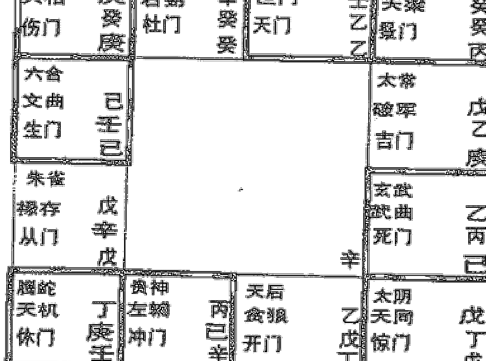

武易文化网址:http://www.184999.com

### 天下奇门第一局——金口奇门

依据人月日动态、体用定性的原则，配合金口奇门全息分析占断技巧，做出了以下分析：

1、以生门落宫为用，星为其财，用神已落入木宫，受宫位制，但临农历六月木旺受制，同时看星为文曲，为对方属木；临六合为吉神，主导方向不错，生意有成的希望；再看戊辰为土，为竞争力强。
2、用神己土临生门，生门原始宫位为艮阴宫，主求财困难，同时又克用神；已临壬水为我克者为财，但终因宫位中土的木的信息太旺，生意虽能做成，但得财不大。
3、人盘干壬为产品，产品生助对方，说明对方对产品认可；壬的原始宫位为艮土，同时也主产品求财难，利润不大；同时临地盘干己土说明有同行小人恶意捣鬼，导致出现价格竞争。
4、故而断出结果，生意能成，但对方以各种借口压价，导致所卖商品有市无价，赚钱不多。

反馈：2天后我打电话了解孙先生的生意情况，他反馈说：“您测的很准。生意是做成了，但价格很不理想，对方给价太低，利润太少，和预期目的差很远，但粮食库藏麻烦，且占压资金太大，怕影响资金周转，无奈忍痛出手。至于竞争方面，做这个行业的也多，市场相互竞价在所难免。肯定有人在中间以低价竞争，否则对方也不会这么压价啊”。

## 第六节 学业考试占断

学业考试占断在金口奇门中取用至关重要，主要用神和辅助用神的取用，是判断准确的前提。
用神就是把“用神神用”，主要用神确定后，明确五行属性，在落宫中分析旺衰，判断主要用神的自身条件，而辅助用神就是主要用神所处的环境，所有的辅助用神都克制主要用神，那么主要用神再“神”亦不会被录用。

如果主要用神自身条件太差，落入空亡死墓之地，又不当令。还被辅助用神克制，断不会录取。
如果用神落宫太旺，（用神落宫旺相又有凶格来助，这就是太旺。）被辅助用神克制亦不会被录取，如果主要用神落宫旺相又有吉格相助，就是被辅助用神克制，亦会被录用或录取；如果主要用神自身条件太差，只要不空亡入墓，得辅助用神生合，亦会被录用或录取。

### 巧取用神 类象直断

取用方法，大至可分为两个方面的内容：一、规定取用；二为灵活取用。
笔者歌诀为参考：

空亡之中藏玄机 旺而旬空终有日
休囚墓绝落空亡 纵有才华难出头
玄机尽在动中生 节节驿马传书信
良驹千里终有失 处处劫煞无消息
用神落宫有生旺 再把五行从头析
生克制化纵横看 刑冲合害定应期

例：2008年农历4月9日巳时 戊子 丁巳 癸丑 丁巳
张松涛(男)求测：今年考试能否如愿录取一本？
起局：柔日 阴6局
癸丑——壬——寅卯空亡 丁巳——癸——子丑空亡

### 学业考试占断 阳6局

| 太阴 禄存 景门 | 玄武 天机 天门 | 太常 左辅 杜门 | 白虎 贪狼 伤门 |
|---|---|---|---|
| 天后 文曲 吉门 | | | 天空 天同 生门 |
| 贵神 天相 死门 | | | 青龙 武曲 从门 |
| 螣蛇 右弼 惊门 | 朱雀 巨门 开门 | 六合 天梁 冲门 | 勾陈 破军 休门 |

同时还应参考以下取用要诀：
丁奇为答案，景门为试卷，看与考生落宫的生助，以此确定考生的优劣或得分。（注意：日干为考生，父测子时时干为考生。）

1、考生落宫旺相，得吉门吉格又有三奇相助，再得值符、年干、文曲星落宫生合，必定被好学校录取。
2、考生落宫旺相，得吉门吉格又有三奇相助，克值符、年干、文曲星落宫，也能选择较好的学校就读。
3、考生落宫休囚，但得值符、年干、文曲星落宫来生合，也能选择好的学校就读。
4、考生落入空亡、死、墓、绝地，纵然得值符、年干、文曲星落宫来生合，不被录取。
5、考生落入空亡、死、墓、绝地，又有凶门凶格，再被值符、年干、文曲星落宫来克，不被录取。
6、考生落宫旺相，得吉门吉格又有三奇相助，但被值符、年干、文曲星落宫来克，不被录取。

依据巧取用神、类象直断的原则，配合金口奇门全息分析占断技巧，做出了以下分析：

1、学业考试以文曲落宫为用，以天盘干为考生；
2、文曲伏吟，主学习成绩一般，喜欢贪玩。四月木旺，与用神产生比合。文曲与用神也为比合，说明朋友比较多，社交面广。
3、临天后说明这个学校的大环境不是很好，学习氛围不好。
4、临吉门为土，用神克制宫位，并临吉门为吉，可以顺利通过考试，下临戊土也主用神有助于考试，下临辛金用神受克主通过考试。但绝考不上一本线，因文曲伏吟原宫。
5、按宫位生克关系张松涛是很难通过考试，但以起局时间来占，其正值旺气，并用神宫位临有乙奇，但临天后不吉，所以虽通过，但绝考不上一本线。

反馈：隔了4个月后，张松涛的母亲将信息反馈过来，说张松涛考试是考过了，但上了三本，并且还是找关系花了点钱才勉强上的三本（关于花钱之事我当时没分析出来，得反馈后又将此局找出，发现一个遗漏的信息点没读出来，这就是临太阴，用神受金克之原因）。同时关于在局中分析信息取用时，一定要灵活，在分析过程中一点要纵深延伸信息。

## 第七节 风水环境占断

用奇门看风水环境的优劣也叫奇门风水，所以奇门风水这个概念，既是合在一起又是分开的，在具体操作上看是分门别类的,到五行生克吉凶评判上看是融合在一起的。

因为各种预测术都是相互联系的,总的来讲都是运用阴阳五行的生克关系,决定事物或环境的吉凶成败,所以地理环境也要研究的,如果你运用奇门进行处理风水,那么你必须精通风水,否则就是纸上谈兵。奇门风水,顾名思义就是以奇门结合风水进行运用。但是它只能用于占卜判断风水的成败关系,若用于立宅安坟是不行的。非专业的风水数术不可。

讲风水，就是看风水对直接的作用对象的好坏关系,也就是对具体的人的影响。也就是说没有人的参与,就无所谓环境风水的好坏。再好的风水环境你不去居住,也不会给你带来好运,再凶的地理位置你不去安坟茔,也就不会带来后代的衰亡。首先要明白用任何数术预测环境风水,只是一种模拟推测,无论你的预测技术多高,都没有实地考查的全面具体准确。要调风水不仅需要专业的风水知识,更需要亲临其境。即“运气要算,风水要看”。看,就是要实地勘察。所以奇门看风水,是能看出部分信息的,但有些只是表象,具体的操作和调整最好深入实际环境,用专业的风水理论去论断。

### 卦宫先后天 能量定强弱

以具体的人为中心的风水调整观，决定了奇门风水的用神的类象取法。

天盘干为具体的求测者,生门为家居、为阳宅的外环境,死门为阴宅、为地皮的外环境。值符为门,值使为出水口。时干代表自己的居室小环境、内环境。

另日干为人,时干为宅,宅为喜神时是吉宅,为凶神时是凶宅,不宜居住,必须调整。

生门落宫受制乘白虎、玄武,克伤日干则外环境对人不利。

死门落宫地盘之星为死者,天盘干为活人。如天地盘之星乘吉相生或比和,死门落宫又与日干相生或比和,则家宅、坟茔安宁顺达。如死门落宫天地盘相克,又冲克日干宫,则会有凶险发生。

阴宅天盘与地盘的作用关系看有无龙脉;同时以年干为龙脉,以月干青龙砂,以日干为白虎砂,时干为明堂,地盘干为案山,人盘干代表家中出什么人物。

企业风水以开门为用，重点在于老板办公室和财务室、及业务办公室进行分析勘测,依据特定情况进行调整。

商店风水以生门为用,辅助用神找在门店财位的进行分析,采用星门还原断法灵活占测!

宅式:乾圆、坤方、艮重、兑缺、离虚、坎实、震长、巽直也,以宫位直读其形状。

十天干的环境信息意象:

1、甲为高大的家具,为柱子、横梁,为大树木。
2、乙为小型低矮的家俱,床、窗户、饭桌,为灌木。乙加壬床下潮湿有下水管道;乙临惊门、死门、腾蛇常做恶梦,乙临生门,家居周围多花草树木。
3、丙为灶具、明火、烟筒、灯光,丙临值使门、开门乘白虎、天芮星冲克日干年命,锅台对着烟筒或大门的不良气场。丙加丁、九天临生门,宅子光线好,阳光充足。丙加己入死墓乘太阴临生门,宅子光线不好。
4、丁为电子产品、电话、手机、台灯、丁字路、十字路、香火。生门临丁宅子临十字路口。丁加戊为路灯,丁落旺地临死门乘腾蛇、太阴,家中供有神佛及祖先牌位且香火旺。
5、戊为高地、高岗、房、院墙、桥梁、砖瓦、电线杆、烧制的锅、碗之类器物，戊为地上之物。时干或生门临戊多为高大建筑物或房屋地势高，院中有大树或房中有水泥横梁，住宅旁有电线杆、桥梁等。戊加庚辛多为电线杆，戊加壬癸临天蓬多为桥梁，落值使门宫房门对着桥梁、河流。
6、己为阴沟、地户、阴宅、地皮、天井、阳台、坟墓、园圃，己为地皮地下物。
己加己、己加辛临太阴、玄武，天井低矮潮湿，己加戊临九天天井开阔阳光充足，临六合值符藏风聚气结构严谨，临乙旺花草茂盛。
7、庚为道路、铁路、屋脊、大型金属建筑物。时干生门临庚房屋临近大路，值使临庚门前为大路，再遇庚加辛道路不平，庚在那宫那宫有路。时干生门临庚上乘玄武、天蓬，房屋家具易有失盗现象。
8、辛为钢门窗、锅碗瓢盆、电线杆、墙角、小路、死人骨骸，辛为小型金属物。时干生门临辛一是有有害墙角对着门窗，二是有电线杆或小路对着门窗，三是房屋下面有死人骨骸。时干生门临辛宅子都有风水问题。
9、壬为水井、自来水、纯净水、大河、小路，壬为动水、净水。时干生门临壬居住河边或附近。壬加丁家中自来水不畅，壬加庚有堵塞之象。壬加己为暗流，为地下之河或建筑物下曾经是河流。壬加戊河上有大坝、桥梁。
10、癸为下水道、污水、阴沟水、厕所、卫生间、其它脏水，癸一般为静水。时干生门临癸房屋潮湿或地下有下水道。

先后天论：阴为先天，阳为后天；静为先天，动为后天；内因为先天，外因为后天；主体为先天，客体为后天。

风水占断以磁场能量成份，以旺衰量度分析为主，但目前传统旺衰定格是易界一直争论不休，而至今没有得到具体解决的学术难题。从古到今的易学大家们均是以月日来对宫卦单独作用评定能量旺衰，忽视了宫卦与生存于自然界中的人事物一样，都脱离不了“三维时空的立体影响及共同作用力度”！

笔者通过深入探索，总结顿悟出一整套全新的旺衰理论，它打破了几千年来只以月日锁定能量强弱的机械模式，彻底解决并理清了月日双重恒定能量标准的矛盾问题。

宫卦的能量定位旺衰，主要储存于“先后天十三维时空”这个主体客体元件集的配置中，故而我们可通过以下三种模式，去进一步将宫卦能量的旺衰强弱准确锁定：

（一）地利
首先：论磁场（地利）对宫卦信息的先天制约力度。

所谓磁场：就是宫卦所处的环境。因磁场是宫卦整体信息赖以生存的先天内因小环境、小地盘、小气候！这好比四柱八字中五行十神的通根一样，有多大的靠山后盾，有多大的领地舞台，决定着你先天存有多大的生存发展能量或空间。既然用宫卦内信息来模拟对应、推测自然界中人事物的发生发展过程，那么事物就没有可以完全超脱“周围环境影响”而独立存在的可能性。

场就是地理条件，界限区域。便演绎出了人生的空间舞台，用神受场克制：先天生存环境欠佳！没有施展发挥才能的理想环境，怀才不遇，有力无处使，此为不得地利。用神逢场生助：主根基坚实牢固，不需要四处流浪奔波，可以就地发财！从而靠山吃山，靠水吃水，谓得其地利，得地利者：适合在本地开创局面、发展事业……

（二）人和
其次：观对应之宫，人和对用神的向背如何。

所谓人和：就是当我们把既定的用神锁定之后，与其相对应着的“另一个人事物的环境”也就随即产生。注：在这里当用神不是原宫的情况下，就必须用上“星宫还原”的技巧理论了。

局中的用神好比八字命局中“生助日主的印比十神星”一样，是为强体旺我及助我辅我之党众势力！用神遇之，莫过于得“人和”的最好标志。它标示着用神所求事情在发展进行过程中能否左右逢源，在人事网络关系中能否游刃有余、事倍功半等等。

奇门风水这门场效应学问中，讲的就是“共振原理”！只有共同类型，共性的事物才最易产生共振。有你必定有他，有高必定有低，有长必定也会有短……充分反映了“同声相应，同气相求”的阴阳对应原理。只要有了一个事物的存在，就会相应有其生长、发展、壮大和消亡的运行过程或运动轨迹；只要确立了用神的存在或出现，就会有形无形的对应着——用神的他人他事他物或他方的信息。

“用神而神用”。是金口奇门占断过程中相互呼应、相互联系、相互支持、相互依靠的本体客体。是反映整个事物有关联的一切客体的人事物。二者之间有着一种呼应、对应的亲缘关系，就好比人一样，地位相同拥有了共同的一个“场”，自然可以产生共鸣与共振，从而也就有了共同的立场、共同的感受、共同的语言等等。

用神是处在相对位置的变异信息，虽然各处地理环境有异，但却是相对立着的两个“空间”，就像两个不同县市的县长市长，由于身份地位、职务职称完全等同的缘故！所以自然就能产生共同的感受，共同的语言，共同的默契。

两个空间直接起到喜忌好坏作用的影响！因此两个空间生助或克制：便是先天“人和”得失的象征。反映着用神与周围人事物气场关系的融洽和谐或排斥悖离，受人支持拥戴或是遭人排斥孤立……

### 三、天时

最后：查月或日（天时）加入以后的综合界定。

宫卦在禀赋了先天的地利人和旺衰衡定之后，就要用月或日后天外因——来作出最后强弱取舍的具体定格！这就如四柱命理一样：宫卦内的地利人和的生克扶抑，好比原命局日主十神在先天组合中决出的强弱旺衰，再通过大运观察其旺衰运行变化，按流年推出吉凶成败应事应期相类同。

在风水占断的过程中要综合考虑上述各类因素，作出综合分析，从而透彻的的将风水吉凶作出分析。

例：农历 2008 年 7 月 13 日 戊子 庚申 乙酉 辛巳

王永刚求测：看其父阴宅风水情况，对后人影响如何？

起局：柔日 阴8局

### 风水环境占断 阴8局

| 青龙 巨门 死门 | 天空 右弼 吉门 | 白虎 天相 景门 | 太常 文曲 天门 |
|---|---|---|---|
| 勾陈 天梁 惊门 | | | 玄武 禄存 杜门 |
| 六合 破军 开门 | | | 太阴 天机 伤门 |
| 朱雀 武曲 冲门 | 腾蛇 天同 休门 | 贵神 贪狼 从门 | 天府 左辅 生门 |

武易文化网址:http://www.184999.com

### 天下奇门第一局——金口奇门

依据卦宫先后天、能量定强弱的原则，配合金口奇门全息分析占断技巧，做出了以下分析：
1、看阴宅以死门为用，死门临青龙吉神，说明占有龙脉；死门落宫位临木，宫卦临火，火在风水中主漂亮、气派，临宫位木说明阴宅绿化不错或绿色植物偏多，坟地周围水气很旺。
2、临巨门坟地高大、气派，死门土生助庚金，其后人大多为锦衣玉食富豪之人，并有官府政界要员。此坟后人中老大比较耗力，但他对其他弟兄帮助很大。
3、此坟后人多为男丁，女丁少于男丁；并且后人社交范围广，交往之人层次较高。
4、此坟地得地气（磁场），占龙脉（天时），得人和（左右逢源），借东南方山气得贵，临四周人际关系生助，形成五行直通旺局，南北方有大路，东南方有树木（并且旺盛），北方三里外有一条河沟（不是大河东方）。
5、此坟地明堂广阔，主子孙二代富贵，坟地特别生助老大、老三；但你们家先天条件不好，家里很穷。
6、此坟不足之处是西北方太空，主后人晚上睡觉易做恶梦、多梦见受惊或打斗之梦。

王永刚反馈：其父这块坟地是他大哥从江西请来的人选的坟地，并让北京一风水大师也来看过，一致评价此地乃龙穴宝地。坟地修的是漂亮，也很气派，因为是其大哥为社会做出贡献巨大，地方政府为了拍马屁给重点建的；坟地在山区，周围是绿色树木较多；后人因得其兄之福荫，姊妹四人均占大哥的光，全部步入富豪行列。现在除大哥外，他们娃娃均在做生意，并且生意做的很大，公司总资产上亿；其兄不是政府官员，但因其兄的一项发明，为社会造福很大，政府为其大哥纳入国家特殊保护人才，也经常和官方打交道；最后，王永刚对坟地环境反馈说：东南方是有一座山，山上植物很多，坟前南北有一条大路；东方有弯曲一条通向东南向山上。山北方是一条河沟，基本没水，但离坟地很远，具体多远没量过；西北方是空阔的地方；至于做梦的问题，其他人他说不知道，但他自己总做一些受惊的梦。关于人际交往的情况，因为其兄的人际关系因素，他们接触的人层次均是上层人士。他还谈到家中以前是很穷，当年他大哥搞科研入迷，科委又不给拨款，他大哥的老婆和他大哥离了婚。

王永刚最后说：“我原本不信周易这东西，没想到你不到我们家的坟地去看，就从一张纸画上方格（奇门局）就能看这么多东西，中国的传统文化真是太神奇了”。我说：“你大哥玩的是高科技，而周易是中国传统文化的精粹。包括高科技电脑发明中运用的二进制也是从《周易参同契》中获得的启发，如果没有周易，人类可能到目前还用不上电脑”。

注：金口奇门全息分析应用时，局中任何一个元件，只要用得上，就能立刻共振出一连串的象意组合信息。俗称：组合分析。
同时要依据这个元件，还要达到无中生有，让其延伸出隐藏的信息，这是金口奇门全息信息分析应用的上乘功夫。

## 中部、阴盘占断实例

金口奇门中阴盘奇门布局法和阳盘布局大不一样。阴盘奇门对中宫的布局应用极为重视，对神、星、门、天盘干、人盘干、地盘干的布局法与阳盘奇门大有不同。因阴盘金口奇门涉及到高层次的遁甲穿壬等内容，故仅在函面授班中传授。

为让广大易友对十三宫金口奇门阴盘的全盘面貌有所了解，我们公开以下占断实例，关于分析思路仅在特训班中公开。

金口奇门阴盘全息分析应用将依据五维思维和十三维时空运动模式，把所有用神落宫的状态及所有用神的五行，当令失令，得地失地，旺相休囚死和神、星、门、天人地盘干的旺相休囚废进行综合分析。

纵横金口奇门盘，不仅要看宫与宫之间的生克制化，刑冲合害；更要纵深、纵横的配合全息分析进行细微分析推演，才能炼就火眼金睛，方能叱咤风云天地间。

### 一、占丢失人吉凶

例：于2008农历7月23日午时，张鹏带一亲友来我家求测，要求占断其一学生妹走失情况。

张鹏其亲友吴孝天的女儿吴炎（15岁）在前一天晚上放学没有回来，吴孝天以为其女儿去同学家玩，直到晚上10点才着急寻找，没有找到。第二天一早去学校班上也未见女儿吴炎到校。学校和家人急忙报案寻找，未有结果。于7月23日中午时吴孝天找到其亲友张鹏来到我家求测，我以当日吴孝天来的时间起局，以阴七局布局占断。

2008农历7月23日午时 戊子 庚申 乙未 壬午
求测：一女学生（15岁）于前一天放学未回家，占断其吉凶及目前状况？
起局：阴七局
乙未——辛——辰巳空亡 壬午——己——申酉空亡

### 行人吉凶占断 阴7局

| 太阴天相开门 | 癸庚癸 | 六合左辅休门 | 庚戊己 | 腾蛇武曲生门 | 戊辛丁 | 贵神天同从门 | 己庚丙 |
|---|---|---|---|---|---|---|---|
| 玄武文曲冲门 | 壬己壬 | | | | | 玄灵贪狼伤门 | 戊乙戊 |
| 天后廉贞惊门 | 辛戊乙 | 太常禄存玄门 | 乙辛辛 | 白虎巨门天门 | 丁癸庚 | | |
| 青龙右弼吉门 | 己丁辛 | 勾陈天机死门 | 辛丙庚 | 朱雀破军景门 | 戊己戊 | 天空天梁杜门 | 丙壬己 |

占断结果：
1、占局分析以1宫为用，进行了信息分析。
2、以局中分析我告诉吴孝天，一、你女儿比较内向，一般不与家人交流内心想法；二、你女儿目前在你家的西南方向。

有灯红酒绿之地，应为娱乐场所；三、此事与一女孩有关，此女孩应在你家南方，和你女儿在一起。四、你女儿目前有让人胁迫的信息之象。五、并有多人在一起喝酒之信息；六、在明天下午你女儿才能回来。

反馈：于2008年农历7月25日张鹏反馈过来结果，吴孝天的女儿是在放学后被一女同学邀去KTV酒吧玩（方向确实在家之西南方），在场的还有社会上的几个男女，在娱乐时其多人吸食K粉（一种毒品），意乱情迷时男女之间相互淫乱；并于08年农历7月22日晚在附近洗浴中心开房群宿，并继续吸食K粉，因7月24日上午有人举报，被缉毒大队抓获，因其年龄较小不够拘留条件，于当日通知其父，交3000元罚金将其女儿领回。

### 二、占工程竞标

例：于2008年农历8月10日巳时，我以前的学生张浩到我处求测，说近日有一个学校摄像头安装工程，涉及竞标事宜。这个单子因为工程量较大，他已经跟了两年了，铺路子也花了不少钱，但目前出现了一些问题（竞标的单位很多，并且很多都有社会背景），心中没底，怕前期铺路的费用收不回来，故来求测事情成败。

我以当日张浩来的时间起局，以阳六局布局占断。
2008年农历8月10日巳时 戊子 辛酉 壬子 乙巳

求测：占学校摄像头安装工程能否中标？
壬子——壬——午未空亡 乙巳——壬——寅卯

### 天下奇门第一局——金口奇门

### 占工程竞标 阳6局

| 贵神天相死门庚丙庚 | 天空右弼开门癸己癸 | 玄武巨门生门乙壬乙 | 太常天梁从门丙辛丙 |
|---|---|---|---|
| 天后文曲休门己丁己 | | | 勾陈破军天门庚庚庚 |
| 太阴禄存景门戊癸戊 | 腾蛇廉贞吉门辛乙辛 | | 六合武曲杜门己己己 |
| 玄灵天机冲门壬戊壬 | 青龙左辅玄门辛辛辛 | 白虎贪狼惊门丁庚丁 | 朱雀天同伤门戊戊戊 |

占断结果：以从门落宫取用，占断结果如下：一、这次竞标不能中标；二、此次开标前你可谓费尽心思，不止两年以上钻营此事；三、此次开标不可能成功招标，最终可能是众多争家两败俱伤。

反馈：半月后，张浩来电话说，东方老师，你测的真准，今天上午开标，因为发标方受各方压力过大，不好定标，今天的招标会流标了；以前各家送的礼、花的钱也泡汤了。也许下次开标会出现陪标、托标的情况，利益可能要均分了，但这个结果要等几个月后了。

### 三、占经营求财

例：于2007年农历7月28日申时朋友叶炳忠打来电话，求测最近要开一洗浴中心，问生意能否赢利？因洗浴生意目前做的人不少，且投资又大，故在投资前占断一下，看发展如何？

我以当日来电话时间起局，以阳七局布局占断。

2007年农历7月28日申时 丁亥 己酉 丙午 丙申

求测：开洗浴中心生意发展如何？

丙午——壬——寅卯空亡 丙申——辛——辰巳空亡

### 占经营求财 阳七局

| 离龙巨门死门丁癸戊 | 玄武破军开门戊辛辛 | 白虎右弼生门辛庚丁 | 天空天机从门庚己癸 |
|---|---|---|---|
| 勾陈天梁休门癸壬乙 | | | 摄神廉贞天门己戊戊 |
| 玄武贪狼景门壬辛丙 | 六合禄存吉门丙丁己 | 朱雀天相杜门戊乙辛 | |
| 天后武曲冲门辛庚庚 | 太阴天同玄门庚己己 | 太常左辅惊门己戊壬 | 螣蛇文曲伤门乙丙庚 |

占断结果：以生门落宫取用，占断结果如下：一、这个生意可以做，但须上面有人照着；二、此生意同行竞争压力比较大，但利润较大，还是可以做；三、这个生意有合伙开办之象，并且这个生意需要黑白都要有人，否则会出问题；四、你的生意中并有色情活动成份。

反馈：叶炳忠说，是的。生意是和公安、检察院等几个朋友合伙开办的，这种生意没有这些人不行。同时也靠这些人来带客人消费，估计没有大的事故也不会赔钱，但就是心中没底。

最后我忠告小叶：钱要挣，但做任何事要小心因果报应啊！

## 下部、金口奇门改运心要

金口占东方，奇门腾宇龙。自从金口奇门创立以来，其神效威震于大江南北，声名远播于长城内外，社会各界人士纷纷慕名来访，在他们与我的接触当中，大家最感兴趣、提得最多的问题：就是改运。

金口奇门的精深体系正暗合了两个哲学思想：其一，实践是检验真理的唯一标准；其二，任何事物都包含着偶然性和必然性。通过众多实例，我们可以发现这样一种现象：许多人往往都是发生不幸之后才想到改运，都是在经历了无数次失败之后才感叹自己命运不好，其实人的命运是可以预测的，也是可以改变的。凡事预则立，不预则废。一个相信命运的人不一定是一个成功者，但一个成功者如果不相信命运，他一定会走向失败。讳疾忌医，终必丧生！如果你是一个商人，一次准确的预测，不但给你成功的勇气，而且能给你失败的警示，使您减少损失。请问，哪一个商人愿意赔钱？哪一位商人没有赔过钱！如果你是个国家公职人员，我可以提前给您预测宦海风波，保您工作顺利。任何一个职业投资分析高手也只能依据现有的信息来推测未来，而他们所凭据的信息是不断变化的，所以其准确率不可能很高，而浓缩了宇宙十三维空间能量运动玄机的金口奇门可以帮助每一位朋友，用第三只眼睛看世界！

经过金口奇门的指点迷津，有很多年过半百的人总会感叹：假如时光可以倒流，青春可以再来，那么我的命运就可以重新安排。这是因为他们从金口奇门中看到了自己以前为什么会失败的原因，蓦然回首，懊悔满怀。

世界万物都是秉天地之气化孕而生成，这正是易学改运最基本的前提。在此，我要告诉大家，易学预测与改运是要靠细微的信息进行取象，而易学分析就是转换思维，使原有信息产生变化，达到个体思维的灵活发挥！在易学的这个运用过程中，要求我们能熟悉和掌握奇门思维理论体系，真正做到“宫卦信息，灵变取用”，充分展现“自然取用”的至高法则！

有道是：事有先后，用有千秋：预测的一切目的是为了找出人生路途中不平衡的信息，或找出人生日前事业和生活中关键问题背后隐藏的关键因素，迅速改变它，或者是立即打破不平衡，创造新的和谐平衡点。

换言之，对一个人预测分析得再准，只是找到了病灶所在位置，但不会通过布局调整也是白搭，就如同一个医生知道病人得了什么病不会治一样。所以说，预测准确只能体现一个易师的论断水平——事实上，我可以毫不夸张地告诉大家：达到这一点，有人可能穷其一生也不能如愿；而在金口奇门中，达到这样的水平容易得就像“一加一”，充其量只能是一个初级水平；预测出问题，能够调整到阴阳平衡状态，把不好的改变成好的，也只不过是达到了中级水平。于是，有人就会问了：东方老师，那什么是高级水平呢？在这里，我郑告大家：奇门真正的高层次水平，是夺天地之造化为人所用！

夺天地之造化，不仅可以借用天体宇宙能量、地磁场能为人所用，而且能够由此改变人的命运，运用得当并有扭转乾坤之奇效！君不见，古往今来，华夏神州，多少奇门高手运用奇门之玄妙，在兵家争战、商业运筹、国家兴衰上，将奇门精髓演绎至惊天地，泣鬼神的化境，千百年来被世人津津乐道，成为历史之佳话！

金口奇门改运秘术，夺天地之造化之密，取用自然法则和宇宙能量，应用得当可名扬一方，更能造福无数大众；但这一利器若落入歹人、心术不正之人手中，可祸国殃民，为害一方。故此，以“强我华夏，福我华人。为中华民族伟大复兴而奋斗终生”为神圣天职的东方宇龙，视金口奇门若掌中明珠，仅在弟子班中择优传授，得此法的所有弟子当以“强我华夏，富我华人。为中华民族伟大复兴而奋斗”为终生使命，当为中华民族成为世界经济强国尽一份力量。

金口奇门改运法，是本人呕心沥血，在易学研究中经验秘法之集大成者。众所周知，在传统奇门著作中有大量歌诀，可以准确预测日常事物的方方面面，但缺少明确解决问题的对策（方案）。本人认为，作为一门高层学术体系，奇门不能仅仅满足于发现问题，更要善于解决问题。显然，古人肯定有一套解决问题的可行方案，只是没有详细的文字记载而已。金口奇门改运法，将针对预测出的问题，结合当事人和事物的实际情况，运用独特的三大改运秘法、九大改运方略进行各方面分析调整，最终实现改变命运、顺应时势的和谐效果。

虽然，传统文化中各类改运方法均有很多独到之处，但它们始终都离不开阴阳五行这些基本原理。阴阳平衡，五行流通，则吉祥喜庆；阴阳失衡，五行阻滞，则凶祸发生。而我特别强调的是，我们在进行改运调理的时候，头脑中要装着太极图，静中有动，动中有静，刚柔相济和谐圆满。在通常情况下，尽量使用化煞手段，少用或避免强行制煞。因为“煞”是灾难的诱发因素，是人们的“敌人”，克敌制胜并非上策，化敌为友，为我所用，才是最佳的选择！

怎么理解我上述的说法？打个比方，金口奇门中用神是寅木，被金重克，处于死绝之地，金是敌人，若用火制金，虽然一时将金制伏了，但同时也消耗了寅木自身的力量，双方都要受损失。若采取和谐策略，则可用水泄金气，金水木连环相生，金不战自败，用神自然得救。这就是“和为贵”的道理，“和谐、平衡”是改变一切的首要条件！

从灾难产生的原因来讲，不外乎内因和外因两个方面。由于自身不按规律办事，甚至违法违纪导致灾难临身，实为咎由自取。解灾的唯一方法就是“解铃还需系铃人”，让他自己改过自新，修正错误，不再重犯。由外部因素所致的突发事故，如天灾人祸，这些事情人们防不胜防，我们可以借助预测学提前做好各种准备，减少或避免损失。

东方宇龙在这里需要特别说明的是，我们在改运方面常用的方法有：由我长期研悟而独创的全息时空能量和十三维宇宙空间能量改运法、时空原点变异法、配合五行直通改运局、天心纳运局、引水入宫局、磁场改运法、催官两大要素、催文昌三大要诀、空间方位改运三大要诀、催财旺财五大要诀、金口奇门改运三大要素、改运九大秘诀等。在实际应用中，诸多要诀往往综合应用。

在这个浮躁的年代，许多所谓的“改运”纯属误人骗钱的把戏，许多人学了不会用，用了不灵验，浪费了时间不说还害人害己。金口奇门改运有很强的针对性，对症下药，针对不同人的不同问题，运用不同的调理方法，达到超乎常人之想像的改运效果：无论是催财、催旺、催官、催婚、改运、奇门风水布局等均有立竿见影之效，且有不可思议的神奇效果！经东方宇龙改运，许多人四通八达，人生陡变，笑看红日初生，炊烟袅袅，心中荡起“会当凌绝顶，一览众山小”的感觉。

### 天下奇门第一局——金口奇门

当您春风得意时，金口奇门是您理想的风帆。当您痛苦失意时，金口奇门是您导航的灯塔。在祖国博大精深的传统文化中，金口奇门重在渡化人的心性，它就像一盏明灯，不管您走到哪里都照亮一片前程。东方宇龙希望大家依靠金口奇门测运改运，努力拼搏，兴业和家，造福于民。

总之，奇门改运是一门综合性的学问，要因人制宜，灵活使用，对不同人、不同事采用不同布局，切不可死搬硬套。本章中只是简单介绍了这方面的操作技巧。关于用如何金口奇门改运的专门知识，将在面授班中详细传授！

### 使命

感恩宇宙的丰盈，感恩上天的无限恩赐；感恩当今盛世。报以感恩之心来作为迎接金口奇门著作的问世；仅以此书献给天下追求真知的易友；因为只有普天下的易友，才能托起传统文化的灿烂明天！

也只有追求真知的易友才真正能撑起易学文化的辉煌！历史的文化需要爱心的浇灌和阳光的呵护；只有普天下易友众志成城，传统科学的明天才会更显魅力！

我们以感恩的心来完成上天赋予我们的使命，一定让传统文化为中华民族的繁荣富强尽一份力量！“强我华夏，富我华人。为中华民族伟大复兴而奋斗终生”。“将是东方人永恒不变的目标！

# 第九章 金口奇门占断分析技巧

为了满足广大易友，特公开笔者研究金口奇门的分析思路。在此将一些分析思路进行一体性、归纳性、总结性、系统性的整合，因本章版面有限，我暂将金口奇门分析思路的部分内容整理出来供大家参考！针对分析思路问题，今后将陆续推出金口奇门更精彩的分析方法专著供广大易友参考。

> 奇门占，细用心，阴阳纵横内外分。
定用神，贵神用，变化无常乃玄机。
东西南北时空观，阴阳生克辨虚极。
宫位卦意强弱论，先天后天层次分。
奇门局中演世态，打破平衡寻真机。
无极之处生万物，用神神用化无穷。
全息思维本无法，贵在十三维时空。

## 技巧一、贵在取用

在金口奇门中取用至关重要，主要是用神和辅助用神的取用，用神是奇门占断准确的前提，如果用神取错全盘皆错，何谈灵验？

这里所说的用神是名词，我们要把名词动词化，换而言之就是把“用神神用”，主要用神确定后，确定它的五行属性，

在落宫中的旺衰，判断主要用神的自身条件，而辅助用神就是主要用神所处的环境，所有的辅助用神都克制主要用神，那么用神再“神”亦也无用。

如果用神自身条件太差，落入空亡死墓之地，又不当令。还被辅助用神克制。

如果主要用神落宫太旺，（主要用神落宫旺相又有凶格来助，这就是太旺。）被辅助用神克制亦也不行，如果主要用神落宫旺相又有吉格相助，就是被辅助用神克制，用神即可得到发挥；如果主要用神自身条件太差，只要不空亡入墓，得辅助用神生合，也可以得到能量发挥。

综观古人取用的方法，大至可分为两个方面的内容：一是规定取用；二是类象取用。

规定取用：用天干地支做用神的，可视为规定取用。
类象取用：用神、星、门为用神的，可视为类象取用。

对用神的分析请参考东方宇龙老师整理的歌诀：

> 空亡之中藏玄机 旺而旬空有真机
休囚墓绝落空亡 纵有才华难如意
玄机尽在动中生 节节驿马传信息
良驹千里终有失 处处劫煞无消息
十三诸神细心推 星门神盘还原用
用神落宫看生旺 再把五行从头析
生克制化纵横看 刑冲合害定应期

用神取用还应当遵循以下三大原则：

在实际奇门预测中，取用神的方法虽然千变万化但是离不开三个纲领——象、理、数。奇门预测学是一个由已知推未知的应用方法。这个推测方法是按着事物的客观规律来进行的，世界上的任何人、事、物都是存在着象、理、数三个条件，并且三者为一体，知道了三者中的一个，就能推知另外两个。

象理数三者为一体，因此，见到了象可以知其理数，见到了数可知理象，知道了理可以知象数。这个就好比，见到了一个人的长相能大约知道其年龄与生理是一样的道理。

以象来取用神主用八卦类象的方法，来比拟这个世界的万事万物。奇门中的星、门、宫都是八卦在不同空间的象的代表。另外奇门中干支符号代表的事物，这个也是属于象的范围。在实际的预测中，比如我们要预测一个生意怎么样，那么传统上通常取生门为这个事情的代表，也就是生门为用神。为什么取生门，因为生门中的生，与做生意的生，在字意上有雷同。又如要开店经营，又会取开门为用神，这个是因为开门与开店的开又是象上同。这个取用完全是按象来的，如果按卦里来测，生门为艮卦为阻力之意，如此就不通了。

对于象的实际应用，分取象与读象两部分，取象是取象为用神，用已知的象读出未知的数理部分，读象是用已知的数理为用神，而读出未知的象的部分。

以理取用神，是按事物的道理来取用，比如传统奇门中日为自己，年为长辈，月为兄弟，时为子孙等！其中方位、动静、合干、对宫等等都是以理来取用的。用颜色取用神是象与理的组合来取用。

以数来取用，是从事物的量化角度来取用，比如，用年命，行年，年龄数，时间，数目、人数、方位变数等等。

取用神的四大要点：

取用神的方法如此之多，往往让有些学易者反而不知道如何取舍了。本来方法是活的，完全在于人见机而行事，灵活掌握的，但是为了让大家在开始的时候有一个方向，下面列几条用神的取用原则：

1、预测的日地是由已知求未知，取用神先以已经知道的条件来做为用神。

2、已知条件有多项时，以所知条件最明确或最重要的条件为用神。

3、一时多人预测时避免用神的重复取用。

4、用神虽灵活多样，但总要按规则来取，不可过分的妄取，正所谓变易之中有不易在，事物虽然在千变万化，但是按着一定的规律在变，不是乱变的，取用之灵活性亦是，万变不能离其宗。

## 技巧二、细论象、理、数

象、理、数是易学应用的核心内容，在用于奇门预测学上关系相互盘根错节，不能分开。易学的“象”，在实际应用上，象在包含了相所指的物体外表的基础上，更有象类比推的思维延伸。从易理上来说，这个世界就是象的世界，易经用“阳爻”来象征世界上阳的事物，用“阴爻”来象征阴的事物，阳可以看作是光明、动、上、外等事物，阴可以看作是黑暗、静、下、内等事物。用“阳爻”与“阴爻”重叠三层（天、地、人）而出现了八种象，用这种象来代表世界上的万事万物，也就是我们常说的八卦。

我们在奇门预测学中往往要用卦中出现的象来类比现实事物的状况，这个就是易学中对象的应用。比如艮卦是上面一个“阳爻”，下面是两个“阴爻”，这样就成了一个山的形状，所以把艮卦代表山，艮还代表小男孩，这是按“阳爻”是阳的外面，“阴爻”本来就是男性生殖器的表象，只有小孩子可以露在外面不忌，“阳爻”为阳也可以代表小孩子喜欢在外跑动，艮卦内两“阴爻”说的是孩子内心空静无邪，也代表小孩子不喜欢在屋里呆着。艮卦还代表狗，艮外是阳为刚狠，而内是两个阴为柔顺，说明了狗外凶狠内柔顺的性情，艮卦代表手，阳在外为动，艮有山的象而有止意，手可以控制所拿到的物体。八个卦象以此类推。然而，有象必有其理，象是我们可以看到的，理是我们看不到但确实存在的，然而，理也不能单独存在，他要依托于象才能存在，可以说，有象必有其理，有理必有其象。

理是事物的自然规律，无事无物则无理，有事有物才有理，所以如果一个人天天讲理，便不是真的明白道理，这个世界上的理都是通过事才有的。所以老子说：“道可道，非常道；名可名，非常名”。理是根据事物的变化而变化的，事物变了理就会变。事物从客观上来说就是象，在易学中象就是事物。

数在易学上来讲其意义比较广泛，专门说数因篇幅有限，我们简单的对数做一下通俗的讨论。数通常指的是一个量的概念，但在易学的应用中，它还特指时间、次序、位置、质量等很多的内容，这在以后的内容中再做详尽的叙述。对于象与理来说，数是一种能量，没有数，象与理就是死的。数就好像汽车的汽油一样，没有了数的这个能量，汽车就不能“真正”的叫汽车，汽车能用几年，能跑多快，能载重多少，这些都是数的内容，数可以看为是能量！

象、理、数三者是一体的。三者都无时无刻不在变，理变了象与数变，象变了数与理变，数变了像与理变，这个象、理、数，就是个变易，其大无外，其小无内，这个世界就是这样一变再变的。我们可以举一个例子：拿人来讲，人的长相是象，生理与心理是理，年龄是数，我们一个人的长相到心理生理都会随着岁数的变化而变化，其实分分秒秒都在变。明白了这个道理也就可以知道，为什么修道的人说世界上没有我，我都是自己执着有个我而来的。你看我们人，那里是我啊？身体和思想一会就变一下，就这样时时刻刻一直地变下去。世界也是这个道理，今年与去年比地球上的象不一样了，人们的观念也变了，都在变。

由于象、理、数三者是一体的，所以在预测学中，我们知道了一个数就可以能推理到象与理，看到一个象也能知道里面的理与数，就好像知道一个人的岁数，就能大概知道他的生理与心理状况，并且能知道他的长相的年轻程度，同样，如果看到这个人长相也能大致知道其年龄段与心理生理等情况。

金口奇门预测学，用的是简单务实的原理，进行真传一句方式分析，没有什么玄的，更没有什么迷信可言。一个人如果看到远方有烟便能推理到该处有火，预测学的预知无非就是这样一个用数理象推比的一个道理，留心生活处处是大易，易学是简学，搞得复杂神秘了，找不到根本，不是大道！

## 技巧三、细观宫位信息

1、细看用神与宫内星门神及各盘干的对应关系：宫内所有信息以类象而显，皆属对应。所有玄机莫不在此对应二字之上。宫内信息类万物、万事与所测事对应，宫内所有信息以对应而关联于于所测之事。对应即是信息的展现，所有信息为一事而服务，应于当下，此为下手真机，占断时切勿自乱方寸。

万事万物均可全息对应分析，全息分析贵在思维，对相应之事作出合理的推断。

2、学会变异：易有五变，神在五易。阴阳变异万事变化，相互组合，又相互变化，形成了变化无端的组合，在金口奇门占断时不仅用神要善变异，宫位内的所有信息都要善于变化。变化时要依方位、能量、阴阳、远近、层次的不同而分别进行不同的组合，还要进行不同的变异。

3、星门还原：还原到原始宫位进行全息跟踪分析。

4、趋势通道：趋势乃状态的反映，通道是明路线之势，辨全息的玄机。趋势通道路线亦短亦长，可曲可直，善加运用，妙用无穷。

5、曲线纵横：平衡曲线（维持平衡，定中心分旺衰而论喜忌；组合曲线，组合显示用神与宫内信息之间的构造及组合，以组合信息分喜忌之变，从而整个奇门局内的所有连锁之信息反应；变化曲线 通过信息的变化明生克、阴阳、变异、组合、整体、局部之变化）。

## 技巧四：生克有先后 旺衰观能力

奇门分析是以宫内信息之间的生与克来贯穿始终的一种吉凶推演形式，万丈高楼平地起。要学好奇门分析，就必须掌握五行生与克关系。

五行相生相克如木生火、火生土、金克木或水克火之类因诸书详述较多，笔者没必要再废言重复。

生与克是事物存在的对立统一、相互作用的一对矛盾关系。二者同时存在，有生就有克、有克必有生，这是阴阳之道、自然之理。

生克论先后：既然“生”排在“克”的前面，就务必“先生而后克”。因“生”是事物发展繁衍之需要，“克”是事物进化完善的必然手段或结果……

故而我们在奇门分析时：要按层次逐一分别“先看生助”而“后查克泄”，先找出有利条件，再寻查不利因素！二者综合权衡，则吉凶自然明了。

用神之生克，必具备旺衰条件！用神之旺衰在生克中代表着该用神有多大能耐？用神旺衰之源来自月日动变。得高层次之生助为旺，得同层次生助为相，“发动自旺”仅可自保，生克乏力须待时而用也！

用神在日月休囚又无变动帮扶时，此时只要“党多”就会显的重要！对于宫内的信息来说：与用神相同的五行信息集中一块，可谓靠党众生助成一方“气候”，其能量与宫内信息生克变化要分强弱论述。

在实测中，用神旺衰生克受着各种不同冲合及特殊规定形式的制约和限制！并非见生就能生、欲克既能克那般简单随意？随时会出现外力把你拖走、绊住、冲开或是墓库张开、空亡骤现而使你求生不得、求克不能。

针对如此种种复杂关系，在面授班中，笔者会解开其中玄机。

## 技巧五：单宫详断与兼断（及单宫同时断多人）

所谓单宫断：就是用单宫局推断某件单一之事时，把与这件事有关的过程环节以及旁枝细末，都进行详尽详细的分析，力求做到细致入微、面面俱到！此类方法就叫单宫占断。

单宫断是建立在一事一断基础上的，是占断技巧的熟练与深化！而随着奇门信息逐步的发展完善，在现代实际预测中，再想用简单几句“成与不成”的断语来回答客户提出的问题，显然已很难让其满意。

这样一来，对我们易者技术方面的要求起点更高！因此掌握一宫多断便成为理所当然、势在必行之事。

比如“占病情发展趋势如何”：首先要回答“病情发展是好是坏”乃是必然主题！其次要推测患何类病症，何类因素引起？何方医治最收功效，用中药好还是西药佳？采取何种调理办法，饮食衣着要注意些什么等等。而在同一宫内求测人同时要求对学业、升学考试、平时的成绩如何、学习状态怎样、本次考试的状态、考时穿什么样的衣服、能录取到何方、何类学校占断时，就需要在单宫内信息中另外选择用神进行多条线路分析，更要重视对旁枝细末信息的提取。单宫详断与兼断只用把求测人提出的问题，作为预测主题！在回答了这个主题的成败答案后，再沿着求测主线进行用神转换进行延伸推断！将宫内与用神有关的附加信息尽量显影出来，形成一系列详细完整的推断思路。

另外，关于单宫局在同时断多人的方法将在面授班中详授！

## 技巧六：延伸取象 观象成用

定位取象就是在占断时，把用神所在宫位中所有反映出的信息缩小定格范围、挖出其所代表人事物的真实本质、真实形态，达到合理取舍、正确推断的析卦目的。

在实测中，我们一定要关注宫内所有信息在这件事情上所表现出的真实含义。也许有些信息它与用神可能从表面看上去没有上什么直接关系，但千万不可草率把它当作“无用闲神”来放置一边。

“宇宙万物全息态，何事何地见何物”！这些宫内信息既然已经展现在宫内，他将必须会给我们一个答案，也就是这些信息所起的什么作用！它好比现实中的人，都会去针对着某个目标采取相应的行动，宫内信息也是如此：它绝不会没有目的、没有意图的“出现在宫内”。它的出现是一个时空点的必然，只不过要看破译的人有无“读懂它”语言的能力……

在任何奇门局中，宫内的信息延伸所担负的信息量往往都要比显现出来的信息多得多，并不是一条简单的信息就能把它要反映的事情表达明白。

古人说：“天机尽显于动变之中”。由此可见信息延伸在每个预测中，它与所求的事就必定从不同程度不同角度地反映着它与求测事之间，总存在着千丝万缕的微妙关系。

在明白延伸取象后，我们更要重视象的应用，观象——明理。任何单独的取用方法都是不足以言其层次的，即便知道了几种方法而不会综合应用，最后不会将理象完美的契合统一，最终也不过是自欺之象。我们强调“观象”，在保质保量后要看这象“像”什么？为何用、变什么、在何宫位、临何神等等。

在“观象成用”的过程中，我们必须对宫位中所有信息元件进行合理参考分析，从而作出正确的判断！

## 技巧七：全息元件 动态组合

每个奇门局都有它不同的特点及个性，在展现信息方面或直观或间接。尽管如此，它均是从不同角度、不同侧面来反映我们所要求知的问题，并不是善五行生克者轻易能捕捉到的至简大道。不知此理无足以论层次，不通此理则难以读懂奇门！

任何只注重微观分析而忽视宏观把握观察事物之法，都是片面和微不足道的；任何使用微末之技去妄自曲解编排奇门象意都是愚蠢可笑的。

推断过程中的思维路线可谓多种多样。对于分析者来说：不能总苛求别人从相同角度切入。奇门局中信息向我们展现的有直观信息和间接信息两种，方法切入正确，信息捕捉获取自然手到擒来顺理成章；如只会用单一的方法切入，就会导致走向弯路迷途、从而肤浅甚至主观人为的去曲解象意！

什么叫意随自然？说的就是分析之人必须学会顺应宫内信息，领会理解宫内信息要向我们表达的语言！在领会了宫内信息的基础上，还要把宫内所表达的吉凶信息，用文字清楚的显现出来。

万物都拥有自己各自的语言，有生命无生命的都一样，石头瓦片无生命，但当外力无意间破坏到它，它就会道出某些不为人知的信息提示。就好比闻鸡鸣听鸟叫：虽然鸡鸣鸟叫都是在说话，由于我们不懂鸡话鸟语难得其解，故只得充耳不闻……

万事万物都有语言：作为一个高级预测师，只有到了能准确读懂万事万物的语言时，你才能真正达到天人合一的至高境界。

世间的任何事物都具备与宇宙能量场沟通的能力，而在任何一个事物的任一太极系统里面，都有着“反映宇宙信息的中心点和核心点”！故而把能在宫位中反映信息的中心点和核心点找出来，这个点就是组合元件的反馈系统——也称为“全息元件”！

为何要重视用神延伸与神、星、门及各盘干的组合语言呢？其原理就是：用神延伸标志着动力，动力可以产生动态，而动态则反映着强烈的导向力或指代力。他能系统体现宫位内象所要传达反映给我们的语言信息！

因此，正确读懂全息元件就等于“把握住了全息之象的咽喉”，它能给我们在复杂的思维推断中起到提纲挈领的作用，从而将所求事情的吉凶成败，一针见血地娓娓道来。

全息元件中反映的是信息的聚焦点、发言者、中心情报单位、核心系统。既然是出头之鸟，我们又有何理由不从它打开缺口呢？这好比在陌生环境中迷路的人，放着路边那么多的向导却不知去问路一样！

同时宫位内的“全息元件”是用来对应着宇宙间的万事万物，全息元件中的任何一个字，均属提取信息的组合元件。只有最大限度的拓展开发——每一个信息元件的的语言功能”，才能反映出大千世界万事万物之间的各种复杂关系！如果仅限于局中的神、星、门及各盘干的关系，那我们将如何来满足或应付：现代社会纷繁复杂琳琅满目的万事万物？

故而，重视宫位内每一个信息元件功能的开发及应用，是目前奇门易学应用者势在必行的首要任务！

小结：关于金口奇门的分析思路，因限于篇幅原因，暂提供以上几点供爱好者参考，随后我们会为大家提供一本易学分析思路专著供大家学习研究。

在金口奇门的分析思路上，大家千万不要限制自己的灵性思维，放开思路，不断进行意象延伸，因为金口奇门分析的要点就在简捷明快，灵动有力，只要思路清晰便可分析透彻。可以说金口奇门在思路上已经远远的超脱了传统奇门取用的框架模式。在符合易理的基础上结合理象多角思维，充分体现了道法自然的变易思想。

# 第十章 金口奇门堪舆学

金口奇门堪舆学有两大特点：一是奇，二是诀。奇是说平淡之中显奇宗，奇中之妙妙味真。诀是说以诀领真言，通诀显其神，在诀中悟，悟中通。任何一门高深的玄学只有心悟、心通时才能真正把握其中的特点，金口奇门堪舆学也同样如此，高层次唯有心授。

金口奇门堪舆学是关于天地气运变化规律的学说。堪为天，舆为地，天地之阴阳气运的轮回运转，造成了人类社会的进步演绎和人世间的兴衰成败。天地气运是气血运转、生老病死、万物枯荣的主宰，表体看是病，实是气的根源导致。人乃气组成，气纯气足者长寿无病，气杂气弱者则多灾多疾。奇门堪舆在人体与气运的息息相关及运转生化关系中，以实物的环境效应来加以说明。它涉及地磁、气候、景观、生态、建筑、室内装璜、人体生命信息、宇宙星体、天文地理、人体生理、意识形态等多种学科，并将其融为一炉，以一气领多象的组合方式，用多维的思维来立体地解释世间的事物更替内在的奥妙之机。

当一个人处在一种固定的外界环境中，就犹如进入了一个卫星接收器，而其所接受的天地信息在一定时空内也是固定不变的。这种信息伴随着人的每一个细胞，无形中左右着人的运程、事业、爱情、家庭、性格、缘运等，给人们的机缘改变频率装上了一个固定的模式。一般人对此不得而知，而有的人只是隐隐感应到，却并不知道这其中内生的机因，而知道这种因由的人又会怎样去想？怎样去做呢？

金口奇门堪舆学是揭示天地道理和运行法则的学问，它不但揭示人与地、人与天的对应关系，揭示为什么衰，为什么枯的机理，而且将告诉人们怎样才能与天地良好对应，怎样才能兴盛、怎样才能发展。路不同，目标却是一致的。金口奇门堪舆学与金口奇门预测学一样都希望给人们带来吉祥如意，通过改变宅地居住环境，潜移默化地使人们走上幸福祥和的大道，这才是金口奇门堪舆学的主旨与初衷所在。

金口奇门堪舆学中包括三条主线。要想快速而全面地掌握堪舆绝学，以下三条主线是关键。

第一条是明白天地人相互对应的关系。天时不如地利，地利不如人和。这句话看似简单，实则奥妙无穷，因为它已把天地人的主次分清道明了。天为尊，地为卑，为何天时不如地利？人生活在天地之中，脚踏大地，头顶蓝天。地为母，母亲生养哺育我们。没有大地母亲的哺育，哪来人子的存在！这就是天时不如地利，教人勿忘大地养育情深，情血交融、丝丝相扣、母子连心。地利不如人和，是指母育数子，望其长大成人，建功立业，创守家园。这就需要团结大家的力量才能完成。各行其道，方归至真。只要各自发挥自身的专长，齐心协力，才能不负天地之期望。若数子只顾自身，勾心斗角、残害生灵，父母岂容。人因不负天地父母之好生之德，在天旋地转的变化中找准自身的位置，放出自身的光芒，才能与天地同在。这便是奇门堪舆学将有形之点化为无形之升华的天地人对应之法则。

第二条是金口奇门堪舆学中对金、木、水、火、土的认识和研究，五行相生相克构成千变万化的世界。金口奇门堪舆学的本质内容，是充分挖掘发挥这五种物质元素生克制化的不灭气机，随天地演变中的规律从而产生与人的影响和关系。五行的内涵和其演化规律不只表面的生克制化，其内的气运转化只有在心传神会中豁然开朗。只有真正懂得了五行、五色、五韵所对应人类而演变的道理，才能看清人类自己，看清人类在广阔的天地间是如何的精灵剔透，充满了生机和创造力。生克制化明五色，阴阳合和此中神。运转宅气飞旋十三星，金口奇门堪舆精义存。

第三条是《道德经》中的“三生万物”。无是道之源、道之本，三是道之形、道之体。三是物质初具模型的原始面貌。它似形又非形，飘渺于天地之中，成得于地脉之气运内，归属于乾坤之二项中。三是阴阳产物，一龙生九子，九子各不同。在这不同又相同之间的分寸把握，正是差之毫厘，谬之千里之处。人与天地的对应呼应关系，正有着这“三生万物”的差别。如何将这规律运用得娴熟无误，却是提高金口奇门堪舆学水平高低的关键。三生万物物种千，境界超脱五行缘。

这三条主线只是大概的涵盖，并不能代表全面。若将三条主线把握再往下研究，就可以完整而系统地掌握奇门堪舆之术了。

金口奇门堪舆学由几部分组成：河图、洛书、先天八卦、后天八卦、三元九运、地支藏天干、纳甲、十三星、十三方位、十三维空间、宇宙原点及天地万物灵性组合。它们逐个独立又相互联系，在错综复杂的关系中，把人的方方面面的特点全都一一显示出来。神在某种意义上来说即是人的一种意识境界的表现形式，人在接收其信息后与其保持着数场相仿的息息相应性。金口奇门堪舆学以数为理，以河图为灵，以洛书为肉，完成灵肉的交融汇合。先天八卦从河图中演变而出，堪定了先天的八卦方位，把时空场定位定格；后天八卦来自先天八卦，是人、事物道轨物迹的宗源。金口奇门堪舆学中，卦数对应，时空成形，再论对人的影响辐射。三元九运、地支藏干、纳甲、十三星、十三维空间等，也都是十三宫奇门遁甲中的基础知识，也是天地中具体划定星神的范围与职权及其个性特点的理论依据。这些人格化的星神在相互飞转生化克制的进程中，划出一条条生命的轨迹，但相应于轨迹而生存的人或能随机转运的人就是进入了大场或具备高基能的人。

在金口奇门堪舆学中讲究山、水、格局、气运、门向。高一寸为山，低一寸为水。山易为靠山，水亦为财运。依山傍水是极佳格局。依不同需要布局，借助时空、方位生旺，可快速大吉大利。而宅向（门向）是风水进气的关键入口，是吸纳气机改变命运的枢纽。门向若与人的用神、时运配合选取，则是改变运程的重要手段。人们若能在实际运用中仔细体会各个位置的作用，就能以变应变，以化制化，始终与时运天道保持一致。顺天者昌，逆天者亡。然而何为顺？何为逆？如何顺？如何由逆转顺？是其中具体的实际运用。在参透其本书具体章节的内容后，在实践中多摸索、多总结。天道不变，人易变。要在变与不变中找出一条纽带，将天、地、人有机地统一起来，而不是孤立地看待问题，这样才能通晓理天应地之机。

金口奇门堪舆学中包括太乙神数、大六壬、奇门遁甲中的预测基础知识。在未知中求已知，在不变中寻易变。

太乙、六壬、奇门遁甲是奇门预测体系的三大分支。它们分别以天干、地支、五行、阴阳及八卦、十三星、十三神的相互作用来揭示人、事物的走向。而在奇门堪舆学的十三星二十四山图中，将三大预测体系的精华部分有机融合了起来，来分析天地气机时运变幻莫测之理。天以气的形式包容地表，地以象的方式回报宇宙，有情互应中体现了道的真情。万物

武易文化网址: http://www.184999.com

### 天下奇门第一局——金口奇门

宗入道之源，幻形成象应天机，人世沉浮福禄寿，皆为道中体悟期。

金口奇门预测学是金口奇门堪舆学的基础来源。它把天地的形式以固定的文字定义概括出来，使堪舆术有法可依，有道可行。预测学与堪舆学有相互对应的关系，预测中可观察出风水环境；堪舆中可判定祸福改变其凶。两者相互依存，互为腹背，从不同的角度来阐述同一个问题。预测学与堪舆术的主线是相通的，预测学对堪舆术有辅助和促进作用，同时也是理论与实践的统一。预测学的演绎过程，可以指导堪舆学的发展方向和改变过程，并作为验证的手段之一，能使人在短时间里如虎添翼，纵横四海，及时有效地把握时空和机遇。

而金口奇门堪舆术也可造就一代预测大师的形成出现，采天地之灵气而弥佑子孙，富贵吉祥妙不可言。风水宝地出人才，人乃禀天地之灵气而生，是气的实体。而预测术的发扬光大必须依靠一位位灵秀出奇的人才，在前人的基础上不断完善总结并发扬光大。预测术的最高境界就是改变一切，而堪舆术就是改变的一种方式，而这种改变的后遗症是很微小的。

人类生存在星球中，无为之中把宇宙划分层次，使人有了高低贵贱之分。人类从低级走向高级，从石器时代走向高科技时代，这种人类生物的进化场与堪舆绝学有莫大的关联。奇门堪舆学从社会的另一个角度揭示了不同时代，人类生存的山脉气势对人类进化和生息的影响与关系都不尽相同，接收的信息场也随之转换。这就是“改朝换代”、“风水轮流转”、“三十年河西、三十年河东”的俗语道理所在。这一语道破天机。天无贵贱之分，无声无息的轮回就是道的演绎。在演变中万物都在不断净化自身场的属性与杂质。人也同样，当进化到一定程序中；阳极阴生。人从宇宙中来，回到天地之间去。在这来与去的时间空间里，演绎了多少的悲欢离合。金口奇门堪舆学与生物进化场的联系是天地的变相形式的表现。只要不断提高自我对宇宙混元之极的真意领悟，才能了然生死。生物在不断的死亡、淘汰中产生新的生命形式，每一种新的生命形式的出现就展示了金口奇门堪舆学中气运的变换。金口奇门堪舆学与金口奇门预测学所述的天地人的转换就是场与运的一一对应关系，生物场的螺旋进化不断应验了堪舆奥秘中的内在必然性。而人作为天之骄子，也必然顺应天道在走。

天地飞旋生死门，时运合向水中情。露山成象气万紫，白绿相应路无边。金口奇门堪舆学的最高境界是与天地同呼应。人为中脉通天地，把脉向之气结合天地的灵气枢口，应运而生的传导给人类。在纷繁的物质世界变化中，金口奇门堪舆学让人们把握了一条通天达地的主线，把天人地紧紧的联络在一起，成为一个有机的整体。当需要细节调整时，从主线那儿理出头绪来，一一击中要害，避凶就吉。堪舆术反映了天之星宿的气场聚能，演化万千的能量源，反映了地场有形格局的设定及这种格局对人产生左右兴盛的气机动力源。

人离不开气的补给，而每个人的生气补给来源皆不尽相同。阴宅之气主沉，阳宅之气主浮，在沉与浮的命运交汇点，即是上升的冲发处。分清主与次、体与用的关系是至关重要的，这样才能更好地把握机遇带来的创新，因此，金口奇门堪舆学从某方面论述了人气之灵性的原始导向场的由来出处。气中神通达，无碍九神州。元虚的脑海中人的天场对应左右着人的思想和行为及判断推导能力。在复杂的宇宙信息中同气相求，同类合并，把事物信息加以秩序化条理化。要想得到幸福，首先自身的气质必须清纯，否则容易衰败下去。

随着社会的不断进步，把人类的使命与责任更加明确，通过不同方式表现出来。金口奇门作为一条运用天地能量的捷径，不是每个人都可以精通的，这讲究一种数与场的对应关系。数场的转化在某种意义上是病生气逆，在理顺气机后再加以固定和扩大周围环境的影响力。金口奇门堪舆学，大到朝代的气数运转，小到人的喜怒悲欢，都在十三宫奇门盘中一一显现出来。兴衰、荣辱、成败之因，在十三宫奇门绝学中寻找，它可以为你提供不可多得的良好生存空间与发展途径，最大限度地发挥人的灵性能动力。

物华生灵时变迁，河洛两数始成牵。庭院亭塔深处卧，背山向水财气来。堪舆学在有德懂道的高人意念场调控下就能改变某一个人的主体信息轨道。在社会发展到必要阶段，堪舆起到了推波助澜的作用。无论时代如何变化，河洛的数字飞转星移，在天成气，在地成形，时机一至，堪舆术即产生巨大的佐辅之功。

金口奇门堪舆学的作用：是把人类的视野开拓至广阔无限的宇宙世界。学习金口奇门可以改变自身及他人的根基场，可以借力而上。金口奇门堪舆学把脉势的大概轮廓总结出来，对于不完备的状态形式，以圆满灵性的法旨领悟，从而达到物以形避。金口奇门堪舆学可指导人们更好的修炼，以他之长补己之需。堪舆学的内容涵盖了人世间的法道规范，使无言无形无质的道法以自然的形式表现出来。

堪舆造就天地人，领气独运富贵成。灵荫扶弼千秋代，功德天星道机藏。

金口奇门堪舆学的意义：揭示了人和事物之间紧密相扣的自然法则；揭示了人类生灵的动力气场源出处及生命的始终落荫地；揭示了地脉气运的结合可以改变人的运程；揭示了物质事体的总体涵盖的作用分散点；揭示了山水启蒙之间的原生幻生的机理；揭示了物质的有与无的内涵及相应的运转。

金口奇门堪舆学研究探索的是自然对现存人的影响程度及规律，而事实中有许多却是天知地知。近的暂不说，在二千多年封建社会中有两个强盛的王朝，一个是秦朝，一个是隋朝，他们在当时都十分强大，不可一世，却很快又败落下来。撇开其它短命因素不说，这两个王朝都有一个共同的特点：大兴土木。一个修建万里长城，一个开凿大运河，这在堪舆中叫做大动血肉。这种事实十分耐人寻味，也许是一种巧合：长城一脉揽秦地，运河千里淹隋基，民心天意龙穴气，心血气乱乾坤替……。

海阔天地任遨游，导露真机造化深。旋转百数时空场，天地定局化运量。充分发挥金口奇门堪舆学的本领，把人的最大能动性调动起来。社会的发展离不开堪舆，在万千变化的真灵中找到一条真正属于自己的路，也是最值得高兴的。修真悟道本为明中见性，执著求取何益浊中观清。

关于金口奇门堪舆学的改运应用要诀及十三维空间能量运动玄机将在弟子班中详细传授，望有缘者切莫错失千载难逢之良机。

### 东方智业教育训练机构
——与你携手共赢明天

东方智业教育训练机构，是一家专门研究和推广奇门商战、奇门生涯规划的智训团队，总裁东方宇龙先生是金口奇门创始人、东方全息信息分析应用学创始人，他集易学、励志、智训之大成，成功破译了宇宙十三维空间能量运动规律和太极三元能量运动变化玄机，为奇门改运奠定了强大的科学依据，被社会各界誉为“中华改运第一人”！

东方宇龙先生以“强我华夏，富我华人”为神圣使命，秉承“为中华民族伟大复兴而奋斗终生”的智训理念，创办了东方智业教育训练机构，面向社会开展公司品牌策划、营销策划、商业策划、城市品牌策划、家居策划、厂区规划、工业园区规划等全程智训服务，他将带领团队精英实施一站式无缝运作，开辟奇门分析指导、产品空间能量调整、企业整体员工培训、奇门全方位战略指导、营销策划、空间规划、平面设计等立体而独特的路径，为城市、企业、家庭、个人生涯打造和构建繁荣兴旺蓬勃向上的新征程新福祉。

东方宇龙老师具有丰富且个性鲜明的经营管理知识和理念，这些年曾经多次在某些领域业绩做到全国第一名！东方智业将根据企业规模、现状及远景的不同，运用金口奇门全息分析，为企业决策者找到隐藏于经营管理上的瓶颈，为之量身定做不同的企业策划调整方案，确保通过奇门战略综合布局调整，彻底为企业解决经营和管理中的症结，并依托奇门商战综合布局为你甄选一套完美的战略方案，给企业进行定性定量调整，助企业超速发展、业绩倍增！

联系电话：15839999557  15839999012
联系人：杜 鑫

# 第十一章 金口奇门答易友问

一、金口奇门（十三宫奇门遁甲）是如何开创出来的？
答：金口奇门（十三宫奇门遁甲）是东方宇龙老师在2007年研易过程中，突获灵感，顿悟而得。金口奇门的出现是历史的一个必然，也是上天赋予东方宇龙老师的使命，金口奇门出现是易学领域的一大奇迹。金口奇门的出现更可谓是前无古人，后惊来世的巨作。大家可以静思一下，中华民族易学文化已有数千年的历史，但在历代只有八宫奇门和九宫奇门，而十三宫奇门的出现是一个易学史上的突破。金口奇门（十三宫奇门遁甲）在这个时空点出现在东方宇龙老师的身上，必然有一个历史的使命！所以东方宇龙老师在当今盛世灵悟研究出金口奇门（十三宫奇门遁甲）也不是一个偶然，他有传播和弘扬金口奇门（十三宫奇门遁甲）的使命！金口奇门（十三宫奇门遁甲）的出现同时也必将造福世人、造福后代！

二、金口奇门的核心内容是什么？
答：金口奇门（十三宫奇门遁甲）的核心是全息信息分析，但它不仅是易学分析预测的学问，它更是借助宇宙十三维时空能量的运动，达到夺天地造化、逆转乾坤为人类服务的学问。它的重点核心在于平衡阴阳，改变人生格局，借助时空能量、方位能量、隐性能量来打破原始平衡，从而获得新平衡的学问！

三、金口奇门与传统奇门不同区别有哪些？
答：金口奇门与传统奇门的不同之处有以下几点：

1、定局：传统奇门大多以拆润、置补定局，相对比较麻烦，同时传统历法与现代的时空点及气候大不一样，如还用传统方法起局其信息点将会偏离；而金口奇门（十三宫奇门遁甲）起局用刚柔法起局，方法简单，一分钟即可定出阴阳遁局。此定局法在奇门上是一大突破，体现了大道至简的真谛！

2、宫位：传统奇门只有八宫和九宫，在信息量上明显有很大缺限，并且在宇宙能量的平衡分布上不能够充分体现阴阳转变的全息时空点；而金口奇门（十三宫奇门遁甲）不仅展现了十三宫的风采，更将奇门信息量扩大了很多，在信息的分布上出现了奇特的全息信息同步现象，这是传统奇门根本无法相比的。2009年初，东方宇龙老师在完善金口奇门时又破译了十三维空间的能量阴阳运动学说（十三维空间是科学上的一个巨大突破，它的出现破译了改变命运及改变事物发展规律的奥秘），关于十三维空间的论述将在弟子班中详授。

3、盘干：传统奇门只有天盘干和地盘干，造成了天地人三才的失衡；而金口奇门（十三宫奇门遁甲）盘干上不仅继承了传统奇门的天地盘干，并且合理的布入了人盘干，形成了天地人三才的系统天人合一理论！

4、盘：传统奇门只有神、星、门、宫位四个盘，而金口奇门（十三宫奇门遁甲）有七个盘之多，从而体现了宇宙时空的隐性和显性能量的分布，关于七个盘在此也将作保留，放在面授班上传授，还望易友谅解！

5、布神：传统布神仅有八神或九神；而金口奇门在布神上突破了传统奇门的布神方法，有机的与大六壬金口诀相互结合，破译了历史上失传千载奇门穿六壬绝技。

6、破译了宇宙十三维空间能量的运动玄机，为奇门改运奠定了极其科学的依据论证！

同时金口奇门（十三宫奇门遁甲）在布盘干上也突破了传统布局方法，在布局上完整的公开了阴盘奇门和阳盘奇门不同起局方法、在奇门信息体现上也远远超出了传统奇门，并且金口奇门成功的破译了奇门与八字、姓名、数码、相学、梅花、太乙、六爻、风水等相通的奥秘！所以说金口奇门在传统奇门的基础上，已远远的超出了传统奇门的模式，金口奇门必将在易学历史上留下永恒的一笔！

四、金口奇门的阴盘奇门与阳盘奇门有什么不同？
答：阴盘奇门以阴阳飞宫布局；阳盘奇门以阴阳转宫布局。同时在布天地人盘干和三奇六仪有很大不同！

五、金口奇门的预测原理是什么？
答：金口奇门预测原理是根据天地人三才，把天体的运转规律及事物的发展变化有机组合起来，依据阴阳五行相互关系的原理，进行宇宙宏观到微观的全息分析，从而推测出事物的发展趋势和相对结果。金口奇门是一门宇宙信息全息分析学，局内的神、星、门、宫位、天地人盘干之间的关系实际是天体运动的规律模式，宫位是地球磁场、门主人事、星主天体、神主宇宙能量，天地人盘干了不同的人事信息。这些元素的有机组合形成了独有的信息，运用全息信息分析方法，就象解方程式一样，可以分析出很多相应的结果，其准确度极高。然后依据分析出来的原因，进行灵活布局调整，从而达到改变人生或事物的发展规律，达到趋吉避凶的效果！

六、金口奇门（十三宫奇门遁甲）与其它易学相比有哪些特点？
答：金口奇门与其它预测学相比，其最大特点是“信息量大，分析细致入微，断事奇准。在掌握金口奇门心意秘碟后能够达到不用纸笔”，瞬间便可铁口直断过去未来的神奇效果。预测结果直观明了，准确度极高，往往令求测者惊憾；并能够通过金口奇门独特的布局方法，达到夺天地造化，逆转乾坤为人类服务的目的！金口奇门并具有通俗易懂，人人能学的特点。只要有小学文化水平，具备五行基础知识，即可学习，可谓是大道至简。

七、没有易学基础能否学会金口奇门？
答：金口奇门（十三宫奇门遁甲）至简至易，授课以真传一句话的方式教学。只要是小学以上文化水平，具有五行基础知识，保证人人能学！

八、学习金口奇门多久才能够掌握预测技术？
答：一般学员在掌握起局方法后，两个小时内即可为别人或自己预测过去未来。

九、看书能否学会金口奇门？
答：看书可以掌握金口奇门的中级预测水平，但要达到专业高层次的预测和奇门布局水平必须心传口授。易学虽然简单，但需要用心来点悟方能快速获得大道真谛！靠自己看书摸索学习需要起码三个月以上才能够掌握金口奇门的技术，而面授只用四到五天即可全部掌握金口奇门的所有真谛。大家又何必去浪费时间呢！自古就有：达摩西来无一字，全凭心意下功夫。若从书中求妙法，笔尖蘸干洞庭湖。自古以来，高层次的内容历来靠口传心授，如果都从书中获得真谛，岂不是遍地都成大师了吗！

十、如何能够在最短时间内达到最好的学习效果？
答：通过口传心授，上课时紧跟东方宇龙老师讲课的思路，一般在四到五天内都能达到很不错的学习效果！

十一、奇门风水与传统风水有什么不同？
答：传统风水是运用地里、地运及三元九运，进行形势、方位的调整来改变人的命运，传统风水通常必须是在调整后若干年逢上相对应的流年流月后才能发挥作用，有的风水调整后往往还不起作用，另外因为传统风水调整见效太慢或调整无效，久而久之使人们对风水失去了信心，并将风水学术被斥之为迷信；而奇门布局与传统风水大不相同，奇门布局历来是兵家战争的布阵学问，要求是在瞬间或很短时间内产生作用，从而达到战争胜利的预期目的，如果传统风水调整模式运用到战争上，等到若干年后见效，敌人早就把我们消灭掉了。所以奇门布局要求是立竿见影，快速见效。一般奇门布局快则可当场见效，慢则三、五天就会开始产生效果。而金口奇门在布局上灵活的与传统风水相结合，并通过破译时空十三维空间的相互作用能量进行科学布局，在催财、催婚、催官上可谓改运三绝。在2008年期间，东方宇龙先生在全国第一个开展了对催财、催婚、催官先服务后收费的先河，被誉为“中华改运第一人”。由此可见金口奇门在奇门改运方面的神奇魅力！

十二、学习金口奇门能为自己改运吗？
答：金口奇门重在改变命运的运用，一个研究易学、研究奇门的人如果连自己的命运都不能调整到平衡状态，那么你还有什么资格去给别人调整人生格局呢？在这里我告诉大家一个很明确的问题，分辨一个老师是否有真才实学，先看看他自己过的什么日子，如果他连自己的平衡（生活）问题都不能解决时，他能教给你什么呢？所以我要求每一个学习金口奇门的学员首先改变自己的命运，首先提升自己的生命品质。如果连这点都做不到，你何谈去为别人调整命运呢？

十三、近期学员学习效果如何？
答：金口奇门已经举办九期面授班了，学员学习反馈效果极佳（关于学员反馈见后面内容）。在金口奇门学习班上，前四天是特训班课程，第五天是弟子班课程。参加金口奇门学习的学员大多是研究易学多年的高手，有很多还是当地易学名家及国际级的知名人士和企业家。当他们参加完特训班后，纷纷一致要求参加弟子班学习，试想，如果前四天花了4800元学费没有学到真东西，他们还会那么傻去再花2000元、学习一天的弟子班嘛！通过金口奇门学员踊跃参加弟子班的热情已经充分说明了金口奇门的含金量！并且在金口奇门推出后，引起了国内外及国际级名家的关注，有很多身家过亿的企业家及国际级社会名流参加了东方宇龙老师的金口奇门学习。这也正是金口奇门的神奇效果吸引了广大名流人士的关注。

十四、是否每个人都可以参加弟子班学习，参加弟子班有什么条件？
答：金口奇门特训班是人人都可以参加学习的，学期4天，学费4800元；弟子班学期1天，学费2000元。弟子班不是每个人都能参加学习的，弟子班对学员要求：人品易德不佳者不收、相貌气质不佳者不收、思维不敏捷不收、语言表达能力不佳者不收、基本生活条件不能够解决者不收（如果一个人连自己的基本生活问题都不能解决的话，这个人的脑子绝对不够灵活）；以上五点构成两个字“缘份”。弟子班学员仅在特训班中招收；同时弟子班也是学员与老师之间的双向选择，你在参加特训班时，通过4天的感受你可以决定是否参加弟子班学习！

十五、金口奇门布局改运多久能够见效？
答：通过金口奇门改运一般针对不同的事情其见效时间也不一定，通常快的话可以当场见效，慢的话几天可以开始见效，见效只是效果的产生，而达到结果需要一个时间的过程！达成事情结果是根据不同的事情，其达成时间也不尽相同！

十六、学习金口奇门能够为别人准确预测吗？
答：掌握金口奇门的占断技巧和要领后，只要依据东方宇龙老师所授方法，每个学员都可为他人进行准确的预测事情的过去和未来！

十七、听参加过金口奇门的易友说，东方宇龙老师仅个人藏书已达近四十万本，是真的吗？
答：东方宇龙老师十年来确实个人藏书近40万本，仅明清近代书籍达七万本、易学古籍手抄本近两万本、佛学资料近两万本、兵法现代版及古籍近万本、心灵教育和企业管理策划资料近30万份！东方宇龙老师的藏书仅让一个人只看目录，就需要一年的时间，其个人藏书可谓当代大家。东方老师近十年来仅在学习和读书收藏方面的投资近两百余万元，这十年来，东方老师每天晚上看书学习都在深夜两三点才休息！所以很多学员说跟随东方宇龙老师学习，可以在最短的时间内获得他近十年来的人生精华！面授班上，东方老师定会展现他的人生成功经验与大家分享，让每一个学员能够得到生命品质的升华！

十八、东方宇龙老师被誉为“中华改运第一人”，他的奇门改运堪称一绝，请问在学习班上能否为学员改运？
答：学习金口奇门首先要改变自己，如果学员连自己都不能改变，那学习金口奇门还有什么用？学习金口奇门首先改变的是自己，只有提升自己的生命品质，才是最好的学习效果！

十九、东方宇龙老师的改运方法有哪些？
答：在改运方面东方宇龙老师运用独创的全息时空能量和隐性能量改运法，配合五行直通改运局、天心纳运局、引水入宫局、磁场改运法、催官两大要素、催文昌三大要诀、空间方位改运三大要诀、催财旺财五大要诀、金口奇门改运三大要素、改运九大秘诀等诸多秘术。总之，奇门改运是一门综合性的学问，要因人制宜，灵活使用，对不同人、不同事采用不同布局，切不可死搬硬套。关于这方面的操作技巧，将在弟子班中详细传授！

二十、学习奇门的爱好者很多，为什么获得真谛的很少呢？
答：关于这个问题要分两个方面。第一个因素可能是老师的水平有限，老师自己根本没有真东西，所以教出的学生水平也就不怎么样了；另外一个因素可能是老师保守不肯教真东西，抱着不可告人的心思把学员往神秘的地方引导，最终让学员走了弯路也学无所成。其实奇门和其它易学一样，都非常简单，只要老师用心点透其中奥秘，一般只要有小学文化水平的人都能够在数天内掌握奇门预测方法！

二十一、金口奇门学费是否太贵？
答：学会金口奇门不仅可以掌握一套扬名立万、世代相传的创业绝技，金口奇门更能够为你自己和他人提供独特的改运服务。金口奇门运用得当，在三两年内让你步入百万富豪轻而易举。请问一个可以改变你一生命运的课程、一个能让你世代受益的课程，收费几千元你认为还贵吗？并且在弟子班中我们还公开“江湖派《遁甲神数》”的全部内容，任何一个内容其价值也远远超出了万元以上。更何况我们学习的是能够改变一生命运的金口奇门呢！

二十二、金口奇门预测和布局时需要工具吗？
答：金口奇门预测和布局时不需要任何工具。初学者使用时只用一张纸和一支笔；运用熟练后，可随口铁断、过目之处即可进行科学布局！

二十三、请问东方宇龙老师人的命运真的能够改变吗？
答：人的命运完全可以改变。一是自古就有“我命在我不在天”、“命在自造、福在自求”、“人定胜天”之说，由此前人们的观点充分说明了命运是完全可以改变的，只是人们没有掌握改变命运的方法；二是命是由天定，但命为先天，运为后天，命不可改，但运通过后天的运作布局调整、生命运动轨迹变化而改变人的运气，人的运气改变，命运的格局自然会产生变化，命运也就随之而改变，生命品质也会随之而提升。依此根据“命运是完全可以改变的”！

二十四、如何评价金口奇门的科学性？
答：金口奇门主要将阴阳辩证逻辑推理和五行生克制化方法及宇宙的全息分析运用达到了前所未有的高度。其方法灵活简便、信息量大、应用范围广、准确率极高，在改运方面更是依据《周易》的科学思维方式和理论观点，运用阴阳转换将宇宙十三维空间能量破译出来，将事物的发展变化与十三维空间能量运动规律有机结合起来，从而达到科学预测和改运的目的。

武易文化网址:http://www.184999.com

### 天下奇门第一局——金口奇门

维空间能量有机相互结合，来调整事物的发生变化，运用科学的五行能量的生克制化及宇宙能量、地理方位能量来改变人或事物的原始场态，从而打破原始平衡，获得新的平衡！在金口奇门授课过程中我们以科学的观点和科学论述授课，将金口奇门的玄机奥秘以科学的方式剖析的淋漓致尽，让每个学员都能通俗易懂的快速掌握金口奇门的运用原理！

## 附:学员反馈

### 感 恩 的 心

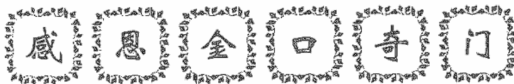

感恩的心
不到河南，不知这是中原之土，
不到南阳，不知南阳之美。
南阳的山不高，有卧龙孔明。
南阳的水不深，有白河作证。
南阳的师情画意，有同门师兄妹所见证。
感恩是一句话，
感恩是一杯水，
感恩是一个动作，
感恩是一个眼神。
我们之所以能成长，那是得到恩师的指点。
我们之所以顿悟，那是得到“前辈”的无私奉献。
学习恩师不折不饶的精神。
学习恩师境界之崇高；
学习恩师人品之无为。
我们今天用了非常有限的钱，得到了几辈子都得不到的财富。
我们今天用了非常有限的时间，得到了许多后者都得不到的光明。
山外青山楼外楼；
彩虹藏在风雨后；
恩情好比千江水；

国逢盛世，天赐良缘，千里迢迢于中原古城南阳与东方宇龙恩师结缘，感触良多，千言万语不能说之！赋小诗一首，聊表弟子感恩之心！

> 演经布易绝技论，
十三宫里艳阳春；
古往今来谁堪与，
龙御东风满乾坤。

黑龙江省大庆市弟子：何玉军
2008年12月30日

荣华富贵此行中！
最后，同样的感谢刘师兄、王师兄、夏师姐、赵师姐、小师妹等同门！
同时，也感谢我自己能来到一个真诚、友谊、和谐的地方——南阳。我很骄傲，我很自豪；
请记住，我的恩师：东方宇龙也！

弟子：上海 张贵飞
于2008年5月4日南阳

### 风格独特 魅力超群

本人从医20多年一直秉着治病救人的宗旨。然而现时代的生活方式的改变已严重扰乱人们的正常生活、工作、学习。心理受到疾病缠绕的人很多，很痛苦。
寻寻觅觅的我一直未能如愿，前些日子经朋友介绍得知东方宇龙开办道医班，我毫无顾虑的前来学习。短短的几天首先让人领略到老师的耳目一新的教学方式和风格。声情并茂，真切感人，浓缩精华。并融入寓教寓乐之中，教学从实战出发，“简单、易学、做得到”收益颇丰。也就是老师的德、才、艺、博学及人格魅力，促使我有了继续学习“金口奇门”的愿望。
金口奇门的学习让我获得领悟、顿悟、开悟人生之真谛，这些乃需人生几十年尚待历练的精华，能在这短短几天里得到，实乃可贵。在此感谢老师的奉献和恩惠！以后的道路还望老师赐教与指点！

上海弟子：夏薇
2008年5月4日

### 天赐良机缘 登易学巅峰

天赐良缘，感承师恩。千里迢迢于河北唐山来到南阳，拜东方宇龙老师门下，成为入室弟子，实乃人生一大幸事。故将学习感悟，向正在执着于求易之路的实战者等等广大易友，吐露真言：
三年研易，步履艰辛，二年实战，终归于今年而告终。自从听了东方宇龙恩师的金口奇门之后，逐渐悟出易学真谛，而成为入室弟子之后，顿悟易学之精华，学费是有限的、有价的，而恩师传给我们的真谛是无限的、无价的。难以用金钱来衡量与对比的。
自从参加学习班以后，逐渐从以前混沌盲目的需求中，定位自己，在恩师的指引下，由动人静改变了我的人生初衷，是我人生学易的里程碑。
何况恩师教人不倦，感动多位求学者，何况恩师孜孜以求，释放了学员的学易污秽，何况恩师因材施教，具体调理，不愧为“中华改运第一人”。
无论从金口奇门入手，还是从奇门断课，无论是天地混元，还是奇门心法，更不用说那数字、八卦……各种奇门，不仅可以使学员的思想返璞归真，而且使学员真正认识到大道至简的道理，是恩师的遁甲穿壬秘术，真乃至高无上之法宝，而通过此班，充分证明了“东方全息应用学创始人”恩师的为人技艺，乃是学易之巅峰！
总之“学了奇门遁，来人不用问”的亘古不变的真理，在恩师的班上，淋漓尽现于学易心中，渗透于学员的心中，使我刻骨铭心，永远不会忘记恩师。鉴于此，希望广大易友，学习恩师绝学，不再步他人后尘，以至于迷惘，而错误易学人生……
唐山弟子：刘庆利
2008年5月4日

### 五天学习 走出迷途

五天的学习使我认识到，大千社会的奥妙全在全息分析，深层挖解，综合应用，才能使易学推向前进。
总跟着古人框式解剖事物是不会有新的发现，更不可能断事如神。
经东方老师的正确指点，真正认识到框式解事物的局限悲哀。今后一定要放下全部框式程序，走到全息中来才是唯一的出路和发展。
潍坊弟子：田庆之
2008年5月22日

### 金口显神奇 奇门须参悟

我以前学过武术、气功、对周易方面也可说是感兴趣，但大凡只要拿起这一类的书，尤其是关于八卦象数、卦爻之类的东西就头痛，毫无兴趣，只是一些奇法异术爱好。这几年由于经常看到师父的大作《武易文化》杂志后，顿感欣喜，其内容丰富，百看不烦，尤其是第八期里的“金口奇门”使我越发感到这方面之神奇，增加了我的学习兴趣，不顾某些方面的阻力来到了诸葛隐居之地——南阳，随恩师东方宇龙先生学习奇术——金口奇门，立即又归于门下，有幸成为入室弟子，感到莫大的荣幸。通过这几天随师学习，感到它具有无比神奇性、实用性，虽然所学到的东西比几位师兄少，但只怪自己基础差，同时也给自己找到了增加压力的砝码，回去后要更加努力学习，参悟老师传授的东西，同时也时时感谢恩师的恩德，不辜负师之期望，尽自己最大能力使本门的技法发扬光大，最后祝师父、师母万事如意、合家欢乐！
拜安
甘肃高台弟子：何平
2008年5月22日

### 鹏程万里 大展宏图

十几天前，我从辽宁来到南阳，下了火车，在一个小店里吃了一碗面，我看见小店的墙上接着“鹏程万里，大展宏图”的图画，我预感到此次来河南南阳拜师学易，会有一个质的飞跃，我的前程是远大的。果然，在跟师父学习了16天后，师父引领我走出了易学的死胡同，钻出了牛角尖，我懂得了什么是易，易就是简单容易，我感谢师父，更佩服师父的为人，我相信“德有多高，道有多深”。我与道家有缘，所以在师父的感召力之下，我第一个来到师父身边，走进师父的家门我就进入了道家的法门，以后的路要我自己来走，我相信只要我向着光明前行，就有光明的未来，光明的前程。感谢师父!!!
祝：师父身体健康 万事如意!!
辽宁本溪弟子：赵春鹏

武易文化网址:http://www.184999.com

### 天下奇门第一局——金口奇门

### 东方宇龙 难得恩师

金口奇门风格独特，信息量大、不单是预测绝技，且能改运，是广大易友百姓的福音，我决心跟随老师学好用好金口奇门，不负老师的厚望，为更多人造福。
谢谢老师

通过四五天的学习，经过老师由浅入深的开示，引导且毫无保留的把该传授的知识讲给我们，使我从不懂的门外汉渐渐进入易学大门，基本上学会了如何布局，批断，当然还得在实践中去熟练应用。从今天上午老师又把我们带入一个高层次的易学境界——无为法，从复杂、深奥、难学进而变化为简单，浅显，易学的一种高层次方法。同时也从老师的教导中，深知在世上要学会做人，要放下架子，要改变自己原有的心态，要找到一个平衡点，如此才能改变目前状况。在此，深深感谢我的第一位师父！

安徽弟子：张永俊
08年5月22日

浙江弟子：陶有根
08年5月22日

### 东方创金口 奇门腾宇龙

本人自青年时就酷爱易学，研易多年，也曾参加过多次易学培训班，但至今还在易门外徘徊。
东方宇龙老师创立的“全息信息分析应用学”体系恰似一声惊雷，唤回了易学的春天，她的横空出世，将起到一个旗手的作用，必将在易学界产生一个巨大的轰动。
我有幸参加了金口奇门特训班与入室弟子班，通过数天的学习，深深领悟了金口奇门不同凡响的奥妙，在很短时间内就上了一个台阶，由不会应用到灵活运用，是一个质的飞跃。东方老师平易近人，有问必答，每个学员和弟子都能学以致用，深受大家的敬爱。
金口奇门的风格独特，信息量大，且不单是预测绝技，在改运方面有着立竿见影的神奇效果，是广大易友的福音。
十三宫金口奇门的传世，将是易学界一个新的里程碑。

### 帝王之学 造福人类

本人听说过易经八卦、奇门遁甲、历代帝王用它得天下，断事如神，很是想学，但又知其最难，一直不敢破门而入。
今得拜东方老师，有幸学习金口奇门，通过几天的学习，使我从一个一点基础也没有的门外汉而得知金口奇门的不同凡响的奥妙。
由不会到运用是一个质的飞跃，老师平易近人，关心每个学员，保证每个学员和弟子都能学以致用，深受大家的尊敬。

河北弟子史相藩
08年5月22日

### 金口奇门 易学奇葩

我对学易一直都有浓厚的兴趣，平时什么易学书我都看，同时也多次投师学习，多少年来没少走弯路。直到这次有缘见到了东方宇龙老师，并接触到了金口奇门这门神奇的绝技。通过五天的学习，深感金口奇门内涵的神奇独到，其断事的准确度细微到难以想象。对求测人何时发财、六亲、性格、爱好、流年的大小事情都能测知，其信息可谓包罗万象。

东方老师独创的金口奇门，我可以说，在当今易学界绝对是前无古人的。金口奇门的理论体系，对改运，解灾、婚姻、人事、六亲、电话号码、数字、颜色、姓名无所不含，对预测事情的技巧和为人解灾的方法，东方宇龙老师均以科学的论述由浅入深的进行细致讲解，完全以科学的角度剖析了改变命运的奥秘。我参加过很多老师的培训，唯独东方老师的金口奇门是以科学的观点来点透全息分析的玄机的，而金口奇门的全息分析玄机也是很多大师们不敢公开、也不愿公开的成名法宝！

陕西汉中：张立明
戊子年冬月

### 金口奇门 千金难求

参加了金口奇门培训班，通过五天的学习我们对易学有了一个崭新的认识，发现东方宇龙老师传授的“金口奇门”不仅学术内容新颖，方法独到，而且极其实用。他所传授的改运方法完全依据科学的原理，其效果立竿见影，教学期间为学员当场改运，学员自身场性当时获得了巨大的震撼。

东方老师知识渊博，平易近人，待弟子如亲人。虽然只通过五天的学习，但东方老师教给我们的都是很实用的“易学精髓”，用通俗易懂的科学真理来阐述奇门之玄机。我今生能学到如此之真理，必是我前生之福缘……

纵观当今的易学界，东方宇龙老师悟创的金口奇门绝对是前无古人的绝技，他以独有的胆识和精妙绝伦的金口奇门绝技为世人展示了一个个易学上的神奇，其运筹帷幄的布局绝技犹如诸葛亮再世。他所传的改运秘术心法，犹如行军布阵，往往以出奇而又简单的布局便可解决人生中碰到的疑难问题。东方老师并让我们只要永远记住“QK”，就会永远没问题。

我1980年初开始研究易学，到迷上易学，在学易中我不知走了多少的弯路，不知拜了多少的师傅，却走进了易学的死胡同。而在这五天里，东方老师让我们这些学员真正体会到了“易”之简易，体会到了大道至简的这句至理名言真正含义。五天的学习，解开了我多年的困惑，让我明白了易学千古不解的奥秘“宇宙能量运转玄机——十三维空间运动规律”。

在此，我再叩谢恩师传授的金口奇门秘术，让我拥有了传世创业的绝技，我一定以东方宇龙老师的教诲为己任，完成传播《金口奇门》的历史使命，让《金口奇门》为人类造福！

福建福安市弟子：杨海潮
2009年3月

### 五天学习，跳出易学误区

我1993年开始迷恋易学，在学易中走了无数的弯路，平时为人测事、看风水时准时不准，在这么多年的学习中，不但没有解决自身的问题，并且让我在学易的道路上越学越穷，越学越糊涂。

2008年7月份我收到一份《武易文化》，看到了金口奇门的广告，以我多年的经验，我当时是半信半疑。但又经不住对易学真知的诱惑，我经过一番思考，就打电话给东方老师让他给我测一下这两年的情况，当晚东方老师在电话中回答了我很多问题，他运用独特的金口心意占断法瞬间为我进行预测分析，其占断过程几乎没有思考，直接将我近两年的情况及家庭状况分析得准确无误。我当时问东方老师，你为什么不用起局，就能在电话里直接快速预测，东方老师说“这就是金口心意秘碟占断法”。当时我就下决心一定要学会这种神奇的占断方法，以圆我易学之梦。

在南阳经过五天的学习，所学知识真是比我想象的内容要多的多；特别是在改运方面，更是让我耳目一新，学到了从未接触过的改运秘术。回家后我第一件事就把自己家做了全面的调整，并根据自己用神布了奇门旺财局。然后我又为一朋友的公司做了奇门调整，不到两个月时间，该朋友接到一个二千万的大工程，以前朋友对我是半信半疑，现在他不但对我的易学水平很信任，而且经常打电话让我给他作投资分析。

说到自己，用“金口奇门”布局后，我的命名馆生意也有很大起色，每天能有十一二个人来我这起名或改名，并且附带的风水业务也多了起来，看来只用两盆花、一个笔架竟能让我的生意比原来好数倍，真是不可思议。而这些巨大的转变，全靠《金口奇门》的十三维空间能量转换的神奇作用。

### 天下奇门第一局——金口奇门

在此我告诉有缘的易友，对“金口奇门”一定要去认识它、运用它，你才能领略他的神奇；只要实际去学习金口奇门，你才能够快速走出易学的误区，只有你能够明白十三维空间的转换，你才能够领略《周易》文化的科学真谛。

江西南昌弟子：李义斌
2009年3月

### 金口学五天 效益翻五倍

通过五天学习金口奇门，使我感到金口奇门的信息相当宽广，各种事情都可以在单一宫位中预测，并能纵横全盘，使信息量比传统信息量大出数倍之多，在预测时依据局中信息，可铁口直断，真正是简单实用的预测绝技。我是刚接触易学，从没学过，以前觉得易学是十分神秘的事情，只有仙人才会分析，听了东方老师的讲课，才知道易学预测和命运调整非常科学，并非社会上所说的易学就是迷信的论述。在授课时东方老师对我们学员的问题都是立即一一回答，所有的事情都分析得很入理、很科学。非常感谢东方老师在休息过程中为我指点迷津，我已经感觉到通过老师的指点，我的生意效益一定能在今年翻三到五倍以上。在此，我仅以感恩的心情，作为我对东方老师的回报！这一期培训马上就要结业了，请老师多多指导我，让我学到更多的知识。

康文华
2008年12月7日

### 用心体悟 贵在和谐

经过这几天对“金口奇门”的学习，对它有了一个清晰地了解。虽说本人对中国传统文化涉及不深，但是通过对东方宇龙老师的系统讲解，使本人感到与“金口奇门”的接触与学习确实是一种幸运，“金口奇门”有它丰富的信息量，在诠释和告诉人们如何去感知这个世界，并与之相处，与之和谐，而东方老师的学识和人品更是让人钦佩。

从传统文化角度讲，世界上每个人的机遇或每个事物的出现，都不是偶然的，“金口奇门”的出现，也必将是历史与现实的必然。

在此，感谢东方老师！感谢“金口奇门”！

李如栋
2008年12月7日

### 易学领域新飞跃 金口奇门显神奇

本人这次来河南诸葛圣地南阳，拜东方宇龙为师，听其传授金口十三宫奇门心法，感受很深。奇门遁甲本是历代帝王的术数学，而东方宇龙先生独创的金口十三宫奇门，使预测信息更丰富，功能更强大，是在周易学术界中的一个伟大创举，附合全息理论，具有很强的科学依据和实用性，为人类趋吉避凶，提供了有力的武器，为人类的发展贡献功不可没。

五天的学习，训练了我们的独特思维方法，挖掘信息更深层次。特别吸引人的地方是随意起局，按学员坐的方位取局，来分析财运、婚姻、官运、住宅、风水，其准确度确实令人惊奇，可信度确实很高，这是我参加多次学习班来最信服的一次学习。说明金口奇门的预测和断风水有很高的应验率，用此法比用四柱、六爻心里更踏实，断事更细微。

金口奇门不仅运用了阴阳、五行的生克制化、天地人合一的辨证施治思想，更是运用科学的辨证法分辨事物的根源和未来。由于其信息量大，功能强，所以我认为用金口奇门预测，远远胜于四柱、六爻、梅易、大六壬的传统方法，特别是时代在前进，周易的创新也是放在周易学者面前的一个伟大任务，而东方宇龙老师在奇门高层次预测上的领先创新，是对易学界的一个巨大贡献！

在实用性上，用金口十三宫奇门预测看得见、摸得着，如果有文化底蕴的学者，学了此法，断事真是可达出人神乎，又如亲眼所见，令求测者信服，金口奇门布局调理上有极其神奇的效应，在培训班中为康文华同学现场改运，效果立竿见影，让所有学员心服口服。所以说金口奇门无论在理论上还是在实战上，都是一个新的飞跃，在易学界可谓是一个新的里程碑。

在此，我祝愿东方宇龙老师在金口十三宫奇门上有更多创新，为周易学术发展和人类社会的发展作出更大贡献。

以上仅是我五天来学习金口十三宫奇门的肤浅感受，不当之处还望老师同友批评指正。

陈永章
2008年12月7日

### 奔千里路遥 圆学易之梦

我从千里路遥来到南阳学习金口十三宫奇门，得到老师耐心热情的辅导传授，使从未接触奇门的我，可以能起局、断事分析，当然还得在实际中不断努力学习，金口十三宫奇门与众不同，确实信息库存量大，断事准确，这次的学习使我掌握了易学高层次的预测法和奇门改运绝技，圆了我多年学易的梦想。这次回家后一定运用金口奇门为五方人民谋福祉，不负老师对我们的期望，在此说声：谢谢老师！

广西玉林市弟子：庄树
2008年12月7日

### 易学深似海 五天破玄机

大家都说，易学深似海，只有得老师心传口授，才能获得真传，但我认为当今大师满天飞，真正有本事的又有几人。多年我虽有向往易道之心，但我从没有出去学习过，对易学的向往和追求令人感触很多，怀着好奇之心、疑惑之心来到南阳，通过这几天的学习。真正体会到了金口奇门的神奇，金口奇门信息提取极其简单，断事准确更是直观。奇门改运立竿见影，让人当场见效，无愧于“中华改运第一人”之名号！通过老师多日来的细心辅导，无私传授！把我这个奇门预测的门外汉，带入了金口十三宫这个高级的殿堂，使我掌握了预测这一手段，多了为众生服务的本领，金口十三宫奇门包含信息量大，预测之准确，我平生所仅见，东方老师平易近人的精神更值得我们学习，东方老师是金口奇门的发明人，但你仍不断追求，认真学习吸取多方精华，更是我们的榜样。

广东学员：张伟
2008年7月

### 易学大智慧 金口泽苍生

文明古国中华民族优秀的传统文化博大精深，易宛里面更是奥妙辉煌，有缘能来到江南水乡学习易理，首先要感谢东方宇龙老师的传教，使我能初涉易学浩大的海洋，同时也感谢“武易文化”的传播，引导了我得结缘学习於东方宇龙老师门下，值此愿更多的有识之士能学好用好易学，将它服务于人类文明建设以慰籍老祖宗们不朽的智慧结晶。
通过这短短的几天学习，深感自己的学识太悲微，为得学易而深感恨晚，所以在老师的教导下，将许多真的好东西，摆在面前时感到无奈，因为自己对于这方面的易学基础知识知之甚少，比如贵神、青龙的属性等等，所以在这几天的学习时间里检查了自己的弱项，认真的跟着老师授课所说的条理及思路等，还是能适应过来的，但不管如何说，我认为是对我的学习是一个机缘，是一考验，是一激励，是变，也是一种使命，在东方老师的指导下，通过自己不断努力学习，一定会有一个新的突破，宇宙在不变的运变，人要活也要不断变，克服缺点吸纳新知，改变自己，完善自己，超越自己，让真知普照无限。谨以此言，再次感谢东方宇龙给予的教导，致礼！！

### 学金口奇门 为自身充电

通过五天学习，我学到了许多新的知识，增加了很多新本领。金口奇门中国独一无二，可谓前无古人；东方宇龙老师独创金口奇门，内容新颖，方法独特，断事准确，包罗万象。对祛病解灾、催财、催丁、催婚、改善阴阳宅的弊病、改命造运有神奇的效果；在堪舆上无论是私人住宅城市楼房，还是农村乡镇均可改善，依据科学的方法催吉达旺，完全能取得很好的成效。特别是东方宇龙老师的讲课幽默，态度和蔼，深得学生们的好评，同学们都表示学到了真知识后，回去熟练运用，决心为广大人民群众热心服务，一定把金口奇门知识发扬光大。

宁津县：荣友璞
2008年11月18日

### 民族智慧 金口弘扬

我是没有奇门与风水基础的学员，只有学过简单的传统命理，只懂一点阴阳五行生克制化的理论，对中华易学来讲还是门外汉，通过东方老师几天的“金口十三宫奇门”的面授课后，对中华易学有了更进一步的理解。易学文化是中华民族的智慧结晶，从古人创立以来，通过后人一代代的保存，发展与创新，到如今东方宇龙老师在“传统奇门”的基础上创立了“十三宫奇门遁甲”，把十二地支分别纳入了十二个宫位，是十分合理的，所以说十三宫奇门是易学历史上的一个创新。

“十三宫奇门遁甲”简单易学，把传统奇门复杂的东变成了简单化，我们在短短的几天课程中，不仅学会了如何布局，懂得了三奇六仪、门、星、神、天盘与地盘的布法。在所起的局中测事、断事，只要掌握宫位中的信息与其它门、星、神与天盘、干地盘、干人盘干的关系，并根据天时地理人和的关系条件灵活应用。对事物的预测与判断是相当准确的。如现场对学员的预测准确率在98%以上；测当天的天气，上午有雾并有太阳，下午阴天，晚上有小雨。结果晚饭后就下雨了，所测之事现场就应验了。自古易学就是一门复杂繁琐的学问，即神奇又神秘，难学难懂。但这次学习不仅掌握“金口奇门易理”的精华，更让我学会奇门的调整和改运方面的知识！在今后的实践中不断学习，不断应用我相信一定会有更好的结果。最后希望能得到东方老师的真传与沟通。

浙江新昌学员：刘梅林
2008年11月18日

### 不拜东方，难见真知 不访宇龙，难取真谛

天赐良缘，感谢恩师，东方宇龙老师不远千里，赶赴杭州，讲学传易，吾有缘拜东方宇龙老师门下，谨听研习，实乃吾人生一大幸事。故将学研感悟，真言倾吐。

吾学研习易，二十余载。玩过八卦、六爻、命理、四柱、风水、奇门。拜读过许多易学书刊，寻访很多高人“大师”。但终感学易之艰辛。终感自己在易学的殿堂之外迂回。也觉易学华而无实，无法取其精华。但通过东方宇龙老师言传心授，学习十三宫奇门和信息全息分析应用学。感似真龙出现。方知易学之真谛，玩易贵在活变。大道至简。简单、易学、做得到。感恩、忏悔、放下、活变，创新。短短几天学习，使吾领悟、顿悟、开悟人生之真谛。应感恩于东方宇龙老师的赐教。恩师赐教，真情难忘。现真诚敬告迈步在学易艰辛路上的易友。不拜东方，难见真知。不访宇龙，难取真谛。最后祝愿：东方宇宙之龙驰骋整个宇宙。

智慧和能力，身受命运的摆布。确又显得非常无奈和迷惘，今天被老师带人金口奇门的殿堂，指点迷津，投吉避凶，改变命运。我的人生从此透发出一道光芒。再次谢谢东方老师的教诲和指点，相信在下次见面的时候我将以崭新的生活面貌出现在老师的面前！

浙江绍兴弟子：陈东升
08年11月18日

江西南昌弟子：陶星光
2008年12月31日

### 金口奇门——你是我改变命运的贵人

前世的缘份，今世的福音。我有幸参加金口奇门特训班的学习，最终成为了一名东方宇龙老师的一名人室弟子，开始了金口奇门的传承里程。

通过学习，使我常常感受到东方宇龙创立的金口奇门，就是一个宏大的信息工程，由点到面、从面到点，由近推远，又从远论近，时空万物相关联系，是一部全信息分析应用的学科体系，应用金口奇门，步入三维时空境界，迅速达到易学新的一个高峰。

我是一位平凡人，一生谨慎低调，就因缺乏与世竞争的智慧和能力，身受命运的摆布。确又显得非常无奈和迷惘，今天被老师带人金口奇门的殿堂，指点迷津，投吉避凶，改变命运。我的人生从此透发出一道光芒。再次谢谢东方老师的教诲和指点，相信在下次见面的时候我将以崭新的生活面貌出现在老师的面前！

### 金口奇门 贵在活变

如果说一切皆有定数，我庆幸有缘遇到东方宇龙师父，到南阳这短短几天里，不仅使我学到了简易、实用的十三宫奇门遁甲。还明白了很多易学方法逻辑，从师父的言行、处事上也学到了很多做人的道理。

如果说宇宙中唯一不变的真理是“变”，那么我相信金口奇门，我的人生道路会发生很大变化，虽然师父讲的内容，我还有一些不理解的地方，但我懂得它是科学的、正确的。只要多学多用，一定会全面掌握。感谢师父、师母、各位师兄对我的帮助，愿我们在易学的道路上共同进步。

弟子：周卫国
08年12月30日

### 二十年奇门追求 五天登奇门巅峰

我是一名小有名气的大夫，常听人说，学会奇门遁来人不用问，在九零年我就买了一套古版的“奇门遁甲”。想学习研究，但用很长的时间也没有整明白如何起局、如何占事。书不看想看，看起来我头晕脑胀，干脆放起来至今未再看过一眼。

有一个机会得知东方宇龙师父创立了“十三宫奇门”，我想找机会学习，天赐良机，我于河北衡水来到南阳，拜在东方宇龙师父的门下。短短几天的学习，使我学到了正宗震惊易界的预测绝技，取得了“十三宫奇门”的精华，懂得了神传的真谛。同时也学到了师父高尚的易德。在这个班使我深深体会到：师父就是当代易学界怪杰、易学圣人。大道至简，在平衡学中找不平衡，宇宙中的万物信息皆为他所用，金口奇门穿六壬，会太乙，成为易学最高宝典，在预测和改运中注重结果，难道这不都是师父的辉煌所在吗？能跟这样的师父学习，使我感到自豪和荣幸。虽然我没有基础，但我能在最短的时间内把十三宫金口奇门发扬广大。让我所在地的人都知道中国出了个奇人易侠，他就是东方宇龙师父。最后说一声：感谢师父的奉献和谆谆教导！

易界。金口奇门来之不易的，这是东方老师在学习易学的基础上，敢于大胆改革，敢于大胆创新的结果。它是老师心血的结晶。我学习之后，受益匪浅。它能使没有易学基础知识的人，也能步入奇门学习的课堂，东方宇龙老师武功高，医术精湛、易学知识渊博，十年藏书尽数十万余册。老师平易近人，天资聪明，智力超人，教学有方，学以致用，为人民服务的精神可佳。学生来自全国各地、各行各业的人士都有。我可以预见，东方老师的金口奇门会在不久的将来，冲出国门，走向全世界，我衷心地祝愿它茁壮成长，努力奋进，将金口奇门发扬光大，为人类造福。

祝恩师和师母身体健康！万事吉祥。

锦州学员：胡彦
2008年12月30日

弟子：赵瑞起
08年12月20日

### 金口奇门 前所未有

参加金口奇门面授特训班学习心得体会

### 金口奇门 智慧结晶

后学是一名中国传统文化爱好者，奇门遁甲素称帝王之术，为易术中一门高层次的预测体系，尤其具有多种妙用和神奇之功效，故诚对“奇门遁甲”一术情有独钟。

在未参加金口奇门面授特训班之前，对其总有一种新鲜感和好奇感，因其前所未听，闻所未闻；总想一探其庐山真面目，我心中带着疑惑。前来参加金口奇门学习，并通过数天的接触、聆听学习，对金口奇门有了新的了解和认识，在老师循循善诱，耐心的教导下有了巨大的收获和升华。在此，对于老师无私的传授，深表谢意！

十三宫奇门遁甲的横空出世，这是人类特大的喜讯，这是人类的财富，金口奇门的诞生，它的出世必将轰动于整个易界。金口奇门来之不易的，这是东方老师在学习易学的基础上，敢于大胆改革，敢于大胆创新的结果。它是老师心血的结晶。我学习之后，受益匪浅。它能使没有易学基础知识的人，也能步入奇门学习的课堂，东方宇龙老师武功高，医术精湛、易学知识渊博，十年藏书尽数十万余册。老师平易近人，天资聪明，智力超人，教学有方，学以致用，为人民服务的精神可佳。学生来自全国各地、各行各业的人士都有。我可以预见，东方老师的金口奇门会在不久的将来，冲出国门，走向全世界，我衷心地祝愿它茁壮成长，努力奋进，将金口奇门发扬光大，为人类造福。

祝恩师和师母身体健康！万事吉祥。

锦州学员：胡彦
2008年12月30日

弟子：赵瑞起
08年12月20日

### 金口奇门 前所未有

参加金口奇门面授特训班学习心得体会

### 金口奇门 智慧结晶

后学是一名中国传统文化爱好者，奇门遁甲素称帝王之术，为易术中一门高层次的预测体系，尤其具有多种妙用和神奇之功效，故诚对“奇门遁甲”一术情有独钟。

在未参加金口奇门面授特训班之前，对其总有一种新鲜感和好奇感，因其前所未听，闻所未闻；总想一探其庐山真面目，我心中带着疑惑。前来参加金口奇门学习，并通过数天的接触、聆听学习，对金口奇门有了新的了解和认识，在老师循循善诱，耐心的教导下有了巨大的收获和升华。在此，对于老师无私的传授，深表谢意！

十三宫奇门遁甲的横空出世，这是人类特大的喜讯，这是人类的财富，金口奇门的诞生，它的出世必将轰动于整个易界。金口奇门来之不易的，这是东方老师在学习易学的基础上，敢于大胆改革，敢于大胆创新的结果。它是老师心血的结晶。我学习之后，受益匪浅。它能使没有易学基础知识的人，也能步入奇门学习的课堂，东方宇龙老师武功高，医术精湛、易学知识渊博，十年藏书尽数十万余册。老师平易近人，天资聪明，智力超人，教学有方，学以致用，为人民服务的精神可佳。学生来自全国各地、各行各业的人士都有。我可以预见，东方老师的金口奇门会在不久的将来，冲出国门，走向全世界，我衷心地祝愿它茁壮成长，努力奋进，将金口奇门发扬光大，为人类造福。

祝恩师和师母身体健康！万事吉祥。

锦州学员：胡彦
2008年12月30日

弟子：赵瑞起
08年12月20日

### 金口奇门 前所未有

参加金口奇门面授特训班学习心得体会

### 金口奇门 智慧结晶

后学是一名中国传统文化爱好者，奇门遁甲素称帝王之术，为易术中一门高层次的预测体系，尤其具有多种妙用和神奇之功效，故诚对“奇门遁甲”一术情有独钟。

在未参加金口奇门面授特训班之前，对其总有一种新鲜感和好奇感，因其前所未听，闻所未闻；总想一探其庐山真面目，我心中带着疑惑。前来参加金口奇门学习，并通过数天的接触、聆听学习，对金口奇门有了新的了解和认识，在老师循循善诱，耐心的教导下有了巨大的收获和升华。在此，对于老师无私的传授，深表谢意！

十三宫奇门遁甲的横空出世，这是人类特大的喜讯，这是人类的财富，金口奇门的诞生，它的出世必将轰动于整个易界。金口奇门来之不易的，这是东方老师在学习易学的基础上，敢于大胆改革，敢于大胆创新的结果。它是老师心血的结晶。我学习之后，受益匪浅。它能使没有易学基础知识的人，也能步入奇门学习的课堂，东方宇龙老师武功高，医术精湛、易学知识渊博，十年藏书尽数十万余册。老师平易近人，天资聪明，智力超人，教学有方，学以致用，为人民服务的精神可佳。学生来自全国各地、各行各业的人士都有。我可以预见，东方老师的金口奇门会在不久的将来，冲出国门，走向全世界，我衷心地祝愿它茁壮成长，努力奋进，将金口奇门发扬光大，为人类造福。

祝恩师和师母身体健康！万事吉祥。

锦州学员：胡彦
2008年12月30日

弟子：赵瑞起
08年12月20日

### 金口奇门 前所未有

参加金口奇门面授特训班学习心得体会

### 金口奇门 智慧结晶

后学是一名中国传统文化爱好者，奇门遁甲素称帝王之术，为易术中一门高层次的预测体系，尤其具有多种妙用和神奇之功效，故诚对“奇门遁甲”一术情有独钟。

在未参加金口奇门面授特训班之前，对其总有一种新鲜感和好奇感，因其前所未听，闻所未闻；总想一探其庐山真面目，我心中带着疑惑。前来参加金口奇门学习，并通过数天的接触、聆听学习，对金口奇门有了新的了解和认识，在老师循循善诱，耐心的教导下有了巨大的收获和升华。在此，对于老师无私的传授，深表谢意！

十三宫奇门遁甲的横空出世，这是人类特大的喜讯，这是人类的财富，金口奇门的诞生，它的出世必将轰动于整个易界。金口奇门来之不易的，这是东方老师在学习易学的基础上，敢于大胆改革，敢于大胆创新的结果。它是老师心血的结晶。我学习之后，受益匪浅。它能使没有易学基础知识的人，也能步入奇门学习的课堂，东方宇龙老师武功高，医术精湛、易学知识渊博，十年藏书尽数十万余册。老师平易近人，天资聪明，智力超人，教学有方，学以致用，为人民服务的精神可佳。学生来自全国各地、各行各业的人士都有。我可以预见，东方老师的金口奇门会在不久的将来，冲出国门，走向全世界，我衷心地祝愿它茁壮成长，努力奋进，将金口奇门发扬光大，为人类造福。

祝恩师和师母身体健康！万事吉祥。

锦州学员：胡彦
2008年12月30日

弟子：赵瑞起
08年12月20日

### 金口奇门 前所未有

参加金口奇门面授特训班学习心得体会

### 金口奇门 智慧结晶

后学是一名中国传统文化爱好者，奇门遁甲素称帝王之术，为易术中一门高层次的预测体系，尤其具有多种妙用和神奇之功效，故诚对“奇门遁甲”一术情有独钟。

在未参加金口奇门面授特训班之前，对其总有一种新鲜感和好奇感，因其前所未听，闻所未闻；总想一探其庐山真面目，我心中带着疑惑。前来参加金口奇门学习，并通过数天的接触、聆听学习，对金口奇门有了新的了解和认识，在老师循循善诱，耐心的教导下有了巨大的收获和升华。在此，对于老师无私的传授，深表谢意！

十三宫奇门遁甲的横空出世，这是人类特大的喜讯，这是人类的财富，金口奇门的诞生，它的出世必将轰动于整个易界。金口奇门来之不易的，这是东方老师在学习易学的基础上，敢于大胆改革，敢于大胆创新的结果。它是老师心血的结晶。我学习之后，受益匪浅。它能使没有易学基础知识的人，也能步入奇门学习的课堂，东方宇龙老师武功高，医术精湛、易学知识渊博，十年藏书尽数十万余册。老师平易近人，天资聪明，智力超人，教学有方，学以致用，为人民服务的精神可佳。学生来自全国各地、各行各业的人士都有。我可以预见，东方老师的金口奇门会在不久的将来，冲出国门，走向全世界，我衷心地祝愿它茁壮成长，努力奋进，将金口奇门发扬光大，为人类造福。

祝恩师和师母身体健康！万事吉祥。

锦州学员：胡彦
2008年12月30日

弟子：赵瑞起
08年12月20日

### 金口奇门 前所未有

参加金口奇门面授特训班学习心得体会

### 金口奇门 智慧结晶

后学是一名中国传统文化爱好者，奇门遁甲素称帝王之术，为易术中一门高层次的预测体系，尤其具有多种妙用和神奇之功效，故诚对“奇门遁甲”一术情有独钟。

在未参加金口奇门面授特训班之前，对其总有一种新鲜感和好奇感，因其前所未听，闻所未闻；总想一探其庐山真面目，我心中带着疑惑。前来参加金口奇门学习，并通过数天的接触、聆听学习，对金口奇门有了新的了解和认识，在老师循循善诱，耐心的教导下有了巨大的收获和升华。在此，对于老师无私的传授，深表谢意！

十三宫奇门遁甲的横空出世，这是人类特大的喜讯，这是人类的财富，金口奇门的诞生，它的出世必将轰动于整个易界。金口奇门来之不易的，这是东方老师在学习易学的基础上，敢于大胆改革，敢于大胆创新的结果。它是老师心血的结晶。我学习之后，受益匪浅。它能使没有易学基础知识的人，也能步入奇门学习的课堂，东方宇龙老师武功高，医术精湛、易学知识渊博，十年藏书尽数十万余册。老师平易近人，天资聪明，智力超人，教学有方，学以致用，为人民服务的精神可佳。学生来自全国各地、各行各业的人士都有。我可以预见，东方老师的金口奇门会在不久的将来，冲出国门，走向全世界，我衷心地祝愿它茁壮成长，努力奋进，将金口奇门发扬光大，为人类造福。

祝恩师和师母身体健康！万事吉祥。

锦州学员：胡彦
2008年12月30日

弟子：赵瑞起
08年12月20日

### 金口奇门 前所未有

参加金口奇门面授特训班学习心得体会

### 金口奇门 智慧结晶

后学是一名中国传统文化爱好者，奇门遁甲素称帝王之术，为易术中一门高层次的预测体系，尤其具有多种妙用和神奇之功效，故诚对“奇门遁甲”一术情有独钟。

在未参加金口奇门面授特训班之前，对其总有一种新鲜感和好奇感，因其前所未听，闻所未闻；总想一探其庐山真面目，我心中带着疑惑。前来参加金口奇门学习，并通过数天的接触、聆听学习，对金口奇门有了新的了解和认识，在老师循循善诱，耐心的教导下有了巨大的收获和升华。在此，对于老师无私的传授，深表谢意！

十三宫奇门遁甲的横空出世，这是人类特大的喜讯，这是人类的财富，金口奇门的诞生，它的出世必将轰动于整个易界。金口奇门来之不易的，这是东方老师在学习易学的基础上，敢于大胆改革，敢于大胆创新的结果。它是老师心血的结晶。我学习之后，受益匪浅。它能使没有易学基础知识的人，也能步入奇门学习的课堂，东方宇龙老师武功高，医术精湛、易学知识渊博，十年藏书尽数十万余册。老师平易近人，天资聪明，智力超人，教学有方，学以致用，为人民服务的精神可佳。学生来自全国各地、各行各业的人士都有。我可以预见，东方老师的金口奇门会在不久的将来，冲出国门，走向全世界，我衷心地祝愿它茁壮成长，努力奋进，将金口奇门发扬光大，为人类造福。

祝恩师和师母身体健康！万事吉祥。

锦州学员：胡彦
2008年12月30日

弟子：赵瑞起
08年12月20日

### 金口奇门 前所未有

参加金口奇门面授特训班学习心得体会

### 金口奇门 智慧结晶

后学是一名中国传统文化爱好者，奇门遁甲素称帝王之术，为易术中一门高层次的预测体系，尤其具有多种妙用和神奇之功效，故诚对“奇门遁甲”一术情有独钟。

在未参加金口奇门面授特训班之前，对其总有一种新鲜感和好奇感，因其前所未听，闻所未闻；总想一探其庐山真面目，我心中带着疑惑。前来参加金口奇门学习，并通过数天的接触、聆听学习，对金口奇门有了新的了解和认识，在老师循循善诱，耐心的教导下有了巨大的收获和升华。在此，对于老师无私的传授，深表谢意！

十三宫奇门遁甲的横空出世，这是人类特大的喜讯，这是人类的财富，金口奇门的诞生，它的出世必将轰动于整个易界。金口奇门来之不易的，这是东方老师在学习易学的基础上，敢于大胆改革，敢于大胆创新的结果。它是老师心血的结晶。我学习之后，受益匪浅。它能使没有易学基础知识的人，也能步入奇门学习的课堂，东方宇龙老师武功高，医术精湛、易学知识渊博，十年藏书尽数十万余册。老师平易近人，天资聪明，智力超人，教学有方，学以致用，为人民服务的精神可佳。学生来自全国各地、各行各业的人士都有。我可以预见，东方老师的金口奇门会在不久的将来，冲出国门，走向全世界，我衷心地祝愿它茁壮成长，努力奋进，将金口奇门发扬光大，为人类造福。

祝恩师和师母身体健康！万事吉祥。

锦州学员：胡彦
2008年12月30日

弟子：赵瑞起
08年12月20日

### 金口奇门 前所未有

参加金口奇门面授特训班学习心得体会

### 金口奇门 智慧结晶

后学是一名中国传统文化爱好者，奇门遁甲素称帝王之术，为易术中一门高层次的预测体系，尤其具有多种妙用和神奇之功效，故诚对“奇门遁甲”一术情有独钟。

在未参加金口奇门面授特训班之前，对其总有一种新鲜感和好奇感，因其前所未听，闻所未闻；总想一探其庐山真面目，我心中带着疑惑。前来参加金口奇门学习，并通过数天的接触、聆听学习，对金口奇门有了新的了解和认识，在老师循循善诱，耐心的教导下有了巨大的收获和升华。在此，对于老师无私的传授，深表谢意！

十三宫奇门遁甲的横空出世，这是人类特大的喜讯，这是人类的财富，金口奇门的诞生，它的出世必将轰动于整个易界。金口奇门来之不易的，这是东方老师在学习易学的基础上，敢于大胆改革，敢于大胆创新的结果。它是老师心血的结晶。我学习之后，受益匪浅。它能使没有易学基础知识的人，也能步入奇门学习的课堂，东方宇龙老师武功高，医术精湛、易学知识渊博，十年藏书尽数十万余册。老师平易近人，天资聪明，智力超人，教学有方，学以致用，为人民服务的精神可佳。学生来自全国各地、各行各业的人士都有。我可以预见，东方老师的金口奇门会在不久的将来，冲出国门，走向全世界，我衷心地祝愿它茁壮成长，努力奋进，将金口奇门发扬光大，为人类造福。

祝恩师和师母身体健康！万事吉祥。

锦州学员：胡彦
2008年12月30日

弟子：赵瑞起
08年12月20日

### 金口奇门 前所未有

参加金口奇门面授特训班学习心得体会

### 金口奇门 智慧结晶

后学是一名中国传统文化爱好者，奇门遁甲素称帝王之术，为易术中一门高层次的预测体系，尤其具有多种妙用和神奇之功效，故诚对“奇门遁甲”一术情有独钟。

在未参加金口奇门面授特训班之前，对其总有一种新鲜感和好奇感，因其前所未听，闻所未闻；总想一探其庐山真面目，我心中带着疑惑。前来参加金口奇门学习，并通过数天的接触、聆听学习，对金口奇门有了新的了解和认识，在老师循循善诱，耐心的教导下有了巨大的收获和升华。在此，对于老师无私的传授，深表谢意！

十三宫奇门遁甲的横空出世，这是人类特大的喜讯，这是人类的财富，金口奇门的诞生，它的出世必将轰动于整个易界。金口奇门来之不易的，这是东方老师在学习易学的基础上，敢于大胆改革，敢于大胆创新的结果。它是老师心血的结晶。我学习之后，受益匪浅。它能使没有易学基础知识的人，也能步入奇门学习的课堂，东方宇龙老师武功高，医术精湛、易学知识渊博，十年藏书尽数十万余册。老师平易近人，天资聪明，智力超人，教学有方，学以致用，为人民服务的精神可佳。学生来自全国各地、各行各业的人士都有。我可以预见，东方老师的金口奇门会在不久的将来，冲出国门，走向全世界，我衷心地祝愿它茁壮成长，努力奋进，将金口奇门发扬光大，为人类造福。

祝恩师和师母身体健康！万事吉祥。

锦州学员：胡彦
2008年12月30日

弟子：赵瑞起
08年12月20日

### 金口奇门 前所未有

参加金口奇门面授特训班学习心得体会

### 金口奇门 智慧结晶

后学是一名中国传统文化爱好者，奇门遁甲素称帝王之术，为易术中一门高层次的预测体系，尤其具有多种妙用和神奇之功效，故诚对“奇门遁甲”一术情有独钟。

在未参加金口奇门面授特训班之前，对其总有一种新鲜感和好奇感，因其前所未听，闻所未闻；总想一探其庐山真面目，我心中带着疑惑。前来参加金口奇门学习，并通过数天的接触、聆听学习，对金口奇门有了新的了解和认识，在老师循循善诱，耐心的教导下有了巨大的收获和升华。在此，对于老师无私的传授，深表谢意！

十三宫奇门遁甲的横空出世，这是人类特大的喜讯，这是人类的财富，金口奇门的诞生，它的出世必将轰动于整个易界。金口奇门来之不易的，这是东方老师在学习易学的基础上，敢于大胆改革，敢于大胆创新的结果。它是老师心血的结晶。我学习之后，受益匪浅。它能使没有易学基础知识的人，也能步入奇门学习的课堂，东方宇龙老师武功高，医术精湛、易学知识渊博，十年藏书尽数十万余册。老师平易近人，天资聪明，智力超人，教学有方，学以致用，为人民服务的精神可佳。学生来自全国各地、各行各业的人士都有。我可以预见，东方老师的金口奇门会在不久的将来，冲出国门，走向全世界，我衷心地祝愿它茁壮成长，努力奋进，将金口奇门发扬光大，为人类造福。

祝恩师和师母身体健康！万事吉祥。

锦州学员：胡彦
2008年12月30日

弟子：赵瑞起
08年12月20日

### 金口奇门 前所未有

参加金口奇门面授特训班学习心得体会

### 金口奇门 智慧结晶

后学是一名中国传统文化爱好者，奇门遁甲素称帝王之术，为易术中一门高层次的预测体系，尤其具有多种妙用和神奇之功效，故诚对“奇门遁甲”一术情有独钟。

在未参加金口奇门面授特训班之前，对其总有一种新鲜感和好奇感，因其前所未听，闻所未闻；总想一探其庐山真面目，我心中带着疑惑。前来参加金口奇门学习，并通过数天的接触、聆听学习，对金口奇门有了新的了解和认识，在老师循循善诱，耐心的教导下有了巨大的收获和升华。在此，对于老师无私的传授，深表谢意！

十三宫奇门遁甲的横空出世，这是人类特大的喜讯，这是人类的财富，金口奇门的诞生，它的出世必将轰动于整个易界。金口奇门来之不易的，这是东方老师在学习易学的基础上，敢于大胆改革，敢于大胆创新的结果。它是老师心血的结晶。我学习之后，受益匪浅。它能使没有易学基础知识的人，也能步入奇门学习的课堂，东方宇龙老师武功高，医术精湛、易学知识渊博，十年藏书尽数十万余册。老师平易近人，天资聪明，智力超人，教学有方，学以致用，为人民服务的精神可佳。学生来自全国各地、各行各业的人士都有。我可以预见，东方老师的金口奇门会在不久的将来，冲出国门，走向全世界，我衷心地祝愿它茁壮成长，努力奋进，将金口奇门发扬光大，为人类造福。

祝恩师和师母身体健康！万事吉祥。

锦州学员：胡彦
2008年12月30日

弟子：赵瑞起
08年12月20日

### 金口奇门 前所未有

参加金口奇门面授特训班学习心得体会

### 金口奇门 智慧结晶

后学是一名中国传统文化爱好者，奇门遁甲素称帝王之术，为易术中一门高层次的预测体系，尤其具有多种妙用和神奇之功效，故诚对“奇门遁甲”一术情有独钟。

在未参加金口奇门面授特训班之前，对其总有一种新鲜感和好奇感，因其前所未听，闻所未闻；总想一探其庐山真面目，我心中带着疑惑。前来参加金口奇门学习，并通过数天的接触、聆听学习，对金口奇门有了新的了解和认识，在老师循循善诱，耐心的教导下有了巨大的收获和升华。在此，对于老师无私的传授，深表谢意！

十三宫奇门遁甲的横空出世，这是人类特大的喜讯，这是人类的财富，金口奇门的诞生，它的出世必将轰动于整个易界。金口奇门来之不易的，这是东方老师在学习易学的基础上，敢于大胆改革，敢于大胆创新的结果。它是老师心血的结晶。我学习之后，受益匪浅。它能使没有易学基础知识的人，也能步入奇门学习的课堂，东方宇龙老师武功高，医术精湛、易学知识渊博，十年藏书尽数十万余册。老师平易近人，天资聪明，智力超人，教学有方，学以致用，为人民服务的精神可佳。学生来自全国各地、各行各业的人士都有。我可以预见，东方老师的金口奇门会在不久的将来，冲出国门，走向全世界，我衷心地祝愿它茁壮成长，努力奋进，将金口奇门发扬光大，为人类造福。

祝恩师和师母身体健康！万事吉祥。

锦州学员：胡彦
2008年12月30日

弟子：赵瑞起
08年12月20日

### 金口奇门 前所未有

参加金口奇门面授特训班学习心得体会

### 金口奇门 智慧结晶

后学是一名中国传统文化爱好者，奇门遁甲素称帝王之术，为易术中一门高层次的预测体系，尤其具有多种妙用和神奇之功效，故诚对“奇门遁甲”一术情有独钟。

在未参加金口奇门面授特训班之前，对其总有一种新鲜感和好奇感，因其前所未听，闻所未闻；总想一探其庐山真面目，我心中带着疑惑。前来参加金口奇门学习，并通过数天的接触、聆听学习，对金口奇门有了新的了解和认识，在老师循循善诱，耐心的教导下有了巨大的收获和升华。在此，对于老师无私的传授，深表谢意！

十三宫奇门遁甲的横空出世，这是人类特大的喜讯，这是人类的财富，金口奇门的诞生，它的出世必将轰动于整个易界。金口奇门来之不易的，这是东方老师在学习易学的基础上，敢于大胆改革，敢于大胆创新的结果。它是老师心血的结晶。我学习之后，受益匪浅。它能使没有易学基础知识的人，也能步入奇门学习的课堂，东方宇龙老师武功高，医术精湛、易学知识渊博，十年藏书尽数十万余册。老师平易近人，天资聪明，智力超人，教学有方，学以致用，为人民服务的精神可佳。学生来自全国各地、各行各业的人士都有。我可以预见，东方老师的金口奇门会在不久的将来，冲出国门，走向全世界，我衷心地祝愿它茁壮成长，努力奋进，将金口奇门发扬光大，为人类造福。

祝恩师和师母身体健康！万事吉祥。

锦州学员：胡彦
2008年12月30日

弟子：赵瑞起
08年12月20日

### 金口奇门 前所未有

参加金口奇门面授特训班学习心得体会

### 金口奇门 智慧结晶

后学是一名中国传统文化爱好者，奇门遁甲素称帝王之术，为易术中一门高层次的预测体系，尤其具有多种妙用和神奇之功效，故诚对“奇门遁甲”一术情有独钟。

在未参加金口奇门面授特训班之前，对其总有一种新鲜感和好奇感，因其前所未听，闻所未闻；总想一探其庐山真面目，我心中带着疑惑。前来参加金口奇门学习，并通过数天的接触、聆听学习，对金口奇门有了新的了解和认识，在老师循循善诱，耐心的教导下有了巨大的收获和升华。在此，对于老师无私的传授，深表谢意！

十三宫奇门遁甲的横空出世，这是人类特大的喜讯，这是人类的财富，金口奇门的诞生，它的出世必将轰动于整个易界。金口奇门来之不易的，这是东方老师在学习易学的基础上，敢于大胆改革，敢于大胆创新的结果。它是老师心血的结晶。我学习之后，受益匪浅。它能使没有易学基础知识的人，也能步入奇门学习的课堂，东方宇龙老师武功高，医术精湛、易学知识渊博，十年藏书尽数十万余册。老师平易近人，天资聪明，智力超人，教学有方，学以致用，为人民服务的精神可佳。学生来自全国各地、各行各业的人士都有。我可以预见，东方老师的金口奇门会在不久的将来，冲出国门，走向全世界，我衷心地祝愿它茁壮成长，努力奋进，将金口奇门发扬光大，为人类造福。

祝恩师和师母身体健康！万事吉祥。

锦州学员：胡彦
2008年12月30日

弟子：赵瑞起
08年12月20日

### 金口奇门 前所未有

参加金口奇门面授特训班学习心得体会

### 金口奇门 智慧结晶

后学是一名中国传统文化爱好者，奇门遁甲素称帝王之术，为易术中一门高层次的预测体系，尤其具有多种妙用和神奇之功效，故诚对“奇门遁甲”一术情有独钟。

在未参加金口奇门面授特训班之前，对其总有一种新鲜感和好奇感，因其前所未听，闻所未闻；总想一探其庐山真面目，我心中带着疑惑。前来参加金口奇门学习，并通过数天的接触、聆听学习，对金口奇门有了新的了解和认识，在老师循循善诱，耐心的教导下有了巨大的收获和升华。在此，对于老师无私的传授，深表谢意！

十三宫奇门遁甲的横空出世，这是人类特大的喜讯，这是人类的财富，金口奇门的诞生，它的出世必将轰动于整个易界。金口奇门来之不易的，这是东方老师在学习易学的基础上，敢于大胆改革，敢于大胆创新的结果。它是老师心血的结晶。我学习之后，受益匪浅。它能使没有易学基础知识的人，也能步入奇门学习的课堂，东方宇龙老师武功高，医术精湛、易学知识渊博，十年藏书尽数十万余册。老师平易近人，天资聪明，智力超人，教学有方，学以致用，为人民服务的精神可佳。学生来自全国各地、各行各业的人士都有。我可以预见，东方老师的金口奇门会在不久的将来，冲出国门，走向全世界，我衷心地祝愿它茁壮成长，努力奋进，将金口奇门发扬光大，为人类造福。

祝恩师和师母身体健康！万事吉祥。

锦州学员：胡彦
2008年12月30日

弟子：赵瑞起
08年12月20日

### 金口奇门 前所未有

参加金口奇门面授特训班学习心得体会

### 金口奇门 智慧结晶

后学是一名中国传统文化爱好者，奇门遁甲素称帝王之术，为易术中一门高层次的预测体系，尤其具有多种妙用和神奇之功效，故诚对“奇门遁甲”一术情有独钟。

在未参加金口奇门面授特训班之前，对其总有一种新鲜感和好奇感，因其前所未听，闻所未闻；总想一探其庐山真面目，我心中带着疑惑。前来参加金口奇门学习，并通过数天的接触、聆听学习，对金口奇门有了新的了解和认识，在老师循循善诱，耐心的教导下有了巨大的收获和升华。在此，对于老师无私的传授，深表谢意！

十三宫奇门遁甲的横空出世，这是人类特大的喜讯，这是人类的财富，金口奇门的诞生，它的出世必将轰动于整个易界。金口奇门来之不易的，这是东方老师在学习易学的基础上，敢于大胆改革，敢于大胆创新的结果。它是老师心血的结晶。我学习之后，受益匪浅。它能使没有易学基础知识的人，也能步入奇门学习的课堂，东方宇龙老师武功高，医术精湛、易学知识渊博，十年藏书尽数十万余册。老师平易近人，天资聪明，智力超人，教学有方，学以致用，为人民服务的精神可佳。学生来自全国各地、各行各业的人士都有。我可以预见，东方老师的金口奇门会在不久的将来，冲出国门，走向全世界，我衷心地祝愿它茁壮成长，努力奋进，将金口奇门发扬光大，为人类造福。

祝恩师和师母身体健康！万事吉祥。

锦州学员：胡彦
2008年12月30日

弟子：赵瑞起
08年12月20日

### 金口奇门 前所未有

参加金口奇门面授特训班学习心得体会

### 金口奇门 智慧结晶

后学是一名中国传统文化爱好者，奇门遁甲素称帝王之术，为易术中一门高层次的预测体系，尤其具有多种妙用和神奇之功效，故诚对“奇门遁甲”一术情有独钟。

在未参加金口奇门面授特训班之前，对其总有一种新鲜感和好奇感，因其前所未听，闻所未闻；总想一探其庐山真面目，我心中带着疑惑。前来参加金口奇门学习，并通过数天的接触、聆听学习，对金口奇门有了新的了解和认识，在老师循循善诱，耐心的教导下有了巨大的收获和升华。在此，对于老师无私的传授，深表谢意！

十三宫奇门遁甲的横空出世，这是人类特大的喜讯，这是人类的财富，金口奇门的诞生，它的出世必将轰动于整个易界。金口奇门来之不易的，这是东方老师在学习易学的基础上，敢于大胆改革，敢于大胆创新的结果。它是老师心血的结晶。我学习之后，受益匪浅。它能使没有易学基础知识的人，也能步入奇门学习的课堂，东方宇龙老师武功高，医术精湛、易学知识渊博，十年藏书尽数十万余册。老师平易近人，天资聪明，智力超人，教学有方，学以致用，为人民服务的精神可佳。学生来自全国各地、各行各业的人士都有。我可以预见，东方老师的金口奇门会在不久的将来，冲出国门，走向全世界，我衷心地祝愿它茁壮成长，努力奋进，将金口奇门发扬光大，为人类造福。

祝恩师和师母身体健康！万事吉祥。

锦州学员：胡彦
2008年12月30日

弟子：赵瑞起
08年12月20日

### 金口奇门 前所未有

参加金口奇门面授特训班学习心得体会

### 金口奇门 智慧结晶

后学是一名中国传统文化爱好者，奇门遁甲素称帝王之术，为易术中一门高层次的预测体系，尤其具有多种妙用和神奇之功效，故诚对“奇门遁甲”一术情有独钟。

在未参加金口奇门面授特训班之前，对其总有一种新鲜感和好奇感，因其前所未听，闻所未闻；总想一探其庐山真面目，我心中带着疑惑。前来参加金口奇门学习，并通过数天的接触、聆听学习，对金口奇门有了新的了解和认识，在老师循循善诱，耐心的教导下有了巨大的收获和升华。在此，对于老师无私的传授，深表谢意！

十三宫奇门遁甲的横空出世，这是人类特大的喜讯，这是人类的财富，金口奇门的诞生，它的出世必将轰动于整个易界。金口奇门来之不易的，这是东方老师在学习易学的基础上，敢于大胆改革，敢于大胆创新的结果。它是老师心血的结晶。我学习之后，受益匪浅。它能使没有易学基础知识的人，也能步入奇门学习的课堂，东方宇龙老师武功高，医术精湛、易学知识渊博，十年藏书尽数十万余册。老师平易近人，天资聪明，智力超人，教学有方，学以致用，为人民服务的精神可佳。学生来自全国各地、各行各业的人士都有。我可以预见，东方老师的金口奇门会在不久的将来，冲出国门，走向全世界，我衷心地祝愿它茁壮成长，努力奋进，将金口奇门发扬光大，为人类造福。

祝恩师和师母身体健康！万事吉祥。

锦州学员：胡彦
2008年12月30日

弟子：赵瑞起
08年12月20日

### 金口奇门 前所未有

参加金口奇门面授特训班学习心得体会

### 金口奇门 智慧结晶

后学是一名中国传统文化爱好者，奇门遁甲素称帝王之术，为易术中一门高层次的预测体系，尤其具有多种妙用和神奇之功效，故诚对“奇门遁甲”一术情有独钟。

在未参加金口奇门面授特训班之前，对其总有一种新鲜感和好奇感，因其前所未听，闻所未闻；总想一探其庐山真面目，我心中带着疑惑。前来参加金口奇门学习，并通过数天的接触、聆听学习，对金口奇门有了新的了解和认识，在老师循循善诱，耐心的教导下有了巨大的收获和升华。在此，对于老师无私的传授，深表谢意！

十三宫奇门遁甲的横空出世，这是人类特大的喜讯，这是人类的财富，金口奇门的诞生，它的出世必将轰动于整个易界。金口奇门来之不易的，这是东方老师在学习易学的基础上，敢于大胆改革，敢于大胆创新的结果。它是老师心血的结晶。我学习之后，受益匪浅。它能使没有易学基础知识的人，也能步入奇门学习的课堂，东方宇龙老师武功高，医术精湛、易学知识渊博，十年藏书尽数十万余册。老师平易近人，天资聪明，智力超人，教学有方，学以致用，为人民服务的精神可佳。学生来自全国各地、各行各业的人士都有。我可以预见，东方老师的金口奇门会在不久的将来，冲出国门，走向全世界，我衷心地祝愿它茁壮成长，努力奋进，将金口奇门发扬光大，为人类造福。

祝恩师和师母身体健康！万事吉祥。

锦州学员：胡彦
2008年12月30日

弟子：赵瑞起
08年12月20日

### 金口奇门 前所未有

参加金口奇门面授特训班学习心得体会

### 金口奇门 智慧结晶

后学是一名中国传统文化爱好者，奇门遁甲素称帝王之术，为易术中一门高层次的预测体系，尤其具有多种妙用和神奇之功效，故诚对“奇门遁甲”一术情有独钟。

在未参加金口奇门面授特训班之前，对其总有一种新鲜感和好奇感，因其前所未听，闻所未闻；总想一探其庐山真面目，我心中带着疑惑。前来参加金口奇门学习，并通过数天的接触、聆听学习，对金口奇门有了新的了解和认识，在老师循循善诱，耐心的教导下有了巨大的收获和升华。在此，对于老师无私的传授，深表谢意！

十三宫奇门遁甲的横空出世，这是人类特大的喜讯，这是人类的财富，金口奇门的诞生，它的出世必将轰动于整个易界。金口奇门来之不易的，这是东方老师在学习易学的基础上，敢于大胆改革，敢于大胆创新的结果。它是老师心血的结晶。我学习之后，受益匪浅。它能使没有易学基础知识的人，也能步入奇门学习的课堂，东方宇龙老师武功高，医术精湛、易学知识渊博，十年藏书尽数十万余册。老师平易近人，天资聪明，智力超人，教学有方，学以致用，为人民服务的精神可佳。学生来自全国各地、各行各业的人士都有。我可以预见，东方老师的金口奇门会在不久的将来，冲出国门，走向全世界，我衷心地祝愿它茁壮成长，努力奋进，将金口奇门发扬光大，为人类造福。

祝恩师和师母身体健康！万事吉祥。

锦州学员：胡彦
2008年12月30日

弟子：赵瑞起
08年12月20日

### 金口奇门 前所未有

参加金口奇门面授特训班学习心得体会

### 金口奇门 智慧结晶

后学是一名中国传统文化爱好者，奇门遁甲素称帝王之术，为易术中一门高层次的预测体系，尤其具有多种妙用和神奇之功效，故诚对“奇门遁甲”一术情有独钟。

在未参加金口奇门面授特训班之前，对其总有一种新鲜感和好奇感，因其前所未听，闻所未闻；总想一探其庐山真面目，我心中带着疑惑。前来参加金口奇门学习，并通过数天的接触、聆听学习，对金口奇门有了新的了解和认识，在老师循循善诱，耐心的教导下有了巨大的收获和升华。在此，对于老师无私的传授，深表谢意！

十三宫奇门遁甲的横空出世，这是人类特大的喜讯，这是人类的财富，金口奇门的诞生，它的出世必将轰动于整个易界。金口奇门来之不易的，这是东方老师在学习易学的基础上，敢于大胆改革，敢于大胆创新的结果。它是老师心血的结晶。我学习之后，受益匪浅。它能使没有易学基础知识的人，也能步入奇门学习的课堂，东方宇龙老师武功高，医术精湛、易学知识渊博，十年藏书尽数十万余册。老师平易近人，天资聪明，智力超人，教学有方，学以致用，为人民服务的精神可佳。学生来自全国各地、各行各业的人士都有。我可以预见，东方老师的金口奇门会在不久的将来，冲出国门，走向全世界，我衷心地祝愿它茁壮成长，努力奋进，将金口奇门发扬光大，为人类造福。

祝恩师和师母身体健康！万事吉祥。

锦州学员：胡彦
2008年12月30日

弟子：赵瑞起
08年12月20日

### 金口奇门 前所未有

参加金口奇门面授特训班学习心得体会

### 金口奇门 智慧结晶

后学是一名中国传统文化爱好者，奇门遁甲素称帝王之术，为易术中一门高层次的预测体系，尤其具有多种妙用和神奇之功效，故诚对“奇门遁甲”一术情有独钟。

在未参加金口奇门面授特训班之前，对其总有一种新鲜感和好奇感，因其前所未听，闻所未闻；总想一探其庐山真面目，我心中带着疑惑。前来参加金口奇门学习，并通过数天的接触、聆听学习，对金口奇门有了新的了解和认识，在老师循循善诱，耐心的教导下有了巨大的收获和升华。在此，对于老师无私的传授，深表谢意！

十三宫奇门遁甲的横空出世，这是人类特大的喜讯，这是人类的财富，金口奇门的诞生，它的出世必将轰动于整个易界。金口奇门来之不易的，这是东方老师在学习易学的基础上，敢于大胆改革，敢于大胆创新的结果。它是老师心血的结晶。我学习之后，受益匪浅。它能使没有易学基础知识的人，也能步入奇门学习的课堂，东方宇龙老师武功高，医术精湛、易学知识渊博，十年藏书尽数十万余册。老师平易近人，天资聪明，智力超人，教学有方，学以致用，为人民服务的精神可佳。学生来自全国各地、各行各业的人士都有。我可以预见，东方老师的金口奇门会在不久的将来，冲出国门，走向全世界，我衷心地祝愿它茁壮成长，努力奋进，将金口奇门发扬光大，为人类造福。

祝恩师和师母身体健康！万事吉祥。

锦州学员：胡彦
2008年12月30日

弟子：赵瑞起
08年12月20日

### 金口奇门 前所未有

参加金口奇门面授特训班学习心得体会

### 金口奇门 智慧结晶

后学是一名中国传统文化爱好者，奇门遁甲素称帝王之术，为易术中一门高层次的预测体系，尤其具有多种妙用和神奇之功效，故诚对“奇门遁甲”一术情有独钟。

在未参加金口奇门面授特训班之前，对其总有一种新鲜感和好奇感，因其前所未听，闻所未闻；总想一探其庐山真面目，我心中带着疑惑。前来参加金口奇门学习，并通过数天的接触、聆听学习，对金口奇门有了新的了解和认识，在老师循循善诱，耐心的教导下有了巨大的收获和升华。在此，对于老师无私的传授，深表谢意！

十三宫奇门遁甲的横空出世，这是人类特大的喜讯，这是人类的财富，金口奇门的诞生，它的出世必将轰动于整个易界。金口奇门来之不易的，这是东方老师在学习易学的基础上，敢于大胆改革，敢于大胆创新的结果。它是老师心血的结晶。我学习之后，受益匪浅。它能使没有易学基础知识的人，也能步入奇门学习的课堂，东方宇龙老师武功高，医术精湛、易学知识渊博，十年藏书尽数十万余册。老师平易近人，天资聪明，智力超人，教学有方，学以致用，为人民服务的精神可佳。学生来自全国各地、各行各业的人士都有。我可以预见，东方老师的金口奇门会在不久的将来，冲出国门，走向全世界，我衷心地祝愿它茁壮成长，努力奋进，将金口奇门发扬光大，为人类造福。

祝恩师和师母身体健康！万事吉祥。

锦州学员：胡彦
2008年12月30日

弟子：赵瑞起
08年12月20日

### 金口奇门 前所未有

参加金口奇门面授特训班学习心得体会

### 金口奇门 智慧结晶

后学是一名中国传统文化爱好者，奇门遁甲素称帝王之术，为易术中一门高层次的预测体系，尤其具有多种妙用和神奇之功效，故诚对“奇门遁甲”一术情有独钟。

在未参加金口奇门面授特训班之前，对其总有一种新鲜感和好奇感，因其前所未听，闻所未闻；总想一探其庐山真面目，我心中带着疑惑。前来参加金口奇门学习，并通过数天的接触、聆听学习，对金口奇门有了新的了解和认识，在老师循循善诱，耐心的教导下有了巨大的收获和升华。在此，对于老师无私的传授，深表谢意！

十三宫奇门遁甲的横空出世，这是人类特大的喜讯，这是人类的财富，金口奇门的诞生，它的出世必将轰动于整个易界。金口奇门来之不易的，这是东方老师在学习易学的基础上，敢于大胆改革，敢于大胆创新的结果。它是老师心血的结晶。我学习之后，受益匪浅。它能使没有易学基础知识的人，也能步入奇门学习的课堂，东方宇龙老师武功高，医术精湛、易学知识渊博，十年藏书尽数十万余册。老师平易近人，天资聪明，智力超人，教学有方，学以致用，为人民服务的精神可佳。学生来自全国各地、各行各业的人士都有。我可以预见，东方老师的金口奇门会在不久的将来，冲出国门，走向全世界，我衷心地祝愿它茁壮成长，努力奋进，将金口奇门发扬光大，为人类造福。

祝恩师和师母身体健康！万事吉祥。

锦州学员：胡彦
2008年12月30日

弟子：赵瑞起
08年12月20日

### 金口奇门 前所未有

参加金口奇门面授特训班学习心得体会

### 金口奇门 智慧结晶

后学是一名中国传统文化爱好者，奇门遁甲素称帝王之术，为易术中一门高层次的预测体系，尤其具有多种妙用和神奇之功效，故诚对“奇门遁甲”一术情有独钟。

在未参加金口奇门面授特训班之前，对其总有一种新鲜感和好奇感，因其前所未听，闻所未闻；总想一探其庐山真面目，我心中带着疑惑。前来参加金口奇门学习，并通过数天的接触、聆听学习，对金口奇门有了新的了解和认识，在老师循循善诱，耐心的教导下有了巨大的收获和升华。在此，对于老师无私的传授，深表谢意！

十三宫奇门遁甲的横空出世，这是人类特大的喜讯，这是人类的财富，金口奇门的诞生，它的出世必将轰动于整个易界。金口奇门来之不易的，这是东方老师在学习易学的基础上，敢于大胆改革，敢于大胆创新的结果。它是老师心血的结晶。我学习之后，受益匪浅。它能使没有易学基础知识的人，也能步入奇门学习的课堂，东方宇龙老师武功高，医术精湛、易学知识渊博，十年藏书尽数十万余册。老师平易近人，天资聪明，智力超人，教学有方，学以致用，为人民服务的精神可佳。学生来自全国各地、各行各业的人士都有。我可以预见，东方老师的金口奇门会在不久的将来，冲出国门，走向全世界，我衷心地祝愿它茁壮成长，努力奋进，将金口奇门发扬光大，为人类造福。

祝恩师和师母身体健康！万事吉祥。

锦州学员：胡彦
2008年12月30日

弟子：赵瑞起
08年12月20日

### 金口奇门 前所未有

参加金口奇门面授特训班学习心得体会

### 金口奇门 智慧结晶

后学是一名中国传统文化爱好者，奇门遁甲素称帝王之术，为易术中一门高层次的预测体系，尤其具有多种妙用和神奇之功效，故诚对“奇门遁甲”一术情有独钟。

在未参加金口奇门面授特训班之前，对其总有一种新鲜感和好奇感，因其前所未听，闻所未闻；总想一探其庐山真面目，我心中带着疑惑。前来参加金口奇门学习，并通过数天的接触、聆听学习，对金口奇门有了新的了解和认识，在老师循循善诱，耐心的教导下有了巨大的收获和升华。在此，对于老师无私的传授，深表谢意！

十三宫奇门遁甲的横空出世，这是人类特大的喜讯，这是人类的财富，金口奇门的诞生，它的出世必将轰动于整个易界。金口奇门来之不易的，这是东方老师在学习易学的基础上，敢于大胆改革，敢于大胆创新的结果。它是老师心血的结晶。我学习之后，受益匪浅。它能使没有易学基础知识的人，也能步入奇门学习的课堂，东方宇龙老师武功高，医术精湛、易学知识渊博，十年藏书尽数十万余册。老师平易近人，天资聪明，智力超人，教学有方，学以致用，为人民服务的精神可佳。学生来自全国各地、各行各业的人士都有。我可以预见，东方老师的金口奇门会在不久的将来，冲出国门，走向全世界，我衷心地祝愿它茁壮成长，努力奋进，将金口奇门发扬光大，为人类造福。

祝恩师和师母身体健康！万事吉祥。

锦州学员：胡彦
2008年12月30日

弟子：赵瑞起
08年12月20日

### 金口奇门 前所未有

参加金口奇门面授特训班学习心得体会

### 金口奇门 智慧结晶

后学是一名中国传统文化爱好者，奇门遁甲素称帝王之术，为易术中一门高层次的预测体系，尤其具有多种妙用和神奇之功效，故诚对“奇门遁甲”一术情有独钟。

在未参加金口奇门面授特训班之前，对其总有一种新鲜感和好奇感，因其前所未听，闻所未闻；总想一探其庐山真面目，我心中带着疑惑。前来参加金口奇门学习，并通过数天的接触、聆听学习，对金口奇门有了新的了解和认识，在老师循循善诱，耐心的教导下有了巨大的收获和升华。在此，对于老师无私的传授，深表谢意！

十三宫奇门遁甲的横空出世，这是人类特大的喜讯，这是人类的财富，金口奇门的诞生，它的出世必将轰动于整个易界。金口奇门来之不易的，这是东方老师在学习易学的基础上，敢于大胆改革，敢于大胆创新的结果。它是老师心血的结晶。我学习之后，受益匪浅。它能使没有易学基础知识的人，也能步入奇门学习的课堂，东方宇龙老师武功高，医术精湛、易学知识渊博，十年藏书尽数十万余册。老师平易近人，天资聪明，智力超人，教学有方，学以致用，为人民服务的精神可佳。学生来自全国各地、各行各业的人士都有。我可以预见，东方老师的金口奇门会在不久的将来，冲出国门，走向全世界，我衷心地祝愿它茁壮成长，努力奋进，将金口奇门发扬光大，为人类造福。

祝恩师和师母身体健康！万事吉祥。

锦州学员：胡彦
2008年12月30日

弟子：赵瑞起
08年12月20日

### 金口奇门 前所未有

参加金口奇门面授特训班学习心得体会

### 金口奇门 智慧结晶

后学是一名中国传统文化爱好者，奇门遁甲素称帝王之术，为易术中一门高层次的预测体系，尤其具有多种妙用和神奇之功效，故诚对“奇门遁甲”一术情有独钟。

在未参加金口奇门面授特训班之前，对其总有一种新鲜感和好奇感，因其前所未听，闻所未闻；总想一探其庐山真面目，我心中带着疑惑。前来参加金口奇门学习，并通过数天的接触、聆听学习，对金口奇门有了新的了解和认识，在老师循循善诱，耐心的教导下有了巨大的收获和升华。在此，对于老师无私的传授，深表谢意！

十三宫奇门遁甲的横空出世，这是人类特大的喜讯，这是人类的财富，金口奇门的诞生，它的出世必将轰动于整个易界。金口奇门来之不易的，这是东方老师在学习易学的基础上，敢于大胆改革，敢于大胆创新的结果。它是老师心血的结晶。我学习之后，受益匪浅。它能使没有易学基础知识的人，也能步入奇门学习的课堂，东方宇龙老师武功高，医术精湛、易学知识渊博，十年藏书尽数十万余册。老师平易近人，天资聪明，智力超人，教学有方，学以致用，为人民服务的精神可佳。学生来自全国各地、各行各业的人士都有。我可以预见，东方老师的金口奇门会在不久的将来，冲出国门，走向全世界，我衷心地祝愿它茁壮成长，努力奋进，将金口奇门发扬光大，为人类造福。

祝恩师和师母身体健康！万事吉祥。

锦州学员：胡彦
2008年12月30日

弟子：赵瑞起
08年12月20日

### 金口奇门 前所未有

参加金口奇门面授特训班学习心得体会

### 金口奇门 智慧结晶

后学是一名中国传统文化爱好者，奇门遁甲素称帝王之术，为易术中一门高层次的预测体系，尤其具有多种妙用和神奇之功效，故诚对“奇门遁甲”一术情有独钟。

在未参加金口奇门面授特训班之前，对其总有一种新鲜感和好奇感，因其前所未听，闻所未闻；总想一探其庐山真面目，我心中带着疑惑。前来参加金口奇门学习，并通过数天的接触、聆听学习，对金口奇门有了新的了解和认识，在老师循循善诱，耐心的教导下有了巨大的收获和升华。在此，对于老师无私的传授，深表谢意！

十三宫奇门遁甲的横空出世，这是人类特大的喜讯，这是人类的财富，金口奇门的诞生，它的出世必将轰动于整个易界。金口奇门来之不易的，这是东方老师在学习易学的基础上，敢于大胆改革，敢于大胆创新的结果。它是老师心血的结晶。我学习之后，受益匪浅。它能使没有易学基础知识的人，也能步入奇门学习的课堂，东方宇龙老师武功高，医术精湛、易学知识渊博，十年藏书尽数十万余册。老师平易近人，天资聪明，智力超人，教学有方，学以致用，为人民服务的精神可佳。学生来自全国各地、各行各业的人士都有。我可以预见，东方老师的金口奇门会在不久的将来，冲出国门，走向全世界，我衷心地祝愿它茁壮成长，努力奋进，将金口奇门发扬光大，为人类造福。

祝恩师和师母身体健康！万事吉祥。

锦州学员：胡彦
2008年12月30日

弟子：赵瑞起
08年12月20日

### 金口奇门 前所未有

参加金口奇门面授特训班学习心得体会

### 金口奇门 智慧结晶

后学是一名中国传统文化爱好者，奇门遁甲素称帝王之术，为易术中一门高层次的预测体系，尤其具有多种妙用和神奇之功效，故诚对“奇门遁甲”一术情有独钟。

在未参加金口奇门面授特训班之前，对其总有一种新鲜感和好奇感，因其前所未听，闻所未闻；总想一探其庐山真面目，我心中带着疑惑。前来参加金口奇门学习，并通过数天的接触、聆听学习，对金口奇门有了新的了解和认识，在老师循循善诱，耐心的教导下有了巨大的收获和升华。在此，对于老师无私的传授，深表谢意！

十三宫奇门遁甲的横空出世，这是人类特大的喜讯，这是人类的财富，金口奇门的诞生，它的出世必将轰动于整个易界。金口奇门来之不易的，这是东方老师在学习易学的基础上，敢于大胆改革，敢于大胆创新的结果。它是老师心血的结晶。我学习之后，受益匪浅。它能使没有易学基础知识的人，也能步入奇门学习的课堂，东方宇龙老师武功高，医术精湛、易学知识渊博，十年藏书尽数十万余册。老师平易近人，天资聪明，智力超人，教学有方，学以致用，为人民服务的精神可佳。学生来自全国各地、各行各业的人士都有。我可以预见，东方老师的金口奇门会在不久的将来，冲出国门，走向全世界，我衷心地祝愿它茁壮成长，努力奋进，将金口奇门发扬光大，为人类造福。

祝恩师和师母身体健康！万事吉祥。

锦州学员：胡彦
2008年12月30日

弟子：赵瑞起
08年12月20日

### 金口奇门 前所未有

参加金口奇门面授特训班学习心得体会

### 金口奇门 智慧结晶

后学是一名中国传统文化爱好者，奇门遁甲素称帝王之术，为易术中一门高层次的预测体系，尤其具有多种妙用和神奇之功效，故诚对“奇门遁甲”一术情有独钟。

在未参加金口奇门面授特训班之前，对其总有一种新鲜感和好奇感，因其前所未听，闻所未闻；总想一探其庐山真面目，我心中带着疑惑。前来参加金口奇门学习，并通过数天的接触、聆听学习，对金口奇门有了新的了解和认识，在老师循循善诱，耐心的教导下有了巨大的收获和升华。在此，对于老师无私的传授，深表谢意！

十三宫奇门遁甲的横空出世，这是人类特大的喜讯，这是人类的财富，金口奇门的诞生，它的出世必将轰动于整个易界。金口奇门来之不易的，这是东方老师在学习易学的基础上，敢于大胆改革，敢于大胆创新的结果。它是老师心血的结晶。我学习之后，受益匪浅。它能使没有易学基础知识的人，也能步入奇门学习的课堂，东方宇龙老师武功高，医术精湛、易学知识渊博，十年藏书尽数十万余册。老师平易近人，天资聪明，智力超人，教学有方，学以致用，为人民服务的精神可佳。学生来自全国各地、各行各业的人士都有。我可以预见，东方老师的金口奇门会在不久的将来，冲出国门，走向全世界，我衷心地祝愿它茁壮成长，努力奋进，将金口奇门发扬光大，为人类造福。

祝恩师和师母身体健康！万事吉祥。

锦州学员：胡彦
2008年12月30日

弟子：赵瑞起
08年12月20日

### 金口奇门 前所未有

参加金口奇门面授特训班学习心得体会

### 金口奇门 智慧结晶

后学是一名中国传统文化爱好者，奇门遁甲素称帝王之术，为易术中一门高层次的预测体系，尤其具有多种妙用和神奇之功效，故诚对“奇门遁甲”一术情有独钟。

在未参加金口奇门面授特训班之前，对其总有一种新鲜感和好奇感，因其前所未听，闻所未闻；总想一探其庐山真面目，我心中带着疑惑。前来参加金口奇门学习，并通过数天的接触、聆听学习，对金口奇门有了新的了解和认识，在老师循循善诱，耐心的教导下有了巨大的收获和升华。在此，对于老师无私的传授，深表谢意！

十三宫奇门遁甲的横空出世，这是人类特大的喜讯，这是人类的财富，金口奇门的诞生，它的出世必将轰动于整个易界。金口奇门来之不易的，这是东方老师在学习易学的基础上，敢于大胆改革，敢于大胆创新的结果。它是老师心血的结晶。我学习之后，受益匪浅。它能使没有易学基础知识的人，也能步入奇门学习的课堂，东方宇龙老师武功高，医术精湛、易学知识渊博，十年藏书尽数十万余册。老师平易近人，天资聪明，智力超人，教学有方，学以致用，为人民服务的精神可佳。学生来自全国各地、各行各业的人士都有。我可以预见，东方老师的金口奇门会在不久的将来，冲出国门，走向全世界，我衷心地祝愿它茁壮成长，努力奋进，将金口奇门发扬光大，为人类造福。

祝恩师和师母身体健康！万事吉祥。

锦州学员：胡彦
2008年12月30日

弟子：赵瑞起
08年12月20日

### 金口奇门 前所未有

参加金口奇门面授特训班学习心得体会

### 金口奇门 智慧结晶

后学是一名中国传统文化爱好者，奇门遁甲素称帝王之术，为易术中一门高层次的预测体系，尤其具有多种妙用和神奇之功效，故诚对“奇门遁甲”一术情有独钟。

在未参加金口奇门面授特训班之前，对其总有一种新鲜感和好奇感，因其前所未听，闻所未闻；总想一探其庐山真面目，我心中带着疑惑。前来参加金口奇门学习，并通过数天的接触、聆听学习，对金口奇门有了新的了解和认识，在老师循循善诱，耐心的教导下有了巨大的收获和升华。在此，对于老师无私的传授，深表谢意！

十三宫奇门遁甲的横空出世，这是人类特大的喜讯，这是人类的财富，金口奇门的诞生，它的出世必将轰动于整个易界。金口奇门来之不易的，这是东方老师在学习易学的基础上，敢于大胆改革，敢于大胆创新的结果。它是老师心血的结晶。我学习之后，受益匪浅。它能使没有易学基础知识的人，也能步入奇门学习的课堂，东方宇龙老师武功高，医术精湛、易学知识渊博，十年藏书尽数十万余册。老师平易近人，天资聪明，智力超人，教学有方，学以致用，为人民服务的精神可佳。学生来自全国各地、各行各业的人士都有。我可以预见，东方老师的金口奇门会在不久的将来，冲出国门，走向全世界，我衷心地祝愿它茁壮成长，努力奋进，将金口奇门发扬光大，为人类造福。

祝恩师和师母身体健康！万事吉祥。

锦州学员：胡彦
2008年12月30日

弟子：赵瑞起
08年12月20日

### 金口奇门 前所未有

参加金口奇门面授特训班学习心得体会

### 金口奇门 智慧结晶

后学是一名中国传统文化爱好者，奇门遁甲素称帝王之术，为易术中一门高层次的预测体系，尤其具有多种妙用和神奇之功效，故诚对“奇门遁甲”一术情有独钟。

在未参加金口奇门面授特训班之前，对其总有一种新鲜感和好奇感，因其前所未听，闻所未闻；总想一探其庐山真面目，我心中带着疑惑。前来参加金口奇门学习，并通过数天的接触、聆听学习，对金口奇门有了新的了解和认识，在老师循循善诱，耐心的教导下有了巨大的收获和升华。在此，对于老师无私的传授，深表谢意！

十三宫奇门遁甲的横空出世，这是人类特大的喜讯，这是人类的财富，金口奇门的诞生，它的出世必将轰动于整个易界。金口奇门来之不易的，这是东方老师在学习易学的基础上，敢于大胆改革，敢于大胆创新的结果。它是老师心血的结晶。我学习之后，受益匪浅。它能使没有易学基础知识的人，也能步入奇门学习的课堂，东方宇龙老师武功高，医术精湛、易学知识渊博，十年藏书尽数十万余册。老师平易近人，天资聪明，智力超人，教学有方，学以致用，为人民服务的精神可佳。学生来自全国各地、各行各业的人士都有。我可以预见，东方老师的金口奇门会在不久的将来，冲出国门，走向全世界，我衷心地祝愿它茁壮成长，努力奋进，将金口奇门发扬光大，为人类造福。

祝恩师和师母身体健康！万事吉祥。

锦州学员：胡彦
2008年12月30日

弟子：赵瑞起
08年12月20日

### 金口奇门 前所未有

参加金口奇门面授特训班学习心得体会

### 金口奇门 智慧结晶

后学是一名中国传统文化爱好者，奇门遁甲素称帝王之术，为易术中一门高层次的预测体系，尤其具有多种妙用和神奇之功效，故诚对“奇门遁甲”一术情有独钟。

在未参加金口奇门面授特训班之前，对其总有一种新鲜感和好奇感，因其前所未听，闻所未闻；总想一探其庐山真面目，我心中带着疑惑。前来参加金口奇门学习，并通过数天的接触、聆听学习，对金口奇门有了新的了解和认识，在老师循循善诱，耐心的教导下有了巨大的收获和升华。在此，对于老师无私的传授，深表谢意！

十三宫奇门遁甲的横空出世，这是人类特大的喜讯，这是人类的财富，金口奇门的诞生，它的出世必将轰动于整个易界。金口奇门来之不易的，这是东方老师在学习易学的基础上，敢于大胆改革，敢于大胆创新的结果。它是老师心血的结晶。我学习之后，受益匪浅。它能使没有易学基础知识的人，也能步入奇门学习的课堂，东方宇龙老师武功高，医术精湛、易学知识渊博，十年藏书尽数十万余册。老师平易近人，天资聪明，智力超人，教学有方，学以致用，为人民服务的精神可佳。学生来自全国各地、各行各业的人士都有。我可以预见，东方老师的金口奇门会在不久的将来，冲出国门，走向全世界，我衷心地祝愿它茁壮成长，努力奋进，将金口奇门发扬光大，为人类造福。

祝恩师和师母身体健康！万事吉祥。

锦州学员：胡彦
2008年12月30日

弟子：赵瑞起
08年12月20日

### 金口奇门 前所未有

参加金口奇门面授特训班学习心得体会

### 金口奇门 智慧结晶

后学是一名中国传统文化爱好者，奇门遁甲素称帝王之术，为易术中一门高层次的预测体系，尤其具有多种妙用和神奇之功效，故诚对“奇门遁甲”一术情有独钟。

在未参加金口奇门面授特训班之前，对其总有一种新鲜感和好奇感，因其前所未听，闻所未闻；总想一探其庐山真面目，我心中带着疑惑。前来参加金口奇门学习，并通过数天的接触、聆听学习，对金口奇门有了新的了解和认识，在老师循循善诱，耐心的教导下有了巨大的收获和升华。在此，对于老师无私的传授，深表谢意！

十三宫奇门遁甲的横空出世，这是人类特大的喜讯，这是人类的财富，金口奇门的诞生，它的出世必将轰动于整个易界。金口奇门来之不易的，这是东方老师在学习易学的基础上，敢于大胆改革，敢于大胆创新的结果。它是老师心血的结晶。我学习之后，受益匪浅。它能使没有易学基础知识的人，也能步入奇门学习的课堂，东方宇龙老师武功高，医术精湛、易学知识渊博，十年藏书尽数十万余册。老师平易近人，天资聪明，智力超人，教学有方，学以致用，为人民服务的精神可佳。学生来自全国各地、各行各业的人士都有。我可以预见，东方老师的金口奇门会在不久的将来，冲出国门，走向全世界，我衷心地祝愿它茁壮成长，努力奋进，将金口奇门发扬光大，为人类造福。

祝恩师和师母身体健康！万事吉祥。

锦州学员：胡彦
2008年12月30日

弟子：赵瑞起
08年12月20日

### 金口奇门 前所未有

参加金口奇门面授特训班学习心得体会

### 金口奇门 智慧结晶

后学是一名中国传统文化爱好者，奇门遁甲素称帝王之术，为易术中一门高层次的预测体系，尤其具有多种妙用和神奇之功效，故诚对“奇门遁甲”一术情有独钟。

在未参加金口奇门面授特训班之前，对其总有一种新鲜感和好奇感，因其前所未听，闻所未闻；总想一探其庐山真面目，我心中带着疑惑。前来参加金口奇门学习，并通过数天的接触、聆听学习，对金口奇门有了新的了解和认识，在老师循循善诱，耐心的教导下有了巨大的收获和升华。在此，对于老师无私的传授，深表谢意！

十三宫奇门遁甲的横空出世，这是人类特大的喜讯，这是人类的财富，金口奇门的诞生，它的出世必将轰动于整个易界。金口奇门来之不易的，这是东方老师在学习易学的基础上，敢于大胆改革，敢于大胆创新的结果。它是老师心血的结晶。我学习之后，受益匪浅。它能使没有易学基础知识的人，也能步入奇门学习的课堂，东方宇龙老师武功高，医术精湛、易学知识渊博，十年藏书尽数十万余册。老师平易近人，天资聪明，智力超人，教学有方，学以致用，为人民服务的精神可佳。学生来自全国各地、各行各业的人士都有。我可以预见，东方老师的金口奇门会在不久的将来，冲出国门，走向全世界，我衷心地祝愿它茁壮成长，努力奋进，将金口奇门发扬光大，为人类造福。

祝恩师和师母身体健康！万事吉祥。

锦州学员：胡彦
2008年12月30日

弟子：赵瑞起
08年12月20日

### 金口奇门 前所未有

参加金口奇门面授特训班学习心得体会

### 金口奇门 智慧结晶

后学是一名中国传统文化爱好者，奇门遁甲素称帝王之术，为易术中一门高层次的预测体系，尤其具有多种妙用和神奇之功效，故诚对“奇门遁甲”一术情有独钟。

在未参加金口奇门面授特训班之前，对其总有一种新鲜感和好奇感，因其前所未听，闻所未闻；总想一探其庐山真面目，我心中带着疑惑。前来参加金口奇门学习，并通过数天的接触、聆听学习，对金口奇门有了新的了解和认识，在老师循循善诱，耐心的教导下有了巨大的收获和升华。在此，对于老师无私的传授，深表谢意！

十三宫奇门遁甲的横空出世，这是人类特大的喜讯，这是人类的财富，金口奇门的诞生，它的出世必将轰动于整个易界。金口奇门来之不易的，这是东方老师在学习易学的基础上，敢于大胆改革，敢于大胆创新的结果。它是老师心血的结晶。我学习之后，受益匪浅。它能使没有易学基础知识的人，也能步入奇门学习的课堂，东方宇龙老师武功高，医术精湛、易学知识渊博，十年藏书尽数十万余册。老师平易近人，天资聪明，智力超人，教学有方，学以致用，为人民服务的精神可佳。学生来自全国各地、各行各业的人士都有。我可以预见，东方老师的金口奇门会在不久的将来，冲出国门，走向全世界，我衷心地祝愿它茁壮成长，努力奋进，将金口奇门发扬光大，为人类造福。

祝恩师和师母身体健康！万事吉祥。

锦州学员：胡彦
2008年12月30日

弟子：赵瑞起
08年12月20日

### 金口奇门 前所未有

参加金口奇门面授特训班学习心得体会

### 金口奇门 智慧结晶

后学是一名中国传统文化爱好者，奇门遁甲素称帝王之术，为易术中一门高层次的预测体系，尤其具有多种妙用和神奇之功效，故诚对“奇门遁甲”一术情有独钟。

在未参加金口奇门面授特训班之前，对其总有一种新鲜感和好奇感，因其前所未听，闻所未闻；总想一探其庐山真面目，我心中带着疑惑。前来参加金口奇门学习，并通过数天的接触、聆听学习，对金口奇门有了新的了解和认识，在老师循循善诱，耐心的教导下有了巨大的收获和升华。在此，对于老师无私的传授，深表谢意！

十三宫奇门遁甲的横空出世，这是人类特大的喜讯，这是人类的财富，金口奇门的诞生，它的出世必将轰动于整个易界。金口奇门来之不易的，这是东方老师在学习易学的基础上，敢于大胆改革，敢于大胆创新的结果。它是老师心血的结晶。我学习之后，受益匪浅。它能使没有易学基础知识的人，也能步入奇门学习的课堂，东方宇龙老师武功高，医术精湛、易学知识渊博，十年藏书尽数十万余册。老师平易近人，天资聪明，智力超人，教学有方，学以致用，为人民服务的精神可佳。学生来自全国各地、各行各业的人士都有。我可以预见，东方老师的金口奇门会在不久的将来，冲出国门，走向全世界，我衷心地祝愿它茁壮成长，努力奋进，将金口奇门发扬光大，为人类造福。

祝恩师和师母身体健康！万事吉祥。

锦州学员：胡彦
2008年12月30日

弟子：赵瑞起
08年12月20日

### 金口奇门 前所未有

参加金口奇门面授特训班学习心得体会

### 金口奇门 智慧结晶

后学是一名中国传统文化爱好者，奇门遁甲素称帝王之术，为易术中一门高层次的预测体系，尤其具有多种妙用和神奇之功效，故诚对“奇门遁甲”一术情有独钟。

在未参加金口奇门面授特训班之前，对其总有一种新鲜感和好奇感，因其前所未听，闻所未闻；总想一探其庐山真面目，我心中带着疑惑。前来参加金口奇门学习，并通过数天的接触、聆听学习，对金口奇门有了新的了解和认识，在老师循循善诱，耐心的教导下有了巨大的收获和升华。在此，对于老师无私的传授，深表谢意！

十三宫奇门遁甲的横空出世，这是人类特大的喜讯，这是人类的财富，金口奇门的诞生，它的出世必将轰动于整个易界。金口奇门来之不易的，这是东方老师在学习易学的基础上，敢于大胆改革，敢于大胆创新的结果。它是老师心血的结晶。我学习之后，受益匪浅。它能使没有易学基础知识的人，也能步入奇门学习的课堂，东方宇龙老师武功高，医术精湛、易学知识渊博，十年藏书尽数十万余册。老师平易近人，天资聪明，智力超人，教学有方，学以致用，为人民服务的精神可佳。学生来自全国各地、各行各业的人士都有。我可以预见，东方老师的金口奇门会在不久的将来，冲出国门，走向全世界，我衷心地祝愿它茁壮成长，努力奋进，将金口奇门发扬光大，为人类造福。

祝恩师和师母身体健康！万事吉祥。

锦州学员：胡彦
2008年12月30日

弟子：赵瑞起
08年12月20日

### 金口奇门 前所未有

参加金口奇门面授特训班学习心得体会

### 金口奇门 智慧结晶

后学是一名中国传统文化爱好者，奇门遁甲素称帝王之术，为易术中一门高层次的预测体系，尤其具有多种妙用和神奇之功效，故诚对“奇门遁甲”一术情有独钟。

在未参加金口奇门面授特训班之前，对其总有一种新鲜感和好奇感，因其前所未听，闻所未闻；总想一探其庐山真面目，我心中带着疑惑。前来参加金口奇门学习，并通过数天的接触、聆听学习，对金口奇门有了新的了解和认识，在老师循循善诱，耐心的教导下有了巨大的收获和升华。在此，对于老师无私的传授，深表谢意！

十三宫奇门遁甲的横空出世，这是人类特大的喜讯，这是人类的财富，金口奇门的诞生，它的出世必将轰动于整个易界。金口奇门来之不易的，这是东方老师在学习易学的基础上，敢于大胆改革，敢于大胆创新的结果。它是老师心血的结晶。我学习之后，受益匪浅。它能使没有易学基础知识的人，也能步入奇门学习的课堂，东方宇龙老师武功高，医术精湛、易学知识渊博，十年藏书尽数十万余册。老师平易近人，天资聪明，智力超人，教学有方，学以致用，为人民服务的精神可佳。学生来自全国各地、各行各业的人士都有。我可以预见，东方老师的金口奇门会在不久的将来，冲出国门，走向全世界，我衷心地祝愿它茁壮成长，努力奋进，将金口奇门发扬光大，为人类造福。

祝恩师和师母身体健康！万事吉祥。

锦州学员：胡彦
2008年12月30日

弟子：赵瑞起
08年12月20日

### 金口奇门 前所未有

参加金口奇门面授特训班学习心得体会

### 金口奇门 智慧结晶

后学是一名中国传统文化爱好者，奇门遁甲素称帝王之术，为易术中一门高层次的预测体系，尤其具有多种妙用和神奇之功效，故诚对“奇门遁甲”一术情有独钟。

在未参加金口奇门面授特训班之前，对其总有一种新鲜感和好奇感，因其前所未听，闻所未闻；总想一探其庐山真面目，我心中带着疑惑。前来参加金口奇门学习，并通过数天的接触、聆听学习，对金口奇门有了新的了解和认识，在老师循循善诱，耐心的教导下有了巨大的收获和升华。在此，对于老师无私的传授，深表谢意！

十三宫奇门遁甲的横空出世，这是人类特大的喜讯，这是人类的财富，金口奇门的诞生，它的出世必将轰动于整个易界。金口奇门来之不易的，这是东方老师在学习易学的基础上，敢于大胆改革，敢于大胆创新的结果。它是老师心血的结晶。我学习之后，受益匪浅。它能使没有易学基础知识的人，也能步入奇门学习的课堂，东方宇龙老师武功高，医术精湛、易学知识渊博，十年藏书尽数十万余册。老师平易近人，天资聪明，智力超人，教学有方，学以致用，为人民服务的精神可佳。学生来自全国各地、各行各业的人士都有。我可以预见，东方老师的金口奇门会在不久的将来，冲出国门，走向全世界，我衷心地祝愿它茁壮成长，努力奋进，将金口奇门发扬光大，为人类造福。

祝恩师和师母身体健康！万事吉祥。

锦州学员：胡彦
2008年12月30日

弟子：赵瑞起
08年12月20日

### 金口奇门 前所未有

参加金口奇门面授特训班学习心得体会

### 金口奇门 智慧结晶

后学是一名中国传统文化爱好者，奇门遁甲素称帝王之术，为易术中一门高层次的预测体系，尤其具有多种妙用和神奇之功效，故诚对“奇门遁甲”一术情有独钟。

在未参加金口奇门面授特训班之前，对其总有一种新鲜感和好奇感，因其前所未听，闻所未闻；总想一探其庐山真面目，我心中带着疑惑。前来参加金口奇门学习，并通过数天的接触、聆听学习，对金口奇门有了新的了解和认识，在老师循循善诱，耐心的教导下有了巨大的收获和升华。在此，对于老师无私的传授，深表谢意！

十三宫奇门遁甲的横空出世，这是人类特大的喜讯，这是人类的财富，金口奇门的诞生，它的出世必将轰动于整个易界。金口奇门来之不易的，这是东方老师在学习易学的基础上，敢于大胆改革，敢于大胆创新的结果。它是老师心血的结晶。我学习之后，受益匪浅。它能使没有易学基础知识的人，也能步入奇门学习的课堂，东方宇龙老师武功高，医术精湛、易学知识渊博，十年藏书尽数十万余册。老师平易近人，天资聪明，智力超人，教学有方，学以致用，为人民服务的精神可佳。学生来自全国各地、各行各业的人士都有。我可以预见，东方老师的金口奇门会在不久的将来，冲出国门，走向全世界，我衷心地祝愿它茁壮成长，努力奋进，将金口奇门发扬光大，为人类造福。

祝恩师和师母身体健康！万事吉祥。

锦州学员：胡彦
2008年12月30日

弟子：赵瑞起
08年12月20日

### 金口奇门 前所未有

参加金口奇门面授特训班学习心得体会

### 金口奇门 智慧结晶

后学是一名中国传统文化爱好者，奇门遁甲素称帝王之术，为易术中一门高层次的预测体系，尤其具有多种妙用和神奇之功效，故诚对“奇门遁甲”一术情有独钟。

在未参加金口奇门面授特训班之前，对其总有一种新鲜感和好奇感，因其前所未听，闻所未闻；总想一探其庐山真面目，我心中带着疑惑。前来参加金口奇门学习，并通过数天的接触、聆听学习，对金口奇门有了新的了解和认识，在老师循循善诱，耐心的教导下有了巨大的收获和升华。在此，对于老师无私的传授，深表谢意！

十三宫奇门遁甲的横空出世，这是人类特大的喜讯，这是人类的财富，金口奇门的诞生，它的出世必将轰动于整个易界。金口奇门来之不易的，这是东方老师在学习易学的基础上，敢于大胆改革，敢于大胆创新的结果。它是老师心血的结晶。我学习之后，受益匪浅。它能使没有易学基础知识的人，也能步入奇门学习的课堂，东方宇龙老师武功高，医术精湛、易学知识渊博，十年藏书尽数十万余册。老师平易近人，天资聪明，智力超人，教学有方，学以致用，为人民服务的精神可佳。学生来自全国各地、各行各业的人士都有。我可以预见，东方老师的金口奇门会在不久的将来，冲出国门，走向全世界，我衷心地祝愿它茁壮成长，努力奋进，将金口奇门发扬光大，为人类造福。

祝恩师和师母身体健康！万事吉祥。

锦州学员：胡彦
2008年12月30日

弟子：赵瑞起
08年12月20日

### 金口奇门 前所未有

参加金口奇门面授特训班学习心得体会

### 金口奇门 智慧结晶

后学是一名中国传统文化爱好者，奇门遁甲素称帝王之术，为易术中一门高层次的预测体系，尤其具有多种妙用和神奇之功效，故诚对“奇门遁甲”一术情有独钟。

在未参加金口奇门面授特训班之前，对其总有一种新鲜感和好奇感，因其前所未听，闻所未闻；总想一探其庐山真面目，我心中带着疑惑。前来参加金口奇门学习，并通过数天的接触、聆听学习，对金口奇门有了新的了解和认识，在老师循循善诱，耐心的教导下有了巨大的收获和升华。在此，对于老师无私的传授，深表谢意！

十三宫奇门遁甲的横空出世，这是人类特大的喜讯，这是人类的财富，金口奇门的诞生，它的出世必将轰动于整个易界。金口奇门来之不易的，这是东方老师在学习易学的基础上，敢于大胆改革，敢于大胆创新的结果。它是老师心血的结晶。我学习之后，受益匪浅。它能使没有易学基础知识的人，也能步入奇门学习的课堂，东方宇龙老师武功高，医术精湛、易学知识渊博，十年藏书尽数十万余册。老师平易近人，天资聪明，智力超人，教学有方，学以致用，为人民服务的精神可佳。学生来自全国各地、各行各业的人士都有。我可以预见，东方老师的金口奇门会在不久的将来，冲出国门，走向全世界，我衷心地祝愿它茁壮成长，努力奋进，将金口奇门发扬光大，为人类造福。

祝恩师和师母身体健康！万事吉祥。

锦州学员：胡彦
2008年12月30日

弟子：赵瑞起
08年12月20日

### 金口奇门 前所未有

参加金口奇门面授特训班学习心得体会

### 金口奇门 智慧结晶

后学是一名中国传统文化爱好者，奇门遁甲素称帝王之术，为易术中一门高层次的预测体系，尤其具有多种妙用和神奇之功效，故诚对“奇门遁甲”一术情有独钟。

在未参加金口奇门面授特训班之前，对其总有一种新鲜感和好奇感，因其前所未听，闻所未闻；总想一探其庐山真面目，我心中带着疑惑。前来参加金口奇门学习，并通过数天的接触、聆听学习，对金口奇门有了新的了解和认识，在老师循循善诱，耐心的教导下有了巨大的收获和升华。在此，对于老师无私的传授，深表谢意！

十三宫奇门遁甲的横空出世，这是人类特大的喜讯，这是人类的财富，金口奇门的诞生，它的出世必将轰动于整个易界。金口奇门来之不易的，这是东方老师在学习易学的基础上，敢于大胆改革，敢于大胆创新的结果。它是老师心血的结晶。我学习之后，受益匪浅。它能使没有易学基础知识的人，也能步入奇门学习的课堂，东方宇龙老师武功高，医术精湛、易学知识渊博，十年藏书尽数十万余册。老师平易近人，天资聪明，智力超人，教学有方，学以致用，为人民服务的精神可佳。学生来自全国各地、各行各业的人士都有。我可以预见，东方老师的金口奇门会在不久的将来，冲出国门，走向全世界，我衷心地祝愿它茁壮成长，努力奋进，将金口奇门发扬光大，为人类造福。

祝恩师和师母身体健康！万事吉祥。

锦州学员：胡彦
2008年12月30日

弟子：赵瑞起
08年12月20日

### 金口奇门 前所未有

参加金口奇门面授特训班学习心得体会

### 金口奇门 智慧结晶

后学是一名中国传统文化爱好者，奇门遁甲素称帝王之术，为易术中一门高层次的预测体系，尤其具有多种妙用和神奇之功效，故诚对“奇门遁甲”一术情有独钟。

在未参加金口奇门面授特训班之前，对其总有一种新鲜感和好奇感，因其前所未听，闻所未闻；总想一探其庐山真面目，我心中带着疑惑。前来参加金口奇门学习，并通过数天的接触、聆听学习，对金口奇门有了新的了解和认识，在老师循循善诱，耐心的教导下有了巨大的收获和升华。在此，对于老师无私的传授，深表谢意！

十三宫奇门遁甲的横空出世，这是人类特大的喜讯，这是人类的财富，金口奇门的诞生，它的出世必将轰动于整个易界。金口奇门来之不易的，这是东方老师在学习易学的基础上，敢于大胆改革，敢于大胆创新的结果。它是老师心血的结晶。我学习之后，受益匪浅。它能使没有易学基础知识的人，也能步入奇门学习的课堂，东方宇龙老师武功高，医术精湛、易学知识渊博，十年藏书尽数十万余册。老师平易近人，天资聪明，智力超人，教学有方，学以致用，为人民服务的精神可佳。学生来自全国各地、各行各业的人士都有。我可以预见，东方老师的金口奇门会在不久的将来，冲出国门，走向全世界，我衷心地祝愿它茁壮成长，努力奋进，将金口奇门发扬光大，为人类造福。

祝恩师和师母身体健康！万事吉祥。

锦州学员：胡彦
2008年12月30日

弟子：赵瑞起
08年12月20日

### 金口奇门 前所未有

参加金口奇门面授特训班学习心得体会

### 金口奇门 智慧结晶

后学是一名中国传统文化爱好者，奇门遁甲素称帝王之术，为易术中一门高层次的预测体系，尤其具有多种妙用和神奇之功效，故诚对“奇门遁甲”一术情有独钟。

在未参加金口奇门面授特训班之前，对其总有一种新鲜感和好奇感，因其前所未听，闻所未闻；总想一探其庐山真面目，我心中带着疑惑。前来参加金口奇门学习，并通过数天的接触、聆听学习，对金口奇门有了新的了解和认识，在老师循循善诱，耐心的教导下有了巨大的收获和升华。在此，对于老师无私的传授，深表谢意！

十三宫奇门遁甲的横空出世，这是人类特大的喜讯，这是人类的财富，金口奇门的诞生，它的出世必将轰动于整个易界。金口奇门来之不易的，这是东方老师在学习易学的基础上，敢于大胆改革，敢于大胆创新的结果。它是老师心血的结晶。我学习之后，受益匪浅。它能使没有易学基础知识的人，也能步入奇门学习的课堂，东方宇龙老师武功高，医术精湛、易学知识渊博，十年藏书尽数十万余册。老师平易近人，天资聪明，智力超人，教学有方，学以致用，为人民服务的精神可佳。学生来自全国各地、各行各业的人士都有。我可以预见，东方老师的金口奇门会在不久的将来，冲出国门，走向全世界，我衷心地祝愿它茁壮成长，努力奋进，将金口奇门发扬光大，为人类造福。

祝恩师和师母身体健康！万事吉祥。

锦州学员：胡彦
2008年12月30日

弟子：赵瑞起
08年12月20日

### 金口奇门 前所未有

参加金口奇门面授特训班学习心得体会

### 金口奇门 智慧结晶

后学是一名中国传统文化爱好者，奇门遁甲素称帝王之术，为易术中一门高层次的预测体系，尤其具有多种妙用和神奇之功效，故诚对“奇门遁甲”一术情有独钟。

在未参加金口奇门面授特训班之前，对其总有一种新鲜感和好奇感，因其前所未听，闻所未闻；总想一探其庐山真面目，我心中带着疑惑。前来参加金口奇门学习，并通过数天的接触、聆听学习，对金口奇门有了新的了解和认识，在老师循循善诱，耐心的教导下有了巨大的收获和升华。在此，对于老师无私的传授，深表谢意！

十三宫奇门遁甲的横空出世，这是人类特大的喜讯，这是人类的财富，金口奇门的诞生，它的出世必将轰动于整个易界。金口奇门来之不易的，这是东方老师在学习易学的基础上，敢于大胆改革，敢于大胆创新的结果。它是老师心血的结晶。我学习之后，受益匪浅。它能使没有易学基础知识的人，也能步入奇门学习的课堂，东方宇龙老师武功高，医术精湛、易学知识渊博，十年藏书尽数十万余册。老师平易近人，天资聪明，智力超人，教学有方，学以致用，为人民服务的精神可佳。学生来自全国各地、各行各业的人士都有。我可以预见，东方老师的金口奇门会在不久的将来，冲出国门，走向全世界，我衷心地祝愿它茁壮成长，努力奋进，将金口奇门发扬光大，为人类造福。

祝恩师和师母身体健康！万事吉祥。

锦州学员：胡彦
2008年12月30日

弟子：赵瑞起
08年12月20日

### 金口奇门 前所未有

参加金口奇门面授特训班学习心得体会

### 金口奇门 智慧结晶

后学是一名中国传统文化爱好者，奇门遁甲素称帝王之术，为易术中一门高层次的预测体系，尤其具有多种妙用和神奇之功效，故诚对“奇门遁甲”一术情有独钟。

在未参加金口奇门面授特训班之前，对其总有一种新鲜感和好奇感，因其前所未听，闻所未闻；总想一探其庐山真面目，我心中带着疑惑。前来参加金口奇门学习，并通过数天的接触、聆听学习，对金口奇门有了新的了解和认识，在老师循循善诱，耐心的教导下有了巨大的收获和升华。在此，对于老师无私的传授，深表谢意！

十三宫奇门遁甲的横空出世，这是人类特大的喜讯，这是人类的财富，金口奇门的诞生，它的出世必将轰动于整个易界。金口奇门来之不易的，这是东方老师在学习易学的基础上，敢于大胆改革，敢于大胆创新的结果。它是老师心血的结晶。我学习之后，受益匪浅。它能使没有易学基础知识的人，也能步入奇门学习的课堂，东方宇龙老师武功高，医术精湛、易学知识渊博，十年藏书尽数十万余册。老师平易近人，天资聪明，智力超人，教学有方，学以致用，为人民服务的精神可佳。学生来自全国各地、各行各业的人士都有。我可以预见，东方老师的金口奇门会在不久的将来，冲出国门，走向全世界，我衷心地祝愿它茁壮成长，努力奋进，将金口奇门发扬光大，为人类造福。

祝恩师和师母身体健康！万事吉祥。

锦州学员：胡彦
2008年12月30日

弟子：赵瑞起
08年12月20日

### 金口奇门 前所未有

参加金口奇门面授特训班学习心得体会

### 金口奇门 智慧结晶

后学是一名中国传统文化爱好者，奇门遁甲素称帝王之术，为易术中一门高层次的预测体系，尤其具有多种妙用和神奇之功效，故诚对“奇门遁甲”一术情有独钟。

在未参加金口奇门面授特训班之前，对其总有一种新鲜感和好奇感，因其前所未听，闻所未闻；总想一探其庐山真面目，我心中带着疑惑。前来参加金口奇门学习，并通过数天的接触、聆听学习，对金口奇门有了新的了解和认识，在老师循循善诱，耐心的教导下有了巨大的收获和升华。在此，对于老师无私的传授，深表谢意！

十三宫奇门遁甲的横空出世，这是人类特大的喜讯，这是人类的财富，金口奇门的诞生，它的出世必将轰动于整个易界。金口奇门来之不易的，这是东方老师在学习易学的基础上，敢于大胆改革，敢于大胆创新的结果。它是老师心血的结晶。我学习之后，受益匪浅。它能使没有易学基础知识的人，也能步入奇门学习的课堂，东方宇龙老师武功高，医术精湛、易学知识渊博，十年藏书尽数十万余册。老师平易近人，天资聪明，智力超人，教学有方，学以致用，为人民服务的精神可佳。学生来自全国各地、各行各业的人士都有。我可以预见，东方老师的金口奇门会在不久的将来，冲出国门，走向全世界，我衷心地祝愿它茁壮成长，努力奋进，将金口奇门发扬光大，为人类造福。

祝恩师和师母身体健康！万事吉祥。

锦州学员：胡彦
2008年12月30日

弟子：赵瑞起
08年12月20日

### 金口奇门 前所未有

参加金口奇门面授特训班学习心得体会

### 金口奇门 智慧结晶

后学是一名中国传统文化爱好者，奇门遁甲素称帝王之术，为易术中一门高层次的预测体系，尤其具有多种妙用和神奇之功效，故诚对“奇门遁甲”一术情有独钟。

在未参加金口奇门面授特训班之前，对其总有一种新鲜感和好奇感，因其前所未听，闻所未闻；总想一探其庐山真面目，我心中带着疑惑。前来参加金口奇门学习，并通过数天的接触、聆听学习，对金口奇门有了新的了解和认识，在老师循循善诱，耐心的教导下有了巨大的收获和升华。在此，对于老师无私的传授，深表谢意！

十三宫奇门遁甲的横空出世，这是人类特大的喜讯，这是人类的财富，金口奇门的诞生，它的出世必将轰动于整个易界。金口奇门来之不易的，这是东方老师在学习易学的基础上，敢于大胆改革，敢于大胆创新的结果。它是老师心血的结晶。我学习之后，受益匪浅。它能使没有易学基础知识的人，也能步入奇门学习的课堂，东方宇龙老师武功高，医术精湛、易学知识渊博，十年藏书尽数十万余册。老师平易近人，天资聪明，智力超人，教学有方，学以致用，为人民服务的精神可佳。学生来自全国各地、各行各业的人士都有。我可以预见，东方老师的金口奇门会在不久的将来，冲出国门，走向全世界，我衷心地祝愿它茁壮成长，努力奋进，将金口奇门发扬光大，为人类造福。

祝恩师和师母身体健康！万事吉祥。

锦州学员：胡彦
2008年12月30日

弟子：赵瑞起
08年12月20日

### 金口奇门 前所未有

参加金口奇门面授特训班学习心得体会

### 金口奇门 智慧结晶

后学是一名中国传统文化爱好者，奇门遁甲素称帝王之术，为易术中一门高层次的预测体系，尤其具有多种妙用和神奇之功效，故诚对“奇门遁甲”一术情有独钟。

在未参加金口奇门面授特训班之前，对其总有一种新鲜感和好奇感，因其前所未听，闻所未闻；总想一探其庐山真面目，我心中带着疑惑。前来参加金口奇门学习，并通过数天的接触、聆听学习，对金口奇门有了新的了解和认识，在老师循循善诱，耐心的教导下有了巨大的收获和升华。在此，对于老师无私的传授，深表谢意！

十三宫奇门遁甲的横空出世，这是人类特大的喜讯，这是人类的财富，金口奇门的诞生，它的出世必将轰动于整个易界。金口奇门来之不易的，这是东方老师在学习易学的基础上，敢于大胆改革，敢于大胆创新的结果。它是老师心血的结晶。我学习之后，受益匪浅。它能使没有易学基础知识的人，也能步入奇门学习的课堂，东方宇龙老师武功高，医术精湛、易学知识渊博，十年藏书尽数十万余册。老师平易近人，天资聪明，智力超人，教学有方，学以致用，为人民服务的精神可佳。学生来自全国各地、各行各业的人士都有。我可以预见，东方老师的金口奇门会在不久的将来，冲出国门，走向全世界，我衷心地祝愿它茁壮成长，努力奋进，将金口奇门发扬光大，为人类造福。

祝恩师和师母身体健康！万事吉祥。

锦州学员：胡彦
2008年12月30日

弟子：赵瑞起
08年12月20日

### 金口奇门 前所未有

参加金口奇门面授特训班学习心得体会

### 金口奇门 智慧结晶

后学是一名中国传统文化爱好者，奇门遁甲素称帝王之术，为易术中一门高层次的预测体系，尤其具有多种妙用和神奇之功效，故诚对“奇门遁甲”一术情有独钟。

在未参加金口奇门面授特训班之前，对其总有一种新鲜感和好奇感，因其前所未听，闻所未闻；总想一探其庐山真面目，我心中带着疑惑。前来参加金口奇门学习，并通过数天的接触、聆听学习，对金口奇门有了新的了解和认识，在老师循循善诱，耐心的教导下有了巨大的收获和升华。在此，对于老师无私的传授，深表谢意！

十三宫奇门遁甲的横空出世，这是人类特大的喜讯，这是人类的财富，金口奇门的诞生，它的出世必将轰动于整个易界。金口奇门来之不易的，这是东方老师在学习易学的基础上，敢于大胆改革，敢于大胆创新的结果。它是老师心血的结晶。我学习之后，受益匪浅。它能使没有易学基础知识的人，也能步入奇门学习的课堂，东方宇龙老师武功高，医术精湛、易学知识渊博，十年藏书尽数十万余册。老师平易近人，天资聪明，智力超人，教学有方，学以致用，为人民服务的精神可佳。学生来自全国各地、各行各业的人士都有。我可以预见，东方老师的金口奇门会在不久的将来，冲出国门，走向全世界，我衷心地祝愿它茁壮成长，努力奋进，将金口奇门发扬光大，为人类造福。

祝恩师和师母身体健康！万事吉祥。

锦州学员：胡彦
2008年12月30日

弟子：赵瑞起
08年12月20日

### 金口奇门 前所未有

参加金口奇门面授特训班学习心得体会

### 金口奇门 智慧结晶

后学是一名中国传统文化爱好者，奇门遁甲素称帝王之术，为易术中一门高层次的预测体系，尤其具有多种妙用和神奇之功效，故诚对“奇门遁甲”一术情有独钟。

在未参加金口奇门面授特训班之前，对其总有一种新鲜感和好奇感，因其前所未听，闻所未闻；总想一探其庐山真面目，我心中带着疑惑。前来参加金口奇门学习，并通过数天的接触、聆听学习，对金口奇门有了新的了解和认识，在老师循循善诱，耐心的教导下有了巨大的收获和升华。在此，对于老师无私的传授，深表谢意！

十三宫奇门遁甲的横空出世，这是人类特大的喜讯，这是人类的财富，金口奇门的诞生，它的出世必将轰动于整个易界。金口奇门来之不易的，这是东方老师在学习易学的基础上，敢于大胆改革，敢于大胆创新的结果。它是老师心血的结晶。我学习之后，受益匪浅。它能使没有易学基础知识的人，也能步入奇门学习的课堂，东方宇龙老师武功高，医术精湛、易学知识渊博，十年藏书尽数十万余册。老师平易近人，天资聪明，智力超人，教学有方，学以致用，为人民服务的精神可佳。学生来自全国各地、各行各业的人士都有。我可以预见，东方老师的金口奇门会在不久的将来，冲出国门，走向全世界，我衷心地祝愿它茁壮成长，努力奋进，将金口奇门发扬光大，为人类造福。

祝恩师和师母身体健康！万事吉祥。

锦州学员：胡彦
2008年12月30日

弟子：赵瑞起
08年12月20日

### 金口奇门 前所未有

参加金口奇门面授特训班学习心得体会

### 金口奇门 智慧结晶

后学是一名中国传统文化爱好者，奇门遁甲素称帝王之术，为易术中一门高层次的预测体系，尤其具有多种妙用和神奇之功效，故诚对“奇门遁甲”一术情有独钟。

在未参加金口奇门面授特训班之前，对其总有一种新鲜感和好奇感，因其前所未听，闻所未闻；总想一探其庐山真面目，我心中带着疑惑。前来参加金口奇门学习，并通过数天的接触、聆听学习，对金口奇门有了新的了解和认识，在老师循循善诱，耐心的教导下有了巨大的收获和升华。在此，对于老师无私的传授，深表谢意！

十三宫奇门遁甲的横空出世，这是人类特大的喜讯，这是人类的财富，金口奇门的诞生，它的出世必将轰动于整个易界。金口奇门来之不易的，这是东方老师在学习易学的基础上，敢于大胆改革，敢于大胆创新的结果。它是老师心血的结晶。我学习之后，受益匪浅。它能使没有易学基础知识的人，也能步入奇门学习的课堂，东方宇龙老师武功高，医术精湛、易学知识渊博，十年藏书尽数十万余册。老师平易近人，天资聪明，智力超人，教学有方，学以致用，为人民服务的精神可佳。学生来自全国各地、各行各业的人士都有。我可以预见，东方老师的金口奇门会在不久的将来，冲出国门，走向全世界，我衷心地祝愿它茁壮成长，努力奋进，将金口奇门发扬光大，为人类造福。

祝恩师和师母身体健康！万事吉祥。

锦州学员：胡彦
2008年12月30日

弟子：赵瑞起
08年12月20日

### 金口奇门 前所未有

参加金口奇门面授特训班学习心得体会

### 金口奇门 智慧结晶

后学是一名中国传统文化爱好者，奇门遁甲素称帝王之术，为易术中一门高层次的预测体系，尤其具有多种妙用和神奇之功效，故诚对“奇门遁甲”一术情有独钟。

在未参加金口奇门面授特训班之前，对其总有一种新鲜感和好奇感，因其前所未听，闻所未闻；总想一探其庐山真面目，我心中带着疑惑。前来参加金口奇门学习，并通过数天的接触、聆听学习，对金口奇门有了新的了解和认识，在老师循循善诱，耐心的教导下有了巨大的收获和升华。在此，对于老师无私的传授，深表谢意！

十三宫奇门遁甲的横空出世，这是人类特大的喜讯，这是人类的财富，金口奇门的诞生，它的出世必将轰动于整个易界。金口奇门来之不易的，这是东方老师在学习易学的基础上，敢于大胆改革，敢于大胆创新的结果。它是老师心血的结晶。我学习之后，受益匪浅。它能使没有易学基础知识的人，也能步入奇门学习的课堂，东方宇龙老师武功高，医术精湛、易学知识渊博，十年藏书尽数十万余册。老师平易近人，天资聪明，智力超人，教学有方，学以致用，为人民服务的精神可佳。学生来自全国各地、各行各业的人士都有。我可以预见，东方老师的金口奇门会在不久的将来，冲出国门，走向全世界，我衷心地祝愿它茁壮成长，努力奋进，将金口奇门发扬光大，为人类造福。

祝恩师和师母身体健康！万事吉祥。

锦州学员：胡彦
2008年12月30日

弟子：赵瑞起
08年12月20日

### 金口奇门 前所未有

参加金口奇门面授特训班学习心得体会

### 金口奇门 智慧结晶

后学是一名中国传统文化爱好者，奇门遁甲素称帝王之术，为易术中一门高层次的预测体系，尤其具有多种妙用和神奇之功效，故诚对“奇门遁甲”一术情有独钟。

在未参加金口奇门面授特训班之前，对其总有一种新鲜感和好奇感，因其前所未听，闻所未闻；总想一探其庐山真面目，我心中带着疑惑。前来参加金口奇门学习，并通过数天的接触、聆听学习，对金口奇门有了新的了解和认识，在老师循循善诱，耐心的教导下有了巨大的收获和升华。在此，对于老师无私的传授，深表谢意！

十三宫奇门遁甲的横空出世，这是人类特大的喜讯，这是人类的财富，金口奇门的诞生，它的出世必将轰动于整个易界。金口奇门来之不易的，这是东方老师在学习易学的基础上，敢于大胆改革，敢于大胆创新的结果。它是老师心血的结晶。我学习之后，受益匪浅。它能使没有易学基础知识的人，也能步入奇门学习的课堂，东方宇龙老师武功高，医术精湛、易学知识渊博，十年藏书尽数十万余册。老师平易近人，天资聪明，智力超人，教学有方，学以致用，为人民服务的精神可佳。学生来自全国各地、各行各业的人士都有。我可以预见，东方老师的金口奇门会在不久的将来，冲出国门，走向全世界，我衷心地祝愿它茁壮成长，努力奋进，将金口奇门发扬光大，为人类造福。

祝恩师和师母身体健康！万事吉祥。

锦州学员：胡彦
2008年12月30日

弟子：赵瑞起
08年12月20日

### 金口奇门 前所未有

参加金口奇门面授特训班学习心得体会

### 金口奇门 智慧结晶

后学是一名中国传统文化爱好者，奇门遁甲素称帝王之术，为易术中一门高层次的预测体系，尤其具有多种妙用和神奇之功效，故诚对“奇门遁甲”一术情有独钟。

在未参加金口奇门面授特训班之前，对其总有一种新鲜感和好奇感，因其前所未听，闻所未闻；总想一探其庐山真面目，我心中带着疑惑。前来参加金口奇门学习，并通过数天的接触、聆听学习，对金口奇门有了新的了解和认识，在老师循循善诱，耐心的教导下有了巨大的收获和升华。在此，对于老师无私的传授，深表谢意！

十三宫奇门遁甲的横空出世，这是人类特大的喜讯，这是人类的财富，金口奇门的诞生，它的出世必将轰动于整个易界。金口奇门来之不易的，这是东方老师在学习易学的基础上，敢于大胆改革，敢于大胆创新的结果。它是老师心血的结晶。我学习之后，受益匪浅。它能使没有易学基础知识的人，也能步入奇门学习的课堂，东方宇龙老师武功高，医术精湛、易学知识渊博，十年藏书尽数十万余册。老师平易近人，天资聪明，智力超人，教学有方，学以致用，为人民服务的精神可佳。学生来自全国各地、各行各业的人士都有。我可以预见，东方老师的金口奇门会在不久的将来，冲出国门，走向全世界，我衷心地祝愿它茁壮成长，努力奋进，将金口奇门发扬光大，为人类造福。

祝恩师和师母身体健康！万事吉祥。

锦州学员：胡彦
2008年12月30日

弟子：赵瑞起
08年12月20日

### 金口奇门 前所未有

参加金口奇门面授特训班学习心得体会

### 金口奇门 智慧结晶

后学是一名中国传统文化爱好者，奇门遁甲素称帝王之术，为易术中一门高层次的预测体系，尤其具有多种妙用和神奇之功效，故诚对“奇门遁甲”一术情有独钟。

在未参加金口奇门面授特训班之前，对其总有一种新鲜感和好奇感，因其前所未听，闻所未闻；总想一探其庐山真面目，我心中带着疑惑。前来参加金口奇门学习，并通过数天的接触、聆听学习，对金口奇门有了新的了解和认识，在老师循循善诱，耐心的教导下有了巨大的收获和升华。在此，对于老师无私的传授，深表谢意！

十三宫奇门遁甲的横空出世，这是人类特大的喜讯，这是人类的财富，金口奇门的诞生，它的出世必将轰动于整个易界。金口奇门来之不易的，这是东方老师在学习易学的基础上，敢于大胆改革，敢于大胆创新的结果。它是老师心血的结晶。我学习之后，受益匪浅。它能使没有易学基础知识的人，也能步入奇门学习的课堂，东方宇龙老师武功高，医术精湛、易学知识渊博，十年藏书尽数十万余册。老师平易近人，天资聪明，智力超人，教学有方，学以致用，为人民服务的精神可佳。学生来自全国各地、各行各业的人士都有。我可以预见，东方老师的金口奇门会在不久的将来，冲出国门，走向全世界，我衷心地祝愿它茁壮成长，努力奋进，将金口奇门发扬光大，为人类造福。

祝恩师和师母身体健康！万事吉祥。

锦州学员：胡彦
2008年12月30日

弟子：赵瑞起
08年12月20日

### 金口奇门 前所未有

参加金口奇门面授特训班学习心得体会

### 金口奇门 智慧结晶

后学是一名中国传统文化爱好者，奇门遁甲素称帝王之术，为易术中一门高层次的预测体系，尤其具有多种妙用和神奇之功效，故诚对“奇门遁甲”一术情有独钟。

在未参加金口奇门面授特训班之前，对其总有一种新鲜感和好奇感，因其前所未听，闻所未闻；总想一探其庐山真面目，我心中带着疑惑。前来参加金口奇门学习，并通过数天的接触、聆听学习，对金口奇门有了新的了解和认识，在老师循循善诱，耐心的教导下有了巨大的收获和升华。在此，对于老师无私的传授，深表谢意！

十三宫奇门遁甲的横空出世，这是人类特大的喜讯，这是人类的财富，金口奇门的诞生，它的出世必将轰动于整个易界。金口奇门来之不易的，这是东方老师在学习易学的基础上，敢于大胆改革，敢于大胆创新的结果。它是老师心血的结晶。我学习之后，受益匪浅。它能使没有易学基础知识的人，也能步入奇门学习的课堂，东方宇龙老师武功高，医术精湛、易学知识渊博，十年藏书尽数十万余册。老师平易近人，天资聪明，智力超人，教学有方，学以致用，为人民服务的精神可佳。学生来自全国各地、各行各业的人士都有。我可以预见，东方老师的金口奇门会在不久的将来，冲出国门，走向全世界，我衷心地祝愿它茁壮成长，努力奋进，将金口奇门发扬光大，为人类造福。

祝恩师和师母身体健康！万事吉祥。

锦州学员：胡彦
2008年12月30日

弟子：赵瑞起
08年12月20日

### 金口奇门 前所未有

参加金口奇门面授特训班学习心得体会

### 金口奇门 智慧结晶

后学是一名中国传统文化爱好者，奇门遁甲素称帝王之术，为易术中一门高层次的预测体系，尤其具有多种妙用和神奇之功效，故诚对“奇门遁甲”一术情有独钟。

在未参加金口奇门面授特训班之前，对其总有一种新鲜感和好奇感，因其前所未听，闻所未闻；总想一探其庐山真面目，我心中带着疑惑。前来参加金口奇门学习，并通过数天的接触、聆听学习，对金口奇门有了新的了解和认识，在老师循循善诱，耐心的教导下有了巨大的收获和升华。在此，对于老师无私的传授，深表谢意！

十三宫奇门遁甲的横空出世，这是人类特大的喜讯，这是人类的财富，金口奇门的诞生，它的出世必将轰动于整个易界。金口奇门来之不易的，这是东方老师在学习易学的基础上，敢于大胆改革，敢于大胆创新的结果。它是老师心血的结晶。我学习之后，受益匪浅。它能使没有易学基础知识的人，也能步入奇门学习的课堂，东方宇龙老师武功高，医术精湛、易学知识渊博，十年藏书尽数十万余册。老师平易近人，天资聪明，智力超人，教学有方，学以致用，为人民服务的精神可佳。学生来自全国各地、各行各业的人士都有。我可以预见，东方老师的金口奇门会在不久的将来，冲出国门，走向全世界，我衷心地祝愿它茁壮成长，努力奋进，将金口奇门发扬光大，为人类造福。

祝恩师和师母身体健康！万事吉祥。

锦州学员：胡彦
2008年12月30日

弟子：赵瑞起
08年12月20日

### 金口奇门 前所未有

参加金口奇门面授特训班学习心得体会

### 金口奇门 智慧结晶

后学是一名中国传统文化爱好者，奇门遁甲素称帝王之术，为易术中一门高层次的预测体系，尤其具有多种妙用和神奇之功效，故诚对“奇门遁甲”一术情有独钟。

在未参加金口奇门面授特训班之前，对其总有一种新鲜感和好奇感，因其前所未听，闻所未闻；总想一探其庐山真面目，我心中带着疑惑。前来参加金口奇门学习，并通过数天的接触、聆听学习，对金口奇门有了新的了解和认识，在老师循循善诱，耐心的教导下有了巨大的收获和升华。在此，对于老师无私的传授，深表谢意！

十三宫奇门遁甲的横空出世，这是人类特大的喜讯，这是人类的财富，金口奇门的诞生，它的出世必将轰动于整个易界。金口奇门来之不易的，这是东方老师在学习易学的基础上，敢于大胆改革，敢于大胆创新的结果。它是老师心血的结晶。我学习之后，受益匪浅。它能使没有易学基础知识的人，也能步入奇门学习的课堂，东方宇龙老师武功高，医术精湛、易学知识渊博，十年藏书尽数十万余册。老师平易近人，天资聪明，智力超人，教学有方，学以致用，为人民服务的精神可佳。学生来自全国各地、各行各业的人士都有。我可以预见，东方老师的金口奇门会在不久的将来，冲出国门，走向全世界，我衷心地祝愿它茁壮成长，努力奋进，将金口奇门发扬光大，为人类造福。

祝恩师和师母身体健康！万事吉祥。

锦州学员：胡彦
2008年12月30日

弟子：赵瑞起
08年12月20日

### 金口奇门 前所未有

参加金口奇门面授特训班学习心得体会

### 金口奇门 智慧结晶

后学是一名中国传统文化爱好者，奇门遁甲素称帝王之术，为易术中一门高层次的预测体系，尤其具有多种妙用和神奇之功效，故诚对“奇门遁甲”一术情有独钟。

在未参加金口奇门面授特训班之前，对其总有一种新鲜感和好奇感，因其前所未听，闻所未闻；总想一探其庐山真面目，我心中带着疑惑。前来参加金口奇门学习，并通过数天的接触、聆听学习，对金口奇门有了新的了解和认识，在老师循循善诱，耐心的教导下有了巨大的收获和升华。在此，对于老师无私的传授，深表谢意！

十三宫奇门遁甲的横空出世，这是人类特大的喜讯，这是人类的财富，金口奇门的诞生，它的出世必将轰动于整个易界。金口奇门来之不易的，这是东方老师在学习易学的基础上，敢于大胆改革，敢于大胆创新的结果。它是老师心血的结晶。我学习之后，受益匪浅。它能使没有易学基础知识的人，也能步入奇门学习的课堂，东方宇龙老师武功高，医术精湛、易学知识渊博，十年藏书尽数十万余册。老师平易近人，天资聪明，智力超人，教学有方，学以致用，为人民服务的精神可佳。学生来自全国各地、各行各业的人士都有。我可以预见，东方老师的金口奇门会在不久的将来，冲出国门，走向全世界，我衷心地祝愿它茁壮成长，努力奋进，将金口奇门发扬光大，为人类造福。

祝恩师和师母身体健康！万事吉祥。

锦州学员：胡彦
2008年12月30日

弟子：赵瑞起
08年12月20日

### 金口奇门 前所未有

参加金口奇门面授特训班学习心得体会

### 金口奇门 智慧结晶

后学是一名中国传统文化爱好者，奇门遁甲素称帝王之术，为易术中一门高层次的预测体系，尤其具有多种妙用和神奇之功效，故诚对“奇门遁甲”一术情有独钟。

在未参加金口奇门面授特训班之前，对其总有一种新鲜感和好奇感，因其前所未听，闻所未闻；总想一探其庐山真面目，我心中带着疑惑。前来参加金口奇门学习，并通过数天的接触、聆听学习，对金口奇门有了新的了解和认识，在老师循循善诱，耐心的教导下有了巨大的收获和升华。在此，对于老师无私的传授，深表谢意！

十三宫奇门遁甲的横空出世，这是人类特大的喜讯，这是人类的财富，金口奇门的诞生，它的出世必将轰动于整个易界。金口奇门来之不易的，这是东方老师在学习易学的基础上，敢于大胆改革，敢于大胆创新的结果。它是老师心血的结晶。我学习之后，受益匪浅。它能使没有易学基础知识的人，也能步入奇门学习的课堂，东方宇龙老师武功高，医术精湛、易学知识渊博，十年藏书尽数十万余册。老师平易近人，天资聪明，智力超人，教学有方，学以致用，为人民服务的精神可佳。学生来自全国各地、各行各业的人士都有。我可以预见，东方老师的金口奇门会在不久的将来，冲出国门，走向全世界，我衷心地祝愿它茁壮成长，努力奋进，将金口奇门发扬光大，为人类造福。

祝恩师和师母身体健康！万事吉祥。

锦州学员：胡彦
2008年12月30日

弟子：赵瑞起
08年12月20日

### 金口奇门 前所未有

参加金口奇门面授特训班学习心得体会

### 金口奇门 智慧结晶

后学是一名中国传统文化爱好者，奇门遁甲素称帝王之术，为易术中一门高层次的预测体系，尤其具有多种妙用和神奇之功效，故诚对“奇门遁甲”一术情有独钟。

在未参加金口奇门面授特训班之前，对其总有一种新鲜感和好奇感，因其前所未听，闻所未闻；总想一探其庐山真面目，我心中带着疑惑。前来参加金口奇门学习，并通过数天的接触、聆听学习，对金口奇门有了新的了解和认识，在老师循循善诱，耐心的教导下有了巨大的收获和升华。在此，对于老师无私的传授，深表谢意！

十三宫奇门遁甲的横空出世，这是人类特大的喜讯，这是人类的财富，金口奇门的诞生，它的出世必将轰动于整个易界。金口奇门来之不易的，这是东方老师在学习易学的基础上，敢于大胆改革，敢于大胆创新的结果。它是老师心血的结晶。我学习之后，受益匪浅。它能使没有易学基础知识的人，也能步入奇门学习的课堂，东方宇龙老师武功高，医术精湛、易学知识渊博，十年藏书尽数十万余册。老师平易近人，天资聪明，智力超人，教学有方，学以致用，为人民服务的精神可佳。学生来自全国各地、各行各业的人士都有。我可以预见，东方老师的金口奇门会在不久的将来，冲出国门，走向全世界，我衷心地祝愿它茁壮成长，努力奋进，将金口奇门发扬光大，为人类造福。

祝恩师和师母身体健康！万事吉祥。

锦州学员：胡彦
2008年12月30日

弟子：赵瑞起
08年12月20日

### 金口奇门 前所未有

参加金口奇门面授特训班学习心得体会

### 金口奇门 智慧结晶

后学是一名中国传统文化爱好者，奇门遁甲素称帝王之术，为易术中一门高层次的预测体系，尤其具有多种妙用和神奇之功效，故诚对“奇门遁甲”一术情有独钟。

在未参加金口奇门面授特训班之前，对其总有一种新鲜感和好奇感，因其前所未听，闻所未闻；总想一探其庐山真面目，我心中带着疑惑。前来参加金口奇门学习，并通过数天的接触、聆听学习，对金口奇门有了新的了解和认识，在老师循循善诱，耐心的教导下有了巨大的收获和升华。在此，对于老师无私的传授，深表谢意！

十三宫奇门遁甲的横空出世，这是人类特大的喜讯，这是人类的财富，金口奇门的诞生，它的出世必将轰动于整个易界。金口奇门来之不易的，这是东方老师在学习易学的基础上，敢于大胆改革，敢于大胆创新的结果。它是老师心血的结晶。我学习之后，受益匪浅。它能使没有易学基础知识的人，也能步入奇门学习的课堂，东方宇龙老师武功高，医术精湛、易学知识渊博，十年藏书尽数十万余册。老师平易近人，天资聪明，智力超人，教学有方，学以致用，为人民服务的精神可佳。学生来自全国各地、各行各业的人士都有。我可以预见，东方老师的金口奇门会在不久的将来，冲出国门，走向全世界，我衷心地祝愿它茁壮成长，努力奋进，将金口奇门发扬光大，为人类造福。

祝恩师和师母身体健康！万事吉祥。

锦州学员：胡彦
2008年12月30日

弟子：赵瑞起
08年12月20日

### 金口奇门 前所未有

参加金口奇门面授特训班学习心得体会

### 金口奇门 智慧结晶

后学是一名中国传统文化爱好者，奇门遁甲素称帝王之术，为易术中一门高层次的预测体系，尤其具有多种妙用和神奇之功效，故诚对“奇门遁甲”一术情有独钟。

在未参加金口奇门面授特训班之前，对其总有一种新鲜感和好奇感，因其前所未听，闻所未闻；总想一探其庐山真面目，我心中带着疑惑。前来参加金口奇门学习，并通过数天的接触、聆听学习，对金口奇门有了新的了解和认识，在老师循循善诱，耐心的教导下有了巨大的收获和升华。在此，对于老师无私的传授，深表谢意！

十三宫奇门遁甲的横空出世，这是人类特大的喜讯，这是人类的财富，金口奇门的诞生，它的出世必将轰动于整个易界。金口奇门来之不易的，这是东方老师在学习易学的基础上，敢于大胆改革，敢于大胆创新的结果。它是老师心血的结晶。我学习之后，受益匪浅。它能使没有易学基础知识的人，也能步入奇门学习的课堂，东方宇龙老师武功高，医术精湛、易学知识渊博，十年藏书尽数十万余册。老师平易近人，天资聪明，智力超人，教学有方，学以致用，为人民服务的精神可佳。学生来自全国各地、各行各业的人士都有。我可以预见，东方老师的金口奇门会在不久的将来，冲出国门，走向全世界，我衷心地祝愿它茁壮成长，努力奋进，将金口奇门发扬光大，为人类造福。

祝恩师和师母身体健康！万事吉祥。

锦州学员：胡彦
2008年12月30日

弟子：赵瑞起
08年12月20日

### 金口奇门 前所未有

参加金口奇门面授特训班学习心得体会

### 金口奇门 智慧结晶

后学是一名中国传统文化爱好者，奇门遁甲素称帝王之术，为易术中一门高层次的预测体系，尤其具有多种妙用和神奇之功效，故诚对“奇门遁甲”一术情有独钟。

在未参加金口奇门面授特训班之前，对其总有一种新鲜感和好奇感，因其前所未听，闻所未闻；总想一探其庐山真面目，我心中带着疑惑。前来参加金口奇门学习，并通过数天的接触、聆听学习，对金口奇门有了新的了解和认识，在老师循循善诱，耐心的教导下有了巨大的收获和升华。在此，对于老师无私的传授，深表谢意！

十三宫奇门遁甲的横空出世，这是人类特大的喜讯，这是人类的财富，金口奇门的诞生，它的出世必将轰动于整个易界。金口奇门来之不易的，这是东方老师在学习易学的基础上，敢于大胆改革，敢于大胆创新的结果。它是老师心血的结晶。我学习之后，受益匪浅。它能使没有易学基础知识的人，也能步入奇门学习的课堂，东方宇龙老师武功高，医术精湛、易学知识渊博，十年藏书尽数十万余册。老师平易近人，天资聪明，智力超人，教学有方，学以致用，为人民服务的精神可佳。学生来自全国各地、各行各业的人士都有。我可以预见，东方老师的金口奇门会在不久的将来，冲出国门，走向全世界，我衷心地祝愿它茁壮成长，努力奋进，将金口奇门发扬光大，为人类造福。

祝恩师和师母身体健康！万事吉祥。

锦州学员：胡彦
2008年12月30日

弟子：赵瑞起
08年12月20日

### 金口奇门 前所未有

参加金口奇门面授特训班学习心得体会

### 金口奇门 智慧结晶

后学是一名中国传统文化爱好者，奇门遁甲素称帝王之术，为易术中一门高层次的预测体系，尤其具有多种妙用和神奇之功效，故诚对“奇门遁甲”一术情有独钟。

在未参加金口奇门面授特训班之前，对其总有一种新鲜感和好奇感，因其前所未听，闻所未闻；总想一探其庐山真面目，我心中带着疑惑。前来参加金口奇门学习，并通过数天的接触、聆听学习，对金口奇门有了新的了解和认识，在老师循循善诱，耐心的教导下有了巨大的收获和升华。在此，对于老师无私的传授，深表谢意！

十三宫奇门遁甲的横空出世，这是人类特大的喜讯，这是人类的财富，金口奇门的诞生，它的出世必将轰动于整个易界。金口奇门来之不易的，这是东方老师在学习易学的基础上，敢于大胆改革，敢于大胆创新的结果。它是老师心血的结晶。我学习之后，受益匪浅。它能使没有易学基础知识的人，也能步入奇门学习的课堂，东方宇龙老师武功高，医术精湛、易学知识渊博，十年藏书尽数十万余册。老师平易近人，天资聪明，智力超人，教学有方，学以致用，为人民服务的精神可佳。学生来自全国各地、各行各业的人士都有。我可以预见，东方老师的金口奇门会在不久的将来，冲出国门，走向全世界，我衷心地祝愿它茁壮成长，努力奋进，将金口奇门发扬光大，为人类造福。

祝恩师和师母身体健康！万事吉祥。

锦州学员：胡彦
2008年12月30日

弟子：赵瑞起
08年12月20日

### 金口奇门 前所未有

参加金口奇门面授特训班学习心得体会

### 金口奇门 智慧结晶

后学是一名中国传统文化爱好者，奇门遁甲素称帝王之术，为易术中一门高层次的预测体系，尤其具有多种妙用和神奇之功效，故诚对“奇门遁甲”一术情有独钟。

在未参加金口奇门面授特训班之前，对其总有一种新鲜感和好奇感，因其前所未听，闻所未闻；总想一探其庐山真面目，我心中带着疑惑。前来参加金口奇门学习，并通过数天的接触、聆听学习，对金口奇门有了新的了解和认识，在老师循循善诱，耐心的教导下有了巨大的收获和升华。在此，对于老师无私的传授，深表谢意！

十三宫奇门遁甲的横空出世，这是人类特大的喜讯，这是人类的财富，金口奇门的诞生，它的出世必将轰动于整个易界。金口奇门来之不易的，这是东方老师在学习易学的基础上，敢于大胆改革，敢于大胆创新的结果。它是老师心血的结晶。我学习之后，受益匪浅。它能使没有易学基础知识的人，也能步入奇门学习的课堂，东方宇龙老师武功高，医术精湛、易学知识渊博，十年藏书尽数十万余册。老师平易近人，天资聪明，智力超人，教学有方，学以致用，为人民服务的精神可佳。学生来自全国各地、各行各业的人士都有。我可以预见，东方老师的金口奇门会在不久的将来，冲出国门，走向全世界，我衷心地祝愿它茁壮成长，努力奋进，将金口奇门发扬光大，为人类造福。

祝恩师和师母身体健康！万事吉祥。

锦州学员：胡彦
2008年12月30日

弟子：赵瑞起
08年12月20日

### 金口奇门 前所未有

参加金口奇门面授特训班学习心得体会

### 金口奇门 智慧结晶

后学是一名中国传统文化爱好者，奇门遁甲素称帝王之术，为易术中一门高层次的预测体系，尤其具有多种妙用和神奇之功效，故诚对“奇门遁甲”一术情有独钟。

在未参加金口奇门面授特训班之前，对其总有一种新鲜感和好奇感，因其前所未听，闻所未闻；总想一探其庐山真面目，我心中带着疑惑。前来参加金口奇门学习，并通过数天的接触、聆听学习，对金口奇门有了新的了解和认识，在老师循循善诱，耐心的教导下有了巨大的收获和升华。在此，对于老师无私的传授，深表谢意！

十三宫奇门遁甲的横空出世，这是人类特大的喜讯，这是人类的财富，金口奇门的诞生，它的出世必将轰动于整个易界。金口奇门来之不易的，这是东方老师在学习易学的基础上，敢于大胆改革，敢于大胆创新的结果。它是老师心血的结晶。我学习之后，受益匪浅。它能使没有易学基础知识的人，也能步入奇门学习的课堂，东方宇龙老师武功高，医术精湛、易学知识渊博，十年藏书尽数十万余册。老师平易近人，天资聪明，智力超人，教学有方，学以致用，为人民服务的精神可佳。学生来自全国各地、各行各业的人士都有。我可以预见，东方老师的金口奇门会在不久的将来，冲出国门，走向全世界，我衷心地祝愿它茁壮成长，努力奋进，将金口奇门发扬光大，为人类造福。

祝恩师和师母身体健康！万事吉祥。

锦州学员：胡彦
2008年12月30日

弟子：赵瑞起
08年12月20日

### 金口奇门 前所未有

参加金口奇门面授特训班学习心得体会

### 金口奇门 智慧结晶

后学是一名中国传统文化爱好者，奇门遁甲素称帝王之术，为易术中一门高层次的预测体系，尤其具有多种妙用和神奇之功效，故诚对“奇门遁甲”一术情有独钟。

在未参加金口奇门面授特训班之前，对其总有一种新鲜感和好奇感，因其前所未听，闻所未闻；总想一探其庐山真面目，我心中带着疑惑。前来参加金口奇门学习，并通过数天的接触、聆听学习，对金口奇门有了新的了解和认识，在老师循循善诱，耐心的教导下有了巨大的收获和升华。在此，对于老师无私的传授，深表谢意！

十三宫奇门遁甲的横空出世，这是人类特大的喜讯，这是人类的财富，金口奇门的诞生，它的出世必将轰动于整个易界。金口奇门来之不易的，这是东方老师在学习易学的基础上，敢于大胆改革，敢于大胆创新的结果。它是老师心血的结晶

感谢老师给我真爱，老师恩深似海，情如泰山！

广西环江县学员：韦福广
2009年3月4日

为了让更多学员能够见证金口奇门的改运奇效，此次改运过程有全程录像，将在以后开课时让大家分享金口奇门改运之妙！

## 真情

吾以白发半百翁，
跟随师傅路同行。
恩师传技辛苦多，
徒弟高枝更上层。
以此表达师傅恩，
留以此言不忘情。

山东省曹县倪集乡葛庄弟子：葛云升
2009年3月7日

### 天下奇门第一局——金口奇门

## 东方宇龙老师最新著作：

### A1《东方汉字姓名学》 函授费：780元

东方汉字姓名学，是东方宇龙老师通过对汉字的全息破解，破译了汉字对人生命运的决定性信息密码，东方汉字姓名学不仅可以指导人生航向，并能够让您掌控改变命运玄关的金钥匙，使您通过汉字的潜在力量打开改变你命运的宝库，解开人生密码，转化生命时空，从而获得命运的升华，相信它将是改变你一生命运的一个高峰转折点！东方汉字姓名学是一部有史以来全面阐释中华民族姓名文化，揭示汉字奥妙，完全属于中国人的姓名学经典力著；东方汉字姓名学是一部有史以来最权威、最详细、最全面、最完整、最实用、最直观、最快捷、最简单、最准确、最有价值的姓名学巨著；东方汉字姓名学是一部21世纪最有价值、最有收藏意义的姓名学全书。

姓名学，除了用一个人的名字预测人的一生吉凶外，更重要的是如何起名、改名，如何通过姓名的潜在力量改变命运的学问，现在社会上最常用的“五格，八格，八卦，生肖，八字姓名学”等姓名学说，均为极低层次的姓名学，根本不具备实战预测功能和改运效应，更不具备姓名学的真正价值，自然就失去了姓名学的真正价值。阅读本书将让你掌握汉字姓名学预测人生及改变命运的玄机，使你在姓名学的应用领域上有一个飞越的突破，真正成为一个姓名学实用派的高手！

东方汉字姓名学分为三大部分：一是汉字姓名预测学；二是东方汉字起名学；三是东方汉字改运学。

武易文化网址：http://www.184999.com

### 天下奇门第一局——金口奇门

### A2、《东方全息铁口断》 函授费：780元

《周易》是一门全息学，不仅包括天道、地道，还包括人道。在周易应用中，其天人合一整体思维模式为我们在预测时达到全息状态提供了空间和思路。易学阴阳全息辩证分析是对人体科学、人体自然规律的认知和研究探索过程，是对人体潜能的充分开发。通过本书的学习，你可以根据宇宙全息场态的科学分析，以《周易》的天人观思维，通过一定的途径，有目的地训练灵感思维，开发人体潜能，快速激发出人的独有灵感的，经笔者大量的实践证明，在潜意识状态下由感知激发灵感而产生的预测极其准确，犹如神断。其准确程度及瞬息万变的高速占断技巧，都是在正常思维下是传统预测技术所无法比拟的，只有以灵感思维为指导，预测学才能达到神化的境界。

东方全息铁口断教会你从普通中寻找规律。让你在类似于数字的统筹概念中，引入时空概念，产生分散性的思维。而我们所传授的全息神断，则是在正常思维过程中一个飞跃或升华的瞬间，在这个瞬间里，让灵感思维的极速飞跃，直到求测事物的中心，全息解析出宇宙空间所有信息，让思维的感知，到灵感的激发整个思维过程，就是灵感思维激发的过程，这也正是周易天人合一的真谛体现。

《东方全息铁口断》是灵感思维与直觉思维相互融汇的结晶，它是显意识和潜意识同时运动的体现，《东方全息铁口断》的思维模式将超越日常的思维程序，使灵感的思维从而升华。通过本书的学习可使大脑潜在能量得到飞越的开发，从而对人、事、物的本质获得突破性的认识。

《东方全息铁口断》不仅是上乘预测学的权威著作，更是全息分析的权威书籍，《东方全息铁口断》不仅是当今最具权威的外应预测宝典，它更是全息分析应运学的改运宝典。通过本书，你将学会全息观察、全息思维、全息分析。在生活中单位领导和企业家们，能够通过全息分析准确预见到企业发展的情况，从而使企业进行灵活战略的调整和经营；作为一名大众群体的朋友，可以通过全息观察，正确地捕捉到你所需要的成长信息，通过信息的捕捉，经过大脑的全息分析，从而产生思维的闪电、灵感的火花，使思维得到升华，达到命运的改变。本书不仅是预测宝典和企业家的思维升华宝典、更是个人成长实用宝典！一书在手，前程似锦！

### A3 金口奇门函授教材 函授费：1300元

### A4 全息风水函授教材 函授费：780元

汇款帐号：农行帐号：6228480970254582012

邮政帐号：6221885131010761202 帐号收款人：杜 鑫

汇款后请发短信到：15839999557 或 15839999012 联系！

## 后记

书不尽言，言不尽意！想要写的东西实在太多，无奈语长纸短，难尽人意……只有后书再见，诚待有缘！

书中很多内容也许不太成熟，尚有待于进一步探索，在日后改版时再作修订，进行逐步完善！在本书最后我告诫大家，凡事均要以科学的观点去认识事物和辩证事物的全息性，从中找出科学的规律和科学的运用方法！

大家都知道马克思主义哲学是研究人类社会发展运动变化规律的学说，它特别注重世界观和方法论的研究。而《周易》则是宇宙代数学，是研究整个社会产生、发展及阴阳运动变化规律的科学，注重理和数的研究，讲求理和数的融合。二者的研究对象都直接关系到人类社会。前者讲对立统一、讲矛盾，后者讲阴阳变化、讲五行生克，实际上其理如出一辙，异曲同工。

马克思主义哲学认为，任何事物的矛盾都有普遍性和特殊性。特殊性寓于普遍性之中。我们要透彻的认识事物，首先必须彻底弄清二者的辩证关系。对二者辩证关系的研究运用，有利于提高我们剖析事理、认识事物的能力。

源于《周易》的理论，对事物的分析方法与马克思主义哲学不谋而合。易学研究讲求灵活变通，而后者强调辩证，同时二者都主张分析事物要全面。所以，将命理与马克思主义哲学原理渗互交融，无疑更有益于对易学的深入研究。

对于金口奇门的研究，关键在于“灵活”二字。奇门局的应用精髓一定要做到全面的分析、灵活的运用。这“灵活”二字说起来轻巧，做起来却不是那么容易。就说矛盾普遍性和特殊性之间的辩证关系，如果不“灵活”，任何人永远也搞不透彻奇门之奥秘。

实际上奇门分析应用，就是矛盾中表现出来的特殊性。它是一种辩证的关系。哲学原理、哲学方法，我们每个人经常都在用，只是有的人不觉的罢了。而时时事事我们都在用正确的哲学原理和哲学方法去指导自己的思维和实践，但这种应用却往往容易被人疏忽。正因如此，不少易学爱好者便陷入了思维的困境，造成了人们对易学的困惑。因此，如果我们能站在哲学的高度，用马克思主义的辩证法去学习易理、分析奇门局，真正弄清了金口奇门的平衡点和纵横特殊性之间的辩证关系，那么你对金口奇门的研究就会有一个质的飞跃，也就突变出所谓的悟性，将隐藏在奇门中不为一般人所发现的特殊信息提取出来，并能够合理运用时，你不想成为高手也难了。

我们研究和应用金口奇门，既要以易学阴阳辩证为法则，又不能照搬教条而走进死胡同。要明其理，活用其理。易者，不易、变易、心易、无易也。易是核心平衡点；“不易”是矛盾的普遍性，“变易”是矛盾普遍性中的特殊性。深明“不易”与“变易”之理后，将“不易”和“变易”融为一体，回归太极，起心动念皆为易用（所见任何事物皆为“易”的信息体现）这是人与自然所产生出“心易”来。“心易”是人们认识事情的上乘境界。心易是心与境的信息互动，是意与象的综合表现；通过心易的升华，进而达到“无易”之境界，“无易”则是通过宏观和微观进行隐性和显性的信息分析，从而探索出隐伏于命运中的吉凶祸福的全息信息，通过命运吉凶祸福的全息信息体现进行微观和宏观的格局调整，从而打破原始平衡找互新的平衡系统。这就是金口奇门的“五易”运用，同时这也是科学全息的辩证法。

我们从宏观的领域，进入到微观的领域，它就是一个事物的生成全息图，而无论放大和缩小，其阴阳耦合的形成规律都是一样的。其实人类的事物发生，并不是要跑到天上地下去寻求天地的相合，而只需要在微观领域产生意识能量的波动，形成了一个阴阳粒子的耦合，它也就等于是天地的阴阳耦合了，所谓天地人事的概念，只是分别地对应于其发生的年、月、日、时的概念而已。

谈到这里，本书也就要宣告结束了。作为金口奇门的第一本书，我们只能言尽于此了。金口奇门理论，对于大众来说，也许还是一个很陌生的学问，由于它与现代科学所走的道路既相同也又完全不同，某些方面它甚至超越了现代科学所能理解的范围，这是当代的人们很难接受的。对于这本书，人们可以仁者见仁，智者见智，或者干脆把它扔进垃圾堆。如果等到了若干年，人类的历史发展到了一个新的阶段，再有人捡起这本书也不为晚。因为我们相信，中国生存了几千年的奇门理论，它绝对具有着极其强大的生命力，它将为后来的人类揭开一切自然之谜的最有力的法宝，相信宇宙的真正面目，将来一定会逐渐地被金口奇门所展现出来！

东方宇龙
于2009年2月19日

ISBN 7-5034-1822-1
定价：500（精装）

## 中华古籍库

1000000册 高清影印古籍
珍版刻印 / 海外流传 / 家传手抄 / 民间失传

古籍善本、经史子集、史料笔记、古人文集、
民间收藏、传世家谱、各地方志、中医典籍、
四库全书、古禁毁书、内阁文库、图书集成、
丛书集成、四部丛刊、万有文库、四部备要、
二十四史、三国六朝文、明清和民国古籍史料
......