# 中国风水文化

## 第一版 序言

风水艺术，流长源远，一度息影，于今又现。虔信者，虔信得五体投地；批判者，批判得烈火朝天。结果，你信你的风水，他批他的迷信，永远各行其道，了无交会之期。为此，小生斗胆，自推自荐，凑上前去，为之斡旋。于是，便有了这部非哲、非史、非科、非艺又亦哲、亦史、亦科、亦艺的《中国风水》。

这是一部对风水现象进行全方位、多学科分析的书。在纷乱繁杂的风水现象中，我选择了十大领域：一、风水原型——分析风水现象产生的文化背景，并对龙凤图腾、洪水传说等文化之谜进行独具特色的破解；二、风水流变——分析风水现象的发生、发展过程，阐述风水与古代中国人的精神世界的关系；三、风水美学——分析那些隐蔽于风水术中的自然美学原理；四、风水建筑——分析风水在中国古代建筑选址、城市规划、庭院布局等方面的影响，评价风水在中国古代建筑理论和建筑文化中的地位与作用；五、风水科学——分析风水中的科学原理以及风水对中国古代科学技术发展的功能；六、风水巫术——分析风水中迷信成分较多的镇宅巫术的功能、类别及镇宅原理；七、风水政治——分析风水在古代中国王朝政治中的法统功能及种种表现；八、风水名流——分析论述历史上有名的风水先生的职业、生平、学说及特点等，为全面认识风水现象提供大量信息资料；九、风水诸俗——分析风水民俗在地域播迁过程中所表现出的种种差异；十、风水批判——分析论述古今中外人们对风水的各种批判，并就“批判什么”、“禁止什么”、“继承什么”，逐样做出详尽回答。除此之外，还有《太极探源》、《七俗探源》两篇专文，它们虽然可以纳入“风水原型”中进行论述，但那样将使该章体量过于庞大，不胜臃肿，故尔特辟出来，附录于后，供好此者参阅。

在书稿付梓之际，我首先要感谢我的妻子熊尊，三年来，她主动承担了全部家务，支持我进行此项研究，并在资料搜集和写作过程中给我诸多有价值的启发和建议。无以为报也无须为报，惟有当着外人之面，说上一声：多谢了！

在我写作本书过程中，还得到了团结出版社韩金英女士的大力帮助，在此也致以谢意！

斡旋者有两类：一类是财大气粗者，他们斡旋时一半靠说合，一半靠压力，斡旋不成，有时也赤膊上阵，帮着一方去揍另一方；另一类则是势小力单者，他们无力与两强三足鼎立，故尔和任何一方都得拉拢，斡旋时，弄不好会招致一方乃至双方的一顿老拳。那么，本斡旋者到底属于前者抑或后者？对此，小生我不敢自评自定，惟有双手合十，恭请我的上帝——读者诸君去论说了。

高友谦
1991年8月序于北京
西郊魏公村寓所

## 再版前言

人生不意之事常八九。人生之路，形如蚂蚁上树，从树根爬到树梢，不知要遇到多少岔路，要做出多少选择呢。最终，结果也许离你的人生目标相差十万八千里。

我的人生之路主要是学术之路。

我的学术之路分为正奇两途，即前后两部，其分界线是1989年。

1989年前，我学的是经济，研究的是经济，关心的是人文苍生。那时，我的学术兴奋点都在经济学这片显学领地。此可谓正途。

在正途上，虽然我曾经深下工夫，打下了坚实的学术基础，但是，收获却不多。所发表的论文大多和土地制度、地租问题及房地产有关。有关宏观经济与百姓苍生的只有1988年所发表的《是遗产还是袈裟》、《对所有制问题的社会学透视》、《农业危机的远距离观察》、《军人意识泛化论》等几篇短文。那段时间，是我的学术实习期，虽然一晃而过，但至今想来，仍十分留恋：那可是一个充满激情的年代，虽为一个书生，却敢指点江山。

1989年后，我开始读古书，研风水，关心的是天文地理，精力都投到了建筑风水与建筑文化的潜学领地。此可谓奇途。

在奇途上，我却是小有斩获。其中，可以为外人道的，就是在而立之年，出版了这部《中国风水》。

引领我走上另类学术之路的启蒙读物是《雪心赋正解》，它是我祖父留下的一套家藏旧书。入门后，我对风水理论的兴趣一发而不可收拾，在此后的一年多时间里，几乎天天到北京图书馆去泡资料。1991年，终于写作完成了我的第一本著作——《中国风水》，并于次年出版。此后十几年里，我总共出版了四部著作，但是，倾情最多，用功最勤的，还要数这部《中国风水》。

《中国风水》出版后，引起媒体注意。除国内记者外，大约在 1995 年前后，还曾接受过德国电视一台驻京首席记者雷石的采访。

《中国风水》一书的出版，对别人也许并无不意义，但是，对我却非常重要。因为它改变了我的学术路径，使我从此和风水结下了不解之缘。此后，学风水，讲风水，观风水，写风水，不知不觉，就走上了一条另类人生之路。幸与不幸，谁说得清？

2004 年元月中旬，我到浙江，为某市府新区规划方案提供咨询服务。事后，主人派车送我到绍兴鲁迅故居和兰亭一游。游完兰亭，顺道拜谒明代著名画家徐渭（徐文长）之墓。在墓园的徐渭纪念纪念室，看到一段解说文字，写得是：“万历元年（1573 年）新登基的皇帝大赦天下，徐渭因此被保释出狱。出狱不久的徐渭住在南镇庙中，一边修养身心，一边为东晋郭璞的《葬书》作注。”也就是说，万历元年，53 岁的徐渭，出狱后不仅遍游南北各地，拜会故友，集中精力著书作画，开始了他一生最辉煌、最有意义的艺术创作。而且，还忙里偷闲，专心研究起风水学来，并对风水学的经典著作《葬书》进行注解。由徐渭，我不由联想起了元代那位曾经卖卜江南的黄公望来。我想，作为山水艺术的两个类别，风水学与山水画之间，应该存在着相通之处；风水学之所以能得到像徐渭、董其昌、黄公望这样一些艺术大师的青睐，其中肯定自有一种魅力，自有一番道理。

《中国风水》初版于 1992 年，几次印刷，前后印数累计达十万册。1997 年后，该书售缺。从初版到现在，一晃十二年过去了。现承责任编辑韩金英女士美意，决定由团结出版社出修订版。

此次再版，文字部分未作大的改动，修订主要限于校正错字。而配图则增加了两倍。这样，于已当然省功；而于读者，大概也会增加一点可读性。

第一版的附录二原为《七俗探源》。现在看来，当初这篇论文的论据不是很足，立论稍嫌牵强。所以这次再版弃而不用，改换《闲话风水》一文。后者是 1993 年应北京人民广播电台新闻台之邀，本人首次作为嘉宾，与主持人和听众的对话录音，它概括了十二年前我对风水的一些基本看法，整理成文后未曾公开发表。现附录于后，以作纪念。

在为《中国风水》修订版配图时，我惊奇地发现：西安半坡仰韶文化遗址出土的 P4666 号和 P4691 号人面鱼纹彩陶盆口沿皆有四正四维（即四面八方）刻画符（图 2），它们与安徽阜阳双古堆汉墓出土的汉代漆木式盘的地盘背面的刻画方法如出一辙。这说明，早在 6080—5600 年前，我们的先人就已经有四面八方的空间概念了；人面鱼纹彩陶盆也许就是后来的式盘与罗盘的祖型。我们引以自豪的指南针的发明，其历史渊源可以追溯到仰韶文化时代的半坡人那里。因此，我们不能不对我们的先人们的聪明才智，再次表示礼敬了。

高友谦
2004 年 3 月 7 日于北京

## 风水原型

- 1. 生死相随
- 2. 女人·建筑
- 3. 洪水新说
- 4. 龙凤别解
- 5. 风水释义
- 6. 青乌·青鸟
- 7. 隐喻泄秘

两翼砂山使建筑环境空间敛聚性更强，环抱有情，也呈“聚巧形以展势”，空间感受效果更趋完美。

引起我怀疑而且惊异！
为什么老年人都爱踏上他自己预定的坟地？
在无限的宇宙里，
独恋着这数尺小丘上的一撮土。
哦，
我仿佛看见：
谁家的老公公携着他的孙子，
他白发飘飘映照着青青的树；
他微弱而和平的呼吸，调节了太空的浩气。
——他为了默契着这人生各自的归宿地，
却不料留给了后人一种有力的暗示！
而且带着一个永久凄怆的回忆？
青山，
黄土，
如果认得这便是它永久的主人。

> ——白彩《自己墓上的徘徊》

### 1. 生死相随

假如生和死是我们的一双儿女，那么死一定会抱怨我们偏心，只管生不管死，一心一意都花在生上面。做官做不大，发财发不多，打仗打不赢，于是乎叹一口气说：“千古英雄同一死！”任他生前何等威风，死后也是一样的寂寞。其实，说“这些话并不是真的对死有什么了解，实在是怀着嫉妒，心惦着生，说风凉话，解一解怨气。”① 这种阿 Q 式的人死观不独国人有，在西方人的著作里，也每每可以看到：

> 只有死才能使人了解自己，指示给骄傲人看他也不过是个普通人，使他厌恶过去的快乐；他证明富人是个穷光蛋，除拥塞在他嘴里的沙砾外，什么东西对他都没有意义……呵！能够动人，公平同有力的死呀，谁也不能劝的人，你能够说服；谁也不敢想做的事，你做了；全世界都谄媚的人，你把他掷在世界以外，看轻了他：你曾把人们的一切伟大、骄傲、残忍、雄心集在一块，用小小两个字“躺在这里”（“Hie jaeet”）盖尽了一切。②

这里所说的是一般人对于死的看法，只不过用伊丽莎白时代的文体来写显得壮丽多姿些。对于这种人死观，如果我们剥蕉抽茧，寻根究底，就会发现其中只含有对生的无常与生之无聊的感慨，而对于死国里的消息，并没有透露出一星半点。所以，与其说是死之冥想，倒不如称作生之哀辞更为准确。

庸人不足论，我们还是听一听对死有特别研究的宗教家的意见，他们曾在“生”之后编写了各种版本的“续集”，专门讨论天堂地狱如何如何。生与死在他们看来好似河岸的风景同水中的倒影，只不过后者随波摇曳，因而别具一种缥缈空灵之美。先不说这种“来生”是否镜花水月，仅就其情形太似人间，我们心中也不免有些疑惑。因为假如“死”真的只是一场演不断的戏剧中的短暂换场，等会儿笛鸣幕启，仍然续演，那么死对于人类就绝对不会有这么神秘；而幽间世界也不至于像“外星人”那样，到现在还没有一线消息。

为什么人死观老不能成立？为什么人们一谈到死就想到生，而并不抓着死去老老实实地考究一番呢？究其根本原因，无非在于死亡是一种死者既定的、不可经验的，而又只作用于死者之外的生存世界的复杂现象。

有人忌讳谈死，以为不吉利；但死亡无疑是一切生命的终点与归宿；所谓“人固有一死”，所谓“将军头上一棵草”，所谓“蒿里谁家地？聚敛魂魄无贤愚”，都暗示了死亡的既定性。

既定的死亡是不可逆转不可重复的，因而也不可经验。从医学的角度讲，最新的科学的死亡定义是以人脑意识的死亡为标识。没有意识就不可能有体验、有告知。人脑意识的死亡几乎是与可能的或意想中的死亡体验同时发生，它使得可能的死亡体验变得不可能。“那些从临界死亡或假死中获得的体验是虚幻的、梦幻般的，所告知的一切也是不真实的。人们可以想像死亡，假设死亡，创造死亡，感受死亡，但却不能经验死亡。”① 死亡的不可经验性造成了死亡的神秘性与人死观的主观性。

正如《道藏·儒门崇理折衷堪舆完孝录》所说：“仁人孝子之心原无所为而为。”死亡不是死者的事而是生者的事。对于死者本人而言，死亡并无意义，但是却对生者产生影响。一切丧葬仪式都可视为死亡对生存者的强烈影响。

没有个体的死亡就没有类的存在，个体的死亡保证了类的延续性。人类的精神活动大都能从个体的死亡中找到源泉和动力。对于具有高等智能的人类来讲，死亡这一现象所带来的远不仅是一个体生命的结束。更其重要的是，它使活着的人们产生了对永生无比强烈的渴望。正是这种对永生的渴望，使人们产生了“灵魂不死”、“死即再生”的观念，而这种观念正是一切巫术与原始宗教的培养基。它规定了人死观本质上必然难以超越人生观的范式而自成一独立体系。

从某种意义而论，宗教与哲学最根本的一点，不过是探索及解释生死之谜；探索人与自然的关系。只不过宗教更强烈地将人生观的愿望混入其间，虔诚而又执著地去追求永生罢了。佛教的净土、道家的仙界、基督教的天堂，都无一不是这种“永生”愿望所幻化出来的一片海市蜃楼。

当人们认定“灵魂不死”、“死即再生”之后，对于如何处理死者遗体，如何安慰死者之魂，如何求其佑福消灾，自然产生出各种禁忌和仪式。这其中，如何为死者选择安息地，当然也是极为重要的一部分。于是乎，风水文化也就因是而萌芽了。

① 张三夕：《死亡论》，《学术百家》1989年第2期。

#### 2. 女人·建筑

人类学家认为，男人和女人各有着不同的性别特征，他们从根本上制约着、规范着人类社会的生产生活方式；而后者又在一定程度上反作用于人类自身的进化过程，结果更加强调了男性和女性的气质，使本已界限分明的男女之别，变得更加突出。其中男性的性别特征主要是：（1）身体较高、较大、较重，肌肉较发达，足以肩负重荷；（2）腿较长，足较大，能跑得较快、较踏实；（3）手较大、指较粗，大拇指极有力，抓握武器的能力较强；（4）肩较宽、臂较长，且前臂比上臂长，因而长于瞄准和投掷武器；（5）胸腔较大、肺呼吸量大，因此能更迅速地反应，对身体的刺激和疲惫，也能更快恢复，其呼吸也更适合长程追逐。而女性的性别特征则主要是：（1）骨盆较宽，臀部较翘、较宽；（2）腰较小，大腿较长；（3）躯体呈沙漏状，鼠蹊沟较宽；（4）胸部隆起，乳呈半球形，全身脂肪较多，皮肤较光滑，膝和肩较圆。

以上这些生理差异，使男性和女性在人类社会的早期发展史上，分别扮演了不同的角色，并且都做出了独特贡献。不过就建筑文化来讲，女性的影响也许要比男性大得多。

根据美国著名社会哲学家、城市理论家刘易斯·芒福德的观点，在所谓的农业革命的同时，很可能还有过一场“性别革命”，这场革命把支配地位不是给了从事狩猎活动、灵敏迅捷和由于职业需要而凶狠好斗的男性，而是给了较为柔顺的女性，从而使新石器时代人类社会的每一个方面，到处都留下了“女人”或“母亲”的印记——在田地里挥锄劳作的是女人，在园子里管理作物的是女人，完成选择杂交伟大业绩的还是女人，制造器皿，编结筐篮，用泥条盘绕成最早的泥罐的还是女人。而在形式上，村落也是女人的制造，因为不论村落有什么其他功能，它首先是养育儿童的一个集体性巢穴。女人利用村落这一形式延长了对幼儿的照料时间和玩耍消遣的时间，在此基础上，人类许多更高级的发展才成为可能。

在性别革命中，狩猎者和采掘者所使用的各种刚阳雄健的武器和工具——如矛、弓、斧、力等——都被新石器时代的典型形式所代替，这些形式皆出自女人的创造；甚至连研磨方法制成的那些工具的平滑表面，也同砍削方法制成的工具形成对照，这些都体现了女人的作用。新石器技术的一个重要事实在于，这个时代的主要革新并不在于武器和工具，而在于容器的形成。

在旧石器时代，工具和武器主要借助于运动惯力和肌肉力量——砍、削、劈、掘、挖、切等动作，都是持工具自一定距离外开始，迅疾有力；简言之，都是些进击性动作。要完成这些动作，男人显然比女人具有压倒优势。而在新石器时代则有所不同，女人柔软的肢体器官是她生命的中心：“她的双臂和双腿，运动的功能还不如搂抱和挟持功能更有意义，不管是拥抱一个爱侣还是怀抱一个婴儿；而且，女人特有的性活动正是由身体上各窍口、液囊，如口唇……乳房、子宫等处”完成的；正是“在女人的影响和支配之下，新石器时代突出地表现为一个器皿的时代：这个时代出现了各种石制和陶制的瓶、罐、瓮、桶、钵、箱、水池、谷囤、谷仓、住房，还有集团性的大型容器如灌溉沟渠和村庄。”① 它们事实上都具备着女人所特有的功能：庇护、容受、包含和养育。这些东西后来又传给了城市，形成了城墙、壕堑，以及各种建筑空间形式。从这个意义上讲，房舍、村落，甚至最后到城镇本身，都是女人的放大。如果说这种看法是精神分析学的荒诞猜想，那么汉语中几个关于女人性征的名词却可提供有力的证据：乳房、子宫、阴户，它们都以建筑空间形式（“房”、“宫”、“户”）为构词要素。这无异证实了个体的养育功能和集体的养育功能实质上具有同构关系。这种同构不仅表现在建筑文化方面，更反映在其他一些文化现象上：无论是“洪水故事”，抑或龙凤图腾；无论是太极图式，抑或风水之术，事实上都以这种同构关系为存在前提，并且都具有共同的发生学原理：生殖崇拜。

为了更好地揭示风水的文化底蕴，下面，笔者先对洪水之谜和龙凤原型进行破解。至于太极图式，虽然也和风水大有关系，然而因为所涉及的知识过于专门，并且本身又需要花费大量的笔墨才能论说清楚，因此特辟为专题附录于后，供爱好者参阅。

> ① ［美］刘易斯·芒福德：《城市发展史》中译本第11页，中国建筑工业出版社1989年版。

#### 3. 洪水新说

洪水传说是当代世界上争论最激烈的一个上古文化之谜。

在西方，洪水故事源出于《旧约·创世纪》，其大意是：上帝看到人类已败坏，便以洪水灭世，水势浩大，惟有挪亚奉上帝之命建了一艘方舟，载着他一家老小及各类留存物种逃脱了灭顶之灾。船最后在阿拉拉特山搁浅，挪亚放出鸽子探测水情，鸽子衔来一片鲜橄榄叶，传达了洪水退尽，大地回春的消息。于是挪亚走出方舟，成为人类的新始祖。

挪亚洪水的传说流传极广，世界上三大神教的经典中都有其言之确凿的记载，并为其15亿信徒所熟知。然而知道洪水传说的人远不止这个数。今已知道，在世界上历史较古的民族中，差不多都有关于洪水的传说。

对于洪水传说，百多年来，国内外学术界争论得颇为激烈。一种观点认为，世界性的大洪水纯属子虚乌有，而各地的洪水传说大多起源于两河流域的苏美尔人。另一种观点则截然相反。他们认为，地球第四纪冰期在一万两千年前开始退却时，气候变暖，冰河消融，泛滥流溢，遂成洪水，故全世界性的大洪水确实发生过。我国学者康有为（《孔子改制考·诸子创教篇》）和丁山（《中国古代宗教与神话考》）均持此说。还有一些学者则认为，洪水传说与遥远的地质变迁并无关系。如徐旭生先生就曾经指出：“我国洪水发生的时期相当明确，大约不出公元前第三千年的后期”，而在此之前，“我国古代是否有冰期，现在还没有定论。既有冰期，它的消退也似乎不能在万年以内。因此，拿它来解释洪水，时代仍嫌过远。”①

对于以上几种观点，我都不敢苟同，原因在于它们无论是证明也好，还是证伪也好，事实上采取的都是同一研究策略：运用地质学、考古学和历史学的理论去解释洪水传说。可问题是，洪水传说不管流行范围多么广泛，充其量也只是神话传说而已；而研究神话传说，实证方法并不比象征方法更为可取。

在我看来，要想解开洪水之谜，预先必须注意到四个事实：

- (1) 应该注意到世界各地洪水传说的发生日期。挪亚洪水传说，按希伯莱人年表推测，约发生在公元前 2448 年（一说公元前 2345 年）；“大禹治水”，据徐旭生先生推断，约发生在公元前 3000 年的后期。在这段时期，人类社会基本上还处于母系氏族阶段。
- (2) 应该注意到，在母系氏族阶段，人类自身再生产的重要程度并不亚于物的再生产，因而，繁衍后代以及相关的性活动就不能不成为这个时代的一个重要的文化母题。
- (3) 应该注意到，原始社会地广人稀，自然资源相对过剩。若遇洪水，人们肯定会迁徙他处，而大可不必困居一地，去搞什么“治水”活动。
- (4) 还应该注意到，在原始人的思维中，人、神、鬼、兽和自然物之间并不存在一条严格的界限。人可以通神、通鬼、通兽、通物，而神、鬼、兽、物也可以化人。这就是所谓的“万物有灵论”。故此，抛开洪水故事的本体意义去探究它的原始意象就算不得什么奇思玄想。

有了以上四点理论共识作为基础，我们就不难解开洪水之谜。

这里，为了行文方便，笔者还是先把谜底公布出来吧，即：洪水传说原是人类自身再生产过程中所遇到的一种生理性灾难的象征说法，其原型乃是生育过程中的血崩和难产。

> ① 徐旭生：《中国古代史的传说时代》第 38 页，文物出版社 1985 年版。

关于这一论点，笔者可以提供三个论据：

- （1）洪水传说多和人类创生有关，如挪亚故事即是。而分娩也是一种创生过程——一种人类个体的创生。因此二者实质上具有同一主题。
- （2）在分娩过程中，母体一般会失去大量的胞血，而胞血即为水样（在中医上，月经有时也叫月水）。因此所谓大洪水，实质上只不过是“大出血”的雅称或讳称（“大出血”至今仍是危及产妇生命安全的主要产科病因）。
- （3）在全国许多地区，当儿童好奇地向大人提问小孩是从哪里来时，得到的回答通常是：从河里（或塘里）捞的。这种关于人类个体来源的象征说法，复数化后，不就成了一则人类起源的神话了吗？

在中国汉民族的神话体系里，洪水传说是人所皆知的“大禹治水”外，还有“女娲补天”和“精卫填海”（图1）。

“女娲补天”出自《淮南子·览冥训》：

> 往古之时，四极废，九州裂，天不兼覆，地不周载，火爁焱而不灭，水浩洋而不息，猛兽食颛民，鸷鸟攫老弱。
> 于是女娲炼五色石以补苍天，断鳌足以立四极，杀黑龙以济冀州，积芦灰以止淫水。
> 苍天补，四极正，淫水涸，冀州平，狡虫死，颛民生。

严格地讲，这则神话不应叫做“女娲补天”，而应更名“女娲本纪”。理由是它不单讲的是“补天”，而且还讲到了“治水”、“正极”和“屠龙”。尤其是治水一点，更值得我们注意。

事实上，世界不同地域、不同文化、不同社会、不同民族中，之所以都有洪水传说，是因为这些不同的地域、文化、社会和民族中，都曾经经历过或正在经历着原始母系社会；而在这一阶段，人类最普遍、最难以解决的社会难题是人类自身再生产过程中经常出现、经常发生的灾难——血崩或难产；由于对这种生理性的灾难感到恐惧，从而忌讳直言其事，于是就改用“水流不息”、“洪水滔天”等委婉说法予以替代。这些委婉说法积淀到各民族语言文化中，并经过不断地变迁与演化，就形成了形形色色的洪水故事。“女娲补天”就属于其中的一个。

记得小时候，每当我不小心把手指割破时，母亲就会撕上一块棉絮，燃成灰，给我粘到伤口上止血。近几年读了点医书，我才明白，炭化后的灰粉是一种弱碱性的物质，其效用不仅限于止血，而且还兼有清洁、杀菌、消炎等功能。这一点，古人也早有认识。例如成书于清道光二十九年的《乡言解颐》就记载说：“若乡中则以秫秸灰为最，种地必用灰粪，粪以肥田，灰以杀虫。淋灰水去衣垢，快于土碱。次则炭灰淋水，亦可去垢，以水蘸之，可以去铜锡之锈。”① 民间巫婆神汉用香灰为病人祛治，而有时居然也能灵验，其道理即在于此。也因为这个原因，所以过去老百姓到寺院除进香、许愿、求签外，有时也从香炉里扒点灰（豫西称之为“折灰”）带回家，以“避邪治病”。当然，由于某些品种的香烛包装考究，外裹锡箔，因而有些好利的香客就扒取其灰，偷取其锡。而锡、媳又同音，所以“扒灰”也就成了翁偷其媳的隐语了。当然这都是题外话。

草木灰可以止血，可以消毒，可以治病。这一原理可能早在母系氏族社会，即为原始人所掌握，并将其运用于妇产方面。而“女娲治水”则可能是当时的某个病案记录。其具体内容可解释如下：

- 助产——女娲。
- 产妇——佚名。
- 病症——“水浩洋而不息”，即“大出血”。
- 处方——“芦灰”若干。
- 主治——“止淫水”，即用“芦灰”止血吸湿。
- 疗效——“淫水涸”，即血止母安。

结论很明白，人类的始祖神——女娲，原来却是个接生巫，或者说得文雅点，就是助产师。这，初听进来有点危言耸听，然而仔细想想，就会发现，二者之间确实存在着一定的、内在的逻辑联系。

> ① （清）李光庭：《乡言解颐》第 18 页，中华书局 1982 年版。

#### 4. 龙凤别解

##### (1) “人面鱼纹”的启示

20 世纪 50 年代，在西安半坡遗址，考古学家在清理遗址居住区内的瓮棺葬时，意外地发现了许多绘有精美图案的彩色瓮盖，这就是著名的新石器时代仰韶文化的典型标志——“人面鱼纹”彩陶盆（图 2）。

关于人面鱼纹的含义，目前学术界聚讼纷纭。有人认为是渔猎的巫术仪式；有人认为是祭祀时的假面；有人认为是一个“福”字的图形文字；有人则认为是原始纹身习俗的写照；也有人认为是某种水虫形象的图案化。不一而足。

对于以上诸种观点，我也不敢苟同。依我之见，既然人面鱼纹陶盆为当时夭折小儿之葬具，那么，寻求这件艺术品的内在含义，就应当首先围绕着先民们的“人死观”做文章；而先民们的“人死观”说穿了也无非是一种“人生观”而已。

事实上，仰韶文化时期的瓮棺葬之所以以夭折小儿而不是以成人为对象，是因为，这些夭折小儿尚未走完人生历程，因而初民们特别希望他们再生。于是用瓮贮之，埋在宅旁，以模拟其重归子宫；在瓮盖开孔，以祈求其生气呼吸；瓮盖做“人面鱼纹”，以象征其再生人世。

这里，初民们之所以用鱼来象征再生，其原因依我看主要有二：

- (a) 鱼与胎儿的生活环境相同。孕初期的胎儿很像一条鱼，他（她）长着鳃片和鱼一般的心脏和肾脏。尤其是孕后期的胎儿，其生活情状和水中游鱼更为相像。因此，用鱼来象征胎儿，便是十分自然的事。
- (b) 胎儿生活在水中，可水无色、无嗅、无形。欲画水，不能不用象征手法。而众所周知，“鱼儿离不开水”，鱼水关系最为密切，因此，用鱼来象征水，也十分合乎原始人的思维逻辑。关于这一点，可以法国上比利牛斯山的罗尔特洞内发现的原始社会的鹿群雕刻为证。这虽然只是个碎骨残片，但对鹿群过河的情况做了生动而有趣的刻画。从骨片中可以看出，这时期的人们还不会描绘河中的流水，于是就聪明地刻了三条游动的鱼，以此表示鹿正在渡河。
- (c) 鱼像女阴（图3），这一点也许最为重要。

基于以上理由，所以我认为，瓮棺葬和人面鱼纹与其说是一种死亡祭礼，毋宁说是一种祈生仪式。

##### (2) 鱼——蛇——龙

在世界原始文化中，蛇的意象屡见不鲜，而且大都作为生殖崇拜的原型符号出现。如《圣经》记载，亚当、夏娃在蛇的引诱下偷吃禁果，从此开始了人类之繁衍。在中国，人类的始祖神仪羲和女娲，也是人首蛇身。那么，古人何以要用蛇来象征生殖崇拜呢？

对此，我的看法是：

蛇和鱼可以互化。如《山海经·大荒西经》载：“有鱼偏枯，名曰鱼妇，颛顼死即复苏，风道北来，天乃大水泉，蛇乃化为鱼。”又据徐建融先生的观点，篆文“蛇”字写作“它”，而“它”的横写正好为鱼形，① 此鱼形尤与半坡陶盆鱼纹的构成相契合。又如，在汉画伏羲女娲图中，其人首蛇身也有做人首鱼身的，洛阳卜千秋墓中的形象即是。此外，在甘肃甘谷县和武山县出土的两件仰韶文化陶罐，其纹样既似人面鱼身，又似人面蛇身，还似人面蜴身（图 4）。这种“三似”现象，也说明了人面鱼纹和人首蛇身具有密切的同构关系。

蛇像男根，蛇头尤其酷似龟头。所以古人常用蛇食蛙来隐喻交媾（图 5）。这里，顺便说一下，古人之所以用青蛙来象征女性（图 6），并视青蛙的“近亲”，其丑无比的蟾蜍为“月精”，据我推测，可能是因为，在所有动物中，青蛙和蟾蜍的体态最酷似人类；它无尾巴，平时又半蹲踞，不像其他动物那样四肢和胴体成 90°角，因而在象征人类方面，比灵长类动物更具有优先权。今人不也将裸体女郎讥讽为剥了皮的田鸡吗？

据许慎《说文解字》，“包”字的篆体为葫芦形内包孕一“巳”字（图 7）。“巳”含义有二：(a) 未成形的小儿；(b) 蛇。此处，胎儿与蛇显然具有某种内在联系，这种内在联系在我看来便是：蛇无四肢，而“原肠胚”阶段的胎儿也酷似一条小蚕虫。

早期制陶基本采用泥条盘筑法构造与子宫具有同样功能的容器物——瓮、瓶、罐、盆等，而泥条盘筑正好形似于盘蛇——“旋虫”。

鉴于此，所以我认为蛇和鱼一样，其原始意象也为生殖崇拜。

> ① 徐建融：《彩陶纹饰与生殖崇拜》，《美术史论》1989 年第 4 期。

在《伏羲考》一文中，闻一多先生认为“龙是一种图腾并且只是存在于图腾中，而不存在于生物界的一种虚拟的生物。因为它是由许多不同图腾合成的一种综合体”。龙图腾“不拘它局部的像马也好，像狗也好，或像鱼、像鸟、像鹿也好，它的主干部分和基本形象都是蛇。”我同意闻先生的这些观点。不过，既然我已论证了蛇的原始意象为生殖崇拜，那么，由此可以推论，龙也当和生殖崇拜有关，说得具体点，就是，龙的原型乃为胎儿。

比较一下龙与胎儿的生活习性和生活环境，可以发现，二者确实存在着许多共同点：

- 龙能兴云布雨，而胎儿也是男女“云雨”之结果。
- “龙生于水……欲小则化为蚕虫，欲大则藏于天下。”① 而胎儿也生于“水”，其小则似蚕虫，其成人老死后，灵魂升天，肉体入地。
- “龙能高能下，能小能巨，能幽能明，能短能长，深渊是藏，和尘同光。”② 而胎儿也“深渊是藏”、“能短能长”：能从肉眼看不见的受精卵变成丰满的足月婴，呱呱坠地，由“幽”转“明”。
- 龙能变色，而胎儿生下来后肤色也会由红转白。

由于存在如上共同之处，所以我断言胎儿才是龙之原型。

应该指出的是，这一推论，不仅可以从理论上做出论证，而且可以从考古实物中龙形的实际演变来做出说明。根据何新《诸神的起源》一书的观点，龙形演变的大略过程如图（图8）所示。这里，我虽然不大赞同他将马厂型蜗云纹作为龙形演变的第一阶段以及他的龙的原型来自云的形象的说法。不过，他将红山文化玉兽和三星地拉玉龙分别作为龙形演变的一个阶段，却是深有见地。事实上，这三件实物都是对妊娠后期胎儿形状的摹写（图9）。特别是第一件“玉兽”与胎儿形象最为逼近。

如同神本源于人，尔后又逐渐异化，成为外在于人的精神统治者一样，龙在母系社会结束后，也开始异化——动物化，而其本源的意义反而不为人所知了（图10）。结果是，龙最后演变成了一种集多种生物形象于一体的九……

> ① 《管子·水地篇》。
> ② 《尔雅·释鱼》。

##### （3）灵魂——气——风——凤

由于对做梦等诸多现象没有科学的认识，原始人很早就产生了灵魂观念。他们认为灵魂是一种既可寄托于肉体，又可独立游荡的东西，它无形、无影，来去无踪，其性质十分类似于风：可感知而不可捉摸。

另一方面，原始人也注意到，人活一口气。和现代人以心脑是否停止活动作为死亡标志有所不同，原始人以有气、没气来判断生与死。这种对气的认识与灵魂观念结合在一起，便产生了“灵魂即气”的观念以及灵魂升天、形骸归地的“鬼神观”：“精神者，天之有也；形骸者，地之有也。精神离形，各归其真，故谓之鬼：鬼之为言归也。”① “夫人禀天地之气以生，及其终也，归精于天，还骨于地。”② 与基督徒灵魂升入天堂后不再下来有所区别，中国初民们认为灵魂升天后还会下来托生人世，开始新一轮的人生旅行。

灵魂似气似风。这一观念不独中国人有，外国的原始人群也有。例如 20 世纪初，荣格在美国爱尔根山区就观察到，当地土人常在早晨旭日东升时，举行一项仪式：他们走出茅屋，接着把手置于嘴前，用力将唾沫吐在手心上，然后把手翻转过来，手掌面向太阳。对此，荣格解释说，这是他们把太阳视为神明而在向她致敬。至于他们吐口沫时在手上所吹的气，则代表灵魂。整个动作的含义是：“神啊！我愿将我的活灵献给您。”③

不难看出，这种能够升天的灵魂与气及风具有相同的特征：可感知而不可捉摸。因此，欲表现它，也不能不用象征手法。

那么，以何物来做象征物呢？

我们的先民最先想到的是风，但是风也有着相同的特征：不具形象，因而不能直接用来表征气与灵魂。怎么办？富于想像的原始人想到了鸟——它可东可西，飞来飞去，“御风而行”，飘然遁迹。于是，风、气、灵魂的最佳的通用象征物——一种想像中的神鸟——凤，便诞生了。

实际上，在甲骨文中，凤与风二字同音、同义、同字，所谓凤，即指风鸟，也就是风神。而所谓的凰，则是“火精”即太阳鸟。郭沫若与何新二先生均持此说，只是到了后来，人们才将凤与凰两种神鸟合而为一，统称凤凰，并将其实体化为“麟前鹿后，蛇头鱼尾，龙文鱼背，燕颔鸡喙，五色必举”的“五彩鸟”。④

众所周知，“鸟”不仅在古代，而且直到现在都是男根的别称；而灵魂本身也属于阳性（《说文》：“魂，阳气也。”“魄，阴气也”）。因此用凤这种神鸟来象征灵魂，不仅意味着灵魂可以升天，而且还意味着再生。因此，直接代表死亡的凤与直接代表生育的龙便殊途同归，最终都成了生殖崇拜的吉祥物。长沙陈家山楚墓出土的战国《龙凤导引升天图》帛画，表现的就是灵魂在龙和凤凰的导引下乘魂舟登天的情景（图 11）。

在埃及，美尼斯国王于公元前 3000 年前后统一了埃及，建立了第一王朝，从此埃及有了有文字可考的历史。在一块美尼斯彩陶板（反面）上，就记录了这位国王的功业（图 12）。从图中可以看出，一位神鸟——我们且称之为凤凰——正在将一根吸管插入被征服者（由此人的头像与征服者的头像一样大，并且背后还有一个似皇冠的物品推测，他似乎原是一个首领）的鼻子中，为他导引灵魂，好像在宣布，这位不幸者的大统将由那个顶天立地的巨人来承继。

在西方，有关凤凰的各种传说虽然与中国、埃及的不尽一致，但其文化底蕴却基本相仿，也意味着人们对死而复生的渴求。在这些传说中，凤凰每隔一段时间就飞到埃及的一座神庙，在那里用芳香的树枝和香料筑巢，然后点火自焚。熊熊烈火中，神鸟化为灰烬，而一只新凤凰很快又从灰烬中复生飞出。这就是通常所说的“凤凰涅槃”。

##### （4）龙凤的性别倒错

龙是生殖的标志，它像鱼、像蛇，像胎儿，能入水，也能兴云布雨，所以其性原为阴。

凤是再生——二次生殖的标志，它像风、像气，像鸟，像男根，能升天入冥，所以其性原为阳。

在那个女人时代——人的再生产高于物的再生产的母系氏族社会，龙凤必然被作为氏族的图腾来崇拜。当时，那些巫师——国家产生以前的社会统治者，一般都愿意和龙发生这样或那样的关系。如《山海经·海内西经》郭璞注引《归藏·启筮》：“鲧死三岁不腐，剖之以吴刀，化为黄龙。”而《初学记》卷二十二则引作：“鲧殛死，三岁不腐，剖之以吴刀，是用出禹。”看来，大禹原是一个黄龙，而其生身之母则为鲧。又如《鲁灵光殿赋》曰：“伏羲鳞身，女娲蛇身”。《玄中记》亦谓：“伏羲龙身。”可见，这位中国人眼中的人类始祖，其出身也和龙分不开。此时的龙，其性应该为阴；而凤，其性则应该为阳。这从（图 13）——“半坡型彩陶绘龙”——可以看出来：图中，一只鸟即凤，正在啄龙尾。后来，民间广为流行的象征男欢女爱的鱼鸟图（图 14），实际上就是这种龙凤图的变体。

可是，当父系社会取代了母系社会，情况就不同了。由于那些雄性的统治者艳羡其前辈——那些母系社会的首领都有“龙”附体，出身非凡，因而自比为龙，并将其配偶同比为凤，于是“龙凤呈祥”，阴阳颠倒，龙成了雄性、阳性的象征物，而凤则成为雌性、阴性的象征物。这种阴差阳错，也反映在（图 15）中：不难发现，与红山文化时代的玉龙龙形柔弱稚嫩有所不同，后期的龙形则刚强雄健，张牙舞爪。其间，显然存在着一种对抗精神。

- 1. 临汝阎村出土的彩陶缸石上鸟衔鱼图
- 2. 西周青铜器上的鸟鱼纹
- 3. 秦汉瓦当上的鸟衔鱼纹
- 4. 汉代画像石上的鸟啄鱼纹
- 5. 晋代金饰品上的鸟衔鱼纹样
- 6. 明代织锦上的鸟衔鱼纹样
- 7. 明代砖刻上的鸟衔鱼纹样

### 5. 风水释义

以上笔者讨论了“生死相随”的文化母题，讨论了女人与建筑空间的内在关系，还讨论了洪水传说和龙凤图腾的原始意象。然而，这一切到底和风水有何干系？

其实，和“洪水”、“龙凤”一样，“风水”也将死等视于生，进而用生之仪式充代死之祭礼，因而也是生殖崇拜的一种流衍；其所以名之为“风——水”，在潜意识方面的原因，就是因为它既是一种洪水故事——一种系统化、演义化、学科化的洪水故事，同时又是一种龙凤图腾——一种理论化、体系化、变型化的龙凤图腾。“风水”之“风”，即“龙凤”之“凤”；“风水”之“水”，即“龙凤”之“龙”；风水与龙凤之间，犹如美学与绘画，是一种抽象与具象的关系。关于这些论断，我们从古今中外的许多葬仪中，可以得到证明：

——1968年，考古工作者在河北满城县陵山发掘出了西汉中山靖王刘胜及其妻窦绾之墓，在诸多的出土器物中，有一件物品特别引人注目，这就是名震中外的“金缕玉衣”。（图16）满城汉墓出土的金缕玉衣共有两套，它们保存完好，形状如人体，如铠甲，各由2000多玉片用金丝编缀而成。其实，此物在周秦时代就已有之，名曰：“鳞施”。《吕氏春秋·节丧》高诱注：“鳞施，施玉于死者之体，如鱼鳞也。”原是大国富家厚葬之具，财力不足者罕见其用。1990年，考古工作者在河南省三门峡市上村岭西周虢国墓地北侧，就发掘出一套罕见的早期“鳞施”实物——“缀玉面罩”和玉佩组饰。面罩是用制成的眉、目、口、鼻、耳等形状的玉片，用丝线缀于织物上，覆盖于死者面部。玉佩组饰则是由7件玉璜，佩以对称的玛瑙与琉璃串连缀而成，挂于死者颈部而达膝下。据专家推测，这可能就是金缕玉衣的祖型。①

然而，古人何以要实行“鳞施”之制，用“玉衣”及其祖型“缀玉面罩”和玉佩组饰来做殓具呢？依我看，答案只能是：他们要么期望死者投胎再生，像鱼那样在水里——它象征着母体——游来游去；要么期望死者化龙升天；而“化龙”和“再生”之间实是一而二、二而一的关系。

——如前所述，早在6000多年前，“仰韶人”就意识到了水的象征意义，只不过由于当时他们尚未掌握对无色、无嗅、无形的物质——水——进行直接表现的手法，所以就在装殓夭折小儿的瓮棺盖上绘上“人面鱼纹”，以此象征其重归子宫投胎再生。由此，笔者向考古学界一献芹萍：“人面鱼纹”才是“金缕玉衣”等各种“鳞施”之制的祖型，而“缀玉面罩”则是其间的一个过渡形式。

——和汉族人的观念有些相近，赫哲族人也认为，阴间和阳间以“三银彼拉”（即汉语中的“河”）为界，河的那边是阴界，这边是阳界。达斡尔人也有类似思想。只不过他们不像汉人那样在这条界河之上架构一座“奈何桥”，一劳永逸地让所有的亡灵都步行而过，而是不厌其烦地在每一位死者的手中都放上一把桨，让他们单个摆渡而去。

——在云南德昂族人的语言中，棺材的含义是“船”，意思是供死者灵魂渡仙河之用。棺木视死者家境而定。富裕者请汉族或本民族的木匠做木棺，形如船式，贫苦人家用竹篾编制。在葬俗中，人将咽气，便把一枚银币放入死者口中，作为过仙河时的摆渡费。由此推测，这种船棺很可能就是后来端午节民间用来竞赛的龙船的原型。因为端午节本是一个凶日，自周代起，民间即有忌五月五日的习俗。在此时节，竞赛龙舟，很可能是出于厌胜送殃的考虑；其次，此项竞赛据说是为纪念大诗人屈原，而屈原乃怀石投江而死，原无棺木可享，故竞赛龙舟，也许是为了向屈大夫争献渡“河”之具，以表敬意；再者，屈原为战国时人，将龙舟与屈原联系起来，很可能意味着此种民俗源于战国时代。

——在广西壮族、毛南族中，流行一种“买水洗浴”的葬俗：当人断气时，就放炮三响，接着，孝男孝女号啕大哭。然后，“由邻居两个人共抬一只水桶，手执一串谷穗、香、纸钱和一条毛巾等物，到水井或山塘边，向井里或塘里投下一两分钱，为死者买沐浴水。”② 沐浴水只取一大碗，而白布巾则留于井边。

——“红”、“白”联称，皆作喜办，对此，许多人表示不理解。其实，视死如生，乃至祭死祝生，正是人类死亡观的精髓所在。比如土家人的跳丧鼓，前半夜是祭祀类舞蹈，后半夜则是欢乐的求偶类舞蹈了。哈尼人的所谓“打磨撮”亦与之类似。哈尼人寨中如死了老人，附近百十里村寨的男男女女都赶来“打磨撮”，当低沉悲怆的哀歌告一段落后，挑逗或缠绵的情歌声立即取而代之。在此种气氛中结成的新欢或旧好们，“化悲痛为力量”，相继联手退场，去找适宜的地方，为部落和民族创造新一代成员。③

由以上数例可以看出，尽管这些民族在文化、宗教、信仰、民俗等方面存在差别，并且葬仪葬俗也各种各样，但是其“人死观”却基本相类，具体说来就是“视死如生”——都把死亡看做是新一轮生命的开端，认为死亡即为再生；而水正是完成这种再生过程的一个必备条件，因为它象征着胞血，象征着羊水，总之，象征着母体，正如弗洛伊德在《梦的解析》一书中所说梦见水即意味着思念母亲。

故此，我认为，风水这一主要以死亡为主题的文化现象，其原型也应当和妇女的生育过程与生殖崇拜有关；其所以以“水”为名，也是因为水在“生育——再生——死亡”方面具有稳定的象征意义；风水中的“得水生气”理论的全部底蕴，即在于此。

说过“水”，再谈“风”。

一如周知，人活一口气，而风水的功能即在于为死者寻找再生之地，即寻找能活一口气的所在。笔者业已证明，风通风、通气、通灵魂，四者之间具有等价效应。因此，所谓寻找生气之地，也就是寻找“藏风之地”。这正是风水以“风”为名的首要的潜层原因。此其一。其二，则和中医的妇产学有关。

熟悉祖国医学的人可能都知道，中医中有个“六气”之说，这“六气”是：风、寒、暑、湿、燥、火。它们的功能是：风以动之，寒以坚之，暑以蒸之，湿以润之，燥以干之，火以温之。在正常的情况下，“六气”的变化对人并无害处。但是在变化反常时，就会使四季的正常传变发生混乱，如春应温而似寒，秋当凉而仍热，这些反常现象可以致人生病。在“六气”成为致病因素时，中医就称它为“六淫”了。在外感“六淫”中，风居首位。这是因为风的特性，多动善变，来急去骤，所以最能使人生病，而且发病范围最广。中医最古的医书典籍《内经》中就说：“风为百病之长”、“风为百病之始”。可见古人早就注意到了风在病理学上的重要性。

风为“六淫”之首，这一点对妇科、产科显得尤为重要。由南宋嘉泰年间步军司医官兼太医局教授齐仲甫撰写的《女科百问》就认为“妇人多因风冷而生诸疾”，并对此作了病理学的分析。据他看来：“风乃阳邪也，冷乃寒气也。风随虚入，冷繇劳伤，夫人将摄顺理，则气调和，风寒暑湿不能为害。若劳伤血气，便致虚损，则风冷乘虚而干之。或寒于经络，则气血凝滞，不能温养于肌肤；或入于腹内，则冲气亏虚，不能消化于饱食。大肠虚则多痢；子脏寒则不生。或为断绝，或为不通者，随所伤而成病，皆不逃乎风冷之气也。”④ 宋代医学家陈自明在他的《妇人大全良方》中也认为风冷会造成妇女不孕：“乘风取冷，或劳损过度，致令风冷之气乘其经血，结于子脏（即子宫），子脏得冷，故令无子也。”⑤ 同时，他还指出妇女产后受风，会造成终身痼疾：“或饮食无度，损伤非一；或胎疮未愈，而合阴阳；或行步风来，便立于悬厕之上，风上下入，便成十二痼疾。”⑥ 清代乾隆年间流入坊市的寺院医书《女科密旨》则认为风冷会造成孕妇胎漏：“胎漏有母因宿疾，子脏为风冷所乘，血气失度，使胎不安，而下血者；有荣经风胜，经血喜动，而时下者。此二症，若作胎漏治，胎必坠。若以一药治风，可止。”⑦

既然风是导致妇科、产科疾病的首要病源，那么医家自然就要嘱咐孕妇、产妇及其家属必须注意防风、避风了。如《胎产新书·女科秘要》就曾特别强调孕妇生产时“不可使阴户进风”；产后七日内，也“毋洗下部，毋梳头，以劳神力；毋起早，以冒风寒；毋行走，以动筋骨。至七日外，可用温水坐洗下部，但须紧防产门入风。”⑧

以上中医乃至乡土百姓在生育方面的这种防风、避风的观点，被前人类推到二次生育——投胎转生——死亡现象上，于是就要求人们选择墓地时必须防风、避风。又由于这里所防、所避之“风”均为“胎”（即大地母腹）外之“风”，而前边提到的“藏风”，所藏的是胎内之“风”——即转生之人的一口气，“避风”与“藏风”形相异而实相同，其共同目的都是为了保证亡灵快快转生。因此，堪舆家，即风水先生，就将二者合而为一，从而形成了统一的“藏风聚气理论”。这个理论与“得水生气理论”一起奠定了风水文化的理论基石：

葬者，乘生气也。夫阴阳之气，噫而为风，升而为云，降而为雨，行乎地中而为生气；生气行乎地中，发而生乎万物。人受体于父母，本骸得气，遗体受荫。盖生者，气之聚，凝结者成骨，死而独留。故葬者，反气纳骨以荫所生之道也。……经曰：气乘风则散，界水则止，古人聚之使不散，行之使有止，故谓之风水。风水之法，得水为上，藏风次之（《郭璞古本葬经·内篇》）。⑨

“藏风”、“得水”，一者提供呼吸之气，一者提供胞中羊水，气水具备，亡灵焉能不投胎转生！这就是“风水”一语的主要文化含义。

### 6. 青乌·青鸟

在古籍中，风水术又名“青乌术”、“青鸟术”。关于青乌术，《辞海》的解释是：“相传汉代有青乌子，亦称青乌公或青乌先生，精堪舆之术。《抱朴子·极言》：‘相地理则书青乌之说。’后世因称堪舆之术即相地术为‘青乌术’”。又因乌与鸟在古汉语中可以相互通假，所以风水术又名青鸟术。据《青乌先生葬经·序》载：“先生汉时人，精地理、阴阳之术，而史失其名。晋郭氏《葬书》引‘经曰’为证者，即此是也。先生之言简而严约，而当诚后世阴阳之祖书也。”又据《道藏·消摇墟经》载：“青乌公，鼓祖弟子也。受明师指示，审真仙妙理，乃入华阴山中学道，积四百七十一岁，后服金液而升天。”如此看来，这位青乌先生不仅是个堪舆家，而且还是个炼丹家，一身而二任，学道且长寿，真乃神仙中人。然而也仅是个神仙中人。在现实世界里，此公则是子虚先生，人间乌有。

事实上，和“风水”一样，“青乌”、“青鸟”这两个别称也来源于生殖崇拜，并且和“洪水传说”有着尤为密切的内在关系。

在汉代学者许慎的《说文解字》一书里，“青”的释义是：“东方色也，木生火，从生丹。凡青之属皆从青。夺古文青。”可见，青字由“生”、“丹”二字组合而成。“生”字好理解，生产、生殖、生理、生长、生机，皆可谓“生”。“丹”字的意思为红色，“生丹”即为“生红”。而“生红”即可以明指“木生火”与“东方色也”（日出之光），也可以暗喻妇女的生育过程。例如今天民间仍将产妇分娩前的先兆之一称作“见红”。所以将“青”字看做是“生育”的一种隐喻符号也未尝不可。这一点，从金文“青”（“岑”）字的结构上也可以看出来：它的上部那个“太”字，像个女人，而下边的那个倒“人”，则像个头位冲下，欲出未出的胎儿。其意若何？不说也明白。

在远古社会里，巫是先民们生产生活的主持者和领导者，《说文》释巫：“祝也，女能事无形，以舞降神者也。”像生育这样重大的人生事件，自然更需要巫参与其中。她们或者为产妇接生，或者为其举行庆祝仪式。总之，这种专事生育的巫，就是青巫。而她们“以舞降神”时，由于常以羽毛为饰，或常扮作能御风而行，并象征生命之神的鸟类形状（如凤凰之类），所以，鸟与乌也就成了青巫的法相。而我们知道，古人的“人死观”等价于“人生观”，死亡即是再生，入土（地为“大母”）即象征投胎，故而以接生之巫——青巫（青乌、青鸟）为风水术的鼻祖，自然也顺理成章。

青巫为接生之巫，而前已证明，女娲、精卫的主要职能也是接生。既然职能相同，它们之间莫非存在着一种相互联系？

情况的确如此。

据文献记载，上古时代巫师祭神多用糈（细米），因此，青巫祠神之物也当有此。而“米”“青”相合，正是“精卫”之“精”。此其一。其二，精卫与青巫发音相近。其三，青巫法相鸟状，而传说中的精卫原也是神鸟一个。其四，据许慎《说文》：精者“择也，从米青声。”而我们知道，风水家又名选择家，其职能即在于选择优良地基，青巫（青乌）既被尊为风水鼻祖，其职责当然也是精者“择也”。有此四种关系，故而笔者推断青巫就是精卫，并进而推断青乌、青鸟、精卫、女娲四神等价。

这就是风水术为何又被称作青乌术和青鸟术的真正原因。

---
① 《尔雅翼·释龙》。
② 《汉书》六十七《杨玉孙传》。
③ 《汉书》五十二《崔瑗传》。
④ 《说文解字》。
⑤ 《光明日报》1991年1月8日：《三门峡虢国墓地出土珍贵文物》。
⑥ 蒙国荣等编：《毛南族风俗志》第 125 页，中央民族学院出版社 1988 年版。
⑦ 参见邓延良：《为了群体的永生》，《社会科学战线》1990 年第 1 期。
⑧ 《珍本医书集成·女科百问》第 16 页，上海科学技术出版社 1986 年版。
⑨ （宋）陈自明：《妇人大全良方》第 287～288 页，人民卫生出版社 1985 年版。
⑩ （宋）陈自明：《妇人大全良方》第 287～288 页，人民卫生出版社 1985 年版。
⑪ 《珍本医书集成·胎产新书》第 108 页。
⑫ 《珍本医书集成·胎产新书》第 64～65 页。
⑬ 引自《古今图书集成》博物录编艺术典堪舆部第 665 卷，第 58067 页。

### 7. 隐喻泄秘

土地养育草木，女性生产人类。由于都具有生育功能，因而自古就有“地为大母”的说法。

《易经·说卦传》曰：“坤地也，故称乎母”；“坤为腹”，“坤为地、为母、为布、为釜、为吝啬、为均、为子母牛、为大舆、为众、为文、为柄，其于地也为黑。”《管子·水地篇》认为：“地者，万物之本源，诸生之根苑也”；“水者，地之血气，如筋脉之流通者……万物莫不以生。”我国当代学界泰斗钱钟书先生也曾经指出：“坤之为母，则西方亦有地媪之目，德国谈艺名家早云，古今语言中以地为阴性名词，图像作女人身。”①

天人合一，地比大母，相地如同相人。由于大自然和人类在生育方面具有如此一种同构关系，因而，风水既可以说是一种自然艺术，也可以说是一种人体艺术，或者准确地说是一种变型人体艺术。神秘的中国堪舆之学之魅力，似乎正在于这“天人合一，地比大母”的境界之中。为达到这一境界，堪舆家们将感情泛化，给无生命的自然物——大地赋予人格品性；然后，利用这种拟人化的修辞手法，去认识和把握原本不具感情的地文现象：

① 钱钟书：《管锥编》第1册第56页，1979年版。

雌为阴，雄为阳，二气也。而以雌雄言者，犹夫妇之义也。夫妇媾而男女生，雌雄交而品物育，此天地化生之大机也。故杨公首看龙家之雌雄①。

破土之诀有三：有浮土，有实土，有穴土。实土在浮土之下，穴土在浮土之下，如珠在渊，如玉在石，造化孕精，自结融结……经云：雌雄内结者是也。开穴直须打到是处，不可打净是处。不得其土，不足以尽蕴藉之灵；尽其土而无余，亦是以损胞胎之气。②

认气于大父母，看尊星；认气于真子息，看主星；认气于方交媾，看胎伏星；认气于成胎育，看胎息星……坐岩、坐旺、坐煞，是为坐法；全胎、保胎、破胎，是为做法。挨生傍气，或为脱壳借胎，或为子投母腹；脱煞逢生，或为借母养子，或为以子救母。③

“体赋予人者，有百骸九窍；形著于地，有万水千山。自本自根，或隐或显。胎息孕育，神变化之无穷；生旺休囚，机运行而不息。”“胎”，指穴言，如妇人之怀胎，下文云龙虎护胎不过穴，则为漏胎，即此是也。“息”，气也。子在胞中，呼吸之气从脐上通于母之鼻息，母呼也呼，母吸也吸，故曰胎息。此以胎喻穴，以息喻气。“胎无脉气则为死胎，穴无脉气则为死穴。……“孕”者气之聚，融结土肉之内，如妇人之怀孕也。“育”者，气之生动，分阴分阳，开口吐唇，如妇人之生产也。……夫山之结穴为胎，有脉气为息，气之藏聚为孕，气之生动为育，犹如妇人有胎、有息、能孕、能育。④

真龙落脉，必顿成星体，开面展肩，挺胸突背，有大势降下，如妇人生产努力向前。但对面正看，不见其形，左右睨视，方见其势。①

山如人体，穴如胎胞，白纸黑字，古籍明载。故而相地一如选美，堪舆之学有似人体艺术。这也是“天人合一”文化的应有之义。

作为一种象征艺术，风水的叙述程式在每个堪舆家那里和每本堪舆学著作中，都可能有所不同。从而，想简约明晰地概括风水中的隐喻问题，可谓难乎其难。尽管如此，在长期因循使用过程中所形成的一些风水术语，还是有着稳定的象征意义，因而能够为我们解开风水之谜提供基本的译码（图17）。现根据风水先生考察山水、踏勘地形的四个程式——觅龙、察砂、观水、点穴——依次进行讨论。

① 《青囊奥旨》，《古今图书集成》第 665 卷。
② 《道法双谭》，《古今图书集成》第 654 卷。
③ 《青囊海角经》，《古今图书集成》第 654 卷。
④ （唐）卜应天撰，（清）孟浩注：《雪心赋正解》卷二，康熙庚申云林四美堂刊。
① 孟浩撰：《辩论篇》，与《雪心赋正解》合刊一集。

#### (1) 觅龙

在俗语中，人们常用“找靠山”这个词来形容那种寻求强有力的人或势力作为依靠的行为。其实这个词原出之于风水。相地四部曲的序曲——“觅龙”，说白了就是“找靠山”：

> 龙者何？山之脉也……土乃龙之肉，石乃龙之骨，草乃龙之毛。①

龙神者，五行之生旺气也，流行于地中，神秘莫测，故以龙神名之，状其妙也。②

龙者，山之行度，起伏转折，变化多端，有似于龙，故以龙名之。③

夫山体本静，故穴宜求动，动属阳，阳即生气，故经曰：“葬者，乘生气也。”后之名师更其说为隐语，云：先看金龙动不动者，即此也。④

然而，看风水何以要“觅龙”呢？

对此，堪舆家解释说：葬乘生气，“然气不自成，必依脉而立，盖脉则有迹，而气本无形，所以，乘气之法又以认脉为先。”⑤ 稍作解释就是，风水贵在“藏风”。而“风”却无踪可寻，无迹可认。因此，要想“藏风聚气”，就不能不“以认脉为先”，间接地从能完成此种功能的龙脉上打主意。此其一。

其二，如前所述，龙为虚拟生物，其主要原型为胎儿。而相地则是为亡灵寻找投胎转生前的寄宿之处。由于功能相互契合，故选择阴宅需要“看龙脉”。

其三，堪舆家没有明说，然而却是最为根本、最为深刻的原因在于，自古以来山都是乳房的稳定象征物。有些地方的山脉本身即名乳山、奶头山；而乳房有时也称作乳峰。此外，精神分析学的研究也表明梦中爬山和性欲有一定的关联。加之“有奶就是娘”，浑圆、丰满的乳房是哺乳期女性的必备特征；而人死后又是回到大地之母的怀抱之中去投胎再生，重新开始扮演胎儿这一需要保护的弱者角色。因此就不能不预先“订奶”——寻找靠山（龙脉）。这一点，虽然那些男性的堪舆家闪烁其词，不好意思明说，可是，从他们的著作中，我们还是可以约略窥见一点蛛丝马迹：

若还只看好头面，假穴常常真乳现。开枝依旧有遮拦，过形只是无针线。①

凡真穴必有圆动处。窝钳之圆在顶，乳之圆在下，突之圆在中，若窝钳之中更有乳突，乳突之上复有窝钳，名曰罗纹土缩，即少阴少阳之穴也。②

窝钳一也，窝则圆而钳则直；乳突一也，突则耸而乳则垂。金水之龙爱成窝钳，土木之龙爱成乳突，窝以心泡为证，……乳以随水为证，乳无随水，为枯为竭，枯竭之乳，非贫即绝。③

脉虚葬实穴。实穴谓之凿石取旺，开杀求生。生龙入首处抽出正乳。或圆珠等山，三面背虚，只得凿开以就虚取实，取其中之生气。……盖尖则有乳穴，圆则有窝穴，及两旁有包，包中出乳头，或左右单提，或太阳金垂珠，掩挤者皆是。①

这里，将真龙称作“真乳”，以“乳突”来形容龙脉圆耸丰满，“垂珠掩脐”、“饱含乳汁（以随水为证）”、非枯非竭，不就隐隐道出了其中的真情了吗！

① （清）叶九升：《山法全书》。
② （唐）杨筠松：《青囊奥语》。
③ （清）孟浩：《雪心赋正解》。
④ （宋）缪希雍：《葬经冀·察形篇》。
⑤ （清）张凤藻：《穿透真传·序言》。
① 《巧拙穴赋》，《古今图书集成》第 670 卷。
② 缪希雍：《葬经冀·察形篇》，《古今图书集成》第 670 卷。
③ 《道藏·儒门崇理折衷堪舆完孝录》第八章“论龙”。
① 缪希雍：《葬经冀·脉实葬虚法》，《古今图书集成》第 670 卷。

#### (2) 察砂

在等级森严的封建社会，凡有一定地位的官吏出门时或多或少总有一班侍从跟随左右，轿前有人擎着一把标志其权力的华盖，而两边则有手持军械的衙役为其喝道。他们缓缓行进，光彩夺目，显赫逼人，好不威风。有感于此种社会风尚，堪舆家们遂提出了“察砂理论”。这里的“砂”指的是主龙（靠山）四周的小山、高地或隆起之处，它们因方位不同，而有着许多具体叫法：

> 两边鹄立，命曰侍砂，能遮恶风，最为有力；从龙拥抱，命曰卫砂，外御凹风，内增气势；绕抱穴后，命曰迎砂，平低似揖，拜参之职；面前特立；命曰朝砂，不论远近，特来为贵。②

正如其名字所规定的那样，这些护砂的职能即在于“侍”、“卫”、“迎”、“朝”。它们和主山之间是一种主仆、上下和尊卑的关系：“主山降势，众山（这里指砂）必辅，相卫相随，为羽为翼……山必欲众，众中有尊，罗列左右，扈从元勋。”③

在众多的护砂中，位于穴位左侧的叫龙砂，又称上砂，位居其右的叫虎砂，又叫下砂。此二砂对于“收气挡风落头结构”关系甚大，因而尤为堪舆家所注重（图18）。

在《雪心赋正解》中，孟浩将龙砂、虎砂比做大地之母的两只脚，认为：“下聚之穴，如人之阴囊，两足即龙虎也。”然而，从实际位置看，将其看做是大地之母的两条腿，也许更全面，更准确些。至于这些图中的龙砂、虎砂皆呈弯抱之状，也许和女性的骨盆较宽，两腿自根部就较开并形成明显可见的鼠蹊沟，以致看起来略呈弯抱之状不无关系。

② 黄妙应：《博山篇·论砂》，《古今图书集成》第 666 卷。
③ 《儒门崇理折衷堪舆完孝录》第十章“论砂”。

#### (3) 观水

山随水行，水界山住，水随山行，山防水去。故观水之要，以认龙察砂为准。诚如缪希雍《葬经翼·难解二十四篇》所言：

> 凡山冈大势必有分合聚会。夫分即因水而界，合亦因水而聚，故山行千里，两水随之，亦复千里，转顾而交，遂成局势，前界先收，后迹随会……自此以后，山水再分，或远或近，各成会合，用水多寡，局势小大，亦必因之，原其去住，定其短长，要以前砂已返，后水复背，则水之用不为用，纤悉皎然矣……譬夫长江万里，南龙东奔，每一转折，便成会合，大则省会，小则郡邑，莫不然者。①

这种根据流域面积和集水范围来确定“用水多寡，局势小大”的观点，和现代经济地理学中的某些原理倒有许多相似之处。

山水本不分离，而水口和龙穴的关系比龙脉更为直接。所以，“入山寻水口”历来被堪舆家视做相地之要诀而遵行不悖。

夫水口者，一方众水所总出处也。昔人谓：入山寻水口：又云：中土求水口；又云：平地难得者，水口。盖局之大小，山之贵贱，咸于是乎别也……若在山中，必得交互水口，方为有力；若结都会及帝王陵，必有兆辰尊星坐镇水口，高昂耸异，望之惊慑者始合，……此总水口也，亦名大水口。若中间只结一地，余皆为用者，其近身必当有小水口……昔人谓：大水之中寻小水者，指此。盖水口乃地之门户。②

水口乃地势最低点，为消纳众水的好去处，同时也多是阴、阳宅所在的小封闭环境的入口（图 19）。在平原地区，水口多为河口；在山区，水口多为山口。既然水口地当交通要点，形势如此重要，故而入山应当首寻水口。

找到“水口”后，就应当结合察砂对龙穴左右两侧的三条水系——第一分（合）水、第二分（合）水、第三分（合）水——进行踏勘。这里，之所以要结合“察砂”是因为：“砂之湾者，水必湾；砂之秀者，水必秀；砂之走窜者，水必不收。砂水之形，实相比附者也。”③

① 《古今图书集成》第 670 卷。
② 《葬经冀·水口篇》，《古今图书集成》第 670 卷。
③ 《葬经冀·四兽砂水篇》，《古今图书集成》第 670 卷。

(a) 南黟县西递水口——萃自《明经壬派胡氏宗谱》

(b) 宗谱中的黄田村水口——萃自皖南《张香都朱氏读修支谱》

图 19 水口二例

除水口、三分（合）水外，确定“明堂”之所在，也是堪舆家备感兴趣的一个问题。据《葬经冀·明堂篇》解释：明堂者，穴前水聚处也（图20）。其名有三：大约穴有窝钳乳突四体，则自然有蟹眼、金鱼、虾须三法之小水，皆自毯檐分下，微茫界合处可容一人侧卧，名小名堂，两边必有蝉翼砂，似有似无包裹于外，占山正法必有此堂，入穴才真。其二，龙虎内二水合处，名中明堂。其三，外洋大势，自少祖分水，总聚于大龙虎外；或从太祖分水，并入外堂；或无此二者，而外来大水横过中明堂前面，几节分水俱流入横水内；或远江远溪来朝抱于横水外，通名之日：外洋大明堂。①

与一般分类方法稍异，在《博山篇·论水》中，黄妙应将水分为四种，其中除“第一水”为新加内容，似指胞中之水外，其他三水则分别相当小、中、大三明堂所聚之水：“聚水法，要到堂：第一水，元辰方，食母乳，养孩婴；第二水，怀中方，食堂馔，会养生；第三水，中堂中，积钱谷，家计隆；第四水，龙神方，广田宅，太官仓。”② 由于水养人口，所关重大，故不可少！

关于这大、中、小三个明堂及第一、第二和第三分合之水的隐喻问题，将并入“点穴”部分一齐讨论。不过这里需要指出的是，“外明堂”和第三分（合）水，同人体并无直接的对应关系，之所以如此，是因为这两个穴位名目原是为满足人类的社会结构的需要而在象征体系之外单独附加的。

众所周知，在古代中国，人们有聚族而居的习惯。数代同堂的大家庭在现实生活里虽然不那么普遍，但作为一种理想的社会组织模式，毕竟为当时的伦理观念所认同。在这种情况下，死后聚族而葬因而也成为一种十分流行的安葬方式。一个人不管在外地为官、经商多少年，死后都应该归葬到家族坟茔。然而天道有常，自然地貌并不因人事需要而更改。一个合乎风水原则的“明堂”，未必能埋下许多代家庭成员，这时，就有分葬到若无“明堂”之必要。不过如此一来，会给人造成一种分家感。为此，堪舆家提出了明堂有大小（内外）之分的说法，这样，既满足了分堂埋葬的客观要求，又能给人一种数代同堂的统一感（若干个中、小明堂都统一到大明堂之下）。其体察世情之心，何其良苦哉！

① 《古今图书集成》第 670 卷。
② 《古今图书集成》第 666 卷。

#### (4) 点穴

人是从“穴”里生出来的。而死则被视做新一轮的生。既然如此，那么，作为寄宿之地的墓室，自然也应当叫做“穴”了。事实上，“点穴”不仅是相地四部曲的尾声，同时也是它的高潮。风水文化的象征意义在这里表达得最为集中，也最为准确无误。

在《博山篇》中，黄妙应曾含蓄地用“圈”来代指女性外阴部，认为：

> 天下道理，阴阳五行，不离一“圈”。这一“圈”者，生死之窍。天地之间，有小的“圈”，有大的“圈”，认得此“圈”，处处皆“圈”。偈曰：白玉团团一个“圈”，乾旋坤转任自然。谁知“圈”内百般趣，便是人间行地仙。

这一“圈”，天地“圈”：圆不圆，方不方，扁不扁，长不长，短不短，阔不阔，尖不尖，秃不秃，在人意会，似有似无，自然“圈”也。阴阳此立，五行此出。“圈”内微凹，似水非水；“圈”外微起，似砂非砂（着重号为引者加）。①

经过如此一番欲掩又露的描述，黄妙应反问读者：“善知识，知之乎，不知之乎？”大意是说，我如此大费周折，明示暗点，绕了这么多个弯，不，应该是这么多个“圈”，你们难道还不明白我的意思！

相比之下，孟浩就没有那么含蓄了，在《雪心赋正解》卷之二中，他径直画出了两幅颇似女阴的穴形图（图 20）。如果我们将二图与生理学教科书中的有关图例做一对比，就不难发现，两类“穴”图之间存在着高度的一致性和对应性，具体解析如下：

化生脑——为主山之前的山麓隆起，它“自圆顶隐隐而下，复起微突”。其原型为女阴之阴阜。

八字水——因龙穴位于有化生脑的主山的正前方，因此，两水落到主山后，就应当向沿山坡向穴之两边分流，故称之为“分水”，又因其形状恰似“八字”，故名“八字水”。分水（八字）有三：位于穴后最近的水路为“第一分水”，即“小八字”；靠近主山至龙虑所交的水路为“第二分水”，即“中八字”；离穴最远的叫“第三分水”即“大八字”。

圆球——位于化生脑之下，葬口之上的隆起部分，其原型为阴蒂。

蝉翼——又名暗翼，指“第一分水”和“第二分水”间的两股细砂。由于此砂暗藏不明，隐约可见，形如蝉翅，故名为蝉翼。

明肩——“第二分水”内侧的两道明砂。

葬口——即穴口。

太极晕——位于葬口之中。

明堂——穴前注水之处，如君王之殿堂，以受朝贡。根据离穴的远近不同，明堂又有大、中、小之分。“小明堂”位于葬口之下，它平坦窝聚，可容一人侧卧，是第一合水的汇聚处，“所注虾须、蟹眼之真水，犹如母血藏聚，滋养胎气，故穴得此而成，气得此而聚也。”① “中明堂为第二合水的汇聚处，它位于龙虎内侧，故又称“内明堂”。大明堂为第三合水的汇聚处，由于它位于龙虎之外，故又名“外明堂”。

总之，由化生脑、八字水、圆球、蝉翼、明肩、葬口、太极晕以及明堂所构成的穴形图，完全可以看做是一幅颇有特写意味的自然主义的美术作品，而由这个穴形图加上写意性的“主龙”和龙虎之砂所构成的整幅“山水图”，则可以看做是一幅颇有象征意味的超现实主义的“人体画”。乍听起来，这简直有点匪夷所思。然而仔细琢磨，既然风水先生的职责是为亡灵寻求寄托之地，以利其早日投胎人间，那么，如此说法，也算不得什么哗众取宠。

① 孟浩：《雪心赋正解》卷一。

#### (5) 喻体三系

一些人类学家认为，在长期的进化过程中，人类身体存在着自我模仿的现象：“人的躯干仿佛就是一张大脸，乳晕是眼睛，肚脐是鼻子，而生殖区域就是嘴。”① 这一进化观点虽然难以为许多现代人所接受，但是古代人对此却并不感到陌生。例如《山海经·海外西经》就记载说：刑天与天帝争夺神位，被杀头后“以乳为目，以脐为口，操干戈以舞”。这里，“以脐为口”和上文稍有出入。而“以乳为目”则完全一样。公元3世纪时，希腊学者索利努斯的《记闻集》中也有类似的记载②。这种人体某一部位和另一部位之间的模仿、对应关系，也被古人巧妙地应用于风水理论，结果导致风水喻义复杂化、多样化，使喻体由人体下身一个系列变成了人体头部、上身和下身三个系列：

> ……推而言之，上聚之穴，如孩儿头，孩子初生囟门未满，微有窝者，即山顶穴也；中聚之穴，如人之脐，两手即龙虎也；下聚之穴，如人之阴囊，两足即龙虎也。③

这里，孟浩将“上聚之穴”比喻为孩儿头，虽然也讲得通，但略嫌牵强。相反，《李思聪总索》摘录的刘伯温的风水言论中所谈及的“头部系列”，则比较详细和准确：

① [英] 戴斯蒙·莫里斯：《观人术》中译本第247页，华夏出版社1988年版。
② 李约瑟《中国科学技术史》中译本第五卷第23页，科学出版社1976年版。
③ 《雪心赋正解》卷二。

地中之造化即人身之造化。三义个字者，头首之譬也；凸起声泡者，人之额门；而第一分合名大八字，非两眉乎？再生硬块者，人之鼻头；而第二分合名小八字，非两眼乎？球檐而即鼻准；葬口而既人中；薄口合襟乃人之下颏；球髯虾须乃人之髭须也。①

在头部、上身和下身三个喻体系列中，由于前两者很少或基本不涉及人体禁区，因而在风水著作中的使用频率远较后者为高，并时常以明喻的形式出现。也正因为如此，所以才不露痕迹地掩盖了风水理论的原型和底蕴，使许多内行中人，也未必晓得其中就理。

> ① 《古今图书集成》第 669 卷。其中所提到的“三义个字者”似指界合第一、第二和第三分水的山脉；“凸起声泡者”，指“化生脑”；“再生硬块者”指圆球。

## 风水流变

- 1. 聚落发生学
- 2. “宅丘”、“胥宇”与“卜宅”
- 3. 秦汉：风水理论的创世年代
- 4. 《堪舆金匮》与《宫宅地形》
- 5. 出世·移情·风水
- 6. 风水一语的由来
- 7. 隋唐五代的风水
- 8. 分流与定型

两翼砂山使建筑环境空间敛聚性更强，环抱有情，也呈“聚巧形以展势”，空间感受效果更趋完美。

在一些书面和口头语言中，人们习惯上称“风水术”为“封建迷信”。事实上，早在原始社会，风水现象就已产生，其历史渊源一直可以追溯到人类聚落的发生早期。

中国风水

### 1. 聚落发生学

世界各地的考古发现表明，在聚落产生以前，原始人类曾一度居住在岩洞中或定期去探访岩洞。

20 世纪 30 年代，在北京周口店龙骨山北京猿人遗址的顶部，考古学家发现了一个集“阴宅”、“阳宅”于一体的一万八千多年前的“新人”聚集地，这就是举世著名的“山顶洞”。该洞分为洞口、上室、下室和下窨四部分。洞口向北，高约 4 米，下宽约 5 米。上室在洞穴的东半部，南北宽约 8 米，东西长约 14 米。在地面的中间发现一堆灰烬，底部的石钟乳层面和洞壁的一部分被烧炙，说明上室是山顶洞人居住的地方。在上室文化层中发现有婴儿头骨碎片、骨针、装饰品和少量石器。下室在洞穴的西半部稍低处，深约 8 米。发现有 3 具完整的人头骨和一些躯干骨，人骨周围散布有赤铁矿的粉末及一些随葬品，说明下室是葬地。下窨在下室深处，是一条南北长 3 米、东西宽约 1 米的裂缝。发现了许多完整的动物骨架，推测它们是在人类入居以前，偶然地坠入了这个天然的“陷阱”之中。

山顶洞以及其他原始洞穴的发现告诉我们，在村庄和城市这些人类的永久性聚落出现以前，山洞就已经成为古人礼俗活动的圣地了，它们除具有各种优良的自然条件外，还具备一些精神的或超自然的威力——一种比普通生活过程更超脱、更恒久、更有普遍意义的威力，从而能把游徙不居的原始人群吸引到此，来进行情感交流和寻求精神刺激。人类早期的这种礼仪性的汇聚地点，即各方人口朝觐的目标，就是村落和城市发展的最初的胎盘。从这些岩洞中，原始人初步体会到了封闭性空间所具有的强大的威慑力量和感召力量，从而为后来的空间概念的形成，打下了基础。

由山顶洞人将死者埋葬在下室以及山顶洞人骨殖上有红色粉末（据考古学家猜测，它们象征血液）这些事实可以看出，旧石器时代的原始人，除具有类同于其他社会性物种的动物性需求外，已有了为人类社会所独有的特殊的兴趣和忧虑，这就是：他们尤其关心死者的安葬问题，并且希望死者“再生”（图21）。这种原始的宗教信仰，促使游徙不定的古人类必须寻求一个固定的聚会地点，以追祭死者，进而使他们建立了永久性的人工化的聚集地——村落。

根据美国学者刘易斯·芒福德的观点，在旧石器时代人类不安定的游徙生涯中，首先获得永久性居住地的是死去的人。

一个墓穴，或以石冢为标记的坟丘，或是一处集体安葬的古冢。这些东西便成为地面上显而易见的人工目标，活着的人会时常回到这些安葬地点来，表达对祖先的怀念，或是抚慰他们的灵魂。虽然当时的采集和狩猎的生产方式不易形成固定地点上的永久性居住，但至少死去的人可以享受到这种特权。①

这就是说，远在活人定居以前，死人就已经先有“聚落”了。这种死人“聚落”对活人的聚集功能，大约和农业发明以及实际的生活需要一样，有力地推动了人类永久性聚落的形成。

问题是：既然人类聚落的发生次序是先有“阴宅”，后有“阳宅”，那么，为什么在考古中却不见物证？

这个问题当然很复杂。一方面固然可以说由考古而发现的“历史”只是一种已知在历史，它并不就等于历史的实在，换言之，未发现并不一定就意味着不存在；另一方面，也是主要的并且也是非常有说服力的方面，则可能是这样一种情况：阳宅即村落发生以前，社会由诸多分散性的游徙部落所组成，他们的生活方式也许和过去的蒙族牧民有些相似：虽然人身终年逐水草而游牧，可是灵魂却定居在鄂博之上。② 并且每年都要几次在鄂博举行祭祀活动，由此，将分散的族人聚集到一起，进而实现社会学家所说的模式维持功能。其区别可能仅在于，蒙族实行曝葬，人死后弃之于野即算了事，因而鄂博下边无尸骨；而村落产生前的原始部落则可能实行土葬，因而坟丘即为生者的聚集地，也为死者的安息处。然而，由于此时国家政治机器尚未产生，生产力还处于不发达状态，因而作为一种识别标志，并对生人起聚集功能的氏族首领的坟墓，其功能和后来君王们调动成千上万人力所营建的陵墓相比，当然也就不可同日而语了。何况几千年间，自然界也不知经历几多沧桑。因此，想通过考古来证明聚落的发生次序是阴宅先于阳宅，是比较困难的。尽管如此，我们还是可以从少之又少的一些远古遗物中得到某些启示。如欧洲大西洋沿岸和我国辽宁、山东等地所发现的新石器时代晚期的巨石建筑物石棚、石圈等，据推测其功能即和墓葬有关。

不管是先有阴宅也好，还是先有阳宅也好，总之，有一点是可以肯定的，这就是，二者产生后，在相当长一段时期内，一直处于共生状态，大凡有坟丘的地方，就有聚落；而在聚落附近，也一定有坟丘（图 22）。特别在秦汉以前，由于连年征战，坟墓大都作为城市的一个重要的功能分区，被圈围在城郭内而受到保护。在这种情况下，阴宅位置定下来了，阳宅选址就不成其为问题；反之，阳宅位置定下来了，阴宅选址也不成其为问题。总之，“相宅”与“相墓”之间是一而二、二而一的关系。直到秦汉以后，由于死人率先“城郊化”，这种合和关系才告终结。

> ① [美] 刘易斯·芒福德《城市发展史》第 3~4 页，中国建筑工业出版社 1989 年版。
> ② “鄂博”俗称“敖包”，蒙古族“堆子”的意思。多用石块堆成，形圆而顶尖，上插一木杆，高 3~4 丈不等，杆上绕以方布，书以铭文。过去，蒙族群从每出门远行，必到鄂博上拾一小石头装在身上，以求一路平安。平时路至鄂博前，必磕头若干，然后才绕过而行。骑马者至此，也得下马膜拜。其权威不亚于“官员人等至此下马”的汉家皇陵。

### 2 “宅丘”、“胥宇”与“卜宅”

早年章太炎曾著《神农时代天子居山说》，谓古代帝王，皆作山居。① 钱穆先生因章氏“仅谓帝王山居，未及一般民众之皆山居也”，乃作《中国古代山居考》，并由《说文解字》等书，证明古代一般民众，亦作山居。②

抗日战争期间，在重庆，郑君逢做《丘墟通征》一文，收录《左传》、《国语》、《史记》《汉书》及其他典籍中有关丘、虚、京、阜之地名近二百，以此证明古代帝王诸侯有丘居之俗。③

胡厚宣先生也曾指出，古籍中常有言城于某丘者，如《春秋》桓公二年说：“城祝丘”；僖公二年说：“城楚丘”；隐公七年说：“城中丘”。又如《竹书纪年》说：“晋定公三十一年城顿丘”；周显王元年说：“城邢丘。”又《读史方舆纪要》说：“庄周尝为漆园吏，其城亦名漆丘。”诸如此类，不胜备举，这些都是古代筑城于某丘墟之地的例子。除此之外，古籍中或称居于某丘，或称邑于某丘，或称都于某丘，或称盟于某丘，或称会于某丘，或称迁于某丘，或称徙于某丘，或称奔于某丘，或称逃于某丘，或称归于某丘，诸如此类，其例更多。④

卜辞中有言“宅丘”者。此卜辞片原为故宫博物院研究员顾铁符先生所藏，现存于中国社会科学院历史研究所。这片卜辞，系牛胛骨，武丁时所卜。存两辞，一辞残缺，只剩下一个王字，一辞存完整的辞句即“宅丘”（图 23）。由此可以证明殷人确有居丘的习俗。⑤

《墨子·辞过》说：“古之民未知为宫室时，就陵阜而居。”《淮南子·本经》说：“积壤而丘处。”《孟子·尽心》说：“得乎丘民为天子。”《庄子·则阳》说：“何谓丘里之言，丘里者，合十姓百名而以为风俗也。”凡此所谓古之民就陵阜而居，所谓丘处，所谓丘民与丘里者，都说得是古人有居丘之俗。

“宅丘”是一种有强烈倾向性和选择性的居住民俗。

在《诗经》中，“相宅”不叫“相宅”，而叫“胥宇”。如《大雅·绵》：“古公亶父，来朝走马，率西水浒，至于岐下。爰及姜女，聿来胥宇。”这里，“胥”的意思即为审视、相看。

在有关“胥宇”即相宅的早期文献中，最为后世堪舆家所推崇的是《诗经大雅·公刘》：

> 笃公刘，于胥斯原，既庶既繁……陟则在巘，复降在原。
> 笃公刘，逝彼百泉，瞻彼溥原，乃陟南冈，乃观于京。京师之野，于时处处，于时庐旅，于时言言，于时语语。
> 笃公刘，既溥既长，既景乃冈，相其阴阳，观其流泉，……度其隰原……度其夕阳，豳居允荒。

从这几段充满诗情画意的描述中，我们仿佛看见，为人笃厚、德高望重的氏族首领兼风水先生——公刘，为“胥宇”，时而“陟冈”，时而“降原”，时而“逝水”，时而“观京”，其过程与后世堪舆家们的相地四部曲——觅龙、察砂、观水、点穴——颇有相通之处。

胥宇（相宅）是一种决策，是一种关于在何地营建的理性选择。这种决策或选择到底是否合理？对此，原始人也和现代人一样，要进行可行性研究。只不过，尚处于发生阶段的人类心智还不敷使用，因而就只好诉之于浪漫。

在原始人的心目中，人类周围的环境是一个浩瀚无边变化万千的世界，在这里，自然施予他们的所有威力都是神秘莫测和无法控制的；在这里，自然界就像他们捉摸不定的心境一样，放荡不羁。对于周围存在的和发生的一切事与物，原始人并不像我们现在这样，采取一种超然的态度，将主体与客体区别开来，而是采取一种“参与”的方式，将自身置于对象世界中，并且按照他们自己的冲动与意志来解释天地万物。这样一种浪漫心理，在修辞学上通常被称作“拟人化”，在人类学、民俗学上通常被称作“万物有灵论”，而我倒愿意用“感情泛化论”来称呼它。

“感情泛化论”是一种前逻辑的思维方式，它物化在一切的神话、传说中并成为风水文化赖以存在和显现的框架：正是由于受这种前逻辑思维方式的规范，原始人乃至信仰它的现代人在“动土”问题上，才有那么多的禁忌，生怕动辄触动了凶神；同时，也正是基于这种前逻辑思维方式的规范，原始人才将决策这种惟有人类才有权回答的问题，交付于自然物——龟甲与草策，并看它们的“脸色”如何而行事。这种根据龟甲（焙烧后的）纹象和草策（揲折的）数理来评价营建活动的吉凶情况的“可行性研究”，在古代通常被称作“卜宅”。

“卜宅”是“相宅”的后续工作，这一点，有《诗经大雅．绵》为证。在前引的“古公宣父，……聿来胥宇”一段诗后，紧接着便是：“周原朊朊……爱契我龟，曰止曰时，筑室于兹。”由于卦象示吉，所以这才安心定居，从事营建：“乃慰乃止，乃左乃右，乃疆乃理，乃宣乃亩……乃召司空，乃召司徒，俾立室家……作庙翼翼……乃立皋门……乃立冢土。”

和科学的思维方式倾向于把认识主体和认识客体分离成“我——它”关系，进而用分析和抽象使客体非人化，成为对象物即“它”不同，原始思维则倾向于在认识主体和认识客体之间保持一种亲密的“我——你”关系，把本不具人格的认识客体——自然物，赋予人格的特征和身份，让其成为思维乃至行为主体去发布消息，而人自己有时却反而处于从动地位，成为信息的接受者。这样一种感情泛化、主客倒置的前逻辑思维，是“卜宅”乃至一切卜筮行为的实质所在。正是通过这种非人化的“客观”决策，古人在知识不足、逻辑思维尚未产生的情况下，解决了一些对现代人来说本不应该成其为问题的问题——吉还是凶，从而使心灵得到安生。对此，我们现代人尽可以斥之为“迷信”。但须知，设若没有经过这种“迷信”阶段，现代人也就不成其为现代人。原因很简单，人类只有在具备非逻辑思维的前提下，才能对诸多本无关系的事与物进行类比推理，从而才能使知识雪球越滚越大，在此基础上，逻辑思维才得以产生。

由于以上原因，所以，风水文化自其产生之日起，就不单是一种理性精神，而且也有一种浪漫情致；就不单是一门科学，而且也是一门艺术；总之，是理性与浪漫的交织，科学与艺术的共生。因此，我们在评价和分析这一文化现象时，就不能单拿科学一把尺子去衡量，从而认定其中哪些部分属于科学，而哪些部分又属于迷信，一如我们不能用“科学”抑或“迷信”两上概念来评价京剧艺术一样。事实上，艺术之所以成其为艺术，就在于它具有一种不同于科学的气质和品性；在情感和理性这架天平上，艺术从来都是偏向感情这一端。

> ① 《章太炎文钞》卷四，上海中华图书馆1914年版。
> ② 香港《新亚书院学术年刊》1963年第5期。
> ③ 《治史杂志》，1939年第2期。
> ④ 参见胡厚宣《说“宅丘”》，《史学月刊》1989年第2期。
> ⑤ 参见胡厚宣《说“宅丘”》，《史学月刊》1989年第2期。

### 3. 秦汉：风水理论的创世年代

虽然风水活动在我国古已有之，但是真正上升到理论高度并总结成为若干学说，则似乎是秦汉以后的事。

将土地类比于人，认定它也有脉搏即地脉，是风水龙脉理论的逻辑基础。这个基础至迟在秦汉时期就已打好。据《史记·蒙恬列传》记载；秦二世与赵高、李斯谋夺王位后，派特使赐曾督修万里长城和两千里驰道的守边大将蒙恬自裁。蒙临终前喟然叹息说：“我何罪于天，无过而死乎？”良久，徐曰：“恬罪固当死矣。起临洮属之辽东，城堑万余里，此其中不能无绝地脉哉？此乃恬之罪也！”这大概是关于风水地脉（龙脉）理论的最早记载。

地气有灵，顺其则吉，逆其则凶。蒙恬自认为因绝地脉得罪于天，故致杀身，此为无意致凶。与此相反，秦始皇则因担心岭南吉气为人所乘，故遣使凿绝地脉，有意破坏一方“风水”。

广州治背山面海，地势开阳，风云之所蒸变，日月之所摩荡，往往有雄霸之气。城北马鞍岗，秦时常有紫云黄气之异，占者以为天子气。始皇遣人衣绣衣，凿破是冈。……故粤谣云：“一片紫云南海起，秦皇频凿马鞍山。”①

为了秦家天下久传万代，这位始皇大帝不惜遣人远涉千里，至岭南凿山。其谋国机心可谓尽矣。

从功能上讲，古人之所以花费那么大的代价去“相墓”，其目的之一便是借“葬先”以“荫后”。这种十足的、虚枉的功利主义为风水活动的长盛不衰，提供了持久的社会动力机制。其源流也可以追溯到秦汉时期。

在《史记·淮阴侯列传》的结尾，太史公自述说：

> 吾如淮阴，淮阴人为余言，韩信虽为布衣时，其志与众异。其母死，贫无以葬，然乃行营高敞地，令其旁可置万家。余视其母冢，良然。

从文意看，韩信“其志与众异”之处，不在于他“行营高敞地”即相墓，而在于他“虽为布衣”，且“贫无以葬”，然而却要让母冢之傍“可置万家”。由此推断，作为风水主要内容的相墓术及其主要社会动力机制的“葬先荫后”思想，很可能在秦末就已产生并大行于世，以致连一介布衣的韩信也略懂其理，他所选择的墓地，让学究天人的太史公看了，也惟觉“良然”点头称许。

> ① （清）屈大均：《广东新语》第18页，中华书局1985年版。

### 4. 《堪舆金匮》与《宫宅地形》

在中国传统文化中，使用频率最高的两个分析模型是阴阳学说和五行学说。

| 五行 | 水 | 火 | 木 | 金 | 土 |
|---|---|---|---|---|---|
| 四灵 | 玄武 | 朱雀 | 青龙 | 白虎 | —— |
| 五方 | 北 | 南 | 东 | 西 | 中 |
| 五时 | 冬 | 夏 | 春 | 秋 | 长夏 |
| 五星 | 辰星 | 荧惑 | 岁星 | 太白 | 镇星 |
| 五色 | 黑 | 赤 | 青 | 白 | 黄 |
| 五音 | 羽 | 徵 | 角 | 商 | 宫 |
| 五窍 | 耳 | 舌 | 目 | 鼻 | 口 |
| 日干 | 壬癸 | 丙丁 | 甲乙 | 庚辛 | 戊己 |

阴阳学说是一种二元分析模型，它倾向于把任何事物分别归类于阴或阳这两个方面中的一个，进行哲学层次的论述和分析；而五行学说则是一种五元分析模型，它倾向于把事物分别归类于“金”、“木”、“水”、“火”、“土”这五个类别，进行较为细致的论述和分析。“五行者，何谓也？谓金木水火土也。言行者，欲言为天行气之义也。”① 换言之，五行就是在天的支配下，金木水火土等五气的运行。

阴阳两个方面，不仅是互相对立的，又是互相依存、互相联系的，并且在一定条件下可以互相转化。它们各自以对方的存在作为自己的存在的条件，没有阴，就无所谓阳；没有阳，也就不可能有阴。这就是阴根于阳，阳根于阴，阴阳互根。

五行学说主要以五行相生相克来说明事物间的相互联系。这里，“相生”是指五行之间的互相滋生、互相助长、互相促进的关系，有了这种关系，五行才能绵绵不绝地运动和生化；而“相克”则是指五行之间的互相克制、互相制约、互相克服的关系，有了这种关系，五行之间才能保持一定的平衡，

> ① 《白虎通·五行》。

### 5. 出世·移情·风水

乔治·桑塔耶那是现代美国最早、最著名的哲学家和美学家。他的第一部美学著作，也是全美国的第一部美学著作即1896年写的《美的感觉》。在这部著作中，他从自然主义的立场出发，强调了性本能在审美中的作用：性并不是两性之间激情的惟一目的，当爱还没有自己的明确对象，或已为别的兴趣而献身，我们便会见到它那被熄灭了的激情向四面八方爆发开来。有的献身于宗教，有的热衷于慈善博爱，有的则溺爱小动物。但是最幸运的就是去爱自然和艺术。因为当我们失恋时，自然就是安慰我们的第二个情人。所有这些看法，都与弗洛伊德学说有相似之处。

不管我们在总体上对自然主义美学和心理分析美学持什么态度，却不能否认这样一个事实，即它们的许多理论和许多观点，对于我们解析中国的传统文化，的确十分有用。利用这些独特的分析工具，我们可以解释许多难以回答的问题，如为什么《吕氏春秋·贵生》将死列为人类的六大欲望之一？①为什么六朝以后山水诗、山水画和风水术特盛？为什么堪舆家要把地貌要素和人体部位进行类比？等等，等等。

> ① 《吕氏春秋·贵生》：“所谓全生者，六欲皆得宜也。”高诱注曰：“六欲：生、死、耳、目、口、鼻也。”

许多人也许还没有意识到，积淀在风水现象中的文化遗存是多么丰富！这里，不仅埋藏着祖灵崇拜，也埋藏着土地崇拜，更埋藏着生殖崇拜——它们分别和人类的超我意识、自我意识和原我意识密切偶合。我们可以从中提取出大量的古文化的信息。

我不是红学家，一部《红楼梦》品来品去，只品出一种滋味：“出世”。其代表人物为贾宝玉。

贾宝玉的“入世”经过隐伏于该书开篇，其大意“谓女娲补天，独留一石未用，石甚悼叹，俄见一僧一道，以为‘形体倒也是个宝物了……’于是袖之而去。不知更历几劫”，方得投胎人间。尔后成长、读书、恋爱、结婚、直至中举。但时过不久，忽又“出世”，不知所往。“后贾政因葬母路过毗陵，见一人光头赤脚，向他下拜，细看就是宝玉；正欲问话，忽来一僧一道，拉之而去。”但听三人唱道：“我所居者，青埂（友谦按：意指情根）之峰，我所游兮，鸿濛太空，谁与我游兮，吾谁与从？渺渺茫茫兮，归彼大荒”（第120回）。

此终场最妙！它分明在昭告世人：释道与情，同出一根；戒色修仙，原为移情；拥抱自然，方为归正。

说起“移情论”，中国也是古已有之。不光曹雪芹有此思想，而且清代著名文人包世臣在《问樵上人海上移情图记》一文中也明确提出：“瑟之妙在声。声者，情之所寄也。古之人情有所触而托之声，后之人循旧声而以托其所托。故闻其声则必知造此声者为何如人；人所为造此声者因何如事……是故艺之至者，必移人情。然非其人之情，先能自移，则艺固不至矣。”①

移情有多种途径：一为旅游，一为从艺，一为隐世，一为念佛，一为修道，一为下世。虽则程序有别，然而效果一样，总之，都是为了“出世”。

说来也怪，我们人类一面对死者采取“入世”态度，期望他们死而复生，而另一方面，作为真正的现在时态的生者，其中却有那么多的人以“出世”为乐，高高张扬“死亡主义”之旗。这种阴阳颠倒、生死错位的现象，对人类文化的发展，有着不可低估的影响。因而很值得我们深思。

① 《艺林名著丛刊·艺舟双楫》第32页，世界书局1936年版。

从本质上讲，“下世”是一种永久性的“出世”，而“出世”则是一种短暂的“下世”；一切“出世”哲学与“出世”文化都可视作“死亡”哲学与“死亡”文化。由于“出世”与“下世”之间存在这种相通性，所以，只有“出世”者而不是“入世者”，才能真正创造和发展死亡文化，特别是风水文化。

自汉末迄于隋，其间四百余年，中国社会一直处于大动荡时期。由于战争频仍，生灵涂炭，人民现世生活不得安宁，因而便把生活情趣移向未来——这也是一种移情，一种“里比多”转移，只不过这种转移是纵向的而已。基于这种社会背景，所以，汉末以来，“大畅巫风，而鬼道愈炽；会小乘佛教亦入中土，渐见流传。凡此，皆张皇鬼神，称道灵异。”① 其与风水文化，也不能不有所推动。特别是在形而上占压倒优势的释道两家，对风水理论的发展，贡献尤大。

有道是：天下名山僧占多。何以“占多”？看来，其背后一定有某种技术在指导着，这种技术实际上就是相地术，只不过在释家语言中，不这样叫，而是称作按行和选择：

> 佛知善根成熟，堪化异调，遂即应命依从，受化启请。唤言长者：“吾为三界地主，最胜最尊，进止安详，天龙侍卫，梵王在左，帝释引前，天仙闭塞虚空，四众云奔衢路。事须广造殿塔，多建堂房，吾今门第众多，住止延小。汝亦久师外道，不识轨仪，将我舍利佛相随，一一问他法式（着重号为引者加，下同）。”须达既蒙授请，更得圣者相随，即选壮象两头，上安楼阁，不经旬日，至舍卫之城，遂与圣者相随，按行伽蓝之地。先出城东，遥见一园，花果极多，池亭甚好，须达扼鞭向前，启言和尚：“此园堪不？”舍利佛言长者：“园虽即好，葱蒜极多，臭秽熏天，圣贤不堪居住。”须达回象，却至城西……勒鞭回车，行至城北，又见一园，树木滋茂，启言和尚：“此园堪不？”舍利佛言长者：“……此园不堪，别须选择！”……又出城南按行。去城不近不远，显望当途，忽见一园，竹木非常葱翠，三春九夏，物色芳鲜；冬际秋初，残花蓊郁。草青青而叶绿，花照灼而开红，……舍利佛收心入定，敛念须臾，观此园亭，尽无过患……既见此事，踊悦身心，含笑舒颜，报言长者：“此园非但今世，堪住我师，贤劫一千如来，皆向此中住止，吉祥最胜，更亦无过，修建伽蓝，惟须此地。①

以上引文摘自敦煌写卷《降魔变文一卷》。关于此变文的写作年代已不可考，目前只能断定它大约写成于公元4世纪末至10世纪间。在这段变文中，引人注意的关键词有“法式”、“按行”、“选择”、“吉祥”等。“法式”是唐宋后建筑学的主要术语，宋代李诫主编的建筑学百科全书就定名为《营造法式》。“按行”等价于“选择”，而后者则是风水的又一别名。至于“吉祥”，则是评价“按行”、“选择”是否合理的主要标志。可见，佛教的按行和选择法式，实际上就是相地术。

按行一语虽出于佛门，但后来也流行到了民间，并可能在一段时期内成为相地的俗称之一。例如《宋史·礼志》就记载说：乾兴元年（公元1022年）二月，宋真宗去世，四月十六日“山陵按行使蓝继宗言：据司天监定，永安县（在福建中部偏西，沙溪上游）东北六里曰卧龙岗，堪充山陵。诏雷允恭覆按以闻。”既然选陵特使也谓之“按行”，这一称呼在民间流行之广，可想而知。

由于追求超凡脱俗的境界，所以，佛寺的位置即使不出于堪舆家之手，也往往深合风水原则。这从历代许多陵寝原就佛寺为址可以得到证明：

金之先世卜葬于护国林之南。迨亮徙燕，始置陵寝。令司天台于良乡县西五十余里大红山西大洪谷曰龙衔寺，峰峦秀拔，林木森密。亮寻毁其寺，遂迁祖父改葬于寺基之上。又将正殿元位佛像凿空，以奉安太祖、太宗、德宗，其余各随昭穆序焉。①

由上述可知，金统治者的陵区原是龙衔寺旧址。完颜亮看中了它“西顾郊圻，巍然大房，秀拔深厚，云雨之所出，万民之所瞻”②，是块风水宝地，因而仗势斯僧，“寻毁其寺”，遂迁祖宗于此。

又如朱元璋建都南京后，看中了南朝古刹蒋山寺这块风水宝地：背倚钟山，面临前湖，后面青山环抱，前面二龙戏珠（指江宁区的方山及方山左右的两条山脉），于是毅然以“塔逼宫禁”为由，把蒋山寺迁走，改建灵谷寺，然后动工兴建自己的孝陵。

再如本书“风水政治”一章将要论及的清光绪皇帝的父亲，醇亲王奕譞的陵寝，也是唐代法云寺的旧址。

总之，由于庙宇和阴宅的功能都在于提供一种超尘出世的境界，因而，“按行伽蓝”的“法式”（既经验），原则上也适合于世俗生活的阴宅选址，这种理论相通性为佛学渗入并改造“堪舆”理论，提供了可能。

① 《日下归闻考》卷一三二引《金虏图经》。
② 《金史·礼志》。

### 6. 风水一语的由来

“风水”一语始见于《葬书》：“葬者，乘生气也。……经曰：气乘风则散，界水则止，古人聚之使不散，行之使有止，故谓之风水。”

关于《葬书》，《四库全书总目提要》谓：

> 旧本题晋郭璞撰……考璞本传载，璞从河东郭公受青囊中书九卷，遂洞天文五行卜筮之术。璞门人赵载尝窃青囊书，为火所焚，不言其尝著《葬书》。唐志有《葬书地脉经》一卷，《葬书五阴》，又不言为璞所作。惟宋志载有璞《葬书》一卷，是其书至宋始出，其后方技之家，竞相粉饰，遂有二十篇之多……是后世言地学者，皆以璞为鼻祖，故书虽依托，终不得而废矣。据宋志本名《葬书》，后来术家尊其说者，改名《葬经》。①

可见，《葬书》并非出自郭璞之手，其真正作者可能是宋代某个精通文义而又名声不大的术士。此公“必认为非出自璞手，则无可征信……故以是书归之欤！”② 后来的事实证明，他的这次伪造行动的确十分高明。其“高明”

① （清）纪昀：《四库全书总目提要》卷190，子部19，木数类2。
② （清）纪昀：《四库全书总目提要》卷190，子部19，木数类2。

不仅在于他行文时滴水不露，手脚做得干净利索；而且还在于世事洞明，人情练达，熟悉推销术，摸透了风水先生的需求心理：只要能做“虎皮”，管它“大旗”真否，一如《围城》中的方鸿渐，明知“克莱登大学”子虚乌有，可是还要购买它的博士文凭。

《葬书》既系伪书，那么，我们自然不能以它为据而认定“风水”一语始见于晋代郭璞笔下。可问题是：不出自郭璞之手，又出自谁人之手？不出自于晋代，又出自于何代呢？

如前所述，风水文化的原型来自于胎儿的生活需要，风象征空气、象征呼吸；水象征胞血，象征羊水。风、水联合在一起，就象征生与再生，其文化含义与龙凤图腾颇为一致。从仰韶文化时期瓮棺盖上设有气孔，瓮身或瓮盖绘有游鱼这一事实，我们也看到了风水文化的渊源是多么的悠远。尽管如此，可是“风水”这一概念却提出的晚之又晚。究其原委，恐怕和五行学说未将“风”列为物质要素之一有关。

一如所知，在中国神秘文化中，居于统治地位的是阴阳学说和五行学说，它们为堪舆学的建立提供了基本的理论构架。“五音图宅”、“五音相墓”就是它们在方位选择事务中的具体化。从这种“五行”堪舆理论中，我们难以直接看出任何“风”的迹象。

与“五行”学说有别，佛教认为地、水、火、风是构成一切事物的基本要素，它们分别具有坚（地）、湿（水）、暖（火）、动（风）的属性。只不过这些基本要素在佛教典籍中通常被称作“法”，而不是称作“行”。

佛教理论认为，世界是刹那的生灭过程，任何可看见的东西即现象界，都只不过是由地水火风四种因素凑合而成的，其间，并不存在什么真实性。人也如此：“是身无主为如地，是身无我为如火，是身无寿为如风，是身无人为如水，是身不实四大为家。”① 即“骋我骋人何曾久，四大合成为所有，假饶富贵似石崇，特为长如鼓祖寿。执我身，和眼手，地水火风假合就，他家四大一齐归，便见形体为枯朽……地水终须去，火风没处藏，惟存魂与识，不免受忙忙。”②

① ②《维摩诘经讲经文》，《敦煌变文集》第 583 页。

显然，这种“地水火风假合就”、“魂魂游游无去处”、“地水终须去，火风没处藏”的思想，是小乘佛教舶来时的原装品。它只重“彼岸”，而不重“此岸”。因而对于祖祖辈辈都信奉“好死不如赖活着”，“死而复生”，“二十年后又是一条好汉”的大多数中国人，并没有多大的吸引力；可是其中以风喻寿，以水喻身（“是身无寿为如风，是身无人为如水”）的象征说法却不能不引起中国人的特别注意。因为对于一个执著于求生、求活，并用“生——活”二字盖尽人生一切的民族，可以“无主”“如地”，帝力于我何有哉！“无我”“如火”，任凭灵魂之鸟与鸡鹜竞食，但是却不能“无寿”“如风”、“无人”“如水”。

在这样一种社会心理规范下，有好事者不羡慕“生到莲花仙国里，快乐逍遥难可比，水流风动悟死生，铃响树摇闻四谛”的“彼岸”妙境，① 反其道而用之，提出了不让风动以延年益寿、不让水流以永存形体的“藏风得水说”。这种“藏风得水说”正是伪出于宋，而后又被堪舆家推为经典的《葬书》的理论核心：“藏风聚气，得水为上，……故谓之风水。”

这就是“风水”一语的由来。

那么，首作“风水”之语的这个“好事者”到底是何样乃至何代的人物呢？

对此，笔者现在还不能做出任何肯定性的回答，只能猜测他大概是个深明汉人礼俗而对佛学又有较深造诣的山林中人；其所处的年代，大约在释教盛行的魏晋南北朝时期，但至迟不晚于宋季。这不仅是伪出于宋的《葬书》已专门讨论了风水概念，更主要的是因为《宋书·艺文志》中以风水为名的著作就有两部，即《地理观风水歌》一卷与《五姓合诸家风水地理》一卷。

> ① 《敦煌写卷》伯二三〇五《无常经讲经文》，《敦煌变文集》第 670 页。

### 7. 隋唐五代的风水

如果说风水学这棵理论之树萌芽于史前，破土于秦汉，生长于魏晋南北朝，那么，其开花结果期则无疑是隋唐了——那是一个多么令人醉心的山水艺术的收获季节！其时不仅产生了“山暝听猿愁，沧江急夜流，风鸣两岸叶，月照一孤舟“（孟浩然诗句）和“空山新雨后，天气晚来秋，明月松间照，清泉石上流”（王维诗句）等一大批空前绝后的以描摹自然、歌颂隐逸的山水诗（图 27），而且，还产生了隋展子虔《游春图》这种专以描绘山水、并从此成为中国画的一大画种的山水画。作为一种兼有山水艺术气质，同时又深深切入世俗生活、为芸芸众生寻找暂时的和永久的归宿地的“山水学”，即风水理论，也在此时获得了长足发展。其个中关系，颇耐人寻味。

在《隋书·经籍志》中，有关相宅、相墓的著作共有 10 余部，合 245 卷。

《地形志》80 卷、庚季才撰，《宅吉凶论》3 卷，《相宅图》8 卷，《五姓墓图》1 卷。梁有《冢书》、《黄帝葬山图》各 4 卷，《五音相墓书》5 卷，《五音图墓书》91 卷，《五姓图山龙》及《科墓葬不传》各 1 卷，《杂相墓书》45 卷，亡。

在以上数种风水著作中，除《地形志》标明为庚季才撰写外其余皆不著撰者姓名。

庚季才，字叔奕，新野人也……幼颖悟，八岁诵《尚书》，十二通《周易》，如占玄象，居丧以孝。闻梁庐陵王绩，辟荆州主簿。湘东王绎重其术艺，引授外兵参军……开皇元年，授通直散骑常侍。高祖将迁都，夜与高颎、苏威二人定议。季才旦而奏曰：“臣仰观玄象，俯察图记，龟兆允袭，必有迁都。……且汉营此城，经今将八百岁，水皆咸卤，不甚宜人，愿陛下协天人之心，为迁徙之计。”高祖愕然，谓颎等曰：“是何神也？”遂发诏施行……谓季才曰：“朕自今以后，信有天道矣！”于是季才与其子质撰“乖象”、“地形”等志。……撰《灵台秘苑》一百二十卷、《乖象志》一百四十卷、《地形志》八十七卷并行于世。①

① 《隋书·艺术传》。

从传记中可以看出，庚季才撰写的风水著作《地形志》原有 87 卷，此卷数与《隋书·经籍志》所载的“80 卷”不符，这可能是因为该书至唐初已有缺损之故。

由《隋书·经籍志》所开列的风水书目看，这一时期风水理论依然不脱五行之彀。但是，在不违背“五音姓利”的原则下，尽可能选择风水佳地，也同样为时人所追求。对此，隋展子虔《游春图》（局部）为我们提供了最有说服力的图例。在这幅中国现存最早的山水画中，有一住宅的环境布局（图 28）特别值得我们注意：你看，在它的后面，有显而易见的靠山；在它的左边，有瀑布飘挂，缠绕而去；而在它的右边，则有溪沟一条，千曲百折，想必多雨时节，其中也会流水潺潺；至于它的前面，虽然不能尽窥全貌，但龙砂弯抱之势依稀可辨；总之，其形局酷似明十三陵之一的献陵的小环境。

图 29 一幅 13 世纪早期精选的建筑与环境示意图。图的上方写着：“唐朝敕赐状元邹应龙地形与祠形之图”。在图的山区部分，三条小溪在中心点左侧汇成一条小河，从左下角流出。祠堂背靠两个小湖，而向图的上部，对图中的风水最佳点（亭子所在位置）——览无余，图的上部的山脉两侧是两个村庄，它们每一个都拥有大量的稻田。山丘上的两座桥和一条通道在图中也被标了出来。
该图引自《地理琢玉斧》，该书约成于 1570 年。

虽说风水理论开花结果于隋唐，但是，隋朝短命，因而其真正成熟期，仍应以唐化为主（图 29）。

《旧唐书·经籍志》收录的风水著作计有以下 13 部：

《五姓宅经》2 卷，《阴阳书》50 卷、吕才撰，《青乌子》3 卷，《葬经》8 卷、又 10 卷、又 2 卷、萧吉撰，《葬书地脉经》1 卷，《葬书五阴》1 卷，《杂墓图》1 卷，《墓图立成》1 卷，《六甲冢名杂忌要诀》2 卷，《五姓墓图要诀》5 卷。《坛中伏尸》1 卷，《玄女弹五音相冢经》1 卷、胡君撰，《新撰阴阳书》30 卷，王粲撰。

以上所列书目，仅是风水理论这座“冰山”露出水面的一个小角，其主体部分尚在水下。例如敦煌写卷伯三八六五号《宅经》，所开列的中古时代流传民间的阳宅书就有 24 种之多。它们分别是：《皇（黄）帝二宅经》、《地典宅势经》、《三元宅经》、《孔子宅经》、《宅锦宅桡经》、《文王宅经》、《玉微宅经》、《王敢宅经》、《淮南王子宅经》、《刘根宅经》、《玄女宅经》、《司马天师宅经》、《刘晋平宅经》、《张之毫宅经》、《九宫宅经》、《八卦宅经》、《五非宅经》、《六十四卦宅经》、《左盘龙宅经》、《李淳风宅经》、《五姓宅经》、《吕才宅经》以及《飞阴乱伏宅经》。①

对于以上 24 种宅经中的第一种《皇（黄）帝二宅经》，纪昀在《四库全书总目提要》中曾有所论述：

> 旧本题曰：黄帝宅经……然《隋书》有《宅吉凶论》三卷，《相宅图》八卷，旧唐志有《五姓宅经》两卷，皆不云出黄帝，

① 参见高国藩：《敦煌古俗与民俗流变》第 493~494 页，河海大学出版社 1990 年版。

是书盖依托也……《宋史·艺术志》五行类，有《相宅经》一卷，疑即此书，在术数之中，犹最为近古者矣。

纪昀考证《黄帝宅经》“盖依托也”，应该说是正确的，但是，他推测《黄帝宅经》出自《宋史·艺术志》五行类的《相宅经》则大谬不然。理由很简单：敦煌写卷为隋唐五代时的作品，最近不晚于公元10世纪末，而《宋史》则修于元顺帝至正三年到五年（公元1343-1345年）。早见于敦煌写卷伯三八六五的《宅经》中的《黄帝二宅经》，不可能由晚出几百年的《相宅经》化出。

其实，早在南北朝时期的梁国，就有人伪托黄帝之名作《黄帝葬山图》四卷。后来的《黄帝二宅经》即《黄帝宅经》或许就是由该书增补修改而成，也未可知。

《黄帝宅经》的内容结构分三部分，即“序”、“总论”和“凡修宅次弟法”。

在“序”中，作者开篇首先阐述“宅法”的重要性和“宅有善恶”的道理：

> 夫宅者，乃是阴阳之枢纽，人伦之轨模。非夫博物明贤，未能悟斯道也。就此五种，其最要者，惟有宅法为真秘术。凡人所居，无不在宅，虽只大小不等，阴阳有殊，纵然客居一室之中，亦有善恶。大者大说，小者小论，犯者有灾，镇而祸止，犹药病之效也。故宅者，人之本。人以宅为家，居若安，即家代昌吉；若不安，即门族衰微。坟墓川冈，并同兹说。上之军国，次及州郡县邑，下之村坊署栅，乃至山居，但人所处，皆其例焉。

然后开列了“目见耳闻，古制非一”的29种宅经，其中《天老宅经》、《司最宅经》、《右盘龙宅经》、《子夏金门宅经》和《刁昙宅经》五种为敦煌写卷伯三八六五所不录，另外其中的《文王宅经》、《宅锦宅挠宅克宅镜》、《元女宅经》、《淮南子宅经》、《王微宅经》、《五兆宅经》和《元悟宅经》之名称，则比敦煌《宅经》的文字稍工稍通。不过我们也不能由此就断定《黄帝宅经》即为敦煌《宅经》的古本，虽然二者内容大同小异。因为事实上，《黄帝宅经》本身也很可能是由某一个或某几个更为古老的相宅书籍节录而成，这从文中未对“五种”术数做任何交代，就说“就此五种，其最要者惟宅法为真秘术”，文义突兀，可以看出来。

第二部分为“总论”。在此，作者对“二十四路”即“二十四山”的概念和宅法的基本原理——阴阳配合理论进行了阐释，指出：

> 二十四路者，随宅大小，中院分四面，作二十四路：十干、十二支、乾、艮、坤、巽，共为二十四路是也。乾将三男震、坎、艮、悉属于阳位；伸将三女巽、离、兑，悉属于阴位。是以阳不独旺，以阴为得；阴不独旺，以阳为得。亦如冬以温暖为得，夏以冷冷为得，男以女为得，女以男为得。易诀云：五阴得阳，如暑得凉；五姓咸和，百事俱昌。所以德位高壮蔼密即吉，重阴重阳则凶。

接着，提出了宅有“五实”、“五虚”的观点，认为：“宅有五虚，令人贫耗，五实，令人富贵。”其中，“五虚”是指：“宅大人少，一虚，宅门大内小，二虚，墙院不完，三虚；井灶不处，四虚；宅地多屋少庭院广，五虚。”而“五实”则指的是：“宅小人多，一实；宅大门小，二实；墙院完全，三实；宅小六畜多，四实；宅水沟东南流，五实。”由于重实不重虚，所以原则上不主张建大宅，而主张“计口营造”规模适度，并且劝世人“不衰莫移”，切莫要轻易大兴土木：“宅乃渐昌，勿弃宫堂，不衰莫移，故为受殃，舍居就广，未必有欢，计口营造，必得寿考。”这些观点即使在今天看来，也仍然不失其指导意义（图30）。

至于第三部分“凡修宅次第法”，由于其内容和下文将要讨论的《诸杂推五姓阴阳等宅图经》有所重复，故此处略而不论。

在敦煌写卷伯三八六五《宅经》所开列的 24 种宅经中，位居倒数第二的《吕才宅经》也很值得注意。虽然该书详情已无从领略，但是从标有“朝散大夫太常卿博士吕才推”字样的敦煌写卷伯三四九二《诸杂推五姓阴阳等宅图经》中，我们还是可以约略体验到它当年的神韵：

阳宅福在南，德在西。
南入门为阳宅。
北有泽，南有高地，及有林茂盛，居其内，吉。
南有泽，居之吉。
凡宅四面有坝、坎、沟、渠、道、泽等，去合一百二十步，吉。
又三十五步，亦得居之，一代安乐吉庆也。
凡宅北高南下，名曰韩地，一名泽藏地，居之长富，食口五十人。其地东有流水，即名齐地，居之五年小富，十二年大福，生贵子。如南有流水，名曰魏地，居之富，宜子孙、六畜，食口七十，人生贵子。

如四方高，中央下；名曰周地，一名地藏之地，居之富贵，君子吉，小人凶。

凡地形平整，中央小高，有横西流一水者，居之绝世。

凡安宅前下后高，有水东南流，居之富贵，宜子孙。

凡宅四方高，中央下，并有水洼，地惟边不出名曰宫地，居之宜子孙，富贵。

城郭四角，火烧、水冲、咸碱之地及陶冶之外，葱韭、五谷之地，皆不可居，令人灭门。

如果将以上论点和第五章“宅基选址”一节进行比较，那么便不难发现，《诸杂推五姓阴阳等宅图经》实际上是《阳宅十书·论宅外形》的祖型。而笔者在后面将会证明《阳宅十书》所制订的选择标准是如何地具有科学和美学意义。

总之，透过吉凶祸福等传统的浪漫修辞手法，我们看到的是隋唐五代的堪舆家们对光照、采暖、通风、给排水等居住环境要素的充满理性的观察与思考；看到的是他们“指点江山”时的那种自信、潇洒的音容与笑貌。起源于两汉而盛行于魏晋南北朝时期的五音姓利的风水理论，至此式微衰落，其标志之一是风水先生对它已失去了往日的敬畏心理，甚至公开声言可以不避“五姓宜忌”：

翻宅平墙，可为削殃。夫辨宅者，皆取移来方位，不以街北、街东为阳，街南街西为阴。凡移来不论远近，一里与百千里同，十步与百千步同。又此二宅修造，惟看天道，天德、月德生气到，即修之，不避将军、太岁、豹尾、黄幡、黑方及五姓宜忌，但随顺阴阳二气为正。此诸神煞及五姓六十甲子，皆从二气而生，列在方隅，值一年公事，故不为灾。①

既然“五姓宜忌”已到了“故不为灾”，可避可不避的份上，那么，风水理论面临变迁，似乎也就不言而喻了。

① 《黄帝宅经·总论》，《古今图书集志》第 651 卷。

### 8. 分流与定则

固然，我们现在还难以详细地开列出一张有关风水“五姓图宅”理论在唐末发生危机的因素清单。但佛学的渗透和这场危机大有干系却是可以肯定的——“按行伽蓝”与民间相宅的理论相通性以及“风水”名称的由来，足以证实这一点。除此之外，学者的责难和儒家的批判也是导致这场危机的两个主要的外在压力因素，对此，笔者将在“风水批判”一章中进行讨论。

危机发生后，堪舆家们做出了两种选择。一种是走改革之路：彻底抛弃方位本身既有吉凶的信条，因地制宜，因形选择，观察来龙去脉，追求优美意境，特别看重分析地表、地势、地物、地气、土壤及方向，尽可能使宅基位于山灵水秀之处，结果，逐渐演化发展，便形成了风水“形法理论”即“峦头之法”；以此为主的风水派别则被称作形势派（又名峦体派或三才派）。

另一种则是走改良之路：在不变更“方位有灵”这一根本信条的前提下，引入阴阳、八卦（图31）、河洛（图32）、天星、生肖和干支等一系新的分析工具，将方位度量细致化、复杂化、神秘化，逐渐演化发展，便形成了风水“理法理论”即“理气之法”；以此为主的风水派别则被称作屋宅派（又名宗庙派或三元派）。

形法理论据说“肇于赣州杨筠松、曾文遄、赖大有、谢子逸辈，其为说主于形势，原其所起，即其所止，以定向位，专指龙穴砂水之相配。”①。故又名赣派风水。而理法理论据说“始于闽中，至宋王伋乃大行，其为说主于星卦，阴山阴向，阳山阳向，纯取五星八卦，以定生克之理。”② 故又名闽派风水。

据《古今图书集成》援引《地理正宗》的有关内容综合，唐宋时期，形法理论的内传经过是：祖师杨筠松二传曾文遄、范越风、历伯绍、刘淼、叶七、邵庭监；曾文遄三传赖文俊、曾十七，范越风传苏粹明、方十九，张五朗、丘延翰；赖文俊四传于珏、刘雍；丁珏五传卜应天，刘雍传李普照，卜应天六传廖禹；廖禹七传孙世南、李玉才、王应元；孙世南八传赖白发、曾道立，王应元传谢玠；赖白发九传李雅鹊；李雅鹊十传钟可朝；钟可朝十一传唐九倦、陈希夷（唐、陈以下均人宋代）；唐九倦十二传胡矫倦、张子微、谢子逸、蔡神兴；胡矫倦十三传刘七碗、郑颜渊、刘子献、丁应之、丘公亮；刘七碗十四传刘景清、王禄道、建心倦；刘景清十五传刘应宝，王禄道传刘勾力、吴景鸾、蔡二朗、刘子倦、宋花师；刘应宝十六传刘元正；刘元正十七传刘景明、刘种桃、刘谦；刘景明十八传刘见道、谢和卿，刘种桃传廖信甫，刘谦传萧子清；刘见道十九传刘云山、刘云峰、刘云岫，谢和卿传李莲洲；刘云山二十传孙伯岗。

孙伯岗是我们所知道的赣派风水谱系中有明确代数的最后一个传人。其后，该派风水在元、明、清三个时期的流传经过，就乱不可考了。

至于闽派风水，其内传过程自始至终都无从知晓。

有关赣派祖师杨筠松和主要传人曾文辿、范越风、赖文俊、胡矫倦、蔡神兴、吴景鸾以及闽派大师王伋等人的详细情况，请参阅“风水名流”一章。

赣派风水与闽派风水最迟迨于元代，就已分流而行，水火不容，互相攻击，一竞短长。如元人赵汸就叙述、评论说：

> 赣人相传，以为闽士有求葬法于江西者，不遇其人，遂泛观诸郡名迹，以罗经测之，各识其方，以相参合，而傅会其说如此。盖盲者扣盘扪烛以求日之比。而后出之书，益加巧密，故遂行于闽中，理或然也。夫势与形，理显而事难，以管窥豹者，每见一斑；按图索骥者多失于骊黄牝牡。苟非其人，神定识超，未必能造其微也。方位者，理晦而事易。画师喜模鬼神，惮作狗马，况羁旅求合之巫，焉肯致其所难，以艰其食衣之途哉！①

这里，赵汸固然对赣派风水有所偏爱，但他认为形法“理显而事难”，理法“理晦而事易”，还算比较客观，比较公正。

① 《古今图书集成》第 680 卷。

两派互相竞争的结果是，赣派风水终于在明清时期取得压倒优势，并定型成为“读书人”的堪舆学。这和当时的社会状况不无一定关系。

明清之际，士大夫中，遁迹山林，参禅讲道本是普遍的风气。“万历而后，禅风浸盛，士大夫无不谈禅，僧亦无不与士夫结纳。”① 他们自称“山人”、“名士”，以显示其脱俗不群。到了清初，不少人干脆就遁入空门，削发为僧，以彻底摆脱社会礼俗名教的束缚。另一方面，那些不能完全放弃仕途经济的为官之人，也退而求其次，做点纸上逸举：“凡有余力，无不以学画山水、花卉以为雅事。仅《明画录》所载山水画家，即得四百多人。”② 在这样一种社会风气下，崇尚因地制宜、因形选择，“顺适其情，不违其理，俾前后左右，合乎天然”③，比较具有艺术性格的赣派风水理论，自然为士林所偏爱。有了这种强有力的社会动力基础，其对闽派取得压倒优势就不足为奇了。

就人员构成来讲，赣派大多是饱学之士，雄厚的文化功底使他们能真正谙熟风水术的精华所在，并触类旁通，将其运用到建宅、筑城、兴宫以及军事等诸多领域，成为一代有名的城市规划专家和军事参谋家。如元大都的选址人刘秉忠和明代的刘伯温，就是其中的佼佼者。而闽派则多是下里巴人，他们粗通文墨，挟术数以混口饭吃，虽然也谙熟一方风土，但是对大范围的山川地理却了解无多，有时，甚至对风水著作中的文化名物也未必搞得明白。在这种情况下，简化风水理论，清除其中的不确定因素，使它口诀化，并经常使用罗盘这种神奇工具，就显得尤为必要。此种理论倾向虽然过于教条化并为上流社会所不齿，但是却挽救了闽派风水，使其劣而不汰，长期在下层社会保有一定市场。特别是在无龙可觅、无砂可察、无水可观的平原地区以及无特殊地貌特征的城市内部的住宅选址中，该理论的教条性、模糊性恰恰成全了它的普遍适用性。相比之下，过于注重自然地貌，“专论龙穴砂水之相配”原理的赣派风水，却难以“放之四海而皆准。”这就是为什么赣派风水可以基本压倒而不可以彻底取代闽派风水的原因所在。

① 陈垣：《明季滇黔佛教考》第 129 页。
② 王伯敏：《中国绘画史》第 478 页。
③ 《雪心赋正解》卷一。

以上笔者将几千年来的风水流变划分为四个发展时期，并进行了粗线条的勾勒，即：（1）三代时期的卜宅、相宅；（2）秦汉、六朝的五姓图宅；（3）隋唐时期的理论创新；（4）宋元明清的理论分流。从这些粗线条的描述中，不难发现，风水理论经历了一个由简单到复杂，由宗教到美学，由迷信到科学的逐步发展的过程；这个过程实质上就是中国的传统建筑文化史；对此，如果我们能潜心研究，识之晓之，那么，对国外流行的中国建筑没有理论基础之说，就有言以驳了。

## 风水美学

1. 山水美学掠影
2. 风水美学第一原理：屈曲生动
3. 风水美学第二原理：端圆体正
4. 风水美学第三原理：均衡界定
5. 风水美学第四原理：谐和有情
6. 阴宅和阳宅的审美异同
7. 怡和身心有风水

两翼砂山使建筑环境空间敛聚性更强，环抱有情，也呈“聚巧形以展势”，空间感受效果更趋完美。

### 1. 山水美学掠影

在当代美学领域，象征主义者所主张的移情作用论，其热度一直不减当年。根据这个理论，美感在于观者使自己与所见形体打成一片，使之人性化而具有生气。我们观看艺术作品，会因发生共鸣而激动起来。因为它对我们身心都激起了反应。以此为前提，移情作用论者力求把艺术归结为一种科学，主张：艺术创作不过是制造某种预定的人类反应的一个机器而已。

如果我们不很严格地使用移情作用论这一术语，那么，曾提出“智者乐水，仁者乐山”的孔子，就可以算作是移情作用论的鼻祖了。

智者何以乐水？

> 夫水者缘理而行，不遗小间，似有智者；动之而下，似有礼者；蹈深不疑，似有勇者；障防而清，似知命者；历险致远，卒成不毁，似有德者。天地以成，群物以生，国家以平，品物以正，此智者所以乐于水也。①

仁者何以乐山？

> 夫山者，岿然高耸，……草木生焉，鸟兽蕃焉，财用殖焉；生财用而无私为，四方皆伐焉，每无私予焉；出云雨以通天地之间，阴阳和合，雨露之泽，万物以成，百姓以飨：此仁者之所以乐于山也。①

可见，孔子所说的自然美，是智者、仁者从审美对象的自然山水那里，看到与“智者”、“仁者”相似的性情和品性，故而产生美感。这种自然美学思想在美学史上被称作“比德说”，它在先秦、秦汉时期十分流行。

说“仁者乐山，智者乐水”，这固然不错。不过，若将它倒过来，改成“乐山者仁，乐水者智”，也未尝不可。何以见得？

古人大都秉性朴直，不像今人好于穿凿。他们看见好在山头彷徨的以为都是些以绅士君子自命的仁者。其实呢，就是不是仁者，到了山上来教他常常望望下界尘寰之微小，他马上可以恍然于与鸡鹜争食之非计，多少有几分超越之想了。这样的一次又一次，照了心理学上的反复律渐渐可以心地开豁，最后到了光风霁月，泱泱乎有圣贤之风度，飘飘然还有神仙的样儿，岂止“仁者”而已哉！②

“乐水者智”也同此理。细想一个人若泛舟湖上、江上，那么，他都会想些什么呢？还不是远隔的人情，久断的恩爱，热切的乡愁，真纯的思恋以及人生的究极处等等！还不是默然地凝望着！而当这一切的一切都参透以后，即便感不了“智者”，我想，也不会离此太远吧！

“仁者乐山，智者乐水。”这一山水美学思想之所以著名，除了其本身相当深刻地揭示了人类的审美功能主要在于移情这一事实外，更主要的原因恐怕还在于其提出者本人是个名人，而且是个大大的名人。惟因如此，所以，我们在讨论风水（实则是山水）的美学问题前，不能不先对它瞥上一眼。不过说实在的，真正的山水美学的富矿，还是应该到浩如烟海的堪舆学的著作里去发掘，因为惟有堪舆学家才以审视、相度山水为职业，他们对中国社会生活的实际影响，也许比哲学家、山水画家、山水诗人加在一起还要大。

① （汉）韩婴：《韩诗外传》卷三。
① 《尚书·大传》。
② 祖正：《山中杂记》（二），载《语丝》周刊第84期。

### 2. 风水美学第一原理：屈曲生动

我国对曲线美的肯定和倾求，具有悠久的历史。早在新石器时代，我国江南地区的有些陶器上，就被美饰了云雷纹、叶脉纹、水波纹等曲线印纹。我国古文字从甲骨文到大小篆，“或像龟文，或比龙鳞，纤体效尾，长翅短身，”直接表现了曲线之美。今天，曲线之美更是普遍存在、点缀于我们身边，成为我国人民喜爱、向往的审美对象。一位诗人曾惊叹道：“画家沉醉于女模特儿的轮廓，/诗人歌唱彩虹，/音乐家追逐起伏如波涛的旋律，/小说家构筑迷宫，/物理学家作抛物线试验，/天文学家环视拱圆的天顶，/经济学家阐释‘马鞍型’，/历史学家讲述历史的螺旋式上升……/多美妙迷人的曲线啊！”①

关于曲直问题，清代著名书法理论家包世臣在《艺舟双楫·答三子问》中，曾发表过一通宏论，他说：书道妙在性情，能在形质。然性情得于心而难明，形质当于目而有据。故摄与察，皆形质中事也。古贴之异与后人者，在善用曲。吾尝谓人之一身曾无分寸平直处；大山之麓多直出，然步之则措足皆曲；若天成之长江大河，一望数百里，了之如弦，然扬帆中流，不见有直波。这里，包世臣虽然谈得是书法，但是他所谈到的以曲为美的思想，却为中国各类传统艺术审美所共有，不独见之于书家、画家，更见之于堪舆家。“书道妙在性情，能在形质”，风水之道又何尝不是如此！

以直线和直角为主的当代建筑常给人一种难以接受的压迫感。对此，德国建筑美学家巴杰森解释道，这可能是由于人体到处充满了曲线，因而使我们下意识地对等直的直线、方块和立方体产生反感。他不无幽默地声称：在曼哈姆这里，我凝固了、冻僵了，我不能跑又不能跳。我当初要在这个地方是不会谈上恋爱的，至少不会在大街上——这是在弯曲的小巷里发生的事儿。所有的温暖，所有的爱情，所有的运动都是圆的，至少是椭圆的，它们是沿着螺旋形、曲线形方向前进的！只有冷的、不运动的、无价值的、可恨的东西才像伸直的线那样笔直，那样有棱有角。倘若士兵们不站成行列而站成圆圈，那他们就会跳起舞来，而不会去向敌人进攻了。所以整个兵法的内容就在于角度的安排上。冰冷、固定、用以咬啮的牙齿是人体里惟一笔直的东西，而且大自然还把它们安排成一个半圆形呢！生是圆的，死是有角度的！①

此话大有道理。不过这么一来，给人居住的城市都应该建成圆形的才对，而死人居住的城市则应该建成方形的。然而事实却恰恰相反：除京城北海旁边那个专供皇室人员游玩的微型城市——团城呈圆形外，其他中世纪的中国城市几乎都为方形、长方形或多边形；而明十三陵、清东陵清西陵各陵的宝城以及茫茫田野上的那些坟丘，却筑成圆形或椭圆形。对此，我们又做何解释呢？

我想，答案恐怕只能用四个字来概括：阴阳倒错。虽然，“人世难逢开口笑，上疆场彼此弯弓月。洒遍了，效原血。”② 生之花圈被扭曲、拉直成为死之方框，可是，人类对生的追求却因之而弥加强烈。人世得不到满足的欲望与温暖，就转移到“阴界”去实现。于是，就产生了风水美学的第一原理：屈曲生动。该原理是堪舆家寻找龙脉的主要根据：

① 参见徐岩：《论我国人民的曲线审美观》，《人文杂志》1990年第4期。
① 参见 [德] 玛克斯·德索：《美学与艺术理论》第 377 页，中国社会科学出版社 1987 出版。
② 毛泽东：《贺新郎·读史》。

中国风水文化

观龙以势，察穴以情。势者，神之显也；形者，情之著也。非势无以见龙之神，非形无以察穴之情。故祖宗要有耸拔之势，落脉要有降下之势，出身要有屏障之势，过峡要有顿跌之势，行度要有起伏曲折之势，转身要有后撑前趋之势。或踊跃奔腾，若马之驰，或层级平铺，若水之波。有此势则为真龙，无此势则为假龙。①

屈曲生动是“觅龙”的主要原则。风水上之所以用“龙”来称呼山脉，也无非是取其仪态万方、曲折起伏、生动传神、富有生气之义（图33、图34）。然而这一原则却不仅限于“觅龙”，在“察砂”、“观水”中也一样需要遵行：

① 孟浩：《形势辨》。

夫四兽者，言后有真龙来住，有情作穴，开面降势，方名玄武垂头，反是者为拒尸。穴内及内常水与外水相辏，潆绕流连于穴前，方名朱雀翔舞；反是者腾去。贴身左右二砂名之曰龙虎者，以其护卫区穴不使风吹，环抱有情，不逼不压，不折不窜，故云青龙蜿蜒，白虎驯顺；反是者为衔尸，为嫉主。大要于穴有情，于主不欺，斯尽拱卫之道也！①

自然水法君切记，无非屈曲有情意。来不欲冲去不直，横不欲返斜不息。来则之玄去屈曲，澄清停蓄甚为佳。……急泻急流财不聚，直来直去损人丁。……屈曲流来秀水朝，定然金榜有名标。……水法不拘去与来，但要屈曲去复回。三回五度转顾穴，悠悠眷恋不忍别（图35）。②

水法之妙，不外乎形势、性情而已。今以水之情势、宜忌其详于左：凡水，来之要玄，去要屈曲，横要弯抱，逆要遮拦，……合此者吉，反此者凶。明乎此，则水之后害昭昭矣（图36）。③

堪舆家认为：“砂关水，水关砂。抱穴之砂关元辰水，龙虎之砂关怀中水，近案之砂关中堂水，外朝之砂关外龙水，圈圈环抱，脚牙交插，砂之贵者，水之善者。”④ 砂水之形互相比附，故论砂即如论水。而水和气的关系犹如母子：“水者，气之子；气者，水之母。气生水，水又聚注以养气，则气必旺；气生水，水只荡去以泄气，则气必衰。”如同为人子者必须敬老、爱老、养老，风水中的“水”也必须保气、养气、护气、关气。由于其功能在于保护、守卫和关防，有似于城墙，所以穴前的界水在风水上叫“水星”，又名“水城”。

① 缪希雍：《葬经翼·四兽砂水篇》，《古今图书集成》第670卷。
② 《水龙经·自然水法》，《古今图书集成》第671卷。
③ 孟浩：《水法方位辨》。
④ 黄妙应：《博山篇·论砂》。

“水城”有金、木、水、火、土五种基本类型：金城弯环，水城（注意，这里的水城指水形水城）屈曲，土城平正，火城尖斜，木城直撞。《玉髓经》曰：“抱坟婉转是金城，木似牵牛鼻上绳。火类倒书人字样，水星屈曲之玄形。土星平正多沉汪，更分清浊论音声。”其形状分别如（图 37）所示。

在五种“水城”中，金形（图 38）、水形和土形三种皆吉，而木形、火形则凶。据堪舆家讲，这主要是因为：“夫水屈曲来朝，斯为吉也。若木形、火形水城，当胸直撞，则冲散堂气，必有破家荡业之凶。”

金、水、土三种水城，之所以为吉，不仅在于它们弯环如弓，更在于它们和穴山之间拥抱有情。如（图 39）所示的两种水形就徒具吉形却无真意。遇到这两种情况，如果龙脉、穴位和其他方面，都合乎要求，那么，风水先生一般主张用人工方法进行校正。如果是“溪涧大河，势不可改，则宜筑近索以遮之，使登穴不见，亦可稍避其凶。”然而这样皆竟外气劫散，内气有损，终非发福悠久之地。因此，除非万不得已，风水先生一般都避免采用此种“水城”。

透过风水修辞学的蒸云罩雾，我们看到的是怎样一幅夺人心魄的“贵妃出浴图”！这里，有的是曲线，有的是顾盼，有的是缠绵，有的是生气。屈曲生动，这就是风水美学的第一原理。

### 3. 风水美学第二原理：端圆体正

任何艺术上的感受都必须具有统一性，这早已成为一个公认的艺术评论原则了。假若一件艺术作品，整体上杂乱无章，局部里支离破碎，互相冲突，那就根本算不上什么艺术作品。一件艺术作品的重大价值，不仅在很大程度上依靠不同要素的数量，而且还有赖于艺术家把它们安排得统一和谐，或者换句话说，最伟大的艺术，是把最繁杂的多样变成最高度的统一，这也已经成为人们普遍承认的事实了。

在建筑学中，最主要的、最简单的一类统一叫做简单几何形状的统一。“任何简单的、容易认识的几何形状，都具有必然的统一感，这是可以立即察觉到的。三棱体、正方体、球体、圆锥体和圆柱体都可以说是统一的整体，而属于这种形状的建筑物，自然就会具有在控制建筑外观的几何形状范围之内的统一。埃及金字塔陵墓之所以具有感人的威力，主要就是因为这个令人深信不疑的几何原理。同样，古罗马万神庙室内之所以处理得成功，基本上就是因为在它里面正好能嵌得下一个圆球这一事实。”①

可是，建筑物难得都是这么简简单单地组织起来的，甚至在建筑中，简单的几何形状是不大好派用场的，尽管如此，也还是需要统一。要做到这一点，有两个主要手法：第一，通过次要部位对主要部位的从属关系；第二，通过构成一座建筑物所有部位中细部和形状的协调。除此之外，还有一个能使外观取得控制地位的重要方法，那就是通过表现形式中的内在趣味，如外形高的比矮的更容易吸引视线；弯的比直的更令人注目；而那些暗示运动的要素，比那些处于静止状态的要素更富有兴味。

统一是古典建筑共同追求的一个美学目标，在这方面，中西方没有什么实质区别。可是，在实现目标的途径上，两种文化的差异，就凸现出来。西方人认为，建筑空间与自然空间是相互对立的、对峙的，因而建筑的统一问题理应由建筑物本身来完成。例如中世纪，常使一些欧洲城市具有统一感的往往是在高度和容积方面占绝对控制地位的大教堂。而在中国人的建筑空间观念中，建筑空间与自然空间不是对立的，而是互相融合的；建筑的节奏不是体现在个体的形式上，而是在空间的序列、层次和时间的延续之中，具有时空的广延性和无限性。要统一这样一种“无限”或“无尽”的空间，除了在轴线主次、庭院大小、屋宇高低等方面予以强调外，还有一种独特的方法是利用自然地貌（主要为山，有时也可以为水）来统一建筑群落。而风水上所说的“主山”即“镇山”，其功能正在于此。如景山（明代时称作万岁山），就是紫禁城的镇山（图 40）。事实上，“主山”一词中的“主”，本身并不仅指该山在整个山系中居于首位，而且意味着它主导着山前的城市、村落或坟丘，并以其巨大的体量，为这些建筑群落提供统一结构。

① [美] 托伯特·哈姆林著，邹德侬译：《建筑形式美的原则》第 16 页，中国建筑工业出版社 1982 年版。

对于主山的体态形状，堪舆家的分类标准主要有“五星”和“九星”两种。五星者，金木水火土也，其特征如（图 41）所示，分别是：金星——周正圆净；木星——耸直修达；水星——屈曲流动；火星——尖焰峭锐；土星——方平厚重。

从形态上讲，五星中的金星大致相当于几何学中的半球体，木星相当于长方体，水星相当于曲面体，火星相当于圆锥体，而土星则相当于立方体。

关于几何因素，意大利有机建筑学派理论家布鲁诺·塞维在《建筑空间论》一书中，曾将其概括如下：

水平线：当一个人本能地追随一条水平线时，他体验到一种内在感，一种合理性，一种理智。水平线与人们行走于上的大地相平行，它伴随人们走动，它在人眼的高度上延伸，因此不会产生对其长度的幻觉（友谦按：故子曰：“智者乐水”）。

垂直线：这是无限性、狂喜、激情的象征。人若要追随一条垂直线，就必须片刻中断他的正常观看方向而举目望天。垂直线在空中自行消失，不会遇上障碍或限制，其长度莫测，因此象征崇高的事物（友谦按：故子曰：“仁者乐山”）。

直线与曲线：直线代表果断、坚定、有力。曲线代表踌躇、灵活、装饰效果。

螺旋线：象征升腾、超然，摆脱尘世俗务。

立方体：代表完整性，因其尺寸都是相等的，也是一眼就能把握住的，因此给观者一种肯定感。

圆：给人以平衡感、控制力，一种掌握全部生活的力量。

球体：球体以及半球形穹窿顶，代表完满、终局确定的规律性。

椭圆形：因为有两个中心，故总也不使眼睛得到休息，老是令眼睛移动，不得安宁。

各种几何形状的互相渗透：象征着有力和持续的运动。

将以上观点，用于分析“五星”，可推导出如下一些结论：

金星——代表完满和终局确定，给人以平衡感和控制力，具有较强的统一性。

木星——由于耸拔直立，给人一种伟岸、崇高的感觉。

水星——给人一种游动不已、灵活多变和富有装饰性的感觉。

火星——由于呈圆锥体，因而给人一种刺破青天的感觉。

土星——代表完整性，并给观众一种肯定感。

这种移情作用论的观点，虽然风水先生未曾明确地、系统地阐述过，可是，却有意或无意地在应用着，并有一种类似说法，即金为武星，木为文星，水为秀星，火为禄星，土为财星：土为天助，其形半厚，其象如柜、如库、如牛背、如禾堆之类，必有多旺牛田财货之应；然而星体（即山形）若高大方正，则又应出极品之贵，此即《拨沙经》所说的“土星三四相连起，家富多田地，土星高大山朝贵，低小牧民位。”木为紫气，其形耸直，其象如笏、如节、如贵人、如文章之类，必有多生文士之应，此即《玉髓经》所说的“文星专是主文章，主出文人声誉扬，贵为清贵非浊贵，令名霭霭冠明堂；”然而星体若端重丰满而又耸直，则亦主发富……

认为地灵人杰，一定形态的星体（山形）必然会孕育一定特点的后代，这固然有其迷信的成分。可是，如果将这种必然性换成可能性，那么，说它是一种艺术科学，也不为过。在现代的心理学测验中，有些项目不就是根据人们对事先设计的一组图形中的某个或某几个的选择，来判断其性格特征及其所适宜从事的职业的吗！何况以金星、木星、水星、火星、土星五种几何形体来对应人类社会中的军人、文士、艺人、官僚、农人五个职业阶层，的确十分贴切也饶有兴味。

五星是一种理论概括和分类方法。在现实中的自然山形不可能像它们那样纯而又纯。更多的则可能是几种形态相互掺杂，各有兼带。可是我们知道，主山的美学功能正在于它可以给建筑群提供一种统一性，而两种彼此矛盾的母题是最难统一到一块的。在这种情况下，堪舆家们主张：不管山体多么复杂多变，作为一山之首的峦头（又叫顶脑）却必须端正圆净，各呈正形，而无混杂之弊。否则，若星辰顶脑似土而又似金，则土不成土，金不成金，乃是参形杂势，而无纯正之象；似木而又似火，则木不成木，火不成火，徒具眩人之目，惑人之心，而无所取裁。盖土星头方而体厚，若形小巧，则有类于金；水星头圆而身直，若形尖乱，则有似于火；故谓参形杂势，眩目惑心。

由于将寻找龙脉的理论重心转移到对“峦头”的相度上，所以风水“形法理论”又名“峦头之法”，“形势派”又名“峦头派”。

“五星”是峦头的基本图式，即所谓“正体”。而“变体”则有“九星”。“九星”者，贪狼、巨门、禄存、文曲、廉贞、武曲、破军、左辅、右弼是也（图42）。其名称据说出于道家的天文理论：

> 九星出于北斗。北斗九星，一枢、二机、三璇、四权为魁，五衡、六开阳、七摇光为杓。开阳、摇光之旁有小星，左为辅，右为弼，合为九星。①

① （清）江永：《河洛精蕴》第378页，学苑出版社1989年版。

关于九星，《龙山九星歌》曾做过形象描述：“贪狼原象笋初生，巨门走马屏风列。文曲排牙似柳枝，惟有禄存猪屎节。廉贞梳齿挂破衣，武曲馒头甘边辞。破军破伞柏板同，辅弼雌雄如满具。”

九星虽然名称深奥，但是其形体却万变不离其宗，皆可以还原为五星中的一个。具体说来是：贪狼——木星；巨门、禄存——土星；文曲、右弼——水星；廉贞——火星；武曲、破军、右辅——金星。

比起“五星说”来，“九星说”固然分类较细，但毕竟都还是山体的基本形态。至于现实中的山体，则要复杂的多。正如缪希雍《葬经翼·难解二十四篇》所言：

> 山川之状，不出五行，体多相杂，故设九星，其状万有，故立九变。究其大略，五星尽之矣。若言其变，则九九之数，亦何能穷？总在心目之巧，非名言可尽矣……要之，山川本乎一气，气有变化，则精微始著。故假五星虚号以纪其圆、直、曲、尖、方之变体尔。岂真有所谓五行生克之说哉！刚柔情性之外，无复他道，惟达微者能通其变。

“五星”、“九星”皆为单体山形。若将它们复数化，即得龙脉形态，龙脉形态又名“寻龙品格”：“以此五（星）九（星），因而重之，或火、木三五（个），而为华盖三台，或金、水八九（个），而为芙蓉蔗幕，‘品格’从此出矣”①（图43）。这里，“品格”的意思是指龙脉的模型和图式（图44）。

在几何形体中，圆球体是具有内在趣味、可以占据控制地位的最得力的形状。如果把边长和直径相同的一个立方体和一个球体并排放置，眼睛一般会首先向球体看去，尽管它的体量明显地觉得比立方体要小。这就说明，圆屋顶的外形在建筑中具有形成统一的主导作用。拜占庭教堂，土耳其清真寺，许多文艺复兴和巴洛克式教堂以及许多近现代的建筑物，都证实了这一点。

中国古代的匠师很早就发现了利用屋顶以取得艺术效果的可能性。《诗经》里就有“作庙翼翼”之句，说明3000多年前的诗人就已经在诗中歌颂祖庙舒展如翼的屋顶。到了汉朝，后世的五种基本屋顶式样——“庑殿顶”、“攒尖顶”、“硬山顶”、“悬山顶”以及“歇山顶”就已经出现了，其共同的特点是：屋顶举折，屋面起翘，形成如鸟翼伸展的檐角和屋顶各部分柔和优美的曲线。透过这些檐角和曲线，我们似乎体味出了古人那种企望拥抱蓝天的精神。这种精神显然和开口向下、富有压抑性因而更具有统一性的圆屋顶大异其趣。从这个意义上讲，中国建筑确实不像西建筑那样过于强调整体统一性。尽管如此，可是在峦头的选择上，风水先生还是对球体表现出了独特的审美偏好，所谓“龙山三吉”（贪狼木星、巨门土星、武曲金星），基本上都以半球体为其顶脑，此即“星演九变，头却不变”。风水上对半球体峦头的如此偏爱和建筑上的少有圆屋顶的现象恰成对照，这本身就是绝妙的文化现象、美学现象和建筑现象，这本身就颇值得研究一番。

> ① 《道法双谭》。

### 4 风水美学第一原理：场的界定

“前不见古人，后不见来者。念天地之悠悠，独怆然而泪下！”欣赏唐代诗人陈子昂的这首《登幽州台歌》，我们会深刻地感受到一种苍凉悲壮的气氛，面前仿佛出现了一幅北方原野的苍茫广阔的图景，而在这个图景面前，兀立着一位多思善感的诗人，他为时空无限、生命苦短而悲从中来，怆然挥泪。一诗读罢，不由和之而同悲。

时空是无限的，而个体生命却是有限的；以有限的生命去观察、体认无限的时空，无论如何也难以逼近其全部的真实存在。惟因如此，所以，“瞎子摸象”便成为人类时空观念发生的一种普遍形式。对此，我们不必远举西方人的例子了，他们是很善于小题大作，从一个焦点去透视周围的一切景象的；单说以“天人合一”为目标的中国人，其时空观念又何尝不是如此！所谓“吾以天地为棺椁，以日月为连璧”（《庄子·列御寇》）、“以芳林为台榭，峻岫为大厦，翠兰为纲床，绿叶为帷幕”（《抱朴子·内篇·释滞》）的“天地为庐”的宇宙观，说到底，还不是站在窗前，“俯视清水波，仰看明月光”（魏文帝），“神与物游，思与境谐”，从有限中去观照无限，又于无限中回归于有限，而达于自我吗？

作为一种自在物的时空，它当然无穷无尽，无头无尾。然而折射到人类视野中的时空，即时空的现象界，却不能没有边际。事实上，确定的边际是一切人类艺术都必须也必然具备的一个结构要素：画有画框，文有首尾，音乐有序曲和尾声，舞蹈、电影、戏剧有开场和终场。不能想像，一种没有边界、没头没脑、没完没了的艺术会是什么样子；也不能想像，离开边界后，人类又如何去使用那些可以引起美感的传统艺术手法：统一、对比、对称、均衡、比例、节奏、韵律、风格或者真实性？

不管客观的时空多么的无限，多么的开放，但人类可感知或已感知的时空却必然是有限的和闭合的。这种有限性和闭合性渗透在人类的一切意识形态中。作为意识形态之一的艺术，作为艺术之一的风水，也概莫例外。风水上之所以要求前有朝案，后有靠山，左有龙砂，右有虎砂，原因之一，就是为了在无法审视、不可把握的无限空间中闭合出一方可把握、可感知、可审视、可亲近的有限天地来。明十三陵的形局够气派了吧，可南北充其量也只有9公里，东西约6公里，其间距并没有超出人类的可感知范围。①

闭合空间，标定界限，是龙砂、虎砂的主要美学功能，而其所以能够给人一种美的享受，就在于它们可以产生一种均衡效果。

由均衡所造成的审美方面的满足，似乎和眼睛浏览整个物体时的动作特点有关。假若眼睛从一边向另一边看去，觉得左右两边的吸引力是一样的，人的注意力就会像钟摆一样来回游荡，最后停在两极之间的一点上。如果把这个均衡中心有力地加以标定，以致使眼睛能满意地在它上面停息下来，这就在观者的心目中产生了一种健康而平静的瞬间。风水上的峦头就兼有这种均衡效果。然而，最能造成均衡感的，主要还是龙砂、虎砂（图45）。由于它们在视野的左右两端，强有力地标上了封闭的母题，因而使人们的游荡目光可以在其上做明确的滞留和停息，这样，就会进入审美意境，获得一定程度的满足和愉悦。

① 平坦地区物体能见距离一般不超过5公里，在岗峦起伏的地形上，可见距离明显增大，如当观测点高出被观测物（或反过来）25米时，理论上的能见距离就增到20公里。

在风水上，最佳最完美的均衡图式是“龙虎正体”，其特征为：龙虎之砂均出于穴山两旁，左右对称，齐来相抱。然而这种图式在自然界并不多见，更多的倒是非对称的均衡图式，如“左、右仙宫”、“左、右单股”、“左、右纽会”、“单股变体”以及虽对称却不弯抱穴位因而也难以闭合空间的“两股直前”、“两股张开”等（图46）。这些图式的含义分别如下：

“左、右单股”——龙砂和虎砂均由穴山两旁生出，一股向前，一股缩后。其中龙砂长者，称为左单股，虎砂长者，称为右单股。

“单股变体”——一般由穴山本身生出，一股由外山相配。

“左、右仙宫”——龙砂环抱，虎砂短缩，或虎砂环抱，龙砂短缩。

“左、右纽会”——龙腿抱过虎脚，或虎腿抱过龙脚。

“本体格式”——穴山本身无龙砂、虎砂生出，于是假借隔水两边的远山为用。

“两股直前”——两股虽长，却不弯抱，而借外山横拦于前。

“两股张开”——又名“张山食水”，指龙虎两股呈钝角张开。

在以上图式中，“左、右单股”及其变体、“左、右纽会”、“左、右仙宫”（图46中皆未画出右格）虽然一先一后，一长一短，一亲一疏，不对称“而有偏枯之病”，但是它们毕竟通过与外山取得平衡而能成“收水之功”，所以也被堪舆家视同正体。

“本体格式”本身干脆无龙虎收水，然而峦头端下，浑元一气，犹如大贵之人袖手端坐，而前后左右无不拥从拱卫。并且借外山来做龙虎，则外来众水必聚归当面，这样，穴得外气也多，力量也更重，所以也被堪舆家视作大吉之形。

至于“两股直前”、“两股张开”等图式，就略逊一筹。它们前面若有外山拦阻，尚可将就；否则，就可能“凶多吉少”。其原因据说是如此这般会造成内气外泄。而我认为，更客观的原因倒可能在于这些图式没有将空间完全围合起来，从而不可能充分地给满脑子充满魔鬼、幽灵的古人以安全感、美感和肯定感。

标定界限、闭合空间是龙砂、虎砂的主要功能，在一定条件下只要能完成这些功能，即使用界水来替代龙砂或虎砂中的某个也未为不可：“水来之左，无龙亦可，水来之右，无虎亦裁。”说得具体点就是，无龙砂者则要水绕左边；无虎砂者，则要水缠右畔。如此，同样可以收到标定界限均衡形局之效果。

### 5. 风水美学第四原理：谐和有情

在现今许多警匪片中，每当黑道中人走进酒吧、餐厅、咖啡馆时，一般都会坐在最里面的座位上，背靠墙壁，双眼直瞪入口处。同样，在许多办公大楼里，经理们的座位大都背向窗户，面对着门口。对此种布局，心理学家解释说，这是因为人类的眼睛只能直视前方，所以他们一直觉得左右尤其是背后有不安全之感；在通常的情况下，面向入口处的人会比背向入口的人占有心理上的优势，或者怀有居高临下之感。

诚然，出于安全考虑，人类对方位都会本能地予以选择。不过，比较而言，中国人对方位即安全问题也许太过于重视了。这表现在我们的祖先们不仅像其他民族的先人们那样，用衣服、居室、院落、城墙乃至长城将自己层层包裹和封闭起来，而且更投入到大自然的怀抱之中，向山山水水寻求保护，从而创造了世界上独一无二的风水文化。

如同中国画的妙境意趣难以为现代人和域外人所欣赏一样，风水文化的审美价值也未必会给现代人和域外游客带来多少美感。例如，20世纪初，曾在中国西部各领事馆供职达十余年之久的俄国领事尼·维·鲍戈亚夫连斯基，就曾这样向他的同胞介绍中国新疆乌鲁木齐的自然环境：

> 乌鲁木齐位于天山的北边，靠近山脚。乌鲁木齐城就修建在山地丘陵上，四面环山，只有西北方向有一条较宽的山谷，沿着这条山谷有官道通往塔城、伊犁，直到俄国边界。在乌鲁木齐东面，巍然耸立着终年积雪的博格达峰，虽然离城很远，但它似乎以自己的雄伟气概统治并压制住乌鲁木齐周围的全部地方。①

对于如此一种环境布局，这位领事感到不快，并直率地发表评论说：

> 环城四周山岩绵亘，别无他物。尽管形势雄伟，但却不能令人快心畅意。一个看惯了俄国原野和森林的俄罗斯人，置身于这些庞然大物之间，在面目森严的群山的压抑和威逼之下，会感到抑郁沉闷。②

情形也许如此。不过需要附加的条件是，这些印象和看法只适合现代人的脾胃。而作为局内人，古人自己却不这样看问题。对于他们来说，建筑乃至周围的自然环境与其说是一种异己力量，给人以压抑感、沉闷感，毋宁说是一种同化客体，施人以亲切、谐和之情。而后者正是风水文化存在的必要前提，同时也是风水美学的主要原理之一。堪舆家“点穴”的常规方法——“十二杖法”——讲的就是这些问题。

“杖法”，又名“倒杖法”，其语义来源于手杖。和闽派堪舆家主要借助于罗盘来测方位、定风水有别，赣派堪舆家主要根据目力观察来选择“穴位”。他们对罗盘这种测量工具兴趣不大。即便“点穴”时需要标出方位，也只权借手杖——其主要功能是辅助堪舆家登山涉水——一用。“倒杖”的方法是：持杖指定来脉入路，以定其“内气”；遂转身看杖所指，以察其“外气”；然后将杖后对峦头的圆顶，前对朝砂、案砂的交会点（即所谓“枕圆就尖”），倒放在地上，沿其走向用石灰标画出一条纵线；接着根据左、右护砂的形势，再垂直于纵线“倒一横杖”；所得纵横两线组成的十字形，即为“天心十道”；然后将杖竖在“天心十道”上，“前看后看，左看右看，察其来脉，想其性情”，若脉来不急不缓，则定穴于此；否则，就进行微调：急则向前，缓则移后，脉斜来推左，则向左移；脉斜来推右，则往右靠。至于移动多少，则只能由实际操作者自己去意会和斟酌了。

既要向自然山水寻求保护，又要避免被其压迫，被其克制，这种必须在两个对立的母题中取得平衡的要求，使堪舆家天然地倾向于选择辩证思维。“倒杖法”实际上就是一种素朴的辩证法。其具体指导思路是：正脉取斜，斜脉取正；横脉取直，直脉取曲；急脉取缓，缓脉取合；双脉取单，单脉取实；散脉取聚，伤脉取饶；硬脉取软，软脉取硬；脉正取中，脉斜取侧；脉不离棺，棺不离脉；高不露风，低不脱脉；阴来阳受，阳来阴作；顺中取逆，逆中取顺；饶龙减虎，更看强弱。

“倒杖法”最先由赣派始祖杨筠松提出。因其基本图式有12种，故又名“十二杖法”（图47）。这12种图式的适用范围如下：

顺杖——顺接来脉，正面点穴。此种穴位一般位于主山峻拔端正，落脉逶迤而下的山麓之地。此处脉气不强不弱，不软不硬。站在这儿观看峦头，仰角一般为30°左右，因而不会产生压抑感。此外朝山案山远近相迎，龙砂虎砂左右护送，形势理想，故用顺杖[图47（1）]。

逆杖——逆接来脉，背向受穴。此杖法适合于选择那些祖山耸拔清秀，而主山却细嫩无脊、平淡无奇的穴位。不过它要求祖山和主山之间必须开阔无障，保持相当距离，即所谓“两旁开睁，而不逼压”。因为只有疏远，才能使权充朝案的祖山不致喧宾夺主，对主山构成威胁。这种审美情趣与人世间某些掌握权柄的人既想让才华出众的部下为其卖力，又要防范他们超过自己的心态如出一辙[图47（2）]。

缩杖——气聚山顶，缩脉受穴。此法多用在四周山势过于挺拔而来脉又不很强硬的情况下。为了不使居者感到压抑，将穴位选在落脉上部。这样，可以使“诸煞自然低伏”[图47（3）]。

缀杖——如线缀衣，联穴于脉。多用在“龙势雄急”、“落脉强健”、山形陡峭之地。为了不使主山逼压居者，所以要适当远离山麓一段距离，“就龙脉将尽不尽之处定穴”，以降低仰角。由于这种杖法有似缀扣于衣，故名缀杖[图47（4）]。

开杖——山脊如刃，“龙势直冲，当头有杀”，故在脉之两旁分开受穴。山脊风大，这是常识。因此，闪开山脊线（即所谓的脉气），在其两侧点穴，有一定的科学道理[图47（5）]。

穿杖——脉自旁来，于腰点穴，有似于线穿针眼、柄塞斧孔，故名穿杖。多见于龙脉直来横接或斜来正接。其环境要求不外乎前有朝案，后有乐托，龙虎弯抱，堂水中聚[图47（6）]。

离杖——脱离开来脉，远处受穴。此法常用于龙脉顿跌，而龙砂、虎砂又远离主山的情况下。如此点穴，据说是因为：“脉急难停，脱落平坦，如蚕之脱茧，蝉之脱壳，形体虽在此，而生气别脱出于外也。”其实，真正的原因则在于主山立陡，龙虎远卫，因而，若离开来脉相当距离选择穴位，既可收到缀杖之效果，使主山不致压抑居者，又可平衡其与周边的关系，使穴位不至于过分臣服于后山而相对疏远了左龙右虎与朝砂、案砂。所谓处世之道，不即不离；做人之要，贵拉关系。人际如此，山水亦然[图47（7）]。

没杖——阴来阳受，龙势雄急，急落开窝，气沉窝底。脉既深沉而来，则穴必深藏而受，故用没杖。所谓“阴来”，是指山无凸形，多呈凹状，犹如单人沙发。此穴形多见之于山间小盆地。将穴位选在“窝底”即盆地的最低处。虽然不无压抑之虞，但在盆地过小，因而也难以使用缀杖、离杖的情况下，也是一种没有办法的办法。当然，若窝太深，又应使用“架法”：将穴位选在盆地的边沿上[图47（8）]。

对杖——将杖头对准前后左右，取其四势登对而中心受穴。在龙真穴正，四势和平，可是落脉却没有“窝、钳、乳、突”这些明显的地貌特征可资选择的山间小盆地，用窝杖等法比较困难，于是，堪舆家就只好将手杖对准前后左右，以“天心十道”之法定穴，故名对杖[图47（9）]。

截杖——截去穴前多余之气即吐出之舌，以受穴位。此种穴形的特征是：来脉两水夹出，一水横拦，呈长岗之形，左右虽为龙虎夹拱，却难包其长吐之舌，故立穴宜截去其多余之气，于“舌根”正中骑脊立穴。长舌犹如汉字“本”字，去其竖划下部，即成“太”字[图47（10）]。明十三陵之首的长陵，就用的是截杖，所截去的长舌（即史书上所说的北坡），足有两里长。

犯杖——伤犯来脉，凿山受穴。此法适合于在四周众山高大，其中一龙低小的条件下选择穴位。它与缩杖的相同点是都在高处点穴；而不同点则是缩杖中的来脉虽然低小，可是却款款而行，落势平缓，因而即使高处，也有宽敞之地可以受穴。而犯杖就不同了，其中的落脉不仅低小，而且落势峻急，峭拔耸立，因而，欲在高处点穴，就不能不大挖土石，清理场地。这在古人看来，总有点伤犯脉气，故称之为犯杖 [图 47（11）]。

顿杖——顿起高丘，以垒穴山。适于选择的穴位的特征是：四周众山低小，其中一龙独高，可来龙去脉不太清晰，给人一种孤单感。为避“私生子”之嫌，所以要“堆客土以聚生气，培假阜以配真局”，用人工堆山的方法再造一个小主山，从而使此龙上升到“爷”字辈，成为祖山。明十三陵之一的泰陵，其背后为笔架山，虽然脉络比较清楚，四周众山也不低小，可是由于背山险峻，来势雄急，故而为避其杀气，也使用了顿杖之法，在穴后山前堆起一小圆丘［图47（12）］。

以上就是堪舆家点穴的12种图式，它们基本上可以满足各种形势下的点穴需要。当然，在实践中，堪舆家有时会同时兼用两种杖法，如顺兼缩、顺兼逆、逆兼穿等等（图48）。其中顺兼缩是指顺接来脉而高处点穴，以收纳远山远水之秀。它的图形恰似一个无首美人，我们不妨称之为风水家的维纳斯。其余情况，难以尽述，惟在人意会，依类相推。

### 6. 阴宅和阳宅的审美异同

就形式而言，风水理论尤其是形法理论，主要侧重于讨论阴宅问题。但是正如首章所述，由于故人“事死如事生”，在阴宅选择中追求的是一种“生”的精神，因而客观上就不能不具有“阳宅理论”的性质。这一点，决定了阴阳二宅必然具有相同的审美要求。故此，由阴宅选择活动中发展而来的风水美学原理，原则上也适用于阳宅选择（图 49）。两者之间的惟一区别之处仅在于地基的容量大小有所不同。

> 若言阳宅，何异阴宫，最要地势宽平，不宜堂局逼窄（《雪心赋》）。

（阳宅）来龙大势亦与阴宅不殊，惟是到头形体格局有异耳。夫阳舒阴敛，自然之道也。故曰：阳来一片，阴来一线。阴非一线不敛，阳非一片不舒。是以阳基入首与阴穴殊形：阴穴多取格局紧拱，入首处专以细巧为合法；阳基则不然，所重在局势宽大，落气隆重，水城汪洋，或环抱，或倒合，或朝来绕后，悠来扬去，湾曲缠护，多在隔水；水口常在数十里外，大者在二三百里外。……大都阴之所钟，本乎一线，其气不可以普被；阳之所萃，盎乎一方，其气冲融，故能小大涵濡，群物蒙化，毓秀于人，其何不则乎？是知阴阳之精，其凝一也；贤才之产，有风气焉！（《葬经翼·难解二十四篇》）

总之，阴宅和阳宅的审美原理基本相同，区别仅在于穴场容量有异：阳宅穴场阔大，地势宽平，可容十家百家千家万家，而阴宅穴场则相对狭小，仅可容数坟到数十坟。

### 7. 恰和身心有风水

屈曲生动、端圆体正、均衡界定、谐和有情，这就是风水美学的四大原理。以往，它们不仅以诗、以文、以歌、以赋而出现于千百余种风水著作中，成为堪舆家相度山水的主要理论指南；而且有时也被山水画家所借用，从而在一定程度上起着指导山水美术创作的功能。

明代书画大师，“华亭派”的首席代表董其昌，曾专门研究过风水，并将其理论移用于文章评论：“青鸟家专重脱卸，所谓急脉缓受，缓脉急受。文章亦然，势缓处须急做，不令扯长冷淡；势急处须缓做，务令纡徐曲折。不得埋头，勿得直脚。”① 并说：“吾常谓成弘大家与王唐诸公辈，假令今日而在，必不为当日之文。第其一种真血脉，如堪舆家所谓正龙，有不随时受变者。其奇取之于机，其正取之于理，其致取之于情，其实取之于事。其藻取之于辞。”②

既然在评论文章中都能把风水理论运用得如此自如，可见他在这方面造诣之深了。

① 董其昌：《画禅室随笔》第 68 页，《艺林名著丛刊》第三种，世界书局 1936 年版。

② 董其昌：《画禅室随笔》第 68 页，《艺林名著丛刊》第三种，世界书局 1936 年版。

清代画家理论家笪重光在《画筌》一书中也化用风水理论以述画理。他说：“夫山川气象，以浑为宗。村峦交割，以清为法。形势崇卑，权衡大小……众山拱伏，主山始尊，群峰盘互，祖峰乃厚，……一收复一放，山渐开而势转，一张又一伏，山欲动而势张……山从断处而云气生，山到交时而水口出。”① 不仅如此，而且他还进一步明确告诫山水画家必须精通风水，要做到：“作山先求入路，出水预定来源。择水通桥，取境设路，分五行而辨体，峰势同形，谙于地理；像庶类以殊容，景色一致，味其物情。……云里帝城，山龙盘而虎踞；雨中春树，屋鳞次而鸣冥。仙宫梵刹，协其龙砂；树舍茅堂，宜其风水。”②

诚然，风水美学对中国古人山水画的创作有着强有力的影响，一些有作为的山水画家常从堪舆学中获得额外的美学训练（图 50）。这一点虽然十分明显、无可怀疑，然而却并不重要。原因在于画家尤其是山水画家这一阶层在中国历代社会中，从来都是一个微乎其微的“小部落”。因此，无论风水美学对其作用强度如何之大，其社会意义都会相当有限。相反，风水美学在满足或影响一般民众的审美要求方面，其效果就不同了：虽说“春雨滋物细无声”，潜移默化，不可觉察，然而由于它被风水先生物化在自然界的山山水水中，随这些有形之物经常伴随在人们左右，从而能产生出一种持久的、永恒的、无穷的魅力。这种魅力不知使多少天之骄子——那些山清水秀之地的生灵，安然地偎依在大地母亲的怀抱之中饱吸乳汁；这种魅力也不知使多少天之弃儿——那些穷山恶水之地的乡民，在一无悦耳之鸟声；二无悦目之葱色的情况下，仍然可以从山形水势中最大限度地得到美的享受；这种魅力也不知使多少游客羁旅倍加思恋故土；这种魅力也不知使多少诗人学者纵情讴歌家乡。多少又多少？不知复不知！既然如此，我们还不如组织个“一刻二游”观光团，到现代著名作家白薇女士的故乡和她姥姥家，去瞧个究竟，闹个明白，且看由女才子本人所撰写的“导游说明书”：

樊圻《茂林村居图轴》（局部）

吴宏《柘溪草堂图轴》（局部）

清吴伟业《桃源图卷》（局部）

图 50 清代绘画中的村落意境——“小桥、流水、人家”

我生长的村子，名叫“秀流”。

“青山耸翠，秀水流长”，这八个字可以形容我们村子的环境。

东西是重重叠叠的高山，一个峰依着一个峰的肩怀，高高甜蜜地吻着青山，以一个熄火山，俗名“通天蜡烛”的巨峰头，衬在最后，而从远地滚滚而来的江水弯过山脚。我们的村落，就从那儿起头。

南面是一条刚刚转过弯的江水急流芦下，横过村前，水面很宽，澄清见底。隔江是湘粤交通的大路，芦洲，沙岸，散散的桃李，伟大的樟树，松林，巨树掩蔽的伙铺绵长半里，点缀路的两旁；还有田地交错的平原，绿野，浅山，慢慢地层叠而上，展开遥远的洞口（洞口，是山与山之间有田有地有倾坡浅山的开朗的地方）十几里。

西面除了少许的禾田之外，隔江是壁立的山岩。山壁怪石嵯峨，断岩片片陡映江心，而江水碰着西面的山壁，又转一个弯折而北下。山下是澄碧的深渊，深几十丈，水涡回旋，山上是灌木，小竹满山几十里。春夏雨水足时，几十天的瀑布飞溅着可爱的白沫，“轰轰”地瀑布声交应着“咕咕咕”地鹧鸪唱和声……

北面却稍平凡，水田，黄土，散散的可种杂粮的倾坡，枣林遍地，最后蔽天的松林无边际，远远浅山起伏。

在这样的环境中，“秀流”好像一条长龙，从山下伸出身子往江里深渊处去饮水……

白薇女士认为，这些美景和她的老祖母的肯教一样，对她幼时的美感启发不少。她不无自豪地赞美说：

> 我爱我的家，我家的环境太雄壮优美！我更爱最爱我的祖母，她是那么美丽，温柔，高贵像仙女。也爱我纯洁壮美的父亲，贤明能干的母亲。但我美育的涵养，从小就醉心自然美，从小就爱画花草，小动物，爱用纸剪花草生物，可以说是环境的赐我及祖母的肯教我。

白薇之家左以“大山统率的翠秀的群峰”为龙砂；右以怪石嵯峨的陡峭的山壁为虎砂；前有“群峰耸翠，一个峰依着一个峰的肩怀，峰峰恬静地吻着碧霞横黛的天边”的遥岗仙——大庾岭的一段做朝案；后有枣树遍地，松林蔽天的黄土高坡做靠山；中间则为一流秀水弯过左边，横过村前，抱右而去。如此一处风水佳地，分明用的是“逆接顺杖”。此种穴位点穴不高，而且地近湘粤交通要道，所以游历其间不会很累，如果谁真的要去的话。而白薇姥姥家就不同了。它地处深山，高处受穴，用的是“缩杖”。因而，要爬到那儿，恐怕得出一身大汗。

我爱外祖母家的背后，那遍山数里的处女林中，千万响蝉震耳的黄昏，红霞盖碧落；也爱舅舅家的私塾后，泉水深处，几湾几垅参天竹林，浓雾聚忽散；我最爱上外祖母家路中必经过的水口山（友谦按：注意！此山名称乃堪舆家所起），那儿奇高的树林构成不见天日的绿油油的长路，路旁一面是山，一面是幽泉深谷，泉声瀑布声，千百娇啭的鸟声，嗡嗡地蜂声，微风轻吹树叶声，奏成伟大的天然交响曲；绿阴的美，配着竞开的各种奇花，当我儿时通过那里，仿佛做梦飞入了仙界。外祖母家是在极高的山中，我每次去她们家时，路上看到翠嫩的勾藤蔓延山壁，高林榕树在路的两旁形成天然的廊榭，及爬那陡峻的高山为极乐，觉得她们是住在天上、云中。①

村居如诗如画，山水如酒如醇，妙境如梦如幻（图 51）。当我们这些闹市中人置身其间，徜徉小游时，切莫忘记：这村居这山水这妙境，原是由一位不知名的乡野风水先生所规划所勘定。

> ① 以上数段均录自白薇：《我的家乡》，该文原载《中流》1937 年第 2 卷第 2 和第 3 期。

## 风水建筑

- 1. 风水·宅基选址
- 2. 风水·城市规划
- 3. 风水·庭院组合
- 4. 风水·开门修造
- 5. 风水·徽派建筑

两翼砂山使建筑环境空间敛聚性更强，环抱有情，也呈“聚巧形以展势”，空间感受效果更趋完美。

只有住过而且对自然深有感受的人，才能写出这样的一段话：“我初从中国回到欧洲，我最强烈的印象之一是与天气失去密切接触的感觉。木格子窗糊以纸张，单薄的抹灰墙壁，每一房间外的空廓走廊，雨水落在庭院和小天井内的淅沥之声，使个人温暖的皮袍和炭火——在令人觉得自然的心境，雨呀、雪呀、日光呀等等，在欧洲的房屋中，人完全被孤立在这种境界之外。”① 而中国所有的建筑规划则“不能失落它们的风景性质。中国建筑总是与自然调和，而不反大自然”②。看来，李约瑟不仅是一位中国科技史的权威，而且对中国文化有相当的造诣。在看似聊天闲谈中，却一语点破了中国建筑的文化特质——“天人合一”。

当然，这位中国通也有不通的地方，他没有认识到这种“天人合一”建筑文化和中国独有的风水艺术之间究竟是怎样一种关系，并未能对此做出进一步的论述。

事实上，风水术不仅是中国传统丧葬文化的一个重要组成部分，而且也是中国传统建筑文化的一个主要构成因子；风水活动不仅是中国传统丧葬民俗的一个主要特色，而且也是中国传统建筑民俗的一种独有现象；大而建都立国，次则设洲治县，小而营宅造院，总之，凡是需要“动土”的建筑活动，都无不和风水有关。

① 李约瑟：《中国之科学与文明》中译本第十册第 162 页（台北，商务，1977 年版）。
② 李约瑟：《中国之科学与文明》中译本第十册第 163 页（台北，商务，1977 年版）。

### 1. 风水：宅基选址

环境是相对于中心事物而言的。环境和中心事物作为两个不同型的系统相互作用着，并由此构成统一体。

人类的生产、生活系统，自觉或不自觉地受制并反作用于周围的环境系统，人类社会系统首先直接或间接地由环境中输入劳动对象，并在技术和自然力的协同作用下对其加工重组，最后又以种种物质形态输出到环境系统中，作为环境的新生要素。人与环境之间的这种复杂关系，正是堪舆学的研究对象；而如何对外在的环境系统进行选择，则是风水阳宅理论的核心内容。例如风水名著《阳宅十书》第一书“论宅外形”，就专门讨论的是住宅的环境问题。因为在作者看来：“人之居处宜以大地山河为主，其来脉气势最大，关系人祸福最为切要。若大形不善，纵内形得法，终不全吉。”① 为此，作者主张将住宅的环境选择作为阳宅理论的首要内容予以论述。

总的来讲，住宅环境选择的理想模式是：地基宽平、背山依水，交通方便、景色优美（图 52）。正如一首歌诀所吟：“阳宅来龙原无异，居处须用宽平势。明堂须当容万马，厅堂门庑先立位。东厢西塾及庖厨，庭院楼台园圃地。或从山居或平原，前后有水环抱贵。左右有路亦如然，但遇返跳必须忌。水木金土四星龙，此作住基终吉利。惟有火星甚不宜，只可剪裁作阴地。”② 这些是住宅选址的一般原则，即总则。围绕着这些总则，历代的风水先生推衍出了许多具体的细则，以适应各种环境要求。下面，分别对其中主要的细则进行叙述和评论。

> ① 《古今图书集成》第 675 卷。
> ② 引自《阳宅十书》，下同。

——“凡宅，左有流水谓之青龙，右有长道谓之白虎，前有污池谓之朱雀，后有丘陵谓之玄武，为最贵之地。”对此，我们若抛开吉凶、贵贱等传统的、独特的修辞手法不谈，单就景观和功能来说，也不能不承认它确实是一种“最贵之地”。你看，它的左边有淙淙流水，既解决了饮用洗涤等问题，也给住所平添了一处自然景观，并滋润出草木以无限生机。你看它的右边，是一条长道，一条通向远方的坦途，这不就解决了大半的“行”的问题了吗？你瞧它的前边，是一洼“污池”，看来，下排水也不成其为问题了。最后，你再仰视它的背后，那里有一座气象万千的丘陵，它犹如玉泉山之于颐和园，无需宅主把它搬到园内，就可以为之而增辉，从而收到园林家所谓借景之效果。这样的宅地不是“最贵之地”，哪儿是“最贵之地”？

——“凡宅，东下西高，富贵英豪。前高后下，绝无门户。后高前下，多足牛马。”“凡地，东高西低，生气降甚；东低西高，不富且豪；前高后低，必败门户，后高前低，居之大吉。”这些也不无道理。因为，宅基如果东高西低即左高右下，那么庭院内上午的采光量定然大为减少，而下午的采光量则相应增加。这在“夕阳”不如“朝阳”好的社会心理定势下，自然是一种蹩脚选择。何况中国内陆冬季多刮西北风，若宅基东高西低，而东西院墙又对称等高，那以院内接风量就必然有所增加，这对于以烧炭方式取暖的古人来说，不能不是个问题。因此，在无平坦宅基的情况下，宁可“东低西高，不富且豪”，也不能“东高西低，生气降基”。前高后低也同此理。因为，中国民居多朝南坐北，院门也多开在东南部。假如前高后低，即南高北低，那么，不仅采光不好，使宅内阴湿寒冷，而且外人造访进门后需要往低处走，视角会由仰转平转俯，这无疑将使宅主原应具有的居高临下的心理丧失殆尽。长此以往，即使“门户”不绝，也很可能患上抑郁症一类的心理疾病。因此，要想“世出英豪”、“多足牛马”，还得“后高前下”。

——“凡宅地形，卯酉不足，居之自如；子午不足，居之大凶。南北长，东西狭，吉；东西长，南北狭，初凶后吉。”此处，卯酉是指东西向，子午指南北向。子午不足，院落的长度就会短于宽度。那样，不仅景深不够，无美感可言，而且外人一进院落，走不了几步就到客厅，这对于从容待客（比如在不速之客造访入屋前，抹掉桌椅上的积尘，或者撤掉杯盘狼藉的餐具什么的）也极为不便。故自然不似“卯酉不足”那样“居之自如”了。

——“凡宅，东有流水达江海，吉；东有大路，贫；北有大路，凶；南有大路，富贵。”

这是对交通环境的选择。所信奉之道理，有些是出于功能考虑，有些是出于审美要求，有些则纯是信仰使然。大约东为陶朱之地，“有流水达江海”，故意味“财源茂盛”。但东有大路，便主贫穷，这可能是因为中国民居大门多开东南，倘若东有大路，则内气外泄，内财外流，因而主贫。“北有大路凶”的原因则可能是坐北朝南的民居，其正房位于院落的北部，因此，如果北有大路，那么，车马经过房后，定然喧闹不静，屋主人但闻其声，不几其影，白白受其影响，因而自然不是一种优良选址。相反，南为阳，南有大路，则大吉大利。

——“凡宅，居滋润光泽阳气者吉，干燥无润泽者凶”。“凡宅，不居当冲口处，不居寺亩，不近祠社、窑冶、官衙，不居草木不生处，不居故军营战地，不居正当水流处，不居山脊冲处，不居大城门口处，不居对狱门口处，不居百川口处”等等，其道理都不言自明。

对于阳宅选址的具体细则，一首不著撰者姓名的《何知经》，也以设问自答的形式进行了详细而又生动的描述。其中有这样一些话颇可玩味：

> 何知人家贫了贫？山走山斜水返身。何知人家富了富？圆峰磊落皆朝护。何知人家贵了贵？文笔秀峰当案起。何知人家出富豪？一山高了一山高。何知人家破败时？一山低了一山低。何知人家出孤寡？瑟瑟侧扇孤峰斜。何知人家少年亡？前也塘兮后也塘。何知人家吊颈死？龙虎颈上有条路。何知人家二姓居？一边山有一边无。……何知人家悖逆有？龙虎山斗或开口。何知人家被火烧？四边山脚似芭蕉。何知人家女淫乱？门对坑窝水有返。何知人家常发哭？面前有个鬼哭屋。何知人家不旺财？只少源头活水来。何知人家受孤栖？水走明堂似簸箕……

以上《何知经》中所提到的各种选择细则所奉行的原理也大都不出功能考虑、审美要求和信仰使然其右。这里就不一一加以甄别和说明了。

为了加深对风水阳宅选址理论的认识，下面，笔者根据《东南大学学报》1990年第5期登载的章晓宇《福建漳浦赵家堡村寨形态研究》一文所提供的素材，进行个案分析。

据《漳浦县志》记载，赵家堡为宋太祖之弟赵匡美第十世孙闽冲郡王赵若和及其子孙聚族而居之地，故名“赵家堡”或“赵家城”。其位置在漳浦县东35公里的湖西畲族乡硕高山下。作为宋末逃亡闽地又隐姓更名的漳浦赵氏，在村寨选址上所考虑的因素远较一般村落复杂，不仅有风水方面的，更有防御和政治方面的。尽管如此，风水观念在赵家堡的选址中起了决定性的作用，却也不容置疑。

据明末出仕为官的赵氏后人赵范《硕高筑堡记》的记载：其祖居来龙“丹灶（山）一脉从龟山西南分结，次结傍灶山，延表达百余里，人才生其间者……俱钟兹地灵，而余之新居硕高山亦其分支也”（图53）。

赵家堡依硕高山为主山，以西南长而高的龟山——丹灶山脉为龙砂，以东北一里内的低平小山为虎砂。这种选择不仅符合风水察砂理论中的青龙宜高、白虎宜低的说法，而且在实际中，对防避当地高温时节盛吹的西南湿热信风也确有一定作用。

就水口来讲，官塘溪也极合“地户关闭”的风水原理，恰如《硕高筑堡记》所言：“水口两峰，南曰崇山……北曰东林……巍然提门巨障，尤称奇哉！”

点穴是阳宅选址的高潮。在这里，穴即位于该堡基址。而其正对的西北方较远的龟山，则为朝砂；近处之大庵山、虎山则为案砂。整个城堡呈座东南、面西北的特殊朝向。如此选择宅基朝向，除了风水方面的原因外，很可能寄托着漳浦赵氏族人顾祖望乡、企盼返回中原重振宋室的政治意图。关于这一点，我们从赵若和初建赵家堡时，将楼堡命名为“完壁楼”，可以得到暗示：完壁者何？归赵也！

至此，可以解释赵家堡为何选址于硕高山下而非湖西盆地中的其他地方。众所周知，风水理论本身即是中国人传统封闭型聚落形态观的体现，而赵家堡所处的小地理环境与湖西盆地的大地理环境所呈现的围合感（图54），正符合此种要求。因此，在深厚的传统文化孕育下而又独具特殊家族背景的漳浦赵氏，最终较大规模地将家宅营建于硕高山下，可以说是营建者深受风水观念支配而为振兴家国所做的合乎逻辑的选择。

### 2. 风水·城市规划

公元 2000 年前，罗马建筑师兼工程师维特鲁威在他的名著《建筑十书》中，谈到“动物的身体和土地的健康性”时，曾这样写道：

> 对于城市本身，实际上，这些就是原则。首先是选择最有益于健康的土地。即那里应该是高地，无雾无霜，注意到天空的方向，要不冷不热，而是温和，此外，还要避免沼泽的邻接地带。因为早晨的微风随着太阳上升向市镇方向吹来，上升的雾霭随风在一起，沼泽动物的有毒气息便与雾霭混成气流，要扩散到居民身上，这时那里就会成为不卫生的地方。又如果城市临海，朝向西方或南方，那就是不卫生的。因为通过夏季，南方的天空在日出时就热，正午时灼晒，而朝向西方的天空在日出时温暖，正午时炎热，日暮时灼晒。……因此，当设置城市时，我认为必须注意从暑地吹来的风能扩散到人体上的方向。①

有益健康，合于卫生，这是古代西方城市规划的主要原则。它弥散着的是一种人文主义的气息。与此不同，古代中国的城市规划的主要原则，更多地则是为了满足政治和军事上的需要。

和其他国家相比，中国历史上战争之多可谓奇观。据不完全统计，自殷周以降，大大小小的战争就爆发过 3700 多次。多则多矣，可战争技术 2000 年间却一直以冷兵器为主，基本上无大的发展。因而，城在军事上就一直起着决定性的作用。战争中的进攻与防守，主要都是以城为对象。由于这一点，所以直到晚近时代，中国的城始终都以“设险以守其国”（《易经》语）为目的，其建立的基本原则始终都是“易守难攻”。“故为城郭者，非妄费于民聚土壤也，诚为守也！”①

“设险以守其国”是中国古代建置城市的主要目的，要达到这一点，将城市布置在依山靠水的地理环境中，显然十分必要，因为这样可以“就地之势”（《将苑》语），使自然山水无形中构成了一道城外之“城”，从而收到“守者不出，一而当十，十而当百，百而当千，千而当万”的效果。明代南岭城的选址就体现了这一精神：

> 南岭，在永安（今属福建）骆老坪东，去县东南八十里。其高四百余丈，周百余里。四崇中衍，一路可通，险阻可据……万历二年，分守岭东道参议赵可怀议：归善、海丰、永安、河源、长乐，皆严邑也。贼今幸平，补牢是急。新田，海丰屏翰，南岭，永安藩篱，宜城之。移惠参将于新田，兼制海丰、归善；移惠、潮守备于南岭，兼制永安、长乐。盖新田、南岭在万山中。……其形势，新田城宜垒左，二水交流；南岭城宜垒右，居高临下。亦东西两溪环之。……奏可。万历四年，南岭城及公署成。②

从以上赵可怀的“增筑南岭、新田二城”的奏折中不难发现，纯粹出于政治、军事目的的城址选择原则和民间的风水原理有着相当程度的一致性，即都以“靠山依水”为指向。这种一致性为风水理论应用于城市规划，提供了充分的必要条件。缘于此，所以，在历代的城市规划中，不管是有意为之，还是无意使然，事实上都运用了风水原理。下面，权举示例，以窥全貌：

北京风水——对于北京城的“风水”，史书中多所记述，其中以宋代理学大师朱熹的议论最为有名（图 55）。他曾大发感慨说：“天地间好个大风水！冀都（即今北京）山脉从云中发来，前面黄河环绕。泰山耸左为龙，华山耸右为虎。嵩山为前案，淮南诸山为第二重案，江南五岭诸山为第三重案。故古今建都之地，皆莫过于冀都。”① 对此，《大学衍义补》做了进一步的阐发：“太行自西来……重冈迭阜，鸾凤峙而蛟龙走，所以拥护而围绕之，不知其几千里也。形势全，风气密，堪舆家所谓藏风聚气者，兹地实有之。其东则汪洋大海，稍北乃古碣石，稍南则九河古道，浴日月而浸乾坤。所以界之者又如此其直截而广大也。况居直北之地，上应天垣之紫微。其对面之案，以地势度之，则泰岱万山之宗，正当其前……自古建都之地，上得天时，下得地势，中得人心，未有过此者。”①

洛阳风水——洛阳向称九朝古都。从周成王“南望三涂，北望岳鄙，顾詹有河，粤詹洛邑”② 开始，历代君王都将此方土地列为建都的首选区位之一，其风水形胜，自然绝好了（图 57）。然而其“好”又“绝”在何处呢？对此，明人李思聪在《堪舆杂录》中曾作了十分详细地回答：洛阳龙脉发自中岳嵩山，过峡石而北，变作冈龙，入首后分一枝结北邙山托于后。山虽不高，蜿蜒而长，顿起首阳山。远映下首，于巩县而止于黄河之中。嵩山抽中干，起皇陵（即宋陵）。山分出一枝至黑石关，为水口。中扩为堂局，而四山紧拱，前峰秀峙。伊、洛、瀍涧汇于前，此为龙之右界水；稠桑、弘农、好阳诸涧乃左界水，流入黄河，绕于北邙之后。洛河悠扬，至巩县而与黄河合。真可谓“一大都会也。”③

杭州风水——杭州干龙自天目起祖，远不能述。从黄山大岭过峡后，一枝起南峰，从石屋过钱粮司岭，起九曜山、越王山，过慈云岭起御教场、胜果山、凤凰山，过万松岭起吴山，入城。一枝起北高峰，从桃园岭、青芝坞跌断，起岳坟后乌石山，从智果山、保俶塔入城。来龙沿江而下，皆自剥星峦遮护，隔江诸峰远映护龙，直从萧山至海门，生天弧、天角星，从别子门石骨渡江起阜诸山，作下沙，兜转右界水，自严州桐庐流入钱塘江。左界水自余杭西溪流入官河。可惜两界分流未合，城中诸河塞阻秽浊，脉络不清，西湖之水又从昭庆左分出流，断北龙，致使形势不很完全，风水造化难称佳胜。这一点，宋代堪舆名流傅伯通曾经谈及过。时值宋室既将南迁，傅伯通受命往相临安（即今杭州）风水。经过一番察勘，他向宋高宗赵构上表一份，报告说：“顾此三吴之会，实为百粤之冲。钱氏以之开数世之基，郭璞占之有兴王之运。天目双峰屹立乎斗牛之上，海门一点横当乎翼轸之间。”在做了如此一番吹嘘后，然后话锋一转，来了个“但是”，认为此地：“文曲多山，俗尚虚浮而诈；少微积水，士无实行而贪。虽云自昔称雄，实乃形局两弱。”因而得出结论说：杭州“只宜为一方之巨镇，不可作百祀之京畿。驻跸仅足偏安，建都难奄九有。”① 此报告一上，宋高宗既升杭州为临安府，并称行在（图 58）。说来也巧，宋室后来也竟然以偏安结局。

绍兴风水——绍兴是周恩来同志、鲁迅先生和秋瑾女士的故里。此地文运昌盛，人才辈出，向有“师爷之乡”的美称。春秋时，越国曾建都于此。其龙脉从新昌天姥山而来，自亭山入城，起城隍庙山，逆转而结，座虚向实，前以秦望、方屏为朝，苍翠可爱；后坐镜湖八百里。可惜的是此湖早在明代就已干涸，因而汪洋澄清之势已不可见。此外，由于水口过浅，排水不畅，遂致平原烟迷雾罩，湿度过大。

福州风水——“福建省城，闽君瑶原建都山中，后迁出，就横塘，江水潴聚于前，峡江双峰对峙，关锁门户（图59）。”① 明布政司衙门前对五虎山。由于该山石势雄奇，大有煞气，并据传说“门开则祸立至”，所以衙门中门经常关闭。

广州风水——广州地脉发自南岳，其首大庾，其足越秀。“大庾东驰至海而尽，广州宅南之陕，自为堪舆，而罗浮离立天外为之镇。”② 越秀山为广州主山，珠江则为广州界水。明初，扩建广州城，曾将北城墙修到越秀山腰。城东、西、南三面皆有濠，惟独北面没有。考其原因，除了山地多石，难以挖掘外，关键还在于担心“地脉一断，则数千里神气不相贯”③，破坏了一城风水。当然为了补此不足，有人建议在城外筑建空心墩台，上置大炮护之，又于城头一带，多筑横墙，自相隐覆，使敌人登高觇我，不能知城上虚实。至于此策是否实行，则不得而知。

风水对中国古代城市规划和城市建设的影响是相当深刻的。翻开任何一部明清时期的府志、州志和县志（图 60），我们都不难找到与以上例证相类的有关该地该城风水的记载。从某种角度看，古代中国大多数城市的位置都可以说是在风水理论指导下选定的；风水理论可以说就是古代的一种聚落区位理论。

选址的功能在于确定城市的外部环境，当这一工作完成后，如何对城市内部的空间进行组织就成为规划者和建筑者的任务了。在这方面，风水的影响主要表现在城市重要建筑的布局与城市中轴线的确定上，即以全城（或宫殿、寺庙、陵寝等建筑群）的中轴线面对某些山峰（祖山、主山、朝砂、案砂），构成一组对景，以壮城之形势。例如北京故宫就被布置在全城的中心位置，其中轴线就正对着“大内之镇山”——景山；隋唐东都洛阳城的营建也运用了这一手法，城中心前端直指龙门山双阙，背后则正对邙山一峰，远远望去，颇为壮观。又如作为南宋行在之地的临安府城在营建过程中，为了合于风水之说，依山傍水，故将其禁城，即大内，布置在城之西南凤凰山麓一隅。结果打破了城市规划中通常将宫殿布置在城的中心居北的传统，使地理方位中的左东右西的习惯称呼也为之颠倒，且沿称至今。如南宋时左三厢在西，右三厢在东等等。又如明清广州城的中轴线也被布置在越秀山的正脉上：“越秀耸拔三十余丈，旧有番禺二山前导，今巍然三峰独峙，为南武之镇。城跨山腰而出，下有二门，左曰大北，右曰小北。中峰之正脉，落于越王故宫，故都使司署是也。”看来，不仅明清的广州城正接越秀来脉修筑，而且远在汉代，南越王赵佗就有意将其宫殿布置在越秀山的正前方。相隔 1000 多年，而城址居然无大变化，由此，我们不能不赞叹风水文化的生命力了。

### 3. 风水·庭院组合

在旅华的外国游客眼里，中国汉族民居给人的最初印象并不很佳，它们千篇一律，单调乏味，设计雷同，别无可取。

> 这些城市住宅区的正面给行人一种极度单调乏味的印象。人们通常只能看到高矮大小不一的屋顶和掩映其间的树梢，至于房屋的其他部分，因为有院墙遮挡，就几乎看不到了。①

> 至于说到汉人的建筑艺术，在中国西部地区并不显得别致多样。建筑物的式样以至布局到处都是一个样子，不管是居民住房也罢，政府机关用房或庙宇也罢。建筑的布局是这样的：在院落深处正对着大门，是长方形的正房。大门左右两边则是两座类似的厢房，与正房成直角。这些房屋的前墙是木条栏栅状的，用纸糊着，墙上开有门，其他三面砖墙上别无门窗。所有汉族人的住房都是按照这种布局修建的。其区别仅在于大小不同，雕饰图案之复杂精美程度不一而已。②

然而，如果他们能走进这些大小不同的四合院里，仔细看看，那么，则会感受到，在这些貌不惊人的庭院里面，却蕴藏着一种独特的美学魅力。诚如著名建筑学家梁思成先生所言：“我们的空间处理同欧洲系统的不同，主要也在这种庭院的应用上。”① 而赋予庭院以此种魅力并以此开创了别具一格的中国建筑文化的功劳，除部分可归之于建筑匠人（木工、瓦工）外，大部分恐怕还得归之于风水先生。因为如何对庭院内各建筑要素进行合理组合，是风水阳宅理论的主要内容，我们从任何一部风水通论著作中，都可以查阅到有关这方面的论述。

中国传统社会，家庭观念很重，家庭之外的社会关系如同乡、帮会等常有拟似亲属组织的现象，甚至政治、教育亦受影响。相对于欧美国家重视团体观念，讲究个人在各种团体中的权利义务，中国自有其文化上的特色。中国文化是以其人性自然而稳定的亲情，作为内圣外王的整体思想的根基，使血亲的讲究上接文化的讲究，使家庭观念因此被扩充、被导向文化的意义，血脉的永恒与文化意义的永恒于是贯通一致。这一切，折射到建筑上，就形成了以“家庭为单位”的对外封闭的中国合院格局。小到寻常百姓家，大到寺院、书院、村落、都市以及城外的山峦形态，大都以这种合院格局为共同基础，其区别仅在于规模、用料和精美程度不同而已。

合院式住宅的一般格局是：（1）建筑物以三合或四合排列，中围一院。（2）建筑主要朝院，以院解决通风、采光、排水、交通等需要。（3）以墙、廊联系或围绕建筑，成一合院。合院对外封闭，大门尽量朝南，北面较少开口。（4）一个合院规模不足，如需扩大，以重重院落相套，向纵深与横面发展。如此一来，纵深形成一进一院交互的关系，横向也形成一顺一跨院的关系。（5）交通系统，主要随着屋檐做格子状分布，不下雨时自然可走庭院。南方有时屋内靠庭院一边，也形成一屋内交通系统。（6）在合院群中，纵向有明显轴线意味，横向则左右大体对称。主要建筑物如厅、堂、长辈住房等，排列中心主轴线上，附属房屋则位居次轴。轴线上的前段，一般以“前公后私”、“前下后上”为原则，把对外的房间与下房放在前头。（7）在思想呈现方面，除了“主次分明，秩序井然”的位序外，自然是居于核心地位的堂的设置最为独特了（图61）。①

以上这样的四合院格局，是风水阳宅内形理论的主题所在，只不过风水先生表述时采用得是合之者吉、逆之者凶的独特修辞手法罢了。

下面择其要者逐条叙述并评论。

- “凡人家起屋，屋后莫起屋，谓之停丧，损人口，若人住此小屋，尤不吉。”

在中国人的位序观念中，一般前下后上、前卑后尊。如果人家屋后起小屋，则势必打乱已有的尊卑关系，这在礼制为本的封建社会，显然不能容忍。然而在地皮相对紧缺的都市社会里，这条禁例有时也会被打破。例如北京过去有的大四合院就在正房的后面另辟长方院子，建低矮的后罩房 [图61 (a)、(d)]。尽管如此，这些宅主毕竟还是相信“若人住此小屋，尤不吉”的说法，只将厨房、贮藏室以及仆役住房布置于此，并不自住。

- “凡宅起丁字屋，主无家，主绝人丁。”这里的“丁字屋”是指在堂屋东间（或西间）接连盖东厢房（或西厢房）。如此组合屋宇，虽然不至于“主无家，主绝人丁”，然而看起来很不舒服却也是客观事实。

- “凡宅起屋，前低后高，主发财禄兴旺。”此条与前已论及的宅基前低后高的道理相同，兹不赘述。

- “凡宅起披孝屋，即后面接连披盖是也，主横死人丁，退田产。”披孝屋又名焦尾屋，是指在原有的旧房之后用新橡接出后厦，由于新旧交合，同一房屋前后两部分使用寿命不同时到期，因此，以后若是重建，则新续部分也要随旧有部分推倒，这显然会造成不经济的后果。就此而言，断定“凡宅起披孝屋……主退田产”的风水说法，还是比较符合技术经济学的原理的。

- “凡人家住屋拆去半边及中间拆去者，谓之破家煞，主人不旺。”中国古代建筑多是木构架结构，即采用木柱、木梁构成房屋的框架，屋顶与房檐的重量通过梁架传递到立柱上，墙壁只起隔断的作用。这样的结构要求框架各构成要件之间必须纵横交错，紧密相连，完整如一，以均衡地承担整个房屋的重量。因此，“凡人家住屋拆去半边及中间拆去者”，就可能打破框架体系的力量均衡，其严重者，确实会危及到住户的生命安全。如此看来，“谓之破家煞，主人不旺”，并不全然出之修辞需要。

- “凡人家宅，起屋莫要飞走一直，主忤逆、兄弟不和之人。”此条似就屋顶而言。屋顶，无疑是中国建筑中最显著、最重要、最美丽的部分。而其所以显著、重要和美丽，就在于它是一个弧形曲面。这种屋面不仅柔和优美，舒展如翼，而且因为上陡下缓，从而可以“吐水疾而远”，满足排水快而溅水远的功能需要。并且同时还可以矫正本来屋脊因透视而减低的倾向，使屋顶仍得巍然屹立。屋顶之于建筑，实如峦头之于龙脉，都是中国建筑文化特别追求“生气”的一种流露。因此，“凡人家宅起屋”，舍如此成熟的建筑文化的标志而不用，偏要“飞走一直”，就很有可能意味着该户主人刚愎自用，为人硌涩。因而说其家庭主出“忤逆、兄弟不和”，也在情理之中。

- “凡宅，天井中不可积屋水，主患疫痢；不可堆乱石，主患眼疾。”

这是因为不卫生之故，一所庭院若长期积水潮湿，自然容易孳生蚊蝇，传播疾病。

——“凡宅，侧屋不可冲大门，触秽门庭，主灾祸。”此条讲的是厢房与大门之间的关系。在三合院、四合院中，由于左右厢房互相面对，所以大门不可能直冲厢房正面立面。惟有在一正一厢的情况下，才可能发生门、厢互冲的问题。此条意在劝诫人们必须把大门开在庭院的最前方（尤其是左前方），以延长院门到上房的距离，使行进路线尽量曲折，从而使住宅对外具有相当的隐私性。

——“凡人家宅，门上不可起楼，必主家长不利，官衙亦然。古云：门上起高楼，家长遭狱囚。又云：白虎位上耸一楼，注定家长忧。”前面说过，中国合院格局的位序是前下后上，前卑后尊，前低后高。而大门又多位于庭院前方，因此，如果宅门上起楼，其高度则会压住家长居住的并作为一院之尊的堂屋，这当然是一种违规行为，因而理应戒之。

——“火庵即是厨房、厨灶址，宜在宅凶方，不宜在宅吉方，此两言尽之矣。今世术者不知的当，纷纷立说，制度纤就，反复变更，或以新宅所建第一房为火庵，或以装卦第三爻为火庵，或以供祖先处祠堂香火为火庵，甚者以伏位福德为火庵，以宅吉方立火庵。殊不知窑烧九岭，火断八山，古人极言烟火之害，今人何乃误认火庵为吉地？”

俗话说，水火无情。预防水灾，是风水阳宅选址理论的主要内容之一，而对火灾的预防，则主要体现在庭院组合方面。由于所用的理论和方法不尽相同，堪舆家对“火立何方”的看法五花八门，差别很大。然而从实际运用情况看，则不外乎下列两种类型：（1）在大户人家，由于经济宽裕，住宅的各个房间可以单独烧炭取暖，因此多将厨房立在庭院的次要方位即所谓的“凶方”。如北京过去许多大四合院将厨房立在后院就是一例。（2）在小户人家，由于经济力量有限，房屋功能分化并不突出，其厨房多为兼用房间，即供做饭，也做住寝。尤其北方，在寒冷的冬季，还需要利用烧饭时的余热烧炕取暖。因此，多将厨灶立在“吉方”的东厢房里。甚至在某些孤寒人家，由于住房过于紧张，而社交、礼仪活动又不太多，有时还会把厨灶立在“吉方”的最贵之地——堂屋中。当然，这一般发生在实行“两灶制”的地区，即冬春两季将厨灶立在室内，而到夏秋之际，则将其移到室外开敞的简易厨房里。所以某些风水先生主张“制度迁就”，“以宅吉方立火庵”，虽然于防火水利，于美化庭院无益，然而也实属无奈之举。因为他们不能为了理论上的完美无缺，而对众多的贫寒人家的家庭境况视而不见。

### 4. 风水·开门修造

有道是：人活一口气。和这种朴素生命哲学一脉相承，堪舆家也认为人生于大块，此身全在气中，所谓“分明人在气中游”即其意也。而所居房屋，围合隔离，其通气又全赖门户。门户若和气则致祥，若乖气则致戾，此乃造化一定之理，故阳宅大门又名“气口”。“气口，如人之口。人之口正，便于呼吸饮食，人之门正，便于……人物出入。”① 由于事关重大，所以堪舆家们就特别看重开门修造，有关这方面的理论因此也特别多，特别杂。所谓“宁与人家造十坟，不与人家修一门”，即道出了其中的真情。下面，笔者逐条对有关门向选择和门的营造的风水理论展开讨论。

——“凡宅，门前不许开新塘，主绝无子，谓之血盆照镜。门稍远可开半月塘”。宅院大门外多是儿童游戏之处，若在此处开塘，很容易吸引儿童嬉水游泳，从而也很容易发生意外事故。其严重者当然也不排除“血盆照镜”，“主绝无子”。而稍远些，其危险性就会相应减少，所以勉强“可开半月塘”。

——“凡宅，门前忌有双池，谓之哭字，西头有池，为白虎开口，皆忌之。”其道理同上，只不过本条掺入了一些对字形、方位的禁忌。

——“凡宅，门前不要朝垂飞水，返背者是也，主出淫乱之妇。”“凡宅门前现水声，悲吟，主退财。”阴中取阳、阳中取阴、阴阳和合，这是一切中国本土文化的共有特质，风水术自然也不例外。在宅基选址中，风水先生讲求的是“背山依水”。“背山”的原则是静中取动，即在静态的山体中寻求一种跳跃的、动荡的势感；“依水”的原则是动中取静，即在动态的水体中寻求一种澄凝的、平静的意象。按此，“垂飞水”（即瀑布）和“现水声”美则美矣，然而却不合乎风水要求，因为它们像荡妇一样卖弄风情，不守规矩，过于喧哗。故在开门立向时应当避之，不要“朝垂飞水”，不要“现水声”。

——“凡宅，门前朝平圆山，主吉”。以低平端圆之山为朝案，使居者立于家门之前既可获得山色之美，同时又不会因面前之山过于高大而感到压抑，是风水美学的一个基本要点。而“凡宅门前朝平圆山，主吉”，则是该要点的一个具体的、通俗的表达形式。此条从功能上看，没有什么实在意义，但是若就审美而言，也还有其合理之处。

——“凡造屋，切忌先筑围墙并外门，主难成。”此条大有道理。它告诫人们要按程序施工，不要主次颠倒，先备鞍，后买马。这对于几十年来我们基建工作中存在的那种“征而不用”、“先征后用”、光围墙不施工的现象，仍然不失镜鉴之义。

——凡宅“门口水坑，家破伶仃。大树当门，主招天瘟。墙头冲门，常被人论。交路夹门，人口不存。众路相冲，家无老翁。门被水射，家散人哑，神社对门，常病时瘟。门下水出，财物不聚。门著井水，家招邪鬼。粪屋对门，瘫痪常存。水路冲门，忤逆子孙。仓口向门，家退遭瘟。捣石门居，宅出隶书。门前直屋，家无余谷。门前垂杨，非是吉祥。巽方开门及隙穴开窗之类，并有灾害。东北开门，多招怪异。重重宅户，三门莫相对，必主门户退。”

这里所述，少数为迷信，多数则有其道理：“门口水坑，家破伶仃”，是因为水坑易溺小儿；“大树当门，主招天瘟”，是因为大树有碍交通；“交路夹门，人口不存”，“众路相冲，家无老翁”，是因为交通要冲，有碍宅居安宁；“门被水射，家散人哑”，“水路冲门，忤逆子孙”，是因为来水会冲刷门前宅基；“神社对门，常病时瘟”，是因为神社乃公共集会场所，易传染疾病；“粪屋对门，瘫痪常存”，也是因为不卫生之故。“巽方开门及隙穴开窗之类，并有灾害”，则是因为浙江、福建、广东等沿海地区夏季多刮东南向台风，而按八卦，巽方正处东南，主风，所以不宜于此开门。当然，这一禁例是为东南建筑特设的，有着明显的地方性，它并不适用于其他地区，特别是北方各省。例如北京坐北朝南的四合院其开门吉方就恰在东南巽位。

——“凡安门，专主福元，旺合吉星，无不大发；须避直冲尖射、砂水斜割、悲崖险道，恶石山坳、崩破歪峰、枯木神庙之类，谓之乘杀人门。宜迎水迎山方吉。”

福元说是一种兼有算命理论成分的比较迷信的风水理论。该理论认为人的运命有别，其发福之方位即“福元”也不同。因此，要想大吉大利，修建宅院时就应当把家庭各主要成员“福元”因素考虑进去，以便合理调度。此条有关安门禁例的文字浅显易懂，并且大部分在内容上与前边所述的各条相近，因而，此不详论。

以上笔者讨论了阳宅门向选择中的有关禁例，它们共同所要解决的问题是在何处造门。当这个问题解决后，再选择吉年吉月吉日，便可请匠人动土兴工。此时，风水先生的任务业已完成，按说，风水活动也该告一段落了。其实不然，相反，风水理论已渗透到了修门造门的每个具体环节，甚至从门的大小尺寸上，我们都可以发现风水的影子。例如在宁波天一阁所藏的明中叶刻本《鲁班营造正式》中，有关造门中的风水问题，就载有以下诸项：

——“门高胜于厅，后代绝人丁。门高过于壁，其家多哭泣。”①

门关风水虽然紧要，然而在宅院诸要素中，其礼制规格毕竟不如堂、厅重要，所以不宜修得过于高大。“门高过于壁，其家多哭泣”，这里的“门”指的是门板。要求门板低于墙壁，其目的也是为了防止把门楼修得过高。在原书中，此诗虽被冠以“郭璞相宅诗”之谓，实际上则可能抄之于某部曾在民间广为流传的宅经。

——“门扇两样欺，夫妇不相宜。家财当耗散，真是不为吉。”②

此歌与《阳宅十书·论宅外形》中的“凡大门门扇及两畔墙壁，需要大小一般，左大主换妻，右大主孤寡”的说法大同小异。虽然都十分合乎风水美学的对称均衡原理，然而却都是废话一句，因为即使对风水一窍不通的人，也很少会把一个大门的两个门扇及两畔墙壁造得一大一小，一高一低，除非他对传统审美习惯有着强烈的反感和偏见。

——“新创屋宇开门之法，一自外正大门而入，次二重较门，则就东畔开，吉。门须要屈曲，则不宜太直。内门不可，较、大、外门用依此例也。大凡人家外、大门千万不可被人家屋栋对射，则不祥之兆也。”“诗曰：大门二者莫在东，不按仙贤法一同。更被别人屋栋射，须教过事又重重。”①

除以上外，《明鲁班营造正式》还简单介绍了木匠造门的专用工具——“鲁班真尺”，并附录了八首“鲁班尺诗。”这些诗的内容和《阳宅十书·开门修造》中的“门尺图”的正面所刻写的八首吉凶歌有异曲同工之妙。该尺长为八寸，每寸折合匠家曲尺一寸八分，其前面刻着“财”、“病”、“离”、“义”、“官”、“劫”、“害”、“吉”等八个星位，而后面则分别刻写着“贵人”、“天灾”、“天祸”、“天财”、“官禄”、“孤独”、“天贼”、“宰相”等八个星位。两面标示虽异，然而互为表里，吉凶相同，区别仅在于前面笼统言之，后面条分缕析。该门尺的用法是：先用正面的八个星位即八个一级刻度纵量、横量门窗，使其长宽皆与“财”、“义”、“官”、“吉”四个吉星中的某个相合，然后，再从该吉星所对应的背面吉星的五个二级刻度中，选出一个和所造门窗的功能有着一定联系的刻度即可，如“官禄”、“权禄”、“吉庆”、“天禄”之类可用于大门、厅舍；“子孙”、“横财”、“俊雅”、“安稳”之类可用于内院住房；“智慧”、“聪明”之类可用于书房；“清贯”、“美味”之类可用于厨灶；如此等等。据堪舆家讲，“海内相传门尺数种，屡经验试，惟此尺为真，长短协度，吉凶无差。”

对于一所住宅的气口——大门，风水除了在朝向、位置、高低等方面有所影响外，还发展出一种建筑小品——照壁或影壁，作为大门的附属建筑。

照壁或影壁是中国建筑的独特元素。从纯粹建筑学的立场来看，有很高的价值。照壁不论设在门外或门内，都有挡风、遮蔽视线的作用，墙面若有装饰（如九龙壁）则造成对景效果，民间信仰鬼走直路且脚不着地，因此照壁能挡鬼避邪、遮风收气。此或出于实质的挡风、挡冲（如正对大路）的原因。

照壁是在风水文化指导下所产生的一种独具特色的建筑形式，西方古典建筑就没有这样的一堵墙。照壁在建筑上的意义，除对视线与景观的操纵（隔景与对景）、对入口空间的塑造、对象征造型的运用外，最值得注意的还在于它运用手法的灵活，即要从实用的房屋或连续的围墙中抽出一段来，独立地使用在空间中（图 62）。如果不是对墙壁有透彻的了解和经验，是难以创造出有如此价值的建筑形式的。

### 5. 风水·徽派建筑

风水对中国建筑文化与建筑艺术有着重大的影响，这种影响因时代、地域及所流行的风水理论的不同而表现得复杂多样。对此，进行深入详细的研究，应是今后建筑史家和建筑文化学家一项长期性的任务。这里，笔者只能选取为国内外建筑专家所注目的徽派建筑做点探讨。

徽派古建筑包括徽派古民居、古街巷、私家园林、亭阁楼台，还包括具有徽派艺术特色的古宗祠、古牌坊、古寺塔等。徽派古建筑主要在新安江流域的自然村落，分布在安徽徽州境内的歙县、绩溪、屯溪以及原属徽州辖制的江西省婺源县等地。徽派古建筑大都是明清两代的，元代的已属罕见，宋代的更是凤毛麟角。明清的徽派建筑虽然历经沧桑，但大都保存完好。具有代表性、蜚声中外的徽派建筑主要有屯溪的老街、歙县的古城、黟县的西递村、绩溪的胡氏宗祠（图63）、歙县的棠樾牌坊群和岩寺塔等。

1985年，美国一个建筑艺术考察团来徽州考察，认为徽州境内的徽派建筑艺术构成了一个完整而独特、极有观赏价值与研究意义的审美文化系统，它在世界建筑艺术与建筑文化史上应占有一席之地。

比起其他风格流派的建筑艺术来，徽派建筑更表现出对山水、自然景观的依赖关系。无论村落民宅、私家园林、祠堂庙宇、亭阁牌坊，都力图同山水融为一体，保持一种天然和谐。徽派建筑艺人中素有“无山无水不成居”之说。徽州传统民居十有八九也确是和山光水色打成一片。或背山临水，或枕山面水，或依山跨水；直至“黄山向晚盈轩翠，黟水含春傍槛流”，“山禽拂席起，溪水入庭流”，窗外是山，槛外是水，山山水水都到家了！溪水穿村而过的，有歙县的唐模、黟县的西递、溪水傍村而过的，有黟县的屏山，休宁的临溪；村落附近有较大溪水、小涧连于村落的，有黟县的碧山，歙县的潜口，等等（图64）。总起来看都是：山峦为溪水的骨架，溪水是村落的血脉，村镇顺溪水走向展开，其支流或人工沟渠在街巷中盘曲，好像微血管连接着一串串民居细胞。

那些古村古宅、大小园林、高低楼台亭阁，乍眼一看，建造得漫不经意，具有“亭台到处皆临水，屋宇虽多不碍山”，“几个楼台游不尽，一条流水乱相缠”的随意性。但是，这些建筑群“以山水为血脉，以草木为毛发，以烟云为神采”，将建筑和山野、草木、流水、行云等自然景观综合为一个艺术整体。远观：白墙灰瓦，色彩和谐，高墙飞檐，错落有致，依山傍水，简淡玄远；近观：居简院深，藏露适宜，高墙映水，低树临池，雪月风花，光景不败。这一切连同那飞檐翘角、突兀多姿、错落层叠的马头墙，和那装饰在门框门罩上的石雕，镶嵌在宅院墙壁上的砖雕，花窗板壁上的木雕，还有那蹬足有声，精心铺筑的青石板路，都是那样古色古香、如诗如画，从而给人以寻味无穷的美的享受。

徽派建筑艺术风格的形成，有着多方面的原因：

首先，它和徽州诸县山逼水激、人稠地隘的生态环境有关。《歙县志》载：全县“山十之六，地二焉，田塘亦仅其二也，人稠地隘。”生存环境既然如此紧张，故而取山前溪边之地构屋成居，似乎也是势在必行。

其次，它和历史上号称“无徽不成商”的徽商的发展有关。“天下之民寄命于农，徽民寄命于商，而商之通于徽者，取道有二：一从饶州、鄱、浮（均在江西），一从浙省杭严，皆壤地相邻，溪流一线，小舟如叶，鱼贯尾衔，昼夜不息。”① 换言之，水运是徽商的命脉，徽州山区的茶桑木竹要运出去，浙赣等地的盐米布匹要运进来，都离不开河溪。村镇沿河溪布置，即方便交通运输，又有利于贸易集散。不仅如此，这些徽商发财致富后，纷纷回故里大兴土木。但当时商人政治地位卑微，封建制度不能容忍他们建造富丽堂皇的宅第（明代规定：庶民店舍不许超过三间，不许用斗拱彩色，民居宅院前后左右不许开池塘、构亭馆，以资远眺）。于是，巨商们不得不另辟蹊径，以真山真水为园林，通过大量使用花墙、花窗、天井、虚门这些极为普遍的建筑物，从而收到“山随宴座图画出，水作夜窗风雨来”的奇妙境界。

再次，它也和徽州地区的人文环境有关。徽人曾标榜“理学文章山水幽”。事实也如此。这里是著名哲学家朱熹、戴震、胡适的故乡，也是扬州八怪之中汪士慎、罗聘的老家，新安画派的大师直至近代的黄宾虹在这里“师造化”而闻名天下；黄山、南岳吸引着从李白到徐渭众多大师；此外一代代民间工匠艺人把砖雕、木雕、石雕、盆景、版画以及徽墨、龙尾砚、宣纸的艺技都推向极高的水平。这一切对徽派建筑艺术的形成，都不能没有影响。

然而，我认为，对徽派建筑艺术形成有着最直接、最重大影响的因素，恐怕还得首推“风水”。

事实上，自元代以后，全国风水文化中心已由江西赣州转移到了安徽徽州。例如本书第八章所开列的明清时期的 24 位风水名流中，安徽人就占去 10 名，而其中又有 7 名为徽州婺源人。有如此多的专长于相山度水的风水名流集中诞生于这块土地，因而也难怪徽派建筑会独得山水灵气，将人与自然的关系处理得那么和谐、那么融洽：

——徽州许多村落有着秀丽的外景，它的选址、方位、经营发展包含着风水先生的指点。（图 65）为黟县宏村紧邻南湖旁边的月塘景色，为明代万历间信风水之说而开凿，与村溪连通。

——当初每一村落一里开外的溪边路旁都有一片丛林，此即“水口”（图 66）。它如同影壁一样，将村内外两大自然空间分割开来。村落水口处总有某种建筑标志，构成人文景观。如唐模的路亭牌坊（图 67），休宁休村的牌坊，歙县棠樾的七牌坊群。黟县碧山的塔，宏村的桥，太平县崔村的六角楼等等。可惜多年来水口处的林木已砍伐殆尽。

——风水庭院组合理论认为，堂屋应布置在住宅的主要方位，而厨房则应布置在住宅的次要方位。这对徽州民居的具体影响是，使其平面结构呈现出如此一种序列：（气口）大门——天井——堂屋——左右厢房——堂屋屏风后楼梯间——厨房。

顺应自然——利用自然——装点自然，这就是我们研究风水与徽派建筑艺术之关系所得到的最大启示！在风水理论指导下建立起来的徽州民居，难能可贵之处就在于它不认为地形复杂是坏事，而是抓住山水做文章，尽量追求背山靠水，在村落选址、环境建设、庭院布局等方面，用山水把文章做活了。“建筑上它着眼于千变万化的群体，这种群体既不是消极的受自然山水摆布的仆从，又不悖逆自然，好像什么地方都可以放置。”① 现在看到不少好端端的很有特色的地形、地貌被推土机像剃头似的夷为平地，道路筑成方格，

① 单德启：《村溪，天井，马头墙》，《建筑史论文集》第六辑，清华大学出版社1984年版。

## 风水科学

- 1. 堪舆、六壬式盘与制图学
- 2. 指南针的发明究在何时？
- 3. 最先发现氧气：堪舆家
- 4. 风水中的气象学
- 5. 风水中的水文学
- 6. 神煞分布中的统计规律

建筑横平竖直，这究竟算建筑的“革命化”抑或建筑的“现代化”？对此，徽派建筑所展示的艺术魅力难道不是一种棒喝吗？徽州以及中国各地的民居那么具有浓郁的乡土气息和迷人色彩，其部分原因就在于它们都创造性地、程度不同地接受了某种富有人情味的，以天人和谐为特色的建筑文化与建筑美学的指导。这种建筑文化与建筑美学不是别的，而正是风水理论。

两翼砂山使建筑环境空间敛聚性更强，环抱有情，也呈“聚巧形以展势”，空间感受效果更趋完美。

在有些人的观念中，风水等于巫术，而巫术和科学原是天生一对、地造一双的冤家，它们根本势不两立、水火难容。因此，本章讨论“风水科学”，似有哗众之嫌。然而，“春雪满空来，触处花似开。不知园里树，若个是真梅。”在“春雪满空”的时节，雪梅与真梅原本你中有我、我中有你、物物相化、难分真伪。因此，又有什么不可以将风水和科学连在一起，名之为“风水科学”呢！

### 1. 堪舆、六壬式盘与制图学

1977年，考古工作者在安徽阜阳汉汝阴侯墓出土了一件西汉初期的栻盘。（图68）盘由上下两层同轴叠成。上者圆形像天，称作天盘，下者方形法地，称作地盘。天盘正中央是北斗七星，周围有两圈篆文，内圈是一年之间的十二个月份，外圈则是二十八宿。地盘四周是三层篆文：内层为八干（壬癸、甲乙、丙丁、庚辛）四维（天、地、人、鬼），中层为十二地支，外层为二十八宿。

在学术界，人们通常把汉代栻盘称为六壬式盘，原因是许多文献资料表明此种栻盘曾被广泛应用于六壬占术。这里，六壬一谓源于五行之说：五行（水、火、木、金、土）以水为首，十天干中，壬癸皆属水，壬为阳水，癸为阴水，舍阴取阳，故名壬，六十甲子中，壬有六个（壬申、壬午、壬辰、壬寅、壬子、壬戌），故名“六壬”。以六壬为坐标系而推算天时和方位吉凶，即为六壬术。然而五行之中木为东方，而东在东西南北中五个方位中位居首位，十天干中，甲、乙皆属木，甲为阳木，乙为阴木，舍阴取阳，故得甲，六十甲子中，甲有六个，故得“六甲”，以六甲为坐标系而推算吉凶，即为六甲术。所以，将汉代栻盘定名为六壬式盘，未免有点以偏概全。其实将汉代栻盘称作六甲式盘也未尝不可。

作为堪舆家相地择日的主要工具，栻盘的应用范围很广，《唐六典》卷十四将之概括为九个方面：“一曰嫁聚，二曰生产，三曰历法，四曰屋宇，五曰禄命，六曰得官，七曰祠祭，八曰发病，九曰殡葬。”总之，举凡一切阴阳之事，都要用到此盘。

古人认为，时间和方位存在着一定的对应关系，二者相合则吉，相悖则凶。具体说来：“正月生气在寅、甲，死气在申、庚；二月生气在丑、艮，死气在未、坤；三月生气在寅、甲，死气在申庚；四月生气在卯、乙，死气在酉、辛；五月生气在辰、巽，死气在戌、乾；六月生气在巳、丙，死气在亥、壬；七月生气在午、丁，死气在子、癸；八月生气在未、坤，死气在丑、艮；九月生气在申、庚，死气在寅、甲；十月生气在酉、辛，死气在卯、乙；十一月生气在戌、乾，死气在辰、巽；十二月生气在亥、壬，死气在巳、丙。”①

这种时空对应关系，正是汉代栻盘的设计原理。

对于六壬式盘在相宅活动中的具体使用细则，《黄帝宅经》所载录的阴阳二宅图有较为详细的说明，本书第二章引用了其中的阳宅图（图30）可以参考。

围绕着堪舆和六壬式盘，我信笔走马，谈了不少问题，现在，还是让我们回过来探讨一下它们到底和制图学有何关系。

众所周知，西晋时人裴秀（223-271）任职地官时，曾主持编绘过《禹贡地域图》十八篇，在为该图所写的序言中，他明确提出了“制图之体有六”，从而对我国传统制图理论的建树做出了贡献。影响所及，直到清代。

裴秀提出的制图六体是：“一曰分率，所以辨广轮广度也”，就是说首先要为绘制地图定出比例尺；“二曰准望，所以正彼此之体也”，是说其次要画出矩形网络，以确定地物彼此间的方位关系；“三曰道里，所以定所由之数也”，是说第三要知道两地之间的人行距离；“四曰高下，五曰方邪，六曰迂直，此三者，各因地而制宜，所以校夷险之异也”。这后面三条的意义分别是测量高低、测量直角和锐角、测量曲线和直线，它们应根据地形性质分别加以采用，以校正丘陵、陡崖地区的距离误差。

在《中国科学技术史》一书里，李约瑟对裴秀给予了高度评价，认为：

裴秀虽然在他所用的制图法方面给我们留下了十分明确的说明，但他所绘的地图却一份也没有保存下来。有一些现代学者曾试图重绘裴秀的地图，例如赫尔曼就曾经做过这种尝试，他以为裴秀是完全可以和托勒密相提并论的。早在 1697 年胡渭在他所著《禹贡锥指》中，就已经做过这样的重绘。在比胡渭稍晚的一些学者中，曾经有过一种传统看法，以为裴秀的地图是按 2 寸等于 1000 里的比例尺绘制的，但这不一定很可靠。他们都充分认识到，矩形网络制图法，至少在裴秀那个时代就已经出现了。①

然而，裴秀是由何而想出这种坐标系统的呢？对此，李约瑟做了几种推测，其中之一便是认为裴秀曾受惠于卜卦盘即六壬式盘：

我们在这里所涉及的虽然肯定是一种符号或图式表现方法，但是在卜卦盘和规矩镜上的这种标识一定和汉代人对宇宙的看法有关，因而不大可能不为张衡和裴秀所知。此外，古代的卜卦方法是把一些像棋子那样的东西掷在卜卦盘上，因此，栻本身很可能又和另外一种古老的坐标系统（即乘法表）有联系。①

如果李约瑟的这一推测能够成立的话，那么，由栻衍化而来的矩形网络坐标系统，也可以算是堪舆家对中国古代科学技术的一种间接贡献吧。

> ① [英] 李约瑟：《中国科学技术史》中译本第五卷第 115 页，科学出版社 1976 年版。
> ① [英] 李约瑟：《中国科学技术史》中译本第五卷第 119～120 页。文中所说的规矩镜为汉代的一种铜镜，镜钮较大，多做半球状，在纽座外有一方栏，栏外有“┐”、“T”、“L”规矩形记号，故名。在“规矩”纹间常装饰有圆乳、四神、羽人、龙虎或几何花纹。

### 2. 指南针的发明究在何时？

指南针是利用磁铁在地球磁场中的南北指极性而制成的一种指向仪器。其祖型为司南和栻盘。司南由天然磁石磨制而成，其样子像一只勺，底圆，可以在平滑的“地盘”上自由旋转，等它静止的时候，勺柄就会指向南方（图 69）。司南大约出现于我国战国时期，如《韩非子·有度篇》就记载说：“先王立司南以端朝夕。”《鬼谷子·谋篇》也记载说，郑国的人到远处采玉，就带了司南去，以防迷失方向。关于司南的最初发明者现在已无可查考，但是有一点是清楚的：司南是我国古代的堪舆家在长期的观天测地、相度阴阳的实践中所积淀的一种集体心智。

由于天然磁石在琢制过程中，不容易找出准确的极向，而且也容易因受震而失去磁性，因而成品率低。同时也因为这样琢制出来的司南磁性比较弱，而且在和地盘的接触的时候转动摩擦阻力比较大，效果不很好，因此这种司南未能得到广泛的使用。后来，由于人们终于发现了人工磁化的方法，这样就产生了更高一级的磁性指向仪器——指南针（图 70、图 71）。

在近几年出版的有关中国科技史的著作中，一般都认为指南针技术的突破与磁偏角的发现都是在北宋初年，其文献大都依据沈括的《梦溪笔谈》：“方家（即堪舆家）以磁石磨针锋，则能指南，然常微偏东，不全南也。”但是，近来笔者在研读风水典籍《雪心赋》时，却发现早在唐代，风水先生就已掌握了指南针和磁偏角的技术和知识。

汉代大司南约是用天然磁石琢成，做勺形，勺首椭圆，底部做半圆形，可灵活旋转。司南的底部为铜质，中央圆槽平滑，以减少司南摩擦阻力，司南在地盘上转动停止时它的柄部就自动指向南方。

《雪心赋》原系唐人卜应天所著。卜氏字则巍，号昆仑子，生卒年月不详。世居赣州，荐太史不就而入道门，为黄冠师。因自许“心地雪亮，透彻地理”，而将其著作取名《雪心赋》。该书在道家中极有影响。《道藏·儒门崇理折衷堪舆完孝录》就认为：“堪舆论峦头者，《雪心赋》、《葬经》等书言之备矣；论星气者，《催官篇》、《玉尺经》等书言之备矣，更复何赘！”在这里，《雪心赋》居然被置于风水经典——《葬经》之先，可见其影响非同一般。和大多数的风水著作，如《葬经》、《青鸟经》、《干枝》、《倒杖十二法》、《疑龙经》、《撼龙经》、《地理发微》等有所区别，《雪心赋》在写作上很有特色。它打破了惯常的散文加歌诀的体例，采用了“赋”的形式，此兴兼用，文辞优美，一气呵成，摇曳多姿，既可研读以学术数，又适赏玩以悦心境。所以，虽未录入《唐书·艺文志》，可是却深得形家之厚爱，历代不乏为其作注详解者。清宛陵（今安徽宣城）人孟浩，字天其，所作《雪心赋正解》就是其中较好的一个注本。

《雪心赋》卷之二有言：“立向辨方，应以子午针为正；作当依法，须求年月日之良”（着重号为引者加）。这里，据孟浩《详解》说：“子午针，正针也，……先天八卦，乾南坤北，乾为金，坤为土，针秉先天之金气，于乾为同体，于坤为金母，此针所以首南而尾北也。至汉张子房只用十二支，至唐一行除戊已二干居中，只用八干，添乾坤艮巽，分作二十四位，以天地四正中分之，嗣后遂有正针、中针、锋针之说。子午正针，二十四位，分定二十四方之阴阳五行，乃后天方位之五行，名曰地盘；子午中针，二十四位，乃历家分月令之气候，名曰天盘；子午锋针，二十四位，乃历家分太阳中气过宫之月令，名曰人盘。各有所用，故立向辨方，当以子午针为正也。”

从以上引文中可以看出，风水先生所用的罗盘经过一个由简单到复杂的发展过程。起先，其刻度只有八个方位；到了汉朝，增加到12个方位；至唐朝，更增加到24位，并且已有正针、中针、锋针三套坐标系统（图72）。其中，子午正针是指以磁针确定的地磁南北极为轴向的坐标系统；子午锋针是指以日影确定的地理南北极为轴向的坐标系统；而子午中针则是指以北极星确定的天文南北极为轴向的坐标系统。子午正针与子午锋针之间的夹角，即为磁偏角（图73）。由此，我们断定，早在唐代指南针的技术就取得了突破性的进展，并且也发现了磁偏角的存在。只不过由于这些发明和发现被记录在风水著作中，长期以来秘而不闻，因此未能引起科技史家的注意罢了。

图 72 罗盘三针总图
一层天池，二层后天八卦，三层正针，四层十二地支，五层杨公缝针，六层天星，七层赖公中针

虽然磁现象的发现和指南针的发明，其专利权属于堪舆家，然而一旦公之于众，就成了全人类的一项共同财富。14 世纪后欧洲航海事业与探险事业的繁荣与发展，在很大程度上即得益于中国堪舆家所发明的指南针（图 74）。

对此，马克思曾做过生动地描绘，他说：“火药、罗盘针、印刷术——这是预兆资产阶级社会到来的三项伟大发明。火药把骑士阶层炸得粉碎，罗盘针打开了世界市场，并建立殖民地，而印刷术却变成新教的工具，并且一般地说，变成科学复兴的手段，变成创造精神发展的必要前提的最强大的推动力。”①

> ① 马克思：《1861～1863年经济学手稿》。

### 3. 最先发现氧气：堪舆家

我国古书的种类和数量之多，简直无法计算。不但历代印行的典籍浩如烟海，而且传世的各种原写本和传抄本也难以数计。其中有些孤本甚至早已流传到国外，而我们中国人自己却一直没有见过，这里面包括了一部分非常有价值的科学著作在内，不能不令人惋惜。

《平龙认》就是这样的一本书。发现这本书的是一位德国的学者，名叫朱利斯·克拉普罗特。他是19世纪初期著名的东方学家，对于中国的汉、蒙、藏几种文字都有研究，并且写了许多有关中国语言和历史的著作。他在1802年看见了一本64页的汉文抄本，书名是《平龙认》，作者是马和，著作的年代是至德元年。

中国历史上有两个朝代都用过至德的年号：一个是南北朝时期的陈后主，他用至德这个年号是在公元583-586年这四年间；另一个是唐肃宗，他用至德这个年号是在公元756-757年这两年间。根据朱利斯·克拉普罗特1807年在彼得堡俄国科学院学术讨论会上所宣读的论文——《第八世纪时中国人的化学知识》——的名称判断，这本《平龙认》应当成书于唐代，此时，正是五姓图宅式微，新的风水学说——以“藏风聚气”，寻找龙脉为理论要点——已取而代之的历史时期。

关于《平龙认》，朱利斯·克拉普罗特在其论文中曾扼要介绍了其中的一节，标题是《霞升气》，大意说：空气中有阴阳二气，用火硝、青石等物质加热后就能产生阴气；水中也有阴气，它和阳气紧密结合在一起，很难分解。这里所说的阴气，原来就是指我们现在所说的氧气。欧洲人到 18 世纪以后才知道空气和水里有氧气存在，而中国人知道有氧气并且能够分解它，却比欧洲人早了 1000 多年，这不能不使外国的科学家感到极大的惊奇。

苏联学者涅克拉索夫编的《普通化学教程》中记述了这个事实。他写道：“在 8 世纪时，中国学者马和的著作中，就已明确指出了空气组成的复杂性，提出了制备氧气（‘阴’）的方法，并发展了燃烧的假设，这假设实质上和近代的非常相似。”①

可惜的是，我们至今不能看见《平龙认》这本书的真面目。到底它是一本什么书呢？首先可以断定，它不是什么正统著作，否则绝不至于长期没有付印和流传；其次可以断定，它也不是讲炼丹的书，因为历代真正能够炼丹的术士还比较少，著作也较少，书名都不是这样的。估计它最大的可能是一本风水著作，因为历来只有风水先生到处都有，他们的笔记和抄本也最多，往往最不受人注意，并且有许多是从来没有付印过的，所以容易散失和流落到外国去，此其一。其二是因为，寻觅龙脉是风水先生的本职工作，堪舆界流传的口诀中就有“山龙易寻，平龙难认”的说法。这些都可以证明《平龙认》应当是一本有关如何在平原地区寻找龙脉的风水专著，只不过其作者名声不大，所以不受重视，不见付梓，并于 100 多年前就流落到外国去了。幸而它被一位东方学家所发现。与它同类的书籍被埋没的还不知有多少。

有鉴于此，所以邓拓（笔名马南邨）在《平龙认》一文的结尾写道：“现在看来，我们应该从这件事的历史过程中得到一条经验，这就是说，对于古代的任何一部著作都应该先看看内容，多加以研究，而不应该轻易抹杀它们的科学意义。”② ——瞧他说得多好！对待古代书籍应当做如是观，对待一切传统文化如风水者流，都应当做如是观。这才是一个真正的、彻底的辩证唯物主义者的应有态度。

> ① 转引自马南邨：《燕山夜话》第 143 页，北京出版社 1979 年版。
> ② 马南邨：《燕山夜话》第 145 页，北京出版社 1979 年版。

### 4. 风水中的气象学

作为一门特别讲究“藏风聚气”、刻意寻求“生气”之地的学问体系，风水中包含有相当的气象学知识，并不是什么稀奇之事。

在五花八门的风水理论中，有一“望气寻龙理论”，义甚玄微，世罕言之。据郑观应《望气寻龙诀》引载李遁庵所注邱延翰《天机素书》，这种风水学说的理论要点大致如下：

龙来十里，气高一丈，龙来百里，气高十丈。气正，则脉从中落而穴正；气偏，则脉从侧落而穴偏。干龙雄健高大，枝气卑小清弱。是故辨气高低，识龙长短，则山强弱，究气旺衰。春属木，其气青；夏属火，其气赤；秋属金，其气白；冬属水，其气黑。每季属土，其气黄。四时之色不宜驳杂，一有驳杂，即有生克制化之异，吉凶祸福之殊。春冬，地气不升，夏时，炎蒸混浊，独秋气清亮。俟中元之候，或清晨雨后，日落未落，日出未出，丑寅酉戌之际察之，可见富穴气如叠嶂，色艳而浊；贵穴气如张盖，色青而奇。初吐一线，上结华盖，如旌冕垂旒，五色备具，似龙蟠，似云腾者，曰旺气，帝王之地。毫光明灿，如虹、如日、如凤舞者，曰喜气，英俊后妃之地。或曰：白外青，青复紫，青如牛首，赤如虎尾者，猛将之气，王侯之地。初若云烟，终如鼎沸，中青外红，如流星烛地，如龙腾凤翥者，福喜之气，

### 5. 风水中的水文学

在风水理论中，穴前的界水因其功能有似于城墙，可以保护、守卫阴宅阳宅，故又名“水城”。“水城”基本形状有五：水、木、金、火、土。在这五种“水城”中，金形、水形和土形三种皆吉，而木形、火形则凶。关于其中的美学原理，笔者在第三章已讨论过，现在再来看看它的科学原理。

现代水文学的理论表明，在边滩发育的河床上，如果河岸较易冲刷或边滩下移较慢，则当边滩下移还没有来得及掩盖原来被冲刷的河岸时，河岸就有可能冲成曲率较大的凹岸，凹岸的形成又加强了环流。环流一方面掏刷凹岸，另一方面把泥沙带到凸岸边滩，于是更加加强了凸岸向河轴线方向推移和凹岸向谷坡推移，使河流更加弯曲（图 76）。

河流的主流线靠近河岸时，河岸土层可发生崩塌。由于河床类型不同，主流线靠岸的位置不相同，崩岸的部位也不相同。在弯曲河床的上半段，主流线靠近凸岸上方，然后流入凹岸顶点；在弯曲河床下半段，主流线靠向凹岸。所以在弯曲河床的凸岸边滩的上方，凹岸顶点的下方常常都是崩岸部位 [图 77（1）]。在顺直河床上，深槽与边滩往往成犬牙交错的分布。在深槽处，主流线常常是靠近河岸的，成为顺直河床崩岸的部位 [图 77（2）]。随着深槽的下移，崩岸的部位一般不固定。游荡河床，主流线也随着江心滩的变化在河床中动荡不定，崩塌部位也是不固定的。分汊河床，江心洲洲头常常处在主流顶冲的部位 [图 77（3）]，常常都是护岸工程重点守护的地段。

弯曲形河床的演变主要表现在横向变形上，其特点为凹岸不断地后退，凸岸不断地淤长（图 78），从而使河曲产生蠕移（图 79），当发展到一定程度时，则引起自然裁弯。

以上的河床演变规律，中国古代的风水先生很早就已发现并将其应用于实际的基地选择中。事实上，风水水法理论之所以主张界水“来要之玄，去要屈曲，横要弯抱，逆要遮拦，流要平缓，潴要澄清，抱不欲畏，朝不欲冲，远不欲小，近不欲割，大不欲荡，对不欲斜”，以及金、水、土三种水城为吉，火、木二城为凶，无非是要求人们必须把阴宅阳宅选在“澄清停蓄”，流速不急的水湾内侧，即河床的凸岸部分。因为这样不仅可以取得较为清洁的饮用水，而且可以借助自然之力，使基地随着时间的推移由水流冲积泥沙而增大，从而不用追加投资，既可在相当一段时期后，达到扩张土地之目的。例如《晋书·郭璞传》就记载说：璞母病故后，郭璞亲自在暨阳（今江苏省江阴县）为其选择葬地。所定穴位离河边只有百步。有人担心离水太近，于墓不利。郭璞回答说：不久即为陆地。后来，果然沙涨，滩扩，水去，离墓数十里皆为桑田。由此可见，风水之中不仅有美学，有科学，而且还大有经济之道。

为了寻觅优良水源，堪舆家除“观水”——用目力对水形、水势、水的流速、水色、水质进行审视相度外，有时还采用“尝水”方法调查水文：

> 寻龙认气，认气尝水。其色碧，其味甘，其色香，主上贵；其色白，其味清，其气温，主中贵；其色淡，其味辛，其气烈，主下贵；若酸涩，若发馊，不足论。①

显然，其中也不乏科学道理。

① 黄妙应：《博山篇》，《古今图书集成》第 666 卷。

### 6. 神煞分布中的统计规律

作为一种有趣的信仰习俗和神秘的、消极的精神防卫现象，神煞禁忌像一张无形的网，在现实世界飘忽游荡，将人们紧紧罩置其中。传承至今的神煞禁忌，它的寓意，在懂得一些科学知识的人看来，往往认为其荒诞不经；或是在了解一些背景与内涵时，又觉其中奥秘莫测，难解其详。但是相信它的人，却总是信得那样虔诚，那样主动，几乎是自觉地让禁忌之网束缚自己的身心。不论是结婚、生育，还是种地打猎，都要禁忌神煞。

在千姿百态的神煞王国里，有关风水的神煞更是多不胜数、多不胜记。惟因如此，所以，一般老百姓都需要找专业化的风水先生进行咨询。

神煞怪诞，禁止奇奥，如果不做网中之人，自然觉得神煞禁忌纯是迷信。然而“迷信”之中有规律。如果我们撩起它的“红盖头”——一层由神秘语言编织的薄纱之后，就会发现，在它的深层，还潜藏着古代人对自然灾害、物候变化、土地经营、生活调度等方面的丰富经验和科学知识。现以修门为例加以说明。

据《阳宅十书·开门修造》载，修门过程中所需要禁忌的神煞主要有：天牢、黑道、天火、独火、九宫死气、大小耗、天贼、地贼、天瘟、受死、四耗、四废、九丑、九土、鬼斋窠、四穷、四忌、六煞、六甲、胎神、红嘴朱雀、九良星、丘公杀、大杀、白虎入中宫、债木星等。其中有些神煞“值空”（即占据某一空间方位），有的神煞“值时”（即在一定时间内值班）。而根据活动期的长短，“值时”神煞又可以分为：“值年”、“值月”和“值日”三类。关于“值年”、“值日”及“值空”诸神，这里略而不论，下面专谈“值月”神煞。

在《阳宅十书》中，所开列的固定性的“值月”神煞计有以下九种：

- 大小耗——正月、七月占位（值时）。
- 胎神——三月、九月占。
- 土公——春、夏占。
- 游龙——四月、五月、十一月占。
- 伏龙——三月、四月、十月占。
- 宅龙——四月、五月占。
- 牛黄——五月、七月、十一月占。
- 牛胎——三月、九月占。
- 猪胎——三月、四月占。

据此统计，即得各月份神煞的分布频率如下表：

| 农历月份 | 1 | 2 | 3 | 4 | 5 | 6 | 7 | 8 | 9 | 10 | 11 | 12 |
| :--- | :---: | :---: | :---: | :---: | :---: | :---: | :---: | :---: | :---: | :---: | :---: | :---: |
| 分布频率 | 2 | 1 | 5 | 5 | 4 | 1 | 2 | 0 | 2 | 1 | 2 | 0 |

在这个频率表中，到底隐藏着什么样的统计规律呢？

众所周知，我国古代是一个农业国家，因而劳动力的需求在各月份之间的变化是十分明显的。农历三、四、五月是一个极度紧张繁忙的季节，栽种、移植、收割同时进行。从十月到次年二月是平衡紧张状况的松弛季节。其他月份的工作量则相对适中，六、七、八月还间有部分空闲。“一般来讲，在传统社会晚期的农业中，劳动力使用存在两种不利因素：密集的劳动需求集中在有限时间内，此间必须做完许多重要工作，明显的有移栽、灌溉、收割；在其他时间里，劳动力最充裕但缺乏足够做的工作。据布克计算，包括辅助性工作在内，估计20世纪30年代中国平均每个强劳动力每年的空闲时间为1.7个月，多半集中在十二月和一月（此处月份均为阳历）。”① 由于农业生产存在明显的季节性，因而就要求人们必须合理地调度劳动力，将那些无季节性的劳动项目如建房修门等，尽可能放到农闲季节。风水中的神煞禁忌就起着这种调配劳动力的功能，虽然它只是一只“看不见的手”。从表中不难看出，凡是农忙季节，神煞分布的频率就高些，而在农闲时节，神煞分布的频率就低些，总之，神煞分布频率和农业的劳动力需求强度呈反相关。

应当指出的是，在乡土社会，大多数农民对气候和农时有精确的知识，换言之，他们熟悉连续变化的季节以及每个季节应在自己的小块土地上种植什么。他们虽然不惯于进行因果分析，但是所做判断却几乎不会有什么失误。从这一点来讲，作为一种集体无意识的表现，通过设置神煞以调节劳动力的使用，对农民本身并无多大的实际意义。然而问题是，在封建社会，大大小小的统治者经常要抽调民工大兴土木。只要能满足本集团、本阶层的利益，他们才不管农忙农闲和百姓死活。因此，设置与农时呈反相关的“动土”禁忌，对那些不恤民力的统治者至少是一种约束。

> ① [美] 马克·埃尔温：《中国传统社会晚期的农业技术》，《中国农业经济问题》第36页，福建人民出版社1985年版。

## 风水巫术

1. 风水巫术的功能
2. “动土”仪式
3. “石敢当”之类
4. “照妖镜”
5. 诸物镇宅
6. 灵箓镇宅
7. “风水塔”与“风水楼”
8. 风水巫术的镇宅原理

两翼砂山使建筑环境空间敛聚性更强，环抱有情，也呈“聚巧形以展势”，空间感受效果更趋完美。

### 1. 风水巫术的功能

20 世纪初，以爱德华·泰勒和詹姆士·弗雷泽为代表的人类学家，向自己提出了一个任务：对欧洲之外的种种文明加以研究。他们发现，在这些文明之中有些突出的风俗就是大家同意被称为巫术的那类活动。作为科学的忠实信徒，他们发问：巫术的目的究竟何在？

然而风靡一时的实证哲学，决定了人类学家在这个问题上不可能做出令人满意的回答，因为这种哲学无视人的情感因素，把人类经验中的一切事物都还原为理智活动，尤其是还原为和自然科学有关的理智活动。这种不无偏颇的哲学体系，使人类学家不适当地把“野蛮人”的“巫术”活动与“文明人”运用科学知识以便控制自然的活动相比较，并得出结论说，巫术师和科学家都属于同一种类，他们都力图凭借实际的应用知识去控制自然。区别仅在于科学家确实掌握了科学知识，所以他控制自然的意图可以成功，而巫术师则什么科学知识都没有，因此他的意图注定要失败。总之，巫术归根结底是一种错误，它是一种错误的自然科学，而巫术活动则是基于这种错误之上的伪科学活动。

对于以上这种把巫术当做伪科学的理论，英国当代著名哲学家、历史学家兼考古学家罗宾·乔治·科林伍德（1889-1943）在 1938 年出版的《艺术原理》一著中，曾进行了有力诘难，他指出：“泰勒——弗雷泽理论赖以建立的依据是巫术与应用科学的种种相似之处，可是这种相似之处是非常微小的，而他们的不相似却是巨大的。巫术师本人并不是一个科学家。”因此，“如果我们接受那种看法，称他是一位不好的科学家，我们就不过是找了一个滥用的术语去表达区别巫术师和科学家的那些特征，而没有去认真分析这些特征。”在他看来，“要对巫术加以理论说明，惟一有用的方式是从艺术方面去接近它。”这是因为：“巫术与艺术之间的相似是既强烈而又切近的，巫术活动总是包括着像舞蹈、歌唱、绘画或造型艺术等活动，并且它们不是作为边缘因素而是作为中心因素。”①

在做了如此一番批判后，科林伍德提出了一套全新的巫术理论。他认为巫术实质上是达到某种预定功能的手段；这种功能总是而且仅是激发情感；而巫术之所以能完成激发情感的功能，是因为巫术是一种再现体系，它所创造的某种情态（在没有战斗时，战士们却挥舞长矛；在没有播种时，农民们却扛起了犁头等），再现了情感所指向的那些实际生活中的情态；由巫术所激发的情感是根据它在实际生活中的作用而给予重视的那些情感，激发这些情感为的是它可以释放那种作用，并且由具有发动和集中效果的巫术活动把这种情感提供给需要它的实际生活；总之，巫术活动像一台发电机，它供给开动实际生活的机构以情感电流。

如果没有先入之见，那么，应当承认，罗宾·乔治·科林伍德关于巫术的这些议论，还是比较符合客观实际的，并且也是比较科学的。它打破了科学拜物教者的那种无形中把人假定为“理性动物”，进而以是否合乎理性合乎科学为衡量人世间万事万物的惟一标准的习惯做法，首先把情感因素引入巫术理论中，从而为研究一切巫术现象提供了一种新的方法论和观察点。以此为指导来研究风水活动中的巫术现象，我们就会对这一领域有一个不同凡响的认识。

在《乡土中国》一书里，费孝通②先生不无深情地写道：“靠种地谋生的人才明白泥土的可贵。城里人可以用土气来藐视乡下人，但是乡下，‘土’是他们的命根。在数量上占着最高地位的神，无疑的是‘土地’。‘土地’这位最近于人性的神，老夫老妻白首偕老的一对，管着乡间一切的闲事。他们象征着可贵的泥土。”他回忆说：“我初次出国时，我的奶奶偷偷地把一包用红纸裹着的东西，塞在我箱子底下。后来，她又避了人和我说，假如水土不服，老是想家时，可以把红纸包裹的东西煮一点汤吃。这是一包灶上的泥土——我在《一曲难忘》的电影里看到了东欧农业国家的波兰也有着类似的风俗，使我更领略了‘土’在我们这种文化里所占和所应当占的地位了。”

的确，土地是可爱的、富有的：她有着博大的胸怀，能够生育滋养万种生灵；的确，土地是伟大的、神秘的：她有着无穷的力量，可以支持承载一切重物。对于土地，自古以农为本的华夏民族有着崇高的敬意和浓烈的感情。这种敬意和感情不仅是一切风水现象赖以产生和发展的社会心理根源，更是各种风水巫术所要表达的最终的主要的功能指向。换句话说，风水巫术的功能无非是人类为了祈求神灵保佑，摆脱冥冥之中的大自然的所谓惩罚，而做出的一种“求情”姿态罢了。这种求情姿态犹如请客送礼一样，其本身虽然没有什么实在意义，然而于维系情感、平衡情感却必不可少。通过这种人地之间的“感情投资”，风水先生将那些“风水造化”没有达标，“宅兆既凶，又岁月难待”的人家，也带入了良好的精神状态中，使其虽处凶期，也能动土兴工；虽居凶地，也能泰然处之。从而有条件地实现了对天文、地理的超越。在这个意义上，风水巫术也可以说是一种“关系学”——“天人关系学”！

① [英] 罗宾·乔治·科林伍德：《艺术原理》中文本第 66~67 页，中国社会科学出版社 1985 年版。

② 费孝通：《乡土中国》第 2 页，三联书店 1985 年版。

### 2. “动土”仪式

土地孕育着人类。

今天，我们虽然通过从土壤中榨取更多食物的办法，为地球上人口的增长创造了前提，而在原则上我们取得食物的办法仍以祖先的实践为基础：都依靠来之植物界和动物界的产品。即使在此“信息时代”，我们也不曾仅靠工厂就生产出有商业价值的、可以作为基本食物代替品的人工粮食，且不说这些工厂本身还需要占用一定面积的土地。今天和古代惟一不同的是，现代人妄自尊大，对于大地之母缺乏感情，只管饱吸其乳，不知体恤回报，滥垦、滥伐、滥采、滥建，结果受到了大自然的报复，导致水土流失，环境恶化；而古代人则崇拜、敬仰和体贴大地之母，每有重大的“动土”行动，都要祈祷祭祀，以首先征得“她老人家”的同意、批准和保护（虽然只发生于意念世界）。他们这种谦卑的虚枉举动，到头来却赢得了大自然的尊重。这对于自类意识膨胀，一再声言不怕天、不怕地、要驾驭自然、改造自然的当代人来说，不啻是一记当头闷棒。

在过去南方诸省流传极广，几与官书做法则例处于对立地位而势力弥漫殆尤过之的《明鲁班营造正式》中的《请设三界地主鲁班仙师文》，就是一篇有关建屋架造的祈祷文告。该文告的唱喏者由匠人兼司。其中所列示的土地神即“三界地主”计有：“三界四府高真”、“十方贤圣”、“诸天星

### 3. “石敢当”之类

人类文明发端于对石头的运用。在原始社会里，石头的功用真是非同一般。它既可以打制石刀、石斧、石锄、石铲、石碾，也可以修造石屋、石墓、石城，还可以研磨成粉，配制各种药剂。由于石头在原始先民们的生产、生活中起着如此重要的作用，为此，考古学家便将这一时期命名为“石器时代”。

石头的功用真是非同一般！作为一个有科学头脑的现代人，每当我们在历史博物馆里漫游阅览时，看到石头在人类文明史上曾写下了那么光华四射的一页，尚且会感慨万千，为之而折服，更无论古人会对它崇拜得五体投地了。

石头崇拜是一种自然拜物教，它已具备宗教信仰的基本要素。在世界和我国各地，石头崇拜反映的风俗均有所不同。例如彝族的石头崇拜主要表现在生育风俗中，每年二月祭龙以后，由两个已婚无子的男性，各抱一块象征一公一母两个石神的椭圆形石头，绕树转圈；其他男青年便朝这两个人身上泼水。以此祈求石神保佑他们生儿育女。又如羌族的石头崇拜则是表现在信仰风俗中，据传说，羌族的祖先曾有过一次大流亡，其中一支，因为得到神灵所附的白石的启示而获胜，使羌族得以安居，故此，白石被视作神的象征。而至于汉民族的石头崇拜，则主要反映在建筑民俗中，这就是风水巫术之一的“灵石镇宅法。”

灵石镇宅民俗在我国由来已久。北周庾信《小园赋》里就说：“镇宅神以薶石，厌山精而照镜。”意思是要镇定宅神，使其常护左右，就必须于造屋时埋石为祭。又据《通俗编·居处》引《墨庄漫录》，谓得唐代大历五年“石敢当”刻石，可见此俗古已有之。

在民间，最简便、最常用的“灵石镇宅法”是设立“石敢当”（又称“泰山石敢当”）。其适用范围和设立的具体方法是，每当人家房屋、大门被巷口、桥梁所冲时，就正对巷口、桥梁，立一石人或植一片石，上刻“石敢当”三字（或“泰山石敢当”五字），以此象征镇压不祥，“敢当”无敌。

与立“泰山石敢当”的意义相近，唐代以后还流行一种可在室内悬挂的绘有“东岳真形图”的秘符。此图勾绘出了泰山山脉的形状和走向，与现在用等高线表示的泰山图大致不差多少（图81）。

“石敢当”主要适用于镇压道路冲射。至于非道路性的冲射，则采用刻写着其他字样的灵石予以镇压。

明人王子既所辑的《阳宅十书·论符镇》一篇，它概括的主要是明代的灵石镇宅法。至于其前，曾标有“求九方色从开元十二年”字样并因而可推测其成文于唐玄宗时期的敦煌写卷伯三五九四号《用石镇宅法》则开有以下条文：

凡人居宅处不利，有疾病、逃亡、耗财，以石九十斤，镇鬼门（即东北角——引者注）上，大吉利。

人家居宅已来，数亡遗失钱不聚，市买不利，以石八十斤，镇辰地大吉。

居宅以来数遭□□、口舌，年年不鲍（饱），以石六十斤，镇大门下，大吉利。

与《用石镇宅法》时代相近的伯四五二二号《宅经》则提到了用来保佑升官的特别灵石镇宅法，也格外神奇有趣：

> 又法取来赤石一，悠长五寸，钱五文，阳宅埋丑地，阴宅埋未地，必迁官。

埋石五寸，埋钱五文，花费无多，即可迁官。这真给那些连梦中都想跳加官的人带来了福音！至于其有效率为多少个百分点，只有唐代的风水先生知道，谁若有兴追问，请直接找他们联系。

### 4. “照妖镜”

1989 年初秋，妻子即将临产，母亲从河南老家赶来，帮我料理家务。一天，我们一同在住所附近的紫竹院公园游览，正当我要给妻子拍照时，母亲连忙阻拦。问其何故，她也不说。后来仔细一想，我才恍然明白，原来她居然担心照相会有碍胎儿发育。其实她这种想法也没有什么可稀奇的。鲁迅先生在《论照相之类》一文中就记叙说：“咸丰年间，或一省里，还有因为能照相而家破，被乡下人捣毁的事情。但当我幼小的时候，——即三十年前，S 城却已有照相馆了，大家也不甚疑惧。”“但是 S 城人却似乎不甚爱照相，因为精神要被照去的，所以运气正好的时候，尤不宜照。”①

不愿照相，是因为担心自己的灵魂、元气被摄提而去。出于同样的心理原因，古人以为妖魔鬼怪也禁忌照镜，因为据说照镜会使它们原形毕露。于是，就有了用“照妖镜”来镇宅压邪这一习俗。

“照妖镜”一法最初似和道教有关。明神魔小说《西游记》第六回下《小圣施威降大圣》中就有“李天王高擎照妖镜”的描写：……那大圣趁着机会，滚下山崖，伏在那里又变，变一座土地庙儿……扑地一个虎跳，又冒在空中不见。真君前前后后乱赶。赶在半空，见那李天王高擎照妖镜，与哪吒伫立云端。真君道：“天王，曾见那猴子吗？”天王道：“不曾上来，我这里正照着他哩。”真君把那赌变化，弄神通，拿群猴一事说毕，却道：“他变庙宇，正打处，就走了。”李天王闻言，又把照妖镜四方一照，呵呵地笑道：“真君，快去快去，那猴子使了个隐身法，走出营围，往你那灌口去了”。① 然作者虽儒生，此书则实出于游戏，亦非语道，故不宜引为信据。要探究照妖镜和道教的关系，恐怕还得另找材料。没准经过一番考证后得到的却是否定性的结论，也未可知。

以前的照妖镜是什么样子，我不太清楚。如今的照妖镜却多是姑娘们常随身携带的那种拳头般大小的小圆镜，只不过在这里用得不是地方。20 世纪 80 年代初，我在扬州附近的许多沿河乡村里，就见过不少这种样子的“照妖镜”。

① 鲁迅：《坟》第 151~152 页，人民文学出版社 1973 年版。

① 鲁迅：《中国小说史略》第 140 页，人民文学出版社 1976 年版。

### 5. 诸物镇宅

泥土、石头、镜子是几种较为常见的镇宅物品。除此之外，风水先生有时还使用动物骨血、植物板片等其他一些物品来镇压凶煞。计有以下诸例：

> ——“若犯太岁者，主伤家长。用马蹄两个、虎骨一两、猪羊血各一斤，桃木板一尺二寸，朱书六甲符埋犯处。太岁名蔡子明。”

太岁为著名的首席土地凶神。由于古人最忌讳此凶，所以“太岁头上动土”就成了敢向强者挑衅的通用词。《大六壬大全·照瞻秘诀集》有诗曰：“岁月为用天乙将，来占必定于君王。岁后悔初年将良，遭囚得此赦者场。太岁天罗枷械藏，岁刑白虎见重丧。……岁破用辰多是失，月刑家口不安康。”可见太岁多么凶险厉害。这里，镇压太岁“用马蹄两个、虎骨一两、猪羊血各一斤……埋犯处”的用意是：蹄可代马，马可疾奔，故而象征凶祸速去；骨为虎干，虎凶无比，故而能以凶制凶；血可代牲，牲献神灵，这是古代牺牲之礼的一个变型。三者合起来，正是一条很不错的综合治理对策——“软硬兼施。”而“朱书六甲符”之所以要用桃木板，则是因为“桃”谐“逃”音，即含有让鬼神快快逃去之意，其功能与车辐、马蹄差不多，只是更容易得到，因而应用范围也更广些。至于认为“太岁”又名“蔡子明”，其或因为它和“太子名”相谐之故。

> ——“若犯大将军者，伤六畜官事，用白杨木七片，长一尺二寸，白杨木人三个，酒和泥埋犯处吉。”

大将军据说姓姜名无相，亦为土地凶神之一。对它的避忌可能在唐代就已出现。有赋为证：“仲春二月，双莺翱翔，欲造宅舍，夫妻平章。东西步度，南北占详，但避将军太岁，自然得福无殃。”① 若误伤了“将军”，即可采用以上之法予以镇压。也许由于将军之神随年转移，无固定相位吧，所以古人才戏称之为“姜无相”（将无相）。

> ——“若犯金神者，用白羊骨一斤，猪血一斤、生铁四两，杨柳木板三尺二寸，朱书六甲符，埋犯处。金神名商名和。”

在第二章中，笔者曾介绍了五行、四兽、五方、五音、四季和五色的对应关系，其中金属西方，其色为白，其声为商，其时应秋，其神白虎；而火则位居南方，其色为赤，其声为征，其时应夏，其神朱雀。所谓金神者，即指白虎；而虎居西方，其声为商，古人因慑于虎威，又希冀其和平安宁，所以就采用歌舞升平的计谋，给它送了个雅号——“商名和”；金为白色，火为赤色，所以就用白羊骨、生铁、杨柳木板等白色物品以金养金，又用猪血一斤来象征以火克金。既然生克兼用、软硬并施，金神焉能不退避三舍。

> ——“若犯大小耗者，用蛇皮、古井水，安犯处井屋上吉。大小耗名‘仓吉小何’。”

大小耗为风水先生所谓的二十四位凶神中的一个。其活动期多在农历正月和七月。这里，之所以用“蛇皮、古井水安犯处井屋上”，是因为玄武之神位居北方，五行属水，季节属冬，其数为六，其象为龟蛇和体。因此，蛇皮和古井水都象征的是冬神玄武。而冬去春来，水可生木，故代表冬神玄武的蛇皮、井水可滋补元气，壮阳祛阴，以镇压正月之大小耗。又因其数为六，而六能生七，所以也可镇压七月之大小耗。至于大小耗又名仓吉小何，我猜可能和传说中的黄帝史官仓颉以及汉代名相萧何有关。仓颉，一作仓颉，旧传为汉字的创造者。这里可能用以谐指造次（造字）。“仓吉”、“小何”合在一起，即指“萧何造次”，这不就是俗语“成也萧何，败也萧何”的后半句吗？堪舆家们真能故弄玄虚。

① 王重民等编：《敦煌变文集》卷三《莺子赋》第 249 页，人民文学出版社 1957 年版，赋中“夫妻平章”的意思是夫妻相互筹划、商量。

> ——“若犯岁破，用白杨木人三个，手执刀埋入犯处吉。岁破名牛斫毒。”

文中的岁破即指太岁。《论衡》曰：“徙抵太岁凶，负太岁亦凶。抵太岁名曰岁下，负太岁名曰岁破。故皆凶也。”斫音同酌，本义为大锄，引申为砍、斩、削、刮。“斫毒”即指摧残、伤害，其义有时也同斫丧，特指沉溺酒色、损害身体。清人赵翼《陔余丛考》卷四十二：“人不自爱惜，耗其精神于酒色者，曰斫丧。”这里的“牛斫毒”，莫非就是《西游记》中那个颇有艳遇且受制于罗刹女铁扇公主的牛魔王的祖型？

### 6. 灵箓镇宅

如果将“泥土镇宅”、“灵石镇宅”、“神符镇宅”比喻为法场上的个别处决，那么，“灵箓镇宅”就犹如1941年的莫斯科会战，是天兵天将对妖魔鬼怪的一种战略反攻。

“灵箓”的本意是簿籍、记录，或指戒条，在道教中尤指记录了天神姓名的名册以及镇压诸邪的各种整套条例。收录在《道藏》中的《无上三元镇宅灵箓》就是一篇很有代表性的作品。在这篇“镇宅灵箓”的入首，是一段通告文字，它向全世界（不，应是全宇宙）的子民宣布，灵箓今已封兆，尔后不得违规，否则一律论罪：

> 无上上上元始太上玉皇无极大道君：今降金明七真无上三元安镇某宅灵箓，则以岁在壬申十月十五日寅时，普告无上清微禹余大赤三天，真皇玉司天官，高上九天玉皇玉司之官，……土地之王，社稷真官。将吏无高无卑，天真大神俱与金明七真对盟告誓，自今封兆无上三元镇宅灵箓之后，不得又犯违约，放纵魔兵鬼神。灾毒疫煞，侵害兆之门户家室、男女长幼。若有邪来干正者，则付守宅三元九部上灵大将军吏兵收取，部送北丰太阴之北、寒水九夜之庭，以付风刀水火诸官，依九都官律考九万劫无原。急急一如元始太上玉皇大道君律令！

接着，“灵箓”公布了守宅部队的编制、将领名单和防务部署。编制和现代军队的三个团合一个师，三个师合一个军有些相类，也实行的是“三三制”，即“三元九部制。”这“三元九部”是：“无上上元清微天正法玉典司”、“无上上元清微天都正玉司”、“无上上元清微天正法玉司大都临”，“无上中元禹余天司正明威”、“无上中元禹余天司法明威”、“无上中元禹余天司非明威”、“无上下元大赤天正法四镇”、“无上下元大赤天正法四司”、“无上下元大赤天正法四望”。它们分别由“镇防大将军”统治，每部各辖兵士36万，全加起来，共计324万。这个数字和现在人民解放军的人员总数几乎不相上下！以如此大军压境镇宅，妖魔鬼怪岂敢为祟。也真亏道士们想得出来！

接下来，是两道灵篆封兆的“命令”，其中一道针对阴宅，一道针对阳宅。针对阴宅的封兆“命令”是：

> 谨条某甲先亡名目如左：亡曾祖某，亡曾祖母某，亡祖父某，亡祖母某，亡父某，亡母某。

右某家三世先亡，今封以付无上三元天官将军兵士等，此皆某所守祠之限，自非常节，皆不得妄生责望生人饮食，作诸祸祟，疾病子孙，扰乱生人。若有犯者，俱同部送九都，永付律官。若为福者，利某家门，三天玉司生官并镇宅将军即当为举迁，言名上三天，奏其功德，升上九天元生福堂，给以自然衣饭，逍遥无为也。长居福界，佑利生人，一如律令！

针对阳宅的封兆“命令”则是：

> 无上上上元始太上玉皇无极大道清真正法弟子某甲，属某郡县乡里，某甲年若干岁，男某，女某。

右一户男女若干口，七真今封以太上三元之章，以付无上三天玉司正法神生之官，以无上三元各三将军保赏某家男女年命，以镇防某宫宅，各领守宅兵马吏兵所部营卫某宅，各三十六万重。一如无上元始太上玉皇大道君律令。

两道“命令”的最后落款都是“太岁某年某月日朔子时真师金明七真于”。

① 蒙国荣等编著：《毛南族风俗志》第 138~139 页，中央民族学院出版社 1988 年版。

① 天一阁藏本：《明鲁班营造正式》，上海科学技术出版社1988年影印。

某里封”。

受人钱财，与人消灾。犹如过去的镖局，道士们所提供的镇宅“服务”，也不是无偿的。不仅不无偿，而且还明码标价，实行定额收取。其费用包括“开办费”和“附加费”两种。“开办费”的收取标准是：“初封无上三元镇宅灵篆，当送‘玄都系命籍’之米二石四斗，五方镇彩随方匹数，紫纹命素各一匹，钱二贯四百文。”家庭困难者，可减低标准，按“（米）一石二斗，钱一贯二百文，绢一十二匹”收取。而对于那些特别困难户，还可再降低标准，按命米“八斗，钱八百文、绢八匹”收取。

“附加费”按年征收，其标准是：“年输玄都上元生气米二石四斗，五方镇彩命纹命绢钱等”若干。这些连同“开办费”一道，都交给了法师。而法师得到这些收入后，则要专款专用、专财专施。首先应当将其中的三分之一贡献出来，“为十方诸天帝皇所在帝主国王修建金真转法轮”。其次，应当将其中的三分之一用于向天兵天将送礼：“为弟子迁，赏镇防将军兵士，言功进秩。”剩下的三分之一，则留给法师自用。

对于“偷漏费”者，灵篆还规定了具体的惩戒办法：“若不输命信米限，则三天司命减兆算十。”不输命米，即让人少活 10 岁。看来，整日梦想羽化登仙的山人道士，对世俗社会的“厚黑之学”，也颇得三昧。此亦可谓一奇。

和车船执照隔几年需要复查验检或以新换旧一样，灵篆的使用也有一定的期限。其具体更换办法是：“若家门增口（即增添人口），三年之后则应更封灵篆。若家口失福减口（即人口减少），三年之后亦当更封录篆。若三年不增不减，即不用封，可至九年改篆更封。”“若九年不改，弟子即准入三刑律论。”

“兆封灵篆”后，受封之家的成员在行为上应当接受如下原则的约束：

- （1）不得礼拜佛庙鬼神、邪师巫祝；（2）不得招引师姑女郎歌舞宅内；（3）不得违师背约；（4）不得共相合进，造立兵仗，谋图所在国主，反逆帝皇，欺天罔地；（5）不得口是心非，欺凌孤弱；（6）不得杀害人命、凶悖自任，不臣法诫。

虽然，这些原则和镇宅无关，已超出了风水范围，可是却有利于提供受封人的自我约制能力，使其为人处世，规规矩矩，安分守己，不惹是非，从而也不至于招致杀身之祸或灭门之罪。正是在这个意义上，我们才不怀疑这种劝人为善的道德说教，竟然会对“镇宅”有一定的效果。

### 7 “风水塔”与“风水楼”

建筑美学家王世仁先生曾经指出：“中国古代建筑构图严谨，铺陈舒展，以横向线条展开层叠的序列节奏，形成变幻多端的空间艺术。但其中，却有突兀而出的竖向建筑直插上空，势如涌出，孤高耸天，打破了平缓的格局，成为每一座城镇或风景胜地的标志，这就是塔。大概除了住宅以外，在中国建筑中，数量最大、形式最多的，也就是塔了。”①

塔最初是佛教建筑。俗语：“救人一命，胜造七级浮屠。”浮屠是“佛”的梵文音译，这里借喻为塔，说明在中国人的观念里，塔就是佛的表征。但中国的佛塔是人的建筑，不是神的灵境；它凝聚着人的情调，而没有发射出神的毫光。由于它高耸入云，与天相接，故对老百姓而言，不仅可以指示方向、距离，而且可以镇压妖邪、保境安民。白蛇娘娘不就被法海禅师镇压在西湖雷峰塔的下面吗？而雷峰塔之所以在 1924 年倒塌，不也是“因为乡下人迷信那塔砖放在自己的家中，凡事都必平安，如意，逢凶化吉，于是这个也挖，那个也挖，挖之久久”，② 便倒了吗！这种人情化、世俗化的倾向在宋代以后，发展到了极端，从而产生了许多专门用以镇压风水的厌胜塔和文峰塔。（图 82）。这些塔（以及后面将要讨论的“风水楼”）和其他建筑的区别在于，它们具有巫术性质，其功能只是镇压风水、增补形势，而与佛教教旨无关，并且没有什么实用内容。对此，明清时人屈大均早就有所注意：“塔本浮屠氏所制，以藏诸佛舍利者，即中国之坟也。华人今多建之以壮形势，非礼也。吾岭南在有塔，其藏佛舍利者，惟广州城中花塔，是佛之大家也。予推原浮屠氏之意，其塔非为形势而设”。① 由于风水塔和其他建筑存在这样一些区别，所以，笔者将它放人这一章而没有放入第四章进行讨论。

风水塔所在多有。如鲁迅先生的故乡、浙江绍兴怪山上，过去就有一个：

> 说起塔来，我第一想到的是故乡的怪山上的应天塔。据说琅讶郡的东武山，一夕飞来，百姓怪之，故曰怪山，后来怕它又要飞去，便在上面建了一座塔。开了前楼窗一望，东南角的一幢塔影最先映到眼里来。中元前后塔上满点着老太婆们好意捐助去照地狱的灯笼，夜里望去更是好看。可惜在宣统年间塔竟因此失了火，烧得只剩一个空壳，不能再容老太婆上去点灯笼了。②

又如过去江苏常熟县城里“那个高迫云霄的方塔”，也具有镇压风水的性质：

> 这个虞山以象形的缘故，同时又称牛山。山形宛如蹲伏着的一只老水牛。城内的一部分适当一个牛头，圆圆的一弯城墙好比套在头上的一个颈环。我去过老水牛头上的乾元宫前那只高耸的辛峰亭与山下小东门内那个高迫云霄的方塔，据说都是按照了风水建造的，说是老水牛头上的两只角。①

不过，最有风水意味也最能说明问题的，还要数广州“水口”的三座镇塔。广州地当东南沿海，为山水大尽之处，其东郊之山，左臂微伏，两崖林恋，与人居相错，累累若釜钟之状。“形家者以为中原气力至岭南而薄，岭南地最卑下，……其东水口空虚，灵气不属，法宜以人力补之。补之莫如塔。于是以赤岗为巽方（东南）而塔其上。觚棱峻起，凡九级，特立江干，以为人文之英锷。”② 是为广州第一水口之镇塔——赤岗塔。在赤岗东面25里，有一沙洲（俗名二沙头）正当江中，其中一山，石冢高平，上有一塔。是为广州第二水口之镇塔——海龟塔。再往下行，到了虎门，又有一塔以束海口，是为广州第三水口之镇塔——浮莲塔。

赤岗塔与海龟塔建成后，“屹然与白云之山并秀，为越东门而引海印、海珠为三关。……二塔在东，三浮石在西。西以锁西北二江之上流，东以锁西北二江之下流。”① 再加上虎门之内的浮莲塔，使山水回顾有情，势力逾重，从而导致广州乃至“全粤扶舆之气”为之完固。

其实，这种以塔镇压水口的做法在古代城市中并不少见。如杭州之六和塔，泉州之溜江塔、六胜塔、姑嫂塔，其直接功能皆在于关锁水口，以壮形势。而为航运提供标志，则是它们的辅助功能（图 83）。

总之，不管是“镇山”也好，还是“锁水”也好，以上所说之塔属于风水塔的一种——压胜塔。至于文峰塔，则稍有不同。

如果说人们修建压胜塔的主要目的在于镇煞压邪，补足形势，那么营造文峰塔的主要目的则是为了兴文运、昌科举：“凡都、省、府、县、乡、村，文人不利，不发科甲者，可于甲、巽、丙、丁四字方位上择其吉地，立一文笔尖峰，只要高过别山，即发科甲。或于山上立文笔，或于平地建高塔，皆为文笔峰（图 84）。”②

在社会分工很不发达的封建社会，科举制是人才纵向流动的一条主要渠道。离开这条渠道，下层人士很难实现阶层跃迁。这种常被称之为“学而优则仕”的阶层流动原理，反映到风水上，就产生了用堆文峰、建文峰塔来突出本乡本土、实现区际竞争的虚诞做法。例如旧时福建永安县县衙门之南，有一峰即名文笔，锐而不高。就此，屈大均建议：县中士夫，每人若以一罂一瓮实土覆其上，立可增高数丈，势益峭拔矣！这建议于今天我们这些“智叟”看起来，似乎大有“愚公”教子的遗风，然而当初屈大均却是把它当做提高“升学率”的不二对策，很为郑重地提请当地人士注意。又如现在贵州都匀市内区剑江两岸的文峰塔，最初也是为了“昌文运”而兴建的。此塔最早叫文笔塔，“为明代万历年间一位姓桂的总兵率领乡人所建。原为五层木塔，后因年久失修而倒塌。清嘉庆五年（1800年），都匀吏、绅欲复旧观，但因财力不敷只修了塔基而工辍。道光十九年（1839年）都匀籍的甘肃按察使陶廷杰致书乡里，并捐银一千两，资助重建此塔。”① 塔于次年落成，更名为“文峰塔”。这是座七层檐式石塔，呈六角形，高三十一米，径心九点五米。全塔造形古朴、典雅端庄，东临剑江龙潭，西与蟒山遥望。虽未必惠及到人文科举，然而却实有利山川形势。每当春夏之际，龙潭水涨，浩浩荡荡，或称“龙潭春潮”，或曰“雁塔涵潭”，为都匀著名风景区之一。

除压胜塔、文峰塔外，专门用来镇压风水的建筑物还有庙（主要是土地庙、龙王庙）、阁、亭、楼等。例如北京过去有“五镇”：东方之“镇”为黄木厂，其木系金丝楠木，长七丈有奇，围两丈余；北方之“镇”为昆明湖（图85）；中方之“镇”为景山。这三“镇”皆为自然物，除此之外，另外两“镇”则分别是石幢和大钟寺：

南方之镇为烟墩，俗名石幢，在永定门外一里许。昔人诗云：“沙路迢迢古籍存，石幢卓立号燕墩。大都旧事谁能说，正对当年丽正门。”西方之镇为大钟寺，在德胜门外大道旁。钟约数万公斤，高数丈，上挂亭梁，下入地池。往昔游人到此，多以青铜钱击之，音韵洪亮，以占祥瑞。①

又如羊城八景之一——广州市北越秀山上的镇海楼，也是一座颇为有名的“风水楼”。

堪舆家认为，广东虽僻居东南一隅，然而其龙脉从南岳至于大庾岭，从大庾岭至于白云山，千余里间，为峻峰大嶽数百计，来龙既远，形势雄大，故有偏霸之象。元末，增城人朱光卿兵起，称大金国；广州人林桂芳兵起，称罗平国；南海人欧南喜兵起，称王。其他如邵宗愚、王成之辈，都以东粤天险，绝五岭，通二洋，占山为王，对抗中原。为此，明永嘉侯朱亮祖戡定南粤后，即在越秀山颠建此镇楼，以压其气。据说效果有三：其一，使明朝“历两百余年，清平无事”；其二，使“黄萧养（？-1450）僭称齐帝，即位五羊驿馆，逾月而亡”；其三，使岭南形势大异昔时，偏霸之象不复存在：“风气既开，峤路四达，梅关横隘，车马固行，泷水漓川，舟船交下，虽有骄兵劲马，戍守不给，一夫夺险，势若山崩矣。”② 岭南偏霸之象是否被该楼镇住而从此烟消云散，姑且不论，仅就景观而言，此楼也甚为可爱。楼凡五层，气势雄伟，俗称五层楼。登楼远眺，山川形胜，一览无余；万家之象，尽收眼底。乘京广铁路南来的人们，未至市内，先见此楼，成为广州突出的标志之一。“其瑰丽雄特，虽黄鹤、岳阳莫能过之”，着实为羊城增壮形色。

### 8. 风水巫术的镇宅原理

风水巫术是中国天人合一文化在建筑和丧葬领域的一种具体表现，是古代中国人对“土地”所做出的一种象征化、艺术化的认知和再现，这种认知和再现从一开始就没有将其基础建立在科学的圣地之中，而是建立到了艺术的沃土上，故而同样也显示了人类的智慧和才华。即使我们现在目睹这些风水艺术，也同样会感到惊奇之至——惊奇它在仪式上的完整以及联想的丰富，甚至惊奇它居然能治疗某些连中医、西医都难以治愈的疾病——“心病”。

关于风水巫术的镇宅原理，《红楼梦》第一〇二回“宁国府骨肉病灾祲，大观园符水驱妖孽”曾做了十分生动、很为传神的描写。这里，不妨剪辑几段，以飨读者：

> （却说探春远嫁）那日尤氏过来送探春起身，因天晚省得套车，便从前年在园里开通宁府的那个便门里走过去了。觉得凄凉满目，台榭依然，女墙一带却种作园地一般，心中怅然若有所失，因到家中，便有些身上发热，扎挣了一两天，竟躺倒了。日间的发烧犹可，夜里身热异常，便谵语绵绵。

（医治无效，于是）贾珍便命人买了些纸钱送到园里烧化，果然那夜出了汗，便安静些。到了戌日，也就渐渐地好起来。由是一人传十，十人传百，都说大观园里有了妖怪。唬得那些看园的人也不修花补树灌溉果蔬。起先晚上不敢行走，以致鸟兽逼人，甚至日里也是约伴持械而行。过了些时，果然贾珍患病。竟不请医调治，轻则到园化纸许愿，重则详星拜斗。贾珍才好，贾蓉等相继而病。如此接连数日，闹得两府惧怕。从此风声鹤唳，草木皆妖。

贾赫赦法，只得请道士到园作法事驱邪逐妖。择吉日先在省亲正殿上铺排起坛场，上供三清圣像，旁设二十八宿并马、赵、温、周四大将①，下排三十六天将图像。香花灯烛设满一堂，钟鼓法器排在两边，插着五方旗号。道纪司②派定四十九位道众的执事，净了一天的坛。……又念了一天的消灾驱邪接福的《洞元经》，以后便出榜召将。榜上大书“太乙混元上清三境灵宝符录（即符、篆）演教大法师行文敕令本境诸神到坛听用”。

那日两府上下爷们仗着法师擒妖，都到园中观看……只见小道士们将旗幡举起，按定五方站住，伺候法师号令。三位法师，一位手提宝剑拿着法水，一位捧着七星皂旗，一位举着桃木打妖鞭，立在坛前，只听法器一停，上头令牌三下，口中念念有词，那五方旗便团团散布。法师下坛，叫本家领着到各处楼阁殿亭房廊屋舍山崖水畔洒了法水，将剑指画了一回，回来连击牌令，将七星旗祭起，众道士将旗幡一聚，接下打怪鞭望空打了三下。本家众人都道拿住妖怪，争着要看，及到眼前，并不见有什么形响。只见法师叫众道士拿住瓶罐，将妖收下，加下封条。法师朱笔书符收禁，令人带回在本观塔下镇住，一面撤坛谢将。

如此呼神遣将，将模做样，拿魔驱妖，好不热闹。而效果又怎样呢？“原来，那些下人只知妖怪被擒，疑心去了，便不大惊小怪，往后果然没人提起了。贾珍等病愈复原，都道法师神力。”一场原由重感冒引起，后经“丫头老婆们”和“那些看园的人”的编派、加工和谣传而酿成的“妖怪事件”，虽说事出偶然，也极为荒唐，然而经过道士们的一番折腾，毕竟给平息下来了，尽管其花费足以请得起几十个精神科大夫。

俗话说：“心病还得心药医。”风水巫术之所以能够镇宅安神，就在于其仪式与内容能够诱导人们产生某种预期意念，并通过自我暗示逐步强化，从而起到转移情境、超越精神的作用。所谓“信则灵，不信则不灵”，就含有这种意思。对此，我们从20世纪80年代初一则登录在香港某刊物上的有关“镇宅七十二灵符”的商业广告，可以得到进一步的启示。该广告声称：“镇宅七十二灵符挂画轴是古代中国古灵符之一，是造成汉朝最繁荣安定时期的挂画轴。我们荣幸地得到代理权，再经专业人员考证，交由名工匠用上等绢缎裱制，法师逐件画轴开光祝福。”“据古代中国文化传说，这些灵符对家庭和每一个成员，皆有避难消灾，身心安泰作用。能令事业、生意兴旺顺利。对家庭每一成员皆有招金招银的通灵，能令家庭和洽、夫妻和睦。适合祝婚、祝寿、家宅、问候、开业、置楼、探病及各行各业平安吉祥馈赠、自用、送礼皆宜。”该“挂画轴不需特别或复杂仪式供奉，只需悬挂客厅或睡房中（若能朝夕合掌朝拜，收效更大），本心应存向善，必能灵验。”

“七十二灵符”挂画轴何以能镇宅？对此，广告回答说：“是因为这件源自古代中国的珍品，悬挂家中，令人产生传播平安力量的感觉，以及渗透富贵财宝，光旺顺利的福禄气氛。”这真是“跟着感觉走”，跟着气氛走，一语破的，妙哉妙也！一切风水巫术都可作如是观——它们之所以具有镇宅效力，靠的就是这种“感觉”和“气氛”；靠的就是人们跟着感觉走，跟着气氛走。现代人对心理障碍的所谓“精神分析治疗方法”，其原理也无非如此而已。只不过风水先生将病因说成妖魔鬼怪为祟，而精神分析大师则将其称为“里比多压抑”罢了。

## 风水政治

- 1. 君权神授与风水造化
- 2. 风水累及刘伯温
- 3. 一次有关风水的“国务会议”
- 4. 东陵风水谁选定
- 5. 慈禧、光绪斗风水

两翼砂山使建筑环境空间敛聚性更强，环抱有情，也呈“聚巧形以展势”，空间感受效果更趋完美。

在中国封建社会，风水不仅在政治上具有重要功能，而且有时也往往成为国家政治生活中的一个重要议题。围绕着它，曾演出过一幕又一幕的政治闹剧。

# 中国风水文化

### 1. 君权神授与风水造化

在世界所有民族中，古代中国人的“做人”智慧无疑是最高级的人。别的不讲，就拿总结功业来说吧，古代西方人就过于形而上学，他们说起来或写起来总脱不了“五 W”的格式——谁干的，干了什么，何时干的，因何而干，干了多少。总之，丁是丁，卯是卯，就事论事，死板机械，毫无艺术性可言。古代中国人就不然，他们懂得辩证法，不仅把总结看成总结，更把它看成未来的行动计划，即不仅“继往”，更注重“开来”，因此说起来或写起来就不那么较真，就不那么认死理；而惟因不较真，不认死理，从而所说之言所写之文才有现代诗那样的朦胧美，才会出现行为主体无行为，有行为的非主体这样一种超越自然的现象。当然，这种艺术化的功业评价也不是想怎么说就怎么说，想怎么写就怎么写，而是存在着一个约定俗成的统一模式——“天人感应”。这个模式若翻译成现代汉语，就是：在宇宙的规范下，在太阳的照耀下，在月亮的抚摸下，在地球的吸引下，在无数恒星、行星和卫星的帮助下，在台风的不破坏下，在暴雨的不袭击下，……我等才取得了一系列的历史性的划时代的空前绝后的功名和业绩。这一模式若概括成社会学定律，就是“功名外化律。”

可别小看这个定律，事实上，它的重要性也许不亚于价值规律。如果说，价值规律反映的是人类静态的、封闭的、均衡性的经济交换规律，那么，这个“功名外化律”反映的就是人类动态的、开放式的、非均衡的社会交换规律。所谓“难得糊涂”，所谓“痴人不吃亏，吃亏非痴人”，实际上就是对这一社会规律的具体运用。

了解了“功名外化律”，我们就可以很容易地掌握封建社会的法统原理，尤其可以明了那些至高无上的历代君王为何都“不情愿”至高无上，而要自称天子，给天装儿子；可以明了他们为何都愿意把自己玩命打来的“天下”归功于其母“感生”和风水造化。

平心静气地说，“封禅”也罢，“祭天”也罢，编造其母与神人、神物（多是龙蛇及星体）发生性关系也罢，自许风水造化使然也罢，总之，将自己用武功换来的江山的最高所有权“外化”给一个谁都认为存在、可事实上却无任何权利要求的“上天”，是一种高明之至的政治策略：因为假如他们好大喜功，不客气地供认自己的江山是用刀把子换来的，那么，就难保不让那些心路活络的人心动神摇，一试身手，这对封建政权的稳定，显然会构成潜在的威胁。相反，若是把江山的最高所有权交给既聋且哑的“上天”，并委屈一下自己的生身父亲，把种豆之劳按下不表，那么，换来的就是政权的合法性和稳定性，就是实实在在的人间权力、财富及功名。如此一笔无本万利的生意，只有傻子才不去做呢。所以感生神话、风水造化这些看似荒诞的人文现象，在封建社会实际上却扮演了重要的法统功能：证明皇帝陛下作为“天”的私生子（天子）的身份的真实性，并进而证明王朝的政治合法性。其作用一如现代企业的营业执照。

且以明朝开国皇帝朱元璋为例加以说明（图 86）。

据《明史·太祖纪》和《天府广记》记载：朱元璋幼名重八，又名兴宗，字国瑞，濠州钟离（今安徽凤阳）人，出身寒门。17 岁那年，因天旱蝗灾，父母兄弟相继去世。邻居刘继祖看他可怜，曾给坟地一块，遂得以克葬亲人。从此，“孤无所依，乃入皇觉寺为僧”。后来，风云际会，逐鹿中原，定鼎金陵，位登大宝，于是便追尊四代，建仁祖淳皇帝陵于凤阳，并命皇太子到泗州（今江苏泗洪县）祭告祖考妣。不过由于年代久远，祖先当年葬地的确切位置已难以确认。因此，皇太子一行就只好站在泗州城上望河凭吊。可是，洪武十七年（公元 1384 年）农历十月十二日，族人朱贵突然声称他已找到朱元璋祖父当年的居处和葬处，并随之公布了一个连朱元璋本人事先也未必知晓的灵异故事：

朱元璋的祖父生于宋末元初，为江苏句容县通德乡朱家村人。后天下大乱，遂携家渡淮，到泗州定居。每遇红白大事，当地百姓常推他做司仪。有一天，他在屋后杨家墩下的一个土坑里正躺着歇息，忽然来了一老一少两个道士，那老的指着熙祖所卧之地说：“若葬此地，必出天子。”小道士问道：“何以见得？”老道说：“不信可以插个干树枝试试，肯定生叶。”接着，急呼熙祖起来。熙祖听到他们的对话后佯装睡熟。于是，两个道人插完树枝便扬长而去。十日后，熙祖赶早去验，果然枯枝发芽生叶。于是巧施掉包计，拔去生枝，另换枯枝。过了一会儿，两个道士赶来。那老道见枯枝未发，而熙祖在旁，因此心生疑窦，指着熙祖说：“肯定被此人换去。”转身又对熙祖道：“若想发福，死后葬此，家门当出天子。”说完悻悻而去。元泰定四年（公元1327年），熙祖去世，遂葬该地，不等封土，即自成坟。这一年末，朱家又迁到钟离之东的盱眙县木场里。一天，朱元璋的母亲遇一异人，修须奇貌，头戴黄冠，身着朱衣，给了她一丸白药。这药神光闪闪，一吞下，即身怀六甲。第二年，即元天历元年（公元1328年）九月生下一子，这就是朱元璋。此时离其祖父葬期只有一年……

也不知是因为朱贵认坟有劳，还是因为他杜撰有功，反正朱元璋除了恩赐给他田宅钞锭金带衣服等物外，还特别授予他一个祖陵奉祀四品官，并许其子孙世袭管理署事。

根据朱贵提供的线索，朱元璋命皇太子到泗洪县建起了陵寝，此即明祖陵。

客观地说，明祖陵所在算不得风水宝地，在它的东边，是洪泽湖；在它的北边，是淮河。由于位置正处于淮河入湖的水口处，因此，每当淮水泛滥，祖陵就被淹没在一片汪洋中，清康熙十九年（1680后），祖陵更沦入洪泽湖。这样的地方，用“穷山恶水”来形容，毫不为过，然而有道是，一人得仙，鸡犬升天。既然此地出了个朱皇帝，人杰自然地也灵。因此，谁还敢说它不是一块风水宝地！好在风水中有的是遁词——虽说穴地不好，却可用来脉祖山做掩护、打花拳。请看明崇祯时礼部侍郎蒋德璟是如何吹嘘祖陵风水的：

> 龙脉西自汴梁，由宿虹至双沟镇，起伏万状，为九冈十八洼，从西转北，亥龙入首座癸向丁，一大坂土也。殿则子午，陵前地平垅数百丈，皆数尺，绕身九曲。水入怀远，从御桥东出，与小河会。又前为汴河，其左为徒河，为二陈沟，又前即泗州城，有塔，又前为大淮水，水皆从西来。绕陵后东北入海。而淮水湾环如玉带，皆逆水也。又前即盱眙县治，米芾所书天下第一山也。山不甚高，然峰峦横亘八九，与陵正对，即面前案山。又前两百余里为大江，而陵后则明堂九曲，水绕玄武，又后为汴湖，又后两百里为黄河，又数百里为泰山。大约五百里之内，北戒带河，南戒杂江，而十余里明堂前后，复有淮、泗、汴河诸水环绕南、东、北，惟龙自西来稍高耳。陵左肩十里为挂剑台，又左为洪泽湖，又左为龟山，即禹锁巫支祈处，又左为老子山。自老子山至清河县，县即淮黄交会处也。陵右肩六十里为影塔湖，为九冈十八洼，又右为柳山，为朱山。即汴梁虹宿来龙，千里结穴，真帝王万年吉壤。①

淮泛区，同时也是黄泛区里的一方瘦土，经过风水先生之口和这位御用文人之笔，就这样成了“帝王万年吉壤”。

① 蒋德璟：《凤泗记》，转引自孙承泽《天府广记》。

### 2 风水累及刘伯温

刘基（1311-1378），字伯温，浙江青田人，深通儒、道、兵、释及阴阳诸家，才学识见俱佳，对风水颇有研究。《明史·艺文志》录有其风水著作四种，即《金弹子》三卷、《一粒粟》一卷、《披肝露胆》一卷、《地理漫兴》三卷。其中后一种又名《堪舆漫兴》，被收录于《古今图书集成》。元末，曾任江西高安县丞，在任以廉洁著称，颇得人心。后又任浙东元帅府都事。其间，因坚决反对招抚方国珍的起义军而受到高级官吏的排挤，弃职回家。后朱元璋至浙江聘他扶助打天下：“帷幄奇谋、中原之计往往属基，故在军有子房之称，剖符发诸葛之喻。”① 明初，曾任御史中丞兼太史令，以功封诚意伯。

对于朱元璋的“藏弓烹狗”政策，刘基似乎早已料及，因而于洪武四年即告老还乡。离京前，朱元璋写信向他问询天象，他逐条做了回答，并将草稿付之一炬，以释帝忌。

归隐山中后，刘基每天“惟饮酒弈棋，口不言功，邑令求见不得，微服为野人谒基，基方濯足，令从子引入茅舍。炊黍饭令，令告曰：某青田知县也。基惊起，称民谢去，终不复见。”② 尽管他如此韬迹，隐姓埋名，可最后还是遭到朱元璋的猜疑。事情经过是这样的：原来刘基在乡时注意到欧、括（今浙江温州、丽水一带）有一中间地带名叫谈洋，该地位于浙闽交界处，常为海盗、逃兵和叛贼的藏匿地。为此，他让长子刘琏上奏折请朝廷设“巡检司”以“守之”。这事事先没有知照中书省，而此时中书省的权柄正操在与刘基有隙的左丞胡惟庸之手。于是，此公便挟前嫌，使人诬告刘基“谓谈洋地有王气，基图为墓，民弗与，则请立巡检逐民。”① 此小报告打上去后，朱元璋虽然念其旧功，未加治罪，然而一想到他既善权谋，又谙风水，因而也难免为之所动。结果，遂开去刘基一切俸禄，以示警告。

这事发生后，刘基十分恐惧，急忙回京入谢不杀之恩，不敢再回老家青田县去做他的隐士了。从此郁郁寡欢，困居京城，不到四年，即抱恨谢世。一代风水名流到头来却因风水所累而离开人间，这对迷信风水者，也算是当头一棒吧。

① 《明史·刘基传》。
② 《明史·刘基传》。

### 3. 一次有关风水的“国务会议”

1641年农历4月25日上午，明思宗朱由检召成国公朱世臣、恭顺侯吴惟英、新乐侯刘文炳、驸马都尉万炜、巩永固、宣平伯卫时春、礼部尚书林欲楫、礼部侍郎王锡衮、蒋德璟等人进宫。此时，正值朝中祈雨，按礼制，进见者应着青布袍装束。可是崇祯皇帝却传令用青锦绣本等服色。正在大家迷惑之际，一太监跑出来，请诸大臣更衣。随后，即同入弘政门。路上，一太监迎上来告诉他们：“皇上已在中极殿等候多时了。”

到了中极殿，诸大臣分东西两班在槛外行一拜三叩头礼，然后进入内殿跪下。只听崇祯发话道：“孝陵为高皇帝弓剑之所，关系重大，《会典》所载近陵不许开窑取石，砍伐树木，禁例甚严。近来法久人玩，于原额四窑外，开得甚多，及烧凿红石，伤损树木等项，虽经南中诸臣回奏，还须特遣重臣亲勘。卿等若有所见，请各自奏来。”

话音刚落，成国公等六位勋戚各通职名回奏，大约皆言奉命前往勘陵，须有深明风水者同去。并说上林苑监杨应祥颇晓堪舆，可取来同看。崇祯准奏，命即取杨应祥来。

接着，礼部侍郎王锡衮回奏：“臣向为南京司业祭酒，颇知孝陵事体。”听到此，崇祯遂令勋戚诸臣起来，惟礼部三臣面对。只听王锡衮复奏：“孝陵自花山以下隶属句容，以上则属上元（在今江苏江宁县）。向有祖窑四个，天启后渐增颇多，宜行折毁。”

接下来，由礼部右侍郎蒋德璟回奏，此人略懂一点风水理论，因而谈起来头头是道：“孝陵在钟山，古称龙蟠虎踞之地，最为形胜。其龙脉自茅山来，历燕冈、武岐、华山、白云峰、龙泉庵一带至陵，共90里。按祖制，环陵20里内禁例甚严。今新开诸窑，若碍龙脉，自当严禁。只是愚民无知，以前似不必究。再者，臣还看到宗室举人朱统锁的上疏，其中言称孝陵水口关砂诸处，亦有私取红石。所以，连同陵后龙潭一带皆当查看。此外，前年有泾县百姓全大功也曾上疏言说泗州祖陵和凤阳皇陵二处也应照管。”崇祯追问：“是全大功？”其他人站在一旁答曰：“是全大功。”接着，蒋德璟又奏道：“泗州地稍低，闻大水时几没陵山砂脚，凤阳陵龙脉来处亦有凿开池塘者。”崇祯听后，回头顾问阁臣：“这事怎么过去就没有听说过。”大家都推说不知。于是崇祯便体会赐宴。

按祖制，宴请群臣皆在午门外或文华门外，只有郊祀庆成等少数仪典才在皇极殿举行，而中极殿只用来宴请过亲王。现在，崇祯不仅打破祖制，于祈雨时节破斋赐酒，宴请诸臣，而且，宴前他还到各席察看，并亲手为每桌插上了两树花。由此可见这次会议非同一般了。

饭后，崇祯又特命礼部侍郎蒋德璟再奏。蒋于是即兴谈了一些孝陵、祖陵的事体，并发挥说：“中国有三大干龙。中干旺气在中都（即凤阳），结为凤泗祖陵；南干旺气在南京，结为中山孝陵；北干旺气在北京，结为天寿山诸陵。这三大干本朝独会其全，真是帝王万世灵长之福（崇祯插话：‘这三大干龙都从昆仑山发脉来。’蒋答：‘诚如圣谕。’）。儒言南北两戒，南戒自岷山嶓冢来，负地络之阳，至扬子江入海，为南京。北戒自黄河积石来，负地络之阴，至天津入海，为北京。是两戒山河形势，皆两京收住。”崇祯问：“这北戒是至天津入海吗？”蒋答：“北戒自太行山一带过天寿西山，入京城，至天津，便是大海结聚处，就是西山一带龙脉过处亦不宜开窑口。”崇祯点点头说：“西山一带亦当照管。”然后考虑了一会儿，即命成国公、新乐侯、礼部尚书等3人特往南京孝陵，会同奉祀及守备神宫监、礼部礼科，察勘附陵30里及龙脉经行处并左右砂水，“俱不许开石烧灰。凡新添窑房悉行拆毁，树木桩楂，或宜移去，或宜栽补，俱详察便宜。行至泗州祖陵、凤阳皇陵一并严行踏勘，如有势豪大姓把持，立行参奏治罪。”最后，赐成国公路费200两，彩缎 20 匹；赐新乐侯路费 150 两，彩缎 15 匹；赐礼部尚书路费 100 两，彩缎 10 匹。命再赐茶。于是，这场有关风水的“国务会议”，遂告结束。

结果如何呢？

尽管崇祯皇帝如此大动干戈，保卫“风水”，然而最终还是挽救不了朱明王朝的覆灭命运。这或许是因为“天理”终胜“地理”吧。

### 4. 东陵风水谁选定

在北京以东 250 里左右的河北遵化县马兰峪昌瑞山主峰南麓，有一座规模十分宏大，体系比较完整的古代陵墓建筑群，这就是埋葬顺治、康熙、乾隆、咸丰、同治五个皇帝及他们的后妃的清东陵（图 87）。

清东陵四周群山环绕，正南留有天然山口，中间一片近 50 平方公里的原野，坦荡开阔。山高而不穷，峦青峰翠；水阔而不恶，波碧流缓。是谁选中这块作为皇家陵寝的风水宝地呢？

据说是明朝亡国之君崇祯皇帝最先相中的：昌瑞山上曾遍布长城，明末，崇祯皇帝巡视到此，他登临送目，向南望，平川似毯，尽收眼底；朝北看，重峦如涌，万绿无际。日照阔野，紫霭飘渺；风吹海树，碧影森叠；真是山川壮美，景物天成。崇祯皇帝不由为之心动。他以为昌平天寿山已无“佳穴”，因而应该在这里开辟新的陵域。可是未等他的“寿宫”破土动工，李自成的起义军就打进了紫禁城。仓皇出逃的崇祯皇帝走投无路，竟吊死在煤山（即景山）脚下那棵歪脖树上。朝代变更，山河依旧，明朝亡国之君未能如愿以偿的“万年吉地”，于是就被清王朝开国之主占用了。

还有一种说法是：“清世祖爱新觉罗·福临尝校猎遵化，至后为孝陵之地，停辔四顾，曰：‘此山王气葱郁非常，可为朕寿宫’。因自取佩珎（即指环）掷之，谕待臣曰：‘珎落处定为穴，即可因以起工’。后有善青鸟者视之，相惊以为吉壤也。”①

① 徐珂撰：《清稗类钞·方技类》第 4643 页，中华书局 1986 年版。

以上两种说法到底哪个属实呢？回答是：都不属实，真正的选择者别有人在。

康熙四年三月十六日，江南徽州府新安卫官生杨光先呈进两篇“摘谬论”。一篇摘汤若望“新法十谬”；又一篇摘汤若望选择荣亲王安葬日期误用“洪范五行”。皇帝命令议政王等共理此事，逐条逐款察问。杨光先、汤若望各言己是，历法深微，五行玄妙，难以分辨是非。最后竟做出这样的定论：“天佑皇上历祚无疆，而汤若望止进二百年历，俱大不合。其选择荣亲王葬期，汤若望等不用正五行，反用洪范五行，山向、年月俱犯忌杀。事犯重大，拟钦天监正汤若望、刻漏科杜如预、五品挈壶正杨宏量、历科李祖白、春官正宋可成、秋官正宋发、冬官正朱光显、中官正刘有泰等皆凌迟处死。已故刘有庆子刘必远、贾良琦子贾文郁、宋可成子宋哲、李祖白子李实、汤若望义子潘尽孝等俱斩，立决。得旨，汤若望系掌印之官，于选择事情不加详慎，辄尔准行，本当依拟处死，但念专司天文，选择非其所习；且效力多年，又复衰老、著免死。杜如预、杨宏量本当依拟处死，但念永陵、福陵、昭陵、孝陵风水皆伊等看定，曾经效力，亦著免死。”在《九朝东华录》记载的这件事里，透露出杜如预、杨宏量等计时官不仅勘测过孝陵，而且对入关前的列祖三陵也进行了相看风水，他们以此才华和功绩，才免受了千刀万剐的极刑。由此可以推定，是杜、杨等人选择了清东陵这块“风水宝地”（图88）。①

① 参见于善浦编著：《清东陵大观》第6~8页，河北人民出版社1985年版。

为什么在这里传说和事实有如此大的出入？我想，其谜底恐怕只能从风水的政治功能上来寻找。众所周知，清统治者入关伊始即声言其“国家之抚定燕京，乃得之于闯贼，非取之于明朝也。”并诡称由于“贼毁明朝之庙主，辱及先人”，所以“我国家不惮征缮之劳，悉索敝赋，代为雪耻。”② 在这种政治思维下，编造一段崇祯皇帝亲选风水，可是又因李自成攻入北京，不得享用，从而才传给清世祖的风水“佳话”，对于阐述其政权的合法性，不仅十分必要，而且也非常高明，特别对赢得汉人之心更是如此。

② 多尔衮：《致史可法书》。

另一方面，伪说东陵是顺治皇帝亲自选定的，也不失明智之举。这是因为，风水事关江山，承认风水是别人选择的，就等于承认上天除天子之外，在人间还有其他代理人，这些代理人共同将法统授予天子。这虽说显得谦虚一些，但说起来总有点不那么光彩照人。因此还不如不要这些拉皮条的人，而直接从上天手里接过王冠自行加冕为好。这种政治隐私，乾隆在《哀明陵三十韵》中无意之间也做过泄露：“北过清河桥，遥见天寿山。胜朝十三陵，错落兆其间。”“太行龙脉西南来，金堂玉户中间开。左环右拱实佳城，千峰后护高崔巍。昌平黄土城富地，永乐曾似亲临视。英雄具眼自非常，岂待王廖陈其艺。或曰十三气数尽，朱明祚以此为准。是盖形家惑世言，承天造命惟君允。”① 看来，这位皇帝佬也太霸道了；不仅不满足于其同类在权力、金钱上位居人极，而且还要他“英雄具眼自非常”，在艺术上也独占鳌头。可怜江西风水大师廖均卿（一说山东王贤）两年踏勘选择，被他一句“岂待王廖陈其艺”，就给一笔勾销了。既然对待事不关己的明陵选择人尚且如此刻薄、霸道，更无论本朝人物了。

① 《光绪昌平州志》第 18 页，北京古籍出版社 1989 年版。

### 5. 慈禧、光绪斗风水

在秀丽的北京西山群峰之中，耸立着一座古树参天、气势非凡的妙高峰。在这里，埋葬着慈禧的妹夫、光绪皇帝的父亲，醇亲王奕譞。

奕譞是道光皇帝的第七个儿子，后来被封为醇亲王，故当地百姓称他的陵寝为七王坟。在道光皇帝的九个儿子中，除咸丰皇帝外，醇亲王与恭亲王是比较能干的，他们都曾在一段时期把持朝政，在中国近代的政治舞台上有过重要活动。

七王坟的营造，早在光绪登基之前就已开始。根据奕譞《退潜别墅存稿》里的《九月十九日看定妙高峰风水志并序》和《遣色克图同堪舆赴妙高峰兴工定穴志感》两诗的记载可知：同治七年（1868年）夏天，他因病后气弱，“弗克趋公”，蒙太后赏假，至蔚秀园小住旬余，又往西山响堂庙避暑，该庙为昔日在府中服役的太监王照禄、王正光所建造。当这两名旧仆听到主子尚无陵寝时，便告诉奕譞，山南有个地方叫九龙口，“九峰环抱，局势颇佳”。于是，奕譞请风水先生托某往视，托某看后，竟不置可否。

秋间，闻有堪舆李唐，字尧民，深通斯术。于是请假邀与俱往。周视上下，据云，山高地狭，万难适用……王照禄复告以山北最高之峰，名妙高峰，盍往视之，余尚犹豫，护军校色克图、太监曹进寿从旁敦促，姑为一游。北行二十余里，甫露峰峦，尧民即遥瞩称善。至则层嶂巍峨，丛林秀美，遍山流水潺潺，其源澄澈如镜。山高三里许，凭凌一望，目极百里，洵大观也。尧民深赞不已，指古松西北，为来龙正脉，点穴最佳。余喜极，不复狐疑，一言决断。①

以上便是奕环在妙高峰选择陵寝基址的过程。当他看到这里山清水秀的自然风光时，简直兴奋得忘乎所以。于是高兴之余，又吟长律一首，该诗最后部分说：“石凑玲珑骨，林开锦绣屏。细流分径曲，斜日印渊淳。鱼漾千头碧，龙磐百尺松。奇缘钟造化，佳气郁峥嵘”其中“鱼漾千头碧，龙磐石尺松”一联后，奕环曾自注道：“老松高六丈许，银杏树一株，围三丈五尺，清阴盈亩，重实累累，皆数百年物也。水源出石罅，周砌以后，游鱼千余头，堪舆云是生气。”然而正是这棵古老的银杏树，在奕环死后多年，为他惹来了麻烦，使他在地下也不得安生。

原来，奕环去世后，随着光绪皇帝日益年长，与慈禧之间的权力角逐日趋激烈。尤其甲午战争以后，帝后两党壁垒分明，鸿沟日深。据《德宗遗事》记载：醇亲王墓道前，有银杏树一株，其树八九合抱，高数十丈，盖万年之物。英年谄事太后，谓皇家风水，全被此枝占去，请伐之以利本枝。太后大喜，然未敢轻动，因奏闻于德宗，德宗大怒，并传谕曰：尔等谁敢伐此树者，请先砍我头。乃又求太后，太后坚执益烈，相持月余。一日，上退朝，闻内侍言，太后于黎明带内务府人往七王园寝矣。上急命驾出城，奔至红山口，于舆中号啕大哭，因往时到此，即遥见亭亭如盖之白果树，今却不见。连哭20里。至园，太后已去，树身倒卧。数百人方斫其根，虑其复生萌叶也。诸臣奏云，太后亲执斧先砍三下，始令诸人伐之，故不敢违也。上无语，步行绕墓三匝，顿足拭泪而归，此光绪二十三年事也。

对此事，翁同和在日记中亦有所记载：“（光绪二十三年）五月初七日，晴，是日已正，上谐醇贤亲王园寝行释服礼，卯初起行，未初回园，寅正见起……园寝有银杏一株，金元时物，似前月二十三日事，懿旨锯去，使明堂展开，大七尺半，群蛇所窟。”①

此事在当时引起了轰动，朝野上下，议论纷纷，百日维新时因上书而闻名都下的王照，曾为此写诗一首：“甘棠余荫犹知爱，柳下遗邱尚禁樵。濮国大王天子父，南上莫保一株槁。”②

光绪贵为天子，然而却没有能力保护他父亲坟上的一棵古树。这种儿皇帝的境况，说起来，也够可怜的。

> ① 奕环《退潜别墅存稿》卷一，转引自林克光等编：《近代京华史迹》第 444 页，中国人民大学出版社 1985 年版。

> ① 转引自《近代京华遗迹》第 451~452 页。

> ② 转引自《近代京华遗迹》第 451~452 页。

## 风水名流

- 1. 秦汉魏晋时期的风水名流
- 2. 隋唐时期的风水名流
- 3. 宋元时期的风水名流
- 4. 明清时期的风水名流

两翼砂山使建筑环境空间敛聚性更强，环抱有情，也呈“聚巧形以展势”，空间感受效果更趋完美。

在历朝历代所修官史的人物传记部分，总有那么几个、十几个或几十个名额要留给方技术数者流，这就是所谓的《艺术传》或《艺文传》。而其中，大都少不了风水先生。这些青史有名的风水先生即为“风水名流”。研究和分析这些风水名流的史料、传记，对我们加深认识风水现象尤其是风水先生的学习过程、职业特点、阶层归属、社会地位和文化功能，都不无裨益。

如果说“风水流变”一章讨论的是作为术数之一的风水理论的演化规律，那么，这一章则讨论的是作为一种职业的风水先生的变迁过程。两章共为表里，相互补充，可参照阅读。

### 1. 秦汉魏晋时期的风水名流

#### (1) 樗里子

据《史记·樗里子传》载：樗里子，名疾，秦惠王之弟。因居住渭南阴乡樗里，故俗称樗里子。为人滑稽多智，有智囊之名。武王即位后，曾立以为相。秦昭王七年（公元前300年）卒，葬渭南章台之东。死前预言：百年之后当有天子之宫夹我墓。至汉代，果然长乐宫建在其东，未央宫建在其西，武库正当其墓。

#### (2) 青乌子

又称青乌公、青鸟公、青乌先生，据说活动于秦汉之际，曾著《葬经》一书，被后世风水先生尊为鼻祖。关于此公的真正面貌，本书第一章第6节已经讨论，此处从略。

#### (3) 管辂

据《三国志·魏志·管辂传》载：“辂随军西行，过毌丘俭墓下，倚树哀吟，精神不乐。人问其故，辂曰：‘林木虽茂，无形可久。碑诔虽美，无后可守。玄武藏头，苍龙无足，白虎衔尸，朱雀悲哭，四危以备，法当灭族。不过二载，其应至矣！’”后来果然如此。

#### (4) 郭璞

郭璞（276-324），东晋著名学者，字景纯，山西闻喜人。博学，好古文奇字，又喜阴阳卜筮之术。东晋初，为著作佐郎，后被王敦任为记室参军。郭欲谋反，命其卜筮，璞谓其必败，遂被王敦所杀。据说，风水名著《葬书》和《锦囊经》为其所作。

#### (5) 陶侃

陶侃（259-334），东晋庐江浔阳（今江西九江）人，字行。初为县吏，渐升郡守，后官至荆、江二州刺史，都督八州诸军事。为人严谨，勤慎吏职，颇有政声。据《晋书·周访传》载：陶侃幼年丧亲，将葬，家中忽失一牛。寻牛时路遇一老者，对他说：“前冈有一牛，眠卧山汙之中，其地若葬先人，后代位极人臣，贵不可言。”并指着旁边一山说：“此亦其次，当出两千石。”按照他的指引，陶侃寻回失牛，葬其亲于牛眠之处，并将老者所选择的另一穴位指给周访。后来周访于此葬父，果然升任刺史，并传位三代。其灵验一如老者所言。因受这个典故的影响，后世亦称风水宝地为“牛眠之地”。据称，陶侃曾撰有风水著作《捉脉赋》。

#### (6) 韩友

据《江南通志》载：韩友，字景先，东晋舒县（今安徽庐江县）人。出仕之前，曾追随会稽（今绍兴）学者伍振学习《易经》，并能图宅相墓。

### 2. 隋唐时期的风水名流

#### (1) 舒绰

据《浙江通志》记载：舒绰，隋东阳（今浙江金华）人。稽古博文，尤善相冢。吏部侍郎杨恭仁想迁葬祖坟，请舒绰等五六个海内知名的阴阳家为其选择佳地。然而众说纷纭，各持己见，所选地点多个，不知哪个正确。于是，恭仁便派手下人前往所选葬地，各取样土一斗，将其所在方位和地理形势“悉书于历”，密封起来，然后将样土示众。几位阴阳名家看后，人言人殊，只有舒绰所说与恭仁所书之历丝毫不差。不仅如此，而且舒绰还说：此土五尺外有五谷，得其即是福地，世为公候。为了验证此话，恭仁便与舒绰同到该处进行发掘。等掘到七尺，便发现一穴，如五石翁大，有粟七八斗。原来此地过去曾为稻田，因蚂蚁捞窝，故土里含米。尽管如此，死耗子总算还是让他这只“猫”给逮住了，所以，当时朝野上下，皆以绰为神人。

#### (2) 一行

一行（673-727），唐代高僧，俗名张遂，河北巨鹿人。精通历法、天文。所提出的“山河两戒（界）说”，对后世堪舆家们的“界水理论”的形成，有重大影响。

#### (3) 司马头陀

据《江西通志》记载：司马头陀曾习堪舆之术，历览洪都（即今南昌）诸山，钤定佳穴 170 余处，多有所验。一日在拜见奉某百丈（即禅宗高僧）时说：“我最近在湖南觅得一山，可住一千五百善知识者。”百丈问：“老僧可否住得？”答曰：“不可”。然后指着旁边在座的华林觉说：“此为山主人也。”后来，李景让率众建庙于此，请朝廷赐号“同庆寺”，此地遂成禅学中心。结果与其预言竟然相合。其著作有《水法》传世。

#### (4) 浮屠泓

僧人泓师，祖籍黄州（今湖北黄冈），善阴阳算术。据北宋李昉《太平广记》记载：武则天当政时，泓师曾帮着张说（字燕公）在京城长安东南置买一宅，并告诫说：“此宅西北地最是王地，慎勿于此取土。”过了一个月，泓师又对燕公说，此宅气候忽然索漠，肯定有人在西北角取土，燕公与泓师一齐到西北角察看，果然有取土处三数坑，皆深丈余。泓师大惊曰：“祸事！令公富贵止一身而已。更二十年外，诸郎君皆不得天年。”燕公惊问：“可否填之？”答曰：“客土无气，与地脉不相连。今纵填之，亦犹人有疮疥，纵以他肉补之，终是无益。”后来燕公之子张均、张垍皆被安禄山委任大官。叛乱平定后，张均伏诛，张垍流放岭南。竟如其言。

泓师云：“长安永宁坊东南，是金盏地。安邑里西，是玉盏地。”后来，永宁坊为王锷宅，安邑里为北平王马燧宅。王、马二人皆进入官，王宅累赐韩弘正、史宪诚、李载义等，所谓金盏破而再制；马燧为奉诚园，所谓玉盏破而不完也。一说李吉甫安邑宅为玉杯，牛僧孺新昌宅为金碗。牛宅本将作大匠昝宅，巩自辨冈阜形势，以其宅当出宰相。后每年命相有按，昝必引颈望之，宅竟为僧孺所得。

#### (5) 丘延翰

丘延翰，字翼之，家居山西闻喜。唐永征年间即以文章著名。后游泰山，于石室之中遇神人授《海角经》，遂洞晓阴阳，依法选择，无有不吉。开元时，为同乡卜选葬地。适逢太史向皇上奏曰：河东闻喜有天子气。朝廷忌之，派人挖断所扦之山的龙脉，并下诏捉拿他。可是没有捕到。于是又下诏免去其罪，求其进京献艺。丘以《八字》、《天机》等书进呈，被唐玄宗李隆基授予亚大夫之官，死后祀三仙祠。

#### (6) 杨筠松

按《地理正宗》：杨筠松，字叔茂，窦州人，长期寓居江西，号救贫先生。曾作《疑龙经》、《撼龙经》、《立锥赋》、《黑囊经》、《三十六龙》等书。被后世尊为江西派祖师。又据《江西通志》载：筠松，窦州人，僖宗朝国师，官至金紫光禄大夫，掌灵台地理事。黄巢破京城，乃断发入昆仑山步龙。曾路过赣州，以地理术行于世。自称救贫仙人。卒于赣，葬云中乐口（今山西大同一带）。关于其人在堪舆界的地位，详见本书第二章第8节。

#### (7) 曾文遄

江西宁都人，杨公（筠松）高弟，作《阴阳问答》、《寻龙记》。

#### (8) 范越凤

范越凤，字可仪，号洞微山人，浙江缙云人，杨公高弟，作《寻龙入式歌》。

#### (9) 赖文俊

江西宁都人，曾文遄之婿。世称布衣，为江西派的第三代传人。据屈大均《广东新语·坟语》载：“宋有历布衣者，善相坟地。今广东故家大姓，其始祖二世、三世坟，多历布衣所定穴。予宗有其二焉。谚曰：族有布衣坟，繁昌必有闻。”① 不知所指是否为同一人？

#### (10) 濮都监

濮都监即卜应天，其传记详见前述。

#### (11) 廖禹

廖禹，字尧臣（一说字万邦），江西宁都人，因长期隐居金精山，故世称金精山人。曾作《穴法》及《鳌极金精》。为江西派的第九代传人。《地理正宗》认为此公系唐代人，而《江西通志》则认为是宋代人。孰是孰非，尚待考证。

> ① 屈大均：《广东新语》第 504 页，中华书局 1985 年版。

### 3. 宋元时期的风水名流

#### (1) 胡矮倦

胡矮倦，江西派第十二代传人，曾作《三十六穴图》与《至宝经》。

#### (2) 蔡神兴

蔡神兴，号牧堂，所著《发微论》极受后世学者推崇。

#### (3) 吴景鸾

吴景鸾（？-1064），字仲祥，江西德兴人，西汉长沙王吴芮后裔。其祖父吴法旺精通天文、地理。其父亲吴克诚曾师从宋代著名易学家、华山道人陈图南学习《易经》和堪舆之术。受其影响。吴景鸾自幼对风水训练有素、精究有验。庆历一年（公元1041年），宋仁宗下诏选拔阴阳家，本郡学官举荐吴景鸾赴京入试。结果受到仁宗赏识，被授予司天监正职务。然而不久即因论牛首山（在今南京市南）山陵奏章中有“坤风侧射，厄当国母；离宫坎水直流，祸应至尊下殿”之语而被下入大狱。一直到仁宗去世，才被大赦。出狱后，向皇帝进献《中余图》，未受赏识，遂佯狂削发，修道于湖北天门县白云山洞。常往来于饶、信二州（均在江西）。著作有《理气心印》、《吴公解义》等。宋英宗治平初年（公元1064年），遗书予女而终。

#### (4) 刘潜

刘潜，江西赣州籍，宋哲宗时人。上世为唐代著名堪舆家司马头陀。所著有《地理诸说》行世。明永乐二年曾于沸像中发现此书。

#### (5) 邹宽

邹宽，字仲容，与傅伯通同师廖金精，得其真传。为相州知州汪伯彦卜地葬亲时，曾借堪舆之言写信劝说伯彦攻打金国，末云：“方今幽燕未归版籍，朝廷有意恢弘，倘值此时扬师振旅，当勿计名位高卑。昌言于朝，奋力请进，必立稀世之名。若参之他见，微有更改，妄触一机，百关俱废。”对此，伯彦表示同意，只是未能付诸实施。后来，宋高宗即位，果授伯彦知枢密院事，旋进右仆射，与黄潜善同居相位。看来，邹宽术艺确实奇诡，不过信中之议却全是妄托空言。

#### (6) 徐仁旺

徐仁旺，江西上饶白云山人。尝上奏折议迁宋定陵。他主张用牛头山前地，认为山后之地有以下害处：“坤水长流，灾在丙午岁内；丁风直射，祸当丁未年中。”对于他的这番言谈，起初人们并不在意。后来，金人犯边，果在丙午年，而丁未以后，诸郡火灾相继不断，东南州郡半为盗区。于是这才想起了他的预言。

#### (7) 王伋

王伋，字肇卿，一字孔彰。原籍河南开封。其祖父王讷因论历法有差，被贬居江西赣州。王伋本人幼年致力科举，再举不利，遂弃家浪游江湖。后因喜爱欧江龙泉山水，便在此定居下来。王伋深明堪舆之学，对闽派风水理论的形成有重大影响。死后，弟子叶叔亮传其所著《心经》及《问答语录》。时人范纯仁为之作跋，略云：先生通经博物、无愧古人。异乎！太史公所谓阴阳家者矣。

#### (8) 胡舜申

胡舜申，原籍安徽绩溪，南宋绍兴年间迁于苏州。据《苏州府志》载，其人“通风土阴阳之术，世传江西地理新出手舜申。尝以术行四郭而相之，以为蛇门不当塞”。著作有《吴门忠告》一篇。

#### (9) 达僧

《吉安府志》说：“达僧，姓刘氏，居安福下村水南院，师司马头陀，善地理之术，所著有《撼龙经》、《天元一气》诸书，世有传之者。”这里，关于《撼龙经》作者是达僧的说法与一般以为《撼龙经》为杨筠松所作的观点有矛盾。究竟哪个正确？尚待探讨。

#### (10) 铎长老

铎长老，佛寺中人，真名不详。宋元之际，以形家术数周游江西。其弟子有南昌刘子南、新建赵之方和丰城何野云。

#### (11) 梁饶

梁饶，元代人，家居江西德兴，精堪舆术。一日过乐平大汾潭遇雪。时值岁暮，摆渡人李翁请其歇息一夜，并设酒款待他。饮至半酣，梁饶大发感慨说：“世上何人能识我，今日时师后代仙。”听到此言，李便向他恳求吉地，梁当即指示穴位，并嘱咐说：贵从武功来，祸后福始应。后来，李翁即葬在所选之穴。不几年，其子以罪戍安徽定远，生下一子，被朱元璋收养，赐以国姓，复赐姓沐，单名一英。此子于洪武十四年（1381年）从傅友德取云南，留镇其地，死后追封黔宁王。沐氏从此世袭云南王位，与明代相始终。

### 4. 明清时期的风水名流

#### (1) 张宗

张宗为汉代道教天师张道陵的后裔，精青乌之术。元末，避陈友谅乱，改名隐居于皖南青阳。贵池一县凡是经过他卜选的葬地，其家一般都留有标记。明洪武十二年曾应朱元璋要求，随军观察行军途中的山川形势。

#### (2) 目讲僧

《宁波府志》称：“目讲僧，不知何许人，隐其姓字。或云元进士，晦迹于僧。或云尝为陈友谅参谋，反败逃匿为僧。明未来鄞，善堪舆术，为人卜葬无不奇验。尝曰：吾当以目讲天下，故皆称为目讲云。卒死于鄞。凡邑中大家官族，其先进坟墓未有不出其手。以故久而益坤。其所著书绝无，刊本多为后人伪托，世鲜有得其传者。”

#### (3) 周仲高

明人周仲高精天文地理之学，足迹遍及东南。时方承平，社会安定，可周仲高却自浙江钱塘搬到江苏昆山居住，并说天下兵祸将起，“吾卜地莫如娄江善”，后来果然钱塘毁于兵祸而昆山无恙。洪武初，郡邑修建公署及庙宇，相方、定位、卜日、选辰皆出其手。由于术艺精到，县令派人为其画像，以示赞扬。

#### (4) 渠仲宁

渠仲宁，明代滕县人。据《兖州府志》载：他曾遇异人授风水之术，为人相地大多奇中。明成祖朱棣驾幸南京，驻跸于滕，曾召见仲宁，试其才学。仲宁指着一处，说其下若干尺有石如虎。成祖令人挖掘，果然得之。

#### (5) 杨宗敏

杨宗敏，明代绍兴府新昌县人。永乐年间，有异僧为避官府捉拿，躲藏其家，授其堪舆之术。宗敏遂得神解。他登山隔十里左右，即知立穴作向，倒杖也不爽毫厘。时人称之为杨地仙。

#### (6) 廖均卿

廖均卿，江西宁都人，明十三陵陵区的首席选择家。其先祖为唐宋时期的著名堪舆家廖瑀。据顾炎武《昌平山水记》记载：明永乐五年（1407年）七月，“皇后徐氏崩，上命礼部尚书赵羾以明地理者廖均卿等往择地，得吉于昌平县东黄土山。及车驾临视，封其山为天寿山，以七年（1409年）五月己卯作长陵，……自是列圣因之，皆兆于长陵左右而同为一域焉。”

#### (7) 非幻和尚

非幻和尚，衢州宝陀庵住持僧，谙熟儒书，精通地理，尝应召选择昌平天寿山风水。事后赐以金紫。永乐十八年，明成祖遣使祭其墓，追赠他为“五官灵台郎僧录司右阐教”。

#### (8) 游朝宗

明徽州府婺源人，为天寿山（十三陵）陵域的主要选择家之一，曾受到永乐皇帝的褒赏。

#### (9) 裴士杰

裴士杰，明初著名堪舆理论家，曾主持编写《永乐大典》中有关风水问题的条目。

#### (10) 骆用卿

骆用卿，浙江余姚人，精堪舆术，为明十三陵之一的永陵陵址的主要选择家。早年游学不第，以经术设馆授徒。明正德三年（1508年）中进士，历任兵部员外郎，侨居通州（今北京通县）。嘉靖年间，经大学士张孚敬推荐，骆用卿为明世宗朱厚熜在昌平天寿山十八道岭选择了陵寝所在，此岭后被赐名阳翠岭。

#### (11) 谷宗纲

谷宗纲，字以张，明温州府永嘉县人。精青鸟家言，考验精晰，然耻以术鸣，托情诗酒，有诗文若干卷行世。

#### (12) 徐善继

徐善继，江西德兴人，初补本邑庠生，因亲丧未葬，故与弟善述究心堪舆之学。因得吴景鸾遗书于天门白云洞，遂深明其奥，指示阴阳休咎每每灵验。驰名于闽越各县。其易学知识之博，也深得当时士大夫钦佩。所著有《人子须知》等。

#### (13) 汪朝邦

汪朝邦，字用实，明徽州婺源人。为人笃厚，科举失利，弃而攻医，尤精形家言。

#### (14) 江仲京

江仲京，字林泉，明徽州婺源人。精堪舆之学，与其兄江抱日、江东白被时人合称为“婺东三仙”。

#### (15) 江本立

按《婺源县志》：本立字道生，该县旌源村人。其家数世皆以堪舆为业，其孙江凤亦精是术。

#### (16) 奚百川

安徽望江县人。据明《太平府志》载：奚百川，本府望江人，“善堪舆，本乡及桂城诸里阴阳二宅，皆其所定。迄今族大人稠，科第蝉联。人推为吴宽、张宗道之亚。”

#### (17) 李邦祥

李邦祥，字和征，婺源人。天资颖悟，博贯青囊星学，尤得阳宅真传。卜筑应验，本地士大夫对其十分敬佩信服。

#### (18) 李景溪

李景溪，婺源人，赋性灵异、精通阳宅、星相、历法诸学，所著有：《阳宅秘诀》、《雷霆心法》等书。

#### (19) 徐懋荣

徐懋荣，字野云，为武功伯徐有贞第四世孙。精风水术，为苏州文人张凤翼、周天球、文彭、文嘉辈所推崇，晚年与诸君唱酬为乐。明万历二十三年（1605年）卒，享年71岁，其长子徐太衍继承其业，其三子徐永镇也著有《堪舆录纂》八卷。

#### (20) 张储

张储，字曼胥，江西南昌人，明大学士张位之弟。堪舆医卜、风鉴之术，无不精通。明万历时，曾游览辽东，回来后对人讲：“吾观王气在辽左。又观人家葬地，三十年后皆当大富贵，闾巷儿童走卒往往多王侯将相，天下其多事乎？”听者以为他胡说八道，皆未在意。不久，清兵入关，恰应其言。

#### (21) 闵德裕

闵德裕，字昆冈，清代湖北广济县人。常穿短后之衣，戴茅蒲之笠，蹑芒织之履，遍走山川原野，相其阴阳，察其泉脉，然后绘成图册藏于家中。若有人求其相看风水，只需按籍索找即可。其服务真可谓专业化和系列化了。

#### (22) 蒋平阶

《清史稿·艺术传》载：蒋平阶，字大鸿，江苏华亭人。少孤，其祖命习堪舆之学。“十年始得其传，遍证之大江南北，古今名墓；又十年始得其旨；又十年始穷其变。自谓：视天下山川土壤，虽大荒内外如一也。遂著《地理辨证》。取当世相传之书，订其讹缪，析其是非，惟尊唐杨筠松一人，曾文遄仅以筠松以传。……自言事贵心授，非可言罄；古书充栋，半属伪造。其昌言救世惟在《地理辨证》一书。”其弟子有丹阳张仲馨、丹徒骆士鹏、山阴吕相烈、会稽姜尧、武陵胡泰征，淄川毕世持。“平阶生于明末，兼以诗鸣清初，诸老多与唱和。地学为一代大宗，所造罗经，后人多用之，称为蒋盘。”

#### (23) 章攀桂

章攀桂，字淮树，安徽桐城人。乾隆时曾在甘肃某地任知县，累升至江苏松太兵备道。据《清史稿·艺术传》的说法：此人有“吏才，多术艺，尤精形家言。谓：近世形家诸书，理当辞显者，莫如明张宗道《地理全书》，为之作注，稍辨正其误失。大旨本元人《山阳指迷》之说，专主形势。攀桂既仕显，不以方技为业。自喜其术，每为亲族交友择地，贫者助之财以葬。……高宗《乾隆》数南巡，自镇江至江宁，江行险，每由陆。诏改通水道，议凿可容，故破岗渎。攀桂相其地势，谓：茅山石巨势高，纵成渎，非设闸不可成，储水多劳费。请从上元东北摄山下凿金乌珠刀枪河故道，以达丹徒，工省修易。遂监其役。渎成，谓之新河。百年来，赖其便利，攀桂亦因获优擢。”然而由于大学士于敏忠收受地方官员贿赂事露，受到乾隆皇帝诘责，而攀桂曾经帮助于某在金坛县相度营建私家园邸，所以也被革去职务。丢官后，他散居江宁。晚年耽溺禅理。著作有《选择正宗》行于世。

#### (24) 叶泰

叶泰，字九升，清代婺源人，著作有《山法全书》十九卷行世，影响甚大，被收入《四库全书》中。该书囊括了前人堪舆之说，而以己意评析，亦间附以己作。大旨以杨筠松、吴景鸾二家为主。其论峦头阴阳，尤尊杨公，而避廖金精之说。

以上，笔者对历史上有名的 53 位风水先生进行了简略介绍。由中不难看出：他们或出身名门望族，或托生贫寒人家；或出入佛寺道观，或游历州郡之间；或以堪舆谈祸福，或借风水论政治；或因相地而发迹，或凭选择而扬名；或设馆授徒，秘传其术，或著书立说、公诸天下；总之，各有一套绝技，各有一种特色，各有一种情趣，各有一番经历，因而，也各有一类活法。从中，我们看到了形形色色的风水先生和风水先生的形形色色。将这些传记材料串联起来，综合归纳，我们便会改变那种一提起风水先生就想到手提罗盘、胡诅乱咒、骗人钱物的“风水佬”的思维定势，对风水和风水先生有一个更加全面，更加深刻的认识和了解。

中国风水

## 风水诸俗

- 1. 土家族的风水民俗
- 2. 毛南族的风水民俗
- 3. 壮族的风水民俗
- 4. 布依族的风水民俗
- 5. 纳西族的风水民俗
- 6. 风水在香港

两翼砂山使建筑环境空间敛聚性更强，环抱有情，也呈“聚巧形以展势”，空间感受效果更趋完美。

民俗是人民根据自己的生产、生活内容与生产、生活方式，结合当地的自然条件，在一定的社会形态之下，自然而然地创造出来，并世代相传而形成的一种对人们心理、语言和行为都具有持久、稳定的约束力的规范体系，它表现在许多方面，如饮食、服饰、居住、婚嫁、丧葬、信仰、生产、交通、贸易、社会组织及文化艺术等。这里所讨论的风水习俗，只和其中的一小部分，即居住习俗、丧葬习俗以及信仰习俗有关，并且也只是一种特定现象。

和一般民俗一样，风水民俗也具有原始性、神秘性、传承性、实用性等特征。它也有自己的表层和深层结构，并通过各种形式自然地表露出所在地区人们的心理特征、语言习惯和行为方式，从而在内容上和形式上表现为风水心理民俗、风水语言民俗和风水行为民俗。

风水民俗最初起源于汉族地区。后来，随着道、佛二教向周边地区的渗透以及汉人的迁徙流动，也逐渐播散到了壮族、毛南族、土家族、布依族、朝鲜族、纳西族、普米族、白族、水族、侗族、哈尼族、仫佬族、门巴族、黎族、佤族等若干个以农业为主的少数民族之中，并经过这些民族的筛选、过滤和改造，从而产生了若干与汉族地区不尽相同的、各具特点的风水民俗类型。另一方面，在近代，由于大陆华人向海外移居，风水民俗也随之播迁到了中国香港、台湾地区和东南亚、日本、美国、加拿大等地，并适应当地情况和现代人的心理需要，发展出了与本土类型有别的商业社会的风水理论。这一切，最终使风水发展成为一种跨民族、跨地区、跨文化的民俗现象，它在不同民族、不同地区、不同文化背景下，有着不尽相同的表现形态。对此，进行详细地描述和分析，将有助于我们加深对风水现象和风水文化的认识。

### 1. 土家族的风水民俗

土家族约有 280 多万人口（1982 年），分布在湖南湘西土家族苗族自治州以及湖北省恩施地区的来凤、利川、鹤峰、咸丰、宣恩等县，与汉、苗等族杂居。

由于和风水形势派的老巢——江西赣州相距不远，风水活动很早就传入到了土家族中，从而对该民族的建筑民俗和丧葬民俗发生了深刻影响。

山，是土家族聚居区的特点，也是土家族的宝库，湘鄂川黔边境，武陵山脉横贯，面积约 6 万平方公里。境内重山叠岭，岗峦密布，崖壁陡峭，溪河纵横，飞瀑奔泻，溶洞峥嵘，云峡锁路，险自天生。这一切，为风水活动提供了充足的和优良的天然条件，使土家人比起中原地区的汉族同胞，能够更容易地选择好山好水。

土家族聚居，古来皆“散处溪谷，所居必择高峻”，以防毒蛇虫蝎，避潮防湿。至今，村落山寨，或依山傍水，或横卧山坳，或骑坐山梁，或隐藏峡谷，或躲进白云深处，古木翠竹环抱，吊脚木楼，鳞次栉比，宛如翡翠珍珠，洒落崇山峻岭之中，颇有世外桃源之幽美。

在建立村落时，土家族有看龙脉的习俗，实则是看山脉的走向，观风景的秀丽，能否宜室宜家，人丁兴旺，财气盈门。凡家族要分居，另建村寨，得先请风水先生，架罗盘察看风水。寨子坐向，后要有靠背山，前要有子孙山。所谓“子孙山”，就是山脉不能断脉，断了脉，子孙过不来，会要绝代。寨子建在山腰、山顶、山坳，都须有长流不断的泉水，以供人畜饮用。最重要的是地势要好，土质要坚硬。看好风水后，就要抓一把土晒干，秤其重量，验其硬度，建寨后，才不会塌陷。

土家人建房，很讲究屋的坐向和场地的选择：

……未动土前，要请风水先生架罗盘看龙脉走向，测山势吉凶，定利在何方。若利在东南，屋堂门就朝东南开。但是，还要与主东生庚八字相合。若不相合，则须挪动向位。偏远荒村，请不着地理先生看龙脉方位，竖屋的坐向，就看喜鹊砌窝，或梁上燕子砌窝，窝朝何方开口，何方就吉利。①

在阴宅选址中，土家人也很讲究请风水先生看龙脉，龙穴前要有笔架山，后要有靠背山，左要有青龙山，右要有白虎山。据说这样将死者安葬下去，子孙才能拜将入相，享不尽荣华富贵。

> ① 杨昌鑫编著：《土家族风俗志》第 47~48 页，中央民族学院出版社 1989 年版。

### 2. 毛南族的风水民俗

毛南族，约有人口3.8万余人，主要聚居在广西北部的环江县，少数散居河池、南丹等地。由于长期和汉、壮等民族相处杂居，相互间来往甚密，所以毛南族的宗教信仰受汉、壮等民族的影响很大，其建筑民俗、丧葬民俗中的风水信仰，即是一例。

毛南族的住宅，多数是石基、泥墙、瓦顶，少数为砖墙、瓦顶的房子。分上下两层，上层住人，下层圈养牲畜，堆放杂物，这些住房称为“干栏石楼”。

你要到毛南族人家做客，登梯进门，便是堂屋，也叫厅堂。厅堂架设板壁，用板子镶花边成小阁，便是神龛。小阁中间用整张红纸写“天地君亲师”斗大的字，如今有的人家改写成“天地国亲师”或“天地民亲师”。两侧写：“守龛童子，护宅郎君。”两边用整张红纸写阁联：“心香一炷冲牛斗，手泽千年寄子孙。”横批是：“天赐纯嘏。”显然，这种神龛兼有镇宅的功效。

毛南族在修建干栏石楼时，首先要“定山向”。这种看风水的工作有时由算命先生兼任，所以又叫“定课”。一般来说，在修建石楼前半年或一年，就请风水先生或算命先生来定课了。用罗盘在宅基地看坐落方位，然后根据主人八字和主妇八字推算出建房日期和房屋坐额的山向。最后用红纸写出书文。

除建房外，毛南族人在修立新灶时，也特别讲究择时择地。过去建灶有十种禁忌：“一忌两元杂卦，二忌背宅反向，三忌门行直冲，四忌沟渠穿底，五忌背后横路，六忌背后井碓，七忌左右向外，八忌后背空旷，九忌天井飘雨，十忌屋脊正压。”今天，由于风水先生相继去世，这种建筑民俗已大为改观。

在丧葬方面，毛南族不仅沿袭了汉民族请风水先生相看墓地的习俗，而且推而广之，还请其主持安葬仪式。破土前，“先生”先念唱《占开地谟》（内容详见第6章第2节），然后开始破土挖穴。待棺木抬到墓地时，先放一边稍停，这时，风水先生手拿一只公鸡，点上一支香划符驱煞，口中念道：“伏以——好金鸡，好金鸡，愿在须眉山上啼，头戴金冠脚踏泥，凶神恶煞奔如飞……”接着向墓穴四周撒白米，这时，人们把棺木放入穴内，校正了方位，“先生”拿起了铁铲，铲上一些泥，准备封土，口中念道：

> 日时吉良，请棺上堂；日时壬应，请棺上任，自古唐王踏棺并踏葬：左脚踏棺金鸡叫，右脚踏棺凤凰鸣。一踏山神来拥护，二踏地脉震山岗，三踏子孙多福禄，四踏七星并北斗，五踏中央度亡人，亡人快乐往西方。生生死死赖土养，生则居于土，殁则葬山岗。亡人在穴中，都要土来封。
>
> 日时吉良，天地开张，吾今封土大吉昌。天圆地方，人在中间安则居；宽如室，殁则葬于山岗；一生一死，赖土培养，安葬亡人，用土封坟。第一封，封得好，四方不怕风来扫；第二封，封得紧，蚂蚁蛇鼠免来侵；第三封，封得稳，春来不怕水来冲。此亡人，此亡人，如今听我说分明：春来不怕雷公响，夏来不怕洪水涨，秋来不怕狂风荡，冬来不怕雨露霜。千安葬，万安宁，建千年之坟墓，立万代之佳城，大吉大利，大发大旺……①

念完，“先生”将铲内泥土分三处（头、腹、脚的部位）撒于棺木上。

① 转引自蒙国荣等编著：《毛南族风俗志》第140~141页，中国民族学院出版社1988年版。

接着，孝男亦三次撒土于棺木上，最后众人一齐动手填土。填平地面，四周开始用片石将坟墓砌起，有砌长方形的，也有砌圆形的。砌好后，仍用泥土填满压紧，使坟上凸起成拱形，然后在坟顶插上一根带叶片的竹子，竹子上悬挂一条用五色彩纸剪成的蜈蚣形的纸幡。至此，葬仪遂告结束。

### 3. 壮族的风水民俗

壮族是我国人口最多的少数民族，有 1337 万余人（1982 年）。其中的 90% 左右分布在广西壮族自治区；其余则分布在云南省文山壮族苗族自治州、广东省连山壮族瑶族自治县和怀集县以及海南省临高等县。

佛教与道教大约是在唐宋时期先后大规模传入壮族地区。由于生产力落后，人民生活无保障，文化水平低以及统治阶级的倡导等原因，佛教、道教成为壮族人民重要的宗教信仰，广大农村普遍建立有“三界庙”、“观音庵”、“关帝庙”、“大王庙”、“大神庙”等等，各家的神龛上也增设了一些有别于祖先的神位，信奉多神。作为这种宗教渗透的副产品，风水活动于是步入到了壮乡。

在壮族地区，佛教人员并不一定是“和尚”，而是所谓“花僧”，即他们可以结婚，成家立业，也不吃素，只是每月选几天不吃牛、马、狗、鸽之肉罢了。但是，“花僧”做起法事来，挂的是如来佛或观世音的像，念的是佛经，穿袈裟、执法器，与和尚一样。

花僧的主要活动是为人受戒、超度死人、安祖赶鬼、做斋念咒，并且兼看风水，兼算八字，其“看风水”的方法与那些专业的风水先生并无二致。

和“花僧”相仿，壮族地区的道士也不出家，也可以结婚娶妻成家立业，也是每月选几天不吃肉就算是吃素。他们念经时往往口语不清，只听得“喃喃谟谟”的声音，所以人们往往把它们叫“喃谟”。这些“喃谟”道公的特点是没有固定的寺院，也没有固定的组织，而且都是多面手——既能念经做道场，平日又可算命、测字、卜卦，有时还可兼看风水。

凡是到过壮乡的人，莫不为那里美丽的乡村景色所陶醉。翠绿的青山下，弯弯的溪水滨，密密的果林中，苍苍的竹林旁，隐现着一幢幢小楼，这便是壮人千百年来生活起居的住宅——干栏。

对于干栏的方向和位置，壮家人最初并不十分讲究。后来受汉族的影响，也开始请风水先生看风水、卜吉凶，从而对山水有了许多象征性的说法。比如圆形之山犹如钱袋，可以招财进宝；远山形如笔架，子孙主出文人；有三角形白崖谓之旗山，主出武举。这些牵强附会的说法，在解放前相当流行。

择地之后，开工动土也须选择吉日，比如选择人和、财和、丁旺三吉利日子。如果犯“倒马杀”，房屋要倒塌。犯邻居不能动土。木工开工之前，要备猪肉或鸡祭祀祖师鲁班。这些，与江、浙、皖、闽一带的风习相近。

在丧葬方面，壮族也有风水活动。人死之后，停灵或三日，或五日，甚至达几个月之久。选好吉日，找好“龙脉”，挖好坟坑，便开始做道场，一般要请几十个道公和师公来超度亡灵。

过去，马山县一些做官人家的丧事还有“抢毛笔”的风俗：丧事期间，大门外两旁排列着两溜纸扎动物，有马、狮、麒麟、羊等形象。但最引人注目的还是一个 12 层高纸塔（约 10 多米），塔顶有一枝笔。道场将近末尾，道公念过经，便可以推倒焚化。推倒时，事先围在纸塔周围的孩子们蜂拥而上，却抢那枝毛笔。迷信认为，谁抢到它可以读书做官，中举人状元。①

看来，这种“抢毛笔”的习俗和汉族“昌文运”的“文峰塔”即“文笔塔”有着相同的象征含义。或者就是由后者衍化而来，也说不定。

> ① 《壮族风俗志》第 69 页，中央民族学院出版社 1987 年版。

### 4. 布依族的风水民俗

布依族，有212万余人，主要分布在贵州省黔南布依族自治州及安顺等地。另外，在黔东南、黔西北也有散居。

布依族的宗教信仰主要是祖先崇拜和自然崇拜。因和汉族长期密切来往的关系，也掺杂了不少佛教、道教的东西。所有这些，为风水活动的输入、繁衍和发展，提供了良好的培养基。

布依族的村寨四周，都有着茂密挺拔的“风水”榕树和碧绿苍翠的竹林环绕，又有叶大干粗的芭蕉树和挂满果实的橘树、橙树、橄榄树作点缀。因此，风景十分幽雅宜人，加上幢幢古朴的房舍，树、屋互相辉映，组成了一幅幅五彩缤纷的风景画。

布依族人在建房时，都要先请风水先生来看“风水”，选择住宅基地，找好向山和靠山。宅基地一定要依山傍水。向山要选那“二龙抢宝”、“双龙戏珠”、“狮子滚绣球”、“万马归槽”、“寿星高照”等山势。靠山要靠那“卧狮拱卫”、“青龙环护”、“贵人坐椅”等山势。总之，房前屋后不能无向山和靠山。至今，大多数地区仍是如此。

黔西南和黔南一带的布依族在起造房屋时，选好了向山靠山后，就打屋基，择吉日起造。吉期选定后，主家就积极备木料、石料、瓦片或茅草。一切准备停当，到起房吉日那一天，天刚蒙蒙亮，众寨邻和亲友中的中青年男子都来相帮。这时，主家要把已蒸好的糯米饭分给帮忙的人吃。众人吃了糯米饭，就各就各位，站在每一排房架下边，准备拉、撑房架，将其竖立起来。与此同时，木匠用雄鸡、刀头（猪肉）、木耳、豆腐、酒、香、蜡烛、纸钱、爆竹等“礼数”敬供鲁班先师。敬毕，木匠高喊一声“起”！众人一齐用力，拉的拉，撑的撑，扛的扛，将房架竖起来。

接着是上大梁。上毕，石匠、木匠分别从房架两头一边对唱“四言八句”，一边登上房顶。木匠师傅首先“报告”宅基的风水情况以及大梁的来历：

> 远望蓝天亮光光，近看新房喜气洋。新房前面水汪汪，好比明堂亮堂堂；新房后面山一座，犹如凤凰展翅飞远方。一不慌来二不忙，两步三步进喜堂。走进喜堂无别事，主家请我来上梁。脚踏云梯步步高，手扶琼树摘仙桃。大梁本是檀香树，檀香本自月宫出。……主人拿它做栋梁，子孙万年幸福长。①

木匠唱完，石匠也把有关石匠的“四言八句”对上来，歌声琅琅，情趣横生，博得观者一阵阵喝彩，从而使艰难繁重的劳动场面变得那么热烈，那么红火，那么富有诗意，这真是一种艺术化的劳动！

阳宅谈过，再说阴宅。

布依人的墓地是孝家在死者入殓后与阴阳先生一道精心选择的。选墓地也像选住宅基地一样，“向山”和“靠山”都要好，如“双凤朝阳”山，“狮子滚绣球”山，“卧龙山”，“虎蹲山”等等。这些山名，是长期以来人们根据山的形状而叫的。墓地选好后，在埋棺材的地方钉上四根小木桩，每根小木桩下放数枚银元，以作为死者“买地皮”之费。

灵柩被抬到墓地后，先由狮子到已打好的“井”里去舞一番，打三个滚，取“狮子滚绣球”子孙发达万事吉祥之意。之后，由一个较有名望的识字人用白米在“井”里画一个太极图，在“井”的一端写“富贵”，一端写“双全”，然后把灵柩放入井里，名曰“下圹”，同时放爆竹。

下了圹，对着向山和靠山把灵柩拨正，然后打鬼驱邪，壅土安葬。至此，葬礼告终。

① 转引自汛河编著：《布依族风俗志》第 66 页，中央民族学院出版社 1987 年版。

### 5. 纳西族的风水民俗

纳西族，约 24.5 万人，主要聚居在云南省丽江纳西族自治县，其余分布于省内的中甸、维西、永胜、德钦、贡山、剑川等县，也有少数散居在四川省的盐源、木里、盐边和西藏的芒康县。纳西族有东巴教、喇嘛教、佛教、道教诸种宗教信仰，同时并存，相行不悖，其中又以东巴教的影响最为广泛。

东巴教是纳西族普遍信仰的宗教，因其巫师叫“东巴”（永宁地区叫“达巴”），故名。从东巴教受其他宗教影响来看，东巴教的最近形成，可能在喇嘛教、佛教、道教传入纳西族地区以后。东巴教的特点主要是：保留有浓厚的原始宗教信仰的残余，相信万物有灵、灵魂不死，祭奉祖先；没有寺庙，没有系统的教义，没有统一的组织；“东巴”的地位与原始社会的巫师完全相同，多为世袭，也可拜师传授。

东巴教对纳西族人民有着重要的影响，其圣职活动，几乎涉及群众日常生活的一切方面。阳宅不详，单说阴宅。人死后，要立即请“东巴”来做法，地铺长达数米的画一幅，上绘 18 层地狱及 33 天极乐世界，“东巴”边唱边跳，替死者魂魄“破地狱”，“引入极乐世界”。墓地的选择，也由“东巴”来看风水，择吉地安葬。其看风水的方法和理论到底是原已有之呢，还是随喇嘛教抑或道教、佛教同时传入？尚待考究。

### 6. 风水在香港

由于特定的历史原因和社会背景，风水术在香港从来未受到来自意识形态的洗礼，因而执著、虔信于此道者大有人在。

1990 年，香港中国银行大厦落成，此楼高 315 米，70 层，外形很像把大刀。“既是大刀，必有所砍”，所砍者谁？遥遥相望的原来最高而又曾被当做香港象征的汇丰银行大楼，由于倏居下位，便深感不安起来。为免被“砍”之虞，经风水先生策划，便在楼顶塑起“机枪”来。

又据香港《明报》1991 年 1 月 3 日特稿《新机场工程牵动风水，港府研究三措施解决》一文报道：港府为兴建新机场，需要在赤鱲角大量填海及建设新市镇，附近一所村庄的村民认为，这些工程会拦腰切断该村一座酷似象鼻的山头，破坏风水，故希望政府将他们安置。本岛区政务专员苏启龙表示，政府在设计新机场工程时只有考虑风水问题，而顾问公司人员只有直接与村民联络了解情况，才能做出决议。当局是否保存䃟头村的“象鼻饮水”景观，仍未做出决定，现正研究全面保存新机场对面的大屿山北岸自然景观。而此举亦对未来新市镇的环境起绿化作用。苏启龙说：在东涌及大濠有一些山丘，若将它们铲平，会被当地村民视为破坏风水；当局考虑到这些山丘的高度约相当于 10 至 12 层楼，不妨碍飞机升降，所以已决定保留，云云。

有人认为，社会出现了这种不问苍生问鬼神的风气，主要是因为社会环境欠缺安全感，因而自然一切只好追寻命运了。此话有理，但不尽然。因为即使那些持有外国护照，并且事业有成、颇为走红的商界巨子和社会名流，也大都相信风水、相信此种术数。例如在影艺圈中颇为活跃的吴刚、徐小明、黎汉持等人，就喜欢通过传播媒介公开地谈论此种问题。吴刚认为：“风水其实是环境地理学，绝对可以用科学的观点来解释，就以无线与亚视在广播道的公司来说，无线所处位置在高位，而广播道属环回地形，且是单程路，就算截的士，站着无线大门口就着数过亚视门口，有的的士都先被无线截去，何况其他。还有水向低流，相比之下，亚视就是水尾。因此，这并非迷信，是环境优劣问题。环境影响心理，心理影响情绪，好的情绪做什么都比较得心应手，相反，自然有头头碰到黑的情况。”① 莫非他们在将人导向迷途？

① 《明报》1991年4月28日拾慧文。

## 风水批判

1. 王充对风水现象的诘难
2. 嵇康对“诘难者”的诘难
3. 儒家实用主义的评价
4. 堪舆界的自我整肃
5. “瞎子领瞎子”——基督徒如是说
6. “天道好还”
7. 批判什么？
8. 禁止什么？
9. 继承什么？
10. 结语

两翼砂山使建筑环境空间敛聚性更强，环抱有情，也呈“聚巧形以展势”，空间感受效果更趋完美。

历史老人像是打了一个盹，一睁开眼，竟惊诧地发现：在神州大地一度销声匿迹的风水术，曾几何时又卷土重来且愈演愈烈了！

面对此情此况，一些杂文之家看在眼里，忧在心头，连忙操起“投枪”、“匕首”，给以回击。他们引经据典，说古道今，左冲右突，针锋相对，将风水、风水术、风水先生驳得“哑口无言”，打得“落花流水”。真是快哉快哉！

然而，实际“战况”果真如此？

这里，我无意贬低杂文家们的功劳，因为他们本来就是以杂取胜，以博见长，职业使然，无可厚非。然而，问题是，“大敌”压境，气势汹汹，仅靠几支“投枪”、“匕首”，是否就能全济于事？是否还需要“重武器”作为后盾？是否在“战”之外，“战”之后，还有“和”的一面？这些，且不管它，还是先向古人学几招“功夫”、练几套“路数”再说，看看他们到底是如何看待、评价和批判风水问题的。

### 1. 王充对风水现象的诘难

作为风水现象的一种原初形式，“讳西益宅”、禁忌“太岁”和“五姓图宅”确实包含了较为浓厚的俗信成分。对此，最先并且也是最系统地、最有说服力地去加以批判的，是东汉著名的无神论者王充（27-约97）。

王充，字仲仁，会稽上虞（今属浙江）人。少游洛阳太学，曾师事班彪，好博览而不守章句。历任郡功曹、治中等官，后罢职家居，从事著述。所著《论衡》85篇20余万言，于批判宗教神秘主义尤力，其中涉及风水问题的共有3篇，即《四讳篇》、《难岁篇》和《诘术篇》。

在《四讳篇》中，王充首先对从春秋到东汉社会上所流行的“讳西益宅”——禁忌在宅院西边增建房舍的习俗，进行发难：

> 夫宅之四面皆地也，三面不谓之凶，益西面独谓不祥，何哉？西益宅何伤于地？何害于宅神？……今言西益宅谓之不祥，何益而祥者？且恶人西益者，谁也？益东家之西，损西家之东，何伤于地？如以宅神不欲西益，神犹人也，人之处宅欲得广大，何故恶之？而以宅神恶烦扰，则四面益宅皆当不祥，……诸工技之家，说吉凶之占，皆有事状：宅家言治宅犯凶神；移徙言忌岁月；祭祀言触血忌；丧葬言犯刚柔，皆有鬼神凶恶之禁，人不忌避，有病死之祸。至于西益宅何害而谓之不祥？不祥之祸，何以为败？

经过一连串的排进反问，王充将一切潜在的论敌都逼上了“楼”，然后才搭起“梯”来，对他们说：于理虽谬，于情可原，请“下楼”吧：

> 实说其义，不祥者义理之禁，非吉凶之忌也。夫西方长老之地，尊者之位也。尊长在西，卑幼在东。尊长，主也；卑幼，助也。主少而助多，尊无二上，卑有百下也。西益宅，益主不增助，二上不百下也，于义不善，故谓不祥；不祥者，不宜也；于义不宜，未有凶也……宅者，长幼所共，加慎致意者，何可不之讳！

说了半天，原来是因为西方为上位，为“长老之地”、“尊者之位”，而一山不容二虎，“西益宅”会有碍家庭成员间的尊卑秩序，故此需要运用修辞手法将“不宜”说成“不祥”，通过恐吓，予以约制。显然，这里王充反对的不是“讳西益宅”这种具体行动，而是“谓之不祥”这一修辞方法。

避忌太岁，是东汉时期民间的又一俗信活动，后来，不入风水主流的“大游年理论”就是在这种民俗基础上产生并发展起来的。对此，王充也大看不惯。他以为：“俗人险心，好信禁忌，智者不疑，莫能实定。是以儒雅服从，工伎得胜，吉凶之书伐经典之义，工伎之说凌儒雅之论。”为此，他要正本清源，力扭风气，“总核是非，使世一悟”：

> 实问：避太岁者何意也？令太岁恶人徙乎？则徙者皆有祸。令太岁不禁人徙，恶人抵触之乎？则道上之人南北行者皆有殃。太岁之意犹长吏之心也。长吏在途，人行触车马，干其吏从，长吏怒之，岂能抱器载物去宅，徙居触犯之者而乃责之哉？……方今行道路者，暴溺仆死，何以知非触遇太岁之出也？为移徙者，又不能处；不能处，则犯与不犯未可知；未可知，则其行与不行未可审也。

既然“避太岁”如此荒诞不稽，可是，为什么又流传不绝呢？对此，王充的解释是：“人居不能不移徙，移徙不能不触岁，触岁不能不得时死。工伎之人见今人之死，则归祸于往时之徙。俗心险危，死者不绝，故太岁之言，传世不灭。”其实，他的这一解释有点牵强。依我看，人们之所以认为太岁之神在不同的年岁中，位于不同的方位，主要还是和古代中国人的宇宙观有关——万事万物皆在运动，作为其中一个分子的天神，自然也不例外，他们也需要经常走动，巡视各地，一如他们的某些“干儿子”——天子有东西二都或南北二京一样。

如果说“讳西益宅”、“避太岁”虽和风水有关，但也只是当时人们的一种禁忌而已，那么，“五姓图宅”却是一种比较成熟的早期风水理论。对此，王充在《诘术篇》中也进行了鞭辟入里的驳诘：

> 夫人之在天地之间也，万物之贵者耳。其有宅也，犹鸟之有巢，兽之有穴也。谓宅有甲乙，巢穴复有甲乙乎？甲乙之神独在民家，不在鸟兽何？夫人之有宅，犹有田也，以田饮食，以宅居处。人民所重，莫食最急，先田后宅，田重于宅也。田间阡陌可以制八术（似指井田制），比土为田，不可以数甲乙，甲乙之术独施于宅，不设于田，何也？

王充认为，“古者因生以赐姓，”各种姓氏的起源皆带有偶然性，而起名也大多以“信、义、像、假、类”为多，以寄托人们的某种愿望。因此，按照发音时的口型不同，将姓氏归入“五音”（宫、商、角、羽、征）中的某一个，进而以此确定住宅方向的所谓“五音图宅”，不知从何说起？又有何根据？

在谶纬迷信横行的东汉时期，王充对“讳西益宅”、“避太岁”和“图宅术”这些早期的风水现象，能做出如此深刻、如此富有逻辑性的驳难，是十分难能可贵的。然而也和古代其他唯物主义者一样，由于时代的限制，他还没有能力完全超越自然定命论和历史宿命论的牢笼，从神学的世界观中彻底解脱出来。例如在《论死篇》中，一方面他大批当时流行的有鬼论——鬼是人死后的精气变成的说法，另一方面又把人的富贵贫贱和生死寿夭都归之于个人最初所禀受的自然之气，认为：“人死精神升天，骸骨归地，故谓之鬼。鬼者，归也；神者，荒忽无形也。或说，鬼神，阴阳之名也，阴气逆物而归，故谓之鬼；阳气导物而生，故谓之神，神者，申也。申复无已，终而复始，人用神气生，其死复归神气；阴阳称鬼神，人死亦称鬼神。气之生人，犹水之为冰也：水凝为冰，气凝为水；冰释为人，人死复神”。这种将生命比拟为气的说法，为图宅术的继起者——专门寻求生气之地的风水说的诞生，提供了一套比较系统、比较完整的哲学框架，结果，虽然为图宅术敲响了丧钟，然而却并没有使风水术式微。相反，倒促使它进入一种比较高级的阶段。对此，王充若地下有知，也许会大发“异化”之感慨吧！

### 2. 嵇康对“诘难者”的诘难

嵇康（223-262），字叔夜，三国魏谯国铚（今安徽省宿县）人，“竹林七贤”之一，是当时有名的文学家、音乐家和思想家。他是曹魏宗室的女婿，任过中散大夫，因愤慨于司马氏篡政夺权，绝意仕进，弹瑟咏诗，隐居山林。

在哲学上，他认为“元气陶铄，众生禀焉”，肯定万物都是禀受元气而产生的，主张人应该回到自然中去。他的论文深为鲁迅所推崇，认为思想新颖，往往与古时旧说相背，能打破传统的偏见。著作有《嵇中散集》十卷。其中的《难宅无吉凶摄生论》一文，在风水批评史上颇有名气。

从经历上讲，嵇康和王充有些相似，晚年都绝意功名，弃职闲居；从哲学观点上讲，二人也十分相似：都认为万物皆由气生。然而在看待相宅问题上，二人却表现出了不同的风格和精神。王充犹如外科大夫，他以冷峻的态度让“求诊者”去透视，待确定病灶位置，然后推上手术台，划开腹腔，切除病灶；而嵇康则像一个老中医，他面对求诊者，看看他的脸色，望望他的舌苔，把把他的脉搏，问问他的情况，待对一切有了足够的了解，然后说上几句阴阳失调，功能有碍的话，开上几服药，便告完事。他的这种飘逸、达观的性格，使他在看待风水问题时，表现出一种为当时知识界所少有的宽容和理解。

这是一篇针对友人的“宅无吉凶”的观点所做的答复文字，所以，虽为驳论，可是语气却十分轻松、十分自然，恰似一对老友炉边话闲，娓娓动听：

> 夫神祇遐远，吉凶难明，虽中人自竭，莫得其端，而易以惑道！故夫子寝答于来问，终慎神怪而不言；是以古人显仁于物，藏用于身，知其不可，众所共非，故隐之彼非所明也。吾无意于庶几，而足不师心陋见，断然不疑，系决如此，足以独断。思省来论，旨多不通，谨以来言，以生此《难》。方推金木，未知所在，莫有食治。世无自理之道，法无独善之术。苟非其人，道不虚行，礼乐政刑，经常外事，犹有所疏，况乎幽微者耶！纵欲辨明神微，祛惑起滞，立端以明，所由武断，以检其要，乃为失微；若但撮提，群愚难明，蠢种忿而弃之。因谓无阴阳吉凶之理，得无似噎而怨稼穑，溺而责舟楫者耶！

友人认为，相宅犹如卜筮，可以用其测吉凶，而不可以“为吉凶”。对此，嵇康回答说，相宅和卜筮表面上看起来相似，实际上却有本质区别：

> 卜者，吉凶无豫，待物而应将来之地也；相者，不问居者之贤愚，惟观已然有传者，已成之形也，犹观龙颜而知当贵，见纵理而知饿死，然各有由，不为阁中也。今见其同于得吉凶，因谓相宅与卜不异，此犹见琴而谓之箜篌，非但不知琴也。纵如论宅与卜同，但能知而不能为，则吉凶虽知何益？

友人认为：住宅原无吉凶，平民百姓即使营建公侯宅第，也肯定不能贵为公侯。对此，嵇康回答说，应该这样来看问题：即不认为吉宅可以独立得福，只认为君子既有贤才，又卜其居，复顺积德，则可以大吉大利。这就好比一个优秀的农民，既善于种庄稼，又选择沃土，复加耕耘就会获得好收成。现在，见愚民不能得福于吉居，便认为宅无善恶，这和看到种田人不能获得大丰收，便认为田无肥脊有何区别！须知，良田虽美，而稼不独茂；卜宅虽吉，而功不独成。“今信征祥，则弃人理之所宜；守卜相，则绝阴阳之吉凶；持智力，则忘天道之所存。此何异识时雨之生物，因重拱而望嘉谷乎？是故疑怪之论生，偏是之议兴，所托不一，焉能相通！”

有感于孔夫子大耍滑头，敬鬼神而远之，“不语怪乱力”，对幽明之隔存而不论，于形而上学无所贡献，却大受后人香火；而堪舆家涉足鬼神，通开幽明，言前人所不言，道前人所未道，到头来，反而落个一身不是，受人责难。嵇康觉得有必要站出来说几句公道话，所以就在文章结尾，就应当如何对待“宅有吉凶”的问题，谈了一些原则性的看法：

> 天地广远，品物多方，智之所知，未若所不知众也。今执辟谷之术①，谓养生已备，至理已尽，驰心极观，齐此而还，意所不及，皆谓无之，欲据所见，以定古人之所难言，得无似蝼蛄之议冰耶！……吾怯于专断，进不敢定祸福于卜相，退不敢谓家无吉凶也。

嵇康已作古 1700 多年了，然而他的这种不“欲据所见，以定古人之所难言”的学术态度，即使在今天看来，也不无新意。

① 辟谷之术，道教修仙方法之一，主张服药绝食。

### 3. 儒家实用主义的评价

儒家以礼教治天下。而孝道是礼教的重要组成部分。作为人生旅途的最后一站，丧礼为子女对亡人尽孝提供了最后一次机会，此即所谓“完孝”，它关乎着孝道能否最终完全实现。由于意义如此重大，所以，儒家将丧礼列为人生诸种礼义中的第一大礼。

不错，儒家是提出了慎终追远、完孝尽礼的社会伦理原则。然而，仅靠亲情关系和道德说教难道就能使这些社会伦理原则付诸实践？在此之外，是否还需要建立一种动力机制？若是需要，又如何建立？对此，那些大儒们由于忙于做官发财，是无暇顾及的；而那些小儒们则因为忙于科举应试，也顾及无暇。怎么办？还是挣钱不多管事不少的堪舆家出来帮了儒家的忙，说：这好办，我们可以告诉那些孝子和不孝子，就说“葬先”可以“荫后”，地气可以利人，灵着呢！而“仁人孝子之心原无所为而为。而编中辄言吉凶祸福后来之应验者，不亦惑世乎？然以纯孝之士不恒有于世，故举其验，以歆动之，不必一一如所云。”① 这可真是蒙人尽孝。不过别说，这招还真灵。其效应就好像说跳舞可以延年益寿，因而不几年许多老年人便由反对派一下哗变成为主力军一样。

忙是帮了，机制是建立起来了，而且效果也确实显著，然而却并没有受到儒家感谢。不仅未受感谢，相反，还大受其责。为何？

原来，儒士们注意到，这种机制虽然调动了孝子们厚葬亡人的积极性，可它却是建立在人们追求物欲、贪得利益的基础上，这和儒家所主张的仁义道德多少有些差距；而以“荫后”作为厚葬的交换条件，对“完孝”的接受者——亡人来说，也未免有点大不敬，特别是那些为寻觅吉地而将灵柩暴露地面达数年之久的葬家，更是这样。如果仅此，也还好说。最让那些卫道士感到惴惴不安、愤愤不平的是，这种所谓堪舆之学，和一般的“好为异端”的“诸子百氏”有点不同，居然敢声称神功可夺、天命可改。“避之所害，浅以乘之，深以取之，辟以通之，合以固之，乘金相水，穴土印木，外藏八风，内秘五行，天光下临，地德上载，阴阳冲和，五土四备。是以君子夺神工改天命。经曰：目力之巧，工力之具，趋全避缺，增高益下，微妙在智，触类而长，无通阴阳，功夺造化”（着重号为引者加）。① 这不是跟孔夫子的“富贵在天”的天命论过不去吗？这不是在鼓动世人自我开发、不安分守己吗？——“夫盛衰消长之变，一定而不可推移者，虽圣智巧力，无能为。盖天之所命而神功之不可测者也。后世诸子百氏，好为异端奇论者众矣，未有敢易此以为言者。而《葬书》独曰：神功可夺、天命可改。嘻！其斯天罔神，谤造化而诬生民，甚矣。世俗溺于其说，以为天道一定之分，犹有术以易之，则凡人事之是非黑白、物我得失之细，固可颠倒错乱，伏藏擒制于方寸之隐发，以遂吾私而无难，而世道人心，遂有不可回者。”② 如此向芸芸众生许诺富贵面前机会均等，煽动“愚民”生发为官做宦的梦想，使挣扎的死亡线上的劳动大众对未来也充满了一线希望；如此“斯天罔神”，大造“天命论”的反，大挖孔家店的墙角，卫道士们焉能袖手旁观，坐视其大！焉能不批而判之，限而制之！

最先对风水发起“卫道战”的是唐代大儒吕才。

吕才（600？-665），博州清平（今山东聊城）人。精阴阳、方伎、舆地、历史之书，尤长于乐律。曾任太常博士、太常丞。贞观年间，他奉唐太

① 《儒门崇理折衷堪舆完孝录·凡例》。
① 《郭璞古本葬经》，引自《古今图书集成》第六百六十五卷。
② （元）赵汸：《葬书问对》。

宗之命删定阴阳书，“掇可用者为五十三篇，合旧书四十七，凡百篇，诏颁天下。”而将其中所谓的“伪滥者一百二十家，奏请停废”。其中就包括被后世阴阳家视为经典的《葬书》。对此，许多文人学士大为不满，以致“诸家共诃之”。于是，吕才不得不写了一篇《五行禄命葬书论》进行自我辩解。在这篇文章中，他厚古薄今，以礼非俗，对《葬书》进行了严厉批判：

> 《易》曰：古者之葬，厚衣之以薪，不封不树，丧期无数。后代圣人易之以棺椁，盖取诸大过。《礼》云：葬者，藏也，欲使人不得见之。然《孝经》云：卜其宅兆而安厝之，以其复土事毕，长为感慕之所；窀穸礼终，永作鬼神之宅。朝市迁变，岂得先测于将来；泉石交侵，不可逆知于地下。是以谋之龟筮，庶无后艰。斯乃备于慎终之礼，曾无吉凶之理义，暨近代以来，加之阴阳葬法，或选年月便近，或量墓田远近，一事失所，祸及死生。巫者利其祸贿，莫不擅加防害，遂使《葬书》一术，乃有百二十家，各说吉凶，拘而多忌。……野俗无识，皆信《葬书》，巫者诳其吉凶，愚人因而征倖。遂使擗踊之际，择葬地而希官品；荼毒之秋，选葬时以规财禄。或云辰日不宜哭泣，遂莞尔而受吊问；或云同属忌于临圹，乃吉服而不送其亲。圣人设教，岂其然也？《葬书》败俗，一至于斯。

义归义，事归事；批归批，处理归处理。也不知是由于唐太宗只是“病阴阳家所传书多谬伪浅恶”，因而没有授权他禁而绝之呢，还是因为有些风水著作中本来就有一些可取之处，反正吕才在处理风水著作时采取了一分为二的办法，取其精华，弃其糟粕，“掇可用者……凡百篇，诏颁天下”，而将“伪滥者一百二十家，奏请停废”。总之，其手段大有从严批判，从轻发落的味道。

相比之下，后来宋朝的司马光就有点昏了头。他不仅在政治上强调祖宗之法不可变，竭力反对王安石实行新政，而且对民风民俗也大看不惯，“尝奏乞禁天下葬书”，以推销他私定的《家礼》。好在“当时执政莫以为意”，故而未能产生什么实际影响。

当然，在对待风水问题上，有些儒学家也是比较客观、比较讲究策略的，如宋明理学大师程颐、朱熹即是。尤其是程颐，所倡导的“葬说”，更是独得赣派风水之精髓。

> 地之美者，则神灵安，其子孙盛。若培雍其根，而枝叶茂，理固然也。地之恶者则反是。然则何谓地之美者？土色之光润，草木之茂盛，乃其验也。父祖子孙同气，彼安则此安，彼危则此危，亦其理也。而拘泥者，惑以择地之方位，决日之吉凶，不亦泥乎？甚者，不以奉先为计，而专以利后为虑，尤非孝子安厝之用心也。惟五患者不得不谨：须使他日不为道路；不为城郭；不为沟池；不为贵势所夺；不为耕犁所及也。①

这里，程颐葬说中所提到的“葬法五患”被后来的堪舆家推崇备至，从而模仿派生出各种各样的“几患”说。

不管怎样，儒家对风水术所作的各种批判还是有一定的积极意义。明清时期，赣派风水大盛而闽派风水大衰，不能说与此没有关系。

① 引自《儒门崇理折衷堪舆完孝录》卷八。

### 4. 堪舆界的自我整肃

迫于儒学家的外部压力，迫于某些术士打着堪舆家的旗号行骗人之实，败坏了“行”风，宋元以后，一些有责任感的堪舆家开始在行业内部进行整肃。这种整肃通过两种途径展开。一个途径是对理论流派进行清理，认定赣派风水为理论正宗，将那些杂学伪术开列出来，公布于众，请世人谨防上当受骗。如《儒门崇理折衷堪舆完孝录》第一章“论阴阳正宗”，就历数罗列了诸家杂学伪术的许多“不是”：

> ……若问天文地理，那有实见真知。大者勿论，乃拘拘于小节之疵；全体罔闻，顾屑屑于一偏之见。已昧乎山川向背之分，且以方向言祸福；既疏于圣正授时之令，更以杂说论日时。况伪书之纷纷，济诞说之喋喋。天无二日，古今定理，今之论太阳者，则曰历数，曰乌兔，曰都纂之类，有七位太阳之参差；民无二王，圣贤格言，今之论帝星者，则曰尊星，曰天皇，曰口斗之类，有十三帝星之间杂。变乱阴阳者，则有为净阴，为净阳，为分阴，为分阳，为真阴，为真阳，为先天，为后天，讵知太极之阴阳无二理；易置五行者，则有为阴府，为洪范，为八卦，为双山，为悬空，为纳音，为浑天，为星宿，谁知生成之五行无两端。似此之类，难以悉举；信此之辈，举世皆然。是以疑信交驰，令人一二世而无葬地；可否难辨，致人数十年而无葬期。

由于这些伪学杂术如此误人子弟，所以作者最后呼吁世人要“崇信明师，毋惑幻术”，“相地以五星峦头为先”，“择期以七政要旨为重”，只有这样，才能守阴阳正理，参造化玄机。

另一个整肃途径和现代商品检验中的发放许可证的制度有些相像，即通过给风水先生和世人开列可读书目和不可读书目，将一些杂学著作淘汰出去。如清人孟浩《辩论三十篇·地理正邪辨》就认为：“地理经书有可读者，有不可读者。可读者惟《青乌经》等书。《雪心赋》、《倒杖篇》、《疑龙经》、《撼龙经》、《发微论》、《穴情赋》、《九星篇》、《入式歌》、《堪舆宝镜》、《趋庭经》、《堪舆管见》，此皆地理正宗，不可不读也。不可读者如《天机素书》、《催官篇》、《玉尺经》、《青囊海角经》、《天玉经》等书，一系假名伪造，一系以讹传讹，此皆地理之邪说，断断不可读也。推而论之，凡言形势性情者皆可读，凡言天星卦例者皆不可读。”当然，不同的作者所开列的书目也不尽相同，不过，矛头所指，都还比较集中，比较一致。

对于民间术士为何不用正宗理论进行卜选这个问题，缪希雍《葬经翼·难解二十四篇》认为其原因有二：一为“父师沿袭已久，非有上智，安能破俗，失在不明。”一为“以此卜地，非真不合，得失易明，莫可饰伪，利葬家不利术者，同巧相倾，难于诡异，固执其说而不变，弊在挟诈。”并进而指出这种伪术杂学之所以流行不衰，是因为葬家即顾客为它提供了充足的“市场”：“然使其言得售者，葬家成之也。夫吉凶祸福，人所时有。多言凶祸以集之，必有偶中；多言福应以神之，亦必有偶中。世人徒见其偶中也，遂曰是何神欤！人情狃于祸福，以此相传，莫之或违也。”这里，作者能从供、求两方面对风水邪说流行的社会原因进行分析，实在难能可贵。

通过内部批判，堪舆界在一定程度上建立起了一种自我净化、自我约束的机制。这也是促成有较多文人情趣的赣派风水理论，在明清时期的上流社会中独占上风的又一原因。至于它对乡野山村的风水先生究竟有多大的约束力，就不得而知了。

### 5. “瞎子领瞎子”——基督徒如是说

明万历十年（1582 年），耶稣教士、意大利人利玛窦（1552-1610）抵达中国澳门（图 89）。33 年后，一部被英国当代汉学家加莱格尔誉为“对欧洲的文学和科学、哲学和宗教等生活方面的影响，可能超过任何其他 17 世纪的历史著述”的拉丁文著作——《基督教远征中国史》①，在欧洲面世。从此，堪舆之学也就成了异教徒的一种“迷信”表现，而被介绍到了西方社会，随之便受到了一系列的“攻其一点，不及其余”的宗教性的批判。从那以后，平心静气不带偏见的分析评价便变得十分渺茫。

罗马帝国基督教思想家、“教父哲学”的主要代表圣·奥古斯丁认为：真正的上帝乃是自然的上帝而不是臆测的上帝；然而并非所有的自然都是上帝，人、畜、树、石当然都是自然，但其中没有一种是上帝；在真正的神学那里，大地是上帝的作品而不是他的母亲。据此，奥古斯丁将各个不同民族的传统信仰——自然崇拜、土地崇拜等作为异教进行了驳斥，以此证明基督教具有和自然理性相一致的普遍性。奥古斯丁的这一学说在中世纪定型成为一种神学传统，使一代又一代的神学家们确信犹太基督教是绝对惟一的真宗教，而所有其他的宗教和信仰都必然是伪宗教。正是根据这样的神学原理，利玛窦时代的传教士对于他们传教地人们的各种原有宗教和传统信仰，或多或少都采取了不宽容的态度，将其统统视作异教“迷信”，不厌其烦地给予批判。正是在这样的背景下，才产生了《基督教远征中国史》中有关堪舆之学的大段描述和评论：

> 常常会有这样的事：如果有人要破土动工，他会一天一天地推延日期，要出门的人也会推延行期，为的是一点都不要违背术士对这些事所规定的时日。他们的这种迷信甚至于是风雨无阻。如果在预定的那天下起了瓢泼大雨或是行船逆风，他们也从不迟疑按照事先预定的时日开始行动，因为那个时日大吉大利万事亨通。说到旅行和动土，只要走了四步路，他们就认为是已经开始旅行了，如果翻了两锹土，他们也就认为是开始破土动工了。为了遵守迷信，在预定要开始这些活动的时日，他们就一定那样做，然后使自己相信事情一定会成功。

> ……在选择修建公共建筑或私宅的地点以及埋葬死人的地点时，他们是按照据说地下的特殊龙头或龙尾或龙爪来研究地址的。他们相信不仅本家而且全城、全省和全国的运道好坏全要看这些地域性的龙而定。他们很多最显赫的人士也对这种深奥的学问感兴趣，必要时甚至把他们从很远的地方邀来请教。这种事可能发生在要修建公共建筑或纪念碑的时候，以及为这个目的所使用的机械应如何放置才能避免灾祸以及使事业交到好运的场合。就跟占星术家观察星象一样，这些地师根据山水田地的相对位置而算定一块地的气运和吉凶，而他们的卜算和观星家的占象是同样骗人的。把一个家庭的安全、荣誉或甚至整个的生存都想像为一定取决于诸如门要开在这一边或那一边，雨从左边还是右边流入院子，或窗子设在这里或那里，房顶哪一个要比另一个高等等细节；有什么能比这更荒唐的呢？街上、客店里以及所有其他的公共场所都充斥着这类占星家、地师、算命算卦的，或者也可以把他们归之于一类，即都是骗子。……按照福音书上的格言，他们可真是“瞎子领瞎子”。①

对堪舆家的修辞学——吉凶论，提出严厉批评，这一点，传教士们并没有做错，虽则他们的批评主要是出自神学目的，而不是科学目的。然而由此就断言堪舆之学纯是迷信，纯是骗局，却未免有点以偏概全。如果是一本普通的著作，对一件事情评价失当，原也没有什么。可这本书却不同。“它开启了一个新世界，显示了一个新的民族，而且把一个有问题的成员介绍到国际大家庭里来。”② 由于具有如此的权威性和影响力，因而其关于堪舆学是一种迷信的说法形同律令，几个世纪以来在欧洲各国相传不辍，从未受到任何研究者尤其是科学家的质疑。即使在 17 世纪以后基督教处于衰退时期，也复如此。长期以来，以追求真理、分析问题见长的学术界，在对待堪舆学问题上，竟然不置异议、不附一言地袭用传教士的“先人之见”，说来也怪。

① 利玛窦、金尼阁著：《利玛窦中国札记》第 88～90 页，中华书局 1983 年版。
② 《基督教远征中国史》1978 年法文版序言。

### 6. “天道好还”

17 世纪以后，随着科学技术的日益发展，随着知识界从教会手中夺取对各种学问的教权的事件的相继发生，作为欧洲主要精神支柱的基督教，开始失去其在世俗社会的统治力量，逐渐走向衰败。跟之而起，在占人类多数的西欧以外的各个民族，由于广泛传播西欧的制度、思想和理想，也纷纷从它们原已有之的各种宗教——俄国的东正教、土耳其的伊斯兰教、中国的儒教——的统治中解放了出来，一齐投入到了“科学”的爱河里。人们一厢情愿地设想：只要通过有组织地应用科学技术，就可能达到空前的技术进步，而后者一定会跟生活福利的提高连接在一起；人们一见钟情地坚信：科学就是真，科学就是善，科学就是进步，科学就是幸福，科学就是安琪儿，科学就是普罗米修斯。面对科学，人们如牛魔王遇到了铁扇公主，钦迟之情，迥绝言喻，惟希一订终身而后快，哪想罗刹也有惑人处。于是乎礼之，赞之，歌之，颂之，俨然一柄“铁扇”在握，就没有过不去的“火焰山”；好像自此而后，人类社会的一切问题——无论是物质方面的还是精神方面的——都可以一解百解，一了百了了。而另一方面，似乎为了报答人类对它的过分宠爱，科学这个“安琪儿”也真会挣脸，所带来的陪嫁品之丰厚，也着实令人咋舌不已，什么电灯、电话、电报、电机，什么火车、汽车、轮船、飞机，什么高层建筑，摩天大楼，总之，林林总总，不胜枚举，五光十色，令人目眩。面对于此，人类醉入心头，欣喜不已，由此而大发“胜天”之慨。并以“上帝死了”为由，对大自然首次提出了权利要求：

值得注意的是，17 世纪近代西欧人代替古来的基督教，而改信脱离基督教的科学信仰时，在放弃有神论的同时，只把利用人以外的自然的权利这一信仰，从一神教中抽出来并原封不动地保持了下来。按过去基督教的神意，他们相信，只要崇拜神，承认神的所有权——法律用语叫“土地的没收和使用权”——就有作为神的雇农，利用自然的神圣权利。但是，17 世纪，随着英国国民把国王查理一世送上断头台，把神也埋葬了。这样，他们就没收和使用了宇宙万物，并且不是作为雇农，而是作为自耕农，声称他们是大自然的绝对所有者。①

对于祖先们在造化面前所表现的种种谦卑态度和妥协精神（崇拜自然、崇拜土地、崇拜灵物、崇拜生命），现代人不屑一顾。相反，他们要用科学技术来改造自然，征服自然。他们要像汉高祖位登大宝后衣锦还乡那样，在大自然面前高唱一曲“大风新歌”：大风起兮云飞扬，威加海内兮归故乡，我有猛士兮镇四方！几百万年了，人类终于翻了身，和大自然将关系掉了个，哪能不扬眉吐气，笑傲江湖呢！又哪能不翩翩起舞，飘飘欲仙呢？

然而，曾几何时，人类便被告知：他们对科学技术进步必然带来幸福的信仰是一种准宗教，或者准确地说，也具有一定的迷信成分，其证据之一便是两次世界大战都利用了全部经济和科技力量，结果给人类带来的却只是惨绝人寰的大灾难；而大自然也不是一块橡皮泥，想怎么捏就怎么捏，想捏什么就捏什么；随着人类利用科学技术征服自然、改造自然，进而不断地破坏自然，自然界固有的节律开始紊乱，并达到了威胁人类自身生存的程度，其主要表现便是资源枯竭、水土流失、环境污染、生态恶化。

面对以上一系列难以解决的社会难题，人们开始自问：人类的文明是否还有别样的道路？人类社会的发展战略是否还有别样的选择？作为一种探索性的回应，有相当一部分学者把眼光移向欧洲以外的东方世界，希望从这些有自然崇拜传统的独特文化中，提取出一种可与科学技术信仰契合的互补性的信仰要素，注入到现代文明中，以恢复人类对自然所应当具有的崇敬和体贴。在这一态势下，以“天人合一”著称于世的中国传统文化尤受学术界的欢迎和注意；同时，也正是在这一态势下，某些过去曾被视作迷信术数的中国传统神秘文化如堪舆之学，又引起了人们尤其是学术界的新的关注和评价。1974年版的《国美城市规划百科全书》中有关中国的“风水”和“风水先生”的若干论述，就反映了有科学素养和专业知识的城市规划学家在这一领域所取得的最新研究成果：

> 不能把中国的规划设计工作看做是中央帝国的行政工作的一部分。凡是受过教育的中国人，都懂得规划设计工作的基本原则，而且都在实际工作中按这些基本原则行事。他们会本能地征求“风水先生”对任何一项工程的意见，后者自然随时愿意提供古典建筑中可供借鉴的答案。

> ……一名典型的中国设计师如果没有按照坐北朝南和左右对称的传统设计某某建筑物，心里会有美中不足之感，甚至会有犯罪感。两千年来的传统、风俗、习惯会使他本能地意识到，只有坐北朝南和左右对称的建筑物，才能流芳百世，才能交好运，才能皆大欢喜。因此，即使真的有人提请他在规划设计工作中遵守法令和行政部门的有关规定，他也仍然会优先考虑“风水”的因素。如果不认真研究中国的历史，就很难懂得中国的规划设计人员为什么采取这种态度。

> 尽管城市、大堤、运河、桥梁、道路等大型工程的地址由朝廷来选择，但是，一经选择地址，具体的规划设计方案则在很大程度上由当地的绅士去拟定。这些地方绅士必然要去求教当地的“风水先生”。“风水先生”一般是受人尊敬的长者，他们对当地的气候的变化、自然灾害的规律、土地的耕种方式以及当地的风俗习惯有长期的丰富经验。这些“风水先生”同西方的设计人员不一样：他们终身从事看风水的职业，从不离开自己的所在地区，从不解释自己向用户提出劝告的理由。他们的话说得神乎其神，什么龙山呀，蛇水呀，某某地方是虎地，动不得，若工匠们不听劝告在该地大兴土木，定会招致灭顶之灾，云云。

> 凡兴土木先问“风水先生”的做法，能确保人们用较低的代价就可随时获得当地哪儿的地皮如何使用的知识，从这个意义上来说，这种做法很值得赞扬。这主要是因为“风水先生”不会提出错误的劝告，否则他要对后果负责。对一个家庭来说，兴建住宅要花掉其积累的财富的很大一部分，因此，人们在兴建住宅前，势必会极其慎重地选择宅基。关于“风水”知识的原则，只能通过长期研究从墙顶一直垂到墙根的长卷轴山水画，才能领悟。这种玄妙莫测的做法能使设计人员从不同角度审视拟议中的宅基。

也不知是因为对中国文化过于偏爱，还是出于矫枉过正的考虑，美国城市规划专家在这里只论述了风水在中国古代城市规划和城市建设中的正功能即积极的一面，至于它的负功能即消极的一面，则只字未提。这当然有点失之于片面。不过，它反映了这样一种动向，即国外的学术界尤其是汉学家，已不再满足于当年传教士对中国堪舆之学所做的那些表面性的现成结论，而试图潜入到该领域的深层去搜索和挖掘，以期能有新的发现与新的突破。这一动向颇值得国人注意。

① 《展望二十一世纪——汤因比与池田大作对话录》中文本第 380 页，国际文化出版公司 1985 年版。

### 7. 批判什么？

1990年，笔者在一家专业报纸发表了题名为《风水文化：住宅民俗学的第一瞄准点》的短文。在这篇文章的结尾，笔者强调指出：“风水也是一种民俗活动，也是中国文化的一个组成部分，其中也有一些合理成分可供今人借鉴；它之所以不绝于世，是因为它还能为农民提供类似于建筑事务所那样的咨询功能（这种功能至今还没有引起我们的建筑师和规划师去注意）。基于此，所以我们也需要对它一分为二，该批的要批，该禁的要禁，该继承的也要继承。所谓化腐朽为神奇，不正是这个意思吗？”

这确乎是我对古老神奇、真伪杂糅的风水理论与风水现象的一种基本看法。只不过当时为篇幅所限，未能展开讨论。而今，在本章同时也是本书即将结束时，再对这些问题做些详细探究，也许并非多余之举。

“该批的要批，该禁的要禁，该继承的也要继承。”这是大道理，谁都会说。然而，哪些该批？哪些该禁？哪些又该继承？或者换一种问法，即批判什么？禁止什么？又继承什么？这才是问题的关键。

在这一节，先讨论“批判什么”。

依我看，风水理论和风水现象中最急需批判的主要是“吉凶修辞法”。

夸张和借喻是人类修辞的两种常用手法，它们被堪舆家应用于相宅、相墓，就产生了独具特色的“吉凶修辞法”。这种修辞法的最大特点是故意将一些原本应该用“理想”、“实用”、“适宜”、“科学”、“美观”、“好看”、“气派”“幽静”……等不同字眼予以概括的事项，都抽象为“吉”；而将其反对项都抽象为“凶”；再加上一些应验说法，以此神化其学，秘化其术。这和时下那些自吹能包医百病（尤其是癌症之类）并延年益寿的保健品之类的电视广告一样，虽然慑人心魄，动人心扉，并且也确实达到了促销目的，然而一旦遇到了某些死心眼的人，非要将广告所吹的神奇疗效和实际使用效果逐一对照，这时，就难免出丑露乖，虽然它可能在治疗咳嗽伤风时也未必一点疗效都没有。例如清代浙江鄞县有一堪舆家设店于市，专门替人看风水。一日有一男子到店中大骂，几至动武。众人围观，问其何故，只听这男子说：“夏天时，因家口不安，向他问卦，他问：‘灶朝何方？’我答说：‘南向。’他说：‘宜改西南’。我谨遵其言，将灶改向。到了秋天，家人仍多疾病，又来找他，他仍问：‘灶朝何方？’我说：‘西南。’他说：‘宜改正西’。我也按他的那样去办了。可现在已入冬天，病者仍未痊愈，再加上我经商失利，无聊之至，所以又来找他姑且一问，他仍问我：‘灶朝何向。’我说：‘正西。’他说：‘宜改南向。’这不回到当初朝向了吗？我把他奉若神仙，可他却这样来胡弄颠倒我，真是岂有此理！”众人听完，哄堂大笑，解劝而去。

又如明代做过吏部尚书的张瀚，年少时在家葬祖，风水先生极言这块地不吉利，张答曰：“子孙福泽有命，不敢以枯骨求荫庇！”后来当了大官，又都说：“此祖坟宜出巨台。”张答道：“五十年前不闻此语。”他还为此写了首诗：“当年荷畚筑先茔，片论曾将众论倾。八座归来宣诰日，无人不道是佳城。”也许是碍于乡情乡谊，张虽然对众乡亲的吉凶祸福的说法不大满意，也只是幽默两句便算了事。相比之下，宋代诗人杨万里说起风水的吉凶祸福来，就没有那么客气、那么厚道了。他径直以堪舆家的祖师爷郭璞被王敦所杀死于非命为例，告诉人说：“尝言郭璞精于风水，宜妙选吉地，以福其身，以利其子孙。然璞身不免于刑戮，而子孙卒以衰微，则是其说已不验于其身矣。而后世且诵其遗书而尊信之，不亦惑乎？”① 用悖论手法，以其人之矛攻其人之盾，手段之高，妙不可言。这对一切信奉吉凶祸福论的人，无疑是一记当头棒喝。

① （宋）罗大经：《鹤林玉露》第 345 页，中华书局 1983 年版。

按说，夸张和隐喻这些修辞手法在日常生活尤其是许多文化艺术门类中都曾有所运用，如祝人福寿说福如东海，寿比南山；祝人发迹说鹏程万里，前途无量；抒发愁怀说白发三千丈，缘愁似个长；而形容北国之雪则说燕山雪片大如席。既然如此，为什么我们对这些修辞手法抱欣赏态度，而惟独要批判堪舆家的吉凶修辞法呢？回答是：其他修辞法容易识别，而吉凶修辞法不容易识别；其他修辞法不关系国计民生，因而不会带来什么大的副作用，而吉凶修辞法有时关系国计民生，因而有时会造成一些严重后果。且看三个案例：

案例 1——1989 年 7 月 30 日，在广东省揭阳县税务局，新建的税务局大门、车库和传达室被一下子拆掉了，路过的群众大惑不解，这是为什么？原来，早在 1986 年底，揭阳县税务局搬进了新建的办公楼。翌年一月，该局局长杨某认识了“风水先生”苏某。在一次闲谈中，杨某主动问苏某：“税务局几幢楼房建得如何？”苏某回答说：“税局这几幢厝（指税局新办公楼和住宅楼）和大门这样安排不合理，要出事，你本人就要出事。”还洋洋得意地道出一套大门“气数”不对，要“物好”的主张。苏某讲得不吉利的“预言”在杨的内心深处投下了阴影。

1987 年 8 月，杨本人骑单车到税局上班时，不小心在办公楼前摔折了腿骨，这使他不禁想起了“风水先生”的“本人要出事”的“预言”；过了一个月，一名 5 岁男童在办公楼前的喷水池旁玩耍，不慎掉进水里溺死，又使他内心的阴影再次浮现；1989 年初，局里一名女青年因家庭纠纷想不开，奔上办公楼跳楼自杀。这更使杨局长惶恐不安，沉不住气了，他对“风水先生”的“预言”深信不疑。

1989 年 3 月下旬至 5 月，杨先后两次主持召开局长办公会议进行研究，做出了拆掉喷水池，拆掉大门、车库等，另建办公楼的决定。他们按照“风水先生”择定的“吉日”，于 7 月 30 日动工，于是便出了本例开头的场面。①

花费大笔资金建成的大门、车库、传达室、喷水池，因为被风水先生认定为有凶无吉，而这一认定后来又恰恰被一系列的突发事件所“验证”，以致使用不到三年，就被拆掉。这对国家和社会来说，不能不说是一种浪费。虽然这位局长大人做出“拆掉”决策的目的，未必全是为了“物好”风水而不是为了再做一次基建工程中的“甲方”。

① 详见 1990 年 2 月 15 日《经济日报》。

案例 2——据《光明日报》1988 年 6 月 28 日报道：浙江省临海市上盘镇岙里村青年农民、石匠徐成法自学考古科学后，1986 年在村后山上采石的时候发现了世界罕见的翼龙化石，受到了省自然博物馆和临海市政府的奖励。但是村里的“一些老人嘀咕：挖了龙骨，断了龙脉，坏了风水，要祸及九族的！”事也凑巧，1987 年正月，本村一位农民上山砍树，突然暴病而死。于是村民便把这两件事联系起来，议论纷纷，结果把徐成法气疯了。

案例 3——1989 年 10 月 28 日傍晚，当铁青色的夜幕垂落地平线时，在安徽省五河县东集区刘集村北头毗邻两栋宽敞明亮的红砖瓦房里，传出阵阵撕心裂肺的哭叫声。两位身穿黑裳，头系白巾的青年农妇携儿执女悲痛欲绝地蜷伏在停置在各自室内的一具灵柩上……

事情起于这年夏天。张某要在紧贴村民刘某家新盖的大瓦房东头盖三间漂亮的住宅。当张家破土动工打地基，砖墙砌起一米多高时，刘家发现张家盖的房比自家的向前探出了半尺，这在风水上叫做“白虎压青龙”，会破坏自家的“风水”，于是便和张家人争吵起来，此后，双方争执不休，互不相让，结下了仇口。

10 月 25 日傍晚，刘、张两家又一次争吵后，一直怀恨在心的刘某怒从心头起，恶向胆边生，在一个月色惨白的午夜里，提起碗口粗的木棍，逾过两院间的栅栏，直奔张某家而去。此时，张某正沉浸在新房将落成的美好梦境中，刘某潜入室内后，举起木棍朝张某头上狠狠砸去，木棍打断了，他又余恨未消地捡起砖头连击张头部。就这样，酣睡中的张某还不知怎么回事，便因颅骨塌陷，命归黄泉了。

刘某把张某的尸体扔到房后的小水沟里后，掏出预先准备好的农药，一饮而尽，便昏昏沉沉向村后自家坟地走去。临近祖茔，药性发作，栽倒在地，也一命呜呼了。①

① 《上海采风报》1990 年第 5 期。

真是一场惨烈的“风水争夺战”！真是为有风水故，生命皆可抛！可惜，他们没有想一想：人世间，是否还有比命归黄泉更为凶险的祸害呢？

一种修辞法，如果面对的是一群不具备基本的文法知识的人，那么，它就有可能被认定为“真实存在”，而不是仅被看做修辞法；这时，离“语言拜物教”的泥淖就不远了。也因为这个原因，所以，我们必须对“吉凶修辞法”进行批判。

另一个值得批判的风水理论是“葬先荫后论”。

“葬先荫后论”是风水先生的一种狡狯之计，它使得风水术在世俗社会里别具一种魅力。然而由于它借风水而言人事，所以最为历代学者所诟病。例如宋人罗大经在其笔记《鹤林玉露》卷六丙编中谈及风水时，依据他周游天下的观感，首先肯定了风水阳宅理论，认为：“凡通都会府，山水固皆合聚，至于百家之邑，十室之市，亦必倚山带溪，气象回合。若风气亏疏，山水飞走，则必无人烟之聚，此诚不可不信，不可不择也！”① 然后，便掉转笔头写道：“乃若葬者，藏也。葬者，欲人之不得见也。古人之所谓卜其宅兆者，乃孝子慈孙之心，谨重亲之遗体，使其他日不为城邑、道路、沟渠耳。借曰精择，亦不过欲其山水回合，草木茂盛，使亲之遗体得安耳。岂借此以求子孙富贵乎？郭璞谓‘本骸乘气，遗体受荫’，此说殊不通。……今枯骨朽腐，不知痛痒，积日累月，化为朽壤，荡荡游尘矣，岂能与生者相感，以致祸福乎？此决无之理也！”② 罗大经对“葬先荫后论”的这段批判真可谓有情、有理、有论、有据，读之后，不能不使人感到“葬先荫后论”的确荒唐无稽。

在古代，“葬先荫后论”对世俗风气祸害很大，其表现有贪求吉地未能惬意，致十数年不葬其亲者；有既葬以为不吉，一掘未已，至掘三掘四者；有因买地致讼，棺未入土，而家已萧条者；有兄弟数人，惑于各房风水之说，以至骨肉化为仇家者。既然为害如此之大，所以我们必须对这种虚枉之说进行批判。

① （宋）罗大经：《鹤林玉露》第 344 页，中华书局 1983 年版。

② （宋）罗大经：《鹤林玉露》第 344 页，中华书局 1983 年版。

### 8. 禁止什么？

对于“葬先荫后论”，近代著名改良主义者郑观应（1842-1921）不仅著《堪舆吉凶论》予以驳斥，而且在《致陈盘溪地师论风水书》中，还提出了一种如何消除其影响的根治办法，读来颇为新奇有趣：

> 查西人所居屋宇，不设神位，不燃香烛，阴神鬼魅无所凭依，且四壁窗户通风消煞，其阴宅概不选择，贫富相同。如我国仿照西法，一律改良，查有不遵者，将其家产一半充公，务使财不虚糜，人归实学。行之数十年，自然风水不见重矣。若非一律改良，甲有而乙无，必然甲胜于乙，相形见绌，势终难灭。余非宗西教，亦非不讲风水，因病世人为风水所迷，只知利己，不顾大局，复为庸师所害，求福得祸，破产亡身。故欲除积弊，除已葬者不计外，愿朝廷仿照东西洋各国章程，由地方绅士自治会会同地方官履勘每村、每镇、每县，论人数之多寡，给地几处，委人经理，所有死者，尽葬于所限之地方，无论贫富贵贱，不准分别，以归一律，微特风水之患可息，并可省无限争讼虚费也。①

① 夏东元编：《郑观应全集》第 1187~1188 页，上海人民出版社 1982 年版。

概括郑观应所提意见的要点，主要有二：（1）政府明令禁止阴宅选择活动；（2）在农村地区，推行公墓制。这两种方法，一为堵截，一为疏导，交相并用，可谓全策。用它来治理当前全国各地的“造坟运动”，仍然具有很强的现实性和可操作性。

除“葬先荫后论”因迷信成分较多，需要禁止外，更需要禁止的恐怕还是那些打着堪舆家的旗号到处行骗的各种冒牌风水活动。这种活动虽然为数不多，然而为害性却很大。请看下面三例：

案例1：清道光年间，河北青县书生姚某，因差徭之事替乡民说话，得罪县令，被以抗赋罪追捕。姚于是逃到河南汲县躲避。住了一年多，钱花光了，又欠店家数十金。主人朝夕逼索，很是窘迫。一天，姚某对店家说：“我欠你钱，想还无力，想走不能。这也不是长法。现在我有一计，如果你能听从，可得千金。”店主急问原委。姚说：“你有田产吗？”答曰：“只有两亩多。”姚于是密让店主掘胶泥至家制成土龙形，乘夜间天黑，暗埋地内。而他则到邻村大户人家黄某的祖坟地上去转悠。看坟人感到奇怪，问他何事。他回答说：“我研究堪舆之学已有数十年了，遍行天下，所看之地也够多了，可是还没有看到过这样一种阴宅：富可百万，而又人丁绝嗣。”看坟人听到这话，赶快派人报告主人。不一会儿，主人到。姚为他指画龙脉怎样主富，怎样主绝，以及万年所遇吉凶征兆。主人听后，大为信服，请姚某至其家，替他相地。姚某从此便成了“堪舆先生”，每天和主人一同坐轿进出。看遍了近郊各处，无一合意。等到了埋土龙的地方，姚佯装惊异，说：“终于找到了，此为眠龙之地，不惟子孙繁衍，而且科第鼎盛。”后来，黄氏打听到此地为邻村某店主所有，于是托人说情，以千金购入。姚即为他卜日迁葬。于是店主得到千金，而姚某亦可续留店内。①

① 事见《清代述异》第 104~105 页，中华书局 1936 年版。

案例2：清朝末年，河南洛阳有一富人名叫陈虞，平生耽溺风水，凡遇精通此道者，不分远近，一定将其延请到家，好吃好喝好招待。故此，门下食客济济如云。

有一天，一个操南方口音的人登门求见，他自称姓许，祖居苏州，世精斯术，并说曾国藩、李鸿章的祖穴都是由他父亲相看的。陈闻听大喜，以三千金相赠。许某在陈家住了三个月，为陈择地于嵩山之阴，嘱咐说：“葬此，子孙必位极三公。只不过地脉稍寒，葬枯骨无效。若将活人埋之，则妙难言喻。”陈点头称是，第二天，召集家人，交代后事，然后执带自缢。猛然想起此种死法跟病死差不多，一样难得温暖之气，于是便命雇工速去掘墓。及成，陈整齐衣冠，卧入穴内，喊人掩埋。儿子不忍，陈发怒说：“听从父命，方为孝子，违抗我教，即非我子，有何迟疑！”其子不得已，号泣从之，须臾墓成，陈死穴中。①其荒唐稀奇，可真应了那位谋杀犯许某的“妙难言喻”的说法了。

① 事见《清稗类钞》第4447~4448页，中华书局1986年版。

案例3：1934年秋，信阳城北门外鲁家台汪光裕家被阴阳先生诈骗。汪广裕有两个儿子，小儿子在铁路上做工，他同大儿子在家喂了两头牛，种了几亩菜园，盖了一栋新房，给大儿子也娶了亲。但在不到两年内，儿媳产后去世，两条牛也死去。这个消息传到一个游方的风水先生熊某耳里，他就赶到鲁家台，在汪家新房子前后转来转去。汪广裕怪而问之：先生，你看我这房子盖的咋样？熊某自称系罗山堪舆家，是应本地有名的书法家潘岱钟的邀请来相宅基的，路过这里，看到这个房子盖得不吉利，“新屋压了太岁头，连着要死两条牛，儿媳归阴犹祸存，如若不治还要愁。”汪老头祈赐方术。熊说：需银洋二十元，购朱砂、赤黄、金丹等药物，在北斗星朗时，升符念咒，以正太岁之位；需金戒指一对，作镇压邪祟之宝物，包在画有符咒的黄表纸内，放在供桌上的香炉底下，镇压七七四十九天，百事大吉。汪老头对熊某的摆布，百说百依。等过了49天去收金戒指，已纸空物杳。原来，熊氏置放时伺机掉包。旧社会医疗条件差，大畜死亡是常事。汪老头轻信邪说，致遭诈骗。②

② 事见《河南文史资料》第22辑吕少卿文：《解放前信阳迷信活动内幕》，政协河南省委员会文史资料研究会1987年版。

从以上三个案例不难看出，这些冒牌的风水先生都有两个共同的特点，即（1）皆以诈骗钱财为目的，属故意性犯罪；（2）皆为游方之徒，到处流窜，捞一把就溜。因此，今后对付这类所谓的“风水先生”，就不是什么批判不批判的问题，而是应当捉拿归案，按照《中华人民共和国刑法》第165条绳之以法。

### 9. 继承什么？

笼统而言，凡能满足现代人的理性和情感需要，并具有科学性和艺术性的一切蕴藏在风水信仰、风水活动和风水理论中的精华，都应该发扬光大之，故而，可继承的东西很多。不过，其中的四个方面，即人地谐和论、环境保护论、工艺合一论和形势兼备论对当代社会，更具有重大的现实意义。所以在这里择要对它们做一论述。

#### (1) 人地谐和论

一位国内知名学者曾经指出：在西方近代，人对自然的控制、征服、对峙、斗争是社会和文化的主题之一，它历史地反映了工业革命和现代文明：不是像农业社会那样依从于自然，而是用科技工业变革自然、创造新物。但是就在这时，一些重要的思想家如马克思，便已注意到在控制征服自然的同时，有一个人与自然相渗透、相转化、相依存的巨大课题，即主体与客体、理性与感性、“天理”与“人欲”……在多种层次上相互交融合一的问题，这个问题以近代大工业征服自然、改造自然之后所产生的人与自然的崭新的客观关系为基础，这个崭新关系不再是近代工业初兴期那种为征服自然而破损自然、毁坏生态的关系，而是恢复自然、保护生态的关系，从而人对自然不再是对峙、冲突的关系，而更应是和睦合一的关系。这是今天发达国家或后工业社会所要解决的问题，也是发展中国家所应及早注意研究的问题。在这方面，古老的风水文化恰恰具有现实意义。

顺应自然、利用自然、装点自然，这就是两千年来中国堪舆学家对于人和自然关系的一以贯之的主张。风水术难能可贵之处就在于它不急功近利，不以地形复杂为坏事，而是抓住山水做文章，在阳宅和阴宅建设中，因山水而建筑，用建筑美山水，通过建筑这个中介物，将人、地即自然高度谐和为一体。在这种谐和关系中，既不存在人格神对人的绝对主宰，也不存在人对自然物（大地）的征服改造。因而，对于矫正西方文明的人地对立论肯定会有一定的借鉴意义。

#### (2) 环境保护论

风水是一门有关人和周围环境（主要是山水地貌）关系的学问体系和信仰体系。作为学问体系，风水（通过风水先生的服务）有形地教导世人应该怎么办；作为信仰体系，风水（通过民俗禁忌）无形地教导世人不应该怎么办。作为学问体系，风水除了教导人们如何进行建筑，还教导人们如何植树，以培生气；作为信仰体系，风水除了教导人们不该如何进行建筑，还教导人们不该如何开挖采掘，以护形势。在古代，“培生气”和“护形势”的直接目的虽说出之于保护风水，然而其客观效果实际上却是保护了环境，保护了生态，保护了大自然。

例如广州虎门捍山——石砺山，四周环海，磅礴中流，形家以此山为南海捍门，控制内外，险若金汤，故筑城置堠，以为御寇重地。后有人开山取石，伤了风水。为此作为一方绅士的清代学者屈大均不得不主持“公益”，自定“公揭”（公开告示），以卫风水。其文曰：“粤省灵秀全注于牂牁巨溟。所恃狮石、虎门、南岗头诸山，屹然横峙，以峻外防，而留旺气，所谓水口气重关，海门之金锁也。乃有亡命奸徒，凿石网利，岁致金以十万计，潜导番夷，阴藏剧盗，……灵石泄藏，兆官民之灾沴；下关崩陷，致形势之不完。……长此不止，势必丘陵大小尽平，高者即下，下者岂能复高？风水既伤，渊薮未已，其为全粤祸患，何可胜言！万历、崇祯间，屡行封禁。今复公然盗凿，群豪虎视，莫可谁何，痛心疾首，其谁同此隐忧也哉！”

如果说，以上“公揭”只是一份环境保护公约或呼吁书，其兑现与否，尚不得而知，那么，京东第一峰——雾灵山的自然生态环境之所以能保护得那么好，使其至今以睡美人般的魅力，给人以神秘和朦胧的美感，则完全应当归功于风水信仰和风水学说。

雾灵山位于河北省兴隆县境内。东西长 80 公里，南北宽 50 公里，海拔最高 2116 米。她就像一座天然的屏障，阻挡着北来的高原冷风，南来的渤海云雨，使这里形成了一种云雾蒙蒙、时雨时晴的特殊北方气候。清世祖顺治二年（1645 年），将遵化县马兰峪划为“皇东陵”，又将其周围 800 里划为“风水禁地”，六里坪山前为“前龙”，六里坪山后雾灵山为“后龙”，从此雾灵山也称为“五龙山”。自禁以后，208 年间曾“禁民行居携垦”。这里遂为林木茂密、禽兽聚居之地。但是到了清末宣统二年（1910 年），因朝廷财政困难，遂将东陵范围内的风水地开放，允许清兵开垦，每兵 7 亩，以代军饷。雾灵山开始遭受破坏。特别是民国 4 年（1915 年），北京丰益绸缎庄经理蔡介芝在兴隆山设丰益镇基局，总揽林区采伐。于是各地木商云聚。开始了掠夺式砍伐。同时又准予开禁垦荒，大量贫苦农民蜂拥而至，雾灵山大片森林被砍倒烧毁，森林分布逐渐向顶部收缩，农业区域上移，原始景观屡遭破坏。一直到 1984 年，雾灵山自然保护区正式成立并于 1988 年被批准为国家级自然保护区，这种人为的破坏活动才告结束。即便破坏如此强烈，残存地雾灵山景观对于缺乏绿色、缺乏清泉的现代人来说，仍然不失为一处“世外桃源”：

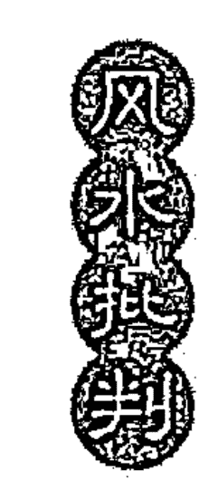

雾灵山凝绿叠翠，是个绿色的世界。浅绿、深绿、墨绿，一层层加重，一层层变化。随着山势的升高，可以明显看出树种在变化……

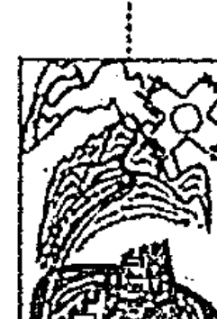

每年 5 月到 8 月，雾灵山又是花的海洋，漫山遍野开放着色彩缤纷的野花。红的、黄的、白的、蓝的，像云锦铺地，像花神赶会。清风吹过，荡起阵阵花香，令人陶醉。水是山的精灵。这里的山泉水清凉得没有一丝杂质，就是捧起来喝生水也不会闹肚子，山里人用铁壶烧水，壶底从来不留水垢。若细细品味，还会觉出水中有一股中草药的清香。所以到这里来的外地人，总要背几壶水回去。①

在北方千万个童山秃岭中，雾灵山能独秀一方，是因为当年被皇家列为“风水禁地”；而今，要想使这方秀山秀水永不褪色，还得靠国家加以保护。以小见大，从雾灵山的兴衰史中，我们似乎不难体味出以追求生气、保存生气为特色的古代风水文化和现代的环境科学之间，到底是一种什么关系。

#### （3）术艺合一论

在二十四史里，堪舆家著作通常被收录在《艺文志》或《艺术志》中，而堪舆家则见之于《艺文传》或《艺术传》。这种将堪舆家与堪舆学归类于艺术和艺术家的做法，是否有欠准确？其实，这正反映了中国风水文化的高妙之处：术艺合一。这里，术是科学、技术、生产，艺是美学、艺术、设计。由于风水文化本质上将科学与美学统一在一起，将技术与艺术结合为一体，因而自有一番不同于单一科学（技术）或单一美学（艺术）的魅力。也因为这个原因，所以，我们评价风水理论和风水现象时，就不能单独以科学技术为参照系，将其中不合乎科学技术规律（但是却可能合乎美学艺术规律）的东西一概斥之为迷信。

#### （4）形势兼备论

堪舆家又名形家。审视地形、地貌，是堪舆家的天职。然而，如果他们像后来的地貌学家那样，仅限于审视地形、地貌，那么，虽则可以从后世的科技史家那里捞个科学家的头衔玩玩（假如可能的话），却肯定不能见容于同时代人，并会被视作是一个低能的蹩脚的乡野术士。因为，风水术不仅是一种视形之法，更是一种视势之法，有时，视势比视形更为重要。其关系恰似文学上的“形神”关系。

风水视势之法主要发生在相地四部曲的序曲——“觅龙”部分，只有当堪舆家们的心灵皈依并向往的绝对理念——神——至善、至吉和至美——“图腾”——龙，同自然地形的每一个细节、空间的每一种形态，在阴阳两个层次上达到极度和合而中庸不倚时，审视者的生气便与自然的生气贯通了，于是，龙脉之势随审视者灵感移迁而孕藉生成。在这里，审视者的机遇、天分、慧悟以及所付出的精力决定了他与“龙脉”的缘分，决定着龙脉的层次和位置。风水上将“视势”称作“看龙脉”，实在传神地反映了中国的建筑意境和中国精神——龙文化之间的密切关系。

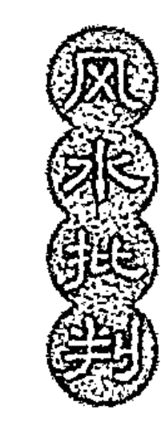

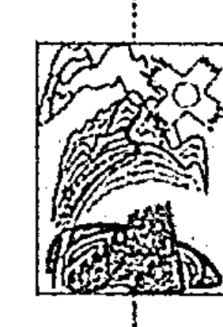

### 10 结语

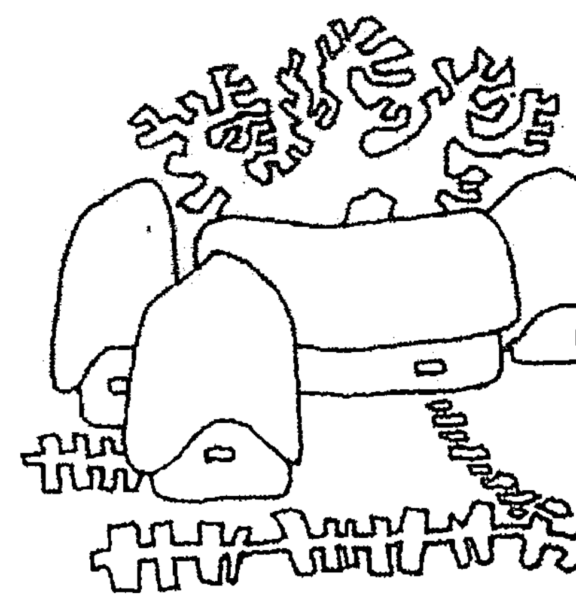

总之，今后我们对于“民之所好”的堪舆之学，似不宜徒用“江湖术数”和“封建迷信”一类的话，一味予以否定，而应当从学术（哲、数、科、艺）的立场，多方面进行剖析。破除其虚妄缺失，找出其可信性与可行性，有堵有截，有疏有导，这才是解决问题的最佳途径。否则，你批你的“迷信”，他看他的风水，永远各行其道（不管正与误），了无交会之期！

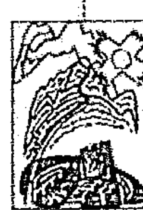

## 附录一

### 太极探源

一件简单而又简单的东西，却赢得了从儒家、道家、阴阳家，到巫师、武师、风水师的普遍青睐，并且历几千年而不衰，这，就是神秘莫测的太极（图90）。

什么是太极？从古至今，有许多说法。《易经·系辞传》曰：“易有太极，是生两仪，两仪生四象，四象生八卦。”北宋张载认为太极即气，如说：“一物两体，气也。”（《正蒙·参两》）“一物而两体，其太极之谓欤”？（《正蒙·太易》）明王廷相也把“太极”看做“天地未判之前，太始深沌清虚之气也”（《太极辨》）。到近代，孙中山先生则用“太极”来译西语的“以太”：“元始之时，太极动而生电子，电子凝而成元素，元素合而成物质，物质聚而成地球，此世界进化之第一时期也。”（《孙文学说》）不难看出，以上各家关于太极的说法尽管存在这样的或那样的差异，但归根结底都指的是派生万物的本原即元气。舍此，别无他意。

然而，为什么要把“派生万物的本原即元气”称作“太极”呢？其名为“太”，与“太平之太”有何关系？它的原型即原始意象是什么？它与中国传统文化又是一种什么样的关系？对于这些问题，常人尽可以不理会，但治学者则非“打破沙锅问到底”不可。否则，将何以对当代和后世、中土和域外读者那追问的目光！

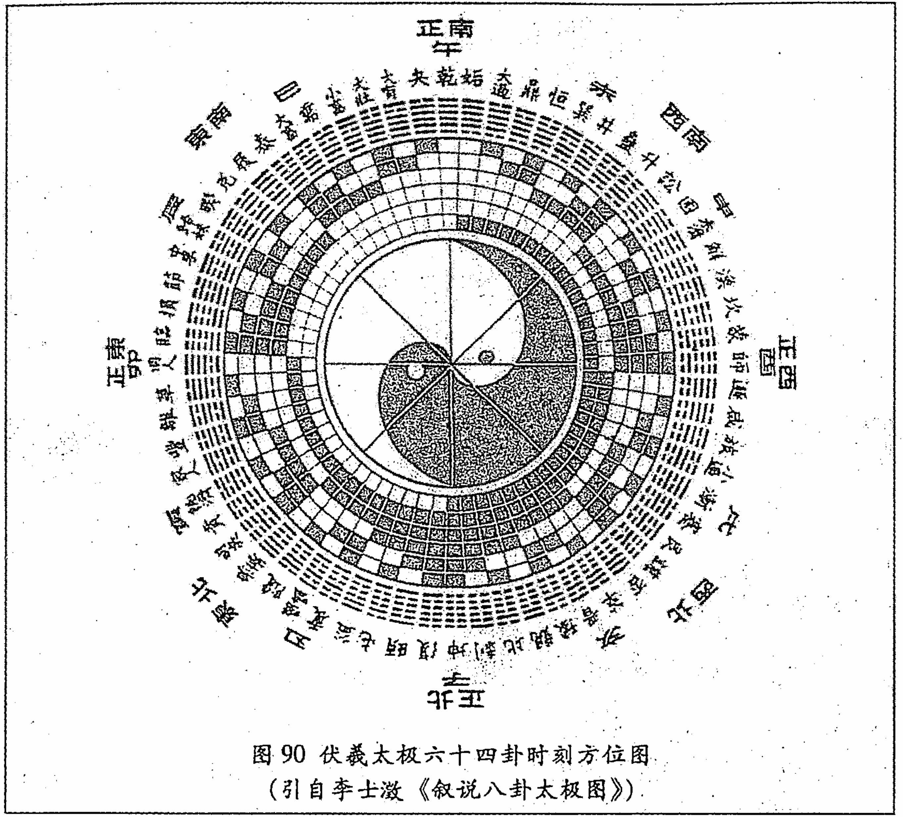

图90 伏羲太极六十四卦时刻方位图
（引自李士澂《叙说八卦太极图》）

#### 1. 高妙绝伦的中国古胚胎学

18 世纪以前，由于受机械唯物论的影响，西方在胚胎学上流行的是一种预成说，根据这个学说，胚胎的发育是预先形成的微小动物的扩大，在胚胎中没有任何分化或者增加的新部分。在他们看来，上帝创造的第一代物种中，就已经包含了以后的子孙万代。甚至有人宣称，在卵子或精子中看到完整的微小动物的形状。

一直到 18 世纪中叶，在机械唯物论并不那么流行的德国，自然哲学家沃尔弗（1733-1794）才提出了一种与预成说相互对立的渐成说。其理论根据是，如果生物在卵子或精子中已经形成，那就应该在胚胎中看到成年动物的肢体和器官，可事实上并不是这样。

其后，在和预成说的论战中，在用实验的办法研究胚胎怎样发展成生物个体的过程中，产生了科学的胚胎学。

相比之下，古代中国人的胚胎学知识则要早熟和高明得多。这尤其体现在人体胚胎学方面。

宋朝医学家陈自明认为：早在上古黄帝时代，就“有巫方，立小儿《颅囟经》以占寿夭，世所相传，遂有少小方焉。”① 据《颅囟经》称：“一月为胎胞，精血凝也；二月为胎形成胚也；三月阳神为三魂；四月阴灵为七魄；五月五行分五脏也；六月六律定六腑也；七月精关窍通光明也；八月元神具，降其灵也；九月宫室罗布，以定生人也；十月受气足，万象成也。”② 这里，我们且不管《颅囟经》对各个月份胚胎的性状的描述是否那样准确和精到，单就它所说的由胎胞而胚、而魂、而魄、而五脏、而六腑，再到七窍、元神和宫室这一从简单到复杂的发育过程来看，无疑已是道道地地的渐成说了。

《颅囟经》是黄帝时代的作品还是后人的伪托，现在我们还不能确定。但胚胎渐成说早在汉朝以前就已形成则是毋庸置疑的。据汉朝许慎《说文解字》讲：“朘”（音某）是妇始孕，胚兆也”；“胚”（即肧）是“妇孕一月也”；“胎”则是“妇孕三月也。”而现代胚胎学也认为，第一个月，受精卵在母体子宫内着床成为一团胚芽，胎儿不过一厘米长，这时，孕妇一般不会有什么感觉。因此，用“月”（即肉）字旁加“不”字来形容这种可想像却又摸不到的肉体——胎儿，是再传神不过了。在第三个月，胎儿身长约 7.5 厘米，体重约 15 克。此时胎盘形成，它是供养胎儿营养的基地。此后胎儿生长日渐加速，羊水也明显增加，胎儿就在水中嬉戏生活。因此，用胎字来标示这个关键时期，也是十分准确的。

从第四个月开始，胎儿进入孕中期和孕后期，这反映到汉字上，就形成包（胞）字。根据《说文解字》，“包像人怀妊。已在中，像子未成形也。元气起于子，子人所生也……为子十月而生。”“胞，儿生怀也，从肉从包。”包即是胎衣本义，包加肉旁便是会意兼拼音。今俗语同胞，原为包。此外，“孕”、“妊”、“娠”等字也都是表示怀孕过程的古汉字。总之，在古代中国人的眼里，怀孕是一种由小到大，由不成形到成形的渐进过程。正是经过由朒而胚、而胎、而胞、而姙等若干具体的发育阶段后，“为子”才“十月而生”。

“生”是胚胎的终结和极致。对此，我们的先人们也有着独到的观察和记录。

根据《说文解字》，“子”像一个两臂弯曲向上而并足于襁褓之中的胎儿。相反，“云”（音突）是“不顺忽出也。从倒子。”“云”加月（肉）字成“生育”之“育”字。在甲骨文中，“育”字写作“毓”，它“像婴儿出母腹形，”描写得正是分娩时的那般情景，而且是“头位分娩”，即“倒子”——胎头最先露出。

鉴于此，所以，称中国古代胚胎学为“高妙绝伦”，并不为过。

#### 2. 台——胎——始

在《说文》里，“台”被训为“说也”。而“说”在古代汉语里与“悦”相通。如《礼记·学记》：“近者说服，而远者怀之”中的“说”，就当解作“悦”。因此，所谓“台”，可以理解为“悦也”。而我们知道，“悦”即为喜，喜即为“悦”，有悦即为“有喜”，而“有喜”乃是怀孕之代名词，因此，所谓“台”者，实际上就成了怀孕的隐用语。再加上个月字旁，就明明白白成了个“胎”——“胎”乃“妇孕三月也”，如果说，这之前主要是器官形成，那么，这以后则主要是组织发育；长到这份上，胎儿已比较安定，流产的机会也大大减少，因此，怎能不让那些祈求人丁兴旺的原始人为之而“说也”？

胎者，人之初也。一般来讲，胎儿已具有初步的思维、感觉和记忆能力，因此教育就应当自胎儿始，在中国，胎教一说，由来已久了。成书于西汉时期的《大戴礼记·保傅》中就有不少关于胎教的记载：“周后妊成王于身，立而不跂，坐而不差，独处不倨，虽怒不置……书之玉版，藏之金匮，置之宗庙。”看来，这位周后是很懂得些胎教之法的。后来，周成王所以那么聪明，那么有才能，也许与他未出生前就受到如此良好的“感化”不无关系。

胚胎是人生的初始阶段。惟因如此，所以许慎才把“始”字训为“女之初也。”这里，“女之初也”可有两种解释，即初交和初孕，但实质上二者是一回事。因为初交当然“悦”人，“悦”人则可能“有喜”，因此，所谓始者，即指胎也。总之，台、胎、始三字可以相通假。

#### 3. “否极泰来”与“泰极而否”

否（☷）与泰（☰）是《周易》中的两个卦名。否（音皮）象征否定、闭塞、黑暗；泰象征亨通、泰平、吉祥。《易经·序卦传》说：“履而泰，然后安，故受之以泰；泰者，通也。”但是，“物不可以终通，故受之以否。”

钱钟书《管锥编》第一册《周易正义》“《泰》为人中之说”一条记载：“泰——（☰）乾下坤上。按元杨瑀《山居新语》记陈鉴如写赵孟頫像，赵援笔改正，谓曰：‘人中者，以自此而上，眼、耳、鼻皆双窍，自此而下，口暨二便皆单窍，成一《泰》卦也’。……王弘撰《山志》初集卷一论八卦备于人之一身，举《泰》为人中之例……《逸周书·武顺解》：‘人有中曰参，元中曰两，……男生而成三，女生而成两’，谢墉注：‘皆下体形象’。”可见“泰”卦的原始意象来之于“人中”，而后者则是人体男女之根的一种隐语。

在泰卦中，“乾”（☰）亦即天，下降到下卦；“坤”（☷）亦即地上升到上卦，这种天地错位的现象显然与泰卦所蕴含的亨通、太平、吉祥之意不相适应。同样，在否卦中，“乾”之天在上，“坤”之地在下，位正而理顺，因而应当吉祥、亨通，而不应当闭塞、黑暗。对于这一矛盾现象，治易者过去往往用地在上，天在下，“天地相交，地重由上下降，天轻由下上升，才不会背离，而能密切交合”①，以呈现亨通太平的景象，以及天在上，地在下，“天地背离，不能相交，阴阳闭塞、万物不能生长”② 等显然有悖于自然规律的狡辩之辞进行搪塞，而未能提出任何令人信服的论据。

其实，只要我们明白了否泰两卦的原型，那么，这个矛盾是可以不解自明的。

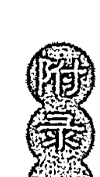

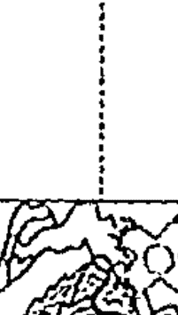

如前所述，“肧”（胚）在“说文”中被训为“妇孕一月也，从肉不声”，而否则被训为“不也，从口从不，不亦声”。二字形声相近，因而古人在占卦时就用“否”来表述肧（胚）。不仅如此，而且就描述胎儿的生活环境、生活状态的精到程度讲，否比起朘、肧（胚）、胎、胞等字来，也许更加深刻些。这是因为“否”有“口”不开，含有闭塞、黑暗之义，这和胎儿的生活环境恰恰相合；其次，否卦的内卦即下卦全部是阴爻，外卦即上卦全部是阳爻，象征“内阴而外阳，内柔而外刚”（《易经·否·彖传》），这和胎儿为阴，母体为阳，胎儿柔弱，母体刚健的生活状态也高度契合；再次，否卦的上卦为阳，下卦为阴，这可象征孕中期胎儿在母体中的正常位置——头在上、臀在下，正立于母体中。

由于以上原因，所以将否卦的原型推测为怀孕和胚胎，当无大错。

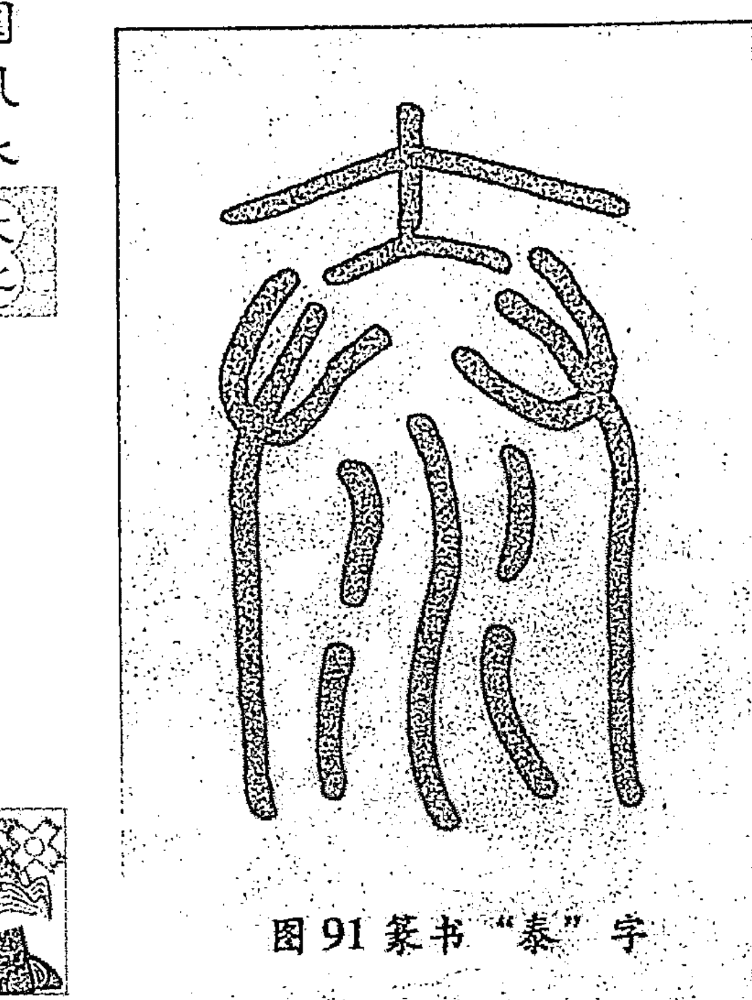

十月怀胎，一朝分娩。怀胎是分娩的准备和基础，分娩则是怀胎的终结和极致。此所谓“否极泰来”。事实上，（篆书）泰字（图91）本身就是一个象形字：其上那个大字象征一个人；两边两只手象征接生；而下边的水象征为孩子洗去血污的热水盆。由此可以看出，许慎将“泰”字训为“滑也”真可谓高明之至——既然“滑也”，那么，胎儿分娩就一定顺利，就不会难产，母子当然就亨通平安、吉祥如意了。

“太”是“泰”的异体字，在“说文”里，许慎训“太”为“古之泰”。这比后世将“太”训为大字，也许更为妥当，事实上，我们与其把“太”看做是“大”字多一“点”似的一个男人形，还不如把它看做是孕妇肚里那多出的一点即胎儿。因为只有胎儿才需要接生。才可以使“太”与“泰”的意义相通。

前边笔者认为“否”即是“肧（胚）”，而现在又认为“太”即是“胎”，这不等于说“泰”就是“否”，“否”就是“泰”吗？事实事情原本如此。在《易经》中，泰与否为“综卦”，泰极而否，否极泰来，互相消长，互为因果。二者不仅都和胚胎有关，而且都有象征分娩的意义。只不过“泰”是头位分娩——头朝下，臀朝上，“内健而外顺”——因而亨通顺利；而“否”却是臀位分娩——头朝上，臀朝下，“内柔而外刚”——因而难产危险。这就是为什么坤上乾下，阴阳颠倒，反而为“泰”，而乾上坤下，人情合理，反而为否的原因所在。

至此，笔者已可以明确地指出，所谓“否极”即“太”（泰），其原型实质上就是分娩与生产；而所谓“太极”即“否”，其原型实质上就是怀孕与胚胎；令人莫测神秘的太极原来却是个胎中婴。

#### 4. 中国“天人之学”的产生过程

“天人合一”的哲学思想，是中国一切学术思想的根源和基础，也是中国传统文化的最大特色。神秘的东方精神之谜底，似乎正在于这“天人合一”的境界之中，我们有理由将这数千年文化发展的精神成果，看成是这种“天人之学”的发扬和光大。

然而，这种“天人合一”的哲学又是怎样形成的呢？

从古至今，在哲学和自然科学领域，主要课题之一，便是探究宇宙本身的起源，发育过程及其原理。从宋儒的《太极图说》，到现代的“相对论”，以及英国豪金教授的爆炸理论，都研究的是宇宙的生成问题。可以说，没有“生”就没有宇宙，更没有万物与人类。而胚胎学所提供的正是有关“生”的知识，因此，便自然而然地被古人用来类推宇宙的起源、结构、功能及盛衰。其中，最为世界大多数原始民族所常用的宇宙模型是鸡蛋——蛋清像天，蛋黄像地。

在我国，也存在过用鸡蛋模型来解释宇宙的生成和演化。例如《艺文类聚》载：天地混沌如鸡子，盘古生其中，一万八千岁。天地开辟，阳清为上，阴浊为下，盘古在其中，一日九变，神于天，圣于地。天日高一丈，地日厚一丈，盘古日长一丈。如此万八千岁，天数极高，地数极深，盘古极长。后乃有三皇。”① 现在，这种鸡蛋模型仍然为我国一些地方的老百姓所乐道，成为这些地区神话传说的重要内容之一。

但是，在中国，“鸡蛋模型”终归只是个神话传说而已，它并没有被我们的先哲们所改造而上升为宇宙观。相反，倒是“人胎模型”为中国传统宇宙观的形成提供了原始意象。

前边笔者曾经指出，“胎”与“始”的意义是相通的，胚胎即是人之初始，而太极的原型是胚胎，因此，太极也就意味着初始和本原。诚如朝鲜李朝文学家、哲学家丁若镛（1762-1836）所说的那样：“太极者”，“天地之胚胎也”。

在孕中期，胚胎尚无性别特征，此时，可谓“混沌未辟”，“天地未判”；及生下来阴阳已分，男女有别，可谓“太极生两仪”；以后等小儿长大，男者再生子女，女者再生外孙和外孙女，此可谓：“两仪生四象。”再推演下去，得“四象生八卦”。如此，金字塔式的人类繁衍图便转化成可涵盖万象的宇宙观。如此，“人道”便演绎成了“天道”。

实在地讲，中国文化原也是“人道”先于“天道”。据笔者分类统计，汉代许慎《说文解字》共列部首 540 个，其中人体类 202 个，用品类 125 个，动物类 79 个，植物类 65 个，地理类 40 个，而天文类则只有 29 个，在天、地、人这“三才”之间，人显然居绝对的中心地位。

但是，由于周人敬天，而中国最古老的典籍如《易经》等也多形成于这一时期，所以，呈现在人们面前的便是一幅次序颠倒的知识发生图：“古老包牺氏之王天下也，仰则观象于天，俯则观法于地，观鸟兽之文，与地之宜，近取诸身，远取诸物，于是始作八卦”（《易经·系辞传》）；所以，原本由“人道”推演出来的哲学原理，便获得了自在的特性，而成为一种先于“人道”的“天道”；所以，便产生了知识拜物教、符号拜物教，好像世界上之所以有男有女、有雄有雌，就是为了验证“一阴一阳谓之道”；所以，自“人道”而“天道”的“人天之学”便一变而成为自“天道”而“人道”的“天人之学”——即便谈论很具体的人的问题，人们也总是要先大讲一通宇宙化生论；于是，便产生了独具特色的东方神秘主义。

而且，为了神化“天道”，那些先哲们干脆过河拆桥，把太极、包牺这些文化名物和它们的原型——胚胎之类彻底脱钩，从而掩盖了中国文化的发生过程，以致后世竟谈“太极”、“包牺”，却不知它们到底为何物。

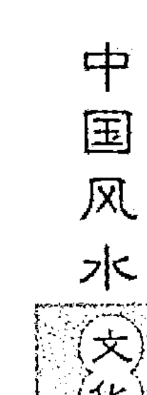

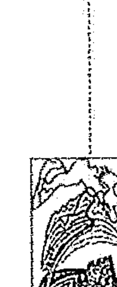

## 附录二

### 闲话风水

1993年10月22日，应北京人民广播电台新闻台副台长兼《人生热线》节目主持人苏京平先生之邀，高友谦在该台直播室现场与听众谈风水。以下文字是根据当时的录音整理而成，标题为编者所加。现附录于此，以供参阅。

苏：各位朋友，我是节目主持人苏京平。今天白天，我在街上书摊前转了转，想看看有什么新书。没想到，几天不见，就有改朝换代之感。这反映了书籍市场的繁荣。不过，我觉得有些书如同几朝元老，虽然书名改头换面，但内容却有着永久魅力。特别是像气功、易经、风水等等这些反映我们国家特有文化的书，一直吸引着很多读者。

当然啦，对于气功易经，我们的节目以前曾经介绍过。今天，我们打算再谈谈风水。

据说，20世纪70年代后，国外就有所谓“风水热”。而在我们国内，直到现在，还有人把风水和迷信等同对待。不过，更引入深思的是，我接触到不少严肃的科学工作者，他们一直把风水作为一种文化，作为一门艺术来看待，而进行着关于人与自然的关系的研究。

当然另一方面，现在街头卦摊上，我也看到有人拿着八卦图啊、照妖镜啊，在那儿给人看所谓的风水，说是可以招财进宝，逢凶化吉。

那么，究竟怎么看待其中的是非曲直呢？

今天晚上，我们很荣幸地请来了国家建设部城乡建设经济研究所的高友谦先生，请他在我们的直播室内，跟大家谈谈有关风水与人生的话题。……高先生，据您理解，风水到底是怎么一回事？

高：谈起“风水”，人们很容易跟迷信联系起来。可是，深入研究下去，就会发现，二者之间并不能画等号。在研究风水前，我也觉得风水跟过去其他一些迷信并无二致。可是经过这么几年的研究，我发现，虽然在形式上，在外表上，似乎风水迷信成分较多。可实际上，其内容、其本质却有许多合理的可取之处。这里首先有个参照系问题。过去，我们之所以把风水看做迷信，主要是因为以西方自然科学为参照系。但问题是，中国的风水本是在中国的土地上生长发育起来的一种传统文化，其中不仅含有科学成分，更主要的，它还是一门处理方位的艺术。因此，我们看待风水时，就不能仅仅只从科学角度出发，有时还需要用艺术的眼光去分析。因为，如果仅仅以科学为参照系，有些东西确实很难理解，但是如果改换参照系，从心理学、从美学、从艺术的角度去观照风水，那么就会发现，风水之中还含有许多美学的艺术的内容，而这些恰恰是过去西方建筑学所忽视而又为当今建筑学所急需增补的东西。

苏：这里面，是否还包括一些古代哲学思想？

高：对！中国传统文化的一个主要特色不就是“天人合一”吗？而风水恰恰是一门研究和处理人——天关系（即人和自然的关系）的学问。正因如此，所以，“天人合一”思想在风水中表现得尤其突出。

苏：好，现在已有听众打来热线电话，下面，我们一边交谈，一边回答听众的提问，你看这样好吗？

听众：现在大街小巷净是摆地摊的，他们到底是否真懂风水？

高：和过去的江湖艺人一样，现在民间有些人无非借风水混口饭吃，蒙事而已。不过另有一些人确实懂风水，也会看风水。对此，我们应当有所区别，不好一概而论。

听众：高先生：请您解释一下“风水”一语的含义。

高：关于“风——水”的由来，我们且不说这二字作为符号，在文化学上所具有的象征意义，单从功能上来说，风水学中也有个“藏风理论”和“得水理论”，这两个理论要求宅基地即要位于避风之处，也要靠近水源。“风水”一名，即由二者化出。当然，为了满足“藏风”、“得水”这种功能，风水学上一般要求宅基地在结构上应当背山依水。这样不仅景观优美，生活也非常方便。

苏：高先生，风水文化不仅内涵非常丰富，而且源远流长，关于这方面的内容，也请您给大家简单谈谈。

高：风水是中国几千年传统文化孕育出来的一种专门处理方位与空间的艺术。在古代中国建筑事务中，有关建筑选址的主要理论正是风水理论。因此，过去那种抛开风水理论所写出的中国古代建筑史，就必然是一部不完整的建筑史。也因如此，所以了解风水的发展脉络，对于填补中国建筑史的知识空白，自然有其理论价值。

言归正传。最初关于风水的记载是《诗经·公刘》。这首诗说的是周民族的先人——公刘，为周民族选择部落聚集地的过程。到汉代，风水理论已具雏形，产生了两部风水学专著，即《宫宅地形》和《堪舆金匮》。这两部书后来都已失传。后来经南北朝，到唐代，风水理论更形完备，并明显分化为形势、理气两大派别。至明清，风水理论发展达到高峰，我们现在所能见到的风水著作，基本上都写成了这一时期。这就是风水理论发展的简单脉络。

苏：人称风水先生为阴阳先生。您刚才谈了阳宅问题，那么，请您再谈谈阴宅问题。

高：风水理论虽然区别为阳宅理论和阴宅理论，但其原理大同小异。阳宅风水宝地作为阴宅使用也是可以的，反之亦然。比如北京房山县内的金陵，其前身就是一座寺庙，又如明孝陵，其前身也是一座庙。可见阴宅、阳宅，原理一样，区别仅在容量有别：一般来说，阴宅环境容量小些，而阳宅环境容量则大些，仅此而已。这里牵涉到“人死观”的问题。由于“死而复生”这种观念普遍存在于我们这个农业民族之中，因而导致汉民族的“人死观”本质上毕竟等价于“人生观”，因而，古人在处理死亡问题时，也就往往按生人的愿望去比照安排，于是，阴间世界也往往是阳间世界的一种再现。由于功能上无大区别，所以阴宅风水和阳宅风水在结构上也就没有本质不同。

从物质关系上讲，祖先阴宅地好坏，不管是对死者本人，还是对其后人，当然都不会有什么实际性的影响。不过，话说回来，人毕竟是一种感情动物，葬礼对生者比对死者更有意义，也更为重要。作为寄托生者哀思的一种符号，一种物质所在，阴宅对未亡人的心理总会起某种暗示作用——是前途远大，还是前途渺茫？是官运亨通，还是倒霉透顶？是财源茂盛，还是亏尽赔光？是人丁兴旺，还是断子绝孙？……总之，不管承认与否，在观念上，在心理上，阴宅好坏对其后人总要发生这样或那样的影响。缘于此，所以古人“慎终追远”，选择佳地，也不是没有一点道理。我们当代的无神论者不是也为死难烈士修建陵园吗？

苏：有一个问题，就是风水对我们当代人的心理是否也有影响？有多大影响？想请高先生就此跟大家谈谈。

高：风水是影响人的生活的一个因素。衣、食、住、行，风水属于“住”的一个方面。衣服不称心，可以换穿一件。食物不可口，可以改吃别的。惟有住房，由于投资大，花费巨，即使不满意，也难以随便舍弃或更换。所以，如果住房条件（包括风水）不好，那么，它就会对住户产生持久性的心理压力，时间长了，身心就可能产生某些病变。不过，这里，究竟有多大的相关度，尚有待于以后的定量研究。

1993年11月8日