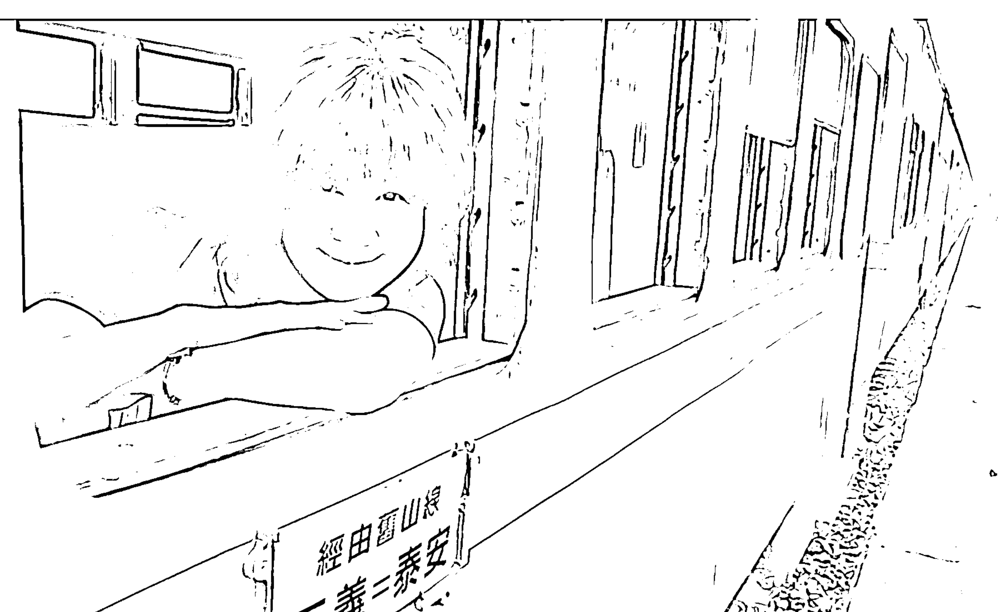
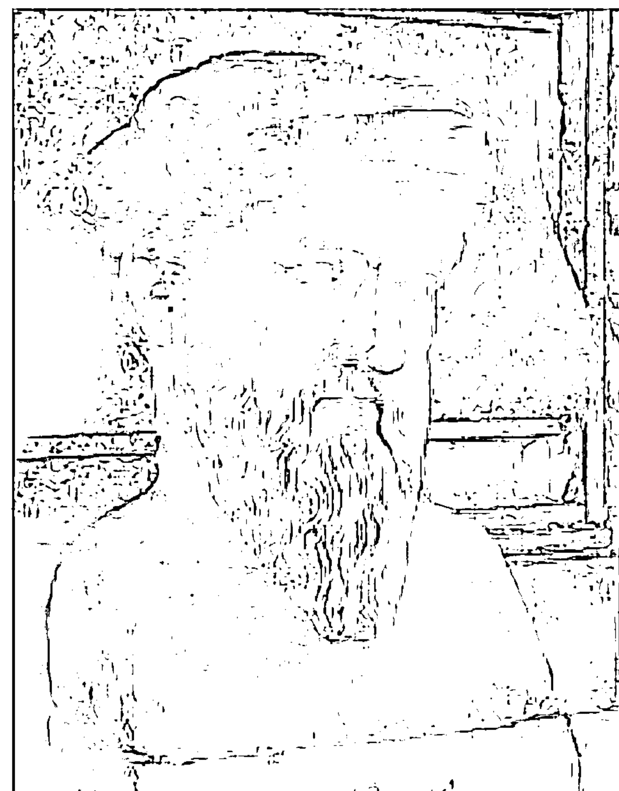
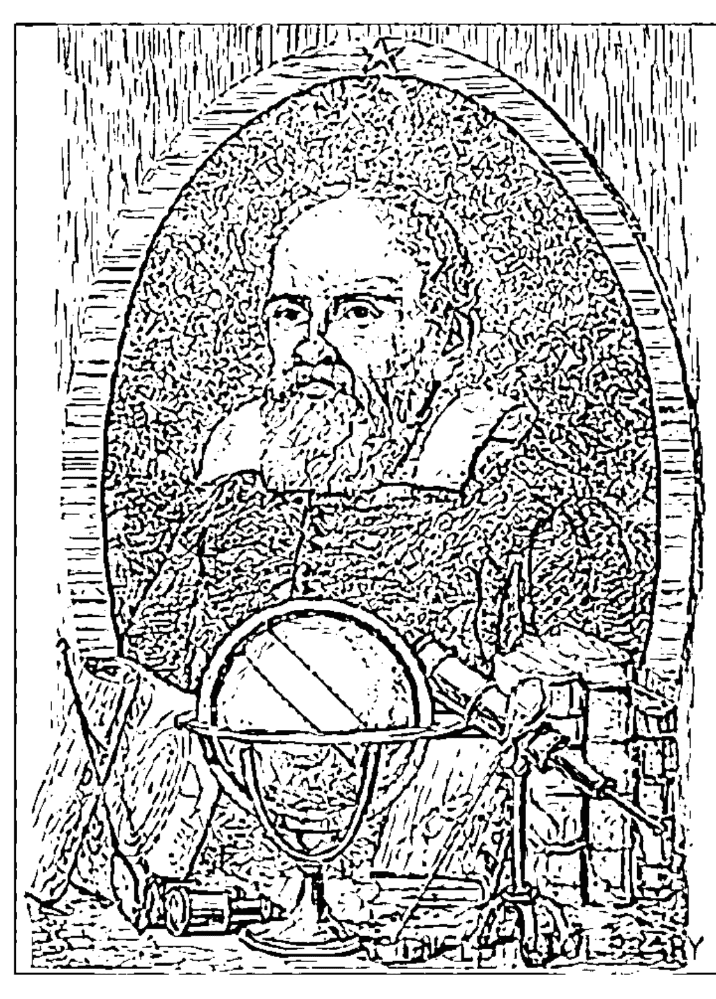
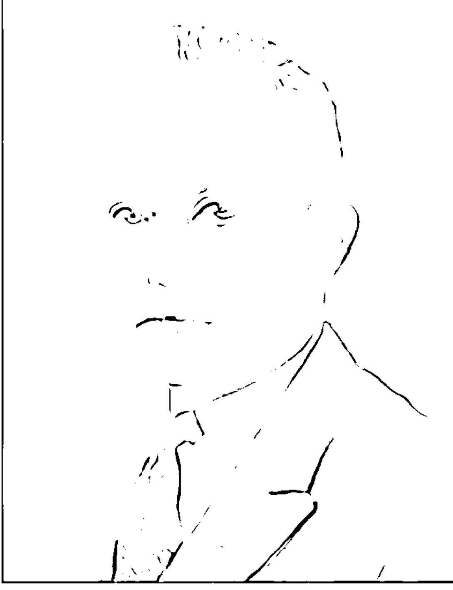
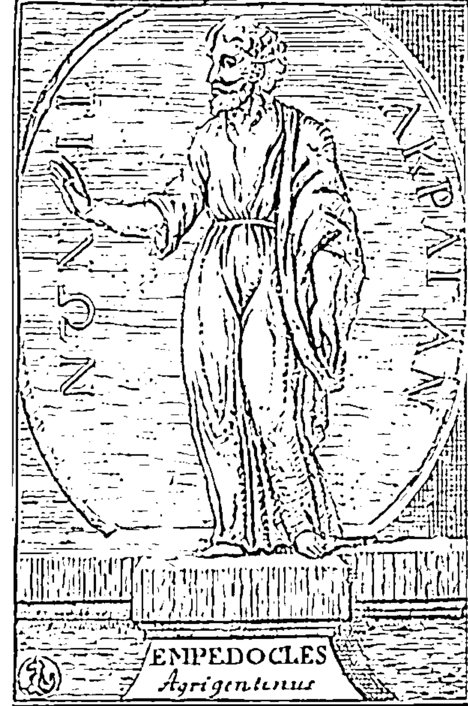
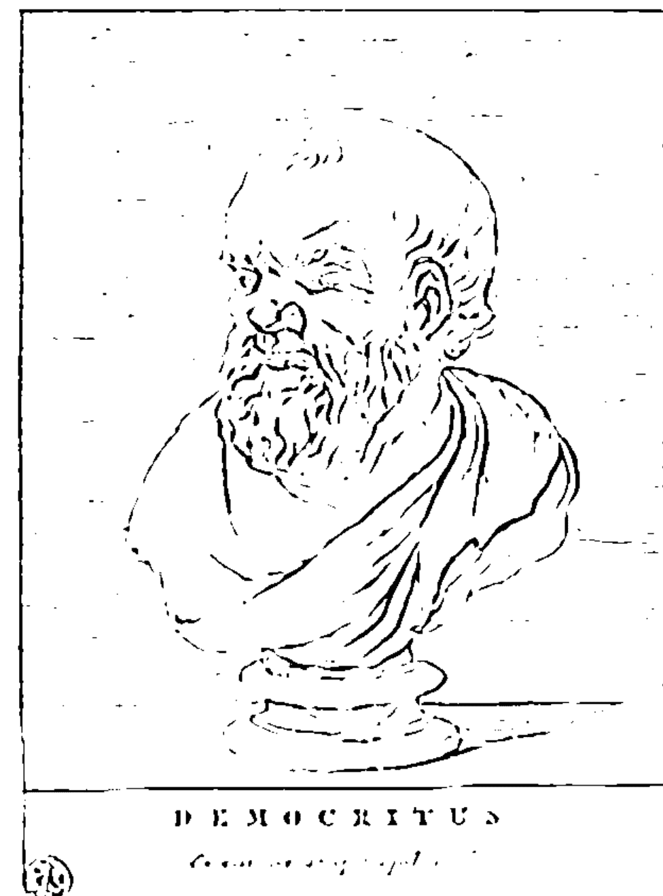
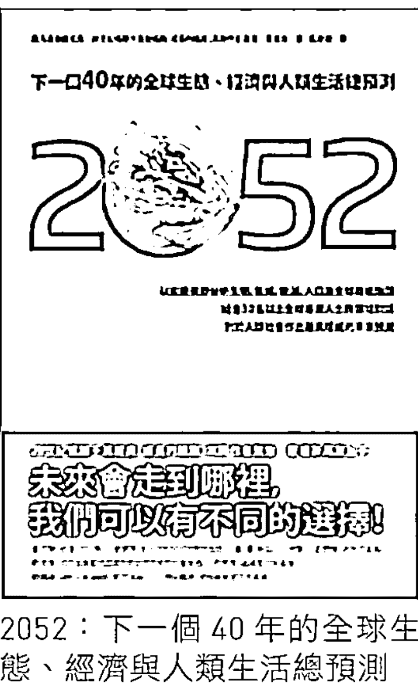
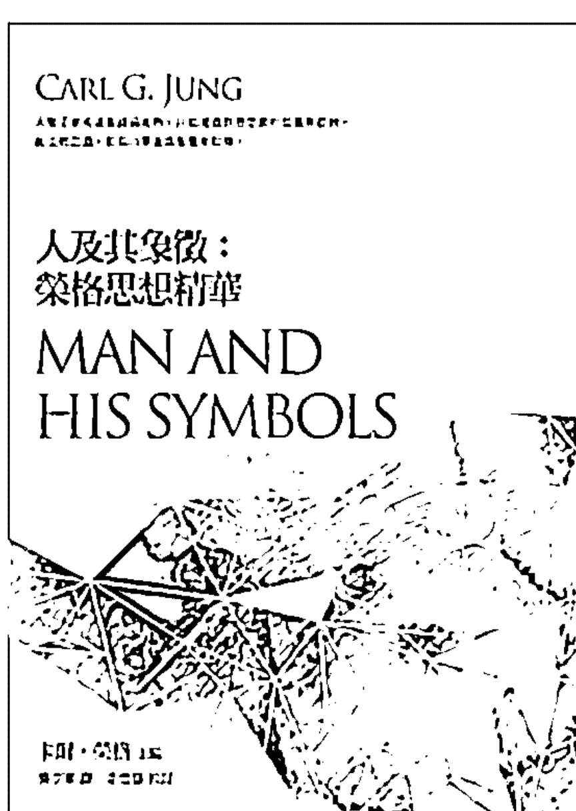

# Rainbow Numen: Theoretical Foundation and Operation Analysis

# 丽子的彩虹数字学

# 解開你的生命密碼

你的靈魂選擇了某個時空點誕生在地球，出生年月日就是你在地球上的生命密碼。出生年月日中的每一個數字代表著不同的個性能量展現，因此，解讀生命密碼就能洞察自己的性格、特質、潛能、興趣、學習、工作、事業以及靈魂的深層涵義。
邀請你來一起探尋自己生命藍圖的奧秘。

## 慈智雙修的彩虹傳奇

《彩虹麗子》、《少年凡一》作者 藤原進三

> 「上帝選出自然數，其餘都是人類的功績。」— 克羅內克〈Leopold Kronecker, 數學家, 1832 – 1891〉

一位傳遞生命意義使者現世的背後，總有著不可思議的傳奇。

我有幸親身見證了田麗虹老師這位當代彩虹生命數字學大師橫空出世的傳奇過程。

那是在我人生中極度迷惘困厄的時刻，在茫然之中同時也對靈性奧秘與世間實像極度渴求解答的時刻。機緣巧合地知道了有位彩虹數字學復創宗師 Tad 可以為人釋疑解惑，興沖沖地跑去請求指點迷津。當天 Tad 老師講我什麼，如今已經全忘光了，只記得，同時看了麗虹老師生命數字的他，一口斷定地說：這位小姐將來會來學我這門學問。我心想：哪有可能？數字耶！她看到數字就昏倒了，怎麼可能會學這個。過了沒一陣子，麗虹老師說她也有點好奇，想去算看看。陪她去、一見之下，麗虹老師對於自己的過去未來名利富貴啥也沒問，只提出了兩個問題：一是，到底有沒有外星人？二為，2012 年 12 月 21 日會不會世界末日？除了前者肯定有，後者絕對不會之外，當天 Tad 老師講了些什么也全不記得了，唯一的印象就是他又一口斷定地說：妳以後會來學我這門學問。麗虹老師的反應是：哪有可能？數字耶！我看到數字就昏倒了，怎麼可能會來學這個。對於 Tad 老師的一口斷定，我們都不以為意，也沒放在心上，倒是，很佩服於他的解析功力和人品修為，逐漸地成為相知相惜的好朋友，三不五時也會到他的部落格瀏覽 po 出來的體驗分享和心靈話語。過了好一陣子，看到 Tad 部落格 po 出開班授課的訊息，一再鼓勵麗虹老師，去上看看好了，於是報名參加。

那是基礎的心性解碼課程，六堂課，一週一次，一次三個小時。第一天上完課回來，問：怎麼樣？答：完全聽不懂，腦子一片空白，整晚都在發呆！果然嘛，看到數字就昏倒的人，聽得懂才奇怪。第二週下課，情況還是一樣，很痛苦。就這樣，上完了整個心性解碼。接下來 Tad 老師繼續推出時間解碼課程，不知怎地，我又鼓勵麗虹老師再去報名參加。結果，情況一樣，毫無進展，空白發呆依舊，只是痛苦指數倍增，好不容易撐著聽完五週的課程，不僅還是不懂，Tad 老師又再開設更進階的感情解碼課程，我又再一次不知怎麼地極力說服麗虹老師再接再厲，可以想見，前面兩套課程都不知所云了，更複雜細膩的感情解碼如何能理解？一樣，從第一堂課開始，發呆又痛苦，第二、三、四堂課依然一片空白，只是依舊撐著沒昏倒而已。直到第五週最後一堂課的最後階段，課還沒上完，麗虹老師突然站起來，對 Tad 老師說：老師，我全懂了！對不起，我先回家了！接下來，麗虹老師竟自己主動報名參加 Tad 老師暑期密集班的心性、時間、感情全套課程，進行整套課程第二次的複習、加以融會貫通，就這樣，一位彩虹數字大師誕生了！

或許，悟境的突破領會，就是這麼傳奇的一回事吧！是天份、因緣、渡化引領，加上上天的恩典啟示，才能讓人踏上那難以望及的開悟境地。

但是，一旦領悟體會之後，是不是就得以長居安樂靈通甚至終極涅槃，或者，就此擁有能夠縱橫時空乃至穿越俗聖的神奇力量呢？不是的。麗虹老師的傳奇歷程昭示了我們：開悟，只是修行的起點而已。

近十年了，從那個「我全懂了」的晚上到如今這本著作出版，已經十年。這十年來，我看到的是，麗虹老師對彩虹生命數字學的鑽研探究、認真實證：在洗碗、洗衣、煮飯、擦地板的時候，隨時將錄音筆的耳機掛著；在乘車、搭高鐵、咖啡廳等人的時候，隨時在筆記本或教材講義上寫著。1 到 0，十個數字，每個數字，不斷地聽，不斷地寫，不斷地修，不斷地悟。在這十年每日的行住坐臥之間，不斷地分析、比對、整合，甚至解構、跳脫、再創新、再提升。我經常每隔一段時間，就會看見麗虹老師靈光乍現般的讚嘆：「太神奇了！」、「原來如此，我懂了！」，那是她不斷領悟的時刻，但是，也經常每隔一段時間就會看見她身陷在數字的深奧難解之中，困惑滯礙，百思千折。歷經如此不斷地困頓深思之後不斷地小悟、大悟，傾注十年心力於彩虹數字學之上的麗虹老師，終究得以將這門學問融洽於一，集其大成。這份不懈不怠夙夜不休的精神，不僅是一種嚴謹治學的用功努力，更是一種貫注修行的生命投入。原來，一位大師的育成，非十年累積無法竟其功。

麥爾坎·葛拉威爾（Malcolm Gladwell）在「異數：超凡與平凡的界線在哪裡？」(Outlier: The Story of Success) 這本書提到天才成就者的培養，需要十年的時間，因為：「十年代表一萬個小時的苦練」，而「一萬個小時就是敲開成功大門的神奇數字。」麗虹老師的自我砥礪苦修磨練，正是最好的典範。

大師，是領悟天啟之後，再經過漫長修行才能夠造就的。

修行，除了用功，還有更重要的是，慈悲與智慧的孕育與發揚。彩虹數字，作為麗虹老師的修行方法，除了理論與實務的研究，使其系統化而自成一家之言外，更是她利益眾生造福世間的願力工具。永遠以一種正面的、良善的、積極的、利他的態度，貫徹於數字的解讀，貫穿於給予諮商者的提示，貫通於對這人世與生命的意義，是麗虹老師發揮彩虹數字能量功效時始終堅持的基本立場。這樣的原則，正是運用數字的智慧以實踐慈悲，並且，因為慈悲而使得數字充滿智慧；正是彩虹數字學之所以降臨在麗虹老師這位彩虹使者身上的任務與使命。

這本〈麗子の彩虹數字學〉只是麗虹老師研修成果的一小部分，主要是「心性解碼學」的基礎課程內容。在能量跳脫，連線支援以及靈魂等級的操作運用上，因為需要大量的經驗傳承和案例解析，還有待更進一步的進階演算詮釋。至於彩虹數字學的另外兩大範疇：「時間解碼學」和「感情解碼學」以及除了個人個體還可適用於企業經營的「組織管理解碼學」，都不在本書的涵蓋內容之中。作為麗虹老師的頭號信徒兼粉絲，衷心期盼在本書之後，其他更為威力強大、洞見深刻的彩虹著作，能夠持續的撰述出版，讓「彩虹數字學」這門學問得以更完整、全面而燦然大備地呈現在世人的面前。

麗虹老師是數字 1，對於這位數字 1 的彩虹數字使者，以及，由 1 這個數字的變化累加衍生堆疊所形成的彩虹數字學，謹以以下這段印度靈性導師拉瑪那尊者 (Bhagavan Sri Ramana Maharshi) 的箴言，對她、以及祂，致上我誠摯的敬意：

> 「1 之真理外，別無存在；
無生無死，無往無回；
無慕道者，無渴求慕道者；
無解脫者，無困縛，無解脫；
統合之 1，獨然永在。」

這或許就是數字 1，乃至於彩虹數字學所追尋的最終境界吧！

## 解開自己內在的生命密碼

彩虹數字學院負責人 王煒午

在我 2003 年公開傳授彩虹數字開始，目的就是要傳遞一個訊息：寄望能藉由彩虹數字作為人類生命覺醒工程的核心主軸，讓每個人都可以解開自己內在的生命密碼，解決改善命理學的嚴重缺失與困惑，終極目的是要讓生命的自決權回歸個人自身、交付給自己內在與生俱來的神性，而不是把生命交託給外在的命理師。

2003 年我也曾期許「彩虹數字學」未來能夠發展成為學術界一個正式的新學科，在「未來學」專業研究領域中，提供一種簡潔易懂的「生命未來方法學」，讓對個人「生命意義與目標」這個議題，可以進行更深入且全觀性的討論，因為這種新知識體系的發展對當下時空而言，實在是太重要且非凡了。

在這樣一種理念推廣下，喜見田老師這本秉持學術研究精神的著作，不管是在理論層次面上的寬廣思維和專研，還是個人日常諮商所累積出的實務經驗值，都讓這本書，不但理論基礎架構論述清晰完備，在實務解析面上的實際操作運用面，更是簡單易學，可以說，全方位的把彩虹數字的精髓理念做出了完整的呈現，確實讓我十分驚喜、並且倍感欣慰。

本書特別以雙封面方式來設計，因此，如果你想了解彩虹數字學基礎理論，理論基礎篇已經完整寫出數字概論，甚至是理論模型；如果你想從數字解碼篇開始入門，那麼，請直接依照書中所介紹的演算方式來計算、解析自己的彩虹數字能量特質。

期許田老師著作的出版，得以讓讀者都能因此書而激活出與生俱來的生命數字能量。

## 改變個性就會改變能量，好的能量就會吸引好的磁場

海外投資開發股份有限公司董事長 林文淵

我的人生哲學之一，就是透過不同的角度來觀察體認周遭世界的人事物，而這本特別的書，也跟我一樣喜歡觀察人，只不過，是透過數字。

由於數字就是能量，能量就是磁場，磁場形塑成個性，作者藉由清楚分析每個數字的低階、中階、高階、終極不同個性能量的展現方式，來深度解析不同數字中所蘊含的不同生命特質和行為模式。對於未曾接觸過彩虹數字的大眾，本書提供了這門學問的基本認識，而對於稍有基礎的讀者來說，也可以加深在彩虹數字學上的整體概念。尤其是實務篇內容，只要了解每個數字的高低階狀態，就可以清楚知道正負能量的呈現方式，進而自己自行調整改變。

這是一本架構完整、淺顯易懂的好書，只要透過書中循序漸進的指引，就可以找到生命的方向課題、目標與自己的天賦、配備，既操作簡單又作用深遠。期望讀者都能透過閱讀與練習，廣為運用在日常生活中，有效地分析及處理生命難題，提升自我、轉化磁場的正負能量，因為，改變個性就會改變能量，好的能量就會吸引好的磁場，人生的意義與價值也就能在這樣的過程中發現、呈現、發揚、提昇。

## 了解自己特有的天賦潛能與人生課題

立法院秘書長 林志嘉

「命被註定」、「人在做天在看」，你是否隱約感覺到有一股能量在掌控著自己的人生，事實上，這股能量就是數字。由於數字是宇宙能量密碼，所以，懂得數字、就懂得和老天爺用同樣的語言來解讀生命，這就如同電腦程式設計師會使用 0 和 1 來設計程式、破解程式、運用程式一樣，所以，了解數字的意義，就可以解開自己的生命密碼、分析自我性格，完整了解自己特有的天賦潛能與人生課題。

本人與作者結緣二十餘年，作者除了具有專業的學術涵養之外，她的生活歷練、對生命哲理的洞見、看待問題永遠保持正面思維的態度，在在都令我激賞，尤其在面對這門博大精深的宇宙能量密碼 -- 彩虹數字學的研究與無私分享的精神更是令人讚嘆。因此能夠為本書推薦，本人倍感榮幸。

這是一本讓人閱讀後，生命可以隨之開展的好書，是屬於實用心理學最好用的一種工具。所以，在還翻開本書之前，或許你對彩虹數字還有概念，但是在一頁一頁的閱讀之後，相信你也會成為半個洞悉生命的達人。

# 開啟自己的生命密碼，
預見自己的生命藍圖

立法委員 林岱樺

在偶然機緣下結識田老師為自己解析生命數字。田老師對於彩虹數字的鑽研讓我深感佩服，特別是，不但因為透過數字，提點出我人生方向的了悟、接觸到內在真實的自我，更因此而提供了我滿滿的正面能量，積極認真來活出每一個數字的高階生命力。

「彩虹數字學」是一門集科學、哲學與心理學之大成的「數字」學問，只要透過簡單的演算方式，就可以了解自己生命數字裡獨特的思考、行為模式，甚至揭露許多事物背後的真理（包括性格、才能、天賦、潛能、需求、感情…甚至自我內在衝突與矛盾）。也因此，只要透過對於數字1到0各個能量面向的學習，就可以開啟自己的生命密碼，預見自己的生命藍圖，並且充分運用與生俱來的稟賦與特質，有意識地勇敢面對、學習和經歷生命，讓自己不但能自信、自在、快樂，也不再會因為迷惘而茫然。

特別感謝田老師耗費心力將個人在彩虹數字學上的研究心得集結成冊，並且把如此深奧的理論以及實務面的解析，用淺而易懂、流暢的文筆表現出來，既實用又好讀。衷心推薦，邀請您一起進入田老師的彩虹數字世界進行生命歷程探索，相信您將會和我一樣開展出嶄新豐富的新人生觀。

# 數字解碼

實務操作基礎知識

理性數字（上）：數字1、數字2

理性數字（下）：數字3、數字4

感性數字：數字5、數字6

神性數字：數字7、數字8、數字9

特別數：數字0

靈魂生命功課等級

# Lesson 1
實務操作基礎知識

# Ω 馬雅預言

6000 年前南美洲馬雅人在石刻上早已經預言：在 21 新世紀來臨之際，地球將出現嶄新的生命數字學派…，它不只可以瞭解地球每一時空下的歷史進化，更是一種可以直接解讀每個人起心動念、思維與行動的覺醒工具…，很多人將因此工具而開悟。

# Ω 創世基質—齊瑞爾訊息

- 地球行星是完全基於數字的基質所構建而成的。亦即，宇宙大自然都是由數字所構成的。
- 在所有進化體系的發展中，數字占有無盡的角色，所以數字本身會進化。
- 人類的生命是立基於一整套數字系統的基質，它是用那由基質的數字所創造的光與脈動之無盡型態來行動。你的生命跟這個行星一樣，都有無限進化成長的可能性。這就是在你的生命中，數字學的覺知確有重要之處的緣故。（摘自《創世基質》p.279）

# Ω 上帝 GOD 是數學家

⊙ 古希臘哲學家數學家畢達哥拉斯說：數字是宇宙萬物的根源，宇宙間的萬事萬物，諸如地球等物質實體到公平正義等抽象概念，徹頭徹尾都是數字。不但一切事物都有數字，甚至一切事物都是數字。數字就是上帝！柏拉圖說：「造物主用數字來塑造這個世界」，伽利略也說：數學為宇宙的真理，萬物皆是數字組成。（摘自《上帝 GOD 是數學家》p.43）

# Ω 彩虹數字學三部曲

- ⊙ 心性解碼學：做為自我覺察的工具，數字就是一個方向非常清楚的自我修行工具。
- ⊙ 時間解碼學：在時間架構中解析流年流月流日、貴人何時出現、福報何時用盡、什麼時候會換工作、會結婚..。
- ⊙ 感情解碼學：解讀兩人之間的感情互動關係，包括夫妻、親子、同事、朋友、長輩、父母、兄弟姊妹，甚至，兩人之外會不會發生三角關係。

# Ω 心性解碼學目的

- ⊙ 認識自己的生命方程式，解讀自己的生命密碼，掌握自己的生命脈絡。
- ⊙ 直接開啟自己的生命密碼。
- ⊙ 洞察人類理智的思維與行動模式。

## Ω 生命方程式計算方法

⊕ 計算公式：以西元 1960 年 12 月 09 日 23 時 59 分出生為例。

（如果是單月單日，該數字前面要多加一個 0）

- 1960.12.09.23.59（採 24 小時制，所以最大數字是 23:59）

年 .1960 = 1 + 9 + 6 + 0 = 16

月 .12 = 1 + 2 = 3

日 .09 = 0 + 9 = 9

時 .23 = 2 + 3 = 5

分 .59 = 5 + 9 = 14

- 年：16/7 代表老年階段生命密碼（每個數字都要加到個位數）

年＋月：16 + 3 = 19 19/10/1 代表中年階段生命密碼

年＋月＋日：16 + 3 + 9 = 28 28/10/1 代表青年階段生命密碼

年＋月＋日＋時：16 + 3 + 9 + 5 = 33

33/6 代表青少年階段生命密碼

年＋月＋日＋時＋分：16 + 3 + 9 + 5 + 14 = 47

47/11/2 代表幼年階段生命密碼

生命方程式：16/7 19/10/1 28/10/1 33/6 47/11/2

（沒有時、分者，只要計算出年、月、日即可）

這是陽曆的生命方程式寫法，所以，農曆也要依照這樣的方式寫出來，例如：1960.10.21.23.59

生命方程式：16/7 17/8 20/2 25/7 39/12/3

### ⇒ 先天數

- 不管是陽曆的 1.9.6.0.1.2.0.9 還是農曆的 1.9.6.0.1.0.2.1 都稱為先天數。
代表陽曆、農曆 8 個基本的個性配備，而你這個人最基本的個性、本性、慣性，就是分別由陽曆、農曆這各八股能量所組合而成的。
代表上一世生命經驗值的紀錄成績單：上一世的最終個性組合、上一世已完成的生命功課，也就是生命的印記。
20 歲之前的個性基礎架構：每一個數字都是一股單獨的能量，人的先天個性 = 8 股能量的總和，所以先天數是基本的個性架構、個性配備。

### ⇒ 後天數

- 16/ 19/10/ 28/10 33/ 47/11/ 稱為後天數
（農曆的後天數就是 16/ 17/ 20/ 25/ 39/12）
所以每階段都有 2~4 個後天數（分為 2 層樓式架構和 3 層樓式架構）
第 1 類：2 層樓式架構：16/7、33/6、20/2…
第 2 類：3 層樓式架構：19/10/1、28/10/1、47/11/2…
它是不同階段所陸續加入的心性人格（21 歲、41 歲、61 歲陸續加入。21 歲之後，才會被明顯的啟動。）
後天數是協助先天數朝向主命數進化的方法和工具。

### ⊙ 主命數

- /7 /1 /1 /6 /2 稱為主命數：不同階段加總到個位數之後所得出之數字。
（農曆的主命數就是 /7 /8 /2 /7 /3）
7、1、1、6、2 分別代表不同階段生命功課學習的主目標。
（老年、中年、青年、青少年、幼年）
青年階段的 /1 這個數字就是代表這一生生命劇本的學習總目標（青年階段生命密碼涵蓋一生，這個數字是這一生中，最主要的生命功課與此世的主要個性目標）

並不是每個人都只有一組生命密碼，因為有的人可能會有兩組以上的生命密碼（所謂一組，一定是一陰一陽），例如，會有兩種狀況而衍生出兩組以上的生命密碼：

### ⊙ 第一種衍生原因

- 農曆生日為閏月者，則農曆的出生月份必須要加 1。
例：A 君陽曆 1960.08.07 農曆 1960.06.15 閏 6 月生
1960.06.15
1960.07.15
將加 1 之後的農曆 1960.07.15 再換算回陽曆 1960.09.05，即為第二組密碼。所以 A 君便又多出一組，成為第二組密碼（一定要一個陽曆一個農曆才算一組）。
這兩組生日密碼同樣重要，代表生命中會有兩條不同的生命軌跡，各有其獨特的生命指標與意義。

### ② 第二種衍生原因

- 身份證生日記載錯誤者（無論其錯誤的方式是晚報戶口、或是登記錯誤）。

例：B 君從小就是過農曆生日 1958.07.06，因此換算之後陽曆為 1958.08.20。但是他告訴我，但因為晚報戶口，所以身分證登記為陽曆 1958.10.18

- 將身分證登記之陽曆 1958.10.18，換算出農曆 1958.09.06，即為另一種形式所產生的第二組密碼。

- 這兩組生日密碼同樣重要，也同樣是代表生命中會有兩條不同的生命軌跡，也各有其獨特的生命指標與意義。

- 生日密碼最少一組、最多三組，事實上有三組的人，很少見到。

### ② 陽曆與農曆

- 陽曆—受到太陽磁場的作用，稱為天命數，屬思維動力程式，以＋表示。

例如：＋ 1960.12.09.23.59

- 天命先天數：1、9、6、0、1、2、0、9 等 8 個數字

- 天命後天數：16/ 19/10/ 28/10 33/ 47/11/

- 天命主命數：/7 /1 /1 /6 /2

- 農曆—受到月球磁場影響作用，稱為地命數，屬行動動力程式，以－表示。

例如：－ 1960.10.21.23.59

- 地命先天數：1、9、6、0、1、0、2、1 等 8 個數字
- 地命後天數：16/ 17/ 20/ 25/ 39/12
- 地命主命數：/7 /8 /2 /7 /3

- 陽曆與農曆的使用模式：大家有沒有想過，為什麼我們往往會想一套、作一套？例如吃東西，一開始想吃什麼和最後吃什麼有時候會不一樣；或是，俗語中常講的：白天一條龍、晚上一條蟲？因為，陽曆與農曆分別代表著不同的磁場能量運作模式，所以產生了自我內在的對話架構。

### □ 陽曆與農曆的使用模式〈一〉

| 陽曆（天命數，以「＋」來表示） | 農曆（地命數，以「－」來表示） |
| :--- | :--- |
| 太陽（陽性力量） | 月亮（陰性力量） |
| 白天 | 晚上 |
| 想法 | 做法 |
| 學業、事業、志業 | 情感、情緒、家庭 |
| 理性 | 感性 |
| 主動 | 主動、被動及互動 |
| 一開始 | 一段時間之後 |
| 因 | 果 |

### □ 陽曆與農曆的使用模式〈二〉

| 陽曆（天命數，以「＋」來表示） | 農曆（地命數，以「－」來表示） |
| :--- | :--- |
| 內在男人 | 內在女人 |
| 知識（主動追求） | 力量（自然臨身） |
| 解決問題 | 談感受 |
| 盡人事 | 聽天命 |
| 一次到位 | 慢慢累積 |
| 言教 | 身教 |
| 上半身 | 下半身 |
| 人性 | 神性 |

- 10 個數字之所以可以解讀各種不同的密碼，就是因為加上了這些陽曆與農曆的模式，交叉運作的結果。

- ⇒ 人格統一下的高等覺知
  - 第一個覺知：統一自己的思維與行動方向。
  - 第二個覺知：減少自我內在對立、矛盾。
  - 第三個覺知：完成大一統的覺知狀態。

- ⇒ 數字的多元性詮釋面向
  - 每一個數字代表不同的個性能量展現。
  - 每一個數字都有不同質與量的進化關係。
  - 每一個數字都有四個階段的進化—初階、中階、高階和終極。

在進入數字解析之前，必須先行建立的觀念是，數字就是能量，能量就是磁場，磁場形塑個性，因此，生命具有可塑性和各種的可能性，生命是可以轉變的（只要改變個性就可以改變磁場、轉化磁場的正負能量），所以，一定要抱持正面光明的用數態度，往高階能量方向來提升。

由於每個人都是自己生命的主人，所以諮商時，不能幫對方做決定，不能影響他人的生命方向選擇，而是應該不干涉、不介入，必須由對方自己做決定，我們只是協助對方打開早已具有的生命程式，提供方向而已。

了解密碼的意義，就可以進行解碼了，就如同達文西密碼、摩斯密碼，都是因為瞭解共同的語言意義和秘密，才能揭示、展現隱藏在表象之下真正的奧義。

接下來，我們就要開始解碼了，Let's go！

## Lesson 2 理性數字（上）

幾何圖形的意義—宇宙能量的展現方式就是「形狀與數字」，因此，10 個數字密碼，都各有一個最原始的幾何圖形，所以我們就先從幾何圖形的涵義來介紹。

- 原數、原點：數字 1 是由虛空中所出現的一個原點，是象徵一種原始性，所以，它是一個原數，是一切數字的本質與源頭。虛空中的一切萬象，都是由這個宇宙最原始的符號 1 所開始的，所以，1 就是一切生命的最初始，是一切萬物的開端，是宇宙創造萬物最開始的一種形式，也代表著一種存在的本質。

- 1 創造了 2、3、....8、9：由於一切的一切都是由 1 所開始的，所有數字都是由 1 所創造出來的，之後再延伸出去 2、3、....8、9......，所以數字 1 的本能就是創造，也因此數字 1 就具有領導力、創造力。

### 能量的展現（幾何圖形展現在個性上的意義）

- 無中生有：由於數字 1 是由虛空中出來的一個原點，因此，數字 1 的人，具有無中生有的創造能力，數字 1 的人創造力和發明力特別的強，代表事業上可以白手起家。

- 獨立自主：由於 1 是宇宙創造萬物最開始的一種形式，又因為虛空中就只有這個點，所以數字 1，就必須要靠自己、要獨立、要自主，自己先站穩了，可以生存下去，才有能力發揮後續的創造、發明與領導能力。所以數字 1 的人一定是都很獨立自主，或是一定要先學會獨立自主。

- 自我存在感：數字 1 就是「我」，代表一個人自我存在的本質，自我重要感。因此，有 1 的人都希望被認同、被肯定，自尊心很強，很自我，我很重要，沒有我不行。

- 領導：由於 1 創造了 2、3、....8、9，所以 1 就是領導者，1 就是第一、第一名、一把手，1 就是焦點。

### 個性能量上的意義（每一個數字都有四個進化階段—初階、中階、高階和終極，所以才會有能量展現上的差別性）

- 初階狀態：
從不獨立到獨立；從沒有主見到有主見；從無法專心到意志專一。
不獨立是低階中的低階，數字 1 的人，最基本的要求，就是要在生活中歷練中先學習獨立，靠自己，學習有主見、能夠表達自我、建立自信心。

### 中階進化：

管理、領導、教導—數字 1 就是主管的密碼，具有領導者的特質，天生就是一個領導者、管理者或教導者。因此數字 1 的人，中階時就是要去歷練當主管或老師，學習獨立自主、培養自我管理能力，再以這個經驗，去協助他人成長，開發他們的潛能。這樣的教導傳承經驗，就是數字 1 的人，這輩子的生命功課和使命。

### 高階進化：

藝術、發明、創造—因為數字 1 本質就是具有創造力，可以無中生有，所以當他歷練了前面低階、中階之後，就會深入的開發自己內在更深層的獨特創造力，往藝術、發明、創造的方向去發展。

### 終極進化：

直覺力—數字 1 的終極進化，就是擁有直覺力，可以直覺知道結果是什麼。

### 數字 1 的其他特質

- 事必躬親：因為相信唯有自己親自做過才會得到經驗，所以什麼事情都要親身經歷，並且積極專注實踐每一個過程。

- 喜歡教導別人：由於路是自己走出來的，經驗豐富，所以希望對方遵照他的意見，也喜歡以過來人的經驗教導對方、給對方意見。

- 愛好面子：自我存在感、自我重要感作祟，再加上自我經驗的累積所以會非常有自信，希望別人尊重、認同，不容挑戰。

- 擇善固執：由於相信自己的經驗和走過的路，所以常會堅持己見，擇善固執。

- 重視大原則：原則勝於一切，不計小節，重視目標導向。會希望對方直接講重點，而且目標要清楚。
- 獨特性：獨創一格，喜歡獨特的東西，不喜歡和別人一樣，也敢與別人不一樣。
- 享受孤獨：數字 1 就是一個人，所以很容易享受孤獨，同時，也喜歡另一半是一位個性獨立自主的人。
- 確立目標、專心一致：1 的人找到目標之後，就會專心專注，並且堅持到底，具有衝破難關的決心。
- 學歷派與實力派：1 的人會追求學歷派、實力派兩種不同方向的歷練。

#### □ 學歷派與實力派

| 學歷派 | 實力派 |
| :--- | :--- |
| 一門理論深入研究 | 一門實際深入操作 |
| 對知識的探求、碩博士畢業 | 生命經驗豐富 |
| 理論大師 | 經驗大師 |

*40 歲之後會互換—學歷派開始補足實務經驗，實力派開始追求學歷。

- 數字 1 的質量轉變：先天數 1 的數量不相同，會有不同的個性能量反應。

#### □ 數字 1 在質量上的轉變

每個數字都有不同質與量的進化關係，例如，先天數只有一個 1 的人，和先天數有兩個 1 的人，和先天數有三個 1 的人或四個 1 的人，數量不相同，就會有不同的個性能量反應。

| 一個 1 | 二個 1 | 三個 1 | 四個 1 |
| :--- | :--- | :--- | :--- |
| 自卑，自憐 | 自尊 | 命令 | 轉剛為柔 |
| 自殺，自殘 | 自重 | 權威 | 外柔內剛 |
| 企圖心不夠 | 尊重別人 | 獨裁 | |
| 無始無終（還沒表達就先自我否定） | 有始無終（會表達但不會堅持，對方不接受，也無所謂） | 有始有終（說到做到，貫徹執行，非常強勢） | 無始有終（有意見但不會表達，所以雖然外表溫柔，但是內在是很倔強的） |

#### ⇨ 數字 1 適合的職業

- 白手起家
- 發明家
- 教師
- 主管、主帥
- 藝術工作
- 專業技師、學者、研發人員
- 獨資企業主、個人工作室

#### ⇨ 數字 1 的成功三要素

- 主軸目標明確
- 堅強經驗實力
- 挑戰整個過程

#### Ω 數字 1 身口意表達模式

- ☯ 身
  - 雙腳：喜歡走路、散步、登山、健行，尤其走路時思緒特別的清楚。
  - 脊椎：容易有脊椎側彎的問題。

- ☯ 口
  - 老大的語氣：我說，你只要聽就好了。
  - 指導性的語言：喜歡教導對方、給對方意見。

- ☯ 意
  - 一切都以我為主：我的想法、我的目標、我的觀點、我希望怎麼做。
  - 我就是老大：很會照顧人，喜歡指使或命令他人。
  - 大男人，大女人主義
  - 喜歡吃大餐
  - 喜歡爭第一名
  - 喜歡單純和規律的生活和事物

## 讀書技巧

- 一個人讀書（不受干擾）
- 專心一意
- 經驗所有練習題範例
- 指導老師的重要性
- 可當小老師

## 潛能開發（包括才藝、運動）

- 跳舞
- 登山健行
- 跑步田徑
- 注意脊椎與腳部

#### Ω 數字 1 四階段進化自我評量管理

| 階段 | 描述 |
| :--- | :--- |
| 初階 | 自我存在的確認，成為獨立自主的個體 |
| 中階 | 從管理、執行命令職務中學習到經驗 |
| 高階 | 經驗的領導與傳承，深入開發內在的獨特創造力 |
| 終極 | 擁有直覺力，料事如神 |

⇒ 幾何圖形的意義：1 是原點，至於數字 2 呢？—就是由 1 所創造分裂出的另一個點，並且和 1 連成一條線，所以數字 2 就是代表兩點之間的能量互動。

- 能量之間的互動：2 不是 1 個人的事情，而是兩個人之間的事情，包括兩個人之間的互動、配合、合作，甚至跟隨。
- 連結與關係：1 是一個點，只要自己做好自己就可以了。2 要連結，讓彼此之間有互動，發展出各式各樣的關係。
- 二元對立：數字 2 是一個二元對立的生命模式，因此，常常必須面對二元對立的現象，或是兩極化的思考和選擇。數字 2 的人，常常會在兩極之間擺盪，不知道要如何來選擇，很容易猶豫不決和優柔寡斷。

## 能量的展現

- 分裂：2 是由 1 所分裂創造出來的，也因此，在生命中常會分裂出兩條路、兩次機會以及出現兩種極端思考的矛盾現象。
- 配合：由於沒有 1 就沒有 2，所以 2 是一股配合和依賴的能量。2 是跟隨者、跟班、合作、依賴、老二主義，也是一個陪伴者的角色。
- 模倣複製：數字 2 的人會模倣複製、會 copy，會以他人的經驗為經驗、以他人的意見為意見。因此在遇到問題而猶豫不決時，也會想去問別人，去 copy 別人的意見或經驗。
- 以柔克剛：數字 2 的人不會硬碰硬，會先退讓，以退為進。以柔克剛是數字 2 很重要的能量展現方式，也因此，數字 2 的人都很溫柔體貼。

## 個性能量上的進化

數字 2 的人，往往不會有自己的意見，或主動表達意見，而都是以他人的意見為意見，別人怎麼說他就怎麼做，因此，四個進化階段為：

- 初階狀態：
  1. 依賴—缺乏自己的主見，無條件去臣服別人。
  2. 委屈—會壓抑住自己的情緒、喜好或想法而委曲求全。
  3. 假意的配合—2 的人會隱瞞自己真正感受來遷就對方，低階時通常不是很委屈，就是很虛假，會假意的配合。變得不是為自己而活，活的很辛苦。
  4. 叛逆—數字 2 的人為了配合別人往往會委曲求全，但是委曲久了，會想反抗、想叛逆，會唱反調。但是叛逆的根源，其實是來自於自我長期被忽視的抗議，所以是在對自己的一種抗議。
  5. 偷機取巧、詭詐、謊騙、背叛、不真實—這些都是數字 2 低階狀態時的情緒反射。因為無法表達自己，所以就會移轉情緒，因此而出現了性格中的黑暗面。

#### ➢ 中階進化：

1. 為別人設想—會考慮對方立場，配合對方而退讓，或是打消自己的立場去配合（就像月亮看到太陽時會躲起來）。
2. 有條件的配合與拒絕—數字 2 的人，本來就常常要面對二選一的抉擇，所以進化到中階能量時就會懂得如何在兩者之間做有條件的配合或是拒絕。
3. 講真話—不敢講真話代表無法真實的表達自己，無法真實的表達自己，就無法真誠的與人連結，所以，數字 2 的中階，就必須進化到以真誠態度來連結出深厚關係，因為，真誠是數字 2 力量的源頭。

#### ➢ 高階進化：

1. 真誠的配合—2 是一股配合的能量，所以高階時，就會打從內心真誠的配合，發展真誠的伴侶關係、發展真誠的人際關係，成為人脈，而人脈的廣度正是數字 2 最重要的資產。
2. 判別真假—數字 2 的高階由於已經經歷過黑暗面的考驗，所以對於什麼是真、什麼是假，一眼就能看穿。
3. 成熟內斂—具有真誠接受與配合的雅量，展現出成熟內斂的魅力。
4. 角色扮演—數字 2 在低階時會假意的配合，但是高階時，卻可以真誠的用不同的角色扮演來處理和發展不同的人際關係、親密關係。

### 終極進化：

1. 洞察真相—看到小地方、一個小動作，就知道全貌，從蛛絲馬跡中就瞭解問題的核心，洞察一切真相。
2. 包容一切—數字 2 是女性力量的終極展現，各種的情緒面向都可以完全的包容，無條件的接受自己與對方。

### 數字 2 的其他特質

- 老二哲學：2 就是第二，不喜歡出頭，喜歡跟隨、被指揮，所以會有老二哲學的習性。
- 優柔寡斷：常會在兩極之間擺盪，容易優柔寡斷、猶豫不決。
- 比較心、分別心：由於常在兩極之間擺盪，會在兩者之間比來比去，所以，容易有分別心和比較心。
- 悲觀負面：總是會先想到負面，老是看到問題，所以想法會悲觀負面，非常容易困在問題中。
- 心思細膩：數字 2 的人會模倣複製，學什麼像什麼，所以心思非常的細膩，而且觀察入微。
- 溫柔體貼：懂得先退讓，不會硬碰硬，通常都是又溫柔又體貼又包容又體諒，懂得撒嬌或傾聽。

### 傳統式價值觀：重視人際互動關係，重感情，傳統保守。

#### ⊙ 數字 2 適合的職業

- 合夥人
- 第二把手
- 助理、秘書、軍師
- 軍公教職
- 品管、考核人員
- 手藝專家
- 作家
- 演員
- 傳統文化藝術工作者、歷史工作者

#### ⊙ 數字 2 的成功三要素

- 真實不虛假
- 前置作業完備
- 良好的人際關係

#### Ω 數字 2 身口意表達模式

##### ⊙ 身

- 雙手：喜歡用手觸摸對方、牽手，手藝好。
- 眼睛：眼神會放電，對別人的細膩動作觀察入微。

##### ⊙ 口

- 口頭禪：「隨便」、「都可以」
- 委婉含蓄的語氣
- 悲觀用詞
- 叛逆性的語調：過度委屈自己的反彈
- 質問式語氣：委屈之後的情緒發作

##### ⊙ 意

- 小男人、小女人主義：溫柔、體貼、細心。
- 不喜孤獨：喜歡有人陪伴，希望跟伴侶白頭偕老。
- 喜歡當公教人員：自己喜歡當公教人員，或是喜歡伴侶是公教人員。
- 隱藏自己的情緒和意見，配合度高。
- 注重小細節。

## 讀書技巧

- 用眼讀書
- 不出聲背誦記憶（圖像式記憶）
- 用手寫重點
- 課前預習
- 兩人一起讀書

## 潛能開發（包括才藝、運動）

- 手球、籃球、桌球
- 手工藝品、美勞
- 書法
- 烹飪、編織
- 平衡運動

#### Ω 數字 2 四階段進化自我評量管理

| 階段 | 描述 |
| :--- | :--- |
| 初階 | 隱藏自己，成為追隨者。總是搖擺不定，猶豫不決 |
| 中階 | 學習做好各類比較分析和前置作業，成為合作者 |
| 高階 | 真誠、不批評，建立良好人際關係 |
| 終極 | 發揮陰性力量，成為內外在平衡、自然和諧主義者 |

## Lesson 3 理性數字（下）

### ⇒ 幾何圖形的意義

- 點、線之間能量的跳脫和躍升：從 1 的點和 2 的線，跳脫和躍升到高處。
- 宏觀性的角度和視野：因為躍升到具有高度的層面，所以數字 3 的人，看事情、看待問題時，具有超越性的新觀點和不一樣的角度、位置與看法。
- 1—2—3 三角關係：由於數字 3 與數字 1、2 聯成一條線，就會成為一個三角形，當這個三角形的點，彼此相互互動時，就很容易會有三角關係的問題出現。

## 能量的展現

- 高度：因為躍升而產生高度，所以數字 3 的人，在面對事情、解決問題的時候，通常都會有不一樣的層次和視野。
- 對話：由於 3 站在高度位置，可以分別和 1 或 2 對話、溝通，所以 3 就是溝通者的能量，語言藝術的展現。
- 變化：由於 3 要分別和 1 或 2 對話，必須一下 1 的立場，一下 2 的立場，所以 3 的人會變換角色、變換角度，非常具有變化性。
- 未來性：3 的人除了高度之外，還可以看得比較遠，所以會具有未來的憧憬。

## 個性能量上的進化

- 初階狀態：
  1. 好奇—由於能量上的位置比較高，容易看到一些不一樣的新事物，也因此，對於沒有見過的東西充滿好奇心，會勇於嘗試，玩心重，是一個非常典型的好奇寶寶。
  2. 善變—很容易被其他新鮮事物所吸引而轉移目標和分心，甚至喜新厭舊，非常的善變。
  3. 任性—很多時候不按牌理出牌、不切實際，喜歡玩遊戲。
  4. 健忘—因為容易分心，所以想法很快、答應很快、跳脫的很快、忘的也很快，3 最常講的一句話就是「喔！對了！我忘了！」。
  5. 不善言語—跳躍性思考，講話跟不上頭腦跳的速度，因此會選擇性或片段性的表達而詞不達意。

#### ▸ 中階進化：

1. 敏銳—因為好奇，會注意不一樣的新奇物品，中階時具有高度的敏銳性，會變的很靈敏。
2. 變化革新—3 在低階時雖然叫善變，到了中階，就是懂得變化革新，會運用新的形式去詮釋，改變創新，求新求變。
3. 能言善道—頭腦轉的速度和嘴巴說的一致，變的很會講話不再詞不達意，甚至不用打草稿就可以說，因此，能言善道。

#### ▸ 高階進化：

1. 溝通力—站在不同的高度上客觀性的找出新觀點，從新的角度切入問題，以語言溝通，達成共識。
2. 創造力—運用超然新視角與敏銳性，以變化革新的能量從老舊中重新改善、改變，形成改革的創造力。

#### ▸ 終極進化：

1. 說法者—成為新時代新觀念的說法者，說法無礙、力量臨身。
2. 先知先覺—因為 3 具有未來性，所以終極者就可以看到未來，成為一位先知。
3. 美麗人生—3 的最高境界就是美、美麗人生、赤子之心。

### ⇒ 數字 3 的其他特質

- 第三者：第三者有好幾種涵義，例如，三角關係、三段關係、第三段關係。3 也是第三種的選擇，或是以第三者自居。
- 旁觀者、溝通者：站在第三者位置，從一個中性的旁觀者角色、客觀者立場，可以當中間人、協調者、溝通者。
- 小孩性格、赤子之心：3 的人很像小孩子，充滿天真、樂觀的想法和好玩的個性，任性、忘東忘西、喜新厭舊、喜歡變動。
- 機智反應、臨場反應：因為常會忘東忘西，無形中訓練出必須隨時應變的能力，所以，機智反應、臨場反應強。
- 對聲音、語言的敏銳性：對週遭事物的敏銳度很強，尤其是對聲音，唸書要唸出聲音來，或是一邊聽音樂一邊讀書。
- 說故事的人：語言藝術、溝通技巧的另一種展現方式就是以隱喻的方式來說故事，所以 3 的人天生就是一個很會說故事的人。
- 樂觀開朗：典型樂天派性格。
- 喜歡學習新事物：如果一段時間沒有學新的東西，就會覺得人生乏味無趣，因為數字 3 的人需要高度不斷的提升，滿足好奇心或新觀點的需求。

### 數字 3 適合的職業（主要是靠嘴巴或創意吃飯的人）

- 溝通型事業：外交官、公關發言人。
- 創意型事業：廣告、創意、企劃方面的工作。
- 藝術型事業：產品包裝設計、服裝設計、室內設計、藝術造型。
- 美麗型事業：美姿、美容、整形、美髮、服裝、造型。
- 聲音型事業：音樂家、歌星、幕後配音、廣播人員、新聞從業人員。
- 提升型事業：教學、講師、教育訓練師（灌輸新觀念的人）
- 幼教業：3 像小孩子，所以也可以從事幼教業，或是賣玩具。
- 顧問：提供新觀念新觀點，具有未來性。
- 餐飲業（美食家）
- 貿易商（三角貿易）

### ⇒ 數字 3 的成功三要素

- 豐富的生命經驗值
- 廣博的知識體系
- 發展新的詮釋模式

### Ω 數字 3 身口意表達模式

#### ⇒ 身

- 耳朵：喜歡聽好聽、甜蜜的話，喜歡聽音樂。
- 鼻子：容易有鼻竇炎、鼻子過敏。
- 嘴巴：喜歡接吻。
- 體質過敏、皮膚過敏。

#### ⇒ 口

- 用音樂、唱歌表達。
- 喜歡聲音清爽的對象。
- 對 3 而言，語言是一個非常重要的生命功課，所以 3 的人要修口德，多講好聽的話。

#### ⇒ 意

- 喜歡俊男美女
- 不喜被固定，愛挑戰極限。
- 活潑調皮、純真，有赤子之心。
- 會喜新厭舊，但是會吃回頭草。
- 大原則小細節均重視。
- 數字 3 是一股改革革新的能量，所以會想要轉化、改善生活現況。

## 讀書技巧

- 三個人一起讀書、討論
- 要讀出聲音來（音頻記憶法）
- 環境背景越吵越好
- 學外國語
- 善用錄音筆

## 潛能開發（包括才藝、運動）

- 音樂、樂器
- 唱歌、合唱團
- 話劇社
- 美容、美髮、設計
- 跳繩、跳高、跳遠、跳馬

### Ω 數字 3 四階段進化自我評量管理

| 階段 | 描述 |
| :--- | :--- |
| 初階 | 善變，脫離常軌，喜歡嘗鮮，溝通能力弱 |
| 中階 | 聰慧靈敏，應變能力強 |
| 高階 | 成為優異的溝通者、協調者，提升觀念和視野 |
| 終極 | 運用語言的力量成為新時代新觀念的說法者 |

### □ 1、2、3 的比較

| 1 | 2 | 3 |
|---|---|---|
| 老大主義 | 老二主義 | 客觀者立場 |
| 自己的意見 | 聽從對方的意見 | 溝通 |
| 直覺力 | 洞察力 | 革新力 |

### ⇒ 幾何圖形的意義（4 在裡面，被包圍住了）

- 從變化到固定：從數字 3 的變化、跳來跳去、不穩定，到數字 4 的固定、穩定。
- 封閉式能量：數字 4 是一股內縮的能量、封閉式能量，所以，保守自閉、自我侷限，會想把自己關起來。
- 保護與安全：數字 4 的人基於保護、安全感的需求，都需要一個家或一個組織、一個團體、一個避風港、一個可以依靠、被保護、有安全感的地方。

## 能量的展現

- 穩定性：因為 4 是一股固定、穩定的能量，所以會給人一種穩重、沉穩、有安全感的感覺。
- 責任：為了要保護防衛，一定要擔起責任，才可以讓人有安全感、有依靠、有信任的感覺，所以數字 4 的人不是很有責任，就是低階時的很沒有責任。
- 規矩：4 的幾何圖形就是規規矩矩的待在裡面，所以 4 的人重視團隊紀律，注重規矩與制度，凡事都會按照規定來。

## 個性能量上的進化

- 初階狀態：
  1. 封閉、保守—由於 4 是一種侷限型和封閉型的能量，所以初階時會自我封閉、約束綑綁、僵化、過度保守，有自閉症傾向，會躲起來，躲在避風港內才會覺得安全，在自己的地盤才會有安定感。
  2. 現實、務實—數字 4 的人重視基本物質的追求，務實、現實、勤儉、樸實，甚至自私自利、節儉、小器、吝嗇、貪小便宜，很會精打細算。
  3. 無責任感—沒有責任感、沒有安全感。
  4. 慣性、習氣—容易因為保守僵化而形成習氣、慣性、制約、水土不服。

### 中階進化：

1. 擴大格局—4 是內縮的能量，低階時會愈縮愈小，所以中階時自我格局要擴大，從保護自我，擴大到對家族、社會、國家、世界的保護。
2. 承擔責任與壓力—低階需要被保護、需要安全感，中階時就會了解責任與義務的關係，願意承擔責任與壓力。
3. 組織規劃能力—4 的人是制度規則的訂定者、架構者和執行者，所以中階時，要學習建構制度與組織，把組織系統化。

### 高階進化：

1. 資源整合與共享—低階時自私自利，資源獨享，你的即是我的，我的還是我的。高階則是統籌分配資源，資源整合與共享。
2. 組織管理與領導—在團隊中領導、在組織中領導，4 就是國王、王國中的領導者。

### 終極進化：

保護地球—人類族群最大的組織、團體就是整個地球，所以 4 的人最終目的是，保護地球萬物、成為地球守護者、愛護生命、與大地連結。

### 數字 4 的其他特質

- 家族關係深厚：4 就是家庭、家族，所以 4 的人也是家庭業力的承擔者，總是以家庭為第一考量，家庭影響極重。
- 理性思維、實際務實：歸納分類、條理分明，所以非常理性，邏輯思維能力很強，是屬於理性、科學的思維模式、因此也非常重視實際的效益與效率。
- 鐵齒、固執：頑固，是封閉性的固執、僵化保守的固執或強調紀律與規劃的固執、舊有習氣的固執，所以會很鐵齒。
- 勤奮、守成、內向、沉穩：個性內向沉穩、穩重內斂、中規中矩，凡事按部就班，腳踏實地。
- 安全感的需求：要有團隊才會覺得有安全感，所以 4 的人不是喜歡搞組織、搞社團，就是需要一個組織一個團體或一個公司，喜歡並需要在團隊或組織中生活。
- 宅男宅女：畫地自限，不喜外出活動，不敢冒險，不喜歡戶外活動。
- 內外分明：很會保護、保衛自己的家人和自己的人，排斥外人，護內排外。
- 典範與傳統的捍衛者：有階級觀念，重視紀律與規矩，家有家規、校有校規、幫有幫規、公司有公司的規定。

### ⇒ 數字 4 適合的職業

- 勞工階層
- 廠長、店長、中級管理型主管
- 製造型事業
- 需要證照、執照的工作
- 保護安全型的工作
- 營造、建築、土地測量
- 環保人員、環境工程
- 數學家
- 會計師
- 公家機關、文教單位
- 組織型事業
- 家族事業
- 家庭主婦

### 數字 4 的成功三要素

- 清晰的決策力
- 具體的行動力
- 承擔責任和結果

### Ω 數字 4 身口意表達模式

##### ⊙ 身

- 五臟六腑：胃、消化系統、五臟六腑，須注意器官組織病變、衰竭、腫瘤。
- 子宮：女生是婦科、經期不順或容易痛；男生則是攝護腺。
- 喜歡身體上的碰觸、擁抱
- 性愛：4 就是家庭，要傳宗接代，所以就是性能量。

##### ⊙ 口

- 拙於言語：不會說只會做。
- 肢體語言：喜歡以肢體動作表達，喜歡用身體碰觸對方。

##### ⊙ 意

- 隱私權：數字 4 的人隱私性很強，除非是自己人，或把對方當成是自己的家人，才有可能會主動說出私密的事或打開心房。
- 重視養生：4 就是身體，所以要照顧身體。
- 喜歡結實有力、身材豐滿的伴侶。
- 深怕造業，有自制力。
- 門當戶對：階級觀念強，重視務實與倫理。

## 讀書技巧

- 要上補習班或家教
- 用脈絡式方法讀書
- 團隊討論
- 在教室、圖書館、家裡等封閉安靜空間讀書
- 依靠實力、苦讀
- 數學、理工科是重點

## 潛能開發（包括才藝、運動）

- 體操、氣功、瑜伽、團隊運動
- 心算、珠算
- 立體雕刻、積木、拼圖
- 機械修理

### Ω 數字 4 四階段進化自我評量管理

| 階段 | 描述 |
| :--- | :--- |
| 初階 | 成為組織、團隊的一份子。安全感的建立 |
| 中階 | 建構組織、規章制度，承擔責任 |
| 高階 | 領導組織，整合資源，給人安全感、依靠感 |
| 終極 | 愛護生命，保育動植物，成為地球守護者 |

## Lesson 4 感性數字

### 數字 5

### ⇒ 幾何圖形的意義

- 不穩定的能量狀態：數字 5 是一股要從封閉空間向外突破、拓展的不穩定能量狀態。
- 從制約到解放：要從數字 4 的制約，掙脫解放出來，因此，數字 5 是一股離心力。
- 面對未知：數字 5 的本能就是要往外面跑、衝出去，但是到底要往哪裡跑、往哪裡衝，並不知道，所以除了常要面對未知之外，也會有很多來自未知陌生人的機會。

## 能量的展現

- 動能：5 是一股心想跑出去的動能，所以 5 的原點就是心。有心就有動能，心動起來了，就會主動、積極、熱情；沒有心就什麼都做不了。
- 自由：喜歡自由自在、無拘無束，所以一定要給 5 的人自由的空間。
- 野性：5 的人不喜歡被約束，很像一匹脫韁的野馬，所以小時候通常都是管不住的野孩子。
- 冒險：喜歡挑戰未知，有膽識，具有冒險犯難的精神。

## 個性能量上的進化

- 初階狀態：
  1. 不安定、多心—解放之後會有很多的目標、很多個出口、很多的機會，導致必須面對很多的選擇而多心，心定不下來。
  2. 心結—如果把本來應該往外跑的動能壓抑住，就會容易產生心結、心悶、心痛，甚至會有躁鬱症。
  3. 盲茫忙迷失方向—因為必須面對很多的選擇，一時之間無法判斷或不知道要如何決定，所以 5 的低階多會盲、茫、忙，迷失方向。
- 中階進化：
  1. 有心之人—5 就是心，5 的中階就是要開始找到或找回自己的心，成為一個有心之人，知道靈魂渴望什麼。有心就有力量，有心就有動能。
  2. 主動積極—5 只要有動能，只要是心想要的就會主動積極的去追求，甚至勇敢的去冒險、挑戰未知。

##### ➤ 高階進化：

1. 心電感應—不管任何的狀況，心都會先知道先感應到，不會受到時間和空間的限制，心有靈犀一點通。
2. 回歸原點—集中心力、回歸數字 1，讓心定下來。
3. 自由自在—自由自在活出自己內心的渴望，知道自己要什麼。了解自我約束之下的自由，才是真自由。

##### ➤ 終極進化：

1. 心通—心可以感應一切。
2. 真自由—不受身心束縛，成為一位真正自由自在者。
3. 自性佛—自在解脫，見性成佛。
4. 跳脫輪迴—自由自在解脫之後，不再在地球上輪迴。

#### ➤ 數字 5 的其他特質

- 勇敢熱忱：5 的人高階時都很熱心、有擔當，做人非常的海派、豪氣、五湖四海，很會幫朋友的忙，但是低階時也會是一個散財童子。
- 三心二意：因為有太多出口，機會很多，要面對的也很多，不知道要選擇哪一個？所以會三心二意，或是可有可無。
- 不喜歡被約束：5 是一股往外衝、往外跑、渴望自由的能量，所以除非知道他要什麼、自己願意或是心甘情願，否則管也管不住，一定要放手。
- 運動家精神：很喜愛運動，也要有運動家精神，凡事全力以赴，遇到挫折最忌諱中途而廢，千萬不要中途放棄或是逃跑，必須走完程序。
- 熱愛旅遊：喜愛戶外活動、海外旅遊、露營、潛水、跳傘、溯溪。
- 性感豪放：熱情、灑脫、率性、具野性美。
- 遠距離：5 是一股離心力的作用，所以會有遠距離、離開家、到很遠的地方或出國的機會，所以會走出去、會分開，留學、移民、出國、遊學、遠遊、離家遠、遠地就學（住校），容易少小離家，家庭緣比較淺。
- 快 / 慢：有心時，做起事情來會很快速，學東西學的很快；無心時，做起事情來就會慢慢的拖、磨。

#### ⇒ 數字 5 適合的職業

- 業務行銷
- 檢調司法、警察
- 移民事務
- 跨國集團公司
- 自由買賣業
- 冒險家、探險家、背包客
- 旅遊業
- 運輸業
- 運動家、教練
- 心靈工作者

#### ⇒ 數字 5 的成功三要素

- 熱忱的心
- 全力以赴
- 保留實力，等待機會

#### Ω 數字 5 身口意表達模式

- ⇒ 身
  - 心臟：5 就是心、心臟，所以要預防心血管系統病變。
  - 汗腺：汗腺發達，很會流汗。
  - 躁鬱症：5 的動能要洩壓，愈壓會愈壓不住，所以想做什麼就去做，否則易有躁鬱症。

- ⇒ 口
  - 富攻擊性：5 的人有霸氣，侵略性強、攻擊性強。
  - 有心還是無心？：有心對話時話講不完，無心時半句都懶得開口。

- ⇒ 意
  - 真自由 / 爛自由：自由是什麼？
  - 一切在心：感情上，要找一位知心的伴侶，真心對待，可以談心理感受的人。
  - 榮譽心：5 的壓力是來自於自己榮譽感的自發性，所以可以用激發其榮譽心的活動來帶領。
  - 公平正義：好打抱不平。
  - 敢做敢當：兩肋插刀、勇敢承擔。

## 讀書技巧

- 多人讀書（靜心或不靜心）
- 要多辯論（訓練不同角度的思維）
- 戶外讀書
- 遠地讀書
- 多種外語

## 潛能開發（包括才藝、運動）

- 辯論社、嚮導、旅遊
- 各種運動
- 街舞
- 露營、潛水、跳傘、溯溪

#### Ω 數字 5 四階段進化自我評量管理

| 階段 | 描述 |
| :--- | :--- |
| 初階 | 遊手好閒、無目標感，躁鬱，膽小怕生、逃避，感情多重關係、爛自由 |
| 中階 | 靜心內觀、積極主動、挑戰未知，成為勇敢探索者 |
| 高階 | 感情專一、心想事成，成就自己內心渴望的志業 |
| 終極 | 安住於心，成為自由自在解脫者 |

### 數字 6

### ⇒ 幾何圖形的意義

- 兩個三角形的整合：一個是正三角形 123：陽性力量，代表身。一個是倒三角形 456：陰性力量，代表心。數字 6 的幾何圖形，就是把這兩個正反三角形整合在一起，來達到身心合一。
- 大衛星：正三角形和倒三角形結合在一起，就會成為一個大衛星，這是上帝最完美受造物的圖騰，因為，上帝在開天闢地的第六天造人，因此數字 6 就是上帝最完美的受造物，也是人最高的數字。
- 法輪：6 具有全方位的目的性，形成了一個人和世界的整個範圍，也就是法輪。6 就是初轉法輪，也代表人類最高價值的展現—愛和慈悲的力量。

## 能量的展現

- 愛：真愛。
- 慈悲：慈悲，奉獻，關懷的情感力量，是一股回來人世間行菩薩道的能量。
- 完美主義：凡事都要是最好的或做到最好，要做到盡善盡美，所以是完美主義的人。
- 上流人：凡事都會想要高人一等，會具有全方位的目的性。

## 個性能量上的進化

- 初階狀態：
  從物質追求到成為人上人—有 4 個過程：
  1. 利—賺錢是第一本能，一直想賺錢拼命往上爬。
  2. 情—有錢之後就會想要追求感情上的成就。
  3. 名—有了錢、有了情之後，要開始往名聲名譽來追求。
  4. 優越感—會很驕傲、狗眼看人低，會區隔，高高在上，自以為高人一等，不可一世，優越感作祟，所以會有分別心。
- 中階進化：
  1. 追求優質社群—因為優越感作祟，所以會上流群聚，開始參加俱樂部，開始學習要把有錢人的錢掏出來做善事和公益。
  2. 彈性、雙贏—為了要整合、平衡身心之間的落差，6 的人做起事情來會更有彈性地創造雙贏。
- 高階進化：
  1. 優雅—從優越感晉升到優雅、謙卑和謙虛，成為一個有氣質、有品味的人。
  2. 真愛—無條件的付出，支持所愛的人做他自己，而不是要改變對方。
  3. 圓滿—因為懂得創造雙贏，讓彼此都有彈性，所以最後一切都會圓滿。
  4. 佈施—財佈施、法佈施、無畏施，並不是施捨而是分享。
  5. 犧牲奉獻—以犧牲奉獻的精神來服務他人。
- 終極進化：
  大愛無我、悲憫眾生、天使心、菩薩道。

#### 數字 6 的其他特質

- 有潔癖，甚至會吹毛求疵。
- 勞心勞力
- 自我強烈優越感
- 治療照顧能力
- 修補關係：碰到任何的衝突或糾紛時，容易達成共識，創造雙贏。
- 非常有愛心和有同理心
- 熱心公益活動
- 天使 / 惡魔：給對方剛剛好的愛與關懷，就是天使；給對方自以為是的愛或關懷而造成對方的負擔和壓力，就變成惡魔。

#### ⊙ 數字 6 適合的職業

- 服務業
- 醫療從業人員
- 推拿按摩師
- 療癒師、治療師、諮商師
- 精品業
- 幼教工作
- 育幼院、老人院
- 基金會、福利事業
- 宗教家、慈善家
- 義工、志工

#### ⊙ 數字 6 的成功三要素

- 熱忱、愛心、服務
- 謙虛、優雅、內涵
- 溝通、共識、彈性

#### Ω 數字 6 身口意表達模式

##### ⊙ 身

- 4 和 5 有關的疾病或反應
- 富貴病：糖尿病、血糖高、痛風。

##### ⊙ 口

- 有母性之愛的關懷語言
- 上流人優越感的語氣
- 優雅、謙虛

##### ⊙ 意

- 完美無缺的精神：凡事要求完美、盡善盡美、面面俱到。
- 上流人的思維：追求上流生活品質、一切都要最好的。
- 喜歡有缺陷的伴侶：具有南丁格爾的精神喜歡照顧人。
- 具有全方位的目的性：會有想成為人上人和上流人的企圖心，很清楚知道自己要什麼。
- 面對善與惡的衝突：不是天使，就是惡魔，常必須面對善與惡的內在交戰。

## 讀書技巧

- 靜心在家 / 不靜心在外
- 可出聲或不出聲讀書
- 陪伴情人讀書
- 與資優生多互動
- 貴族學校，找名師補習
- 醫藥、服務業

## 潛能開發（包括才藝、運動）

- 社會公益活動
- 愛心義工
- 服務性社團
- 諮商療癒
- 具有數字 2 與 3 的才藝

#### Ω 數字 6 四階段進化自我評量管理

| 階段 | 描述 |
| :--- | :--- |
| 初階 | 爛慈悲，「我都是為你好」的迷思，一心想成為上流人，優越感作祟 |
| 中階 | 從外在的物質追求到內在品味的追求，創造雙贏 |
| 高階 | 優雅，無分別心，讓所愛之人做他自己 |
| 終極 | 真慈悲，行菩薩道，從小愛到大愛 |

### LOVE 是甚麼？

**L** 代表傾聽 Listen — 能無條件的傾聽對方的要求，才是真正的愛。

**O** 代表感恩 Obligate — 要不斷的感恩，並付出更多的愛，才能澆灌愛的禾苗。

**V** 代表尊重 Value — 展現你的尊重，表達體貼，真誠的鼓勵，並發自內心的讚美別人。

**E** 代表寬恕 Excuse — 能仁慈的對待，寬恕對方的缺點和錯誤，接受對方的全部（不管是光明面還是黑暗面都要愛）。

### ❀ 愛的真諦

愛是恆久忍耐 又有恩慈

愛是不嫉妒

愛是不自誇 不張狂

不做害羞的事 不求自己的益處

不輕易發怒 不計算人家的惡

不喜歡不義 只喜歡真理

凡事包容 凡事相信

凡事盼望 凡事忍耐

凡事要忍耐

愛是永不止息

## Lesson 5 神性數字

### 幾何圖形的意義

- 兩個交疊的三角形中心出現了第七點：7 以上不是人的數字。
- 關鍵轉化：由於要從人性主導（1~6）開始變成神性引導，所以 7 在所有數字中是居於一個關鍵轉化的位置，是一股關鍵轉化的能量。
- 靈光乍現：7 是神性力量的初始展現，而這股不可思議的非人性力量，一開始是透過靈光乍現的方式來發揮作用，所以有時有，有時沒有，會半實半虛。

## 能量的展現

- 第六感：由於數字 7 不是人的數字，所以老天爺給禮物的方式就是透過第六感。第六感是一種直覺天賦，7 的人這一生都要善用第六感。
- 瞬間：第六感都是瞬間出現，稍縱即逝，所以 7 的人很在乎並重視瞬間感覺，會憑瞬間的感覺來做事情。
- 質疑：由於第六感通常都是一下有一下又沒有，所以 7 的人會因為有時抓得住靈感、有時又抓不住，而產生懷疑，因此質疑力很強。
- 探究真理：喜歡追根究底，探究生命的核心價值，讓真理臨身。
- Lucky：7 的靈感是老天爺給的禮物，代表老天爺給的祝福，所以 7 就是 Lucky。

## 個性能量上的進化

- 初階狀態：
  1. 支配—指使別人，支配慾望強。
  2. 懷疑—疑神疑鬼，不信任他人，疑心病重。
  3. 恐懼、緊張—7 的能量結構是由人類的已知範疇踏入未知，所以會有莫名的恐懼，很容易緊張、害怕。
  4. 情緒化—很重視氛圍，憑感覺做事，很情緒化。
  5. 懶惰—7 就是福報，幸運與機會特別多，所以低階時會變的很懶惰。
- 中階進化：
  1. 信任—要相信神性會用第六感來引導你，奇蹟 Lucky 才會出現。
  2. 放鬆—7 會因為過度緊張而耗損體力，所以要學習放輕鬆、休閒和充電。
  3. 幽默—最會講笑話的人是數字 7。
  4. 知識—7 是真理，7 也是知識，所以會自己去探索，讀課外書。
- 高階進化：
  1. 感恩—7 的人這一生都要善用第六感的直覺天賦去做事，由於這是老天爺給的禮物，所以，一定要懂得感恩。感恩是延續福報的方式。
  2. 無有恐懼—有勇氣去面對未知、不可知的一切。
  3. 快樂幸福—7 就是幸福、福報、快樂、幸運、Lucky、信任。
  4. 送禮物的人—成為一位幫老天爺送感恩祝福話語給別人的人。
- 終極進化：
  1. 奇蹟見證者—7 是幸運兒，是被老天爺選為見證不可思議事情和力量的人。
  2. 真理自在—了解生命核心意義，超越恐懼，不患得患失，不執著苦與樂，所以，真理自在。

### 數字 7 的其他特質

- 神經質：情緒敏感，常會質疑事情、鑽牛角尖，嚴重時會有憂鬱症。
- 好勝心強：不服輸、一定要贏，輸人不輸陣，具有不怕死的精神。
- 瞬間衝動：個性急，很容易因為一點點刺激而瞬間衝動、意氣用事。
- 脾氣暴躁：7 的人當感覺不對時，脾氣會瞬間爆發，不過，脾氣通常來的快，消失的也快。
- 重視氣氛：重視氛圍，很會營造氣氛。
- 關鍵人物：團體氛圍的好壞，會受到 7 的情緒起伏所影響，例如，7 快樂，整體氛圍就很好，7 不高興，那麼整體氛圍就會很緊張，所以 7 是關鍵人物。

### ⇒ 數字 7 適合的職業

- 與知識有關的行業
- 休閒娛樂相關事業
- 歡樂型事業
- 律師
- 檢察官
- 哲學家

### ⇒ 數字 7 的成功三要素

- 運用知識力量
- 相信見證力量
- 放鬆幽默感恩

### Ω 數字 7 身口意表達模式

#### ⇒ 身

- 精神方面：神經衰弱、失眠。
- 憂鬱症
- 過勞死：充電放假很重要。
- 肝：會爆肝。

#### 口

- 質疑力強：講話的語氣充滿懷疑的語調、咄咄逼人，不容易相信他人。
- 打破砂鍋問到底：最愛問「為什麼？為什麼？」
- 幽默搞笑：團體中的開心果。
- 感恩祝福：常會祝福他人、感恩他人。

#### 意

- 怕吵、容易受到驚嚇：要有自己的書房或安靜空間才會放鬆。
- 最大的痛苦就是不服輸：勇往直前、不在乎後果，因為不喜歡輸的感覺。
- 信任／不信任：不能被欺騙，不能有誤解。
- 緊張／放鬆：太緊張時，神性、貴人進不來，所以要轉以輕鬆幽默的態度來面對，學會不要那麼嚴肅的對待生命。
- 愛恨分明：不會壓抑情緒，愛恨分明，有時會讓人感覺冷酷無情。
- 直來直往、速戰速決：做事情直接了當，不拐彎抹角。

## 讀書技巧

- 認真讀書、玩中學習、寓教於樂
- 課外讀物
- 善用第 6 感猜題技巧
- 放輕鬆
- 重視讀書氛圍
- 到圖書館讀書

## 潛能開發（包括才藝、運動）

- 旅行
- 看喜劇
- 搞笑、說笑話
- 研究非學制內的知識
- 圖書管理

### Ω 數字 7 四階段進化自我評量管理

| 階段 | 描述 |
| :--- | :--- |
| 初階 | 支配與懷疑、情緒與脾氣、緊張與嚴肅 |
| 中階 | 放輕鬆、休閒渡假、氣氛營造關鍵者 |
| 高階 | 感恩、祝福，知識淵博 |
| 終極 | 幸運臨身，成為奇蹟、真理見證者 |

### 數字 8

### ⊃ 幾何圖形的意義

- 實像的創造者：8 是一股把神界能量帶到人世間來實現、實像化的數字。
- 兩個 0 的連結：下面的 0 代表完整人性的物質世界，上面的 0 代表非人性、不可知的能量世界，數字 8 就是兩個 0 的連結。
- 無限：∞，infinity，代表 8 的人可以擁有無限的力量，只要用意念召喚，力量就會顯現。

## 能量的展現

1. 顯化：8 是一股實像創造、意念顯化的能量，展現在人世間的意義，就是可以讓物品顯化，可以把想要的東西生產出來，因此 8 的人有老闆命。
2. 交換：8 要用意願交換的方式來召喚，也就是要和神進行能量交流，來使意念實像化。
3. 掌控者：8 就是物質世界的掌控者、權力的支配者、錢與權的操控者。

## 個性能量上的進化

- 初階狀態：
  1. 控制慾強—為了要掌控、支配而整天在物質世界打轉，追求財物、權勢和名利，滿身的銅臭味。
  2. 虛張聲勢—隱約之中會覺得自己無所不能，因而自我膨脹、虛張聲勢。
  3. 賭性堅強—由於 8 是兩個 0 的連結，只有一半一半的機會，所以，就會想賭賭看。
- 中階進化：
  1. 察言觀色—會觀察對方的眼神、肢體動作，注意楣角，比數字 2 更加的觀察入微。
  2. 風險評估—低階時會賭賭看，到了中階，便開始會懂得預測風險來源，進行風險評估。
  3. 慎思熟慮—凡事預先沙盤推演、慎思熟慮、慢慢經營。
- 高階進化：
  1. 策略靈活—收放自如，具有拿捏得宜的掌控力，很懂得經營和管理。
  2. 老闆政治家風範—高階時是優秀的老闆、優秀的政治家；低階則是黑心商人或是政客。
  3. 成就圓滿—有可以掌控一切、運籌帷幄的成就感。
- 終極進化：
  1. 先知—具有預知未來的能力。
  2. 豐盛富足—能夠掌控金錢欲望，用金錢發展人生志業，讓大家都能享受富足人生。
  3. 願力成真—可以讓力量顯現、心想事成、實像化。8 是最強的吸引力能量，也就是吸引力法則的展現。

### 數字 8 的其他特質

- 財富 / 貧窮：8 的高階是豐盛物質的享受者；8 的低階是為錢所苦、被錢所困。
- 口風緊：因為利益交換不可說，所以會謹言慎行、不動聲色，保守秘密，口風很緊。
- 足智多謀：很懂得謀略，但有時也會讓人覺得老謀深算、城府很深。
- 權力鬥爭：基於 8 的吸引力法則（意念投射之下的轉移），當不喜歡一個人時所投射出去的意念，就會吸引對方莫名奇妙的反擊和鬥爭。
- 交際手腕強：察言觀色、掌握人性、八面玲瓏，很會抓住事業上或政治上的楣角。

### ⇒ 數字 8 適合的職業

- 投資型事業
- 老闆型事業
- 金融型事業
- 預測型事業
- 經濟學家
- 商業間諜
- 情治特務
- 政治家、政客
- 黨政工作

### ⇒ 數字 8 的成功三要素

- 愛賺錢但不貪心
- 培養人際關係
- 投射正面意願

### Ω 數字 8 身口意表達模式

#### ⇒ 身

- 雙手圍抱：用雙手圍抱、熊抱的方式來表達。
- 演戲高手：演什麼像什麼，加上肢體動作的配合，因此，說謊時不會有破綻。

#### 口

- 不動聲色：口風緊，虛實莫測。
- 曖昧不明：話中有話，要聽得懂弦外之音。
- 拐彎抹角：採迂迴戰術、以退為進。

#### 意

- 攀權附貴：愛展現財物權勢，喜聯姻結盟，有目的性的結婚。
- 會用錢買關係：以送東西送禮物送錢來經營關係和感情。
- 考驗錢關和權力鬥爭：8 是政、商關係能量互動的顯化。
- 忍辱負重：從長計議，謀定而後動。
- 追求成就感：8 的人很重視成就感。
- 利益交換：為了達到目的而進行意願交換或利益交換。

## 讀書技巧

- 有沒有意願讀書？
- 以未來的目標成就引導讀書方向
- 模擬考是關鍵
- 眉批 / 重點式猜題
- 發射願力填寫志願

## 潛能開發（包括才藝、運動）

- 小小理財家
- 數獨高手
- 迷宮高手
- 推理高手

### Ω 數字 8 四階段進化自我評量管理

| 階段 | 描述 |
| :--- | :--- |
| 初階 | 賭賭看、投機、貪念，陽奉陰違、權力鬥爭、吸引負面能量 |
| 中階 | 風險評估、投資、沉潛 |
| 高階 | 成熟穩健、運籌帷幄，吸引正面能量 |
| 終極 | 與神同工 |

### 數字 9

### ⇒ 幾何圖形的意義

- 身心靈三者合一：9 就是身、心、靈三個三角形的能量重疊，從 1 修到 9，全部修完最後就會三者合一，代表與神合一，所以 9 就是神。
- 完成：9 的人就是要趕快在這一生把累劫累世所欠的都還回去，好完成累劫累世在地球上的所有生命功課，不要再到輪迴。
- 靈魂出離：9 會靈魂出竅，幼年數有 9 靈魂常會飛出去。

### □ 數字循環

| 123 第一個三角形 | 456 第二個三角形 | 789 第三個三角形 |
| :--- | :--- | :--- |
| 1 有意見 | 4 防守 | 7 進 |
| 2 沒意見 | 5 攻擊 | 8 退 |
| 3 溝通對話 | 6 能攻能守彈性創造雙贏 | 9 該進則進該退則退就是智慧 |

## 能量的展現

- 靈性：9 的人會想探究生命歸處，對神秘心靈力量做終極探討，所以會想靈修、修行。
- 業力：為了完成生命功課，所以，數字 9 就是要消解、了結業力。
- 夢：會有天馬行空的夢想，美夢？白日夢？
- 空：會想要捨去這一生的身心往靈性走，所以會放空、看開、無所求。

## 個性能量上的進化

- 初階狀態：
  1. 空想—腦袋空空，整天只會幻想、活在雲端、不切實際、不想工作。
  2. 沉溺—藉助菸酒毒品來讓腦袋更空，產生更多幻想、幻覺。放縱自己沉溺於毒品、迷幻藥、酗酒、縱慾過度，或是沉溺在虛空幻想的世界中。
  3. 迷戀—除了會喜歡上幻想中的那個世界之外，也會迷戀上虛幻中的人事物。
  4. 醉生夢死—日夜顛倒、活在夢中，不切實際的生活，活著卻像死了一樣。

### 中階進化：

1. 知行合一——懂得去實踐，活出真實人生而不是幻想出來的人生。
2. 祕學經驗——開始修行，開啟自己的祕學經驗。修 9 的人就是要學習如何與那股神祕力量做連結。
3. 孵夢者——9 的人一定要有一個夢，也一定會有一個夢、美夢、夢想，而且要一步步的把它孵出來，讓美夢成真。

### 高階進化：

1. 智慧——修 9 的人如果不是從宗教、神祕學裡得到生命的智慧，就是要在學術領域中唸到碩士、博士得到知識上的智慧。
2. 無我捨得——先捨才有得，亦即，先無我的付出、無我的成就別人、為別人服務之後，才會有所得。
3. 美夢成真——可以像神一樣的讓夢想成形。

### 終極進化：

1. 分身——與神合一，我就是神。
2. 靈通力——具有通靈能力。
3. 穿越次元——成為高次元能量體，可以穿梭次元、悠游宇宙各次元間。
4. 解脫業力——從地球業力系統解脫，轉換磁場，成為高能者。

### 數字 9 個性上的其他特質

- 偶像崇拜：追星族、粉絲團，迷戀別人的神性。
- 迷戀虛擬世界：喜歡網路電玩、網路交友、虛擬愛情、虛擬農場、FB、VR、AR...。
- 夢中情人：愛的不是真實世界中的人，而是自己所幻想出來的夢中情人。
- 靈魂伴侶：尋找靈魂伴侶一起同修成長。
- 冤親債主：累劫累世的恩怨情仇伴侶、冤親債主，不是冤家不聚頭。
- 放空：追求無我、忘我、空的境界。
- 宗教：會主動想接觸宗教，希望藉著宗教力量或神秘學的開發、導引、修行，來追求智慧上真理。
- 愛睡覺 / 無法睡覺：白天打瞌睡、想睡覺，晚上精神好、不睡覺。
- 禁慾 / 縱慾：重視精神層次、追求靈性之愛，或是過度縱慾。

### 數字 9 適合的職業

- 生死型事業
- 電腦資訊業
- 夢想型事業
- 影視事業
- 八大行業
- 宗教、靈修事業
- 教授、學者、顧問

### 數字 9 的成功三要素

- 不貪嗔癡
- 無我捨得
- 腳踏實地實踐夢想

### Ω 數字 9 身口意表達模式

⊕ 身
- 腦神經：腦神經細胞敏銳，會幻想、幻覺，容易有與腦神經有關的病變。
- 業力病：和前世今生業力有關的病痛。

⊕ 口
- 崇拜的語氣：會以崇拜、迷戀的語氣來表達。
- 說神弄鬼：放縱沉溺於宗教迷信。
- 智者語言：以智慧語言探討生命、宗教、靈性世界。
- 隨緣：最常講的一句話就是隨緣。好與壞都接受、不強求，因為凡事必有因果，沒有對錯，只要順著緣走就對了。

⊕ 意
- 歡喜做、甘願受：9 是一個利益大眾、為別人服務、完全無我的能量，所以會歡喜做、甘願受。
- 單戀、單相思：愛上現實生活中不存在的人、或是自己幻想出來的人，所以會單戀、單相思。
- 夢想與現實的落差：剛開始都想的很好，做下去後才發覺之間的落差，所以要落實夢想、回歸現實面。
- 還債、相欠債：目的在互相提升、得到生命智慧。
- 終結業力：不再造業。
- 神 / 鬼：身心靈平衡了就是神，失衡了就是鬼。

## 讀書技巧

- 祈求神明有效！
- 睡覺記憶法（睡前將讀過的知識默想一次）
- 錄自己讀書的內容在睡前播放
- 讀出聲音

## 潛能開發（包括才藝、運動）

- 電腦
- 網拍
- 關懷人文社群
- 漫畫
- 演戲、歌唱、電影

### Ω 數字 9 四階段進化自我評量管理

| 階段 | 描述 |
| :--- | :--- |
| 初階 | 放縱、空想、醉生夢死，鬼性 |
| 中階 | 落實夢想、破除幻像 |
| 高階 | 放空、成就他人，智者、美夢成真 |
| 終極 | 靈通力，神性 |

# Lesson 6 特別數

⊙ 幾何圖形的意義
▷ 虛空
▷ 宇宙
▷ 正圓、橢圓

## 能量的展現

- 無、空：0就是無，所以也代表空、空性或是空轉、空窗期。
- 大自然：0就是宇宙，所以展現出來就是大自然的力量。
- 時間與空間：由於正圓和橢圓的運行，所以，任何生命都是時間與空間交錯作用下的產物。
- 機緣：0就是天時，所以有0的人，最重要的就是要等待時機點的出現。

## 個性能量上的進化

- 初階狀態：
  1. 忽略機緣—無法察覺機緣的發生。
  2. 不知不覺—沒知覺、生活上呆呆的，甚至白目白目、少根筋。
- 中階進化：
  1. 察覺大自然力量—能夠探索、觀察及領悟大自然萬事萬物之間所隱藏的契機。
  2. 把握當下機緣—學習確認及掌握當下的訊息。宇宙沒有偶然，每一個當下發生的訊息，一定都有意義。
- 高階進化：
  1. 學習萬法—懂得萬物合一、道法自然，學習宇宙萬法。
  2. 掌控機緣—與宇宙大自然萬物能量接軌。
- 終極進化：
  1. 共時性—整個宇宙時空會同步給訊息。
  2. 穿越時空—沒有時間空間限制的在各次元間自由穿梭，挪動時間和空間。

## ⇒ 數字 0 個性上的其他特質

- ▸ 無 / 無所不在：0 / 100%，例如：需要百分之百的愛，否則就都不要。
- ▸ 空：常常腦袋空空，處於不知不覺的狀態。
- ▸ 熱愛自然：大自然愛好者，喜歡自然、天然的事物。
- ▸ 新時代精神：能夠接受外星人、超時空觀念，接受新時代資訊。
- ▸ 時間觀念上的差異性：0 就是時間，代表時間的管控能量，所以有 0 的人就會重視時間觀念。

| 一個 0 | 二個 0 | 三個 0 | 沒有 0 |
| :--- | :--- | :--- | :--- |
| 要求別人守時，但是自己不一定守時；自己守時，但是不一定會要求別人守時 | 非常守時 | 超級守時 | 沒有時間觀念 |

## ⇒ 數字 0 適合的職業

- ▸ 白手起家
- ▸ 先驅型事業
- ▸ 與宇宙大自然有關的事業
- ▸ 把握時機型事業

## ⇒ 數字 0 的成功三要素

- ▸ 警覺性的思維
- ▸ 集中力量
- ▸ 隨順因緣

## Ω 數字 0 身口意表達模式

⊕ 身
▷ 不擅用肢體語言

⊕ 口
▷ 一切交給老天爺：相信老天爺主宰。

⊕ 意
▷ 沉澱：當事業或感情遇到瓶頸時，需要時間、空間上的沉澱。
▷ 等待機緣：0 是老天爺給的，強求不來，機緣到了，自然會來。
▷ 頓悟：宇宙能量接上時會突然開啟智慧。
▷ 發呆：呈現完全的空性。
▷ 喜歡看星星：對天空凝望、對星座感興趣。
▷ 喜歡簡單、自然的生活：生活愈簡單愈好。
▷ 擁有多啦 A 夢的任意門：有 0 的人，會希望能夠擁有一個多啦 A 夢的任意門。
▷ 聽天由命：順其自然，清靜無為。

## 讀書技巧

- • 注意平時所發生的日常事件
- • 莫名其妙就會寫 / 腦中一片空白
- • 注意共時性的徵兆

## 潛能開發（包括才藝、運動）

- • 大自然愛好者
- • 宇宙探索者
- • 心靈感應

## Ω 數字 0 四階段進化自我評量管理

| 階段 | 描述 |
|---|---|
| 初階 | 白目、不知不覺、生命空轉 |
| 中階 | 時間管理與規劃、接觸大自然、注意徵兆、有自覺的能力 |
| 高階 | 空性、道法自然、掌握趨勢、先知先覺 |
| 終極 | 一體合一、活在當下、自然成就 |

## □ 數字守護神與幸運色

| 數字 | 守護神 | 幸運色 |
|---|---|---|
| 1 | 天公、上帝、玉皇大帝、太陽神 | 紅色 |
| 2 | 千手千眼觀世音、聖母瑪利亞、女神、月亮娘娘 | 橙色 |
| 3 | 文殊菩薩、觀世音菩薩 | 黃色 |
| 4 | 地母、地藏王菩薩、土地公、祖先神位 | 綠色 |
| 5 | 心、玄天上帝、五老、關聖帝君、五路財神 | 藍色 |
| 6 | 天使群、觀世音菩薩、藥師佛、華陀 | 靛色 |
| 7 | 九天玄女、耶穌基督 | 紫色 |
| 8 | 財神爺 | 金色 |
| 9 | 釋迦牟尼佛 | 鑽石 |
| 0 | 宇宙中所有的神 | 不拘 |

# Lesson 7 靈魂生命功課等級

靈魂是累劫累世投胎和循環的意識體，我們的身體則是這一世的容器。靈魂之所以要再來到地球，都是因為帶有不同的使命要回來學習或歷練，所以每個靈魂會因為前幾世投胎次數的多寡和已歷練過的不同生命功課，而具有不同程度的生命經驗值。所謂的靈魂生命功課等級，就是指，這一世在地球投胎的當下，靈魂已經具有多少的生命經驗值。

例如，同樣都是修 33/6 的人，為什麼有些人一下子就能領悟和體會，但是有些人卻必須花上更多的時間和次數才會理解，這其中的差別，就在於靈魂生命功課等級上的差異。

人是宇宙世界的一部份，靈魂生命功課等級剛好可以依照地球學制來區分，因此，在彩虹數字學中所定義出來的靈魂生命功課等級共有七級。

⇒ 靈魂生命功課七大等級計算對照表

以先天數為基準，如果階段數中的主命數及後天數在先天數中的 8 個數字中可以找的到，就用○來表示，代表這個數字的生命功課前幾世已經修過；至於在先天數中的找不到的數字，那麼就以 × 來表示，代表前幾世都沒有修過，所以這一世並沒有這個生命經驗值，但卻又是這輩子在地球上必須要修行的功課。

主命數如果不及格，一～三級；主命數如果及格，四～七級。

| 靈魂生命功課等級 | 對照地球學制層級 | 後天數 | 後天數 | 主命數 | 說明 |
|---|---|---|---|---|---|
| 第一級 | 幼稚園生 | × | × | × | 主命數及後天數都不及格者。代表都沒有修過，沒有經驗值。 |
| 第二級 | 小學生 | × × × × × × × | ○ ○○○ ○○ ○ | × | 主命數不及格，再加上後天數有任一個數字不及格者。不管是兩層樓的兩個後天數還是三層樓四個後天數，只要主命數不及格，再加上後天數又有任何一個數字不及格都算。 |
| 第三級 | 中學生 | ○ | ○ | × | 主命數不及格，但後天數全部都及格者。 |
| 第四級 | 高中生 | × | × | ○ | 主命數及格，但後天數全部都不及格者。 |
| 第五級 | 大學生 | × × × × × × × | ○ ○○○ ○○ ○ | ○ | 主命數及格，但後天數有任一個數字不及格者。不管是兩層樓的兩個後天數還是三層樓四個後天數，只要後天數有任何一個數字沒有在先天數出現都算。 |
| 第六級 | 碩博士生 | ○ | ○ | ○ | 主命數、後天數全部及格，但先天數中有一個 3 個以上的數字（不包括 0） |
| 第七級 | 社會賢達人士 | ○ | ○ | ○ | 主命數、後天數全部及格，且先天數中沒有一個 3 個以上的數字。 |

▸ 小試身手（二層樓）

1967.03.24 修 32/5 ——第？級靈魂。第三級靈魂
1951.09.07 修 32/5 ——第？級靈魂。第四級靈魂
1962.08.24 修 32/5 ——第？級靈魂。第二級靈魂
1951.09.25 修 32/5 ——第？級靈魂。第五級靈魂
1985.11.23 修 32/5 ——第？級靈魂。第六級靈魂
1995.12.23 修 32/5 ——第？級靈魂。第七級靈魂
1968.01.07 修 32/5 ——第？級靈魂。第一級靈魂

▸ 小試身手（三層樓）

1968.11.02 修 28/10/1 ——第？級靈魂。第六級靈魂
1960.09.22 修 29/11/2 ——第？級靈魂。第七級靈魂
2007.05.05 修 19/10/1 ——第？級靈魂。第二級靈魂
1967.06.18 修 38/11/2 ——第？級靈魂。第二級靈魂
1965.11.28 修 28/10/1 ——第？級靈魂。第五級靈魂

## ☯ 靈魂生命功課七大等級相處及管理模式對照表

學習計算靈魂生命功課七大等級，最主要的目的是為了了解如何和對方溝通？用什麼樣的方式來溝通？因為，人會偽裝、掩飾，但是，靈魂不會，因此，靈魂生命功課等級可以看到最真實的靈魂核心狀態。

| 靈魂生命功課等級 | 對照地球學制層級 | 角色扮演（溝通立場） | 相處及溝通模式 |
|---|---|---|---|
| 第一級 | 幼稚園生 | 父母 | 愛與無限容忍、耐心、呵護、陪伴；學多少算多少，像父母親般的權威式帶領，直接告訴他要怎麼做，作示範，不需要講太多道理。一級生需要有人陪。 |
| 第二級 | 小學生 | 小學老師 | 聽話、玩心重、要設定時間和目標。二級生要有明確的方向感和目的性，才會做的好，所以要幫他設定時間和目標，並且賞罰分明。 |
| 第三級 | 中學生 | 同學、朋友（同性的朋友） | 1. 激將法；2. 先肯定與認同；3. 稱兄道弟。三級生以為自己長大了，叛逆、越提醒他越叛逆。需要朋友的認同、有問題時會找朋友，所以要扮演他的好朋友、兄弟姐妹或和他稱兄道弟。 |
| 第四級 | 高中生 | 同學、朋友（異性的朋友） | 半生半熟；異性朋友緣；只講不懂的內容。四級生是半個大人，會開始探索另一半異性世界，所以遇到問題時，會問異性朋友的立場和觀點。對於熟悉、已經懂的，會不想聽（重複的內容會讓他不耐煩）。對於不懂的，才會想學。 |
| 第五級 | 大學生 | 大學教授 | 核心人物；需要被尊重；自我統合。五級生影響力大，會驕傲、自負，因此，要尊敬他、聽他講。在角色的扮演上，要當能夠讓他服氣的那一位大學教授。五級生會反省自己的思維與行動模式，並統合自己內在男人、內在女人的角色。 |
| 第六級 | 碩博士延畢生 | 論文指導教授 | 壓抑、鬱悶、懶散。六級生是碩博士生，但因為延畢效應會壓抑住個性，一個人獨處，悶著頭做自己的事，所以，並不是不懂，而是根本提不起勁、懶的說而已。六級生只服一個人—論文指導教授，但指導教授也只能協助或提供精神上、方向上的討論或引導，沒有辦法給答案，因為六級生會自己找答案。 |
| 第七級 | 碩博士畢之傑出校友 | 自己 | 乘願而來；為別人而活。七級生前世已完成生命功課，已經全部修過了，但卻乘願而來，渡化他人，為他人活，因此，通常會因為沒有自己的目標和成就而比較不快樂，除非他了解自己的使命。七級生都很善良、慈悲。 |
| | | | 七級生渡化方式有兩種：正向或逆向。 |

# Rainbow Numen: Theoretical Foundation and Operation Analysis

# 麗子の彩虹數字學

# 理 論 基 礎

岩崎麗子 著

## 慈智雙修的彩虹傳奇

《彩虹麗子》、《少年凡一》作者 藤原進三

> 「上帝選出自然數，其餘都是人類的功績。」— 克羅內克〈Leopold Kronecker, 數學家, 1832 – 1891〉

一位傳遞生命意義使者現世的背後，總有著不可思議的傳奇。

我有幸親身見證了麗子老師這位當代彩虹生命數字學大師橫空出世的傳奇過程。

那是在我人生中極度迷惘困厄的時刻，在茫然之中同時也對靈性奧秘與世間實像極度渴求解答的時刻。機緣巧合地知道了有位彩虹數字學復創宗師 Tad 可以為人釋疑解惑，興沖沖地跑去請求指點迷津。當天 Tad 老師講我什麼，如今已經全忘光了，只記得，同時看了麗子老師生命數字的他，一口斷定地說：這位小姐將來會來學我這門學問。我心想：哪有可能？數字耶！她看到數字就昏倒了，怎麼可能會學這個。過了沒一陣子，麗子老師說她也有點好奇，想去算看看。陪她去、一見之下，麗子老師對於自己的過去未來名利富貴啥也沒問，只提出了兩個問題：一是，到底有沒有外星人？二為，2012 年 12 月 21 日會不會世界末日？除了前者肯定有，後者絕對不會之外，當天 Tad 老師講了些甚麼也全不記得了，唯一的印象就是他又一口斷定地說：妳以後會來學我這門學問。麗子老師的反應是：哪有可能？數字耶！我看到數字就昏倒了，怎麼可能會來學這個。對於 Tad 老師的一口斷定，我們都不以為意，也沒放在心上，倒是，很佩服於他的解析功力和人品修為，逐漸地成為相知相惜的好朋友，三不五時也會到他的部落格瀏覽 po 出來的體驗分享和心靈話語。過了好一陣子，看到 Tad 部落格 po 出開班授課的訊息，一再鼓勵麗子老師，去上看看好了，於是報名參加。

那是基礎的心性解碼課程，六堂課，一週一次，一次三個小時。第一天上完課回來，問：怎麼樣？答：完全聽不懂，腦子一片空白，整晚都在發呆！果然嘛，看到數字就昏倒的人，聽得懂才奇怪。第二週下課，情況還是一樣，很痛苦。就這樣，上完了整個心性解碼。接下來 Tad 老師繼續推出時間解碼課程，不知怎地，我又鼓勵麗子老師再去報名參加。結果，情況一樣，毫無進展，空白發呆依舊，只是痛苦指數倍增，好不容易撐著聽完五週的課程，不僅還是不懂，Tad 老師又再開設更進階的感情解碼課程，我又再一次不知怎麼地極力說服麗子老師再接再厲，可以想見，前面兩套課程都不知所云了，更複雜細膩的感情解碼如何能理解？一樣，從第一堂課開始，發呆又痛苦，第二、三、四堂課依然一片空白，只是依舊撐著沒昏倒而已。直到第五週最後一堂課的最後階段，課還沒上完，麗子老師突然站起來，對 Tad 老師說：老師，我全懂了！對不起，我先回家了！接下來，麗子老師竟自己主動報名參加 Tad 老師暑期密集班的心性、時間、感情全套課程，進行整套課程第二次的複習、加以融會貫通，就這樣，一位彩虹數字大師誕生了！

或許，悟境的突破領會，就是這麼傳奇的一回事吧！是天份、因緣、渡化引領，加上上天的恩典啟示，才能讓人踏上那難以望及的開悟境地。

但是，一旦領悟體會之後，是不是就得以長居安樂靈通甚至終極涅槃，或者，就此擁有能夠縱橫時空乃至穿越俗聖的神奇力量呢？不是的。麗子老師的傳奇歷程昭示了我們：開悟，只是修行的起點而已。

近十年了，從那個「我全懂了」的晚上到如今這本著作出版，已經十年。這十年來，我看到的是，麗子老師對彩虹生命數字學的鑽研探究、認真實證：在洗碗、洗衣、煮飯、擦地板的時候，隨時將錄音筆的耳機掛著；在乘車、搭高鐵、咖啡廳等人的時候，隨時在筆記本或教材講義上寫著。1 到 0，十個數字，每個數字，不斷地聽，不斷地寫，不斷地修，不斷地悟。在這十年每日的行住坐臥之間，不斷地分析、比對、整合，甚至解構、跳脫、再創新、再提升。

我經常每隔一段時間，就會看見麗子老師靈光乍現般的讚嘆：「太神奇了！」、「原來如此，我懂了！」，那是她不斷領悟的時刻，但是，也經常每隔一段時間就會看見她身陷在數字的深奧難解之中，困惑滯礙，百思千折。歷經如此不斷地困頓深思之後不斷地小悟、大悟，傾注十年心力於彩虹數字學之上的麗子老師，終究得以將這門學問融冶於一，集其大成。這份不懈不怠夙夜不休的精神，不僅是一種嚴謹治學的用功努力，更是一種貫注修行的生命投入。原來，一位大師的育成，非十年累積無法竟其功。

麥爾坎·葛拉威爾（Malcolm Gladwell）在《異數：超凡與平凡的界線在哪裡？》（Outlier：The Story of Success）這本書提到天才成就者的培養，需要十年的時間，因為：「十年代表一萬個小時的苦練」，而「一萬個小時就是敲開成功大門的神奇數字。」麗子老師的自我砥礪苦修磨練，正是最好的典範。

大師，是領悟天啟之後，再經過漫長修行才能夠造就的。

修行，除了用功，還有更重要的是，慈悲與智慧的孕育與發揚。彩虹數字，作為麗子老師的修行方法，除了理論與實務的研究，使其系統化而自成一家之言外，更是她利益眾生造福世間的願力工具。永遠以一種正面的、良善的、積極的、利他的態度，貫徹於數字的解讀，貫穿於給予諮商者的提示，貫通於對這人世與生命的意義，是麗子老師發揮彩虹數字能量功效時始終堅持的基本立場。這樣的原則，正是運用數字的智慧以實踐慈悲，並且，因為慈悲而使得數字充滿智慧；正是彩虹數字學之所以降臨在麗子老師這位彩虹使者身上的任務與使命。

這本《麗子の彩虹數字學》只是麗子老師研修成果的一小部分，主要是「心性解碼學」的基礎課程內容。在能量跳脫，連線支援以及靈魂等級的操作運用上，因為需要大量的經驗傳承和案例解析，還有待更進一步的進階演算詮釋。至於彩虹數字學的另外兩大範疇：「時間解碼學」和「感情解碼學」以及除了個人個體還可適用於企業經營的「組織管理解碼學」，都不在本書的涵蓋內容之中。作為麗子老師的頭號信徒兼粉絲，衷心期盼在本書之後，其他更為威力強大、洞見深刻的彩虹著作，能夠持續的撰述出版，讓「彩虹數字學」這門學問得以更完整、全面而燦然大備地呈現在世人的面前。

麗子老師是數字 1，對於這位數字 1 的彩虹數字使者，以及，由 1 這個數字的變化累加衍生堆疊所形成的彩虹數字學，謹以以下這段印度靈性導師拉瑪那尊者（Bhagavan Sri Ramana Maharshi）的箴言，對她、以及祂，致上我誠摯的敬意：

> 「1 之真理外，別無存在；
> 無生無死，無往無回；
> 無慕道者，無渴求慕道者；
> 無解脫者，無困縛，無解脫；
> 統合之 1，獨然永在。」

這或許就是數字 1，
乃至於彩虹數字學所追尋的最終境界吧！

## 解開自己內在的生命密碼

彩虹數字學院負責人 王煒午

在我 2003 年公開傳授彩虹數字開始，目的就是要傳遞一個訊息：寄望能藉由彩虹數字作為人類生命覺醒工程的核心主軸，讓每個人都可以解開自己內在的生命密碼，解決改善命理學的嚴重缺失與困惑，終極目的是要讓生命的自決權回歸個人自身、交付給自己內在與生俱來的神性，而不是把生命交託給外在的命理師。

2003 年我也曾期許「彩虹數字學」未來能夠發展成為學術界一個正式的新學科，在「未來學」專業研究領域中，提供一種簡潔易懂的「生命未來方法學」，讓對個人「生命意義與目標」這個議題，可以進行更深入且全觀性的討論，因為這種新知識體系的發展對當下時空而言，實在是太重要且非凡了。

在這樣一種理念推廣下，喜見麗子老師這本秉持學術研究精神的著作，不管是在理論層次面上的寬廣思維和專研，還是個人日常諮商所累積出的實務經驗值，都讓這本書，不但理論基礎架構論述清晰完備，在實務解析面上的實際操作運用面，更是簡單易學，可以說，全方位的把彩虹數字的精髓理念做出了完整的呈現，確實讓我十分驚喜、並且倍感欣慰。

本書特別以雙封面方式來設計，因此，如果你想了解彩虹數字學基礎理論，理論基礎篇已經完整寫出數字概論，甚至是理論模型；如果你想從數字解碼篇開始入門，那麼，請直接依照書中所介紹的演算方式來計算、解析自己的彩虹數字能量特質。

期許麗子老師著作的出版，得以讓讀者都能因此書而激活出與生俱來的生命數字能量。

## 改變個性就會改變能量，好的能量就會吸引好的磁場

海外投資開發股份有限公司董事長 林文淵

我的人生哲學之一，就是透過不同的角度來觀察體認周遭世界的人事物，而這本特別的書，也跟我一樣喜歡觀察人，只不過，是透過數字。

由於數字就是能量，能量就是磁場，磁場形塑成個性，作者藉由清楚分析每個數字的低階、中階、高階、終極不同個性能量的展現方式，來深度解析不同數字中所蘊含的不同生命特質和行為模式。對於未曾接觸過彩虹數字的大眾，本書提供了這門學問的基本認識，而對於稍有基礎的讀者來說，也可以加深在彩虹數字學上的整體概念。尤其是實務篇內容，只要了解每個數字的高低階狀態，就可以清楚知道正負能量的呈現方式，進而自己自行調整改變。

這是一本架構完整、淺顯易懂的好書，只要透過書中循序漸進的指引，就可以找到生命的方向課題、目標與自己的天賦、配備，既操作簡單又作用深遠。期望讀者都能透過閱讀與練習，廣為運用在日常生活中，有效地分析及處理生命難題，提升自我、轉化磁場的正負能量，因為，改變個性就會改變能量，好的能量就會吸引好的磁場，人生的意義與價值也就能在這樣的過程中發現、呈現、發揚、提昇。

## 了解自己特有的天賦潛能與人生課題

立法院秘書長 林志嘉

「命被註定」、「人在做天在看」，你是否隱約感覺到有一股能量在掌控著自己的人生，事實上，這股能量就是數字。由於數字是宇宙能量密碼，所以，懂得數字、就懂得和老天爺用同樣的語言來解讀生命，這就如同電腦程式設計師會使用 0 和 1 來設計程式、破解程式、運用程式一樣，所以，了解數字的意義，就可以解開自己的生命密碼、分析自我性格，完整了解自己特有的天賦潛能與人生課題。

本人與作者結緣二十餘年，作者除了具有專業的學術涵養之外，她的生活歷練、對生命哲理的洞見、看待問題永遠保持正面思維的態度，在在都令我激賞，尤其在面對這門博大精深的宇宙能量密碼—彩虹數字學的研究與無私分享的精神更是令人讚嘆。因此能夠為本書推薦，本人倍感榮幸。

這是一本讓人閱讀後，生命可以隨之開展的好書，是屬於實用心理學最好用的一種工具。所以，在還未翻開本書之前，或許你對彩虹數字還沒有概念，但是在一頁一頁的閱讀之後，相信你也會成為半個洞悉生命的達人。

## 開啟自己的生命密碼，預見自己的生命藍圖

立法委員 林岱樺

在偶然機緣下結識麗子老師為自己解析生命數字。麗子老師對於彩虹數字的鑽研讓我深感佩服，特別是，不但因為透過數字，提點出我人生方向的了悟、接觸到內在真實的自我，更因此而提供了我滿滿的正面能量，積極認真來活出每一個數字的高階生命力。

「彩虹數字學」是一門集科學、哲學與心理學之大成的「數字」學問，只要透過簡單的演算方式，就可以了解自己生命數字裡獨特的思考、行為模式，甚至揭露許多事物背後的真理（包括性格、才能、天賦、潛能、需求、感情…甚至自我內在衝突與矛盾）。也因此，只要透過對於數字 1 到 0 各個能量面向的學習，就可以開啟自己的生命密碼，預見自己的生命藍圖，並且充分運用與生俱來的稟賦與特質，有意識地勇敢面對、學習和經歷生命，讓自己不但能自信、自在、快樂，也不再會因為迷惘而茫然。

特別感謝麗子老師耗費心力將個人在彩虹數字學上的研究心得集結成冊，並且把如此深奧的理論以及實務面的解析，用淺而易懂、流暢的文筆表現出來，既實用又好讀。衷心推薦，邀請您一起進入麗子老師的彩虹數字世界進行生命歷程探索，相信您將會和我一樣開展出嶄新豐富的新人生觀。

## 理論基礎

宇宙、世界與數字

意識、因果與數字

時間、機率與數字

彩虹數字統一理論模型

數字諮商原理

## Chapter 1 宇宙、世界與數字 / 014

- 1. 世界是由數字構成的 / 016
- 2. 世界文明歷史發展下的數字觀 / 018
- 3. 彩虹數字學和宇宙的聯結 / 031

## Chapter 2 意識、因果與數字 / 039

- 4. 彩虹數字學理論中「意識」的作用 / 040
- 5. 同時性：因果關係的超越 / 046
- 6. 再論「意識」的作用 / 048
- 7. 一切的迷惑，來自於記憶 / 052

## Chapter 3 時間、機率與數字 / 054

- 8. 彩虹數字學理論中的「時間」概念（A 版本）/ 056
- 9. 彩虹數字學理論中的「時間」概念（B 版本）/ 064
- 10. 彩虹數字學理論中的機率概念 / 071

## Chapter 4 彩虹數字統一理論模型 / 077

- 11. 彩虹數字學的內在基礎：終極的統合 / 078
- 12. 建構「彩虹模型」的發想與目的 / 082
- 13. 彩虹模型的詮釋與註解 / 085

## Chapter 5 數字諮商原理 / 105

- 14. 彩虹數字意義諮商法概論 / 106
- 《參考書目》/ 110

## Chapter 1 宇宙、世界與數字

### 〈摘要〉

- ❖ 只有數字才能描述這個世界，因為，這個世界以數字的方式而存在。
- ❖ 數學和宇宙之間的關係：
  - 一、宇宙世界存在著秩序、結構和規律，只能以數學去理解，表示和欣賞；
  - 二、宇宙世界透過數學而得以顯現其美麗和優雅，但在美麗優雅的背後，數學本身是無法理解的；
  - 三、對於宇宙世界，科學仍有許多「大家都知道這樣，不明白為什麼」，「它就這麼出現」的地帶。
- ❖ 彩虹數字學的概念和邏輯，源自於西方文明的傳承。數字，則是人類文明演進的成果。
- ❖ 古希臘時期，畢達哥拉斯學派即認為，數字正是天地萬物背後建構的要素。在西方文明中，從古典哲學、現代科學到數位時代，數字仍然具備解釋宇宙真相的能力。

### ❖ 彩虹數字學對於理解宇宙世界實相的四大基本原則：

- 一、宇宙世界充滿不確定性，每一個生命個體的未來和過去也充滿不確定性；宇宙世界同時存在不同的狀態，每一個生命個體也同時存在不同的未來和過去。
- 二、宇宙世界實相的樣貌，是人的意志投射介入之後造成的。生命的未來走向和現實結果，也是人的意志投射介入之後造成的。
- 三、人的未來同時受到兩種力量左右：自由意志和機率。
- 四、機率受因果關係約束，自由意志和機率的結合，能夠改變因果關係的制約。

## 1 世界，是由數字構成的

為什麼宇宙大自然以及我們所身處的這個世界，都是由數字所構成的呢？數字，不過是一種符號而已啊！符號能夠具體的去構築萬事萬物呢？量子物理學給了我們答案，眾所皆知的「波粒二元性」告訴我們，組成這世界最根本的，是粒子，同時也是波，端看如何去觀測它。作為粒子，它存在於某一個空間中，可是在哪一個位置呢？當沒有人去觀測它的時候，它「無所不在」，它可能，或者說，它同時，在這空間中的任何一個位置。決定粒子所在位置的，是「機率」，是以數字表彰的數學，才知道每個粒子「在哪裡」；作為波，它是由頻率組合而成的。頻率有很高的不確定性，形成可以同時出現在許多地方的擾動現象，只能以「波函數」這種以波動為特徵的數學方程式才能描述。沒有數字，就根本無法理解或形容「波」是什麼。是以，物質的根本，世界、宇宙的本質，在最微觀的層次，不管是以粒子或是波的型態存在，都只能以數字的方式去辨識，去理解，去描述，去追尋，甚至可以說，粒子和波（前者機率，後者頻率）是以數字（數學）的形式而存在的。數字構成世界的原因在此，或者更準確的說是，「只有數字才能描述這個世界，因為，這世界以數字的方式而存在」！不只微觀世界如此，從宏觀角度來看，宇宙的運作，就是物質的質量和能量之間相互轉換的關係，不只是構成質量的粒子（波）以數字的型態而存在，質量轉換型態為能量，是以數字（數學）的規律在進行，能量存在的形容和測量，也只有用數字的方式才能夠正確表示。〈注1〉是以，生命的流轉，人的發展和潛能，自我的存在和意義，放在這個由粒子（波）所組成的，以質量或能量形式而運作的宇宙時空之中，當然也是數字所構成，必須以數字才能正確的去辨識，理解，描述和追尋！

> 注1
> 參見：上帝的粒子

> 物理學家將物質不斷的分割下去，最後發現原來空無一物，這世界真實樣貌的課題，涉及物理、佛法和彩虹數字的分析、解釋與判斷。

> 普林斯頓大學數學系辦公室裡有一個火爐，上面刻著愛因斯坦說的一句話：「上帝難以捉摸，但並不心懷惡意！」堪為宇宙世界與數字關係之最佳註解。

> 伽利略對於數字的態度是這麼說的：「自然之書（Book of Nature）是用數字符號寫的，...... 沒有這個語言，人類完全無法理解這本書；沒有這些，我們將在一個黑暗的迷宮中迷失方向。」

## 2 世界文明歷史發展下的數字觀

即便到了今天所謂科學高度發達的現代社會，一般人在日常生活之中，依然經常有意識、無意識地感受到，數字，如影隨形的充滿於我們週遭。日期～生日、假日、節日、各種對個人乃至大眾具有意義的紀念日；時間～某個事件起始或結束的時點；所有顯示高度、距離、數目、重量、質能、速度...等等的計量，都是以「數字」這樣的形式來表現。甚至許許多多特定的人、事、物，像是：身分證號碼、地址、電話、航班、車輛牌照...，都是數字。數字，對人們而言，像是某種符咒，蘊含著某種告解與寬恕，也賦予了各種暗示與象徵。人類的歷史以及認知的意識，都籠罩在數字的意義之中。時至今日，一位受過高等教育的瑞典母親，仍然會扳著年幼孩子小小的指頭這樣子教導著：

- 「唯 "1" 的上帝創造萬物；
- 世間的一切總是相應成對：陰陽、男女、天地、明暗、肉體與靈魂；
- 3 是最完美的數字，世界所有美好事物都是以 3 計數，古冰島的薩加故事集裡，總是數到 3，仙女才會應驗所有願望，再者，神也是 3 位一體的：聖父、聖子、聖靈；
- 4 是自然元素，天氣與方向的關鍵數字；
- 5 角星象徵數字 5 的魅力；
- 大衛星與所羅門的封印是 6 的表徵；
- 創世紀篇章中，上帝用 7 天創造萬物，7 是祂的御用數字；
- 耶穌在復活節重新顯靈，復活節因而被視為造物重要的第 8 天，象徵新時代的來臨；
- 太陽系有 9 大行星，9 就是銀河系的終極密碼；
- 10 是象徵圓滿的數字，同時，上帝創造十誡，是一切律法的根源。」〈注2〉

可以見得，在全球生活和知識發展程度最先進的北歐斯堪地那維亞半島上，年輕的媽媽依然手把手地將數字的神奇和神秘，傳承予她的孩子。（只是，最近天文物理學家宣告，將冥王星從太陽系的行星中除名，因為它只是太陽系之外宇宙星塵破片灰塵的集合體，和其他 8 顆行星都是從太陽分裂出來的元素材料而形成完整的球體有著本質上的不同。難怪，我們 8 顆太陽衍生的行星繞行太陽運轉的橢圓曲線都在同一個平面上，只有冥王星不一樣，早就看它很可疑了。這下子，瑞典媽媽告訴小孩 9 是終極密碼的根據可得要改一改了！）數字與神奇神秘的關聯，早從畢達哥拉斯的時代開始，就已經植入人類的意識之中了。數字與其內在意義，被視為統治宇宙和諧律法的關鍵，甚至，象徵著上帝所親自授意的世界秩序。這樣的觀念，普遍且久遠，但，也不是一夕之間憑空出現的。現代的科學，特別是數學，以及我們彩虹數字學，都是以 0 到 9 這 10 個通稱阿拉伯數字的符號，作為運算的基礎。但是在畢達哥拉斯和他學生們的時代所使用的數字，以及世界上許多古老但又先驅的文明所創造的數字體系，和我們今天所習慣運用的，其實完全不同。

畢達哥拉斯雕像

> 注2
> 參見：瑞典文學「永不拭淚」三部曲，第二部，頁 44

數字體系的差異性，不只是表記符號的差別而已，更和人類對於數字的觀念以及運算能力的發展密切相關。

在人類文明史上，有好些族群的運算能力，沒辦法理解超過「4」以上的數字。巴西雨林區的波多古頓族，只有「1」和「2」的數字觀念，運用 2 個「1」和 2 個「2」，他們可以處理「3」和「4」，至於 4 以上就無能為力了。這，不表示波多古頓族人的智商高低，只不過他們用不到比 4 大的數字罷了。這種現象，在號稱現代文明始祖的古羅馬人身上也可以發現。例如，古羅馬人只能夠為前 4 個孩子取不一樣的名字，第 5 個以後；老 5 永遠叫做昆特斯（Quintus，「第 5」之意），老 6 一定叫做賽克斯特斯（Sextus，「第 6」之意）；老 7 必然取為賽普特莫斯（Septimus，「第 7」之意）。這種極為有限的數字能力，也表現在羅馬曆法上：五月是 Quintilis，六月是 Sextilis，七月是 September，分別和小孩取名字的排行相對應。（後來為了逢迎拍馬，才各別以凱薩和奧古斯都之名將七、八月改為 July 和 August。）

計算數字必須要有符號，在畢達哥拉斯的時代，記錄數字最普遍的方法是採用希臘數字系統，用字母來表達，1 到 9 各有一個專屬字母，10 到 90 的每個 10 進位也都有各自相對應的字母，100 到 900 的百進位也是。在希臘數字系統中，1 是 α，2 是 β，9 是 Θ，10 是 L，20 是 K，100 是 P，200 是 σ，於是組合起來就可以表達 1 到 999。例如，112 就是 PLβ，229 就是 σKΘ。對我們習慣阿拉伯數字的人來說，實在很麻煩，難道畢達哥拉斯使用這種字母數字去運算，不會頭昏腦脹嗎？事實上，古希臘人對於數字運算這件事十分地熱中，以非常認真嚴肅的態度在對待數字，認為數字正是天地萬物背後建構的要素。畢達哥拉斯學派就認為，數字 1 到 4，分別具有不同的特性，對應到建構宇宙萬物的形狀上，1 是點，2 是線，3 是面，4 是體，10 是完美數字，因為它是 1、2、3、4 的總和，也就是點線面體的集合體。

| 字母 | 值 | 字母 | 值 | 字母 | 值 |
|---|---|---|---|---|---|
| α | 1 | ι | 10 | ρ | 100 |
| β | 2 | κ | 20 | σ | 200 |
| γ | 3 | λ | 30 | τ | 300 |
| δ | 4 | μ | 40 | υ | 400 |
| ε | 5 | ν | 50 | φ | 500 |
| ϛ 或 ς | 6 | ξ | 60 | χ | 600 |
| ζ | 7 | ο | 70 | ψ | 700 |
| η | 8 | π | 80 | ω | 800 |
| θ | 9 | ϟ 或 Ϙ | 90 | ϡ | 900 |

希臘數字對照表

計數的符號系統，隨著羅馬帝國興起，羅馬數字逐漸取代了希臘字母。羅馬人的 1 是 I，5 是 V，10 是 X，50 是 L，100 是 C，500 是 D，1000 是 M，使用這些符號，也是很不方便的，例如：「1288」就要寫成：「MCCLXXXVIII」，也是令人頭昏腦脹。不過，西方世界沿用羅馬數字的時間相當的長，甚至到 16 世紀的一些數學著作，還可以見到。直到印刷書籍普遍之後，才真正消失於歷史之中。

當歐洲人停留在中古世紀黑暗時代之際，其他世界文明卻對人類的數字發展提供了卓越的貢獻。最重要的是印度人。7 世紀時，印度率先創造了十進位值計數法，發明了「個位欄」、「十位欄」的書寫表記方式，如此，只要使用 9 個符號，就能夠表示不管多大的數字，不用像羅馬人那樣寫得落落長。問題是，某一欄如果沒有數目怎麼辦？印度人一開始的做法是留下空白的欄位，二千零三就在 2 和 3 中間留下二欄空白。直到 9 世紀，印度人終於發明了「0」這個符號。這套十進位計數系統總算配備齊全之後，從印度傳到中東，被後世尊為代數之父的阿拉伯數學家花拉子模就使用這套尖端科技寫成一本說明加減乘除的曠世鉅作「後印度人計數法之加減法之書」（A Book on Addition and Subtraction after the Method of the Indians）。那個時候，歐洲人還在使用落落長的羅馬數字，直到 14 世紀，這套先進系統才傳到歐洲，在印刷術普遍化之時開始廣為流傳。

雖然在計數系統的使用進程上，西方世界相較於其他文明的發展腳步比較遲緩。但是在對於數字的體認，以及由數字所建構的觀念上，卻一直有著強而有力的認識和傳承。繼畢達哥拉斯之後，將數字和宇宙的聯結關係論述的最為明確的首推柏拉圖。柏拉圖相信，隱身在宇宙背後的，是一群理想的數學格式，他認為，當這些數學準則找到有形的化身後，真實的世界才能存在。這樣的思想，支配了西方世界的宇宙觀、世界觀長達千年以上，當然，也和基督宗教的教義原理巧妙而妥貼地相互結合，形成了西方文明歷史的主流思想乃至於主流立場。人們相信，上帝本可以讓行星依照祂的旨意移動，卻決定令它們遵循數學定律，因為，上帝認為這樣的定律很「優雅」〈注3〉。（用柏拉圖的話語來說，是很「理想」；用中世紀天主教神父的話語來說，就是很「神聖」）。我們這個世界背後的數字，就是世界的劇本，同時，也是世界的目的。

伽利略圖像

注 3
參見：科學的高點：方程式之美

現代科學的偉大開創者伽利略在他的名著《試金石》一書中有這麼一段話：「自然被寫在一直展開在我們眼前的宇宙大書裡，我們想讀這本書，一定要先學會組成它的文字和語言，『它是用數字寫的』，使用的字母是三角形、圓形和其他圖形」（Galileo, The Assayer）。這段話，為畢達哥拉斯以來，西方文明對於數字和宇宙之間的關係，做出了最佳詮釋，同時，也預告了一個新時代的開始。從此，西方文明的主流將走上以數學為基礎工具，在「科學」的標準框架之內，進行對於宇宙、世界的探索。但，純粹數字和宇宙人間的奇妙神奇甚至神秘的關聯性，卻逐漸遭到所謂「理性經驗」的排拒，而位居「主流科學」之外。

事實上，自文藝復興時期以來，直到 20 世紀開始發現的量子物理理論當道的今天，無數的天才心智們，對於數字（數學）和宇宙世界的神秘關聯，都心懷敬畏和虔誠。

德國科學家克卜勒（Johanner Kepler，1571~1630）曾經說過：「沒有數學，占星家無法發現宇宙的和諧，也無法了解世界的結構。」他對於某些具有特別性質的數字相當的著迷，曾經花了無數的時間去發展一個具有數學美感的天體模型，還常常常用占星術替德國貴族算命呢！

奠定古典物理學基礎的牛頓則指出，依據他的發現，自然可以被看成是一個運轉順暢的機械，一個由數學定律所支配，像時鐘似的東西。科學越來越朝向客觀理性可經驗的方向發展，但是，宇宙之中蘊含的數學秩序，所呈現的「美感」，卻也越來越受到科學家們的重視。數學之美，成為物理學家在搜尋大自然簡單而統一的描述時，無可否認的要素。認為宇宙世界是在一個指導原則下運作的，此一原則，就是數學的「美麗」與「優雅」。

發現「測不準原理」，創建現代量子物理理論的德國科學家海森堡（Werner Heisenberg）曾經這麼說：「透過原子表面的這些現象，我感覺自己正在凝視它不可思議的美麗內部，一想到我現在正在探索它豐富的數學結構，而大自然毫不吝嗇的在眼前展開，不禁讓我目瞪口呆。」〈注4〉

開啟二次戰後一度成為思想主流的邏輯實證主義，英國哲學家羅素（Bertrand Russell）則說：「數學擁有的不僅是真實，還特別美麗。這種美麗像雕像一樣，沉靜而單純 ... 極為純淨，近乎完美，只有最偉大的藝術作品能有這種表現。」

當代重要的粒子物理學家，諾貝爾獎得主，匈牙利籍的列德曼（Leo Lederman）也這麼說：「美麗是受過訓練的旁觀者所看到的東西。這需要一些練習，也需要一些經驗 ... 當我們覺得一個理論很漂亮，主要是因為它用數學來表示；對經過訓練的人來說，數學本身就能多方面地表現出它的單純與美麗。」

除了這許許多多偉大的科學心靈震懾驚豔於數學和自然、宇宙之間所形成的美麗之外，近世紀以來，另有許許多多偉大的天才心靈，認識到數學在自然、宇宙的背後，不可言喻的神秘現象。

也是現代量子物理理論創建者之一的物理學家玻恩（Max Born）就曾一針見血的指出：「數學知道的比我們的直覺更多。〈注5〉」

馬克斯·玻恩

注4
參見：T恤上的宇宙

注5
參見：科學的高點：方程式之美

024
麗子の彩虹數字學：理論基礎

當代著名的物理學家舒瓦茲（John Schwarz）是由普林斯頓大學高等研究院轉到目前任職於加州理工學院的理論物理學家，「弦論」的開創者。他很清楚的分析道：「所有物理理論上的重要進展，尤其是那些處理基本問題的，都有很優雅的答案。這似乎是個很深奧的真理。事實上，數學是處理這些事情的正確語言，這已經是一項深刻的真理。我不認為有人真正了解它，大家都只知道，事情就是這樣。我發現這件事其實很奧妙。」

匈牙利籍著名的物理學家兼數學家韋格納（Eugene Wigner）則更是乾脆這麼宣稱：「數學是很美妙的禮物，我們既不了解它，也配不上它。」

兼具數學家與物理學家身分的美國學者戴維斯（Paul Davies）以下的這段話，正可以為現代科學對數字和自然的認知作出最為貼切的說明：「對我而言，宇宙是有秩序地處在一個理性的數學道路上，這件事清清楚楚。藉著科學研究，我們揭開這個秩序，我們是從自然裡讀出這個秩序，而不是把這個秩序放進自然裡。」他說：「我用神來稱呼偉大的創造者，我認為神是宇宙秩序的創造者和監護人」，是「使原子轉動，與別的自然力相抗衡的神」。

經由以上的引述例證，我們可以歸納出幾項西方文明發展迄今，對於數學和宇宙世界關係的基本重點：

- 一、宇宙世界存在著秩序、結構和規律。
- 二、這秩序、結構和規律，只能以數學去理解、表示和欣賞。
- 三、宇宙世界透過數學而得以顯現其無比的美麗和優雅。
- 四、在美麗優雅的背後，數學的本身，是無法了解的。
- 五、對於宇宙世界，科學仍然有許多「大家都知道這樣，不明白為什麼」、「它就這樣出現了」的地帶。

至此，我們赫然發現，現代科學萌芽、蓬勃發展迄今近 400 年，人類的西方文明創造了整個世界急速進步的一項又一項偉大成就，然而，對於數字數學和自然規律、和宇宙秩序之間的關聯性，在認識與理解上，仍是如此地神秘、不確定、未可知，和數千年前的畢達哥拉斯幾乎沒有什麼根本上的不同！

換句話說，西方文明的發展方式：「以數字創造數學→將數學導入科學→以科學理解、探索宇宙世界」，這樣的模式，固然實現了許多偉大的成就，但是，也有著看來難以超越的侷限。理解宇宙世界，不能欠缺對「人」的理解。彩虹數字學的應用目標主要在針對「人」這樣的個體，回歸到使用數字（而不是數學）作為工具，去掌握人世變化幻生的本質。或許，這才是得以洞察數學和科學所看不到的真相，比較好的方法！

西方近代文明的發展，在探索宇宙世界真相方面的貢獻，是物理學，在追尋人類內在自我狀態這一領域的成就，則是心理學。許多人以為，西方文明在工業革命之後，就淪落為唯物的、技術至上的純科學主義，形成一種朝著精神層次反向發展的墮落。這是很大的誤解。事實上，西方文明社會，或著單就基督宗教資本主義文明社會而言，近一世紀以來，並沒有放緩在人文的、精神的、信仰的、靈性的各個面向上的追尋。儘管對於人類意識的了解，仍然非常有限；儘管部份的學理和方法論（像是：精神問題一定來自童年創傷，生存驅動一定來自性的衝動），實在有以偏概全之嫌；我們仍不得不承認，心理學的建立，是西方文明發展中極具代表性的貢獻。為現代心理學開啟先河的三個人：弗洛依德、阿德勒、榮格，每個人各成一家之言，將人類對於心理活動狀態的觀察深度，帶入了一個全新的領域。這些心理學大師，對於「數字」這一西方文化之中的重要元素，則是抱持著什麼樣的態度和立場呢？其中，以榮格的看法最為有趣。分析心理學派的創建者，20 世紀最具開創性的心理學大師榮格（Carl Gustav Jung）在他晚年的自傳（Memories, Dream Reflections）之中，對於數字的神奇與神秘，有著這樣的頓悟：「自然數前 10 個的屬性（筆者按：即是指 1 到 10 這 10 個數字）也代表從單子中分離出來的抽象宇宙起源說。數字的屬性同時也是物質的特性。因此，某些方程式可以預示其行為。」〈注6〉 在此，榮格將數字和宇宙的關係，指陳得非常清晰，直指數字的本質。他又進一步說明：「數學不惜代價地創造只憑經驗無法理解的各種關係的具體表達方式；對訓練有素的想像力來說，透過邏輯原理，以經驗資料～夢的見證為基礎，建立撲朔迷離之物的形象，也是至關要緊的。它用的方法，就是『必要論述法』。此方法再現了釋夢的放大原則（amplification），也可以用簡單整數中的論述來呈現。」換句話說，他已經承認了二件事：一、數字可以理解和表達經驗無法理解的事情；二、採用簡單整數，也就是從 1、2、3... 的數字，也能夠呈現「撲朔迷離之物的形象」。榮格不但承認數字的解析功能，甚至主張將數字和夢的解析結合在一起，成為一種分析的系統工具。然而，這種方法論若要能夠實際運用，必須像彩虹數字一樣，對各別的數字賦予特定的意義，掌握每一個數字本身的特質，才能夠作為分析的依據。榮格也的確這麼認為，他針對數字的特性如此闡述：「第一個數字，1 是單數，1 也是一個『個體』，即一元、全體、個性和非二元性。這些不是一個數，而是哲學概念，一種上帝的原型和屬性～單一性（monad）。同樣的邏輯推理可以用於數的其他概念。此後的每一個單位，都會引出新的修正。例如：數字 4 的特性是 4 次方程式能夠求解，5 次方程式則不能，因此，數字 4 的必要論述就是：它是一個開端，也是前一個階段的末端。」〈注7〉 於是乎，舉世推崇的一代心理學大師榮格，在此化身為我們彩虹數字學的前輩，他告訴我們：每一個數字，都象徵著深奧的意義。我們相信榮格應該不曾學習過彩虹數字學，但是他對數字的理解和洞察，和彩虹數字學殊途同歸異曲同工，實在是睿智卓越的超級天才！

注 6
參見：榮格自傳：回憶. 夢. 省思

注 7
參見：榮格自傳：回憶. 夢. 省思

1909年4月16日，一封寫給榮格的私人信函陳述了這樣的內容：「... 我要和你提出一件十分奇特奧妙又困擾的事情。今年夏天我到希臘旅行，出發之前做了一個夢，夢見我的死亡，死於62歲那一年。然後，6和2，這二個數字，就一路跟著我似的，在郵輪上，在火車上，無時無地，有意無意的，62，26，或是6和2，都不斷地出現在我身邊，讓我驚訝疑懼，為著這種現象的意義而煩惱不已。到了雅典，住進一家規模不大、房間不多、只有二層樓的旅館，本以為可以擺脫62這個數目了，誰知道到了房門口我嚇住了：房號是31，62的一半。此後，3和1這二個數字又開始不停地出現...」乍看之下，這些書信內容描述的，不外乎是一位因為數字如影隨形而驚恐不已的老先生，處在不知如何是好的境地。然而，寫信的人，卻正是另一位眾所周知的心理學大師，精神分析療法的奠基者～弗洛依德。弗洛依德在這封寫給榮格的信中最後這麼說：「... 這樣的情形，一方面是我的猶太神秘主義傾向造成，一方面則是夢境、數字和現實的暗示...」。弗洛依德老先生如果學過彩虹數字學就會了解，他的經驗根本是稀鬆平常的事情，和他是猶太人無關，更和任何宗教的神秘主義無關。數字本身就具有強大的象徵、解釋和預示能力，直接和宇宙世界的運行以及人類行為命運機緣的變化，相互對映參照。弗洛依德倘若懂得數字的奧妙，說不定就不會一味堅持每個人的心理狀態都只是童年創傷和性的驅動力所造成的，導致最後榮格、維克多·弗蘭克（Viktor E. Frankl）這些曾是他門生的才智之士都和他絕交了。

美國前副總統，諾貝爾和平獎得主高爾（Al Gore）在他著作「驅動大未來：牽動全球變遷的六個革命性巨變（The Future：Six Drivers of Global Change，天下文化出版）」這本探討人類及地球演進趨勢的書中，對於全球化時代數位革命發生後的現在到未來，有著如此的描述：對於塑造未來，數字網路連接全世界所有國家大多數人民的思想和情感，是最大的希望來源。」透過數字網路的信息系統，正在形成一種前所未有的「全球意識」。高爾指出：「全球意識正在改變我們和信息世界的關係」，這種將「人」予以數字化的發展潮流，創造出了歷史上第一次改變人類「存在形式」的新能力。數字化革命和生命科學（生物、生化、基因）革命的交匯，不僅改變了人類知道些什麼，如何溝通、交流、分享，也改變了人類做些什麼，如何行為、表現、判斷、選擇，甚至於，還開始改變「我們是誰？」、「人類是什麼？」的根本認知。也就是說，科技的進步，已經讓人類面臨是否願意接受「數字＝人」甚至「數字取代人」這樣的生命形態。〈注8〉

彩虹數字學主要的概念和邏輯，源自於西方文明的傳承。然而，西方文明所運用的數字，事實上是人類文明演進的共同成果。從畢達哥拉斯、伽利略到海森堡，從希臘字母到阿拉伯數字，從哲學宗教到量子物理理論，從榮格到數位革命的新時代，數字與人的關係，不斷地演化、變遷，透過數字，我們得以窺視宇宙運行的謎團，可以洞察世界實相的生滅起落，可以了悟自己內在和生命的奇特奧秘。然而，這一切的意義，終究須圍繞在「人」的身上才會發生。抽離了「人」，剝除了人類的觀念、特徵、性格、人性、感情、信仰和愛，只有數字，那一堆的信息，就只不過是一堆鬆散狀態的顆粒而已。

當數字遇上人的意志，它才有了解釋宇宙真相的能力，也能夠洞悉預見你我的過去、現在、未來。

數字本身就是隨著人類智識發展而成熟、完整的產物，數字傳達的意義，從象徵的、表象的，到概念化的、哲學性的，甚至具有變化的、預示預言功能的，也都伴隨著人類心靈的成長，不斷的深刻化、豐富化。同時，在這樣賦予數字無窮無比意義的歷史過程中，數字也內化到人心，深入到潛在意識之中，成為現代文明生活裡無時無刻與你我共存的一部份。這是西方文明的智慧結晶，卻不只適用於西方社會。秉持著這樣的態度，人和數字，將會持續地創造出永不停息的美好互動。人類對於數字的體認，不管在什麼樣的文化背景，什麼樣的社會型態，都會以各自最為自然合適的方式傳承下去。數字的觀念，不僅在畢達哥拉斯、柏拉圖的希臘哲學經典之中，也在伊斯蘭的伊瑪目、印加民族的巫士，以及中國的易經師父所提示的指導之中。不只是北歐瑞典的媽媽，喜馬拉雅山下藏族的、蘇格蘭愛丁堡大學城裡的、阿拉斯加凍原冰屋中的，全世界各個文化、地域、種族的母親，都仍將扳著年幼孩子的小小指頭，1、2、3、4... 地，把每個數字代表的是什麼，教給她們的孩子。

數字，是學自媽媽的第一種語言，全世界皆然！

因為～理解數字，我們才開始理解人生，以及，理解我們所身處的這個宇宙！

## 3 彩虹數字學和宇宙的聯結

作為一門解析生命的系統方法，作為運用彩虹數字這一系統方法進行生命解析的諮商師，我們經常會面臨這樣的提問：宇宙世界的實相是什麼？宇宙是如何運行的？世界是怎麼組成的？人，和我們身處的這一個宇宙世界的關聯關係是怎麼一回事？透過彩虹數字學的理論，如何認識我們的宇宙世界，如何與這一實相的認知產生聯結？以上的問題，事實上，已經涉及人類對於世間實相最根本的究問。這樣的究問，涉及人類對於終極價值的追尋，是千萬年以來所有的心靈智慧透過各種方式不斷地在探索的。對於這些疑惑，人類尚未完全揭開最終的解答，只能提供「近似」的理解樣貌。然而，作為一位彩虹數字諮商師，一位彩虹數字學研究者，一位彩虹使者，對於宇宙世間實相認知的課題，若是毫無思考認識和見地，甚至抱持著和彩虹數字學相互衝突矛盾的看法，則會是一件令人遺憾的事情。至少在這些問題上，我們應該建立起當前人類心智所能形成的「最佳近似」觀念架構，形成屬於彩虹數字學理論中的宇宙觀、世界觀。

在西方科學史上，十九世紀的比利時數學家皮埃爾-西蒙·拉普拉斯（Pierre-Simon de Laplace）提出了十分著名的「全知生命說」，他指出：「這世界上有任何不確定性存在都只是因為『我們無知的程度』使然」。認為：「只要擁有無限計算能力，懂得宇宙種種定律，知道宇宙萬物在任意給定的時間的狀態（筆者按：也就是宇宙間所有粒子的位置和動量），那個生命就能算出，宇宙萬物在過去和未來任意時間的狀態。」〈注9〉 依據此一理論，我們之所以不能掌握一切，是因為電腦不夠強大。假若出現一台運算能力無限強、資料儲存處理能力無限大的電腦，可以將這宇宙所有粒子的訊息都予以精確計算，那麼，這電腦就成了全知者，得以掌握從每一粒子到每一個生命的過去到現在，甚至能夠預知所有個體的未來。這一「拉普拉斯全知生命假設」截至今日，科學家對於其真偽，仍有各種不同的爭論。當然，我們充分清楚，這部全知電腦（或天才）如果誕生，咱彩虹數字諮商師就通通要失業了！

值得安心的是，不要說創造出一個掌握所有粒子動態訊息的全知生命了，人類到現在，連宇宙是什麼，都還沒完全搞清楚呢！

世界是什麼組成的？古希臘時期的思想家恩培多克勒（Empedocles, B.C. 493~435）是已知最早提出元素概念的西方人，他主張世界是四大元素～地、水、火、風所構成的。認為從元素的觀點來看，沒有任何東西被創造出來或被消滅，所有的東西，都只是元素的混合和再混合。同時，他也相信輪迴轉世，因此將生死看成是一種幻象。這樣的思想，和距今約莫 2500 幾乎同一時期，生在北印度尼泊爾邊境的悉達多王子～開悟後的釋迦牟尼所揭示的認識論，竟然如此驚異地近似。另一位希臘哲人德謨克利特（Democritus, B.C. 460~370）則是現知第一位提出「原子」概念的哲學家，他將不能分割的物質基本單位稱為「atomon」，原子，意為「不能再分割」。他說：「那些為人所熟悉的顏色，那些為人所熟悉的甜蜜，那些為人所熟悉的辛酸，都只是原子和空虛而已」。他強調：「只有原子和虛空，其他什麼都沒有。」如果物質可以無止盡的被分

割，我們會不會分割到，到達一個連「終極成份」本身都相當虛無飄渺的地步，只剩下一些在難以定義的空虛幻影間進行的交互作用？難道，這些幻影，就是宇宙世界的起源？物理學家將物質不停地進行分割再分割，最後真的發現：原來空無一物！這正是現代物理學所揭露的真實樣貌：「世界原來如此！」

早在 20 世紀初期，量子物理學奠基者之一的物理學家薛丁格（Erwin Schrodinger）就指出：「物質是由粒子組成的，而粒子和粒子之間，有很大的距離，它埋藏於虛空之中。」現代物理學家所觀察到的現象的確如薛丁格所說，在原子的內部大多是空無一物的空間；量子物理同時發現，將物質分割再分割到次原子粒子的程度，例如電子，才驚訝的看見，電子是一種粒子，也是一種波。這就是所謂的「波粒二元性」：粒子，是有實體大小的，所以有明確的位置，它是區域性的。波，則是一種介質中的擾動，由不同的頻率所組成，頻率的不確定性，也就代表波動量的不確定性。波可以同時出現在許多地方，沒有區域的限制。「粒子」和「波」，這二種截然不同的性質，共同形成物質最根本終極的特性，形成了違反我們感官經驗的事實：電子可以不在「這裡」，也不在「那裡」，電子可以「無所不在」。繼波粒二元性之後，由海森堡所提出的「測不準原理」則發現了「無法同時得知任一粒子的位置和動量」這一也是違反人類直觀感受的現象。換句話說，測不準原理告訴我們，我們只能知道任一粒子會出現在某一位置的「機率」，但是不可能掌握任一粒子的所有訊息。是以，站在測不準原理的基礎上，前述的「拉普拉斯全知生命假設」，就不可能存在了。宇宙的不確定性，讓任何智慧或電腦都不可能掌握所有的訊息，自然也無從推算出所有事物的過去、現在和未來了！在此，彩虹數字學，解除了被完全取代的危機！

量子物理學家連宇宙現在的狀態（亦即：任一粒子的特定狀態）都不能精確測量，肯定也不能準確的預測未來的事件。以下，讓我們暫且歸納出量子物理理論所發現到的，正確、但無法解釋原因的奇怪現象：

- 一、你無法同時確知任一粒子的動量和位置。知道動量，就不知道位置，知道位置，就不知道動量，總是有不確定存在。
- 二、所有的粒子，以不同的狀態，同時混在一起存在。
- 三、粒子可以同時存在於兩個地方。
- 四、粒子可以消失，而在另一地方出現。

以上的量子現象，完全符合彩虹數字學對於宇宙世界實相所理解的第一項基本原則：「我們身處的宇宙世界充滿變動、不確定性；每一個生命個體的未來和過去，都充滿了變動和不確定性；宇宙世界同時存在著許多不同的狀態，每個生命個體，也同時存在著許多不同的未來和過去。」

量子物理理論所發現的另一些正確、但也無法解釋的奇怪現象是：

- 一、在我們度量或觀測它之前，粒子能同時存在於許多狀態，也就是處於一種「疊加狀態」。
- 二、當我們實際進行度量或觀測時，我們強迫粒子進入單一的狀態，也就是所謂的「塌縮（塌陷狀態）」。

以上即是「量子詭異現象」，此一現象，充分印證了彩虹數字學關於宇宙實相的第二項基本原則：「宇宙世界實相的樣貌，是人的意志投射介入之後所造成的。生命的未來走向和現實結果，也是人的意志投射介入之後所造成的。」

現代量子物理學家們已經同意承認：物理學對粒子世界的描繪，並不是客觀現實的意象，而是人類心智建構這些意象的結果。事實上，人類的科學一直還不是很清楚人的「心智」扮演什麼角色，人們天真地假設為客觀現實意象的東西，其實是人類自己和宇宙自然之間互動所形成的複雜產物。以量子物理為主軸的當代科學，對於「人／宇宙」關係的認知，進一步發展出以下幾項觀察結論：

- 一、粒子的運動符合機率法則，但機率本身則被認為是遵循因果法則。（玻恩．Max Born）〈注13〉
- 二、機率可以判斷人群或是物理特性中的變化，但是無法預測每一個小單位個體的個別動向。
- 三、依據混沌理論，就算出現一個體系是完全已經決定好了的，還是會被某些微小的變化影響其後來的發展，例如眾所周知的蝴蝶效應。
- 四、幾乎世界上每件事及每個人都捲入一張由各種關係所交織而成的、非線性的大網中，一個地方產生微乎其微的變化，就會引起所有地方的震盪。〈注14〉
- 五、人本原理（Anthropic Principle）指稱：「我們所見的宇宙呈現這種相貌，是由於我們的存在」；「倘若宇宙並非如此，我們也不會在這裡注意到箇中差異」；「為什麼我們所見的宇宙這麼適合我們生存？～因為倘若宇宙不是這個樣子，我們就不會在這裡提問」。總之，宇宙必定與智慧生命相匹配，因為有長成這樣子的我們，所以宇宙才會長成這樣子。這個原理，乍聽覺得根本倒果為因、強詞奪理，可是卻越來越獲得科學家特別是物理學家的接受認可，連史蒂夫·霍金都予以採用。〈注15〉

綜合以上的觀點，對照出彩虹數字學的第三項基本原則：

> 「人的未來（命運）同時受到兩種力量的左右：自由意志（人的意識、決定以及每個即刻當下的作為）；和，機率（人和所有環境條件因素這張大網之中的所有互動關係）」；以及～

第四項基本原則：「機率，受因果關係約束；自由意志和機率的結合，能夠改變因果關係的制約。」

最後，就以下面這段論述，作為彩虹數字學對於宇宙實相的認知這一命題的總結：

> 「宇宙不是單一的，而是具有一切可能的存在，每一個存在，各自具有其機率→
> 我們對宇宙的觀察和介入，會影響宇宙的過去並決定它不同的歷史→
> 我們具有藉著自由意志來選定宇宙的能力→
> 新的因果觀：宇宙並沒有和我們無關的狀態，我們身在這裡觀察或介入宇宙，就因為我們的宇宙創造它的存在狀態→
> 我們並不是過去的宇宙所創造的→
> 我們的存在選擇了我們棲居的世界→
> 所以，宇宙是我們自己創造的。」

以上，就是彩虹數字學理論宇宙觀、世界觀的「最佳近似」概念架構。我們知道，這並不是最好的答案，更不是最終的解答。宇宙是什麼？世界是什麼？仍然有待我們更進一步地探索。希望隨著人類心智的進化以及對宇宙實相認識的提昇，我們能夠持續地朝著更接近於真理實相的奧秘深處邁進！

## Chapter 2 意識、因果與數字

### 〈摘要〉

- 我們與這個世界互動的方式，決定了我們帶給世界什麼；當我們做某件事時，就是在與這個世界互動。
- 宇宙的一個事件「同時」在內心產生一種形象，就變成意識。意識不是（人們）自己創造的，它來自不可知的深層。
- 只有當我們與極限連結時，才能感知到無限。感受到自己同時是有限的也是永恆的，既是此又是彼。
- 意識的一部份不受空間和時間法則支配，意識能夠直達非時間性和非空間性的絕對世界。
- 未來人類的新意識，將從物質現象加上精神現象的認知和體驗而來。
- 意識不僅是感受、想法、感覺和注意、判斷、選擇的機制而已，意識也是一種不受身體局限的物質，可以改變事件和現實。
- 意識具備了得以將「多數同時存在的」、「不確定的」狀態，化約為「有限唯一的」、「以為真實的」狀態的能力。
- 人的記憶，迷惑了意識，製造了所有的理解，也製造了所有的誤解。或許，只有當下的自由意志，可以超越記憶所形成的障礙。

### 4 彩虹數字學理論中「意識」的作用

以現代量子物理理論為主要基礎，建立了彩虹數字學對於人類身處的宇宙乃至時空意義的認識之後，我們確信了「自由意志」對於個人以及這個世界的現在、過去、未來，有著無可替代的重要性，足以產生無與倫比的影響力。然而，究竟「意識」是什麼？意識以什麼樣的形式存在？以什麼樣的方式運作？意識如何和人類的外在產生連繫？如何進行互動？甚至於，意識和宇宙世界以及时空環境之間的關係是什麼？又，意識的本質究竟是什麼？對於這些問題，倘若欠缺具有說服力的見解，將會使得主張「自由意志」佔有關鍵地位的彩虹數字學產生理論上的薄弱環節。但是，這些有關意識方面的問題，人類科學所瞭解的程度，並不比掌握火星附近小行星群的構成成份來的高。意識的作用，絕大多數仍是神秘難解之謎。即便如此，作為彩虹數字使者的我們，仍然有必要在這一未知領域盡最大的可能進行深入的思索。

現代量子物理理論為彩虹數字學的意識作用做出的第一道描述是：

> 命題〈一〉：我們與這個世界互動的方式，決定了我們帶給世界什麼；當我們做某件事時，就是在與這個世界互動。

換句話說，彩虹數字學認為，人的意志，特別是意識的作用，是這個世界運轉的核心主軸。人類的意識是原動力，我們不是待在一旁看著某件事在舞台上發生，然後才去覺受他、認知它、反應它。而是，當我們的意識在作用，我們所有的覺受、認知、反應，同時也在搭建這世界的舞台。我們以為客觀現實存在的事物，其實是人類意識和宇宙世界之間的互動所形成的複雜產物。我們對萬物、自然，甚至原子排列方式的認知，其實並不是客觀現實的意象，而是人類心智建構出這些認知意象的結果。如同偉大的量子物理先驅波耳（Niels Bohr）所說的：「沒有什麼量子世界，只有一種抽象的物理描述。認為物理學的任務是查明自然界的運作，這種想法是錯誤的。物理學是關乎我們能對自然做什麼樣的描述。」〈注 16〉 波耳的意思是，量子世界是物理學家的心智所描繪出來的（不是客觀的現實）。同樣的，宏觀的三千大千世界，也是我們人類的心智所描繪出來的。問題是，在這樣「描繪」世界的過程中，人類心智（意識）到底扮演什麼角色呢？是不是有可能，人類的感知能力和想像能力，已經侷限化於只能處理人類身體這種規模的環境而已了呢？

截至目前為止，西方科學對於意識（consciousness）是什麼，事實上並沒有共識，無法運用所謂科學的方法或技術，明確地界定意識的定義，並且予以量化。部份科學家從演化的角度出發，主張意識不過是許多分開的演算和技術的總和，是進化偶然地拼湊出一組我們稱之為意識的技能而已。〈注 17〉 現代神經科學則試圖將意識作用建立在大腦的記憶行為上，認為記憶是一種工具，大腦具備這項工具後，就能用這工具模擬未來可能發生的事件，於是產生了預測能力。因此主張：「在本質上，自我是大腦構造出來的東西」，自我（意識）是「仰賴大腦的真實組織網路，用來監督身體的狀態，設定優先順序，並在大腦內建立區隔，分開內心世界和外在世界」，「大腦會建立一系列『了解外在世界意義』的神經工具，一個是未來，一個是過去，一個是自我」。〈注 18〉 總的來說，現代西方科學對於意識的理論界定，包括以下的作用：一、感受並認知環境；二、自我覺知；三、透過目標設計和計劃來規劃未來。簡言之，就是「模擬未來，籌劃策略」的能力。所以，達到（西方科學的標準下）最高等級意識的前提，不過是常識和判斷力而已。

以上這種以腦神經科學為基礎的、侷限於演化觀念的、唯物於大腦功能的，關於意識的見解，幾乎完全無法跟隨上量子物理理論對於宇宙世界中意志作用的觀察結果，甚至於連提供一點點解釋的能力也沒有。可見在「意識」這一課題上，量子物理和生物、醫學、神經科學之間的脫節落差何其巨大。於是，筆者只好試圖從其他學科的途徑，繼續就行識進行探討。

心理學，究竟能不能算是嚴格定義下的科學，至今仍頗有爭議。的確，現代心理學的許多理論或主張，並不能像物理、化學一樣，能夠透過定理證明，並且經由實驗反覆再現同一結果而予以驗證。甚至，在心理學中有著大量的觀點或見解，並不建立在人類普遍共同的經驗上，更有許多是違反一般感官直覺體驗，而近乎神秘主義境界的。然而，20世紀以來諸位創建心理學領域的大師～弗洛依德、弗洛姆、阿德勒、榮格等等，所探究的主題～「人的內在」，以及提供的各種解釋和理解的模式、方法、理論，的確開啟了一條前人所未見的道路，對於人類的文明發展有著卓越的貢獻。在所有的心理學大師之中，對於「意識」的認知觀察，以及超自然、超感官的神秘體驗，有著最深刻的體會與研究成果的，首推榮格。榮格，是一位大膽於深入神秘經驗，誠實地承認自己的經驗，根本不在乎會不會因此就被戴上「不科學」帽子的一代大師。以下就是榮格心理學為彩虹數字學的意識作用所做出的第二道描述：

> 命題〈二〉：宇宙的一個事件「同時」在內心產生一種形象，就變成意識。意識不是（人們）自己創造的，它來自不可知的深層。〈注19〉

榮格發明了「同時性」（或稱為「同步性」，synchronicity）這個字，來說明宇宙世界之中所發生的許多不可思議、難以解釋的現象。榮格對「同時性」的定義是：「有意義的巧合或等值的事：a. 精神與身體狀態或事件的同步，它們之間並無因果關係；b. 相似或相同的想法，在不同地點同步同時發生。」〈注20〉比如說，前者像是預知夢境實現成真，後者像是二人同一天做一模一樣的夢。現代物理學已經肯定了「不連續性」的存在，也就是說，因果關係有時候不一定存在，甚至可以被違反。相對於此，榮格認為，因果關係在探討「人」的經驗上，也造成了智識上的困境，使得我們無從去思考那些沒有原因就發生的事件。許多不可理解或神秘的現象，它們的「無法說明」並不是原因不明，而是無法以智識的語彙來思考它們的原因。就像本文前述命題〈一〉所描述的宇宙和我們之間的連帶互動關係，榮格就以上述命題〈二〉的「同時性」將宇宙的事件和人類內心的意識連結起來。這樣的一種解釋方式，很難追究它的證明依據在哪裡，很難用所謂「科學」方式去證實可信度。對此，榮格曾經這麼說：「理智往往自稱對這些事情（經驗）擁有某種科學和物理的知識，或是把整個事情歸納於違反科學法則。但是，要是這些法則不是偶爾被違反，這個世界將會多麼的沉悶啊！」〈注21〉偉哉斯言！偉哉榮格！真不愧大師本色，大師風範！榮格大師不開玩笑的認真地說：「失常的第一現象，就是讓理智主宰一切。在這樣的世界裡，生活的真實被條理清晰的各種觀念掩蓋，經驗的本質被一些名稱取代，而這些名稱又取代了現實。經驗並不居住在觀念裡，最重要的是洞悉自己本性的能力。」這樣的一種，人之所以為人，最為珍貴的能力～洞悉本性，要如何尋求並發揮呢？在此，榮格提示了彩虹數字學的意識作用所必須的第三道描述：

> 命題〈三〉：只有當我們與極限連結時，我們才能感知到無限。人的最大限制就是「自體」（自我）。它表現為：「我僅僅是這樣的！」只有認知到我們受限於自體之中，我們才能和無限性產生連繫，感受到自己同時是有限的也是永恆的，既是此又是彼。認知到我們自己在個人的組合體之中是獨特但最終是有限的，我們就有能力認識到無限只在此時此刻。〈註22〉

什麼是「極限」？什麼是「無限」？有限的我們，連結的是什麼呢？榮格認為，我們都是來自宇宙之「愛」的犧牲品和工具，是某種高於個人的東西，一種統一不可分割的整體。人只是其中一部分。他以非常詩意的文字如此說道：「棲息在一個統一的宇宙裡，棲息在上帝的世界裡，棲息在一切已經生育、死去的永恆裡」，「彷彿由一片星星和無邊無際的空間組成的一個廣袤的世界碰觸到我。」在這樣的意識經驗中，我們才能了解，原來幻象和體驗都是事實，所謂永恆，是因為現在、過去、未來都合而為一。凡是出現的事物都被置入了「整體」之中，不能用時間概念度量，因為，尚未開始的事、現存的事、已經完成的事，都融成了一體。於是，榮格對於時空的見解，恰好作為彩虹數字學意識作用的第四道描述：

> 命題〈四〉：意識的一部份不受空間和時間法則所支配、意識時常在因果關係的時空定律之外發揮作用；我們的時空和因果關係觀念是不完整的，無論是「這裡和那裡」或是「以前和以後」都不重要，因為意識能夠直達非時間性和非空間性的絕對境界。〈註23〉

事實上，在一般性的理論之中，時空的觀念只有「大概」的、「有限」的效力，我們的思想方式被我們的世界所塑造，這個世界形成了我們的基本精神條件，連帶地，我們的存在和思惟也就把我們束縛在這個世界的這個時空之中了。唯有透過意識的連結作用，我們才有機會跨越時間和空間，穿越現在、過去、未來，和整體、和宇宙、和無限，結合在一起，如同榮格在他生命的最後，為生命所下的詮釋：「我是所有存在過及已完成的事物的總和，一切與我同在！」

綜合以上的論述，我們可以將彩虹數字學的意識作用，整理歸納為以下幾項基本觀念：

- 一、人的意識，決定了世界如何運作。世界，是人的意識描繪出來的結果。
- 二、宇宙世界，不斷地和意識進行互動。二者之間的關係，超越了因果定律。
- 三、人必須洞悉自我的特性，才能讓意識和宇宙或無限的大我連結起來。
- 四、意識可以不受時空法則所限制，意識能夠跨越現在、過去、未來。
- 五、透過意識的「同時性」、「即時互動性」、「逆因果性」，人們才得以在利用彩虹數字學解析生命的可能性之時，發揮個體的「自由意志」去實現所有的可能！

最後，謹以聖奧古斯都（St. Augustine）的這句話，向人類神聖偉大的意識致敬：「神蹟並不違反自然，它只違反我們所知的自然！」意識，何嘗不是一種神蹟呢？

### 5 同時性：因果關係的超越

彩虹數字學對於：人、世間、宇宙的洞悉智慧，最精準的描述是：「不只是因果的，也是無來由的！」建立在理性和因果之上的推論，往往也就被限制在這樣的關係之內了。且讓我們再一次更詳細地引用榮格的話來說明：「同時性是指有意義的巧合或等值：a. 精神或身體狀態及事件的同步，它們之間並無因果關係。b. 相似或相同的想法，在不同地點同時同步發生；例如：幻象、預感、夢...等，與外界現實相呼應，或，內心預感意象『變成現實』時，就是同步現象發生了。（這時）不能將兩方面同時發生都解釋為因果關係，必須以事件的偶然性聯繫起來，這是基於一個事實，即它們之間的『同時性』；「同時性」是榮格創造的詞，用以說明許多事件彼此牽連，甚至同步發生，卻又找不到因果關係的現象。榮格又說：「同時性不只是不可理解或神秘的現象，因果關係創造了智識的困境，使得（我們）無從去思考那些目前存在或曾經發生的無原因事件。它們的『無法說明』並非由於原因不明，而是無法以智識的語彙來思考它們的原因。」從榮格的觀念可以引伸出：以客觀的、理性的、智識的語彙和因果關係，無法說明「無原因事件」的現象。這時，正是彩虹數字學得以介入發揮的時候，透過數字，才得以讓沒有原因的現象，得到清晰的解釋，不是找到因果關係的答案，而是全知全觀的看到整體關係的面貌以及變化的過程。換句話說，彩虹數字學，其實也是一種「系統形式的動態模擬分析」，但是，是既超越因果關係，又不落入神秘主義的。

以上不厭其煩地引述當代分析心理學派大師榮格的思想，一方面為彩虹數字學的理論原理增加了一點依據，最主要還是從這些論點來印證，在推算、分析、解說、預測的能力開發上，我們可以以人類很有限的心智，去嘗試建立一些詮釋的方式，或系統化一個理論的架構。這些理論開發如果能夠得到成果，就像在義大利或土耳其，當看到教堂裡象徵聖保羅的遺跡時，總令我們感動一樣。前面加個聖字的，不管是保羅、馬可或是約翰，他們的一切，都只是為了詮釋、傳達、彰顯、榮耀瑪麗亞的兒子而已。同樣地，將彩虹數字統一理論寫成一本著作，其目的只為了證實生命的奧妙和偉大！

在喬詹·蘭德斯（Jorgen Randers）所著的「2052：下一個40年的全球生態、經濟與人類生活總預測（商周出版）」這本書裡有一段值得深思的敘述，預測40年後，人類的世界將會進入「靈性社會」。作者說：「在2052年，量子物理學、人類意識和思維科學（noetic science）的最新發現，將被視為主流。商業中出現靈性（spiritual）的層面，是未來10年的關鍵趨勢，尋找生活中的意義，會變成有力的驅動。」又指出：「在2052年，垂死的舊典範的真正核心是～具體物質：以為我們眼睛自己看到的，才是唯一真正的現實。目前，思想、感覺和精神現象，都被認為是附屬於（物質的）具體過程中的副作用。在進入下一個文化階段後～對現實的新認知接管了一切，舊典範的核心將會擴大到非物質的部份。... 人類將會以一種不同的方式，來體驗他們自己的生存。... 意識發展的本身，將會成為一種目標。」有趣的是，未來的主流並不是由「精神/靈性」取代「物質/科學」的唯心主義至上論，而是將走向：新的典範是從舊典範的核心～物質，擴大而來的發展。亦即，未來的新意識，是從物質現象加上精神現象的認知和體驗而來的。而這種新的體驗和認知，是建立在量子物理、人類意識和思惟科學的新發現之上的。〈注24〉

我的心裡是這樣相信的，像彩虹數字學這樣的學問，未來勢必將成為某一個人類文明階段的主流。就讓我們拭目以待吧！

注24
參見：2052：下一個40年的全球生態、經濟與人類生活總預測

## 6 再論「意識」的作用

意識的本質是什麼？意識如何作用於人的精神和行為之間？意識怎樣主宰著人的心智作用？

對於意識這一神秘難解現象的探究，20 世紀以來西方世界在心理學的發展上對此一領域進行了深入而廣泛的研究，建構出許多分析解釋的理論模型，也普遍應用在個人生活及社會行為的適應調整上。其中，最有深刻洞見的心理學大師首推榮格。就讓我們再一次進入榮格的觀念，展開這一節關於意識的討論。榮格曾經如此自問：

> 「我的心中究竟有誰在講話？是誰的意識創造了那些景象？究竟是一種什麼樣的超級智力在發生作用？」他自我作答：「我的理智就是以它的潛意識開端為起步。」榮格認為潛意識是一個過程，人類的精神在轉型或發展時乃是藉著自我和潛意識的內容所搭建起來的某種關係，來形成所謂的「個體化的過程」。潛意識的內涵和意識整合的時候，在人的心中所發生的事情，幾乎完全無法以語言來描述，只能體驗而已。榮格主張：人類獲取意識這件事情本身就是一種最廣泛意義上的文化活動，而「覺知自己」則是獲取意識這個過程中的中心和本質。相對於意識，潛意識是一種「時間空間相對性」的結果。比起有意識的心理～只有對它有效的各種感官感知，潛意識具有更好的消息來源。榮格甚至宣稱：「超自然力」、「魔鬼」、「上帝」，都是潛意識的同義詞！他指出：潛意識在有意識的精神生命中的能量，是先於生命而存在的。因此，最初是潛意識狀態的，當能量向意識靠近時，它就以投射的方式出現在諸如超能力、魔鬼、神祇等形象裡，這些形象看起來就成為了能量最主要的來源。隨著這些形象消逝、失去力量時，自我，也就是經驗到這些潛意識經驗的人，便會擁有能量。〈注25〉

注 25
參見：榮格自傳：回憶. 夢. 省思

綜合以上的論述，榮格的觀念可以歸納出以下幾個重點：

- 一、（廣義的）意識之中，還要區分出狹義的、表層的、可知的意識，和潛意識二種類型。
- 二、潛意識是（狹義）意識的本源，是比個人的生命還要早存在的。
- 三、潛意識是從超越個人的地方而來的。

既然潛意識被榮格認為某種程度或某一部份是超越個人的，榮格於是又進一步提出了「集體潛意識」的概念。他認為，集體潛意識是所有人共有的，是建立在「一切事物皆有同理心」基礎上的。因此，透過潛意識的時空相關性（也就是依據榮格所創造的名詞：「同時性」），人類就能夠察覺出實際上正在別處發生的事情。在此，榮格為意識的解析所創設的模型臻至完備，意識可以分為三個層次：

- 第一層：顯意識狀態，是處在有意識之下的清醒生活。
- 第二層：個人潛意識狀態，也就是弗洛依德所指稱的：「本我」，包括：已遺忘的回憶、壓抑的創傷、不被認同的動機或衝動... 等。
- 第三層：集體潛意識狀態，也稱為「普遍意識（Universal Mind）」、「全意識（Complete Consciousness）」、「大心（Great Mind）」、「本源（Source）」，涵蓋所有的人類，將全體人類連結在一起，是非個人且跨個人的，跨越時間與空間，是人類誕生後所有心靈活動的總和所滋養培育出來的思惟之流。

注 26
參見：潛入夢境，挖出最棒的你

《人及其象徵（Man and His Symbols）》一書中寫道：「我們的意識的確不會自己產生，意識源自於未知的深處。意識於孩提時代逐漸甦醒，接著於每日清晨在沉睡的潛意識狀態中醒來。意識就像就是日復一日從原始的潛意識子宮中誕生的孩子一樣。」他進一步指出：「宇宙的一個事件，同時在內心產生一種形象，即變成意識。意識不是自己創造的，它來自不可知的深層。」〈注27〉

問題是，這所謂「不可知的深層」到底是什麼地方，榮格從來也說不清楚，反正就是「不可知」吧！榮格的貢獻，主要在闡明意識的運作方式，他主張：我們潛意識地想要變得更完整、更個體化，從潛意識浮現出的內容就是要協助這個整合過程。個人潛意識與集體潛意識二者的內容和表達方式截然不同，前者操控我們的信念、期望與行為印記，而後者則掌控我們的歷史、文化與人類印記。除非刻意且有能力去接觸潛意識狀態，否則察覺不出這二者之間所蘊藏的內容。人的心理和人格，是這些不同意識的整合。我們都看到、聽到、聞到也嘗到許多東西，但當下卻沒有注意到，這或許是因為我們的注意力移轉到他處，或是因為感官的刺激太微弱，不足以留下有意識的印象。然而，潛意識卻會留意到這些東西，而這類潛意識的感官察覺，對日常生活極為重要。我們雖然並未有所察覺，但是潛意識卻影響到我們對事物和人的反應。總而言之，榮格認為：潛意識是「所有演化為有意識心境的本源」。意識和潛意識狀態，並不是二元對立的，而是一種動態作用關係。

榮格的意識理論，從我的理解角度來看，毋寧是一種對於啟蒙時代之後西方科學觀的挑戰，甚至顛覆。西方世界自從牛頓提出重力法則以來，三大古典物理定律主宰了科學的發展。但是，三大定律所依賴的機械論事實上沒有辦法一體適用於所有的問題。牛頓物理學認為宇宙與人類都是可以客觀描述的確切物體，但是，這種建構於機械論的科學定律，無法探索人類的意識

注27
參見：人及其象徵

050 麗子の彩虹數字學：理論基礎

機制，更無法說明意識的各種不同狀態。如果只是單純就大腦功能來描述意識，反而會遏止了我們對於人類的思考，妨礙我們發展出更適切的解釋和理論。如果以一般性的科學標準：「科學理論必須能夠在同樣條件下重複實現」、「科學理論必須具備正確預測現象的能力」來檢視榮格所提出的概念，試問：它符合所謂的科學標準嗎？不但難以符合，恐怕還更接近神秘主義哩！但是，這一點也不損及榮格學說的價值，反而更突顯出他不受限於教條、正視且直指人之所以為人本質的精神之偉大！

即便偉大如榮格，也沒能明確解答「意識的本質是什麼？」、「意識的來源是什麼？」我們還是必須自己努力地繼續找尋答案。但是，至少可以有以下的理解：

- 一、意識並不僅是對於正在發生的感受、想法與感覺的注意、判斷和選擇機制而已。
- 二、量子物理理論誕生後，我們開始接受：意識是一種不受身體侷限的物質，是一種真實且具體存在的能量，有能力可以改變物質事件和物理現實。
- 三、意識具備了得以將「多數同時存在的」「不確定的」狀態，化約為「有限唯一的」「以為真實的狀態」的能力。也就是說，意識，將「疊加」的全宇宙「塌陷」為我們所生存的世界，並且令時空持續地只能向前走。

至於意識的本質和來源，就讓我們繼續追尋下去吧！

## 7 一切的迷惑，來自於「記憶」

記憶，是一切迷惑的根源。記憶，製造了所有的理解，同時也製造了所有的誤解。

事情是這樣發生的：人的意識運作，在自我的建構與認同上，在對於外界的認知、區別、判斷、分析、理解、行為決定上，最為核心關鍵的依賴基礎，就是記憶。如果沒有記憶，人就沒有辦法定義自己到底是誰，從而難以形成明確的自我認同（self identity），於是，也就不易建立清晰的人我區別。再者，在意識和行為之間，人類進行思考的過程，是以語言為主體加上直接或間接的經驗，形成一套價值判斷和選擇的體系。這一体系，幾乎完全依靠心智之中的記憶機能才得以操作。喪失記憶能力，人就無從累積各式各樣的經驗。抽離了大腦的記憶機制，人就無法建立起完整的語言系統。是以，剝奪了人的記憶機制，等於令人的思考能力～價值判斷體系失去功能，從而造成了「意識／自我認同／行為決定」三者之間的關鍵鍊結遭到移除而崩解。

記憶的作用，不只和「意識／語言／價值體系」息息相關，也和人的時間認知觀念直接關連。因為記憶，我們才知道有過去。在認知到過去的存在之後，人們才能夠感受到未來的存在。於是透過這般對於「過去」和「未來」以及夾在二者中間的「現在」的認識，人類在心智中將時間串流起來成為了一個連續不斷的過程，而且是一個必定講究先來後到，依循先因後果原則的時間架構。如果不存在記憶這回事，我們根本不會知道有昨天、前天、去年、前年，也就不會去體認（或想像）還有明天、後天、大後天，就不會擁有為了未來訂定目標、做出計劃、預先準備的意圖和能力。換句話說，倘若將記憶這一功能移除，連帶的，人的時間認知也將失去了串流的鍊結，時間架構將因此而崩解。既然記憶是「自我與判斷」的核心，是「語言與價值」的基礎，甚至是時間觀念系統的關鍵，為什麼它會是一切迷惑的根源呢？因為記憶迷惑了意識，於是造成了一切的迷惑。

讓我們重新檢視一遍，在追尋實相的過程中，我們遇到的障礙有哪些：
- 一、「執著」。對自我的執著，過度認同，形成人我區別，形成自私、強烈的自我意識，引發貪、嗔、癡等等的負面情緒，造就了：
- 二、「業」。行為的印記，以某種密碼形式儲存在意識之中，跟隨著生生流轉，在：
- 三、生死之中不斷起落演出，與其說是業力輪迴，倒不如以「活在自己所建立出來的時間架構中，誤以為時空真實的存在，難以超脫」來說明。總而言之，是記憶的作用，才形成了自我，製造出業力，受限在時間中流轉。更重要的，也是因為記憶的功能，才會令我們以為，這一切都是真實客觀存在的事實。

既然記憶是如此地構成我們接近宇宙實相的障礙，製造出令我們無法認識自己本性的假象，更是造成業力和習氣持續不斷跟隨我們的載體，那麼，我們究竟應該如何處置這一「萬般迷惑之源」呢？對此，筆者還沒有找到一個標準答案。只知道，把頭腦打壞讓自己變成失憶者，絕對不是個好辦法。不知道的是，「遺忘」，對於過往行為印記的散化，對於業力的消除，是否有意義、有效果？目前我能夠隱約感覺到的方向是～彩虹數字學所一再強調的：即刻當下的自由意志，和：對於記憶的暫時性切割、瞬間的意識超越、產生時空的間隙，應該有很重要的關連性。也就是說，或許，意識的自主，來自於從記憶中抽離的那一刻！

最後，就以一段愛因斯坦的說法，作為本文的總結：「一個人是我們稱為『宇宙』的整體的一部份，是一個被限制在時間和空間中的部份。他體驗到自己的思想和感情，體驗到自己的存在與宇宙的其餘不同～但這只是他意識的一種錯覺！」大師如愛因斯坦說的一點也沒錯，一切是意識的錯覺。但，大師如愛因斯坦卻也沒有說到的是：這意識的錯覺，這一切的迷惑，是來自於「記憶」的啊！

# Chapter 3
時間、機率與數字

### 〈摘要〉

❖ 彩虹數字的運算，本質上就是為著「解析時間」而進行的運算，有著以下七項關於時間的概念：

- 一、未來是可以改變的。
- 二、未來可以被現在的選擇和行為所改變。
- 三、未來的可能性，是無限多的可能，同時地存在。
- 四、每一個當下的選擇和行為，決定了未來無限多的可能之中，哪一個成為你的下一個當下的現實。
- 五、每一個當下的現實，是從過去而產生的。
- 六、從現在的當下看到的過去，是無數多過去之中的一個。
- 七、不斷連續的當下，串流出我們的人生，給予我們「現在、過去、未來」的感受。

❖ 彩虹數字學關於時間概念的核心主軸為：「當下，是唯一的真實」。包含了以下五項基本原理。

- 一、每一個「現在」都是一個完整的宇宙。在這宇宙中，過去和未來都可以是不明確的幻象。
- 二、時間，和人的覺知力，亦即，和意識有關。我們無法「記得」未來，是意識運作無法達成。
- 三、彩虹數字學，可協助時間認知上意識運作的不足，形成判斷和選擇行動的方案。
- 四、彩虹數字學平等的看待每一個「現在」（當下）的真實性。
- 五、當下是唯一真實！改變當下，才能改變未來，甚至能夠改變過去。

❖ 對時間概念的認知基礎，形成了彩虹數字學和一般命理的本質性差異。

❖ 彩虹數字學理論有關機率的概念有以下三項守則：

- 一、人的生命歷程不等同於機率，不能被機率框限主宰。
- 二、從粒子到萬物，從宇宙到歷史，都是機率。真正的機率，都是不可知的。因為所有的訊息都在不斷的更新，所以不斷的在變動中。
- 三、人的自由意志和機率的結合，可以超越因果關係的規律，讓宇宙世界從不可知得到確定的答案。

## 8 彩虹數字學理論中的「時間」概念（A 版本）

時間，是彩虹數字學之中，除了 1 到 0 這 10 個數字之外，最重要的、不可或缺的要素。我們甚至可以說，彩虹數字理論的運作系統，相當程度地建立在時間的關聯性之上。據以演算每位諮商當事人的基本資訊：出生年月日時分、國曆農曆，就是時間。換句話說，彩虹數字學的工具～數字，所用以標示的訊息，是指向「時間」這唯一的、不被質疑的事實。彩虹數字學的解析架構，也是以時間的軸線延展出來的：幼年、青少年、青年、中年、老年，五大階段；流年、流月、流日的物換星移；前世，1300 年前，2600 年前的靈魂記憶和經驗值累積...。我們幾乎可以指稱：彩虹數字的運算，本質上就是為著「解析時間」而進行開展的運算。甚至於，每一位來尋求諮商的當事人，幾乎都會抱持著：「我以後會怎樣」或「我接下來該怎麼辦」這樣的立場或疑問，亦即，從諮商的功能來看，「指引未來」是彩虹數字最重大的任務之一，因為，大家都想要「問未來」、「問前途」。這一強烈的目的性，直接就緊扣在「時間」這個概念之上。

我們再三地強調，彩虹數字不是算命，既然不是算命，二者在本質上的不同是什麼？這個重要的課題，也必須從時間的概念去闡明，才能夠釐清彩虹數字和算命之間的根本差異。彩虹數字學的基本理論這樣主張：

- 一、未來是可以改變的。
- 二、未來可以被現在的選擇和行為所改變。
- 三、未來的可能性，是無限多的可能，同時地存在。
- 四、每一個當下的選擇和行為，決定了未來無限多的可能之中，哪一個成為你的下一個當下的現實。
- 五、每一個當下的現實，是從過去而產生的。
- 六、從現在的當下看到的過去，是無數多過去之中的一個。
- 七、不斷連續的當下，串流出我們的人生，給予我們「過去、現在、未來」的感受。

以上七項關於時間的概念，倘若忽略了或背離了，彩虹數字學將完全無法正確有效的應用。而這一時間的觀念組合，若與現代的哲學、科學（特別是物理學）對於時間的看法進行比較，將會令人發現其中有著值得驚異的契合性。

在人類的現實世界中，時間和「變化」的關係密不可分。在人類的感官經驗裡，時間就是意識體驗的基礎。有了時間意識之後，人類才能察覺到生命的有限性。對於時間的理解覺知，讓人類具備了規劃未來的能力，取得了生存的優勢。但是這份優勢的代價就是：知道死亡終將來臨，為此而深刻的感受到不安。〈注28〉西方哲學的奠基者柏拉圖相信：存在著一群理想的數學格式，當這些數學準則找到有形的化身後，真實的世界才會出現。（這種看法多麼適合作為彩虹數字學的理論根據啊！可惜筆者一向對柏拉圖思想不以為然）柏拉圖說：「那麼，時間和天國同時創造出來，在同一秒出現，因此，如果會發生崩潰，可能也會同時崩潰」（柏拉圖：蒂邁歐篇）。簡言之，柏拉圖認為時間不是獨立的個體，而是宇宙的特質。〈注29〉和柏拉圖相互唱和的是基督宗教的觀念，聖經傳道書第三章第一節：「凡事都有定期，天下萬物都有定時」。至於亞里斯多德則主張：時間深植於移動和變化之中，「兩者彼此定義...，動作也等於時間」。而關於時間的起源，他則寧可把世界當成是永恆不變的，過去沒有開始，未來也沒有結束。〈注30〉總的來說，線性時間的想法，就是傳統

注 28
參見：探索時間之謎

注 29
參見：探索時間之謎

注 30
參見：探索時間之謎

西方世界觀、宇宙觀的基石。這樣的思想，到了牛頓，發展到歷史的高峰。牛頓指出：「絕對、真實且精確的時間，就其本身且從其本質來看，會穩定地流動，與任何外物無干。」（牛頓：原理）在牛頓的想像中，時間和空間都是真實存在的幾何結構，與星辰無關，不受人類感知的支配，就是「獨立存在」。時間是最基本的，即使宇宙中所有的物質都消失了，時間「仍然」存在。在牛頓所創造（或發現）的定律中，如果沒有絕對的時間，定律就失去了普遍性。〈注31〉絕對時間和空間的想法，深植於牛頓對於無所不在永恆真神的信仰之中。牛頓之外，幾位西方重要科學家對時間的見解，較有代表性的包括：〈注32〉

- 伽利略，從幾何學的角度想像時間就像一條有規律刻度的直線。
- 笛卡兒，認為時間是測量運動的方法，持續期間是主觀的看法，是「思考模式的一種」。
- 萊布尼茲（和牛頓同時，獨立發明微積分的德國數學家）則認為：時間是「相對」的，當物體移動時，相關的時間才有意義；時間和組成宇宙的物體並非毫無關係，有形物體的動作，就是「定義」時間流動的因素。

綜上所述，傳統西方思想對於時間本質的想像，認為時間是沒有生命的，以固定的速率消逝。至於人類其他早期的文明，對於時間，和西方文明有什麼樣的異同呢？〈注33〉

注31
參見：探索時間之謎

注32
參見：探索時間之謎

注33
參見：探索時間之謎

馬雅人和西方人在時間概念上最明顯的差別並不是計數系統的變化，而是本質的想像不同。馬雅人覺得時間有生命。人，不論男、女，都和時間的移轉有著密切關聯，他們相信從過去就能看到未來，甚至認為「每一天都有自己的生命」。印度教信仰的重點在於不斷循環的時間，認為一切終將回歸到初始的狀態，歷史只是幻覺，世上無恆久之物，死亡只是通往誕生和復活的途徑。印度人面對時間的方法是：把個人的意識和永恆的解脫融合在一起。

至於佛教，則是唯一提供了馴服時間的道路的教導，透過內觀覺知，跳脫「死亡／復活」永無止境的循環，從時間中解放出來，到達涅槃的境界。（而筆者所最為欽仰的，佛法中的「中觀應成派」，則是根本否定了時間的真實性。）

在此，我們看到了，對人類而言，似乎存在著二種不同型態的時間。第一種，稱之為 A 系列：代表「有時態，依據過去、現在、未來而流逝的，客觀上存在的時間概念」；第二種，B 系列：指稱「沒有時態，歸屬於特殊時刻（特定的當下）的一種永恆標示，時間的流動只是幻覺，時間並非有意義而存在的實體」。34 到底哪一種型態，才貼近彩虹數字學理論對於時間的概念呢？明確的答案，必須等待相對論以及現代量子物理理論提出對於時間的檢證方式之後，才能浮現。

牛頓所建立、代表的古典物理學認為，空間和時間都是靜態的背景或舞台，有形的事件在其上一件件展開。這樣的觀念，在愛因斯坦提出相對論之後，才有了突破。相對論，可以說是人類科學史上的「名人理論」。所謂「名人」就是：「大家都聽說過，但是幾乎沒有人（極少人）真正認識的人」。相對論就是這樣知名而又難解的科學理論，名人排行榜第一名。筆者盡可能的

注 34
參見：探索時間之謎

了解是，愛因斯坦認為：空間和時間本身，會在宇宙中不斷地變動。相對論最重要的前提是假設在宇宙中，光的速度是恆定不變的。為了確保光速不變這一前提（或事實），於是得出時間和空間必須是相對的這一結論。愛因斯坦在廣義相對論之中更進一步提出「重力時間膨脹」的現象，指出重力會扭曲鄰近的空間以及時間，在重力場內，時間會變慢，重力場越強，變慢的效應越大。於是，在相對論對宇宙的理解之下，把時間切割成過去、現在和未來的界線，開始失去了實質的意義，形成一種「沒有普遍的未來，也沒有普遍的過去」的時間認知，既然如此，就缺乏一個「普遍的現在」可以表示未來的事情已經完全成為定局。也因此，存在或發生於任何時間、地點的事件，都和發生在此時此地（當下）的事情一樣的真實不虛。〈注35〉

另一個和相對論一樣，甚至更難以理解的是20世紀人類最偉大的心智成就～量子物理。量子物理先驅之一的波耳曾說：「聽了量子理論而不感到驚異，代表你根本不了解量子理論。」筆者相信，我們一般人是即便為著量子物理而震驚詫異，也還是無法了解它的。依據牛頓的古典物理世界，或者應該這麼說：在人類感官經驗可及的世界，在量子物理理論所描述之外的一般平凡世界，所有事情都有起因，就算暫時推論或觀察不出來，但是形成一個事件或後果、現象、狀態...的原因，必定存在。而量子理論，卻顛覆了「因果關係」這一重大無比的原則。在量子世界中，有些事情，可能（沒有原因的）就這麼「發生」了！（例如：放射性原子的衰變）。本來，因果的關係，是宇宙終極定律的本質，更是時間和空間的本質。人類的直覺是以因果聯結在一起的，「任何事件事情都是之前發生過的事件事情所引起的」，這樣的感覺，如此真實、強烈而又合乎邏輯。但是量子物理理論卻告訴我們，宇宙（加上時間和空間）就這麼從虛無中誕生出來。甚至於，一個最微小的粒子，不但在同一個時刻，同時可能存在於空間中的任一位置，甚至，將這個粒子打成二半反向發射出去，它們似乎還能超越光速的限制相互影響（即為：「量子糾纏」現象）。也就是說，量子系統可以同時處在很多「狀態」（即為：「疊加」現象），只有在觀察（意即：進行測量）的那一刻，系統才會「塌陷」，我們才能得到一個具體的結果。〈注36〉所以，特定的實境，是從無數的可能中投射出來的。本來不確定的，變成了真實的當下。開放的未來，變成了固定的過去。如此連續不斷的發生，就是所謂的「時間流轉」。事實上，量子物理理論提示我們的是：時間的流動、移轉，過去、未來乃至於當下，都和實體世界的本質沒有什麼關係。時間和空間或許並不是我們這個宇宙的基礎，有可能來自於更「基本」的東西，只是到目前為止，量子物理學家們也還不知道那是什麼東西。物理學家指出：時間是某種「突現」的概念，以為時間從一開始到現在的「流動」，可是只是一種主觀的猜測。

從量子物理的角度，就時間的概念說明至此，相信已經達成了量子物理問世以來的一大效果：把所有人搞混、讓大家一頭霧水。是的，量子理論通常告訴我們的就是：一、有這樣那樣違反常識直覺和感官、邏輯的現象，而且已經證明了是事實；二、這個現象為什麼會發生？～不知道！三、這個現象從哪裡跑出來的？～不知道！在此，我們探究時間概念的本質，是為了構築彩虹數字理論的基礎觀念，追究時間本質現象的原因，並不是我們的目的。歷經以上從哲學到科學、從古典物理到相對論和量子物理，對於時間概念和本質的思想演進之後，有部份的科學家們，像是英國的物理學家巴伯（Julian Barbour）就提出了很具爭議性的主張：「時間，不過是心智所犯的錯誤」、「時間（以及動作和變化）都只是幻覺」、「從物理學的立場來看，時間的『流動』不存在，事實上也沒有不斷前進的『現在』。『流動的時間』這種想法，只是人類意識不知用什麼方法創造的幻覺。」注37 這樣的觀念，幾乎已經和前文提到的佛教中觀應成派看法完全一致。筆者的立場是：將時間當成幻覺，似乎很有道理，但是，無助於我們這些依然感覺生存於流逝時間中的芸芸眾生。那麼，彩虹數字學在時間概念上的原則是什麼呢？我們的核心主軸是：「當下，是唯一的真實！」此一主軸，包含了以下的時間概念：

- 一、每一個「現在」都是一個完整、自給自足的宇宙。在這宇宙中，過去和未來都可以是不明確的幻象。
- 二、時間，和我們的覺知力有關，亦即，和人的意識有關，我們無法「記得」未來，是因為我們的意識運作還不能達到這樣的效果。
- 三、彩虹數字學的運算解析，就是在時間認知上協助諮商當事人意識運作上的不足，透過數字，去理解過去，洞悉各種可能的未來，從而回歸於當下，形成判斷和行動的選擇方案。
- 四、彩虹數字在時間概念上，是平等的去看待每一個「現在」（當下）的真實性，彩虹數字學辭典裡的「不朽」，並不是大多數人所期待的來生，而是此時此刻，生與死攜手同行的當下。
- 五、當下是唯一的真實！改變當下，才能改變未來，甚至能夠改變過去。

以上五項基本原理，加上本文一開始所列舉的七項關於時間概念的原則，結合起來，共同構成了彩虹數字學的時間概念和指導方針。至此，徹底論證了彩虹數字和算命截然不同的本質差異。在彩虹數字學中，沒有宿命、沒有不變的或無法改變的，沒有已決定的或被決定的。反而是，當下足以影響一切，意念和行為足以改變過去和未來，生命是有著無限可能性的。因此，彩虹數字的推算，沒有準不準的問題，只有「你要什麼」的問題。如此，彩虹數字幫助人們，得以發揮自己最大的力量，找到自己最大的自由！讓人們活在時間的框架之中，卻能夠做自己的主人！

## 9 彩虹數字學理論中的「時間」概念（B 版本）

時間，是彩虹數字學最重要的構成要素。我們所推演的數字，既來自於出生的時點：年、月、日、時、分，邏輯上，整個推算的運作基礎，就等同於建立在時間的推移，以及時間推移所形成的區隔差異之上。我們以生命的階段：幼年、青少年、青年、中年、老年，來界分數字的變化組合，就是以時間建構出人生歷程；我們演繹流年、流月、流日，憑藉的是時間密碼的數字運算。甚至於，幾乎每一位諮商者前來求教於彩虹數字學，都是帶著：「我的未來會如何？」、「我以後可以怎麼樣？」、「為什麼之前這樣子會影響到現在？」、「我的前世是什麼？」這樣的問題而來。而這些，都直接關係到「時間」！在彩虹數字的諮商經驗中，我們經常會遭遇這樣的質疑：「彩虹數字和算命有什麼不一樣？」、「彩虹數字能否準確的預測未來？」、「彩虹數字算得出某件事嗎？算得準嗎？」對於這些問題的認知與理解，都必須在釐清彩虹數字學理論中的時間概念之後，才能夠正確無誤的掌握。

時間是什麼？時間是否真實的存在？時間有沒有起始，有沒有結束？若有，時間在起始和結束之前與之後，是什麼？若沒有始末，那時間又是怎麼來的？這些問題，千萬年來一直困擾著人類。因為，時間就是人類意識的基礎，有了時間意識之後，人類才察覺到自己的生命有限。對於時間的了解，正如歷史學家費爾瑟（Fraser J.T.）所說的：「就像一把雙刃的武器，兩邊都可以切」，表示認識時間對人類有利也有弊，規劃未來的能力讓人類更加興旺，但是，他補充道：「這些優勢的代價就是深刻的不安感受，知道死亡終將來臨。」的確，時間和「變化」的關係密不可分，而體認到這樣的關係，豈不是令我們既優越又恐懼嗎？

在西方文明之中，線性時間的想法就是傳統宇宙觀、哲學觀的基石。柏拉圖就深信：「時間和天國同時創造出來，在同一秒出現，因此，如果會出現崩潰，可能也會同時崩潰」（柏拉圖：蒂邁歐篇）。他認為，時間不是獨立的個體，而是宇宙的特質。這樣的思惟，也反映於基督宗教教義中：「凡事都有定期、天下萬物都有定時」（聖經：傳道書·第三章第一節）。亞里斯多德進一步指出：時間深植於移動和變化之中，「兩者彼此定義...，動作也等於時間」。關於時間的源起，他則寧可把世界當成永恆不變的，認為過去沒有開始，未來也沒有結束。線性時間的思惟，源遠流長地從古希臘時代，歷經基督教文明興起，以及漫長的黑暗中古世紀，直到不世出的偉大天才－牛頓橫空出世，總算集其大成，確立了理論上的完整性。（注意喔！是「完整性」，不是「正確性」。）牛頓主張：「絕對、真實且精確的時間，就其本身且從其本質來看，會穩定地流動，與任何外物無干」（牛頓：原理）。牛頓所想像的時間和空間，都是真實存在的幾何結構，與星辰無關，不受人類感知的支配，就是「獨立存在」。即使宇宙中所有的物質都消失了，時間「仍然」存在，就是最基本、不可動搖的事情。也就是說，他認為時間是絕對的，沒有了絕對時間，牛頓的所有定律就一概失去了普遍性。絕對時間和絕對空間的想法，深植於牛頓對於無所不在永恆真神的信仰之上，讓牛頓不但是歷史上最偉大的科學家，同時也應該被視為歷史上最虔誠忠實的基督教徒。

除了牛頓之外，自文藝復興時期以來，西方世界幾位最重要的科學先驅對於時間，分別有著以下的看法：

- 伽利略：從幾何學角度想像時間，就像一條有規律刻度的直線。
- 笛卡兒：時間是測量運動的方法，持續期間是主觀的看法，是「一種思考的模式」。
- 萊布尼茲：時間是「相對的」，當物質移動時，相關的時間才有意義，時間和組成宇宙的物體並非毫無關係，有形物體的動作，就是「定義」時間流動的因素。

這些看法，建構了西方世界到古典物理學時代為止，對於時間的基本觀念。這樣的時間觀念，要直到另一位不世出的偉大天才－愛因斯坦出現之後，才開始產生重大且根本的改變。時至今日，線性時間的思惟，依然支配著西方乃至現代社會中許多人們的觀念。但是，在許多西方以外的文明思想中，對於時間其實是有著截然不同的看法的。例如：

- 馬雅人和西方人在時間概念上就有明顯的差異，差別的重點並不是計數系統的不同，而是雙方對於時間本質的想像。馬雅人本質上是宿命論者，相信從過去就能看到未來，認為每一天「都有自己的生命」。西方人不認為時間有生命，只是以固定的速度流逝而已。馬雅人覺得不但時間有生命，不論男女，每個人都和時間的流逝有密切的關係。
- 印度教信仰的重點即是不斷循環的時間，認為一切終將回歸到「之前」的狀態，歷史只是幻覺，世上無恆久之物，死亡只是通往誕生和復活的途徑。印度教徒的「面對」（或「逃避」）方法就是：追求將個人的意識和永恆的解脫融合在一起。
- 佛教，和印度教以及其他宗教最大的不同是，提供了一條指導人類如何馴服時間的道路，透過內觀去體驗自我內在世界的實相，來逃脫「死亡／復活」永無止境的循環，從時間中解放出來，到達涅槃（超越時空）的境界。特別是筆者最為欽仰的佛教中觀應成派思想，則是在理論上根本、完全否定了時間本身的真實性。

在愛因斯坦之前，以牛頓為代表的傳統西方思想認為：時間和空間都是靜態的背景或舞台，有形的事件在這之上一件件地展開。愛因斯坦卻指出：空間和時間，會在宇宙中不斷地變動。他所寫的相對論，可說是 20 世紀以來最重要的「名人理論」～這個理論幾乎人人都聽說過，但是卻也幾乎沒有人真正理解，就像所謂的名人一樣。以筆者所能夠理解的程度來說，愛因斯坦在相對論之中指出宇宙最基本的原則是：光的速度不變。既然光速在任何條件、狀態下都不會改變，那麼時間和空間就必然是相對（會改變）的。特別是依照廣義相對論的原理，重物的重力會扭曲鄰近的空間以及時間，所以，在一個重力場內，時間會變慢，重力場越強，時間變慢效應越大。

如果時間不是絕對的，是會變化的，那麼，將時間切割成過去、現在、未來的界線，似乎就失去了實質的意義。時間的概念，不再是停駐在永恆的宇宙之中，而是存在於每個人的心裡。對西方傳統思惟而言，這是對時間觀念的顛覆，而愛因斯坦的顛覆性思想，只是開端而已，等到量子物理理論出現，更徹底的顛覆才要開始。

依據量子物理理論，量子系統可以同時處於很多不同的「狀態」，這種同時存在許多可能性的現象，稱為「疊加」狀態。這樣的疊加狀態，只有在量子系統被觀察（亦即：進行測量）的那一刻瞬間，系統才會「塌陷」，才會出現「一個」現實狀態，我們才能得到「一個」具體結果。也就是說，在進行測量的時候，特定的、單一的實境，才從無數的可能之中投射出來，從「有可能的」變成「真實的」。於是，原本是開放的未來，變成了固定的過去。這，就是所謂的「時間流動」。再者，在古典物理的世界裡，所有的事件都有起因，就算推論不出來，起因依舊且必定存在。但是在量子物理的世界中，有些事件，可能「就這麼發生了」，不是找不到原因，是真的沒有原因（例如：放射性原子的衰變現象）。而這樣的事實，可以徹底的顛覆因果關係。此外，量子物理學家還觀察到一個奇特的現象：將一個粒子打成二個，各自以光速向相反方向前進，倘若干預了其中一個粒子的行為，另一個粒子竟然會同時受到影響。難道這二個粒子之間能夠進行超光速的聯絡嗎？科學家無法解釋這種稱為「量子糾纏」的現象，只能得出這樣的結論：未來能夠影響現在，現在能夠影響過去。這種違反我們直覺和經驗的特殊事態，形成了一種「逆因果律」。注38 在此，我們暫且總結一下量子物理理論的嶄新發現：一、所有事實（在決定被做成之前）所有的可能性都是同時存在的；二、有些事情不一定需要原因，因果關係是可以推翻的；三、結果也可能影響原因，因果關係是可以逆轉的。從這三點來看，對於傳統的時間觀念，如果這不叫顛覆，什麼才是顛覆？

因果關係，長久以來就被視為是時間的本質。人類的經驗和直覺，將時間和因果連在一起，因為我們認為：任何事件都是之前發生過的事件所引起的。但是，量子物理理論卻告訴我們：有些事情就這麼發生了，宇宙（加上時間和空間）就從虛無之中突然誕生出來，而這竟然是所有物質和能量的成因。至此，線性時間的觀念已經完全被量子物理打破了。人類開始質疑：時間或許並不是宇宙的基礎，時間本身也有可能來自更「基本」的東西，只是我們不知道那是什麼東西。有些科學家進一步懷疑：時間從一開始到現在的「流動」，只是一種猜測，甚至認為時間的流動只是人類的幻覺，時間並非有意義的實體。英國的理論物理學家巴伯（Julian Barbour）就主張：「從物理學家的角度來說，時間的流動不存在，世上也沒有不斷前進的『現在』，流動的時間這種想法，只是人類意識不知用什麼方法創造的幻覺」。他認為：「把時間想像成『不斷移動的現在』，大概是人腦（尤其是記憶）運作的方式」。

那麼，作為一位彩虹數字學的研究者，我們又是如何看待「時間」這個越討論越令人迷惑的東西呢？

近代德國最重要的哲學家康德所說的這段話，對彩虹數字學理論的時間觀念，深具啟發意義：「時間的想法並非來自感官，而是感官作用的前提」，「時間並非客觀之物，不是物質，也不是機遇或關聯，而是一種主觀的條件，必須歸因於人類心智的天性」。〈注 39〉康德的看法，給予我們的啟發是：「或許時間和人類的覺察力有關，和人的意識有關。」只是，我們對人類意識的了解，還不足以解釋時間這個現象。

那麼，作為一位彩虹數字的諮詢師，我們對於「時間」又該採取什麼樣的立場呢？筆者認為，彩虹數字學理論的時間觀念，最最核心的本質精神，就是「即刻當下」四個字，別無其他。

在彩虹數字學的理論中，每一個「現在」都是完整、自給自足的宇宙。在每個即刻當下的宇宙之中，時間是不存在的，過去，除了回憶，沒有其他實際的證據，同樣地，未來，除了想像，也沒有任何具體的實存。但是，彩虹數字學也主張：未來和過去，都有著無限多的可能性，同時存在著。每一個人在即刻當下的每一個決斷、每一個念頭、每一個動作、每一個行為，都在創造、形成讓未來無限可能之中的某一個可能成為現實。甚至，即刻當下對於未來的影響力量，同樣也能影響過去、改變過去！換句話說，彩虹數字學的學習者是平等地看待每個「即刻當下」、每個「現在」的真實性和重要性。彩虹使者的「不朽」，並不是一般人所期待的來生，而是即刻當下，生與死攜手同行！

在這樣的時間概念基礎上，彩虹數字學和一般命理方法的本質性差異就非常清楚了：算命是建立在線性時間觀念上的方法，其演算及推測，是延著時間的軸線而進行的，事件的發生在因果關係上，是已經排列確定的，不容改變的，是以，只能是宿命。而彩虹數字學對過去每一個階段的分析，都在檢證當事人過去階段的每個當下作為，對未來每一個階段的探索，都在找尋當事人未來階段的所有可能。最後歸結到：要有什麼樣的未來（或是甚至過去），就由即刻當下的現在做決定。是以，對彩虹數字學而言，根本不存在「準不準確」的問題，未來的可能結果有無限多的可能，能夠決定結果的只有當事人自己。是自己，決定了你的未來準不準確。彩虹數字學最可貴的特性是能夠指引我們：「現在應該如何」。透過數字的解析，人生課題的環境、條件、機遇和各種不同的趨勢走向清晰地展開來，從而提供了在即刻當下作出判斷和選擇的最佳參照方案。

這就是彩虹數字理論的時間觀，在這樣的概念之下，「人的意志」才能得到最大的發揮。人的意義，才能得到最大的重視。只有這樣，人，才能得到真正的、最大的自由！即刻當下，就是永恆！

同一個主題的文章，卻存在二個不同版本，是因為 A 版本完成後，以為遺失不見了，只好憑著記憶再寫出 B 版本。不料，一段時間後，A 版本又神奇尋獲出現。兩相比較之下，覺得對照來看這二篇論述的異同，也是挺有趣的。於是將之同時收錄起來，供作參照。

## 10 彩虹數字學理論中的機率概念

在進入到彩虹數字學的理論系統如何定義並定位機率的概念這一主題之前，讓我們首先揭示並強調以下幾項基本觀念：

- 一、彩虹數字學雖然是一套建立於數字意涵的分析系統，但是其推演解析及預測的依據基礎，並不是機率論。
- 二、彩虹數字學並不是一種統計學方法的應用或變形後的再包裝，其演算原理並不是：「觀察－歸納－統計（得出機率比例）－類型化－套用演繹」的經驗結論。
- 三、從方法論的本質來看，彩虹數字學在運用機率預測工具這一面向上，和以統計原理為根本邏輯的命理學截然不同。彩虹數字，不是算命。

從以上觀點出發，機率概念和宇宙世界的組成與運作之間，以及和彩虹數字學對於世間實相的理解與把握之間，仍然具有非常密切的關係，值得進一步深入的探討。

在人類的數學發展史中，早期進行機率研究的先驅者，其實就懷著希望藉由機率能讓他們瞥見未來的企圖。1814 年，比利時的數學家拉普拉斯就曾這麼說：「精通機率計算的人，擁有有可能預測渴望統治千秋萬世的帝國何時會滅亡的力量」。笛卡兒是史上知名的哲學家，本身也精通數學，他說：「如果以我們的能力無法決定真相是什麼，就應該依循最有可能發生的事情，這是極為篤定的事情。」更早遠之前的羅馬時期哲人西賽羅更是乾脆直言：「機率，是生命中最真切的指引。」天賦人權說的倡言者，英國的政治思想家洛克則在他所撰述的《人類理解論》（An Essay Concerning Human Understanding）一文中精闢地指稱：「在我們最擔憂的事情上，或許可以說，上帝只給了我們」

## Chapter 4 彩虹數字統一理論模型

### 〈摘要〉

- ❖ 彩虹數字學是以「統合 / 簡化」的數字理論和工具，對宇宙世界進行理解，並追求一種終極統合的內在基礎。
- ❖ 「理論統合」意指將好幾種不同的研究，結合為單一、連貫的系統。彩虹數字學的「統合 / 簡化」工程，就是涵括物理學、心理學、神經生物學以及佛學的跨科際研究整合工作。
- ❖ 「彩虹數字統一理論模型」的建構目的，在於提供一幅協助人們認知實相、了解自己的地圖。
- ❖ 「彩虹數字統一理論模型」在方法論上的意義是：
    一、藉由類比的過程，重新架構人的發現或認識，從而創造出新的領域；
    二、將看似相互分離的元素，結合成一個整體；
    三、形成同時兼顧組織、簡化及統合的定理、理論、定律、方程式。
- ❖ 藉由「統合 / 簡化」得出的系統化理論模型，將源自我們生命不同面向的心智概念整合在一起，以深入探索人類存在的本質。

## 11 彩虹數字學的內在基礎：終極的統合

西元前 6 世紀，希臘哲人泰利斯預言了 B.C.585 年 5 月 28 日當天，將在小亞細亞（現今土耳其）朱利都地方的上空出現日蝕現象。這是人類歷史上首次明確記載這種天文觀測活動的紀錄。泰利斯的正確預言，引起眾人的驚異與崇敬。然而，他的計算和推測能力開啟的真正意義是：人類在面對自然界的巨變時，看的不再是表面的混亂，而是它底下的秩序。這，正是彩虹數字學作為一門生命解析的學問所標榜的基本精神。近幾世紀以來最重要的德國哲學家康德曾說：「我們假設大自然存在著偉大的統一，只需要一個原因，就足以說明許多不同種類的結果。」〈注42〉 康德的洞見，為彩虹數字學做下了最好的註解：我們正是以「統合 / 簡化」的數字理論和工具，對複雜混沌的宇宙世界進行理解與穿透。這種追求終極統合的內在基礎，在彩虹數字學的理論與實務上，和現代科學的核心主軸 ~ 物理學，有著非常高度的一致性。

物理學家的目標，永遠是：「簡化」。為了簡化，一部現代物理學的發展史，幾乎可以說是一部追求理論統合的歷史。愛因斯坦就是最為眾人所周知的例子，他曾說過：「向更接近所有科學的偉大目標邁進，這個目標是利用數目最少的假設或公理，運用邏輯的推演，去涵蓋最多的經驗事實。」這，又是另一個可以做為彩虹數字學最佳註解的看法。到了愛因斯坦的年代，人類已經明確地將宇宙之中的「力」通通找了出來而歸結為四種：強核力、弱核力、電磁力、重力。如此而已。截至目前，電磁力和弱核力已經能夠被整合在同一個理論架構之中，稱之為：「電弱理論」。下一步，科學家還在找尋仍尚未突破的是將強核力和電弱理論整合在一起，稱之為：「大一統理論」。再進一步，如果出現能夠將重力、電磁力、強 / 弱核力，這自然界中所有的四種力都整合起來的理論，則稱之為：「萬有理論」。愛因斯坦晚年投注心力而未能成功的，就是企圖將重力和電磁力予以統合。劍橋大學的校務領導人之一，同時是物理學家與哲學家的巴羅（John D. Barrow）說：「我們對萬有理論的渴望，是希望在物理學上出現一個最終的發現。在此之後，物理學的研究只是對其內容的改良或說明的簡化。」注43 萬有理論的發現，代表著人類能夠將現代物理學的二大成就：量子物理與廣義相對論，二者予以統合，這是追求統一理論的最大挑戰。然而，耗費龐大的心力與智慧去找尋這「終極的統合」，究竟動機何在呢？巴羅說：「追尋一個簡單的理論，是自古以來對知識安全感的一種渴望，好讓我們能告訴自己：我們什麼事都知道。」因為巴羅相信：「如果我們真的發現一個很好的萬有理論，一定會有個簡單的方法來解釋它。最後，一定有辦法讓一般人對它的主要觀念有合理的認識。」注44 不僅愛因斯坦和巴羅如此熱衷於理論的終極統合，可以說，這種從「統合／簡化」邁向終極理論的企圖心，是每一位物理學家最大的夢想。量子物理理論開創者之一的普朗克（Max Planck）這麼說：「在每一個重要的發展上，物理學家發現，隨著實驗的進行，基本定律越來越簡化，在混沌的外表下，潛藏著美妙秩序，常令物理學家震驚。」但是，宇宙的真相，是否真的隨著萬有理論這個聖杯被尋獲，就得以完全豁然開朗、一覽無遺呢？物理學的探索，是否足以解開人世間乃至於存在這無盡時空之中的所有謎團呢？物理科學提供的宇宙秩序規律，是否能夠指引妳在明天早餐桌上該如何對待（或「對付」）妳老公，而你們就因此而得以擁有幸福相伴的晚年呢？像萬有理論這樣一個物理學的終極整合理論，可能影響人類的心靈，讓我們對自己在宇宙中的定位有全新的看法，使我們對自己在自然世界所處的位置，有更深刻的理解。但是，物理學家戴維斯這麼說：「（萬有理論）將不會說明生命的起源，無法解釋意識的本質，也無法掌握下次選舉的投票行為」；他進一步說明：「對我而言，宇宙是有秩序地處在一個理性的『數學』道路上，這件事清清楚楚。藉著科學研究，我們揭開這個秩序。我們是從自然之中讀出這個秩序，而不是把這個秩序放進自然裡。」戴維斯的這段話，又是一個可說是為彩虹數字學量身打造的絕佳註解。在此，我們清晰地看見了彩虹數字學和現代物理理論之間，存在著內在基礎的共通性。戴維斯如此作出結論：「我用神來稱呼偉大的創造者，我認為神是宇宙的創造者和監護人」是「使原子轉動與別的自然力相抗衡的神」。所以，他主張：「（所有科學家都）相信有個東西支撐著所有的事情，如果你接受這個（本質），給它一個名字，叫它什麼都可以。假設我們叫它『神』，那麼這個『神』應該很接近傳統（一神論）神學裡所謂的神」。〈注45〉 巴羅則這樣宣稱：「我認為萬有理論存在的想法源自宗教，... 就像只需要一位上帝一樣...，就是想把事情儘量統合起來的傾向，認為說明愈簡單愈好的傾向」。〈注46〉 也就是說，相信宇宙是理性而有秩序的，是所有科學分支探索的中心。在科學家們的心中認為，除非相信大自然真的依循某些規律在運作，否則這些探索自然規律的努力和付出，都是沒有意義的。

科學家如此，物理學家如此，作為彩虹數字學研究者的我們，亦復如此。就如同愛因斯坦所說的：「如果有人不相信天上真的有星星，幹嘛要凝視夜空呢？」所謂的：「物理嫉妒」（physics envy）現象，不僅只適用於物理學家，同時也可以在我們彩虹數字使者的身上看見。物理嫉妒現象的定義是：「渴望發現在所有智能之下，有一個單一的、統一的主旋律，將物質的宇宙簡化為少數的統一方程式。以一個一貫的概念，來概括描述宇宙。」注47 再者，所謂的「理論統合」，則意指：「將好幾條分支的研究線，結合為單一、連貫的織錦。」這樣的概念以及方法論，同時在物理學和彩虹數字學的領域上產生、發展並應用。也就是說，「統合／簡化」本已各自分別是物理學和彩虹數字學的內在基礎和演化邏輯。

二位當代量子物理學家格林伯格和柴柏林（Greenberger Daniel and Anton Zeilinger）在合著的論文：「Quantum theory : still crazy after all these years.」（量子理論：經過這麼多年後依然瘋狂）中這麼說：「所有理論到最後都必然會確定下來，雖然量子理論很成功地包含了許多奇怪的現象，但是當它確定下來之後，將仍不足以包含自然界所有不可思議的事情。自然界本身比量子理論更不可思議，因此，理論一定會有遺漏。」注48 科學，不是萬能，同樣地，彩虹數字學，也有它的限制。是以，彩虹數字學和科學，特別是和現代物理理論之間的「統合／簡化」工程，就更是重要而且意義非凡。

彩虹數字學的「統合／簡化」工程，事實上就是跨科際研究的工作，不只在於和物理學，和佛法，和心理學，都仍有莫大的統合發展空間。彩虹數字學，與其他學問的相逢，將創造出令人驚奇的美麗！這正是筆者最大的用心與期盼。

## 12 建構「彩虹模型」的發想與目的

在正式進入「彩虹數字學統一理論模型」（以下簡稱「彩虹模型」）的理論之前，我們首先必須思索二個問題：一、「統整」、「整合」在方法論上的意義是什麼？在人類心智發展上的作用是什麼？二、我們所整合出的大一統理論，要做什麼？有什麼用途、功能、效果嗎？

先回答第二個問題。本書所統整的彩虹模型，本質上，並不是全面性的、根本性的、躍昇性的、顛覆性的思想觀念，不會讓一切和現在以及過去發生徹底改變、截然不同。換句話說，這並不是在進行一場革命。彩虹統一理論，比較像是保守主義。何謂保守主義：尊重傳統中美好的價值，以局部改善的方式來推動革新。建構彩虹模型，是試圖提出一個觀念架構，這一觀念架構有著以下的特質：

1. 它是建立於並運用人類既有心智經驗成果的；
2. 它將不會是一個具有自我完結性的封閉型理論架構，而是一種開放式的，可以持續與其他觀念整合的，現在、未來進行式的理論架構。例如：彩虹數字學和榮格心理學結合的部分，說不定，未來能夠延伸至認知心理學，再延伸至腦神經作用與意識迴路的研究（只是，這部分的實相，人類在科學上所知仍然甚少。）；
3. 它提供一種索引式的功能，像地圖一樣，只是這地圖好比用積木拼接組合而成，賦予這觀念架構跳脫單一維度，形成多維度的索引功能。總的來說，彩虹模型的目的，就是幫助人們認知實相、了解自己，如此而已。即便這地圖的精準度，猶如 17 世紀的航海圖，只是模糊的概略，但，至少比以前好一點。是以，目前的彩虹模型是頗卑微的。

至於第一個問題，這種理論統合不過是堆積木而已嗎？有什麼意義呢？事實上，人類科學乃至心智發展的歷史進程，就是經由不同的現象、經驗、假設、定理...統整再統整的過程。讓我們以愛因斯坦為例，愛因斯坦一生的生活動力，就來自於「達成統一的強烈慾望」，因此，一生致力於統一許多明顯不同的對象。他曾經這麼描述自己所從事的科學工作是：「將直覺經驗看來相當不同的事物，統整成包含許多現象的複雜單一綜合體」，甚至更主張「科學運作的『標準模式』終將注定會被一種大統一程序所替代。」愛因斯坦的預言是否成真，我們不知道，但在方法論上的學習和思考令我充分理解，人類心智的進步，是：

1. 藉由類比的過程，重新架構人的發現或認識，從而創造出新的領域；
2. 將看似相互分離，甚至不相容的元素，結合成一個整體。
3. 形成同時兼顧組織、簡化及統合的定理、理論、定律、方程式。這就是：將源自於我們生命不同面向的心智概念統合在一起，藉此，深入人類存在的本質。這，就是彩虹模型，在方法論上的意義。

就像我不認為佛法是宗教，我也不認為彩虹模型是所謂宗教與科學的統整，而應該是人類心智成就之間的相互整合。但，以下這段愛因斯坦的話還是很有意思的：「我們所能擁有的最美好經驗，是那些神秘難解的事物。我們不理解的事物存在的知識，以及我們對那些我們的心智可以接受的最原始形式的最深奧推理和最美麗的事物的感知－正是這種知識和這種情感，構成了我們對宗教的虔誠；在這個意義上，而且只在這個意義上，我深信宗教。」〈注49〉

> 「宏觀類比、統合整接、去蕪存菁、深層聯結」，係愚鈍如我者，著手於彩虹模型的基本方針。至於揚棄、跳脫、躍昇、big bang，這些更顛覆、更革命、更根本的創造，則留待未來更偉大的天才去實現吧！

## 彩虹数字系统—理论模型

| 理论范畴 | 定理定律 | 脑部区域 | 心智作用 | 终极境界 | 能量展现 | 性质 | 原始码 | 阶段 | 目标功课 | 意义价值 | 能力特质 | 意识状态 | 意识类别 | 十二缘起 | 十波罗蜜 | 八正道 | 四法印 | 道次第 |
|---|---|---|---|---|---|---|---|---|---|---|---|---|---|---|---|---|---|---|
| 基本规范 | 上帝的粒子-希格斯机制 | 大脑皮质 | 判断 决策 计划 语言 逻辑 推理 分析 | 工欲善其事 任重道远 | 无中生有 | 理(智)性数字 | 1 | 老年 | 独立 | 创造 | 领导 | 自我： 存在感 自我认同 人我区别 思惟意识 追寻意义 | 原意识 | 生·老死 | 持戒 | 正语 | 苦 | 戒 |
| | 规范对称 宇宙相对性 | 镜像神经元 | 认知 辨识 感受 觉察 | 无分别心 洞悉真相 | 分裂对立 | | 2 | 中年 | 包容 | 洞察 | 镜像 | | | 有 | 布施 | 正业 | | |
| | 马克士威方程式 时空相对性 | | | 美丽人生 大觉法者 | 跳脱怪异 | | 4 | 青年 | 变化 | 沟通 | 预知 | | | 取 | 忍辱 | 正命 | | |
| | 守恒原则 质能互换 时空弯曲 | | | 地球守护者 | 封闭稳定 | | | | 安全 | 承担 | 共享 | | | 爱 | 精进 | 正精进 | | |
| 相对论 | 哥本哈根诠释 自由意志 | 边缘系统 | 讯息处理 提取记忆 自主意识感受 | 自性自在 跳脱轮回 | 动能释放 | 感(心)性数字 | 5 | 青少年阶段 | 自由 | 探索(未知) | 心灵感应 | 本我： 自我超越 存在本质 自闭自性 | 个人潜意识 | 受·触 | 坚决 | 正念 | 无我 | 定 |
| | 人本原理 历史求和 | 海马回杏仁核 | 情绪 刺激 动机 | 天使菩萨 化渡众生 | 修饰整合 | | 6 | | 爱 | 忠诚 | 慈悲 | | | 六根·名色 | 慈心 | 正定 | | |
| 意识宇宙 | 测不准原理 薛丁格方程式 波粒二元性 | 中脑 | 生存机制 自我保护 唤醒觉知 | 奇迹真理 见证者 | 直观转化 | 神(灵)性数字 | 7 | 少年阶段 | 幸福 | 感恩 | 第六感 | 超我： 全能意识 普遍意识 大心 本源 普通心 人我不分 | 集体潜意识 | 识 | 真谛 | 正思惟 | 无常 | 慧 |
| | 非偶域性- 量子纠缠 保罗不相容原则 | 脑干 | 生命功能 欲求欲望满足 | 先知先见 圆满具足 | 吸引交换 | | 8 | | 成就 | 显化 | 阻力 | | | 行 | 平等心 | 正见 | | |
| 量子理论 | 量子叠加·坍缩 多重平行宇宙 | 小脑 | 反射功能 平衡控制 | 通通分身 穿越次元 | 重叠联结 | | 9 | | 梦想 | 智慧 | 无私 | | | 无明 | 舍离 般若 | | | |
| 未来物理 | 超因果律 不连续性 同时性 | | | 活在当下 宇宙万物一体 | 无所不在 共时性 | 特别数 | 0 | | 空性 | 本质 | 时空转换 | | 同时性 | | | | | | 空性 |

丽子の彩虹数字学：理论基础

## 13 彩虹模型的詮釋與註解

① 總說明：我一貫的美學觀點主張：「簡單的東西不一定好，好的東西一定簡單」，此一見解，不僅適用於名牌時尚，同樣應該以之驗證於理論模型的建構。「彩虹數字統一理論模型」（以下簡稱「彩虹模型」）的思惟邏輯，首重簡單。在簡單之中，呈現優雅平衡和諧的美感。是以，儘可能地在架構上秩序分明，在內容上精簡扼要。如此，亦服膺物理學理論中的「奧許剃刀原則」：若有二個理論模型或方程式在表現或說明同一件事，那麼使用最少的假設以及語言文字或論證推演那一個，就是比較好的那個。亦即，一個好的理論模型，應該用剃刀把多餘的部份都削除掉，這是彩虹模型在整體構思上的第一項基本原則。

彩虹模型的建構意圖，是將彩虹數字學，和人類精神文明的主要心智成就，做出妥貼的結合，讓知識系統彼此之間，以及各學門之內的定理定律、觀察現象，和個別的數字（1~0）之間，發生有意義的參照互動，從而協助我們能夠以更接近「全像圖」式的多重觀點，來看待宇宙和生命。在此，以彩虹數字學為中心，納入彩虹模型的學門是四個「理」：物理學、神經生理學、心理學以及佛理。這四門學問，代表了人類迄今在探索意識實相和萬物真理的最卓越貢獻。是以，超越學科領域的藩籬障礙，是建立彩虹模型的第二項基本原則。

在模型架構的安置方法上，彩虹模型強調以左右平衡、對照投射的方式，作為第三項基本原則。恰似人類的大腦有著左右的功能區分，左腦主管：語言、推理、邏輯、決策，右腦則擅長：空間、色彩、美感；左腦理性，右腦感性；左腦處理細節，右腦掌握整體。在彩虹模型的架構中，比較屬於「唯物的」、「科學的」知識範疇：神經生理學和物理學，有意地被安排放置於左半邊。至於右半側，則是比較「唯心的」、「精神的」、「信念的」學門領域：心理學和佛學。左右對稱，彼此參照，相互協調，恰似人類的大腦圖像一般。這是從「縱向」的角度，看到彩虹模型的架構配置意義。

② 從「橫向」的角度看彩虹模型，是理解此一統一理論最為重要的視點。我們首先從彩虹數字學的基本概念出發，區分出原始碼 1 至 9，分別屬於「理性」、「感性」、「神性」，三種不同的數字性質，從而發現，這三種性質，正好可以對照出「成年」「青少年」「少年」三個階段數。令人驚異地，這樣子的，以數字為基礎的「性質 / 階段」區分方式，非常恰好的和心理學的「意識類別」、和佛理的「道次第（修行階段）三學（戒、定、慧）」、和神經生物學的「腦部區位」，甚至和物理學的「理論範疇」，都能夠平行的相互投射，彼此對照呼應。此一橫向的理解，正是彩虹模型將彩虹數字學和其他四大學門予以統一整合的基礎方法。

在彩虹模型中，於彩虹數字學部份，以「原始碼」（1~0）為中軸，除了界定數字的「性質」和「階段」之外，另以「終極境界」、「能量展現」、「目標功課」、「意義價值」、「能力特質」等 5 大指標，試圖將數字的「本來面目」清晰地表現出來。這 5 大指標，可以單獨分別和四大學門的內容、互相參照比對。例如：「能量展現」和物理學的「定理定律」部份，應該有聯結、比較的意義；而「能力特質」和神經生物學的「心智作用」；「終極境界」和「佛理」的「十二緣起」；「目標功課」、「意義價值」和心理學的「意識狀態」；甚至，物理學的「定理定律」和佛理的「十二緣起」；每個單項之間，都可以進行跨領域式的比較研究對照分析，這種聯結性，是彩虹模型能夠呈現強大理論整合和現象解釋能力的重要原因。

③ 在數字性質的界分上，首先，將 0 予以排除，理由是：0 和 1~9 在特性本質上是截然不同的。人類直到發明了 1~9 之後數百年，印度人才想出了 0 這個奇異的數字。0 是直指空性的，空性無法言說，也無法和其他數字歸類在一起。至於其他數字的性質：7、8、9 是神性的，在階段區分上，屬於人格正在萌芽的少年階段；5、6是自由和愛，是感性的，對應的是人生長快速時期的青少年階段；至於1~4，是理性的、現世的、世間法的，所以在階段上，對照出來就是成年階段，在心理學的意識類別上，相對應的就是顯意識，就是「自我」的意識狀態。

④ 數字的能量展現方式，是對應其他學門的重要主題。例如：1的能量展現方式是無中生有，在物理學的定理定律，與之對應的就是一樣無中生有的上帝粒子～希格斯粒子。又如2是分裂對立，在物理學中，就是「規範對稱」，強調宇宙是對稱的，對稱性就是2的特性。這樣的特性，表現在2的數字能力特質上，就是「鏡像」，表現在神經生物學的心智作用上，就是「推理、分析」。是以，「能量展現」方式是從數字出發和其他知識作聯結的重要原點。

⑤ 在物理學的理論範疇部份，首先，我們排除了所有由牛頓所創設的古典物理學定理定律，在此，納入的都是現代物理發展的結晶。從性質上來對照，量子物理是相應於7、8、9神性數字的，誰教它們都是那麼難以捉摸。而1、2、3、4這些理性數字，則分別歸屬於「基本規範」和「相對論」，例如相對於「4」的封閉穩定，就很符合宇宙的守恆原則。在此，最有趣的是對應5、6這二個感性數字的物理理論：意識和宇宙的關聯性。事實上，自由意志也好，人本原理也好，甚至哥本哈根詮釋也好，嚴格說來都不算是物理定理定律，都只是一堆文字、一串敘述，陳明一番見解而已。沒辦法，誰教「意志」的運作法則，我們知道其存在，理解其重要，卻仍不明白它到底是怎麼一回事，就像5和6，自由和愛，誰能真的理解那是怎麼一回事呢？但，它就是那樣深刻強烈地在召喚我們啊！

⑥ 眾所周知相對論有廣義和狹義之分。在此，狹義相對論部份，對應於數字3，而，馬克士威方程式因為和狹義相對論的關係密切，所以也安置於此。廣義相對論則對應數字4，其中，包括了守恆原則和質能互換二部份。簡單地說，狹義相對論建立在承認光速永遠不變是宇宙的基本性質，而且，對任何二個觀察者而言，物理定律必須是一樣的，這樣的條件設定之上。所以，在光速不變的前提下，受影響的就是時間和空間，時空必定是相對的：時間膨脹、長度收縮。至於廣義相對論，最重要的結論是引導出重力其實不是一種「力」，而是空間扭曲的結果。以一種很美妙但很難理解的話語來說，廣義相對論證明了：時空告訴物質如何運動，而，物質（因為有質量）則告訴時空如何彎曲。〈註50〉

⑦ 希格斯機制指出，存在一種遍及整個宇宙的隱形能量場（命名為：希格斯場），構成了你、我和可見宇宙的基本粒子的質量。沒有希格斯場，物質無法成形，一切都「不復存在」，是以，在希格斯場之中產生作用的希格斯粒子，才會被稱之為「上帝的粒子」。〈註51〉是以，空洞的空間並非空無一物，其中包含了能夠以量子場形成存在的能量。也就是說，「真空」並非完全空無一物，而是包含了希格斯場的能量，而且這些希格斯場，是無所不在的。整個宇宙間的質量完全建構於基本粒子場和場粒子之間的交互作用所產生的能量，亦即，物質最基本的本質來自於希格斯場的交互作用，如果沒有這些交互作用，物質將在瞬間消逝，世間萬物都不復存在。這種現象，正好和無中生有的數字 1 相互對應。

⑧ 諾特，是一位女性，一位偉大的數學天才，她所提出的「規範對稱」後來定名為「諾特定律」。這個定理，開啟了牛頓的古典物理學之後，顛覆性的現代物理學的進展，從這裡，才有了後來的相對論和量子力學等重大的發現。諾特定理所指出的規範對稱告訴我們：宇宙之中每一種的守恆定律，都連結到一種連續的對稱性變換，也就是說，宇宙間的守恆定律，其實就是自然界底層「對稱性」的表現。〈註 52〉對於不懂數學推導的我們而言，簡單而具象的理解方式就是：原來，宇宙萬物、世界、大自然，最根本的狀態，都是對稱的。這種特性，和數字 2 分裂對立的能量展現方式恰好相符。

⑨ 馬克士威方程式的重要性是它指出了光速是宇宙間不變的現象，再者，從此一方程式，顯示了任何彈性體都能以波的形式，將能量從一地傳到另一地。因為馬克士威指出：「無論光源或觀察者的速度為何，光速在真空中永遠保持不變」，愛因斯坦才能夠發現相對論。〈註 53〉

⑩ 在狹義相對論中，時空具有相對性，不存在唯一的絕對時間，而是，每個人都有自己的時間測度。這個測度，決定於他身在何處以及如何運動。時間和空間，二者都具有延展性，而且，時間和空間也可以合而為一變成一個整體，叫做「時空」。因為時空之中的速度是恆定的，所以一個移動中的東西（例如：時鐘），將速度的一部份用在「空間」的移動，那麼，它在「時間」中運動的速度就減少了（於是時鐘就變慢了）。也就是說，距離（也就是速度），在時空中具有不變性。在時空中，萬物都以相同速度運動，而，時空是單一的、一體的、連動的，所以，此消即彼長，在空間中改變位置（也就是移動），就必然會影響到時間的快慢。〈註 54〉這種「時 / 空」跳脫躍昇為「時空」的現象，和數字 3 也是跳脫躍昇的能量展現方式十分地相似！

⑪ 不變性，是相對論的核心概念。所謂不變性，就是守恆原則：向量守恆、動量守恆、能量守恆、質量守恆（甚至宇宙之中所有的資訊也守恆呢！）。宇宙的能量、質量、動量必須融合在一起，構成一個單一時空中的概念。在這一單一時空中，質量和能量才能夠發生相應的變化，也就是質能互換。在此，於是產生了愛因斯坦那個著名的方程式：E= mc²。〈注 55〉 質量守恆如同數字 4 的特性：不變性。因為守恆，質量才能互換。而，質量守恆，乃至所有的守恆定律，都來自於「宇宙對稱性」，也就是數字 2 的能量方式，亦即，4 來自於 2，是雙倍的 2，不就是如此嗎？

⑫ 愛因斯坦認為，空間和時間本身，會在宇宙中不斷地變動，是因為物體巨大的質量，扭曲了鄰近的空間以及時間（其實，只要有物體質量存在，時間和空間就會被影響，只是變化太小的時候感覺不出來）；在重力場內，時間會變慢，重力場越強，變慢的效應越大。一樣的道理，重力場也會扭曲空間，以太陽系來說，質量最大的重物是太陽，太陽將它附近的時空彎曲了，使得地球本來是自由的在時空中運行，卻因時空彎曲而看起來像在繞圈子。所以，地球繞太陽，是時空彎曲的結果，換句話說，我們以為是物體有「重力」在吸引，其實也是時空彎曲的結果。

⑬ 哥本哈根詮釋指出：對於所有自然界現象的描述都是機率性的，宇宙是由無數可能性彼此重疊而成的。也就是說，所有的事物（例如：桌子）之所以不會消失，因為它的行為（或狀態），取決於構成它的這些粒子大多數傾向怎麼做，而這種「傾向」，就得歸功於機率。畢竟，桌子只是一堆由電子結合起來的粒子而已，是機率讓它成為桌子。至於機率受什麼因素決定，有部份的哥本哈根學派物理學家主張，量子世界是和意識緊密地綁在一起，不可動搖的。

⑭ 在傳統的物理學之中，有所謂的「連續性定理」（principle of seriality），也就是強調因果關係的重要性，不可跳脫，不能違反。有因才有果，有果必有因。這樣的觀念，不僅支配了傳統的科學思想，同時也符合人類的直覺經驗。然而，量子物理所觀察到的事實現象卻是：自由意志和機率的結合，可以避開甚至違反因果關係這個規則，自由意志可以打破連續性定理，這和數字 5 所呈現的：在自由中釋放動能，恰好相互對應。

⑮ 人本原理指出：我們所見的宇宙會呈現這種樣貌，是由於我們的存在。萬物一如現狀，是由於我們一如現狀。換句話說，宇宙必定和智慧生命相匹配，是因為我們的存在，才使得我們所生存的這個宇宙長成這麼適合我們生存的狀態。〈注 56〉

⑯ 歷史求和是費曼所提出來的觀念，認為，如果可以算出特定粒子在時空中可能採行的每一條過去的移行途徑，也就是說，如果能掌握這顆粒子所有可能經歷的過往歷史，接下來，就有可能算出來，這一顆粒子取道某一個定點的機率。依據歷史求和的見解，每一個宇宙都有許多可能性的過去歷史，這些歷史存續到後來還會出現許多可能的狀態。但是，這麼多的宇宙，其中大多數不適合生命，恰好在少之又少適合生命的宇宙之中，又剛好有這一個適合我們這樣的生命存在的宇宙，原因就是基於人本原理。是以，將歷史求和與人本原理結合在一起，亦即，將機率和現實結合在一起，最重要的一股作用力量，就是人的存在所發射出來的意志。如此，宇宙世界才得以形成，這和數字 6 所呈現的修復整合，息息相關。〈注 57〉

⑰ 測不準原理、薛丁格方程式、波粒二元性，這些量子物理理論最基礎的定理告訴我們：光，既是粒子，也是波。所有的事物，追究到次原子粒子的微觀層次，既是粒子，也是波。粒子是區域性的，是有實體大小的。波是介質中的擾動，沒有區域的限制。粒子有明確的位置，波可以同時出現在很多地方。波是由不同的頻率所組成的，頻率的不確定性，代表波動量的不確定性。電子是一種粒子，也是一種波，在波函數規範下，電子「不在這裡」，也「不在那裡」，而是「無所不在」（但到底在哪裡，由機率決定）。我們沒辦法同時知道粒子的位置，又知道它的動量（只能知道其中的一項），用一句很美妙但又深奧的話來形容：「波告訴粒子該去哪裡，粒子告訴波從哪裡開始、在哪裡結束」。〈注58〉這樣的神奇現象，又是很「恰巧」地，和數字7的「突現轉化」型態相互吻合。

⑱「非侷域性」（non-locality）即是「量子糾纏」（quantum entanglement），表示只要二顆次原子粒子（例如：光子或電子）接觸過，就會永遠保持連絡，不管相距多遠，仍會即時相互影響，不用透過力或能量的交換。亦即，一個粒子的狀態，不受光速的限制，不論距離多遠，都能夠「同時」影響另一個粒子。

⑲「保利不相容原理」（Pauli exclusion principle）〈注59〉：沒有二個電子可以存在於同一個量子狀態（同一軌域中的二個電子自旋方向必定相反）。因此，當二個幾乎相同的電子接近時，會互相排斥。這就是物體看起來堅固，其實只是一種幻覺或錯覺的真相。在量子世界，次原子粒子既呈現量子糾纏～永遠相互影響，又依循不相容原理～永遠不會一樣也不會接觸。這種狀態，彼此之間既分離又在一起的矛盾，造就、形成了宇宙萬物，正和數字 8 的吸引交換以顯化成就的特質相符。

⑳ 量子疊加和塌陷，形成了「量子詭異現象」。在我們介入觀察或測量之前，粒子可以同時存在於許多狀態，也就是呈現出一種「疊加狀態」；當我們實際上進行介入觀察或測量的時刻，就強迫粒子進入單一的狀態，這就是「塌陷現象」。也就是說，量子系統在和人的意志接觸之前，可以同時處於許多「狀態」，它是「疊加」的；只有在人的意志介入（觀察或測量）時，系統才會「塌陷」，我們才能得到一個具體結果。亦即，在意志介入的那一刻，特定的單一情境，才從無數的可能之中變成真實。這個時候，開放的未來，才能變成已經固定的過去，時間流動的感覺就是這樣產生的。

㉑ 宇宙不是只有單一歷史，而是具有一切可能的歷史。每一個宇宙和歷史，各自有其機率。而我們對宇宙狀態的介入，會影響它的過去，並決定宇宙不同的歷史。所以，我們擁有藉由意志的介入，在當下，影響甚至選定宇宙的能力。我們身在這個宇宙，就正在為這個宇宙創造歷史。所以，人，並不是宇宙創造的，是我們令「疊加」的宇宙「塌陷」為我們棲息的世界。這就是數字 9 的力量，重疊聯結的力量，足以穿越次元的力量。

㉒ 物理學的發展迄今，透過量子理論的探索，解開了許多謎題，卻也製造了更多疑惑，讓我們進一步地接近了真理，卻也令我們看見了許多不可思議、無法解釋的現象。這些現象，有待人類心智更深入的研究，終有一天能夠明瞭其背後的定律規範以及原因根由，在此，我將之暫稱為「未來物理」。例如量子糾纏現象到底如何形成？或許，可以透過「逆因果律」，或稱之為「逆向因果性」（retro-causation）的概念來詮釋。就是：未來能夠影響現在，或是，現在能夠影響過去的特殊事態，甚至於，不是從現在去影響過去，而是從過去根本還沒展開以前就影響過去。在古典物理的世界，所有事件都有原因，就算不知道或推論不出來，原因依舊存在。在量子世界中，有些事件可能「就這麼發生了」，沒有原因，不是找不到而是原因真的不存在，所以，因果關係的規則也就被打破了。於是，原本我們以為是宇宙終極定律的本質：因果關係的奧秘，空間和時間的維度，就這麼產生被突破的可能性：因果可以逆轉；不連續性取代了連續性法則；許多事物可以同時同步發生、存在、互動、聯絡；甚至，人的意志，有能力回到從前發生事件的時刻，影響已經發生過的事件。這些「未來物理」：逆因果律、不連續性、同時性，存在但仍無法解釋。它們就像那特別數：「0」一樣地神秘難解，一樣地活在當下而又無所不在，一樣地和宇宙萬物原是一體。我相信，未來的某一天，當量子物理理論轉變為一種「非線性系統」，而能夠在它的方程式中多收納一個元素：「人類意識」之後，0 的秘密或許就能夠被解開，而，我們和真理真相的距離，也將因此而往前邁進一大步！

㉓ 在彩虹模型之中，有關神經生理學的部份，就像在建構一幅大腦的地圖，試圖呈現人類的心智作用，在大腦裡面如何進行。事實上，現今的科學對於心智、意識、記憶，乃至於人腦的功能，所知仍然十分有限，能夠模擬出來的大腦地圖依然相當粗略，許多心智現象依舊未知難解。

依據當前神經生理學的研究，人的腦，是由後往前發展的，在進化的過程是如此，在實際的個體成長也是如此。從進化的過程來看，後腦包括：小腦、腦幹和中腦，是原始腦，早期生物：爬蟲類的腦，只有這部份而已。其次，是進一步進化的哺乳類生物才具備的，也就是所謂的邊緣系統，包括：海馬迴、杏仁核等；至於大腦皮質，則是人類所特有的、特別發達的，包括：額葉、顳葉... 等。每一個人類個體從胚胎成長到成人的發展過程，也是依序先從後腦，到邊緣系統，直到 20 歾，大腦皮質才完全發展成熟。〈注 60〉

在腦部區位的安排上，後腦最原始、最本能、最無意識，因此，小腦、腦幹、中腦，分別對應9、8、7三個神性數字，屬於少年數階段，也是心理學之中的集體潛意識部份。其次，邊緣系統和情緒最具關聯性，因此對應6、5的感性數字，屬於青少年階段，在心理學之中對應個人潛意識。至於大腦皮質所主管的心智作用，從簡單到複雜，從低階到高階，從自我意識的淡薄到強烈，可分為四個類型階段，分別對應成年階段（包括青年、中年、老年）的4、3、2、1這四個理性數字。所以，整體而言，神經生理學之中的腦部區位，是從9到1，反過來由下而上，從低階、原始、本能，逐步進化到高階、精密、複雜的。

㉔ 生存機制、生命功能、反射功能，都是在無意識層次上運作的，是本能的，是自動化的機制，不需要人類有意識地去指揮操作。這個部份，也是人類和其他所有地球上有情眾生所共通共有的。在這個層次上，自我尚未發生，思考能力尚未出現，生命的記憶，是最簡單但也是最普遍的。所有最基本的本能，特別是欲望、渴求和滿足，就在這裡。〈注61〉

㉕ 情緒，包括正面、負面情緒，在邊緣系統產生。尤其是杏仁核，情緒的刺激在杏仁核登錄，從邊緣系統送出例如恐懼或憤怒等情緒訊息，到大腦皮質去做出反應，再生產意識將情緒淹沒。這絕大部分的情緒反應，是從無意識或潛意識之中產生的。邊緣系統也是暫存訊息、提取記憶的地方，由海馬迴將訊息送到大腦皮質再送回來，就是記憶的「固化歷程」。此外，在邊緣系統中，還有一個部位叫做「前扣帶迴」，是產生自主意志的地方，會創造出一種「我還活著」的重要感覺。整體而言，邊緣系統是個人潛意識儲存並發揮作用的部位，也是受情緒支配左右的部位。〈注62〉在數字上，屬於青少年階段。

---
**參考文獻**
- 注 50：參見：科學的高點：方程式之美
- 注 51：參見：上帝的粒子
- 注 52：參見：上帝的粒子
- 注 53：參見：為什麼 E=mc²
- 注 54：參見：為什麼 E=mc²
- 注 55：參見：為什麼 E=mc²
- 注 56：參見：時間新簡史
- 注 57：參見：時間新簡史
- 注 58：參見：科學的高點：方程式之美
- 注 59：參見：2100 科技大未來
- 注 60：參見：大腦的秘密檔案
- 注 61：參見：大腦的秘密檔案
- 注 62：參見：大腦的秘密檔案

## 第五章 數字諮商原理

### 〈摘要〉

- 彩虹數字學的諮商方法，是以「意義」為基調，讓人去面對並重新導向自己的生命意義。
- 彩虹數字學的諮商目的，是協助每個人找出自己明確的天賦或人生使命。
- 彩虹數字諮商師的基本立場，是協助諮商者接受自己必須負責任的態度，從而認知到：人生可以改變。
- 諮商師不能將自己的價值觀強加於諮商者，而是幫助他去看到世界真實的樣貌，自己做決定，自己負責任。
- 彩虹數字學在生命的意義上認為：人類存在的自我超越方式就是奉獻自己，成就自己之外的人或事。唯有超越自我，才能達到自我實現。

## 14 彩虹數字意義諮商法概論

### 〈背景〉

西方心理學的核心價值，是從找尋人類最原始的動力著手，逐漸發展出一套解析心理和行為的模式，從而對具體對象進行治療（或「輔導」）。其中，弗洛依德以「性」作為原始動力，依循「快樂原則」，主張人類內在的本質是追尋快樂的意志；阿德勒認為：人的原始動力，是追尋權力的意志，也就是「追求卓越」的原則；有別於前二者，同樣在奧地利維也納建立起心理學學派的維克多·弗蘭克（Viktor E. Frankl）則指出，人的動力來自追尋意義的意志，依循的生命準則，是對「意義」的探索。維克多·弗蘭克，所開創的這種心理學理論，形成了「維也納第三心理治療學派」。此一學派於二次戰後所發展出的「意義治療法」，事實上，和彩虹數字學的諮商理念相當契合。意義治療法在觀念上能夠補強彩虹數字操作諮商程序的理論基礎，但，彩虹數字學，在諮商的應用工具上，卻擁有意義治療法所欠缺的穿透、解碼人生課題的能力，二者的相逢，真是一件美好無比的事情。

### 〈定義〉

彩虹數字學的諮商理念，是以「意義」為基調，讓人去面對並重新導向自己的生命意義。是以，諮商的重心，著重於三個面向：1. 未來；2. 人的存在；3. 意義的追尋。彩虹數字學對於生命解碼的態度是認為：人最在乎的是圓滿生命的意義，而這意義，非得透過當事人本身，才能得到圓滿。在此，彩虹數字學所探究的，不是通論性的、廣泛適用任何人的生命意義，而是每個個別的人、因人而異的人生當下的具體意義。

### 〈目的〉

彩虹數字學的諮商目的，是協助每個人找出自己明確的天職或人生使命，作為具體的執行任務。彩虹數字學從數字解析的過程中發現，每一個人都不可取代，每一個人生都不可能重複，因此，每一個人的任務，都是獨一無二的。

### 〈方法〉

彩虹數字學經由數字－這種人生密碼的解析，去協助個人清楚的意識到自己人生最終的渴望為何，從而喚回人的存在所要滿足的潛在意義以及追尋意義的意志。也就是說，彩虹數字學協助個人的方法，是讓人知道目標、功課是什麼，而，自己又有哪些工具、能力、配備可以實現完成它。

### 〈基本觀念〉

彩虹數字學和維克多・弗蘭克都認為，人類為了探索意義所造成的壓力，其實是正常、健康的，如此，才能助人度過艱苦困難的情況。人類需求的，不是沒有壓力的平衡狀態，不是只去釋放壓力（例如：縱欲、狂歡...）或保持恆定不動（例如：隱遁、逃避...），而是掙扎於人生的苦之中，努力去追求值得的目標，實現潛在的意義。所以，人生是一場完成自行選擇的目標的任務；所以，人生的境遇都是對人的挑戰；所以，人生的課題，都是有待解決的難題；所以，唯有自己作答，為自己的人生作答，才能回答生命的課題；所以、所以、所以：「負責任」，是回應生命的唯一方式。只有負起責任，人，才找得到自己的本質。〈注 64〉

注 64
參見：向生命說 Yes!

---

段的感性數字 6、5，正好也是心理學之中的「本我」狀態：在個人潛意識的驅動下，追求自己存在的本質。那就是：愛和自由！

㉖ 人類的心智狀態（state of mind）是一個包含感官知覺、思想、感受和記憶，全部融合在一起的整體感覺。這樣的心智狀態，因為有著大腦皮質的成熟，才能順利的發展運作。覺識、知覺、自我覺察、注意力、反思～這些都是構成意識的不同要素，大腦皮質是這些要素的場域。其中，額葉是產生自我意識的地方，情緒在此由身體的生存系統轉換成主觀的感覺，它可說是人類獨特的工具：專管概念、計劃、預測未來、選擇性思考，並將知覺整合成一個整體，更重要的是，它讓知覺變的「有意義」。在此，完整的自我終於出現了，「人之所以為人」的特質被製造出來了：做計劃的能力、感受到情緒、控制衝動、做出選擇，使我們的世界有了意義。這是「理性」成熟完整的腦部區位，對應的是理性數字，是成年階段，是顯意識狀態下的自我。其中，感受覺察是承擔共享的數字 4，認知、辨識是跳脫躍昇的數字 3，分析推裡是洞察鏡像的數字 2，決策計劃是領導創造的數字 1。

㉗ 大腦的運作機制，並不是那麼機械化的一個區域一個功能，而是複雜萬端同步同時在進行極大量的訊息交換和處理。目前的神經生理學研究指出，真正創造大腦活動的細胞是神經元，神經元和神經傳導物質發生的活動，建構了心智生活基礎。其中特別重要的是「鏡像神經元」，有了鏡像神經元的機制，人類就有了「閱讀心智」（mind reading）的能力，可以很直覺的知道別人的感覺，或是在想什麼。這就是學習模仿以及同理心的基礎，使得協調合作能夠變成人類的特質之一。這種「知道別人心中在想什麼」的直覺能力，可以讓人了解自己的感情和思想，與自己所經驗的知覺是不同的；可以讓人把心中的觀點投射出來，然後再回頭檢視自己；可以讓人了解到自己是世界上的一個個體，從而有了人我之別，而又能夠感同身受。有了鏡像神經元的機制，我們進化成為了「人」，而不再完全只是基因規範下進化的結果。我，終於形成了。〈註63〉對應於佛理，正是「苦」啊！

㉘ 彩虹模型之中有關心理學部份的內容，多數引用榮格的觀念。在意識類別的顯意識、個人潛意識、集體潛意識所指涉的意識狀態：自我、本我、超我，這樣三階段的區分，恰好分別和彩虹數字學之中的理性、感性、神性三種不同性質的數字相對應，符合：成年階段、青少年階段、少年階段，這樣的三階段數字劃分。同時，也可以和神經生理學的大腦心智作用區位相互參照比較。

㉙ 榮格認為：宇宙的一個事件同時在內心產生一種形象，即變成意識。意識不是自己創造的，它來自不可知的深層。又指出：獲取意識是最廣泛意義上的文化，覺知自己則是這個過程的中心和本質。他說：「我們的意識不會自己發生，意識源自於未知的深處，在孩提階段逐漸甦醒，於每日清晨在沉睡的狀態中醒來，意識就像日復一日從原始的潛意識子宮中誕生的孩子一樣」。可見，依據榮格的看法，意識出現的歷程：從第三層的集體潛意識心境，到第二層的個人潛意識心境，再浮現於第一層的有意識的清醒生活，這樣的歷程，就如同：從子宮，到小孩，從小孩到成人，和彩虹數字學的階段數理論完全符合。

㉚ 榮格認為：「個人潛意識是時間、空間相對性的結果，比起有意識的心理只能依賴對它有效的各種感官知覺，個人潛意識具有更好的消息來源」。在此，個人潛意識，對應於物理學領域，在時空條件約束下，歸屬於「意識與宇宙」的範疇。很貼切地，榮格這樣說：「只有當我們與極限連結時，我們才能感知到無限。人的最大限制就是『自體』，它表現在『我僅僅是這樣的』經驗之中。只有意識到我們狹隘地困於自體中，才能和潛意識的無限性產生衝擊。有了這層認識，我們會感受到自己同時是有限的也是永恆的，既是此又是彼。認識到我們自己在個人的組合體當中是獨特的，我們就有能力意識到無限，只在此時此刻。」仔細去深究，可以發現：個人潛意識是很關鍵的，透過它，個人思惟才得以和無限的集體進行聯結。在神經生理學領域，這是大腦邊緣系統的功能，潛意識在這個地方產生作用。這也是數字 5 和 6 的位置，感性的、心電感應的、探索未知的、自由與愛的！榮格以這二段話為潛意識作了最好的註解：「潛意識是一個過程，精神轉型或發展，乃是藉著自我與潛意識的內容搭建起某些關係：個體化的過程」、「潛意識的內涵與意識整合之時，在心中發生的事幾乎無法用語言描述，只能體驗」。也就是說，個人潛意識，既如同物理學範疇中的聯結「意識與宇宙」，也是數字 5、6 的「動能釋放」和「整合修復」。

㉛ 榮格指出：透過（個人）潛意識的時空相關性，人可以察覺出實際上正在別處發生的事情。集體潛意識是所有人共有的，是建立在「一切事物皆有同理心」的基礎上。集體潛意識是人類（乃至於宇宙萬物、有情眾生）共有的最深層部份，又可稱之為：普遍意識（Universal Consciousness）、普遍心理（Universal Mind）、全意識（Complete Consciousness）。在個人潛意識的層次，操控的是我們的信念、期望和行為印記。而集體潛意識則掌控人們的歷史、文化、人類印記。將所有的人類全體聯結在一起，是非個人且跨個人的，跨越時間與空間，是人誕生後，所有心靈活動總和所滋養的思想之流。是以，又稱之為「大心」（Great Mind）、「本源」（Source）。在物理學領域，集體潛意識無庸置疑是對應於量子理論的，是神性數字 7、8、9 的見證奇蹟、先知先覺、穿越次元，是第六感、願力以及夢想與無私的智慧。

㉜ 榮格發明了同時性（synchronicity）一詞，用以表示「一種神秘的因果連結法則」，可以解釋物理上的巧合，也可以說明預感的成因。他為同時性所下的定義是：「有意義的巧合或等值於：a. 精神與身體狀態或事件的同步，它們之間並非因果關係；b. 相似或相同的想法，例如：同樣的夢在不同人不同地點卻同步發生。」亦即，同時性，是不依循因果關係，甚至違反因果關係的。就如同歸類於彩虹模型中，物理學理論範疇的未來物理：逆因果律、不連續性。榮格認為：相對於物理學的不連續性，同時性不只是不可理解或神秘的現象。因果關係創造了智識的困境，使得無從去思考那些目前存在或曾經發生的「無原因事件」。它們的「無法說明」並非由於原因不明，而是無法以智識的語彙來思考它們的原因。這樣的特質，不正是數字 0 所蘊含的：「無所不在」、「共時性」嗎？不正是佛理之中無法言說的「本覺」、「空性」嗎？榮格更進一步清楚地闡述：「超驗的精神狀態，本身就是虛空。精神的一部份不受空間和時間法則所支配 ... 精神時常在因果關係的時空定律之外發揮作用。」又指出：「我們都是來自宇宙之『愛』，是某種高於個人的東西，一種統一、不可分割的整體，人，只是其中一部分。」這就是數字 0，不但能夠轉換時空，而且直指宇宙萬物一體的終極境界！

㉝ 佛理的思想體系非常龐大，包括：對於宇宙世界如何觀察理解的認識系統，以及指導個人如何修行轉化生命形式的練習課程，這二大分野。我們在其中各選取了佛理最核心的精華予以納入。在認識宇宙世界的運行法則方面，是：「四印法」和「十二緣起」；在修行指導的課程進階方式上，則是：「八正道」和「十波羅蜜」。真要理解、實踐佛陀的教導，從這四個面向入手，俱足矣！

㉞ 道次第，就是修行階段之意。佛法將修行階段區分為戒、定、慧，三個層次，稱之為三學。戒，就是遵守戒律，也就是依循規範的約束行為，對應於「八正道」和「十波羅蜜」二者，各自有四個項目是屬於行為規範的修行課目。這四個項目，再延伸至彩虹數字的架構，適用於成年階段，分別對應數字 1 的老年：正語 / 持戒，數字 2 的中年：正業 / 佈施；以及青年階段的數字 3：正命 / 忍辱；數字 4：正精進 / 精進。其次，定，是專注，是心念的專一，對應於青少年階段數的數字 5：是八正道 / 十波羅蜜的正念 / 堅決，以及數字 6 所相應的：正定 / 慈心；至於慧，則是進一步向開悟邁進的禪修：覺察自性本心，洞察和了悟的追求與練習。對應的當然是 7、8、9 這三個神性數字。同時，也相應於八正道和十波羅蜜的內容。在「慧」的層次，是指涉心理學中的集體潛意識，以及物理學中的量子理論。至於「定」的階段，則是個人潛意識，是大腦中的邊緣系統作用，是物理學中的意識與宇宙範疇。同時，三學也和四法印相對應，因為苦，所以必須戒，因為要達到無我，所以必須定，因為無常，才能產生慧。

㉟ 四法印，有時候只提三法印，因為空性，沒辦法言說，說了也沒人懂。所謂法印，指的是最基本的教義，接受這些教義的人們，就有資格成為佛的弟子，如同蓋上印記一樣。悉達多王子悟道成佛後，第一次開班授課，課程名稱叫做「四聖諦」：苦、集、滅、道，四項偉大真理。苦諦指出苦是人生的本質。集諦指出人身是痛苦的集結之處。滅諦指出生而為人的痛苦，是可以消滅的。道諦則指出消滅痛苦的方法，就是八正道。於是：四聖諦和八正道，就成為佛教最原始的教義，稱之為原始佛教。這四法印，是邏輯嚴密、環環相扣的。佛陀觀察到苦是做人無法脫逃的處境遭遇，生、老、病、死、怨憎會、愛別離、求不得，任誰都避免不了。而這苦的原因，來自於三毒：貪、嗔、痴。三毒則來自於自我的執著，誤以為有一個「我」，真實地存在。為了「我」，去執取、去貪戀、去擁有，以為這世間萬物連同這個「我」，會永恆永遠的存在下去。殊不知，根本沒有不變的「我」存在著，因為，宇宙萬物永遠在不斷地變動，永遠在次原子粒子的層次不停地跳躍振動，所有的物體，都只是暫時的狀態，沒有不變的永恆本質。既然萬物「無常」，「我」亦復不存，當然也就「無我」。將「我」的執著或幻覺消除了「苦」也就得以消滅了。在此，「無常」對應神性數字 7、8、9，對應集體潛意識，對應量子理論，在概念上的共通性是很一貫的。同樣的，「無我」、去我執，對應感性數字的 5、6，是天使菩薩的慈悲奉獻以及自在自性和自由探索，對應個人潛意識的本我：超越自我；對應神經生理學的邊緣系統：情緒和自我感覺；對應物理學之中的自由意識和人本原理；整體上呈現出一種非常有意義的聯結性。四法印（實際上是三法印）對應十二緣起的各別生命階段，也是十分貼切有趣的。

㊱ 八正道的課程主旨分別說明如下：正語是說正確的話，五戒之中的不妄語；正業是從事正當的工作，例如五戒之中的不偷盜；正命是遵循且確立人生的正確目標；正精進就是努力用功；正念是正確的覺知，去覺察當下此刻的真相，以專注於呼吸、保持覺知來練習正念；正定是專注於心念純淨，不起貪嗔癡，不執著於自我；正思惟是正確的思考、思想、認識、認知，改變錯誤的思惟模式，將我執去除；正見是正確的見解，了悟當下，覺知實相。這八項課程，分別各自對照 1~9 的數字，表現出各該數字的修行建議方式：例如數字 5 的人，以追求自由為目標，在修行上，就必須著重於正念，保持正確的覺知。餘此類推參照適用。

㊲ 十波羅蜜，也是修行方法的十項進階課程，依其字面意義已很清楚，不多作解說。值得一提的是，其中的捨離和般若，嚴格來說比較不像是修行方法，而是一種修行境界或狀態。捨離，是拋棄自我的手段，也是自我消滅的結果。般若，則是智慧之意，這不是練習方式，而是學習目標，般若的終極智慧，就是空性，所以放在十波羅蜜中做為修行課程或練習方法的一種，有點怪怪的。在此，將捨離安置於和數字 9 相對應，只有 9 的靈通和無私，與捨離最為相應。至於表彰終極智慧的般若，其實也就是空性的同義詞，當然就應該與數字 0 相互對應了！

㊳ 十二緣起表現了整個生命輪轉流離不斷的過程，是一個這樣的迴圈：

無明產生行，行產生識，一直產生下去，直到老死之後，又回到無明狀態，再重新進入一趟新的輪迴過程。這十二個專有名詞，代表了佛理對於生命現象十分精密深入的觀察與理解，每個名詞有其特定的意義，有必要一一說明如下：

「無明」，是混沌不清、無始無終，一切都尚未發生的虛無飄渺狀態，這時，什麼都沒有，沒有起始也沒有原因。在無明之中，「行」出現了，行就是業力，是過去種種因素、作用、行為所造成的影響和後果。行產生「識」，記憶的印記，習氣慣性的所有訊息資料。識形成「名色」，就是肉體。名色之中有「六境」，指的是六種感官功能：眼、耳、鼻、舌、身、意。這六境的感官，會和外在世界的各種物體對象：色、聲、香、味、觸、法（現象）發生接觸，就是「觸」。有了接觸，就會有「受」，感覺、感受。透過覺受，就會產生價值判斷，出現哪些事物是自己喜歡（或討厭）的分別心，就是「愛」。在愛的驅策下，人們就決定了哪些是自己想要（或不想要）的，這就是「取」，一種占有的欲望。取的欲望發生了，促使人們採取實際上去擁有、占有的行為，就是「有」。一旦達到從「無明」到「有」的歷程，就啟動了生命的循環程序。既然有「我」企圖去占有「我的」東西，就必須在「生」的狀態下進行，自然就會在無常的法則之下，走到「老死」的境地。有生，就有死，既然生命要重新來過，就又再進入「無明」的狀態中，重新再循環一遍。以上，就是不斷輪迴的過程。

佛教的中文名詞用語很不精確，同一個字，在不同時候，有不同的意思。例如：十二緣起之中的「識」，是記憶印記，和六境所產生的「六識」：眼識、耳識、鼻識、舌識、身識、意識，指的是感官功能的作用效應，二者截然不同。最值得注意的是，十二緣起中的用語，和「五蘊」：色、受、想、行、識，有所重覆，但是意義卻又大不相同。在五蘊之中，「識」是和感覺器官進行接觸、產生作用的意識；「想」：是跟隨在識之後的判別和辨識；「受」：是在內心和身上所呈現的感受；「行」則是感受所形成的習性反應行為，製造出貪、嗔、癡等煩惱，產生果報的種子，留下記憶的印記。這，「識→想→受→行」的歷程，旨在闡明「心」的作用，加上「色」，亦即身體，對這五蘊的執著，就是苦的根源，也就是輪迴不息的動力來源。

在彩虹模型之中，對十二緣起的順序安排，是反向從 9 到 1，依序從無明排列到老死。在此，於神性數字階段，對應的是：無明→ 9；行→ 8；識→ 7。在輪迴歷程或生命狀態中，這是屬於集體潛意識的。接下來的「名色」（肉體）→六境（感官）→接「觸」作用→感「受」覺知，都應該和神經生理學中的「邊緣系統」機制比較接近，是屬於感性數字的 6 和 5，也是對應於個人潛意識的。至於從「愛」（好惡判斷）到「取」、「有」這一建構在價值體系之上的選擇和行動功能，就是理性數字的範疇，是顯意識的。比較特別的是，「生」和「老死」都歸於數字 1，1 是無中生有，是創造一切的開始，是所有轉化的基礎。生與死，一體兩面，一線之間，都歸諸於 1，值得細思品味。

㊴ 空性，是佛理最核心的要義，捨空性，佛法思想將會徹底崩解。勉強以文字來說，空性是指：宇宙世界沒有任何事物具有永恆不變的本質。這種本質（性）是不存在的（空）。空性也表示，萬事萬物，既無本質，那麼根本上它的最原始狀態，是虛無的，是空的。空性又表示，萬物根本上是空，宇宙世間根本上也是空的，不存在任何事物的。而，正因為宇宙世間原本是「空」的，萬事萬物才能在其中發生。佛理對空性的主張，符合了量子理論對宇宙粒子現象的觀察（但無法解釋），有待「未來物理」進一步的驗證。空性，相對於心理學中對神秘難解事物一言以蔽之的同時性，在彩虹數字學之中，是屬於數字 0 的。空性，是活在當下才能偷看一眼的，是無所不在、和宇宙萬物一體的，是可以轉換時空、逆轉因果的。領悟空性，是回歸本覺，是一切圓滿了悟無礙，只有數字 0，才能夠和它匹配！

## 〈基本立場〉

彩虹數字諮商師的立場就是協助諮商者接受自己必須負責任的態度，從而認知到：人生可以改變。是以，諮商師必須讓諮商者自己決定：為了什麼負責？對什麼、對誰而負責？諮商師不能將自己的價值觀強加於諮商者，而是幫助他去看到世界真實的樣貌，認清別人，認識自己，認知生命的目的，然後，該怎麼選擇，自己做決定，自己負責任。

## 〈時間概念〉

彩虹數字，不是算命。在詮釋彩虹數字時，必須要針對「時間」這樣的課題，有比較清晰的解釋，才能解決「不是算命，是什麼？」的問題。彩虹數字，是一種「立於當下，改變當下」的工具，因為：

- 一、當下不願改變，當下仍時刻在改變。預測未來的意義是有很大局限性的，因為未來的可能性隨時在變。
- 二、「時間是線性流逝的」，這是一種錯覺，過去-現在-未來，是一種錯覺。是以，推測未來，可能只是得到一種錯覺的行為而已。
- 三、未來，有無限多個，你的每一個行為，影響、決定了你進入哪一個未來。
- 四、只有現在的這個當下，是實相，只有把握現在當下的實相去做改變，才有意義。
- 五、彩虹數字是在替人們闡明身邊的當下實相，即使是從數字看到的時間展開現象，那些過去和未來，也只是當下的過去和未來而已。

## 〈引導原則與認知模式〉

一、彩虹數字學對於生命的意義，在根本上認為：人類存在的自我超越方式就是奉獻自己，成就自我之外的人或事。越是忘記自己，為理想或他人而奉獻自己，越能夠實現自我。否則的話，人若越是努力，反而越容易失去自我。亦即，唯有超越自我，才能達到自我實現。

二、彩虹數字學在認知模式上，結合維也納第三心理治療學派的觀點，引用維克多・弗蘭克所提出三種如何發現生命意義的方法，做為諮商時提供建議的方向：

- 1. 生命的意義，透過個人本身的創造、發現，或者建立功績、事業（不一定是商業，包括公益事業）而得以實現；
- 2. 體驗某事或遇見某人、某事，例如去體驗真、善、美、自然、文化...等；以及，藉由愛人來體驗他人的獨特之處。唯有透過愛，人才能理解另一個人的人格核心，才能完全了解他人的真正本質，才能看見愛人內在的特質和特色，以及尚未實現但應該實現的潛力；
- 3. 生命的意義，還取決於對不可避免的痛苦所採取的態度，特別是面對絕望或無法改變的命運。活在世間，就是要見證每一個人：將潛能發揮到極致，將悲劇轉化成勝利，將困境改造為成就。亦即必須：在痛苦之中，體會生命潛在的意義。〈注65〉

## 〈終極意義〉

彩虹數字學的終極意義在於超越、跨越人類智能的極限。我們認為，人類所身處的世界，並不是宇宙進化的終點站。在我們的世界之外，還有其他的次元，存在人類世界以外的世界，在那裡，可以找到人類受苦的更接近終極的意義。只有意識到：自由只是整體現象的一半，另一半，是負責任的態度，人類才有能力，跳脫條件，超越限制，自由的在任何時刻做出改變！

注 65
參見：向生命說 Yes!

## 《參考書目》

- 上帝的粒子～巴格特 (Jim Baggott)
  <Higgs:The Invention and Discovery of the ‘God Particle’>
- 科學的高點：方程式之美～羅伯・克里斯
  <The Great Equations: Breakthroughs in Science from Pythagoras to Heisenberg ~ Robert P. Crease>
- 永不拭淚～喬納斯・嘉德爾 (Jonas Gardell)
  <Torka aldrig tårar utan handskar>
- 未來：改變全球的六大驅動力～阿爾・高爾
  <The Future : Six Drivers of Global Change ~ Al Gore>
- 榮格自傳：回憶.夢.省思～卡爾・榮格
  <Memories, Dreams, Reflections ~ Carl Gustav Jung>
- 探索時間之謎：宇宙最奇妙的維度～佛克
  <In Search of Time: Journeys Along a Curious Dimension ~ Dan Falk>
- 時間的盡頭：物理學的下一場革命～巴柏
  <The End of Time : The Next Revolution in Physics ~ Julian Barbour>
- 2100 科技大未來～加來道雄
  <Physics of the Future: How Science Will Shape Human Destiny and Our Daily Lives by the Year 2100 ~ Michio Kaku>
- 科學世界的毒舌頭與夢想家～麥可・懷特
  <Acid Tongues and Tranquil Dreamers ~ Michael White>
- 複雜：走在秩序與混沌邊緣～沃德羅普
  <Complexity: The Emerging Science at the Edge of Order and Chaos ~ M. Mitchell Waldrop>
- T 恤上的宇宙：尋找宇宙萬物的終極理論～佛克
  <Universe on a T-Shirt: The Quest for the Theory of Everything ~ Dan Falk>
- 2052：下一個 40 年的全球生態、經濟與人類生活總預測～喬詹・蘭德斯
  <2052：A Global Forecast for the Next Forty Years ~ Jorgen Randers>
- 榮格・占星學～瑪姬・海德
  <Jung and Astrology ~ Maggie Hyde>
- 新時間簡史～史蒂芬・霍金
  <A Briefer History of Time ~ Stephen Hawking>
- 你的生命意義由你決定～阿德勒
  <What Life Could Mean To You ~ Alfred Adler>
- 時空旅行的夢想家：史蒂芬・霍金～吉蒂・弗格森
  <STEPHEN HAWKING: HIS LIFE AND WORK ~ Kitty Ferguson>
- 別說不可能～麥可・布拉斯藍德
  <The Norm Chronicles ~ Michael Blastland>
- 潛入夢境，挖出最棒的你～特瑞莎・杜克特
  <Dream Speak ~ Therese E. Duckett>
- 人及其象徵～卡爾・榮格
  <MAN AND HIS SYMBOLS ~ Carl Gustav Jung>
- 為什麼 E=mc²～考克斯・福肖
  <Why Does E=mc2: And Why Should We Care ~ Brian Cox、Jeff Forshaw>
- 數學沒什麼好怕的～波特
  <Mathematics MINUS Fear ~ Lawrence Potter>
- 榮格心靈地圖～Murray Stein
- 導讀榮格～Robert H. Hopcke
  <A Guided Tour of The Collected Works of C. G. Jung>
- 意識的歧路：佛法 VS. 科學；心 VS. 腦～Zara Houshmand 編
- 大腦的秘密檔案～瑞格・卡特
  <Mapping the Mind ~ Rita Carter>
- 宇宙的寂寞心靈～奧弗拜
  <Lonely Hearts of the Cosmos ~ Dennis Overbye>
- 向生命說 Yes!～維克多・弗蘭克
  <trotzdem Ja zum Leben sagen: Ein Psychologe erlebt das Konzentrationslager ~ Viktor E. Frankl>
- 菩提道次第廣論～宗喀巴

1 麗子の彩虹數字學：理論基礎

經由舊山線
三義＝泰安

# 麗子の彩虹數字學
理論基礎篇與數字解碼

本書如有破損或裝訂錯誤，請寄回本公司更換

國家圖書館出版品預行編目資料

| 麗子の彩虹數字學 / 田麗虹、岩崎麗子著. -- |
| 初版. -- 新北市 : 博碩文化出版 : 博碩文化發行, 2017.06 |
| 面 ; 公分 |
| ISBN 978-986-210-173-5 (平裝) |
| 1. 占卜 2. 數字 3. 哲學 4. 心靈成長 |
| 292.9 106009333 |

Printed in Taiwan

歡迎團體訂購，另有優惠，請洽服務專線
博碩粉絲團 (02) 2696-2869 分機 216、238

作 者：田麗虹、岩崎麗子
責任編輯：曾梓翔

發 行 人：詹亢戎
董 事 長：蔡金崑
顧 問：鍾英明
總 經 理：古成泉
總 編 輯：陳錦輝

出 版：博碩文化股份有限公司
地 址：221 新北市汐止區新台五路一段 112 號 10 樓 A 棟
電話 (02) 2696-2869 傳真 (02) 2696-2867

發 行：博碩文化股份有限公司
郵撥帳號：17484299 戶名：博碩文化股份有限公司
博碩網站：http://www.drmaster.com.tw
讀者服務信箱：DrService@drmaster.com.tw
讀者服務專線：(02) 2696-2869 分機 216、238
（周一至周五 09:30 ～ 12:00；13:30 ～ 17:00）

版 次：2017 年 6 月初版一刷

建議零售價：新台幣 360 元
I S B N：978-986-210-173-5
律師顧問：嗚權法律事務所 陳曉鳴

商標聲明
本書中所引用之商標、產品名稱分屬各公司所有，本書引用純屬介紹之用，並無任何侵害之意。

有限擔保責任聲明
雖然作者與出版社已全力編輯與製作本書，唯不擔保本書及其所附媒體無任何瑕疵；亦不為使用本書而引起之衍生利益損失或意外損毀之損失擔保責任。即使本公司先前已被告知前述損毀之發生。本公司依本書所負之責任，僅限於台端對本書所付之實際價款。

著作權聲明
本書著作權為作者所有，並受國際著作權法保護，未經授權任意拷貝、引用、翻印，均屬違法。

# Rainbow Numen: Theoretical Foundation and Operation Analysis

# 麗子の彩虹數字學

# 理 論 基 礎

岩崎麗子 著

# 找尋你的生命數字

彩虹數字學的概念和邏輯源自於西方文明的傳承，而數字則是人類文明演進的成果。被今人尊崇為數學、幾何、天文、音樂之父的畢達哥拉斯，他相信數字具備了頻率與能量，會直接影響人的生活。
正因為數字與宇宙、意識、時間等的關係密不可分，所以只有數字才能描述這個世界，只有數字才能解析我們的生命。
