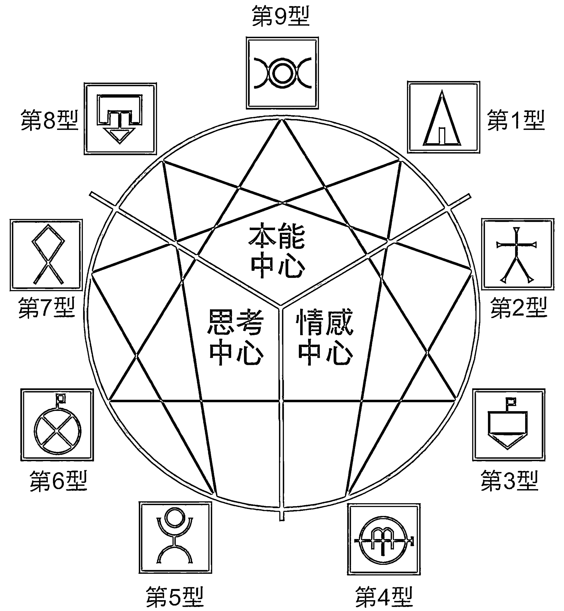

# 九型人格

羅月婷 —— 著

洞悉人心的心靈密碼

## 九型人格最受歡迎人氣王法則

企業與身心靈領域一致推崇的應用學說

越過表面的偽裝，情緒不再難解！
藉由條理分明的九型人格學說，
能讓人們的心靈特質如同打開的書一般，
毫無保留地展現在你的面前。

獲得好感、得到支持，就是這麼簡單！
說錯話有時比做錯事更嚴重。
溝通不暢，在為人處事上必成阻礙，
誤會將迎刃而解，破除不必要的人際矛盾。

# 九型人格

洞悉人心的九型人格

主讲人：——

# 前言

人生是個大舞臺，每個人都是表演者。人們在與人相處中，自覺或不自覺地表現符合主流價值觀的優點，掩飾那個充滿缺點、不願被人察知的自己，避免將自己的弱點暴露於眾。

「人心難測」，了解他人的真實想法是困難的，取得共識也非易事。

然而，身為社會性動物，人們隨時隨地都在和他人交往。學習需要互動、工作需要協作，家庭中需要共處，交友、戀愛也需要相互交流。說錯話有時比做錯事更嚴重！溝通不暢，對為人處事必定造成阻礙，且時常引發誤解，招致不必要的人際矛盾。

# 九型人格

洞悉人心的心靈密碼

那如何辨識人性，直指人心？

洞察他人的內心世界，說來有如巫術般神秘，但經由九型人格學說（Enneagram）的研究，分析他人的言行舉止，越過表面的表現和偽裝，他人的情緒和思維就不難理解。

用並不繁複的九種類型來解讀，條分縷析、對號入座，可以讓人們的語言行為都得到有效的解釋。一個人的真實願望是什麼？內心的恐懼在哪裡？九型人格學說能從外在深入到內心，給予合理分析和客觀評價。

條理分明的學說，能讓人們的心靈特質如同打開的書一般，毫無保留地展現在你面前，使你能更容易看清楚哪些是演出、哪些是真相，也能明白他人的立場，讓你對他人的性格、心態、思想洞若觀火，能避免誤會，摒棄偏見，從而在和人溝通時能相應地做出反應，能更輕易地獲得他人的好感和支持。

九型人格學說能幫助你掌握他人的弱點和優勢，用恰當的方式應對不同的人，做一個通情達理、善於溝通，因而廣受歡迎的人。在人際交往上游刃有餘，這是成功的輔助，也是幸福的基石。

# 第一章 性格指南

## 第一節 性格形成的核心機制

- 心理防禦機制
- 原始情感特徵
- 智慧的三元模式

## 第二節 舉一反三：類型和亞類型

- 向側翼延展
- 進化和陷落

## 第三節 溝通解碼機制

- 轉換資訊傳遞方式
- 擺脫模式的陷阱

## 附錄：測測他／她是哪一型

# 第二章 行動中心三元組

## 第一節 第1型：完美主義【改革者】

- 第1型的本能密碼解讀：在秩序中運行
- 資訊傳遞及扭曲：堅硬如頑石
- 接納和應對：理性認同

## 第二節 第8型：保護主義【領導者】

- 本能密碼解讀：進攻也是防守
- 資訊傳遞及扭曲：不容忽視的存在
- 接納和應對：直奔主題

# 第三章 情感中心三元組

## 第一節 第2型：給予主義【助人者】

- 本能密碼解讀：付出隱藏需要
- 資訊傳遞及扭曲：無所不在的關懷
- 接納和應對：溫情的影響力

## 第二節 第3型：實幹主義【促動者】

- 本能密碼解讀：價值證明一切

## 第三節 第9型：和平主義【調停者】

- 第9型的本能密碼解讀：化解所有衝突
- 資訊傳遞及扭曲：不求進取的穩定劑
- 接納和應對：摒除強迫感

# 第四章 思想中心三元組

## 第三節 第4型：浪漫主義【藝術家】

- 本能密碼解讀：創意決定魅力
- 資訊傳遞及扭曲：本真的追求和迷失
- 接納和應對：精神力量大於物質財富
- 資訊傳遞及扭曲：不擇手段的求取
- 接納和應對：結果導向

## 第一節 第5型：思想主義【思考者】

- 本能密碼解讀：理性的超然物外
- 資訊傳遞及扭曲：保持防衛的距離感
- 接納和應對：留出獨立的空間

## 第二節 第6型：懷疑主義【忠誠者】

- 本能密碼解讀：以忠誠換取信任
- 資訊傳遞及扭曲：謹慎的拖延和轉移
- 接納和應對：坦率帶來安全感

## 第三節 第7型：享樂主義【活躍者】

- 本能密碼解讀：生存的意義在於快樂
- 資訊傳遞及扭曲：為所欲為捉摸不定
- 接納和應對：承擔且分擔

# 九型人格

洞悉人心的心灵密码

# 第一章

# 性格指南

# L型人格

洞悉人心的心靈密碼

# 性格

格（personality）是看不見摸不著，卻又深深影響每個人人生軌跡的東西。人們通常認為，性格就代表自己的本性（essence），實際上，性格揉和了先天和後天的眾多因素，是對「本我（ego）」的掩蓋。

人們源於天性的潛質，對世界有最直覺的反應。但在和他人的接觸中，因為躲避傷害和追求關愛，而形成處理和他人關係的固定方式，以及看待他人和世界的觀點。這麼一來，天性被改造，也可說是被扭曲的，表現出來的是打上社會烙印的性格。它是人們保護自己的一種防禦機制，當它成為一種穩定的，同時也是習慣化的程式後，會使人們更容易將自己和他人歸類。

但歸類並不是目的，只是一個認知過程。我們了解性格分類，更重要的是，找到不同類型的人的性格優勢和局限，讓自己在和他人溝通時，最大程度地減低彼此的麻煩和苦惱。

## 第一節 性格形成的核心機制

研究性格，是心理學中最重要的一個環節。心理學家們創建各種體系去解讀人類的內心密碼，九型人格學說只是其中之一。和其他的研究成果相比，它的好處在於特別容易應用。九型人格體系的建立是從嬰兒開始對人類行為的觀察。九型人格學說認為，人們接受來自基因的先天遺傳，然後在成長過程中，在各種因素複雜的相互作用下，才產生不同的性格類型。

相似性格類型的人，由於相似的本能及情感需求、思想路線，在行為模式和思維方式上都有相似點。同時，因各自不同的背景會產生不同的表現，以及刻意的偽裝。弄清性格形成的核心因素，可以幫助我們透過現象看本質，在交往過程中，更清楚地了解彼此言行的內在動機。

### 心理防禦機制

人類的性格並不像植物生長一般，種子落到泥土裡就能自行發芽生長，但人的性格需要透過和他人的接觸才能形成。而人與人的接觸中，人們會下意識地維護自身利益，最直覺的反應就是隱藏自己身上不美好的一面。這在心理學上稱為「防禦機制」（psychological defense mechanism），它是人類一種無意識的心理緩衝。它保護人們不因內心的矛盾而不安，同時也使人們認識不到自己的本性。

九型人格中，九種性格類型對應的防禦作用分別是：

- 第1型——反向作用。
- 第2型——壓抑作用。
- 第3型——認同作用。
- 第4型——內投作用。
- 第5型——分隔作用。
- 第6型——投射作用。
- 第7型——合理化作用。
- 第8型——否定作用。
- 第9型——麻醉作用。

心理防禦機制下的無意識反抗作用，使人們的注意力從自己感覺不舒服的事情上移開，並使人們在和他人接觸時，產生習慣性的機械反應。

第1型的人遇到自己無法解決的麻煩，直接反應是把問題反轉到他人身上，開始挑剔他人的問題；第5型的人會先把自己從人們的視線中挪開；第8型的人則會先否定他人的觀點，再否認自己的弱點。

人們在注意力轉移之後，只會把精力放到自己特別注重的事情上。也就是說，人們的注意力會對自己關心的人和事特別敏感，並經由這種關注方向出發，人們和他人才能取得緊密的聯繫。

例如，第2型會特別留意觀察他人的表情，使他們更容易經由察顏觀色了解他人的好惡，從而投其所好，取得他人的歡心。

防禦導致的注意力轉移成為人們性格中的固有特質，久而久之，性格漸漸成形，同時也使人們的本性被機械的反應所遮蔽。

第1型的人，總覺得沒辦法把事情做到完美；第2型的人，總覺得幫助他人的重要性大於自己的需求；第3型的人，總覺得事情做出來就應該得到他人的讚賞。

習慣影響到人們對現實社會的看法。人們在思維還沒運轉時，言行已做出反應。人們面前的世界雖然是真實的，但卻在自身習慣造成的偏見下變得不那麼真實。

但人的本性的力量不會消失。當本性開始發生效力，人們會因為自己所缺失的東西而痛苦，並設法尋回。例如，因為遭受背叛而痛苦的第6型，會格外追求忠誠。

從人們的反應和追求中，能發掘出最原始的恐懼和慾望，那是和人的本質取得聯繫的關鍵，也是性格特性的起源。

### 原始情感特徵

人類的原始恐懼和原始慾望，是人們自孩童時期開始因為自我保護的本能而產生的。它們可以和人類原本的弱點有密切聯繫。不同性格的歸類，和這些弱點導致的原始情感有很大一致性。

人類的弱點，最原始有三種：憤怒、畏懼、感知。

反應在性格中，它們分別對應的是9、3、6型，也形成一個三角形。三角形即核心的性格，每個角延伸出兩個側角，於是有了9種性格，即9型人格。3型的左右有2、4兩型；6型的左右有5型和7型；9型的兩側有1型和8型。9種人格的名稱及特點如下：

- 第1型——完美型，尋找完美避免錯誤。
- 第2型——助人型，慷慨地幫助他人。
- 第3型——成就型，為取得成績而努力不懈。
- 第4型——藝術型，渴望美好，輕視平庸。
- 第5型——思考型，探索人生的本質。
- 第6型——忠誠型，為危險而擔憂，致力於尋找隱藏的問題。
- 第7型——活躍型，追求豐富多彩的人生。
- 第8型——領導型，關注正義，希望掌控一切。
- 第9型——和平型，想知道全貌，保持中立。

後人由天主教的七宗罪出發，引用了七種感情特徵，加上第6型的畏懼，再將第3型的感知替換為欺騙，恰好用以對應九種性格類型的主要特徵：

- 第1型——憤怒。
- 第2型——驕傲。
- 第3型——欺騙。
- 第4型——嫉妒。
- 第5型——貪婪。
- 第6型——畏懼。
- 第7型——饕餮。
- 第8型——慾望。
- 第9型——怠惰。

人們用性格的慣性保護自己，這些弱點正是性格的動因。

明白性格和人類弱點及自我保護的關係，許多奇怪的行為表現就能得到合乎邏輯的解釋。

例如，第9型的人慣於用怠惰來延緩自己的反應，讓他們不必表明自己的立場，也不致引起他人的攻擊。

雖然9種弱點和原罪相關，看起來是負面的。不過，當人們聽從本性的召喚，它們也能產生積極意義，促使人們改善自我。九型人格學認為，和這9種感情特徵相對應，在人們尋回自己的缺失時，能產生更高的激情：

- 第1型——憤怒——平靜。
- 第2型——驕傲——謙卑。
- 第3型——欺騙——真實。
- 第4型——嫉妒——平和。
- 第5型——貪婪——超然。
- 第6型——畏懼——勇氣。
- 第7型——饕餮——節制。
- 第8型——慾望——純真。
- 第9型——怠惰——行動。

因害怕而焦慮的第6型對現實的看法總是灰暗的。他會被自己的悲觀情緒所操縱，悲觀的陰影成為他們性格的主導。他們把這種情緒投射到周圍世界，從外部的風險中為自己的焦慮尋求解釋。被性格偏見左右的第6型眼中，世界變得狹隘，他們為自己想像中的危險尋找證據，導致他們無法注意到其他事情。只有當第6型懂得追求勇氣，才能回歸到正常軌道，得到心靈上的自由。

又如貪圖享樂的第7型總想擁有更多的快樂和自由，為自己找到更多有趣的事，不會被困在枯燥乏味及前途未明的事務上。他們為了得到更多的選擇和愉悅經驗，常常產生許多不切實際的夢想甚至幻想。第7型只有懂得節制自己的內心慾望，把自己的精力約束在一件事上，有始有終地完成，不安燥動的心才能得到安寧。

更高層次的激情能讓人們的本性彰顯，並幫助人們更好地識別自己和他人的性格形成。

九種情感雖然有對應的性格，但並不意味一種情感只存在於一種性格中。這些來自「原罪」的情感特徵，在各個性格類型都或多或少地含有一些。例如，每個人的心中都有慾望，渴望得到財富、感情或名譽；也都有畏懼，害怕受打擊、被否定等等。

只是，某一情感特徵在相應的性格類型中能成為策動性格發展的因數，並且表現得很突出。

### 智慧的三元模式

情感是原始的激發力量，情感的不同導致人們想法的差別。由憤怒、感知和畏懼等三種核心的原始情感出發，核心三角加上每個角的兩側，就形成三個中心。這就是九型人格的「三元」分類。

古時候，西方有一種觀點：人擁有三個腦，即腹、腦、心。九型人格學創建之初，引用這種概念做分類。當情感上升到精神層面，三種原始情感所構成的三組，分別形成智慧的三種形式——身體智慧（腹中心）、情感智慧（心中心）、精神智慧（腦中心）。

雖說每個人都擁有這三種智慧，只是在某些人身上，某種智慧會表現得格外明顯。

三元法包括三種智慧中心，由三種智慧中心的核心，又得到一個組別中的三種性格類型。（要知道的是，在同一組的三角關係中，核心類型和其外化和內化類型的關係是固定的。例如，以感知為特徵的2、3、4組中，第3型只會在第2型上外化、在第4型上內化；而第2型卻不會在第3型上外化。）

#### 腹中心

以憤怒為核心的1、9、8組，共有的特性是易怒，只是他們易怒的原因有所差別。

這三種類型的人，他們最容易透過身體的直覺產生反應。他們需要解決的關鍵問題是「我和環境的關係」，即「我處於什麼樣的位置」。

他們看待和其他人的關係，首先是基於自己如何在人群中掌握權力和影響力。這一組的人遇事先訴諸行為，在行動中取得經驗。他們對人際關係的處理也是先一起做事，再考慮如何相處，沒有太多時間進行感情投入，也不耐煩揣摸他人的心理，他們只在意他人表現出來的立場。因此，和他們交往，會讓人覺得公事公辦的成分較多，而缺少情感關懷。

第1型的人，行為處事先考慮如何做到完美。他們對於不正確、不正當的東西特別敏感。

第8型的人，是身體知覺膨脹的典型。他們對環境的認知首先是自己在空間中如何擴大，因而對他人具有較強的攻擊性。

第9型的人，是經由自己去感知他人。他們會把自己融進他人的觀點中，有時看起來有點類似第2型。但他們需要的是自己的鏡像，並不會改變自己。這和第2型從他人那裡獲取情感滿足有很大的不同。

這類人也被稱為「行動中心」、「行為主導」，或「理性意識派」。

#### 心中心

以感知為核心的2、3、4組，共有的特性是想像力強，用感覺認識世界：

這三種類型的人更容易透過感情的直覺產生反應，他們要解決的是自己和他人的感情交流問題。

由於這一組的人把自我價值放到和他人的關係中去衡量，他們特別在意他人的感情和情緒表達，也特別容易關心他人的需求。他們的情緒更豐富也更細膩，容易與人發生親密的聯繫。這一組的人願意花費大量時間和精力在處理人際關係上。他們對於事情和過往日子的回憶，也都是和人的情感反應相連的。

第2型的人關心他人對自己的肯定。為了成為他人所需要和看重的人，他們可以改變自己去適應他人。

第3型的人關心他人對自己成績的肯定，為了達到目標，他們可以不斷改變自己，讓自己具備「成功者」所需要的質素。

第4型的人關心他人的情緒和自己的互動。為了取得共鳴，他們可以去感受他人的痛苦，並介入他人的情感生活。

這一組的人也稱為「情感中心」、「情感主導」，或「感情至上派」。

#### 腦中心

以畏懼為核心的7、6、5組，共有的特性是多疑，對外界有畏懼的心理：

這三種類型的人傾向於用精神去感知世界，他們要解決的是「世界是怎麼回事」的問題。

這一組的人為了保持冷靜觀察環境的清醒頭腦，寧可把感情收藏起來，在考慮清楚之前，會延緩行動。他們更喜歡用抽象的、深奧的知識和廣泛的訊息來填充自己，要實現的是自己作為獨立的人的價值，因而不太關心，或者說避免去關心他人的情感。和他們在一起，人們很難走進他們內心裡掩藏情感的堡壘。

第5型的人一心做世界的旁觀者，用思考去感知環境，把個人的情緒剝離掉，有時會讓與之相處的人感到乏味。

第6型的人特別注意發掘表像之下的真實意圖。他們把思考力用在挖掘他人隱藏的觀點上，他們一邊接近他人，一邊又在逃避，在忠誠和懷疑中徘徊。

第7型的人可以同時進行不同的事情。他們能從看起來毫不相關的事情中找到內在聯繫。他們的跳躍性思維會讓周圍的人興奮，也能讓他人不知如何掌握他們的情緒。

這一組的人也被称为「思想中心」、「思考主導」，或「心智思考派」。

## 第二節 舉一反三：類型和亞類型

九型人格學說認為，人的性格並非一成不變的，一種性格類型的形成需要時間，有其發生、發展的過程。並且，不同性格之間的交叉、融合，會造成既有性格的傾斜和偏移。

我們可以認為，在一個分組中的三角關係，昭示三種性格的彼此影響。一種性格可能同時向同組中其他兩個性格的延伸，就出現九型人格學說的側翼理論。

另外，還有一種三角關係，則是來自其他組別的牽引，使一種性格在處於行動的狀態下，向另一組某個性格偏移。而處於安全狀態時，則向另一個性格偏移。

## 第二節／舉一反三：類型和亞類型

這就是九型人格學說的進化和陷落理論。
人的性格類型雖然被分為九大類，但性格的改變，又造成許多個亞類型，因而，人們的性格特點表現出各式各樣的複雜狀態。
我們以九大類型為研究基礎，只是為了釐清性格類型的典型特點。當每種類型的主要特性清楚了，由其發展出來的亞類型就有跡可循。因此，在面對紛繁複雜的性格時，可以得到清楚的線索，既不至於將人性進行簡單粗暴的劃分，也不致被千姿百態的人性弄得暈頭轉向。

### 向側翼延展

側翼首先是來自於同組的「三元法」。從這個方向理解，側翼的延展和性格的形成相關。同一組的性格，具有相同的情感特徵，這就意味著同樣情感本體的人，可能發展出其核心特質的性格，也可能因為成長過程中的許多因素影響，發展成外化或內化性格。

例如，以憤怒為特徵的本體，可能生長在溫和的家庭中發生內化，變成和平的第9型。也可能因為要求嚴厲的父母發生外化，在成年後成了挑剔的第1型。

在性格已形成的情況下，同組中性格能表現出其側翼的某些特質，儘管他們外表上有不同表現。

例如，活躍的第7型外表浪蕩不羈、熱愛自由，和同組中第5型、第6型的嚴肅外表不同。但如果第7型的心理防線遭到破壞，他們也會像第6型一樣多疑偏執到神經質。

不過，側翼並不只限於同組的性格中。九型人格學說將九種性格以「圓」的形態來表示。圓周上相鄰的性格，不管是處在相同組別，還是在不同組別之間，都可以兼具左右兩翼的特點，並在一定條件下向兩翼傾斜。

例如，第9型在生氣時可能向第8型側翼傾斜，雖然仍是被動的，不會主動攻擊他人，卻表現出生硬的抵抗。或向第1型傾斜，把怒氣掩蓋起來，用挑剔他人的錯誤來做生氣的偽裝。

第4型既可以向同為情感組的第3型傾斜，變得積極進取，而將悲觀的情緒收藏起來。也可以向思想組的第5型傾斜，少言寡語，不愛與人交往，比一般第4型更加孤芳自賞。

人們和自己的側翼聯繫較緊密。實際上，大部分人都會帶有自己側翼的特點，而較少有人是純粹某一類型。也就是說，帶有混合特徵的亞類型的人，其實比單純九種類型的人要多。

如果第1型向第9型傾斜較多，我們可以認為他是1W9型的人，即非典型性的亞類型。同理，也會有9W1、9W8、8W9、1W8等亞類型。

### 進化和陷落

當人們在不同階段或暫時處於不同環境中，固定的人格類型又會出現臨時性變化。這種性格偏移，在大多數情況下是短暫的。但有時也可能因為長期改變而延長，轉變為較穩定的亞類型。

在9種性格類型中，產生聯繫的有以下幾種：
3 — 6 — 9 為一線；4 — 1 — 7 — 5 為一線；4 — 2 — 8 — 5 為一線。順行的是進化人格，逆行的是陷落人格。

舉例來說，第3型的人在心理狀態良好、積極進取時，會克服自身性格中易於急躁的缺點，而體現出第6型的優點，思慮周詳、謹慎而有耐心，不再為了追求成功而不顧一切。但當第3型遇到壓力時，又會向第9型發展，一改行為敏捷的特點，變得優柔寡斷、遲疑不決，在需要行動時裹足不前。

當我們明白進化人格和陷落人格對人們的影響，在人際交往中，可以有目的地引導交往的對象進入安全狀態，而規避掉壓力。

在自我修練時，除了學會揚長避短，還可以有針對性地對自己的壓力點進行訓練。例如，膽小的人在夜深人靜時到僻靜的地方獨自行走。透過對「痛點」的刺激，達到克服自己心理障礙的目標。

事實上，九型人格學說認為，最好的狀態是在各個觸點中取得平衡，同時吸收自己的側翼和進化、陷落人格的優點，讓自己具備更多正面特質。

為了便於學習和研究者了解各種性格的相互關係，九型人格學說創制一個直觀的圖形——九芒星圖。在這個圖形上，九種性格分布在圓圈上。圓周上的兩側即是側翼，中間以三角或四角形的連線標示出進化、陷落人格的行進路線，連線向順時針方向走即是進化人格，向逆時針方向走即是陷落人格。圖示如下：

## 第三節 溝通解碼機制

人們通常認為，溝通（Communication）是解決人際矛盾的最好方法。然而，事實是讓人遺憾的。在人際交往中的大部分溝通過程，都是資訊扭曲的部分。而九型人格學說的意義就在於，可以說明我們解決溝通中資訊失真的問題，使溝通更為順暢。

### 轉換資訊傳遞方式

當溝通中的一方試圖傳遞自己的資訊，因為性格的慣性使然，他們會對自己的真實意圖加以修飾，使不美好的、不符合傳遞者自身習慣的資訊被掩蓋，也使發出的資訊產生扭曲。而接受的一方或幾方，在得到對方發出的資訊，不管是語言、眼神、手勢、身體姿態還是文字，又會以自己的思維慣性去理解。因為解讀者的個性差異，導致不同的人對於同樣資訊會產生不同的解讀。加上資訊傳遞的過程中，還會受到其他外來因素的干擾。例如，通話時，環境中的雜訊讓聲音發生變化，致使聽者聽到的語言出現錯誤等等。資訊被扭曲的問題就更嚴重。

我們研究九型人格，是因為這一學說很好地揭示各種性格的內在動機和目的，揭發許多外在行為的細節所暗示的真實資訊。

從對九種性格的歸納分析可知，不同性格的人看待外部環境和他人觀感是有差異的。一般人在不知道他人的思維方式時，總是不由自主地從自己的觀點出發，去揣測他人看法。而九型人格學說則主張，盡力去理解他人的思維，用溝通對象的觀點去解讀他們眼中的人和事。

由此，我們除了可以更好地進入他人內心世界，更重要的是，學會理解他人的世界觀、人生觀；反過來，更能幫助我們看懂他人的言行舉止、情緒表達和思想模式。

當我們需要傳遞資訊時，也可以依據對方的性格慣性，將資訊編製成對方能明白和接受的形式，以減少對方解碼時的扭曲誤讀。

這樣一來，溝通中的誤會就能最大程度地受到抑制。即使出現誤會，我們也能回過頭來，從雙方的性格慣性出發，分析出因為不同性格的弱點，以及下意識的偽裝和觀念局限，在資訊傳遞和解碼中起到的作用。例如，一個第1型的人會下意識地抗拒他人對他／她所犯錯誤的指責，於是，我們就能理解第1型的人，為何會為了一次微不足道的批評和他人辯論到底。當出現這種情形，我們可以改變提出問題的方法，使第1型能看到問題所在，但又不至於激起他的反抗。

當我們能像理解自己的弱點一樣理解他人的局限性，我們的人際關係將能經由相互理解而變得和諧。

### 擺脫模式的陷阱

九型性格學說的好處顯而易見，將每種性格的特點總結並提煉出來，使雜亂的特徵變得清楚。就像學會武林秘笈能看出他人的武功路數，從而預測他人下一步會使出什麼招數一樣。對九型人格的剖析，使我們知道，如何獲取他人外在言行中的資訊、能看懂他人的思路，預計到他人的行為走向，使我們如同擁有預言家的能力。

但預測的準確也有一個壞處：如果過於依賴性格特徵的提煉和剖析，很有可能造成我們過度放大自己和他人的性格特徵。於是，我們在與人溝通時，又會陷入另一種誤解中：即太受到性格習性的限制，以致忽略性格的複雜性。這又將在另一個路徑上產生對他人的偏見，使我們忽視掉人的自身主觀努力對自己的改造。同時，也可能使我們按照自己的「型號」對號入座，下意識地依照這個型號特點來塑造自己。

儘管有側翼理論和進化陷落理論的校正，讓我們注意到性格的發展變化。不過，我們更需要注意的是：性格的變化不是電腦程式，不是一成不變的。我們必須在掌握性格模式變化後，擺脫其帶給我們的束縛。要更多加關注眼前這個人，他／她的個性、背景、發展、變化，以及在場景中的具體表現。

更重要的是，不同性格的人之間會產生互動，互動的作用機制非常複雜且靈活，比物質之間產生的化學反應要難解得多。

即使我們知道領導者第8型適合做「帶頭大哥」，第2型願意幫他人做事，而忠誠者第6型，一直致力於尋找自己的領導。但現實中，並非將一個第8型和幾個第6型和第2型放在一個團體中，他們就可以自然地親密無間，成為最有戰鬥力的組合。

總之，性格分析和研究，不是讓我們按圖索驥，把自己變成一套中人，而是讓我們在了解的基礎上理解他人，改變自己對待他人的態度，更換自己的解決問題、消除誤會的辦法，在更高層次上提升自己，再促成和他人關係的進展。

## 附錄：測測他／她是哪一型

以下測試題列出9種類型性格的典型行為特徵，可作為測試性格的參考。

觀察你身邊的人，如果想知道他／她是哪一類型，可將以下測試題中的言行特點與之對照。和哪一型的特徵契合最多，則這一型就是他／她的主要類型；其次的，則是他／她的性格變化方向。將前二至三位的類型相結合，便可以分析出其亞類型。

### 第1型 改革者（第1至20條）

- 1. 該做的事絕不偷工減料，能堅持到最後確實達成。
- 2. 總是努力改正自己的缺點。
- 3. 看到文字的東西，會細心地注意到錯別字，並且仔細訂正、不含糊。
- 4. 不喜歡說謊、朦騙他人。
- 5. 做事不含糊，會認真、努力去達成。
- 6. 不認同做惡使壞的人。
- 7. 做事方法及生活型態，完全拘泥於自己的方式，不輕易更改。
- 8. 坦率、正直，與人交往時，希望雙方能以誠相待。
- 9. 總是考慮到他人立場，以他人能理解的處理方式行事。
- 10. 看到眼前一大堆必須著手處理的事時，就會有急迫催促之感。
- 11. 凡事力求完美，不願意被他人指責。
- 12. 不常對人發怒，所以即使生氣也不動聲色。
- 13. 對自己所做所為經常反省：「這樣對嗎？」、「那樣好嗎？」
- 14. 常看不慣他人的缺失，總是在心中批判、指責。
- 15. 覺得世界需要改善，總有該做什麼行動的念頭。
- 16. 對凡事總抱持著非好即壞、非對即錯的判斷。
- 17. 有時會覺得自己一無是處，經常自我責備。
- 18. 委託他人辦事，結果仍非得檢查一遍不可的心態。
- 19. 自己已很盡力，但仍覺得旁人不甚滿意，因而焦慮不已。
- 20. 不會放鬆自己，很少出現愉悅、閒適的狀態。

### 第2型 助人者（第21至40條）

- 21. 很容易和人親近，上至八十歲的老人、下至八歲的孩子都能言談甚歡、相處融洽。
- 22. 發現他人有困難會主動伸出援手。
- 23. 看到旁人開心，也跟著快樂起來。
- 24. 認為愛和被愛是人生中最重要的事。
- 25. 對身邊親友的感受非常敏感，對他人的心事常常能判斷的很準確。
- 26. 對他人請託，很少說「不」，可以將自己的事情暫時擱下，幫他人做事。
- 27. 有時對他人委託之事比自己的事還熱心。
- 28. 喜歡送人禮物更甚於接受禮物，常真心誠意送身旁親友禮物。
- 29. 總是衷心祝福家人及身旁親友幸福快樂。
- 30. 被人信賴、委託雖很樂意，但有時仍有不勝負荷的感覺。
- 31. 能專注傾聽他人的煩惱傾吐，親友們有事都願意和他／她商量。
- 32. 真心誠意付出後，會因感受不到對方的謝意而惱怒。
- 33. 最期望人與人之間溫暖的心靈契合。
- 34. 討厭的人有困難時，仍願意同情、幫助對方。
- 35. 和他人相處時，絕不固執己見。
- 36. 照顧病人、老人，也不引以為苦。
- 37. 有時會後悔為了他人而犧牲自己。
- 38. 願意從事助人的義工活動。
- 39. 看到親密好友和他人相處融洽，會心生嫉妒。
- 40. 願意幫助人，但覺自己沒必要接受他人幫助。

### 第3型 促動者（第41至60條）

- 41. 喜歡和朋友們在一起，並希望博得大家的認同、喜歡。
- 42. 位居團體領導者地位，相信自己能拉攏群眾、整合團體。
- 43. 清楚知道自己的方向，並能朝目標努力邁進。
- 44. 行事有效率，作風乾脆俐落。
- 45. 希望自己在戀愛、婚姻、事業上樣樣如意，並堅信自己一定能成功。
- 46. 想從事能力、業績可被認可，並能獲得他人評價的工作。
- 47. 做的事若沒有具體的結果，就不覺得有意義。
- 48. 具備完成事情的實行力和行動力。
- 49. 回顧過往，總會回憶起順利的事及他人讚賞的部分。
- 50. 自覺地總想在他人面前呈現最好的一面。
- 51. 深信自己有能力，並且是有用的人。
- 52. 會向人自誇得意的事。
- 53. 會嫉妒在容貌、學歷、工作能力、家世上，比自己強的人。
- 54. 對新事物的挑戰性甚於舊事物的持續力。
- 55. 認為人脈的拓展，對自己的人生成功有莫大幫助。
- 56. 抱持強烈不服輸的個性，易將周遭的人視為競爭對手。
- 57. 很會確立短期目標，但對三年、五年的長期目標則不易建立。
- 58. 憧憬未來能過名門豪宅的富裕生活，認為有錢有勢會很幸福。
- 59. 不排斥將自己放在眾人面前，並相信自己深具吸引力。
- 60. 獨具慧眼，能在周遭的人群中，一眼即能看出才幹之人。

### 第4型 藝術家（第61至80條）

- 61. 比一般人都要敏感、仔細。
- 62. 喜歡緬懷過去，常在回憶中陷入憂愁的情緒。
- 63. 思考模式似乎異於他人。
- 64. 自我意識過強，因而有時在人前相當痛苦。
- 65. 能感同身受地體會到他人的痛苦。
- 66. 總是覺得自己的感受得不到周遭親友的理解。
- 67. 很容易因為他人無心的言語而受傷害、沮喪。
- 68. 對事情的結構分析、說明，感到很棘手。
- 69. 常在幻想中自導自演、當主角。
- 70. 不認為自己是個平凡人。
- 71. 感情過於豐富，會迷失自己。
- 72. 偶而會深陷感嘆人生的悲苦及死亡。
- 73. 若不接觸詩、小說、音樂、歌劇、電影等藝術類的東西，就覺得生活過得毫無意義。
- 74. 常覺得被他人高估實力。
- 75. 會嫉妒他人擁有自己所沒有的一切。
- 76. 想表現出自己的內涵，呈現出自己獨特的風格。
- 77. 每當言行反應出內在所思時，周遭親友總當他／她在演戲般。
- 78. 總覺得自己的人生尚未真正開始，現在的自己只是暫時假扮。
- 79. 追求優雅、高尚的嗜好，不喜歡一般大眾通俗的流行時尚。
- 80. 總覺得與人相當有隔閡，不善於溝通。

### 第5型 思考者（第81至100條）

- 81. 不擅長和人閒話家常。
- 82. 喜歡獨處的時間居多，盡量避免和人相聚。
- 83. 喜怒哀樂不太流露出來。
- 84. 即使旁人問道：「感覺如何？」，仍自顧沉思，缺少回應。
- 85. 在人群中，是比較安靜、寡言的那一類。
- 86. 不輕易參與他人所做的事，對他人常保持距離，觀察居多。
- 87. 不浪費時間、金錢，總是盡可能節省。
- 88. 困擾產生時，全由自己思索、解決，從不找人商量。
- 89. 判斷事物先從整體觀察，並仔細思索是否遺漏。
- 90. 說話音量小，曾被人要求「大聲一點」。
- 91. 只回答自己了解的問題，沒人詢問則默不作聲。
- 92. 專注投入時，連吃飯、睡覺的時間都忘了。
- 93. 幾乎從不主動親近他人。
- 94. 即使被要求發言，也只顧著整理思緒，有時什麼也不說。
- 95. 有蒐集、囤積物品的癖好。
- 96. 胡思亂想時就無法判斷是非對錯。
- 97. 對於身旁的人感動不已之事，經常無動於衷。
- 98. 一觸及感性話題，即沉默甚至逃開。
- 99. 對社交辭令及一般閒話家常的人際來往深以為苦，能避免則避免。
- 100. 凡有關自己興趣之事，會盡可能去蒐集相關資訊。

### 第6型 忠誠者（第101至120條）

- 101. 被夥伴排擠或被團體冷漠對待時，深覺孤獨無助。
- 102. 不會背叛上司及前輩同事。
- 103. 自己所做的事在結果尚未明朗前始終焦急不安。
- 104. 即使在做很拿手的事，仍會謙虛地表示：「我可以嗎？」
- 105. 若不事前充分準備，則無法著手開始。
- 106. 過於杞人憂天，總是擔心太多。
- 107. 遵守規定行動，方覺安心。
- 108. 總是朝著既定目標邁進。
- 109. 會注意到在人前說話需謹言慎行。
- 110. 對身旁親友的要求，若無法理解則煩惱不已。
- 111. 對於在意之事，必須確認之後方能安心。
- 112. 對於新觀念、新事物都很慎重、小心。
- 113. 追求自由的作風，但當要放手一搏時卻又裹足不前。
- 114. 不喜歡接近給人壓迫感或對自己構成威脅的人。
- 115. 事情決定前有許多迷惑，但一旦開始則能堅持到最後。
- 116. 擅長整理身邊雜物、衣服用品的收拾。
- 117. 很難不顧身旁親友的反對而去做自己想做的事。
- 118. 忠於自己所屬的團體、夥伴，並以身為其中一員為榮。
- 119. 會主動向親人親近、示好。
- 120. 擅長人事及會計方面的工作。

### 第7型 活躍者（第121至140條）

- 121. 經常只想到開心的事，只想做快樂的事。
- 122. 認為所遇之人皆為好人，對他人幾乎不抱敵意。
- 123. 覺得對事物應抱持正面發展的想法才正確。
- 124. 好奇心旺盛，對新事物、興趣，總想試試看。
- 125. 對悲傷、難過的事，總能很快忘卻。
- 126. 親友們常說：「有他／她在，氣氛都活絡、愉快起來。」
- 127. 外表看起來比實際年齡年輕許多，每聽到他人如此讚美，就開心極了。
- 128. 參加聚會或其他活動，喜歡和大家同樂。
- 129. 機靈俐落，但同時又著手處理好幾件事。
- 130. 靈感十足，創意一個接一個湧出。
- 131. 對於努力不懈深以為苦；無法持久一件事物，經常半途而廢。
- 132. 儘量避掉討厭的事。
- 133. 事前準備好可任意選擇的答案越多越好。
- 134. 很容易為他事分神，注意力不易集中。
- 135. 計畫一訂，立刻著手辦理，也經常推翻原訂計畫。
- 136. 想要的東西希望能立刻到手，經常衝動購物。
- 137. 擅長與人交往，並且不執著於某一種類型的對象。
- 138. 身旁親友皆認為他／她是個幸福的人。
- 139. 交友範圍廣闊，朋友、知己很多。
- 140. 不願面對事情的黑暗面，即使和朋友交往，也不談及沮喪和深入的話題。

### 第8型 領導者（第141至160條）

- 141. 他人是他人、自己是自己的意識很強烈，對於他人的看法並不在意。
- 142. 自己的事情自己決定，討厭他人代為作主。
- 143. 對於享有特權及自認偉大的人，抱持極反抗的態度。

## 第三節 溝通解碼機制

144. 即使大家都贊同，仍會清楚表明自己的「反對」。
145. 能立即看破他人的巧言令色。
146. 得知自己對他人有影響力時，感覺很好。
147. 如果覺得尊嚴被冒犯會很生氣，並奮力還擊。
148. 一生氣就易言行粗暴。
149. 與人鬧彆扭、不愉快時就想斷絕一切關係。
150. 不在意能否博得他人認同。
151. 內心真有觸動，在對方面前仍佯裝毫無感受。
152. 不願讓人看出弱點，深怕他人會趁人之危。
153. 希望事情都能黑白分明，討厭灰色、模糊不清。
154. 會抗拒比自己強勢的人，卻會維護比自己弱勢的人。
155. 尚未考慮、評估清楚，就率先衝動行事。
156. 對體力深具信心，自覺強健。
157. 不願旁人伸出援手，也不願博取他人同情。
158. 有時給人不好相處、孤僻的印象。

# 九型人格
洞悉人心的心靈密碼

159. 他人無法輕易說出口表達的事，自己都能清楚說出。
160. 事情一旦開始，就希望迅速處理，絕不拖泥帶水。

### 第9型 調停者（第161至180條）

161. 平日悠閒、穩重，偶而仍會因他人之言而情緒低落。
162. 經常無所事事度日。
163. 任何時間、地點皆很想睡，從不失眠。
164. 缺乏外在刺激或動力時，幾乎提不起勁做事。
165. 當需要做選擇時，自己總是無所謂。
166. 不認為自己是有價值的。
167. 即使只是兩、三天前的事也經常忘記。
168. 聽到不同意見時，也常能理解各方的意見。
169. 很少慌張、焦躁。
170. 不喜歡鬧糾紛，有配合他人的傾向。
171. 食量似乎大於他人，但精力卻比不上人。

## 第三節 溝通解碼機制

172. 本能地會去避免糾紛和爭執。
173. 雖只是舉手之勞，但仍希望他人別來打擾自己。
174. 雖然安靜地聽他人說話，但仍常回想不起細節。
175. 有不願面對問題、容易逃避問題的傾向。
176. 能坐不站、能躺不坐的類型。
177. 行事作風有拖拖拉拉的傾向。
178. 對於他人有求必應，但事後卻覺麻煩、困擾不已。
179. 在家中小睡片刻，看電視時是心情最安穩的時刻。
180. 在團體中就算有黨派之分，仍能和大家融洽相處。

# 九型人格
洞悉人心的心靈密碼

## 第二章
## 行動中心三元組

# 九型人格
洞悉人心的心靈密碼

## 行動中心 (Instinct Centre) 的三組是第 1、8、9 型。他們的行為根源在於人的生存需求的驅動。生存是人的本能，因此，這一組又稱「本能主導」(Instinct Centre)。行動中心的人最關注的是「事」及如何「做事」。他們行動力強、腳踏實地、注意實效，感情上也不喜歡虛情假意。他們依賴於行動，相信有效力的行為才能改變世界。

## 第一節／第1型：完美主義【改革者】

## 第一節
第1型：完美主義【改革者】

第1型：改革者（Perfectionist），又稱純粹主義者（Reformer）、楷模（Model）、法官（Judge）。

側翼：第2型（能理解他人，享受生活）；第9型（隨和而有序，自律性減弱）。

進化人格：第7型（更快樂，不再苛求，能接納富有新意的創見）。

陷落人格：第4型（焦慮變成憂鬱，被嫉妒的心態困擾，正直的道德觀下降）。

## C型人格
洞悉人心的心靈密碼

完美型的外部表徵：
表情嚴肅，變化少，笑容少。
目光堅定，和人相對常常直視對方。
肌肉常常處於緊繃狀態。
衣著整潔、款式中規中矩，從不隨意跟隨潮流。
生活和工作環境保持乾淨整齊，東西一定要放在固定的地方。

完美型的語言特徵：
直接準確，較少委婉地表達。
音調較高，缺乏幽默感，不肯輕易下結論。
常用語：不，不是，必須，應當，不應該，正確，錯誤，按規定執行。

## 第二章 待解的九型人格

## 第一節／第1型：完美主義（改革者）

### 第1型的本能密碼解讀：在秩序中運行

完美主義的第1型是公認難相處的類型。嚴肅、整潔是他們的標誌，挑剔、嚴格、苛刻讓他們對他們望而生畏。他們對自己的需求也很嚴格，不會為了玩樂而放縱自己。

### 本能核心：必須把事情做對

對錯誤的敏感支配第1型的各種行為。這一型的人，通常從小生活在強調規則、要求嚴格的環境中。他們自幼樹立「一切都要有標準」，且必須「高標準、嚴要求」的概念。「必須把事情做對」，已成為深入他們骨髓的本能。

源於此，他們恐懼所有的「錯誤」和「不正確」，因此，批評成了他們為了追求正確而常常使用的手段。

完美型在成長過程中總是被各種不易達到的要求圍繞。因為總是不能做到完美無缺，他們很少得到鼓勵和表揚。他們由此認定：要得到什麼東西一定要付出巨大的努力。他們不在乎努力，內心非常希望自己就是那個完全正確的榜樣，但又常常因為無法取得理想中的結果而惱怒。不論對他人還是對自己，失望的情緒時常困擾他們，只是他們不太願意、也不太擅於用語言表達出來，於是，常用遷怒的方式來發洩不滿，讓周圍的人不知所措。

需要實效來肯定的完美型不喜歡空談，只相信行動。他們是忙碌的，總感到自己有做不完的事，活得比他人努力，也比他人更累。

在「標準」的指引下，這一型的人在道德上也對自己有嚴格要求，他們追求真理，也敢用實際行動維護各項準則。在正面發展的情況下，他們是人群中最正直的一類，可以是道德的典範、可能是嚴正的法官。在負面發展的情況下，也可能成為冷酷的劊子手，甚至成為表裡不一的道學家。

為了追求公認的完善標準，他們常常不知道自己的真實需求是什麼。

## 第二章 待辦事項三元組
第一節／第1型：完美主義（改革者）

### 人際交往解讀：對違反規則零容忍

完美型的人在人際關係方面比大多數人都糟。因為他們事事追求盡善盡美，而世上又沒有完美的事，所以，他們對任何事都無法滿意，表現在與人相處上，則是很少對人說出稱讚的話，這樣的人往往不是讓人舒服的談話對象或合作者。他們批評他人也批評自己。為了做得更好，只要發現一點點差錯，他們就會立即指正，不管對方是誰、不管處於什麼場合，也不管他人面子上是否過得去。他們對於錯誤的體察太強勁，以至於他們總是注意不到他人的優點，因而常常否定他人。這樣的行為方式，必定使周圍的人覺得和他們相處壓力太大，且心情不太愉快。對待問題，第1型的人相當缺乏耐心。他們樂於指出錯誤。但當他人花時間去更正，他們又顯得很不耐煩。

為了把事情做對，他們會從權威那裡獲取標準，因此，常常會迷信權威。一旦認定他們挑選出來的標準，他們就會十分固執地遵守，也要求他人遵守。

完美主義者的世界是秩序井然、黑白分明的，這使他們在人際交往上表現得極嚴謹、缺少變通，又十分挑剔，一般人常常難忍受他們不分時間地點的指責和堅守規則的固執。即使只是不停地否定，也會在與人相處中讓人覺得難以親近，甚至引發反感。站在正義立場的第1型，其剛正不阿、鐵面無私、讓人尊敬，但也只會讓人敬而遠之。例如，著名的明代清官海瑞，為了維護規則和道德，他不畏權勢，甚至可以把矛頭直接對準皇帝；但說到與人相處，他的上級和下屬都對他感到十分頭痛。

由於完美主義者通常認為自己的標準是最正確的，所以，他們樂於為他人提供指導。當他們還不是權威時，會讓人覺得他們過於自以為是；當他們成為權威之後，則會讓人覺得他們太過苛刻。

### 行為和偽裝解讀：開啟良修飾錯誤

由於無法原諒和容忍錯誤，完美型的人首先要避免出錯，而他們採取的方式就是讓一切過程更加符合標準。他們認為，只有通向目標的各個步驟都井井有條、一絲不苟，最終的目標才不會走樣。因此，完美型的人會特別執著於細節，對所有部份都用秩序去規範。當細節出現問題時，他們會煩躁不安，哪怕某個小環節在安排的順序或達成的時間上稍有差池，他們也會焦慮，認為規則遭到冒犯，嚴重時情緒還會失控。

最大的問題在於：盡善盡美是一種境界，卻不是世人能達到的目標。即使是一切按照規則，也不是現實中可以完全做到的。完美主義者自己對此也未嘗不知，所以，他們不斷修正出錯、或只是有可能出錯的步驟，以求從根本上把錯誤消除掉。

當他們對某個決策或行動感到不滿時，他們會把問題歸因於實施步驟出現了偏差，這讓他們坐立不安，認為必須予以修正。這使完美型的人化身為激進的改革派。他們會將已訂好的方案完全推翻重做，並重新規劃其中各個細微環節，設法讓各個細節更好地指向目標。但即使如此，他們也不能完全確定修改後的方案是不是真的正確，因此，當再有問題發生時，他們又會再度開始新一輪的修改。結果是一個計畫總也不能堅持實施到底。

當你發現那個喜愛挑剔的朋友、同事或上司，不停調整已確定的計畫時，不要奇怪，也不要煩心於他們的朝令夕改。要知道，這是完美主義者解決自己良心不安的方法。

「改革」的實質是一層外衣，是完美型的人對於自己已察覺到的問題的偽裝。他們用這種方式來修改已或可能出現的錯誤，也是在修飾自己的不完美，讓自己顯得更正確。

### 資訊傳遞及扭曲：堅硬如頑石

第1型渴望因完美而被讚賞的慾望常常得不到滿足，加上擔心流露恐懼會使人了解自己的缺點，所以，他們慣於用嚴肅認真的外表將自己的真實情感掩飾起來，而扭曲自己發出的資訊，引發他人乃至他們自己的誤讀。

內在資訊：我是完美的
扭曲表達：頑固地堅持

第1型從小就被高標準的要求包圍。這些要求可能來自家長、老師，或其他對其生活有決定權的人。由於接觸頻繁，加上權威性強，這些人的要求逐漸內化為第1型的自律性，提醒他們自己一定要做得更好、再好一些，直到達到完美。對自我的督促不斷強化，漸漸讓他們在內心深處的隱密角落吶喊：「我就是完美的楷模」。

但完美的人必須保持謙遜的美德，因此，第1型絕不可能公然宣稱這一點，他們只會在言行上表現出對他人的不放心。第1型不管多忙碌，都會堅持親自動手做事，大小事情都不願輕易委託他人去做。即使有些事確實不能完全獨立完成，也要保證自己隨時在場，如同監工。

在他人做事時，他們也堅持要讓他人按自己的意願行事，因為他們認定，自己所選擇和遵循的標準，是通往完美的正確途徑。

只不過，當第1型認為自己還不夠權威時，通常不會說「按我說的去做」，而是轉化為「按規則去做」、「標準應該是這樣的」之類的表達。他們尤其喜歡將公開、確定的規則確立為行事的信條，用維護這些信條的行為把自己變成堅持原則的模範，從而讓自己堅定不移地站到正確的立場上。他們用衛道士的方式，巧妙扭轉真實的內心資訊，變相地滿足自己內心對「我最完美」的慾望。

這樣的第1型，可以公然且頑固地堅持自己的立場，同時也很難接受不同意見。想讓他們有所變通，或接收新的規則，相當於否定他們慾望的基石，也即是否定他們一切行為的本源。

既然完美是沒有缺陷的，那麼，正確的標準就只可以有一個。持這種觀點的第1型，不可能容忍多種「正確」的存在，所以，他們會本能地排斥多種選擇。

和第1型觀點不同的人要和他們交往通常會感到談話難以進行，因為第1型絕不妥協於不同於自己已認定的標準的其他觀點。在交友上，他們也只和自己相同價值觀的人交往，很難參與不同類型的朋友圈子。

內在資訊：我應該得到認可
扭曲表達：尖銳的攻擊性

第1型的人在成長過程中很少得到稱讚，反而導致他們在內心裡極度渴求讚美。事實上，他們嚴格地自律，放棄享樂，在時間表上填滿刻苦學習、勤奮工作，也無非是為了用「做得更好」來換取他人的讚賞和愛。

當他們付出努力後希望能得到回報。只不過，第1型不會公開地說「你給我什麼報酬」，或「我已做得很好，你要給我獎賞」。即使只是要求誇獎而非金錢利益，他們也擔心滿足自己的個人慾望就會顯得自私自利，招致他人批評，所以他們會用委婉的方式來表達。

如果沒有得到相應回饋，第1型就變成「意見份子」。較勇敢的第1型，會大聲指出現行措施的錯誤，提出改革要求，且大肆冷嘲熱諷；較謹慎的第1型，則私下裡牢騷滿腹，質疑「這麼做有N多問題」，或是變成「馬後砲」，在錯誤發生後開始抱怨「早就知道這種做法是有問題的」。

希望因完美而得到關注的慾望，轉換為「改正錯誤」向完美邁進」的思路，表現出來，即是被認可的渴望扭曲成對他人的挑刺。當道德底線崩潰，則演變成嫉妒他人，造成第1型用惡意張揚他人的短處來襯托自己的優勢，甚至在攻擊他人方面不遺餘力。

在另一種狀況下，以嚴正面目出現的第1型，更賣力維護某種信條。只要這種信條是某個權威制定的。因為維護信條就等於維護權威，身為規則的衛道士，就相當於得到權威的承認，或在心理上有和權威同一立場的認同感。不管信條是保皇派還是革命派，維護信條和權威，就等於有資格對其他人說：「我才是對的，你們都錯了！」由此而占有話語權上的制高點。因而，第1型不管是身為保守派還是激進派，都會是相當堅定且表現激烈的那一類。

內在資訊：我沒有做好
扭曲表達：執著於枝微末節

第1型時常處於憂慮中，擔心自己疏忽了什麼，從而無法把事情做到完美。為了確保每一步都正確無誤，他們對於細節的執著遠勝於其他類型的人。有時會因為過於執著於枝節問題，反而忽略了重要的東西。

嚴謹自律的第1型的心裡坐著一個監督自己的「超我」，隨時評判他們是不是做得「足夠好」。一旦他們發現自己有錯，或自以為發現出錯的情況，就會煩躁起來。此時，在情緒低落的狀態下，被自責折磨的第1型乾脆把目標轉向他人，認為自己遇到的問題是由於他人的錯誤導致，於是開始挑剔他人細節上的毛病。

有時，好和不好是經由和他人的比較得出的。對「不好」非常敏感的第1型，對於比較是很在意的，他們常常把他人和自己的各項細微的不同放在一起評比。自尊心很強的第1型懂得在細節上找平衡，「甲比我高一點，但我比他勻稱。」「乙的字寫得好，但他畫畫不如我。」儘管如此，他們仍然對旁人強於自己的部分感到痛苦，因為他人好，就意味著他們做得不好，這是第1型最擔心和憂慮的。

焦慮中的第1型是脆弱的，這使他們特別害怕他人的批評。有時會將他人無意中說的話當成對自己的指責，或是多心地將無關緊要的談話想像成指桑罵槐，甚至無故猜測有人在背後說自己壞話。這往往導致他們有「疑人偷斧」的傾向。過多地觀察他人一言一行，分析得細緻入微，從中捕捉一些若有若無的訊息來應證自己的想法，由此反而使其人際關係緊張。

### 接納和應對：理性認同

對大多數人來說，和第1型的人溝通實在不是一件容易的事。第1型自己也因為常常和人發生爭執而不愉快。其實，崇尚完美的第1型，並不喜歡與人衝突。從本心來說，他們不願意成為不討人喜歡的人。不過，凡事都有解決的辦法。如果了解第1型的性格特點，接納他們的優點，針對他們的弱點對症下藥，還是可以避開人際衝突中的「地雷區」。第1型的人若能認識到自己在人際交往上的問題，學會接納不同的人和不同意見，也可以扭轉不太妙的人際關係。

### 如果你是第1型

第1型要學會接受「世界上沒有完美的人和完美的事」這一事實。尤其要懂得接納一個不完美的自己，減少自己的焦慮感，天地會變得更寬闊。

#### ◎ 減少攻擊

接納他人的「不正確」。在你想要指出他人的缺點和問題時，先忍一忍將要衝口而出的指責。沒人喜歡他人挑刺，哪怕你是出於好心。也不要怕說出自己內心擔心的是什麼。告訴他人你考慮問題的方式，可以讓人更好地了解你的思維方式，以免無意中讓他人覺得你的批評觸犯了他們的自尊。

避開那些以「你」為開頭的否定性語言，例如：
- 「你不應該……」
- 「你不要……」
- 「你怎麼能這樣」
- 「你為什麼做不好」

改成以「我」開頭的，描述自己想法的敘述性語言。告訴他人：
- 「我害怕的是……」
- 「我的願望是……」
- 表明「我對於你的批評感到很難受」
- 或是說明「我思考這個問題的邏輯是……」

#### ◎ 學會稱讚

當他人做了和你有關的事，或說了和你有關的話，盡力去找到其中讓你覺得不錯的部分。

學會對他人說：
「你做得很好」
「這樣很不錯」
即使還有些問題，也要暫時把不好的地方擱在一邊，試著說：「某個方面非常棒」。

如果你喜歡什麼人，直接一點，告訴他／她：
「你的某個方面很不錯」
「我最欣賞你某一點」
千萬不要用挑刺的方式來表達你對他／她的關注。

#### ◎ 釋放壓力

如果自己感覺到不快，不要悶在心裡，要學會和熟悉的人訴說：
「我覺得我的某個方面出現問題」
「某件事讓我非常擔心」

不要用關注他人的方式轉移怒氣。用攻擊掩飾弱點並不會讓人忽視你的弱點，真心交流才能贏得更坦誠的對待。

如果覺得他人有所不滿，直截了當地詢問：
「你遇到什麼問題」
「有什麼可以幫到你」
「你是否認為我哪個地方做得不好」
不要靠自己的「觀察」去猜測他人的真實想法。

### 和第1型的人交往

和第1型的人打交道，要接納他們的敏感和憂慮，對於他們的批評性言論不要過度反應，越辯解，越能引發他們對細節的挑剔。理解並認同他們對事情的認真態度，再設法舒緩他們的焦躁情緒，啟發他們看到事物好的部分，可以讓第1型表現得更正面。

#### ◎不要批判

第1型對批評的反應很強烈，如果對他們的做法有疑問，不要帶有批判、指責意味的字眼，如：
「你怎麼可以……」
「你這樣有問題……」
「你的錯誤是……」
這些都會引發第1型的強烈反彈。試著改為詢問的語氣，如：
「能否告訴我你這麼做的原因」
「你對某個問題有什麼看法」
明顯帶有鼓勵性的言辭對第1型特別奏效，如：
「你做得很好，但我認為這樣可以更好」
「這個地方雖然有點問題，但其他方面都非常不錯」
如果同時向他們表示，「這件事我也在某個方面沒有做好」，或客觀地評述「進行過程中存在的某些困難造成阻礙」，則更能讓第1型放下戒備的武裝，從而找到「同路人」而樂於接受意見。

#### ◎注重邏輯

第1型接受規則卻不太接受案例，因為案例是個別、具有特殊性。

「他人都這樣」之類的話是第1型不能接受的，利益也誘惑不了他們。與其對他們說：「某某人因為這種做法獲益」，不如告訴他們這樣做的原因和條件是哪些。

和第1型對話，不要迂迴曲折、拐彎抹角地達到目的，這樣會讓第1型認為你有什麼陰謀而心生反感。需要多用「因為……所以，」、「只有……才」、「如果……那麼」之類邏輯清楚的句型。或是以「一、二、三、四」等有條理的方式來表達。

行動中心的第1型，最注重的是怎麼把「事」做好，感情因素不容易打動他。

## 第二章 待解之合三元組

## 第一節／第1型：完美主義（改革者）

們。如果提出有條有理、邏輯合理且明確的理性推理，固執的第1型也可以接受一些新觀點。

#### ◎ 有幽默感

儘管第1型自己是嚴肅認真的典範，但他們很願意他人用幽默的方式和他們交談，這樣可以讓他們緊張的神經得到放鬆。用開玩笑的方式提示問題，比較不容易激起第1型的反彈。

只要不是太違反原則，在輕鬆的狀態下，第1型可以發揮出他們進化人格第7型的特點，將嚴格的規則放到一邊，感性的成份增加、變得活躍，敢於嘗試新東西，並且能更好地與人合作。

## 第二節 第8型：保護主義【領導者】

第8型：領導者（Leader），又稱保護者（Reformer）、導航犬（The Top Dog）。

側翼：第7型（有包容心，關注人心，更貪圖享樂）；第9型（安詳沉著，有隨波逐流的傾向）

進化人格：第2型（不執著於權力，更重視團隊）

陷落人格：第5型（猶豫不決，不再堅定）

領導者的外部表徵：
器宇軒昂、雙眼有神，直視人時有壓迫感。
臉部表情豐富，說話時愛配合肢體語言。
衣著看似隨意其實講究，崇尚品牌，有時會刻意打扮得很另類。
不拘小節，工作和生活的環境都有些雜亂無章。

領導者的語言特徵：
聲音宏亮，激動時常提高聲調。
說話直來直去，不喜歡繞圈。
愛下結論，主動發表意見，卻不怎麼聽他人的意見，與人爭辯不占上風不干休。
不介意開一些粗俗的玩笑。

常用語：我想，我跟你說，我認為，看我的，就這樣。

### 本能密碼解讀：進攻也是防守

作為富於領導者氣質的第8型，往往是人群中最有氣場的一類人。不過，這並不意味他們都是膀大腰圓的類型。固然有一些健壯的第8型熱愛身體衝突，用拳頭爭取地位，也有一些身體並不強壯的第8型，會運用他們的智慧獲取權力。不管外在條件如何，第8型的共同特點都是：站在人群中，你永遠無法忽略他們的存在。

### 本能核心：控制和權力

第1型最敏感的是錯誤，而第8型最敏感的則是公正。

第8型在成長過程中曾長時間處於競爭的環境裡。要嘛是爭鬥激烈，強者為所欲為，弱者受到欺壓；要嘛被鼓勵去參與競爭性很強的活動，獲勝者才能得到讚揚，失敗者遭人蔑視。第8型對此印象深刻，為了獲得安全感、保護好自己，他們必須成為擁有操控權的強者。由於競爭對於第8型來說是一種常態，他們特別需要公平公正的競爭機制，以便讓他們靠自己的努力得到勝利。同時，他們對於被欺負的弱者充滿同情，希望成為弱小者的保護者，幫助他人獲得公平和正義。

為此，他們需要得到權力。至於獲取權力的方式，具有正義感的第8型卻認為過程可以不擇手段，只要結果公正就好。

第8型只相信力量，智力的力量和體力的力量都好。當然，他們更希望自己就是力量的擁有者。如果第8型想做什麼事，他們的第一念頭不是尋找合夥人，而是如何靠自己的能力控制住局面。

第8型也崇尚規則，但和第1型幾乎相反，第8型不會從權威那裡去尋找規則，而是拚命讓自己成為規則的制定者。當他們無法讓自己設想中的規則通行於世，他們就會化身為規則的反對者。所以，第8型的人除了做政府首腦的機率比一般人大，反政府份子也通常出自這個類型。

實際上，擅於尋找他人弱點的第8型時常會發現，搗蛋比循規蹈矩更讓人畏懼，有時反而能獲得更多權力。於是，他們會有意無意地做出毀壞規則的行為，並以能隨心所欲、自由散漫為榮。

甚至在他們已成為領導者，具備制定規則的權力時，他們也可能在費了很大的工夫，把一整套嚴謹的規章制度搞定後自己率先打破，使之變成一紙空文。又或是在制定一個有條理的行動方案搞定後突然消失，去做一件完全無關的事，然後，對方案的進度漠不關心。所謂規則，只是他們獲取權力的工具罷了。

> 人際交往解讀：對抗即保護

第8型比一般人都要精力旺盛，也比一般人好鬥。身體或語言上的對抗都是他們熱衷的，他們喜歡主動去挑起爭鬥，並通常能堅持到最後。見多了弱肉強食的場景，第8型認定，只有在對抗中取得勝利才能安全。這種觀念發展下去，第8型把對抗當成保護自己，進而保護他人的手段。因為深知「戳人痛處」是打擊他人的捷徑，在對抗中，第8型會見縫插針地找出對方弱點，做出有力攻擊，以此獲得控制的快感。

由於攻擊成功相當於得到控制的權力，因而他們可以勇往直前，不再顧忌自己的問題。因此，第8型在關於自身的許多細節問題上是粗枝大葉的，以至於有時被人當成不拘小節的藝術型。

在輕鬆愉悅的狀態下，第8型把爭鬥當成展示自我價值的方式，甚至只為了調劑，也讓他們樂此不疲。在緊張時，感到面臨危機的第8型，更會用鋒利、對外的芒刺把自己包裹起來，避免他人察知自己的弱點，示弱也會讓他們很沒有安全感。

對於特別重視尊嚴的第8型來說，勝利的光環讓他們陶醉。雖然他們認為失敗是恥辱的，但他們往往是能屈能伸的。他們的觀念是：一時的失利並不可怕，只要成為最終的勝利者即可。所以，第8型可以是逆境中迎難而上的堅強者。當對抗中處於下風時，他們可以暫時撤退，事後再找機會補回來。許多和第8型對抗的人常常不是因為實力不足，而是因為無法承受他們反反覆覆的糾纏而疲憊不堪，或者索性半途放棄。

成為第8型的敵人是痛苦的，但如果成為他們接納的朋友或被保護者，他們也會主動擔當起「老大哥」式的責任，不遺餘力地加以庇護。

### 行為和偽裝解讀：無節制放縱

第8型內心最強烈的慾望是得到尊重，為此，他們認為自己有必要在任何時候都是強大的，因為尊重是強者才有資格得到的獎勵。

由於要表現得強有力，他們會有意忽略自己的弱點，想到什麼就付諸行動，不考慮自己的能力是否能達成。因此，第8型是行動中心裡最有行動力的一類。他們的行為放在思考之前，沒有反覆的研究和考量，後果如何，等做完再說。從這種特性出發，第8型的人不會約束自己的慾望。想做什麼就做什麼，讓他們覺得自己是無所不能的。他們可能為了一個突如其來的心血來潮，在夜裡十二點打電話叫醒朋友們，開上一個小時的車去唱KTV。

第8型的人又總是精力過人，所以特別喜歡那些激動人心、需要投入大量精力，甚至有些危險性的活動。

於是，第8型會在某些時候迷失在無節制的活動中。那些在高速公路上瘋狂飆車者、在深夜裡飲酒作樂者，或是拋開一切去深山探險、攀越高峰的人中，都少不了第8型的身影。

第8型運用起隨心所欲的外表來掩飾自己內心希望被尊重的渴求，或是也用來遮蓋自己的弱點。

如果第8型所做的事遇到障礙、無法繼續進行，他們不會反省自己。反省相當於承認自己的弱點，這是第8型所不能容許的。此時，他們通常會把失敗的沮喪轉化成狂歡的興奮，用其他具有挑戰性的目標來取代失落感。一個第8型的領導者，很可能在一次錯誤的投資後扔下自己的下屬和合作者，跑到陌生的國度去徒步旅行。

### 資訊傳遞及扭曲：不容忽視的存在

第8型在任何時候都忘不了保持自己的強勢，這是一種本能衝動，使他們無視自己的弱點。有時，他們過度的自我表現，會使朋友和敵人都有被壓迫感。

內在資訊：希望深入了解
扭曲表達：製造衝突

「不打不相識」，又好打抱不平的梁山好漢多數是第8型。第8型雖然容易激動、顯得情緒化，但他們其實不太懂得表達自己的需求，尤其是感情方面的需求。對於敵人，他們固然要用爭鬥的方式來比較雙方的力量，但他們要想獲取友誼，也往往會透過爭鬥來達成。

當一個第8型的人故意和你產生爭執或對抗時，不用太生氣。他／她也許不是對你有所不滿，只是想開始與你交流。他們需要用這種方法知道你贊成什麼、反對什麼；你的能量有多大，以及你面對他們的反應是什麼。

和打算接近的人發生一些衝突，會讓第8型覺得更容易了解對方。他們認為，在直接的衝突中，能更鮮明地發現對方的優缺點。有些時候。他們製造衝突是為了得到更多的接觸機會。在衝突中表現鎮定、能在壓力下發揮長處的人，才是第8型認為有交往價值的。

即使第8型不得不處於被領導的地位，也要尋找時機對領導者進行挑戰。用這種方式驗證對方是不是有足夠的力量，值得他們跟從。

這種接觸方式，使第8型表現得格外強硬。其實，是他們從小的經歷，使他們認識到示弱是非常危險的，會導致被人欺壓。所以，第8型不太習慣表現溫情，一旦心中開始升起柔情，他們就會為之裹上一層強硬的外殼，以免顯得脆弱。

在人際交往中，當第8型生氣時，在敵人和陌生人面前，他們更願意保持一張平淡的面容，反而更容易向親密的人無所顧忌地發洩怒氣。第8型的這種特性，會讓自尊心強的第1型、第3型和第5型，特別不能適應。

內在資訊：我不是弱者
扭曲表達：小題大作

在問題面前，第1型會自責但不願被他人指責；第8型則根本不會有自責的想法，他們太渴望自己做一個強者，以至於根本不能接受自己有弱點的事實。就連那些負面情緒，他們也刻意從自己頭腦裡排除掉。第8型認為，自己一定能掌控自己的方向、保持強大向上的態勢，而沮喪、灰心、失落之類的詞，則永遠不會和自己沾上邊。

當遇到問題時，他們的矛頭永遠是對外的。「一定是某個討厭的傢伙把事情搞壞了。」「不然，就是某些錯誤沒有被發現，只有我能把它們找出來，並加以糾正。」

任何時候都要保持強勢的第8型堅信自己能順利渡過逆境，壓力有時反而讓他們產生被挑戰的亢奮，只是那些小問題讓他們的控制權受到打擾。第8型希望所有進程按照自己的意願發展，格外討厭那些不受控制、高頻率發生的小事件。

第8型不會懲罰自己，只好懲罰他人。他們把自己的焦慮轉化成怒氣發作出來。

有時他們會格外專橫，因為一些小毛病而大發雷霆、吹毛求疵，在小問題上霸道地奪取控制權，例如：「為什麼你們掃地要從左邊掃到右邊，而不是按我說的，從中間往兩邊掃？」

至於如何糾正真正的錯誤，他們反倒不怎麼關心。

也有些時候，他們顯露出陷落人格第5型的特性，研究所有問題卻做不出決定，變得優柔寡斷又固步自封，拒絕和他人溝通。

內在資訊：公平正義由我來主持
扭曲表達：易走極端

對第8型來說，公平就意味著正義。他們通常自認是正義的維護者、是弱勢群體的保護神。保護弱者、為他們爭取公正的待遇，讓第8型為自己的力量感到滿足。他們為了幫他人出頭，可以不在乎為自己樹立強大的敵人。和強大的惡勢力對壘，更能彰顯他們的力量。

這樣做無疑是需要勇氣的。為了堅定自己的信念，第8型有必要堅信自己的正確性。況且，與人抗爭，也必須亮出明確的立場。為了不去動搖自己的立場，第8型不願過多地研究自己的內心想法，只需用行動來表現立場就夠了。他們會自動地把反對自己的觀點當成是愚蠢的，甚至是邪惡的。

這使第8型也具有「非黑即白」的極端化傾向。對第1型來說，灰色意味錯誤。而對第8型來說，灰色地帶根本就不應該存在。不是朋友就是敵人，不是強者就是弱者，不是保護者就是被保護者。灰色等於妥協，即等於示弱，那是可恥的。

因此，第8型不僅對反對者進行打擊，還會不假思索地拒絕和自己最初的想法不相符合的資訊。有時，這會讓第8型對情勢失去準確的判斷，過於頑固地和一切執不同觀點的人對抗。並且，他人越是試圖說服他們，越是激起他們的「鬥志」。

### 接納和應對：直奔主題

對於第8型來說，受人歡迎和被人尊敬是一回事，而不是被人喜愛劃上等號。他們沒有耐心和他人慢慢聊天，逐漸取得認同，只想一下子展示自己過人的能力，得到他人的仰視。和第8型交往，需要對他們過度充沛的精力有所準備。而第8型則需要接受「人人都有弱點，我也不例外」的事實，懂得安撫自己和他人。

### 如果你是第8型

身為第8型，你需要適當控制自己的情緒和精力，對某些事不必太投入。在緊張時放鬆一下，對自己和他人都有好處。

#### ◎ 放低音量

大聲說話未必讓你顯得更強勢，有時只會讓人覺得粗魯無禮。如果你覺得他人沒有認真聽你說話，不要提高聲調、反覆重複，尤其不要用手指著對方說話。你不如問一問：「你們對於我剛才說的有什麼意見嗎？」、「你理解我的觀點是怎樣的？」這樣更能得到他人的注意。

當你有權做決定時，不要一開始就說：
「這件事就這麼定了。」
「那件事我說了算。」
「為什麼不照我說的做？」
當怒氣上來時，先深呼吸三次。

他人也有自尊心需要照顧，勸服他人按照你的方法來做，不一定非得用強迫的言辭。

「我可以提一個建議嗎？」，能讓你不那麼有侵略性。

說一下你的想法，問一問：「對此，你的想法是什麼？」、「你是不是再考慮一下我所說的」。在他人主動接受的情況下，你的決定能得到更好的執行。

#### ◎ 偶爾靠他人

就算你的能力超群，也不必總是說：「讓我來」、「我想這樣」。

也許你能做到最好，讓很多人無話可說。不過，人是社會性的動物，合作或許不是完成事務的必要條件，但卻是人類必須的需求。因此，相關的人才能獲得參與感和成就感。

如果你能試著說：「請你幫我……」、「這件事請你來負責」。不會讓他人覺得你無能；相反的，會讓人更樂意為你的工作提供支援，並關注你在工作中的貢獻。

多了解他人，使他人感到和你是合作關係，而非被雇來「當下屬」的，他人會更樂於加入你的陣營。

如果在事情完成後再加以讚揚，定能讓你和他人的關係更融洽。

#### ◎ 直觀感情

不要用爭論的方式去引起他人的注意，不管對方是你想追求的異性，還是你想交往的朋友。不是每個人都喜歡用這種方式討論問題，或展示自己的觀點。這種做法很可能會把人嚇跑。

如果你想接近誰，試試看直接走過去，問一問：「你對我的看法是什麼？」、「你對哪些事感興趣？」、「我們可以聊聊天嗎？」

當你產生厭煩的感覺時，也不用迴避自己不愉快的情緒。每個人都有心情低落時，正面回應它，告訴他人「我現在正在為某件事心煩」，並不會顯得懦弱。

如果怒氣沖沖地找人發洩，只會讓周圍的人認為你的情緒太不穩定，從而遠離你。

### 和第8型的人交往

和第8型的人接觸有時很輕鬆，因為不用去猜測他們在想什麼，因為他們有什麼想法都寫在臉上。但有時也很累，因為他們太過爭強好勝，讓人疲於應付。

#### ◎ 直來直去

第8型喜歡爭辯，脾氣火爆、容易激動。不過，他們的脾氣來得快，去得也快。並且，他們通常都比較大度，爭過之後，無論勝負都不會記仇。

如果他們富於壓迫性的言行讓你不快，請直接告訴他們：「你這樣說會傷害我的自尊心。」或者，「這樣的爭論讓我感覺疲累。」

如果對他們有所不滿，要正面對他們說：
> 「你的某個做法我不喜歡。」
> 「你在某件事上犯了一個錯誤。」

千萬不要含沙射影地譏笑諷刺，第8型會將此看成對他的羞辱和挑釁。

也不要嘮嘮叨叨地發牢騷，第8型會認為那是無能的表現。

當你對他們有什麼要求時，也應該直接告訴他們：
> 「我希望你……」
> 「在某件事情上，我想得到你的幫助。」

用詞要儘量準確直接，不要遮遮掩掩、繞來繞去，第8型很容易失去傾聽的耐心。

第8型樂於幫他人的忙，但不喜歡他人使用手段來誆騙他們。他們需要掌握全部的資訊，就算被人利用，只要是他們事先就明白，他們也不會生氣。如果被人用陰謀操縱，他們會非常憤怒，並加以報復。

#### ◎ 多加尊重

第8型的人自尊心極強，即使是被人指揮，他們也不願被當成可有可無的普通一員。你需要告訴他們：
> 「你在某個方面的特長是我們特別需要的。」
> 「這個問題只有你能解決。」
> 「你在這裡我就放心了。」

當他們感到被你視為特別重要的「那一個」，才會盡力發揮所長。

對於第8型所做或將要做的事，不要說：「你做不了」，這樣只會激起他們的好勝心，非得出手一試。如果你加以阻止，他們會把不能達成所願的矛盾轉到你的頭上。

假如第8型感覺到被忽視或被壓榨，他們可能會做出你意想不到的激烈反應。

#### ◎ 不要束縛

太過重視自我的第8型不能忍受一點點束縛，忍受束縛對於他們來說是屈辱的。在少年時代，他們就是特別叛逆的一類；成年以後，也同樣保留青春期的叛逆性。

對第8型的人，不要太明顯地限制他們。「你必須這樣做，否則對你不利」、「你要遵守××規定，違者會有嚴重後果」。這些說法對第8型不起任何作用，就算以懲罰威脅，第8型也無動於衷，甚至激發他們更激烈的反抗。

和第8型人打交道，需要採取更緩和的方式。感覺到被強迫或被壓制，或不能按照自己的方式充分發揮自己的長處，第8型都會奮起反擊，抑或一走了之。

## 第三節／第9型：和平主義〔調停者〕

第9型：調停者（Mediator），又稱順應自然者（Peacemaker）、談判者（Negotiator）。

- 側翼：第1型（井然有序，不再懶散）；第8型（更獨立進取，不逃避責任）
- 進化人格：第3型（有效率，堅持自己的立場）
- 陷落人格：第6型（好猜疑，不輕信他人，隨和度下降）

調停者的外部表徵：
眼神柔和，從不咄咄逼人。
表情通常較溫和，常常面帶親切笑容。
行動比較緩慢。
衣著大眾化且較樸實，避免標新立異。

調停者的語言特徵：
語氣低沉，語速較慢，尾音較長。
較少正面反對他人。
喜歡用曲折的言辭，有時很久都說不到重點。

常用語：你認為怎麼樣，喔，對的，沒有關係，不要急，維持現狀，讓我想一想。

### 第9型的本能密碼解讀：化解所有衝突

在行動中心的三型裡，第9型看起來特別缺乏行動。但實際上，他們主要是想進行正確的行動，在確定之前，他們寧可不動作，因而顯得有些懶惰。他們不衝動，不僅自己保持平和淡定，也希望他人都和他們一樣和順。

### 本能核心：爭執等於破壞

和第8型完全相反，第9型大多生長於穩定平和的環境。在師長們鼓勵下，他們安靜地做順從聽話的乖乖仔或乖乖女。他們不太出眾，但仍能在適當時候得到周圍人的稱讚，過得很平順；反之，當他們對他人說NO時，往往得到的是不愉快的回應。

第9型不是沒有見過叛逆的行為，只不過，因反叛而遭到懲罰的事例讓他們害怕。即使懲罰並沒有針對他們，也讓他們心有餘悸。為了保證自身的安全，他

# 九型人格

洞悉人心的心靈密碼

他們寧可不當英雄，也不願做被槍打的出頭鳥。

有的第9型曾被夾在觀點對立的兩派人中間，讓他們處於十分為難的尷尬狀態。因此，對任何能引起爭執的事都非常反感。

從大環境方面來說，第9型也許經歷過一些波折，外來的衝擊使他們的平靜的「好日子」受到損害。也許他們只是聽說過戰爭、暴亂之類的不好事件，對其殘酷後果感同身受。不管是從哪裡得來的經驗，在第9型心中，衝突都是非常可怕的事，會破壞寧靜安定的生活。

在第9型看來，安安穩穩的過日子比什麼名利都重要。因為淡泊名利，他們也不願意參與競爭，與世無爭的狀態更能讓他們滿足。

他們樂於把這種體驗推廣給其他人。當他們看到他人產生衝突時，會認為自己有責任加以勸解，讓大家都歸於和諧。在人群中，當大家各執己見時，第9型會設法揉和大家的觀點，說服大家各退一步，找出一個各方面都能接受的解決辦法。有第9型的存在，似乎能使整個氛圍緩和不少。

### 人際交往解讀：關注他人的需要

第9型在成長過程中得到的經驗是：滿足他人比滿足自己重要、壓制自己的需求是一種美德。為了得到他人的關注，他們學會迎合他人的愛好，而忘掉自己的真實慾望。

雖然外表上反應遲緩，但在內心裡，第9型是非常敏感的，他們尤其善於察言觀色。

和第1型的迷信權威、第8型的反抗權威不同，第9型對於權威的態度是跟從。他們發現，當他們體察到權威者的要求，並予以滿足時，往往能得到較好的回報，於是，他們越來越主動地做這樣的事。

習慣成自然之後，他們和身邊的人接觸時就很難說出反對的話。為了讓整體氣氛更融洽，他們常常會委屈自己去成全他人。

這種特性使第9型成為所有類型中最易於相處，也最有人緣的一類。他們可以放下自己手頭上的工作，安靜地傾聽一個不算太熟的朋友囉囉嗦嗦的傾訴，並真心誠意地給出安慰。

他人就算有針對他們的言論，他們也不太計較，比一般人都要寬容；如果旁人的觀點和他們不同，他們可以做出妥協，配合他人的行動；在討論或談判時，他們也會參考圍繞他人的主張，而非自己的方案思考。總之，作為行動派的第9型，在生命中會盡自己最大的努力去避免一切衝突。

由於善於觀察他人，第9型還懂得用附和、體貼的方式，引誘他人在不知不覺中洩露自己的真實想法。在正面狀態下，第9型的善解人意能讓人有知己感；而走向負面時，第9型也可以變得很危險。他們像其陷落人格第6型一樣，會以探測他人的內心世界為樂，並加以利用，有時還會胡亂臆測他人的惡意，並設法報復。

### 行動和偽裝解讀：延緩決定

當幾個派別開始爭執時，第9型捨得花費時間、精力和不同的派別談判，從中調停，幫大家找到妥協的方法。第9型很樂意去協調他人的意見，為自己能讓事情向和平的方向發展而感受到自己的存在價值。

但如果要讓他們選擇一派來支持則是非常困難的事。第9型的人會說：「大家的觀點各有道理」，卻拒絕說：「我認為某種觀點更接近真相」。他們不願因爲支持一方而和其他派別產生對立；他們也不會提出個人的獨特觀點，以免增加與人爭論的可能性。

矛盾的是，一方面，他們不肯發表自己的主張；另一方面，他們又希望被人重視，因為自己的想法被忽視而不悅。

然而，第9型太習慣於把自我埋藏在內心，以至於連他們自己都不知道自己因為被忽略所產生的憤怒。他們只是一再拖延決策的時間，對所有觀點都持保留態度，讓自己沉浸在對不同觀點的比較中，而忘了自己內心的慾望。

另外，如果第9型被強迫做他們不願意做的事，他們也會用拒絕做決定來進行抵制，用消極的方法等待壓力自動散去。

所以，當遇到第9型的人拖泥帶水地左右搖擺時，不要一味責怪他們的惰性，要分清楚他們是處於何種狀態。因為同樣的外在表現下，可能有完全不同的出發點。

### 資訊傳遞及扭曲：不求進取的穩定劑

外表遲緩的第9型心思是細密的，他們喜歡順其自然，其實是不願意被迫處在壓力之下，希望用閒適的態度來緩解或抵抗壓力。外在表現上的散漫，乃至有些麻木，是他們調整自己生存狀態的方式。

#### 內在資訊：我不應該太自我
#### 扭曲表達：淪落於瑣碎

第9型並非沒有自我，只是一向不被重視，之後形成忘記自我的慣性。

這樣的後果是：一旦他們開始有自我的需要出現，「我不能太重視自己的需要」的潛意識就開始產生作用，使他們不由自主地感到恐慌。他們自己也不明白這種恐慌的原因，只好用分散注意力的辦法，強迫性地進入「忘記自我」的狀態。其在行為上的表現就是：把最重要的事情放在一邊，轉而把精力放到無關緊要的小事上去。彷彿轉移注意力就能改變「把我放在第一位」的自私自利心理。

例如，一個第9型需要完成一篇論文，當他坐在書桌前尋找筆時，卻發現有枝鉛筆還沒有削，於是拿出這枝鉛筆一一找出來。再翻箱倒櫃地找出一把美工刀，仔細地把一枝枝的鉛筆削得好好的，為此花費了好幾個小時。

對於忽略自我有強迫症的第9型，就這樣常常在時間越充裕時，越不知道自己該做什麼。把大把時間花在瑣碎的莫名其妙事情上，陷入「注意力紊亂」的狀態中。直到最後的期限到來，他們才不得不安靜地坐下來做早就應該完成的工作。

#### 內在資訊：渴望穩定
#### 扭曲表達：沉陷於無聊的事務

在面臨選擇時，第9型會產生焦慮，因為選擇就意味要從比較中確定強弱、對錯、是非等對立衝突的立場。以「穩定的生存」為生命的第一要義的第9型認為，這些問題都會讓生活變得極不穩定，必須避免。

要緩解這種焦慮，較好的辦法是設定一個固定的日程表。如果他人能代替他們安排一個排得滿滿的程表，那更讓第9型安心。他們可以按照既定的計畫做事，減少改變帶來的不確定感，從選擇的煩惱中解脫出來。

在生活中，第9型絕對避免參與有競爭性的活動，他們不喜歡太過突顯自己，也同樣不喜歡因失敗而被打擊，從而讓自己的生活或工作狀態變得不再平和。為了不讓「我需要」的課題突顯出來，也為了避開競爭帶來的不穩定狀態，他們會將注意力轉移到某件無聊的愛好上。例如，長時間地看電視、坐在電腦前通宵地玩遊戲。重複的無聊事務，讓他們渴求平穩的心感到安全，因而從中得到滿足。但嚴重的情況下，第9型有可能陷入酗酒、吸毒的泥淖。

當這些沒有任何積極進取意義的愛好養成，隨和的第9型會變為最頑固的「癮君子」，如果要讓他們放棄這些愛好，就相當於讓他們放棄已習慣的安穩悠閒的環境，陷入不可預見的生活中。

#### 內在資訊：不願失去
#### 扭曲表達：蒐集和填充

家裡裝滿各種陳舊的物品而不願丟棄的一定是第9型，哪怕那些物品早已失去使用價值，但對第9型來說，它們承載著一段過去的回憶。所以，守候過去，就可以減低面對現實中競爭、選擇帶來的壓迫感。

不喜歡突出自己的第9型其實很想得到更多東西並加以保留。不管是感情、知識，還是物品。

因此，《天龍八部》中情人很多的段正淳很可能就是第9型。他收納很多的愛、珍藏每一段感情，對每個情人都不能忘懷。成為收藏家的也大多是第9型。他們熱衷於蒐集所有看得上眼的東西，並將之納入自己的空間。如果對什麼領域的學問產生興趣，第9型也會設法把相關的理論都找來，用研究填滿自己的時間。沒有太多衝勁和創意的第9型，做起收集的事來卻能持之以恆。他們似乎是懶散的，但其實他們並不會放任自己有太多空間，會用一些他人看來無意義的事，讓自己覺得隨時都有事可做。從好的方面來看，第9型可以成為淵博的學者，或默默無聞卻收藏品豐富的收藏家。從不好的方面來說，他們可能因為不捨得任何一段戀情而流於濫情，也可能變成一個不分好壞統統買下的購物狂，或是在家裡有大堆的垃圾卻不肯扔掉。

### 接納和應對：據除強迫感

和第9型的人相處很輕鬆、很容易，以致人們常常忽略去關心他們真正想要什麼。然而，太忽略他們的感受，溫吞水般的第9型也會憤怒。好好先生生起氣來，會比情緒化的第8型更難以收拾。而第9型的人要懂得接納自己的需要，不要刻意忽視自己。過度地把精力放在他人身上，釋放自我，並不等於自私。

### 如果你是第9型

第9型最大的問題是浪費精力。人的生命是有限的，你把自己的注意力分散到他人身上，或是去關注太多不重要的事，就是一種浪費自己時間的強迫症。

#### ◎ 學會說「不」

太關注他人，會使你無法集中精神，導致自己在思想和行為上都停滯不前。

他人的要求千奇百怪，你若總是忙著配合他人、認同他人，忘了充實自己。雖然能使你在短時間內受人歡迎。但從長期來說，由於發展速度跟不上，你的地位會變得越來越不重要。

因此，當他人向你提出要求時，你要學會說「不」。不用擔心他人因此離開你。不顧你的感受、不能承受你的拒絕的朋友，心裡只會愛自己而不會愛他人，並不值得交往。

#### ◎ 說出你的感覺

當你生氣時，不要總是用沉默表示反抗。由於你的一貫作風，你的沉默很可能被他人當成贊同，這樣只會導致他人更忽略你的感受。

要是你有什麼不滿，不妨表現出來，試著說：「某件事使我不高興。」

「我對某個觀點不能認同。」

「我希望你知道我在想什麼。」

讓他人更了解你的感受，有助於你和他人的交流。

#### ◎ 找到重點

當你想隱藏自己的真實想法時，不要東拉西扯地說上一大堆，讓人以為你天生抓不住重點。你可以直接一點，告訴他人「我想……」，並不會讓人輕視你。

要是實在不想說，可以說：「我需要再考慮一下。」

如果你要證明自己的想法正確，也不必拉拉雜雜地找出許多佐證。解釋太多會讓人聽得暈頭轉向，反而對你的觀點產生疑惑。你只要表明：「我的看法是……」

不要太擔心你的看法被人攻擊，有必要讓人明白你在想什麼，否則，當他們誤會你時，只會引發更多矛盾。

### 和第9型的人交往

不要以為第9型溫和就是順從的、可欺的。要知道，第9型內心的頑固並不亞於同組的其他兩個類型，只是他們不願意表現出來罷了。要和第9型交流，需要仔細無聲似的溝通，才能深入他們的內心。

#### ◎ 傾聽

第9型慣於迎合，使人們自動地把他們放到「配角」的位置。但實際上，他們常常因為自己不受人重視而煩惱。

鼓勵他們說出真實意圖，告訴他們：「我很關心你在想什麼」、「你說下去，我在聽」。第9型最喜愛的是溫情，正面的關懷能讓第9型解除偽裝，不至於在溝通中發生誤解。

當他們對任何觀點都不表示同意時，不用逼迫他們。可以和他們說：「討論結束後我們再私下交流一下。」不願公開表態的第9型，在非公開的場合、放鬆的狀態下，更容易吐露真正想法。

#### ◎ 詢問

第9型對你表示贊同時，可能只是一種習慣性的行為，而非出於真心。和他們打交道，可以用詢問的方式，了解他們真正想做的事。而且，第9型具有注意力容易分散的特點，詢問可以讓他們的精力集中到大家都需要關心的事情上。

注意第9型總有「現在不是最好的時機」的想法，希望等待能讓矛盾自動消失。因而對他們做事，要問：「現在要完成什麼」，而不要問：「現在要做什麼」

不過，詢問不要太直接和急迫，以免敏感的第9型以為危險的衝突來臨。可以創造一個寬鬆的環境，再語氣柔和地問他們：

> 「能否告訴我你的決定是什麼？」
> 「這樣是否適合你？」
> 「你現在有什麼感覺？」
> 「我想……你認為是否可以這樣？」

當第9型得到被人重視、被人接納的訊號，他們會變得積極起來，顯示出他們的上升人格第3型的特點，減少反覆比較造成的拖延。

#### ◎ 重視

習慣性謙遜的第9型，會說服自己「我並不是那麼重要」。但實際上，他們內心很樂意他人注意到他們及他們的作用。

要讓第9型成為一個好的合作者，需要時常提醒他們：

> 「你做的事很重要」
> 「我們需要你」

更好的方式是再深入一步，向他們說明他們的重要性體現在哪些具體方面。

例如，「你在某方面的建議我們應當採納，現在我們打算從這裡著手」。

當第9型明確地知道自己應該對什麼事負責，在哪些地方承擔責任，他們的行動力會得到很大的提升。

# 第三章 情感中心三元組

情感中心 (Feeling Centre) 包括第 2、3、4 型。和行動中心的三種類型相反，他們的關注重心不是「事」而是人。他們重視的是人與人之間的感情，他們願意付出愛，也特別需要愛。他們聽從自己內心的情緒、情感的驅動。認為人的價值就體現在感情的交流和回饋中。

## 第一節／第2型：給予主義（助人者）

第2型：助人者（Helper），又稱全愛型（Giver）、守護者（Guardian）、王位後的力量。

- 側翼：第1型（更尊重規則和標準）；第3型（目標明確，對事不對人）
- 進化人格：第4型（不再隱藏自己的真實需要）
- 陷落人格：第8型（專橫地要求他人按照自己的方法行事）

### 助人者的外部表徵：

- 眼神熱情而專注，對話時直視對方並給予回應。
- 見人三分笑，表情多數時是輕鬆的，只有激動時才顯得緊張。
- 行動敏捷、有力，喜歡和人發生肢體接觸。
- 衣著得體大方，可能不怎麼突出，但絕不會穿錯。

### 助人者的語言特徵：

- 語速明快，但語氣柔和。
- 善於稱讚，能和任何人一見如故。
- 多數第2型都很健談，且有幽默感，但很少提及自己。
- 常用語：讓我來，我來幫你，沒問題，好，可以，這樣好不好？

### 本能密碼解讀：付出隱藏需要

助人者具有最無私的奉獻精神。他們和第9型一樣善於體察和迎合他人的需要，和第9型不同的是，第9型是被動地滿足他人，第2型則是主動地為他人提供服務，並且更懂得如何讚美人，讓他人都喜歡上他們。

#### 本能核心：自我價值在於被需要

第2型很會做事。他們的行為準確、快速而幹練，有時被誤認為行動派，但實際上，他們所做的一切，都是為了換取他人的好感。他們最在意的是他人對他們有什麼看法，是不折不扣的感情至上主義者。

第2型可能生長於幸福和睦的家庭，從小就是惹人喜愛的孩子。他們因為討人喜歡的言行得到讚賞後受到鼓勵，就被培養出對「讚賞點」的敏感度，越來越懂得用什麼方式能討好他人、表現自己，從而得到更多的表揚和獎勵。

也有一些第2型成長的過程比較艱苦。他們在成長環境中受到忽視，為了爭取他人的重視，不得不用付出行動、犧牲自我的方式體現自己的價值。這使他們學會幫助他人得到他們想要的東西，以此來找到自己的存在感。

不管是哪一種情況造就的第2型，都是害怕孤獨、需要愛和關注的人群。被人忽略、被排除在外的感受，是他們竭盡全力要避免的。當他們做的事不是為了某個特定的人時，他們就會惶惑不安，認為自己的能力不被認可，進而恐懼自己也得不到認可。被人提出要求時，他們才會欣喜，因為這意味著有人需要他們，他們的存在是有意義的。

### 人際交往解讀：用關照他人來關照自己

第2型也是有野心的，只是相較於自己登上王位，第2型的人更願意把自己隱藏起來做王位的守護者。慣於關注他人的第2型，不太願意自己出鋒頭，擔心這樣會使他們顯得太有攻擊性，容易引起反感。手中有實際的操縱權而非親自露臉，會讓他們感到安全、安心。

在與人交往的過程中，第2型的關注重心都放在他人身上，而把自己的要求放在一邊。但實際上，他們所提供的幫助都不是無條件的，只是他們要求的回報是隱匿的，不一定是要「投之以桃，報之以李」式的直接返還，而是更喜歡感情上的回饋。

得到幫助的人對他們產生依賴，會讓第2型有自身能力得以實現的滿足感。即使給予幫助不能得到對方快速的積極回應，第2型也願意保有「你欠了我的人情」的優越感。

如果不能得到理想中的回報，第2型會憤怒，但他們不會直接表達不滿，而是發洩在無關的事務上，希望對方自動感知他們的情緒。

當第2型處於不健康狀態時，會滑向其陷落人格第8型。表面上提供幫助，其實會霸道地讓他人按照自己的意志行事，以此證實自己的存在價值。

### 行為和偽裝解讀：見什麼人說什麼話

第2型比第9型更懂得如何迎合他人。第9型在減少衝突的前提下仍然會保留自我，而第2型則可以改變自己去適應他人。他們是典型的「見人說人話，見鬼說鬼話」的類型，可以在這一刻關注這一個人，在下一刻把注意力轉向另一個人。角色轉換可以非常快速，並且不會因此有絲毫心理負擔。就如《紅樓夢》中的花襲人，在服侍賈母時，心中眼中只有賈母；而服侍賈寶玉時，心中眼中則只有寶玉。

在第2型身上，在任何人面前把自己打扮成「知己」、找到共鳴點，並不是一種刻意的偽裝。只是他們的意識中，要得到他人讚賞，就要隱藏自己身上那些不被接受的成分，暴露那些部分是危險的。

為了確保自己是受人歡迎的，他們自動地忘了自我的原始形態是什麼，沉浸在和他人親密無間的交融中，把自己變成「人見人愛」的樣子，最後，逐漸連自己的情感狀態也忘了。

對於講求付出，把關注的目光放在他人身上的第2型來說，他們在不同的「朋友」面前呈現的不同形態都是真實自我的一部分，不會讓他們有「變色龍」的愧疚。

第2型能和各種類型的人打交道，有時對方越是難接觸，他們越要去接近，能得到這種人的「友誼」，使他們格外有成就感。

在建立情感交合點的過程中，第2型很可能模糊掉自己和他人的界限，搞不清真實的自我，或是過分侵入他人的私人領域。

### 資訊傳遞及扭曲：無所不在的關懷

第2型把自己的價值寄託在他人身上。他們的善解人意，在某種程度上隱藏著控制他人的傾向。他們善於為他人服務，也會打著「我都是為了你」的旗號，要求他人服從。

#### 內在資訊：你們離不開我
#### 扭曲表達：用關心來征服

第8型接觸人的方式是挑起衝突；第2型則是付出關心、提供幫助。在第2型看來，沒有什麼人是不能被溫情征服的。

從表面上看，第2型非常無私忘我。然而，他們的內心其實非常驕傲，他們

## 第三章 九型人格三元组

### 第一節／第2型：給予主義（助人者）

因為給予他人需要的東西而產生自我膨脹。當他們幫助的人取得成就，他們的真實想法是：「有了我的幫助，他們才能做到這樣。」他們會把幫助當成施捨，希望被施捨者有「報答」的自覺。

第2型喜歡研究人，他們像安裝透視探測儀般，能精準地探測到他人的需要。他人一句無意中說到喜歡什麼，他們也能記在心裡。他們能挑選某個合適的時間對他人的需要加以滿足，讓人驚喜之餘，對他們的體貼入微也會十分感激。

只要他們願意，第2型對於關注對象的一切，無論多麼細微，都可以服務到位，使人不知不覺地依賴他們的服務。他們喜歡將全部事務都抓在自己手上，讓人在做事時必須經過他們。

就如在怡紅院裡，離開襲人，大家連銀錢放在哪裡、怎麼計數都不清楚。她費盡心機將賈寶玉從頭到腳的所有事宜打理得十分周到，從而明確自己的存在，以便爭取並保住自己怡紅院第一小老婆兼大管家的地位。

控制慾強烈時，第2型的關愛會使人產生無法承受的感覺。因為他們太過細緻，並且在某些時候會固執地讓人按照他們的想法去做。從穿什麼顏色的衣服，到選擇什麼樣的工作，他們都認為自己有權參與意見，並且自己的意見應得到尊重。這是第2型證明自己重要性的重要方式。

內在資訊：想被依賴
扭曲表達：依賴他人

在第2型心目中，與人聯繫的主要途徑就是需要和被需要，他們希望自己因為被需要而顯得重要。但和第8型不同的是，第2型渴望被依賴的方式並非以保護者的面目出現。

他們的方式更柔和而隱蔽，以至於他人可能無法發覺他們的真實想法是什麼。

一個第2型的伴侶把自己的一切交付給另一半，製造小鳥依人的形象，其實是希望另一半對自己也全無保留。一個第2型的下屬幫上司打理一切，包括沖咖啡、買早點，不是為了尋求保護，而是希望介入一切，讓上司在所有事務上都不能忽視他。

第2型因為自己能討好不同類型的人、維持良好關係而自豪，這使他們得以被依賴；而他們把太多時間和精力花在滿足他人身上，甚至連他們自己有時都認為自己是為他人而存在的、是依附於他人的。

然而，第2型並不像他們外在表現的那樣和順。即使在他們自己都產生「哪個是真正的我」的困惑時，他們被遺忘的真實自我仍然存在。他們「我被需要所重要」的原始慾望從來沒有改變，並且會始終堅固地挺立在他人的影子後面。

### 接納和應對：溫情的影響力

第2型是依靠人情行事的。和第2型打交道，不要試圖用規則去禁錮他們，只有情感的力量才能讓他們動搖。第2型會把與人交往中產生的影響力當成成功的標誌，而對事情的結果並不怎麼關注。

### 如果你是第2型

不要太過在意他人的看法。你不是全能的感情維護者，人際關係不可能全部是良好的。當你靠近他人時，注意不要過於介入對方的一切，保持一點距離也許對大家都有好處。

#### ◎回顧自我

你的探測儀也應用於探測自己的需要。不要總是說：「你想怎麼樣？」、「你覺得如何？」

有必要對他人說：「我想……」、「我覺得……」
也要不迴避說：「我要……」
一味討好他人，必然使人忽略你的需要，這時，抱怨、氣憤都無濟於事。很多人都無法自然地察覺他人的要求。
學著表達自己，而不要暗自希望他人自動滿足你卻不說出來，直率一點更有利於交流和互動。

#### ◎接受他人說不

不是所有人都願意接受幫助，至少不是在任何時候都肯接受幫助。有些人更喜歡靠自己的力量解決問題，這時就要給人留下一點空間。
當他人拒絕你的關愛時，不必當成鄙視，不要用迂迴的辦法讓對方被迫接受。有時，被迫受關懷的感覺並不舒服，有些人不太喜歡過多地被人過問所有事務的進度和結果。

當他人因為你的幫助而得到好處時，也不要四處宣揚你在他的成就中的作用，這可能會讓他尷尬，從而在回報你時有被脅迫的感覺。

#### ◎不要只關注人

學會在某些事情上對事不對人。不要認為所有問題都在人的身上，有些事確實有其客觀原因。

在遇到問題時，也不要只考慮到透過某些人去解決。

不要總是想著：「我幫過你，你要賣我一個面子。」

或是對合作者說：「看在交情的份上，請這樣做。」

在行事時需樹立「按規則辦」的意識，太注重人與人的關係，可能反而使事情無法順利完成。

### 和第2型的人交往

第2型最重視的是「交情」。和他們建立私人關係，會比照章辦事的工作關係更有效。雖然他們不至於不顧規則，但為了私交，完全可以通融。

#### ◎ 表達感謝

當你得到第2型的幫助，請真誠地對他們說：「謝謝你所做的一切。」、「你在某方面的貢獻讓我們收穫很大。」

當他們做得不錯，不妨公然讚美：「太棒了！」、「超乎我的想像！」

即便你認為他們所做的不過是份內的事，也有必要說一句：「相當不錯。」

更進一步的，應該問一問：「你希望我為你做點什麼？」、或是「你想得到什麼獎賞？」

第2型是需要回饋的付出者，如果你沒有表示，他們一定會想辦法讓你察覺到他們的不滿。

如果你認為你不懂得回報的重要，他們會毫不遲疑地棄你而去。

#### ◎ 用情感激勵

當你和第2型合作，不管是公事還是私事，都有必要維繫好雙方的私人關係。第2型會以與人的感情深厚程度來決定把事情做到哪一步。

對他們說：「沒有你我簡直不知該怎麼辦」，就是最好的激勵。

只要第2型決定對你付出，他們不需要他人的督促和檢查，甚至不用像對待第9型那樣，明確地告訴他們有哪些事要做。只要給出一個目標，他們就能自行安排好所有事。

不過，儘量不要讓第2型獨自做事，他們是害怕孤獨的人。

特別要注意，交往的過程應該是面對面的互動，第2型才能在與人的交流中得到滿足。

#### ◎不要負面回應

要慎重地對第2型提出批評。重視「人情」的第2型很可能把批評等同於羞辱，然後把你歸類到敵人那一欄裡去。

如果想讓第2型的人按照你的想法做事，只有用「我們的交情這麼好」、「我需要你的說明」去打動他。威脅是沒有意義的，第2型即使表面忍受，也會設法報復。

更何況，第2型最擅長的是暗中操縱。他們對威脅感到反感時，首先想到的是另外扶持一股勢力來對抗和壓制。甚至，在你進行威脅之前，他們早已把你的弱點置於掌控之下。

### 第二節

### 第3型：實幹主義【促動者】

第3型：促動者（Producer），又稱成就型（Achiever）、實幹家（Performer）、表演者（Motivator）。

側翼：第2型（控制自我，了解他人需求）；第4型（改善和他人的感情）

進化人格：第6型（不再自大，和他人的合作度增加）

陷落人格：第9型（懶散、被動，進取心下降）

### 促動者的外部表徵：

- 眼神熱切，對話時注意對方的反應。
- 表情誇張，配合手勢，以引起他人的注意。
- 行動迅速，動作幅度大。
- 穿衣打扮講究品牌勝於品味，非常注意保持良好、有層次的形象。

### 促動者的語言特徵：

- 語速較快，音量大，咬字清楚。
- 說話有條理，喜歡直接說重點。
- 談話時會刻意避開自己不擅長的話題。
- 自己說得多，卻不怎麼傾聽他人說；對長時間的談判會感到不耐煩。

#### 常用語：我能，我可以，絕對，最。

### 本能密碼解讀：價值證明一切

和第2型相較，第3型是另一種意義上的表演者。第2型把自己變為討人喜歡的人，而第3型則隨時不忘把自己打扮成成功人士。他們的人生目標就是取得成就、贏取眾人的稱讚和羨慕。

#### 本能核心：一定要成功

第3型即使不是最有競爭意識的，也是最勵志的類型。這一型的人從小就知道用成績去換親人、師長的重視。他們的成長歷程告訴他們：自我的價值取決於有什麼樣的成就。而成就必須是有公開的標準可以衡量的，例如，金錢、名譽、影響力等。只有拿到高分才可以得到寵愛，否則就是被唾棄的低能者。

當然，他們的成就都是靠自己的努力獲取，而非出自於他人的施捨，或是經由討好他人取得的。

第3型不能忍受蔑視，他們一心要做人群中閃耀發光的成功者。為此，他們的確捨得付出。在學校裡苦讀到深夜、在公司工作到凌晨，仍然孜孜不倦的多數是第3型。人們不僅讚嘆他們的成績，也驚嘆他們旺盛的精力。第3型渴望出眾的特質，有時使人誤認他們是第8型。

和第8型注重自我不同，為了追求被人仰視的美妙感覺，第3型可以把自己的興趣愛好、私人情感，乃至個人健康全都放到一邊。

從好的方面來說，他們行動力強、效率高，生活和工作都樂觀積極；從不好的方面來說，第3型為了得到權勢地位這些外在的東西，放棄自我，用物質化的東西替代真實的情感體驗，會讓自己迷失在物慾中。

> 人際關係解讀：熱情推銷自己

和第2型類似，情感中心的第3型也很需要他人的認可和看重，還把這當成人與人溝通的重要成分。

第3型對於能帶來回報的工作充滿激情。他們比第1型、第8型的人更重視結果。為了把事情做好、能堅持到最後。他們的熱情能激勵周圍的人和他們一起努力奮鬥，成為團隊中的促動因數。

不過，第3型重視自己遠勝於他人。他們就算為了工作而和團隊配合，也會想方設法確保自己的突出地位。

他們是天生的行銷員，在工作未開始之前就會開始宣傳，讓人知道他們從事的工作是重要的，特別是強調自己在其中的作用。只要取得一些成績，他們恨不得敲鑼打鼓嚷嚷得讓全世界都知道。

不單是自己熟悉的人，哪怕偶遇一個路人甲，他們都會設法讓他／她了解自己在某些方面的成績，以表明自己絕對不是無足輕重者。

為了突出自己，許多第3型完全可以把他人的功勞歸結到自己身上，而毫無愧色。有時，不惜明裡暗裡搶奪他人的成果。他們也不在乎抄襲他人的東西，對他們來說，剽竊和模仿是一回事，甚至等同於「致敬」。只要能解決自己眼前的問題，怎麼做都是可以的。

### 行為及偽裝解讀：表現成功就是成功

在任何場合，第3型都特別注意為自己打造積極向上、能幹有為的形象，對自己的野心毫不掩飾。儘管第3型最適合的地方是工作場所，他們是天生的工作狂。不過，一些第3型對成功的認知並不限於高官顯爵，大多數第3型都是容易受環境影響的。情感驅動的第3型要得到周圍人的認同，會和身邊最流行的潮流結合。

不管第3型處於哪個領域，他們都會把自己塑造成這個領域中受尊敬的楷模。首先是外在的，在職場上，他們就會以西裝革履、精明強幹的精英形象示人；談戀愛時，他們會做足親密愛人應該做的一切；要是結婚了，他們會把自己打扮成賢妻良母或好丈夫、好父親，並且不忘向旁人「秀幸福」；如果社會風氣崇尚回歸自然，他們也可以搖身一變，做名高雅的隱士；哪怕他們成了乞丐，也會把自己打扮成引人側目的嬉皮。

就算他們實際上做得並不怎麼好，他們也不會承認，仍然要維持成功的表象，即使只是個幻象，也不能放棄。要是工作或婚姻出了狀況，他們會向包括自己父母在內的所有人隱瞞真相，以免妨礙自己塑造多年的良好形象。

第3型在人生的舞臺上努力表演完美無缺的成功人士，而把自己的需求埋藏在那些完美形象的背後。

雖然他們是情感中心的類型之一，但他們太忙於表演。他們相信自己就是那個理想的「成功者」，以至於沒有時間去思考自己真實的情感是什麼。因此，第3型是自我膨脹和內心空虛的矛盾體。

### 資訊傳遞及扭曲：不停求取

如果覺得「沒有什麼可以努力追求」，第3型會有一腳踩空似的不踏實感。他們必須讓自己成為有進取心的人、做勵志的典範。他們想讓自己在所有地方都表現出色，用力過猛，有時反而和自己的期望不能取得一致。

內在資訊：積極投入
扭曲表達：無法集中精力

明白現實的殘酷的第3型從來不會空想。成長經歷讓他們知道，世上沒有免費的午餐，要獲得就必須要付出。於是，他們從學習到工作都非常努力。他們的理念是：做得更多、得到更多。由於他們要爭取的東西太多，他們沒辦法讓自己閒著，常常同時處理多件事務。

第3型可以在開車的同時喝咖啡、吃麵包，一邊還打手機處理當天的工作。他們就算和家人出門渡假，也會安排和當地的客戶「順便」一會晤，或是調查一下旅行地的市場。

在旁人看來，第3型的同事拿起這件事又處理那件事；在家人看來，第3型在家裡也總是放不下工作，精力總是不能集中到眼前的事情上。

但第3型自己卻認為，這是自己太積極、太投入的表現。他們要保持進取的、向上的狀態，就得多做些事，這樣的他們才是有活力的。這能讓他們產生全力以赴工作的充實感，覺得離成功的目標又近了一步。

在良好的狀態下，第3型四下兼顧的特點使他們眼觀六路、反應迅捷，能很快地根據新的情況調整策略，不至於拘泥於一個解決方案。如果某一條路走不通，他們可以完全放棄，再另起爐灶，做其他有利可圖的事。

在精神渙散時，第3型的人會意識不到自己的緊張，導致適得其反的效果。

內在資訊：渴望愛的溫情
扭曲表達：冷血無情

和情感中心的其他兩類一樣，第3型是非常需要愛、重視人與人之間關係的。可是他們不同於善於與人相處的第2型那樣，融入他人以維持關係；也不像善於表達自我的第4型那樣，釋放自我以爭取志同道合的知己。第3型不敢相信他人會因為他們自身的特色而愛他們，他們認為，自己所能依靠的只有自己的財富、名氣、地位，這些外在的評判標準。

因此，勤奮的第3型會把大量精力用於能換回金錢、地位的工作，是徹底的功利主義者。第3型會刻意忽視自己的情感，對於自己身邊親朋好友則是只關心他們能帶來什麼利益，而不把他們的感情需要放在心上。

更矛盾的是，他們一邊苦幹實幹，用成就去爭取他人的肯定，把被人圍繞誇讚當成「被愛」的體現。然而，當人們真的靠近時，他們又疑惑，那是為了從他們這裡得到什麼好處而奉承，不會當成對自己這個有血有肉的個體的認可。疑心大起時，他們會握緊手中的一切，一分利益也不分出去，對身邊的人表現得十分冷酷。

### 接納和應對：結果導向

和同組的第2型相反，第3型是不大照顧他人感受的類型。他們在競爭中表現積極且帶有侵略性，壓倒對手突出自己的事，第3型是樂於嘗試的。和第3型相處，公事公辦比強調私交有用。

### 如果你是第3型

不要逼自己做得太多。結果是重要的，但沒有重要到不顧一切去追求的地步。花一點時間停下來，聽聽自己內心的聲音，也許你能找到更好的方式得到他人的親近和愛戴，尋獲生命中更重要的東西。

#### ◎ 認識他人

不要過多地把注意力放在自己身上、太賣力地推銷自己。人和人的交往需要互相了解。在與人合作時，時常注意問一問：「這個問題你怎麼看」。而不要總是說：「我要……」

在他人無法配合你的步伐時，不要不耐煩，更不要說：「如果不行你就退出」、「做不好就別在這裡礙手礙腳」。

儘管你可能只是為了把事做好，但他人很可能會因此感到受到傷害，而無法原諒你。

你一個人不可能完成所有的工作。合作中，不同位置的人會有他們的顧忌或障礙，了解一下他人遇到什麼困難，就能讓合作更順暢。

#### ◎集中精力

你不是超人，不要面對任何事都說：「我能做」、「我可以做得到最好」，然後一口氣攬下一大堆事，使自己沒有喘息的時間。

要知道，同時進行的事越多，越容易消耗精力。這樣做的結果，不是讓人佩服你「三頭六臂」的本事，反而讓人覺得你貪多嚼不爛，做起事來沒有重點。即使你能把幾件事都照顧的面面俱到，也不見得可以贏得大家的讚賞。把精力集中到最需要解決的問題上，各個擊破，就能得到更好的成果。

另外，鑑於你容易分散注意力的習性。在與人談判或是做重要的事情時，找一個安靜單純的環境，並隨時提醒自己，不要魂遊天外，腦子裡總是去想和當前無關的事。

#### ◎ 懂得感恩

不要讓他人和你一樣付出，總有一些人是不那麼熱衷於追逐名利的，也沒有人天生應該配合你。

當他人幫助你，不要認為這是理所當然的。儘管他們可能只是做了份內的事，也需要對他們表示感謝。感謝應該是發自內心的，不要讓人覺得你所做的一切都只是為了自己要得到什麼好處。

當你和人合作時，真誠的感恩可以避免讓人產生被利用、被操縱的感覺，否則，對於你的人際關係會造成難以挽回的阻礙。

### 和第3型的人交往

和第3型打交道有時會不太愉快。第2型會把目光對準他人，但第3型的眼裡只有自己。旁人若不是因為成就非凡而作為景仰和想要超過的對象，就是作為自己的陪襯而存在。但要和他們打交道也不複雜，因為第3型的目的直接而明確，只要照顧到他們強烈的自尊心，與他們合作並不是難事。

#### ◎解決現實問題

要想讓第3型的人配合你，或和你合作，想用感情因素私底下影響他們是比較困難的。第3型是無利不早起的結果導向，他們很容易受到成功案例的影響。

較好的方式是告訴他們：

> 「如此可以得到良好的結果。」
> 「某個人因為這麼做得到好處。」

如果要和第3型交朋友，有必要向他們證實你的實力。第3型要評估你的作用之後，才會決定是否和你一起做事。

#### ◎ 直達目標

和第3型的人說話，最好直接說明：「我想要得到某個結果」、「我們的目標是……」第3型不喜歡猜測他人的心思。

如果要做什麼，解決問題的方式就要確實有效，因為，第3型不願意把時間浪費在反覆比較上。

不要總是詢問：「這樣行不行？」、「你認為哪個做法更妥當？」、「我們再試一下另一個方法。」

在提出明確的目標後，第3型不耐煩等他人來回衡量，或回答他人太多問題。時常改變目標的做法會讓第3型非常反感。

告訴他們：「在××時間之前做完就能……」，第3型會自動為自己安裝上發條，並在明確的期限之內完成。

第3型重視結果勝於過程，為了得到想要的東西可以不擇手段。只要他們決定去做，他們會勇往直前，遇到問題會繞道而行，直到取得成果。

#### ◎ 多稱讚少指責

第3型是天才的表演藝術家。如果你希望他們做什麼，誇獎他們在這方面的能力，他們會自覺地呈現出做好這件事的狀態。

要是發現問題，不要忙著指出他們的錯處。第3型對待負面資訊的方式是掩飾錯誤，指責會促使他們「表演」得更像無辜者，或是把真實情況隱瞞起來，並「假裝」自己已很好地達成目標。

## 第三節／第4型：浪漫主義【藝術家】

第4型：藝術家（Artist），又稱悲情浪漫者（The Tragic Romantic）、個人主義者（Individualist）。

- 側翼：第3型（渴望被讚賞）；第5型（情緒穩定，表現更真實）
- 進化人格：第1型（減少空想，不再被情緒操縱）
- 陷落人格：第2型（易怒，依賴度增加）

### 藝術家的外部表徵：

目光溫柔，富於感情，有時會越過眼前的人望向遠處。

情緒變化大，從平靜到熱烈到憂鬱，可以在短時間內轉換。

行為優雅帶著些慵懶。

衣飾不見得貴重，但一定要特別，有自己的特殊風格。

### 藝術家的語言特徵：

表達能力強，言詞及語音都很有表現力。

通常是溫和的，情緒來時會顯得急迫。

願意和人分享自己的內心感受，探討一些私人話題。

與人交流時專注於對話，不喜歡受到打擾。

常用語：我，我要，我喜歡。

### 本能密碼解讀：創意決定魅力

藝術家不論是不是真的能當上藝術家，都必定是品味出眾、有獨特藝術氣質的類型。他們身上總有些與眾不同的東西，把他們和其他人區分開來。在情感中心的三個類型中，藝術家是最感性的、被理智控制，他們寧可「跟著感覺走」。

#### 本能密碼：特別才被重視

在情感中心三元組中，前兩型都有追求感情，但卻遺忘自己真實情感的傾向，只有第4型堅持不懈地尋找自我，並且不吝於表達自己最真實的情感。

第2型能因為他人的需要而滿足；第3型會因為物質上的報酬而滿足；而第4型即使得到讚賞和金錢地位，仍然無法滿足，他們要的是更多的愛，以及更多的內心體驗。而他們要的愛，是愛他們這個人，而不是他們外在的任何東西。

第4型通常有過比一般人豐富的經歷：曾被忽視、被拋棄，也曾被羨慕、被寵愛。他們在低谷時，因為自己某項獨特的能力或某個特別的表現而受到推崇，這使他們很看重自己的創造力。在起起落落中，他們學會維護自己，又磨練出過人的洞察力。由於害怕再嘗到被遺棄的滋味，第4型就努力讓自己表現出超過常人的深度、獨特的魅力，以強化自己的吸引力。與此同時，他們會觀察其他人的反應，以確保自己表現得夠出色。第4型天性中的敏銳，加上後天培養出來對人和事的體驗，導致他們對旁人的一點點鄙夷、漠視，都無法忍受。為了得到重視，他們極力從自身找原因，向內發掘自己身上特有的閃光點，並加以培育。如果他們不能讓自己變得特別，他們就一定要創造出特別的作品。第4型在注重個體表現和獨創性的藝術門類上往往能取得成就。

### 人際關係解讀：渴望和拒絕

人生起伏的經歷，使第4型對於人際交往既期待又恐懼。

一方面，他們不斷修練自己的魅力，用來吸引他人的注意；另一方面，他們又逃避現實，和大多數人保持距離。於是，他們時常處在渴望知音，又和他人交流不暢的矛盾狀態中。

實際上，第4型並不指望他人能真的了解他們。因為他們太特殊，不可能和普通人達成良好的交流。他們認為，在這個世界上，自己始終處於一個旁觀者的位置，有意無意地保持自己的神秘感。

然而，由於第4型總是被刺激強烈的情感吸引，他們又常常進入人群中參與各種激烈或曖昧的活動。

總之，第4型對痛苦的記憶遠勝於對歡樂的回想，即使他們遭受傷痛的時間不算太長。這導致在多數時候，曾經的傷痛使他們總是把目光聚集在那些負面的資訊上，尤其是對於眼前的人和事，往往刻意忽略掉積極的東西。倒是那些遙遠的東西，他們反而能發現美妙的內涵。

第4型總是為已失去的東西哀傷，追尋求而不得的美好，因此常常是憂鬱的。而他們也願意沉浸於憂鬱中，這使他們更多地關照內心，激發出創作的慾望。

### 行為和偽裝解讀：孤立自己

第2型和第3型注重的是他人表達的情感，第4型最注重的是自己的情感。在感情交流中，他們若不能成為主導者，就會很快放棄。

但就算是由他們自己主導的交往，他們也很難感到滿足。他們佔有慾很強，希望他人都圍著自己轉動。當他人無法事事按照他們理想的方法去做，他們會感到失望和憤怒。由於害怕對方使他們再受傷害，乾脆主動產生排斥，把自己封閉起來。第4型對感情的要求非常高，甚至有些不切實際。當希望得到愛情或友誼時，他們會設想出一個親密無間的完美狀態，還為此而興奮不已。但一經接觸，卻會覺得這並不是自己想像中的樣子，於是轉而去尋找更理想的交往對象。當第4型建立友誼時，他們表現得無比熱情；當他們拂袖而去、不帶走一片雲彩時，又冷漠得像塊冰。奇異的是，如果和對方分開，他們又會後悔莫及，回想起對方的好處，試圖重新與對方交往。第4型的這種特性，常常讓交往的對象訝異於他們怎麼這麼反覆無常。

在現實中，很少有人能符合第4型在思維中幻想出來的世界。當他人對他們表達異議時，第4型卻會感到那是旁人太不了解自己，從而感到孤獨，而更加沉醉於自己的世界，而排斥與人交往。既然他人不理解，他們也懶得向他人解釋自己的行為。面對他人的猜測或指責，對感情有強烈渴求的第4型，卻用孤高驕傲的外衣把自己的熾烈內心包裹起來，一味地我行我素，毫不顧忌他人的反應。

### 資訊傳遞及扭曲：本真的追求和迷失

第4型是必須要做自己靈魂主人的類型，他們所追尋的終極目標就是真善美。但在現實中，卻會迷失在情緒的變幻中。

- 內在資訊：尋求真實
- 扭曲表達：誇張表達

第4型最不能忍受的是虛偽，他們不管是對待朋友還是敵人都是坦率直接的，對自己的想法全無掩飾。但他們實在太敏感，太執著於自己的感受，以至於在追求真實上走向極端，對一些很細微的事件，都會出現激烈的反應。朋友在節日裡沒打電話問候，情人忘了相識的紀念日，都能讓他們傷心難過：「難道你忘了我？」、「你已不愛我了嗎？」讓人有點受不了他們的小題大作。

他們勇於表達自己的感受，卻也因為過度追求真實而顯得有些誇張。當一個第4型的人剛剛喜歡上一位異性，立刻就會把自己轉到熱戀模式，表現得像最熱絡的戀人。而當他們為小事起爭執，又很快進入「我們就要分手」的糾結中，指責對方背叛感情。如果生活或工作上起了一點波瀾，他們會很快從「不太好」跨越到「真是一團糟」。在第4型的感情世界裡沒有中間道路，不是極左就是極右。因為模式切換太快、投入太深、幻想太多，他們反倒搞不清自己和他人的真实情感究竟如何。而旁人也時常誤解他們給出的訊號，不能摸清他們的真正狀態。

- 內在資訊：得不到應得的愛
- 扭曲表達：攻擊他人

需要愛的第4型對愛的渴求很多、要求很高，並且特別關注周圍的人對他們的態度。他們很容易因為失去而煩惱，又總是看到消極的東西。如果旁人對他們沒有做出理想中的回應，他們就會覺得自己被拋棄了，然後懊惱自己是不是做得不夠出色，因此，無法引來他人的關心和喜愛。

沮喪的情緒到來時，第4型因為沒有得到足夠的愛，或是受到忽視的傷心，會快速由抑鬱轉變為憤怒。找不到解決辦法時，他們就用諷刺、嘲弄他人，來緩解內心的焦慮。創造力很強的第4型，在攻擊他人方面的才能也很有創意，他們甚至能因此而創作出知名的作品。

不過，即使做出攻擊，第4型內心的難過依然不能得到解除。若他人的態度沒有根本的轉變，在此後不短的時間內，第4型仍會生活在壓抑中，獨自承受痛苦，卻拒絕他人的幫助。

### 接納和應對：精神力量大於物質財富

情感至上的第4型是忽視規則的，他們只為自己的特色而活，不認為有什麼規章制度值得他們去遵守。第4型不拒絕奢華的生活，但這不妨礙他們輕視金錢。和第4型打交道，精神激勵尤其重要。

### 如果你是第4型

不要總是低頭去看「陽光下的陰影」，也不要總想著「下一個會更好」。活在當下、珍惜眼前人，試著控制感情而不是被感情控制，你就能找到更多美好的東西。

#### ◎ 減少假設

生命中總有些遺憾，但一直徘徊在遺憾的情緒裡，無助於解決問題。

不要老是說：「假如當時不這麼做」、「現在的做法是不對的，要是那麼做就好」。在你看來，這是思考問題的方式；在旁人看來，則屬於「馬後砲」的性質。你要是因此而氣惱，更是毫無意義的事。

在遇到挫折時，可以找一找自己的問題，但不要過度反省，覺得自己犯了太多錯誤，「當時我該做出另外的選擇」，讓負面感籠罩自己。尤其要避免的是為憂鬱而憂鬱，刻意把自己塑造成悲情的受害者，拒絕做出有利於改善的改變。

#### ◎ 靠近人群

不要只是在尋找刺激時才找人一起活動。當你情緒低落時，對靠近你給予關照的人，不要冷淡地說：「離我遠一點」、「讓我一個人待一會兒」，讓關心你的人傷心。

也不要等著他人來猜想你的心思，考驗他們對你的理解程度。許多人都不太懂得揣摩他人，更何況你的心思比一般人都要來得深沉。

如果不願說：「我很生氣」、「某件事讓我感到難過」，可以陳述你對某件事或某個人的看法。例如，「我對某件事的感覺是這樣。」這樣一來，產生誤會，當事人才能向你做出解釋，而旁觀者也能幫你做出更全面的分析。

當感覺情緒不對時，可以試著轉移一下注意力、結交一些新的朋友，找一些能引起你興趣的事，和朋友們一起做。避免過於投入到自己的傷感中不能自拔。

#### ◎ 勿濫用感覺

善於觀察的你，對他人的心理需求有超過普通人的感知能力。你能感受到他人的情緒變化，從而知道什麼時候該安撫，什麼時候該鼓勵。

由於天性善良，加上容易關注陰暗面，你尤其樂於對陷入困境的人提供安慰和幫助，對他們的傷痛感同身受。

需要小心的是，你有時會誇大自身的感受。也許對方的困難或情緒，並沒有你認為的那麼糟糕。因此，你的關心要適可而止，以免引起反感。更不要隨意將他人的問題和你的幫助向無關緊要的人述說，儘管你是出於好心，卻很可能無意中誇大其詞，而被他人認為你是為了顯示自己的功勞而故意扭曲事實真相。

### 和第4型的人交往

第4型相信他們表露出的自己只是冰山一角，他們很享受自己掩藏起來、不為人知的「秘密」。不過，要是有人能發掘出冰山下的部分，他們還是會感到高興的。當第4型積極起來，向進化人格第3型發展時，他們也能變成處理人際關係的高手。

#### ◎ 忽略邏輯

第4型對外界的判斷都是從自己的內心感受出發，所以，和他們梳理邏輯關係不會有良好效果。即使他們承認你的邏輯是正確的，也會因為「我不喜歡這樣」而不肯按照你的邏輯處事。

當你希望第4型做出改變，應先了解他們的感受。在此基礎上，激發他們在美感的創造力，「你認為怎樣可以更有品味」，要比「不這麼做就會……」更有說服力。

如果他們不表露喜好，也可以讓他們做選擇題：

- 「這個和那個，哪個更好？」
- 「兩種方法相較，哪種更有利？」
- 「哪些地方讓你感覺強烈？」

不同於第1型害怕承擔決定的後果，第4型可以很快地按照自己的感覺給出答案。至於客觀條件如何，他們並不關心，或索性故意忽視。

#### ◎ 強調獨特性

第4型骨子裡仍有自卑的因素，但他們會以自己的獨特性去掩蓋。第4型珍視自己的個性，並深信自己在品味和創意方面高於常人。不過，他們未必願意向隨便什麼人表達。他們可能不反對，但並不意味贊同，對於他們認為庸俗無聊的東西，他們根本不屑於理會。

讚賞他們的特別和敏銳的感覺，會讓他們樂於傾吐意見。

第4型認為，內在的美好比金錢地位這些外在的東西要重要得多，他們在很多事情上都會尋求深層次的意義。

所以，和他們說：「這麼做可以得到……」是沒有用的。想讓他們做什麼，需要用這件事可以帶來的意義激發他們的注意力。夢想可以遠大，即使是將背景誇大到對世界、對人類的高度上，第4型也不會覺得誇張。

結局如何並不重要，只要他們覺得過程是有意義的，就會動手去做。

#### ◎ 感情真摯

發現第4型的情緒並不難，他們並不掩飾自己在情緒上的變化。當你感覺到他們的情緒出現問題時，不要單刀直入地批評，或要求他們改進。「你怎麼能這樣想？」一式的指責，或「不要太在意」一式的勸解，都起不了什麼作用。表示對他們的感受很理解是必要的。即使不能產生共鳴，也要表明你和他們是站在同一陣線。

你可以用實際行動提供幫助，告訴他們：「你需要說話時可以找我」，或「你要什麼就來告訴我」、「在某個時間，我在某處，你儘管來」。

你不一定要表現得很熱情，但一定要真誠。要想得到他們的支持時，也可以直接提出要求，並向他們說明這件事對你的意義何在。

第4型對虛偽的洞察也是極敏感的，他們會把這當成操縱的訊號。不過，真誠的感情交流是第4型不會厭煩的，也只有這樣才能打動他們。

## 第四章 思想中心三元组

思想中心（Thinking Centre）的組別中都是理智大於情感的類型，知識和思考是他們最重視的東西。這一組的人也許不太擅長行動，但善於搜尋、整合資訊，並能系統地分析問題。對於他們來說，分析問題的本身就是解決問題。

## 第一節／第5型：思想主義【思考者】

第5型：思考者（Thinker），又名觀察家（Observer）、哲人（Sage）、導師（Supervisor）。

- 側翼：第4型（融入人群，發現自己的感情需求）；第6型（了解他人的意見，參與團隊）
- 進化人格：第8型（勇於爭取，不再冷漠）
- 陷落人格：第7型（用誇張的言談譁眾取寵，冷靜度下降）

### 思考者的外部表徵：

多數時間目光冷淡，偶然精光一閃。

表情沉靜、羞澀，很少大聲說笑。

不善交際，謙遜有禮，又拒人於千里之外。

對穿著打扮不在意，衣飾簡單，有時顯得邋遢。

### 思考者的語言特徵：

言辭少而精準，有時又長篇大論、引經據典。

語調平淡，不喜歡和人爭辯。

很少談論關於自己的話題。

常用語：我認為，我分析，我的意見是，我在某本書上看到。

### 本能密碼解讀：理性的超然物外

大部分第5型是逃避干擾而離群索居的人，也有一些是智商太高，以致無法被人理解的類型。他們認為旁人不可信，只能依賴自己的思考得到尊嚴。於是，他們刻意和其他人保持距離，而用知識來保護自己。

#### 本能核心：脫離

第2、3、4型，拼命追求他人的認同；第5型卻想方設法讓自己不受囑目。第8型用進攻做防守，而第5型的防守則是盡可能的撤退。

成長過程中，第5型和外部世界的相處是不融洽的，這導致他們對外界心生恐懼，進而排斥。在他們的印象中，外人能給他們提供的幫助很有限，他們能依賴的只有自己。這迫使他們去鑽研一些特殊的、有深度的學問，為自己增添智慧。事實上，許多第5型的人確實具有很強的學習和研究能力，對知識的理解比一般人深入。

當自己的精神力量變得強大，第5型才產生安全感。

在知識越來越豐富、思想越來越深邃的情況下，遠離外面社會，第5型可以做自己靈魂的主人。

第5型不僅脫離社會，而且和第4型沉溺於自我相反，第5型認為的自我價值在於脫離自我。他們信奉理性主宰一切，因此，把自己的感情放在一旁，讓自己的情緒平靜無波。在第5型看來，這說明自己的意志力夠強。

控制住自己的第5型會徜徉在豐富的知識中，用冷靜的思想構築自己的世界，並在自己的世界和外面的世界之間挖出一道鴻溝，因為自己能做一個清醒的旁觀者而怡然自得。

### 人際關係解讀：隔絕

淵博的第5型了解世界運行的規則，對人情世故有獨到見解，但他們卻不屑於運用這些知識去社交。他們更願意站在一旁做個旁觀者，用自己的智慧和知識分析他人的行為，為自己洞悉世事而驕傲。

與人打交道的過程給第5型留下的是不愉快的回憶，他們得到的經驗是：旁人接近他們，要嘛是為了利用他們謀取利益，要嘛是要滋擾他們的生存空間。

如果被迫要和自己以外的人產生接觸，第5型會焦慮。在他們看來：責任等同於壓榨、競爭是無法被自己掌控的、社交活動是浪費時間。

不過，這並不等於第5型就沒有控制他人的野心，只是他們如果想對他人產生影響，不會像第8型、第3型那樣，自己站到聚光燈下，而是更喜歡透過助手、代言人之類的去傳達，自己則躲在隱蔽處遙控指揮。

和第3型相反，第5型輕視、乃至排斥物質享受，認為金錢唯一的功能是維持生存，佔有過多的財富是可恥的，會使人墮落。他們在物質上的要求很簡單，並且以此自傲。他們在內心鄙視那些追求功利的人，因為自己能遠離這樣的人群而感到從精神上高出他們一等。

### 行為和偽裝解讀：隱藏

典型的第5型是陶淵明之類隱居世外的高人，但在現實中，許多第5型常常顯得不那麼典型，因為這一類型很善於用偽裝的外表隱藏真正的自己。

他們可能表現得像個平凡的小職員、庸碌的官吏；可能做個沒有立場的和事佬，也可能口若懸河、魅力四射，像個第8型；或是精力旺盛，像個第7型。

就如知名作家、現代派的先驅卡夫卡，一邊做著無趣的保險公司小職員，一邊在閣樓上寫下超凡脫俗的作品，並且不求發表。第4型也可以做一份糊口的工作，同時從事屬於自己的創作，但他們會將兩者截然分開。而第5型完全可以把兩種身分融為一體，讓外人真偽難辨。和自己的本性全然不相符的偽裝是第5型的無形堡壘，讓他們達到精神上的隱居，使他們即使置身人群中也能感到安全。

### 資訊傳遞及扭曲：保持防衛的距離感

第5型認為，與人接觸是不安全的。當他們以獨立的形態防備外界侵犯時，會出現防衛過當的問題，使傳遞出的訊號失真。

- 資訊傳遞：我很獨立
- 扭曲表達：情感滯後

不是所有的第5型都有條件離群索居，如果他們不能獨立於外界而生存，他們也有另一種方式疏離外界，即讓自己的精神獨立。在超強控制力的主導下，第5型可以切斷自己的感情訊號，讓外人無法窺視他們的精神世界。當他們這樣做時，也就終止和他人的互動。然而，思考力強大的第5型無法終止思想的運轉。當他們回到一個人獨處的狀態，之前的經歷中，自己和他人的言行舉止又會浮現出來。於是，第5型在回憶中整理他人對自己的態度，以及自己對他人的反應。因此，第5型在交流現場的表現往往是不真實的，要想得知第5型真正的情感，需要等到他們經過一段時間，處理過這些問題後。喜歡孤獨的第5型要充分體驗自己的情感，才會想到要和他人分享，哪怕分享的對象是和這段情感相關的人。

## 第一節／第5型：思想主義（思考者）

資訊傳遞：關心你
扭曲表達：給出空間

雖然第5型把自己的情感包裹起來，但並不意味他們就是冷血動物。實際上，第5型對感情也是有需求的，如同他們的側翼第4型一樣有感性的內心，他們比第4型更懂得付出。只不過，他們覺得和人相處的最好方式是互相留下空間，在形式上就顯得冷淡。

一個自己生活的像苦行僧一樣的第5型，也可以盡其所能，為需要幫助的朋友付出金錢、時間、資源。當然，這必須是出於他們的自願，而非他人的要求。

不過，第5型即使在關心人時也不會顯得多麼熱絡。他們以己度人，會非常注重保護他人的隱私。在他們為朋友幫忙時，通常不會大張旗鼓地進行，像第8型那樣宣告「我來保護你」，而是私下給予。

事實上，崇尚知識的力量的第5型認為，最好的幫助不是直接給予，而是激發他人能力，讓他們自行解決，所謂「授人以魚不如授人以漁」。

如果有人陷入困境，他們可能更多的是像導師一樣，為其指出解決問題的思路，在留下一點基本的物質幫助後飄然而去，讓對方自己去思索怎麼跳出來。遇到這種情形，不要認為第5型是冷漠無情的，這只是第5型特有的體貼關心方式。

### 接納和應對：謹守界限

第5型自認為比普通人更有學識、更有見解，但他們會對他人的看法不以為然，卻很少去否定他人，因為懶得和他們看不上眼的人辯論。要和第5型配合，就得先接納他們內心的傲慢。

### 如果你是第5型

你不想讓人注意你，但封閉自己的方式有時反而讓人側目。你退後時，旁人可能更進一步逼近。學著接納他人，用他人能接受的方式與人相處，會有更好的發現。

#### ◎ 控制優越感

你的頭腦比一般人清醒，也懂得尊重知識。但當你面對那些腦子不怎麼好用的人，油然而生的優越感，會讓你對蠢笨的人和行為缺乏容忍度。雖然你不是故意透過攻擊來打壓他人，但切忌對人說：

> 「你怎麼這麼笨！」
> 「這麼簡單的事你都做不好！」
> 「你根本搞不清楚狀況！」

當你以高出他人的狀態出現，即使你給出的意見準確無誤，也容易使人難以接受。

不要總是在他人說話時只顧著去想你自己要說的話，將你的觀察力和分析能力分一部分在周圍的人身上，你就能獲取更多的知識。

#### ◎ 給出解釋

你有專業的知識、技能，並且善於整理資訊並系統地思考，面對問題往往能很快做出正確的判斷。

不過，不要只顧著自己掌控細節，把過程中的一切當成秘密。或因為瞧不起他人的理解力，不肯向他人分享你的思路。

切勿養成只下結論，讓他人按此辦理的習慣。雖然這樣也許能使效率提高，但會讓和你合作的人口服心不服。時間一久，他們就算肯照辦，也會覺得你像台機器一樣冰冷，這樣的感覺會妨礙他們心甘情願地執行你的指令。

說明一下你獲得結論的線索、解釋一下你的看法和立場，能讓合作者更欽佩你的智力，使合作更順暢。

### 和第5型的人交往

每個第5型都是一個獨立王國，靠近他們就需要尊重他們「我是自己的國王」的意識。任何的侵犯都會讓第5型緊張，如果引起他們的反感，智慧過人的第5型，報復起來是非常難以對付的。

#### ◎ 尊重隱私

和第5型相處要注意留出邊界，他們不喜歡和隨便什麼人進行肢體上的接觸，並且，精神的溝通也要謹慎。謹守交往的界限，能使你們的交往持續長一些。

在他們思考時，不要去打斷；他們打電話時，站得遠一些；他們寫字或在電腦前敲擊鍵盤時，不要伸頭去看他們在做什麼。第5型很討厭被監視的感覺，如果他們認為你有刺探情報的企圖會立刻警覺起來，並拒你於千里之外。

如果要和他們談論比較重要的事，可以營造一個隱蔽的氛圍。當沒有無關的人注意到時，第5型才會感到安全，願意多說一些真實的想法。

#### ◎ 切勿強迫

對外界有恐懼心理的第5型，在感到被強迫、被威脅時，會產生本能的抗拒。

「你必須」、「你應該」之類的言辭，第5型表面上不予反擊，心裡卻將之歸於「愚蠢」而加以蔑視，然後對相關的指令置若罔聞。

哪怕是語氣強硬地說「請你這麼做」，第5型也會心生不滿。要嘛陽奉陰違，要嘛暗中使壞。

第5型的人會掩飾自己的思想，和人說話時愛兜圈子。但他們卻希望他人能坦率地對待他們。和他們談話，精確的表達和誠懇的態度，都很有用處。

當你用請求幫忙的方式向第5型提出要求時，他們更願意回應以「伸出手」式的配合。

#### ◎ 充分客觀

對於第5型來說，和人合作是讓人不自在的。他們尤其討厭和他人反覆糾纏於某個問題。因此，當你和他們一起做什麼事，不要把太多問題拋出來和他們商量。較好的辦法是：討論之前充分做好準備；有哪些條件、要達成哪些目的，都需要清楚簡明。

觀點不要太龐雜，那會讓第5型因為概念混淆而變得不耐煩。也不要突然襲擊，第5型需要提早知道要做的事，以便自己制定備案。

提供足夠的資訊也很重要。重視「客觀」的第5型喜歡用資料說話。如果資訊充分、邏輯清楚，第5型就能很快地進入狀態，並調動起自己的智力優勢。

提供的資訊越詳盡越好，不要掩蓋什麼。在第5型看來，詳細，在某種程度上就意味著客觀。而且，他們能從被你忽略的細節中抓取有用的訊息。

要注意的是，就算事情很急迫，也不要逼第5型當場做結論，給他們留一點獨處的時間，他們更樂於在事後充分回顧後，再告訴你經過深思熟慮的答案。

## 第二節／第6型：懷疑主義【忠誠者】

第6型：忠誠者（Troubleshooter），又稱懷疑論者（The Devil’s Advocate）、效忠者（Loyalist）。

- 側翼：第5型（客觀冷靜，更為獨立）；第7型（急躁，外向，關於交際）
- 進化人格：第9型（信任他人，肯讓步，配合度上升）
- 陷落人格：第3型（指責他人，自信度下降）

### 忠誠者的外部表徵：

- 常常目光游移，在找到領導者時卻變得專注、直接。
- 表情擔憂，一點小事都讓他們慌張。
- 肢體緊張，受到威脅時向後緊縮，有時又刻意挺直身體。
- 穿著低調、傳統，偏愛冷色調，某些時候有意顯得誇張前衛。

### 忠誠者的語言特徵：

- 緊張時言談猶豫，結結巴巴，有時刻意為自己壯膽，顯得粗聲大氣。
- 喜歡探討負面的、讓人擔憂的問題。
- 不常直接表達意見，喜歡做很多分析。
- 常用語：真的嗎？可以嗎？也許吧，讓我想想，等一等，萬一……怎麼辦？

### 本能密碼解讀：以忠誠換取信任

和第5型類似，第6型對世界的看法也是灰暗的，對自己以外的人充滿疑惑。但第6型的表現卻走向極端，他們在質疑他人的同時，又不斷尋找強有力的保護者，並向其奉獻自己的忠誠。

#### 本能核心：真相總在表像之下

懷疑論者懷疑一切的人和事。他們曾經嘗過被親近的人背叛的滋味，或是曾經在大的變動中，不得不掩藏重大的秘密。他們警覺地看著世界，琢磨著那些表像之下是否掩蓋什麼可怕的東西。

為了追求真相，他們不停蒐集所有訊息，尤其是細節，再仔細研究，分析其中有什麼沒人發現的事實。這樣的習慣，導致他們成了以頭腦主導的思考派。和同組中喜歡事先準備的第5型相反，第6型在掌握許多資料後，反而因為準備的充分而不安。表面上看來沒有什麼可擔心的，那麼，「一定有什麼地方不對勁」。

不管面對什麼，第6型的人凡事都先往壞處想。除了眼前的事，連衛星撞地球之類的小機率事件也能讓他們憂心忡忡。為了掌控更多的「真相」，他們希望掌握盡可能多的「內情」。他們費心挖掘盡可能多的資訊，以求印證他們的擔心不是沒有道理的。

奇異的是，當事情向他們擔心的方向發展，出現不好的癥兆時，焦慮的第6型反倒能鎮定下來。因為壞事已發生，沒有比這更壞的可能了。面對困難，第6型更能從容應對、穩健而堅強。和之前謹小慎微、驚弓之鳥般的形象判若兩人。

### 人際關係解讀：懷疑並忠誠

由於深感自己的力量微弱，不足以抵禦外來的危險，加上內心對信任感的迫切需求，他們又致力於尋找值得依賴的對象，並用忠實的追隨換得他們渴求的關愛。

第6型將自己分裂到兩個極端，在缺少安全感時，他們疑神疑鬼、偏執，對靠近者豎起刺針，他們是恐懼症、憂鬱症及被迫害妄想症患者；在找到奉獻對象時又忠實而本分、穩重而踏實，立場堅定地維護同夥。

和第5型一樣，第6型也不願向他人公開他們的資料。只不過，第5型是出於對隱私的保護，第6型則是出於對旁人習慣性的防範。

他們在心理為自己樹立許多的假想敵，然後尋找能證明其有敵意或清白的證據。對第6型來說，人們外在的表現是不可靠的，真實的想法一定和表面的言行有所不同。所以，在研究細節外，對旁人的隱私他們也很有興趣去了解。

就算是找到他們認為可以獻出忠誠的人，第6型也會反覆驗證，那些人是不是確實值得他們這麼做，以及有沒有濫用他們的信任。

如果第6型確認自己的領導者或團隊成員，他們可以無原則地去維護這層關係，只講情面，不講規則。當然，他們也會要求對方以同樣的「忠誠」對待他們。

### 行為和偽裝解讀：逃避或抗爭

第6型的行為表現也很分裂。

當他們遇到恐懼的事物，想要逃避時，不是像一般人那樣躲得遠遠的，而是用溫順的討好，或開些自嘲的玩笑，把自己打扮成不具威脅性的樣子。走向負面時，甚至像個卑鄙小人那樣奉承。不過，仔細觀察，此時的他們是緊張、畏縮的。只用隱瞞實力的方式，防止引起他人的注目和攻擊。

但在困境來臨時，第6型很可能突然變得勇敢起來。正面的第6型會迎難而上，找出那些導致惡果的原因，然後抬頭挺胸，用堅忍不拔的姿態直接面對敵人。而負面的第6型，則顯得尖酸刻薄，或是主動挑釁，露骨地表達他們的不滿。此時的第6型並非不害怕，只是他們認為，要對付那些陰暗的陷阱和陰險的敵人，必須表現出自己強勢的一面。盡力調動自己的智慧和力量，聯合自己的同伴，不屈不撓，才能取得勝利。勇氣也好、奮鬥也罷，都是他們用來把那個膽怯、憂慮的自己包裹起來的外衣。

### 資訊傳遞及扭曲：謹慎的拖延和轉移

為了不讓自己成為眾矢之的，第6型不會站上舞臺。在需要行動時，第6型始終是矛頭向外的。

- 內在資訊：找出那些有危險的東西
- 扭曲表達：拖延

第6型在拖延行動方面和第9型不相上下，只不過，第9型是因為怕做決定；第6型則是出於對不可知危險的恐懼。

由於對任何人、任何事都抱持疑惑，第6型需要反覆斟酌他們好不容易得來的資訊、意見、知識等等。

在高度緊張時，他們富於邏輯的頭腦高速運轉，思考著種種可能性。他們絞盡腦汁提出很多設想，再絞盡腦汁從每一個設想中找出有可能出問題的地方，並預測最壞的後果。

他們的行動完全和頭腦的靈活度呈反向發展。儘管他們能想到很有創意的做法，但沒有哪一種做法是萬無一失、沒有危險性的。所以，他們必須用高度的警覺，減少危險的發生機率，而最好的做法莫過於「不做沒錯」。於是，他們站在一旁，窺探著他人的言行、事態的發展，力圖查出還有什麼沒被發現的訊號。

只有在期限臨近時，面對「逾期就會受罰」這樣一個明確的結果時，第6型才會振作起來，調動起他們極具洞察力和思考力的頭腦，並且動作敏捷如同一個行動派的人。

- 內在資訊：保護自己
- 扭曲表達：歸咎於他人

第6型對最壞的後果有近乎預期的預測。在與人相處時，他們對旁人的意圖也是不怕以最大的惡意去設想。

但第6型不會反省自己的設想是否近乎偏執。和第1型將自己的問題投射在他人身上相似，而又略有不同。第6型將導致問題的原因歸結於他人的惡意相向：「一定是你隱瞞了什麼」，或是「你一定在隱瞞什麼」。

即使結果還未明朗，只是出於對問題的擔心，第6型也會用指責他人來轉移自己的慌張：「還有一些問題，你為什麼不說出來？」

記憶力超強的第6型會找出他們認為已發現的「蛛絲馬跡」來證明，細微到一個特殊的表情、一句無心的話語，都會用放大鏡觀察他人的「不良」特徵。

第6型在這種心理轉移中處理自己和他人的關係。他們的想法很容易表現為對旁人的敵視，從而引起對方的惱怒，真正將對方推向對立面。此時，第6型因為「事實」，終於印證了自己的猜想，反而鬆了一口氣。

### 接納和應對：坦率帶來安全感

喜歡窺視他人秘密的第6型，自己卻保守一些秘密，謹慎地不讓他人知道。這種感覺讓他們安心。但他們卻不能忍受他人對他們保密，和他們相處，要格外坦白。

### 如果你是第6型

焦慮和恐懼在所難免，但不要被恐懼所控制。迴避眼前要做的事，瞻前顧後、裹足不前。你的猶豫會讓周圍的人覺得你不可信任。

#### ◎ 控制焦慮

如果事情確實有很多可擔心之處，那麼你再怎麼擔心它仍是會發生。在你感到發生錯誤的可能性有很多時，提醒自己要多注意行動目標。運用你的頭腦，考慮一下如何行動更有利，避免將太多的精力放在尋找問題上。如果行動要和他人配合，就多徵求合作者的意見。如果只是你獨立操作的，也可以找一些有經驗的朋友詢問他們的看法。就算找出問題，也有必要調整一下你的心態。不要覺得自己是被迫在做一件危險的事，懷著幫助他人完成工作，或是為自己爭取一個機會的想法去考慮解決問題的方法，對你的行為和情緒都會有好的影響。

#### ◎ 接觸他人

你太不信任他人，在他人和自己之間劃下一道鴻溝。既把他人當成障礙，又希望和他人達成一致，這種矛盾心理，讓你在人際關係上進退失據。

不要拒絕他人的接近和示好，對他人的恭維也不需要懷疑其背後有什麼陰謀。你總有需要他人說明的時候，和人合作，不會使你變得被動。

當你打開窗，他人才會為你打開門。

試著和更多的人接觸、參與他們的活動。如果你的朋友很久沒給你打電話，你可以先打給他們。這樣你就會知道，他們不是拋棄了你，只是你不回應他們的邀請，使他們對你有些疏遠。

#### ◎ 相信自己

你是否已發現，在做決定時，你對自己也是有所懷疑的。你需要有領導者給出明確的指示才會去行動。但你對領導者的能力、公正、公平，也是有所懷疑的。

你是否知道，你懷疑他人，實際上是在懷疑自己，懷疑自己是否有能力應付他人的背叛或不合作。你擔心他人出錯，實際上是害怕自己解決不了出現的錯誤。

不要總是去揣測他人的立場、強調他人的言行。要知道，你在其他人身上建立不起的信心，只能在自己身上去尋找。

你要相信，自己有足夠的力量去達成一些遠大的目標。只要你願意，以你的思維能力，足以找到解決問題的辦法。即使一次解決不了，或解決得不夠完善，也並非沒有補救的可能。

另外，培養一下自己對風險的接受度。所謂「富貴險中求」，為了爭取更有利的結果，必要時，冒一下險也是值得的。

### 和第6型的人交往

和第6型相處，接納和安撫他們不安的情緒是必需的。他們內心有極大的不確定感，因此，要容許他們多多考慮，並讓他們和你分享所有的細微末節。

#### ◎ 不要否定

在第6型表現出畏懼時，不要打擊他們對事情發展的憂慮，更不要嘲笑他們的謹小慎微。

「不要擔心」、「沒有問題」之類的話，只會被他們當成虛假的安慰。

認可他們的問題：「如你所說，這件事的確有不合理的地方」、「那個地方有一些毛病」。

即使他們說擔心的只是一種發生機率很小的可能性，也不要急著否定。可以告訴他們：「有你說的那種問題，不過有個辦法可以繞過這個障礙」、「這些麻煩確實需要注意，但也要考慮到解決之後的收益有多大」。

對於容易只見枝節不見樹木的第6型，要設法引導他們看到更廣闊的空間。

#### ◎ 呈現負面資訊

和第6型的人一起做事，如果事先不把有可能出問題的地方指出來，他們會認為你不夠坦白，進而對你的能力充滿疑慮。

你只是對他們說：「我們可以做……」、「這樣做的好處是……」，第6型是無法被打動的。

你需要照顧到他們的恐懼感，以免讓他們覺得你有對他們欺瞞哄騙的意圖。

除了周詳的行動方案，你更要讓他們了解到，你的方案中還存在哪些不圓滿的缺陷；有哪些客觀原因，可能導致不理想的結果。但也不要只是和他們討論困難，更不要誇大其詞。而要告訴他們，你準備的解決方法有哪些，還有哪些退路可供選擇。

甚至，不妨讓他們知道你的私心，避免他們過度猜測。

當第6型了解到，你有了對壞結果的準備。最關鍵的是，確認你不是有意拉他做墊腳石，他才會盡力配合你的行動。

#### ◎ 言行一致

重視忠誠的第6型，會把承諾當成忠實度的衡量標準。對他們許下承諾並用實際行動去實現，會讓第6型覺得你是可信任的。

哪怕只是一些極小的事，例如，借了書什麼時間歸還，第6型也會記在心上。

第6型會用較長的一段時間來觀察，解決「誰是站在我這邊的人？」這種問題。

當第6型將你劃入朋友的「圈子」，就會送上他的忠誠，把你的事當成他的事。

如果他認為你不值得信賴，就會把你歸入「敵人」的陣營，對你的態度會生硬且尖刻，並在某些時候為你設置障礙。

## 第三節／第7型：享樂主義【活躍者】

第7型：活躍者 (Reformer)，又稱空想家 (Visionary)、冒險家 (Adventure)、享樂者 (Epicure)。

- 側翼：第6型（做事有持久力）；第8型（企圖心更加，行動力增加）
- 進化人格：第5型（學會取捨，思維更縝密）
- 陷落人格：第1型（指責他人，態度嚴厲）

### 活躍者的外部表徵：

- 雙眼有神，常帶著好奇的目光。
- 臉部肌肉放鬆，表情多，富於變化。
- 肢體語言豐富，較少有坐定不動時。
- 衣著有個性，但不見得前衛，因為搭配得當，而讓人賞心悅目。

### 活躍者的語言特徵：

- 語調高亢，語速快，常伴有大笑，有感染力，發怒時則很尖銳。
- 語言誇張，愛談論聳人聽聞的話題。
- 口才好，評論事物很銳利。
- 注意力容易分散，在他人說話時常不專注。
- 常用語：好玩，不好，管他的，先做了再說。

# 九型人格

洞悉人心的心靈密碼

### 本能密碼解讀：生存的意義在於快樂

第7型是充滿陽光的大男孩，或洋溢著活力的時尚女性。他們活潑健談，在聚會中，總能吸引一群人來到他們周圍。和他們交往，可以讓人變得愉快，但同時也會讓不少人因為自己的思維跟不上他們快速的節奏而感到自卑。

#### 本能核心：不接受負面訊息

第6型是極端的悲觀主義者，第7型則是處於另一個極端上的樂觀主義者。一切有享樂傾向的東西都是第7型所熱衷的。例如，美食、美酒、徹夜狂歡，以及各種閒散或奢侈的生活方式。享樂，讓第7型直接體會生活的美好。

第6型凡事往壞處想，而第7型則恰恰相反。他們對痛苦的承受力很低，所以，非常排斥不好的訊息，本能地拒絕看到負面東西，不管是自己的負面情緒，還是不良結果。對於這個世界，他們也是以理想化的目光去看待，他們從所有的事物中尋找快樂因數，探測那些能讓自己得到益處的地方。

身為思想組的一員，第7型的思考力也是很強的。他們能接受各方面的訊息，並加以分析、聯繫，因此，他們以點子多、思維活躍而著稱。只不過，他們不耐煩停留在一件事上，他們能看到事情好的一面，卻不能承受一點點問題。一發現有壞的苗頭出現，他們就趕快轉移，甚至沒等到壞的苗頭出現，他們就另外尋找更有趣的事物。因此，他們的想法變化多端，關注的重心時常轉移。他們可以提出很多有創意的計畫，卻很難堅持將其實踐到最後。

在第7型看來，自己也是美好的。他們迴避自己身上不好的地方，以免除自己的焦慮，因而這一類型具有自戀的特質。即使他們身上的優點沒有得到他人認同，他們也會用一些有趣的事轉移掉自己的注意力，讓自己重新快樂起來。

### 人際關係解讀：不被束縛

第7型的人在逆境中，常用良好的口才討好他人，從而得到旁人的喜愛。長此以往，他們變得越來越伶俐、善於處理人際關係。他們很高興在人群中談笑風生、成為焦點。第7型因為興趣廣泛而知識淵博，加上他們對人對事都不抱成見，這使他們能和各種不同類型的人都說得上話。因此，第7型的人交際面都很廣。

第7型總能設法讓自己處在快樂中。他們對自己沒有嚴格、嚴謹的要求，自然對他人也沒有多少要求，因而人們和他們相處起來感覺非常輕鬆。

但他們即使在處理人際關係上也是缺乏定性的，他們沒有耐心主動地和什麼人保持長久聯繫，總有更新的人和感情來吸引他們的注意力。他們很容易做出承諾，但事過境遷之後就將其拋諸腦後。

如果有人以友誼或愛情之名對他們糾纏不放，第7型會覺得是一種負擔。在第7型看來，人際關係必須是輕鬆的，而維持輕鬆關係的關鍵就是瀟灑地想來就來、想走就走，負擔責任無異於對人性的束縛。

### 行動和偽裝解讀：用快樂迴避痛苦

開朗活躍的第7型總給人身心健康觀感。因為過於好動，看起來更像行動派。但他們其實和同組的第5、第6型一樣，都有過不堪回首的往事，內心對外部世界既警惕又恐懼。只不過，第7型會選擇用追求快樂來逃避痛苦。

他們記憶中只留存美好愉悅的回憶，把曾經的傷害都掃到不為人知的角落裡去。

當他們對外界產生懷疑時，不是用警覺的目光射向四周，而是去尋找能支持他們的人，讓自己保持樂觀；或是去做他們感興趣的新鮮事，用不斷變化的刺激使自己興奮起來，展望、乃至幻想美好的未來，藉由這種方式掩蓋掉那些不好的事。

第7型的人即使遇到困難或危機也會刻意忽視，他們很快會找到新的、好玩的目標，使自己重新回到快樂的狀態中，甚至假裝自己仍然是快樂的。一個第7型要是生了病去醫院，也會抽個空去勾搭某個漂亮的小護士（如果他是男的），或是向某個帥氣的醫生拋媚眼（如果她是女的），這樣一來，他們生病的痛苦過程，就能轉化成羅曼蒂克的有趣體驗。

要是他們感到現在的人或事讓自己疲勞，就會立刻放棄，把注意力轉到其他地方，找到新的興奮點，讓自己躲開抑鬱、厭煩的情緒。

### 資訊傳遞及扭曲：為所欲為、捉摸不定

活躍者是人群中跳躍的鈉元素，他們的跳動不停，並且軌跡不定。這一型的人不太聽得進他人的勸阻，再怎麼危險的事，只要他們想做，就能不顧一切地去做。要弄清楚他們的想法並不容易，因為實際上，他們自己也不太確定，下一刻闖進頭腦裡的是什麼念頭。

內在資訊：不能失敗
扭曲表達：要有後備方案

和第6型一樣喜歡浪漫感覺的第7型卻不喜歡憂鬱，他們的頭腦都用在設法讓自己愉快上。

他們過度樂觀，很容易把事情理想化。他們做的計畫都會有一個甚至幾個美好而高遠的前景，而忽略其向壞的方向發展的可能性。要是真有不好的情況出現怎麼辦？沒關係，第7型的計畫很少是只有一套方案的。

如果這條路走不通，還有第二條路；要是還不行，還可以去走第三條、第四條路。哪怕每條道路通往的終點並不一致也不要緊，只要能躲開失敗的結果，再從不同的路上找到美麗風景就好。這樣一來，他們可以保證自己不管做什麼都不必焦慮。

第7型對人的態度也大抵如此。在和A交往時，也和B保持良好的關係；再和C、D、E做朋友。無論哪一段友誼出現問題，他們都可以隨時放棄，並從其他人身上找到慰藉，再假裝是自己主動拋棄了他人。

多找一些「備胎」是第7型求得安全感的妙方。這樣的第7型在旁人的眼中是變來變去而且不負責任的。他們不在乎結果，其實就是對壞結果的防備手段。

內在資訊：規避評價
扭曲表達：避免專注

既然不能接受任何不好的東西，自戀的第7型當然也不能接受他人對自己缺點的評價。於是，他們乾脆規避一切評價。他們逃避的方式就是不停地移動。

表面對一切都無所謂的第7型在內心裡仍是擔心的，他們擔心在一件事上深入太多，就會和這件事發生太過緊密的聯繫。

由於沒有什麼事是完美的，當他們和某件事捆綁在一起，將導致他們承擔和此事有關的一些負面的結果。

讓他們擔心的是，當某件事持續太久、引起的關注太多，人們很可能會拿起放大鏡來觀察這件事的優缺點，而相關的評價就會轉移到他們頭上。

因此，第7型用很快的速度把自己的關注點分散開來。他們一會兒做這個，一會兒做那個，顯示出在各方面的特長，讓人們驚訝於他們「多元」的才能。在他們身上，似乎有挖取不完的潛力，以及積極創新的能力。

第7型就在這種印象中隨心所欲地去做各種新奇的事，讓人們忽略掉他們身上的缺陷，還能引來更多人傾慕的目光。這樣一來，即使他們不能將什麼事都貫徹到底，也不至於有愧疚感。

### 接納和應對：承擔且分擔

和第7型在一起，除了接收他們的快樂基因，還要注意提高你思考和行動的速度。第7型會很快做決定，又很快轉移目標。在他們飄移之前掌握住他們思想中的閃光點，就能收穫不少有新意的東西。而第7型要是能面對痛苦，接納人或事物中不美好的一面，同時接納自己的缺點，就可以變得更讓人信賴。

### 如果你是第7型

快樂能讓人活得自在，但總是在表面的快樂中打轉會變得膚淺，還會產生享樂過度的問題。學會投入，學會貫徹始終，能增進毅力，取得最終的勝利。

#### ◎ 把設想轉變成問題

你的頭腦靈活、思維跳躍。要注意的是，在有新的想法冒出來時，先別忙著說出來。要避免把事情想像得過於美好。在公布和實施之前，先找一找這些設想中有沒有什麼問題。問題並不總是意味著缺陷和痛苦，它們只是通往成功道路上的一級臺階，需要你抬腿邁過去。如果遇到了，證明你離結果又近了一步。不要逃避它們，問一問自己，有沒有解決問題的辦法。

實際上，思想型的你是善於提問題的人。不妨揚長避短，在與人合作時，多提一些問題，為大家提供更多的選擇性。當你對未來有美好的設想，也可以轉換一下表達方式。詢問合作者：「這種遠景是否可能？」、「還有一種發展路徑，大家是否有興趣嘗試？」

不要取笑他人對不良後果的擔憂，聽聽他們對問題的看法，你就能得到更靠近現實的答案，以及更好的解決之道。

#### ◎ 學會承諾

你希望大家和你一樣是快樂的，所以，他人向你要求什麼時，你會不假思索地答應下來，以免看到他們失望的表情。

其實，很多時候你說「我會去做」，並不表示「我會做到」。你要考慮的事情太多，很難集中到一個點上，你的注意力無法被一個承諾給限制住。

但多數人都不了解你這種承諾的真實含義。你並不看重答應之後又沒做到的後果，但他人無法和你持同樣觀點。不信守諾言，會逐漸失去他人的信任，這才是最糟糕的後果。因此，當你要承諾什麼事時，要嘛說明白：「我可以試著做，但不知道能做到什麼程度」；要嘛和自己確定一下，要花費多少時間來做出成果。

#### ◎ 節制選擇

五花八門的點子讓你興奮。當你發現你有很多計畫來不及實施，很多的活動來不及參加，有很多事不知做哪一件好，注意！你是不是又開始逃避什麼？你為自己弄出很多種選擇，就像買彩券弄出很多個號碼，希望它們之中總有一個能中獎。然而，現實不是買彩券，選擇太多，反而讓你不知道真正要做的是什麼。

在思緒紛雜時，試著在眾多的設想中找一個目標最明確的，你最想做到的，定下心來，好好地把它落實到底。

當你勇敢地面對那些讓你暗中害怕的事時，你會發現，真實的體驗並不像你想像的那麼可怕。

### 和第7型的人交往

不要因為第7型活潑外向，就認為他們簡單直接。對於第7型的外在表現和心裡的想法，都要有辨別能力。

#### ◎ 分享熱情

第7型喜歡和人討論和夢想有關的事。只是他們更注重的是個人感覺。他們點頭並不表示同意，也許只是對其中某個點有興趣，也許根本就是在思考自己需要提出什麼石破天驚的觀點。

無論如何，當第7型眉飛色舞時，不要打斷他們，也不要指責他們不切實際的幻想。你不一定要隨聲附和，但至少要用輕鬆的態度來對待。

你只要明白，他們所說的是規劃、設想，而非確定要做的事。即使他們給出一定內容，也多數是含混的，不會涉及太多細節。

如果需要他們動手去完成，默契或口頭承諾是不夠的，必須要具象化的措施。雖然第7型不願受到約束，但如果能和他們達成協議，並落在紙面上，還是可以促使他們遵守承諾。

#### ◎ 分擔過程

第7型對自己的「自由」非常珍視，同時認為自己的尊嚴不容侵犯。表面上成天嘻嘻哈哈，什麼都無所謂的第7型，實際上是非常自戀的。他們理想化的特性投射到自己身上，就是認定自己也是理想化的。況且，他們腦子的轉速快過許多人，自然而然會讓他們覺得自己比他人都要高明一些。即使對於大家眼中的權威人士，他們也認為自己和那些人是平等的。

不管你是站在什麼位置，居高臨下的態度，都會讓第7型難受。不要對他們說：

- 「你的想法不可行」
- 「這個地方有問題」
- 「你應該這麼做」

最好的溝通方式是用徵詢意見的語氣，把你的問題拋出來，讓第7型和你一起討論，尤其是事態發展和解決問題的各種可能性。第7型對不明確的事物很有參與的熱情，若能和你分擔解決過程，他們會很高興貢獻自己的才能。

和他們商量好一個明確的期限，可以幫助第7型坐下來動手做事。

#### ◎ 切實支持

和思想組的其他兩型相似，第7型也是思考大於行動的類型。

第7型的人想法很多，但不太有耐心去做具體的事務。瑣碎的細節問題更讓他們退避三舍。例如，讓第7型的人上臺演講，不要指望他們能寫出詳細的演講稿，最好只請他們做提綱，然後由其他人替他們做好PPT，並幫他們帶到現場，調試好播放的方式。

讓第7型只管提出建議和意見，頂多做一些關鍵性的事。如果你不能承擔那些枯燥無趣的繁瑣工作，那麼指派一個幫手給他們也是明智的做法。

## 國家圖書館出版品預行編目資料

九型人格:洞悉人心的心靈密碼／羅月婷 編著. -- 初版. -- 臺北市:大翼文化, 2014.06
面；公分. -- (生命潛能; 07)
ISBN 978-986-5743-25-3 (平裝)
1. 人格心理學 2. 人格特質
173.75 103005289

## 生命潛能 07

## 九型人格:洞悉人心的心靈密碼

作 者:羅月婷
發 行 人:周心懋
執行總裁:李方田
責任編輯:橘子、子皿
封面設計:許晉維
美術編輯:蕭衛璘
出 版 者:大翼文化出版社
Blog:http://blog.udn.com/tsaichu0702
劃撥帳號:19483681
戶 名:采竹文化事業有限公司
E-mail:tsaichu.tw@yahoo.com.tw
地 址:221-46新北市汐止區大同路一段380號4樓
電 話:(02) 2647-3425 / (02) 2647-9362
傳 真:(02) 8691-7437
經 銷 商:旭昇圖書有限公司
電 話: (02) 2245-1480
傳 真: (02) 2245-1479
郵政劃撥:12935041 旭昇圖書有限公司
地 址:新北市中和區中山路二段352號2樓
E-mail:s1686688@ms31.hinet.net
製 版:天宇企業社
印 刷:天宇企業社
初版一刷:2014年06月
定 價:149元
I S B N:978-986-5743-25-3
【版權所有 翻印必究】
本書如有破損缺頁、裝訂錯誤，請寄回本公司更換
PRINTED IN TAIWAN

# 九型人格

認識自己的性格密碼

九型人格全方位
輕鬆入門書

一套結合古老智慧與現代心理學的自我探索工具
也是CIA、百大企業、身心靈各領域最常應用的心理學術

- **做最好的自己**
  順應人格特質，用最適合自己的方式來改善缺點、培養優點，就能輕鬆愉快的提升自我。

- **改善人際關係**
  透過行為模式、思維習慣和情緒表達，洞悉自我、瞭解他人，用最合宜的方式與他人互動，讓你在人際關係的交往中遊刃有餘。

# 九型人格

洞悉愛情的幸福密碼

應用九型人格學
讓你和他相愛容易，相處也很容易！

洞悉九型人格的愛情密碼
墜入情網時會如何？最速配的伴侶又是哪一型？
愛上這型人該怎麼辦？又該如何提高穩定指數？
身為這型人，又該怎麼面對愛情，才會有美好結局呢？

- 第1型：需要確認正確
- 第2型：不能忍受寂寞
- 第3型：必須要炫目
- 第4型：感覺是第一位
- 第5型：不要太麻煩
- 第6型：愛就要表達
- 第7型：多情還似無情
- 第8型：愛有多深，恨就有多深
- 第9型：平平靜靜最是真

不管你是哪一型，又愛上哪一型，
都能在這裡找到讓愛情永遠幸福美滿的答案。