# 法术奇门
（道家秘传）

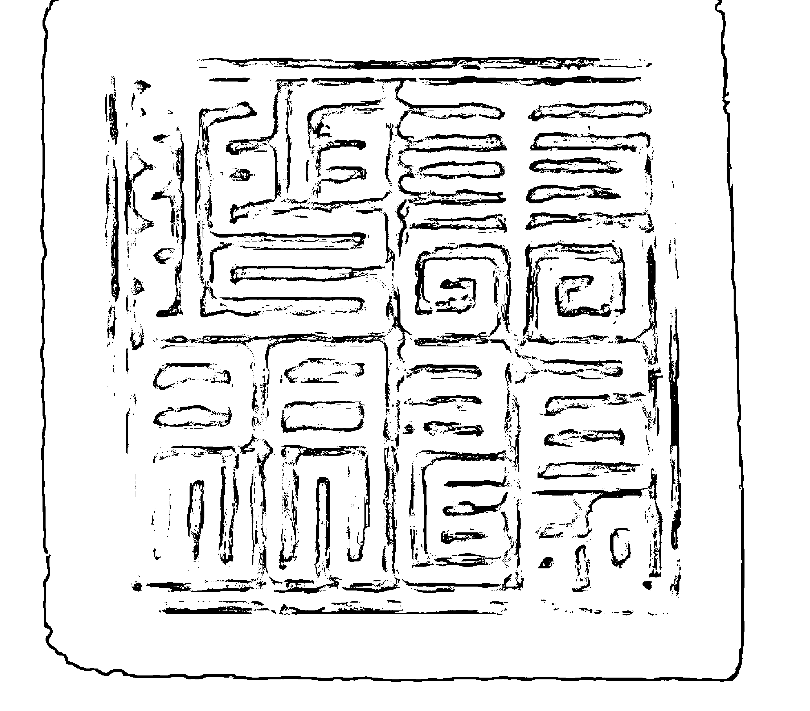

于成道人

（学员统一函授费600元）

2017年增补第二版

函授资料 严禁外泄

# 奇门法术
# 道家秘传

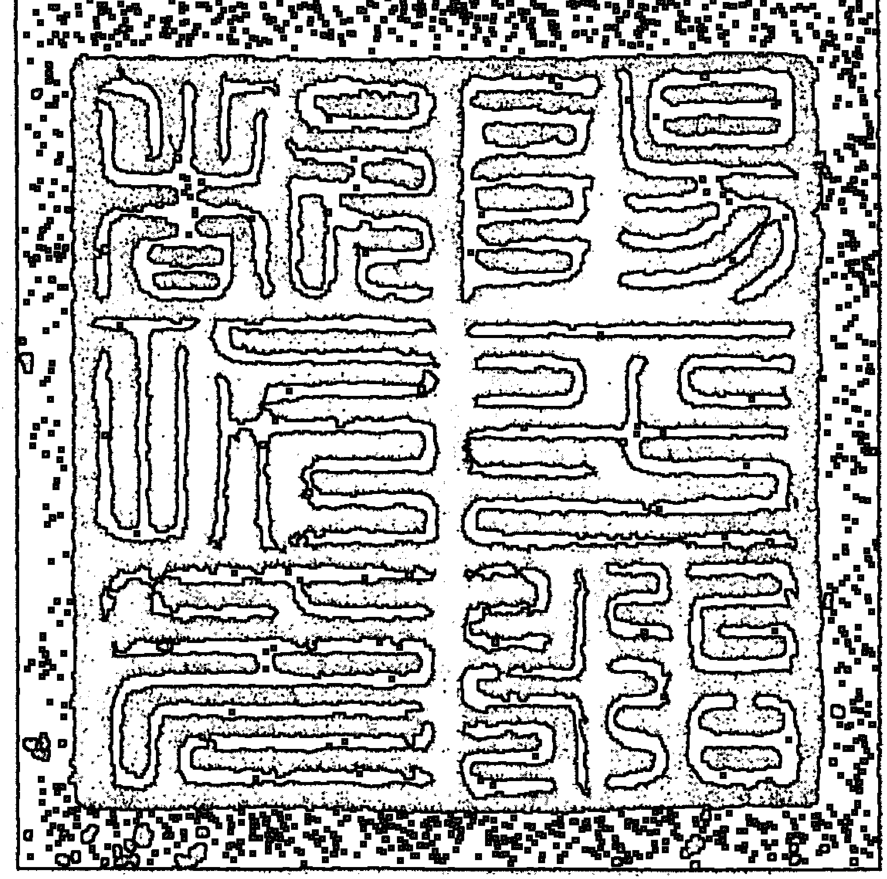

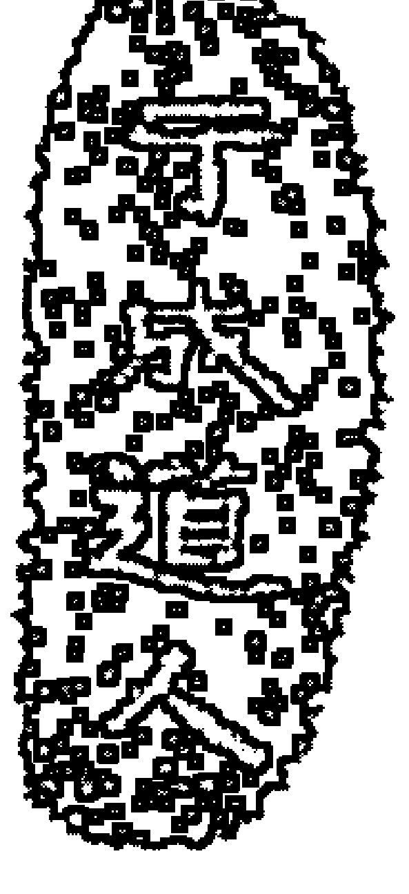

子成道人

内部资料 严禁外泄

# 般若波罗蜜多心经
唐三藏法师玄奘译

观自在菩萨，行深般若波罗蜜多时，照见五蕴皆空，度一切苦厄。

舍利子，色不异空，空不异色，色即是空，空即是色，受想行识，亦复如是。

舍利子，是诸法空相，不生不灭，不垢不净，不增不减。是故空中无色，无受想行识，无眼耳鼻舌身意，无色声香味触法，无眼界，乃至无意识界，无无明，亦无无明尽，乃至无老死，亦无老死尽，无苦集灭道，无智亦无得。以无所得故，菩提萨埵，依般若波罗蜜多故，心无挂碍，无挂碍故，无有恐怖，远离颠倒梦想，究竟涅槃。三世诸佛，依般若波罗蜜多故，得阿耨多罗三藐三菩提。

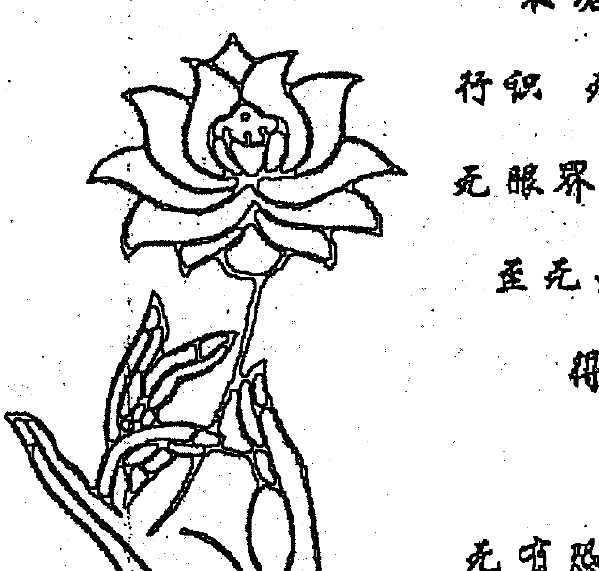

故知般若波罗蜜多，是大神咒，是大明咒，是无上咒，是无等等咒，能除一切苦，真实不虚。故说般若波罗蜜多咒，即说咒曰：揭谛揭谛，波罗揭谛，波罗僧揭谛，菩提萨婆诃。

# 法术奇门
宇宙是由阳性物质和阴性物质构成的，而阴性物质主导着宇宙的一切变化。奇门法术包含了奇门内部诸多的密术秘法。这些密术秘法以其神奇的效应，不可思议的能量在短时间内创造了一个又一个奇迹，将人们的潜能挥发到了某种极限。而这种超乎常人想象的神奇力量就来源于宇宙。人作为个体是卑微的，而作为宇宙星系一份子则具备了天赋想象的力量。想象也是一种力量。这种力量一旦引发，将有一种超常的气势和威力。

中华文化发展了几千年，奇门法术作为佼佼者始终站在众多法术的前列，并以其实用性，广泛性而深得人心。同时奇门法术还融合了中国最具代表性的法术之一—茅山法术。茅山法术表现出的线性能量可以快速而准确的使能量即时到位发挥作用，和奇门法术中场性能量融合于一体，形成一门独特的，更有亲和力的奇门法术场。这种场以济世救人，扶危更运调命为根本宗旨。凡是私欲较重，心术不正者无法沟通进入奇门法术场。若任意妄为只会招来无尽的灾祸。所以欲修炼法术者先拜明师，再学法术。奇门哲学中有：“奇门真机有，切莫胡乱走，修行非一日，道行岂轻就。”这句话的意思是说，奇门作为与宇宙沟通的捷径之门，真传真法必然不在少数，但旁人若想不由师入门的方法，听到见到一招半式就妄自猜测，凭空想象，很可能会造成害人不成终害己的下场。正是因为奇门法术的权威性和针对性，所以才一再强调“切莫胡乱走”，真心想学的人必须按照步骤方法技巧要求从拜师授道一步步循序渐进，从而达到天人合一的最高境界。

道法千年共融渡，几人能识真面目。奇门法术包括有形和无形两种。有形分书面的奇门遁甲预测术。无形的奇门遁甲法术包括各种法术的咒语、秘诀、符箓、仪轨等等，这些有机的部分必须烂熟于胸才有资格进入无形层次的修炼。而无形的奇门法术是可以调运、聚集、遣散宇宙各种各样的阴灵场和神灵场为己所用，而这种调运的权力是宇宙赋予的，因为就像人与人之间的沟通一样，通过姓名，籍贯、地址等等对每一个个体进行定位，并以此作为参与社会活动的依据和凭证，也即是国家社会承认有你这样一个人存在。在宇宙中也是如此，每一个信息场都有相应的符咒代码，音波代码和图形代码，意念代码，这些代码在不违背相应的宇宙大循环中是可以随时取用的。一般来说能够知道这些机理就以缘分非浅。要想掌握这些就要具备一定的道行才行，因为宇宙信息能量好比重物的重量，而道行是每个人提重物所要的力气，气力不够不仅提不起物体，更会伤害自己，故而法术一类不是适合所有的人。

那么什么样的人才具备修炼奇门法术的资格呢？其一，必须道行深厚。其二，必须心术纯正，不任意伤害生灵。其三，必须有使命感，舍得付出。其四，也是最重要的要尊师重道。其五，必须严守门规。其六，必须积功累德。真正具备这些条件的有缘人并不多，但即使不具备这些条件的人，奇门法术也会为有缘者大开方便之门，使其掌握一些对自身有利的几种法术，而可以破解或伤害对方的法术就要择人而授了。

奇门法术有 3600 个法门，这些法门中又分大小法门，这些大小法门中又分上中下三等法术。而常用的奇门法术的类型有：
- 护身法
- 收元神法
- 制邪术法
- 破坏攻击干扰法
- 与魔互斗法
- 驱魂散离法
- 收元神法
- 索债法
- 阴坛用符咒法
- 发兵将法
- 急难突围法
- 扭转乾坤法
- 六甲阴符法
- 伏匿藏形法
- 真人步斗法
- 襲除疫病法
- 三奇神咒法
- 五鬼驱魂法
- 五鬼搜魂法。

奇门法术可以加快修炼的进程，使人身心愉悦快速，进入宇宙大场，达到天人合一的境界。修行的过程就是奇门法术的作用有哪些呢？

- 一个去杂留清的过程，同时寻找与时空相汇的切入点，而奇门法术可以即时提高修炼者自身的能量级别，即在原有的基础产生一次飞跃。
- 奇门法术可以扶危济贫，化解灾难，当人们遇到一些不顺不好的事时，则是笼罩在当事人周围的场能信息不是很好。奇门法术通过能量之间相互的冲击力，融合力，使灾难化于无形，在救渡危难中大显身手。
- 奇门法术可以调整人类的正常的生物场，从而达到治病、调病。奇门祝由术是专门针对各式各样的病症患者的一门法术。通过符咒，符水使自身的生物场能重新更新有序，从而达到祛病强身的特殊效果。
- 奇门法术可以改变人们生活环境的场能信息。奇门法术可以调整阴阳宅风水的不利因素，故而奇门法术是一种济贫助弱术。
- 奇门法术可以夺造化之机，改变人的运程。人的运程无非是由各种或优或劣的场能组合而成，奇门法术可以从根本的地方改变命运的轨迹。
- 奇门法术可操纵整体的布局，调动借助非本时空场的天时、地利、人和为己所用。
- 奇门法术可以降妖除魔，为人们驱走缠绕的阴霾之气。以法制法破解于人不利的邪门歪术，保护自身的场能不受外境不良因素的干扰，正定心神，维系正常的生物循环场。

奇门法术用途十分广泛，可以应用在日常生活的方方面面，大到国家，小到个人，根据不同的需求，有不同的法术类别与之相应。随着适用范围的不断扩大，施法者的功能功力也随之不同，而在平时帮助个体解决难题时是最基本的要求，特别在斗法与化解别人所施邪法术，如果自身场能保护力不强，则不宜实施。否则救不了别人，连自身也搭进去。特别是初学者尤其要注意，不要逞一时之快，而后悔莫及。一般来说施法者首先要做到的是保密。奇门法术属无形化有形，如果自身心浮气躁是大忌。身心宁静，少言寡语、意念专一是起码的要求。

# 修炼法术和修行的区别与联系？
现代社会追求新、奇、美、怪。而法术正适合人们的这种心理。但是修炼法术和平时我们所说的修行有很大的区别。首先我们先来说说道行。道行的深浅是衡量一个修行人层次高低的关键所在。道行是与道相融的时间长短，也即身心达到的能量层次，这种能量层次是在某一轨迹吸取其周围的精气精华所凝聚而成的能量团。这种能量团是靠日积月累的叠加而来，来不得半点虚。在黑道中也说道行。行是看道行的时间长短，道是看你先天的领悟能力和实际应用能力，所以常听人提及道行。道行分正邪两种，当你修炼时一定要正心正念，否则误入邪道后悔莫及。奇门法术流传几千年来，一向以造福世人惩恶扬善为己任，故而奇门不收也不容邪心邪术之人。

修炼法术有正邪之分。而修行是为了不断完善自身从而达到最终解脱的目的，法术用的对，可以帮助修行人快速到达彼岸，这也是奇门法术问世最大的心愿。奇门起源于远古，融于道教，而道教是中华民族的文化之根。奇门融汇众多的民族文化精华自成体系，源远流长，在历史的长河中一直放射出璀璨夺目的光芒。历史在变迁，作为奇门新一代的传承者，希望有更多的能人志士加入到研究奇门文化中来，让奇门文化的光环照耀世界的每个角落。发扬一种文化是让更多的人受益，进而领会宇宙的奥秘。由此可见，修炼法术也是修行过程中的一个分支，可以单独形成体系。

修炼奇门法术有三个基本途径：

- 通过修炼具备一定的基础再去修炼法术。
由于修炼法术对自身精气神的要求，常人必须通过一段时间的修炼再去修炼法术。此类人通常是自学成长，通过书本，信息工具模仿，起步较难，不易学成。

- 自身具有先天的特异功能。
这类人由于先天的福德慧根本身具备操纵宇宙场能和功能。开始不察觉，慢慢才知道自身的意念力很强和另一些超常的能力，这类人对法术有独特的领悟力，学法术容易上手，容易突破层次。但是有先天资质的人通常带有特殊的宇宙责任，如果在得到法术后不造福于人类，积功累德，反而会影响下一步的修炼。所以说有先天慧根的同道首重是修心，才能不负众望，步步高升。

- 由法师直接传授。
此途径是最正统正宗，也最易入道的方法之一。但有此机缘的人少之又少。因为奇门法术场从某种程度上来说是口传心授的秘术密法场，如果仅靠个人自身的领悟很难与原法力场完全的融合。极易间夹在两个场能之间左右摇摆不定，而由上师护法传承下来的法术场又不一样，虽然进入这种场要受很多条件的限制，但由于此场的纯正对于修炼来说无疑是最佳的选择。

在具备了承接奇门法术场的能力后，在修炼法术的过程有哪几个基本的步骤呢？

第一步，对相应的符咒或意念要能深刻领悟其中的作用和含义，并多加练习，做到烂熟于胸。

第二步，至少模拟一至二次作法的完整过程，特别是最后收法的过程。如果没有专门的人教你，最好在弄清细节后再着手练习，不要急于求成。

第三步，请求相应的护法场护持场向。这种护法场如果是奇门弟子则相应的护法会迅速到位，若是门外人则需请有缘护法神来护场。

第四步，应用法术先从自身或熟悉的人做起，这样便于收集确实可靠的回馈信息。对别人施法时先不要告之，问清楚对方的反应后再酌情处理。

第五步，当奇门法术练成应用于社会时，特别是破法，斗法，请示奇门上师的首肯也是关键的一步。奇门上师会根据你自身的情况而给你相应的警示。这些警示是航海的风向标，她能确保你的安全系数。

修炼奇门法术的进程，如果没有良师益友的时时护持与开导，是很难上到高层次的。奇门场里信息众多，能量相对集中，一般心胸没有打开的人很难接受此强大的冲击力，所以在《奇门秘术密法诀》中有一句话：“心正功自正，心正功自长。”而这个心正就是断除了贪欲、自私的狭隘之心，这里的心说的是一种无形的生物场能和阴性场能的兼容性。争斗远远没有把对方包进来的巧妙。争斗是一种力量的显示。而包则是一种操纵对方的能力。故而在奇门法术场切忌争强斗狠，赌一时之气，更不能因为个人的恩怨而恶意的攻击对方。所以在练习奇门法术时应注意以下几点：

- 忌好胜心强，义气用事。
- 忌私心私欲重，易落入邪道。
- 忌以此谋利，易遭天谴。
- 忌见死不救，见难不帮。
- 忌欺师灭祖，信口雌黄。
- 忌妄传匪类，暗祸横昌。
- 忌不择时地，狂妄自大。
- 忌助纣为虐，永难升扬。

奇门法术场是奇门场能中择人要求最严的一门学科。正是由于其威力，即时性和功能的强大性，修炼者无论是内在还是外在，都有着近乎苛刻的要求，当然未经奇门上师许可而擅自修习不在此列。以上几点注意事项是修炼奇门法术的最基本的八点要求，进入更深层次的修习还有相应的规则，但这些规则不便公诸于众。

宇宙气象千变万化，奇门法术以其神秘莫测的身姿一直吸引着许多世人的目光。但人们对于奇门法术的内涵和本质还不是很清楚。奇门法术是建立在有形的奇门遁甲的基础上逐步发展起来的一门学科。

有形的奇门遁甲与无形的奇门法术构成阴阳太极，构架起奇门场能大的太极框架，在这个框架中奇门法术是无形的奇门遁甲的一种有形的体现，但并不能完全代表无形的奇门遁甲。奇门格局虽模仿宇宙星体运动相互作用而产生的，人作为宇宙的精灵，当自身融于宇宙的那一瞬间，便是宇宙的主宰，因为同体同德，同心同力，但是要达到宇心与自心的完全契合需要漫长的修炼时间，而奇门法术正是扬长避短的直接接通宇宙不同能量的信息，以有形的方式呈现出来，使得个体在没有完全与宇宙融合的状态也能调动，使用某些场能，这是一条捷径，但也很危险，能量掌控的越多，越容易出差错。在运用这些密术秘法时，真心希望它能给修行者，有志向者，心存仁爱者带来福音，将奇门法术发扬光大。

奇门法术揭示了宇宙中许多看不见摸不着的奥秘。首先奇门法术揭示了阴阳两性世界的共存共融性。阴可转阳，阳可转阴，通过特殊的途径——奇门法术可以将这一点实现，其次揭示了在有形物质的背后有着众多的无形能量作为支撑点。人们常感叹事事无常，命运捉摸不定，实质是没有看透事物的本质，随着场能气体的增强产生了有形，而一旦无形场能渐渐失去，有形变成了无根之木，无源之水，很快也就随之消亡了。

奇门法术还揭示了事物的可改变性。

人都希望改变自身不利的运程，但苦于找不到相应的途径。而奇门法术的产生告知人们：改变命运知福报，命里注定也随机。这就给沉闷的因果之说注入了一丝希望，让生机充满人间，让希望遍布心灵，只要顺应宇宙道法，自然就会赋予你强大的能量团。人作为自私的个体时很渺小，很卑微，当这个个体忘却自我融于宇宙时，其自身的潜力就得以充分的发挥出来。捆绑的绳索是自己绑上去的，当肉体消亡之时，哪里还有你执着的那个“我”。奇门法术是先一步告诉我们人处在宇宙中的位置。

奇门法术揭示了宇宙无形能量的层次结构，宇宙奥秘无穷。但也是有规律可循。只要遵守相应的规则就能遨游其中而其乐无穷。变化多端，应世而生，应机而现，是奇门法术的魅力所在。

奇门法术充分展示了人的主观能动性。当人忘却自我时反而有着无穷的力量，这就是奇门突击思维。人们时时讲主观，时时讲自我，在奇门法术中这种自我得到了最大的体现。但是体现自我却是在忘却自我之时，这种相对论的实践实在是乐趣无穷，也是奇门最高修持哲学。放开手，你会拥有一切，你想要吗？

物质的生生灭灭无法激起人类自身对于现有事物的思索，当人性的清明本性被蒙蔽时，需要清新净化洗涤尘世间的污浊之气。当我们明白有无相连，中字混化时，奇门法术的意义也得到了最大限度的体现。在个性自体尚不完善时，奇门法术问世的意义在于帮助那些有灵性慧根的人更快的完成宇宙所赋予他们的历史使命。当某人肩负一种使命无论是奸是忠都得在相应的时空扮演相应的角色，关键是你从中得到了什么。永生永世跟随着灵魂深处的智慧之光，才是最值得珍惜。

奇门法术问世的意义还在于最大限度的使用了人类有形的躯体，缩短个体生命自我完善的进程。苍天有好生之德，天体无私的给予我们各种能量，汇集了各种信息为你所用，如果不珍惜，便是辜负了天心。奇门法术给渴求自由，解脱的人们带来全新的感受，让他们在经历重重磨难之后，得到上天的奖赏。随着奇门法术的公开问世将不断给人们带来好运。当人们逐步认识它，并且循序渐进的掌握它，使它成为人们生活事业中的良师益友，最大限度的发挥奇门法术在现实社会中的应用能力。

奇门遁甲，奇门法术、奇门堪舆、奇门星相组成了奇门体系的经纬坐标，而奇门法术是游离中各个学科之间的媒介，犹如六合的作用，它可以借助其它场能而完善其场能。奇门法术是奇门总场中神奇信灵场具体体现。同时奇门法术的增强也可通过奇门信灵得以最大的完善和发挥，相信在不久的将来，会有更多更好更新的法术内容与有缘者见面。让那些紧锁高阁的珍宝发挥他们应有的价值，这也是奇门法术传承人最大的心愿。

> 茫茫苦海有舟楫，浮沉离合无定期，
妙法传承示天机，光照环宇心法奇。

# 随师修行回忆录
“学得术法，兼济苍生”。恩师不止一遍在我耳边讲，学法一定要有远大的志向和正义。祖师爷曾施法让日本运军火的船队掀翻在海面，因而也付出了性命，抗日曾牺牲过多少爱国道士的性命，这都是秘而不谈的，他们不留姓，不留名，首先我们要向前辈们致敬。师父一再告诫不得参与政治，但国家民族一旦有难，也要无任何条件挺身而出。现在也有为国捐躯的术士，某市重点大桥打桩不下，请一道士前辈法力协助，最后桥建成，道士前辈的法身却填镇龙脉。每年我都会去祭奠一下前辈的英灵，前辈默默长眠地下，地上车水马龙，这正是我们学术之士必修的胸怀。

> 学得法术，兼济苍生。我不下地狱谁下地狱？

现在大旱，谁来求雨，搭坛，条件不允许了，求雨也就消失了。大家都知道用草人作法灵验，草是新坟头三个月长出的草，阴气重，用特定药水泡103天，扎成草人，吊在人家梁上可取人之性命。用什么泡，不能说出，说出就会被人抓住把柄，举报法律。可见，法术为何不能公开传授，有的不能传，大家应该理解吧。

师傅常说，“心头三分血，破世间万般咒”，心头的血藏着三魂六魄，破一切邪咒，可现在有谁拿刀刺自己的心口？现在常有人感叹：术不灵唉，不是不灵，是我们做不到。现在将师父破邪秘籍咒传出，择而用之，来作为法术奇门开篇。

# 第一章 传承
## 第一节 法印
- 一、法印是本门天师道传承法器，张天师是我们的本尊。有了法印，才能传承本门法力，使用本部兵马，修炼本门功法。
- 二、设坛，摆上张天师的牌位，或画像，三根香，三样鲜果。净身更衣，前三天不动荤（荤为死去的动物肉，有不好的磁场存在）。
- 三、开印，三拜九叩，把印双手举过头顶念：燃香敬请本尊张天师临坛加持，意念张天师从天而降，落于坛上就坐。再念敬请师父派三千兵马护体助法，任我调遣。把朱砂印符烧化，印在上面写你的本名，千万别写真名，作法时会伤自己，落下因果。此印具有法力，掌管兵马之用。但法力的大小还须平时多练。
- 四、练印，每天两次，七七四十九天功成，希望学员不要偷懒，踏踏实实地去修，才能成正果。静坐，忘记一切，念‘人在气中，气在人中，天人合一为我所用。我祖天师，驾云来至，入我天门，心莲化育，随意所长，与我同体’，意念自己就是张天师，与本尊同体，人神合一，二十分钟即可，收功时提一口气，把心莲的天师吹在印上。49天，每天两口气，共98口气，49天结束后，再练一次总功，共99口真气，乃法印练成。

## 第二节 铜钱剑

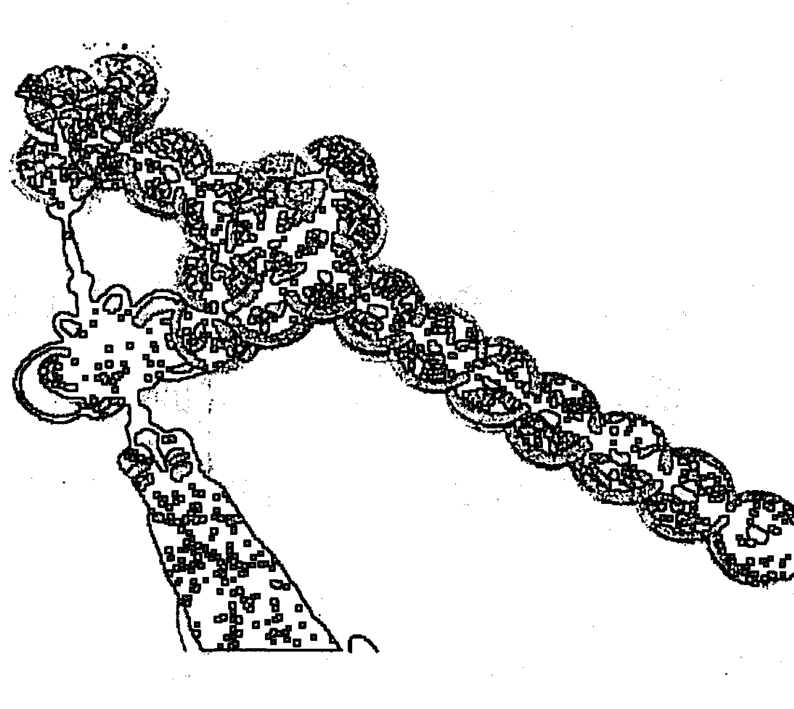

## 双排铜钱剑

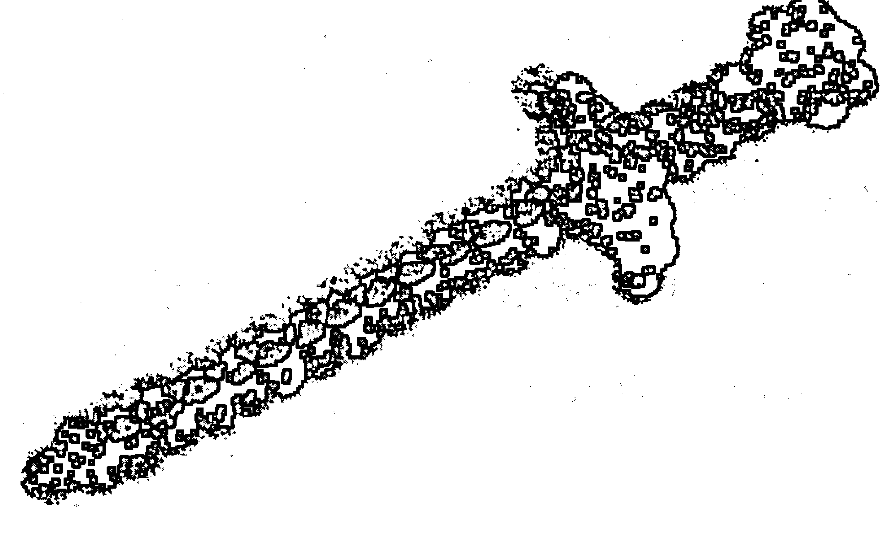

道家有二十一枚铜钱做的七星剑，也有四十九枚铜钱编制的！如果你能集齐一百零八枚不同的铜钱，可以尝试找人制作乾坤法剑！名字自己定，据说佛教有九九八十一枚铜钱制作的达摩剑~！

最后取精麻绳，用朱砂染色，按照一种特殊的绳结方法来编制！

注意，做好之后在铜钱剑剑柄上要绑上朱砂符咒（符咒可为道家驱邪类），然后用朱砂绳密密匝匝的缠好，记住，要完全把符咒缠住，但不要缠乱！

完事之后要供在三清祖师灵位前，每日午时焚香三柱，让祖师赐灵气，七七四十九日之后，这把铜钱剑便制作成功！

若是修行人事，则无需这么麻烦！自身道力越强，制作的效率也越高！

制作好的铜钱剑不要乱挂，要用红布包好，放起来，遇到大的邪鬼拿出来，平时放在包里带在身边，即护身又辟邪。

## 第三节：桃木剑

### 1. 桃木

桃木在中国传统意识中，有着非凡的地位。相传古神话中，有夸父逐日，干渴而死，化为桃林。另外，在中国古代神话中，相传有一个鬼域的世界，当中有座山，山上有一棵覆盖三千里的大桃树，树梢上有一只金鸡。每当清晨金鸡长鸣的时候，夜晚出去游荡的鬼魂必赶回鬼域。鬼域的大门坐落在桃树的东北，门边站着两个神人，名叫神荼、郁垒。如果鬼魂在夜间干了伤天害理的事情，神荼、郁垒就会立即发现并将它捉住，用芒苇做的绳子把它捆起来，送去喂虎，因而天下的鬼都畏惧神荼、郁垒。于是民间就用桃木刻成他们的模样，因而他们被认为是后世门神的始祖；而后世改用桃木板刻画上他们两人的形象，再后来直接简化为书写二位的名字，称为“桃符”，也被认为是年画艺术的发端之一。

### 2. 桃木镇邪

桃木镇宅辟邪在民间广为流传，凡盖新房就用桃枝订在房屋四角，以保家宅安宁，大吉大利，迎亲嫁娶，也用桃枝，意为婚姻美满，富贵平安，逢年过节，也要取桃枝挂门边，用来镇宅接福，节日祥和，桃木应用在我国和东南亚国家广为流传和使用。桃木以果实为主，它的树干，粗短弯曲，又易变形，所以取材极难，经泡、蒸、煮、捂、晾、干燥等处理十八道工艺，处理后的桃木剑经久耐用，色如紫铜，清香亦人。

### 3. 经典传说的起源与流传依据

桃木辟邪，可能源于后羿的传说，古书记载，后羿是被桃木棒击杀，死后被封为宗布神，这种神经常在一颗桃树下，牵着一只老虎，每个鬼都要前去检验，宗布神一闻，如果是恶鬼的话，就会被虎吃掉。

有一说是和夸父有关，相传夸父追日饥渴而死，临死前，将手中的杖一抛，化为一片邓林，也就是桃林，是为了让后世追日得人能够吃到甘甜可口的桃子，因为夸父跟太阳有着紧密的联系，所以鬼会害怕桃木。

天下树种万千，桃树直感色若暗红，富有光泽，桃木结实而有弹性，用作打击或防身，自是良器。这些特点，或许便是桃木神异传说的初始依据。

辟邪桃木剑

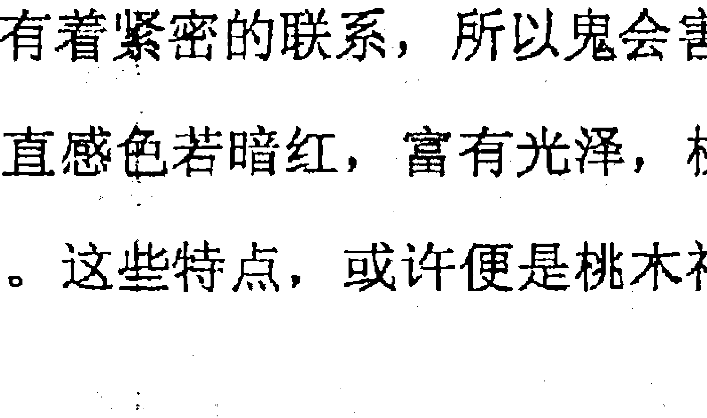

在中国著名志怪小说《封神演义》中，商朝后期，殷纣王被狐狸精迷惑，朝纲衰败，后有云中子特制了一把桃木剑，悬挂朝阁，使狐狸精不敢近前。

据说，三国时期的曹操，因疑心太重，落下头疼病，久治不愈，后经军师提议，在中原精选优质桃木，制成一把桃木剑，悬挂室内，头痛之症，不治痊愈，后来南征北战，建立了霸业。

最简单的制作方法，弄一块桃木排，上写神茶，郁垒，两个人的名字即可。

# 第二章 符咒

## 一，朱砂的配置

符咒研细，用酒与白糖在砚台里研磨，用毛笔一口气画完，也可加点泰山石研磨，增加阳气。如正月雪水，黑狗鞭，雄鸡骨等。有些东西可遇不可求，只看你的缘份了。

## 二，咒

-   (1) 笔咒：居收五雷神将电灼光华纳则一身保命上则缚鬼伏邪一切死活灭道我长生急急如律令。
-   (2) 水咒：此水不非凡水北方壬癸水一点在砚中云雨须臾至病者吞之百病消除邪鬼吞吞如粉碎急急如律令。
-   (3) 砚咒：玉帝有敕神砚四方金木水火土雷风雨电神砚轻磨霹雳电光芒急急如律令。
-   (4) 墨咒：玉帝有劫神墨焱焱形如云雾上列九星神墨轻磨霹雳纠纷急急如律令。
-   (5) 朱砂咒：丹石镇凶魔灭鬼崩研书灵符三界通行急急如律令。画符之前，还要上香跪拜，祝告天地神祇，将要祷告主事表达出来。祝告完毕，取出纸墨或朱砂，正襟危坐，存思运气，一鼓作气画出所要画之符，中间不可有任何间断停顿。画符时要吹气于符中，同时还要一边画一边用嘴轻轻念咒。此外，不握笔之左手要作出书符时必用的日君诀、月君诀、天纲诀等手势。

日君诀：变曲左手四指指尖，只有第二指平伸，指尖朝上。月君诀：除第四指平伸，指尖朝上外，其余四指微向内弯。天纲诀：第二指平伸，指尖朝上，其余四指尖微向内弯。用日月君诀的目的，据说是取日、月阴阳真气，引气入符，借神灵助威，驱邪伏鬼，增加符的灵验性。用天纲诀，也在于用此指法，指挥鬼神，画符时借天纲指取纲气引入符内。

画符毕，将笔尖朝上，笔头朝下，以全身之精力贯注于笔头，用笔头撞符纸三次，然后用金刚剑指敕符，敕时手指用力，表现出一种神力已依附到符上的威严感，最后将已画好的符纸，提起绕过炉烟三次，天师附体，深吸一口气，将天师化气喷于天师道印上，盖上法印即可。

## 三，符咒的画法

符咒的结构与四大秘诀：符咒是由"符头"，"主事神佛"，"符腹"，"符脚"，"符胆"等五要素所组成。若以符令引喻为人的话，符头好比一个人的头；主事神佛就好比一个人的思想和心脏；符腹就好比一个腹部的肠胃，是我们书明符咒作用之地方；符脚就好比一个人的脚；符胆就好比一个人的肝胆，一个符令若没有符胆就好像门没有锁一样，坏人都可随便进入。因此，符胆对符令而言有深足轻重之地位。

### 符头

自古以来，符咒派别不少，但各拜其祖师，有所不同，就因为如此其符头的暗号也有所不同。如许多符图上常见的“三勾”就是代表三清(道德天尊、元始天尊、灵宝天尊)或三界公（城隍，土地，祖师）的记号。三勾在整个符上代表三清，在敕令及神名之下者代表三界公。下笔书此“三勾”时应暗念咒语：“一笔天下动；二笔祖师剑；三笔凶神恶煞去千里外。”一笔一句须恰到好处，就是所谓“踏符头”。“符头”也有敕令，雷令……等等作为符头，其种类繁多，因教派不同有所差异，一般请神，调兵遣将，多书以“敕令”为符头。如无“三勾”三清符号时，必须咒曰“天圆地方，律令九章，吾今下笔，万鬼伏藏。”即可。

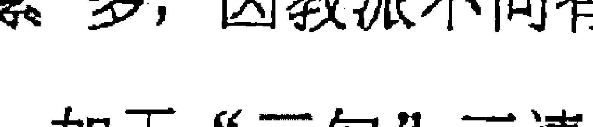

此符头代表三清道祖，也就是人们说的道德天尊（太上老君）、元始天尊、灵宝天尊三天尊。

三清符头，它象征生气，无中生有之意，又有三才之意，暗合人之精气神，天之日月星，地之水火风。

-   1. 一笔天下动（中间）
-   2. 二笔祖师剑（左边）
-   3. 三笔凶神恶煞去千里外

此为三将军，即雷、火、风。

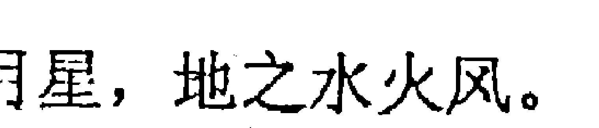

此二个为三台星君。

也为城隍，土地，祖师。

在符上做符头为城隍，土地，祖师。

在符咒中为三台星君。

也就是：下台曲生司禄星君，上台虚精开德星君，中台六淳司空星君。

画此用咒：（中）三台生我，（左）三台养我，（右）三台护我。

如果在画符的时间，符咒中无上符头，则在画符时先念：一笔天下动；二笔祖师剑；三笔凶神恶煞去千里外。

此符头用咒为：一转天地藏，二转鬼神惊，日月两点合明动乾坤，急急如律令。

### 关于敕令的问题：

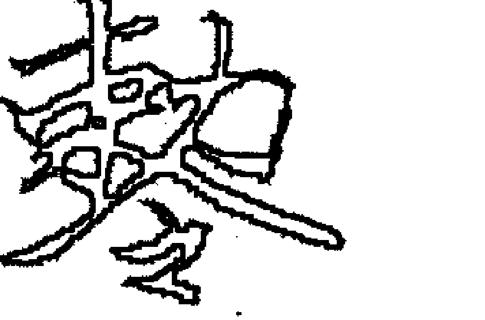

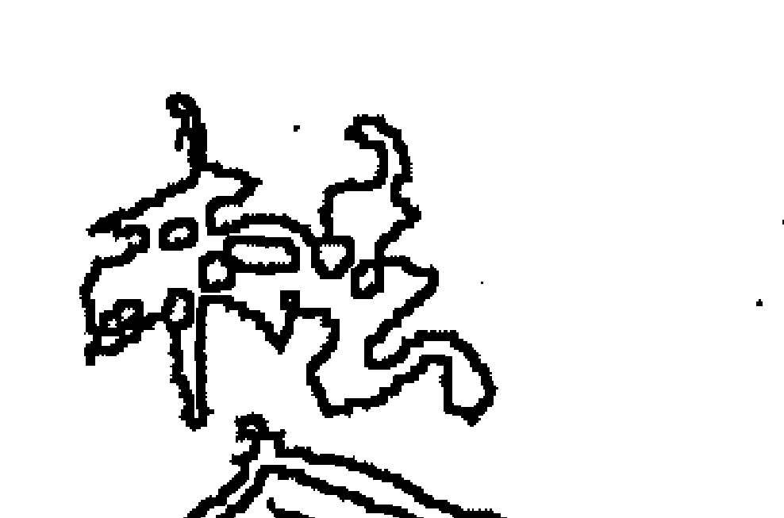

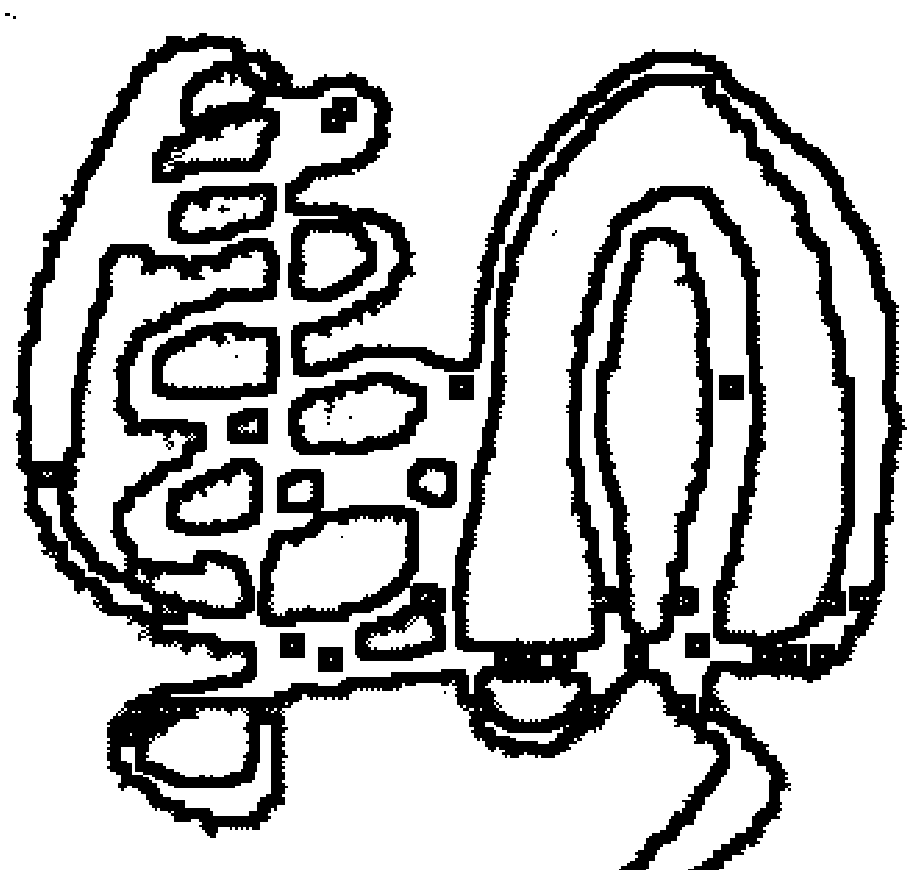

以上为 “敕令” 的 6 种画法只是部分画法，还有一些其他画法，因为在不同符咒中，画法也是不同的，上边的 6 种是常用的画法。

在写 “敕令” 二字的时间是需要念咒的，用咒为：一围天地动，二围主病动，三围不求血，四围不求脓，五围不生疸，六围不生疖，七围大神咒，急急随咒灭。

### 符胆

符胆是一张符令的灵魂，是符的主宰，一张符能否充分发挥效验，在很大程度上取决于是否有符胆镇守其中。

书符一般都称为入符胆，入符胆的意思就是请祖师（神明）镇座这一张符令之内，把守此符的门户。一般常见的符胆是 “罡” 字，也有 “井” 字，也有 “马” 字，“化” 字等不胜枚举。然何谓符胆呢？符胆是由一些秘字所组合而成。

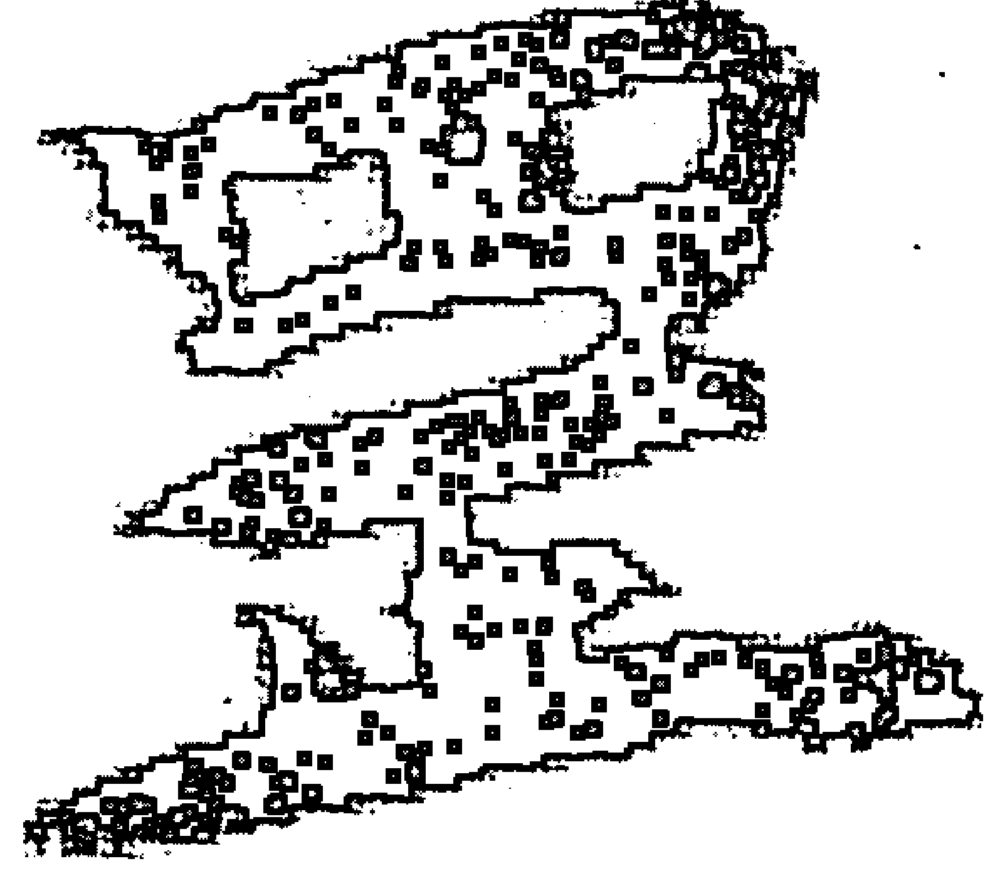

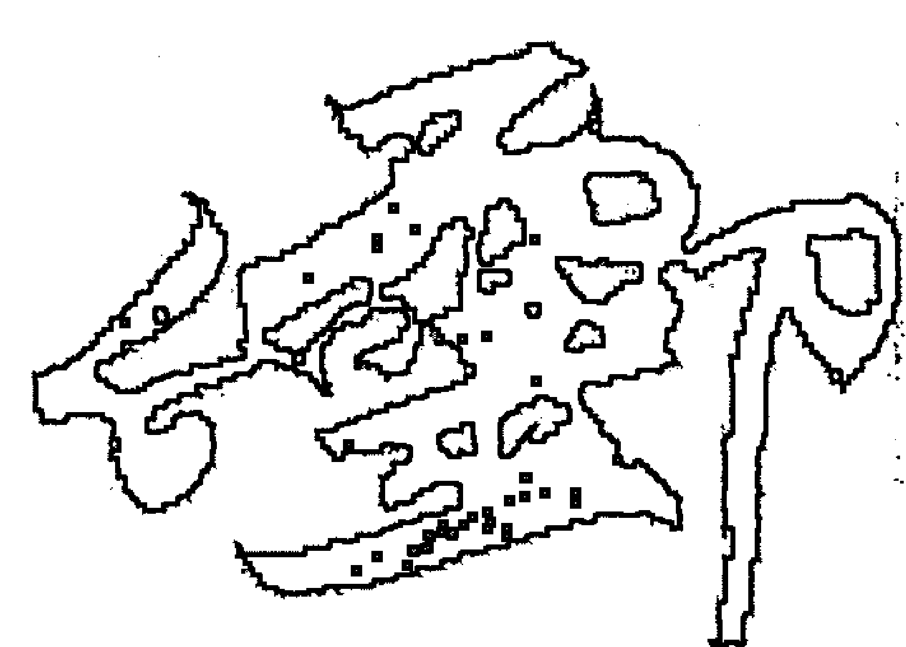

此符胆名四正公，有两种写法。第一种书法，罡十书，表示“甲乙丙丁戊己庚辛壬癸”十天干；第二种写法罡，表示“子丑寅卯辰巳午未申酉戌亥”十二地支。（1）四：开天门；（2）一；杀鬼路；（3）卜：开地府；（4）一：杀鬼卒。

急急如律令。

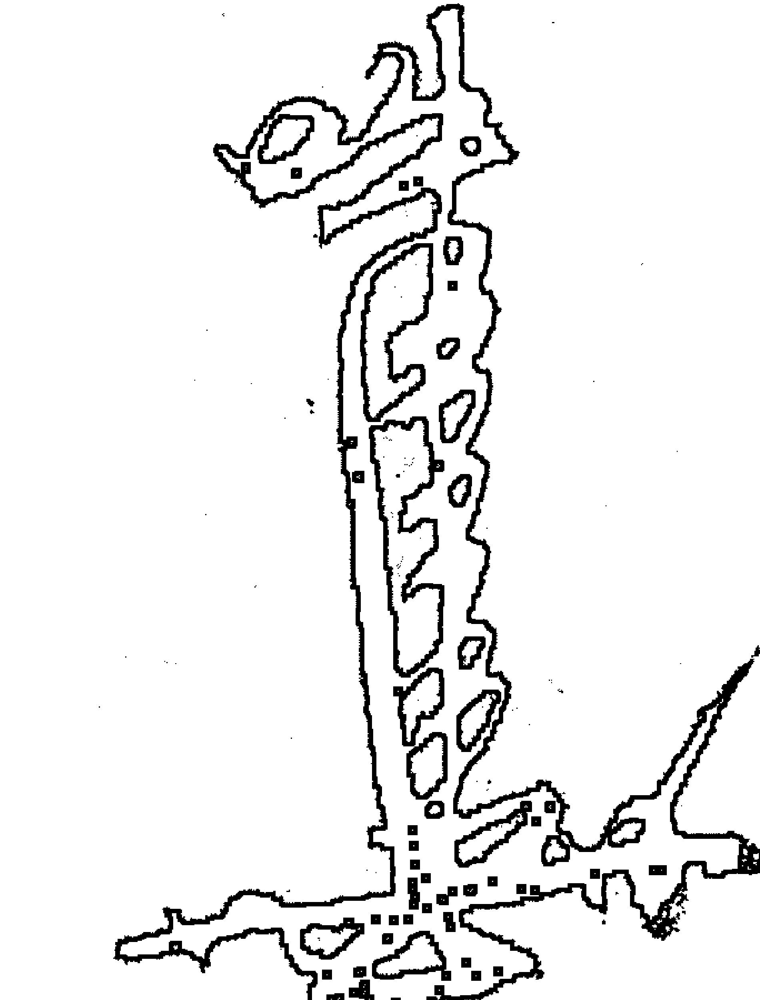

这个为“二十八宿胆”。

用咒为：

角亢氐房心尾箕
斗牛女虚危室壁
奎娄胃昴毕觜参
井鬼柳星张翼轸

也就是“二十八宿”的名字。

此字刚好28画，画完刚好28个名称完此字为七星胆。

此胆内有：三清、北斗七元星君。

写“吽”字时念：唵哑吽。

正音为：ong ya hong。

下7撇为北斗咒：斗勺薕行毕甫票。

北斗咒7字都带“鬼”旁。

必须一边写以便念。

不念等于没有写。

### 三，符脚

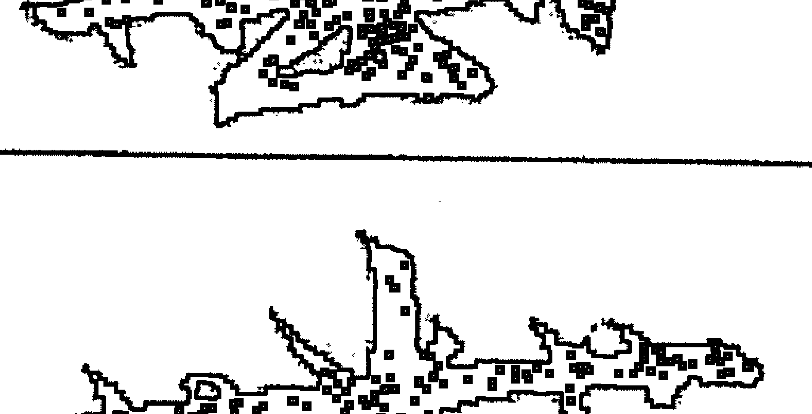

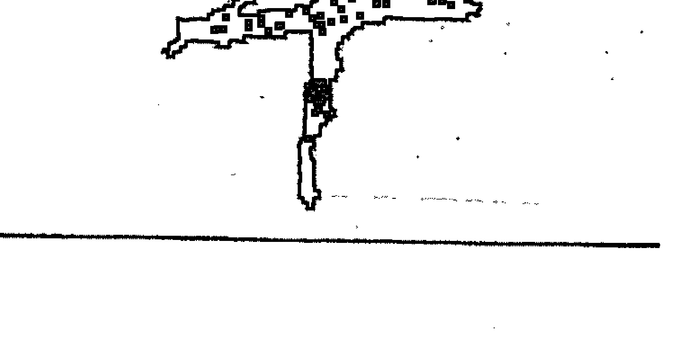

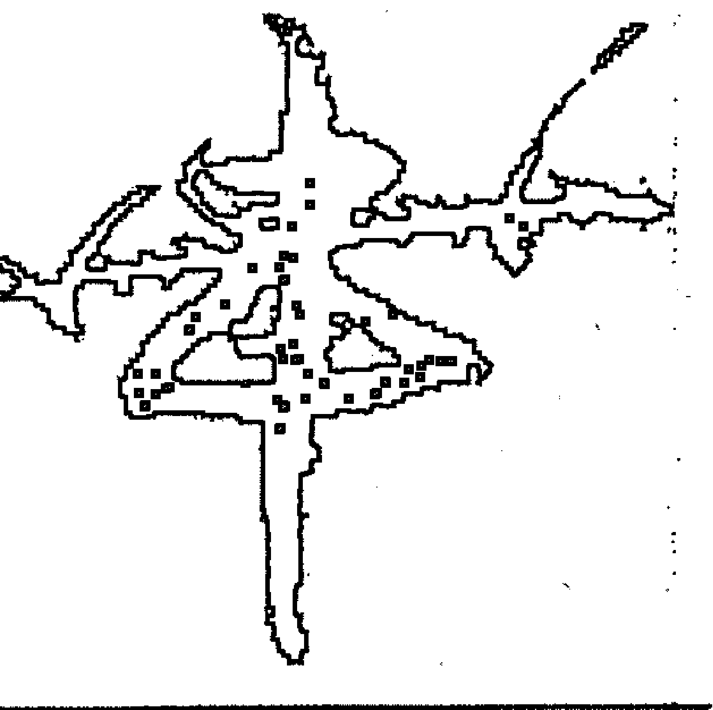

此两脚的咒一般画符的书上都有。

此符脚内请：五雷、日月、十二星君（也就是：子丑寅卯等12个地支）。

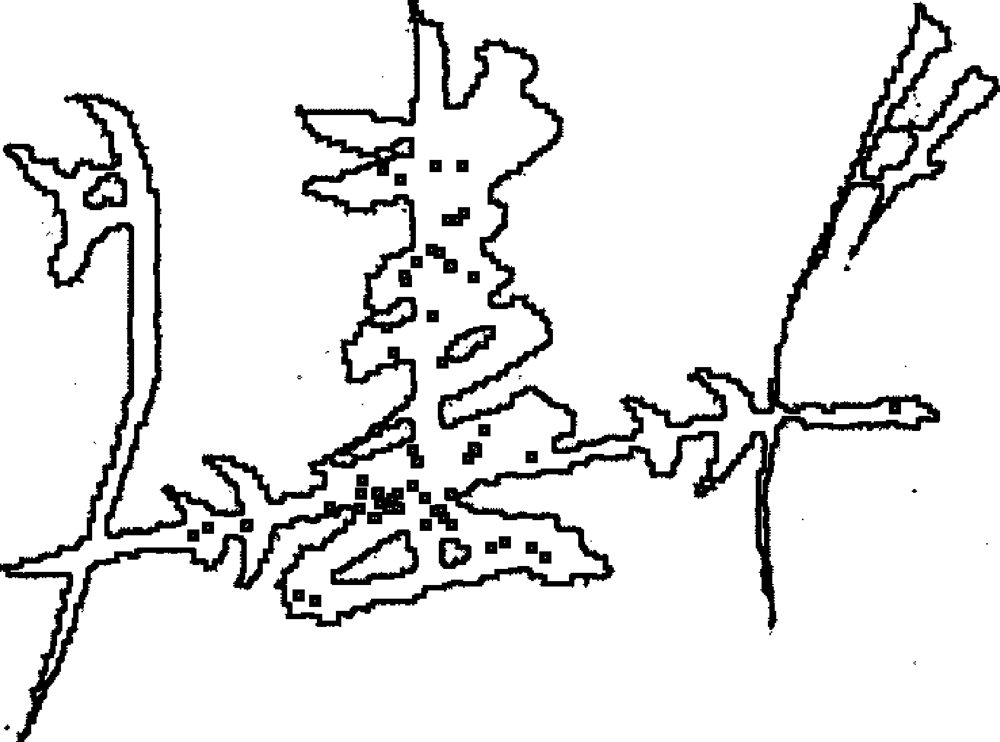

此脚多为斗法用符和斩邪用。

示范符

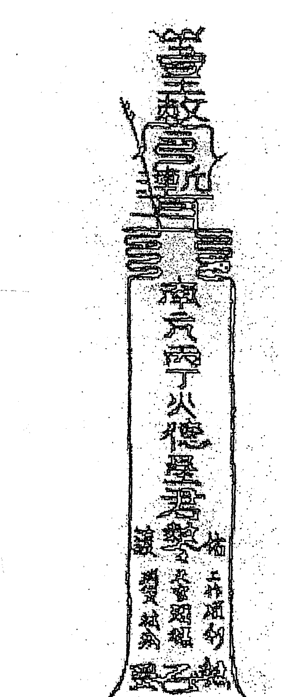

这个符咒上请：三清道祖、玉皇、紫微星君、南方丙丁火德星君、天官。

这个符咒的画法：

-   三清符头
-   玉皇敕令玉皇敕

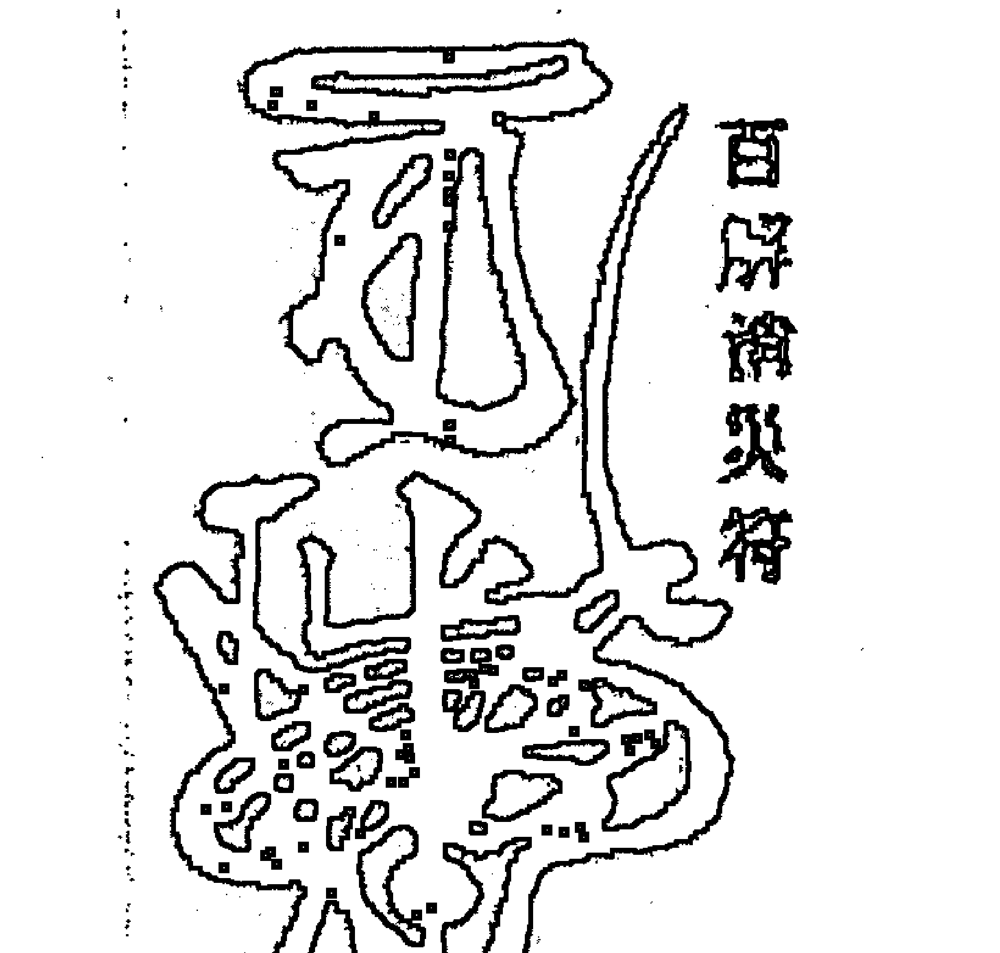

此符咒要请：三清道祖、张天师、三台星君、三元三官大帝、南斗、北斗等等神仙。

画符不知巧，惹的鬼神笑！画符若知巧，惊的鬼神叫！

任何符咒不是随便就可以用的。

要根据实际用途来针对性的去画...

画符首先要知道天地、日月、星辰、鬼神、阴阳、五行、地理等等。

画符最关键的是内炼。

先修一心字，再修一定字，再修一慧字。

画符收徒第一戒律就是：心术不正者不传。

### 大要诀

-   符：就是书符，代表灵界公文和法规。
-   咒：就是咒语，代表灵界密码与歌诵号令，起到对鬼神的说服作用。
-   印：就是手印，代表灵界的权威和印信。
-   斗：就是步罡斗，分五行、七星、八卦等各种不同罡步，代表不同作用的威力。

符咒其实就是一种意念的修炼，通过固定的载体强化人内心中的精神力量，从而起到相应的作用。

# 第三章 护体

以年命为准护体:

-   庚辛壬癸甲乙丙丁戊己
-   0 1 2 3 4 5 6 7 8 9
-   1970 1971 1972 1973 1974 1975 1976 1977 1978 1979

凡是0结尾的年份出生的年命都是庚，如80年，90年等。凡是1结尾的年出生的都是辛，以此类推、、、、

## 二、阴宅护体:

-   1、庚:刀
-   2、辛:小米、钱币
-   3、壬:自来水，河水
-   4、癸:尿
-   5、甲:棍
-   6、乙:棍
-   7、丙:火
-   8、丁:香
-   9、戊:石头、砖头
-   10、己:土，沙子

用符包着桑木棍，埋在坟的子、午、卯、酉四方，其家的阴宅就会失去生气而衰退。大家只了解一下即可，去操作会留下因果。操作完，如年命是庚，用刀在人与坟之间当空写一‘斩’字，横画一刀把人与坟的信息隔断，念：恩恩怨怨，一刀两断。别回头，别回家，洗个澡再回家。恩恩怨怨，烧香了断，。。。。。。

## 二、阳宅护体:

-   1、庚：麒麟、狮子、龙
-   2、辛：五帝钱。
-   3、壬：水晶球
-   4、癸：饮料，茶水
-   5、甲：龟甲。
-   6、乙：桃木棍
-   7、丙：圆镜子
-   8、丁：电子灯
-   9、戊：大象
-   10、己：貔貅

在调理阳宅时，按自己的年命，选择好风水物，开光，与此法器合一，此护体是最好的法器。

## 四、道家四灵防护法

任何的修行者都要注视防范外道邪魔的干扰，这干扰里有的是自身的习气和业障所化现，也有的是真的外界干扰，所以历代都有很多防御的法门，比如漫天华盖法，28宿护身法，大小金光法等等。现在介绍一种最常使用的，方法简单有效，不仅专业的灵修者可以使用，就算是一般人也一样可以使用哦，当然这也要经过一段时间的练习才可以做到，世间毕竟没有现成的饭嘛。

要学会这个法，先要熟悉12地支手诀，

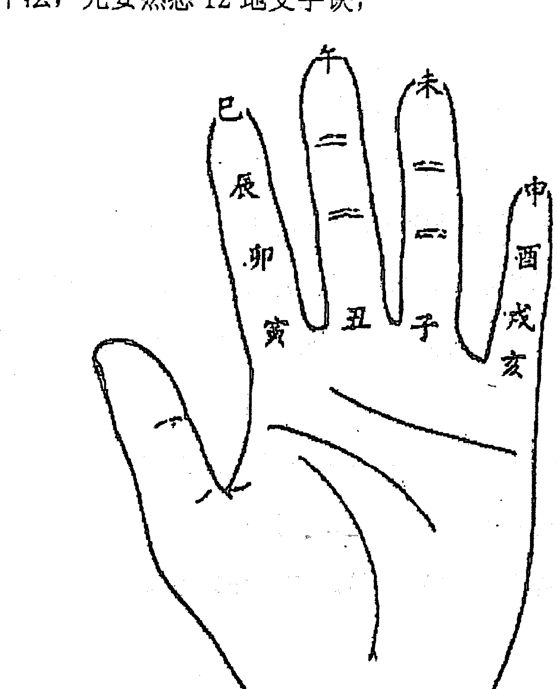

用大指点住与时间相对的那个地方即可。然后，在每次静修前，左手大指点卯诀，念咒语“青龙孟章侍吾左”。再点酉诀，念咒语“白虎监兵卫吾右”。再点午诀，念咒语“朱雀灵光导吾前”。最后点子诀，念咒语“玄武持明从吾后，翁，翁，翁”。在念咒语时，要同时观想四灵神兽分别从所属方向飞来身边守护住自己的前后左右，四种颜色的灵光充满周围的空间。如此护身法修持完毕，接下来就可以再去修习其他的法门了。如果是一般的人只想用来做一下护身，到现在就可以去做其他的事情啦，只要时刻保持这个意念就可以了。最后收法时，只要双手合什，默念“护体灵光速归身，固若金汤卫真人”三遍，即可收回护体灵光，自由活动了。

## 修炼中所用的杀邪法

道士在打坐、坐炼、守一甚至是修炼符咒法术的时候，都有可能引起鬼神的注意。一些鬼神趁机跑过来作祟。这些鬼神上有天魔下有地魔，中间有人魔、鬼魔，也有兴风作浪的“妖怪”，山里有山魈有老魅不足而一。有的会和修炼人“游戏”，有的则是变成狰狞的东西来吓唬修行人，更有甚者，会盗取修行人的精气。不管是对修炼人精神上的骚扰，还是修炼实体上的骚扰。于修行、证道而言都是很有弊端的。兆当行北帝咒鬼杀邪神方。先叩齿三十通，乃咒之曰：

> 二象回倾，玄一之旌[jīng]。七灵护命，上诣三清；
> 双皇驱除，赫柏罗兵。三十万人，侍卫神营。
> 巨兽百丈，吐威摄精。挥剑逐邪，馘(guó)落魔灵。
> 神伯所咒，千妖灭形

其后的密咒向来不做文字，多作秘密传授。但为了各位修行中的道友能杀除对修行不利的鬼祟，特将密咒公开，但请诸位平时不要念诵，尤其是清明 冬至和农历七月万不可轻易念诵。否则咎归个人，风刀于祖宗切不说，很有可能引起鬼神众怒，招徕厄运。

咒曰：

| om | sa | zha | ling | cha | za |
|---|---|---|---|---|---|
| 4 | 1 | 2 | 4 | 4 | 4 |

把前面的咒念一遍，然后一气合成念密咒7遍即可。没有手诀、符图配合。

## 倒霉运化解大法

## 撞死猫狗（开车时忽然从路边钻出狗狗或猫咪，刹车不及，还是把它辗过去了）化解法

动物有灵性，不小心压死了猫狗必须将它们安置妥当，根据传统说法“死猫挂树头、死狗放水流”，但是因环境条件限制，挂树上与放水流的方法变得不合时宜。所以就地简单地将它们的尸体埋在土里，回家后购买一些莲花、金纸，到附近庙宇焚香，化给它们，并默念：“一切恩怨、业障与因果，已经入土，来世投希望能够投胎好人家”。或者是找来庙宇帮忙补运。

## 无妄之灾（心情不错，但是一出门就看到别人吵架、争执，深怕自己跟着带衰）化解法

插手人家吵架或遇见冲突会倒霉，回家后马上找盆水，泡入可以除秽气的艾草、芙蓉、代表贵气的桂花，与大吉大利的金桔，这盆水能够清洗全身最好，但如果不方便时，洗把脸、洗手脚，或者在身上洒水，口念：“一切因果与我无关，请哪里来、哪里去，急急如律令。”

## 打破镜子（有人认为镜子不可以打破，否则也会有坏运）化解法：

小心地把镜子碎片收拾好，用红纸把它整个包起来，另外准备一张红纸，上面写着：“疏离灾难、灾难疏离”，然后才把这一包东西丢到垃圾桶里面。

## 玉器断裂（佩戴在手上的首饰，久了会与身体磁场产生关联，如果无预警忽然断裂，表示它帮主人挡下了灾难麻烦，它以牺牲自己来保护主人，这反而是好事）化解法：

当事者如果很喜欢这个首饰，不妨重新串起来；如果像是玉手镯难以黏合，则不妨取其一部份改成项炼、戒子，但使用前要先以粗盐浸泡，化解煞气。不过再次挡煞的效果会减半。

如果富有纪念意义不忍丢弃，可以化煞后用红包袋内装红豆、黄豆、黑豆、绿豆、薏仁，再将破裂玉器一并放置进去、收起来即可。

## 遇到凶事（遇到凶杀案、自杀、丧事等血光情形）化解法：

回家后立即换一套新的衣服，原本的衣服马上清洗。并且用碗装一点点盐和一把米混合，面向门口并把盐米往外洒出口念：“人离难、难离身、一切灾殃化为尘”。唯一的例外是见到棺材，有“升官发财”之意，反而是好预兆。

## 衰气上身（任何不顺、会让心里生疙瘩的小状况）化解法

利用夜晚11点凌晨1点间，在浴缸中放7片榕树叶、些许盐、7粒槟榔，先放冷水再放热水，泡澡七分钟，就大功告成。如果家里没有浴缸的，可以以小脸盆取代，步骤如上，用里面的水洗脸，然后在心呐喊：“我是最幸运的！”，完成去霉运。

# 第四章 奇门符咒

## 九星符

直符星，又叫大直符，是在这个时辰当家的神。九星之符，是对阴兵发布命令勾通用的。黄纸朱书，写上直使星符，背面写上六仪节印，念咒焚符，练六甲神将兵马。如加n年8月13日酉时，天辅星，甲寅节。写天辅符念天辅咒，背写甲寅节符，写好念总咒焚之。此符当家，能管住局中一切凶神恶煞，哪宫呈凶，哪宫焚符破之。

-   1. 总咒：奉行天法，助国按民，神授天书，秉正治人。节召六仪，前来听用。符到尔验，火速奉行。九星符到六仪节到，天师令到，年月日时，急急如律令。
-   2. 天蓬咒：黑黑冥冥，玄武之英。浩荡无际，咫激飞腾。鲸愁蛟溺，河海弥洪。晋兵藉尔，荡涤妖气，急急如律令。
-   3. 天任星：岩石大块，来自昆仑深涯山壑，伏吟仙真。禽兽繁育，草木茂生。神荼郁垒，灵神精英。飞砂走石头，吐雾兴云。吾兵藉尔，重振乾坤，急急如律令。
-   4. 天心咒：混沌初分，在上清清。阳刚行健，元亨利贞。四时就序，万物化生。先后六甲，隐隐将兵。吾今藉尔，共济安宁。急急如律令。
-   5. 天英咒：荧惑之精，回禄火神。蟠天烁海，灼石销金。天崩地塌，起自星星。乘风鼓势，去积烧屯。吾今藉尔，照耀扬兵，急急如律令。
-   6. 天芮咒：重浊之神，堪舆无垠。振海载岳，万国区分。延绵广大，聚土成陵。五行毕具，万物资生。九宫八卦，惟是幅员。吾今藉尔，拥我百灵。急急如律令。
-   7. 天辅咒：阴鲤豁给，天地化气。东铺西助，四时功毕。波涛激天，扬沙弊日。天趁伊威，伊凭火力。助我行师，奉扬威力。急急如律令。
-   8. 天冲咒：冲冲轰轰，九天王公。出乾入震，骤雨驻虹。一声霹雳，蛰起乾龙。邪魔丧胆，妖孽无踪。震惊万里，博击长空。今尔震响，助我威风。急急如律令。
-   9. 天柱咒：肃杀金刚，凛凛鲜莹，刀峰密布，戈戟云云。乘高击下，威若泉倾，承权自帝，保掖苍生。诛锄强暴，用见功成。吾今藉尔，歼灭贼兵。声传形归，不得留停。急急如律令。

## 二、六仪咒诀（掐诀是大母指点住12地支）

-   1、戊仪：掐甲子诀念咒：阳真之精，运财如风，聚财集宝，不得久停。急急如天师律令敕。
-   2、己仪：掐甲戊诀念咒：天狗之精，掌管安宁，永闭金枷，万骑难惊，急……
-   3、庚仪：掐甲申诀：阳血之精，领一万兵，千千截首，万万剪形，急……
-   4、辛仪：掐甲午诀：荧惑之精，法飞大明，万里煊赫，霹雳数声，急……
-   5、壬仪：掐甲辰诀：粪方蛊虫，能起狂风，精魅大怒，瓦烁火熔，急……
-   6、癸仪：掐指寅诀：躲在遁形，出入无迹，来去无踪，急……

| 甲子 | 甲戌 | 甲申 |
| :---: | :---: | :---: |
| 符咒图案 | 符咒图案 | 符咒图案 |
| **甲午** | **甲辰** | **甲寅** |
| 符咒图案 | 符咒图案 | 符咒图案 |

## 三奇神咒

-   乙奇：白虎蹲踞，青龙踊跃，前遮后卫，趋吉存祥，天乙追随，仁德洋洋。急……
-   丙奇：天是扬威，玄武后随，玉彩摇拽，荧惑流辉，神光照耀，太白成瑞，六丙来迎，百福齐归，急……
-   丁奇：玉女灵神，飘舞彩云，华盖玉覆，仙体降临，玉女前导，善福来格，急……乙为花草植物，乙为脖子，带个项链，写个乙奇咒，弄个小包，挂上。风水上，可用花草，下面压一乙奇咒。乙在乾位，放西北方，再选择时间放。

丙奇用镜子。古人做的小铜镜。都是用来镇宅用的，是太阳丙奇的假借物。“灵镜也是，长期带的不行，可以画一丙奇咒，烧了，在镜子上转三圈，过过火。丁奇为灯烛之火，蜡烛，道家常用。蜡烛不能用一个，最少用两个或7个。手术刀，针灸，钉子也行，不过得写丁奇咒，包着，同时使用。蜡台放在咒上。

## 四、十二地支星符

十二地支符是28宿简图，能量巨大，是化解奇门局中四害的主要符咒。

| 乙奇 | 丙奇 | 丁奇 |
| :---: | :---: | :---: |
| 乙奇符图像 | 丙奇符图像 | 丁奇符图像 |
| **乙奇咒印** | **丙奇咒印** | **丁奇咒印** |

十二地支符

### 子

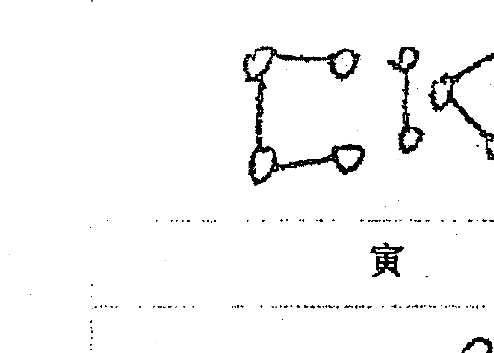

### 丑

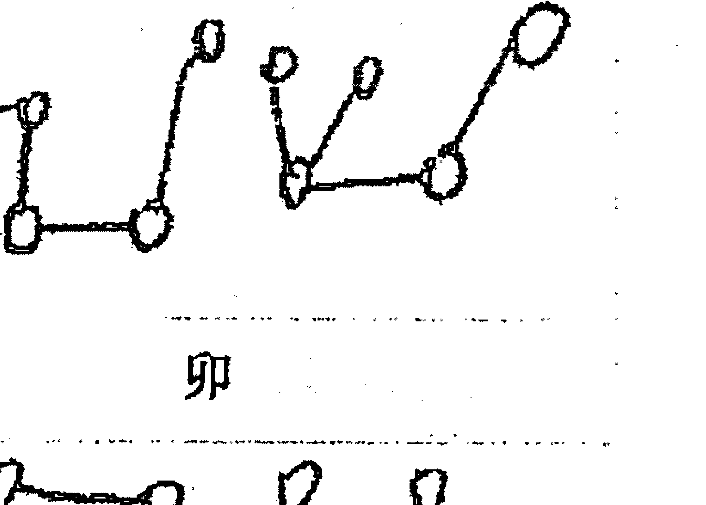

### 寅

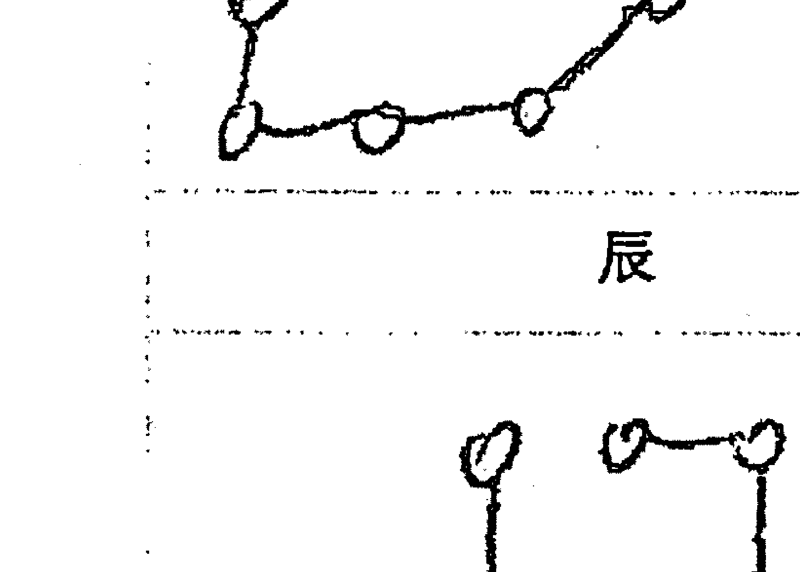

### 卯

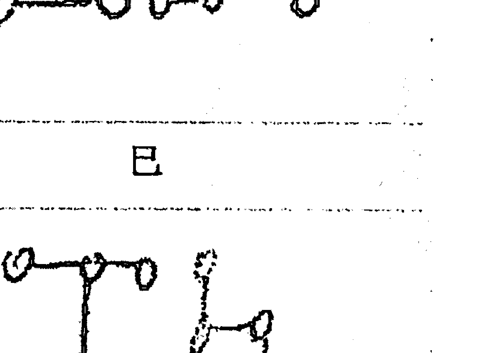

### 辰

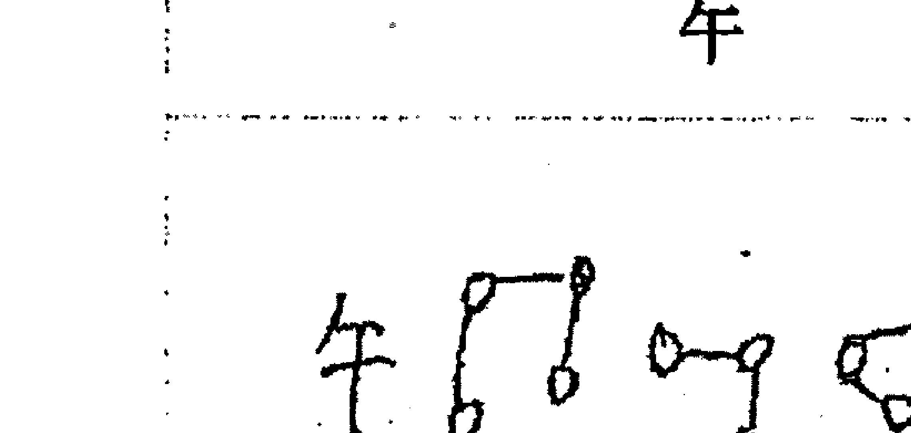

### 巳

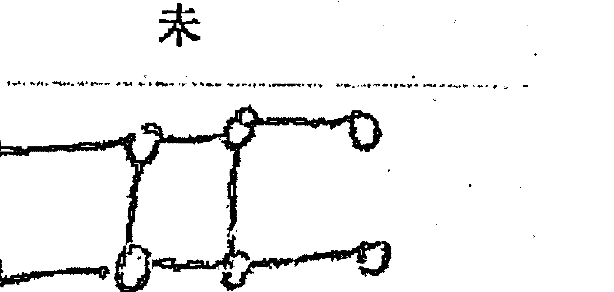

### 午

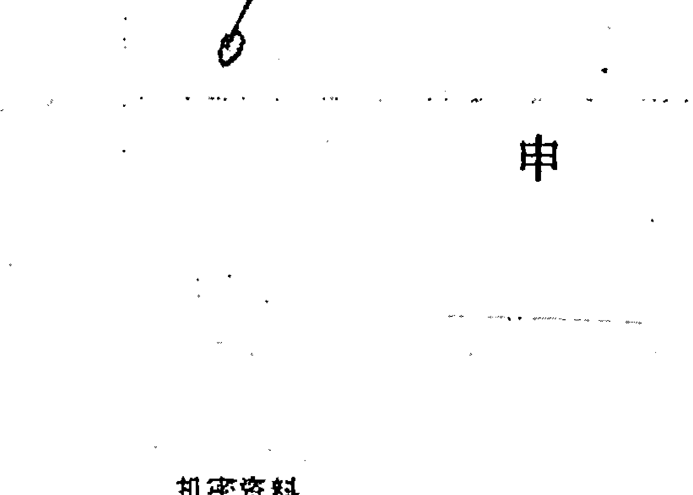

### 未

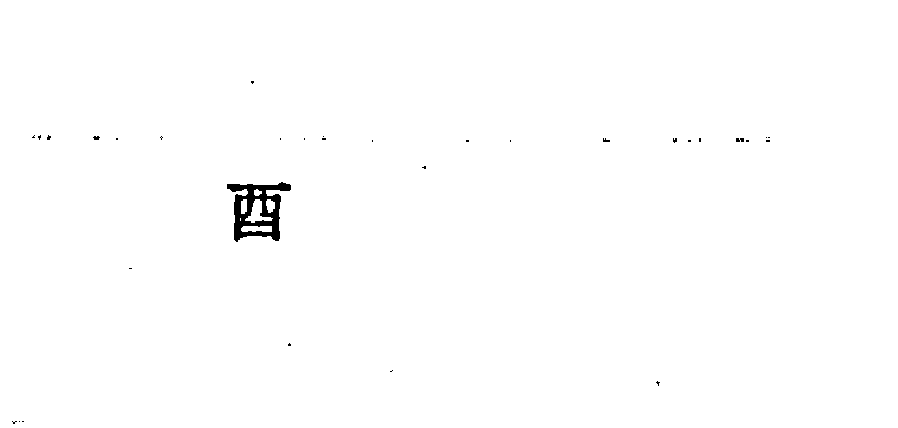

### 申

### 酉

|      |      |
| :---: | :---: |
|  |  |
| **戌** | **亥** |
|  |  |

## 五、符咒的用法举例详解

### (一) 九星符

公元：2011年9月12日15时35分17秒 阴3局
干支：辛卯年 丁酉月 庚午日 甲申时
旬空：午未空 辰巳空 戌亥空 午未空
直符：天蓬 直使：休门 旬首：甲申庚

| 三玄武 天辅乙 杜门乙 | 四白虎 天英 景门 | 三六合 天芮丙 死门 |
| :---: | :---: | :---: |
| 三九地 天冲 伤门 | 五 | 九太阴 天柱癸 惊门癸 |
| 二九天 天任壬 生门壬 | 丁直符 天蓬庚 休门庚 | 三腾蛇 天心丁 开门丁 |

一男测运气。

日干庚+庚：（太白同宫，也叫战格）官在横祸，兄弟雷攻，打架，争执，测工作要变动，伏吟伏不住。两男争女，测求财竞争激烈。

庚+庚为“太白同宫”两个凶神相遇必然互相争斗，所以主同事，或兄弟之间不合，不仅不利某事，而且还容易招来官灾横祸。

此局白虎在离宫，辛极刑引发白虎发凶，日干临值符，自己不应灾，离宫克兑宫，克乾宫，四柱上丁在乾，空亡，填实必应。

-   化解1：麒麟压白虎，客厅南方放一对麒麟。下压天任符，天任为土星泄天英，景门换生门，用八开的纸写一”生”字帖在南方。
-   2. 辛击刑，用丙合住，三道丙符南方烧化。

通过以上的化解就可以平安无事，白虎有时候化不净，免不了头疼发热。

-   3. 化白虎时别忘了护体免得伤了自己。

公历：2011年3月12日10时
农历：2011年二月初八日

四柱：辛卯 辛卯 丙寅 癸巳
节气：惊蛰~春分 阳遁2局
值符天辅星落7宫 值使：杜门落4宫
时空亡：甲申旬 午未空 马星亥

### 壬

| 列1 | 列2 | 列3 |
| :--- | :--- | :--- |
| 玄 坤 癸 乙 蓬 庚 杜 丙 | 地 ◎震 丁 任 景 戊辛 | 天 ◎坎 己 冲 乙 死 |
| 白 艮 戊辛 壬 心 己 伤 | 符 巽 庚 辅 丁 癸 惊 |  |
| 六 乾 丙 癸 柱 丁 生 | 阴 兑 戊辛 芮 乙 休 | 蛇 离 丙 英 己 壬 开 |

庚      马

(2) 一人测事业：丙+壬：（火入天罗）为客不利，是非颇多。乱子多，越往前乱子越多，有人釜底抽薪。

丙+壬，天盘为丙，地盘为壬，由于壬、丙对冲，壬又为天罗，故名曰“火入天罗”凶格，为客不利，是非颇多。

-   1. 天英是烦恼，可见事业出乱子了，丙入墓，不开心，把墓冲开了。用巽宫，玄武为玄学，天蓬旺力量大，辰时在家东南念天蓬咒化天蓬符，事业就会起来。

公元：2011年9月12日22时33分1秒 阴3局
干支：辛卯年 丁酉月 庚午日 丁亥时
旬空：午未空 辰巳空 戌亥空 午未空
直符：天蓬 直使：休门 旬首：甲申庚

| 列1 | 列2 | 列3 |
| :--- | :--- | :--- |
| 玄 白虎 天英 辛 死门 乙 | 丙 六合 禽芮 己 白 惊门 | 庚 太阴 天柱 癸 六 开门 |
| 乙 玄武 天辅 乙 地 景门 | 乙 丙 | 丁 螣蛇 天心 丁 阴 休门 癸 |
| 戊 九地 天冲 戊 天 杜门 壬 | 辛 九天 天任 壬 符 伤门 庚 | 丙 直符 天蓬 庚 蛇 生门 丁 |

白虎在巽宫临马星，辛加乙。

辛+乙：（白虎猖狂）人亡家破，远行多殃，尊长不喜，车船俱伤。测婚姻男方不要女的了，测疾病要猖狂，严重了。测事业一下搞大，辛金主动冲克乙木，故名曰“虎猖狂”凶格，亦主家败人亡，远行多灾。测婚时遇此格，一般皆是男人主动离婚。

辛+乙，辛在上，乙在下，家拆散。

辛年干为长辈，天蓬为当家之神，招阴兵化解白虎，画天蓬符，背面画甲申符，在东南做法，过了这个时辰，便不管用了，因为这个时辰天蓬管事，你来操纵兵马，让他干啥他干啥，这就是法术，别让局操纵你，你就是神。

-   公历：2011年9月14日12时
-   农历：2011年八月十七日
-   四柱：辛卯 丁酉 壬申 丙午
-   节气：白露～秋分   阴遁9局
-   值符天禽星落2宫  值使：死门落3宫
-   时空亡：甲辰旬  寅卯空  马星申

| 阴 坤 蛇 震 符 坎 庚 癸 辅 戊 英 丙壬 芮 乙 癸 惊 戊 开 丙壬 休 六 ⊙艮 天 巽 丙壬 丁 冲 庚 柱 己 丁 死 庚 生 白 ⊙乾 玄 兑 地 离 戊 己 任 乙 蓬 辛 心 丁 己 景 乙 杜 辛 伤 |

### 癸

此例是一个大田地盖房子的人，政府不让盖，送了几万块钱的礼物，盖了一点就被上面推到了，又送礼，盖了还推。无奈之下，找我想办法，看局，丁手续，空亡，手续没有，生门，庚为阻隔，盖不成。必须把丁充实，酉日酉时，在房子的西方栽两个石柱子，柱上面画天柱符。处理过之后，真的很顺利盖起楼房来了。

## 二、八门符的使用

法术奇门不同于其他，你是神，你来操作一切，坏的能变好的，好的也能变坏，凶门能换成吉门，吉门能换成凶门。都在你的一念之间。

-   公历：2011年9月13日8时
-   农历：2011年八月十六日
-   四柱：辛卯 丁酉 辛未 壬辰
-   节气：白露～秋分 阴遁6局
-   值符天辅星落2宫  值使：杜门落5宫
-   时空亡：甲申旬  午未空  马星寅

### 丁

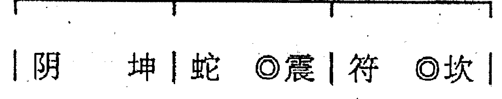

玉真道人修正

| 庚 | 丙 任 | 辛 冲 | 庚 辅 | 壬己 |
| :---: | :---: | :---: | :---: | :---: |
|  | 庚 生 | 丁 伤 | 壬己 杜 |  |
|  | 六 艮 |  | 天 巽 |  |
| 辛 | 癸 蓬 |  | 丁 英 | 乙 |
|  | 辛 休 |  | 乙 景 |  |
|  | 白 乾 | 玄 兑 | 地 离 |  |
| 丙 | 戊 心 | 乙 柱 | 壬己 芮 | 戊 |
|  | 丙 开 | 癸 惊 | 戊 死 |  |
| 马 | 癸 |  |  |  |

此局是朋友开车送孩子去学校，中秋过后十六早上送孩子，起床后，打翻了一杯水，问路上安全不安全？

日干击刑，玄武相克是失财之像，隐干丁，蛇，是车灯撞坏。正前方无灯，杜门门迫，右前方，在家的西南角方向。撞在那里？看对宫，戊为墙，丙为太阳，墙上的太阳，窗户是也，撞倒窗户上，不可能啊，朋友讲，有可能马路边是卖旧窗户的，放的到处都是。

我一听，应像了，赶紧化解：把坤宫的杜门换开门。写一道开门符，贴在车玻璃右前方，一路平安，还真没出事。坏的换好的，你就是上帝。

公历：2011年9月14日20时
农历：2011年八月十七日
四柱：辛卯 丁酉 壬申 庚戌
节气：白露~秋分   阴遁4局
值符天英星落2宫  值使：景门落3宫
时空亡：甲辰旬  寅卯空  马星申

丙

马

| 丁 |  |  |  |  |  | 辛 |
| :--- | :--- | :--- | :--- | :--- | :--- | :--- |
|  | 阴 | 坤 | 蛇 | 震 | 符 | 坎 |
|  | 己 | 冲 | 戊 | 辅 | 壬 | 英 |
|  | 戊 | 死 | 壬 | 惊 | 庚乙 | 开 |
| 庚乙 |  |  |  |  |  | 癸 |
|  | 六 | ◎艮 |  | 天 | 巽 |  |
|  | 癸 | 任 |  | 庚乙 | 芮 |  |
|  | 己 | 景 |  | 丁 | 休 |  |
| 壬 |  |  |  |  |  | 己 |
|  | 白 | ◎乾 | 玄 | 兑 | 地 | 离 |
|  | 辛 | 蓬 | 丙 | 心 | 丁 | 柱 |
|  | 癸 | 杜 | 辛 | 伤 | 丙 | 生 |

戊

这个人想催个野桃花，也就是情人。情人还没有，看地盘干，庚乙，心里想的不是一个，在兑宫，是少女，酉日酉时去西方路上休闲的抽一根烟，喝一杯铁观音。在西面丁字路口喝7杯茶。画两道合和符化成灰喝掉。休门是桃花门。

## 三、六仪符的用法

六仪符是局中常用的，坏的可以合上，使坏的信息发挥不出来。

好的增加，让好的能量加大。

公元：2011年9月15日13时35分34秒 阴3局
干支：辛卯年  丁酉月  癸酉日  己未时   【五不遇时】
旬空：午未空  辰巳空  戌亥空  子丑空
直符：天柱  直使：惊门  旬首：甲寅癸

| 巽六 | 太阴 天英 辛乙 景门 | 丁 螣蛇 禽芮 己 死门 | 三 直符 天柱 癸 惊门 |
| :--- | :--- | :--- | :--- |
| 离九 | 六合 天辅 乙 杜门 | 二 丙 | 乙 九天 天心 丁 癸 开门 |
| 坎一 | 白虎 天冲 戊 壬 伤门 | 玄武 天任 壬 庚 生门 | 艮八 九地 天蓬 庚 丁 休门 |

日干入墓，己又击刑，戊与癸合，放戊把癸合住，在未时马上画一道戊符把癸合住，如兑宫好，就在西面放一道丁星符加大丁的能量。如大门有石狮子相对，就在狮子嘴前烧一道乙奇符，狮子为庚，用乙合住就不发凶了。

## 四、十二道地支符用法

十二道地支符在奇门化解中是最重要的，易记好用又灵便，此符是二十八宿的简写，具有很大的能量。

十二地支符除了奇门局中的四害：

门破用合，击刑用合，
空亡用冲，入墓用冲。

公历：2011年9月15日12时
农历：2011年八月十八日
四柱：辛卯 丁酉 癸酉 戊午
节气：白露~秋分 阴遁1局
值符天禽星落1宫 值使：死门落1宫
时空亡：甲寅旬  子丑空  马星申

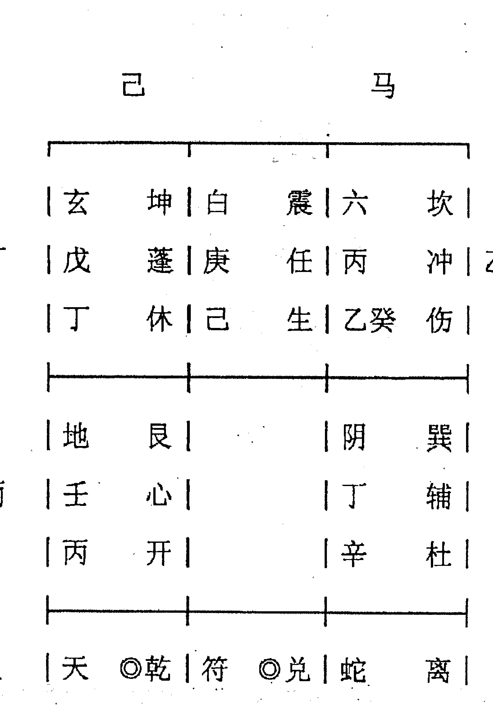

| 庚 惊 | 戌 死 | 壬 景 |
| :---: | :---: | :---: |

### 戊

坤宫伤门门迫，癸入墓，不能冲，一冲就会伤灾。把伤门换成生门即可。
乾宫景门门迫，甲己合用卯合，化一道卯符，在乾宫化掉。
震宫门破，甲辰壬，用酉合，放一个鸡，下压一道酉符。
分析局，日干临死门门迫克离宫，离为生门生意，实际生意停下来了，要把大酒店转让出去，投资3200万。主要是癸合住就行，甲寅癸，用亥支合。北方放一个猪也可以。在子日子时放。此例也可以催官：值符空亡门迫，先处理门破，合住癸，乙为手，戊为钱，拿钱填实，即可当官。

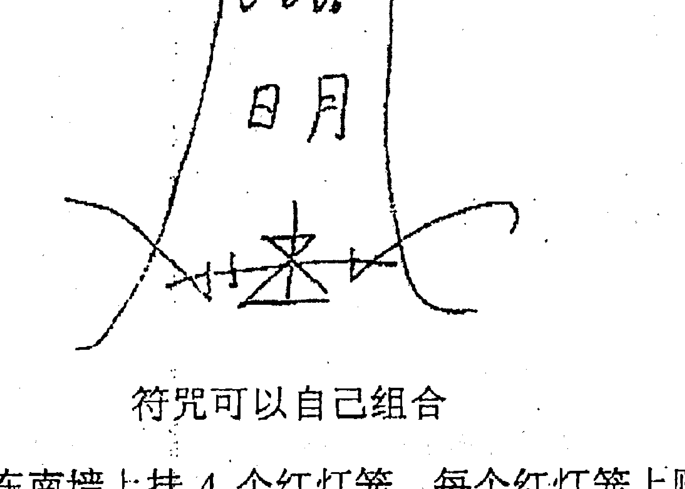

符咒可以自己组合。

上例催财看戊土，在东南墙上挂4个红灯笼，每个红灯笼上贴四道戊符，准能发财。

催文昌星，天辅星，画7道符放在一个钱盒子里面，正西方，可保功课优秀。

# 第五章 借兵疏文

> > 雷霆号令，急如星火，十方三界，顷刻遥闻奉请开山山神，五方土地，地头土地公伯，调借阴兵阳将三千名随我行，地址：**省**县，助本师神坛做法助威灵，兵到事成，急急如律令。

一般而言法师所动用的符咒，在处理感情和合法术上的兵将、无论是阳法、阴阳法、阴法，大致可分为两大类型，一是法师自己所供养的兵将、如五营兵、下坛神虎兵部、或是法师本身祭练的兵将、又称为（亲兵），就如本宗除了供养有五营兵将爷及神虎威猛大将军兵部以外，吾人本身亦祭练有：狐仙、黄仙、常仙、鬼仙、花精、花神、百花仙、桃柳二仙、迷魂将军、鬼力大王、五鬼神、五路英雄兵、为本人之亲兵，如五营兵、虎爷公为养兵亦为公兵，只要有法力的法师都可以用得动、故名（公兵），亲兵又名（私兵）、则是须要法师亲身由甲子日开始连四十九日以符咒祭练、并连续祭练三次方可能成功，此为祭练法中的亲兵法、练成的亲兵只会听从祭练法师一人的符令旨意、别人是很难用得动的、祭练完成后所祭练成的亲兵即会全力相助及达成法师发出符咒所交待达成的和合术或姻缘挽回、斩桃花等任务。

借兵则多是去城隍庙、土地公庙借阴阳兵，或是到阴庙、如：有应公、百姓公、石头公等庙借阴阳兵或的阴兵，法师备借兵文疏一份、借兵符咒两套及供品、如：三牲酒礼、鲜花素果、金银纸钱等，先祝香禀疏文、待香烧至一半时、先将疏文合金银纸钱烧化、再将第一套借兵符咒烧化至主香

炉中，后取主炉内之香灰及香脚放至红包袋中、所取香脚之数量即是借走之兵将之数目、带回坛城中点香禀告主神已借回多少兵将准备就位，再将取回之香灰倒入兵将炉中香脚插好置炉内边烧下符咒、再烧化些纸钱给兵将、谓之借兵，每个月的月初及月中亦要备菜汤、菜饭、三牲酒礼、及大量的纸钱进行犒赏兵将之仪式、各门各派的法师多有此类之符咒、尤其多运用在和合术、斩桃花等法术上。

奇门法术祭练六丁六甲兵马，也可祭练其他兵马，天师道印已有3000阴兵供你使用，还要祭练自己的亲兵，发符办事，有符无兵，符画的再好也无用。

奇门法术练六仪兵马，三奇大将。

-   一， 祭练六仪兵马：处一静室，设坛焚香，桃木剑一把，天师道印一枚，叩拜默咒：中华国土，神受天书，替天行道，操练六仪兵马，奉天师命，握篆持印，督练六甲，扶正祛邪，保国安民，没有妄想，按行遁甲。今日今时，值符，天冲相催，喜出开门，速为传召。勿得停滞。火速奉行，在拜布罡，念天冲咒，焚天冲符，端立存想所催的六仪神像，取剑向空中催符一道，掐六仪诀：念六仪咒。
-   二， 踏罡布斗：咒：天圆地方，人遁九章。青龙相助，白虎相帮，扫除阴邪，去除凶殃，挡我者死，向我者亡，前有天蓬力士，后有四大金刚，助我护我，周游八方。

戊仪：存想戊仪形象，取剑向空中催符一道，掐甲子戊诀，念甲子戊咒：首领乾坤，黄镇将军，须黄发赤，鼠首人身。副将文霸，赤脸长身，镇守北极，统领雄兵。催山缩地，走石扬尘。天师秘旨，速来队伍，听令施行，急急如律令。念毕开目存想，再催符二道，念咒。存想黄镇领兵降临左右，取印在左手，右手仗剑，喝曰：以后随叫随到，火速现形，听令奉行，若然不到，遣下雷霆，暂且退去，营中听令。放印剑台上，拜尔退去。

己仪：重质将军，人面蛇身，丈八蛇矛，腾蛇统身，囊中剑石，变化纷纭，副将丁丑名太常持枪摇铃，统兵万万，虎豹如林，开江塞河，扬沙走石，天师密旨，召你临我，听令施行，急急如律令。

再念咒：勿得退避，速现真形。刚复自用，令到无情。急急如律令。

庚仪：刚钥猛将，镇扎天黄，金牙金发，锦袍铠甲，神斧钢叉，副将丁亥，名文通，黑脸文通，率兵万万，飞刀投空，化成百乙，杀敌冲锋。天师密旨，召尔临坛，来听号令。

以左手食指，无名指，小指，三指紧握，俱插中心横纹，以中指掐大指上节横纹，却以大指压覆中指，紧握之。

## 4. 辛仪：

甲午之神，萧烈将军，眉清粉面，铠甲浑银。奇鹤跨马，喜作诗吟，丁酉为副名倾伟朱冠德仁，领兵万万，步雨兴云，弥漫日月，搬运金银，逢敌丧胆，鬼逢亡魂。天师密旨速召降临。

壬仪：甲辰之神，荡涤将军，首领天下，拱卫北辰。貌欺罗刹，钟馗后尘。金戟环甲，乌龙奔云。副将丁未名飞通率兵万万，抓雾拿云。沉山作海，鬼哭神惊凭空使虚，嘘气皆兵，天师密旨。

## 6. 癸仪：

甲寅之神，黑豹将军，面如黑铁，红甲乌鞭。手持钢鞭，声吼如雷。副将俨如，獠牙赤发，乙万天兵，如猪如熊，隐伏潜行，临锋速发，呼啸山风，山摇木拔。天师密旨，召你速来，听吾速发。

注：熟练之后，用时呼其名，如甲寅旬用事，喝曰：黑豹听令，摔你众兵，名列阵内，各显其能。如斩断桃花，不得留情。自由发挥。天师印是兵权，剑是指挥棒。

## 三，祭练六丁

## 四，朱砂书六丁符，持符念咒，旬内唤其名

- 1. 甲子旬，丁卯名文伯，真君兔冠，青衣裳，手持莲花如意，形貌美悦，神色微青。
- 2. 甲戌旬，丁丑名文公，真君牛冠，黄衣白裳，手持长戟，形貌美悦，神色微黄。
- 3. 甲申旬，丁亥名文通，真君猪冠，朱衣紫裳，手持镜自掩，神色微黑。
- 4. 甲午旬，丁酉名文卿，真君鸡冠，羽衣素裳，持长枪，貌美微白。
- 5. 甲辰旬，丁未名文叔，真君羊冠，素衣黄裳，持莲花，貌美色黄。
- 6. 甲寅旬，丁巳名文庭，真君蛇冠，绯衣黄裳，持长剑，貌美色红。

凡祭练六丁神女，用六丁日申时，素果鲜花，插于坛上，心呼其名，召来现形。

调回散兵游将回坛

化外外化妙

调兵符：发兵前先调兵

## 发兵符

## 借兵符

## 借调阴阳兵将行符（化炉）

# 第六章 收魂驱鬼

家有阴灵作怪，或房下有鬼燃三只香，曰：房内灵仙，以有阳人居住，我在用钱给你买一处房子居住，你跟我走，拿香到十字路口，摆贡烧纸钱，家中用符包一枚五帝钱，放于门槛下即可。

人由三魂七魄构成十全之灵体，婴儿初临人间，灵体附于肉体不久，尚未完全固定适应，故偶闻较大听音就受到惊吓，脸上青筋浮现，饮乳不下或吐奶，卧难安眠，夜半哭啼不止，收惊者请神灵帮助，将婴儿魂魄收回清茶一杯置案上，燃点三支香，向灶君禀告小孩姓名、住址、生辰年月日时，以及目前精神状况。（大人受惊同样可用此法）

然后把三支香在小孩面前、胸前上下摆动，口念收惊咒，如下：

> > 拜请九天司命护宅真君来收惊，收起小儿（女）某某失落魂魄，受惊元神，归在本身。收起东方惊无惊、西方惊无惊、南方惊无惊、北方惊无惊、中央惊无惊，五方正气护身煞气除，大惊小惊化无事。子丑寅卯辰巳午未申酉戌亥，十二元神自在，百病消除身无灾，日吃饭乳知香味，夜好安眠不啼哭，生命之光照灵台，吾奉「九天司命护宅真君急急如律令」。（反复念三遍）

用三支香在茶杯口上方写：「魂魄自在，身无挂碍，三魂七魄，圆满愉快、十方正神，护体煞解，甘露法水，解病消灾。」念毕，法水可给小儿饮下，即可平安无事。

## 三．快速收惊

- 1. 在左手写
- 2. 在右手写
- 3. 在胸前写
- 4. 在背写金木水火土
- 5. 在额头写六字真言唵嘛呢叭咪吽

# 第七章 五鬼大法

## 驱魂法术

方法：阴日写符，用五鬼钱、寿金、刈金，甲马，向东南西北中五方向烧化。
步法：用五鬼罡步或不用均可。
指法：左雷或剑指。右剑包左雷。

> 咒语：拜请五鬼五鬼将，阴兵鬼将显赫，吊捉某某人三魂七魄十二元神一齐归，归在坛前来受刑，人催催，鬼催催，催驱某某真魂正魄收在地狱来受刑，敕动邪兵邪将来出行，锁锁缚缚，心狂迷乱，疯疯癫癫乱话，不知人事，遍身如火烧，不过七日归司地府，吾奉阴山老祖敕，急急如律令。

注意：没有师承关系或拜过师傅者擅自使用，容易受重伤。

## 五鬼搜魂法术

作法：每日子时，酉时各烧一张符与寿金、五鬼钱在对方门口烧。
指印：井五阴指。
步罡：五阴步如下图。

指印：左雷右掌包食、中指伸直，其他手指弯曲。

咒语：天苍苍，地皇皇，拜请五鬼阴兵到坛前，脚踏飞龙在云天，铁链铁锁随吾身，迷魂童子摄魄童郎，阴兵阴将随吾旨令，擒魂捉魄不得长生，拜请东方五鬼到，南方五鬼到，北方五鬼到，西方五鬼到，本境五鬼一齐来，拜请五鬼阴兵听吾号令，急急出门，天无生地元主，收斩某某三魂七魄为主，魂飞魄花散，四四散散，一起斩死不留情，是吾兵听吾令，是吾将听吾断，三更叫汝也要听，四更叫汝也要行，顺吾者生逆吾者死，吾奉阴山老祖敕，急急如律令。

## 驱魂散离法术

写法：黑纸白字
用法：每天烧化十道符。

咒语一：征魂童子魂童郎，藏下阴中之地不能生，求灵保报应某某不能走行，征伊三魂七魄，追去见五道仙师，胡言乱语，至灵至白鬼六行，行道头疼，脚手如冰，周身如势，精神散形，吾奉阎罗天子鬼力大王押行，急急如律令。

咒语二：弟子一心拜请，拜请五方五鬼七十二地煞将急到，追入某某家中显身作弄，惩罚仇人不留情，吾奉鬼力大王敕，急急如律令。

## 4. 索债法术

法术一：
用法：到阴庙或欠债人的出入口烧化，加七张五鬼钱、寿金、符后加写双方住址、姓名及八字，如果没有则不用写。可与后三道符一起配合使用，每日一道符。

指法：道指。
写法：黄纸黑字。
罡步：五鬼步。

咒语：天通灵地通灵，拜请五鬼显身展神通，五鬼将军展拔五鬼去作弄某某欠吾某某钱不还，急请五鬼显身惊男女速还钱，阴公敕令，急急如律令。

咒语：天灵灵地灵灵，拜请五方五鬼阴兵急显灵，展神通，五鬼将军展神通，拔去五方五鬼去作弄某某，欠吾某某钱始终不还，弟子某某现在经济困难，急急请出五鬼显身惊他某某事，要他速还钱，吾奉阴山老祖敕，急急如律令。

法术二：可变内容做其它用途。需将两个纸人烧于对方路上门前，五鬼钱、寿金各七张催之。黄纸黑字，写姓名及地址，加敕压魂咒：天冬冬地冬冬，鬼符惊吓恶人从，专压债主魂魄收，收服某某来顺从，有债还债清清还，急急如三山九候祖师律令，摄摄摄。

法术三：用法同上，加压毫光符。咒语 xxxxx 摄摄摄。

法术四：用法同上，咒语：天清清地灵灵，拜请五鬼阴兵……急急如律令。

法术一用符 法术二用符 法术三用符 法术四用符

## 阴坛用符咒法术

五鬼符及用法：发哪一方写哪一方。此符用于做法办事用。

咒语：天清清地灵灵，又施阴兵五鬼听符令，神通变化千万里，收斩天下无道人，斩尽凡间不正神，左手持印通天兵，右手掌旗调天将，调得天兵天将进前来，若有凶神恶煞不服者，五鬼发火烧妖精，弟子一心专拜请五方五鬼进坛随符听令，急速奉行（可加地址、人名、目的于此处），神兵火急如律令。

# 第八章 净宅

在条例化解阳宅时，要先净宅，不然一些坏的能量阻碍你做法，在客厅门口念：弟子做法，免的伤其无辜，请一些无关仙家速速离开，然后用剑或剑指划四竖五横：每画一下念一句。

# 第九章 延寿七星灯

《三国演义》中诸葛亮在五丈原点七星灯祈寿的故事，就是人天感应的典型事例。

道家讲“南斗注生，北斗注死”，所以若要延寿就得建醮设坛，点上七星灯，念颂《大梵北斗延寿科仪》或《太上北斗延生真经》等经文，来礼拜北斗，以期感应而赐福加寿。一般来说这对于有德行的人是较灵验的，不少人通过拜北斗而延长了寿命。但由于诸葛亮为了帮助刘备争夺三分天下，而三次以上采用了火攻，烧死敌军不计其数，就连无辜的动、植物都难于幸免，杀孽太重伤了天和，所以上天不允所求，故而大将魏延为报军情误冲大帐，踢倒了本命星灯，致使无法与北斗星君感应，拜斗祈寿失败，一代名相诸葛孔明归命五丈原。

设坛，请北斗星君临坛。烧疏文。必须是星斗满天，燃七盏油灯，斗内燃一盏大的本命灯，每盏灯下压延寿符，延寿人的姓名八字头发，指甲，符压在本命灯下，从摇光开始念咒 7 遍，共 49 遍完成。疏文：弟子奉天命作为 XX 做法延寿，XX 地址八字，敬请北斗星君临坛助弟子延寿成功。

> > 咒：玄玄真一身，演经九天文。飞行大罗界，金薹朝皇人。长生无苦根，年龄依华椿。百骸洞琼光，虔谢白元君。

念毕，叩齿三通，咽液三过，冥目观身，端坐五色光中，又念集福德咒曰：

> > 玉臺童子书，灵仙保其门。福德随日新，身光晃三天。紫盖罗千宫，心归无上尊。五福长绵绵，密护玄中人。

画符作法忌狗来月经女人看见。

## 北斗延寿符

# 第十章 天师灵咒

## 一、奇门阴阳宝镜符咒秘法

具体方法如下

各用：朱砂，白芨，毛笔（狼毫更好）、圆镜、砚、少许白水研磨。

- 1. 念净身咒：

> 嗡 天地三光
> 九江八河水王母玉池浆
> 入我阴阳窍漂荡由昌
> 三魂双灵由亮太光
> 三四九宫五行满昌
> 神水一束五祖之光
> 吾奉天师救令

- 念时掐子午诀：
  左手拇指掐注中指端
  右手拇指掐左手子午，中指捏于子位外侧。
  念至“吾奉天师”深吸一口气于丹田，同时子午诀手印上提喉轮，分手沿颈部两侧至后脑从头顶下行至喉轮，再结子午印，吹气，边吹气边存想“救令”，默念“救令”。
  手印下行丹田，收印
  注：净身咒也是净宅咒，也是净一切物咒。

- 2、净笔咒（吹笔咒）

> 乾剑金坤顺轮
> 魁雷电震玄峰
> 云星星哄霹雳
> 罡星至月星斗
> 嗡、乾、元、亨、利、贞、笔开。

对天门深吸气至丹田，呼出吐在笔峰上，吹时心想“笔开”。

3、阴阳宝镜上边画符，边念咒，边念咒边画符：

咒曰：

> 寒风和月朝万宗
> 邪妖立绝鬼比风
> 二十四气尊神镜
> 乾坤万里镜面行
> 安宅立善紧护道身
> 吾奉吾天师敕令

完毕，将此阴阳宝镜符挂在门楣上或窗。

## 司机护身符

哪吒三大子土地共山神
我在危难处急急护我身
护前身，护后身，护左身，护右身
急请南斗六星、北斗七星
吾奉天师敕令

注：此咒可护身，也可护物，出行于车上也可念此咒。配有《护身符神妙法》此符可以挂在车上，佩在身上，晚上要挂在洁净处。画符时，照符上标的顺序，不能说话，应静心来一气呵成，灵光圈不能断开。

# 第十一章 奇门祝由术

- 一、此法无需任何禁习，21天即成。
  修炼方法：起一块桃木板，其他木也可以，背面写张天师，人神合一后，以中指弯曲，连写“旁海篷”三字百遍。头7天指尖不离木板；8至14天指尖离纸约5寸左右；15至21天指尖离木板约1尺左右；书写时精力要集中在中指尖，意想指尖穿过木板去。
  为人治病时，先写“旁海篷”三字。此三字既是符，又是咒，能治多种疾病。

## 二、符字

| 字符 | 病症 | 字符 | 病症 | 字符 | 病症 |
|---|---|---|---|---|---|
| 鬼泉 | 麻木，手足疼 | 鬼窗 | 心气病 | 鬼票 | 癫狂症 |
| 鬼香 | 风湿遍身疼 | 鬼鸦 | 咳嗽 | 鬼生 | 咳嗽 |
| 鬼咒 | 恶疮 | 鬼胃 | 胃疼 | 鬼炎 | 胃疼 |
| 鬼赤 | 胃疼 | 鬼脸 | 腰肩眼疼肿块 |  |  |
| 田 | 小儿夜哭腹泻 | 拘 | 惊吓头疼 | 斩 | 怪病邪病精神病流行感冒 |
| 靔 | 全身病 | 虎 | 无名肿瘤腮腺炎流行感冒。 | 井 | 各种疼，手指麻木屈伸困难。 |

### ## 二，奇特字符

| 字符 | 病症 | 字符 | 病症 | 字符 | 病症 |
|---|---|---|---|---|---|
| 火 | 鼻炎,腹膜炎 | 火炸 | 腹中痞块 | 火虫主 | 各种水肿 |
|  | 乳腺增生 |  | 肠炎胃疼 |  | 小便处疮 |
|  | 肝炎,结膜炎 |  | 牙疼 |  | 跌倒损失,关节疼 |
|  | 脊髓炎,腹满鼓胀 |  | 半身不遂 |  | 浑身无力,易倦 |
|  | 上呼吸道感染 |  | 肿瘤 |  | 遗精阳痿性功能减退 |
|  | 风湿皮肤病 |  | 痤疮 |  | 子宫脱垂 |
|  | 腰腿疼 |  | 减肥 |  |  |

治病对患处写，也可对穴位写，对水写喝，自己意念写。要一字治多病，多字治一病。要变通，自己可创造字治病。

## 四，肿瘤搬运

肿瘤搬运术，民间的师傅称之为“寄”法、“移”法、“移山填海法”。搬运疗、疮、痛、瘤颇见成效，用于“病气”之搬运则易如翻掌。

本术是符、咒、手印综合运用之妙法。吾今和盘托出，一语直泄天机，望练习者功成后广济博施，以慰历代高师在天之灵。

### (一) 搬运符 (符式附后):

本符系用“小铁板萤”分别隔空画在肿瘤部位及树杆上，画“退”字时，先画“辶”，再画“艮”。整个“退”字正好复盖在肿瘤部位，每画一遍均顺时针方向画七个圈。

### (二) 搬运咒 (移山填海咒)

收回封闭令，搬去五行山；掘出江河水，捆龙出海滩。

### (三) “小铁板萤”结法:

双手五指松直、左掌心向下、右掌心向上，两手的小指、食指轻轻互勾，两掌直立即成“小铁板萤”。画符时，用右手中指、无名指对准所画之处。

### (四) “金钗萤”结法:

双手五指松直，小指互扣、右手无名指第二节压左手中指第三节背部；左手中指、无名指、右手中指内屈，两食指、两食、拇指前伸成萤。

### (五) 用术步骤:

- 1. 选择空旷人少之地，令患者全身放松站立树边1-2米处。
- 2. 术者默诵“本师咒”三遍，沟通上师息。
- 3. 用“小铁板萤”对准肿瘤处画符七遍。
- 4. 嘱患者速离原位。
- 5. 手印不变，立即对准树杆（指尖距树杆表面二公分左右）画相同的符七遍。
- 6. 双手改结“金钗萤”，意劲并用，将“金钗萤”钗向树杆（两手食指直指树杆）。

### (六) 提示:

- 1. 施用本术宜在日落天黑后，白天用术效果欠佳，且易发生意外。
- 2. 画符时应同时念咒，念咒七遍，符也七遍画毕。若边画边念不习惯，可先默诵“本师咒”三遍，再默诵“移山填海咒”七遍，随即画符。
- 3. 在实际运用时，应将整道“搬运符”从上至下任意分为五个组成部份，并重叠画在肿瘤部位及树杆上。
- 4. 符外面的圈，并非是一个圆形，而是一个螺旋形。旋转方向均为顺时针，但起始点有别。画在病灶处应是由内向外展开，画在树杆上应是由外向内收缩。
- 5. 修习本术，宜在清晨。选相邻二米的树二棵。轮流地将其中一棵树假设为病人反复进行搬运，臂、肘、腕、指各部位各必运转自如，方能奏效。
- 6. 施展法术的成功率，除致病原因之不同外（气阻者较易成功）。与术者的道行，功能态有直接的关系。
- 7. 你若在第一次施展本法时就马到成功，切勿认为是巧合，请你在静定中继续悟道。

# 第十二章 阴阳桃花扇

## 一， 先找到桃花位：

- 1、 生肖
- 2、 属相年支（八字）亥 未 卯 在子 申 子 辰 在酉 寅 午 戌 在卯 己 酉 丑 在午
- 3、 日支（八字）如日支为午，桃花位在卯位

| 出生年 | 桃花位 | 小峦头催旺 | 大峦头催旺 | 备注 |
|---|---|---|---|---|
|  |  |  |  |  || 生肖 | 方向 | 放置物品 | 水/沙配置 |
|------|------|----------|----------|
| 猪 | 正北方 | 放置麻花状黑色沙 | 西北方水 东南方沙 |
| 兔 | 正北方 | 或蓝色花瓶 | 东方沙 西方水 |
| 羊 | 正北方 |  | 西南方沙 东北方水 |
| 蛇 | 正南方 | 插真或假的桃花九支 | 西北方水 东南方沙 |
| 鸡 | 正南方 | 放置三角状红色 | 东方沙 西方水 |
| 牛 | 正南方 | 或紫色花瓶 | 西北方水 东南方沙 |
| 虎 | 正东方 | 放置圆形细长青色 | 西南方沙 东北方水 |
| 马 | 正东方 | 或绿色花瓶 | 南方水 北方沙 |
| 狗 | 正东方 |  | 西北方水 东南方沙 |
| 猴 | 正西方 | 放置方形金色 | 西南方沙 东北方水 |
| 鼠 | 正西方 | 或白色花瓶 | 南方水 北方沙 |

瓶中装满清水，插真或假的桃花九支，如能配合大峦头催旺调整则更加灵验

| 生肖 | 方向 | 放置物品 | 水/沙配置 |
|------|------|----------|----------|
| 龙 | 正西方 |  | 西北方水 东南方沙 |

## 二、催桃花，斩桃花，元宝，纸钱，五色纸，用白纸剪五个小纸人，在桃花位的十字路口烧掉，纸人胸前横写桃花开，竖写名字，留一个挂在卧室的桃花位上。斩桃花，横写斩桃花全烧掉。

## 有意中人催桃花：

符背面写上意中人的名字，八字地址放枕下。

要经常联系。

## 三、召男召女符

真人玄天上帝灵签第三签
中吉 签
甲庚 愿签
花 结果
得 遇 仙

## 四、隔断桃花

桃木剑挂卧室床北

-   五、南挂桃木剑，女挂桃木刀，在关公面前开光更验。

# 第十三章 破阴阳偷风水

## 一、破阴阳

在坐山烧破损符损人丁，在向上烧损财，不能山向一起烧，注意护体，咒：法施其屋，顿然生辉，其恶流疾，物投其间，行师之法立。屋坐山岩则岩倒塌，屋落于地，则地崩裂，人事无以轮回，吾奉杨公先师敕令急急如律令！

## 三、偷风水

借旺财人家硬币几枚，放锅中，烧开，让蒸汽充满全屋，咒：天灵灵地灵灵，借来财神用一用，天来财，四面八方都来财，108遍。

# 第十四章 奇门穿壬

起奇门局，不论阳盘阴盘，都可以，奇门穿壬最佳的时空组合，来改运，催财，催官，这三者不可操作时，不要勉强，违背天意。

公元：2011年9月17日20时14分29秒 阴6局
干支：辛卯年 丁酉月 乙亥日 丙戌时
旬空：午未空 辰巳空 申酉空 午未空
直符：天辅 直使：杜门 旬首：甲申庚

|  | 九地 禽芮 生门 庚 | 玄武 天柱 伤门 乙丁 | 白虎 天心 杜门 壬 |
|---|---|---|---|
| 父 | 癸己 | 戊 | 丙 |
| 起子时 运 | 九天 天英 休门 辛（丁蛇） | 己 | 六合 天蓬 景门 乙（癸玄） |
| 兄 | 直符 天辅 开门 丙（三阴） | 螣蛇 天冲 惊门 癸（乙六） | 太阴 天任 死门 戊（辛白） |
| 偶 (1月10日) | 丁 | 子 (1月9日) | 财 |
|  |  |  | 疾 |

## 二、定拐云二宫

时上为命，刻上为运

-   ①正月起于坎宫，时上一月一宫，递进顺数。
-   ②月上起日，日上起时，时上起刻。
-   ③一刻为10分，10分进一宫；不足10分者，10分进一宫。如上例，从坎起1月，八月落乾宫。从乾起1日，20日落震宫，从震起子时，戌时落离宫，从离起子刻，午刻落震宫，则离为命，震为运。大体运势，运生着命，现在正走运。

## 三、定财官二宫

-   1. 十二宫：运、兄、偶、子、财、疾、迁、友、官、田、福、父
-   2. 起十二宫的方法是从运宫逆行一周与十二地支对齐。
-   3. 每逢乾、坤、艮、巽四维宫，即从辰、戌、丑、未四土上起运逆行一周。

上例从震宫起运，寅上兄，丑上偶，子上子，亥上财，未上官，这样，卯运，亥财，未官组成三合局。

先改运：震宫象意红色的水晶串，在早上5到7点东方烧一道催运符水晶在符上过火，念咒：

> 天开开，地开开，吾今施法把运开，六丁六甲降临来。
> 歹运赶退，小人退渡，破除阻隔好运到，好运年年日日来，急急如北斗，本命星君律令，
> 六丁六甲
> 神兵火急如律令水晶带身上，太阳升起来，你的运气也升起来了。

催财：乾入墓，冲开，在乾烧午支符，西北放一匹马。

催官：空亡门破，合住，放一头牛，甲子戊，用丑合。在西南角。

上局财官就不能催，只能化解，催在没有病的情况下才行。有病一催就坏。
大家要了解，先化解，再类催。禀尊守天意。在做法的同时，你会懂的，法大不过天。

# 第十四章 风水师解灾护身秘法

通常情况下，一、不论阴基也好，阳宅也好，凡属很好的风水宝地容易冲师、犯师；二是极坏的败绝之地也容易冲师、犯师；三是凶死恶亡之尸容易冲师、犯师；四是自身身体状况欠佳有病，心绪不宁之时又逢绝地恶煞极盛容易冲师、犯师；五是所用日课冲犯自身，容易冲师、犯师；六是坟穴分金冲犯自身容易冲师、犯师；七是亡命火宅主年明泰遂于自身年命太随即日元有刑冲克害象者容易冲师、犯师；八是刚一出门或准备出门时遇有凶兆、不吉之象也容易冲师、犯师等。

所谓冲师、犯师就是所做阴基、阳宅的凶神恶煞冲犯地师本人。这种冲犯有速发速应的，勃然祸至，大难临头，发生凶死，急症不治，直至夭折。也有慢发慢应的，当时感觉不明显，也无大凶大恶之象，但其灾如患了慢性疾病一样，慢慢发作，其表现多为运气逐步不顺，疾病不断，家运日衰，或损自己，或损家人。有些民间地师操作时突发遭灾，直至丧命市常有所闻的。有时在操作过程中，事先有些大凶之前兆，明公应遇之能见并断然采用破煞解灾紧急措施，稍遇疏忽，铸成大祸，将遗恨终生。因此，凡学习阴、阳风水之人必须懂得和应用预防犯师，解灾之法，以保护自己，在任何凶险的情况下，都能稳坐泰山，安然无恙。

其法如下：

凡习学应用风水术之人在自己居家静室设一坛位：用红纸或红布长56公分，宽38.5公分，用毛笔写黄字，竖排，上书：“太清太上老君神位”，丰都北明大帝神位，左方书小字；某省某市、县、路、街号戒某省某县乡村某某奉把早晚焚香，或在练功时焚香，太上老君即老子，是万神之一神，率有玉女，六丁六甲神江、河伯、洛神及张道陵、鬼欲先生，赤松子、茅君、东方朔等神仙。丰都北阴大帝时天下之鬼神宗，率有秦始皇、魏武帝、汉高祖、齐桓公、晋王公等如某日要去看风水，临行前净手焚香一柱，双手合十，两眼微闭，默念以上两神扶持保佑即可。

## 备用常带身边镇煞避邪免灾之宝：

-   (1) 特制议决银牌：大小比铜板略大、圆形、正面书：太上老君在此同随，直排。北面周转画先天八卦图，从外向里看，中间书四字“吾神坚固”。制作好先在太上老君居。北阴大帝神位前挂四十九天，早晚焚香。四十九天之后即可身带此物，或戴在项前，或放在包里均可。平时常带此物，遇有邪恶之法，欺诈之徒，可拒其奸邪信息而免上当受骗，保持自身头脑明敏清醒。如不出门，可挂在神坛前，不得与污物同放。
-   (2)制作铜剑一把，用乾隆铜板六十四个用棕绳串连成剑状，朝神二排，剑尖一排。
制成后挂在二神神坛前四十九天，其它事项如下：(1) 此物平时一般不用，只在做风水尤其作阴基时必用。上山时暗藏在包里，无事不动用。有事时即见不祥之兆或操作不顺时，左手握剑指天，右手食指、中中指靠紧指天，其它三指屈曲掌心，两眼微闭，口中默念：“太吾、文王有灵，周易八卦有灵，杨公先师有灵，鬼煞退避，神鬼不忌。”默念三遍即可将剑收藏。”

### 三、护身镇煞咒语：天道、地道、人道，我行其道，鬼神忌，太上老君在此！此咒在出发前，乘坐汽车、轮船。飞机等均可念，造坟、造门；作灶之前，面向上天，默念三遍，可收到鬼神不忌之功，为符咒之大法。天德无义之人不可乱传。

### 四、当操作时遇有感到自身突然不适时速念：“我身坚固，安然默然，万载昌盛，和道和仙，丰都北阴大帝、速速降临，申领护我，恶煞速灭，凶鬼速避。”三遍即可。

# 后记

写完已是晚上12点多，今天山东淄博有人让我去做风水，只得叫广西的谢子义谢老师过去处理。法术奇门整理结束，又得准备24号的面授班法印的开光。《天目奇门》《山向奇门》《法术奇门》资料都出来了，也了结了我一个奇门教学的心愿，最后告诉大家法术要练兵马才灵验，这是铁律授千年奇门之矛揭道甲法术之秘。

-   1、其独特的教学方法：小班教学，9个人之内，手把手教导每个学员现场操作实践真正的实现走进汉城你就成为一位奇门风水大师。
汉城是道祖张天师的出生地，同时又是开国皇帝汉刘邦的生身地于成道人，将带领您进入道、进入千古龙凤地一代帝王乡的汉城，研易奇门风水玄机。
道家奇门风水自在徐州汉城开班以来，受到广大奇门爱好者欢迎！
-   2、奇门风水班以最全面、最低价格回馈易界朋友：从奇门移星换斗到山向奇门布局，到法术奇门调理，一步到位。移星换斗中一卦清纯先后天通气秘法公开。山向奇门调理更加完善、安全、效果长久、能量宏大！
-   3、法术奇门在局中的应用。离开了局，符咒不起作用。离开了时空，法术将无生命。于成道人将给您揭开法术奇门的正真面纱。

于成道人于2011年10月