# 五分鐘塔羅維

完全圖解。快速記憶。幫助學習

- 從塔羅牌的起源
- 派別到基礎牌陣的介紹
- 所有你該知道的
- 關於塔羅牌的知識與常識
- 一次完整收錄

解讀曖昧

作者◎寶咖咖

作品散見蘋果日報及各大報、網路 Facebook
個人部落格：www.wretch.cc/blog/a27005858
還有免費線上抽牌系統

〈正位篇〉

# St. Royal College
天使神秘学院

- ※ 专业占卜预测机构
- ※ 神秘学培训机构
- ※ 水晶能量研究中心
- ※ 神秘学资料库
- ※ 官方微信：strcdts
- ※ 微信公众平台：strc2011
- ※ 读书交流QQ群：
    - 占星塔罗占卜师交流群：814594478（加入密码：PDF）
    - 神秘学其他综合群：659338717（加入密码：PDF）

微信号：strcdts
天使神秘学院

天使神秘学院 院长QQ：715104687

微信公众平台：strc2011

# 制作说明：

本书由《天使神秘学院》出重金从台湾购入的原版书籍扫描制作完成。为达到最好阅读效果，特地把原版书全部切开后，再经由专业扫描设备高精度扫描完成，并经过一张张的PS后期处理最终成书，其间花费大量的人力、物力以及时间，只为能给大家提供经济并优质的神秘学学习资料而努力。

本学院强力谴责某些机构和个人，把本学院花心血制作完成的电子书籍，包装后直接放在自家淘宝网上低价倾销的行为，以谋取不劳而获的经济利益。如果长此以往最终将无人愿意再为大家花心思制作电子书，那以后可能大家再无新书可读。

为让大家以后能够读到更多的好书，也为了本学院的良性发展。本学院恳请大家尽量做到如下几点：

一、尽量在本学院的网站购买电子书籍。
二、请勿用技术手段把电子书内的水印及加密去掉。
三、在收到电子书后小范围传阅即可，千万不要公开传播，更别挂到淘宝网上低价销售。

同时为答谢广大支持者，学院电子书将做如下调整：

一、学院会把一些早已收回制作成本的电子书折价销售。
二、最新制作的电子书籍会开放打印功能，大家购买后有条件的可自行打印成书。

天使神秘学院
2019年1月

雖然有些人在得到了塔羅牌給予的訊息後仍有著如同〔戀人牌〕般的三心二意，但那也是他們的選擇，有些明顯的警訊也無法阻止他們像〔戰車牌〕失控的狀態勇往直前。

我只能祈禱有一天他們能體會〔力量牌〕中內心智慧力量的聲音。因為那就是他們的人生，我只是如同〔隱士牌〕般的給他們一個方向，最後的選擇權仍存在於他們心中的〔命運之輪〕裡。

雖然我的生活作息已經因此而大亂，曾經也想要找到〔正義牌〕中的那個平衡點，但最後我選擇甘之如飴的樂於做個〔倒吊者〕。

在解牌的過程裡看到太多的感情生活如同〔死神〕般的期望感到重生，也看到太多不懂得〔節制牌〕牌意的人勇敢在錯誤中不斷的努力，更看到太多如同〔惡魔牌〕般的欲望不斷的在對與錯之間展開翅膀遨翔中。

而再多的〔塔牌〕警訊都不能阻止這些人們的期望與欲望，他們總是希望在牌陣中找到屬於自己希望的那個〔星星牌〕，而其實他們都忽略了不管現在是〔月亮牌〕的陰晴無缺，或是〔太陽牌〕般的勇往直前，那只是一個方向、一個預測，所有的訊息到了最後都將逃不過現實給你的最後〔審判〕。只期望每個人在塔羅牌的指引與建議後能找到內心期望與現實之間的一個平衡點，達到〔世界牌〕的完美合諧境界。

# CONTENTS

作 者 序 ／ 塔羅牌的小常識 004

前 言 ／ 塔羅牌是個變化球 010

- 塔羅牌為什麼會準？ 012
- 要怎麼看待塔羅牌的準確度？ 014
- 準備好你的五分鐘讓我們來瞭解塔羅牌 016

# Chapter ① ／ 塔羅牌的小常識

- 塔羅牌的類別 020
- 塔羅牌的四大元素 021
- 何謂塔羅牌的牌陣？ 022
- 為什麼算塔羅牌時，一定要有黑布？ 023
- 塔算完塔羅牌後，總是特別容易覺得疲倦，難道塔羅牌真的有魔法嗎？ 024
- 塔羅牌跟算命有什麼不同？ 025
- 可不可以使用二手的塔羅牌呢？ 026
- 羅牌的抽牌方式 027

# Chapter ② ／ 認識塔羅牌的大牌組－數字牌0～21

- 0 號牌 愚者 032
- 1 號牌 魔術師 034
- 2 號牌 女祭司 036
- 3 號牌 女皇 038
- 4 號牌 皇帝(國王) 040
- 5 號牌 教皇 042
- 6 號牌 戀人 044
- 7 號牌 戰車 046
- 8 號牌 力量 048
- 9 號牌 隱士 050
- 10號牌 命運之輪 052
- 11號牌 正義 054
- 12號牌 吊人 056

获取更多好书，请加微信号：strcdts

- 13號牌 死神 058
- 14號牌 節制 060
- 15號牌 惡魔 062
- 16號牌 塔 064
- 17號牌 星 066
- 18號牌 月亮 068
- 19號牌 太陽 070
- 20號牌 審判 072
- 21號牌 世界 074

# Chapter ③ ／ 塔羅牌小知識～塔羅牌的起源

- 塔羅牌的起源一 078
- 塔羅牌的起源二 079
- 塔羅牌的起源三 080
- 塔羅牌的起源四 081
- 塔羅牌的起源五 082
- 塔羅牌的起源六 083

# Chapter ④ ／ 認識塔羅牌的小牌組－權杖組

- 權杖一 力量的掌握 086
- 權杖二 願望與等待 088
- 權杖三 等待與發展 090
- 權杖四 豐收的慶典 092
- 權杖五 接受挑戰 094
- 權杖六 光榮的遠行 096
- 權杖七 勇敢的面對 098
- 權杖八 一帆風順 100
- 權杖九 傷下的奮戰 102
- 權杖十 沉重的負擔 104
- 權杖侍者 專注的學習 106
- 權杖騎士 自信的前進 108
- 權杖皇后 熱情的給予 110

# 五·分·鐘·塔·羅

- 權杖國王 果斷的決策 112

# Chapter ⑤ 認識塔羅牌的小牌組－寶劍組

- 寶劍一 智慧的決策 116
- 寶劍二 微妙的平衡 118
- 寶劍三 心痛的感受 120
- 寶劍四 暫時的休養 122
- 寶劍五 矛盾的衝突 124
- 寶劍六 未知的旅途 126
- 寶劍七 計策的實現 128
- 寶劍八 深陷危機 130
- 寶劍九 痛苦的煩惱 132
- 寶劍十 死亡的降臨 134
- 寶劍侍者 精明的理解 136
- 寶劍騎士 快速的躍進 138
- 寶劍皇后 冷靜的智慧 140
- 寶劍國王 理性的堅持 142

# Chapter ⑥ 塔羅牌小知識～塔羅牌V.S.神秘學&心理學

- 塔羅牌與神秘學一 146
- 塔羅牌與神秘學二～開牌儀式 147
- 塔羅牌與神秘學三～洗牌說 148
- 塔羅牌與神秘學四～占卜的魔空時刻 149
- 塔羅牌與神秘學五～塔羅牌的神聖不可觸！ 150
- 塔羅牌與神秘學六～占卜後的倦怠感 151
- 塔羅牌與心理學一 152
- 塔羅牌與心理學二 153

# Chapter ⑦ 認識塔羅牌的小牌組－聖杯組

- 聖杯一 豐饒的情感 156
- 聖杯二 感情的交融 158
- 聖杯三 歡愉的慶典 160
- 聖杯四 外來的誘惑 162
- 聖杯五 懊惱的面對 164

获取更多好书，请加微信号：strcdts

- 聖杯六 美好的回憶 166
- 聖杯七 幻想的臆測 168
- 聖杯八 遠離的哀愁 170
- 聖杯九 討論的決斷 172
- 聖杯十 和諧的家庭 174
- 聖杯侍者 俏皮的想法 176
- 聖杯騎士 穩健的前進 178
- 聖杯皇后 重視著感受 180
- 聖杯國王 才能的發揮 182

# Chapter ⑧ 認識塔羅牌的小牌組—錢幣組

- 錢幣一 手中的寶貝 186
- 錢幣二 無限的可能 188
- 錢幣三 才能的肯定 190
- 錢幣四 頑固的堅持 192
- 錢幣五 狼狽的逃離 194
- 錢幣六 不公的施捨 196
- 錢幣七 深遠的規劃 198
- 錢幣八 專注的經營 200
- 錢幣九 豐腴的享受 202
- 錢幣十 成熟的情感 204
- 錢幣侍者 專注的期盼 206
- 錢幣騎士 務實的能力 208
- 錢幣皇后 用心的專注 210
- 錢幣國王 扎實的征服 212

# Chapter ⑨ 塔羅牌小知識～塔羅牌的基本牌陣介紹

- 牌陣一：無牌陣(無視牌陣) 216
- 牌陣二：時間之流(聖三角) 217
- 牌陣三：四元素占卜 218
- 牌陣四：二擇一 219
- 牌陣五：吉普賽十字 220
- 牌陣六：戀人之樹 221

获取更多好书，请加微信号：strcdts

# 【塔羅牌是個變化球】

有人問過寶咖咖塔羅牌到底有多準？

寶咖咖通常的回答是如果你很專心的去面對你的問題，大概可以準到七八成，但如果你是抱持著測試塔羅牌的準確度、或是沒有專心的詢問問題，準確度會低的離譜。同時寶咖咖要一而再、再而三的提醒抽牌者，請不要把占卜的結果當作唯一的結果！因為這只是以目前的狀況去看到未來的可能性，雖然未來往這個方向發展的可能性很大，但是那也不代表絕對。因為人之所以不同於其他物種，差別就在於我們會思考、懂得從錯誤中找尋更好的方向。

所以，如果今天你的占卜是出現了一個不好的結果時，請不要把它當作唯一的答案，占卜的結果只是要提醒我們未來可能有不好的狀況會開展，但同時也是代表讓我們有方向可以去改變這件不好的事。不管是多麼險惡的情勢，只要願意用心去面對都可以有轉圜的餘地。只要我們用心的去面對，就算事情到了最後仍朝著我們不期望它發生的方向前進，至少我們已經盡力了，這比什麼事情都不做然後有遺憾要來的好，因為你已經又讓你的人生往前跨了一大步。

記得一位前輩說過：「當塔羅占卜的答案出來時，也代表未來已經開始改變。」因為塔羅占卜可以讓我們知道未來的可能性，讓我們知道未來有可能開展的好的、不好的狀況，因此，當塔羅占卜的訊息出現時，對占卜師的考驗其實才剛剛開始，因為你可能已經為抽牌者的未來投下了一顆變化球，你不知道你這樣的解答已經在抽牌者心中投下了什麼變化的訊息，也許因為失望而讓結果變得更糟?也許因為自得意滿而忽略了注意?太多的變化已經因為占卜師的幾句話產生了新的未來，這樣的事情不可不注意，所以在這建議所有有心進入占卜世界的朋友，請用純淨的心去看待你的牌所傳達的訊息，以及用善良的心去協助來找你諮詢的抽牌者。

# 【塔羅牌為什麼會準？】

許多朋友對於塔羅牌為什麼會準這件事情一直十分好奇，坊間也有許多不同的各派說法在支持塔羅牌的準確度。開始接觸塔羅牌以後，寶咖咖對於此事也思考了很久，在詢問許多塔羅牌界的朋友並加上自己的理解後，寶咖咖對於塔羅牌準確的情形有了以下兩種的詮釋，也許跟其他的大師說法不太一樣，不過還是簡述如下給各位朋友參考。

第一種說法，屬於比較神秘學的概念，但也不是完全的神秘學，這種概念也是跟人的心有關，在此種概念下的塔羅牌，其實是一種與自己內在精神的對話，而占卜者在這裡面主要的角色只是作為一個溝通的橋樑，何者的橋樑呢?就是抽牌者的現在、以及未來。

簡單的說，在塔羅牌的世界裡，問卜者問出了一個問題後，心中開始專注著思考這個問題，包含時間及未來的假設性問題，於是在假設性的那一個時間點會出現一個假設已經經歷過這些決定的問卜者，在那個假設性的時空中那一個問卜者已經知道這些日子發生過什麼事了，於是他就能根據他經歷過的過去與在這一個時空中的問卜者進行對話，只是由於無法直接對話(可以的話那就有点像哆啦A夢的時光機器了)因此必須藉由塔羅牌來進行穿越時空的交談，也因此~塔羅牌占卜不是由占卜者抽牌，而是問卜者抽牌，如此才能由問卜者與未來假設性的他進行對話，而占卜者就是其中溝通的橋樑了。

以這樣的論調來說，占卜的內容準確，只是問卜者與未來的那個問卜者能藉由靜心而透過塔羅牌互相呼應，而占卜者只是做好這兩者間溝通的橋樑角色罷了。因此在這裡有兩個地方要特別注意，一方面占卜者需要保持心靈淨空，盡量去掉一些不必要的雜念，如此一來才能在當溝通橋樑的時候保持最乾淨的心靈，也才能把訊息以最清楚的狀況傳達回來。另一方面，問卜者需要的是心平氣和，因為只有如此並且專心的想著所要詢問的那個問題，才能製造出那一個假設性的未來，以及那個假設性已經經歷過一切的未來問卜者，並把未來那個假設性的訊息明顯的傳達回來。

至於另外一種想法則是目前較為大眾所可以接受的說法，塔羅牌它只是一個探究你內心潛意識原型的工具，藉由塔羅牌我們可以去探究出一個人針對他所詢問的事情會有什麼樣的想法、作法、期待與動力，而根據這樣的狀況下塔羅牌會做出對於未來最大可能性發展的顯示，再透過占卜師的解讀因此構成了未來方向的可能性，而同樣的道理為了去探究問卜者心中最深的那個潛意識，不管是占卜師還是問卜者本身都會需要極度專心及淨心的去面對占卜，在盡量不受干擾的情形下將問題完整的傳達出來並且去接收。

不管是哪一種說法其實重點都是希望問卜者與占卜者在進行塔羅牌占卜的時候要專心的去面對問題，也唯有專心的去面對問題才能把未來可能的答案更精準的呈現出來，讓塔羅牌的功效發揮到最大。

# 【要怎麼看待塔羅牌的準確度？】

許多朋友在算塔羅牌時常有一個疑惑，那就是有的占卜師所算的塔羅牌真是天壽準，但也有的就是奇怪，不論怎麼算就是不準?這件事在經歷了一陣子的占卜工作後讓寶咖咖有很深刻的體會，把它寫出來跟大家分享這個感覺，希望大家看過之後能以更正確、健康的態度來面對塔羅牌以及自己的人生。

塔羅牌之所以準，這個問題已經在上一篇論述過，這裡就不再贅述，依據寶咖咖對於塔羅牌的理解，在占卜的當下塔羅牌所占卜出的訊息就只是在幫問卜者解析目前的心態以及推行出未來那個問卜者所經歷過後的狀態，而那個存在於未來的問卜者他是根據「目前的心態所衍生出來的」。

也就是說當下問卜者的心對於這件事如果是消極的、逃避的，那被衍生出的未來就是以這樣的心態去面對這個問題而達到未來的結果，於是占卜師就會幫問卜者把目前這個心態的未來完整的呈現，所以如果因為這樣的推演我們知道這一個未來是呈現比較不好的狀況，接下來不應該只是去對於未來哀聲嘆氣或是逃避面對，更應該要積極的去了解問題是出在哪裡(占卜師有義務要幫忙找出這一個問題點)並嘗試去改變這個問題點。

例如，在占卜的過程當中知道了問卜者面對所喜歡的對象，自己本身是一種比較消極及逃避的心態，於是在未來三個月的發展裡呈現了「戰車逆位」，也就是說未來的發展是較為不順遂的，而且會讓雙方的情感進入更負面的狀況。然而這樣的訊息是來自於目前問卜者的心態所導致，如果問卜者不能體會是因為自己目前的心態所導致的未來，只把它當作是未來就會如此，那的確未來就會進入「戰車逆位」的狀態，於是被占卜者可能就會說：『好準喔！』

不過，一個好的占卜師他會在發現有如此的訊息後給問占卜者更多的建議，也就是說如果別的牌(心態牌)的確看出被占卜者很喜歡對方，而且情感也是正確的(非其他非情感因素)，則占卜師應點出問卜者的心態為最主要的影響關鍵，並鼓勵問卜者嘗試調整自我心態，以更積極正向的態度去面對這段情感，如此一來則會有兩種可能：

第一，問卜者改變的能量不足，則事情仍照「戰車逆位」的狀態前進，然而由於已經有心理準備及願意面對的態度，因此雖然仍進入的戰車的逆位狀態，但是問卜者所必須承受的痛苦相對的降低。

第二，如果問卜者可以認清問題所在點而願意轉消極為積極，則因為「心」已經改變，未來因為消極而產生的戰車牌逆位的情形將可以因此獲得調整。如此一來在未來的日子裡問卜者將會發現之前所占卜的戰車逆位情形已不復存在，反而進入了較為甜蜜的牌，這時候問卜者如果不知道其中的奧妙就可能會會說，占卜者『不準』。

所以有些占卜者一開始存著好心嘗試讓問卜者去調整他的未來，卻因為經歷過幾次被講你不準啦你當初說怎樣怎樣結果後來是怎樣怎樣，慢慢的也就不再去嘗試給問卜者正面的建議，讓問卜者直接以目前的心態去走向不好的那一個未來(因為這樣占卜師就會被說很準很準)，這實在是一件非常可惜的事，也辜負了占卜師有能力去幫助人群的天分，所以寶咖咖個人認為，在為問卜者占卜的時候如果可以看到事情的問題點是在哪，還是應該是要將那個問題點出來給問卜者知道，並期望能夠有足夠的智慧給問卜者一些建議，而如果出來的訊息是正面的也要更明確的點出要如何以更正向的態度去面對未來。

寶咖咖到目前為止仍期望能往這個方向去繼續前進，至於如果問卜者能夠經由建議而改變心態，慢慢朝更好的未來前進時，寶咖咖反而不介意聽到問卜者說：「ㄟ~你很不準耶，當初算那麼不好的牌，結果我不信邪努力之後變成怎麼樣怎麼樣...」。對於如此的指責寶咖咖反而是比較開心的，也因為有如此的心態，對於「準」或「不準」就不是那麼的重要了，畢竟生活的快樂過得充實有目標才是占卜者比較期望能給問卜者的一個禮物吧。

把這些話送給迷惘的塔羅牌占卜師及對於未來迷惘的問卜者。

# 【 準備好你的五分鐘讓我們來瞭解塔羅牌 】

相信各位朋友看了寶咖咖以上的拙見之後對於塔羅牌的準確度以及該怎麼去面對塔羅牌已經有了初步的概念，接下來就要準備進入我們的塔羅牌學習之旅了。

在坊間也有許多對於塔羅牌有所研究的先進有很棒的著作發行，寶咖咖也無意與這些先進做一比較，只期望能藉由本身小小的能力能讓更多對於塔羅牌有興趣的朋友可以更快樂的去學習塔羅牌，讓自己以及其他的人能更光明的去面對過去、現在、未來。

有些朋友在學習塔羅牌的時候認為最重要的就是把每張塔羅牌的關鍵字拿出來背，期望藉由背熟每張塔羅牌的關鍵字之後可以熟悉的應用在每個問題上，在這本書裡面各位朋友會發現沒有所謂的塔羅牌關鍵字，這跟一般老師的教授或是大部分的塔羅牌教學書會將每張塔羅牌所代表的關鍵字放上有點不同，利用關鍵字讓學習者能記住這張牌所代表的意義，這是一個很好的協助入門方式，但是在寶咖咖與許多朋友閒聊的過程中深刻的體會到，也是因為這些關鍵字所以讓部分初學者反而卡死在這裡，因為他們視關鍵字為該牌意的準則，對於每個問題都期望以關鍵字來做為解釋的唯一可能，可是在這樣的心態下卻會發生了同一個問題同一張牌裡有不同的關鍵字讓他左右為難，又有可能是出現了無法將關鍵字套入這個問題裡的情形，許多入學者在面對到這樣的問題時就陷入了我是不是沒天分？我是不是學藝不精的困惑裡，反而忽略了塔羅牌是要用心去面對的一件事。

因此寶咖咖在這本書裡捨棄了關鍵字的背誦，如果您覺得關鍵字還是對您很重要的話，只要上網去查詢許多先進所寫的相關資訊相信都可以滿足各位朋友的需求，但是請別忘了這些所謂的關鍵字也只是諸位先進所研究出來的關鍵字，它並非是神的旨意或是從天上掉下來的禮物，它也將不會是這張牌為一的關鍵字。

在這裡寶咖咖期望的是放下你所熟悉的關鍵字，跟著寶咖咖一起來感受每張塔羅牌所要傳達出來的訊息。用專心、專注的心去檢視每張塔羅牌，去感受每張塔羅牌的顏色、結構、元素、內容，你會發現許多原本存在塔羅牌裡面的奧秘。你會發現不用關鍵字也可以把每張塔羅牌所要傳達的訊息清楚的解讀出來。遇到任何奇怪的問題都可以經由你的專注、直覺找到最好的答案提供給問卜者，你會發現你的塔羅牌之旅已經完美的展開了。

本書的主要架構可分為：

### 畫面結構
主要是期望各位朋友經由仔細的觀察牌面，從牌面上仔細去觀看一張牌當中有什麼人、事、物在裡面。因為每一個細節都是在解牌時的一個重要訊息，如果只是去背每張牌的牌義而忽略了牌中的一草一木，那都會是一件很可惜的事。用心的去觀察，相信只要打開您心中的那個心靈之眼，每張牌都會有無窮的訊息散發出來給你，透過你的解讀去讓每個需要幫忙的人得到他所需要的幫助。

## 整體解釋
基本上就是塔羅牌所要傳達給我們的訊息。在這個類別中有寶咖咖靠自己去觀察牌面所解釋的訊息，也許在您的觀察當中會發現一些寶咖咖所沒有看到的訊息。請不要害怕自己的觀察有沒有錯，只要是專注的去觀察，並且嘗試把你觀察到的訊息拿來解釋你的問題，相信每個人對於塔羅牌都會有不同的傳達訊息解讀喔。

## 實際應用
為了讓每位朋友更容易的把牌的應用展現在問題上，寶咖咖在這個類別裡會用一些簡單的例子來做解釋。雖然只是以單張牌來解釋，但還是可以給各位朋友一個參考的解牌方式。如果下次遇到同樣的問題而抽出同樣的牌，當你發現因為專心觀察而得到的訊息略有不同時，請相信自己，因為你已經找出了屬於自己的塔羅牌之旅。

## Chapter ①

## 【不可不知的塔羅牌小知識】

## 塔羅牌的類別

一般來說塔羅牌可以分成三大體系，馬賽牌是最早產生的塔羅，一開始是流行於法國南部，馬賽牌內容較為簡單，因此產生了部分研究者無法透徹了解涵義的障礙。在1888年時，有一個組織稱之為「金色黎明」(Hermetic Order of the Golden Dawn)。

這個秘密組織是由一群神秘學學家所組成的，他們致力把塔羅牌與其他神秘學都連結起來創造出近代塔羅牌較為可依循的典範，而當中最重要的領導人物就是愛德華·偉特與亞歷斯特·克勞利。

前者繪製了平易近人的偉特牌，這是目前許多占卜師入門所接觸的塔羅牌；而亞歷斯特·克勞利則繪製了托特牌(也被稱之為克勞利牌)，托特牌因為被加入了更多的元素因此在學習上加重了部分的負擔，但是卻也因其隱藏更多豐富的直覺性訊息而被進階學習者當作一塊寶。

### 塔羅小常識

## 塔羅牌的四大元素

塔羅牌當中的四大元素在塔羅牌裡佔有很重要的地位，雖然在不同的占卜師解讀上會略有不同，但大多數不脫出火元素代表是熱情、行動力，風元素代表是智慧及冷靜的力量，水元素代表是情感的流動與內心的感受，土元素則是穩定的力量及實質的存在，而這四個元素在塔羅牌裡有時候會以符號形式出現，相對應符號如下：

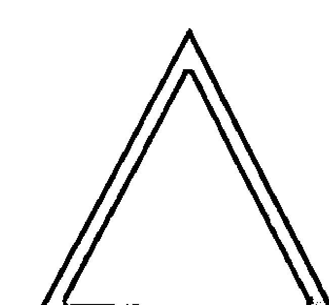

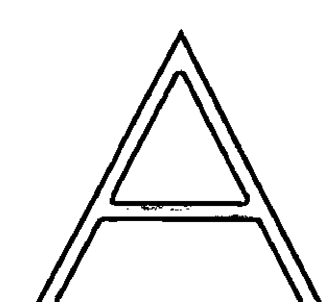

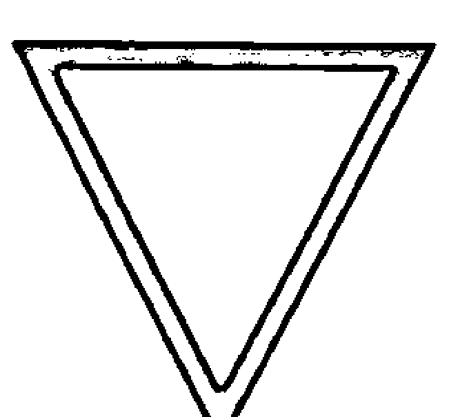

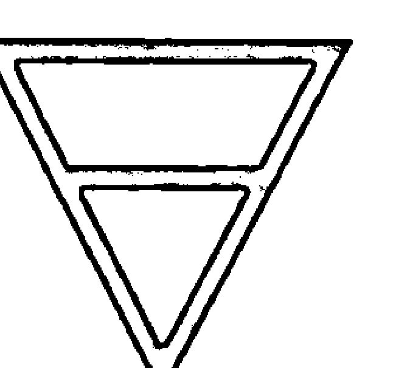

火元素

風元素

水元素

土元素

## 022 五分鐘塔羅

### 塔羅小常識

## 何謂塔羅牌的牌陣？

塔羅牌的牌陣到底有多少種?目前很難估計，比較常見的就已經有數十種到上百種的牌陣。其實，對於占卜者來說學會多少牌陣並不是一件那麼重要的關鍵，占卜者應該把重心放在如何讀解牌意的訊息上，而且所謂的牌陣也只是前人根據使用上的方便所創造出來的，就是要藉由每張牌代表一個問題的某個核心信息然後逐漸組合成一個完整的答案，為的是能更綜觀的去檢視一個問題，避免因為問卜者本身當局者迷而忽略掉其他應該注意的訊息。

因此只要能夠把持綜觀的原則，雖然使用這些前人留下的牌陣是十分便利的一件事，但是在使用過一陣子之後也許你也會創造出屬於自己適合使用的牌陣，這時也就不必太拘泥於其他太過於複雜的牌陣了。

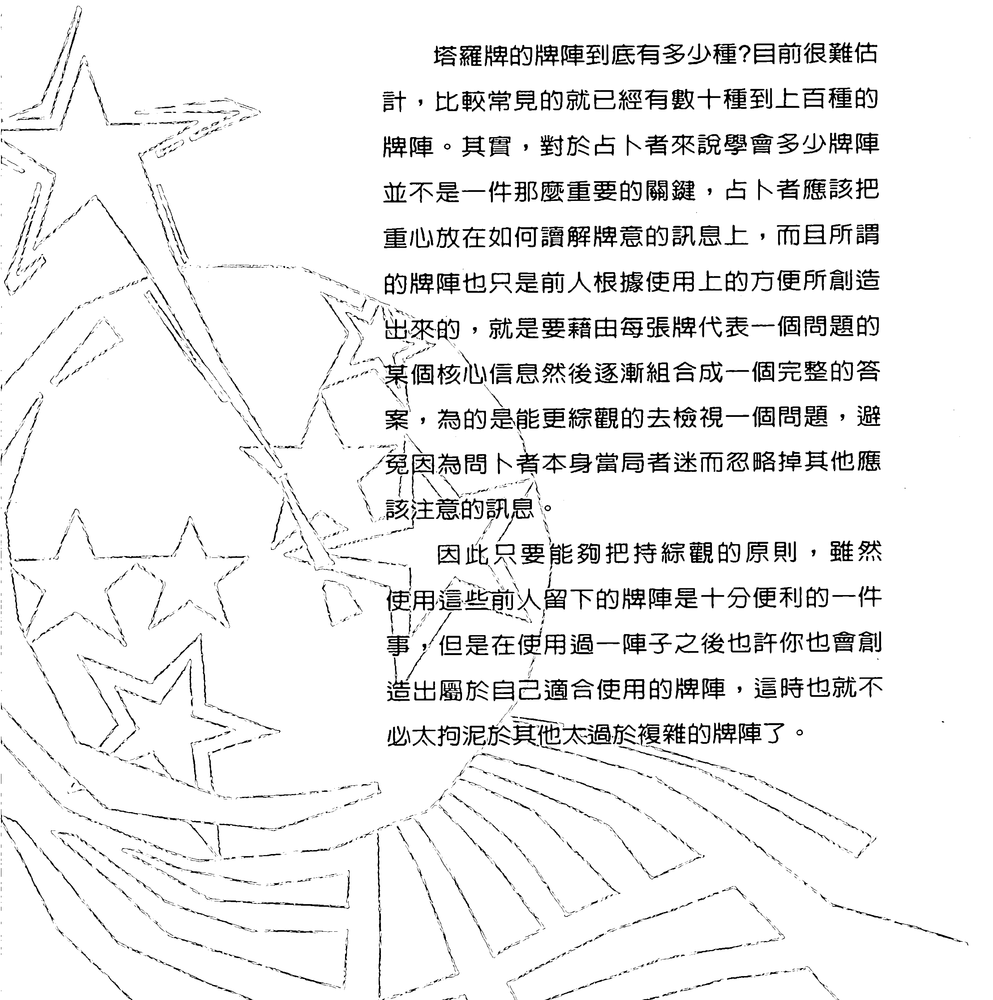

获取更多好书，请加微信号：strcdts

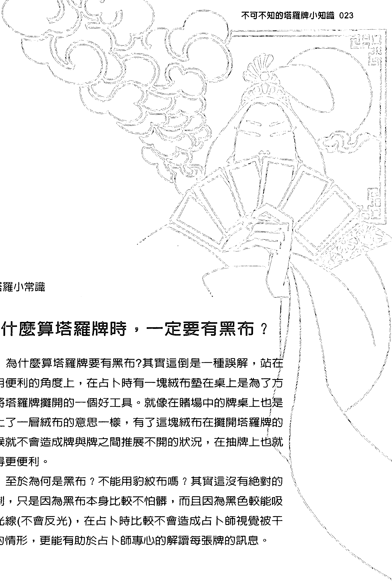

### 塔羅小常識

## 為什麼算塔羅牌時，一定要有黑布？

為什麼算塔羅牌要有黑布?其實這倒是一種誤解，站在使用便利的角度上，在占卜時有一塊絨布墊在桌上是為了方便將塔羅牌攤開的一個好工具。就像在賭場中的牌桌上也是鋪上了一層絨布的意思一樣，有了這塊絨布在攤開塔羅牌的時候就不會造成牌與牌之間推展不開的狀況，在抽牌上也就變得更便利。

至於為何是黑布？不能用豹紋布嗎？其實這沒有絕對的限制，只是因為黑布本身比較不怕髒，而且因為黑色較能吸收光線(不會反光)，在占卜時比較不會造成占卜師視覺被干擾的情形，更能有助於占卜師專心的解讀每張牌的訊息。

### 塔羅小常識

## 算完塔羅牌後，總是特別容易覺得疲倦，難道塔羅牌真的有魔法嗎？

算完塔羅牌後會變得很疲倦其實是很正常的，因為在占卜的過程當中占卜師必須十分集中精神去解讀每張牌的訊息，甚至要混合每張牌前後關係所衍生出來的附加訊息，因此本來就會極度大量的使用腦力專注思考，並耗費相當大的精神力，而在占卜的過程中大多數占卜師因為專心所以會忽略了這個消耗精神的情況，於是當整個占卜結束之後精神突然鬆懈下來就會發現有虛弱的情形，這就像專心的打電動或是用功讀書是同樣的道理而已，並不用擔心這是否是魔鬼來取走你的靈魂或是這是一個交換的契約所必需的付出。

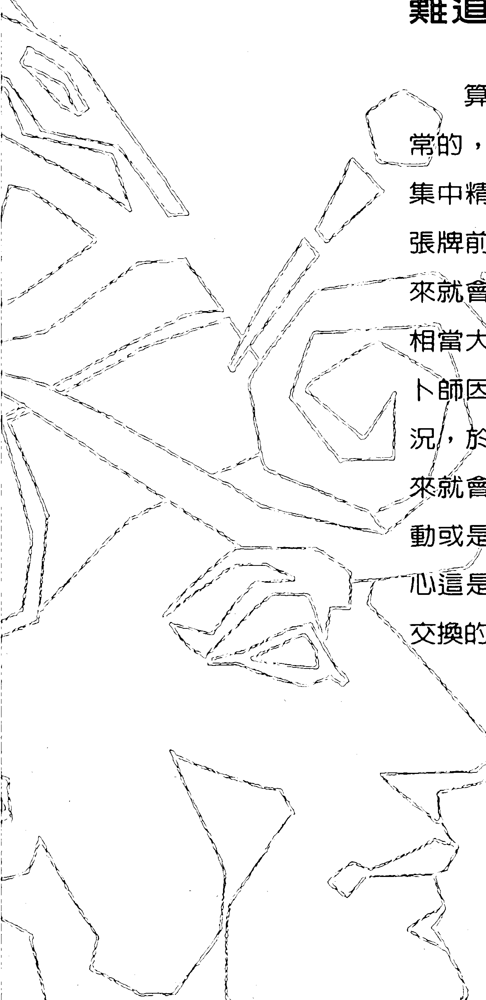

### 塔羅小常識

## 塔羅牌跟算命有什麼不同？

塔羅是算命嗎?其實嚴格來說塔羅並不能算是算命的一類，所謂的算命是指依照出生年月日時辰這個天生注定的數字，然後藉由一個有系統的推演將未來的訊息展衍出來，等於是把一生的命算出來，因此可以推算得很遠。

而塔羅牌卻是利用抓取目前被占卜者潛在意識的訊息去推行未來，因為這樣的心態所以會導致某樣的結果，但因為人的心與思考是會不斷的變化，因此塔羅牌所能推行的時間不能太久，一般來說一年已經是一個上限(根據不同的占卜師會有不同的時間解釋)，一般人會認為塔羅牌的推算會很準確，其實也是因為它是根據目前的心態去推行，因此塔羅牌應是屬於占卜而不是算命。

### 塔羅小常識

## 可不可以使用二手的塔羅牌呢？

可不可以使用二手的塔羅牌？這是一個見仁見智的觀念，站在神秘學派的角度會認為牌裡面有精靈存在，因此當然不可以去使用別人使用過的塔羅牌。可是以另一個角度而言，其實塔羅牌只是一個工具，工具使用二手並沒有甚麼不好的，只是對於塔羅牌愛好者而言，就算今天這副塔羅牌不用了也大多都會拿來保存，會拿去送人的機會並不多，而對於一個初學者來說，買一副新的塔羅牌也並不會花費太多的金錢，所以除非有其他個人對於塔羅牌理解上的不同想法，使用二手塔羅牌並不會有什麼不好的事情。

### 塔羅小常識

## 塔羅牌的抽牌方式

塔羅牌從洗牌到抽牌的方式有很多種，只要能符合將牌洗的乾淨、不傷害塔羅牌以及被占卜者可以觸碰到每張牌的狀況，均可依照個人習慣洗牌，而寶咖咖最常使用的方式如下(非神秘學方式)：

### 塔羅小常識

一、將牌放在布上，兩手以順時鐘方式洗牌，順時鐘或逆時鐘方式端看個人習慣，但建議以單方向洗牌，以免牌與牌之間互相碰撞傷害到塔羅牌的邊緣。

二、將牌收集完成後，左手端牌、右手由下抓取部分牌放置上方(如同撲克牌洗牌方式)，在此步驟時可於不固定的時間將切起來的牌直接反手放置，讓牌的正逆位變化。(備註：如已經是在準備抽題目的時候，洗牌時被占卜者就必須已經開始想問題了。)

三、洗好的牌放置於布上，邀請被占卜者於整副牌的最上端取一部分的牌放置於旁(稱之為切牌)，有的占卜師習慣切兩次牌或是自己幫被占卜者切牌，均可依個人習慣使用。

四、將牌再整為一副牌之後，於布上攤開成扇形排列的抽牌模式(稱之為稱之為攤牌)，攤牌要成為直線型或是扇形均無特別固定，主要目的只是讓被占卜者可以清楚的看到每張牌並且可以觸碰到每張牌。

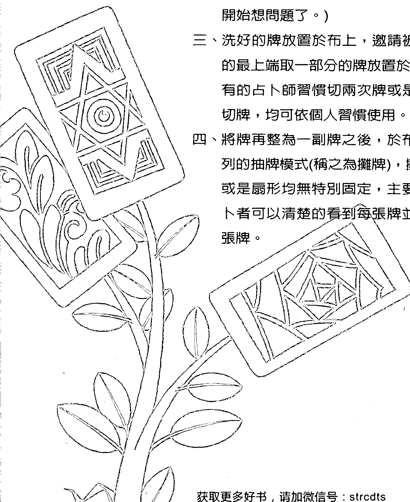

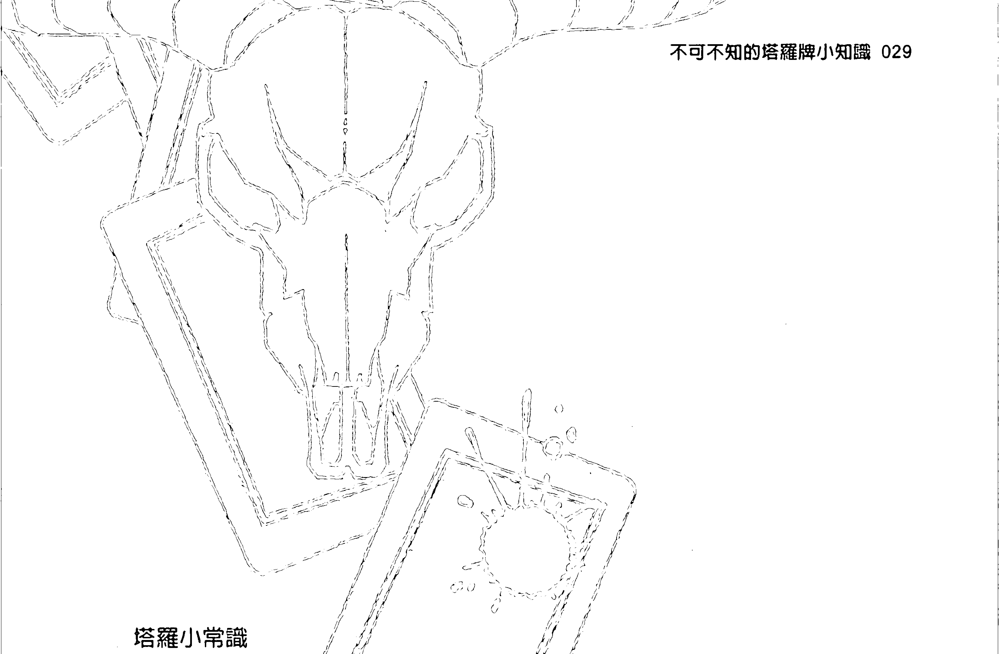

### 塔羅小常識

## 神秘學

至於神秘學派的抽牌方式就顯得較為複雜，主要是因為這派別的占卜師認為每副塔羅牌都有其靈性存在，因此每位占卜師的塔羅牌是不可以被他人觸碰的。這類學派，無論是在切牌或是問卜者抽牌，都是由占卜師代勞，或是透過其他物體來碰觸牌面。例如問卜者以手指牌，或者以筆之類相關物品指向心裡所要抽取的牌，再由占卜師將該牌取出。有些比較慎重的占卜師，甚至還會特別去訂做水晶魔杖，問卜者就利用這個水晶魔杖，指出要抽取的牌，再由占卜者親自動手取牌。其實，不管是用什麼方法，這類學派的占卜師，主要目的就是不讓自己的牌，有機會跟其他人有任何直接接觸的機會，以避免塔羅牌裡的精靈被外力所汙染。

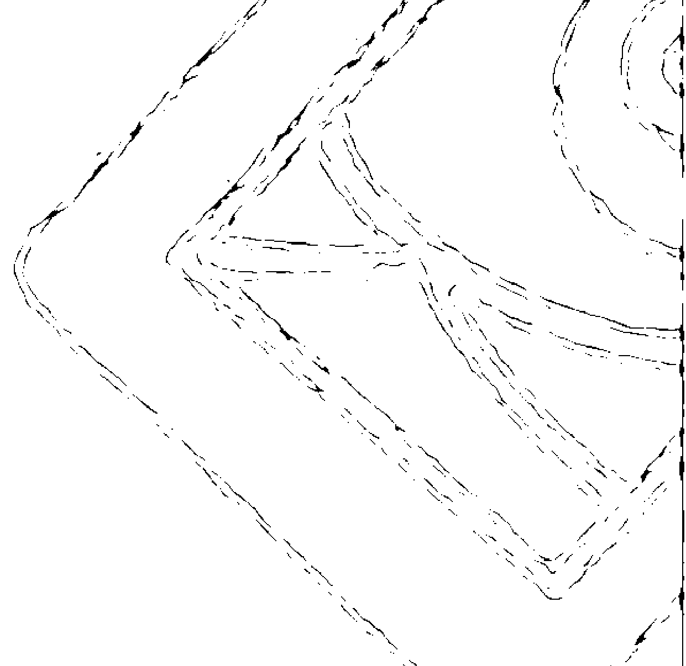

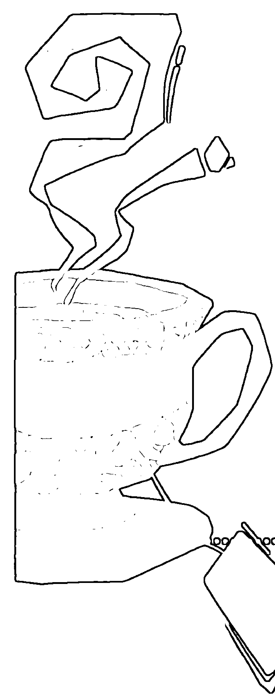

## 【Chapter ②】

## 【大牌組】數字牌0～21

迷人的塔羅牌，總是那麼的讓人好奇，想接觸又不知道該怎麼入手，今天賈咖就要以最簡單的方式來教大家了解塔羅牌的精要，這本書所介紹的塔羅牌都是以偉特塔羅牌為主，包含0～21的數字(大牌)組，以及代表四大元素的：權杖(火元素)、寶劍(風元素)、聖杯(水元素)、錢幣(土元素)四組小牌組。現在，快快拿起你的第0號牌，我們要開始進入塔羅牌的迷人世界囉。

## FOOL

## FOOL

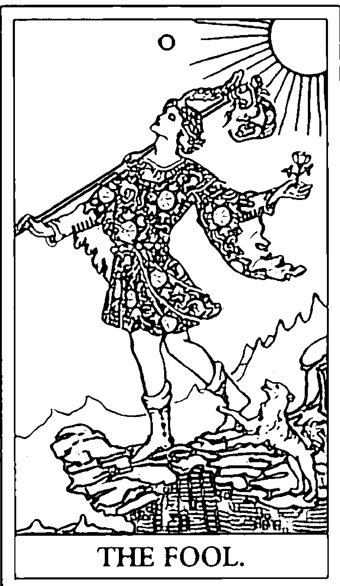

## 0 號牌 愚者

### 畫面結構

畫面中可以看到一個身著華麗服飾的旅人，他用一根棍子將他的旅行用品高高的掛起來並依靠在他的肩膀後端，他抬頭向上看而且手中還拿者一朵花，看似輕鬆的前進卻忽略了前方的陸地已經接近懸崖。後方太陽溫暖的照耀著，也許正因為如此才讓他覺得前途一片光明。

畫中人的下方有一隻小狗跟隨著，不過看起來他正在警告著這位旅者前方已有危險。只是，不知道這位旅者是沒有聽到？還是說他仍執意的相信他所看到的是光明的一面？

## 整體解釋

自信的愚者代表的是所有一切的起源，在這張牌裡他主要代表的是一種自信、敢於面對未來並且勇往直前的意涵。但是在這樣的自信裡卻隱藏著潛在的危機，因為這樣的自信並不是十分理智及聰明的，甚至有點魯莽，所以在面對未來的時候的確是多了一點危險。

因為這樣的概念，這張牌也有著對於未來的日子要多注意及謹慎的警示意味。但是在心態上卻是一個很不錯的「開始」，在愛情中顯示出的就是一個對於愛情勇往直前的心態，就算旁人警告他這個對象是不好的他也覺得有自信克服困難及凡事都應該去面對後才知道結果的心態。

在愛情的占卜中如果問題是A君對問卜者的感覺如何？抽到了愚人牌則代表的是A君對於與問卜者在一起感到很快樂以及期望可以繼續的發展。聽起來是一張很不錯的牌，而且對方的態度也是相當的積極及正面，只是在這樣的心態中卻可能因為過於樂觀，覺得跟問卜者在一起是很順遂的事，因而忽略掉現實生活中其他可能的問題。

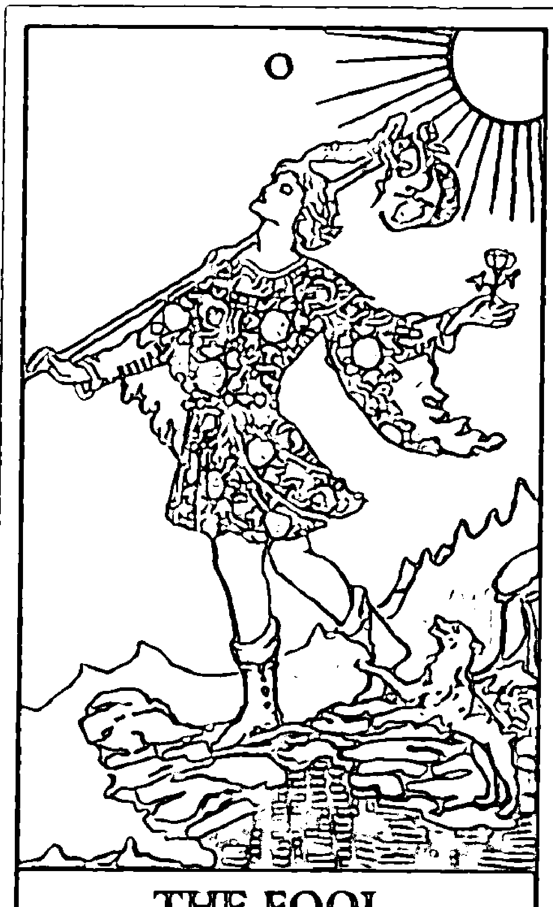

因此除了讓問卜者開心的了解到A君的心態之外，也應該建議要多注意現實生活中是否還有其他必須注意的問題存在。例如，是否有另一半的存在？或是A君不切實際的只想要在一起而忽略了生活面的殘酷？

## MAG MAGICIAN

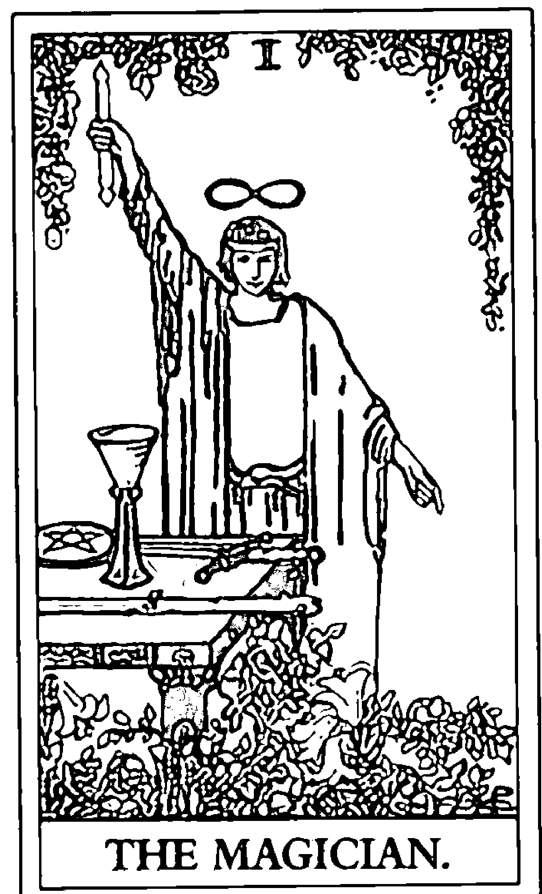

## 1 號牌 魔術師

### 畫面結構

畫面中可以看到一位年輕的魔術師，他一手高舉法杖對天，另一手指向地面代表了貫天通地的能力。在他的頭上有著代表無限的符號，可以讓人感覺到他應該是在智慧上很有發展潛力的人，可以藉由本能創造許多的新事物。仔細看則可發現他的腰帶是由一條蛇咬住自己的尾巴環繞而成，這個循環的狀態也代表著智慧的連結。

桌面上則放著四大元素(寶劍、聖杯、錢幣、權杖)看起來這個年輕的魔術師正在準備學習如何利用這四大元素去產生不同的變化及應用。而畫面的上方及下方豐富的花草則代表了他應該已經有一定的能力存在，可以說是已經有了基本的能力了，不過他應該仍處於正在學習的階段，還未達到熟練的境界。

## 整體解釋

年輕的魔術師是一個不斷學習及成長的熱情青年，對於許多未知的事物他充滿了好奇，也十分有興趣去面對與學習。因此，在這張魔術師的牌裡面他代表的是學習、成長、溝通以及接觸、變化未來的一切可能性，不過也因為他還處在學習的過程中，對於四大元素的運用總是沒那麼的熟練。

因此，對於詢問者的問題來說，這張牌並不能說是一個十分成功的「結果」，更重要的反而是一個「過程」！在愛情中顯示的就是一種願意在愛情當中學習並一起成長的心態，也許對於愛情中的互動及付出不是那麼的熟練，但是卻願意藉由溝通讓彼此之間找到更合宜的相處模式。

## 實際應用

在愛情的占卜中如果問題是與A君未來三個月之內的發展，而出現了魔術師則代表雙方在未來三個月之內將會有很良好的互動及溝通。彼此之間感情的溫度會逐漸加溫，並且在互相試探及瞭解的狀況下慢慢成長。

對於情感來說是一張很好的牌，可以表示出彼此有認真從這段感情中學習成長，雖然還未到所謂的熱戀或是交往的狀況，但至少可以說是正在往交往的方向前進了，接下來該如何去讓彼此的感情更加溫，這就是問卜者的功課了。

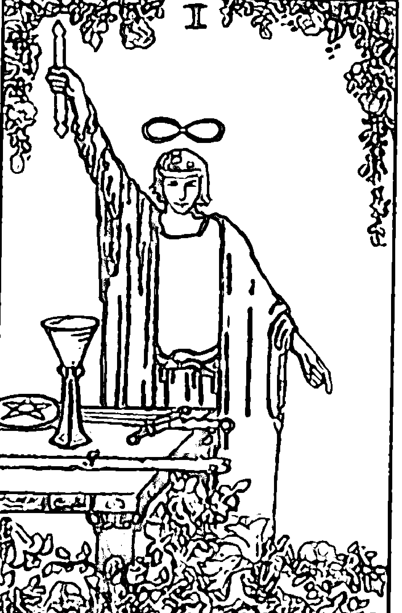

## HIGH PRIESTESS

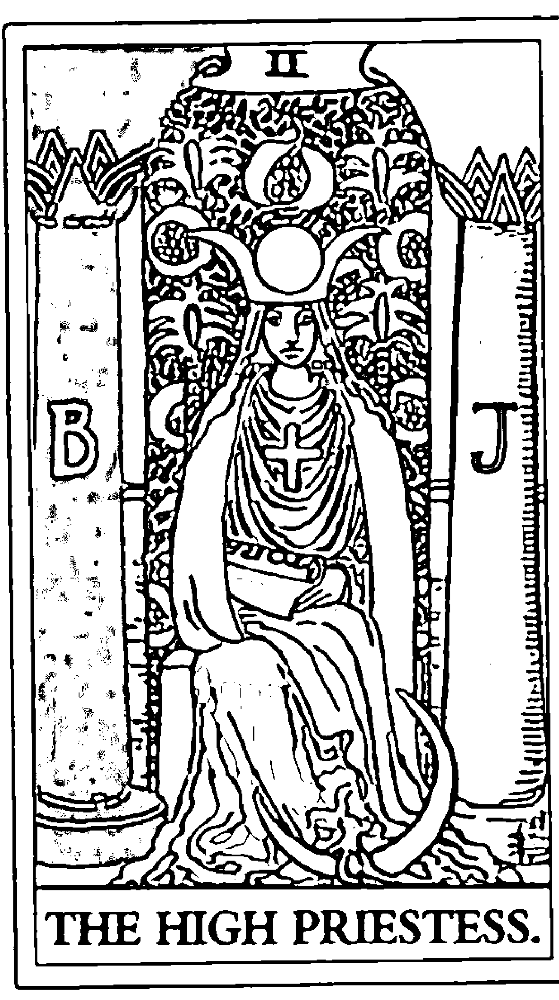

## 2 號牌 女祭司

### 畫面結構

畫面中看到一個女祭司穩穩的坐在兩根柱子中間，她面無表情讓人無法猜透她心裡的喜怒哀樂。手中握有一個捲軸看起來是她很重要的一個物品，而畫面下方有一個懸月，展示出夜晚寧靜的智慧象徵。

一黑一白的柱子也許是一個日夜的交替，也許是善惡的分別，但不管代表的是什麼，在這兩根柱子間有一個布幕圍著，布幕上的石柳圖案，在某些象徵裡它所代表的是「性」的意思。而在這樣有著特殊意涵的布幕後方我們卻無法探究是否還存在什麼事物，只隱約可以知道在後方有片寧靜夜晚的海，除了這些就再也不知道還有什麼了。

## 整體解釋

冷靜的女祭司，她要的並不是外在的熱烈情感表現，更注重的反而是內心自我的成長，因此在這張牌裡面有隱藏著更多自我潛在人格發展、追求自我成長且刻意忽略外在環境變化的感覺。

抽到這張牌的時候可以表達出自我內省及靜心調整準備迎接未來的訊息，但是在這樣的過程中，較為負面的與外界現實脫節的心態自然也就比較容易產生，因此在遇到感情時女祭司所表達出的感覺就是較為冷靜、並且會自己悶住頭去思考自己要的是什麼？對外就變的沒那麼熱烈，會讓人覺得她在感情中太過於冷淡。

## 實際應用

在愛情的占卜中如果問題為A君對問卜者的感覺是什麼？出現了女祭司這張牌則表示A君他自己目前並沒有太多心思去與抽牌者談戀愛，也許是因為他自己個人的問題所以暫時不想去面對感情。

對於問卜者來說，A君並沒有投入什麼情感於其中，頂多就是冷眼旁觀問卜者所做的一些舉動，並沒有太多願意主動與問卜者互動的心情存在，如果不是受制於上段情感的傷害的話，也許就只是表達出問卜者目前的狀況並不是A君所喜歡的那個類型吧。

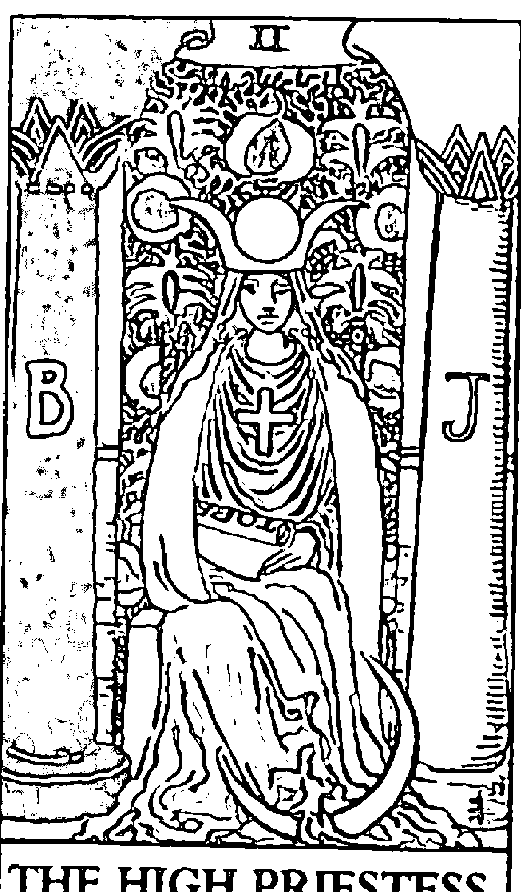

## EMPRESS

## EMPRESS

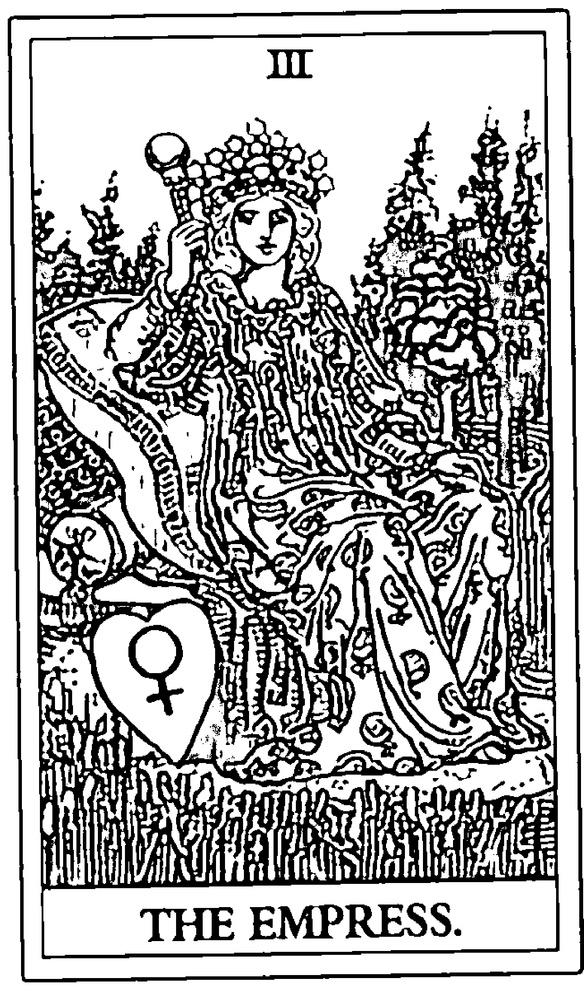

## 3 號牌 女皇

### 畫面結構

畫面中可以看到一個身著舒適、華麗的皇后，她十分優閒的安靠在看起來非常舒服的座椅上，其中一隻手微微的高舉代表權力的短杖，而另一隻手則輕靠在她的膝蓋上。

在她座椅的左下方有一個愛心符號，而符號上方刻著的是代表愛情的金星符號，下方則可以看到結實累累的稻米，與後方的綠樹、流水三者都是代表豐收的一種情境，讓人覺得這位女皇正處於一個非常豐饒的環境中，同時非常享受這樣美好的物質生活。

## 整體解釋

充分展現出女性魅力的女皇牌，在這張牌裡面顯示著十分豐饒的收穫，而且這些豐厚的收穫都是比較偏向物質面的，是讓人感到豐饒的物質享受，但也正因為如此，在精神層面上的意涵就相對的弱了些。

就感情上來說，這張牌的出現可以表示是一段非常豐富的感情生活，尤其在圖案中又出現了代表愛情的金星符號。不過女皇牌更強調出這是一個外在美麗的愛情！

這也許是一種相當能夠被社會一般道德所接受的戀愛心態，然而在精神上的交流卻不是那麼的讓人感到滿意，也許他所做出的這些行為只是為了符合社會上對美麗愛情所應有的行為的期待與憧憬而已。

## 實際應用

在愛情的占卜中如果問題為A君對問卜者的感覺為何？出現了女皇牌則代表其實A君十分的享受與問卜者之間的互動，甚至可以說是表現出了期待發展一段熱烈愛情的情緒，在這當中A君對問卜者所展現出來的情感是濃厚的、是熱切的。

雖然在這樣的表現下對彼此之間的情感加溫是十分有利的，但是要多注意的是這邊所要傳達出A君的感覺是指物質上強烈的愛慕與表達，也許是喜歡上問卜者的外表、金錢、物質享受等相關態度，至於在精神契合上卻相對的弱了一些。

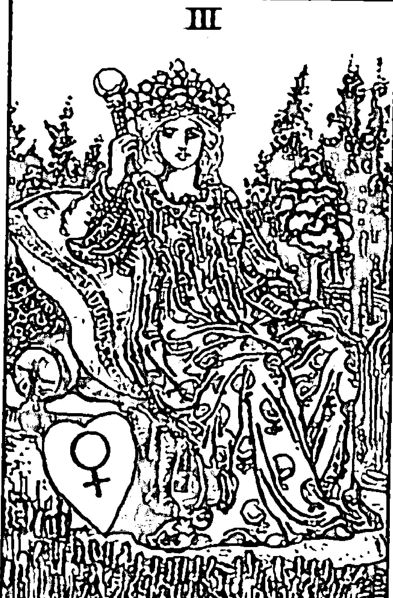

換個角度來說，這樣也並不是一件不好的事，畢竟在部分的愛情中一開始的確都是用這樣的方式來吸引對方，只是接下來如果開始熱戀了，如何慢慢的把重心由物質層面轉移到精神層面就是一個新的功課了。

## EMPEROR

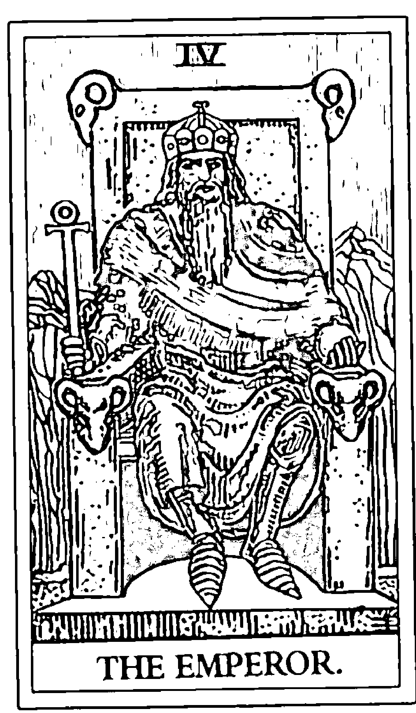

## 4 號牌 皇帝 (國王)

### 畫面結構

畫面中，代表國王的人物坐在一個由石頭所雕刻出來的王座上，他穩穩的坐著並且將他的雙手靠在他皇座的扶手上。一手握著權杖另一手掌握著寶珠的他，看來掌控慾似乎很強烈。

另一方面，從他的衣服中非常明顯可看到露出的盔甲，代表著他仍處於一個隨時準備起身戰鬥及堅守紀律的狀態。石座上的四隻牡羊頭也是把星座中牡羊火向星座的訊息加入到裡面，藉由後方山壁無草無樹的模樣，來傳達出他的個性是十分強烈、積極的狀態。

## 性格特質

性格爆烈的皇帝，表現在外的是一種積極進取的果斷態度，在面對很多事情上都是十分主動並擁有強烈開拓的能力。無論在面對事情或是工作上都是十分正面積極的態度，而且在行動力上他的絕對性也是不容置疑的。

只是，在強烈進取的外表之下會讓人擔心的是他所包含的急躁、不安定、火爆脾氣的問題，讓人對皇帝牌多了一份懼怕之心，而且他的前進並未有所謂征服後妥善管理的後續行為存在，似乎只懂得前進及爭取而沒有考慮到征服後的整建與管理問題。

在愛情中的皇帝也是承接著原本積極進取的心態，只是在這樣的心態下有時候的確會過於莽撞。特別是當遇到阻礙過大的時候，那股暴烈的情緒可能就會掩蓋住原本的那一個層面了。

## 實際應用

在愛情的占卜中如果問題是與A君未來三個月的發展，出現了皇帝牌可以代表雙方的情感發展迅速，可能是屬於突然到了一個時間點就變成了天雷勾動地火的狀況，雙方可以在一個適合的時間點急速進入了熱戀的狀態。但也因為過於急進，因此可能會有點一下子突然無法適應的情形出現。

從好的方面來看，可以說雙方是快速的達成了所期望交往的目的。但是就另一個該思考的層面而言，是否會因此而造成了急速冷卻或是熱情過了之後過度檢視對方缺點的狀況產生，如此一來可能會很容易在彼此的交往之間產生了一些不愉快的爭執，這是問卜者接下來所要注意的功課。

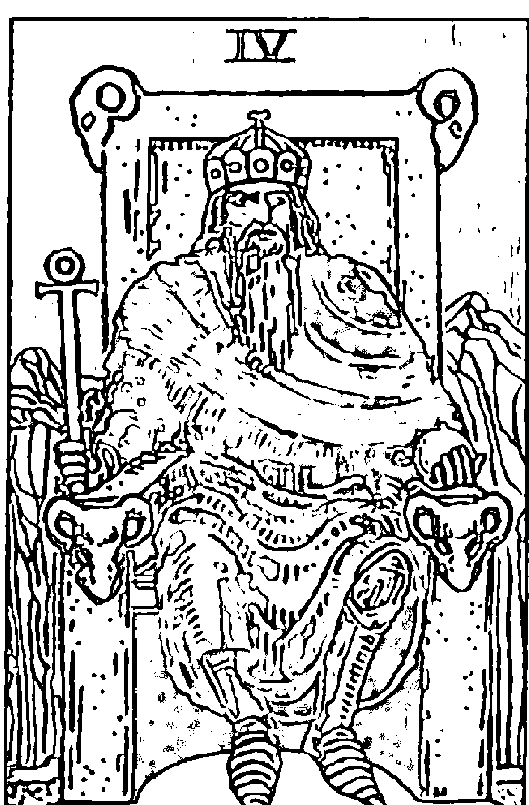

## THE HIEROPHANT

## 5 號牌 教皇

畫面中間坐著一位教皇，他高舉右手似乎代表他正在傳達上天的旨意，而左手則舉著代表指引的權杖。他端坐正位面無表情，似乎正對下方兩名跪著的侍從開導生命的方向，而在他的下方有兩把鑰匙交叉，也傳達出他正在教導一些開啟未來之路的教義。

然而藉由後方兩根灰白的柱子可讓人臆測，也許他是強烈的以公正、道德為他所要指引的方向，因此在指引的道路上也許就不是那麼的容易變通。他講求的應該是依循規範的道德、不變的真理，而少了感性的成分存在。

## 整體解釋

視道德為生活最高宗旨的教皇，懂的是如何在道德中指引人並且引導帶領人走向一個更美好的境界。在他所理解的智慧裡，所有的行為都該循著正規的「道」前進，在這個範圍之內他會竭盡所能的幫助你。

然而也因為受道德的約束，因此教皇牌也提出了較不能接受新潮思想的概念，在感情上可以說是如同老夫老妻的感覺，在相處的時候雖然感受到十分穩定的情感，但卻也無法爆出更多的亮麗火花，有著穩定且相敬如賓的狀態出現。

## 實際應用

在愛情的占卜中如果問題是與A君未來三個月的發展，出現了教皇牌可以說其實雙方在未來慢慢的會把對方當作是親人一樣的感覺相處。

雙方互動越來越良好，而且也更加的互相開心，然而當中卻缺乏了一點點的激情，彼此之間的相處與付出更像是親人一般，讓人感到羨慕之餘，又少了一點浪漫的感覺，如果是外面不了解的人觀察也許會覺得雙方是已經交往很久的老夫老妻了。

## LOVERS

## 6 號牌 戀人

### 畫面結構

畫面中可以看到一男一女站在畫面的下方，他們赤裸著分別站立在兩旁，而畫面上方的天空裡，有一位天使正展開翅膀及雙手看起來正在照顧、保護著這一男一女。

畫面中男生正專心的看著他對面的女生，但是卻可以看到女生是向上抬頭注視著天使，在女生的後面有一顆蘋果樹，樹上有蘋果與蛇的存在，也因為如此在大多的解釋裡，這一男一女會被指向是亞當與夏娃。而男生的後方樹枝上面都是火，有人說這是慾火，也有人說這是代表男生發現女生沒有注視他的妒忌之火。

天使上方的太陽光芒四射，讓人覺得天使的照顧應該是無遠弗屆的才是，但卻在視覺的三角關係中又種下了耐人尋味的意涵。

## 整體解釋

在愛的情感裡，戀人牌顯現於外所代表的是赤裸的愛，也有人說它是最毫無保留的愛！但是在塔羅牌的另一個層面而言它也有表示出需要探究雙方關係的一個思索面，也就是在感情中雙方是要沉溺於表面的愛情還是要更加提升至精神方面的戀愛？這決定都取決於抽牌者的心。

如果是在詢問感情時出現這張牌，在大多數的狀況下都可以將之引導解釋為愉悅、興奮的戀愛初期發展。至於後續的發展情形，在這張牌上面就比較沒那麼強烈了，而畫面中視覺注視的方向也是一個可以注意的重點，究竟在這張牌當中是互相的還是只有單方面的，端看當時解牌時其他牌面的訊息及相關分析資訊了。

在愛情的占卜中如果問題是與A君未來三個月的發展，出現了戀人牌則代表在未來三個月內雙方的發展極有可能展開熱烈的互動，雙方可以說是感受到戀愛的滋味，但是這份感情是不是屬於真實的？或是長久的？在這邊還不能妄下定論，只能說以短時間的角度來看，這是一個值得雙方認真去面對的情感，但是當中是否有人不是真心的？或是只是一時的衝動？那就有待雙方經由努力的認識及瞭解去面對了。

## CHARIOT

## 7 號牌 戰車

### 牌面結構

戰車牌可以看到一個戰士他坐在有棚的戰車裡頭，前方有一黑一白的人面獅身坐臥著，看起來似乎一個要往左一個要往右，並不確定方向到底是要向何處？

仔細一看，坐在戰車裡的戰士手中卻沒有駕馭著野獸的韁繩存在，令人懷疑他是以何種方式來駕馭這兩頭人面獅身獸。

主視覺的後方是繁築的城堡，所以可以從這樣的對比中看出他已經離開了安逸的堡壘，目前前方是全新的挑戰正在等著他，但是在這一刻，他是否有前進是還不確定的一件事。

## 整體解釋

戰車牌看到的是一名戰士駕馭著兩頭人面獅身獸，而到底這輛戰車有沒有前進？其實是很耐人尋味的。因為兩頭人面獅身獸似乎要向前進猛躍又似乎坐臥在地上，因此在占卜上會因其他牌的輔助或是占卜師的混合解牌產生不同的意思。

當在愛情上出現了戰車牌，較多的解釋方式會是勇往直前且不畏艱難的追求，但是在其中可以說是即將會遇到一些困難(或是已經身在困難中)需要的是抽牌者專心且有毅力的去面對即將面臨的考驗。

也就是說，如果能以此毅力面對，成功的愛情果實將指日可待，但如果沒有意志力的話，很多事情都會在原地打轉。

## 實際應用

在愛情的占卜中如果問題是與A君未來三個月的發展，出現了戰車牌代表的是未來雙方在發展上會有些困難出現，但是考驗的開始也代表是一個準備去突破彼此之間關係僵局的階段。

如果雙方在面臨問題時都能好好的真心面對，未來相信可以越來越好，而且這裡還有說明到彼此之間需要有很強的意志力去面對即將來到的挑戰，只有用全力以赴的心才能讓未來三個月的關係越來越好喔。

## STRENGTH

## 8 號牌 力量

在力量牌的主畫面中可以看到一位身穿白衣的女性，她身上戴滿了花飾且在她的頭上可以看到一個代表無限的符號存在。

她的雙手正安撫著眼前的一頭獅子，這個獅子全身充滿了力量，但是在這位女性的面前卻是感受到很舒服的感覺，甚至可以說正在享受溫柔的安撫。

地上充滿了綠意也代表了在這張牌當中沒有暴力、沒有破壞，有的只是一股強大的力量被另一股溫柔的力量所征服而已。

## 整體解釋

力量牌的涵義其實很有意思，通常看到力量這個字彙一般人都會直覺以勇猛來看待，而且似乎也在其中含有些暴力及破壞的成分存在。

但是在這張牌中要傳達的主要意思卻是一股持續的、慣性的溫柔能力，用此能力來融化每一個考驗。

因此一般的占卜解牌時，出現力量牌可以朝用持之以恆的耐心來完成一件艱難的事這方面來思考，不管問卜者的問題有多困難，只要能把持住穩定、恆久及不畏艱難的前進即可達到所期望達成的目標。

## 實際應用

在愛情的占卜中如果問題是與A君未來三個月的發展，出現了力量牌，主要的涵義是說明了面對這段感情，雙方在未來的三個月之內將不斷的成長。

但是這種成長不是快速成長或是大量短期內雙方的付出，而是雙方在面對彼此的時候擁有了更多的智慧、耐心及包容。

這樣的持續長久付出狀況下，在設定的三個月內彼此的愛情將會持續加溫及成長的。雖然不確定是不是已經達到所謂交往的地步，但是至少雙方的心都已經被對方征服了。

## HERMIT

## 9 號牌 隱士

### 畫面結構

隱士牌的畫面結構比較單調，而且所有的色調都傾向於灰色。在畫面中的主角身穿灰色大衣，而這個大衣的帽子也把他的頭所覆蓋，他低著頭似乎在思考些甚麼事情，蒼白的鬍鬚顯示出他應該是個已經十分年長的長者。

而他手中一隻權杖直立的撐住整個畫面的中央看起來也好像支撐著他的身體重量，他的右手所提的燈籠在如此灰暗的場景中散發出光芒也似乎正在為未來指引出一個新的方向。

然而就算方向出現了，卻可以看到這位主角他是站在一個山峰的頂點，他可能是自己把自己困在如此的高處，又也許他站在如此的高處是為了用他手中的那盞燈來照亮其他人的道路。但不管如何，可以確定的是他這盞明燈將不是他自己的明燈。

## 牌意解釋

隱士在畫面中似乎顯現出較為孤單的感受，在解釋上卻會因為不同的占卜問題而展現出差異性很大的答案。

對於愛情占卜來說，抽到了隱士牌所要傳達出的是目前雙方都已經失去了熱情，也許在愛情中需要雙方都好好的思考怎麼去面對彼此。因為這張牌所要傳達出的並不是熱情的對待或是付出，而是提醒抽牌者該好好的去面對自我內心的一些問題。

而如果是在工作上的發展出現了隱士牌則可能是代表了即將有貴人出現的狀況。因此，在解這張牌的時候重要的是把本張牌的元素放入問題占卜中，依據畫面結構所提供的各種訊息來做出妥善的訊息傳達。

## 實際應用

在愛情的占卜中如果問題是與A君未來三個月的發展，出現了隱士牌所要代表的就是彼此之間會越來越冷漠，而且雙方可能在相處上已經出現一些問題需要去解決。

甚至可以說在未來三個月之內彼此之間會開始去思考適不適合繼續發展下去，這跟外來者較無關係，更強調的是雙方本身相處互動間的問題。

雖然在愛情中隱士牌的出現算是不太如意的一張牌，但是它也是要點出目前雙方需要多注意彼此相處的狀況。

因此解牌者不應以負面的訊息告知問卜者並放任未來雙方問題的不斷擴大，而是應該以建議問卜者認真對待彼此之間發生的問題及妥善處理的角度來作為修正隱士牌的一個方法。

## WHEEL of FORTUNE

## 10 號牌 命運之輪

### 畫面結構

命運之輪的畫面結構可以看到正中央有一個黃色圓形輪子存在，且當中有用英文拼出的TARO字樣。在輪子的右邊有一隻狐頭人身似乎在支撐著這個輪子，又好像正在轉動這個輪子，也因為有他的存在因此可以讓人覺得這個輪子是正在轉動的的情形。

輪子左方有一條蛇由上而下移動著，在輪子的上方則坐著一隻藍色的人面獅身神獸，神獸左手還拿著代表智慧的寶劍。而這個輪子是浮在空中的，雖然四周都是雲但是也可以看到在它的背後是無雲的狀況，更加強了這個輪子是在轉動的訊息。

另外，在這張牌的四周則佇立了代表四大元素的人類、鳥禽、牛、獅，而且這四大元素都正在翻閱書籍代表他們正在學習，也強調了這件事是屬於未完成的狀態。

## 命運之輪

命運之輪不斷的旋轉，它代表的是一個不斷運行中的成長，對於想要穩定的人來說大概最不喜歡的就是抽到這張牌了。相反的，對於喜好挑戰的人，這張牌正是他成長的最好動力。

在愛情中如果出現了這張牌，在很多時間中都是說明了雙方的愛情需要不斷磨合，在磨合的過程中越來越清楚彼此之間的問題在哪裡。

也因為如此感情將慢慢逐漸往上發展，可以說是一個變化中不斷成長的訊息牌。

## 實際應用

在愛情的占卜中如果問題是與A君未來三個月的發展，出現了命運之輪所代表的意思是雙方在未來三個月之內情感會有許多磨合的機會。

當中也許不乏吵架、冷戰或意見不合，但是也正因為有這樣的互動，讓雙方也慢慢的逐漸越來越了解彼此，在這樣的循環之下情感的確會逐漸成長。而且也因為如此而更了解到彼此的適合度在哪裡，可以說是一張有挑戰的愛情訊息牌。

## JUSTICE

## 11 號牌 正義

正義牌裡可以看到一位主角端正的坐於石座上，他右手直立高舉代表法律的寶劍，左手拿著代表平衡的天秤，而他身穿紅袍代表熱情活力，但是在上方卻有代表冷靜的綠色披風罩著，似乎傳達出雖然他有熱情的能量但是卻會用理智把這些能量壓抑著。

而再仔細的看由紅袍裡露出的手腕衣服可以知道，在紅袍裡的衣服是身著綠色的內裡，所以更可以由此知道雖然他有熱情的能量，但是在最深層的情感意識裡又有冷靜的聲音，因此可了解這個人的情感是複雜的，也許會有點做作，但是至少他表達出的外表是冷靜的訊息，至於這冷靜是壓抑的？還是根本就是他本身最深的情緒？就有賴時間去證明。

他的腳有一隻略微往前踏出也似乎透露出他準備起身有所行動，但是以這張牌來說他只是「準備」而不是「已經」。主角的後方有兩根柱子代表理性，而理性的背後是什麼我們也不得而知，因為已經被一個布幕所掩蓋住了。

獲取更多好書，請加微信號：strcdts

## 整體解讀

正義牌在塔羅牌裡面有時候會呈現讓人比較迷惘的訊息，因為在某個角度中它代表的是公正、公平的訊息，然而在另一個角度中又會讓人質疑它的公正與公平是來自於哪個角度？是手中的天秤？還是自訂的律法(寶劍)。

但不管如何它是一個呈現於制度上的平等，也許不是真的平等，但是至少有個形式上的平等。

在愛情中正義牌代表的是平等的付出及期望平等的對待，至於是不是可以真的平等對待，正如前文所說的，這只是個人的自由心證而已。而在愛情中因為過度追求平等，有時候反而就沒有太多的浪漫存在。

## 實際應用

在愛情的占卜中如果問題是與A君未來三個月的發展，出現了正義牌則代表了雙方似乎有些重要的決定產生，而這決定更在乎的是雙方平等的對待。

也就是說在未來的三個月之內如果問卜者本身積極的付出則可以得到相同的回饋，但是如果不努力付出則雙方就有機會慢慢趨於平淡。

不過要注意的是，這種被平等回饋的對待是表面的，A君真的內心世界在這邊是較不容易被點明的，只能說A君是會願意平等的付出他的情感的。

## HANGED MAN

## 12 號牌 吊人

### 畫面簡說

畫面中可以看到有一個呈現T字形的樹枝，樹枝的左右有綠葉也代表這個樹木是有生命的，而在樹木上有一個人倒吊著。

他雙手向後似乎是被捆綁著，也有可能只是自己藉由雙手往後抓住樹幹好讓自己不會任意晃動。他的頭上泛出了光芒也代表著他不是一般的囚犯或是罪人，相反的，他理應是個有能力或是聖潔的人。

至於為什麼這樣的人會被倒掛在樹幹上，能想到的就是也許是他希望藉由苦行來頓悟他的智慧，又也許是他為了犧牲自我來為大眾贖罪。

## 整體解釋

吊人牌是一張很有意思的牌，他代表的是為了求得真理(或是一個期望)甘願的付出一切，同時並不急迫的期望這個真理快速的來到。

所以當這張牌出現時，比較不會去解釋為一個結果的到來，更重要的是過程中的那份努力與付出感。

如果是詢問愛情中出現了吊人牌，那就是表示這段感情是認真且努力的付出，對於結果雖然有期待能有結局，但是卻並不是那麼強烈的期望有答案。比較像是那種漫畫中或是連續劇中的苦命女(男)，甘願為對方付出一切卻不求回報的那種感受。

在愛情的占卜中如果問題為A君對我的感覺為何？出現了吊人牌則代表A君對於問卜者是很真誠的付出，而且是很心甘情願、做牛做馬都願意的那種心態。

也許他的方法不是很正確，也許有時候他會弄巧成拙，但是藉由吊人的牌義中可以看出A君的心是很直接的、專心的付出，是很值得為他的努力而給予鼓勵的。

## 13 號牌 死神

### 畫面結構

死神牌的畫面裡可以看到，一匹代表純潔的白馬上坐著全身穿著黑色盔甲的死神，他左手舉著代表死亡宣告的旗幟，右手牽著代表純潔的白馬，說明了在死亡的宣告下只有純潔的心才可以繼續往前。

在他下方有個國王倒在地上，一個小孩無懼的看著死神，一位婦女正撇過頭不願面對，以及一個身著華麗服飾的教皇已把他的權杖丟棄並雙手虔誠的面對。從這樣的畫面看來，在死神面前只有純潔及虔誠的面對才能存活下來，至於代表物質生活及權力的象徵在這裡是完全無法生存的。

另一方面，在遠方也可以看到代表希望的日光正緩緩的升起，這也代表了新的希望即將來到。

## 整體解釋

死神牌看起來似乎讓人不寒而慄，但是在塔羅牌裡其實它代表的是一張打開全新世界的牌。

通常出現這張牌時，代表是目前的狀況有需要被調整或是改正，而如果問卜者可以去正視這個問題並且努力改進，未來就會有新的旅程等著占卜者前進。

在工作裡，如果抽到了這張牌，多數是提醒占卜者目前的狀況不是很好，需要好好的靜下心去審思目前工作上所遇到的問題，並且要有勇氣去面對之前所犯下的錯誤、嘗試改變心態去突破過去所遇到的問題，以如此的心態才會有更好的未來產生。因此，在某一方面來說死神牌有另一種鼓勵人勇敢面對過去錯誤及問題的涵義。

## 實際應用

在愛情的占卜中如果問題是與A君未來三個月的發展，出現了死神牌，其所代表的是雙方在未來會產生重大的變化，而有可能雙方會因此陷入了一個進退兩難的情形。

但是這問題並不是來自於外界的阻撓，而是問卜者與A君之間有存在著自己內心無法克服的問題。也就是說這樣的問題困擾著彼此(或單一方面)已經很久了，而在未來的日子裡這樣的問題會不斷的擴大，如果問卜者不能好好的去處理，可能未來雙方會進入分離的階段。

不過這張牌也有提出重點，就是如果雙方可以真心、用心的去將問題找尋出來並且努力的去面對，其實在經歷了這場愛情中的災禍後雙方的關係將有機會更穩固的向前。

## TEMPERANCE

## 14 號牌 節制

### 畫面描述

畫面中可以看到一位天使祂一腳站立在代表物質表面的土地上，另一腳輕點在代表深層意識的水中，所代表的是一種平衡的概念。

天使的雙手各拿一個聖杯，由聖杯中不斷的將其中的水倒來倒去，看似要將水中的雜質去掉，進而達到淬鍊的效果。天使的胸前有一個三角形代表的是火元素的符號，以此符號來展現更代表這場淬鍊不只有雜質的去除，還有精煉及昇華的作用存在。

而天使專注的眼神則代表了這場心靈與現實的淬鍊是個神聖及需要被注意的行為。

## 整體解釋

節制牌代表的是一個微妙的平衡，也是代表不要將許多事情超過或不及，在節制的訊息下，期望占卜者面對問題的時候要嘗試去找尋內外平衡的中心點。

在愛情裡它則代表要好好的面對問題的核心，不要過度的去膨脹情感反應。也就是說如果愛對方五分就表達五分，切忌過度表達出豐沛的情感，因為愛情中有時過度的表達是會嚇到另外一半的。

因此，當占卜者抽到了節制牌時，通常會給予的建議是真實的探究自己內心的情感，並小心、謹慎的將它表現出來。

## 實際應用

在愛情的占卜中如果問題是與A君未來三個月的發展，出現了節制牌它所代表的是在未來的三個月裡，雙方都會進入一個比現在還要淡的一個互動情形中。

這裡說的較為薄弱的互動並不是雙方都不在乎對方了，而是雙方經歷過了目前的一些互動之後，更懂得去好好的檢視彼此之間，是否有用真實的付出去對待彼此。

而正因為要經歷了這樣的內心淬鍊程序，因此在外表的互動上自然就會比較趨於保守。在這個時間點內，雙方正處於不斷的自我思考中，因此未來不管是走向更好的路或是退縮的情形，都是代表了彼此已經想清楚自己要什麼的狀況。

## 15 號牌 惡魔

### 畫面結構

惡魔牌裡可以看到一個惡魔坐在畫面的中央，而他的身上到處充滿了代表原始慾望的動物特質，牡羊角、老鷹爪、蝙蝠翅膀都顯示出這是一個最原始的慾望存在。

畫面下方有一男一女被鎖鍊綁在惡魔的腳下也代表臣服於原始慾望，而女生的尾巴是變成了代表沉溺物質的食物，男生則是慾望之火的存在。

雖然畫面中呈現的是這兩人被鎖鍊綑綁住，但是卻可以由鬆脫的鎖鍊看出來這兩個人其實是可以逃跑的但是卻沒有逃跑。

### 正位解釋

惡魔牌在塔羅牌的世界裡，不如一般所認知的代表了外在的誘惑及邪惡，而主要是人類原本內在心靈的那塊原始欲望的表現。

我們可以看到圖片裡的男女都被鎖鏈鎖住，但是仔細一看也可以看出鎖住他們的鎖鏈並不緊。也就是說，並非外來的力量干涉了被占卜者，而是被占卜者自己內心的世界綁住自己而不願意掙脫而已。

在愛情裡抽到惡魔牌，大多是代表了較為現實、欲望的表達，在心靈的層面可以說是幾乎沒有。

## 實際應用

在愛情的占卜中如果問題是與A君未來三個月的發展，出現了惡魔牌則代表彼此在未來三個月之內，都會身陷外表物質的享受及表面熱戀的感覺。

看起來似乎令人稱羨，但是實際上卻只是雙方享受愛情以外的物質、肉欲感受而已。至於是否有真正的感覺，其實當彼此冷靜下來之後都會發現是十分稀少的。

如果長期這樣下去，雙方到最後只會是擁有膚淺的外在與甜蜜的表徵，內心的感情卻是越來越少。因此當這張牌出現後建議占卜者需與被占卜者須好好討論如何修正目前所即將面對的問題。

## 16 號牌 塔

### 畫面結構

畫面的黑色背景讓人感受到很不舒服，而畫面中的高塔因為右上角突發的閃電而產生了破壞，原本放置於高塔上方帶表財富、榮耀的皇冠也因此被破壞，這樣的表現也代表了，不管你在現實累積了再多的榮耀與財富也無法抵抗大自然突來的災禍。

而因為原本聳立於高山上的塔被閃電、大火所襲擊，原本居住在塔內的皇宮貴族也無可避免的必須逃走，但因為這座塔是佇立於高山上，因此對他們來說是變成了無路可逃，就產生了如畫面中由高塔中跳出逃亡的情形。

塔牌在塔羅牌裡面是許多人所不願意見到的一張牌，甚至有人還把他取名了「毀滅」一詞。的確，這張牌所代表的是突發而來的危機及無可避免的危險，因此會被這樣的認知也是在所難免的。

在愛情中出現了塔牌當然就令人不是那麼的好接受了，大多數的時間裡都是代表愛情突發而來的變質行為，而突發而來的狀況也通常是被占卜者事先較無法預料到且無力抵抗的狀況。

## 實際應用

在愛情的占卜中如果問題是與A君未來三個月的發展，出現了塔牌則代表在未來三個月之內雙方的情感可能會進入突然破滅的狀態！

通常來說，不是有外力的介入(第三者)就是其中一方本身就是第三者的狀態。當然他也可以代表是彼此之間的情緒在這三個月之內突然的失控，有了嚴重的爭吵導致於情感的終結。

不管如何，在感情中出現了塔牌都是一件很不好的事情，當訊息出現後不應該只是被動的等待它的來到，應該儘快了解問題出在哪裡才是。

## 17 號牌 星

### 畫面結構

畫面重心點為上方一顆星星，而在它的周圍有七顆其他小星簇擁著主星，這樣的場景是代表希望以及指引的能量。

畫面的下方有一位裸女半跪在湖邊，雙手持壺一手將壺中水倒入湖泊當中另一手將湖中的水倒入大地中，而右後方有一顆新生的樹上有一隻鳥禽似乎準備展翅而飛，他也是代表著新生的力量及未來的無限可能。

而大地因為受到水的滋潤也不斷的長出新的花朵與綠草，雖然都還未成熟但是都有著對於未來無限可能成長的表示。

### 整體解牌

星牌是一個有希望的訊息，在某些問題裡它表達出來的是一個可期望的未來，也代表出問卜者的期望將有機會成真。
而星牌也帶有指引的力量，表示在這個解決問題的路途中，會有外來的力量協助完成(前提是問卜者自己也得用心用力)。
因此如果在問感情的時候抽中了星牌可以說是一件很不錯的狀況，也表示要追求對方是有希望的，而且除了努力有成之外，更是強烈的表示有外來的貴人相助喔。

## 實際應用

在愛情的占卜中如果問題是與A君未來三個月的發展，出現了星牌它所代表的是未來三個月雙方的發展及互動會越來越好，雖然還未到令人稱羨的熱戀或是交往的狀態，但是雙方的溫度正不斷的加溫當中。
而且其中還包含了更多正面的互動能量存在於其中，包含外在的、內在的情感都可以在這張牌中被展現，也代表雙方未來三個月的發展將會有很大的機率進入所期待的關係裡。

## 18號牌 月亮

### 畫面結構

畫面中可以看到高掛在天空中的月亮是圓的，也許有人會懷疑這難道不是太陽嗎？其實這張畫中所要表達的是月亮的圓缺，藉由「滿」及「缺」來表達出人世無常的訊息。

月亮中的女性緊閉雙眼看起來是憂愁了點，似乎心中有許多煩惱的事情在困惑著她。畫面的下方則有兩隻狼正對著月亮狼嚎，似乎除了警告之外也是另一種讓人感到憂傷、孤獨的感覺。

下方河流中還有一支毒蠍也緩緩的上升中，由於他來自於水面，因此在水等於潛意識的訊息下，他所代表的還有來自於內心本身的傷害及恐懼，遠方聳立的兩座高塔是否會變成塔牌中的狀況也令人擔憂。

## 整體解釋

看起來有點憂愁的月亮牌，在解讀上也總是讓人擔心了點。因為它有著警惕問卜者目前所詢問的問題狀況並不如預期般順利的意義。雖然不能說是完全失敗的情形，然而卻困難重重。

而且當這張牌出現時，通常也是代表問卜者自己已經對問題的本身抱持著比較不樂觀的心態，雖然有時候外表還是展露出沒問題的衝勁，但事實上在內心裡已經被擔憂及煩惱所佔據。

因此當月亮牌出現在問題當中時，建議占卜者更應該仔細深入了解問卜者內心的擔憂及恐懼，再藉由問題的剖析去嘗試修正未來所可能發生的不愉快狀態。

在愛情的占卜中如果問題是與A君未來三個月的發展，出現了月亮牌則是代表在雙方的愛情發展中進入了不樂觀的情形。

通常來說當這張牌出現在詢問愛情發展的時候，都是意味著對方無心面對問卜者的感情或是雙方在感情上無心溝通及相處。就算其中一方有打算努力的面對，但也是呈現較為無力的情形。

因此當這張月亮牌出現在感情中，占卜者都應該要期望能與問卜者藉由更多的抽牌或是討論，試著找到感情中的問題並且嘗試去解決，以免未來三個月就如月亮牌一樣令人感到擔憂不已。

## 19 號牌 太陽

### 畫面結構

太陽牌的畫面充滿了正面的能量，畫面上方是一個代表熱情的太陽，而它所照耀出的光芒有直線也有曲線，這都代表了不管是直接的或是間接的接受都可以接受到太陽無私的照耀。

下方有一匹代表純潔的白馬正準備往前進，而白馬的上方有坐著一個小孩子，赤裸的小孩子在這邊也是代表純潔無瑕及無限成長的可能，他手持十分巨大的旗幟，旗幟以紅色來代表，當中就包含了熱情、出征的意涵，藉此來表示這是一個光明、純潔向前的力量。

畫面中間則有代表熱情的向日葵正茂盛的成長著，整張構圖都表達出熱情及無私的感受，令抽到這張牌的人都會覺得十分光明有希望。

## 整體解釋

情的太陽牌跟憂鬱的月亮牌比起來就光明、開朗多了，而且畫面中開朗赤裸的小孩更是純真無瑕的象徵，代表的是順遂無擔憂的前進。

在許多的單張問卜中都是一張很不錯的光明牌，雖然在愛情中還有另一個暗喻是指雙方比較像無所不談的好朋友。

不過基本上仍屬於一張十分讓人感到愉快的一張牌，在各方面都表示是有既定目標且朝著心中的目標逐漸前進的訊息。

## 實際應用

在愛情的占卜中如果問題是與A君未來三個月的發展，出現了太陽牌則代表未來三個月雙方發展狀況會十分的良好。

雖然也許不是所謂的熱戀，但是卻是雙方心胸都打開並且去坦然接受彼此的關心與付出。因此就算不能成為男女朋友，也會是感情十分好的朋友。

出現這張牌的時候，通常會建議問卜者不要急著展開所謂的「戀愛」，而是要更注重到彼此互動間的真誠感受，因為這樣的感受會更真實、更有感動。當這樣的感覺到達了一定的階段後，不管雙方是要進一步當男女朋友，或是就維持現狀做好朋友都是一件很不錯的事情。

## 20 號牌 審判

### 畫面結構

大天使再度出現，在畫面中大天使出現在雲端之上，他吹響著號角似乎正在傳達某些訊息或是祝福。他的頭髮是金色並且有火的狀態，代表一個精神上的淬鍊以及昇華，而號角也是金黃色的代表一個精神層次的甦醒。

下方的墓地則代表現實生活的狀態，原本應該是代表死亡的棺木，現在都因為天使的祝福而形成了不管男女老幼都起身接受的情形。雖然可以明顯的藉由人的灰暗膚色知道這群人是死亡的，但是也因為接受到了天使的祝福，而有了所謂精神層次死而復生的訊息存在。

## 整體解釋

審判牌是一張讓人又愛又恨的牌。因為雖然它通常是傳達出好的訊息，然而在達到好的結果前所要經歷的卻是一段不小的苦難考驗。

因為它代表的是一個認真檢視目前行為偏差的原因，並且需要努力、用心的去改正以達到好的結果。因此在各方面的解釋裡都會去強調，為了達到問卜者所期望的結果，事情是必須經過一些苦難的淬鍊。

而在這當中問卜者是必須要堅毅的去面對所必須面對的困難，因為天助必先自助，如果只是單方面的等待貴人相助就會有如畫面中死亡的肉體般繼續沉睡。而當你願意勇敢面對問題並且真誠的面對時，未來的路將會有天使的祝福存在，問卜者所期望詢問的結果也會指日可待。

### 愛情的占卜

在愛情的占卜中如果問題是與A君未來三個月的發展，出現了審判牌它所代表的是，目前雙方之間有存在很大的阻礙與心結需要去克服，而且這阻礙可能不小，也許是雙方外在的一些限制導致於彼此之間能夠繼續發展的可能性很弱。

而如果雙方都無法以下定決心的毅力來面對彼此的愛情時，則結果將被導向較令人失望的結局，不過審判牌本身在這裡是比較偏向於其實雙方是可以受到祝福的，只是占卜者務必於此時建議問卜者不要鬆懈，要再努力一點才會有期望中的好結果出現，也就是說如果能更清楚了解問題的重心，而且問卜者的決心夠了，則未來三個月之內雙方之間的情感是可以越來越好的。

## 21 號牌 世界

### 畫面結構

畫面中看到一個女子她處於天空之中並且表達出神情愉悅的表情，她赤裸著身體代表最完美無瑕的訊息。

而她的周圍則用代表榮耀的桂冠來展示出一切都是完成的、榮耀的情形，畫面的四個角落則有代表四個元素的人(水元素)、鷹(風元素)、牛(土元素)、獅(火元素)存在。

世界牌跟命運之輪都擁有四大元素出現於牌面中，不同的地方是命運之輪中的四大元素是在學習的階段，但是世界牌的元素是已經完成了，也就是說它們是經歷了一段的成長後到達了最後的完美階段。

## 整體牌意

世界牌是塔羅大牌裡的最後一張，也代表是一個完成、圓滿的終點，在許多的訊息中都是十分好的一個答案，不管是工作、愛情、健康或是金錢上都有很好的一個訊息。

因此在占卜中如果出現了世界牌，除非有其他輔佐牌是較為負面的，否則單以這張牌來說，問卜者所問的問題應該是在經歷了一段的努力之後，已經即將到達開花結果的一個境界。

此時占卜者應以正面鼓勵的態度，去鼓勵問卜者努力將剩下一點未完成的狀態努力下去，未來美好的結果已經在等待問卜者了。

## 實際應用

在愛情的占卜中如果問題是與A君未來三個月的發展，出現了世界牌就表示未來三個月內，問卜者與A君雙方在愛情中已經到達了一個，雙方認同彼此並且不管是精神或是現實相處上都已經契合的階段。

各方面不管是外在的或是內在的狀態都是很和諧完美的情形，可以說是一張令人感到十分值得期待的答案牌。

## 【塔羅牌的起源】

塔羅牌的起源眾說紛紜，到目前為止也沒人能正確考究出塔羅牌是怎麼被發明的，整理一些比較有趣可信的派別說法，可以供有興趣的朋友參考了解。

### 塔羅牌的起源一

一種說法：塔羅牌起源於義大利。
在十四世紀，義大利的皇公貴族中流行一種紙牌遊戲叫做「tarocco」，它與目前所稱之為塔羅的「tarot」發音極為相似，而此副紙牌的張數有22張，與目前塔羅牌中的大阿爾克那數字牌數相符。
而且當中的牌意也有所謂的精神層次訊息存在，但是後來因為羅馬教廷對該牌的禁止，許多資料在經歷破壞之後至今已無法考證，不過由於當中有許多相似的元素存在，這仍成為後來塔羅牌發源的一個猜測可能性。

### 塔羅牌的起源二

一種說法：塔羅牌起源於吉普賽占卜。

有些學派認為塔羅牌是緣自於吉普賽占卜師的手中，由於這群人他們擅長占卜，且對於塔羅牌的研究及解釋似乎有其獨到的一面，因此有人猜測塔羅牌應該就是由吉普賽人所創造。

不過也有另一派人的質疑，吉普賽人他們居無定所，能集體創造或是創造後再群體學習散發出去的可能性不強，理應是吉普賽人藉由流浪到某地而在當地學習到塔羅牌後再把它流傳擴散到整個歐洲。

不過不可否認的是吉普賽人的確有將塔羅牌發揚光大的功勞，至於他們為了創造更令人信服的占卜術而衍生出的塔羅牌神秘學風就是塔羅牌所被創造出來的另一個風格了。

### 塔羅牌的起源三

一種說法：塔羅牌起源於埃及。
塔羅牌的名稱「tarot」，與埃及語的道「tar」和王「ro」兩詞極為相似，因此也有學者認為塔羅牌有可能是源自於埃及。
這派的說法是由於經歷戰亂，世界的學術文化正進行大規模的融合，但是在初期由於語言的問題導致於無法溝通，而埃及人因為擅長使用圖形符號來表達訊息，因此他們所創造出來的圖紋很快的就被大眾所接受，而在休閒的時候這些圖紋也被轉移至遊戲上玩樂，久而久之就發展出塔羅的相關資訊。
雖然站在考古學家的角度，研究埃及的史記資料裡均無查到與塔羅有關係的相關資訊，但是在塔羅牌中有許多的象徵圖案是來自埃及的某些圖騰卻是可以被肯定與接受的。

### 塔羅牌的起源四

一種說法：塔羅牌起源於中國。
考古學家曾在唐朝的繪畫中就發現一些紙牌遊戲的畫面，而且在歷史文獻中也發現了一種叫做「葉子戲」的紙牌遊戲，而這種紙牌遊戲除了單純的娛樂之外應該還有其他的複雜訊息存在其中。
在後來更有人把塔羅牌的正逆位與中國古代哲學福禍相倚論連結在一起，認為塔羅牌當中，部分正位是極好的能量當這股能量進入了逆位時就是過與不及或是能量被錯誤的運用的狀態。
這與中國自古以來所謂的一體兩面及水能載舟亦能覆舟的概念均有類似，再加上紙為中國所發明的，更讓此派說法得到更強而有力的附和，因此就產生了此學派認為塔羅牌是緣自於中國的說法。

### 塔羅牌的起源五

一種說法：塔羅牌起源於印度。

有另一派說法是說塔羅牌起源於古印度王國，而這個學派的理論主要是依據小阿爾克那牌中的元素概念。

在目前的塔羅牌中所出現的寶劍、錢幣、權杖、聖杯與印度古老神像手中所持有的許多法器都很相似，而這些元素所傳達出來的訊息也跟印度宗教中這些法器（息、增、懷、誅四法，即是：息災、增益、懷愛、誅魔四大法門的法器）所要表達的訊息極為相似。

雖然這個說法在後人看起來好像有點牽強附會，但是卻因為諸多的巧合也讓此派學說占有一席之地。

### 塔羅牌的起源六

一種說法：塔羅牌起源於猶太人。
經過研究發現，塔羅牌的22張大阿爾克那牌和希伯來文的22個字母，以及古希伯來人的哲學kabbala有著密切的聯繫。
而傳說中提到kabbala是上帝傳授給摩西的學問，它強調人與人之間應該互相合作才能有效提升本身存在的精神與力量，而摩西就根據了上帝的啟示創造出希伯來文和與每個字母相對應的關係，而塔羅牌就是這個所謂的發展與延續。
雖然這個論點也受到部分學派的支持，但是目前來說猶太民族本身對於塔羅牌的使用似乎也不是十分的了解，所以也只是被歸類為其中一種發源的可能。

## 【小牌組】權杖組

權杖牌組在四大元素裡面代表的為火元素，是一個上升及活力的狀態，而在某方面來說也會有較為積極進取的能量。四大元素牌組裡每一組牌均有十張數字牌與四張宮廷牌，以下就要跟大家談到四大元素中的火元素-權杖牌組。

### 權杖 1 力量的掌握

### 畫面結構

畫面中一隻強而有力的手從雲中伸出，握住權杖的底端，權杖上方有新生的樹葉，而有部分樹葉因為這支強而有力的手用力握住權杖而掉落。

在畫面的背後是簡潔有力的背景，除了下方有些山、水以及遠方可看到的一座城堡之外，就沒有其他的畫面結構存在。

火元素的数字一，代表的是一个力量的确认与掌握，在牌意上面有主导及控制的表征，而且是一个非暴力或是压迫式的主导，更像是一个所谓的因为有能力而掌握一切的现象。
在爱情中如果以双方相处模式来看，抽到牌的一方可以说是拥有这个爱情的主控权，不管是真正的行为掌控或是意志影响都算是很有决定性的一方。

在爱情占卜中如果问题是A君对问卜者的感觉是什么？出现了权杖一，则代表的是A君对于问卜者有十分想掌控的欲望。虽然的确在A君的心中对问卜者有爱情的成分存在，但是在这张牌里更重视的是掌控权的意图。
也就是说A君的爱其实是有存在，但是这张牌却更说明了A君喜欢掌控问卜者的心态，甚至超出了对问卜者的爱。

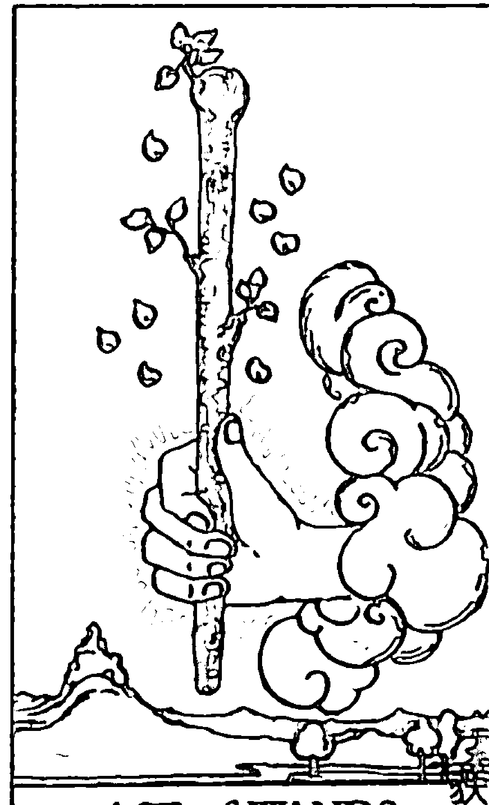

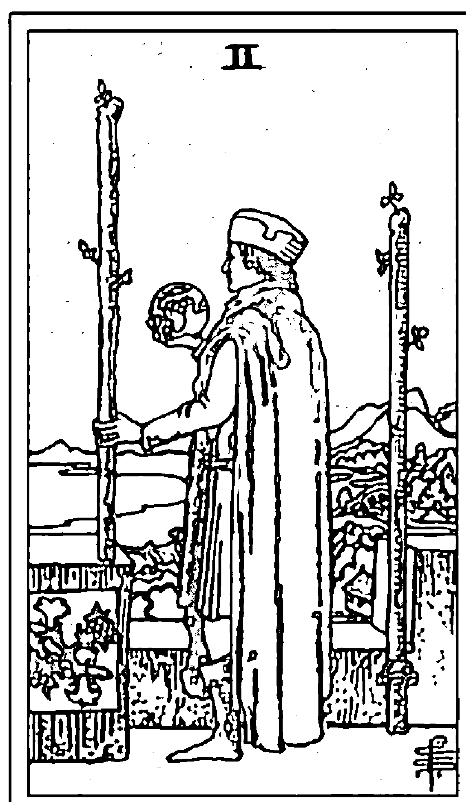

## 权杖 2 观望与等待

画面中看到主角背对着画面，一手握住权杖另一手握住类似地球的物体，主角所立之处应该是城墙的最上方，而看似远望的动作又似乎像是在深思些什么？

另一只权杖就伫立在他的右边，仔细一看不难发现，画面的左边下方还有一个徽记的存在。整幅画面的背景有山、有海、有成片的树林，看起来是一个很丰饶的场景。

## 整体解释

权杖二是个观望及思考的状态，在解释上非常多元化，解牌时要更注意问题及其他辅助牌的讯息，会较容易把这张牌的讯息确认出来。

基本上的牌意是思考一些未来的发展，从牌面中可看到一个人手中握着一颗球并且遥望远方，因此大多数时间会被解释为思索及观望的态度较为强烈，也说明了抽到这张牌的人也许心态中也含有如此的观望情绪存在。

## 实际应用

爱情占卜中如果问的是A君对问卜者的感觉是如何？抽到了权杖二这张牌，就是表示A君目前正在思索应该以什么样的心态或是如何去面对问卜者，而且是处于未开始准备行动的状态。

抽到这张牌时也表示A君需要再多花一点时间去思考是否要面对问卜者的态度。

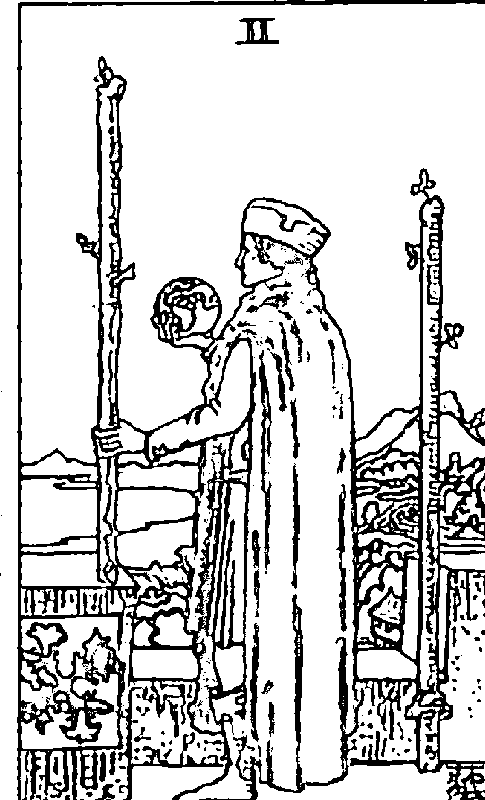

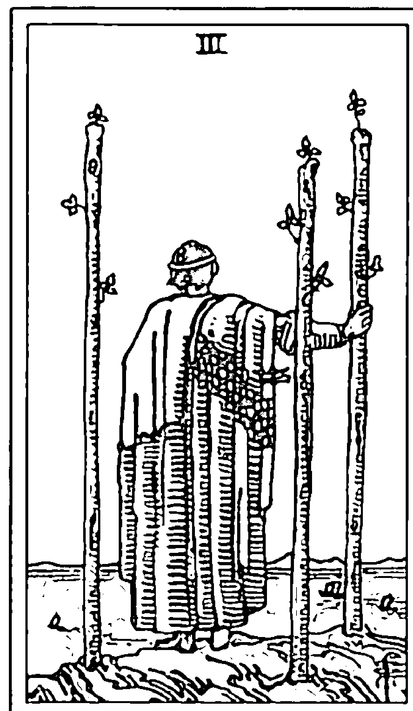

## 权杖 3 等待与发展

【牌面描述】

权杖三看到的一样是一个人的背影，而除了右手抓住一根权杖之外，其余两根权杖分别伫立在他的后方左右两侧。

而他所身处的地区看来很明显是比较荒芜的地带，除了前方的河水属于较为平静的河流，在黄昏的状况下可以看到有三艘船正缓缓驶过，除此之外就没有其他的讯息了。

## 整体解释

权杖三有延续权杖二的讯息之意，不过在这里可以掌握的讯息已经变得更多了，在面对未来上也是比较有所把握，并不再只是像权杖二般的停留于思考，而是已经蓄势待发了。
只是还是有些犹豫不决与等待更好的契机存在其中，在占卜上出现了此牌大多表示其实时机快到了，就等问卜者用心去面对而已。

在爱情占卜中如果问题为A君对问卜者的感觉是如何？抽到了权杖三可说是代表了A君其实已经观察问卜者很久了，而且A君也的确有些定论预计要行动。
因此在行动上可以说是准备好了，只是目前也许A君还有其他的对象可选择，所以在决定上仍属未定，需要自己对于问卜者这边的感情多一点肯定后才会有所行动。

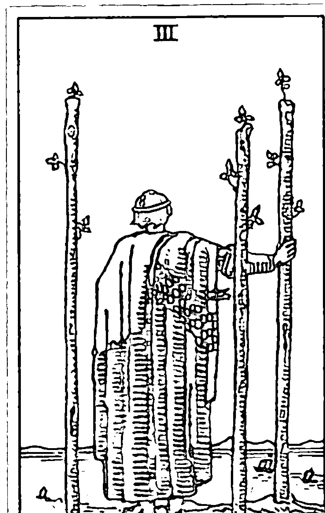

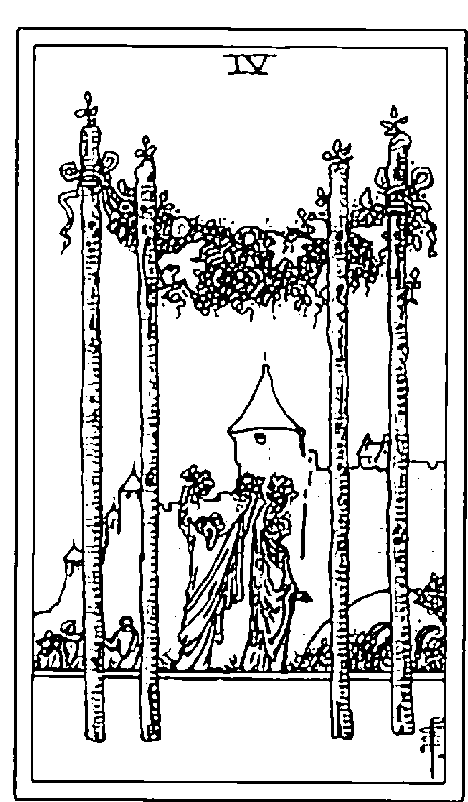

## 权杖 4 丰收的庆典

画面结构

画面中可以看到基本的场景是身处于一个城堡的周围，有许多人正在快乐的庆祝某个庆典，也许是结婚的庆典、也许只是一些值得纪念的日子。

画面前方则可以看到四根权杖高高伫立着，权杖的上方挂满了各式代表丰收的植物，中间则有一男一女两位主角，两人高举着花束看似非常高兴的庆祝属于他们的节日。

由这样的场景看起来这应该是以他们两人为主角所举办的一场庆典，因此大多的时间里会被解读是一场婚礼庆典。

## 整体解释

一个丰收的庆典，画面中权杖上高挂着一些花花草草，代表着丰盛的飨宴，而画面中每人都是正在庆祝的欢愉状态。

背景中还可以看到有座城堡代表了一个坚强的后盾存在，使得这些人在庆祝的时候不怕有外来的灾祸。因此在占卜时出现了权杖四，通常代表的是欢乐、庆祝以及无忧无虑的感受。

但是必须要特别强调的是这是指现在、当下的欢乐。或许这种欢乐会延续一阵子，但不会是长久的，因为就像庆典一般，它是短暂的、一个时间性的，等时间过后许多事情都会恢复原状重新开始。

重点就在于如何去及时抓住这个欢庆的时间点让许多好事继续延续下去。

## 实际应用

在爱情占卜中如果问题为A君对问卜者本身的感覺如何？出现了权杖四这张牌，则代表A君很享受与问卜者当下的接触与互动，而且其实不排斥与问卜者发展成任何关系。

但是目前A君却还没有想到日后的后续发展，对于未来也还没有任何的想法，因此可以说是比较冲动的一个状况。但是就目前而言，是已经达到愿意去面对问卜者的感情，并且可以付出与感受爱情中的欢愉了。

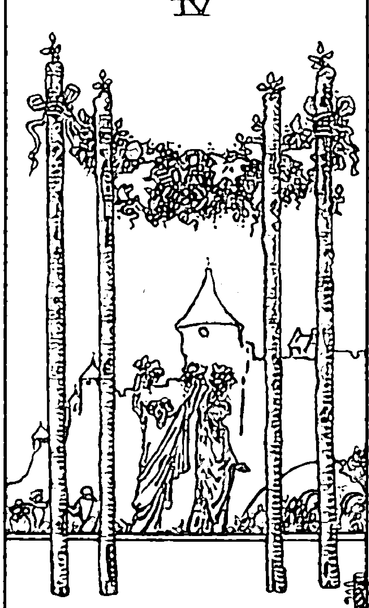

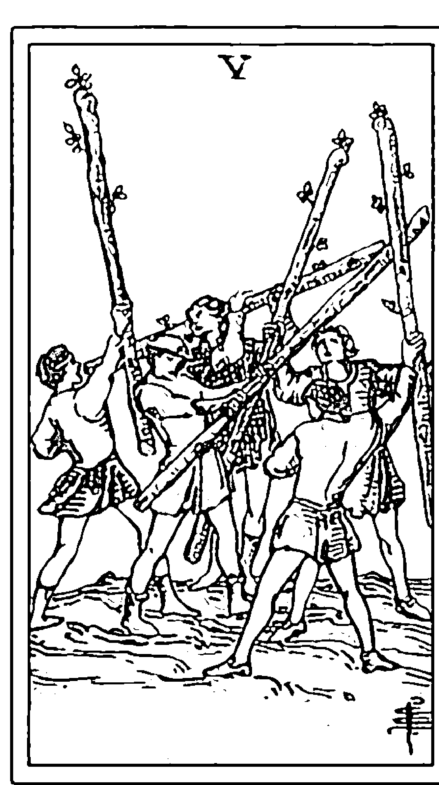

## 权杖 5 接受挑战

从画面中可以看到在一个平地上有五个人，每个人手中都持有一根权杖，或高或低的举着。

这五个人看起来好像在讨论该如何利用这权杖来建设出他们计划中的房子，又好像正因为意见不合而互相有所争执。

因此在整体画面中可以看到有不和谐的气氛存在，因为这五个人看起来谁也不肯让谁。

## 整体解释

从权杖五的牌面上，可以看到整个画面被五根高举未着地的权杖所充斥，而被这样的架构突显之后会让整体性显得更紧绷，不过由于整个画面是处于刚开始而非结束的状况，因此在解释上也更着墨于内心的情绪描写。

所以在占卜上如果抽到了权杖五代表的是遇到了挑战，但是这个挑战不是不能解决的，只是抽牌者必须鼓起勇气去面对。

同样的，如果问卜者没有太大的决心去面对，很多事情都将被卡在原点，如果愿意接受挑战，看似困难重重的前方，其实很多状况都将在稳定中慢慢的解开与前进。

## 实际应用

在爱情占卜中如果问题是与A君未来三个月的发展，出现了权杖五这张牌，则代表彼此之间目前的状况还不是很好，可以说是有点紧绷的状况。

也许是彼此之间在过去或是未来三个月之内有些互动让某一方感到不舒服吧，因此所表现出来的状况是让双方都感到不愉快的。

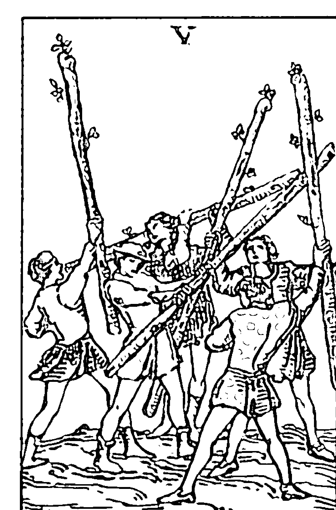

抽到这张牌的时候就必须要多留意，如果现在问卜者与A君还未到所谓不愉快的状况或程度时，解牌者可以建议凡事要小心，别让紧张的气氛进入未来的三个月互动里，造成了双方情感上的紧绷。

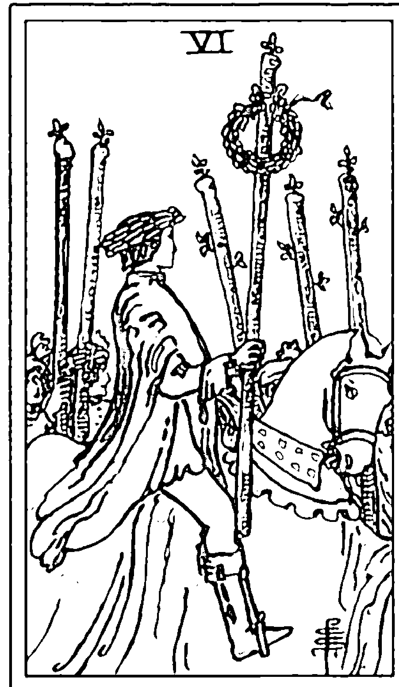

## 权杖 6 光荣的远行

画面结构

权杖六可以看到的是一个头带象征荣耀花冠的使者骑着马要远行，使者的周围，还有其他的护卫高举权杖在使者的带领下跟着前进。

这个以花冠使者为首的骑士团也许是出征，也许是去进行一次外交任务。使者手持的权杖上还有挂着一个代表荣耀的花圈看似引路的标志，也正表示着这次的远行是光荣且备受祝福的一次行动。

## 牌意解读

为这张牌展现出前进的姿态，且这位使者并不是孤单的一个人，因此在占卜的应用上可以说抽到了这张牌就代表这个问题是对的，可以继续往前进，不管遇到什么问题都可以逐步的被解决，并慢慢的达到了问卜者所期望达到的一个最终目标。
不过权杖六比较强调的是一个「开始」的行为，可以从中预测到未来是好的，但是还须要问卜者多努力去面对，才会让这个未来「可能」的好逐渐达成。

## 实际应用

在爱情占卜中如果问题是与A君三个月之内的发展会如何？抽到了权杖六这张牌，则是代表一张很不错的牌。
它所要传达的讯息是A君愿意与问卜者一起携手往未来前进，虽然对于未来还不确定，但却已经有双方一同打拼前进的动作，而不再只是单纯的想法而已，至于未来的发展结果，并不是这张牌所要表现的重点。

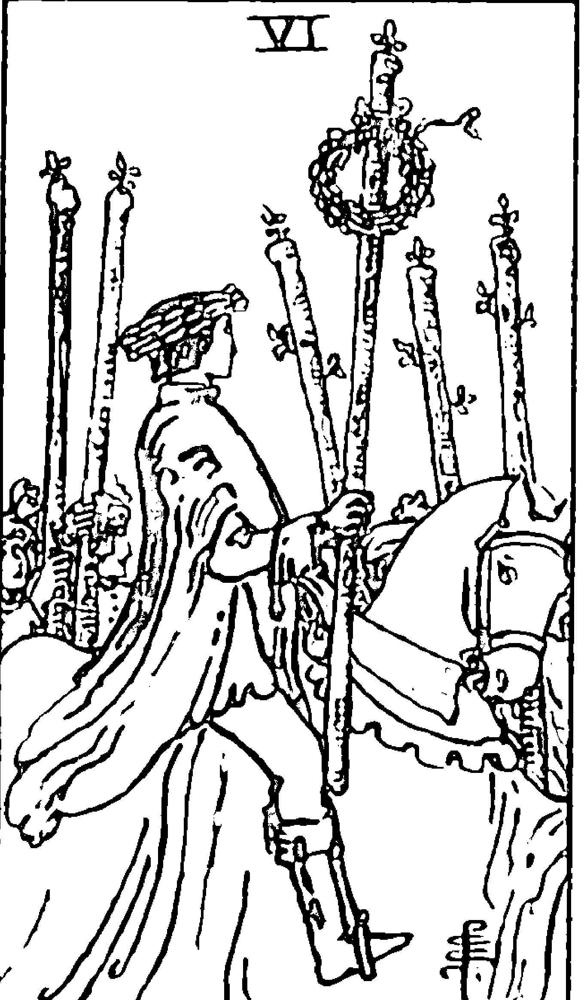

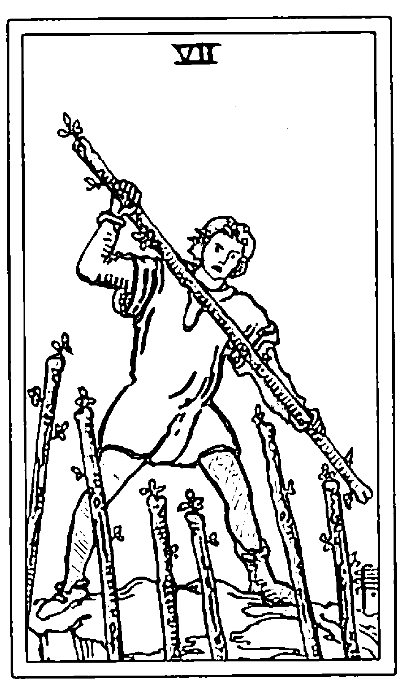

## 权杖 7 勇敢的面对

画面结构

画面中的主角身处高地，双手持权杖摆出防卫的动作，同时他的眼神及表情所透露出来的是坚毅的神情。
下方出现的其他六只权杖，看起来应该像是有人打算要跟主角进行一场战争或是抗衡，而背景以完全无云的型态来呈现，使得所有的注意力都会放在主角身上。

权杖七从牌面上看是一个人站在高处面对下面的挑战及威胁，不过可以从图案中看到他充满了对抗、坚持到底的意志，因此可以说是在目标中虽有困难需要去面对，不过却有勇气及去解决的能力(地处高地，代表着一定程度的能力)。

因此当问卜中抽到权杖七这张牌，代表的是不管未来所遇到的问题会是什么，只要问卜者的心意够坚决，并相信自己是有能力去面对的，最终问题必定都会迎刃而解。

## 实际应用

在爱情占卜中如果问的是与A君三个月内的发展，抽到了权杖七这张牌就代表目前两人之间有许多的问题需要去克服，也许是外在环境的问题或是距离的问题，甚至是彼此之间还有第三者存在的可能性。

不过看起来单方(或是双方)都愿意去面对及思考该如何克服此问题的挑战，有着不会被这些问题所打败的意志力存在，因此三个月之内的双方的发展不会是很顺利，但是却是可以靠努力去克服。

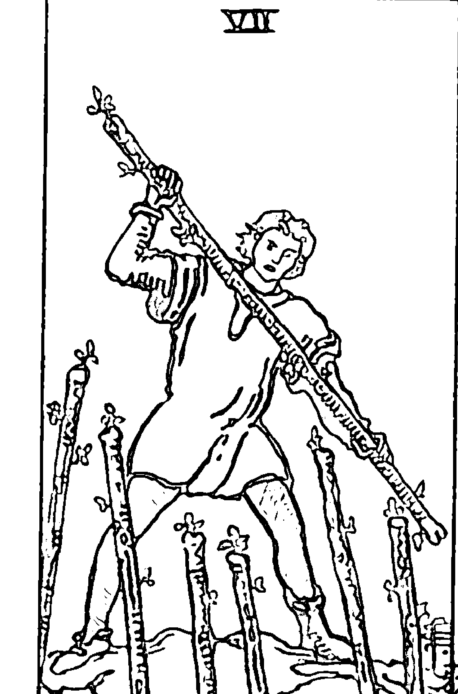

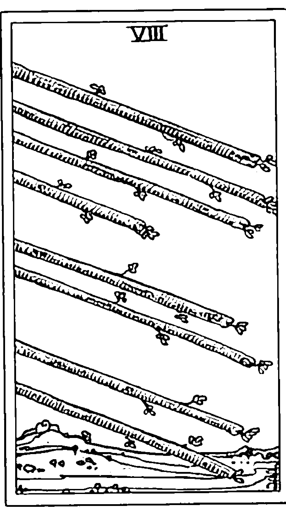

## 权杖 8 一帆风顺

权杖八的画面结构一样非常单纯，画面上方的背景为一片全蓝的天空，而在天空中出现的八根权杖全部都同样的朝向一个方向。

画面下方则是一片绿地与河流，河流看起来十分平静，再配上万里无云的背景，整体画面因此显得十分明确，讯息都出现在这八根权杖上。

## 整体解释

权杖八只看到画面中有八根权杖的一端出现，另一端则隐入画面中看不到的那一方。八根权杖虽然长短不一，但方向却是相同的，在解读上通常会被解释成有目标的快速前进与成长。

代表着不管是询问何种问题，只要在过程当中问卜者的心意够坚定，都代表了未来将会被快速的达成，而且甚至会出乎意外的在问卜者原本所预期的时间点之前就完成。

## 实际应用

在爱情的占卜上，如果问题是询问与A君未来三个月的发展，出现了权杖八其代表的是只要有规划有计划的追求或面对A君，将会有极大的机会在短时间内快速的与A君达到一定程度以上的交往。

同时也暗喻双方的感情将会快速的成长达到恋爱的阶段，不过更该注意的是，是否会因为太过快速反而让双方的情感来的快去的也快，这就是问卜者须要去小心的课题。

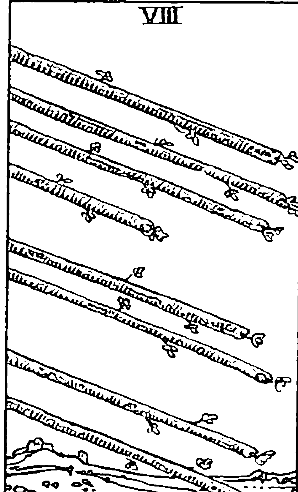

## 权杖 9 伤下的奋战

牌面结构

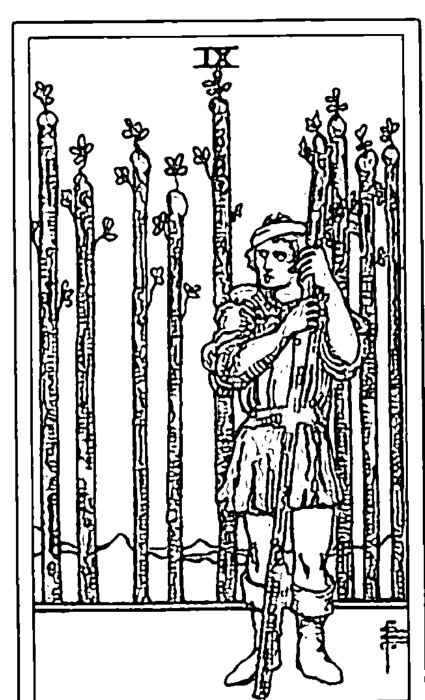

权杖九从牌面中可以看到一个人手中握着一根权杖略为歪斜，并且明显的发现他头上有纱布代表已经是处于受伤的状态了。

而画面中他所站立的城墙后方有其他八根权杖完全直立且并排着，看起来应该就像是训练有素的敌人，并排的权杖就好似敌人手中的武器，而这些敌人已经来到城下，准备向他挑战了。

## 整体解释

由主角卷起的袖子看来，即使他已经受伤了，但是他仍未放弃并且努力的尝试要抵抗即将面对的艰困挑战。而准备来袭的敌人虽然训练有素，但是毕竟仍处于较低的位置。

因此这张牌所表达出的意思即是代表，问卜者要达到他所询问的问题答案看似不可能，而且依照权杖九的角度看来目前应该已经伤痕累累，只是问卜者目前还不愿意放手而已。

虽然这张牌仍有顽力抵抗的力气，但是如果没有其他的外来帮助或是更强大的意志力去面对，问题的答案可能还是会偏向比较令人遗憾的结果出现。

在爱情占卜中如果问题是与A君未来三个月的发展如何，出现了权杖九则表示其实双方之间已经出现了伤害或问题。也许是彼此之间的伤害或是外来者的抢夺，但是问卜者或是A君目前还处于未放弃的状态，并且还在努力的撑住彼此的关系。

遇到此牌时通常会建议问卜者如要维持目前的感情，就需要尽快了解问题的所在点并且要再多加点油，否则双方未来感情的发展的确不是十分的乐观。

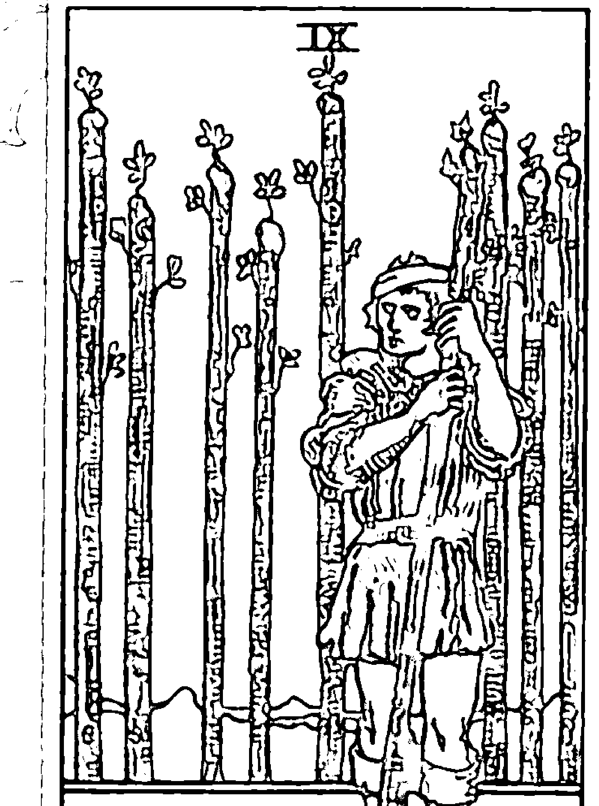

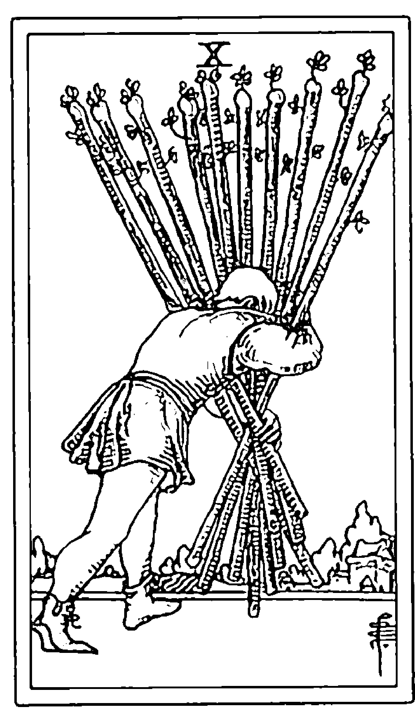

## 权杖 10 沉重的负担

画面结构

画面中可以看到一个主角背对着画面略微驼着背弯着腰，正在往他的目的地前进，目的地应该是前方远处的一个城镇。只是他手中握着十根权杖看起来已经超出了他的负荷，但是他并没有因此而放弃，虽辛苦但仍努力的不断向前进。

## 整体解释

在这张牌的画面中可以看到一个人辛苦的扛着十根权杖，疲惫的往前进。从他的背面就可以感觉到十根权杖带给他的负荷非常的沉重，而且离他的目的地城镇还有很远的一段距离，给人一种沉重及无法达成却又放不下的压力感。

因此，当问卜中出现了权杖十，通常代表的是要达成问卜的目的真的非常的困难，而且问题是已经存在的。虽然未来仍会出现问题，但是权杖十更要表示的是在占卜的当下其实问题早就存在了，也许只是问卜者不愿意去面对或是想藉由塔罗牌期望为自己找到更多的信心而已。

## 实际应用

在爱情占卜中如果问题是与A君未来三个月的发展，出现了权杖十这张塔罗牌，则代表了其实双方彼此之间早就已经出现了许多的问题，导致于彼此之间觉得继续相处都是一种沉重的负担。

就算有心想放下也会因为其他的因素(习惯、双方家族)而导致无法完全割舍，因此才会期望继续走下去。

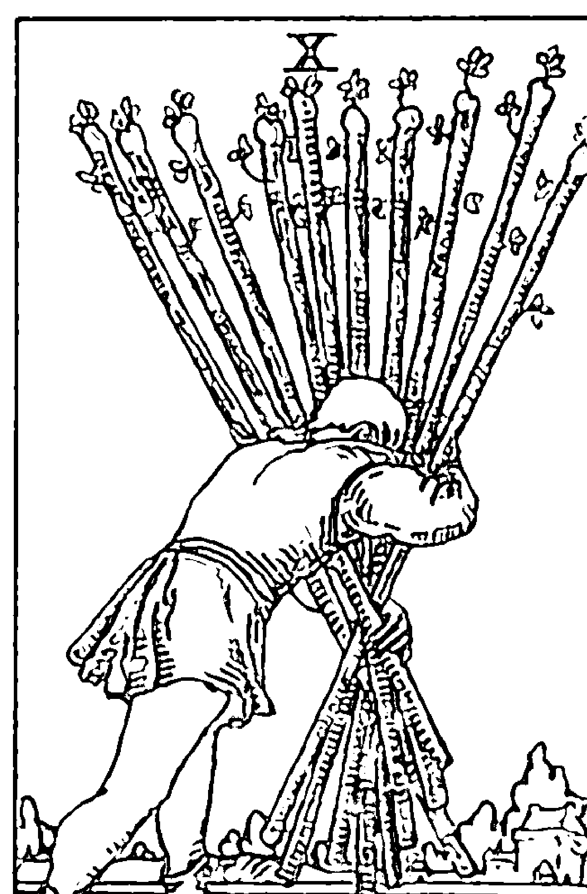

在爱情中遇到了这张牌的确会让人感到十分的沮丧，因此解牌者切忌说完了就把问题终结，此时更应该协助问卜者深入了解问题的症结，尝试打开彼此的心结才是最重要的重点。

## 权杖侍者 专注的学习

画面构成

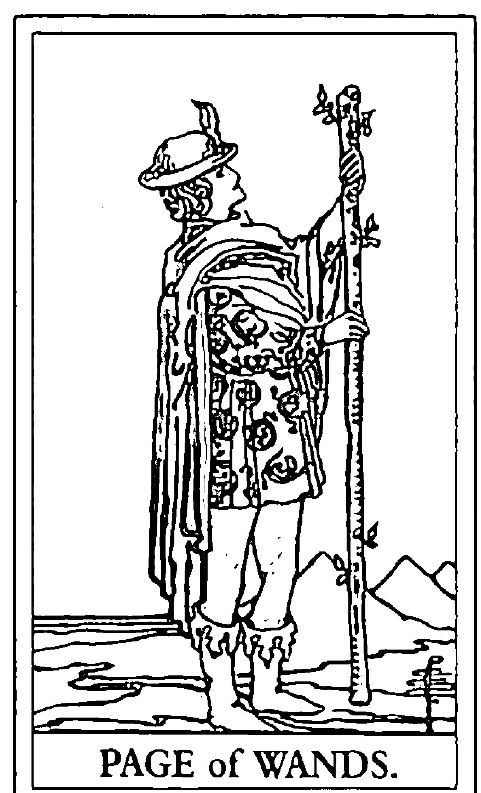

从牌面中可以看到一位年轻侍者身处荒凉的沙漠，后面似乎是金字塔或是山丘，而除了他与权杖之外看不到其他任何有生命的事物。

但他并没有因为如此而展现出恐慌的表情，反而是更专注的注视着他权杖上头刚刚冒出的绿芽。

## 整体解释

杖侍者专注的看着手上的权杖，有着认真及专心面对的情绪存在，虽然身处沙漠却不会动摇他期待权杖绿叶的成长，可以说是一张期待在努力中学习成长的牌。

而由于沙漠里的侍者也在努力思索相关信息，因此有时候在解牌时也可以代表着讯息的出现，其他时间则代表他是很专注的面对所要面对的事。

问卜中如果出现了这张牌即代表一个好的开始，而且只要够努力且专心的面对所要面对的问题，很多更好的消息会不断的涌入。

## 爱情问题

对于爱情问题如果问的是A君对问卜者本身的感觉是什么？抽到这张牌可以说A君已经有认真面对问卜者，而且是期望能有更多的互动讯息出现。

这是一个很重要的关键，双方目前如果是处于未开花结果的状况时，那就表示A君心中是充满了期待，只要问卜者认真的对待A君，总有一天双方会有良好的互动出现，是一张目前未发展但很有可能会有好发展的牌。

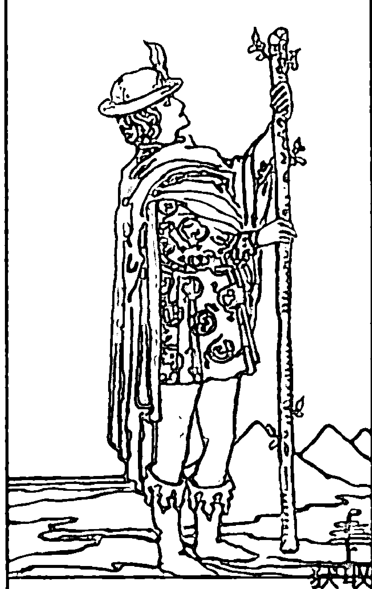

## 权杖骑士 自信的前进

画面结构

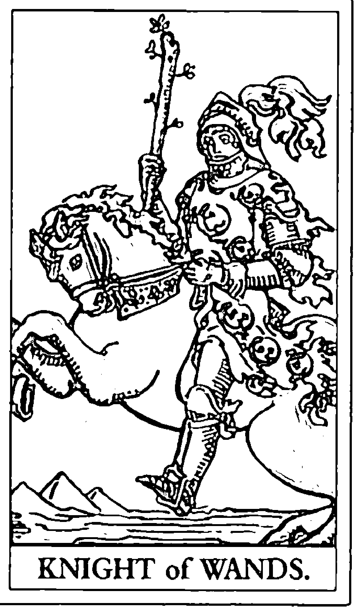

画面的背景仍处于沙漠里，而主角骑士身穿闪亮盔甲骑在一匹准备跳跃前进的骏马上，他手持一根短权杖，头上盔甲的装饰正因为快速前进而产生了飘动的情形。

远方的三座沙丘与权杖侍者比起来看起来又更远了，也许权杖骑士是正准备远征吧。

## 整体牌意

权杖骑士让人感受到他急于跳跃的活力，充满了火元素的特质，除了让人感到自信及勇猛外，整体的结构也让人感受到他对于未来的目标确认。

在实际占卜中出现了权杖骑士则代表对于目标的达成，问卜者心中其实已有定案，且看起来要阻止他去前进或是阻止事情的发展是比较困难的，因此不如就好好的让事情发展下去，只要多建议问卜者在过程当中不要被太多事情的顺利进展冲昏了头而忘记了当初所设立的目标即可。

## 实际应用

爱情占卜中如果问题是与A君三个月之内的发展，抽到了这张牌则代表双方未来会有迅速的进展，而且也许有一方会展开猛烈的追求，或是双方都很自然的就不断靠近到达更好的关系层面。

这也代表了其中一方或是双方的自我、自信心强大，相信自己有办法在短时间内追求到目标及展现自己的魅力。因此权杖骑士在这边表示问卜者与A君未来三个月内的发展是令人感到十分愉悦、跃进的。

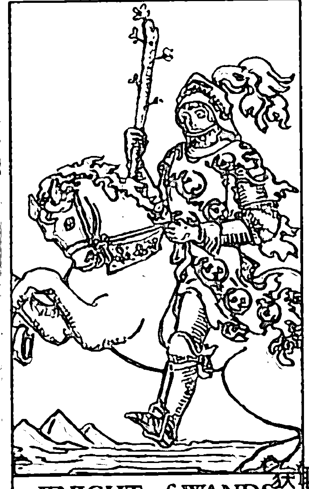

## 权杖皇后 热情的给予

画面结构

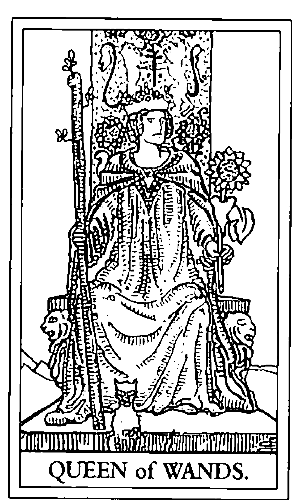

画面中可以看到一位短发女性坐在她的皇座上，而除了右手手持权杖轻触在她的座位基石上之外，左手还手持一朵向日葵。

在她的座位下方有一只黑猫存在，远方的三座沙丘也让人感觉到她的确是离沙丘更有一段距离了。

## 牌意解读

权杖皇后是一张让人感受到她无比热情的一张牌，充满了火元素的皇后代表的是热情的对待跟给予，无私的表达出她大爱的精神让人可以充分的了解到她的魅力。

特别要注意的是她脚边的小黑猫，牠代表的是虽然权杖皇后是擅长无私的付出，但是有时候其实在她心里面还是有些小小的阴影存在。

这也是表示出问卜者的答案虽然是可以偏向正面乐观的角度，但是还是要多注意其中发生的一些小插曲，并且不要让这些小插曲逐渐扩大导致于原本不错的结果反而变成了令人遗憾的状况。

## 实际应用

在爱情占卜中如果问题是A君对问卜者的感觉，抽到了这张牌代表的是A君对问卜者的喜爱度已经很高，而且这样的感觉应该已经无所掩饰了，可以说是让人感到十分期待未来表白后的热恋阶段。

虽然在付出中可能还是有些小隐瞒(画面中的小黑猫)，但是，都不是恶意的欺骗，只是A君为了让彼此之间的爱苗更快速成长的小方法而已。

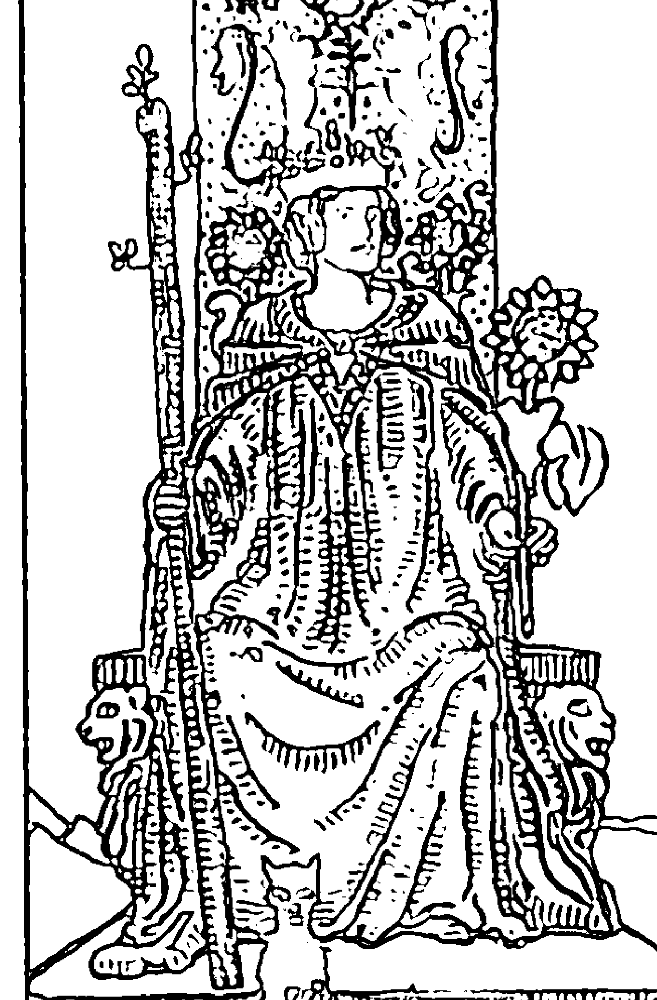

## 權杖國王 果斷的決策

【畫面描述】

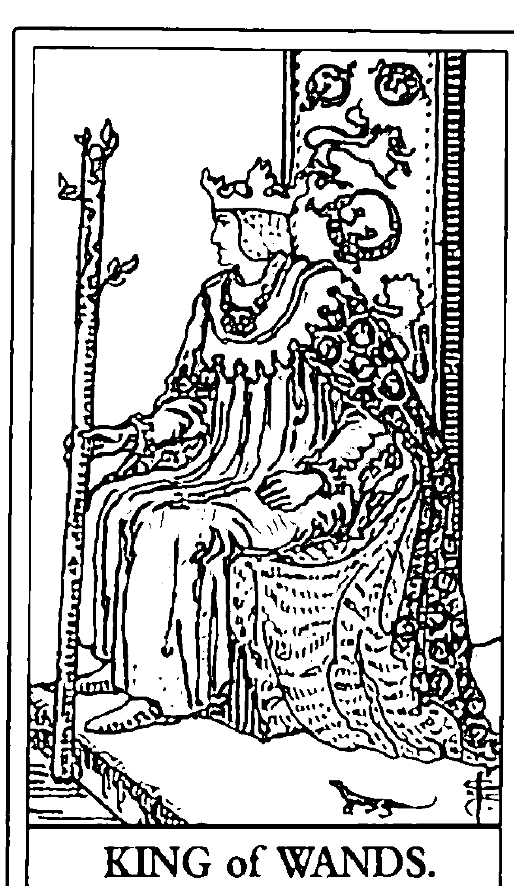

畫面中可以看到一位王者坐在他的寶座上，而右手所持的權杖與皇后不同的是他是接觸地面而不是他的基座。

而畫面的右下角有隻火蜥蜴也陪侍在旁，看起來隨時都有可能快速的往前衝的樣子。不過可以注意到，其他火元素宮廷牌所可以看到的三個沙丘，在這邊已經看不到了。

## 整體解釋

權杖國王除了火元素的快速進展外他還有所謂的決策能力，會期待許多事情在他的決策下畫下完美句點。

不過因為火元素的行動過於快速，因此在決策時有時候難免會顯得不是那麼的準確、細膩，因此還是要注意避免過度快速決策導致於細部不夠完美的狀況。

在占卜中如果是期望往某個方向前進而出現了權杖國王，則代表了這個決策是好的而且是迅速確實的，只是在過程中要注意是否會因為決策過度迅速而忽略了一些小的問題，最後反而破壞了整個完美的結果。

## 實際應用

在愛情占卜中如果問題是與A君未來三個月的發展，遇到了權杖國王可以說是其中一方想掌握住愛情的節奏，而他的節奏通常是快速的且有效率的。

不過相對的在相處過程中就略顯得有點不夠完美，例如像是熱烈的追求並讓對方答應交往，但是整個過程卻會令人感受到有點過於急迫且不夠浪漫的感覺。

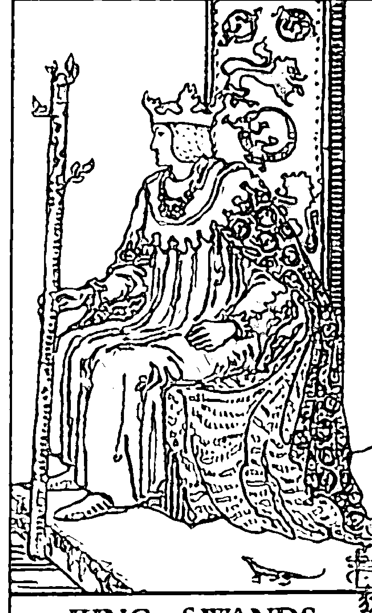

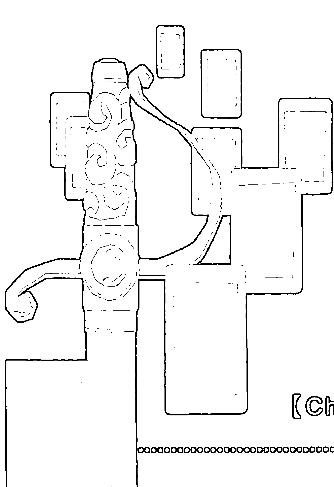

## 【Chapter ⑤】

获取更多好书，请加微信号：strcdts

## 【小牌組】寶劍組

寶劍牌組在四大元素裡面代表的為風元素，代表的是一個快速移動及智慧的象徵，而在某方面來說是屬於較偏向於思緒方面的能量，以下就要跟大家談到四大元素中的風元素-寶劍牌組。

## 寶劍 1 智慧的決策

畫面結構

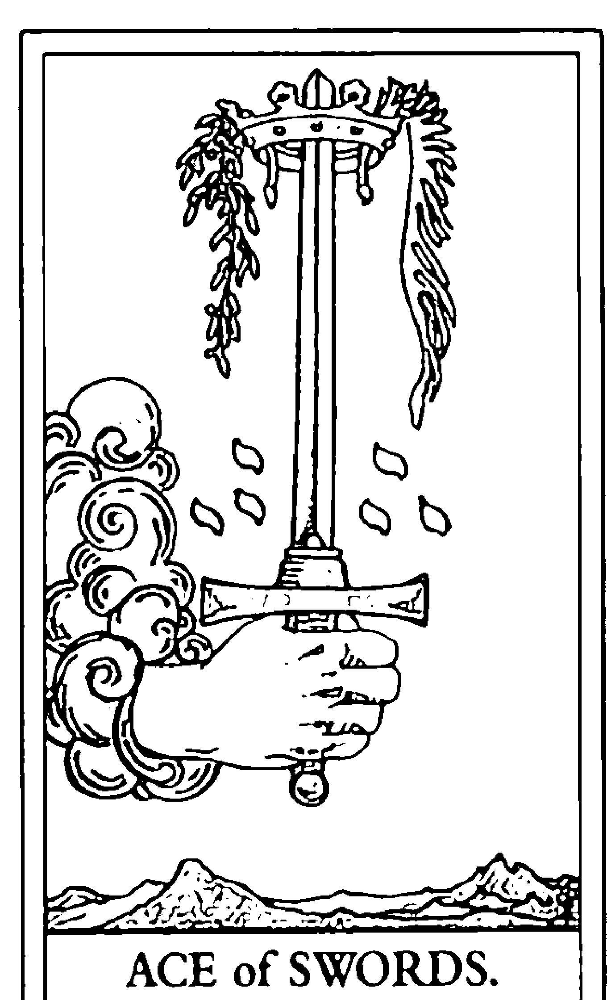

從寶劍一的畫面中，可以看到從雲中伸出一隻強而有力的右手，而手上握著一把寶劍，寶劍上方貫穿一個皇冠。然而這個皇冠本身雖被寶劍貫穿卻沒有一絲的歪斜，仍是水平的存在於畫面的上方正中央的位置。

畫面的下方可以看到一些岩地與水，不過，除了皇冠上可以看到一些植物的象徵外，其他就沒有植物或任何生物的存在了。

## 整體解釋

寶劍牌組在塔羅牌的四大元素裡為風元素，寶劍一所代表的是一個智慧的決斷，看到一把劍被手所握住，寶劍的上方還有象徵榮耀的皇冠，這張牌所代表的是充滿了智慧的思考與行動(前奏)。

在許多的解釋裡，當占卜出現了寶劍一的時候，都是代表問卜者所詢問的事情即將進入一個聰慧的決策點，也代表到達了一個該做決定的時候。

因此寶劍一的出現，對大多數的問卜者來說都是一件很不錯的訊息。

在愛情的占卜中如果問題是問A君對問卜者本身的感覺，出現了寶劍一則可以表示A君對於問卜者其實是滿理智的在觀察，目前正有所思考且有A君自己本身的判斷存在。但是在這張牌裡比較沒有感情的因素存在，反而比較偏向於以朋友的角度在觀察問卜者，所以還未有感情的訊息出現。

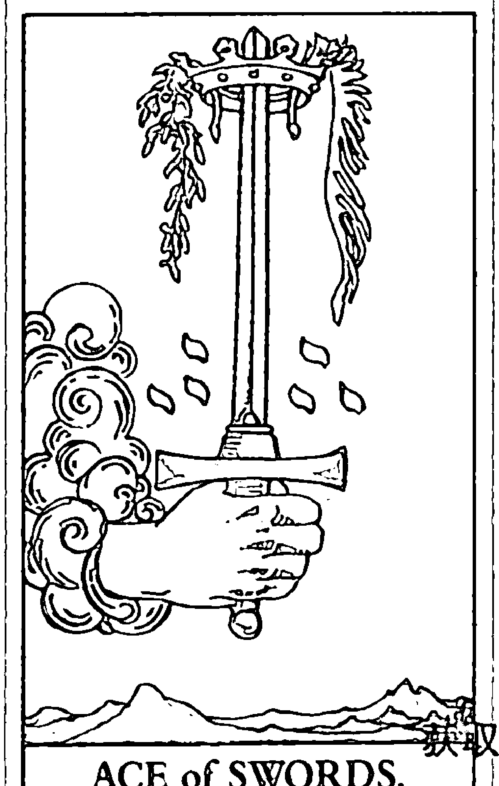

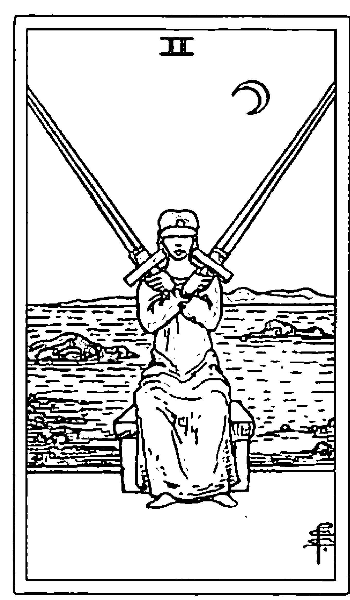

## 寶劍 2 微妙的平衡

畫面結構

畫面中可以看到主角獨自坐在一個石台上，他眼睛被朦住了所以看不到前面即將要面對的問題。

他的雙手各持一把寶劍，並將寶劍交叉置於胸前感覺像是在做防禦的姿態。由於他的雙眼被朦住了，感覺好像只剩耳朵可以拿來判斷周圍發生了什麼事，而畫面的背後則是夜晚的海邊，藍色的夜晚讓人感覺寧靜，似乎深怕打擾了這個被朦住雙眼的男子。

## 整體解釋

寶劍二在塔羅牌的解釋上有兩個滿極端的解釋，有一派的解釋是說朦住眼睛是要傾聽內心的聲音並且去找尋不同意見的平衡點。

而另一派的解釋則是認為因為被朦住了眼睛，所以面對危機產生了十分不確定的不安感，端看在問卜者的問題上怎麼去闡述。

基本上可以把重點放在被朦蔽的雙眼以及雙手持劍所產生的平衡，以此合併其他牌所生的訊息來作為解牌的重點即可。

## 實際應用

應用在愛情的問卜中，如果問題為A君對問卜者的感覺如何？出現了寶劍二這張牌則代表A君對於問卜者存在著很不確定的感覺，他似乎感到有些恐懼也有些疑惑，也許A君自己都還搞不清楚對問卜者的感覺究竟是屬於哪一種？

有時候也許有點感覺、有時候又覺得應該沒感覺，是屬於一張連A君自己都還在想辦法想要了解對問卜者感覺的疑問牌。

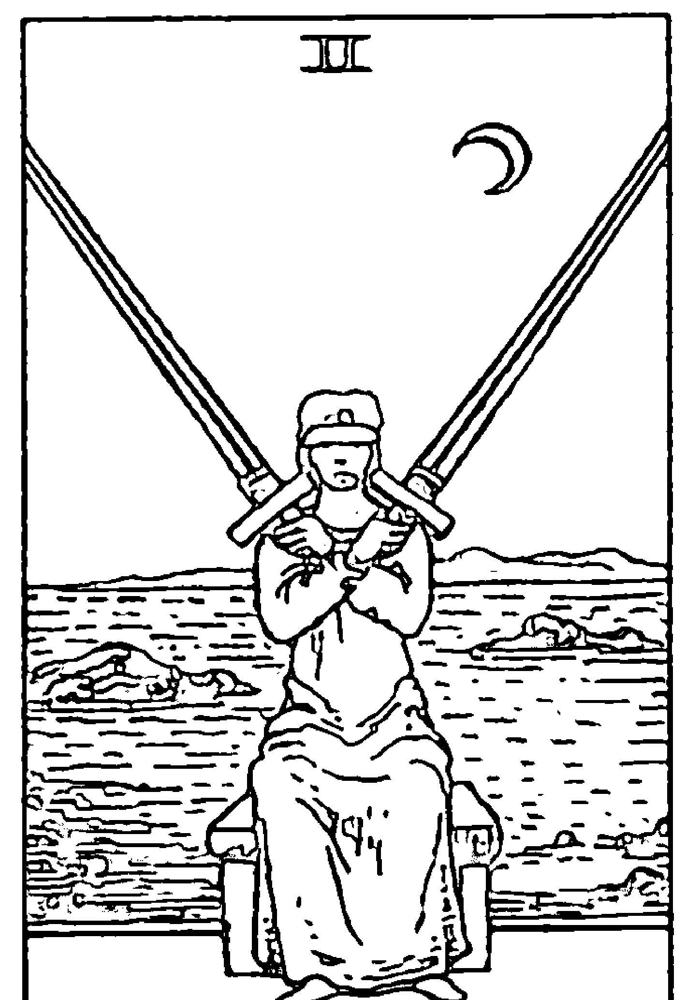

## 寶劍 3 心痛的感受

牌面結構

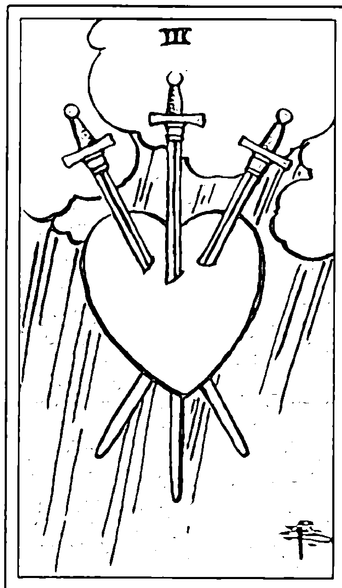

寶劍三在畫面結構上的圖示其實十分明顯，畫面中可以看到一顆心上面插了三把寶劍，背景則可以看到有烏雲密佈以及一場不算小的雨。

而紅色的心在這張牌當中因為其他背景顏色較為灰暗的關係，反而更突顯出它被寶劍穿刺而過的重點。

## 整體解釋

寶劍三的解釋還滿令人感到難過的，因為畫面中的一顆心被三把劍穿刺而過就是要切切實實的傳達被傷了心的感覺。

這顆心不一定是指愛情(當然在許多事情上都被拿來這樣判讀)，它還可以代表是一個希望、忠心、夢想等一些原本問卜者心中所想的那件事，而上面有寶劍刺過代表的是夢想破滅、情感受傷，或是被人背叛等，在感受上自然會伴隨著難過、傷心以及無法接受的狀況。

因此在絕大多數的問題裡，出現了寶劍三都是讓人感到十分不舒服以及沮喪的事情或狀況。

## 實際應用

在愛情的問卜中如果問題為未來三個月與A君之間的發展如何，而出現了寶劍三這張牌，可以簡單表示在未來的日子裡，問卜者與A君勢必相處的十分不愉快。

雖然以單張牌還比較不能分析看看問題到底出在哪裡，但是已經很明顯的呈現出雙方的關係已經進入了緊張、難過及可能有爭吵的氛圍裡。

在這樣的狀況下，雙方可以有所進展的可能性已經幾乎等於零，要擔心的反而是，雙方是否會因此而造成分離或是決裂的情形。

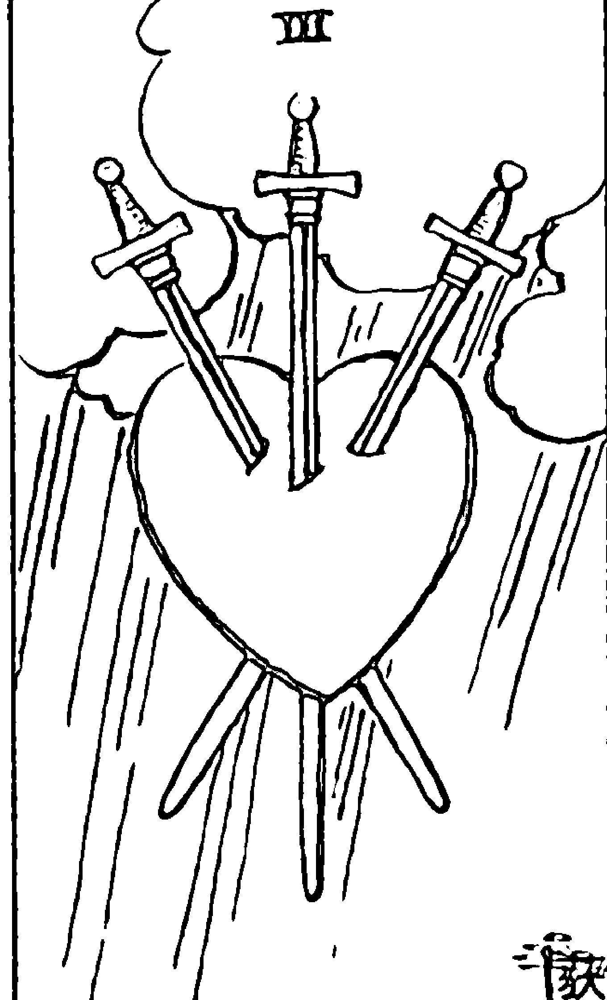

## 寶劍 4 暫時的休養

畫面結構

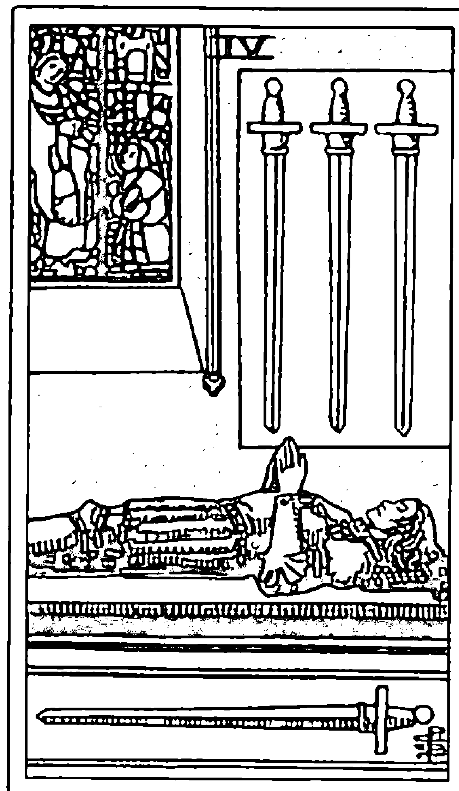

寶劍四可以看到畫面中有一個人躺在一個看似安詳的地方，由於左上角的背景中，可以看到一般比較常出現於教堂裡的玻璃彩繪，因此有人會把這個地方解釋為教堂內。

畫面的右半部呈現出有三把劍整齊的掛在牆壁上，另一把劍則隨著這個主角橫置於他的下方，可以看到整個畫面中所有的事物都是處於休止一種的狀況。

## 整體牌意

這張牌在大方向上可以說是一個休息、休養的情形，在解釋上可以說是暫時的離開紛擾或是暫時的休養不再過問世事。

但是這並不是長久的而是一個「暫時」的狀況，所以在解牌上可以解釋為暫時的讓自己的身、心休息一陣子，並且調整步伐準備迎接新的挑戰。

## 愛情的應用

在愛情的占卜中如果問題為與A君未來三個月的發展狀況，這時出現了寶劍四則代表彼此之間在未來三個月發展會處於停滯的情形，甚至會有點倒退的狀況存在。

也許在彼此的心中都因為想去好好思考，接下來該如何去面對彼此之間的關係，所以在互動上就變的較為減少，甚至變成了無互動的狀況。

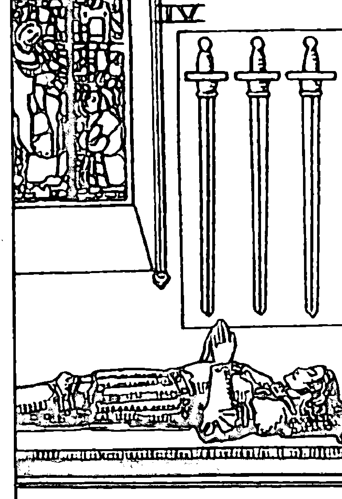

雖然不是代表彼此之間以後就是沒有發展的可能了，但是卻可以說明至少在未來的三個月，彼此是比較沒互動的狀態。

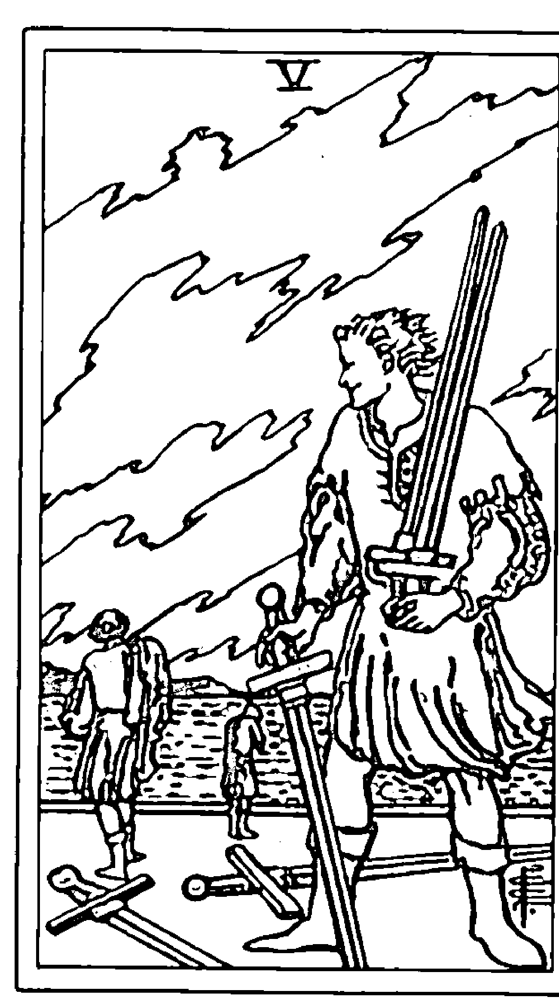

## 寶劍 5 矛盾的衝突

畫面結構

畫面中可以看到一個人偉岸的站於畫面前方，他手上端著兩把寶劍，而另一隻手也反握著另一把寶劍，另外兩把寶劍則散落在地上。

在距離畫面較遠的地方，可以看到有兩個看似較為失落的人，慢慢遠離的背影，上方背景的雲則看似有快速移動的傾向，讓人感覺到整體畫面中十分有張力的結構存在。

## 寶劍五

寶劍五可以看到一個人似乎在決鬥中戰勝了其他兩位失敗者，但是由於手上拿的劍與地上的劍成凌亂的狀況，因此在占卜的解釋裡會被指向內心的衝突與矛盾。

雖然最後還是會決定方向，但是卻因為有太多矛盾困擾著決定者，在這場(內心)衝突裡雖然表面感覺是有決定並且是肯定的，但實質上要更注意的是內心的混亂狀況所要表達的矛盾與解釋。

## 實際應用

在愛情的占卜中如果問題是A君對問卜者的感覺是什麼？出現了寶劍五這張牌，所代表的是其實A君已經表達了對問卜者較為負面的答案，但是他自己對於他的決定是否正確，還存在著矛盾與懷疑的心態。

也就是說其實表面上A君看似已經對問卜者有訊息的傳遞(答案可能是較為負面的，但是他自己對於這樣的說法還是有一定程度的懷疑與矛盾。

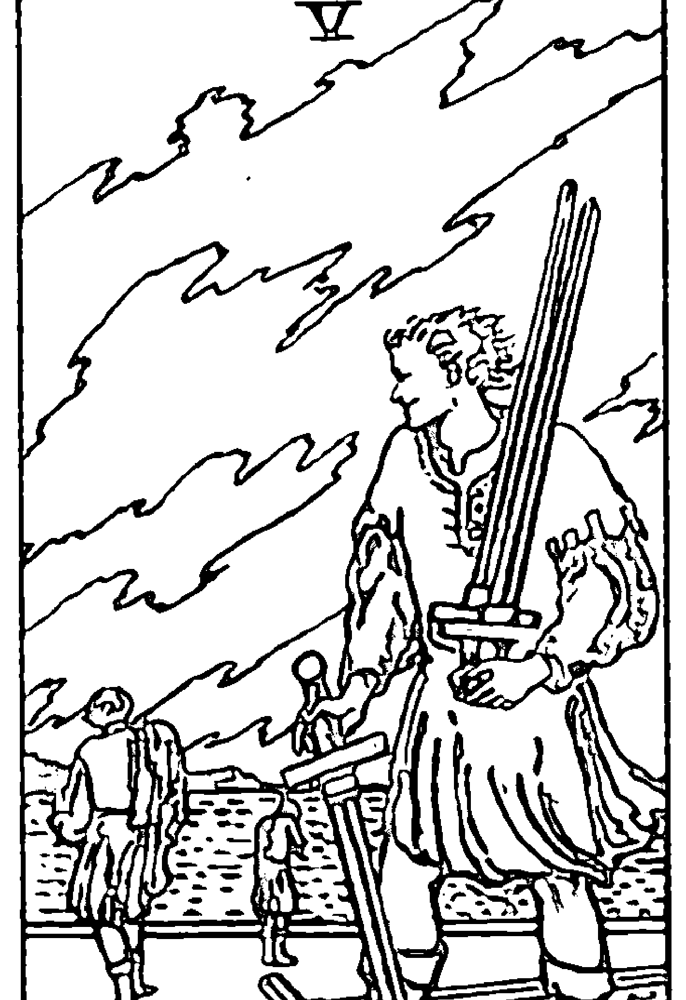

與寶劍二的差別在於一個是內心在想而未做決定，而另一個是說了、做了卻自己也在懷疑自己的決定是否為正確。

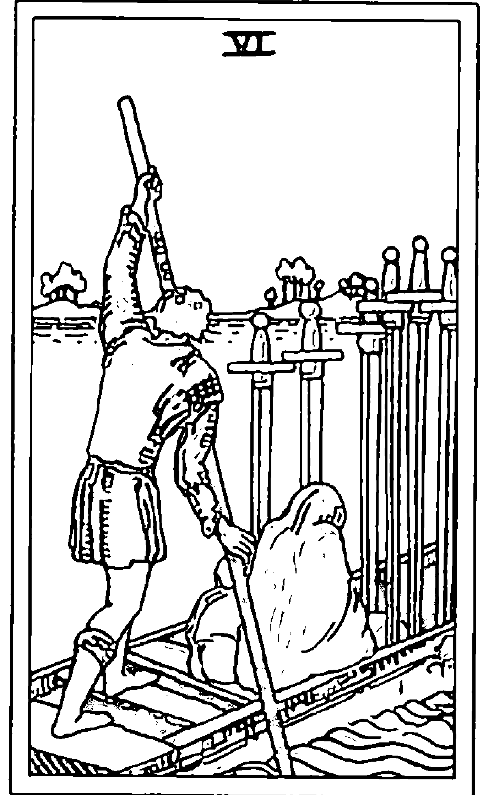

## 寶劍 6 未知的旅途

【牌面描述】

畫面中可以看到有三個人坐於船中，六把寶劍則直挺挺的插在船頭，三人中的其中一個人，手持長棍正努力的要讓船前進到另一邊的對岸，在他前方有兩個人正低頭不語的坐著，由其中一人將全身包裹起來的狀態，可以去猜想也許他們正在逃離一個地方或是要躲避一些事情。

而從畫面下方有波動的水紋，可以知道這艘船的確是有在穩穩的前進著。

## 整體解釋

寶劍六可以看到一個渡船者引渡著婦孺前往另一個未知的旅途，雖然深不可測的海面有可以解釋成隱藏的危機的意涵，或是另一個解釋為他們正在逃離一個危險的狀態，不過可以看出渡船者的身影是一股穩定的力量。

因此在解牌上可以說是準備要去面臨一個挑戰或是離開一個目前不想面對的事情，雖然知道有許多困難在前，不過除了自己的準備完成之外還會有貴人的協助。

雖然對於結果還不是很確定，但是以這張牌來說是已經準備好要去面對了的。

## 實際應用

在愛情的占卜中如果問題為與A君未來三個月之內的發展，出現了寶劍六所要代表的是雙方(或單方)可能對於目前的狀況不是很能接受，因此在未來的日子裡會嘗試去改變一些互動的行為。

不過由於寶劍跟情感是較為薄弱的，因此通常解釋是會較為疏遠且比較偏離愛情的表達，也就是說未來三個月雙方的發展會進入疏離、平淡，甚至有點逃離彼此的狀況存在。

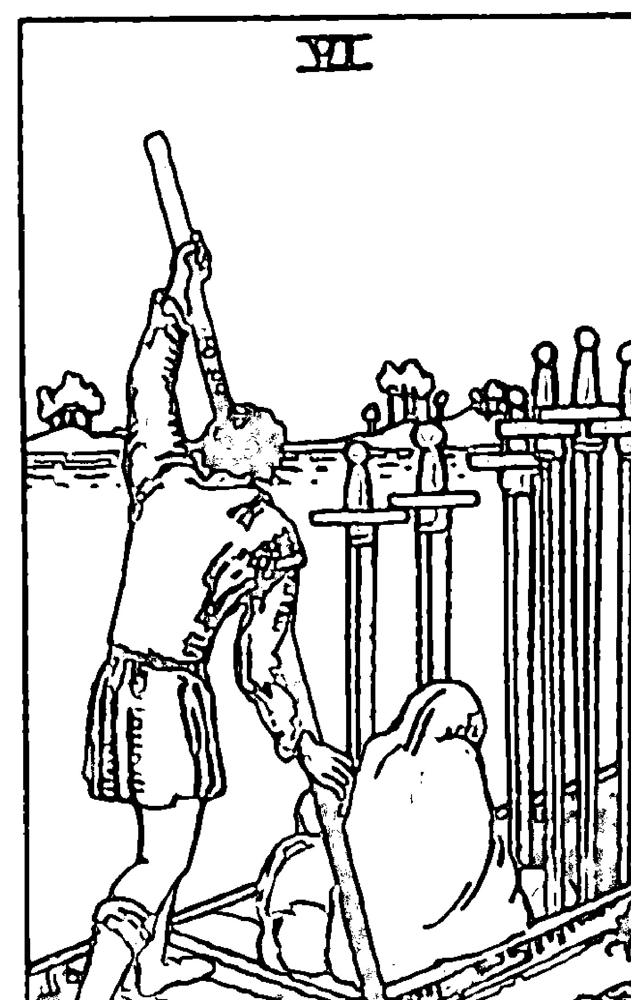

## 寶劍 7 計策的實現

畫面結構

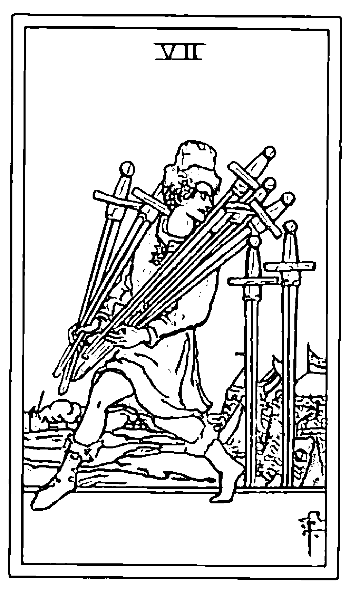

畫面中可以看到一個人似乎掂手掂腳小心翼翼的在前進著，而從後方許多帳篷的角度看來，也許這是一個軍營的所在地。

而因為他的行為及所處的地方，可以去推測他應該是深入敵營，而且從他手上端著五把寶劍看來，他應該是深入敵營去偷取對方的武器。

另外，從他左顧右盼的表情，也可以看得出來他是很小心的在處理這件

## 整體解釋

寶劍七在塔羅牌裡面是一個計策的思考並執行，雖然大多數時間是被解釋成偷偷摸摸的計策，或是比較不是那麼正面的一些想法，但是不可否認的它是一個看似成功率很高的行為。

因此在面對問卜是否會成功來說，我們可以說他是一個有用心計畫的行動並且是很有機會完成的。在愛情裡也是如此，他比較像是用一些小手段去達成所要追求的對象或是目的。

## 愛情牌陣

在愛情的問卜中如果問題是A君對問卜者的感覺是什麼？出現了寶劍七所代表的是A君對於問卜者是有感覺，但是卻不是一個成熟的愛情狀況。

他比較像是A君其實心裡有其他的打算，對於愛情雖然是願意付出或是願意表現，但是其實心理面卻有其他暗地裡思考的一些想法存在。

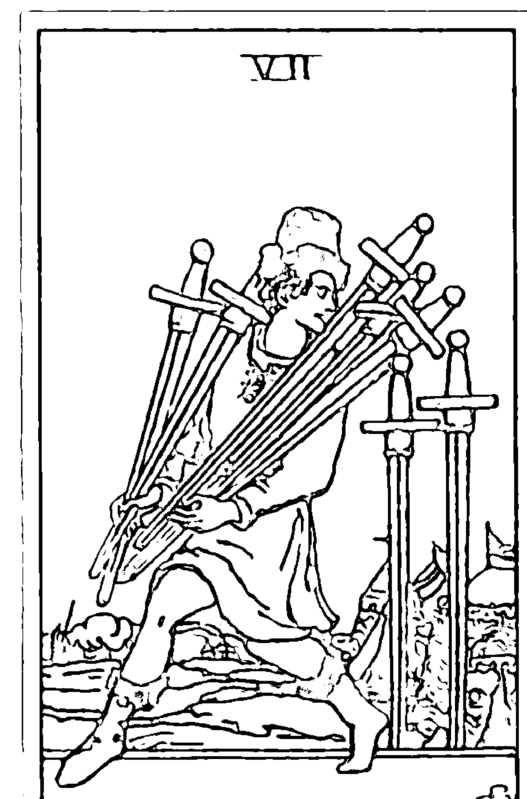

通常出現這張牌時會建議占卜者再多詢問或是占卜更多相關細節，以確定A君內心真正的想法為何，以免屆時落入了一些潛在的計謀當中(例如只想發生親密行為的狀況)。

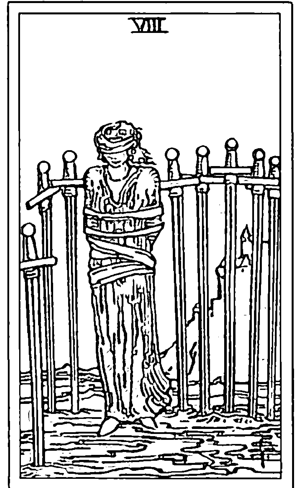

## 寶劍 8 深陷危機

畫面結構

在寶劍八的畫面中可以看到一個人不只是眼睛被遮住了，他的身體也被綁住了，因此可以說這個主角已經是處於看不到也不方便行動的狀況。

而他的周圍聳立著八隻寶劍，從他的腳一前一後看起來他是有想要行動但是可能因為無法用眼睛及用手探知這塊未知的領域，所以在前進上就變得必須格外小心。

而畫面後方還有一個可見的城鎮在相對的遠方，看起來離這個受困的人是有很遠的距離，這也代表貴人離他還很遠。

## 整體解釋

寶劍八可以看到一個人被綑綁在遠離城鎮的異地中，而周圍圍繞著寶劍，讓人感覺到如果不小心的去面對就會被鋒利的劍所傷害。

這也是寶劍八的主要意涵，在寶劍八裡所要呈現的是事情的本身已經被束縛住，要再多做選擇是較為困難的，而且也反映出問卜者本身對於事情的了解不夠透徹，所以會導致於許多事件的誤判情形發生。

由於城鎮在遠方也表達出這時候要請求他人的協助是較為遙遠的，最好的建議是希望問卜者靜下心仔細思考，並且好好的準備面對接下來的難關。

## 實際應用

在愛情的占卜中如果問題為A君對問卜者本身的感覺為如何？出現了寶劍八這張牌，所代表的意思是A君應該對於問卜者有很不能面對的狀況存在。

例如A君可能已經是有對象的，或是說A君對於問卜者其實有很多現實間無法突破的障礙存在。

因此A君會去抑制自己的感情，並且不能夠去面對彼此，表示出有些感覺但是不可能讓它實現的情形存在。

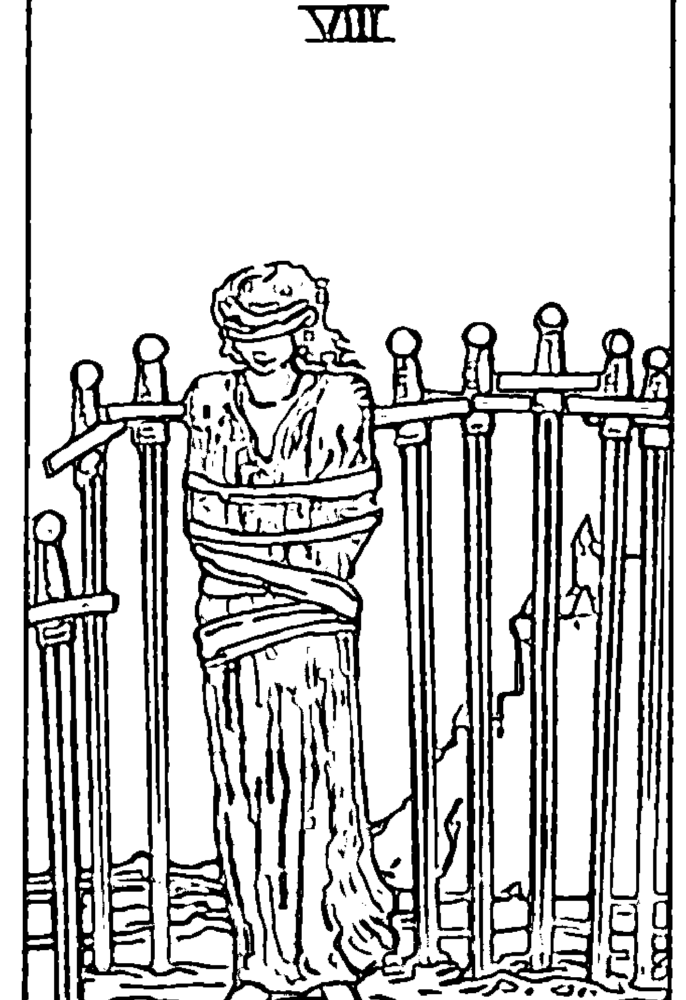

## 寶劍 9 痛苦的煩惱

牌面結構

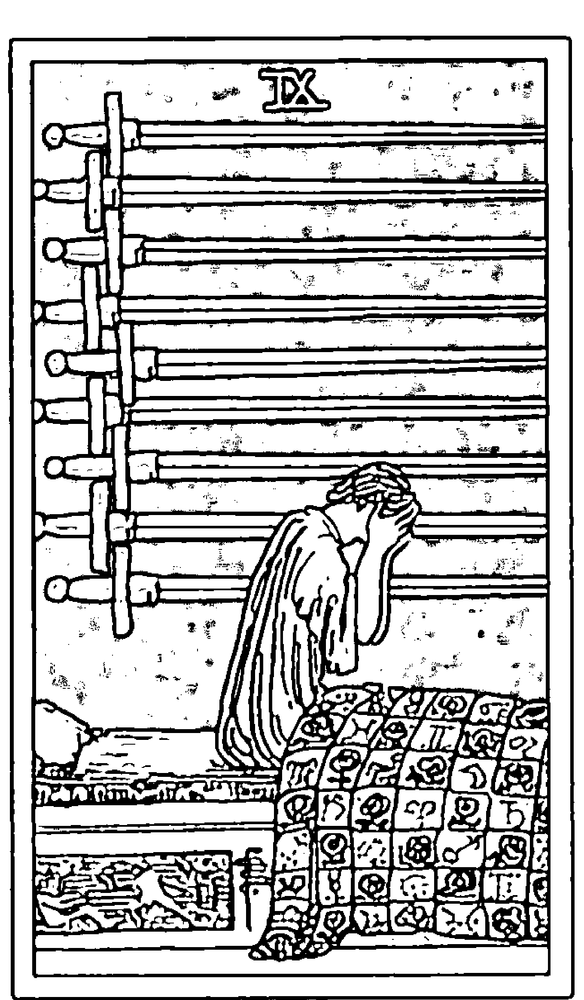

從寶劍九的牌面上可以看到一個人坐在床上，並且十分痛苦的掩著臉，黑色的背景上面有九把寶劍整齊的排列橫掛在上方。

由於畫面的結構是寶劍由後方往前掛著，而主角又是坐著，所以看起來好像寶劍穿插過他的身體跟腦袋，更加深了這張牌所要傳達出來的恐懼感。

## 整體解釋

整體來說這張牌的出現代表的是一個情緒及壓力的困擾，而這個困擾是已經產生於問卜者目前所要面對的問題當中。

這樣的煩惱甚至會讓問卜者，連睡覺都還可以感到無法入眠的壓力存在，可能連喘氣都感到十分的沉重，所以問卜出來的答案也是令人感到很遺憾的。

不過這張牌還是有另一個訊息存在，因為它只是令問卜者感到壓力沉重，因此如果用心面對及調整心態，還是有點機會可以去調整未來的變化，也代表正視問題的重要性。

## 實際問題

在愛情的占卜中如果問題為與A君未來三個月的發展狀況，出現了寶劍九則代表了彼此之間未來的問題很大，兩人之間已經有存在許多的問題也將在未來不斷的被檢視與擴大，甚至可能會到達雙方無法再繼續相處的情形。

通常出現這張牌後會建議問卜者再針對目前的問題細問下去，嘗試把問題的主因找出來後，再給予問卜者更適當的建議，以免真的照著原本會運行的方向前進，如果只在這張牌出現就畫下問題的句點，那就不是塔羅牌占卜師應有的態度了。

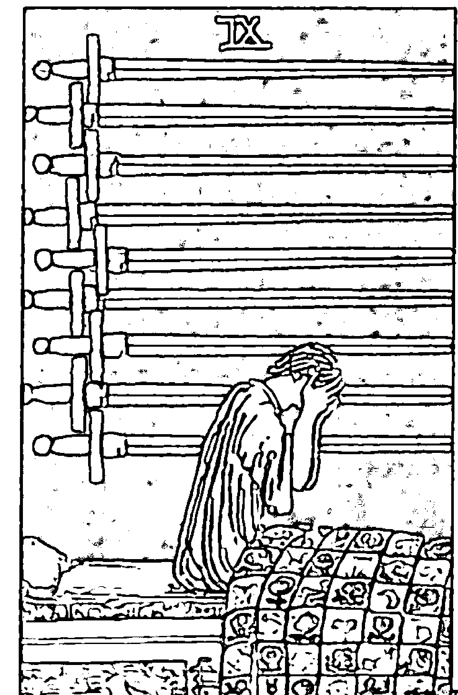

## 寶劍 10 死亡的降臨

畫面結構

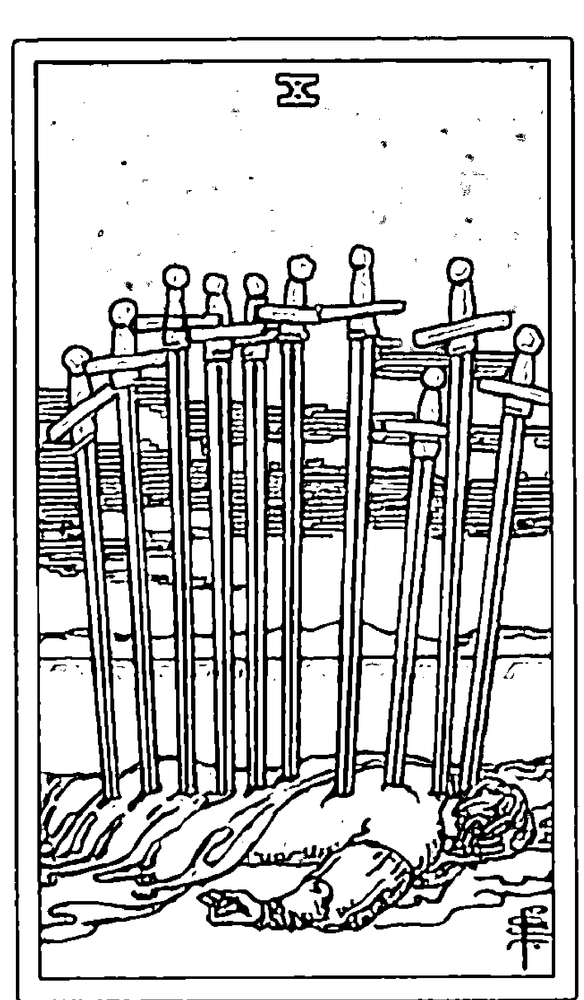

寶劍十的牌面上可以看到一個人躺在地上，而他的身上插滿了十隻寶劍，也因為被寶劍插中，因此地上還有從他身上流出的血。

而背景中則可以看到密佈的烏雲以及沉重的氛圍感覺，雖然並未全部涵蓋所有畫面，但是已經逐漸要將原本清澈的天空都完全蓋住了，而可見的河水也由靜止不流動的狀態來表達壓力沉重的情境。

## 寶劍十

寶劍十讓人一眼就感受到很不舒服的沉重壓力，一個人躺在地上而十把寶劍鋒鋒的插在他的背部。

這張牌所要傳達出的意思，正如同整個結構所帶給我們的訊息般，是一個毀壞、破壞及被迫中止的傷害。

不管問題是什麼，當占卜出現了寶劍十的時候都是代表失敗、無法再繼續前進的意思，如果占卜中出現這張牌，請注意占卜者的工作不是將令人遺憾的答案告知而已，請務必針對問題深入了解核心所在，並嘗試修正才是重點。

## 實際應用

在愛情的占卜中如果問題是與A君未來三個月的發展如何？出現了寶劍十則表示了彼此之間對於愛情即將終止或其實是已經終止的狀態。

雖然在寶劍十裡面也有一點隱喻說，當終結降臨後全新的開始才準備來到，但是對於問卜的當下還是比較重視於死亡的狀況。

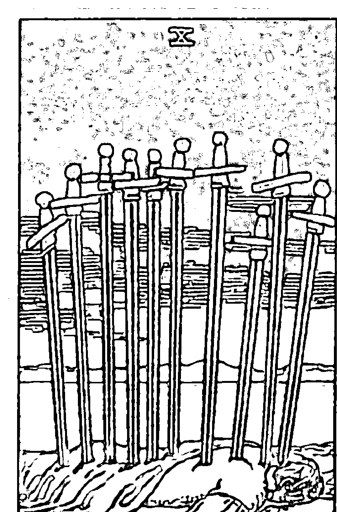

因此也就表示未來三個月與A君之間除非有極大的努力去找尋問題及改變，否則答案將會是一個令問卜者十分難過的訊息。

## 寶劍侍者 精明的理解

畫面結構

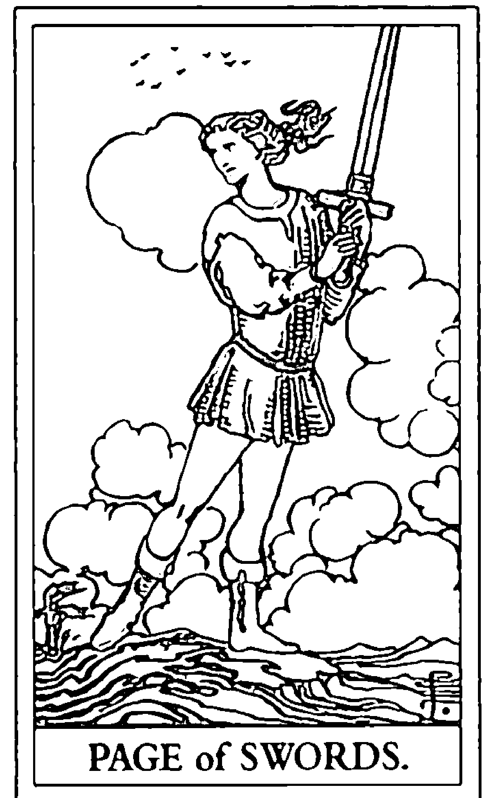

畫面中可以看到一個年輕的侍者，他佔據在一個高丘上，正四顧張望顯現出他精明銳利的一面，他的衣著也是如同他所呈現出來的態度一般輕便、簡單。

背景的白雲靄靄則讓人感到這是一個朗朗的好天氣，連天空中的鳥都可以被清楚的觀看到，展現出可以看透事情真相的一面。

## 寶劍侍者

寶劍侍者站在一個山丘上，讓人感受到他能夠很清楚的了解四周的情形，也讓人感受到侍者的智慧存在，也許年輕會比較有點浮躁，但是寶劍侍者所表現出來給人的感覺，就是十分能夠理解目前所遭遇的困難並且有能力去克服它。

在占卜者的角度裡就是說明了面對困難能分析、能理解以及能突破重圍的能力，雖然在貴人方面是弱了點，但是卻可以用自己的力量去面對即將面臨的考驗。

## 實際應用

在愛情的占卜中如果問題為A君對問卜者的感覺為何？出現了寶劍侍者所代表的意思是，A君其實對於問卜者是很有興趣的，而且也正在觀察問卜者。

不過A君似乎有點過於理智的在觀察，因此所表現出來的態度可能是有點冷淡或是太過理性，在愛情中可以說是一個正在不斷掌握問卜者情資的一個狀況中。

有好感但是未達喜歡的狀況，有觀察卻過於冷靜過了頭，接下來能否有進展，就要看問卜者怎麼展現出他的魅力去繼續吸引A君了。

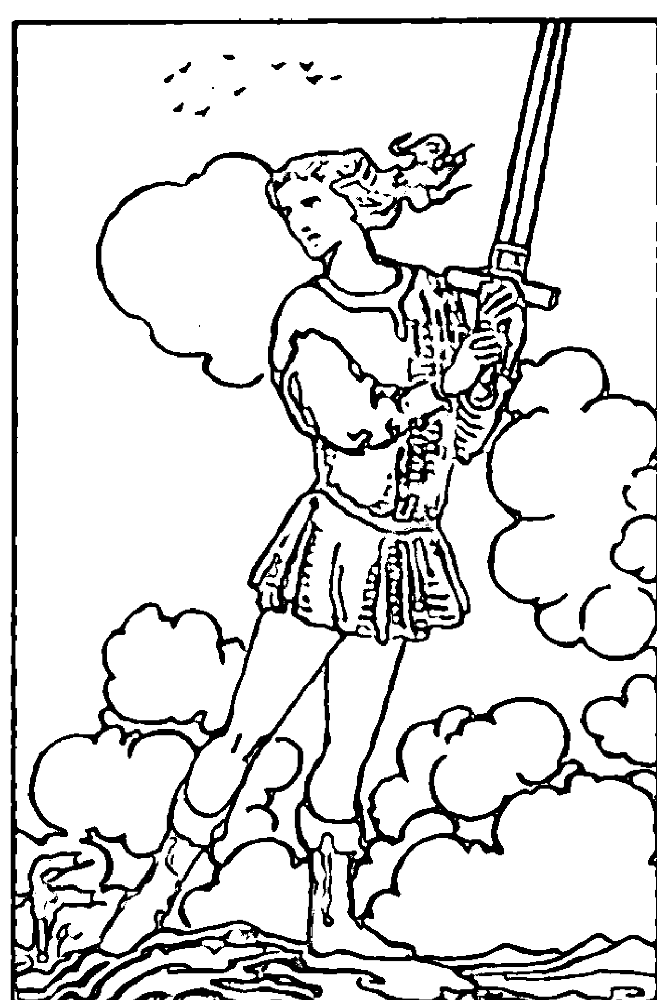

## 寶劍騎士 快速的躍進

【畫面結構】

畫面中可以看到一個騎士坐在一匹正在飛奔的駿馬上，看得出來他們正在急速的前進中，而高舉的寶劍也代表有宣示能力的意含。

背景中的雲以及被吹動的樹枝都是為了呼應他急速前進的一個象徵，而從他身上華麗的服飾看來，他是受到重視的，或者應該說他是希望被受到重視。因此才會展示出如此華麗的裝飾及行為。

## 整體解釋

寶劍騎士在整張牌中所要傳達出來的就是一個快速的力量，雖然不如火元素的強而有力，但是他卻可以用最快速的方式達成目標。
在解牌的技巧上可以說當這張牌出現時，即說明了問卜者對於目標達成的決心，而且精準的前進不會受到其他外界事物的干擾。
雖然在達成上沒有讓人感受到很強烈的成功力，但是卻是快速、精準的，可以說是一張很不錯的牌。

## 實際應用

在愛情的占卜中如果問題是與A君未來三個月之內的發展，出現了寶劍騎士這張牌，可以說未來的三個月之內雙方的發展是突飛猛進的，而且看起來關係會進展的十分良好。
雖然也許會因為過於迅速導致讓人感到有點快的不可思議，但是卻是一個很不錯的開始。
不過，接下來如何能讓這虛幻不實的進展，感覺變的更踏實就有賴雙方的用心對待了。

## 寶劍皇后 冷靜的智慧

### 畫面結構

畫面中看到一位皇后以側面的角度坐在她的皇座上面，她高舉的左手似乎在宣示些什麼，而右手則將她的寶劍直立的舉著，而嘴角下擺顯示出她不可侵犯的態度。

她背後的雲層很厚，卻都是在遠方的位置，皇后的上方反而是萬里無雲，表示出在她的智慧下沒有什麼可以隱瞞的事物存在。

這畫面的整體都顯示出她有極高的智慧，不過卻因為過度智慧而展露不出親近人的一面。

## 整體解釋

寶劍皇后讓人一眼就覺得她好像冷酷了點，但是在另一個角度上也是說明了她是充滿了智慧的象徵。

因為有極高的智慧，所以在處理事務上這張牌所顯現出的能力就較為強烈，然而在人情相處上，這張牌的弱點又表露無疑，因為過度冷漠的智慧，讓人比較難以靠近及融入團體。

因此在解牌上有兩種不一樣的解釋，但是至少可以知道的是，抽出這張牌通常都是有內心孤獨，或孤單一人去完成任務的訊息存在。

在愛情的占卜中如果問題為與A君在未來三個月之內的發展，而出現了寶劍皇后牌，則代表了未來三個月之內，雙方都會趨於理智的去面對雙方的情感。

因此，在情感的發展上算式進入了一個思考期，也就是雙方會多用一些現實的因素去觀看彼此之間的關係。

雖然知道在愛情中放入太多的理智並不是一件好事，但是至少可以從這張牌當中知道，彼此之間是有在認真的面對彼此的感情中。

## 寶劍國王 理性的堅持

### 畫面結構

畫面中可以看到寶劍國王正襟危坐的端坐在他的皇座上，而他跟寶劍皇后一樣，也是顯現出不苟言笑的表情。

不過，他手中握住的寶劍並沒有完全的直立，表示出在完整的理性下還是微微的藏有個人的一絲絲情緒存在。

而背景的晴朗天空中一樣是展示出他智慧的透測，讓人可以感受到寶劍國王他理性不受外界控制的一面。

## 整體解釋

寶劍國王與皇后有著同樣的智慧存在，然而他卻多了一股更強烈的決策能力，以及認定後向前突進的行動力，不像皇后會有可能是以不變應萬變，不輕易做出反擊。

寶劍國王他也有代表是智慧的成長以及堅定能力的展現，在他的智慧下所決定的決策，通常是不太允許人家去反對或是質疑的。他會用行動去表現，讓人知道他所做的決定是正確的。

因此當出現這張牌的時候，可以說問卜者對於該項事務已經想的很透徹並且已經做好規劃準備實行了。

## 實際應用

在愛情的占卜中如果問題為與A君在未來三個月之內的發展，而出現了寶劍國王則代表了雙方的情感已經被理智淹沒了，用太過於理智的態度去面對彼此之間的感情。

也是因為如此，所以這三個月之內的發展就變成有點像諜對諜的情形，彼此之間會去試探、假設及猜測，反而忽略了用心去感受。

整體發展將會變得較為怪異，除非經過了這樣的淬鍊讓彼此都看清楚，否則在發展上將會出現過度理智而阻礙發展的情形。

## 【Chapter ⑥】

获取更多好书，请加微信号：strcdts

## 【塔羅牌V.S.神秘學&心理學】塔羅牌的類別

一般來說塔羅牌可以分成三大體系，馬賽牌是最早產生的塔羅，而一開始是流行於法國南部，他的牌內容較為簡單，因此產生了部分研究者無法透徹了解涵義的障礙，而在1888年時，有一個組織稱之為「金色黎明」(Hermetic Order of the Golden Dawn)，這個秘密組織是由一群神秘學學家所組成的，他們致力把塔羅牌與其他神秘學都連結起來創造出近代塔羅牌較為可依循的典範，而在當中最重要的是就愛德華·偉特與亞歷斯特·克勞利，前者繪製了平易近人的偉特牌，這是目前許多占卜師入門所接觸的塔羅牌，而亞歷斯特·克勞利則繪製了托特牌(也被稱之為克勞利牌)，托特牌因為被加入了更多的元素因此在學習上加重了部分的負擔，但是卻也因其隱藏更多豐富的直覺性訊息而被進階學習者當作一塊寶。

### 塔羅小常識

### 塔羅牌與神秘學一

當塔羅牌的魅力席捲全球時，由於它的準確度讓許多人為之震驚，因此不免讓人將塔羅牌與巫術、神秘學串聯在一起，甚至為此衍生出一系列的神秘學文化。

然而這個神秘學的文化，對於塔羅牌用來占卜能增加多少的準確度無人可知。不過，經由神秘學的一些儀式或是器具，的確造就了塔羅牌神秘不可侵犯的領域，也讓許多想入門的朋友心中產生擔憂，害怕接觸了塔羅牌是否就是進入了邪教，或是等於與魔鬼訂下了交易(以換取神準的占卜能力)。

雖然目前有另一派的占卜者極力端正此風，但神秘學派仍視這些儀式為塔羅牌準確度的重要關鍵。

### 塔羅小常識

### 塔羅牌與神秘學二～開牌儀式

塔羅牌的神秘學派在一副牌到手之後，在未開牌的狀況下（牌的收縮膜未拆時）必須先進行開牌儀式，也就是所謂的聖別儀式，代表經由此聖別儀式讓牌的精靈甦醒，並告知牌的精靈，使用者即將邀請精靈一起展開新的占卜旅程。

在聖別儀式中會在桌上鋪上黑布以示莊重，布的四角須放上代表四大元素的物品，代表四大元素能量聚集（有的聖別儀式中會於開牌者面前放置水晶以防止邪靈入侵），最後把塔羅牌置於中央念完聖別祈禱文之後便進行開牌，開牌完成後即進行認牌動作。

當所有的牌經由開牌者一張一張仔細打開並詳細審閱後，即代表牌之精靈已隨這些儀式進入了每張塔羅牌當中，藉此完成塔羅牌的開牌儀式，同時也表示所有牌的能量已具備。

### 塔羅小常識

### 塔羅牌與神秘學三～養牌說

塔羅牌的神秘學派在占卜前有部分占卜師會進行所謂的養牌，此養牌方式寶咖咖沒親眼見過，只有與相關同好於閒聊時耳聞過此養牌方式。

所謂的養牌它的緣由是因為在神秘學派裡，認為牌是住有精靈的，而精靈與人在經過聖別儀式開牌後，就等於是兩者產生關聯，而可以進行許多透視未來的工作。

為了保持與精靈間強而有力的連結，就必須使用占卜者的血來不斷的餵食及延續，所以通常會在固定的時間，由占卜師在無人知曉的地方以自己身上的幾滴血，滴於放置塔羅牌的木盒上，藉此以達到準確度的成長與精靈生存的延續。

當然由於這個儀式是必須私下進行，因此不是此學派的占卜師就不會有機會見識到所謂的養牌儀式，至於養牌過程當中，是否還有所謂的精靈禱文就不得而知了。

### 塔羅小常識

### 塔羅牌與神秘學四～占卜的魔空時刻

塔羅牌的魔空時刻，其所代表的意義是指在特定的時間裡不能占卜。而這個時刻分別為下午五點到七點以及早上的三點至五點，另一個說法則只有指向晚上十一點過後至隔天早上一點的時間。

所謂的魔空，有一派的說法是說由於這段時間屬於精靈的特殊時間交換點，因此他們會不在牌裡（休息中？）。因此，在這段時間內占卜的話，會出現不準確的狀況。

而另一派的說法是說由於這些時間點是百魔叢生的時間，所以在這個時段中占卜會容易引邪魔入侵，導致於占卜者精神錯亂。

但站在科學的角度而言，這些時段都是屬於人的身體比較需要休息的疲倦時間，也許正因為如此，所以容易產生注意力無法集中的情形，在解牌時也就容易出現誤差。

也許就是基於以上種種原因，導致於神秘學派會把這些時間訂定為所謂的魔空時刻來避開可能的占卜不準確的問題。

### 塔羅小常識

### 塔羅牌與神秘學五～塔羅牌的神聖不可觸！

塔羅牌不可以給其他人接觸，這是神秘學派非常重視的一個觀念，因為對此派占卜者來說，他的塔羅牌當中可是住有精靈的，因此應該只有占卜者本身才可接觸。

如給其他人接觸，可能會玷汙了精靈純潔的智慧，也會觸怒精靈產生意想不到的後果。

因此，此學派的占卜師通常會十分嚴厲，不准任何人觸碰到他所擁有的塔羅牌。

在占卜時則只能讓被占卜者以指點牌的方式來進行抽牌，而更有些占卜者會製作所謂的指引棒，較為簡單的就只有純銀製品，比較隆重的則會在指引棒前端放置尖頭白水晶，讓被占卜者手持指引棒去指出所要抽出的牌，再由占卜者把該牌取出翻面。

### 塔羅小常識

### 塔羅牌與神秘學六～占卜後的倦怠感

占卜後占卜師會異常的疲倦，在神秘學的角度裡這是一種與精靈交換的協議，精靈本身必須使用占卜者的能量來進行預測的動作，因此在占卜的過程當中可以發現占卜者的精神會越來越差。

有些占卜師在占卜完之後還會進行清牌儀式，代表告知精靈已經完成了今日占卜，請精靈休息也讓自己的能量不會一直不斷的被精靈吸收。

清牌儀式有很多種但一般不超出利用四元素清牌以及類似宣讀祈禱文後封牌的兩種方式。

這些儀式效果如何見仁見智，但如果以信者恆信的角度來看，這可是此派占卜師認為能夠防止自身能量不被吸光的一個重要儀式。

### 塔羅小常識

### 塔羅牌與心理學一

在塔羅牌天秤的兩端，一邊是所謂的神祕學派，而在另一邊則是以榮格心理學為基礎的心理學派。

榮格學派追求的是藉由塔羅牌抓出人潛在心裡的訊息，而藉由人與生俱來的意識原型抓出目前被占卜者內心所傳遞出來的訊息。

也就是說人生而具來的原始意識，其實一直潛伏在每個人的意識最深層中，而塔羅牌則是這些原型訊息的提煉工具，占卜師只是一個翻譯官，藉由這些工具將被占卜者目前心態中要進行的意識讀解出來。

簡單的來說，就是經由了解針對問題所產生的內在行為及意識，預測出未來問題所會行經的路線與結果。而正因為抓出了潛在意識的訊息，因此要預測未來所可能行經的路線與結果就不是那麼困難的事了。

### 塔羅小常識

### 塔羅牌與心理學二

榮格的集體潛意識與塔羅牌占卜有密不可分的關連，在他的研究裡說到：在人的心靈深處都有存在著一個天生下來就有的同意識，這個意識不是出生後經歷的記憶，而是來自人類祖先所留下的「精神遺產」，也就是「集體潛意識」。

而因為有了這個集體潛意識的存在，人與人之間就有些共同的訊息原型是相同的，例如在許多傳統宗教裡，都可以看到極為類似的一些神明性格或是傳說存在，這都是榮格認為精神原型的可能性。

而塔羅牌當中正是包含了許多集體潛意識的原型，當占卜師藉由原型解讀訊息時其實只是將原型的片段解讀出來，並配合上占卜師所受的解讀訓練後完整呈現未來軌跡。

## 【Chapter ⑦】

获取更多好书，请加微信号：strcdts

## 【小牌組】聖杯組

聖杯牌組在四大元素裡面代表的為水元素，代表的是一個情感及感受的的象徵，而在某方面來說是屬於較去探索感情方面的能量，以下就要跟大家談到四大元素中的水元素-聖杯牌組。

## 聖杯 1 豐饒的情感

從聖杯一的牌面中可以觀察到的主要訊息是，一隻手掌由雲中伸出，手中托著一個聖杯，聖杯正上方有一隻鴿子從天而降，嘴中銜著一枚徽章，看似要將徽章放進聖杯中。

同時，有五道水流從聖杯中涓涓的流出，畫面的下方則可以看到有豐沛的水流及綠意盎然的水生植物存在。

## 整體解釋

聖杯中水流的流出在這裡可以往情感豐沛，以及一個情感動力的方向解釋，而在感情中抽到了這張牌也代表是很正向的訊息，除了是表示有情感的存在外，更是代表有充足及溫馨的精神交流。

就算問的是物質方面的問題，也是表達出足夠及豐足的訊息，有著幸福開端的意涵存在。

## 實際應用

卜問題中如果問題是A君對問卜者的感覺如何，出現了聖杯一這張牌，所代表的是A君對於問卜者其實有著很不錯的好感，而且無論是在精神或是外在的角度，都會覺得問卜者是想要一起攜手往下走的對象。

雖然很多情感的成長都還只是在開端，但是兩人的未來發展的確是可以讓人有所期待的喔。

## 聖杯 2 感情的交融

### 畫面結構

從聖杯二的畫面中可以看到有一男一女對立站著，雙方手中都各持有一只聖杯，依據他們的動作看起來目前雙方正準備進行手中聖杯的交換。
而在兩人的正上方有一個獅頭翅膀及雙蛇纏繞的圖騰，除了代表力量、智慧，還有精神的存在。而雙方頭上都有戴有代表祝福的花飾存在，讓人感受到這個交換聖杯的行為是受到祝福的。

## 牌意解釋

許多占卜師在面對聖杯二的時候都會給這張牌一個簡稱「小戀人牌」，主要是把重點放在圖中所展現的兩位年輕人手持聖杯，並做交換的姿勢，這即是代表一種情感的交流。

解牌上，也會把重點放在這是受肯定的一個行為，而且這個行為是愉悅的。在愛情裡也是如此，它所代表的是感情的交流及情感的再提升。

雖然這張牌它可以说是進行式而非完成式，但是在感情當中注重的不也是過程嗎。

## 實際應用

在愛情占卜中如果問題為A君對問卜者的感覺如何，而出現了聖杯二，可以代表說A君對於問卜者的感情其實已經是非常的好了。

而且通常除非有其他的特別訊息存在，否則這張牌其實也可以看出問卜者應該跟A君已經有一定程度的關係存在，而A君很享受這種感覺，也對於目前這樣的關係感到十分的快樂，會期望有機會繼續再往前跨近一大步。

## 聖杯 3 歡愉的慶典

### 畫面結構

在聖杯三的畫面中，可以看到有三位女性身著不同顏色服飾，但都是高舉手中聖杯，而且每個聖杯都是舉到其他角色的額頭前，從衣服擺動的姿態判斷，可以讓人感受到這是一場互動良好的舉杯儀式。

畫面中可以看到三位女性不只頭戴慶典頭飾，手中還有拿著代表豐收的果實。同時，在畫面的下方也可以看到成堆結實累累的果實在地面之上。

聖杯三其主要涵意是藉由高舉聖杯的女子來表達出愉悅的活動，或是開心的一段旅程。雖然跟感情也有關聯，不過這張牌大多的訊息是比較偏向於友誼的方向。

因此在抽到這張牌的時候大多都會被解釋為有快樂的活動，或是一些彼此之間心靈上的喜悅、成長，生活中許多的歡愉體驗都是這張牌要傳達出的訊息。

## 實際應用

在愛情占卜中如果問題為A君是否喜歡問卜者，出現了聖杯三這張牌，在某個角度我們可以看成是A君覺得跟問卜者在一起很快樂。

不過這是比較偏向於一起遊玩或是相處得很快樂、輕鬆，在感情部份就沒那麼強烈，是一個感覺可以相處很輕鬆的好朋友。

但是就另一個角度而言，有時候在某些其他搭配的訊息出現時，我們會把它解釋為A君喜歡(或是很想、很期待)跟問卜者有身體上親密的接觸，但是卻不會有在感情的層面上想要更前進一步的想法。

## 聖杯 4 外來的誘惑

### 【牌面描述】

從聖杯四的牌面中，可以看到一個人端坐在地上，他的前方擺放著三個聖杯，一隻手從雲中伸出，手中握著一個聖杯看似正要將聖杯交予主角。

只是目前畫面中的主角雙手盤胸，且眼睛略閉，似乎心中正在盤算一些事情。不知道是在思索該不該拿雲中伸出的聖杯？還是端視著地上的聖杯？

## 整體解釋

聖杯四主要所要傳達出來的是，目前正面臨來自於外界的誘惑，在內心與誘惑之間，主角正在思索該如何面對的一個狀態。
當然在這樣的訊息下，所代表的是雖然現實生活中已經有很多享受，但是對於目前的生活仍感到不滿足，而對於外來的或是得不到的事物產生了遐想或是有被誘惑的感受。
不過以這張牌意來說，目前仍屬於未行動的行為，目前只是在心中想罷了。

## 實際應用

在愛情占卜中如果問題為A君是否喜歡問卜者，出現了聖杯四其所代表的是A君對於問卜者有一定程度的好感。
而且反過來說，問卜者對於A君來說有一定程度上的吸引力，至於精神層面或是物質層面的在這裏是沒有強烈的訊息產生。
重點為A君的確是被吸引住了，雖然看似是短暫的吸引，但是如果掌握的好相信問卜者的魅力是可以讓A君越來越喜歡上的。

## 聖杯 5 懊惱的面對

### 畫面結構

畫面中的主角身披斗篷，低頭的視看著地上已經傾倒的三隻聖杯，雖然在他後方仍有兩隻聖杯是完好的，但是可以發現他只把專注力放在傾倒的部分。

而整個灰濛濛的背景以及他身上所披的黑色斗篷的襯托下，可以感受到有一股濃濃的失落及沉重的情感存在。

遠遠的雖可以看出河流的另一端有一個城堡，但是在他只一心一意專注傾倒的聖杯的情況下，他也不會去注意到那些會動的、有人氣的事物了。

## 整體解釋

對於這張牌，占卜師的解釋有時會有大不相同的方向出現，但較多的占卜師都會把解牌的重心放在主角所穿著的黑衣，以及地上三個傾倒的聖杯上。

以此做出的衍伸解釋可以說為：雖然擁有但仍心繫失去的部份，而所心繫的這個「失去」是問卜者所不太能接受的。

因此如果要說是貪心跟不滿足也可以，但實質上有獲得這件事卻是不可被忽略的，只是這個「獲得」只滿足了他的部分需求，所以仍為了沒獲得的或是失去的在懊惱。

在愛情占卜中如果問題為A君是否喜歡問卜者，而出現了聖杯五這張牌，它所代表的是，A君對於問卜者有些感覺，但是似乎不是把問卜者當作唯一及第一的目標。

雖然單指感情而言是有一絲的好感，但是A君似乎在心裡還有其他的對象存在，亦或者是說A君仍因為其他原因而不願意去完全面對問卜者，因為在A君的心裡面仍有其他的考量佔據中。

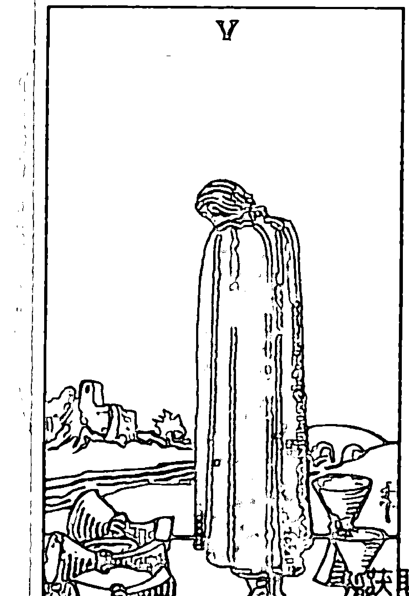

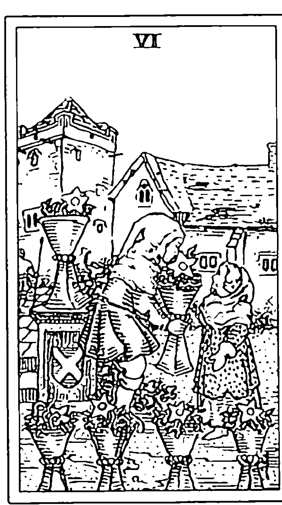

## 聖杯 6 美好的回憶

### 畫面結構

我們可以清楚看到這個畫面的場景應該是在一個城堡當中，而畫面的主角是前方一對可愛的小孩子。

畫面中的每個聖杯裡都有代表純潔的花存在，而小男孩正將手中的聖杯交給小女孩，左後方則可以看到一個守衛正在巡邏。

至於這守衛是在守護著這安詳的環境還是有其他的目的性，就有待占卜者在解牌時以當下直覺力去做分析了。

## 整體解釋

聖杯六是一張溫馨的牌，畫面中可以看到兩個可愛的主角面對面，而聖杯中所盛放的都是美麗的花朵，雖然後方有拿武器的人正在巡邏，但他們眼中都只有注視手中的聖杯。

在占卜的解釋上都是表達出雖然也許目前狀況不是很好，不過卻是有很不錯的回憶值得記憶及留念，而這樣的美好回憶是屬於過去的或是現在發生的。

## 實際應用

在愛情占卜中如果問題為A君是否喜歡問卜者，出現了聖杯六則代表A君對問卜者有很不錯的感覺，而且這感覺是讓A君會記在心裡面的。

但是這感覺卻可能不是因為現在而是出現在過去！現在的雙方也許正錯過了那個適合的時間點，也有可能因為一些狀況所以導致於無法相處。

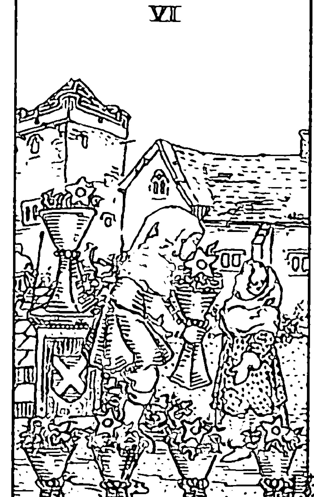

但是更重要所要傳達出的訊息是過去A君的確對問卜者有好感，如果問卜者也對A君有好感的話，就應該利用這個美好的回憶再嘗試打開A君的心，重新開啟新的美好未來。

## 聖杯 7 幻想的臆測

### 畫面結構

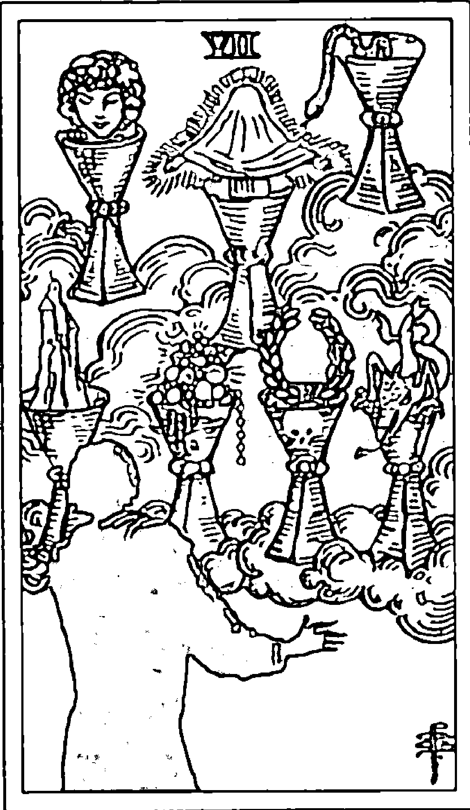

從聖杯七的畫面中，可以看到一個人的背影，在他的前面有一片雲，雲端上放置了七個聖杯，每個聖杯的上面都有不同的物品存在，包含了榮耀、智慧、物質財富、恐懼、破壞、及未知的狀態。

而這個人正對要選擇哪個聖杯有所遲疑，因為對他來說他不確定選擇下去後會出現了什麼樣的結果，因此目前正在猶豫不決中。

## 整體解釋

聖杯七可以看到七個聖杯中都裝著不同的事物，有好有壞，因此在占卜上是一個很不確定的訊息。

因為對於被占卜者來說，他對於他的未來有太多的想法與不確定，因此所呈現出的是一個很複雜及恐懼的情感。

在愛情中如果出現了這張牌，代表的則是對於愛情的不確定，因此也不敢妄下定論的感覺，如果是對方的感覺出現了此張牌，則代表抽牌者要再多付出些努力讓對方感到放心才是。

在愛情占卜中如果問題為A君是否喜歡問卜者，出現了聖杯七則代表A君對於問卜者有很不確定的感覺。

因為對A君來說，他還是很不確定與問卜者之間到底該以什麼樣的方式來相處，甚至A君自己本身也對於目前兩人的相處，有極度不確定的不安感，會懷疑自己到底喜不喜歡問卜者(就聖杯七的基礎面而言，A君是屬於比較不能接受問卜者的狀況)。

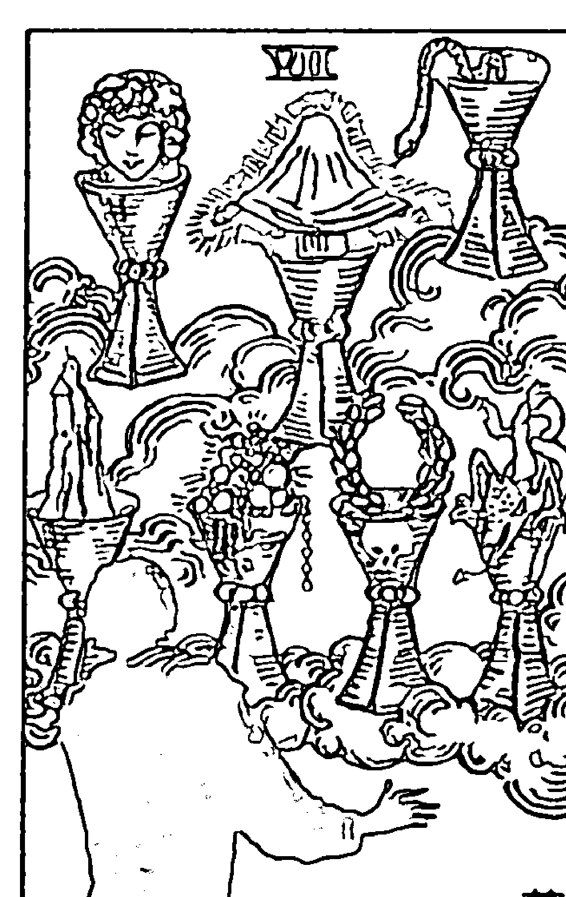

但換個角度思考，A君是在乎問卜者的，只是目前有太多的不確定讓A君卻步了。如果問卜者對A君有很高度的好感，這時候就得鼓勵問卜者多加把勁去了解該怎麼面對A君，但切忌直接追求以免讓A君的不安擴大。

## 聖杯 8 遠離的哀愁

### 畫面結構

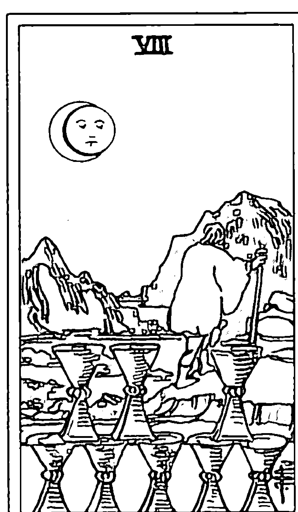

聖杯八的畫面中，可以看到一個很明顯身穿紅衣的人撐著拐杖遠離的背影。整體畫面是以藍色的天空為主色，看起來是較為沉靜、憂鬱的，也可以看到月亮高掛天空。

同時，藉由遠離者的陸地與聖杯所放置的陸地是分離的，來作為一個無法連結及接觸的象徵。藉此來表達畫面中的人物是背離著聖杯(情感)遠行的行為。

## 聖杯八

在這張牌中的聖杯除了可以解釋為一個情感及需求之外，也可表示一個可能已經存在的、可以獲得的事物。而因為畫面的架構呈現如此，因此所傳達出的訊息是讓人感到淡淡的哀愁。

也許目前的一些人、事、物是美好的或是令人感到安心的甚至是期待的，但是問卜者卻是必須離開或是拒絕這件事。因為對問卜者來說目前這些安定、垂手可得的事情，並不是他所可以去面對的。

可能在心中的確是有想要獲取的意願，但是卻會因為其他環境外在的因素所以不得不選擇放棄。因此在面對所要占卜的事情時，就只好選擇放棄或暫時迴避的態度。

## 實際應用

在愛情中如果問卜者是詢問A君對自己的感覺時出現聖杯八，大多數的時間裡會被解讀為其實對方是對問卜者有感覺的。

不過對方卻可能因為有些其他原因(例如已有對象或是外在其他環境)導致於不願意或無法去面對問卜者的愛。

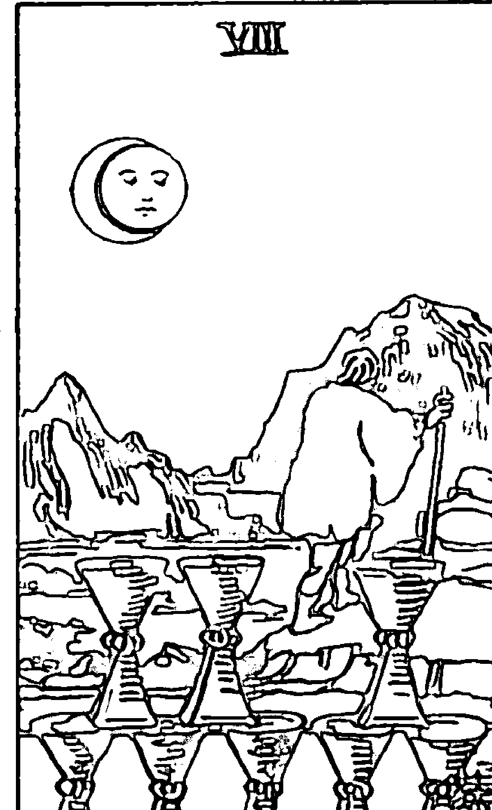

## 聖杯 9 討論的決議

### 畫面結構

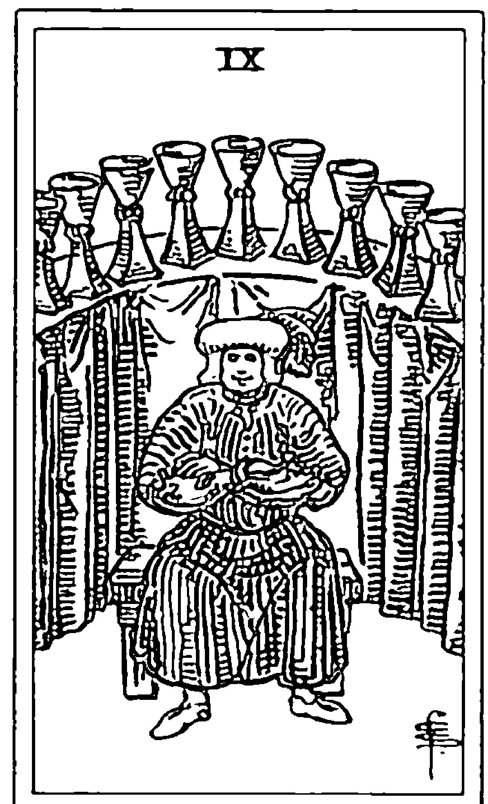

從聖杯九的畫面中，可以看到一位面帶微笑的人坐在椅子上，四平八穩的坐著，並且似乎在等待某種決議或答案。

而在他的背後，九個聖杯高立在主角的後方，看似在主角的背後支持他的意見，也像是針對主角的一些想法給予一些不同的建議。

畫面中，這張牌的主角好似正等著別人給他一些對於此次行動的一些想法。而在占卜中若出現了此牌，大多都是會希望被占卜者能夠多聽別人的意見及建議。

另一層的隱喻則表示，也許目前所做的決定或是想法是需要更被思考的。否則，可能有些未來的發展會朝向別人較不能接受的方向前進。

也因為有這樣一層的隱憂，因此占卜時若出現這張牌，通常占卜者應該多往下思考，看問題會出現在哪裡，才導致於有需要其他人建議及討論的空間出現？是否為過去的一些行為過於衝動，或是整體考量不夠精確所導致？

## 實際應用

在愛情中如果被占卜者詢問的問題是：該不該去追求A君？出現聖杯九這張牌，在大多數的時間裡會被解釋為，追求A這件事是建議要再多考慮一下。

也許彼此之間的適合度並不高，或是追求者本身目前所表達出來的一些行為、方法已經讓A君感到不舒服。

所以，建議應該要先將追求行動暫緩一下，讓內心自我省思更好的互動方法，才不會讓追求反而達到反效果。

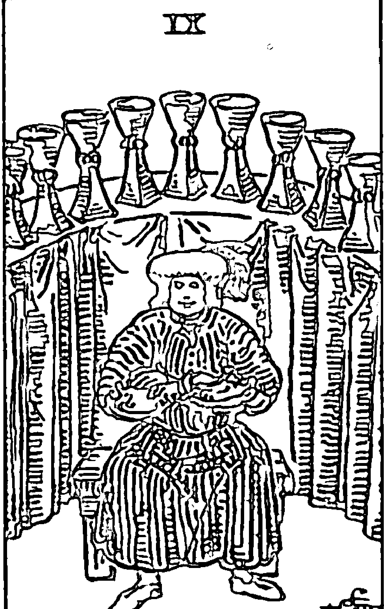

因此，如果占卜時抽到了這張牌，記得提醒一下被占卜者千萬別心急喔。

## 聖杯 10 合諧的家庭

### 【牌面描述】

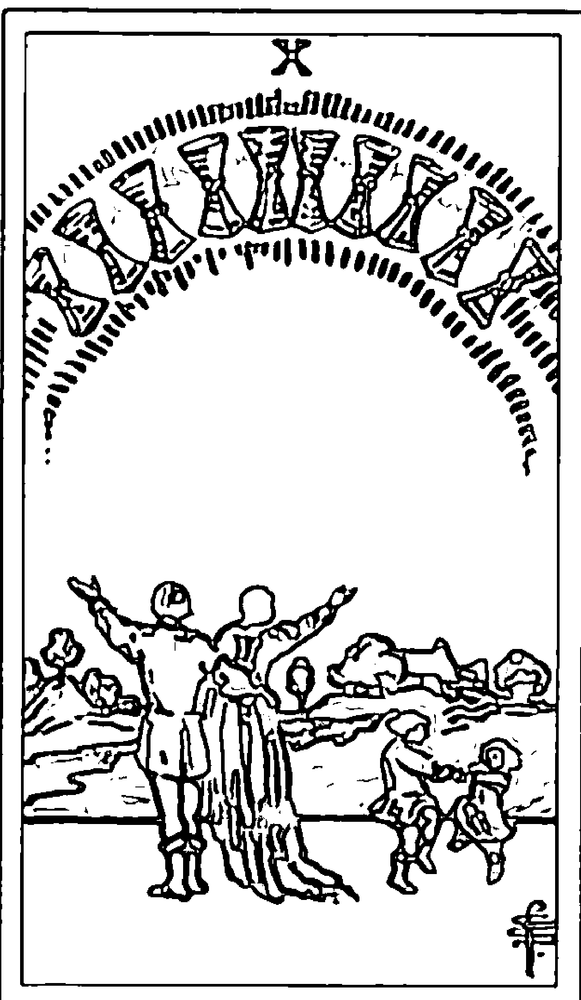

聖杯十的畫面中，最主要的結構有高掛天空的彩虹，而彩虹中可以看到所有的聖杯併列其中。

至於畫面下方所呈現出來的，則是一個和樂家庭的情景。土地上有綠意的存在，同時可以看到遠方有個類似家的紅色屋瓦存在，整體都表現出合諧的家庭氣息。

## 整體解釋

彩虹在塔羅牌裡面不多見，但當它出現的時候通常都是一件令人感到心曠神怡的訊息，聖杯十即是傳達出一個愉悅、和諧的意思。

因此可以說當被占卜者抽到了聖杯十的時候，就代表所占卜的事物是有一個很好的情形即將產生。

而且這樣的一個情形並不是很衝突的或是很突然的改變，也不會是所謂的突然降臨，它更會被解釋成是一個已經醞釀已久或是緩慢降臨的良好結果，讓人感受到快樂及愉悅的答案。

## 實際應用

在愛情的問題中抽到了聖杯十是一件令人開心的事，如果今天的詢問是三個月內是否可以追求到A君，出現了聖杯十代表的是成功機率很大。

不過，要特別注意的是它比較不像轟轟烈烈的愛情，反而比較像是親情一樣的關懷與付出。彼此之間是會更像家人一樣的表達情感，而不是所謂愛的死去活來的感受。

也許，在某些占卜者的解牌邏輯中，聖杯十它反而比較像是朋友般的關懷而已，並未到達愛情的境界，不過不管如何，這張牌針對於愛情都是令人感到開心的。

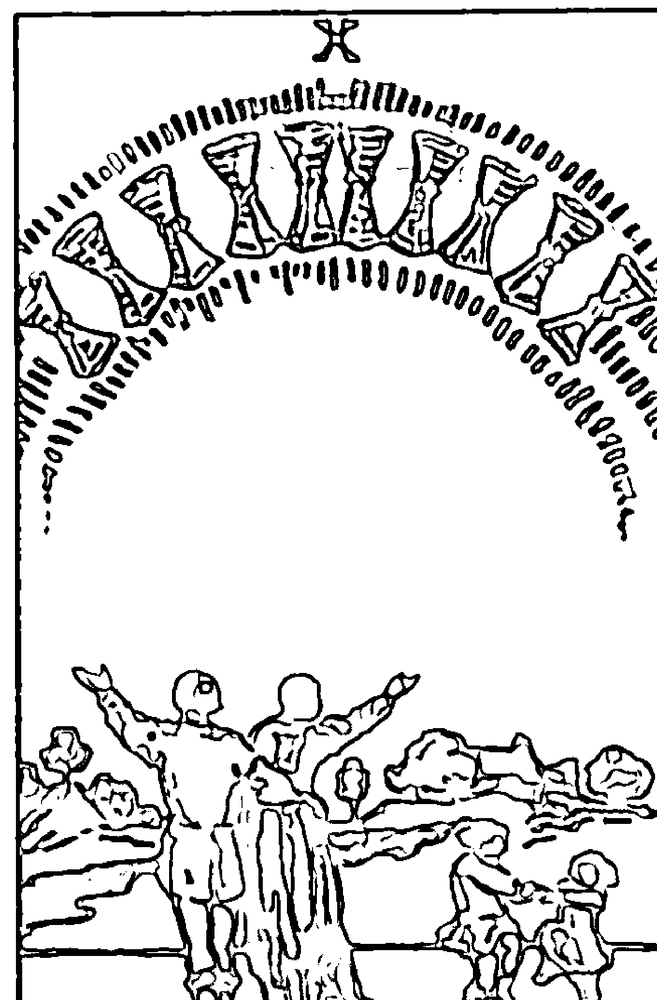

## 聖杯侍者 俏皮的想法

### 畫面結構

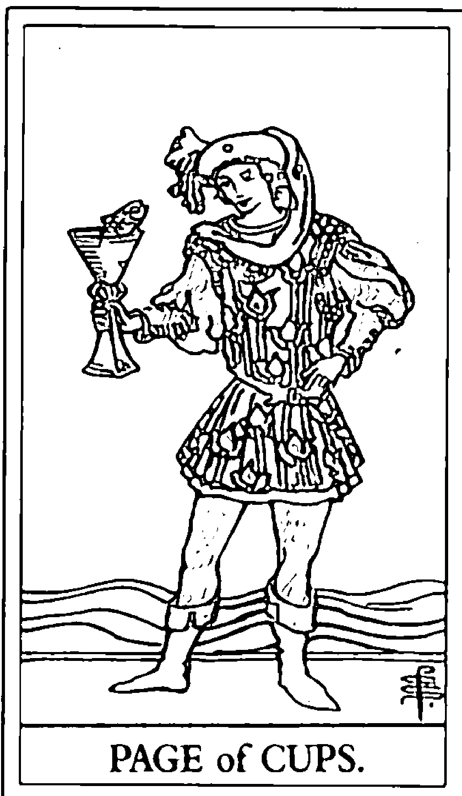

畫面中可以看到一個年輕的侍者手中握著一個聖杯，而這位侍者正注視著聖杯中出現的一隻魚。

藉由侍者右腳略微翹起的模樣，可以推測這個侍者正懷著輕鬆、愉悅的心情，在面對他所關注的目標。

## 整體解釋

聖杯侍者本身代表的是年輕及較為不成熟的一個態度，雖然面對手中握著的聖杯，代表仍有注視及專注的心態存在，但總是會表達出有點不太專心以及難以全心全力面對的心情。

因此，很容易就會在腦海中浮現一些輕浮或是小小惡作劇的情境。在畫面中，也許下一秒他就會對聖杯裡面的魚，做出一些小小的惡作劇也不一定。

在占卜上常會被解釋為仍有機會達成被占卜者所提問的答案，但是在過程當中也許會有多一點的變化或是小意外。不過，對於最終的結果而言，以這張牌的主要訊息來說還是可以去完成的。

在愛情的問題中如果被占卜者是詢問A君對於這段交往的感情有什麼感覺？出現了聖杯侍者，所表示出的訊息是其實對方的確有愛情，但是總覺得還未穩定下來。

也許是還不能完全的確認這段情感，也許是還有其他的選擇存在。因此，雖然已經注視了這段愛情，心中卻還有一絲絲的想法左右著這位A君。

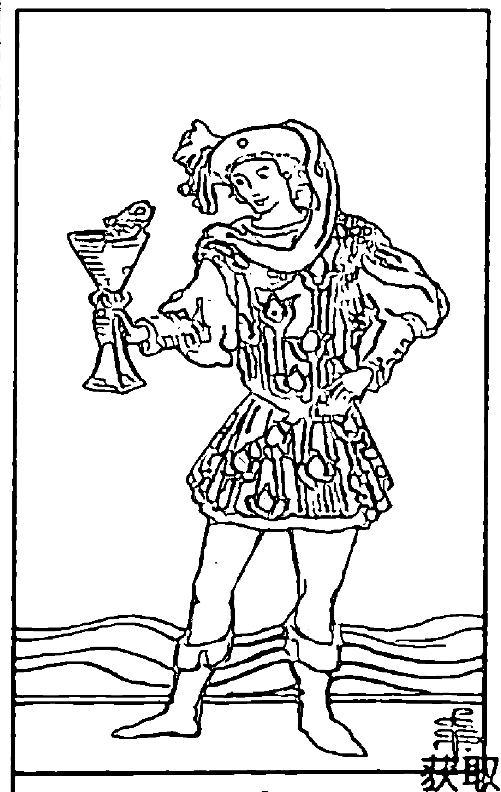

這樣的情況下，應該建議被占卜者要多留意這段感情，它目前是好的，但是有些小變化仍不可不去留意。

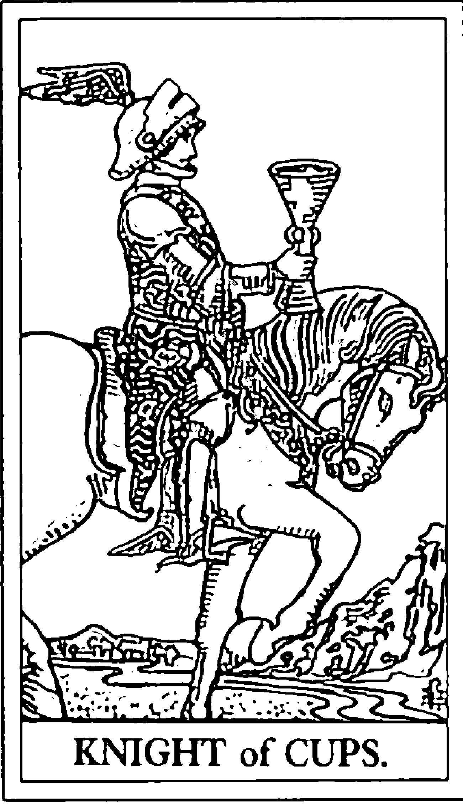

## 聖杯騎士 穩健的前進

### 畫面結構

畫面中可以看到一位騎士坐在一頭白馬或是灰馬上方，他仔細的端著手中的聖杯，致力不讓聖杯中的水溢出。

因為如此的慎重，導致於他的左手有輕微的拉住繮繩阻止馬匹過度快速前進的行為，也因為有了這樣的動作產生，所以可以看到這匹馬是採取穩穩向前的姿態前進。

而前方可以看到有一灣流水存在，看起來這位騎士應該可以平安且穩定的度過這個河流。

## 整體解釋

雖然聖杯騎士的裝扮讓人覺得他可以突飛猛進，但他採取的卻是穩紮穩打的前進態度。在占卜中也代表對於占卜的問題要達到結果其實是可以輕而易舉的，但是卻更建議以專注、用心的態度去面對，以達到更好的結果。

所以如果被占卜者在詢問一個問題，結果出現了這張牌的時候，解牌者除了給予正面肯定的訊息外，也可以提醒被占卜者別太心急。目前來說很多事情都照著被占卜者所期待的方向前進，只要不要太心急很多事情都會水到渠成的。

## 實際應用

在愛情的占卜中如果問題是詢問到與A君未來三個月的發展狀況，抽到了聖杯騎士代表是一個很不錯的訊息，它代表的是其實雙方都已經有感覺，而且其實也都正朝著戀愛的方向前進，只是還需要多給彼此一點時間去了解對方。

所以解牌者這時候可以給的建議是多提醒問卜者，一切以自然面對就好，千萬不要太過心急，以免因為過於求表現反而讓很多原本良好的互動，產生了令人尷尬的情形。

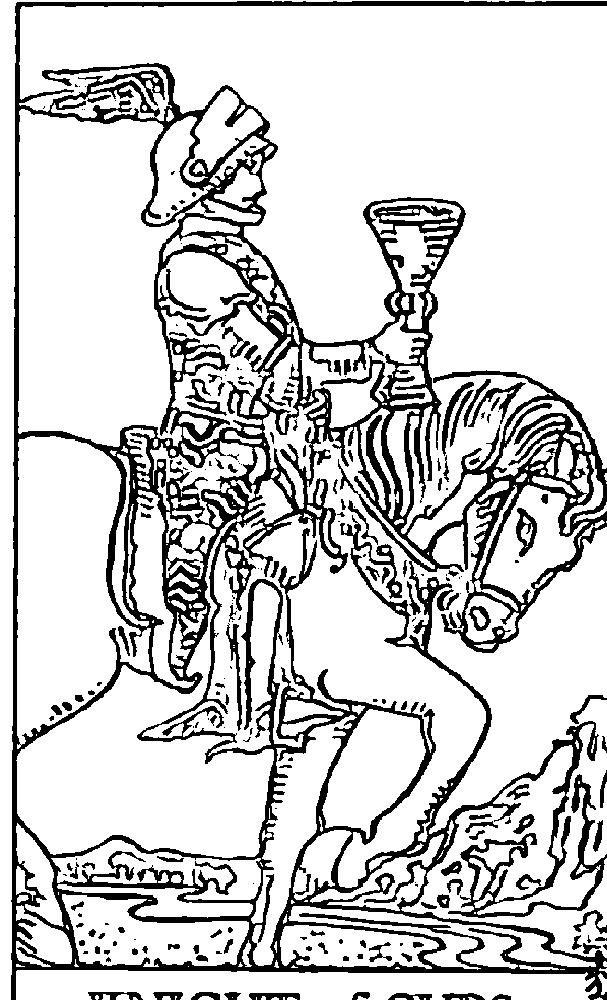

## 聖杯皇后 重視著感受

### 畫面描述

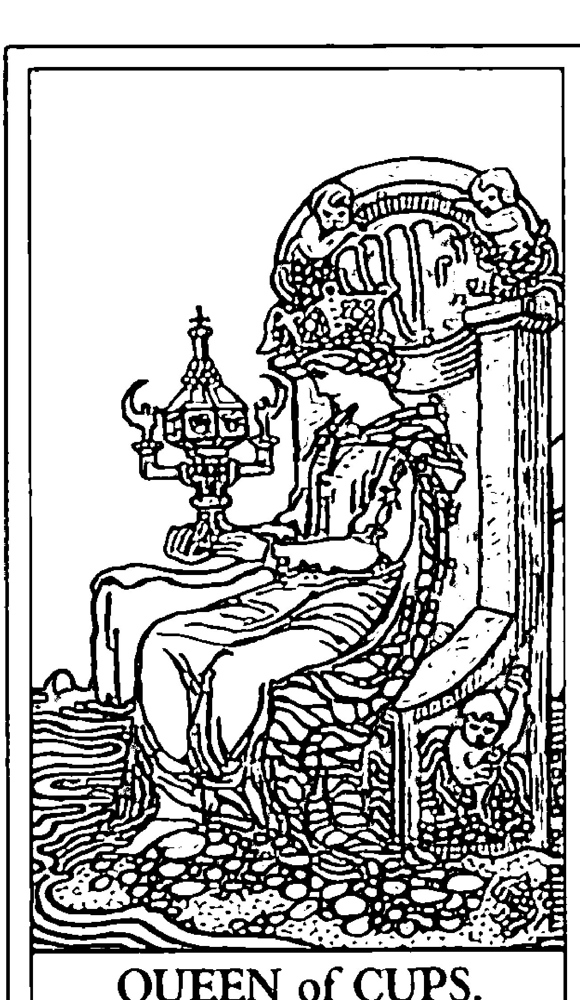

在聖杯皇后的畫面中，有一塊沙地從水面中突出，沙地中一位皇后舒適的坐在她的后位上，而不管旁邊的水流如何流動，她都專心的注視著手上所端著的聖杯。

另外，從她坐的椅子中有三個嬰兒來看，可以推想她應該是一位充滿著母愛的皇后。

## 整體解釋

聖杯皇后她的專著代表著對於事物的專心，不會因為其他的外在環境而被打斷她原有的思考。

所以，在占卜中若出現了聖杯皇后，都代表了對於問卜者所詢問的問題，傳達出十分用心面對的態度存在。而也因為有這樣的訊息出現，解牌的方向上可以表示為：努力的朝著這個方向前進。

雖然不知道最後結果是否完全朝向正面的方向前進，但是所表達出的心態是很值得被鼓勵的。

## 愛情問題

在愛情問卜中如果問題為A君愛我嗎？出現了聖杯皇后這張牌，答案幾乎可以說是肯定的！因為在這張牌當中所傳達出的訊息，除了可以解釋A君對於問卜者的感情十分專注外，還有傳達出A君所付出的情感是一種比較長久的心態，而這種心態不是因為一時興起的情感而相處。

因此，當這張牌出現後問卜者所要去思考的就是，該怎麼去好好的面對這段感情，別讓彼此之間錯失了這段良緣。

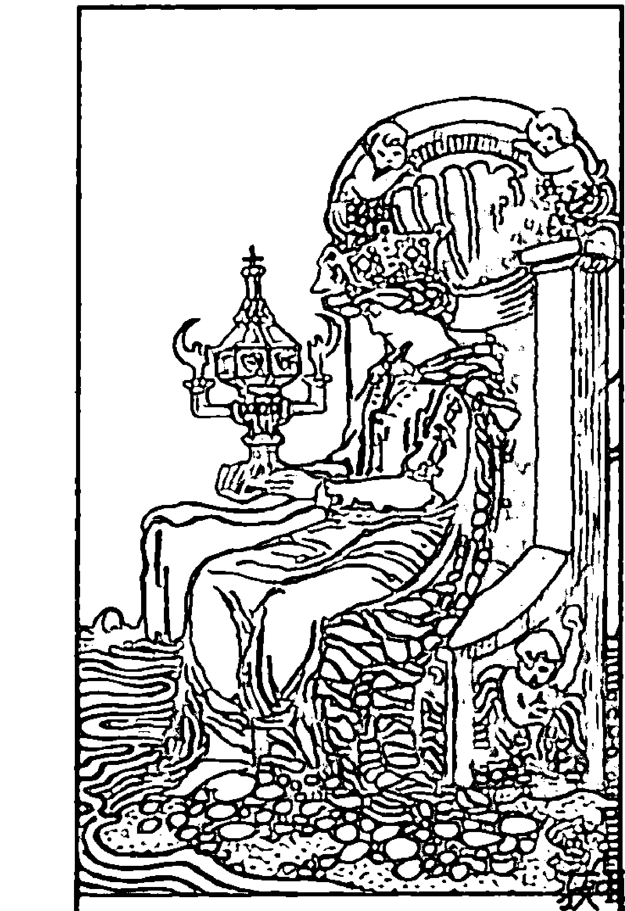

## 聖杯國王 才能的發揮

### 畫面結構

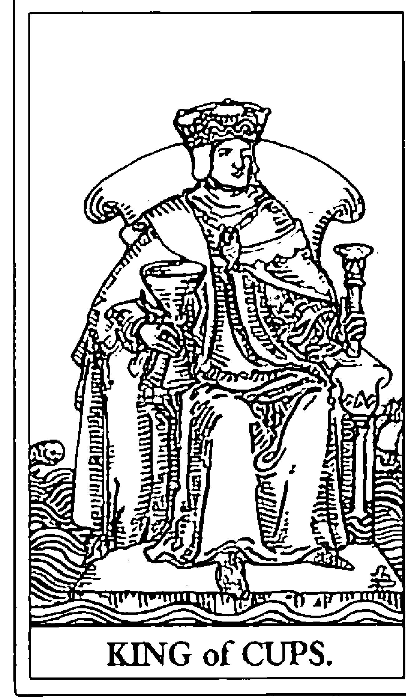

在波濤洶湧的海洋中佇立著一座皇位，而國王穩重的坐在他的皇位上，除了右手握著他所擁有的聖杯外，左手也將他的權杖以很穩定的力量靠在他的皇座上。

國王遙望遠方的神情看似在思考許多未來的方向，用此充分展現出這位國王是有能力、有遠見的，有著在這個海洋中操控一切的才能。

遠方的一艘船也在這樣的一個環境中，悄悄的準備開始他的全新旅程。

## 整體解讀

在變化多端的環境裡，只有真正擁有才能的人，才能夠突破困境。

所以，在大多數的情況裡，當問卜者詢問一個想達成的目標而出現了聖杯國王時，都可以被解釋成只要多用智慧及用對方法，在未來的時間裡要達成心中所想達成的目標是很有希望的。

不管目前外在所表現出來的困境有多惡劣，只要把自己的才能好好的去發揮，相信成功之日就在不遠之處。

## 實際應用

在愛情占卜中如果問到了與A君未來三個月之內的發展，出現了聖杯國王所代表的意義是：只要好好的去面對，多去了解A君的一些喜好厭惡，把自己最好的一面展示出來，相信在這場愛情的旅程中，問卜者是很有機會去達到自己所期望的目的。

不過聖杯國王這張牌，也有代表愛情中需要耍點小手段的喻意，多用點小手段讓A君更注意問卜者，將有效快速的幫助問卜者達成心中的理想進度。

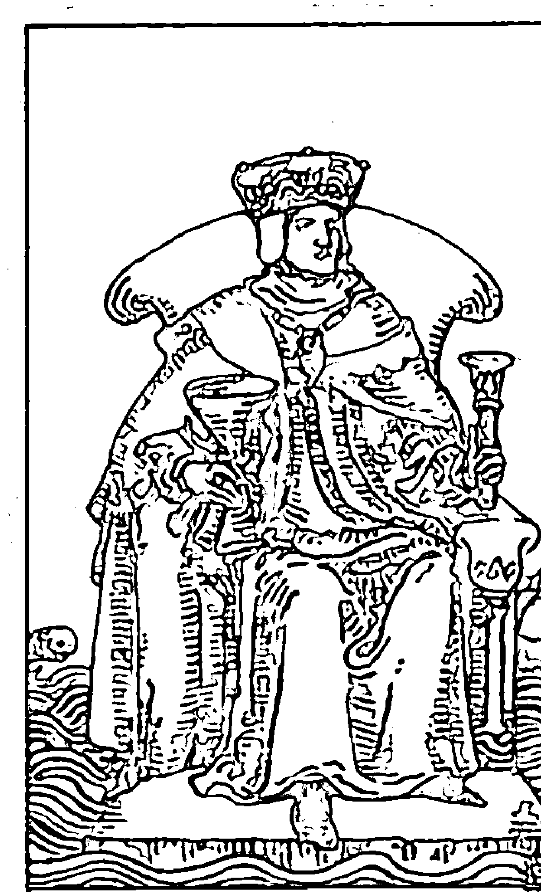

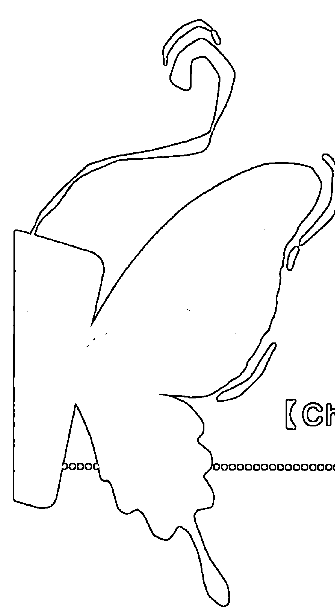

## 【Chapter ⑧】

## 【小牌組】錢幣組

錢幣牌組在四大元素中代表的是土元素，在多數的概念裡是代表穩定的力量，也就是務實的一面。也因為有這方面的訊息，因此很容易被歸類為現實物質面的那一個層次，雖然不是絕對的歸類，不過的確在占卜當中會很常出現以此方向推演的訊息出現。

## 錢幣 1 手中的寶貝

### 畫面結構

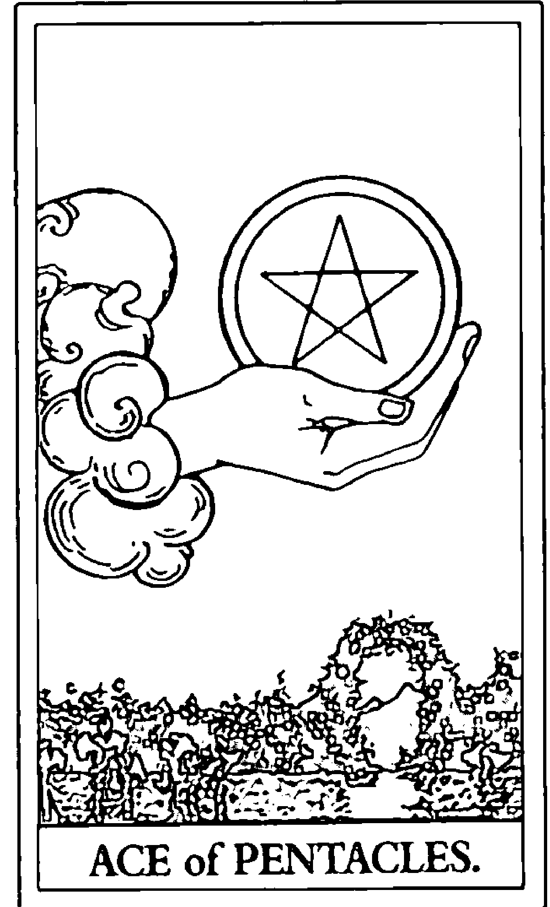

畫面中可以很清楚的看到由雲中伸出了一雙手，手中則捧著一枚錢幣，可以看到是很重視且小心的捧著，藉由手中散發出的光輝可以表示是十分看重著這枚錢幣，而背後萬里無雲也代表了心無旁鶩的態度。

在畫面下方則出現了一個類似花園入口的小拱門，小拱門前方的草皮看起來應該是常有人進進出出所以也自然而然的走出了一條路，至於拱門後方是什麼沒有人知道。

因為手中所捧著的金幣看起來是這麼的受重視，因此在占卜當中可以被解釋為對於問卜的事情傳達出專注及無可取代的意涵。

而這樣的情境通常在問到對於某件事的專注或是期待時會特別被突顯出來，代表十分重視的面對。

雖然下方的花園會讓人好像感覺到有點不知道內心世界是否還隱藏著其他的訊息或是不可告知的秘密，但是至少外在所展現出來的行動及態度是很明確的，也是代表這個心態是可以被考驗的意思。

## 實際應用

在愛情問卜中，如果問題是詢問A君對於問卜者的愛是真實的嗎？出現了錢幣一代表的是一個很肯定的訊息！

而且看起來A君對於問卜者所用的心還滿實際的，除非是A君不善於用言詞及行動表達，要不然問卜者理應可以很明顯的感受到被呵護，或是被用心對待的感覺。

雖然有時候好像A君會突然表現出一些令人感到匪夷所思的舉動，但是基本上在問題中所得到的答案是一個很肯定的訊息。

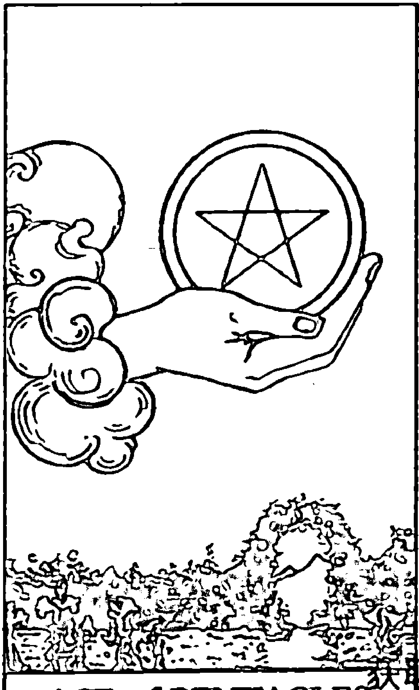

## 錢幣 2 無限的可能

### 【牌面簡述】

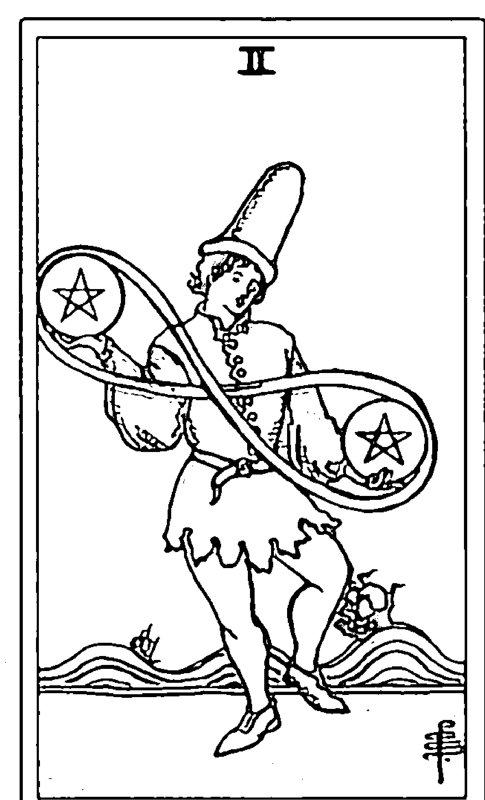

畫面中帶著高帽的主角看似表演特技的小丑，正應用著他的技能將手中的兩枚錢幣無限轉動著，而且看起來他還不因此而滿足，他的腳正在準備進行其他的特技動作。

而遠方的海浪忽高忽低，看起來是變化多端，航行中的船隻看起來是必須準備接受這趟變化多端的旅程考驗了。

## 整體解釋

由於錢幣二它表現出一個無限的符號，而遠方的起伏也代表著變化多端的可能，因此在占卜上所呈現出的訊息也代表著無限變化及多種可能的訊息。

在解牌中也是表示出未來的答案仍處於不確定的狀況，因此這時要注重的更是心裡的調適，未來的答案訊息反而不是這張牌所主要傳達出的訊息了。

## 實際應用

在問卜中如果詢問的是未來三個月與A君的發展狀況，出現了錢幣二，那代表的是彼此之間還是有許多未知的變化存在。

也就是表示A君對於彼此之間的關係其實並沒有想太多，也許A君這時候對於問卜者還沒有投入太多注視的感覺吧。

出現了這張牌代表的是期望問卜者不要先預設太多立場，因為A君現在還沒有對問卜者產生太多的想法，這時候就想要下定論真的是太早了，這時候占卜者可以建議問卜者應該多花點心思去思考怎麼面對及吸引A君會更好。

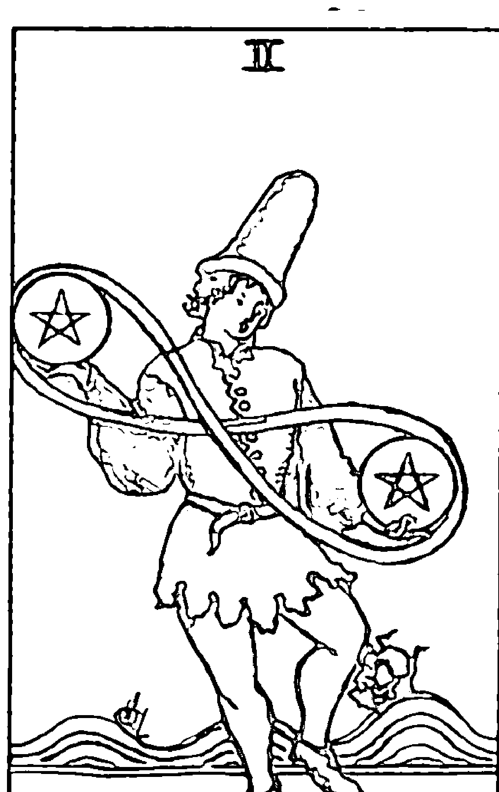

## 錢幣 3 才能的肯定

畫面結構

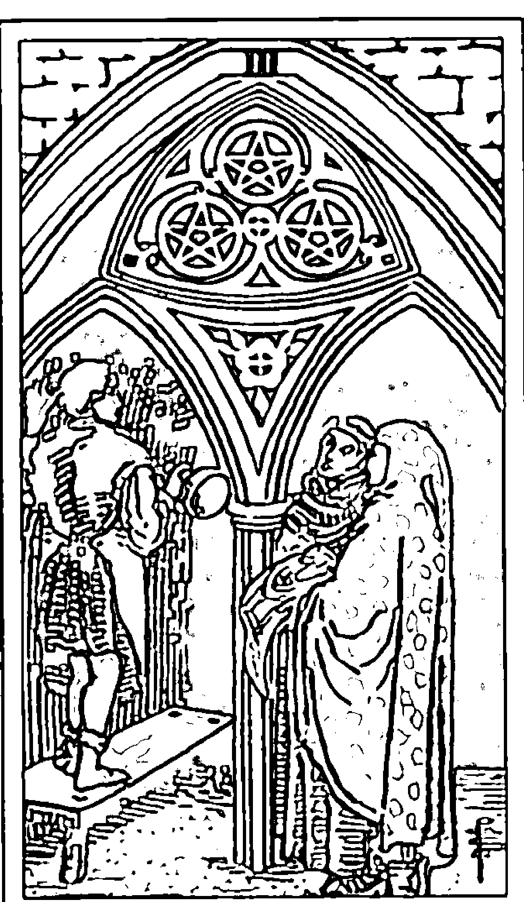

錢幣三的畫面中，可以看到在一個建築物當中，有三個人正在討論被鎖在柱上的三枚錢幣。

其中一位看起來好像是剛做完此工作的工程師，而其他兩位則手中拿著建築圖正在仔細比對這個工程是否被完整的完成。

整個畫面的背後是黑暗的，讓人看不清楚裡面還有什麼其他的圖案，因此更會讓人把注意力專注的放在被完成的三個錢幣上。

## 整體解釋

看到畫面中錢幣三已經完成的被鑲在建築物上，表示的是已經完工只是在受檢視的狀況，而整體的架構也因為三角的穩定性所以表達出這是一個穩固的建設。

在占卜上也是從此方向來做闡述，表示出所占卜的事情是備受肯定的，只是還會需要一點時間來驗證是否真如當初所預設的那般可靠，因此通常抽到這張牌的時候，解牌者可以說當下這件事是已經被認可的情形，只是在未來仍需要接受許多的考驗。

在愛情占卜中如果問的是A君喜歡我嗎？出現了錢幣三，所代表的意思是A君對於問卜者有一定程度以上的好感，而且對於問卜者也很有意思追求，但是對A君來說有些不是很確定的因素存在，因此可能還會需要多一點的時間來確認。

也表示說A君現在應該是在觀察問卜者的各項行為，所以解牌者這時候就應該建議問卜者最近要多把自己好的一面表現出來，好讓A君可以把心中的疑惑去除。

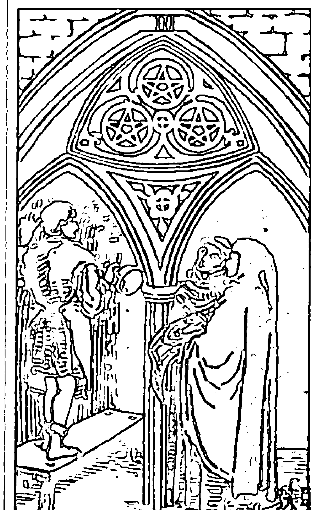

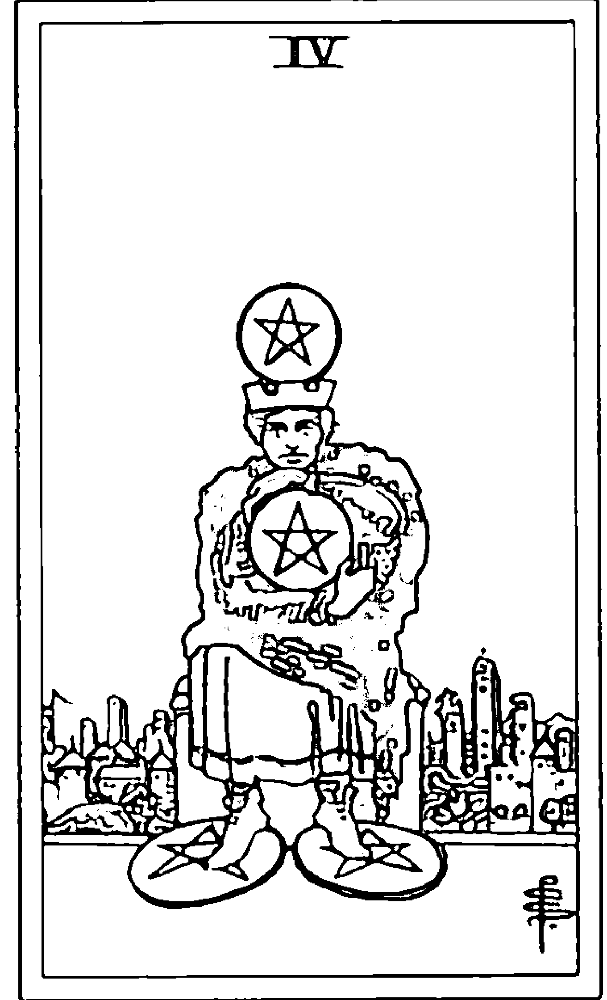

## 錢幣 4 頑固的堅持

畫面結構

在錢幣四當中可以看到一個人坐在一個石台上，石台後方有許多代表繁榮的建築物存在，看起來應該是這個主角所擁有的財富或是土地，但是這個主角卻無視這些已經擁有的，仍兩手環抱著一枚金幣、腳上也同時踏著兩枚金幣。

看起來好像深怕手中持有的金幣會隨時被他人搶奪走的模樣，不但兩手兩腳都已經使用上了，還把另一枚金幣放在頭上，更代表這位主角的理智已經被代表物質的錢幣所凌駕了。

## 整體解釋

錢幣四表達的訊息十分明確，就是一種固執的擁有，對於已經擁有的事物展現出非常堅持的態度。

但是這不是一個好的態度，因為它是比較屬於負面的堅持。例如就算知道這個決定是錯的，但仍然不聽他人的勸告，堅定的認為自己是對的；或是已經預期接下來的日子並不好過，但仍堅持每天的享受物質生活。

這樣的態度在占卜上就會出現了較為負面的訊息，表達出因為頑固而可能無法改變的事實。

不過在少部分的問卜裡，也會因為需要這樣的堅持而出現了錢幣四讓人對於未來的方向產生了不錯的訊息，不過那畢竟是少數。

## 實際應用

在愛情占卜裡如果詢問的是與A君三個月之內的發展狀況如何，出現了錢幣四這張牌，它可以被表達的意思有兩種：一種是表示說A君愛自己比愛別人多，因為它擁有很強烈的自我意識，對他來說目前他並不想與問卜者有太近一步的關聯產生，因此答案是比較令人遺憾的。

另一種說法是，現在的A君並不適合談戀愛，也許是他仍把心留在上一段傷痛中，所以沒有太多心思來面對新的戀情。因此兩個人未來的發展是停滯不前的，無法被突破的，要去突破需要花許多的心思，但是結果卻很容易朝向令人遺憾的方向前進。

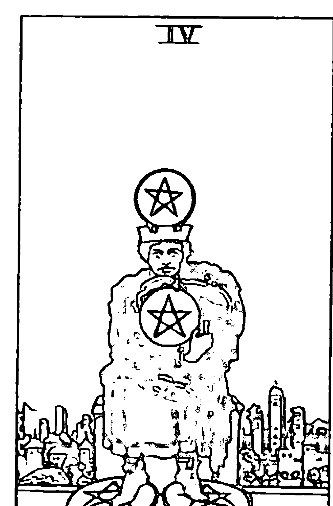

總之，這張牌主要傳達出的就是A君的心無法被突破的意念。

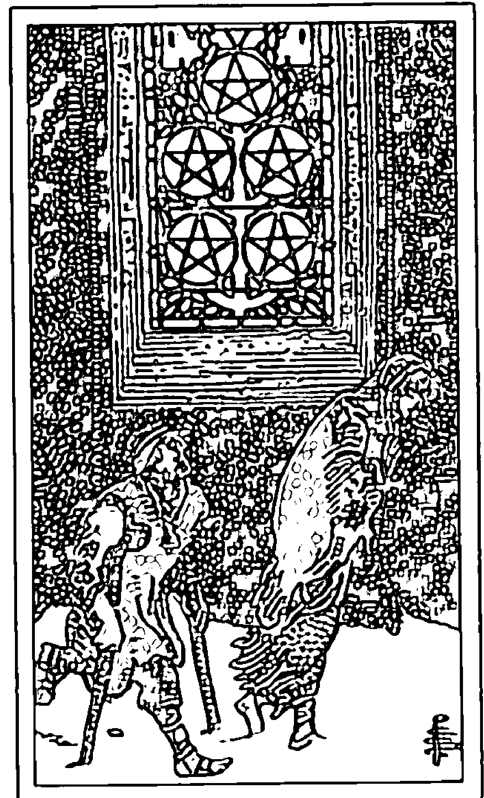

## 錢幣 5 狼狽的逃離

畫面中可以看到，在下雪的夜晚裡，兩位殘疾貧窮的人正快速的前進，似乎是在找尋今晚的棲身之所。

背後五個錢幣被鑲在類似教堂玻璃彩繪的窗戶裡與前方主角發展出強烈的對比效果。

而這兩位殘疾貧窮人士似乎因為忙於趕路，所以竟也忽略了這個可以暫時讓他們借宿一晚的棲身之所。

## 整體解釋

錢幣五表達出一個目前狀況已經不好，而急於想要找到一個答案出口的狀況，然而在這樣的狀況下卻又忽略了身邊其實有可以伸出援手的人。

在這樣的情境之下，只會讓狀況越來越糟，明明需要他人的幫助但是自己又不去留意而錯失了許多外援的機會，到了最後很容易會產生許多令人覺得遺憾的結果。

## 愛情問卜

在愛情問卜中如果問的問題是A君對我的感覺如何？抽到了錢幣五所表達出的意思是，A君對於問卜者其實並沒有什麼好感，而且甚至可以用比較誇張的角度來表示，其實A君現在正在考慮如何拒絕問卜者的一種心態。

也因為這張牌的出現，解牌者在解牌的時候更應該去思考，問卜者是否已經做了什麼樣的舉動，讓A君產生了想要逃避的念頭，或者是否A君對於問卜者本身，早已經有了厭惡的念頭了。

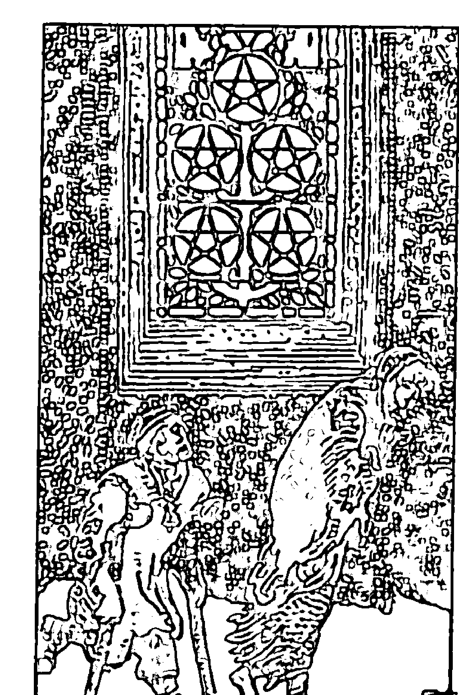

## 錢幣 6 不公的施捨

畫面結構

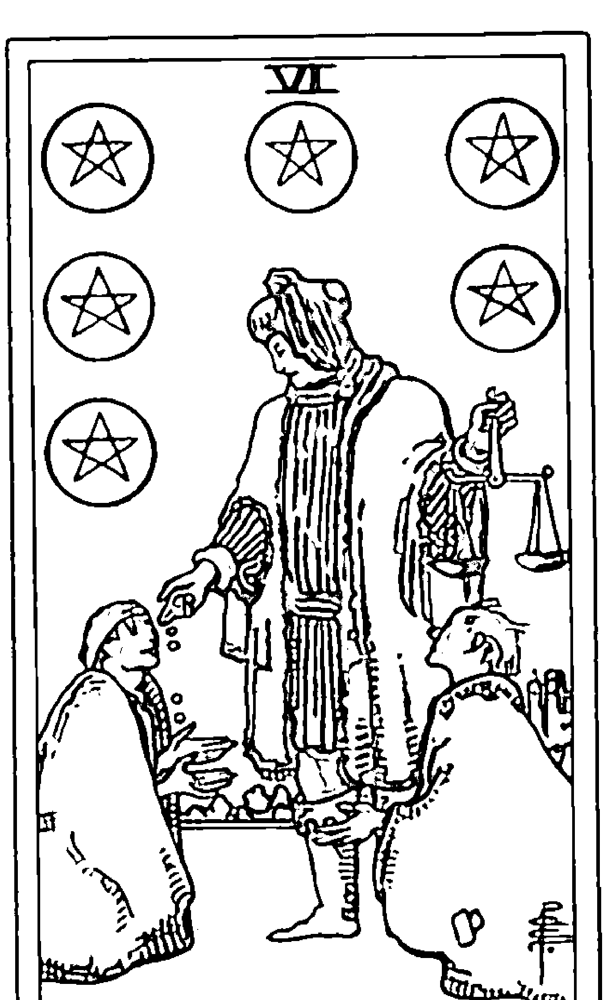

畫面中可以看到一個身著紅色外袍的人士，從他的穿著看來似乎是是有錢人。

他一手提著天秤可以解釋為商業利益考量，或是自我心中的考量；另一手正在施捨跪在地上的兩位貧窮人家，而地上兩位較貧窮的人他只施捨給其中一位，更表示出了他在施捨的時候是有考量的心態存在。

至於施捨的是不是正確的對象，或是其實他是被欺騙了，就只有那兩位貧窮者才知道了。

## 牌面解釋

施捨是把自己擁有的事物無償的供給更需要的人，但是在錢幣六裡面卻還有存在一個天秤，代表的是這個施捨其實是有其他考量的。

因此在占卜中如果出現了錢幣六，代表的是對於問題所付出的心力，不是絕對而是有考量許多方面的利益。也許看起來是很大量的付出，但是卻不是一個很完整的或是正確的付出。

因此也表示了這樣的一個付出行爲也許是有潛在的問題，是需要再被重新檢討的。因爲，在不確定所有表面的背後是否還藏有其他的真相前，過度的付出其實並不是一件聰明的事。

## 實際應用

在愛情中如果問的是A君對於問卜者三個月之內的發展，出現了錢幣六這張牌時，代表的是雙方都會有進一步的發展，但是這是否爲真的愛情？其實還滿值得思考的。

因爲也許在這樣的交往背後，還有存在其他的因素。也許只是可憐，或是有其他的利益考量而已，所以並不是真正單純無暇的愛情。

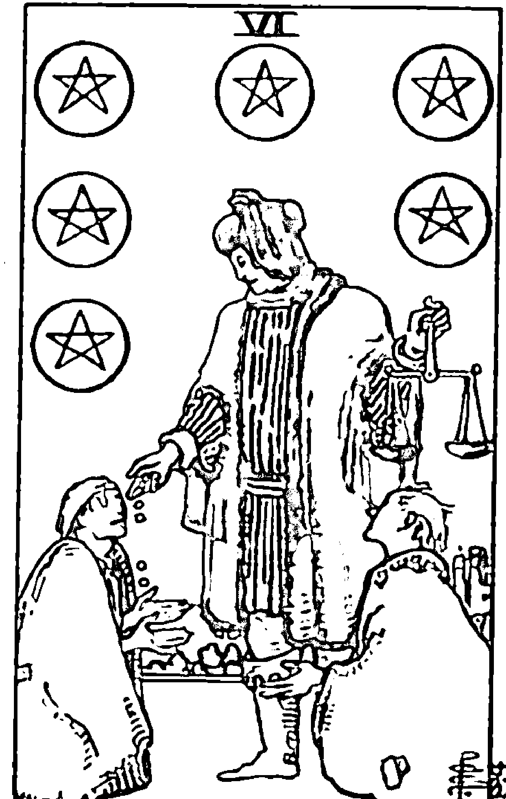

## 錢幣 7 深遠的規劃

畫面結構

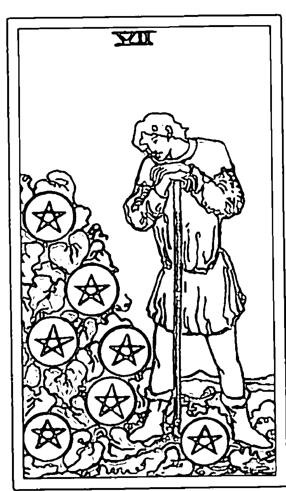

在一片待開墾的區域裡，主角正思索著該如何去處理即將面對的難關或是挑戰。
而依據他已經處理過的其他土地而言，他是有能力去面對這個挑戰，只是目前還未想出更好的面對方法而已。
因此，他現在是處於正在規劃、思考新的方法當中。

## 牌意詳解

當占卜中出現了錢幣七，在大多數的情況下，其所代表的是要問卜者面對問題好好的規劃，切勿莽撞而行。其中也有傳達出希望問卜者對於未來所進行的計畫，可以再多細緻的思考一下，會對於事情的發展更有幫助。

雖然錢幣七這張牌代表的是未來的計畫是可行的，卻建議可以再往更多方面的思考，讓原本不錯的發展變的更好。

因此，如果占卜中抽到了錢幣七時可以建議問卜者，對於問題要能再多花點時間理解，雖然知道目前的方向離正確目標沒有相差太遠，但還是要謹慎的規劃下一步。

## 實際應用

在愛情占卜中，如果問題為A君對我的感覺是什麼？出現了錢幣七這張牌，所代表的是A君有在注視著問卜者，他正在觀察且期望用更多的角度來觀察問卜者。

從這張牌中雖然還沒有所謂的真正感覺的訊息存在，但是已經有傳達出問卜者受到注視的訊息，也表示出A君是有很重視這件事的意涵存在，表達出A君對問卜者的關注行為。

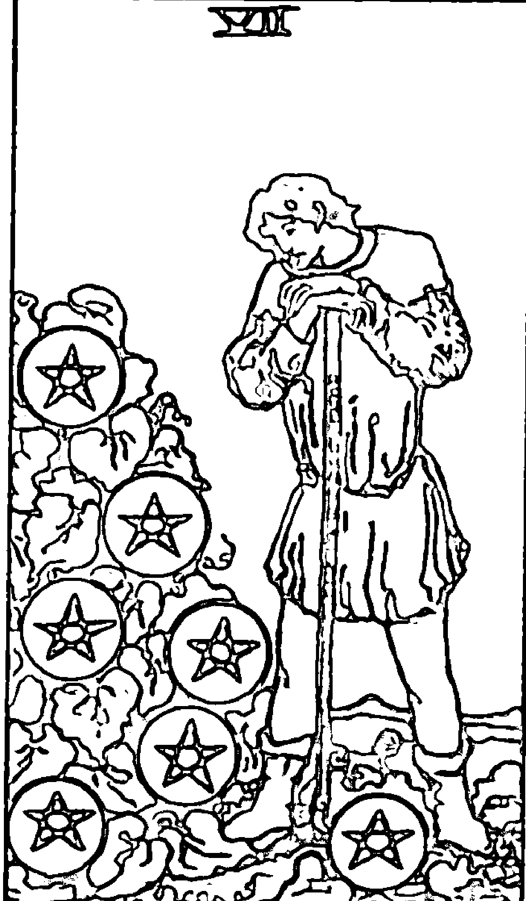

## 錢幣 8 專注的經營

【牌面描述】

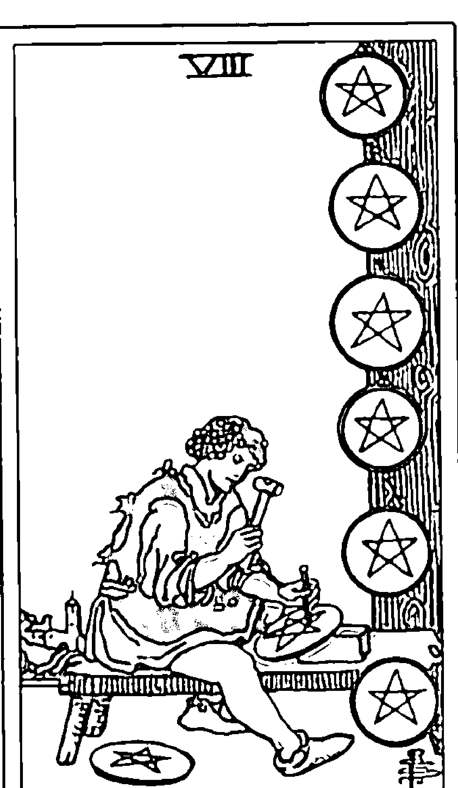

從錢幣八的牌面中，可以看到六個錢幣屬於已經完成並且被整齊掛在木板上，代表的是一個已完成的成品。
而畫面中主角仍努力專注的在進行下一個錢幣的製作，旁邊還放有另一個尚未進行精製的錢幣在地上，表現出事情雖已完成一半，但是還持續專注進行工作的一個良好態度。

## 整體解釋

錢幣八應用在占卜上，表現出來的是對於目前所要占卜的事物有著專注且努力的態度，而且不是處於剛開始進行的狀態，而是已經有進展到一定階段的情形之下仍堅持努力的態度。

因此，在大多的占卜中都是表現出狀況良好且專心一致、一步一腳印的前進，雖然不是很迅速的，卻是有效率的穩健前進。

## 實際應用

愛情中如果問題是我與A君三個月之內的發展狀況而出現了錢幣八，代表的是雙方三個月之內的關係會逐漸成長，而且是很務實成長的，並不只是單純言語上的一些承諾而已。

因此當錢幣八在占卜中出現時，解牌者是可以用比較鼓勵性的話語，鼓勵問卜者繼續努力向前，但切記勿太過口頭承諾而無法實際行動，以免讓原本美好的未來可能變成了較為令人失望的結果。

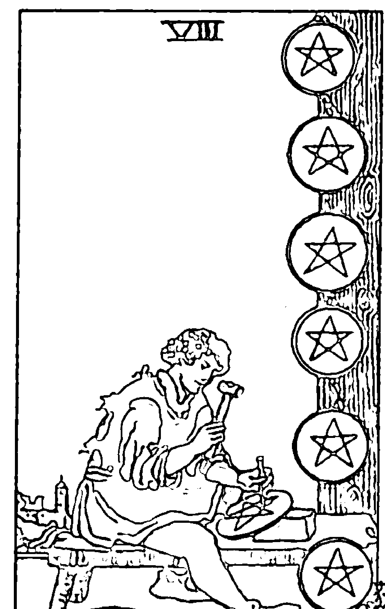

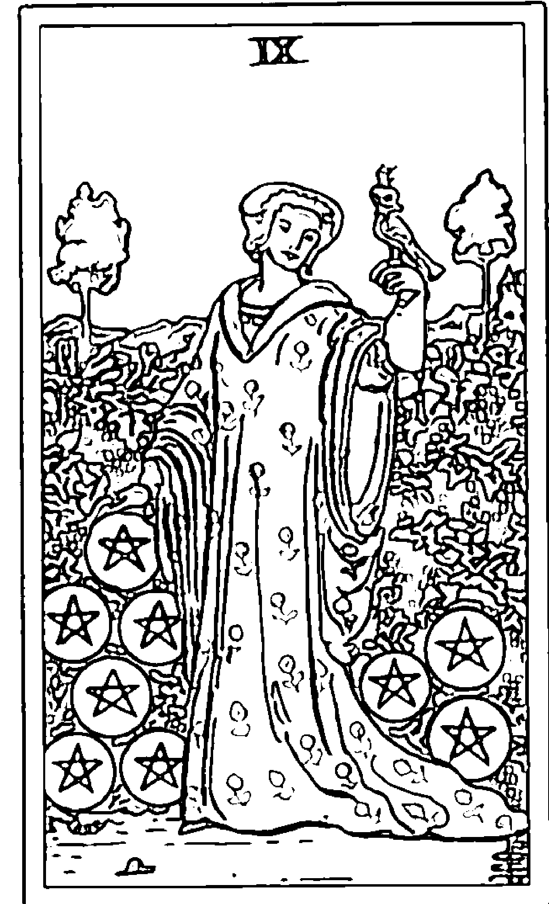

## 錢幣 9 豐饒的享受

畫面結構

畫面中可以看到一位身穿優雅舒適服裝的主角，他身處豐饒的花園中，而從花園果實累累看得出來是一個富足的狀態。

主角手中還停著一隻鳥，看起來是很安靜及穩定的一個生活情境，至於整個畫面呈現出黃色的色系，除了代表黃昏是一天努力之後開始休息的時間之外，也表示出豐盛富足的情景。

## 整體解釋

占卜中，錢幣九所要表達的是一個物質上十分享受以及讓人感到滿足的心情。所以如果問卜者所問的問題是偏向物質或是外在訊息時，問題的答案是偏向較完美及讓人開心的答案。

但是如果問卜者所問的問題是偏向精神層面的時候，答案的解釋雖然仍朝向不錯的訊息解答外，不過多少還是有點不是那麼完美的感覺，因為有這樣的落差存在。因此解牌的時候就要多注意問題的本身是屬於哪個層面了。

在愛情中如果問的是我與A君在三個月之內的發展狀況如何？出現了錢幣九則代表雙方在三個月之內會相處的愉快，也許各方面都很快樂，興趣及物質上的享樂都是令人開心的，甚至會發展到親密的行為都有可能。

但是在精神層次上就變的比較弱，雙方在過程中比較注意在外表的歡愉而容易忽略了內在精神層面的溝通及磨合，所以其實這樣的進展也是令人有點小擔憂的。

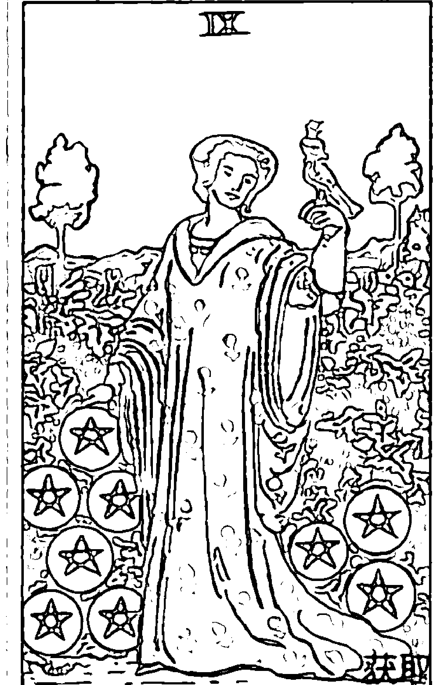

這樣的狀況也表示出除非後續物質層面能不斷的延續，或是雙方有了認知後嘗試在精神層面上的提升，否則感情的進展可能將會有浮於表面或是令人擔憂的狀況產生。

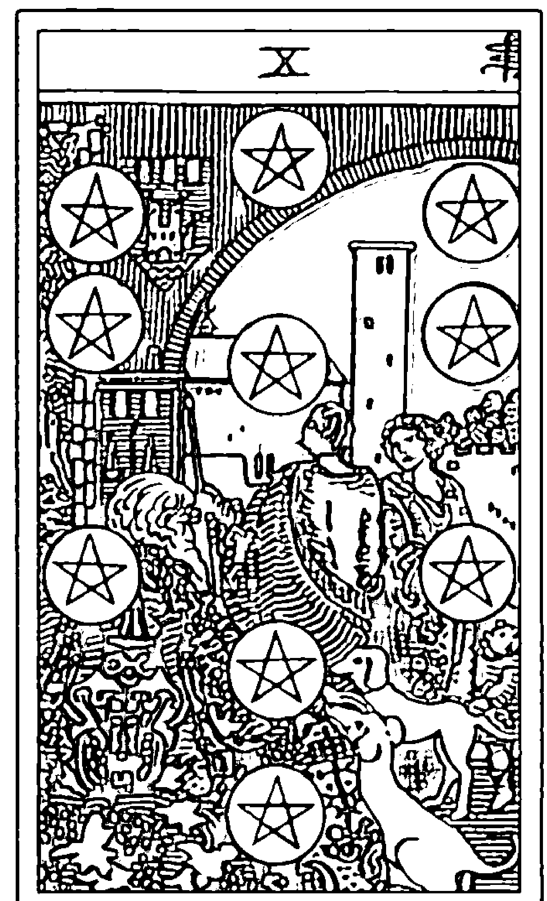

## 錢幣 10 成熟的情感

牌面簡講

牌面中可以看到一個老人安坐在畫面正前面，而他身上穿的華麗衣服可以顯示出他是具有一定財富或地位的人，而且拱門上的裝飾也代表這裡並不是一般的住所。身旁圍繞著兩隻狗代表這位老人是很受注視及被跟隨的一個長者。

在稍遠處可以看到一對年輕人(有可能是夫妻)正在交談著，而女性旁邊還有一個小孩依靠著並且撫摸著一隻狗。年輕男者左手持長矛代表有守衛這個長者的行為，依此構成了錢幣十的整體架構。

## 整體解釋

在占卜中錢幣十所代表的是一個已經被完成，或是已經經歷許久的磨練而達到的一個完成階段。
而外面的一對男女所表達的也是一個互動及新生，讓人感受到在這個問題中所期望的答案應該是可以被期待完成或是展開更好的發展。
也因此通常錢幣十出現在問題中的時候，就代表了問題的答案即將來臨，如果沒有其他差異性較大的輔助牌介入，單指錢幣十來說，只要照著目前的行為繼續走下去，最終的期許及答案是可以被呈現的。

## 實際應用

在愛情中如果問題是與A君在未來三個月內的發展如何？出現了錢幣十，其所代表的是在未來三個月內，其實雙方都正朝著彼此所期待的那個方向前進，彼此之間將會有極高的機會走向更融洽、更親近的階段。
而且這樣的相處不只是雙方的認定而已，相信也會受到周遭好友的認同及祝福。

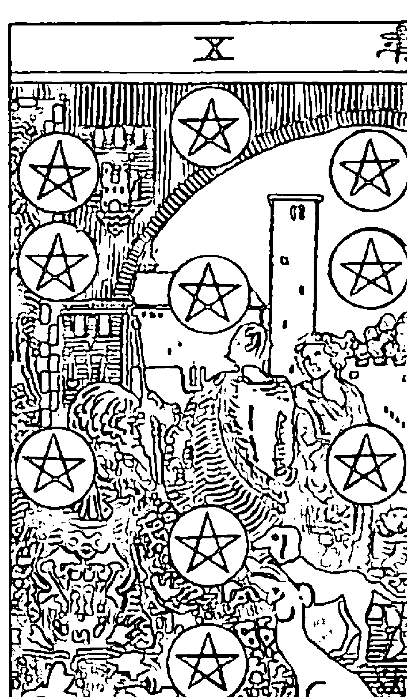

因此，如果問卜者對於所占卜的問題抽到了錢幣十，解牌者可以更鼓勵問卜者專心努力的去爭取自己所要的未來。

## 錢幣侍者 專注的期盼

【牌面簡述】

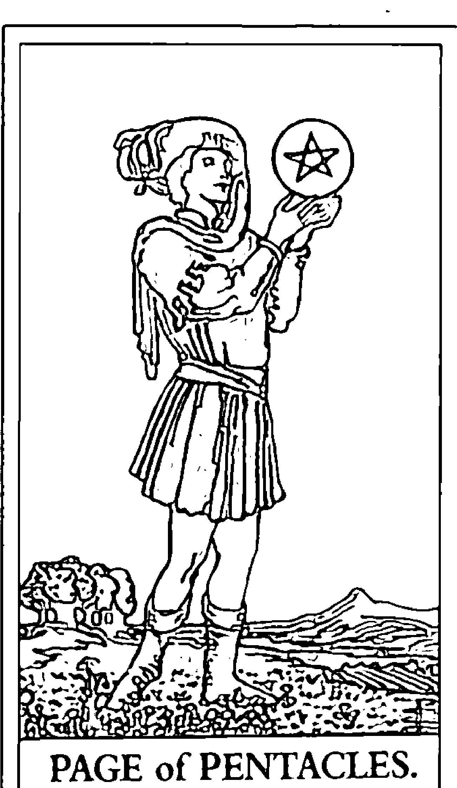

在錢幣侍者的畫面中，可以看到一個身著整齊衣服、頭戴紅帽的年輕男子將手中錢幣高高捧起，用一種期待的眼神專注的注視著錢幣。

而地上的草地也逐漸的成長出花朵，代表新生的生命開始成長，讓人感到有些美好的事物是值得被期待而努力的。

## 整體解釋

錢幣侍者在占卜上通常會被解釋為，對某件事情的期待是在未來即將發生，就算在時間內未到事情完成的階段，仍屬於可被期待且會不斷成長的狀況。

雖然可能有年輕及不成熟的因素存在，但是因為錢幣侍者的專注力及土元素擅長的務實能力，會讓有些事情雖然是屬於剛萌芽的狀況，但是卻有辦法可以把事情的後續發展導引到一個很正確的方向。

## 愛情解牌

在愛情中如果問題是問A君喜歡問卜者嗎？出現了錢幣侍者這張牌，其所代表的是A君對於問卜者有很不錯的觀感，雖然還不知道A君何時會確定下來並且開始行動，但是的確可以逐漸感受到A君的態度與行為。

因此如果這張牌出現了，解牌者是可以請問卜者保持一個樂觀及開朗的心去期待即將到來的一個情感成長。

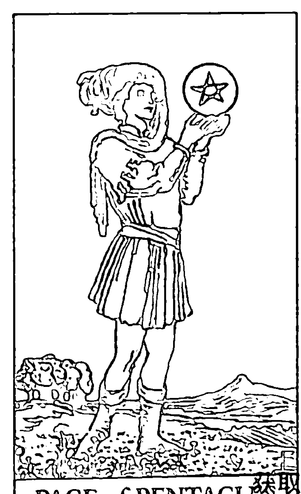

## 錢幣騎士 務實的能力

畫面結構

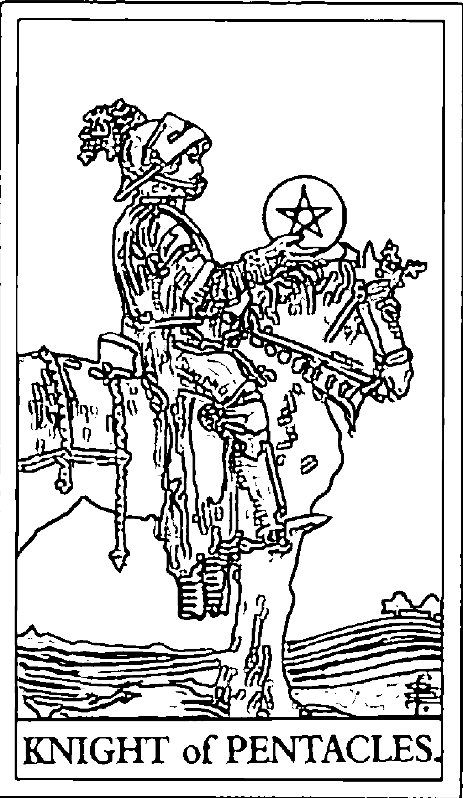

在一片黃昏的背景中，可以看到一匹黑色的馬佇立在已開墾過的土地旁，馬上的騎士穩穩的捧著手中的錢幣，他不急著前進，只是專注的注視著錢幣及注視著前方，充分表現出土元素穩定且不急進的魅力。

## 整體牌意

在占卜中錢幣騎士是個穩定的訊息，地面上已開墾的土地可以代表的是許多事情已經經過規劃並在醞釀準備進行了。
而從他的動作中可以看出，對於所欲進行的事情是十分深思熟慮的，但是他不會急著想要快速的去達成目標。因為他更在乎的是穩健的前進，以及在過程中遭遇到變化時能更深遠的應變及規劃。
因此，在占卜中出現了錢幣騎士，代表的就是朝著目標前進的力量已經存在，但是否已經開始行動則需要更多其他的訊息輔佐。

## 實際應用

在愛情的占卜中，如果問題是與A君三個月內的發展如何？出現了錢幣騎士則代表雙方其實都有感情的存在。
但是以目前的狀況來說進展是緩慢了點，也許該去思考的是，是否其中一方甚至兩方都不太容易去表達自己的情感，導致於在發展的過程當中進度是較為緩慢的。
也因為有錢幣騎士的訊息存在，解牌者可以鼓勵問卜者嘗試慢慢的加強自己所想釋放出的好感，藉此讓A君可以更肯定問卜者對他的感覺，而慢慢的向前推進。
否則依單張牌來說，很有可能最後兩方面喜愛越來越多，但是卻都僵在原地，而且每踏出一步都要花很長的時間。

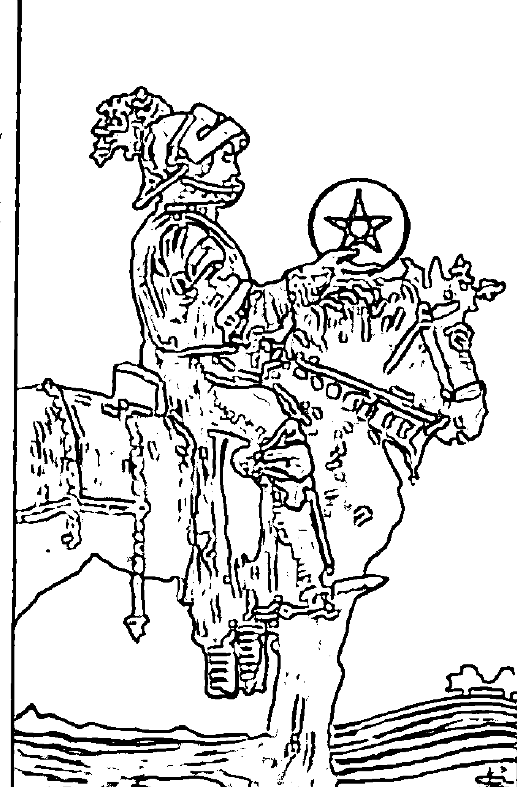

## 錢幣皇后 用心的專注

畫面結構

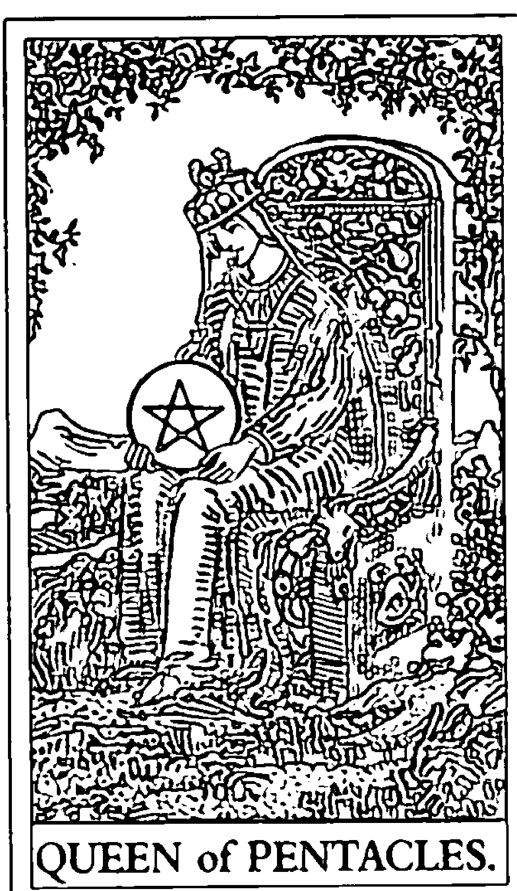

錢幣皇后的牌面當中可以看到黃色的背景代表豐腴的感受，而圖面上方花朵與果實的存在更加強了豐富的物質訊息。

然而，儘管周遭充滿了豐饒的物質生活氛圍，卻讓人感受到，這些似乎都不能影響到錢幣皇后專心注視手中錢幣的狀況。

甚至連右下角突然迸出的小兔子，都不能夠讓錢幣皇后從錢幣上移開她專注的視線。

卜中錢幣皇后的出現，會強烈的傳達出對於目前事物的專注力，就算有其他外來的好事降臨，也無法將她的專注力轉移開來，也表示出問卜者在詢問的問題裡將有這樣的一個關鍵因素置入。

而且跟錢幣四最大的不同是，這是屬於好的那一面，也表示是在一個很令人感到安心及滿足的狀況下去注視她所關心的事物，而不是像錢幣四那樣的死板板。

## 實際應用

在愛情中如果問題是與A君未來三個月的發展，出現了錢幣皇后則代表的是在未來三個月內雙方的情感會越來越濃烈。

雖然A君或是問卜者身邊可能不乏有其他的示好者，對於A君及問卜者來說也不會有太大的影響，就算這時候A君身旁朋友有對問卜者出現反對的意見或是問卜者的朋友鼓勵問卜者嘗試與其他追求者交往，也很難撼動A君與問卜者之間的關係發展。

因此，當這張牌出現在占卜時，解牌者可以鼓勵問卜者專心且開心的去面對這段感情。

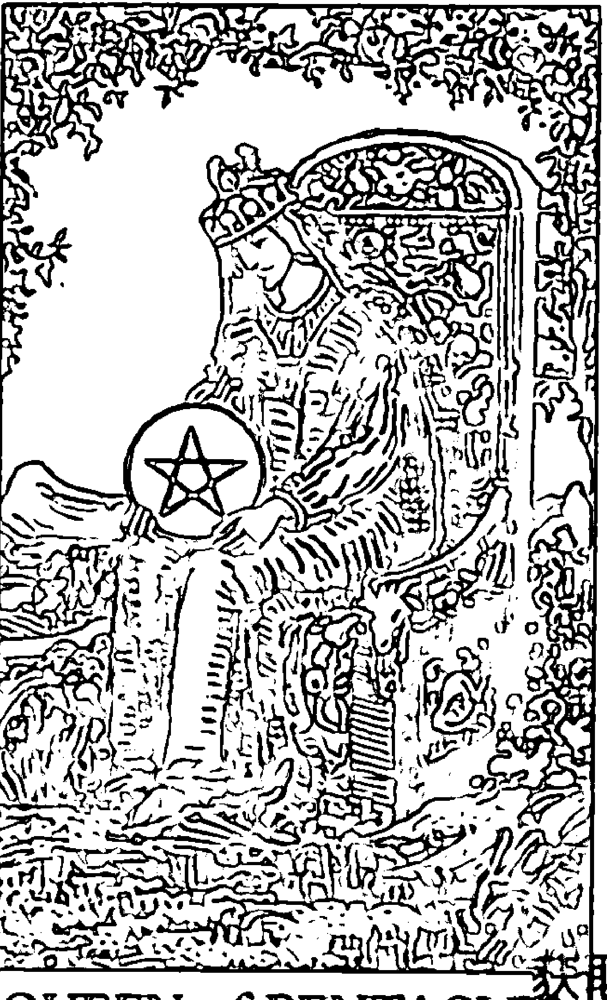

## 錢幣國王 紮實的征服

畫面描述

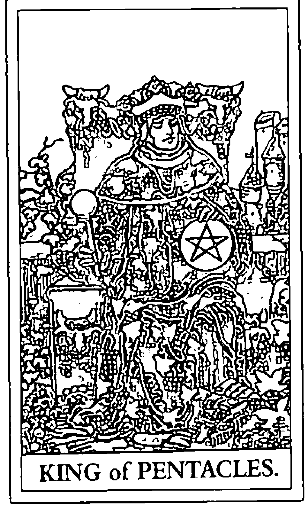

畫面中看到一位身著豐富色彩服飾的國王坐在他的寶座上，繡在他衣服上的紋飾都是豐饒收穫的代表，在地上及四周也都是結實纍纍的果實，更代表這是一個令人感到豐收的環境。

而國王周圍除了座位上的四頭神獸外，在他露出盔甲的腳下也踩著另一頭神獸，因此也代表著一些征服的意涵。

## 整體解釋

錢幣國王在占卜時出現，代表的是一個已接近完成的訊息，而且這個訊息代表是已經征服或是即將征服的狀況，而且這樣的一個情形並不是急速或是很突然的來到，他更該被解釋成逐步的或是緩慢的完成。

因此，在占卜中如果不是一個設定時間的問題，在解牌時就應更注重到時間的因素，因為這張牌的征服雖然徹底，但是如果沒有時間的加持，所呈現出來的完整度就不是那麼的足夠了。

## 實際應用

在愛情占卜中如果問題是A君對問卜者的感覺是什麼？出現了錢幣國王則代表的是，其實A君是喜歡問卜者的，而且應該已經有一陣子了。

不過這張錢幣國王其實也可以反過來思考，也許早就有一方對另一方的情感早就到達很高的境界了，只是不知道該怎麼去完整表達而已。

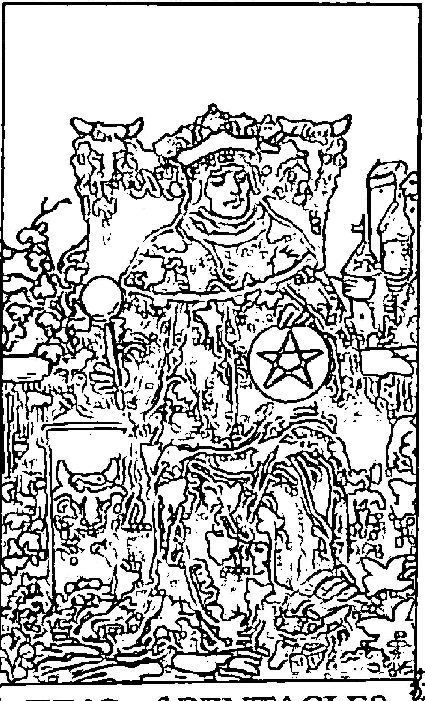

## 【Chapter ⑨】

获取更多好书，请加微信号：strcdts

## 【塔羅牌的基本牌陣介紹】

塔羅牌牌陣千變萬化，賈咖咖在這邊介紹幾組簡單好用牌陣給各位參考，較為複雜的牌陣就不在此贅述了。

五分鐘塔羅

### 塔羅小常識

## 牌陣一：無牌陣(無視牌陣)

所謂的無牌陣就是抽出來的牌沒有先後順序，也沒有單張牌該代表哪個意思的狀況。

一般來說常使用無牌陣的張數為三張、五張、七張，其中又以三張、五張更為被常用，而抽出來的牌被展示在桌面上之後，解牌者就以每張牌的訊息關連性嘗試將這幾張牌的牌義連結起來做一個綜合的解釋。

可以說是用數張牌的牌義來混合成一個答案的意思。目前這種問卜方式滿多占卜師會使用，但是在解牌上要更為小心，因為有時候會因為多張牌的訊息混合，導致於解牌時意義偏差掉。

获取更多好书，请加微信号：strcdts

### 塔羅小常識

## 牌陣二：時間之流(聖三角)

- ◎ 第一張牌代表過去的訊息
- ◎ 第二張牌代表現在的狀況
- ◎ 第三張牌代表未來的可能

這組牌陣是最常被使用的，藉由觀看過去所發生的一些事情癥結點來了解為何目前會有這樣的狀況。
而目前的狀況也許在被占卜者的眼中是被忽略的，可以藉由塔羅牌更深入的了解目前狀況。
另外，在觀看未來時記得也別忽略了過去與現在所傳達出的一些關鍵因素。

## 牌陣三：四元素占卜

- ◎ 第一張火元素代表的是對此事的行動力
- ◎ 第二張風元素代表的是對此事的想法(方法)
- ◎ 第三張水元素代表的是對此事的感覺(感受)
- ◎ 第四張土元素代表的是對此事的實質進行方式

此牌陣主要利用四大元素本身的特質，對於一件問題做一個深入的剖析。

藉由火元素來了解對這件事抽牌者有多少的意願去面對；而用風元素來了解對於這件事抽牌者會想怎麼去面對；用水元素來了解抽牌者對於這件事內心的真正想法及感受；土元素則是用來看針對這件事抽牌者的執行狀況(有點意指未來的發展可能)。

不同的占卜師針對四元素的位置放置可能有不同的意見，不過寶咖咖的淺見是認為，只要在開始前已經先確認每個位置所代表的意義即可。

### 塔羅小常識

## 牌陣四：二擇一

- ◎ 第一張代表針對這個抉擇目前的狀況或者說是抽牌者目前的心態
- ◎ 第二張選擇A的狀況，代表如果抽牌者選擇A所會發生的狀況
- ◎ 第三張選擇A的結果，代表如果抽牌者選擇A之後會發生的後續結果
- ◎ 第四張選擇B的狀況，代表如果抽牌者選擇B所會發生的狀況
- ◎ 第五張選擇B的結果，代表如果抽牌者選擇B之後會發生的後續結果

這個牌陣通常是在有兩個(或三個)選擇，而抽牌者無法決定的時候所使用。它可以根據狀況告知抽牌者，如果你選擇此方向所可能遇到的狀況與結果，再經由占卜師的解釋，讓抽牌者了解到每一個方向的未來可能的發展，藉以為自己的抉擇做一個判斷。

如兩個選擇都出現好的訊息則可以去注意過程的發展，藉以選擇更適合自己的方向，如果兩個選擇都不是很如意的，也代表可能在當中還有些問題需要抽牌者更用心去處理面對。

### 塔羅小常識

## 牌陣五：吉普賽十字

- ◎ 第一張代表對方目前的想法
- ◎ 第二張代表自己目前的想法
- ◎ 第三張代表雙方用什麼方法相處比較好
- ◎ 第四張代表雙方之間有存在什麼問題或阻礙
- ◎ 第五張代表未來雙方的結果

這個牌陣絕大多數是拿來詢問跟心中喜歡的對象(未交往)，未來可能的發展狀況。

在這當中除了會去了解對方對抽牌者的感覺之外，也會去了解雙方之間的問題到底出在哪裡，以及建議如何去跟你所喜歡的那個對象相處會更容易，讓彼此有更好的互動。

當然也會把未來有可能出現的結果呈現出來，讓抽牌者可以好好的面對自己所喜歡的那個對象。

### 塔羅小常識

## 牌陣六：戀人之樹

- ◎ 第一張代表的是抽牌者對對方的感覺
- ◎ 第二張代表的是對方對抽牌者的感覺
- ◎ 第三張代表的是抽牌者覺得雙方的關係是如何的
- ◎ 第四張代表的是對方覺得雙方的關係是如何的
- ◎ 第五張代表的是抽牌者該用什麼態度去面對彼此(需要依據1、3號牌做混和解釋)
- ◎ 第六張代表的是雙方之間可能會出現什麼問題，也代表對方可能會有什麼狀況出現(可以從2、4號牌當中找到更多的訊息)
- ◎ 第七張代表的是雙方的結果會如何(建議設定時間～例如三個月內)

## 國家圖書館出版品預行編目資料

五分鐘塔羅：解讀曖昧／賈咖咖作.--
第一版.-- 臺中市：十力文化，2010.04
面；公分
ISBN 978-986-85668-2-8（平裝）
1.占卜
292.96 99006465

休 閒 館 X001

## 五分鐘塔羅／解讀曖昧

作 者 賈咖咖

責任編輯 林子雁
封面設計 陳鶯萍
插 畫 劉鑫鋒
行銷企劃 黃信榮

出 版 者 十力文化出版有限公司
發 行 人 劉叔宙
公司地址 台中市南屯區文心路一段186號4樓之2
聯絡地址 台北郵政 93-357信箱
劃撥帳號 50073947
電 話 (02)8933-1916
網 址 www.omnibooks.com.tw
電子郵件 omnibooks.co@gmail.com
電腦排版 陳鶯萍工作室
電 話 (02)2357-0301

ISBN 978-986-85668-2-8

出版日期 2010年 5 月 10 日
版 次 第一版第一刷
定 價 280元

著作權所有・翻印必究

获取更多好书，请加微信号：strcdts

REVERSED 11:11:11:11:11:11:11:11:11:11:11:11:11:11:11:11:11:11:11:11:11:11:11:11:11:11:11:11:11:11:11:11:11:11:11:11:11:11:11:11:11:11:11:11:11:11:11:11:11:11:11:11:11:11:11:11:11:11:11:11:11:11:11:11:11:11:11:11:11:11:11:11:11:11:11:11:11:11:11:11:11:11:11:11:11:11:11:11:11:11:11:11:11:11:11:11:11:11:11:11:11:11:11:11:11:11:11:11:11:11:11:11:11:11:11:11:11:11:11:11:11:11:11:11:11:11:11:11:11:11:11:11:11:11:11:11:11:11:11:11:11:11:11:11:11:11:11:11:11:11:11:11:11:11:11:11:11:11:11:11:11:11:11:11:11:11:11:11:11:11:11:11:11:11:11:11:11:11:11:11:11:11:11:11:11:11:11:11:11:11:11:11:11:11:11:11:11:11:11:11:11:11:11:11:11:11:11:11:11:11:11:11:11:11:11:11:11:11:11:11:11:11:11:11:11:11:11:11:11:11:11:11:11:11:11:11:11:11:11:11:11:11:11:11:11:11:11:11:11:11:11:11:11:11:11:11:11:11:11:11:11:11:11:11:11:11:11:11:11:11:11:11:11:11:11:11:11:11:11:11:11:11:11:11:11:11:11:11:11:11:11:11:11:11:11:11:11:11:11:11:11:11:11:11:11:11:11:11:11:11:11:11:11:11:11:11:11:11:11:11:11:11:11:11:11:11:11:11:11:11:11:11:11:11:11:11:11:11:11:11:11:11:11:11:11:11:11:11:11:11:11:11:11:11:11:11:11:11:11:11:11:11:11:11:11:11:11:11:11:11:11:11:11:11:11:11:11:11:11:11:11:11:11:11:11:11:11:11:11:11:11:11:11:11:11:11:11:11:11:11:11:11:11:11:11:11:11:11:11:11:11:11:11:11:11:11:11:11:11:11:11:11:11:11:11:11:11:11:11:11:11:11:11:11:11:11:11:11:11:11:11:11:11:11:11:11:11:11:11:11:11:11:11:11:11:11:11:11:11:11:11:11:11:11:11:11:11:11:11:11:11:11:11:11:11:11:11:11:11:11:11:11:11:11:11:11:11:11:11:11:11:11:11:11:11:11:11:11:11:11:11:11:11:11:11:11:11:11:11:11:11:11:11:11:11:11:11:11:11:11:11:11:11:11:11:11:11:11:11:11:11:11:11:11:11:11:11:11:11:11:11:11:11:11:11:11:11:11:11:11:11:11:11:11:11:11:11:11:11:11:11:11:11:11:11:11:11:11:11:11:11:11:11:11:11:11:11:11:11:11:11:11:11:11:11:11:11:11:11:11:11:11:11:11:11:11:11:11:11:11:11:11:11:11:11:11:11:11:11:11:11:11:11:11:11:11:11:11:11:11:11:11:11:11:11:11:11:11:11:11:11:11:11:11:11:11:11:11:11:11:11:11:11:11:11:11:11:11:11:11:11:11:11:11:11:11:11:11:11:11:11:11:11:11:11:11:11:11:11:11:11:11:11:11:11:11:11:11:11:11:11:11:11:11:11:11:11:11:11:11:11:11:11:11:11:11:11:11:11:11:11:11:11:11:11:11:11:11:11:11:11:11:11:11:11:11:11:11:11:11:11:11:11:11:11:11:11:11:11:11:11:11:11:11:11:11:11:11:11:11:11:11:11:11:11:11:11:11:11:11:11:11:11:11:11:11:11:11:11:11:11:11:11:11:11:11:11:11:11:11:11:11:11:11:11:11:11:11:11:11:11:11:11:11:11:11:11:11:11:11:11:11:11:11:11:11:11:11:11:11:11:11:11:11:11:11:11:11:11:11:11:11:11:11:11:11:11:11:11:11:11:11:11:11:11:11:11:11:11:11:11:11:11:11:11:11:11:11:11:11:11:11:11:11:11:11:11:11:11:11:11:11:11:11:11:11:11:11:11:11:11:11:11:11:11:11:11:11:11:11:11:11:11:11:11:11:11:11:11:11:11:11:11:11:11:11:11:11:11:11:11:11:11:11:11:11:11:11:11:11:11:11:11:11:11:11:11:11:11:11:11:11:11:11:11:11:11:11:11:11:11:11:11:11:11:11:11:11:11:11:11:11:11:11:11:11:11:11:11:11:11:11:11:11:11:11:11:11:11:11:11:11:11:11:11:11:11:11:11:11:11:11:11:11:11:11:11:11:11:11:11:11:11:11:11:11:11:11:11:11:11:11:11:11:11:11:11:11:11:11:11:11:11:11:11:11:11:11:11:11:11:11:11:11:11:11:11:11:11:11:11:11:11:11:11:11:11:11:11:11:11:11:11:11:11:11:11:11:11:11:11:11:11:11:11:11:11:11:11:11:11:11:11:11:11:11:11:11:11:11:11:11:11:11:11:11:11:11:11:11:11:11:11:11:11:11:11:11:11:11:11:11:11:11:11:11:11:11:11:11:11:11:11:11:11:11:11:11:11:11:11:11:11:11:11:11:11:11:11:11:11:11:11:11:11:11:11:11:11:11:11:11:11:11:11:11:11:11:11:11:11:11:11:11:11:11:11:11:11:11:11:11:11:11:11:11:11:11:11:11:11:11:11:11:11:11:11:11:11:11:11:11:11:11:11:11:11:11:11:11:11:11:11:11:11:11:11:11:11:11:11:11:11:11:11:11:11:11:11:11:11:11:11:11:11:11:11:11:11:11:11:11:11:11:11:11:11:11:11:11:11:11:11:11:11:11:11:11:11:11:11:11:11:11:11:11:11:11:11:11:11:11:11:11:11:11:11:11:11:11:11:11:11:11:11:11:11:11:11:11:11:11:11:11:11:11:11:11:11:11:11:11:11:11:11:11:11:11:11:11:11:11:11:11:11:11:11:11:11:11:11:11:11:11:11:11:11:11:11:11:11:11:11:11:11:11:11:11:11:11:11:11:11:11:11:11:11:11:11:11:11:11:11:11:11:11:11:11:11:11:11:11:11:11:11:11:11:11:11:11:11:11:11:11:11:11:11:11:11:11:11:11:11:11:11:11:11:11:11:11:11:11:11:11:11:11:11:11:11:11:11:11:11:11:11:11:11:11:11:11:11:11:11:11:11:11:11:11:11:11:11:11:11:11:11:11:11:11:11:11:11:11:11:11:11:11:11:11:11:11:11:11:11:11:11:11:11:11:11:11:11:11:11:11:11:11:11:11:11:11:11:11:11:11:11:11:11:11:11:11:11:11:11:11:11:11:11:11:11:11:11:11:11:11:11:11:11:11:11:11:11:11:11:11:11:11:11:11:11:11:11:11:11:11:11:11:11:11:11:11:11:11:11:11:11:11:11:11:11:11:11:11:11:11:11:11:11:11:11:11:11:11:11:11:11:11:11:11:11:11:11:11:11:11:11:11:11:11:11:11:11:11:11:11:11:11:11:11:11:11:11:11:11:11:11:11:11:11:11:11:11:11:11:11:11:11:11:11:11:11:11:11:11:11:11:11:11:11:11:11:11:11:11:11:11:11:11:11:11:11:11:11:11:11:11:11:11:11:11:11:11:11:11:11:11:11:11:11:11:11:11:11:11:11:11:11:11:11:11:11:11:11:11:11:11:11:11:11:11:11:11:11:11:11:11:11:11:11:11:11:11:11:11:11:11:11:11:11:11:11:11:11:11:11:11:11:11:11:11:11:11:11:11:11:11:11:11:11:11:11:11:11:11:11:11:11:11:11:11:11:11:11:11:11:11:11:11:11:11:11:11:11:11:11:11:11:11:11:11:11:11:11:11:11:11:11:11:11:11:11:11:11:11:11:11:11:11:11:11:11:11:11:11:11:11:11:11:11:11:11:11:11:11:11:11:11:11:11:11:11:11:11:11:11:11:11:11:11:11:11:11:11:11:11:11:11:11:11:11:11:11:11:11:11:11:11:11:11:11:11:11:11:11:11:11:11:11:11:11:11:11:11:11:11:11:11:11:11:11:11:11:11:11:11:11:11:11:11:11:11:11:11:11:11:11:11:11:11:11:11:11:11:11:11:11:11:11:11:11:11:11:11:11:11:11:11:11:11:11:11:11:11:11:11:11:11:11:11:11:11:11:11:11:11:11:11:11:11:11:11:11:11:11:11:11:11:11:11:11:11:11:11:11:11:11:11:11:11:11:11:11:11:11:11:11:11:11:11:11:11:11:11:11:11:11:11:11:11:11:11:11:11:11:11:11:11:11:11:11:11:11:11:11:11:11:11:11:11:11:11:11:11:11:11:11:11:11:11:11:11:11:11:11:11:11:11:11:11:11:11:11:11:11:11:11:11:11:11:11:11:11:11:11:11:11:11:11:11:11:11:11:11:11:11:11:11:11:11:11:11:11:11:11:11:11:11:11:11:11:11:11:11:11:11:11:11:11:11:11:11:11:11:11:11:11:11:11:11:11:11:11:11:11:11:11:11:11:11:11:11:11:11:11:11:11:11:11:11:11:11:11:11:11:11:11:11:11:11:11:11:11:11:11:11:11:11:11:11:11:11:11:11:11:11:11:11:11:11:11:11:11:11:11:11:11:11:11:11:11:11:11:11:11:11:11:11:11:11:11:11:11:11:11:11:11:11:11:11:11:11:11:11:11:11:11:11:11:11:11:11:11:11:11:11:11:11:11:11:11:11:11:11:11:11:11:11:11:11:11:11:11:11:11:11:11:11:11:11:11:11:11:11:11:11:11:11:11:11:11:11:11:11:11:11:11:11:11:11:11:11:11:11:11:11:11:11:11:11:11:11:11:11:11:11:11:11:11:11:11:11:11:11:11:11:11:11:11:11:11:11:11:11:11:11:11:11:11:11:11:11:11:11:11:11:11:11:11:11:11:11:11:11:11:11:11:11:11:11:11:11:11:11:11:11:11:11:11:11:11:11:11:11:11:11:11:11:11:11:11:11:11:11:11:11:11:11:11:11:11:11:11:11:11:11:11:11:11:11:11:11:11:11:11:11:11:11:11:11:11:11:11:11:11:11:11:11:11:11:11:11:11:11:11:11:11:11:11:11:11:11:11:11:11:11:11:11:11:11:11:11:11:11:11:11:11:11:11:11:11:11:11:11:11:11:11:11:11:11:11:11:11:11:11:11:11:11:11:11:11:11:11:11:11:11:11:11:11:11:11:11:11:11:11:11:11:11:11:11:11:11:11:11:11:11:11:11:11:11:11:11:11:11:11:11:11:11:11:11:11:11:11:11:11:11:11:11:11:11:11:11:11:11:11:11:11:11:11:11:11:11:11:11:11:11:11:11:11:11:11:11:11:11:11:11:11:11:11:11:11:11:11:11:11:11:11:11:11:11:11:11:11:11:11:11:11:11:11:11:11:11:11:11:11:11:11:11:11:11:11:11:11:11:11:11:11:11:11:11:11:11:11:11:11:11:11:11:11:11:11:11:11:11:11:11:11:11:11:11:11:11:11:11:11:11:11:11:11:11:11:11:11:11:11:11:11:11:11:11:11:11:11:11:11:11:11:11:11:11:11:11:11:11:11:11:11:11:11:11:11:11:11:11:11:11:11:11:11:11:11:11:11:11:11:11:11:11:11:11:11:11:11:11:11:11:11:11:11:11:11:11:11:11:11:11:11:11:11:11:11:11:11:11:11:11:11:11:11:11:11:11:11:11:11:11:11:11:11:11:11:11:11:11:11:11:11:11:11:11:11:11:11:11:11:11:11:11:11:11:11:11:11:11:11:11:11:11:11:11:11:11:11:11:11:11:11:11:11:11:11:11:11:11:11:11:11:11:11:11:11:11:11:11:11:11:11:11:11:11:11:11:11:11:11:11:11:11:11:11:11:11:11:11:11:11:11:11:11:11:11:11:11:11:11:11:11:11:11:11:11:11:11:11:11:11:11:11:11:11:11:11:11:11:11:11:11:11:11:11:11:11:11:11:11:11:11:11:11:11:11:11:11:11:11:11:11:11:11:11:11:11:11:11:11:11:11:11:11:11:11:11:11:11:11:11:11:11:11:11:11:11:11:11:11:11:11:11:11:11:11:11:11:11:11:11:11:11:11:11:11:11:11:11:11:11:11:11:11:11:11:11:11:11:11:11:11:11:11:11:11:11:11:11:11:11:11:11:11:11:11:11:11:11:11:11:11:11:11:11:11:11:11:11:11:11:11:11:11:11:11:11:11:11:11:11:11:11:11:11:11:11:11:11:11:11:11:11:11:11:11:11:11:11:11:11:11:11:11:11:11:11:11:11:11:11:11:11:11:11:11:11:11:11:11:11:11:11:11:11:11:11:11:11:11:11:11:11:11:11:11:11:11:11:11:11:11:11:11:11:11:11:11:11:11:11:11:11:11:11:11:11:11:11:11:11:11:11:11:11:11:11:11:11:11:11:11:11:11:11:11:11:11:11:11:11:11:11:11:11:11:11:11:11:11:11:11:11:11:11:11:11:11:11:11:11:11:11:11:11:11:11:11:11:11:11:11:11:11:11:11:11:11:11:11:11:11:11:11:11:11:11:11:11:11:11:11:11:11:11:11:11:11:11:11:11:11:11:11:11:11:11:11:11:11:11:11:11:11:11:11:11:11:11:11:11:11:11:11:11:11:11:11:11:11:11:11:11:11:11:11:11:11:11:11:11:11:11:11:11:11:11:11:11:11:11:11:11:11:11:11:11:11:11:11:11:11:11:11:11:11:11:11:11:11:11:11:11:11:11:11:11:11:11:11:11:11:11:11:11:11:11:11:11:11:11:11:11:11:11:11:11:11:11:11:11:11:11:11:11:11:11:11:11:11:11:11:11:11:11:11:11:11:11:11:11:11:11:11:11:11:11:11:11:11:11:11:11:11:11:11:11:11:11:11:11:11:11:11:11:11:11:11:11:11:11:11:11:11:11:11:11:11:11:11:11:11:11:11:11:11:11:11:11:11:11:11:11:11:11:11:11:11:11:11:11:11:11:11:11:11:11:11:11:11:11:11:11:11:11:11:11:11:11:11:11:11:11:11:11:11:11:11:11:11:11:11:11:11:11:11:11:11:11:11:11:11:11:11:11:11:11:11:11:11:11:11:11:11:11:11:11:11:11:11:11:11:11:11:11:11:11:11:11:11:11:11:11:11:11:11:11:11:11:11:11:11:11:11:11:11:11:11:11:11:11:11:11:11:11:11:11:11:11:11:11:11:11:11:11:11:11:11:11:11:11:11:11:11:11:11:11:11:11:11:11:11:11:11:11:11:11:11:11:11:11:11:11:11:11:11:11:11:11:11:11:11:11:11:11:11:11:11:11:11:11:11:11:11:11:11:11:11:11:11:11:11:11:11:11:11:11:11:11:11:11:11:11:11:11:11:11:11:11:11:11:11:11:11:11:11:11:11:11:11:11:11:11:11:11:11:11:11:11:11:11:11:11:11:11:11:11:11:11:11:11:11:11:11:11:11:11:11:11:11:11:11:11:11:11:11:11:11:11:11:11:11:11:11:11:11:11:11:11:11:11:11:11:11:11:11:11:11:11:11:11:11:11:11:11:11:11:11:11:11:11:11:11:11:11:11:11:11:11:11:11:11:11:11:11:11:11:11:11:11:11:11:11:11:11:11:11:11:11:11:11:11:11:11:11:11:11:11:11:11:11:11:11:11:11:11:11:11:11:11:11:11:11:11:11:11:11:11:11:11:11:11:11:11:11:11:11:11:11:11:11:11:11:11:11:11:11:11:11:11:11:11:11:11:11:11:11:11:11:11:11:11:11:11:11:11:11:11:11:11:11:11:11:11:11:11:11:11:11:11:11:11:11:11:11:11:11:11:11:11:11:11:11:11:11:11:11:11:11:11:11:11:11:11:11:11:11:11:11:11:11:11:11:11:11:11:11:11:11:11:11:11:11:11:11:11:11:11:11:11:11:11:11:11:11:11:11:11:11:11:11:11:11:11:11:11:11:11:11:11:11:11:11:11:11:11:11:11:11:11:11:11:11:11:11:11:11:11:11:11:11:11:11:11:11:11:11:11:11:11:11:11:11:11:11:11:11:11:11:11:11:11:11:11:11:11:11:11:11:11:11:11:11:11:11:11:11:11:11:11:11:11:11:11:11:11:11:11:11:11:11:11:11:11:11:11:11:11:11:11:11:11:11:11:11:11:11:11:11:11:11:11:11:11:11:11:11:11:11:11:11:11:11:11:11:11:11:11:11:11:11:11:11:11:11:11:11:11:11:11:11:11:11:11:11:11:11:11:11:11:11:11:11:11:11:11:11:11:11:11:11:11:11:11:11:11:11:11:11:11:11:11:11:11:11:11:11:11:11:11:11:11:11:11:11:11:11:11:11:11:11:11:11:11:11:11:11:11:11:11:11:11:11:11:11:11:11:11:11:11:11:11:11:11:11:11:11:11:11:11:11:11:11:11:11:11:11:11:11:11:11:11:11:11:11:11:11:11:11:11:11:11:11:11:11:11:11:11:11:11:11:11:11:11:11:11:11:11:11:11:11:11:11:11:11:11:11:11:11:11:11:11:11:11:11:11:11:11:11:11:11:11:11:11:11:11:11:11:11:11:11:11:11:11:11:11:11:11:11:11:11:11:11:11:11:11:11:11:11:11:11:11:11:11:11:11:11:11:11:11:11:11:11:11:11:11:11:11:11:11:11:11:11:11:11:11:11:11:11:11:11:11:11:11:11:11:11:11:11:11:11:11:11:11:11:11:11:11:11:11:11:11:11:11:11:11:11:11:11:11:11:11:11:11:11:11:11:11:11:11:11:11:11:11:11:11:11:11:11:11:11:11:11:11:11:11:11:11:11:11:11:11:11:11:11:11:11:11:11:11:11:11:11:11:11:11:11:11:11:11:11:11:11:11:11:11:11:11:11:11:11:11:11:11:11:11:11:11:11:11:11:11:11:11:11:11:11:11:11:11:11:11:11:11:11:11:11:11:11:11:11:11:11:11:11:11:11:11:11:11:11:11:11:11:11:11:11:11:11:11:11:11:11:11:11:11:11:11:11:11:11:11:11:11:11:11:11:11:11:11:11:11:11:11:11:11:11:11:11:11:11:11:11:11:11:11:11:11:11:11:11:11:11:11:11:11:11:11:11:11:11:11:11:11:11:11:11:11:11:11:11:11:11:11:11:11:11:11:11:11:11:11:11:11:11:11:11:11:11:11:11:11:11:11:11:11:11:11:11:11:11:11:11:11:11:11:11:11:11:11:11:11:11:11:11:11:11:11:11:11:11:11:11:11:11:11:11:11:11:11:11:11:11:11:11:11:11:11:11:11:11:11:11:11:11:11:11:11:11:11:11:11:11:11:11:11:11:11:11:11:11:11:11:11:11:11:11:11:11:11:11:11:11:11:11:11:11:11:11:11:11:11:11:11:11:11:11:11:11:11:11:11:11:11:11:11:11:11:11:11:11:11:11:11:11:11:11:11:11:11:11:11:11:11:11:11:11:11:11:11:11:11:11:11:11:11:11:11:11:11:11:11:11:11:11:11:11:11:11:11:11:11:11:11:11:11:11:11:11:11:11:11:11:11:11:11:11:11:11:11:11:11:11:11:11:11:11:11:11:11:11:11:11:11:11:11:11:11:11:11:11:11:11:11:11:11:11:11:11:11:11:11:11:11:11:11:11:11:11:11:11:11:11:11:11:11:11:11:11:11:11:11:11:11:11:11:11:11:11:11:11:11:11:11:11:11:11:11:11:11:11:11:11:11:11:11:11:11:11:11:11:11:11:11:11:11:11:11:11:11:11:11:11:11:11:11:11:11:11:11:11:11:11:11:11:11:11:11:11:11:11:11:11:11:11:11:11:11:11:11:11:11:11:11:11:11:11:11:11:11:11:11:11:11:11:11:11:11:11:11:11:11:11:11:11:11:11:11:11:11:11:11:11:11:11:11:11:11:11:11:11:11:11:11:11:11:11:11:11:11:11:11:11:11:11:11:11:11:11:11:11:11:11:11:11:11:11:11:11:11:11:11:11:11:11:11:11:11:11:11:11:11:11:11:11:11:11:11:11:11:11:11:11:11:11:11:11:11:11:11:11:11:11:11:11:11:11:11:11:11:11:11:11:11:11:11:11:11:11:11:11:11:11:11:11:11:11:11:11:11:11:11:11:11:11:11:11:11:11:11:11:11:11:11:11:11:11:11:11:11:11:11:11:11:11:11:11:11:11:11:11:11:11:11:11:11:11:11:11:11:11:11:11:11:11:11:11:11:11:11:11:11:11:11:11:11:11:11:11:11:11:11:11:11:11:11:11:11:11:11:11:11:11:11:11:11:11:11:11:11:11:11:11:11:11:11:11:11:11:11:11:11:11:11:11:11:11:11:11:11:11:11:11:11:11:11:11:11:11:11:11:11:11:11:11:11:11:11:11:11:11:11:11:11:11:11:11:11:11:11:11:11:11:11:11:11:11:11:11:11:11:11:11:11:11:11:11:11:11:11:11:11:11:11:11:11:11:11:11:11:11:11:11:11:11:11:11:11:11:11:11:11:11:11:11:11:11:11:11:11:11:11:11:11:11:11:11:11:11:11:11:11:11:11:11:11:11:11:11:11:11:11:11:11:11:11:11:11:11:11:11:11:11:11:11:11:11:11:11:11:11:11:11:11:11:11:11:11:11:11:11:11:11:11:11:11:11:11:11:11:11:11:11:11:11:11:11:11:11:11:11:11:11:11:11:11:11:11:11:11:11:11:11:11:11:11:11:11:11:11:11:11:11:11:11:11:11:11:11:11:11:11:11:11:11:11:11:11:11:11:11:11:11:11:11:11:11:11:11:11:11:11:11:11:11:11:11:11:11:11:11:11:11:11:11:11:11:11:11:11:11:11:11:11:11:11:11:11:11:11:11:11:11:11:11:11:11:11:11:11:11:11:11:11:11:11:11:11:11:11:11:11:11:11:11:11:11:11:11:11:11:11:11:11:11:11:11:11:11:11:11:11:11:11:11:11:11:11:11:11:11:11:11:11:11:11:11:11:11:11:11:11:11:11:11:11:11:11:11:11:11:11:11:11:11:11:11:11:11:11:11:11:11:11:11:11:11:11:11:11:11:11:11:11:11:11:11:11:11:11:11:11:11:11:11:11:11:11:11:11:11:11:11:11:11:11:11:11:11:11:11:11:11:11:11:11:11:11:11:11:11:11:11:11:11:11:11:11:11:11:11:11:11:11:11:11:11:11:11:11:11:11:11:11:11:11:11:11:11:11:11:11:11:11:11:11:11:11:11:11:11:11:11:11:11:11:11:11:11:11:11:11:11:11:11:11:11:11:11:11:11:11:11:11:11:11:11:11:11:11:11:11:11:11:11:11:11:11:11:11:11:11:11:11:11:11:11:11:11:11:11:11:11:11:11:11:11:11:11:11:11:11:11:11:11:11:11:11:11:11:11:11:11:11:11:11:11:11:11:11:11:11:11:11:11:11:11:11:11:11:11:11:11:11:11:11:11:11:11:11:11:11:11:11:11:11:11:11:11:11:11:11:11:11:11:11:11:11:11:11:11:11:11:11:11:11:11:11:11:11:11:11:11:11:11:11:11:11:11:11:11:11:11:11:11:11:11:11:11:11:11:11:11:11:11:11:11:11:11:11:11:11:11:11:11:11:11:11:11:11:11:11:11:11:11:11:11:11:11:11:11:11:11:11:11:11:11:11:11:11:11:11:11:11:11:11:11:11:11:11:11:11:11:11:11:11:11:11:11:11:11:11:11:11:11:11:11:11:11:11:11:11:11:11:11:11:11:11:11:11:11:11:11:11:11:11:11:11:11:11:11:11:11:11:11:11:11:11:11:11:11:11:11:11:11:11:11:11:11:11:11:11:11:11:11:11:11:11:11:11:11:11:11:11:11:11:11:11:11:11:11:11:11:11:11:11:11:11:11:11:11:11:11:11:11:11:11:11:11:11:11:11:11:11:11:11:11:11:11:11:11:11:11:11:11:11:11:11:11:11:11:11:11:11:11:11:11:11:11:11:11:11:11:11:11:11:11:11:11:11:11:11:11:11:11:11:11:11:11:11:11:11:11:11:11:11:11:11:11:11:11:11:11:11:11:11:11:11:11:11:11:11:11:11:11:11:11:11:11:11:11:11:11:11:11:11:11:11:11:11:11:11:11:11:11:11:11:11:11:11:11:11:11:11:11:11:11:11:11:11:11:11:11:11:11:11:11:11:11:11:11:11:11:11:11:11:11:11:11:11:11:11:11:11:11:11:11:11:11:11:11:11:11:11:11:11:11:11:11:11:11:11:11:11:11:11:11:11:11:11:11:11:11:11:11:11:11:11:11:11:11:11:11:11:11:11:11:11:11:11:11:11:11:11:11:11:11:11:11:11:11:11:11:11:11:11:11:11:11:11:11:11:11:11:11:11:11:11:11:11:11:11:11:11:11:11:11:11:11:11:11:11:11:11:11:11:11:11:11:11:11:11:11:11:11:11:11:11:11:11:11:11:11:11:11:11:11:11:11:11:11:11:11:11:11:11:11:11:11:11:11:11:11:11:11:11:11:11:11:11:11:11:11:11:11:11:11:11:11:11:11:11:11:11:11:11:11:11:11:11:11:11:11:11:11:11:11:11:11:11:11:11:11:11:11:11:11:11:11:11:11:11:11:11:11:11:11:11:11:11:11:11:11:11:11:11:11:11:11:11:11:11:11:11:11:11:11:11:11:11:11:11:11:11:11:11:11:11:11:11:11:11:11:11:11:11:11:11:11:11:11:11:11:11:11:11:11:11:11:11:11:11:11:11:11:11:11:11:11:11:11:11:11:11:11:11:11:11:11:11:11:11:11:11:11:11:11:11:11:11:11:11:11:11:11:11:11:11:11:11:11:11:11:11:11:11:11:11:11:11:11:11:11:11:11:11:11:11:11:11:11:11:11:11:11:11:11:11:11:11:11:11:11:11:11:11:11:11:11:11:11:11:11:11:11:11:11:11:11:11:11:11:11:11:11:11:11:11:11:11:11:11:11:11:11:11:11:11:11:11:11:11:11:11:11:11:11:11:11:11:11:11:11:11:11:11:11:11:11:11:11:11:11:11:11:11:11:11:11:11:11:11:11:11:11:11:11:11:11:11:11:11:11:11:11:11:11:11:11:11:11:11:11:11:11:11:11:11:11:11:11:11:11:11:11:11:11:11:11:11:11:11:11:11:11:11:11:11:11:11:11:11:11:11:11:11:11:11:11:11:11:11:11:11:11:11:11:11:11:11:11:11:11:11:11:11:11:11:11:11:11:11:11:11:11:11:11:11:11:11:11:11:11:11:11:11:11:11:11:11:11:11:11:11:11:11:11:11:11:11:11:11:11:11:11:11:11:11:11:11:11:11:11:11:11:11:11:11:11:11:11:11:11:11:11:11:11:11:11:11:11:11:11:11:11:11:11:11:11:11:11:11:11:11:11:11:11:11:11:11:11:11:11:11:11:11:11:11:11:11:11:11:11:11:11:11:11:11:11:11:11:11:11:11:11:11:11:11:11:11:11:11:11:11:11:11:11:11:11:11:11:11:11:11:11:11:11:11:11:11:11:11:11:11:11:11:11:11:11:11:11:11:11:11:11:11:11:11:11:11:11:11:11:11:11:11:11:11:11:11:11:11:11:11:11:11:11:11:11:11:11:11:11:11:11:11:11:11:11:11:11:11:11:11:11:11:11:11:11:11:11:11:11:11:11:11:11:11:11:11:11:11:11:11:11:11:11:11:11:11:11:11:11:11:11:11:11:11:11:11:11:11:11:11:11:11:11:11:11:11:11:11:11:11:11:11:11:11:11:11:11:11:11:11:11:11:11:11:11:11:11:11:11:11:11:11:11:11:11:11:11:11:11:11:11:11:11:11:11:11:11:11:11:11:11:11:11:11:11:11:11:11:11:11:11:11:11:11:11:11:11:11:11:11:11:11:11:11:11:11:11:11:11:11:11:11:11:11:11:11:11:11:11:11:11:11:11:11:11:11:11:11:11:11:11:11:11:11:11:11:11:11:11:11:11:11:11:11:11:11:11:11:11:11:11:11:11:11:11:11:11:11:11:11:11:11:11:11:11:11:11:11:11:11:11:11:11:11:11:11:11:11:11:11:11:11:11:11:11:11:11:11:11:11:11:11:11:11:11:11:11:11:11:11:11:11:11:11:11:11:11:11:11:11:11:11:11:11:11:11:11:11:11:11:11:11:11:11:11:11:11:11:11:11:11:11:11:11:11:11:11:11:11:11:11:11:11:11:11:11:11:11:11:11:11:11:11:11:11:11:11:11:11:11:11:11:11:11:11:11:11:11:11:11:11:11:11:11:11:11:11:11:11:11:11:11:11:11:11:11:11:11:11:11:11:11:11:11:11:11:11:11:11:11:11:11:11:11:11:11:11:11:11:11:11:11:11:11:11:11:11:11:11:11:11:11:11:11:11:11:11:11:11:11:11:11:11:11:11:11:11:11:11:11:11:11:11:11:11:11:11:11:11:11:11:11:11:11:11:11:11:11:11:11:11:11:11:11:11:11:11:11:11:11:11:11:11:11:11:11:11:11:11:11:11:11:11:11:11:11:11:11:11:11:11:11:11:11:11:11:11:11:11:11:11:11:11:11:11:11:11:11:11:11:11:11:11:11:11:11:11:11:11:11:11:11:11:11:11:11:11:11:11:11:11:11:11:11:11:11:11:11:11:11:11:11:11:11:11:11:11:11:11:11:11:11:11:11:11:11:11:11:11:11:11:11:11:11:11:11:11:11:11:11:11:11:11:11:11:11:11:11:11:11:11:11:11:11:11:11:11:11:11:11:11:11:11:11:11:11:11:11:11:11:11:11:11:11:11:11:11:11:11:11:11:11:11:11:11:11:11:11:11:11:11:11:11:11:11:11:11:11:11:11:11:11:11:11:11:11:11:11:11:11:11:11:11:11:11:11:11:11:11:11:11:11:11:11:11:11:11:11:11:11:11:11:11:11:11:11:11:11:11:11:11:11:11:11:11:11:11:11:11:11:11:11:11:11:11:11:11:11:11:11:11:11:11:11:11:11:11:11:11:11:11:11:11:11:11:11:11:11:11:11:11:11:11:11:11:11:11:11:11:11:11:11:11:11:11:11:11:11:11:11:11:11:11:11:11:11:11:11:11:11:11:11:11:11:11:11:11:11:11:11:11:11:11:11:11:11:11:11:11:11:11:11:11:11:11:11:11:11:11:11:11:11:11:11:11:11:11:11:11:11:11:11:11:11:11:11:11:11:11:11:11:11:11:11:11:11:11:11:11:11:11:11:11:11:11:11:11:11:11:11:11:11:11:11:11:11:11:11:11:11:11:11:11:11:11:11:11:11:11:11:11:11:11:11:11:11:11:11:11:11:11:11:11:11:11:11:11:11:11:11:11:11:11:11:11:11:11:11:11:11:11:11:11:11:11:11:11:11:11:11:11:11:11:11:11:11:11:11:11:11:11:11:11:11:11:11:11:11:11:11:11:11:11:11:11:11:11:11:11:11:11:11:11:11:11:11:11:11:11:11:11:11:11:11:11:11:11:11:11:11:11:11:11:11:11:11:11:11:11:11:11:11:11:11:11:11:11:11:11:11:11:11:11:11:11:11:11:11:11:11:11:11:11:11:11:11:11:11:11:11:11:11:11:11:11:11:11:11:11:11:11:11:11:11:11:11:11:11:11:11:11:11:11:11:11:11:11:11:11:11:11:11:11:11:11:11:11:11:11:11:11:11:11:11:11:11:11:11:11:11:11:11:11:11:11:11:11:11:11:11:11:11:11:11:11:11:11:11:11:11:11:11:11:11:11:11:11:11:11:11:11:11:11:11:11:11:11:11:11:11:11:11:11:11:11:11:11:11:11:11:11:11:11:11:11:11:11:11:11:11:11:11:11:11:11:11:11:11:11:11:11:11:11:11:11:11:11:11:11:11:11:11:11:11:11:11:11:11:11:11:11:11:11:11:11:11:11:11:11:11:11:11:11:11:11:11:11:11:11:11:11:11:11:11:11:11:11:11:11:11:11:11:11:11:11:11:11:11:11:11:11:11:11:11:11:11:11:11:11:11:11:11:11:11:11:11:11:11:11:11:11:11:11:11:11:11:11:11:11:11:11:11:11:11:11:11:11:11:11:11:11:11:11:11:11:11:11:11:11:11:11:11:11:11:11:11:11:11:11:11:11:11:11:11:11:11:11:11:11:11:11:11:11:11:11:11:11:11:11:11:11:11:11:11:11:11:11:11:11:11:11:11:11:11:11:11:11:11:11:11:11:11:11:11:11:11:11:11:11:11:11:11:11:11:11:11:11:11:11:11:11:11:11:11:11:11:11:11:11:11:11:11:11:11:11:11:11:11:11:11:11:11:11:11:11:11:11:11:11:11:11:11:11:11:11:11:11:11:11:11:11:11:11:11:11:11:11:11:11:11:11:11:11:11:11:11:11:11:11:11:11:11:11:11:11:11:11:11:11:11:11:11:11:11:11:11:11:11:11:11:11:11:11:11:11:11:11:11:11:11:11:11:11:11:11:11:11:11:11:11:11:11:11:11:11:11:11:11:11:11:11:11:11:11:11:11:11:11:11:11:11:11:11:11:11:11:11:11:11:11:11:11:11:11:11:11:11:11:11:11:11:11:11:11:11:11:11:11:11:11:11:11:11:11:11:11:11:11:11:11:11:11:11:11:11:11:11:11:11:11:11:11:11:11:11:11:11:11:11:11:11:11:11:11:11:11:11:11:11:11:11:11:11:11:11:11:11:11:11:11:11:11:11:11:11:11:11:11:11:11:11:11:11:11:11:11:11:11:11:11:11:11:11:11:11:11:11:11:11:11:11:11:11:11:11:11:11:11:11:11:11:11:11:11:11:11:11:11:11:11:11:11:11:11:11:11:11:11:11:11:11:11:11:11:11:11:11:11:11:11:11:11:11:11:11:11:11:11:11:11:11:11:11:11:11:11:11:11:11:11:11:11:11:11:11:11:11:11:11:11:11:11:11:11:11:11:11:11:11:11:11:11:11:11:11:11:11:11:11:11:11:11:11:11:11:11:11:11:11:11:11:11:11:11:11:11:11:11:11:11:11:11:11:11:11:11:11:11:11:11:11:11:11:11:11:11:11:11:11:11:11:11:11:11:11:11:11:11:11:11:11:11:11:11:11:11:11:11:11:11:11:11:11:11:11:11:11:11:11:11:11:11:11:11:11:11:11:11:11:11:11:11:11:11:11:11:11:11:11:11:11:11:11:11:11:11:11:11:11:11:11:11:11:11:11:11:11:11:11:11:11:11:11:11:11:11:11:11:11:11:11:11:11:11:11:11:11:11:11:11:11:11:11:11:11:11:11:11:11:11:11:11:11:11:11:11:11:11:11:11:11:11:11:11:11:11:11:11:11:11:11:11:11:11:11:11:11:11:11:11:11:11:11:11:11:11:11:11:11:11:11:11:11:11:11:11:11:11:11:11:11:11:11:11:11:11:11:11:11:11:11:11:11:11:11:11:11:11:11:11:11:11:11:11:11:11:11:11:11:11:11:11:11:11:11:11:11:11:11:11:11:11:11:11:11:11:11:11:11:11:11:11:11:11:11:11:11:11:11:11:11:11:11:11:11:11:11:11:11:11:11:11:11:11:11:11:11:11:11:11:11:11:11:11:11:11:11:11:11:11:11:11:11:11:11:11:11:11:11:11:11:11:11:11:11:11:11:11:11:11:11:11:11:11:11:11:11:11:11:11:11:11:11:11:11:11:11:11:11:11:11:11:11:11:11:11:11:11:11:11:11:11:11:11:11:11:11:11:11:11:11:11:11:11:11:11:11:11:11:11:11:11:11:11:11:11:11:11:11:11:11:11:11:11:11:11:11:11:11:11:11:11:11:11:11:11:11:11:11:11:11:11:11:11:11:11:11:11:11:11:11:11:11:11:11:11:11:11:11:11:11:11:11:11:11:11:11:11:11:11:11:11:11:11:11:11:11:11:11:11:11:11:11:11:11:11:11:11:11:11:11:11:11:11:11:11:11:11:11:11:11:11:11:11:11:11:11:11:11:11:11:11:11:11:11:11:11:11:11:11:11:11:11:11:11:11:11:11:11:11:11:11:11:11:11:11:11:11:11:11:11:11:11:11:11:11:11:11:11:11:11:11:11:11:11:11:11:11:11:11:11:11:11:11:11:11:11:11:11:11:11:11:11:11:11:11:11:11:11:11:11:11:11:11:11:11:11:11:11:11:11:11:11:11:11:11:11:11:11:11:11:11:11:11:11:11:11:11:11:11:11:11:11:11:11:11:11:11:11:11:11:11:11:11:11:11:11:11:11:11:11:11:11:11:11:11:11:11:11:11:11:11:11:11:11:11:11:11:11:11:11:11:11:11:11:11:11:11:11:11:11:11:11:11:11:11:11:11:11:11:11:11:11:11:11:11:11:11:11:11:11:11:11:11:11:11:11:11:11:11:11:11:11:11:11:11:11:11:11:11:11:11:11:11:11:11:11:11:11:11:11:11:11:11:11:11:11:11:11:11:11:11:11:11:11:11:11:11:11:11:11:11:11:11:11:11:11:11:11:11:11:11:11:11:11:11:11:11:11:11:11:11:11:11:11:11:11:11:11:11:11:11:11:11:11:11:11:11:11:11:11:11:11:11:11:11:11:11:11:11:11:11:11:11:11:11:11:11:11:11:11:11:11:11:11:11:11:11:11:11:11:11:11:11:11:11:11:11:11:11:11:11:11:11:11:11:11:11:11:11:11:11:11:11:11:11:11:11:11:11:11:11:11:11:11:11:11:11:11:11:11:11:11:11:11:11:11:11:11:11:11:11:11:11:11:11:11:11:11:11:11:11:11:11:11:11:11:11:11:11:11:11:11:11:11:11:11:11:11:11:11:11:11:11:11:11:11:11:11:11:11:11:11:11:11:11:11:11:11:11:11:11:11:11:11:11:11:11:11:11:11:11:11:11:11:11:11:11:11:11:11:11:11:11:11:11:11:11:11:11:11:11:11:11:11:11:11:11:11:11:11:11:11:11:11:11:11:11:11:11:11:11:11:11:11:11:11:11:11:11:11:11:11:11:11:11:11:11:11:11:11:11:11:11:11:11:11:11:11:11:11:11:11:11:11:11:11:11:11:11:11:11:11:11:11:11:11:11:11:11:11:11:11:11:11:11:11:11:11:11:11:11:11:11:11:11:11:11:11:11:11:11:11:11:11:11:11:11:11:11:11:11:11:11:11:11:11:11:11:11:11:11:11:11:11:11:11:11:11:11:11:11:11:11:11:11:11:11:11:11:11:11:11:11:11:11:11:11:11:11:11:11:11:11:11:11:11:11:11:11:11:11:11:11:11:11:11:11:11:11:11:11:11:11:11:11:11:11:11:11:11:11:11:11:11:11:11:11:11:11:11:11:11:11:11:11:11:11:11:11:11:11:11:11:11:11:11:11:11:11:11:11:11:11:11:11:11:11:11:11:11:11:11:11:11:11:11:11:11:11:11:11:11:11:11:11:11:11:11:11:11:11:11:11:11:11:11:11:11:11:11:11:11:11:11:11:11:11:11:11:11:11:11:11:11:11:11:11:11:11:11:11:11:11:11:11:11:11:11:11:11:11:11:11:11:11:11:11:11:11:11:11:11:11:11:11:11:11:11:11:11:11:11:11:11:11:11:11:11:11:11:11:11:11:11:11:11:11:11:11:11:11:11:11:11:11:11:11:11:11:11:11:11:11:11:11:11:11:11:11:11:11:11:11:11:11:11:11:11:11:11:11:11:11:11:11:11:11:11:11:11:11:11:11:11:11:11:11:11:11:11:11:11:11:11:11:11:11:11:11:11:11:11:11:11:11:11:11:11:11:11:11:11:11:11:11:11:11:11:11:11:11:11:11:11:11:11:11:11:11:11:11:11:11:11:11:11:11:11:11:11:11:11:11:11:11:11:11:11:11:11:11:11:11:11:11:11:11:11:11:11:11:11:11:11:11:11:11:11:11:11:11:11:11:11:11:11:11:11:11:11:11:11:11:11:11:11:11:11:11:11:11:11:11:11:11:11:11:11:11:11:11:11:11:11:11:11:11:11:11:11:11:11:11:11:11:11:11:11:11:11:11:11:11:11:11:11:11:11:11:11:11:11:11:11:11:11:11:11:11:11:11:11:11:11:11:11:11:11:11:11:11:11:11:11:11:11:11:11:11:11:11:11:11:11:11:11:11:11:11:11:11:11:11:11:11:11:11:11:11:11:11:11:11:11:11:11:11:11:11:11:11:11:11:11:11:11:11:11:11:11:11:11:11:11:11:11:11:11:11:11:11:11:11:11:11:11:11:11:11:11:11:11:11:11:11:11:11:11:11:11:11:11:11:11:11:11:11:11:11:11:11:11:11:11:11:11:11:11:11:11:11:11:11:11:11:11:11:11:11:11:11:11:11:11:11:11:11:11:11:11:11:11:11:11:11:11:11:11:11:11:11:11:11:11:11:11:11:11:11:11:11:11:11:11:11:11:11:11:11:11:11:11:11:11:11:11:11:11:11:11:11:11:11:11:11:11:11:11:11:11:11:11:11:11:11:11:11:11:11:11:11:11:11:11:11:11:11:11:11:11:11:11:11:11:11:11:11:11:11:11:11:11:11:11:11:11:11:11:11:11:11:11:11:11:11:11:11:11:11:11:11:11:11:11:11:11:11:11:11:11:11:11:11:11:11:11:11:11:11:11:11:11:11:11:11:11:11:11:11:11:11:11:11:11:11:11:11:11:11:11:11:11:11:11:11:11:11:11:11:11:11:11:11:11:11:11:11:11:11:11:11:11:11:11:11:11:11:11:11:11:11:11:11:11:11:11:11:11:11:11:11:11:11:11:11:11:11:11:11:11:11:11:11:11:11:11:11:11:11:11:11:11:11:11:11:11:11:11:11:11:11:11:11:11:11:11:11:11:11:11:11:11:11:11:11:11:11:11:11:11:11:11:11:11:11:11:11:11:11:11:11:11:11:11:11:11:11:11:11:11:11:11:11:11:11:11:11:11:11:11:11:11:11:11:11:11:11:11:11:11:11:11:11:11:11:11:11:11:11:11:11:11:11:11:11:11:11:11:11:11:11:11:11:11:11:11:11:11:11:11:11:11:11:11:11:11:11:11:11:11:11:11:11:11:11:11:11:11:11:11:11:11:11:11:11:11:11:11:11:11:11:11:11:11:11:11:11:11:11:11:11:11:11:11:11:11:11:11:11:11:11:11:11:11:11:11:11:11:11:11:11:11:11:11:11:11:11:11:11:11:11:11:11:11:11:11:11:11:11:11:11:11:11:11:11:11:11:11:11:11:11:11:11:11:11:11:11:11:11:11:11:11:11:11:11:11:11:11:11:11:11:11:11:11:11:11:11:11:11:11:11:11:11:11:11:11:11:11:11:11:11:11:11:11:11:11:11:11:11:11:11:11:11:11:11:11:11:11:11:11:11:11:11:11:11:11:11:11:11:11:11:11:11:11:11:11:11:11:11:11:11:11:11:11:11:11:11:11:11:11:11:11:11:11:11:11:11:11:11:11:11:11:11:11:11:11:11:11:11:11:11:11:11:11:11:11:11:11:11:11:11:11:11:11:11:11:11:11:11:11:11:11:11:11:11:11:11:11:11:11:11:11:11:11:11:11:11:11:11:11:11:11:11:11:11:11:11:11:11:11:11:11:11:11:11:11:11:11:11:11:11:11:11:11:11:11:11:11:11:11:11:11:11:11:11:11:11:11:11:11:11:11:11:11:11:11:11:11:11:11:11:11:11:11:11:11:11:11:11:11:11:11:11:11:11:11:11:11:11:11:11:11:11:11:11:11:11:11:11:11:11:11:11:11:11:11:11:11:11:11:11:11:11:11:11:11:11:11:11:11:11:11:11:11:11:11:11:11:11:11:11:11:11:11:11:11:11:11:11:11:11:11:11:11:11:11:11:11:11:11:11:11:11:11:11:11:11:11:11:11:11:11:11:11:11:11:11:11:11:11:11:11:11:11:11:11:11:11:11:11:11:11:11:11:11:11:11:11:11:11:11:11:11:11:11:11:11:11:11:11:11:11:11:11:11:11:11:11:11:11:11:11:11:11:11:11:11:11:11:11:11:11:11:11:11:11:11:11:11:11:11:11:11:11:11:11:11:11:11:11:11:11:11:11:11:11:11:11:11:11:11:11:11:11:11:11:11:11:11:11:11:11:11:11:11:11:11:11:11:11:11:11:11:11:11:11:11:11:11:11:11:11:11:11:11:11:11:11:11:11:11:11:11:11:11:11:11:11:11:11:11:11:11:11:11:11:11:11:11:11:11:11:11:11:11:11:11:11:11:11:11:11:11:11:11:11:11:11:11:11:11:11:11:11:11:11:11:11:11:11:11:11:11:11:11:11:11:11:11:11:11:11:11:11:11:11:11:11:11:11:11:11:11:11:11:11:11:11:11:11:11:11:11:11:11:11:11:11:11:11:11:11:11:11:11:11:11:11:11:11:11:11:11:11:11:11:11:11:11:11:11:11:11:11:11:11:11:11:11:11:11:11:11:11:11:11:11:11:11:11:11:11:11:11:11:11:11:11:11:11:11:11:11:11:11:11:11:11:11:11:11:11:11:11:11:11:11:11:11:11:11:11:11:11:11:11:11:11:11:11:11:11:11:11:11:11:11:11:11:11:11:11:11:11:11:11:11:11:11:11:11:11:11:11:11:11:11:11:11:11:11:11:11:11:11:11:11:11:11:11:11:11:11:11:11:11:11:11:11:11:11:11:11:11:11:11:11:11:11:11:11:11:11:11:11:11:11:11:11:11:11:11:11:11:11:11:11:11:11:11:11:11:11:11:11:11:11:11:11:11:11:11:11:11:11:11:11:11:11:11:11:11:11:11:11:11:11:11:11:11:11:11:11:11:11:11:11:11:11:11:11:11:11:11:11:11:11:11:11:11:11:11:11:11:11:11:11:11:11:11:11:11:11:11:11:11:11:11:11:11:11:11:11:11:11:11:11:11:11:11:11:11:11:11:11:11:11:11:11:11:11:11:11:11:11:11:11:11:11:11:11:11:11:11:11:11:11:11:11:11:11:11:11:11:11:11:11:11:11:11:11:11:11:11:11:11:11:11:11:11:11:11:11:11:11:11:11:11:11:11:11:11:11:11:11:11:11:11:11:11:11:11:11:11:11:11:11:11:11:11:11:11:11:11:11:11:11:11:11:11:11:11:11:11:11:11:11:11:11:11:11:11:11:11:11:11:11:11:11:11:11:11:11:11:11:11:11:11:11:11:11:11:11:11:11:11:11:11:11:11:11:11:11:11:11:11:11:11:11:11:11:11:11:11:11:11:11:11:11:11:11:11:11:11:11:11:11:11:11:11:11:11:11:11:11:11:11:11:11:11:11:11:11:11:11:11:11:11:11:11:11:11:11:11:11:11:11:11:11:11:11:11:11:11:11:11:11:11:11:11:11:11:11:11:11:11:11:11:11:11:11:11:11:11:11:11:11:11:11:11:11:11:11:11:11:11:11:11:11:11:11:11:11:11:11:11:11:11:11:11:11:11:11:11:11:11:11:11:11:11:11:11:11:11:11:11:11:11:11:11:11:11:11:11:11:11:11:11:11:11:11:11:11:11:11:11:11:11:11:11:11:11:11:11:11:11:11:11:11:11:11:11:11:11:11:11:11:11:11:11:11:11:11:11:11:11:11:11:11:11:11:11:11:11:11:11:11:11:11:11:11:11:11:11:11:11:11:11:11:11:11:11:11:11:11:11:11:11:11:11:11:11:11:11:11:11:11:11:11:11:11:11:11:11:11:11:11:11:11:11:11:11:11:11:11:11:11:11:11:11:11:11:11:11:11:11:11:11:11:11:11:11:11:11:11:11:11:11:11:11:11:11:11:11:11:11:11:11:11:11:11:11:11:11:11:11:11:11:11:11:11:11:11:11:11:11:11:11:11:11:11:11:11:11:11:11:11:11:11:11:11:11:11:11:11:11:11:11:11:11:11:11:11:11:11:11:11:11:11:11:11:11:11:11:11:11:11:11:11:11:11:11:11:11:11:11:11:11:11:11:11:11:11:11:11:11:11:11:11:11:11:11:11:11:11:11:11:11:11:11:11:11:11:11:11:11:11:11:11:11:11:11:11:11:11:11:11:11:11:11:11:11:11:11:11:11:11:11:11:11:11:11:11:11:11:11:11:11:11:11:11:11:11:11:11:11:11:11:11:11:11:11:11:11:11:11:11:11:11:11:11:11:11:11:11:11:11:11:11:11:11:11:11:11:11:11:11:11:11:11:11:11:11:11:11:11:11:11:11:11:11:11:11:11:11:11:11:11:11:11:11:11:11:11:11:11:11:11:11:11:11:11:11:11:11:11:11:11:11:11:11:11:11:11:11:11:11:11:11:11:11:11:11:11:11:11:11:11:11:11:11:11:11:11:11:11:11:11:11:11:11:11:11:11:11:11:11:11:11:11:11:11:11:11:11:11:11:11:11:11:11:11:11:11:11:11:11:11:11:11:11:11:11:11:11:11:11:11:11:11:11:11:11:11:11:11:11:11:11:11:11:11:11:11:11:11:11:11:11:11:11:11:11:11:11:11:11:11:11:11:11:11:11:11:11:11:11:11:11:11:11:11:11:11:11:11:11:11:11:11:11:11:11:11:11:11:11:11:11:11:11:11:11:11:11:11:11:11:11:11:11:11:11:11:11:11:11:11:11:11:11:11:11:11:11:11:11:11:11:11:11:11:11:11:11:11:11:11:11:11:11:11:11:11:11:11:11:11:11:11:11:11:11:11:11:11:11:11:11:11:11:11:11:11:11:11:11:11:11:11:11:11:11:11:11:11:11:11:11:11:11:11:11:11:11:11:11:11:11:11:11:11:11:11:11:11:11:11:11:11:11:11:11:11:11:11:11:11:11:11:11:11:11:11:11:11:11:11:11:11:11:11:11:11:11:11:11:11:11:11:11:11:11:11:11:11:11:11:11:11:11:11:11:11:11:11:11:11:11:11:11:11:11:11:11:11:11:11:11:11:11:11:11:11:11:11:11:11:11:11:11:11:11:11:11:11:11:11:11:11:11:11:11:11:11:11:11:11:11

## 這是妳最需要的基礎塔羅書！

不需要強記所謂的牌面定義關鍵字，直接從塔羅牌本身的畫面構圖著手，用心感受每張塔羅牌的圖案顏色、結構、元素、內容，妳也可以輕鬆解讀每張塔羅牌所要傳遞的訊息。

-   □畫面結構：藉由用心觀察每張牌面的人、事、物等細節，輕鬆體會感受每張塔羅牌所要傳遞的訊息。

-   □整體解釋：藉由牌面元素的觀察，提供基本的牌面解釋訊息。塔羅牌的有趣之處，就是同樣一張牌，在不同的時空、事件背景之下，每個占卜師都可能有不同的解釋，這並沒有明確的對與錯的問題，只要是用心去感受，每個人都可以有屬於自己的塔羅牌世界。

-   □實際應用：針對愛情的占卜中，就每張塔羅牌出現所代表的可能意義，提供基本的解牌方向與建議，讓每位朋友能夠更容易的把塔羅牌所要傳遞的訊息，應用展現在所要占卜的問題上。

-   □塔羅牌常識：從塔羅牌的起源、派別到基礎牌陣的介紹，所有你該知道關於塔羅牌的知識與常識，一次完整收錄。

插畫：劉鑫鋒 http://www.indianjoel.com