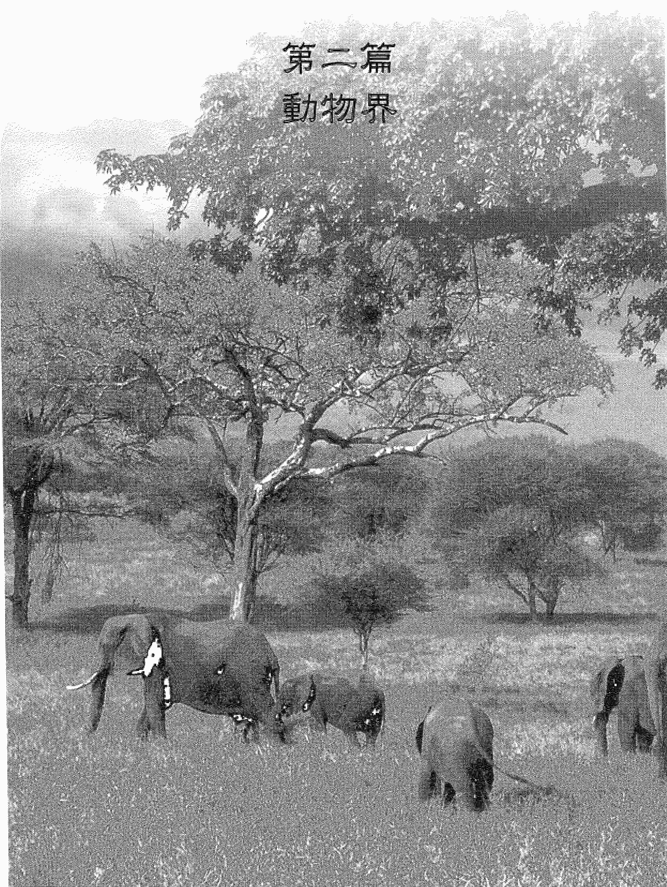
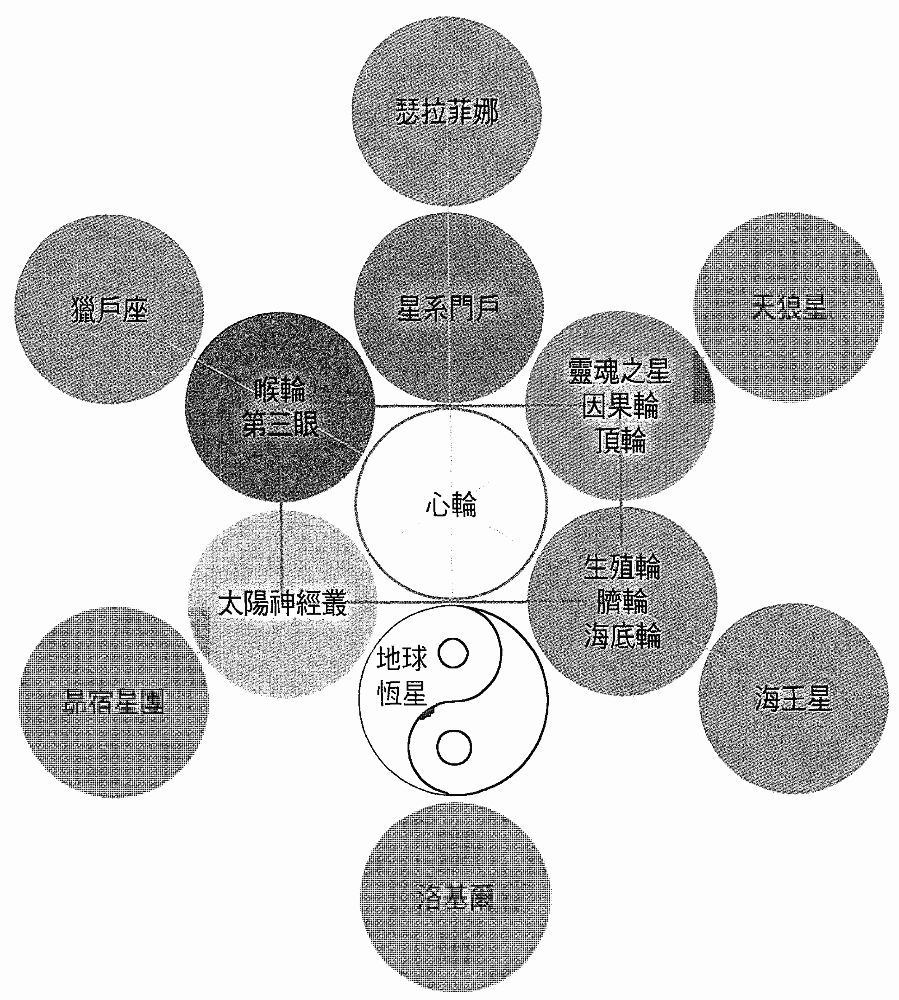
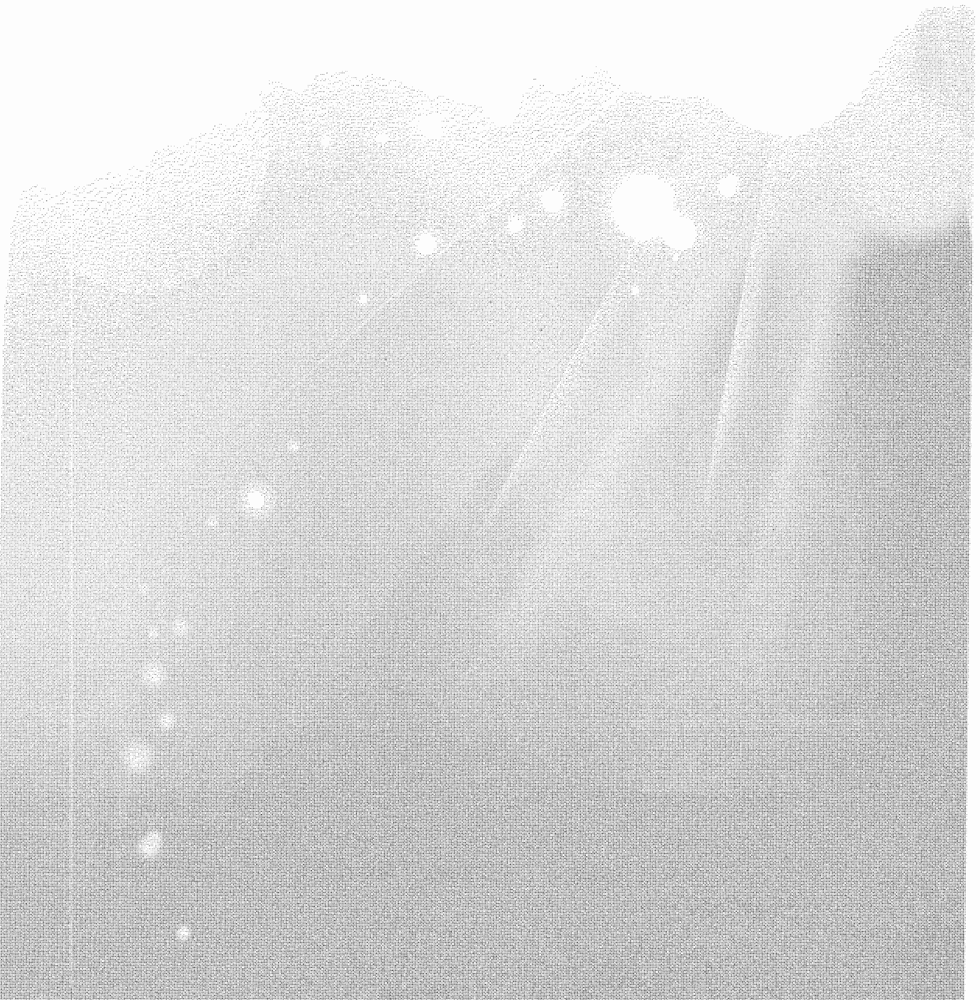
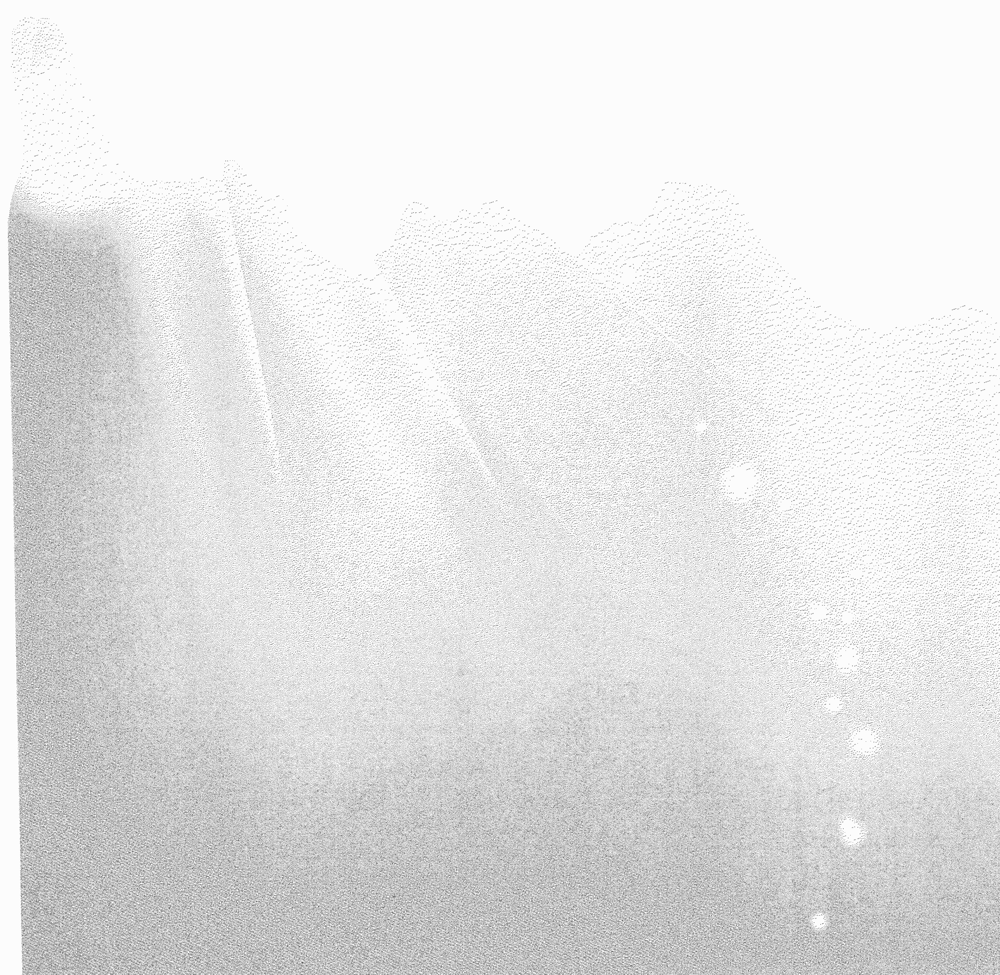
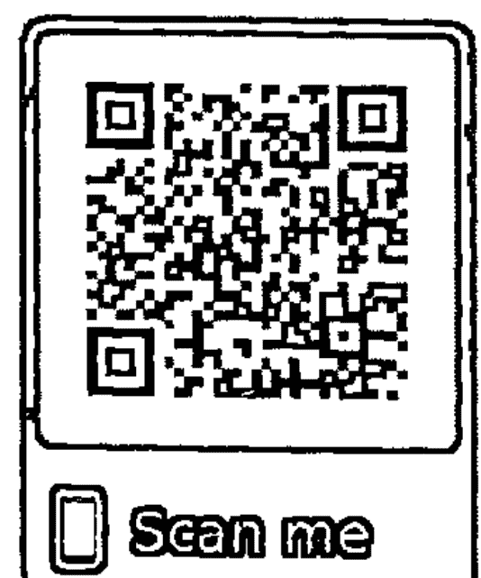
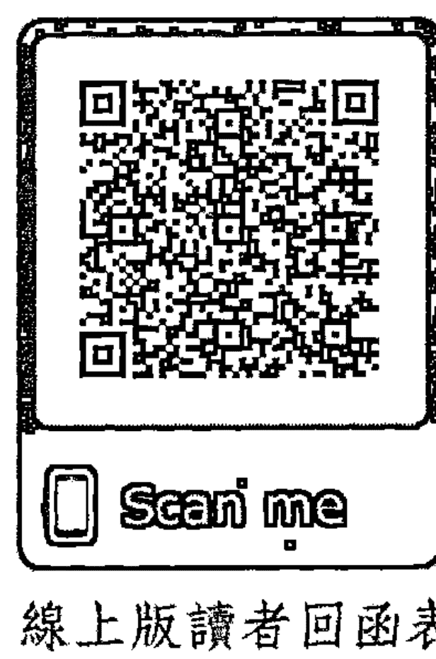
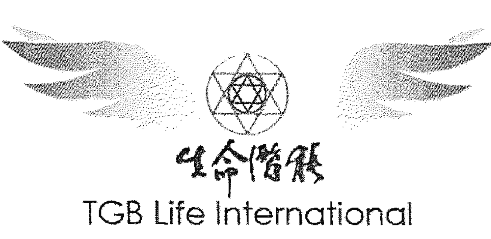
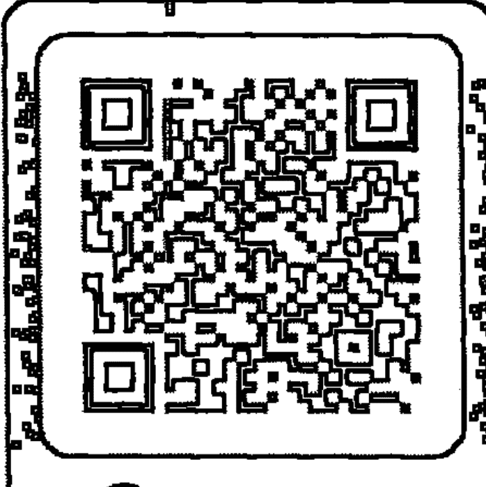

### 五次元的灵性动物

# 推薦序——動物、植物與大地母親之愛的呼喚

地球是整個宇宙星系裡重要的實驗學校，而人類是地球這個偉大的宇宙學校裡，最幸福的物種。

宇宙中有許多具有較高智慧與慈悲的生靈，除了觀照人類的揚昇進展，更自願前來地球參與、支持這場宇宙級的學習饗宴。他們依照各自的學習進度以及想要經歷的體驗，以自然界各種不同的樣態——動物、植物、礦物等，化身來到地球上。他們散播著揚昇所需的頻率，並同時分別運用自己獨特的方式，默默地教導著人類關於宇宙之愛的課題。這些生靈希望引領人類跳脫三次元中的二元分裂幻象，進一步與自身內在的神性整合，使地球能夠維持在和諧的秩序中。當他們完成任務離開地球時，會將在地球上所學習到的一切，帶回各自的星球與星系，繼續支持著宇宙整體的發展。

身為人類的我們何其有幸，來到這個被宇宙之愛充滿的學校中修習。我們生活中所有相關的一切，每個卡司、舞台、劇本、製作，甚至舉目所及的一草一木，都是宇宙級的安排。人類的量子DNA（靈魂DNA）中也藏著許多能與自然界高層神聖智慧共振的機關，比如：人類的第三眼上方隱含了海豚的量子DNA，通過此處，我們便可以直接接收關於海豚的智慧教導。由於海豚承載了天狼星的揚升面向，能夠透過獨特的音頻，將更高次元的智慧與神聖幾何圖形傳遞到海洋與河流，進一步淨化水域。我們也能透過海豚的音頻接收到情緒面向或內在小孩的療癒。無論是人類還是水中的生物，當我們與海豚溫暖的頻率共振，就能打開心輪的能量，讓愛流動，協助地球整體的揚昇。

感謝黛安娜·庫柏老師撰寫《五次元的靈性動物》一書，將自然界中許多更高的教導與其背後的神聖目的透過此書詳細的表達出來。我個人也經常與天使們合作，並且請求天使們能夠療癒、護佑需要被協助的動物、植物、礦物們。同時在地球母親蓋姬的神聖引領之下，將這些自然界的生態力量運用在療癒與教導一途。身為人類的一員，我著實無盡感激。同時也意識到我們更需用謙卑的態度、加倍的尊重與愛護，來面對這些前來協助的星際老師們。

人類絕對不是萬物之主，我們反而需要仰賴其他生態世界的物種支持，才得以在地球存活下去。只要敞開心去領會與學習，我們便能接收到更多神聖的教導，並從宇宙計畫的視角看見生命更高的層面。如此，大自然與地球也就不再需要透過災害來平衡人類長期在無意識中積累的許多負面能量。當一切重新回到神聖秩序的發展軌道上，距離地球揚升進入黃金新紀元就不遠了！

劉瑜雯 Ellen Liu

- 資深身心靈整合習修者與星際能量傳遞者
- 資深擴大療癒法導師、療癒師
- 靈魂DNA教師、療癒師

# 導言 地球上的生物

天使送我一隻美麗的傑克羅素蝴蝶犬（Papillon Jack Russell），我叫牠維納斯。維納斯對所有動物的接納改變了我的生命。一年後，一隻叫做灰丁（Astro）的灰色小虎斑貓（現在已經長成了灰色的大虎斑貓）進入我們的家，動物變成了我生命之旅中一個重大的部分。

天使開始提醒我，來地球化身的動物，也像人類一樣承擔了一項靈魂使命。自亞特蘭提斯文明墮落以來，大多數人類始終在第三次元的頻率生存。這意味著他們會從我執和自私發出低頻的振波。近年來，更多人敞開了他們的真心，認知自己正在永恆的靈魂之旅中前進。這使得他們進入了第四次元。人類現在開始擁抱第五次元，關愛所有眾生最高的善。二○一四年，有百分之七十四的高度進化動物達到了第五次元頻率。由於牠們有著開闊的心，因此振波也跟著加快了。當時只有百分之五十八的人類能做到這一點。

每一種動物都是來這個物質層面經驗生命的。牠們也像人類一樣，來這裡感受水的清涼、吹在身上的風、觸摸樹葉、品嚐食物，了解性慾、成為父母和照料其他生物的感覺，了解如何與彼此及其他物種建立關係，以及如何照護自然界。這些是地球上每一個存有的經驗，一趟牽涉了人類、動物、昆蟲、樹木、元素等所有存在的冒險活動。

一個物種被允許來地球化身以前，牠們的大靈（oversoul）——為整個物種做集體決定的面向——就會與源頭（或神）與掌管地球的第九次元天使蓋姬母神（Lady Gaia），根據牠們在地球上的任務，達成一項神聖的契約。此外，每一隻動物也會像人類一樣，在孕育前都會得到蓋姬母神的邀請，重申當時立下的神聖協議。
多年以來，牠們一直信守這些具有約束力的承諾。以左腦為導向並有計劃能力的人類，擔任牠們的監護人和保護者。這種安排的目的，是為了所有與神性心靈一致者的至高之善。
沒有動物會同意人類吃牠們的肉，也不會同意人類監禁或虐待牠們。
由於我們違反了神聖的信任而引起動物的反擊，因為牠們不想再接受人類這種對待的方式了。如果我們不改變，牠們就會撤回對人類的支持。
動物的頻率比人類高出很多，牠們現在正挺身而出教導我們，並恢復地球的平衡。
動物的靈魂也像人類的靈魂一樣，來自不同的恆星或行星，甚至來自不同的宇宙。目前有四個天體正在幫助地球的揚昇，它們被稱為揚昇行星、恆星或星座。來自宇宙其他部分的靈魂，包括動物在內，必須通過海王星、獵戶座、昴宿星團或天狼星，才能來到地球。牠們在這裡接受訓練，以便於適應地球的情況，降低自己的頻率，在這裡體驗生命。
宇宙也像我們一樣，有吸收或轉化能量的脈輪或精神能量中心。每一個恆星都有一個已經揚昇到更高次元的面向。當我們的脈輪變成第五次元時，就會用自己的揚昇面向與對等的宇宙連結。

- 地球之星脈輪連結海王星與它的揚昇面向托地雷（Toutillay）。
- 海底輪連結土星與它的揚昇面向奎賽（Quishy）。
- 生殖輪連結天狼星與它的揚昇面向拉庫美（Lakumay）。
- 臍輪與太陽連結。
- 太陽神經叢連結地球與它的揚昇面向皮爾切（Pilchay）。
- 心輪與金星連結。
- 喉輪連結水星與它的揚昇面向特雷風尼（Telephony）。
- 第三眼連結木星與它的揚昇面向金貝（Jumbay）。
- 頂輪連結天王星與它的揚昇面向克羅內（Curonay）。
- 因果輪與月球連結。
- 靈魂之星脈輪與獵戶座連結。
- 星系門戶連結火星與它的揚昇面向耐吉雷（Nigellay）。

地球、獵戶座、海王星、天狼星和昴宿星團正在一起合作，幫助彼此揚昇。無數個世代以來，由於人類在地球不明智地運用自由意志的恩賜，因而使我們的頻率低於其他的行星、恆星和星座。此外，地球是宇宙的太陽神經叢脈輪，因此，我們會吸收和轉化來自其他存有層面的恐懼和負面情緒。這也是造成人類頻率下降的原因。因此，獵戶座、海王星、天狼星和昴宿星團的天使和大師，正在竭盡全力地拉高我們的頻率。方法之一就是派遣他們轄區的動物來地球，用牠們身上編碼的能量幫助我們揚昇。牠們氣場裡編碼的資訊，也就是圍繞在牠們身體的電磁場，會觸發我們進步所需要的東西。就像許多人類一樣，牠們經常發現這種能量具有很大的挑戰性。由於牠們也要經過遺忘前世的關卡，因而能在遺忘靈性自我和神性聯繫的情況下，體驗地球上的生命。牠們死亡時會返回自己的星球，把牠們在地球上學到的一切，吸收到自己的能量場裡，提升對那個星球存有的了解、意識和開悟。

人類在地球上運用左腦和心智的同時，動物卻運用牠們的右腦和真心來經驗生命。動物比人類更接近天使和靈界，但牠們沒有人類的邏輯和計算能力。

有些動物化身的目的是服務人類，有些是為了來地球服務，另一些則是透過地球上的生命，獲得靈性的經驗和成長。許多動物來地球是為了教導和學習。牠們會透過展示自己的特質來教導人類。一個靈魂一旦被接受來從事一項地球任務以後，就必須一再地來地球化身，直到他履行了預定的任務為止，動物的靈魂也不例外。我們的寵物會一再地回到我們身邊，這就是為什麼我們經常有一種強烈的熟悉感。人們經常說：「我感覺我認識我的馬很久了。」或者「我確定我和我的貓前世在一起過。」天使們勤奮努力地工作，就是為了讓正確的寵物和人能在正確的時間相遇。這就是天使叮囑我們保持耐心，等待完美伴侶來到的原因。宇宙電腦非常龐大、複雜，而且範圍無所不包。

## 地球上的實驗

數百萬年來，地球上進行過許多實驗，也存在過各式各樣的文明。

自從星際議會（Intergalactic Council）成立以來，這個為宇宙做決定的十二個存有小組，就在地球上進行了許多項實驗。例如，早期在非洲進行了一項實驗，就是為了判定計劃的參與者是否有讓非洲大陸發光的能力。這也就是派特尼姆黃金紀元（Golden Age of Petranium）的緣起。他們把各種形狀的動物送到非洲，想了解他們的適應力。數百萬年以來，世界各地進行過許多實驗，地球上也出現過各式各樣的文明。

我每次看到犀牛時都會聯想到恐龍，這不只是因為他們有史前時代的樣貌，也因為他們攜帶著恐龍在地球的姆黃金紀元——派特尼姆之後——的記憶和資訊。鳥類王國的鸚鵡，也散播著他們能量場夾帶著的這一類資訊。

## 姆黃金紀元的智慧

姆（Mu）是恐龍在地球上活動的時代。姆時代的「人」是沒有肉身的乙太存有。然而，他們會照料樹木、植物，熱愛山川大地，並且與海王星、獵戶座、天狼星和昴宿星團這四個揚昇的行星、恆星和星座有著很深的連結。

這些天體的中央都有一個脈輪——地球的中心——稱為空心地球（Hollow Earth），是一個第七次元的樂園。地球所有的知識和智慧，都儲存在這裡的一個巨大金字塔裡。我在《通向宇宙的鑰匙——50個音頻，打開宇宙奧秘之門》（生命潛能出版）這本書裡有著詳細的說明。此外，每一個化身過的存有、每一個黃金紀元和文明，都會以乙太的形式存在於空心地球裡。沒有任何一個事物會永遠喪失。

地球、海王星、獵戶座、天狼星和昴宿星團中心的脈輪裡，都保存了偉大的愛和智慧。姆時代的存有仍然把這些愛和智慧，保存在空心地球的中心、聖母馬利亞和大天使麥可療癒的海藍寶石火焰之中。祂們也把這五個揚昇行星、衛星和星座的神聖藍圖，保留在空心地球的大金字塔裡。

## 亞特蘭提斯

前後延續了二十六萬年的亞特蘭提斯，是最知名、最持久的一個紀元。這個紀元的餘緒，在二〇一二年終於畫下了休止符。這個期間一共進行了五次實驗或測試，但前四次由於濫權而宣告廢止。然而，與其他四次不同的是，第五次實驗產生了亞特蘭提斯黃金紀元。

他們在第五個，也是最後一個實驗的開始，就在地上安放了一個大圓頂控制實驗的進行。任何人或動物都不能進出這個圓頂，星際議會的研究也因此沒有遭到污染。
榮耀的第五次元亞特蘭提斯黃金時代，因此得以發展並延續了一千五百年之久。許多動物為了提供服務、教導或學習而化身到地球，其中包括馬、牛、貓、狗、綿羊和山羊。
人類也是動物。我們經常從慷慨的動物身上取得力量，比如：牛、馬，讓我們更有力，以進一步控制動物。我們透過對溫馴、充滿愛的生物進行實驗，擴大人類對科學的了解。我們對待動物的方式，對牠們生活和靈性的成長產生了深遠的影響。我們目前對動物的所做、所思和利用的方式，阻礙了整個地球的揚昇。當然，這也深刻地影響著我們的靈性成長。現在是改變的時候了。
你可以透過這本書裡的資訊，與地球上的生物取得更深一層的連結。你也能在牠們和自己的演進上，提供深遠的幫助。

# 第一篇 動物與大自然

## 第一章 動物與大自然的靈性進化

亞特蘭提斯黃金紀元的每一個人和動物都是第五次元，而且都有十二個已經啟動的脈輪。他們的三十三瓣心輪完全綻放，散發基督之光。人與所有的生物都會彼此相愛、尊敬和接納。

動物像人類一樣，都被認為是上帝的造物，但體型、技能和知識卻懸殊各異。

由於人類散發愛與無害，因此所有的生物都有一份安全感。

自然也會以無害的行為回報人類，因為每一個人都心懷感恩，並尊崇大自然所有的面向。樹木不需要長出尖刺或結出有毒的漿果。第五次元的人類只拿取維生所需的堅果、樹葉或木柴，也會向樹木表達謝意。樹木用療癒、滋養和保護來回報人類。

草本植物為了維持人與動物的再度平衡，而提供所需的藥物，這也同樣地受到高度的重視。

動物自由地提供牠們的產物或服務，因為牠們知道人類只會取用需要的量，而且會用尊重和照顧回報。能量都是以分毫不差和充滿愛的方式進行交換的。

這個時期，包括人、貓在內的所有動物都是吃素的。這意味著貓有不同的下巴結構，比較像古埃及時代的貓科動物。牠們的爪子只用來爬樹。

黃金亞特蘭提斯沉沒時，第五次元的頻率也因此降到了第三次元。人類和許多動物的心輪內層有二十三瓣關閉了。只剩下外心房的十個綠色心瓣還活躍著。這帶來了嫉妒、憤怒、貪婪、悲傷、孤獨或所有負面的、令人不適的功課，待人類加以解決和克服。是的，動物也在情緒的學習曲線上成長。

人類身處第三次元的這個階段，會變得無感、不懂關懷，無視於自己的動物本質，欲求應此而生。這就是大多數人類在近一萬年來經歷的階段。

有些動物也封閉了牠們的真心，變成了第三次元，有一些維持在第五次元頻率和進階脈輪系統裡的動物，負責教導、示範更高層的生活方式。我們會在本書裡討論這些進化的生物、動物、鳥類、昆蟲和樹木。

中層心輪的心室或心瓣是粉紅色的，這個階段的脈輪會散發著愛的光照。你也許看過一個人、一匹馬或海豚的眼裡，閃耀著這種優美的愛。

由於現在的人和動物正集體進入第五次元，中央心瓣就開始綻放，並變成了紫粉色。

中央心瓣是純白色的，向著源頭的愛開放。當地球上有足夠的人達到這個美好的階段時，我們就會再度創造第五次元的伊甸園，人類和動物的生命都會充滿榮耀。我們會再度以牠們值得並應得的方式對待動物，所有的動物都會受到天使的啟明。

然而，人類目前正處於第三次元到第五次元的過渡期。全體人類都已經達到第四次元了。心輪的第十一瓣，也就是第一個粉紅心瓣，就是在這個時間點開始綻放的。當人們準備好愛、感恩、尊重和了解動物的時候，這種情況就會發生。

這種情況現在已經開始了。當人類集體的第十一個心瓣向著動物敞開時，世界意識就會發生一次巨大的轉換。地球上的恐懼程度開始降低，取而代之的是愛、希望和新的覺悟。

我們都在電視上看過很多動物節目。社交媒體上充滿了與動物有關的故事，人們也對這些故事很有興趣。情況正以確定無疑的方式開始改變。

動物脈輪的心瓣比較簡單，因為牠們沒有人類那種保留情緒或推理的能力。牠們自然更容易打開第五次元的心輪。

由於我們的感覺更複雜，所以一些比較高的心瓣處於開放和活躍的狀態，但與此同時，部分下層的心室，仍然包含了一些有待學習的功課。

你也許有愛、會付出和關懷，但心裡仍然窩藏著嫉妒。或者，如果你在前世或這一世的早期，有被動物咬傷或不幸的經驗，你也許會對動物懷有恐懼、憤怒或愧疚感。這會使

## 第一章 動物與大自然的靈性進化

第十一個心瓣停留在閉合的狀態，也許讓你對所有或某一些動物過敏。寬恕、釋放和打開這個心瓣，就會化解這種疾病（或失調）的靈性肇因。

如果你造成動物的早天，即使是有最良善的意圖，也要承擔業報，除非你把那個動物的靈魂交給天使。心輪的閉合就是你承受的業報。因此，如果你結束過心愛寵物的生命，務必要請求天使把牠帶回靈界。

免疫系統是心輪所轄的功能。從靈性的層面來看，所有的過敏都是心輪的部分關閉造成的。這也許是在另一世發生的，但它的報應會持續到你改變心念為止。

我一個朋友和她養的大肥貓曾住在我家。我不喜歡那隻貓，而且牠會在主人對牠限制飲食的時候，變得非常危險。牠還會跑到我背後，用爪子抱著我的腿，肚子餓的時候就會咬人，並且一直如此。我立即對牠有了過敏反應，只要牠在我身邊，我的眼睛就會流淚、發癢。我知道我必須改變自己的內在。我安靜地坐下，把心敞開，把愛傳送給牠。我連續這麼做了一個星期。我也努力跟牠打招呼、撫摸牠。令我驚訝的是，不到七天，我對牠尚且不算嚴重的過敏就完全消失了。

你也許會在毫無覺察的情況下，在細胞的深層窩藏了一些煩惱的記憶。記憶的對象也許是一隻昆蟲、蛇、貓、鳥，甚至是一根掉在你或愛人身上的樹枝。這裡提供一個對動物敞開心的觀想。在這趟內在之旅的過程中，請保持開放的心態，讓任何需要浮現的東西進入心靈。

### 觀想：對動物或大自然敞開心靈

1. 找一個能讓你安靜穩定下來的地方。
2. 觀想自己坐在柔和、金色陽光照射的山坡上。鳥兒在唱歌，一切都很祥和。把心裡無害的粉紅金光呼到自己的氣場裡。
3. 你覺察山坡上有一個大山洞，它以滿溢的陽光歡迎你。
4. 祥和地走向山洞，你進入山洞時看到前方有一個配置了三十三個小房間的螺旋。
5. 往螺旋的方向走，你感覺放鬆和安全。你被其中一個小房間吸引。裡面有你療癒需要的東西。
6. 打開門，覺察這一生發生過，或阻止你完全向動物敞開心房的事。
7. 那已經是過去式了。現在是你原諒自己、動物或你們雙方的時候了。
8. 把粉紅色的金光吸到小房間裡，直到它將畫面和感覺相融為止。
9. 感謝那隻動物，並在小房間裡留下一朵粉紅玫瑰。
10. 懷著被釋放的自由感覺，沿著螺旋往回走。

## 第二章 與動物合作的天使

以下是與動物界和自然界合作的天使。

### 動物的守護天使

每一個動物都有兩個照顧和引導牠們的天使。這些天使會站在後面看著牠們的行為和選擇。只要動物感到安全，牠們就不會介入；但如果一個生物不快樂或處於危險之中，牠的守護天使就會盡其所能地給予協助。天使會試著改變情境。如果無法改變，祂就會輕聲細語地告訴動物改變自己的態度。祂也會同時聯絡加害者的守護天使，努力改變一些東西。可悲的是，大多數人類仍然充耳不聞，但這個情況正在快速地改變。

### 五次元的靈性動物

如果寵物或農場的動物受到虐待，天使會輕聲細語地告訴照顧者改變自己的行為。如果是野生動物，天使就會試著影響侵犯者改變行為、態度或行動。如果這麼做不成功，並有生物受到傷害或殘殺，天使就會在阿卡西紀錄（Akashic records）中記錄下發生的事。阿卡西紀錄是一個檔案庫，專門保存來自覺知生命的所有思想、言語和行為。侵犯者會在多生多世裡償還他們應得的業報，而療癒天使會撫慰那個不幸的動物靈魂。

### 動物天使——大天使斐利亞

地球終於取得權利讓動物天使——大天使斐利亞（Archangel Phelyai），從另一個宇宙重返地球幫助動物了。一九八七年的諧波匯聚（Harmonic Convergence）以後，人們發出的許多祈禱，促使馬雅曆法預測的二十五年淨化期展開，也使大天使斐利亞的臨在逐漸被感受到。為了回應世界各地人們大量傾瀉而出的能量，許多新的啟明存有開始進入地球，包括大天使斐利亞在內。

美麗、陽光黃的天界存有大天使斐利亞掌管著動物界。當祂專注於療癒或幫助動物的時候，就會變成純白色。祂最近從另一個宇宙來到這個宇宙。這是因為我們把頻率提高到足以接受祂幫助的層面。

如果你提出要求，大天使斐利亞就會派祂的黃色天使來幫助動物。祂還會派一位天使輕聲地對虐待動物的人耳語。

如果有足夠多的人請大天使斐利亞幫助動物王國，或點一支蠟燭獻給動物的福祉，地球的情況就會在瞬間轉變。

### 大天使斐利亞的靜修處

在地球上方的乙太層裡，每一個大天使都有一個與自己的能量協調一致的地方。祂們在那裡感到舒適，因而將靜修處設置在該處。祂們能把這個地方的能量當作轉換器，使祂們得以從更高的次元，通過這個轉換器把自己的能量降低。

許多大天使的內層都有一座神殿、學校或密室，作為教學或治療的地方。

大天使斐利亞的靜修處在英國蘇格蘭的聖島（Holy Island）。你可以在冥想或睡覺時要求來這裡拜訪祂，以接收資訊、療癒或進入動物界。

### 其他幫助動物的天使

大天使斐利亞和祂的天使與其他特定的天使和大天使，除了擔任動物的守護天使外，也與各種動物和鳥類一起合作。例如，和平天使與鴿、鳩和鴨子合作；大天使麥可和拉斐爾會影響老虎。大天使加百列與兔子有很深的連結。妙不可言的天使馬利亞始終與熊貓同在。其實這些大天使中有許多是宇宙天使，這意味著他們會在好幾個宇宙裡傳播自己的影響力。

此外，還有許多照顧和幫助動物的天使和大天使。當我在書裡分享不同物種的資訊時，也會加以討論。

### 大天使波利梅克——大自然的天使

大天使波利梅克（Archangel Purlimiek）負責整個自然界。這是一個艱鉅的任務。祂是藍綠色的光，當大自然遭遇威脅的時候，祂就會以閃光的方式出現。祂會試著說服製造問題的人類。祂的耳語經常會改變一個人的心念和行為。

我曾經為了阻止一棵樹木倒下，快速地發送一張大天使波利梅克在光球裡的照片。顯然祂及時趕到，對樵夫耳語，樵夫聽到後隨即改變主意，停止了砍樹！

大天使波利梅克的靜修處在辛巴威的大辛巴威（Great Zimbabwe）。祂在這裡協調地球自然界的計劃。

### 大天使波克比——鳥類的天使

大天使波克比（Archangel Bhokpi）負責鳥類王國。祂與熾天使（Seraphim）在同一階層。目前祂在地球上空沒有專用的乙太靜修處。祂的顏色幾乎是透明的，因此，祂可以化身為任何祂希望的色調。

### 大天使普米尼拉克——昆蟲的天使

大天使普米尼拉克（Archangel Preminilek）負責照顧昆蟲王國。祂在黃綠色的頻率下運作，祂的乙太靜修處在緬甸北部的山區。

許多昆蟲是第三次元的，但也有少數是第四和第五次元的。祂的任務是照顧所有昆蟲，協調牠們的服務工作，並幫助牠們揚昇到更高層的領域。

### 動物的入口

二○一二年的宇宙時刻（Cosmic Moment），一道巨大的源頭能量觸及了地球，開啟了許多巨大的光之入口。這個巨大的源頭光啟動了美索不達米亞、埃及、秘魯、希臘、瓜地馬拉和西藏的六大宇宙金字塔，隨後點燃了三十三個宇宙入口和許多其他的地方。其中最了不起的一個動物入口是美國的黃石公園。

黃石公園已經開始散發最燦爛的、與大天使斐利亞一樣的陽光黃，幫助世界各地的動物。最有意義的是，這種能量正在觸動並改變人類對動物的意識。這個奇妙的入口會在二〇三二年完全開啟，屆時我們對動物的思考和對待方式，就會發生一番徹底的改變。

你可以在冥想和祈禱時連結黃石公園的入口，要求天使把黃光導向需要的地方。這是一項無比巨大的服務工作，會幫助動物加速牠們的揚昇。

黃石公園入口傾瀉出來的光加持了大天使斐利亞，讓牠非常積極地啟發動物接通自己的靈魂使命，並透過使命的實現進入第五次元。牠取得了輝煌的成功，因為目前已經有百分之七十四的動物在這種進化的頻率裡生活了。

牠鼓勵人類轉變對動物界的意識，並幫助人類向地球眾生敞開集體的心房。牠的努力得到許多輻射向地球的高頻光爆的支持。

如果動物有需要或有人提出要求，大天使斐利亞就會指派一位天使前來協助。

由於人類是天使與物質世界的橋樑，因而處於一個非常有威力的位置，讓我們透過尋求天使的幫助來幫助所有的眾生。

許多動物因為人類對待的方式和批判而灰心喪志。如果牠們失去了生存的意願，就無法完成自己的靈魂使命。牠們需要鼓勵、愛和做自己的自由。天使正試圖鼓舞牠們的精神和勇氣。

如果動物生病，大天使斐利亞的天使也許會提供療癒、安慰和支持，但祂們也像人類一樣，會在動物靈魂的要求下退開，因為動物也要像我們一樣經歷考驗和挑戰。

### 為動物祈禱

大天使斐利亞會收到你為動物發出的祈禱，並為了至高的善運用這個能量。任何一個禱告都不會白費，而且大多數人都對自己發出的靈性要求知之甚少。無論多麼短暫，無論它會引發的善果有多麼大。

我有一個朋友非常擔心鄰居養的狗，那隻狗明顯地很不快樂。這隻可憐的動物受到主人長期的冷落。這對一個喜歡社交的動物來說，是一件很痛苦的事。鄰居對他多方的暗示置之不理，於是他決定與大天使斐利亞溝通。他點了一支蠟燭，把問題告訴祂，請祂尋找一個解決之道。他為了這隻狗的最高至善，連續這麼做了一個星期。一星期結束時，那個狗主人突然有空間了。他在家裡陪狗，也會帶狗一起散步。這並非我朋友期望的結果，但我們必須放手，讓天使們做出符合每一個人最高至善的方法！

### 動物的生與死

大天使斐利亞或祂的其中一位天使，總會在每隻動物出生和死亡的時候在旁邊陪伴，無論那隻動物多麼渺小或卑微。這種生死的過渡時刻，對動物的重要性和對人類一樣。那是每一隻動物進入地球冒險的第一個啟蒙。

大天使斐利亞或祂的天使，當然會陪著每一隻動物走向死亡。這是每一隻動物和人類都必須經歷的第二個重要啟蒙。

每一個單獨或集體的靈魂都很重要。所有靈魂在化身前，都會由掌管地球的王座（Throne）或第九次元天使蓋姬母神發出個別的邀請。

天使也像人類一樣，喜歡看到新誕生的生命，因為他們仍然攜帶著純真的源頭之光。如果有人打電話說要來看你剛出生的小貓、小狗、小馬或其他任何寶貝，他就會帶著很多天使一起來祝福這一隻動物。

大天使斐利亞也許會派一位天使，與即將過世的動物相處幾天，幫助牠在過渡期調整，並學習牠需要了解的最後一個功課。如果是一隻被鍾愛的寵物，這麼做也會幫助主人一家人放下對寵物的依戀。

大天使愛瑟瑞爾（Archangel Azrael）的天使，也會在每一隻動物出生和死亡的時候在場。此外，動物的守護天使也會來陪伴，為牠們持光並鼓勵牠們。

如果動物在驚嚇中驟然死亡，你的祈禱對牠們找到光明就非常重要了。動物死於非命的時候，牠們的天使會給牠們療癒，並提供牠們需要的滋養。接著，就會幫助牠們在地球上選擇新的條件，好讓牠們回來繼續學習化身之初要經驗的功課。

第五次元的動物、鳥類和魚類，會在自己選擇要離開的時候死亡。牠們雖然會發生可怕的事故或毀滅性的死亡，但牠們的死亡都是天使和牠們的高我共同籌劃的功課。例如，海豚不會無緣無故地被漁網纏住，烏龜也不會在偶然的情況下吞食塑膠袋。

這些進化的生物是為了告訴我們必須清潔海洋。鳥類只會在服務的時候死亡。除非牠的靈魂允許，否則老虎不會掉進陷阱裡。

一個殺死動物的人會背負嚴重的業報。為了肉食而在毫無體諒或祈禱的情況下屠殺動物，動物的恐懼就會傳遞給吃牠的人。每一個參與肉類生產過程的人，無論程度多小，都要背負一定比例的業報。

我相信人們都會在某一個程度上知道這一點。我有一個七歲左右就開始茹素的孫女，跟對街一個同齡的孩子是朋友。有一天，他們在上學的路上發生一場嚴重的爭吵。那個小朋友堅持說羊肉（lamb）、豬肉（pork）和牛肉（beef）不是肉（meat）。我不確定她認為那是什麼，但她說是擔任全科醫生的母親告訴她的。這個孩子宣稱自己從來都不吃動物。有朝一日，等她知道我孫女是對的時候，一定會大吃一驚。我認為她母親要背負她的業報。

### 觀想：幫助動物

1. 找一個安靜、不受干擾的地方。
2. 召喚基督金光的智慧和保護，看見金色的光流貫你的全身。
3. 想像一些金色的根從你的腳下伸進大地。
4. 想像自己坐在山坡上，俯瞰著遼闊的平原。天空是優雅的蔚藍色，太陽是金白色的光。萬物一片祥和。
5. 突然間，你發現自己被大天使斐利亞的幾百個陽光黃天使包圍。祂們像普照世界的陽光一樣。
6. 每一個天使都在聽候你的差遣。你指示祂們幫助世界的動物。你可以選擇一個物種或特定的動物。
7. 看著許多彩虹橋從你的心流向你想幫助的動物。
8. 覺察天使沿著彩虹橋滑向動物時的亮黃色閃光，並用愛的黃光包圍、療癒和保護牠們。
9. 大天使斐利亞親自帶來一隻動物給你。牠也許是你認識的動物，也可能你從未見過牠。牠也許是家畜或野生動物。牠的氣場裡聚集了平靜與愛。
10. 花點時間撫摸牠，跟牠溝通。牠也許要給你一個訊息。
11. 用心電感應的方式把希望和智慧傳遞給牠。
12. 感謝大天使斐利亞和祂的天使，看著祂們退開。
13. 輕輕地睜開眼睛，知道你隨時都可以幫助動物。

## 第三章 動物的顏色

動物呈現出來的顏色是靈魂選擇的。斑紋或整體的色調絕不是一件偶然的事。這些顏色可以提供資訊、吸引挑戰、引起人們對不同特質的注意、發出警告、教導、或提供不同方式的服務。

例如，黑白相間的動物通常（但不是全部）要教導的是平衡，例如：斑馬；或引導你不要走上極端，例如：熊貓。而且，是的，斑點和條紋是偽裝色，但經常也會為了其他的

目的而選擇。

我寫過很多文章描述我那隻美麗的狗維納斯（Venus）。維納斯是白色的，一隻耳朵是棕色的，右眼上方有一個棕色的、像埃及人眼睛符號一樣的標記。有一天，我們躺在床上，牠說自己曾經在埃及化身為一個女王的狗。牠說牠堅持要有這個眼睛標記，好讓我認出牠的真實身分。確實，我怎麼可能懷疑呢？有一次，我一個朋友把牠抱進單車的籃子裡，牠很喜歡。牠的坐姿像女王，兩隻耳朵在風裡拍動著，好像是一窩剛出生的小狗裡的一隻。

人類也是一樣。我們也會在新聞裡看到一對膚色、人種各異的夫妻生了一對膚色不同的雙胞胎。不用多說，這不是偶然發生的。那一對雙胞胎在靈魂的層面上選擇要有不同的生活經驗。同一窩出生的幼犬會有各種顏色和花斑，那是牠們選擇用來表達靈魂能量的。

### 純白色動物

純白色的動物攜帶著基督之光。

基督之光在天狼星的第九次元裡，被源頭之愛照耀成燦爛的白色。雄偉、壯麗的獨角獸，能把基督之光發射到有需要的地方。隨著頻率的降低，金色的天使能量與它融合成基督的金光。

白色動物有三種，都與純白色的大天使加百列和獨角獸有關。所有的白色動物身上都攜帶著不同程度的基督之光。

### 白化症動物

這些動物天生就沒有顏色和眼睛色素。牠們是獵食動物明顯的目標，也因此被獵捕的可能性更大。牠們經常有健康和視力不良的問題。此外，牠們的同種也會把牠們視為異類，而經常加以獵殺。

牠們的靈魂層面攜帶著一些基督之光。其他能看到或感知那種光的動物，由於無法適應而會試著把它熄滅。白化症的動物必須學會挺身而出。牠們的生命經常被當作犧牲品。這意味著牠們在地球上的經驗，會讓牠們通過一次啟蒙。這是牠們的靈魂同意接受的考驗。這些動物要通過被稱為釘刑的第四次啟蒙。這是所有挑戰中最嚴苛的一個。釘刑的目的是為了強化牠們的靈性，提高牠們下一階段靈魂之旅的頻率。牠們正準備把熾烈的白色基督之光引進自己的頻率裡。

### 已經適應冰天雪地的動物

凡是有雪的地方，就會有高而純淨的能量，大天使加百列就會在那裡。北極熊、北極狐、雪豹、北極狼、西伯利亞虎和北極海豹等動物，已經發展出適應北極生活的白色皮毛。野兔和短尾鼬之類的動物，有能力在下雪時快速長出白色的保暖皮毛。

牠們都能在大天使加百列明亮的鑽石光下現形，並受到祂的保護。這些動物都攜帶著一些基督之光，隨牠們所到之處傳播並提升那裡的光度。

### 其他的純白色動物

全世界都有純白色的動物出生，牠們除了白色的皮膚和藍眼睛以外，似乎都很正常。

正常的純白色動物是時代演進的現象。牠們都帶著基督之光，並透過自己的能量場燦爛地散發出來。

通常牠們是第一次在地球上化身，以完全的純潔、神聖的本質和無害的方式。大體而言，這些動物並沒有被斬盡殺絕。

第一個原因是動物界的意識提高，能接受這些美麗生物散發出來的光。

第二個原因是，這些純白色的動物會自動提高周圍動物的意識，讓掠食者進入愛的能量裡。

第三，牠們散發無害與和平的磁場，能賦予牠們安全的保護。

### 進化中的白色動物

#### 白馬

一般來說，動物進化的程度越高，皮毛就會變得越白。隨著牠們已進入第五次元的更高層次，毛皮也跟著變得更白了。看到一匹容光煥發的白馬，就能知道牠已經做好揚昇的準備了。

戴安娜·庫伯基金會的首席老師亞艾莉嘉·費雪（Alejia Fischer），在他的白馬死亡時伴隨在側。他看到白馬的靈體升空，變成一隻純白色的獨角獸。多麼令人驚異的經驗。

#### 白獅

我寫非洲靈性小說《光網》（The Web of Light）時，很幸運看到真正的白獅，牠們不愧是高貴、優雅的動物，散發著難以言喻的氣質。看著牠們的眼睛，就能接收滿載的基督之光。牠們預示了宇宙基督能量的重返地球。

### 天鵝

這些莊嚴的鳥類展現出優雅與和諧的氣質。牠們大部分的時間都漂浮在水上。水是承載宇宙之愛的元素，能使生活在水裡或水面上的生物維持在純潔的狀態。這有助於天鵝吸收愛，並以傾注基督之光作為牠們的交換條件。

### 黑色動物

黑色代表神聖的陰柔、最深層的神秘和魔幻。黑色是滋養新生命的地方，也能在生命的發展過程中提供安全的保護。它是秘密和隱匿的顏色。有些動物會為了夜晚的隱身而選擇黑色。牠們會召喚黑暗的秘密。

#### 黑貓

亞特蘭提斯黃金時代的貓都是黑色的。牠們能保持高頻率，並協助神殿進行療癒和魔幻的工作。牠們擁有最純潔和最高程度的完整性。即使是現代的黑貓也擁有特殊的能量。有人迷信黑貓是「會巫術的」動物，有人會擔心黑貓所擁有的力量。

### 棕色動物

棕色、沙色或黃褐色這些泥土色調，能幫助這些顏色的動物與大地之母連結。

### 羽色鮮豔的鳥類

因為鳥類的化身沒有可以跟我們學習的東西，所以牠們能選擇明亮的羽毛，也就是大天使散發的顏色。例如，一隻翠綠色的鸚鵡能帶來大天使拉斐爾的翡翠色光。七彩的鸚鵡會反射許多不同大天使的光芒。

看到這麼多乍看相同，但卻為了牠們各自的目的，選擇各式各樣的顏色和花斑的動物和鳥類，的確是一件令人神往不已的事。

### 觀想：連結動物和鳥類，理解牠們的顏色與花斑

1. 找一個安靜、不受干擾的地方。
2. 要求動物大天使斐利亞把祂的黃光灑在你的周圍。
3. 用銀色的樹根把自己紮進土地裡。

## 第三章 動物的顏色

4. 舒服地呼吸，專注你的心輪，直到它變成發光的粉紅色和白色為止。
5. 邀請一隻動物或鳥來你身邊，你期待著到來的是哪一隻動物。
6. 用美麗、柔和的粉紅色和白色的心能量包圍牠。
7. 感知你的心和靈魂前一後地與這隻動物連結。
8. 現在，輕緩地與這隻動物連結，詢問牠選擇這些花斑的原因。牠想表達些什麼？牠想教導我嗎？牠要傳達什麼訊息？
9. 感謝牠的來臨，牠離開的時候祝福牠。
10. 睜開眼睛，反思你學到的東西。

# 第二篇 動物界

## 第四章 土豚

### 來自土豚界的訊息

我們要求你們不要批判或譴責那些污染地球的人。你們的批判和譴責，也增加了乙太的污染。反之，我們要求你們用愛、希望、乾淨與和平的地球願景祝福污染者。這是你們能幫助我們、蓋婭母神和美麗地球的最好方式。

土豚（aardvark）起源於天狼星，牠的名字在荷蘭語中是地球豬（earth pig）的意思。牠是在非洲各地都可以見到的夜行性動物。牠安靜地從事服務工作，能量場裡攜帶著亞特蘭提斯早期的古老知識。牠是少數幾種保存了亞特蘭提斯第三次實驗記憶的生物之一。

在那個時期，與非洲大陸毗鄰的亞特蘭提斯大陸佔滿了大西洋。當時發生了兩個事件。第一個，大型動物的進化。巨貓、巨馬、猛瑪象和巨鳥都發展出來了。最後，牠們統治了整個世界。第二，雖然喜悅與豐饒已為第三次實驗的移居者準備好，但人類之間還是發生了異議和摩擦。合一律之子（Children of Law of One）想在與上帝的連結中過純淨的生活，貝利奧爾之子（Sons of Baeliol）卻想放縱於低層的激情和慾樂。雙方衝突下產生的震波，使外界的負面影響趁虛而入。

這使得來自另一個宇宙的負面存有，能連結和組織這些超大型的動物。大型動物在這種惡性的影響下，變得既兇惡又危險。人們的生存已經夠辛苦了，何況又要活在這些條件之下，因此，他們嘗試許多和平的方法來應付這些動物。然而，所有的努力都徒勞無功。

最終，為了決定人類共同命運的結局，著名的五國會議（Five Nation Conference）舉行，世界各地的代表瞬間移動來到亞特蘭提斯討論局勢。他們因為地表幾乎無法生存而感到絕望。對這個嚴峻局勢的疑慮和無助，使他們做了一個影響地球未來的劃時代決定。

### 五次元的靈性動物

他們同意在地下發射核彈，殺死這些巨型動物。核爆引發的大地震，造成隨後二千年內所有動物和人類的死亡。核爆造成的輻射塵仍然污染著地球，許多有形和無形的存在正在努力清除這些污染。因此，土豚依然保存著核爆後果的記憶。同時，牠們也為了嚴重破壞地球的核爆污染，提供清潔和清除的服務工作。

牠們要提醒我們的是，對蓋婭母神形體所做的任何行為都會帶來後果。開採或挖礦的結果，包括土地龜裂在內，都會不可避免地導致地震，雖然這會在很多年以後才發生。

土豚在很多方式上都是一個謎團。牠的耳朵像兔子，尾巴像袋鼠，臉又長得像豬。牠棲息於廣大涼爽的地下洞穴裡，身體幾乎沒有毛髮，有著一個短脖子和四條短腿。這使牠能在地下便捷地移動，舒適地棲居在洞穴裡，並方便隨地散佈牠的能量。

與土豚有連結的大天使聖德芬，會幫助這些生物紮根到空心地球，取得靈性上的養分和協助。

由於牠是視力薄弱的夜行性動物，因此具有高度發達的嗅覺和聽覺。換句話說，牠的第三眼，也就是額頭中央的心輪，已經演化出這兩種知覺了。

你由你吃的東西構成。土豚幾乎只靠天狼星第五次元的螞蟻和第四次元的白蟻維生。土豚雖然活在第三次元的空間裡，但螞蟻的能量體會幫助牠們處理、轉化和淨化所有吸收進來的污染物。

牠們工作的重要性遠超過我們認知的程度，因為在新黃金時代實現以前，先清除亞特蘭提斯核爆的污染，是一件非常重要的事。艾沙斯（esas）會協助土豚淨化古代污染的任務。艾沙斯是二〇一二年前從另一個宇宙來地球的微小精靈。大自然的大天使波利梅克和負責地球在宇宙地位的大天使布亞里爾（Archangel Butyali），對整個宇宙發出號召，呼籲有志之士來清除地球上的污染。這些微小、有翼，只有仙子微分之幾的生物回應了。為了來地球經驗並把學到的經驗帶回自己的星球，牠們同意來這裡吞食負面的乙太能量。牠們聚集在毒品污染的大氣、有毒廢物丟棄場或低振波的地方，英勇地用牠們的光體攝取和轉化較低的頻率。牠們是神奇的小型光之工作者。從二〇一二年以來，牠們一直在協助土豚執行這一項不平凡的服務任務。

### 服務工作

你每次發送祝福和愛給土豚時，都是在幫助牠們履行靈魂使命。同時，也是在把淨化之光灑在亞特蘭提斯第三次實驗帶來的污染上。

### 對大天使斐利亞的禱告：

心愛的源頭與動物大天使斐利亞，
我從內心發送純光與愛給土豚王國，
並要求你運用這個能量幫助這些動物完成靈魂任務。
我也禱告來自源頭之心的熾烈白光飛進地球深處，
溶解人類因輕率的行為造成的低能量，
並把我們美麗的地球帶回它在第五次元天堂的應有的位置。
希望如我所願，禱告完畢。

### 觀想：與大天使斐利亞連結

1. 找一個能讓你安靜和放鬆的地方。
2. 把金色的樹根送進土裡，呼求基督金光的保護。
3. 你發現自己在一個又大又涼爽的洞穴裡，你感到非常的安全和舒服。
4. 你置身在一個神奇的世界裡，周圍環繞著數百條光絲。這些就是有翅膀的微精靈艾沙斯。
5. 透過祂們的光，你能清楚地看到一隻友善的土豚走過來。牠很高興見到你，並知道人類終於準備要幫助牠們完成任務了。
6. 你能看到牠眼裡沉痛的悲傷，因為牠想起亞特蘭提斯第三次實驗的污染，導致地球所有生命的死亡。
7. 你點頭表示了解牠的能量場裡攜帶了這麼久遠的記憶。
8. 告訴牠你準備用自己的能量幫助牠。
9. 接著，觀想一道強烈的純白色源頭光球，透過你的氣場和雙腳進入地球的核心。
10. 每一個裝滿黑色污染物的球，都被天使帶到月球進行徹底的淨化和再生。
11. 繼續讓更多源頭的純淨能量球通過你，因為你感覺今天是正確的日子。
12. 接著跟土豚道別，並覺察到你們是在互相幫助。
13. 當你回到起點的時候，知道你已經完成了一件偉大的挑戰性服務。
14. 把一顆純白色的閃光球接納到你的心裡，然後，睜開眼睛。

## 第五章 獾

### 來自獾的訊息

世界正進入平衡的狀態，
我們在幫助這個過程的進行。
如果有人傷害你，把愛和信任發送給他，
他的心就會軟化。
他以後再也不會傷害你、任何人或任何動物了。
愛是唯一的療癒之道。

獾來自天狼星。牠們在靈魂的層面選擇黑色和白色，因為牠們要展示陰陽兩性的平衡——白色代表陰，黑色代表陽。因此，牠們正在學習和教導平衡的知識。

牠們也在學習和教導家庭生活。一群六到十隻的獾，會同住在複雜的地下洞系統裡，有些是牠們在幾百年前挖掘出來的。牠們的地洞裡有許多房間，有的用來睡覺，有的用來撫育後代。

牠們挖了許多連結外界的通道，方便牠們進入或逃跑。

這些進化的動物非常乾淨。牠們會粉刷臥室，把舊的、乾掉的草或蕨類拖到外面，以免跳蚤和蜱聚集。牠們從不把食物帶回家，也會在離領地範圍很遠的地方建造公廁。

牠們靠著平衡的陰陽能量，非常細心地照顧自己的孩子。雌獾會餵養幼獾，哺乳期約三個月左右，雄獾則負責保衛疆域。

獾選擇住在地下，因為牠們神聖使命的一部分，就是讓牠們的能量系統參與轉化地球內部負能量的過程。牠們與大天使聖德芬合作，幫助維持能量線（ley lines）——連結各個地能量的通路——的清晰和平衡，並把光發到地球和個人的地球之星脈輪。

牠們的心輪發展得很好，天使馬利亞會透過牠們的心輪，把純淨的源頭之愛傾注到地球上。

即使牠們發生過許多事，天使馬利亞正在努力讓牠們活在祥和與和諧之中。幾世紀以來，牠們吸收並轉化了地球內部的低頻率，對這個靈性任務的適應力表現得非常出色。然而，過去的幾百年中，處於低頻率的人類不斷地誘捕和獵殺這些有愛心、肯付出的動物。想當然爾，這給牠們帶來了壓力。令人難以置信的是，縱使這些美麗的動物在漫長的時間裡，非常幹練地履行牠們的靈性目的，但人類卻以如此惡劣的態度對待牠們。

如果你被辱罵和誘捕，毫無疑問地，你會感到非常害怕。更糟的是，你或許會覺得自己一定是個毫無價值的壞蛋。敏銳的獾也會有相同的感覺。

人類施加給獾的迫害，讓牠們很容易罹患肺結核。無價值感是造成肺結核的形而上原因。

大天使烏列爾（Archangel Uriel）試圖幫助牠們建立信心，挽回牠們在地球上的價值感和重要性。我們都是整體的一部分。隨著獾再度提高自己的頻率，並認知自己是誰，人類也會隨著一起跟進。

我們能幫助獾的最好方法，就是把愛和感恩之情發送給牠們。這會幫助牠們建立自己的免疫系統，並再度恢復原來的健康。這會使牠們懷著喜悅實現自己的靈魂目的。牠們會在氣場很強的時候找到抵抗惡霸的方法，到時，人類就不敢再找牠們的麻煩了。

我有一次散步時遇到一個紋身的年輕人，他停下來跟維納斯講話。他說自己養了一隻最溫柔、最有愛心的斯塔福郡鬥牛犬。有一天晚上，他帶著一隻老狗繞著街廓散步，一輛貨車停下，三個男子把斯塔福郡鬥牛犬丟出來，接著就開車揚長而去。這隻狗受了重傷，臉上和身上都是獾的爪痕。他帶那隻狗去看獸醫，獸醫把傷口縫合起來，並對他說他是被人拿來當獾的誘餌。年輕人說他想收養這隻斯塔福郡鬥牛犬，獸醫拒絕收他的錢。年輕人說，這隻斯塔福郡鬥牛犬是他養過最好的狗，也是他三歲女兒最好的朋友。他拿出相機給我看斯塔福郡鬥牛犬和女兒的合照。狗和小女孩之間顯然有一份愛的連結。我知道這其實是一個與狗有關的故事，與防衛自己的獾無關。當人類讓動物彼此敵對的時候，那些像這個年輕人一樣心中有愛的人，就會療癒這種情境。由於天使事先的安排，他才會在那隻受傷的斯塔福郡鬥牛犬被丟棄的時候在場。

### 觀想：幫助獾

1. 用一點時間舒服地呼吸，放輕鬆。
2. 想像自己在黃昏時分來到一個林地。
3. 你感到很安全。大天使麥可用祂亮藍色的保護罩保護著你。
4. 你看到前面有一個獾窩，一隻美麗的獾探出牠的鼻子。
5. 牠感知你完全無害，走出洞穴，朝著你慢步走來。
6. 你向獾發出心電感應，提醒牠知道自己的特殊和美麗。告訴牠，牠淨化地球的工作表現很好，牠應該為自己感到驕傲。感謝牠在所到之處散播光和平衡。
7. 召喚動物大天使斐利亞，你透過樹木看到牠黃色的光。你從心輪發送一座彩虹橋，並請大天使斐利亞觸及並幫助整個獾王國。
8. 看著那隻獾被巨大的黃色火焰包圍。
9. 感知牠微笑地表達對你的感恩。
10. 回到起點，知道你的能量幫助了這些美麗的動物。

## 第六章 蝙蝠

### 來自蝙蝠的訊息

我們有很多東西要教導你們，
也會跟你們和平共處。
請接受我們，
並知道當你們開發我們的聲納和回聲定位技術時，
你們的世界就會變成一個更進化、更快樂的地方。
接著，你們就會像我們一樣，
透過開放的心輪和喉輪溝通，
而且只會溝通真理。

蝙蝠來自另一個宇宙。這是人類經常會恐懼牠們，也很少了解牠們的原因。
牠們通過天狼星降落到地球。牠們把自己對超音波和回聲定位精湛的了解，調整到能適應地球大氣和能量的階層。牠們最初是在列木里亞大陸有能量體的時候使用超音波。有這些蝙蝠物種來地球，是為了學習和展示超音波的使用。牠們來地球學習生育幼兒的方法，也在學習和教導生活，並共同分擔社區的責任。
有些蝙蝠是第四次元的，牠們已經開發心輪，也能妥善地照顧自己的幼兒。還有一些是第五次元的。
動物大天使斐利亞負責照顧整個蝙蝠王國，但來自蝙蝠宇宙的大天使多倫卡（Archangel Dorenka）則負責監督牠們。據我們了解，蝙蝠的頻率並不比大天使快，也不比牠們慢。只是兩者以不同的波長振動而已。
蝙蝠不需要人類，也不想與人類有任何瓜葛。牠們有強大的免疫系統，部分原因是飛行會使用大量的能量，讓牠們保持強壯的身體。然而，強大的免疫系統是心輪敞開的指標。牠們也為了完全進入第五次元而發展出這個能力。
蝙蝠也像許多生物一樣，正在學習和教導地球上的家庭生活。蝙蝠的家庭連結很緊密，對群體成員的需要非常照顧和敏銳。牠們是社交動物，在大聚落裡生活，除了交配的時間以外，雌性和雄性蝙蝠會彼此隔離生活。母蝙蝠生產時會在社區組成一個護育隊。蝙蝠一次只能生一隻幼小的嬰兒。母蝙蝠懷孕時要出外覓食，生產後要哺乳、餵養。牠會忠實地執行做母親的責任。母蝙蝠會把公蝙蝠的精子保留在體內，等待卵子受精的最佳時間。這是蝙蝠高度進化的特徵，部分原因是為了適應地球上的生活方式。牠只會在時間到的時候把精子釋放出來。牠能透過大天使多倫卡心電感應傳來的訊息，知道何時是正確的時機。因此，幼蝙蝠會在有生存所需的舒適溫度和有大量食物的時候出生。

世界各地的蝙蝠各吃不同的食物。有些蝙蝠只吃昆蟲，有的吃青蛙、水果、花蜜、血、花粉和魚。牠們的飲食習慣是為了就地取材而發展出來的。為了經驗某些條件，牠們會化身在那個特定的地方，並透過經驗發展出對應的不同消化能力。牠們在靈魂協議同意的條件，就是把牠們在地球上積累的所有資訊，帶回天狼星和自己的母宇宙。

蝙蝠身體的大小差異懸殊。最大的蝙蝠是一種翼幅寬達兩公尺的狐蝠（flying foxes）。世界最小的蝙蝠是跟蜜蜂一般大小的凹臉蝠（bumblebee bat）。蝙蝠的數量佔地球哺乳動物的百分之二十。牠們正在從各式各樣的經驗中學習。

蝙蝠是唯一不靠滑行就能正常飛行的哺乳動物，這也是在提醒我們知道人類也能夠做到。事實上，牠們的翅膀就是已經適應飛行的雙手。這使牠們能擁有高度的靈活性！有些蝙蝠會運用回音定位來導航和獵捕。有些沒有發展出這種技能的蝙蝠，只能依靠嗅覺和視覺覓食。

牠們是高度進化的動物。黑色的身體顯示牠們擁有許多宇宙智慧和神聖的陰性秘密。牠們提供的服務是把天狼星和牠們母宇宙的智慧和知識，散播到所在的地方。牠們通過能量的連結，藉由行動來教導我們。我們能夠從牠們身上學到很多東西。

蝙蝠有在黑暗中視物的能力，不過大多數的蝙蝠都使用回聲定位來導航和捕捉昆蟲。這顯示了只要開發大腦的正確面向，就能找到另一種活動的方式。有些盲人也已經發展出回聲定位能力。

牠們在音波的使用方面如此先進，是因為牠們的喉輪在大天使麥可的教導下高度發展。所有聲音都會在乙太中形成符號。蝙蝠發出的高頻音符，會創造令人敬畏的神聖幾何形狀，吸引天使在牠們的上方歌唱。這意味著牠們所到之處，都會清除那裡的低頻，並留下神聖陰性智慧的痕跡！

牠們的喉輪已經發展出心電感應之類的超能力。蝙蝠進化到第五次元時，就會與水星的揚昇面向特雷風尼、黃金射線的天使和大師連結，如同人類的第五次元喉輪連結到揚昇的水星一樣。屆時，牠們無色或黑色的氣場，就會發出金色的光芒。

新生蝙蝠的氣場仍然保有金色的成分，這是因為牠們的靈性連結仍然完整無缺，源頭的愛仍然清新無染的緣故。

光裡含有可以下載給我們的靈性訊息、知識和智慧的鑰匙和密碼。大多數動物都需要光才能啟動牠們的松果體，好讓牠們接收宇宙智慧的鑰匙和密碼。黑暗是光不存在的狀態。在黑暗裡，你能在不受干擾的情況下，與源頭建立純淨的連結。大多數人晚上會拉下窗簾，在黑暗的裹覆中睡眠，就是為了處理白天從光裡吸收的資訊。當我們超越了低層的心理和情緒限制時，就會在睡眠中擁抱純淨的源頭能量。
蝙蝠也展示了另一種可以使用的光源，例如：月亮。牠們會在滿月的時候減少活動，以便於吸收月球的能量和資訊。接著，就在黑暗裡處理這些能量和資訊。月球的能量裡蘊含著神聖的陰性特質。
蝙蝠對周遭的環境高度敏感。美洲原住民認為這是直覺、夢和知見的象徵。這暗示了透過幻相看見真相的能力。這些都是陰性的特質。

### 觀想：幫助蝙蝠

1. 找一個安靜、不受干擾的地方。
2. 召喚動物大天使斐利亞，看著站在你身邊的祂散發著柔和的黃光。
3. 充滿黃褐色能量的大天使多倫卡，手裡捧著一隻小蝙蝠站在祂後面。
4. 大天使多倫卡把一隻蜜蜂大小的蝙蝠交給你，你輕柔地把牠捧在手心。感覺牠毛茸茸的柔軟。
5. 覺察牠發出刺耳的叫聲時，從喉輪裡流瀉出來的金光。
6. 感覺牠從心輪發出的純白光正在連結你的心輪。
7. 感謝大天使多倫卡，把小蝙蝠還給祂，讓牠回到母親身邊。
8. 覺察一隻大蝙蝠從你身邊飛過時，吹在你臉上的微風。你知道蝙蝠永遠不會撞到你。
9. 用你啟明的眼睛看，牠掠過或飛過的地方都會留下一條光痕，包含著音波的鑰匙與密碼。
10. 接著注意，天使正在你和這隻大蝙蝠的上方唱歌。光痕變成閃亮且不斷擴散的金黃色。無論它們流到哪裡，都會把所有低頻溶解。
11. 敞開心，接納蝙蝠可能要傳達給你的任何訊息。接著，感謝牠的光臨。
12. 蝙蝠騰空而飛，你對蝙蝠王國有了新的了解和溫暖的關懷。

## 第七章 熊

### 來自熊的訊息

你們是地球真正偉大的存有。
是的，就是你們！
因此，記住你們的真實身分，昂首挺胸。
然後，你就可以透過能量場攜帶的知識和智慧觸及別人。
人們和動物都會尊重、信任你。
快樂地獨行，
直到你吸引志同道合的人同行為止。

所有的熊，無論是棕熊、黑熊或灰熊，都活在第五次元裡。牠們來自啟明和智慧的獵戶座。來到地球的生物都知道如何為了至善運用自己的知識，牠們氣場裡的光，也會影響其他的生物效法牠們。

熊來到地球學習並展示正確使用力量的方法。當牠們在自己物種的自然棲地時，就會出色地展現這方面的能力。牠們擁有發光的太陽神經叢，能與負責太陽神經叢的大天使烏列爾（Archangel Uriel）合作，維持太陽神經叢的平衡和金色狀態。大天使烏列爾的和平使者，把祂從熊的氣場裡獲取的光，散播到任何需要的地方。

然而，當這些生物離開自然、舒適的棲地以後，就很難維持自己的權威和尊嚴。當牠們被捕獲、被銬或關在籠子裡時，自我的價值感就會降低，進而變得垂頭喪氣。牠們的太陽神經叢就會變得混濁不清。然而，牠們的能量場仍然輻射出智慧的神聖幾何形狀，好讓人們和其他動物能感知得到。大天使烏列爾與大天使斐利亞共同合作，幫助牠們提升靈性。

除了短暫的求愛期與母熊照顧幼熊的期間，熊是一種獨來獨往的動物。牠們要向人類展示的是，你也可能在獨自生活的情況下，維持平衡，掌握自己的環境。熊不需其他的生物，就能在自由的情況下活得很快樂。

牠們的冬眠期很長。冬眠時，黑暗的裹覆含有不可言喻的源頭能量。獵戶座大師也與牠們有非常緊密的聯繫，並提供智慧的能量給牠們，尤其是在這一段漫長的深度睡眠期。

## 第七章 熊

熊不僅與大天使烏列爾有連結。智慧的大天使約菲爾（Archangel Jophiel）也會用祂的光照在牠們身上。祂用淡白的水晶黃色能量跟牠們連結，讓牠們接通獵戶座更高面向的愛。智慧中始終都有愛。因此，大天使約菲爾就能把熊的心，與那些有足夠純潔以接受這種愛的人連結起來。這尤其適用於孩童，也是孩童會喜歡泰迪熊的原因之一。你只要一想到熊（或泰迪熊），就能啟動與獵戶座高層心輪的連結。

### 北極熊

北極熊棲息在荒野沒有植被的雪地裡。這迫使牠們大多數都以肉食為主，但牠們仍維持高度的純淨和與神性的連結。純白的毛色表示牠們已經高度進化，正準備在這一世壽命結束時揚昇。

正如大多數在冰天雪地裡生活的動物一樣，北極熊與大天使加百列的鑽石白光有非常密切的連結。大天使加百列把光傾注到牠們的頂輪裡，讓牠們連結高層的自己，並通過第九次元的頻率帶來基督之光。散發基督能量的北極大入口，會對牠們產生很大的影響。

由於與水的共生關係，進而展開了牠們與海洋大天使裘里斯（Archangel Joules）的合作。牠們會把自己的高頻光帶到北極的水域，在保存著宇宙之愛的水裡沐浴時，盡其所能地維持水域裡的高能量。

### 五次元的靈性動物

思考、觀看或冥想北極熊，就會把你和大天使加百列的鑽石白火焰連結起來。透過這種方式，你可以連結塞拉芬娜（熾天使的陰性化身）和祂的星際學校，那個所有宇宙存有接受星際大師訓練的地方。北極熊在完全無意識的情況下，從事著偉大的宇宙服務，幫助你和地球的揚昇。

### 觀想：與熊的王國合作

1. 找一個安靜、不受干擾的地方。
2. 你也可以點一支蠟燭，把它獻給雄偉莊嚴的熊。
3. 感知或看著自己置身在大自然一個美麗、崎嶇的地方。遠方有白雪皚皚的山脈，山谷裡有寬闊、清澈的急流。
4. 你安靜地坐在河邊一塊大又平的石頭上，享受傾瀉而下的明媚陽光放鬆自己。一切都和平安祥。
5. 金光籠罩的大天使烏列爾坐在你身邊。你感到徹底的安全。
6. 你注意到一隻熊在河裡，安靜地獨自嬉戲。淡金色的光芒連結著牠和大天使約菲爾，再延伸到獵戶座愛的面向。
7. 大天使烏列爾的和平使者在熊的上空唱歌，你感知熊內在的力量與和諧。
8. 熊抬起頭看著你，你們之間形成一條液態的金色路徑。金色、閃爍的愛傾注在你身上。沐浴在這個奇妙、充滿活力的禮物裡，讓你感到放鬆。
9. 感謝熊、大天使烏列爾和約菲爾。
10. 你發現自己在純白的世界裡，身上包裹著非常溫暖的外套、帽子和靴子。
11. 一隻北極熊坐在一塊浮冰上，平靜地看著周圍融化的海水。
12. 你覺察到牠上方閃閃發亮的白色鑽石光是大天使加百列。你立刻感覺到牠奇妙、純淨、柔軟的翅膀包圍著你。你的心感到溫暖、安全！
13. 一道巨大的白色揚昇火焰突然出現在面前，神奇的塞拉芬娜（熾天使的陰性化身）在火焰中心對你微笑。
14. 祂觸摸你，你感覺祂熾熱的能量流過你。你正在擴張。
15. 你現在有新的選擇了。放輕鬆，知道你透過北極熊與塞拉芬娜的連結，內在已經發生一個令人驚訝的轉換了。

## 第八章 海狸

### 來自海狸的訊息

朝夕不倦地實現你的願景，
記得，要帶著愛去做。
要知道清澈、流動的水
會讓你的心靈保持純淨。
接著，你就能更輕易地與天使連結了。

海狸來自天狼星的揚昇面向拉庫美（Lakumay）。大多數海狸是夜行性的齧齒類動物，牠們大部分的時間都在水裡度過。牠們像所有水生動物一樣，有清明的氣場，並能透過大天使裘里斯（Archangel Joules）與空心地球——地球中心第七次元的脈輪連結。

牠們主要的靈魂使命是保持水域的純淨清潔，並建立、維護牠們賴以生存的水道生態系統。幾千年來，牠們藉由建造水池、清除泥巴和雜草，維持棲地的純淨和清潔。牠們的工作也創造了濕地，因而形成了讓許多動物在無污染的環境裡生存的生態系統。

牠們為了建築水壩和小屋，因此擅長扳倒樹木。海狸的群體會合力建造大壩，以形成一個深水區。牠們的建築技術非常精湛。牠們會先用木桿圍一個垂直的框架，再用樹枝穿過框架橫向編織。最後，會用泥巴和雜草填實，直到形成一堵防水壩為止。這些建築知識是牠們從天狼星帶來的。當人類開始進化時，海狸就把牠們建造房屋的技術展示給人類。

小木屋的入口在水下，因此，聰明的牠們會在屋子裡蓋了兩個窩。第一個是用來曬乾皮毛的，第二個是乾燥的生活區。成年的海狸可以在這裡與幾個孩子一起生活。

海狸在一夫一妻制裡學習和教導家庭生活。公母海狸是終生的伴侶。海狸只有在伴侶死亡後，才會再尋找另一個伴侶。牠們正在探索陰陽能量的平衡。公母海狸會一起撫養孩子。牠們都會標記和捍衛自己的領域。母海狸會順應自然法則，在孩子出生後的第一個月擔任主要的照顧者，公海狸則負責守衛保護。

海狸有歐亞海狸和北美海狸兩種。牠們有著生理上不同，遺傳上也互不相容。然而，牠們都是為了相同的靈性和靈魂目的化身到地球來的。

海狸的腳蹼能夠快速、平穩地游泳。寬平的尾巴讓牠們隨心所欲地背著孩子四處活動。牠們的視力薄弱，這是因為有非常敏銳的聽覺、嗅覺和觸覺，就不需要視覺的緣故。人類獵捕海狸有幾千年的歷史了。這種迫害使這些美麗的動物對人類起了戒心，但牠們展現了第五次元開放性的心輪，並進化出從更高視角看世界的方式。牠們向人類展示的是，任何情況下都能喜悅和快樂地生活。牠們也像所有的物種一樣，一生為了生存而努力，但海狸比較著重於至善的行動。

### 觀想：對海狸世界的了解

1. 找一個安靜、不受干擾的地方。
2. 點一支蠟燭，獻給你對海狸世界的了解。
3. 安靜地坐在水道旁邊。
4. 一隻強壯、美麗、皮色油潤的可愛海狸向你走來。
5. 你撫摸牠厚實、華麗的皮毛。接著，感知你也披上一件類似的皮毛。
6. 感覺自己的身體正在變小。你長出了牙齒、髭鬚、細小的耳朵和扁平的尾巴。你變成了一隻海狸。
7. 有一隻海狸同伴潛入水池，你也快樂地跟著下潛，用你蹼狀的後腳用力在水裡推進。你用尾巴拍水、嬉戲。看著被你扳倒用來築壩的樹木。花點時間享受這個景象。
8. 你現在穿過一個地下洞進入小屋，你抖動身體，把水甩掉。
9. 現在與你的新同伴進入裡面的房間，跟家人會合。你感覺快樂、自信和放鬆。
10. 最後，你溜出小屋，回到水池旁邊。
11. 感謝海狸提供的經驗，重新回到你的身體裡。

## 第九章 駱駝

### 來自駱駝的訊息

資源雖然有限，
但當我們以智慧和常識共享時，
就會有足夠每一個人使用的資源。
我們可以團結起來，
讓地球再度成為一座美麗的樂園。

駱駝有兩個駝峰，但單峰駝只有一個。這些非常古老的動物，是在四千五百萬年前來到地球的北美洲、加拿大和北極的。當時的駱駝體型龐大，比現在的駱駝大很多，而且沒有駝峰。牠們大約在四百萬年前，跨過白令海峽，遷移到亞洲，後來又往南部移動，來到現在最常看到駱駝的地方。這就是我們始終會把駱駝與亞洲、非洲，甚至澳洲部分地區聯想在一起的原因。古代的駱駝是第三次元的。

亞特蘭提斯紀元時，星際議會正在監督地球上的其他實驗，其中包括非洲和亞洲的一項實驗。這些試驗的目的也像亞特蘭提斯的挑戰一樣，是要為靈性找一個進入身體，並維持神聖聯繫的最佳方法。駱駝的大靈（oversoul）願意為了服務和學習，參加這些神聖的任務。那些揚昇到天狼星高層面向拉庫美，並屬於第五次元的存有，同意在亞洲和非洲化身為我們現在認知的駱駝。

因此，這些非常聰明、有智慧和覺知力的動物，化身成帶有脂肪駝峰的小型駱駝，自由地向這些地區的人提供自己的乳汁、皮革、體能和毅力。交換的條件是，讓他們學習和教導如何用耐心和堅忍為人類服務。只有一個偉大的存有才會願意把食物和水儲存在背部，忍受極度的冷熱，以時速四十公里的速度長途跋涉，並為了那些最苛刻的人類工作。

他們這麼做是為了發展謙卑、耐心和堅忍的特質，好讓他們在自己的能量場，把這些特質帶回拉庫美。他們也在測試自己的耐力。

亞特蘭提斯沉沒時，整個世界都受到了影響，大部分的世界都因此陷入混亂。然而，儘管周圍發生這麼多事，駱駝仍然把自己維持在第五次元的層面。

他們現在要學的是平衡以及把負能量轉化為光的方法。他們艱辛地在沙漠裡背著重物長途跋涉，這項經驗提供他們沉思的時間和空間；還要到混亂、嘈雜、擁擠的市集，吸收和轉化周圍的低頻率。他們正在學習平衡。大天使約菲爾在幫助他們學習平衡，否則他們就要繼續背負暴躁的壞名聲。

他們要展示給我們的第三個功課是善用資源。他們必須隨身攜帶食物和飲水，也許會有一段時間之內沒有補充的機會。他們很快就學會節約和善用資源的習慣。這是人們在此一時刻必須掌握的重要概念。

我唯一一次騎駱駝的經驗，是多年前在非洲度假的時候。我對於牠的莽撞、兇惡和邋遢的模樣感到確切的惶恐。再者，牠的體型又很龐大。牠背著我搖搖擺擺地前進，真的讓我感到懼怕。旅程結束時，我總算有大鬆一口氣的感覺。那是在我走上靈修之路以前，對天使仍然一無所知的時候。我很慚愧地說，我甚至不記得有感謝那隻駱駝提供給我的服務。

亞洲、非洲和中東仍然有駱駝，因為那裡是最需要他們服務的地方。當這些地區有足夠的人成為第五次元時，駱駝就會把資訊傳遞給他們，幫助他們過渡到二〇三二年開始的新黃金時代。他們會透過兩種方式這麼做——首先，隨著更多人有接收心電感應的能力以後，駱駝就會把資訊直接下載到他們心靈裡。第二，當人類準備就人類準備就緒時，駱駝的神聖幾何藍圖就會覆蓋他們的藍圖，進而觸發他們先天的知識和智慧。

駱駝攜帶的藍圖包含了天狼星的許多神聖知識。當駱駝穿越沙漠時，他們會把這些資訊和金光傳遞到能量線裡。牠們服務的一部分就是維護龍脈——地球第五次元的能量線。牠們正在幫助我們維護地球的能量網絡。

### 與駱駝合作的天使和大師

像所有的動物一樣，駱駝也有兩個照顧和支持牠們任務的守護天使。當牠們灰心喪志的時候，天使的任務就是鼓勵牠們，提醒牠們記得靈魂答應接受的工作。駱駝的守護天使也會與牠們乘客的天使融合，讓許多光的存有陪伴牠們的旅程。這些天使幫助牠們減輕負擔，緩解牠們承受的艱苦，並與乘客或同行的人溝通。

動物大天使斐利亞會自然地陪伴在牠們左右，並帶給牠們撫慰和指導。散發著金黃光芒的智慧大天使約菲爾負責整個亞洲的發展，同時也關注著這些動物的生活，因為牠們保存的知識對亞洲神聖秩序的發展是不可或缺的一環。

亞特蘭提斯的大祭司艾爾·莫里亞（El Morya），持續在這個世界著力於知識和靈性了悟的發展。即使駱駝不是亞特蘭提斯實驗的一部分，祂現在也與駱駝密切地合作。

阿波羅（Apollo）也是亞特蘭提斯的大祭司，亞特蘭提斯沉沒以後，祂帶領部落來到美索不達米亞（Mesopotamia），把部落的智慧帶到這個地方。祂特別了解水，包括水的宇宙特性與灌溉的技藝。駱駝還記得在那個沙漠仍然一片蔥綠的時代，以及維持這種狀態的方法。由於駱駝得到接收這些資訊的權利，所以大量的資訊便被編碼到牠們的身體裡，好讓牠們傳遞給適時準備好的人。

### 未來

有兩件事會隨著世界邁入二〇三二年的新黃金時代而發生：第一，氣候變遷會更加極端，因此節約用水和灌溉的資訊會很重要；第二，人類會把頻率提高到第五次元，以便接收駱駝提供的知識和智慧。

二〇一二年，地球上開啟的三十三個宇宙入口，把編碼在神聖幾何形狀裡基督之光和高層知識傾瀉出來。在守護天使的協助下，這些奇異的動物便把基督之光保存在氣場裡，耐心地等著我們做好準備。

我現在要帶你做一個觀想，幫助你連結駱駝王國卓越的知識和智慧。當我沉思這個主題的時候，我發現自己無法融入駱駝高我的能量。大天使約菲爾和斐利亞合作，主動把駱駝和我的高我放在同一個繭包裡。這個繭包是由牠們共同的能量構成的。當我們置身其中時，就能在靈魂的層面上，交換保存的靈性訊息和知識之光了。這個光會保存在人類的能量場裡，直到我們準備好要用它來裨益世界的時候為止。

大天使們希望有足夠的人練習這種冥想，加速地球頻率的上升。

### 觀想：與駱駝連結並幫助牠們

1. 找一個安靜、不受干擾的空間。
2. 願意的話，可以點一支蠟燭。
3. 召喚黃色莊嚴的動物天使斐利亞，感受牠的能量包圍著你。
4. 呼請大天使約菲爾光臨，感覺牠淡黃色的水晶光灌注你的全身。
5. 大天使在提升你的頻率，你發現自己穿越次元，上升到拉庫美——萬物都閃著美麗光芒的地方。
6. 駱駝王國的高我代表，在令人敬畏的光芒下走向你。
7. 你與這個存有安靜地坐著，感覺內心的愛連結著他的心能量。
8. 大天使斐利亞和約菲爾把牠們非凡的黃色閃光融合在一起，在你們周圍形成了一個陽光黃的繭包。
9. 你在裡面休息、放輕鬆，盡可能讓心靈保持寂定。這麼做的時候，你們的靈魂就會彼此連結並相互映照。
10. 當繭包升起時，對逐漸遠離視線的駱駝高我表示感謝。
11. 讓大天使斐利亞和約菲爾懷著愛引導你回到起點。
12. 感謝牠們，並向那些為地球服務的駱駝敞開你的心房。

## 第十章 貓

### 來自貓的訊息

我們能看到和知道一切，
因為我們是開悟的存有。
我們會看守你的家和地球，
讓它們維持在高頻率上。
我們在陽光下打盹時，
也許是在進行重要的服務工作。
你們的靈性工作也經常在放鬆的時候進行，
所以要跟我們學習，多休息。

所有的貓都來自獵戶星座——開悟和智慧的星座——牠們教導和展示許多開悟的特質給我們。獵戶座已經揚昇了，這裡全部的存有都是第五次元的。除非你知道如何善用知識，否則知識就毫無用處。所有來自獵戶座的生物都能獲取並明智地運用資訊。

貓能透過牠們的臨在傳播智慧，牠們的氣場會觸發我們固有的智慧。這些動物也把開悟的特質帶來地球。牠們散佈和平與療癒，也向我們展示如何深度地放鬆到細胞的層面，以及如何流暢優雅地活動。

貓是療癒者，牠們與大天使拉斐爾合作。自從二〇一二年宇宙時刻——二〇一二年十二月二十一日十一點十一分，亞特蘭提斯文明終結的時間——這個期間的源頭能量會觸及所有宇宙裡每一個有覺知的生命，並為所有進步中的人設定揚昇的進程。大天使馬利爾（Archangel Mariel）帶來高靈的療癒力，試圖以更快的速度提高地球的頻率。

所有的貓科動物，無論是小型的家貓或大型的獅子和老虎，都是獨立的存有，也都會在適合的情況下放鬆自己。牠們不需要人類，牠們是來地球服務人類的。

### 家貓

來到亞特蘭提斯黃金紀元的家貓，以服務者的角色看守牠們生活的那個不存在低能量的房屋或神廟。當時的每一個家庭或建築物裡，都有一隻常駐又備受尊重的貓。這個時代所有的貓都是黑色的。這象徵著神聖的陰性、神秘和超能力。

當亞特蘭提斯金色的高頻能量開始消散時，賢士所做的第一件事，就是盡量把貓送到獵戶座，以維持這種頻率。不幸的是，為時已晚。

當時和現在的家貓，都能用牠們的智眼幫人們解讀和了解情境的意涵。牠們是用一種微妙的方式完成這個過程的。我們並不知道自己從貓科朋友那裡得到的幫助有多少。

貓有很強的超能力。牠們能明確地知道正在發生的事以及人在所有時間的位置。任何一個貓主人（「主人」是一個輕率的用詞）都知道這一點。

我離家十個星期以後，當我把車子開進車庫時，並不驚訝我養的灰色小貓咪，就站在車道迎接我走出車門。

貓發出來的呼嚕聲，通常表示牠感到滿足、快樂，或者在說自己很友善。貓也許能用呼嚕聲撫慰你或一個潛在的敵人。

然而，牠也可能是為了讓自己安心和平靜而發出呼嚕聲。牠們發出呼嚕聲時，就會釋放內啡肽（endorphins），有助疼痛的管理。令人著迷的是，貓以二十五到一百五十赫茲的頻率發出呼嚕聲，這有益於身體的癒合和骨骼的修復。因此，你的貓可能會做自我療癒，甚至會把這種療癒的能量傳遞給你。

### 野貓

野貓與人類沒有聯繫，牠們是為地球和其他動物提供服務的。牠們照顧自己居住的區域，保持那個區域免於有害能量的侵犯。

### 大型貓科動物

大型貓科動物守護著地球，免於有害的實體或負能量接近地球。牠們幫助我們與宇宙中的其他行星和恆星協調一致。牠們也是療癒者。

亞特蘭提斯的黃金紀元沒有大型的貓科動物。當時的能量非常和諧，小貓就能勝任需要做的事。當時在地球上的大型貓科動物，是另一項實驗的一部分。法老王用大型貓科動物來增強力量，因為當時的頻率處於相當低的層次。

### 黑豹

黑豹、美洲獅、花豹、美洲獅和美洲虎都有黑色素，是高度進化的第五次元存有。牠們化身來為人類、其他動物和地球服務。

牠們來自美洲、拉丁美洲、亞洲和非洲，但許多都從動物園或私人的豢養中逃出來，因此現在的歐洲和其他大陸都能看到牠們。牠們的逃脫是天使精心策劃的，作為幫助人類靈性計劃的一部分。牠們極端難以捉摸，幾乎不可能準確地追查牠們的下落或捕捉回籠。

當你需要靈性的覺醒時，也許會有一隻黑豹來做你的警鐘。這些動物永遠不會造成你肢體的傷害——當你看到牠們時，表示牠們是來執行靈性任務的。但如果一隻黑豹被派來喚醒你，你卻用逃跑來抵抗這個過程，你就有可能傷害到自己。

我有個朋友的兒子是酒鬼。他偏離了人生的軌道，需要一點精神上的震撼。有一天黃昏，他帶著小狗在運河邊散步，聽到路旁的灌木叢裡發出一陣沙沙聲。他用手電筒照向發出聲音的地方，令他驚嚇的是，燈光照到兩隻炯炯發亮的大貓眼。他立刻跳進入已經疏浚過的運河裡。他發現自己陷在泥濘裡動彈不得——完全是他人生處境的寫照。

幸好他帶了手機，但卻費了一番唇舌才說服妻子相信這不是騙局。她擔心寶貝小狗的程度多於他。最後他被救出來的時候，理所當然地發現小狗畏縮在汽車底下。第二天，那隻大貓的腳印還清楚地留在那裡。雖然警方封鎖了那個地區，但牠卻消失得無影無蹤了。

黑豹或許又去遠處執行另一個任務了。

這個男人認知到卡在泥巴堆裡，隱喻的是自己的生活困境，但他並不知道黑豹的出現是為了喚醒他。那一次遭遇讓他幾乎崩潰。他後來參與了戒酒無名會的十二步驟，人生因此有了突破。一年後，他由於戒酒而挽回了搖搖欲墜的婚姻，並找到了一個讓靈魂有滿足感的工作。

### 花豹

花豹（Leopard）是偉大、敏捷和優美的貓科動物。牠們也展示了令人敬畏的力量。參與一項偉大計劃的每一種貓科動物，都發展出略微不同的特質和能力，好讓牠們帶回獵戶座。

花豹是所有大型貓科動物中最優美，分佈最廣的一種。雖然所有的貓都能攀爬，但花豹卻比任何一種發展得更進化。牠能咬著一隻比自己重兩倍的獵物爬樹。

### 獵豹

獵豹（Cheetah）的移動能力特別發達。牠們是世界上速度最快的陸地哺乳動物，每一個步距達八公尺，時速可以到一百一十三公里！

獵豹不會像其他大型貓科動物一樣咆哮。牠們會發出呼嚕聲。響亮的呼嚕聲能傳播療癒力和滿足感，也能舒緩小獵豹的心情。

### 獅子

獅子有萬獸之王的美譽，有時被描繪成頭戴皇冠的模樣。這象徵牠們的頂輪向著宇宙更高的能量敞開。負責頂輪的大天使約菲爾跟牠們合作，幫助牠們建立與恆星的連結。

牠們與其他的貓科動物一樣，靈魂的使命是維持所在地的高頻率。獅子（和老虎）特

### 五次元的靈性動物

別關注地球，也擔任治療和保護地球的責任。

成年獅的喉輪非常發達，遠在八公里之外就能聽到牠的吼聲。牠的咆哮不只是要宣告自己的地盤，也是在指引獅群中迷途的獅子。夜晚發出的吼聲往往能傳播到大氣層上。吼聲會進入太空，警告並驅趕帶著較低層意圖接近我們的負面存有。同時，牠們的吼聲還包含了能鑽進地底的療癒性振波。

獅子是唯一一群居的貓科動物。獅子的家庭是由一隻公獅和許多母獅組合起來的。在靈性的層面上，牠們在發展陰性本質的同時，也在學習家庭生活。

大辛巴威有時被稱為獅子的安息之地。這是地球上四個雙向多次元入口中的一個。

### 老虎

這些雄偉、有超能力的動物，帶著一個至關重要的靈魂使命化身。牠們懷著對人類和地球的愛來履行這個使命——提防靠近地球的低等實體或能量，轉化他們的意圖提升他們周圍的能量。地球的氣場現在正處於虛弱無力的狀態，牠們用吼聲警告其他生物遠離自己的領域，並對想攻擊地球的負面存有發出口頭警告。

牠們的條紋很獨特，就像人類的指紋一樣，沒有兩隻老虎會有一模一樣的斑紋。

大多數貓科動物不喜歡喝水，也會避免接近水域。然而，與水建立關係並了解水是老虎的使命之一。為了實現這個目標，牠們必須學習愛水、游泳和捕魚。牠們會把對地球的了解帶回獵戶座的大師那裡，也會把水裡的愛裝載到牠們的能量場裡。雖然牠們數量所剩不多，但仍然以慷慨開放的心態，竭盡所能地照顧地球上所有的人。

### 老虎神殿

二○○八年，我和朋友露絲瑪麗去泰國度假。搭機的前一天，她兒子拿了一段老虎廟拯救老虎的影片給她看。我們決定要去那裡探訪一番。我們聽說老虎廟的和尚都會打坐修禪，而且寺裡還有一個野生動物保護區。受傷的動物都在那裡受到愛與慈悲的照顧，也能自由地在園區裡活動。幾隻幼虎由於母親被盜獵者殺死而被送到這裡，好讓牠們能生存、繁衍和成長。我們第一眼就看到三隻毛茸茸，才四星期大的幼虎和管理員一起在沙灘上玩耍。其他的老虎無精打采地躺在地上，廟方警告我們不要在牠們前面走動，但可以從後面撫摸。在我們見到大老虎並跟牠們一起走到峽谷以前，寺廟會先噴水讓牠們體溫下降一點。我走在一隻年紀最大的老虎旁邊——是一隻巨大的公虎。我用一隻手緊貼著牠的背部，能感覺到牠的力量，聞到牠濕潤的皮毛味。總共有七隻被帶到峽谷的老虎，都在烈日下很快地入睡了。

大型貓科動物是地球的看守者，就像家貓保護房子不受實體的侵害一樣。我坐在大老虎旁邊的地上，撫摸著牠貼在我膝上的大頭，用心電感應的方式感謝牠為照顧地球所做的貢獻。牠清楚地收到我的訊息，因為牠突然抬起頭環顧四周，彷彿在尋找溝通的來源。這個動作讓跟我一起的和尚立刻警覺起來，他把老虎從我身邊拉走，再把牠安頓下來！但我感到很興奮。

後來，我的指導靈庫梅卡說，老虎的確收到了我發給牠的訊息，也很感動。祂說我是被派去那裡給老虎希望的。

從那一次以後，我聽過也讀過一些有關那個老虎保育區的爭議性報導。我能做的只是分享我的經驗，並為牠們祈禱而已。

### 為老虎、獅子和所有大型貓科動物祈禱：

心愛的源頭和動物大天使麥利亞，
我從內心深處，請求你讓所有人類的心中，
滿溢著對老虎、獅子和所有大型貓科動物的愛與尊重，
並用了解和幫助牠們的意圖觸動所有人的心靈。
請把人類的感謝傳遞給這些看守地球，
並且幫助地球維持高頻率的美麗動物。
讓牠們充滿希望。
謝謝你。

## 第十一章 乳牛

### 來自乳牛的訊息

我們愛地球和人類，
也很樂於提供我們的乳汁。
然而，我們也期望能換來你們的感恩和關懷，
因為這可以平衡我們之間的業力。

乳牛來自天狼星的揚昇面向拉庫美。牠們是在亞特蘭提斯黃金紀元，第一批為人類提供乳汁的役使動物之一。當時的牛乳完全符合人類的需求，因為乳牛攝取的草和野花的頻率比現在高很多。水也純淨，亦受到祝福。人們不食肉，因此能從牛乳獲益。來自拉庫美第五次元存有的乳牛，帶來了基督黃金之光的無條件之愛和神聖的陰性光能，並把它們傳遞到自己的乳汁裡。

乳牛展現了舒適、母性、滋養和給予的特質。牠們溫暖又堅實、溫柔又踏實。牠們化身的最初的目的，是優雅地發展本性裡這些穩定、可靠的面向。牠們是最極致的陰柔、仁慈和充滿愛的動物。偉大的靈性之母——宇宙天使馬利亞，始終擁抱牠們，讓牠們沐浴在祂的愛之光裡。

公牛剛強又穩定，展現出陽性的力量和保護。牠們的組合為我們提供了陰陽能量的完美平衡。

亞特蘭提斯黃金紀元的母牛和公牛，是人類家庭的一部分。牠們都能得到人的愛和照顧。人們享受並感謝乳牛提供豐富的乳汁，每一隻乳牛都以個體的身分得到人類的感恩，也都能平等地給予和接受愛。

隨著世界成為第三次元以後，乳牛便被人類當作商品，承受了難以忍受的痛苦。人們用不適當的食物餵養牠們，並期望牠們生產等量的乳汁，否則就只有死路一條。牠們的小牛被人宰殺和食用。這給母牛帶來了極大的壓力，也因此激怒了公牛。

有壓力的人和動物就容易生病。最後，牛群集體罹患了狂牛症，數以千計的牛隻遭到人類的屠殺。人類終於明白我們需要牛的程度，遠超過牛對我們的需要。

這時候，高度進化的牛畜大靈，與星際議會認真討論是否該退出地球，並繼續到牠們選擇的另一個星球體驗。這會在地球的計劃中留下一個可怕的漏洞，也會為人類和乳牛真正愛的地球帶來很多業力。

臣服是陰性特質。當數以百計的乳牛在熾烈的火葬裡犧牲自己時，牠們展現的就是這種陰性的特質。火焰轉變和淨化了牠們數千年來承受的痛苦、苦難和不受尊重的能量。令人難以置信的是，人類沒有汲取教訓，仍然繼續虐待這些美麗的動物。

當時有許多人把祈禱發送給乳牛，也由於巨大的光之入口已經創造出來，大天使斐利亞的天使們便湧進地球幫助牠們。大天使薩基爾（Archangel Zadkiel）用祂金銀交織的紫色火焰充滿這些入口，展開轉化和療癒的工作。大天使拉斐爾和加百列派出幾千名天使，陪伴在這種方式下死亡的乳牛到冥界。這些乳牛英勇的靈魂，在光榮的儀式和宇宙的祝福下返回拉庫美。

然而，對地球滿懷感恩的牛畜大靈，聽取了星際議會的論點。由於我們正進入第五次元的二十年過渡期，整個地球的頻率都在上升，牛的王國決定延長牠們在地球存在的時間。

二○一二到二○三二年之間，所有的動物、人類和地球本身，都進入了邁向第五次元的旅程。當世人活在這種高層的意識狀態裡，母牛和公牛就會再次獲得人們的尊重和感恩。屆時牠們就能真正給予和接受愛，並終於可以照當初的期望，在地球繼續牠們靈性上的成長和學習。

### 聖牛

人們把印度教偉大的黑天（Master Krishna）描述為一個牧牛人。祂的名字Bala Gopala意味著「保護母牛的孩子」。祂的另一個名字叫戈文達（Govinda），意思是「一個能把滿足感帶給乳牛的人」。印度教的信仰中，乳牛被視為富饒的母親，因為祂的乳汁能滋養人類，祂的每一個部分都有不同的用途。祂受到印度人的尊敬，被認為是聖潔的動物。當人類真誠地秉持這個信念時，那種能量就能提高全世界的乳牛頻率，進而維持牠們的生存。

### 觀想：回到與白色乳牛連結的時代

1. 找一個能讓你感覺舒服、不受干擾的地方。
2. 可能的話，可以點一支蠟燭提升頻率。
3. 閉上眼睛，做深呼吸，感覺眼皮沉重，非常沉重。
4. 一道閃閃發光的金橋出現在你面前。
5. 你知道這將引領你通往不可思議的黃金亞特蘭提斯紀元。
6. 過橋的同時，知道天使牽著你，引導你前進。
7. 當你抵達橋的盡頭，黃金亞特蘭提斯就在你面前。那裡的一切都閃爍著金色的氣場——樹木、草叢、圓屋聚落、流水、鳥類等萬物。
8. 你在驚奇中踏上這塊土地，立刻有受到歡迎和快樂的感覺。
9. 當你走近一棟圓屋時，聽到優美的音樂、充滿歡樂的笑聲和流水的聲音。
10. 花園是一座五顏六色、瀰漫著花香的牧場。
11. 有一家人在陽光下遊戲。父母、三個孩子和三隻狗，在清澈的池裡玩水。在樹下休息的黑貓、馬、牛、綿羊和山羊望著他們玩水。
12. 這家人邀請你加入他們，你跟他們一起在池裡游泳。
13. 一隻心滿意足的乳牛向你走來，用牠流動著愛的棕色眼睛看著你。
14. 你撫摸牠，驚嘆於牠閃閃發光的金色氣場。
15. 牠用心電感應告訴你，牠帶著愛為這一家人服務，為他們提供豐富的乳汁，讓他們製造乳酪和奶油。他們回報給牠的是庇護、美麗的牧場和充滿愛的感恩。
16. 每一個人都感到滿足，都喜愛地球上的生活。
17. 母親禮貌地詢問乳牛是否可以給你喝一點牛奶，乳牛優雅地答應了。
18. 母親把裝了牛奶的杯子拿給你。這杯牛奶精心地調合了第五次元的振波，你懷著謝意接過來。
19. 你喝下第五次元的萬靈丹露後，感覺身體的每一個細胞都亮起來了。
20. 你帶著與牛之王國深層的連結走回那座橋。這種光和愛現在就在你的氣場裡。
21. 以後再看到乳牛時，你氣場裡的能量就會提醒你想起牠們真正的身分。你會為世界帶來改變。

## 第十二章 鹿

### 來自鹿的訊息

每當你看到一隻鹿的時候，
牠就是在提醒你要相信宇宙或自己的直覺。
向內看，強化你的內在過程。
我們會散發你需要的勇氣、力量、優雅與和諧。
因此，在你的智慧和力量中挺身而立吧。

各種不同體型的鹿都來自天狼星的揚昇面向拉庫美，牠們來地球是為了學習和教導信任的。溫柔的母鹿遇到任何打擾，都會緊張兮兮，隨時準備逃跑。牠會測試能量、嗅探空氣，持續地保持警覺，並在第三眼開啟的情況下工作。

然而，從我的小狗維納斯經歷的事可以得知，如果小鹿受到威脅，母鹿就會變成一隻兇猛的老虎。維納斯喜歡追鹿，我們的森林裡有很多鹿。有一天，牠又意圖追逐鹿隻。我聽到灌木叢發出撞擊聲，接著傳來維納斯巨大的叫聲，我以為是牠過於興奮發出的聲音。幾秒鐘過後，牠從羊齒植物裡衝出來，一隻鹿氣呼呼地在後面追趕。維納斯跑到我身邊，鹿站著瞪我們，直到我們安靜地走開才停止蹬腳。牠一定是把一隻小鹿藏在附近。總之，維納斯學到了教訓。從此以後，牠再也不敢追鹿了。

母鹿和公鹿的陰陽能量是平衡的。公鹿強壯、勇敢、尊貴且自豪。人們通常認為牠是力量的代表，牠那強壯美好的鹿角則是支配和權力的象徵。牠因為自身的力量得以紮根。

公鹿在春天長角，這意味著誕生和更新。牠們的角會在冬天脫落，這意味著死亡、結束、內省或失落。如果你看到一隻公鹿，這就意味著方向的改變，或生活某些方面的新開始。這也暗示了你有改變或重新開始的信心和內在力量。公鹿與大天使麥可連結。大天使麥可可透過鹿與人類接觸，賦予他們力量做需要做的事。大天使麥可可透過公鹿與人類連結，讓他們照顧比自己弱小的鹿。

母鹿溫柔，充滿愛與和諧（小鹿遭受威脅時例外）。牠們也代表純真無邪。牠們的體態優美、細膩。人們經常神往於母鹿的美麗和優雅。大天使麥可和祂的雙生火焰大天使費絲（Archangel Faith）經常會出現在鹿群旁邊。大天使麥可給他們力量，大天使費絲則負責強化牠們的信任感。牠們的靈魂使命是學習和教導宇宙的美麗、優雅和信任，而服務使命則是透過啃食新鮮的草葉來刺激新的生長。牠們也在學習和教導自己的家庭生活——公鹿習慣獨居，而母鹿則負責撫養小鹿。母鹿要學習的是團體的合作。牠們也像許多進化的動物一樣，會把握任何一個提高人類頻率的機會。我在《維納斯小狗與天使日記》（Venus, the Diary of a Puppy and her Angel）這本書裡，提到一隻鹿從鹿場逃出來，決定住在一個新針葉林場的故事。牠每天在陽光下曬曬身上的花斑，牠的出現很快就傳開。四面八方的人群湧來林場看牠。一開始牠散發能量，幫助人們信任宇宙。幾天以後，牠發出的訊息改變了整個社區的歸屬感。牠的臨在鼓舞著人們彼此交流和對話。大天使麥可透過祂的喉輪，把這個能量傳遞給我們。就像所有從拉庫美化身的動物一樣，鹿也把未來的靈性科技和神聖幾何學的知識，下載到那些準備接受者的氣場裡。天使會在他們下載的時候唱歌，讓知識的鑰匙和密碼更容易轉移。你可以請天使幫助任何一隻動物。我曾經路過一群安靜吃草的鹿群，我被這個場景感動，便請動物大天使斐利亞為每一隻鹿派遣一個天使。我立刻看到黃光一個接一個地出現，鹿群很快地被黃光照亮了。那個景象真的很美。無論你能否看到或感知到光，當你請天使幫忙時，這種事情就會發生。

### 觀想：與鹿的連結

1. 找一個讓你能放鬆下來又不受干擾的地方。
2. 可能的話，點一支蠟燭，閉上眼睛，舒服地呼吸。
3. 當你的眼皮感覺很沉重的時候，想像你聽到了黎明的合唱。
4. 觀想自己在翠綠、開滿野花的坡頂上。你也許還能聞到花香。
5. 燦爛的橘紅色太陽在山頂升起，你看到一隻雄偉的公鹿被陽光烘托出的側影。
6. 牠高貴的鹿角閃著光芒。
7. 一隻母鹿安靜地走進來，站在牠身邊。
8. 公鹿從牠發光的心向你散發威嚴、力量、勇氣和威力的特質。你的氣場充滿了寶藍色光。
9. 母鹿從牠發光的心向你散發牠溫柔、優雅、愛、和諧與純真的特質。你的氣場充滿閃亮的乳白色光。
10. 你知道自己是安全的。你透過牠們的眼睛看到牠們的靈魂。神聖的幾何符號和靈性的科技密碼，傾注到你的氣場裡。
11. 感覺你的氣場發出熾烈的光芒。
12. 現在，把這個能量發射到世界，並知道你真正地崇敬鹿的王國。

## 第十三章 狗

### 來自狗的訊息

家庭是你的基礎，
它包含了你今生靈魂課題的所有精華，
這正來自於你靈魂的選擇。
只有真正的紀律和尊重才能讓家人團結在一起，
讓你帶著喜悅走在靈性之路上。

所有的犬類動物都來自天狼星。牠們特別來地球探索和體驗不同形式的家庭結構。

### 家犬

從亞特蘭提斯第五次元實驗誕生的黃金時代開始，星際議會和天狼星大師進行了許多討論。最後的結果是，對那些為了新體驗而化身的第五次元存有來說，狗是最合適的伴侶。基督的金光射線保留在天狼星，所有來自那裡的存有，他們的能量場裡都攜帶了一些金色的無條件之愛。祂們明白這些從未來過地球的新人類，會因為狗的無條件之愛而受益。而這份愛恰好能幫助照顧動物的人，發展他們的心輪。狗會經驗人類的家庭，並學會信任他們。因此，源頭會允許勒車犬這一類新品種的狗來地球化身。這件事在宇宙裡引起一陣興奮的騷動，因為從來沒有一種動物與人類真正親密地生活過，或者像現在一樣完全依賴人類。

這些動物是以獨特的方式來到地球的。最初，由天狼星分配幾隻幼犬到地球來。祂們抵達後，就立刻被分配到經過精心挑選的家庭。這六個精心挑選的家庭各有一個小孩。他們期待著小狗的到來。小狗一出現，孩子和父母立刻接納牠為家庭的一份子。

孩子與寵物建立關係，並被賦予了餵養、梳理和陪牠們散步的責任。狗也以朋友和保護者的身分陪孩子上學，來回報孩子的照顧。這些狗代表家庭裡的陽性能量，家裡養的兔子和貓則傾向於陰性的能量。

第一批狗開始繁殖以後，這個制度就一直延續到現在。每一隻小狗都會配上一個事先安排好的孩子，家人們會視牠為家庭的成員，並充滿愛心地擁抱牠。狗和孩子一起遊戲、嬉鬧和奔跑，陪伴對方、給彼此愛和喜悅。

每當家裡有嬰兒誕生時，父母就會自然地期待有隻小狗出現陪孩子度過童年。確實，當孩子長到十三到十六歲的成年期，就會離開家庭獨立生活，狗也會在完成任務後自動離開人間。

狗與人之間早已建立了不可分割的連結。幾千年後的今天，這種愛的連結仍然會把人和狗吸引在一起。我們永遠不會失去心愛的寵物。有朝一日，我們還是會再度跟她們相會。

這種幸福的共同生活和愛的狀態持續了一千五百年之久，直到這種能量開始退化，人類掉回第三次元意識為止。當人類的我執開始接管時，有些人認為自己有權干涉狗的神聖藍圖。他們自認為能透過基因改造和繁殖狗的方式，滿足自己的需求。因此，狗變成了人類的玩物。

人類為了讓他們獵殺其他的動物、鬥狗、比賽、取物，或更多其他的用途，而對狗進行選擇性的改良。牠們變成了人類的動產，許多狗都被人類這樣對待。

但這些美麗的動物仍然敞開心，抱著希望，一次又一次地化身到地球來。

目前的家犬在體型、大小、顏色和性情上，都展現了很大的差異。牠們的目的包羅萬象：當主人的毛小孩、獵犬、捕鼠、嗅探犬或其他十多種用途。如此過度的近親繁殖讓許多狗有遺傳缺陷，以至於人們現在終於明白自己的愚蠢行徑了。如今，用來描述非純種狗的「雜種」（mongrel），已經被另一個更容易被人接受，且遺傳缺陷可能性較小的「混種」（mixed breed）一詞取代了。

然而，牠們化身來地球的靈性目的，仍然是給予和接受愛，以及學習和教導紀律。

你的狗愛你，也許已經陪伴你度過好幾世了。牠們「選擇」主人的方式，也跟嬰兒在靈性上被投胎的父母吸引一樣。這意味著你永遠不會養一隻跟你無緣的寵物。這些重要的決定是在靈魂的層面上做出來的。

如果你跟自己的狗有似曾相識的感覺，或許你們真的有過前世的因緣。

### 狼

狼一直都是強壯、獨立，有王者之風的犬科動物。牠們的化身把天狼星的基督黃金射線，帶到漫遊所至的任何地方，並學習紀律和家庭生活。牠們仍在學習和教導群策群力比單打獨鬥更有效率的功課。牠們唯一的恐懼是人類。

亞特蘭提斯沉沒以後，大祭司伊姆霍特普（High Priest Imhotep）帶領的部落來到美洲，發展了美洲的印第安人部落。他的族民比以前住在這些土地上的「人類」更進化。使得狼面對恐懼，開始信任人類，反之，人類也因此開始信任狼。早期部族的古老故事和繪畫中，都有描述狼與人共處的情景。狼在某些傳說中是有療癒能力的。有一個傳說正是描述狼拯救人們免於一場洪水之災的故事。

許多美洲原住民了解人類與狼有著深厚的連結。

灰狼遍佈於美國大部分的地區。令人難以置信的是，美國在一九六〇年代宣佈狼是有害的動物以後，幾乎讓他們慘遭滅絕，只有躲在大森林裡的狼才得以倖存下來。

人類又在他們快要絕種的時候，宣佈他們是瀕臨絕種的物種而加以保護。第一批從加拿大進入蒙大拿州的野狼，被稱為所謂的魔幻狼群（Magic Pack）。

他們的數量再度增加以後，仍然以非常嚴格的階級制度和規則，繼續發展他們對家庭生活的理解。狼群往往平等對待公狼和母狼。他們的身上保存了亞特蘭提斯黃金時代平衡的陰陽能量。他們透過協同合作，確保每一個家族成員都有自己的角色，不會遭到忽略。

由於狼會隨時隨地散播他們攜帶的基督黃金射線，因此天使扎瑞爾（Archangel Zariel）與動物大天使斐利亞都會照顧他們。

狼本身就是靈性老師，他們會把大量的光傳播給動物界的其他成員和樹木、植物，以及願意吸收的人類。

### 狐狸

狐狸最初在北半球化身，但當人類把狐狸引入其他地區時，牠們就順其自然地把握擴展的機會，開拓自己的學習經驗。

牠們發展的靈魂特質之一就是適應力。事實證明，牠們確實有適應環境的驚人能力。

從爬樹的狐狸到為了散熱而發展出大耳朵的狐狸，或有純白厚皮毛的北極狐，都在證明牠們有適應任何環境的能力。

狐狸並不是為了與人類一起生活而化身來地球的。但在某些地方，牠們卻被迫地做快速的改變。牠們的自然棲地被城市化以後，活在該地的狐狸便不得不適應這個變化。牠們已經掌握了自己的能量場，也克服了對人類的天生恐懼。狐狸已經在城鎮和村莊裡跟我們一起生活了。

一九九〇年代後期，我第一次去薩里郡（Surrey）探訪女兒的時候。我很震驚地發現，那裡的公共停車場裡有六隻狐狸。一隻大母狐懶洋洋地趴在女兒蘿倫家門前的台階上。當我走近的時候，牠就爬起來溜掉了。

我跟女兒提這件事——對我來說，是一件非比尋常的大事——女兒只是聳聳肩，說牠們是那裡的常客，但不會打擾任何人。二十年後，這已經變成一件司空見慣的事了。

狐狸也像所有犬科動物一樣，正在學習和教導家庭生活和紀律的知識。與狼不同的

## 第十三章 狗

狐狸通常是獨來獨往，或過小家庭式的生活。牠們有很多東西可以教給人類。在我養心愛的維納斯以前，狐狸經常出現在我家的花園裡。

有一天，我坐在陽台上，看到一隻帶了三隻幼狐的母狐穿過院子的灌木籬。小狐狸默默地尾隨著母狐，母狐轉過頭看牠們一眼，顯然是在給牠們指示。三隻小狐一聲不響地轉過身，回到牠們原來的路上。

我想起我三個堅強、獨立又好辯的孩子，再看到小狐狸對母親的順服和絕對的信心，不由得讓我生起了敬畏之情。

有一次，兩隻母狐在附近一座花園裡，幾乎在同一個時間生了三隻小狐狸。牠們組成了一個托兒所，其中一隻母狐負責照顧三隻小狐狸，牠們經常來我家的草坪玩耍。看著小狐狸在母親或阿姨的注視下嬉戲，不僅是一個充滿喜悅的景象，另一隻母狐也展現了巨大的信任，才敢於把自己的孩子交給別的狐狸照顧。

我有幾次坐在草坪上，看到一隻狐狸在離我一公尺左右的地方曬太陽或啃骨頭，或者做出類似狗的行為。

如今我養了一隻很有領地意識的小狗，狐狸只能匆匆地穿過我家的花園，我也只能瞥見一閃而過的狐狸尾巴而已。

像所有喜歡挖土的動物一樣，狐狸與土元素和蓋婭母神有連結。當牠們挖地洞或巢穴時，就會把基督之光帶進土地裡。

### 五次元的靈性動物

許多人會驅趕狐狸，因為他們擔心狐狸會傳染疥癬，甚至狂犬病，確實會有這個可能。自從人類認定狐狸是好獵物，而且容易感染疾病以來，他們就承受了幾百年之久的壓力。英國禁止狩獵狐狸，至少是人類意識提升的一個標誌。也有人因為狐狸會咬死家裡養的鳥禽而驅趕狐狸，並藉此順便享受獵殺狐狸的運動。

### 澳洲野犬和土狗

澳洲野犬（Dingo）原是家犬的後裔，經過很多世代以後才再度野化，但他們還是會與家犬雜交。

全世界有許多土狗（feral dog）已經決定靠自己的力量保衛自己，不願意再仰賴人類的照顧了。他們從未接觸過人類。

就靈性的層面來看，這很像一個決定離家闖蕩新生活的年輕人。他們正在培養獨立、機智、勇氣、冒險和適應力等特質。

他們會像狼一樣創造自己的群體，恢復他們學習和教導家庭生活的靈性意圖。公犬通常會離開團體尋找配偶，但某些非洲的野犬群卻在進行另一種實驗。公犬留在原生家庭，而母犬則離開團體，尋找別的公犬組形成新的家庭。

動物的大天使斐利亞會關注這個過程，幫助他們整合新的理解，好讓他們能在死後帶回天狼星。

### 胡狼和郊狼

胡狼（jackal）是生活在非洲、歐洲和亞洲部分地區的野犬。牠們可以單槍匹馬、成群結隊，甚至以小組形式從事狩獵活動。郊狼（coyote）生活在北美，是胡狼的翻版。牠們都是掠食者，已經克服了對人類的最深層恐懼，會攻擊牲畜或撿拾垃圾果腹。

很多年以前，我和家人在美國度假。當時還有肉食習慣的我們，晚餐的時候在烤厚塊牛排。一隻郊狼突然從我們身邊閃過，叼了烤架上的肉塊就消失不見了。我們幾乎不敢相信自己的眼睛，那一餐只好餓著肚子，讚嘆郊狼的大膽無畏了。希望牠有餵飽餓肚子的家人！

從靈性的角度來看，人類的強取豪奪迫使胡狼和郊狼過著見機行事的生活。然而，牠們的主要的靈性目的還是學習和教導家庭生活，傳播保存在牠們能量場裡超越之愛的能量。

### 觀想：為狗製造一個能量球

1. 找一個安靜、不受干擾的地方。
2. 舒服地呼吸，呼喚基督的黃金射線給你全面的保護，並感覺流到你身上的金色能量。
3. 深吸一口氣。呼氣時，想像黃光從你的心輪流出，在你面前形成一個球。
4. 接下來的幾個呼氣繼續發出黃光，讓那個能量球變大。
5. 當你面前的球變成如陽光般燦爛的黃色大球時，召喚動物大天使斐利亞來助你一臂之力。看著或感知祂站在你身邊。
6. 召喚任何一隻你希望讓牠沐浴在黃光球裡的狗或犬類。
7. 當狗在巨大的能量球裡放鬆時，覺察大天使斐利亞正在提供牠需要的東西。這可能是療癒、放鬆、自信、力量或任何一種特質。
8. 看著狗快樂、健康和自由地從球裡出來。
9. 感謝大天使斐利亞，睜開眼睛，知道自己已經做了一些改變。

## 第十四章 大象

### 來自大象的訊息

我們代表宇宙的豐盛。
當你們準備好要把豐盛接受到生命裡的時候，
我們就會被允許在和平中生活。
因此，如果你們真的想幫助我們，
就把真正的豐盛帶進你的意識裡。

恐龍滅絕的五百萬年以後，史前大象是地球上體型最大的哺乳動物之一。牠們巨大、彎曲、笨拙的象牙，使牠們與現在的非洲象、亞洲象有很大的差別。不過這些象仍然是陸地上最大的動物。

大象不是亞特蘭提斯的一部分，但當那個大陸進行第一個實驗時，非洲和亞洲也同時在進行另一場實驗。當時，我們現在所知的大象都在這兩個大陸的第五次元化身了。牠們來自天狼星揚昇面向的拉庫美，並攜帶了一個完美母系社會家庭生活的第五次元藍圖。

這些耐心、溫柔、明智的動物，為了學習家庭生活和結構，並展示給人類而來到地球化身。

牠們很快就了解神聖陰性的愛、關懷和奉獻，是撫養後代不可或缺的特質，因此牠們崇敬作為家庭生活中心的母親。牠們強壯、有耐心、有主導力。公象是保護者，但牠會遠離家庭的核心。

大象了解純真的歡樂會讓牠們處於高頻率的狀態，也會努力維持群體的凝聚力。母象和小象喜歡玩泥巴和互相噴水。水對大象特別重要，因為牠們認知到水含有宇宙的特質。維持在第五次元頻率的水，會溶解任何可能影響牠們的較低頻率。

大象具有高度的智力和敏感度。牠們有情緒和感覺，也會受傷害。我還記得當年住在南非大狩獵小木屋裡的情景。一個森林管理員當著一群遊客面前羞辱一頭大象，把牠趕出客棧並嘲笑牠。那個人非常霸道威武地揮動著棍子，大象幾乎是夾著尾巴逃走的。但牠並沒有忘記這件事。那位管理員住在林地裡的一棟小木屋裡，大象夜晚回來，把他屋裡的水全拖出來，卻不動別人的東西。大象知道那個惡霸住在哪裡。這就是現世報。

大象經常闖進小屋。有一天早晨，我在房間外的小露台上發現一大堆垃圾。我納悶這隻有著糙厚皮膚的動物要給我什麼訊息？牠肯定是想吸引我對他的注意。

大象的大靈非常明白教導家庭生活是祂的使命。幾年前，一群年輕的公象造成了一場嚴重的破壞。牠們成群結隊地拔倒樹木，就像一群暴徒一樣打鬥滋事。受大天使麥可的影響，林場管理員引進一隻強壯、嚴厲、無法忍受胡鬧的公象，那一群鬧事的小伙子立刻安份下來。牠們長大後非常尊敬那隻大公象，不再惹麻煩。此外，有一個強壯的男性角色模範，似乎讓牠們變得更快樂。這種情況使大象能更了解結構化的家庭生活，也向人類展示有效處理年輕象群的問題——如果他們選擇跟隨大象的典範。

由於大象有展示幸福家庭生活訊息的使命，因此牠們會與偉大的宇宙天使馬利亞一起合作。祂是一位充滿愛的顧問，會用耳語鼓勵他們，給他們希望，指導他們採取正確的行動。

宇宙天使馬利亞的雙生火焰大天使長拉斐爾（Archangel Raphael），是翠綠色的天使，負責發展所有眾生的第三眼。這些偉大的動物能透過聲下波（infrasound）與幾公里外溝通。聲下波比我們使用的頻率高很多，也超出了我們的聽覺範圍。此外，牠們有高度的心電感應能力，能透過象鼻和第三眼接通靈界的資訊。

大天使拉斐爾也負責療癒和富足。大象跟祂的關係非常密切，祂能透過大象進行療癒。牠們會在經過的地方留下一條水晶般的祖母綠療癒之光，以提升那片土地的頻率。

大象的綽號是Jumbo（巨無霸），有龐然大物的意思。木星是宇宙的第三眼脈輪，木星的揚昇面向是金貝（Jumbai，Jumbo的諧音）——意味著廣闊、擴張、更高的視角——也許這不是一個偶然的巧合。一個能用第三眼接通金貝的人，就能用更浩瀚、更高、更廣闊、更開悟的視角看待生命。他們能接通宇宙的富足，包括各種繁榮、愛、快樂、成功和更高的存有方式。大象隨時能做到這一點，他們的任務之一就是傳播豐盛的意識。

大象與地球有密切的連結。他們紮根在地球之星脈輪，並與掌管地球之星的黑白大天使聖德芬合作。祂幫助大象把自己的能量與能量線連結起來。幾個世紀以來，他們照亮了行經過的第三次元能量線。此外，他們能量場裡的幾何結構，也能修補斷裂的能量線。

自二〇一二年以來，大天使麥達昶始終把金光傾注到古老的能量線，並用第七次元的頻率，在地球周圍建立了一個晶體狀的光網。為了協助大天使麥達昶，大象也接通了拉庫美，把新資訊從拉庫美直接轉移到新的能量線。他們正在為新黃金時代建立新的靈性溝通系統，奉獻自己的一己之力。

### 大象與昴宿星團

同樣是療癒者的大象，與昴宿星團的天使合作傳播源頭的療癒能量。

### 大象與精靈

大象和許多非洲和亞洲平原上的偉大動物一樣，擁有一顆天真純潔的心。高度進化的精靈聚集在大象的周圍，教導、療癒和保護牠們。

### 如何幫助大象

面對地球嚴峻局勢的大象，需要受到大量的保護。人類是天使國度與地球所有眾生之間的橋樑。我們有能力做出改變。如果心懷善念的人夠多，一起向動物大天使斐利亞禱告，請祂幫助大象，就能轉化目前的狀況。我們需要更多人請求大天使斐利亞的天使，規勸遊客、盜獵者、象牙進口商——任何一個購買象牙的人的高我，提醒他們，了解這些有著粗糙厚皮的雄偉動物有多重要。此外，也要讓他們了解還有其他吸引繁榮，不會招致惡業，又能給世界帶來正面利益的方法。

### 幫助大象的祈禱文

心愛的源頭、大天使燮利亞、聖德芬、馬利亞和拉燮爾，
我打開第五次元的心，用我的靈魂之火向你們禱告，
請你們保護地球上的大象。
請你們打開人類的真心，
讓我們用愛、崇敬和尊重對待大象，並向牠們學習。
我也請你們觸動人類的集體心靈，
讓我們了解大象王國的重要性和價值，
激發人類保護牠們的熱切渴望。
請你們把那些傷害大象者的能量，
引導到有價值的追求上，
為了他們的至善，為他們披上一件真正富足的斗篷。
我請求你們讓大象王國接收這個愛的能量。
願祈禱成真。

你也可以用這個祈禱，為遭到剝削的任何動物求助。

## 第十五章 長頸鹿

### 來自長頸鹿的訊息

當你們接通長頸鹿的頻率以後，就會從一個更高的視角看待生命。進而把更多的平衡、恩典和智慧帶進你們的生命。為生命增加更多勇氣、溫柔和平靜。然後，你們就會學到我們要教導的功課。

長頸鹿是為了非洲一個神聖的實驗，才會以目前的體型化身來地球的。這個特殊的冒險活動，為非洲大陸一些被視為理所當然的奇異動物，埋下了發展的種子。

長頸鹿來自光與智慧的獵戶座，因此牠們的能量場裡很自然地攜帶了那個層面的啟明之光。長頸鹿由獵戶座的大師和天使細心地照顧和監督。

這些令人愉悅的第五次元動物，都同意擁有高大的身材、彎曲的長腿和細長的脖子，好讓牠們能履行修剪樹梢的服務使命。牠們能觸及樹頂，吃掉濃密的樹葉，拔掉枯死的樹枝，讓樹木長出新芽。牠們與自然界有高度的接通力。

這些聰明的動物表現出溫柔、尊嚴和優雅的特質。表面上看來，雖然有比較多的陰性特徵，但牠們卻非常平衡，並能在必要的時候保護自己。牠們踢腿的力量非常強大，不容小覷，也能快速奔跑，逃離危險。

兒童繪本上的長頸鹿頭上往往會戴一頂皇冠。這是因為許多畫家會無意識地穿透幻相，看到超越物質世界的高層靈性次元的緣故。他們能覺察到長頸鹿敞開的頂輪，和深入宇宙的知識和智慧。負責頂輪發展的智慧大天使約菲爾，與長頸鹿王國合作。祂幫助長頸鹿維持靈性中心的敞開和活躍，讓牠們與出生地的獵戶座以及其他行星、恆星和星系保持連結。

獵戶座的大師和天使也會透過一道真理的射線，把含有宇宙靈性資訊和知識的光，傾注到長頸鹿的頂輪裡。

牠們的服務使命是修剪樹木，靈魂使命是擔任獵戶座智慧的管道，透過牠們的身體傳播到土地和地球的能量線。

牠們的體型象徵著往高處攀登，身材象徵著威嚴、崇高和超凡入聖。牠們要提醒我們的是，用開闊和更高的視角看待生命。

牠們也在學習並教導協調的知識，例如，如何在奔跑時保持身體完美的平衡。

長頸鹿寶寶出生時，會從二點五公尺的高處落地。小長頸鹿必須自己掙扎著站起來，才能獲得母乳的滋養。牠們為了堅持自己神聖的藍圖，必須強迫自己抬頭挺胸，昂首闊步。

觀賞這種動物會令人著迷不已。我女兒和她的家人曾帶我去英國著名的朗利特野生動物園（Longleat safari park），觀賞許多閃耀著榮光的動物自在地漫步。由於當天是我的生日，他們讓我拿萵苣葉餵長頸鹿！一片萵苣葉就要二分英鎊的天價。我們和其他遊客忙著嘲諷這個荒謬的價格而不趕緊拿出相機拍照，距離我們最近的一隻長頸鹿便趁我們不注意的時候，伸出黑色的長舌，把我手上的萵苣葉捲走了！我連拍照留念的機會都沒有。女兒又買了一片萵苣葉，終於順利拍到這一隻令人讚嘆又雄偉的動物吃萵苣葉的照片了。

### 觀想：自己在經驗長頸鹿的生活

1. 找一個安靜、不受干擾的地方。
2. 舒服地呼吸，放輕鬆。
3. 請動物大天使斐利亞用祂陽光般的黃光包圍你。
4. 再請智慧大天使約菲爾觸摸你的頂輪，感知它在發光和搏動。
5. 你發現自己越來越高。你的脖子越來越長，兩條腿也一樣……你現在有四條腿了。
6. 感知自己在長頸鹿的身體裡。
7. 一束淡黃色的光線傾注到你的頂輪裡。你感覺溫暖、舒服，感知它充滿了獵戶座資訊的鑰匙和密碼。它向你展示如何用智慧來使用知識。
8. 俯視你的生活。你要如何把這個智慧應用在家庭、家人、工作，以及你周遭的所有領域？
9. 想想恩典和慈愛。你要如何把這種特質帶進日常生活裡？
10. 對自然提供簡單的服務。你能幫忙些什麼？
11. 抬頭仰望整個連結成一體的宇宙，把這個合一的知識帶進你的身體裡。
12. 花點時間感覺萬物互相融合的智慧。
13. 現在是縮回正常尺寸的時候了。
14. 感謝長頸鹿、大天使斐利亞和約菲爾。
15. 感覺你的手指和腳趾，接著回到你的人身。

你或許想寫下你學到和感覺到的東西。

## 第十六章 山羊

### 來自山羊的訊息

當你從開悟的角度看世界時，
你看到的只有愛與和平。
我們要傳達給你的訊息是，
透過我們的眼睛看，
並傳遞合一的能量給每一個人。
你會成為一個能改變世界的神聖智慧的承載者。

山羊是高度聰明的動物，牠們來自開悟和智慧的獵戶座。牠們把高頻的光、智慧、療癒、慷慨和謙卑帶到我們的世界。

山羊的服務工作是處理廢棄物，也包括攝食、消化和轉化許多人們不需要的物質。同時，牠們也能淨化廢棄物周圍的能量，會幫助維護當地的生態。例如，山羊會不假思索地啃食一些其他動物不能食用的有毒植物。牠們會清理土地，好讓人們播下新的種子。

牠們的大靈與星際議會和獵戶座的大師，一起討論自己在地球的角色時，曾經表達想為人類提供乳汁和羊毛的意願。母山羊被稱為保姆山羊（nanny goat）不是偶然的，因為保姆會照顧和養育嬰兒。保姆山羊做的正是這件事。

牠們也很高興人們會在牠們死後利用羊毛，只要人們不把它當作理所當然的事就好。

牠們渴望自由自在地活動、體驗地球，並秉持自己的先天智慧採取行動。牠們想把靈魂裡攜帶的智慧傳播出來，但最重要的是，牠們想尋找一個能自由做自己的空間。

山羊和綿羊有很多雷同處。然而，綿羊是來自昴宿星團的療癒者，在能量上與來自獵戶座的山羊大不相同。山羊以傳播智慧為主，療癒者只是他們的次要角色。綿羊喜歡成群結隊地聚集。人類會成群地放牧山羊，但牠們也喜歡獨立生活。

這種特殊的動物具有神奇的平衡感。牠們喜歡爬山，站在岩石和山峰上凝望世界，從更高的視角看待一切。一隻站在山峰上的山羊，也許是為了尋求啟發和高層的聯繫，而與獵戶座進行連結。

### 神話

根據北歐神話的記載，幫雷神索爾（Thor）拉戰車的是兩隻山羊：坦格里斯尼爾（Tanngrisnir）和坦格喬斯特（Tanngnjóstr）。索爾到晚上會吃掉山羊的肉，原封不動地保留山羊的骨頭，好讓牠們在第二天早晨復活，再繼續拉牠的戰車。有一天晚上，祂邀請一位客人來分享山羊肉。客人折斷一條山羊腿，把裡面的骨髓吃掉了。第二天早上，山羊的那一條腿是斷的，這個客人為了彌補自己造成的損失，只好擔任索爾的僕人。

我對這個事件的詮釋是，偉大的雷神能吸取山羊的智慧，但祂無法干預山羊的本質。

自然之神潘（Pan）是第九次元的大師，肩負著重責大任。由於祂能發射極高的頻率，因此負責監督自然界，人們總是會誤解祂的角色和本質。

大自然創造、繁衍萬物，雄武有力的公山羊具有強大的創造力。缺乏靈性理解與知識的希臘人，把潘神描繪成半人半羊的模樣。

事實上，由於山羊攜帶了獵戶座的智慧，牠們與自然之神潘（Pan）有著連結和合作關係。

山羊正充滿活力地為點亮地球的振波而努力。

你會從山羊的眼裡看到覺知、智力、理解、知識和開悟。當山羊得到適當的對待時，就會充滿愛、情意和忠誠。有智慧就會有愛。

### 觀想：對山羊的了解

1. 找一個安靜、不受干擾的地方。
2. 放輕鬆，舒服地呼吸。
3. 接著接通山羊王國，看到一隻雄偉的山羊站在一塊岩石尖上，俯瞰著山谷。
4. 透過那隻山羊的眼睛，看著在你下面展開的世界。
5. 感知你心中形成一道金粉色的光芒。這一道由智慧和愛組成的光芒，開始從你的真心向整個世界輻射。
6. 你知道各地正在發生的事。
7. 你連結到智慧和開悟的獵戶座，一道金色的光芒包圍著你。
8. 你用更高層的眼睛看到了萬物的合一。你擁有用愛解決一切的智慧。你的愛裡只有和平。一切都圓滿無缺。
9. 你透過文字或顏色，把這個訊息發送給準備傾聽的人。
10. 感謝山羊，退出觀想。
11. 睜開眼睛，把愛發送給山羊王國。

## 第十七章 豚鼠

### 來自豚鼠的訊息

存在的只有愛。
無論你的體型多大或多小，
或你多麼重要或無足輕重，愛始終都在。
從你心中流出的愛，
會點燃周圍所有人的真心。
當你與豚鼠連結，
就能從事你照亮宇宙的工作了。

這種膽小、吱吱叫的小動物來自金星！牠們是唯一從愛之星球化身的動物，身負著來地球從事療癒和敞開心靈的巨大使命。牠們的靈魂使命是付出和接受愛。

金星是宇宙之心，愛的星球。它會散發美麗的粉紅色光。所有來自金星的存有，他們的靈魂裡都攜帶了愛。這也同樣適用於人類。我認識一個母親、孩子和孫子都來自金星的家庭。他們也吸引了來自金星的同伴，他們都散發著有如家人一般的開放的愛心和慷慨。

當星際議會決定派遣一隻動物，幫助人類進行集體的心靈療癒時，一隻嬌小、脆弱又膽小的動物，是激發人類同理心的最佳選擇。當你手上抱著一隻豚鼠時，你就能接收從金星下載的愛。這種特殊的宇宙愛，對療癒受虐兒童和成人的心靈最有奇效。難怪孩子會喜愛牠們。豚鼠在地球的療癒上扮演了重大的角色。

掌管著真心的南美洲大陸，由粉紅色的愛之大天使夏彌爾（Archangel Chamuel）負責。這個與金星相連的大陸，是豚鼠最初的定居之地。牠們在這裡有回到家的感覺，因為這一片土地裡充滿了愛。南美洲輻射粉紅色的光。這是一片最容易與新黃金時代合流的大陸。

豚鼠不僅會把人類與金星連結在一起。牠們的光也會透過金星，把人類與宇宙所有的恆星、行星和星系連結起來。想像把整個宇宙連結起來的所有光絲，被粉紅色愛照亮的情景。那就是豚鼠正在啟動的作用。這些微小的動物正在把廣闊、美麗的宇宙與愛融合在一起，你可以跟牠們一起做。

## 第十七章 豚鼠

當你處於第五次元，十二個脈輪都處於清醒和活躍的狀態時，你就能把它們與某些恆星、行星和星系連結起來了。豚鼠能用牠們燦爛的粉紅色愛，強化你的連結，幫助你向整個宇宙發送光絲和愛。

豚鼠是宇宙獨一無二的高度進化存有。澳大利亞的袋熊、南美的水豚和刺豚鼠，都與牠們有親緣關係，但牠們的特質或靈魂使命卻不相同。

### 觀想：透過愛與豚鼠（天竺鼠）連結

1. 找一個安靜、不受干擾的地方。
2. 你也可以點一支蠟燭，用愛照亮宇宙。
3. 閉上眼睛，舒服地從心臟吸氣和呼氣。
4. 想像你抱著一隻豚鼠，撫摸牠。
5. 豚鼠身上發出一道粉紅光，打開了你的真心。看著或感知這種情況正在發生。
6. 一隻純白色的獨角獸出現在你面前，用牠的光角輕輕觸碰你的第三眼。
7. 你立刻感知、看見或知道從你脈輪發出來的光，與豚鼠的粉紅色心能量融合為一：
    - 粉紅的光從你的地球之星，流向海王星和它的揚昇面向托帝雷（Toutiley）。
    - 粉紅光從你的海底輪，流向土星和它的揚昇面向奎賽（Quisivy）。
    - 粉紅的光從你的生殖輪，流向天狼星和它的揚昇面向拉庫美（Lakumay）。
    - 粉紅光從你的臍輪流向太陽。
    - 粉紅光從你的太陽神經叢，流向地球與它的揚昇面向皮爾切（Pilchay）。
    - 粉紅光從你的心輪流向金星。
    - 粉紅光從你的喉輪，流向水星和它的揚昇面向特雷風尼（Telephony）。
    - 粉紅光從你的第三眼，流向木星與它的揚昇面向金貝（Jumbay）。
    - 粉紅光從你的頂輪，流向天王星和它的揚昇面向克羅內（Curonay）。
    - 粉紅光從你的因果脈輪流向月球。
    - 粉紅光從你的靈魂之星脈輪流向獵戶座。
    - 粉紅光從你的星系門戶脈輪，流向火星與它的揚昇面向耐吉雷（Nigellay）。
8. 接著，爆發一股粉紅色能量，把這些恆星、行星和星系與宇宙中的萬物連結起來。
9. 你和豚鼠在粉紅色愛的萬花圖騰（soirogram）中心。
10. 放輕鬆，對這個神奇的連結感到知足。即使你並不明白自己做了什麼善事。
11. 感謝你的豚鼠朋友。
12. 回到你的清醒意識。你的豚鼠已經回到乙太裡，但你可以隨時進行這個愛的服務。

## 第十八章 刺蝟

### 來自刺蝟的訊息

笑聲能療癒你的心，
淨化你的過去，
點亮你的未來。
對你的煩惱一笑置之，
在你所到之處散播喜悅。
你會成為一塊吸引光、愛與快樂的磁鐵。

這些充滿歡樂的小動物來自智慧與開悟的獵戶座。牠們用智慧和高覺知的頻率，觸動每一個遇到的人和動物。牠們讓人從更快樂、更高的視角看待事物。雖然牠們出於無助而不得不發展出尖刺，但牠們會散發「無害」這種第五次元的特質。人們會感知牠們內在這種無害的靈魂特質和脆弱，並會因此愛惜牠們。當動物發散無害的特質時，周圍的動物就會感到安全和放鬆。刺蝟的臨在可以減輕壓力，讓人的內在產生放鬆的反應。人放鬆時會敞開自己，接納並更輕易地吸收光裡的資訊、知識和智慧。刺蝟是光的啟蒙者，換句話說，牠們能使人敞開自己，接受包含靈性資訊和知識的光。

牠們的靈魂使命是傳播光、喜悅和快樂。牠們能讓人微笑或大笑。這就是牠們經常出現在兒童讀物或賀卡上的原因。

刺蝟與大天使加百列有很深的連結，牠們的靈魂使命就是在所到之處傳播這位偉大天使的光和喜悅。牠們會把加百列純淨的白光散發給每一個遇到的人。這個白光裡保存了快樂、喜悅、清明、平靜、和平與同理心等揚昇特質的鑰匙和密碼。

此外，牠們的能量場裡也編碼了獵戶座神聖第七次元幾何藍圖的一部分。這使得獵戶座的天使能在牠們的上方唱歌。這些天使發出的超音波能淨化和清理周圍的區域。刺蝟所到之處都會留下一道淨光的痕跡。牠們以前棲居的世界大部分都被混凝土覆蓋了，因此無法把光跡散佈得如此之廣。雖然如此，牠們還是在大天使加百列的指導下進行巡邏的活動，因此牠們絕不會偶然地出現在一個地方。牠們的服務任務是吃掉不需要的幼蟲。刺蝟會躲在人類種植的樹籬下，吃那裡的蛞蝓、蝸牛和其他昆蟲。牠們走路時會發出小豬一樣的呼嚕聲，這就是他們名字的由來（hedgehog，樹籬豬）。現在的刺蝟會到處遊蕩，經常在不同的花園裡進行這個工作。人們直到牠們變得稀有以後，才意識到闖進自家花園的刺蝟，的確是一種帶著祝福的動物。如果你能抽出一點時間做這個冥想，就可以幫助刺蝟與大天使加百列連結，把更多的光和喜悅帶進你的生活，並傳播給其他的人。

### 觀想：透過刺蝟連結大天使加百列的光和喜悅

1. 閉上眼睛，安靜地坐著。
2. 要求大天使加百列把祂巨大、完美、閃亮的鑽石，放在你的能量場上，帶給你清明和保護。
3. 觀想自己坐在一座美麗、寧靜、安祥的野花園裡。
4. 用一點時間，讓那裡的和平與寂定滲透到你的內在深處。
5. 接著，覺察一隻小刺蝟正快速地跑過來。你也許會聽到草的沙沙聲或牠的咕咕聲。
6. 當牠靠近你時，你發現自己在微笑，也許會想笑出聲來。
7. 天使超音波的歌聲觸動了你。
8. 牠的臨在讓你收到大天使加百列傾注的純白光和喜悅。白光和喜悅流過鑽石，閃爍地進入你的細胞裡。
9. 獵戶座的天使用耀眼的藍光包圍著你。祂們正在把你靈魂裡保存的知識提升為智慧。
10. 刺蝟帶著笑容離開。
11. 請求獵戶座天使和大天使加百列照顧刺蝟。
12. 感謝他們的來臨。

## 第十九章 馬、斑馬和驢

### 來自馬王國的訊息

我們的心巨大且放射著光，
讓我們得以對周圍的一切傳播愛。
我們用這種方式療癒人、其他動物和地球。
你也可以這麼做。
只要敞開心，
讓它散發熾烈的愛就好。

亞特蘭提斯黃金時代，形態精緻、美麗的馬，從天狼星的揚昇面向拉庫美化身，來到地球服務和支持人類。那時候，以種子志願者的身分參加亞特蘭提斯偉大實驗的靈魂，都能在第五次元的上層發出振波。他們非常感激馬擔任運輸工具，讓他們能夠無鞍騎乘，並以心電感應的方式接受引導。人類則以照料、庇護和提供足夠的草糧回報給馬。馬和馬，以及馬和人類朋友之間有著深厚的愛的連結。亞特蘭提斯沉沒以後，人類才使用馬鞍、韁繩或人工育種的馬，並役使牠們擔任粗重的工作。

這些相貌軒昂且傑出的動物，以服務人類為牠們的靈魂使命；人類在協議中提供的回報，就是尊重和照顧牠們。

馬曾經是，現在仍然是寬宏大量的療癒者。許多馬仍然展現尊嚴、榮譽、愛、同理心、自由和喜悅的特質。牠們也散發神聖的陰性能量，並能透過宇宙之心金星，接通與牠們聯繫的天使馬利亞。

作為療癒者的馬與孩子之間，尤其是有身體或情感需要的孩子，有著很強的親和力。牠們能安撫和鎮定孩子。正如大多數四足動物一樣，馬對身體投入的高度的關注，所以牠們能幫助孩童放鬆，讓他們完全進入自己的身體裡。這對敏感和高頻率的孩子的確很有幫助。這些孩子需要充分地體驗地球，但卻因為生活的不舒適或周圍的能量過低，與地球的能量斷接，或失去與大地的接觸。天使馬利亞透過馬為孩子服務。

當人們開始啟動第五次元的十二脈輪時，大天使克里斯提爾（Archangel Christie）就會穿越天琴座的十字形星門，進入這個宇宙。祂開始透過月亮，針對準備好的人，把神聖的陰性光傾注到他們因果輪裡。因果中心是頂輪上方一個月白色的超覺脈輪。人類透過這個中心與天使、獨角獸、啟明的大師和第七次元的靈界連結。

當人們把頻率提高到第五次元的較高層面時，他們的因果輪就會變成一個入口，讓獨角獸通過這個入口進入地球的波段裡。

二〇一二年，有更多人開啟了他們的因果輪。到了二〇一五年，由於超級衛星的影響和蓋姬母神的揚昇，大天使克里斯提爾輝煌的神聖陰性能量就開始流向人類和動物。影響最大的是已經攜帶了神聖陰性能量的馬。馬重新啟動了他們更高的使命：讓地球達到神聖的陰陽平衡。

亞特蘭提斯黃金時代的馬去世的時候，人類會看著牠轉化為獨角獸揚昇而去。我很高興最近有些人與我分享他們看著馬的靈體，從身體升起、轉化成純白色的獨角獸，揚昇到光裡的經驗。目睹這種景象是一份令人讚嘆的殊榮。這類似於人臨終時揚昇的內在儀式。

天使和大天使會在場迎接他們。小號聲響遍整個宇宙，天堂裡洋溢著喜慶和歡樂。

大天使加百列的許多任務之一，就是幫助宇宙中的眾生展現自由和喜悅，因此理所當然的，祂會關注馬並幫助他們發揮潛能。看到一匹馬快樂地在沙地上奔馳，鬃毛在微風中飄揚的樣子，是最能激發人類能量的一幕景象。

### 野馬

野馬是人類馴化後的馬，逃脫到野外的後裔。馬喜歡群居，通常是有一匹公馬負責保護一群妻妾。年輕的馬駒兩歲時會離開家庭，與其他公馬一起遊蕩，直到成立自己的家庭為止。這些馬要學習的是家庭生活和自由。牠們的道途與人類無關。

### 斑馬

斑馬不是亞特蘭提斯的一部分。牠們是非洲一項實驗的一部分。那個實驗與亞特蘭提斯同時進行，但一直沒有成為黃金時代。牠們的意圖不是像馬一樣為人類或個人服務，而是要體驗地球上的生命。牠們的服務是把療癒和平衡散播到土地裡。

斑馬是從天狼星化身的。牠們選擇黑白相間的花紋不只是為了偽裝，也有表達平衡的用意。作為集體意識一部分的斑馬群，希望學習和教導的是陰陽的平衡。這包括尋求自由與順應群組需求之間的平衡。牠們了解群體比個體更安全，幼駒也會受到成年斑馬的保護。

大天使加百列與牠們合作，幫助牠們體驗喜悅、安全和團結，而大天使聖德芬負責把牠們的療癒能量吸收到地下，並透過能量線傳播出去。

### 驢子

在美索不達米亞化身的野驢，來地球是為了體驗沙漠野地的生活。牠們喜歡高山和沙質的荒野。

牠們希望在靈魂的層面上體驗自由、堅忍、耐心，以及與其他家庭成員一起生活的功課和愛。牠們需要陪伴。寬宏大量讓牠們彼此之間形成了牢固的情感連結。在宇宙散發愛的神奇與燦爛的宇宙天使馬利亞，跟牠們合作並幫助牠們把心敞開。

由於牠們比馬更結實、更強健，因此好幾個紀元以來，有許多驢子被人類捕獲並馴化。牠們是在人類的驅使下從事勞役的，也像許多動物一樣，正進入更高頻率的嚴格啟蒙過程。牠們後來才變成人類現在所知的驢。

馬和驢可以交配繁殖後代，但馬有六十四條染色體，驢只有六十二條。這意味著馬驢交配出來的騾只有六十三條染色體且無法生育。

跟驢也有連結的大天使加百列，會鼓勵牠們忍受釘刑和啟蒙之苦，並在牠們最需要的時候振奮牠們的精神。當我們與驢子連結時，大天使加百列就會自動幫助我們通過自己的考驗。

啟蒙是非常嚴苛的考驗。通過以後，你就會自動進入更高的頻率。釘刑是第四次元的啟蒙，也是真心最難承受的一個考驗。

金袍兄弟會（Brotherhood of the Golden Robe）承諾要用自己的能量系統將重擔從這個世界傳送走，以減輕地球的業力。驢是金袍兄弟會的動物代表，向牠們表達感謝就會讓牠們受到鼓勵。你每一次這麼做，身上都會飛出一點金色的火花觸動牠們的心。

那一隻把聖母馬利亞捐到伯利恆的驢子，對驢的王國產生了龐大的激勵作用。由於驢子是唯一合適的動物，也因為靈性層級體系想要認可牠們的耐心、堅忍和愛的特質，驢子才被選擇來擔任這個任務。無論是人類還是動物的善行都會得到善的回報。

### 馬騾和馱騾

馬騾是母馬與公驢雜交的結果，而馱騾（又稱為驢騾）是公馬與母驢雜交出來的後代。

大天使加百列與這些動物合作，給牠們平等的愛和尊重。馬或驢的靈魂為什麼要化身為雜種動物？動物世界也像人類一樣，不同的經驗會提供多種靈性成長的選擇。總有一些勇敢的靈魂會受到這個志業的感召。有些馬會帶著愛化身，以展現慈悲或決心的力量，或教導許多其他的功課。

### 觀想：對馬進一步的認識

1. 找一個能讓你安靜和放鬆的地方。
2. 把大天使加百列純淨和保護的鑽石吸引到你身上，舒服地呼吸。
3. 想像自己在溫暖的春日，坐在一條狹長的沙灘上。海浪一波波地拍打著岸，你感覺非常舒服。
4. 一匹優雅的馬沿著海灘小跑過來。牠散發著平靜、愛與和平。
5. 牠停在你身邊，用心電感應的方式邀你騎到牠的背上。你的守護天使靠近你身邊，你知道自己安全無慮。你撫摸馬的鼻子。
6. 你的天使把你抬上馬，坐在你後面，抱著你。花點時間與你的馬連結。
7. 你騎著馬，沿著海灘奔馳，你的頭髮在微風裡飄揚。淺灘的海水在馬蹄下飛濺。
8. 你在純潔的愛與信任的白色蘭苞裡，經驗到與這種動物合一的振奮、喜悅、自由、歡樂與神奇。你可以盡情地享受這一切。
9. 你在騎馬的過程中接收下載的神聖陰性能量。
10. 馬停下來，你拍拍牠，向牠表達感謝。
11. 讓守護天使把你抬下來。
12. 現在，你溫柔地陪馬到一個特別的牧場，拿一根胡蘿蔔給牠，透過刷馬、梳理馬的體毛和尾巴，為馬提供服務。你一邊做這些事、一邊對牠輕聲細語，並提醒牠記得自己是多麼莊嚴的動物。
13. 你睜開眼睛，感覺精力充沛，充滿了愛。

### 對驢的感恩祈禱

鍾愛的源頭，感謝你創造了驢子，
讓牠向我展示耐心、堅忍和奉獻責任的特質。
天使馬利亞，感謝你把愛傾注給驢子，
每當我想到這些動物時，
那份愛就會傳送到我這裡。
大天使加百列，
感謝你在驢子從啟蒙到揚昇的過程中對牠們的支持，
感謝你在我想到牠們的時候，
用揚昇之光來觸動我。
動物大天使斐利亞，
請你擁抱並幫助驢子王國，
同時觸動人類的意識，
好讓我們能欣賞牠們真實的樣子。
祝福驢子。祝福驢子。祝福驢子。
願祈禱成真。

## 第二十章 鬣狗

### 來自鬣狗的訊息

敢於與眾不同。
無論你的地位多麼卑微，
也不管你的人生使命多麼平凡，
照你的方式去做。
忠於自己，說出你的真理。
人們會聽到你的聲音，尊重你。

鬣狗不是犬科，也不是貓科的成員。這些極不尋常的動物，外表和行為像狗，其實牠們更像貓。有的鬣狗身上有條紋、有的有花斑、有的愛笑，也有棕色體毛的。亞洲、歐洲以及大部分非洲都有牠們的足跡。牠們是為了一項複雜的靈魂使命，才化身到地球來的。牠們來自天王星，為了來地球而透過天狼星降低自己的能量。來自天王星的存在有經常以不同或稍嫌怪異的方式帶來改變，他們挑戰規範，並帶來社會的變革。動物界裡的鬣狗就符合這種描述。

大天使約菲爾跟牠們合作，以保持牠們與天王星的連結。鬣狗的服務使命很接近老鼠。老鼠來清理人類的廚餘，以維持地球的實體和能量的清潔。而牠們的靈魂使命是平衡自己的特質。雖然懦弱膽怯是牠們的代表性格，但牠們同時也大膽、危險，會攻擊人類與其他的動物。

清晰的溝通是牠們的強項之一。牠們用尾巴宣告自己的意圖。當牠們的尾巴直立時，意思是牠們要進攻了。直立又前傾的尾巴表示興奮。感覺舒服的時候，尾巴就會下垂；尾巴夾在兩腿之間表示恐懼。

鬣狗有高度的社交性，也是非常聰明的動物。牠們正在學習和教導有關愛和家庭的功課。小鬣狗們都被養在牠們領地中心的巢穴裡，這裡也是牠們的聚會場所。巢穴的入口連接著一系列複雜的地下隧道。牠們的紀律嚴明，社會結構非常嚴密，每一隻鬣狗都知道自己明確的地位。就像人類的社區一樣，他們與族群裡的某些成員也會有堅定、持久的友誼。鬣狗會和帶著和平意圖的人類做朋友。鬣狗與人類為友的報導，會隨著越來越多人提高自己的頻率而越來越多。

他們來自天王星，因此行為會更加不同。他們正在測試地球上的規範。例如，雌性動物的體型比雄性大得更多、體重也更重。雌性鬣狗會領導一個八十隻左右的團體。小鬣狗是睜著眼睛出生的。他們既是腐食動物，也是技巧精湛的獵食動物；在他們學習擴展消化能力的過程中，幾乎無所不吃。他們的前腿長，後腿短，是為了實驗這種變體的敏捷性。事實上，他們能輕鬆地走路、疾走或奔跑。

他們正透過各種聲音和叫聲，包括哭號、嘯叫、尖叫和笑聲，發展自己的喉輪。超級動物愛好者凱文·理查森（Kevin Richardson）在網路上有很多與鬣狗互動的影片。他會很用力地撫摸他們的喉嚨，說這是他們最喜歡被搔逗的部位。這暗示了這些動物正在擴大他們掌管誠實、真理、高層聯繫、勇氣和溝通能力中心的喉輪。

鬣狗是第三次元的動物。當他們揚昇到第五次元時，就能適應天王星的揚昇面向克羅內。屆時他們就能提取第五次元蘊含的高層靈性知識和資訊的光。這會為地球帶來與第五次元揚昇藍圖一致的變化。鬣狗是改變的先兆。

### 觀想：透過鬣狗與天王星和它的揚昇面向克羅內連結

1. 找一個安靜、不受干擾的地方。
2. 可能的話，點一支蠟燭提高頻率。
3. 設定你的意圖，透過鬣狗連結大天使約菲爾、天王星與它的揚昇面向克羅內。
4. 你發現自己坐在一個意想不到的地方，那裡的一切都有與眾不同的美。
5. 你也許會驚訝地發現旁邊有一個散發出燦爛黃水晶色光束的大天使，把祂的手放在你的頂輪上。祂就是大天使約菲爾。感知那種溫暖、祥和與安全。
6. 一隻有花斑的鬣狗大步向你跑過來，用一種非常友好、和善的方式跟你打招呼。
7. 你撫摸牠的喉嚨，感知牠更加放鬆地躺在你身邊。
8. 大天使約菲爾閃亮的黃水晶色光束包圍著鬣狗和你。那個光穿越宇宙，抵達天王星，接著又到了克羅內。
9. 突然間，你會看到自己的整個生命都在轉變。你視為理所當然的事正在改變。你會看到新的、不可預期的情況在為你發生。花點時間探索這些改變。
10. 現在你察覺到身邊的世界，正隨著新黃金時代的加速進展，而發生令人興奮的改變。花點時間探索蘊含其中的可能性。
11. 透過你與鬣狗、大天使約菲爾、天王星和克羅內的連結，觸發了全新的、意想不到的正向變化的鑰匙和密碼。
12. 你向他們全部道謝，然後睜開眼睛。
13. 期待著轉變的來臨。

## 第二十一章 袋鼠和沙袋鼠

### 來自袋鼠和沙袋鼠的訊息

我們要提醒你，當你感到脆弱時，就會對他人和地球的需求變得敏感，進而強化你神聖的陰性之光。當你把這個特質與陽性的特質平衡時，你就會成為一個強大的善的力量。

列木里亞（Lemuria）是介於姆（Mu）之後和亞特蘭提斯之前的黃金時代。神奇又獨特的袋鼠和沙袋鼠，最初是在列木里亞黃金時代末期來到地球的。列木里亞上面居住著從來沒有化身過的乙太存有。然而，他們都熱愛地球和大自然。他們當時就知道二○一二到二○三二年，也就是亞特蘭提斯末期到下一個黃金時代開始之間，會有二十年的間隔期。因此，他們留下了難以置信的饋贈——特殊的列木里亞水晶。這些水晶的設計，是專門為了幫助人類度過這個充滿挑戰的二十年。他們留下了一座乙太圖書館，裡面充滿了有關自然、行星，以及我們與其他行星系統，特別是揚升的海王星、獵戶座、昴宿星團與天狼星有關的資訊。當人們準備好以後，他們就能取得這些資訊。

原住民、袋鼠和沙袋鼠，為了把列木里亞的智慧和活力帶到地球，而在同一時間化身。他們能在距離遙遠的地方接通列木里亞水晶，獲得生存所需的資訊並尊崇地球。原住民能接通太陽，並能透過太陽到達宇宙光源的大中央太陽。這種陽性能量能平衡他們的陰性傾向。

袋鼠和沙袋鼠來自火星的揚升面向耐吉雷，牠們的身上攜帶了和平戰士的特質。原住民和袋鼠都不是亞特蘭提斯實驗的一部分，但卻是澳洲另一項實驗的參與者。由於澳洲的土壤生態系統與結構非常脆弱，源頭便設計讓袋鼠以不同於其他動物的方式，使牠們保存在脊柱底部的生命力亢達里尼，讓大地保有光明。這些動物展現牠們利用亢達里尼跳躍的方法，以免破壞土壤的結構。

袋鼠是療癒者。由於牠們對自然和地球的熱愛，因此能療癒牠們去的任何地方。牠們把列木里亞的療癒力送到能量線，讓能量線變得發光又清明。牠們能接通列木里亞的天

## 第二十一章 袋鼠和沙袋鼠

袋鼠和沙袋鼠是第五次元的靈性動物。牠們與列木里亞的存有合作，並透過牠們的脈輪系統，把純白金的療癒之光帶到地球。牠們會盡其所能地讓能量線攜帶第五次元的頻率。

列木里亞的存有透過宇宙之心，把源頭的光和愛吸引到地球裡。袋鼠也能連結宇宙之心，並透過牠們的心把光和愛帶到地球裡。聖母馬利亞監督列木里亞對地球的影響，袋鼠能接通這位與宇宙基督之光合作的大師。祂用海藍寶石光的溫柔、純潔的愛，包圍著袋鼠媽媽和脆弱的幼鼠，讓牠們可以粘合並且生存。

由於袋鼠和沙袋鼠來自火星的揚昇面向——火星是在世界各地傳播和平戰士特質的行星——因此，牠們具有力量、勇氣、決心、領導力，讓牠們能保護弱小，並平衡自己氣場裡的陽性能量。牠們具有平衡的溫柔、愛、智慧和能力等陰性特質，用來養育和照顧弱小。陰陽能量的完美平衡，使牠們在動物界裡脫穎而出。

公袋鼠以勇猛的姿態展現陽性的力量，藉此保護自己和幼鼠，並有助牠們取得交配權。這個特定實驗的一部分，就是要測試母袋鼠的母性本能，如何管理極度脆弱的幼鼠。

幼鼠出生的時候大約只有一粒豆子或花生米的大小，沒有毛髮、完全無助，只能靠自己的本能，爬進母親的囊袋裡生活九個月。母袋鼠有發達的母性本能。牠們會溫柔地撫養脆弱的幼鼠。當幼鼠足夠成熟以後，母袋鼠就會鼓勵牠到外面做短暫的冒險，並會小心翼翼地保護牠。

原住民與袋鼠和沙袋鼠之間有一種特殊的共生關係。他們之間能透過心電感應的方式溝通。他們會彼此崇敬、尊重和相愛。如果原住民需要吃肉維持生存，一隻準備回家的弱小袋鼠，就會用心電感應的方式通知獵人前來，把自己獻身給他們。這種犧牲會被記錄下來，並在動物的靈性之旅中得到應有的回報。

袋鼠極端敏感。牠們會吸收周圍所有事物的振波——從植物的成長、風能到地球的運轉。當萬物處於和諧的狀態時，牠們就會保持完全的平衡。牠們對人的振波特別敏感，人們發出的負面振波，會讓牠們偏離中心。

照亮澳洲的大天使洛基爾的乙太靜修處，就在烏魯魯（Uluru）的上空。祂運用黑色的神聖陰性振波工作。祂在地球深處與大天使聖德芬協調，使圍繞人類的地球之星脈輪能量保持清明。即使人們的靈性仍然沉睡不醒，但祂還是努力準備圍繞地球之星的能量，以便在他們準備好的時候，就能從人榮耀的源頭之心傾注而出，進入地球。

同時，大天使潔西莎（Archangel Gersisa）也會把列木里亞的智慧，穩定在空心地球的中心，幫助地球的平衡和療癒。

祂們一起合作，維持澳洲能量線的清晰和高頻率。

袋鼠與這三個大天使連結。每當牠們在地面跳躍，就是在進行雙向的能量交換。袋鼠會從大天使那裡得到大量的光。

如果一條能量線遭到封鎖，大天使就會與袋鼠溝通，把牠吸引到那裡進行療癒。

這些非凡的動物的確是天地之間的連結。這種來自火星揚昇面向的高頻動物，需要平靜、處於中心的生活方式，才能履行牠們在地球上傳播和平與療癒的使命。

### 觀想：與袋鼠建立連結

1. 找一個安靜、不受干擾的地方。
2. 請大天使麥可來保護你，點亮你氣場裡的神聖陽性特質。
3. 要求天使馬利亞用愛充滿你，照亮你氣場裡的神聖陰性特質。
4. 花點時間想像你正在觸及地球。你有什麼感覺？它需要些什麼？
5. 滋養它，把它需要的東西給它。
6. 你應該如何保護地球？用你的陽性能量做需要做的事。
7. 花點時間想想你的親朋好友。他們有什麼感覺？他們需要些什麼？
8. 滋養他們，把他們需要的東西給他們。
9. 你該如何保護自己的親朋好友？用你的陽性能量做需要做的事。
10. 想像一隻袋鼠在你面前，感謝牠帶來的影響。
11. 讓牠的能量點亮並平衡你的能量。
12. 睜開眼睛，當你需要平衡時記得袋鼠。

## 第二十二章 駱馬和羊駝

### 來自駱馬和羊駝的訊息

當你的心房是敞開的，意圖是純淨的，奇蹟就會發生。
當你想到我們，
我們就會自動地提高你的頻率。
我們會把你與宇宙之心連結起來，
並用金色的基督之光把你包圍起來。
你就能期待奇蹟的來臨了。

### 駱馬

駱馬是駱駝的近親，但沒有駝峰，靈性上也有很大的差異。牠們來自天狼星。牠們化身到愛之星金星管轄的南美洲，因此也與金星有著結實的連結。牠們的氣場裡攜帶的三十三瓣粉紅和白玫瑰會散發基督之光，這有助於讓跟牠們一起生活的人類敞開真心。

牠們化身來地球，為生活在安地斯山脈的人們服務，並始終以優雅的態度提供服務。牠們把美麗又豪華的羊毛提供給當地人。此外，駱馬有巨大的力量，願意擔任馱畜，幫助與牠們共同生活的人類。如果負載過重，牠們就會拒絕，也可能會吐口水、嘶喊或踢主人，直到主人把重物卸下為止。牠們正在學習和教導任何一種極限的設定。

與駱駝不同的是，駱馬不能儲水，因此，牠們必須經常喝水，所以需要生活在水源附近。

這些溫柔的動物特別聰明、開放又有愛心。只要牠們受到人類公平的待遇，就會報答人類。牠們樂於付出自己的皮毛，甚至願意讓人在牠們死後把皮毛製成皮革，但牠們希望人們先詢問牠。牠們有時候會被主人當作食物，但這絕不是協議的一部分。

駱馬喜歡社交，喜歡與其他的駱馬共處。社交讓牠們受到鼓勵，並能幫助牠們維持第五次元的頻率。

牠們安靜、溫柔、善解人意，特別是對那些有需要的人。牠們對生病、虛弱或心理殘缺的人非常有耐心。牠們的高頻率能提升這些人的能量，為他們帶來療癒的效果。所有的駱馬都是心的療癒者。

牠們會照顧受託付的任何動物，並與牠們保持密切的關係。牠們的敬業、忠誠和服從，讓自己成為出色的動物護衛者。

駱馬始終在人類的馴養下提供勞役。牠們野生的祖先瘦駝（vicuna），是來自天狼星，活在第三次元的化身。牠們會在大地傳播喜悅和光，但沒有駱馬的揚昇特質或愛。

### 羊駝

羊駝的體型比駱馬小，但牠們在靈性上非常相似，都有溫暖的愛心、友善、耐心和溫柔的性情。印加人為了羊毛而馴養牠們。牠們也是忠心耿耿的寵物。

正如駱馬一樣，牠們也是偉大的心之療癒者，可以把療癒力傳播到牠們所到之處。

我的朋友露絲瑪麗養了兩隻羊駝，牠們帶給她很大喜悅。雖然牠們平靜、友善，但她家兩次遭小偷光顧，試圖把牠們抓走，但每一次都被那一隻體型比較大的羊駝擊退。牠們會勇猛地保護自己的住家和同伴。

### 觀想：與駱馬（或羊駝）連結

1. 找一個安靜、不受干擾的地方。
2. 召喚基督的金色射線，感覺金色的光芒覆蓋你、流過你。
3. 想像你坐在安地斯山脈的山腰上。那裡有藍色的天空和純淨、清爽的空氣。
4. 一隻駱馬或羊駝正悄悄地、充滿愛地接近你。
5. 牠站在你旁邊，用巨大、黑色、柔情的眼睛看著你。你伸出手，輕輕地撫摸牠的毛。
6. 你感覺到牠心裡發出的美麗粉紅光。這一束光在你的周圍流動，用一條祥和的粉紅色毯子包裹著你。
7. 你在藕包裡放鬆，因為你接受了遍佈全身的心之療癒。
8. 感謝駱馬或羊駝的光臨，知道你們已經連結起來了。
9. 睜開眼睛，讓柔和的療癒力與你同在。

## 第二十三章 猴和猿

### 來自猴和猿的訊息

我們生存在這裡——與自然和樹木合為一體。
與所有生物一起開放而正直地生活。
我們不會試圖思考或推理，
只會體驗生命提供的一切。
我們要傳達給你們的訊息是敞開心和右腦，
你就會體驗到合一。

所有的猴與猿，包括狐猴、灌叢嬰猴、大猩猩和黑猩猩，都是高度進化的存有。牠們來自第十次元宇宙的神之臨在（Shem-Uriel），那裡的能量是純淨的愛和光，美麗和榮耀遠超過我們想像所及的任何事物。牠們透過昴宿星團的療癒星雲降低自己的能量。

雖然任何來自第十次元存有的氣場裡都攜帶著療癒力，但由於猴與猿是昴宿星團下降的，因此，療癒是牠們主要的天賦之一。牠們透過自己的能量場和叫聲表達想法。這種超越言說的溝通，讓牠們能分享天使和其他精靈的資訊，並傳播給樹木、動物、鳥類甚至人類。

這些品種多樣的動物，是為了體驗和了解家鄉沒有的元素而化身的，例如，樂趣、家庭生活、與樹的連結、食物和感官。不過牠們是用右腦和心學習，不是左腦和思考。這意味著雖然牠們在靈性上比許多人類進化，但並沒有專注或發展同樣的智力。牠們會追隨自己的真心，而不是頭腦；追隨牠們的直覺，而不是邏輯推理的結果。牠們是有目的性地以無條件的愛、接納、忠誠、信任、智慧、關懷、和平、團結與陪伴等心為本的特質，來學習地球上的生活。牠們向我們展示了許多需要融入新黃金時代的神聖陰性特質。

牠們進化的程度非常高，除非出於更高的目的，否則不會讓自己被捕殺。牠們希望引發人類的慈悲，甚至憐憫，往往會為了感動和開啟人類的真心而做出這種犧牲。雖然這不是牠們靈魂使命的一部分，但卻已經成為牠們服務工作的一部分了。

猴子向我們展示，亢達里尼或生命力可以用來在樹林中擺盪玩耍。牠們在大樹上非常放鬆和快樂，因為空氣是和牠們密切合作的元素。只有大猩猩才會在地面上放鬆和感到舒服。猴子要顯示給我們的是，不需要腳踏地面才能成為地球的一部分。無論牠們有沒有接觸大地之母，仍然會收到蓋婭母神熱情的邀請，讓牠們為了學習經驗而來地球化身。脫離特定元素的猴子會感到脆弱和不舒服，但牠們也希望在靈魂的層面上經驗火、水和土等元素。神之臨在（Shekinah）宇宙裡沒有這些元素。

所有的猴子都會對地球上的任何事物感到無比的好奇。由於我是在有許多猴子的印度長大的，母親經常會講很多猴子的故事給我們聽。母親會把瀉鹽（Epsom Salts）放在浴室的櫃子裡。有一天，一群猴子爬進屋子，好奇地打開浴室的櫃子，把一整包的瀉鹽全吃光了。第二天早上，那群猴子都躺在草坪上，揉著肚子呻吟（故事是這麼說的）。母親講這個故事是為了警告我們，不要隨便拿藥物櫃裡的東西。

所有的猴與猿都能完全接通樹木的智慧，因為樹木是古老的、有智慧的覺知生命，它們蘊藏了第七次元的藍圖。

樹木保存了當地的知識。當一個存有以開放的心胸唱歌時，天使就會在他們上空製造聲波。敞開心的猴與猿猴發出來的各種聲音，會讓天使發出幫助樹木生長和繁榮的聲波。樹木就會像對待人類一樣，把能量傳遞給牠們。樹木能淨化牠們生長區的能量，猴與猿也會幫助牠們淨化。人類渴望能了解合一，但猴與猿卻真正地活在合一的經驗裡。

多數來自昴宿星團的生物，都要通過加州的沙斯塔山進入地球，這個入口由大天使加百列監督，猴與猿也不例外。由於這個原因，昴宿星團的天使也會像大天使加百列一樣，從遙遠的地方監督牠們。偉大的大天使麥達昶也與牠們合作，因為猴與猿展示了人類加速進入第五次元時非常需要的神聖陰性特質。

### 觀想：與猴、猿連結

1. 找一個安靜、不受干擾的地方。
2. 可能的話，點一支蠟燭，把它獻給合一。
3. 想像自己坐在一棵美麗的熱帶樹下，陽光透過樹枝灑過來。你感到十足的安全。
4. 你會聽到猴子的嘰嘰喳喳，一張滑稽的臉蛋透過樹葉窺視你。
5. 接著，你看到許多猴子歡樂地在樹枝之間擺盪、跳躍。
6. 其中一隻溫下來，安靜地坐在你前面。你注意到牠的心輪中心是敞開、散發著光芒的。
7. 你察覺到牠心裡發出的黃色金絲觸及你，讓你感覺降臨在身上的愛。
8. 光絲向外延伸，觸碰到樹木、花朵、其他猴子、所有的鳥類和動物。愛在這些連結裡流動。
9. 你在光與愛的網絡中心。
10. 你是合一的一部分。憩息在這種感覺裡，把它保存在你的心裡。
11. 感謝猴子，睜開眼睛。
12. 知道無論身在何處，你都能重新創造這種合一感。

## 第二十四章 熊貓

### 來自熊貓的訊息

每當想到我們，
你們就能接收到昴宿星團的療癒力。
來自宇宙之心的愛會隨之觸動你們的真心。

熊貓來自昴宿星團。牠散發出神聖的陰性之光和不可思議的藍色療癒能量。所有來自昴宿星團存有、人、動物、昆蟲或水生生物，都是心的療癒者。源頭和昴宿星團之間，升起了一朵巨大的、綻放三十三個花瓣的藍色乙太玫瑰。純淨的療癒之愛從玫瑰花傾注到昴宿星團的大師和天使。他們把自己的頻率降低，再把這個愛傳遞給生物和其他層面的存有。

熊貓的氣場裡攜帶著昴宿星團藍玫瑰的象徵。這意味著純淨的源頭療癒力通過三十三瓣玫瑰，下降到他們的能量場，再從他們身傳播給周圍所有的人事物。你也可以透過觀看或思考熊貓的照片，接通這一道療癒之光。

熊貓的黑白花紋不是一個偶然的現象。熊貓的大靈刻意選擇這種顏色，來展示陰陽能量的完美平衡，並展示不是所有的事物都是非此即彼的兩極。他們要鼓勵人用開悟的眼睛看事物。他們這麼做就能幫助每一個人保持事物的平衡。

他們在一般的情況下比較消極，但如果受到激怒就會變得非常危險。他們展示了巨大動物的陽性力量，會用爪子、大牙和強大的力量發動攻擊。他們的咬合力是動物裡數一數二的，已經發展得足以咬碎堅硬無比的竹節。

牠們不可思議的母性本能，顯示了陰性能量的一面。牠們對弱小後代的照顧堪稱動物界的楷模。剛出生的小熊貓完全沒有自理能力。熊貓嬰兒只有幾克重，嬌小、粉紅、無毛又視力不好，讓人看了不禁莞爾。熊貓與袋鼠或負鼠一樣，剛出生的嬰兒是哺乳動物中與母親的體型相較之下最小的。母親必須非常仔細照顧，才能確保小熊貓的存活。昴宿星團的大師和星際議會，早在牠們來地球以前就決定了新生熊貓脆弱的狀態。這個選擇的目的，是為了測試母熊貓關愛、堅韌、愛心、母性、耐心和療癒的陰性特質。

瀕臨絕種的大熊貓是在中國中部部分山脈裡獨來獨往的動物。牠們展示的是在靈性道路上絕對可以獨行。農耕、伐林和其他人類活動，已經把大熊貓趕出了牠們棲居的低地。但願人類了解這些美麗的動物承擔著不可思議的療癒任務，並確保牠們有一個生存的空間。

智慧的大天使約菲爾負責掌管整個中國地區。祂也看護大熊貓，並透過大熊貓把智慧傳遞下來。

熊貓也能接通大天使聖德芬。大天使聖德芬會把這個智慧，透過地球之星脈輪傳遞給蓋姬母神。

偉大的宇宙天使馬利亞與熊貓合作。祂幫助熊貓與宇宙之心的金星連結，並透過大熊貓把世界各地的人們與宇宙之心連結起來。

牠們的靈魂使命是把心的療癒力帶給地球上的人、動物和地方。牠們氣場裡保存的療癒之光，能主動地觸及並照亮周圍的人。任何一個與大熊貓共處或想到大熊貓的人，都會吸引這種療癒的能量。牠們透過祥和、堅守真理、純真和清淨，維持這種療癒的能量。

### 觀想：連結熊貓

1. 找一個可以放鬆、不受干擾的地方。
2. 舒服地呼吸，讓自己放下。
3. 你會發現自己置身在中國美麗山巒的柔和綠光裡。你感到安全、快樂。
4. 你的守護天使輕輕地把一隻小熊貓放到你的懷裡。
5. 小熊貓柔軟、溫暖。撫摸和擁抱小熊貓就能敞開你的心。
6. 偉大的宇宙天使馬利亞正在把閃爍的粉紅色光傾注到你身上，將你跟小熊貓固定在燦爛的粉紅色能量軸桿上。那一根軸一直延伸到宇宙之心。
7. 你發現自己和小熊貓一起旅行，沿著那根軸桿進入一朵巨大的粉紅玫瑰（宇宙之心）。
8. 你抱著小熊貓在三十三個天鵝絨花瓣的中間休息。
9. 天使馬利亞觸動你的心，讓它更敞開。
10. 你蜷縮在玫瑰花蕾裡，昴宿星團美麗的藍色天使在你上空唱歌。
11. 最後，你的守護天使引導你沿著軸桿回到你來的地方。
12. 每當想到熊貓時，你的心就會敞開，啟動心裡的愛。

## 第二十五章 豬

### 來自豬的訊息

愛的重要性超越一切。
一顆純潔的心會自動傳播真理和療癒，
因為這就是愛。
這就是我們要送給你們的禮物，
請你們珍惜。
你們也會因此珍惜我們。

豬是亞特蘭提斯黃金時代開始的時候來到地球的，牠們的使命是為人類服務。牠們是從療癒之星昴宿星團化身的。

豬的氣場裡攜帶了一朵藍玫瑰，剛出生時，那朵在心臟上方的藍玫瑰很小。牠們成熟以後，象徵愛和療癒力的藍玫瑰，就會繞著氣場膨脹，讓牠們能在所到之處傳播心的療癒力。牠們會幫助維持土地的純淨和清潔。

人們會把黃金亞特蘭提斯紀元，視為一個有神奇的科技、偉大先進的發明與非凡的超能力的時代。這是事實。然而，這一切的發展都只因為那裡居民的心是敞開的、第五次元的，而且他們會把這些強大的能力用在至善的目的。

在那個第五次元時代初期，豬是以家庭寵物的身分來到地球的。牠們提供愛與療癒，盡可能地讓主人一家的心能量維持在最高的頻率。牠們還透過吃殘羹剩飯為我們的生態容積提供服務。

人們會在牠們死後利用柔軟的豬皮製造鞋子和其他用品。人們在取用豬皮以前，會先請求豬靈魂的允許，絕不會在沒有豬的允許以前就取用任何東西。人們認知家裡有這種進化又莊嚴的動物是一份榮幸。

有趣的是，最初為了提供心能量而化身的豬，隨著頻率的再次提升，人們再度選擇豬作為家裡的寵物了。

豬天生就是挑剔和愛清潔的動物。讓牠們躺在泥濘的環境裡，甚至莫須有地說牠們是骯髒的動物，對牠們的靈魂是一種侮辱。藍玫瑰裡的愛透過牠們得以進入地球的深處，也進入能量線進行療癒。

世界的其他地區也在進行不同的實驗。其他大陸的豬和野豬也來自昴宿星團，但牠們氣場裡攜帶的藍玫瑰頻率低了很多。然而，牠們仍然會散佈一些療癒力，幫助維持心的能量，但程度不如亞特蘭提斯的家豬。

雖然牠們的心能量已經大程度地退化了，但各地的豬都在英勇地進行著自己充滿愛的工作。然而，牠們從未預期人類會吃牠們的肉，也不願意再繼續忍受這種待遇了。

正如昴宿星團所有的動物一樣，豬與療癒天使和聖母馬利亞有連結。他們也連結了用清明和喜悅觸摸牠們的大天使加百列。由於人類過度虐待這些美麗的動物，動物大天使斐利亞和大天使烏列爾正在與牠們密切合作，再次提高牠們的信心。這種情況不只適用於豬。如果人類受到豬一樣的待遇，他們的信心也會墜到谷底。因此，大天使烏列爾會像對待其他動物一樣，盡可能地幫助豬恢復內在的自我價值。如果你能向大天使烏列爾送出祈禱，祈求提升動物的自我價值，那會是一個非常重要和有益的奉獻。

### 向大天使烏列爾祈禱

鍾愛的大天使烏列爾，
我從充滿愛的內心深處請求你，
用你的金光觸動並包圍世界上所有的動物，尤其是豬。
請幫助牠們恢復信心、自尊和自我價值，
讓牠們有尊嚴地履行自己的使命。
我以地球之愛與和平的名義提出這個請求。
願我的禱告成真。

### 觀想：與豬的連結

1. 找一個安靜、不受干擾的地方。
2. 閉上眼睛，舒服地呼吸，直到真正地放鬆自己為止。
3. 想像你在在家裡。環顧四周，感知那裡的能量。
4. 有人敲門，你開門時，發現你的守護天使在等你。
5. 祂懷裡抱著一隻可愛的粉紅色小豬。
6. 你的守護天使帶著愛，溫柔地進門，把小豬擺在客廳中間。
7. 你注意到牠散發透明藍光的氣場。一朵美麗的藍玫瑰漂浮在上方，共有三十三片盛開的花瓣。
8. 藍色的療癒光束從綻放的玫瑰中傾注而下，流入小豬並往外散播，直到充滿整個房間為止。
9. 你注意到房間裡的所有人事物，都被藍色的療癒之光照亮了。
10. 藍光輕輕地包裹著你，你把療癒的能量吸入細胞裡。
11. 藍光深入你家的地基，療癒你居住的土地。
12. 如果你願意的話，可以撫摸或擁抱小豬。你也許會收到一個訊息。
13. 小豬要離開的時候，向牠道謝。
14. 感謝整個豬王國。
15. 睜開眼睛，用完全不同的角度看豬。

## 第二十六章 兔和野兔

### 來自兔子和野兔的訊息

即使你感覺自己無足輕重，
但你也許有一個偉大又重要的靈魂使命。
與他人合作可以讓魔法成真。

兔子來自智慧和開悟的獵戶座。只要是來自獵戶座的存有，能量場裡都攜帶著光、喜悅、智慧與神聖的陰性能量，兔子很明顯地展現了這一點。牠們還會散發溫和、柔軟、關懷、同理心、樂趣和其他神聖的陰性特質。

黃金亞特蘭提斯時代的每一個家庭都會養一隻貓、狗和兔子。貓會照顧並保護住家的能量。有的家庭會養三隻狗，每一個孩子各有一隻，讓他們學習照顧狗。狗會保護孩子，並陪孩子上學。兔子也會保護孩子，因為母兔的母性有守護孩子的強大力量。但兔子會留在家裡，與貓一起維持家裡的能量。因為貓和兔子都來自獵戶座，所以儘管牠們被分配了不同的角色，但牠們之間的親和力卻是當時的人所公認的。人們經常會看到牠們透過心電感應的方式彼此交談。

兔子的長相純淨、光亮、可愛又毛茸茸。孩子需要安慰的時候就會擁抱牠們。同時，兔子也具有實用、幫助和關懷的功能。牠們能清楚地知道人類和其他動物能量場裡發生的事。如果有人需要支持和安慰，或擁抱兔子的時候有受傷或背叛的感覺，兔子就能療癒他們的心。兔子是來自獵戶座的心之療癒者，牠們能用愛和智慧提供很多東西。

知識是知道事實。智慧是擁有洞察力、整體的視野，並樂於知道處理情境的最佳方式。

這些聰明的小動物與大地之歌（Song of the Earth）有很深的連結。每一個有覺知的生命都會發出音符。晶瑩剔透的山脈會發出純淨、清晰的音符。乾淨的海洋和河流會演奏和諧的曲調。每一棵樹、岩石和動物，都會為大合奏增添不同的旋律。和平的星球會發出在太空中滑動的交響樂。

當你在和諧的狀態裡時，也會為行星樂團的合奏增加美感和活力。

然而，目前的地球整體已經走調了，它在宇宙裡飄浮時會發出不協調的音符。隨著行星和宇宙頻率的升高，萬物都在迅速轉型，二〇三二年的新黃金時代展開後，地球將再度恢復和平與和諧的狀態。

兔子能接通作為蓋姬母神標誌的大地之歌。小而特別的兔子，能透過自己的氣場傳遞蓋姬母神的大地之歌。牠的靈魂使命之一，就是幫助其他動物和人與大地之歌協調共鳴。一滴油能鎮靜混亂的水域；高頻率能吸收低頻率；純淨、清晰的音符能使整個合唱和諧一致；接通大地之歌的兔子，能教導我們如何優雅地揚昇。

這種教導與透過能量場傳播的智慧，是牠們化身期間提供的巨大服務。牠們正在努力把人類、其他動物、地球、元素、花草樹木、河流和海洋帶進和諧的狀態。

由於兔子能接通大地之歌，所以牠們能聽到人類或掠食者接近的聲音，因為牠們的振波會影響樂曲。這種能力可以保護牠們，發出危險的警告。同時，兔子也會英勇地提高人類和掠食者周圍較低的頻率。

兔子與偉大的光之使者大天使加百列合作，把純正、清明、光和喜悅傳播至所到之處。

在一個和諧、有神聖幾何圖形和意圖的地方，就有天使在那裡的上空唱歌，並把聲音變成天使的音波。兔子的氣場裡攜帶了神聖的幾何智慧，好讓天使在牠們的上空唱和諧的歌聲。天使的超音波就能透過這些毛茸茸的小動物，散播在牧場上。

大天使聖德芬以音樂天使著稱，因為祂了解作曲的諧音。大天使聖德芬透過兔子接通大天使加百列，再把地球之歌的音波與天體音樂（Music of the Spheres）連結起來。這是所有天體運動共同創造出來的神聖、完美的和聲。這有助於把地球第七次元藍圖維持在原位，作為我們神聖潛力的願景。

獨角獸會被這些動物的純潔與天真吸引。如果你懷著愛撫摸兔子，獨角獸也許會賜給你大量的祝福。如果你看到田野裡有四處亂竄的短毛兔，通常表示有一隻獨角獸在把光傾注給兔子。兔子會把這些光帶進洞穴和大地。兔子透過這種方式，把高層的光帶入地下，並讓它錨定在那裡。

兔子為了讓大地進入第五次元而努力地繁殖後代。牠們會聚集在一個需要能量的地方，把地球之歌的諧波聚集在那裡。即使在人類的詛咒、槍殺、其他動物的掠食下，兔子依然勇敢地執行自己的使命。牠們是英勇、嬌小的光之工作者。

### 觀想：與兔子連結

1. 找一個安靜、不受干擾的地方。
2. 大天使麥可把祂藍色的保護斗篷披在你周圍。
3. 想像自己坐在美麗的翠綠色、點綴著五顏六色芬芳野花的草地上。
4. 一隻柔軟、毛茸茸的兔子靠近你，用牠柔軟、充滿愛的棕色眼睛望著你。
5. 你把那一隻柔軟、毛茸茸的動物抱起來。如果你願意，也可以在心裡告訴牠你的問題。
6. 花點時間撫摸兔子，讓牠把愛、療癒和智慧散發給你。
7. 召喚大天使加百列。看著祂的純白光越來越近，感知祂把你照亮了。
8. 用心語召喚大天使聖德芬。看著祂銀色的光芒接近你，然後與你融為一體。
9. 你也許會覺察到大地之歌的聲音。即使聽不到，歌聲的振波也會流過你，帶給你和諧。
10. 大天使加百列和聖德芬的光芒，正在把你和球體音樂連結起來。感覺整個宇宙逐漸被調整到和諧的狀態。
11. 一隻獨角獸把祝福灑在你和兔子身上。
12. 感謝兔子、大天使加百列、大天使聖德芬和獨角獸。
13. 睜開眼睛，感覺自己非常和諧。

### 野兔

雖然外型類似，但野兔來自天狼星，而家兔則來自獵戶座。野兔藍圖裡的神聖幾何形狀裡，攜帶了地球非常古老的知識。野兔也像許多動物一樣，化身來地球學習和教導愛、生存和信任。他們的任務是把自己保存的古老地球知識傳播到地下，以及他們遇到的每一個生物和人類。

牠們與負責太陽神經叢的大天使烏列爾連結。大天使烏列爾要幫助牠們恢復自信，好讓牠們在自己的力量中挺身而立。當牠們能做到這一點，並輻射金色的太陽神經叢，而且人類也達到同一個層面時，牠們就會傳播自己帶來的古老智慧。

我曾經在自家花園裡看到兩隻野兔，靜默、驕傲而又氣宇軒昂地站著。我本來以為牠們會跳舞或打鬥，但牠們沒有。然而，我覺得牠們進入我家的花園熱情地與我連結，對我是一份莫大的殊榮。我們靜靜地站著，看著對方一段時間，接著牠們就安靜地消失了。

## 第二十七章 大鼠、小鼠和倉鼠

### 來自大鼠、小鼠和倉鼠的訊息

當你遭到別人的誤解時，
記得你的生命有一個更崇高的目標。
無論多麼困難，都要堅守你的願景，
宇宙會帶給你應有的贈禮，
並在適當的時機給你回報。

### 大鼠

我有個朋友去參觀一個美麗的風景區，震驚地看到滿地的垃圾和碎屑。她對那些任意丟垃圾的人非常憤怒。當她要離開的時候，腦海裡有一個清晰的聲音說：「那些批判性思想造成的心靈垃圾呢？」

她目瞪口呆地停下腳步，並意識到這句話是對的。

一個人留下的憤怒、恐懼、批判或其他負面的念頭，都要由別人來轉化，就像必須有人清除和處置我們丟棄的垃圾一樣。

大鼠是寬宏大量、高度進化和聰明的動物。他們來自海王星。幾千年前，大鼠的大靈一馬當先地響應號召，化身來地球，清除和轉化人類製造的心理垃圾與實質垃圾的。他們為了這個使命，把垃圾吃進肚子裡，再轉化和淨化所有的負面能量。這種高度的靈性服務工作，得到了人類和宇宙的高度讚賞。

無數個世代以來，這個系統一直運轉良好。老鼠得到的回報是人類的感恩，讓他們保持開放的心，以及可以帶回海王星的知識。

不幸的是，隨著人類對環境和美麗的地球越來越無意識，垃圾和污水越來越多，已經到了大鼠無力負擔的地步。現在的垃圾量已超過大鼠的負荷了。他們決定請海王星多派一些同類來幫忙，人類也因此由感恩變成了對他們的反感。

由於大鼠吸收太多負面的情緒，牠們的身體便開始生病了。人類開始害怕感染鉤端螺旋體病（Weil's disease）。厭惡又升級成了對牠們的恐懼和仇恨。

最後，人們認為老鼠太多，應該加以撲滅。因此，想實現使命的老鼠，與想消滅老鼠，卻又不對製造垃圾和負面情緒負責的人類之間展開了一場戰鬥。

現在的老鼠也活在恐懼裡——恐懼意味著牠們無法把低能量轉化、淨化和轉變為愛。

現在該是我們認知老鼠的靈魂使命，幫助牠們一起為地球努力的時候了。第一步是對我們製造的垃圾負責，無論是物質的或心理的。

同樣來自海王星的蟑螂，正在努力履行昆蟲界同樣的使命。

地球的情況變得如此嚴峻，以至於大天使波麗梅克和布亞里爾，邀請另一個宇宙的水精靈艾沙斯（Esas）和克希斯（Kyhis）來到地球。牠們是消耗和轉化各種負面情緒的微小精靈。我在光球的照片（Orb photograph）中看過牠們，牠們在濫用毒品、低頻率的地方、或充滿負面情緒的地方拼命工作。牠們正努力地支持老鼠。

大天使薩基爾和加百列與老鼠王國合作。大天使薩基爾是轉化與悲憫的大天使。祂和祂的天使能用紫色光轉化和淨化任何被牠們碰觸到的東西。牠們曾與老鼠有著奇妙的共生關係，彼此互相協助，完成服務的使命。

大天使加百列是淨化和清明的白色大天使。祂與宇宙鑽石（Cosmic Diamond）合作，用鑽石光璀璨的面向切斷所有低層的能量。大天使加百列和薩基爾彼此合作，形成宇宙鑽石紫色火焰。這種非凡的淨化和轉化光，比紫色火焰或宇宙鑽石的力量強大了無數倍。這是一種有強效的清潔工具。大天使正試圖用它來幫助老鼠，但由於牠們的頻率變得無法經常接近牠們。

人類可以請求火龍或紫龍去找老鼠，幫牠們燃燒和轉化周圍的低能量。最後再由大天使使用宇宙鑽石紫羅蘭火焰幫助他們。

得到細心照顧的寵物鼠極端聰明。牠們受到主人的愛戴和尊重。這種愛有助於轉化人類和野鼠產生的恐懼。

### 觀想：幫助大鼠

1. 可能的話，點一支蠟燭，找一個不受干擾的地方。
2. 安靜地坐著，專注於呼吸，讓心靈平靜下來。
3. 在河邊找一個陽光普照的地方，看著河水靜靜地流著。
4. 你在這裡感到十足的安全，沒有任何東西能傷害到你。
5. 一隻老鼠靠近你，坐在離你一公尺左右的地方。牠在等你開口說話。
6. 你用心為人類對老鼠造成的迫害向牠道歉。
7. 你告訴牠，你感恩老鼠為清除和轉化人類的垃圾和負能量所做的一切。你感謝牠的服務。
8. 你請牠把這個訊息帶回老鼠王國。
9. 召喚火龍，請牠們把圍繞老鼠周圍的低能量燒掉。
10. 召喚大天使加百列和薩基爾，請牠們把宇宙鑽石紫羅蘭火焰放在所有的老鼠身上。望著正在上升的能量。
11. 感謝老鼠、龍、大天使加百列和薩基爾。

### 小鼠

小鼠具有較溫和的能量，也沒有像老鼠那樣受到人類憤怒的影響，但仍然要履行與老鼠一樣的目標。然而，牠們正在努力清除和轉化人類的垃圾和廚餘。牠們提供的服務不包括允許人類用牠們的身體做研究。這種從來沒有被詢問過的研究服務，不僅給動物帶來疼痛和劇痛，也給加害人和產品的使用者帶來了巨大的業力。

大天使薩基爾和加百列也與小鼠合作。

### 倉鼠

由於倉鼠繁殖得又快又多，人類經常會用牠們做實驗。人類會出於他們感性面的偏好，把牠們視為寵物。

牠們來到地球教導和學習我們所謂的文明生活。牠們在地下的巢穴有前門、後門、臥室、儲藏室和分離的廁所。牠們習慣把食物放在頰袋帶回家，為冬眠儲存糧食。然而，大多數倉鼠都是嚴格的獨居者，但也在學習為家庭築屋來平衡隱居般的生活方式。

母鼠正在學習用最好的方式保護幼鼠。牠們有時會吃掉幼鼠，因為牠們對死亡的觀念與人類相當不同。這只會在動物大天使斐利亞的允許下進行。其他時候，牠們會把幼鼠放在頰袋裡，保護牠們的安全。

這些小動物能藉由聽覺與天使和精靈溝通。就像許多在地下生活的動物一樣，牠們也能與負責地球之星脈輪的大天使聖德芬連結，並對地球的現狀提供回饋。

不尋常的一點是，牠們也與負責昆蟲的大天使普雷米列克溝通，告訴祂不同種類的昆蟲需要些什麼。例如，如果土壤太乾影響環境裡的某些昆蟲，天使就會派小精靈或其他精靈幫忙改變條件。

## 第二十八章 犀牛

### 來自犀牛的訊息

我愛地球。我愛樹木、動物和人類，
我愛腳下的土地給我的感覺。
我想留在這裡。
我的服務工作非常重要。
如果你錨定在空心地球，
並連結你的第五次元脈輪和星星，
你也可以成為源頭、蓋婭母神和光中心點的橋樑，
為宇宙更高的能量努力。

犀牛是來自天狼星揚昇面向拉庫美的第五次元存有。牠們在承受人類的殘酷待遇時所表現出來的堅忍，終於讓牠們完全揚昇到第五次元。

犀牛有五種，其中三種的原產地是亞洲——印度犀牛、爪哇犀牛和蘇門答臘犀牛——兩種是原產於非洲的黑犀牛和白犀牛。牠們喜歡地球上的生活，無論是在非洲或亞洲，都喜歡大地上的樹木和水的感覺。修剪樹木是黑犀牛服務的一部分，白犀牛已經發展出不同的顎骨，牠的動作很像一部割草機。

我記得在電視上看過一頭年輕犀牛的影片。牠的母親被盜獵者殺死了，所以牠是由人類養大的。這一頭享受生活樂趣（joie de vivre）的年輕犀牛，喜歡在泥濘的水坑裡打滾和潑水。如果牠的體型再小一點，就會更像一隻小狗了。

這些非凡的動物是地球陸地上體型第二大的動物。牠們的能量場裡承載著姆黃金時代的資訊、知識和智慧。姆是列木里亞之前的一個文明。

犀牛這種大而笨重的動物，與大地內部有非常強壯的連結。牠們與空心地球有能量上的相連，並且連結著聖母馬利亞和大天使麥可保存在這裡的海藍色療癒火焰。在大天使聖德芬和洛基爾的幫助下，他們所到之處都會散發光明、智慧和療癒。

大天使聖德芬是黑白色的，有時會與灰色融合。在第五次元上層波動的人，就會看到祂發出來的閃爍銀光。祂負責所有生物的地球之星脈輪，並幫助他們發展這個脈輪。人類和動物的地球之星脈輪，是他們各自的第五次元天堂，其中蘊含著他們最高潛能的藍圖，儲存著智慧、希望和幸福。

大天使聖德芬與洛基爾密切合作。洛基爾是熾天使的宇宙天使，祂在人們的眼中是黑色的。祂幫助人類和動物把地球之星脈輪插入蓋姬母神，用祂的光來充實能量。祂還幫助個人的地球之星和星系門戶脈輪同時開啟。

犀牛是連結源頭與地球的橋樑。大天使洛基爾透過大天使聖德芬，收集從這些生物流下來的能量。祂把其中一些能量導引到蓋姬母神幫助地球，好讓能量到達入口、能量線和金字塔。祂再把剩餘的能量傳遞給幫助地球揚昇的獵戶座、天狼星、昴宿星團和海王星。

### 宇宙麥達昶立方體

犀牛為地球提供的服務不止於此。不妨想像一個雙層的六個圓圈，圓圈包圍著一個宇宙麥達昶立方體，立方體中央的心臟就是地球。這些圓圈代表小天狼星、熾天使、獵戶座、海王星、洛基爾和昴宿星團（見下圖）。從地球心臟延伸出來的線，連結著其他恆星、行星和星座。位於地球中心的是馬利亞和麥可的海藍火焰。這些火焰由姆的存有和犀牛的靈魂保存著。因此，犀牛正在把地球、獵戶座、天狼星、昴宿星團和海王星聚合起來，好讓我們一起邁向更高的次元。

宇宙麥達昶立方體

雄偉、笨重的犀牛，活躍在非洲和亞洲的平原上散播光能，把地球、獵戶座、天狼星、昴宿星團和海王星聚合在一起。牠們保存著連結揚昇行星的幾何結構，並幫助地球的揚昇。牠們在地球上存在的價值是難以估計的。我們需要牠們，也應該非常感恩牠們選擇化身到地球來為我們服務。

我有一次很幸運地看到兩隻應該是母女的犀牛，在非洲塵土飛揚的平原上跋涉。牠們正要前往該處的唯一一小樹蔭。牠們抵達那裡後繞了一圈，安頓下來，尾對尾地朝著反方向監看。牠們對這裡的景觀有強烈的歸屬感，我因為看到牠們而感到無比高興。

### 觀想：幫助犀牛

1. 找一個安靜、不受干擾的地方。
2. 觀想自己坐在山上一個安全的地方，俯瞰著燥熱的平原。
3. 西沉的火紅烈日發出絢爛的光芒。
4. 覺察一隻犀牛平穩地在大地漫步——安靜、無害，與環境融為一體。
5. 注意從源頭流向牠的能量。
6. 注意海藍寶石光從地球的中心流向牠，照亮了牠。
7. 覺察牠身旁的碩大存有：一銀一黑的大天使聖德芬和洛基爾。
8. 你看著或感知犀牛在一個巨大的宇宙麥達昶立方體中心。立方體把地球、獵戶座、天狼星、昴宿星團和海王星連結在一起。
9. 感謝這一隻令人敬畏的動物提供的服務。
10. 請求動物大天使斐利亞保護牠們的安全。

## 第二十九章 綿羊

### 來自綿羊的訊息

忠於自己，崇敬你的使命。
無論你發生什麼事、
無論別人對你做了什麼，
都要堅守你的願景。
原諒所有傷害你的人。
這麼做會讓你的靈魂發出燦爛的光芒。
你會成為一個啟明者。

綿羊最初是在黃金亞特蘭提斯時代化身來地球提供服務的。牠們是繼豬和熊貓之後，第三個來自昴宿星團的動物。

羊毛是牠們對人類的主要貢獻。當然，人類會先獲得牠們的許可以後再剪牠們的毛。綿羊很高興付出牠們的羊毛，這種相互尊重的禮尚往來，有助於讓每個人敞開心，散發光明。如果有人提出要求，牠們也很樂於分享自己的乳汁。

所有來自昴宿星團或透過那個星團下降的生物，都會在牠們的氣場裡攜帶一朵藍玫瑰的象徵。三十三瓣的藍玫瑰攜帶了無條件之愛的基督之光，讓牠們堅毅地承受艱難的生存條件，同時傳播愛。

綿羊從昴宿星團穿過美國加州沙斯塔山，一個由大天使加百列負責的高頻入口，下降到地球來。大天使加百列和祂的雙生大天使霍普（Archangel Hope），都在綿羊的一生中保持與牠們的連結。事實上，大天使霍普能透過綿羊與人類連結，並用希望之光觸動人類，幫助他們維持高層的靈性。這能激發人類最大的潛力，進而履行他們的靈魂命運。

人們大多以為這些令人愉悅的動物智商不高，但事實上，牠們是以心為中心的聰明動物。牠們已經了解一起行動帶來的高效率。在亞特蘭提斯時代，草的頻率比較高，因此，人類會需要能散發完美頻率的羊乳和羊毛。羊毛做的衣服會散發讓穿著者感覺到的藍色療癒能量場。

那個時期的牠們是跳舞、快樂、愛嬉鬧的動物——比我們今天看到的嚴肅動物，更接近體型大一些、毛茸茸的羔羊。牠們在住屋的周圍吃草，草不會長的太長，開滿各式各樣的草藥和野花。村莊的孩子會跟牠們一起玩耍，讓綿羊有真正的歸屬感和被重視的感覺。每一個人都喜歡牠們，也會尊重牠們。

就像許多進入亞特蘭提斯黃金時代的動物一樣，雌雄綿羊會展現完美的陰陽平衡。牠們一部分的使命是學習保持平衡，並親身示範這種平衡。保持陰陽和諧的動物，也會幫助人維持在平衡的狀態裡。

那個時代的一切，都是在人類和動物世界完美的交換下完成。人類會按照需要提供綿羊愛、庇護和額外的食物。綿羊提供人類心靈的療癒、歡樂、乳汁和羊毛。綿羊和人類都滿足於這種關係。所有的活動都與業力協調一致。

但牠們以往在地球上進行的愛與信心使命，如今已經變成了一種挑戰性的犧牲。綿羊和任何動物都沒有允許人類食用牠們的肉或當作祭祀品。

然而，即使在今天，任何一個有綿羊的地方，都能看到昴宿星團的藍色天使在草地上陪伴牠們。這些榮耀的天使在支持綿羊，幫助牠們保持心的堅強和敞開。祂們也幫助綿羊堅守把心的療癒傳播給人類和土地的願景。即使綿羊知道自己會被宰殺，成為人類的肉食，但溫和、寬容的綿羊仍然繼續這麼做。

由於羔羊代表純真、清淨、喜悅、付出、愛和許多美好的特質，因此，牠們被奉獻為基督誕生時的祭禮。這也表示人們對綿羊純潔無瑕的崇敬。

## 第二十九章 綿羊

### 觀想：與綿羊的真心連結

1. 找一個可以放鬆、不受干擾的地方。
2. 請求昴宿星團的天使用美麗、柔和的藍光沐浴你。
3. 把這個光吸到心裡。
4. 你的守護天使帶了一隻柔軟的白色羔羊來到面前。接過來，抱著牠。
5. 你從牠的眼裡看到這個動物純潔無瑕的光明。
6. 你抱著牠，感覺自己的心在敞開和擴張。
7. 感知愛從你的心流向全世界所有的綿羊。
8. 請求昴宿星團的天使，把你的愛和感謝送給全世界的每一隻綿羊。
9. 感知一切存有都被昴宿星團那個對你耳語的藍天使觸動了。
10. 覺察你在點燃一把愛與療癒的宇宙火炬。
11. 把羔羊還給你的守護天使。
12. 睜開眼睛，注意你有什麼感覺。

## 第三十章 松鼠

### 來自松鼠的訊息

專注你身邊所有美好的事物，
要看萬物最好的一面。
盡情享受生命，
因為生命相對宇宙萬事萬物的計劃來說非常短暫，
地球是一個非常特別的地方。
因此，放輕鬆吧！

### 紅松鼠

美麗的小紅松鼠來自獵戶座。牠們與來自天狼星的灰、黑色松鼠沒有靈性上的關係。牠們有著截然不同的性格和靈魂目的。

紅松鼠的使命非常簡單：體驗生命，並把喜悅、樂趣和活潑，散播給牠們看到的一切人事物。

我發現有件事很有趣，我的祖父印象中是一個相當嚴苛的人。不過，他小時候發現過一隻小紅松鼠。他救了松鼠的命並照顧牠，松鼠活了下來，變成他的伴侶和朋友。這隻松鼠每天都會在校門外的一棵樹上，等待祖父上完課出來。接著，就會騎到他的肩膀跟他一起回家。在我看來，這是一個嚴肅的孩子與動物完美的共生關係。松鼠的目的是讓人放鬆，用快樂的態度面對生命。

紅松鼠的氣場裡攜帶著非常高頻的宇宙智慧。牠們的服務使命是展示輕盈、喜悅、自由、幸福和樂趣的特質。接通這種令人愉悅的小動物，會讓你被牠們高層的特質感動。觀看一隻紅松鼠會把你的心敞開，並看見牠散發出特別的光。牠的靈魂使命是讓你開悟，你會發現自己能從一個更高的視角看人事物了。牠們有能力幫助人們和動物思考資訊，並採取明智、輕鬆的行動。

我曾經在德國漢堡的一座公園遇到一隻紅松鼠，牠從樹上跳下來，降落在我面前。牠到處跳躍的樣子，讓我不由自主地微笑和快樂。牠們具備能夠照亮人氣場的特質，讓人的生活充滿喜悅和光明。紅松鼠是以心為本的動物，牠們喜歡打開人的心靈。

大天使加百列會跟牠們合作。祂透過松鼠與人類的海底輪連結，消除我們對生存的恐懼，並用快樂和喜悅取代。

負責靈魂之星脈輪的大天使馬利爾也會跟紅松鼠合作。牠們能觸發你的靈魂特質，進而推動你的靈魂使命。在你面前出現的紅松鼠，就是要把你的能量場與大天使馬利爾連結起來，好讓你的使命有所進展。二○一二年的宇宙時刻（Cosmic Moment）前，大天使馬利爾還沒有完全臨在於這個宇宙，因此，紅松鼠的服務就非常重要了。但宇宙時刻以後，由於越來越多人開始運用他們的十二個脈輪，而且更多人也正準備這麼做，因此，大天使馬利爾就完全進入我們的宇宙，把祂關注的焦點擺在我們身上。祂正在幫助我們連結自己的靈魂使命。紅松鼠在這個時候變得越來越稀少，同時，能夠直接與大天使馬利爾連結的人也越來越多了。

### 灰松鼠

這些極度聰明的小動物來自天狼星。牠們比紅松鼠更大、更重，也更無情。牠們好奇心旺盛，並且是高明的難題解決者。發展大腦、解決問題是牠們使命的一部分。這會在牠們的大腦裡發展出不同的神經通路，讓牠們在生命結束後把新資訊和擴展能力帶回天狼星。

因此，灰松鼠正在學習解決地球上的實質問題。牠們還會教導人們解決問題的方法。只要我們努力嘗試，並從不同的角度審視事物，就能找到解決問題的新方法。

就像天狼星上的所有存有一樣，牠們的能量場裡也攜帶了這個宇宙的靈性科技和神聖幾何學知識。當你準備好要接收這些資訊時，一隻灰色松鼠就會來找你，甚至在你毫無察覺的情況下，允許你把需要的資訊吸收到自己的氣場裡。你也許會自以為是地說「我去散步或坐在樹下，一個解決方案就冒出來了。」

如果附近沒有灰松鼠，那麼另一隻來自天狼星的動物，就會攜帶你需要的密碼，來到或經過你身邊。我們活在一個能量相互連結的驚奇宇宙中。當你做好準備的時候，就會把需要的東西吸引過來。

這種活潑的小動物最初生活在美國，但當歐洲需要牠的能量時，牠就被引進歐洲了。把一隻動物帶到另一個國家，絕不是一件偶然的事，其中必然有一個靈性的理由。這個理由也許是一個需要觸發改變的能量，或是要教導人們一個功課。就灰松鼠的例子來說，當我們允許灰松鼠減少原生紅松鼠的數量時，那麼我們要學習的功課，就是照顧和珍惜自己擁有的一切。但這也是灰松鼠該喚醒人們意識裡的靈性科技的時候了。

灰松鼠也對樂趣有神奇的感知能力。牠喜歡玩遊戲，爬著樹追逐朋友。同樣地，牠也喜歡面對問題。獲取食物是牠們避無可避的挑戰。

牠們有幾次跳到維納斯前面的空地，在維納斯抓不到的空間裡，爬上一棵樹後又跑到空地裡，讓維納斯追得分身乏術。松鼠還喜歡玩另一個遊戲，就是等維納斯沿著籬笆旁邊的一條路走過來。松鼠會挑一個最有利的時刻，沿著籬笆奔跑，讓維納斯叫著到處追趕。

接著，牠會跑到小路的盡頭，像羽毛一樣跳上一根樹枝。灰松鼠絕對是搞笑大王！逗人發笑是牠們服務的一部分。

每一個生物都必須找到一種處理地心引力的方法。亞特蘭提斯黃金時代的男女大祭司和賢士，都知道克服地心引力的方法。他們能啟動亢達里尼，讓自己在空中懸浮或飛翔。

袋鼠、猴子、蜘蛛和其他生物，正在學習各種使用亢達里尼的方法。所有的松鼠都在學習和教導亢達里尼的不同用途。松鼠能透過尾巴和生命力的操縱，跨越與體型不成比例的驚人距離。他們能正確地運用尾巴跳躍，甚至飛翔。這是牠們正在磨練要帶回天狼星的另一個技能。

灰松鼠與偉大的第五射線大師希拉靈（Master Hilarion）連結。研究科學與科技的希拉靈大師，正在幫助人類把靈性科技帶到二〇三二年開始的新黃金時代。他們也與大天使拉斐爾連結。大天使拉斐爾負責所有覺知生命、第三眼發展，同時也是療癒和富足的天使。不過，拉斐爾大天使與灰松鼠合作，主要是因為他們的第三眼裡攜帶了神聖的幾何形狀。

### 黑松鼠

黑松鼠也是來自天狼星的第三次元動物。就他們的情況來說，黑色不代表神聖的陰性特質，而是侵略性的力量。他們的雄性激素比灰松鼠多很多。他們比灰松鼠更大、速度更快、對領地的保護更強悍，向我們展示以侵略為手段的強硬統治，並不是通往快樂、平衡的社會之路。人類能觀察到黑松鼠如何運用陽性力量繁殖，但這並沒有把和平或和諧帶到松鼠的族群裡。

動物界不斷地教導我們。灰、黑色松鼠都在告訴我們由陽性力量支配的危險。動物是為了學習和教導來到地球的。黑松鼠正在從不平衡的陰陽能量中學習，這也是他們要教導人類的功課。他們帶來的訊息是「陽性能量支配會發生的情況」。由於黑松鼠正在展示一個如此重要的功課，因此，大天使麥達昶一直在旁守護著他們。祂透過星系門戶脈輪連結人與火星，最後再連結火星的揚昇面向耐吉雷。火星是一個由陽性主導的，充滿戰爭和侵略的星球。耐吉雷代表揚昇的陽性、和平的戰士、良善的領導與和平的信使。我們可以從對黑松鼠的觀察中，做一個個人或集體的決定：「我（們）要平衡陰陽兩性的智慧，並讓和平在地球上傳播。」

### 觀想：與松鼠相會

1. 找一個可以安靜、不受干擾的地方。
2. 讓大天使麥可把祂寶藍色的斗篷披在你周圍，照亮並保護你。
3. 你發現自己坐在一塊陽光普照的林間空地。一切都祥和寂靜。
4. 你在林間空地的某一側看到明亮的翠綠色光。當它接近你時，你發現光就是大天使拉斐爾。一隻灰松鼠跳躍著跟祂一起前來。
5. 他們站在你的右邊。
6. 接著，大天使加百列閃爍的鑽石白光裡，有一隻充滿喜悅的小松鼠，在祂身邊跳著接近你。
7. 他們站在你的左手邊。
8. 像你看見灰松鼠的氣場裡，有祂從天狼星帶來的神聖幾何形狀、知識的鑰匙和密碼。
9. 接著，感知紅松鼠柔和的彩虹氣場，充滿了生活的歡樂、趣味以及來自獵戶座的光明。
10. 大天使拉斐爾將灰松鼠的能量場連結到你的第三眼。放輕鬆，體驗這種感覺與你接收到的東西。
11. 大天使加百列正在連結紅松鼠的能量場和你的海底輪。放輕鬆，體驗這種感覺與你接收到的東西。
12. 感受牠們的天賦和才能，目的和性格。把愛送給牠們。
13. 接著，感謝牠們個別給你的一切，睜開眼睛。

# 第三篇 水生動物

## 第三十一章 海豚

### 來自海豚的訊息

喜悅地活在當下。
唯一重要的時刻是當下，
你現下的想法和行動會創造你的未來。
在樂趣、遊戲和放鬆中生活，
讓編碼在你細胞裡的知識和資訊
輕鬆地被釋放出來。
接著，你就會成為一個智者了。

海豚是擁有第七次元藍圖的第五次元存在，牠們來自天狼星的揚昇面向拉庫美。牠們攜帶了金色亞特蘭提斯最高頻率時期的神聖幾何代碼，這導致許多負面存有為了取得資訊而企圖摧毀牠們。海豚不僅保存了當時的知識和智慧鑰匙，而且是以喜悅和輕鬆的心情表達出來。牠們把資訊傳遞到海洋和河流裡，好讓在水裡游泳的生物能夠接收得到。

牠們在練習和教導回聲定位和聲音的淨化。此外，由於基督的黃金射線保存在拉庫美，海豚便在第九次元的頻率，用牠們的能量場引導，讓基督的黃金射線得以用高層愛的密碼點亮水域。

由於海豚如此重要，鯊魚、鯨魚、魟魚和海龜……這些高度進化的海洋生物便組成一支部隊以保護牠們。

所有的海豚都是偉大的療癒者，記載牠們療癒力的故事很多。牠們的療癒通常會提升患者的情緒或心理頻率，這種頻率很快就會轉譯為身體的療癒。

許多海豚並非始終都是高頻率的水生存有。有些擁有大量科技知識的人，因為自私的目的導致了亞特蘭提斯的沉沒。他們在那個紀元末期有一個選擇的機會：這些人知道如果轉世到地球，就會造成難以估計的傷害，為自己製造更多的惡業。因此，星際議會做了一個極不尋常的決定，讓他們化身為保存亞特蘭提斯水晶科技神聖幾何形狀的海豚。他們無法利用這種力量在海洋裡製造傷害。反之，他們可以在水域裡散佈靈性的資訊，為自己消業力。他們攜帶的神聖幾何形狀創造的聲波，也能淨化他們所在的海洋。

由於海豚是哺乳動物，牠們有生育、照顧和養育後代的機會。人們認為這有助於讓牠們維持心的敞開。水體裡攜帶著宇宙的愛之能量，這種能量也能幫助牠們敞開心靈，更快地消除舊業。牠們同意接受這個贖罪的機會。

這個業力終於在二〇一二年償清，使所有的海豚現在都能散發純淨的光芒。

此外，許多亞特蘭提斯的天使，也得到了體驗肉身的難得機會。牠們也以海豚的身體在海洋裡游動，關注著其他的海豚。天使海豚散發人類肉眼可見的藍色電磁場。牠們也是偉大的能量療癒者和轉化者。

雖然部分海豚過去濫用知識，但所有的海豚都是高度進化的存有。除非得到靈魂的允許，任何海豚都不會允許自己陷入漁網，或讓自己在沙灘擱淺。牠們讓自己受困，是為了喚醒人類看到海洋的污染，或人類慘無人道的捕撈。牠們試圖用慈悲打開人類的真心。牠們正努力地讓我們覺察自己對美麗的地球做了些什麼。

同時，牠們也在學習互相合作，並在以心為本的互助中實現至善。

像所有的海洋生物一樣，海豚與大天使裘里斯（Archangel Joulies）有很密切的連結。大天使裘里斯的靜修處，在亞特蘭提斯大水晶（Great Crystal）沉沒的百慕達三角洲的中心。百慕達三角洲是二〇一二年起永久開放的宇宙入口。百慕達三角洲的中心是從源頭流下的第七次元能量，與空心地球能量上流的匯合點。它保存了水域的第七次元藍圖，並散佈給海洋生物，幫助牠們揚昇。海豚通過這個入口與空心地球連結，並提供一個與蓋婭母神雙向溝通的管道。

### 觀想：與海豚的連結

1. 找一個安靜、不受干擾的地方。你也可以用特別的方式，躺在浴缸裡，甚至漂浮在溫暖的海上做這個觀想。
2. 請求亞特蘭提斯一個美麗的天使，用翅膀輕柔地包圍你，讓你放鬆地沉入祂柔軟的能量裡。
3. 覺察你周圍溫暖的藍色海洋和天空。
4. 你安全地漂浮在海洋裡，覺察一條銀色的海豚朝著你乘風破浪而來。
5. 牠的藍色電磁場反射在海面的漣漪上。一長串神聖幾何圖形的鑰匙和密碼在牠面前傾瀉而下，你能看到牠們在點亮並淨化海域。
6. 海水立刻變得更亮，你能看到周圍的神聖符號。
7. 深呼吸。吸入亞特蘭提斯的智慧，讓它下載到你的細胞裡。
8. 現在，輕鬆、喜悅地與海豚遊戲。騎在牠的背上，在海裡破浪前進。開心地嬉戲。
9. 感覺藍色電磁的能量繞著你的心理體和情緒體流動，舒緩你、療癒你，然後傾注進你。
10. 敞開自己，迎接傾注到海豚能量場的基督黃金射線，並用愛和高層的智慧包裹著自己的身體，在細胞的層面上療癒你。
11. 當你和海豚在海裡翻騰和跳躍時，知道你正在淨化海洋，並留下一條療癒、智慧和愛的軌跡。
12. 你的海洋之旅該結束了，感謝海豚，看著牠遊走。
13. 回到你開始的地方。

## 第三十二章 青蛙和蟾蜍

### 來自青蛙和蟾蜍的訊息

水是最令人驚嘆的元素。
它攜帶著宇宙之愛與淨化肉體和靈魂的力量。
我們鼓勵你多花點時間在水裡。
愛它、祝福它、感謝它。
沐浴、游泳、淋浴，或在雨中漫步，
會加速你的揚昇，
讓你的心充滿更多的愛。

### 青蛙

青蛙主要生活在水裡，必須靠近水才能產卵。由於在水元素裡花的時間很多，所以牠們的能量是純淨的。牠們與水女神（Undine）有很密切的連結。
牠們的服務工作是控制昆蟲、蛞蝓和蝸牛繁殖的數量。
大多數青蛙是第三次元的，而且一旦產卵後就會離開伴侶。有些類型的青蛙正進入第四次元，並會把卵保存在肉袋裡孵化。少數的雄蛙會在附近監督孵化的過程，但這種情形很少見。牠們也是社交動物，喜歡群居生活。幼蛙經常像魚一樣成群結隊地游泳。
青蛙能跳躍遠超過自己體型的距離。牠們正在教導和學習使用亢達里尼能量和腿部力量的不同方法。牠們會依據棲地和自己的需求，發展跳高或跳遠的能力。
牠們來自靈性層次更高的海王星，靈魂的使命是帶來和傳播宇宙的智慧和光明。牠們也與空心地球連結，但比不上地面的爬蟲動物那麼密切。但青蛙能帶來空心地球發出的第七次元光，並把光和宇宙智慧傳播至所到之處。
牠們會讓入睡的人靈性連結穩定而暢通。現在是一個維持和更新靈性的時期。青蛙會在水結冰的時候冬眠，牠們會利用這段時間連結母星球的智慧。這能幫助牠們靈性上的協調。
大天使麥可與青蛙高度發展的喉輪合作。牠們發出的呱呱聲是一種與其他聲音的溝通方式：呼叫準配偶、警告，並向宇宙發出療癒的訊息。牠們的聲音能清潔、淨化和提升當地的頻率。所有動物的甲狀腺都是由喉輪掌管的。青蛙不斷地收發訊息，導致喉輪受到過多的刺激，進而造成眼睛的凸出。此外，蝌蚪的甲狀腺釋放出來的荷爾蒙，會使蝌蚪蛻變成青蛙。青蛙也像蝴蝶一樣，展示了徹底改變的可能性！

青蛙也像所有的水生物一樣，與大天使裘里斯有密切的連結，且透過大天使裘里斯的能量與空心地球連結。

### 觀想：與青蛙連結

1. 找一個安靜、不受干擾的地方。
2. 深呼吸，每一口呼氣都讓自己更加放鬆。
3. 想像或感知自己在安靜、溫暖的月夜，坐在一口池塘旁邊。
4. 你聽著青蛙周圍的呱叫聲，感覺自己與青蛙王國融為一體。
5. 一道美麗的淡白粉紅光，像霧一樣從池水和青蛙身上升起。
6. 牠們的叫聲流過你的內在和外在，淨化、清潔和療癒你。放輕鬆，享受這個感覺。
7. 當這種情況發生時，感知或看著樹木和燈心草的氣場亮起來。
8. 你的氣場也被點亮了，你變成一個粉紅色的愛之燈塔。
9. 你透過與青蛙王國的連結，連結到水的愛之能量。
10. 感謝青蛙，祝福牠們出色的靈魂工作！

### 蟾蜍

蟾蜍的靈性使命與青蛙類似。牠們也像青蛙一樣是兩棲動物。牠們住在陸地與很接近水的地方，在停滯的溪水或池塘裡或附近交配。牠們需要在水裡產卵，有些蟾蜍會把成串的卵背在身上，把牠們帶到正確的地方。蟾蜍也要冬眠，但由於是陸生的緣故，牠們會藏在落葉、枯木和洞穴裡。

蟾蜍的卵需要十天左右的孵化期，到了兩個月左右就會逐漸蛻變為蝌蚪。牠們的靈魂使命是展示徹底改變的可能性。

蟾蜍的服務使命與青蛙相同：控制昆蟲、蛞蝓和蝸牛的繁殖數量。

牠們也來自海王星，但頻率不像青蛙那麼高，因為牠們與水的關係並不密切。

## 第三十三章 魚和貝類

### 來自魚和貝類的訊息

宇宙裡的每一個生物，
都透過水中流動的宇宙之愛彼此連結。
我們特別有福報，
因為我們始終都沐浴在水裡。
每當你想到我們，
就會自動地把愛和宇宙的神聖和諧吸引到自己身上。
我們是合一的信使。

魚是第五次元的存有。多數小魚都是數千條第三次元魚靈魂群組的一部分；鱒魚或鱈魚等較大的魚類，則屬於數百條魚靈魂的群組。個別的魚是第五次元的。所有的魚都像宇宙中的其他生命一樣，正走在揚昇之路上，也都在盡一己之力幫助地球。

牠們的服務使命是維持海洋在形體和靈性上的清潔與乾淨。牠們以碎屑為食，但也會在同時帶來天使的聲波，幫助水域維持高振波。

所有海洋生物的靈魂使命是體驗活在肉體裡的生命——享受水域、陽光和風的感覺，了解味覺，甚至嗅覺。最重要的，是連結水中蘊含的宇宙之愛能量。這有助於牠們的揚昇過程。

那些屬於團體靈魂的魚，正在學習共同工作和反應，並與其他魚類和諧地相處與合作。當牠們把心敞開，就會發生這種情況，因為心的連結會發展牠們的超能力。

水女神和負責照顧海洋植物的美人魚，都在幫助牠們。

海洋王國由強大的藍綠色宇宙天使裘里斯照顧。祂負責監督魚類的生活。大多數的魚類都來自雙魚座，並通過海王星降落到地球。因為海王星保存了宇宙的靈性智慧，那些從這裡下降的生物，都會在牠們的能量場裡攜帶一些智慧。牠們會把這些智慧散播到水域裡。

所有的海洋生物都與月球連結，並能透過水體帶來神聖的陰性光能。這有助於平衡地球上的陰陽特質。這種陰性光能也會使魚類、動物和人類的身心敞開，因為所有的水都是互相連結的。你喝的水與海裡的水有能量上的連結。自從二〇一五年的超級月亮（血月）以來，這個過程就加速了。

我們遼闊的海洋和水道攜帶了宇宙之愛，也因此是這種頻率的巨大容器。好幾個人類紀元以前，星際議會就清楚地知道，這個龐大又重要的區域需要一支志願軍來維護它的乾淨與清潔。

許多來自宇宙的靈魂群組，主動來地球吞食腐爛的有機物，包括可能污染海洋的動物屍體在內。他們的交換條件是把地球經驗和相關的資訊，帶回自己的母星球。

隨著人類污染地球的情況越來越嚴重，顯然志願軍也已經到了無能為力的地步了。星際議會再度向宇宙發出呼籲。水精靈克希斯（Khi-s）志願來地球吞食魚類無法處理的毒素。這些微小的精靈甚至會攝食海洋裡的石油污染。

龍蝦、螯蝦、明蝦、草蝦和螃蟹會吃新鮮的食物，但牠們也英勇地吞食海床的死屍，以維持海洋的清潔。牠們是海洋世界的禿鷹。

牡蠣、蛤、烏蛤、蛾螺、玉黍螺、貽貝也會消耗沉在海底的腐爛有機物，包括人類排放的污水在內。牠們是海洋世界裡的甲蟲和蟑螂。墨魚、章魚和魷魚也是同樣的情形。海膽主要以珊瑚和海岩上的藻類為食，也能消耗分解中的死魚、貽貝、海綿和藤壺之類物質。幾千年來，牠們始終都在善盡一己之力幫助我們。

海馬是一種特別受人喜愛的魚類，部分原因是牠們獨特的馬形，也因為牠們有趣的生

### 五次元的靈性動物

命選擇。牠們的大靈選擇了這種海洋裡的獨特體驗。海馬的伴侶是終生的。牠們每天早上會在雙方領地交疊的地方相會，用精心的求愛方式強化彼此的關係。牠們見面時會改變體色，公海馬會繞著母海馬轉圈。接著，就會一起繞著一個物體旋轉，結束後，母海馬就會回到自己的領域裡。不論公母，海馬都會為了融入環境經常改變體色。

牠們正在學習雌雄角色的互換，母海馬會把卵子轉移給公海馬，在公海馬的育兒袋裡孵化。這裡提供受精卵所需要的一切，直到魚苗孵化出來為止。長達十二個小時的誕生過程後，約一公分的魚苗們就出世了。

牠們正在學習和教導忠誠、愛、浪漫、與環境融為一體的藝術，以及對陰陽能量的了解。

令人驚訝的是，決定在水裡生活的海馬，游泳的技術非常差。牠們要依靠卷曲的尾巴攀著雜草，以免被潮汐和洋流沖走。

像其他魚類一樣，牠們的服務使命是維持海洋的清潔、乾淨，而靈魂使命則是展現愛與忠誠。

## 第三十三章 魚和貝類

### 魚和珊瑚

所有在珊瑚礁裡飛舞、色彩鮮豔的魚，都是第五次元的。凡是有活珊瑚的地方頻率都很高。珊瑚礁是海洋的接收和轉運站。牠們與空心地球的古老智慧溝通，再把與海洋有關的資訊、海洋的需要，以及海洋生物靈性發展的資訊送回去。

珊瑚礁也負責在海洋裡傳播希望和樂觀。由於所有的水域都彼此相連，所以牠們等於是在為全世界做這件事。

### 觀想：與魚類連結

1. 在可能的情況下，把杯子裝滿清涼的純水，品嚐它。
2. 找一個安靜、不受干擾的地方。
3. 閉上眼睛，放輕鬆。
4. 你覺察大天使裘里斯美麗、藍綠色的光正注視和保護著你。
5. 想像自己在月光下，漂浮在溫暖的海洋裡，感到輕鬆又安全。
6. 一群小魚繞著你游來游去。牠們帶來愛、和平與喜悅的訊息。把這個訊息吸進來。
7. 牠們提醒你在與他人工作及合作時，敞開心就會發展心電感應和同理心。
8. 你看著魚一起遊走，把愛發送給牠們。
9. 睜開眼睛，把剩下的水喝光，知道全部的生命都是一體的。

## 第三十四章 魟魚

### 來自魟魚的訊息

我們是海洋裡的魚天使，來自昴宿星團的使者。
每當你想到我們時，
我們就會把你與昴宿星團連結起來，
好讓你下載療癒的能量。
我們邀請你跟我們連結，
讓我們一起療癒你們美麗的海洋，
提升地球水域的頻率。
我們送上對你的問候與愛。

魟魚是來自昴宿星團第五次元的美麗生物。所有來自昴宿星團的存有，無論在地球上的形狀或形體如何，都是敬業奉獻的療癒者。

魟魚的氣場裡攜帶了昴宿星團的藍色療癒之光，散播給水域和所有的海洋生物。牠們與指示牠們去向的昴宿星團藍天使密切合作。

昴宿星團的療癒之光是從心發出，並通過接受者的心進行療癒。當存有開啟並發展自己的心中時，乙太的翅膀就形成了。翅膀是愛之能量的有形擴散。鳥類和魟魚的翅膀就是實體的展現。

這些心輪發光的神奇魚類，無論遊到哪裡，都能傾注心的療癒能量來提高海洋的頻率。即使小型虎紋魟（skate）也會善盡一己之力。牠們有相同的靈魂使命和服務工作，隨著牠們優雅的身影，在海裡散播療癒和愛。

魟魚是保護海豚保存的資訊和智慧網路的一部分。牠們的任務是提高海豚周圍的水和魚類的頻率，以免低能量滲入高能量的氣場。

牠們也與大天使裘里斯合作，透過列木里亞的宇宙入口，連結空心地球的大金字塔，提取和散播列木里亞的知識。

魟魚也像大多數的魚類一樣，當牠們連結月光並沐浴在神聖陰性能量裡的時候，能量就會在滿月時擴大。牠們的氣場會在滿月的時候變成令人驚艷的珠光藍。

### 觀想：與魟魚合作

開始觀想前，你或許可以找一杯淨水，祝福它、感謝它，並要求昴宿星團的天使把它裝滿療癒的藍光。

1. 找一個安靜、不受干擾的地方。
2. 閉上眼睛，讓自己放輕鬆。
3. 你發現自己搭乘一艘優雅的遊艇，你躺在甲板上的軟墊，望著飄浮在天空裡猶如珍珠般的月亮。
4. 感覺遊艇輕柔的擺盪，聆聽海浪的聲音。
5. 覺察一束巨大燦爛的藍色氣場，跟著水流的起伏朝你而來。
6. 把包圍著你的療癒之光吸進心裡。
7. 你發現自己安穩地坐在魟魚的背部。
8. 你向上看到一條藍色的光軸，一直延伸到昴宿星團，美麗的藍天使包圍著你。
9. 你和魟魚被包裹在一個巨大的藍色球體裡，在海面上飛行和漂浮。
10. 你們穿過魚群時，牠們全部亮了起來，你知道自己造成了一些改變。
11. 你們一起漂浮在一個散發著療癒之光的珊瑚上。
12. 魟魚突然接收到一個求救的呼喊。一隻天使海豚正進入海洋能量密集的區域。
13. 你屏息地看著魟魚飛越海水。你身邊的鯊魚、鯨魚和烏龜，全都趕往同一個方向救援。
14. 你召喚大天使裘里斯和祂的天使，並隨即把高頻的綠藍色光傾注到勇敢的海豚周圍的水域裡。
15. 水亮了起來，稠密的能量散開來。鯊魚、烏龜、鯨魚和海豚點頭向你和魟魚道謝。
16. 你再度發現自己躺在遊艇甲板的軟墊上。
17. 花點時間享受你和魟魚替整個海洋王國帶來的美好感覺。
18. 睜開眼睛，喝一口充滿昴宿星團藍色療癒之光的純水。

## 第三十五章 鯊魚

### 來自鯊魚的訊息

當你想到我們的時候，
我們就會提醒你要以紀律但溫柔又和諧的方式，
在自己的力量裡挺身而立。
尊重所有的生物，無論是什麼身分，
也無論他們的聲譽如何。
最後，把愛的鑽石帶入你的心中，讓它發光，
用愛把整個宇宙的存在連結起來。

許多人得知鯊魚是第五次元的動物時，都會感到很驚訝。鯊魚來自火星的揚昇面向耐吉雷。雖然人們傾向於看到牠們好戰的一面，但事實上，牠們的氣場裡也蘊含睿智和強壯有力的領導者、靈性戰士的特質，會保護那些沒有能力保護自己的動物。

牠們的靈魂使命是巡邏海洋，維持海洋生物的神聖秩序。牠們無法忍受荒謬的行為，並會期望生活中的紀律。牠們像武術家一樣，嚴守著自己世界裡的一套倫理準則。牠們修習和教導尊重、榮譽與專注。

鯊魚是海洋生物靈性部隊的一份子，保護海豚所擁有的智慧。牠們會堅定不移地履行自己的職責。

牠們的服務使命是清除並維持海洋的清潔、乾淨。

鯊魚除了擁有很強的嗅覺，也有味覺、觸覺、視覺和聽覺。牠們擁有不可思議的超能力和高度發展的第三眼。牠們能感知水裡微小的運動和振波，能明確地定位活動的地點。

世界上有百分之九十以上的大鯊魚已經被人類屠殺。如此高度進化的鯊魚大靈，為什麼會允許這種情況發生？正如許多瀕臨滅絕的物種一樣，牠們是為了吸引我們注意海洋的情況，而選擇犧牲自己。牠們的目的是希望人類看到，牠們在維護地球水域生態系統中扮演的重要角色。問題是，人類能夠及時覺悟嗎？

鯊魚長期以來一直會引起人們的恐懼，有些恐怖電影也把牠們描繪成惡名昭彰的動物。現在是尊重牠們真實身分的時候了——海洋裡的偉大靈性戰士。

任何來自火星或其揚昇面向耐吉雷的生物，都與大天使麥達昶有連結。偉大的大天使麥達昶負責所有生物星系門戶脈輪的發展。宇宙的星系門戶脈輪是火星／耐吉雷。星系門戶脈輪就像一個偉大的金橙色聖杯。大天使麥達昶把第五次元生物的這個脈輪敞開，並把宇宙光傾注其中。鯊魚會幫助所有第五次元海洋生物與大天使麥達昶連結，並讓他們的星系門戶維持在開啟的狀態。他們也把揚昇的鑰匙和密碼輻射到水域裡，加速所有海洋生物的揚昇之路，引導他們在揚昇之路上的進展。

我們很容易認為鯊魚是陽性主導的侵略性動物。事實上，他們在靈性和平戰士的道路上，已經把自己的陰陽能量平衡了。當天琴座在二〇一五年九月超級月亮時開啟星際之門，無以計數的存有、動物、魚類和人類敞開心房，從金色的揚昇之道轉向更高頻率的鑽石之道。其中包括已經啟動高層鑽石光密碼的鯊魚。這使得他們能與自己的母星球有更強大的連結，同時也能把光發送到宇宙的其他部分。他們現在是多元宇宙裡的鑽石火花。

水域的大大天使裘里斯也與鯊魚合作。祂運用鯊魚的光，把從地球的水域或水邊的資訊和智慧，傳遞到其他的恆星系統，讓我們的宇宙更快地揚昇。

### 觀想：與鯊魚連結

1. 找一個安靜、不受干擾的地方。
2. 大天使裘里斯把一件藍綠色的保護光罩披在你的周圍。
3. 你發現自己漂浮在藍綠色的水域裡，望著天空的星星，有十足的安全、平靜和放鬆感。
4. 一顆發光的鑽石用相似的能量，連結著你敞開的心。
5. 你覺察一條美麗、高頻率的鯊魚正在接近你，牠的心也散發著鑽石般的光芒。你有十足的安全感和保護感。
6. 鯊魚圍繞著你，你的十二個脈輪發光了。
7. 你的星系門戶發出一個連結，穿過火星，抵達火星的揚昇面向耐吉雷。
8. 同時，那一隻鯊魚也發出一個連結，穿過火星，抵達它的揚昇面向耐吉雷。
9. 一股巨大的鑽石光，順著連結進入你和鯊魚的心。
10. 你和鯊魚被一顆巨大、純潔、充滿愛的宇宙鑽石包圍著。
11. 感覺你與鯊魚和所有生物合一。
12. 逐漸回到你的起點，感謝鯊魚和大天使送到你能量場裡的合一禮物。

## 第三十六章 海龜

### 來自海龜的訊息

你活在一個美麗的世界裡，
你們的海洋在這個宇宙裡是獨一無二的。
我們要給你的訊息是珍惜海洋的多樣性與純淨。
每一片海洋都是宇宙之愛的浩大儲存庫，
能生活在海洋裡是我們的福報。
所有的水體都互相連結，
因此，每當你喝水、淋浴或洗澡時，
要祝福水，感謝水。
這樣你就可以幫助我們海龜提高整個宇宙的頻率，
並將宇宙的豐盛傳播出去。

海龜是來自另一個宇宙的高度進化生物。牠們從木星的揚昇面向金貝（Jumbai）下降，幫助我們提高和維持海洋的頻率。在宇宙時刻來到以前，牠們必須通過海王星降低自己的能量。然而，自二〇一二年以來，牠們就直接通過木星進入，好讓牠們帶來的光更純淨、更清明。

木星是快樂、富足和充滿宇宙喜悅的星球，海龜的能量場裡就攜帶了這些能量。無論牠們去到哪裡，都會把這些特質發射到陸地和海洋裡。

牠們最初是在列木里亞裡與地球連結，就像所有列木里亞的乙太存有一樣，牠們真正地愛土地、水域和地球上的萬物。

在大天使拉斐爾的指導下，以第五次元頻率開啟和啟動第三眼的人，就能與木星與金貝連結。他們就能從這裡進入宇宙各層面的富足，包括繁榮、開悟、快樂、和平、愛與高層的理解。海龜還有助於促進整個人類在這方面的進展。

當足夠多的人開啟第五次元的脈輪時，海龜就能進行提高人類豐富意識的靈魂使命了。

所有的海洋生物，包括溫柔的海龜在內，都與月亮連結。牠們會把自己攜帶的神聖陰性特質和月球智慧，傳播給魚類、動物和人類。牠們堅定、可靠、值得信賴。這就是牠們會被賦予偉大靈魂使命的原因。

牠們產卵但不照顧和攜帶幼龜，因為牠們的靈魂使命是幫助地球達到新黃金時代所需的完美陰陽平衡。

海龜徹底純淨，仍然保持著從源頭帶來的原始神聖藍圖。牠們把這種純真攜帶在自己的能量場裡，讓那些與牠們連結的人，能夠更輕易地取得源頭之光。大至巨龜，小至海龜寶寶都會盡其所能地這麼做。

牠們透過水的大天使裘里斯連結空心地球的第七次元能量。牠們從百慕達三角洲入口提取第七次元的智慧，再傳播到水域裡。

龜殼的設計目的是提供肢體和能量的保護。龜殼必須抵擋低頻率的能量，因為海龜超級敏感。牠們會感覺、感知，並能在靈性上接通所有的事物。

牠們曾經一而再地為了幫助地球而犧牲自己。因為牠們有高度接通第五次元存有的能力，所以從來不會誤把塑膠袋當成可以吃的水母。從來不會！吃塑膠袋會讓牠們經歷可怕的死亡。牠們這麼做的目的，在於引起人類注意塑膠袋對地球，尤其是對海洋的破壞。這就是牠們對地球提供的服務和愛。

保護海豚是牠們靈魂使命的重要部分。海豚的能量場裡保存了亞特蘭提斯和列木里亞的智慧。在我們準備好，並用這些神聖、特殊的資訊來改善世界以前，先把牠們保存起來是至關重要的一件事。海龜與鯨魚、鯊魚和魟魚一起在海洋裡巡邏，以保護海豚的安全。牠們也會提高海豚周圍水域的頻率，創造一堵難以穿透的光牆，以免低層的負面存有取得海豚保存的資訊。

牠們與海洋和陸地完全合一。牠們在陸地產卵後再離開的過程，就是信任的展現。牠們與海洋、洋流、月亮和整個自然界都協調一致。無論牠們身在何處，都會把這種理解發散出去。

### 觀想：與海龜連結

1. 找一個安靜、不受干擾的地方。
2. 請偉大的大天使麥里斯把祂藍綠色的光灑在你周圍，保護你。
3. 想像自己漂浮在夏威夷柔軟、溫暖、平靜的藍色海水裡。感覺你所有的煩惱都像潮水一樣消退了。
4. 一隻巨龜正朝著你平靜地游過來。
5. 海龜邀請你坐到牠的背上。牠滑行至你腳下，把你抬到牠的殼上。你感到放鬆和安全。
6. 海龜順著洋流滑進大海。
7. 牠帶你進入一個燦爛的珊瑚礁，那裡有魚群和美人魚圍繞著你。你明白海洋世界多麼令人崇敬。
8. 海龜帶你到百慕達三角洲，也就是亞特蘭提斯大水晶所在的巨大入口。
9. 你觸摸那個大水晶，它的電波貫穿你全身上下。
10. 一束光從你身上射向木星，接著又到了木星的揚昇面向金貝。
11. 光反向傾注在你和海龜身上，木星和金貝上的、宇宙性的豐盛充滿著你。
12. 你和海龜一起悠閒地漂浮在藍色的海洋裡，散播高層的光能。
13. 最後，海龜把你帶回夏威夷純淨的白色沙灘。你向牠道謝，回到起點。

## 第三十七章 鯨魚

### 來自鯨魚的訊息

每當你想到我們，
我們的能量就會自動將你
與天使馬利亞神聖陰性愛的療癒和智慧，
以及大天使裘里斯神奇的愛與光連結起來。
它們化成一個藍色繭包的裹覆著你，
花點時間在裡面憩息，
讓牠們透過我們照亮你。
我們在這裡傳播宇宙的愛，
你也做好接收的準備了。

人們懷著敬畏之情討論鯨魚是有道理的。牠們起源於第十次元神之臨在（Shekinah）宇宙裡的一顆小行星。這是一個光的高頻層面，鯨魚的能量場裡攜帶了純愛與喜悅的光之鑰匙和密碼，是我們尚未能理解的。

對牠們的靈魂來說，通過一層層的次元降到一個像地球這麼低頻率的宇宙實體，是一項非常艱鉅的任務。然而，鯨魚幾百萬年來都是這麼做的。牠們的靈魂使命始終都是維持地球的振波，為我們的海洋保存神聖的藍圖。

鯨魚種類繁多，但只有溫柔、充滿愛的藍鯨，才攜帶了靈魂使命的精髓。

藍鯨是有史以來最大的哺乳動物。牠的身長達三十四公尺，體重高達一百五十噸。很久很久以前，星際議會認為這種在身體和能量場裡攜帶著愛的高頻生物，必須擁有龐大的軀體並在水裡才能存活。這是因為水承載的宇宙之愛的能量，能讓生活其中的生物，在不受陸地污染的情況下保持純淨。

鯨魚想要了解以子宮孕育、生產才能經驗到的親密之愛。一個新模型便為牠們設計出來，其他的生物也開始效法。

鯨魚從一開始就沐浴在天使馬利亞的光裡。天使馬利亞是在所有宇宙裡傳播神聖陰性愛的宇宙天使。馬利亞這個名字起源於Maré這個字，含有水的意思。祂與水元素有著共生的關係。祂把自己的藍寶石光傾注到海洋和所有的水域裡。當你請求天使馬利亞祝福水的時候，無論是一杯飲用水、洗澡水或海水，祂的祝福就會把水的頻率提升到第五次元，也會在心理、情感和細胞的層面上，對你產生深遠的影響。由於鯨魚與天使馬利亞的連結，牠們會不斷呼喚祂的祝福，並把神聖的陰性智慧傳播至牠們所到之處。

當大天使在第七和第九次元之間振動時，就能輕易地到達第十和第十一次元，甚至第十二次元，進而觸及源頭的能量。因此，每當你想到鯨魚、與牠們一起游泳或聆聽牠們的聲音時，天使馬利亞就會把你帶到一個無以言表的高度，讓你的心被源頭觸動。

鯨魚的聲納不只具有溝通和不可思議的回聲定位功能，它也能把含有高層開悟密碼的光，以及從神之臨在帶來的希望散播到水中。

這些高頻的哺乳動物，例如，猴子和海豚不會在未經自己的同意下，任由人類捕捉或殺害。牠們只會為了一個目的犧牲自己：用悲憫觸動人類的真心。

鯨魚也像所有的海洋生物一樣，與負責海洋的大天使裘里斯有密切的連結。

當我寫作這一段文字時，透過靈視看到一張從百慕達三角洲入口處傳來的鯨魚畫面。天使馬利亞的藍寶石光一直照著牠們，大天使裘里斯的藍光也透過牠們往上方照耀，天使的光形成了一根由愛、療癒和喜悅組成，並一直延伸到源頭的光柱，鯨魚們在光柱中心。

這一股能量再散發到海洋裡，讓數百萬的生物被它觸動。

這種祝福提升了水域的頻率，水的頻率又拍打陸地，進而提升了地球的振波。

我看到那個影像後，上網搜尋百慕達三角洲的鯨魚，發現那個鯨魚聚集的海域，已經變成鯨魚的保護區了。令人雀躍的是，人類確實在某種程度上聆聽來自鯨魚的訊息！

鯨魚的另一項服務任務的是加入護衛隊，保護海豚和牠們保存的神聖智慧。

精通涉及了對生命的一切負責，以便你始終都能在自己力量中挺身而立。而人類的第一步就是控制自己的呼吸。在智慧更高的時期，一個大師必須有能力在受到驚嚇後的三個呼吸之內恢復平靜。

我們呼吸的時候，會無意識地吸收源頭的能量，因為呼吸是我們與源頭的連結。鯨魚需要浮到水面呼吸空氣。這意味著牠們是有意識地決定呼吸的時間，這能讓牠們有意識地與源頭和自己的發源地建立連結。

在你開始觀想支持鯨魚的靈魂使命以前，花點時間想想這些美麗的動物。

### 觀想：支持鯨魚的靈魂使命

1. 找一個安靜、不受干擾的地方。
2. 想像、感知或感覺你漂浮在百慕達三角洲溫暖、平靜、安全的海水裡。放輕鬆，臣服。
3. 知道在你下方的亞特蘭提斯大水晶的能量在支持你，並點亮你氣場裡那些古老智慧和。
4. 覺察鯨魚溫柔、親切地接近你，為了保護你的安全而在你的周圍游動。
5. 大天使裘里斯發出一個藍綠色的光柱，從空心地球升起，包圍著你。你漂浮在海洋王國保存的宇宙智慧裡。
6. 宇宙天使馬利亞送出一個純海藍寶石光柱，讓你沐浴在神聖的陰性之愛裡。
7. 藍綠與海藍寶石色光融合為一，難以形容的燦爛、高頻率的愛之光包裹著你。
8. 你知道愛是宇宙中最重要的東西。你讓鯨魚沉浸在愛裡。
9. 光線逐漸褪去，鯨魚發送感謝給你，你也回以感謝。
10. 你回到起點，對宇宙巧妙的緣分報以微笑。

# 第四篇 爬蟲動物

## 第三十八章 鱷魚和短吻鱷

### 來自鱷魚和短吻鱷的訊息

我們也許沒有情緒體，
但我們的確有靈體以及與源頭純淨的連結。
我們以宇宙的角色履行重要的靈性工作。
我們要傳達給你的訊息是：
不要用外貌，甚至行為判斷事物。
超越外表，看生物的靈魂，
你會發現牠們的真實面目。

鱷魚和短吻鱷是最早來到地球的爬蟲動物之一。牠們仍然攜帶著源頭賦予的原始神聖藍圖。神聖藍圖裡攜帶著源頭的能量。由於這個原因，牠們完全知道自己是誰，以及為什麼會來地球。牠們按照天生的本能行事。這些聰慧的爬蟲動物，會以協調的集體行動狩獵，彼此以心電感應的方式溝通。

牠們來自其他的宇宙。人類對來自未知宇宙的許多生物，會有陌生感，以及因陌生感引發的恐懼。像所有的爬蟲動物一樣，牠們會通過海王星降低自己的能量。海王星是一個有高靈性和靈性覺察力的水行星。

由於這個特定的星球，保留了亞特蘭提斯和列木里亞大陸的智慧，牠們也要從這個星球下降，才能讓自己熟悉這兩個黃金文明的高頻智慧。牠們特別保存並散發列木里亞大陸的古老智慧。牠們的服務工作是把這個智慧吸收到自己的能量場裡，並傳播至任何一個所到之處。牠們把列木里亞智慧的鑰匙，從澳洲傳播到非洲、美洲和亞洲。一隻在曬太陽的鱷魚，也許正在盡最大的努力，透過自己的能量，把列木里亞智慧的鑰匙和密碼散發到世界裡。

牠們也與空心地球有密切的連結，並把牠們攜帶的古代部落和文化的知識和智慧，從能量場中傾注給土地、樹木和任何願意接受的生物。牠們透過這種方式，保存了史前世界的歷史和智慧。牠們透過傳播空心地球的智慧，幫助維持世界的穩定。牠們也與自己的母星球有直接的連結，並把那裡提取的智慧傳遞到空心地球，建立蓋。

### 五次元的靈性動物

姬的知識庫。

牠們在姆、列木里亞和亞特蘭提斯以前的特派尼姆黃金時代，也就是非洲的黃金時代，就在地球上生活了。

鱷魚身上有一個V字形的尖嘴和牙齒，上唇緊密地咬合，因此，牠們會給人咧嘴大笑的模樣。牠們的體型比寬U型鼻頭的短吻鱷大很多。這是源頭最初的設計藍圖所保留的差異，為的是在地球上進行不同的實驗，以了解牠們在地球上的適應情況。

這些動物不是由天使，而是由精靈王國提供保護和協助。由於鱷魚和短吻鱷都是水陸兩棲動物，因此地精靈和水精靈都會與牠們合作。

身為第三次元精靈的水女神，以維持水體和水能量的清潔為任務。牠們會清除這些生物周圍的低能量。這些令人望之卻步的爬蟲動物，會把古老的智慧和知識傳遞給水女神作為回報。水女神會高興地儲存起來，再帶回牠們的母星球。

在所有的地精靈裡，小精靈（goblins）和小妖精（pixies）都有特定的角色，開悟又寬宏大量的哥布林（goblins）隨時都會提供牠們幫助。牠們會協調鱷魚和短吻鱷的活動，讓牠們能把攜帶的智慧傳播到最有用的地方。牠們也會努力幫助爬蟲動物從更高的視角看事物。

龍也是精靈。牠們也許只有一個、兩個或三個元素。含有地元素和水元素的龍，經常會拜訪鱷魚和短吻鱷。這些美麗、棕綠色的第四次元龍，會幫助牠們感恩周圍的環境和自然界。

## 第三十八章 鱷魚和短吻鱷

鱷魚也像所有的冷血動物一樣沒有情緒體，但牠們能夠以大多數人類做不到的方式感覺地球的心跳。
雖然沒有情緒體，但牠們會遵循自己的直覺行動，也許會對與牠們為友、餵養和照顧牠們的人類做出回應。哥斯大黎加流傳一個記載詳盡的、有關鱷魚被農民射穿眼睛的故事。鱷魚因為受傷而停止進食。奇多（Chito）遇見這隻十七歲的鱷魚後，給牠取名波丘（Pocho）。奇多餵牠吃雞肉和其他食物，愛護牠，最後得到了鱷魚的信任。他們在一起表演和玩耍二十年，一直到鱷魚自然的壽命結束為止。
鱷魚會勇猛地保護自己的卵，也會帶孵化後的小鱷魚到水裡，但小鱷魚入水以後就要獨立生活了。母短吻鱷會陪伴小鱷魚，保護牠們長到六個月大為止。牠會教導小鱷魚生存的技能，用呼嚕聲跟牠們溝通。這是第四次元的行為。
這些動物正走在通往第四次元的揚昇之道上。

### 觀想：與鱷魚和短吻鱷連結

1. 找一個安靜、不受干擾的地方。
2. 想像你坐在一條穩定的船上，距離一隻睡覺的鱷魚或短吻鱷十公尺左右。
3. 當你接通那一隻巨鱷的能量體時，覺察到牠周圍的光有不尋常的運動。
4. 鱷魚身上的金綠色連線一直延伸到海王星，再從那裡延伸到遙遠的宇宙和層面。光的波動從這些遙遠的層面，向下傾注到鱷魚或短吻鱷的身上，發揮轉化器的作用。
5. 你感知或看著深濃的綠金色線，從牠下面流到空心地球裡。來自宇宙的光向下流進空心地球中心的大金字塔裡等待處理。
6. 同時，從大金字塔裡釋放的知識和資訊流進了鱷魚的體內。
7. 牠的能量場脈動著神聖幾何形狀，隨著牠移動的指頭把資訊傳送到地、水、樹木，以及能量場觸及的任何生物（包括你在內）。
8. 你懷著敬畏之情觀看片刻後，向鱷魚或短吻鱷提供的服務道謝。
9. 睜開眼睛，沉思這些神奇的動物所做的工作。

## 第三十九章 蛇

### 來自蛇的訊息

我們為你帶來的訊息有關
轉型、改變的預期，甚至是警告。
你們多數人都知道的。
最重要的一個訊息是看你的本質。
試著探索你的神聖藍圖。
當你觸及自己的真我時，
你就會永遠按照神聖的旨意行事。

數千年來，蛇一直是引人入迷、恐懼、尊重，甚至敬畏的來源。長期以來，牠們一直被認為是蛻變的使者，甚至具有更多的角色。在某些文化中，牠們或牠們的皮膚都被視為聖物。

一條來到你身邊的蛇，也許是要來告訴你轉化的時候到了。你現在必須褪下舊皮，擴張你的生命。例如，如果你看到蛇皮，牠也許在提醒你必須找新工作、度假或注意出現的機會。新的事物正等著呈現給你。

牠們來警告或告訴你要超越肉眼可見的事物。例如，我有一次跟一個朋友的夥伴在一起時，看到一條無毒的豬鼻蛇。我懷著敬畏看著牠。我也注意到牠發出來的訊息，並保持警惕。原來朋友的夥伴是一條草叢裡的蛇！因此，如果你看到一條蛇，審視你的現實和那些真實的人。

蛇也是保護的象徵。如果你用信任和誠意召喚蛇的王國，牠們就會努力保護你免於他人造成的傷害。人們始終認為蛇的魔幻有特效。

在獨角獸第一次來找我的前幾天，我坐在花園裡用筆電打字。我低頭看到一條光滑的長蛇縮在椅子旁邊。牠長得絕頂美麗。我安靜地起來打電話給房客，我知道牠會喜歡看到蛇。他下樓時，那條蛇莊嚴地滑過草坪，消失在一團淡褐色的草叢裡。毫不意外地，接下來那個星期我在意識上又有了更進一步的擴展。當我在同一個地方為《光之網》（Web of Light）這本書打字的時候，一道白光出現在我背後。那是一隻獨角獸，牠要求我在《光之網》中寫獨角獸的文章，接著再寫一本獨角獸的書。從那天以後，那些奇妙的純白光存有，就一直陪伴著我，也確實改變了我的生命。
所有的爬蟲類動物都來自其他宇宙，而且仍然攜帶著原始的神聖藍圖。這就是源頭在創造牠們的時候賦予牠們的本質。這個能提供純淨和力量的本質從未被篡改或變更過。牠們從海王星下降時，帶著母星球的光一起來的。牠們隨時可以取得母星球的知識、智慧和慰藉。
蛇就像所有從海王星下降的存有一樣，也攜帶了靈性的光，以及亞特蘭提斯和列木里亞的鑰匙和密碼。牠們在地面爬行時，會把這些散佈到土地裡，讓其他的動物取用。
此外，由於牠們始終都在接觸土地，因此，也會努力地進入空心地球，並能連結那裡保存的智慧和不可思議的知識。牠們保存著這些記錄的鮮活，並將這些記錄帶到地面上，好讓人們能記得這些歷史。
有的蛇有毒，有的只會咬人，也有一些會用牠們的力量壓死獵物。這是一開始就決定好的，為的是試驗哪種方法最有效。地球不只是神秘的學校，也是一個實驗場。
蛇也像所有的爬蟲類一樣，會感知人類的恐懼，並做出反應。如果你跟牠們在一起時保持徹底的冷靜和放鬆，牠們就不會傷害你。埃及和其他時代的門徒，都要經歷了難以置信的啟蒙挑戰。一個無法通過考驗的人通常會因此送命。保持鎮定，專注在一桶蛇上的能力，是許多古文化認為很高級的啟蒙考驗。由於人類的集體無意識對蛇有極大的恐懼，這種啟蒙也是在考驗學生克服集體無意識的限制。
爬蟲動物沒有與牠們連結的特定天使，但有許多精靈會照顧牠們。就蛇的例子來說，有一整批地、風和水精靈會照顧牠們。像西爾夫和小仙女這一類的風精靈，會把牠們氣場裡的低能量吹走。水女神會跟牠們一起在水裡流動。哥布林會幫助牠們從空心地球吸收和傳播智慧。蛇不喜歡火，因此，牠不會與火精靈蠑螈連結。然而，火龍也許可以保護牠們的旅程！

在日本，用活的鼠類餵蛇是被允許的。東京動物園裡有一條叫曙橋（Aochan）的蛇，拒絕吃冷凍的鼠肉。因此，飼主會拿活的倉鼠餵牠。難以置信的是，有隻倉鼠不怕蛇，牠們後來變成了好朋友。倉鼠經常睡在蛇的身上。他們幽默地把倉鼠取名為Gohan（飯）。

### 觀想：與蛇的王國連結

1. 找一個安靜、不受干擾的地方。
2. 想像你正置身於一個美麗、開滿鮮花、綠樹成蔭、陽光燦爛的空地。
3. 溫暖的微風吹拂著你的臉龐。
4. 你覺察林間的空地中央有一些動靜。
5. 一條莊嚴的蛇優雅地向你滑行而來。
6. 你從更高的覺知看到牠的無害，並懷著敬畏之心盯著牠強有力地運動。
7. 你可以隨時叫牠停止，讓牠停在一個安全的距離以外，牠會聽從你的命令。
8. 你現在能看到牠留下來的光痕了。
9. 你注意到牠的氣場發出柔和的金綠色光，點綴著璀璨的純金色光點。
10. 這個光傾注到你的氣場，你感覺到些許閃光和刺痛。
11. 感知你氣場裡的智慧密碼正在被照亮。放輕鬆，讓它發生。
12. 蛇點點頭，用心電感應把訊息傳給你。
13. 感謝蛇來到你身邊。
14. 期待新事物的來臨。

## 第四十章 蜥蜴、蠑螈、科摩多巨蜥和變色龍

### 來自蜥蜴王國的訊息

我們是古代的智者，
自太古以來就認識地球，也愛地球。
你們人類相信自己是地球的主人，
但事實並非如此。
你們有自己特殊的角色要扮演。
與不同種類的蜥蜴連結，
因為我們有很多東西要教給你。
我們接受你的本然。請你們也接受我們原來的樣子。

爬蟲動物不會從經驗中學習，因為牠們是根據原始的神聖藍圖做反應。然而，牠們正在教導我們許多不同的功課。其中之一是對所有生物的了解和接納。每一個爬蟲類動物都會帶給我們成長的訊息，或引導我們在道路上前進。

就像蛇和鱷魚一樣，牠們都是非常古老的爬蟲動物，從遙遠的宇宙經由海王星下降，並從其他存在的層面帶來光能與知識。大蜥蜴吸收的光能比小蜥蜴多。這些光能被轉移到空心地球裡的大金字塔，再轉移到金字塔頂部的水晶裡。水晶裡的光能再通過十二個入口，發射到可記錄和使用的各種恆星和行星上。

這些爬蟲動物的服務都是帶出空心地球的資訊。由於牠們貼近地面，所以牠們會保存空心地球知識的鑰匙和密碼，並傳播到地球的表面，以保存古代智慧的記憶。

### 蜥蜴

蜥蜴的服務使命跟蛇一樣，但範圍比較小。牠們帶來在其他宇宙母星球的智慧。牠們化身後就會以轉化者的身分，把資訊下載到空心地球。儲存在大水晶裡的資訊，被頂部的水晶放大後，再透過十二個入口發送到恆星。

蜥蜴的身手敏捷快速。牠們喜歡在陽光下休息，但始終保持警覺。如果你看到一隻蜥蜴，這就是在暗示你該問自己，你這一生中真正想要的是什麼？你在實現父母的夢想，還是與自己真正的靈魂命運聯繫？雖然牠們是冷血動物，但矛盾的是，牠們卻要你與自己的心保持聯繫。決定你現在想要的是什麼，觀想，接著採取行動。

斷尾求生是蜥蜴的逃生之計。牠們的尾巴裡保存著生命的原力或活力，牠們隨時會為了保命而失去尾巴。不過，牠的尾巴會重生。這給我們的訊息是：亡羊補牢，時猶未晚。無論你失去什麼，或必須放下什麼，你都有能力重新為生命塑造更大、更好的東西。

### 蠑螈

蠑螈是兩棲動物，不是爬蟲類，主要區別在於牠們的皮膚濕潤。蠑螈的靈魂使命與蛇和蜥蜴相同，但牠給我們的訊息會稍有不同。牠暗示要提供你一個機會，但你必須做好準備才能把握住。通常是有關思維方式進行的內部調整或改變。如果你準備好了，那麼根據宇宙法則，你就會吸引一個讓你轉化的人或情境。

牠也要求你要照顧好自己的環境。

### 科莫多巨蜥

世界最大的科莫多巨蜥，可以長到三公尺的長度。牠是巨蜥屬（monitor lizard）的一種，數千年來一直孤立地生活。巨蜥也是攻擊性最強的。牠會主動攻擊，吞下包括水牛在內比自己體型更大的獵物。

這些巨龍來自另一個宇宙裡同一顆遙遠的恆星。牠們的藍圖包括獨立生活的能力，因此，牠們活動的範圍很廣，讓牠們能在力所能及的範圍裡傳播母星球的智慧。牠們所在的土地給人的「感覺」很不一樣，因為這些生物會各自帶來有主導性、戰鬥性的不同振波。

他們會把能量饋入空心地球，通過大金字塔裡的水晶傳送到恆星，最後送往火星。火星含有宇宙的主導性和侵略性能能量，但火星揚昇面向的耐吉雷保存了真正的神聖陽性、和平戰士和強大領袖的能量。高頻光會週期性地反饋給科莫多巨龍，最後提升他們的頻率。

### 變色龍

許多類型的變色龍都能靠著改變體色來偽裝自己，這些五顏六色的生物會用長舌捕獲獵物，展現了原始神聖藍圖的多功能性。牠們要教給人類的功課是改變和融入的可能。牠們甚至會提供警訊，提醒我們要超越肉眼可見的事物。

### 觀想：與蜥蜴王國的連結

1. 找一個安靜、不受干擾的地方。
2. 閉上眼睛，放鬆自己進入中心的深處。
3. 想像你坐在一個深綠色的樹蔭下，燦爛的陽光在深藍的天空裡照耀。萬物一片安祥，一切安全無慮。
4. 邀請蜥蜴用十足安全的方式與你連結。
5. 你注意到一隻被精靈包圍的蜥蜴在曬太陽。牠有什麼訊息要給你嗎？
6. 你看著一隻變色龍在附近的樹上，精靈包圍著與樹葉融為一體的變色龍。牠有什麼訊息要給你嗎？
7. 覺察一隻蠑螈在你附近安靜地休息，被風精靈西爾夫包圍著。牠有什麼訊息要給你？
8. 一隻巨大的科莫多巨蜥走過來，你聽到地面的晃動聲。牠吃得飽飽的，躺下來想睡覺。成群結隊的元素精靈包圍著牠。牠有什麼訊息要給你嗎？
9. 讓自己深度放鬆，與各種蜥蜴做能量的連結。
10. 當牠們這麼做的同時，感知牠們也與整個宇宙和空心地球連結。
11. 把這個光帶進你的心裡，接納牠們原來的樣子。
12. 感謝牠們來找你，睜開眼睛。

## 第四十一章 陸龜

### 來自陸龜的訊息

我們行動緩慢，接納萬物。
我們能感覺蓋婭母神的愛與心跳，
但我們並不執著這個愛。
我們傳播來自木星和金貝的高層智慧，
然而，我們也不會執著於這個智慧。
我們如實地體驗一切。
我們要給你的訊息是體驗生命給出的一切，
不要執著。只是存在。

陸龜是非常古老的存在，他們以第五次元的頻率振動。正如其他爬蟲動物一樣，來自木星揚昇面向金貝的陸龜，也通過靈性更高的海王星進入地球。浩大的木星擁有很多衛星。陸龜與海龜來自金貝的不同部分，被另一個月亮所影響。他們被派遭到地球來履行個別但類似的神聖使命。海龜的使命是把來自金貝、亞特蘭提斯和列木里亞的智慧傳播到地球的水域裡。陸龜的任務是把來自金貝、亞特蘭提斯和列木里亞的智慧傳播到地球的內部。他們要把地球和空心地球的知識帶回金貝。因為陸龜非常敏感，所以他們用堅硬的外殼保護自己免於環境帶來的肢體或能量的傷害。這個殼能保護他們保存的古老智慧。他們是與地面的距離很近的陸生動物，會吸收地球中心第七次元脈輪空心地球的光線和資訊。陸龜很長壽。部分一百多歲的陸龜，累積了來自空心地球的知識和資訊。他們能感覺和理解地球的能量線系統（ley-line system）。他們現在正把能量加到黃金第五次元的能量線系統裡。在他們漫長的生命中，會通過自己的能量場，把大量的靈性訊息傳播給和他們連結的土地、人和動物。即使是較小的陸龜也會從事相同的靈性工作，只是範圍較小。水性的海龜透過大天使裘里斯與蓋姬母神和空心地球連結；陸龜則透過在地球深處工作的大天使洛基爾連結。人們知道洛基爾是大天使，但祂卻以超出人類所能理解的範圍之外的、第十二次元的塞拉芬娜（Seraphim）的頻率振動。祂的顏色是神聖陰性的黑色。因此，在偉大的天使存有的幫助下，陸龜能從空心地球帶來超乎尋常的高頻智慧。陸龜向我們展現的是，你可以在緩慢的生活步調中享受、欣賞途中的每一步。他們會在必要時修習耐心、堅忍、毅力和退縮到寧靜的安全裡的能力。雖然爬蟲生物沒有情緒體，但我要說一個陸龜也許會有感覺的故事！

肯尼亞蒙巴薩（Mombasa）的野生動物保護區有一隻叫麻吉（Mzee）的百歲雄龜。野生動物管理員決定把一隻被海嘯沖進大海，與父母分離的小河馬和麻吉養在一起。小河馬把陸龜當成自己的母親。只要有人靠近，牠就會舔陸龜的臉想要保護牠。小河馬和陸龜一起洗澡，一起睡覺。河馬通常會與母親生活四年，這兩個朋友也在一起生活了同樣長的時間。管理員把這隻年輕的河馬帶回牠的同類裡，陸龜又回到了孤獨的生活。我感覺這個故事顯示了陸龜的奉獻精神和無執。

務必練習以下的觀想。注意你對陸龜的感覺。

### 觀想：與陸龜連結

1. 找一個安靜、不受干擾的地方。
2. 想像你在一個溫暖、美麗，讓自己感到十足快樂的地方。
3. 一隻巨龜緩慢地朝著你爬過來。
4. 看著牠的眼睛，看這個化身裡積累的古老智慧，以及牠靈魂裡更古老的智慧。
5. 深吸一口氣，你發現自己在巨龜的身體裡。你已經變成了牠的能量體。
6. 注意你緩慢前進時的感覺。
7. 注意龜殼的感覺。
8. 覺察來自木星／金貝的一串光束，正聚焦在你的體內。放輕鬆。
9. 感知身體的細胞像一個轉化器，把光線送到空心地球裡。然後，這些資訊從大金字塔傳到宇宙中。你的感覺如何？
10. 你沐浴在空心地球上升的能量裡。這個能量裡充滿了資訊和智慧。你把它吸進來，在走動時散播到大地。
11. 你所到之處都會留下一條能量的痕跡，照亮你的路。
12. 放輕鬆，感知如此美麗的靈魂使命帶給你的感覺。

# 第五篇 鳥類王國

## 第四十二章 鳥類

### 來自鳥類的訊息

現在是你該飛翔的時間了。
能限制你的只有你的意識。
改變你的想法吧。
專注於你的夢想和願景，擴大你的生命。
這是地球上一個無比重要的時刻，
充滿了快樂和靈魂成長的機會。
跟著我們的示範，展翅高飛吧。

鳥類來自天狼星或它的揚昇面向拉庫美。牠們大多是第三次元，來自集體靈魂，而這些靈魂群組總共有一百個左右。當牠們的靈魂群組揚昇到拉庫美時就會個體化。
鳥類與動物、魚類或昆蟲不同的地方，在於牠們沒有什麼需要學習的。牠們來地球只是為了體驗和教導。
牠們與天使合作，也以光之使者的身分為天使工作，並向我們展示許多天使的特質。例如，牠們會全天候地唱歌，表達純粹、無條件的喜悅。牠們展現肉體有飛行的可能，我們可以超越人類集體無意識的侷限。牠們在空中飛翔要展現的是自由自在。牠們用行動告訴我們也有像鳥一樣自由的可能。牠們展現的是你能夠超越挑戰或問題。

### 教導

大多數鳥類近距離內的飛行速度都非常快，但先進的聲納能讓他們不會彼此碰撞。這些生物是許多飛行發明的靈感來源。
除非有牠們的允許，否則任何人都無法誘捕、籠飼或監禁鳥類。牠們跟我們一起教導，只有在人類需要學習的時候才會讓自己被捕捉。例如，一隻鳥也許會為了引發慈悲心讓自己被貓傷害，或為了敞開某一個人的心而讓自己受困。
作為一種演示，老鷹也許會讓自己被捕住或被鏈鎖綁住，讓人們看到，當牠們飛翔的時候是多麼莊嚴和美麗。

### 羽毛

天使用不同鳥類的羽毛，向人類保證他們就在附近或要提供給人類訊息。祂們會把羽毛吹到正確的地方，經常是在一個物理上無法到達的地方。天使有時會顯化一根羽毛，但這麼做要耗費可以發揮在其他用途上的能量。如果你發現孔雀或老鷹之類不尋常的羽毛，沉思這根羽毛要帶給你的訊息。

各種顏色的羽毛都有它的意義，你絕不會無緣無故地發現一根羽毛。
白色羽毛是天使發出的純淨訊息，它要告訴你的是祂們與你同在。
黑色羽毛暗示現在是你該傾聽內在智慧的時候，它也許要指導你小心自己正在做的事或說的話。

黑與白是陰陽色，它們要提醒你的是平衡陰陽能量，或保持生活的平衡。你是否工作得太辛苦？你有節食過度嗎？你是不是對人太好了？

灰色暗示把能量帶進天使之光裡會很有幫助。
藍色告訴你天使正在把療癒帶給你。
淺藍色也許會指導你要用機智和誠信溝通。

## 第四十二章 鳥類

鮮紅色的羽毛會在你需要投入活力和精力的時候出現。天使會幫助你。
橙色羽毛提醒你要敞開心、熱情、接納。
粉紅色羽毛召喚你付出和接受愛。
黃色羽毛暗示你應該透過邏輯思考事物。
你也許住在一個沒有鮮豔羽毛鳥類的地方。在這種情況下，如果天使要給你一個特殊的訊息，一根染色的羽毛就會出現在你的生活裡！

### 黎明的合唱

早晨的天空因為日出而明亮，某些鳥類就會開始唱歌。黑鳥首先開唱，接著是知更鳥、鶇鶲、畫眉、雪雀和雛雀。可以解釋這個狀況的緣由有很多，例如：交配、早起抓蟲等，但靈性的目的卻簡單得多了。這些鳥受天使的委託用唱歌來傳遞訊息。每一種鳥類都會把當天消息的不同面向帶給你。

這些訊息不會預報天氣的好壞。如果會發生地震，他們會提醒所有生物離開那個地區，也會告訴動物在風暴時尋找庇護。
牠們在第九次元頻率的基督之光裡唱歌，也就是保存在天狼星揚昇面向的拉庫美。基督之光會下降到人類能夠存取的振波。

### 五次元的靈性動物

牠們會預告宇宙的變化、收穫的最佳時節、月亮和星星的能量，以及牠們對地球的影響。黃金亞特蘭提斯時代的人，能詮釋和了解這些由高能勢域直接導引的訊息。我們已經失去了這種能力，但很快就會有少數人重新憶起。

### 標誌

鳥類的顏色或標誌，也像動物一樣都有它的相關性。知更鳥的胸部是橙色的，因為橙色是溫暖和接納的顏色。你挖土的時候，牠會飛來坐在你身邊，但不只是為了吃蟲子。牠也在提醒你要與別人交往，保持友善的態度。白鳥也像白色的動物一樣，本質裡就攜帶了純淨，而且非常進化。

### 人類集體意識的反映

鳥類代表精神的一部分。因此，你只有在自己的某個面向有受困的感覺時，才會把鳥關進籠子。某些集體意識裡有無能感的國家，會認為把鳥養在籠子是一件很「酷」的事。這反映了人類的底層情緒。

當農場把樹籬移除，或用非綠化的柵欄隔開郊區的新房子時，樹籬鳥的家園消失不見，數量就會減少。同時，掠奪性的大型烏鴉、禿鼻鴉和喜鵲，就會向城鎮和村莊大舉入侵。大企業同時也在把觸角伸向世界各地，讓地方貿易和產品失去了生存的空間。

有趣的是，不同種類的野生長尾鸚鵡，卻在一九九〇年代在倫敦的公園周圍築巢而居。與本地品種不同的是，明亮、多彩、充滿異國情調，又嘈雜的長尾鸚鵡，預示著移民潮的來臨。長尾鸚鵡也教導所有層面的溝通知識。牠們暗示的是，現在是人們互相傾聽的時候，移民希望當地人傾聽和接受他們。

### 觀想：與鳥類連結

1. 找一個讓你感到舒服和放鬆的地方。
2. 輕鬆地呼吸，直到你感覺在椅子上安頓下來為止。
3. 你發現自己坐在山坡上，眺望山勢起伏的鄉村風景。
4. 你能聽到四面八方的鳥在唱歌。
5. 當你放鬆時，一隻鳥停在面前，跳到你身上。
6. 你感知到牠十足友好地想跟你溝通。
7. 牠翹起頭，望了你一會兒。接著，你感覺牠敞開了心門。
8. 金色基督之光從牠心裡傾瀉而出，觸動了你的心。
9. 你敞開心，接到這位新朋友給你的訊息。
10. 你也許會安靜地坐著，直到牠飛走為止。

## 第四十三章 來自拉庫美的第五次元鳥類

### 來自第五次元鳥類的訊息

我們帶著開悟的眼睛翱翔或游泳。
無論到哪裡，我們都會尋找最高的視野。
每一隻鳥都獨一無二，
但我們卻能感受宇宙的合一。
用新的眼光看我們，
因為我們有很多功課可以教導你，
比已經揭示出來的還多。
敞開自己，
接納我們為你們個別和集體
捎來的天使王國的訊息，
因為這些訊息會改變你的生命。

這些鳥已經揚昇到第五次元的頻率，而且也已經從靈魂群體中（個體）獨立出來了。
牠們有的體型巨大，有的嬌小玲瓏！體型的大小並不重要，重要的只有能量。

### 信天翁

信天翁體型巨大，雙翼寬闊，長達四公尺。牠們幾乎把所有的時間都花在水裡或在水面漂浮，水元素讓牠們的能量場保持清明。如此令人讚嘆的鳥在自己的疆域飛翔時，呈現完全寧靜、安詳的神情。牠能連續滑翔幾個小時，展現了牠對風元素的掌控自如。牠要教導的功課是莊嚴、寧靜和力量。

牠們一次只產一顆蛋，公、母信天翁會一起照顧幼雛，展示陰陽能量的完美平衡。

這些特殊的鳥類，會把包含天狼星與其揚昇面向拉庫美之光的知識密碼，散播到海洋裡。天使會引導牠們到一些最需要這些光的地方。

### 兀鷹

安地斯禿鷹體型巨大、笨重，讓人一見難忘，是世界最大的飛行鳥類之一。牠們的翼寬達三公尺，但需要一些幫助，才能在多風的山脈、涼風習習的沿海地區或熱氣蒸騰的沙漠裡生存。牠們在地球展現了滑行和逆風飛翔的掌控力。
兀鷹是掠食者。牠們會不斷地尋找腐屍，清理所屬的領地是牠們的服務使命之一。牠們既是偉大、優雅的大師，同時也負責清理其他生物的殘骸，這是牠們不裝腔作勢的表現。安地斯和加州的兀鷹都是禿頭，這象徵著僧人般的謙卑與對上帝的臣服。

### 老鷹

老鷹也是風元素的大師。牠們不僅展示在上升氣流中翱翔的優雅、簡單和輕易，也在提醒我們要具有放鬆和順應生命之流的態度。牠們還教導開悟和如何從更高的角度看事物。
大天使布提亞里爾（Archangel Butyalil）教導我們的也是同樣的功課——如何在更高的層面順應生命之流。祂這麼做的目的是幫助我們看到自己的莊嚴。看一隻飛翔的老鷹時，要認知你真正的自己。

### 蜂鳥

我也像大多數的人一樣，每次看到蜂鳥都會著迷。牠們燦爛、閃爍的色彩，反映了大天使的光芒。人類幾乎看不到牠們快速拍動的翅膀。牠們靠著完美的平衡，在美麗的花朵中吸取花蜜。

這些小鳥已經揚昇到拉庫美，牠們的能量場裡攜帶了拉庫美黃金時代的智慧。當你看到，甚至想到一隻蜂鳥的照片時，拉庫美的知識和光就會傳遞給你。對那些已經準備好的人來說，牠們會喚醒這些人心中的記憶：對大自然的愛，以及那個黃金時代使萬物輕易流動的完美合作與協調。

### 貓頭鷹

貓頭鷹是非凡的揚昇鳥類。貓頭鷹的智慧是普世知名的，因為牠們帶來了拉庫美的智慧，因此，牠們的智慧是普世公認的。牠們還攜帶了有助於人們開悟的能量。牠們會在夜晚教導當地的精靈。牠們會把知識、資訊和智慧提供給精靈，讓他們更容易揚昇。

每一隻貓頭鷹都要負責一個地區，清除那個地域的低能量。牠們也會保護住在那裡的精靈。

好幾個紀元以來，貓頭鷹一直保存著地球成為第五次元時的高層願景。牠們試圖讓人們記得需要做的事。隨著新黃金時代的接近，這一點變得更加重要了。

當我在法國南部度假時，我常帶維納斯去湖邊散步。在前往湖水的途中，我們必須越過一塊崎嶇不平的地區，那個路口幾乎都會有一隻黑貓把守。我們也常在那裡看到一隻貓頭鷹。貓也像貓頭鷹一樣，會觀察、保護和清除領域裡的有害能量。有一天，牠們告訴我說牠們在共同維持這個地區的清潔，並保護這個地區的安全。我很驚訝地把整個故事寫在電子書《維納斯在法國》（Venus in France）裡的〈狗的靈性之旅〉（The Spiritual Journey of a Dog on Holiday）那一章裡。

### 鸚鵡家族

鸚鵡家族的所有成員——虎皮鸚鵡、美冠鸚鵡、長尾鸚鵡、愛情鳥和金剛鸚鵡——都已經揚昇到第五次元，而且牠們都是來自拉庫美。牠們散發燦爛的色彩，攜帶著大天使的光芒和功課。

這些進化的鳥類會使用工具。部分原因是牠們要利用在地球化身的機會，發展自己的技能，另一部分也是為了教導我們了解鳥類的聰明才智。

牠們最大的才能就是模仿單詞和聲音的能力。牠們能複製人類和其他動物的聲音。牠們是透過微調自己的聽力來獲得這種能力的。當你看到一隻鸚鵡時，牠是要提醒你用耳朵和心傾聽。你要為了感覺和了解而傾聽，要為了模仿而傾聽，也要為了適應而傾聽。

### 企鵝

這些令人愉悅、搖搖擺擺、不會飛的鳥類，向我們展示：即使不會飛的鳥也可以很特別。牠們大部分時間都在水裡捕食物，但卻在陸地上生活。水維持著能量場的純淨和高頻，就像牠們生存所在的冰天雪地一樣。

企鵝的黑、白兩色是地球之星脈輪的陰、陽顏色。牠們會選擇展示這兩種顏色，是因為牠們與地球密切的連結。對某些生物來說，黑、白是代表接地與全然平衡的顏色。

企鵝用這種方式展示陰陽能量的平衡。公企鵝和母企鵝會共同照顧蛋和小企鵝，分別執行相等但互異的任務。牠們在照顧小企鵝的部分上，表現了極大的勇氣和奉獻。此外，牠們還具有很強烈的高頻特質：保護和關懷。

雌性的皇帝企鵝會讓公企鵝自己照顧企鵝蛋和企鵝雛鳥。這是為了向我們顯示照顧後代的方法不一而定。凡是為了至善而做的任何事，都沒有好壞的批判。

牠們與大天使聖德芬連結，祂負責的是地球所有生物地球之星的脈輪發展。第五次元脈輪第一次下降為第五次元的生物時是黑白色的。當你的頻率提高時，它就會變成灰色，最後，到了第五次元的上層時，它就會散發燦爛的銀光。

企鵝的地球之星脈輪是美麗的銀色，令人不禁想像，銀色是否會在久遠的未來反映在牠的羽毛上？牠們透過這個脈輪與空心地球和蓋婭母神連結。

### 海雀

這種獨特的鳥類有黑色的背部和白色的下部。代表明亮和樂趣的黑色頭部、鮮豔的鳥喙，配上紅黑色的眼睛和兩隻亮橙色的腿，讓海雀顯得更加迷人。牠們有平衡的陰陽能量，而且公、母海雀都會照顧海雀蛋和幼雛。牠們展示的是，即使在責任的框架裡也有自由和喜悅的可能。

海雀比企鵝小，也更溫柔。牠們也把大量的時間花在潛海覓食上。這使得牠們擁有明亮、清晰的能量。

牠們要教導我們的是，你也可以透過水域或陸地與地球連結。企鵝通過大天使聖德芬與空心地球連結，海雀則透過負責海洋的宇宙天使裘里斯連結。

### 天鵝

一隻在湖面上莊嚴滑行的天鵝，具有王者般的特質。牠白色的羽毛象徵純潔，滑行時的平靜暗示著牠內在的寧靜。天鵝也像任何的生物一樣，被激怒時會變得強大而兇猛。然而，牠的氣場散發的訊息是，當牠受到挑戰時就會捍衛自己，但也只是嘶叫或展翅虛張聲勢一下罷了。白天鵝教導的功課是美麗、優雅與和平。

黑天鵝攜帶著神聖的陰性智慧，也散播優雅、和平、接納和寧靜。

天鵝要教導的是，當你處於寧靜的狀態時，所有的生物都會崇敬和尊重你。

### 觀想：與第五次元的鳥類連結

1. 找一個安靜、不受干擾的地方。
2. 閉上眼睛，放輕鬆。
3. 想像你在美麗的鄉村，蔚藍的天空與柔和的陽光輕撫著你。
4. 一隻鳥出現在你的視線裡，牠的鳥喙銜著一個東西要送給你。
5. 你伸出左手，牠把禮物丟到你手裡。這是一個對你很重要的東西。
6. 你看一下禮物，感知牠要給你的訊息是什麼。
7. 你看著小鳥的移動或飛開，讓牠要教導的功課滲透到你的意識裡。
8. 你用心念感謝牠的來臨，並在適當的時候把禮物放在心裡。
9. 睜開眼睛，用嶄新的眼光看鳥類。

## 第四十四章 第三次元的鳥類

### 來自第三次元鳥類的訊息

我們要你了解的是老鷹不見得優於麻雀。同樣地，蜂鳥也不見得比烏鴉更棒。牠們只是振動的頻率不同，而且各有獨特的功課要教導你。我們選擇想要帶給你的功課，和如何呈現它的媒介，就像一個講師選擇題目和教學的方法一樣。無論你的振波如何，你都是獨一無二的。

所有第三次元的鳥類都隸屬於集體靈魂。牠們藉由演示牠們的生活，教導我們要學習的功課。牠們是從天狼星下降到地球的。

### 海鷗

海鷗吵鬧又愛爭吵。牠們會霸凌弱小的鳥類，甚至是人類。牠們會偷其他動物的食物，有時候也是順手牽羊的機會主義者。這方面反映了低等的人類行為。但當牠們在上方的乙太和諧地飛行或滑行時，牠們要展示的是超越我執的可能。牠們在提醒我們要連結更高的自我，並秉持最高的意圖行事。

### 猛禽類

猛禽類包括雀鷹（hawks）、隼（falcons）、獵鷹（buzzard）、鳶（kites）、鵟（harriers）、魚鷹（osprey）、灰背隼（merlin）和蛇鷲（secretary bird）。

雀鷹具有許多老鷹的特質，例如，能順著氣流滑行，在高空有敏銳的視力，能感知獵物最微小的活動。由於牠們不像其他表親那麼進化，因此仍然是群體靈魂的一部分。然而，牠們仍然會展示「你可以堅守願景並在適當時機採取行動」的範例。

蛇鷲生活在南非大陸的大草原上，牠大多時候是用走的，但牠也能完美地飛行。蛇鷲的名字（secretary bird）是由歐洲人命名的。他們認為蛇鷲的樣子像那個時代，身穿灰色燕尾服和深色及膝褲的男秘書。牠要向我們展示的是，你可以超越嚴肅和莊重的外表，從一個更高的視角觀看發生的事，然後凌空飛翔而過。

### 灌木籬鳥

有一段時間，花園和田野都被樹籬包圍，樹籬上還有各式各樣的小鳥——麻雀（sparrows）、畫眉鳥（thrushes）、杜鵑鳥（cuckoos）、柳鶯（warbler）、籬雀（dunnock）、五子雀（nuthatches）、黑鳥（blackbirds）、山雀（tits）、知更鳥（robins）、百靈鳥（larks）、樹鶯（warbler）、紅翅黑鸝（redwings）、雀（finches）、旋木雀（tree creepers）、鷦（wrens）和燕雀（chaffinches）。這些會鳴叫的鳥類每天都在廣播天使的訊息。牠們的靈魂目的是讓人類了解宇宙的能量、播種或收割的時節、天氣、洪水、地震。牠們的生活環境與人的距離很近，目的是要向我們展示，家庭生活有很多種方法。

杜鵑警告人類養育非親生子女的挑戰，並建議人要有明辨力。

鷦鷯行動快速又躁動不安。雌雄鷦鷯會一起撫養幼雛。

大多數百靈鳥都是群居生活的社交鳥，有一些會獨居。每一種都向我們展示一種不同的生活方式。

### 候鳥

家燕（swallow）、雨燕（swift）、紫岩燕（martin）和大多數雁（geese）等數量驚人的物種，會遷徙到世界或本國的不同地區過冬或避暑。以上列舉的鳥類，都會讓我們想起列木里亞的智慧。那個時代的鳥類，學會列隊式的飛行，並且互相輪流在隊伍前面帶路。他們在不需要領導者的情況下彼此合作。他們要展現的是協同作業的速度和效果，勝於單打獨鬥。他們的能量場裡攜帶著列木里亞的療癒力。當他們飛越世界時，會把療癒傾注給自然界和地球上的所有生物。他們也會連結或點亮能量線，維持能量線的清晰、明亮。

他們從不會落單，因為鳥類的大天使波克比（Archangel Bhopki）和他的天使會陪伴他們。

### 鴕鳥、鴯鶓、食火雞、鶆䴈和奇異鳥

這些不會飛的鳥類要教導我們適應力。牠們因為不會飛行，只好尋找另一種保護自己的方式。鴕鳥、鴯鶓（Emus）、食火雞（Cassowaries）和鶆䴈（Rhea）這些大型鳥類，能夠用飛快的速度逃離危險。作為紐西蘭象徵的奇異鳥（Kiwi），體型雖然只有一隻母雞般大，但跑起來卻跟人類一樣快。這些鳥都有巨大的踢力和爪子，因此，絕不是毫無防禦能力的弱者。牠們要展示的是，如果一種方式行不通，就必須另闢蹊徑。這些鳥類都善於交際，也會彼此保護，還有著旺盛的好奇心。牠們知道該學的東西還有很多。

紐西蘭的巨型恐鳥（moa）已經因為獵殺而滅絕了。但正如所有滅絕的生物一樣，牠的乙太體仍然活躍在空心地球裡。在未來的某一個紀元，當我們的內、外星球變成第七次元時，滅絕的生物就會再度出現。沒有一樣事物會永遠失去。

這些不會飛的鳥與蓋婭母神獨特的契約，是讓我喜歡牠們的地方。牠們在契約裡同意失去飛行的能力，是為了證明還有另一種生活方式，所以，牠們能獲得天使和精靈們額外的支持。不管你在何處看到這些鳥逃離傷害的過程，那裡就會有大量的天使和精靈陪伴牠們。仙子們會特別格外地跟牠們一起飛翔，也會引導牠們。

### 孔雀和天堂鳥

我愛孔雀。我仍記得在日落時分欣賞恆河的興奮感。每隔九十公尺左右都會有一隻孔雀，拖著華麗的尾巴從樹上下來喝水。我和女兒一起去阿格拉（Agra）的時候，她買了一個大理石盤給我，上面鑲嵌了一隻孔雀，至今還掛在我家客廳的牆上。

孔雀漂亮、華麗又高度自我中心，每當牠張開燦爛的扇尾時，就會成為所有的目光的焦點。牠大又刺耳的叫聲是為了引起注意，但牠這麼做還有一個更高的目的。當大家都注意公孔雀時，體型較小、暗褐色的母孔雀，就能安心地撫養小孔雀了。

孔雀要展示的是，儘管性別不同，但兩性都可以為了至善而共同努力。孔雀也教導我們要超越外表，看內在真正發生的事。

天堂鳥有著令人嘆為觀止的華美羽毛。牠們也和孔雀一樣，與公天堂鳥一比較，顯得母天堂鳥相形見絀。但牠會專心地觀看公天堂鳥獻藝，再決定誰才是基因的最佳提供者。牠所教導的是深思熟慮又精準的決策藝術。這一課是覺察及欣賞表演，但同時清楚地知道自己要什麼。

### 鳴鳥類

這個群組包括雀鳥、百靈鳥、柳鶯、山雀、知更鳥、燕八哥（starlings）、麻雀、旋木雀（tree creepers）、鶺鴒、河烏（dipper）、琴鳥（lyrebirds）、畫眉鳥（babblers）、黃雀（siskins）、花雀（bramblings）、知更鳥（mockingbirds）、巫鳥（buntings）、夜鶯（nightingales）、織巢鳥（weavers）和紅雀（cardinals）。其中大多數的歌聲都很美麗動聽。

你是否曾經在花園裡閒坐或散步時，遇見一隻小鳥為你傾情演唱？如果有，暫停一下，聽牠要帶給你的訊息。牠在歌頌你神聖的莊嚴。

鳴鳥會在雨天、下雪天或陽光下唱出牠們的心聲。天使會透過牠們傾注想要溝通給人類的訊息。雖然這些都是求偶的歌，但也是個別的訊息。鳥有用多重管道溝通的能力！亞特蘭提斯黃金時代的人，能了解這些被下載的資訊，但我們現在已經失去這種能力了。然而，我們仍然能在無意識的層面上，接通牠們要傳遞的資訊。

即使一隻鳥會一再地唱同一首歌，但每一次都會攜帶著不同的訊息。

琴鳥會唱動人的歌曲，但牠還有一項技能——模仿其他的鳥叫聲，甚至是汽車防盜器的聲音。我在網路上看過一段琴鳥的影片，牠能模仿從攝影機按快門到電鋸的聲音。牠們像鸚鵡一樣，能夠真正接通聆聽的藝術。

有些織巢鳥是建築大師，會利用牠們從天狼星帶來的知識，創造精美得令人難以置信的鳥巢。有些鳥巢很壯觀，有些則紊亂不整。
最引人注目的鳴禽是北方的雄性主教紅雀。牠散發明亮、光彩奪目的紅色，往往會在冬季的雪地或夏日的陽光下閃閃發光，啼唱甜美的歌聲。
所有的鳴鳥都會激發人的靈感。

### 雞

雞在亞特蘭提斯黃金時代的一開始，就和服務性的動物一起來到地球。牠們是專門來提供羽毛和雞蛋給人類的，當時的人都會以優雅的姿態心懷感恩地接受。
由於牠們的服務工作是提供雞蛋，所以許多母雞會在下蛋後滿足地咯咯叫。牠們展示的是樂於付出的態度。
牠們是從神之臨在（Sckinah）第十次元宇宙中一個遙遠的小行星，通過天狼星降低頻率來到地球的。這些小動物的能量場裡攜帶了我們無法理解的愛和喜悅。
牠們來地球也要教導人類的功課是：服務是揚昇之道的重要部分。

### 烏鴉、禿鼻鴉、喜鵲、山卷尾和渡鴉

烏鴉、禿鼻鴉（rooks）、喜鵲（magpies）、山卷尾（drongos）和渡鴉（raven），這些鳥都是策略家、魔術師和轉變的指引者。牠們會把掌管生死的大天使愛瑟瑞爾（Archangel Azriel）的訊息帶給動物和人類。這種鳥會出現在一隻準備臨盆的動物身上，提醒牠為即將出世的後代做準備。

此外，牠們也會在你期待改變或提高振波的時候來找你。因此，牠們是開悟的使者，告訴你要從一個更高的視角看事物，提高你面對挑戰的頻率。

以前的人們認為烏鴉的出現代表著厄運的降臨。事實上，牠們是來提醒你注意更高的可能性，並做出改變。因此，如果你看到一隻烏鴉，要注意你的念頭和意圖。

牠們的靈魂使命是幫助人走向開悟；服務使命是吃腐肉、維持萬物的清潔，並確保物盡其用。

這些鳥的智商很高。黑色卷尾科會模仿其他鳥類的叫聲，甚至狐獴的警告聲，並利用這項技術誘騙鳥類放棄食物讓牠們享用。牠們會不斷地改變戰術。

## 第四十四章 第三次元的鳥類

### 野鴿、家鴿、鷓鴣、珩科鳥、種鴿、松雞和雉雞

野鴿、家鴿、鷓鴣、珩科鳥（plover）、種鴿、松雞和雉雞，這些鳥與和平與愛的天使合作。野鴿的靈魂工作與鴨子類似。丟麵包或種子餵他們的人，並沒有意識到鳥帶給他們的愛與和諧的訊息。眾所周知，鴿子會蜂擁到城鎮聚集，提醒我們注意和平的需要。竹雞、珩鳥、松雞和野雞的靈魂工作，是在農村傳播愛與和平的信息。牠們的服務工作是啄鬆土地，為種子的成長做準備。

### 巨嘴鳥

每一個人都因為那個巨大的彩色鳥喙而認識巨嘴鳥。牠們是小團體生活，明亮的羽毛為牠們在中、南美洲和加勒比海一帶的熱帶雨林提供了保護色。因為翅膀很小，在雨林裡牠們傾向以繞著樹木跳躍的方式移動。牠們的大鳥喙很輕，能幫助牠們在炎熱的氣候保持身體的涼爽。鳥喙裡的動脈，會在牠們的身體發熱和散熱的時候擴張。牠們擁有鳥類和動物界中數一數二的熱能調節系統。牠們的服務使命是向熱帶國家的人展示，調節溫度的方法有很多種。這也和「在至善的目的下，運用自己的天賦，並隨時做適應環境的準備」有關聯。

### 禿鷹

雖然兀鷹是第五次元的，但大多數禿鷹卻不是。牠們是腐食動物，要展示給我們的是維持環境清潔、乾淨的重要性。大自然是物盡其用的。萬物都有存在的目的，不要輕易地浪費任何東西。

### 觀想：跟鳥類學習

1. 找一個安靜、不受干擾的地方。
2. 閉上眼睛，讓自己放輕鬆。
3. 想一隻鳥，把牠召喚過來，或者讓任何一隻鳥在你的腦海裡浮現。
4. 從心裡告訴那隻鳥，說你願意跟牠學習，請牠跟你溝通或給你一個示範。
5. 小鳥也許會唱歌給你聽，在這種情況下，你要放鬆，讓訊息流進你的心裡。
6. 如果小鳥展示一張照片給你，問自己它要傳達什麼訊息。
7. 鳥也許會與你心電感應，所以你要敞開心學習。
8. 感謝這隻鳥，並在你的生活、書籍或電視裡尋找這一類的鳥。
9. 如果你看到一隻，要知道這是你收到重要的訊息的確認。

或者，你可以到花園、公園或鄉村，觀看哪些鳥在向你展示自己。

## 第四十五章 水鳥

### 來自水鳥的訊息

水承載著世界統一之愛的力量，
我們住在水裡，也會把力量傳遞給你。
愛要你快樂、祥和地活著。
它要你的願景和夢想為你的至善而顯化。
當你看到我們之中一員時，
我們要提醒你的是不要理會外界的劇情。
相反地，
你要意識到愛是每一個人和動物的本質。

專注於內心的渴望，
讓你把它吸引到生命裡。
讓它充實你的生活，
把喜悅傳播到世界。

水承載著宇宙之愛的能量，因此，它是把宇宙與所有人連結在一起的黏膠。這種能量維持著水鳥的清澈純淨，牠們的氣場裡也攜帶了愛。牠們都有要給我們的特別訊息和功課。

本節列舉的鳥類，都是來自天狼星的第三次元生物。

### 鴨子、雌紅松雞與白冠雞

這些鳥類都與和平天使合作。我喜歡想像孩子用麵包餵鴨子的畫面，但卻渾然不知鴨子要帶給的是保持平靜、和平與和諧的訊息。有時候，鴨子會直接把孩子與和平天使連結起來。難怪孩子會喜歡餵鴨子。

鴨子、雌紅松雞和白冠雞會拔掉水草，鬆弛草根和泥巴，讓新的成長得以發生。隨著新黃金時代的接近，世界變得更加和諧，我們就會認知到這些鳥的真實樣貌。

### 五次元的靈性動物

#### 翠鳥、鸕、鸕鶿、鷺與鶴

這些鳥類藉由在水畔生活來維持能量的清明。牠們向我們展示耐心和堅守正面願景或意願的力量。如果牠們的目標是一條魚，就會通過專注吸引那條魚。只要目標出現在眼前，牠們就會立刻採取行動，抓住目標。

正如彩虹或瓢蟲一樣，翠鳥也會讓大多數看到的人心生喜悅，這會為宇宙打開許多機會之門。因此，如果你看到一隻翠鳥，這就意味著牠在要求你保持思想和意圖的純淨。

#### 鸕鶿

這些有趣的鳥類起源於那個有恐龍存在的姆時代。外表像恐龍的鸕鶿，也攜帶著那個文明的鑰匙和密碼。看到鸕鶿時，很少有人不會下意識地想起那個人類愛地球和自然的姆時代。接著，你就會自動接通當時的集體記憶。牠們也會提醒我們記得「地球從太古之初就在運轉了」。地球是古老的，而且無論人類做什麼，它都會繼續存在。

### 涉禽

紅鶴、鸕鶿（oystercatchers）、朱鷺（ibises）、長嘴鳥（avocets）、麻鷺（bitterns）和許多在水裡生活的濱線鳥類，都會因為水而保持自己的清潔，並籠罩在愛之宇宙的能量裡。儘管牠們尚未掌握水元素，但卻能與水和諧地相處。當你看到水時，它會透過潛意識提醒你水正在療癒和淨化你。

這些鳥能透過外表看到真相和純淨。牠們帶來的訊息是忘記表面的劇情、做對的事、保持簡單、順其自然。粉紅色的紅鶴要教導的是：順隨愛之流。

### 觀想：與水鳥的連結

1. 找一個安靜、不受干擾的地方。
2. 給自己一段放鬆和鬆綁的時間。
3. 你發現自己在一片美麗的水域裡，並在你內在景象的能量中呼吸。
4. 想想你的願景——你真正想在生命中創造的東西。
5. 覺察一隻長腿鳥站在水裡，凝視著純淨、透明的液體。
6. 你在覺察的同時，更加專注在你的願景上。這隻鳥的集體能量與你同在。
7. 觀看這隻鳥捕魚的動作。
8. 決定你要採取的行動。
9. 突然間，一隻翠鳥叼著一條魚，在一陣翠綠色的閃光下掠過你。
10. 覺察天空裡的一道彩虹，知道有一條道路為你開啟了。
11. 想像你經過閘道，走進顯化出來的願景。
12. 向那個仍然在幫助你的鳥能量道謝。

## 第六篇 昆虫王国

通常，“昆虫”（Insects）这个名词，指的是大千世界里无脊椎动物的所有生物。蜜蜂、甲虫以及有六条腿、一个头、胸甲和尾部的其他种类动物都是昆虫。蝎子、蜈蚣和蜘蛛是蛛形纲动物。蛤蜊和蜗牛是软体动物。蚯蚓和马陆是多足动物。虾蟹是甲壳动物。昆虫的种类多到数不清了。

## 第四十六章 第四與第五次元的昆蟲

### 來自第四與第五次元昆蟲的訊息

我們很榮幸能從我們的母星球為你帶來療癒、愛、光、訊息和智慧。
我們要提供給你的遠超過黛安娜能跟你分享的。
這些只能算是冰山的一角而已。
我們要求你敞開自己，接納我們的訊息和知識，
因為這會擴大你的意識和喜悅。
當你以崇敬和尊重回報我們時，
你就能增加自己和昆蟲界的光，
因為我們都是一體的一部分。

沒有昆蟲就不會有世界，因為昆蟲在保持生態系統的健康上，扮演了至關重要的角色。牠們會分解有機物，豐富我們的土壤，甚至會提供食物給食物鏈裡的大型動物。蜜蜂和其他昆蟲對我們的生存至關重要，因為牠們為植物授粉，包括許多糧食作物在內。

有些昆蟲，例如：蜻蜓，會展現進化的神聖幾何形狀和空中飛行的技巧。其他的昆蟲會傳播療癒力。所有的昆蟲都有一個神聖的使命，並有意把學到的經驗帶回自己的母星球。

地球上有數百萬不同種類的昆蟲，牠們都屬於群體靈魂，總數遠多於所有動、植物物種加起來的數目。

許多昆蟲是第三次元的。少數昆蟲會在第四和第五次元振動。大天使普雷米尼列克在各種精靈的協助下照顧牠們，協調牠們的服務工作，並幫助牠們揚昇到一個更高的頻率。

昆蟲的波長與人類大不相同。我們很難接通牠們的頻段，但卻可以輕易地與高振波的昆蟲溝通。

我知道很多人，包括我自己在內，都會要求屋子裡高度進化的螞蟻，遷居到一個更合適的地方。我記得多年前第一次這麼做的時候，心裡感受到的驚訝，螞蟻也確實魚貫地爬到我為他們在花園裡提供的安全地。

### 五次元昆蟲

#### 螞蟻

這些英勇的小動物是從天狼星的揚昇面向拉庫美，帶著神聖幾何學的知識下降到地球的。牠們懷著純淨的意圖，在一個很高的頻段上運作。牠們的高層目的或靈魂使命，就是學習和教導神聖的幾何形狀。螞蟻築巢時就展現了神聖幾何學的原理。

任何依據神聖幾何建造的結構，無論是大教堂、房屋或窩巢，都會在一個高頻率振動，產生神奇的諧音。世界上的每一個物體都會散發一種振波和音符。如果你家裡有手作的藝品，它們就會發出優美的諧波，提升房間的頻率。量產的人工製品會散發製造廠的能量。根據神聖幾何形製造的任何物品，都會在乙太裡產生淨光，並以天使的諧音振動。

根據神聖幾何精心建造的蟻窩，會形成天使般的磁場，吸引天使在他們的上空唱歌。各種精靈都會被蟻窩吸引而來，沉浸在他們天使般的光中。

螞蟻也會教導結構化家庭生活的知識，以及如何在至善的前提下，以集體合作的方式共同生活。螞蟻有兩個胃，一個人給自己用（進食胃），另一個是為了與其他螞蟻分享食物用（社會胃）。

螞蟻能快速地移動。如果我們的移動速度類比螞蟻，人類就能夠像賽馬一樣奔馳了。

螞蟻還能舉起比體重大二十倍的重物。牠們是靈性小戰士。牠們的服務工作是建造讓土壤透氣的隧道，分解有機廢物，並維持環境的清潔。

#### 蜜蜂

如果沒有蜜蜂，我們就無法在地球上生存，因為牠們是地球主要的授粉媒介。這個龐大的服務，是牠們第五次元服務使命的一部分。

蜜蜂來自昴宿星團。我讀過一篇報導說，蜜蜂為了釀造一磅重的蜂蜜，平均要飛行將近七萬公里採集花粉！牠們會在整個飛行的旅途中，傳播藍色昴宿星的心療癒能量。蜂蜜本身就有許多療癒的特性。

小妖精（pixies）的部分工作，就是確保蜜蜂盡可能地多採花授粉。

我童年的記憶包括坐在陽光普照的野花地上，讓嗡嗡叫的蜜蜂圍繞著我，把牠們的心療癒能量傾注給我。我們的身邊發生了太多不為我們覺察的事物。

蜂巢是根據神聖幾何原理建造的，因此，凡是有蜂巢的地方，就有天使在唱歌。小仙女和許多精靈也會沐浴在天使般的振波裡，幫助他們的進化。

蜜蜂的靈魂使命是教導神聖幾何形的知識，並傳播昴宿星的心療癒能量。

#### 蝴蝶與飛蛾

人人都喜歡蝴蝶。蝴蝶和飛蛾一樣都來自獵戶座。牠們都來自那個智慧星球，並把那裡的光攜帶在自己的能量場裡。這是一種知道如何使用資訊，或為了至善而做一件事的能力。

這些特殊的第五次元昆蟲是天使派來的使者。如果你看到蝴蝶或飛蛾在花園或草地上振翅飛翔，牠們都是捎來訊息給你的。也許是提醒你記得自己是宇宙鍾愛的孩子之類的普偏訊息，也許是督促你看身邊的奇妙事件，或睜開眼睛看一些特別的事物。牠也許要幫助你振奮精神，或對你低語一些喜悅和祝福。

有時候，牠會從一個心愛的人那裡帶來特別的訊息。我一個朋友在很年輕的時候就去世了，她的喪禮上有一隻蝴蝶飛進窗戶，停在桌上喝茶。她的未婚夫馬上就知道蝴蝶是來告訴他，說她的靈體在神性的秩序裡過得很快樂。

蝴蝶的氣場裡包含的能量，能幫助我們與啟明的天使連結。牠們的服務工作是授粉。牠們也許不像蜜蜂的效率那麼高，但會在花間滑行和飛舞，讓我們在觀看時內心充滿喜悅。為人們帶來歡愉和欣喜，是牠們靈魂使命的一部分。

蝴蝶從卵到毛毛蟲再到蛹，要經歷一段最不尋常的蛻變，最後脫繭而出，成為繽紛的有翼生物。牠們向我們展示轉變是可能的。帝王斑蝶的幼蟲要脫皮四次才能成為蠶蛹。牠們能長到比原來大二千七百倍的尺寸。這個訊息要說明的是，巨大的靈性成長是有可能在這一生實現的。

每種蝴蝶都會發展出適應當地的生存機制。例如，某些夜蝶的翅膀上面有耳朵，讓牠們能躲避蝙蝠的攻擊！

許多昆蟲正在教導我們適應環境的功課。

兒童讀物的插圖，經常有仙子與蝴蝶嬉戲或騎在蝴蝶上的畫面。那些畫家必然不為表面所見阻礙，看到仙子和蝴蝶之間自然的連結。仙子除了指揮蝴蝶，也會在牠們剛破繭而出的第一次展翅時幫助牠們。

記得一個炎熱的晴天，我坐在山坡上安靜地與周圍發生的一切連結。我覺察到一隻毛蟲躺在一條土路中央，完全曝露在被鳥啄食或踐踏的危險裡。兩個棕色的空氣精靈飛來勸牠回到灌木叢裡的庇護所。牠聽完後慢慢地爬到安全的地方。我頓時鬆了一口氣，但牠隨後又明知故犯地爬回原來的暴露位置。空氣精靈耐心地坐在牠旁邊，直到我離開的時候還在那裡。

#### 瓢蟲

瓢蟲不只是好運的象徵，這些漂亮的小甲蟲確實會帶來快樂和好運。如果你因為看到一隻瓢蟲而心生歡喜，那意味著在你能量轉變的那一刻，宇宙的喜悅和祝福之門便為你開啟了。

這些令人愉快的第五次元存有來自獵戶座，他們的服務使命是吞噬破壞農作物的蚜蟲。

他們在靈魂的層面與精靈王國合作，幫助植物的成長。風精靈——小仙女和西爾夫——會吹走任何聚集在動、植物周圍的低能量，瓢蟲也會幫助這個過程。

他們還能與其他的昆蟲溝通。作為第五次元的存有，他們會從更高的視角看正在發生的事，並試圖說服危害植物的其他昆蟲遷移到別的地方。

瓢蟲無論走到哪裡都會散佈天使般的特質，人和動物都會在無意識的情況下感知得到。他們傳播愛、和平、智慧、喜悅、和諧與合作。

### 第四次元的昆蟲

自私的人類、動物和昆蟲都活在第三次元裡。當他們敞開心，開始關心他人和周圍世界的福祉時，就會變成第四次元的。

每一個個別或群體的靈魂，無論靈性成長到什麼層面，都是收到了蓋姬母神的邀請，來到這裡報答一些什麼的。

#### 蜻蜓

這些虹彩的生物是地球上最美麗、最有趣的昆蟲。牠們跟螞蟻一樣，都為了教給我們很多功課，而從天狼星下降到地球。牠們是第四次元的，並非常樂於為我們展示先進的科技作為牠們的服務。牠們透過展示當時人類的成就，不斷地提醒我們記得亞特蘭提斯不可思議的科技。

牠們狩獵時會計算獵物的距離、前進的方向和飛行的速度。牠們能在一秒不到的剎那之間，算出獵物接近的角度。

牠們的眼睛非常厲害。許多昆蟲都有多面向的複眼，因此能全景地觀察周圍的環境。每一面有個別生成的影像。蜻蜓能夠把三千個影像合成一張畫面，好讓牠們全方位地觀察環境。牠們先進的眼結構，能像追蹤裝置一樣鎖定獵物。牠們還能獨立地操作四個翅膀。

牠們就用這種方式盤旋、前進、後退和側移，接著，就會在一瞬之間衝到另一個方向，甚至能倒轉飛行。這些微小的昆蟲，能達到五十哩的飛行時速！人們認為牠們是昆蟲界的魔術師。

#### 蠍子

人類會恐懼蠍子是因為牠的毒液。住在加勒比海的時候，我養了一隻喜歡在陽台嬉戲的小貓。我有一次看到牠瞄準了一隻蒼白，幾乎看不見的小東西。當我明白那是一隻小蠍子的同時，貓咪也開始跳來跳去地吼叫。貓咪被螯痛了，幸好那隻是一隻小小蠍子。蠍子已經進化到第四次元了，因為牠們會在幼蠍獨立生活以前照顧牠們。小蠍子會爬到母親的背上尋求保護。

#### 蠕蟲

蠕蟲起源於有高度靈性的海王星。牠們會進化到第四次元的原因，是牠們共同決定要為土壤通氣提供服務。牠們能增加土地裡的空氣和水，分解樹葉和草等有機物，讓植物得以利用。此外，牠們從不吃活的植物組織，或以任何方式傷害植物。

我認為對土壤來說蚯蚓是非常有用的生物。我看過澳洲吉普斯蘭（Gippsland earthworm）大蚯蚓的照片。這種大蚯蚓的平均長度是一公尺，但最長可以長到三公尺！只需要一隻就能讓我花園的土壤充分疏鬆了。

### 觀想：連結第四與第五次元的昆蟲

1. 找一個安靜、不受干擾的地方。
2. 輕緩地呼吸，邀請昆蟲大天使普雷米尼列克與你同在。
3. 你也許會感知到周圍的黃綠色光。
4. 覺察你面前那個有工蟻進出的蟻窩。接通蟻窩上方令人讚嘆的天使之光和超音波。讓這個光波將你帶入和諧之中。
5. 邀請一隻蜜蜂把一朵藍色的昴宿星療癒玫瑰，放進你的氣場裡。
6. 看著一隻美麗的蝴蝶飛到你面前，感受牠帶給你的訊息。
7. 讓一隻瓢蟲降落到你身上或身邊。感覺一陣喜悅湧上，並感知宇宙為你開啟了一扇金門。
8. 如果你願意，感謝第四與第五次元的昆蟲、蜻蜓、蠍子和蠕蟲，為地球提供的一切。
9. 知道你今天的連結增加了你和昆蟲界的光。
10. 感謝大天使普雷米尼列克和昆蟲打開了你的眼睛。

## 第四十七章 第三次元的昆蟲

### 來自三次元昆蟲的訊息

我們來這個美麗的地球學習，
有時也要展示我們已經學會的功課。
我們希望與你和平、和諧地共處。
我們的願望是提供服務讓地球得以維持生命。
如果沒有我們，你就不會在這裡。
請認可我們，給我們空間，
讓我們自然地存在。
我們崇敬你們，請你們也尊重我們。

除了從遙遠的宇宙降到天狼星的蜘蛛以外，所有第三次元昆蟲都來自海王星。

#### 甲蟲

為了更高的目的除舊佈新，是所有甲蟲的服務使命。他們的靈魂目的是帶來光，並把知識帶回海王星。

每一種甲蟲都不平凡，也都帶來自己的天賦。例如：長戟大兜蟲（Hercules beetles）能舉起比自己重八百五十倍的重物。這相當一個人能舉起十頭大象！目前的集體無意識抱持了一個信念，認為人只能舉起體重一定比例的物體。這些甲蟲要展示的是無極限的道理。

#### 蜈蚣和馬陸

蜈蚣和馬陸有這麼多隻腳絕不是一件偶然的事！他們的靈魂目的是學習和教導協調合作的知識。他們要展示的是許多面向可以協同合作。

蜈蚣擁有讓腿再生的能力。人類目前還辦不到，因為我們受了集體意識的限制。這些生物就是要向我們展示可能性！

馬陸一出生只有幾條腿，但每一次蛻皮，牠的腿就會增加。牠們也會分解地球上的有機物質。

#### 蟑螂

人見人厭的蟑螂是昆蟲界的過街老鼠。牠們帶來一個重要的服務使命。牠們會分解骯髒的廢棄物，讓養分在生態系統裡移動。當人類比較講究衛生，只製造一點骯髒廢棄物，並知道感恩惜福的時代，這個服務是很棒的。但如今，地球的人口這麼多，有龐大複雜的下水道系統，蟑螂必須繁殖、努力工作，才能完成牠們的任務。牠們不僅能處理有形的污垢，也能清除周圍的乙太能量。

由於太多生物希望在這個特殊的靈性時刻來地球，蟑螂發現牠們的使命已經超過負荷。艾沙斯（Esairs）和克希斯（Kyhiis）精靈也在協助這個清理的過程。

#### 蒼蠅

蒼蠅的靈魂目的是提醒我們知道衛生和清潔的重要性。亞特蘭提斯黃金時代沒有蒼蠅，但牠們隨著人類頻率的降低而來到世界各地。

牠們在蛆的階段所提供的服務工作，是分解腐爛物質，幫助表土的形成。牠們會消化枯木、動物和動物排洩出來的廢物。成蠅會提供自己作為食蟲動物的食物。

## 第四十七章 第三次元的昆蟲

### • 跳蚤

就像許多昆蟲一樣，跳蚤的服務工作是分解有機物，充實土壤的養分。孵化出來的幼蚤會以死蟲、糞便和蔬菜等任何有機物為食。幼蚤或成蚤都是許多鳥類和其他動物的食物。

牠們的靈魂目的是提醒我們清潔的重要性。

### • 糠蚊

這種微小的吸血蠅有著和蒼蠅一樣的服務使命和靈魂目的。牠們協助物質的分解過程，並作為魚類、其他昆蟲和鳥類的食物。牠們也和所有的生物一樣，要展示給我們一些功課。例如，某些糠蚊拍翅的速度比其他的生物快，有一種甚至能達到每秒一千拍的速度——令人咋舌。

### • 蚊子

亞特蘭提斯黃金時代的水始終維持純淨、清潔和流動的狀態，因此任何地方都不需要蚊子的存在。蚊子隨著能量的降低大量湧入亞特蘭提斯，提醒人們繼續維持水的純淨和流動。

牠們的靈魂目的仍然是要提醒我們注意這一點。

### 五次元的靈性動物

### 蛞蝓和蝸牛

蛞蝓和蝸牛是軟體動物，牠們有相同的服務工作和靈魂使命。蝸牛的殼需要鈣才能形成和維持，因此牠們的數量比蛞蝓少。就靈性的層面來說，蛞蝓有不同的神聖藍圖，牠和一項正在進行的實驗有關，我們需要繼續關注地球上的蛞蝓發生了什麼變化。

蝸牛能連睡三年不醒。這暗示著牠們與高層光接觸並得到滋養以後，就會進入另一種狀態。

我知道以前分享過這個故事，但它 的確給我很深的感動。當我第一次向指導靈庫梅卡詢問蛞蝓和蝸牛的事情時，他說牠們化身的最初目的是吃樹木和灌木叢下的枯葉。好幾個紀元以來，牠們快樂地用這種方式提供服務，直到人類開始種植多汁的萵苣和其他比枯葉美味的植物為止。庫梅卡說，他們知道自己不該吃萵苣，就像我知道不該吃巧克力一樣，但又無法抗拒美味的誘惑！這個故事真的軟化了我的心，讓我重新看待花園裡的蛞蝓和蝸牛。我自己也會犯的錯，又怎麼能為此生牠們的氣呢？

### 蜱

這些寄生動物已經在地球上存在數百萬年之久了。牠們顯然是恐龍的剋星！蜱的服務工作是當微寄生蟲、病毒和細菌的宿主，再把自己作為爬蟲動物、魚類和鳥類的食物。然而，牠們的靈魂目的是要提醒我們，記得自己活在一個相互依存的世界裡。當牠們吸取鹿的鮮血時，就會把細菌傳給鹿，鹿則用牠的鮮血教導信任的功課。當牠們咬長頸鹿的時候，就會用獵戶座的智慧把能量傳給別的動物。

### 蟋蟀、蚱蜢和蝗蟲

這些昆蟲都很類似，服務工作也很簡單。牠們的食量龐大。例如：一隻蝗蟲一天能吃掉相等於自己體重的食物，以人的食量需要六個月左右才能達到。這意味著牠們會產生大量的廢物為土地施肥。牠們也把自己當食物來滋養和維持鳥類、動物和人的生命。

蟋蟀靠著摩擦翅膀唱歌，而蚱蜢會用後腿摩擦翅膀。把牠們的歌放慢來聽，就會發現它如同天界的合唱般具療癒力。這種音樂保存了來自仙女座星系揚昇星座的高層愛的鑰匙和密碼。它還包含一個要我們慢活的訊息。這是牠們的靈魂付出的奉獻。

蟋蟀、蚱蜢和蝗蟲能跳躍和飛行。牠們會彈跳到空中。如果我們也能跳得跟牠們一樣高，就可以輕鬆地跳過一個足球場的長度了。牠們要跟我們展示的是可能性，同時也建議我們擴大可能性的層面。

### 蜘蛛

蜘蛛來自一個沒有地心引力的、遙遠的第三次元宇宙。牠們的波段跟我們非常不同，這就是我們會跟蜘蛛如此陌生的緣故。很多人不喜歡或恐懼蜘蛛也是因為這個原因。

牠們是從天狼星下降到地球，來學習和實踐神聖的幾何形狀，學會以後就會把所有的知識帶回母星球。

牠們來地球不只是為了學習。牠們用蜘蛛網向我們展示神聖的幾何形狀，並把它的功能教給我們。

蜘蛛也教導我們要超越侷限。地球的集體意識相信地心引力。我們期望萬物都被磁吸回到地球，因此，事情就會如此發生。

由於蜘蛛來自一個沒有引力的存在層面，所以牠們的心靈裡沒有地心引力效應的編程。牠們堅守自己的願景，以違反地心引力的方式結網。牠們集體心靈的力量大於地心引力，因此能成功地對抗地心引力。

蜘蛛的靈魂使命是教導我們堅定地專注於自己的願景，以克服集體信念的侷限。這是一個巨大的訊息，對我們了解新黃金時代的擴張至關重要。

蜘蛛也在學習和教導耐心、專注和決心。牠們也有適應力。我喜歡讀過的一篇報導，說蜘蛛會像豎琴一樣彈奏蜘蛛網，發出吸引配偶的音樂。

如所有的神聖幾何造形一樣，天使也會在蜘蛛網上空唱歌。我在清晨散步時，看到日出照亮蜘蛛網上如鑽石般的露珠，就會相信純粹的魔法確實存在。

蜘蛛帶給世界的神奇禮物之一就是牠們的蜘蛛絲——比鋼鐵輕，但力量大，有能屈能伸的延展性。萬物都是自然界提供給我們的，蜘蛛正在向我們展示，當我們準備好的時候就能創造這種產品。

牠們為我們提供很多東西，但牠們的服務工作是控制昆蟲的數量，讓它維持在一個合理的程度上。

### 黃蜂

這些英勇卻令人恐懼的小動物，牠們的靈魂工作就是根據在天狼星學到的築巢法，教導我們神聖幾何形狀的好處。天使在牠們的蜂窩上空唱歌，產生能吸引精靈前來的超音波。

牠們的服務使命是授粉、清掃、吞食昆蟲和寄生蟲，以維持生態的和諧與平衡。黃蜂會為了拯救同類而付出生命，因此，牠們也教導如何為社區的至善而奉獻犧牲。

### 觀想：感恩第三次元的昆蟲

1. 找一個安靜、不受干擾的地方。
2. 設定要了解和感謝昆蟲王國的意圖。
3. 你坐在一個光滑、平整、溫暖的大石頭上，眺望著鄉村。
4. 你向昆蟲世界敞開心房。
5. 感謝甲蟲分解舊的、不需要的物質，以便為了更高的目的可以再循環利用。
6. 感謝蜈蚣和馬陸展示協調的美和再生的可能性。
7. 感謝蟑螂分解惡臭的廢棄物，保持養分在生態系統裡的流動。
8. 感謝跳蚤提醒我們清潔的重要性。
9. 感謝蒼蠅提醒我們注意良好衛生的重要性。
10. 感謝蚊子提醒我們要注意保持水質的清潔和流動。
11. 感謝蛞蝓和蝸牛吃掉乾枯的舊樹葉。
12. 感謝蜱教導我們知道自己生活在一個相互依存的世界，並感謝牠傳遞其他生物的智慧。
13. 感謝蟋蟀、蚱蜢和蝗蟲為土地施肥，並教導我們要擴大可能性的層面。
14. 感謝蜘蛛展示神聖的幾何形狀，並教導我們專注於願景的力量。
15. 感謝黃蜂教導神聖幾何形狀的知識，感謝牠們授粉、清掃和吞噬昆蟲的工作。
16. 請求人類和昆蟲和諧地生活在一起。

# 第七篇 樹木王國

## 第四十八章 樹木

### 來自樹木的訊息

我們來自上帝之心，
沒有需要學習的功課，
但要提供的東西卻很多。
我們為了人類、動物、鳥類和昆蟲界的利益，
為了植物的身、心、靈滋養而來地球播種。
我們會向你散發愛與療癒的能量。

### 實質的滋養

樹木提供木材讓我們建造住屋、船隻和其他可能需要的結構。它們提供蔭涼，也為精靈提供保護。
它們為動物、鳥類和昆蟲提供住屋。
它們提供食物。

### 情感的滋養

每一種樹的氣場裡都會攜帶一種特質，幫助那些尋求它的人和動物。
樹木和植物會反應人類的低層思想，並對愛的念頭給予正面的反應。
樹木能給出療癒力。

### 靈性的滋養

這些明智而有覺知的生命，保存著當地的歷史記錄。
森林是古老智慧的守護者。它們用這些智慧幫助生長所在國家的能量。
廣袤的森林把來自星星和宇宙高層生命的智慧和知識，儲存或傳遞到空心地球裡。

### 槭樹、楓樹、梧桐和闊葉樹

這些樹木讓你想起自己的內在美。它們對周圍的能量非常敏感。它們知道你的感覺。
它們吸收人類脆弱的感覺，幫助人類有更安全的感覺。它們也向我們強調，對溫柔的理解能讓我們強化自己。坐在這種樹下，會讓你有更美好的感覺。

### 梣樹

梣樹保存了神聖的陰性智慧，並把這個特質傳遞給人類和動物。
它們選擇沿著能量線生長，以便利用神聖的陰性能量，軟化能量線沿線的能量流。這會把溫和、平衡的能量帶進它們生長的區域。
它們的黑芽象徵著葉片形成過程中，在陰蘊裡保存的新生命。
站在梣樹下，或滿月時在梣樹下冥想，就會獲得額外的能量。它也會幫助魔術的發生。

山梣樹或花楸樹都有高度的保護效果。要求它的保護，它就會為你提供。

### 猴麵包樹

猴麵包樹可以從它們獨特腫脹的樹幹辨識出來。它的樹幹能容納多達十二萬公升的水——是乾旱地區的天賜。成熟的猴麵包樹通常是空心的，也可以提供庇護。南非有一棵直徑十五公尺的「大猴麵包樹」，它中空的樹幹能容納進六十個人。

猴麵包樹是一種能養育生命的樹。坐在它的保護下就會收到一個訊息：你會被照顧，且你的需求會得到滿足。它能提升人的海底輪頻率。

這種樹在非洲、澳洲和馬達加斯加都有。它有各種不同的名稱：

- 生命樹——因為它的每一部分都能被人類和動物利用。
- 瓶子樹——因為它的樣子很像一個瓶子。
- 猴麵包樹——因為它的果莢有猴子的麵包之稱，是當地猴子最喜歡吃的果實。這種豆莢含有豐富的維生素C。
- 顛倒樹——由於這種樹一年的大部分時間都沒有葉子，裸露的樹枝很像長在空中的樹根。

這是一棵外表很不平凡的樹，有關這些命名的傳說很多。

有一個故事是這樣說的：上帝創造世界的時候，給了每一隻動物一棵樹。祂把猴麵包樹給愚蠢的鬣狗，結果鬣狗把它種顛倒了！
非洲有另一個傳說：猴麵包樹不喜歡它的外表，因此一直埋怨上帝讓它長得這麼醜。
有一天，上帝受夠了。祂把樹拔出來，再倒過來種，它的嘴就被埋在土裡，以後再也不能抱怨了。

### 山毛櫸

這些出色、堅實的樹木確實能提供優雅。它們藉著過去靈魂之旅所積攢的智慧，幫助人類找到心裡的寬恕。它可以軟化意識，有助於人們用不同的方式看待事物。人們通過山毛櫸樹林時，經常會有撫慰和平靜的感覺，卻不明白觸及它們的能量，會實質改變他們的感知和感覺。這個能量提升了人類，讓他們超越傷害和痛苦的振波。

### 栗樹

七葉樹（horse chestnut）散發充滿活力的嬉戲特質。許多兒童甚至成人都用七葉樹的果實玩康克戲（conkers）玩得很愉快，這並不是一件偶然的事。我在孩子小的時候，會自動在七葉樹的落葉裡翻找棕色的大栗子，如果找到，就會有一種愉悅的感覺。它讓我想起自己的童年。這種樹也許強壯、結實，但卻會激勵人的輕鬆和純真。幾世紀以來，孩子都會玩七葉樹的果實，但近年來，他們卻要求更複雜或有更科技的遊戲。由於人與樹木之間有很強的共生關係，兒童對栗樹的缺乏反應弱化了栗樹，使它們受到潛葉蟲的攻擊，讓躲在葉子裡覓食的小蛾蟲留下的斑點，破壞了樹的外貌。七葉樹的繁殖象徵富足，這種樹能夠發出擴張你的能量，讓你接受富足感。甜栗樹也保存了富足的意識。如果你想改變命運，吸引喜悅聚集到生命裡，那就花點時間與栗樹相處吧。兩種栗樹都會帶給你希望和快樂，並能讓你提高自己的期望。

### 針葉樹——松樹、雲杉和冷杉

冷杉和松樹都能提高你的頻率，讓你恢復健康和再生。沒有一件事能比得上在冷杉或松樹林裡漫步，更能振奮你的精神，並帶來美好的感覺。它們的確有療癒身心的作用。這些樹木能幫助人提升到第五次元。為數龐大的水療館和健康中心蓋在冷杉或松樹林裡，絕不是一件偶然的事。因為樹木能恢復人的平衡和健康。

大森林裡的樹木儲存了許多古老的智慧，以及來自其他恆星系統的存有帶到地球上的未來靈性科技。它們一直保存著這些智慧，直到我們做好使用它的準備為止。

有樹木王國巨人之稱的巨人杉（sequoias）是針葉樹的一種。它們帶來的訊息讓我們想起宇宙的浩瀚，同時也要求我們記得，人真的能成為靈性的巨人。

紫杉（yew）象徵著轉化和重生。紫杉之所以會種在墓地，是因為它們非常保護在那裡徘徊流連的靈魂。提供能量、幫助他們走向光明，是紫杉神聖任務的一部分。

### 榆樹

在我小時候，榆樹遍及英國各地。大人總是警告我們不要在榆樹下玩耍，因為榆樹枝會突然斷落。它們有「寡婦製造者」的稱號。

它們對能量非常敏感。樹木需要心靈能量，也會從能量線吸取這種能量。近年來的荷蘭榆樹病減少了這些樹的數量。發生這種情況的原因是，人們建造英法海峽隧道時把能量線堵塞了。榆樹已經適應了達福德隧道（Dartford Tunnel）造成的能量線能量不足問題，但達福德隧道竣工後，附近的海峽隧道（Channel Tunnel）又開始動工，這讓榆樹再也無法承受了。最初受影響的是最靠近能量線的榆樹，然後就由近而遠地開始傳播。

十六世紀時大量的人口死於鼠疫，他們的屍體埋在能量線上，嚴重地破壞了樹木的能量，也正是從這個時候開始，荷蘭榆樹病造成許多榆樹的死亡。我們隨時能透過召喚高層光，再把光沿著能量線散播來幫助榆樹。榆樹會因此再度繁榮起來。這些樹能幫助你快速行動。它們能讓你以平衡的方式，在自己的力量裡挺身而立。

### 果樹

• 櫻桃樹、蘋果樹、梨樹、李樹等這些會開花的美麗樹木會帶來愛、喜悅和純淨。看到粉紅櫻花盛開的大道或蘋果園，誰能不屏息讚嘆呢？它們會提升你的心靈、帶來富足、並激發我們內在的感恩之情。我們的感恩之情會從宇宙中吸引更多的豐盛。

### 橄欖樹

這種樹不僅保存所在位置的知識，也會保存許多智慧。它能讓使你想起地球漫長的歷史。坐在橄欖樹下，能幫助你與空心地球連結。它也提醒你記得所有的需求都會得到滿足。

### 山楂樹

山楂也許不是最漂亮的樹。它們多刺又給人邋遢的感覺，但我喜歡它們。它們是英勇的保護者！在住家周圍生長的山楂樹會保護你和房屋。長在樹籬裡的山楂樹，會保護動物和周圍的空間。當你與山楂樹調和至一致時，就會感受它們的愛、力量和英勇。

### 冬青樹

當有人感到害怕、煩躁等不適，冬青樹會保護你，不讓他們把受傷的感覺投射到別人身上。多刺的冬青樹帶給我們的訊息是，不要以貌取人。超越外表，看他們內心的痛苦。當你看到冬青樹的時候，記得這一點，它就能療癒你的感覺，讓你溫和地對待某些人。

冬季時，冬青樹的紅漿果能滋養鳥類。我們也會把冬青樹擺在家裡當節慶的裝飾，因為，當我們超越外表，看見人的神性我的時候，就會得到回報。

### 桃花心木

這種巨大的熱帶樹木莊嚴有力地挺立，散發著力量、可靠、可信和值得託付的特質。第一次與桃花心木連結的人，經常會感覺自己的渺小，但這種樹會把你帶到一個認識真我的境界。如果你想發展自己的神性我，那就接通桃花心木吧。

### 橡木

幾乎人人都知道橡木，也都了解它結實和穩定的特質。我很幸運能住在一些巨大又古老的橡樹附近。我一有機會就擁抱或靠著它們。我幾乎能感知它們的智慧、力量和堅忍正流進我的內在。它們真的非常特別！

多年來，人類砍掉了許多睿智的老橡樹，如今只剩下少數幾棵仍在延續它們過去的使命。橡樹數量減少，但要做的工作還很多。它們會感到疲倦，而且經常意志消沉。每當你對一棵橡樹表達感恩時，就會幫助所有的橡樹完成它們神聖的使命。

### 白楊樹

用來做行道樹與防風林的白楊樹，教導我們可靠、信賴和穩定的功課。當我們把這些特質內化時，人們就會自動地信任和依靠我們。

### 白樺樹

白樺是精緻、優雅和有魅力的樹種。它們會散發和諧的能量。但同時，它們又很脆弱。脆弱與和諧能敞開你的心，這是它們給人類的禮物。白樺樹能敞開人的心，因此，它們能提供新的開始和生育力。

### 柳樹

這種陰性、愛水的柳樹，會散發彈性的能量。柳樹也能敞開人的心，帶來浪漫的氣氛。這是一種很適合許願和接通其頻率的樹。

注意，當你看到柳樹的時候，隨時都可以用念頭召喚這種能量！

### 觀想：幫助樹木

1. 找一個安靜、不受干擾的地方。
2. 召喚自然界大天使波利梅克，感知祂美麗的藍綠色能量。
3. 讓任何一棵樹進入你的心靈之眼。
4. 祝福它，感謝它的來臨。
5. 召喚基督的黃金射線，從樹幹傾注，一直散播到樹根。
6. 召喚源頭的紫丁香火焰，讓它從樹幹傾注到樹根。
7. 召喚大天使麥可深藍色的保護能量，讓它從樹幹傾注到樹根。
8. 召喚天使馬利亞神聖、陰性智慧的藍綠色光，從樹幹傾注到樹根。
9. 召喚大天使聖德芬平衡與和諧的銀光，從樹幹傾注到樹根。
10. 花點時間召喚能吸引你的所有能量，看著它們從樹幹流到根部。
11. 想像在根部流動的顏色，連結了樹幹的網絡並把能量賦予能量線。
12. 睜開眼睛，知道你幫助了樹木。

# 結論

寫這本書讓我學到許多自然界的知識。我知道得越多就越了解動物、鳥類、魚類、昆蟲、爬蟲動物和樹木的神奇和珍貴。沒有牠們，我們就不會存在。

神聖的意圖是要我們與整個自然界共存，人類要崇敬自己的同胞。我們與地球簽訂的靈性契約，就是與一切眾生完全無害地共同生活。沒有一個動物會同意讓人類或其他動物吃掉！當我們的能量場對其他眾生無害的時候，牠們就不會傷害我們。憑著人類已開發的推理能力，我們能讓眾生生活得更順暢和輕易！

沒有動物、鳥類、昆蟲、魚類或爬蟲動物會無緣無故地靠近你。任何一個靠近你的生命體都是被你的能量吸引，為了一個目的而來的——經常是要教導你該學習的功課。

許多生物都在教導我們，而且往往是親身示範。你注意過狗會因為主人生病而流露純潔的愛嗎？這些忠心耿耿的動物留下無數的範例，說明牠們是來幫助人類同伴，而且往往不惜犧牲自己的生命。我有一個年長的朋友在遛狗的時候摔倒。當時天色已黑，天氣又冷，搜索隊的人找不到她。她的狗陪著她，一面叫一面擁抱她讓她保暖，引來搜索隊及時趕到，救了她一命。

動物有時會脫離自然生活，讓自己被人類捕獲，就為了想幫助我們發展慈悲和了解。動物園裡有許多高度進化的動物，或一些靠表演賺錢的動物，都為了敞開人的心而犧牲自己的生命。動物也像我們一樣會選擇自己的化身和功課。為了讓人類享受美，或為了滿足我們的好奇心而讓自己被人類囚禁，這是多麼高貴的一種情操啊！更高貴又超越人類理解的，是那些為了讓人類實驗而化身的動物。人的生命會比動物更重要嗎？

我們嚴重地低估了昆蟲的王國。我真的希望這本書能打開人們的眼睛，讓他們看到動物的重要性，其實遠超過分解物質和授粉的任務。蝴蝶也許會帶給你天使的訊息。一隻在你身邊嗡嗡作響的蜜蜂，正在發送療癒的能量給你。惹你心煩的蒼蠅，也許是被你沒有表達出來的憤怒吸引，提醒你要清理自己的情緒。

許多生物都以美麗的方式為地球服務，例如：鵜鶘和犀牛，都攜帶著偉大的姆文明的智慧。大型貓科動物保衛地球免於低能量的侵害。小老鼠清除我們的身心垃圾。鯨魚維持海洋的高頻率。每一個來地球的生物都有它的目的，要在偉大的生命織錦裡發揮自己的作用。

鳥類本身沒有什麼要學習的，來地球純粹是要教導我們功課。牠們展現了許多特質，但最重要的是向我們展示自由和快樂的方法。每當你仰望天空，看到鳥兒飛翔或滑行時，都是在提醒你釋放自己的意識。每當你聽一隻鳥在唱歌時，牠都是在提醒你記得自己的真實身分。

爬蟲動物仍然保存著牠們原始的藍圖，提醒我們要忠於神聖本質的純淨。如果你準備好要接受一棵樹，它就會把自己攜帶的特質傳遞給你。牠們是明智而有覺知的生命。

### 五次元的靈性動物

知的生命，是知識的維護者。鳥類、動物和魚類護持著地球的能量線，龍和其他的乙太存有則為蓋姬母神服務。我真的希望這本書能幫助你多了解自然界，雖然我確信自己揭露的只是大自然秘密的表層而已。

你也可以盡一己之力，幫助那些與我們共享這個世界的生命們：

- 祝福你遇到或想到的任何一個生物。每當你這麼做的時候，一股高能量就會觸及牠們。
- 當你承認或感謝一隻動物、鳥類、昆蟲、爬蟲動物、魚類或樹木時，牠就能感覺到你的關注和感激，並因此充滿了活力。
- 為自然界祈禱。你的每一個祈禱都會被聽到，並且會做出改變。
- 聽鳥兒唱歌，吸收牠們的訊息。
- 保持觀察，看看自然界要教導你什麼？

# 名詞解釋

- 基督的黃金射線（Gold Ray of Christ）：第九次元無條件之愛的能量。
- 亞特蘭提斯黃金時代（Golden Age of Atlantis）：擁有二十六萬年歷史的文明，以不可思議的水晶科技聞名於世。
- 列木里亞黃金時代（Golden Age of Lemuria）：亞特蘭提斯之前的黃金時代，當時的存有没有肉體，他們特別愛地球和大自然。
- 姆黃金時代（Golden Age of Mu）：列木里亞以前的時代，當時的存有没有肉身的乙太體。
- 特派尼姆黃金時代（Golden Age of Petranium）：特派尼姆是非洲的黃金時代。
- 黃金色射線（Golden Ray）：天使的射線，是金色的。
- 中央大太陽（Great Central Sun或Helios赫利歐斯）：第九次元的靈性星體，透過太陽把將光發送到地球。
- 大水晶（Great Crystal）：為亞特蘭提斯提供動力的巨大水晶。
- 大金字塔（Great Pyramid）：亞特蘭提斯沉沒後，在埃及建造的金字塔。
- 守護天使（Guardian angel）：被派來照顧某人的天使。

### 五次元的靈性動物

- 諧波匯聚（Harmonic Convergence）：一九八七年八月十六日，恆星和行星對位的重大日子。
- 空心地球（Hollow Earth）：地球中心的第七次元脈輪。
- 啟明者（Illumined One）：持有偉大光明的存有。
- 化身（Incarnate）：從肉體中誕生。
- 輪迴（Incarnation）：活在肉體裡的一期生命。
- 星際議會（Intergalactic Council）：宇宙做決定的組織，由十二個存有所組成。
- 星際學校（Intergalactic schools）：在宇宙高層設立，讓宇宙存有參加的靈性學校。
- 金貝（Jumbay）：木星的揚昇面向。
- 業力（Karma）：靈性的債務。
- 亢達里尼（Kundalini）：脊椎底部儲存的生命能。
- 克希斯（Kyhiis）：幫助吞噬海洋污染物的水精靈。
- 蓋姬母神（Lady Gaia）：掌管地球的第九次元天使。
- 拉庫美（Lakumay）：天狼星的揚昇面向。
- 列木里亞水晶（Lemurian crystals）：由列木里亞存有創造的水晶。
- 列木里亞人（Lemurians）：列木里亞偉大文明時存在的人。
- 能量線（Ley lines）：連結不同地方的能量通路。

# 名詞解釋

- 天琴座星門（Lyran Stargate）：通往天琴座星體的入口。
- 賢士（Magi）：高度進化又有力量的祭司。
- 希拉靈大師（Master Hilarion）：從地球揚昇，現在負責科學與科技射線（第五射線）的大師。
- 獵戶座大師（Masters of Orion）：由智慧存有們組成的顧問團，掌管獵戶座。
- 耐吉雷（Nigellay）：火星的揚昇面向。
- 光球（Orb）：天使存有的第六次元面向，能用相機拍攝到。
- 獵戶座（Orion）：星座的名稱。
- 大靈（Oversoul）：靈魂群組的高層面向，負責靈魂的整體方向。
- 皮爾切（Pilchay）：地球的揚昇面向。
- 昴宿星團（Pleiades）：星團的名稱。
- 奎賽（Quishy）：土星的揚昇面向。
- 靜修處（Retreat）：和大天使與揚昇大師的能量共振的地方，也被認為是祂們的家。
- 燼天使（Seraphim）：第十二次元的天使。
- 塞拉芬娜（Seraphina）：與人類連結的天使。
- 神之臨在（Shekinah）：一個在第十次元頻率振動的進化宇宙。
- 太陽神經叢（Solar plexus）：在太陽神經叢的靈性中心或脈輪。

### 五次元的靈性動物

- 超音波（Sonics）：含有天使能量的聲音。
- 靈魂使命（Soul mission）：靈魂在一期生命中所承擔的任務。
- 靈魂之星脈輪（Soul Star chakra）：頭部上方的第十一個靈性能量中心。
- 源頭（Source）：造物主、上帝。
- 星系門戶（Stellar Gateway）：連結我們和宇宙的第十一個脈輪。
- 超級月亮（Super moon）：在地球附近出現的強大月亮，多於平常的神聖陰性能量會通過它傾瀉而出。
- 西爾夫（Sylph）：一種風精靈。
- 心電感應（Telepathic）：不用話語就能進行心對心的溝通能力。
- 特雷風尼（Telephony）：水星的揚昇面向。
- 第三眼（Third eye）：位於額頭中央掌管開悟和天眼的脈輪。
- 第三次元頻率（Third-dimensional frequency）：讓人活在我執、自私和封閉心靈的幾個低次元頻率之一。
- 頂輪（Throne）：掌管行星和恆星的第九次元天使。
- 托帝雷（Toutillay）：海王星的揚昇面向。
- 未接地（Ungrounded）：沒有與地球能量連結的狀態。
- 失憶遮幕（Veil of Amnesia）：介於人與上帝之間有七層讓我們忘記真實身分的遮幕。

本書提供的資訊不得取代專業醫療的建議；務必與醫生諮詢。使用書中的任何資訊均由讀者自行決裁量並承擔風險。因使用或濫用建議，未接受醫療建議，或第三方網站任何材料造成的任何損失、索賠或損害，本書作者或出版者均不承擔任何責任。

# NOTES

# NOTES

11167
台北市士林區承德路四段234號8樓
生命潛能文化事業有限公司

感謝所有支持及關心生命潛能的廣大讀者群，即日起，掃描生命潛能官方LINE@ QR Code，您將能獲得：

- ◇官網專屬購物金
- ◇當月出版新書資訊
- ◇不定期享有獲得活動特殊好禮機會
- ◇新舊書優惠特價資訊
- ◇最新活動及工作坊開課資訊

# 生命潛能出版社 讀者回函卡

姓名：________________ 性別：□男 □女 年齡：______

電話（含手機）：________________________________________________

E-mail：________________________________________________

購買書名： 五次元的靈性動物

購買方式：□書店 □網路 □劃撥 □直接來公司門市 □活動現場 □贈送 □其他 __________

何處得知本書訊息：□逛書店 □網路 □報章雜誌 □廣播電視 □讀書會 □他人推廣 □圖書館 □演講、活動 □書訊 □其他 __________

購書原因：□主題 □作者 □書名 □封面吸引人 □書籍文案 □價格 □促銷活動

感興趣的身心靈主題：□天使系列 □高靈/靈魂系列 □塔羅牌/占卜卡 □心理諮商 □身體保健 □身體保健 □兩性互動 □親子教養 □水晶系列 □冥想/瑜珈

對此書的意見：

期望我們出版的主題或系列：

## 【聆聽您的聲音 讓我們更臻完美】

謝謝您購買本書。對於本書或其他生命潛能的出版品項，若您有任何建議與感想，歡迎您將上方的「讀者回函卡」（免郵資）或掃描線上版的讀者回函表，填妥後寄出，讓我們更能了解您的意見，作為出版與修正的參考。非常感謝您！

## 內在價值工作坊

深入你內心的真實

你有多久沒有傾聽自己內心的聲音？

你經常神色匆忙地過生活嗎？常常感到情緒低落、悲傷、易怒、甚至失眠嗎？隱約知道原因，卻又不是太有把握......

你願意聽聽你的身體在跟你說些什麼嗎？

了解情緒如何控制你的人生，從內在找到自我價值。擁抱脆弱，你會更完整。

更多內在價值工作坊介紹
