邓焱◎编著

本书适合
- 工作紧张忙碌的人
- 压力大近乎亚健康或亚健康的人
- 关注简便易行的保健方法实效的人
- 追求生活品质的人

# 五行芳香疗法全书

（第四版）

芳香疗法是一套身-心-灵自我修复的疗法。五行芳香疗法不是单纯地嗅闻芳香气味，而是根据个人体质与脏器特征，选用适合的精油，运用熏蒸吸入、沐浴、经络按摩、花草饮食等方式，深入人体，激发人体机能，产生正面的能量，提高自愈力，舒缓压力，带来乐观自信的心态，达到身体、心理、心灵三方面和谐的状态。

旅游教育出版社

# 五行芳香疗法全书

第四版

旅游教育出版社

北京市版权局著作权合同登记图字：01-2009-6363号

策划编辑：赖春梅

责任编辑：赖春梅 朱海犀

# 图书在版编目（CIP）数据

五行芳香疗法全书/邓淼编著.—4版.—北京：旅游教育出版社，2010.1
（五行芳疗）
ISBN 978-7-5637-1936-5
Ⅰ.①五… Ⅱ.①邓… Ⅲ.①五行（中医）—关系—天然香料—保健 Ⅳ.①R161

中国版本图书馆CIP数据核字（2009）第233578号

# 五行芳疗
五行芳香疗法全书
（第四版）
邓 淼 编著

| 出版单位 | 旅游教育出版社 |
| :--- | :--- |
| 地 址 | 北京市朝阳区定福庄南里1号 |
| 邮 编 | 100024 |
| 发行电话 | (010)65778403 65728372 65767462(传真) |
| 本社网址 | www.tepcb.com |
| E-mail | tepfx@163.com |
| 印刷单位 | 北京京师印务有限公司 |
| 经销单位 | 新华书店 |
| 开 本 | 880×1230 1/24 |
| 印 张 | 7.75 |
| 字 数 | 144千字 |
| 版 次 | 2010年1月第1版 |
| 印 次 | 2010年1月第1次印刷 |
| 定 价 | 28.00元 |

（图书如有装订差错请与发行部联系）

# 序言
## PREFACE

现代人紧张忙碌的生活步调，需要我们找到简单易行的减压方式让自己慢下来，调养身心，与运动、逛街、看电影、听音乐、旅游等休闲活动一样，芳香疗法也成为了热门的身心调养方式。
本书带领读者借由阴阳五行认识自己的身体，结合西方芳香自然疗法，通过身—心—灵调养，让您在紧张的工作之余依然可以享受“慢活”的生活品质，达到现代保健科学所倡导的“wellness”全面健康状态。

潘岳雄
博士
加拿大微生物学院微生物学家

# 目 录

# CONTENTS

# 第 1 章 阴阳五行

- 一、黄帝内经
- 二、十二经络、七情、六气
- 三、五行・天地之象・相应人体
- 四、五行在芳香疗法上的运用

# 第 2 章 芳香疗法

- 一、芳香植物与芳香疗法
- 二、芳香疗法 (Aromatherapy) 的演进
- 三、芳香疗法医学的临床试验
- 四、芳香疗法吸入法的科学依据
- 五、对人体最有益的十种香氛
- 六、精油的提炼方法
- 七、100% 纯天然的植物精油
- 八、单方精油和复方精油
- 九、基础油
- 十、浸泡油
- 十一、花水
- 十二、精油的使用方法
- 十三、精油的分类
- 十四、精油的八大功效
- 十五、我适合用精油吗
- 十六、第一次使用应该选择哪类精油
- 十七、第一次购买精油时，应该注意什么
- 十八、优秀精油的品质保证
- 十九、使用精油应该注意的事项

# 第 3 章 五行芳香常用精油介绍

- 一、罗勒 Basil
- 二、佛手柑 Bergamot
- 三、洋甘菊 Chamomiles
- 四、胡萝卜籽 Carrot Seed
- 五、快乐鼠尾草 Clary Sage
- 六、丝柏 Cypress
- 七、尤加利 Eucalyptus
- 八、乳香 Frankincense
- 九、葡萄柚 Grapefruit
- 十、茉莉 Jasmine
- 十一、杜松 Juniper
- 十二、薰衣草 Lavender
- 十三、柠檬 Lemon
- 十四、柠檬香茅 Lemon Grass
- 十五、香蜂草 Meliss
- 十六、甜橙 Orange
- 十七、广藿香 Patchouli
- 十八、薄荷 Peppermint
- 十九、玫瑰 Rose
- 二十、迷迭香 Rosemary
- 二十一、檀香 Sandal Wood
- 二十二、茶树 Tea Tree
- 二十三、依兰（香水树）Ylang-Ylang

# 第 4 章 五行情志芳香养生美容

- 一、什么是情志
- 二、芳香精油进入人体的途径
- 三、芳香精油与人体身—心—灵关系图
- 四、愤 怒
- 五、喜 乐
- 六、思 虑
- 七、忧 郁
- 八、悲 伤
- 九、惊 慌
- 十、恐 惧
- 十一、各种情绪障碍所影响的相关脏腑和适用精油

# 第 5 章 五行芳香四时养生

- 一、顺应四时，天人相应
- 二、春宜养阳，重在养肝
- 三、夏季养生，宜养脾
- 四、秋季养生，养肝益气
- 五、冬季养生，在于“藏”

# 第 6 章 五行芳香家居能量色彩

- 一、五行与色彩
- 二、居室色彩的合理搭配

# 第 7 章 芳香花草浴

- 一、芳香花草浴的历史
- 二、芳香花草浴 DIY 很简单
- 三、芳香花草浴的适用范围
- 四、芳香花草浴的机理和方法
- 五、芳香花草浴的注意事项
- 六、芳香花草浴的建议配方

# 第 8 章 木火土金水身体五大生理系统适用的精油

- 一、五行芳香精油配方的基本概念
- 二、木象——肝、胆、免疫系统适用的精油
- 三、火象——心脏、小肠、血液循环系统适用的精油
- 四、土象——脾、胃、消化系统适用的精油
- 五、金象——肺、大肠、呼吸循环系统适用的精油
- 六、水象——膀胱、肾、内分泌循环系统适用的精油
- 七、足部按摩适用的精油
- 八、情志保健适用的精油
- 九、美体美容适用的精油
- 十、女性生理调养适用的精油
- 十一、五行芳香最佳调配精油

# 附 录 芳香精油的使用与安全指标索引

# 第1章
## 阴阳五行

## 阴阳平衡 自我修复

阴阳五行学说是中国古老的智慧。

“阴阳”，中国古代的哲学思想，主要应用两极简易的理念，在内在运动和外在运动中让身体和谐一致，并得以平衡。

“五行”，中医的五行学说，许多人认为十分抽象，难以明白。其实，中国五行学说是一套和西方哲学截然不同的理论，用的是另一种语言，另一套代号。就如代数用XYZ，化学将水解释为H₂O，都是一种代号，我们必须首先要明白那套语言，才能明白背后的理念。

五行芳香疗法是阴阳五行学说中人体机能的五大系统、五脏六腑、五味、五色、五志、五行归经，结合芳香疗法五感六觉的一套身—心—灵自我修复的疗法。

### 一、黄帝内经

中医理论是中华文化的一部分，历史悠久。据文献记载，中华民族是最早发现如何使用植物萃取液的民族：早在战国时期，就有“浴兰汤兮沐芳”、两晋南北时期得到发展、隋唐五代时期达到鼎盛——杨贵妃用鲜花沐浴等，都说明我们很早就知道用植物的挥发油来防病、治病。

### 二、十二经络、七情、六气

芳香疗法与中医疗法均具有十分悠久的历史，均具有治疗疾病、美容、养生的功效。芳香疗法中的精油相当于中医疗法中的中成药，任何一味药物都有着自身的功效，以治疗相应的疾病、解决相应的问题。而多种单味药物组成的方剂，更能治疗某种疾病或治疗依靠某种单味药不能治疗的疾病，这就是几味药物的共同作用——单方精油相当于单味药，复方精油则相当于一副方剂，而基底油的有些作用则似中草药的甘草，入十二经（经络）能调和诸药；只是精油的香氛和精油分子对人体的渗透力非中成药可比，并且在美容美体上的使用比中药更方便、作用更广泛。中医疗法有药物内服、外敷、吸纳、推拿按摩、点穴针灸、刮痧等作用方法；芳香疗法也同样具有内服、吸纳、亲和及独特的按摩手法等多种作用方式。

尽管二者有如此多的相似点，但是芳香疗法在美容、美体上的优势，却是中医疗法无法比拟的：首先，在气味方面，中成药气味多苦涩难闻，精油的气味则芳香天然、讨人欢喜；其次，芳香精油见效快，有效成分容易被人体快速吸收，美容美体作用十分明显，而中药传统炮制方法需要长时间煎熬才能渗出，且分子量极大，皮肤难以透过亲和吸收，简单的外敷根本难以发挥作用；再者，芳香精油的美容作用十分广泛，几乎能完成所有化妆品能完成的美容项目，这也是中医传统疗法无法企及的。

五行芳香，是以中医五行学说为基础，贯串于芳香疗法理论和实践的各个方面，体现其统一的、恒动的整体观；透过将病理、症候与五脏六腑、七情（喜、怒、悲、忧、思、恐、惊）、六气（风、寒、暑、湿、燥、火）联系起来分析，为辨证诊断提供了理论根据，并结合芳香精油，依照不同的使用方式，运用嗅觉、触觉、味觉，搭配使用于对疾病的预防与美容、养生的保健治疗中。

### 三、五行・天地之象・相应人体

#### （一）中国传统医学——象数符号模型

中国传统医学从《内经》开始就采用思维形式的模型法，主要有：阴阳、五行、干支、河洛卦象数理，可以统称为“象数符号模型”，而以阴阳五行为最基础，是中医与整个中国传统科学建构的基础。

与西方式的实体思维和实体逻辑相反，东方社会（特别是中国古代）早就形成了以关系（即事物的相关性和相对性）为中心的思想方法——《易经》，就鲜明地显示了这一特点。《易经》认为：一切现象都可以凭借阴和阳这二元的组合来说明，而五行乃天地之象。

> 思维模型是人们在头脑中创造出来的，人们将它运用在思维中进行逻辑推理、数学演算。“思想实验”可以分为形象的（唯象的）模型和符号的（标志性的）的模型；而西方科学物质模型，是以某种速度或形式相似、人造或自然的模型实体去再现原型，是模拟实验赖以进行的物质手段。前者是借助于专门的符号、线条，并按照一定的形式组合起来去描述客体；而后者则是以理想的或想象的形态去近似地反映客体。

#### （二）中医学的概念——描述关系实在

中医学的概念，是对关系实在的描述，而不是对物质实体的描述。如：

1. 气
生命运动的本源，生命运动的各种关系的总和。

2. 阴阳五行
气的表达模型，代表相反相成的运动方式和其物质运动内部的关系。

3. 脏腑
表示生命活动的五种类型和其相互关系，而绝不是仅指组织器官。

4. 经络
生命运动走向和其调控、转换过程的路径。

#### （三）近代西方科学——“场”概念的提出

近现代，西方哲学、西方科学出现了一股从物质实体论到关系实在论的思潮：爱因斯坦定域性的破坏，波尔量子力学的再解释，时间与实在关系的争论，标志物质实在观的变革，物质的非物质化，“场”概念的提出，能量和质量、潜存和实存关系的表明，标志实体原则的扬弃。

#### （四）中医病理——本气自病

中医认为，人体对外界致病因素的防御能力，就是“正气”；一切致病因素，都称为“邪气”；一切病症的发生和变化，都是在一定条件下邪正斗争的反映。
在发病学上，中医特别强调人体的内在因素，即重视人体的正气：人体如果具有对致病因素的防御能力，则病邪不可能入侵；病邪之所以能致病，主要是由于人正气虚弱、正气不足以抵抗外邪，邪气乘虚而入，导致脏腑气血功能失调，疾病才会发生。故人体的内在因素，即正气是否虚弱，不仅是疾病发生的根本原因，而且疾病的发展、变化、预后，也取决于正邪双方力量消长的对比，特别是正气的存亡，但是这并不否定外邪之气致病的重要性。

疾病的发生和病理演变，多随人们体质的差异、病邪的性质等产生不同的结果。有的病症可以很快痊愈，有的则延误成慢性病，有的亦可以继续发展成各种病症，甚至趋于危重。总之，根据邪正的消长，中医认为，病症的发展和转归，有三种可能：

1. 正气胜、邪气退，疾病可愈
   透过正邪斗争，正气克胜病邪，使人体脏腑、经络、气血、阴阳在新的基础上重新取得了相对的平衡，病人进入恢复期。

2. 邪气胜、正气衰，疾病恶化
   邪正斗争的过程中，病邪的致病作用没有停止或反而增强，人体的正气对病邪虽然仍然在抵抗，但是力量相对不足，则病情每多恶化。然此时如果能发挥“医生”与“病人”这两个积极性，因势利导，创造有利于病体向健康发展的条件，则许多病人也可以转危为安。

3. 邪正相持或邪去正伤的后果
   邪正相持，可能使急性病变成慢性；邪去正伤，则可能使病症留下某些后遗症，致人体的脏腑和气血的功能残留一定的障碍。

这种局面的出现，不利于病体的康复。对此，中医多采取扶正驱邪的治法，以达到邪去正安的目的。

一般说来，人体的正气盛衰，取决于体质因素和营养、锻炼等条件。人体体质的强弱，主要由先天的禀赋和后天的调理所决定。先天的禀赋，由父母的精血所产生的肾精形成，肾精也要靠后天食物精气的补充，才能在人体的生长和发育过程中用之不竭，所以后天的调养适宜与否，应该是体质强弱的重要因素。当然，循序渐进的体格锻炼，也是增强正气不可以忽视的因素。

由于人个体体质有差异，所以对于病邪的刺激也有不同的反应，如：某些人容易发生荨麻疹（风疹块），有的容易患哮喘或水肿等。近年来，中西医结合的研究表明：正气的强弱（包括：体质的盛衰）与人的免疫功能的高低密切相关。上述的荨麻疹、哮喘、血管神经性水肿等，都发生于免疫功能低下或过敏体质的人。

总而言之，正气充足、抗病能力强、体质壮实的人，一般多表现出身体健壮、精神振奋、思维敏捷、目光炯炯、语音洪亮、面色润泽、举动灵活、反应灵巧；而体质虚弱的人，则表现与此相反。因此，透过了解体质的强弱，可以推断其正气的盛衰——这对疾病的防治和美容养生，具有现实意义。

中医在 2000 多年前，就曾经把人的体质，根据其差异而分成阴阳 25 行，并较具体地叙述了各型的特征和诊治宜忌。

《黄帝内经·灵枢·阴阳二十五人》中曰：“余闻阴阳之人，何如为伯高曰：‘天地之间，六合之内，不离于五，人亦应之。故五五二十五人之政，而阴阳之人不与焉。其态又不合于众者五，余已知之矣。……先立五形金木水火土，别其五色，异其春五形之人，而二十五人具矣。”

“木形之人，比于上角，似于苍帝。其为人，苍色，小头，长面，大肩，背直，身小，手足好。有才，劳心，少力，多忧，劳于事。能春夏，不能秋冬，感而病生。足厥阴，佗佗然。大角之人，比于左足少阳，少阳之上，遗遗然。左角之人，比于右足少阳，少阳之下，随随然。钛角之人，比于右足少阳，少阳之上，推推然。判角之人，比于左足少阳，少阳之下，栝栝然。”

“火形之人，比于上征，似于赤帝。其为人，赤色，脱面，小头，好肩背、髀腹，小手足，行安地，疾心，行摇肩，背肉满。有气，轻财，小信，多虑，见事明，好颜，急心，不寿暴死。能春夏，不能秋冬，秋冬感而病生。手少阴，核核然。质征之人，比于左手太阳，太阳之上，肌肌然。少征之人，比于右手太阳，太阳之下，慆慆然。右征之人，比于右手太阳，太阳之上，鲛鲛然。质判之人，比于左手太阳，太阳之下，支支颐颐然。”

“土形之人，比于上宫，似于上古黄帝。其为人，黄色，圆面、大头、美肩背、大腹、美股胫、小手足，多肉，上下相称，行安地，举足浮。安心，好利人，不喜权势，善附人也。能秋冬，不能春夏，春夏感而病生。足太阴，敦敦然。大宫之人，比于左足阳明，阳明之上，婉婉然。加宫之人，比于左足阳明，阳明之下，坎坎然。少宫之人，比于右足阳明，阳明之上，枢枢然。左宫之人，比于右足阳明，阳明之下，兀兀然。”

“金形之人，比于上商，似于白帝。其为人，方面，白色，小头，小肩背，小腹，小手足，如骨发踵外，骨轻。身清廉，急心静悍，善为吏。能秋冬，不能春夏，春夏感而病生。手太阴，敦敦然。钛商之人，比于左手阳明，阳明之上，廉廉然。右商之人，比于左手阳明，阳明之下，脱脱然。左商之人，比于右手阳明，阳明之上，监监然。少商之人，比于右手阳明，阳明之下，严严然。”

“水形之人，比于上羽，似于黑帝。其为人，黑色，面不平，大头，廉颐，小肩，大腹，动手足，发行摇身，下尻长，背延延然。不敬畏，善欺绐人，戮死。能秋冬，不能春夏，春夏感而病生。足少阴，汗汗然。大羽之人，比于右足太阳，太阳之上，颊颊然。少羽之人，比于左足太阳，太阳之下，纡纡然。众之为人，比于右足太阳，太阳之下，洁洁然。桎之为人，比于左足太阳，太阳之上，安安然。是故五形之人二十五变者，众之所以相欺者是也”。

#### （五）阴阳五行

古人观察自然界的各种变化，产生阴阳五行的规则，此为一种哲学，也为一种实用的分类方法——阴阳五行学说，是中医理论中最基本且重要的方法。

##### 1. 阴阳

阴阳代表对立的两种势力。任何事物，都可以分为阴阳两类，是一种相对的概念，相对较强、动、上、浮、轻的属阳，相对较弱、静、下、沉、重的属阴，如：背属阳、腹属阴，腹中六腑属阳、五脏属阴，而脏中又可以再区分阴阳。

阴、阳，常存在一个统一的事物之中，互相需要，缺一不可，却又彼此克制，甚至还可以彼此转化——阳极转阴，阴极转阳。其实，我们从太极圈就可以看到这些特性。

##### 2. 五行

最初是对五种物质特性的分类，再逐渐衍生为物质变化时的五种进行趋向。古人将五行对应到许多事物上，如：季节、方位、颜色、气味、五官、脏腑等。

五行，也有相互滋生和相互制约的关系。这种认为自然界一切事物的运动和变化都存在着互生互克的观点，对中医学脏象学说的发展有着深远的影响。

#### （六）阴阳不二，而又非一

世间万事万物，皆有其“一体之两面，可分而又不可分”的普遍性，古人常用“阴阳不二，而又非一”这样一句术语来加以概括。

在人体上，凡人体的一切生理构件，如：皮、腠、筋、骨、血、液、毛发指甲、四肢百骸、五官七窍、痰涎涕唾，乃至汗液、大小便等排泄物等一切有形有质的部分，皆属于“阴”；凡肉眼看不到的那些“功能作用”（energy and function），如：心功能、肾功能、脑功能……乃至经络、气化、内分泌作用、抗病机能等，皆属于“阳”。

在药物性味上，凡“辛温发散”，能促进人体功能的药味，皆为“阳药”；反之，那些酸寒收敛或甘寒生津的药味，统称为“阴药”。

如果一个生物体，只有阴而无阳，便是一个死体，在中医书籍叫做“孤阴不生，独阳不长”。因此，阴阳两象，必须相互依存，且必须相互磨合，才能相互发展，而现出生机——叫做“阴阳互根”。

在中医看来，内服药物并非直接抗病，而是透过药物调动人体的“潜意识”促进人体阴阳两象达到“阴平阳秘”，才起治疗作用。中医按照此道理，辨证施治，常有神效。

“阴阳协调，百病不生”。中医认为生命由木、火、土、金、水五大元素组成，维持这五大元素的平衡，就是维持健康体质的平衡。

### 四、五行在芳香疗法上的运用

就是以自然现象和客观存在作为依据，进而结合到人体的各方面，进行归类和推演，用以说明道理。

内经，有关五行与脏腑之间，以及人体与自然界之间的种种现象分类，非常细致而繁复，从四时的气候变化，结合到人体的腑脏等生理活动，并广泛地联系到病理、诊断、治疗等各方面，用以说明它们相互之间的关系。

#### （一）五行和自然、人体相应

东方生风，风生木，木生酸，酸生肝。
南方生热，热生火，火生苦，苦生心。
中央生湿，湿生土，土生甘，甘生脾。
西方生燥，燥生金，金生辛，辛生肺。
北方生寒，寒生水，水生咸，咸生肾。

#### （二）五行和芳香疗法

中医用药必讲求药物的“气、性、味、能、所”，不是片面地对个别药味做“有效成分”的分析与筛选；必据众多药味配伍后所呈的“阴阳体性”而用之。中药的品种万千，药味的排列组合机律无限，因而其配伍要领，皆以配伍后所成之“药剂”的性味阴阳为准，以适应病情之阴阳，方可取效。

而芳香疗法中使用的精油，其实与中药使用的药草相去不远。利用中药原理，按照体质五行分类，搭配适当的精油，加以应用，可以达到最佳的学习与疗效。

##### 五行与芳香疗法对应表

| 分项 | 木 Wood | 火 Fire | 土 Earth | 金 Metal | 水 Water |
| :--- | :--- | :--- | :--- | :--- | :--- |
| 阴 阳 | 上升 偏阳 | 极阳 | 下降 偏阴 | 集结的阴 | 极阴 |
| 季 节 | 春 | 夏 | 长夏 | 秋 | 冬 |
| 方 向 | 东 | 南 | 中央 | 西 | 北 |
| 五 气 | 风 | 热 | 湿 | 燥 | 寒 |
| 五 色 | 青（绿） | 赤（红） | 黄 | 白 | 黑 |
| 五 味 | 酸 | 苦 | 甘 | 辛 | 咸 |
| 五脏六腑（身体器官） | 肝、胆 | 心脏、小肠 | 脾、胰、胃 | 肺、大肠 | 肾脏、膀胱 |
| 在 体（身体组织） | 筋 | 脉 | 肉 | 皮毛 | 骨 |
| 在 窍（感觉器官） | 目 | 舌 | 口 | 鼻 | 耳 |
| 在 志（情绪根源） | 怒（愤怒） | 喜（喜悦） | 思（忧虑） | 悲（悲伤） | 恐（恐惧） |
| 所 藏 | 魂 | 神 | 意 | 魄 | 志 |
| 五大系统 | 免疫系统 | 血液循环 | 消化系统 | 呼吸系统 | 内分泌系统 |
| 生活功能 | 发展、适应、运行、发育 | 自我实现、理想化 | 具体化、养育 | 变化、综合交替 | 生产、生存 |
| 协调状态 | 刺激、有条理、悠闲 | 敏感、欢喜、人格完整 | 恳切、体贴、支持 | 健谈、活力、积极 | 坚决、机智、聪明 |
| 不协调状态 | 紧张、失败、愤怒、固执、压抑、强迫 | 焦虑、过敏、激动、丧气、缺乏自尊 | 模糊、困惑、依赖、闷闷不乐、自我怀疑 | 忧郁、失望、悲观、易受伤、疏离、迟钝 | 冷淡、不安、自卑、恐惧、强迫 |
| 适宜的单方精油选择 | 佛手柑、茶树、柠檬草、柠檬、葡萄柚、柑橘、薰衣草 | 洋甘菊、茉莉、月桂、培地草、香蜂香、薰衣草、玫瑰、黑胡椒 | 薄荷、柑橘、橙花、白豆蔻、茴香、马乔莲、胡荽、葡萄柚 | 天竺葵、乳香、鼠尾草、尤加利、牛膝草、松木、麝香、没药、西洋香草、香水树、马乔莲 | 迷迭香、茴香、雪松、丝柏、天竺葵、檀香木、生姜、杜松、藏茴香 |

#### （三）用五行说明人体生理关系

###### 1. 五脏配五行

五行在生理上的应用，首先要五脏配五行，使为五行和人体联系的中心环节：

####### (1) 心属火

火焰向上升。心在生理上，上开窍于舌，在病变时，如果发生舌尖赤痛、面部红赤（火赤色）等现象，认为是心火上炎。所以用五行中的火来代表五脏的心。

####### (2) 肝属木

木的本性是向上、向四旁舒展。它的性格是刚劲的，其性善、疏泄等特点，是类同的。所以用五行中的木来代表肝。

####### (3) 脾属土

土是万物之母，没有土就不能生长万物。人之所以能够生存，全靠饮食的营养，但是没有脾胃的消化和吸收，人也就得不到营养而不能生活。同时，食物的消化和吸收、一日三餐和每天大便，都有一定的规律，也就是浑厚稳定的现象。所以用五行中的土，来代表五脏中的脾。

####### (4) 肺属金

大凡金属都有声音，而人的语言声音都是由肺气鼓动而成。同时，肺是娇脏，害怕火气的熏蒸。所以用五行中的金，来配（代表）五脏中的肺。

####### (5) 肾属水

水的特点是向下行，而人体每天喝进去的水分，透过身体而下，最后由膀胱排出。排泄水分的功能，由肾脏领导，但是如果肾脏发生病变，则小便失常。所以肾亦称为“水脏”。

简说五脏配五行之后，再从相生、相克的制化规律，来说明脏腑之间相互助长、相互促进和相互约束、相互抑制的关系。脏腑之间，必须维持相克的机制，以支持身体正常的平衡。而相生的机制，是要维持身体生化的机能。

###### 2. 五行配五脏

土，为中央，乃一切之根本。脾胃主管饮食的消化吸收，是维持人体生命活动的重要器官，故中医有“后天之本在于脾胃”的说法。

土质不良，营养成分吸收不足，将无法供应各个器官应有之营养，其颜色为黄色，主肌肉，我们常说的“面黄肌瘦”，就是这个道理。土质过硬，将造成便秘；土质过于松软，将造成下痢。土质过硬或过于松软，乃为吸收水（分）不足或排出不良囤积于肠道所引起。而水分，除日常的补充外，其不足与过多，则因为水之排解、木之吸水性、火之燃烧有关（水分过多，可以由肾脏、膀胱排出，但是不足将对人体造成重大危害，如：代谢不良、毒素囤积体内等）。

脾脏，对水有调节作用。因此，其功能发生障碍时，可能导致水湿停滞：停于头部，觉得头部沉重如裹；停于胸膈，则胸闷呕恶；停于肺部，可能凝聚为痰；停于体腔，则产生胸水或腹水；停于肠道，则见腹泻；停于肌肤，则见水肿；充溢四肢，则身困体沉等。

因为土生金，所以土质不良将无法生金、无法产生健康有光泽的皮肤、容易长青春痘。

> 胃，属消化系统；脾脏，属免疫系统。

A. 肝

肝，为解毒器官。当人体吸收或食入有毒物质时（如：药物、酒精），会经由肝脏分解毒素后，再经由肾脏排出，所以长期使用药物和酗酒，将造成肝脏和肾脏的负担。又因为肝脏和肾脏为无痛觉神经的器官，所以当发觉肝脏或肾脏有异状时，往往已经是肝硬化、肝癌末期或必须洗肾了。

肝，主筋络，功能异常可以由日常生活中查知。肝主管筋的活动，进而支配全身肌肉关节的曲伸。而筋，赖肝血的濡养，肝血不足，则筋失所养，出现肢体曲伸不利、麻木、痉挛、拘急等症状。“爪（指甲）”，为筋之余——肝血不足，则指甲变形、色泽枯槁，还会出现口干、口臭、便秘、下痢、精神松懈、注意力不能集中、容易疲劳、肩胛酸痛、落枕、晚上睡觉时容易抽筋、头痛、头晕、急躁易怒、耳鸣、耳聋、目赤、胸部胀痛、或情绪抑郁、胸闷痛等症。肝气郁结，可能进而影响脾胃，出现纳呆、唉声叹气、呕吐、腹胀、泄泻等症状。若湿热蕴结、疏泄失调、胆液外溢，则可能出现黄疸。

> 一般所称的“筋脉”，指“筋络”与“血脉”；“筋骨”，则指“筋络”与“骨髓”。又因为肝脏为魂，颜色为青色；一般常听到的“三魂七魄魂飞魄散”，指当受到惊吓过度时（失魂），脸色会发青（肝脏为三魂中之一），即是这个道理。

胆，属消化系统；肝脏，属免疫系统。

B. 眼

眼，与肝有密切关系。肝血不足，目失所养（养分），就会出现双眼干涩、视力模糊、夜盲。肝火上炎则两眼红赤。某些眼科疾病，中医认为与肝有关，常从肝治疗。

因为水生木，所以如水不足或木之吸水性过强（肝火旺盛），都将造成木的枯萎（肝脏运转不良）。又木克土，将造成脾、胃功能的障碍。

A. 肾

肾是主宰人体生长发育、生殖、维持水液代谢平衡的重要脏器，乃先天之精，禀受于父母。其禀赋的强弱，与先天肾精是否充盛有密切关系，故称肾为“先天之本”。肾又是排毒器官，主水、主骨髓（主骨、生髓、通脑，即肾与骨骼的生长、发育、坚软有关）。

a. 其华在发

毛发生长脱落的过程，反映了肾气的盛衰。肾气盛的人，毛发茂密光泽；肾气衰的人，毛发容易脱落、枯槁、发白。又“发为血之余”，故发也与血有关。

b. 齿为骨之余

某些牙齿疾病，也与肾有关，如：小儿生牙过晚、成人牙齿松动或容易脱落等，均为肾气不足或衰弱的反映。

肾的生理功能包括：现代医学的生殖、泌尿系统和部分内分泌、中枢神经系统的功能。这些系统的疾病，都可能与肾有关。

肾脏功能退化最常见的现象为全身水肿，因为其排泄（水）不良所造成，又因为与耳朵有关（老人家有重听，即因为肾脏功能退化有关）。日常生活中，可以自我检测，如：耳鸣、肾性腰酸背痛等，均要注意（肾在上开窍于耳：肾气充足，则听力正常；肾虚时，则出现耳鸣、耳聋等症。肾在下开窍于二阴，与大小便的排泄、性机能活动有关，故大便溏泄、小便困难或淋漓不尽、阳痿、早泄等，均可以从肾治）。而肾脏病最严重者，莫过于洗肾——洗肾者，只会次数越来越多，不会越来越少。

B. 膀胱

膀胱的功能，与现代医学的认识基本相似，主要是储尿和排尿的作用，其病变也主要表现在泌尿功能方面。

因为水生木，所以肾脏功能不健全或退化时，将连带影响肝脏的正常运作。又土克水，将会造成脾、胃功能的障碍。

A. 心

心是人体生命活动的主宰，统管机体各部，使之协调活动，在脏腑中居于首要地位，所以“五脏六腑，心为之主”。

a. 主神志

神志的含义包括：神精状态、意识、思维活动等。这些机能活动，都由“心”来主管，所谓“心者，五脏六腑之大主也，精神之所人舍也”。如果“心”的功能发生障碍，就会出现失眠、多梦、健忘，甚至精神异常、胡言乱语、思维混乱、意识朦胧或神志昏迷等症。

b. 主血脉

其华在面，表现在脸部。因为面部血管丰富，所以从面部的色泽上能反映出心气、心血的盛衰：正常时，面色红润、光泽；心血虚、脉失充盈，则面色苍白。

主血脉，即主管血液在脉管内运行。血液之所以在脉管内循环不息、营养全身，主要是靠心气的推动作用，所以有“气行血亦行，气滞血则凝”的说法。而脉与心相连，是血液浑行的通道，所以心气的强弱、心血的盛衰直接影响血液的运行，而且都可以从脉搏上反映出来。

c. 开窍于舌

前人认为：“心气通于舌，心和舌能知五味。舌尖红赤、舌体糜烂生疮、痰迷心窍时，则舌强不语等”。因此又有“心开窍于舌”和“舌为心之苗”的说法。

根据上述生理和病理的表现，可见中医的“心”包括：循环、血液、中枢神经、植物神经系统等。临床上，某些心血管疾病、血液疾病、神经精神疾病、植物神经功能紊乱、舌体疾病等，往往与心有关。

B. 小肠

主要功能是：受盛胃中的水谷（饮食），主化物（消化）和分别清浊（“清”，饮食消化后的精华部分；“浊”，消化后的糟粕）。胃中水谷进入小肠后，由小肠进一步消化，使清者吸收，再透过脾的传输而注入身体各部，成为组织器官功能活动的物质基础；浊者，或下注大肠，或渗入膀胱，形成大小便而排出体外。因此，小肠有病时，除了影响消化吸收之外，还会出现大小便的异常。但是小肠的这些功能，又往往概括在脾脏功能之内。

因为水克火（肾脏与心脏），所以二者间如果无法达到平衡，对身体将会造成危害，如：水过于旺盛，则气血将无法正常运行；火过于旺盛，则将反制水——我们常说的火气过大，即是一例。

##### 金、肺脏、大肠——白色——主皮肤、鼻子

A. 肺
肺位于胸腔，上达气道，喉为门户，开窍于鼻，为气体出入之所，司呼吸，主气的生化和分布，助血液循环而贯通百脉。

a. 主气和呼吸
即透过肺的呼吸作用，吸进自然界的清气（氧气）和呼出体外的浊气（二氧化碳）。正常情况下，气道通畅，呼吸均匀。如果因为病邪所伤致使气机不畅、肺气壅塞引起呼吸功能不调时，则有咳嗽、气喘、呼吸不利等症状。

b. 主真气
饮食经过脾胃消化后产生的水谷精微之气，与肺吸入的自然界清气相结合，而成为真气的重要组成部分。
真气是人体一切生命活动的动力。它的生化、分布、调节均有赖于肺。肺主一身之气，所以肺气虚时，可见体倦无力、气短懒言、自汗等气虚的症状。

c. 主宣发和肃降
正常的肺气，应该宣发通畅，以使肺发挥正常生理作用，如：外邪犯肺、肺气失宣，可能引起气滞胸闷、咳喘等症状。
而肃降，即“清肃下降”。肺气，以清肃下降为顺。如果病邪犯肺，则可能使其肃降功能失常，引起咳喘、水湿停留、尿少、水肿等症。
宣发与肃降这两种功能互相协调：一方面使气和津液输布于全身，另一方面又能使机体不至于发生气滞、气逆、水湿停留等病变。

## 026 五行芳香疗法全书

###### d. 主通调水道

水体内水液的运行，主要依靠肺气的通调、脾气的转输、肾气的开阖、膀胱的气化，因而小便通利。而肺之所以能通调水道，主要是依靠肺气的肃降，使水液归肾而下注于膀胱，排出体外。如果外邪袭肺、肺气不宣、肃降无能、水液不得通调，则可能出现小便不利、浮肿等症，所以有“肺为水上之源”的说法。

###### e. 主声

声音的产生与肺的功能有关。肺气充足的人声音洪亮；肺气虚弱的人声音低微。风寒袭肺时，肺气闭塞，可能出现声音嘶哑或失声。

###### f. 开窍于鼻

鼻是气体出入的通道，与肺直接相连。肺气正常，则鼻窍通利，嗅觉灵敏；如果肺有病，则可能出现鼻塞、流涕、嗅觉异常，甚则出现鼻翼煽动、呼吸困难等症。

###### g. 合皮毛

皮毛指人体的肌表与毛孔，是人体抵抗外邪的屏障。肺能将卫气和津液输布到肌表，温养皮毛，以维持其正常的生理功能。肺气充足，则皮毛润泽、汗孔开合正常、身体不容易受外邪的侵袭；若肺气虚弱，则卫外之气不足、肌表不固、容易自汗，并容易受外邪侵袭而经常感冒，而外邪侵袭肌表，又多引起肺的病症，肺与肌表、皮毛关系密切。所以中医有“肺与皮毛相表里”、“肺合皮毛”等说法。

总之，根据上述生理和病理的表现，可见中医的“肺”主要是指呼吸系统，但是对体液和血液循环也有调节作用，与鼻、皮毛、声音均有密切关系。临床上，凡属呼吸系统、体液、血液循环、咽喉等方面的疾病，多可以从肺论治。

###### B. 大肠

大肠的主要功能是排泄糟粕（废物）。饮食经脾胃小肠消化吸收后，糟粕进入大肠然后排出体外。大肠有病，主要表现为大便次数和症状之异常，如：排泄功能减弱，则便秘；排泄功能亢进，则泄泻。

因为土生金，所以脾、胃功能无法正常运作时，肺脏也相对受到影响，而肺脏与皮肤、鼻子有关联，所以皮肤健康与否，与肺脏有直接关联性。现今空气的严重污染，造成大多数人有鼻病（如：气喘、气管炎、过敏性鼻炎、急慢性鼻炎、鼻窦炎、皮肤过敏等）。其治本之道，仍然必须由肺部调理。

综合以上介绍，简要说明五行（五脏六腑）的相生相克原理：当身体的某器官出现问题时，绝不是仅此单一器官的毛病，而是其他器官也相对的连带相互影响。如果仅止于针对单一器官调理，则只是治标之道；而治本之道，仍然需要多个器官同时调理，如此才会于短时加速效果，才不会花费许多冤枉时间和金钱。因此，以上关于五脏“生、克、制、化”的关系，对中医临床至关重要，否则必陷于“头痛医头、脚痛医脚”的泥沼。

#### （四）五行与人体健康的关系

由五行互藏，可以知五脏相互之间的影响。由此推知：若某脏腑出现问题，势必将不同程度地影响其他脏腑，而出现多种症状，如：肝（木）出问题，心（火）也连带受影响（木生火）、脾（土）也连带受影响（木克土）、肺（金）也连带受影响（金克木）、肾（水）也连带受影响（水生木）。

人体在平常健康的时候，脏腑各司其职、互相协调。但是如果受到各种的因素，以致某脏器的功能活动或物质基础产生不平衡，疾病就因而产生。如果不及时治愈，与它有关的脏器亦会受影响而相继发生病变。中医有云：“肾乃五脏六腑之主，各脏腑若长生疾病，便会损伤肾脏，是为‘久病及肾’的道理。”如：暴怒烦恼而伤肝（木），由于肝气旺而影响了脾（土）胃的消化机能、产生消化不良的症状——这是“木克土”相克的道理。

相反地，如果某脏器的功能减弱或发生病变时，和它相关的脏器却会异常健旺，便可以使它恢复正常运作，如：肺痨病人，需要使用健脾的方法促进其食欲和消化机能，便可以帮助体力恢复，使肺病早日痊愈——这是“土生金”相生的道理。

我们从以上两个举例中，可以明白到五行相生相克在病理应用上的一般意义。

#### （五）五行与辨症的关系

五行在辨症上具有重要意义，能从错综复杂的人体生理变化中，用简单的五行说明复杂的关系，如：有人面部发“赤”、心中发“热”、容易出“汗”等毛病出现，而由于色赤属火、发热属火、汗液属火，所以便可以考虑是心经的异常；有人头“晕”目“眩”、易“怒”、善“呼”、不时流“泪”等毛病出现，而由于晕眩属木、怒属木、呼属木、泪液属木，所以便可以考虑是肝经的异常。

#### （六）五行与治疗的关系

1. 木（肝经）——本经疾病（头痛眩晕、头眩目暗）——清肝、泻火
   (1) 水不能生木。肾不能养肝，虚则补其母，肾水不足导致肝经病，需滋肾水，以养肝木。
   (2) 金不能克木。金太弱，不能克制肝木，而引起肝病变，使肺气不足，气不通宣，则津液不能输化，形成痰饮，故常有咳嗽痰涎，同时目昏头眩。治法宜培脾土、生肺金，使肺金得以克制肝木。

2. 火（心经）——本经疾病（心火旺盛、夜卧不安、心悸亢进、口舌生疮）——泻心火
   (1) 火生土太过。土太虚弱、火持续生土，导致火也衰弱，子夺母气、脾虚，影响心脏，导致大便泄泻、倦怠无力、心悸不眠，所以须补脾土为主，同时养心神。
   (2) 水不能克火。肾水不止，不能克制火，导致火旺上炎，损害肺金，常见于虚劳病、肾水不足引起的心火亢盛，最后连肺都受损，所以治法宜壮肾水，以制心火，则火邪不能犯肺。

3. 土（脾经）——本经疾病（不思饮食、食则泄泻、胸腹胀满、四肢乏力）——须补脾
   (1) 火不能生土。命门火衰、不能生土，则五更泄泻命门之火，上蒸于脾胃、腐熟水谷。若命门火衰、脾胃无阳，则黎明泄泻，所以治法须补火，以生土。
   (2) 木克土太过。肝乘脾，肝木过盛、克制脾土太过，脾土衰弱，导致腹痛而泄泻，所以治法宜抑肝、培土。

4. 金（肺经）——本经疾病（喘咳）——润肺、补肾水
   (1) 土不能生金。脾土虚弱、脾胃不振、食减、下痢，会导致肺气虚弱、虚劳久咳，所以须培土，以生金（若一味地润肺，反而下痢更严重）（补母生子）。
   (2) 金生水太过。肾水太虚、肺金急欲生肾水，也导致肺虚、肾水虚，而腰酸腿软，引起肺病变而喘咳，所以治法宜补肾水，喘咳自然会好（子使母实）。

5. 水（肾经）——本经疾病（生殖机能衰退、腰痛、腿酸、耳鸣、遗精）——补肾
   (1) 水火未济。思虑欲望太多、昼夜耽思不息、夜眠多梦属心火盛，会导致肾水亏虚、遗精，所以治法宜滋水、清火，则水火既济、遗精自愈。
   (2) 水生木太过。肝木太旺、悲愤抑郁，也会引起肾虚、遗精。所以治法宜平肝木，则肾水足、遗精自愈。

# 第2章 芳香疗法

取法自然 身心和谐

芳香疗法不是单纯的嗅闻芳香气味，而是根据个人体质与脏器特征，选用适合的精油，运用熏蒸吸入、沐浴、按摩、花草饮食等方式，深入人体，激发人体机能，提高自愈力，舒缓压力，带来乐观自信的心态。

生命是有机体，你悉心地照顾她，她才会产生正面的生理能量，达到和谐平衡的状态。

## 032 五行芳香疗法全书

芳香植物是药用植物和香料植物共有属性的植物类群，除了有药用价值外，还含有香氛成分，可以作为精油被提取出来，应用于医药、食品加工、化妆品等各个行业中。

精油是天然香精香料的重要组成部分。由于天然香料有着合成香料无法替代的、独特的香韵，所以含有至今尚未阐明的、在香氛上有着特殊贡献的微量成分，以及无毒副作用等特点。

近代的科学研究中发现，芳香植物除了含有许多药用成分和香氛成分以外，还含有抗氧化物质、抗菌物质、天然色素等。因此，芳香植物不仅可以取代化学合成香料，还可以取代许多人工合成抗氧化物质、抗菌物质、化学染料等。

近几年的实验结果发现，芳香植物除了含有以上的药物成分和芳香成分以外，还含有大量营养成分和微量元素，其含有率高于其他农作物和蔬菜香植物。

据不完全统计，世界上有 3600 多种芳香植物，有效开发利用的有 400 多种，分属于唇形科、菊科、伞形科、十字花科、芸香科、姜科、豆科、鸢尾科、蔷薇科。这些品种的原产地主要分布在以地中海沿岸为中心的欧洲诸国，其次在中亚、中国、印度、南美等地区也多有分布。

### 一、芳香植物与芳香疗法

在全球一片崇尚自然与回归自然的风潮下，欧洲医学界所提倡的“芳香疗法”逐渐吹袭到亚洲来，成为最新的植物保养概念。

芳香植物的治病功能，远在中国的老祖先时就已经有研究和详细的记载，而现代的科技更将植物中有利的化学成分萃取出来，成为精油，使其疗效是一般中草药的 70 倍之多。经过萃取的精油分子细小，其被吸入和吸收的能力更是一般保养品的好几倍，所以具有迅速且显著的疗效。

欧洲生物学研究室经过无数次的实验、分析后发现，精油除了具有抵抗病菌感染和促进细胞再生的功能之外，也具有刺激并引导人类思想的功能。在生理学上，对细胞的明显作用，亦是它受注目的原因——使得植物芳香疗法对人的生理和心理均能达到良好的功效。

植物精油除了擦于皮肤表面使其吸收之外，更可以利用嗅觉吸入自然植物的芳香气味，透过鼻腔神经细胞刺激脑部神经系统，影响所及自主神经、血液循环、皮肤肌肉组织、内分泌系统、消化与排泄系统、细胞再生等都可以得到全面性的调理。

植物精油可以从植物的花朵、果实、叶子、根部、树木中萃取出来，其主要的特质在于，它是一种活性物质，其特性是：高渗透性；由毛孔进入，3分钟渗透到真皮层，5分钟进入到血液和淋巴循环完全排出；不滞留在体内，4～12小时即完全排出体外保存；具有挥发性。

### 二、芳香疗法（Aromatherapy）的演进

Aroma 源自希腊文：芬芳、香味、香气；Therapy 即治疗法。因此，就字面上解释：使用芳香的气味进行治疗的方法——芳香疗法。

芳香疗法，是借用花草、药草等植物的精华，透过嗅觉、味觉、触觉等方式，使人在心灵、身体各方面获得助益，同时增添各种风味独具的生活情趣。

芳香疗法的历史可以说是几乎和人类文明史一样的久远，而且不分东西方。最古老有关医学的书籍由中国人所撰写，其中所记述的几千种天然植物的特性，与我们今天所认知的程度相去不远。不过从史籍的完整性、使用天然植物油的广泛性而言，西方文明发源地的埃及仍然拥有元祖的地位。

原始人在钻木取火、摄食植物的过程中发现了植物的香味与药性，长年累月积存下来，是在医学不发达时代人类抵抗病痛、伤害的宝贵生活知识。

直到千年前的埃及，这种知识得以开花结果——当时的埃及，是世界各地香料的集散地，与埃及邻近的黎巴嫩、叙利亚，甚至波斯、印度，都有商旅与商船往来贸易，因而埃及得此地利之赐，成为医学、药学、香料发展的摇篮。这些香料，由祭师依据处方调制成香油、香膏、药剂，运用在卫生、化妆、宗教的目的上，埃及人更利用香料的防腐力用于遗体、木乃伊的保存。香料应用的知识，随着埃及文明，向伊朗、希腊、罗马、地中海地区流传开来。大约同期的印度，亦已经使用超过 700 种以上的香料于医疗与宗教上。

欧洲在漫长的中世纪黑暗时代中，所有的知识均退化、没落。此时的阿拉伯世界，却因为受埃及与希腊文明的熏陶，而展现一线生机。阿拉伯的哲学家与化学家们特别热衷于古埃及的炼金术，在研究过程中所运用的香料，意外地得到在医疗与调制技术上的长足进步——据说，水蒸气蒸馏萃取方法，就是阿拉伯的大天才伊文·西纳所发明——在芳香疗法的技术上，具有举足轻重的价值，使得有更多的植物精油被成功地提炼出来。

11 ~ 13世纪之间，欧洲的基督教国家为了从回教徒手中夺回圣地耶路撒冷，发动了多次十字军东征。十字军将领们因而得知阿拉伯人拥有发达的文化生活，并带回多项知识与产物，其中包括使用精油的经验与提炼技术，使精油成为欧洲在中世纪多次的疫病流传中，唯一可以发挥治疗效果的救星。

19 ~ 20世纪，是化学与药学大幅发展的年代，人工合成药剂的发明有量产、廉价、即效性等优点，因而取代了植物药剂的地位。然而，化学药剂的长期使用，有副作用、菌体产生抗药性、刺激中枢神经等严重问题产生。因此，20世纪开始，即有接受现代科学知识洗礼的化学家们开始在老祖宗的智慧中，试图寻找一个更自然温和的答案。

1920年，法国化学家莫里斯·加德福斯（Maurice Gattefose）在一次实验意外中灼伤了一只手，情急之下立刻将手浸入放在一旁的薰衣草精油中，数小时后他惊讶地发现，伤处复原之快令人不敢置信。从此他致力于各种精油的活性成分研究，8年后出版了一本名为“芳香疗法”的书——“芳香疗法”这个名称才被正式确定。

另外有一位法国的吉恩·瓦伦特（Jean Valent）医生，在1964年发表了他集多年精油临床经验所著的有关精油治疗疾病的“实用芳香疗法”一书，其中丰富的学理与举证历历的实验、治愈例，使芳香疗法一跃而为世界知名的自然疗法。

### 三、芳香疗法医学的临床试验

世界各国早已开启芳香疗法医学的临床试验，并具相当成效。从基础的芳香分子导入、芳香按摩、芳香与心智身体的互动、压力处理、重症患者或年长者的护理、临终关怀等，芳香疗法不再是单纯的芳香香氛，而是借由混合纯植物精油的特性，运用熏蒸吸入、沐浴、按摩、花草饮食等方式，深入人体，激发引动全面性的身体的环保运动，提升人体自愈力，加强镇定和重生能力，以达预防和治疗的功效。

#### （一）嗅觉

精油经由鼻子吸入而刺激嗅觉器官，由此传到脑中控制情绪的区域，影响人的情绪反应。

#### （二）触觉

精油分子极微小，能穿透皮肤、经由淋巴与细胞间质，传到身体其他部位，所以将精油涂抹于皮肤上，会刺激皮肤表层的神经末梢，产生反应后再传送到脑部，经过一连串的化学反应，使脑部控制而产生紧张或放松的情绪。

### 四、芳香疗法吸入法的科学依据

芳香五感的嗅觉疗法，是以吸入挥发性物质来治疗、缓解、预防各种病症和感染的一种方法。操作时，鼻子吸入香气后在心理方面起作用，可以调动人体内的积极因素抵抗一些致病的因素，达到治疗、减轻、预防疾病发生的效果。

而由芳香治疗学延伸出的“芳香心理学”，是专门研究人吸入香氛后，香氛与人的心理状态内在关系的科学，可以用实验和各种测量仪器的测量结果，来证实芳香疗法的效果、能定量地表示出来，使芳香疗法走上科学物质实体的依据。

近年来，芳香治疗学的主要科学研究成果有：

#### （一）脑电波

薰衣草油、桉油、檀香、α－蒎烯的香气，会引起人的α－波活动性增加；而茉莉花香气，会增强人的β－波活力。

#### （二）伴随性阴性脑电波变化（简称CNV）

这是脑电波上记录的一种缓慢向上移动的脑电波。

1. 茉莉花香气
   会使得在大脑皮层前部和左中部的CNV引起明显的增加，与喝咖啡后的CNV变化是同一方向，是兴奋的表现。

2. 薰衣草油香气
   CNV呈显著地下降，说明有镇静作用。

3. 柑橘味和有些花香
   也会增加CNV，表示快乐、兴奋；麝香、檀香等香气，则使CNV下降。

#### （三）心脏收缩期血压

当一个人受到一点轻微的生理压力时，典型的表现是心脏收缩、血压升高。适度地吸入肉豆蔻油、橙花油、缬草油的香气后，会明显地降低这种升高的血压。

#### （四）微小震动

温血动物的一种细微抖动，受肌肉扩张影响。
人在闻了橘子、薰衣草油后，会减少微震的频率和振幅，表示得到松弛；而茉莉、甘菊、麝香气味，则会增加这个参数。

#### （五）心率

1991 年，kikuchi 探测出：柠檬香味会使心率减速；而玫瑰香气会使心率加快；心率和 CNV 在同一香气条件下的变化趋向，是一致的。

#### （六）瞳孔扩大

人体受所有香气刺激后，都会使瞳孔扩张，表示激动。

#### （七）大脑的血液流动

人在吸入桉叶醇（桉叶油的主要成分）的香气时，大脑血液的流动都会增加，说明大脑皮层的活力增加了，连不能辨别嗅觉的人也一样，但这不是条件反射的结果。此实验同时测定血液中增加吸入香料的浓度，表示吸收是很快的——从 4 ~ 20 分钟，桉叶醇在血液中的浓度几乎成直线上升，直到最高值 275mg/ml；当量的吸入一旦停止，在静脉血液中的香料浓度也立刻下降，证明：使用精油香氛，对人体来说非常安全、不会成瘾。

从以上结果可以看出，香氛对人的心理和生理作用不可忽视。不同的香氛刺激大脑迅速产生不同的反应，而大脑是人体的指挥部，指挥着全身所有的组织和器官有秩序的工作，并应付各种紧急状况，所以少量的香氛分子就能透过大脑这个“最高指挥部”对全身发出“各种号施令”，做到药物所不能做到的事。

### 五、对人体最有益的十种香氛

据研究，各种香氛对人体的刺激所起的作用也各不相同，因而根据身体状况选择香味可以得到不同的健身作用。下面列出的，就是对人体最有益的十种香味：

- （一）葡萄柚
最有抑制愤怒情绪的作用，并可以提高适当的紧张度。

- （二）茉莉
可以增强身体应付复杂环境的能力，并消除引起精神和躯体方面缺陷的综合症。

- （三）橙
可以提高工作效率，消除上班族在办公室压抑气氛中产生的紧张、不安感，还能加快忧郁思绪的排除，增强对环境变化的应付能力。

- （四）石竹
可以增强记忆力，以利于更容易接受外部资讯。

- （五）老鹳草
天竺葵属性的植物，能增强人的自信和意志，改变优柔寡断的作风。

- （六）姜
可以提高感应机制能力，并消除疲劳、增强毅力。

- （七）肉桂
迷幻般的香味，使人乐观向上，体验无拘无束、轻松愉快的感觉。

儿童和孕妇，不宜闻此香味。

- （八）香柠檬
可以使人免受外部环境造成的心理压力，并化解忧思忧虑。

- （九）酸柠檬
具有轻微的精神振奋作用，能减轻消沉和忧郁。

- （十）薰衣草
是失眠症患者的“救星”，可以改善忧郁症状和歇斯底里症，并去除紧张、平息肝火、抑制挑衅冲动。

### 六、精油的提炼方法

精油是利用“纯化”的方法，从天然植物中萃取出来的，依据植物性质的不同，其萃取的部位也不一样。

精油单价的高低，直接取决于提炼量的多寡，所以一小瓶的精油索价并不便宜：大约 5000 公斤的玫瑰花瓣，才能制造出 1 公斤的玫瑰精油；100 公斤的薰衣草，约可以提炼出 3 公斤之精油；檀香木，必须生长约 30 年而且高于 30 尺时，才能被砍下来蒸馏制成精油。

#### （一）蒸馏法

将花朵或果实放在真空槽中隔水加热，蒸发出植物中的精油成分，并利用冷却方式使之成为液体状，再依照水与精油的比重、密度的差异而分离出来。

大部分精油，以此方式提炼出来，例如：玫瑰、薰衣草、檀香。

#### （二）压榨法

将果肉去除，只取果皮压榨，再经分析和离心机将油水分离而提炼出精油。
果皮类精油，均依照此方式萃取，例如：柑橘、柠檬。

#### （三）油脂萃取法

利用油脂的吸收作用，在容器上涂一层油脂质，再把花朵压入油脂质，一直到油脂吸收完花朵中的精油成分为止，最后用酒精来分离抽取。
这是最古老的萃取方式，例如：茉莉。

#### （四）溶剂萃取法

利用酒精、醚液态丁烷等溶剂，反复淋在欲萃取的植物上，再将含有精油的溶剂分离解析，以低温蒸馏即可得到精油。
这是最新的萃取方式，可以用来取代油脂萃取法，例如：肉桂、鼠尾草。

#### （五）浸泡法

将花朵浸泡在热油中，使植物中的精油释放出来，再用蒸馏法萃取提炼。

### 七、100%纯天然的植物精油

所有的植物都会进行光合作用，细胞会分泌出芬香的分子。这些分子会聚集成香囊，散布在花瓣、叶子、树干上。将香囊提炼萃取后，即成为我们所称的“植物精油”。
精油，可以由250种以上不同的分子结合而成。在大自然的安排下，这些分子以完美的比例共同存在着，使得每种植物都有其特殊性，也因而精油对人体的作用是奥妙的。

#### （一）纯天然的植物精油的主要功能

1. 气味芬芳、自然的芳香，经由嗅觉神经进入脑部后，可以刺激大脑前叶分泌出内啡肽和脑啡肽两种荷尔蒙，使精神呈现最舒适的状态，是守护心灵的最佳良方。
2. 不同的精油可以互相组合，调配出自己喜欢的香味，不会破坏精油的特质，反而使精油的功能更强大。
3. 可以预防传染病，对抗细菌、病毒、霉菌，预防发炎、痉挛，促进细胞新陈代谢和细胞再生功能，让生命更美好。
4. 某些精油还能调节内分泌器官、促进荷尔蒙分泌，让人体的生理和心理活动获得良好的发展。

#### （二）精油与化学合成分子最大的差异

1. 化学合成分子具有一定程度的毒性，所以在用化学合成物治疗时，必须明确了解病因和个体的差异，以便能准确使用剂量：如果使用过量，化学合成物将毒害我们的身体；如果剂量不足，又无法产生实质的效应，而徒留毒害。
2. 三个甚至更多的化学分子随机组合而成的合成物，其所产生的效应有太多的可能性，已经非人类所能解读和预测。

精油，可以说是植物的荷尔蒙，拥有与人类相同的构成物质和生命能量，而且精油的分子极细、渗透力高，所以能极为有效地进出身体，而不会留下任何毒素。有研究显示，精油不会像化学药物一样残留在体内，是借由便尿、出汗、呼气而被排出。对正常健康的人而言，排出的时间需要3～6小时。即使对不健康的人而言，也仅需14个小时。

广义地说，植物本身就是化学物质的制造工厂，所以精油进入人体内时，我们等于服食了植物的精华。因此，我们可以肯定的是，使用精油，可以使人体组织更强壮、更具有活力。

### 八、单方精油和复方精油

单方精油就是单纯的一种精油，未将精油混合，如：使用薰衣草精油，就是使用薰衣草单方精油；而复方精油，则是两种以上的精油混合。

精油与精油之间相互协调，有些还彼此有相辅相成、增强疗效的作用，通常理想的调配方式是以2～4种的精油，来调出适合自己的精油配方。在此，您所要考虑的是：哪些精油适合自己情绪上和生理上的需求？想选择什么味道？需要多少的量？例如，想消除压力、放松心情时，可以选择薰衣草3滴+洋甘菊3滴，滴入温水中泡澡。因为薰衣草可以使中枢神经协调、恢复精神，洋甘菊则具有镇静神经的作用，二者混合后，疗效加强许多。

### 九、基础油

基础油就是植物油。芳香疗法专用的植物油，是以冷压萃取得来。冷压萃取的植物本身的矿物质、维他命、脂肪酸不会在萃取的过程中流失，因而保有其成分效果的特性。

> 【为什么要用基础油？】
纯精油，就算是天然的，也不宜选择浓度过高的。因为过高的浓度对身体皮肤的吸收会有影响，如果您是敏感的肤质，更要注意。因此，基础油的目的就是为了稀释、缓冲、协助纯精油的使用。
基础油，一般都选用油质稳定、小分子的，以利皮肤的吸收，对皮肤有更好的滋润与滋养作用；通常都没有什么味道，只有淡淡的天然香味。

### 十、浸泡油

将我们所需要的植物部分（可能是花朵、叶片等）放在植物油中浸泡，并将泡着植物的植物油放在温暖的阳光下或其他保持温暖的地方，2～3周后，植物油将会吸收植物的各种养分和精华，浸泡在植物油中的植物会变成棕褐色，此时将这变色的植物移除，加入新鲜的植物于原本的植物油中，就这样一直重复之前的步骤，直到原本的植物油（基底油）吸收了足够的植物养分，就成了“浸泡油”。

> 【为什么需要浸泡油？】
某些植物中的特殊成分，会在蒸馏精油的过程中被破坏或流失；或有些植物的精油产量很低，萃取不易。此时，我们可以将它们制作成浸泡油，以取得我们所需要的珍贵成分，如山金车、金盏花、圣约翰草等，都常被制作成浸泡油使用。

### 十一、花水

是精油蒸馏后的产物。蒸馏精油时，蒸馏水不断地流过植物组织，植物中许多珍贵成分会溶在蒸馏水中，最后精油会浮在上层，将精油收集后，所残留的蒸馏水即为“花水”，也称为“纯露”。

### 十二、精油的使用方法

精油主要有以下三种使用方法。

#### （一）吸入法

1. 熏香灯法
理想的熏蒸空间，约为 4 ~ 8 平方米，不可以完全密闭，内外空气需能对流。
将开水倒入熏蒸台上方的水盆中约八分半满，依据个人需求来选择精油（若选择两种以上的精油，则按照其挥发等级：重、中、轻先后滴入水中），一盆水的总滴数 3 ~ 5 滴。

2. 蒸汽吸入法
用蒸脸器或是把将近沸腾的热水注入玻璃、陶瓷、不锈钢的容器中，再滴入精油，以大毛巾盖住后脑俯身于容器上方，以口、鼻交替呼吸，直到舒适为止。

3. 简便吸入法
将精油滴在面纸或手帕上。

4. 喷雾器
每 300ml 水中加入 5 ~ 6 滴精油，使用前请先摇匀，然后喷洒在空气中，地毯、窗帘、家具上。

#### （二）按摩法

准备一支 5ml 的茶匙，然后大约用 1~2 茶匙基础油做脸部按摩，而身体按摩则约需 6 茶匙，再依照所需的比率调和精油。

1. 脸部等较为敏感的部位
大概在 0.5% ~ 1%（0.5%：1 滴精油 + 2 茶匙基础油；1%：1 滴精油 + 1 茶匙基础油）之间，以此类推；依照个人的需要、配合体质与生理的变化，随时调整基础油、纯植物精油的种类与比例，才能调配出适当的按摩油；利用按摩的手法，将植物精油渗透至身体内部——皮肤较敏感者，先用手肘擦拭：如果没有异状，即可使用；如果有红肿或过敏，请立刻停止使用。

2. 一般身体上的涂抹
可以在 10ml 的基础油里加入 3 ~ 5 滴的精油。但是如果要涂抹在脸部较敏感的部位，只需加入 1 滴精油即可。

#### （三）沐浴法

1. 浸浴
将约 3 ~ 5 滴精油滴入浴盆中，不需要再使用任何肥皂或清洁剂，只要轻柔地按摩，再浸泡约 10 ~ 15 分钟，至水变凉为止。

2. 淋浴
将 2 滴精油滴在湿毛巾或海棉上用来擦拭全身，然后再用热水冲洗身体即可。

3. 蒸汽浴
主要使用尤加利、茶树、杜松，因为这三种精油是以吸入的方式进入体内，再以排汗的方式排出体外，所以只要将精油与水混合后放置在热气源头即可。

### 十三、精油的分类

依照精油的功能来区分，可以分为舒缓与振奋两大类；若依照精油的气味，又可以分为柑橘类、药草类、香料类、花类、树脂类、树类。
以下，是根据植物的种类分成 8 大类。

#### （一）柑橘类

1. 佛手柑 ( Bergamot )
橘味中带点辛香，能够安抚并提振情绪。
使用后，避免暴晒于日光下，因为其会增强皮肤对日光的敏感程度。

2. 葡萄柚（Grapefruit）
带有甜味与清新的柑橘味，能平衡中枢神经系统，因而可以稳定沮丧的情绪、舒缓疼痛不适；是淋巴腺的刺激剂，能滋养组织细胞和控制液体流动；利尿的特性，可以改善蜂窝组织炎，也可以刺激胆汁分泌来消化脂肪，对肥胖症与水分滞留能发挥效果。此精油具有感光性，使用后勿晒太阳。

3. 柠檬（Lemon）
强劲的柠檬味，可以提神并冷静思绪，在抗菌方面的效果一直受到重视，能减轻喉咙痛、咳嗽、流行性感冒，尤其是发烧时能使体温下降。
此精油具有感光性，使用后勿晒太阳。

4. 香橙（Orange）
清新强烈的柑橘香。
- (1) 吸入蒸气：能舒解压力、提振情绪、暂时减缓头痛，可以改善失眠状态。
- (2) 沐浴倒入精油：可以减轻精神紧张和压力、缓和不安的情绪。
- (3) 基础油中滴入精油按摩：能促进发汗，帮助阻塞的皮肤排出毒素，并能改善皮肤干燥、皱纹、减少湿疹。
此精油具有感光性，使用后勿晒太阳。

#### （二）花香类

1. 天竺葵（Geranium）
带点玫瑰与薄荷的甜味，可以平抚焦虑、沮丧，提振情绪，适合各种皮肤保养使用。
因为此精油能调节荷尔蒙，所以怀孕期间不适用。

2. 玫瑰（Rose）
极为女性化的精油，使女人对自我产生积极且正面的看法；能够调节月经周期，对不孕症有益，但是避免于怀孕期间使用；可以舒缓潜在的紧张与压力，释放一种使人快乐的荷尔蒙。

3. 薰衣草（Lavender）
是芳香疗法中用途最广的精油，可以不需要与基础油调和而直接使用，最明显的功效是改善失眠与头痛、缓和情绪、安定神经；也是有名的驱虫剂，可以净化空气；也是通经药，所以避免在怀孕初期使用。

4. 依兰（Ylang-Ylang）
其香味可以使人感到温暖愉快，且具有催情效果；也具有镇定效果，能降低高血压；还能平衡皮肤油脂，按摩头皮可以使新生的头发更具光泽。

#### （三）草本类

1. 尤加利（Eucalyptus）
澄清、略冲鼻、有穿透力。
- (1) 薰香加入精油：其香味能澄清思绪，对于呼吸道最有帮助，也可以消除因为感冒和花粉症所引起的头部沉重感。
- (2) 沐浴倒入精油：能缓和风湿症、关节炎的不适感，并降低体温、减轻感冒的症状。
- (3) 在基础油中滴入精油轻柔地按摩：可以促进血液循环、消除肌肉酸痛、改善伤口发炎溃疡的状态。
是一种强效的精油，高血压与癫痫患者最好避免使用。

2. 鼠尾草（Sage）
极少用量就可以镇静神经，适合于疲惫、沮丧、哀伤时使用；跟雌激素类似，能调节月经周期，帮助受孕；但是因为它能通经和退乳，所以不能在怀孕与哺乳期间使用，可能导致子宫痉挛；有益于伤口止血，进而结疤。

#### （四）樟脑类

1. 迷迭香（Rosemary）
能活化脑细胞，使头脑清楚，增强记忆力；也能镇痛，改善晕眩；对于松弛的皮肤有益，具有紧实效果；但因其具有高度的刺激性，而不适用于高血压与癫痫患者；同时因为它能通经、舒缓月经绞痛，所以避免于怀孕期间使用。

2. 薄荷（Peppermint）
味道强烈，可以提神、冷静、醒脑，亦能镇痛；能通经与退乳，所以避免于怀孕与哺乳期间使用；也可能会刺激皮肤与黏膜组织，所以要避开眼部四周使用。

3. 茶树（Tea Tree）
最重要的用途是：帮助免疫系统抵抗传染性疾病，是强效的抗菌、杀菌精油，净化效果极佳，能改善伤口感染的化脓现象。

#### （五）木质类

1. 檀香（Sandal Wood）
具有放松效果，可以安抚神经紧张与焦虑，对于干性湿疹和老化缺水的皮肤特别有益，还具有催情的特性。

2. 杜松（Juniper Berry）
能净化空气、抚慰心情，亦具有催情效果；是很有效的利尿剂与抗菌剂，其排毒功能十分出名，一般来说对消化系统有益；还可以规律经期、舒缓经痛，所以怀孕期间不宜使用，但是它亦可以促进生产顺利。

3. 雪松（Cedar Wood）
木质香，有点像檀香的味道，能帮助镇定神经、舒缓压力、缓和不安的情绪，也能改善咳嗽和化痰。
- (1) 洗澡时局部使用，能改善外阴道发痒；浸泡，能缓和压力。
- (2) 在基础油中滴入精油，轻柔地按摩胸部与背部，可以暂时减缓支气管炎、咳嗽的症状。

#### （六）辛香类

1. 罗勒（Basil）
非常清甜、略带香辛料的味道，能帮助集中精神与振奋沮丧的情绪，对呼吸道也很有帮助。
- (1) 用精油沐浴，可以改善肌肉抽筋与痉挛，对于常处于压力之下的人很有帮助。
- (2) 基础油中滴精油，轻柔地按摩太阳穴、颈部、胸部，可以暂时减轻头痛与咳嗽感冒的症状。
怀孕期间，请勿使用。

2. 丁香（Clove）
强劲、似香料味、有穿透力，能振奋沮丧的心情、减轻呼吸道方面的问题，其催情的效果有助于改善性无能与性冷淡。

3. 茴香（Fennel）
花香、草味、稍带香辛料味，勿涂抹于损伤的皮肤上。
- (1) 吸入蒸汽后：能减轻精神紧张、压力，并缓和不安的情绪，也能帮助缓和经前症候群。
- (2) 浸泡约10分钟，可以舒缓压力。
- (3) 在基础油中滴入精油按摩，是一种很好的肝滋补品，因为其可以消除体内因为过度饮食和酒精所累积的毒素，并促进消化，对于便秘与肠胃胀气也有所改善。
此外，茴香有利尿的功能，有效改善蜂窝组织炎并且减肥。
孕妇、过敏症患者、癫痫患者，请勿使用。

4. 百里香（Thyme）
香甜而且强烈的药草香。
- (1) 薰香加入精油：其香气可以强化神经、活化脑细胞、提高记忆力与注意力，还能强化肺脏、减轻感冒的症状。
- (2) 沐浴时倒入精油：能够减缓流行性感冒的发烧症状。
- (3) 在基础油中滴入精油：温柔地按摩胸部与背部，能减轻流行性感冒严重与持续的症状；按摩头皮，则对头皮屑与抑制落发相当有效。
高血压患者与孕妇，请勿使用。

#### （七）树脂类

1. 没药（Myrrh）
具有清肺的作用，可以治疗支气管炎、感冒、喉咙痛、有痰、黏膜发炎；用于皮肤可以治疗疖、疮、皮肤溃疡流汤的湿疹和香港脚。

2. 白松香（Galbanum）
可以纾解因为紧张焦躁而紧绷的情绪，增加抗压能力；对于更年期女性的躁动易怒，也有抚平焦躁与镇定作用；具净化空气作用，适合呼吸道过敏或感冒咳嗽者扩香舒缓；改善月经排出不顺，安抚经期中因为子宫收缩造成的阵阵疼痛；对于发炎脓肿的伤口和较严重的皮肤溃疡，有帮助愈合的功效。

#### （八）土质类

- 1. 岩兰草（Vetivert）
  是一种镇静的精油，也是对抗压力和紧张极为著名的特效药；可以在演讲前或看牙医前使用，因为它能够稳定神经；也可以帮助那些自觉失去平衡，心里不踏实的人们；一些比较深层的心理问题，也可以借岩兰草油获得改善，特别是极度敏感和茫然无措的情况；可以治疗粉刺。

- 2. 广藿香（Patchouli）
  有极佳的镇定与安神作用，能消除懒散感，让人比较清醒；有极佳的聚合作用，可以应用于因为节食引起之皮肤松垮；也可以广泛地应用在节食计划中，能提供良好的效果。

### 十四、精油的八大功效

有香味的植物，在叶子和花瓣的表面接收太阳的能量，经由光合作用，再将太阳的能量转换成糖分，并分泌出精油。因此，精油是植物的精华，也是自然界最精致、柔润的物质。人体在使用精油后，经由新陈代谢与细胞的调和，能纯化并修复人体组织。

#### （一）对皮肤和结缔组织的作用

精油，会刺激并调和我们的皮肤、皮下组织、结缔组织，使局部温度增加并促进毒素的排除，能维持皮肤的年轻活力和光彩，使肤色健康亮丽。

#### （二）对动静脉循环系统的作用

精油，会在动静脉的微血管处制造一种循环作用的促进物，帮助血液和器官细胞间的养分与气体交换，借以加速排除人体内有毒废物，促进肌肉的活动。

#### （三）对淋巴循环的作用

有些外伤和疾病，会使淋巴系统停滞，而产生水肿、发炎等症状。使用淋巴引流法，在排除体内废物后使用精油，效果加倍。

#### （四）对肌肉组织的作用

精油，会刺激肌肉，能促进肌肉纤维的抵抗力与弹性，延后肌肉产生疲乏与倦怠感，缩短肌肉恢复疲劳的时间。

#### （五）对脑脊髓神经组织的作用

脑脊髓神经系统的主要作用在于：调和生命功能和感官讯息的集中。使用精油，能使身体平静、和顺、舒适。

#### （六）对生长神经系统的作用

人体器官组织的正常运作，来自交感与副交感神经系统的均衡。当此神经系统补充能量并促进某些器官正常运作时，精油可以使交感与副交感神经维持平衡。

#### （七）对脏腑的作用

- 1. 在腹胃不适或胆汁分泌不足时使用精油，可以获得调和的疗效。
- 2. 肠胃痉挛时使用精油，能镇定并缓和痉挛。

#### （八）对内分泌和外分泌腺的作用

经常使用精油，能维持、促进并调整内、外分泌腺的正常功能，包括：皮脂腺等外分泌腺和肾上腺、卵巢等内分泌腺。

### 十五、我适合用精油吗

一般说来，几乎所有的人，包括小孩和老人都适合用精油，当然，小孩和老人的用量要少些。但如果是孕妇，建议最好不要使用精油；如果一定要用，请先了解所使用的精油属性，确定对身体无害再使用。高血压、低血压、癫痫患者，也要小心地使用精油。

### 十六、第一次使用应该选择哪类精油

第一次使用精油，最好选择温和、刺激性小且日常生活能应用得到的精油，如：薰衣草、茶树、薄荷、洋甘菊、尤加利、天竺葵、迷迭香、柠檬、丁香，可以根据自己的症状或生活上的需要，从中选择精油。

### 十七、第一次购买精油时，应该注意什么

第一次购买芳香精油时，想要从众多的芳香精油中选择适合自己的商品，对初学者来说，的确不是一件容易的事。在此，介绍选购精油时应注意的几个要点：

#### （一）在专卖芳香商品的专门店、百货公司等购买

从精油的萃取方法中不难了解：芳香精油无法自己制作，必须前往专卖芳香商品的专门店、百货公司等购买；也可以通过网络、邮购的方式购买。购买前，可以先查询该专门店所提供的精油相关资料，帮助自己了解精油的特性，顺利地购买适合自己的精油。

#### （二）依照第一印象，选择自己喜欢的香味

芳香精油种类繁多，其中较普遍的就有 30 ~ 40 种。购买时，当然不可能一下子全部买齐，而且也无此必要。

然而，从众多芳香精油中，要挑选符合自己需求的产品并不容易，因为同样的需求，可能有很多适用的精油，但是最简便的方法就是：挑选“自己喜欢的香味”——选择 2 ~ 3 种自己喜欢的香味，这点十分重要！能够使自己感到安心的芳香，才是你最需要的芳香。

选择好一种自己喜欢的香味，配合其他精油（如：薰衣草、茶树、迷迭香等精油，是理想的选择）加以运用。当然，也可以单独使用自己喜欢的芳香精油，如：玫瑰、橙花、檀香、洋甘菊等。这几种芳香精油，很适合单独使用，因为香味宜人、疗效佳。

#### （三）选购纯度 100%、高品质的精油

市面上有许多不同品牌的芳香精油，有些精油使用了合成香料，或用溶剂加以稀释，品质十分差；而芳香疗法，最重要的就是使用高品质的天然芳香精油。由于许多精油都是进口产品，想要了解品质并不简单，但是有明确标示或能提供精油专业知识的商家，比较值得信赖。

一般来讲，纯的精油通常会标示“100% 或 Pure Essential Oil”，并且用深色的玻璃瓶盛装，大部分都是瓶盖打开、瓶身倒过来即可滴出 1 滴的包装，不过也有少部分瓶盖上附滴管的包装。如果是后者，要小心不要让瓶子翻倒、使精油沾到滴管的橡胶部分，以免滴管被腐蚀，造成精油变质。

若产品标示为“Aromatherapy Oil”、“Environmental Oil”、“Fragrant Oil”之类时，大部分为掺和油或合成油，其中精油的含量可能只有 2% 或 3% 左右，其余通常为基底油。即使您购买的是这种掺和油，也要注意一下掺和的成分。这种油的价钱较便宜，且拿来按摩的时候不需再用基底油稀释，但是这种掺和油不适合拿来熏蒸或者沐浴，因为混杂了基底油，在味道方面会大打折扣，精油本身的功效也会受到影响。

### 十八、优秀精油的品质保证

#### （一）经过认证的植物品种

萃取精油所使用的植物品种，都应该经过辨识和认证，包括：植物的种类、萃取的部位、产出的国家、生长的环境（选择有机、野生、在自然生态环境所生长的植物），如：欧洲共同体组织 ECOCERT 权威认证的有机精油。

#### （二）遵循传统的萃取方法

为了保有医疗的价值，精油必须在低温、低压的过程中缓慢地被萃取出来；以化学溶剂或用焚烧的方法快速地萃取精油，是绝对禁止的。市场上的精油，多为香水工业所用，这些精油用高温高压的方式萃取，因而支解了精油的结构，并失去医疗的效果。

古老的蒸馏过程，是一项细微和精确的艺术，曾经几乎被人类所遗忘。好的精油：均以水蒸馏法或冷压法（柑橘属精油专用）来萃取精油；在产品包装上，均注明生产批号，并详细记录生产过程，作为品质检验的依据。

#### （三）近乎苛刻的提炼要求

品质优良精油的提炼，必须在无化学药剂和低压蒸气中缓慢地进行，如：欲获得 1 公斤的玫瑰精油，需要 4000 公斤的玫瑰花瓣，才提炼得成；而 1 公斤的薰衣草，则需 150 公斤的茎梢花球。

#### （四）采用优良的产品包装

由于精油本身具有活性，如果直接暴晒在阳光下或透光，会使其活性降低、失去其疗效，所以最好保存于不透明、可以防紫外线的深蓝色玻璃瓶内。

### 十九、使用精油应该注意的事项

精油，虽然是纯天然的产物，但并非都无害，在使用上还是要特别注意一些规则，才不会适得其反。

#### （一）避免自行内服精油

若没有合格芳疗师的从旁辅助，不要直接内服精油，因为有可能会造成消化道灼伤，甚至中毒的情形，这在德国是有法律禁止的！
至于一些像是芫荽、罗勒这类可以用来做菜的香料，记得先稀释在植物油中才可以食用。

#### （二）严格遵守剂量

精油内的化学物质，若是长时间大量被人体所吸收，对于肾脏、肝脏都会是很大的负担，尤其一些含有毒性的精油，更可能引起中毒的憾事！若是没有合格芳疗师指导，请务必把剂量控制在“最低”，不要以为下猛药就一定有用！
还有使用精油期间，记得多多喝水，以帮助身体新陈代谢、加速排出体内的化学物质，才不会对身体造成负担！

#### （三）未经稀释的精油，不要直接用在皮肤和黏膜上

精油，是高度浓缩的物质，除了少数较温和的精油（如：薰衣草、洋甘菊等，但是也只可用于局部，不可以大面积使用）之外，其他未经稀释的精油用在皮肤上，可能引起过敏，甚至灼伤。
稀释精油，需要使用酒精或“油性物质”，如：各种基底油、牛奶（含乳脂肪）等。注意，精油不溶于水，所以不要用水来稀释。皮肤较脆弱、敏感的人，尤其要注意此原则！

#### （四）孕妇和慢性病者（如：癫痫）使用精油的禁忌

为了孕妇和宝宝的健康着想，虽然精油很迷人，还是小心为上！即使是可用精油，也要注意其剂量和配方！

- 1. 孕妇绝对禁用的精油
  罗勒、桦木、雪松、茴香、肉豆蔻、丁香、野马郁兰、罗文莎叶、迷迭香、鼠尾草、百里香、杜松、马鞭草、马郁兰、快乐鼠尾草。

- 2. 孕妇可用精油
  安息香、依兰、天竺葵、鸢尾花、茉莉（会促进子宫收缩，怀孕初期避免使用）、薰衣草、橘、橙花、玫瑰、夜来香、没药、檀香、乳香。

- 3. 癫痫患者禁用精油
  雪松、丝柏、茴香、肉豆蔻、迷迭香、鼠尾草、百里香、牛膝草。

#### （五）光敏感性

以下精油擦在皮肤上会增加皮肤光敏感性，使得皮肤容易晒伤、长斑，所以这类精油要注意避免在白天使用：欧白芷、柑橘类所有精油、香茅、马鞭草、圣约翰草、小茴香、山鸡椒、柠檬。

#### （六）存放方法

精油具有多种医学价值，但是使用不当或误用，也可能危害到身体，正如同酒精或药物一样，必须谨慎使用，也必须小心存放。

精油浓度高、易挥发、燃点低、怕高温易氧化，除了用深色瓶子盛装之外，最好放在低温30度以下的阴暗处。

若要放在冰箱之中，精油会变得有点混浊，而且因为温差大，最好不要放在冰箱。至于储存精油的瓶子，必须是深褐色或是深蓝色的玻璃瓶子，而深褐色瓶子又比深蓝色瓶子为佳。深蓝色瓶子装精油，必须放置于黑暗处；深褐色瓶子则无此顾虑。

100% 浓度的精油，通常保存几年没有问题，如果是在良好的储存环境下——深褐色瓶装、低温、阴凉之处，甚至可以保持 5 年的寿命，如：檀香、乳香，就跟酒一样越久越醇。但是也要注意氧化的问题，如果常打开盖子接触空气的话，精油就容易变质。

柑橘类精油，因为含有烯（terpene）的成分较高，所以储放的寿命较一般精油短，除了佛手柑之外，保存期限都只有 2 年。一旦精油与基础油混合之后，其储存寿命就会减少许多，大约只有 3 个月到半年的时间；如果精油是与小麦胚芽油混合，其储存寿命会延长一些，大约是半年到 9 个月。

至于所有与基础油混合的精油，必须存放于深褐色的瓶子内，瓶子紧密，放置在阴凉之处。如果发现出现腐臭味或异味，就必须丢弃。

基本上，存放精油时，应该注意到以下几点：

- 1. 必须放在小孩拿不到的地方。
- 2. 购买和存放精油时，必须完整瓶装，瓶盖必须紧密盖好。
- 3. 不能将精油放置于靠近热源或接近火焰之处，因为精油的可燃性高。
- 4. 储存地点必须阴暗、凉爽。
- 5. 不能与家中的常用药物放在一起，因为精油强烈的香味可能引起药物质变。
- 6. 不要把宠物拿来当精油的试验品，只有少部分精油可以使用在宠物身上，所以请远离宠物。

#### （七）保存期限

大多数的精油保存期限都很久（除了柑橘类之外），虽然香味还在，但是它们的医疗效能却会慢慢失去，所以若是放超过了瓶子上的使用期限，可以不用急着丢掉，拿来薰香也是很不错的选择！只是不要再用在身上，以免引起刺激或过敏反应。

# 第3章 五行芳香常用精油介绍

闻香瘦身 美容保健

了解精油以及人体器官的阴阳属性，在运用精油时，可以有效调和不同的配方。例如用迷迭香、茴香、葡萄柚、白茶、长春藤等调配的精油，通过嗅觉，可以加速代谢人体内的油脂和毒素，从而闻香瘦身。用阳性精油如黑胡椒或生姜辅以按摩、热水浴等方法可以治疗风寒。口服玫瑰精油可以调整女性荷尔蒙分泌，体质虚寒的人脸色很快变得红润有神采。体质燥热的人口舌生疮，就要口服洋甘菊精油或绿薄荷精油帮助平衡身体。

### 一、罗勒

产 地：东欧、前南斯拉夫、赛普勒斯、法国、意大利、美国、马达加斯加。
科 属：唇形科植物。
取 材：罗勒花与菜。
精油颜色：淡黄带绿。
气 味：清甜、带香料味道。
性 味：中、温。
归 经：入肺、脾、胃、大肠经。
属 性：阳。
挥 发 性：快。
成 分：芫荽油醇、龙脑、樟脑、桉油醇、马荷兰酚、丁香酚、罗勒烯、松油烯、蛇床烯等。
适合肤质：敏感肤质不适合。

精油薰香：1. 有助于注意力的集中。
2. 滴在手帕上、敷面呼吸，可以快速消除头痛，特别是因为沮丧引起的头痛。

精油按摩：使用罗勒 20:1 的基底油，进行全身按摩，能恢复耗弱的心灵与精神、稳定情绪、振奋沮丧。

搭配其他精油：1. 与香蜂混合，是著名的“快乐组合”。
2. 与天竺葵混合，同属温暖系列的香味，有相当强效的呵护作用，对于受创的身心有奇效。
3. 与橙花混合，是最上乘的身心协助与照料配方。

### 二、佛手柑

产 地：意大利、摩洛哥、象牙海岸、南美洲。
科 属：芸香科植物。
取 材：佛手柑的果皮。
精油颜色：绿色。
气 味：清新带甜的柠檬果香。
性 味：辛、苦、酸、温。
归 经：入肺、脾、肝、胃经。
成 分：佛手柑素、芫荽酯、柠檬烯、芫荽油醇等。
属 性：阳。
挥发性：快。
适合肤质：油性肌肤。

功 能：1. 心灵方面，具有镇静和抗忧郁的作用。
2. 生理方面，抗病毒、湿疹、干癣，治疗面疱。

依据本草纲目的记载：佛手柑有疏肝、理气、燥湿、化痰的作用，可以用于肝胃气滞、胸肋胀气。

搭配其他精油：1. 与杜松混合，为最佳空气清净剂。
2. 与甘菊混合，能加强其镇静作用。
3. 与橙花混合，能加深其清爽的香味。

### 三、洋甘菊

产 地：德国、英国、俄罗斯、法国、摩洛哥、埃及、匈牙利、保加利亚、前南斯拉夫。
科 属：菊科植物。
取 材：洋甘菊的花朵。
精油颜色：绿色或宝蓝色。
气 味：甜美的苹果气味，具有爆发力的香气，闻过之后不可能忘掉。
性 味：甘、平。
归 经：入肺、脾、肾、肝经。
属 性：阳。
挥发性：中。
适合肤质：各种肌肤。
成 分：甲基酪胺醚、芷酸甲基丁烯醚、天蓝烃、洋甘菊等。

功 能：
1. 心灵方面，减轻焦虑、紧张、失眠、压力引起的头痛。
2. 生理方面，舒缓肌肉疼痛、抗发炎，并能防止痉挛、腹部绞痛、消化不良。
3. 美容方面，是治疗过敏（如：红疹和湿疹）的绝佳处方。
4. 妇科方面，痛经、月经不调、更年期综合症、阴道炎、阴部瘙痒。

搭配其他精油：
1. 与天竺葵混合，能调和其具有的强烈气味。
2. 与薰衣草混合，可以加强其镇静效果。
3. 与鼠尾草混合，能增强其镇静效果。
4. 20ml的基础按摩油中，添加4滴甘菊精油、4滴薰衣草精油，用来按摩腹部，可以减缓消化不良或压力造成的肠胃不适。

### 四、胡萝卜籽

产 地：埃及、印度、俄罗斯、前南斯拉夫、匈牙利。
科 属：伞形科植物。
取 材：胡萝卜的种子。
精油颜色：褐黄。
气 味：略似萝卜根的甜味。
性 味：中、温。
归 经：入肺、脾、胃、大肠经。
属 性：阳。
挥发性：中。
成 分：醋酸、胡萝卜醇、细辛脑、没药萜烃、柠檬烯、松油萜等。
适合肤质：任何干性、油性、老化肌肤。

功 能：1. 心灵方面，纾解压力，沉静浮动的心绪。
2. 生理方面，①可以增加红血球的数目，增强器官的机能与活力，也有助于改善贫血。②含有丰富的 β-胡萝卜素，是维生素 A 的前驱物质，对于肝脏有滋补、解毒的功效，可以促进细胞生长，增强身体的免疫力。③含有丰富的维生素 B1、维生素 B2、维生素 C，对于抗自由基、抗氧化都很有帮助，可以促进表皮细胞新生，预防皱纹、抗衰老，帮助伤口愈合，淡化斑点、提亮肤色、美白。

### 五、快乐鼠尾草

产 地：摩洛哥、俄罗斯、法国、西班牙。
科 属：唇形科植物。
取 材：鼠尾草的花和花芽。
精油颜色：透明无色。
气 味：清新的野草味。
性 味：辛、温。
归 经：入肺、肝、肾经。
属 性：阳。
挥发性：快。
成 分：乙酸罗伽木酯、洋苏草醇、罗伽木醇、沉香醇、芫荽醇等。
适合肤质：各种肌肤。

功 能：
1. 心灵方面，可以平衡神经紧张，令人振奋，摆脱躁虑症。
2. 生理方面，是子宫与荷尔蒙平衡的良好补药，对男女生育方面的问题有极佳的辅助功效。

精油薰香：对于即将临盆的准妈妈，可以协助放松，并可以安抚产后忧郁症。
与基底油调和：促进细胞再生，尤其是头部的毛发再生，所以也是很好的洗发精辅助品——用无香精的洗发精，以 10ml 掺入 2 ~ 3 滴的比例，除了可以刺激毛发再生之外，还可以净化容易出油的头发和头皮屑。

### 六、丝柏

产 地：地中海、法国、德国、阿尔及利亚。
科 属：柏科植物。
取 材：丝柏树的叶片和球果。
精油颜色：无色～黄色。
气 味：烟熏木头味，是一种非常锐利、刺鼻的香味。
性 味：苦。
归 经：入心、肺、脾经。
属 性：阴、阳。
挥发性：快。
成 分：松油酯、松油帖、樟烯、散花烃、桧醇、帖烯醇、樟脑等。
适合肤质：油性肌肤。

功 能：
1. 心灵方面，让人感到身处大自然的舒适与清新。
2. 生理方面，收敛、抗痉挛，缓和咳嗽、气喘、支气管炎、喉咙痛。
3. 美容方面，对于肌肤具有收敛效果，并能抗橘皮组织，抑制过多体液。
4. 其他方面，同时具有驱虫的效果。

使用方式：
1. 用 4 滴丝柏精油冷敷，能减缓筋骨扭伤发炎造成的疼痛。
2. 用 4 滴丝柏精油热敷，能舒缓腿部痉挛。
3. 用 4 滴丝柏精油热敷颈部，能舒缓喉咙痛干燥、发痒、声音沙哑、吞咽困难。
4. 在 100ml 的水中添加丝柏精油 2 滴，可以抗菌、使空气清香。

搭配其他精油：
1. 与柑橘混合，是绝佳的滋养剂。
2. 与玫瑰混合，能用来滋养脸部。
3. 与乳香混合，能引出丝柏焚香般的气味。
4. 与薰衣草、杜松、基底油混合，能抗橘皮组织。

### 七、尤加利

产 地：澳洲、巴西。
科 属：桃金娘科植物。
取 材：尤加利的叶子。
精油颜色：淡黄色。
气 味：清新清凉。
性 味：苦、辛、凉、有小毒。
归 经：入肺、膀胱经。
属 性：阳。
挥发性：快。
成 分：安油醇、戊醇、醛类、樟脑、水芹烯、松油帖、芳香烯等。

功 能：
1. 心灵方面，舒缓身体疲惫感，提振精神，刺激情绪，使注意力集中。
2. 生理方面，杀菌、止痛、解热、消毒、抗病毒、祛痰、刺激免疫系统，帮助烧伤的伤口愈合。

搭配其他精油：
1. 与甜马郁兰混合，能促进其治疗充血的效果。
2. 与杜松混合，能增加干爽的气味。
3. 与薰衣草混合，能协调其较刺鼻的气味。
4. 20ml的基础油中，添加尤加利4滴、甜马郁兰4滴，来按摩胸部、轻压鼻翼，能舒缓感冒造成的充血和流鼻水。
5. 20ml的基础油中，添加尤加利8滴，来按摩肌肉，能舒缓僵硬与疼痛。
6. 尤加利4滴、百里香2滴、松木2滴、薰衣草1滴，可以预防感冒、清静空气。
7. 尤加利3滴、洋甘菊1滴、薰衣草1滴，可以缓解不适泡澡的水痘。
8. 尤加利2滴、佛手柑1滴、薰衣草1滴，可以作为驱虫喷剂。

### 八、乳香

产 地：中东、埃塞俄比亚、中国、伊朗、黎巴嫩。
科 属：橄榄科植物。
取 材：乳香树的树脂。
精油颜色：淡黄色。
气 味：清新清纯、有树木的浓郁，并略带甜味。
性 味：辛、苦、温。
归 经：入心、肝、脾经。
属 性：阳。
挥发性：中～慢。
成 分：松烯、双松油帖、水芹烯、樟烯、乳香醇、松脂类等。
适合肤质：老化、干燥的肌肤。

功 能：
1. 心灵方面，让人产生身体放松、平静的感觉，解除压力的心情。
2. 生理方面，止痛、生肌、消炎（鼻窦炎）、缓解呼吸道感染。

搭配其他精油：
1. 与檀香混合，能加强乳香的木质香味。
2. 与天竺葵混合，能使乳香的气味甜美。
3. 与玫瑰混合，能创造出一种相当甜美的香气。
4. 与薰衣草混合按摩，可以促进细胞活化。
5. 20ml的基础按摩油中，添加4滴乳香精油、4滴甜橙精油，能帮助放松身心紧张。
6. 乳香4滴、檀香5滴、基础油，按摩脸部，可以抚平脸上细纹和皮肤的粗糙干涩。
7. 将乳香10滴滴入扩香瓶中，吸入扩散的气味，有安神作用，可以用于自律神经失调者或排解压力者。
8. 100ml水中加入乳香1滴、檀香1滴可以成为感冒时的空气清香剂。

### 九、葡萄柚

产 地：美国佛罗里达。
取 材：果皮。
精油颜色：黄绿色。
气 味：类似柑橘香，属于讨喜的果味。
属 性：阳。
挥发性：快。
成 分：柠檬醛、杜松子香油烃、松油萜等。
适合肤质：各种肌肤。

功 能：
1. 心灵方面，有抗忧郁、恢复精神、提振情绪的效果。
2. 生理方面，能刺激淋巴腺，滋养组织细胞，对肥胖与水分滞留有相当的效果，也是很好的开胃剂。
3. 美容方面，对紧肤、痤疮有帮助。

精油薰香：将开水倒入熏蒸台上方的水盆中约8分满，加入5滴的精油；吸入蒸气后，能稳定沮丧的情绪，也能够暂时减轻头痛的症状。

精油沐浴：倒入3滴精油于1缸约8分满的水中，搅动使精油均匀地分散于水中；浸泡后，能帮助维持血液与淋巴的末梢循环。

精油按摩：在10ml的基础油中滴入5滴精油，轻柔地按摩身体能滋养组织细胞，控制体液流动，对于肥胖症与水分滞留有效；也是一种肝的滋补品，可以帮助维持良好的消化功能。

注意事项：
1. 此精油具感光性，使用后请勿晒太阳。
2. 假如疼痛等症状持续没有好转应该找医生治疗。

### 十、茉莉

产 地：法国、西班牙、意大利、阿尔及利亚、印度、埃及、摩洛哥。
科 属：茉莉科植物。
取 材：茉莉的花朵。
精油颜色：深棕色。
气 味：香甜、沉静、清新的花香。
性 味：辛、甘、热。
归 经：入肺、脾经。
属 性：阳、稀释后偏阴。
适合肤质：干燥、敏感的肌肤。
成 分：卤素、吲哚、苯甲醇、苯甲酸、沉香醇、薰衣草酯等。

功 能：
1. 心灵方面，具有提振和兴奋的效果、抗忧郁的作用。
2. 生理方面，治疗经痛和子宫痉挛，增强男性性功能，减少肌肤细纹。

使用方式：
1. 在洗澡水中添加 4 滴茉莉精油，能帮助你恢复信心。
2. 4 滴茉莉精油热敷，能减缓月经前的痉挛和腹胀。
3. 用于下腹部的按摩，可以改善经前症候群（PMS），温暖子宫卵巢，有助于改善子宫血循环不良所致的不孕与性冷感。
4. 用于乳房的按摩，有塑胸和丰胸的作用。

搭配其他精油：
1. 与鼠尾草混合，能加强茉莉精油的振欲效果。
2. 与檀香木混合，能产生独特的香味。
3. 与柑橘混合，能使其气味更加清新。
4. 荷荷芭油 20ml、檀香 2 滴、天竺葵 2 滴、茉莉 1 滴，可以滋润护发、增加干燥受损发质的光泽。
5. 10ml 的荷荷芭油中，加入玫瑰 2 滴、茉莉和檀香各 1 滴，是干性、老化肌肤最好的按摩油。

> 如果说玫瑰是精油之后，茉莉就是精油之王。玫瑰的香气阴柔，茉莉的香气带有雄性的气味，是比较阳刚、开朗的气味，可以抚慰忧郁情绪。

### 十一、杜松

产 地：意大利、前南斯拉夫、捷克、匈牙利、加拿大。
科 属：柏科植物。
取 材：杜松树的果实、枝叶。
精油颜色：淡黄绿色。
气 味：清新的松香味。
性 味：中、温。
归 经：入肺、脾、胃、大肠经。
属 性：阴。
挥发性：中。
成 分：松油萜、杜松萜烯、雪松烯、龙脑、松油醇等。
适合肤质：油性肌肤。

功 能：
1. 心灵方面，抗菌、解毒，消除疲劳，镇静、愉快心情，将焦躁的情感与内心的烦躁一扫而空，帮助人摆脱忧郁的情绪，使人充满活力。
2. 生理方面，利尿，缓解风湿的不适和运动后的肌肉疼痛。
3. 美容方面，具有消毒和治疗面疱的作用。

使用方式：
1. 4滴杜松精油做热敷，能缓解腿部痉挛的疼痛。
2. 筋骨扭伤时，用4滴杜松精油冷敷，并抬高患部。
3. 洗澡中，加5滴杜松精油，能放松运动后僵硬的肌肉。

搭配其他精油：
1. 与迷迭香混合，能加强其刺激和发红的效果。
2. 与柑橘混合，能加强其镇静的作用。
3. 与玫瑰精油混合，能使其气味甜美。
4. 20ml的基础按摩油中，添加4滴杜松精油、4滴迷迭香精油，来按摩脸部，能减缓宿醉引起的反胃和头痛。
5. 20ml的基础按摩油中，加入4滴杜松、4滴甜橙精油，来按摩腹部，能减缓胃灼热引起的不适。

### 十二、薰衣草

产 地：地中海、俄罗斯、法国、前南斯拉夫、英国、澳洲。
科 属：唇形科植物。
取 材：薰衣草的花朵。
精油颜色：淡黄色。
气 味：清雅的花香，但是具有前、中、后味的变化。
性 味：辛、平。
归 经：入肺、脾、肝、肾经。
属 性：中性阴偏阳。
挥发性：中～快。
适合肤质：各种肌肤。

功 能：
1. 心灵方面，有明显的平静与舒缓的功能，对于失眠者是相当好的舒放与精神抚慰，对于安抚躁进或心情不稳的脾气也有相当好的效果。
2. 生理方面，止痛、消炎。
3. 美容方面，① 愈疤功效，来自其活化细胞的特性。② 对于油性肌肤与油性发质，能平衡皮肤油脂的分泌。③ 对于皮肤的伤疤、湿疹、霉菌、脓肿，头皮过油所引起的头皮屑，发质的保护，薰衣草是精油配方最佳的选择。

搭配其他精油：
1. 与马郁兰混合——薰衣草:马郁兰＝4:1，使用负离子扩香器夜间输出，可以加强镇静效果，有助于重度失眠者入睡。
2. 薰衣草 5 滴、茶树 5 滴，先滴在手上，再用手按摩家里的宠物，可以预防虱子、虫卵、皮肤病。

> 薰衣草，像中药甘草，在精油的运用中，几乎能与各种精油调和，为最佳辅助角色，并衬托出融合的特性，发挥功效。

### 十三、柠檬

产 地：地中海、巴西、美国、阿根廷、以色列、印度、象牙海岸。
科 属：芸香科植物。
取 材：果皮。
精油颜色：淡黄绿色。
气 味：是种积极、清新的果香。
性 味：酸、平。
归 经：入肺、肝经。
属 性：阳。
挥发性：快。
成 分：松烯、柠檬烯、水芹烯、樟烯、乙酸沉香酯、薰衣草酯，彪牛儿酸、香茅油等。
适合肤质：油性肌肤。

功 能：
1. 心灵方面，可以提振精神、醒脑、澄清思绪、消除倦怠感。
2. 生理方面，① 健胃、帮助消化。② 杀菌，增强免疫系统。③ 治疗静脉曲张和高血压。
3. 美容方面，① 美白肌肤。② 富含维生素 B、维生素 C、天然果酸，对于皮肤上的斑点、细纹有改善的作用。③ 收敛毛孔。④ 预防海绵组织的形成。

使用方式：
1. 泡澡时，加入 2 滴柠檬精油，能有效地舒展郁结的身心。
2. 把柠檬精油稀释到 1% 的浓度来按摩或冷敷可以缓解关节疼痛的症状。
3. 用柠檬精油加水制成空气清新剂，不但让家中气味更棒，还可以预防疾病感染。

搭配其他精油：
1. 与基底油混合，适用于油性肌肤、毛孔粗大的调理。
2. 柠檬精油2滴、苹果醋10滴，可以去除鸡眼、脚底硬皮。

### 十四、柠檬香茅

产 地：印度、巴西、西印度群岛、斯里兰卡、中国。
科 属：香茅属禾本科植物。
取 材：草全株。
精油颜色：黄棕色。
味 道：清新的柠檬与幽雅的草味。
属 性：阳。
挥发性：快。
适合肤质：对皮肤有相当的刺激性，禁止高浓度接触皮肤。

功 能：
1. 心灵方面，消除疲劳与压力，提振精神，摆脱忧郁与低迷的情绪，走出低潮、迎接光明。
2. 生理方面，① 杀菌与除虫是最明显的特性，不但能消除外在环境中的尘螨、细菌、异味，也能提振身体的活力。② 对于副交感神经与腺体分泌的刺激、消化系统的协助，也是其知名的特效。
3. 美容方面，① 是对付毛孔粗大最有效的武器。② 对于香港脚与其他皮肤霉菌，也十分有效。
4. 柠檬香茅，具有清新、除臭的特性，相当适合用于经常密闭或是空气不良的空间，例如：冰箱的除臭，用稀释过的柠檬香茅与水，放置或擦洗冰箱内部，或将柠檬香茅用于汽车内的薰香器，以及冷气空调房内的出风口，都可以很快地让空气新鲜，减少病媒的传播。

搭配其他精油：
1. 柠檬香茅与迷迭香，以2:3的比例调配，用来作为室内薰香，可以激励精神、提振低迷；柠檬香茅、迷迭香、薄荷＝3:3:1的比例，效果更佳。
2. 10cc葡萄籽油、天竺葵4滴、丝柏2滴、柠檬香茅1滴，对于过粗毛孔相当有效。

注意事项：用于皮肤按摩或相关护理时，请千万控制剂量，每5cc的基础油配比最多不能超过2～3滴的柠檬香茅。

> 在众多的芳香精油里，由于植物的品种、生长环境、萃取部位不同，其功能和属性也不同。
属阳性的精油：乳香、没药、广藿香、檀木（温和的阳）、茶树、佛手柑、柠檬、肉桂、生姜、鼠尾草、薄荷、迷迭香、罗勒、茉莉花（稀释时偏阴）等，具有“雄性的、热的、主宰的”特征，对人体脏腑主要支配膀胱、肠、胆。
属阴性的精油：玫瑰（阴中带有较高的阳）、洋甘菊、橙花（阴中带阳）、薰衣草（阴中偏阳）、天竺葵、伊兰、丝柏、杜松、甜橙等，具有“雌性的、镇定的、辅助的”特征，对人体脏腑主要支配肝、心、肾、胃。

### 十五、香蜂草

科 属：滇荆界唇形科植物。
取 材：硬木地带。
精油颜色：淡黄色。
气 味：清新香甜，有点柠檬的气味，但是多了些花香。
成 分：柠檬酸、香茅油、芫荽油醇等。
适合肤质：各种肌肤。

功 能：
1. 心灵方面，安抚受惊的心灵、去郁闷、提振乐观积极的精神。
2. 生理方面，抗贫血、妇女经期的调整、舒缓经痛，是妇女调养相当好的精油，唯有孕妇不宜。

使用方式：
1. 用香蜂草精油扩香，有助于提振士气，消除胸中郁闷，转化敏感的情绪，并能安抚心惊与呼吸急促。
2. 将香蜂草精油滴入洗脸盆中，用擦干的毛巾敷在脸上，借由香气的吸入，可以改善感冒、失眠所带来的头痛、偏头痛。

搭配其他精油：
1. 与甜橙用 1：1 的比例调和为按摩油，对于妇女身心生理方面与经期调适，有相当大的助益。
2. 与基底油混合，按摩下腹部，可以规律经期，改善经前症候群。

### 十六、甜橙

科 属：柑橘属芸香科植物。
取 材：果实。
精油颜色：深金黄色。
气 味：橙皮香味。
性 味：辛、酸、平。
归 经：入肺、脾、肝经。
属 性：阳。
挥发性：快。
成 份：柠檬烯、佛手柑、柠檬醛、香茅油、桂叶油精等。
适合肤质：各种肌肤。

功 能：
1. 心灵方面，抗忧郁，温和、镇定、放松情绪。
2. 生理方面，消除消化不良。
3. 美容方面，增加皮肤和头发的光泽、排除肝脏毒素。

### 十七、广藿香

产 地：印度、印度尼西亚、菲律宾、中国、缅甸、马来西亚、马达加斯加、巴拉圭。
科 属：唇形科植物。
取 材：广藿香的叶子。
精油颜色：褐色。
气 味：带点泥土味、很实在的香味，是一种历史悠久的东方香味，神奇的是——香味会越陈越香。
性 味：辛、微温。
归 经：入肺、脾、胃经。
属 性：阳。
挥发性：慢。
成 分：广藿香醇、安息香醛、桂皮醛、丁香酚、杜松烯等。
适合肤质：各种肌肤。

功 能：
1. 心灵方面，有极佳的镇定与安神作用，能消除懒散感、清醒身体。
2. 生理方面，① 有明显的利尿作用。② 控制腹泻。③ 对于蜂窝组织炎，相当有效。
3. 瘦身美容方面，① 会抑制胃口，广泛地应用在节食计划中，能提供良好的瘦身效果。② 有极佳的聚合作用，应用于因为节食而引起的皮肤松垮。

搭配其他精油：
1. 与基底油调和按摩，能改善皮肤皱裂、促进伤口结疤。
2. 与杜松、丝柏混合，可以减肥。
3. 与乳香、橙花、薰衣草混合，能提供香味、甜味、药味，是复合效果绝佳的日常保养按摩用剂。

### 十八、薄荷

产 地：西班牙、意大利、法国、美国、英国、巴尔干半岛。
科 属：唇形科植物。
取 材：薄荷叶等。
精油颜色：透明。
气 味：清爽、凉快，令人精神振奋。
性 味：辛、凉。
归 经：入肺、肝经。
属 性：阳。
挥发性：快。
适合肤质：刺激皮肤。

功 能：
1. 心灵方面，可以提神醒脑、集中注意力，并能化解心头郁闷。
2. 生理方面，①热时清凉，冷时暖身。②能刺激身体循环系统、内分泌系统的反射，能抑制发烧中的体温、促进排汗，所以在感冒时是很好的协助来源。
3. 美容方面，除了提供清凉的感觉之外，薄荷的药性能协助排除淤积在体内的毒素，进而改善油性肤质、油性发质引起的皮肤病症。

搭配其他精油：
1. 与茶树、薄荷、柠檬香茅等比例调制后，用于室内薰香或用水稀释喷洒，可以作为室内芳香清洁、杀菌等多元用途。
2. 薰衣草2滴、茶树2滴、薄荷2滴，先滴在手上，再用手抚摩家里的宠物，可以预防虱子、虫卵、皮肤病。

注意事项：
1. 不适合用来泡澡，但是极适合用于洗发与洗手（需与其他精油搭配）
2. 要避开眼睛附近和身体黏膜组织附近。
3. 孕妇避免使用。

### 十九、玫瑰

产 地：法国、意大利、摩洛哥、保加利亚、土耳其。
科 属：蔷薇科植物。
取 材：刺玫瑰、蔷薇的花朵。
精油颜色：黄色或橙黄色。
气 味：浓郁且持久的花香味，香味幽雅。
性 味：甘、微苦、温。
归 经：入肝、脾经。
属 性：阴。
挥发性：快～慢。
成 分：香茅醇、彪牛儿醇、橙花醇、硬脂脑、苯乙醇、倍半帖环状醇等。
适合肤质：各种肌肤，尤其是敏感、干燥、老化的肌肤。

功 能：
1. 心灵方面，舒缓、催情，具有抗忧郁的作用，并使人好梦连眠。
2. 生理方面，具有洁静调理子宫、调整月经周期的作用。
3. 美容方面，对于肌肤有深度的调理和收缩微血管的功能。

使用方式：
1. 5～6滴的玫瑰精油滴入浴缸中，可以促进血液循环、改善荷尔蒙失调，对于生理不顺、更年期荷尔蒙分泌不足有调理的作用。
2. 5滴的玫瑰精油加入5cc的基底油，按摩下腹部，可以缓和经痛和调理经前症候群，也可以用于荷尔蒙失调的更年期障碍。
3. 以调和好的玫瑰按摩油，按摩脸部，具有柔软肤质、保湿与抗皱纹的作用，对于老化、干性肌肤可以有效调理肤质，加快皮肤的新陈代谢。

搭配其他精油：
1. 与薰衣草混合，能引出玫瑰清新甜美的气味。
2. 与甘菊混合，能加强玫瑰镇静的效果。
3. 与檀香混合，能增加另一种独特的木质芳香。
4. 与苦橙花混合，是绝佳的助眠按摩油。
5. 与香蜂草混合，会产生相当芳香的气味，具有平衡情绪的功效。
6. 抗菌空气清香剂，在 100ml 的水中添加迷迭香精油 2 滴。

玫瑰精油，是一种“爱”的精油，最适合在情绪低落、失去爱人、胸口闷胀时使用。将玫瑰涂抹在胸口或腹部，用手按摩，用身体感受玫瑰的香气，化解纠结的情绪，使抑郁的心情转化为自在奔放，油然升起自爱的力量。

最好的玫瑰精油，来自保加利亚与土耳其。

### 二十、迷迭香

Rosemary

产 地：土耳其、塞尔维亚、马其顿、黑山、斯洛文尼亚、波斯尼亚和黑塞哥维纳、法国、西班牙、突尼斯。
科 属：唇形科植物。
取 材：迷迭香的花、叶子。
精油颜色：微黄色。
气 味：樟脑木质味。
性 味：辛、温。
归 经：入肺、胃、肾、肝经。
属 性：阳。
挥发性：中。
成 分：樟脑、龙脑、松油贴、安油醇等。
适合肤质：各种肌肤。

功 能：
1. 心灵方面，具有提振和兴奋作用，可以增加记忆力。
2. 生理方面，① 促进循环和缓解疼痛。② 减轻风湿酸痛。③ 缓和感冒症状。

使用方式：
1. 用2滴迷迭香精油做热敷，能舒缓背部肌肉的疼痛。
2. 在热水中滴入4滴迷迭香精油，用于吸入法可以调节感冒时鼻子的不适。
3. 关节发炎时，可以用4滴迷迭香精油做成冷敷剂。

搭配其他精油：
1. 20ml的基础按摩油中，添加8滴迷迭香精油，能为运动前的暖身做准备。
2. 20ml的基础按摩油中，添加4滴迷迭香精油、4滴薰衣草精油，能舒缓激烈运动后的肌肉酸痛。
3. 与杜松混合，能加强缓解肌肉疼痛。
4. 与橙叶混合，能调和其气味。
5. 与柠檬香茅混合，能调和其气味。

### 二十一、檀香

Sandal Wood

产 地：印度尼西亚、印度、东南亚。
科 属：檀香科植物。
取 材：檀香的木心。
精油颜色：淡黄绿色至深棕色。
气 味：木质味的甜香，过去常被寺院拿来做香环，很适合冥想、静坐时使用。
性 味：辛、苦、温。
归 经：入肺、脾、胃经。
属 性：温和的阳。
挥发性：慢。
成 分：檀香醇、松烯、檀香酸、白檀酮、白檀酸。
适合肤质：各种肌肤。

功 能：
1. 心灵方面，镇静情绪、抗焦虑。
2. 生理方面，①对生殖与泌尿系统有极佳的帮助，能改善冷感与性无能。② 有抗痉挛的效果。

搭配其他精油：
1. 与乳香混合，在疗效与香氛上能提供绝佳的加强与互补。
2. 与玫瑰混合，能提供协调的气味。
3. 与丁香、洋甘菊等比例调和，可以重建信心。
4. 檀香、乳香、安息香依照 3:2:1 的比例，可以调和哀伤过度的心。

### 二十二、茶树

产 地：澳洲。
科 属：桃金娘科白千层属植物。
取 材：茶树的叶子。
精油颜色：淡黄色。
气 味：似尤加利精油，很浓的药味，略微刺鼻。
性 味：苦、涩、平。
归 经：入肺经。
属 性：阳。
挥发性：快。
适合肤质：各种肌肤。
成 分：帖品醇、安油醇，松烯、帖烯等。

功 能：
1. 心灵方面，使头脑清新，安抚受惊吓的心灵。
2. 生理方面，协助并加强免疫系统，有强烈的抗病毒与杀菌效果。
3. 美容方面，用于皮肤，可以平衡油脂的分泌。

使用方式：
1. 与各种清洁品搭配，可以提供清洁、保护、除菌的效果。
2. 与水稀释后，可以用来清洁伤口、水痘、香港脚。

### 二十三、依兰（香水树）

产 地：菲律宾、大溪地、南海岛屿。
取 材：花朵。
精油颜色：淡黄。
适合肤质：各种肌肤。
味 道：浓郁的花香。
属 性：阴。
挥 发 性：中～慢。

功 能：
1. 心灵方面，① 催情、抚慰、舒缓，提升两情相悦的欢愉，对于年长者也有“精神回春”的帮助。② 在抗忧郁、抗沮丧、产生自信等方面，能给人带来极大的能量。
2. 生理方面，对女性有多元的帮助，有“子宫补药”的称谓，如：经前症候群、性冷感性无能的改善。
3. 美容方面，保持乳房的坚挺弹性。

搭配其他精油：
1. 依兰2滴、檀香3滴，调和于基底油中，可以作为中年以上妇女的日常肌肤保养。
2. 用依兰3滴、薰衣草5滴，作为日常护发配方；头皮屑情形严重者，再加迷迭香3滴；头发掉落严重者，再加快乐鼠尾草1滴。
3. 茉莉稀释至20%10滴、茴香5滴、荷荷芭油10cc，按摩胸部，可以丰胸。
4. 茴香4滴、伊兰5滴、荷荷芭油10cc，按摩胸部，可以使乳房坚挺。
5. 葡萄籽油5cc、月见草油10滴、天竺葵3滴、香蜂草2滴、依兰2滴，可以舒缓经前症候群。

# 第4章 五行情志芳香养生美容

爱美之心 人皆有之

许多人都将美容美肤寄托在化妆品上，殊不知情感也会影响人的容颜——良好的情绪也是美容的良方。中医认为：七情太过或不及，都会影响身心健康，使人失去青春容貌。所谓五行情志芳香养生美容就是指身体、心理、精神三方面达到和谐的状态，这也芳香疗法的精髓所在。

五行情志芳香养生美容，是指在中医五行学说的指导下，透过芳香疗法进行生理治疗、调节情绪、改善心理状态、消除或减轻不良情志对人体的影响，以防治疾病、健美神形的一种养生美容方法。

《内经》对阴阳五行、心主神明、五脏情志等的论述，形成了中医心理学理论思想的雏形，更为重要的是，它论述了过极的情志对人内心和外形的伤害，为今天的情志美容养生打下了理论基础。

### 一、什么是情志

情志即七情、五志。七情指喜、怒、忧、思、悲、恐、惊七种情绪；五志则是七情与五脏（肝、心、肺、脾、胃）对应的喜、怒、思、悲、恐五种情绪。

情志活动与脏腑有密切关系，以脏腑精气作为物质基础，而外界刺激作用于相应的内脏，才能表现出特定的情志变化，故说“七情分属于五脏”。其基本规律是，心的情志为喜、肝的情志为怒、脾的情志为思、肺的情志为忧、肾的情志为恐。《黄帝内经·素问》概括：“人有五脏生五气，以生喜怒悲忧恐”。

中医认为，情绪失调，直接损害内在脏腑，故称为“内伤七情”。七情，是对客观事物的不同反映，在正常的情况下，一般不会致病，只有突然、强烈或长期持久的情志刺激，超出了人体本身的正常生理活动范围，造成功能紊乱，才会导致疾病的发生。现今，西方医学渐趋于重视精神因素对身心疾病的影响，并已经证明它对内脏产生的实质损害。精神刺激过度，引起内在阴阳失衡、气血在经脉内流动失常，以至脏腑功能失调，继而产生疾病，一旦病理变化开始，再来调整情绪，也难以控制——长期情绪扰乱的结果，往往必须依赖药物治疗。

爱美之心，人皆有之。许多人都将美寄托在化妆品上，殊不知情感也可以影响人的容颜——良好的情绪，也是美容的良方。中医认为，七情太过或不及，都会影响身心健康，使人失去青春容貌。现代医学也表明，人的精神状态的好坏，与皮肤健美息息相关。当人心情舒畅、愉悦欢快的时候，大脑内神经调节物质乙酰胆碱的分泌增多，使血液循环加速、皮下血管扩张、血流涌向皮肤，就表现出双眼明亮有神、面颊红润光泽，给人容光焕发、神采奕奕的感觉，能不美吗？相反，爱发脾气、爱动怒的人，由于血液运行不畅、面部缺少营养，使皮肤色泽变暗，皮肤粗糙、失去弹性，而加速松弛、出现皱纹。

当人过度紧张时，脑神经高度兴奋，引起皮肤神经末梢紧张、毛细血管收缩、血流缓慢或阻滞，造成皮肤的氧气供应减少，面部皮肤会出现程度不同的发紫。经常如此，肤色就容易变深，甚至发灰、发黑。

如果长期忧郁寡欢，焦虑愁闷，也会使神经内分泌功能失调，导致上皮细胞合成过多的黑色素停积于皮肤细胞之中，使皮肤变得灰暗无华，或进一步引起细胞变性，出现面部色素沉着——容易出现面部的黄褐斑。

经常生气、紧张、郁闷的人，很可能导致神经衰弱、失眠，影响皮肤的新陈代谢，表现为面容暗无光泽、眼圈发黑，又因为情绪不好，会使面部皮肤和眉头紧缩，日久便容易产生皱纹，给人未老先衰的感觉。

因此，为了你的健康、美丽，用精油香氛，享受芳香花草浴或者芳香经络按摩，可以让您更健康与美丽。

### 二、芳香精油进入人体的途径

### 三、芳香精油与人体身—心—灵关系图

### 四、愤 怒

> 《素问·调经论》曰：“血有余则怒，不足则恐。”

中医所说的愤怒包括怨恨、易怒、挫败的情绪范畴，最直接影响肝脏，使其疏泄调节功能受损，造成气血流动错乱，出现面红耳赤、呕血、晕眩、昏厥等。日常生活所见，一些面色红润人士很容易因为小事情而动怒。
长期愤怒，亦会累及脾胃消化功能。

【适用的精油】
薰衣草、依兰、檀香、丝柏、杜松、天竺葵、迷迭香、洋甘菊、橙、佛手柑。

#### （一）嗅觉疗法

【薰 香】
使用自己喜欢的芳香精油，滴入 1 ～ 2 滴于薰香灯内，一面大量吸入飘散于室内的自然芳香于胸部内，一面反复深呼吸。

#### （二）触觉疗法

【沐 浴】
1. 甜橙 3 滴＋薰衣草 5 滴＋基础油 2 ～ 4ml。
2. 薰衣草 2 滴＋迷迭香 2 滴＋天竺葵 2 滴＋基底油 2 ～ 4ml。
把混合油倒入浴缸内，并充分搅匀。若足浴时，只使用混合油半量即可。

【按 摩】
1. 杜松 4 滴＋薰衣草 4 滴＋基底油 20ml。
以背部为中心，将复方精油数滴用擦法来按摩，可以纾解僵硬的肌肉，并随着改善血行而解除疲劳感。
2. 甜橙 3 滴＋薰衣草 5 滴＋基础油 20ml。
取出混合油约 1ml，以背部为中心来按摩（全身按摩的用量＝10ml），可以促进血行，情绪也会变得平稳、和缓。

### 五、喜 乐

> 《黄帝内经·灵枢》曰：“喜乐者，神荡散而不藏。”

中医所谓的喜乐，是指偏于激动不安、兴奋的情绪状态，主要影响心脏；正常情况下，可以缓和紧张，使身体内外通利、心情舒畅。

然而，心脏负责精神、意识、思维等高级神经的活动，如果暴喜，会产生心火，出现精神不能集中、心悸、失眠、多梦等。

【适用的精油】
薰衣草、甜橙、佛手柑、洋甘菊、薄荷、葡萄柚、橙花、檀香、依兰。

#### （一）嗅觉疗法

【蒸 香】
选用您喜爱的精油单独或混合薰香。

【吸 嗅】
1. 选取适用的精油 1 ～ 2 种，滴入 1 ～ 2 滴于手帕或面纸，吸入嗅闻。
2. 于薰香灯内加入 1 ～ 2 滴精油，让芳香飘散于室内，平静您的心灵。
3. 睡前，在枕头（枕头套、纸巾）滴入 1 滴薰衣草，将会有置身于法国南部薰衣草园的轻松感觉。薰衣草不会污染布料（干后不留痕迹），也不会刺激皮肤。

#### （二）触觉疗法

【沐 浴】
薰衣草 4 滴＋佛手柑 2 滴＋依兰 2 滴

【按 摩】
薰衣草 12 滴＋佛手柑 7 滴＋依兰 6 滴＋基础油 50ml

【涂 抹】
佛手柑 1 滴＋薄荷 1 滴＋柠檬 1 滴＋基础油 1ml
睡前，将复方精油 2 ～ 3 滴滴落于胸部的中央部分，然后一面摊开、一面擦入肌肤内，精油的芳香和成分将会从肌肤和鼻子吸收，而可以进入安详的梦境。

### 六、思 虑

中医认为：长期集中精神或沉思太过，会令思维紊乱，也会导致多种病症。
任何需要高度思索的活动，都会引起失衡，最直接伤及脾胃，最终引起气的流动不顺畅，继而表现疲倦、瞌睡、不能集中精神。

【适用的精油】
薰衣草、花梨木、天竺葵、柠檬等。

#### （一）嗅觉疗法

【薰 香】
1. 使用自己喜欢的一种混合油，滴落 2 ～ 3 滴于折叠的棉纸表面，并嗅闻芳香气味。
2. 使用自己喜欢的一种混合油，滴落 1 ～ 2 滴于薰香灯内，一面大量吸入飘散于室内的自然芳香，一面深呼吸。

#### （二）触觉疗法

【沐浴】
薰衣草8滴＋基底油2～4ml加入浴缸内。

【按摩】
薰衣草4滴＋花梨木4滴＋基底油20ml。
取出混合油约1ml，并以背部为中心来按摩。

【涂抹】
使用薰衣草1～2滴，充分擦入手心下部、胸部、腹部中心等；涂抹之后，宜保持安静，享乐芳香气味。

### 七、忧郁

《灵枢·本神》曰：“愁忧者，气闭塞而不行。”忧郁者表现忧心忡忡、愁眉苦脸、整日叹息，伤害肺脏，继而影响呼吸，所以常有胸闷、气短的表现；也影响与肺有表里关系的大肠，所以忧郁人士更容易患有溃疡性结肠炎。

【适用的精油】
依兰、茉莉、玫瑰、马郁兰、柠檬、柑橘、薰衣草等。

#### （一）嗅觉疗法

【熏香】
依兰1滴＋茉莉1滴＋柑橘2滴。
在洗脸盆的热水内，加入复方精油数滴来吸嗅——这是没有时间做芳香浴

#### （二）触觉疗法

###### 【沐浴】

- 1. 新鲜柠檬15个＋薄荷10滴＋依兰5滴＋无水酒精10ml。
- 2. 适用精油8滴＋底油等2～4ml，混合均匀，滴入浴缸。

###### 【按摩】

薰衣草5滴＋甜橙2滴＋基底油20ml。
取出混合油约1ml，并以背部为中心来按摩。

##### 【涂抹】

依兰2滴＋茉莉1滴＋柑橘10滴＋基底油5ml。
将复方精油2～3滴擦于脖颈上；尤其忧郁时，内脏机能也低下，所以心窝也一并予以涂抹，心情更会舒爽许多。

### 八、悲伤

中医认为，悲伤是忧郁的进一步发展。正常健康的悲伤情绪发泄，有助于加深肺部呼吸，但是长期悲伤就会引致肺气虚弱，影响肺脏对全身的调节功能。

##### 【适用的精油】

薰衣草、花梨木、天竺葵、柠檬等。

#### （一）嗅觉疗法

###### 【薰香】

- 1. 使用自己喜欢的一种混合油，滴落2～3滴于折叠的棉纸表面，并嗅闻芳香气味。
- 2. 使用自己喜欢的一种混合油，滴落1～2滴于薰香灯内，一面大量吸入飘散于室内的自然芳香，一面深呼吸。

#### （二）触觉疗法

###### 【沐浴】

天竺葵2滴＋薰衣草2滴＋柠檬4滴＋基底油2～4ml。

###### 【按摩】

薰衣草4滴＋花梨木4滴＋基底油20ml。
以背部为中心来按摩，可以纾解肩痛或紧张，进而改善血行，使得情绪也会变得平静祥和。

### 九、惊慌

惊慌是突遇非常事故，导致精神猝然紧张的情绪反应。突受惊吓，使心脏之气错乱逆行，心血受损，表现为当场目瞪口呆、手足无措，继而精神错乱。
恐惧与惊慌相关，通常先有惊慌，继则产生恐惧，故惊恐并称。持续的惊恐，最终损害肾脏。
用迷迭香、薄荷清凉的芳香，可以清爽脑海、恢复干劲。尤其是脑力劳动的人，祥和清新的气氛十分重要。

##### 【适用的精油】

迷迭香、尤加利、柠檬、薄荷、佛手柑、橘、茶树、杜松、柠檬草、罗勒等。

#### （一）嗅觉疗法

###### 【薰香】

花梨木2滴＋薄荷6滴＋迷迭香2滴。

###### 【吸嗅】

在折叠的棉纸、手帕、纱布等表面，滴入您喜欢的精油2～3滴，用来吸嗅，可以在短时间内清醒头脑，而心情也会变得舒爽，工作、读书更有劲。

###### 【喷雾】

具有振奋效果的精油，气味强而有力，有些还伴随清凉属性，是忙碌生活的提神良方。

#### （二）触觉疗法

###### 【沐浴】

月桂2滴＋迷迭香3滴。

###### 【按摩】

月桂10滴＋薄荷10滴＋鼠尾草10滴＋基底油30ml。

### 十、恐惧

恐惧是精神极度紧张而造成的胆怯。如果长期受恐惧困扰、不能舒解，则引起病变，中医认为会直接损害肾脏——极度恐惧下，肾之精气无力升举、提摄功能不足，则出现大小便失禁、遗精、流产等。

##### 【适用的精油】

尤加利、薄荷、天竺葵、柑橘、依兰、迷迭香、柠檬等。

#### （一）嗅觉疗法

###### 【薰香】

- 1. 使用自己喜欢的一种混合油，滴落2～3滴于折叠的棉纸表面，并嗅闻芳香气味。
- 2. 使用自己喜欢的一种混合油，滴落1～2滴于薰香灯内，一面大量吸入飘散于室内的自然芳香，一面深呼吸。

###### 【吸嗅】

适用的精油2～3滴滴落于手帕上，直接吸嗅可以舒缓紧张，让心情趋于平静。

#### （二）触觉疗法

###### 【沐浴】

- 1. 依兰5滴＋甜橙15滴＋天竺葵10滴＋无水酒精10ml。
- 2. 依兰2滴＋甜橙3滴＋天竺葵3滴＋基底油2～4ml。
充分混合后，加入浴缸中，并充分搅拌。

### 十一、各种情绪障碍所影响的相关脏腑和适用精油

| 精神活动 | 脏腑 | 适用精油 |
| :--- | :--- | :--- |
| 怒 | 肝 | 薰衣草、依兰、檀香、杜松、天竺葵、迷迭香、洋甘菊、橙、佛手柑 |
| 喜 | 心 | 薰衣草、甜橙、佛手柑、洋甘菊、薄荷、葡萄柚、橙花、檀香、依兰 |
| 悲 | 肺 | 依兰、茉莉、玫瑰、马郁兰、柠檬、柑橘、薰衣草等 |
| 忧思 | 脾、胃 | 薰衣草、花梨木、天竺葵、柠檬等 |
| 恐、惊 | 肾 | 尤加利、薄荷、天竺葵、柑橘、依兰、迷迭香、柠檬等 |

# 第5章
## 五行芳香四时养生

顺应四时 天人相应

人与自然息息相关。我们的养生不仅要适应气候变化，注意生活起居，还要顺应四时，调养精神，才可防病延年。精油是“大自然的维生素”，用好“维生素”，不仅可以强健体质，更可调动正面情绪。

四时，即春、夏、秋、冬四季。其中，夏季的第三个月（农历6月），又称为“长夏”。

### 一、顺应四时，天人相应

随着一年四季气候的转变，注意增减衣服、调整生活起居，以相适应，这已经为人所共知，但是顺应一年四季之变，在生活起居之中注意调整自己的心神情志，却鲜为人知。

顺应四时“春生、夏长、秋收、冬藏”的规律来调摄精神、顺应自然，以收却病延年之效，其含义甚深。《黄帝内经》中的《四气调神论》，早就提出了顺时养生法的理论，指出：

> “春三月，此为发陈，天地俱生，万物已荣。夜卧早起，广步于庭；被发缓行，以使志生。生而勿杀，予而勿夺，赏而勿罚，此春气之应，养生之道也；逆之，则伤肝，夏为寒变，奉长者少。”

> “夏三月，此为蕃秀，天地气交，万物华实。夜卧早起，无厌于日；使志无怒，使华英成秀，使气得泄，若所爱在外；此夏气之应，养长之道也。逆之，则伤心，秋为痎疟，奉收者少，冬至重病。”

> “秋三月，此为容平，天气以急，地气以明。早卧早起，与鸡俱兴；使志安定，以缓秋刑；收敛神气，使秋气平；无外其志，使肺气清；此秋气之应，养收之道也。逆之，则伤肺，冬为飧泄，奉藏者少。”

> “冬三月，此谓闭藏，水冰地坼，无扰乎阳。早卧晚起，必待日光；使志若伏若匿，若有私意，若已有得；去寒就温，无泄皮肤，使亟夺；此冬气之应，养藏之道也。逆之，则伤肾，春为痿厥，奉生者少。”

若将上面的原文译成白话文，更可进一步理解春、夏、秋、冬四时的情志养生方法：

“春天三个月，是万物推陈出新的季节，自然界生机勃勃，万物欣欣向荣。人们可以晚点睡觉，早些起床，并到庭院中去散散步，把头发拨开，放松形体，使情志生机盎然。在春天，只能让情志生发，切不能扼杀；只能助其畅达，而不能剥夺；只能赏心怡情，绝不可抑制摧残。这样才能使情志与‘春生’之气相适应，符合春季保养‘生’之机的道理。”

“夏天三个月，是万物繁荣秀丽的季节，天气与地气上下交合，万物成熟结果。人们可以晚睡早起，不要厌恶夏日炎炎；应保持情志愉快不怒，如含苞植物开放成秀，使体内阳气宣泄，向外开发。这样才能使情志与‘夏长’之气相适应，符合夏季保养‘长’之机的道理。”

“秋天三个月，是万物成熟收获的季节，天气凉而风劲急，地气肃而物变色。人们应该早睡早起，如像鸡之起卧一样；要使情志安定宁静，以缓和秋气肃杀之气对人的影响；注意收敛神气，不要让情志外驰，以免秋之气扰乱肺的清静。这样就能使情志与‘秋收’之气相适应，符合秋季保养‘收’之机的道理。”

“冬天三个月，是万物生机潜藏的季节。这时人们就不要扰动阳气，应该早睡晚起，天大亮再起床，天一黑就入睡；使情志保持沉静，如私情隐而不露，又像已有所获而内心愉快；同时要避免寒冷而保持温暖，不要让皮肤开泄出汗，以致闭藏的阳气受到损失。这样就能使情志与‘冬藏’之气相适应，符合冬季饲养‘藏’之机的道理。”

“四气”，指春、夏、秋、冬四时气候而言。“神”，指人们的精神意志。人的精神情绪和组织器官的活动，在一定程度上都会受到自己意志的支配。春三月云“以使志生”，夏三月云“使志无怒”，秋三月云“使治安宁，无外其志”，冬三月云“使志若伏若匿，若有私意，若已有得”——凡养生、养长、养收、养藏四气调神之“道”（除开生活起居必须适应时令之外），皆以调意志为第一要义。

人与自然息息相关。人必须依靠天之大气、地之水谷精气，才能生存；人必须适应四时生长收藏规律，才能成长。因此，人的养生，不仅要适应气候变化、注意生活起居，而且要顺应四时、调养精神，才能防病延年、健康长寿。

### 二、春宜养阳，重在养肝

春季，从立春开始，历经雨水、惊蛰、春分、清明、谷雨共6个节气，止于立夏前一天，阳气生发、大地回春、万象更新、生机盎然，是一年中最好的季节。然而，春天不但是流感、流脑等各种传染病的高发季节，而且冠心病、胆结石、肝炎、精神性疾病也常常容易在春天复发。俗话说：“一年之计在于春”，所以我们一定要做好春季的养生保健，为一年的健康打下基础。

##### 【春困】

春季，正处于阴退阳长、寒去热来的转折期——寒冬过去了，春风拂面、气温回升、杂花生树、群莺乱飞，到处欣欣向荣、一派勃勃生机，但是人们却感到困乏没劲、提不起精神，这种现象就叫做“春困”。

“春困”不是疾病，是人体生理机制随着自然气候变化而发生的一种现象。冬天寒冷的刺激，使皮肤和四肢血管收缩而血流量减少，大脑和内脏的血流量增加；进入春天，随着湿度渐升，毛孔舒展、四肢血流供应增多，而大脑的血流和氧气供应减少，所以出现了懒洋洋、软绵绵、无精打采、昏昏欲睡的“春困”现象。

虽然“春困”是常见的普通现象，但“春困”是可以有办法克服的：
第一，在起居方面，宜早睡早起，保证有足够的睡眠时间。
第二，“梨花风起正清明，游子寻春半出城。”郊野的空气新鲜，饱含着人们称之为“空气维生素”的负离子：负离子透过人的呼吸进入体内，作用于人的末梢感受器，对大脑神经有着良好的调节作用，而改善大脑皮层的功能；负离子进入血液循环后，所带的电荷送到人体各个组织细胞中，能促进细胞代谢活动，促进造血功能和肺的换气能力，而使人感到心胸舒畅、大脑清醒、精神振奋。
第三，当然，也可以利用芳香精油“大自然的维生素”香氛负离子，消除“春困”，让工作、学习效率自然提高。

##### 【木象精油】

檀香、薰衣草、甜橙，可以养肝、调神。

### 三、夏季养生，宜养脾

春天过去，夏日到来，气候也由温转为热，再由热转到暑热。夏季，从立夏开始，历经小满、芒种、夏至、小暑共四个节气60天，被称之为“三之气”，以“火”为主，特点是：积温成火；火性烈，易伤人之阴。因此，夏季的养生保健，都应该围绕“火”字来考虑，以制“火”为保健中心。由春到夏，人体经过了温的阶段，有了一定的保健基础，只要针对性地锻炼和调节好饮食，夏“火”也就温了。

中医认为，夏天人体消耗较大，需要加强脾的“工作”，才能不断地从食物吸收营养。同时，夏天人们大量食冷饮和瓜果，容易损伤脾胃，有很多人容易“苦夏”，表现为不思饮食、乏力。而透过健脾益气，则往往能达到开胃增食、振作精神的效果。

#### （一）夏季的腹部按摩

夏季气温高，人的血气流畅加快，若以芳香精油加强腹部按摩，能够健脾和胃、防止消化不良等疾病。因为自我按摩腹部可以间接地牵拉腹内脏器和胃肠系统，促进血液循环，以增强新陈代谢、促进食物的消化。

做腹部按摩，应该在饭后60～80分钟进行。胃肠有炎症和有溃疡的人，不宜做腹部按摩。

#### （二）夏季的胸部按摩

做胸部按摩，可以宽胸理气，解除胸闷、气喘、咳嗽等不安症状。

#### （三）芳香健脾法

到了夏季，常常出现高温和高湿的天气，如果可以掌握一定的按摩知识、做适度的芳香按摩，还是有积极的意义。

长者按腹，宜用摩腹功，即仰卧于床上，以脐为中心，顺时针方向用手掌旋转按摩20次。

#### （四）芳香热石温脾法

夏天贪食生冷，容易寒积脾胃，影响消化功能。此时，可以用芳香热石疗法，置于脐上3横指处，有温中、散寒、止痛的功效。

#### （五）长夏芳香四防

炎炎夏季：一方面骄阳似火、地热蒸腾，容易发生中暑、疰夏等疾病；另一方面，细菌繁殖、蚊蝇孳生，导致各种传染病的流行。因此，时入炎夏，必须未雨绸缪，加强保健措施，用芳香熏蒸法、喷洒法配合芳香保健按摩，防止疾病发生，以平安度夏。

- 1. 防中暑
夏令时节，气温高、湿度大，容易引起中暑。
- 2. 防腹泻
夏季，是肠道传染病的高发季节，应该特别注意饮水、饮食卫生，避免病菌入口，并多吃些食用醋或大蒜，以增加胃内酸度，帮助消化、杀菌，提高胃肠道抗病能力。
- 3. 防疰夏
疰夏，就是我们俗称的苦夏。疰夏的主要症状是胃肠消化功能降低，如：食欲不振、困倦乏力、胸闷不适、贫血消瘦等。
预防疰夏：首先，应该注意饮食调理，做到饮食清淡、少食多餐、及时补充身体水分；其次，结合自身体质状况，进行体育锻炼、增强体质。
- 4. 防日本脑炎
日本脑炎，是夏季一种急性传染病，发病急、病情重、后遗症多。
预防的最好方法是消灭蚊子，采取防蚊措施；其次，在流行季节前注射日本脑炎疫苗。

### 四、秋季养生，养肝益气

到秋天，人们都有这样的感觉：皮肤变得紧绷，甚至起皮脱屑，毛发枯而无光泽，头皮屑增多，口唇干燥或裂口，鼻咽燥得冒火，大便干结。这种种表现，都是由秋季气候变化带来的。
秋季相对春、夏来说，雨水少、风干物燥——“燥”，就成为秋季的主气，也是秋季的主要特点，决定自然界呈现了由“生长”转向“收藏”。因而人的保健和保养，应该以防“燥”为中心（以润燥为大法），以“收”为主导，做到宁心安神、养气健身。除了多饮清心润燥和安神的饮料，也可以练练五行芳香导引法，保持良好的心境。

秋季开始由热变凉，渐渐地又由凉转寒，是肺气旺、肝气衰的季节。从五行相生相克的关系来说，金能克木——所谓“秋三月，肺气旺，肺属金，其味辛，金能克木，木属肝，其味酸”，当秋之时，饮食宜增酸，以养肝气。另外，秋天景象肃杀，容易引起人的伤感、悲忧；此时，配合五行芳香情志疗法，可以振奋愉悦您的心情。

中医认为，人体的肺、大肠、皮毛、鼻，与运行中的“金”相配合，也与自然界中的秋天、燥、白色、辛味相连属——肺居胸腔内，上连气道、外合皮毛、开窍于鼻，主要生理功能是：主气、主肃降、通调水道，其性：宣、降，对血液有协助运行的作用；大肠的功能主要是：传导糟粕、调整大便。因此，关于上述功能的病症，多与肺和大肠有关。

而某些疾病在秋“燥”的作用下，也容易复发或加重，如：支气管扩张、肺结核等。因此，如何安度秋季、自我保健防秋燥，就显得十分重要。

一般说来，秋季养生可以分为：初秋、中秋、晚秋三个阶段。

#### （一）初秋

初秋之时，欲食之味宜减辛增酸，以养肝气。

古代医学家认为：秋季，草木零落、气清风寒、节约生冷，为防疾病，宜进补养之物，以生气。

> 《四时纂要》说：“取枸杞浸酒饮，耐老。”

#### （二）中秋

中秋炎热，气候干燥，容易疲乏，应该多吃新鲜少油食品；其次，应该多摄取含维生素和蛋白质较多的食物。

现代医学认为，秋燥症，应该多食含维生素A、B、C、E类食品，如胡萝卜、藕、梨、蜂蜜、芝麻、木耳等，以养血润燥，提高抗秋燥、抗病的能力。

#### （三）晚秋

晚秋季节，心肌梗塞发病率明显增高。专家指出，秋、冬季节之交（约11月份），为心肌梗塞的高峰期。高血压病人，秋冬之交血压往往要较夏季的血压增高20毫米汞柱左右，所以容易造成冠状动脉循环的障碍。

此时，日常饮食中，注意多摄入含蛋白质、镁、钙丰富的食物，既可以有效地预防心脑血管疾病，也可以预防脑血管意外的发生；切忌进食过饱，晚餐以8分饱为宜；晨起喝杯白开水，以冲淡血液；日间，多喝淡茶，坚持每天喝2～3杯茶水，对心脏有保健作用。

香茅、薰衣草、尤加利，可以养肝、益气。

### 五、冬季养生，在于“藏”

冬三月，草木凋零、冰冻虫伏，是自然界万物闭藏的季节，人的阳气也要潜藏于内。因此，冬季养生的基本原则，也当注重“藏”。

由于人体阳气闭藏后，人体新陈代谢相应就降低，因而要依靠生命的原动力“肾”来发挥作用，以保证生命活动适应自然界变化。冬季时节，肾脏机能正常，就可以调节身体适应严冬的变化，否则即会使新陈代谢失调，而产生疾病。因此，冬季养生很重要的一点是：“养肾防寒”——以下几点，是贯彻这一原则的要点：

#### （一）精神调养

除了重视保持精神上的安静之外：神藏于内时，要学会及时调整不良情绪；当处于紧张、激动、焦虑、抑郁等状态时，应该尽快恢复心理平静。
同时，还要防止季节性情感失调症的发生。所谓季节性情感失调症，是指一些人在冬季易发生情绪抑郁、懒散嗜睡、昏昏沉沉等现象，并且年复一年地出现。这种现象，多见于青年，尤其是女性。预防的方法是：多晒太阳，以延长光照时间，是调养情绪的天然疗法。

#### （二）饮食调养

冬季饮食养生的基本原则，应该是以“藏热量”为主，所以冬季宜多食羊肉、鹅肉、鸭肉、萝卜、核桃、栗子、白薯等。
同时，还要遵循“少食咸、多食苦”的原则。冬季，为肾经旺盛之时，而肾主咸、心主苦，当咸味吃多了，就会使本来就偏亢的肾水更亢，进而使心阳的力量减弱，所以应该多吃些苦味的食物，以助心阳。
此外，冬季饮食切忌黏硬、生冷食物，因为此类食物属“饮”，容易使脾胃的阳气受损。

#### （三）起居保健

《黄帝内经》指出：“早卧晚起，以待日光。”意思是：冬天要早睡、晚起，起床的时间最好在太阳出来后为益（尤其对于老人而言）。
冬季起居养生，还应该注意以下两点：

- 1. 穿衣要讲“衣服气候”，指衣服里层与皮肤间的温度应该始终保持在32～33度，可以缓冲外界寒冷气候对人体的侵袭。
- 2. 要注重双脚的保暖。由于脚离心脏最远，血液供应少且慢，所以脚的皮温最低。中医认为，足部受寒，势必影响内脏，引致腹泻、月经不调、阳痿、腰腿痛等病症。

#### （四）锻炼强身

俗话说：“冬天动一动，少生一场病；冬天懒一懒，多喝药一碗。”事实证明，冬季多参与室外活动，使身体受到适当的寒冷刺激，可以使心脏跳动加快、呼吸加深、体内新陈代谢加强、身体产生的热量增加，有益健康。

> 【对抗冬季忧郁有办法】
上班族容易患冬季忧郁症。常年在室内工作的人，尤其是体质较弱或极少参加体育锻炼的脑力劳动者，以及平素对寒冷比较敏感的人，比一般人更容易产生冬季抑郁症。
医学研究也发现，冬季忧郁症，通常起病于成年期，平均起病年龄是23岁，女性是男性的4倍。主要表现为：轻度心情不佳、忧伤到悲观、绝望，认为生活没有意思、高兴不起来，出现焦虑症状，导致食欲、睡眠等生活能力下降，同时还会出现精力缺乏、自我评价低、精神运动迟滞。而轻微的情绪障碍如果不能及时宣泄或加以疏导的话，就会积郁成疾，很可能导致患者有自杀倾向。
对付冬季忧郁症，建议采用以下方法：
1. 加强日照和光照。美国科学家研究发现，每天照射一定量的太阳光或明亮的人工光线，可以减少冬季抑郁症病人的自杀念头。
2. 当阴雨天或早晚无阳光时，尽量打开家中或办公室中的全部照明装置，使屋内光明敞亮。
3. 别忘了选用您喜爱的芳香精油，享受芳香负离子“大自然的维生素”。人在这种环境进行活动，可以调动情绪——增强兴奋性、减轻或消除抑郁感。

##### 【水象精油】

茶树、迷迭香、柠檬，可以养肾、防寒。

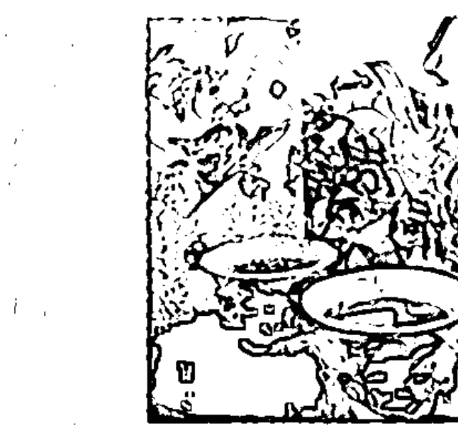

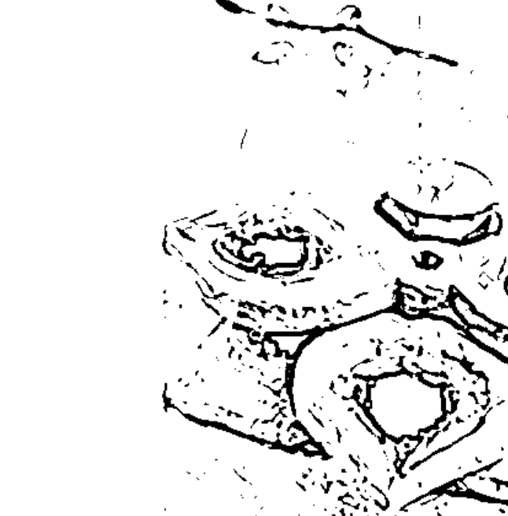

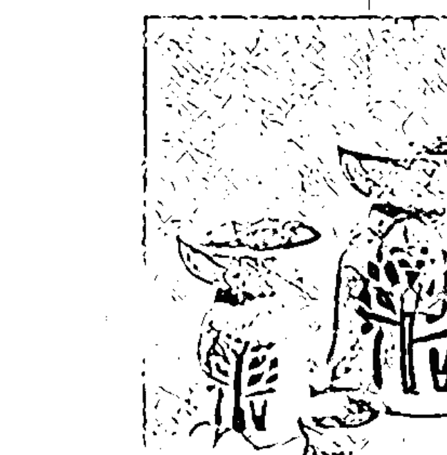

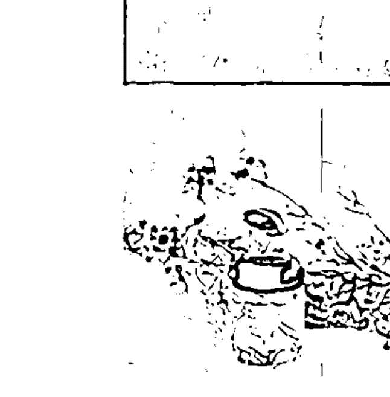

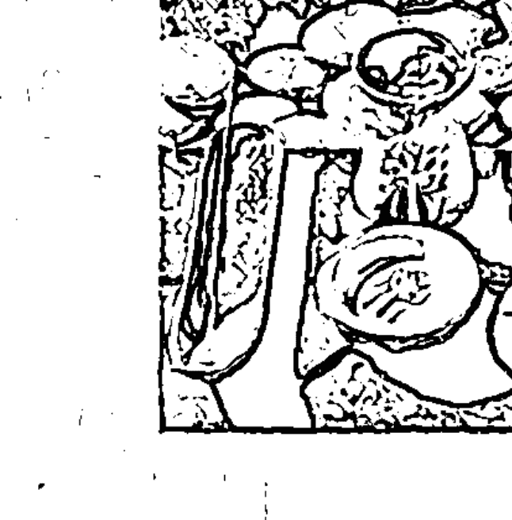

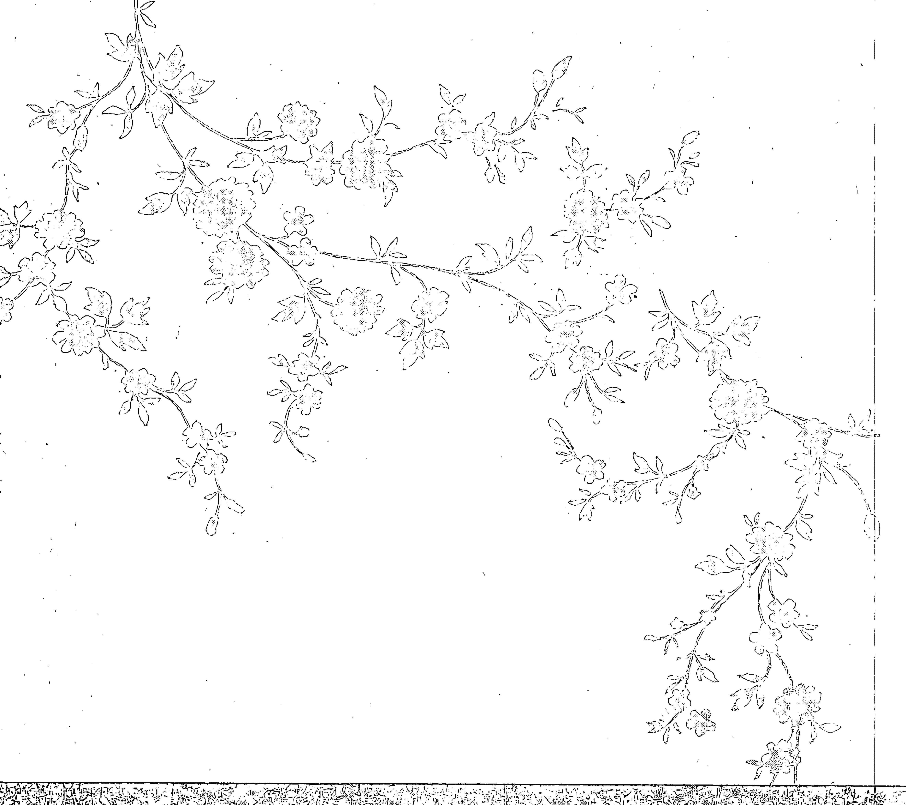

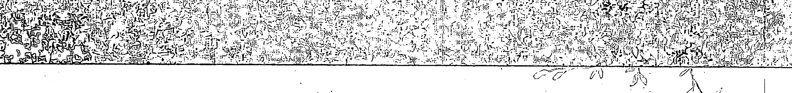

# 第6章 五行芳香家居能量色彩

## 五行五色 选对能量场

中国人经典的审美观，都是契合五行理论的；而即便是西方优秀的设计师其在色彩搭配方面的成功案例，也莫不契合五行相生的和谐理念。至于如何正确地运用五行颜色来调节我们的人体能量场，我们将带您一窥门径。

家，是身心灵的安歇之地。都市上班族劳累一天，下班回家，渴望融入温馨的氛围中。可是很多人走进家门之后，依然烦躁，心神不宁。

事实上，他们是由一个大的浮躁气场进入一个自设的小浮躁气场——居室色调的不当搭配，较容易为人所忽视。色彩对人的精神与情绪有很大影响，此论述在东西方早已经是不争的事实，今天我们就从五行芳香尤其是五行五色的传统，来探讨一下色彩（视觉）疗法与人居之间的话题。

### 一、五行与色彩

古人认为，构成宇宙万物有五种要素，即：木、火、土、金、水，各有与之相应的形状、质地、声音、颜色等。

就五行所表征，可以做如下谈：

1. 木：青、碧、绿色系列。
2. 火：红、紫色系列。
3. 土：黄、土黄色系列。
4. 金：白、乳白色系列。
5. 水：黑、蓝色系列。

其他的中间色，可以依照主色系分别归类，但是该颜色会在主色所具有的属性之外，兼具有辅色所具有的属性。

知道了五行所属的颜色，就需要对五行相互间的基本关系有一些基本的了解，进而创造良好的视觉效果，以构建舒适通畅的居室氛围。

五行间，相生相克的基本关系，如下：

> 相生——木生火、火生土、土生金、金生水、水生木。
相克——木克土、土克水、水克火、火克金、金克木。

其实，有关五行的颜色运用与搭配，自古以来便已经展现在我们的生活中：

1. 有“风水活化石”美称的故宫紫禁城，绝妙地体现了五行相生的原则：紫禁城的城墙是红色的，而上面的琉璃瓦和故宫众多殿宇的金顶为黄色，体现了五行中“火（红色）土（黄色）”相生的原理；历经数百年沧桑，紫禁城在今日更显其独步天下的王者风范，这恰恰印证了我国古代哲学思想与建筑艺术的完美结合。
2. 北京中山公园（社稷坛）内的五色土，涵盖了中华大地——东、南、西、北、中，更是五行观念的集中体现。

### 二、居室色彩的合理搭配

五行应用在家居领域，我们不难发现：中国人经典的审美观，都是契合五行理论的。而即便是西方优秀的设计师其在色彩搭配方面的成功案例，也莫不契合五行相生的和谐理念。

至于如何正确的运用五行颜色，来调节我们的人体能量场？这其中的搭配学问，可谓既复杂又简单。

1. 假如喜欢在居室里布置较多的绿色系列，如前所列，因为五行中“水生木”的关系，所以在布置青、绿色系列的同时，亦不妨布置一些蓝、黑色系列。

反之，倘若没有代表五行中“水”的蓝黑色系列，反而有大量代表五行中“金”的白色系列，便较为不妥，因为五行中“金”能克“木”。

至于代表五行中“火”的红、紫色系列，于此间居室中可以用，但是不宜过多。因为“木生火”的关系，“木见旺火”则有耗损之象。

另外，代表五行中“土”的黄色系列，亦可以用之。

2. 假如喜欢在居室里布置较多的红色、紫色系列，如前述，五行中“木生火”，所以同时亦不妨布置一些绿色、青色系列，而不宜使用大面积的蓝黑系列，以免犯“水（蓝、黑）克火（红、紫）”的忌讳。

此外，属“土”的黄色和属“金”的白色，均可以布置其间。

3. 假如喜欢在居室内布置较多的黄色系列，因为“土”的颜色为黄色系列，根据五行中“火生土”的关系，喜欢黄色的人亦不妨于居室内布置一些红、紫色系列。

反之，倘若不见红紫色系列，反而见大量的青、碧、绿色系列，就不太相宜，因为五行中“木（绿）克土（黄）”（注：盆栽植物不以“木”论，而以“土”论）。

其余，代表“金”的白色、代表“水”的蓝、黑色，均可以采用。

4. 假如喜欢在居室内布置较多的白色系列，五行中，“金”的颜色为白色系列。

五行中“土生金”，所以黄色系列与其较配。但是要注意：五行中“火克金”，所以如果选定白色为家居的主色调，就少用、最好不用红紫色作为搭配。

其余，代表五行中“水”的黑色系列、代表“木”的绿色系列，亦可以用之，只是不宜太多。

5. 假如喜欢在居室内布置较多的蓝色、黑色系列，如前所列，因为五行中“金生水”的关系，所以居室内布置一些在五行上属“金”的白色系列亦有利。

反之，倘若不见白色，反而见到较多属“土”的黄色系列，便较为不妥，因为五行中“土”能克“水”。

其余，代表“木”的绿色系列、代表“火”的红色系列，亦可以用之，但是不宜过多。

至于很多混合色调，其中的生克原理较为复杂，暂不论述。

另外，还有“五行反侮”的现象，例如，五行中“水克火”，但是如果“火比水旺”则不受其克，反成“火旺水干”的形势——即大面积的红反而能克小面积的黑，可见五行贵在“均衡”。

每个时代都有它所流行的主色调，每一个对色彩较为敏感的人都有他（她）所喜欢的颜色，这其中蕴涵了人生的玄机，亦可以由此解读出数不清的潜在资讯。

说来有趣：人对某种颜色的好恶之心态，是随着他（她）在不同段时间的不同心情而有所改变；对居室的色彩搭配亦如是，人在某一种心情或某一段年龄内格外偏好某一种颜色，是自然的变化，但是要注意的是，协调地配搭！而不是违背自然规律，单凭一时偏执做某种相悖关系的选搭，进而无意间引发居室氛围的潜在冲突。

人的身心健康和他所处的环境息息相关，顺乎自然才是明智之选。

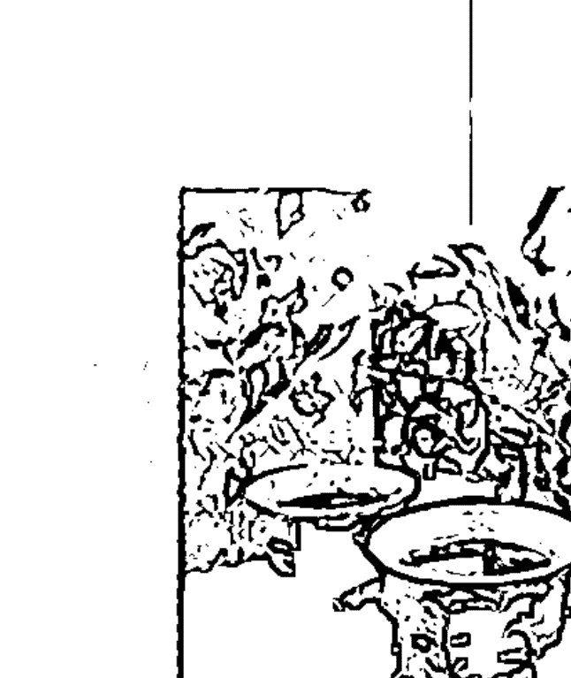

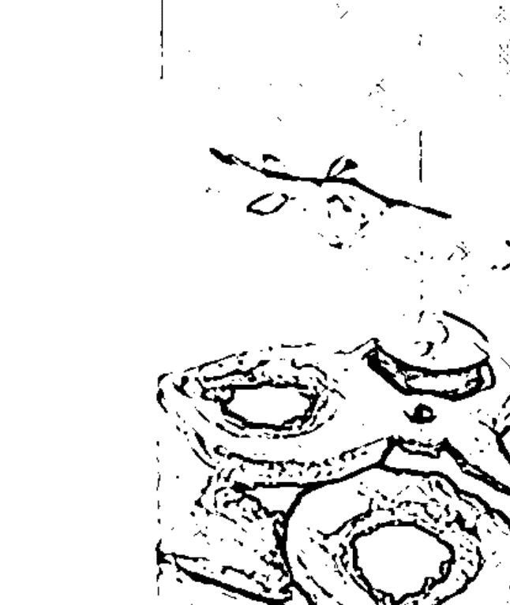

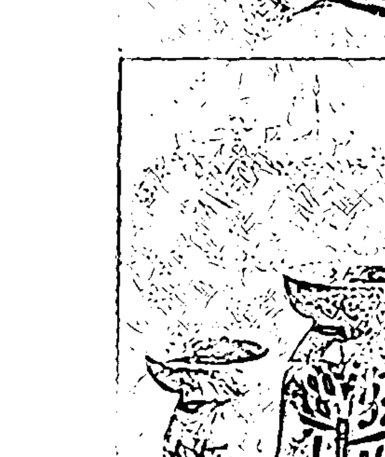

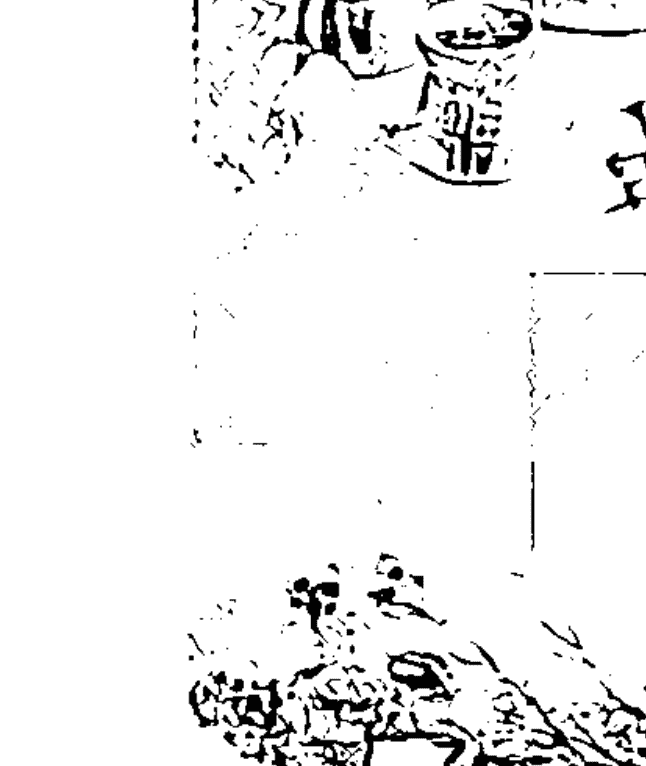

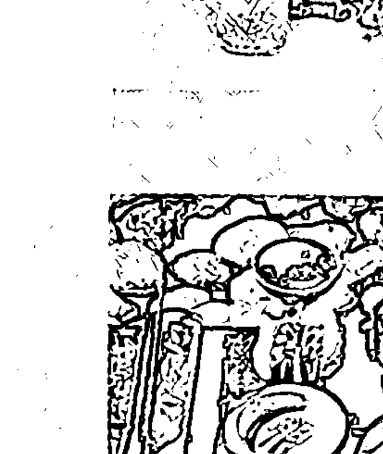

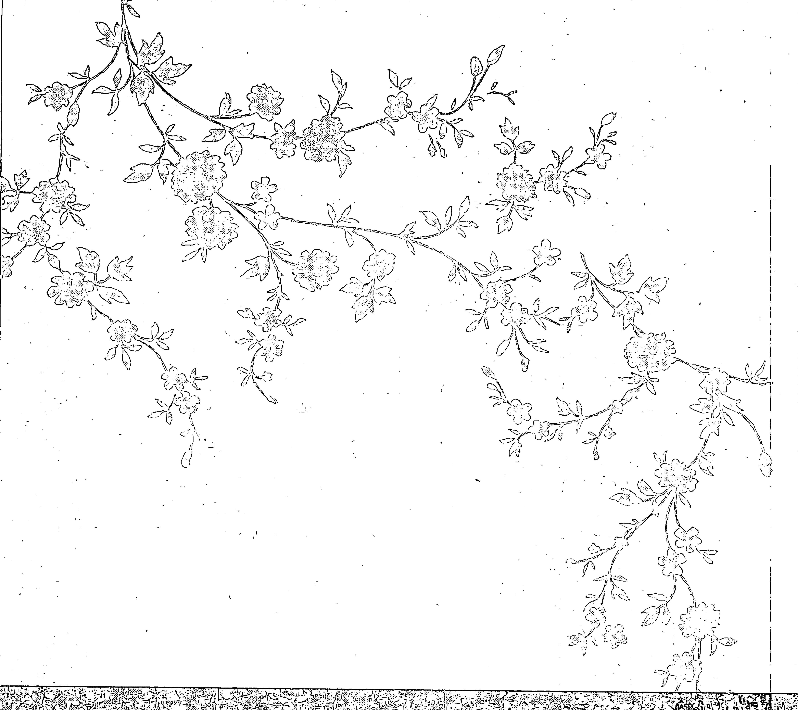

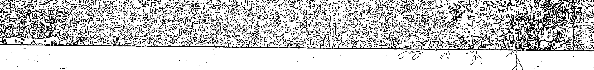

# 第7章 芳香花草浴

## 花香解语 汤浴美人

中国有杨贵妃，外国有埃及艳后，皆是古已闻名的“香浴美人”。

浴室，是您宠爱自己的私密场所，也是您可以静心修养的个人空间。无论是浸浴、熏蒸浴、淋浴、手足浴、沐脸、洗发，选用适当的芳香精油，只要几滴，你将会是现代的香浴美人。

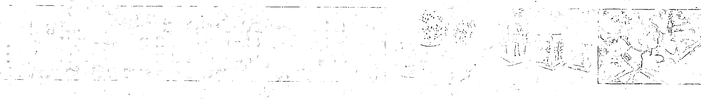

### 一、芳香花草浴的历史

芳香疗法在古埃及，是一种生活方式。在中国人发展针灸医学之际，埃及人正将香膏、精油使用在宗教仪式与医疗上，芳香花草浴（Flower Bath），也成为皇室贵族的最爱。

希腊医学之父希波克拉底，是第一位以切实观察来建构医学知识与治疗原则的医师。他的健康信念，就是每日用精油泡澡和按摩。

20世纪初，法国的医疗界渐渐掀起芳香疗法科学研究热潮；20世纪后期，芳香疗法更成为欧美人士追捧的生活方式。现代人喜爱的居家芳香花草浴（Home SPA），是SPA爱好者最迷恋、最方便的身—心—灵时尚疗法。

无论浸浴、熏蒸法、淋浴、手足浴、洗脸、洗头，选用适当的芳香精油，只要几滴，或加上新鲜的花瓣，你就可以愉快、轻松地享受特别的芳香花草浴。

### 二、芳香花草浴DIY很简单

只要家中有淋浴与盆浴的设备，并且掌握SPA的几个方式，就可以在家中轻松地享受芳香花草浴的乐趣。

浴室，是您宠爱自己的私密场所，也是您可以遁入其中、静心修养的个人空间。创造一个舒适素净的沐浴空间，必须掌握基本要点：首先，干净的厚毛巾、浴巾、丝瓜络、浴室踏垫、浴袍、拖鞋；其次，灯光也是创造适当心情的关键之一：昏暗柔和的灯光、温暖的（芳香蜡烛）烛光，促使您自我心灵的宁静，同时提供香氛的效果；最后，如果可以，尽可能地打开窗户，让新鲜空气进入室内舒展你的心灵。

#### （一）浸洗法

用芳香精油浸洗身体，以达到美容、保健、治疗的目的，是浸法与洗浴的结合。早在东汉张仲景所著的《金匮要略》中，就载有浸、洗方法，如：浸矾石汤，治脚气冲心；以狼牙汤洗阴部，治阴部蚀疮烂等；以后历代方书中，也有不少该法的记载，如明代《圣济总录》中，有用桂附散水煎沸浸洗患处，来治疗外伤疼痛肿胀之症。

不论是浴缸或是日本式的木桶，只要能将身体浸入就可以，并根据个人当天所需要，放入适当的芳香精油。（在盆浴之前，最好先将身体清洁干净，再入池浸泡。进入浴缸之后，就不需再使用任何沐浴乳或浴液了）

1. 全身浸浴（热水的温度，以摄氏 39 ~ 41 度为宜）
按照习惯使用的水量与水温放水。浸浴中，在自己相关的部位，轻柔地按摩，让精油渗透真皮，随着我们的血液运行全身。
在此宜悦的气氛中，可以浸泡至水开始趋凉为止，约 10 ~ 15 分钟。

2. 半身浸浴（热水的温度，以摄氏 38 ~ 39 度为宜）
浸泡于温热水中的半身浴；最能塑造出容易变瘦的体质，可以在保持水温下泡 1 个小时，水位要能泡到胸口以下的部分，先持续浸泡 20 分钟，当肩膀和胸口渗出汗时，就代表身体已经从内部热起来；如果感到上半身很冷，可以披一块干毛巾。

3. 手足浴（热水的温度，以摄氏 41 ~ 43 度为宜）
手足浴使用的的浴盆，若是塑胶材质的比较不理想，因为会起化学变化。
手足浴时，是进行手或足部病理反射按摩的最好时候；如果使用芳香精油，只要轻柔地按摩就可以。

4. 臀浴（热水的温度，以摄氏 38 度为宜）
臀浴是女性生理保健的最佳方法。将配好的精油或其他配方，以温水进行盥洗，可以预防很多生理问题和疾病的产生。

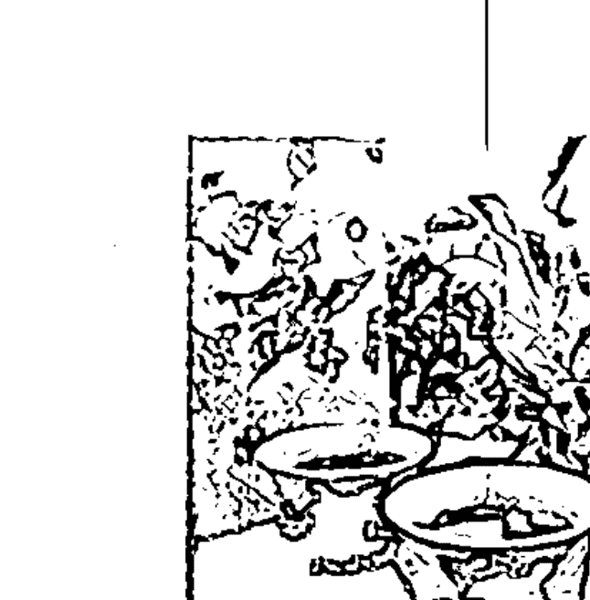

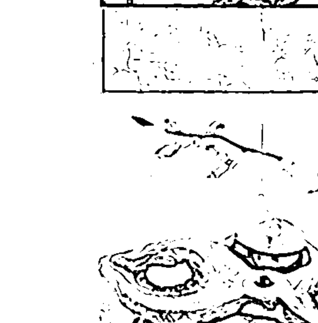

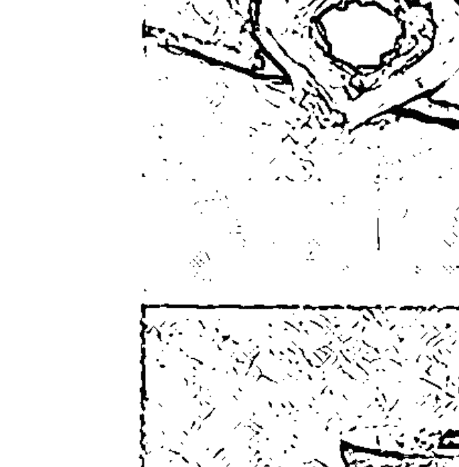

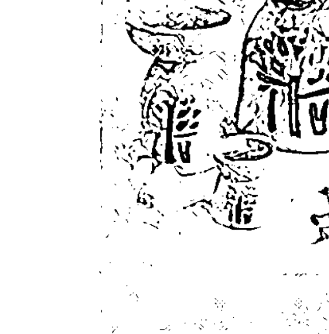

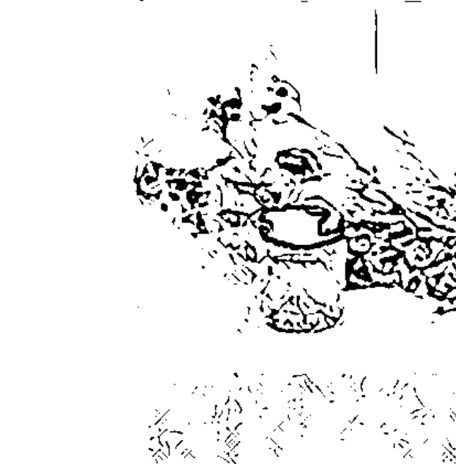

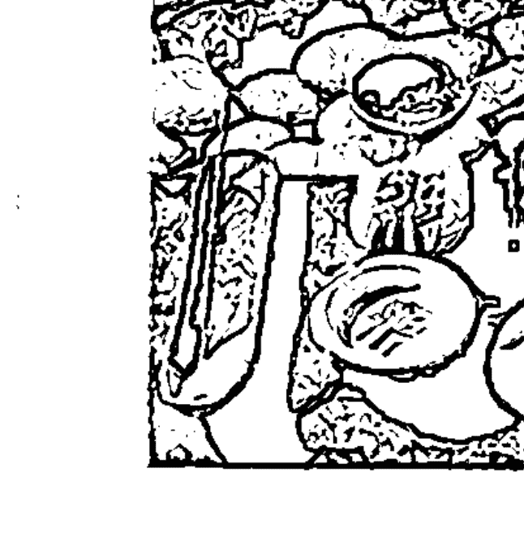

5. 淋浴（热水的温度，以摄氏 41 ~ 43 度为宜）
利用莲蓬头，按摩穴道南附近的位置；自己不容易按摩到的腰部、背部等穴道，加强水流冲洗——借由淋浴时温水的刺激，促进血液循环。为了提升效果，使用可以调节水压的莲蓬头，淋浴时将出水孔对准身上的穴道，或调整适度的水压淋洒在紧绷的肌肉、肩膀、小腿、腰部等处加以按摩。

#### （二）熏蒸法

又称为“蒸气浴”，是一种利用芳香精油加热蒸发气体进行治疗的方法，在很多医学书籍中都有记载，如吴尚先医学书籍《理论骈文》中，就有 20 余种熏蒸方药，分别治疗伤风感冒、中风、便秘、痢疾、癃闭、诸痛症、脱肛、麻疹透气不畅、时气、赤眼等。

#### （三）洗脸、敷脸、泡澡一次完成

洗脸，与洗身体的水温不同。洗脸的水温：只要微温即可，将脸部的毛孔打开，利于清洁毛孔；太高的水温，容易将表面油脂过度洗净，造成干涩易出现细纹。最好的方式是洗澡前，先将脸洗干净，并敷上面膜，再下水泡澡，利用池水的热气再度将毛孔中的脏污蒸出黏附在面膜上，约停留 10 ~ 15 分钟后，再起身将面膜洗净，并做脸部的去角质动作；完成后，立刻擦上适当的化妆水、护肤品，再下水泡第二次，利用水的热气将保养品蒸入皮肤，以利吸收。

#### （四）用工具进行芳香花草浴按摩与刷洗

除了用双手按摩搓揉全身的肌肤和患处之外，若是还想要更进一步去除皮肤表面的老废角质，可以依照个人的喜好选购沐浴刷（最好是天然的马毛或猪毛所制成的）或晒干的丝瓜布，并且顺着经脉的方向刷洗，可以借此提高皮肤表面的温度，达到美化肌肤、刺激血液循环的作用。

1. 按摩与刷洗手部
先洗手臂内侧，由腋窝往手掌的方向往下洗；再洗手臂的外侧，将手举至高于心脏的位置，由手掌往肩膀的位置，与内侧相反。

2. 按摩与刷洗脚部
大腿的外侧，由上往下洗；内侧，则以反方向洗，并加强膝盖与脚踝的部位，可以帮助关节部位厚皮角质的去除。

3. 按摩与刷洗背部
分两步进行，先洗中间脊椎的部分，由上往下洗，并以画圆的方式按摩脊椎；再洗两侧，由下往上洗。

4. 按摩与刷洗胸部
由下往上洗，并且以环形由外往内绕按摩胸部，可以加强胸部周围的肌肉，预防肌肉下垂松弛。

5. 按摩与刷洗腹部
由下往上洗，与胸部相同地以环行围绕的方式按摩腹部，增加刺激胃肠的蠕动。女士们靠近鼠蹊部位的腹部两侧，可以上下来回地按摩，以促进卵巢、子宫的功能，对于荷尔蒙的分泌很有帮助。

### 三、芳香花草浴的适用范围

#### (一) 熏蒸法的适用范围

慢性风湿性疾病、风寒感冒、周围血循环障碍、运动系统疾病、肝炎、肥胖症等。

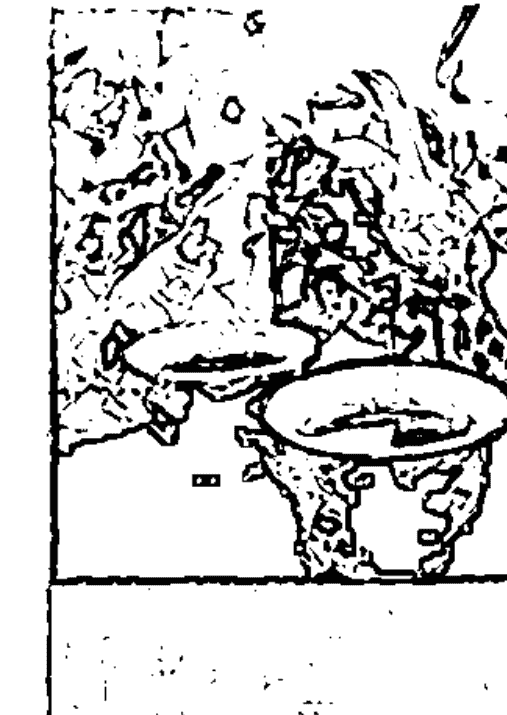

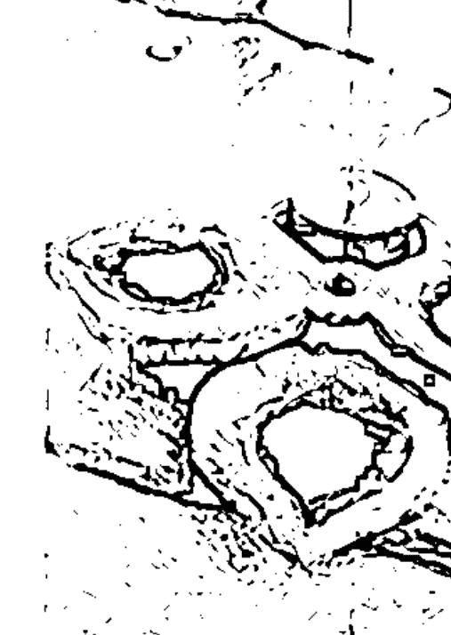

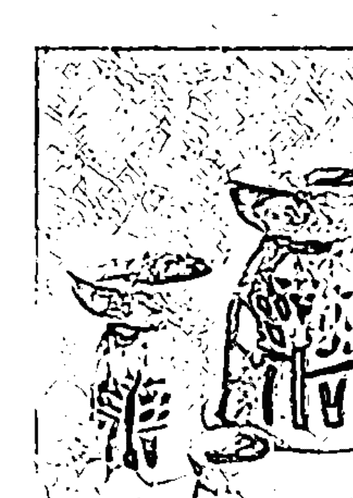

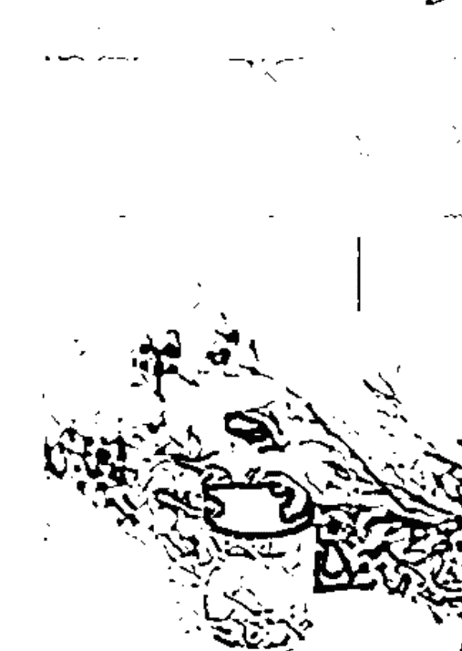

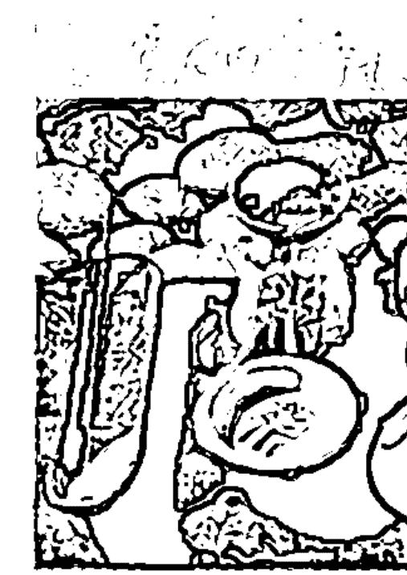

#### （二）浸洗法的适用范围

各种癣症（手癣、足癣、体癣）、跌打所致的肢体肿胀疼痛、风寒感冒、香港脚；伤风感冒、气管炎、支气管炎、风湿痹症（风湿性关节炎、类风湿性关节炎）、腰腿关节疼痛、皮肤湿疹、体癣头癣、瘙痒症、外阴溃疡、滴虫性阴道炎、霉菌性阴道炎、老年性阴道炎、尖锐湿疣、各种跌打损伤、单纯性外阴炎等。

### 四、芳香花草浴的机理和方法

#### （一）熏蒸法

##### 1. 作用机理

熏蒸法是用芳香精油加热所产生的热气熏蒸患处，使香氛进入人的体内，产生功效：借助精油氤氲之气，直透肌理；同时，透过口鼻吸入，以发汗、温经、通络、除痛、止痒，进而达到驱风、散寒、去湿、解毒、补气、活血之效。

##### 2. 应用方法

###### (1) 全身熏蒸

####### A. 密闭熏蒸法

调入芳香精油，加热煮沸、蒸发气体，蒸汽排出温度从摄氏 30 ~ 35 度开始，渐增至摄氏 40 ~ 50 度，一般熏蒸时间为 15 ~ 30 分钟。

####### B. 简易熏蒸法

古代和民间多采用较大容器，将加热煮沸的本草煎剂倾入容器中，容器上置木板病人裸坐其上，用被单围住全身，仅露头面进行熏蒸。
现在，可以使用面部美容熏蒸汽，放入芳香精油，对面部或身体进行熏蒸。

###### (2) 局部熏蒸

将加热煮沸的水调入精油，倾入适当大小的容器中，约 1/2 ~ 2/3；将患部置于容器中，离药液一定距离，其上可以敷毛巾，不使热气外透，进行熏蒸。

#### （二）浸洗法

##### 1. 作用机理

可以使精油较长时间地作用于患部或皮肤上，并可以借洗浴时精油的渗透之力，发挥清热解毒、驱风除湿、杀虫止痒、软化角质、驱腐生肌等效力。
由于较长时间的浸泡，精油还可以透过皮毛、俞穴，由表及里、循经内传，以调节人体气血阴阳、扶正驱邪。

##### 2. 应用方法

1. 根据不同需要，选择适当的精油。
2. 治疗疾患，每天浸洗 1 ~ 2 次，每次 30 ~ 60 分钟，可以用温热液浸洗，也可以用冷液浸洗，视病情而定。

#### （三）沐浴法

##### 1. 作用机理

借沐浴时水的温度之力和精油本身的功效，使人身体肌理疏通、毛窍开放，起到发汗退热、驱风除湿、温经散寒、疏经通络、调气和血、消肿止痛、驱瘀生新等作用。

##### 2. 应用方法

根据具体病症，选取适当精油，组合成复方。

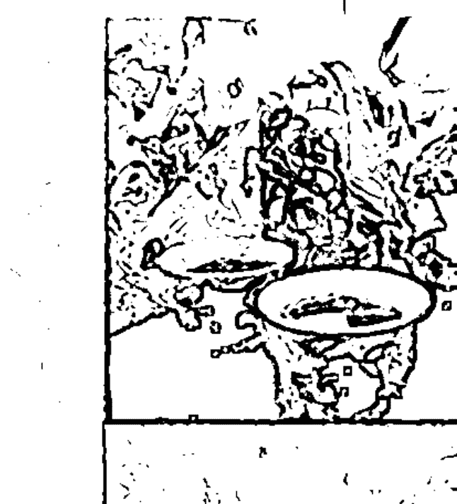

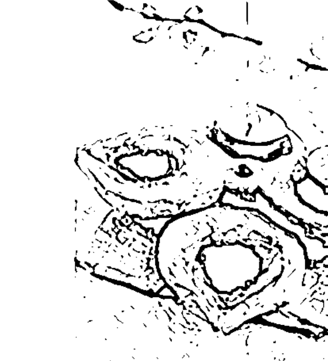

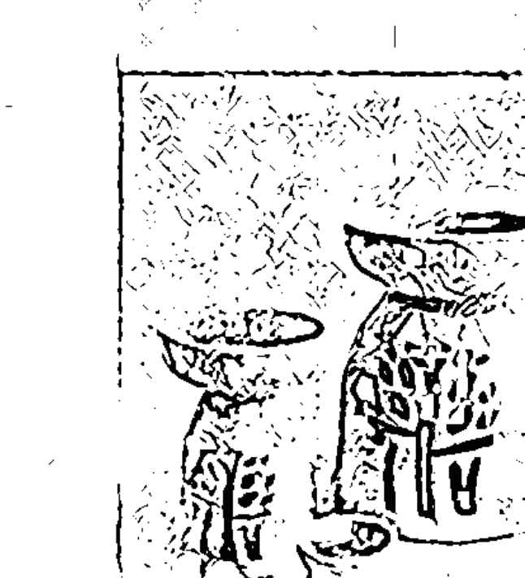

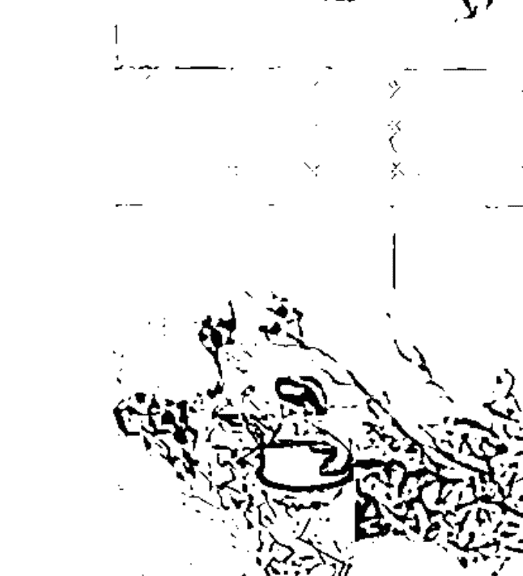

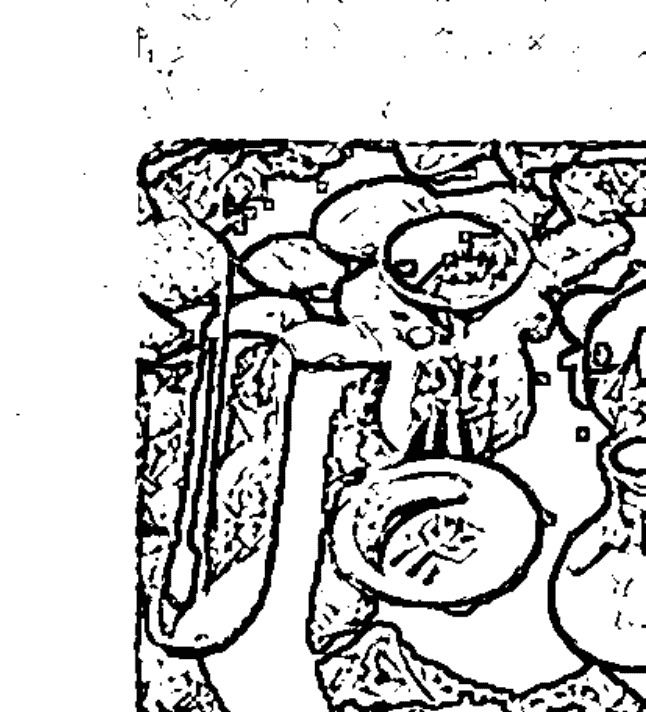

### 五、芳香花草浴的注意事项

#### （一）熏蒸法的注意事项

1. 熏蒸室，要设有观察视窗，以便作相应处理。
2. 简易熏蒸治疗时，应该注意避风保暖、防止受寒。
3. 局部熏蒸时，患部与精油之间保持适当距离，可以根据精油的温度不断调整，以温热、舒适、不烫皮肤为宜。
4. 高血压、急性炎症、心肺功能不全、热症病人、有出血倾向者，禁用此法。

#### （二）浸洗法的注意事项

1. 治疗癣时，浓度不宜过高。
2. 治疗时，要注意保暖、避受风寒。
3. 浸洗完毕，立即拭干保暖。
4. 根据需要，某些皮肤疾患可以先熏再浸洗。

#### （三）沐浴法的注意事项

1. 浴液温度适中，不能过热，以免烫伤。
2. 沐浴时，注意保暖、避免风寒。
3. 洗毕，应该立即拭干保暖。

### 六、芳香花草浴的建议配方

#### （一）舒缓身心的芳香花草浴

1. 消除紧张、放松情绪的时候

【建议使用的精油】
薰衣草、快乐鼠尾草、洋甘菊、杜松、橙花、檀香、乳香。

【建议配方】
薰衣草 3 滴＋洋甘菊 2 滴
薰衣草，可以使中枢神经协调、消除疲劳；洋甘菊，具有镇静神经的作用。将二者混合后，可以消除精神压力引起的身心障碍。

2. 情绪焦躁、即将崩溃的时候
当工作进展不顺利，总令人焦躁不安，结果旁人不经意的一句话，就会令自己大发雷霆。为了平静心灵的兴奋、使自己恢复平常心，不妨让自己沉浸在芳香精油的温柔芬芳中。

【建议使用的精油】
薰衣草、罗马洋甘菊、佛手柑、橙花、依兰、天竺葵、岩兰草、玫瑰、西洋蓍草、香蜂草。

【建议配方】
罗马洋甘菊 1 滴＋佛手柑 1 滴＋薰衣草 3 滴。

3. 女性生理期、更年期障碍引起情绪焦躁的时候

【建议配方】
玫瑰 1 滴＋洋甘菊 1 滴＋天竺葵 3 滴。

4. 增加记忆力、集中力的时候

【建议使用的精油】
迷迭香、广藿香、罗勒、柠檬、薄荷、尤加利。

【建议配方】
柠檬 2 滴 + 迷迭香、广藿香、薄荷、尤加利 2 滴。
迷迭香，具有促进脑和神经系统血液循环、使头脑清晰、加强记忆力的功能；柠檬，与任何其他精油都十分搭配，可以对心灵产生刺激作用、提升集中力。
请根据当天的心情，加入您喜好的精油。

5. 懒洋洋、提不起劲、缺乏毅力的时候

【建议使用的精油】
茉莉、迷迭香、佛手柑、天竺葵、杜松、薰衣草。

【建议配方】
杜松 3 滴 + 佛手柑 2 滴 + 迷迭香 1 滴。

6. 孤独、感到寂寞的时候

【建议使用的精油】
玫瑰、橙花、香蜂草、丝柏、乳香、佛手柑、洋甘菊。

【建议配方】
玫瑰 3 滴 + 橙花 2 滴 + 洋甘菊 2 滴。

7. 要让自己心动的时候

【建议使用的精油】
依兰、茉莉、檀香、广藿香。

【建议配方】
依兰 3 滴 + 茉莉 3 滴。

8. 焦虑的时候

凡事推展不顺、不愉快事持续不断、总觉心慌意乱……
头部充血时，凡事都不顺利。尤其焦虑而有歇斯底里倾向的人，首先要冷凉头部，来保持冷静；之后，以平静的心境，来恢复自己原有的信心。
最具有放松效果的精油，尤其对解除焦虑最有功效的是：薰衣草精油。

【建议配方】
天竺葵 2 滴＋薰衣草 2 滴＋柠檬 4 滴＋基底油 2 ～ 4ml。

9. 忧郁的时候

【建议使用的精油】
葡萄柚、柠檬、鼠尾草、佛手柑、橘子等，混合薰衣草、檀香木、玫瑰、天竺葵等。
任选自己喜爱的两种，以 1：1 的方式混合，具有振奋精神的作用。

10. 消除紧张的时候

面对人群时，遇到重要场合时，到了考试、发表会、表演、大型活动执行时，会紧张、会怯场、无法展现应有实力的人，不妨利用手帕或出发前来一个芳香花草浴，以平静心境。

【建议使用的精油】
尤加利、薄荷、天竺葵、橘、依兰、迷迭香、柠檬等。

【建议配方】
A. 依兰 5 滴＋甜橙 15 滴＋天竺葵 10 滴。
B. 依兰 2 滴＋甜橙 3 滴＋天竺葵 3 滴＋荷荷芭油 2 ～ 4ml。

#### （二）调养健康的芳香花草浴

1. 血压高

通常，血压高的人不适合使用热水泡澡。因此，在浸泡时，要特别注意水温，温度最好与体温相同，是属于较温凉的水温；浸泡时间，不宜过长，以5～10分钟为标准。

【建议使用的精油】
薰衣草、马郁兰、依兰、香蜂草、柠檬。
薰衣草、马郁兰，降低血压；依兰、香蜂草，可以平静心悸；柠檬，可以缓和动脉硬化。

【建议配方】
A. 薰衣草3滴＋马郁兰2滴。
B. 薰衣草3滴＋依兰1滴。
在泡澡的同时，深深吸入浴缸中冒起的蒸汽。从鼻孔吸收的芳香，放松作用特别强烈。

2. 增加免疫力

【建议配方】
薰衣草3滴＋茶树2滴。
茶树，具有杀菌、消毒的功效，可以增加免疫力。肌肤脆弱者，可以只用薰衣草。

3. 宿醉

宿醉后的隔天清晨，在浴盆水中滴入几滴精油，好好地泡个澡，可以促进血液循环、加速体内酒精的代谢，并且还有提神醒脑的效果，有助于提升一整天的工作效率，对于宿醉后的头昏脑胀、全身无力最有效果。

【建议配方】
茴香 3 滴＋杜松 4 滴＋迷迭香 3 滴。

4. 失眠症

是现代人常见的一种文明病。
不论失眠的原因为何，都建议在睡前來个芳香精油浴——在水中滴入几滴精油，轻松地浸泡，并且在浴后立即入寝，效果最好；其中，有几种最适合睡前使用的精油，如：玫瑰、甘菊、薰衣草等。

【建议配方】
薰衣草 4 滴＋佛手柑 2 滴＋依兰 2 滴。

5. 肩膀酸痛、肌肉痛

是由于长时间的事务工作、紧张感持续、运动不足、姿势不正确、过度使用电脑等，使肌肉僵硬、积蓄大量疲劳物质——乳酸所致，并引起眼睛疲劳。

【建议使用的精油】
薰衣草、马郁兰、迷迭香、黑胡椒、洋甘菊。
马郁兰，具有血管扩张作用和镇痛作用；迷迭香，促进血液循环；洋甘菊，可以缓和疼痛、平静神经；当然，放松效果极佳的薰衣草，也是不可或缺的芳香精油之一。泡澡时，可以混合具有促进血液循环、强化肌肉的黑胡椒＋基底油，来同时按摩。

【熏蒸法建议配方】
薰衣草 3 滴＋马郁兰 1 滴＋迷迭香 1 滴。

6. 关节炎

热水浴，对于患有风湿性关节炎者的关节疼痛，有很好的舒缓疼痛作用。

【建议使用的精油】
杜松、百里香。

7. 感冒、鼻塞、打喷嚏

感冒时，人感到疲惫，以及鼻塞、打喷嚏等症状，使得呼吸不顺畅。
这时，可以泡个芳香花草浴——加入尤加利与薰衣草，或薄荷与薰衣草的混合精油，借着香气与蒸汽，多做几个深呼吸，可以使您的呼吸道得到舒缓。

【建议使用的精油】
薰衣草、马郁兰、茶树、尤加利。

【熏蒸法建议配方】
尤加利 2 滴＋薰衣草 3 滴。
尤加利，对幼儿熏蒸太刺激，眼睛要闭起来。

【薰香法建议配方】
薰衣草 3 滴＋马郁兰 2 滴。
马郁兰有良好的镇痛作用；感觉身体发冷时，是一剂良方。

8. 支气管炎

患有支气管炎的患者，常常咳嗽不断、喉咙不舒服，有痰。
如果能在沐浴时添加精油，借着温水的热气，可以使支气管得到润湿，有利痰的咳出，得到症状的改善。

【建议使用的精油】
薰衣草、马郁兰、茶树、尤加利。

9. 视觉疲劳者

对于长期面对电脑荧幕的上班族来说，工作了一整天后，眼睛酸涩，是很常见的。
如果在泡澡时能滴入几滴精油，让这股带有保湿成分的热气缓缓蒸入，并轻轻将眼睛闭上、眼球上下左右的旋转，有舒缓眼睛疲劳的功效。

【建议使用的精油】
玫瑰、橘子、柠檬。

10. 香港脚

是一种名为“白癣菌”的霉菌寄生在手、脚上所引起。

【建议使用的精油】
薰衣草、茶树。
具有杀菌、消毒作用的薰衣草、茶树精油各3滴于木盆中，浸泡或直接擦洗在患部，并根据症状的不同，可以1天涂擦2～3次。

11. 女性生理调养

生理痛，是由于子宫和腰部的痉挛所造成的疼痛，主要原因为：荷尔蒙失调、过度的减肥、不吃早餐、睡眠不足、精神压力等，都会激发生理痛。

在生理期的1星期前，开始进行以下腹部为中心的部位按摩，或用芳香花草浴温暖身体，可以舒缓生理痛。

【建议使用的精油】
薰衣草、马郁兰、快乐鼠尾草、天竺葵、丝柏、玫瑰、洋甘菊、杜松、没药。
快乐鼠尾草、天竺葵，能协助调整荷尔蒙；德国洋甘菊、杜松，具有镇静作用，可以促进老废物质的排泄、缓和生理痛。

【建议配方】
A. 快乐鼠尾草1滴＋天竺葵2滴＋薰衣草3滴，可以调整荷尔蒙。
B. 马郁兰2滴＋快乐鼠尾草3滴，可以缓和生理痛。

#### （三）美颜的芳香花草浴

1. 脸部清洁

选择净化效果佳、能促进新陈代谢的精油加强洁净肌肤，是轻松易行的美肤基础工程——晚上沐浴洗脸时，将混合的精油数滴抹于脸部，并细心地轻轻按摩5分钟，然后用清水冲净。

【建议配方】
A. 茶树1滴＋榛果油5ml。
B. 天竺葵1滴＋榛果油5ml。

2. 脸部防皱

每天晚上沐浴洗脸时，将混合的精油数滴抹于脸部，并细心地轻轻按摩5分钟，然后用清水冲净。

(1) 20岁以上的防皱保养油

【建议配方】
橙花4滴＋薰衣草3滴＋茴香3滴＋洋甘菊2滴＋天竺葵4滴＋胡萝卜籽油5滴＋30ml甜杏仁油。

(2) 30岁以上的防皱保养油

【建议配方】
广藿香3滴＋快乐鼠尾草4滴＋茴香4滴＋玫瑰4滴＋胡萝卜籽油3滴＋荷荷芭3滴＋30ml杏桃核仁油。

(3) 40岁以上的防皱保养油

【建议配方】
橙花5滴＋薰衣草5滴＋乳香5滴＋迷迭香3滴＋茴香5滴＋柠檬3滴＋胡萝卜籽油5滴＋月见草油5滴＋30ml杏桃核仁油（混合备用）。

3. 淡化细纹沐脸

具有再生作用的精油，可以促进新陈代谢、增加保水度，并提供适度滋润、淡化肌肤细纹——每天晚上沐浴洗脸时，将混合的精油数滴抹于脸部，并细心地轻轻按摩5分钟，然后用清水冲净。

【建议配方】
A. 乳香3滴＋玫瑰3滴＋依兰5滴＋荷荷芭油10ml。
B. 檀香3滴＋玫瑰3滴＋荷荷芭油10ml。

4. 美颜按摩沐脸

每天晚上沐浴洗脸时，将混合的精油数滴抹于脸部，并细心地轻轻按摩5分钟，然后用清水冲净。

(1) 普通肌肤沐脸

【建议配方】
花梨木5滴＋玫瑰3滴＋薰衣草5滴＋天竺葵3滴＋荷荷芭油10ml。

(2) 油性肌肤沐脸

【建议配方】
A. 佛手柑3滴＋杜松3滴＋薰衣草5滴＋甜杏仁油10ml。
B. 柠檬3滴＋薰衣草5滴＋柑橘3滴＋甜杏仁油10ml。

(3) 干燥肌肤沐脸

【建议配方】
A. 薰衣草10滴＋花梨木5滴＋荷荷芭油10ml。
B. 花梨木3滴＋广藿香2滴＋胡萝卜种子3滴＋荷荷芭油10ml。

(4) 敏感肌肤沐脸

【建议配方】
A. 花梨木5滴＋天竺葵3滴＋甜杏仁油10ml。
B. 薰衣草3滴＋迷迭香1滴＋花梨木2滴＋玫瑰2滴＋甜杏仁油10ml。

5. 美白按摩沐脸

以独特精油分子淡化肌肤表皮沉淀的黑色素，是轻松达成美白和护肤双重效果的绝佳选择——晚上沐浴洗脸时，将混合的精油数滴抹于脸部，并细心地轻轻按摩5分钟，然后用清水冲净。

【建议配方】
A. 柠檬3滴+快乐鼠尾草5滴+薰衣草5滴+甜杏仁油10ml。
B. 胡萝卜种子油1滴+快乐鼠尾草1滴+玫瑰1滴+甜杏仁油10ml。
C. 胡萝卜种子油3滴+薰衣草5滴+橙花3滴+甜杏仁油10ml。
D. 依兰3滴+玫瑰2滴+乳香3滴+甜杏仁油10ml。

6. 保湿按摩沐脸

肌肤若缺乏水分，将呈现干燥和老化状态。
具高度保湿效果的精油，是润泽肌肤的绝佳选择——晚上沐浴洗脸时，将混合的精油数滴抹于脸部，并细心地轻轻按摩5分钟，然后用清水冲净。

【建议配方】
A. 檀香3滴+玫瑰3滴+依兰3滴+荷荷芭油10ml。
B. 乳香2滴+檀香3滴+依兰3滴+荷荷芭油10ml。

#### （四）纯净保养体肤的芳香花草浴

用芳香精油来泡澡，使温热的体肤直接接触、吸收，达到滋润美肤、促进新陈代谢、消除疲劳、让体肤变得光滑柔嫩的目的——在注满水的浴缸中，滴入5～6滴的精油，或将精油滴入一般的沐浴盐，或直接使用精油沐浴盐（这种沐浴盐，并非用来搓洗身体，而是倒入洗澡水中溶解使用）。

【建议使用的精油】
玫瑰具有滋润和保湿的效果，可以防止肌肤干燥，同时还能调理肌肤、促进伤口结疤和组织的愈合。

1. 柔嫩身体肌肤

使用具有柔嫩身体肌肤效果的精油泡澡或按摩，可以使肌肤细致、光滑，是美体基础保养工作——沐浴泡澡时，将混合的精油数滴擦于身体，并细心地轻轻按摩，每2～3天1次。

【建议配方】
A. 乳香10滴＋檀香5滴＋玫瑰5滴＋依兰2滴＋玫瑰果油30ml。
B. 檀香3滴＋橙花3滴＋玫瑰3滴＋玫瑰果油30ml。

2. 紧实身体肌肤

松弛，是肌肤老化的征兆。
具有刺激细胞再生和保湿效果的精油，是紧实肌肤的绝佳选择——沐浴泡澡时，将混合的精油数滴抹于身，并细心地轻轻按摩，每2～3天1次；如果为每天护肤使用者，要将精油用量减为一半。

【建议配方】
A. 檀香2滴＋丝柏2滴＋玫瑰2滴＋基底油10ml。
B. 乳香2滴＋檀香2滴＋杜松2滴＋基底油10ml。

3. 消除妊娠纹和疤痕

妊娠纹和肥胖者，因为肌肤松弛产生的橘皮组织，都可以利用具细胞再生作用的精油改善——沐浴时，将混合的精油数滴擦于腹部轻轻按摩。

【建议配方】
A. 胡萝卜籽油5滴＋快乐鼠尾草10滴＋橙花5滴＋柠檬10滴＋玫瑰果油30ml。
B. 胡萝卜籽油13滴＋快乐鼠尾草10滴＋橙花4滴＋玫瑰3滴＋玫瑰果油30ml。

#### （五）问题肌肤的芳香花草浴

1. 青春痘沐脸

洗脸时，将少许“战痘”建议配方抹在长痘子的地方，并细心地轻轻按摩5分钟，然后用清水冲净，每日2次。

【“战痘”建议配方】
A. 樟树1滴＋柠檬1滴＋薰衣草3滴＋月见草油6滴。
B. 苦橘5滴＋薰衣草30滴＋肉桂5滴＋迷迭香5滴＋基底油10ml。
C. 柏树20滴＋柠檬10滴＋基底油10ml。
D. 苦橘5滴＋薰衣草15滴＋迷迭香10滴＋基底油10ml。

2. 平衡油脂分泌沐脸

油脂分泌正常，皮肤才会光滑柔嫩。
具高效收敛特性的精油，可以有效稳定皮肤的酸碱值——沐脸时，将混合的精油数滴抹于脸部，并细心地轻轻按摩，然后用清水冲净。

【建议配方】
A. 天竺葵5滴＋薰衣草3滴＋榛果油10ml。
B. 快乐鼠尾草13滴＋天竺葵1滴＋榛果油10ml。

3. 消炎／改善阻塞肌肤沐脸

皮肤油脂分泌太旺盛，容易形成粉刺或发炎。
具消炎作用的精油，能协助改善阻塞问题——沐浴沐脸时，将混合的精油数滴抹于脸部，并细心地轻轻按摩，然后用清水冲净。

【建议配方】
A. 乳香 3 滴＋快乐鼠尾草 3 滴＋薰衣草 3 滴＋榛果油 10ml。
B. 乳香 3 滴＋薰衣草 3 滴＋月桂 3 滴＋榛果油 10ml。

4. 镇静净化肌肤沐脸

肌肤红肿、晒伤、过敏、发热时，可以使用具改善血液循环作用的精油，以提供完善保护——沐浴沐脸时，将混合的精油数滴抹于脸部，并细心地轻轻按摩，然后用清水冲净。

【建议配方】
A. 天竺葵 2 滴＋薰衣草 3 滴＋玫瑰 2 滴＋榛果油 10ml。
B. 薰衣草 3 滴＋花梨木 2 滴＋依兰 3 滴＋榛果油 10ml。

5. 淡化疤痕沐脸

【建议配方】
薰衣草 8 滴＋乳香 4 滴＋广藿香 3 滴＋基底油 30ml。

6. 收敛毛孔沐脸

过剩的皮脂堆积在毛囊内，容易造成毛孔膨胀。
此时，不妨使用具净化和收敛性的精油——沐浴沐脸时，将混合的精油数滴抹于脸部，并细心地轻轻拍打、按摩，然后用清水冲净。

【建议配方】
A. 丝柏 2 滴＋天竺葵 2 滴＋榛果油 10ml。
B. 永久花 2 滴＋天竺葵 2 滴＋玫瑰 2 滴＋榛果油 10ml。

#### （六）保养美化发质的芳香花草浴

洗发时，加入具有洁净功能的精油，可以深层清洁皮脂，使头发清爽飘逸、散发出迷人的芳香——每次洗发时，任选 1 配方，加入洗发精中（洗发精约 4ml，不含香料）。

##### 1. 头发芳香 SPA

###### (1) 一般发质

【建议配方】
A. 薰衣草 3 滴＋迷迭香 3 滴＋洗发精 100ml（不含香料）。
B. 天竺葵 3 滴＋迷迭香 3 滴＋洗发精 100ml（不含香料）。

###### (2) 油性发质

【建议配方】
薰衣草 30 滴＋丝柏 30 滴＋洗发精 100ml（不含香料）。

###### (3) 干性发质

【建议配方】
薰衣草 10 滴＋玫瑰 10 滴＋檀香 10 滴＋洗发精 100ml（不含香料）。

##### 2. 预防头皮屑

平时使用的洗发精内（不含香料），以 1% 的比例加入适用的精油，并充分混合，然后用平时的洗发方式洗发，最后用水洗净。

【适用精油】
薰衣草、檀香、丝柏、迷迭香、茶树、尤加利、甜橙。

##### 3. 预防头发分岔、断裂、毛燥

长时间照射阳光、营养不足而损伤的发梢，很容易造成分岔、断裂、毛燥。而早已经分岔、断裂、毛燥的发梢部分，要把它剪掉；然后，再用可以促进细胞再生的精油按摩湿润头发，以快速改善发质。

【建议配方】
A. 百里香 20 滴＋鼠尾草 20 滴＋洗发精 200ml（不含香料）。
B. 乳香 2 滴＋佛手柑 15 滴＋迷迭香 15 滴＋荷荷芭油 30ml。
C. 乳香 3 滴＋薰衣草 10 滴＋鼠尾草 5 滴＋迷迭香 10 滴＋荷荷芭油 30ml。

【其他适用精油】
花梨木、檀香、依兰、杜松。

【其他适合护发的基底油】
酪梨油、月见草油、玫瑰果油、甜杏仁油。

##### 4. 护发水

【建议配方】
矿泉水＋适合发质用的精油以 1% 的比例，充分混合摇晃后，喷洒于头发。

| 发质 / 效果 | 适用精油 |
| :--- | :--- |
| 油性发质 | 薰衣草、柠檬、天竺葵、佛手柑、丝柏、柑橘 |
| 干性发质 | 依兰、花梨木、天竺葵、茶树、薰衣草、玫瑰 |
| 损伤发质 | 花梨木、天竺葵、丝柏、薰衣草 |
| 预防头皮屑 | 薰衣草、迷迭香、丝柏、茶树、尤加利、甜橙 |
| 预防分岔 | 依兰、花梨木、丝柏、薰衣草、迷迭香 |
| 预防脱发 | 薰衣草、迷迭香、鼠尾草、百里香 |
| 促进生发 | 迷迭香、鼠尾草 |

# 第8章 木火土金水身体五大生理系统适用的精油

依症施治 精油 DIY

我们把用于芳香疗法的精油，根据其特性及对人体各大器官的作用，同样分为木、火、土、金、水五种类型，把这些精油巧妙地运用到人体的各大系统中，可收到协调机体、改善体质的功效。我们针对日常生活中困扰我们的种种身体烦恼，都给出了精油配方建议，身体力行，可实现人体的自我完善与自我修复。

### 一、五行芳香精油配方的基本概念

中医理论中，素有“医食同源”的说法。

植物类食品一直是人类主要的营养来源。中药中也以植物药类居多：蔬菜瓜果，能提供人体所需的养分；中草药，能去除人体疾病，所以这些植物无论是“食”还是“医”，都对人体有着重要的意义——诸多植物本身含有某些对人体有营养或治疗作用的重要物质成分，同时还具有许多特别的功效；运用特殊的方法，将这些有效成分提取出来，形成液体的浓缩精华，不仅具有植物原有的气味，其作用功效更是原有植物的几十倍甚至百倍。由于这些提取出来的液体是植物的精华所在，所以称其为“植物精油”，以突现其价值。每种植物精油，均含有浓郁的原始植物气味——其中以具有芳香气味的花卉、香料类精油最多，所以人们又习惯地称“植物精油”为“芳香精油”。

中医以植物本身作为药物，用于治疗人体的疾病，也广泛用于美容和美体。同样地，芳香精油，也被当成药物或化妆品广泛地用于医疗、美容、美体、养颜——其在美容美体方面的功效，更是令人赞赏。

在芳香疗法中，最主要的成分是具有挥发性特质的“植物芳香精油”。它和我们烹调时所用的食用油大不相同，是高浓度的精油、比水轻、具有高度的易燃性和挥发性，所以经常视本身的效果和其他成分混合使用，再加上由于浓度高，所以这类“芳香精油”多用“滴”来作为测量单位。

#### （一）精油分子

精油分子是天然的生物成分。这种植物的天然成分，可以被保存并封闭起来，如某些花瓣和草，必须在特定时间撷取，否则精油的品质将受到影响。只有最纯净的精油，才可以在芳香疗法中发挥最大的疗效，效果也才可以预估。

精油可以从许多植物上撷取而来，如花瓣、菜、种子、果仁、树皮、枝、树胶、树脂等，除了它们蒸发的味道提供了许多制造香水所需的香味元素之外，也可以用于沐浴、按摩，或用于本书中所指导的其他用途。

由于精油分子非常小，所以精油比蔬菜油更能渗透皮肤，而不会附着在皮肤表面，造成阻塞。几个世纪以来，精油因为被普遍用于药物上，所以已经成为自然疗法中不可或缺的替代品，不仅能协助治疗各种疼痛，甚至有助于消除现代生活中所面临的压力和紧张。

#### （二）精油的功效发挥

由于精油是由一些很小的分子所组成，所以非常容易溶于酒精、乳化剂，尤其是脂肪，使得它们极容易渗透于皮肤，且借着与脂肪纤维的混合而进入体内。当这些高度流动物质挥发时，它们同时被数以万计的细胞所吸收——由鼻腔呼吸道中进入身体，将信息直接送到脑部，靠着小脑系统的运作，控制情绪也控制身体的其他主要功能，所以在芳香疗法中，精油可以强化生理和心理的机能。

每一种植物精油，都有一个化学结构来决定它的香味、色彩、流动性、它与系统运作的方式，也使得每种植物精油各有一套特殊的功能特质。

#### （三）精油的搅拌和储藏

挥发性的植物精油，是所有传统芳香疗法基础，每一种都具有独特的香味和特性：虽然会有两种类似气味和特性的植物精油，但是它们却未必能够混合在一起：一种香味可能会被另一种香味所掩盖（如：乳香味和姜）；或它们都有强烈的气味，一旦混合反而产生臭味（但是薰衣草和迷迭香却能混得很好）。通常混合在一起的精油，最好不超过三种，才不至于夺去它们个别的气味特性。至于搅拌的技术，则需要依照它们的特性，再融合调香师和药剂师的技术。

挥发性的植物精油是非常活泼的物质，所以在处理混合和储存时，都应该小心并有节制地使用；若过度使用，可能会破坏整间房子的味道，并对小孩和动物产生负面影响。

芳香精油的能力非常难以捉摸——永远不要直接由瓶中触摸或嗅闻任何一种100%纯净的精油。如果您需要的话，仅需由瓶中取出1滴来，然后把它当做鉴赏品般去嗅闻。

#### （四）精油的调配

##### 1. 基底油

富含维生素、蛋白质、矿物质，不仅是有效的保湿剂，更具有让肌肤保持幼滑柔嫩的滋养效果。

基底油常萃取自种子或果实，并拥有自己的特性。

（1）甜杏油：可能是最好的基底油——因为是中性，且不容易引起过敏，所以可以使用在婴儿的肌肤按摩。
（2）胡桃油：可以协调、平衡神经系统。
（3）芝麻油：可以用来淡化斑点。
（4）杏油＋桃油＋樱草油：对细胞再生很有帮助。
（5）胡桃油＋樱草油：帮助解决女性的生理问题，包括痛经。
（6）小麦胚芽：有抗氧化作用，可以用来保存混合物。

这些油，都非常营养，适用于敏感性肌肤。

在购买时，必须留意它们是否经过天然处理而非化学合成，并接受最好的冷冻压缩处理。

##### 2. 基底油与混合精油

基底油是用来稀释精油，以便芳香按摩和美容等不同需求配方的调制。

##### 3. 多用途的基底油

这些具有黏稠性的基底油，不仅可以单独使用，也可以添加特殊的基底油来稀释，以使用于芳香按摩、美容配方、芳香花草浴。

##### 4. 特殊的基底油

在多用途的基底油中，添加入这类特殊基底油，可以加强渗透滋养干燥、缺水的肌肤，或延长混合精油的使用期限。

1. 杏仁油：萃取自杏仁，富含矿物质和维生素，是一种质地轻柔、高渗透性的天然保湿剂。
2. 向日葵油：是混合制造身体按摩油时最常用的基底油，富含维生素E。
3. 大豆油：萃取自大豆植物，质地轻柔，具有滋养效果，容易被吸收，特别适用于油性肌肤。
4. 扁桃仁油：萃取自扁桃仁，具纾缓、柔软等效果；要用甜的品种，不要用苦的品种；在精油历史上，颇受欢迎，并且适用于婴儿。
5. 葡萄籽油：萃取自特有葡萄品种“muscat”的籽，适用于油性肌肤。
6. 胡萝卜油：萃取自胡萝卜，富含维生素，尤其是维生素A。
7. 芝麻油：萃取自生芝麻种籽，有着些微的坚果香，并含有85%的不饱和脂肪酸和15%的饱和脂肪酸，可以把它添加入其他基底油，但是请勿使用味道重的棕色烹饪用芝麻油。
8. 酪梨油：萃取自酪梨的果肉，富有含有维生素A和B、卵磷脂、蛋白质脂肪酸，具有绝佳的柔软效果，容易被吸收。
9. 荷荷芭油：是取自一种常绿沙漠植物的果核的天然液态蜡，化学成分类似肌肤皮脂；它的蜡状结构和杀菌效果，使它可以长时间保存；由于能直接被皮肤吸收且不黏腻，所以特别适用于脸部；也可以把它添加到乳霜中。
10. 小麦胚芽油：不但营养丰富，而且具有黏性，但是因气味强烈，所以不适用于面膜上；在其他基底油中，添加10%～20%的小麦胚芽油，能预防腐败，并延长混合精油的使用期限。

##### 5. 调配

基底油，用在携带或稀释高浓度植物精油时，扮演着很重要的角色——在数滴的纯精油中，仅需要很少量的基底油，便能稀释，并抑制它的挥发速度；可以均匀地涂抹在身上，增加“药物精油”被皮肤吸收的速度。

混合的时候，利用玻璃、陶土、铝制的瓶子，用滴管或量杯加入适量的基底油。在滴入建议使用的精油前，必须先确认瓶中的基底油数量是否正确，并在调配均匀后，在瓶子上标示清楚。如果不小心将精油溅洒了，要赶快用纸巾擦掉，并丢弃屋外，以免使屋内充满气味。

在家里，应该将“植物精油”直立存放在较高阴暗处，以避免接触光线或令孩子拿到。深色的玻璃瓶加上密封的塞子，便可以存放挥发性的“植物精油”；绝不可以将植物精油装在塑胶瓶内，否则无论是油或瓶子都会损坏。精油在适当的储存下，通常至少可以存放一年，但是柑橘类精油的存放时间则短一些。

#### （五）选择复方精油

复方精油，是将几滴不同的精油和相对的基底油混合调制而成。因为每个人喜爱的香味不同，所以混合油香味务必是自己或自己的朋友（如果想用此混制精油为朋友按摩时）喜欢的。

想要调制所谓的“个人配方”，首先必须决定希望达到什么效果：想用香气来凝神、舒爽、提振、镇静？使用精油，是为了疗效，抑或只是要娇宠自己？

##### 1. 复方精油的种类

通常可以区分为：一般量稀释和低量稀释——芳疗师是以百分比（精油在基底油中的含量而定）来加以区别。以下有个简单的方法，可以供参考：

（1）要计算一般量稀释（2.5%）需要几滴精油？
可以用基底油的毫升数 ÷ 2。
（2）要计算低量稀释（1%）需要几滴精油？
可以用基底油的毫升数 ÷ 4。

大多数精油瓶都会附赠方便测量的滴管——可以参照个别精油介绍（请特别注意警告事项），依指示来稀释精油：若是要按摩全身，需要准备 20ml 的精油；若只是要按摩脸部，10ml便已经足够；也可以一次混制较多的精油储存起来。

##### 2. 制作复方精油

（1）根据肌肤性质：选择一种（或数种）基底油，并决定出所需的用量，然后把基底油倒入比容量稍微大的深色瓶子。
（2）依照需要疗效：选择2～3种精油，计算出需用总滴数，滴进基底油中随即旋紧瓶盖，并贴上便条（标明日期、精油名称、稀释量）；使用前，请摇匀。
（3）制作一张符合自己个人需求的精油清单：从当中挑选2～3种，混合制成复方精油。
（4）混制时请注意：精油的“前调”（香味给人的第一印象）、“中调”（主要气味）、“后调”（持续释出的香气）；一般原则是：气味甜美的复方精油，通常疗效温和；气味浓烈，则疗效较强。可以依据以上原则稀释纯精油，让自己的疗效与感官需求皆能满足。

##### 3. 调合标准

（1）一般量稀释（2.5%）
基底油毫升数 ÷ 2 = 可添加精油总滴数
例如，20ml基底油 ÷ 2 = 10滴精油——每20ml基底油，仅添加10滴精油。
【范例】杏仁油20ml + 檀香木精油5滴 + 薰衣草精油3滴 + 橙皮精油2滴
（2）低量稀释（1%）——适用于敏感肌肤和怀孕期间
基底油毫升数 ÷ 4 = 可添加精油总滴数
例如，20ml基底油 ÷ 4 = 5滴精油——每20ml基底油，仅添加5滴精油。
【范例】向日葵油20ml + 迷迭香精油3滴 + 柠檬香茅1滴 + 杜松精油1滴
（3）超低量稀释——适用于极敏感肌肤、儿童、婴儿
基底油毫升数 ÷ 基底油毫升数 = 可添加精油总滴数
例如，10ml基底油 ÷ 10=1 滴精油——每10ml基底油，仅添加1滴精油，或单独使用核桃仁油。

#### （六）精油的调配，应该由专业芳疗师的指导

一般说来，复方精油比单方精油有更好的效果呈现，所以复方精油已经成为现代使用的主流。其实，这和中药的原理相同，中药也很少用单方。
此外，在调制比例、混合程序、制造卫生、选取优良精油等，均需要非常专业的素养，所以选择优良品牌和专业芳疗师的细心指导，是必要的。

#### （七）芳香鸡尾酒配方

目前，“艾滋病疗法”中最有效、许多医学治疗也都往这方面研究的是“鸡尾酒式配方”，并在临床得到良好的成效。同样地，芳香鸡尾酒精油配方，也建议采用此方法，尽量使用多种配方，不同时间，以阶段疗程方式轮流使用，换句话说就是，同一种配方不要使用太久，一般以5～7天为一个疗程。
精油也可以应用在日常使用的化妆品上，并可以制成按摩油、瘦身油、瘦身霜、敷面霜等，但是在混合于化妆品前，应该保持纯精油的状态。

### 二、木象——肝、胆、免疫系统适用的精油

- □ 增加免疫力
  - 柠檬+檀香
  - 百里香+茶树
  - 红柑+柠檬+橙
- □ 肝排毒
  - 柠檬+杜松
  - 薄荷+迷迭香
  - 杜松+天竺葵+迷迭香
  - 胡萝卜籽+杜松+迷迭香
- □ 增加能量
  - 薄荷+迷迭香
  - 尤加利+杜松
  - 杜松+迷迭香+乳香
  - 肉豆蔻+乳香+广藿香+迷迭香
  - 岩兰草+乳香+广藿香
- □ 胆汁过多
  - 肉桂
- □ 强化胆功能
  - 薄荷+迷迭香
- □ 强体补身
  - 天竺葵+罗勒+佛手柑+雪松
  - 雪松+佛手柑+柠檬+杜松
  - 杜松+佛手柑+天竺葵+柠檬香茅
  - 柑橘+佛手柑+柠檬
- □ 胆结石
  - 尤加利+迷迭香+葡萄+天竺葵
  - 薄荷+迷迭香+松树
  - 尤加利+佛手柑+天竺葵
  - 葡萄柚+佛手柑+天竺葵
  - 肉豆蔻+尤加利+迷迭香
- □ 强化肝功能
  - 胡萝卜籽+杜松+迷迭香
  - 茴香+迷迭香
  - 杜松+葡萄柚+迷迭香
- □ 活化脑细胞
  - 百里香+迷迭香

### 三、火象——心脏、小肠、血液循环系统适用的精油

- □ 强化心脏功能
  - 薄荷+迷迭香+马郁兰+肉豆蔻
- □ 贫血
  - 柠檬+洋甘菊
  - 薄荷+迷迭香
  - 黑胡椒
  - 胡萝卜籽
- □ 高血压
  - 薰衣草+柠檬+依兰
  - 薰衣草+柠檬+马郁兰
- □ 低血压
  - 牛膝草
  - 鼠尾草
- □ 降低胆固醇
  - 大蒜
  - 甜橙
- □ 动脉硬化
  - 柠檬
- □ 降低血糖
  - 天竺葵
  - 安息香
- □ 心绞痛
  - 姜
- □ 收缩血管
  - 天竺葵
  - 薄荷
- □ 止血
  - 天竺葵
  - 肉桂
  - 柠檬
- □ 微血管破裂
  - 柠檬+甘菊

### 四、土象——脾、胃、消化系统适用的精油

##### □ 反胃

- 在面纸上，滴 1 滴薄荷精油和 1 滴柠檬精油，然后吸入
- 在 5ml 的基底油里，加上 2 滴薄荷精油，用来擦在胆囊区（约在右边一端肋骨处）和肚子上
- 其他适用的精油：迷迭香、丁香、姜、玫瑰、茴香、豆蔻。

##### □ 腹痛腹泻

- 洋茴香＋藏茴香
- 肉桂＋丁香＋姜
- 柠檬＋洋甘菊＋姜＋橙花＋檀香
- 檀香＋柠檬＋橙花＋玫瑰草＋没药
- 藏茴香＋洋甘菊＋姜
- 胡萝卜籽＋柠檬
- 丁香＋肉桂＋柠檬＋薄荷
- 洋甘菊＋橙花＋玫瑰草＋广藿香＋柠檬
- 小茴香＋藏茴香＋洋甘菊
- 没药＋丁香＋广藿香＋檀香
- 橙花＋柠檬＋橙＋玫瑰草＋檀香
- 橙＋肉桂＋丁香＋橙花
- 广藿香＋姜＋没药＋橙花＋檀香
- 红柑＋洋甘菊＋柠檬＋橙花
- 香桃木＋柠檬＋绿薄荷

##### □ 增进食欲

- 葡萄柚＋佛手柑＋香茅＋玫瑰草
- 百里香＋佛手柑
- 玫瑰草＋佛手柑＋香茅＋莱姆
- 欧白芷＋葡萄柚＋橘
- 姜＋莱姆＋马鞭草

##### 消化不良

- 乳香＋薰衣草＋罗勒＋甜橙
- 罗勒＋佛手柑＋薰衣草＋马郁兰
- 佛手柑＋杜松＋薰衣草＋马郁兰＋玫瑰草
- 杜松＋佛手柑＋橙＋柠檬香茅＋迷迭香
- 欧白芷＋罗勒＋薰衣草
- 甜橙＋薰衣草＋丁香
- 豆蔻＋杜松＋马鞭草
- 丁香＋罗勒＋迷迭香
- 姜＋豆蔻＋丁香＋马鞭草＋迷迭香
- 马郁兰＋佛手柑＋薰衣草＋甜橙＋迷迭香
- 马鞭草＋罗勒＋佛手柑＋薰衣草＋玫瑰草＋迷迭香
- 柠檬香茅＋罗勒＋薰衣草＋玫瑰草＋迷迭香

##### 胀气

- 月桂＋迷迭香＋姜＋杜松＋薰衣草＋柠檬＋马郁兰＋芫荽
- 洋茴香＋月桂＋豆蔻＋藏茴香＋芫荽＋莳萝
- 柠檬＋安息香＋豆蔻＋茴香＋姜＋杜松＋薰衣草
- 杜松＋安息香＋佛手柑＋迷迭香
- 薄荷＋安息香＋薰衣草＋马郁兰＋迷迭香
- 欧白芷＋罗勒＋薰衣草＋柠檬
- 安息香＋佛手柑＋芫荽＋杜松＋薰衣草＋柠檬＋没药
- 藏茴香＋罗勒＋月桂＋安息香＋薰衣草＋芫荽＋姜＋豆蔻
- 豆蔻＋芫荽＋杜松＋柠檬＋马鞭草
- 丁香＋罗勒＋安息香＋黑胡椒＋肉桂＋柠檬＋薄荷＋迷迭香
- 胡萝卜籽＋佛手柑＋迷迭香＋薰衣草＋柠檬＋杜松＋马鞭草
- 洋甘菊＋安息香＋佛手柑＋薰衣草＋柠檬＋马郁兰

### 五、金象——肺、大肠、呼吸循环系统适用的精油

##### 呼吸道黏膜炎

利用碗里的热水来吸入蒸汽——在水的表面，滴上以下的精油，闭上双眼然后吸气至少 10 分钟：

- 迷迭香 1 滴＋薄荷 2 滴＋茶树 1 滴
- 其他适用的精油：薰衣草、丁香、松树、乳香、肉豆蔻。

并用下列精油擦胸部和背部：

- 茶树 2 滴＋迷迭香 2 滴＋尤加利 5 滴＋百里香 1 滴＋基底油 10ml

##### 上呼吸道感染

感冒时，呼吸道非常不舒服，不妨使用精油改善症状：

- 薰香：茶树＋薄荷＋尤加利。混合使用，让精油分子扩散到空气中，可以舒缓鼻塞症状，对空气进行消毒。
- 精油浴：茶树 3 滴＋薄荷 3 滴＋尤加利 3 滴
- 按摩：茶树 2 滴＋薄荷 2 滴＋尤加利 2 滴＋基底油 10ml。混合后，按摩鼻翼 2 侧。

##### 鼻窦炎

- 蒸汽：迷迭香 3 滴＋百里香 1 滴＋薄荷 1 滴
- 吸嗅：迷迭香 2 滴＋天竺葵 1 滴＋尤加利 1 滴。依照比例混合精油，然后把 1 滴滴在面纸上，并吸入。
- 按摩：迷迭香 5 滴＋天竺葵 5 滴＋尤加利 2 滴＋薄荷 3 ~ 5 滴＋基底油 5ml。依照比例混合，每次按摩只需 5 滴：按摩整个颈部、耳的前后、颧骨、鼻子、额头。
- 其他适用的精油：茶树、罗勒、杜松、安息香、野马郁兰、绿花白千层、松树。

##### 预防感冒

有感冒倾向时，用具有对抗病毒感染、加强免疫系统功能的精油，可以预防或减轻感冒症状：

- 薰香：洋甘菊＋樟树＋尤加利
- 按摩：肉桂 3 滴＋樟树 7 滴＋洋甘菊 10 滴＋尤加利 10 滴＋基底油 30ml
- 泡澡：樟树 1 滴＋洋甘菊 2 滴＋花梨木 2 滴

##### 喉咙痛

- 乳香＋薰衣草＋檀香＋没药＋玫瑰
- 佛手柑＋快乐鼠尾草＋柠檬＋百里香＋薰衣草
- 尤加利＋百里香＋薰衣草＋柠檬香茅＋柠檬
- 安息香＋佛手柑＋玫瑰＋檀香＋没药＋薰衣草
- 快乐鼠尾草＋佛手柑＋薰衣草＋香茅＋乳香＋檀香
- 姜＋尤加利＋乳香＋柠檬＋莱姆
- 玫瑰＋佛手柑＋快乐鼠尾草＋薰衣草＋檀香

##### 呼吸困难

- 佛手柑
- 肉桂

##### 支气管炎

- 乳香＋罗勒＋薰衣草＋松树＋檀香
- 丁香＋罗勒＋安息香＋薄荷
- 茉莉＋乳香＋檀香
- 茴香＋罗勒＋安息香＋乳香＋薰衣草
- 胡萝卜籽＋薰衣草＋马鞭草＋迷迭香
- 佛手柑＋丝柏＋茉莉＋薰衣草＋马郁兰
- 百里香＋佛手柑＋迷迭香
- 薄荷＋安息香＋薰衣草＋马郁兰＋松树＋迷迭香
- 欧白芷＋罗勒＋薰衣草
- 月桂＋雪松＋马郁兰＋迷迭香
- 安息香＋佛手柑＋丝柏＋乳香＋薰衣草＋没药＋檀香
- 白千层＋欧白芷＋佛手柑＋薰衣草＋香桃木
- 雪松＋安息香＋佛手柑＋乳香＋薰衣草＋迷迭香＋丝柏
- 丝柏＋安息香＋佛手柑＋薰衣草＋迷迭香＋松树＋檀香
- 茴香＋罗勒＋薰衣草＋迷迭香＋檀香
- 牛膝草＋芹菜＋茴香＋薰衣草＋迷迭香
- 马郁兰＋佛手柑＋雪松＋丝柏＋薰衣草＋迷迭香
- 没药＋安息香＋薰衣草＋檀香
- 甜橙＋丝柏＋乳香＋茉莉＋薰衣草
- 野马郁兰＋欧白芷＋罗勒＋茴香＋香桃木＋迷迭香＋百里香
- 松树＋雪松＋丁香＋丝柏＋薰衣草＋香桃木＋迷迭香＋百里香
- 檀香＋罗勒＋安息香＋丝柏＋乳香＋茉莉＋薰衣草＋没药
- 松脂＋安息香＋丝柏＋薰衣草＋野马郁兰＋迷迭香＋百里香
- 马鞭草＋罗勒＋佛手柑＋薰衣草＋迷迭香
- 山鸡椒＋罗勒＋茉莉＋薰衣草＋迷迭香＋马鞭草
- 香桃木＋佛手柑＋薰衣草＋迷迭香＋百里香
- 玉桂子＋乳香＋薰衣草＋松树

##### 气喘

- 乳香＋薰衣草＋罗勒＋天竺葵
- 快乐鼠尾草＋马郁兰＋罗勒＋薰衣草＋天竺葵
- 百里香＋迷迭香
- 尤加利＋薰衣草＋百里香
- 薄荷＋安息香＋马郁兰＋迷迭香
- 快乐鼠尾草＋乳香＋天竺葵＋薰衣草
- 白千层＋天竺葵＋薰衣草＋百里香
- 茴香＋罗勒＋安息香＋乳香＋天竺葵＋薰衣草
- 马郁兰＋迷迭香＋薰衣草
- 野马郁兰＋罗勒＋天竺葵＋百里香＋迷迭香
- 山鸡椒＋罗勒＋天竺葵＋迷迭香＋薰衣草

## 164 五行芳香疗法全书

##### 鼻塞

- 马鞭草

##### 流鼻血

- 百里香＋丝柏
- 丝柏＋柠檬

##### 鼻窦炎

- 罗勒＋马郁兰＋马鞭草
- 尤加利

##### 流鼻涕（黏膜发炎）

- 乳香＋松树＋榄香脂
- 姜＋香桃木

##### 咳嗽

- 乳香＋白松香
- 茉莉＋乳香＋紫檀
- 雪松＋安息香＋乳香＋茉莉
- 百里香＋雪松
- 尤加利＋安息香＋百里香
- 薄荷＋安息香＋雪松＋丝柏
- 安息香＋乳香＋丝柏＋没药＋玫瑰
- 豆蔻＋乳香＋白松香＋紫檀＋柠檬
- 胡萝卜籽＋莱姆＋柠檬
- 柠檬＋安息香＋豆蔻＋尤加利＋乳香＋玫瑰
- 丝柏＋安息香＋柠檬
- 香茅＋尤加利＋薄荷
- 没药＋安息香＋乳香＋白松香
- 玫瑰＋白松香＋茉莉
- 紫檀＋雪松＋乳香＋玫瑰
- 玉桂子＋乳香＋白松香＋柠檬

##### 喉咙发炎

- 薰衣草
- 百里香
- 大蒜

##### 胸痛胸闷

- 乳香

##### 肺结核

- 薰衣草＋薄荷
- 佛手柑＋尤加利

##### 强化肺功能

- 百里香＋迷迭香
- 安息香＋没药

### 六、水象——膀胱、肾、内分泌循环系统适用的精油

##### 肌肉酸痛

姿势不当或运动伤害造成肌肉疼痛时，不妨利用具镇痛效果的精油帮助减轻不适：

- 按摩：肉桂 8 滴＋花梨木 10 滴＋尤加利 12 滴＋基底油 30ml
- 按摩：肉桂 3 滴＋杜松 10 滴＋罗勒 10 滴＋橘 7 滴＋基底油 30ml
- 泡澡：花梨木 2 滴＋尤加利 3 滴
- 黑胡椒＋天竺葵＋罗勒＋乳香
- 薄荷＋马郁兰＋薰衣草＋迷迭香
- 乳香＋黑胡椒＋罗勒＋天竺葵＋甜橙
- 肉豆蔻＋乳香＋黑胡椒＋甜橙＋迷迭香
- 甜橙＋乳香＋天竺葵＋薰衣草＋肉豆蔻
- 野马郁兰＋天竺葵＋罗勒＋柠檬香茅＋迷迭香
- 岩兰草＋乳香＋天竺葵
- 柠檬香茅＋迷迭香＋天竺葵＋罗勒＋薰衣草

##### 风湿痛

- 尤加利＋杜松＋柠檬＋百里香＋芫荽
- 薄荷＋雪松＋丝柏＋松树＋迷迭香
- 雪松＋丝柏＋杜松＋迷迭香＋柠檬
- 百里香＋雪松＋杜松＋迷迭香＋柠檬
- 马郁兰＋雪松＋丝柏＋肉豆蔻＋迷迭香
- 野马郁兰＋欧白芷＋百里香＋迷迭香
- 松树＋雪松＋肉桂＋丁香＋丝柏＋尤加利＋百里香＋迷迭香
- 岩兰草＋白松香
- 香茅＋尤加利＋薄荷
- 丁香＋黑胡椒＋肉桂＋柠檬＋肉豆蔻＋迷迭香
- 芫荽＋黑胡椒＋肉桂＋香茅＋丝柏＋白松香＋柠檬
- 丝柏＋杜松＋柠檬＋迷迭香

##### 伤风感冒

- 罗勒＋黑胡椒＋牛膝草＋薰衣草＋马郁兰
- 欧白芷＋罗勒＋薰衣草
- 洋茴香＋芫荽
- 安息香＋芫荽＋丝柏＋薰衣草＋没药＋甜橙
- 白千层＋欧白芷＋薰衣草＋百里香
- 芫荽＋黑胡椒＋丝柏＋姜＋甜橙
- 茴香＋罗勒＋薰衣草＋迷迭香
- 马郁兰＋丝柏＋薰衣草＋甜橙＋迷迭香
- 甜橙＋肉桂＋芫荽＋丝柏＋薰衣草
- 野马郁兰＋欧白芷＋罗勒＋茴香＋松树＋百里香＋迷迭香
- 松树＋百里香＋丝柏＋尤加利＋薰衣草＋迷迭香＋肉桂
- 茶树＋肉桂＋丝柏＋尤加利＋姜＋薰衣草＋迷迭香＋百里香＋甜橙

##### 神经衰弱

- 百里香

##### 坐骨神经痛

- 百里香＋松脂
- 杜松＋百里香
- 松树＋百里香
- 欧白芷

##### 头痛

- 罗勒＋快乐鼠尾草＋马郁兰＋橙花
- 薄荷＋迷迭香＋马郁兰
- 罗勒＋欧白芷＋洋甘菊＋柠檬
- 柠檬＋马郁兰
- 白千层＋欧白芷＋丁香
- 绿薄荷＋迷迭香＋罗勒
- 丁香＋薄荷＋迷迭香＋罗勒＋香茅

##### 牙痛

- 野马郁兰＋欧白芷
- 欧白芷＋洋甘菊
- 白千层＋欧白芷＋丁香

##### 祛痰

- 洋茴香＋雪松
- 佛手柑＋罗勒
- 百里香＋佛手柑
- 欧白芷

##### 口腔炎

- 安息香＋没药
- 鼠尾草

##### 口臭

- 丁香＋肉豆蔻

##### 耳聋

- 葡萄柚
- 野马郁兰

##### 重听

- 迷迭香＋姜
- 万寿菊

##### 耳痛适用的精油

- 月桂
- 白千层

##### 偏头痛

- 罗勒＋快乐鼠尾草＋马郁兰
- 葡萄柚＋薄荷＋迷迭香＋罗勒
- 罗勒＋欧白芷＋葡萄柚＋柠檬
- 香茅＋薄荷
- 茴香＋罗勒＋柠檬＋迷迭香
- 姜＋柠檬＋迷迭香
- 马郁兰＋迷迭香
- 野马郁兰＋欧白芷＋茴香＋迷迭香
- 玫瑰＋快乐鼠尾草

##### 关节炎

- 雪松＋杜松＋安息香＋柠檬
- 百里香＋雪松＋杜松＋柠檬
- 尤加利＋杜松＋安息香＋柠檬
- 丁香＋安息香＋柠檬
- 芫荽＋柠檬
- 松树＋雪松＋尤加利
- 岩兰草＋安息香

##### 头晕（眩晕）

- 薄荷＋迷迭香
- 橙花＋迷迭香

##### 发烧

- 柠檬＋丝柏
- 玫瑰草＋芹菜
- 柠檬香茅＋玫瑰草
- 丝柏＋甜橙

### 七、足部按摩适用的精油

用芳香精油按摩足部，有意想不到的放松效果——能够彻底地消除足部的疲劳，并且复活全身的活力和精神。除了足部按摩之外，“泡脚”也是极被推崇的一种应用方法，不管是浮肿、疼痛、脚酸、麻痹等，都能有效地被解除。

因为脚部集中了许多的神经和穴道，也有不少体内器官的反射区，所以在按摩时，脚掌的部分要由脚掌心朝脚尖方向按摩。

依照自己的喜好和需求，选择对足部有益的精油约 6 ~ 8 滴混合甜杏仁油 20ml，做足部按摩，或参考以下配方，调配足部按摩油。

##### 解除足部疲劳

【适用精油】

- 洋甘菊、丝柏、杜松、薰衣草、天竺葵、迷迭香、佛手柑

【建议配方】

- 丝柏 4 滴＋薰衣草 2 滴＋甜杏仁油 20ml
- 薰衣草 2 滴＋迷迭香 2 滴＋杜松 2 滴＋甜杏仁油 20ml
- 薄荷 4 滴＋甜杏仁油 20ml

##### 消除足部浮肿

【适用精油】

- 丝柏、杜松、迷迭香、佛手柑、洋甘菊、薰衣草、茴香

【建议配方】

- 薰衣草 2 滴＋洋甘菊 3 滴＋甜杏仁油 20ml

##### 清新足部

【适用精油】

- 丝柏、茶树、柠檬、天竺葵、薰衣草、薄荷

【建议配方】

- 佛手柑 3 滴＋茶树 3 滴＋甜杏仁油 20ml
- 尤加利 3 滴＋薄荷 3 滴＋甜杏仁油 20ml

##### 芳香沐足

在一盆温水里，放入大约 12 个小圆石头，加上 1 汤匙的盐、4 滴自选的精油，让双脚浸泡其中，可以趁机吸入阵阵诱人的香气，同时用脚底在石子上来回地按摩——轻松地做、尽情地享受；轻轻地把脚擦干，用以下的油按摩整只脚，务必把油按摩到皮肤，并花时间来做脚趾按摩。

【足部保养油】

- 玫瑰草 6 滴＋柠檬 4 滴＋百里香 3 滴＋安息香 2 滴＋荷荷芭油 15ml

### 八、情志保健适用的精油

##### 激励情绪

- 百里香＋杜松＋迷迭香
- 杜松＋甜橙＋迷迭香
- 尤加利＋百里香＋杜松
- 罗勒＋黑胡椒＋迷迭香
- 白千层＋百里香＋桦木＋豆蔻
- 香茅＋白千层
- 柑橘＋罗勒＋黑胡椒

##### 净化思绪

- 柠檬＋胡萝卜籽＋杜松
- 玫瑰草＋葡萄柚

##### 减轻压力

- 雪松＋薰衣草＋柠檬＋玫瑰
- 欧白芷＋罗勒＋薰衣草＋柠檬
- 丝柏＋薰衣草＋柠檬＋檀香
- 甜橙＋丝柏＋薰衣草＋苦橙叶＋玫瑰
- 苦橙叶＋薰衣草＋甜橙＋檀香＋雪松
- 马鞭草＋罗勒＋薰衣草＋玫瑰
- 玫瑰＋茉莉＋迷迭香＋薰衣草

##### 减轻忧郁不安

- 香桃木＋佛手柑＋薰衣草＋迷迭香＋百里香
- 紫罗兰＋香茅＋葡萄柚＋茉莉＋薰衣草
- 橙＋天竺葵＋薰衣草＋肉桂

##### 增强记忆力

- 百里香＋迷迭香
- 迷迭香＋姜＋葡萄柚
- 葡萄柚＋迷迭香＋丁香
- 芫荽＋姜

##### 沉思冥想

- 百里香＋雪松

##### 释放心灵

- 月桂＋百里香＋杜松
- 欧芹＋莱姆

##### 失眠

- 马鞭草＋洋甘菊＋橙花
- 洋甘菊＋薰衣草＋橙花＋马郁兰
- 苦橙叶＋薰衣草＋橙花＋甜橙
- 马郁兰＋洋甘菊＋薰衣草＋甜橙
- 岩兰草＋薰衣草＋紫罗兰
- 紫罗兰＋薰衣草＋马鞭草

##### 宿醉醒酒

- 洋茴香
- 薄荷

##### 晕车（船）

- 马郁兰
- 绿薄荷

##### 消除睡意

- 广藿香＋柠檬香茅
- 柠檬香茅＋迷迭香
- 丁香＋肉豆蔻＋迷迭香

##### 减少恐慌

- 天竺葵＋佛手柑
- 天竺葵＋乳香
- 天竺葵＋迷迭香

##### 杀菌

- 茶树＋肉桂＋薰衣草＋柠檬
- 松树＋雪松＋肉桂＋薰衣草＋茶树
- 杜松＋佛手柑＋天竺葵
- 柠檬＋杜松＋薰衣草＋玫瑰

##### 排毒

- 芫荽＋茴香＋小茴香
- 黑胡椒＋芫荽
- 柠檬＋尤加利＋依兰
- 洋甘菊＋薰衣草＋安息香
- 马郁兰＋薰衣草＋玫瑰
- 杜松＋百里香＋迷迭香
- 天竺葵＋马郁兰＋甜橙＋佛手柑

##### 蚊虫咬伤

- 百里香＋白千层
- 柠檬＋百里香＋罗勒＋茶树
- 罗勒＋茴香＋柠檬

##### 驱虫

- 香茅＋白千层＋佛手柑＋薰衣草
- 薰衣草＋柠檬香茅

##### 催情

- 茉莉＋檀香＋橙花
- 洋茴香＋芫荽＋紫檀
- 罗勒＋檀香＋橙花
- 肉桂＋丁香＋芫荽＋百里香
- 芫荽＋肉桂＋茉莉＋橙花
- 丁香＋罗勒＋肉桂＋肉豆蔻＋薄荷
- 橙花＋芫荽＋茉莉＋檀香＋依兰
- 肉豆蔻＋肉桂＋丁香＋芫荽
- 马鞭草＋罗勒＋橙花＋依兰
- 依兰＋茉莉＋橙花＋紫檀＋檀香
- 百里香＋依兰＋迷迭香

##### 抗菌

- 甜橙＋天竺葵＋薰衣草＋肉桂＋杜松
- 雪松＋佛手柑＋肉桂＋薰衣草＋杜松
- 肉桂＋薰衣草＋百里香
- 柠檬＋尤加利＋杜松＋薰衣草＋百里香
- 百里香＋雪松＋柠檬＋杜松
- 薄荷＋雪松＋薰衣草
- 柠檬香茅＋雪松＋天竺葵＋薰衣草
- 香桃木＋薰衣草＋百里香＋佛手柑＋柠檬

##### 除臭

- 广藿香＋佛手柑＋天竺葵＋薰衣草＋柠檬香茅
- 尤加利＋薰衣草＋柠檬香茅
- 香茅＋佛手柑＋尤加利＋天竺葵＋薰衣草＋苦橙叶
- 紫檀＋广藿香＋天竺葵＋苦橙叶
- 薄荷＋柠檬＋鼠尾草

### 九、美体美容适用的精油

##### 胸部
- 迷迭香 10 滴＋玫瑰 5 滴＋基底油 10ml，促进胸部发育。
- 依兰，丰胸——沿着胸部鼓起部分，一面擦抚，一面擦入混合油。
- 百里香 10 滴＋紫檀 10 滴＋哈雅布 5 滴＋基底油 10ml，防止松弛下垂。

##### 面疱
- 薰衣草＋佛手柑＋柠檬＋百里香
- 佛手柑＋洋甘菊＋柠檬
- 罗勒＋佛手柑＋快乐鼠尾草＋檀香
- 百里香＋佛手柑＋雪松＋柠檬
- 快乐鼠尾草＋佛手柑＋雪松＋檀香
- 鼠尾草＋柠檬＋百里香
- 柠檬＋薰衣草＋鼠尾草

##### 皮肤松软
- 肉桂＋迷迭香＋安息香
- 罗勒＋柠檬香茅＋迷迭香
- 胡萝卜籽＋迷迭香

##### 老化皮肤活化
- 乳香＋檀香＋天竺葵
- 紫檀＋迷迭香＋檀香＋乳香＋天竺葵

##### 老人斑
- 胡萝卜籽

##### 分解色素（抗斑）
- 杜松＋百里香＋迷迭香＋柠檬
- 百里香＋白千层
- 柠檬＋杜松＋柠檬香茅＋迷迭香
- 玫瑰＋迷迭香＋甜橙

##### 皮肤粗糙
- 茉莉+檀香+玫瑰草
- 茉莉+雪松

##### 唇部

健康欠佳、过度的曝晒太阳、天气干冷，干裂的双唇令人难以接受。市面上所卖的护唇产品，大部分是以石油或动物脂肪为基础成分。以下介绍一种纯天然的代用品：

> 【护唇精油】

- 天竺葵、薰衣草、德国洋甘菊、玫瑰草、柠檬、玫瑰。

利用双重蒸煮法融化蜜蜡，随后加入甜杏仁油，期间不停地搅拌，然后加入荷荷芭油、胡萝卜浸泡油、维生素 E，再混合均匀，最后自以上精油名单中选用 10 滴精油，加到方才混合好的精油里，或者也可以依照下列建议：

> 【干裂的嘴唇配方】

- 天竺葵 3 滴+薰衣草 3 滴

> 【溃烂的嘴唇配方】

- 德国洋甘菊 3 滴+金盏菊 3 滴

##### 减肥
- 鼠尾草+天竺葵+迷迭香
- 杜松+天竺葵+葡萄柚+丝柏+迷迭香
- 尤加利+杜松
- 广藿香+黑胡椒+天竺葵
- 黑胡椒+丝柏+天竺葵+葡萄柚+迷迭香
- 甜橙+天竺葵+杜松+薰衣草
- 松树+雪松+百里香
- 鼠尾草+佛手柑+天竺葵+薰衣草+甜橙

### 十、女性生理调养适用的精油

##### 月经痛
- 肉桂＋薰衣草＋迷迭香
- 薄荷＋薰衣草＋迷迭香＋丝柏
- 欧白芷＋洋甘菊＋薰衣草
- 茴香＋洋甘菊＋薰衣草
- 洋甘菊＋茉莉＋马郁兰＋薰衣草
- 肉豆蔻＋丝柏＋迷迭香＋肉桂
- 玫瑰＋茶树＋薰衣草

##### 不孕
- 玫瑰＋快乐鼠尾草＋茉莉
- 欧白芷
- 胡萝卜籽

##### 多白带
- 肉桂＋百里香＋安息香＋松树
- 没药＋薰衣草＋安息香
- 松脂＋百里香＋安息香＋薰衣草
- 香桃木＋绿薄荷＋薰衣草＋百里香

##### 月经不调
- 月桂＋薰衣草＋芫荽＋杜松＋胡萝卜籽
- 葡萄柚＋洋甘菊＋天竺葵＋薰衣草＋玫瑰
- 胡萝卜籽＋杜松＋薰衣草＋迷迭香
- 芫荽＋白松香＋天竺葵
- 小茴香＋芫荽
- 没药＋乳香＋白松香＋薰衣草
- 姜＋芫荽＋乳香＋天竺葵＋迷迭香
- 欧芹＋薰衣草＋迷迭香
- 鼠尾草＋天竺葵＋薰衣草＋迷迭香

##### 性冷淡
- 松树＋豆蔻＋紫檀
- 洋茴香＋豆蔻＋紫檀
- 姜＋丁香＋豆蔻
- 依兰＋玫瑰＋茉莉＋紫檀＋檀香
- 茴香＋玫瑰＋檀香
- 松树＋丁香
- 檀香＋安息香＋依兰＋玫瑰＋茉莉

##### 闭经
- 肉桂＋百里香＋迷迭香
- 薄荷＋迷迭香
- 快乐鼠尾草＋迷迭香

##### 乳汁分泌少
- 茴香＋罗勒
- 柠檬香茅＋罗勒＋茉莉
- 欧芹
- 香茅

##### 乳房充血发炎
- 天竺葵＋罗勒

### 十一、五行芳香最佳调配精油

#### （一）阿米香树（Amyris）

消除紧张与压力、调理干燥或受刺激的皮肤、改善老化的皱纹或肌肤、供给肌肤氧气与养分、提高皮肤再生能力、能有效地紧肤和收敛、调理蜂窝组织炎、改善女性妊娠纹、愈合功能奇佳。

【搭配精油】

醒目薰衣草、香茅、檀香、穗甘松、白松香、雪松。

#### （二）欧白芷根（Agelica Root）

极佳的抗老化与除皱效果，改善敏感与受刺激充血的肌肤，有深层清洁肌肤功效，能解除毒素的堆积与体液滞留，抗压力、风湿、关节炎、偏头痛、月经不顺、胀气、消化不良、神经性的疲劳症状。

【搭配精油】

薄荷、快乐鼠尾草、柑橘、玫瑰、橙花、薰衣草。

【注意事项】

孕妇与糖尿病者，请勿使用。

#### （三）洋茴香（Aniseed）

调理支气管问题、腹部不适症、腹绞痛、经痛，催乳，健骨，舒缓消除疲劳、神经衰弱、歇斯底里、消化不良、感冒受寒。

【搭配精油】

玫瑰、橘、穗甘松、醒目薰衣草、茴香、玫瑰。

#### （四）八角茴香（Anise Star）

消除眼部和皮肤疲劳、疲累，抗蜂窝组织炎、脓肿疮、咳嗽、支气管等问题，减除腹部胀气、消化不良，可健胃，令人振奋。

【搭配精油】

薰衣草、莳萝子、白松香、茴香、玫瑰。

#### （五）罗勒（Basil）

是抗抑郁、痉挛、消化系统不良症、肌肉酸痛、风湿、经量稀少、风寒、感冒、焦虑、失眠、偏头痛、精神紧张等最佳的精神补药，能使头脑清醒、消除精神上的疲劳。

【搭配精油】

佛手柑、快乐鼠尾草、莱姆、香茅、天竺葵、牛膝草。

#### （六）埃及月桂（Bay Linainol）

抗风湿、落发、风寒、感冒、关节炎、循环不良、扭伤、挫伤，强化消化系统，增强生殖与泌尿系统功能。

【搭配精油】

杜松、丝柏、迷迭香、乳香、柑橘。

【注意事项】

孕妇忌用。

#### （七）安息香（Beneoin）

调理龟裂、发炎、受刺激的敏感肌肤，治创伤、割伤、瘙痒效果奇佳，舒缓风湿、关节炎、痛风、受风寒感冒、神经紧张、压力有关症状，强化心脏与循环系统功能。

【搭配精油】

檀香、玫瑰、茉莉、乳香、没药、丝柏、杜松、柠檬、芫荽。

#### （八）佛手柑（Beramot）

调理面疱、粉刺、脓肿、湿疹、油性皮肤、牛皮癣、疥疮、斑点，去头皮屑、静脉瘤溃伤、鹅口疮，抗风寒感冒、焦虑、抑郁、压力有关症状，是绝佳抗沮丧剂。

【搭配精油】

薰衣草、橙花、茉莉、丝柏、天竺葵、柠檬、甘菊、杜松、芫荽、紫罗兰。

【注意事项】

避免照射阳光。

#### （九）黑胡椒（Black Pepper）

减轻肌肉弛缓、僵硬、酸痛、扭伤、恶心、风寒感冒、胀气、腹痛、黏膜炎、寒颤、食欲不佳、神经炎、消化不良，抗菌，治疗蜂窝组织炎。

【搭配精油】

薰衣草、茴香、莳萝子、肉豆蔻、姜、大蒜。

#### （十）桦树（Birchtar）

调理皮肤炎、松弛皮肤、充血皮肤、干癣、湿疹，抗蜂窝组织炎、关节炎、肌肉痛、肥胖水肿、风湿、循环不良。

【搭配精油】

檀香、阿米香、紫檀、香柏、枞树。

#### （十一）卡布瓦树（Careuva）

防腐，镇静，除疤痕、割伤、伤口、风寒，增加呼吸系统功能，强化免疫系统，抗风寒、感冒，减轻咳嗽。

【搭配精油】

玫瑰、肉桂、含羞草、香柏、檀香、阿米香、紫檀、樟脑木、松节、松针。

#### （十二）刺杜松（Cade）

止痛，抗菌，抗搔痒，防腐，割伤、头皮屑、落发、皮肤炎、皮脂漏、湿疹、斑点，发质保养。

【搭配精油】

百里香、野马郁兰、丁香、茶树、松针、穗甘松、白松香、松节。

#### （十三）白千层（Cajeput）

平衡油性皮肤，治疗各种皮肤疾痛、虫咬、斑点，抗痉挛、风湿，治疗关节、鼻窦、膀胱、尿道、支气管等炎症，抗风寒、感冒、神经痛、病毒感染，有止痛作用。

【搭配精油】

尤加利、丁香、绿花白千层、茶树、薰衣草。

#### （十四）摩洛哥蓝甘菊（Camomiler）

舒缓皮肤敏感或过敏、皮肤炎、干燥、伤口、刺激性皮肤、安眠、头痛、偏头痛、烧烫伤，抗痉挛、关节炎、风湿，利胆、肝脏疾病、断经、经痛、肠胃胀气、胃炎、疗疼痛，尤其是运动受伤后的疼痛。

【搭配精油】

丝柏、薰衣草、醒目薰衣草、雪松、乳香、艾。

【注意事项】

此甘菊与罗马洋甘菊、德国洋甘菊属于不同种类，其成分、元素、化学性质，不能替代罗马洋甘菊、德国洋甘菊。

#### （十五）罗马洋甘菊（Camonile Roman）

治面疱、过敏、疖疮、除疤、敏感，抗红肿、红疹、皮肤炎、灼伤、割伤、冻疮、湿疹、虫螫、牙疼，头发保养，抗神经炎、紧张与压力症状，抗痉挛、风湿、关节炎、肌肉痛、扭伤、断经、经痛、经血过多、腹痛、恶心、消化不良、头痛、偏头痛、失眠。

【搭配精油】

天竺葵、玫瑰、安息香、橙花、佛手柑、马郁兰、茉莉、鼠尾草、薄荷、薰衣草。

【注意事项】

与德国甘菊效能相同，不同的是，德国洋甘菊的抗发炎效果优于罗马洋甘菊。

#### （十六）德国洋甘菊（Camonile German）

治面疱、过敏、疖疮、除疤、敏感，抗红肿、红疹、皮肤炎、灼伤、割伤、冻疮、湿疹、虫螫、牙疼，头发保养，抗神经炎、紧张与压力症状，抗痉挛、风湿、关节炎、肌肉痛、扭伤、断经、经痛、经血过多、腹痛、恶心、消化不良、头痛、偏头痛、失眠。

【搭配精油】

天竺葵、玫瑰、安息香、橙花、佛手柑、马郁兰、茉莉、鼠尾草、薄荷、薰衣草。

【注意事项】

与罗马甘菊效能相同，不同的是，德国洋甘菊的抗发炎效果优于罗马洋甘菊。

#### （十七）樟树（Camphor）

抗发炎，防腐，抗病毒，杀菌，强化肌肉和关节系统，舒缓关节炎、肌肉酸痛，抗刺激、传染疾病。

【搭配精油】

薰衣草、芳樟。

【注意事项】

最好只用于香薰上。

#### （十八）次级依兰（Cananga）

杀菌、抗忧郁、春情激素、降血压、能提神与镇静、治疗昆虫咬伤、一般皮肤保养、舒缓神经紧张、压力等有关症状。

【搭配精油】

橙花、茉莉、桦树、薰衣草。

#### （十九）藏茴香（Caraway）

减轻咳嗽、喉咙炎、支气管炎、腹痛、胀气、胃痉挛、神经性消化不良、食欲不振、经痛，催乳，抗微生物，利尿，解痉挛，强化呼吸系统。

【搭配精油】

茉莉、肉桂、黑胡椒、茴香、洋茴香、八角茴香、小茴香、姜、肉豆蔻、莳萝子。

#### （二十）豆蔻（Cardamon）

抗痉挛，健脑，加强记忆力，助消化，利尿、胃肠不适、神经问题，减轻咳嗽、头痛，催情激素，治皮肤色素不均匀、消化不良、口臭、胀气、胃灼热、精神疲劳，坐骨神经痛、呼吸泌尿系统的不适、抽筋。

【搭配精油】

玫瑰、乳香、柑橘、佛手柑、肉桂、丁香、藏茴香、香柏、橙花。

#### （二十一）（野）胡萝卜籽（Carrotseed）

治面疱、皮肤老化、皱纹，恢复肌肤活力与弹性，抗皮肤炎、干癣、红疹，排除毒素堆积，畅顺淋巴液流通，扩张血管，减轻风湿、痛风、水肿症状，调节内分泌、腺体系统失调，强化肌内系统。

【搭配精油】

金合欢、雪松、天竺葵、柑橘、桔油、葡萄柚、山鸡椒、茴香、黑胡椒。

#### （二十二）中国肉桂（Cassia）

杀菌，预防感染，调理苍白、血液循环不良的肌肤，治疗蜂窝组织炎、风湿症、消化系统的问题。

【搭配精油】

薰衣草、百里香、醒目薰衣草、茴香、黑胡椒。

【注意事项】

请勿用于脸部肌肤。

#### （二十三）大西洋雪松（Cedarwood）

调理油性与不洁肌肤，疗面疱、充血皮肤、湿疹、干癣，镇静神经系统，刺激循环系统，抗痉挛，收敛止血、关节炎、支气管炎、风湿症。

【搭配精油】

松树、薄荷、桧木、玫瑰、杜松、丝柏、安息香。

#### （二十四）维吉尼亚雪松（Cedarwood）

调理油性与不洁肌肤，疗面疱、充血皮肤、湿疹、干癣，镇静神经系统，刺激循环系统，抗痉挛，收敛止血、关节炎、支气管炎、风湿症。

【搭配精油】

松树、薄荷、桧木、玫瑰、杜松、丝柏、安息香。

#### （二十五）芹菜子（Celeryseed）

治膀胱炎、肾脏问题、月经不顺、神经炎、风湿症、关节炎、血液淤积、消化不良、胀气、肝充血、淋巴腺问题、坐骨神经痛，利胆，催乳。

【搭配精油】

薰衣草、松针、没药、欧白芷根、茶树、芫荽、茴香。

【注意事项】

孕妇忌用。

#### （二十六）肉桂叶（Cinnamonleaf）

治疣、疥、癣、循环不良、风湿症、厌食、消化不良或缓慢、冷感、白带、经血稀少、恶寒、感冒、神经衰弱、疲倦、压力。

【搭配精油】

薰衣草、甘菊、胡荽、茴香、莳萝子、醒目薰衣草。

【注意事项】

黏膜炎患者勿用。

#### （二十七）香茅（Citronella）

调理油性肌肤、毛孔组大，消除粉刺，消炎，杀菌，杀跳虱、蚊虫，抗风湿、风寒、神经炎、头痛、偏头痛，消除疲劳、循环不良，是绝佳去除烟味的芳香剂。

【搭配精油】

天竺葵、松针、松节、柠檬、佛手柑、橘、雪松。

#### （二十八）快乐鼠尾草（Clary Sage）

能有效地调理油性肌肤的皮脂漏、面疱、脓疮、溃疡，抗老化、皱纹、皮肤发炎、头皮屑、落发，减缓生产时的阵痛、经痛、肌肉酸痛、抽筋，强化支气管系统，抗忧郁、偏头痛、性无能、冷感。

【搭配精油】

杜松、豆蔻、天竺葵、檀香、茉莉、乳香、佛手柑。

# 附录

## 芳香精油的使用与安全指标索引

## 186 五行芳香疗法全书

危险精油，请勿使用：

1. 山金车 Arnica
2. 褐色与黄色樟树 Camphor, Brown & Yellow
3. 肉桂皮 Cinnamon Bark
4. 苦茴香 Bitter Fennel
5. 一般鼠尾草 Common Sage
6. 红色百里香 Red Thyme
7. 豆蔻 Nutmeg
8. 荷兰芹 Parsley
9. 黑胡椒 Black Pepper
10. 西班牙鼠尾草 Spanish Sage
11. 白色百里香 White Thyme
12. 松香 Turpentine
13. 缬草 Valerian

下列精油，务必稀释后使用，而且不能连续2周使用：

1. 大茴香 Aniseed
2. 异国罗勒 Basil Exotic
3. 月桂 Bay laurel
4. 西印度月桂 West Indian bay
5. 白樟 White camphor
6. 肉桂叶 Cinnamon Leaf
7. 丁香 Clove Bud
8. 芫荽 Coriander
9. 桉树 Eucalyptus
10. 甜茴香 Sweet Fennel
11. 牛膝草 Hyssop
12. 杜松子 Juniper

可以直接涂抹的精油（但是要避开眼睛部位，并必须做过敏试验）：

1. 茶树
2. 薰衣草

可以用来治疗刀伤、烧伤、皮肤斑点。

## 局部过敏试验

滴一滴精油于手腕背部，用胶布贴住，一小时后，若有皮肤不适或起红现象立即用冷水冲洗干净；之后，则加倍稀释使用，或完全避免使用。

# 五行芳香疗法全书

五行芳疗

- ◎ 五行芳香本草浴（第三版）
- ◎ 五行芳香疗法全书（第四版）
- ◎ 五行芳香禅手足按摩疗法（第二版）
- ◎ 五行经络芳香按摩（第四版）

策划编辑：赖春梅
Lailai0715@yahoo.com.cn
责任编辑：赖春梅 朱海犀
封面设计：李明娜

上架建议：生活·保健
ISBN 978-7-5637-1936-5

ISBN 978-7-5637-1936-5/R·008
定价：28.00元