# 人体经络自愈手册

## 推荐序

## 学会「经络处方」，健康不外包

——梁冬（《黄帝内经说什么》作者）／戊戌年立冬

正安文化宣导「健康不外包」，透过适当的学习，人人都可以掌握呵护健康、远离疾病的能力，所以，正安文化搭建的学习平台希望「赋能予人」。

2014 年，路新宇医师在正安文化开设「经络课」。非医学专业人士能否将健康掌握在自己手里呢？他的理解是，要放下与疾病对抗的念头。念头决定行为。

当今的医疗模式，不论患者还是医者都已习惯以疾病为导向，但传统中医却是以重建身体内在和谐为导向的，这就决定了「治疗」模式的不同。

以疾病为导向，医者想的是怎么「治服」疾病，除掉「癌肿」，患者想的是「我」怎么那么倒霉。

以重建身体自身和谐为导向，当身有不适时，患者会承认是自身的问题，如食饮不节、起居不规律、虚邪贼风的侵袭、情绪的焦躁等因素，导致了脏腑功能的失常。而医者透过调理患者内在脏腑的功能，来恢复其身体的和谐，从而不适的表现消失，甚至患者自己改变一下过去的不良行为，疾病也就消失了。

路医师的课很受欢迎，因为听他的课，「三观尽毁」！「经络不要从上至下整条按，因为浪费气血；拔罐要有的放矢、精准选穴，不要群拔，那样做会白白耗散身体的气血」……

「三观尽毁」？是我们没有深度思考气血对身体的重要性，反而打着对身体好的旗号来折磨它。

我很赞同路医师的观点：温柔地与身体对话。比如摩腹，他让你用推毫毛的力度，用最慢的速度来操作。我们主观上习惯了想让身体怎么怎么样，以致暴力地、有目的地对待身体，但身体同意了吗？还不如放下念头，让身体彻底放松，恢复它的智慧（本能），也许你会与宇宙瞬间同体。

看路医师的书，你会发现他喜欢将看似复杂的问题简单化。

他认为经络是脏腑的延伸，本身不是治病的，只是通道而已，因此它们的畅通是必须的。各种中医疗法的终极作用，不外乎一个「通」字。经络畅通意味着气血可以正常地运行，可以正常投射出脏腑的功能，间接证明身体是健康的。这让我想起了庖丁解牛所用的那把刀，在牛身体里的各种缝隙里游刃有余，十九年依旧锋利无比。设想一下，体内的气血游走身体各处，一路顺畅，能量一定极少有损耗，这是活到天年的必要条件。

将经络概念简化，疏通经络的方法也极其简单。十二经络有易堵塞的穴位，不通时，这些穴位会有疼痛的表现。只要你动动手，就可以随时给自己做体检，防患未然。

中医治病，难在辨证，需要搜集很多身体信号，才能确定是哪一个脏腑出了问题，或是哪些脏腑之间的关系不和谐。路医师提出的「经络处方」将这个难点绕了过去，普通人可以不用辨证，透过疏通经络来恢复对应的脏腑功能，让治病这个问题马上变得简单了。

比如痛经，中医辨证之后的真实原因，可能是寒凝、气郁、血虚等。换个角度想，如果肾气充盈，自会驱散寒邪；肝的功能正常，何来气郁；脾化生气血的功能正常，那么就不会有血虚。所以痛经的经络处方是疏通肝经、脾经和肾经的易堵塞穴位，恢复这三个脏腑的功能，交给身体本能去自我调节。这个「处方」在逻辑上讲得通，实际效果也超乎想象。

这本书提供了四十多种家庭常见病症的经络处方，非医学专业人士凭此做一个「内行」的家庭保健医生，足矣！

传统的中医、崭新的思维，让管理健康成为每个人的必备技能。

## 作者序

## 让自己和家人健康，
才是一生最大的成就

——路新宇／2018 年 9 月

经常有朋友问我，经络穴位那么复杂，身为中医小白（初学者）能学会吗？我说：「能否学会不在于老师，而取决于你想学到什么程度。我相信愿力！」

有了愿力，再加上学习和实践，非医学专业人士一样可以学会中医。

学习中医有什么好处？因为我们只有学会觉察到身体「未病」的状态，才可能动手把疾病消灭在萌芽中，不会任其长成「已病」，以至于四处求医，饱受不能替自己身体做主的痛苦和无奈。而对于「已病」的自己和亲人、朋友来说，我们完全可以运用自己掌握的中医经络知识，来为自己开「经络处方」，以疏通经络，增强排病能力，加速痊愈。

没有梦想，就好比没有目的地，所有的行动都不知道方向，做的是无用之工。成就梦想需要动力，只要身体的不适足够痛，对中医的爱足够深，不论什么专业、不管有无基础，肯定可以学会中医。

2007 年 8 月，我确定将传播中医养生知识做为毕生努力的方向。不久后，我在一次牙痛时，无意中发现默默无闻的大肠经手三里穴是经络的易堵塞穴位，进而幸运地找出十二经络都有这样易堵塞穴位，这样一来，非专业人士在保养身体时就能有的放矢了。后来，我慢慢开始讲课，将中医普及化，一路走来，好像是冥冥之中的安排，其实都是最初那个一刹那念头的指引。

不要迷信所谓的「权威」与「药物」，实践自会出真知。孔子说：「学而时习之，不亦说乎？」佛家讲：「信、愿、行。」研习中医最容易体会到这个过程——学习、实践、印证、感悟、升华。

实践中医之法很容易，先从自己的家人做起，比如我妻子腿抽筋，点揉一次承山穴就搞定了；孩子小时候发烧，正好实践「吮痧」，结果我家小朋友没用过抗生素……

要学好中医，一定要读经得起时间和历史检验的经典，比如《黄帝内经》、《伤寒论》、《金匮要略》、《神农本草经》。

我发现，不学习这些经典，就不会打下坚实的基础，掌握再多的奇招妙法，也如空中楼阁，难以灵活应用。比如，《黄帝内经·灵枢·经脉篇》说：「经脉者，所以能决死生，处百病，调虚实，不可不通。」有些朋友自从疏通十二经络后，某些病痛意外消失了，而原理就来自这句话。中医的技法多样，可是认真思考，发现最终的作用都落在一个「通」字上面。

因为对古文不求甚解，以致我们阅读古代中医经典的时候难免有心理障碍。我的经验是打开书，静下心来朗读，慢慢体会古人的智慧。比如《黄帝阴符经》，只有三百多字，第一句话：「观天之道，执天之行，尽矣。」十个字，所有的道理都讲清楚了。

读经，会让我们向圣人靠近，而「混迹」于圣人的朋友圈，何乐而不为！

功夫是怎样练成的？目标明确，持续实践，时间累积。很多人调理身体时追求立竿见影的效果，这个想法没错，但是希望晚上种下一颗种子，第二天早晨推开窗就已经硕果累累，这有可能吗？调理身体时，我们容易高估短期的努力，却低估长期的持续。一个月记下 361 个穴位并灵活应用，这是天才，但大多数人并非天才。不过，如果我们持续每天记一个对自己有用的穴位，一年后就能够铭刻在心，胸有成竹了。

另外，我觉得学习、践行中医，更应该落实在生活行为中，持续「饮食有节、起居有常、不妄作劳」，应用中医经络之法来防患未然，用实际行动去慢慢帮助自己和身边的人。

我不聪明，有时还挺笨拙；我不勤奋，为生计奔忙，难以保持每天学习；我不认真，缺乏钻研精神。但我自己都没想到，在研习中医，奔赴健康的这条路上，我竟然快乐地持续了下来。

本书的内容是我用了九年多的时间实践总结出的心血，是我授课的内容，这个内容系统地讲解超过 50 次。我相信阅读本书的朋友，不管您是不是医学专业人士，只要抱着一颗助己助人的热心肠，持续实践老祖宗传下来的经络养生祛病之道，一定会成为全家健康的守护者。我可以，您也一定行！

感恩十年来因中医而结缘的各位老师和朋友！感谢听我分享中医知识的每位学友！

信中医！用中医！爱中医！

## 第一章

徒手通经络，快速增强人体自愈力

- 打通经络，就能恢复人体的自愈本能
- 经络经过哪里，就能调理该处的疾患
- 经络是五脏六腑的镜子
- 经络中的易堵塞穴位
- 审身体微恙，就能徒手调理百病

## 打通经络，就能恢复人体的自愈本能

什么是健康？《黄帝内经·素问·上古天真论》是这样描述的：「是以志闲而少欲，心安而不惧，形劳而不倦，气从以顺，各从其欲，皆得所愿。」

在古人看来，一个健康的人志向坚定，不追求不切实际的欲望，心定神足，没有什么畏惧，虽然身体劳累，但心里却不觉得疲倦。

人为什么会生病，除了先天的不足，以及外在细菌、病毒的伤害，更多来自于对欲望的过度追求，不是吗？短短的一生中，我们需要的不多，想要的真的太多。

很多慢性疾病为什么迁延不愈，与我们身心的分裂有极大关系。

由于对未来不确定之事的担忧，对过去苦痛之事的恐惧，很多人以为只有获得更多的物质和地位才能安心，于是疲于奔命。《心经》说：「心无罣碍，无罣碍故，无有恐怖，远离颠倒梦想。」念头少、欲望小，对过去、未来不忧虑，心中杂念少了，身体气血的消耗自然也会少。

我从事中医普及工作，偶尔会有连续三天的课程安排。对此，有的学员问我：「您站着讲三天，不累吗？」我回答：「宣讲的是健康知识，大家听得欢喜，给我的赞许和掌声就是一种能量，让我充满力量。站了三天，除了脚后跟有点累，全身很舒服。」这就是「形劳而不倦」。

什么叫「气从以顺，各从其欲，皆得所愿」？从精神层面上来说，指的是任何时候，事情做得很圆满，心情很轻松，心里没有什么堵着的东西，这样就能气从以顺。

「各从其欲」就是在「气从以顺」的情况下，你的五脏六腑均能正常发挥各自的功能，确保身体正常的运转，心里所想都能实现。

中医认为，只有保持经络通畅，气才能在身体里自在地运行，让身体的脏腑处在和谐的状态。

什么是「自愈力」？人们常说，服用某种药物或保健品可以提高机体的「自愈力」。其实，只要疏通经络，人的身体自会「气从以顺，各从其欲，皆得所愿」。自愈力不需要靠外来的东西来提高，我们要做的是保持全身经络的畅通，恢复人体的自愈本能。

### 经络经过哪里，就能调理该处的疾患

《黄帝内经》讲「经脉所过，主治所及」，指的是在人体某条经络路线上发生的问题，都可以透过疏理这条经络的易堵塞穴位来解决。正所谓「通则不痛，痛则不通」。

换句话说，按照「经脉所过，主治所及」的理论，可以减少辨证的烦恼。例如痛经，辨证发现可能是由气滞血瘀、气血两虚等多种因素引起的，但不论何种原因，从脏腑功能和经络循行路线来看，都与肝、脾、肾的失常状态有关，所以疏通肝经、脾经、肾经，对于恢复肝、脾、肾的功能，必然有令人惊喜的结果。

再比如痛风，有人发作的部位在大脚趾与脚掌连接的关节处，恰恰在脾经的路线上，这时可以以疏通脾经为重点；而有的患者红肿疼痛的部位在脚踝内侧，是肾经路线，这时疏理肾经的易堵塞穴位就可减轻疼痛……

按照经络处方操作，非医学专业的朋友避免了辨证的困扰，可以在家中自己动手辅助调理疾患。当然，中医讲究整体治疗，对于具体病症还是要请专业医师当面辨证诊断，对症治疗。

### 经络是五脏六腑的镜子

当我们真正了解十二经络的堵塞点在身体的分布位置后，调理身体真的就可以事半功倍，也可以建立整体观，不再「头痛医头，脚痛医脚」了。

> 《黄帝内经·灵枢·经脉》说：「经脉者，所以能决死生，处百病，调虚实，不可不通。」

打个比喻，经络就像道路、像河道……如果道路拥堵，交通就会不畅；如果河道堵塞，水质就会变坏，就会造成污染等严重后果……

试想一下，如果人体内的经络不通，就会造成气血运行出现阻碍，养分不能布达全身，废物无法及时清除，五脏六腑的功能就会受到很大的影响。时间长了，疾病就扎根在人体内了。

如今，不论大城市还是小城镇，早晚高峰时间都会在固定的路口塞车，而在人体内，与五脏六腑相通的十二经络也有这样固定的堵塞点。因为一旦脏腑的功能不在最佳状态，经气的运行就会异常，经络就会在固定区域出现堵塞，这时，敲击或者揉堵塞部位，就会有酸、麻、胀、痛等感觉。而经过按揉、针刺、艾灸、刮痧、拔罐等中医外治的方法，疏通这些堵塞点后，痛点就会消失，相关脏腑的功能就会恢复正常。

比如有时身体劳累过度，心脏不舒服时，按掐心经的易堵点：肘关节的少海穴，和腕部的四穴：灵道穴、通里穴、阴郄穴、神门穴，就会有痛感，这时如果我们施加按揉，待这些点的痛感逐渐消失，就代表整条心经开始通畅。心经通畅了，自然心慌、胸闷的症状也随之缓解了。

心经易堵点 少海穴

又比如，我们将虎口向上，前臂微屈 45°，以手臂立起来的路线为纵向坐标，另一只手的食指、中指、无名指三指并拢，将食指放在肘关节的横纹处，在无名指旁边和纵向坐标交会处标记一下。然后，另一只手握拳，用指关节垂直发力，敲击这个「标记点」，往往多数朋友在敲击 5 ～ 10 下后，会感觉痛不可摸。

**心经易堵点** 灵道穴、通里穴、阴郄穴、神门穴

**大肠经易堵点** 手三里穴

這個痛點就是大腸經的易堵塞穴位：手三里穴。為什麼敲擊此處會疼痛呢？這代表你的大腸經有堵塞，肺功能有點弱，呼吸系統容易出問題，排便也不順暢。

這時，利用零碎時間在此處按揉2～3次，每次2～3分鐘，1～3天左右痛感便會消失，呼吸系統的小問題也得到緩解，排便功能也好了。

經絡就是臟腑的一面鏡子，當臟腑機能紊亂的時候，經絡也會出現各種擁堵，反之亦然。

所以，身體不舒服時，我們首先要檢查相關經絡的堵塞點——痛點，然後進行自我疏通。這樣一來，即使是非專業人士也能將疾病消滅在萌芽狀態，同時也增強了相關臟腑的自癒能力。

### 經絡中的易堵塞穴位

我是如何發現易堵塞穴位的呢？緣於一次牙痛。

2007年冬天，我突然覺得牙痛，當時想起《四總穴歌》中的「面口合谷收」，於是自己按揉患側的合谷穴，可是沒有任何反應。我想，既然大腸經路線經過牙齒，而且我疼痛的是下排牙齒，怎麼按合谷穴卻沒有一點反應呢？於是，我順著肘關節用拳頭輕敲大腸經在手臂上的循行路線，剛敲兩下，手三里穴的位置已經疼痛難當了，而上下的穴位卻沒有反應，令人驚奇的是，我的牙痛減輕了。我又忍痛繼續敲打及按揉手三里穴，這時再按合谷穴，也出現了一絲痛感，於是我一直按揉手三里穴，十多分鐘後，牙痛就消失了。

這次經歷對我觸動太大了，讓我重新見識了中醫簡便速效的特點。

在大學跟老師學習針灸穴位的時候，我一直以為按準穴位後，會有酸、麻、脹、痛等感覺，但我牙痛的時候，為什麼按壓合谷穴沒反應，而手三里穴卻出奇地疼痛呢？這就代表經氣在手三里穴堵住了，不能傳導至合谷穴，所以它沒有反應。可是，手三里穴附近還有上廉穴和下廉穴，為何它們也沒有痛感呢？難道說手三里穴有區別於其他穴位不同的作用嗎？

後來我為身邊的親朋敲打手三里穴，結果發現差不多個個都有痛感。我還發現，透過對手三里穴的刺激後，有朋友的腸道功能得到改善，排便變得正常了。（有的人即使沒有腸道症狀，但從經絡「通則不痛，痛則不通」的道理來說，按壓手三里穴會出現痛感，大腸功能多少也有一些問題，只是還沒有顯現的症狀而已。）

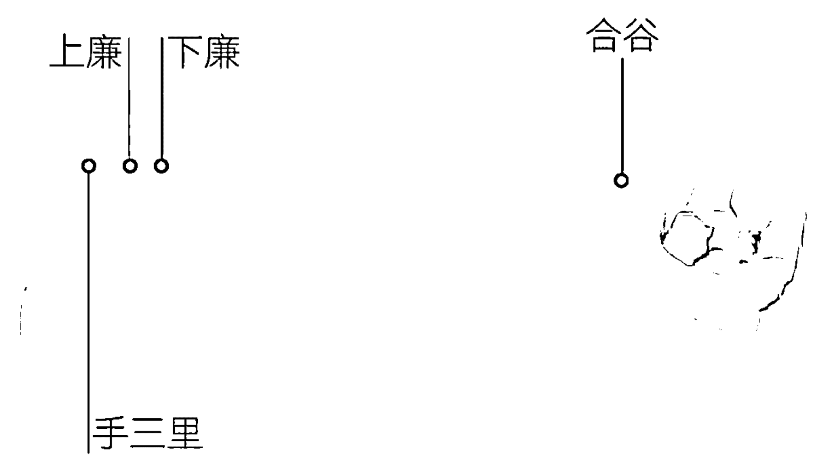

**大腸經易堵點** 手三里穴、合谷穴

透過以上實例，我明白了一點：只要身體存在隱患，雖然沒有明顯的不適表現，但經絡就會有反應，並以酸、麻、脹、痛等感覺告知我們。如果我們忽略身體的這種本能呼喚，病情就會往深裡發展。我想如果其他經絡也有這樣的穴位，那就應該具有普遍意義，就能夠告訴我們經氣在經絡中運行得是否順暢。於是，經過多年的摸索、整理、實踐，我逐漸發現每條經絡上都存在 2 ～ 4 個容易堵塞的穴位。

這些穴位大多分佈在肘、膝、腕、踝關節附近，一旦身體出現問題（即使在身體沒有異常感覺時），敲打它們時就會給我們提供信號。目前，人體十二經絡常見的堵塞穴位是 39 個，多數朋友會有 30 個左右。

### 審身體微恙，就能徒手調理百病

中醫治病特別強調「審微恙」。何謂「審微恙」？「審」是透過蛛絲馬跡發現真相的意思。「微恙」是人體的小疾、小病，可能小到身體都沒有感覺。

事實上，任何疾病在發生或發作之前，都會有一個長期潛伏、持續生長的過程。好比夏季沿海地區的颱風，最開始只是南太平洋的一個「小氣團」，一路向西北方向發展，這個過程中裹挾各種能量，最終成為熱帶風暴、颱風、超級颱風，進行大肆破壞。疾病對身體的危害也是這樣的。

《金匱要略》說「上工治未病」。未病是什麼？未病不是沒病，是待在身體裡面尚未成形的病，好比是強颱風災害形成前的「小氣團」。我們探尋自己身上的經絡堵塞點，就是發現身體「未病」的一種便捷方法，這是老祖宗代代相傳下來的。

日常生活中，只要我們自己隨時探查經絡上的痛點，及時疏通經絡，不僅能消除身體的隱患，已經有的長期慢性疾病，也會隨著身體自癒力的提高而減輕和受到控制。這樣，我們就不會生活在對疾病的恐懼中，可以坦坦蕩蕩做自己身體的主人。

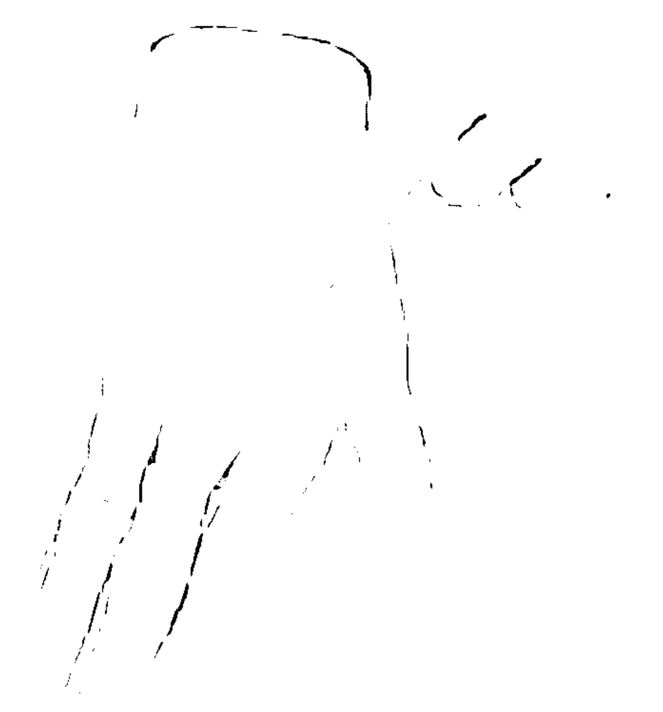

在探查到的痛點處敲揉及點按 3～5 天後，多數人的痛感會消失，這就代表經絡暢通，人體臟腑的隱患（微恙）消除了。

# 第二章

# 中醫七大外治法

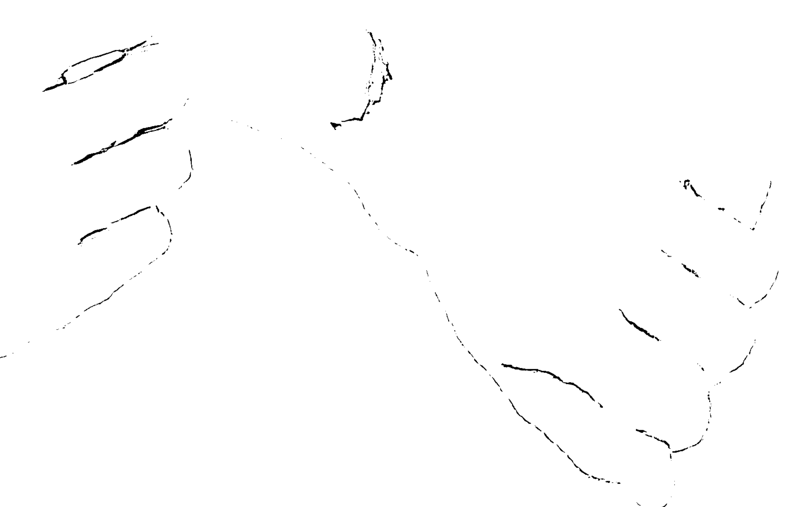

- 外治法的目的都在打通人體經絡
- 刮痧：驅寒排毒的首選
- 拔罐：可調理大部分慢性疾病
- 針刺：對氣血深層次的導引
- 艾灸：解決身體長期虛、虛胖、寒濕重的問題
- 導引：透過六字訣、太極拳等方法，讓身體氣通血暢
- 按摩：按、壓、揉、推、滾、搖、抖、扳、盤、運

## 外治法的目的都在打通人體經絡

大家在找中醫看病時，往往習慣了讓醫師開方抓藥，覺得看了病沒開藥，好像掛號費白花了，病也等於沒看。殊不知這是錯誤的。

事實上，開藥只是中醫多種治療手段的一種，高明的醫師會根據你身體病邪所在的層面、病勢的發展變化，採取不同的治療方法。

> 《黃帝內經·素問·陰陽應象大論》中講：「故邪風之至，疾如風雨，故善治者治皮毛，其次治肌膚，其次治筋脈，其次治六腑，其次治五臟。治五臟者，半死半生也。」

什麼意思呢？這是說疾病侵入人體的層次或者疾病的發展，是按照人的皮毛、肌膚、筋脈、六腑、五臟的次序進行的。

身為醫師，應該在疾病的早期覺察到並加以介入，這樣才能取得理想的治療效果。如果病情擴展到五臟，治療起來就比較麻煩了。

按照病邪在人體內傳遞、深入、變化的層次，中醫也發展出相對應的治療技法，如砭（刮痧）、拔罐、針刺、灸法、導引、藥物、按蹻（按摩）等。各種技法作用的病位不同，各有所長，但它們的終極目的只有一個，那就是恢復經絡暢通，保持人的身體和諧健康。

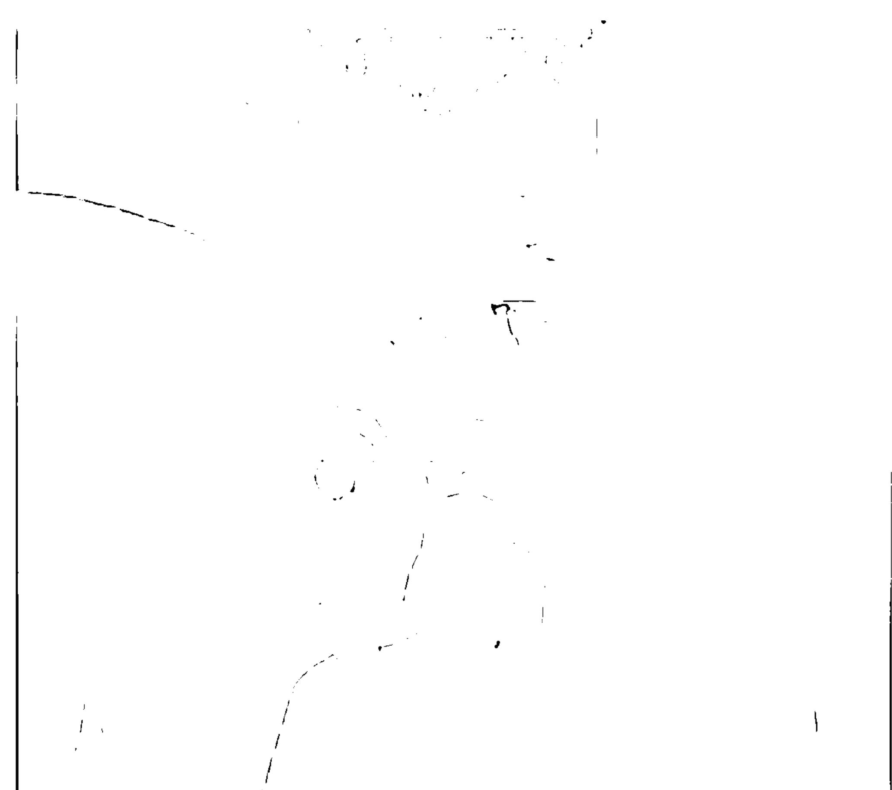

## 刮痧 驅寒排毒的首選

刮痧，是透過刮拭經絡，將體內廢物以「痧」的形式排出到體表，以促進經絡暢通，讓臟腑的功能恢復正常。

### 刮痧出痧的關鍵

**第一個條件是病位在肌表。**
比如，受了寒，開始有點打噴嚏，流清鼻涕，有點怕冷，這表示寒氣剛侵襲進身體。這時只要你沿著背頸部從上至下地刮拭督脈（脊柱）和兩側的膀胱經（身體防備外邪的第一道屏障），多數人就會有痧出來，而症狀也隨之減輕，感冒發燒的隱患就消除了。
如果錯過了這個時機，不久可能就會出現發燒、咳嗽、喉嚨痛、頭痛等症狀，因為外邪從肌表入裡了。

### 第二個條件是你身體的正氣比較充足。

刮痧時，如果你身體的正氣比較充足，輕輕刮拭，靠身體的本能力量就會將體內廢物清理出來。

請記住，為了出痧而刮痧，力量很大，不僅疼，效果也不盡如人意。其實，正確的刮痧是不疼的，而且痧不是醫者刮出來的，是透過醫者的手法引導，主要靠患者自己的氣血推出來的。刮痧的本質在於導引氣血，出不出痧，由你的身體決定。身體健康不出痧，正氣不足不出痧。

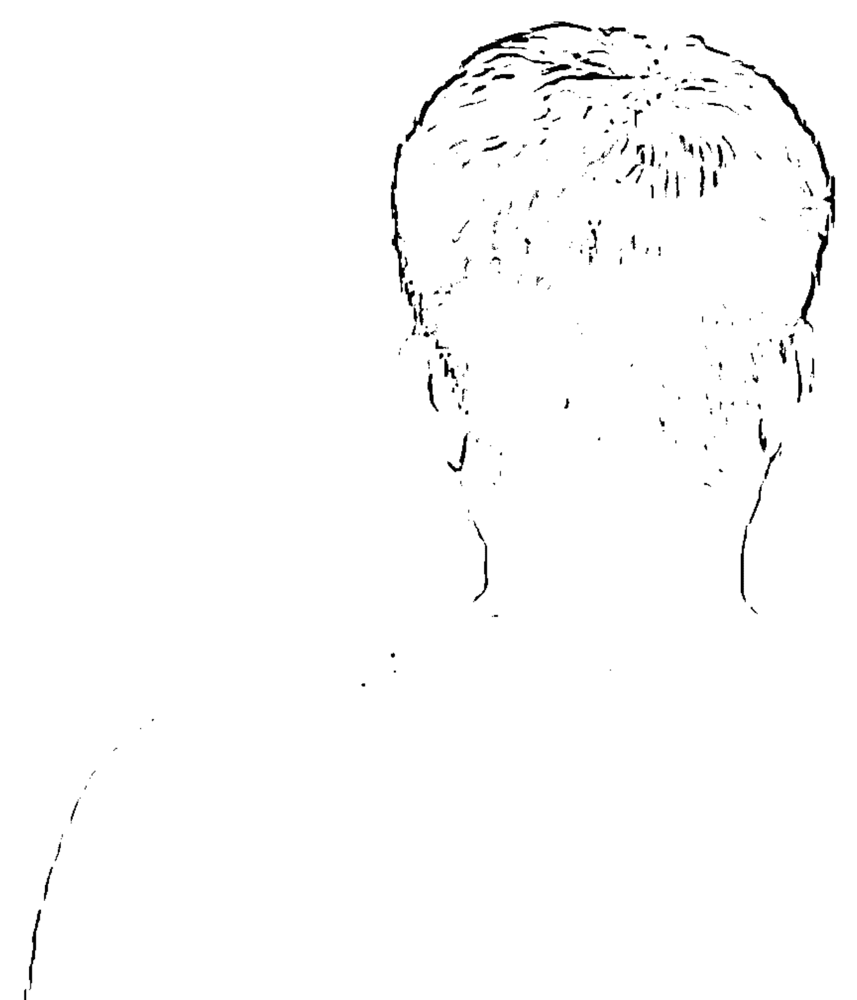

剛受了寒，在督脈和兩側的膀胱經刮痧，感冒的隱患就能徹底消除。

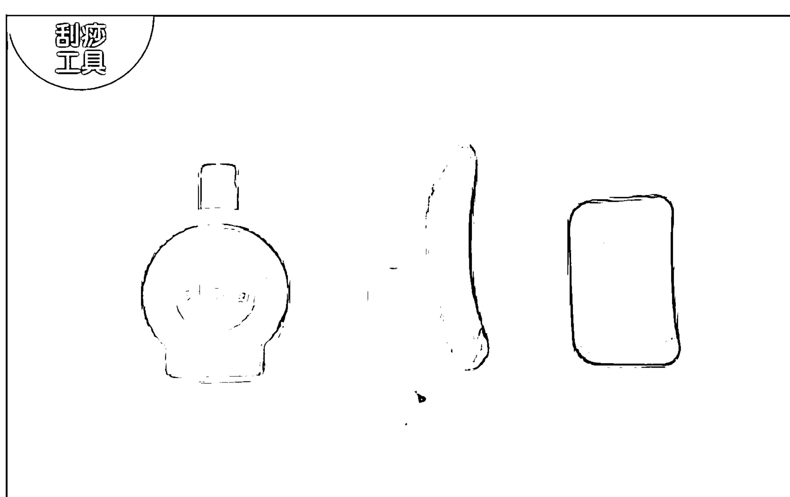

### 刮痧油和刮痧板

(1) 刮痧板（不必在意刮痧板的材質）、邊緣圓潤的湯匙。
(2) 刮拭時，先塗抹潤滑的介質，比如特製的刮痧油、潤膚油。此外，廚房的橄欖油、植物油甚至清水，都可以拿來使用，以免刮拭時弄破皮膚。

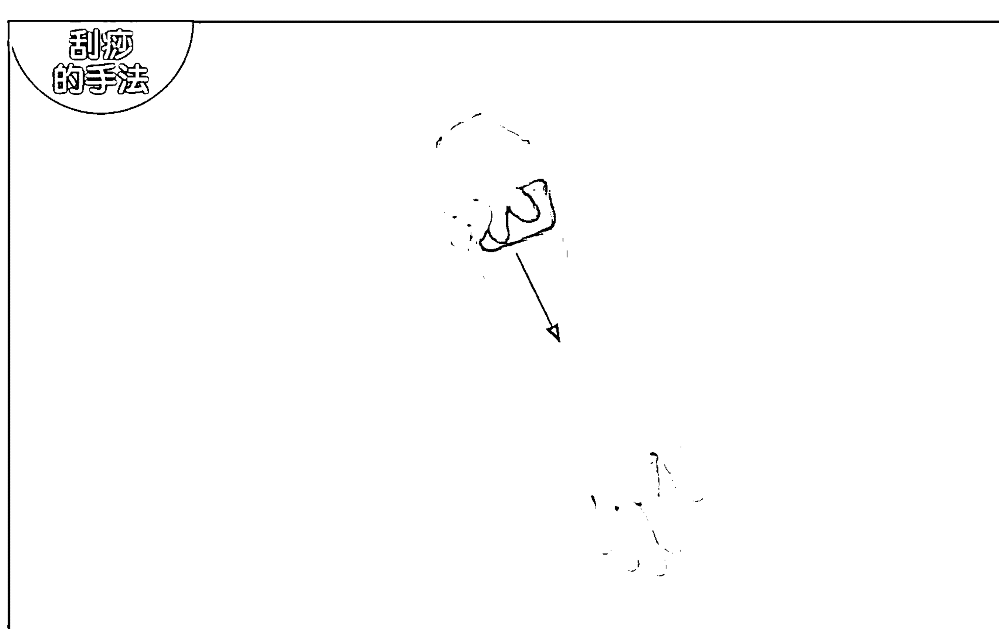

(1) 持刮痧器具，沿經絡走向每次刮拭 3 公分，刮拭 10 ～ 20 次，直到痧象沒有變化為止；再刮拭，直到沒有痧出來。

(2) 刮局部穴位時，固定一點，從上至下按照同一方向多次刮拭。

### 什麼樣的人不適合刮痧

注意：
心臟功能弱、患有皮膚病、懷孕、患有癌症、血小板低、紫癜、血壓過高的人，應該由專業醫師判斷是否適合刮痧，並由他們操作。家庭自我操作要慎重。

## 拔罐 可調理大部分慢性疾病

### 用拔罐法來深度祛瘀排毒

如果你平時身體比較虛，正氣弱，刮痧時不出痧，很有可能是病位不在肌表，而是在肌表更深處，此時可以拔罐來排毒強身。

拔罐有散除身體瘀結、加速新鮮血液流動、排出體內廢物、散寒（將寒氣清出體外）的作用。

比如你有長期的頸椎病，肩背部僵硬板結，如果刮拭半小時還沒有反應，代表病位深，氣血調動不過來。這時在後背兩側的天宗穴、肩井穴拔罐15分鐘，可能就有黑紫色罐痕（也可能初次拔罐沒有任何反應，第二天再拔，或者連續拔幾天，罐痕的顏色才會有變化），但持續下去，頸椎就會舒服很多。在我的經驗中，用拔罐法調理頸椎病的效果非常不錯，大家平常不妨一試。

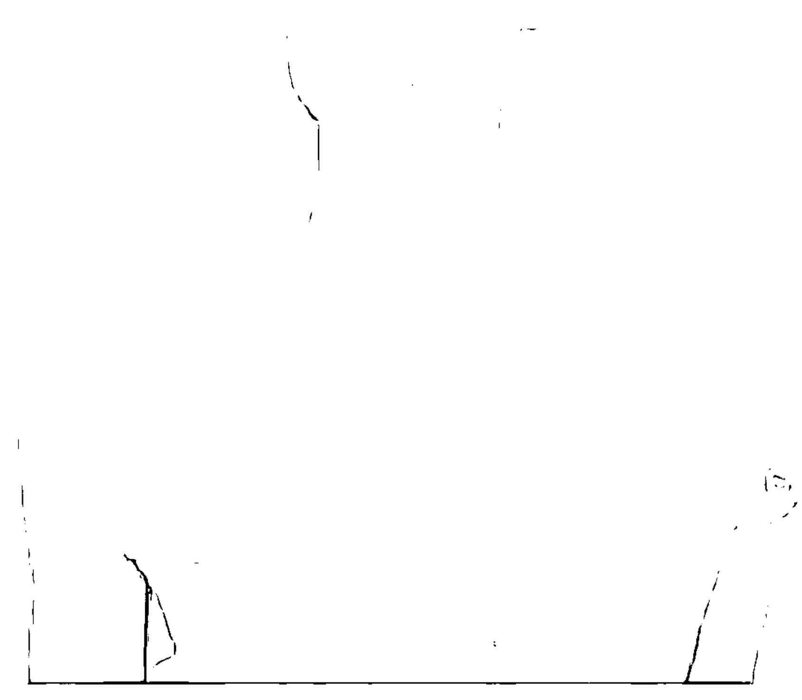

在天宗穴、肩井穴拔罐，調理頸椎病的效果非常不錯。

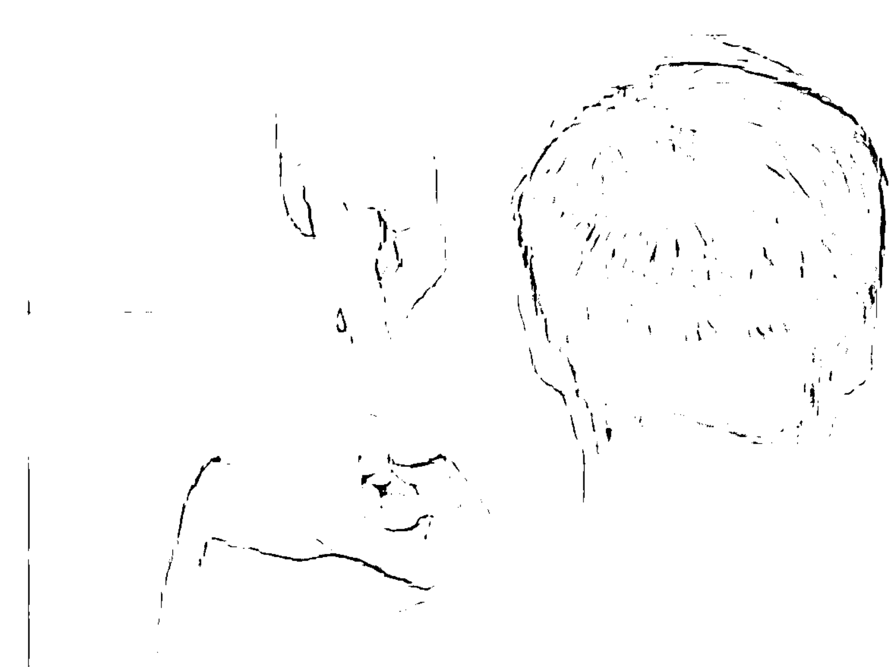

### 調理頸椎病、咳嗽等慢性老毛病

有一次，我母親感冒痊癒後，第二天早晨有些咳嗽，於是我就在她後背第三胸椎的肺俞穴（雙側肩胛骨內角旁開兩指寬）拔罐，留罐 10 分鐘，沒有罐痕。晚上再拔，顏色變暗紅。第二天晨起再拔，顏色紫暗，咳嗽減輕。第三天晨起又拔，結果出現密集的小水皰，咳嗽消失。第四天繼續拔，部分水皰破潰，流些淡紅的血水，用乾棉球蘸淨。第五天再拔，滲出幾滴鮮血，代表穴位局部恢復正常。之後，破潰的皮膚很快結痂，現在局部皮膚看不出任何變化。

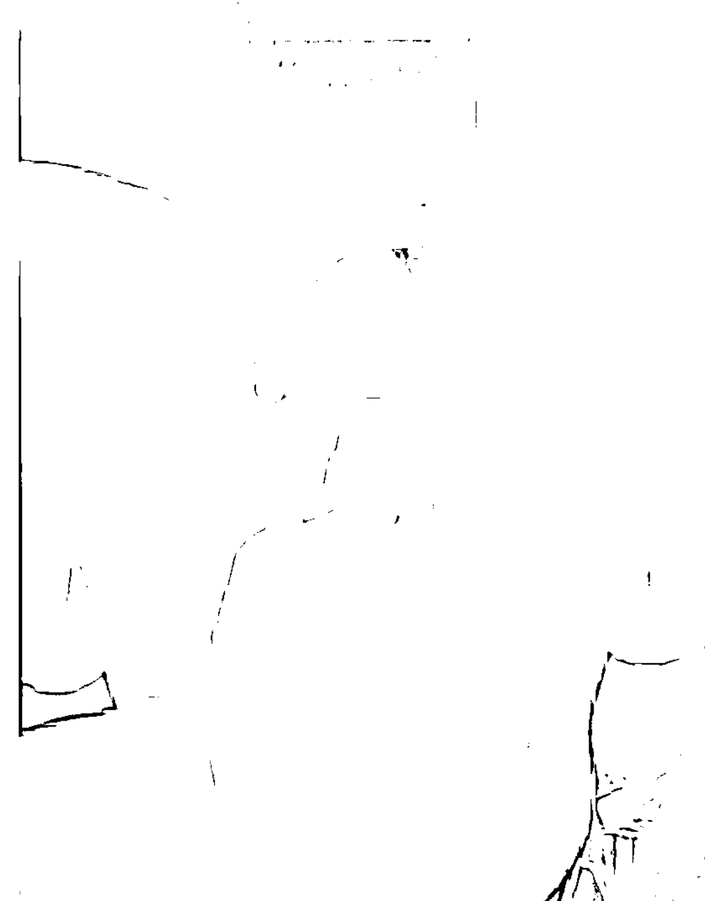

在肺俞穴拔罐，對感冒初癒後的咳嗽有很好的效果。

為什麼老人家有這樣的反應？前幾年，母親曾經有過晨起咳痰伴有血絲的情況，經過辨證治療、疏理經絡、配合藥物，看似痊癒了，而透過這次感冒，肺俞穴將殘存的體內廢物徹底清理乾淨了。

如果你平時身體虛弱，那麼比較適合在後背脊柱兩側的「背俞穴」拔罐。其實，大部分慢性疾病，都可以在相對應的「背俞穴」上來拔罐進行調理。

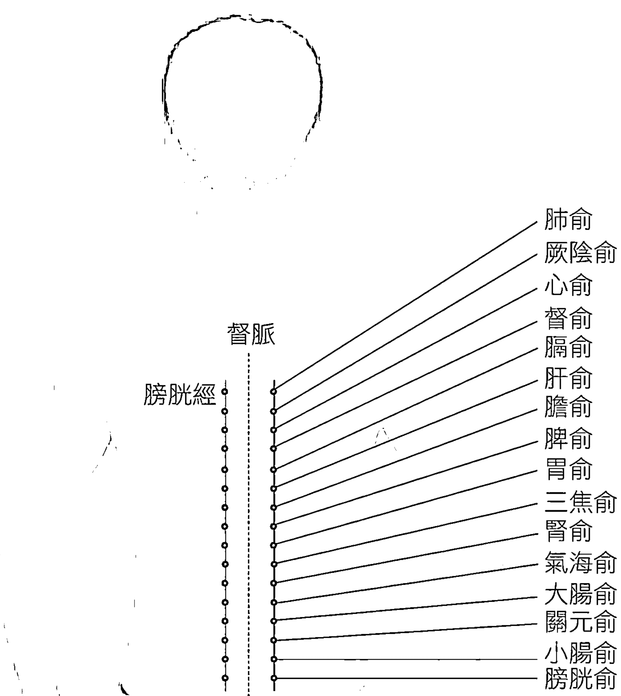

### 平時拔罐不要超過四個拔罐器

使用拔罐法為自己和家人調理身體時，建議一次不要使用超過四個拔罐器，不需要全身群拔，以免無謂地消耗氣血。
要知道，在需要的穴位上精準操作，才是有效合理的調理方法。
平常操作時，我的經驗是用抽氣槍抽氣三下，留罐 10 ～ 15 分鐘，拔兩天停一天，至罐痕消失為止。

### 拔罐後出皰是好事

有的人體態豐腴，濕氣大，拔罐後可能會出水皰，出皰是好事，是體內除濕的表現。如果水皰明顯、數量多、色白，是寒濕；如果水皰不明顯、數量較少、色微黃或渾濁，是濕熱。水皰較小、密集，可以不用處理，持續拔；水皰較大的話，需要挑破，用碘酊消毒，塗抹紫藥水。
女性朋友若遇到經期則不要拔（除非調理月經不調）。
對於某些熱證、實證，需要拔罐放血的，需要請專業的醫師來操作。

## 針刺 對氣血深層次的導引

針刺是用針深層次刺激穴位來疏通經絡，使氣血能夠正常循行，恢復臟腑本來的能力，從而針到病除。

我的經驗是，在痛感明顯的穴位處針刺，留針 10 分鐘，起針後再敲擊、探查，若這個穴位的痛感明顯減輕，代表氣血的運行已經順暢了。當然，病情的輕重、複雜程度，以及針灸師的水準，決定了見效的速度。

有一次，我妻子因走路過多，導致小腿肌肉僵硬、痠痛。當時我敲擊她小腿上方的合陽穴，輕輕三下就讓她疼痛難當了，於是我在此處進行針刺，用提插、捻轉的方式行針，得氣後留針 10 分鐘。當起針之後，再敲擊她的合陽穴，結果痛感完全消失，她的小腿瞬間輕鬆起來，這表示氣血通過堵塞「路段」，已經布散到整個小腿了。

經過這件事，我也發現了合陽穴是膀胱經的易堵塞穴位。

什麼是「得氣」呢？這是中醫針刺時的一個專業術語。針灸針刺入肌膚後，醫生要提插、捻轉，這稱為「行針」。行針的過程中，針尖與人體肌肉組織發生作用，如果出現如魚吞鉤的拉拽感，即為「得氣」。只有得氣了，調治效果才顯著。如果進針後像刺在豆腐裡一樣沒有任何感覺，效果就不理想。

請注意，對於初學者來說，針刺需要由專業醫師來操作。

## 艾灸 解決身體長期虛、虛胖、寒濕重的問題

### 艾灸能調理什麼病

經過多年的中醫普及化，很多朋友都懂得不少健康知識，有時提到某某病痛，人們會脫口而出：「艾灸吧！」現在，人們的飲食肥甘，又喜食大量寒涼的飲品和非當季的水果，熬夜，夏天長期使用空調、風扇，這樣的生活習慣導致越來越多人體內的寒濕較重，身體抵抗力差，很多人極易上火（口舌生瘡、咽喉腫痛等），更有甚者虛陽外越，如有血壓增高、身體虛熱、手腳涼等症狀。在中醫看來，這就是典型的陽虛（陽氣虛弱）。

正如著名中醫李可老先生說過的一句話：「陽虛者，十之八九；陰虛者，百不見一。」艾灸，正是專門調理身體陽氣虛弱的好方法。

什麼是艾灸？就是用艾絨、艾條，在穴位上以直接灸或懸灸等方式，給予溫熱刺激，隨著熱度的滲透，加速氣血在經絡的運行而達到恢復身體健康的一種方法。

所以，灸法特別適合虛證、寒證、瘀證。

### 如何艾灸

要在家裡為自己或家人灸時，比較方便的操作方式是用艾條懸灸：一手持艾條，另一隻手的食指和中指置於穴位兩側，艾條的火頭接近穴位，以被灸部位感到舒適為宜。

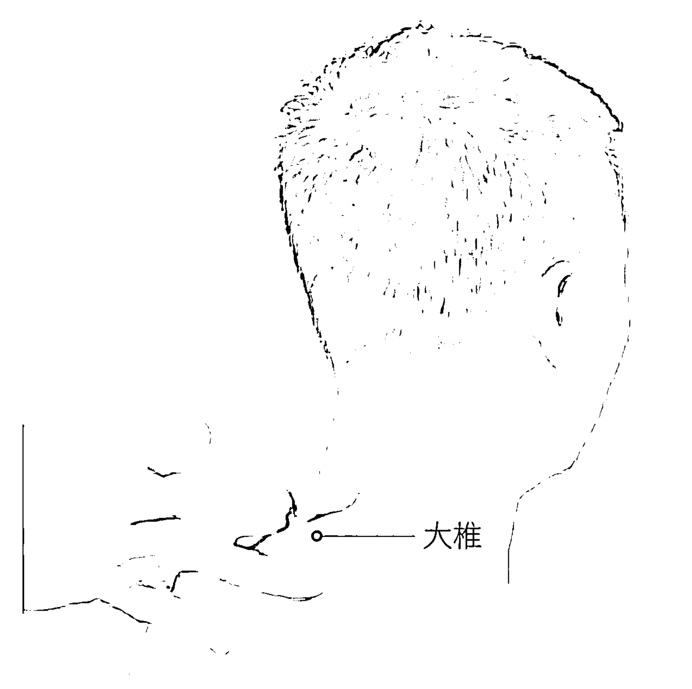

艾灸大椎穴

# 人體經絡自癒手冊

### 注意事項

在為自己或家人艾灸時，體位一定要舒適，不要對著任何風口。
艾灸後可能會起皰，這是水濕出來的表現。可以讓這些水皰自然地乾癟，或是刺破後再消毒。有些人體內寒大，感知能力下降，艾灸時要注意避免燙傷。
每次艾灸的時間，要以身體感受為主，比如灸腹部的穴位，施灸後要有全腹溫熱舒暢、直達深部的感覺。
如果灸後出現下排牙痛及下牙齦腫痛，可以疏理與疼痛部位同側的大腸經易堵塞穴位；上排牙痛及上牙齦腫痛，可以疏理同側胃經的易堵塞穴位。

## 導引 透過六字訣、太極拳等方法，讓身體氣通血暢

導引術是指透過六字訣、太極拳、五禽戲、八段錦等各種讓身體放鬆的方法，使得體內氣通血暢、身心和諧的一大方法。

大家可以去研究中國傳統的導引術，會發現一個共同點：活動節奏不快，多數與呼吸相配合；長期練習，會讓肌肉柔軟有彈性，不鬆弛、不緊繃。

物無美惡，過則為災。現在，有些人過度強調健身，跑步、游泳、騎自行車，美其名曰「強化心肺功能」，殊不知，過度的運動會增加臟腑的負荷，氣血都去供應外在了，內在的氣血運行卻很差。要知道，人體氣血的總量是固定的，如果過度運動，氣血大量供養四肢，內臟必然會缺氣血。

在我的經驗中，發現有不少肌肉發達的朋友，他們肌肉之間的縫隙在捏拿時會有強烈痛點，這表示氣血不通。

## 按摩 按、壓、揉、推、撥、搖、抖、扳、盤、運

按摩是指透過手法作用於身體，來調理疾病的方法，現代人也稱為「推拿」。

現代醫療推拿的常用手法是：按、壓、揉、推、撥、搖、抖、扳、盤、運。在本書中，應用的手法比較簡單，掌握敲、點、揉法即可。

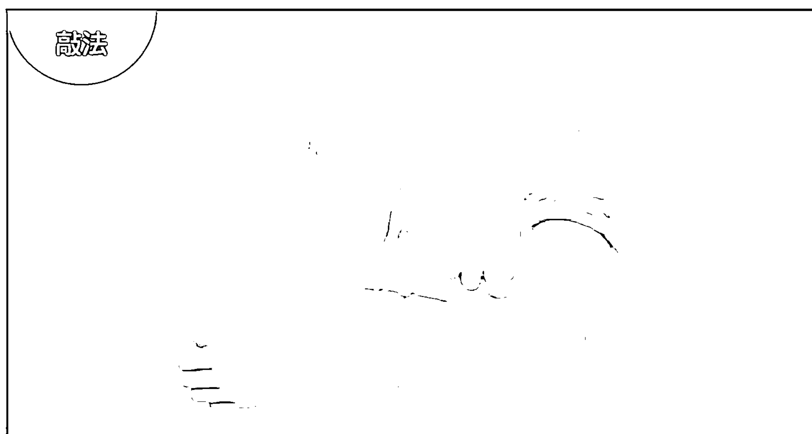

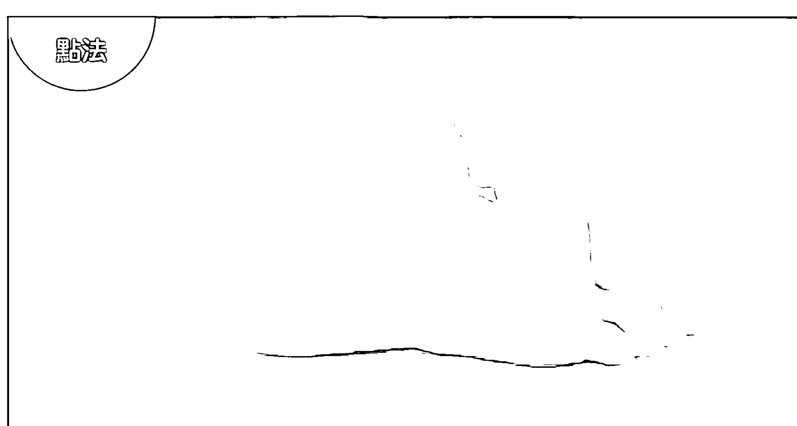

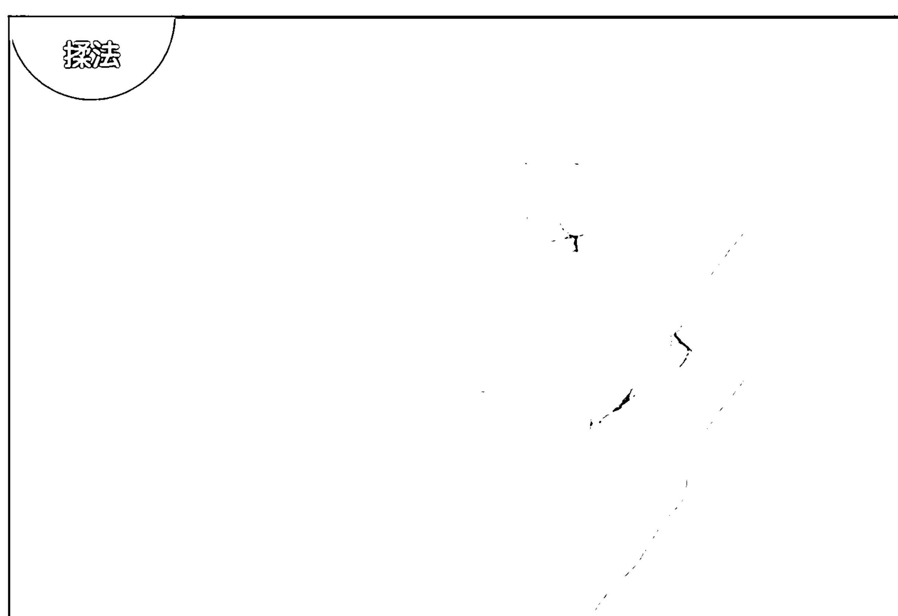

有人以為按摩和推拿是放鬆肌肉，做過後身體會變輕鬆，其實按摩除了可以改善很多軟組織和關節的疾患外，對內科慢性病也有很好的調理作用。

> 《黃帝內經・靈樞・經脈》中講：「經脈十二者，伏行分肉之間，深而不見。」所以經絡的暢通，代表對應的臟腑功能是正常的。

按摩時，慢慢將結節、筋節揉散，舒緩緊繃的肌肉、肌腱，使「分肉」之間的關係恢復常態，促進氣血的合理運行，調動臟腑的機能。

1960 年代流傳一本書叫《臟腑圖點穴法》，是王雅儒老師口傳的一本經典按摩書籍。王老一生以腹部點穴為主，肢體按摩為輔，治療多種疾病。這就是透過外在經絡穴位的調理，進而恢復內在臟腑功能的實踐驗證。

在按摩時，恢復肌肉的柔軟，使經絡暢通是主要目的，所以我一直宣導要非暴力地按摩。對身體的作用力量越大，身體就會自動地產生抗力，反而使肌肉緊繃。所以我們要養成溫柔地與身體對話的習慣，不要抱著功利的思想來對待身體，否則欲速而不達。

# 第三章

# 日常強身健體法

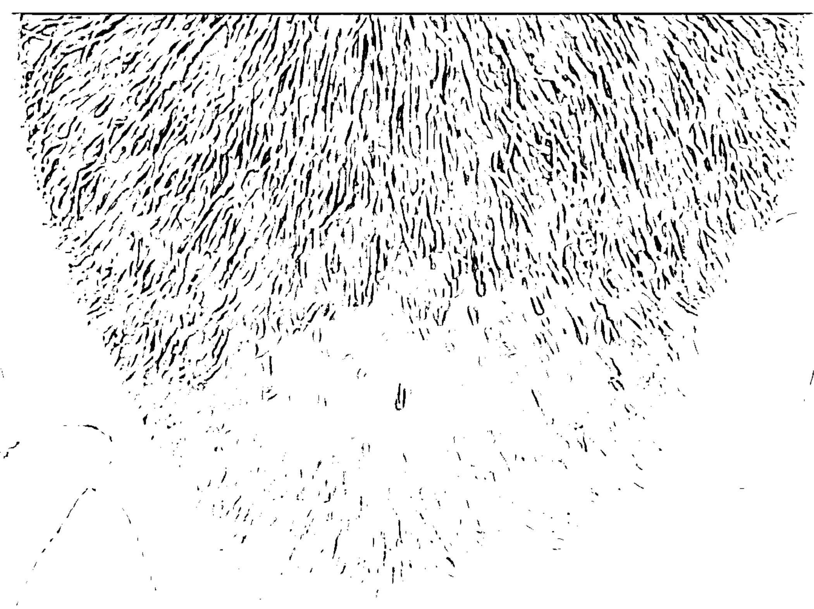

- 腹常輕摩：喚醒五臟的強大自癒力
- 手常抓握：養肝強筋
- 常捏小腿：減緩衰老，走路有力不抽筋
- 耳常搓：補腎補腦，耳聰目明
- 肛常提：提高生殖系統功能

## 腹常輕摩 喚醒五臟的強大自癒力

**方法** 摩腹的時候，要把自己的腹部當成小嬰兒來對待，速度要慢，力度特別輕，唯恐手重了會傷到孩子嬌嫩的肌膚，好像在推毫毛一樣，有種手掌與腹部皮膚似碰上非碰上的感覺。

很多人揉腹時，會比較機械地摩擦腹部，彷彿在完成一個任務似的，這往往沒什麼效果。如果我們像對待孩子一樣來輕揉自己的腹部，這種帶著愛的力量的方法會特別見效，大家可以試試看。

**作用** 摩腹的作用很多，最重要的是喚醒臟腑的自癒功能。從全息的角度來看，腹部可以投射全身，摩腹也可以算給全身做一次調理。

另外，身體還有十二個「募穴」，位於胸腹部，是臟腑之氣結聚、募集之處的特定穴。與背部的「俞穴」相似，刺激募穴一樣可以發揮調節臟腑的作用。

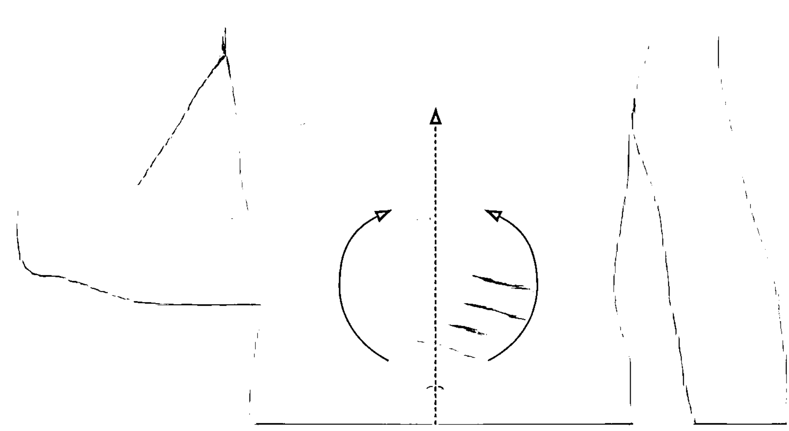

睡前和晨起後，手掌置於腹部皮膚，以肚臍為圓點，向上至胸骨劍突，向下至恥骨聯合，順時針摩腹 81 圈，再逆時針摩腹 81 圈。

### 常見問題 Q&A

**問：**
按摩腹部時，不都是要用力的嗎？不用力，手掌與皮膚似碰上非碰上，真的有用嗎？

**路老師：**
有沒有用處，有何用處，只有實踐之後才有發言權。我們的功利心太強了，不如利用摩腹的機會，放下目的與企圖心，平心靜氣與身體對話。

### 常見問題 Q&A

**問：**
摩腹的時候沒做完就睡著了，會有效果嗎？

**路老師：**
有的人只做一會兒，就微微出汗了；有的人晨起做完馬上就去洗手間了；有的人順時針摩完，逆時針剛摩 10 下就睡著了……這些都無妨，別在意這些，接受身體的任何反應，持續下去，身體自然會給你好報的。

## 手常抓握 養肝強筋

方法 肩、肘自然放鬆，雙手五指張開，握拳、伸直為一次，頻率為每分鐘 90 ～ 120 次。
開始練習時，不要貪多，適可而止；每日持續，抓伸次數自會提高，直至達到一次抓伸數千下。

### 作用

指尖有上肢六條經絡——心經、小腸經、心包經、三焦經、肺經、大腸經的起止點，透過快速抓伸練習，可以刺激這些穴位，對臟腑功能有很好的保健作用。

《黃帝內經·陰陽應象大論》說：「肝變動為握。」所以屈伸的動作還可以養肝強筋，既舒緩情緒，又讓身體放鬆，一舉多得。

另外，腳趾也可以做類似的動作。上班累了或睡覺前躺在床上，腳趾盡力地彎曲、伸直，一會兒工夫，小腿和腳就有熱感了，也是很好的養肝強筋之法。

## 常捏小腿 減緩衰老，走路有力不抽筋

方法 從膝關節下方開始，用手依次向下充分捏拿小腿肌肉。針對僵硬、痠痛的地方，可以多捏揉幾次，持續幾日後則會慢慢變軟。

作用 很多人的小腿肌肉是僵硬的，痛點也有很多，這種情況表示氣血在小腿運行不順暢。
為什麼人老腿先老，中老年人容易小腿抽筋，而且單純補鈣的效果不理想？根本原因就是小腿循行的脾經、肝經、腎經不通，脾、肝、腎的功能有點弱。而將小腿捏軟後，小腿會變得柔軟有力，走路步伐輕快。持續下去，你會發現胃口開了，睡眠狀況變好了，每天也特別有精神。

另外，按照全息理論，如果將小腿看作整個身體，那麼小腿後方中央的膀胱經承山穴就是腰痛點，因為它對應著身體後部的中間區域，點揉此處可以緩解腰痠、腰痛、腰無力。同理，小腿柔韌有力，也代表整個身體柔韌有勁。

點揉承山穴，可以緩解腰痠、腰痛、腰無力等症狀。

## 耳常搓 補腎補腦，耳聰目明

方法 雙手拇指與食指側面配合，由上至下搓耳，至耳朵發熱為宜。另外，搓耳時，哪處有痛點就要多揉，不要只想著按揉耳朵，要想自己正在對全身進行保健。（耳朵是人體的全息反射區。）

作用 《黃帝內經·陰陽應象大論》中說：「……腎在竅為耳。」比如雙側耳鳴，則是腎虛的一種表現，常揉雙耳，耳鳴的症狀就能得到改善。

另外，《黃帝內經·金匱真言論》中說：「心開竅於耳。」常按揉耳朵能增強心臟功能，預防心腦血管疾病的發生。

搓耳，不仅能強壯五臟六腑，還對心、腎特別有保健作用。

## 肛常提 提高生殖系統功能

**方法**

緩緩吸氣，同時提肛，連同會陰一起上升（好像忍大便時的狀態），停留 10 秒鐘，然後呼氣，同時輕輕放鬆。每次重複進行 5 分鐘，以小腹部產生溫熱感為宜，每日 3 次。

**作用**

提肛，古稱「撮谷道」，隨時隨地都可以進行，不受時間、地點、環境的限制，或蹲、或站、或坐、或躺皆可。

「撮谷道」是從古流傳至今的養生之術。「谷道」即肛門，古人將肛門稱之為「五穀殘渣之泄道」，而「撮」就是做肛門收縮上提之法。

「撮谷道」好似在給盆腔做按摩，這種養生方法在使盆腔肌肉得到訓練的同時，可以防治痔瘡、肛裂、脫肛、便祕等症。

此外，持續「撮谷道」對於男性的前列腺炎、前列腺肥大、陽痿、早洩，針對女性的盆腔炎、月經不調、白帶異常、性冷感等生殖系統疾患，也有很好的防治作用。

以上五種小動作非常適合人們在平時進行，是一種整體的調理身體之道。每個人的身體體質是不一樣的，所患疾病也是千變萬化的，所以，我們要根據不同的情況，靈活為自己和家人選擇調理方案。請記住，沒有哪一種方法比另外一種方法更好、更有效，只有適合自己個人感覺的，才是最好的。

另外，不要老想著身體有病時，會有藥物和名醫來救自己。身體是自己的，要像對待孩子一樣對待自己的身體，不要把身體這個「孩子」交給外人去撫養。

## 第四章
### 身體常見毛病的經絡調理法

- ○ 常見疼痛
- ○ 消化系統疾病
- ○ 耳鼻喉科疾病
- ○ 女性常見疾病
- ○ 男性疾病
- ○ 亞健康狀態

| 中醫的指寸法 | |
| :--- | :--- |
| 1寸 拇指第一關節的寬度 | 1.5寸 食指和中指併攏後的寬度 |
| 2寸 食指、中指和無名指併攏後的寬度 | 3寸 食指到小指併攏後的寬度 |

## 常見疼痛

- 牙痛 067
- 偏頭痛 070
- 後頭痛 072
- 前額痛 073
- 巔頂頭痛 075
- 頭痛如裹 077
- 肩周炎（五十肩） 078
- 坐骨神經痛（腰突） 080
- 急性腰部扭傷疼痛 083
- 膝關節腫痛 085
- 痛風 087

### 牙痛

#### 1. 上排牙痛

以敲擊或點揉的手法，探查同側腿部胃經的易堵點：髀關穴、梁丘穴、內庭穴（第二腳趾與第三腳趾之間的趾蹼緣處），找到疼痛點。

在探查到的痛點處敲擊或點揉 3～5 分鐘，直至牙痛減輕。

#### 2. 下排牙痛

以敲击或按揉的手法，探查同侧手臂大肠经上的易堵点：手五里穴、手三里穴、合谷穴，找到疼痛点。

在探查到的痛点处敲揉 3～5 分钟，直至牙痛减轻。

大肠经易堵点 手五里穴、手三里穴、合谷穴

#### 3. 牙齿松动或咀嚼时牙疼

以敲击或按揉的手法，探查同侧手臂肾经上的易堵点：水泉穴、照海穴，找到疼痛点。

在探查到的痛点处敲揉 3～5 分钟，直至牙痛减轻。

当下见效。

**肾经易堵点** 水泉穴、照海穴

> 根据「经脉所过，主治所及」的原则，胃经走上排牙，而大肠经走下排牙，所以上排牙痛与胃经有关，下排牙痛与大肠经有关。《黄帝内经·灵枢·经脉》中讲：「大肠手阳明之脉……入下齿中，还出挟口……胃足阳明之脉……上入齿中，还出挟口，环唇，下交承浆……」。
如果有牙齿松动的情况，可以增加肾经易堵塞穴位的疏理。

### 偏頭痛

以敲擊或點揉的手法，探查同側三焦經上的易堵點：四瀆穴、消濼穴、翳風穴，以及膽經上的肩井穴、風市穴、懸鐘穴、足臨泣穴，找到疼痛點。

在探查到的痛點處敲揉 3 ～ 5 分鐘，每日 2 次。持續幾日，直至痛感減輕。

3 日內。

三焦經易堵點 四瀆穴、消濼穴、翳風穴

偏頭痛的位置在三焦經、膽經的循行路線上，因此與三焦經、膽經有關，如果晚上 9 點（三焦經氣血旺盛的時間）加重，更表示是三焦經、膽經堵塞所致。

膽經易堵點 肩井穴、風市穴、懸鐘穴、足臨泣穴

### 後頭痛

以點揉的手法，探查雙側膀胱經的易堵點崑崙穴，找到疼痛點。

當下見效。

- (1) 在探查到的痛點處按揉 3～5 分鐘。持續幾日，直至痛感減輕。
- (2) 在頸項部的督脈、雙側膀胱經、膽經處刮痧。

後頭痛的位置在膀胱經的循行路線上，多在受寒後發作，且多數人伴有頸部僵硬的現象，經常表現為午後 3 點的時候加重。對待這種頭痛，首選膀胱經的易堵塞點：崑崙穴，然後在頸項部的督脈、雙側膀胱經、雙側膽經處刮痧，清除聚集在肌表的邪氣。

膀胱經易堵點 崑崙穴 督脈、雙側膀胱經、膽經處刮痧

### 前額痛

以敲揉的手法，探查雙側胃經的易堵點：髀關穴、梁丘穴，找到疼痛點。

- (1) 在探查到的痛點處敲揉 3～5 分鐘，每日 2 次。持續幾日，直至痛感減輕。
- (2) 中脘穴（位於人體上腹部前正中線上，當臍中上 4 寸處）是任脈的穴位。前額疼痛時用食指點揉，如有痛感則繼續按揉至不痛為止。如果與受寒有關，艾灸中脘穴可以平衡中焦脾胃的寒氣。每次艾灸，要灸到胃部充滿溫熱感。如果艾灸時腹內很快就感到溫熱，代表寒熱平衡了，此時可以停灸。

當日。

胃經的循行路線經過前額，所以前額（眼眉上方）疼痛與胃經受損、堵塞有關；疏理胃經易堵塞穴位，恢復胃的功能後可以緩解。

胃經易堵點 髀關穴、梁丘穴

艾灸中脘穴

### 巔頂頭痛

敲擊或點揉雙側肝經的陰包穴、太衝穴，以及膽經的肩井穴、風市穴、足臨泣穴，找到疼痛點。

在探查到的痛點處敲揉 3～5 分鐘，每日 2 次。持續幾日，直至痛感減輕。

當日。

巔頂頭痛是肝經的問題。《黃帝內經·靈樞·經脈》中說：「肝足厥陰之脈，起於大指叢毛之際……上入頏顙，連目系，上出額，與督脈會於巔。」
怒傷肝，所以巔頂頭痛多在大怒之後發作。而肝膽相照，互為表裡，因此疏理肝經及膽經的易堵塞穴位，恢復肝、膽的功能，對治療巔頂頭痛有效。如在疏理肝經、膽經時，出現打嗝、排氣的情況，都屬於正常現象。

**肝经易堵点** 阴包穴、太冲穴

**胆经易堵点** 肩井穴、风市穴、足临泣穴

### 頭痛如裹

以敲擊或點揉的手法，探查雙側脾經的易堵點：地機穴、三陰交穴、公孫穴，找到疼痛點。

在探查到的痛點處敲揉 3～5 分鐘，每日 2 次。持續幾日，直至痛感減輕。

有一種頭痛，無固定部位，頭昏昏沉沉，彷彿緊緊裹著一塊布，術語稱之為「頭痛如裹」。這是脾虛濕盛所致，尤其在夏季以南方人多見。在疏理脾經的同時，建議請當地中醫師當面詳細辨證診治，配合口服中藥。

脾經易堵點 地機穴、三陰交穴、公孫穴

### 肩周炎（五十肩）

以點揉的手法，探查患側小腸經的易堵點：肩貞穴。

- (1) 在探查到的痛點處按揉 3 ～ 5 分鐘，直至痛感減輕。
- (2) 在天宗穴處拔罐 15 分鐘，拔兩天停一天，待黑紫顏色消失，方可停止。
- (3) 用力點按對側陰陵泉穴下 1 寸 5 ～ 10 分鐘。

肩部肌肉不僵硬者，當下見效。

肩周炎是令人十分痛苦的疾病。因肩關節活動受限，如欲增大活動範圍，則會產生劇烈刺痛，嚴重時患肢不能梳頭、洗臉和扣腰帶。
中醫稱肩周炎為漏肩風、凍結肩，而小腸經堵塞，致使氣血運行不暢，是發生此病的重要因素。小腸經氣血凝滯的主要誘因是寒凝，在肩周炎病人患側小腸經的肩貞穴會有結節，用拇指點揉時刺痛難當，因此要忍痛揉開，待穴位處痛感下降後，方可見效。同時，在天宗穴處拔罐，如果顏色紫黑，表示寒氣較重，可以持續對此穴拔罐排寒、活血祛瘀，以促進局部氣血的運行。
另外，在陰陵泉穴下 1 寸的位置有一個奇穴，被《董氏奇穴針灸》稱為「天皇穴」。肩關節活動受限的患者，可以按照X形取穴法，即取對側的穴位，拇指用力點住對側陰陵泉穴下1寸，患者同時忍痛活動患肢，逐漸加大幅度，待指下穴位處痛感減輕後，肩部的活動會明顯加強。如果陰陵泉穴下1寸痛感不明顯，可向下探查，會在地機穴上0.5寸的位置有一處最痛點，這就是《董氏奇穴針灸》中所講的「天皇副穴」，進行方法同上，多數情況效果立見。

小腸經易堵點 肩貞穴 脾經易堵點 陰陵泉下1寸

天宗穴拔罐

### 坐骨神經痛（腰突）

以敲揉的手法，探查患側膽經的風市穴、陽陵泉穴（膝關節外下方，在腓骨小頭前下方凹陷中）、懸鐘穴、足臨泣穴，點揉膀胱經的委中穴、崑崙穴、合陽穴、承山穴，以及腎經的大鐘穴、水泉穴、照海穴，找到疼痛點。

- (1) 在探查到的痛點處敲擊或點揉 3～5 分鐘，每日 2 次。持續數日，直至痛感減輕。
- (2) 在雙側腎俞穴處拔罐 15 分鐘，拔兩天停一天，待黑紫顏色消失，方可停止（女性經期勿拔罐）。
- (3) 晨起艾條懸灸關元穴 20～30 分鐘，持續數日，待艾灸 2～3 分鐘全腹皆有熱感時，方可停止。

3～7 天。

## 人體經絡自癒手冊

**胆经易堵点** 风市穴、阳陵泉穴、悬钟穴、足临泣穴

**膀胱经易堵点** 委中穴、昆仑穴、合阳穴、承山穴

**肾经易堵点** 大钟穴、水泉穴、照海穴

坐骨神經痛的疼痛部位常見於腰部、臀部、大腿後側、小腿後外側和足外側。按照經脈的循行路線，下肢後側是膀胱經的領地，下肢外側是膽經的區域，因此自我調理時先疏通膽經、膀胱經。另外，膀胱與腎是表裡關係，而坐骨神經痛常與腰椎間盤突出症有關聯，疏通腎經、溫補腎陽，也是緩解坐骨神經痛和「腰突症」的常用方法。
在腎俞穴處拔罐，艾灸關元穴，有強腰固腎、溫補腎陽的作用，對於緩解腰肌緊張、下元虛冷效果明顯。
膀胱經、膽經易受寒邪侵襲，坐骨神經痛患者平時要注意避寒。而「寒主收引」，影響氣血的運行，進而導致局部肌肉因細胞失養而拘攣疼痛。同時，要注意保護腰部，活動幅度不要太大，而不顧自身能力的盲目鍛鍊也是不可取的。

### 急性腰部扭伤疼痛

以點揉的手法，探查雙側小腸經的後溪穴、督脈的人中穴、雙側經外奇穴「腰痛點」（位於第二、三掌骨及第四、五掌骨之間，腕橫紋與掌指關節中點處，一側兩穴）。

在探查到的疼痛處點揉 3 ～ 5 分鐘，邊點揉邊晃動腰部，直至腰部活動幅度增大為止。

當下見效。

小腸經易堵點 後溪穴 督脈易堵點 人中穴 經外奇穴 「腰痛點」

急性腰部扭傷可以採取疏理經絡易堵穴位的方法來緩解疼痛，以促進受損組織的恢復。當然，在進行前應該排除腰椎骨骼沒有骨折等問題。

人中穴，又叫水溝穴，位於鼻唇溝上 1/3 與下 2/3 的交界處，按揉時用食指的指肚稍微用力點揉，切勿用指甲，以免損傷皮膚。而點揉後溪穴和「腰痛點」時，痛感越強烈，見效越快。值得注意的是，探查、點揉這三個穴位時都要輕扭腰部，並逐漸增大幅度，隨著穴位痛感的減輕，腰部的痛感也會逐漸下降。

另外，腰為腎之府，腰部損傷，需要補益腎氣來幫助恢復腰部肌肉的強度。眼角內側是膀胱經的起點，膀胱經在腰部的路線正好經過腎區，而鹽水是鹹的，按照「酸、苦、甘、辛、鹹」五味的對應關係，鹹味入腎，有強壯腎氣的作用，所以，在眼角內側點幾滴淡鹽水是強腰固腎的簡便方法。

如上述方法進行及時、得當，可以立即緩解急性腰部扭傷的疼痛。

### 膝關節腫痛

以敲揉的手法，探查患側膀胱經的委中穴、合陽穴，膽經的風市穴、陽陵泉穴，胃經的髀關穴，以及肝經的陰包穴，找到疼痛點。

- (1) 在探查到的痛點處按揉 3～5 分鐘，每日 2 次。持續幾日，待穴位處痛感下降，症狀會緩解。
- (2) 在膝關節上下左右縫隙拔罐，每次拔 10 分鐘，拔兩天停一天，至罐痕徹底消失為止。

3～5 天。

膀胱經易堵點 委中穴、合陽穴

**膽經易堵點** 風市穴、陽陵泉穴

**胃經易堵點** 髀關穴

**肝經易堵點** 陰包穴

膝關節腫痛者多為老年人。若透過影像學的檢查，排除了骨頭的退化改變，只要是軟組織損傷導致的膝關節腫痛，就可以透過疏理經絡易堵穴位的方法來自我調理。當然，在點揉委中穴、陽陵泉穴、風市穴時會十分疼痛，只有把這些痛點揉開，氣血才能順暢運行。同時，盡可能減少騎車、爬山等需要跳躍和反覆上下的活動，這些運動方式都可能引發膝關節問題。對膝關節腫痛患者來說，天氣轉冷時可以將粗鹽與艾絨炒熱，裝在布袋裡熱敷關節，每日進行，可以溫經通絡。

### 痛風

以點揉的手法，探查雙側腎經的大鐘穴、水泉穴、照海穴，肝經的陰包穴、太衝穴，以及小腸經的後溪穴；掐揉心經的「蝴蝶袖」、少海穴、「腕部四穴」；點揉脾經的地機穴、公孫穴、太白穴，找到疼痛點。

- (1) 在探查到的痛點處點揉或掐揉 3～5 分鐘，每日 2 次。如果病情複雜，涉及臟腑多，那麼每日可探查、疏理三條經絡，隔日更換。持續數日，直至痛感減輕。
- (2) 在兩側小腸經的天宗穴各拔罐 15 分鐘，拔兩天停一天，待紫黑色罐痕消褪時，方能停止。
- (3) 每日晨起艾灸關元穴 30 分鐘，持續數日，待艾灸 2～3 分鐘後全腹便充滿熱感，方可停止。

7～15天。

痛風發作時相當痛苦，其臨床表現為痛風性關節炎和關節畸形，會出現紅、腫、熱、痛的症狀，如不及時治療，會引起痛風性腎炎、尿毒症、腎結石等多種併發症。痛風多在夜間及凌晨突發，採用上述方法治療，1～2 週即可緩解。

### 腎經易堵點
大鐘穴、水泉穴

**腎經易堵點** 照海穴

**肝經易堵點** 陰包穴

**肝經易堵點** 太衝穴

**小腸經易堵點** 後溪穴

# 人體經絡自癒手冊

掐揉「蝴蝶袖」

心經易堵點 少海穴

心經易堵點「腕部四穴」

脾經易堵點 地機穴

脾經易堵點 公孫穴、太白穴

第四章 | 身體常見毛病的經絡調理法 089

天宗穴拔罐

艾灸关元穴

## 消化系統疾病

- 口臭 | 092
- 打嗝 | 095
- 厭食 | 096
- 胃病 | 098
- 便秘、便溏 | 101
- 痔瘡 | 104

### 口臭

以敲擊或掐揉的手法，探查雙側胃經的髀關穴、內庭穴，心經的「蝴蝶袖」、少海穴、「腕部四穴」；點揉心包經的天泉穴、「肘下2寸」，和雙側大腸經的手五里穴、手三里穴、合谷穴，找到疼痛點。

在探查到的痛點處按揉3～5分鐘，每日2次。持續一週，直至痛感減輕，痛苦緩解。

3天。

胃經易堵點 髀關穴、內庭穴

掐揉「蝴蝶袖」

**心經易堵點** 少海穴、「腕部四穴」

**心包經易堵點** 天泉穴、「肘下2寸」

#### 大腸經易堵點 手五里穴、手三里穴、合谷穴

中醫認為口臭的根源在腸胃。口腔位於整個消化系統（食道、胃、小腸、大腸等）的上口，如果胃腸功能異常，吃進來的食物在胃腸消化、儲留、發酵的時間過長，結果味道就返上來了。食物殘渣重複發酵會產生毒素，而毒素入血就會傷害其他臟腑。
想要口氣清新，恢復胃腸功能是正道。內庭穴是清胃火的常用穴位，疏通大腸經使其氣血運行順暢，促進腸道蠕動。另外，口臭屬於火，清心火也是必要的。疏通心經、心包經，既清口氣，又保護心臟，一舉兩得。

### 打嗝

以敲揉的手法，探查雙側心包經的易堵點天泉穴、「肘下2寸」，找到疼痛點。

當下見效。

- (1) 在探查到的痛點處敲揉3～5分鐘，直至痛感減輕。
- (2) 在膈俞穴（肩胛骨下角水平線與脊柱相交椎體處，下緣旁開兩橫指）處刮痧。

打嗝屬於氣機上逆，由膈肌痙攣引起，疏通膀胱經的易堵塞點膈俞穴，有理氣解鬱的作用。
另外，取嚏法也是利氣機的好方法：將衛生紙旋轉擰緊做成2條0.3公分左右粗細的紙捻，同時伸進鼻子裡面輕輕刺激鼻腔黏膜，當發癢的時候取出，打了一個噴嚏後，再重複操作，直到噴嚏沒有為止。

心包經易堵點 天泉穴、「肘下2寸」 膈俞穴刮痧

### 厭食

以敲擊或掐揉的手法，探查雙側心經的「蝴蝶袖」、少海穴、「腕部四穴」，脾經的地機穴、公孫穴、太白穴，以及胃經的髀關穴、豐隆穴；點揉胃經的天樞穴（位於人體中腹部，肚臍向左右三指寬處）和任脈的中脘穴，找到疼痛點。

在探查到的痛點處敲揉 3～5 分鐘，每日 2 次。持續數日，直至痛感減輕。

15 天。

上述經絡調理方法可以幫助厭食症患者進行生理上的治療，但形成厭食症的心理因素，則需要家人、朋友、社會的共同正確引導。

掐揉「蝴蝶袖」

心經易堵點

少海穴、「腕部四穴」

**脾经易堵点** 地机穴、公孙穴、太白穴

**胃经易堵点** 髀关穴、丰隆穴

**胃经易堵点** 天枢穴

**任脉易堵点** 中脘穴

### 胃病

以敲击或点揉的手法，探查双侧胃经的髀关穴、足三里穴、内庭穴，脾经的地机穴、公孙穴、太白穴，肝经的阴包穴、太冲穴，以及心包经的天泉穴、「肘下2寸」，找到疼痛点。

- (1) 在探查到的痛点处敲击或点揉3～5分钟，直至痛感减轻。
- (2) 晨起时，用艾条悬灸任脉的关元穴、中脘穴，每日一穴，交替进行，每次灸20～30分钟。待艾灸2～3分钟全腹即充满热感时，方可停止。

7～15天。

**胃经易堵点** 髀关穴、足三里穴、内庭穴

**脾经易堵点** 地机穴、公孙穴、太白穴

**肝经易堵点** 阴包穴、太冲穴

#### 心包經易堵點 天泉穴、「肘下2寸」

胃病是許多疾病的統稱，都有相似的症狀，如上腹胃脘部不適、飯後飽脹、噯氣、胃食道逆流，甚至流，甚至噁心、嘔吐等。這些症狀都可以按照上述方法輔助調理。
養胃，首先要管住嘴，做到食飲有節。此外，還要控制好情緒。脾胃屬土，按照五行生剋理論，木剋土，肝氣亢盛時，脾胃受克制，所以生活中有的朋友在發怒或生悶氣後，導致胃病復發或加重。
我曾經遇到一位胃潰瘍患者，辨證調理了一段時間後，大致痊癒。可是，在三個月後的一天下午，他再次來找我，說胃部又痛又脹。問其原因，得知他上午與同事生氣，結果胃病復發。
這件事讓我明白，如果沒有舒緩的情緒，這個病是治不好的，因為醫者可調形，但無法治心。保持一顆平常心，使情緒不受外界人、事、物所累，這需要我們提升修為，也是養護生命的正道。

### 便秘、便溏

- (1) 以敲擊、點揉的手法，探查雙側大腸經的手五里穴、手三里穴、合谷穴，肺經的孔最穴、魚際穴，以及脾經的地機穴、太白穴、公孫穴，找到疼痛點。
- (2) 點揉雙側脾經的大橫穴（肚臍水平旁開 4 寸處）和胃經的天樞穴。

- (1) 在探查到的痛點處敲擊、按揉 3～5 分鐘，每日 2 次。持續數日，直至穴位痛感消失。
- (2) 在雙側膀胱經的腎俞穴處拔罐 15 分鐘，拔兩天停一天，待黑紫顏色消失，方可停止（女性經期勿拔罐）。
- (3) 摩腹法。

3～5 天。

便秘產生的原因有多種，包括燥熱內結、氣機鬱滯、津液不足和脾腎虛寒等。
燥熱內結是熱結腸胃，耗傷津液或濕熱下注大腸，使腸道燥熱，傷津而便秘，這種便秘又稱為「熱秘」，伴有口臭、煩躁、舌紅、脈數等症狀。

氣機鬱滯由情志不舒、憂愁思慮、久坐少動、久病臥床等引起，致使大腸傳導失職而成祕結，糞便不乾燥，但排出困難是顯著特點，所以又稱為「氣祕」。
津液不足是指因氣血兩虛、脾胃內傷、飲水量少、瀉下傷陰等使大腸津虧失養，便行艱澀，所以稱為「虛祕」，老年人居多。
脾腎虛寒是腎陽虛損，畏寒肢冷，或素有脾陽不足，又貪食寒涼，而致脾腎陽衰，腸道傳送無力，大便艱難。此為「冷祕」。
便溏是指大便不成形，形似溏泥，與腹瀉不同，排便次數可不增多，也可次數稍有增多，與脾虛有直接關係。
除了燥熱內結，其他三種情況千萬別用瀉藥一瀉了之，一時痛快，卻耗傷津液、元氣，後患無窮。
若要調理便秘、便溏，需要疏通脾經、大腸經來恢復腸道功能。
由於肺主肅降，保持肺經的通暢，可以促進肺氣的推動力量。
在腎俞穴處拔罐有補腎的作用，增加腸道的推動力量；用食指和中指同時點揉天樞穴、大橫穴5分鐘，可以增強腸道功能。
另外，持續在睡前和晨起摩腹，可以改善胃腸功能，有利於腸蠕動和消化液的分泌，利於胃的納穀和消化。

大腸經易堵點 手五里穴、手三里穴、合谷穴

# 人體經絡自癒手冊

**肺經易堵點** 孔最穴、魚際穴

**脾經易堵點** 地機穴、太白穴、公孫穴

**脾經易堵點** 大橫穴 **胃經易堵點** 天樞穴 腎俞穴拔罐

第四章 | 身體常見毛病的經絡調理法 103

### 痔瘡

以敲擊、點揉的手法，探查雙側肺經的孔最穴，和大腸經的手五里穴、手三里穴、合谷穴，找到疼痛點。

- (1) 在探查到的痛點處敲擊、按揉 3～5 分鐘，每日 2 次。持續數日，直至痛感減輕。
- (2) 點揉食指外側第三節（緊挨手掌）中點的痔瘡點，常有刺痛，這是一個反應點，在此處點揉、刮痧均可，重複進行幾日，對緩解症狀效果明顯。
- (3) 調胃承氣湯坐浴。
許多患者常因胃腸燥熱（便乾、舌紅、口臭、口渴）而發作，可以用調胃承氣湯薰洗來緩解。調胃承氣湯的方子只有三味藥：生大黃 50 克，生甘草 50 克，芒硝 30 克。將大黃、甘草加適量溫水浸泡 30 分鐘，煮沸 15 分鐘後去渣，加入芒硝，溶解後倒入盆中，先薰後洗，每日 2～3 次，連用 5 天。

1～3 天。

肺經易堵點 孔最穴

大腸經易堵點 手五里穴

大腸經易堵點 手三里穴、合谷穴

## 耳鼻喉科疾病

| 疾病 | 页码 |
| --- | --- |
| 單側耳鳴 | 107 |
| 耳鳴 | 109 |
| 鼻炎 | 112 |
| 流鼻血 | 116 |
| 慢性咽喉炎 | 118 |
| 口腔潰瘍 | 120 |

### 單側耳鳴

以敲擊、點揉的手法，探查同側三焦經的四瀆穴、消濼穴、翳風穴，膽經的肩井穴、風市穴、懸鐘穴、足臨泣穴，找到疼痛點。

在探查出來的痛點處敲擊、點揉 3～5 分鐘，每日 2 次。持續幾日，直至痛感減輕。

1～3 天。

三焦經易堵點 四瀆穴、消濼穴、翳風穴

**胆经易堵点** 肩井穴、风市穴

**胆经易堵点** 悬钟穴、足临泣穴

单侧耳鸣，代表病位在侧面，在三焦经、胆经的循行路线上，是三焦经、胆经不通，郁而化火或少阳之气上冲所致。尤其是晚上9点，在三焦经气血旺盛的时间加重或发作，更表示是此二经堵塞。
因此，对于晚上加重或发作的单侧耳鸣，不论病程多久，只要按上述方法调理，皆有显效。

### 耳鳴

以點揉的手法，探查雙側腎經的大鐘穴、水泉穴、照海穴；掐揉心經的「蝴蝶袖」、少海穴、「腕部四穴」；敲擊、點按脾經的地機穴、三陰交穴、公孫穴、太白穴，以及三焦經的四瀆穴、消濼穴、翳風穴，找到疼痛點。

- (1) 在探查到的痛點處敲擊、點揉 3～5 分鐘，每日 2 次。持續數日，待痛感下降，症狀會有好轉。
- (2) 在頸項部脊柱（督脈）、兩側膀胱經、膽經處刮痧。每週 1 次，直至痧痕消失。

3～7 天。

**肾经易堵点** 大钟穴、水泉穴、照海穴

掐揉「蝴蝶袖」 **心经易堵点** 少海穴、「腕部四穴」

**脾经易堵点** 地机穴、三阴交穴、公孙穴、太白穴

三焦经易堵点 四渎穴、消泺穴、翳风穴

督脉、膀胱经、胆经刮痧

### 鼻炎

以敲擊或點揉的手法，探查雙側肺經的孔最穴、魚際穴，大腸經的手五里穴、手三里穴、合谷穴，膀胱經的崑崙穴，胃經的髀關穴、豐隆穴，以及腎經的大鐘穴、水泉穴、照海穴，找到疼痛點。

- (1) 在探查到的痛點處敲擊或點揉 3 ～ 5 分鐘，每日 2 次。每日探查、疏理三條經絡，隔日更換。
- (2) 晨起時艾灸任脈的中脘穴、關元穴，每日一穴，20 ～ 30 分鐘，交替艾灸。持續數日，待艾灸 2 ～ 3 分鐘熱感即充滿全腹時，方可停止。
- (3) 在頸項部脊柱（督脈）、兩側膀胱經、膽經處刮痧，每週 1 次，直至不出痧為止。

在開始階段，很多患者慢性鼻炎的症狀可能會加重，打噴嚏、流鼻涕的現象頻發，要持續下去，兩週後身體會有變化。如想徹底好轉，要有持續三個月或更長時間的準備。

**肺經易堵點** 孔最穴、魚際穴

**大腸經易堵點** 手五里穴、手三里穴、合谷穴

**膀胱經易堵點** 崑崙穴

**胃經易堵點** 髀關穴、豐隆穴

#### 【肾经易堵点】大钟穴、水泉穴、照海穴

鼻炎的发病年龄越来越年轻化，持续鼻塞、流涕、打喷嚏是其最痛苦的症状，有的人伴有头痛、头昏；有的人四季发病，只要空气冷热有些许变化，就没完没了地打喷嚏；有的人则只是在春暖花开时节不停打喷嚏。
人为什么要打喷嚏？在鼻腔吸入异物或者主动刺激的时候，正常人会打喷嚏，这种异物可以是有形的，也可以是无形的，比如寒气。
生活中，我们仔细观察会发现，幼儿由一个较热的空间突然进入冷气房，马上会打几个喷嚏，这是寒邪侵入身体后的本能反应，透过喷嚏的形式将它们赶走了。然而，成年人面对这种情形的反应却没有孩子敏感，这代表幼儿生长能力强，阳气旺盛，所以反应强烈。
夏天吃冷饮、吹空调，寒气聚集体内，在春天阳气生发的时期，身体与自然相呼应，正气萌动，开始透过鼻子这个通道驱除体内寒气。日本人将春天发作的鼻炎称为「花粉症」。花粉是种子植物特有的结构，生长力旺盛，人体吸入之后，也会促进阳气的生发，结果表现为喷嚏不断，一把鼻涕一把泪。
2001 年，我的弟弟去日本留学，第二年回国探亲时就开始

有鼻炎了，究其原因就是冬天穿的少、平時喝的涼，沒多久身體內部寒氣襲人。據他介紹，日本治療「花粉症」的藥物十分厲害，服用十分鐘後，鼻涕就不流了，不過服藥後一定不能開車，因為會困倦。人為什麼會睡著？陰氣上升、陽氣下降，動力減慢就會困倦，所以那些抗過敏的藥物實際上是使陽氣下降，機體的敏感度隨之降低，不能主動排寒氣。服用抗過敏藥物後，噴嚏、鼻涕沒有了，但寒氣依然在體內，陽氣再萌動，症狀又會出現。明白了原因，我們就要想辦法將寒氣趕走，這是解決鼻炎問題的關鍵所在。

寒氣容易侵襲膀胱經和胃經，因此有些朋友下午3～5點困倦，這是膀胱經氣血旺盛，主動排寒後消耗了氣血，身體想休養生息的正常反應，此類患者還伴有頸部僵硬、後頭部疼痛的現象。另外，脾胃受寒多數來自於飲食，此類患者前額頭痛居多，這正是胃經的領地。

疏通上述經絡的同時，用艾灸的方式補充陽氣、驅除寒氣時，有的朋友會突然症狀加重，這是寒氣加速排出的表現。給身體三天時間，如果症狀無緩解，再找中醫師當面辨證診治也來得及。另外，調理身體的同時要開源節流，遠離寒涼的環境，飲食也不要貪涼。

### 流鼻血

以敲擊或點揉的手法，探查雙側肺經的孔最穴，肝經的陰包穴、太衝穴，找到疼痛點。

- (1) 在探查到的痛點處敲擊或點揉 3～5 分鐘。
- (2) 將獨頭蒜片貼在腎經的湧泉穴（在足底，屈足捲趾時足心最凹陷處），左鼻孔出血貼右腳，右鼻孔出血貼左腳。
- (3) 中指根部緊繩，纏緊。

當下見效。

肺經易堵點 孔最穴 肝經易堵點 陰包穴、太衝穴

#### 肾经易堵点 涌泉穴 中指根部系绳

鼻出血属于中医衄血的范畴，常因肝气上冲所致，所以要疏理肝经，使肝气顺畅、调达；因为肺开窍于鼻，疏理肺经的孔最穴，其为肺的郄穴，止血效果好。肝、肺二经通畅后，气可以在体内按照左升右降的规律顺畅运行。

中指系绳、蒜片贴涌泉穴，属于民间验方。中指系绳要绑紧，但对于小朋友要随时检查，不能长时间紧系。给小孩用蒜片贴涌泉穴时，时间也不要超过15分钟，以免起疱。中老年朋友流鼻血不止时，首先要测量血压，如血压超标，在疏理肝经的同时，可以合理口服降压药。

需要提醒大家的是，上述止鼻血之法，仅适用于偶尔出血，如果频繁、大量出血，还是要尽快去医院检查、治疗。

另外，流鼻血时切勿仰头止血，以免大量的血液涌入气管，造成窒息。

### 慢性咽喉炎

以敲击或点揉的手法，探查双侧肺经的孔最穴、鱼际穴，和肾经的大钟穴、水泉穴、照海穴，以及脾经的太白穴，找到疼痛点。

- (1) 在探查到的痛点处敲击或点揉3～5分钟，每日2次。持续数日，直至痛感减轻。
- (2) 推按任脉的天突穴（在颈前区，胸骨上窝中央，前正中线上）。

1～3天。

肺经易堵点 孔最穴、鱼际穴

肾经易堵点 大钟穴、水泉穴、照海穴

脾经易堵点 太白穴 推按天突穴

> 说明
> 用嗓过度、环境污染、贪食寒凉、常服寒凉药物等原因，导致咽喉炎的发生趋于年轻化。也因为内外部因素难以全部去除，故此病久治不愈，医学上称其为「慢性咽喉炎」。
> 当咽喉痛痒、发干时，可以用拇指和食指轻轻挤按天突穴，几分钟后喉咙会有滋润的感觉。但这只可以治标，如要治本，可根据「经脉所过，主治所病」的原理，选择疏通肺经、肾经、脾经的经络堵塞点，恢复肺、肾、脾的正常功能，来辅助治疗咽炎。对上述穴位敲、点、按揉时，哪里疼痛就着重疏理哪里，尤其是肾经的水泉穴和照海穴可能会痛不可摸，要有心理准备。每日多刺激几次，穴位痛感下降时咽部会立即清爽。对于慢性咽喉炎的养护，要避免用嗓过度，同时远离寒凉。慎服清热利咽的药物，这类药物短时间内可使喉部清爽，但不治本，而且损耗阳气。

### 口腔溃疡

以敲击或点揉的手法，探查双侧脾经的地机穴、太白穴、公孙穴，和胃经的髀关穴、内庭穴；掐揉心经的「蝴蝶袖」、少海穴、「腕部四穴」，找到疼痛点。

- (1) 在探查到的痛点处敲击或点揉3～5分钟，每日2次。
- (2) 在溃疡面涂抹红糖，或用棉花棒蘸取少许冰硼散涂在患处，持续2～3天后，创口即可愈合。

3～7天。

脾经易堵点 地机穴、太白穴、公孙穴

胃经易堵点 髀关穴、内庭穴

掐揉「蝴蝶袖」 心经易堵点 少海穴、「腕部四穴」

> 中医认为，「口疮」与心、脾两脏有关。脾开窍于口，口与脾的功能是统一协调的。脾主肉，所以脾虚容易导致口腔溃疡；而如果心火亢盛，也可致口舌生疮。因此，疏通脾经、胃经、心经的堵塞点，可以使相应脏腑的功能得到最大程度的发挥，气血运行回归正常，以提高机体的自愈能力。
> 溃疡面涂抹红糖，适用于脾虚所致的溃疡，因为红糖属土，补脾的效果好，涂抹在溃疡面上有修复作用。而冰硼散适合心火亢盛所致的口舌生疮，患者伴有口臭、心烦、大便秘结、溃疡面红肿起疱等症状。
> 另外，《伤寒杂病论》中的半夏泻心汤是清心火、健脾胃的良方，请中医师当面诊治后，若符合心火旺脾胃虚弱的症状，口服此方效果很好。

## 女性常见疾病

- 痛经 123
- 乳腺增生 125
- 尿道感染 128
- 性冷感 130
- 甲状腺结节 133
- 崩漏（功能性子宫出血） 136
- 腹部术后不排气 139

### 痛经

以敲揉的手法，探查双侧脾经的地机穴、三阴交穴，点揉肝经的阴包穴、太冲穴，和肾经的大钟穴、水泉穴、照海穴，以及膀胱经的昆仑穴，找到疼痛点。

在探查到的痛点处敲击或点揉3～5分钟，每日2次。在经期疼痛发作时可以进行，持续几日，直至穴位痛感减轻。

当下见效。

脾经易堵点 地机穴、三阴交穴

肝经易堵点 阴包穴、太冲穴

肾经易堵点 大钟穴

肾经易堵点 水泉穴、照海穴

膀胱经易堵点 昆仑穴

> 在中医看来，肝、脾、肾三脏对女性的生理周期至关重要。保持经络的畅通，是肝、脾、肾、膀胱这四个脏腑功能正常的基础。痛经的原因虽有多种，比如寒凝、气滞、血瘀等，皆与肝、脾、肾有关，经期疼痛的朋友可以先疏通这些经络，多数人会有意外惊喜。
> 每种疾病的出现都不是偶然的，在疾病形成的过程中，一定是我们做错了什么，身体才会出现相应症状。痛经或月经不调的朋友，不妨回忆一下自己是否持续受寒，比如冬天穿得少、夏天吹空调；是否容易焦虑、易怒、情绪纠结；是否饮食不规律，营养过剩或不足；是否熬夜不按时睡觉。这些因素要主动去除，以免复发。

### 乳腺增生

以敲击或点揉的手法，探查双侧心包经的天泉穴、「肘下2寸」，肝经的阴包穴、太冲穴，和胃经的髀关穴、内庭穴，以及三焦经的四渎穴、消泺穴，找到疼痛点。

- (1) 在探查到的痛点处敲击或点揉3～5分钟，每日2次。持续数日，直至痛感减轻。
- (2) 在小肠经的天宗穴处拔罐。

15天。

肝经易堵点 阴包穴、太冲穴

胃经易堵点 髀关穴、内庭穴

三焦经易堵点 四渎穴、消泺穴

天宗穴拔罐

中医称此类增生为「乳癖」，常因郁怒伤肝、思虑伤脾、气滞血瘀，而痰凝成核。这有形的肿块，其实就是郁结在体内的一口没有排解的恶气，一开始只是阻碍气血运行，久之局部气血不能顺利抵达，废物不能及时排出而形成。很多朋友在敲揉心包经天泉穴的时候，马上打嗝，而且很痛快，这就是郁气在排出。

试想，我们每天有几件真正顺心的事呢？多数时间，我们的内心因琐碎的家务、繁重的工作、看似重要的应酬，而忙乱、焦虑、纠结。不良情绪产生的郁气总要有个发泄的出口，可是我们又突然发现自己好像失去了打嗝、放屁的能力，疏通心包经、肝经、三焦经，就是要恢复人体自身理气解郁的能力。

「经脉所过，主治所及」，从经络的循行路线来看，胃经经过乳房，正好压在乳头上，胃经为多气多血之经络，它的畅通，可以好好地运送营养、排出废物。

小肠经的天宗穴在背部，正对着乳腺，是调节乳房的要穴，女性产后缺乳时，可以按揉此穴。另外，在天宗穴处拔罐，每次留罐10分钟，拔两天停一天，直至罐痕彻底消失，对于改善乳腺增生效果显著。注意，经期不要拔罐。

### 尿道感染

**自我检查** 以点揉的手法，探查双侧肾经的水泉穴、照海穴，和膀胱经的昆仑穴，以及肝经的阴包穴、太冲穴，找到疼痛点。

**自我调理** 在探查到的痛点处按揉3～5分钟，每日2次。持续一周，痛感将会减轻。

**见效时间** 1～3天。

肾经易堵点 水泉穴、照海穴

膀胱经易堵点 昆仑穴

肝经易堵点 阴包穴、太冲穴

> 尿道感染有急性的泌尿系统症状，如频尿、尿急、尿痛，腰痛和（或）下腹部痛；也有人继发全身感染的症状，如寒颤、发热、头痛、恶心、呕吐、食欲不振等。
> 以抗生素杀菌是现代医学对尿道感染的常规治疗方法。除此之外，还可以点揉肾经的水泉穴和照海穴，以及膀胱经的昆仑穴，这时会有刺痛感。忍住疼痛，持续按揉3分钟，痛感将下降，尿道的问题会有缓解。
> 另外，肝经的循行路线环绕阴器，因此保持肝经气血运行的顺畅很有必要——敲揉肝经的阴包穴，也能减轻症状。

### 性冷感

以敲击或点揉的手法，探查双侧肝经的阴包穴、太冲穴，和脾经的地机穴、三阴交穴、公孙穴、太白穴，以及肾经的大钟穴、水泉穴、照海穴，找到疼痛点。

- (1) 在探查到的痛点处敲击或点揉3～5分钟，每日2次。持续一周，待痛感减轻，病症会有好转。
- (2) 摄谷道。提肛，连同会阴一起上升（忍大便状），停留10秒钟，呼气时轻轻放松，每次重复5分钟，以小腹部产生温热感为宜，每日3次。
- (3) 晨起艾灸督脉的命门穴（肚脐水平线与后正中线交点，按压有凹陷处即是）和任脉的关元穴，每日一穴，交替艾灸20～30分钟。持续数日，待艾灸2～3分钟热感即充满全腹时，方可停止。

15天。

肝经易堵点 阴包穴、太冲穴

脾经易堵点 地机穴

脾经易堵点 三阴交穴、公孙穴、太白穴

肾经易堵点 大钟穴、水泉穴、照海穴

艾灸命门穴、关元穴

### 甲状腺结节

以敲击或点揉的手法，探查双侧心包经的天泉穴、「肘下2寸」，肝经的阴包穴、太冲穴，以及胃经的髀关穴、内庭穴；按揉大肠经的手五里穴、手三里穴、合谷穴，以及三焦经的四渎穴、消泺穴，找到疼痛点。

在探查到的痛点处敲揉3～5分钟，每日2次。持续数日，直至痛感减轻。

7～15天。

肝经易堵点 阴包穴、太冲穴

胃经易堵点 髀关穴、内庭穴

大肠经易堵点 手五里穴、手三里穴、合谷穴

三焦经易堵点 四渎穴、消泺穴

甲状腺结节是中老年女性的常见问题，其成因与乳腺增生类似，也是一种郁结，所以要疏通心包经、肝经、三焦经，化解郁气，恢复人体自身理气解郁的能力。
从经络的走行路线来看，大肠经、胃经经过甲状腺，为阳明经，多气多血，可以好好地运送营养、排出废物。有经验的针灸师，治疗「瘿瘤瘰疬」（甲状腺结节）时，常用针从大肠经肘关节的曲池穴透刺三角肌下的臂臑穴，即是这个道理。
如果有人同时患有乳腺增生，在疏理经络后，可能会发现乳腺增生变小或消失。其实，恢复身体的和谐，往往「一举多得」。
另外，甲状腺结节与情志有很大的关联，建议平时要修心养性，遇事淡然，保持情绪顺畅。

### 崩漏（功能性子宫出血）

以敲击或点揉的手法，探查双侧脾经的地机穴、三阴交穴，和肝经的阴包穴、太冲穴，以及肾经的大钟穴、水泉穴、照海穴，找到疼痛点。

- (1) 在探查到的痛点处敲揉3～5分钟，每日2次。持续几日，直至穴位痛感减轻，症状可有改善。
- (2) 艾灸双侧脾经的隐白穴（在大脚趾内侧趾甲角旁），每次30分钟，至病情缓解。

1～3天。

脾经易堵点 地机穴、三阴交穴

肝经易堵点 阴包穴、太冲穴

肾经易堵点 大钟穴、水泉穴、照海穴

艾灸隐白穴

有的女性朋友月经淋漓不尽，持续不走，严重者经血量大，称为崩漏。女性的月经问题与肝、脾、肾三脏关系密切，疏通肝、脾、肾经，促进这三个脏器的功能，对于解决女性的月经问题有帮助。
隐白穴是脾经的第一个穴位，与肝、脾、肾有关联。对于崩漏，临床上可以在此穴艾灸。艾灸时双脚并拢，用艾条同时悬灸两侧隐白穴，每次30分钟，每日1次，持续一周。

### 腹部术后不排气

以敲击的手法，探查双侧大肠经的手五里穴、手三里穴、合谷穴，点揉肺经的孔最穴、鱼际穴，找到疼痛点。

在探查到的痛点处按揉3～5分钟，每日2次。持续几日，穴位处的痛感消失后，症状会有缓解。

1～2天。

大肠经易堵点 手五里穴、手三里穴、合谷穴

肺经易堵点 孔最穴、鱼际穴

腹部手术，包括剖腹产术后，肠道是否蠕动非常重要。病人术后48～72小时应该排气，如果不能排气，代表肠道蠕动差，不能进食。而患者本人腹胀如鼓，异常痛苦。
关于术后护理，可以在第一时间疏理大肠经，促进肠道功能的恢复。因为肺与大肠相表里，所以可按揉肺经的孔最穴和鱼际穴，同时肺有降气的作用，术后患者多耗气，促进肺的功能可以增强肠道蠕动的动力。
患者术后身体虚弱，而按揉经络易堵塞穴位会比较痛，所以可以交替按揉，每个穴位刺激3分钟。按揉合谷穴和鱼际穴的手法很重要，如果按揉到位，当天便可以见效。

## 男性疾病

- 前列腺炎 142
- 阳痿 144
- 早泄 146
- 疝气 149

### 前列腺炎

以点揉的手法，探查双侧肾经的易堵点：大钟穴、水泉穴、照海穴，找到疼痛点。

- (1) 在探查到的痛点处按揉3分钟，每日2次。持续一周，待痛感减轻，症状会有改善。
- (2) 点揉双侧肾经的肓俞穴（位于肚脐旁边0.5寸，左右各一）5分钟，每日2次。
- (3) 在双侧膀胱经的肾俞穴处拔罐15分钟，拔两天停一天，待黑紫颜色消失，方可停止。
- (4) 摄谷道，每日3次。

3～7天。

前列腺属于生殖系统，与肾有关，所以先疏理肾经，恢复肾的功能。肓俞穴是前列腺在体表的反应点，大多数前列腺疾病患者，在以食指点揉肓俞穴时会有压痛感，病情轻则压痛感轻，严重者则压痛感重。
个别前列腺问题严重的患者，当点揉肓俞穴时，尿道口立刻就有分泌物排出，因此应每天早晚各揉一次肓俞穴。

肾经易堵点 大钟穴、水泉穴、照海穴

肾经易堵点 肓俞穴

肾俞穴拔罐

### 阳痿

以点揉的手法，探查双侧肝经的阴包穴、太冲穴，肾经的大钟穴、水泉穴、照海穴，以及肺经的尺泽穴（屈肘时，触及肌腱，其外侧缘即是），找到疼痛点。

- (1) 在探查到的痛点处点揉3～5分钟，每日2次。持续几日，直至痛感减轻。
- (2) 在双侧膀胱经的肾俞穴处拔罐15分钟，拔两天停一天，待黑紫颜色消失，方可停止。
- (3) 摄谷道。

7～15天。

阳痿是肝的问题。《黄帝内经·灵枢·五音五味》中说：「宦者去其宗筋，伤其冲脉。」这里「宗筋」指的就是男性生殖器，宗筋即能曲，又能直。阳痿就是宗筋曲而不直了，这代表肝的疏泄功能出了问题。
现在对待这些问题多用壮阳药物，明明人家要休息，却硬赶着上工，此法看似有效，却是饮鸩止渴。
「摄谷道」、静养、疏通相应经络，都有利于肝气的顺畅。

肝经易堵点 阴包穴、太冲穴

肾经易堵点 大钟穴、水泉穴、照海穴

肺经易堵点 尺泽穴

肾俞穴拔罐

### 早泄

以敲击或按揉的手法，探查双侧肾经的大钟穴、水泉穴、照海穴，膀胱经的昆仑穴、委中穴，以及肝经的阴包穴、太冲穴，找到疼痛点。

- (1) 在探查到的痛点处按揉3～5分钟，每日两次。持续几日，待痛感减轻，身体会有变化。
- (2) 在膀胱经的肾俞穴处拔罐15分钟，拔两天停一天，待黑紫颜色消失，方可停止。
- (3) 晨起时艾灸督脉的命门穴和任脉的关元穴，每日一穴，交替艾灸20～30分钟。持续数日，待艾灸2～3分钟热感即充满全腹时，方可停止。
- (4) 摄谷道。

15天。

情绪紧张是导致早泄的心理因素，而肾气弱、精关不固就是生理原因了。对待早泄问题要从恢复肾气入手，疏通经络、肾俞穴拔罐、艾灸关元穴和命门穴，此类方法可能见效慢些，但对身体来说相对安全。
如果肾气过于虚弱，还需请中医师当面辨证诊治，切勿自己擅用壮阳药。

### 肾经易堵点
大钟穴、水泉穴、照海穴

### 膀胱经易堵点
昆仑穴、委中穴

### 肝经易堵点
阴包穴、太冲穴

肾俞穴拔罐

艾灸命门穴、关元穴

### 疝氣

以按揉的手法，探查雙側肝經的陰包穴、太衝穴，以及肺經的孔最穴、魚際穴；用指甲點揉大敦穴（大趾趾甲根邊緣約 2 公釐處，靠第二趾一側）和上大敦穴，找到疼痛點。

- (1) 在探查到的痛點處按揉 3 ～ 5 分鐘，每日 2 次，持續至痛感減輕。
- (2) 艾灸三焦經的左陽池穴（在手背腕關節橫紋中點）和任脈的中脘穴，每日一穴，交替艾灸 20 ～ 30 分鐘。持續數日，待艾灸中脘穴 2 ～ 3 分鐘熱感即充滿全腹時，方可停止。

7 ～ 15 天。

肝经易堵点 阴包穴、太冲穴

肺经易堵点 孔最穴、鱼际穴

点揉大敦穴、上大敦穴

艾灸陽池穴、中脘穴

疝氣是人體組織或器官部分離開原來的部位，透過人體間隙、缺損或薄弱部位，進入另一部位。
中醫認為疝氣的發病原因與以下幾個因素有關：
(1) 肝氣鬱滯，憂思、憤怒、情志不舒、氣機不暢，氣竄於少腹而發病。
(2) 寒濕內停，久坐寒濕之地，或雨淋受寒，致使寒濕之邪侵襲肝經而發病。
(3) 中氣下陷、房勞過度、傷於正氣，致使氣虛下陷患於少腹，或小兒先天稟賦不足，或老年人肝腎虧虛、筋脈鬆弛，或因脾胃虛弱、中氣下陷、升提失職而發病。

疝氣的自我調理以疏通肝經、肺經為主，以保持氣機順暢。
艾灸左陽池穴和中脘穴可以提升中氣。
另外，在大敦穴附近有一經外奇穴，對治療成人疝氣有特殊療效，被命名為上大敦穴，其位置在足大趾上，以患者的足大趾趾甲根部為邊長，在大腳趾背部畫正方形，甲根部對邊中點處即是。針對此穴，刮痧、針刺均可。

## 亚健康状态

- 肥胖 153
- 失眠 157
- 风寒感冒（初期） 160
- 小儿风寒感冒发烧 163
- 咳嗽 165
- 落枕 168
- 腿部抽筋 170
- 湿疹 172

### 肥胖

以敲擊或按揉的手法，探查雙側脾經的地機穴、三陰交、公孫穴、太白穴，以及胃經的髀關穴、豐隆穴；點揉腎經的大鐘穴、水泉穴、照海穴，找到疼痛點。

- (1) 在探查到的痛點處敲擊或按揉 3 ～ 5 分鐘，每日 2 次。持續一週，穴位處痛感會消失。
  - ① 大腿肥胖：雙手同時捏揉大腿內側贅肉 5 分鐘，每日 2 次。
  - ② 腹部贅肉：從兩肋開始捏揉、撚搓至肚臍，每次 10 分鐘，每日 2 次。
  - ③ 上臂「蝴蝶袖」：用拇指與食指的指肚，從腋下至肘關節，每側一次撚搓 5 分鐘。
- (2) 在雙側膀胱經的腎俞穴處拔罐 15 分鐘，拔兩天停一天，待黑紫顏色消失，方可停止（女性經期勿拔罐）。
- (3) 晨起時，用艾條交替懸灸任脈的關元穴和中脘穴，以及督脈的命門穴，每日一穴，每次 20 ～ 30 分鐘。

**脾經易堵點** 地機穴、三陰交穴

**脾經易堵點** 公孫穴、太白穴

**胃經易堵點** 髀關穴、豐隆穴

## 人體經絡自癒手冊

腎經易堵點 大鐘穴、水泉穴、照海穴

揉搓「蝴蝶袖」 腎俞穴拔罐

艾灸關元穴、中脘穴、命門穴

美觀，是健康的副產品。現代人以瘦為美，追求骨感，所以女人們一年四季糾結於自己的體形。因為怕胖，擔心身材變形，有些女士不吃主食而吃水果；生孩子選擇剖腹產；不母乳餵養而讓寶寶喝牛奶；不該運動的時候拼命折騰出汗……
我們把脂肪當作身體發胖的敵人，殊不知，皮下緊緻、細膩的脂肪是有益的，是身體的保溫層。好脂肪不僅是保溫層，更重要的是能儲存能量。在長期營養匱乏後，人變瘦了，就是因為為了確保身體的能量供應而消耗平時儲存的脂肪。
廢物脂肪不僅沒有保溫、儲存能量的作用，還會阻礙氣血的運行，比如「游泳圈、小肚腩」。這類脂肪呈絮狀，捏揉時有顆粒狀的感覺，疼痛難忍。由於氣血運行不暢，廢物脂肪會越積越多，反過來進一步影響營養、廢物的代謝。
身體的廢物脂肪如何形成？多數人源於脾虛。脾主肉，脾的運化功能失常，不能將食物充分轉化，而形成廢物脂肪堆積於腹部。大部分女性在生完孩子後發胖，贅肉形成，這是腎氣不足導致的。
而胃像一口大鍋，食物在裡面腐熟後，易於消化。胃能否將食物充分腐熟，取決於鍋底下的火，也就是脾、腎的陽氣是否旺盛。
減肥首先要恢復脾、腎的功能。疏通脾經、胃經，在「腎俞穴」拔罐，同時持續艾灸，待脾的運化能力增強後，肌肉自然會變得有彈性。對付相應經絡的贅肉，對局部進行仔細捏揉，是最有效的方法。初期會很痛，持續幾日後痛感自會下降；持續刺激，肌肉慢慢會變得結實。年輕人氣血相對旺盛，贅肉消除得快，而氣血虛弱者可能 3 ～ 6 個月見效。當然，多久見效，取決於持續。

### 失眠

以敲击或掐揉的手法，探查双侧心经的「蝴蝶袖」、少海穴、「腕部四穴」，以及胃经的髀关穴、足三里穴；点揉双侧肝经的阴包穴、太冲穴，肺经的孔最穴、鱼际穴，以及脾经的地机穴、三阴交穴、太白穴、公孙穴，找到疼痛点。

在探查到的痛点处敲击或按揉 3～5 分钟，每日 2 次。持续几日，待痛感减轻，症状会有缓解。

5～7 天。

**胃经易堵点** 髀关穴、足三里穴

**肝经易堵点** 阴包穴、太冲穴

**肺经易堵点** 孔最穴、鱼际穴

**脾經易堵點** 地機穴、三陰交穴

**脾經易堵點** 太白穴、公孫穴

> 失眠是一個大問題，涉及的臟腑比較多。對於失眠，我們可以想像一個場景：天黑，太陽下山，人困倦準備入睡。此時體內的格局應該是心火下降、脾土上升。如果中焦不通、胃氣不和，這樣的格局就難以實現，所以要疏理心經、脾經、胃經的易堵塞穴位，恢復這三個臟腑的功能。對於夢中驚醒或定時醒來的人，需要疏理肝經和肺經，肝升、肺降則一氣周流。

中醫講「胃不和則寢不安」，日常養護應該注意晚餐不要過量。心腎不交也會導致失眠，因此平時不要勞心勞力。

### 風寒感冒（初期）

以敲擊或點揉的手法，探查雙側肺經的孔最穴、魚際穴，以及大腸經的手五里穴、手三里穴、合谷穴；按揉膀胱經的崑崙穴，和三焦經的四瀆穴、消濼穴，找到疼痛點。

- (1) 在探查到的痛點處敲擊或按揉 3～5 分鐘，每日若干次。
- (2) 在頸背部脊柱（督脈）和兩側膀胱經、膽經處刮痧。

1 天。

肺經易堵點 孔最穴、魚際穴

**大肠经易堵点** 手五里穴、手三里穴、合谷穴

**膀胱经易堵点** 昆仑穴

**三焦经易堵点** 四渎穴、消泺穴

#### 督脈、膀胱經、膽經刮痧

上面的方案適合「風寒感冒發燒」的初期階段。
這個階段的身體表現是怕冷、無汗、打噴嚏、流清鼻涕、小便白且量大。因為是初起，此時身體可能還沒有發熱。
肌表感受寒邪時，敵人先侵襲機體的第一道屏障，此時在頸背部脊柱、膀胱經、膽經處刮痧是最快速的方法，可以直接將邪氣清理出身體。
膀胱經為身體的第一道屏障，而「肺主皮毛」，所以可以自我疏通肺經和膀胱經的易堵塞穴位，恢復這兩個臟器的功能，驅邪外出。
中醫認為，大腸與肺是表裡關係，相互關聯，所以感冒發燒常伴有便秘等腸道問題。古人也認為，「三焦膀胱者，腠理毫毛其應」，所以三焦與膀胱也有關聯，主導水液的代謝。
因此，可配合按揉、疏通大腸經和三焦經的易堵塞穴位。
需要提醒一下：感冒時，如果口不渴，盡量控制飲水量，不要多喝水；要尊重身體感受，不渴不飲。

### 小兒風寒感冒發燒

下面介紹的方法不是如何治療小兒風寒感冒發燒，而是怎樣在發病之前進行預防。讓孩子不生病，防患於未然，更值得學習。

「吮痧」是最簡單、最有效、最有愛心，最能夠體現預防在前的方法。

幼兒在寒冷環境下停留過久，或者剛剛出現打噴嚏、流鼻涕、輕微鼻塞的情況，家長要重視，應該馬上在頸部沿督脈和兩側膀胱經，從後髮際開始向下吮吸至背部，直到不出痧為止。因為這時外邪侵襲肌表，輕輕吮吸，即會出痧。痧出，邪氣消散，將敵人「請」出身體，自然不會出現感冒、發燒的情況。為了防止寒邪入裡，吮吸這三條線後再吮吸頸部膽經路線，如果出痧，可以高枕無憂。

對於「小兒吮痧」預防風寒感冒，筆者屢試不爽。這個方法簡單，容易進行，孩子沒有任何痛苦，還以為家長和他（她）嬉戲玩耍。更主要的是在發病之前，清除隱患，防患未然。期望所有的家長學會此法。

#### 吮痧的時機：

- (1) 天氣驟降或在酒店、高鐵、地鐵等室內溫度較低的地方停留過久。
- (2) 剛剛出現打噴嚏、流鼻涕、鼻塞的情況。

此時寒邪在表，稍微用力吮吸，痧就會出來，如果孩子已經有發燒，病邪入裡，吮吸可能不會出痧，效果不明顯。所以預防在先，需要家長時時警覺、用心。

### 咳嗽

以敲擊或按揉的手法，探查雙側肺經的孔最穴、魚際穴；點揉腎經的大鐘穴、水泉穴、照海穴，以及脾經的太白穴、公孫穴，找到疼痛點。

- (1) 在探查到的痛點處敲揉 3 ～ 5 分鐘，每日 2 次。持續幾日，待痛感減輕，症狀將會緩解。
- (2) 在雙側肺俞穴和胸部肋間隙處刮痧，如果肺俞穴不能刮出痧，代表病位在裡，可以在肺俞穴處拔罐 10 分鐘，拔兩天停一天，罐痕消失則停止（若是小兒咳嗽，可以在肺俞穴拔罐，留罐 2 分鐘）。
- (3) 久咳者，在腎俞穴處拔罐 15 分鐘，拔兩天停一天，罐痕消失則可停止。

1 ～ 3 天。

咳嗽是身體的一種本能，當體內有「異物」，比如痰、餘寒、餘熱的時候，透過咳嗽的形式，將其請出身體。感冒後的咳嗽，感冒好像好了，其實還有餘邪未解，於是頻繁咳嗽。而疏理肺經，在肺俞穴處拔罐，在胸部肋間隙刮痧，原則上可以手到咳除。另外，「肺為儲痰之器，脾為生痰之源」，在脾經的太白穴，多數人痛感明顯，這代表有恙，要認真按揉。

《黃帝內經·素問·咳論》中說：「肺咳之狀，咳而喘息有音，甚則唾血。心咳之狀，咳則心痛，喉中介介如梗狀，甚則咽腫喉痹。肝咳之狀，咳則兩脅下痛，甚則不可以轉，轉則兩胠下滿。脾咳之狀，咳則右脅下痛，陰陰引肩背，甚則不可以動，動則咳劇。腎咳之狀，咳則腰背相引而痛，甚則咳涎。」

久咳，會耗損腎氣，頑固性咳嗽的朋友可以對照上段文字，判斷自己屬於何種「咳」，然後選擇對應臟腑的「背俞穴」拔罐，按揉其經絡易堵塞穴位，會有良效。

肺經易堵點 孔最穴、魚際穴

腎經易堵點 大鐘穴、水泉穴、照海穴

脾经易堵点 太白穴、公孙穴

肺俞穴刮痧 胸部肋间隙刮痧

肺俞穴拔罐 肾俞穴拔罐

### 落枕

- **自我检查**：以點揉的手法，探查雙側經外奇穴的「落枕穴」，以及小腸經的後溪穴，找到疼痛點。
- **自我调理**：在探查到的痛點處點揉 3 ～ 5 分鐘，邊點揉，邊微微晃動頸部，增加頸部的活動度。
- **见效时间**：當下見效。

**说明**：落枕的問題很常見，頸部氣血瘀滯是內因，頸部體位持續不正是外因。欲調理落枕，需恢復頸項部的氣血運行，促進局部肌肉、韌帶的營養供應，所以平時要保持頸項部的柔軟。點揉後溪穴和經外奇穴「落枕穴」，可以快速解決病痛。點揉後溪穴與「落枕穴」時，哪個痛揉哪個，點揉的同時輕輕扭動頸部，逐漸增加活動幅度。隨著穴位痛感的減輕，頸部的痛感會下降、消失。

經外奇穴「落枕穴」

小腸經易堵點 後溪穴

### 腿部抽筋

- **自我检查**：以敲擊或點揉的手法，探查患側膀胱經的承山穴、合陽穴、崑崙穴，以及肝經的陰包穴，找到疼痛點。
- **自我調理**：在探查到的痛點處敲揉 3～5 分鐘，每日 2 次。持續 3 天，待痛感減輕，症狀可緩解。
- **見效時間**：1～3 天。

**膀胱經易堵點**：承山穴、合陽穴

**膀胱经易堵点** 昆仑穴

**肝经易堵点** 阴包穴

说到抽筋，人们总以为是缺钙所致，但有些人检测后血钙指标正常，或者补钙后症状却得不到缓解。我们知道缺钙会使肌肉痉挛，但补钙效果不明显，难道没有另一种可能吗？其实是血液中的钙不缺乏，只是没有好好地布散到肌肉细胞中。比如「寒主收引」，小腿受寒的时候更容易抽筋，因此冬季或常吹空调时发病率高；而肝血亏虚时，血不荣筋，筋脉失养，这种原因也会导致肌肉细胞的微量元素不足。
对于受寒引起的抽筋，只要疏通膀胱经小腿部分的易堵塞穴位，效果立见。肝血亏虚者会伴有夜梦频发、晨起目涩、心烦耳鸣等症，配合疏通肝经阴包穴的同时，可以请中医辨证诊治。
人老先老腿，平常容易小腿抽筋者，要注意下肢的保暖，同时要经常探查并疏通肝经、膀胱经的易堵穴位。如果发现小腿肌肉僵硬，建议平时多捏揉，使其变软，防止腿脚不利。

### 濕疹

以敲擊或按揉的手法，探查雙側膀胱經的委中穴、合陽穴、承山穴、崑崙穴，以及肺經的孔最穴、魚際穴；點揉脾經的地機穴、三陰交穴、太白穴、公孫穴，找到疼痛點。

在探查到的痛點處敲擊或按揉 3 ～ 5 分鐘，每日 2 次。持續幾日，待痛感減輕，症狀將會緩解。

3 ～ 5 天。

膀胱經易堵點 委中穴、合陽穴

**膀胱经易堵点** 承山穴、昆仑穴

**肺经易堵点** 孔最穴、鱼际穴

**脾经易堵点** 地机穴、三阴交穴

#### 脾經易堵點 太白穴、公孫穴

濕疹看起來像是皮膚問題，但我認為這是體內的濕氣排出體外時在肌表的反映。因此我們要健脾化濕，還要調節與肌表有關的肺（肺主皮毛）和膀胱（主一身之表）。
按揉並疏通脾經、肺經、膀胱經的易堵塞穴位，持續數日，待經絡易堵塞穴位的痛感消失後，濕疹問題會有改善。
在這個過程中，還要注意飲水量。很多朋友忽視身體感受，過量飲水，甚至為了祛濕，大量飲用薏仁紅豆水，反而使水在體內的代謝異常，形成廢水儲存在體內。所以在調理濕疹時，要尊重身體的感受，不渴不飲，早日將體內的濕氣排出體外，保持水液的代謝正常。

### 喚醒身體的強大自癒力

以上總結了 42 種常見毛病的「經絡處方」，這些輔助調理的「套餐」雖然方法看起來很簡單，但只要親自實踐，就能夠感受到身體強大的再生、修復及自癒能力。

據說，現代醫學的病名大概有兩萬種，不可能每一個疾病配一個治療方案。透過對 42 種身體常見病症的講解，希望讀者朋友掌握「經絡處方」所採用的「經脈所過，主治所及」的原則。熟練掌握這個原則，對待其他常見病症也會有的放矢。

放下對外在病痛的追逐和對抗，疏通經絡，用心激發身體自癒的本能，也許病痛就會在不知不覺中消失了。當然，對於疾病的調理、身體的保養，還需要合理飲食、按時起居、舒緩心情，抱著與疾病和解的心態，慢慢開啟屬於自己的健康之門。

最後再次說明，上述經絡處方，只是自己輔助調理身體所用，切莫執著。身體沒有好轉，甚至加重，還需要請醫師當面診治為好。

# 第五章 經絡體檢法，讓你有病早知道

- 探查經絡痛點
- 如何進行經絡體檢法
- 使用經絡體檢法的注意事項

## 探查經絡痛點

醫學界普遍認為，疾病的形成是一個漫長的過程，但如果在早期就能發現隱患，及時治療，會大大提高疾病的控制率和治癒率。

隨著科技的進步，醫療設備越來越先進，數位影像越來越清晰，理化檢驗指標越來越精細，很多人已經習慣去醫院體檢，以此來掌握自己身體的健康狀況，但是，現代醫學的體檢只能發現人體「有形」的問題。

傳統醫學強調「不治已病治未病」，但「未病」在現代醫學看來是「無形」的，不易被察覺。而中醫可以透過「望聞問切」來覺察「未病」，以及判斷「未病」和「已病」發展的趨勢，進而進行及時有效的介入。

《難經》裡提到：「望而知之謂之神，聞而知之謂之聖，問而知之謂之工，切脈而知之謂之巧。」換句話說，能夠實施望聞問切的人自身是高人、異人，或經過特殊訓練，或有家傳師承，或天賦異稟。而對我們普通人來說，要用「望聞問切」的方式來檢查自己的身體，基本上沒有那麼大的功夫。

那麼，有沒有普通人能夠掌握的簡單有效的自我診病方式呢？

在經絡上找痛點，就是一種隨時隨地有效自我體檢的方式。它能探知我們體內未知的、還未成形的、儀器檢測不出來的疾病，使我們能直接、及時地透過簡單有效的方法，將疾病消滅在萌芽狀態，斷其根，以免發展成大患。

明代楊繼洲著的《針灸大成・治症總要》提到：「但未中風時，一兩月前，或三四個月前，不時足脛上發酸重麻，良久方解，此將中風之候也。」

「足脛」就是足和脛骨，人們稱作「迎面骨」，肝經在此經過。如果足和脛骨部位自動出現酸、重、麻等感覺，可能預示著體內有肝風內動、肝陽上亢的情況，此時如果調理肝經，消除堵塞點，就能在很大程度上避免腦血管意外的發生。

什麼是「經絡體檢」？就是透過探查人體經絡，隨時發現痛點（經絡堵塞點），及時疏通，防患於未然的一套簡單實用的方法。

## 如何進行經絡體檢法

### 敲法

工具：小指掌指關節、中指指間關節、大拇指指間關節。

#### 手法要領

用手指關節垂直出力，沿每條經絡在四肢上的循行路線依次勻速敲擊 5 ～ 10 下，有酸、麻、脹、痛等明顯感覺的地方，就是易堵塞穴位。確定易堵塞穴位的位置後，就可以採用多種外治法來疏通易堵塞穴位。

#### 注意事項：

敲擊的時候不要用大力，力量要垂直作用到肌膚上面。

### 按法

工具：拇指指肚、食指指肚、掌根。

#### 手法要領

按準易堵塞穴位後，固定順時針旋轉出力，動作先和緩，再逐漸加重。

#### 注意事項：

找到易堵塞穴位後，便可開始疏通。我喜歡敲三下，揉十圈，敲揉結合。很多朋友初次進行時，會因為動作緊張，手指很快就覺得痠累，建議平時多練習十指抓伸。

## 使用經絡體檢法的注意事項

### ① 十二經絡是左右對稱的，探查經絡不要只查一條

初次探查時，有人痛點會比較多，但不要沮喪。我們一直在使用身體，卻從來沒有認真關照過它，經絡出現堵塞是很正常的。十二經絡是左右對稱的，但敲擊探查易堵塞穴位時，兩側的感覺可能不是對稱的，在痛處按揉即可，如穴位不疼痛，無需按揉刺激。

### ② 晚上九點後不宜探查、疏通經絡

經絡體檢要順應自然。夜間，人體的狀態是陰氣上升、陽氣下降，以靜為主。晚上過多地探查經絡，氣血會過於活躍，以致有的人精神振奮，無法入眠。

### ③ 除了膀胱經和三焦經之外，皆須沿經絡自上而下的走向依次探查

根據長期的實踐經驗，除了膀胱經和三焦經，其他十條經絡，都是先探查、疏理人體上半身的穴位，下半身的穴位才能得氣。

### ④ 無需按摩整條經絡

我不贊同按摩、疏理整條經絡，這樣會白白消耗氣血，讓身體易於疲勞。就像一條道路有十個路口，如果只有一個路口堵車，我們只需要派一個交通警察去那裡疏導就可以了，沒有必要消耗過多的人力、物力和財力。

曾有一位阿姨找我調理身體，我檢查後，讓她回去自己疏理經絡。在教她找穴位的時候，這位阿姨都會。我很驚訝。她說她平時喜歡研究穴位，而且每天早晨都會在公園用一個小時的時間拍打經絡。

我問她上午 9 ～ 11 點會不會覺得困倦。她說會，因為起得太早了。我便告訴她：「身體的本能是要利用睡覺來養氣血，困倦是身體氣血不足時的提醒，而你每天都把經絡拍打一遍，不僅效果不好，還導致氣血被白白消耗了很多。」

阿姨一直以為持續每天拍打十二條經絡對身體特別好，殊不知這樣無的放矢的做法是在浪費氣血。

於是我建議她早晨去公園運動時不要拍打所有的經絡了，先找到一條經絡的易堵點，疏通之後再去找別的經絡的堵塞點……一條經絡一條經絡地依次疏通。

一週後，阿姨告訴我，運動時沒有疲倦的感覺了，覺得每天身體都有一些好的變化，關鍵是每天開開心心的。經常去美容院、養生館保養身體的人可能有同感，接受經絡按摩、精油開背後，很容易在床上睡著。很多人只是簡單地理解為按摩經絡促進了睡眠，殊不知，這是氣血被消耗後的身體本能反應。

所以，建議大家在疏理經絡時，把重點放在經絡上的易堵塞穴位就好了，不需要在整條經絡上平均分配身體有限的寶貴氣血。

### ⑤ 每天探查、疏理的經絡不要超過三條

根據我的經驗，每日探查、疏理的經絡不要超過三條。因為，如果你的身體虛弱，經絡可能堵塞比較嚴重，氣血運行相對就會緩慢。而這時疏理的經絡過多，身體在氣血不足的情況下，就會表現為倦怠乏力。

每週探查、疏理三條經絡，持續一個月，多數朋友的十二條經絡就會暢通。

請大家注意，如第一週你疏理的穴位依然疼痛，第二週可以繼續一併疏理。另外，有的朋友在疏理經絡之後會口渴，這是氣血活躍後的正常反應，補充溫水即可。

### ⑥ 按揉易堵塞穴位，出痧、紅腫是好事

第一次探查、疏理經絡時要有心理準備，有的堵塞點用掌指關節輕敲幾下就會有刺痛感（肝經、心包經等），按揉後局部皮膚還可能紅腫、青紫、出痧，這些都是氣血衝撞易堵塞穴位後，將體內廢物清出體外的表現，是正常反應，不用擔心。

有人問，如果探查每一處易堵塞穴位都會疼，是不是表示身體糟透了？其實，我們應該這樣想，身體被我們有意無意地不當使用了很多年，臟腑功能不在最佳狀態是很正常的。經絡上有很多堵塞點，並不表示臟腑的功能很差，只是在提醒你的身體已經存在較多隱患，你不能忽視這些身體發出來的求救信號，必須持續疏理經絡。一段時間後，這些隱患就會慢慢消失，至少不會再往深處發展。

### ⑦ 女性特殊時期不建議疏理

女性朋友在生理期的時候（痛經除外）要暫停經絡疏理，而正在痛經的女性朋友要馬上按揉及疏通肝經、脾經、腎經的易堵塞穴位，也許會有意外驚喜。

為了慎重起見，女性在孕期和產後月子期間，也不要疏理經絡，除非是身體不適，需要對症處理。比如，妊娠期抽筋、血壓高，產後母乳缺乏等症狀，而且這些情況需要在專業的中醫師指導下進行。

### ⑧ 八歲以下的孩子不必疏通經絡

經絡是氣血運行的通道，只要身體在使用，就會出現經絡堵塞的情況，所以小朋友也會出現這種問題。但是，由於在探查堵塞穴位時會產生痛感，幼兒會反抗，我們可以採用小兒推拿的保健方法，而且此方法安全、易學。個人認為，兒科推拿時力度要輕，對幼兒的身體微微地撫觸，即可有明顯的效果。

# 第六章 十二經絡體檢法實作指南

- 疏通肝經，讓身體每天有用不完的力氣
- 疏通肺經，增強身體的呼吸功能
- 疏通脾經，有效減緩衰老
- 疏通心包經，讓壞情緒離開你的身體
- 疏通三焦經，促進人體代謝正常
- 疏通腎經，減緩人體的衰老
- 疏通膀胱經，讓身體「最大的排毒通道」暢通無阻
- 疏通胃經，養好身體的後天之本
- 疏通膽經，為其他臟腑提供能量
- 疏通心經，清除心臟發病隱患
- 疏通小腸經，保護心臟，改善頸肩疾患
- 疏通大腸經，讓人體排泄正常

## 疏通肝經

讓身體每天有用不完的力氣

### 肝經的循行路線

關於肝經的循行路線，《黃帝內經·靈樞·經脈》是這麼講的：

1. 肝經從大腳趾內側開始，向上沿著足背內側，經過內踝尖旁 1 寸的距離，向上經過小腿內側（此時距離小腿脛骨內側邊緣也是 1 寸的距離，在內踝尖上 8 寸的位置），穿過脛骨內側緣的脾經，在脛骨上循行（肝足厥陰之脈，起於大指叢毛之際，上循足跗上廉，去內踝一寸，上踝八寸，交出太陰之後）；
2. 經過膝關節內側，沿著大腿內側中線向上（上膕內廉，循股陰）；
3. 進入陰毛中，環繞生殖器，進入小腹，夾著胃的旁邊，到達肝，聯絡於膽（入毛中，過陰器，抵小腹，挾胃，屬肝，絡膽）；
4. 向上通過膈肌，分布於脅肋部（上貫膈，布脅肋）；
5. 沿氣管之後，向上進入喉嚨後部（頏顙），連接到目系（循喉嚨之後，上入頏顙，連目系）；
6. 再向上，與督脈交會於頭頂（上出額，與督脈會於巔）；
7. 其中一個分支從目系向下經過臉頰裡面，環繞嘴唇內側（其支者，從目系下頰裡，環唇內）；
8. 另外一個重要的分支，從肝再出來，通過膈肌，向上流注於肺，連接肺經（其支者，復從肝別貫膈，上注肺）。

### 肝經循行路線圖

（實線代表肝經在體表的循行路線，虛線代表肝經在體內所經過的路線）

根據「經脈所過，主治所及」的原則，從以上肝經在身體內外的走向，我們可以得知哪些毛病是與肝經有關係的，比如陽痿就是肝功能出現了問題，因為肝經經過生殖器官。

還有，生氣後，有人胃脹痛，我們看肝經的路線，入腹後挾胃而行，所以生氣後肝氣鬱結，首先就「欺負」胃；肝經是經過眼睛的，所以熬夜後，肝血不足的表現是晨起眼睛乾澀。

有人大怒後頭痛，頭痛的部位多在巔頂，因為肝經在巔頂與督脈相會，所以這是肝氣上沖的巔頂頭痛。

### 肝經的易堵點

#### ① 陰包穴

正坐後雙腳著地，兩腿微微分開，用對側大拇指指間關節沿大腿內側中線從上向下敲擊3～5遍，多數人在膝蓋上方五指寬處會有強烈痛感，這就是陰包穴。

多數人的陰包穴不僅痛，還緊繃、發硬，這代表著體內的肝氣處在鬱結的狀態。因為在生活中，人們習慣了爭強好勝，但很少有人懂得收斂，所以肝氣鬱結，會有煩躁易怒、火氣沖天的表現。

#### ② 太衝穴

太衝穴的簡單取法，是在腳面最高點，大腳趾與二腳趾分叉處的凹陷中。自我操作時用食指向腳踝方向勾住此處，然後點揉。

有些朋友按揉太衝穴時，沒有明顯痛感，但身體卻有肝火亢盛的反應，比如說煩躁、易怒等，這是因為陰包穴堵塞，使肝氣不能流注到太衝穴。當按揉陰包穴使其痛感下降後，再點揉太衝穴才會有感覺。

#### ③ 期門穴

期門穴位於乳頭直下推兩個肋間隙，按壓有酸脹感處。我平時喜歡用食指指尖來探查，如有異常，輕敲幾下即有痛感，有時敲點後會打嗝、排氣，這是身體排解鬱氣的表現。

女性朋友疏理期門穴，拔罐比較方便。用真空罐的上緣抵住乳房下緣，留罐 10 分鐘，拔兩天停一天，不要在意罐痕的顏色，持續到罐痕消失為止。

注意，女性在經期、孕期、哺乳期，不要在此處拔罐。

有些朋友將肝經疏理通暢，易堵塞穴位痛感消失後，發現自身改變了許多，比如看待問題更加積極、樂觀了，人際關係也變好了。

### 探查、疏通的順序和時間

疏理肝經時，敲揉雙側的陰包穴，點揉太衝穴探查，在痛處按揉、疏理。每個位置 2 ～ 3 分鐘，每日 2 ～ 3 次。

### 疏通肝經的益處

#### ① 解決凌晨 1 ～ 3 點醒來的問題

2008 年春天，一位老長官跟我說，他連續一週每天凌晨 2 點準時醒來，3 點多才能入睡。一開始以為是起夜，就沒在意，後來無意中發現每次醒來的時間都是凌晨 2 點，非常準時。我跟他說：「您白天工作忙、壓力大，而春天肝氣上升，夜裡 1 ～ 3 點正是肝經氣血旺盛的時間，三個因素疊加在一起，導致頻繁夜醒。我幫您揉揉穴位，明天就沒事了。」我先點揉他的雙側太衝穴，揉了半分鐘，結果他什麼感覺都沒有。我心想，他腳部的太衝穴不疼，說明沒得氣，經氣應該堵在上面了。肝經在小腿部走脛骨，不方便探查，應該順著大腿內側的路線查找。於是我用右手的小指掌指關節在他的陰包穴敲擊了三下，這位平時很沉穩的長官接連慘叫。我連忙解釋，因為氣被堵在上面，所以腳面的太衝穴不得氣，沒有疼痛的感覺。

果然，揉了一會兒陰包穴，痛感減輕，再點揉太衝穴，痛感出現了。我囑咐老先生當晚自己再揉一揉，結果第二天他非常興奮地告訴我，他一覺睡到天亮。

#### ② 減緩多夢易醒、頸椎病的問題

肝的一個重要作用是「藏血」。人體在休息和睡眠時，四肢等外周的血液需要量相應減少，大量血液歸藏於肝，所以《黃帝內經·素問·五臟生成篇》中說：「故人臥血歸於肝。」有人常常睡覺時多夢、易醒，這是肝血不足的表現，需要養肝血。

《黃帝內經·素問·金匱真言論》說：「東風生於春，病在肝，俞在頸項。」意思是說，春天養生不當容易傷肝，其症狀表現在頸項部不適。

古人認為，肝與自然界相聯繫的通道在「頸項」。脾氣耿直的人肝氣不舒時，會感覺頸椎僵硬疼痛。同理，有頸椎病的人也會出現肝氣不舒、煩躁易怒的情況。因此，在中醫看來，治療頸椎病要先疏通肝經的易堵塞穴位，促進肝的疏泄功能的正常，以恢復頸部肌肉的屈伸能力。

## 疏通肺經

增強身體的呼吸功能

### 肺經的循行路線

關於肺經的循行路線，《黃帝內經·靈樞·經脈》是這樣講的：

1. 肺經從中焦發出，向下聯絡於大腸，再回繞經過胃的上口（肺手太陰之脈，起於中焦，下絡大腸，還循胃口）；
2. 穿過膈肌，屬於肺臟（上膈屬肺）；
3. 經過肺系（氣管、喉嚨部）橫向到達腋下（從肺系橫出腋下）；
4. 向下沿著手臂外側（掌心向上），經過內側心經和中間心包經的前面（下循臑內，行少陰、心主之前）；
5. 經過肘關節肌腱的外側，沿著前臂拇指一線（橈骨內側邊緣）循行（下肘中，循臂內上骨下廉）；
6. 經過寸口（橈動脈搏動處），進入大魚際，沿邊際出大拇指末端（入寸口，上魚，循魚際，出大指之端）；
7. 肺經的支線從腕後直接到食指末端，連接大腸經（其支者，從腕後直出次指內廉，出其端）。

根據「經脈所過，主治所及」的原則，從以上肺經在身體內外的走向，我們可以得知哪些毛病是與肺經有關係的。

比如「起於中焦，下絡大腸」的意思，是肺經起於中焦的脾胃，表示肺氣靠後天脾胃之氣的滋養，所以，補益肺氣要從補脾入手，而脾胃功能的虛弱，也會導致肺氣不足；「下絡大腸」，表示肺與大腸相表裡。在中醫理論裡，十二臟腑分為六對，成對的臟腑屬於同一屬性，比如肺和大腸都屬金。大腸為腑，肺是臟，肺受大腸的保護，而肺與大腸的聯繫就是透過這段經絡實現的。

古人為什麼說「形寒飲冷傷於肺」？因為肺經「還循胃口，上膈屬肺」，所以吃冰的、喝涼的之後，寒氣會循肺經從胃到肺，容易導致鼻炎、哮喘、過敏、皮膚瘙癢、疼痛、痛風等病症。

### 肺經的易堵點

#### ① 孔最穴

《國家標準針灸圖譜》中，孔最穴在肘下5寸的位置。而在實踐過程中，我探查肺經的堵塞點時，幾乎人人肘下2寸處有痛點。如果此處痛感不明顯，可以再試著探查肘下5寸的孔最穴。對痛點可以採用敲、揉結合的手法進行疏理，3～5天後痛感可消失。

#### ② 魚際穴

魚際穴位於第一掌骨中點赤白肉際處，按揉時拇指要靠在骨頭和肉的接合部出力點揉。有的人在開始按揉時痛感不重，當把孔最穴疏通之後，痛感才會出現。

### 探查、疏通的順序和時間

疏理肺經時，敲揉雙側的孔最穴、點揉魚際穴探查，在痛處按揉、疏理。每個位置2～3分鐘，每日2～3次。

### 疏通肺經的益處

#### ① 調理感冒之後久咳易醒的症狀

一位男性朋友，因為感冒久咳不癒，便找我調理。見面後，他告訴我，吃了好多藥，但效果都不大，甚至在之前的一年時間裡，每天凌晨3～5點之間會醒，而且咳得最厲害，5點以後才能再勉強睡下……為什麼會出現這種情況呢？緣於他一次感冒，在打點滴等常規治療後，看似好了，但體內的餘邪未解，在肺經氣血最旺盛的凌晨3～5點，身體的本能將他喚醒。於是，我敲擊他右側肘下2寸的「孔最穴」，痛感強烈。當敲揉5分鐘後，「孔最穴」痛感減輕，於是再按揉右側的魚際穴，痛感出現了。繼續疏理了十多分鐘，他兩側肺經堵塞點——孔最、魚際兩穴的痛感明顯減輕。

最後我對他說：「明天早上你的咳嗽就會減輕，注意觀察，自己再持續疏理肺經的堵塞點一週，症狀就會消失。」

第二天一早，他高興地打電話過來，說咳嗽明顯減輕了，但睡覺還不是很好。我叮囑他千萬要持續。一週後，他咳嗽的現象消失了，還可以一覺睡到天亮。

#### ② 解決飲水之後小便量多的問題

有的朋友常常在夏天出現一種情況：正常飲水後，很快會有小便，而且量很大、顏色清。有人對此開玩笑說是「喝多少，尿多少」，認為這是腎有什麼問題。

實際上，這種情況不是腎的問題，是肺氣不降導致的，喝的水沒有供養細胞，直接排出了體外。因為肝氣主升，肺氣主降，肺氣不降時，不能將氣血精微（包括水）布散到全身各處。

如果飲水之後立即小便，探查肺經的孔最穴、魚際穴就會疼痛。持續按揉三天，當痛感下降，肺的功能恢復後，水液的代謝正常，小便量多的問題也就解決了。

## 疏通脾经

有效减缓衰老

### 脾经的循行路线

关于脾经的循行路线，《黄帝内经·灵枢·经脉》是这么讲的：

- (1) 脾经从大脚趾内侧开始，沿大趾内侧赤白肉际（脚的内侧面），经核骨（大脚趾与脚掌连接处的凸起）向后循行（脾足太阴之脉，起于大趾之端，循趾内侧白肉际，过核骨后）；
- (2) 向上经过足内踝（上内踝前廉）；
- (3) 沿着小腿内侧，紧贴胫骨内侧边缘，向上循行，交出足厥阴肝经之前（上踹内，循胫骨后，交出厥阴之前）；
- (4) 经络膝关节内侧，沿着大腿内侧的前缘（肝经在中间）向上（上膝股内前廉）；
- (5) 进入腹部（入腹）；
- (6) 属于脾，联络于胃（属脾络胃）；
- (7) 继续向上通过膈肌，挨着食道旁边向上（上膈挟咽）；
- (8) 连接到舌根，并散布于舌下（连舌本，散舌下）；
- (9) 一个分支，从胃部分出，也穿过膈肌，流注到心中，连接心经（其支者，复从胃别，上膈，注心中）。

根据「经脉所过，主治所及」的原则，从以上脾经在身体内外的走向，我们可以得知哪些毛病是与脾经有关系的。

### 脾经循行路线图

（实线代表脾经在体表的循行路线，虚线代表脾经在体内所经过的路线）

### 「挟咽，连舌本，散舌下」是什么意思

「挟咽」，意思是脾经的循行路线经过咽喉，所以当你咽喉肿痛时，可以排查脾经的易堵点。如果是脾的问题，多次疏理脾经的易堵点后，咽喉肿痛症状就会消失。

「连舌本」，意思是脾经也经过舌头（肝经、肾经也经过此处），所以我们舌的形态可以反映脾的状态。比如，在夏天，有很多朋友都是湿漉漉的「胖大舌头」，有的还伴有齿痕，代表脾虚，身体湿重——湿盛，浊水多。如果此时不先想办法排出浊水，还大量饮水，就会进一步增加脾的负担，出现消化不良、身体困重、倦怠乏力等现象。

### 「复从胃，别上膈，注心中」是什么意思

「复从胃，别上膈、注心中」，意思是脾经的气血从胃分出，穿过膈肌，流注到心中，那么，脾的气血是否充足也会影响到心。

临床中，常见一种心慌失眠，患者以为是心脏病，但检查后却没有发现任何问题；号脉时，心脉（左寸）节律、节奏、跳动都正常，但往往脾脉（右关）沉、弱；而且患者常有倦怠乏力、便秘或便溏等消化不良的情况，甚至在劳累过后心慌、胸闷发作明显。这时，中医的调治方法就是要恢复脾的功能，再用升阳的药物将气血传到心脏就好了，也就是中医常说的「补中益气」。

### 脾经的易堵点

#### ① 地机穴

跷起二郎腿，用同侧小指掌指关节从膝关节开始由上至下沿着小腿内侧缘一直敲至内踝。在胫骨内侧缘，膝关节内侧下3寸（四指宽）处会有痛感，这就是地机穴。注意要敲击骨头与肉的接合部，不要敲到骨头上。

脾经易堵点 地机穴

#### ② 三阴交穴和阴陵泉穴

三阴交穴在内踝尖上3寸，胫骨内侧缘后际，敲击会有酸痛的感觉。另外，个别朋友在敲击胫骨内侧缘的顶端时，刚开始就痛不可摸，持续按揉、疏通，疼痛就会消失，这就是阴陵泉穴。

脾经易堵点 三阴交穴、阴陵泉穴

#### ③ 太白穴和公孙穴

大脚趾与脚掌相连的关节是一个凸起，古人称为「核骨」。太白穴在核骨后面，公孙穴在太白穴后1寸。我们用拇指按揉、探查时，哪个穴位更疼就按揉、疏通哪一个。

脾经易堵点 太白穴、公孙穴

### 探查、疏通的顺序和时间

疏理脾经时，先敲揉双侧的地机穴、三阴交穴，再点揉太白穴或公孙穴探查，在痛处按揉、疏理。
每个位置2～3分钟，每日2～3次。

### 疏通脾经的益处

#### ① 解决白天犯困的问题

有些朋友9点刚打完上班卡，一坐到位子上就开始犯困，而到了中午时间又精神焕发了。这是因为脾虚造成的。
上午莫名困倦的人，在疏理脾经时，地机穴和三阴交穴会有强烈反应，有的人按揉这两个穴位后还会出现红肿，这是经气撞击堵塞穴位所产生的正常反应。红肿处如果有痛感，要轻轻按揉，直到痛感消失。
如果气血很虚弱，比如糖尿病患者，疏理脾经易堵穴位时则只有酸痛，此类族群需要配合使用一些补益气血的中药或食物。经络疏通后，这些补益之品可以顺利地被身体吸收，上午9～11点困倦的现象自然会消失。

#### ② 疏通肝经、脾经、肾经，调理痛经、月经不调等妇科问题

女人的月经与肝、脾、肾三个脏腑关系密切，平时疏通好肝、脾、肾三条经络的堵塞点，对改善痛经、月经不调等妇科症状效果不错。

我妻子从初潮后十多年一直痛经，这跟她中学住校时经常用冷水洗头有关系。

我开始研究经络问题的时候，她一直不信任我，不让我帮她调理经络。2007年12月，她的生理期来时，疼得特别厉害，甚至直不起腰。我主动请缨，先探查地机穴，再按揉肝经的太冲穴，再找肾经的水泉穴，个个刺痛难当，而且都是左侧的穴位痛感强烈。

于是，我给她揉脾经的地机穴5分钟，痛感减轻，然后依次点揉肝经的太冲穴、肾经的水泉穴各5分钟。按完后，她觉得有一股暖流从下肢升起注入小腹，腰已经能直起来，前后不到半小时，痛感就消失了。因为第二天我要讲课，就嘱咐她第二天上午自己再敲揉脾经，巩固一下。

这样持续下来，十年了，她的痛经再也没发生过。当身体出现问题的时候，我们总以为身体是无能为力的，于是借助药物等外力进行干预，忽视了身体的自我调整能力，同时也打乱了身体的自愈程序。从上述帮我妻子调理痛经这件事再一次看出，只要经络疏通，就会促进气血的正常运行，身体就能自愈。关键是，你敢不敢给身体一点时间，你相不相信身体可以有能力做到。

脾经易堵点 地机穴

肝经易堵点 太冲穴

肾经易堵点 水泉穴

#### ③ 把百病的源头消灭在萌芽状态

脾为后天之本，气血生化之源。金元时期的名医李东垣甚至在《脾胃论·脾胃盛衰论》中说：「百病皆由脾胃衰而生也。」由此可见脾的重要性。脾属土，就像大地一样，如果土地肥沃就会结出丰硕的果实供人们享用；如果是戈壁荒漠，自然物产匮乏，人们也难以生存。

脾的功能体现在一个「化」字上，就是将吃进来的食物转化成身体需要的能量物质。所以，脾的功能正常，机体的消化吸收功能才健全，气、血、津液才能为身体提供足够的养料，使脏腑、经络、四肢百骸，以及筋肉皮毛等组织得到充分的营养。同时，代谢后产生的废物才能顺利排出体外。

脾，统血。血者，水也，所以脾的功能正常可以合理调控体内水液的代谢。如果人体水液代谢失常，体内就会有湿浊生成，好比农田淹了，庄稼不能有收成一样。湿浊是滋生许多疾病的土壤。

如果体内阳气充足，像灿烂的阳光，地上的积水一会儿就蒸发了。相反，体内阳气不振，废水就会继续残留。除湿，可以靠健脾、利水、化湿的药物，但光依赖外力是不行的，不仅要从生活方式上入手，减少寒凉、肥甘之品的摄入，尽量做减法，减轻脾的负担，还要时时检查、疏通脾经上的易堵塞穴位。

## 疏通心包经

让坏情绪离开你的身体

### 心包经的循行路线

关于心包经的循行路线，《黄帝内经·灵枢·经脉》是这么讲的：

- (1) 心包经从胸中发出，属于心包，通过膈肌，经过胸部、上腹和下腹，联络于三焦（心主手厥阴心包络之脉，起于胸中，出属心包络，下膈，历络三焦）；
- (2) 沿胸部出胁部（其支者，循胸中出胁）；
- (3) 在腋下3寸的地方向上循行到腋下（下腋三寸，上抵腋下）；
- (4) 沿上臂的内侧，走上臂中间的位置（循臑内，行太阴、少阴之间）；
- (5) 向下进入肘窝，沿前臂中央两条肌腱之间，到腕关节（入肘中，下臂，行两筋之间）；
- (6) 进入手掌中，沿中指外侧（掌心向上的状态）出于中指末端（入掌中，循中指出其端）；
- (7) 一个分支从掌中分出，沿无名指出于末端，去连接三焦经（其支者，别掌中，循小指次指出其端）。

根据「经脉所过，主治所及」的原则，从以上心包经在身体内外的走向，我们可以得知哪些毛病是与心包经有关系的。比如，心包经有形路线的起点位于胸中，在乳头旁开1寸的位置。按「经脉所过，主治所及」的原则，梳理心包经易堵点，保持心包经畅通，对女性乳腺的保养很重要。

### 心包经的易堵点

#### ① 天池穴

在中医看来，乳腺增生是气郁所致，其实就是憋了一口恶气，逐渐发展成有形的肿块。而心包经的起始点穴位是天池穴，位置在第四肋间隙，乳头外1寸处，许多乳腺增生的肿块都出现在此处。所以，请女性朋友平时一定要主动探查、疏通心包经的易堵点，避免酿成后患。

心包经易堵点 天池穴

#### ② 天泉穴

手掌放平，曲肘呈90°，用另一只手的大拇指指间关节沿肱二头肌中线，由肩轻敲至肘关节，在肱二头肌起端处就是天泉穴（有一部分人的痛点在肱二头肌中段）。有的朋友在敲揉、探查天泉穴的同时会打嗝、排气，这属于正常现象，郁气总得有个出口，否则伤人。

#### ③ 郄门穴

前臂腕横纹与肘关节横纹的距离是12寸，将前臂中间画一条线，在其中点的位置向下一拇指宽就是郄门穴，它在腕横纹上5寸。
在敲揉、探查心包经前臂部分时，我发现有些人肘下2寸的位置常会疼痛，遂将这个无名之处，设为心包经的常见堵点。

郄门

肘下2寸

心包经易堵点 郄门穴、「肘下2寸」

### 探查、疏通的顺序和时间

疏理心包经时，敲揉、探查双侧的天泉穴、「肘下2寸」、郄门穴，在痛处按揉、疏理。
每个位置按揉2～3分钟，每日2～3次。

### 疏通心包经的益处

#### ① 心脏病发作时可救急

有年夏天，我的一位四十岁、体态肥硕的男性朋友，在中午生气后情绪一直不稳定，于下午3点左右突然感到胸闷、气短。我碰巧拜访，便让他平躺，并马上用拇指按揉他手臂左侧的郄门穴，发现有痛感，但不明显，再探查天泉穴，刚敲了两下，他立即喊疼。于是我轻轻地按揉此处，不一会儿他长长呼出一口气，心也不那么慌了，我又帮他揉了5分钟，天泉穴已经出痧了，再摸脉搏，心率每分钟85次，节律正常。
心脏病一旦发作就是急病，要是抢救不及时，后果不堪设想。我希望大家平时多照顾自己的心包经，减缓发作的机率。如果时时持续探查、疏理心包经上的堵塞点，让心包经保持畅通，就能将心脏的隐患消除于无形。

另外，在现实生活中，遇到心脏病急性发作的情况应马上拨打急救电话，听从医师指导，不要自己盲目处理，以免出现意外。

#### ② 用肘窝刮痧法，能快速缓解胃痛、胃胀

因生气、进食寒凉等原因导致胃痛、胃胀时，在双侧肘窝处（心包经易堵塞处）刮痧，在痧出来后，胃部不适感会立即消失。此法在实践中屡试不爽。

有人问，肘窝和胃有什么关系呢？我在实践中发现，疏通心包经的肘窝处有降逆和胃（胃气以降为顺）的作用，而肘窝中央处是心包经的循行路线，清理此处的瘀滞，有助于恢复心包经畅通，对于胃气的恢复有直接关系。

另外，在人体全息理论（足底可以投射全身，所以有足疗；手掌可以投射全身，所以有手诊手疗；耳朵可以投射全身，因此有耳诊耳疗……这是生命的全息理论，于1950年代由西方人提出）里，肘窝处投射的正是身体前部中间区域，对应的是脾胃。所以，在肘窝处刮痧，如同给胃做调理，当然效果显著。

## 疏通三焦经

促进人体代谢正常

### 三焦经的循行路线

关于三焦经的循行路线，《黄帝内经·灵枢·经脉》是这么讲的：

- (1) 三焦经起于无名指的末端，上行在小指与无名指之间，穿过手掌背面（三焦手少阳之脉，起于小指次指之端，上出两指之间，循手表腕）；
- (2) 沿着手臂的背面，循行于前臂两骨之间（出臂外两骨之间）；
- (3) 向上通过肘尖，沿上臂外侧的骨头边缘，向上经过三角肌的外侧边缘，到达肩部（上贯肘，循臑外上肩）；
- (4) 穿过胆经的肩井穴（而交出足少阳之后）；
- (5) 进入缺盆（锁骨上窝），分布于膻中（胸骨中央），散络于心包（入缺盆，布膻中，散落心包）；
- (6) 通过膈肌，遍布于上、中、下三焦（下膈，循属三焦）；
- (7) 从膻中有分支，上行，经过锁骨上窝（其支者，从膻中上出缺盆）；
- (8) 向上经过颈部，联系耳后的骨头（上项系耳后）；
- (9) 直上出耳上方，转弯向下经面颊，至眼下（直上出耳上角，以屈下颊至頔）；
- (10) 从耳后有一个分支进入耳中，再出来走耳前，经过上关（颧骨上弓）前，交到面颊，到外眼角接胆经（其支者，从耳后入耳中，出走耳前，过客主人前，交颊，至目锐眥）；

### 三焦经循行路线图

（实线代表三焦经在体表的循行路线，虚线代表三焦经在体内所经过的路线）

- (11) 三焦与膀胱经在膕窝的委阳穴脉气相通。

根据「经脉所过，主治所及」的原则，从以上三焦经在身体内外的走向，我们可以得知哪些毛病是与三焦经有关系的。

比如，「其支者，从耳后入耳中，出走耳前」意思是，三焦经的循行路线从耳后进入耳中，出走耳前——经过头部的侧面。如果头部侧面出现问题，如偏头痛、一侧耳鸣，都可能是三焦经堵塞后的反应，疏通三焦经的易堵塞穴位，对偏头痛会有帮助。

### 三焦经的易堵点

#### ① 四渎穴

三焦经像一个情绪感应器，经络畅通，堵塞点便没有疼痛；一旦情绪波动、烦躁发怒，探查四渎穴立即就会有反应。
实践中发现，多数人左侧四渎穴痛于右侧。
如何探查、疏理四渎穴呢？
左手掌心向下，前臂微屈，用右手的中指指间关节在左手前臂肘关节下2寸（三指宽）处轻轻敲击，会有强烈痛点——四渎穴。

三焦经易堵点 四渎穴

#### ② 消泺穴

用大拇指的指间关节轻敲手臂外侧紧贴肱骨中点下缘会有痛感，这就是消泺穴。

当心烦、易怒、口苦、耳鸣，而按揉四渎穴没反应时，探查此穴会有痛感，而且越敲越疼，甚至难以忍受。

三焦经易堵点 消泺穴

#### ③ 翳风穴

将食指放在耳后高骨的下端，向内侧倾斜，是一个斜面，这里就是翳风穴。

点揉翳风穴时，多数朋友没有痛感，但如果有偏头痛、一侧耳鸣的症状或刚刚感受寒邪，点揉此穴会非常疼痛。

三焦经易堵点 翳风穴

#### ④ 角孙穴

折耳廓向前，耳尖直上入发际处即是角孙穴。
有人初次点揉时皮下可能有脂肪粒的感觉，忍住疼痛点揉3～5天，皮下的疙瘩即会消失，这样可以预防中风。

三焦经易堵点 角孙穴

### 探查、疏通的顺序和时间

疏理三焦经时，先敲揉双侧四渎穴、消泺穴，再点揉翳风穴、角孙穴探查，在痛处按揉、疏理。
每个位置2～3分钟，每日2～3次。

### 疏通三焦经的益处

#### ① 调理偏头痛症状

有一位做管理工作的八○后白领族，出现头痛情况已经有半年之久，十分痛苦。最初，他左侧头痛的频率居多，且晚上尤为严重。最近随着工作压力增大，无论白天或黑夜都会出现持续头痛的现象。
偏头痛，是胆经和三焦经出了问题，都是郁结引起的。于是，我右手握拳，用小指掌指关节轻敲他左侧的四渎穴，仅敲了两下，他便痛苦地咧嘴。几分钟后，四渎穴痛感减轻，我又帮他找到翳风穴，以及胆经的肩井穴和风市穴，并嘱咐他回去自己按揉。
第二天，他对我说：「昨晚还有一点点痛，但今天虽然忙于各种会议，却没有任何痛感。这次头痛最大的苦恼就是疼痛一直持续，且找不到任何原因，原来是经络不通导致的。没想到经络这么神奇！」

#### ② 让你不再耳鸣

某年夏天，一位老友来访，闲聊中得知他受耳鸣之苦已有一年，每晚他的耳朵里就像有一只蜜蜂嗡嗡鸣叫，叫得人心烦意乱，严重影响睡眠。询问得知，他这一年来事业发展十分不顺利，我推测他的耳鸣是因为心理压力大，气郁化火所致。于是，我拖住他的手臂开始探查四渎穴，左侧痛不可摸，右侧痛感不明显。我边敲边揉，十多分钟后，接着点揉他左侧的翳风穴。

按揉后，四渎穴和翳风穴的痛感减轻得很快，随后我向他解释经络堵塞的原理、得气的感觉，告诉他晚上别饮酒，早点休息，明天耳鸣的症状就能减轻，他半信半疑。第二天上午，一见面，他笑着说：「昨晚耳朵没叫，上床后一会儿就睡着了。」

#### ③ 促进五脏六腑「风调雨顺」

《黄帝内经·素问·灵兰秘典论》说：「三焦者，决渎之官，水道出焉。」《难经·六十六难》说：「三焦者，原气之别使也，主通行三气，经历于五脏六腑。」这两段话告诉我们，三焦与水的代谢、气的运行有关。

中医认为，三焦在身体里是调节水、气运行的，是让五脏六腑「风调雨顺」的。所以不论针对身体里的何种异常，都要配合选用三焦经的穴位来辅助调理。

还有一种理论，认为三焦的功能主要是调节体内各种激素的分泌，比如上焦对应脑垂体、松果体、甲状腺等；中焦对应胸腺、胰腺等腺体；下焦对应性腺、肾上腺等腺体。我认为有道理。因为我遇到的甲状腺疾病及糖尿病患者，在探查其三焦经时不仅有阻滞，而且个个痛不可摸。

内分泌系统对于人体十分重要，七大腺体分泌的激素量都不大，但必须刚刚好，如果失衡，身体会发生异常变化，比如脑垂体分泌生长激素异常、甲状腺分泌甲状腺素异常，都会引发严重的疾病。

熬夜、情绪的失控也会使内分泌系统功能异常，此时三焦经一定会有反应。所以如何化解怒气，减轻熬夜对身体的影响就很重要。

很多人都知道生气后应马上疏理肝经、按揉心包经，其实是三焦经受到了影响。平时可能疏理三焦经的四渎穴、消泺穴都正常，但只要你生气，这两个穴位马上会有反应，轻敲几下就痛不可摸。所以要时时体检，随时发现体内的郁结，将它排解掉，防患于未然。

## 疏通肾经

减缓人体的衰老

### 肾经的循行路线

关于肾经的循行路线，《黄帝内经·灵枢·经脉》是这么讲的：

- (1) 肾经从脚小趾下边开始（肾足少阴之脉，起于小趾之下）；
- (2) 斜向脚底心，出于舟骨粗隆下，沿内踝之后，分支进入脚跟中（邪趋足心，出于然谷之下，循内踝之后，别入跟中）；
- (3) 向上贴着跟腱前侧循行至膝关节，出膕窝内侧，上大腿内侧后方（以上膕内，出膕内廉，上股内后廉）；
- (4) 通过脊柱属于肾，联络于膀胱（贯脊属肾，络膀胱）；
- (5) 从肾向上，通过肝、膈，进入肺中（其直者，从肾上贯肝膈，入肺中）；
- (6) 沿着喉咙，夹舌根旁（循喉咙，挟舌本）；
- (7) 从肺出来的分支，络于心，流注于胸中，接心包经（其支者，从肺出络心，注胸中）。

根据「经脉所过，主治所及」的原则，从以上肾经在身体内外的走向，我们可以得知哪些毛病是与肾经有关系的。

比如，中医有一句术语叫「肝肾同源」，从经络行走来看，肾经经过肝（从肾上贯肝膈），所以如果肝有病，可以先从调肾入手。另外，肾经「入肺中」，肺气损耗时，我们就要调肾，让身体从肾那里来源源不断地补充能量。再比如，肾经走咽喉（循喉咙），所以，久咳后的喉咙干痒、晨起喉咙痒等症状与肾有关，可以自我疏理肾经的易堵塞穴位来调理。

当今人们习惯了关注局部问题，以为咽喉炎就是喉咙的问题，而从经络走行看，肝、心、脾、肺、肾的经络都经过咽喉。对待此类问题，要从这几条经络上来寻找痛点，着手分析，明确判断是哪一个脏腑的问题，才能对症施治。

### 肾经的易堵点

#### ① 大钟穴

拇指或食指放在足内踝尖（最高点）与跟腱连线中点处，然后向下轻推 0.5 公分至骨头上缘处，停住不动，这就是大钟穴。
向脚底板方向出力点按此穴，以最小半径点揉 30 圈，如有刺痛的感觉，代表肾经堵塞。

#### ② 水泉穴

水泉穴在足内踝尖与足跟尖连线的中点处，以拇指点揉，多数人会刺痛难当。

肾经易堵点 水泉穴

#### ③ 照海穴

足内踝尖、足跟尖、水泉穴三点一线。将拇指放在水泉穴上，沿着这条线向斜上方轻推至踝骨下端的骨缝处，出力点揉，会有刺痛或胀痛，这就是照海穴。

肾经易堵点 照海穴

### 探查、疏通的顺序和时间

疏理肾经时，点揉、探查双侧的水泉穴、大钟穴、照海穴，在痛处按揉、疏理。
每个位置2～3分钟，每日2～3次。

### 疏通肾经的益处

#### ① 缓解频尿、尿急、慢性咽喉炎、久咳喉咙痒的症状

朋友的女儿，当年十七岁，平时不敢吃凉，怕冷、痛经、手脚冰凉，舌象、脉象都显示阳虚、有寒。
朋友带她来找我调理，当时见面是傍晚，我无意间让她喝点水，她妈妈说：「这孩子有一个最大的毛病就是晚上不能喝水，即使喝一口水，也不知要去多少趟洗手间。」
我蹲下身，按了一下她的水泉穴，小女孩连连喊疼，两侧皆痛。我请她妈妈回去帮她按揉水泉穴，在肾俞穴（第二腰椎棘突旁开两指宽，左右各一）拔罐，并艾灸关元穴（肚脐下3寸，前正中线上），又开了祛寒的成药。她妈妈每天持续帮她调理，一个月后，我们再见面时，她已经面色红润，频尿、腰酸的现象早已消失。
另外，如果平时疏通好肾经的易堵塞穴位，可以预防女性因「尿道感染」而产生的频尿、尿急、量少、尿痛，且重复发作、迁延不愈的问题。

肾俞穴拔罐，能缓解肾虚带来的一连串问题。

艾灸关元穴，对身体寒重、体质弱的人很有好处。

#### ② 疏通大钟穴，可以调理慢性咽喉炎

朋友的妻子自称患有慢性咽喉炎，特别容易「上火」，甚至闻到一点油烟就喉咙痛，牛羊肉及辛辣的食物绝对不敢吃，相当痛苦。我为她把脉，脉沉细无力，舌苔薄白，舌头湿滑，且经常手脚冰凉，没有一点「火」象！我按揉一下她的大钟穴，她疼得直躲，而按揉她脾经的太白穴、公孙穴则没什么反应，看来也是肾阳不足，体寒较大，治法以扶阳气为主。

于是，我请她回去按揉肾经的大钟穴、膀胱经的昆仑穴，在肾俞穴上拔罐。三天后复诊时，她高兴地告诉我：「前两天按昆仑穴、大钟穴时都肿了，今天好多了，手脚已经有温热感，好久没有这样的感觉了，重要的是喉咙不会痛了。」持续调理了一个月后，她咽喉炎上火的症状消失了。

给大家提个建议，咽部如果真的有火，喉咙会红、肿、热、痛。如果舌头一派寒象，手脚发凉，应该以扶阳的思路为主，绝对不能用清热泻火的方法，那是南辕北辙，无异于饮鸩止渴。

#### ③ 按揉照海穴，能够缓解久咳喉咙痒的问题

有一年的 11 月下旬，我在武汉讲经络课，第一天上午上课时，一位学员不时地咳嗽两声。课间休息时，我问她什么情况，她说之前曾感冒，已经好了。可是近一周，武汉降温，就开始咳嗽，喉咙不时干、痒，听课时想忍住咳嗽，可是忍不住。

我俯下身，点揉她双侧的照海穴，两侧都是刺痛的感觉，然后我教她自己按揉。第二节上课时，她边揉边听讲，不知不觉，咳嗽次数明显减少，而下午再上课的时候，已经听不到她咳嗽了。照海穴是八脉交会穴，通阴跷脉，「阴跷照海膈喉咙」，只要咽喉有问题，点揉照海穴会有刺痛或胀痛。感冒之后经「常规治疗」，看似好了，可是有持续的干咳、晨起喉咙痒，这是余邪未解，按揉照海穴会有帮助。

## 疏通膀胱经

让身体「最大的排毒通道」畅通无阻

### 膀胱经的循行路线

关于膀胱经的循行路线，《黄帝内经·灵枢·经脉》是这么讲的：

- (1) 膀胱经从眼角内侧开始，沿正中线上行至额部，交会于头顶（膀胱足太阳之脉，起于目内眦，上额交巅）；
- (2) 从头顶分出到耳上角（其支者，从巅至耳上角）；
- (3) 其直行的部分从头顶向内络于脑，再从颈项部分开下行（其直者，从巅入络脑，还出别下项）；
- (4) 一支沿肩胛内侧，夹脊柱旁（1.5寸）到达腰中，进入脊柱两旁的肌肉（循肩膊内，挟脊抵腰中，入循膂）；
- (5) 联络于肾，属于膀胱（络肾属膀胱）；
- (6) 从腰中有一个分支，沿着脊柱旁，通过臀部，进入膕窝中（其支者，从腰中下挟脊，贯臀入膕中）；
- (7) 颈项部的另一支分支从肩胛内侧脊柱旁开3寸的路线下行（其支者，从膊内左右，别下贯胛，挟脊内）；
- (8) 经过髋关节，沿大腿后侧外缘下行，会合于膕窝中（过髀枢，循髀外，从后廉，下合膕中）；
- (9) 从膕窝向下通过小腿后侧的腓肠肌，经过跟腱前侧，到外踝后方（以下贯腨内，出外踝之后）；
- (10) 沿足部外侧，到小趾的外侧，接肾经（循京骨，至小趾外侧）。

膀胱经循行路线图

（实线代表膀胱经在体表的循行路线，虚线代表膀胱经在体内所经过的路线）

根据「经脉所过，主治所及」的原则，从以上膀胱经在身体内外的走向，我们可以得知哪些毛病是与膀胱经有关系的。

比如，眼角内侧是膀胱经的起点（起于目内眦），有的朋友经常眼眶痛，如果是内眼眶痛，按照「经脉所过，主治所及」的原理，按揉同侧膀胱经的昆仑穴会有速效。

又比如，受寒对身体的伤害非常大，寒邪可以透过膀胱经的「背俞穴」（挟脊抵腰中）侵袭多个脏腑。而捏脊对身体有益处的原因，即是透过对膀胱经「背俞穴」的调理，间接对脏腑进行沟通和调节。

### 膀胱经的易堵点

#### ① 昆仑穴

将拇指或食指放在足外踝尖与跟腱连线的中点，向下轻推，遇骨头则停住不动，这就是昆仑穴。
向脚底板方向出力点按此穴，用最小半径点揉 30 圈，如痛不可摸，代表膀胱经有寒，继续按揉、疏理 3～5 分钟，痛感就会减轻。

膀胱经易堵点 昆仑穴

#### ② 承山穴

承山穴在跟腱最上端与小腿肌肉的接合部（腓肠肌两肌腹之间凹陷的顶端）。

自我操作时，坐直，双腿自然下垂，用同侧大拇指的指间关节垂直出力，敲击 10 下，痛感会显现出来。

很多年长的人走路时腿脚发沉或睡觉时易抽筋，疏理此处可以缓解症状。

膀胱经易堵点 承山穴

#### ③ 委中穴

委中穴位于膝盖后方的膕窝中点处。探查此穴时需要身体坐直，手腕放松，轻轻按揉。

一般情况下，按揉这个穴位是不疼的，但对于有腰部疾患、膝关节肿痛的朋友，此处不仅疼痛明显，还可能出现突出皮肤表面的结节或肿物，慢慢按揉，结节就会渐渐散开。

膀胱经易堵点 委中穴

#### ④ 合阳穴

合阳穴在委中穴下 2 寸（三指宽）处，用同侧拇指的指间关节敲击，痛感会显现。对于经常走路、逛街过多的朋友，当小腿发紧时，敲揉此穴能够促进气血在小腿的布散。

膀胱经易堵点 合阳穴

### 探查、疏通的顺序和时间

疏理膀胱经时，先点揉双侧昆仑穴，接着敲揉承山穴、合阳穴、委中穴探查，在痛处按揉、疏理。每个位置 2 ～ 3 分钟，每日 2 ～ 3 次。

每天捏脊，每次三遍，或者每周在背部膀胱经刮痧一次，不用在意出痧与否。

### 疏通膀胱经的益处

#### ① 按揉昆仑穴，能够缓解颈部僵硬、前额痛问题

在学习中医知识、探索经络秘密的时候，总有一些难忘的案例，给我以灵感和思路。2007 年深秋，我遇到一位三十五岁的女士，她自述头痛半年，多方治疗无效，经朋友介绍找到我。

此人的头痛很特别，有固定路线：从两眼眶内侧开始，经前额正中线两侧旁开一指宽的路线疼痛，而且脖子发硬。

当她描述头痛路线的时候，我想，这是膀胱经的起始路线。于是我问道：「是下午 3 点疼痛加重，5 点后会缓解吧？」她回想了大约半分钟，说道：「确实如此，每天下午严重，晚饭的时候通常就不痛了。」

在了解后得知，她每年冬天都要去俄罗斯工作，初夏时回国。这使我确信这是膀胱经受寒引起的头痛：下午3～5点是膀胱经气血最旺盛的时间，此时气血要把寒气排出体外，但寒邪较深，所以形成头痛。

我按揉她的昆仑穴时，她疼得连连缩脚。我一边轻揉昆仑穴，一边对她讲解原理，不知不觉5分钟过去了，她穴位处的痛感减轻了不少。

我请她以后每天下午2点50分，即提前10分钟按揉昆仑穴。没想到三天后的晚上6点，她打电话告诉我，困扰她半年的头痛已经好了。

有时候，我们把身体提醒、抗议的信号误当成了「病」，其实是由于根源性的问题没有解决，这个外在的「象」一直存在，所以就成了人们口中的「顽疾」。

#### ② 缓解腰部椎间盘突出症

湖南中医药大学附属医院心血管科的一位护士朋友，与我分享她的一个案例：一位中年男士来心血管科病房探望住院的母亲，见到老人，他说他也住院了。原来他腰部椎间盘突出症发作，入院治疗。朋友刚好查房，问他什么症状，他指着自己的大腿后部中央说：「这条线都痛，最痛苦的是弯腰受限，甚至不能俯身系鞋带。」

朋友一看，疼痛路线正好在膀胱经上，就蹲下身，点揉他患侧的昆仑穴，揉了5分钟，昆仑穴的痛感消失。让他走几步，感觉轻快不少；再请他弯腰，这时让病房里所有人惊讶的场面出现了——他很轻松地弯下腰，自己解开鞋带又系上了。

这只是一个案例，我不强调单穴治病，因为任何疾病都是整体的投射，原因也是多方面的。所以，对于上面这位腰部椎间盘突出症的患者，还需要认真将膀胱经的其他易堵塞穴位疏通，让膀胱经的气血畅通起来，这对于恢复腰肌的力量、腰椎部位的气血供应有帮助，可避免再次发作。

#### ③ 按揉承山穴，能够解决小腿抽筋的问题

很多经络易堵塞穴位都是我在自己、家人和朋友的身上实践出来的，再经过更多人的验证，其中，对于承山穴，我印象特别深刻。

当年妻子怀孕，没用任何保健品，自然养胎。在第六个月的一天深夜，我在睡梦中被妻子的叫声惊醒，原来她的左小腿抽筋了。

当时，我用右手的拇指按在她左腿的承山穴上，不到一分钟，抽筋立止。以后妻子再也没抽筋过，去产检的时候还不忘与其他孕妇分享。

对于健康，我们总想找到标准答案，找到事物的决定性因素，这是理想化的。人们谈到抽筋，首先想到「缺钙」，有的老年人大量补钙，但抽筋情况却没有缓解。有的人去验血，但并不缺钙。那么，为什么局部会「缺钙」呢？

我认为，当承山穴堵塞时，气血不能好好地布散到小腿肌肉，自然会影响微量元素在腿部肌肉细胞的正常分布，所以不是承山穴擅长治疗小腿抽筋，而是疏通它来恢复气血在小腿部的循行。
我建议大家平时保持小腿的柔软，也是这个道理。

#### ④ 构筑人体防病的第一道屏障

膀胱经从头到脚贯穿整个人体后部，为人体抵御外邪的第一道屏障，极易受寒邪的侵袭。

很多人在风寒感冒时有这样的体会：初起时颈部僵硬疼痛，有人伴有头痛、后背疼痛，甚至下肢后部疼痛，这些部位都在膀胱经的循行路线上。

现代研究显示，发烧是病毒、细菌或病原体侵入人体，形成致热因素所致，而中医认为这是外邪侵袭身体。比如夏天空调低温，冬天穿得过少，寒邪就容易侵袭肌表。如果正气旺盛，就会与邪气激烈对抗，产生的病理产物就越多；致热源增多，体温就会升高。

孩子的阳气比大人要旺盛，所以小孩烧起来的体温可达 40°C；大人没有能力烧那么高，最多也就烧到 39°C。

从另一个方面我们还明白，有的人很久没有感冒发烧症状，也许缘于他身体强健，不给病毒、细菌可乘之机，但也可能是因为他身体正气不足，对入侵之敌没有反抗的力量，因此对来犯之敌置若罔闻。

膀胱经是十二正经中分布区域最长、最广的一条，从头到脚贯穿整个人体后部。大家一定有过这样的经验：对风比较敏感的人，如果风从前面吹来，你会提前防范；如果风从后面吹来，你马上会不舒服。为什么呢？明枪易躲，暗箭难防。

《黄帝内经》一再强调：「圣人避风，如避矢石，虚邪贼风，避之有时。」圣人把风比作矢石，风从后面来，偷偷摸摸的，所以又叫贼风。

综上所述，现实生活中，要保护好身体的第一道屏障——膀胱经，避寒是关键。

## 疏通胃经

养好身体的后天之本

### 胃经的循行路线

关于胃经的循行路线，《黄帝内经·灵枢·经脉》是这么讲的：

- (1) 胃经从鼻翼旁边开始（胃足阳明之脉，起于鼻之交頞中）；
- (2) 交会到鼻根中（旁约太阳之脉）；
- (3) 向下沿鼻外侧进入上牙，回出环绕口唇，向下交会于颏唇沟——承浆穴（下循鼻外，上入齿中，还出挟口，环唇，下交承浆）；
- (4) 沿下颌，出面动脉部——大迎穴（却循颐后下廉，出大迎）；
- (5) 再沿下颌角，向上过耳朵前面（循颊车，上耳前）；
- (6) 经颧弓上，沿发际，至前额中部——眉毛上方（过客主人，循发际，至额颅）；
- (7) 从大迎穴分出一个分支向下，经颈动脉部，沿喉咙走（其支者，从大迎前下人迎，循喉咙）；
- (8) 进入锁骨上窝——缺盆，通过膈肌，进入胃，联络于脾（入缺盆，下膈，属胃络脾）；
- (9) 从缺盆另外的分支，直行向下，经乳中，直下夹脐两旁——身体前部正中线旁2寸，进入气街——腹股沟动脉部气冲穴（其直者，从缺盆下乳内廉，下挟脐，入气街中）；
- (10) 从胃口的分支向下，在腹里循行（其支者，起于胃口，下循腹里）；
- (11) 在腹股沟动脉处与前者会合，由此下行经髋关节前到大腿前面（股四头肌隆起处），向下经过膝关节髌骨（下至气街中而合。以下髀关，抵伏兔，下膝膑中）；
- (12) 沿胫骨外侧边缘，下行至足背，进入中趾内侧趾缝，出第二趾外末端（下循胫外廉，下足跗，入中趾内间）；
- (13) 从膝关节下 3 寸——足三里处，有一个分支分出，向下进入中趾外侧趾缝，出中趾末端（其支者，下廉三寸而别，下入中趾外间）；
- (14) 从足背部分还有分支分出，进入大趾趾缝，出大趾末端，去连接脾经（其支者，别跗上，入大趾间，出其端）。

根据「经脉所过，主治所及」的原则，从以上胃经在身体内外的走向，我们可以得知哪些毛病是与胃经有关系的。比如胃经「入于齿中」，意思是说，胃经的一段路线是沿鼻外侧进入上牙的，所以，上牙的疾患，包括上牙疼痛、上牙龈肿痛等症状，往往与胃经的堵塞有关，如果你及时疏理胃经的易堵塞穴位，就能迅速见效。当然，这种方法对牙神经受损的情况没有作用，需要请牙医处置。

又比如，胃经「循发际，至额颅」，是说胃经还经过前额，那么，如果你前额部位疼痛，也要遵循「经脉所过，主治所及」的原则，去疏理胃经易堵塞穴位，效果立竿见影。

还有，胃经在头部以下的循行路线是从锁骨中点直下，经过乳腺（其直者，从缺盆下乳内廉），因此，平时自己经常动手疏理胃经，保证畅通，就有保护乳腺的益处。

胃经循行路线图

（实线代表胃经在体表的循行路线，虚线代表胃经在体内所经过的路线）

### 胃经的易堵点

#### ① 髀关穴

髀关穴位于腹股沟中央下2寸（三指宽）处。
胃有隐患、急性胃痛发作，或者前额部头痛者，多数人在上段的髀关穴有强烈痛感，或在左侧，或在右侧。

胃经易堵点 髀关穴

#### ② 梁丘穴

坐位，下肢用力蹬直，髌骨外上缘上方凹陷正中处就是梁丘穴。

#### ③ 丰隆穴

丰隆穴在外踝尖与外膝眼连线中点，胫骨外侧缘两横指处，用中指指间关节敲击、探查，如果体内痰湿较重，反应会很明显。
因为丰隆穴是化痰要穴，所以只要水湿多，敲揉此穴会有强烈疼痛，甚至红肿，都很正常。

胃经易堵点 梁丘穴、丰隆穴

### 探查、疏通的順序和時間

疏理胃經時，敲揉、探查雙側髀關穴、梁丘穴、豐隆穴，在痛處按揉、疏理。
每個位置2～3分鐘，每日2～3次。

### 疏通胃經的益處

#### ① 快速緩解胃寒引發的食慾不振

多年前的一個春節，母親來北京過年。當時，她的胃口不太好，尤其是來之前的十幾天，只進食稀粥和鹹菜。到北京當晚，我幫母親進行調理，先探查她胃經的易堵塞穴位，發現她右側的髀關穴劇痛，而左側則感覺不強烈。
於是，我用最輕柔的力度在堵塞的痛點處邊敲邊揉，並告訴母親這是胃氣尚可的表現，否則就不會有強烈痛感了。
調理了十來分鐘，母親痛快地打了兩個嗝，緊接著我發現在她的大腿根部出現一塊直徑6公分左右的紅腫。
第二天一早，昨晚出現在母親腿上的紅腫面已經擴大了，而且上面散佈著多個青紫斑點，就像膝蓋磕在地上產生的瘀紫一樣，而紫色意味著寒盛，代表胃中有寒。此時，母親的胃口大開。後來她自己每天上午按揉，持續了一週，紅腫瘀紫才漸漸褪去，代表胃經已經通暢，胃的功能恢復正常了。

#### ② 快速緩解酒後頭痛的問題

有一次，我由於飲酒過量，第二天晨起時頭痛欲裂，而疼痛位置正好在前額部，我推斷是過量飲酒傷了胃氣，進而導致頭痛。於是我「正襟危坐」，用雙手小指掌指關節從大腿根部開始往下敲，髀關穴立即疼痛難當。我強忍疼痛邊敲邊揉，一會兒，頭部疼痛立止，只是還有點昏沉，用時不過3分鐘。

其實，對於一切胃病的輔助調理，都應該先疏理胃經的易堵塞穴位，以恢復胃氣。

夏天，陽氣在肌表，體內陰寒，女孩子喜歡吃冰淇淋，男孩喜歡喝冰啤酒，感覺很過癮，其實寒涼之物已經傷了胃氣。有這種習慣的朋友經常前額疼痛，應該及時疏理胃經的易堵點。

請記住，生活方式是致病的重要因素，想要健康就要做減法，管住嘴很重要。

## 疏通膽經

為其他臟腑提供能量

### 膽經的循行路線

關於膽經的循行路線，《黃帝內經·靈樞·經脈》是這麼講的：

- (1) 膽經從外眼角開始，上行到額角，向下過耳朵後面，沿頸旁，行三焦經之前（膽足少陽之脈，起於目銳眥，上抵頭角，下耳後，循頸，行手少陽之前）；
- (2) 至肩上的肩井穴退後，交出三焦經之後，進入缺盆——鎖骨上窩（至肩上，卻交出手少陽之後，入缺盆）；
- (3) 從耳後有一個分支，進入耳中，再走到耳前，至外眼角（其支者，從耳後入耳中，出走耳前，至目銳眥後）；
- (4) 再從外眼角分出，向下至大迎，會合三焦經至眼下（其支者，別銳眥，下大迎，合手少陽，抵於頰）；
- (5) 向下經過頰車——咬緊牙關，下頜關節凸起處，下行頸部，會合於缺盆——鎖骨上窩（下加頰車，下頸，合缺盆）；
- (6) 由此向下至胸中，通過膈肌，聯絡於肝，屬於膽；沿兩脅，出於氣街（腹股溝動脈）繞陰部毛際，橫向進入髖關節部（以下胸中，貫膈，絡肝，屬膽，循脅裡，出氣街，繞毛際，橫入髀厭中）；
- (7) 從缺盆（鎖骨上窩）的分支，向腋下，過胸部的肋骨，向下會合於髖關節部（其直者，從缺盆下腋，循胸，過季脅，下合髀厭中）；
- (8) 由髖關節向下，沿大腿外側中線，過膝關節外側，向下過腓骨小頭前，直下到腓骨下段，向下過外踝的前部，沿足背進入第四腳趾骨的外側（以下循髀陽，出膝外廉，下外輔骨之前，直下，抵絕骨之端，下出外踝之前，循足跗上，入小趾次趾之間）；
- (9) 從足背的分支，進入大趾趾縫間，出大腳趾外側端，接肝經（其支者，別跗上，入大趾之間，循大趾歧骨內出其端，還貫爪甲出三毛）。

根據「經脈所過，主治所及」的原則，從以上膽經在身體內外的走向，我們可以得知哪些毛病是與膽經有關係的。

比如，膽經「從耳後入耳中，出走耳前，至目銳眥後」，所以，頭部側面的問題、一側耳鳴的問題，與膽經、三焦經關係密切，疏通膽經、三焦經對於緩解這些「頑疾」有幫助。

又比如，膽經的循行路線在軀體的側面（循脅裡，出氣街，繞毛際，橫入髀厭中。其直者，從缺盆下腋，循胸，過季脅，下合髀厭中），所以兩肋脹痛、腿部外側的疼痛，與膽經有直接關係。

### 膽經的易堵點

#### ① 肩井穴

肩井穴在大椎穴（低頭，後頸部隆起最高點，下緣凹陷處）與鎖骨肩峰端連線中點處。

將對側手掌握拳，用拇指指間關節輕敲肩部最高點，初次探查會很疼痛。而有的人輕敲一會兒手臂就會發痠，省力的辦法是將手掌置於痛點，四指向手掌方向出力，將肩井穴重複捏拿，痛感會慢慢減輕。

多數人肩膀僵硬，持續捏拿，每天3～5次，每次30下，肩部肌肉就會慢慢變軟，肩井穴也就通暢了。

#### ② 風市穴

直立，雙手併攏下垂在大腿外側，中指指尖偏下方就是風市穴。
用同側拇指指間關節敲擊風市穴，多數人會有強烈痛感。而膽經既容易存鬱氣，也容易受寒，疏理此穴能夠理氣、排寒。另外，風市穴與肝經的陰包穴是對稱的，所以大腿內外側在等高的位置有易堵塞穴位，可以同時敲擊、疏通。

#### ③ 懸鐘穴

懸鐘穴位於外踝尖上3寸（四指寬），兩骨頭之間，與脾經的三陰交穴對稱。

用拇指指間關節輕敲此穴時，有高血壓、坐骨神經痛、寒氣凝結之人痛感強烈，甚至在按揉後出現結節，持續按揉3～5天，結節將會散開。

如果敲擊、探查此穴沒有感覺，可疏理風市穴，待將風市穴按揉至不痛，再探查懸鐘穴就會有反應了。

#### ④ 足臨泣穴

足臨泣穴位於足面外側第四腳趾與第五腳趾延長線交會分叉處。輕輕點揉此穴，患有耳鳴、偏頭痛等症狀的重症患者會疼痛難當，需要每日持續疏理，至不痛時即可。

請大家注意，在疏理膽經的易堵點時，同時可能會出現打嗝、放屁等排氣現象，甚至有的人第二天大便會呈黑色，不要驚慌，這是因為膽經瘀毒經腸道排出所致，過幾日就正常了。

### 探查、疏通的順序和時間

疏理膽經時，先敲揉雙側肩井穴、風市穴、懸鐘穴，點揉足臨泣穴探查，在痛處按揉、疏理。
每個位置2～3分鐘，每日2～3次。

### 疏通膽經的益處

#### ① 解決髖關節活動受限的問題

有一位女士去國外出差，在飛機上睡覺時，身上蓋的毛毯掉了，以致右腿一直被座位上的空調對吹著，結果下飛機時行走困難——可以上臺階，但平走時右腿的髖關節疼痛，活動受限。雖然回國後經多方治療，但效果不明顯。
很顯然，這是膽經受寒導致的。那位女士找到我時，我先為她探查大腿的風市穴，沒感覺，於是向下探查、敲擊腿外踝上3寸的懸鐘穴，一開始時沒反應，漸漸地痛感越來越強烈，用手一摸，居然出現一個疙瘩，氣機完全堵在這裡。我叮囑她忍住痛，同時用大拇指用力彈撥結節，她疼得「熱淚盈眶」，大約2分鐘後，結節消失了。我讓她下地走一走，結果髖關節在平走時完全不疼了，在場的朋友連連稱奇。

很多人因為不懂中醫，只有看到效果時才覺得簡單且不可思議。其實，身體只要經絡暢通、氣血充足，功能就會正常。明白這個道理，掌握經絡循行路線和疏通手法，非專業人士都能成為自己的保健醫生。

#### ② 疏理風市穴，能夠發揮散寒解鬱的功效

《黃帝內經·素問·風論》說：「故風者，百病之長也。」也就是說，在引起疾病的眾多外感因素中，風邪是主要致病因素。風府穴、風池穴、翳風穴在頭項接合部，風邪容易從這裡入腦；風門穴、秉風穴在肩胛，風邪容易從這裡襲肺；風市穴在下肢，如果膽經受寒，風寒之邪就潛伏於此。大腿外側寒涼積聚，身體本能會增加局部的脂肪，所以常敲大腿外側膽經，一段時間後就會發現大腿變瘦了。

有一次講養生課，在課間休息時，一位五十多歲的瘦弱女士向我訴說她的困擾：入睡困難，且睡後易驚醒，症狀已持續半年之久。我猜測這可能與情緒有關，便問她這種現象是否是在經歷了某種特殊事情之後產生的，她說半年內她的父母雙雙故去，從那以後就開始入睡困難，睡後易醒。

我順手敲擊了一下她右腿的風市穴，結果她馬上打了一個嗝，這個嗝持續時間較長，好像從心底最深處發出來的。課間茶歇，我繼續幫她疏理風市穴，大概敲了50下，每一下都伴有這樣一個嗝。

第二天，她說雖然前一夜入睡困難，但夜裡沒有驚醒，一覺睡到天亮。後來，她按照我教的這個方法調理了一段時間，問題就解決了。

#### ③ 養肝護膽，既要疏通經絡，還要注意調節起居生活

《黃帝內經·素問·六節臟象論》說：「凡十一臟，皆取決於膽也。」這句話的意思是「膽」決定其他十一個臟腑的功能。以前一直難以理解這句話，甚至認為是錯的，直到拜讀無名氏老師的《內證觀察筆記》，才恍然大悟。

按照子午流注的次序，膽經在子時氣血旺盛，之後依次是肝、肺、大腸、胃、脾、心、小腸、膀胱、腎、心包、三焦，而在其他經絡氣血旺盛之前的一小段時間，膽氣都要幫助調動其氣血，促進十一臟腑的功能。

膽經在身體的側面循行，它像門軸、樞紐一樣，對身體有著非常大的作用。《黃帝內經·素問·陰陽離合論》中說：「是故三陽之離合也，太陽為開，陽明為合，少陽為樞。」

門戶的作用大家都熟悉，門能夠開合，靠什麼起作用？靠樞（門軸）起作用。

什麼是「陽」呢？中醫理論將「陽」分為三部分：太陽、陽明、少陽。太陽的作用是負責開，「太陽為開」指的就是這層意思。隨著太陽主開功能的啟動，陽門打開了，陽氣得以逐漸升發、釋放。這在自然界表現為萬物逐漸發陳、蕃秀。而在人體呢？陽氣的作用得到發揮，人們才能精力旺盛地工作、生活和學習。

但是，如果太陽一直處於升發、釋放的狀態，一味工作、不眠不休是不行的，所以，開到一定階段，就要有一個關閉的機制，將陽門逐漸關閉，使升發、釋放的過程減弱下來，這就是陽明經的合。一開一合，它靠什麼來轉動呢？靠樞機來轉動。所以，太陽的開，陽明的合，就要靠少陽樞機的作用。「少陽為樞」指的就是這層意思。

少陽的樞機機制正常，保證該開的時候讓陽氣得以釋放、升發，該關的時候讓陽氣收藏、貯存，保證人體與四時相應，身體則可以處在和諧的狀態。

相反地，夜裡11點至凌晨3點是氣血在膽、肝兩經循行的時間，這時膽、肝的功能最旺盛，此時它們的主要工作是進行血液的新陳代謝、推陳致新。如果這個時間人沒有休息，膽、肝不僅不能做好本職工作，還要拿出能量支持我們，所以總熬夜的人肝火旺是假象，實際上是能量透支的表現。

總之，養肝護膽，既要疏通經絡，還要注意調節起居生活。歸根到底，健康取決於你自己。

## 疏通心經

清除心臟發病隱患

### 心經的循行路線

關於心經的循行路線，《黃帝內經·靈樞·經脈》是這麼講的：

- (1) 心經從心中開始，出屬於心臟與他臟相連的系帶（心手少陰之脈，起於心中，出屬心系）；
- (2) 向下穿過膈肌，聯絡小腸（下膈絡小腸）；
- (3) 另一支，從心臟的系帶部向上，挾咽喉，入眼睛（其支者，從心系上挾咽，繫目系）；
- (4) 原經過心系的一支，從心系上行至肺，經過腋下（其直者，復從心系卻上肺，下出腋下）；
- (5) 向下過肘關節內側，沿著上臂內側後緣（在肺經與心包經的後面）（循臑內後廉，行手太陰、心主之後）；
- (6) 向下過肘關節內側，沿前臂內側後緣，到達小指內側末端，連接小腸經（下肘內，循臂內後廉，抵掌後銳骨之端，入掌內後廉，循小指之內出其端）。

根據「經脈所過，主治所及」的原則，從以上心經在身體內外的走向，我們可以得知哪些毛病是與心經有關係的。

比如，心經的走向「下膈絡小腸」，體現出心與小腸相表裡的關係。要保證心的功能正常，前提條件就要保證心的溫度正常，這就要求不能讓小腸受寒；小腸的溫度是熱的，心才是暖的。正應了那句老話：做人要有熱心腸。但是，由於現代人喜愛攝入寒涼食物，常使小腸飽受寒涼之苦，影響心臟的健康。

又比如，心經路線經過咽喉（其支者，從心系上挾咽），當心裡有火時，易引發咽喉腫痛，伴有舌紅、舌苔黃等症狀。

還有，心經循行路線經過肺（其直者，復從心系卻上肺），所以，當心情不暢、心火亢盛時，往往容易導致肺氣衰弱。

### 心經的易堵點

#### ①「蝴蝶袖」

年過四十歲，當舉起手臂做敬禮的動作時，有的人會在上臂下方開始出現懸垂肌肉。用拇指和食指從腋下開始，向肘關節方向捏揉這一條「脫離組織」的肌肉時，會有捏棉絮的感覺，甚至感覺還有疙疙瘩瘩的脂肪顆粒，用力揉搓，疼痛難忍。

這條鬆弛的肌肉俗稱「蝴蝶袖」，是人心臟供血不足，氣血、營養不能及時布散，廢物得不到及時排出而堆積在此的表現。如果每天持續揉搓（搓麻將的動作）每側各5分鐘，每日2次，可以促進局部的血液循環；持續數月，鬆弛的肌肉會變結實，心臟供血就會順暢，胸悶氣短的現象也會隨之消失。

#### ② 少海穴

屈肘，在肘橫紋內端與肱骨內上髁連線中點處，就是少海穴。將拇指指肚放在此穴上，以最小半徑旋轉，逐漸加力點揉，多數人會痛不可摸。如果沒有感覺，就要持續揉搓上臂的「蝴蝶袖」，再探查少海穴，就會得氣。

#### ③ 腕部四穴

掌心向上，在腕部找到小指側腕屈肌腱橈側凹陷處，從遠端至近端1.5寸的距離，分別是神門、陰郄、通里、靈道四個穴位。

心經共有九個穴位，在人體其他經絡上還沒有這樣短的距離分佈四個穴位。它們的名字也告訴我們，這是養心安神、保護心臟的要穴。

心臟功能正常時，點按這四個穴位只有微酸的感覺，如果心臟有發病隱患，按揉此處會有酸痛的感覺。

### 探查、疏通的順序和時間

疏理心經時，捏揉雙側的「蝴蝶袖」，點揉少海穴、「腕部四穴」探查，在痛處按揉、疏理。
每個位置2～3分鐘，每日2～3次。

### 疏通心經的益處

#### ① 消除「蝴蝶袖」，能夠緩解心臟供血不足的問題

我母親心臟供血不足多年，上手臂內側「蝴蝶袖」現象比較嚴重，甚至能看見裡面脂肪顆粒的輪廓。我為她調理時，輕輕用點力捺搓，她已經忍受不住。後來我不在她身邊時，要她每天中午自己捏揉10分鐘。兩個月後，原來鬆弛的肌肉居然有了一些彈性，母親心慌氣短的現象也減少了很多。
我告訴母親，心慌氣短的情況消失當然是一個好現象，但是，從長遠來看，消除「蝴蝶袖」，以避免心臟發生緊急情況，才是最重要的。

#### ② 長按少海穴，讓心臟供血充足

有一次，我為一位四十二歲的朋友把脈，其脈象顯示左寸心脈有些弱，於是我用手捏揉其左上臂的心經易堵點——「蝴蝶袖」，沒有鬆弛的感覺；再按其少海穴，仍沒有任何感覺，這表示不是經絡通不通暢的問題，而是氣血不足的表現。於是我告訴他：「你供血不足了。」沒想到他很驚訝，原來前幾天一位老中醫也是這麼跟他說的。他問：「為什麼中醫都說我心供血不足呢？我並沒有心臟不適的感覺啊？」我回答：「脈象、經絡等信號，都提示你的心臟有問題，但問題不大。」隨後，我給他按揉少海穴10分鐘，少海穴漸漸出現酸痛感，這代表氣血慢慢活躍起來了。

#### ③ 關鍵在於遇事要「放得下、看得開」

中醫認為，心的主要功能是主神明、主血脈。《黃帝內經·素問·靈蘭秘典論》中說：「心者，君主之官也，神明出焉……故主明則下安，以此養生則壽，殁世不殆，以為天下則大昌。主不明則十二官危……以此養生則殃，以為天下者其宗大危，戒之戒之！」

這段話的意思是，心為君主之官，心的生理功能正常，則人體其他各臟腑的功能才能正常；若心有了病變，君主之官的作用不能正常發揮，其他臟腑失去主宰，則會功能失調，種種病變隨之產生。

所以，在中醫看來，健康的前提是：心是虛的、空的、明的。佛家講「空」，道家講「虛其心，實其腹，弱其志，強其骨」，《尚書》中說「滿招損，謙受益」。「虛」也好，「空」也罷，都要求我們遇事要「放下、看開」，要活在當下，不要總是活在過去的記憶中，更不能不切實際地妄想未來。

當下，成年人的病不容易治療，可能與心事太重、焦慮太多有關吧。

## 疏通小腸經

保護心臟，改善頸肩疾患

### 小腸經的循行路線

關於小腸經的循行路線，《黃帝內經·靈樞·經脈》是這麼講的：

- (1) 小腸經從小指外側（掌心向下姿態）末端開始，沿手掌的側面，向上經過腕部，出腕部小指側的凸起骨頭，直上沿尺骨（手臂小指一側的骨頭）的下邊（小腸手太陽之脈，起於小指之端，循手外側上腕，出踝中，直上循臂骨下廉）；
- (2) 向上過肘內側肱骨內上髁和尺骨鷹嘴之間的縫隙，向上沿上臂內側後緣（出肘內側兩筋之間，上循臑外後廉）；
- (3) 向上至肩關節部，繞肩胛骨，交會到肩上（出肩解，繞肩胛，交肩上）；
- (4) 進入缺盆，聯絡於心，沿食道，通過膈肌，到胃，屬於小腸（入缺盆，絡心，循咽，下膈，抵胃，屬小腸）；
- (5) 從鎖骨上窩的分支，上行沿頸旁，向上經過面頰，到外眼角，彎向後，進入耳中（其支者，從缺盆循頸上頰，至目銳眥，卻入耳中）；
- (6) 從面頰部的分支，上向顴骨，靠鼻旁，到內眼角，接膀胱經（其支者，別頰、上顳，抵鼻，至目內眥，斜絡於顴）；
- (7) 小腸與胃經的下巨虛脈氣相通。

根據「經脈所過，主治所及」的原則，從以上小腸經在身體內外的走向，我們可以得知哪些毛病是與小腸經有關係的。

比如，小腸經經過肩胛骨以及肩頸部（出肩解，繞肩胛，交肩上），小腸經的氣血正常可以確保肩部功能的正常。如果小腸經有寒，「寒主凝滯」，肩部的肌肉氣血供應不足，肩頸部會發硬變僵，時間久了會有疼痛感。人們常將此與頸椎病混為一談，其實這是小腸經的寒氣在作怪。

### 小腸經的易堵點

#### ① 肩貞穴

肩貞穴位於臂內收時的肩關節後方，腋後皺襞上1寸處。有的人在这里有結節，點揉時要忍住疼痛，持續3～5分鐘，3～5日後結節消散。

如果此處持續不通，將逐漸影響局部的氣血布散，久而久之會引發頸肩痛，因此肩貞穴是治療肩部疼痛的首選穴位。

#### ② 天宗穴

天宗穴位於肩胛骨（肩胛骨是一塊三角形的骨頭，輪廓清晰）岡下窩中央。

用食指或中指點揉此穴時會有強烈痛感，並向四周發散。持續幾次後，痛感會減輕。

當下，很多人貪食寒涼之品，小腸經容易積寒，而在天宗穴拔罐是排解小腸經寒氣的最好方式。每次留罐 10 分鐘，如果顏色黑紫，代表小腸經有寒氣，不可能一次清理乾淨，第二天繼續拔，拔兩天停一天，至罐痕顏色消退為止。

小腸經易堵點 天宗穴

#### ③ 後溪穴

後溪穴位於小指掌指關節後，掌橫紋頭赤白肉際處。
用另一手食指點揉，如果沒有痛感，代表氣血堵在上面。將天宗穴和肩貞穴管理好，後溪穴自會得氣。
在疏理後溪穴時，可將小指掌指關節放在桌子邊緣，以此來硌後溪穴，邊硌邊小幅度晃動，痛感會非常明顯。

小腸經易堵點 後溪穴

### 探查、疏通的順序和時間

疏理小腸經時，點揉、探查雙側天宗穴、肩貞穴、後溪穴，在痛處按揉、疏理。
每個位置 2 ～ 3 分鐘，每日 2 ～ 3 次。

### 疏通小腸經的益處

#### ① 點揉小腸經的後溪穴，能夠解決頸肩僵硬的問題

有一次，陪朋友去喝茶，茶舍的老闆向我求助說：「肩部兩側的肌肉僵硬痠痛，很長時間了，特別難受。」當時，我的座位離他有點遠，而且我喜歡將方法教給別人，讓患者自己動手調理，如果效果顯現，則實現了我「求醫不如求己」的初衷；如果有人能藉此機會開始親近中醫，我會有更大的成就感。
他描述的部位正好在小腸經上，於是我為他示範如何疏理小腸經易堵點——後溪穴。我讓他將雙手的後溪穴放在茶台的邊緣，同時小幅度旋轉，用茶台邊緣的棱角來硌。開始時他沒有反應，大約半分鐘後，他的雙側後溪穴刺痛。又持續了大約 3 分鐘，後溪穴痛感明顯下降。然後，他活動了一下雙側肩關節，發現輕鬆很多。
還有一個例子，某年夏天，一位南方朋友來北京出差，住酒店時被空調的風吹到了，早晨起來後脖子不能向左轉，疼得齜牙咧嘴。為此，我先尋找「落枕穴」（屬經外奇穴，位於手背部第二、三掌骨之間，落枕時仔細按揉此處會有痛點，但在患側或非患側尚不一定），剛開始按揉時，他就直呼疼痛，5 分鐘後痛感漸漸消失，脖子好很多，但還有痛感。於是我按揉他的左側後溪穴，結果疼痛異常，讓他自己用右手食指按揉，邊按邊轉脖子，我則用掌根幫他按揉天宗穴，不到 10 分鐘，脖子已經可以順利轉動了。

很多朋友覺得經絡神奇，肩部的問題竟然要揉手，那是因為我們不瞭解它們之間的關聯。其實，我們的身體會自己調理，只要把開關撥動就好了。

經外奇穴 落枕穴

#### ② 在天宗穴拔罐、艾灸關元穴，能夠緩解受寒後肩膀疼痛及活動受限的問題

有一年冬天，天寒地凍，一位四十多歲、身材魁梧的男性友人，左肩膀莫名疼痛，活動受限。我見他頸肩部肌肉僵硬，便問他是不是很久沒感冒了。他自豪地說：「二十多年了！上大學的時候看《馬寅初傳記》，發現這位百歲的長壽老人每天洗冷水澡，二十多年來持續仿效。而後留學英國，飲食上也是以寒涼為主，從此再無感冒。」

我沒有講話，讓他趴在診床上，然後在他的左側天宗穴上拔罐，留罐 10 分鐘後，出現顏色黑紫、發亮的罐痕，這表示體內寒氣很重。我拍了照片給他看，並對他說：「當外邪侵襲身體的時候，人體之正氣要抗邪，在這個過程中會有病理廢物出現。正氣足，對抗得厲害，代謝產物（致熱源）就越多，就會出現發燒、肌肉痠痛的症狀；如果正氣不足，外邪侵襲無力對抗，身體就不會出現『病態』。因此，長期不感冒不見得身體真的好。當然，也有人保養得好，不會感冒。」

我繼續對他說：「你長期洗冷水澡、飲食寒涼，寒氣在體內積聚過多，所以外邪侵襲時身體沒有反應，這是你二十幾年不感冒的真實原因，黑紫色的罐痕就是證據。你回去後，每天在天宗穴拔罐，同時晨起艾灸關元穴（小腸經的募穴），提升小腸經的溫度，直到小腹在艾灸後馬上變暖。」

他回去持續了一週，罐痕消失、小腹溫熱，肩部活動恢復正常。之後，他感冒了一次，我告訴他這是身體正氣恢復的表現。

在這個案例中，我一直沒有按揉他的肩部肌肉，而是透過對天宗穴拔罐來驅逐小腸經寒氣，以艾灸關元穴來增加小腸經的熱度，雙管齊下，使氣血自己布散到肩頸部，於是肩部柔軟了，關節活動得以恢復。

## 疏通大腸經

讓人體排泄正常

### 大腸經的循行路線

關於大腸經的循行路線，《黃帝內經·靈樞·經脈》是這麼講的：

- (1) 大腸經從食指末端（靠拇指一側）開始，沿食指橈側緣，經過第一、二掌骨間（大腸手陽明之脈，起於大指次指之端，循指上廉，出合谷兩骨之間）；
- (2) 進入腕部兩筋——拇指伸屈肌腱之間，沿前臂外側——橈骨邊緣（上入兩筋之間，循臂上廉）；
- (3) 進入肘外側，經上臂外側，肱骨的內側緣（入肘外廉，上臑外前廉）；
- (4) 沿三角肌內側上肩，出肩峰部前緣，向上交會到脊柱（督脈）的大椎穴（上肩，出髃骨之前廉，上出於柱骨之會上）；
- (5) 下入缺盆——鎖骨上窩（下入缺盆）；
- (6) 聯絡於肺，通過膈肌，進入大腸（絡肺，下膈，屬大腸）；
- (7) 從鎖骨上窩的分支，上行頸旁，通過面頰，進入下排牙，還出口唇，交會人中（其支者，從缺盆上頸貫頰，入下齒中，還出挾口，交人中）；
- (8) 左邊的大腸經向右，右邊的大腸經向左，向上夾鼻孔旁，接胃經（左之右，右之左，上挾鼻孔）。
- (9) 大腸經與足陽明胃經的上巨虛脈氣相通。

### 大肠经循行路线图

（实线代表大肠经在体表的循行路线，虚线代表大肠经在体内所经过的路线）

根據「經脈所過，主治所及」的原則，從以上大腸經在身體內外的走向，我們可以得知哪些毛病是與大腸經有關係的。

比如，大腸經在頸部走正中線旁開 3 寸（四指寬）路線，這個位置經過甲狀腺（從缺盆上頸貫頰，入下齒中）。

甲狀腺結節的病人現在很常見，疏通大腸經會有幫助。已故針灸大師「金針」王樂亭擅長用金針，從上臂大腸經的肘髎穴透刺臂臑穴治療「癭瘤瘰癧」（甲狀腺結節），就是應用「經脈所過，主治所及」的原理。

### 大腸經的易堵點

#### ① 手五里穴

虎口向上，屈肘，肘橫紋頭外端向上四指寬與肱骨內側緣交叉點，就是手五里穴。
用拇指的指間關節敲擊此穴，多數人有刺痛或麻脹感。

#### ② 手三里穴

虎口向上，屈肘，肘橫紋下 2 寸（三指寬）就是手三里穴。
用中指指間關節敲擊此穴，如痛感強烈，在經過按揉、疏理後，有的人會出痧。

#### ③ 合谷穴

合谷穴位於第二掌骨靠拇指一側的中點處（食指的掌指關節與食指延長線和拇指延長線交會處）。
用另一隻手的拇指指尖點揉此穴，以最小半徑旋轉，向下垂直出力。你要有心理準備，可能會感到從沒有過的「酸爽」。
如果沒感覺，就先疏理上面的手五里穴和手三里穴，之後合谷穴自然會得氣了。

# 人體經絡自癒手冊

**大腸經易堵點** 手五里穴、手三里穴、合谷穴

### 探查、疏通的順序和時間

疏理大腸經時，先敲揉雙側手五里穴、手三里穴，點按合谷穴探查，在痛處按揉、疏理。
每個位置 2 ～ 3 分鐘，每日 2 ～ 3 次。

### 疏通大腸經的益處

#### ① 疏通手三里穴，能夠緩解胃腸感冒症狀

記得 2008 年夏天去廣州出差，當地的一位朋友和我聊得很晚才回家，當他第二天 7 點多來酒店接我辦事時一臉倦容。原來他昨晚回去沖完澡，在身子還沒乾時就吹了空調，同時又吃了兩塊冰鎮西瓜解渴，結果從凌晨 3 點多一直到早晨 6 點，去了五趟廁所，而且還有點兒低燒。這是內外受寒所致的腸道感冒。
於是，我為他按揉手三里穴，左右兩側各疏理了 10 分鐘，都出現了出痧現象。隨後，他出了一身微汗，額頭溫度降了下來，肚子也不痛了。經絡的神奇，讓他吃驚不已。
平時沒事多去疏通大腸經，可以調理腹瀉，還可以調理便秘。

#### ② 大便有問題，盡量不要依靠外力

《黃帝內經·素問·靈蘭秘典論》中說：「大腸者，傳道之官，變化出焉。」意思是人體內大腸是負責傳化、運輸和暫時貯存五穀的糟粕及濁氣，使之轉化為有形的糞便，正常排出體外的。如果大腸傳導功能正常，小腸消化後的殘渣在大腸停留發酵的時間和溫度正合適，於是「化腐朽為神奇」，不僅保持腸道通暢，還可以促進腎精的產生。

如果大腸傳導功能異常，糞便在體內存放過久，有害菌群多於有益菌群，不僅不能產生精華物質，反而會產生大量有害物質，這樣對機體的傷害就嚴重了。所以，漢代哲學家王充在《論衡》中說：「欲得長生，腸中常清。」

對於便秘的治療，人們喜歡借助外力，比如瀉藥、益生菌、優酪乳、大量吃水果等方式。其實，人體糟粕有一定的存留時間，而按時將它們排解出去，這是腸道本來就有的能力，所以一旦便秘，應該想著恢復腸道的功能，而不是主要依靠瀉下的方法被動排便。

外力只是暫時應用，長期依賴是靠不住的，構建自身腸道環境的正常才是王道。

#### ③ 推腹法可以解決受寒後腹瀉的問題

大腸與肺是表裡關係，人們感冒發燒時常有便秘情況出現，道理就在此。讓我深有體會的是 2008 年夏天的一個晚上，睡前無意中推腹，推了 5～6 下後，在自己右下腹臍旁 4 寸的大橫穴附近，也就是升結腸與橫結腸交會處附近，推出一個包塊，而且隨著手的動作，出現了咕嚕咕嚕的水聲，繼而有嘩嘩的水聲，於是我就在此用力推揉，大約 10 分鐘的樣子，突然全身大汗淋漓，這時手下的包塊隨之消失，心情瞬間舒暢。我猛然想起，原來，晚上吃了幾塊冰西瓜，一定是腸道沒有充分吸收而在體內存留一些廢水，經過推揉，大腸裡的水透過與肺相連的通道，從皮膚排泄了出去。

實踐出真知，透過對十二經絡循行路線的簡單解讀，隨處可以證明經絡是我們中國人的「人體解剖學」。熟知經絡，可以瞭解人體生理結構和功能，明瞭病理的反映與變化。

很多人不相信身體的本能，以為身體出現了任何不適都必須依靠外力的幫助才能解決。其實，如果我們放下目的和企圖心，運用經絡體檢法重建身體內在的和諧，「奇蹟」就會發生。

## 後 記

## 願人人身心都有大福報

賈海忠老師說過：「當今時代，瞭解中醫、學習中醫、應用中醫的人，都是有大福報的。」對於這句話，我有深刻的體會和感受。
做為回報，我願意將十年來學習中醫、踐行中醫、感悟中醫後的一些體會總結出來，分享給每一位剛剛親近中醫、學習中醫的朋友。

賈海忠原為北京中日友好醫院中西醫結合科主任，2016 年 7 月離開醫院創辦中醫診所。

BH0047

# 人體經絡自癒手冊

徒手疏通易堵穴位，輕鬆調理百病

作　者｜路新宇
責任編輯｜于芝崢
協力編輯｜洪禎璐
內頁設計｜劉妤音
封面設計｜比比司設計工作室

發　行　人｜蘇拾平
總　編　輯｜于芝崢
副總編輯｜田哲榮
業務發行｜郭其彬、王綬晨、邱紹溢
行　銷｜陳雅雯、余一箴
出　版｜橡實文化 ACORN Publishing
臺北市 105 松山區復興北路 333 號 11 樓之 4
電話：(02) 2718-2001　傳真：(02) 2719-1308
網址：www.acornbooks.com.tw
E-mail 信箱：acorn@andbooks.com.tw

發　行｜大雁出版基地
臺北市 105 松山區復興北路 333 號 11 樓之 4
電話：(02) 2718-2001　傳真：(02) 2718-1258
讀者服務信箱：andbooks@andbooks.com.tw
劃撥帳號：19983379　戶名：大雁文化事業股份有限公司

印　刷｜中原造像股份有限公司
初版一刷｜2019 年 7 月
定　價｜420 元
I S B N｜978-986-5401-00-9

版權所有・翻印必究（Printed in Taiwan）
缺頁或破損請寄回更換

徒手祛百病 © 2018 路新宇
本書中文繁體版經由北京紫圖圖書有限公司授權橡實文化出版發行
非經書面同意，不得以任何形式複製轉載。