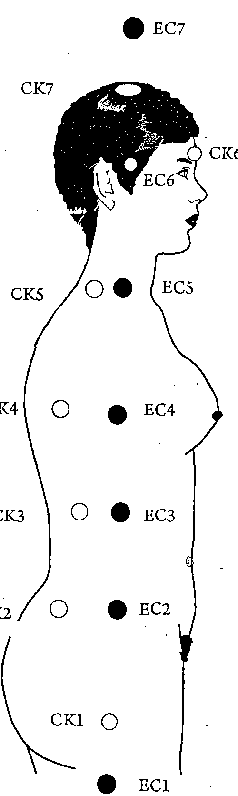
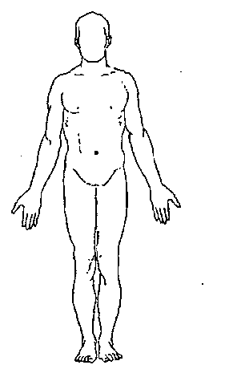

人體能量中心的真相

糾正千年謬誤
跨越大腦學習
明白所有能量學術源頭

脈輪與人體能量中心，自古以來被認為是一體的。因為銀河系、太陽系、及地球磁北極相對應關係不斷演化，其位置與功能今非昔比。不但位置不同，作用也不同。不但與經絡互為表裡，也連結內分泌系統、神經系統，而形成人體能量網路。人人都可以簡單的體驗這個大發現，而從這裡靈性進化。

光之靈 邱徵毅 編著

天使神秘學院

專業占卜预测机构
神秘学培训机构
水晶能量研究中心
神秘学资料库
官方微信：strcdts
微信公众平台：strc2011
读书交流QQ群：
　　占星塔罗占卜师交流群：814594478（加入密码：PDF）
　　神秘学其他综合群：659338717（加入密码：PDF）

微信号：strcdts
天使神秘学院

天使神秘学院 院长QQ：715104687

微信公众平台：strc2011

制作说明：

本书由《天使神秘学院》出重金从台湾购入的原版书籍扫描制作完成。为达到最好阅读效果，特地把原版书全部切开后，再经由专业扫描设备高精度扫描完成，并经过一张張的PS后期处理最终成书，其中間花费大量的人力、物力以及時間，只为能给大家提供經濟并优质的神秘学学习资料而努力。

本学院强力谴责某些机构和个人，把本学院花心血制作完成的电子书籍，包装后直接放在自家淘宝网上低价倾销的行为，以谋取不劳而获的经济利益。如果长此以往最终将无人愿意再为大家花心思制作电子书，那以后可能大家再无新书可读。

为让大家以后能够读到更多的好书，也为了本学院的良性发展。本学院恳请大家尽量做到如下几点：

一、尽量在本学院的网站购买电子书籍。
二、请勿用技术手段把电子书内的水印及加密去掉。
三、在收到电子书后小范围传阅即可，千万不要公开传播，更别挂到淘宝网上低价销售。

同时为答谢广大支持者，学院电子书将做如下调整：

一、学院会把一些早已收回制作成本的电子书折价销售。
二、最新制作的电子书籍会开放打印功能，大家购买后有条件的可自行打印成书。

天使神秘学院
2019 年 1 月

靈光一級・能量的課程

CONTENTS

自序

第一篇、靈光學

第一章、靈光學概要

第二章、靈光學課程

第三章、靈光一級的學習效益

第四章、能量的課程不涉宗教

第二篇、初階能量的課程

第五章、能量的基礎功課

第六章、靜坐歸一

第七章、靈光閃耀

第八章、開啓能量中心

第九章、開啓能量中心後的反應

第十章、啟動能量中心後的功課

第十一章、紀錄與傳播

第十二章、啟動以後沒感覺

第十三章、無所期待

第三篇、中階能量的課程

第四篇、調整練習

第五篇、高階能量的課程

第十四章、疾病的宇宙觀
第十五章、人體能量中心與脈輪
第十六章、脈輪功能
第十七章、脈輪能量調整
第十八章、脈輪能量與肉體
第十九章、靈光學與其它學派

第二十章、初階調整記錄與練習
第二十一章、中階調整練習
第二十二章、能量運用練習

第二十三章、能量中心功能
第二十四章、能量中心調整方法
第二十五章、能量中心與精神體
第二十六章、遠端調整

第二十七章、放鬆進入靈性

第二十八章、活在能量的當下

第二十九章、觀能量中心

第三十章、成為能量師

迎向新生命

會發光的樹

生命曼陀羅

實驗的過程

王玉瑾

曾英敏

曹淑娟

陳筠婕

自序

靈光家族，是六十多年前由一群開創新時代思想的先趨者，與他們指導靈的非正式組織，他們沒有固定的教室或招牌。沒有誰是老師，也沒有誰是學生，更沒有誰是教主或是權威，更不是要創新宗教。一切無形無相、平等自在。上課從來沒有課本，心與靈的口耳相傳，實際體驗，印證心得，聽不聽由他，信不信由他，一切自在，各自如實生活。後人將這些口耳相傳的學習稱為生命靈光，簡稱靈光學。

二十一世紀新時代思想多元化了。開山立派，成爲收費課程、影音教學、著書立說，甚至開講師班發證書，授予講師資格登錄，再連鎖開班，成爲傳播更快的學習浪潮。心靈空虛的現代人，花錢看看能不能找到喜悅或快樂。結果，知與行的距離越拉越大，很多人知道新時代思想，也都朗朗上口，侃侃而談。可是，並沒有讓生活過得更快樂，反而想知道更多，繼續花錢再上課，結果錢越花越多，課越聽越多，焦點也越來越模糊，因爲知道（know）與得到（get）不同，體悟（comprehend）並不代表成就（being）。爲了找尋心靈的寧靜平安喜樂，花上幾萬美金甚至百萬美金是常見的事。如果上完課程、看了錄影帶從此自在生活，豐盛富裕，那是非常值得的。但是，人永遠在知識上打轉，心卻越來越空虛，人們不斷找尋更多各式各樣新鮮的【型式】。社會也不斷誕生各種新的【型式】，滿足求知的人們。【型式】是形容詞，形容所誕生的也許是新的宗教，也許是新的思想主張，也許是一些新的【功法】，而人們都在學【型式】的知識。有一些課程非常重視【型式】，有一些宗教非常重視【型式】。現代人存在著各式各樣的【型式】。從家庭到社會，從政治形態到商業行為，無一不是【型式】的堆砌與積累。從某個角度而言，文字、聲音、顏色、形狀也都是一種【型式】。【型式】是一種必要，但不是本體。【型式】是一種開始，但不是終點。

宇宙能量是無形無相的。能量的課程是靈光學的預備課程，原本口耳相傳的課程，寫成文字是一種挑戰。三十年前，我接受了這個宇宙能量無形無相的啟發，真的莫名其妙。一路自然成長，各種巧遇自然發生，各類訊息自了於心。各種恰到好處的事業自然開展。原以爲幸運常在我身，後來才知道這一切都是宇宙能量在我身上的顯現。如此自然成長而毫不費力。那種自在、自由、臣服、讓人虔誠、能順勢生活，好棒。

後來，我的看書變成了只是在印證，我的聽課成了一種了知的註解，一切靜觀皆自得沒有一點勉強，讓我更臣服於宇宙能量的浩瀚。於是，我喜悅的與人結緣，開課傳播靈光學，竟然也讓很多人，走上這條自在之路。這真是一條可以輕鬆自在，不必努力、不必汲汲營營找尋、不必盲目探索，人人可以在自然中不斷進化的路，人人可以在自然中覺察成就的路。

二十年前，我上課不拘形式，不寫書也沒有講義。後來同學要求給講義好讓他們課後複習，我很久才寫一些。因為靈光家族上課不拘形式，所以講義也不拘形式。這一本書就是很多年前，上靈光學預備課程的一些零散教材，上完這些預備課程才進入靈光學正式課程。一九九九年九月十九日上完當年最後一堂課，九二一大地震後，不再上課專心靜修。二〇〇九年九月二十三日在靜坐中發現，宇宙能量將讓地球再進化到另一個更高的境界。我以無比喜悅的心再度執教。這十年的靜修讓我對以前的課程有很多修改與新的增添。

靈光一級能量的課程精要在於第五篇能量的高階課程，坊間也有類似者，但太過於只強調心靈成長，缺乏對心靈載具肉體及人體能量場的認知，或頗多偏離。靈光二級或三級課程在坊間也很少。絕大部份只是知識性討論，如果沒有靈光一級能量的課程做基礎，直接拿來閱讀只是一種知識，或許會有體會以及一時感動，但並不能究竟。靈光二級或三級課程也不似坊間高靈或通靈叢書。靈光二級或三級課程精要在於自悟、自證、自在圓滿。不須再創造另一種神，因為自己就是神，神永遠在你裡面。

這不是一本書，這是一條回家的路。

感恩所有曾經教過我的恩師，
這本書的章節都有你們的言語與身影。

感恩所有靈光家族的啟動師及志工們無私的付出，
你們如同我一樣是收穫最大的人。

感恩所有來參加課程的同學們，如果沒有你們，
我不會有動力把這冊子出版。

感恩我所愛的人。
感恩我的父親與母親及家人。

光之靈 邱徵毅
庚寅年孟冬於鹿谷車輓寮

靈光學

靈光學，

可以暢旺精神，
可以遠離恐懼、選擇愛，讓情緒不必管理，就能歸於寧靜與平安。
可以讓心智能力自然增長，智慧開啓，了悟生命。

靈光學概要

宇宙原力來自能量。
人身，是宇宙能量聚合而成。
能量聚，則細胞滋長、組織暢旺，形成生命。
能量散，則形體毀壞，生命形式改變、消失。
人體使用終有一定年限，
讓身體處於健康狀態，
是對世界一大貢獻。

一、靈光學源自於人體能量場的研究

西元前三○○○年，中國人把宇宙能量稱為【氣】。又把氣分【陰】、【陽】，講究陰陽調合才能健康。

同一期間印度人將宇宙能量稱為【普那】（Prana）。

西元前五三八年，猶太人卡巴拉，將宇宙能量稱為星光（Astral Light）。

西元前五○○年，希臘哲學家畢達哥拉斯，將宇宙能量稱為核心能（Vital Energy）。認爲宇宙能量的光可以產生許多效果，包括治癒疾病。

約翰、懷特（John White）在他的著作未來科學（Future Science）一書中，列出紀元前有九十七種不同文化以九十七種不同名稱提及靈光現象。許多祕傳的教義包括古印度吠陀經，神智學會，薔薇十字會，印地安巫術，西藏及印度佛教，日本禪宗，都提到一些人類能量場的敘述。

十二世紀初的學者波伊拉克（Boirac）及李比亞特（Liebeault）認爲具有能量的人可以在遠處對其他個人有所影響。他們描述，僅是一個人的出現，就可以對他人產生有益或有害的影響。中世紀的學者芭拉西拉斯（Paracelsus）稱此宇宙能量爲生命能（Vital Force），認爲生命能是由重要的宇宙力量與物質所構成。

西元一六○○年代，德國微積分之父萊布尼茲（Gottfried Wilhelm）將宇宙能量稱爲單子（Monads）。

西元一七○○年代，奧地利醫師安東法蘭斯（Franz Anton Mesmer）將宇宙能量稱爲磁場流（Magnetic Fluid）。

西元一八○○年代，普遍稱宇宙能量爲自然力或原力（Odic Force）。

十九世紀的數學家黑門特（Helmont）設想宇宙的流體遍及大自然，且不是有形的或是可壓縮的物質，而是一股純淨的生命靈氣，瀰漫所有物體。數學家李伯尼茲（Leibnitz）認爲宇宙重要元素是力量的中心，內含它們自身運行的泉源。

## 十九世紀黑門特 (Helmont) 和梅斯梅爾 (Mesmer) 創造梅斯梅爾催眠術，後來演變為催眠術。他們觀察到宇宙能量現象的其他特性。他們描述有生命及無生命的物體可以經由宇宙的「流體」充電，所以物體能夠在遠處對彼此產生作用。

雷漢巴 (Wilhelm Von Reichenbach) 伯爵在十九世紀花了三十年時間實驗「宇宙能量場」，他稱之為「自然力量」。他發現能量場有許多特性近似於電磁場。馬克史威 (James Clerk Maxwell) 曾在十九世紀初描述到這點。他也發現自然力量的許多特性是獨一無二的。他確定磁鐵的磁極不止具有磁性，還有一種獨特的「能量場」。其他物體，像是水晶，也具有這種獨特的力量。他發現自然力量喜歡磁極相吸或者說喜歡吸引同類事物。這是重要的靈光現象。

我們可以從前面的段落看到，二十世紀之前的 исследования 在於觀察環繞人類與其他物體的宇宙能量場不同特色。自一九○○年開始，許多醫師也開始對宇宙能量及人體能量場產生興趣。

## ● 西元一九〇五年，愛因斯坦把光視為量子後，光的量子即被稱爲「光子」。

西元一九一一年，德國凱耐醫生研究人體能量，並用之於診斷疾病。

## ● 西元一九一六年，美國亞伯拉姆醫生發現，各種疾病及藥物都有微弱的波動。

西元一九三〇年，凱拉古拉醫師建立了脈輪與疾病之間的關係。凱拉古拉醫師透過具有透視眼的人士，看到病患身上的能量型態，並準確描述出疾病問題。這些人體的觀察顯示一種重要的能量體或是能量場，貫穿人體，就像一張閃閃發亮的光之網。這個充滿能量的網是人體的基本型態，讓肉體的組織得以形塑及維繫。組織的存在仰賴這種生命力場在背後支持。凱拉古拉醫師也認為脈輪的混亂與疾病有關。

西元一九〇〰年後，歐美各國對宇宙能量研究，風起雲湧、如雨後春筍般，從東方古老典籍、印加文明、尼羅河文明等等，不斷研究，著書立說，聚群成派，熱鬧非常。

西元一九九〇年，第一次波斯灣戰爭爆發，美國軍方投入大量資源，想盡辦法，運用藥物或食物企圖強化軍人戰力。如何讓直昇機飛行員連續飛行三十小時，BS2轟炸機飛行員維持六十個小時不睡覺。他們必須維持清醒，維持能量。咖啡因、其他命等應運而生。但是，這些產品有很多後遺症。

西元二〇〇三年，第二次波斯灣戰爭爆發，美國軍方運用奈米光波能量儲存技術，擺脫「藥物模式」，大大提高軍人作戰能力。光的能量，已經被證實是大自然最有價值的能量，這些宇宙能量研究，已經從玄學、醫學應用領域，進入軍事與國家的研究層次。

發明人大衛・史密斯（David Schmidt）學習脈輪、經絡穴道、氣功等等，領悟與印證人的身體有一個化學系統，有一個生物能量系統，細胞是「光的能」。細胞可以利用光的能量來造成化學反應，也因此不同頻率的光，所產生的能量可以治療身體頻率相對應的部位。光的能量是一種高頻率的光，能量波。可以取代針灸，從人體經絡進入脈輪、進入身體組織器官，與原來人體組織細胞的振動頻率共振。進而產生自我療癒能力。

無論如何，世界普遍公認宇宙能量，遍及各式各樣存在（Being）之中。

宇宙磁力、星體運作、星系形成、地水火風，一切運動現象、生命體、無生命體，無不蘊藏宇宙能量。

宇宙能量可以，轉化為磁、電、熱、光、動能，架接成各種元素，化生萬物，形成靈魂、心智與情緒，連結過去、現在、未來，及無限次元空間。

宇宙的形成就是宇宙能量的造作，這種說法已經漸漸為現代人所接受，而且從玄學領域漸漸進入物理學範疇。大物理學家，史蒂芬·威廉·霍金博士，對傳統宗教信仰提出了挑戰，他於二〇一〇年九月發表新書中說，宇宙不須要由上帝創造，而是在物理定律作用下，自我形成的。科學的說法，已經非常完整，他認為神學是沒有必要的。

宇宙能量，現代物理學無法窺其全貌。也非神學或神秘學所能盡其詮釋。

其實人對宇宙所知有限，但，在快速發現中。

現代科學計量方式，並無法全數測知宇宙能量。宇宙能量所產生的頻率，以共振傳遞及彰顯其作用。例如，人類的意識是一種可以調頻的宇宙能量，可以是具有高智慧的能量體。在不同時空背景，不同心裡需求之下，被稱爲無條件的愛、神、佛、上帝、阿拉、天公等等。

人類用不同語言、不同名相彰顯宇宙能量所產生的現象，以及各自解讀宇宙能量存在的意涵。所以，宗教的顯化也是能量聚合的形式之一，這似乎有一部份呼應霍金的說法。宗教的界線將因宇宙能量的認知，而漸漸融合。人類進入能量境界，將發現神、佛、上帝、阿拉、天公是相同的宇宙意識，耶穌與悉達多都從體悟宇宙能量中成就。了知這一切，人類將更和平。

二十一世紀是能量世紀，人人可以運用能量，並與之融合為一。人人可以簡單的走到更高，回歸宇宙，化生光中。只要暢通人體能量中心，靜坐歸一，回到內在，讓宇宙能量自由流動，就能以能量的高度看世界。身在這個世界，心不拘役於這個世界。一切有形、有相、有感世界，或者是【如夢幻泡影】的虛幻世界，都落入兩端。世界

二十一世紀是能量世紀，以能量的形式看世界，人類將更進化。

分享是靈光學的重心之一。分享，能深入體會宇宙能量。分享，能深化宇宙能量學習。分享，能提升宇宙能量的正知、正見。分享宇宙能量的無限境界，分享宇宙能量所帶來的喜悅。

開啓能量中心，學習靜坐歸一，能量的課程，人人可以參加。

並無實虛，是不實不虛的更高了悟，是能量的形式。【如露亦如電】，消逝或顯現，快速自如，無罣無礙的自在長存，就是能量的形式。停止感官的有限，進入內在的無限，進入能量的無限。能量自由了，心就自由了。無需名相，一切都是能量的造作而已。靈光一級的學習目的，在教導如何進入能量，體悟能量，以能量的高度生活，只是簡單的

分享是慈悲的，把人們帶入能量世界，同沾喜樂。

能分享的人心中豐盛，有能力給予。

分享意味著收穫，收穫豐盛。

## 靈光學課程分為三級

靈光一級，是能量的課程。以開啓人體能量中心為核心。初階班，簡介人體能量系統的基本概念。中階班，教導新發現的脈輪能量。從新脈輪能量觀點，重新驗證這些很棒的學術：雙手能量療法、量子觸療、靈氣、人電、氣功等等。能量的課程以實做練習為主，高階班必須有初、中階班紮實的基礎，才能真正體會宇宙能量的奧妙，所以必須每天靜坐，必須每天將喜悅與發現與人分享。

高階班，教導重新認知人體能量中心，以及如何分別及運用脈輪及人體能量中心，這是一個創時代的新發現。天文學家發現蛇夫座，在一九二八年國際天文聯合會（IAU）的國際天文學會議中，被承認爲黃道上的十三個星座之一，一舉打破占星學十二星座的舊見，撼動業界至今方興未艾。

人體能量場受天體運行影響，人體能量中心與脈輪相對位置改變。

高階班討論與見證，這個世紀震撼與創見。討論脈輪從人體能量中心位移後，脈輪是脈輪，能量中心是能量中心的新實證。

從千年的錯誤中，重新認知什麼是人體能量中心，什麼是脈輪，能量中心如何帶動脈輪，能量中心如何顛覆人類學習、成長模式。

情緒是能量的一種形式，情緒體的能量中心，影響大腦的情緒運作。大腦的認知能力，是能量收發的形式之一，心智體能量中心平衡與否，影響知識的學習、判斷、反應。高階班課程可以讓人輕鬆容易的，調整情緒體能量中心，提升心智體能量中心。

## 高階班課程目標，在於讓自己成為慈悲大器的【能量師】，成為傳導能量的【啟動師】，成為引領能量學習的【談講師】。

靈光二級，是通靈的課程。以靈光一級為基礎，學習如何通達自己靈魂的智慧，叫做通靈（不是通外靈）。

能瞭解自己就能瞭解別人，是心通之道。

傾聽內在的聲音，發自內在心靈深處的聲音，是溝通之道。

清明寂靜的心，能轉譯宇宙能量的振動頻率為智慧，是靈通之道。

開啓人體能量中心、平衡能量中心，源源不絕的智慧來自於宇宙能量【再連結】，毫不費力。讓人重新與時間連結，與山川大地連結，與樹木連結，與風連結，與海連結，與萬有再連結，進入無限。靈光二級是體悟的課程。靈光二級初階班課程每週一次，每次三小時，為期二十四週。

## 靈光三級，是光體的課程。以靈光一級為基礎，印證光層次的宇宙能量如何轉化意識、拓展意識，印證光層次的宇宙能量如世界，活出靈魂層次的生活。

靈魂的層次是光的層次，在靈魂的層次裡，觀察每一個片刻，都成為美麗而完整的光。

透過冥想靜坐、運用聲音或唱頌、連結大我等等方式，開啓人體連結宇宙最高層次的光體。光體的能源來自靈界太陽，一如動、植物的能源來自物質界的太陽一般。靈光學把人分成三個主要部份（如圖）。一是物質世界的肉體。二是精神體，包括情緒體與心智體。三是光體。

## 靈魂的振動頻率就是光體的振動頻率，也就是宇宙同步的振動頻率。開啟光體可以讓自己成為愛的源頭，成為光的源頭。

愛使人間光彩美麗，光所在的地方沒有黑暗。

智慧從光裡走出來，光體的課程目標，藉由開啟光體經驗更多的心靈力量，包括感應能力、開啓第三眼、靈視能力，時空旅行、出體能力。所有的心靈力程自然發生，毫不費力，也絕對安全。開啓智慧之源，化生光中。靈光三級初階班課程，每週一次，每次三小時，為期二十四週。

靈光二級、靈光三級都以靈光一級為基礎，沒有靈光一級的基礎而上靈光二級或三級，學到的只是知識，不是體悟，學再多也無用。這也說明市場上很多很好的課程，為什麼學了之後還是依然故我。因為，用腦筋學習容易忘記，用身體學習、用能量學習是超越大腦的。

## 第三章 靈光一級的學習效益

靈光學的靈光一級能量的課程目的在分享宇宙能量，開啓人體能量中心以後，從疼愛自己到關懷世界，是一種輕鬆、自在、自然達到的生活情境，毫不費力，不需努力，不必勉強。平衡的能量中心，讓情緒體自然進入喜悅之道，讓精神體自然產生個人覺醒的力量。

沒有開啓人體能量中心，學習只是一種知識而已，久了就忘了。

## 一、在能量的覺察中更容易真誠的面對自己

在繁忙的人世，日復一日的生活與工作中，很多人穿上厚厚一層盔甲活著，為保護自己的面子、權勢、地位、金錢，甚至感情、自尊，所做的種種防衛。維護自己在別人心目中的印象，或因害怕被發現某些軟弱所做的種種僞裝。不斷被逼迫前進的感覺，不斷自己逼迫自己去做符合「被他人須要，被他人期盼」的「應該」，而失去了真實的自己。

開啓人體能量中心以後，宇宙能量在人的精神體發揮調整功能。讓人的自認知與日俱增，能在不斷靜坐中看清自己。能從不斷真誠面對自己中超越，而自在生活。

真誠面對自己不是屈服，不是放棄，也不是放下。都不是這些古老教條的感覺。真誠面對自己是，看重自己所做的事是否能增長自己，而有自由的感覺。能增長自己，肯定的是，它一定也對別人最有益。

真誠面對自己，做自己最愛做的事，開啓能量中心，可以讓自己與別人走得更高。

## 二、產生無私、無我，單純的心

開啓人體能量中心，宇宙能量可以讓人輕鬆體會什麼是無私、無我，單純的心。宇宙能量可以讓人容易具有【觀】的功夫。全然的只是【觀】，就像看著一朵花，從含苞、花開、花落，純然只是存在。存在是一種【真實】，【觀】每一個真實：含苞、花開、花落，無一不是生命的形 式，而且是必經的形式。【觀】是覺察，覺察那生命最真實的部份。

## 三、把自己交給能量，臣服於能量之流

開啓人體能量中心，可以讓人臣服於能量之流，首先是進入寂靜，體會全觀，只是單純的看，然後體會。觀，沒有大腦的判斷、推論、聯想。觀，然後等待，等待內在的光明。把光照向黑暗，形色顯現。觀，然後不期待。

然的寂靜。在寂靜中靠近自己。全然的寂靜可以聽到自己的聲音，心跳的聲音，血液流動的聲音，呼吸的聲音，消化系統的聲音，這些都是不同音階的、能量的聲音。不管外在的聲音有多大，一樣聽得到。

能傾聽能量的聲音，就能傾聽萬有的聲音。

全然的寂靜中，不用大腦思考，可以聽到真正能量的聲音。開啓人體能量中心，讓人容易關閉大腦的思考，【宇宙能量】開始作用。臣服於能量之流，就是傾聽能量的聲音，傾聽是人的本能，就像鳥會飛、魚會游，是它們的本能。

寂靜屬於一個人的內在，智慧來自於全然寂靜的心，進入能量的流動。安靜下來，全然的接受與欣賞自己能量的形式。進入能量，臣服於能量，自然能產生溫暖、安全的感覺，並且充滿愛與舒暢。能感知身體的反應所帶來的能量訊息。很簡單，只要不斷靜坐歸一，就能在寂靜中與能量連結。

## 四、能自然而然的為更高目的工作

開啓人體能量中心，可以讓自己容易的，為更高目的工作，創造有益於自己或他人的更高至善。任何工作都可以容易的被發現它的更高目的是什麼，它能為這個藍綠色的星球做什麼，它能為自己帶來光明，或是幫助人更健康、更快樂、更開悟、更進化，增長智慧、增加方便、引發慈悲、引導善良、引進豐盛，或者帶來平安、帶入寧靜、帶回美好，或者擴大覺察、擴增洞見等等。開啓人體能量中心，可以提升能量振動頻率，連結更高、更精緻的能量為更高目的工作。

有了更高目的，就能選擇每一天、每一小時、每一分鐘，知道如何運用時間，進入道途。更高目的就是看看自己把時間用在那裡。

為更高目的工作，讓人活在喜悅中。為更高目的工作，宇宙能量源源不絕進入體內，活力充沛，意義非凡。

## 五、豐盛與喜悅的生活

開啓人體能量中心，可以讓人更容易體會與了悟富裕。

豐盛與喜悅的生活，來自體會富裕。

成為富裕，同時明白匱乏。

了了分明富裕與匱乏的緣起。

圓滿的情緒體能量之流是富裕。富裕代表情緒體能量可以自由流動，來去自如。匱乏則來自於心智體的學習。一個人想要存款一億，但是，現在的月收入只有十萬，一生總收入不會超過四千萬，心智體的邏輯推論認爲（判斷），要有一億存款根本不可能。於是，引發情緒體低檔振動，匱乏感產生。

人出生，心智本空。

因為，不斷學習社會意識、集體意識，

人體能量場 (Human Energy Fields) (HEF)

有些因宗教的研究而發展，但是人體能量場不是那一個宗教的特有思想，而是宇宙的【存在】。在南美的馬雅文化，印加文明，北非的金字塔文明，甚至中南半島的吳哥文明，不同時空、不同文化背景卻有相同發現，甚至是一致性的發現，發現宇宙能量的作用與功能。人體能量場好像空氣，本來就存在。如果有人宣稱是他們的專有，那就像不同地區居住的人，宣稱空氣是屬於他們的一樣不可取。人體能量場已經是科學印證的事實，假設印度教研究三脈七輪的功能，天主教就避而遠之，以爲外道或名之爲邪教，跟不承認空氣是大家所共有一樣不具意義。

古印度教或婆羅門教、佛教的一些宗派，天主教、基督教的一些門徒甚或西方的一些神秘教派，也發展屬於他們的能量學習方式。有些宗教或派別對能量中心執正統之爭，有的爭能量中心的位置，有的爭其名稱、顏色或形狀，有的爭練習的方法或認知系統，更有爭傳承於那一位師父，所謂正傳或外道。似乎把人身能量中心與脈輪，這種屬於自然界共有的存在，意圖圈教據爲己有，門戶之見實不可取。

進行宗教儀式例如，焚香、祈願、念經、持咒、懺悔、跪拜、禱告、唱聖歌、等等，都能從人體能量中心，尤其是第六與第四能量中心散發能量波，與宗教集體意識共振。能量共振原理讓進行宗教儀式的信徒，提升能量，回應到第四能量中心，產生一種寧靜與平安的心境。相同的信仰產生相同的能量共振，信徒的共同行爲創造集團能量，信徒的相信程度、發願深度、依教行事的人數，決定集團能量頻率的高低、大小。

以能量的角度看宗教，加入宗教，實際相信、發願、奉行信仰的人必定獲得力量，得到庇佑，感覺臨在。從能量的角度看宗教，並不涉及價值、是非對錯與批判。宗教是一種能量之美。

第二篇 初階能量的課程

開啓脈輪，  
讓肉體能量平衡健康。  

開啓能量中心，  
讓情緒自然保持寧靜、喜悅，  
豐盛只是選擇，無須管理。  

開啓能量中心，  
讓心智自然增長，直覺與洞見如泉湧，  
知見只是印證，無須學習。  

輕鬆、自在、容易，無須用力與努力。  
告別苦修、告別戒律、一切如意自在。

能量的基礎功課

有關身心靈課程學習，總離不開靜坐。放鬆、呼吸、運動、吃光的飲食，是靜坐的基礎。

一、放鬆

放鬆的過程是能量中心開啓的過程。放鬆才能讓身心覺醒、覺受力提升，放鬆才容易讓能量流動。

任何時刻，養成檢查全身每一個部位放鬆的習慣，讓放鬆從潛意識中彰顯出來。

當放鬆成為習慣，身體就能恢復元氣，情緒能回歸寧靜，心靈進入喜悅。

放鬆有各種不同方式，可以用意識從頭頂開始，感覺放鬆的感覺。然後額頭、臉頰、頸椎、肩膀，這些是最容易因眼、耳、意識開向外界引發緊張的地方。如果不確定是不是放鬆，可以動一動、搖一搖相關部位來感受一下放鬆的感覺。

二、呼吸

吸空氣、吃食物、曬陽光是肉身三大能源。

呼吸須要用全部的肺，稱爲【全肺呼吸】，不要分別是橫膈膜呼吸或腹部呼吸、丹田呼吸。全肺呼吸是常常專注於呼吸，感覺空氣飽滿於肺部、吸更長呼更慢。緊張、專注外在工作或事物，讓人容易不自覺淺呼吸，肺部只用一半。淺呼吸是疾病之源。

運動能增加血液循環。有助於肉體層面的平衡運作。運動能協調肌肉運作、促進新陳代謝。實際案例指出，只靠運動，每天慢跑十公里，讓二十年糖尿病患者，完全不服藥，可以維持身體器官正常運作，過正常生活。運動要達到心跳一百二十次以上。心跳一百二十次以上呼吸必然加快，血液含氧量增加，細胞新陳代謝暢旺。暢旺的身體機能，可以讓經絡、氣血循環產生能量，讓所有感知系統保持清醒。

三、運動

四、吃光的食物

生命來自太陽的光照，植物進行光合作用，將陽光轉化為營養。動物吃進植物，間接將光的能源帶入身體，再轉化為能量。

吃光的食物代表吃進能量，  
吃帶有陽光能量的食物。

食物帶有陽光的能量，看起來是鮮活的，光亮的，有生命力的。見不到陽光的植物馬上泛黃枯萎，不具能量，賣太久的蔬菜，縱然泡水免於萎凋，看起來仍是不具能量。帶有能量的水果發出光芒，吸引人的目光。吃光的食物讓人神清氣爽，但過度烹煮，能量盡失。植物採來久未食用亦留不住能量，醃漬食物不具能量。人應該直接進食植物，人吃動物取得陽光能量只會更少。動物曬太陽，也只能從身體皮膚細胞，帶進非常少許的陽光能量，所以人類更進化的醫療模式，是將光轉化為能量，直接進入肉體、經絡、脈輪的科技。

有陽光能量的食物，不一定有熱量（卡路里），有熱量的食物也不一定帶有陽光的能量。巧克力有很高的熱量，卻沒有陽光能量。

光的食物具有高能量，可以幫助靜坐，使腦筋清明，情緒安定。

人體能量中心的真相

靜坐歸一，是一種【觀】的功夫。

【觀】【念】的起落。

【觀】能量形式的進出。

如何靜坐歸一

找到一個可以安定身體，不受風寒濕熱的地方，安頓下來。找到讓自己感覺輕鬆自在的姿勢，閉上眼睛自然的坐著。

人不可能沒有念頭，能【觀】則雖有念亦無礙。【山高不礙白雲飛，竹密不妨水流過】。一切念頭任其起落，任其生滅，幻化隨它，讓意念自由。不必控制意念或追求無念，只須要自然的坐下來。

靜坐中可以只是【觀】，【觀】脈輪或人體能量中心。【觀】是一種覺受力，感覺身體的變化，感受內在的情境。

中醫四診之望、聞、問、切，是中醫覺受患者的方法。佛教心經講色、聲、香、味、觸、法的外在世界，是透過眼、耳、鼻、舌、身、意而覺受。這些是【觀】的概念。

二十一世紀，從二○○○年開始，到二○○九年九月二十三日，正式進入能量世紀。能量世紀西方占星學稱之為寶瓶世紀。能量世紀承接上一世紀一九六○年代以後，人類被教導開啓身心靈能量系統以後覺醒。能量世紀，對於能量運用與學習，可謂萬【教】齊發、百家爭鳴、能量學說深植人心。

人類將展現有史以來最爲光明與進步的境界。無論對宇宙的探索或心靈宇宙的覺察，其成就亦將無與倫比的閃耀光輝。立下這些里程碑的基礎是【觀】，而【觀】的相對是【想像力】。【想像力】是心靈通達無垠無邊宇宙的力量，是增長能量、淨化能量的方法。

在靜坐中練習【觀】能量中心，【觀】身體每一個部位的形狀、顏色、聲音、氣味或觸覺。在靜坐中【觀】身體的每一個部位光明，和諧、暢通。從靜坐中起步，從【觀】身、【觀】心，到【想像】靈魂的光明合體，想像肉體、精神體都與宇宙一體。從宇宙一體的最高角度思考，處理實相世界人我之間、物我之間、過去現在未來之間所有一切關係。靜坐中讓能量自然運作，一切將了了分明，恰巧合宜，從容自在，理想生活將不費吹灰之力自然達成。

我們在這個星球旅行，我們終將回家。從靜坐開始，讓自己閃耀光明。在不期待的時間點，自然回到歸一境界，回到原來靈性自在的生命長河中。

靜坐是必要的功課，每天快樂輕鬆進入靜坐，是能量的課程基礎。

心得記錄

第七章 靈光閃耀

靈光閃耀，是成爲能量師的一種練習，  
爲創造內在的療癒空間做準備。

靈光閃耀  
能量的課程主張，自然坐在椅子上，進行靜坐即可。

讓身體平穩坐在寬平的椅（凳）子上，脊椎保持垂直、兩腳自然分開，腳掌平放地面，雙手自然放鬆，掌心向下，姆指與食指相扣成拈花狀，自然放在大腿上，其餘手指可以輕鬆放開。當然，已經習慣盤坐也可以。以能放鬆，自然全肺呼吸為原則。

坐好後，放鬆身體，閉上眼睛，用鼻子慢慢吸氣，用嘴巴慢慢吐氣。讓呼吸越來越長，越來越深。吸氣的時候，想像把宇宙的光明吸進來，充滿胸膛之中，讓自己感覺心中，充滿光明。吐氣的時候，感覺將心中的光明隨著吐氣，散發出去，充滿整個身體周圍。

這個過程就叫【靈光閃耀】，也稱為【心輪呼吸】。心輪呼吸是成爲能量師必須具備的習慣練習。可以在靜坐中持續進行。

平常可以進行三次深呼吸之後靜坐。平息諸緣，自然靜坐。靜坐約五到三十分鐘，或更久，都可以，隨順內心的引導。

靜坐結束，可以再次進行深呼吸三次，而結束靜坐。

靜坐就像手機充電，在靜坐中與宇宙合一。

靜坐中看到什麼，聽到什麼，感覺到什麼，不必理會。只需要【靜觀】、【旁觀】，讓自己感覺這些現象與自己【無關】。如果於心有罣礙，只需要問自己，這些現象是要教導我什麼，讓這些覺受在心中自然產生回應，產生智慧。如果沒有答案，就放下，不必理會。

重要的原則是喜悅靜坐，靜坐喜悅。靜坐不必勉強。

第八章 開啟能量中心

人體能量中心與脈輪，  
出生即開始漸次增長，  
到青春期達於巔峰。

由於現代社會背景、  
環境壓力、  
飲食與生活習慣劇變、  
情緒與認知衝突、  
肉體、精神體、靈性體失調、  
能量系統不平衡。  
可以藉由能量啟動師導引宇宙能量，  
重新平衡人體能量場。

開啓能量中心是靈光一級課程重點。

開啓能量中心，是一個神聖、莊嚴的儀式與過程。啓動師必須訓練有素方能達成任務。開啓能量中心可以：

讓肉體能量系統平衡，並支持脈輪、經絡等暢通運作，健康身體。  
讓情緒自然而然的趨於和諧、快樂、喜悅，不須任何外力。  
讓大腦變聰明、更具洞見、靈感或認知學習能力自然增加。  

能量中心的奧妙，開啓了人類成長的另一旅程。人類的醫藥模式，隨著人體能量中心與宇宙能量的研究，正在突破與改變，特別是光的能量運用。人類的心智模式也正面臨前所未有的，輕鬆又容易的進化。這些正是源自於人體能量中心的科學知識，不斷被發現與運用。

開啓是指讓人體能量中心與脈輪、經絡、氣血之間能平衡運作。所以這裡

所謂開啓是指，讓機能平衡運作的意思。人體能量中心直接影響脈輪能量是否平衡。也影響經絡氣血是通暢或阻塞。開啓能量中心即是平衡各能量中心的運作，讓能量中心更精緻的能量，適度流入脈輪與經絡。

啓動師是宇宙能量的導管，啓動師必須在引導能量啟動之前，創造一個神聖而輕鬆的環境，讓光明環繞在被啓動者所在的空間，啓動師必須接受各種訓練，並領受心法、領受印記。一個訓練合格的啓動師，具有敏銳的感官，能辨別被啓動的能量中心運轉狀況，甚至能感受到被啓動者的心緒與靈性形式。啓動師的能量場能擴及身體以外的地方，回收各種必須明白的訊息。一個合格的啓動師，不卑不亢、謙恭善良，並以豐盛宇宙為依歸。在單純的、無私、無我間成爲導管。

人本來就是宇宙能量的造作，開啓人體能量中心是唯一回歸宇宙之路。人如果只用大腦學習，只能受限於大腦。人必須回到人體能量中心的層面，只要開啓能量中心，透過能量中心與宇宙接軌，就能回歸宇宙平等性、無限性、一

體性，也就是神性、佛性。這是容易又簡單的，但，必須放下大腦的學習模式，一定要透過身體親自體驗。讓聒噪的大腦停止批判，開始用心。

人體能量中心被開啓以後，用身體去體會與領悟，智慧會自然產生。

過去林林總總的學習，不論醫學、神學、哲學、天文學、自然科學，宗教、玄教、神秘教，各種【功】【法】不斷演化、提升，到二十一世紀已經讓人類準備好了。讓人自然、輕鬆、容易的進化。這個進化超越了人類原始的集體認知，以及宗教本身不願意放下的藩籬、人種物種的傲慢與偏見，權利、物欲的鬥爭等等。

人體能量系統越能暢通、平衡，越能健康、喜悅、慈悲、正向、知天命、開悟、悠遊自在、平凡生活。

靈光一級能量的課程，藉由啟動師導引宇宙能量來開啓能量中心，並使脈輪清理淤積的能量，使能量中心與脈輪重新回到平衡、暢通的狀態，並透過靜坐，讓人體能量系統，與宇宙能量漸漸合而爲一（靜坐歸一）。

生活，使生命淤積過多不必要的能量，或因爲能量過度使用而萎縮。過度或萎縮就是失去平衡。

肉體失衡，會以能量的形式反應在脈輪。

情緒體、心智體的失衡，則反應於能量中心。

心智體影響情緒體，  
心智體與情緒體共同影響肉體的健康。

開啓能量中心，是一個類似點火的作用，就像在乾木材上點一把火。這把火來自宇宙能量，啓動師就像聖火的傳遞者。乾木材就是淤積在能量中心或脈輪上的濃濁能量、過度擴張或萎縮的能量。燃燒產生光、能量及代謝物。能量則幫助脈輪運轉，讓脈輪可以再度顯露它原來的質地、形狀、顏色、聲音、氣味等等振動頻率。這個振動頻率可以共振肉體各器官的振動頻率。生病會讓人身體器官原來質地、形狀、顏色、聲音、氣味等產生改變。平衡的脈輪會強化與肉體之間的能量共振。透過共振讓肉體回歸原來的振動頻率，進行自我療癒。

燃燒所產生的光是更高的振動頻率，直接進入能量中心，顯露能量中心的光明，可以治療情緒體與心智體。社會科學家、行為學家、宗教界，企圖藉由改變認知或重新定義情緒事件，或轉移注意力或做深層溝通、前世回朔而達到治療效果。通常這個結果很難讓人滿意。創傷或執著總在不經意間回來。開啓能量中心以後，不經過大腦的改變，宇宙能量直接進入人體能量中心，在不言說的層面，洗滌淤積的能量，讓能量中心回歸清淨的本來面目。

很多人在開啓能量中心以後，很快就能體會平安、寧靜、自在、喜悅。他們體會奧妙、腦筋清明，更具創意、洞見。開悟能力與預知能力增長。奇蹟每天都在發生。

燃燒的過程可能煙塵滿天，讓情緒更加翻騰，過去的傷痛記憶重現。像不小心割傷，清洗傷口、消毒傷口的再度疼痛。尤其如果過去的情緒像結痂、或化為膿包，更可能面對須要再割開的創痛。這就是代謝物，清除代謝物須要靜坐歸一，運轉能量中心。

第九章 開啓能量中心的反應

開啓能量中心可能產生的現象，只要  
持續靜坐歸一，  
過度擴張的部份會降低，  
過度萎縮的部份會增強。

開啓能量中心可能的反應

肉體層面：

覺得輕飄飄的。  
覺得疲倦、渾身乏力，好想睡覺。  
比較不容易疲勞。精神、體力都比以前好。  
身體不由自主的氣動。  
睡得比較好。有些人會睡不著、但不影響體力、精神。  
頭重重、有點暈眩、頭部不舒服。  
發生流眼淚、或流口水、直打哈欠、或放屁現象。  
會肚子不舒服、拉肚子、胸悶。  
身體發冷或發熱。  
感到病痛加劇。  
女性月事增多或量減少，過早停經再來。  
分泌物增加。男性夢遺。感覺性的需求。

情緒層面：

感覺比平常更寧靜、更平安。  
感覺比平常更快樂，有時會很興奮。  
想哭、覺今是而昨非、或莫名其妙的悲傷。  
緊張、焦慮感、想很多。  
坐立不安、煩躁、好像有什麼事情，但說不出來。  
容易笑，笑出來，好像更開朗。  
不停的發現或想起過去的事。  
做夢，夢變多了。  
比較有耐性。  
發現更多的愛。  
發現自己有控制慾、佔有慾、想獨處。  
對人有更多的了解、諒解，脾氣變得比較好。  
充滿意志力、有開闊感。  
好想被愛。

心智層面：

反應比較敏銳。記憶力變好，對過去的回憶變得比較清晰。靈感比較多。靈光閃現、但，可能因不在意而錯過。好像變得比較聰明。

心想事成。想某一個人時，會不經意出現或打電話來。溝通、表達能力變好。或感覺一直想說話，說個不停。

直覺力增加。判斷力增強。同理心、感應力、同頻共振能力增加。

其它如：

能感應更高能量體、好像有通靈能力。  
明白人生更高目的，了知天命。  
靈魂出體。

心得記錄

第十章 啟動能量中心後的功課

繼續做功課

（二）每天靜坐歸一

每天起床或睡前或任一能安靜的地方，讓自己進入靜中，用內在的  
眼睛看能量中心，或傾聽、嗅聞、感覺、或觀想能量中心運作。靜  
坐歸一中，任何進來的東西例如顏色、形狀、聲音、味道、或任何  
感覺，要像流水一樣讓它自然流過。

（二）追隨能量波動

事實上每一件事，每一個存在都是一種波動。在靜中可以不斷進  
化、調整我們本身的波動，與宇宙本身的波動合一。波動各有它的  
振動頻率，不同的頻率產生不同的存在，各種存在本是振動頻率的  
幻化。宇宙本為一體，你我宇宙萬物本為一體。進入更精緻的振動  
頻率之中，回歸到宇宙即一的自在境界，即是歸一。一即一切，一切即一。一就是不二。

回到能量中心的練習，就能回歸本來真面目。

## （四）每天分享並伸手助人是學習重心

重點。也是所有靈光學課程起點。學員必需打好基礎才容易體會。

中階班結業即具有調整自己或他人脈輪的能力，每天可以調整自己，也能調整別人，包括家人。

上高階班前調整他人的經驗，將成爲上課的資格之一。無私無我，具愛心的關懷，一定能產生力量。建議每天幫助人，做比學更重要。

每天放鬆靜坐、看自己，一定會發現自己在進步，而且是快速的進步。這個發現會讓自己非常快樂。把這個發現與人分享，讓別人也同沾喜樂會讓自己更加速進化，而達到更高境界。分享是靈光學的重心與必要。能有效分享是上高階班課程的資格之二。

## 第十一章 紀錄與傳播

開啓能量中心，將啓動身心靈各個層面的重大轉化。我們可以用重生來形容這個變化。體會這個變化，來自於感知系統的覺醒。感知系統的覺醒，必在於放鬆與呼吸之間。

获取更多好书，请加微信号：strcdts

淘宝店铺：http://strc.cr.cx

## 記錄的重要性

一個可以放鬆的環境，包括也許是音樂、衣著、燈光、色調、座椅、坐姿等等。心輪呼吸是個不可或缺的練習。血液含氧量能舒暢身體每一個器官的運作，包括感知系統的視覺、聽覺、嗅覺、味覺、身體皮膚的感覺、大腦的訊息接收能力、反應能力、神經傳導能力，訊息進而在心靈的體會與效應等等。

放鬆與呼吸是靈性的微處理器。

在放鬆與清晰潔淨的能量裡，也許是生殖系統的微波，腸道的一份悸動，胃口的改變，血液循環的聲音，肝腎透過泌尿系統的訊息，喉嚨、嘴巴的細緻轉變，來自窗下、晨曦中的鳥叫，車窗外飛快閃逝的花朵顏色或露珠，路上一個陌生人天真燦爛的笑，一個夕陽和風中的浪花，一個如鏡子一般的心靈，一個靈光閃現的喜悅，一份來自宇宙深處的通靈訊息。

## 分享課程，是必要的學習。

能分享與邀請人、邀請動物、植物、礦物進入能量境界的人，宇宙必定給予能分享的人，進化、提升更多。

這就是宇宙的分享邀請提升定律。

能分享的人，受益更多。它的基礎是紀錄。

## 第貳篇 初階能量的課程

091

获取更多好书，请加微信号：strcdts

淘宝店铺：http://strc.cr.cx

## 心得記錄

获取更多好书，请加微信号：strcdts

淘宝店铺：http://strc.cr.cx

## 第十三章 無所期待

开啓能量中心，要無所期待，無所期待可以圓滿能量運作，無所期待是最大的期待。無所期待可以成爲生命的元素。

获取更多好书，请加微信号：strcdts

淘宝店铺：http://strc.cr.cx

## 無所期待

期待，能引導大腦想像達成的美好快樂。期待，也可能引發焦慮、不安。事情的結果如果是達成期待或超乎預期，當然喜樂無限。期待值與應現值不符必然引來失望、失落。期待，是情緒高低起伏的基因。

人格層面的高期待不盡然高成就。靈性層面的無所期待能讓成就最大化。

無所期待不是絕望或放棄期待。無所期待是讓期待值沒有限制。

讓期待值依所期待事件的本質自然顯現，  
而欣賞它的結果。  
結果則來自各種條件成就。  
無所期待是，  
讓產生結果的各種條件盡量達成。  
例如，  
靜坐歸一能提升能量學習效能。  
有空就靜坐歸一，讓成就的條件增長。  
因時、因地，  
讓自己的精神體自然顯現它所有結果，不設定期待。  
讓自己的肉體，自然顯現它所有結果，不設定期待。  
不必刻意設定一個期望值或與別人比較來框架自己。  
無所期待的心能快速進入能量境界、進入靈性境界。

## 第三篇 中階能量的課程

获取更多好书，请加微信号：strcdts

淘宝店铺：http://strc.cr.cx

## 第十四章 疾病的宇宙觀

获取更多好书，请加微信号：strcdts

淘宝店铺：http://strc.cr.cx

病是一種訊息，  
生病的地方，  
是一個須要能量的地方。

## 從總體看疾病

肉體的訊息包括：酸、痛、腫脹、麻、癢、刺、抽，咳、喘、暈，吐、瀉，發燒、畏冷，流出異物，瘤、疹等等。  
情緒體的訊息包括：怒、急、悶、憂、恐、躁、恨等等。

通常疾病本身含有肉體、情緒體、心智體三個層面的病因，心智體的能量可以治療情緒體。  
情緒體的能量可以讓肉體啟動自我療癒能力。  
平衡的宇宙能量之流，讓人容易【照見】病因而施予愛的能量。

開啓能量中心以後，從放鬆開始，專注於呼吸，問問生病的細胞它須要什麼，放鬆安靜聆聽回應，可以啟動細胞自我療癒的能力。

## 二十一世紀、能量世紀，讓心智體與情緒體的【自我療癒】力量甦醒。

大愛是情緒體能量之流，信任是心智體能量之流。  
透過【大愛】、【全然的信任能量】，人人都能【自我療癒】。

耶穌的聖蹟治病，佛教所謂的大醫王，亞馬遜叢林的薩滿巫醫，神道教的符咒能量水，某一些少數民族的療癒儀式，現代社會的族群祈禱或共同祝願，都曾活人無數。  
過去視爲奇蹟，在能量世紀卻是人類進化以後的當然能力。  
現在，我們知道這些都是宇宙能量的作用，啓動能量中心以後人人都可以體驗相同的經驗。

能量的課程目的之一是，透過能量中心的開啓，而啓動【自我療癒】與【療癒他人】的力量。  
開啓能量中心讓肉體、情緒體、心智體與宇宙能量合而爲一。  
平衡的能量之流、暢通的能量之流，讓人人可以成爲大醫王。

## 第十五章 人體能量中心與脈輪

获取更多好书，请加微信号：strcdts

淘宝店铺：http://strc.cr.cx

## 人體能量中心（EC）與脈輪（CK）漸次發生位移。

人，誕生於組織器官與靈魂的結合，靈魂，是具有意識的宇宙能量。

宇宙意識是極高的振動頻率。靈魂進入人體，漸次降低振動頻率，形成人體能量場。首先是光體，也稱靈性體，其次是心智體、情緒體合稱為精神體，再次是肉體。光體有十個靈能中心（EC）。肉體層面則有七個主要脈輪（CK），以及幾十個連結脈輪，分佈於全身。更基礎的人體能量網路則是，經絡穴位所形成的氣場。人透過各個能量中心融合宇宙（天）、大地與人體。遠古時期這些能量中心（EC）在肉身層面上與七個主要脈輪（CK）的位置幾乎重疊。

能量中心，除EC7、EC1之外，都有前後兩個通道，分別與靈能中心連接。脈輪（CK）的位置則莫衷一是，主要原因的是：

## 脈輪與人體能量中心的位置，漸次發生位移，如同地球本身蒼海桑田，其位置與功能已今非昔比。流傳幾千年來，人體能量中心與脈輪很難分辨，甚至沒有被發現它們不同。宇宙的不斷演化，讓

人體能量中心的作用接近心智體與情緒體。

人體脈輪的作用則接近肉體，

人體脈輪影響神經系統、免役系統、內分泌系統、經絡與氣血循環。

市面上有關脈輪的討論文字繁多。筆者二十幾年來鑽研群書，從事能量教學與調整，經驗越來越多的個案印證，

## 脈輪（Chakra）與能量中心（EC）位置不同，作用各異。

古印度人發現除了有形的肉體之外，人活著的時候身體有無數個【普那（Prana）】存在，共有三個脈帶。左脈從脊柱底的左邊開始蜿蜒而上繞到左鼻孔又稱陰脈，月脈，與靈性層次較有關係。右脈從脊柱底的右邊開始蜿蜒而

上繞到右鼻孔又稱陽脈，日脈，與物質層次較有關係。中脈在脊椎前方，從脊椎底端，沿著脊椎前方到頭頂。左脈、右脈與中脈的交會處，從身體下緣到喉部共有五個，其餘兩個是額頭與頭頂。由於這些【普那】的形狀如古代馬車之輪，古印度稱之為【輪】。脈輪的原文Chakra（恰克拉），意思是【轉動的輪】。因爲在三脈之上，也稱脈輪。脈輪是生命現象，人體健康指標。但是，古印度人發現的脈輪已經產生重大改變。

脈輪旋轉方向被能量中心帶動，旋轉速度與能量中心同步，順時針運行。

人體能量中心旋轉方向受天體影響，與地球自轉方向一致，與地球公轉太陽方向一致，與太陽系公轉銀河中心方向一致，逆時針運行。

## 第參篇 中階能量的課程

地球自轉或公轉都有旋轉的軸心，能量中心（EC）與脈輪（CK）也各有其旋轉的軸心，能量中心與脈輪一起連動，像兩個一順一逆互相帶動的齒輪。

脈輪能量也直接連結大地，大地能量來自宇宙一體。

每個天體都具有能量，因相吸、相斥而產生能量平衡。天體運轉自然平衡，包括自轉與公轉的平衡，平衡就是和諧。和諧來自相吸與相斥的平衡。中國人講，宇宙混沌、天地一體。天地動則太極生，太極是兩儀陰陽之合體，一正一負相吸相斥所形成的整體。大自然的道理就是一體，一體而平衡，平衡和諧共存才是真理、至道。道家講自然之謂【道】，其實古今中外道理相同、相通。平衡與中道，讓宇宙萬有相安無事，歷久長存。脈輪與能量中心一順一逆的道理亦然。

人體能量中心與脈輪，是宇宙至道的體現。

## 第參篇 中階能量的課程

天文學研究，宇宙天體仍然不斷快速變化，人類的地球時間無法度量宇宙。脈輪與能量中心相對位置漸漸被發現不同，是因為地球幾千年來磁北極漸漸產生位移現象，地球在太陽系的銀河歲月中，不斷調整平衡點與相對位置。調整過程影響地球能量場，及大地萬物生長。近一千年的歷史記載與研究顯示，這個變化讓物種演化加速。物換星移，時空磁場改變，是脈輪與人體能量中心產生位移重要原因。

當今，七個主要脈輪是沿著脊椎而存在。從脊柱底起算第一脈輪。過去，不論是南美印加文化，尼羅河金字塔文明，或印度恆河文明，人體能量中心與脈輪是不分的。過去能量中心就是脈輪，脈輪就是能量中心。現在因為地球磁場的演化，使脈輪相對位置漸次進入脊椎。

已經產生位移的脈輪包括CK2~CK6，在解剖學上，它們的位置是在各大神經叢的位置上，分述如下：

## 第參篇 中階能量的課程

CK3 位於肛門生殖器間會陰穴之上方。  
CK4 位於尾骨，屬薦骨神經叢。  
CK5 位於肚臍上方一拳頭處正後方脊柱內，屬腰神經叢。  
CK6 位於兩乳頭連線中點之正後方脊柱內，屬胸神經叢。  
CK7 位於喉頭後方大椎內，屬頸神經叢。  
CK8 位於兩眉中間，俗稱印堂，透過視神經連結腦神經。  
CK9 位於頭頂前後左右十字交會點上，連結全腦神經。

## 脈輪位置圖

获取更多好书，请加微信号：strcdts

淘宝店铺：http://strc.cr.cx

## 第參篇 中階能量的課程

119

能量中心位於人體中軸位置

获取更多好书，请加微信号：strcdts

淘宝店铺：http://strc.cr.cx

## 第十六章 脈輪功能

获取更多好书，请加微信号：strcdts

淘宝店铺：http://strc.cr.cx

## 脈輪是球體，縱切面如車輪。

第一脈輪到第三脈輪接近大地。

第五脈輪到第七脈輪接近天體。

第四脈輪則交會互用。

上三脈輪為天，下三脈輪為地，第四脈輪為人。

人，天地交會而生。

## 一、【脈輪】功能

脈輪接近肉身層面，透過神經系統、經絡、內分泌等連結全身各個器官與組織，供應及儲存相對應組織及器官的能量。脈輪能量來自更高振動頻率的【人體能量中心】。脈輪能量即是【氣場】，有人稱【靈氣】。或稱【普那】（Prana）。

## 第一脈輪（CK）海底輪

CK又稱根輪，含蓋兩個較小脈輪，一個在腳底中心點，一個在膝蓋後面中心點。赤腳行走大地，可以吸收來自大地象徵女性的能量。CK以雙腳為管道，像植物的根深入溫暖濕潤的大地，與來自上方太陽象徵男性的能量，在CK交會孕育生命。CK是生命降生的基點，是性腺的源頭，是任脈終結之地（會陰）。CK讓人類得以傳承、繁衍及興盛。

## 第二脈輪（CK2）下腹輪

CK2又稱為生殖輪，影響生殖系統、泌尿系統、薦骨神經系統，腎上腺及性腺。生殖系統包括女性的卵巢、子宮、陰道，男性的睾丸、前列腺、精囊、陰莖等。泌尿系統包括腎臟、輸尿管、膀胱、尿道等。並與足少陰腎經、足太陽膀胱經有關。

腎臟是泌尿系統最重要器官，除受CK2影響之外，也直接與CK2有關。腎

CK2在生理上影響腿部肌肉、骨骼、生殖能力，直腸、肛門、坐骨神經等。身體的溫暖感也來自CK2的能量，手腳冰冷通常與CK2有關。CK2也表徵體力與體能的狀態。

CK2的能量質地屬於柔軟的紅色，形狀像包含四個小圓球的拳頭般大的球體，隨著健康狀況，CK2的顏色、形狀都會隨著改變。

## 第三脈輪（CK3）上腹輪

有些生命的一生只為了繁殖交配就死亡，這是本能。人類的繁衍除了CK3的本能之外，還須要CK3的啟動，CK4的敞開及CK5的完成，性與愛的圓滿表達。

CK3的能量質地屬於和諧的橙色，形狀如包含六個小圓體的拳狀圓球。

隨著健康狀況，CK3顏色、形狀都會隨著改變。

CK3有人稱為太陽神經叢輪，是指自律神經、腰神經等總體而言。CK3影響消化系統、免役系統、腰神經叢、自律神經、胰腺、腎上腺等。包括肝、膽，胃、大小腸，胰臟、脾臟、腎臟等。並與足陽明胃經、足太陰脾經、足厥陰肝經、足少陽膽經、足少陰腎經、手陽明大腸經、手太陽小腸經有關。CK3幾乎影響一半的經絡系統。CK3透過腰神經叢、自律神經系統，及各經絡系統共同扶持，並以之與全身各器官連結。

## 第參篇 中階能量的課程

○○是將食物轉化為人體營養的地方。胃、肝、膽、及胰臟協同運作，就像把原油送進煉油場，製成各種油料，供各式大小車輛使用。各種殘餘則透過排泄系統送出體外。

肝臟的功能是由肝細胞進行的，是人體最重要的排毒器官。肝臟包括造血功能，分泌大量膽汁消化脂肪。也是排泄轉化站，如汗水、尿液之排泄，是人體最繁忙的器官。儲存大量的物質，包括葡萄糖，維生素B12，鐵和銅。肝臟的血容量相當於人體總量的百分之十四。中醫說，肝藏血。肝臟與腎臟協調運作，肝腎功能不協調，健康不長久。

西方對肝臟的神秘性說法更多，它被認為是最黑暗的人體內臟。因此，它被認為包含了秘密的命運，被用來算命。在柏拉圖以後的生理學，肝代表最黑暗的激情，特別是血腥，隱藏的憤怒，嫉妒和貪婪的驅動者。因此，肝意味著感情衝動的生命本身。中醫主張，肝屬木，是五種情緒怒、急、思、憂、恐中的『怒』。與西方學說吻合。

获取更多好书，请加微信号：strcdts

淘宝店铺：http://strc.cr.cx

胰臟的消化功能之一，是胰臟細胞分泌胰臟酵素，胰臟酵素進入小腸，分解小腸中的脂肪和醣類。之二則是胰臟中的胰島細胞分泌胰島素，胰島素進入血液中分解血中的血醣。當胰臟異常，有可能造成消化系統的異常或血醣代謝（糖尿病）上的問題。

消化系統必須運輸系統配合運送養分，這個運輸就是循環系統。血液就像運輸大隊，從腸道絨毛中背起養分送達全身。所以

消化系統同時也是吸收系統，並直接與○○連結。

影響自律神經。消化不良或吸收不良直接與○○有關。胃腸蠕動、消化脹或膽汁分泌，是自律神經作用，不正常作用會導致消化不良。胃腸炎、腸阻塞等。

是免疫系統之一，與脾臟有關。脾臟可以清除衰老的紅血球。脾臟可以製造淋巴球產生免疫抗體，並清除被抗體附著的細菌。

## 第四脈輪（C4）心輪、人輪

C4的能量質地屬於明亮的黃色，形狀如包含十個小圓體的拳狀圓球。隨著健康狀況，C4顏色、形狀都會隨著改變。

C4影響血液循環系統、呼吸系統、免疫系統，包括心臟、血液、血管、胸腺，胸部、乳房，雙手，肺臟、及胸神經系統。並與手太陰肺經、手少陰心經，手厥陰心胞經有關。

心臟與肺臟協調運作，是C4與C3最重要連結之一。當人體耗氧量增加，心臟加速血液循環，從肺臟運載更多氧氣。肺臟為提供更多氧氣，呼吸量與次數就大量增加。運動品質決定心肺功能。人體的心肺功能優劣，通常以最大攝氧量決定，隨著人體的生長與發育，攝氧量會隨著年齡下降。而且，心肺功能的退化，無法直接由人體外表的變化顯現。

運動訓練對於最大攝氧量影響並不顯著。心肺功能優劣，僅能倚賴不斷運動來維持呼吸及循環系統機能。心肺功能運動，通常以「運動量」表示。「運動量」是指每週運動天數、每次運動強度、每次運動時間來代表。如果每天進行三十分鐘以上的激烈運動（心跳每分鐘達一百二十次以上），運動量就接近百分之百；如果每個月少於一次運動，或每次運動僅進行十分鐘以內的輕鬆走路或釣魚，運動量則接近於0。

適當的身體運動，對於心肺功能的維持極為重要。

運動有助於靜坐歸一。

胸腺在兩肺葉之間。胸腺對於免疫功能非常重要，被稱為免疫大王。胸腺免疫主力軍是淋巴細胞，原是骨髓裡生長出的微小白色細胞，被血液送到胸腺裡，受胸腺激素的誘導，成爲成熟的但還沒有免疫功能的T細胞，再把它們送到脾臟、淋巴系統和其他器官，讓它們在那裡，受胸腺激素的影響進一步成熟，可以隨時準備抵抗各種對人體有害的敵人。

## 第五脈輪（C5）喉輪

C5的能量質地屬於生機蓬勃的綠色，形狀如包含十二個小圓體的拳狀圓球。隨著健康狀況，C5顏色、形狀都會隨著改變。

C5影響頸椎神經叢，呼吸系統的鼻、咽喉、腮腺、氣管，發聲器官，甲狀腺、副甲狀腺等。頸神經叢與甲狀腺是C5最關鍵器官。甲狀腺掌管新陳代謝、生長、發育等。包括可以加速脈搏，提高血壓，血管舒張，提高體溫等等。甲狀腺濾泡旁的細胞，分泌降鈣素。它會降低血液中鈣水平，是調節鈣代謝的激素。

C5過度擴張可能體重減輕、流汗、怕熱、心跳快、心悸、脾氣暴躁、緊張、失眠、食慾增加、冷漠、疲憊、憂鬱，大便次數增多、月經不正常之現象。

C5萎縮可能體重增加、倦怠、怕冷、動作遲緩、便祕、聲音低沈、貧血、頭暈、記憶力差、嗜睡、說話慢、毛髮稀疏、皮膚乾燥、粗糙變厚、眉毛脫落、臉和手腳易浮腫、心跳速率減慢、月經量多或減少之症狀、嚴重者出現黏液性水腫。

## 第六脈輪（C6）眉心輪

C6又稱為第三眼，在印度教裡C6被認為是神靈濕婆的第三隻眼睛而得名。C6與C5關係就像一個國家，C5是總統、主席、國王，C6是國務卿、行政院長、宰相。C5上達於天，C6總其行政。C6影響大腦、小腦、延腦、視丘，中樞神經系統等，負責協調統合為C5所用。包括眼睛、耳朵、鼻子、嘴巴，松果體、腦下垂體等等。整個頭部幾乎全與C6有關，C6肉身層面幾乎可以代表C5。C6是肉身的感官中心、指揮中心。

神經系統包括中樞神經系統，週邊神經系統。中樞神經系統包括腦神經和脊髓神經。週邊神經系統，從身體的週邊傳遞訊息到中樞神經，之後，外傳訊息產生運動與反應。

松果體以褪黑激素運作機能。在肉體卻具有舉足輕重地位：協調體內各種腺體、器官的運作，指揮各種荷爾蒙維持在正常的濃度；抑制交感神經，使血壓下降、心跳速率減慢、降低心臟負擔；減輕精神壓力、提高睡眠品質、調節

## 第七脈輪（CR）頂輪

CR影響大腦、小腦、腦幹、丘腦，邊緣系統等。大腦皮質是由神經細胞所組成的組織，是思考、自主性運動、語言、推理、知覺的中樞。小腦是運動、平衡、姿勢調整的中樞。腦幹則與呼吸、心跳、血壓有關。丘腦負責接收來自感覺器官的訊號，包括眼、耳、鼻、舌、身體等，並將之傳達至大腦皮質區，尤其丘腦也稱為視丘區。丘腦下部是人體內的溫度調節中心，可以感應體溫變化並適時給予調整。

邊緣系統包括了扁桃腺、海馬迴，在情緒反應的控制上非常重要。海馬迴在記憶和學習的腦部功能上扮演了極為重要的角色。腦神經的基底神經，在運動協調上有著重要的角色。帕金森氏症的產生原因，即是此區域發生病變所造成的。的的能量質地屬於神祕的紫色，形狀如包含近一千個小圓體的拳狀圓球，因此也稱千葉輪。隨著健康狀況，顏色、形狀都會隨著改變。

## 第十七章
脈輪能量調整

調整者

把手放到被調整者身上，或自己身上，使脈輪或人體能量中心的能量，暢通平衡的過程稱為調整。

調整行為不是醫師之治療行為。

## 一、脈輪能量調整

雙手可以傳導能量、也可以接收能量，調整可以用指尖、也可以用掌心，以方便輕鬆為原則。能量為宇宙共有，運用能量、提升能量，如果心存感恩、慈悲、大愛，即能共振更高、更精緻的能量。脈輪調整只是將調整者身體成為導管，調整者只要無私、無我、無所求，能量就能被導引到被調整者需要的地方。

調整的方法到底用意念或不用意念，坊間叢書莫衷一是，人云亦云、不明究理者多。意念是靈性的基礎本能，人不可能無念。

意念是可以轉換頻率的能量波，意念能與相同頻率的波動共振。

當念頭為快樂的振動頻率，就能共振及吸引相同振動頻率，帶來更多快樂。頹喪的心情將可能招徠更不如意的事情。近年來很多人讀過諸如【秘密】、【不抱怨的世界】，帶上紫手環，卻很難如書中所言，發生吸引力，或帶來好運。縱然像奇蹟一般發生一、兩次幸運，也與是不是讀過這類書無關。

看起來很有道理的書，不一定能對人有所改變。問題是每一個念頭，不是一直停留在正向頻率。人在一剎那間，可能產生很多念頭。念頭像一陣風，有時不見得能發現它來自何因何緣。古來修行人發明很多方法苦行、苦修，都只為降服念頭。這些苦行、苦修，企圖壓制靈性本能，卻創造了很多幻覺。可能以為自己見到了心中想要的形象。這種幻覺大多不真實，而不自知。

脈輪能量是接近肉體振動頻率。

意念的振動頻率是不確定的波動，調整者如果使用意念，容易產生阻礙，對於被調整者幫助不大，可能反而拉低振動頻率，或者能量在兩者之間來回擺盪，互相影響。一些門派把這種能量的互動視為洪水猛獸，嚇得很多人不敢伸手幫助人。這種誇大與不實並不可取。任何能量的互相影響，只要靜坐即能退去。

## 二、調整者，調整別人正確的方法

## （二）心輪呼吸法

將注意力放在呼吸上。平穩呼吸，讓呼吸越來越長，越來越深。吸氣的時候，想像宇宙能量從頂輪被吸進來，想像溫暖的、生命的陽光，自頂輪撒下、進入心輪。當吐氣的時候，想像光明從心輪擴散到身體以外四面八方。觀想以心輪為中心的光明閃耀。

## （二）水流淨身法

讓自己平穩的呼吸。開始想像，溫暖的或清涼的水流，從頭頂灑下，隨時可以調整水溫的感覺。像洗澡一般，讓水流從頭頂四周不斷的、不斷的流向臉頰、腦勺，流向頸部、背部、雙臂、胸部、腹部，大腿、小腿，腳板，從腳底流向大地。想像這個水流，可以調整大小。當水流形成之後，回到頭頂，感覺頂輪在水流之下變得清涼或溫暖，讓感覺以自己覺得舒服的速度，移入眉心輪，進入喉輪，進入心輪、上腹輪、下腹輪，再從海底輪及腳底輪出去。讓自己沉浸在這股溫暖的、清涼的，被撫慰的能量之流裡。

這兩種方法，調整者沒把意念放到被調整者身上，而專注自己的淨化與提升。被調整者提供給調整者提升自己的機會，所以調整者心存感恩能圓滿能量之流，免於滯息。

脈輪能量的傳遞原理除了同幅共振之外，另一個是高頻取代。相同頻率，波幅一樣，因共振而能量遞增。正向增強或負向增強則視能量品質而定。如果頻率較低的脈輪能量，遇到頻率較高的脈輪能量，會被高頻能量取代。也就是高頻能量會流入較低能量的脈輪，而達到調整的效果。這個效果稱為高頻取代。

調整者須與被調整者溝通，得到被調整者的允諾，積極參與調整的過程最好。鼓勵被調整者信任能量、信任調整者，讓被調整者安心的坐著或躺著，閉上眼睛。

## 三、調整部位的選擇

調整方式與部位選擇以可用：有多少時間可以用來調整，調整者的人數有多少，而選擇不同調整方式。

每次調整須要用多少時間，並不確定，只要遵從感恩的原則，調整者的內心自然會在適當的時間引導調整者結束調整。須要調整多少次，是每一個人因緣的問題，不宜有標準答案。

調整結束後可以詢問被調整者感受，或身、心的覺察，藉以再創造信任與溝通。藉由詢問被調整者身體上的感受，可以促使被調整者開始注意並發現自己身體的所有存在而給予重視。

眼睛，放鬆身體即可。被調整者睡眠中亦可進行。調整者以坐著做調整為宜。

## （一）總體調整法

把脈輪分成三組，作三次調整。第一組是C1、C2，有關頭部組織器官、肌肉骨骼、神經系統、內分泌。第二組，C3、C4，心肺功能，自律神經。第三組，C5、C6，消化、排泄系統，生殖系統、免疫系統。三組全部調整，是最簡單而圓滿的作法。不必研究或追問被調整者太多問題就可以進行調整。通常肉體的能量失衡，也不單單只是其中一個脈輪的問題。自我調整最好也是三組一起做調整，分三組每次一組，逐一做完調整。

## （二）重點調整法

總體調整後，如果有時間，可就患部重點進行單一調整。如果有兩個調整者，可以其中一個進行總體調整，另一人進行重點調整。互相輪流進行。

## （三）逐一脈輪調整法

CK7、CK1除外，就每一個脈輪部位，一手在調整者身前（異性可隔空），一手在背後，進行每一個脈輪調整一次的，逐一脈輪調整法。CK1的調整以CK7單一做調整一次即可。

## （四）次級脈輪輔助

次級脈輪分佈於臉頰、太陽穴、兩乳上方胸前、後腰帶延線、膝蓋後方，腳底等部位。每一個部位逐一調整。

获取更多好书，请加微信号：strcdts

淘宝店铺：http://strc.cr.cx

## 第十八章
脈輪能量與肉體

获取更多好书，请加微信号：strcdts

淘宝店铺：http://strc.cr.cx

開啓人體能量中心，可以直接帶動脈輪，直接對脈輪施予能量，可調整肉體的能量平衡，輔助醫師的治療行為。自我調整只須要靜坐歸一結束後，將手輪或指尖輕放於脈輪再靜坐即可。

## 脈輪能量運用，身體疾病之調整

屬於人身疾病與脈輪關係如下表，經絡部份另文討論：

| 脈輪 | 內分泌 | 相關系統 |
|---|---|---|
| 海底輪 | 性腺 | 腿部肌肉、骨骼，直腸、肛門、坐骨神經叢 |
| 下腹輪 | 生殖腺、腎上腺 | 生殖系統、泌尿系統、薦骨神經叢 |
| 上腹輪 | 腎上腺、胰腺 | 消化、排洩系統、免疫系統、腰神經叢、自律神經 |
| 心輪 | 胸腺 | 血液循環系統、呼吸系統、免疫系統、胸神經叢 |
| 喉輪 | 甲狀腺 | 呼吸系統、毛髮、皮膚，頸椎神經叢 |
| 眉心輪 | 松果體、腦下體 | 大小腦、延腦、視丘、骨骼、肌肉，中樞神經系統 |
| 頂輪 | 松果體、腦下體 | 大小腦、延腦、視丘、骨骼、肌肉，中樞神經系統 |

脈輪的前方是前面，後方是後面。疾病的肉身因素可能同時互相關連，如呼吸系統常伴隨血液循環系統。調整他人脈輪可以一手CKSA，調整者只要一如往常【靜坐歸一、靈光閃耀】即可。

調整可以用CKA與CKSA，調整者只要一如往常【靜坐歸一、靈光閃耀】即可。

能量會自動流入須要的地方。

一般非學醫者很難深入分析、辨識到底是生了什麼病，那裡出問題。但通常很容易感知病的訊息，就像酸、痛、腫、麻、癢、脹、悶、刺，流出涕膿、白帶、灼熱、發燒、怕冷，咳喘、瀉吐，瘤疹等，只要在臨近脈輪做調整即可。

脈輪的調整可以平衡能量的多寡與質地高低、粗細，在人體能量場的修復佔有非常重要功能。脈輪也是血氣與神經叢交會之處，所有疾病都會造成血瘀或氣結。通常也反應在這些脈輪周圍，尤其是腦後與脊椎兩側約一指寬範圍之內。

按壓能感知痛點。先揉揉之後再調整該部位最臨近的脈輪，能產生非常好的能量與氣血循環效果。脈輪調整用指尖輕放即可，患部可採取手輪傳輸，以手掌貼放患部。每個部位放多久，並無定律，有經驗的調整者，內心能感知調整的時間須要多久。一般大約五、十分鐘即可。

## （二）頭部各器官、骨骼、神經、內分泌、肌肉系統：

CK6、CK7為主，CK5、CK2為輔。

甲狀腺、副甲狀腺。更年期症候群、停經障礙、骨質疏鬆、內分泌失調。失眠、焦慮症、精神官能症、巴金森氏症、顏面神經痲痺、三叉神經痛、偏頭痛。腦中風、頭痛、眩暈症、失眠症、腦部及神經腫瘤、癲癇症、失智症、巴金森症、重症肌無力、坐骨神經痛、腰背痛、頭部病患、精神官能症、焦慮症、憂鬱症。各種神經及肌肉病患。糖尿病、肥胖、高尿酸症、高脂血症、腦下垂體病變、腎上腺病變、副甲狀腺病變、骨質疏鬆、發育不良及各種內分泌異常。關節炎（痛風、類風濕性、退化性、感染性）、脊椎炎、腰背痠痛、肌腱炎。

## （二）以C7為主，患部為輔。

頸部酸痛、手臂酸麻、疼痛、下背痛、坐骨神經痛、腰酸背痛、腿部麻痛、肌肉骨骼腫瘤、關節腫痛、退化性關節炎、跌打損傷、筋骨挫扭傷、韌帶肌腱受傷。牙痛、骨刺。更年期、老年癡呆、自閉、過動。增加腦力，記憶力。急救、止血、嘴角炎、燙傷、落枕、觸電、酒醉、發燒、中暑、腦震盪等等。

## （三）呼吸、毛髮、皮膚系統：

以C5、C4為主，C7、C2為輔。

耳症及眩暈。鼻症與鼻過敏，聲音沙啞、吞嚥困難、腮腺炎及淋巴炎、扁桃腺發炎、口腔潰瘍、咳嗽、喉頭發炎、聲帶炎、聲帶麻痹、聲帶結繭及瘡肉、口吃、慢性咽喉炎。唾液腺腫瘤、鼻咽癌、頸部淋巴腺腫大、口腔癌、喉癌、下咽癌等。打鼾、睡眠呼吸中止

## （四）循環系統：

症候群。咳嗽、咳血、咳痰、胸悶、胸痛、氣喘、呼吸困難、哮喘症、呼吸道感染及慢性支氣管炎、慢性阻塞性肺疾、肺炎、胸肺及縱膈腔腫瘤、肺結核支氣管擴張、呼吸道異物取出、睡眠呼吸中止或不良疾病、肋膜病變。藥物食物等過敏症、紅斑性狼瘡、硬皮症、皮肌炎、自體免疫疾病。帶狀泡疹、青春痘、濕疹、皮膚過敏、脂漏性皮膚炎、異位性皮膚炎。鼻塞、鼻竇炎、流鼻血、過敏性鼻炎、肥厚性鼻炎、鼻腫瘤、鼻竇腫瘤。

心肌梗塞、心律不整、心室肥大、狹心症。凡有關心臟之疾病，皆用CK4。冠狀動脈粥樣化（耳垂會有皺紋），高血壓、低血壓、貧血。血崩、血管崩斷急救：一手CK7、一手患部。血液稀薄。中風：CK7、44B及血管栓塞或爆裂部位放手輪，若因而造成顏面

以CK4、CK3為主。

## （六）生殖系統：

肝結石等肝方面之病變，膽結石、黃膽、膽囊發炎、膽汁分泌異常等膽方面之病變。脾炎、脾濕（與水腫及皮膚病有關）、脾腫大、胰島素分泌異常（與糖尿病有關）胰臟炎等病變。腎功能衰竭、腎臟炎、腎臟萎縮、腎結石、腎虛（耳鳴）、腰痛、水腫等腎臟病變、尿毒、尿酸過多、糖尿。

不孕症、發育不良。子宮卵巢收縮異常、因受驚嚇經血突然停止。輸卵管堵塞、提升子宮生命力環境、增強受孕。性冷感。腎虧、月經不順、經痛、白帶、黃帶、赤帶等。安胎、胎不正常、流產。胎動、孕吐、預防小產、產後虛弱。子宮下垂。子宮、卵巢、輸卵管細菌感染或發炎。遺精、夢遺。睾丸、輸精管、陰莢細菌感染或發炎。陽萎、生殖器萎縮。淋病、花柳病、梅毒。

以CN為主，CM為輔。

## （七）泌尿系統：

以CK2為主，CK3為輔。

排尿困難及男女尿失禁、夜尿、頻尿、少尿。攝護腺肥大，小便困難，尿路結石、腎上腺疾病、泌尿腫瘤、小兒泌尿疾病、泌尿道感染、睾丸、陰囊及陰莖疾病、疝氣。

## （八）免疫系統：

CK4為主，CK3、CK2、CK6、CK7為輔。

## 第參篇 中階能量的課程

心得記錄

获取更多好书，请加微信号：strcdts

淘宝店铺：http://strc.cr.cx

## 第十九章
靈光學與其它學派

获取更多好书，请加微信号：strcdts

淘宝店铺：http://strc.cr.cx

## 靈光一級能量的課程與其它學派之不同

在於，教導能量中心與脈輪不同，其作用各異。

## 一、能量的課程以能【觀】為學習重點。【觀】【念】之起落。人可能沒有念頭，能觀則雖有念亦無礙。能量啟動以後，在靜坐歸一中，練習觀的功夫。

## 二、調整自己或調整他人脈輪，就是【觀】的功夫。不論是心輪呼吸法，或水流淨身法，均以能觀為重點。目的在培養成為能量師的敏銳度及能力。一名具有豐富經驗的能量師，不能沒有觀的能力。無法培養【觀】的能力，能量師的自信將隨歲月流失。能觀才能進階學習。【觀】不是大腦判斷，不是分析，只是覺受。

## 三、靈光一級能量的課程，啟動能量中心，不單單只是開啓脈輪，或其它學派所講的穴道。所以，學員開啓能量中心（囟）以後，為他人調整能量時，導引宇宙能量共振，不會元氣流失。不會濁氣回流。人體七大能量中心（囟），不是脈輪。能量師引導宇宙能量，進入自身能量中心，再傳遞給被調整者能量中心，再進入被調整者脈輪，像由上往下流的水不會回流。

## 四、能量中心（🪙）的啟動方式與啟動脈輪的部位不同。人體能量中心（🪙）才有對外的通道，脈輪都在能量中心的通道上。啟動能量中心，必然帶動脈輪運轉。這是二十一世紀對人體能量場最重要的發現，脈輪幾乎貼近脊柱與督脈。所以人電學等相關學派的開穴師，從背後開啓脈輪。脈輪接近肉身層面，該學派用以調整肉體相關問題，自然能產生很好的調整效果。其它如雙手療法、大愛手、量子觸療等等學派，基本上與人電學等學派相同，都是脈輪能量運用。靈光學能量的課程，強調人體能量中心位於人體中軸，第一與第七能量中心分別在頭頂及會陰離身體約一個拳頭寬處。啟動的方式不同於【開穴】。啟動的部位也不同，更高能量頻率通過人體能量中心進入脈輪，脈輪被帶動。這是更進一步的啟動效果。

## 五、啟動能量中心能同時讓肉體、情緒體、心智體平衡發展。啟動脈輪能讓肉身調整，產生很好的能量平衡。啟動能量中心，則更進一步讓情緒體、心智體能量更上一層樓。二、三、四能量中心是情緒體的能量中心，管情緒的演化與治療。五、六、七能量中心是心智體的能量中心，管知見的學習與判斷、反應。後續章節再討論其功能及調整做法。

## 第肆篇
調整練習

获取更多好书，请加微信号：strcdts

淘宝店铺：http://strc.cr.cx

## 第二十章
初階調整記錄與練習

## 紀錄與練習

有系統的紀錄，可以幫助全面性的覺察。觸覺是身體最重要的感官之一，觸覺引發意識的專注。在專注之中，能量的解碼器，包括來自視覺、聽覺、味覺等等能量形式，逐漸被轉譯成訊息。紀錄可以彰顯這個過程。

調整是一個接觸行為，初學者可以從調整自己開始。靜坐之後，運用雙手放在脈輪相關位置，覺察調整的感受，予以紀錄。這是非常重要的練習。

從簡單的感覺熱或冷開始，觸覺引發的感官甦醒非常多，包括：

- 一、溫熱。氣血較虛，能量進入體內產生熱感。
- 二、清涼。發炎或體熱過高，能量產生清涼感。
- 三、通過感。能量經過氣血壅塞的地方，會有酸麻、觸電的感覺。能量累積會有膨脹的感覺。能量開始內聚會有緊縮的感覺。能量進入經絡移動，會有水流梭時可能會有針刺、穿透的感覺。

- 或跳動的感覺。能量出於體表，會有螞蟻爬行或蟲子蠕動的感覺。

- 覺。

- 四、反應。能量充足會有輕安、漂浮的感覺。像泡在溫水中的感覺。

融合的感覺。能量進入內臟，身體有被按摩的感覺。能量自頭頂進入，有被灌頂的感覺。看見光、顏色、形象或形狀。聽見聲音，口齒生津，聞到香味等等。

- 五、動感。能量快速通過，身體晃動、顫動、甚至想跳舞。

- 六、能量觸動情緒體。感動。想哭、或不斷落淚，想笑、不斷的笑。

- 七、能量觸動心智體。靈光閃現、憶起塵封中的人、想起遺忘的事。感覺自己突然變聰明。讀書、學習、記憶力、理解力躍進。

疼愛自己，讓能量進入身體，從自我調整開始。

當然，被調整，永遠是不可或缺的學習。

靈光學能量的課程初學者，用一個月的時間，每天十分鐘，在絕對隱私不被干擾的地方，用感恩的心，觸摸自己身體每一個部位，感覺每一個部位的存在。不是用大腦，是用心體會，當用手觸摸、按摩身體每一部位時的感受。用心發現觸摸所帶來的身心靈的訊息。這個練習不但是疼愛自己，也能提升自己對能量的覺受力，更能增長調整別人時的敏銳度。這個練習要隨心所欲，毫無顧忌，讓感覺決定用什麼方式，從那個部位開始。引起性的慾望也是一種覺察練習，但不是目的。把這些練習如同調整別人一樣紀錄下來。這是自我成長與發現的旅程。

不能疼愛自己，就無法疼愛別人。也不會被愛。

初階學習者，能量系統尚在初發階段，建議只調整家人。

## 心得記錄

获取更多好书，请加微信号：strcdts

淘宝店铺：http://strc.cr.cx

## 第二十一章
中階調整練習

获取更多好书，请加微信号：strcdts

淘宝店铺：http://strc.cr.cx

## 中階練習以覺受為主，

透過：
靜坐歸一、靈光閃耀，
伸手助人，
增長能量。

## 中階調整練習

每一個脈輪（CR）的振動頻率不同，啟動以後將透過人體能量中心（EC）與宇宙能量共振。持續的靜坐歸一，能讓能量通道更加順暢，尤其對內分泌的協調與平衡有莫大幫助，內分泌是人身化學系統之一，與CR的能量可以互為表裡。

靜坐歸一之後的自我調整，可以加強人體各部位的能量共振，促進內分泌平衡，降低病變部位的電荷或能場壓力。

調整不必將注意力放在手上或被調整的部位，不要執著於手上有何感覺，或自己及他人身體有何感覺，只要讓能量自由流動。

## 靈性的身體知道，它所需要的的能量波長或頻率。多一份意念就少了一份導引能量的流暢。只要心存感恩、放鬆身體接受能量，閉上眼睛讓自己休息，如果心緒很多，就運用心輪呼吸法、水流淨身法靜坐即可。精緻的能量通常超出身體現有的振動頻率，超出人身感知器官偵測範圍之外。

中階學員調整他人之前需先靜坐，受調整者必需放鬆、靜下來。調整者傳遞能量時，要先與被調整者溝通，讓他能欣然接受。不需要分別被調整者之病症類別、輕重及感覺，秉持單純的愛心調整，並心存感恩。

被調整者或調整者不應執意於對象之選擇，以免產生比較心及分別心而影響到施與受的效果。被調整者於調整期間，應儘量注意規律，避免過度勞累、酗酒或縱慾，有礙能量運作。

## 第肆篇 調整練習

不管被調整者有感覺或沒感覺，都與調整者無關。

調整時，調整者與被調整者，只會增長能量，不會有負面反應。調整者，不一定需要碰觸到受調整者身體，離身體十公分以內，均為有效傳輸範圍，因此穿厚衣服或躺臥蓋棉被均可調整。

如果深具信任感，接觸是最重要的調整行為。

母親對孩子的擁抱深具身心療效。餵養母奶的孩子更健康，人際關係更健全。一個媽媽的緊緊擁抱，可以改善過動兒的行為，可以讓面臨考試緊張的情緒放鬆。甚至可以把沒有心跳的早產兒救回來。一個親切的擁抱，可以拉近人與人的距離。無論是手的接觸或身體的擁抱，都讓雙方的能量融合。化解緊張、敵意，能放鬆、釋放壓力、釋放負面能量。

身體的接觸，特別是雙手具有療癒能力，如芳香療法、穴道按摩、油壓、指壓等等，都是手的接觸。只要溫柔的接觸，即能傳達能量。用力過猛、太過刺激，無論那一類的接觸療法，都會讓人覺得疲憊。用手進行接觸性治療的人，如果沒有開啓能量中心與脈輪，治療者容易因為本身能量消耗過度，必須休養生息。他們過度勞累，無法補充能量，導致疾病纏身者不在少數。靈光家族的成員，因為能量中心與宇宙接軌，通暢無礙，不但沒有這些問題，而且越能助人，宇宙能量進來越多，越能獲得更多、更精緻的能量。

接觸，帶給調整者與被調整者感官甦醒，能量增長與進化更快。

為別人做脈輪能量調整，只是單純的看自己。感覺自己內在的眼耳鼻舌身或意識的狀況。所以調整者與被調整者，閉上眼睛、耳朵，深入自己，就能達成調整的功能。

調整者須要信任自己，練習傾聽內在的答案。

身體生病，醫師需要時間治療，調整能量中心也一樣需要時間。生病要找醫師，調整能量中心可以幫助醫師的醫療行為。

## 第二十二章
能量運用練習

## 常用的能量練習包括：

- 能量循環圈
- 能量匯流
- 群能共振

获取更多好书，请加微信号：strcdts

淘宝店铺：http://strc.cr.cx

## 能量循環圈

能量循環圈，簡稱能量圈。

能量圈是，以一手置於患部，另一手指尖置於神經叢位置或人身脈搏位置而形成。以神經叢效果最好，脈搏次之。能量圈可以增強、深化能量的流動速度及質地。以加強患部能量平衡。

能量圈，以能量的課程中級班以上結業，效果較好。

能量圈以患部所屬脈輪能量共振最為明顯。形成能量圈，調整者可能在自己身上感受被調整者身體狀況。更高階的學員可以感受被調整者情緒及靈性形態。如果沒有感覺，是調整者的【能量轉碼】功能尚在成形中。

## 能量匯流

脈輪能量可以透過群體共同匯流，達到能量傳輸的目的。

例如一個同意接受能量調整的人，可以集結多人共同為其傳輸能量。

靈氣學派稱這種方法為【靈氣】馬拉松。

能量匯流並不是接力，能量的課程中階班結業以後，可以承擔共同匯聚能量的任務，中階班需與中階班同學一起運作，高階班需與高階班同學一起運作，否則效益不彰。

例如，肝癌必需調整CK3、CK2，CK7、CK4，及患部之能量圈運用。

## 第肆篇 調整練習

獲取更多好書，請加微信號：strcdts

淘寶店鋪：http://strc.cr.cx

## 群能共振

群能共振是指一群人，不分學習階段的學員一起為某一目的，如調整一個患者或一群患者，或為某人或某團體祈福以提升能量的共修，稱為群能共振。為同一目的即能共振相同目的之能量。共同的能量模式能因共振而擴大、增強。

群能共振也為將來召喚天使、啓動天使之光、建立與靈界溝通的光之橋等，更高層次能量連結做練習。

例如為一個人祈福，可以下列隊形，共同發出OM（嗡）的聲音，觀想能量的光明自CK7進入CK4，再觀想能量從每個人的CK4與這個人的CK4A或CK4B共同相連。

但，接受者要願意敞開心靈接受，否則什麼事情都不會發生。

## 第五篇
高階能量的課程

## 二十一世紀，是能量世紀。人類可以輕易開啓能量中心。

- ● 只要開啓人體能量中心，人類自然進入喜悅之路。不須要努力修行，人人可以印證情緒自然演進。
- ● 只要開啓人體能量中心，便能增強個人覺醒的力量，人人可以輕鬆容易回到靈性境界。
- ● 只要開啓人體能量中心，脈輪自然連結經絡穴道，內分泌系統、神經系統，形成人體能量互連網。
- ● 只要開啓能量中心，人人可以輕鬆悟道，擁有免於盲目找尋、辛苦探索、努力追求的自由。

## 第二十三章
能量中心功能

获取更多好书，请加微信号：strcdts

淘宝店铺：http://strc.cr.cx

## 【能量中心】功能

## 第一能量中心（ECI）

ECI與其它能量中心一樣，都是光明的球體，圓滿的白光，當能量過度擴張或萎縮的時候，不會顯現失衡的顏色，而是影響能量中心的形狀、大小或明暗。ECI位於CKT下方，身體的外緣一個拳頭寬的位置。

ECI掌管基本需求，屬於原始而本能的，包括安全、求生存、性愛等。例如維持生存的各種條件，像家庭、工作、事業、金錢等。安全感則來自與大地能量的連結。就像一棵大樹的根，安穩牢靠的深入泥土之中。

ECI越能平衡暢通運作，越能感覺自信、穩定，擁有確定感、富足感，對性充滿愛與和諧。

## ECI能量不是大腦的認知，而是所有的能量系統，乃至全身所有的細胞所感受到的ECI能量形式。

由大腦認知所感受的平安與豐盛，常常與大腦所記憶的恐懼與匱乏，交替出現。

平衡的ECI所產生的平安與豐盛，則來自於大地源源不絕的能量。

ECI與大地相連，與大自然相連。每一種動物都有它最適當的棲息地，人也有最適當的居住位置或環境。大到外在的大環境，是住山上、鄉村，或是都市、叢林。小到住家環境、房間擺設，都與ECI相應。

ECI的重點是生存。

生存是生命的基本條件。生存也是生命的基本形式，各種生命形式的能量充滿大地，透過ECI的能量甦醒，可以與任何生命形式溝通。

## 第伍篇 高階能量的課程

BC相當於生命誕生的前八年。健康的BC，經由父母的呵護經驗覺受內在的母性、父性，及內在的成人、小孩。這是人格雛型。幼年的創傷存在深層潛意識中，能量則留存於BC之上。創傷大部分是胎兒期及出生後，幼兒期所受到的傷害。例如父愛、母愛的覺受，對外懵懵懂懂的探索經驗，被貓狗的驚嚇，大人或外人的厲聲恫嚇，不經意的刺傷，不舒服的性器對待等等。

BC的創傷深深影響我們的安全感、自信、與性的態度。

人們感受到生存的恐懼或對自己求生的能力沒有自信，必須要不斷的抓取金錢、權力等等來填補這恐懼的空洞。或者尋求權威的指導，如宗教、政治領域的依賴。或進入精神領域，追尋特殊神秘經驗來取得慰藉，也可能是吸毒麻醉自己。

BC不平衡的人追求短暫的感官刺激與滿足。歷史上的獨裁者，或性虐待狂，大男人、大女人主義者，都是BC不平衡的人。

## 第二能量中心（EC2）

生命奧妙複雜而和諧。EC2如同年齡八到十四歲的童年生活一般，
EC2的能量充滿歡樂、無憂，
是專注【我】方向發展的能量，
處於歡樂遊戲中。

扮演大人的遊戲、競賽或感官刺激的遊戲、性的遊戲等等。EC2的能量形式
是，按照自己喜愛的方式，追求感官的遊戲與歡樂，如果受到別人或環境限制
不能遊戲，會開始產生焦慮、恐懼、失望、沮喪的情緒能量，或者是爭吵、哭
鬧、不可理喻、歇斯底里等等。這些負面情緒能量存在於EC2，嚴重的EC2負面
情緒記憶於大腦皮質，進入潛意識。

研究顯示，孩童期的遊戲關乎情緒人格養成。一個小時候跟鄰居扮家家
酒、到水溝去游泳、呼朋引伴打鳥、採野果，跟大地玩耍孩子的情緒，比玩電

動玩具而受家長限制的孩子更健康。前者有較多的滿足，後者有較多的拘束。前者個性可能開放與單純，另一個可能不安、封閉、敵意。都市化造成生活空間狹窄，遊戲場所缺乏，動物性的領域感被侵犯，家長對小孩出外遊戲的不安與恐懼等等，使得現代都市生活長大的孩子，有更多的脾氣、強迫性，或者燥鬱、退縮，容易產生封閉個性或攻擊行為，影響Ω的能量平衡。

EC2是感官滿足的能量，基本生理需求的滿足，包括吃飽、吃好，被愛撫，性愛、感覺身體爽快。例如快樂的洗澡，是治療Ω的一種重要方式之一。

EC2共振前世快樂或傷痛能量。EC2是生殖能量中心。生殖能量起源於大地的EC1，EC2則是兩性生殖能量交會之地。透過EC2的肉體能量形成肉體，像電腦硬體。靈魂在肉體降生時進駐，好比電腦軟體。電腦硬體出廠前，灌入驅動軟體才能運轉使用。靈魂不生不滅，帶著各種記憶降生。肉體的有限性障礙大部份靈魂的意識，變成資料儲存在潛意識或無意識的倉庫中。一些莫名的恐懼，一些奇特的人際好感，沒有辦法解釋的奇特經驗，就是靈魂的記憶被肉體遮了一層面紗。靈魂的意識與經驗裡的情緒能量，會被共振而留存於Ω。有人

## 天生無可救藥的樂觀，有人老是負面情緒反應，都與BS共振前世能量頻率有關。這也說明雙胞胎，個性為什麼不同。八字與紫微斗數、星座算命，為什麼對雙胞胎個性算不準。BS是最先共振靈魂情緒能量頻率的能量中心。

平衡暢通的BS，展現性與愛的平衡，能讓內在的女性、男性同時發展，性與愛一體共存，發展平衡的兩性人格。

BS如同小孩般【喜歡什麼，不喜歡什麼】愛恨分明。BS的動力來自歡樂的追求。只要能產生歡樂的都會被BS吸引，如性愛，巧克力、酒精、美食，俊男、美女、華衣、玉飾、鑽石等等，都與BS有關。過度擴張的BS能量可能讓人對物質追求，發展成癖好或癡狂。萎縮的BS，容易產生不滿的情緒。在滿足與不滿足之間的BS在得到與得不到之間迴盪。在物慾、情慾之間躊躇。在滿足與不滿足之間煩憂。

## 第三能量中心（MC3）

MC3如同十四到二十八歲的青少年，從純真無邪的童年進入青少年，進入最劇烈的身心轉化。第二性徵出現，對性的好奇與吸引更深刻，性的活動開始頻繁，性鬥爭啟動。

MC3也代表從【我】所生產出來的結果，包括有形作品到無形的思想、觀念、說話方式、人際關係等等。過度擴張的MC3以我為中心，不管別人的感受。【我的】思想、觀念、說話內容，只在表達【我】，【我】要這樣講、這樣想，【只要我喜歡】有什麼不可以。過度萎縮的MC3不會有【我】，【我】不敢有【我】，但是【我】不是不存在。也許奸佞、隱藏，不表達。

雄性行為內化為權力、聲望、勇氣、力量、創造自我的形象、產生原則與信念，表彰人際關係，及產生影響力、控制欲、駕御性、展示自我、求偶等等。

## EC3是以EC2為基礎，在人際關係的學習中，希望被接納、被肯定、被愛待、被尊崇的過程。爲了達成這個目標，EC3的能量形成自我創造的動能，在衝突、協調過程中，形成自我原則與信念。以方便人際關係的往來，特別是爲創造異性關係而展現自我，希望獲得肯定與青睬。這是求偶的情緒動能。展現自我，尋求肯定。當環境不如人意的時候，改變環境的動力產生，培養對環境的影響力成爲自我期許，這個期許會發展爲對環境的控制與駕御，以維持並發展更大的成就感。

平衡暢通的EC3能量，具行動力，實現夢想。

展現自我是一種行動力。強大的動機引發行動力，行動力是一種情緒動能。過度擴張的EC3其行動力是莽撞，萎縮則變成畏首畏尾，毫無進展。平衡的能量有追求夢想的動能。夢想讓人充滿正向情緒能量，包括憧憬、積極、興奮、快樂、希望。

## 是情緒的能量中心，情緒起因於期望與結果的落差。來自於自己所創造的原則與信念間的衝突。過度擴張的能量，形成信念與原則的不確定性，什麼都可以，不是濫好人就是牆頭草。萎縮的能量讓信念與原則缺乏彈性，固執、防衛、不易相處。

是對外來情緒能量的覺受中心，容易共振外在【任何時空】的情緒能量。共振正向情緒能量，或負向情緒能量，決定於當下能量品質。也許是走在路上，或是進入某個空間場所，或是看著某個字畫，回想某個畫面等等，出現一個不經意的莫名傷感，或沒有來由的感覺煩躁，或是莫名其妙的快樂。的能量共振，引發自己本身潛藏的情緒因子。

過度擴張的能量行為，自我膨脹、傲慢，生氣、暴力等。萎縮的能量行為，羞愧、委屈、悲傷、退縮、受虐待傾向。

## 第伍篇 高階能量的課程

201

获取更多好书，请加微信号：strcdts

淘宝店铺：http://strc.cr.cx

## 第四能量中心（MC4）

MC4是情緒體的最高能量中心，有人稱它為情緒體的頂輪。MC4相當於二十八歲四十二歲之間的青壯年心智發展。人在這個階段體會到來自配偶或伴侶或下一代小孩互相之間的感情，一種叫愛的清純情緒。MC3的能量是我向滿足的物欲情緒如性愛。MC3是駕禦的權力及自我群體表現。MC4是更高的情緒昇華。愛不再是我向物欲的使用對方身體，是從MC3展現自我的更高情操。物質的金錢、房子、車子、財產、聲望等不再成爲追求唯一目的。

MC3也代表從眼、耳、鼻、舌、身體所收到訊息的轉化、吸收，及其反應形式、品質與數量，是否從正面或負面情緒出發。正向反應的MC3能量讓心態健康，人際關係順利。負向反應的MC3能量讓心情煩憂，不受歡迎。人趨向快樂，逃離痛苦。平衡的MC3能量產生自由意志。情緒成爲一種決定，決定趨向快樂還是痛苦。

## EC4掙脫了EC2、EC3的枷鎖，體會自由、喜悅，進入寧靜、平安的生命覺察。

透過EC4的能量傳播，人類分享愛，經驗愛，無私的愛，沒有條件的愛。這個愛，不是羅曼蒂克的戀愛，也不是與他人交流的關愛。是從昇華的感情中更深入的體會。EC4關注的對象從人我延伸到大地、宇宙萬物。太陽無私、大地無語，從不要求回報。一朵花、一棵樹、一隻兔子，無一不是愛的結果。這種愛來自於平衡的EC4能量，源源不絕的EC4能量，帶著溫暖與喜悅，不須要規劃，自然而然，來自心靈深處，就像母親對孩子的愛，無私、無悔、無條件的愛。

當人處在這個情境中，就是從EC3移入EC4的生活，不但身心和諧，可以不渴求別人的愛，還因為能量共振原理，可以吸引更多愛出現，而且心想事成。平衡的EC4能給予愛，別人的快樂成爲生命中重要的事。同時，平衡的EC4讓人縱然獨處也不寂寞。

單純的存在，單純的做自己，就是愛，愛使心想事成。

## 第伍篇 高階能量的課程

205

获取更多好书，请加微信号：strcdts

淘宝店铺：http://strc.cr.cx

## 心智體與情緒體交會於ECA。平衡暢通的ECA能使心智體與情緒體的交會產生光明。

心智體掌管學習、及其【現象】記憶，【判斷】感官訊息轉為認知。情緒體掌管感覺、及其【能量】記憶，【反應】感官訊息成為情緒。放下判斷、升化感覺，沒有認知、沒有情緒，就是ECA的光明。

ECA能量中心，接受來自EC7、EC1的雙重能量交會，靜坐中容易覺察ECA旋轉的能量與光明。平衡的ECA可以充份體驗寧靜、平安、力量、喜悅，而療癒疲憊的身心。因此，西方大部份能量學派把ECA解釋為能量的治療中心。他們畫能量圖常常以ECA為中心點，畫出能量場的模型，說明所有的治療都從ECA出發，不管是近身肉體調整或遠距治療，ECA都扮演非常重要角色。

當一個人可以用寧靜與平安的心境對待他人，競爭、猜忌的心就會消失，而被寬容、合作所取代。體會和諧與互助的滿足。同理心升起，看見所有人的最大利益，看到每個人事物的關聯。看到共存、共榮才是中道。

## 第五能量中心（ECS）

ECS掌管溝通、創見、轉化與整合。

平衡暢通的ECS，相當於一個人四十二歲到五十六歲之間的圓融自在。為家庭與夢想工作，不斷的與人交往、溝通、合作，追求夢想之達成。平衡的ECS能不斷的產生創見，引領社會成就，確立社會角色，並獲得認可。

創見不僅止於藝術的寫作、繪畫、音樂、舞蹈，還包括工作、職業、家庭、親密關係等等。

ECS的能量在心智體中產生資訊，平衡的ECS能產生驚人的創見，開始覺察到前所未知的訊息，這就是創見。創見來自於資訊的發現與組合。例如，英國人喬治、斯蒂芬遜把蒸汽機用做陸路交通的動力，製造「能行走的蒸汽機」，而發明了火車。他使用瓦特發明的蒸汽機，做陸路行走的動力，再把英國當代挖煤礦時，運煤的人工推車的鐵軌與鐵輪組合起來，這兩者的轉化與整合就是一種創見。

資訊的來源則永遠來自於平衡的EC3、EC4能量。一種更寬廣的心胸與愛，以及社會歷練，來供給EC3充足的能量，產生創見。創見是一種表達能力，用文字、顏色、形狀、聲音、動作表達想法或內心世界的體悟。創見是發出去一種訊息，一組能量振動頻率。創見不見得被接受，因為，發出去的振動頻率，永遠只共振相同的振動頻率。不平衡的EC3，容易產生不被人群接受的創見，振動頻率不容易產生共鳴。這不意味著創見好壞或高低的價值判斷。有的畫家創作在當代不被肯定，死後畫作才被接受，這牽涉EC3不平衡，情緒能量過度擴張或萎縮，人際關係不良。梵谷一生為人際關係情緒能量過度擴張所苦。他對藝術的熱情與創見，並沒有讓周遭的人受惠，很多朋友親人，如好友畫家保羅、高更也並沒有維持很好的友誼，最後自己也住進精神病院，終以自殺收場。EC3的創見，不但需要EC3的行動力，更須要EC3平衡的情緒能量。

## 第六能量中心（EC6）

EC6掌管想像力與創意、直覺力、開悟、通靈，自我實現。

EC6相當於一個人五十六歲到七十歲之間的成熟智慧。透過想像力上天賦予人無限的創意。EC6的創見來自於整合與轉化，例如EC6所談到火車的發明。

EC6的創意則來自於想像力。例如，開啓能量中心以後，不斷想像自己光明閃耀，充滿能量，想像力會引導能量創造實相。沒有開啓能量中心的人，仍然具有表達能力，但卻是受限的。用聲音表達，常常牽涉到勇氣，要不要表達由EC6判斷，敢不敢表達，由EC3決定。

## 第伍篇 高階能量的課程

有能量可以創造實相，但是，能量難以自由運作，持續力有限，光明與否總是上上下下，呈現不穩定狀態。

想像力產生創意，有人在冥想中看到外星人飛碟，將飛碟畫出來，這就是一種創意。想像力無遠弗屆，想像力可把意識帶到任何次元空間，帶回時間的過去，運用想像力，改寫過去的種種記憶。想像力也可以把意識帶到未來，讓未來生活更具創意。平衡的想像力能產生更具想像力的創意或偉大的發明。失衡的想像力是一種白日夢、精神錯亂或幻覺。見著上帝或看到鬼，都是想像力的一種能量形式。

平衡暢通的想像力能放下認知的束縛，智慧自內在升起，智慧來自直覺力。直覺力的開啓來自於純粹只是把自己交給能量之流，關閉大腦從外界學習而來的認知，與從其中建立起來的自我原則與信念。平衡的想像力能量運作，很容易讓人覺察什麼是直覺，什麼不是直覺。直覺不須要學習，直覺自然產生，無法訓練。

想像力是意識的儲藏室，更深層的意識稱為潛意識或無意識，最深層的意識稱為超意識或宇宙意識。

## 意識是學習而來的知見，無意識存在著本能，直覺力則是接通宇宙意識。

當的能量不斷接通宇宙能量，進入宇宙意識，直覺力自然升起。平衡暢通的能讓內在的感官甦醒，能自在的運用內在的眼睛，看到一切真理，內在的耳朵聽一切音聲。能放下社會的、政治的、宗教的，意識型態的信念系統，從這些制約中釋放出來，與山河大地對話、與樹溝通，與太陽、月亮溝通，與人、與動物溝通，這就是所謂通靈。那是一種純真而開悟的生命形式。

平衡的的能量，可以讓神性、佛性、自性顯現。通靈也意味著人可自由的藉由內在覺醒，明白自己是誰，以及所為何來，讓自己回到更高的層次生活，走在天命的道途中、不再懷疑自己是誰，所為何來。懷疑消失了，自我實現將從心中升起，成爲證道者。

## 第七能量中心 (EC7)

EC7掌管智慧，天命及回家的路。

EC7是進入大地之門，EC7是進入上天之門。EC7有人誤以爲第八脈輪。這是還未發現能量中心與脈輪不同之前各個門派的覺察，也是能量中心上移，初被發現的命名。

EC7代表人到七十歲以上的生命現象。中國儒家孔子說：四十而不惑，五十而知天命，六十而耳順，七十而從心所欲不逾矩。EC7就像一個人到了七十歲的年齡，經過一翻風雨，已經知道自己的天命與志業，知道什麼該做、什麼不該做，已經不爲外境所迷惑。漸漸看清楚性與物慾，所產生的生理上的歡樂，或是心理上的快樂，卻帶來一次又一次的失落。每一次的失落讓人花更多時間與精力找尋歡樂。歡樂與失落形成迴圈，不斷重複直到精疲力盡。權利、金錢鬥爭並不能讓內心真正得到安寧。於是人往上尋求答案，往下企圖紮根，並往內擴展覺察的力量。平衡暢通的EC7接通宇宙的通道，就像清除水管中的污泥，阻塞不見了，宇宙的訊息自然源源不絕流入。

MCN的能量繼續不斷由宇宙灌入，MCN便直接察覺來自宇宙的智慧，如水源源不絕傾注。MCN的覺察如鮭魚回流般，溯溪而上，回到來時路、回到宇宙、回到一體、回到一。這股能量之流，往下發展，直接接通大地，加強脈輪能量，讓脈輪能量直接進入肉體。MCN的覺察穿透精神體、情緒體、肉體，同時回歸宇宙一體。

MCN居於調節的樞紐地位，也是所有能量中心的總管。暢通的能量之流，可以清楚照見內在世界的有限認知，進入宇宙的無限性，融合內外世界為一體。從此徹見內外本無界、上下本一體、我即宇宙的一體性。

平衡暢通的MCN，可以讓人清楚了知，在地球的更高價值。MCN不但進入30歲以上的成熟年齡，也直接進入從心所欲不逾矩的境界。清楚人於天地之間的極限與渺小，能臣服於宇宙的奧妙與無限，體會宇宙【讓】【萬物成爲它自己】的真相，而能

## 平衡暢通的【一】可以從【一】之中，自由進入三度空間多元世界。領悟【人】在這個世界的教法，教導人必須像一方巨石刻佛，在雕塑家的斧頭下石屑紛飛，只要把不需要的部分除去，莊嚴的法相就顯現。這是人世間的教法。回到【一】，教法即滅。平衡暢通的【一】與宇宙相連。有形肉體消失，依於肉身的喜悅消失，回歸不受時空阻隔、無形無相的至高境界。進入寂靜，進入永恆的喜樂、進入涅槃。

從宇宙的浩瀚出發，從寬容的智慧出發，從謙恭的態度出發，從究竟的慈悲出發，從無私的大愛出發，得喜悅，如實生活。

## 第伍篇 高階能量的課程

215

获取更多好书，请加微信号：strcdts

淘宝店铺：http://strc.cr.cx

## 心得記錄

## 第二十四章
能量中心調整方法

获取更多好书，请加微信号：strcdts

淘宝店铺：http://strc.cr.cx

## 調整能量中心

能量的課程高階班結業，成爲志工、爲人調整，累積經驗而成爲能量師。能量師才能調整能量中心。

能量師可以在地球任何地方，創造療癒殿堂。分爲四個步驟，淨化、結界、點光、再淨化。

首先，能量師須要讓自己靜下來，想像宇宙能量從頭頂進來，進入第四能量中心。想像自己的巴卡就是一個聖殿，非常寧靜、平安、祥和、光明，充滿喜悅的神聖空間，稱爲淨化。

其次，感覺宇宙能量像一束光，照亮能量師與被調整者身體四周，稱爲結界。佛教密宗運用觀想的力量，在某人、某物、或某些處所的周圍，結成一個完備的防護網也稱爲結界，以防止來自其它能量的干擾，與靈光學的結界概念相同，只是密宗結界都用咒語及形狀物品來增加信心，靈光學完全信任宇宙能量，功能性與方便性更勝一籌。結界可以使用在遠距調整、靜坐場所、外出住宿房間、自己住家周圍，以確保心神平安。

其三，能量師讓注意力從內在療癒空間，把寧靜、平安、祥和、光明，充滿喜悅的感覺，帶入被調整者的身上，觀想被調整者能量中心運轉與光明，如同點燈一般產生光明，稱爲點光。

其四，能量中心的調整不同於脈輪調整。脈輪調整者可以同時調整多個脈輪或部位。

能量中心的調整必須一個一個做。也就是雙手一次做一個，不能分開放兩個能量中心，如果由兩位以上調整者，同時調整一人時，每一位調整者只能調整一個能量中心。

能量中心的功能具有獨立性，最好針對現象進行單一調整。如果牽涉到兩個以上能量中心須要調整，也要一個一個做。例如負面思想很多，常常發脾氣的人，可先調整C6，再調整C3。那一個C先做都可以。

由於C6牽涉到情緒體與心智體的能量。每一個人都有情緒體與心智體的能量收發中心，為避免不必要的共振，能量師結束調整的時候，須要再想像，宇宙能量從頭頂進來，進入第四能量中心，讓自己感覺非常寧靜、平安、祥和、光明，充滿喜悅，並且帶著感恩心，說出感謝的話，結束調整，稱為再淨化。

調整能量中心須要累積經驗。調整結束，可以邀請被調整者分享，讓被調整者說出來，可以加深雙方的體會，確認調整的進度。尤其情緒體的調整，不是一次可以完成的。如果每天調整，最快也要一週。心智體則須要更長的時間。一般而言，被調整者如果沒有上過能量的課程，很難一下子回答被調整的感受，所以怎麼問問題很重要。例如

## 第二十五章 能量中心與精神體

剛剛你的身體有什麼反應？是酸麻，冷熱，跳動，：，很好，這是能量的作用，恭喜你！
剛剛你有想到什麼事？：，很好，這是能量的作用，恭喜你！
現在你心裡的感覺是什麼？：，很好，這是能量的作用，恭喜你！

問，是要問感官的覺察，包括看到什麼，聽到什麼，鼻子有沒有感覺到什麼，嘴巴的感覺是什麼，身體的感覺，大腦的意識等等。當被調整者回答正向語言或有任何發現，都須要能量師的肯定與讚賞，以幫助進化。

能量師的手或身體不但具有強大能量，
語言與意識更是直接影響能量的工具。

能量師受人尊重，
能量師怎麼想，能量師怎麼說，能量師怎麼做，很重要。

能量師的言行舉止無不帶著能量。

## 能量中心與精神體調整

自我調整很簡單，靜坐歸一結束，或靜坐中進入內在的療癒空間，直接把注意力放到每一個能量中心，逐一進行各能量中心點光即可。

平衡的能量中心，能彰顯圓滿的人格，喜悅與滿意生活。

表徵如下表：

## 調整情緒體

不平衡的情緒體能量中心表徵如下表：

| 代號 | 精神體 | 平衡的精神體表徵 |
| --- | --- | --- |
| EC1 | 情緒體 | 安全感、穩定感，確定感、富足感、自信： 歡樂、熱情、疼愛自己、自我尊重，平衡的兩性人格： 勇氣、自主性、行動力、意志力、明白人我關係： 更高情操、寬恕、無私、分享、奉獻，大愛，承上啓下、 合作： |
| EC2 | 心智體 | 沟通、創見、轉化、整合： 想像力、創意、直覺力、開悟、通靈，自我實現： 領悟、靈性進化，與宇宙相連： |

## 一般而言，療癒情緒體，需要一個完整的調整週期：

例如，西醫認爲憂鬱症的病程平均六個月，其療程視個案症狀，治療方式不同。療程可能最短三個月，最長可達數年。憂鬱症的治療方式除了藥物治療外，很重要的就是心理治療。透過談話的方式，提供個案情緒支持，教育觀念與情緒處理方式，如何面對壓力，甚至改變人格基調等等。能量調整則提供非語言、非藥物性支持。一個完整的調整週期，

## 調整精神體【模組二】：

每次從EC1調到EC4，再加EC6，
每天一次，至少連續七天為一小段，
每一小段進行個案討論，
三小段為一週期。
依案例狀況，經能量師會診決定調整週期。

## 調整心智體

心智體不平衡所產生的問題，醫學界稱爲精神病。它的原因複雜多面。同一個症狀，每一個人或許看起來相同，但又人人各異。例如在身體方面，可能與遺傳、體內生化不平衡、出生造成的缺陷、中毒、身體疾病等等相關。在心理方面，例如個人慣性、認知、思考模式、悲觀或樂觀等等相關。在社會環境因素方面，可能與家庭關係、社會文化、階層、環境壓力等等相關。精神病的治療與整體環境的配合非常重要。如果精神病的病人，有過度批評性或過度情緒性干涉病人的家屬，則這類病人的疾病復發率就會提高，因此降低病患與這類家屬接觸的時間，或家屬能理解或配合精神病人一起調整，參與能量改造，是精神病療癒的關鍵。如此才能降低其疾病的復發率。

另外，精神病常伴隨一些相關人員的認知，其中的角色和定位，以及專業的對待、訓練等。這些至關重要，除了醫護人員之外，就是警察、社政等相關人員。

## 減少藥物倚賴

透過簡單的動作，與雙手大愛，在靜默中，喚醒每一個人與生俱來的自我療癒力量。

不平衡的心智體能量中心表徵如下表：

| ECT | ECG | ECS | EC4 |
| --- | --- | --- | --- |
|  | 心智體 |  | 心智體 |
|  |  |  | 基礎輪 |
| 頑不靈： | 饰品、蓬頭垢面、不處理個人衛生、精神分裂症、躁鬱症、冥自以爲通靈、心靈退化，邪氣、陰霾、過度打扮、配戴奇怪的 | 語言的速度、話量及流暢與否、懼高症、自閉症： | 床、吃不停、重複動作。無法合理的聯想或控制思考的速度。 |
|  |  |  | 失眠、焦慮、煩躁不安、注意力不集中、猶豫不決等。被控制感、被害感或思想被窺感。幻聽、幻視、其他錯覺與幻覺，奇異行爲、退縮行爲。比手劃腳、僵直、攻擊、破壞。終日臥 | 過度情緒解讀、對判斷產生懷疑、對學習不具信任、痴心： | 胡言亂語、聒噪，害怕表達、失語症，過度防衛，尖酸刻薄、謊言、背叛，自以爲是，獨斷。對他人的口語、肢體語言、或以語言、手勢、表情來表達意思等方面，理解困難。鸚鵡式模仿說話、答非所問、聲調缺乏變化： |

## 精神體調整【模組二】：

心智體的治療，通常不是獨立的單一治療，必須包括藥物、環境、心靈、人我關係、認知重建等等。透過能量中心的調整，從被調整者開始，可以同時達成這些總體治療要件。但，需要一個更完整的調整週期。

每次從EC1調到EC4，再從EC7調到EC4，觀想上下兩股能量交會於EC4，透體光明，每天一次，至少連續七天為一小段，每一小段進行個案討論，三小段為一週期。

每次可以由兩位能量師共同進行，其一由EC1調到EC3，另一從EC7調到EC3，再同時一前一後共同調整EC4，共同觀想EC4的透體光明，讓光明照耀調整者與被調整者。重症者，可以進行能量匯流，或群能共振，給予最有力的支持。

當然，

療癒精神體最好的方式就是，

被調整者親自參與能量的課程。

## 第二十六章
遠端調整

疼惜過去的自己，  
疼惜遠方的親友，  
疼愛地球。

## 遠端調整

遠端調整是高階班的課程，中階班結業也可以練習。遠端調整分為遠距調整、時空調整。

遠距調整又稱隔空調整。用以調整遠方的被調整者。首先，能量師必須創造內在的療癒空間，進行自身淨化、空間結界，進入冥想，帶著愛與感恩的善意，在光之橋上邀請被調整者來到面前靜坐，進行必要的調整或給予祝福。能量師只須要把注意力放到對方相應的能量中心，觀能量中心或感覺能量中心光明運作。能量師在創造內在的療癒空間，進行淨化、結界之後，可以透過電話、手機、視訊連線、MSN、Skype、QQ連線等等方式，讓能量連結，約定調整時間長短，掛上電話、手機，進行調整。其中MSN或Skype、QQ連線可以不用關閉，是比較理想的方法。

事前與被調整者的溝通約定，是遠距調整最重要事項。

例如調整者可以請被調整者把手放在患部，或把注意力放在呼吸，或只注意自己身體的放鬆等等。能量波以頻率共振傳遞，調整者必須成為一名精進的能量師，才能讓遠端調整發揮最大效能。調整是一種愛與關懷。當心存感恩與愛，能量傳遞無遠弗屆，甚至進入時間序列，回到過去，對過去的自己或親人進行情緒體、心智體的調整。當然也可以對未來即將發生的事件，施與靈光、給予祝福。靈光二級或三級，可以讓遠端調整更具體、方便。

## 第六篇
能量的生活

能量的課程，  
讓人最雀躍的是，  
生活的覺察，  
生命的喜悅。

## 第二十七章
放鬆進入靈性

## 放鬆是回到靈性的起點。

放鬆是肉體的救贖之道。隨時保持放鬆的身體，可以讓血氣、筋脈暢通，腸胃蠕動正常，肌肉得機會休息。體能消耗降低，熱量攝取減少，毒素、廢棄物降低。肉身使用年限增加。放鬆讓細胞的生命力覺醒，細胞間合作、協調、傳導、再生能力增加，感知能力增強。

能讓身體對更細微的變化敏銳，覺察更細緻的外來波動。

沒有感覺能量，不是能量不存在，是身體沒有完全放鬆。

放鬆除了讓身體的眼睛、耳朵、鼻子、舌頭、身體所對應的知覺增強之外，放鬆能讓情緒體的感官，即EC3、EC4、EC6能量中心，更容易【照見】情緒的起落。

## 放鬆

在靜坐歸一中，不論距離有多遠，不論情緒暴躁發生時間隔多久，都可以送出正向能量幫助人。如果那個人是自己，就把當時的自己當別人。【觀】光明閃耀的當時的自己。充份開啓的EC3、EC4能療癒別人與自己。

對既有的價值觀、看法、習慣等等放鬆，是屬於心智體層面的課題。只管放鬆，不管懂不懂、要不要、有感覺沒感覺，只管放鬆就好！放鬆讓【觀】的能力提升。能【觀】即能【照見】，【照見】智慧。

## 第二十八章
活在能量的當下

回到內在，  
找著寧靜、喜悅、平安，  
即是當下。

如果【當下】就是現在，如果現在是一個時間與空間的概念，看完上述這一句話，從時間的觀點就已經成爲過去。當回想過去發生的事件，【想】這個動作是現在，所想的【記憶】在過去。這個【想】是【當下】嗎？如果是當下，那當下也是過去，只是把過去拉回來當下。若是，顯然【當下】不具太大意義。因為活在當下也可能只是活在過去。

西方宗教說：神在你裡面，一切都是神的恩典。看到神的恩典，活在神的恩典裡面，就是喜悅。東方禪宗說：【不思量善、不思量惡，正以麼時，是本來真面目】。即是明心見性。果能如此境界，當下即自在。

如果活在當下是一種心境，是喜悅、是明心見性的境界，那要活在當下就必須：常常在【裡面】，【不思量善、不思量惡】。

【當下】果如上述，若沒有更進化、更簡單的方法或路徑，這恐怕不是太  
多人能達到的境界。

人類文明不斷演化與積累，寶瓶世紀的人終將更開悟、更容易生活。

人類能量來自宇宙能量，神就是宇宙能量的一種形式。人類能量中心在你裡面，即神在你裡面。宇宙無處不是佛，佛是宇宙能量的一種形式。佛即宇宙能量在你裡面。

開啓能量中心，接通宇宙能量中心，運轉能量中心。覺察你裡面，回到你裡面。運轉能量中心，看能量中心運轉，即是不思量善、不思量惡的境界。

不斷練習能量中心，即能進入【當下】，不須讀經解義，不必漫漫修行。不斷練習能量中心，當得豐盛、當知了了分明，更喜悅、更具洞見。能拋棄舊思惟，放下【沒有一步登天】的舊見，更快進入寶瓶世紀。

宇宙能量將改變這個世紀。

## 第二十九章
觀能量中心

情緒體是人身體表的人體能量場。

情緒體的能量中心以EC3、EC4、EC6為主，其餘EC1、EC2、EC5、EC7為輔。

每一個能量中心相應於不同情緒形態。

## 情緒體的訊息包括：

怒、急、悶、憂、恐、躁、恨等等反應，包括和、靜、安、喜、慈、定、愛等等狀態，也包括企圖心、持續力等等意志力的產生。

開啓能量中心對情緒體而言，有的學員猶如大掃除，煙塵迷漫或有如清理水溝，濁水從溝底被攪起。

容易發脾氣或突如其來的煩躁，莫名其妙的空虛或失落感，感覺悶悶不樂，什麼事都不想做，漫無邊際的晃動心情，想從現實逃離的感覺等等。

有些學員感覺像雲中漫步很快樂，  
甚至莫名其妙的狂喜、很【靜觀】，  
有些學員感覺祥和安定，  
有些學員變得容易感動等等，  
這些都是情緒體圓滿的過程。

## 讓我們再度強調，本書第三章所談到的【觀】的重要性。

務必要讓自己【靜觀、旁觀】，  
觀，只是單純的看，然後體會。  
觀，沒有大腦的判斷、推論、聯想。  
觀，然後等待，等待內在的光明。就像把光照向黑暗，形色顯現。  
觀，然後不期待，沒有答案就擱下。  
觀身體，閉上眼睛去看看，身體每一個部位，從頭到腳。體會每一個部位  
的存在，然後感恩這個部位。也許會看到明暗、顏色、形狀、聲音，也許感覺  
冷、熱、痛，也許生津液，也許暢快，也許鬱悶，

## 觀情緒體，閉上眼睛去感覺，現在的心境是平安、喜悅、寧靜，或不安、擔憂，｜｜。看著它，看到它的緣起，｜｜。然後感恩這個所看到、感覺到的，感恩自己可以看到。

觀心智體，閉上眼睛去看，每一個閃過腦際的念頭。不是去想【我在，在想什麼】。是去【看】閃過腦際的想法、觀念、意見，｜｜。看看它的屬性，質地、深度｜｜，然後感恩。

情緒是靈性的導師，提供【靜坐歸二】【觀】的教材，讓我們可以【照見】而習慣於隨時隨地的【照見】。

能【照見】當下的【我】就能【當下自在】。

中階班以上的學員另一個更能超越的途徑是，伸出靈光之手調整別人，讓愛的手幫助別人身體健康，最重要的是對被調整者感恩，感謝他讓我們有機會  
傳輸能量。靈光之手結合【靜坐歸一】更能【靈光閃耀】。

不要沉迷、害怕、逃避情緒的浪潮，不要用大腦批判，要用【心】【體悟】，【觀】、無所目地的【觀】。

情緒體能量中心漸次平衡的過程，將因不斷的【靜坐歸一、靈光閃耀】，不斷的伸出靈光之手幫助別人而快速提升。從有能力幫助別人中學習臣服、謙卑、自覺與感恩，而轉化負面能量為正面的力量。

能量演化的感覺來自於體悟。不再須要倚賴看書、聽演講、學習新觀念而【修行】。不再須要管理，將自然提升，透過能量演化而圓滿。許多人

## 第陸篇 能量的生活

在一段時間【靜坐歸一、靈光閃耀】之後體會了【照見】。所謂【照見】就是  
當下發現自己情緒狀態。  
【ㄝ！我現在是在生氣喔！】，  
【吼！太好了吧！】等等。  
【照見】是一種喜悅的升起，  
【照見】能回歸平衡，回歸於【一】，而後【一】不退轉。

情緒體能量不斷演化的過程，反應於不斷【照見】的過程。

能量演化情緒的境界，  
有如蟒蛇脫殼自然長大發生，  
有如春筍成長，日日向上，寧靜可待。

能量演化情緒體產生光明，所有周邊的一切，包括親密關係、所愛的人、  
朋友、同事，甚至周遭的動物、植物、礦物（例如水晶），更甚者跨越時空，

## 第陸篇 能量的生活

257

疼惜過去的自己，  
疼惜遠方的親友，  
疼愛地球。

過去的、未來的自己，都將因自己情緒體的光照而彰顯喜悅、得圓滿。

所有升起的情緒都是一種能量演化，  
感謝自己，  
感謝情緒的導師，  
並欣賞自己的演化。

## 第三十章
成為能量師

能量師以能量調整身心靈。  
能量師淨化自己，創造內在的療癒空間。  
能量師運用能量遨翔宇宙。

## 成為能量師

創造內在的療癒空間是能量師的基本訓練。

中美洲瑪雅文明的研究，或是亞馬遜河及安地列斯山脈印加文明的考察中，發現遠古時期的能量師，必須創造內在的神聖空間，一個寧靜無擾的內在空間中，才能運用天地四面八方的能量及大自然的印記與圖騰，進行能量治療。

被稱為薩滿（Shaman）的巫士，其實就是能量治療師。薩滿創造神聖內在空間，神聖之地。這些內在的空間祥和、安全、充滿能量。它像一個防護罩、也像光的殿堂，存在於薩滿進行療癒的地方。在這充滿光明與力量的地方，每個能量師與受治療者都受到保護。都能體會輕鬆、喜悅與自在。能量師進行療癒之前須要創造這個內在的療癒空間。

大河之源，青康藏高原的藏族療法，治療師須要先在心裡擁抱日月星辰的光明，唱誦最原始的神聖之音，淨化及增強身心靈能量之後才進行療癒儀式。

密士失必河的印地安蘇族巫醫，在進行能量治療之前，須要透過鷹眼的靈視，引用山川大地的能量為生命進行治療。古代尼羅河邊的金字塔底，以太陽及水晶訓練能量師，藉由特殊的發聲與唱誦，讓所有參與者啟動與活絡他們內在本身的能量。澳洲的原住民在聖山上引導能量進行靈療。

世界各古老的民族，不論種族膚色，創造內在的療癒空間，是能量師的共同功課。

能量師可以在地球任何地方創造屬於自己的療癒殿堂，遨翔於內在的生命宇宙，有能力向大自然邀請能量，運用宇宙能量，成為能量的使者。

能量師的另一個功課是療癒自己。療癒自己代表成長自己。能量師能從內心深處散發光，脈輪的光、能量中心的光，以至於更高、更精緻的宇宙光明。

## 這個光是療癒的光，喜悅的光，豐盛的光。透過脈輪運轉與能量中心的開啓，能量師可以容易的運用宇宙能量，引導宇宙能量。

只要願意不斷看向自己，看向山川大地，看向宇宙，看向生命的無限。必能將過去所謂的創傷轉化為能量與力量，必能激發出寧靜與慈悲。

能量師之所以能療癒情緒體，是因為他能將過去的負面能量轉化為正面的力量，能量師自己深知這個過程。能量師能感同身受而擁有療癒的力量。能量師能看向宇宙，看出無限。

從無限中體會有限的必要性，不受有限的束縛，而能自在於當下。

## 心智不再受限於形式，而且能成爲任何形式，能量師即能進入更高成就，療癒心智體。讓心從限制中解脫，從過去有限的學習與人類社會集體意識中解脫。進入心的自由與喜悅、豐盛。

只要靜坐運轉能量中心，伸手幫助別人，即能領受自由、喜悅與豐盛。

能量師傳導能量，使能量達到均衡、和諧運作，稱爲能量調整。高階班結業以後，更須要伸手傳遞能量，不但大量宇宙能量自然流進調整者身體，也傳遞給被調整者。有些學員在學習中沒有感受能量，卻在伸手助人的時候，對能量驚嘆不已，在受調整者的回饋中感動及臣服於能量的浪潮，及宇宙的無限。

當調整者把手伸向被調整者，當下能心存感恩，調整者剎那間必然寵辱皆忘，恭敬之心生起，

## 第陸篇 能量的生活

寧靜、平安的感覺降臨，能在安靜中體會能量的力量。

也因爲能量環繞調整者與被調整者之間，而能讓自己漸漸進入更深的覺察與體會，身上的能量之流必然更加精緻光輝、靈光閃耀。透過幫助人的過程，必能進入心的自由與喜悅、豐盛。

受調整者提供給調整者機會，讓調整者能在能量的學程中更上層樓。因此調整者越能真誠的，心懷感恩之心，必能產生更大成就。而受調整者也因此受益。這是雙贏的。

這是靈光學教導成為能量師的捷徑。

## 心得記錄

## 第柒篇
學員心得分享

## 心得分享

## 緣起

前些天六月份初階班開課，因爲帶了幾個朋友上課所以也一同前往，中場休息自己大嘴巴跟老師說本來自己在家胡亂寫了一大張感想，本想傳給老師的，後來想想免了吧。就直接用心電感應傳送好了，老師應該知道我們每個人的進展及心中的感動。但既然說了就讓文字跟頭腦都安定片刻。平常工作上只要任何發文都有自信信手拈來即能成文，也能適當雖不中亦不遠矣的三兩下將文字稍稍玩弄於寸筆間，而認真要將心得做個整理，頭腦的制約就又起來，嗯，是寫得文謅謅有點深度好呢？還是有個鋪陳讓它添點風采，亦或是來點倒敘法……總之、不安份又活潑的腦子又把很多自己的習性再翻攪一遍，紙稿大概寫了一、二千字，版本也換了好幾個，尚未定調，就像唱歌調子不定，任由思緒東南西北、四海雲遊，終於我的決定是用心寫，不用頭腦寫，心會帶著我找到方向。

王玉瑾；高階班結業、能量師、啓動師

## 迎向新生命

初、中階於元月、二月結業，課程中很多內容連結到之前上過的都似曾相似，但卻更精準的說明了能量的運作，重點是老師委婉說中了自己目前心中的狀態：「其實你已經很圓滿了，就像拼圖只差最上方一、二塊就完成」，我說的委婉是沒錯，因爲拼圖全在版上，每片都在，只是位置是散亂的。但，反正、每個人都只聽進自己想聽的，當下只覺，是的，老師的氛圍是我心目中導師的感覺，我想隨老師在未來日子中重新迎向自己新生命的開始，因爲我好像每個部份都抓到一點點「眉角」了，我好像更有信心知道這生命奧秘到底是怎麼回事了，更覺得拼圖重整好像更快速了，雖然中階結束時，生活中每天都有靈光閃耀的事發生，但卻又覺好像也稀鬆平常無啥特別感動或躍進的，然而，一個新的生命軌跡，已然悄悄在行進。

## 靈光閃耀 & 蛻變

五月二日結束兩天高階課程，當下其實能量有點低盪，也有點興奮好像五

## 慈悲光之靈

我現在的進展及狀態。以前自己有很多自我要求完美的制約，對自己不肯定、  
不喜歡。也將這全部完整投射至我的家人、工作夥伴、（朋友少一點，因爲不好意思，所以自己內傷）。而微細不自覺的部份也牽動許多實相發展，這段時間老師捎來很多次鼓勵的訊息，與其說我感覺老師會傳訊息給我，倒不如說老師察覺我的需要而回應了我的需求，完成實相中訊息的傳遞。但也因爲這過程讓我更加臣服於能量之流，因爲它就是這麼真實的常常上演，已經數不清有多少這樣的事每天在發生著，沒有每天記錄還真的記不得了。這段期間因爲陸續陪伴親友一同上課，每次課程中，因爲學員不同、能量場不同，所連結的能量氛圍也隨著需小心關注及留意。而這些細微的變化都在老師慈悲謙遜的給予最溫柔、寬容慈愛的對待，這是最讓我感動臣服的原因，也期許自己處處留心學習。

## 學員心得分享

## 會發光的樹

記憶中有個特別而持續的夢境：我乘坐一艘似船非船的物體，自空中滑落海底，黑壓壓的海水洶湧而至，我努力憋氣直到破水而出，時間凝結，我感到無邊無際的窒息和惶恐…。決定書寫的隔天清晨，這個塵封已久的夢以一種快速定格的姿態意外來襲，沒有窒息和惶恐，我的身體綣曲如子宮內的嬰兒般，感到一種溫柔的哀傷，只是靜靜的流淚、書寫、療癒。這個夢的再現與轉化，透露了什麼訊息？是意味著我與自己和解了嗎？進入能量世界半年多以來，經常像這樣與生命中某些人事或片段「不期而遇」，有傷痛也有美好。記得有一回，行走於東海大學的文理大道，長長的斜坡上兩旁大樹成蔭，我仰頭看見陽光自樹葉間灑落下來，亮晃晃的好像星星掉落在樹梢間，美極了，突然想起多年前寫的一句文宣：會發光的樹。樹哪會發光？當時虛誇的廣告詞在多年後得到印證，連帶的我想起那段與海為伴的美好日子，那樣愉悅的心情持續好幾天，看人看事也多了份包容和欣賞。光，無所不在。能量，無所不在。會發光的樹、會發光的石頭、會發光的人，多麼奧妙的能量之流，它以一種內在自發的力量為我療癒，以一種神秘的連結形式與我對話，我的內心彈奏起大小提琴協奏曲，美好的事物在輕快的小提琴波動中愈發美好，傷痛的事物也在低沉悠揚的大提琴音籠裡，得到溫暖的撫慰，我不安浮動的心逐漸獲得平息、寧靜。

只是靜坐。這大半年來，我只是持續的靜坐、深呼吸、運動，這看似簡單的功課，其實蘊涵巨大的連結力量，因靜坐而放鬆，因放鬆而寧靜，因寧靜而覺察，因覺察而放下，因放下而喜悅。寧靜喜悅是一種內心的狀態，關鍵在於「覺察」。很多時候我們都隨著自己或他人的情緒起舞而不自覺，情緒背後往往隱含許多後天學習而來的知見，明明是關心一個人，卻常常以吵架收場，其中可能是分別心、比較心等等我執觀念作祟，如果能覺察事件的真相，坦然面對自我，負面情緒和知見便從自身剝落，剝落意味著重生，經由一次次的覺察與剝落，內心愈發輕盈澄明。覺察、剝落、沾塵、拂塵。這是一條永無止境的學習之路。覺察是一種練習，它可以養成習慣內化為一種能力，覺察四季變化，覺察心情起落，覺察思維轉化，慢慢的你會對萬物有不同的視野與體會，你會有種了然於胸的從容與自在，你連開車都會不自覺的揚起嘴角。

我是在這不斷覺察和剝落的過程中，學習與自己和解的。有人說：當一個人離開人世時，要了無遺憾的走，必須與人和解，特別是親近的人。人的一生是個盤根錯節的網絡，與他人的關係決定一個人的內在質地，與自己的關係反映在與他人的關係上，一個老是與自己過意不去的人，如何愛人與被愛？與自己和解，才能和他人關係解套，真正獲得寧靜。和解的過程充滿苦澀，喜悅是短暫的。我一直是個不快樂的家庭主婦，內心住了一個小小孩，對世界充滿好奇與想望，行動卻像垂死的老人般舉步維艱；我渴望自我實踐，生活卻圍繞著柴米油鹽醬醋茶，這樣衝突情緒化的母親，孩子如何穩定成長，我對自己充滿挫折和無力感，眼看孩子一天天長大，離理型的形象愈遠，自己一天天老去，夢想遙遙無期，內心陷入自責焦慮的惡性循環裡，終至身心都生了病。饒了自己吧，孤獨是生命的本質，人是卑微有限的，你只須對自己負責，你的不完美的本能，自己會尋找出路，會在某個適當的轉彎處躍進，你要做的只是有距離的欣賞並且擁抱。曾經在廣播中聽過一則動人的故事：南投有位老婦人把餘生奉獻給行為偏差的孩子，有一次，她把一位常常偷竊的孩子帶去廟裡拜拜，那孩子在神明面前承認自己的過錯，老阿媽狠狠的抱起他來說：好誠實的孩子，你是我的心肝寶貝。多麼直接動人的愛的表達呀，任誰的心防都會軟化，八十多歲的她常常用力的把孩子抱離地，成功的用這招擄獲許多迷途孩子的心。

擁抱自己的孩子，讓生命圓滿，擁抱別人家的孩子，讓生命更豐盛。第一次在能量教室遇見小伊，十七歲花樣年華的她，睜著大眼睛，一臉的憔悴，已經好幾個月失眠，伴隨著幻聽，她是鄰居阿姨帶來調整的對象，原來媽媽在一次意外中變成植物人，家逢巨變驚嚇過度的她，每到晚上耳朵總會響起救護車揪心的聲音。我一聽，覺得這孩子更需要的是心理諮商，於是把她拉到角落聊心，她的眼淚自此像水龍頭般流不停，那天大家忙著遞衛生紙給她，老師教她勇敢與恐懼交鋒的方法。直到暑假結束，她的幻聽幾乎不見了，她的氣色一次比一次紅潤，她的笑容一次比一次燦爛，我在每次的臨別擁抱中，感受前所未有的豐盛與感動。謝謝小伊，她幫我上了一堂震撼課，原來施比受更有福，原來助人為樂是要實際去體現的，否則道理永遠只是道理，不痛不癢。未遇到小伊前，我的能量氣場不穩定，對自己可以助人的能力是懷疑的，記得有一回幫學員啟動能量中心時，我的眼皮直跳雙腳發抖最後落慌而逃，那晚回家靜坐時，我看見心是一座中空的天井，陽光篩不進來的天井，正好呼應了我的信心不足，小伊給了我信心和力量，很微妙的是，幾乎同時我感受到能量的大躍進，印證了慈心助人是能量快速提昇的方法。

一切自在。能量的圓滿建立在自己獨特的個性上，能量世界沒有公式，沒有設限，沒有高低，沒有對錯，只須聆聽自己內在的聲音，當你有負面感受時，輕鬆放下，那表示你還沒準備好。單純的心，讓自己猶如一艘風帆，隨風順勢而行，風是能量，在能量流動中輕盈自在與天地合一。宇宙能量浩浩瀚無垠，臣服能量之流，讓我學會謙卑，讓我擁有愛己愛人的能力，讓我在與我、與物、與他人關係的「自在」測量曲線上，出現漂亮上揚線。一直很喜歡老師簡訊裡的一段話：能量師是一種自在的生活方式，它是一種優雅、成熟、從容、輕鬆的平凡生活，讓我們一起期許而且練習：在任何時刻都能悠遊自在。謝謝老師以一種不可思議的熱情，免於我沉淪，讓我在人生的下半場找到心靈安頓之所。

## 生命曼陀羅

反覆思索著要如何寫這份報告，又為何要寫這份報告？！我想老師無非給大家有個內觀檢視自己的機會，是爲了提昇自我而寫的報告，頓時輕鬆了起來！

上完高階到現在有太多的心情轉折與體會，該如何誠實的、真誠的，如實的表達出來，這一陣子一直暈眩的厲害，從一開始以爲生病，一直到自己內心清楚，這是自我內心投射的現象。

要勇敢的毫不掩飾的剝開層層掩護，唯有自己可以找尋真相。

我想這是內在覺醒的一個過程，可以發覺應該是喜悅的，但，其實不然，挖掘真相的過程是一種苦澀的痛，常夾雜著恐懼、困惑以及內心掙扎，時而清明喜悅時而混亂痛苦，這種情況不斷交替出現，幾個星期過去，無意中發現自己的轉變，好似每經過一次黑暗期的淬煉，內心深處情緒釋放與洗淨，透過不斷淨化，知見與覺察力提昇，跳脫舊有的思想槽臼，能量之流正以不同形式不同面貌呈現！

過去的我從不曾發覺自己的內在有個小孩，學習傾聽內在的聲音，學會善待自我，學習誠實面對自我，進而觀照每一個內心升起的念頭，看著它如何升起又為何放下，學習在當中淨化，行走在當中，平安喜悅！

對大自然有更深刻的感動與感受，與大自然的能量的交流、流動的雲、流動的水、流動的心；心的流動，心的流暢，心的觀照……

一切答案全在大自然之中，與大自然互相輝映，讓生命煥然一新，充滿活力、充滿喜悅！

臣服於能量之流的引導是一件美妙的感受，就好比登山一樣，更上一層樓，隨之你的生命視野、廣度、深度亦隨之不同，身邊人事物正快速串聯、組成，好比完整的生命曼陀羅開啓了生命之網，我們能感覺自己的呼吸與大自然合而為一，生命緊密交織，每個生命在因陀羅的珠網上靈光閃耀，每個生命與生命之間交映生輝，充滿喜悅！

在學習的過程中，偶而消沈落寞，偶而熱情滿溢，仍呈現不穩定狀態，但我知道自己正行走在光中，在靈性成長的路上邁進，對老師的引導內心更是充滿感恩！

## 實驗的過程

第一次接觸到靈光學是因為有一次與義昌會面，他說他正在研究一件事，就是如何用科學的辦法來使「能量」具體的、有數據化的呈現出來，我覺得很有趣，因爲我一直相信萬物皆有磁場存在，但從來都沒有去上過類似的課程，感謝義昌邀請我來上課，讓我真正了解到什麼是靈光學。

在確定要來上初階班時心情非常開心，在開課前一星期就十分的期待要上課，雖然心情十分高興但卻也意外的十分平靜，心中一直有一個湖光山色的圖像顯現，湖面無波，整個倒影十分清晰，非常美的圖畫。

上完第一天初階的課程，下課後一直發冷不是十分舒適，夜半醒來三次，因爲冒大汗，全身的衣服包括褲子連被單全部都被汗浸濕，總共換了三套衣服，以前有一次是因爲吃了排毒的中藥才會有如此大的發汗，但隔天精神仍十分好，到第三天時心境狀態沒有改變，仍是十分平靜及喜悅，上完初階後，我跟一般的同學們也沒兩樣，始終沒有很明顯的「感覺到什麼」，但我學到了很重要的兩點，就是呼吸及靜坐的方式，關於靜坐，我幾乎每天靜坐，我無所求，只是單純的靜下心來而已，如此，反而我的負面情緒天天明顯的減少，工作的無奈感也明顯的減少，心情漸漸平靜下來，當然偶爾心情不佳也有發作的時候，但很快的心情就會平靜下來不會讓負面的情緒持續太久；另外我平常是一個呼吸很弱的人，有時候我自己甚至也感覺不到呼吸，講話也很小聲，常常疲憊、頭昏等，我就更覺得要訓練一下我的肺，我回去就一直練習把肺吸滿，剛開始時真的非常痛苦，氣吸飽了還要憋氣一下，真是十分難過，但一星期過去後我覺得我說話中氣有力多了，而且也自然的會用肺去吸大量的氣，感覺上我的頭輕很多，思緒較敏銳、肩膀也比較不容易痛、僵硬。

中階班結業後，我就開始了幾個月的「實驗過程」，因為想去實作一些事情來佐證，讓自己更有體會，有一部分也算是一種科學的執著吧！以下是幾篇小過程，這是我去上了第二次的初階班後才發現原來很多事情真的都在改變了。

每天我仍靜坐，我發現同事跟我說話時都會笑得很開心，雖然有些同事當天工作忙碌很累，但她們跟我說完話後，就又感覺到她們好像又很輕鬆愉快了，在另一票同事身上也有這樣的情形產生，相對於我，我看到他們很快樂我也很開心，情緒是會互相感染的，我感染他們，他們無形中也回饋給我，我覺得這就是一個很棒的結果，但這樣的結果畢竟是一種感覺上的、無法具體化的種氛圍，所以我抱持著找一個更實際的證據的心態下又做了以下的實驗。

我家的陽台上有一些植物，其中同一盆花盆內有二株芙蓉，我把它們拿來做對照組，一盆就是有空時就去給它「充電」一下，就只是像老師所講的，把一隻手放在植物上空，另一手朝上，觀想我與植物被光包圍，雖然沒有做多少次，可是發現有一次忘了澆水，在沒有澆水的乾燥情形下，有幫助的那株植物葉子頂多變皺而不會乾黃，另一株的葉子就會發黃乾枯，明顯的發現有幫助它的那株植物真的比較耐旱，這是令我覺得很神奇的一件事，但又覺得不會是巧合，所以我開始對人做實驗；其中一項因爲天氣實在是太熱了，家人中暑了，據中暑的人說他覺得頭很脹痛、很熱，於是我一隻手直接接觸在後腦，叫他閉上眼放輕鬆，結束後，剛開始家人也沒多想，我請他喝杯水問他是否還痛，他也覺得納悶，怎麼好像就不痛了，大家都覺得很神奇。

直到目前高階班都結業了，陸陸續續都有不同的感受，對於自己心靈層面部分感覺比較容易靜下心，但是有些時候心情起伏也是有的，感覺上就好像我內心深處被壓抑的情緒被慢慢的釋放，隨著每次的情緒起伏終結，得到的是比之前更平靜澄清的思緒；而對於身體上的一個變化則是讓我非常訝異，我之前的工作內容都是與化學溶劑為伍，尤其是讀書時作研究更是整個工作空間充斥著不同化學溶劑，同一個實驗室的同學臉色都是灰黑色，我的頭皮不知從何時起一直紅腫、刺痛，頭髮也一直掉，鼻子一直過敏容易感冒咳嗽，我自己知道身體出問題卻又不知該如何，因為健康檢查也都查不出什麼原因，吃中藥調理好像也都沒有成效，有一次真是讓我感到驚嚇，在冬天的下午我去跑步，才跑了近五分鐘，我居然莫名嚴重乾咳不止，很像是有肺病那樣咳到停不住，近三十分鐘才趨緩，可是卻依然檢查不出毛病，好事發生就在上完中階班後，依照老師所教授，我常把手放在喉輪的位置，工作中、靜坐中很積極的做這件事，後來約一星期我的頸部整個發疹子，很像是長痱子但又不像，剛好脖子長一圈，範圍不高於臉不低於喉輪下方，只有某些點很癢，擦藥也沒用，約二星期期收斂成幾個像被毒蚊子咬的大包，而且都偏右側，後來鼻子、眼睛開始癢到不行，又過了二星期直到目前都還陸續會重覆出現這些病兆，求證老師，說這是所謂的「排毒」，我很高興看到這結果，因爲很實際的感覺到身體起變化、心情也起變化，而不是在幫別人調整後，由別人告訴你他們有「感覺」能量存在。

我仍然持續靜坐，陸續也有很多不同的情況產生，也繼續抱持著「觀」的態度，重要的是我也認真記錄下來各種的情況，更重要的是非常感謝老師及各位學長、學姊的教導及幫助，讓我感覺生命不一樣了。

## 人體能量中心的真相

建議售價・250元

作者・邱徵毅  
校對・林家雯  
總編輯・水邊  
編輯主任・徐錦淳  
專案主編・蔡谷英  
文字編輯・黃麗穎  
編輯助理・劉承薇  
美術設計・張禮南、何佳誼、林香吟  
出版經紀人・張輝潭  
企劃部副理・楊宜蓁  
營運部副理・王景康  
營運部主任・楊媛婷  
倉儲管理・焦正偉  
發行人・張輝潭  

出版發行・白象文化事業有限公司  
402台中市南區福新街96號  
電話：（04）2265-2939　傳真：（04）2265-1171  
購書專線：（04）2260-9961  

印刷・基盛印刷工場  

版次・2011年（民100）元月初版一刷  

※缺頁或破損的書，請寄回更換。※版權所有，翻印必究（Printed in Taiwan）  

印書小舖  

網址：www.PressStore.com.tw  
電郵：press.store@msa.hinet.net  

國家圖書館出版品預行編目資料  

> 人體能量中心的真相／邱徵毅著．一初版  
．一臺中市：白象文化，民100.1  
面：公分．——（Wise；12）  
ISBN 978-986-6216-82-4（平裝）  
1.心靈學 2.能量  
175.9  
99023303