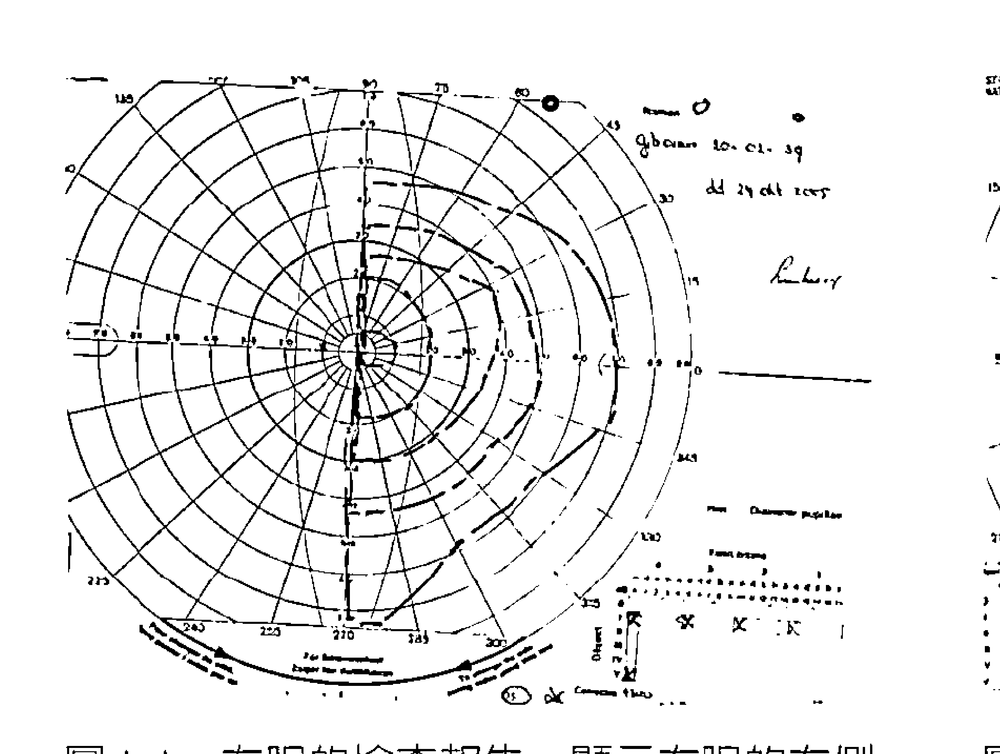
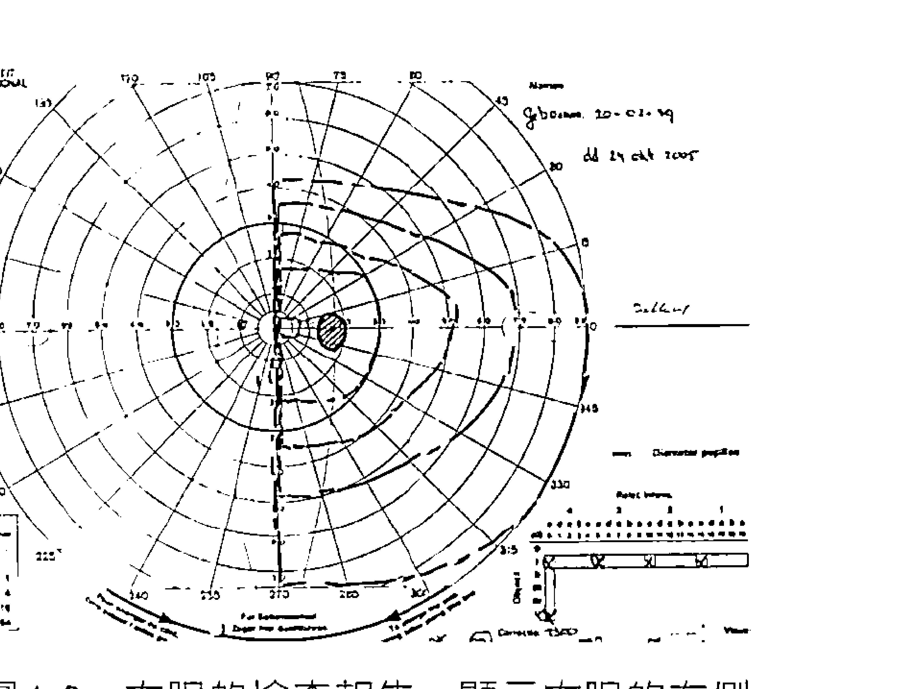
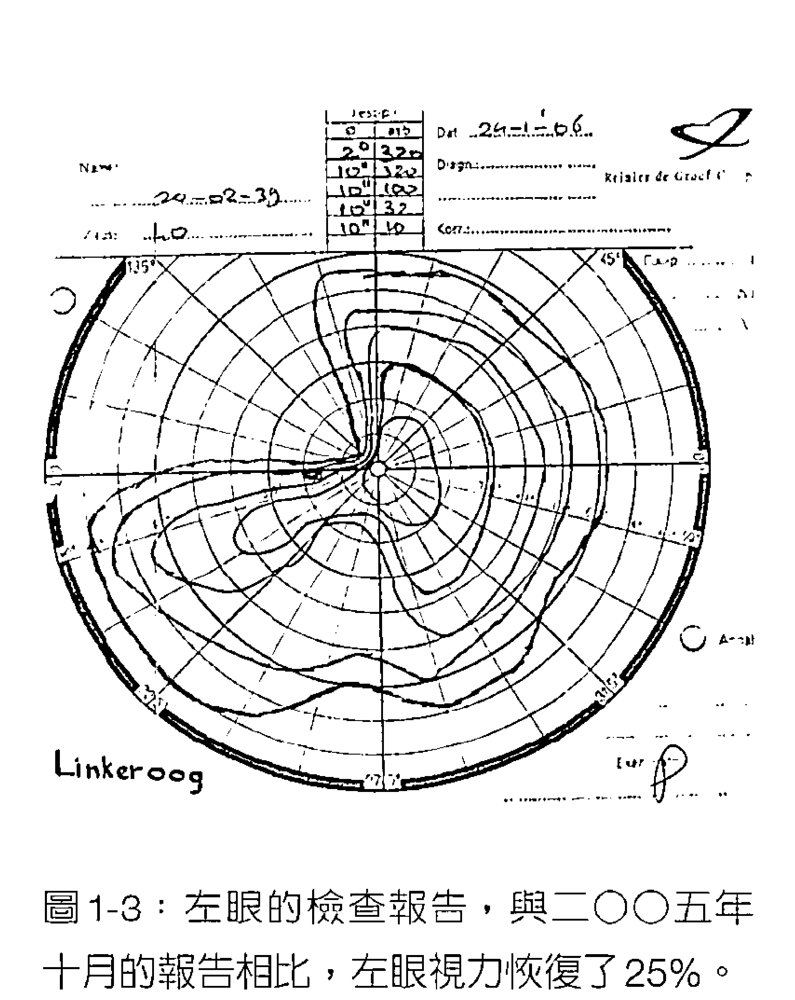
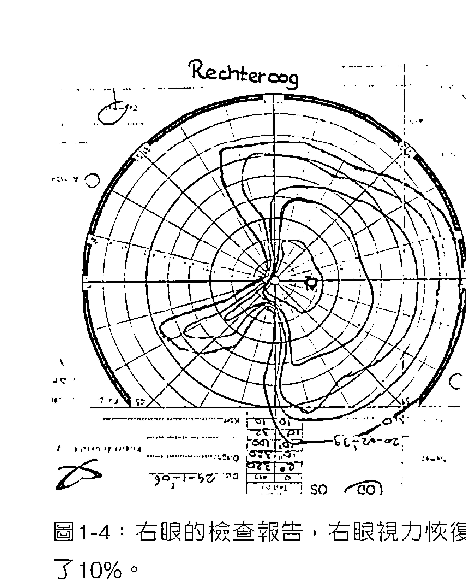
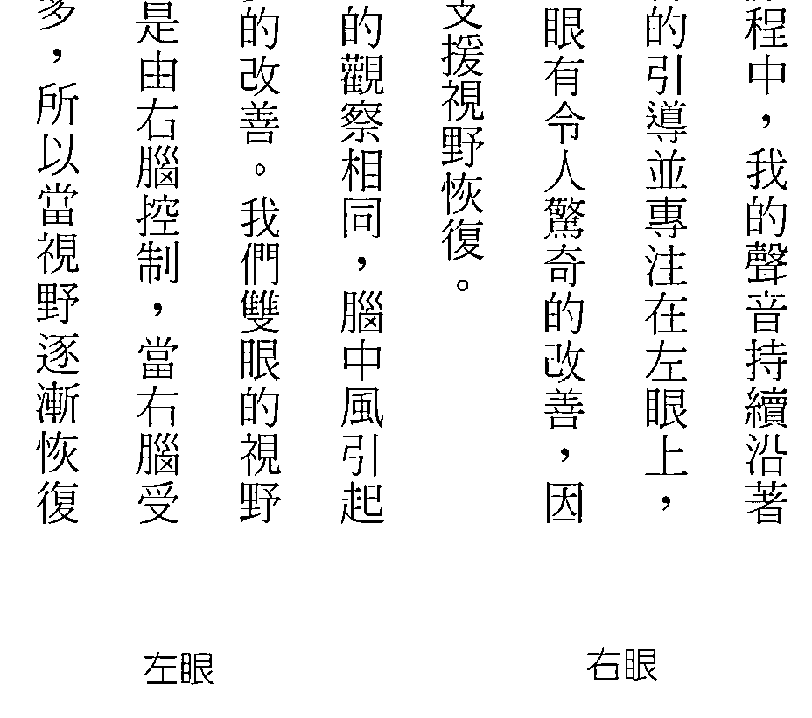
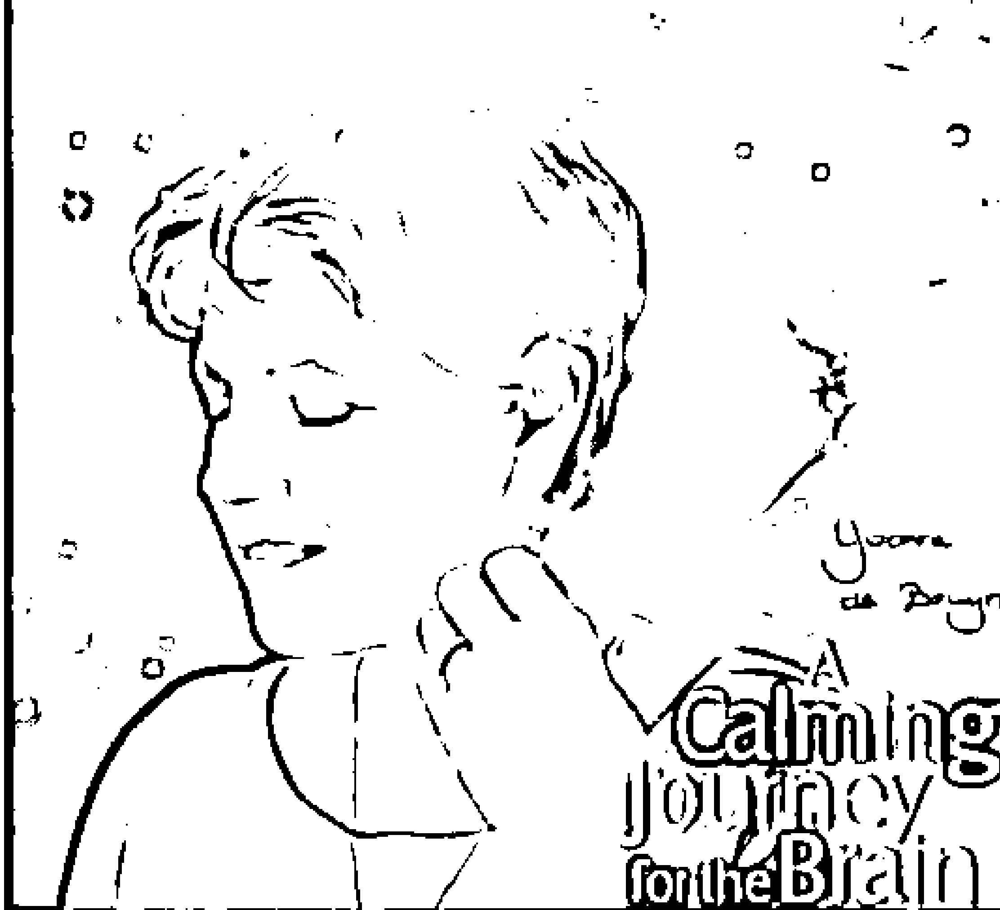
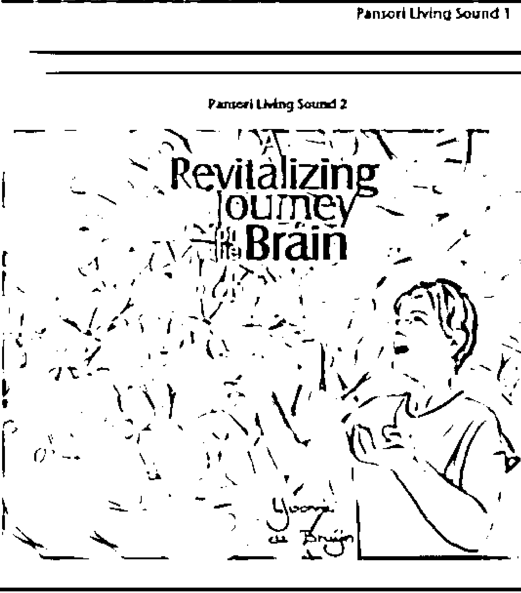
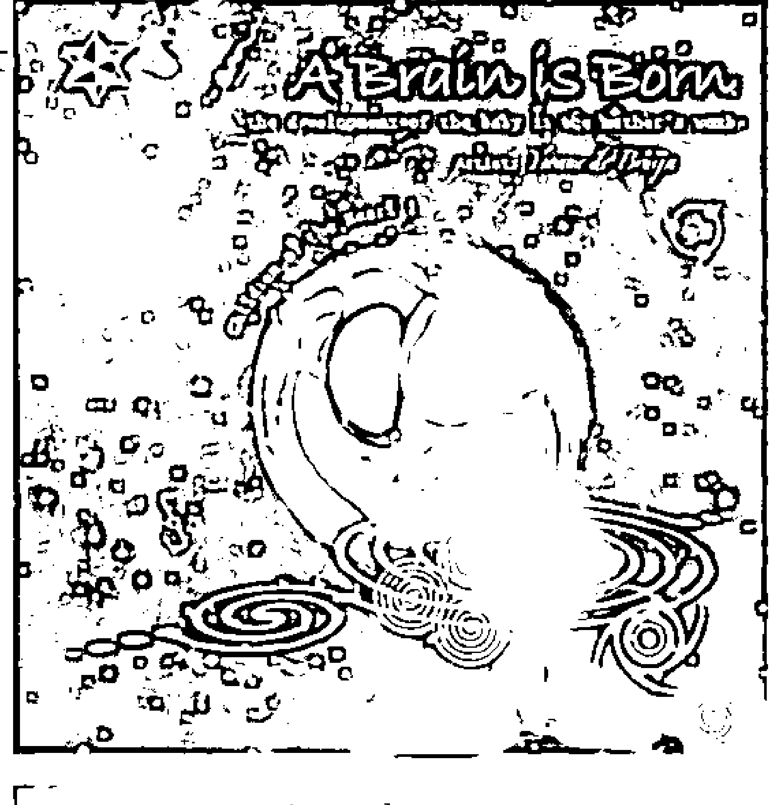
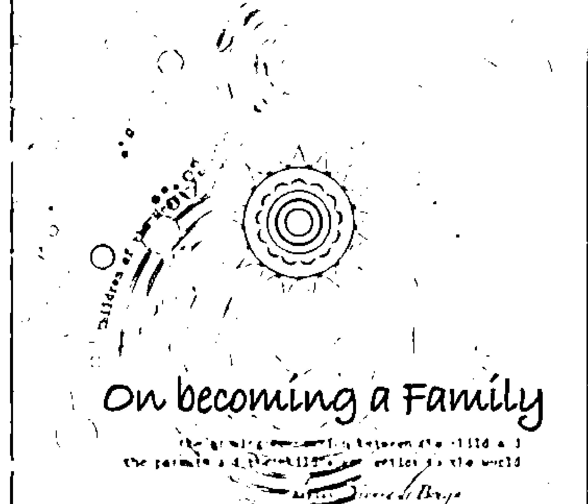
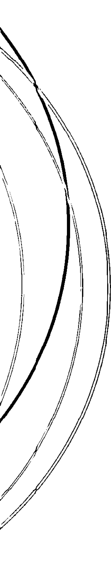

## 人聲，奇蹟的治癒力

## The Voice, the Body and the Brain

## The Art of Resonance

伊凡·德·布奧恩 Yvonne de Bruijn 著  
施如君 譯

她的吟唱使腦中風者受損的視力得到改善，  
幫助棋手贏得勝利，  
孕婦、聽障朋友、器官移植者……，  
都因她的歌聲而提升復原力。  
人類的聲音，是宇宙賜給我們的禮物，  
同時也蘊藏無窮的療癒力量！

隨書附贈  
聲音教母 伊凡·德·布奧恩  
吟唱的人聲CD  
讓你親自體會人聲的奧祕

## 作·者·簡·介

伊凡·德·布奧恩  
Yvonne de Bruijn

從多年前為嚴重腦傷的個案吟唱出修復之聲開始，旅居法國的荷蘭身心治療師伊凡發現並開發一種特殊的高頻泛音演唱方法，能夠修復大腦和身體的創傷，提升身、心、靈的自我療癒能力。她的歌聲經國際三大科學機構研究驗證，是對大腦獨具溝通修復力的高頻泛音。

荷蘭萊頓大學社會學士，ISMETA美國註冊身心治療師與教育家，德國Hakomi治療師，德國Lichtenberger研究所音樂導向治療訓練。1975年至今擔任MethMedura基金會董事，深入戰爭地區輔導政治難民。自2000年以來，在斯里蘭卡北部和東部受戰爭影響的社區運用創傷癒合技巧，並於2005年擴大到受海嘯影響的南斯里蘭卡。1980年開始從事聲樂心理治療，隨後並發展生命之聲教學方法，融合了語音、運動、身體、戲劇和治療。2010年風潮音樂在全球首推《生命之聲》CD專輯，亦開始在全球執行生命之聲訓練計畫。

## 制作说明：

本書由《天使神秘學院》出重金從台灣購入的原版書籍掃描製作完成。為達到最好閱讀效果，特地把原版書全部切開後，再經由專業掃描設備高精度掃描完成，並經過一張張的PS後期處理最終成書，其中間花費大量的人力、物力以及時間，只为能给大家提供经济并优质的神秘学学习资料而努力。

本學院强力谴责某些机构和个人，把本學院花心血製作完成的電子書籍，包裝後直接放在自家淘宝網上低價傾銷的行為，以謀取不勞而獲的經濟利益。如果長此以往最終將無人願意再為大家花心思製作電子書，那以後可能大家再無新書可讀。

為讓大家以後能夠讀到更多的好書，也為了本學院的良性發展。本學院懇請大家盡量做到如下幾點：

- 一、盡量在本學院的網站購買電子書籍。  
- 二、請勿用技術手段把電子書內的水印及加密去掉。  
- 三、在收到電子書後小範圍傳閱即可，千万不要公開傳播，更別掛到淘宝網上低價銷售。

同時為答謝廣大支持者，學院電子書將做如下調整：

- 一、學院會把一些早已收回製作成本的電子書折價銷售。  
- 二、最新製作的電子書籍會開放打印功能，大家購買後有条件的可自行打印成書。

天使神秘學院  
2019 年 1 月

## 圖表

圖 1-6：圖表中分別顯示雙眼接受 0 次、20 次、40 次訓練的結果。 (From: Kort Verslag Visuele Training, E. v. G.)

圖 1-9：振幅頻譜的條件設定為「睜眼狀態」，吟唱前為紅色線條，吟唱中為橘色線條，粗黑線條是一般健康成人的參考值，細黑線條是一個標準差。

圖 1-11：振幅頻譜的條件設定為「睜眼狀態」，吟唱前為細紅色線條、吟唱中為橘色線條、吟唱後為粗紅色線條。

圖 1-12：振幅頻譜的條件設定為「閉眼狀態」，吟唱前為綠色線條、吟唱中為藍色線條、吟唱後為紫色線條。

圖 1-13：吟唱前，閉眼狀態，關聯性模式的 Theta 波 Z 指數。

圖 1-14：吟唱中，閉眼狀態，關聯性模式的 Theta 波 Z 指數。

圖 1-15：吟唱後，閉眼狀態，關聯性模式的 Theta 波 Z 指數。

圖 1-16：10-20 電極分佈的參考位置。此分佈圖也可被運用在上述的關聯性模式圖表中。

圖 1-17：顯示吟唱前的身體調控狀態，參見標示時間。

圖 1-20：吟唱後，調節功能只有小幅度的改變，唯一比較明顯的是 D- 指標數值降低並接近正常值。

圖 1-21：從 E-、F- 和 G- 三項指標看出能量提高的現象，而且整體數值（圓餅圖的中心數值）由 56% 提高到 75%。

## 人聲療癒經驗分享

和伊凡一起工作開啓了我對聲音的新視野，豐富了我古典聲樂的嗓音，也豐富了我的人生。伊凡和她的「生命之聲」不但讓我的成長之路更精采，同時也改變了我的古典聲樂專業生涯。我對伊凡有無盡的感激！

伊凡坐在我旁邊，用手按著我的頭頂，輕輕的替我唱，然後按著我放在肚子上的手，再輕輕按著我的雙腳。那時我感到很安全，以及被聆聽、被包容、被了解、被擁抱，我們什麼都沒有說，卻充滿了感動。伊凡用她的愛，把我從那深深的洞裡拉出來。

伊凡療癒的歌聲，如天使般溫柔閃爍著愛的光芒，層層地穿針引線，喚醒細胞網絡，啟動身體無限潛力。

我兒子是聽著伊凡的聲音出生的。在他還是個嬰兒的時候，每當他情緒不穩時，我在他耳邊輕輕唱著生命之聲，他總會放鬆下來，定了定神看著我，彷彿明白我想跟他說什麼。那柔柔的唱頌聲，就是愛，能撫平母子的心。

在帶孩子的日子裡，身為母親得天天面對許多新的挑戰。我在最紛亂、最充滿疑惑而完全失衡的時候，總會為自己吟唱。在吟唱的過程中，一切鬱結、枷鎖、偏頗的信念，慢慢隨著自己的聲音而轉化。學習伊凡的生命之聲，其實是賦予了自己力量，透過自己的聲音去覺察自己。

我是個內心有許多疑問的人，跟伊凡相處的這些年，最深的感受是，她不會直接解答我的疑問——她總是讓我透過自身體驗來獲得答案。這就像她的聲音，允許我去找到自己的聲音，並從自身內在找到人生的答案。

《人聲，奇蹟的治癒力》是一本了不起的書，與一般大眾都息息相關，涵蓋了探索動作和聲音的個人經驗，並以最新研究和科學知識描述聲音對人的大腦和身心狀態的影響。伊凡將理論和實務以一種嶄新且令人敬佩的方式整合，她透過分享發展自己聲音的過程，以聲音、動作讓聽、唱、動和溝通變得可能，在藝術、治療和科學上都是莫大成就。我誠心推薦這本獻給未來的書。

聲音介乎無（形）至有（形）之間，也是有形世界中最接近心靈與生命本質最原始的療癒工具。伊凡老師的生命之聲唱頌，很自然地用病者或療癒師自己的聲音，沒有bass，沒有sits，沒有特別定的聲音和語調，也因此可以最開闊、最自由地找出身心任何能量流動的阻塞，又同時打通障礙。這是聲音的順勢療法，是聲音的瑜伽，是聲音的太極。愈是學習，愈能找回自己生命的重心，找回自己跟萬物的聯繫，找回自己在宇宙中的位置和空間，非常奇妙。

筆者跟伊凡老師學習了三年，親身體會到她超過三十年的身心靈療癒經驗、扎實深厚的修煉功力。她開的課堂，總能令人深深感動；她寫的書，則讓人看見到荷蘭人嚴謹的科學精神和治學態度。強烈推薦給在生命修煉中，喜歡理論探索的讀者。

｜艾絲特·派特（Esther Putter）  
荷蘭專業歌劇與清唱劇女高音

｜李家麟

｜許嫚烜，金曲獎入圍才女製作人、演奏家

｜黃偉德，香港自然療法醫師

｜岡恩·安葛思洛（Gunn Engelsrud）挪威奧斯陸大學體育學院院長／健康科學教授

｜黃斯薇，香港幼兒教育老師

## 推薦序

硬梆梆的骨頭。我們的身體有75％以上是由水分構成，聲音在這裡可以像風一樣自由。

我們的身體就是一個共鳴箱，每個獨一無二的身體造就了獨一無二的聲音。學習讓自己與聲音共振，就是上天送來最好的療癒工具。

不過，伊凡老師的聲音真的特別受到祝福，她的歌聲能碰觸生命的源頭和奧祕。

在書中，我們看到伊凡老師如何透過一個聲音治療師的身分，讓聲音像一把靈巧的水晶手術刀為個案療癒各種身心問題。我自己也曾感受伊凡老師的聲音在身體內穿梭，找尋它自己出路的體驗。然而我特別推崇的是，她強調放棄意念，讓「聲音臨在」。她發現一般用「意念」的方法來治療時，必須對一個外在的明確目標，發出清楚的訊息，利用冥想或其他方式傳送能量；但在「生命之聲」，她選擇放掉意念而讓「聲音臨在」，在聲音的臨在中，歌唱者和接受者兩者之間的連結，無需投射或傳送意念，也沒有特定要完成的目標，只是純粹讓聲音在那裡，在一個充滿振動、頻率和共鳴的場域中，一切的發生皆由聲音的共鳴來完成。事實上，既沒有發送者也沒有接收者，雙方只是存在於當下的聲音之中。

## 声音的臨在：也就是當下那一刻的聲音，當下的聲音是什麼，就唱出什麼，不用頭腦過濾或修飾。

編按：註號○為中譯註；○為原註。

7

## 梁秀庭

## 音樂心靈推廣協會執行長

## 世界音樂治療聯合會（WMTA）會員

## 譯者序

我先自首，文字一直不是我的強項。在我求學的過程中，語言方面的成績也不怎麼出色，後來我也發現自己只靠圖像來記憶，所以從未想過我居然會翻譯了一本書。

我第一次見到伊凡是在西班牙巴塞隆納附近的小莊園裡，那是我們在歐洲開設的第一個正式的工作坊，來參加的人幾乎都像是巫師聚會一般，每個人都身懷絕技，十八般武藝都有，其中有專長腦神經科學的治療師、有靈媒、有專精草藥的、針灸師、腫瘤科醫師、身體工作者……，當然還有伊凡。我們聽說伊凡會唱歌，便慫恿她晚餐後在舒適的客廳裡為我們歌唱。其實當時也還不清楚唱歌是她個人的喜好或是職業，因為怎麼也沒想到歌唱可以用來治療！於是很自然地，我想像這將會是個輕鬆的飯後歌曲歡唱時間。結果，她一出聲，我嚇了一大跳，她開始唱著長長的母音，沒有旋律、歌詞，但卻無比震懾著在場所有人，大家都被她的聲音深深地吸引。

因此我開始去了解她的工作，知道原來她是以歌唱來為人治療，我覺得十分有趣。直到後來，我帶著她到亞洲錄製唱片，並且在台北、香港、北京、吉隆坡等地演講和開設工作坊。

## 譯者序

後來我帶著伊凡到亞洲各地演講和開課，更是見識到不僅是她的歌聲，還有她個人攜帶的能量威力。記得在北京的一場工作坊，來參加的學員大約有二十幾位左右，工作坊進行的時間是三天，幾乎參加的每個人也都跟著哭了三天。伊凡如母親一般的母性能量，在那裡讓大家的心防都潰堤了，她的聲音和能量穿透了在場的每個人，讓每顆心都被融化而感動落淚。幾乎每一場演講或工作坊，都有許多學員這樣告訴我：「不知道為什麼，我才見伊凡一面，就好喜歡她，就覺得好感動！」

二〇一二年底，伊凡告訴我，她已經將她的經驗寫下來，有了第一本關於生命之聲的書，於是在亞洲學員的要求下，我趕緊著手進行此書的翻譯工作，並很幸運地遇上橡樹林的張總編，才促成此書中文版在不到一年的時間就完成出版。

在短短六個月翻譯的過程中，跟著伊凡說的故事，一字一句地讓我再經歷了一次「生命之聲」誕生的旅程。雖說這六年來我對「生命之聲」的重點已是再熟悉不過了，但讀著字裡行間，伊凡用自己的生命一筆一劃創造出「生命之聲」這個優美的作品，我仍感到十分驚喜與感動。翻譯時，我的大腦每天都像是做了激烈運動，有些酸痛，但又有種舒暢的感覺，想是老天安排我要來好好開發一下大腦的語言區，同時又以生命之聲的文字來幫助我活化與療癒我的大腦，才讓我順利完成這本書的翻譯。

許多人覺得自然療法玄虛、不科學，伊凡雖然創造了極用「心學」（不用意念，也沒有任何意圖，當下直心將聽見的聲音毫無保留的唱出來）的生命之聲治療方法，但她身為荷蘭人的背景，仍促使著她用科學方式來深入研究的渴望；同時，她用心來治療，也用腦來追尋目前理性上所能得到的解答，有些理論甚至超越當代的潮流，因此也為讀者在理性的層次上開啓一些新的觀念與看法。我想，人類的創新總是不斷地交互作用並往前邁進，相信這本書也會為自然療法界帶來一股新鮮的空氣，讓追求自然之道的治療師或病者，跟著伊凡和人類聲音，邁向一段新旅程。

## 施如君

## 中文版序

我感到十分榮幸，有這個機會透過橡樹林出版社將這本關於人類聲音的書介紹給各位中文的讀者們。中華文化在聲音或動作療癒方面有悠久而美妙的歷史，因此我希望這本書能帶給你們機會，再去擴展與深化這個古老的智慧，並且享受由心而歌的過程。

未來幾年，聲音將會成爲療癒的重要工具，特別是人類的聲音。「生命之聲」是一個已經發展成熟的方法，不僅可增進個人的歌唱能力，並可透過自己的聲音發現越來越多的新聲音。

我希望每個人都能找到自己聲音的美妙之處，並在聲音中獲得平衡。

伊凡·德·布奧恩（Yvonne de Bruijn）

## 中文版序

13

## 【前言】

## 開啓人聲療癒的旅程

有些故事從夢中的黑暗開始，有些故事從未來的一線光明展開。這裡要說的是「黑暗與光明」共存的故事，它是古老美夢的實現，也為將來指出一條可行之路。

自一九九五年開始，「人類聲音的潛能」成為我生命中熱情和關注的焦點，本書將敘述我如何開始探索人聲潛能的旅程，並試著為讀者描繪人類聲音的迷人魅力。這是個拓展人聲新樂音，並且喚醒其不可思議療癒能力的故事。自一九九五年以來，我親身見證了自己從未想過的人聲療癒奇蹟，書中也描述了人類吟唱歌聲所帶來難以置信的影響，乃至新自覺意識的誕生，以及如何敲醒這份潛能。

在本書的第一部分，我將介紹我開始從事人聲療癒工作的起源與契機。在我研究人聲療癒的最初幾年，我信任身體，由身體來引導我進行謹慎的研究，並從其間源源不絕的潛能中學習。我們的身體就像一座有多個出入口的聖殿，是座錯綜複雜的建築物，如同印度的泰姬瑪哈陵、斯里蘭卡康堤的佛牙寺、馬利共和國神祕的土磚清真寺、西班牙多雷多的白色聖母猶太教堂、荷蘭豪達聖約翰教堂裡著名的彩色格窗等。身體這個空間能如同法國羅馬大教堂般共鳴，並如它一般歌唱。身體容納並承載我們的「靈魂」──人類生命神聖的面向，只要我們生活在地球上，身體就會一直陪伴並引導我們。無論到哪裡，身體都會跟隨並參與我們所做、所想、所體驗、所創造的每件事。身體，是我們個人擁有卻也最少拜訪的聖殿，瞭解身體的過程就像瞭解古老神祕的宗教，帶給我們奧妙的想像與典範。這些想像連接著祖先的歷史，讓我們知道祖先如何生活並生存在這個世界，進而被編碼留存於圖像、舞蹈與歌曲中。去解密並發現這些深藏於我們身心中的圖像，能啟發我們去探尋身體所包含的奧祕寶藏。

在本書的第二部分，我將介紹身體聖殿的每扇大門，以及我在其中發現的寶藏。你無須期待會有完整詳細的人體解剖學介紹，你會看到的是身體與人聲交織的彩虹，以及人聲如何與不同的體內系統互動，如骨骼、器官、腺體及神經系統。在這部分所提到的經驗描述，對往後人聲療癒提供了必要的基礎。

從二○○○年開始，我探險的旅程由人聲中的每個聲音引導，而這部分甚至更為驚人，這些年的發展更貼近我人生中的突發事件，且這些突發事件深深地影響著我自我存在的意義和覺知。我那深沉又富有張力的內在探索歷程，繼續引導並塑造我的聲音，以展現它非比尋常的力量。儘管有些經驗令人觸目驚心且出乎意料，爲了能觸及人聲療癒威力的極限，我們得深入自己最深層的內在，並學著從那裡發出聲音｜｜吟唱。本書的第三部分就是在講述這些事件的源起。

第四部分將獻給人聲給我的教誨，也揭露我尋找新聲音的過程及聲音臨在的力量。我

第五部分是我對人聲的發現，以及在科學領域上的意義。我將敘述幾位不同科學家所做的實驗，這些科學實驗的結果讓我瞭解，人聲能誘使身體生理組織與腦部互通的可塑性。

我對人聲探索的旅程尚未結束，仍在繼續挖掘未知的寶藏，在本書中與大家分享的只是這遼闊無邊的人聲世界其中一角。我感覺我經過允許得以進入人聲的王國之中，並支持我繼續以更多新方法探索其療癒力，而我只是剛剛踏入這遼闊的人聲世界，歡迎大家與我一同遨遊並分享我們的發現。

人聲是我最終的導師，為我開啓聲音的殿堂，並不斷持續地改變並塑造我的人生。

伊凡·德·布奧恩

於法國 Le Boulard，二〇二一年十二月

16

## 第一部

## 出乎意料的開端

## 1
關鍵事件

## 人聲力量的序幕

一九九五年四月，以前的一位個案打電話跟我預約療程。當約定時間一到，門鈴響起，我去為她開門。當我一見到她時，幾乎認不出來。從前我所認識的她，是位有著一頭長長金髮的美麗女士，而現在的她幾乎光頭，大部分的頭頸上覆蓋著明顯的傷疤。她看起來非常疲倦，臉色慘白。當我們坐下來，她告訴我發生了什麼事。

她從一個很高的樓梯上摔下來，這一跤讓她的頭部傷得很嚴重，開了好幾次頭部手術，現在終於出院，而醫師們告訴她，他們已經盡力了。這場意外帶給她嚴重的後遺症，完全攪亂了原有的生活。她的記憶受損、變得無法專注、失去時間感和空間方向感、嗅覺和味覺幾乎喪失……。她的生活完全改觀，再也無法工作，也幾乎無法有正常的社交生活，而她不過才三十五歲。她為悲慘的故事做了最後的結語：「我覺得你能幫助我。」

當時我是個以身體為中心的心理治療師，有時會在療程中結合運動學和能量治療。她那句話讓我嚇一大跳，我對該怎麼幫助她毫無頭緒，但我馬上知道需要找到一個與過去截然不同的新方法。我不敢直接為她的頭部進行治療，也覺得不適合從情緒著手。她的腦組織有嚴重的創傷，影響到很多主要的腦部功能。為了有足夠時間獲得靈感，我建議先為我

## 關鍵事件

19

## 2
尋找祖源

## 一九八○年四月

一條筆直的長路，洶湧急奔的雲朵佈滿大片天空，風景在我眼前展開。在我的左手邊，路旁是一條小河，逆著強風，我弓起身踩著腳踏車，環繞著我的是一個陌生的地方，

在那裡，只存在著當下。我什麼也沒有帶，除了一瓶黑色的墨水、兩束白色紫羅蘭和一束紅玫瑰。

離開時，我並沒有告訴任何人，我感覺到迷失，我想去一個地方，在那裡，我可以找到自己、體認自己是誰，並且找到歸屬之處。我跳上火車，帶著不知為何而買的花和一瓶墨水。現在路轉向堤防，左手邊是我長大的大河岸，再過十六公里，路即將往右轉。我最後一次來這裡是什麼時候呢？二十年前或是更久之前？

終於，我抵達了。我打開大門走進去，毫不遲疑地走向我記得的那個地方：祖父的墳塚，沒有石碑、沒有名字，只有泥土。現在我終於可以休息，我將臉朝下輕觸泥土，四周只有一片寂靜包圍著我。默然中，眼淚開始緩緩流下。過了好長一段時間，我看看四周，將花朵放在墳塚前，並且灑了一些墨水在上面，我聽見自己說：不久之後，我會把一切全都寫下來。

## 一九九七年春天
致祖父的信。

在回家的路上，我在河水中將已空的墨水瓶洗淨。

我被寂靜包圍，在我們法國斜坡上的家。這是春天以來第一個溫暖的天氣。

從昨天開始，我感覺是該實現我的承諾，寫信給您。其實這封信已在我心中盤算了好幾年，我已經走了好長一段路，現在終於準備好再度傾聽您指引我生命的提問：為什麼世界是現在這個模樣？為什麼有這麼多苦痛與磨難？我想告訴您，我是如何用生命回應這些問題，又如何讓這些問題塑造我人生的方向與選擇。

寫信給您，感覺既陌生又熟悉。陌生，是因為您在世時，我從未與您見過面。熟悉，是因為我在您的故事與信仰中成長，始終相信一個更好的世界是存在的。您在一九四三年二次世界大戰中過世，在不斷延續且加劇的戰爭恐懼中，您曾絕望嗎？害怕嗎？您曾懷抱過一線希望嗎？

## 尋找祖源

25

## 2

在這封信中與您交談的同時，我也與自己對話。我必須寫信給您，好讓自己回到本源，找到通往未來的入口。當我進入帶領我回家、帶領我回到歸屬之處的神聖境地時，希望您能一同加入。

在我的人生中，只有一個最重要的課題：這個世界為什麼如此？從我有記憶以來，這個疑問就一直存在著。漸漸地，我發現現實和語言讓這個疑問更多采：非正義、威權、失衡、苦難、獨特性、潛力、希望與愛，這些並不是我刻意尋找的答案，而是透過您與先人們的歷史來到我面前，這些似乎是不久前才發生的。

您生活在十九世紀末、二十世紀初，那時正值巨大的社會變遷：工業化的到來、大量工廠林立、工人階級的酗酒問題、庶民普遍性的貧窮遭遇。在您的年代中，社會主義漸漸大鳴大放，您看見一個嶄新的世界，那是工人們團結致力於更好生活的年代，您亦信仰並積極爭取，為其努力並歌唱，只因您相信它終將到來。

對照您當時與我現在的生活，還有比這更強烈的對比嗎？您當時所期盼的一切，如今都已實現，至少在這世界的物質層面。在歐洲，工人階層不再是貧窮的象徵，他們的孩子也都可以上學，有更高等的教育機會；健康問題有保險制度守護著，老人也有退休金制度可依循。就物質面而言，我們什麼都不缺，但我們的

## 尋找祖源

靈魂還是迷失的，我們不再有任何信仰，打從心底深深瞧不起脆弱和纖細的價值觀。我們的環境被污染，團結是只有在工會要求加薪時才被搬出來濫用的字眼，各個階層都充斥著利益團體、貪汙腐敗和權力鬥爭，異化被鑲嵌在各式各樣的人際關係中。

這些是我想跟您討論的嗎？我想跟您重複我們每天在報紙上所閱讀到的那些事嗎？應該不是。

曾經我以為自己會寫下對這些事的反動，並指出誰該負責；但在這個複雜的社會，一切不再那麼清晰了。這是個互相連動的世界，很難一眼判斷誰該全權負責什麼。我只是想告訴您，我曾經如何嘗試改變這種趨勢，這些世界的黑暗面。我的內心與靈魂一直引導著我的人生信念，並且出乎意料地將我帶往您的傳奇──歌唱之聲。您熱愛歌唱，不管哪種場合、工作，甚至是在一九一四至一九一八年戰爭動員期間，您站晚班衛兵時也歌唱著。在僅存的空閒時刻，您還當起演員，同時也是您教會我的母親歌唱和素描。其實這本書某種程度也是為了紀念您，感念您活出自己的生活，體現人生的價值，堅持保有人性。曾經，您在半夜將酒醉的工人帶回家，並勸他們應該將勞力換取的所得回饋給家庭，不要老是買醉；曾經，您在半夜裡到河邊釣鮭魚，只爲了多賺些額外報酬貼補家用。當時，您欣賞了河面上那些層層起伏的月光波紋嗎？我希望是，至今我彷彿都還能看見您就站在那兒。真心地感謝您從那時就埋下的線頭，那條線從過去延伸到未來，直到現在成爲今天的我，並持續指引著我。

## 無懈可擊的開場

無懈可擊意指沒有錯誤、完美無瑕與純淨。我知道我必須以最純粹的極大專注力來開始這個計畫，爲將來的工作打好基礎。我沒有先入為主的觀念，沒有指引的地圖，也沒有可遵循的途徑，唯一知道的是，人類聲音中具有極爲重要的寶藏等待被發掘。唯一可以掌握的是自動浮現眼前的當下覺知，於我所想、我所知、我曾至之處與我所感。我必須仔細聆聽我的內心，並從那兒出發。

我在法國重新開始一個新的階段，就像一名剛從戰爭前線退役下來傷痕累累的戰士，這場戰役是一場社會變革的戰爭，爲了除暴及救助全世界的難民。這麼多年來的社會歷練及個人成長歷程，讓我從許多方面學習到我必須轉往自己的內在，尋求內在力量及新的潛力。然而，作爲一名戰士所習得的意志力和忍耐力，卻變成這個計畫的阻礙。當我試著用戰鬥的方式，卻屢遭失敗，也因此在最初的第⼀年，我經常覺得病著，身體也常常出問題，堅強意志和韌性對我並沒有幫助，反而身體變成我的老師，教導我去傾聽這段靜心的深層意義爲何，疼痛則是我的身體所表達最清晰的語言。我花了好長一段時間才明白，這次輪不到「我」來掌控一切，時間及身體都拒絕跟我擬定的計畫合作，我被迫接受身體的引領，進入前所未有的轉化與改變。無論我如何質疑這些過程，每當我順從身體發出的信號，它的方向總是十分清晰。

在一開始要把過程中不同面向所扮演的角色一一釐清並不容易，每件事都不停地在轉變，並且伴隨著混淆、恐懼與深層的悲傷。以舊有的方式處理似乎無效，新的習慣也尚未建立，因此完全沒得依靠。這老方法，我試過幾次，再也無法引起共鳴，不能使我的心情轉好，也無法激發任何靈感。

在廣大無垠的荒漠裡，狼女（La Loba）撫骸而歌的故事，對我有深遠的意義。在狼女的故事中，骨骸象徵著生命本質中堅不可摧的力量。

克萊麗莎．平蔻拉．埃思戴絲（Clairissa Pinkola Estes）在所著之《與狼同奔的女人》（Women Who Run with Wolves，心靈工坊，二〇一二年）一書中，寫下了狼女的故事。

長久以來，我感覺狼女一直陪在我身邊，指引著我。在最初幾年，我必須為自己的靈魂而唱，以喚醒並療癒它；我也實實在在的感覺，我必須為全身的骨頭而唱。剛開始我的骨頭非常疼痛，還有椎骨錯位、腰部疼痛、脊椎缺乏彈性、肩膀僵硬等困擾。

有一位老女人──狼女，隱居在未知之境，她似乎等著迷途或流浪者以及尋覓者到她那裡去。她唯一的工作是撿集骸骨，尤其是蒐集並保存那些在世間有消失危險的骸骨。

她牽掛著生命本質中堅不可摧的生命力象徵──骨骸，於是在沙漠間找尋失落的骨骸，特別是狼的骨骸。當她拼集了一整副骸骨，置於眼前，她會坐到火堆旁，思考著要唱什麼樣的歌。當她聽見內在的歌曲，便會站起來，舉起雙臂開始歌唱。此時，那肋骨和腿骨開始長出肉體。狼女繼續歌唱，獸軀逐漸成形。狼女繼續歌唱，獸軀開始呼吸。狼女繼續深沉歌唱，令沙漠地面搖撼起來。當她歌唱時，狼張開了眼睛，一躍而起，奔入沙漠。在牠奔跑之際，狼變身成爲一個放聲大笑的美麗女子，自由自在地奔向地平線。

因此，若你在人生的沙漠中感到受傷或迷失時，或許我們會很幸運的遇上狼女，她將會示範與教導我們靈魂之事。若我們迷失在自己的荒漠之中，我們會開始一段拾骸的旅程。當我們能尋回所有的骨骸，狼女會教導我們如何坐在骸骨前，唱起正確的歌曲。如此一來，我們可以喚醒靈魂的殘骸，並且起死回生。歌唱代表運用靈魂的聲音，吹出靈魂的氣息給予受傷、需要療癒的人。在狼女的場域裡，每個肉體都是散發光采的生命。究竟這種療癒力如何發生，仍是個謎樣的祕密，但進入本心之中唱出深切的愛，卻是必經之路。

## 聽見與傾聽

當我試著對全身的骨骼吟唱，療癒我的身體時，發現自己的聲音不能再如之前一般歌唱。聲音所訴說的，一如身體般，來自於無聲荒漠的最低潮，我的聲音既單薄又疲倦，最多只能吟唱十五分鐘就必須停止。我渴望能開始用我的聲音工作，但我發現還有其他更優先的事情，我必須穿越身體的構造和指示，才能接近聲音。我問自己，歌唱和身體的哪個部位有關？當然，聲帶以及喉嚨是歌唱的關鍵，但這並非我能起頭的地方，因爲它們只是反應我渾身的筋疲力竭。我察覺自己應該從耳朵下手，開始學習聽見與傾聽。

聽見與傾聽是相關的，但兩者卻是來自耳朵不同的作用。我發覺自己有很好的「傾聽」能力，卻沒有好好發展「聽」的潛力。儘管我的音準很好，但若是低音或高音，我便聽不清楚，甚至無法分辨自己的聲音，彷彿聽不見自己一般。我轉而更專注於自己的聽力，以發展內在的耳朵，我希望耳朵能聽得更清楚且聽見更多細節。藉由精微的校正這備的人體樂器，能讓我的聲音有更完整的展現，因爲當我聽不清楚時，我根本不知道自己在做什麼。

## 母親的歌唱

在那些玩聲音的日子裡，有一天發生了一件不尋常的事。我一邊做著發聲練習，一邊移動身體，突然一個很強烈的回憶冒出腦海：我記起了母親的歌唱。

無論何時，只要母親開口唱歌，總會有另外一個世界伴隨著聲音出現，那是個關於祖父母和祖先們的世界。不僅僅如此，因為母親唱歌的方式，活生生地表達出那個時代的生活經驗、愛與情感，那是個充滿畫面、色彩、聲音和傳說的世界。這些歌曲她起碼對我唱過上百次以上，我熟知歌曲中的每字每句，然而每當她唱起來，我總是不可抑制的哭泣。每次當我要求母親為我唱歌時，她總是微笑對我說：如果你保證不哭的話。每次我都真心誠意地保證絕對不哭，但每回母親才唱了開頭幾個音，我便無法抑制眼淚。母親的歌聲如此深深地打動我，裡頭有個聲音感動著我，並給我一種強烈的連結。或許是因爲她的歌聲早已深深地烙印在我的生命中，我總覺得所有關於自己的一切都是從那裡開始。

關於母親唱歌的回憶湧現時，我更渴望再次聽見她的歌聲，我盼望那歌聲帶我回到無可言喻的生命深度之中。當我回想起這段記憶，對我而言，這就是我所尋找的無懈可擊的開場。那段記憶仍是那麼鮮明，彷彿又聽見她的歌聲，在那一瞬間，我明白那歌聲一直活在我心中，成爲我的一部分，與我相依。雖然通往人聲寶藏的那扇門依然緊閉，我只要找出鑰匙，就能進入那片聖地。從此，在這段靜心中，我對於生命的根源變得更為覺察。我曾經花了好多年的時間，將生命重心放在幫助他人，這段歷程是一條探尋外在世界的漫漫長路，如今我已踏上另一段旅程，以進入自己的本源。差別在於，我現在懂得歌唱，並且用我的聲音創造生命的實相。幾年以後，我翻閱著母親過世後留下來給我的物品，找到一把水晶製的音叉。我從不知道她擁有過這種東西，但從此之後，這把音叉總讓我想起母親留給我的珍寶。

## 我的靈魂想歌唱

人類唱歌的歷史由來已久。不知從人類歷史上的哪天開始，單純的音被具有特定意義的文字和詞句所取代。當語言被發明之後，聲音變得具有特定的意義，特定的聲音開始代表特定的事物、感覺或經驗。經過時間的洗禮，聲音也能表達抽象的事物，如想法、概念等，因此，文詞的意義遠比聲音本身還更重要。在人類發展史上，這肯定是很重大的改革，而這種改變對我們來說是很難陳述的。然而在我心裡，仍能感覺到語言和聲音之間還是有距離的，當我只能用言語來敘述某些經驗，我仍感到一種無法言喻的失落和悲傷，即使是詩詞也無法代替。包含在聲音裡的某種生命力，是永遠無法用文字表達的。存在與經驗裡的精髓只能靠聲音傳達，而非文字可以辦到。

## 回到生命的源頭

我見到一個小孩，用大大的棕色雙眼打量著世界。從很小的年紀開始，她就懂得分辨什麼事可以做，什麼事不可以做。她住在大河邊的小村落裡，住在那裡的居民都勤奮工作，賺取生活所需。這些工作需要技巧和體力來完成，而辛勤的工作卻只能賺取微薄的報酬。從很小開始，她便能體會生活的種種限制。我見她不停地反問自己：爲什麼這個世界是這個樣子？

## 沉默

渴望占滿整座白色屋子

長大後，她寫下這首詩：

當她靜靜的巨波濤推湧著她。當她再度浮出河面，仍清晰地記得那令人振奮的感受。當她靜靜望著河流，大河教會她：方向、水流、波動、靜止處、作用力和反作用力。她經常在河邊玩耍，或是與大河玩耍，大河也教導她生命還有更寬廣之處值得去探索，例如更廣大的空間、海洋，以及宇宙。

那孩子有個夢想，有個渴望，她熱切盼望能夠成爲一名舞蹈家。這是個祕密的渴望，因爲在這個村子裡，沒有人會討論這一類事情，但她總是可以感覺到心靈深處的澎湃渴求。

## 還有舞蹈呢？

跳舞成爲她生命中的庇護所。本能一旦被喚起，就不再沉睡，因此，每每她遇到不知該如何面對的狀況時，便會以舞蹈來尋求指引。

舞蹈變成一種神祕的神聖儀式，直指她存在的中心、宇宙存在的中心。多年來，她持續不斷地跳舞，藉由舞蹈，她與神靈對話，並與之爭辯、爭取、渴求和讚美。她以舞蹈向祂們致敬，當她透過各種動作和姿勢向神靈訴說，神靈們也會給予回應。

同時間，她的專業生涯也逐漸成型，慢慢轉往社工領域及諮商治療。她和各式各樣的人一起工作，過程中不停地尋找不同的選擇，以及更多有關公平正義與現實社會的領域。

一九八七年，這些工作再度將她帶回身體療癒工作中，並探索療癒的意義。她研習更多身體工作的方式，例如：運動肌能學、顱頜骨療法、呼吸治療法、按摩等等。但她總覺得欠缺些什麼，缺乏一種更深層和純淨的治療方法。

一九八九年，她聽說了哈克米整合心理治療法，那是一種以身體為中心的心理治療法，於是她在德國慕尼克和海德堡接受其治療師的訓練，此後多年，這種療法成爲她專業工作的主要依歸。但她也花了七年的時間研究，嘗試找出另一種更能接近她內心的療法，

## 回溯內在的矛盾

就在這段訓練中，我發現「我的靈魂想歌唱」，但同時有一股強烈的力量抵抗著，使我感到那是不可行的，彷彿我的內心感覺到用聲音來表達是某種禁忌，我的聲音裡頭有股恐懼，無論是被看見或被聽見，我都害怕去表達。在受訓的第一年，急欲表達與不敢表達兩股力量相互掙扎矛盾，內在總是有股批判的力量提醒自己是毫無價值的，究竟這種感覺從何而來？

直到在哈克米療法訓練的最後審視課程中，一切才明朗起來，我才看清原來內在批判是如何作用，以及它從何而來。這份體認是來自於一段童年時期的記憶。

回溯到我的高中時期，在荷蘭豪達念高中的那兩年，是段可怕的回憶。那是一所所謂的貴族學校，學生們的家長都很富裕，突顯出我在那裡是多麼的突兀，很明顯地，我和他們完全屬於不同階級。同學們不和我說話，也排斥我參與所有的活動，整整兩年的下課時間，我都是一个人坐在長椅上或是一個人站著，自己一個人上學，也一個人回家。不光是同學有這種舉動，就連大部分的老師和校長也都抱持這種態度。為了保護自己，我只有一個方法，那就是用功讀書，並且設法取得好成績。

最後一年下學期時，我突然在路上昏倒，被送到醫院，路人以為我是癲癇發作，然而我知道，那是因爲我在學校被孤立，內心深處的我再也不想回到學校去。我待在家裡整整一個星期，什麼也不做，只是睡覺。母親那時一定也感覺到我的心情，於是那個週末她對我說：只剩下六個月而已，你可以完成的。在那個星期結束後，我就返回學校。

六月到了期末考的時候，我知道自己考得很好，而且一定會通過，但是我不讓母親來參加畢業典禮，我不想讓她親眼看見我在學校裡的處境。典禮開始後，學生們依次上臺領授證書。學校有個傳統，前三名會在典禮的最後才宣佈。由於我還沒拿到證書，所以我心裡知道我一定是前三名之一。

第一個被唱名的是對面班級的一位同學，接著是我們班上一個常欺負我的女孩，最後才是我被念到名字，這代表我是全校第一名。校長宣佈完名次，遞給我證書後，開始了他的致詞：

無語的我，接過證書後，一口氣跑過整條長廊，直到大禮堂的盡頭，然後躲在樓梯下，遠離那個地方。而我卻在樓梯底部撞見了不顧反對跑來參加典禮的母親。我絆倒在母親懷中，她對我說：「沒關係，明年你可以再試一次。」原來她以為我搞砸了考試，我在淚眼矇矇中邊哭邊對她說：「但我 是全校第一名啊！」

在三十年後的自我審視課程中，這段往事又襲上心頭。我對這段浮現的回憶感到驚訝與混亂，似乎有什麼是我還沒真正了解的重要課題。之後我們慢慢地解譯當時發生的事，我曾試著融入學校的生活，並且希望能被看見；我也試著成爲期末考最優秀的學生來保護自己，但我終極的成就與勝利，最終卻成爲我人生中最深刻的恥辱。

猶如從低窪出身、僅是木匠之女的你，竟敢成爲全校最優秀的學生？

我學到，即便是完美優秀也不能保證會被接納；相反地，優秀是危險的，因爲它可成爲再次被羞辱的原因。即使這並非我從那次經驗中學到最重要的事，直至今日，我仍無法接受即使我可以做到最好，但我仍有極大的恐懼再度成爲最優秀的我。這樣的結果造成很嚴重的、毀滅性的影響，啓動了一個強而有力又鮮明的適應機制。在課程中，我明白了這一點，並爲它取了名字，叫做「內在警衛」。這個機制會一直保持警覺，看顧著我，並時時巡邏以找出適應各種改變的階級式需求。

在同樣的狀況下，我不能引人注意，不能表現自己的優點，只能待在沒有威脅的情況中。如果必要的話，我甚至可以裝笨，以保安全。

裝笨，一直是很安全的做法，而且可遠離不堪設想的後果。每當我裝笨，就真的連最簡單的事情都不懂，並且無論如何都無法進行抽象思考，任何鼓勵我直接去體驗之事，都會被視爲一種威脅。內在警衛一直守護著我，但同時也壓抑我、勸退我、使我被忽視，以適應和配合外在環境。我很清楚，當自己越渺小就越安全，並需隨時隨地對外在世界對於我的期待保持警覺。

在課程中，我還發現每當階級意識一出現時，內在警衛的機制便會馬上啟動。但即便在當時，我都不認爲自己過著那種生活，否則我一定會反抗，因爲我從未選擇過「適應」的生活。藏在「適應」斗篷底下的，是活在另一個現實世界的我。我強烈地渴望了解我所處的世界，我有股衝動，想合理化包圍我的現實世界，想以我的方式來定義它，所以我選擇在邊緣生活，只要那裡能自由伸展，只要那裡能發現與探索新事物。

於是我腦中第一個跳出來最適當的字眼是：社區。這個生活化的字眼，具象和表像都像在代表我生長過的村落，一個人們共用生活的聚落。這個獨立的命名，幫我找到自己的路以及內在的價值，也讓我找到知己一同分享願景，並將它變得可行。也因爲這個字眼把我拉到荷蘭的麥思麥都拉覺知整合中心，成爲我認爲無意義世界的答案，我願承諾爲這世界指引一條明路，以改變與建立具有人性價值的新生活。以麥思麥都拉的定義來說，它是建立、分享、生活和教導，後來成爲防禦、行動、非暴力、消弭衝突、分裂與孤獨。麥思麥都拉是個真實世界，也是一個聚落──一位曾住在那裡的難民如是說過。這也是個反映我內在價值的社區，並反映到麥思麥都拉致力與存在的社會上。

從此我不再將自己暴露於野心和惡性競爭中，也不再爲自己爭鬥。我只爲他人而戰，爲了難民、爲了對抗不公不義、爲了麥思麥都拉而戰。但每當遇到自己時，我會馬上退出並刻意被忽略。

於是我驚訝於我現在看到的、感覺到的，花了這麼長的時間，我才認識到這一點，以及它所造成的後果。這個三十年前的經歷，竟然對我的生命伸出魔手，讓所有事情都在其陰影下受影響。課程結束後的那週，我得了嚴重的病毒感染，病得很重。雖然身體疼痛，但我卻覺得像是體內過濾和清理的機制在運作著。我感到渾身疼痛，有時甚至覺得極度不安。我花了好長的時間才慢慢痊癒，這幾個月以來我都感到很疲憊，並且反覆發燒。這個病痛很戲劇化、很劇烈，也很令人震驚，這是人生中第一次，我感到真的病了，似乎是內在更深處以我可以理解的方式在轉變。從適應到表達，需要長時間的調整。當我痊癒後，發現我的聽覺變得不同了，似乎有一種細微的、自然的聽覺被開發出來。我聆聽著身體給我的回應，聆聽著我的雙手，聆聽著我的歌聲，聆聽著內在的語言和聲音。我渴望與逐漸成長的內在相處，渴望找到並跟隨屬於自己的路，並讓內在的聲音歌唱。

多年後有一天我意外地回到豪達。我的腳步帶著我走回那所學校，我走了進去並穿過走廊，我感覺自己正在做對的事。我是否該去見校長，告訴他多年前在這裡發生的事，對我造成什麼樣的傷害？漫步在校園中，那時我突然了解，我的歌聲已經完成了這件事。我開始唱起其中一首母親常唱的歌，之後，我只是唱著我想唱的聲音，並讓聲音與整座學校共鳴。我走遍各個角落，甚至是那個大禮堂。當我離開那裡時，感覺十分滿足，並對自己所做的事感到驕傲。我已經成功驅逐了這頭過往的惡魔，在那一刻，我感受到聲音的強大力量。

## 身體教導我的事

身體，是我們內心的大地。

在這部分，我將說明主要的身體系統，以及其與聲音的關聯。首先，我將提及骨架和重量之於身體的作用，接著說明體內器官、內分泌系統和不同腺體的功能，然後探討中樞神經與腦部系統。另外，我也會說明身體動作的發展過程，包括一連串自嬰兒至幼兒成長時期的動作模式。我不準備詳述全部既有的身體系統，這不包含在本書所要探討的範圍。我的重點是與大家分享我接受身體引導時的一些生理變化和體驗，以及人聲開發時相關的重要身體系統。

布登豪斯，生命大地

(Charles Boultenhouse, Animated Earth)

## 身體的故事

在閉關靜心的頭幾個月，我研習一本物理運動的書，名為《身體的故事｜體驗式解剖學手冊》（Body Stories, A Guide to Experiential Anatomy），作者是奧森和麥克豪斯（Andrea Olson and Caryn McHose），這本書的重點是藉由身體的動作去體驗身體的整體結構。仔細聆聽身體陳述的內容，成爲第一年最重要的練習。我慢慢地讓身體成爲我的導師，並透過疼痛了解它的教導。過程中，我的每節椎骨都很痛，就像脊椎再也無法支撐我一樣。自從上次嚴重的病毒感染後，我的髖骨痛不堪言，這種痛似乎走到盡頭無處可去，讓我全身緊繃。我轉而觀察體內，試著感知身體的現況，而我的骨架提供了這段摸索過程的基礎，成爲身體的核心。我的注意力轉往身體的本質、骨骼的骨架、我的基礎結構。那時，狼女總是伴隨著我。

我透過動作，也透過理論，摸索著身體的骨架。我讀了《思考的身體｜人類動態平衡力的研究》（The Thinking Body, a study of the balancing force of dynamic man）一書，作者是妥斯（Mabel Ellsworth Toth）。我也在美國的一所大學裡買了一副小型的人體骨骼模型。透過我自己的身體骨架，我體驗到骨架的靈活性、往上和往下的兩種力量，以及肌肉、韌帶、肌腱和關節的相互關係，這個相互拉扯、伸展和曲力編織成的網，讓身體成爲空間中一個運作平衡的結構體。從骨骼的動作方式，我體驗到身體在空間、方位和動作流動上的方向性，也體驗到自己動作的極限。剛開始的時候，我的身體經常筋疲力盡，根本不知道如何傾聽身體的訊號。疼痛讓我了解該怎麼聆聽身體的動覺，包括身體想怎麼動作、身體如何探索空間、如何改變方向，以及脊椎如何支撐人聲發出聲音。我學著了解細胞發出的訊號，以釋放極具張力的緊繃感。

我的身體特別緊繃的區塊集中在橫隔膜的位置，我特別感覺到它在身體的中央將我一分爲二，一上一下。這種區隔感也反映在我的意識中，我對於身體的上半部特別有感覺；相反地，身體下半部卻感覺是緩慢、沉悶、缺少活力的。當我呼吸和唱歌時，橫隔膜會特別緊張，而這部分就像一面鼓一樣，是我們身體其中一個最大的共鳴體。

當我在做運動時，橫隔膜會開始釋放些許張力。有好幾個星期，我不斷練習一種運動叫做：橫隔膜捲動，起初橫隔膜沒有任何動作、回應、感覺，什麼都沒發生，然後有一天，突然體內有種自發的活動，不斷鬆動、不斷釋放。

這種感覺讓我同時又想哭又想笑，緊接著突然有個問題浮現在我腦海裡嘮叨著：什麼是我的存在？我感知到我的存在了嗎？這只是個一閃而過的念頭，但卻開啓了接下來幾個月令我不停探索的一個新領域。當身體的壓力釋放了，頭腦便開始不斷的提出疑問，以尋求其意義。橫隔膜的釋放，改變了我和土地之間的關係。這是第一次，我有腳踏實地的感覺，我的小腿背面開啓了一股上提的動力，使我在走路時輕鬆起來。一直以來身體一分爲二的感覺消失了，我的身體感覺更整體，全因我的橫隔膜恢復成原有的形狀，而且能像一面鼓一般共鳴。

這些身體上的細微變化，爲嗓音的發聲提供良好的基礎，讓我的聲音不費吹灰之力地跳出來。我的聲音變得更有活力、音域擴大、聲色更飽滿，尤其是低音的部分變得更有力量。當橫隔膜的張力一降低，聲音的音調立刻跟著放鬆，這個經驗告訴我，只要壓力存在時，聲音便很難共鳴，也不易發出聲音。和聲音一起共事，讓我喜出望外。有天，我正在練習中段音域的發聲，這部分對我來說很重要，我經常感覺那部分的音色既緊張又受限，難以突破。當我試著調整當中的張力時，突然莫名地進入一個新的境界，但當我移到下一個音階，試著再用同樣的方法，它卻跑掉了，等我再多試幾次後，才又出現。我不知道這將我帶往何處，不過卻讓我平時說話的語言變得更加流暢和順利，身體的能量更爲集中，人也變得更有活力，彷彿有個內在空間被打開，我可以從那兒聽見自己的音樂。

我的身體成爲一個活生生的個體，自在地表達「我是誰」，而不再像從前一樣只是一具隨身攜帶的皮囊，或是一座有城圍保護的城堡。這些發生都不是不請自來的，我必須仔細聆聽、行動，甚至在地板上滾動，細心的研究身體的律動。至今我完全懂得這「無懈可擊的開場」的意義，而它一步步教導我如何成爲一個開放的樂器，就像一支能吹奏的長笛。

在此，結論可引用《身體的故事》一書中的一段話：「你就是自己的教科書、實驗室和導師。身體是我們的嚮導，我們唯一要做的就是學會聆聽。」

我在法國居住的初期，經常在住家附近的樹林或草叢間發現猶如圖騰柱（totems）的石頭，這總是讓我想起狼女撫骸而歌的骨頭，於是我也蒐集這些石頭，並把它們放在我家周圍。有時我會為石頭命名，像是「關節」或是「伸往上天的眾臂」。這些石頭是我在法國住家的保護神，另一方面，它們也讓我思考這個世界的本質，究竟是什麼使我們的社會凝聚在一起？支撐這個世界的骨架又是什麼？我讀了萊維（Pierre Lévi）的書《如果這是一個人》（If This is a Man），他提到自己在二次世界大戰德國的納粹集中營裡發生的事。我們都是由骨骼、肌肉和器官所構成，我們都有聲音，但作者萊維卻讓我們思考生命不同的面向。當處在極端的環境中，人會變成什麼模樣？什麼才會延續？什麼是脆弱？究竟人類生命的意義為何？

俄國詩人曼德爾斯坦姆（Osip Mandelstam）曾這樣寫道：「我們活著，卻沒感覺腳下的土壤。十步之外亦沒有了我們的聲息。」詩人在史達林迫害時期寫下許多作品，一九三七年在集中營裡去世，我們的世界自那時起也開始轉變。但我們真正聽見彼此了嗎？我們聽得見痛苦、喜悅和生命的本質嗎？我們的世界是如此的震耳欲聲，即便只有一步之遙，我們也聽不到彼此。我們淹沒在資訊爆炸的海洋中。

## 骨架教會我的事

我們的耳朵已失去能力，聽不見精緻細微的聲音。那些圖騰石頭時時在提醒我，仍有許多人失去發聲的能力，甚至從未有人聽見他們。即使我在法國的一片寂靜中工作，依然心繫這種現象。

關於骨架，我學到的第一件事是，為了能在空間中移動這副骨架，它們之間必須相互連接。骨頭和骨頭之間以關節作爲連接，以肌腱和韌帶支持和牽連，然後由肌肉牽動。我們總是說骨骼肌肉系統（skeletal-muscular system），因爲骨骼和肌肉是如此相互依存，骨骼定義了身體的動作和方向，是整體活動的基礎，但骨頭僅能移動至肌肉牽動它們的位置。

骨架主要分爲兩大部分：

- 主軸部分：包括脊椎、顱骨和直接連至脊椎的骨骼，如肋骨。
- 附屬部分：包括四肢的支持骨骼，如胳膊和腿，以及連接到脊椎的肩帶和骨盆帶。

脊椎是我們最內層的骨骼結構，是身體的中心，維持著中樞神經系統，其上還支持著頭部。脊椎在海洋物種早期演化時就開始出現，演化中的脊柱負責保護基礎的神經系統，所有感覺、監控身體接收和發送資訊的動作，都在脊椎的空腔中傳遞。在脊椎中腔流動的腦脊髓液，則是讓脈衝通過脊椎並冷卻大腦的液態物質。

是不是很神奇呢？我們身體最內層的核心竟然是液體，代表身體最初的發源地──海洋，仍舊存在我們體內。

當我在書本上研究骨骼系統時，發現骨骼並不是實心的，而是空心、不堅硬、有彈性的。我運用小型骨骼模型，找出每塊骨骼的位置以及功用。當我意識到這些骨骼存在我身體裡，便更能仔細體會這個結構如何讓我站得直、移動時如何變換重心。為了更熟悉這副骨架，我開始臨摹人體骨骼系統，甚至是部分的椎骨。我非常訝異它們竟如此不同，如此雕工精美又能在活動時如此靈巧。

然而，這些知識並無法代替實際體驗，我仍需要靠移動和想像去揣摩當身體活動時，骨架的變化。當我把注意力放在骨骼上，發現它們引導出我在空間中的方向感，我學著和自己的骨骼一同去觀察。剛開始，我對自己正在學什麼毫無頭緒，很難同時用言語表達出移動中的體驗。脊椎前方有什麼感覺？支援歌唱的聲道的確切位置又在哪裡？

為了讓我的骨骼更加靈活，我採用一套每日的運動。這套運動出自於體驗式解剖學，由班｜柯恩（Bonny Bainbridge-Cohen）所發展出來。在他的方法中，他稱之為身心平衡法（Body-Mind Centering）。體驗式解剖學後來成爲我探索人聲力量的旅程中，其中一個十分重要的理論基礎。我花了好幾個月將重點放在脊椎上，在我的脊椎周圍，是好幾年來堆積起來的壓力，好似我的脊椎被圈固在一個薄且堅硬的金屬管子裡，它曾是種保護，但若我想開發我的聲音，便需要一個柔軟且靈活的脊椎。在練習的時候，我嘗試用不同的方式讓脊椎活動，包括跳舞、在地上打滾、推牆壁和扯拉橡皮筋等。慢慢地，我的脊椎變得靈活，但隨著脊椎逐漸靈活，同時有種未知的力量開始釋放出來，原本蟄伏在脊椎內的巨大能量被喚醒且開始活躍時，我嚇壞了，它就像一股內在的浪潮淹沒了我，我得學會適應，並與這些新能量共處。我的身體與心靈需要同時敞開，以容納這股能量。在此同時，我強烈地感覺到重獲自己，彷彿來自未來的未知向我靠近，我無法定義它，只能向這一切臣服。

一九九七年初一個早餐時分，我突然感到內在有個東西被擊碎，也被伸展開來，好像有些沾黏在一起的椎骨被解開了。這種感覺不僅是生理上的，也是種內在情感和心理的體驗。在我內在一種存在的源頭、我是誰的核心被擴展，並回復到平衡。我無法指出那是什麼，但它改變了我。如今我的外表更忠實地反映我的內心，不僅不再那麼拘謹，並且更能自由流露，而這份自在，馬上反映到我的歌聲中。脊椎，這個由椎骨堆疊而成的支柱，成爲一個結合彈性、穩定和活動的驚喜。當我再由脊椎歌唱時，最內層的液體結構成爲我的出發點，我的聲音變得更如水晶般清澈透明，同時牢牢地扎根，並被小心翼翼地保護著。

## 身體的故事

我們的身體中，扮演中央重量分配者的角色。椎骨的設計是要能夠承載最大可能的重量，每個碟狀的椎骨接收來自上方的重量，然後傳遞給下方稍稍更大的椎骨，層層傳遞下去直到骨盆骨為止，最後再將重量分配給臀部、腿和腳。

胸腔的形狀就像個容器，主要是為了保護和支撐裡面的器官，包括心臟和肺臟。骨盆腔也像個容器，但前方有個開口，包藏了腸道、膀胱和生殖器官。

何以體重如此重要？因為重量將我們的重心往下拉，地心引力讓我們能站在地面上，重量絕對是我們可以明確感覺到的東西。地心引力拉著我們，體重透過骨骼傳遞到地面，奇怪的是，體重卻也同時提供一股往上的反作用力，我們需要地心引力才不致於漂浮在空中，這兩種力量於是相互抵銷。重量有助於我們的動作，藉由重量的轉移，我們才得以順利活動。我們所做的每一個動作，均是不同的重量分配，牽動著內部組織的運動，支持動作的衝力。重量轉移，是透過脊椎的運動來進行，即便是很細微的動作，也都與脊椎有關。在研究重量如何轉換時，我再次對脊椎的功用感到好奇。脊椎是個貫穿中心的中空管道，連接大腦、手臂和腿，同時也是脊髓和脊髓液的家。當我把玩小型人體骨骼模型時，發現脊椎的運動不會是單獨孤立的，脊椎是所有動作的中心，而所有動作都會反射到脊椎，重量的轉移，同樣地也一定會經過這個中央結構體──我們的脊椎。

人聲發展與骨骼結構的關係

任何動作都該從中心開始，也就是從脊椎的運動，而非來自肌肉的收縮和延展。肌肉固然是骨骼肌肉系統中的重要部分，但脊椎的運動仍是最主要的。當我從脊椎的運動進入，我能碰觸到身體最深層的結構，從身體的中心開始，接著運用觀想力，便能讓我深入身體的最深處。

當我的骨架，尤其是脊椎變得更靈活時，我的聲域變得更寬更廣，音質如水晶般清澈透明，好像有整個骨架在背後支撐著。去感知脊椎這個開放的管道，對我的聲音有巨大的影響。有一天我突然聽到骨骼的共振，不僅發聲是在我的頭部和下巴，我還聽到胸骨、肩胛骨及頸椎的共鳴。頸椎對人聲提供的支撐是異常重要的，更可說是歌聲的支柱。在此之前，我從來沒有意識到，這些椎骨與我的歌聲間存在著密不可分的關係。

骨架同時也幫我感知並找出身體裡可以產生共鳴的不同腔室。我們的聲音是透過呼吸產生的，我們利用空氣來發出聲音。其實聲音就是呼吸的自然副產品，當我們呼氣時張開嘴巴，可以聽到一個拉長的「阿」音。聲音不是被做出來的，而是自然發生的。聲帶就位

於呼吸系統的頂端，聲帶是否擺盪和振動，仰賴氣管裡的軟骨是否保持暢通。我們可以把氣管想像成一把精緻的笛子，聲帶構成水平的薄膜，能開闔及上下振動，藉著呼氣時的力道大小來開闔聲帶，以發出聲音。聲帶振動的品質，決定了主要的聲調和音高，整個發聲機制是建立在振動和共鳴上。聲調由聲帶的振動產生，從那裡繼續延伸，就形成了共鳴。此時，身體也加入作用，體內不同的共振腔能形塑聲音的樣子，並給予支持。在這個過程中，脊椎發揮了至關重要的作用，當我們呼吸時，脊椎會稍微往下，對呼吸產生支撐和反作用力。

很多人呼吸時會失去脊椎的支撐。當我們吸氣時，可以運用脊椎，因爲脊椎及和脊椎有關的器官會支撐和推動聲音。當我們由脊椎發出聲音時，器官們也會跟著聲音和橫隔膜的位移而動。一個靈活的身體可以承載著聲音，並將其傳送到那些如穹頂或碗狀的腔體內。最終是身體的共鳴創造了聲音，脊椎、器官和橫隔膜三者也都彼此互動以幫助它發生。

身體的腔室

身體內有幾個穹頂狀或碗狀的腔室，都在人聲的共鳴上扮演重要的角色：

底部碗狀腔室及骨盆腔底部：由下往上檢視全身的腔室，首先找到的是身體底部碗狀腔室及骨盆腔底部，它們支援呼吸並為聲音打了地基，它們也和雙腳直接相關，因爲身體的重量透過這個部位傳遞到雙腳。如果我們無法將重心放到底部腔室，同樣地，我們的雙腳也無法穩踏在大地上。

骨盆腔：骨盆腔內有大腸、小腸、膀胱、生殖器官，其上有重要的器官，如肝臟、胰腺和胃。當這個空間被充分體現時，我們可以意識到聲音之中也會包含一種溫暖、滿足的感覺，這與內心的溫暖是不同的。當我們伴隨著身體的覺知以腹部發聲，聲音會更澎湃、更有力量。這個部位是以橫隔膜作為穹頂來覆蓋著。

橫隔膜：先前我已經提到，橫隔膜對發聲來說非常重要。不僅橫隔膜對呼吸十分必要，它也是重要的共鳴腔。事實上，引發吸氣的身體衝動正是來自於橫隔膜的肌肉。橫隔膜連接身體的上半部和下半部，可說是呼吸的來源，如果它不夠有彈性，就無法提供足夠力量往上移動；如果橫隔膜夠柔軟，便能按摩其下方的臟器，同時亦能接收到器官給予的支持力。在這部分的聲音與強烈的情緒力有關，也是我們大笑或哭泣時的根源。

肺和胸腔頂部：這個腔體並不是封閉的，肋骨的排列像個建築體，以肋間的肌肉相互連接。這是個容納心臟和肺臟的良好共鳴體，在此處共鳴的聲音具有愛、存在、溫柔和力量的音質。心臟被安置在橫隔膜的頂端，並由它支撐且牽動著。這個區域發出的聲音表達了我們最親密和最衷心的情緒。

上顎腔：這個腔室是由舌頭和上硬軟顎共同形成，在這個空間中，聲音能完全共鳴。這個身體的開放空間比我們一般所認知的還要更大，範圍從嘴巴的底部、軟硬顎至頭骨深處和頸椎後方，又延伸到鼻子和鼻竇為止。所有這些空間是很多樣的，而聲音能在之間迴盪並且加強放大。

頭顱：這個腔室是由顱骨構成，若我們能感覺聲音一路往上盤旋至頭顱，將會是個很特別的經驗，因為在這部分的共鳴音質，正是我們在高頻泛音（brilliance）中聽見的聲音。這樣的聲音能重新喚醒左右腦內的重要中心，連結到遺忘已久的早期記憶，這兩個中心分別為韋尼克氏區（Wernicke's center）和幻覺中心（Hallucination Center），這兩個中心與音樂和聽力的關係特別密切。

顱骨本身內含的小腔室：其中幾個重要的腔室像是鞍隔（Diaphragma sellae）或是蝶鞍（Turkish saddle），其上方就是腦下垂體。由這些腔室所發出來的聲音，可以創造另一種放大音，其呈現的力道和音色又與胸腔的共鳴不同。

我在這裡所介紹的身體腔室都是一般人容易進入的，而且在發聲過程中扮演重要的角色。如果我們能感知這些腔室間的不同共鳴，我們發出的聲音一定能變得更加豐富和溫暖。大家可以試試更仔細地感覺、專注於某一個腔室，並從那裡發出聲音，或者大家可以讓各個腔室同時發聲，讓它們不同的特質，增潤我們的音色。以上有關各個腔室的資訊參考自《歌手的聲音之路》（Der Sänger auf dem Weg zur Klang，Gisela Rohmert著）一書。

潛意識的差使：器官

當我開始注意自己的臟器及其功用時，歌聲有了重要的突破。人體器官真是個迷人的系統，我們的臟器和體重、地心引力有強烈的關係，例如，當我們要從地板上站起身時，臟器間靈活的運動和重量轉移，允許我們可以更容易而輕巧的動作。這些器官也是身體中另一套深層的系統，往往處於休息狀態，不總是活力充沛。這些器官也充當意識與潛意識之間的橋樑，也有自己的角色，其工作不受意識干擾，功能也無須頭腦的參與。然而，我們卻可以將自己的意識放在各個器官上，感知它們的聲音、組織和存在的狀態。當器官像是心臟或胃疼痛時，會比較容易感覺到它們，但平時反而不容易感覺到它們的存在。

當我們喚醒本體感受器時，就可以喚醒器官敏銳的感知能力，以及加強所有感官的感知能力，包括視覺、聽覺、觸覺、味道和嗅覺。隨著五感的加強，又反過來更強化器官的覺知能力，我們因而可以接收到更多、更豐富的感官訊息。

本體接受器（proprioceptors）：負責接受或提供有關身體之定位、動作、張力、運動等刺激及訊息。

為了更深入了解器官，我們必須能辨識它們在身體中的位置。器官的位置大致上分成三大區域：

上部：以肋骨為容器，以橫隔膜為底，內含心臟和肺臟。

中部：內含胃、肝臟、膽、胰臟、腎臟、脾臟，所有這些器官位於橫隔膜下方或周圍。

下部：由骨盆帶保護著，內含大腸、小腸、膀胱和生殖器官。

身體所有的器官都與回憶和感覺深刻連接，就像一座橋樑，通往心靈意識的廣大領域。

所有的器官都有自身的重量和體積，已覺醒與靈活的器官可為我們的身體和之後的生活帶來強大的生命力；但若是器官運作變得緩慢，我們便會感到沉重。一旦我們開始去感知器官的重量，便也會感到支持運動的一股推力。我們能夠移動，全因重量的轉移，而骨架會作爲後盾支撐著，器官們的移動便能幫助轉移重量。器官是柔軟的，但卻將整個身體內部的腔體填得滿滿的，它們無所不在，也彼此接觸。任一個器官的動作，都將牽動周圍的其他器官。器官都是三維立體並具有彈性的，然而如果器官的活動被限制、固定時，其運作便會變得緩慢，如此一來，身體會變得僵化，也抑制了訊息的流動。

探索器官

我藉著動作和吟唱探索器官時，收穫是什麼？

在器官上下功夫時會呈現一股特殊的氣氛，並蔓延到周圍的能量，那是種內在的聚集，但那不是超然的，而是具有重量和體積，並與大地有強烈的連結。

著體內每一個結構和細胞，整合和連接所有其他結構。在器官上下功夫，結締組織的流動也會跟著不受限制，如此一來，全身也跟著完整的釋放。

腳。讓器官動起來，亦深深影響人體結締組織。結締組織是另一個有趣的身體系統，圍繞感。器官的釋放可為四肢帶來更多空間，當器官能自由活動時，四肢也就不那麼綁手綁腳，同時，再發出的聲音也會變得更清澈透明。在尋找和進入身體被堵塞的部分上，人聲絕對是個最佳的嚮導和最能仰賴的夥伴。

這是個引人入勝的發現，而且一定還有更多發現在未來幾年內會找上我們。在立普頓（Bruce Lipton）的研究中，我找到支持細胞和受體改變的科學證據。在《信念的力量：新生物學給我們的啟示》（Biology of Belief）一書中，作者立普頓提到：細胞的受體，就像是一種音叉，細胞的動作是由接收到的訊息來指揮。我在針對某些特定器官或結締組織吟唱時，有好幾次超乎尋常的療癒力，這些將在第十二章「找到療癒之聲」有更詳細的說明。

由器官而歌

由器官而唱的方式，幫助我在兩大領域的理解有了重大突破：

+ 生理領域，通常是以醫藥治療為主。
+ 情感領域，主要是心理治療的範疇。

探索生理領域

聲音引導我達到這些發現。吟唱時，我把注意力放到各個不同的器官上，我注意到聲音能連接到器官的組織，於是我能區分腎臟、脾臟、肺臟和心臟組織之間的差異。我的聽覺需要完全覺醒，以聽見每個器官不同的聲音。每個組織聽起來都不一樣，具有自己獨特的聲音。我一直有種感覺，好像器官利用聲音和我對話溝通，慢慢地，我找出連接至各個器官的不同音調，當連接管道建立好之後，歌聲會進入器官的音調產生共鳴，而這些音調可能每次都不同，也鮮少保持相同。當我為其他人吟唱時，注意到不同個體的器官所發出的音調皆不同，即使例如肝臟具有一種固定、一般性的音調，可以用肝音來命名，但每個人體內所有的器官，以獨特又完整、交響樂似的互相作用來振動，唯有 人聲能如此精準地、有效率地進入生命體與之連接和共鳴，我們永遠不能以技術設備來校正這首交響樂曲。有時器官會發出遠遠偏離原來的音，就好像整個身體都變調了一樣。我試驗了好幾次，發現都可以用人聲來恢復其原來的振動頻率。我感覺那是因為聲音可以直接進入身體組織，並在那裡發揮影響。人聲似乎可以帶來一股衝力，產生的變化如不是當場可見，便是隨後的兩三天內就可以看見。

這是第一次我在研究計畫中，能毫不含糊地碰觸到人聲療癒的質感。人的聲音能直接進入與身體組織產生共鳴，身體的細胞也會對聲音作出回應，並還原至細胞原始的振動頻率。聲音通常也會對情緒做一連串治療的動作，最終讓身體恢復正常的健康功能。

當我為自己的身體器官吟唱時，我能聽出哪個區域被堵塞。經過一會兒，聲音會進入那些堵塞之處，並通過振動和共鳴釋放其中的張力。當細胞釋出壓力，器官會變得透明，更容易讓聲音進入，同時，再發出的聲音也會變得更清澈透明。在尋找和進入身體被堵塞的部分上，人聲絕對是個最佳的嚮導和最能仰賴的夥伴。

探索情感領域

當我透過吟唱來探索身體內部的器官時，常感到一股巨大的阻力，就像器官手裡握有回憶的黑暗和傷痛。有時，黑暗完全淹沒了我。有好長一段時間，我的歌聲像被一層厚雲覆蓋，自由自在的聲音消失了好幾個星期，聲音甚至無法產生共鳴。我的嗓音不再敞開，過去幾個月努力的成果一下子消失得無影無蹤。我開始厭倦練習，對自己的那套運動感到厭煩，因爲一點進展也沒有。

有一天早上，我突然明白這一切是怎麼回事。透過不停的練習，我的歌聲更有力量，音域也變得更寬廣，同時當我吟唱時，身體裡產生更多的能量和光指引並照耀著我。如今那些曾經的黑暗浮出表面，是因爲光和聲音的臨在。黑暗像被禁錮在器官裡，器官裡好像抓住殘留的片段不放，可能是習慣、被埋藏的情緒、遺傳的限制，或任何東西。在那段期間的每一天，我都得面對這黑暗，但它讓我想繼續工作變得困難，因爲我不明白到底發生了什麼事。一連幾個星期，聲音都無法進入那黑暗和沉重之中，這些「體內的殘燼」全然地抵抗。僅有少數幾次，聲音能成功觸及那黑暗和沉重，而我唯一能從聲音中接收到的訊息，就是抵抗和封閉。我知道，唯有釋放才能帶來最終的改變；我也知道，唯有入聲才能打動體內的殘燼，只不過目前為止，它仍然不為所動。

在我們的頭腦裡，試著去理解發生的事情，我傾向以心理學的角度來詮釋這黑暗。幾週以來，我懷疑自己得了嚴重的憂鬱症，但我為何有憂鬱症，我卻一點頭緒也沒有。後來我甚至看了一名醫師和一名心理醫師，前一位判斷我是過勞，但我知道並非如此；後一位診斷我的心理狀態非常健康，感謝老天。

最後我發現，不能只停留在頭腦的意識與覺知來看待這個問題，畢竟這是身體上的停滯與習慣。存在身體細胞和器官中的殘燼，很清楚地是在無意識的狀況下被殘留下來，頭腦無從進入，這一層次只能透過聲音、振動和共鳴才能抵達，否則只會變得更為壓迫和停滯。以心理學的角度來說，這黑暗不是因爲個人所為。雖然這個體內的殘燼也強調出我們心理認同的狀態，而這可能從早年的經歷中便已留下，同時也是一種演進的發展、習慣或遺傳印記。

這一點幫助我看見，黑暗是需要透過人聲振動去接觸的領域，而人聲能夠將其還原爲活生生的存在。當聲音能成功地進入這個身體層次時，會有很多的觸發，有時是舊時的身體習性跑出來，或是早期神經系統反射得以被處理和釋放，有時強烈壓抑的情緒會宣洩出來，有時甚至是腦部損傷不可思議的復原。

人聲能幫助情緒以和緩的方式釋放，因爲人聲會引導釋放的過程。曾經有位病患因爲腦血管中風，導致大腦的情緒部位受到傷害，我在幫她治療時，情緒的釋放所反映出來的是早年兒童時期的記憶，患者缺乏母親的觸摸和擁抱。透過人聲治療，發現神經系統的反射與那時期的記憶有關，這些反射似乎與當時的記憶黏在一塊，當聲音找到反射和情緒掩埋處的入口時，這塊大腦中的情緒就重新被喚醒並修復。經過當天的人聲治療後，這個女病患又再快速地經歷一次從幼兒到成人的成長過程，並恢復因爲腦中風而失去的情感認知。

## 心理治療的另一觀點

我也曾為一位酗酒的男子做過治療，他有一種長久以來陷入悲傷的模式，這與他四歲左右發生的未完成事件有關。經過治療和釋放，他比較能夠控制自己的酗酒模式，並且不再以酗酒當作逃避情緒的方式。在之後的一次治療中，他告訴我，他終於能夠再度感覺到自己了。

發現「體內的殘燼」對心理和心智功能的影響，讓我再次回頭去看心理治療的假說。我有超過三十年的工作經驗，並且身為一個以身體為中心的心理治療師，我經常以身體的徵兆為主要信號，以了解壓抑的情緒。這些身體徵兆代表的是潛意識發出來的信號，在內在覺知裡，這些信號都是經過仔細研究的，有助於情緒放電。現在我發現所有具包容力和效率的治療方式，都應該要透過身體，甚至是內在器官，而人聲似乎是唯一能到達此最深層並帶來共鳴的最佳工具。人聲進入身體和細胞的方式，是我們的頭腦永遠無法做到的。人聲最直接的進入途徑就是透過共鳴的方式。

## 身體的故事

這個發現帶領我以不同或甚至全新的態度來看待心理層面的問題，於是我試著對來接受治療的個案們，提議以人聲治療取代以身體為中心的心理治療方式，其治療的成果都很令人滿意。即使是根深柢固的模式仍可被打通，甚至這些模式是已經長年接受其他治療都無效的。透過人聲，可以碰觸到體內的殘燼，即便是封鎖住的模式都可以被解開，有時只需一次療程，效果就很顯著又永久。有個特別的副效果是，這會讓人對自我發展和成長有種主控和擁有的感覺，因為在治療過程中，個案自己是密切參與的。在人聲治療時，個案可以體驗聲音為身心帶來的效果，他們會經歷聲音的第一手資料，並自己解譯聲音的效用。在人聲治療完畢後，他們會分享過程中對聲音的感想，我也會提出自己的觀察與發現。聲音似乎提供了一種令人難以置信的可能性，能將共鳴和光帶入我們的生理和心理層面。

這讓我想到法國女士阿爾法薩（Mirra Alfassa），她是創立印度曙光村的聖母。她曾這麼說過：「光是贏得內心世界的勝利並不足，還必須在物質世界獲得成功。人類需完成其使命並改造物質。……細胞、原子是在這裡必須被解決，而不是在宇宙的高度之上。」

## 存在與感知

## 感知

在探索了身體的器官之後，我變得著迷於研究存在和感知。究竟感知的範圍有多廣？

我是如何感覺的？當然，人本來就具有五大感官：觸覺、視覺、聽覺、嗅覺和味覺，這些感官都是感覺的直接來源。

我看見，但眼睛只是用來掃描物體的表面，卻很難看穿我所見的，甚至我每天必須減少過多視覺畫面，以減少視覺的負擔。當我意識到視覺上的侷限，便開始試著去看得更深、更包容、更柔軟、更廣泛。從那時起，我為眼睛設計了一組動作，作為規律的練習，這套練習讓視覺變得柔和。我也嘗試使用眼睛的外圍來看東西，當我將這種看的方式運用在治療時，我注意到自己可以看到更多、更不同。我的直觀變得清晰，對疾病的介入也變得更恰當、更有趣，工作起來更容易。原來減少視覺聚焦反而會讓視覺變得更有效率。

另一個引起我注意的感官是觸覺。我將雙手放在半滿的水球上，我有一種感覺，好像雙手有自己的想法，它們是獨立的，而我學著去信任它們碰觸的感覺。雙手有自己的智慧，遵循著能量自然流動的方向。當我以這種方式為患者工作時，也讓雙手帶領著我，同時讓身體更趨平衡。我還學到，我們身上的本體感受器是無所不在的。本體感受器這種細胞能辨識在我們身上發生的事，並傳送知覺至脊椎和大腦的資訊處理中心，讓身體能依據接受到的資訊採取適當的反應。因此，我學會從內在感知的根源運用觸覺，這讓我的工作具有一種高質量的支持基礎。我工作時，透過這種碰觸觸及患者的內在感知，我發現身體自然能接收到更多能量，且身體自我校正系統也會變得更為活躍。如此一來，我能直接與患者身體的記憶和本質對話，將能量串連起來並且恢復其活力。藉由觸覺，我也學會要更有耐心，等待身體覺知與我的雙手連結。

嗅覺是另一種感官。一般來說，嗅覺對意識幾乎沒有影響，嗅覺隨時都在作用，但卻很少注意聞到什麼。在某個工作坊的練習中，我們被要求閉上眼睛，嗅聞放在鼻子前的香水，然後要確實吸入味道，並由它帶領我們。令人驚訝的是，有意識的嗅覺可以帶我們回到童年記憶，飛進意識的其他領域，或是進入更大的意識之中。

一直以來，由各種感官來感覺、感知是持續在作用著，在更細膩的體會後，我發現喚醒感官知覺有助於拓展感知的能力範圍，且對腦部功能有顯著的改善。而感知變得更為細緻，也加強了我吟唱的能力，不同感官之間似乎變得更為緊密和相互支持，成爲一種更完整的超感知能力。

## 存在

存在是另一個很重要的概念。存在是一種生存的狀態，涉及到此時、此刻、此地，你展現了多少。在研究計畫剛開始時，我的存在是分散的，有部分在過去，有部分在未來，至於在當下的則很有限。很明顯的，我並沒有完全的存在於身體裡。我花了整整一年的時間做動作練習、在地板上打滾，直到我慢慢感覺、接收在我身上發生的事情，因此這些練習非常重要，因為它開啓了一扇大門，由身體意識通往我的存在。

## 另一個重要發現：發展性動作重組

之後當我開始做發展性動作重組（developmental movement re-patterning）的練習後，我的存在更為強烈，以致「聲音的臨在」成爲下一個重要的研究課題。我將在第四部分描述人聲的探索過程時，做更詳細的介紹。

發展性動作重組中的動作模式，是建立在研究人類生命頭十八個月的發展，這個階段是由嬰兒發展成嬰幼兒的階段。在這一連串的動作模式中，包含這世上每個嬰兒都需要去探索和掌握的動作：躺、坐、爬、站立、行走等。不論哪一種文化、人種，這些動作模式都是相同的，每個人都會經歷這些動作。但儘管這種模式是不分地域的，每個人都適應的方式卻是獨一無二。這些發展性動作模式的每個階段，都建立在前一階段的基礎上。我們無法隨機或單獨地發展，而是靠著每個階段的串連與周遭世界互動來學習和完成，就像地心引力也是其中一位重要的老師。

另外，被擁抱和被碰觸也是另一種學習，這些動作藉由神經系統自動反射而啟動。這些反射是一步步發展而來的，就像開關一樣一個接著一個地打開，以引發身體的動作，當動作完成，這些反射就會消失。透過反射自然為身體開了扇門通往下一個動作階段。每個發展性階段都會透過知覺、聲音和動作，開啓另一個全新的感官世界。

## 按照一連串的順序動作

發展性動作的練習讓我更明瞭身體的感官知覺。最讓我覺得有趣的是，這些早期活動的發展不僅定義了身體動作未來的模式，也幫助建造大腦神經網絡未來發展的基石。這些行為影響了我的思考，也影響我在這個世界上視野的廣度。

身爲成人，爲什麼還要學習這些活動模式？我們已經學會了走路和站立，但這僅是證明我們已經成功掌握不同活動模式的表象。爲何要對這些模式感興趣，是因爲我們每個人都曾以獨一無二的方式獲得這些技能，每個人採取的方式都有些微不同，同時也對那些無法掌握、跳過或避開的模式，暫時找到捷徑，而這些未完整被掌握的活動，則會反映在神經系統的建立上。在發展性動作的練習中，我們將再次經歷那些未被完成的活動，這不但會幫助我們更了解自己，也明白如何在無止盡的可能性中做選擇。我們採用的這個過程就命名爲：發展性動作重組，這個過程值得花上好幾天的時間好好探索。

這一連串順序的第一個動作，就是從寶寶出生後開始。我們獨立在子宮外的第一個體驗就是：我們離開媽媽的身體，試著生存下來。我們活動模式的建立，在媽媽的肚子裡時，就已經透過媽媽活動的方式開始，但一出生後就得靠自己了。我們做的第一個獨立動作，就是呼吸──吸進空氣，呼出空氣。這個動作對我們的生存格外重要，也就是要張開嘴巴發出第一聲哭泣，並且打開肺，接收、排出空氣。有很多的呼吸技巧都與首次吸吐氣的活動模式有關，也有很多的技巧能幫助我們改變呼吸模式。

呼吸是一種身體深層的模式，也是發展嗓音時的重要媒介。在重組發展性動作時，我們無法複製這初次最重要的一刻，但如果我们們躺在地板上，想像自己出生那一刻，仍可接近那一刻的感受，試著再次揣摩自己如何來到這個世界，例如媽媽的狀態、出生的過程，以及如何開始世上的第一口呼吸。

我躺在地板上，彎著身，呈C字曲線。有好長一段時間，我只能感覺到自己的呼吸，感覺胸腔和肺的運動，感覺空氣通過鼻子和嘴巴。過了一段時間，有個怪怪的感覺，像是內在的渴望，我有股衝動想轉動我的頭，尋找一個我好像知道必定在那兒的東西。有個活動在唇舌之間，喉頭一陣收縮，我留意到我的頭在尋找著，而嘴巴帶領著我，現在嘴巴在尋找，而頭只是跟著。

這第一個動作由內在一體感中展開，完全將自己沉浸在與外界世界的互動之中。

## 身為一個成人，如果再次經歷這段模式建立的過程，能學到什麼呢？

當我們有意識地再經驗模式形成的過程，容易帶來混亂、緊張和不舒服的感覺，那是因為在幼兒時期，我們常錯過或未完全發展某些模式，再次經歷這段過程讓我們重拾那些未整合的模式，並發現原來我們一直依照這些不舒服的模式而動。當我練習模式重組的序列時，其中一個核心經驗如下：

我們安靜地一一練習不同的動作。我喜歡其中一個部分可以重新認識自己的嘴、眼睛、手臂、手掌、腿和腳，也喜歡去感受如何屈伸身體以形塑脊椎曲線。

我留意到自己感官的跨模式和中心感發展得並不完全，對我來說，透過身體中心去活動並不容易，因此有些動作減緩、不流暢；我喜歡由身體的一側滾動至另一側。我的視覺更敏銳，而且可以感覺到左右的差異，然後出奇不意地，我可以完全地翻身，不論是翻轉到背部或腹部，對我來說那真是個美妙的成就。

在這些過程中，我們都是透過自己去研究，四周幾乎寂靜無聲，只能聽到呼吸和肢體活動的聲音。我們腹部朝下趴著，試著將頭抬起來，然後慢慢地前進到爬行階段。我試試看如何拉起膝蓋，然後找到一個姿勢足以支撐身體，我突然發現原來我們的頭也是由膝蓋支撐著。不管我是躺在地上或是趴在地上，我很享受在地上時眼睛看出去的視野變化。隨著我慢慢地往上移動，漸漸地找到雙腳與膝蓋的支持力，然後慢慢地加入腿部的力量，一個接著一個。藉著雙膝的力量，我可以呈「搖擺模式」的移動，過一會兒，擺動模式發展成「推動模式」。

我擺動著身體，將手和腳放在地上像四腳動物般趴著，並嘗試頭部的各種動作。我可以感覺到用手或腳推動之間的差異。有很長一段時間，我只是搖擺著，同時研究自己的各種動作。成年之後再次經歷所有這些過程是很有趣的，當我們練習這些動作時，可以以成人的意識和角度去感覺，並且體驗過去發展的狀況。

我試著伸出其中一隻手，身體的平衡改變了，而且毫無預警地，我像碰觸到一個空缺、一個黑洞，那個地方從未出現過，也不屬於我。我再也看不見、聽不到，手像被吸進黑色的深淵。在那個地方，我感到十分困惑與迷失。對我來說，這是種熟悉的感覺，但這一次並非由心理現象所造成，而是一種身體的現象，來源出在我的身體和動作上。這是什麼？我從哪裡開始失去了連接和流動？我感到強烈的情緒，但它們仍是生理上的。我回到之前做的搖擺模式，恐慌消失了，重返喜悅的感覺。我從哪兒失去了流動？突然它又出現了，一種虛空、虛無和恐慌的感覺連結著它。當我知道這是個毫無連結的地方時，才明白原來是「伸手模式」創造了這些感受，只是我完全不知道該怎麼伸取。

我的身體處於極不平衡的狀態，而且更加地恐慌。即使我用一個成人的觀點來觀察目前的狀況，卻對該怎麼做毫無頭緒，我完全地迷失。我很震驚，但仍停留在這個狀況中，專心研究我的動作，發掘究竟什麼是由我主導的，又有哪些不是。我環顧四周，看到別人的動作，注意到他們是如何伸出自己的雙手，我想：

如果我略過那個動作，會發生什麼事？何不現在訓練呢？於是我回到「推動模式」，感受其中的穩定性。如果為了進入「伸手模式」，我得冒著失去愉悅平衡的風險，於是我再次試著伸手，恐慌感依舊浮現，這很花時間，而且令人沮喪又陌生。我做不到，只能一試再試。

老實說，我根本沒有任何頭緒該怎麼做才好，不只是身體層面上的，就連大腦及心智皆是如此。我試著用遊戲的方法，運用熟悉的搖擺模式和推動模式，想進入跳過的伸手模式。有很長一段時間，我一直猶豫是否要冒著失去搖擺模式支援的風險，因為這樣練習又再次變得有趣和安全，直到我又一次嘗試伸手模式，那一刻恐慌感馬上又回來，不過這次我繼續面對那個負面空間，透過這些遊戲，我與那空虛建立起新的關係。

## 一個新體驗

一個星期後，我對於伸手模式有了一個有趣的經驗。我想在一個擁擠的咖啡廳裡喝點東西，我走了進去，看到一張空桌子，我走到那兒，拿把椅子坐下來。對一般人來說，這些是最平常不過的事，但對我來說卻是個奇蹟。這是個全新的體驗，改變了我在世界的位罝以及視野，因為我過去的經驗是：一進去咖啡廳，我的視線有些模糊，因爲人多擁擠、太多刺激，我看一看四周，試著找到一張空桌子，那時有張空桌子，但有人坐了下來，占去最後的空桌。事實上，這次也是有人比我先開始找位子，所以我當著他們的面坐下時，他們很驚訝，因爲是他們比我先進來的。我想，他們現在一定跟我過去的心情和身體模式一樣吧！

當我坐在熱鬧店裡的那張桌子前，我又怎麼了呢？我為自己歡呼，而且比之前記憶中的自己更快樂。在這份愉悅中，我突然領悟，我聽到自己說：「這是我最新獲得的伸手模式！」

## 存在與感知

有了這個領悟後，我的覺知遁入思緒、回憶裡，過去對自己有個很明確的核心信仰湧現：這世上沒有適合我的地方，帶著野心去嘗試是沒有用的，不管怎麼嘗試，我永遠都無法得到我想要的。這份壓倒性的偏見掌控了各個層面。在我的舞蹈中，可以看出我如何在空間中限制自己，或是在群體中迎合大眾。它釐清了生活中很多經驗，也讓我想到在高中時期發生的事。現在我感覺到自己的身體已經駕馭了一種新模式，這回，當我再進行發展性動作重組時，伸手模式已被建立，我好似已在身體、細胞裡下了錨，這是一種很深刻的滿足感，在靈魂奧妙之處已被療癒了。

很久以後我才真正了解，我們很多心理問題其實都是這些發展模式的延伸。因此在地板上打滾好幾日、重新回到建立這些模式的初始階段，對我們是無比的重要與珍貴。沒有太多的心理療法能夠改變這些行為模式。某些我們稱之為個性的特質，很有可能都與這些未經歷、未完成的發展模式有關。找出並體驗這些活動，能支持我們變得更自由、更自信、更快樂。

爲了支援心理模式的改變，建立新的行為模式變得很重要，因爲這能爲身體與大腦下錨。不能光只是照顧心的狀態，因爲心是流動的，會隨著環境調整波動至內在情緒。以身體為根基的改變，能爲修正我們的行為舉止打下更好的基礎。

## 說話聲音的重組與改變

經過一連串的體驗後，我有了很大的改變，尤其是說話的聲音。我說話時往往很膽怯、不夠大聲，而且我說的話在團體中常被忽略。我也發現我說話的內容不容易進入其他人的腦中，所以常覺得自己不被人聽見。在重組發展模式後，我對這個世界表達自己的方式不同於過往了，我的聲音變大，肢體動作不再那麼拘束，我的展現更為堅定。

我的咬字變得清晰，可以用足夠的時間發言，完成自己想說的句子，講話的聲音變得悅耳。在最近主持的一場另類療法研討會上，我對著一大群聽眾演講，沒有感到絲毫的猶豫或緊張。現在我也能在大團體授課，以前這對我而言是很可怕且絕無可能發生的狀況。

我的思路變得更清楚，抽象思考也更容易，也可以有條理地陳述我的想法。高中生活經驗所留下的餘燼已被清除，我不再害怕與眾不同，不再害怕表現天分，行為舉止變得更流暢、更專注於當下，不再自我設限。我僅只是在地上打滾個幾天，就能如此大有斬獲！

## 探索內分泌系統和不同腺體

完成發展模式重組的練習後，我繼續另一個領域的探索：內分泌系統，這個系統亦影響發聲甚鉅。首先，我透過解剖學研究不同的腺體，它們有什麼功能？又如何影響和改變身體？大部分的腺體都很靠近脊椎或在大腦內，與神經系統有緊密關聯。幾個重要的腺體屬於中樞神經系統的一部分。腺體在身體內有明確的位置，但當我們在能量上仔細推敲時，會發現它們其實並無明確定義的位置。內分泌影響的是我們全身，扮演身體的催化劑，以化學變化調節生理平衡。內分泌系統提供的是化學平衡，而骨骼、內臟和血液則是提供身體的體重轉移和流動的平衡。

腺體接收身體內部訊息，也是廣大宇宙能量的頻道。腺體能轉換這兩種訊息來源，成為身體內的化學反應，這個反應是立即、非常迅速的，能釋放身體巨大能量，我們應該要學習如何處理這些能量。內分泌系統可被視為身體的中心，如脈輪。但腺體並不等同於脈輪，脈輪被想像成沿著脊椎的數個類似漩渦的轉動能量，不論身體的正反面都有。脈輪的概念來自中醫和印度醫學理論，是身體系統的非物質部分，被視為是宇宙能量的入口，而腺體則提供分配和轉移脈輪能量的身體基礎。

## 發自腺體的動作和吟唱

經過解剖學的研究後，我開始透過人聲和動作進入不同的腺體。了解有關內分泌系統的結構和位置的知識後，給了我一個動作上的方向，我的注意力集中在一種腺體上，然後我跟隨著體驗的實況和感覺，開始吟唱和動作，發現腺體的力量非常驚人。良好的身心狀態是很重要的基礎，因為腺體是如此強烈的能量來源。

對我來說，腺體已成為精神和物質世界交接的介面。當我進入腺體的世界，發現自己

就像器官關係到身體的重量，體液導引體內的流動，腺體則負責帶來活力。身體重量和流動需要先被啟動和了解，如此一來，我們才能管理腺體所釋放的巨大能量。

- ○ 頸動脈體
- ○ 腦下垂體
- ○ 乳頭狀體（下視丘的一部分）
- ○ 松果體

## 存在與感知

到了一個熟悉的境地，一種超然的境地，然而這是我從未造訪過的新大陸，經由我的感覺、眼淚和靜默，我為自己找到進入此超然境界的途徑。通常找出這個途徑總會牽扯到過去戲劇化的事件或回憶，但當我透過腺體進入此超然境界時，過程變得柔軟又容易，就像為靈魂找到了一個實質的錨。這些腺體讓我得以接觸自己內在風景，最終又為內在的中心開了一扇門。它們是物質和精神世界的橋樑，一個提供物質和能量轉換的地方，就像兩個世界的夾縫處。

我單獨與不同的腺體互動，試著感受不同腺體的能量。每一種腺體都為靈魂的風景增添不同色彩，聲音也會吸收大部分透過腺體傳達出來的情緒色彩。這是個很有趣且大膽的觀察。藉著聲音並且透過覺知進入腺體，將我們隱藏的情緒表達出來，而無須為過往回憶分心。腺體的生理現象和能量，讓我進入主宰人生經驗的信念。之前我在研究器官運作時，曾發現過往記憶和心理創傷會殘留在身體內，而這部分是聲音很難觸及之處，然而，現在我發現這部分卻能透過腺體能量釋放而輕易轉化。

透過內分泌系統，我找到身心之間生理和心理的通道。有些通道是被封鎖的，當我的聲音碰觸到那些地方，我能感覺到舊的傷疤已經癒合，這些傷口可能是生理上的或是情緒上的。一旦我的歌聲接觸到這些心靈與物質的通道，其能量模式便能透過聲音活化，這股

## 存在與感知

活化的力量能為心靈創造一個開口。透過這個開口，大腦中神經迴路上意識的舊習慣將可以被改變，我能毫不費力地改變對周遭環境的固著感知，並讓新的、不設限的自由資訊進入，體內的神經通路被打通，不再封鎖新的訊息，並允許新的經驗由腺體產生的能量流帶入。這些經驗可以是身體的、情感的、心理的和精神的。有時當我持續較長時間由腺體而吟唱或動作，有股衝力會湧出，融合我的身體和情感，身心合而為一。這是我接觸合一的一次深刻經驗，我能感覺到一股流動進入身體和心靈，我的身體感官、記憶和核心生命信念被緊密地串連起來。

當我專注於腎上腺，我能感覺自己的聲音如何地被禁錮，我能看見所有與這感覺有關的圖像，但我只能以聲音來觸及，而這樣的接觸激化了模式，當激化的動作完成之後，聲音進入模式，模式立刻重新排列並能包容更多的自由。這與器官對話是很不同的經驗，通常透過器官要讓身體殘留的餘毒共鳴和振動，得花上更多的時間，但從腺體而唱卻是立竿見影的。這是一種非常開放的經驗，在很短的時間內就能得到很深刻的變化，因此，透過腺體來治療是一種很有效的療癒方式。

然而，有一點必須特別留意，有時進入腺體是非常具有威力的，在這之前，器官的重量和其他身體系統的流動必須先被妥善準備好，而且意識必須保持開放，準備好迎接所有

## 存在與感知

為求生存，我們需要一個選擇的機制，以篩選感官訊息。若我們的中樞神經系統和大腦，不放過任何一個進入身體的細微感覺，會讓我們很快的死亡，因為我們會被超載的感官資訊淹沒。因此，身體必須有一種篩選訊息的機制。為達這個目的，中樞神經系統

我們的運動系統關係到意志力、方向和選擇，對感官知覺的關鍵詞則是開放、接納和平靜。若我們能夠更加臣服於身體感官的知覺，會讓身心變得更平衡，腦部的整合也會被提升。

知，我們仍能有意識地體驗，甚至是動作越少，接收到的感官資訊會越多。當我們可以更深入地進入神經系統的感官經驗，便可以運用這些新的感官訊息，擺脫身心的習慣性動作。而動作安靜下來後，又會打開我們對周遭環境的新體驗和新覺知。若想以人聲來治療，培養感官覺知的能力非常重要，因為它不僅對我們的存在很重要，更是良好發聲系統的基礎。我們的感官能力能引導我們進入體驗的新境界，並且開啓我們對改變和療癒的接收力，我們的嗓聲便能如花盛放，並且自由自在地放鳴。

## 存在與感知

我們的運動系統關係到意志力、方向和選擇，對感官知覺的關鍵詞則是開放、接納和平靜。若我們能夠更加臣服於身體感官的知覺，會讓身心變得更平衡，腦部的整合也會被提升。

知，我們仍能有意識地體驗，甚至是動作越少，接收到的感官資訊會越多。當我們可以更深入地進入神經系統的感官經驗，便可以運用這些新的感官訊息，擺脫身心的習慣性動作。而動作安靜下來後，又會打開我們對周遭環境的新體驗和新覺知。若想以人聲來治療，培養感官覺知的能力非常重要，因為它不僅對我們的存在很重要，更是良好發聲系統的基礎。我們的感官能力能引導我們進入體驗的新境界，並且開啓我們對改變和療癒的接收力，我們的嗓聲便能如花盛放，並且自由自在地放鳴。

## 大腦的記憶、感覺、思考之屋

我們的大腦大致上可分為三個部分，每個部分都有自己特定的功能。最新的科學研究顯示，大腦專業分工的能力較過去認定的來得低，而且某些腦部功能可以被腦部的其他部位所取代。實際上，每個腦細胞都像一張全像照片，能被各種的大腦資訊輸入。然而，的確有些功能只存在於大腦的某個特定部位中，而舊有的部分可成爲新興區域的墊腳石或基石。大腦可分爲三個部分：

- ○ 後腦，內有小腦和部分的腦幹。
- ○ 中腦或間腦，亦稱爲邊緣系統（limbic system），可以在那找到下視丘及腦幹的上半部。
- ○ 前腦或大腦皮質，又稱爲高層腦（higher brain），因爲它位於大腦最頂端，涵蓋住其他部分。這裡可被視爲下視丘的外部結構。

爲了方便理解大腦的結構和功能，我將大腦簡單分爲三個部分：記憶之屋、感覺之屋、思考之屋。

## 記憶之屋

這裡指的是後腦、脊髓的頂端和頭部的背面，我稱之為「記憶之屋」。小腦和腦幹負責回應求生模式的反射動作及其他自主反應，最基本的模式也是儲存於此。這部分的發展由演化主導，我們不太能有意識地去控制這部分的發展。神經的反射大多源於此，早期的身體記憶也被儲存在這裡，自主動作模式根源於此，包括呼吸、飢餓、口渴的感覺和心跳、新陳代謝，還有性衝動，都是在此取得規律。這是大腦最古老的的部分，幾乎不受意識的影響。這裡會接收中耳維持平衡所發出的脈衝，和肌肉尋找空間定位發出的脈衝，還有我們的眼睛和耳朵。

若沒有大腦的這個部分，我們無法做出精準協調的動作。若這部分受到損傷，會影響我們的行動能力，但不會傷及智商或內在情感的生活。較深或早期的創傷記憶也會被深鎖於此。當發生危害生存令身心恐懼的創傷經驗，後腦都將其儲存在身體神經模式中。如果創傷無法被釋放，身體裡的記憶將不斷地重播那些創傷的畫面，令我們始終生活在創傷經驗中。

## 感覺之屋

這裡是中腦、腦幹至下視丘的部分，我稱之為「感覺之屋」，這部分也被稱為邊緣系統。它包含提供調節神經反射的結構，並提供行為的第一選擇，也是我們的情感中心，感覺由此而生。我們經常面對一個常見的問題：你感覺如何？要真正回答這個問題，我們通常需要一會兒才能意識到自己的感覺。在那短短的片刻，我們必須接觸大腦的這個部分，

從千頭萬緒裡，選出一個將它化為言語。從這部分產生的感覺對高層腦有明顯的影響，許多腺體位於此處，許多感官資訊都在這些結構裡作業。

我們可以把這部分的大腦想像成一間大公司裡的接待櫃檯，這間公司有很多辦公室，這些辦公室都需透過接待櫃檯與彼此聯絡，你可以就此想像大腦的網絡結構。雖然我們的意識可以連接到此處，但其作用仍急需小腦和脊髓發出的脈衝來發生影響。許多器官的活動也由此來控制，而腺體，例如松果腺和腦垂體，對全身都有重要的影響。

驗中受苦。撫平這些創傷記憶的方法之一，就是接觸這部分的大腦。有時我們可以感覺腦後有個結，代表那些深鎖的傷口。當然，我們也可以用人聲重新整合那段回憶。

## 思考之屋

我將大腦皮質和高層腦部區域稱為「思考之屋」，所謂的個性和自我意識都是基於這些大腦部分的作用。我們很容易透過這個部分辨識出自我，而經常忽略大腦其他部分的重要性。大腦皮質（或稱之為前腦）專門處理心靈的流程，例如覺知、意識的記憶和語言的使用。這部分也足以區分人類和其他哺乳動物的不同，也是我們之所以為人的原因。

我們的語言功能和音樂性的記憶也被儲存於此。在人類歷程中，這部分的演化也是近期才蓬勃發展。在思考之屋，我們可以想像自己的未來、制定計畫、為生活做出決定，這部分也是最個人化的過程。在此，許多知覺可以被改裝為靈感或是打造回憶，也是自我認同感的根基。

記憶、感覺和思考這三個大腦之屋並非獨立作業，它們之間的整合充滿變化。通常發生的現象是其中一個部分會優先於其他部分進行，取得主導權後便排除其他部分，任一部分

## 存在與感知

都可能發生這種狀況。高層腦會在我們想壓抑情感或反射時取得主導；中腦則是在爆發強烈情緒時接管，例如攻擊和憤怒，而當我們基於這些情緒做出反應時，理性大腦就不再連接和參與；後腦會在面對突發狀況必須啟動求生本能時起作用，此時，身體的反射動作是出自於確保生存，例如躲開突然迎面撞來的車子或是突襲。

## 感覺接收、發動活動和人聲

人的聲音是進入大腦和神經系統的絕妙樂器，我們的聲音具有一種能力，能提供一條獨特又直接的途徑連接到感官意識。一般情況下，感覺系統能自動接收、處理所有感官訊息，並取得答案。透過人聲，我們像個樂器一樣，任由特別的聲音頻率帶領進入感官知覺裡。所有的本體接受器和感官都會對人聲做出反應，大腦中的神經元被喚醒。人聲的頻率就像大腦天生的語言，因此，大腦能回應這些振動。

大腦除了這三種區別外，當然也能以大腦的左、右半球來分辨其不同的特質和取向。左半球傾向於理智、理性，右半球傾向於直覺和創造力。在左右腦中間，由許多纖維組成的胼胝體負責連接左右腦，讓彼此聯繫與合作。

## 存在與感知

# 5

我們必須填補我們製造的巨大空白，  
重新與封閉、有限、寂寞的子音結合，  
伴隨無窮無盡的開放母音。

— 起源之書  
(Saviti: The Book of Beginnings, Canto IV The Secret Knowledge)

## 靜心的尾聲

## 6

一九九九年四月二十四日，我結束這段長期靜心，身邊的事情以超乎尋常的速度和不同的方式持續進行著。我在身體影響人聲發展的探索上得到最多的發現，是在一九九三年至一九九九年間參加巴蒂的「聲音律動整合訓練」。原本為期一年的聲音律動課程，後來演變為一個持續七年的旅程，探索聲音與身體之間的關聯，以及相互的影響。一九九九年七月我們在義大利的羅卡，舉辦了最後一次聚會，一起為我們的工作畫上句號。至此之後，人聲的發展成爲我唯一關注的焦點，但出乎意料之外，不速之客先來拜訪。

我曾試圖在本書中避開這段人聲之旅的故事，它令人十分痛苦，我以爲那只是屬於我的私人課題與個人成長過程，我嘗試過，但失敗了。我仍在此收錄這段經驗，因爲它能解釋人類聲音能穿透的深度，以及人聲轉化的力量。在這段期間，曾經發生的這段重要經驗影響了我在人聲上的工作，並且將這份工作擴展至一個前所未有的境地。

到了這段長期靜心的尾聲，我已逐漸摸索出尋找人聲力量的方式。我研究了解剖學、固定上古典聲樂課程，研究在聲音律動整合訓練課程中開發的聲音。從四月二十四日之後，這一切突然改變了，我把這條再熟悉不過的老路拋在腦後，走向認識人聲的另一個未知領域。這段歷程是所有故事中不可分割且必要的一部分。

我將記錄這段超越現實的經驗，我搭上的這個航班是由神聖的力量所安排的旅程，帶我去尋找具有療癒力的聲音。人聲的發展將轉變為一個更深奧的過程，藉由發生在我生命中不尋常的事件呈現出來，我不得不學著去掌握其中被釋放出來的巨大力量。這只是個開始，而最終花了十年的時間才完成。那幾年發生的事，塑造、揭露了我聲音中豐富瑰麗的景色，並且慢慢地轉化此歌聲成爲能撫慰他人的樂器。

這些事件以奧妙的過程作爲開端，其中與一些人、一些地方有著深奧的心靈聯繫，發生在我們之間的，像打開一座知識和智慧的寶庫，源源不絕地支持我直到現在。聽起來可能像個神話故事，但的確是個喚醒我內在聲音力量的故事。我在那些年遇到的人，都是具力量、奧妙且注定要相遇。

## 7 玄奧的訊息

## 度母之夢

一九八八年夏天，我做了個夢，夢中一直出現幾個字：我是度母（I am Tara）。我醒來後，感覺到從未有過的深刻喜悅和滿足。那時，我從未聽過「度母」，對她更是一無所知，後來我才知道，她是佛教中救度一切的佛母。那個夢是如此地吸引我，於是我開始研究它的意義，一片片地拼湊。同年秋天，在德國的一場研討會中，一位女士告訴我關於度母的故事，也介紹了與其有關的迦梨女神（Kālī），亦即掌管黑暗的女神。她還讓我看了張觀音的照片，觀音是中國的度母。令我驚訝的是，我十八歲時曾在跳蚤市場看過同樣的佛像，那佛像十分吸引我，但我沒有足夠的錢可以買下來。

那位女士也告訴我關於伊蘭娜女神（Inanna）與艾芮西奇卡女神（Ereshkigal）的故事。她們的關係就跟度母和迦梨女神一樣，伊蘭娜與艾芮西奇卡兩位女神的故事是歷史上很早期的神話，比西洋文學裡最早的史詩──吉爾迦美什（Gilgamesh-epic）還要更早。

伊蘭娜女神是蘇美神話中掌管天地的女神，艾芮西奇卡是她困在冥界的姊姊。那位女士寄給我關於蘇美神話裡，伊蘭娜如何遁入地獄的故事，以及一本關於伊蘭娜的書《伊蘭娜，天地的女王，蘇美神話故事》（Inanna, Queen of Heaven and Earth: Her Stories and Hymns from Sumer），作者是渥克斯坦及瑰茉（Diane Volkstein and Samuel Noah Kramer）。這本書裡提到，度母和迦梨女神就像是伊蘭娜與艾芮西奇卡兩位女神的投射，一個代表光明的神祇，另一個代表黑暗與隱藏面。

度母是慈善的女神，是由觀世音菩薩看到人間苦難所落下的眼淚生成，她以愛、光明和純粹來幫助受苦難的世間。對我來說，度母和迦梨女神是一體兩面，黑暗與光明以息息相關的特殊且深厚的方式相連，她們超越善惡，都是正義的化身。她們不停地在我生命的不同時機出現，不管是在書上讀到，或是在其他地方以不同方式聽到。在我心深處，能明白她們代表的涵義，這也回應了我生命的核心問題：為什麼這個世界是如此？這世上所有苦難的意義是什麼？它是否在教導我們什麼？為什麼我們的學習如此緩慢？

雖然這是關於度母的夢，但迦梨女神卻如影隨形。如果想接觸度母，得先認識迦梨女神，她明瞭關於死亡和黑暗的一切。迦梨女神是具有力量的女神，能對抗摧毀生命之流的惡魔，卻不曾對自己的權力有興趣。她還原事物的真相，將一切導向正途，讓生命繼續。

一九九三年，我在德國海德堡找到一尊度母的雕像。這尊雕像與一般不同，它手上拿著一把劍，代表砍斷晦暗不明與謊言的真理之劍。這讓我想起自己的名字伊凡（Yvonne）的意義：握著金劍的戰士。這回，我把度母雕像買了下來，放在家裡。

## 天使的口信

一九九四年，就在我快要搬去法國之前，收到一封天使送來的口信。

## 8 召喚

# 新的意識

你生命的本質是：當下每個片刻都有生滅，接受它。

# 你是個療癒者：

- 全然地與你的本質同在，所有一切都會流向你。
- 信任生命之流，因爲你是被引導的。
- 休息和開心是重要的。
- 不必再關心過去，它已經圓滿了。
- 你不再失敗，因爲你被充分支持。
- 展現和分享你的才華和天分。
- 把自己準備好去見王子（你可以自己決定時間和方式，但必須在三年內）。
- 完全地信任阿蒂，並接受她的支持。

# 你有什麼樣的療癒力？

- 任何事對你而言都是可行的！
- 你早已明白。
- 唯一要做的只是在對的時機展現出來。
- 維持光明和簡單。
- 療癒的樂曲即是你的道路、你的發現。

# 天使最後的幾個字：

靜默

光明

無限寬廣的空間

*

*

*

## 召喚

在靜心告一段落後，王子突然打電話給我。神聖的力量加快了腳步，帶來一連串的變化。基於先前天使的口信，我寫了封信給他，信中訴說著對他深深的牽掛，以及即便過了這些年，我才更明白我們之間的真愛。他一收到信就立刻打了這通電話給我，告訴我這封信讓他非常開心。

他希望我能過去，他說自己病得非常嚴重，需要深度的治療。我毫不猶豫地打定主意要去找他。掛上電話後，我感覺一股強烈的拉力，把我整个人都拉向他。突然間，我強烈地渴望能見到他，和他在一起。我上次見到他已經是很久以前，但牽引的力量仍像先前一樣沒有絲毫減少。興高采烈的我，很高興終於能和他在一起，我知道這是正確的決定，現在正是時機成熟的時候，他需要治療和內在的轉化，無法言喻的力量帶領著我，從現實生活中的每個角度來看，都像是在支持這個決定。我們之間的每件事都在等待這次的重逢，我們之間的分享和相處都會是我工作的基礎，就在我剛好完成靜心重新出發的時候。這次相聚的力量被靜默和空間包圍著，進入我身體裡的每個細胞。對我們來說，很重要的是，我們之間的種種，都將在我們見面的那一刻被碰觸和連結。

「你可以來嗎？我需要你在這裡陪我，這是我們能在一起的唯一機會。」

結。

## 與王子重逢

有時我會想像我們的重逢。我會奔向他嗎？他會在那兒嗎？我還認得出他嗎？他會帶我去哪兒？我們會在哪裡見面？見到他會是什麼感覺？任何事情都是未知的，任何事情也都是可能的。沒有恐懼、沒有遲疑，這就是我，我全然地接受一切。他也深信我們的故事，因為這也是他生命中的一部分。從他迅速回覆我的信件，並立刻打電話給我，我就十分清楚。知道他也有相同的感覺，對我來說仍有些陌生。

自從和他相遇後，我始終沒有忘情，但我不知道他是否也是一樣。每一次我們講完電話，都更加深彼此的連結，這讓我感動和驚喜。我們都屬於更大存在的一部分，並且毫無保留地活在其中，循著一條許久以前就規劃好的路線。

王子在機場等著。我和他已經多年不見，我知道再次見面是個重大的決定，我們得為彼此建立一個連結。我們再次相聚，是為了一個重大的目的，遠勝於只是填補我們之間的愛。這些年來，我們僅靠著靈魂相連，就像整個世界都介於我們之間，將我們分離，但同時又孕育著我們的愛。此刻，我們來到一個臨界點，需要找到一個管道，將彼此蓄積的巨大能量釋放出來。我抱持著開放的心情，全心期待這次碰面。我已得到未來的預言和允許，最重要的是，我們願意將彼此的愛傾瀉而出。我們得體驗和分享這份愛，不只是在遠距的精神層次，我們需要更深層次的和解，這對於治療我的王子也很重要。我已準備好面對他，同時面對一切必須面對的。

我在深夜抵達，當我踏出機場，潮溼溫暖的空氣迎面而來，他突然就出現在我眼前。

一切都在這了。我和他一起坐在車子後座，前往他下榻的旅館。他說：「我很高興你來了，是什麼花了你這麼久的時間？」我無法回答，只能靜靜地坐著。

到了旅館，他帶我去我的房間。終於，在那，我們坐下來談天，就像多年前在月光下的那晚。我們彼此分享這幾年的生活，有好多話想說、想互相學習。我們對彼此如此了解，但同時既陌生又熟悉地分享彼此。就在我們談話的中間，他突然告訴我：「好好的認識彼此對我們很重要，我們必須要認識彼此。我們必須了解這段精神上的關係，得好好計畫我們的未來，甚至該考慮是否一起工作。」

這出乎我意料之外，我為這次見面做了準備，卻壓根沒想到未來。這些時光是很珍貴的，就像被黑暗的夜保護著，在世界的縫隙間。對我們兩人來說，這就像是終於實現了好幾世前就許下的約定。所謂的星系之吻，大概就是這樣吧。

從那一刻起，我跌入他生命的亂流之中。對他的國家來講，他的工作非常重要，他得面會每一個人，包括農業部長、各國大使和外交官等等。不管去哪裡，他都帶著我，只不過這次不是坐在牽引機上去某個牧場，而是去許多辦公室和不同的大房子。在車上，他總愛聊起多年前發生的各種小事，那些我都已經忘記的甜蜜回憶，只有當他提起我才想起來。我們談論音樂，我則在車裡唱歌。我們的內心互相回應，我們是一體的，我們的愛是如此寬廣碩大，而且擁抱和包容整個世界。

不過他病得很嚴重，每天都得接受重度的醫護治療，不過他似乎不太在意，一如往常地賣力工作。有一天我們聊到他的病情，他拿出一些照片和醫療檢查的報告給我看，這些治療得持續好幾個星期。我盤算著，是否該為他做人聲治療？但自從一九九三年第一次和那位女士的經驗後，我就再也沒有嘗試過。儘管我做了人聲的研究，也拓展了相關的知識，但終究缺少臨床經驗。我該為他治療嗎？這是我來此的原因嗎？當晚，我決定為他試試。我先用輕一點的能量結合吟唱為他的身體做治療，過程中，我感覺到他的身體非常緊繃。

他需要不同層面的治療，不僅是身體上的，心理、情緒和精神上的治療都很必要。在治療過程中，他終於放鬆下來並對我說：「你讓我的心得到真正的休息，這很少發生。」

有股強烈的壓力在他的身體裡，他的病其實是在反應多年來發生在他身上的那些事情，他一點一滴地告訴我，在那場蹂躪他國家的戰爭中，他看見的可怕景象。漸漸地，我開始明白他受的傷有多深，他多麼需要我的歌聲來撫慰。他不僅身體生病，長期在戰爭折磨的國度下生活，也讓他的心靈受創。他有很多朋友都已經喪生，還遭遇親友的背叛，而他好不容易才生存下來並繼續工作。他必須忽略自己的感受，也絕口不提過去，他將情感封鎖，在自己周圍築起難以摧毀的保護牆。

我來的第三天，為他進行另一種治療，我再次感覺他內在破碎般的痛苦。我繼續唱，有些抗拒緩緩地開始消融，他的靈魂深處又開始活動，不知不覺地有些東西開始復甦，就像從邊緣撬開牡蠣的外殼，就可以發現裡面的珍珠。我問他：「你曾為這些年來失去的一切哭泣過嗎？」這問題像是問進他的靈魂深處，我無法揣測答案是什麼。回答我的只有一陣沉重的靜默，好像那片刻會一直持續到永恆。有那麼一刻，好像所有痛苦都將從黑暗地窖被釋放出來。

然而，那個剎那過去了。他試圖逃避從各個層面湧現的現實，我打從心底感覺到那股巨大的悲楚，我看著他，看到他閉著眼睛。他已經離開了，遠離那個他不允許我跟隨的世界，那個世界裡有好多的傷痛、好深沉的黑暗是無法與人分享的。我們靜靜地坐在一起，我感到莫大的失落。我緩緩地告訴他，他心中的傷口需要被療癒，而我們可以一同轉化我們的內在，這是為他、為我、為他的國家，甚至為他的病情。

起先他聽我說，雙眼猶如悲傷幽暗的湖水。突然像是什麼激怒了他，我喚醒了一條沉睡的龍，牠揚起頭。他的憤怒被點燃，我措手不及，它刺傷我最脆弱的部分。他對我大吼大叫，要我閉嘴。他的怒火完全淹沒了我，就像一把燃火的刀直刺我的心。「我絕不會哭！」他對著我大叫，我聽見自己說：「那麼我來幫你哭。」他當著我的面摔門離開。

那晚我無法入睡，身體裡的所有細胞彷彿在顫抖、哭泣。到底發生了什麼事？我觸碰到他那充滿傷痛的禁區，我們之間的那扇門被狠狠地關上。

之後我開始一段令人折磨的日子。隔天是我的生日，我卻覺得自己支離破碎，我看著鏡中的自己，看著自己的眼睛、臉孔、皮膚的顏色，我問自己：「現在我在這裡做什麼？」

我努力搜尋卻找不到任何答案。從那嚇人的衝突後，他再也不跟我說話，去哪裡也不再帶著我。他來了又走，我完全被排除在外。他一點也不在乎我是否進食，有好幾天我都吃不下，在這裡我一個人也不認識，我在異鄉裡完全被孤立，甚至無法自己出門。突然間，我發現在黑漆漆的世界裡，只剩下我自己。周遭沒有任何援手，什麼都沒有。

我試著和他交談，可是那糟透了。他的憤怒仍溢於言表，儘管他試著控制自己的情緒，他完全把自己封鎖起來，簡直就像另一個陌生人在跟我說話。他說：「我會和其他人一起觀察你，然後我就會知道，我會自己來了解。」「知道什麼？我們的愛嗎？」「我會注意你，然後我就會知道了。」

這不是我來此地的原因，這樣的測試到底有什麼意義？為什麼要這樣？這些日子，我發覺自己的每個動作、每個姿勢都被打量和計算。這比任何的考試還糟糕，這樣的煎熬入骨，沒有一刻可以鬆懈，我總是被人從遠方監視著。突然間，我對自己來這裡的原因、自己是誰的信任全都瓦解，就算我熟知我們之間的一切，現在也都不具意義。他被銅牆鐵壁隔離著，即使他帶我去參加某大使館的晚宴，我們之間也沒有任何交流。見他比見不到他更令人難受。

就像在無底深淵，一切都改變了，美好的承諾都變成黑夜的折磨，我感覺到這股力量早已為我們的重逢準備著，我感到窒息。更勝以往，我更渴望我們之間的交流。我必須對我熟知的他和我保持信心，絕不放棄，但我卻不知道該怎麼做。現在的狀況究竟要要求我什麼？我該怎麼做？當一切已經失去，他拒絕和我連結時，我該如何保持信心？我看見他如此孤獨，但他已經做了選擇。我知道他病了，不論從哪一個層次來看。在眾多紛亂的思緒中，只有一個字跳出來，並具有一定的意義：存在。

無論發生什麼事，我必須保持在當下。存在是指完全的進入當下，不施力，也不帶任何一絲想改變任何事的期望。那是極強大的力量，同時也很難做到。

我再次試著跟他溝通。他告訴我，他有個感覺，有股內在力量牽引著，認爲我應該和他在一起，我們在一起是很重要的。「你是唯一，天知道我病得有多重，你必須耐心等待。等到你快離開時，我們再談，到那時，我和你都會知道。我會繼續看著你，然後我就會知道。」我聽到他的話，但那些話並沒有與我共鳴。

接下來的日子我都是一個人過，我花大部分時間來思考，試著找出各個現實層面的出口。在心靈層次上，所有的事情仍保持原狀，沒有任何斷裂，所有的徵兆也都顯示這次見面是重要的，我接受也相信。在人的層次上，不同的個性和文化，讓我們一點可能性也沒有。沒有分享、沒有深度，什麼都沒有。我再也不能為他歌唱，也不能為他緊繃的身體做些什麼。幾天後，這一切幫助我準備好踏出人生的下一步。如果是這樣，我願意接受所將教給我的。我們之間的親密感已經消失，就像從未發生過一樣，我不再知道未來是怎麼樣，這些日子只剩下傷痛、孤立和羞辱。而最難以抵抗的，是揮之不去的羞恥感。我覺得自己沒有理由的就被人羞辱、利用和忽略，我再也無法讓自己好過一點，這比人生中任何曾有的傷口都還要痛。

只有一件事陪著我熬過那段日子，吟唱是我唯一的救贖。我站在鏡子前，開始唱。當我唱著，眼淚不停地流下，有時嘴裡甚至沒有辦法發出聲音。有一天我在吟唱時，回想起天使的預言：「你必須發現人聲的療癒力，因為你還不了解它有多具威力。」這指的就是現在嗎？我正在學習嗎？但我整個人是無可救藥的破碎，有時不能走路、沒有食慾，只有聽力變得異常敏銳，只有吟唱能修復我的內在。吟唱時，我的心變得遼闊，能感覺到無所不在的振動。幾天後，我找到旅館附近一間身體治療中心，我開始每天去按摩。有時在按摩的時候，我也唱，透過歌聲，我接觸到前所未有的深度。

## 為什麼是這種方式？

只有歌唱的聲音能到達我心中被王子傷害的地方，它像條線索帶我進入未知的傷痛世界。這是我的傷痛嗎？還是我們的傷痛？或者那是來自他的傷痛嗎？它是如此的巨大與眾多。度母的夢再次回來，她是慈悲的女神。我該學習慈悲嗎？我該學著不求任何回報，毫無條件的去愛嗎？這種痛是多麼難以忍受，我會因此發瘋嗎？有好幾次痛苦打倒我，令我窒息，讓我的心和靈魂崩潰。但不知為何，我只是繼續唱。只有吟唱能癒合，只有吟唱能打開多年來被塵封的記憶，不論那是怎麼發生、是誰造成或是由於什麼緣故。這些傷痛必須被療癒，而且必須經由我的存在，因為那是由我和王子的相遇所開啓的，我接受它。我的存在無疑是為了這些傷痛，於是我繼續唱。

我們的相遇是為了打破我舊思維的外殼，因此，一個全新的、更廣大的自覺能進入我的身體與心靈。因為和王子的連結，我卸下心防，準備好迎接所有可能發生的事，而它也真的發生了。雖然不如我期待的，讓我們的愛帶領並支持著我們，而是以殘忍又深具破壞性的方式發生，它徹底擊垮了自我，當什麼也沒留下，我唯一找到的就是自己的聲音，能擁抱我內心的孤寂，度過那些羞辱和極端痛苦的日子。為了打造能讓新意識休息的基地，我每天都唱。我整個人像是熄滅了一樣，不再存在。我的大腦不記得怎麼走路，我的胃不再感到飢餓，只有聽覺變得異常敏銳和清晰。因為再也沒有任何人能依靠，我只能跌入存在的深處，不再具有個性和身分。王子說他會繼續觀察和測試我，但這卻遠遠超過他所能想像，他成了讓我覺醒的工具。這場測試是為了讓我在毀滅性的孤立中體驗存在，唯有當我保持存在，才能接收到聲音的禮物。我每天、每小時都在唱，我在眼淚的河流裡唱，也在樂曲優美的深處裡唱。

## 人聲如何改變我

幾個月後，我已經回到家裡，突然又接到王子的電話。過去幾個月來我好不容易走過那些衝突，這一切好不容易才平息。我知道我們彼此屬於對方，但也知道我們之間什麼都不會發生。當他打電話來時，我覺得陌生。他注意到這一點，語氣嚴肅地說：「你應該永遠記得，在我人生中最困難的時候，你一直陪著我。你永遠都在我心中，我們的內心會永遠連結，你永遠都在那裡陪著我。」「是的，我知道，我永遠都在。」我回答。

有整整七年的時間，我們之間沒有任何動靜，我們聽不見彼此的消息，也看不到對方，然後我們不期而遇。王子訴說著他這幾年的生活。當他說話時，我才發現他的轉變有多大，我們似乎必須用這些年的時光來消化那個星系之吻。我們當時無法分享，現在卻能共同摘下那段相遇所結下的累累果實。這對我們兩人都是必經的過程。

當我吟唱時，我能碰觸生命的源頭和奧祕。吟唱拯救了我，癒合了我的傷口，此後更一直引領著我生命的存。在那之後，頻率的場域導引我的探索，曾經強烈的存在感漸漸消逝，然後內在的神性出現了。剛開始我與場域的連結很容易被打斷，幾年下來，它變得更強韌而恆久。常常當我在為其他人吟唱時，感覺我能碰觸到生命的源頭和奧祕。在所有的振動和頻率之中，共振和干擾都能反映出我們生命的祕密。我很感恩能分享自己是如何接觸這些祕密，並成爲其中的一員。

## 第四部

## 聲音教我的幾件事

## 9 渴望自由

我的老問題總是無時無刻不斷地浮現：這個世界為什麼是這個樣子？它會如何轉變？我花很多年的時間想找到確切的答案，不論是從研究人體解剖學、細胞到思考、感知的方式和大腦、人聲等各種角度，我也研究社會學、社會變遷、非暴力直接行動、衝突解決、心理治療、婦女研究和深層生態學等。在每個領域中，我都盡可能運用我學到的知識。我也曾教導和帶領過幾個訓練課程，包括深層生態學、衝突解決與調解、非暴力行動，以及為期兩年的女性賦權訓練課程（empowerment training for women）。三十五年來，我持續進行臨床的心理治療工作，儘管不同領域的工作都給了我一些答案，但這些答案仍是局部且有限的。

人的聲音是種樂器，能深入我們的內在，進而影響我們的身體、感覺、心靈的力量，甚至影響社會及精神層面。聲音能幫助釋放大腦潛能，還能改變神經和心理結構。隨著我在這個領域發掘和探索得越多，更確信透過人類的聲音能促進人類最重要的發展。

人類的喉部和雙手仍不停的再進化，雖然它們只占人體的一部分，卻能幫助我們發出共鳴，直接碰觸周遭的宇宙大千世界。透過人聲，宇宙的頻率、振動與被隱藏的模式能夠接近我們，我們也得以進入它們的共鳴當中。透過介面上聲波和振動的改變，我們可以直接修正那些隱藏的模式，讓聲音進入並潛移默化地改變能量，達成療癒的目的。而只要我們願意傾聽，並接受引導，人聲也可以改變我們的意識。我們的聲音是最值得信賴的夥伴，幫助我們探訪更廣大的覺知與新的潛能。我對於人聲的這些信念，來自於幾個十分重要的體驗。

### 第一個體驗發生在聲音律動整合訓練中的一個練習：聲音迴廊（corridor of sound）。

在這個練習中，你想像自己在一條迴廊裡走上走下，同時吟唱並與迴廊產生共鳴。當我做這個練習時，突然聽見一個以前從未聽過的聲音。這個聲音雖然陌生，但我就一下子認出那是我自己真正的聲音，強而有力、深富表情，最重要的是無拘無束。聲音是沒有侷限的，能出現在空間的任何地方，能任意飛翔，而我也能隨之遨遊。

聲音和身體不同，不受地心引力限制。這是個令人驚訝又振奮的體驗，徹底改變了我對世界的觀感，並為人生帶來迅速且微妙的改變。在這次體驗後三個月，我在法國開始長期靜心。我放下工作了超過二十五年的崗位，踏入一個未知卻開放的領域，唯一心願是研究人聲的各種潛力，好比說，人聲具備的轉化力量，它並非一般的理性力量，而是不經分析、即行即知的。

### ①「非暴力直接行動」（NON-VIOLENT DIRECT ACTION）是指公眾透過和平和非暴力的手段，採取直接行動，表達對社會公義的訴求，或是以此來達成某項促成社會變革的目的。

### ②挪威哲學家奈斯（Arne Næss）於一九七三年提出「深層生態學」（Deep Ecology）的概念，他認為過去的環境運動是「淺層生態學」，其中心目標在保護已開發國家人民的健康和福祉，所以側重於反對環境污染和資源耗竭等議題，是一種「人在環境中」（Being-in-Environment）的觀點。但「深層生態學」是以更整體的、非人類為中心的觀點，找出造成這些環境問題的社會及人文病因。所以，深層生態學可以看成是一種哲學取向，因為它認為環境問題可以溯及其「深層」哲學根源。也就是說，如果要根絕環境問題，必須先扭轉我們的哲學觀或世界觀，進而改變社會的經濟結構及意識形態，才能徹底解決環境問題。

## 開始探索和突破

周遭的許多朋友都對我的決定感到不可置信又深感意外，有些人甚至生氣的對我說：

你是在放棄自己的生活！你拿自己的事業和工作去冒險！其中一個好朋友甚至問我：「老天！你到底想做什麼？你認爲會有人對你想做的事情感興趣嗎？沒人想知道這些答案！」

我回答他：「是沒有人，但我想知道。我想找到具有療癒力的聲音，我知道它的存在，而且我會找到它。」這是一個大膽的回答，因為事實上那時候我才剛開始嘗試，我沒有任何線索和明確的計畫去進行。雖然在聲音律動整合訓練中，我學會從人體解剖學的角度去探索，但對如何進一步了解人聲的發展，我沒有任何答案。我仍持續上聲樂課，但這並不能滿足我對發掘新聲音的渴望。

從一九九五到一九九九年，我分別參加幾個工作坊，由不同聲音領域的老師帶領。每位老師讓我學到不同的東西，但我知道一定不僅只有這些方法，一定還有與這些完全不同的方法。有種聲音就在我們能感知的臨界點，而我想聽見它，並且將它唱出來。

在法國維澤萊的海茲尼克夫介紹我去學習早期葛利果聖歌，索可羅芙教我如何運用大團體和小團體不同的聲音。我還曾追隨古老東方音樂治療的蘇菲教派老師厄呂奇博士（Dr. Otho Given）上課，從他的課程中，我學到絲路之聲與舞蹈，以及蘇菲吟唱，他帶我進入一片遼闊的知識風景，融合絲路沿途不同文化。在他的課程中，我徜徉在絲綢之路的旅程，當旅途中稍作休息時，我就聽著駱駝商隊訴說他們的故事和歌曲。在一次次旅途的相遇中，不同部落的巫師帶來各自療癒的音樂相互激盪，經過時間的洗禮，一種微妙又細緻的聲音療法就此發展出來。

這種傳統的治療方式在伊斯蘭醫院已經施行了好幾千年，根據不同病症使用不同的歌謠，而這些醫院的中庭總是有水花四濺的噴水池。厄呂奇博士試著重新匯集這些古老知識，並用新的方式呈現以符合我們這個時代。他除了教我們不同的歌曲外，還教導我們一種巴克斯舞蹈（Bakso-Dance），我認出其中有幾個類似古代手勢和肢體動作，擺出雙紐線（lemniscates），形似數學符號∞的形狀。當我跟著節奏起舞，發現自己跳舞的姿態就像個小孩一樣，我們不斷重複同樣的模式：從躺在地板上開始，雙手雙腳朝向天空，不停畫出X形交錯的動作。這些動作是古老祖先們為了與無形力量接觸，並迎接其中與眾不同的能量降臨至生命中所設計的。即便如此，我仍知道這古老的東方音樂療法並不是我要走的路，我要繼續尋找嶄新且不同的目標。

## 德國的巫師大會

所有這些各式各樣的工作坊，就像長長的火車旅程上的各個停靠站，雖然重要，但終點站另有它地。我將前往某個更奧妙、更自由的地方。

打從研究計畫初期，我就開始閱讀大量有關歌聲、聲音和音樂的書籍，包括：哈茲拉（Hazrat Inayat Khan，對蘇菲教派的詩和音樂多有貢獻）、優斯卡（Joska Soos，匈牙利的巫士）、約阿希姆（Joachim Ernst Behrend，德國音樂家），以及托馬迪斯（Alfred Tomatis，法國的耳鼻喉科醫師，發明聆聽訓練設備）等等，我常常覺得自己被一大片資訊的海洋所包圍。大約從二○○○年開始，我轉而從精神領域著手，希望從中找出與自己追求的相似目標，我鑽研薩滿（shamanism）的世界，特別是他們如何利用聲音和頻率來治療病人。

二○○○年十一月，我參加在德國南部加米施帕騰基小鎮舉辦的「在世界漫遊」（Wanderer between the worlds）大型研討會，參加者是來自世界各地的薩滿巫師。開會期間，有很多重要的事件發生在我身上，甚至在研討會開始之前就已經發生，我的雙腳突然嚴重的痙攣，頭的右邊有細微和持續的振動，一開始是發生在頭的右前方，後來一直移動到左後方一個特定的點。這次的研討會很特別，因為以前從沒有一次活動曾聚集如此多的薩滿巫師，並且從這麼多國家前來。每個人都有機會上臺講述自己的工作和文化，在單獨的工作坊中，他們還會展示如何治療病人。總共約有兩千多人來參加這場研討會。

從韓國來的朴禧安帶來她的舞蹈，還有她在韓國點化的幻燈片。蒙古來的澤仁展示該族特有的威風凜凜的體態，並在古派克公園舉辦了一場火祭。三天後，圖瓦抵達了。由於簽證的問題，他們花了七天在旅程上，但當他們進入大堂時，獲得大家熱烈的掌聲，然後他們充滿疑惑的說：「為什麼大家都坐在這裡面，離外面公園裡那些美麗的樹木和陽光遠遠的？」他們隨即拿起自己的鼓，帶我們到外面的公園裡跳舞、唱歌和狂歡。

熊心是位黑腳印地安人（Black Foot Indian），他向我們解釋戰爭與和平，他說：「療癒的時刻到了。將戰爭拋諸腦後，療癒的過程正要開始。我們不該再頑固地戰死沙場，不該像美國印地安人在跛腳鹿之役中那樣，奮力地將長矛往地上一蹬地說：這正是個迎向死亡的偉大日子！相反地，我們現在該承諾自己是療傷的時候，並且說：這正是個迎向生命的偉大日子！」他告訴我們他在軍隊裡的時光，還為我們演唱了天主經。他也談到自己點化的過程，他的上師引導他進入一個住滿響尾蛇的山洞，還將他的鞋子拿走，告訴他說：「如果你想繼續跟我學習的話，你必須赤腳穿越這個洞穴，直到另一頭出去。假使你選擇不這麼做的話，你的學習就到此為止。」然後上師帶著他的鞋子走到洞穴另一頭去等他。熊心告訴我們，當他在裡面行走時十分害怕，唯有靠著歌唱才能驅走他的恐懼。他並沒有被任何一條蛇咬傷，儘管那些蛇全都準備要攻擊他，但歌聲蠱惑了那些蛇，他才得以安全通過。

接著兩位原住民代表登上舞臺：彼得和韋恩。韋恩全身彩繪著「白色聲線」（<em>white soundlines</em>），只在腰間繫上一條白布。當他們出現時，一種簡單樸實的氣氛也跟著進入會場。他們一起演唱，彼得負責演奏迪吉里杜管（澳洲原住民的傳統樂器），聲音有一種魔幻的感覺，韋恩則為我們講述「聲線」對他們的重要性，以及他們在旅行時，這些聲線如何指引他們的人生。他們對一切事物而唱，同時他們的歌聲也被記錄在一切事物中、在所有沿途的風景中，甚至也被記錄在一塊已有一萬五千年的古老唱歌石中。他當場帶來其中一塊唱歌石，只要傾聽這塊唱歌石，他就能知道自己族人的歷史。這塊唱歌石就像是他們歷史的記憶體。他也分享現在族人生活的困難，並敘述他們如何嘗試解決犯罪問題。青少年被送往徒步旅行，練習依循聲線的指引和啟發，每個人都必須完成自己的聲線旅程，有時這樣的旅程需要花上三年以上的時間。最後，韋恩為我們演唱歌謠和跳舞，在他的頭上揮舞著白樺樹樹枝，他的舞蹈貫穿整個會議廳，有時只能透過麥克風聽到他的聲音，卻看不見他的蹤影。他溫暖的能量散播到整個會議廳，柔和、輕盈又強烈。

到了傍晚，西歌舉行一場打擊音樂會，一位吉他手和兩位鼓手帶來令人難忘的表演。我從未聽過這樣的音樂，甚至觀眾也不希望他們離開，於是他們又表演了好幾個小時。我們全身都閃爍著光芒和舞動，所有細胞都跟著共鳴，而我感覺身體裡開展出一種新的韻律結構，我的身體正以新的方式來理解旋律。一直到了晚上，這些振動仍持續著，尤其是在頭的右半邊，我感到一種細微的感覺沿著新的路徑穿梭，我任由它繼續發生。

這場有兩千多人參加的國際研討會，盛大、熱鬧又混亂。會議剛開始時，我就開始有不尋常的強烈頭痛，甚至在聽完前兩場講座後，我必須回到床上躺著休息才行。兩天後，我又再度感到不適。這究竟是什麼原因呢？是因為太多互相衝突的能量圍繞著我嗎？還是因為這些巫師們所誘發出的能量驅使我的身體做調整，然後才能吸收其他能量？我帶著打顫的雙腿回到會場，正好趕上朴禧安的講座。朴禧安是位能量強大的女性巫師，傳承迦梨女神的淨化能量。她的演講引人入勝，當她談起自己走來的路，我突然覺得和自己的生活經歷有些相似，然而其中有個關鍵性的差別，她的經歷發生在允許傳統薩滿傳承的韓國，而我來自沒有任何傳承的地方。歐洲在宗教改革時期的獵巫運動後，本土的薩滿傳統早就消失殆盡，因此，我的啟蒙是透過內在的聲音，我所謂的「神性力量」，一步一步指引我的方向。說來特別，每當工作上有任何需求時，適當的工具會適時且精確地來到我眼前，我覺得自己就像是走在巫師的道路上，但我不能遵守他們的教導。有時一種陌生的文化會特別吸引我們，因為它與我們熟知的世界是如此不同。我們可能會覺得某些特定的文化特別了解自己，因為從那些文化來的人們，是古老智慧的守護者，異常珍貴。了解和接觸這些異國文化對我非常重要，但這些相遇，是為了引導我回到自己和自己的文化。當我在研討會中聽到他們的故事，總是讓我想起，我在追尋人聲的路途上曾經相似的經歷，他們的生活就像是我的一面鏡子。

我發現幾乎所有的薩滿巫師都根基於相同的方法：

- 身體、觸覺和運動  
- 嗓音、聲音和節奏  

這些正是我一直在研究的領域。當我見到這些相似處，感覺到像是在支持我目前進行的工作一樣。

在參加這次研討會後，我更強烈地感覺要在自己的文化裡，找出那把開啓人聲工作的鑰匙。我出生於二十世紀的歐洲，關於這方面的知識付之闕如的時代，但直接從別的文化取用，會太過輕而易舉又不夠踏實。我得站在開放的未知中，並相信那把鑰匙有天一定會出現。我抱持開放的態度，所以每當我發掘節奏的作用、吹奏著長笛、舞動著身體，或是練習時吟唱，都會得到意想不到的驚喜。即使有很長一段時期，我不知道該如何繼續，我沒有任何線索，也沒有任何聲音上的發展，只能跟隨我的直覺，好像找不到任何地方可以教我如此的吟唱。我在地上打滾，同時做發聲練習，建立了較好的呼吸方式。我的聲音也變得更多樣，音域變得更寬廣，但我知道我並非想成爲一名歌手，對於聲音和歌聲，還有更多值得我去探尋的。我只知道要相信在我周圍逐漸成形的振動場域，我感到一種新的振動模式正在被釋放到地球，我必須準備好自己來迎接它。吟唱是其中的一部分，而這片土地仍然脆弱，仍易受到破壞和干擾，有時沒有足夠的靜默幫助我聽到或接收更多訊息。

我不知道自己是否會成功，但我讓懷疑的念頭暫歇，我仍持續著。

## 10 高頻泛音與聲音導向唱法

## 聲音導向唱法

二〇〇一年夏天，有人寄來一張傳單，是有關在法國阿瓦隆舉辦的一場聲音導向演唱工作坊。以前我從未聽說過這個工作坊，但我決定去嘗試看看。當時我還在尋找更多方法，幫助我發展自己的聲音，並期望開啓新的方向。工作坊將在八月的最後兩週舉行，每天都有八堂四十五分鐘的課程，每位參加者都能選擇幾堂一對一的課程。除了上自己選修的課程外，也可以留下來旁聽其他人的課程，或是去外面散步，或是參加其他假日活動。

我報名了其中三堂課。在這個工作坊中是沒有團體課程的。第一堂課的學習對我來說是個非常重要的啓蒙。在阿瓦隆的音樂學校，我不知道將有什麼在等待著我。工作坊已經在兩天前開始，我的課是午餐後的第一堂。那時約有十二個人在走廊上等著進教室，突然走廊上的門打開，聲樂老師佛耶曼（Ingrid Voermans）走了出來。

「誰是下一個？」  
「我。」

我正要跟她進教室，但突然間所有其他十二個人也準備要進去。我停下腳步，老師因

## 10 高頻泛音與聲音導向唱法

在唱的時候，老師總會給我一些小提醒或刺激。我聽出自己的聲音有所改變，變得更豐富、更飽滿、更有力，之前練習「聲音迴廊」時的聲音又回來了。而且不僅我的聲音變了，連聽力也起了很大變化。老師教我，讓聲調自由發展，以聽覺去感知那些音調，不需要添加些什麼，也不要想去做些什麼。因此我發現，我必須要信任聲音會自行發展，我唯一要做的是讓自己的感知為聲音而敞開。持續一段時間後，我有種感覺，好像有什麼不尋常的事正在發生，我的聽力不停地在改變，彷彿一種全新的特別聽力被開啓了。我聽到前所未聞的聲音，而這個聲音竟是出自我的嘴裡。我周圍整個房間好像都開始共鳴，我聽到自己的聲音裡有種新的音質，我整個身體似乎都想唱起歌來。我被聲音包圍，卻渾然不知聲音從何而來。然後我注意到，這些聲音似乎能跟大腦直接對話，它們可以深入神經系統，尤其是大腦的某些位置。我腦中很快閃過一個念頭，覺得這與開啓整個研究計畫初始的那位腦部損傷女士和她的療癒經驗有關，我也經歷了一次未知的光明和自在的歌唱。課程結束時，我感覺一切都變得不同且新鮮，我已踏入全新的聲音風景中，而且馬上就很清楚自己還想要就此探索更多。

在這個重要的第一堂課結束後的幾天，一個更深刻的場域為我打開，那無疑是開啓王子事件後我接觸到的那個振動能量場的鑰匙，我的聽力改變了，而且可以經由自己的歌聲進入那個場域。最初我只能片刻地感覺到內在正在隱約變化著，現在我多少可以感覺到其中的分野，讓我得以出入其中。一扇大門已經開啓，吟唱和聽力之間建立起緊密的連結。我可以從容地進入那片領土，盡情探索，就像是同時能夠奉獻又能啟發的感覺。

此時，我心中有個新的句子出現：「你該面對最深層的自我。」現在我終於明白天使訊息的最後一句：「療癒的樂曲即是你的道路、你的發現。」

在這個以聲音為導向的歌唱方式中，我找到能抵達療癒之聲的羅盤，接下來的日子，我經歷一場急速內在轉化的過程，但同時我的內在卻又是一片巨大的寂靜，似乎一個漫長的階段終將結束，前六年探索的旅程畫下句點。從一九九五年以來我一直奉行的原則：無懈可擊的開場，我終於辦到了，我結結實實地扎根在我的身體、我的內在裡。這一體現的覺知——提供一個基礎，讓我可以從這兒繼續研究，尋找新的聲音。一掃過去的陰霾，過去舊有的模式全都被我拋諸腦後，在聲音面前我變得透明，我已成功跨越門檻，終於進入聲音的國度。在這兒，有我追尋的一切；在這兒，歌聲就是我的導師。我的注意力和焦點，從透過身體系統的啟發，完全轉移到以聲音來引導我歌唱。在我身上被喚醒的一切，將被運用在理解和感知我在這趟旅程裡，從聲音之中的發現。

高頻泛音是人聲的天然寶藏，只可惜在我們周遭的聲音環境裡已經幾乎消失了。有些自然界的聲音，例如蟋蟀、蜜蜂發出的聲音，就是類似高頻泛音。風吹過白樺樹葉的沙沙聲響、小河經過石頭的潺潺流水聲或是瀑布的聲音，都包含著高頻泛音。但在大多數人居住的城市生活中，我們周遭的聲音都缺乏這種璀璨晶亮的音質，而且我們的耳朵也早已不習慣這樣的高頻泛音。因為我們極少聽見這樣的聲音，對大多數的我們來說，其實就像是一般，大部分的人甚至從未喚醒自己聽見這些美麗聲音的能力。當我第一次聽見高頻泛音時，被它震攝住了，因為我從未聽過任何類似的聲音，它超乎想像的美妙，同時又具有廣闊的自由感。

究竟聲音導向唱法和高頻泛音之間有什麼關係？這類歌唱方式與其他歌唱技巧又有何不同？聲音導向唱法是將焦點放在聽覺上的感知，無關旋律曲調、無關歌詞語意，也不在意嘴型唱腔，更不在乎優美與否。剛開始僅用幾個特定的母音如A、O、U來吟唱，這幾個聲音只是用來承載聲音，以表達內在的活動。然而在聲音導向唱法中，最關鍵的是唱者本身。唱者必須洞察並接受聽覺感知的引導，運用開發過的聽力，在唱的同時將焦點放在耳朵聽見的細微變化。在聲音導向唱法中，不會特別強調和訓練喉部的肌肉，甚至無須在意呼吸，對其他唱法而言非常重要的技巧均被拋棄，也不講求不同音調或母音的發聲位置。

初次聽見高頻泛音是種震撼的經驗，也足以喚醒我們因呆板環境音而麻木的耳朵。一種振動是透過高頻泛音本身的結構性潛力，高頻泛音不但創造出這種振動，身心也會因此變得更為平衡與完整。高頻泛音不是職業歌手的專利，每個人都有發出高頻泛音的無窮潛力。

是最大的效用，此時，聲帶和整個喉嚨會相互共鳴，並且無須透過意識而自然地振動。這會自然呈現出來。最後當我們能放下對聲音的所有控制，高頻泛音便可以發揮喉嚨最佳也張力時，就能慢慢地讓聲音更自由，任聲音表達其豐富性。漸漸地，集中在聲帶上的壓力慢慢消失，喉頭周圍肌肉的緊繃也慢慢消散。當我們以這種方式歌唱，聲音中的高頻泛音在信任和聽見自己聲音的前提下，藉由蒐集聲音中的資訊，當唱者發現聲音中仍帶有沒有一處有如此多的感覺神經細胞，在這小小的空間裡，可說這是個極靈敏的樂器。

找出聲音是放鬆或緊繃。在喉嚨、聲帶和聲盒周圍佈滿了許多感覺接收器，人體全身上下在聲音導向唱法裡，唱者的注意力永遠放在聽見的聲音上，並且由聲音引導。當在唱或嘴型等。大多數其他歌唱技巧都是運用肌肉的強度來達成人聲的特定效果，如顫音，即

一步一步地，你就可以開始聽見聲音中的層次感和多樣性，同時我們的大腦也會跟著醒來，慢慢地辨識出那些聲音，就像是腦細胞在等待著這些聲音來灌溉它們一樣。

高頻泛音不同於一般泛音唱法。在泛音唱法中，泛音和旋律是由歌手有意識地控制喉部的肌肉和舌頭來唱，這些技巧能讓歌手獨立發出一連串的分音，使得在唱出低音時，同時發出拔尖拉高的旋律。泛音歌手也是利用分音，但卻是以完全不同的方法來唱，他們是以口腔和頭顱來鑄造這些聲音。而聲音導向方式所唱出來的高頻泛音，是讓聲音本身整合成一體，就像是在聽覺的感知周圍盛開綻放著聲音的世界。

聲音導向唱法是由羅門（Gisela Rohmert）發展出來的，她也是德國立琴貝格學院的創辦人，並在這所學校將這個方法教導給專業歌手和語言治療師。她自己曾是一名歌劇聲樂家，當她的聲音出狀況後，便轉而投入研究人聲。她與先生長期都在為具功能性的歌聲進行研究，最後發展出聲音導向唱法。在立琴貝格學院的訓練和佛耶曼的聲樂課持續地形塑我的聲音，歷經幾年的時間，我的聲音才被打造成一把完美調音的樂器，可以自由地共鳴，並且可以進入各種頻率和聲音中。

## 11 潘娑里生命之聲

「潘娑里計畫」這個名字對我來說就像是一句咒語。潘娑里（Pansori）是個韓文字，字面上的意思是「聲音的遊戲場」。當我聽到這個字的時候，立刻深深地被這個字和其代表的意思所吸引，因爲它代表的是我多年來緩慢推進的過程，從最初的一無所有，唯有和不同的聲音、形式、經驗玩遊戲，一直到好不容易建立起內在與外在的空間，於是新的聲音可以落地、可以被聽見、可以被唱出來。

在韓國，潘娑里指的是一種傳統清唱劇，僅由兩位表演者完成整場表演，一位是歌手（通常為女性）和另一位是鼓手（通常為男性）。鼓手擊鼓給予歌手節奏，而歌手一人全聲域地詮釋劇中各個不同角色與情緒。這種演出方式就像是在反映我們的生活。現實中，我們每個人也都扮演多重角色，不同處境下的情緒也影響著我們的身心。「潘娑里」這個字也像鏡子一樣，反照出我在哈克米心理治療中心擔任心理治療師工作時的處境。在哈克米治療法中提到，塑造人格特質的內在模式是可以被分析研究的。「哈克米」這個字在印地安霍皮族（Hopi）語裡意即「你是誰」，或者「你如何與周遭現實連結互動」，換句話說：「你對自己和自己的潛力了解多少？」就如哈克米療法支持人們整合生活的各種面向，以進入生命的各種可能性，一九九八年當我認識潘娑里時，馬上就意識到它所代表的這個開放聲音遊戲場，就是我想要從事的工作。我曾試著欣賞潘娑里傳統樂曲，但對我而言那太陌生了，而且它的唱法太過侷限了聲音的自由。我知道我追求的是另一種聲音和振動，但是我喜歡潘娑里這個字的意義，還有它的發音聽起來很有趣，所以當我要為自己的方法命名時，我就借用了這個字。從此之後，我將我的方法取名為「潘娑里生命之聲」（Pansori Living Sound，中文普遍使用名稱的簡稱為「生命之聲」）。

+   ○ 我採用「潘娑里」（Pansori）這個字，是因為在我的方法中，歌聲要能詮釋生命中各式各樣的色彩和情感，而且需要完全的自由與趣味。

○ 「生命」（Life）這個字，指的是動態和活力，也代表一種渴望。當新的靈感發生，馬上就以歌聲活現出來的感覺。

○ 聲音（Sound）這個字，代表此方法與聲音、振動、共鳴和聲音的療癒力有關。聲音裡總有無限的柔情，能喚醒所有細胞對生命和療癒最深層的渴望，而唯有高頻振動的人聲，才能巧妙地開啟療癒的旅程。

## 生命之聲，療癒的途徑

幾年後，我有機會欣賞韓國電影《天涯歌女》（Sopyonje），敘述的是一位韓國潘娑里女歌手的故事。她與哥哥被繼父收養，繼父教會她演唱潘娑里並賴以維生。繼父對她非常嚴苛，爲了讓她唱出遭受苦痛的豐富情感，不惜毒瞎她的雙眼，讓她能從自身的痛苦中唱出引人共鳴的聲音。從這裡也可以看出，聲音能幫助我們什麼。聲音能讓我們和自己最深處的內在連結。當我們的心是全然清澈透明，並願意自我療傷時，歌聲才會變成療癒的樂器，然後聲音可以幫助我們創造生命的美感，並由此開始療癒。

大約在這個時候，第一個有關聲音療癒力的輪廓已漸漸匯集成形。我越來越強烈的感覺到，現存的醫藥模式已經過時，不敷需求，治療的重心應該放在能量模式的連結，勝過只關注身體上的固定結構與療程。人體更像是各種能量系統結合起來的網絡，相互以生理細胞的系統為介面，身體和心理並非獨立分開的實體，而是彼此交互作用又互相影響的開放系統。我開始尋找一種方法，希望能滿足上述這些想法，並涵括人類存在的不同層次。

我在時間的沉澱下，慢慢理出頭緒，然後有了「PEMS架構」的這種想法，意指每一個生命都包含：身體（Physical）、情緒（Emotional）、心智（Mental）和社會（Social）四個層次，這些層次足以囊括我過去這幾年來學習、了解和發展出來的各個範疇。

PEMS架構並非生命之聲的專利，世界衛生組織也有類似的概念。我花了一些時間在這幾個層次上，試著去感覺和理解它們，其中有些遺漏的部分，但最初我並沒有發現，後來我意識到自己忽略了一個生命很重要的面向：精神（Spiritual）層次。在所有社會裡，社會或是公眾生活都有其深刻的精神根源，既不是宗教也不是其他，因此，生命之聲的社會層次調整成「精神／社會」（spiritual/social）層次。生命的身體、情緒、心智和精神／社會這四個層次並非分開獨立的，而是互相連結、相互影響的。

## ○ 身體層次：關鍵字是平衡，一個處於平衡的身體是健康又有活力的。當身體長時間失去平衡，就會危害我們的健康。在這個層次上，生命之聲的焦點在於因各種生命事件創傷而導致的身體失衡，基本的重點是減少壓力和恢復活力，並且運用身體、觸覺、動作和歌唱等方式來恢復身體的平衡。

## ○ 情緒層次：情緒反應的是我們對自我認同的感覺，兩者之間有強烈的關係。情緒原本是自然流動的狀態，但會因為情感習慣或是生命創傷而形成流動的阻礙，一旦這些模式被固定下來，我們將被禁錮在恐懼、憂鬱和壓抑的憤怒中，使得原本自然流露的情緒，轉變成固執僵化的自我認定，難以忍受變化和自由。生命之聲運用聲音、旋律、歌聲來找回情緒流動的節奏。

## ○ 心智層次：這個層次與我們的心智和意識有關，所有的記憶、思考和焦慮都在此呈現。我們運用心智來計畫生活、架構和設想未來，並理智地控制被壓抑和停滯的情緒，記憶因此變得像迴圈似的不斷重複，並且阻止潛力的發展。在生命之聲中，訓練耳朵專心聆聽的技巧是非常重要的。藉由聽力進入「被放逐的意識」可以讓我們恢復平衡和平靜，因此，這部分的焦點在於聽力和耳朵的開發。

## ○ 精神/社會層次：這個層次與人類文化和歷史有關，一個人或一個社會的根源遠遠超越眼前所見，價值觀和社會習俗將社會群體凝聚在一起。當與文化的連結被打斷時，人們會失去生命的方向，這種現象經常發生在戰爭或天災時，或是文化被壓抑的情況下。生命之聲是以說故事或戲劇的方式，分享與傳遞各自文化裡的偉大傳說，將個人或社群與其根源重新連結。

## PEMS架構與人聲

這些生命之聲在四個層次上所帶入的方法，可以相互整合支援，進而還原與平衡各個面向。有些技巧可以幫助我們進入狀況，並找出恢復個人和群體平衡的方式，不論是專業治療師或一般人都可引用。生命之聲可以有效地運用在啟動療癒力，例如：戰爭遺留的心理創傷、情緒的傷痕，或甚至是腦損傷的案例等等。這個PEMS架構，也有助於把我

在探訪聲音旅程上各式各樣不同的發現和經驗，轉化成具體的方法而能與其他人分享。

當我在立琴貝格學院時，學到人的歌聲中有四個主要元素，於是花了一些時間分別練習這四個元素，同時問我自己：這四個元素與PEMS架構是否有關？如果有的話，它們又在告訴我什麼？

人聲中的四個主要組成元素為：

+   ○ 母音  
○ 音調  
○ 顫音  
○ 高頻泛音

母音負責傳送我們說話的聲音，並連結到我們的情緒，透過母音可以表達出我們的情感。當聲音是扁平的、沒有起伏時，內心的情感就無法豐富我們的聲音，因為我們試著去壓抑或推開它。很多人都有發聲的困難，原因在於他們試著壓抑情緒的表達。

音調指的是聲音的音高，可高可低。音高連續地變化則形成一首歌的旋律。音調與身體也有關係，我們是否打好基礎？我們的聲音和身體是否流動？當我們歌唱的時候，身體是緊張還是放鬆？這些問題雖然都屬於身體層次，但只要聽著聲音裡的音調，就能在歌聲中找到答案。

顫音是由口腔和喉部裡的黏膜靈活移動所發出，其動作具有一種自然的節奏。當聲音的能量讓口腔和聲帶的黏膜層自由活動，即產生自然的顫音，所以，顫音也是身體節奏的一種。節奏跟結構、秩序有關，因此也反應了人格特質中的心智層面。

高頻泛音與前三者完全不同，它是人類聲音中的高頻率振動，也是幾乎所有聲音仍處於休眠狀態的能力。高頻泛音需要時間去進入、喚醒，能為我們連接上生命中精神/社會的層次，它比我們的存在還要大，甚至可以帶領我們進入環繞我們的共振場。高頻泛音將大創傷之後失去說話的能力，就是因爲他們的聲音無法表達那些難以言喻的創傷。

## 永遠取勝的棋手

出乎意料之外，我遇見一位可以任我自由探索聲音和身體互動關係的個案，他是一位高段級數的西洋棋手，也是一位物理治療師。他來尋求幫助的原因，是當他參加比賽時，如果遇到延長賽，他的專注力便無法持續那麼長的時間。我們總共花了九個月時間，定期做治療，那時他五十九歲。

我們初次見面時，正是他在西洋棋手生涯遇到瓶頸的時刻，他問我能做些什麼來提高他的專注力。一盤西洋棋賽約需六小時的時間，有時同一天會有兩盤比賽，也就是說，一天至少要集中注意力長達十二個小時。剛開始，我建議他在賽中可以多起來走動，不要老是坐在棋盤邊，這有助於他保持思緒活躍，而他的確也因此贏得多次比賽。這促使他願意嘗試更多改變，於是我們安排定期約診。

在第一次療程中，我們談起他對西洋棋的熱愛。對他來說，這是一個試探他心智能力的機會，和對手位於平等的起點而取得清楚的結果：或贏、或輸、或雙方同意共享分數，因為彼此平手。他也告訴我，他的人生中極富戲劇化的故事情，以及因此帶來的創傷。對他來說，沒有必要再去回憶思量那些傷口了，他知道那已經發生，也清楚那件事對他的改變。顯然他不願再去回想，更不想因此再起情緒。他告訴我所有的感受和恐懼已經像是一本閨上的書，他不再有感覺，也不想有，他不再感覺任何恐懼。這種態度與他表現出來的特質相符：聰穎、理性和一點固執。他有充分的理由可以尋求心理治療，療癒過去的創傷，但他全無此意，他只在乎能否讓自己的西洋棋藝更上層樓，並且相信我能幫助他達成目標。我告訴他，自己正在實驗人聲對大腦的效用，如果他願意，我們可以試試這對他下棋是否有幫助。

出乎意料的，他爽快地答應我的提議。我們約好每週一次、每次三十分鐘的療程，一起踏上冒險的旅程，我為他唱，也教他如何自己唱。他會分享他的觀察與對他出賽的影響，也會分享在這些人聲療程中，自己大腦和身體的變化。在第一次療程結束的隔天，他有一場重要的比賽，不僅這次他取得勝利，也贏得後面幾個月來的好幾場比賽。在這九個月中，他只輸過一次。他的專注力有顯著改善，還贏得法國勃艮第區的冠軍，並在那年的全法冠軍賽中取得很好的成績。

為什麼吟唱能帶來這些改變呢？我猜想應該是大腦的不同部位在治療過程中被整合起來，不只在大腦皮層，也在那些長期被分隔開來的腦部之間。剛開始進行療程時，他完全沒有任何直覺力；一段時間後，他發現比賽時，他開始在做決定時運用直覺。他不遲疑地信任自己的直覺，而且能判讀更為複雜的棋盤，他的計算變得更快、更準。再過一段時間後，他還發現自己與對手的關係也逐漸改變，他對對手的感應更多，並享受這種一起互動的感覺。反觀之前，兩人毫無關係，只是你死我活的比賽競爭而已。

儘管在進行療程時，我們從未對治他的情緒，但他的態度卻變得沒那麼固執。甚至某些創傷，也能治療其中的情緒，甚至意識也覺察不到。當我為他的小腦（記憶之屋）而唱時，他生命中某些深刻的傷痕癒合了。他也告訴我，對於那個過去曾深深傷害自己的人，他的行為和感受變得不一樣了。

我試著以他提供的觀察資料和影像，找出大腦解剖結構與他的描述之間的相似處。即使他提供的是視覺影像，也能將其連結至解剖結構上。同時，我的聲音也有變化，我嘗試去聽他的大腦，並從聽到的資料中去治療。有些新的、特別的聲音出現在我發出的聲音中，我學著去信任那些聲音並且跟隨它，那些聲音將我精準地帶往大腦中已開啓並準備接收聲音的地方。有時聲音並不住大腦去，而是到達身體需要治療或重新平衡的其他部位。

那天我為他的小腦（記憶之屋）而唱時，他能回想起童年的記憶。在這次治療過後，他的記憶力意外地變好，閱讀時，他能更有效率且牢記學到的內容。在這些關於他的個案中，我也對大腦有更多的認識，更了解大腦和治療之間的關聯，這樣的方式不需要頭腦去回憶那些創傷，也能治療其中的情緒，甚至意識也覺察不到。

## 心的療程

有一天他進來的時候告訴我，他的心會痛，於是我請他跟我一起唱，並請他將注意力放在心臟的位置。我聽見聲音進入他的心臟部位，剛開始環繞在心臟周圍一段時間，然後進入心臟的腔室，從左心房開始順時針方向移動，中間我們會停下來交換心得。他告訴我，這是個非常感人的經驗。經過簡短的交換意見後，我繼續治療。此時，聲音初次探索心包以及心包和心臟之間的空間，這幫助拓大了心臟可用的範圍，因此心臟可以舒展開來，由此，聲音可以進入心臟的動脈和靜脈。同時，他表示自己看到一棵樹的影像，也看到樹根和搖動的樹枝。聲音此時在心臟裡摸索著跳動的牆壁和心臟的邊界，心臟也不斷地往外延展。心臟周圍的壓力消失了，心變得開放。最後，聲音碰觸到心和肺之中，那個將空氣轉換成氧氣送入血液裡的神祕地方。在下一次見面時，他告訴我，他對自己有了更清晰的認同感，他說這是一種被接受的感覺：我即是我，這就是我的本質。他內心的痛苦和緊張已經被弭平。

## 水晶般的療程

我特別記得我們的另一次療程。在長時間的工作後，他來時已經十分疲憊，而且隔天還有一場西洋棋比賽，對我們兩人而言，這都不是一個恰當的治療時機。我開始為他唱，感覺大腦似乎完全閉塞，沒有任何活動，也不清澈。他自己也發現到這個狀況，覺得大腦好像石頭一樣。我讓聲音去摸索一下大腦的不同區域，試著從正面、背面和兩旁為他唱，聲音卻遭遇頑強的抵抗，好像大腦真的變成頑石一般。

出乎意料地，有個新的聲音突然發出來，聲音中的高頻泛音越來越多，於是歌聲進入了大腦。就在剎那間，頑固的大腦突然變成流動的液態水晶，結構是清楚的，但感覺起來卻像液態且具流動性。他表示整個大腦都在劇烈的活動，像石頭一樣的感覺消失了，大腦變得流動，就好像液態的水晶結構開始湧進大腦裡，而聲音更加速了流動的速度，然後有個特別的音調完全釋放開來，並且在腦中共鳴，我們便在此結束這次療程。之後我請他寫下來這次的經驗。

他寫道：「當我開車回家時，內心感到十分歡喜。我喜歡開車（通常我討厭開車），並在一條無人的公路上，在不同的車道間彎來彎去玩耍著。當我回到家，我感到很開心（我會注意到這一點，是因為這對我來說很不尋常）。到了傍晚，我才開始覺得有些疲倦。第二天早上，我打算像往常一樣練習四個棋局，這是每次賽前我都會做的事，通常得花上一個半小時左右。出乎意料地，在相同的時間內，我卻解了二十八局。我的學習能力、記憶力被改善的程度，連我自己都不敢相信。我的大腦好像完全清醒過來，不論心智上或直覺上，都能充分靈活運用過去這幾年學到的知識，而且無庸置疑地，我贏得了當天的比賽。」

在這次療程之後，我十分確信自己已經找到了我一直追尋的「療癒之聲」，而且關鍵就在於以高頻泛音結合體驗式解剖學，這將成爲開啓療癒之聲的鑰匙。

我整合了以下三項不可或缺的要件：

- ○ 體驗式解剖學：體驗式解剖學知識讓我們更能掌握身體的各個系統。
- ○ 高頻泛音：聲音中的這種高頻振動能直接與我們的身體共鳴對話。
- ○ 聲音的臨在：這是治療師必須保持的態度，以支持並完整療癒的過程。

## 聲音的臨在

聲音的臨在既細膩又精確。過去二十年間，許多人發現利用「意念」（intention）來激發改變或甚至治療的方法，的確是個有力的工具。我也曾問過自己，這與我的人聲工作是否有關。我仔細的研究在個案中，我與人聲工作的方式，然後我發現與其運用意念，我認為更應該運用聲音的臨在。此兩者最大的差異就是如何產生影響、改變和發展的方式不同。

當我們運用意念，必須對外在某個明確的目標，發出清楚的訊息，並確信此一意念能傳達至目標並產生作用。過程中，我們將目標對象化，然後利用冥想或其他方式傳送能量。很顯然的，運用意念時有兩個對象：發送者和接收者。即使是自己對自己傳送療癒意念的情況亦同。大部分人會以句子或影像化的方式在距離之外將接收者呈現出來，比方說他們觀想體內需要被治療的骨頭或細胞。

而在聲音的臨在中，兩者之間的連結方式卻是非常不同的。在過程中，無須投射或傳送意念，也沒有特定要完成的目標。在聲音的臨在中，人純粹只是在那裡，在一個充滿振動、頻率和共鳴的場域中，一切的發生皆由聲音的共鳴完成。事實上，既沒有發送者也沒有接收者，雙方只是存在於當下的聲音之中。

聲音的臨在創造了一個場域，並允許當下所有的發生。人聲是直接與振動溝通的管道，能影響任一或全部PEMS架構中的層次。當人聲進入振動場的同時，即能形塑和影響此振動場。當聲音進入一個人當下的共鳴場，聲音就會成爲那個共鳴場中的能量，聲音會揭露出其中的障礙並且瓦解它們，聲音會自己找到通往大腦、各個器官、情緒和靈魂的路徑。有時聲音會改善身體上的問題，有時會重整情緒或是重新架構大腦網絡，有時則能更全面性的作用。

沒有既定目標，也沒有特定對象，可以是健康或情緒的問題，或是受損的身體部位或疾病。有時一開始有個關注的焦點，例如受損的大腦部位、疼痛的膝蓋或是運作不佳的某個器官。然而在人聲治療的過程中，連這些最原始的出發點都必須被拋諸腦後，聲音會自動找出最直接、有效支持療癒過程的途徑。聲音或許會先專注在大腦或身體的某個部位，而非那些已知有明顯受傷的部位。

生命之聲治療師必須完全存在於聲音之中，不能有絲毫的自我夾雜在內，因此，他（她）必須成爲那個需要被唱出來的聲音。聲音會連結到特定的振動，而這個振動即是當下這個人或這個情況最需要的聲音。生命之聲治療師也必須有能力進入那個場域，聆聽其感知，不可缺少的工具。

個案和生命之聲治療師的感知必須同時在同一個能量場中共鳴，因此在過程中，個案也會被邀請打開所有的感官，觀察身體、聽覺、情緒和心靈上的感知，感覺聲音對身體或心靈有何影響？是否浮現任何畫面？尤其感官上的知覺能提供絕佳的洞見，發掘聲音產生的影響力。有些個案會浮現生動的畫面，幾乎像故事般栩栩如生；有些人能詳細說明聲音如何進入身體裡，抵達身體的哪個部位，宛如清晰的人體解剖或神經系統圖；有些人則能清楚分辨聲音對大腦或身體不同部位的作用。

聲音的臨在代表振模式，身體會接收對療程有幫助的資訊，不論是在大腦或是身體之中。聲音的臨在代表唱者對聲音完全的透明與存在，不被任何頭腦的概念、自大或是意念所干擾，這是教學時最困難的部分之一，同時，它又是如此的簡單，只需要全心投入和開放的感知能力。

## 案例

一位在腦部損傷後嚴重失去視力的個案，老覺得有個聲音沿著視神經活動，從眼睛後方直到後腦勺的位置，聲音似乎警示這條神經在產生病變。治療期間，聲音會略過那條神經的某些地方，跳過發生病變之處。經過十分鐘的療程後，先前的聲音模式有了變化，聲音可以連續地進入視神經，從頭到尾不間斷。這次療程結束後，個案的視力範圍擴大了，周邊視力（peripheral vision）也復原並獲得改善。

其他人會敘述一些浮現出來的情緒，而生命之聲治療師與個案一同經歷聲音，但各自從不同的角度，因此重要的是要彼此交換這些觀察，並從中學習。透過這些共同觀察的分享，也可以在治療結束後釐清整個過程。生命之聲治療師與個案之間要建立起在聲音上緊密的工作關係，兩者之間需要對彼此信任，並保持好奇心和冒險的精神。生命之聲治療師心中要不斷渴望和持續開放地去聆聽並唱出聲音，這種渴望必須是堅信不移的，始終抱持著無限接受性，無論是對聲音本身或聲音帶來的結果，都沒有任何遲疑與批判。

## 賽門的個案

二○○五年八月我遇見賽門，他在二○○二年夏天遭遇一場嚴重的車禍，這場車禍讓他嚴重腦出血、腦和脊髓損傷，以及前臂骨折。當時他五十八歲，整整昏迷了七十二小時。車禍發生之後，醫院馬上做了第一次的檢驗，那時他的大腦仍對外界的刺激有所反應，不過後來便完全沒動靜了。三天後他從昏迷中醒來，發現自己從頸部以下到腳指頭完全失去知覺，而且完全無法動彈。幾天後，他又做了核磁共振，結果顯示在頭蓋骨下方有出血。車禍造成椎間盤位移、脊髓損傷，並造成體內出血。大約兩個月之後，賽門拔除了人工呼吸器，才又可以開口說話，但很顯然地，他失去了絕大部分的長期記憶，唯一能記得的，只有所有來床邊探望他的親友名字。他也失去短期的記憶能力，並對空間和現實失去知覺，無法計數也沒辦法做簡單的算術。雖然他仍能清楚表達也能閱讀，但無法記住任何讀過的內容。儘管他一點一滴地慢慢拾回以前一些重要的記憶，然而直到今日（二○○七年），他的記憶裡還是一大片空白。

二○○六年初，又針對他的頭與頸部做了一次新的核磁共振，掃描結果顯示，因為腦部挫傷的緣故，他的大腦組織略微減少，尤其是大腦前葉部分。然而，大腦頂端出血的位置並未留下痕跡。另外，脊髓的損傷有部分恢復了，骨髓的核心仍然嚴重損壞，但周圍的神經似乎已經復原。

## 12 找到療癒之聲

會有什麼成效。因為截至目前為止，所有心理治療上的幫助都非常有限，特別是因為賽門成為編故事高手，他不是故意的，而是車禍造成的腦部傷害所引起。他無法分辨現實和幻想，將它們混淆在一起，如果某人或某事在他的頭腦中種下一個念頭，那就會變成他的現實並維持一陣子。比方說，他看了第一次世界大戰的紀錄片，就以為自己參戰過；如果看了足球比賽，就會以為自己曾是位足球員。有一次我曾親眼目睹他告訴一位心理醫師說，他曾是歐洲馬拉松冠軍，還是位冰上曲棍球選手，而醫師相信了他。

另一次，當賽門去見一位有經驗且著名的心理治療師，他得指出自己害怕的是什麼？但他想不起任何事，直到過程中舉例提起「墜落」一字，他才知道自己害怕的，原來是「墜落」。治療師使用眼動減敏與歷程更新療法（EMDR, Eye Movement Desensitization and Reprocessing），在過程中，病人的眼睛得跟著治療師的手指左右平行移動。首先，病人要從 0 到 10，為自己恐懼的程度打分數。「10」，賽門說。在眼動治療後，「1」，賽門說。當治療師離開後，我問他為什麼要這麼回答？因為我注意到他剛剛說了些什麼。賽門回答我：「沒什麼，我喜歡她啊，想讓她高興點。」這些經驗讓我更加懷疑又來一位新的心理治療師，會不會又再一次浪費一位仁慈治療師的時間和精力，只是讓賽門度過一段愉快的時光？

然而，這位新的治療師卻讓人耳目一新。雖然只是第一次治療，她即提議要為賽門做人聲治療。她為賽門唱，賽門則說出自己的感受和體驗。起初，他說著一些美麗故事，關於他看見的森林小徑和夕陽。我心想，該不會又來了，治療師一定又會被牽著鼻子走，然而賽門又再一次地溜走。之前其中一位治療師常對賽門的天方夜譚感到挫折，所以給他取了「滑頭客人」的綽號。不過，伊凡顯然做了正確的判斷，她非常清楚賽門正在編故事，她拒絕與虛構的故事起舞，而直往問題的核心。隨著一次次的治療，我注意到開始有些進展，賽門歡迎聲音自由地進入他的大腦裡，儘管剛開始聲音是彈開的。很明顯地，伊凡的聲音真的在他腦袋裡「做了什麼」，他開始記起自己和曾經做過的事。他非常認真──他們兩人皆是。在這些治療上，他開始提供嚴肅具體的答案，而不是外在那些幻想，是從真正的自己說出來的。這些讓以前的他漸漸回來一點了，他不再對伊凡說些不著邊際的故事。事故發生三年多以來，受困於幻想現實之間的他，終於回神了。不僅限於腦部的恢復，我每天也協助他持續做物理治療。在不停地說服和施壓之下，我終於成功讓他願意在家中進行體能訓練。

賽門的身體狀態始終落後一大截，體能訓練儀器上顯示右側使用率達80％，左側卻僅有20％。

有一天，在我離家一個星期後，賽門在儀器上竟突然測出身體左右側使用率各達50％的數據。這怎麼可能？我心想到底發生了什麼事？在那週，賽門唯一做的事是和伊凡做治療，他根本沒有運動。我打電話給伊凡，問她這次治療的狀況如何？她說很好。我又問她是否曾對大腦的特別部位唱？伊凡說這次沒有針對大腦，只是花了些時間在左邊的膝蓋上。我告訴她儀器測量出來的戲劇性變化，我想她當下跟我一樣驚訝。直到兩年後的今天，賽門的左腳可以用得跟右腳一樣好，沒有什麼差別。

這只是其中一個例子。大致上，我們一致的結論是賽門的記憶在過去兩年半以來大幅進步。在治療的過程中，過去的記憶片段經常會浮現出來，而且之後他仍能記得。他對現在發生的事也有比較好的記憶力，雖然短暫記憶的能力仍然虛弱，特別是在他很累的時候。他與生活現實越來越貼近，對空間感的掌握也大幅改善。對我而言，身為他的伴侶，最重要的是他終於重新恢復與我之間的聯繫，從二○○七年夏天到現在。

就在這個時候，伊凡和賽門有了一次十分深入的治療，賽門覺得聲音持續穿透他的大腦，就在右眼後方約八公分的地方，伊凡表示那剛好是杏仁核和下視丘的位置，然後他們繼續療程。結束後，賽門立刻吃了一大塊又苦又甜的巧克力棒。他對巧克力有無法控制的渴望，正巧伊凡那時也需要，所以他們一起分享那塊巧克力。從那時起，賽門主動表示想做身體復健。終於，毫無疑問地，我完全不反對，因為他終於明白為什麼那是如此重要。我仍會提醒他去做運動，不過他已會自我激勵，因為他知道自己可以做到，而且可以進步更多。現在他懂得因與果，還可以理解之間的關聯，這也意味著他有能力去計畫，也有意志力把計畫完成。我認為這往前邁進了一大步，高階的腦部功能恢復了，他也重啟大腦的這些重要部位。

賽門有能力描述聲音的效果，他也解構人聲治療如何解決問題。我們的觀察發現，聲音的療效能持續約一星期，之後便逐漸消逝。然而，這屬於休息效應（rest-effect）。幾年下來，休息效應會不斷地為失去功能的大腦組織鋪下復原的基石。

以下是幫賽門治療時的一段紀錄，時間在二〇〇七年十二月：

伊凡問：你希望我為什麼主題而唱？

賽門：我右上臂的大挫傷和疼痛的肩膀。

伊凡開始唱。

賽門回饋：感覺就像扎實的物理治療，好像馬上見效。我的頸部被輕觸，聲音直到脖子的後端。聲音穿透喉嚨上的疤痕，就在喉結下方，那個當時為了急救而氣切的部位，直到右側頸背的肌肉位置。我腦海裡有個女孩正在愉快地跳舞的圖像，脖子感覺像被領巾或是圍巾輕柔地包住，感覺就像傷口痊癒了。關於以前工作時的愉快回憶突然湧現：那些我踢室內足球的回憶，在餐廳吃肉丸子和玩撞球的記憶：那些能自由活動身體的美好記憶：一段和瘋狂人們一同盡情工作的大好時光：。

伊凡的聲音現在到頸椎的中間，那好像是一塊液態水晶的區域。現在，美好的回憶浮現了。

那次治療後，伊凡描述聲音的感覺是溫暖的，就像空心管深深地穿透受傷椎骨的「液態部分」。治療在傍晚結束，那晚賽門不想吃任何東西，他說自己無論身心都感到非常滿足，頸部和肩膀也感到放鬆。

後來賽門的伴侶也來接受治療，對一位每天二十四小時陪在身旁給予照護的人，顯然也需要調適自己。

## 與瑪麗的治療

二〇〇六年二月，因為伴侶接受治療的關係，我才開始和伊凡接觸。因為伴侶有十分明顯的改善，所以我決定也要接受治療。

第一次做治療的時候，正好是我人生中最困難的時刻。我接二連三地遭受嚴重打擊，因此滿懷悲傷，經常哭泣不已。在我胃的上方好像有個很大的結，常常讓我覺得只能拖著身體行動。

就在我盡力控制自己的嗚咽之間，我們談了一會兒，伊凡開始為我唱。我並沒有告訴她我的主題，我只是躺在地板的墊子上，手邊放著一盒面紙。剛開始，她為我的左腳唱，她問我這隻腳還好嗎？我告訴她，我想應該沒事吧。事實上，除了有人為自己歌唱覺得很感動外，我的身體和心理並沒有任何異動。之後，她為我的頭唱，她跪在我的後方，用雙手捧著我的頭，這些觸感是愉快的，但那就是我全部的感受了。當然我也聽見歌聲，但它們並沒有進入我的大腦，我的頭腦仍維持像顆通電的球，諸多思緒繼續以飛快的速度閃逝而過。坦白說，我幾乎不敢放鬆，因為放鬆會讓我想哭。我也納悶為什麼我感覺不到任何東西？我的伴侶每次都口沫橫飛、活靈活現地描述他的經歷，不論是治療時或是結束後發生的。所以我只好躺在那裡，靜待著會發生『什麼』。

終於，伊凡坐到我身邊，直接朝著我的胃唱，並將雙手放在我的腹腔神經叢上。悲痛再也無法按捺，我感覺聲音直接進入肚子，讓我可以放鬆。一段時間後，我覺得胃上方那個很大的結鬆動了，我感覺她好像唱了很久很久。當她終於停下時，那個結也徹底消失了。以文字的方式來說，她真的唱走了那個結。伊凡向我保證，那個結絕對不會再回來，我心想：『再看看吧！』那個結曾是如此龐大，如今竟有可能一下子就消失嗎？結果事實證明，她是對的。在接下來的日子裡，好幾次那股力量仍隱隱地發作，但最多是先前力道的百分之十，直到最後全都消失。

直到今日，我還是常能感覺伊凡的歌聲，閃過我大腦上半部與耳朵之間的感覺，始終留在那裡，在那裡振動著，並沒有走到身體的其他部分。有一天，在我的要求下，伊凡對著我稍微變形、疼痛的骨盆而唱，嘗試緩解疼痛。不幸的是，聲音彈開了，拒絕進入我身體的那個部分，而保持在身體之外。我自己也不知道原因，就像先前說的，聲音只願意進入我的頭部，我要自己相信聲音並耐心等待。經常在伊凡唱的時候，有些事會默默地發生，就如有時在治療中，我會對一些思考很久的問題，倏地跑出靈光一閃的答案，即使當時在治療的時候，我根本沒思考這些問題；其他在治療的時候，感覺什麼事也沒發生，但

## 與賽門治療的反思

這是我的觀察和反思。

我請賽門和瑪麗寫下他們的體驗，希望能讓人聲治療的過程，呈現更完整的輪廓。以經驗豐富的社會工作者和心理治療師的緣故。

我非常喜歡和伊凡討論分享，藉由她的角度來看問題。她總是能一針見血，直指要害。我想這是因為她是直觀地說出想法，所以她的反應會如此自然，但也或許是基於一名心理治療師的專業。就在我回家的路上，回想起來，我對自己的大力推薦感到訝異，但也很高興有機會為他治療。

瑪麗提到賽門總是將幻想與現實混為一談，我在第一次為他治療時就體會到了。剛開始，聲音好像在他周圍打轉，某個片刻，我覺得他魂不守舍，好像他的靈魂在身體上方徘徊，後來聲音似乎是在邀請他的靈魂回到身體裡。再過一會兒，聲音告訴我，賽門回到身體裡了，然後我們互相交換意見，他也有同樣的感覺。這讓他想起車禍當時靈魂出竅的經驗，他從遠遠的地方看著自己的身體躺在地上，現在他覺得自己回來了。我試著想多問些跟車禍有關的情緒，他卻跑出一個夢幻般的故事，沙漠、仙人掌、夕陽，還有遙遠地方的森林小徑等等。我想他還沒準備好回想那段車禍的經歷，也還沒完全信任這樣的治療方式。很顯然地，我們還不能從這一點切入，這只會混淆我們兩個，於是我決定回到單純的人聲治療，讓他觀察並詳細說明歌聲為他做了什麼。不論身體或大腦，賽門對聲音有敏銳的感知力，還能詳述聲音的位置和影響，包括腦部或身體的其他部位。二〇〇六年八月，我們有了另一次驚人的治療。

## 二〇〇六年八月的治療

碰面時，我很擔心他的身體，他才剛剛因為感染而服用了大量的抗生素，體內調節凝血功能的血小板指數處於高危險的低數值，脾臟功能失常、異常亢進，不僅破壞不健康的血小板，也一併吞噬健康的血小板。他全身佈滿藍色斑點，隨時有體內出血的危險，而且很可能當天下午就需要去住院。

瑪麗問：你能為脾臟唱嗎？

伊凡：我不確定，不過可以試試。

首先，我用音叉診察他的脾臟和肝臟，看是否清澈或堵塞？音叉的振動直接穿過脾臟，就好像脾臟完全不存在一樣，一點生氣都沒有；肝臟則是淤滯鬱塞。我的聲音開始以非常低的音調發出，但包含很多高頻泛音在裡面，脾臟沒有任何反應，肝臟則相反，肝臟雖然負荷過重，卻願意迎接聲音入門。那些讓肝臟密佈陰暗的烏雲，被歌聲一掃而光，讓肝臟重回清澈。接著聲音轉往脾臟的方向流動，聲音顯得十分小心翼翼，音調低沉帶著少許高頻泛音，試著與脾臟溝通，但它都沒有反應，聲音不得其門而入。

伊凡問賽門：你大腦的哪個部位對聲音有感應？

賽門：在額頭，意志力的部分。

伊凡：你能設法將大腦有感覺的位置和脾臟做連結嗎？

賽門：好的，我試試看。

過了一陣子，賽門說他突然感到深深的滿足感。

然後突然有個片刻遲疑，賽門失去注意力及脾臟之間的連結。

伊凡：賽門，你能多集中一點專注力在脾臟嗎？

（同時聲音以低吟的方式進行）

再過一段時間後，音調和脾臟組織變得清晰些，聲音終於能深入脾臟內部，直奔血液輸入脾臟的那個位置。

伊凡：（非常輕柔的唱）脾臟變得溫暖而且願意與聲音對話。

賽門：（突然開口說）好像有強大的力量從這裡釋放，我們該抓住這個機會繼續。不過，伊凡，你一定很累吧。

伊凡：不，不會。

賽門：（現在換他帶頭引導。）

伊凡：繼續唱。

賽門：別唱得太美妙，雖然聽起來很美，但不是現在該做的事。

伊凡：現在聲音有更多的焦點和力量，能將整個脾臟區域喚醒。

賽門：真神奇！

伊凡：脾臟必須要和其他器官連上線，恢復與肝腎之間的連結。

賽門：我不知道能不能跟上你，不過我就在你聲音的軌道上緊跟著你。

伊凡：脾臟需要安慰和穩定，繼續唱並且專注在肝腎之間的聯繫和對腎的支持。

賽門：我們走了好長一段。

瑪麗：（治療時全程都在）看你們兩人的合作真是不可思議。

（歌唱停止。）

這次治療後的醫療檢驗報告結果：血液報告（當天下午抽血檢查）顯示，血小板數值在幾個小時內從危險的 2 升高至 16，賽門已達完全不需去醫院救護的程度。

和賽門之間還有很多類似的例子，比方說，我們針對他恐懼墜落和排斥復健做治療，幾年下來，挫折和改善同時並行。挫折往往與身體狀況和強烈情緒事件有關，例如賽門接二連三經歷父親、老友和大嫂的相繼過世，這些經驗造成復原高階大腦功能的陰影，同時也是他最脆弱的部分。

我們也碰上大腦功能和人格特質互相關聯的問題。在治療的某個階段，賽門可以清楚地知道復健對自己的需求和好處，他甚至能頭頭是道的說明，如何加強肌力訓練幫助自己康復。賽門深知因果關係，卻因強烈的排斥感而裹足不前，就連單純地被要求做運動都感到厭惡，他會將好意的鼓勵或是詢問視為一種侮辱，以及對個人的侵犯。理性上，他明白這種抵抗是沒有建設性的，但情緒上的排斥阻力更勝於此。

我們花了一整個夏天溝通軟化那股抗拒力，久遠的兒時記憶不斷冒出，我們不得不走過那些恐懼和悲傷。基於賽門大部分的高階腦功能恢復狀況良好，我們在全程中因此得到莫大的幫助。我依然記得在某些關鍵時刻，我和他仍沒有把握聲音是否能軟化那股阻力。我們試過各種方法，大聲地唱、輕聲地唱、從各種方向來唱，依然無效，究竟哪裡出錯？

突然間我們意識到，是因為我們太重視企圖的緣故，我們先入為主地認爲必定要有某種成果才行，而這對聲音是行不通的。最後我恍然大悟，不得不再次放手任何意圖、任何預設結果。我們要相信，聲音會自行找到路來帶領我們。過去都是因為太過刻意，我們才會不得其門而入。

我們都退後幾步，回到當初實驗性和好奇心的工作狀態，純粹聽從聲音指揮。唯有這種方式，聲音才能在賽門那不被尊重為人的早期核心經驗中，找到切入口。聲音進入了為保護自己而打造的銅牆鐵壁中，並將其一一瓦解。在此過程中，頑強的排斥感也全被融化，因此也讓我和賽門好好上了一堂關於全然接受的課。我們總共花了五年的時間一起學習和探險，而在二○一○年五月時，因為一場小手術，賽門在意料之外離開了。我很想念他，我們有趟驚奇的旅程，我始終視賽門為重要的老師之一。

## 共鳴、頻率和干擾

人聲治療中有三個重要的基本元素，其中最重要的是「共鳴」，其字面上的意思是：

一起發出聲音或是聲音回返。一個我們熟知的現象是，如果在歐洲的大羅馬教堂裡歌唱，空間本身、那些石頭會與我們的歌聲共鳴，換句話說，就像整個大殿會唱歌並與我們共振。

但不只這樣，量子物理學家發現，我們周遭的任何一切都會發出振動和共鳴。事實上，即便是不具生命的物質也會以某種頻率振動，換句話說，每件物體、每個人都會以特定頻率振動；同樣地，我們的頭腦、器官、乃至每個細胞，都有自己的固有頻率，同時也是一種波動的狀態。不同頻率之間會持續不斷地重新平衡，透過干擾和穩定這些波動，頻率會定型周遭一切和我們的身體。這些振動和頻率同時間也是在呈現其內部持續不斷運動和變化的指標。

我們的感官幾乎無法感覺到這些振動和頻率，頂多只能察覺共鳴的重複模式。更深入的說，我們只是能量、振動宇宙的頻率之一，而在這個宇宙中，即使是密度最高的物質，也都持續的在一種變動的狀態中。充分發展過的聲音，如高頻泛音，即是與這個持續振動

## 12 找到療癒之聲

聲音的潛力無窮，因為事實上，我們便是由聲音、振動、頻率和光線組合而成。我們的身體似乎更偏愛高頻率，那比低頻率更容易被人體吸收。細胞裡DNA的頻率約在52至78吉赫（Gigahertz，1吉赫＝10億赫茲）。

疾病的形成是因為失去不同振動範圍間的連結或流動，當聲音進入和碰觸那些固著的模式，並在其中流動，就能修復原有的頻率，身體隨後也就恢復健康。

最鮮明的例子是西洋棋士的水晶般療程和賽門的血小板療程。疾病的形成是因為失去到干擾模式形成的阻塞之處，它因爲不能重新適應或失去平衡而動彈不得，失去與整體的連結。

透過生命之聲，我們踏入一個以振動、頻率和干擾組成的共鳴世界裡，以歌聲與其共鳴，找出連接的路徑，並且進入它。聲音會成爲振動場本身，當唱出那個聲音時，會碰觸

## 一個根本的抉擇

為讓上述的良性循環得以發展，我們得做出根本的選擇。我們得用一種完全不同的邏輯來看待自己，並選擇跟從自己的聽覺和感官體驗。

一旦我們敞開感官銘印的意識大門，以神經系統去感知，便進入另一個完全不同的世界。我們可以從以肌肉、意志力和方向三者主導的肢體活動，轉換成以感官意識和感受力為主，由主動改為接受，會發現感官世界比肢體活動的世界更為敏感，也更細緻，不必大動作和刺激，只基於靜默和注意力的細微振動和微小變化。

人聲帶給我們一個簡單又直接的管道進入感知世界，當我們唱的時候，將專注力放在耳朵所聽到的，我們就立即進入感官意識中。吟唱本身就能強化我們的感知能力，透過聲音，身體接收聲音中的新振頻，讓我們接觸到「體現覺知」（embodied awareness），那比原來以肢體活動為主的日常意識更加豐富、更具包容性，因為感官意識建立在身體經驗之上，所以不會變得虛無縹緲或含糊不清。

當我們吟唱時，聲音打開，並指引我們走向自由之路。因為它拓展了感知的觸角，新質感將進入我們的現實之中，無論身體或靈魂都能一眼就認出。人聲能直接反映我們

## 12 找到療癒之聲

213

## 腦中風的意外：失去自我和視力

以人聲治療大腦裡的神經細胞，在以下的案例中有更清楚的說明。二〇〇五年十二月我開始為艾瑞卡治療，接下來是她敘述自己所發生的遭遇，以及人聲治療帶給她的幫助。

的狀態，能明白點出我們哪裡緊繃或是受限，同時，聲音提供一個機會讓我們得以擴展生命。當人聲碰觸到抗性模式時，會留下標記以及改變，這個過程不受時間限制，效果卻是立竿見影的，只需要持續對感官知覺加以關注和鼓勵，而不是光看重大腦皮質的控制和分析效果。大腦皮質的功能是判斷、分析和總結，我們的大腦皮質傾向去發想、規劃專案和線性思考，但在吟唱裡，我們得放掉所有的企圖、目標、強迫和意志力，切換到注意力，集中注意力在聲音上，並留意聲音在我們身上產生的效果。在吟唱時，大腦皮質的分析能力一點也不重要，只有事後當我們需要解釋或理解治療經驗時，才會動用到大腦皮質的分析和理性心智。當我們願意做出這個根本的決定時，吟唱會變得更輕鬆且充滿更多高頻泛音，也能毫不費力地讓生活更豐富、更愉快。

## 我認出我所看到的！

我們住在同一個法國小鎮上，這是一個很小的荷蘭人社區，大家彼此都很熟悉，也都知道彼此的工作。因此我所要做的，只是踏出一小步去詢問伊凡能否幫我一把。

## 二〇〇五年八月，我得了腦中風，帶給我很多麻煩和不便的症狀：

- 我的自動反應能力消失了。
- 時間感和空間感消失了。
- 我看不懂時鐘，也分辨不出現在是早上、中午或晚上。
- 在超市裡，我不知自己身在何處。
- 一開始我只能坐在輪椅上，因為左半邊身體癱瘓。
- 我忘記聲音的涵義，每個聲音聽起來都是陌生的，所以我每次都不得不重新問一遍：我聽到的是什麼？
- 我的視力嚴重受損，雙眼的左側視野全部消失，幾乎失明。這種症狀有個專有名詞：偏盲。也就是說，數字 8 我只能看到右半邊，所以只看到 3。腦中風後幾個

我認出我所看到的！

## 12 找到療癒之聲

這個陌生新世界，慢慢地變得像自己曾經熟悉的世界。從那一刻起，我能一點一點克服與真實世界的疏離感。我必須重新學習一切，首先要能辨識，然後學會使用它。

第一次的治療是個壓倒性的勝利，所以毫無疑問地，我們繼續合作下去。幾個星期後，我因為在浴室摔倒而撞傷了肋骨，伊凡針對傷痛部位治療的結果，又再度讓人驚奇，治療後的我竟能大笑、咳嗽和深呼吸而不會感到任何疼痛。

我一步一步地學會集中注意力和跟著聲音走，就像我追隨伊凡的歌聲進入大腦裡。有時我會想：再往左邊一點點就是通道，不用任何語言，我試著幫她的忙。伊凡的力量和能力對我有奇蹟般的效果。腦中風後，眼科醫師診斷我的雙眼失去50%的視野；中風後的六個月，第二次複診時，同時也是開始和伊凡做人聲治療後，醫師檢測出我的左眼再恢復了50%，也就是說，我的左眼視野已經恢復到了75%，這意味著突然間我可以用左眼看得到更多，檢測報告上的數據說明並證實這一點。

但為什麼只有左眼有大幅改善，右眼卻沒有？報告顯示右眼只獲得10%的提升。原來伊凡誤會了我的狀況，她一直以為我只有左眼受損，而沒有發現事實上我是雙眼的視野都喪失；又因為我只有左半身癱瘓，更誤導了她的判斷。但是很顯然地，經過她的治療，我左眼的功能獲得大幅改善。

217

## 對艾瑞卡治療的反思

一開始治療艾瑞卡就很不尋常，我們從腦中風初期症狀中最困擾她的視野喪失開始著手，這個症狀在她左半身因中風而癱瘓後，讓她更失去了生活的獨立性。就在她中風後的幾小時內，她立即做了物理治療，她用驚人的毅力和精神去克服它。剛開始幾個月，她無法回到在法國的家，所以當我再見到她時，已是她能再次走路的時候。我們前三次的治療重點放在她的眼睛和視野損害的部分。

另一個重要的問題是，當時她患有嚴重的焦慮症及喪失自我認知能力，發作時，她的情緒會變得歇斯底里、十分恐懼和驚慌，主要原因是由於腦中風影響大腦的某個位置。醫師也為她開藥以降低發作的影響，但她不只因焦慮發作而受苦，也因為無法再回復以前的人格特質和自我認知而感到困擾。懷著關愛的心情，我們一起踏上治療的旅程。不知不覺，艾瑞卡也是否也能治療這個症狀？它需要非常細膩且小心翼翼地工作，在我吟唱的同時，艾瑞卡也仔細觀察發生在她大腦裡的狀況。我尤其記得那次聲音圍繞在腦中風傷口組織的治療，當時的歌聲非常細緻，而且有強烈的企圖想進入傷口組織裡，就好像聲音徘徊著在尋找入口一樣，我注意到這一點，卻又很遲疑，因為我不知道會帶來什麼樣的後果，所以我先和艾

## 12 找到療癒之聲

219

## 瑞卡討論接下來該怎麼進行。

艾瑞卡反覆思量可能引起另一次腦中風的風險後，對我說：「我們就這麼做吧！」於是我繼續唱，聲音緊接著進入受傷的區域，發現糾纏的腦組織需要理順，那裡似乎有很多混亂和一大塊腫瘤需要被移除。這次治療的結果特別精采，她馬上恢復更多的自我認知感，又能重新感覺到自己的存在。在往後的療程中，她逐步拾回自己原有的人格特質，對此她感到十分歡欣鼓舞。這些進展的過程是一連串發生的，當她恢復情感認同後，彷彿她又再長大了一些，就像從新生兒長大至成人的過程。

這些恢復的過程本身沒有問題，問題出在她必須再一次經歷懸而未決的童年創傷，再去回憶戰爭的恐怖記憶和幼時的家庭經驗，這讓她十分悲痛。但其中有一個有趣的插曲是，治療過程中，她突然又會說瑞典語。當她還是青少年時曾在瑞典住過一年，那時所學的瑞典語又全部記起來了。另一個值得注意的事情是，這長大的過程太過迅速，只花了幾次治療，她就從兒童快速進化至成人，因此過程中 sometimes 會伴隨著很強烈的情緒，憤怒是其中之一，就像是大腦不知該怎麼處裡這些情緒。有次我必須透過電話為她唱，只為了要讓腦部的某個部位冷靜下來，但只需一個音就又能讓她的情緒恢復平衡。全部的過程費時好幾個月（我們只能每六個星期見面一次進行治療），當中某個時間點開始，她決定要慢慢

## 12 找到療癒之聲

221

## 心理治療與生命之聲

續工作，但我意識到這與賽門的個案相似，現在我們碰觸到與自我認知或人格特質有關的
大腦受傷部位，這兩者需要小心謹慎的照護，不論是治療中或治療後，同時也需要心理學
上的知識和支援，以及與大腦功能之間的關聯性。我和艾瑞卡之間的工作還會再繼續，她
是我發現之旅中另一位重要的導師和夥伴。

從西洋棋手的案例開始，我嘗試更多人聲治療的實驗性案例。在我心理治療的臨床經
驗中，有些個案的瓶頸在於無法改變自己的性格模式。他們也明白問題的根源，但卻很難
調整自己的行爲。在各種心理治療的方式中，抗拒改變是最難也是最核心的任務，如果只
是透過意識來改變性格模式是非常不容易的。

身爲一個心理治療師，我嘗試過各式各樣的方法。我通常從諮商和主動聆聽開始，諮
商會使用到大腦皮質的主要作用去分析和歸納，希望能改變中腦掌管的感覺或習慣。對於
這樣的結果我並不滿意，因此繼續尋找能直接與情感表達或情緒溝通的管道，這種方法與
中腦和大腦皮質有關，但忽略了控制自動反應和反射的小腦。

自然而然地，我開始試著直接用身體工作的技巧，關注身體發出的信號，這給了我接觸小腦和自動反射區域的機會，但似乎小腦和大腦其他部位的連結並不多，直接以身體為中心的方式進行治療，幾乎不會牽涉到洞見和意識，因此想要改變也同樣困難。

我覺察到所有這些方法均指出一個真相，就是它們都與腦部的某個區域有關。二十年來，我從事以身體為中心的哈克米治療法，運用內在意識進入核心經驗，與情感封閉之處溝通。有時候這種方法會成功，但針對問題根源提高其意識，並無法如個案所願獲得生活上的改善，於是我猜想人聲治療是否能鬆綁這些情況。

我嘗試使用人聲並結合哈克米療法的內觀，當我運用高頻泛音時，聲音彷彿給了個案接觸陳舊膠著情緒的機會。當聲音進入大腦，可以為情緒背後的神經模式帶來振動，藉著神經系統的覺醒，釋放封鎖的情緒變得可行，情緒變得更容易接觸與經歷。哈克米療法中也有透過核心經驗將情緒釋放的技巧，但透過人聲的穿透力似乎更不同，情緒被打開了，跟著流動與背後的經歷進入意識之中。哈克米療法和人聲治療之間的差異特別明顯。

在人聲治療的當下，聲音一方面影響腦神經模式，一方面重新整理情感連結的部分。

聲音不僅僅只是喚醒情緒而已，同時建立能帶來新行為模式和其他人生選擇的神經網絡。

在大多數心理治療的方法中，為了要釋放核心經驗，得先了解問題的起源和成因，但存留

223

## 12 找到療癒之聲

在存在神經網絡上的模式卻仍舊存在並保持活躍。如果身心的照見缺乏新的神經模式來支援，個案就無法改變，而人聲中的高頻泛音則是最佳助手，協助建立通往改變之途的新神經模式。

人聲的效果是立現的，就像那些腦損傷的案例。生命之聲這種方法為個案們提供更簡單和更不費力的管道，進入潛意識中被隱藏或蓄意封鎖的深層模式。人聲通常會以謹慎的方式開始進入封鎖的區域，先在四周游移嬉戲，經過一段時間後，抵抗會逐漸消融而讓聲音與舊有的模式產生共鳴，當負責捍衛封鎖區域的舊有模式被撼動，聲音就能進入那些禁區。通常個案們都能感覺到聲音的進入，同時經歷到那些封鎖的情緒。跟著感覺，或者更確切地說，跟著振動和頻率，大腦中的能量開始移動，個案可以跟著聲音完成整個過程。

聲音提供一個參考點，不讓情緒全面性的壓制住個案，大腦也會變得靈活，阻力也會被融化。生命之聲不但重啟緊閉的情緒枷鎖，同時也重新排列了神經網絡模式，而新的神經路徑會支持產生新的行為模式和做出新的選擇。

通常治療結束後，個案和我會一起分享過程中發生的一切以及我們的感受，如此一來，各種感知層次上的變化以及新的腦神經重組，可以透過有意識的理解來加深並建立新的行為模式。我們會討論其中的意義，並試著探討治療期間碰觸到的腦部位置，和過程中

## 藉酒失憶

我有一位個案患有酗酒的問題已超過三十年以上，他試過各式各樣的方法戒酒。我們

具有療癒力的樂器，也是幫助意識成長的工具。

更多腦部之間的連結，因此心智變得更為直觀、更靈活、更有創意。聲音顯然不只是一種

常作息的部位。隨著人聲的腳步，我踏入一個新境界，見識到更多待開發的潛力，能強化

生命之聲能幫助個人意識的整合和成長，聲音帶動情緒重整，也能牽動大腦中處理日

的成效。

式與封鎖的情感模式互動，而高頻泛音將成爲心理治療師的珍貴寶藏，並會增益治療工作

經網絡，最終這些將開啓改變之門。聲音導向唱法演變爲一種與眾不同、直接又細緻的方

生命之聲似乎能啓動和支援整個過程：幫助大腦的不同部分整合，建立大腦中新的神

必須透過大腦新神經模式的建立，大腦會因此更加整合，也有助於支持個案的自我意識擴

展，許多課題也將迎刃而解。

相關的感受與體驗，即是從另一個角度來看神經系統的變化。我開始明白持續性的改變，

找到療癒之聲

225

剛開始接觸時，他正要退休，而酗酒嚴重影響他的健康狀況。他的心臟動過四次繞道手術，醫師們都告誡他最好戒酒和戒菸。他第一次來做治療時，顯得相當憂慮，完全不知道接下來會發生什麼事。自我介紹時，他告訴我，他在學生時期是個業餘的音樂家，在一個吉普賽樂團裡彈貝斯兼演唱，但現在他已超過四十年沒有再唱歌。我問他為什麼不再玩音樂，他說自己也不太清楚，好像與什麼令人傷心的回憶有關。

我建議他試試生命之聲療法，並告訴他在過程中該擔任的角色。他必須注意我的聲音是如何流動，並對自己有什麼影響。聲音的方向不受任何限制，會造成任何可能的結果，可能是身體上的改變，也可能是情緒或心理上的調整。我也會仔細聽聲音的變化，治療結束後，我們可以互相交換彼此的觀察。

一開始，聲音極具診斷性的搜尋他身體上失去透明度的地方，最後聲音停在心臟的位置，在那裡，有很多被封鎖住的傷痛。聲音小心謹慎地檢視心臟，我可以清楚地感覺到、聽到手術的傷口，就像一口盛滿悲傷的深井在我的身體裡，眼淚湧上我的雙眼，直到聲音感到足夠了才停止。當我睜開眼睛，看見他一臉納悶，百思不得其解。他說：「這從來沒有在我身上發生過，我總是能控制自己的情緒，但是聲音卻能輕易地擺脫我的掌控，這真是不可思議。」他經歷了連自己也不知道存在的悲傷情緒。

找到療癒之聲

227

之後的治療繼續維持這樣的步調，大約六次治療之後，他很清楚自己的酗酒模式和原因，基本上他以此來壓抑自己的感情。現在每當對酒精的慾望出現時，他會問自己：有什麼我想要壓抑的？我在逃避什麼？我想要取悅誰？這過程並不容易，因為當壓抑的情緒湧上來時，通常很強勁。這段期間他也去看過了兩次心理醫師，並與醫師討論失去父親的心路歷程。他的酗酒習慣全都改變了，他知道他對喝酒有更多選擇的自由。經過九次治療後，我們便結束彼此的合作。這期間也有些挫折，通常都和牽扯太多情緒的事件有關。這個時候，接受和擁抱情緒的新模式會被舊有的酗酒模式推倒並取代，但這些都很短暫，過段時間他還是可以找回自己。每次新的行為模式都會被強化，現在他覺得自己可以主導了，而不再是酗酒的受害者。

這個例子說明，高頻泛音能立即將我們帶往塵封已久的真相，有時，這些真相已經刻意被我們的意識抹去。聲音取得的訊息比我們心智思考所得的更全面、更深、更廣，同時聲音會幫助我們建立和發展一種新的神經模式，這能支援我們更靠近自己，並且發現自己的情緒，更自由地做出決定。

其他治療的經驗

過去十年間，我運用生命之聲治療過許多不同狀況的個案，以下是幾個案例的簡述：

- 有一對母子，兒子當時約八歲，有發展遲緩的狀況。經過治療後，他的肢體動作和與外界接觸的互動大為改善。我也教導他的母親如何為兒子而唱。

- 有個案例是腦中風後的顱內出血，造成視丘疼痛症候群。我們第一次治療時，聲音便能到達位於下視丘造成疼痛的傷口處。很可惜的是，隨後他便因嚴重的食道癌而受苦，我們沒有進一步機會再合作，所以無從得知人聲是否能完全治癒視丘疼痛症候群。

- 我曾有過許多機會為遭受嚴重身心創傷，如亂倫、強暴和虐待的個案治療，發現人聲可以加速治療的過程，也讓個案較易度過難關，因為個案能緊密地參與人聲探索的過程。被嚴重傷害而封鎖起來的情緒能被聲音溫柔地釋放出來，而且神經系統能

- 有位個案患有重複勞損症候群（RSI，Repetitive Strain Injury），因為長時間重複

使用某組肌肉所造成的損傷），同時有過勞的症狀。我們只有三次治療的機會，來放鬆頸部的緊繃和釋放造成過勞的完美主義性格。治療之後，疼痛對個案而言變成一種提醒，提醒她記得慢下來，並且允許自己犯錯或表現得不完美。六個月後，她過勞的症狀消失了。

- 我曾替因脫臼而進行手術的傷口進行治療，我運用人聲和音叉恢復傷口處能量的流動，讓傷口的疼痛大幅減少。

- 另外一個例子也是關於陳年的傷口，經過治療後，多年來持續性的疼痛終於散去。

這名男子十年前動過大腸手術，手術後留下大面積的傷口，持續引起腸子的疼痛，經過一次治療後，他的疼痛消失了好幾個月。

- 一個年輕女孩因為腳卡在游泳池的排水溝裡而嚴重受傷，雖然腳被治好了，她卻經常遭受難以忍受的疼痛。針對她疼痛的地方，我們同時用生命之聲和音叉來做治療，疼痛變得可以忍受了，但尚未完全消失。

- 有人問我是否可以替一位耳聾的女士治療，她拒絕與周圍世界溝通。雖然她聽不到，但是我的聲音似乎碰觸到她生命深層的部分，治療過後，她又重新開始與家人對話和互動。

生命之聲與古典聲樂

生命之聲的方法不僅有益於治療人們身心健康，關於歌唱本身的技巧也是很重要的研究領域。自二〇〇六年開始，幾位專業的古典聲樂家與我一同探索這個領域，剛開始引起他們興趣的是如何唱出更自由的聲音，同時與聲音的關係更緊密。隨著我們研究得更深 入，發現聲音的自由度、體現的覺知和大腦的整合三者之間有密不可分的關係。

自由之聲的無窮潛力仍在蟄伏，當我們更進一步擴展體現的覺知，進一步整合大腦的功能，聲音的力量才能完全地被開啓。以下是一位與我合作的聲樂家，寫下我們共同研究的經驗。

生命之聲，聽見內在的聲音

艾絲特的經驗

為了提升聲樂歌唱技巧，我開始上生命之聲的課程。很快地我就發現，生命之聲建立

開端

在我未曾想像的聲音技巧和聽力上，它展現一種全新的方式與我自己的聲音連結，並且讓我更確切地聽見自己，而不是試圖去聽然後分析它。這種新的聆聽方式，帶領我聽見另一種聲音——我內在的聲音。發展內在的聲音不但增進我在古典聲樂上的演唱，更重要的是能讓我碰觸到情緒層面，讓我重新回歸到內在直覺，回復生命的喜悅。

最初，生命之聲吸引我的地方，是傳單上寫著保證唱出自由的泛音（或高頻泛音），這正是我一直努力的目標，不論是在自己的職業演唱或是教學上。身為一個站在舞臺上的聲樂家和教導學生聲樂的老師，我永遠不滿足於自己的聲音。即使我已對自己的聲音滿意了，我仍舊會向一位我認為完美的聲樂老師進一步學習。他教導我呼吸、發聲和追求「經濟效益」，亦即用最少的付出獲得最大的效果，效果在此指的是泛音、音色等。

第一堂生命之聲的課程就讓我大開眼界，一把音叉在我的尾骨振動，另外一把在我的上頸椎振動，我的視覺全部變成金黃色，而且我止不住地一直笑，緊接著一幅從內心油然而生的美麗景象出現在我眼前，所有這些都不過是五分鐘內發生的事。我還發現自己右耳

找到療癒之聲

233

最初的改變

剛開始第一個最明顯的變化出現在我的演唱上，我發現在上過生命之聲課程後，即使當天上課時我根本沒有唱歌，我的演唱卻變得更容易，聲音的質感變得更光亮，高頻泛

可以說，「聽」是生命之聲最重要的關鍵。

中，這是我第一次意識到原來有其他方法，要我去聽見自己的聲音。一年半後的現在，我

帶來如此巨大的喜悅，若不繼續探索這條路的話，我就太愚蠢了。在我職業聲樂家的生涯

無論如何，這激起了我的好奇心。如果音叉釋放出來的能量，能為人類情感或心理上

在唱歌時還是會忍不住去聽自己的聲音。

己的聲音，因為即使是最糟的錄音效果，都會比演唱時耳朵聽見的還可靠。儘管如此，我

說服深信：歌手演唱時要聽見自己的聲音是不可能的。我已經學會演唱時最好不要聽到自

去檢查各種演唱原則，例如音調上升、放鬆下巴或讓聲音漂浮等。更重要的是，我早已被

剛開始的幾堂課中，想使上自己的聲音幾乎是不可能的。我的聽覺控制力早就被設定

的聽力比左耳敏感得多。

由聲音主導

音毫不費力的出現。幾週下來，我的授課方式也跟著改變了，從以分析為主的系統轉換成以直覺為主。奇怪的事情發生在我的課堂上，當我教課時，有些靈感會在我眼前「跳出來」，這個靈感非常強烈且一目瞭然，我馬上就知道這一定是當下那個學生、那個時機所需要的經歷的過程。

連我自己都很驚訝，我會說出連作夢都不曾想過的指示，我請學生「將聲音放在雙手中間」，並試圖型塑它。學生馬上感覺到聲音就在他頭的上方，然後試著將聲音往各個方向擴展。對學生來說，這提供了立即的效果，他現在以全新的方式聆聽自己的聲音。對我來說，經由這些啟發，我每天的聽力都變得更加敏銳。

生命之聲帶來另一個重要改變的，是我的聲音。我對於聲音的暖身練習和技巧學習方式改變了。當我練習的時候，都會以上述的歌唱概念為出發點，訓練和改造自己的聲音。

現在，我會這麼形容我的演唱方式：虛心地問。為何要虛心與我傾向使用太多肌肉有關，當喉嚨、頸部或上背部的肌肉緊繃時，聲音自然會失去光彩；然而若是腦海裡有虛心的想法，將有助於放鬆不必要的緊張。

這看起來也許只是微不足道的換個想法，但實際上卻是需要完全反轉自己的角色。因

為在生命之聲中，聲音自己會塑造自己，我的角色只是降為一個觀察者。我不再是主導

者，告訴聲音該怎麼做，而是我不斷一遍又一遍地詢問自己的聲音：你想要去哪裡？現在

我每天的暖身練習不再只是一般的開嗓，而是建立那一天聲音與我之間的關係。更明確地

說，是建立那一天的「我」。

我會挑一個舒服的音調和喜歡的母音，母音通常是A、O或U，然後開始發聲，並

花些時間揣摩過去最佳的發聲經驗。當我感覺到泛音的能量在牙齒後面、鼻子後面、盤旋

在我的後腦、敲擊耳朵裡的鼓膜、環繞在我的背、手肘、腳下，然後我就會知道是時候問

聲音想要去的地方。

一般來說，通常不會有太多新發現，但有時候，我發現往左耳或是脊柱的通道被封

鎖，若是這樣，情況就會變得棘手，因為這無法靠意識引導我的聲音朝那個方向移動。我

只能詢問聲音是否想帶領我到那裡，萬一答案是否定的，我得接受，並於當天稍晚的時候

再問自己，那裡發生了什麼事？

狀況好的時候，我可以聽見聲音想往外擴展的渴望，然後可以肯定的是，我身處在突

破的門檻，無論是聲音或情緒上都是。最近透過聆聽我的聲音，它主要在探索我的脊椎內部，還有骨盆腔底部某個細微的位置。有趣的是，不論聲音去了任何地方，都會持續回報給我。到目前為止，聲音都一直在提醒我，注意聆聽脊椎的內部，並要我在唱歌的時候放輕鬆。我想，骨盆腔與我的性別課題有關，這還不明朗，但我相信聲音會在適當的時候讓我我知道。

生命之聲與古典之聲

古典聲樂需要高度集中注意力，通常我最多只能持續二十分鐘。此外還需要學習詠嘆調，這有專門的技巧、咬字和唱法等等。如此可以看出，生命之聲和古典聲樂的唱法是截然不同的。儘管如此，這兩者又是如此緊密相關，因為一旦聲音揭露了新的自己，便無法再保持沉默，而在古典聲樂的聲音上展現新的共鳴，這種共鳴在聽覺上可視為一種新的音

色，或是聲音的延展或深化。

最近我的聲樂教練提出一個對呼吸訓練很有幫助的技巧，他建議呼吸方式應趨向物理反射，就像我們一般人熟知的嘔吐或是蠕動。以這種技巧訓練時，喉嚨會自動放開，較低的肋骨和下腹部的肌肉會自動收縮，胸腔沒有不必要的緊張，進而讓聲音完全自由。我發現，如果我保持低部位的肋骨擴大來演唱，正如聲樂教練訓練的技巧一樣，我往往找不到聲音和它的基地──小腹間的連接，這正是因為我的背部、頸部和下巴不必要的緊張所產生的。

跟著聲音去它想去的地方，而不是自己去控制聲音的走向，是演唱時對抗不必要的身體緊張的最佳良藥。生命之聲的訓練，學習跟隨聲音而非控制聲音，也不是我在控制肌肉運作，而是讓呼吸系統自然地為我工作。做足所有的準備，但演唱時什麼都不必做。

現在當我和自己的聲音融為一體時，我能感覺聲音在身體裡的每個角落，就像內在的耳朵快爆炸了一樣。我在我的聲音裡，我能選擇抵抗它，或是沉浸其中安靜休息。唱歌時需要運用很多部位的肌肉，但它們必須保持靈活有彈性，而不是緊繃的。在古典聲樂裡，低音域始終是我需要加強的地方，但當我學習生命之聲後，我填補了低音域裡的三分之二，我的低音變大、變深、變得更渾圓，就像演唱中高音域時一樣。

結論

學習一年半的生命之聲後，我的聽力大幅提升，變得更全方位，同時間可以聽見好幾個不同的層次。生命之聲增進了我所謂的「外在聽力」──當聆聽學生的演唱練習、聽演唱會或音樂CD，這種外在聽力變得更有具體感，例如最近我參加一個管風琴音樂會，我可以聽到不同風管的聲音進入身體的不同部位；外在聽力也變得更有空間感，例如在兩種交織的聲音中，我現在可以分辨、聽見或看見，聽出聲音其中的縫隙是在左邊或後方。此外，證明我的內在聽力是可以被喚醒的，這幫助我重新聽見自己專業的、唯美的聲音。最後，學習生命之聲向我揭示的是，我的專業歌聲其實是由內在的聲音所塑造和增添色彩的，這是真正與我對話的聲音，只要我準備好去傾聽，它就會告訴我下一步該怎麼做。在這個層次上，這正是聲音要傳達給我的訊息，也是我人生的关键價值：愛、喜悅、關係、信念、豐富、直覺和信任。

與艾絲特一起工作的反思

當我開始為艾絲特上課時，發現她很需要一個不具批判色彩的歌唱空間。我告訴她的

第一件事情，就是在生命之聲的方法中沒有對或錯，聲音所要教導我們的是釋放自由和跨越極限，每一個聲音都可以被延伸。我告訴她的第二件事情，就是請她忘記多年專業訓練的所有聲樂演唱技巧和規則，我記得她看了我一眼，說：「那是不可能的！」

然而，我們就是這樣開始的，藉由聆聽她自己唱出的長母音，打開她的耳朵，探索她的身體。有一天，她想做些改變，讓自己在舞臺上能表演得更盡興，因為她總是有不必要的緊張。爲了在試鏡時表現得更好，她選擇演唱莫札特的詠嘆調，但從一開始她就太過於專注在技巧能力上，以致於侷限住聲音的表達力。雖然她的聲音技巧極佳，但卻無法呈現「自己」，失去了自己的本質。這並不是指她的聲音無法表達歌曲的情緒，而是聲音無法從自由到足以傳達出歌曲的調性。針對這一點，她必須將內在的聲音與身體感官連結在一起。古典聲樂有時會過於控制，因爲它需要充分掌握喉嚨肌肉的完美呈現，因此往往失去與內在自我的連結或是澆熄內在感官的火焰。

當我在開發生命之聲時，尋找的聲音表達是囊括五種感官的刺激與整合，連身體都同時在唱歌。情緒只是其中的一部分，聲音更是一種存在的狀態，而不只是一趟情感的旅程。以存在為基礎的聲音所傳遞的是真正能觸動觀眾的聲音，當歌手以整合的身體、情感、心理和精神狀態為演唱基礎，這就是歌聲得以觸動人心的原因。就像艾絲特所描述

的，在聽管風琴演奏時，身體能感覺不同風管的聲音進入身體不同的器官中，我們也能透過身體的感官經驗來體驗聲音。

要達到這樣的程度，歌手必須全心投入和保持完全透明。我們和艾絲特一起試了幾種不同的調整，例如，其中一個練習是靠著牆站立，同時演唱莫札特的詠嘆調。親眼見證在控制和臣服之間的掙扎讓人感動，最後，對聲音的臣服反而點亮了試鏡和表演時的情緒和情感。

艾絲特說：「這正是我表演時絕對不能發生的。」

我說：「不，這反而才是最重要的。透過感覺唱歌，把眼淚留給聲音，從那裡開始，我們再試試。」

在她繼續演唱的時候，隨著情緒的體驗，聲音也跟著轉折，被封鎖在恐懼和焦慮裡的音色和顫音開始釋放出來，低音和泛音也此起彼落。

我說：「注意力回到你的耳朵，不要在意眼淚，你的聽覺會帶你找到聲音的大門。」

事後當我們分享過程時，艾絲特說現在她有一種完全不同的身體感，有更踏實和存在的感覺。當她再次演唱莫札特的詠嘆調時，聽到了不一樣的自己。這將會是個令歌手和觀眾都滿意的演出。

## 13 無邊之美

關於人聲療癒力所進行的研究計畫，初期成果是很難用言語描述的。我跟著預感走，就像是在黑暗的烏雲中摸索，等待新的發現和啟發來臨。在這十年間，我從體驗中持續不斷地找到真相的每一塊拼圖，這些經驗慢慢地一個接一個拼湊成內化的知識，直到二〇〇四年，我已經對這內化的知識充滿信心。

許多超乎想像的療癒經驗已經發生，我也確信已經找到了一個非比尋常的治療方式，必須與其他人分享。但這個光是直覺般的知識並不能滿足我，現在我想要盡可能的發掘，究竟當我吟唱時發生了什麼事？我渴望找到解答，它是如何進行的？是什麼原因造成這些奇蹟式的療癒？這些療癒像是奇蹟，因為我們還不了解其過程，我想盡可能的找到更多見解和理論，足以解釋我所發現的奇蹟。

心靈不是超然獨立的，而且從今以後當我們要描述實相時，不僅應包括物質和自然本性，還需加上身體的存在和運作。這些實證研究的結果，讓我們以一種全新的觀點來看待知識，以及如何擷取知識的方式。某種程度上，這反映了物理上相同的過程。此外，在該領域中的科學家不能侷限於光以物質化的方式研究這個宇宙，觀察者本身也是觀察的一部分，並影響著結果。在神經學中，身體也必須納入考量的因素之一，其運作方式也是人類思維中很重要的一个面向。我們不能再把世界分為無意識的惰性物質和完全自由的意識，我們都是由地球的物質所組成，我們的自由建立在身體系統、神經綁定機制和神經路徑的自由上。

當我為賽門工作時，他因為脊椎受損導致左腳癱瘓，在人聲治療後，他左腳的力量竟恢復了。當時要對著他的腳吟唱，我感到頗為尷尬，甚至他的伴侶問我這次治療過程時，我更覺得不好意思。沒想到出乎我的意料，她居然驚呼：「原來如此！」賽門一直利用騎腳踏車的復健機訓練雙腿肌肉的力量，然而，左右腳的施力始終不平均，當右腳可以施力達87％時，左腳只有13％。在我為他的左腳吟唱治療之後，比例變得更加均衡，右腳施力53％，左腳是47％，這是該次人聲治療的結果，而且這樣的結果維持了好幾年都沒有再變差。

我在神經學的研究中發現，身體對心智的功能不但很重要，對情緒來說也是同等重要。我也開始領悟到高頻泛音對於誘發改變的重要性，簡潔優雅的人聲療癒就此找到了神經學的基礎，原本直覺式的發現終於找到科學研究上的支持。

## 是什麼誘發了神經可塑性的過程？

史瓦茲博士是腦部專家，他的病人都是強迫症患者，從他的臨床經驗中發現「注意力是關鍵」。他認爲只要能維持注意力的焦點，持續專注一段時間，即能支持神經可塑性的過程，創造出改變大腦電路和活動的能力。在電影《當心靈遇上科學》中，此過程被形容爲「一同發射，一同串連」。當某些神經元因爲受到注意力的刺激，會經由活躍的神經網絡同步發射訊號，而這種同步發射訊號的現象又會建立更多的連結，架起新的神經連接網絡，所以神經網絡會同步串連起來。史瓦茲博士是從病患身上發現這個現象。

在他的研究實驗開始前，他對所有參加該計畫的患者進行腦部掃描，所有對象都患有某種形式的強迫症。掃描後，史瓦茲博士向患者們解釋一般的大腦功能如何運作，並給他們看大腦的照片，指出強迫行為是受到大腦某個部位作怪所造成。他還對病患們解釋每次的強迫行為都會啟動大腦中特定的神經迴路，這會更增強他們的執著。這種以大腦為基礎的解釋，有助於減輕病患對自己行為的愧疚和羞恥感。第二步，史瓦茲博士教病患們靜心的方法，以輔助並訓練他們轉移注意力和維持較長專注力的能力。加強這種能力讓病患們能從強迫中分散焦點，改做其他事情。他們學著把自己的專注力從強迫行為中移開，集中在意其他事情上。史瓦茲博士在書中提到一個例子：寧可選擇在花園裡工作，而不是不斷地洗手。

一年後，史瓦茲博士為這些病患再做了一次腦部掃描，結果發現在那些強迫行為所啟動的腦部結構有了顯著的改善，這些啟動的模式被改變而消失，而且支持強迫習慣的神經迴路明顯地變得不活躍。專注力和轉移焦點對這些病患來說是轉變的關鍵，但從強迫行為中將焦點和注意力轉移到其他事情，並不是件容易的事。學習靜心有所幫助，但在這個實驗中，還是有些人中途退出，因為他們無法將強迫的焦點轉移。

## 量子物理學

量子物理學主要在研究建立物質的不同粒子，與其本身結構和彼此間的連結。這門物理學的分支，試圖找出有關物質最小粒子的所有知識。物質在這個層次上看起來是什麼樣子？是哪一個部分組成物質？這些粒子又如何相互連結？

爲了找到這些問題的答案，物理學家首先研究原子的結構，並發現粒子的組成元素：電子、質子、中子。後來他們還發現更小的粒子，像是光子和夸克等，這些粒子不僅越來越小，而且隨著物質性越來越少，卻具有越來越高的能量。他們還發現部分物質是空的，而且不具有固定結構。這對物理學家的衝擊很大，因爲到目前為止所發現的自然定律都無法應用在原子和亞原子上。在這個層次上，對物理學家而言，他們所面對的是完全不同的現實世界，剛開始連他們自己都不明瞭在實驗中的發現，還以爲觀察到的並不正確。

一九二〇年代的科學家如愛因斯坦、尼爾斯·波爾、尼古拉·特斯拉、亞瑟·愛丁頓、沃爾夫、海森堡、薛丁格和其他許多科學家都想解釋這些新發現。最後，科學家們做出結論，接受物質在原子的層次上具有無限可能性，能在某個特定時刻改變形式。

這一點對我們的心靈和感官來說是難以理解的，因爲物質並非如我們所感知的那般，我們看到和觸摸到的物質都是固體形式，並非空的，也不是持續波動的。但是所有的實驗都指向同一個結果，物質是能量的一種形式，這種能量可以持續活動並充滿潛力。隨著量子物理學家的深入研究，實驗的結果顯示，物質既是粒子（固體），亦是波動（能量）。

## 13 無邊之美

時，還在人類能想像的範圍裡；而一旦發現粒子和能量波是同時存在時，就超出科學家們理解的範疇。更離譜的是，是我們的觀察判斷出波動和粒子同時存在。

這也讓物理學家們一頭霧水，從這一刻起，他們再也不能假設對現實的觀察都是客觀的，科學家本身也是參與觀察的一部分，而他們的觀察也會影響結果。科學從此不再具客觀性。

後來，事實越來越清晰，不僅我們的觀察和研究會影響物質表現的方式，而且物質內的不同粒子即使相隔很遠的距離，還是能彼此接觸和互相影響。從理性的觀點來看，這是完全不可能發生的，因為這與愛因斯坦的理論相衝突。愛因斯坦曾說過，沒有任何移動比光速更快，但量子物理學家發現，在次原子層次的粒子即使相隔很遠的距離還是能在瞬間相互影響，即使並未直接接觸，也超越了光速的限制。

愛因斯坦無法接受這一點，他強烈反對量子物理的主張。一九三五年他建立了一個假說，目的是要與量子物理學的主張相抗衡。愛因斯坦和波多斯基、羅森共同提出「EPR 恍論」，宣稱：「在物理世界的某一時間、某一地點，不可能同時被另一個地點發生的事所影響。」這是量子理論中的定域（locality）原則，假使兩地點之間同時存在，且兩粒子間的距離遠至傳遞訊息的速度無法超過光速，那麼兩者之間就無法起超距作用。對愛因斯坦來說，這是相對論的基本基礎，也應該適用於量子物理學。雖然愛因斯坦接受量子力學是一種有用的統計理論，但是他還沒準備好接受以量子物理學的方式來詮釋現實的存在。

一九六四年約翰·貝爾寫下了著名的「貝爾不等式」中的貝爾定域性定理。他在文章中指出，就量子物理學來說，局部定域性不是物理現實的特徵。當貝爾寫這篇文章時，出發點並不是要證明這個假設，最初反而是要支援愛因斯坦的假說。然而，一九八二年巴黎大學的艾倫·愛斯派克特和他的同事發表一篇文章，指出他們的實驗證明宇宙在次原子層級時是非定域性的（nonlocal）。到目前為止的論點均支持當粒子彼此相隔時，不可能產生關係或關聯性，這個結果只能解釋粒子之間的訊息傳輸速度比光速快，之後世界各地的相關研究都紛紛證實了這個結果，宇宙和物質基本上都是非定域性的。因此，愛因斯坦在這個關鍵問題上被證明是錯的。

同時，尼爾斯·波耳總是從另一個觀點來看，他很早就主張觀察者會影響觀察的結果（測不準定律）。當實驗結果證明物質具有非定域性特徵時，科學家知道這將會完全改變我們看世界的方式。不只是我們看世界的眼光不同，而是我們與現實間的連結也會產生戲劇性和劇烈的變化。

這些量子物理學上的發現與大腦的神經可塑性有何關聯？史瓦茲博士在他的研究和實驗中，已經證明大腦的神經可塑性的確存在。當我們集中注意力時，大腦有能力改變結構。關於這一點，史瓦茲博士曾諮詢亨利·史戴普，史戴普告訴他：「直到注意力被聚焦之前，大腦狀態並無法被充分定義。」（《重塑大腦》）

大腦的發展過程大致是這樣的：神經元透過大腦發送它們的訊息，以同樣的方式持續一段時間，神經路徑就可以被建立，這些神經路徑是支持我們習慣和技能的基礎。我在前面說明發展性動作重組的部分，已經盡可能地解釋在這過程中發生的狀況。同樣的，腦部神經元不斷重複相同的脈衝，最後會形成我們的習慣和技能。由於經常重複著相同模式，神經建立起更強的連結，這一進程反過來開發我們的運動習慣。在這個發展和反射刺激活動的行為中，感官的參與是關鍵。

我們再回到這個問題上：大腦是如何做到這一點？史瓦茲博士在關於量子物理學的研究中，對一個有趣的現象感到困惑，這個現象稱為「零效應」（Zero Effect）。科學家發現觀察的方式會決定粒子呈現粒子狀態或波動狀態，並且連續快速的觀測可使一個系統固定在原來的狀態，表示粒子不是停留在粒子狀態，就是停留在波動狀態，他們將此稱為零效應。史瓦茲博士問自己，這是否代表大腦的神經可塑性？在某種程度上，感知和專注力會決定大腦神經元是否發射。神經元發射的速度之快相當驚人，難道是這般快速且重複的發射動作導致神經元以固定模式發射，並藉由零效應來建立起神經路徑？

大腦中的神經元發射透過持續的專注力，以超級速度和重複動作成爲「一同發射，一同串連」的驅動力。當我們觀察兒童，會發現他們不斷地重複同樣的動作，這種方式讓身體和大腦在特定的神經元之間創造強韌的連結，強化我們的行為模式。成人的行為模式便是基於這些已連結的神經路徑，導致某些行為成了習慣，如走路、騎自行車、彈鋼琴。

倘若大腦真是依循零效應來建立連結，那麼可得到一個推論：感知和專注的方式，是爲了在大腦層次上創造結果的工具。

當我們的大腦基於習慣傳送相同的脈衝到中樞神經系統和大腦（零效應作用），會讓特定的神經連結更爲緊密強韌，因而自動反射許多功能，這些自動反應的行為讓改變生活模式更加困難。某種程度上，我們受這些重複模式、習慣和固定看世界的角度所制約。

這解釋了爲什麼改變習慣是如此地困難，即便我們了解戒除某種習慣的重要性，例如抽菸或強迫性行為。這也說明了，爲何許多著重在心理或認知層面的行為治療往往會失敗的原因。

然而同樣的，我們也可以運用零效應的作用。當大腦利用零效應建立神經網絡時，我們可以反過來利用它離開舊有模式而建立新的連結。根據史瓦茲博士的理論，專注力和焦點是改變與發展的重要工具，當我們決定以不同的方式來凝聚專注力，新的脈衝會發送至腦部中，這讓建立新的神經連結變得可能，而最終這些新的神經連結會帶來新的行為模式和訊息。以這樣的方式，我們便能激發潛能，新的潛能會帶來新的經驗，一旦新的經驗被

高頻泛音對大腦的影響，最具代表性的即是賽門的案例，他曾提到人聲如何在混亂的大腦中爬梳整理出秩序。高頻泛音可被用來影響大腦的神經可塑性，同樣的，亦可被應用在療癒受損的大腦部位。此外，高頻泛音還能幫助我們提高意識。大腦可建立新的網絡、產生新的連結，因此，腦部功用也變得更加整合。當我們困在限制性的模式中，如酗酒，就可以藉由人聲進入大腦改變結構，以改變行為模式。

高頻泛音能修改和改變模式，還能整合原本受壓抑的部分，建立起新的神經結構。人聲經由聽覺感官覺知展現出既有的模式和感覺，同時，人聲亦直接轉換這個模式。聲音進入大腦模式和產生改變兩者之間是沒有時間差的。人聲這些驚人的特質讓我感到震驚，並隨著工作上越來越多的案例而日益加深。

人聲似乎偏好大腦深層的結構，那裡存有我們最慣性的模式，如野心和恐懼。倘若我們能為大腦深層結構建立起新的「自由」，我們將成爲人類演化上的意識共同創造者。人聲通往我們日益複雜化的意識，當我們接受現有人類不是演化的最終，或許也能爲聲盒持

## 14 奇蹟如何發生

神經學、量子物理學和零點能量場理論，很清楚的揭示當我吟唱時所發生的現象和結果。不知怎地，高頻泛音能進入大腦中與之共鳴，並影響和改變大腦模式，這些可能是由駐波影響，也可能是因为干擾模式的影響。人聲能在同一時間內具有鎮靜又增強的兩種不同效果，同樣的，人聲可以加強或削弱大腦的特定波長。我迫切需要更深入的資訊，以解答究竟這是為什麼？到目前為止，我都是從經驗中學習，從每個新的啟發或問題開始直到下一個，個案和我彷彿在共同參與一場持續展開的實驗，在每一次治療中踏出新的一步。

現在我需要有人來幫忙量測這之中的玄機。

到哪裡去找科學家？誰會有意願並對這樣的題材保持開放？哪一類的科學家我應該接觸？我開始詢問每一位我遇到的人，我期待在大海裡撈出那根針，找出一位科學家有興趣和意願來測試我的聲音對人體和大腦的影響。腦神經學家似乎是最適合的人選之一，然而事實證明這不容易。我寫信和電子郵件給那些參考書籍的作者，但沒有任何人給我回應。

我不知道該如何繼續，也曾經反覆思量，科學驗證對我的工作有何幫助？或許這只是不必要的繞遠路，我深信高頻泛音具有療效，因為我在眾多個案身上看見成果。工作時，我已經可以蒐集到更多運用人聲治療的經驗和成效，若是這可以被證明，我的工作會因此變得更好嗎？不會。但若有科學根據，這將更能被人們接受嗎？是的。能廣泛地推廣和發

展生命之聲是很重要的，所以我繼續不斷地詢問身邊的人，是否認識任何一位我能接觸的腦神經學家。

透過一位個案的介紹，我接觸到一位神經心理學家貝赫斯馬博士（Dr. D. Bergsma），他正在進行一項研究計畫，是關於腦中風患者的視野受損研究。艾瑞卡正好是符合條件的腦中風患者，她被選為荷蘭烏特列支大學實驗的研究對象。

艾瑞卡在二○○五年的夏天腦中風發作，左右雙眼視野均受到損傷，同時也影響到語言能力與行動能力。我認識艾瑞卡已有一段時間，因為她的房子正好在我家附近。她的腦中風為我們的小社區帶來震撼，那年十二月她再回到法國度假時，我去拜訪她。她總是對我的人聲治療工作感到好奇，因此當場問我是否能為她治療。我坦白告訴她我不確定，但 是我們可以試試看是否對她有幫助。就在她回到法國前，剛好去看了眼科醫師，並得到一份檢查報告。

這個檢查結果（圖1-1、圖1-2）清楚的顯示，雙眼都只剩下右側50%的視野。當我們

開始人聲治療時，我並不知道這個檢查結果。在治療時，聲音似乎一直往左眼走，而且左眼的視力問題最困擾她，一度我甚至誤以為她只有左眼受到腦中風的損害。在她停留法國期間，我們總共進行了三次療程。

在第一個療程中，聲音似乎只探索腦部受傷的組織傷口，並包圍著受損害的部位，就好像聲音繪製了一張大腦藍圖，蒐集診斷資訊。在這個療程中，我也和艾瑞卡確立往後的互動方式。

當要開始第二次療程時，艾瑞卡對我說，她感到比較放鬆，也對行動不便感到沒那麼不安了。視野上好像有些微的改善，但她不敢確定。在這次治療中，聲音似乎專注在左眼的視神經上，這是最令人好奇的時刻，因為當聲音進入視神經，便開始變成跳動的聲音。聲音的波動彷彿想順著視神經而流

圖 1-1：左眼的檢查報告，顯示左眼的左側視野為 0。

圖 1-2：右眼的檢查報告，顯示右眼的左側視野為 0。

動，但因爲神經上受損傷的部位，所以聲音的流動變得不順暢穩定，就像是想要藉著跳躍來跨過那些受損嚴重的部位。這樣的聲音維持了一段時間，然後出乎意料地，聲音突然轉變，竟可以從頭至尾不中斷地順著視神經流動，就像是聲音溶化在神經裡，找到殘存的完整視神經細胞，並試著重建微小的神經連結。跟著聲音的路徑去體會並研究，這真是令人著迷的過程。第二個療程結束後，艾瑞卡主觀的感覺改變了，明顯地感覺到她的視野被擴大，尤其是左眼。

開始第三個療程時，艾瑞卡告訴我，她現在能看得更清楚盤子裡的食物，也能看見時鐘上長短針顯示的時間，甚至可以欣賞DVD電影的整個畫面。即使看的過程仍很吃力，她必須全神貫注的去看，但絕對有明顯的改善。在第三個療程中，我站在艾瑞卡的背後對後腦吟唱，艾瑞卡感覺聲音從視神經一直通達眼球的後方，她說有一種拋光的感覺，好像聲音小心翼翼地刮去蒙蔽眼睛的物質。在這次療程後，客觀的數據顯示視野得到明顯的改善。

三週後，艾瑞卡必須回到荷蘭的家，並在二〇〇六年一月二十四日做了另一次視力檢查。讓眼科醫師大吃一驚的是，艾瑞卡的雙眼視力有戲劇性的進步，尤其是左眼的改善程度令人難以置信（圖1-3、圖1-4）。

眼科醫師告訴艾瑞卡，他不知道該怎麼解釋這些進展，因為鮮少發生這樣的狀況，尤其是對她這種嚴重的案例而言。艾瑞卡嘗試告訴醫師我們正在進行的人聲治療工作，但醫師卻直截了當地忽略這一點，顯然醫師心中並不認爲人聲能造成如此顯著的療效。後來我才得知，腦中風後的六個月內可能會有自發性的復原，但這個案例至少證明，如果同步進行生命之聲療程會有更顯著的復原效果。

幾個月後，當艾瑞卡再回到法國，帶來兩份檢查報告給我，一份是在與我治療前，一份是在治療後所做的檢查。當我看 到報告裡的圖表才恍然大悟，原來艾瑞卡的雙眼視野均因腦中風而受損，我一直

錯認爲她只有左眼受損。在三次療程中，我的聲音持續沿著左眼的視神經前進，我們跟著聲音的引導並專注在左眼上，而現在檢查報告也顯示艾瑞卡的左眼有令人驚奇的改善，因此，我們可以假設人聲治療的確能支援視野恢復。

這個結果也與艾瑞卡本人主觀的觀察相同，腦中風引起的偏盲現象通常會在左眼獲得較多的改善。我們雙眼的視野本來就不是對稱的（圖1-5），左眼是由右腦控制，當右腦受損時，左眼視野衰退得會比右眼多，所以當視野逐漸恢復時，左眼的復原程度也會較為明顯。

艾瑞卡和我決定繼續規律的治療（約莫每六週進行一至二次），同時也治療其他腦中風留下的症狀，如言語和左半身癱瘓。二〇〇六年夏天，艾瑞卡被挑中成爲荷蘭烏特列支大學神經心理學家貝赫斯馬教授研究計畫的對象，該計畫想測試一項新技術能否拓展腦中風患者的視野。這是個爲期四個月的計畫，艾瑞卡必須每週到烏特勒支大學四次。這個計畫是利用微光脈衝刺激患者控制受損視野的半腦，每次訓練時間爲一小時，藉此證明微光脈衝能刺激患者的知覺，並以此訓練擴大眼睛的視野。當艾瑞卡被選入此研究計畫時，她

告訴教授我們正在進行的療程，教授請她在這四個月間暫時中斷我們的治療，以免影響實驗的結果，於是我們在那幾個月停止原有的規律療程。

在研究計畫的最終（總共有四十次訓練，每次一小時，每隻眼睛各三十分鐘），雙眼視野均有改善（圖1-6，見彩頁）。

儘管實驗結果是成功的，艾瑞卡還是認爲三次的人聲治療遠比烏特列支大學的四十次訓練更有效。在最後一次與教授面談時，艾瑞卡對教授提出了邀請，看他是否願意用同樣的檢測方式，測試我的人聲治療對她的影響。教授接受了這個提議，因此我和艾瑞卡一同返回大學的實驗室。

我的疑問是：生命之聲是否對艾瑞卡受損的雙眼視野有幫助？當我們抵達時，首先檢驗艾瑞卡雙眼前方的視野狀況。那時我已經有五個月的時間未曾為她治療，貝赫斯馬教授和他的一位學生一同參與這次實驗。當檢驗完成，我即開始吟唱約二十分鐘的時間，那時聲音特別滲入穿透至雙眼的視神經。艾瑞卡分享了她的感覺，她說聲音像一艘古老的帆船，沿著她頭後方的兩條大河航行，這就像一陣清新的風吹拂過她的腦袋。我向教授解釋，這些圖像和感覺有助於聲音活化大腦並影響腦細胞；我也對教授說，聲音的效果是立竿見影的。在吟唱的過程中，我跟著聲音從頭至尾順著視神經直達頭的後方。這次的治療

## 神經回饋與大腦共振｜胡夏・羅絲蔓博士，荷蘭神經回饋中心

在第一次科學測試之後，我仍繼續尋找其他方法來檢測人聲的效果，我想知道更多。

恰好是接著上次的治療結果，差別在於現在神經似乎變得較寬、較強壯了，就好像受損的部位比起之前已有更多連結及纖維。當吟唱結束，艾瑞卡再度檢驗雙眼視野狀況，圖1-7和圖1-8即是當時的結果（見彩頁）。我對於結果十分好奇。

由圖1-7和圖1-8可以看出，艾瑞卡雙眼視野均有顯著的進步，這代表人聲治療的效果是可以被量測的，並且顯示對雙眼視野是立即有幫助的。然而貝赫斯馬教授馬上提醒我，這次的結果並不能立刻證明我的假設，還必須蒐集更多的實驗對象及數據，才能得出真正的結論。更何況我們需要安排更詳細的實驗細節，例如針對眼睛的某個部位。

無論如何，艾瑞卡在二〇〇五年十月第一次檢查中，知道雙眼均喪失50%的視野；而在二〇〇六年一月的檢查中，顯示僅經過三次的生命之聲治療後，雙眼均有改善，左眼增進25%，右眼增進10%。而這次在烏特勒支大學的檢測，無疑地將治療成效以科學方式更清楚地量測出來。這是我第一次檢測人聲治療的效果，並更加確信我的假設。

關於高頻泛音對大腦的影響。因緣際會之下，我遇見荷蘭神經回饋中心的羅絲蔓博士（Dr. Roosmond）。神經回饋是一種訓練大腦的特別方式，可被比擬為生物回饋，又被稱為腦波生物回饋。神經回饋是將感應器裝置在頭皮上，持續記錄大腦十九個不同區域的腦波活動，這些測量數據能標示腦部神經細胞活動時的電位變化，從測量結果能看出哪一部分大腦較不活躍，或是又有哪一部分大腦過度活躍。神經回饋利用專用的電腦程式或影片來訓練大腦，螢幕上顯示的影片或遊戲會因大腦活動的專注度而改變畫面大小，這種方式可以用於許多症狀，從注意力不集中、創傷後壓力症候群到慢性疲勞等等。在頭皮上放置十九個電極接收器，蒐集大腦在各個不同位置的活動頻段，將可繪出一張定量腦波圖，這些資訊可以被分析套用在適當的程式中，協助大腦平衡並讓腦波正常化。

我詢問羅絲蔓博士，是否願意用神經回饋的儀器幫我測量當我在吟唱時，個案的腦波狀況？這能幫助我了解人聲對腦波活動的影響。她同意了我的請求，並和我商量檢測的方式，她將在吟唱前、中、後各測量一次數據。第一次數據是呈現大腦原本的狀態，這是實驗的起點；第二次在吟唱中測得的數據，能直接描繪出聲音對大腦的影響；最後一次吟唱結束的數據，則能顯示治療後的效果。她可測量十九個不同大腦區域的四個不同頻段，因此，我們可以看到聲音是否有能力到達特定的受損大腦部位，並看看效果如何。我邀請賽門和戴安娜參與這次實驗，在一個星期天的早上，我們在羅絲蔓博士的辦公室見面。

她先向賽門解釋實驗步驟並開始對他做檢測。賽門因為遭遇嚴重的摩托車事故以致於大腦嚴重受損，我在兩年多前開始為他治療，經過這段時間的治療，他的大腦已經呈現大幅改善。在上一次的療程中，聲音主要針對大腦額葉皮質區進行探索，腦部掃描也顯示額葉皮層的組織微幅萎縮，這正好可以解釋他缺少主動性和整體觀的原因。額葉皮層主要是支持高級的大腦功能，如主動性、意志力和辨識因果關係，活化額葉皮質可以恢復這些高級的大腦功能。神經學家曾對他進行腦部掃描並告訴他，不像其他的大腦區域，這些高級功能無法被訓練復原。儘管如此，我們還是嘗試看看是否人聲可以改善高級大腦功能。另一個令他困擾的症狀是腦中的混亂，以及如何消弭這種現象。他經歷過人聲幫助他重建腦中秩序，但效果卻一直無法持久並會隨著時間削減。

我和賽門進行一個「普通」的治療，我為他吟唱，而他試著感受聲音進入大腦的哪個部位與它的作用。在這次治療中，聲音並不是很特別，而我很好奇這次檢測的結果會是如何？從圖1-9（見彩頁）可以清楚地看出人聲的效果，發現它可影響大腦不同區域的腦波頻率，由睜眼狀態中比較吟唱前、中的數值，即可看出吟唱中幾乎所有腦部區域都有活化。

圖1-10（見彩頁）是由閉眼狀態中比較吟唱前、中的數值。圖中引人注意的現象是，同樣的聲音對不同大腦部位卻有相反的影響。吟唱中幾乎所有腦部區域都有活化的現象，尤其是在額葉、顳葉和大腦中區，而且 Delta（δ）腦波振幅遞減。

賽門的大腦需要被活化的部分是在額葉、顳葉和大腦中區，需要放鬆的是 Delta 腦波標明的區域。儘管我在與賽門治療時便已注意到這個狀況，但我驚訝的是這一點竟然也在儀器檢測中被標示出來。

從圖1-11（見彩頁）可以清楚看出吟唱後賽門的腦波有顯著的改變，吟唱後被活化的部分區域已經恢復正常，如 FP2、F4、F8、C3、T3、P3。

從圖1-12（見彩頁）可清楚看出人聲對大腦特定區域的放鬆效果。吟唱後腦波產生更多的放鬆，尤其是在 O1、O2、T5、T6、Pz 和 P4。Delta（δ）腦波振幅仍低於吟唱前。

神經回饋檢測還能看出大腦的關聯性模式，在圖1-13 至圖1-16（見彩頁）中可看出經過生命之聲治療後，大腦產生更多的關聯性。這些檢測結果說明大腦的整體關聯性模式，在吟唱中、後都有明顯改善。基本上，我們可由圖中藍、綠區域的增加判斷大腦關聯性模式的增強。

在前兩次檢測之後，我更加確信人聲的效果可以科學方式測量出來。然而，這些試驗還是無法解釋人聲是如何實現這些效果，或實際上在大腦和身體的作用。我不知道接下來該如何繼續尋找答案，只好先回到更多的個案研究上。我開始在治療時錄影，以研究在治療過程中發生的一切。針對部分案例，我也會記錄他們在治療後的經驗和效果。

二〇〇五年我開始在德國針對心理治療師開設生命之聲工作坊，並結合以身體為導向的心理治療課程。二〇〇七年十月，我受邀出席一場名為「相應於健康」的大型研討會，本次研討會匯集了醫師、輔助療法治療師、醫療專業人員和科學家，讓這些不同領域的專業者互相交流是這次研討會的最大目的。這是第一次在荷蘭舉辦這類型的研討會，地點是在烏特列支。研討會其中一位演講者是來自德國國際生物物理研究所的波普教授（Prof. Ern-Albert Pop），他的講題引起我的興趣：人類意識是否建立在量子效應上？在他的學術背景介紹中，我讀到他的主要研究領域──生物光子（biophotons）。生物光子是人體細胞發出的光粒子或光波，這些光粒子或光波利用量子效應搭起細胞之間的溝通橋樑。波普教授和他的國際生物物理研究所已發現並證明，所有活細胞都會發出光粒子或光波；每一個生物體，包括人體，都會吸收、儲存，再慢慢地釋放光。波普教授發現這些光粒子，並稱之為「生物光子」，這些生物光子的釋放與再吸收，使得生物體能進行溝通。

生物光子能組織身體裡的生物進程，如果沒有這些生物光的釋放，表示人將存活不久，只剩下無生命的化學物質。這些超微小的光的釋放，第一次是由蘇聯的生物學家顧爾維奇（Alexander Gurwitsch）在一九三○年代發現，當時還沒有足夠技術測量這個神祕的光，因此這個發現未被重視，從此在科學領域中消失。一九七○年初期，波普教授再次發現這個生物現象，他設計一套儀器可以增強此放射光數百萬倍，因此能對它進行測量並證明它的存在。透過這套設備，他測量過無數的生物組織，甚至測到再發射現象，這是生物組織被外部光源照亮時所發射的光。他擴大研究，發現健康個體和生病個體兩者的光子發射是不同的，生病生物體的發射較為不規則、較快，健康生物體的發射則呈現較為連貫的模式，癌症患者比非癌症患者呈現更不規則的發射模式。經過多次實驗，他得出的結論不僅有助於診斷癌症，還徹底改變了我們對生物學的認知。

「生命無法被解釋為一個純物質的因果關係。礦物質、維生素及碳水化合物不斷地在體內更替，分子本身並不知道自己要做些什麼，它們需要指令才知道何時何地該做些什麼。每秒鐘在每個細胞中有十萬個化學反應產生，這些反應以某種方式進行協調，即是透過生物光子來達成。直到現在，生物學家宣稱並相信生化過程是由細胞間的訊息交換所完成的。」（波普教授）

波普教授假設細胞間訊息的交換，是生物光子透過量子效應來進行的。這剛好呼應了史瓦茲博士的想法，透過接受過專注力訓練後獲得改善的強迫症患者，他為大腦的神經可塑性找出合理解釋。生物光子的特性是什麼？它的光波非常一致，也就是說，它很像雷射光，而正如我們所知道的，雷射光可被調整並且攜帶訊息。波普教授相信這就是生物光子進行的方式，它可攜帶訊息。目前想要了解這些訊息內容仍是不可能的，但在測量這種光的一致性時，已發現其中具有某些模式。我有種預感，人聲中的高頻泛音也帶有這種一致性的特性，因為光和聲音都是透過振動頻率產生的現象，因此它們之間一定有緊密的關聯。

聽波普教授演講的時候，我猜想也許他能解答我長久以來的問題：人聲如何導致療癒？他或許能理解我那些實驗性做法所得來的答案，還能給我多一些線索，讓我知道該怎麼繼續我的研究。我並沒有當場徵詢他的意見，我對他博學多聞的知識和名聲感到卻步，經過好幾個月的時間，我才提起勇氣，寄出一封關於我的工作和期盼與他更進一步討論的電子郵件給他。出乎意料，他馬上就回覆了，並邀請我去他位於德國諾伊斯的實驗室。我們將在那裡討論我的工作，或許還能用他研發的儀器檢測我的聲音效果。

二〇〇八年三月和六月，我們第一次會面並分別做了幾次測試。當波普教授證明生物光子的存在後，他很快地意識到，他的研究也可以用來測試各種治療方法的有效性。光的發散模式能說明身體的健康狀態，他還開發了一個診斷工具，可以測量身體不同系統如何進行調節，以保持身體健康（更一致）。我們使用這個診斷工具來測試人聲的效果，在實驗中，我們找來七個不同類型的對象，受測者和我會在吟唱前後進行檢測。檢測的結果顯示，所有七個受測者在吟唱後的身體調控狀態明顯改善，有些是吟唱結束後馬上就呈現出效果，有些身體組織需要慢慢消化的，則是在幾個小時後呈現出來。以下分別是患有身心過勞和精神疾病受測者的受測結果。

圖1-17（見彩頁）中，從 A-指標顯示個案的身體調節功能仍屬正常，但從 B-指標和 C-指標看出此調節功能已達最低值，因此，身體沒有足夠能量自我調節，從 D-指標和透明度（Tranzparenz）的高數值可看出它盡可能地以此能量狀態保持調節作用。「總調節」（Allgemeine Regulation）項目的數值只有 20%，顯示出個案精神耗竭的狀態。而主要的問題出在「調整」（Anpassung）項目只有 2%，顯示出結締組織的調節功能失常。

圖1-18（見彩頁）顯示個案在吟唱後，身體調節功能的改善清晰可見，特別是從 B-指標和 C-指標可看出大幅改善的程度，並且可看到「總調節」的數值從 20% 增加到 47%，表示個案有更多能量來調節身體，而且身體開始進行轉變，因此，E-、F-和 G-三項指標恢復至正常範圍，過勞症狀開始消退。最驚人的轉變發生在「調整」項目，數值由 2% 躍升為64%。

結締組織握有健康的關鍵，全身上下細胞最基本的資訊交換就是透過結締組織，無論是營養素要進入細胞內或廢物要排出細胞外。波普教授告訴我，當人聲可以影響結締組織時，代表人聲沒有什麼辦不到的。

在這個個案中，吟唱只持續了十五分鐘，很明顯地，人聲已經能夠找到鑰匙，直接開啓身心療癒的寶藏。這個現象在德文中稱之為「立即效應」。

另外我也找了一位健康者受測，作為實驗的對照組，參見圖1-19至圖1-21（見彩頁）。對健康者的測試結果較不明顯，但唯一偏不正常的數值也在吟唱後改善了。另外，吟唱後個案的能量稍微降低，但這個現象和同類療法的原理類似，在療癒完成之前，症狀剛開始好像會變得更差，但是在個案第三次的檢測結果中就可發現療癒的效果。很意外的，健康者在一個半小時後的第三次檢測結果顯示大幅的改善，身體突然開始活躍，整體能量也大幅提高。

有時候治療可以有效地聚焦，直接改善健康問題的根源，因此，改善的現象是立即可見的。當我治療病人時，經常觀察到這個現象，當人聲深入與大腦或身體共振，其效果是立即又持續的。當這個共鳴已被建立，人聲就能找到問題的源頭，改變並將頻率正常化，而這個頻率的改變可與身體所有的細胞溝通並促成接收，因此可以支援身體的療癒過程。

波普教授的測試結果激勵了我繼續人聲療癒的工作，他說：「從人聲中，你已經找到了非常特別的禮物，繼續發展吧！我們會一直保持聯絡。我能夠檢測到的，只是你人聲成就的一小部分，但之後我們可以繼續探索下去。我們已經找到了全新科學領域的基本元素。」

我對這三次測試結果感到十分滿意，並期待進一步與波普教授和其他有興趣的科學家繼續找出科學上對人聲的驗證。

## 人聲，療癒與邁向自由的樂器

這本書到這裡已經進入尾聲，但生命之聲的旅程卻尚未結束，每一天，我在工作中都會再發現人聲更深、更廣的面向。最近我將焦點放在運用生命之聲治療集體性創傷的可能，我仍在探索這個應用的領域。風潮音樂幫我錄製兩套CD專輯，分別針對全腦活化與胚胎中大腦的生長過程進行療癒。另一個正在發展的是將生命之聲與家族系統治療結合在一起。生命之聲有很多方式可以運用其中，它可以幫助化解障礙並為過程帶來平靜。生命之聲是個多面向、多層次的樂器，甚至可以在未知的層面上產生改變。

同時，我也非常有興趣將生命之聲與古典聲樂結合在一起。我在這方面的探索越來越深入，希望有一天能為舞臺上的古典聲樂家帶來更多輕鬆與喜悅，當然也包括我自己的歌聲。

現在這本書已經即將結束，但我知道我還可以再寫一本完全不同取向的書，更具方法論、更多理論，就像是一本操作手冊，包含各種練習、註腳和參考資料。或許這樣一本書會從已經在荷蘭和亞洲進行的生命之聲培訓計畫的資料中整理出來。

這本書如實地被寫出來，直接陳述多年來我所累積的精微洞見和豐富經驗，理論性的架構也已從旁發展出來，這個架構也一直輔助並支持實際體驗，而非只是在定義體驗。對我來說，這是唯一一種我可以呈現的方式，同時也總結了這種以人聲療癒並擴展意識的新取向。書寫這本書的過程令我充滿喜悅，而我也全心的熱愛它。

## 參考書目

Books and other published material quoted or referred to in the text

+ William Arntz, Betsy Chasse, Mark Vicente  
Bonny Bainbridge-Cohen  
Douwe Bergsma  
Jill Bolte Taylor  
Antonio Damasio  
Mabel Ellsworth Toth  
Christine E. Gottschalk-Batschkus  
Dieter Reichert  
Clarissa Pinkola Estes  
Linda Hartley  
Deane Juhan  

+ What the Bleep do we know-- (2004 Innergy Collection documentary)  
Sensing, Feeling and Action -- The Experiential Anatomy of BodyMind Centering (1993 Contact Editions, Northampton)  
Kort Verslag Visuele Training, E. v. G. (2007, Utrecht)  
My Stroke of Insight -- A Brain Scientist's Personal Journey (2006 Viking Penguin Inc. New York)  
Descartes' Error -- Emotions, Reason and the Human Brain (1994 HarperCollins Publ. New York)  
The Feeling of What Happens -- Body and Emotion in the Making of Consciousness (1999 Harcourt Inc. Orlando)  
Looking for Spinoza -- Joy, Sorrow and the Feeling Brain (2003 Harcourt Inc. Orlando)  
The Thinking Body, a study of the balancing forces of dynamic man (1937 -- out of print)  
Wanderer zwischen den Welten -- Schamanismus im neuen Jahrtausend (2000 Reichert Verlag Murnau)  
Women who run with Wolves (1992 Random House Group, London)  
Wisdom of the Body Moving (1995 North Atlantic Books, Berkeley)  
Job's Body -- a Handbook for Bodywork (1987 Station Hill Press, New York)  

The Anatomy Colouring Book (1993 HarperCollins Publ. New York)  
Philosophy in the Flesh, the embodied mind and its challenge to western thought (1999 Basic Books New York)  
If this is a man (1959 Abacus Orion Press)  
Freeing the Natural Voice (1976 Drama Book Publ. New York)  
Biology of Beliefs (Mountain of Love/Elite books)  
The Complete Poetry of Osip Emilevitch Mandelstam (1973 State University of New York Press)  
The Field – the Quest for the Secret Force of the Universe (2002 HarperCollins Publ. New York)  
The Heart of Listening (1995 North Atlantic Books, Berkeley)  
The Singing Cure (1994 Shambhala Publ. Boulder)  
BodyStories, a Guide to Experiential Anatomy (1991 Station Hill Press, Barrytown)  
Collected Prose Works  
Natur + Kosmos – Das Leben leuchtet (July 2004)  
Der Sänger auf dem Weg zur Klang, Lichtenberger Musikpädagogische Vorlesungen (1996 out of print)  
De Moeder I (1980 Ankh Hermes Deventer)  
Jeffrey M. Schwartz, Sharon Begley The Mind and the Brain – Neuroplasticity and the Power of Mental Force (2002 HarperCollins New York)  
Animated Earth (2003 North Atlantic Books, Berkeley)  
The Conscious Ear (1991 Station Hill Press Barrytown)  
Inanna, Queen of Heaven and Earth – her Stories and Hymns from Sumer (1983 Harper & Row Publ. New York)

## 參考書目

以下書並沒有被內文引用，但它們在聲音、腦及身體的連結關係上，擴展了我的見解和知識。

Books that are not quoted but have contributed to the expansion of my insight and knowledge about the connection between the voice, the brain and the body

+   Sri Aurobindo
Savitri, a Legend and a Symbol (1970 All India Press Pondicherry)

+   Joachim-Ernst Berendt
Nada Brahma - Die Welt ist Klang (983 Insel Verlag)

+   Joachim-Ernst Berendt
Ich höre – also bin ich (1989 Hermann Bauer Freiburg im Breisgau)

+   Arie Bos
Hoe de stof de geest kreeg – De evolutie van het ik (2009 Uitg. Christofoor, Zeist)

+   Masaru Emoto
The Message of Water (I.H.M. General Research Institute HADO Publ.)

+   Uta Feuerstein
Stimmig sein – Die Selbstregulation der Stimme in Gesang & Stimmtherapie (200 Junfermann Verlag Paderborn)

+   Lone Frank
Mindfield – How Brain Science is Changing our World (2009 Oneworld, Oxford)

+   Mickey Hart
Drumming at the Edge of Magic, a Journey into the Spirit of Percussion (1990 HarperCollins San Francisco)

+   Hazrat Inayat Khan
Muziek en Mystiek – Soefisme en de Harmonie der Sferen (1987, Servire Katwijk aan Zee)

+   Helge Krach
Quantum Generations, a History of Physics in the Twentieth Century (2202 Princeton University Press Princeton)

+   Michael Murphy
The Future of the Body, Explorations into the Further Evolution of Human Nature (1992 Jeremy P. Tarcher Inc. Los Angeles)

+   Steven Nadler
Spinoza, A Life (2003 Cambridge University Press Cambridge)

+   Candance B. Pert
Molecules of Emotion, Why you Feel the Way you Feel (1997 Simon & Schuster UK Ltd, London)

## 伊凡老師獨家在亞洲的聲音訓練計畫

## 一、生命之聲一對一聲音訓練

課程由Yvonne老師帶領，讓學員在一小時一對一的課程中，學習生命之聲的發音方式與聽力，探索聲音的潛力，並運用聲音與自己的內在中心連結，唱出靈魂的聲音。

## 二、生命之聲工作坊

分為基礎系列與進階系列。基礎系列工作坊的核心主題為「探索自我的生命之聲」，是為了想要探索屬於自己內在聲音的朋友們所建立的，適合喜歡吟唱的朋友探索聲音的深度，也適合完全不懂吟唱的朋友開發屬於自我的聲音。進階系列工作坊的目的，是為了讓有興趣成爲生命之聲合格治療師者或專業者所設計的，想要參加進階系列工作坊的朋友必須先完成三個主題的基礎系列工作坊。

## 基礎系列工作坊

分爲三個單元，每個單元爲時三天，且每個工作坊都有特定主題：

## 第一單元工作坊：開發自我聲音的生命力

+   1. 探索與發展屬於自己的聲音；
2. 身體練習；
3. 呼吸練習；
4. 壓力釋放；
5. 探索不同的母音唱法；
6. 發現身體內的障礙以及如何釋放；
7. 體驗學習耳朵之生理構造；
8. 了解生理、情緒、心理、靈性四個生命層次；
9. 聆聽並了解泛音的力量；
10. 什麼是治癒力？；
11. 個案體驗與示範。

## 第二單元工作坊：為自己吟唱

+   1. 探索出自己的吟唱法；
2. 探索身體結構中的共振力；
3. 吟唱與骨骼的共鳴；
4. 學習與吟唱配合的樂器，如：音叉、頌缽；
5. 探索身體與心靈的擴展；
6. 體驗身體不同部位的共鳴腔室；
7. 配對練習；
8. 壓力釋放練習；
9. 與骨骼共振發聲；
10. 個案和示範。

## 第三單元工作坊：與心為友

+   1. 由呼吸進入吟唱；
2. 呼吸練習；
3. 身體碰觸的力量；
4. 吟唱與各身體器官的關係；
5. 與情緒為友；
6. 乘著情緒發出內在的聲音；
7. 生理、情緒、心理、靈性四大層次；
8. 學習為自己和家人吟唱；
9. 個案體驗與示範。

## 進階系列工作坊

這是為有興趣成爲生命之聲合格治療師者所建立的。欲參加進階系列工作坊者，首先必須完成基礎的三單元工作坊，因爲整體培訓計畫會從基礎工作坊延伸進行。訓練期間，培訓學員必須組成一個研究小組，在各階工作坊之間的時間和小組成員們互相練習，也需要完成小規模的實習作業。最後一年，培訓學員必須書寫書面報告，並錄製治療個案的記錄影片，指導老師會針對這些報告和影片給予指導與建議。此外，也會針對一些特別的個案報告給予更詳盡的意見與討論。要成爲合格的生命之聲治療師，每位學員都必須通過每個階段的基礎工作坊、進階工作坊，以及實習。

## 適合對象：

聲音治療師、心理諮商師、護士、醫生、教師、古典聲樂家、物理治療師、整復師、按摩師、健康從業者，以及任何有意願提升自我內在能量者。

## 進階工作坊的主要內容爲：

+   1. 透過不同練習來釋放和發展屬於自己的聲音；
2. 學習聆聽不同聲音的素質和高頻泛音；
3. 聲音與身體共振的知識；
4. 開發具有療癒自己及他人的聲音；
5. 透過體驗式的解剖學來發掘體內不同的聲音；
6. 探索內在覺知及聲音臨在，吟唱能力；
7. 個案技巧示範；
8. 支持學習時的個案狀況。

## 第四單元：聲音的臨在與為他人吟唱

+   1. 為生理、情緒、心理、靈性層次吟唱；
2. 實際了解身體能量移動狀態；
3. 腺體、荷爾蒙和脈輪；
4. 壓力的釋放；
5. 呼吸調節和吟唱；
6. 在吟唱中傾聽並保持與個案經驗的連結；
7. 了解聲音的臨在，不費功夫、沒有目的；
8. 探索對聲音的信任力；
9. 個案和示範。

## 第五單元：為大腦吟唱

+   1. 探索更多樣不同素質的聲音；
2. 中樞神經系統和大腦；
3. 眼淚的祝福；
4. 練習為大腦吟唱；
5. 情感壓力的釋放與練習；
6. 開發自己聲音的頻率範圍；
7. 大腦損害和吟唱的療癒力；
8. 個案與示範。實習：工作坊結束後，學員必須另外完成兩份有關療癒個案的報告，並透過網路與導師交流。

## 第六單元：為人吟唱的科學意義

+   1. 大腦與記憶；
2. 個案經驗分享；
3. 重新以生理、情緒、心理、靈性層次為基礎療癒個案；
4. 放鬆練習；
5. 個案與示範；
6. 針對個案報告更深入地回饋意見；
7. 認證。

亞洲代理：Hão School 好學校  
負責人：施如君  
電話：0958174868  
email: gin868@gmail.com

## 全腦活化音樂

全球首推 三大國際科學機構研究驗證證實  
對大腦神經元具獨特活化療癒力的人聲唱音  

沒有歌詞也沒有旋律  
他的吟唱 像來自宇宙中的神聖波動轉化而成的微妙人聲  
具有靜心、慈悲與深層轉化、療癒的力量  
獨特的高頻泛音快速活絡大腦神經元的互動  
放鬆、平衡、重建、活化  
你不需要特別做些什麼  
只要打開你的心——聆聽 讓該發生的自然發生  
伊凡的聲音將會為你的大腦與生命帶來非凡的體驗  

## CD1大腦放鬆之旅

適用對象：腦力消耗過度的上班族、情緒長期壓抑的鬱悶族、大腦經常打結的緊張族、平日注重大腦保養的聰明養生族。

聆聽效果：釋放深藏在大腦的痛苦記憶與情緒、放鬆過度運作的思維、滋補耗損的腦力，讓你更聰明、快樂而放鬆的活著。

## CD2全腦活化之旅

適用對象：需要增強腦力的學生族、全腦潛能開發的幼兒族、預防大腦退化的養生族  

聆聽效果：左、右腦的深度平衡與高度活化，活化大腦神經元、提升腦力、開發直覺創造力，享受理性與感性整合平衡的高度幸福感。

  
  

※全腦活化音樂2CD：《大腦放鬆之旅》+《全腦活化之旅》  
定價1200元  

風潮音樂 感動全世界  
風潮音樂訂購專線：02-2218-5881轉351 www.windmusic.com.tw  

## 愛的光纖花園

伊凡・德・布奧恩  
Yvonne de Bruyn  

即使到了100歲，我們仍然需要母親的愛。  
讓你隨時隨地與母親、地球及宇宙本源之愛連線，重回完整和諧。

+   ★CD1大腦的誕生 A Brain is Born  
嬰兒在子宮的黃金發展期 創造大腦最佳成長環境  
0～9個月胎兒：幫助胎兒大腦的成長、連結胎兒和媽媽之間的愛。  
孕媽咪：感受和胎兒一同降臨的宇宙之愛。  
1～100歲：連結胎兒時的記憶，進行一段大腦的重生之旅，重新和宇宙生命本源的愛相連。

★CD2心心相連 On becoming a Family  
促進孩子與父母、世界的連結 創造美好的親子關係  
寶寶：幫助嬰幼兒適應出生後的世界，安撫寶寶不穩定的情緒，與父母連結。  
媽媽：幫助媽媽調適心情，遠離生產過程以及產後的不安和憂鬱，讓愛流動，感受幸福的親密關係。  
1～100歲：幫助我們了解、感受自己與家人的心靈連結。撫平我們在過去世的旅程中，靈魂所受的深刻傷痛。喚醒我們的心，幫助我們從童年創傷中解放出來，真正感受到愛。

  
  

※愛的光纖花園2CD：  
《大腦的誕生》+《心心相連》  
定價：1000元  

風潮音樂 感動全世界  
風潮音樂訂購專線：02-2218-5881轉351 www.windmusic.com.tw  

（使用期限：2013/10/01~2013/12/31）

## Yvonne 伊凡專輯訂購專案優惠券

《全腦活化音樂》2CD 原價1200元，專案優惠價：950元  
《愛的光纖花園》2CD 原價：1000元，專案優惠價：850元  

◎ 注意事項：此優惠券限來電02-2218-5881轉351電話訂購使用，並請將此優惠券影印後傳真至02-2218-9484，以茲確認。

## 人聲，奇蹟的治癒力

衆生系列 JP0079

+   作 者／伊凡・德・布奧恩（Yvonne de Bruijn）  
譯 者／施如君  
副 主 編／劉芸蓁  
行 銷／顏宏紋、李君宜  

+   總 編 輯／張嘉芳  
出 版／橡樹林文化  
城邦文化事業股份有限公司  
台北市民生東路二段141號5樓  
電話：(02)25007696 傳真：(02)25001951  
發 行／英屬蓋曼群島家庭傳媒股份有限公司城邦分公司  
台北市民生東路二段141號2樓  
書虫客服服務專線：(02)25007718；(02)25007719  
24小時傳真專線：(02)25001990；(02)25001991  
服務時間：週一至週五上午09:30～12:00；下午1:30～17:00  
劃撥帳號：19863813；戶名：書虫股份有限公司  
讀者服務信箱：service@readingclub.com.tw  
城邦讀書花園網址：www.cite.com.tw  
香港發行所／城邦（香港）出版集團有限公司  
香港灣仔駱克道193號東超商業中心1樓  
電話：(852)25086231 傳真：(852)25789337  
E-mail：hkcite@biznetvigator.com  
馬新發行所／城邦（馬新）出版集團  
Cite (M) Sdn Bhd  
41, Jalan Radin Anum, Bandar Baru Sri Petaling,  
57000 Kuala Lumpur, Malaysia.  
Tel: (603) 90578822  
Fax:(603) 90576622  
email:cite@cite.com.my  

+   版面構成／歐陽碧智  
封面設計／周家瑤  
印 刷／韋懋實業有限公司  

初版一刷／2013年10月  
ISBN／978-986-6409-63-9  
定價／380元  
城邦讀書花園  
www.cite.com.tw  
版權所有・翻印必究（Printed in Taiwan）  
缺頁或破損請寄回更換  

> 國家圖書館出版品預行編目（CIP）資料  
人聲，奇蹟的治癒力／伊凡・德・布奧恩（Yvonne de Bruijn）著；施如君譯．-- 初版．-- 臺北市：橡樹林文化，城邦文化出版；家庭傳媒城邦分公司發行，2013.10  
面： 公分．--（衆生系列：JP0079）  
ISBN 978-986-6409-63-9（平裝附光碟片）  
1.音樂治療 2.聲音  
418.986 102019114  

## 譯・者・簡・介

## 施如君 Gin Shih

Hǎo好學校 / 好東西創辦人。HAO系列工作坊導師，幸福空間諮詢師，生命之聲亞洲唯一授權講師。荷蘭台夫特大學建築與都市設計碩士。過去的專業是一位設計師，也是一位建築師，舉凡都市、建築、產品、平面等設計領域都有涉獵。也因為家庭與荷蘭留學的背景，曾在超過二十個國家旅行，有豐富的多元文化觀察與體驗。

