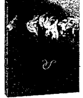
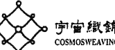
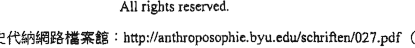
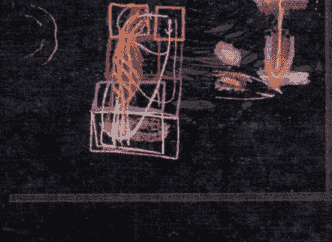

# 人智醫學

# 療癒的秘密

Grundlegendes für eine Erweiterung der Heilkunst nach geisteswissenschaftlichen Erkenntnissen.

以靈性科學開展治療藝術的基礎

11. Juli. 1923

魯道夫·史代納 Rudolf Steiner
伊塔·薇格曼 Ita Wegman 合著 韋萱 譯

# St. Royal College
天使神秘学院

- ※ 神秘学资料库
- ※ 神秘学培训机构
- ※ 水晶能量研究中心
- ※ 专业占卜预测机构
- ※ 官方微信：strcdts
- ※ 微信公众平台：strc2011
- ※ 官方店铺网址：http://strc.cr.cx
- ※ 读书交流QQ群：
  - 占星塔罗占卜师交流群：814594478（加入密码：PDF）
  - 神秘学其他综合群：659338717（加入密码：PDF）

微信号：strcdts
天使神秘学院

微信公众平台：strc2011

# 制作说明：

本书由《天使神秘学院》出重金从台湾购入的原版书籍扫描制作完成。为达到最好阅读效果，特地把书全部切开后，再经由专业扫描设备高精度扫描完成，并经过一张张的PS后期处理最终成书，其间花费大量的人力、物力以及时间，只为能给大家提供经济并优质的神秘学学习资料而努力。

本学院强力谴责某些机构和个人，把本学院花心血制作完成的电子书籍，包装后直接放在自家淘宝网上低价倾销的行为，以谋取不劳而获的经济利益。如果长此以往最终将无人愿意再为大家花心思制作电子书，那以后可能大家再无新书可读。

为让大家以后能够读到更多的好书，也为了本学院的良性发展。本学院恳请大家尽量做到如下几点：

- 一、尽量在天使神秘学院的官方网站购买电子书籍。
官网电脑访问地址：http://strc.cr.cx

- 二、在收到电子书后小范围传阅即可，千万不要公开传播，更别挂到淘宝网上低价销售。

同时为答谢广大支持者，学院电子书将做如下调整：

- 一、学院会把一些早已收回制作成本的电子书折价销售。
- 二、最新制作的电子书籍会开放打印功能，大家购买后有条件的可自行打印成书。

天使神秘学院
2020年5月

# 靈性心魂與勇氣意志力的實踐之地

◀ 《看不见的人》全图，彩图参见封底

封面图《看不见的人》（局部），是史代纳 1923 年 2 月 11 日一场演讲中的黑板画。描绘人的灵性自我入世於尘世自我的历程。人的灵性自我就是我们每一个人内在那看不见的人，即画中偏右的那些部分和左边重叠的框框，黄框是自我，红框是星辰身，蓝框是乙太身，白框是物质身。

# Grundlegendes zur Erweiterung der Heilkunst

Nach geisteswissenschaftlichen Erkenntnissen

# 人智醫學療癒的秘密

—— 以靈性科學開展治療藝術的基礎 ——

魯道夫·史代納 Rudolf Steiner
伊塔·薇格曼 Ita Wegman 合著
韋萱 譯

# 作者【魯道夫·史代納 Rudolf Joseph Lorenz Steiner】

奧地利人，1861 年 2 月 27 日生於奧匈帝國的 Kraljevec 村（位於今日的克羅埃西亞），1925 年 3 月 30 日卒於瑞士多納赫。他是人智學（Anthroposophy）——一種靈性科學的世界觀和理念體系——的創始者。史代納在人智學的基礎上，對人類生活的諸多領域，如教育（華德福教育），藝術（優律思美、人智學建築），醫療（人智醫學），宗教（基督社群），農業（生機互動農業），三元性的社會架構等，都提出了許多真知灼見。

# 作者【伊塔·薇格曼 Ita Wegman】

伊塔·薇格曼誕生於 1876 年印尼爪哇殖民期的荷蘭家庭，1899 年舉家遷回荷蘭後，在阿姆斯特丹和柏林學習治療性體操和古典按摩法。26 歲，她在柏林首次遇見魯道夫·史代納，受其啟發而於 1906 年前往瑞士蘇黎世大學就讀醫學，並於 1912 年取得醫學博士資格。

1917 年，她在史代納的建議下，於自己的診所研製槲寄生的抗癌藥劑 Iscar，後來發展為最早的槲寄生製劑 Iscador。1921 年，她在瑞士阿勒斯海姆（Arlesheim）創立「臨床治療機構」（Klinisch-Therapeutisches Institut），並與史代納密切合作，透過診斷與治療的實務，發展人智醫學。薇格曼對當代療癒奧秘的詢問，讓史代納的影響力跨足到醫學領域。1923 年，薇格曼擔任史代納的秘書，並結合其他發起人共同成立了「普遍人智學協會」（Allgemeine Anthroposophische Gesellschaft）：在多納赫歌德館舉行的成立大會上，倆人也共同主持靈性科學自由高等學校的一年級課程；薇格曼創設醫學部並擔任第一屆部長。

1924 年 9 月起，薇格曼隨侍於史代納的病榻直到他過世。她與史代納合著的《人智醫學療癒的秘密：以靈性科學開展治療藝術的基礎》在 1925 年底出版。薇格曼 1943 年病逝於阿勒斯海姆，她的眾多遺產保管於阿勒斯海姆的伊塔·薇格曼醫院院區裡的故居——伊塔·薇格曼研究所的文獻管理處。

# 譯者【韋萱】

韋萱，旅德近廿年，在漫長多歧的學思路程中，近年自然轉進「人智學」相關場域之口譯和筆譯。她的哲學式精準、社會學式觀照，使其翻譯得以無窒礙地會意作者所勾勒的圖像。對於能跨越時空，把複雜陌生的高度心靈、異文化脈絡下的「人智學」帶「出來」，轉譯成當代華語閱聽者能夠理解的語文表述，她顯然很喜歡、也很樂意搭起如是橋樑。

# 簡歷

- 宇宙織錦共同創辦人
- 專業人智學漢德口譯筆譯
- 曾任宜蘭慈心及桃園仁美華德福學校教師
- 德國斯圖佳特自由大學 Freie Hochschule Stuttgart 華德福教育師訓一年
- 德國弗萊堡大學 Albert-Ludwigs-Universität Freiburg 社會學碩士
- 台灣大學哲學系學士

# Vorwort I

Sehr gerne komme ich der Bitte nach, für das gemeinsame Grundlagenwerk von Rudolf Steiner und Ita Wegman zur Anthroposophischen Medizin im chinesischen Sprachraum ein Vorwort zu schreiben. Die Übersetzung entstand im Kontext des International Postgraduate Medical Training / IPMT, einer Weiterbildung für Anthroposophische Medizin, die 2010 erstmals in Taiwan stattfand. Hsüan Wei wurde gebeten, die erforderliche Textgrundlage in Mandarin zu übersetzen. Es war dies das zweite Kapitel des jetzt hier vorliegenden Buches. In den folgenden Jahren kamen die Kapitel 5, 8, 12 und 14 hinzu. Der Entschluss jedoch, dieses äusserst anspruchsvolle Buch, das zu den schwierigsten anthroposophischen Büchern gehört, zu übersetzen, fiel erst 2013 – nachdem 2012 wichtige Begegnungen mit der Anthroposophischen Medizin in der Praxis stattgefunden hatten: am Goetheanum in Dornach bei der internationalen Jahreskonferenz für Anthroposophische Medizin, sowie einem Besuch der Filderklinik bei Stuttgart, einem anthroposophischen Regionalspital, und der Firmen Weleda und Wala, die die meisten anthroposophischen Arzneimittel herstellen. Ich möchte mich an dieser Stelle herzlichst bei Hsüan Wei für die jahrelange treue Übersetzungsarbeit bedanken und auch dafür, dass sie sich zusammen mit anderen so engagiert dafür einsetzt, dass die Anthroposophische Medizin auch in Taiwan bekannt werden kann.

Was aber ist Anthroposophische Medizin, deren Grundlagen in diesem Werk nun erstmals der Öffentlichkeit des chinesischen Sprachraums vorgestellt werden?

Die Anthroposophische Medizin begann im Jahr 1921 in einem kleinen schweizer Hospital, der heutigen Klinik Arlesheim, und wird heute in über 60 Ländern auf allen Kontinenten praktiziert: siehe http://www.medsektion-goetheanum.org https://www.ivaa.info/home/

Das hier jetzt vorliegende Buch ist in verschiedener Hinsicht ein besonderes Buch.

Es wurde 1925 als letztes Buch von Rudolf Steiner (1861-1925), dem Begründer der Anthroposophie, publiziert. Es ist das einzige Buch, dass dieser zusammen mit einem Co-Autor, der holländischen Ärztin Ita Maria Wegman (1876-1943), geschrieben hat. Und es wurde seither nicht einer Revision unterzogen, sondern unverändert nachgedruckt-auch in der Originalsprache deutsch.

# 推薦序一

我很樂意接受這個請求，為魯道夫·史代納和伊塔·薇格曼合著的人智醫學基礎著作在華語地區的中譯版為序。本書的翻譯緣起於 2010 年在台灣首次舉辦的「人智醫學國際學士後醫學學程 / IPMT」。韋萱受託將課程期間所需研讀的文本翻譯成中文，就是眼前這本書的第二章。接下來幾年陸續有了第五、第八、第十二、第十四章的中譯文。但卻是直到 2013 年她才下定決心翻譯這本難度極高、屬人智學書籍中最難理解的書——就在她 2012 年開始與人智醫學實務有了重要相遇之後，也就是參加多那赫歌德館的人智醫學國際年會、參訪斯圖佳特附近一間人智學區域性醫院菲爾德醫院，以及參訪生產大部分人智學藥劑的薇莉達和瓦拉公司之後。我想對韋萱多年忠實的翻譯工作，以及她和其他夥伴為了在台灣推廣人智醫學的努力，在此表達衷心的謝意。

然而人智醫學——它的基礎將首度透過本書呈現給華語地區的讀者——究竟是什麼？

人智醫學起始於 1921 年瑞士的一間小醫院——今日的阿勒斯海姆醫院，而直至今日在各大洲超過 60 個國家得到實踐。參見：http://www.medsektion-goetheanum.org https://www.ivaa.info/home/

眼前的這本書，就各方面而言都是一本特別的書。

它出版於 1925 年，是人智學創始人魯道夫·史代納 (1861-1925) 最後一本著作。它是他唯一一本和其他作者（荷蘭女醫師伊塔·薇格曼，1876-1943）共同撰寫的書。從此它沒有再修訂過，只是毫無改變再版印刷，同樣以原文德文出版。它包含了人智醫學的基礎和認識的先決條件；它們是永恆的，因為它們關於人類本體的探討是以人的身體、心靈和靈性為導向，而不是以最新的研究成果。所以這本基礎著作，對人智醫師和人智藥師的養成訓練所產生的影響，已經超越三個世代了。它已被翻譯成多種文字，且直到今日已觸發了多樣的研究問題和研究任務。

> （注：醫藥科技評估 HTA 關於人智醫學的研究報告：Kienle, Kiene, Albonico：人智醫學——有效性，實用性，成本，安全性。Schattauer Stuttgart / New York 2006）

人智學的靈性途徑，是以思考的經驗作為基礎，它是人可發展的靈性能力。經由這個靈性能力，我們就可以在現代學院派醫學，和古代醫療系統的智慧與價值文化之間搭起橋樑。這一事實，也能讓現代台灣和中國的醫療傳統對它感到興趣。

為什麼？

北京的一位父親給了我答案。我問他：為什麼把他的兒子送進一間才成立幾年的華德福學校，也就是一個人智學的教育實踐機構？對他而言，把獨生子託付給這樣一個新的教育嘗試，難道不是一種風險嗎？他回答說：我雖然還不太了解人智學——但我所理解的部分，以及我在孩子和老師身上所看到的態度和努力，讓我明白，這種以發展為導向的思考和行動方式，將會幫助我們今天的中國，在教育上重新連結我們古老的精神根源，但以一種符合現代生活的新形式。在我訪問中國其他城市時，也一再遇到這種觀點。這種看法同樣適用於醫學。藉助人智學的思維訓練，我們可以在唯物主義思維和前唯物主義的價值文化之間搭起橋樑。

唯物主義如今是一個全球現象。它已將追求物質利益、名望和外在聲望變成了主導的文化品質。但當這在一定程度上實現後，就明顯可見，這樣的追求不足以讓人類也子送進一所幾年前才成立的華德福學校，意即送進一個人智學的教育實踐裡？把他唯一的孩子託付給這麼新的教育措施，對他而言難道沒有風險？他回答：我雖然對人智學知道的不多，但就我所理解的，以及我在孩子和老師的態度和努力裡所體會到的部分告訴我，這種以發展為取向的思考與行為方式會幫助我們，今日中國在教育上和古老的靈性根基上如何再度銜接，而且是在一種合乎現代生活的形式裡。這種看法，在我走訪中國其他城市時也一再遇到。然而這種觀點也同樣適用於醫學。在人智學思考訓練的幫助下，我們可以在物質主義的思考方式和前物質主義的價值文化之間搭起一道橋樑。

物質主義在今日是個全球性的現象。它把對物質利益、權力與外在威望的追求變成了主流文化。然而當它到達某種程度時，很明顯的是，這種追求不足以在心魂與靈性上滋養人，讓人有能力在痛苦和不幸的人生際遇下仍然能保持健康。物質主義沒有適當的「內在權力」可以給人生命的目標與方向。因為要維持身心健康，首先要能夠把自己的生命史當作「人生學校」去理解，並能夠賦予意義去消化生命中的事件。但這種內在的能力與發展的意願，必須透過教育和典範去喚醒，否則人就會有落入絕望、耗竭、內在空虛、罹病的危險。因此今日我們需要一個通往靈性的路徑，它要能夠在物質主義的自然科學和靈性之間架設一道橋樑。而因為人智學正致力於此，所以它能在這裡協助。

這怎麼可能呢？

這是可能的，因為人智學的操作工具就是人的思考。而它既是學術研究的基礎，也是人可以繼續發展的靈性能力，以便去理解與認識靈性的相關性和本質。人類所有的文化與發展時期中，思考以及隨之而起的哲學也能夠去描述，在靈性與宗教系統所特有的那些傳統價值。德國哲學家卡爾·雅思培 (1883-1969) 就是創立黃金時代 (Achsenzeit) 這個概念的人。他的理解是：從西元前 800 年到西元前 200 年這段時間，地球上四大文化圈發展出個別化思考，並且展現在歷史的偉大人物上。在這個時期，當今人類所熟悉的信仰與價值體系首度對個別思考開放，它們也可以被表述出來，並且由導師或他們的學生記載下來：

在中國有影響力的是老子和孔夫子，他們教導的是以明確的倫理價值，如仁愛、節儉、謙卑、寬容、事物與政體的和諧為取向的、思想與發展的道路。在印度出現了悉達多釋迦牟尼佛陀，關於慈悲和愛的全面教導，以及有意識地運用處理了投胎轉世和命運之形成的概念。在中亞——希伯來文、波斯文——出現了聖經的先知們，以及查拉圖斯特拉和正邪鬥爭的概念。相反地在西方出現的是希臘哲學，從早期的自然哲學家到蘇格拉底、柏拉圖、亞里斯多德，以其在理性——道(Logos)——的統御下的所有基本美德：公平正義、深思熟慮、勇氣膽識、智慧與虔誠，奠定了直至今日西方世界的倫理與哲學基礎。

人類發展面向的這個基礎，我們在魯道夫·史代納的人智學裡也遇見了。人智學在哲學上以德國觀念論（費希特、黑格爾、謝林、席勒、歌德）為基礎，以對真實性、愛和自由等人性的核心價值，始終如一的個人取向為基礎。最終而言，所有這四個文化圈關懷的是強烈的人道主義驅動力、自我的覺醒、每個個體人格的覺醒，而以思考為工具，把自己和倫理價值與理想連結在一起。人智學也不例外，在這裡它並非原創，它更是讓這人類黃金時代四大價值體系——它們最內在的實質是非常相似的——和生活實踐的所有細節產生關聯。人智學的修行道路是徹底一貫以實用為導向的。它著重的不在於指出一條道路讓人成為道德上的完人。它的主要訴求是別的東西，所傳達的是：每個靈性洞見、每個內在美德都可以引領人，使人更能理解生命，並且能以所獲得的心魂與靈性成果，更好地為生命服務。人智學關注的始終是：運用生命中所學，以貢獻全人類。它的名字也由此而來：Anthropos 從希臘文翻譯過來是人，而 Sophia 是智慧之意。所以我們可以正確地說：人智學並沒有人類黃金時代所表述的，添加任何新的價值。然而它指出一條通往這些價值的道路，這道路直接引領人進入生活實踐，並且有益地填補了唯物的自然科學不足之處，使其獲得更深層次的理解。如此就有了跨越這深淵的橋樑——在對一個靈性世界的「信仰與信賴」，和決定今日生活現實的現代自然科學的「知識」之間的橋樑。人智學想幫助：對內在靈性道路的追尋不再獨立於外在物質生活，而是能轉化並建構符合人道的物質生活。人智學將自己視為靈性科學，視為行動的指南。它無關乎信仰或宗教。它把存在的靈性面向，用可以理解的思維描述出來。魯道夫·史代納呼籲他的學生們：你不該相信我說的話，而是要去思考它，將它變為己有，去理解它——並從這份理解出發，自主地行動。

因此，世界各地都有人從人智學出發，在農業、教育、藝術和醫學等領域實現各種 initiative，無論他們的宗教、冥想實踐或靈性取向為何。一位在印度的人智學醫師曾告訴我，人智學幫助她理解了她自幼浸淫其中的印度教，因此她現在能再次深刻地欣賞它。一位在日本的人智學建築師對我說了同樣的話，關於他所實踐的佛教。而在埃及，人智學在穆斯林文化圈的先驅、另類諾貝爾獎得主——賽克姆文化倡議的創辦人易卜拉欣·阿布利什——為我們闡述了這一點：告訴你的，而是去思考它，化為你的，理解它，然後由此理解出發而獨立自主地行動。

因此世界各地，不乏有人從人智學出發而在農業、教育、藝術、醫學領域落實倡議行動，無論他們的宗教、冥想修行或靈性取向為何。某位印度人智學女醫師有一次告訴我，人智學幫助她去理解印度教——這是她原生家庭深植得來的，因此至今而能一再深切珍惜的信仰。在日本，一位人智學建築師也對我說過關於他所奉行之佛教的相同的話。在埃及，穆斯林文化圈的人智學先驅、另類諾貝爾獎得獎主，易卜拉欣·阿布萊許 (Ibrahim Abouleish) ——Sekem 文化創始人——對他道義上有義務的可蘭經與伊斯蘭教，也做了同樣的表述。我自己的體會是對基督教。在人智學靈性科學的幫助下，我才真正得以進入這個宗教。

現代人想要理解——無論他或她信仰什麼——否則他覺得不自在。在這裡，人智學的認識之路可以做出貢獻。並且因為每個人完全自由地尋找並走出他自身的道路，而從思考獲得理解是所有人共同的基礎，所以在對人智學的研究中，也對不同想法的人有著全面包容與接納的潛能。因為我們會理解並且尊重，為什麼他們的想法不同。人智學的強項不只是在於知識——每個人都可以用他的方式取得。它的強項在於實現所學、付諸行動的可能性，在積極主動包容與促進和平能力的面向上亦然。

由於人智學的強項在於這種實現「善」的努力，所以對人智學了解很少或全無了解的人們，也可以在人智學倡議的行動中加入工作。因為把人智學付諸實踐的技術——例如在生機互動農業、華德福教育和人智醫學上——作為技術，到某種程度也是可以傳授和學習的。然而，要能夠傳授並且完全理解，為什麼要採取這個或那個措施，就需要研究人智學。具體而言意思是：為了找出一個好的幼兒教育要如何運作，我就必須徹底研究華德福教育並實踐人智學的認識道路。但要把所獲得的認知運用出來，那麼去體驗到這種做法是好的，然後從這個好的體驗出發去學習，然後用在孩子們身上，也就足夠了。同樣地，每一位醫師，在經驗到以槲寄生所製的人智學癌症用藥 (Viscum album) 如何改善了癌症患者的生活品質並提高復元機會時，就可以開立這種藥。但要找出這種藥方並且妥善地製作出來，就需要研究人智醫學。

對韋萱願意把這本不易閱讀和理解的書翻譯出來，我的感謝不足言詮。我也衷心感謝人智醫師蕊娜塔·薇絲琵勒 (Renata Wispler) 協助了專業內容的校對，以及感謝在中文校對與印製發行上費心的台灣朋友與工作夥伴。而特別感謝人智藥師赫維·尤迪克斯 (Herwig Judex)，他促成了德國巴德柏爾的豪旭卡博士基金會 (Dr. Hauschka Stiftung) 願意贊助翻譯的經費。

這本書在它出版剛好九十年時有了中譯本，讓我充滿喜悅。我祝願華語地區的讀者，希望這裡面發展出來的思惟形式，能幫助他們獲得一個現代的、靈性的對人的理解，以便更好地理解在健康時日與生病時日裡的人。並且醫學能夠由此得到驅動力，更有效地為個別的人與整體人類社會服務。

米凱拉·葛羅克勒 醫師
歌德館醫學部
多那赫，2015年6月

## 推薦序二

2012 年，在台灣第三年「人智醫學國際學士後醫學學程」(IPMT) 期間，我傳授了一門人智藥學入門的課程，韋萱擔任課程口譯，後續又有兩次在台中為醫師和藥師開設的密集課程，我們也一起共事。

在韋萱下定決心把魯道夫・史代納和伊塔・薇格曼合著的《人智醫學療癒的秘密：以靈性科學開展治療藝術的基礎》全書翻譯出來之後（她已經為 IPMT 翻譯了一些章節），她請求我協助，在第三次總校譯稿時再次仔細共讀一遍德文原文。因此我們花了很多天，包括她在德國期間，各章節都檢閱了一遍。在這過程中，我見識到她對德語文法有透徹的知識，以及她對於找到適切翻譯的毅力與堅持。

我因此成為見證人，見證了從德文譯成中文，再把中譯文重新譯回德文的過程，以及嘗試翻譯這樣一本著作的所有艱難。為其勇氣和毅力，我向韋萱致上深切的謝意。

Herwig Judex
Wala 基金會董事

## 1925 年第一版序

魯道夫·史代納：這位老師、領導者和朋友，已經不在人世了。起於體力透支而生成的一場大病，把他給奪走了。在工作期間他必須不時在沙發上躺下來；他的精力大量而毫無節制獻給了人智學會的工作，而不足以克服他的疾病了。所有愛戴他、尊敬他的人們必得萬分悲痛地去經歷這一切：如此受眾人愛戴、原本可幫助這麼多人的他，自己也必須臣服於命運：他十分明白，是更高層的力量在這裡引領導航。

我們共同工作的果實就記錄在這本小書中。

人智學的教導，對醫學而言正是一個靈感的金礦，作為醫師的我可以毫無保留的接受它，並且在裡面找到一個智慧的泉源，從中我們可以汲取無窮的智慧，並照亮與解決許多今日醫學尚未解決的問題。如此，在魯道夫·史代納和我之間，為了醫學的認知而展開了活躍的合作，特別是在最後兩年更加深化，使得共同撰寫一本書成為可能並得以實現。

魯道夫·史代納始終致力於——而我對此也完全理解——革新古老的神秘主義本質，並將其融入醫學之中。因為自古以來，這種神秘主義本質就與治療藝術緊密相連，並且將獲得靈性認知與療癒聯繫在一起。不應以業餘愛好者般外行的方式低估科學醫學；它得到了充分的認可。但重要的是，在現有基礎上，增添那些源自真正的靈性認知、能夠把握疾病與療癒過程的內容。當然，不應讓古老神秘主義那種靈性本能的方式復甦，而是要一種符合 fully developed、提升至靈性層面的現代意識的方式。

於是，最初的嘗試開始了，而由

## 第一章 對人類存在的真實認識作為醫療藝術的基礎

醫學尚未解決的問題。就這樣，魯道夫·史代納和我開始為了醫學的認知密切合作；特別是過去這兩年更深入的工作，使得共同撰寫這本書有了可能性並得以完成。

魯道夫·史代納一直以來的努力是——在這一點我對他有最透徹的理解——更新古代的奧秘存在，並讓它注入醫學領域。因為從遠古時代起，這個奧秘的存在就一直和療癒的藝術緊密連結著，並且取得靈性認識也被視為與療癒相關。我們不應以門外漢非專業的態度去貶低實證科學的醫學；它是完全被認可的。但重要的是，在現有的成果中，加入那些可以從真實的靈性認識獲得的、對疾病與療癒過程的理解。這當然應不是去讓古代奧秘之心魂本能的運作方式復活，而是一個和完全發展的、提升至靈性的現代意識相應的方式。

就這樣展開了最初的第一步，並由我在阿勒斯海姆創立的醫療機構，提供了這裡所陳述的理論一些實踐的基礎。我們嘗試為那些渴望延伸此處所指的醫學認識的人，指出療癒藝術的道路。

我們原來想在這本小書之後，還要從共同的工作中繼續出版一些書。可惜這已經不可能了。不過我打算從我擁有的許多建議和筆記裡，再出版第二集，或許也出版第三集。而這第一集，其手稿是魯道夫·史代納在過世前三天還愉悅且心滿意足地修改過的，但願它能到達所有從生命之謎中尋求對生命的理解、而抵達生命的壯麗與宏偉的人手中。

伊塔·薇格曼 醫師
1925年9月，阿勒斯海姆－多納赫

## 目 次

推薦序一..................... Michaela Glöckler 歌德館醫學部長......VII

推薦序二..................... Herwig Judex 瓦拉基金會董事........XXXI

1925年第一版序...... Ita Wegman 醫師...................................XXXV

第 一 章 對人類存在的真實認識作為醫療藝術的基礎 3

第 二 章 人為什麼會生病？ 37

第 三 章 生命的現象 51

第 四 章 關於感受機體的本質 65

第 五 章 植物，動物，人 79

第 六 章 血液與神經 93

第 七 章 療癒作用的本質 105

第 八 章 人的機體內的活動——糖尿病 117

第 九 章 蛋白質在人體中的角色與蛋白尿 131

第 十 章 脂肪在人類機體內的角色與假性局部綜合症狀 141

第十一章 人體的形塑與痛風 151

第十二章 人的機體之建構與分泌 161

第十三章 關於生病與療癒的本質 175

第十四章 關於治療的思考方式 187

第十五章 治療的方法 199

第十六章 對療藥的認識 211

第十七章 對物質的認識作為對療藥認識的基礎 225

第十八章 治療性優律思美 237

第十九章 典型的病例 245

第二十章 典型的藥物 317

- 1. 《Skleron》製劑 317
- 2. 《Biodoron》(1) 偏頭痛製劑 321
- 3. 對治氣管炎與支氣管炎的製劑：黃鐵礦 325
- 4. 銻化合物的作用 327
- 5. 朱砂 Zinnober 333
- 6. 《Gencydo》花粉熱製劑 335

1925 年第一版後記 339

譯者致謝 341

# 人智醫學療癒的秘密

—— 以靈性科學開展治療藝術的基礎 ——

## 第一章 對人類存在的真實認識作為醫療藝術的基礎

這本書將為醫療知識和能力指出新的可能性。只有對此處論及的主導觀點——這醫療觀點於當年出現——持開放態度時，我們才能夠正確評估所說的內容。

這裡並不反對以當今公認的科學方法運作的現代醫學。我們完全認可它的原則。而我們認為，我們所提供的方法與認識，只應由具備醫學素養的合格醫師將其運用在醫療藝術上。

然而，在以今日公認的科學方法對人類所得的知識上，我們增加進一步的、透過別的方法獲得的認識；基於這個對世界和人類延伸的認識，我們也感到為拓展醫療的藝術而工作的迫切需要。

當代公認的醫學基本上不能反對我們所提出的認識，因為我們並不反對它。只有那些不僅要求他人必須肯定其知識、且要求他人不可提出超越其知識的那些人，可以一開始就拒絕我們的嘗試。

這個對世界與人類知識的拓展，可見於魯道夫·史代納所創立的人智學 (Anthroposophie) 中。在只透過今日自然科學方法就可獲得對物質性人的認識上，人智學更增添了對靈性人的認識。它並非只是透過思索而從物質性認識來到靈性認識。透過思考的路徑，我們面對的只是或多或少精心構思的假設，但無人能在現實中獲得它們的相關證據。

在對靈性做出論述之前，人智學發展出讓它有權利做此論述的方法學。為了洞察這些方法，我們考慮下面陳述：當今公認的自然科學的成果，基本上都是得自於人類的感官印象。因為即使人類在實驗或觀察中使用工具來擴展感官所能給予的，但這並未為人類透過感官所生活的世界經驗增添任何本質上新的東西。

然而，透過思考——只要它在探索物質世界時是活躍的——也不會為感官可見的既定事實增添任何新東西。思考組合、分析感官印象以達到法則（自然法則）；但探索感官世界的研究者必須對自己說：這個從我內心湧現的思考，並未為感官世界的真實增添任何真實的東西。

但當人們不只停留在思考——那是人類最初透過生活和教育所達到的——情況就會立刻改變。人們可以加強、強化這種思考。人們可以將簡單、易於掌握的思想置於意識的中心，然後排除所有其他思想，將靈魂的所有力量集中在這些表象上。就像一塊肌肉，當它反覆朝著相同力量的方向緊繃時就會變得強壯，

因為，即使透過實驗或藉由儀器工具的觀察來拓展感官覺知的極限，也不會因此增添任何對這個世界——人以感官活在其中——本質上新的經驗。

同樣地，即使透過思考——只要思考是在物質世界中進行探索——也不會在感官所得的印象上添加新的東西。思考會結合、分析感官印象以獲得法則（自然法則）；但是感官世界的探索者必須對自己說：這個從我內在泉湧而出的思考並沒有為感官世界的實相添加一些真實的東西。

但若我們不要停留在從生活經驗和教育一開始帶來的思考上，情勢就幡然有別。我們可以強化這思考本身，賦予它力量。我們可以把簡單的、容易掌握的概念放在意識中心，然後排除其他的思緒，把所有的心魂力量集中在這念頭上。就像同一方向反覆施力會強化肌肉一樣，通常掌管思考領域的心魂力量也會如上述鍛鍊方式得到強化。我們必須強調，這些練習必須以簡單、容易掌握的概念作為基礎。因為在練習時，心魂不可以受潛意識或無意識的任何影響。（這裡我們只能指出這種練習的原則；有關這些練習個別進行的詳細描述和指導，可以在魯道夫・史代納的《如何獲得更高層世界的認識》、《奧秘科學》以及其他人智學著作中找到。）

自然會有人提出異議：人傾全力將自己投入特定的、意識中心的某個概念，會使自己暴露在各種可能的自我暗示或類似的狀態中，並且落入錯覺的領域。然而人智學同時指明，這些練習必須如何進行，以讓上述異議毫無根據。它指出如何在意識完全清醒的練習過程中步步前進的方法，有如解決一個算數或幾何的問題。如果正確地遵循人智學的指導去進行上述的練習，那麼意識就不可能偏離落入無意識領域。

在這些練習的進程中，我們思考能力的增進會到達完全無法想像的程度。我們感到這股思維力量於內在運作著，有如人的存在的新內涵。伴隨人自身存在的新內涵，同時顯現出一個新的、我們或許曾臆測過但不曾由經驗得知的世界內容。若有機會審視對自我觀察日常思維的時刻，那麼我們會發現：相對於感官印象，思想是平淡無色的。

現在，我們在強化的思維力量中所覺察到的完全不再是平淡無色的了；它充滿豐富的內涵、具體且富於圖像、比起感官印象的內容更具強烈的真實感。對於那些以上述方式拓展感受力的人而言，一個新世界從此展現。

人經由在這個新世界中學習覺察，一如他過去只能在感官世界之內覺察，現在他明白，所有他過去所知的自然法則只適用於物質世界；並且他現在進入的世界，其本質乃在於它有另外的、和物質世界相反的法則。地心引力的法則並不適用於這個世界，而相反地出現另一股力量，它不是從地球中心向外發揮作用，而是由宇宙邊緣朝向地球中心而來，同樣的情形並且也適用於物質世界的其他力量。

人藉由練習所獲得對這個新世界的直觀能力，人智學稱它為「想像的認識力」。稱它為想像的，並不是因為它和「幻想」有關，而是因為意識內容充滿的是圖像而非影子般的思想。就如人藉由感官覺受去直接體驗而感覺自己置身於一實相中，他也藉由想像的認識力這個心魂活動，感覺自己置身於一個實相。這種認識所指涉的這個世界，人智學稱之為乙太世界 (ätherische Welt)。這裡所說的和當今物理學中假設性的乙太無關，而是一個靈性直觀的實相。這個命名和對此世界古老本能的臆測是一致的。相對於當今明確可得的認識，這古老本能的臆測不再具有認識的價值，但如果我們要為某事物命名，就需要名字。

在這乙太世界裡，除了人的物質性身體之外，還存在著可覺察到的乙太身體。

這乙太身體就其本質而言也能在植物界中找到；植物有其乙太身 (Ätherleib)。物質法則事實上只適用於無生命的礦物世界。

植物世界之所以能存在地球上，是因為地球上有些物質沒有停留在封閉的物質法則內，而能夠拋下所有的物質法則性，並採用相反的法則性。物質法則由地球向外流動發揮作用，乙太法則有如從宇宙八方流向地球發揮作用。只有當我們在植物的世界裡看見地球的物質力量與宇宙的乙太力量之間的交互作用，我們才能理解植物世界的形成。

人的乙太身也是類似的情形。藉由乙太身，人體內產生某種作用，它不再處於物質身力量依據法則的持續運作下；它的基礎在於當物質材料流入乙太領域時，它們首先去除自身的物質力量。

這股在乙太身內運作的力量，在人的地球生命初始——最明顯是在胚胎時期——就開始作為塑形和成長的力量在活躍著。在塵世生命的歷程中，這股力量一部分會從塑形與成長的活動中釋放出來，並且成為思考力量，也就是為平時意識帶來如影子般的思想世界的那些力量。

人平常的思考力量就是精鍊化的塑形與成長力量——知道這一點至關緊要。在人的機體塑形和成長之中，某種靈性存在揭露了自身，因為這靈性的存在就在生命歷程中作為思考的靈性力量而彰顯出來。

並且，這股思考力量只是那在乙太領域中交織的、人的塑形與成長力量的一部分。另一部分則忠於它在人生命初期擁有的作用。

## Die Erkenntnis der höheren Glieder der menschlichen Wesenheit

Die gestellte Aufgabe getreu. Nur weil der Mensch, wenn seine Gestaltung und sein Wachstum vorgerückt, das heißt, bis zu einem gewissen Grade abgeschlossen sind, sich noch weiter entwickelt, kann das Ätherisch-Geistige, das im Organismus webt und lebt, im weiteren Leben als Denkkraft auftreten.

So offenbart sich der imaginativen geistigen Anschauung die bildsame (plastische) Kraft als ein Ätherisch-Geistiges von der einen Seite, das von der andern Seite als der Seelen-Inhalt des Denkens auftritt.

Verfolgt man nun das Substantzielle der Erdenstoffe in die Ätherbildung hinein, so muss man sagen: diese Stoffe nehmen überall da, wo sie in diese Bildung eintreten, ein Wesen an, durch das sie sich der physischen Natur entfremden. In dieser Entfremdung treten sie in eine Welt ein, in der ihnen das Geistige entgegenkommt und sie in sein eigenes Wesen verwandelt.

So aufsteigen zu der ätherisch-lebendigen Wesenheit des Menschen, wie es hier geschildert wird, ist etwas wesentlich anderes als das unwissenschaftliche Behaupten einer «Lebenskraft», das noch bis zur Mitte des neunzehnten Jahrhunderts üblich war, um die lebendigen Körper zu erklären. Hier handelt es sich um das wirkliche Anschauen – um das geistige Wahrnehmen – eines Wesenhaften, das im Menschen wie in allem Lebendigen ebenso vorhanden ist wie der physische Leib. Und um dieses Anschauen zu bewirken, wird nicht etwa in unbestimmter Art mit dem gewöhnlichen Denken weitergedacht; es wird auch nicht durch die Einbildungskraft eine andere Welt ersonnen; es wird vielmehr das menschliche Erkennen in ganz exakter Art erweitert, und diese Erweiterung ergibt auch die Erfahrung über eine erweiterte Welt.

Die Übungen, die ein höheres Wahrnehmen herbeiführen, können fortgesetzt werden. Man kann, wie man eine erhöhte Kraft anwendet, sich auf Gedanken, die man in den Mittelpunkt des Bewusstseins gerückt hat, zu konzentrieren, auch darauf wieder eine solch erhöhte Kraft anwenden, die erlangten Imaginationen (Bilder einer geistig-ätherischen Wirklichkeit) zu unterdrücken. Dann erlangt man den Zustand des völlig leeren Bewusstseins. Man ist bloß wach, ohne dass zunächst das Wachsein einen Inhalt hat. (Das Genauere findet man in den oben erwähnten Büchern.) Aber dieses Wachsein ohne Inhalt bleibt nicht. Das von allen physisch- und auch ätherisch-bildhaften Eindrücken leer gewordene Bewusstsein erfüllt sich mit einem Inhalt, der ihm aus einer realen geistigen Welt zuströmt, wie den physischen Sinnen die Eindrücke aus der physischen Welt zuströmen.

Man hat durch die imaginative Erkenntnis ein zweites Glied der menschlichen Wesenheit kennengelernt; man lernt durch die Erfüllung des leeren Bewusstseins mit geistigem Inhalt ein drittes Glied kennen. Die Anthroposophie nennt das Erkennen, das auf diese Art zustande kommt, dasjenige durch Inspiration. (Man soll sich durch diese Ausdrücke nicht beirren lassen; sie sind einer primitiven Zeiten angehörigen instinktiven Art, in geistige Welten zu sehen, entnommen; aber, was hier mit ihnen gemeint ist, wird ja exakt gesagt.) Und die Welt, in die man durch die Inspiration Eintritt gewinnt, bezeichnet sie als die astralische Welt. – Spricht man, wie hier auseinandergesetzt, von «ätherischer Welt», so meint man die Wirkungen, die vom Weltumfange nach der Erde zu wirken. Spricht man aber von «astralischer Welt», so geht man in Gemäßheit dessen, was das inspirierte Bewusstsein beobachtet, von den Wirkungen aus dem Weltumfang zu bestimmten Geist-Wesenheiten über die in diesen Wirkungen sich offenbaren, wie in den von der Erde ausgehenden Kräften sich die Erdenstoffe offenbaren. Man spricht von aus den Weltenfernen wirkenden konkreten Geist-Wesenheiten, wie man beim sinnlichen Anblick des nächtlichen Himmels von Sternen und Sternbildern spricht. Daher der Ausdruck «astralische Welt». In dieser astralischen Welt trägt der Mensch das dritte Glied seiner Wesenheit: seinen astralischen Leib.

Auch in diesen astralischen Leib muss die Erdenstofflichkeit einströmen. Sie entfremdet sich damit weiter ihrer physischen Wesenheit. – Wie der Mensch seinen ätherischen Leib mit der Pflanzenwelt, so hat er seinen astralischen Leib mit der Tierwelt gemeinsam.

Die den Menschen über die Tierwelt hinaushebende, eigentlich menschliche Wesenheit wird durch eine noch höhere Erkenntnisart als die Inspiration erkannt. Die Anthroposophie spricht da von Intuition. In der Inspiration offenbart sich eine Welt geistiger Wesenheiten; in der Intuition wird das Verhältnis des erkennenden Menschen zu dieser Welt ein näheres. Man bringt das zum Vollbewusstsein in sich, was rein geistig ist, wovon man im bewussten Erleben unmittelbar erfährt, dass es mit dem Erleben durch die Körperlichkeit nichts zu tun hat. Dadurch versetzt man sich in ein Leben, das ein solches als Menschengeist unter anderen geistigen Wesenheiten ist. In der Inspiration offenbaren sich die geistigen Wesenheiten der Welt; durch die Intuition lebt man mit diesen Wesenheiten.

Man gelangt dadurch zur Anerkennung des vierten Gliedes der menschlichen Wesenheit, zum eigentlichen «Ich». Wieder wird man gewahr, wie die Erdenstofflichkeit indem sie sich dem Weben und Wesen des «Ich» einfügt, sich noch weiter ihrem physischen Wesen entfremdet. Die Wesenheit, welche diese Stofflichkeit als «Ich-Organisation» annimmt, ist zunächst die Form des Erdenstoffes, in der sich dieser am meisten seiner irdisch-physischen Art entfremdet.

Was man in dieser Art als «astralischen Leib» und «Ich» kennen lernt, ist nicht in gleicher Art an den physischen Leib in der Menschenorganisation gebunden wie der ätherische Leib. Inspiration und Intuition zeigen, wie im Schlafe sich «astralischer Leib» und «Ich» vom physischen und ätherischen Leib trennen, und wie nur im Wachzustande ein völliges Durchdringen der vier Glieder der Menschennatur zur menschlichen Einheitswesenheit vorhanden ist.

Im Schlafe sind in der physischen und ätherischen Welt der physische und ätherische Menschenleib verblieben. Sie sind da aber nicht in der Lage, wie der physischer und ätherischer Leib eines Pflanzenwesens sind. Sie tragen in sich die Nachwirkungen der astralischen und der Ich-Wesenheit. Und in dem Augenblicke, in dem sie diese Nachwirkungen nicht mehr in sich tragen würden, müsste der Mensch aufwachen. Der physische Leib des Menschen kann niemals nur physischen Einwirkungen ausgesetzt sein, ebenso wenig wie der ätherische Leib des Menschen nur ätherischen Einwirkungen ausgesetzt sein kann.

## II. WARUM ERKRANKT DER MENSCH?

Der Mensch ist, was er ist, durch Leib, Ätherleib, Seele (astralischer Leib) und Ich (Geist). Er muss als Gesunder aus diesen Gliedern heraus angeschaut; er muss als Kranker in dem gestörten Gleichgewicht dieser Glieder wahrgenommen; es müssen zu seiner Gesundheit Heilmittel gefunden werden, die das gestörte Gleichgewicht wieder herstellen.

Auf eine medizinische Anschauung, die auf solche Grundlagen baut, wird in dieser Schrift hingedeutet.

Der Geist entfaltet sich innerhalb der Menschenwesenheit nicht auf der Grundlage aufbauender Stofftätigkeit, sondern auf derjenigen abbauender. Wo im Menschen Geist wirken soll, da muss der Stoff sich von seiner Tätigkeit zurückziehen.

Schon die Entstehung des Denkens innerhalb des ätherischen Leibes beruht nicht auf einer Fortsetzung des ätherischen Wesens, sondern auf einem Abbau desselben. Das bewusste Denken geschieht nicht in Vorgängen des Gestaltens und Wachstums, sondern in solchen der Entgestaltung und des Welkens, Absterbens, die fortdauernd dem ätherischen Geschehen eingegliedert sind.

In dem bewussten Denken lösen sich aus der leiblichen Gestaltung die Gedanken heraus und werden als seelische Gestaltungen menschliche Erlebnisse.

Sieht man nun auf der Grundlage einer solchen Menschenerkenntnis auf das Menschenwesen hin, so wird man gewahr, wie man sowohl den Gesamtmenschen wie auch ein einzelnes Organ nur durchschauen kann, wenn man weiß, wie in ihm der physische, der ätherische, der astralische Leib und das Ich wirken. Es gibt Organe, in denen vornehmlich das Ich tätig ist; es gibt solche, in denen das Ich nur wenig wirkt, dagegen die physische Organisation überwiegt.

Wie man den gesunden Menschen nur durchschauen kann, wenn man erkennt, wie sich die höheren Glieder der Menschenwesenheit des Erdenstoffes bemächtigen, um ihn in ihren Dienst zu zwingen, und wenn man auch erkennt, wie der Erdenstoff sich wandelt, indem er in den Bereich der Wirksamkeit der höheren Glieder der Menschennatur tritt; so kann man auch den kranken Menschen nur verstehen, wenn man einsieht, in welche Lage der Gesamtorganismus oder ein Organ oder eine Organreihe kommen, wenn die Wirkungsweise der höheren Glieder in Unregelmäßigkeit verfällt. Und an Heilmittel wird man nur denken können, wenn man ein Wissen darüber entwickelt, wie ein Erdenstoff oder Erdenvorgang zum Ätherischen, zum Astralischen, zum Ich sich verhält. Denn nur dann wird man durch Einfügung eines Erdenstoffes in den menschlichen Organismus, oder durch Behandlung mit einer Erdentätigkeit bewirken können, dass die höheren Glieder der Menschenwesenheit sich ungehindert entfalten können, oder auch, dass die Erdenstofflichkeit an dem Zugefügten die nötige Unterstützung findet, um auf den Weg zu kommen, auf dem sie Grundlage wird für irdisches Wirken des Geistigen.

Wer über die Tatsache nachdenkt, dass der Mensch krank sein kann, der kommt, wenn er rein naturwissenschaftlich denken will, in einen Widerspruch hinein, von dem er zunächst annehmen muss, dass er in dem Wesen des Daseins selbst liege. Was im Krankheitsvorgang geschieht, ist, obenhin betrachtet, ein Naturprozess. Was an seiner Stelle im gesunden Zustand vorgeht, ist aber auch ein Naturprozess.

Naturprozesse kennt man zunächst nur durch die Beobachtung der außermenschlichen Welt und durch die Beobachtung des Menschen nur insofern, als man diese genau ebenso anstellt wie diejenige der äußeren Natur. Man denkt sich dabei den Menschen als ein Stück der Natur; ein solches, in dem die auch außer ihm zu beobachtenden Vorgänge sehr kompliziert sind, aber doch von derselben Art, wie diese äußeren Naturprozesse.

Es entsteht da aber die von diesem Gesichtspunkte aus unbeantwortbare Frage: wie entstehen innerhalb des Menschen – vom Tiere soll hier nicht gesprochen werden – Naturprozesse, die den gesunden entgegengesetzt sind?

Der gesunde menschliche Organismus scheint als ein Stück der Natur begreiflich zu sein; der kranke nicht. Er muss daher aus sich selbst begreiflich sein durch etwas, das er nicht von der Natur hat.

Man stellt sich wohl vor, dass das Geistige im Menschen zur physischen Grundlage einen komplizierten Naturprozess wie eine Fortsetzung des außerhalb des Menschen befindlichen Natürlichen habe. Aber man sehe doch, ob jemals die im gesunden menschlichen Organismus begründete Fortsetzung eines Naturprozesses das geistige Erleben als solches hervorruft? Das Gegenteil ist der Fall. Das geistige Erleben wird ausgelöst, wenn der Naturprozess sich in gerader Linie fortsetzt. Es geschieht dies im Schlafe; es geschieht in der Ohnmacht.

Man sehe dagegen, wie das bewusste Geistesleben verschärft wird, wenn ein Organ erkrankt. Schmerz stellt sich ein oder wenigstens Unlust und Unbehagen. Das Gefühlsleben erhält einen Inhalt, den es sonst nicht hat. Und das Willensleben wird beeinträchtigt. Eine Gliedbewegung, die sich im gesunden Zustande selbstverständlich vollzieht, kann nicht ausgeführt werden, weil sich der Schmerz oder die Unlust hemmend entgegenstellen.

Man beachte den Übergang von der schmerzbegleiteten Bewegung bis zur Lähmung der Glieder.

## 第二章 人為什麼會生病？

人，是由物質身、乙太身、心魂 (Seele)(星辰身) 和自我 (靈性)(Geist) 所組成的。我們必須從這些組成部分去檢視一個健康的人；我們必須從這些組成部分的失衡狀態去覺知一個生病的人；為了他的健康，我們必須找到療藥去重新建立平衡。

一個建立在上述基礎的醫療觀，可以在本書中找到線索。

靈性於人類本質存在內開展的基礎，不在於物質建構活動，而在於物質解構活動。靈性應該在人身上起作用的地方，物質就必須在那裡撤回其活動。

甚至在乙太身中，思考的出現也不是基於乙太存在的延續，而是基於它解構。有意識的思考不是發生在塑形與成長的過程，而是發生在那些持續被整合於乙太活動的，解構與凋謝與死亡的過程中。

在有意識的思考中，思想從身體構造中釋放出來，並作為心魂構造而成為人的體驗。

現在我們以此對人之認識為基礎來審視人的存在，我們就會覺知到：只有當我們知道物質身、乙太身、星辰身和自我如何在人體內作用，我們才能理解洞察人的整體以及個別器官。有些器官，於其中起主導作用的是自我；有些器官，於其中自我的作用很少，相反的是物質組織在起主導作用。

唯有我們認識到：人本質存在的更高部分如何迫使地球物質為它們服務，並且也認識到：地球物質在進入人本質更高部分的作用領域時如何轉化自身，我們才能理解洞察那健康的人。同樣的，唯有我們理解當更高部分的作用方式失序時，會導致整個有機體或一個器官或一系列器官進入何種狀態，我們才得以理解那生病的人。因此，唯有發展出對某地球物質或地球過程，它與乙太身、星辰身和自我產生何種關聯的知識，我們才能夠思考療藥。因為只有這樣，才能夠透過引導某地球物質進入人體組織，或透過以某地球過程來進行治療，使得人本質存在的更高部分能夠無障礙地展開作用，或者也可以讓地球物質在添加的元素中找到必要的支援，以便讓它們邁向成為靈性在地球上作用之基礎的道路。

無論是誰，思考人會生病的這個事實，如果想從純粹自然科學的角度去思考，他就會落入一個矛盾中，對此，首先他必須接受的是：此矛盾存在於人的存有本質之中。在疾病過程中所發生的一切，表面上看來是一個自然過程。然而在健康狀態下所發生的一切，也是一個自然過程。

首先，自然過程只能從觀察人以外的世界來認識；並且只有在把人的自然過程視為外在的自然過程時，也能透過觀察人來認識自然過程。在此，我們把人視為自然的一部分；即使其中過程非常複雜，它們和外在的自然過程是同一種類型，都可從外部來觀察。

但從這個觀點出發，卻出現一個無法回答的問題：人體內（這裡不談動物）為何會出現一些與健康過程背道而馳的自然過程呢？

健康的人體組織似乎可以被理解為自然的一部分，而生病的人體則否。因此，我們必須從病體本身並非得自於自然界的東西來理解它。

我們很容易想像：人的靈性有一個複雜的自然過程作為其物質基礎，它是人體外的自然過程的延續。然而我們來看看，是否有任何基於健康人體所衍生出來的自然過程能引發出靈性的經驗？事實正好相反。當自然過程筆直地持續進行時，靈性經驗就被熄滅了。這種情形發生在睡眠時，也發生在昏厥時。

相反的，我們看到當某個器官生病時，有意識的靈性生命如何因此而被激化。疼痛出現了，或至少是食慾不振或不舒服。感知生活所得到的內容，是平常所沒有的，並且意志生活被削弱了。在健康狀態下很自然進行的四肢活動，也因為疼痛或不舒服的抑制與阻礙而無法完成了。

請觀察肢體的運動，從伴隨疼痛的運動一直到肢體癱瘓。

在伴有疼痛的運動中，癱瘓就已經開始了。活躍的靈性介入了有機體。在健康的狀態下，它首先顯露在心智圖像活動或思考活動中。啟動一個心智圖像（Vorstellung），一個肢體活動便隨之而來。我們並非有意識地帶著心智圖像進入那最終導致肢體運動的有機歷程之中；心智圖像潛入無意識領域。在健康狀態下，心智圖像和運動之間會出現一種只作用在心魂層面上的感覺，它並未和身體的某個有機過程有明顯的連結，但是在生病時就存在這種連結。健康狀態下所經驗到的感覺是脫離物質機體的，而它在生病經驗中是和物質機體相結合的。

感受健康的過程與體驗生病的過程在此顯露出其關聯性。肯定有某種東西和健康機體連結的程度不如和患病機體的連結那麼緊密。它在靈性直觀下現形為星辰身。它是存在於感官組織內的超感官組織。它可以鬆弛地介入一個器官而因此帶來獨立存在的心魂經驗，這心魂經驗感覺起來和身體並無連結。或者它也可以緊密地干預一個器官而導致生病的體驗。我們必須想像有一種疾病的形式，是有機體被星辰身所掌控，而導致人的靈性比健康時更深地潛人身體內。

然而，思考在有機體中也有它的物質基礎。只不過在健康的狀態下，思考相較於感受而言，和有機體的連結更為鬆弛。靈性直觀發現除了星辰身，還有一個特殊的自我組織，它在心魂層面上自由地以思考來表達自己。若人以此自我組織深深地潛入身體的本質，就會出現一個狀態，它使人如同觀察外在世界般地去觀察自身有機體。就觀察外在世界某個物體或某個過程而言，事實上，人的思想與被觀察的客體並非處於活生生的交互作用關係，而是彼此獨立的。以人的四肢而言，這種情況只有在某個肢體癱瘓時才會出現，然後這肢體變成身外之物。自我組織不再如健康時可以與肢體鬆弛地結合著並在運動時與之連結，然後再立刻與之分離；它持久地潛入肢體內而再也無法撤離。

健康肢體的運動過程與癱瘓過程再度呈現相關性。的確，我們清楚地看見，健康的運動是一個正要開始的癱瘓，但這癱瘓在運動開始時就立刻被解除了。

我們必須在生病的本質中，看出星辰身及自我組織二者與物質機體間的緊密連結，然而這連結只不過是健康時便已存在的鬆弛連結的強化版。即使星辰身與自我組織以正常的方式掌控人體，這種掌控偏偏和健康的生命過程無關，反而和疾病的過程有關。一旦靈性與心魂開始運作，它們就暫停身體平常的設定，並令其逆向運行。如此一來它們就把有機體帶入即將生病的道路上了。在日常生活中只要出現這狀況，有機體就會立刻透過一個自我療癒過程得到調節。

某些特定的疾病形式會出現，是因為靈性或心魂過度壓迫有機體，以至於自我療癒過程無法展開，或只能緩慢地開始。

因此，我們必須在靈性與心魂的潛能中去尋找生病的原因，而療癒必然在於從物質組織中釋放出心魂或靈性。

上述是疾病的一種類型，還有另一種類型。自我組織與星辰身可能受到阻撓而無法和身體產生鬆弛連結，而這連結是成立日常生活中獨立自主的感受、思考與意志的先決條件。然後在靈性與心魂無法到達的器官或過程中，健康歷程以一種對有機體而言不適當的尺度持續進行著。在這例子上，靈性直觀揭示了：物質機體不只是執行外在自然界無生命的過程而已，物質機體還被乙太機體（ätherische Organismus）所滲透。僅僅是物質機體自己絕不可能喚起自我療癒的過程，自我療癒的過程是在乙太機體中被啟動的。於是我們認識到：健康是一種根源於乙太機體的狀態。因此，療癒必然在於乙太機體的治療¹。

1 透過第一章所說的與第二章內容的比較，特別能得到對這一點的理解。

## III. 生命的現象

如果我們以為，任何一種隨著食物所攝取的物質在有機體內部的作用方式，只不過是它於外在世界作用方式的延續，我們就無法理解健康和患病的人體。這裡並非與延續物質在人體外可觀察到的作用有關，而是與克服此作用有關。

以為外在世界之物質會以它們的特性在有機體內繼續作用——這種錯覺之所以會產生，是因為在一般的化學思維方式下它看來就是如此。這種思維方式根據它的研究便全然相信，以氫元素為例，氫在有機體內的存在形式與它在外部世界的存在形式相同，因為它出現在人所攝取的膳食和飲料的營養成分中，隨後又出現在排泄物中：呼出的氣、汗液、尿液、糞便以及分泌物如膽汁中。

如今沒有人感到有必要提問，以氫的面貌呈現出來的這個物質，在進入有機體之前並且在離開有機體之後，在有機體

## 关于物质与生命现象的思考

我们不去问：这个显现为氢的东西，在有机体内部经历了什么？

一旦抛出这个问题，我们就被迫将注意力转向睡着的与清醒的有机体两者之间的差异。睡眠中的有机体其物质性的本质，虽然不构成意识与自我意识经验开展的基础。但是它仍然构成生命开展的基础。在这层关系里，睡眠中的有机体有别于死亡的有机体。死亡的有机体中，物质基础不再是生命的基础了。如果我们仅仅是从死的有机体与活的有机体中物质不同的组成形式去看待这个差异，我们就不会有进一步的理解。

将近半世纪前，一位重要的生理学家杜布瓦雷蒙指出：我们永远无法以物质的作用来解释意识。他说：我们无法理解，在未来也绝不会理解，为何一定数量的碳、氧、氮与氢的原子，其过去、现在及未来的排列位置不应该是无关紧要的；又为何这些原子透过它们在人体内位置的变化而唤起感受：我看见红色；我闻到玫瑰花香。正因如此，杜布瓦雷蒙认为自然科学的思维方式永远无法解释那醒着而充满感受的人，而只能解释睡眠中的人。

他抱持的观点给自己带来错觉。他相信，物质作用的方式虽然不会引发意识现象，但很可能会引发生命现象。但实际上我们必须将杜布瓦雷蒙关于意识现象的说法，套用在生命现象上：为什么应该有一定数量的碳、氧、氢和氮原子聚合，透过它们过去、现在和未来的排列方式，来引发出生命现象呢？

然而观察显示：生命现象之运行方向，与无生命物质的运行方向截然不同。对于后者我们可以说：它们显示出受到从物质本质出发、从相对中心点向边陲放射的力量所掌控。生命现象则显示出，物质受到由外向内、朝向相对中心点运作的力量所掌控。在转化到生命中时，物质必须从由内向外之放射力量中抽身，并委身于由外向内放射的力量。

那么，任一个地球性物质以及地球性过程，都有源自地球的、向外的放射力量，这些力量是它和地球的共同性。从化学角度来看，它就只是地球实体的组成成分。当它开始出现生命现象时，它就不仅只是地球的一部分。它脱离了与地球的共同性。它被包含在来自四面八方、从外太空射向地球的力量中。当我们看到某物质或过程开展出生命现象时，我们就必须如此想象：它脱离了来自地心作用在它身上的力量，而进入那无中心点而有周围的力量场域之中。

这些力量从四面八方发挥作用，似乎努力地向地球中心趋近。若非那外太空天体的作用力交融于此力量场域中，并调整解体的程序，否则这些力量一定会把地球范围内的物质撕成碎片、完全解体于无形。在植物身上可以观察到这一点。在植物身上，地球物质从地球的作用范围中被提取出来。它们努力朝向无形体发展，这个转化到无形体的过程受太阳作用和来自宇宙的类似作用力所调整。若宇宙不如此作用时，或例如在夜晚以不同的方式作用时，那么来自地球共同性的力量就会在物质中再度活跃起来。于是在地球力量和宇宙力量的协同作用下，出现植物的存在。如果把所有物质在地球影响下能开展出来的作用力之领域，总结称之为物质性的，那么我们就必须把另一些全然不同形式的力量——不是从地球向外放射，而是射向地球的力量——用一个可以表达出这相异性的名字来称呼。

我们在這裡从另一面向所发现人体组织中的东西，是我们已经在前一章从一个面向指出的东西。依照一个比较旧的用语——它在新的、物理学导向的思维方式影响下已造成困惑——我们已经把人类有机体的这个部分称为乙太。我们应该要说：在植物特质中，即显现出生命现象的部分，是乙太在发挥作用。

因为人是一个活着的存在，所以他内部也有乙太在作用着。然而单纯就生命现象而言，人与植物之间也有显著的差异。当来自宇宙的乙太不再发挥它的效力时，一如在夜晚，当太阳乙太停止作用时，植物让物质性支配自身。人类只有在死亡时才让物质性支配其身体。在睡眠时，意识与自我意识现象消失了；即使在宇宙中太阳乙太停止作用，生命现象仍然持续。植物终其一生持续地吸收从宇宙射向地球的乙太力量，然而人从胚胎阶段开始就带着个别化的乙太力量。植物以上述的方式从宇宙所获得的，是人终其一生从自身中提取的，因为人为了持续生长，已经在母体里得到它了。一种其实是源自宇宙的、为了朝向地球放射作用所设定的力量，在人体中从肺脏或肝脏中向外作用着。它完成了它的方向之形变。

因此我们必须说：人在自身中以个别的方式带着乙太，如同人在其肉体与器官的个别形貌中带着物质身，他也同样地

## IV. VON DEM WESEN DES EMPFINDENDEN ORGANISMUS

und seiner Leibesorgane an sich trägt, ebenso das Ätherische. Er hat seinen besonderen Ätherleib wie seinen besonderen physischen Leib. Im Schlafe bleibt dieser Ätherleib mit dem physischen Leibe verbunden und gibt diesem das Leben; nur im Tode löst er sich von ihm.

帶著乙太身。他擁有獨特的乙太身，如同他擁有獨特的物質身。睡眠時，乙太身與物質身保持連結並賦予它生命，只有在死亡時乙太身才與物質身脫離。

## 第四章 關於感受機體的本質

Die Pflanzengestalt und Pflanzenorganisation ist ein ausschließliches Ergebnis der beiden Kräftebereiche: des aus der Erde ausstrahlenden und des in sie einstrahlenden; die tierische und menschliche nicht ein ausschließliches. Ein Pflanzenblatt steht unter dem ausschließlichen Einfluss dieser beiden Kräftebereiche; die tierische Lunge steht auch unter deren Einfluss, aber nicht ausschließlich. Für das Blatt liegen alle gestaltenden Kräfte in diesen Bereichen; für die Lunge gibt es solche außerhalb derselben. Das gilt sowohl für diejenigen gestaltenden Kräfte, die die Außenform geben, als auch für diejenigen, die die innere Bewegung des Substantiellen regeln, diesem eine gewisse Richtung geben und es verbinden oder trennen.

Man kann sagen, den Stoffen, welche die Pflanze aufnimmt, bleibt es dadurch, dass sie in den Bereich der auf die Erde einstrahlenden Kräfte gelangen, nicht gleichgültig, ob sie leben oder nicht leben. Sie sind innerhalb der Pflanze leblos, wenn die Kräfte des Umkreises nicht auf sie wirken; sie geraten in das Leben, wenn sie unter dem Einfluss dieser Kräfte kommen.

Aber es ist der Pflanzensubstanz auch als lebende gleichgültig, wie ihre Glieder lagen, liegen und liegen werden in Bezug auf ihre eigene Betätigung. Sie überlassen sich der Betätigung der aus- und einstrahlenden Außenkräfte. Die tierische Substanz kommt in Wirkungen, die von diesen Kräften unabhängig sind. Sie bewegt sich innerhalb des Organismus, oder sie bewegt sich als ganzer Organismus so, dass diese Bewegungen nicht aus den aus- und einstrahlenden Kräften allein folgen. Es entsteht dadurch die tierische Gestaltung unabhängig von den Bereichen der von der Erde aus- und in sie einstrahlenden Kräfte.

Bei der Pflanze ergibt sich durch das gekennzeichnete Kräftespiel ein Wechsel zwischen einem Eingeschaltetsein in die einstrahlenden Kräfte des Umkreises und einem Ausgeschaltetsein. Das Pflanzenwesen zerfällt dadurch in zwei Glieder. Das eine zielt nach dem Leben hin, es steht ganz im Bereich des Umkreises; es sind die sprossenden, Wachstum-, blütentragenden Organe. Das andere zielt nach dem Leblosen, es verbleibt im Bereiche der ausstrahlenden Kräfte, es umfasst alles, was das Wachstum verhärtet, dem Leben Stütze gibt usw. Zwischen diesen beiden Gliedern entzündet sich und erlischt das Leben; und das Sterben der Pflanze ist nur das Überhandnehmen der Wirkungen von seiten der ausstrahlenden gegenüber den einstrahlenden Kräften.

植物形貌與植物組織只是這兩種力量場域的結果：由地球向外放射與由外射向地球的力量場域，動物和人類則不全然如此。一片植物葉子只受到這兩種力量場域的影響，動物的肺臟也受它們的影響，但不只是如此。對葉子而言，所有型塑的力量都在這兩個場域裡面；對肺臟而言，還有在它們之外的型塑力量。這一點適用於那些賦予外在形貌的型塑力量，也適用於那些調控物質的內在活動、給予其特定方向、使其連結或分開的力量。

我們可以說，以植物所吸收的物質而言，由於它們進入射向地球的力量場域，它們有沒有生命就不是無所謂的了。當來自周邊的力量沒有在它們身上作用時，它們在植物中是沒有生命的；當它們受到這些力量的影響時，它們就有了生命。

然而對植物物質而言，即便它是活的，其各部分過去、現在和未來如何排列配置，對它自身的活動是無關緊要的。它們將自己託付給向外與向內放射的外在力量之運作。動物物質所受的影響獨立於這些力量的作用。它或者在有機體內部移動，或者作為整個有機體如此移動，而使得此移動不只是追隨向外與向內放射的力量。正因如此，獨立於由地球向外與射向地球的力量場域，出現了動物的形貌。

在植物身上經由所標示出的力量的運作，產生了對於從周邊射入力量的開放與關閉，此二者間交替變化，植物體因此分裂成兩個區塊。其一朝向生命發展，它完全位於周邊的領域中，它是發芽的、生長的、開花的器官；另一部分朝向無生物發展，它停留在向外放射的力量場域中，它包括所有讓成長變硬的、給予生命支柱的一切。在這兩個部分之間，生命點燃了也熄滅了，而植物的死亡只不過是向外放射力量的作用，相對

於向內放射的力量占了上風。

Beim Tiere wird etwas von dem Substantiellen ganz aus dem Bereiche der beiden Kräftegebiete herausgezogen. Dadurch entsteht noch eine andere Gliederung als bei der Pflanze. Es entstehen Organbildungen, die im Bereiche der beiden Kräftegebiete verbleiben, und solche, die sich aus ihnen herausheben. Es ergeben sich Wechselwirkungen zwischen den beiden Organbildungen. Und in diesen Wechselwirkungen liegt die Ursache, dass die tierische Substanz Träger der Empfindung sein kann. Eine Folge davon ist die Verschiedenheit im Aussehen, in der Beschaffenheit der tierischen Substanz gegenüber der pflanzlichen.

Man hat im tierischen Organismus einen Kräftebereich, der gegenüber dem von der Erde ausstrahlenden und in sie einstrahlenden unabhängig ist. Es ist der astralische Kräftebereich außer dem physischen und ätherischen noch da, von dem, von anderem Gesichtspunkte aus, schon gesprochen ist. Man braucht sich an dem Ausdrucke «astralisch» nicht zu stoßen. Die ausstrahlenden Kräfte sind die irdischen, die einstrahlenden diejenigen des Welt-Umkreises der Erde; in den «astralischen» ist etwas vorhanden, das den beiden Kräftearten übergeordnet ist.

在動物身上，有些物質完全從這兩種力量場域中被抽離出來。因此出現了另一個比植物還多出來的構造。出現的是諸多器官的形成：有停留在這兩種力量場域中的部分，還有那些從這兩種力量場域中脫穎而出的部分。如此便出現這兩類型器官之間的交互作用。而就在這個交互作用裡，存在著動物物質可以是感受承載體的原因。其結果之一是動物物質相對於植物物質在外觀、在組成性質上的差異。

動物有機體裡有一個力量場域，是獨立於從地球向外放射與射向地球的兩種力量場域存在的。在物質的與乙太的力量場域之外，還有星辰的力量場域，關於它，我們已從另一個角度談過了。我們不需要對「星辰的」這個用詞感到困擾。向外放射的是塵世的力量，射向地球的是地球周圍宇宙的力量，在「星辰的」力量中有某種超越前兩種力量形式的成分。就是它使地球自身得以成為天體，成為「星星」(Stern, 拉丁文

astrum）。透過物質的力量，地球從宇宙中脫離出來；透過乙太的力量，地球讓宇宙作用在自身上；透過「星辰的」力量，地球成為宇宙中一個獨立自主的個體。

「星辰性」在動物有機體裡是一個自主的、自成一格的構造，一如乙太的機體和物質的機體。因此，我們可以將此構造稱之為「星辰身」。

我們只有在考慮到物質身、乙太身與星辰身之間的交互作用關係時，才能理解動物組織。因為這三者都作為動物組織的構造自主地存在著；並且，這三者也都與在它們之外，在無生命（礦物的）物體中、在植物形態的生命體中存在的東西相異。

動物的物質機體雖然可被稱之為無生命的，但它不同於礦物的無生命性。它首先透過乙太機體與星辰機體從礦物物質中異化出來，然後又再度透過乙太力量與星辰力量的撤回而回歸於無生命物質。它是一個構造，那些在礦物界、僅僅在地球

Dies macht die Erde selbst erst zum Weltkörper, zum «Stern» (astrum). Durch die physischen Kräfte sondert sie sich aus dem Weltall heraus, durch die ätherischen lässt sie dieses auf sich wirken; durch die «astralischen» Kräfte wird sie eine selbständige Individualität im Weltall.

Das «Astralische» ist im tierischen Organismus eine selbständige, in sich abgeschlossene Gliederung wie der ätherische und der physische Organismus. Man kann deshalb von dieser Gliederung als von dem «astralischen Leib» sprechen.

Man kann die tierische Organisation nur verstehen, wenn man die Wechselbeziehungen zwischen dem physischen, dem ätherischen und dem astralischen Leib ins Auge fasst. Denn alle drei sind selbständig als Glieder der tierischen Organisation vorhanden; und alle drei sind auch verschieden von dem, was außer ihnen an leblosen (mineralischen) Körpern und an pflanzlich belebten Organismen vorhanden ist.

Der tierische physische Organismus kann zwar als leblos angesprochen werden; aber er unterscheidet sich von dem Mineralisch-Leblosen. Er wird zuerst durch den ätherischen und astralischen Organismus dem Mineralischen entfremdet, und dann wieder, durch Zurückziehen der ätherischen und astralischen Kräfte dem Leblosen zurückgegeben. Er ist ein Gebilde, an dem die im Mineralischen, im bloßen Erdenbereiche, wirksamen Kräfte nur zerstörend sich betätigen können. Er kann dem tierischen Gesamtorganismus nur so lange dienen, als die ätherischen und astralischen Kräfte das Übergewicht haben über das zerstörende Eingreifen der mineralischen.

Der tierische ätherische Organismus lebt wie der pflanzliche aber nicht in der gleichen Art. Das Leben ist durch die astralischen Kräfte in einen sich selbst fremden Zustand gebracht; es ist aus den auf die Erde einstrahlenden Kräften herausgerissen und dann wieder in deren Bereich versetzt worden. Der ätherische Organismus ist ein Gebilde, in dem die bloß pflanzlichen Kräfte ein für die tierische Organisation zu dumpfes Dasein haben. Er kann dem tierischen Gesamtorganismus nur dadurch dienen, dass die astralischen Kräfte seine Wirkungsweise aufhellen. Gewinnt er die Oberhand im Wirken, so tritt der Schlaf ein; gewinnt der astralische Organismus die Oberhand, so ist das Wachen vorhanden.

Beides, Schlafen und Wachen, darf nicht über eine gewisse Grenze der Wirksamkeit hinausgehen. Geschähe das mit dem Schlafen, so würde in dem Gesamtorganismus das Pflanzliche zum Mineralischen hinneigen; es entstünde als krankhafter Zustand

界、僅僅在地球範圍內起作用的力量，只能以破壞性的方式運作。它只有在乙太力量與星辰力量對礦物力量的破壞性介入佔有優勢時，才能為動物的整體有機體服務。

動物的乙太機體雖然像植物的乙太機體一樣活著，但方式不同。生命被星辰力量帶入了一種對自身而言陌生的狀態；它從射向地球的力量中被撕扯出來，然後又被置回其範圍內。乙太機體是一個構造，其中純粹的植物力量對動物組織而言是一種過於沉悶的存在。它只有在星辰力量使其運作方式變得清晰時，才能為動物的整體有機體服務。如果乙太機體在運作中佔了上風，睡眠就會到來；如果星辰機體佔了上風，清醒就存在。

睡眠和清醒這兩者，都不應超過其效能的某個特定界限。如果睡眠發生這種情況，那麼在整體有機體中，植物性就會趨向礦物性；這將作為一種病態而出現。

## 第五章 植物，動物，人

在星辰身中，動物形貌向外以整體的外型，向內以器官的形貌幻化出來。具有感受力的動物性物質，就是這個能塑形的星辰身之產物。若此塑形抵達其終點，就會形成動物的存在。

在人身上，此一塑形尚未抵達終點。它在途中的某個點被暫停、被抑制了。

在植物裡存在著經由射向地球的力量轉化而成的物質。它是有生命的物質，它與無生命物質處於交互作用的關係。我們必須如此想像：在植物性存在裡，持續從無生命的物質中分離出這種有生命的物質。於其中，植物的形貌作為射向地球的力量之產物現身了。由此得出一股物質之流：無生命的轉化為有生命的，有生命的轉化為無生命的。在這股流中，植物的諸器官形成了。

在動物身上，具感受力的物質源於活的物質，一如在植物身上，活的物質源於無生命物質。這裡有一股雙重的物質之流。生命在乙太的範疇內並未達到成形的生命。它在流動中得以維持，而塑形則透過星辰組織躋身於流動的生命中。

在人類身上，這個過程也持續流動著。具感受力的物質被帶入下一個組織領域中，我們可稱之為自我組織，具感受力的物質再次自我轉化。這裡形成了一股三重的物質之流，於其中幻化出人內在與外在的形貌，因此它成為具有自我意識的靈性生命之載體。人在形貌上，一直到他的組成物質中的最小部分，都是這個自我組織的成果。

現在，我們可以從它的物質面向來追蹤這個塑形。當物質的轉化從一個層次進行到另一個層次時，上層物質從下層物質中分離出來，然後由分離出來的物質來型塑樣貌。在植物身上，從無生命物質中分離出活的物質。在這種被分離出來的物質裡面，起作用的是射向地球的、塑形的乙太力量。首先出現的並不是實際上的分離，而是物理物質被乙太力量全然地轉化。但這種情況只發生在種子的形成上。於其中可發生這種全然轉化，是因為種子受包覆於外的母體組織所保護，而免於受物理力量的影響。一旦種子的成型從母體組織中解放出來，在植物中作用的力量就區分為：一方面物質的形成朝向乙太領域努力發展，另一方面則再度朝向物質的形成努力發展。於是植物的存在出現了諸多部分，有些朝向生命發展，有些則趨近死亡。後者顯現為植物有機體的排泄部位，在樹木樹皮的形成上，我們可以觀察到一個關於這個排泄特別典型的例子。

在動物身上進行著雙重的分離過程以及雙重的排泄過程。在植物身上尚未終結、仍持續流動的過程中，還加上有生命的物質開始轉化為具感受力的物質。它開始從單純的有生命物質中分離出來。這裡我們面對的是一種朝向具感受力的存在體勢力，以及一種從它那裡分離出來、朝向單純生命努力的物質。

但在有機體內，其所有部分之間會發生交互作用。因此，朝向無生命狀態的排泄，雖然在植物身上非常接近外在的無生命狀態，即礦物狀態，但仍然遠離這種礦物狀態。在植物樹皮形成中作為物質形成出現的、正朝向礦物狀態並逐漸剝離的東西，在動物身上則表現為消化的排泄產物。它比植物的排泄更遠離礦物狀態。

在人類身上，從具感受力的物質中分離出來的，是後來成為自我意識靈性載體的那部分物質。但同時也持續發生著一種分離，即產生一種僅朝向單純感受能力努力的物質。動物性在人類有機體內，是作為一種持續的排泄而存在的。

在動物有機體的生長狀態中，分離與被分離物的塑形，以及具感受力物質的分離，都處於影響之下。

## 第六章 血液與神經

個別的人類機體活動相對於整個有機體而言，在血液與神經的形成上以特別令人印象深刻的方式展現出來。只要血液的形成是攝入的營養素所持續建構的結果，血液形成的整個過程就受到自我組織的影響。自我組織從伴有有意識的感受、在舌頭與上顎中發生的過程開始，一直到無意識與潛意識的、在胃蛋白酶 (Pepsin)、胰臟和膽汁作用等過程中都發揮著效力。然後自我組織的影響力撤退，接下來營養素進一步轉化到血液物質，這主要是星辰身的工作。這個過程持續進行，直到血液與空氣—氧—在呼吸過程中相遇。在這裡，乙太身進行它的主要工作。呼氣時的碳酸在尚未離開身體時，主要只是有生命的物質——不是具感受力的、不是死的物質（只要是帶有乙太身活動的一切都是有生命的）。這個有生命的碳酸大部分離開有機體，但仍有一小部分在有機體內以頭部組織為中心的過程中繼續作用。這部分顯示出一個要過渡到無生物、無機物的強烈傾向，儘管它不會完全變成無生命的。

在神經系統中存在的是相反的情況。在遍佈消化器官的交感神經系統中，主要是由乙太身所主宰。此處考慮的神經器官，就自身而言主要只是有生命的器官。星辰組織與自我組織並非從內部，而是從外部在它們身上發揮組織性的作用。因此在這些神經器官上起作用的自我組織與星辰組織，其影響力是很強的。情感與熱情對交感神經系統有持久、重大的影響，悲傷與憂慮則逐漸摧殘這些神經系統。

脊髓神經系統與它全部的分支，主要是星辰組織在其中作用。因此，它是人內在心魂的、那些反射過程之載體，但不是在自我、在有自我意識之靈性中所發生的一切之載體。

真正的腦神經是那些隸屬於自我組織的神經。在它們身上，乙太組織與星辰組織的活動退居次要地位。

由此可見，在整個有機體的範圍內，由此產生了三個區域。在下部區域，主要由乙太組織滲透的神經與主要受自我組織活動支配的血液物質共同作用。在胚胎期及出生後的發育階段，這個區域是所有與人體內部活化相關的器官形成的起點。在胚胎形成期間，這個尚且微弱的區域由母體組織提供活化與形成的影響。接著是一個中間區域，其中受星辰組織影響的神經器官，與同樣依賴星辰組織、且其上部依賴乙太組織的血液過程共同作用。在人體的形成期，這裡是那些形成外部實際意義上的大腦神經才是那屬於自我組織管轄的部分。在這裡，乙太組織與星辰組織撤退其活動。

我們看到：整個有機體的範圍因此出現三個區域。在一個下部的區域，內在主要受到乙太機體徹底影響的神經，和主要受自我組織活動所管轄的血液物質共同作用著。這個區域在胚胎與胚後發育時期，是所有那些與人體內部再生有關的器官形成的起點。這個在胚胎發育時期仍然薄弱的區域，是由周圍的母體有機組織以賦予生命的典型塑的影響來提供養分。然後還有一個中間區域進入考量：在這裡，受星辰組織影響的神經器官，與同樣依賴於星辰組織而上半部依賴於乙太組織的血液過程共同作用著。在人形成的期間，這裡是那些調節外在與內在能動性之器官出現的起點，例如所有肌肉的形成，但也還有那些其實不是肌肉卻導致能動性的所有器官——一個上部區域，在那裡，受到那由自我之內部組織活動所掌控的神經，和有強烈朝無生物、礦物發展傾向的血液過程共同作用著。在人形成的期間，這裡是骨骼形成，以及所有其他作為支撐人體之器官的起點。

我們能夠理解人類的大腦，只有當我們能在其中看出骨骼形成的趨勢時——此趨勢在一開始就被打斷了。而我們能洞察骨骼的形成，只有當我們在裡面辨識出一個完全終止的大腦驅力作用時——它被中間機體之驅力從外部滲透，在那裡，星辰主宰的神經器官和乙太主宰的血液物質共同作用著。在經過焚燒處理後，仍帶著自身形貌的骨灰裡仍存在著人體組織最上部區域的產物。在骨骼於稀釋的鹽酸作用下所留下的軟骨物質中，存在著中間區域驅力的產物。

骨架是自我組織的物質圖像。那些朝向無生物－礦物發展的人類有機物質，在骨骼形成上完全受自我組織掌控。自我作為靈性的存在，於大腦中活動著。但在那裡，它型塑的、進入物質界的作用力完全被乙太組織性的、甚至是物質自身的力量所征服。大腦內，自我的組織性力量只是很輕微的，這股力量潛入生命的作用與物質既有的作用之中。自我組織在大腦中不需要有機的－物質的活動，因此可以完全自由地開展其活動，這一點，正好是大腦之所以是自我的靈性作用之載體的原因。相反的，骨架雖然是自我組織完美的物質形象，但自我組織完全在物質組織工作中耗竭了，以至於毫無餘力從事靈性的活動，因此在骨骼中進行的過程大部分是無意識的。

隨著呼氣過程排出體外的碳酸，只要在有機體內時它就是活的物質，它被以中間區域神經系統為基地的星辰活動所攪取而被排出體外，隨著新陳代謝而被帶到頭部的那一部分碳酸，會在那裡經由與鈣的結合而變得適合進入自我組織的作用之中。碳酸鈣因此就在自我組織由內部驅動的頭部神經之影響下，朝向骨骼形成的道路前進。

由食物營養素所形成的物質：肌球蛋白（Myosin）和肌漿蛋白（Myogen）傾向在血液中沉澱，它們最初是由星辰所決定的物質，與內部由乙太身管理的交感神經系統交互作用著。然而這兩種蛋白質物質，某種程度上也被星辰身影響下的中間區域神經系統的活動所掌控。這使得它們和蛋白質的分解產物、和脂肪、和糖以及類糖物質產生關聯。這使它們能夠在中間區域神經系統的影響下，邁向肌肉形成的道路。

## 第七章 療癒作用的本質

整個人體組織不是一個由環環相扣的諸多過程所構成的內在封閉系統。若它是，則它就不可能成為心魂與靈性的載體。只有當人的機體在神經物質與骨骼物質中、在整合了這些物質的諸過程中持續崩解著，或只有當它置身於無生命、礦物活動的道路時，心魂與靈性才能以它作為基礎。

在神經組織中，蛋白質瓦解了。但它在這組織中不像在卵胚或在其他構造中，會因為進入射向地球之作用領域而再度被建構；它就只是瓦解了。因此，那些從外在環境的事物與過程經由感官射入的、以及那些透過運動器官的運用所形成的乙太作用，可以將神經當作器官使用：沿著神經，乙太作用得以被帶到全身。

在神經裡有兩種過程：蛋白質的瓦解，以及這些瓦解物帶著乙太物質的流動，這股流動被酸、鹽、磷類和硫類所激發。這兩種過程之間的平衡，是由脂肪和水來調節的。

就本質上來看，這些是疾病過程持續穿透有機體所發生的事。它們必須由同樣持續發揮作用的療癒過程來抵消。

這個平衡之所以能夠達成，是由於血液不僅含有使生長和新陳代謝得以持續的諸過程，並且也額外帶有一個與致病的神經過程相抗衡的、持續不斷療癒的過程。

血液在它的血漿物質與纖維蛋白原中，帶有狹義上為生長與新陳代謝服務的力量。在紅血球檢驗所顯示出的鐵含量裡，存在著血液療癒作用之源頭。因此鐵也出現在胃液並作為氧化鐵出現在乳糜裡。到處都為那些對神經過程有抗衡作用的諸過程創造出泉源。

鐵在血液檢驗中顯現為唯一一種在人體有機體內具有結晶化傾向的金屬。藉此，它展現了那些外在的、物理的、礦物的自然力量。它們在人體有機體內形成一個以內在、物理自然為導向的力量系統。然而，這個系統不斷地被自我組織所克服。

我們面對的是兩個力量系統。一個源於神經過程；另一個源於血液形成。在神經過程中，發展出致病的過程，其程度之深，使得它們必須不斷地被與之對抗的血液過程所療癒。神經過程是由星辰身在神經物質上、進而在整個有機體上所引發的。血液過程則是自我組織在人體有機體中，與外在的、不斷延續的物理自然相對抗的過程，但後者被強行納入自我組織的形塑之中。

在這種相互關係中，我們可以直接把握疾病與療癒的過程。如果在鐵在血液檢驗下顯示出它是唯一在人的機體內有結晶能力傾向的金屬，因此它讓那些外在的、物理的、礦物的諸自然力量得以貫徹。它們在人的機體內構成一個以外界物理性質之意義為導向的力量系統，但這力量系統持續被自我組織所制服。

我們面對的是兩個力量體系，其中一個源自於神經過程，另一個源自於血液形成。在神經過程中發展出的致病過程，只會發展到能被那些抵消其作用的血液過程所持續療癒的程度。神經過程，是由星辰身在神經物質上並因此於整個有機體中作用而引發的。血液過程則是如此：於其中，自我組織在人的機體內部與外界的物理性質相抗衡；這物理性質在人的機體內持續進行著，但它被迫進入自我組織的型塑之中。

我們可以在這個交替關係中直接理解患病和療癒的過程。如果在有機體中，出現了比正常程度下由神經過程所引發之活更多的過程，那就是生病了。假使人能夠強化有機體內部的外界自然作用來對抗這些過程，那麼就能帶來療癒作用，如果這些外界自然作用被自我機體所主宰而且對那些與它們有對立傾向的過程有平衡的作用。

牛奶只含有少量的鐵，因此它是一種在作用上最不容易致病的物質，血液必須持續承受一切致病的物質，因此它需要那被組織過的、意即被自我組織所吸收的鐵——血紅素——作為持續發揮作用的療藥。

針對內部組織出現的，以及由外界引發、但在有機體內部進行的疾病狀態應發揮作用的藥物而言，首先取決於獲得下述相關的認知：星辰組織作用到何種程度，而使蛋白質在有機體內任一部位瓦解的方式，就如它透過神經組織而正常瓦解的方式。假設要處理的是下腹部的阻塞，這裡我們可以在疼痛中覺察到星辰身過多的活動，這裡我們面對的就是與腸道機體有關的典型例子。

現在，下一步的問題就很重要了：如何去平衡那增強的星辰作用？這是可以做到的——如果我們把正好可被自我組織在腸道組織工作的那一部分掌控的物質帶入血液中。這些物質是鉀 (Kalium) 和鈉 (Natrium)，如果把它們導入任一種製劑或某種植物組織例如海綠 (Anagallis arvensis) 而帶入有機體中，如此就削減星辰身過強的神經作用，並使星辰身過多的作為轉移到自我組織掌控下、出自血液的上述物質之作用力。

如果使用礦物物質，那麼我們必須確保透過添加物，或更好是透過鉀或鈉在製劑中與硫 (Schwefel) 結合，讓這些金屬以正確方式被帶入血流中，而使蛋白質的形變在瓦解之前被阻擋下來。硫有一個特性，它為阻擋蛋白質瓦解而服務，它在某個程度上把蛋白質物質內組織的力量聚攏在一起。如果它以維持與鉀或鈉化合的方式進入血流中，那麼它的作用就會發生在對鉀或鈉有特殊親和力的特定器官上，在腸道器官上就是這樣的情形。

## 第八章 人的機體內的活動——糖尿病

人的機體透過它所有的組成部分展開活動，而這些活動的趨力只可能來自於有機體本身。人體從外界所吸收的東西，必定是讓有機體能展開自身活動的原因，或者當它一旦進入身體時，外來活動在體內的作用方式必須就與身體的內在活動毫無區別。

人必要的食物，含有譬如碳水化合物，它們某部分與澱粉類似，以此而言，它們是一種能在植物中展開活動的物質。它們進入人體內會達到的狀態，是它們在植物裡能達到的。在此狀態下，澱粉是個外來物。人的機體無法發展出任何一種趨近於澱粉在進入身體的狀態下可以展開的活動。舉例而言，在人類肝臟裡所逐漸形成的類澱粉物質（肝糖 Glykogen），與植物裡的澱粉有所不同。反之，葡萄糖是一種物質，它所引發的活動和人的有機體自身的活動屬於同一種類型。因此，澱粉在人的有機體內不可能保持澱粉的狀態。如果澱粉要發揮在人體中扮演某種角色的作用就必須被轉化。它被口腔的唾液澱粉酶 (Ptyalin) 所催化而轉變為糖。

蛋白質和脂肪不會被唾液澱粉酶轉變。一開始，它們作為一種外來物質進入胃裡，蛋白質在胃裡被胃分泌的胃蛋白酶 (Pepsin) 所轉化，直到分解產物如蛋白胨 (Peptonen) 出現了。蛋白胨是一種活動趨力與人體活動趨力相符的物質。反之，脂肪在胃裡仍保持不變。它被胰腺分泌物轉化後，才會從死的有機體中獲得以甘油 (Glycerin) 和脂肪酸 (Fettsäure) 所呈現的物質。

從澱粉到糖的轉化，會在整個消化過程中持續進行。如果這個轉化過程尚未被唾液澱粉酶完成，澱粉也能透過胃液進行轉化。如果這個轉化過程是由唾液澱粉酶完成的，那麼這個過程就處於人的有機體內第二章所稱的自我組織領域的邊界上。在自我組織的領域內，從外界吸收的物質進行第一次轉化。葡萄糖是一種能在自我組織領域內發揮作用的物質。它對應於甜味，而甜味存在於自我組織之中。

如果澱粉透過胃液轉化為糖，這意味著自我組織滲入了消化系統的領域。對於意識而言，甜味是不存在的；但是，在意識中——在自我組織的領域中——當「甜」被感知時所發生的過程，會滲入人體的無意識區域，而自我組織會在那裡發揮作用。

在我們無意識的區域中，首先面對的是星辰身。在胃中澱粉被轉化為糖的地方，正是星辰身在發揮作用。

人只能透過其自我組織中如此作用的事物來意識到，即自我組織不被任何其他事物所掩蓋。

如果澱粉的轉化發生在唾液澱粉酶中，那麼這個過程就位於第二章裡被稱爲自我組織之領域的邊緣。在自我組織的領域裡，外來吸收物進行第一度的轉化。葡萄糖是一種在自我組織領域內能發揮作用的物質，與之相應的是甜味：它存在於自我組織之內。

如果透過胃液從澱粉中出現了糖，這就意味著自我組織進入了消化系統的領域，甜味對意識而言就不存在了。然而當人正感到「甜」的時候，意識中（在自我組織領域裡）正在進行的活動會滲透到人體無意識的部位，而自我組織將在那裡起作用。

現在，在我們無意識的部位裡就第二章而言首先和星辰身有關，就是星辰身在發揮作用而使澱粉在胃裡轉化爲糖。

人能有意識，只有當進入他的自我組織的物質其作用方式不會使任何東西淹沒或干擾自我組織，它本身才能完全開展。這在唾液澱粉酶作用範圍內的確如此。在胃蛋白酶作用範圍內，星辰身淹沒了自我組織，自我活動沒入星辰活動中。在物質的範疇裡，我們可以透過糖的存在來追蹤自我組織。糖在哪裡，自我組織就在那裡；糖在哪裡形成，自我組織就在那裡現身，以便將人低層的（植物性的、動物性的）肉體存在導向人的存在。

現在，糖作為排泄物出現在糖尿病上 (Diabetes mellitus)，這和下述狀況有關，即自我組織以一種具破壞性影響力的方式出現在人的機體中。如果我們觀察受自我組織影響的任何其他領域就會發現，它潛入星辰組織中，糖直接在自我組織裡被享用，糖在那兒成為甜味的誘因。澱粉被食用，以及透過唾液澱粉酶或胃液轉化為糖，這意味著：星辰身在口腔或胃裡和自我組織聯合作用，並淹蓋了自我組織。

可是，糖也存在於血液裡。血液帶著糖在全身循環，承載著自我組織流向全身。然而在任何地方，這個自我組織都會因人的機體作用而保持平衡狀態。第二章提到，除了自我組織和星辰身外，人的本質身中還有乙太身和物質身。乙太身和物質身也接收了自我組織，並將它保存在自身中。只要情況一直如此，糖就不會分離出來到尿液裡。帶著糖的自我組織，其活動方式體現在有機體內跟糖有關的諸多運行過程。

在健康的人身上，只有糖——作為糖——被過度食用，或酒精過度被飲用，直接進入體內運作過程而跳過了轉化後的產物的階段，這兩種情況下，糖才會出現在尿液裡。在這兩種情況下，糖的運作過程自外於人體其他過程而獨立出現。

糖尿病中存在的事實，是自我組織在潛入星辰和乙太的領域時被削弱了，以至於它不再有效地完成它在糖物質上的工作。然後糖就在星辰和乙太的領域中，經歷了它原本應該在自我組織中經歷的過程。

只要抽離自我組織、削弱它干預身體運行過程的影響力，就會助長糖代謝的疾病：非單一性的，而是重複出現的情緒激動；用腦過度；阻礙自我組織正常整合在整個有機體內的遺傳體質。所有這一切還要同時與下列情況相結合：在頭部組織中進行的、那些原本應該和精神一心魂的活動並行的過程，因為精神一心魂活動進行得太快或太慢，而使它們脫離了並行性。就某種程度而言，神經系統獨立於思考者之外而自己在進行思考，然而這應該是神經系統在睡眠時才進行的活動。糖尿病患者身上，有機體深處有一種沉睡狀態和清醒狀態同時並行。因此在糖代謝疾病的病程中，神經物質出現病變，這是自我組織干預不足所造成的結果。

另一個糖尿病患伴隨的症狀，是癰的形成。癰的形成源於乙太領域內活動過度旺盛。自我組織在它應該有所作為的地方失靈了。星辰活動無法開展，因為就是在這種地方，它只有在與自我組織處於和諧狀態下才會有力量。其結果，就是乙太效能的過度旺盛而展現在癰的形成上。

從這一切我們看到：只有在我們有能力強化糖尿病人的自我組織時，才能夠啟動糖尿病的療癒過程。

## 第九章 蛋白質在人體中的角色與蛋白尿

蛋白質是有生命的軀體的一種物質，能夠被它的塑形力量以最多樣的形式轉化，因此展現出諸器官和整個有機體的形貌，它們是從變形的蛋白質物質中產生的結果。為了能夠以這樣的方式被利用，蛋白質必須具備的能力是：當它在受到有機體的召喚而為有機體所要求的某個形態服務的那一瞬間，能夠喪失每一個來自於它物質成分屬性的形態。

我們從下面認識到這點：在蛋白質裡源自氫、氧、氮、碳之屬性並且得自於它們之間相互關係的力量，自己瓦解了。在蛋白質分解中，無機的物質連結停止作用，而有機的塑形力量展開了作用。

這些塑形力量和乙太身緊密連結。蛋白質總是處於被乙太身的活動所吸收，或是從那裡掉落的十字路口。從原來所屬的有機體中取出的蛋白質，會在自身中接納一種傾向，成為一種複合物質，從而屈從於氫、氧、氮、碳的無機力量。而作為活著的有機體之一部分的蛋白質，則會在自身中排斥這種傾向，並融入乙太身的塑形力量中。

人透過食物攝取蛋白質。胃中的胃蛋白酶將從外部攝取的蛋白質轉化為蛋白腖，蛋白腖最初是可溶性的蛋白質物質。這種轉化會被胰液所延續。

被攝取的蛋白質，最初作為食物被攝取時，是人體有機體的一個外來物。它包含了從中取出的那個生物體的乙太過程的後續影響。這些影響必須完全被移除。它必須被納入人體有機體的乙太作用中。

因此，在人的的有機體中提取出來的蛋白質，它有某種和氫、氧、氮、碳等無機力量配合而成為複合物的傾向。仍屬於活的有機體組成部分的蛋白質本身會壓抑這種傾向，從而配合著乙太身塑形的力量。

人經由攝取食物來吸收蛋白質，經由胃蛋白酶 (Pepsin)，從外部吸收的蛋白質被轉化為初步可溶性的蛋白質物質：蛋白胨 (Peptonen)，這個轉化會由胰液持續下去。

被攝取的蛋白質當它作為食物被吸收時，首先對人的有機體而言是個異物。它含有被提取的那個生物之乙太過程的後續影響。這影響必須完全從它之內移除。它必須被人的機體的乙太作用所吸收。

因此在人體消化過程進行時，要處理的是兩種蛋白質物質。在這個過程的初始，蛋白質對人的有機體而言是某種異物。到最後，它是屬於有機體自身的物質。在這兩者之間存在的狀態是：被吸收的食物蛋白質尚未完全拋棄之前的乙太作用，也還沒有完全接受新的乙太作用。這時候它幾乎變成是無機的。在這裡它只受到人的物質身的影響。物質身在形貌上是人的自我組織之產物；它在自身中帶有無機的影響力，因此它對有生命之物有致死的作用，所有進入自我組織領域的一切都將死去。因此，自我組織為自身整合純粹無機物質到物質身中。它們在人的物質機體內的作用方式，不像在外於人的無生命自然界中，但它們的確是以無機的方式作用著，意即有致死的作用。這致死作用在蛋白質上的運作就是胰蛋白酶 (Trypsin)——胰液的成分——在消化領域中的活動。

胰蛋白酶的作用方式存在著無機物質的參與，這個事實也能從下面得出：這種物質憑藉鹼性物質的協助而展開其活動。

在和胰蛋白酶相遇之前，蛋白質食物是以一種異質方式，一種它所從出的有機體的方式存活著。在與胰蛋白酶相遇時，蛋白質變成無生命的了。我們可以說，它在人的有機體內只有一瞬間是無機的。它在那裡應自我組織之要求而被吸納入物質身中。現在，自我組織必須有力量把蛋白質物質轉化後的東西引導到人乙太身的領域中。食物中的蛋白質因此成為打造人的有機體的材料。之前附著在它身上的、異質的乙太作用，則從人身上撤離。

為了健康地消化食物的蛋白質，人必須擁有一個很強的自我組織，以便讓所有人類機體必要的蛋白質能過渡到人乙太身的領域。如若不然，則會出現這個乙太身多餘的活動。它沒有獲得足夠的、由自我組織準備好的蛋白質物質以供給其活動所需。這樣的後果是，以活化被自我組織吸收之蛋白質為導向的活動，其所接管的蛋白質仍含有異質的乙太作用。人在自身乙太身之內所獲得之諸作用的總和，是不屬於乙太身的。這些必須以不規律的方式排泄出來，結果出現的是一種病態的排泄。

這種病態的排泄顯露在蛋白尿 (Albuminurie) 中。在那裡，應該被吸收進入乙太身領域的蛋白質被排泄了出來。它是那種因自我組織虛弱，而未能抵達幾近無機物過渡狀態的蛋白質。

現在，在人身上導致排泄的諸力量，是與星辰身領域緊密連結的。因為在蛋白尿時，星辰身被迫執行它並非為此準備的工作，所以在人的機體本應展開活動的那些環節上，它的活動萎縮了。這點發生在腎上皮細胞中。腎上皮細胞的損傷中顯示出的徵兆是：本來為腎上皮細胞所設定的星辰身活動被轉移了。

從這個脈絡中我們看出蛋白尿的治療必須從何處入手，就是那胰腺中太虛弱的自我組織力量必須被強化。

## 第十章 脂肪在人類機體內的角色與假性局部綜合症狀

脂肪——在它從外部被攝取後——表明是有機體中最不像異物的物質。脂肪最容易從它在攝食時帶著的形式過渡到人體的形態。百分之八十的脂肪，例如奶油所含的脂肪，會毫無改變地通過唾液澱粉酶 (Ptyalin) 與胃蛋白酶 (Pepsin) 的領域，而且只會被胰液 (Pankreassaft) 所改變，意即被轉化為甘油 (Glycerin) 和脂肪酸 (Fettsäure)。

脂肪之所以能有這種表現，是因為它盡可能極少地把異質機體（其乙太力量等）的本性帶入人的有機體中。後者可以容易地將它整併到本身的作用力中。

這一點源於脂肪在產生內在溫熱上有其特殊的角色。而自我組織在物質機體內時主要是活在這股溫熱之中。每一種存在於人體內的物質，只有當它開始發揮產熱的效能時，才會被自我組織納入考量。脂肪由其整體表現證明為一種物質，它只是身體的填充物，只不過被身體承載著，只有透過產熱的那些過程，才被活動中的組織納入考量。食物中（如動物）攝取的脂肪所帶入人體組織的，除了產熱的能力外，別無它物。

然而，產熱發生在新陳代謝的最後過程中，因此，攝食所取得的脂肪，在通過新陳代謝初始與中間的過程時，仍保有自身，只有在體內活動領域裡才會被吸收——最早是被胰腺所吸收。

當脂肪出現在人類乳汁時，便指出有機體一個非常引人注目的活動。身體本身不消耗這脂肪，它讓脂肪過渡到一種分泌產物中。然而自我組織也隨之過渡到這種脂肪中，它是母乳塑形力量的基礎。母親透過母乳，將她本身之自我組織的塑形

## XI. DIE GESTALTUNG DES MENSCHLICHEN KÖRPERS UND DIE GICHT

Kraft der Muttermilch. Die Mutter überträgt dadurch ihre eigenen bildsamen Kräfte der Ich-Organisation auf das Kind und fügt damit den Gestaltungskräften, die schon durch die Vererbung übertragen worden sind, noch etwas hinzu.

Der gesunde Weg ist dann vorhanden, wenn die menschlich bildsamen Kräfte die im Körper vorhandenen Fettvorräte in der Wärmeentwicklung aufzehren. Ein ungesunder Weg ist derjenige, wenn das Fett nicht von der Ich-Organisation in Wärmeprozessen verbraucht, sondern unverbraucht in den Organismus geführt wird. Solches Fett bildet einen Überschuss an der Möglichkeit, Wärme da und dort im Organismus zu erzeugen. Es ist das Wärme, die beirrend für die anderen Lebensvorgänge da und dort im Organismus eingreift, und die von der Ich-Organisation nicht umfasst wird. Es entstehen da gewissermaßen parasitäre Wärmeherde. Diese tragen die Neigung zu entzündlichen Zuständen in sich. Die Entstehung solcher Herde muss darin gesucht werden, dass der Körper die Neigung entwickelt, mehr Fett zustande zu bringen, als die Ich-Organisation zu ihrem Leben in der Innenwärme braucht.

Im gesunden Organismus werden die animalischen (astralischen) Kräfte so viel Fett erzeugen oder aufnehmen, als durch die Ich-Organisation in Wärmevorgänge übergeführt werden kann, und dazu noch diejenige Menge, die notwendig ist, um die Muskel- und Knochen-Mechanik in Ordnung zu halten. In diesem Falle wird die dem Körper notwendige Wärme erzeugt werden. Tragen die animalischen Kräfte der Ich-Organisation zu wenig Fett zu, so tritt für die Ich-Organisation Wärme hunger ein. Diese muss die ihr notwendige Wärme den Tätigkeiten der Organe entziehen. Dadurch werden diese gewissermaßen in sich brüchig, versteift. Ihre notwendigen Vorgänge spielen sich träge ab. Man wird dann da oder dort Krankheitsprozesse auftreten sehen, bei denen es sich darum handeln wird, zu erkennen, ob sie in einem allgemeinen Fettmangel ihre Ursachen haben.

Tritt der schon erwähnte andere Fall ein, das Zuviel an Fettgehalt, so dass parasitäre Wärmeherde sich bilden, dann werden Organe so erfasst, dass sie sich über ihr Maß hinaus betätigen. Es werden dadurch Neigungen erzeugt zu überreichlicher, den Organismus überlastender Nahrungsaufnahme. Es ist gar nicht nötig, dass dies so sich entwickelt, dass die in Frage kommende Person ein Zuviel-Esser wird. Es kann sein, dass z. B. bei der Stoffwechseltätigkeit im Organismus einem Kopforgan zuviel Substanz zugeführt und dadurch solche den Unterleibsorganen und Absonderungs-Vorgängen entzogen wird. Dann tritt herabgestimmte Tätigkeit bei den schlecht versorgten Organen ein. Die Drüsenabsonderungen können mangelhaft werden. Die flüssigen Bestandteile des Organismus geraten in ein ungesundes Mischungsverhältnis. Es kann z. B. die Gallenabsonderung im Verhältnis zur Absonderung der Bauchspeicheldrüse zu groß werden. Wieder wird es darauf ankommen, dass man erkenne, wie ein lokal auftretender Symptomenkomplex in seinem Hervorgehen aus ungesunder Fettbetätigung zu beurteilen ist.

## 第十一章 人體的形塑與痛風

蛋白質的吸收是一個過程，它和人體組織內在活動的一個面向息息相關。這是那個基於物質吸收而來的面向。每一個這類的活動會造成物質內容的塑形、成長和新生的結果。所有和有機體無意識活動息息相關的一切，都屬於這個面向。

這些過程和那些存在於排出 (Ausscheidungen) 的過程相對立。它們可以是向外的排泄；它們也可以是那種分泌：其分泌產物於內在繼續被處理以用來形塑身體或把物質帶給身體。這些過程打造了意識經驗的物質基礎。第一類過程會削弱意識的力量，如果它們超過了可從第二類過程得到平衡的程度。

尿酸（Harnsäure）的排泄是一個特別值得注意的排泄過程。星辰身在這個排泄上發揮作用。這個排泄必須發生在整個有機體之中。它主要發生在尿液排泄上；以一種非常細微分佈的方式發生在例如大腦中。透過尿液排泄尿酸，主要是星辰身的工作，自我組織只扮演從屬的角色。在大腦中的尿酸分泌最主要是自我組織在主導決定，星辰身退居其後。

星辰身在有機體內，是自我組織活動和乙太身與物質身的媒介者。它必須在器官中承載無生命的物質和力量。人只能透過以無機物質銘刻在器官上而成為有意識的存在，有機物質與有機力量會使人的意識昏暗下降至動物性意識。

星辰身透過它的活動使得器官容易吸收自我組織的無機沉積物。星辰身某種程度上是它們的開路先鋒。

我們看見：星辰身的活動在人體組織下方部位位居上風。在那裡，有機體不能吸收尿酸物質。它們必須被大量排出。在這種排泄的影響下，必須阻止以無機物質的銘刻。排出的尿酸越多，星辰身的活動就越活躍，自我組織的活動就越少，因此以無機物質的銘刻也越少。

在大腦中，星辰身的活動很少。排出的尿酸很少，但相應地，更多以自我組織為意義的無機物質被沉積。

大量的尿酸，自我組織無法處理；它們必須歸於星辰身的活動；少量的尿酸則進入自我組織，並形成以該組織為意義的無機物質形塑的基礎。在健康的有機體中，必須在尿酸分配給各個區域方面保持正確的經濟性。對於所有屬於神經-感官組織的部分，必須只供應自我組織活動所能使用的那麼多尿酸；對於新陳代謝-四肢組織，這種活動必須被抑制；星辰的活動必須在豐富的在那裡，尿酸物質不可以被有機體吸收，它們必須被大量排泄出去。這種排泄防止了以無機物質進行銘刻。當越多尿酸被排出時，星辰身的活動就越活躍，自我組織的活動就更少，而伴隨而來的無機物質銘刻亦然。

在大腦中，星辰身的活動是很弱的，那裡尿酸的分泌很少，取而代之的是更多無機物質相應於自我組織的沉積。

自我組織無法處理過多的尿酸含量，它們就必須落入星辰身的活動；少量的尿酸過渡到自我組織中，然後打造了無機物質成形——相應於這個組織——的基礎。在健康的有機體內，在尿酸分布於個別部位上必須有正確的經濟性為主宰。為神經感官組織所提供的尿酸含量，必須在自我活動可以利用的範圍內。對於新陳代謝—四肢組織而言，自我組織的活動必須受到抑制。星辰身必須能在充足的尿酸分泌中開展其活動。

現在，因為星辰身是自我活動在器官內的開路先鋒，因此我們必須把尿酸沉積正確的分布視為人的健康的一個重要環節。因為在這尿酸沉積的正確分布上，表達出：自我組織和星辰身在某個器官或器官系統中，是否處於正確的關係。

假設某個器官，於其中自我組織本應凌駕於星辰活動，而後者開始占上風。這只可能是一個器官，在那裡，尿酸藉由這器官組織的排泄若超出一定的程度就無法進行了，這器官就充滿了自我組織無法處理的尿酸。然後星辰身仍然開始在排泄上發揮作用，因為在此相關部位欠缺排出的器官，所以尿酸沒有向外，而是沉積在有機體本身內。如果它們來到有機體那些自我組織掌控不足的地方，那裡就會出現無機物質，意思是那些本只屬於自我組織但卻被留給星辰活動的無機物質，這樣就出現病灶：那些低於人的（動物性的）過程被推入人體組織的地方。

這裡和痛風 (Gicht) 有關。如果有人說，痛風多半是基於遺傳，那麼這就是因為在遺傳力量占上風時，星辰—動物性的力量特別活躍，並因此而壓迫了自我組織。

然而我們會對此有更好的洞察，如果我們如下尋找真正的原因：透過攝食進入人體的某些物質，無法透過身體的活動而失去在有機體內的異質性。一個虛弱的自我組織無法把它們帶入乙太身中，因此它們停留在星辰活動的領域。如果身體部位自我活動落後於星辰作用時，那麼一個關節軟骨或結締組織部分就被超載過多尿酸，並因此造成它們的內在無機物質過度堆積。因為人的有機體其整體形貌是自我組織的成果，所以透過上述的不規律就必然出現器官變形，人的有機體於此大肆地脫離它的形貌。

## 第十二章 人的機體之建構與分泌

人的身體，一如其他的有機體，是從半液體狀態中形成的，但始終需要持續供給氣體元素以促成它的成形，最重要的是透過呼吸所傳遞的氧氣。

首先我們來看一個固體的組成部分，例如骨骼結構。它從半液態物質中分離出來，自我組織在此分離過程中發揮作用，任何追蹤骨骼系統形成過程的人，都可自行確認這一點。它一直發展到人經歷胚胎和童年時期獲得其人形——自我組織的表達形式——的程度。作為此過程基礎之蛋白質的轉化，首先把外來的（星辰與乙太）力量從蛋白質物質中排出；蛋白質經歷無機物狀態，它必須在此過程中化為液態。這種狀態下，在溫熱中作用的自我組織會掌握它並將它導入人的乙太身，使之成為人的蛋白質。到轉化為骨骼物質之前，它仍有很長的路要走。

在它轉化為人的蛋白質後，必須被催熟以便於吸收和轉化碳酸鈣與磷酸鈣等等。為此，它必須經歷一個中間階段，必須經歷吸收氣體物質後的影響。此氣體物質將碳水化合物之轉化產物帶入蛋白質中，因此產生了能夠提供給個別器官建構之基礎物質。這裡所指的並不是已完成的器官物質，例如肝臟或骨骼物質，而是一種更為普遍的物質，身體所有個別器官得以由此獲得建構。於最終器官形貌的建構上起作用的是自我組織。在所標示出的、仍未分化的器官物質上起作用的是星辰身。在動物身上，這個星辰身也包辦了最終的器官形貌；在人身上，星辰身的工作以及因之而來的動物性，只作為自我組織的一般基礎而存在著。在人身上，變成動物的過程尚未抵達終點；它在途中被打斷了，並且某種意義上被自我組織賦予了人性。

這個自我組織完全活在溫熱狀態下。它從一般的星辰性存有中提取出個別的器官。於此過程中，它在那一般的、由星辰性所帶來物質上作用的方式，是提高或降低一個正在建構中器官的溫熱狀態。

若它降低溫熱狀態，則無機物質會在一種硬化過程裡進入物質，然後就有了建構骨骼的基礎；鹽類物質被吸收。

若它提高溫熱狀態，則會建構出那些作用於溶解有機物質、引導其進入液體或氣體狀態的諸器官。

我們現在假設：自我組織找不到足夠的、由有機體發展出的溫熱，使溫熱狀態——對有需要的器官——能提高到足夠的程度。因此那些應朝向溶解功能發展的器官，就落入了硬化的功能。它們獲得那種在骨骼上是健康的，但對它們而言是病態的傾向。

那麼，骨骼是一個一旦由自我組織形成後，就被自我組織geformt ist, ein Organ, das von dieser aus ihrem Bereich entlassen wird. Er kommt in einen Zustand, in dem er nicht mehr innerlich ergriffen wird von der Ich-Organisation, sondern nur noch äußerlich. Er ist aus dem Wachstums- und Organisationsbereich herausgeführt und dient noch mechanisch der Ich-Organisation bei Ausführung der Körperbewegungen. Nur ein Rest von innerer Tätigkeit der Ich-Organisation durchsetzt ihn die ganze Lebenszeit hindurch, weil er ja doch auch Organisationsglied innerhalb des Organismus bleiben muss und aus dem Leben nicht herausfallen darf.

Die Organe, die aus dem angegebenen Grunde in eine knochenähnliche Bildungstätigkeit übergehen können, sind die Adern. Bei ihnen tritt dann die sogenannte Verkalkung (Sclerosis) auf. Es wird aus diesen Organsystemen die Ich-Organisation gewissermaßen ausgetrieben.

Der entgegengesetzte Fall tritt ein, wenn die Ich-Organisation nicht auf die notwendige Verminderung des Wärmezustandes für das Knochengebiet trifft. Dann werden die Knochen den Organen ähnlich, die eine auflösende Tätigkeit entwickeln. Sie vermögen dann wegen der mangelnden Verhärtung keine Grundlage abzugeben für die Salzeingliederung. Es findet also die letzte Entfaltung der Knochengebilde, die in den Bereich der Ich-Organisation gehört, nicht statt. Die astralische Tätigkeit wird nicht an dem rechten Punkte ihres Weges aufgehalten. Es müssen Neigungen zur Gestalt-Missbildung auftreten; denn die gesunde Gestaltbildung kann nur im Bereiche der Ich-Organisation erfolgen.

Man hat es mit den rachitischen Erkrankungen zu tun. Aus alledem ersieht man, wie die menschlichen Organe mit ihren Tätigkeiten zusammenhängen. Der Knochen entsteht im Bereiche der Ich-Organisation. Ist seine Bildung zum Abschlusse gekommen, so dient er dieser Ich-Organisation, die ihn fortan nicht mehr bildet, sondern zu den willkürlichen Bewegungen benutzt. Ebenso ist es nun mit dem, was im Bereiche der astralischen Organisation entsteht. Es werden da undifferenzierte Substanzen und Kräfte gebildet. Diese treten als die Grundlage der differenzierten Organbildungen überall im Körper auf. Die astralische Tätigkeit führt sie bis zu einer gewissen Stufe; dann benutzt sie sie. Es ist der ganze menschliche Organismus vom Halbflüssigen durchdrungen, in dem astralisch orientierte Tätigkeit waltet.

Diese Tätigkeit lebt sich aus in Absonderungen, die in der Bildung des Organismus nach der Richtung seiner höheren Glieder bin ihre Verwendung finden. Man hat eine so gerichtete Absonderung in den Drüsenerzeugnissen zu sehen, die in der Ökonomie der Organismuswirksamkeit ihre Rolle spielen. Man hat dann neben diesen Absonderungen nach dem Innern des Organismus diejenigen, die eigentliche Abscheidungen nach außen sind. Man irrt, wenn man in diesen nichts weiter sieht als dasjenige, was der Organismus von den aufgenommenen Nahrungsstoffen nicht brauchen kann und deshalb nach außen wirft. Es kommt nämlich nicht darauf an, dass der Organismus Stoffe nach außen absondert, sondern dass er diejenigen Tätigkeiten vollzieht, die zu den Ausscheidungen führen. In der Verrichtung dieser Tätigkeiten liegt etwas, das der Organismus für seinen Bestand braucht. Diese Tätigkeit ist ebenso notwendig wie diejenige, die Stoffe in den Organismus aufnimmt oder in ihm ablagert. Denn in dem gesunden Verhältnis der beiden Tätigkeiten liegt das Wesen der organischen Wirksamkeit.

So erscheint in den Ausscheidungen nach außen das Ergebnis der astral orientierten Tätigkeit. Und sind Stoffe in die Ausscheidungen eingelagert die bis zum Unorganischen getrieben sind, dann lebt in diesen auch die Ich-Organisation. Und dieses Leben der Ich-Organisation ist sogar von ganz besonderer Wichtigkeit. Denn die Kraft die auf solche Ausscheidungen verwendet wird, erzeugt gewissermaßen einen Gegendruck nach innen. Und dieser ist für das gesunde Sein des Organismus notwendig. Die Harnsäure, die durch den Harn abgesondert wird, erzeugt als solchen Gegendruck nach innen die richtige Neigung des Organismus für den Schlaf. Zu wenig Harnsäure im Harn und zuviel im Blut erzeugt einen so kurzen Schlaf, dass dieser für die Gesundheit des Organismus nicht hinreicht.

## XIII. VOM WESEN DES KRANKSEINS UND DER HEILUNG

Schmerz, der irgendwo im Organismus auftritt, ist Erlebnis im astralischen Leib und im Ich. Beide, sowohl der astralische Leib wie das Ich sind in den physischen Leib und den ätherischen Leib in einer entsprechenden Art eingeschaltet, so lange der Mensch im wachenden Zustande ist. Tritt der Schlaf ein, so verrichten der physische und der ätherische Leib allein die organische Tätigkeit. Der astralische Leib und das Ich sind von ihnen abgetrennt.

Im Schlafen kehrt der Organismus zu den Betätigungen zurück, die am Ausgangspunkte seiner Entwicklung liegen, in der Embryonal- und ersten Kindheitszeit. Im Wachen herrschen diejenigen Vorgänge vor, die am Ende dieser Entwicklung liegen, im Altern und Sterben.

Im Anfange der Menschenentwicklung liegt das Vorherrschen der Tätigkeit des ätherischen Leibes über diejenige des astralischen; allmählich wird die Tätigkeit des letzteren immer intensiver, die des ätherischen Leibes tritt zurück. Im Schlafen erhält dann der ätherische Leib nicht etwa die Intensität, die er im Lebensanfange gehabt hat. Er behält diejenige, die er im Verhältnis zum Astralischen im Laufe des Lebens entwickelt hat.

Für jedes Organ des menschlichen Körpers entspricht in jedem Lebensalter eine bestimmte Stärke der auf das Organ entfallenden ätherischen Tätigkeit einer ebensolchen der astralischen. Dass das rechte Verhältnis vorhanden ist, davon hängt es ab, ob der astralische Leib sich in den ätherischen entsprechend einschalten kann oder nicht. Kann er das wegen Herabstimmung der ätherischen Tätigkeit nicht, so entsteht Schmerz; entwickelt der ätherische Leib eine über sein Normalmaß hinausgehende Tätigkeit, so wird die Durchdringung der astralischen und der ätherischen Betätigung besonders intensiv. Es entsteht Lust, Wohlbehagen. Man muss sich nur klar sein darüber, dass Lust beim Wachsen über ein gewisses Maß hinaus in Schmerz und umgekehrt Schmerz in Lust übergeht. Beachtet man dies nicht, so könnte dies hier Gesagte im Widerspruch mit früher Ausgeführtem erscheinen.

Ein Organ erkrankt, wenn sich die ihm zukommende ätherische Tätigkeit nicht entfalten kann. Man nehme z. B. die aus dem Verdauungsvorgänge sich in den ganzen Organismus fortsetzende Stoffwechseltätigkeit. Werden die Erzeugnisse des Stoffwechsels überall restlos übergeführt in die Tätigkeit und

## 第十四章 關於治療的思考方式

持的是它在生命歷程中，相對於星辰身所發展出的強度。

因應人體每個器官在每個年齡時屬於這個器官的、特定強度的乙太活動，都有其相應強度的星辰活動。星辰身是否能在乙太身中相應地啟動，取決於正確關係的存在與否。如果它因為乙太活動的衰退而無法啟動，就會出現疼痛；如果乙太身發展出超越正常水平的活動，那麼星辰與乙太交互滲透的活動就會特別強烈，然後會出現歡樂感，舒適感。只不過我們必須明白，歡樂感超出一定程度後變成痛苦，反之亦然，痛苦會變成歡樂。如果不注意這一點，那麼這裡所說的和之前所闡述的可能看起來會互相矛盾。

當屬於一個器官的乙太活動無法開展時，它就會生病。舉個例子：從消化過程延續到整個有機體的新陳代謝活動，如果代謝產物在各處完全轉化為有機體的活動與物質建構，那麼這就是乙太身以相應方式在工作的跡象。但如果在代謝道路上有物質堆積沒有轉化成有機體的作為時，那就是乙太身在它的活動上被削弱了。那些通常被星辰身所激發，但只在自身領域為有機體服務的物質過程，跨出它們的領域而進入乙太活動的範圍。如此就出現了諸過程，它們的存在要歸功於星辰身占了上風。這些過程，它們合適的位置是在有機體出現老化解構的時候。

現在關鍵的問題在於促進乙太活動與星辰活動兩者間的和諧。乙太身必須被強化，星辰身必須被弱化。可以如此使之發生：將乙太身處理的物理物質帶入一種狀態，它們在此狀態中——比起在生病的狀態下——更容易符合乙太活動所需。同樣的，自我組織必須被賦予力量，因為其活動具有獸性導向的星辰身，會透過強化的自我組織朝人性組織發展——比起沒有這一點——更能被抑制。

一旦我們去觀察某個物質在新陳代謝路徑中會開展出什麼作用，我們就能找出認知而洞察這些事物的道路。舉硫為例，它存於蛋白質中，因此是攝取蛋白質食物時發生的整個過程的基礎。它從異質的乙太形式，經歷無機狀態，然後進入人類機體的乙太活動中。它存在於器官的纖維，在大腦、在指甲和頭髮中。因此它透過新陳代謝管道直達有機體的週邊地帶。由此它證明自身為一種物質，在蛋白質物質吸收進入人的乙太身領域上扮演一個角色。

現在出現的問題是：硫是否在乙太過渡到星辰影響範圍時也具有重要性，以及它是否和自我組織有某種關連。它與進入有機組織的無機物質結合成酸類和鹽類化合物的情形並不明顯。在這類化合物裡就會存在硫過程可被星辰身與自我組織吸收的基礎，所以硫不會推進到彼處。它在物質身與乙太身領域中發揮效用，這一點也顯示在有機體中硫的供應量提高時，會導致頭暈、意識模糊的情形。還有睡眠，亦即作為心魂本質體的星辰身與自我組織沒有在作用的身體狀態，會透過增加硫的供應量而變得更深沉。

我們可由此看出：硫 (Schwefel)，作為藥物使用，會使有機體的物質活動——比起在它們生病的狀態下——更有利於乙太活動的掌控。

磷 (Phosphor) 的情況就不同了，它作為磷酸 (Phosphorsäure) 以及在蛋白質、纖維質、大腦、骨骼中的磷酸鹽類存在於人的有機體中。它朝向那些在自我組織領域有其重要性的無機物質推進，它刺激人的意識活動。結果是它以和硫相反的方式——亦即朝向意識活動的刺激——來決定睡眠。相反的，硫透過提高無意識的物質與乙太活動來決定睡眠。磷以磷酸鈣形式存在於骨骼，即臣屬於自我組織的器官，是當它利用外在機械方式去移動身體時，而不是當它從內在，於生長、代謝調節等發揮作用時。

因此磷作為藥物會有效用，是當病態存在於星辰領域過度蔓延而掩蓋了自我組織，而後者必須被強化，以使星辰受到抑制。

來看看佝僂病 (Rachitis)。之前闡述過，它如何根植於乙太－星辰活動的過度活躍，並如何導致自我組織的活動缺陷。如果我們先用硫以合適的方式來治療，那麼乙太活動相對於星辰活動會被強化。在這發生之後，我們讓磷的治療隨之出現，那麼在乙太組織中準備好的那些，就會被帶到自我組織的領域；並且我們從兩側夾擊佝僂病。（我們都知道，在佝僂病上用磷治療是受到質疑的；只不過至今的治療嘗試都和這裡所描述的方法無關。）

矽酸 (Kieselsäure) 透過新陳代謝途徑將其影響力帶入人類機體的特定部分，在此，有生命物質將轉變為無生命物質。它存於血液中，塑型的力量必須在此取得它們的通道；它亦存於頭髮中，塑型在此向外抵達其終點；我們在骨骼中找到它，塑型在此向內抵達其終點；它以排泄物的形式出現在尿液中。

它構成自我組織的物質基礎，因為自我組織以塑型方式發揮作用。此自我組織一直到有機體那些塑型、賦予形狀的過程已抵達外在、內在（無意識的）世界邊界的那些部位，都需要矽酸過程。在有機體周圍，毛髮帶著矽酸之處，人的組織與無意識的外在世界相連結。在骨骼中，人的組織與無意識的內在世界相連結，意志作用於其中。

Zwischen den beiden Wirkungsfeldern der Kieselsäure muss sich im gesunden menschlichen Organismus die physische Grundlage des Bewusstseins entfalten. Die Kieselsäure hat eine zweifache Aufgabe. Sie setzt im Innern den bloßen Wachstums-, Ernährungs- etc. Vorgängen eine Grenze. Und sie schließt nach außen die bloßen Naturwirkungen von dem Innern des Organismus ab, so dass dieser innerhalb seines Bereiches nicht die Naturwirkungen zur Fortsetzung bringen muss, sondern seine eigenen entfalten kann.

Der menschliche Organismus ist in seiner Jugend an den Stellen, wo die mit den Gestaltungskräften versehenen Gewebe liegen, am meisten mit Kieselsäure ausgestattet. Von da aus entfaltet die Kieselsäure ihre Tätigkeit nach den beiden Grenzgebieten hin und schafft zwischen ihnen den Raum, in dem sich die Organe des bewussten Lebens bilden können. Im gesunden Organismus sind das vornehmlich die Sinnesorgane. Aber man muss eingedenk dessen sein, dass das Sinnesleben den ganzen menschlichen Organismus durchzieht. Die Wechselwirkung der Organe beruht darauf, dass immer ein Organ die Wirkung des andern wahrnimmt. Bei denjenigen Organen, die nicht in der eigentlichen Bedeutung Sinnesorgane sind, z. B. Leber, Milz, Niere etc., ist die Wahrnehmung eine so leise, dass sie im gewöhnlichen wachen Leben unter der Schwelle des Bewusstseins bleibt. Jedes Organ ist außerdem, dass es dieser oder jener Funktion im Organismus dient, noch Sinnesorgan.

Aber es ist doch der ganze menschliche Organismus von sich gegenseitig beeinflussenden Wahrnehmungen durchzogen und muss es sein, damit alles in ihm gesund zusammenwirkt.

Alles das aber beruht auf der richtigen Verteilung der Kieselsäurewirkungen. Man kann geradezu von einem dem Gesamt-Organismus eingegliederten speziellen Kieselsäure-Organismus sprechen, auf dem die der gesunden Lebenstätigkeit zugrunde liegende gegenseitige Empfindlichkeit der Organe und deren richtiges Verhältnis nach innen zu der Seelen und Geist-Entfaltung und nach außen für den richtigen Abschluss der Naturwirkungen beruht.

Dieser Spezial-Organismus wird nur richtig wirken, wenn die Kieselsäure in einer solchen Menge im Organismus vorhanden ist, dass der Ich-Organismus in voller Art sie ausnützen kann. Für alle übrige Kieselsäuremenge muss die astralische Organisation, die unter der Ich-Organisation liegt, die Kraft haben, sie durch den Harn oder auf andere Art auszuscheiden.

Die nicht ausgeschiedenen überschüssigen, von der Ich-Organisation nicht erfassten Kieselsäuremengen müssen im Organismus als Fremdstoffe sich ablagern und wegen ihrer Neigung zur Gestaltung, durch die sie – in richtiger Menge – gerade der Ich-Organisation dienen, diese stören. Zu viel Kieselsäure dem Organismus beigebracht, gibt daher Anlass zu Magen- und Darmverstimmungen. Die Aufgabe des Verdauungsgebietes besteht dann darin abzuscheiden was zur überschüssigen Gestaltung drängt. Wo das Flüssige vorherrschen soll, wird Vertrocknung bewirkt. Am deutlichsten zeigt sich dies, wenn die Störungen des seelischen Gleichgewichtes, hinter denen die organischen unverkennbar sind bei zu reichlicher Kieselsäurezufuhr stattfinden. Man fühlt Schwindel-Gefühle, kann sich vor dem Verfallen in den Schlafzustand nicht behüten, empfindet Unlenkbarkeit der Gehör- und Gesichtswahrnehmbarkeit; ja man kann geradezu etwas verspüren, wie wenn sich die Wirkungen der Sinne vor der Fortsetzung in das Innere des Nervensystems stauten. Das alles zeigt, dass sich die Kieselsäure nach dem Umkreis des Körpers drängt, aber, wenn sie zu reichlich dorthin kommt, die Normal-Gestaltung durch eine Fremdneigung zur Gestaltung stört. Ebenso tritt nach der Seite des inneren Abschlusses der Gestaltung die Störung ein. Man empfindet Unlenkbarkeit des Bewegungssystems, Gelenkschmerzen. Das alles kann dann übergehen in entzündliche Vorgänge, die dort entstehen, wo die Freigestaltung der Kieselsäure zu stark eingreift.

Man wird dadurch auf das verwiesen, was die Kieselsäure im menschlichen Organismus an Heilkraft entwickeln kann. Man nehme an, ein Organ, das nicht eigentliches Sinnesorgan ist, werde in seiner unbewussten Wahrnehmefähigkeit für die außer ihm gelegenen Organismuspartien überempfindlich. Man wird dann bemerken, dass in den Funktionen dieses Organs eine Störung auftritt. Ist man in der Lage, durch Zuführung von Kieselsäure die Überempfindlichkeit zu beheben, dann wird man dem krankhaften Zustand beikommen können. Es wird sich nur darum handeln, die organische Körperwirkung so zu beeinflussen, dass die Kieselsäurezufuhr gerade um das krankhaft gewordene Organ herum wirkt, und nicht durch eine Allgemeinwirkung im Sinne des oben Geschilderten den ganzen Organismus beeinflusst.

Durch die Kombination der Kieselsäure mit anderen Mitteln kann man es dahin bringen, dass die Kieselsäure beim Einführen in den Organismus gerade an dasjenige Organ herangelangt, in dem sie benötigt wird, und von dort auch wieder als Ausscheidung nach außen zu befördern ist, ohne dass sie anderen Organen zum Schaden wird.

Ein anderer Fall ist derjenige, in dem ein Organ für die Wirkungen der anderen Organe in seiner Empfindlichkeit herabgestimmt wird. Dann hat man es mit einer Anhäufung von Kieselsäurewirkung im Umkreis des Organs zu tun. Man hat dann nötig, auf die Kieselsäurewirkung des ganzen Organismus zu einem solchen Einfluss zu gelangen, dass die lokale Wirkung ihre Kraft verliert, oder man kann auch durch Ausscheidemittel die Fortschaffung der Kieselsäure fördern. Das erstere ist vorzuziehen, weil die Anhäufung der Kieselsäure an einem Orte in der Regel einen Mangel an einem andern hervorruft. Die Verteilung der lokalisierten Kieselsäurewirkung auf den ganzen Organismus wird man z. B. durch eine Schwefelkur bewirken können. Man wird einsehen, warum das der Fall ist, wenn man die Schwefelwirkungen im Organismus an einer andern Stelle dieses Buches nachliest.

## XV. DAS HEILVERFAHREN

Die Erkenntnis der Heilmittelwirkungen beruht auf dem Durchschauen der in der außermenschlichen Welt vorhandenen Kraftentwicklungen. Denn, um einen Heilvorgang zu veranlassen, muss man Substanzen in den Organismus einführen, die in diesem sich so ausbreiten, dass der Krankheitsvorgang allmählich in einen normalen übergeht. Nun liegt eben das Wesen des krankhaften Vorganges darin, dass innerhalb des Organismus sich etwas abspielt, das sich nicht eingliedert in die Gesamttätigkeit desselben. Das hat ein solcher Vorgang gemeinsam mit einem solchen der äußeren Natur.

Man kann sagen: entsteht im Innern des Organismus ein Vorgang, der einem solchen der äußeren Natur ähnlich ist, so tritt Erkrankung ein. Ein solcher Vorgang kann den physischen oder den ätherischen Organismus ergreifen. Es muss dann entweder der astralische Leib oder das Ich eine Aufgabe erfüllen, die sie sonst nicht vollbringen. Sie müssen sich in einem Lebensalter, in dem sie in freier seelischer Tätigkeit sich entfalten sollten, zurückschrauben in ein früheres Lebensalter – in vielen Fällen

## 第十五章 治療的方法

對藥物療效的認識，是根據對存在於人以外的世界裡諸力量的發展的洞察。畢竟為了要啟動一個療癒的過程，我們必須把物質帶入有機體中，讓它們散播其中而使疾病過程逐漸過渡到正常的過程。現在，病態過程的本質就在於有機體內發生一些沒有整合到有機體整個活動之中的事。這就是這類過程與外在自然界的過程共通之處。

我們可以說：如果在有機體內部出現一個過程，它與外在自然界某過程是類似的，那麼疾病就出現了。這種過程可能會掌控物質機體或乙太機體。那麼星辰身或是自我，就必需完成一個它們通常不會執行的任務。它們必須從一個年齡——於其中它們應能在自由心魂活動中開展自身——回溯到一個更早的年齡，很多情況下甚至回到胚胎時期，並參與建構那些其實應該已經過渡到物質與乙太機體的領域的，物質與乙太形貌。意思是，它們在人的最初年齡是由星辰身和自我組織來照顧的，但後來就僅由物質和乙太機體接管了。因為人的機體所有發展的基礎，是物質身與乙太身最初的整體架構得自於星辰與自我組織的活動，但隨著年齡增長，星辰與自我的活動會自行在物質身與乙太身內繼續進行。若它們不這樣做，那麼星辰身與自我組織就必須在它們的某個發展階段以某種方式進行干預，而這種方式是它們於此階段不再適用。

假設出現了下腹部的阻塞，物質身與乙太身沒有執行那些伴隨年齡而交付給它們的，在人體相關部位上的工作。星辰與自我的活動必須進行干預，於是這削弱了它們去執行有機體其他任務的力量。它們不在那些它們應該在的地方，例如建構那些行進到肌肉的神經，其後果是有機體的某些部分出現癱瘓。

因此重要的是：將那些物質帶入人的機體，使得星辰及自我組織從不適於它們的活動解脫出來。現在我們可以發現，在植物機體上形成很強的精油，特別是作用在形塑花朵的那些過程，能夠產生這種解脫的效果。含磷的物質也能做到這一點。我們只需要確保讓磷透過與其它物質的混合，使得它於腸道內展開它的效用，而不是透過腸道以外的新陳代謝。

如果面對的是皮膚發炎的症狀，那就是星辰身與自我組織在那裡展開了一個異常的活動。於是它們抽離了它們應該在位置比較向內的器官上發揮的影響力。它們減少了內部器官的靈敏度，這些器官因其減弱的敏感度又停止進行它們主責的過程，因此就可能發生諸如肝活動的異常狀態，結果消化就可能受到不利的影響。現在如果把矽酸帶入有機體，那麼星辰與自我機體轉向皮膚的活動就可被解放出來。這些機體向內產生的活動再度自由，並出現一個療癒的過程。

假設我們面對的是心悸的疾病狀態，這就是星辰機體不規律的活動對血液循環過程所造成的影響。這活動在腦部過程相對而言就是變弱了。癲癇狀態出現，因為經由頭部機體中弱化的星辰活動，屬於那裡的乙太活動變得太大緊張了。如果我們把從歐當歸 (Levisticum, Liebstöckel) 取得的膠狀原料——大約以茶的形式，更好是以處理過的製劑形式——帶入有機體，那麼被血液循環不當使用的星辰身的活動就會被釋放出來，而腦部組織得到強化。

我們必須在所有這些病例中，透過適切的診斷來確認疾病作用的方向。舉最後這個病例：原因可能在於血液循環內乙太身與星辰身之間的交互作用出現障礙，結果就是大腦出現的症狀，我們就可以如所描述的方式來進行治療。

但也有可能是反過來的情形。不規律可能是源自大腦系統中星辰身與乙太身彼此間的活動。結果就是不規律的血液循環伴隨著異常的心臟活動。那麼我們就必須把硫酸鹽帶入新陳代謝過程中。它們對大腦中乙太組織的作用，是在其中喚起一股對星辰身的吸引力。我們可以如下觀察到：思考的創發，意志領域以及整個存在的整體會經歷到更好的轉變。然後很可能必須透過例如銅鹽 (Kupfersalz) 來支援星辰力量重新獲取其在循環系統中的影響力。

我們會注意到：如果我們透過一個由外部引發的活動，來取代由物質與乙太機體引起的，星辰與自我機體在身體某個部位的過度活動，整個有機體就會再度出現規律的活動。有機體有平衡其自身缺失的傾向。因此當我們能一段時間以人為方式對不規律進行調整——即以一個由外部引起的類似過程去對抗那個由內部引發的，必須被停止的過程——它就會再度恢復自身。

## XVI. 藥物療效的認識

我們必須首先以這樣的方式認識那些被考慮用作藥物的物質：即能夠判斷它們在人體有機體內外所包含的可能力量作用。這在很大程度上並非關注普通化學所研究的作用可能性，而是要觀察那些源於一種物質內在力量構成與地球輻射或內射力量之間關係的作用。

從這個觀點出發，例如觀察輝銻礦。銻與其他金屬的硫化物有很強的親和力。硫具有一系列在相對較窄範圍內保持恆定的特性。它對自然過程如加熱、燃燒等很敏感。這使它能夠在那些完全從地球力量中分離出來並進入乙太作用的過程中扮演重要角色。

## 第十六章 對療藥的認識

我們必須先這樣去認識應考慮作為藥物來使用的物質：我們對於它們內在所蘊含的可能力量在人的機體外在與內在的作用能夠作出判斷。在這裡可能只是極小程度著眼於被一般化學所研究的作用的可能性，然而重要的是去觀察那些由物質內在力量結構與從地球外射或射向地球的諸力量之關係所產生的影響。

我們從這個觀點來看例如輝銻礦（Antimonglanz），銻和其他金屬的硫化物有很強的親近性。硫其屬性的總和只有在相對狹窄範圍內保持不變，它對自然過程如加熱、燃燒等是敏感的。這使得它有能力在完全從地球力量釋放出來並緊密連結乙太作用的蛋白質物質內，扮演一個重要的角色。銻透過與具有親近性的硫結合，使得它容易受到乙太的影響。因此它容易被帶入人體內蛋白質的活動，並且協助蛋白質接受乙太作用，假使這人體由於某疾病狀態而無法自己把外部攝取的蛋白質物質進行轉化使之整合在自身活動中。

然而銻還有其他的特點。只要可以，它就力求成為束狀。由此它組成為直線——離開地球並力求趨近那些作用於乙太界的力量。我們帶入銻因此將某種在半途與乙太身作用相遇的東西帶入人的機體。還有那些在離析過程 (Seigerprozess) 中隨著銻出現的現象，也指出此物質與乙太的親近性。它會經由此過程成為細絲狀。現在，離析過程可說是始於下方物質界而過渡到上方乙太界的一種過程。銻將自身整合在這個過渡過程中。

再者，銻表現在火紅炙熱時會氧化，在燃燒時從它產生出一股白煙，這白煙貼近冷的物體時會產生銻花。

此外，銻對電的效應有一定的抵抗力。當它以特定的方式經過電解處理並沉澱在陰極上，那麼它在接觸到電極頭時就會爆炸。

這一切都顯示出銻有一種容易過渡到乙太元素傾向，只要有絲毫有利的條件存在。所有這些細節對靈性直觀而言只算是跡象，因為它直接覺察到自我活動和銻的作用之間的關係是：被帶入人體組織的銻過程有如自我組織在作用著。

在人體組織內，血液於其流動中顯示有凝結的傾向。這種傾向是一種受自我組織影響並且必須接受它調節的傾向。血液是一種有機的中間產物。在血液中出現的事物，已經歷了那些成為完整人體組織的——亦即自我組織——道路上的諸過程。它還必須經歷一些應該整合到這個機體建構的過程。這些過程的類型為何，得以由下面敘述辨認出來。血液在離開身體時會凝結，顯示出它自身有凝結的傾向，但是人的機體組織必須持續阻止這凝結。阻止血液凝結的力量，是那股有機體藉以將血液整合到自身中的力量。血液透過那正好在凝結前的塑型力量整合在身體的建構中。如果出現凝結，生命將受到威脅。

因此如果有機體內面對的是一個疾病狀態，它的存在是由於血液凝結的力量不足，那麼這種或那種形式的銻就有作為療藥的效果。

有機體的塑形主要是蛋白質物質的一種轉化，由此它得以和諸礦物化力量協同作用，這些力量蘊含在例如石灰中。這裡進入考量的事物明白地顯現在牡蠣殼的形成上。牡蠣必須擺脫那些形成殼的元素，以保持它蛋白質物質的特性。類似的情形也存在於蛋殼的成形中。

在牡蠣身上，類石灰物質會被分泌出來，為了不讓它整合到蛋白質的成形中。在人體組織中則必須發生這種整合。單純的蛋白質作用必須經過轉化，於其中，由自我組織在類石灰物質裡可喚起塑形力量而能夠發揮作用。這必須發生在血液的形成裡。銻有抵銷分泌石灰力量的作用，並把欲保持自身形式的蛋白質透過它與乙太元素的親近性帶入無形狀態，此無形狀態容易接受石灰類或類似物質的影響。

在斑疹傷寒 (Typhus) 的情況中很清楚的是：疾病狀態乃基於蛋白質物質欠缺轉化為具塑形能力的血液物質。腹瀉形式的出現，顯示出在腸道就已出現這種轉化能力的欠缺。嚴重意識缺損的出現，顯示出自我組織從身體被排擠出來而無法發揮作用。這是因為蛋白質物質無法到達那些自我組織能在其中作用的、礦物化的力量。這個觀點的證據也是事實上排泄會帶來傳染的風險。在排泄中，證明摧毀塑形力量的傾向提高了。

在斑疹傷寒的情況中，若使用相應成分的銻製劑，它們會被證明是有效的療藥。它們剝去蛋白質物質的自身力量，使其傾向於整合到自我組織的塑形力量中。

人們會從當今普遍的觀點出發說：像這裡關於銻所暗示的觀點，是不精確的；人們會指出普通化學方法的精確性。但對於在人體組織中的作用而言，物質的化學作用實際上並不比顏料的化學成分對於畫家使用該物質更重要。當然，畫家最好知道一些化學基礎。但他如何在繪畫中處理顏料，則來自另一種方法。治療師也是如此。他可以將化學視為對他有意義的基礎；但物質在人體組織中的作用方式，與這種化學已無關聯。

如果在出現傷寒現象時使用銻相應的複方製劑，那就證明是療藥。它們除去蛋白質物質的自身力量，並且使它們傾向適應自我組織的塑形力量。

從當今常見的觀點出發，我們會說：這種像是在這裡對銻所指出的看法，是不準確的，並反之會點明普通化學方法的準確性。但是對於在人體組織內的作用而言，物質的化學作用就如同顏料的化學組成之於畫家如何處理這顏料，很少真正被考慮到。當然，知道一些關於化學的起始點，畫家會做得好。但他在作畫時如何處理顏料，則是來自另一套方法。對治療師來說也是如此，他可以將化學視為一個有意義的基礎，然而物質在人體組織內的作用方式和這個化學已毫不相干。只在那些化學——藥學亦然——所確認之事物中看見準確性的人，他摧毀了獲得那些關於有機體內療癒過程所發生之事物的看法的可能性。

## 第十七章 對物質的認識
作為對療藥認識的基礎

誰想要評估藥物的療效，就必須隨時關注，當於體外顯示出某種作用的物質以某種方式被帶入人體時，那些在人的機體內產生的力量作用。

我們可以在蟻酸裡找到一個經典的例子。它作為一種具腐蝕性、引起發炎的物質出現在螞蟻體內，在那裡顯現為分泌產物。相應的動物有機體必須生產這種分泌物，使之能以合宜的方式進行其活動。生命蘊藏於分泌的活動中，一旦分泌物被產出，它在有機體內就沒有任務而必須被排泄出來。有機體的本質在於活動，不在於其物質。有機組織不是一個物質組合，而是一個活動。物質在自身中承載著活動的激發力，如果失去了這激發力，它對組織就沒有進一步的意義了。

在人的有機體中也會出現蟻酸。然而在那裡它有它的意義，它為自我組織服務。透過星辰身，從有機物質中會分離出一部分朝向無生命發展。自我組織需要這個從有機物質過渡到無生命狀態的過渡階段。但它需要的就是過渡的過程，而非經由過渡階段出現的東西。現在，朝向無生命發展的物質一旦形成，那麼它在有機體內就成為累贅。它若非直接被排出，就是被分解以便間接被排除。

現在，如果這種分解沒有發生在應該被分解的東西上，那麼它就累積在有機體內而可能形成痛風或風濕性狀態的基礎。那麼現在，形成於有機體內的蟻酸開始發揮分解的作用。如果它被生產出必需的量，那麼有機體就會以正確的方式排除那些朝向無生命發展的產物。如果生產力太弱，那就會出現痛風或風濕狀態。如果把蟻酸從外部供應給有機體，那麼我們就是給予它那些它本身所不能產出的東西來支援它。

我們可以認識這種作用方式，如果我們把一種物質在人體組織內的持續影響和另一種物質做比較。我們舉草酸為例，它在一定的條件下可以轉變為蟻酸，後者在其作用上顯示為草酸的一個形變。草酸是植物界的分泌物，一如蟻酸是動物界的分泌物。在植物機體中製造草酸的活動，和動物機體中製造蟻酸的活動是類似的。意思是，草酸的製造對應乙太的領域，蟻酸的製造對應星辰的領域。展現在痛風和風濕狀態的疾病，歸因於星辰身的活動不足。另有一些狀態呈現出來的是：出於星辰機體的痛風和風濕，其原因溯源於乙太機體。那麼就不只是朝星辰領域出現力量的阻塞而阻擋了自我組織，而還在乙太領域出現了無法被星辰組織克服的阻礙效果。它們展現在腹部活動的積弱疲軟，肝臟和脾臟活動的抑制，膽囊結石狀沉積以及類似的情形。如果在這些情況下給予草酸，那就是以相應的方式去支援乙太機體的活動。乙太身從草酸得到強化，因為自我組織的力量透過這種酸轉化為星辰身的力量，然後星辰身就加強地作用在乙太身上。

基於這些觀察，我們可以認識對有機體有療效之物質的作用，觀察可以從植物生命開始。在植物裡，物質活動被乙太活動所穿透。我們在植物身上認識到：什麼是透過乙太活動可到達的程度。在動物－星辰機體中，這個活動會被帶入星辰活動中。如果它作為乙太活動太弱了，就可以透過給予一個由所帶入的植物物質而來的乙太活動來強化它。人的機體是以動物性為基礎的，發生在人的乙太身和星辰身之間的事物，在一定的範圍內也適用於動物。

我們可以用得自植物界的藥物來修復乙太活動與星辰活動之間失衡的關係。但如果在物質的、乙太的與星辰的人體組織和自我組織的交互關係中存在任何干擾，那麼用這種藥物不會獲得效果。自我組織必須把它的活動導向那些朝向礦物化的過程。

因此在相應的疾病狀態下也只有礦物性的藥物有用。要認識礦物的療效，就必須去研究物質能夠被分解到什麼程度。因為在有機體中，從外部帶入的礦物必須被分解，並經由有機的自身力量再建構成新的形式。療效必須存在於這種解構和建構之中。由此而來的結果必須符合這個方向，即有機體不足的自身活動被所供給的藥物活動所取代。

Man nehme das Beispiel einer übermäßigen Periode. Bei ihr ist die Kraft der Ich-Organisation abgeschwächt. Sie wird einseitig in der Blutbereitung verbraucht. Es bleibt von ihr für die Absorptionskraft des Blutes im Organismus zu wenig übrig. Der Weg, den Kräfte im Organismus gehen sollen, die nach dem Leblosen hin liegen, ist zu kurz, weil diese Kräfte zu heftig wirken. Sie erschöpfen sich auf dem halben Wege.

Man kommt ihnen zu Hilfe, wenn man dem Organismus Calcium in irgend einer Verbindung zuführt. Dieses bildet an der Blutentstehung mit. Der Ich-Tätigkeit wird dieses Gebiet abgenommen, und sie kann sich der Blutabsorption zuwenden.

我們舉月經過量的例子。在這裡，自我組織的力量被削弱了，它被片面地消耗在血液製造上，它留給有機體內血液的吸收力則所剩無幾。那些朝無生命發展的力量應該在有機體內行進的路徑太短，因為這些力量片面的作用太強了，它們在半途中耗竭了。

如果把鈣（Calcium）以任何化合物形式帶入有機體，那麼就可協助它們。鈣會參與血液的形成，自我活動從這個領域中被抽離並且可轉向血液的吸收。

## XVIII. HEIL-EURYTHMIE

Innerhalb des Gebietes unserer Therapie spielt noch eine besondere Rolle die sogenannte «Heil-Eurythmie». Sie ist herausgebildet aus der Anthroposophie durch Dr. Rudolf Steiner, zunächst als eine neue Kunst.

Sie ist in ihrer Wesenheit als eurythmische Kunst von Dr. Steiner oft geschildert worden und hat auch als Kunst schon eine weite Verbreitung gefunden.

Sie stellt sich auf die Bühne hin in dem bewegten Menschen; ist aber keine Tanzkunst. Das zeigt sich schon darinnen, dass am Menschen vorzüglich die Arme und Hände in Bewegung sind. Menschengruppen in Bewegungen erheben das Ganze zu einem in sich künstlerisch wirkenden Bühnenbild.

Alle Bewegungen beruhen auf der inneren Wesenheit der Menschen-Organisation. Aus dieser fließt in den ersten Jahren des menschlichen Lebens die Sprache. So wie sich nun der Laut in der Sprache der Konstitution des Menschen entringt, so können bei einer wirklichen Erkenntnis dieser Konstitution Bewegungen aus dem Menschen und aus den Menschengruppen herausgeholt werden, die eine wirkliche sichtbare Sprache oder ein sichtbarer Gesang sind. Dabei ist in den Bewegungen so wenig etwas Willkürliches wie in der Sprache selbst. Wie in einem Worte nicht ein O intoniert werden kann, wo ein I hingehört, so kann auch in dem Eurythmischen für ein I oder ein O nur eine eindeutige bewegte Gebärde erscheinen. Es ist damit die Eurythmie eine wirkliche Offenbarung der Menschennatur, die nicht unbewusst wie die Sprache oder der Gesang aus ihr sich entwickelt, die aber durch wirkliche Menschen-Erkenntnis bewusst entwickelt werden kann.

Bei der Darstellung hat man auf der Bühne den bewegten Menschen oder Menschengruppen. Die Dichtung, die nun in die sichtbare Sprache umgesetzt wird, wird gleichzeitig rezitiert. Man hört den Inhalt der Dichtung und schaut ihn zugleich mit dem Auge. Oder es wird ein Musikalisches dargeboten, das in den bewegten Gebärden wieder erscheint als sichtbarer Gesang.

Es ist in der Eurythmie eine bewegte Plastik gegeben, die das Gebiet des Künstlerischen wesentlich erweitert.

Es kann nun, was da in künstlerischer Art gefunden worden ist, nach zwei anderen Seiten hin ausgebildet werden. Eine dieser Seiten ist die pädagogische. In der Waldorfschule in Stuttgart, die von Emil Molt begründet worden ist, und die unter der Leitung von Rudolf Steiner steht, wird pädagogische Eurythmie neben der Gymnastik durch alle Klassen hindurch getrieben. Es kommt dabei in Betracht, dass bei der gewöhnlichen Gymnastik nur die Dynamik und Statik des physischen Körpers entwickelt wird. Bei der Eurythmie strömt sich der ganze Mensch, nach Körper, Seele und Geist in Bewegung aus. Das fühlt der heranwachsende Mensch, und er erlebt diese eurythmischen Übungen mit ganz derselben Natürlichkeit als eine Äußerung der menschlichen Natur, wie er in jüngeren Jahren das Sprechenlernen erlebt.

Die andere Seite ist die therapeutische. Werden die Bewegungs-Gebärden der Kunst- und pädagogischen Eurythmie modifiziert, so dass sie aus der kranken Wesenheit des Menschen so fließen, wie die anderen aus der gesunden, so entsteht die Heil-Eurythmie.

Bewegungen, die so ausgeführt werden, wirken auf die erkrankten Organe zurück. Man sieht, wie hier äußerlich Ausgeführtes sich gesundend in die Organe hinein fortsetzt, wenn einer Organerkrankung die bewegte Gebärde genau angepasst ist. Weil diese Art, durch Bewegungen in dem Menschen zu wirken, auf Körper, Seele und Geist geht, wirkt sie in intensiverer Art in das Innere des kranken Menschen hinein, als alle andere Bewegungs-Therapie.

Dafür kann Heil-Eurythmie aber auch nie eine Laiensache werden, und darf nicht als eine solche betrachtet, oder behandelt werden.

Der Heil-Eurythmist, der gut geschult in der Erkenntnis der menschlichen Organisation sein muss, kann nur im Zusammenhange mit dem Arzte handeln. Alles Herumdilettieren kann nur zu Übeln führen.

Nur auf Grundlage einer sachgemäßen Diagnose kann die heileurythmische Handlung ausgeführt werden. Es sind auch die praktischen Erfolge der Heil-Eurythmie solche, dass man sie durchaus als ein segensreiches Glied unserer hier dargestellten therapeutischen Denkweise ansprechen kann.

## 第十八章 治療性優律思美

在我們的治療領域中還有所謂的治療性優律思美也扮演一個特別的角色。它是由史代納博士從人智學中——首先是作為一種新的藝術——所創設的。

它經常被史代納博士描述為本質上是優律思美的藝術，並且也作為藝術得到廣泛的傳播。

它透過活動的人呈現在舞台上，但它不是舞蹈藝術。這已如下顯示出來：在人身上主要是手臂和手在移動。一群移動中的人們把這個整體，提升到一幅本具藝術效果的舞台場景。

所有的動作都是基於人體組織的內在本質。人生命的最初歲月，語言由此內在本質流瀉而出。現在，如同語言裡的語音從人身體構造中掙脫出來，我們也可以透過對這構造真實的認知，從人之中，從一群人之中提取動作，它們是一種真實可見的語言或一種可見的聲樂（Gesang）。在這裡，動作沒有比語言本身多出隨性的東西。就像在一個字裡面，在I所屬的位置不可能會發出一個O的音，在優律思美裡，為一個I或一個O的音也只能出現一個明確的移動手勢。因此優律思美是人性的真實啟示，它不像語言或聲樂一般無意識地從人性中發展出來，而是可以透過對人的真實認知，有意識的去發展。

在演出時，舞台上有移動中的人或人群。詩，現在轉換為可見的語言，會同時被吟誦出來。人們會聽到詩的內容並且同時用眼睛看到它。或者會提供一首樂曲，它在移動的姿態裡又作為可見的聲樂顯現出來。

在優律思美裡有了一個移動的雕塑，它本質上拓展了藝術的領域。

現在可以把這裡在藝術形式中所發現的事物，往另外兩方面繼續發展。一方面是教育性的。在艾米爾·莫特（Emil Molt）所創建，並由魯道夫·史代納所領導的斯圖佳特華德福學校中，除了體操，所有年級都會上教育性優律思美課。這是考慮到，一般的體操只會發展物質身的動態與靜態。在做優律思美時，整個人以身心靈流入動作中。成長中的人感受到這一點，並且完全自然地經驗到這些優律思美練習作為人性的表達，一如他在年紀更小時學說話的經驗。

另一方面是治療性的。如果修改藝術性與教育性優律思美的動作姿勢，而使它們出自人生病本性的流動方式有如一般動作出自健康本性的流動方式，這樣就出現治療性優律思美。

如此進行的動作其效果會反映在生病的器官上。我們會看到，當動作姿勢完全合乎某個器官病變時，在這裡一個外部進行的動作如何持續進入器官而於內部發揮健康效用。因為這種透過動作而在人身體上發揮作用的方式，是涉及身體、心理和靈性的，所以它比起所有其他的運動治療，以更強的方式深入作用在生病者的內在本質上。

因為這一點，治療性優律思美也絕不能成為門外漢的事，並且不允許被視為、被當作是業餘者的事。

優律思美治療師，必須在人體組織的認知上訓練有素，他只能和醫師一起進行工作，任何業餘行事只會導致弊病。

只有在一個正確診斷的基礎上，才可以進行治療性優律思美的工作。治療性優律思美的實際成效，也的確是我們在這裡所呈現的治療的思考方式中完全可稱為十分有利的一個部分。

## XIX. CHARAKTERISTISCHE KRANKHEITSFÄLLE

In diesem Kapitel möchten wir aus der Praxis des klinisch-therapeutischen Institutes in Arlesheim eine Reihe von Krankheitsfällen beschreiben. Dieselben werden zeigen, wie versucht werden kann, mit Zuhilfenahme der Erkenntnis vom geistigen Menschen ein durchgreifendes Bild des krankhaften Zustandes so zu gewinnen, dass die Diagnose unmittelbar lehrt, welches Arzneimittel angewendet werden muss. Dabei liegt eine Anschauung zugrunde, die Erkrankungs- und Gesundungsprozess als einen einzigen Kreisprozess ins Auge fasst. Die Erkrankung beginnt mit einer Irregularität in der Zusammensetzung des menschlichen Organismus mit Bezug auf seine in diesem Buch beschriebenen Teile. Sie ist an einem bestimmten Punkte angekommen, wenn man den Kranken in Behandlung bekommt. Man hat nun dafür zu sorgen, dass alle Vorgänge, die sich seit dem Beginn der Krankheit im menschlichen Organismus abgespielt haben, wieder zurückverlaufen, so dass man zuletzt bei dem Zustande der Gesundheit anlangt, in dem der Organismus vorher war. Ein solcher Prozess, der in sich selbst zurückläuft, ist nicht zum Vollzug zu bringen, ohne dass im Gesamtorganismus ein Verlust an Wachstumskräften vor sich geht, die gleichwertig sind den Kräften, welche der menschliche Organismus während der Kindheitszeit braucht, um sein Volumen zu vergrössern. Die Heilmittel müssen daher so beschaffen sein, dass sie nicht nur den Krankheitsprozess zurücklaufen lassen, sondern auch die sich herabstimmende Vitalität wieder unterstützen. Einen Teil der letzteren Wirkung wird man der Krankheitsdiät überlassen müssen.

Doch ist in der Regel bei ernsteren Krankheitsfällen der Organismus nicht gestimmt, in der Verarbeitung der Nahrungsmittel genügend Vitalität zu entwickeln. Es wird daher notwendig sein, auch die eigentliche Therapie so einzurichten, dass der Organismus in dieser Beziehung seine Unterstützung findet. Bei den typischen Mitteln, die von den klinisch-therapeutischen Instituten ausgehen, ist durchaus diese Einrichtung getroffen. Man wird deshalb nur bei genauerem Zusehen bei einem Präparat erkennen, warum es bestimmte Bestandteile enthält. Im Krankheitsverlaufe ist nicht nur der lokalisierte Krankheitsprozess, sondern die Gesamtveränderung des Organismus zu berücksichtigen und diese in den rückläufigen Prozess einzubeziehen. Wie das im Einzelnen zu denken ist,

## 第十九章 典型的病例

在這一章裡，我們想描述一系列從阿勒斯海姆 (Arlesheim) 醫療機構的臨床經驗中獲得的病例。它們會告訴我們：可如何嘗試透過對具靈性的人的認知，去獲得一個對疾病狀態透徹的圖像，而使得診斷直接教導我們必須用何種藥物。這是基於一種觀點，它將疾病過程與康復過程視為一個循環過程。當本書所描述之人的機體諸部分在組合上有不規則時，疾病就會發生。當病患來接受治療時，它已經到達某個階段了。現在我們必須確保所有從疾病初始就發生在人的機體內的過程，再度逆轉，而最後回到有機體之前所處的健康狀態。若沒有經歷整個有機體成長力量的損失，這種自身逆轉的過程無法完成——這些力量和人的機體在童年時期為了增長體積所需的力量是同質性的。因此藥物的組成不僅要能讓疾病過程反向進行，並且也要能夠再度支援衰退的活力。後者的作用，一部分必須有賴於疾病飲食。

然而，通常在較嚴重的病例中，有機體並未處於在食物加工中產生足夠活力的狀態。因此，有必要將真正的治療也安排得使有機體在這方面得到支持。在那些源自臨床治療機構的典型藥物中，確實已經做了這樣的安排。因此，只有在更仔細觀察一種製劑時，才會認識到它為何含有特定的成分。在疾病過程中，不僅要考慮局部的疾病過程，還要考慮有機體的整體變化，並將其納入逆轉過程。這在細節上應如何思考，疾病時期的膳食措施。

但是在較嚴重的疾病狀態下，有機體失調而無法在食物消化的過程中發展出足夠的活力。因此也必須去調整實際治療措施，使得有機體在這方面得到支持。由臨床和治療機構所提供的典型藥物，是完全符合這樣的設計的。因此只要進一步仔細審視一個製劑，就能辨認出何以它含有那些特定成分。在疾病過程中不僅要考慮的不只是局部的疾病過程，而是有機體的整體變化，並且把這變化納入反向過程一起考量。細節上要如何去思考，會由我們現在要描述的這些特定案例來說明。在描述它們之後，我們要繼續進行一般的考量。

## 第一案例

我們面對的是一位 26 歲的女病患。整個人顯現出異常不穩定的狀態。可以很明顯在病患身上看出：其有機體——我們在本書命名為星辰身——的部分，處於一種過度活動的狀態。我們看到：這個星辰身受自我組織的掌控只能是不足的。每當病患準備開始要做點事，星辰身就立刻激動起來。自我組織試圖彰顯自己，但持續被擋住退回。這就會在此種案例上導致體溫升高。一個調節良好的消化活動，在人身上極大程度取決於正常的自我組織。而自我組織的無力，表現在這位病患持續性的便秘上。這個受干擾的消化活動其後果就是讓她承受偏頭痛及嘔吐之苦。在睡眠上，無力的自我組織導致由下而上的有機活動不足，使呼氣受損。其結果是在睡眠期間有機體內累積過多的碳酸，在機體上透過甦醒時的心悸，心理上則透過焦慮感和尖叫表現出來。從身體檢查結果只能得知：那些使星辰身、乙太身和物質身處於規律關係的力量不足。星辰身本身過度的活動，導致太少的力量從星辰身流入物質身和乙太身。因此在生長時期，後兩者於其發展上依然瘦小。這也在問診檢查時透過病患纖細虛弱的身體、經常抱怨背痛顯示出來。後者的出現是因為：脊髓活動正是自我組織必須最強烈彰顯自己的地方。病患也提到作很多夢。這是星辰身在睡眠時從物質身和乙太身分離出去後，過度開展其自身活動的結果。現在要如下開始著手：必須強化自我組織並且減少星辰身的活動。前者可經由選擇合適的藥物，去支援消化道裡變弱的自我組織來達成。我們可以看出，銅是這種藥物。如果使用銅膏敷布 (Kupfersalbenverband) 放置於腰部，銅就會強化由自我組織所發展不足的溫熱作用。這一點，我們會在心臟異常活動的減少，以及焦慮感的消散上察覺到。星辰身自身過度的活動，可以用最少劑量的內服鉛 (Blei) 來克制。鉛讓星辰身收斂，並喚醒它內在的力量，使它透過這些力量更強地連結物質身與乙太身。（鉛中毒是在於星辰身太強地連結乙太身與物質身，而使得後兩者處於過度的分解過程。）病患透過這療程明顯地恢復了。不穩定狀態轉換為某種內在穩定性和安全感。心情從一種撕裂的狀態轉變為內在滿足的狀態。便秘和背痛症狀消失了，偏頭痛狀態和頭疼亦然。病患恢復了工作能力。

## 第二案例

48 歲的男性患者；曾是個強壯而心魂有力的孩子。他表明曾在戰爭時期接受腎炎 (Nephritis) 治療五個月之久，痊癒後出院。35 歲結婚，有五個健康的孩子，第六個在出生時夭折了。33 歲起，在精神過勞時會出現憂鬱、疲勞、淡漠無感。這些狀態持續增強。同時伴隨出現一種精神上的絕望。病患面對的是那些疑問，它們向他顯示其職業（他是老師）的負面性，但他卻無法找到任何積極面去反駁它。疾病狀態顯示出星辰身對乙太身與物質身的親和性太低，並且本身不靈活。這使得物質身和乙太身彰顯自身的屬性。對乙太身沒有和星辰身正確連結的感受就造成憂鬱，沒有和物質身正確連結就導致疲勞和淡漠無感。病患陷入精神上的絕望，是源於星辰身無能力運用物質身和乙太身。跟這一切相關的是睡眠佳，因為星辰身和乙太與物質身的關聯是弱的。然而出於同樣的原因，醒來是困難的。星辰身不願意進人物質身。只有到晚上當物質身與乙太身疲倦時，才會出現和它們正常的連結。因此病患到晚上才真正清醒。整個狀態顯示，應首先加強星辰身的活動。這可以透過內服砷（以天然水的形式）來達成。過一段時間後會注意到，相關的人對其身體有了更多的掌控。星辰身與乙太身的連結變得更強，憂鬱、淡漠和疲勞會停止。現在也必須透過小劑量的磷療程，來幫助那個因長期與星辰身連結不足而變得行動遲緩的物質身。磷能支援自我組織，使其能克服物質身的阻力。迷迭香浴將為沉積的代謝產物開闢一條排出的通道。治療優律思美可以恢復人體有機體各個部分（神經感官系統、節律系統、運動與代謝系統）的和諧，這些部分因星辰身的不活動而受到干擾。如果給

## 第三案例

31 歲的男性病患，音樂家，在一次巡迴演出的旅途來到我們的診所，泌尿器官處於嚴重發炎功能障礙的狀態；有黏膜發炎現象，發燒，身體極度疲倦，全身無力，無法工作。

病歷顯示，相同的狀態在病人身上一直重複出現。從病患心神性質的檢視，得出一個過度敏感、耗損的星辰身。後果之一就是物質身和乙太身容易患黏膜炎和發炎狀態。在孩童時期，病患就有一個虛弱的、沒受到星辰身滋養的物質身。因此曾患麻疹、猩紅熱、水痘、百日咳、常犯咽喉疼痛；14 歲時患尿道炎，到 29 歲時尿道炎復發併發膀胱炎。18 歲時出現肺炎和胸膜炎，29 歲患流感時併發肋膜炎，30 歲時額竇黏膜炎。有持續罹患眼結膜炎的傾向。

在兩個月住院期間，病患的體溫曲線最初上升至 38.9 度 C，之後下降，到第 14 天又再度升高；之後在 37 度和 36 度間擺盪，偶爾也上升超過 37 度和下降到 35 度。這個體溫曲線提供了一個自我組織內氛圍變化的清晰圖像。如果自我組織的半意識內容，完全在物質身與乙太身的溫熱過程中發揮作用，而沒有被星辰身減弱到一個正常的節律時，就會出現這樣的曲線。在這個案例中，星辰身的行動能力整個集中在節律系統上，並且透過藝術天分完全活躍在節律系統中。其他系統於此同時出現短缺。其重要結果之一是在夏季極度疲倦和失眠。在夏季，星辰身受到外在世界大量需索。它內在的行動能力撤退。物質身和乙太身的力量成為主導。這一點以極度疲倦顯示於一般生活感覺中。星辰身受損的行動能力也成為它脫離物質身的障礙。因此出現失眠。星辰身與乙太身的分離不夠充分，表現在刺激而不愉快的夢境上，它們是由星辰身對物質機體的損傷的敏感度所引發的。其特點是，這些夢把物質身體的損傷象徵性地用人體殘肢的圖像來表達。它們可怕之處乃在於其感覺如此自然真實。

星辰身在代謝系統中功能不足的後果是便秘的傾向。乙太身因為星辰身影響太少而獨立運作，結果是由食物攝取的蛋白質，無法完全從植物和動物蛋白質轉化為人的蛋白質。蛋白質因此隨尿液排出，而使尿蛋白呈現陽性反應。如果星辰身功能不足，在物質身內就會出現一些對人的機體而言異質的過程。這類過程的結果是膿的形成。可以說，這表示人體內有一種外於人的過程。因此在尿液沉澱中出現了純粹的膿。這膿的形成在心魂中有一個併行的過程。星辰身在心魂中消化的生活經驗，如同它在物質層面上消化的物質一樣的少。一如外於人的物質形成以膿的形式出現，帶有外於人的特徵的心魂內容——對於異常的生活情境、預感、預兆等興趣——也會出現。

現在對我們重要的是，在星辰身上發揮平衡的、淨化的、強化的作用。因為自我組織是個非常靈敏的組織，所以它的活動某種程度上可以作為療癒作用的載體。以外界為導向的自我組織，要訴求它的最佳方式，是致力於從外向內的作用方式。我們可以透過敷布達到這個效果。我們首先在敷布裡放了草木樨。它作用在星辰身的方式，是使星辰身在分配力量時得到平衡，並且讓其朝節律系統一面倒的傾向得到抑制。我們當然不可以把敷布放在節律系統特別集中的機體部位上。我們是把敷布放在新陳代謝與運動系統集中的器官上。我們避免用頭部敷布，理由是：從頭部出發的，自我組織氛圍的變化必定會癱瘓這個效用。因此現在重要的是去激勵星辰身與自我組織，這兩者必須通力合作使草木樨發揮作用。我們嘗試用一個從牛蒡根提取的草酸添加劑來達到這個效果。草酸的作用方式使得自我組織的活動轉化為星辰身的活動。除此之外，我們給予非常低劑量的內服藥劑，它們的任務是讓分泌規律地整合到星辰身的作用當中。由頭部組織發號施令的分泌，我們嘗試用硫酸鉀來讓它正常化。有賴於狹義的新陳代謝系統的那些過程，我們嘗試用碳酸鉀來影響它們。尿液的排泄，我們用石蠶屬植物來調節。因此我們給予一種由等份的硫酸鉀、碳酸鉀和石蠶屬植物組成的製劑。整個治療必須在一個非常不穩定的平衡狀態下進行。

我們用香科科屬 (Teucrium) 來調節。因此我們給了一個製劑，是由等份的硫酸鉀、碳酸鉀和香科科屬所組成的。整個治療需慎重處理的，是一個在整個機體的物質、心魂與靈性上非常脆弱的平衡。因此必須透過持續臥床來關照物質身的平衡，透過心魂的寧靜來關照靈性的平衡，才有可能讓各種藥物彼此交互作用。運動與刺激讓這種如此複雜的療癒過程幾乎不可能達成。療程結束後，病患的身體有力而強壯，心魂狀態良好。不言而喻，當健康狀態脆弱時，任何一個外來的侵犯當然可能會使這個或那個障礙再度出現。對這樣一個病例，整體的療癒包含了必須避免這類外來的侵犯發生。

physischen, seelischen und geistigen Gesamtorganismus rechnen. Es musste daher durch dauerndes Bettliegen für physisches, durch seelische Ruhe für geistiges Gleichgewicht gesorgt werden, das ein Ineinanderwirken der verschiedenen Heilmittel erst möglich machte. Bewegung und Aufregung machen einen so komplizierten Heilungsprozess fast unmöglich. – Patient war nach Beendigung der Kur körperlich kräftig und gestärkt und seelisch in guter Verfassung. Dass bei einem so labilen Gesundheitszustand bei irgend einer äußeren Attacke die eine oder andere Störung wieder eintreten kann, ist selbstverständlich. Es gehört zur Gesamtheilung, dass in einem solchen Falle solche Attacken vermieden werden.

## Vierter Fall

Ein Kind, das uns zweimal in die Klinik gebracht wurde, erst mit 4 Jahren, dann mit 5 1/2 Jahren. Dazu dessen Mutter und die Schwester der Mutter. Die Diagnose führte von der Erkrankung des Kindes sowohl zu derjenigen der Mutter, wie zu der der Schwester hinüber. Für das Kind konnten wir das Folgende feststellen: Es ist ein Zwillingskind, sechs Wochen zu früh geboren. Das andere Kind war im letzten Embryonalstadium abgestorben. Mit sechs Wochen erkrankte das Kind, schrie außerordentlich viel und wurde in ein Hospital verbracht. Dort stellte man die Diagnose Pylorospasmus.

## 第四案例

一個孩子，兩次被帶到我們的醫院，一次在四歲時，一次在五歲半時。陪同而來的還有她的母親和母親的姊妹。對這個孩子疾病的診斷會引導到對母親以及對其姊妹的診斷。對於這孩子，我們可以確認的是下列事項：這孩子是雙胞胎之一，早產六個星期。另一個孩子在懷孕最後階段胎死腹中。這孩子六周大時開始生病，不尋常頻繁地大哭然後送到一間醫院住院。在那裡診斷為幽門狹窄 (Pylorospasmus)。孩子有一半的時間由乳母哺乳，一半的時間人工餵食。八個月大時出院。回家後的第一天痙攣發作，在最初兩個月每天痙攣發作。孩子變得僵硬，翻白眼。在發作之前先出現害怕和哭泣。在發作前孩子右眼也會斜視並且嘔吐。在兩歲半時痙攣再度發作，持續五小時之久。孩子再度變得僵硬，躺著有如死去一般。四歲時發作過一次痙攣，持續了半個小時。我們被告知這是第一次有伴隨發燒現象的發作。在出院帶回家而出現抽搐之後，父母發現孩子的右臂和右腿癱瘓。兩歲半時孩子第一次嘗試走路失敗，是因為只有左腿能邁步而右腿拖在後面。右臂也仍舊疲軟無力。當孩子送到我們這裡來的時候，仍存在同樣的狀態。重要關鍵在於確認孩子組織的組成部分的狀態。我們試著獨立於複合症狀去做確認。突顯出來的是乙太身嚴重萎縮，它在某些部位只接收來自星辰身非常微弱的影響。右半胸的區域彷彿在乙太身裡癱瘓了。相反地在胃部區域顯示出星辰身似乎有些肥大。

Die Gegend der rechten Brusthälfte war im Ätherleibe wie gelähmt. Dagegen zeigte sich etwas wie eine Hypertrophie des Astralleibes in der Magengegend. Nun handelte es sich darum, den Symptomenkomplex mit diesen Befunden in Einklang zu bringen. Es ist zweifellos durch den astralischen Leib eine starke Inanspruchnahme des Magens bei der Verdauung vorhanden, die sich aber wegen der Lähmung des Ätherleibes beim Übergange vom Darm in die Lymphgefäße staut. Dadurch ist das Blut unterernährt. Wir müssen die Brechreizerscheinungen daher als besonders wichtige Symptome nehmen. Krämpfe treten immer ein, wenn der ätherische Leib atrophisch wird und der astralische einen unmittelbaren Einfluss auf den physischen Leib erlangt ohne Vermittlung des Ätherleibes. Das war bei dem Kinde im höchsten Maße vorhanden. Wenn dieser Zustand während der Wachstumsperiode, wie es hier der Fall war, dauernd wird, so fallen diejenigen Vorgänge aus, welche das motorische System zur normalen Aufnahme des Willens geeignet machen. Das zeigte sich bei dem Kinde bei der Unbrauchbarkeit der rechten Seite. – Wir mussten nun den Zustand des Kindes mit dem der Mutter in Verbindung bringen. Diese ist 37 Jahre alt, als sie zu uns kommt. Sie gibt an, mit 13 Jahren schon so groß gewesen zu sein wie gegenwärtig. Sie hatte früh schlechte Zähne, litt als Kind an Gelenkrheumatismus, behauptet rhachitisch gewesen zu sein. Die Menses traten verhältnismäßig früh ein. Die Patientin erklärt, mit 16 Jahren eine Nierenkrankheit gehabt zu haben, und spricht auch von krampfartigen Zuständen, die sie gehabt hat. Mit 25 Jahren Obstipation wegen Krampf des Sphinkterani, der gedehnt werden musste. Hat auch jetzt bei der Entleerung Krampf. Der ohne Schlussfolgerung aus dem Symptomenkomplex in unmittelbarer Anschauung festgestellte Befund ergibt eine außerordentliche Ähnlichkeit mit dem des Kindes. Nur erweist sich alles in viel milderer Form. Man muss berücksichtigen, dass der Ätherleib des Menschen zwischen dem Zahnwechsel und der Geschlechtsreife seine besondere Entwicklung erfährt. Dies kommt bei der Patientin dadurch zum Ausdruck, dass die verfügbaren Kräfte des Ätherleibes, die wenig stark sind, ein Wachstum nur bis zur Geschlechtsreife möglich machen. Mit dieser beginnt die besondere Entwicklung des Astralleibes, der mit seiner Hypertrophie nun den Ätherleib überwuchert und zu stark in die physische Organisation eingreift. Das tritt in dem stehen bleibenden Wachstum mit dem 13. Jahre zutage. Dabei ist die Patientin keineswegs zwerghaft, sondern sehr groß, was daher rührt, dass die zwar geringen, aber vom Astralleibe ungehemmten Wachstumskräfte des Ätherleibes eine starke Volumenausdehnung des physischen Körpers bewirkten.

現在關鍵在於把複合症狀和這些檢查結果整合在一起。無疑地，在消化上星辰身對胃有很強的需索，但因為乙太身的癱瘓，消化在從腸道過渡到淋巴管時堵塞了。如此一來造成血液營養不良。我們因此必須把噁心反胃現象視為一個特別重要的症狀。當乙太身萎縮了，星辰身未經乙太身調解就直接影響物質身時，就總是會出現痙攣。這狀況最常出現在這孩子身上。如果這種狀態在成長時期一直持續，就像這個案例，那些打造運動系統使之正常接收意志的過程就會被取消。這一點顯現在孩子身上就是右側無法使用。現在我們必須把孩子的狀態和母親的狀態做連結。當母親來到我們醫院時是 37 歲。她陳述：她 13 歲時就已經到達現有的身高了。她很早牙齒就不好，孩童時期就受苦於關節風濕，宣稱曾經患佝僂病。較早初經來潮。這位女病患解釋著：16 歲時曾患腎臟病，也提到她曾有過的痙攣狀態。25 歲時患便秘是因肛門括約肌痙攣，必須被擴張。現在排便時也會痙攣。不是從複合症狀下結論，而是從直接從檢查結果得出和孩子異常的相似性。只不過一切以更溫和的方式呈現出來。我們必須考慮到，人的乙太身從換牙到性成熟期間會經歷它特殊的發展。這一點在女病患身上表現出來的是：乙太身可運用的、並不強壯的力量，只能夠讓成長到達性成熟為止。從這裡開始了星辰身的特殊發展，它以其肥大而現在淹蓋了乙太身，並過度強烈干預著物質組織。這點在 13 歲停止生長時顯露出來。同時女病患絲毫不算嬌小，反而長得很高，這是由於乙太身生長力量雖然微弱，但絲毫不受星辰身的節制而造成了物質身的體積大幅膨脹。然而這些力量還無法有規律地掌控物質身的功能。這展現在關節炎的出現及後來的痙攣狀態上。由於乙太身的衰弱，出現了星辰身在物質身上特別強的作用。它是一個解構的作用。它在正常的生命發展中透過睡眠——當星辰身脫離物質身與乙太身時——的建構力量得到平衡。如果乙太身太弱，一如我們案例中的女病患，就會出現過多的解構，這一點在她身上表現在牙齒 12 歲時就開始必須填補。

Diese Kräfte konnten dann noch nicht regulär in die Funktionen des physischen Leibes eingreifen. Das zeigte sich in dem Auftreten des Gelenkrheumatismus und später in den Krampfzuständen. Durch die Schwäche des Ätherleibes tritt eine besonders starke Wirkung des Astralleibes auf den physischen Leib ein. Diese Wirkung ist eine abbauende. Sie wird in der normalen Lebensentwicklung durch die Aufbaukräfte im Schlafe, wenn der Astralleib von dem physischen und Ätherleib getrennt ist, ausgeglichen. Ist der Ätherleib zu schwach, wie im Falle unserer Patientin, so tritt ein Überschuss des Abbaues ein, was sich bei ihr darin zeigte, dass die Zähne schon im 12. Jahre die erste Plombe notwendig machten. Wird der Ätherleib noch besonders in Anspruch genommen, wie in der Schwangerschaft, so tritt jedesmal eine Verschlechterung der Zähne ein. Die Schwäche des Ätherleibes in Bezug auf seine Verbindung mit dem Astralleibe zeigt sich noch besonders in der Häufigkeit der Träume und im gesunden Schlaf, der bei der Patientin vorhanden ist, trotz aller Unregelmäßigkeit. Die Schwäche des Ätherleibes zeigt sich auch darinnen, dass im physischen Körper durch den Ätherleib nicht bewältigte Fremdprozesse sich abspielen, die im Urin als Eiweiß, vereinzelte hyaline Zylinder und Salze sich zeigen. – Merkwürdig ist die Verwandtschaft dieser Krankheitsprozesse mit denen der

須填補了。如果乙太身再受到特別的需索，例如在懷孕期，那麼每一次都會讓牙齒惡化。此外乙太身在它和星辰身連結上的衰弱，還特別顯現於病患多夢，以及雖然不規律出現但仍有好眠。乙太身的衰弱，也顯現在物質身體內出現了沒有被乙太身克服的異質過程，它們作為蛋白質、游離透明的柱狀物和鹽類出現在尿液中。奇特的是，這個疾病過程和她的姊妹的狀況是極類似的。關於人的本質體各部分的組合，兩人檢查結果幾乎相同。一個效能弱的乙太身而使得星辰身居於優勢。只不過她的星辰身本身比起她姊妹的又更弱。從而後者的初經也過早出現，但沒有出現發炎，而只有因器官如關節受到刺激所引起的疼痛。在關節上如果活力要維持正常，乙太身必須特別活躍。如果乙太身的活動衰弱，物質身的活動就居於優勢，這一點在這裡以腫脹和慢性關節炎呈現出來。太少作用在主觀感受的星辰身，其衰弱的跡象顯示在對甜食的偏好，這會提高星辰身的感受。如果這個虛弱的星辰身又再被日常生活所耗用，而虛弱狀態持續存在，那麼疼痛就會格外明顯。病患抱怨晚上疼痛會加劇。這三位患者疾病狀態的相關性，指向在這兩姊妹之前一代的祖先，特別是這孩子的外祖母。必須從她身上去找起因。

所有這三個病患身上星辰身與乙太身的失衡，只可能是基於孩子外祖母身上同樣的狀況。這個不規律性必定是因為胚胎營養器官，特別是尿囊 (Allantois)，透過外祖母的星辰身和乙太身而發育不全所造成的。尿囊的發育不全必須在這三個病患身上去搜尋。它首先只是由我們以純粹靈性科學的方式所確認的。

物質上的尿囊會形變轉化為靈性素質，化為星辰身力量的效能。一個退化的尿囊造成星辰身效能降低，這會特別表現在所有的運動器官上。所有這些在這三個病患都是如此。我們真的可以從星辰身的質地辨識出尿囊的質地。由此可見，我們指出上代祖先的線索，並不是一個牽強附會的幻想結論，而是出自於一個真正靈性科學的觀察。

對於受此真理刺激的人，我們想說：我們的闡述完全不是出於對詭辯的偏好，而是出於不對任何人保留現在已有的洞見的渴望。如果我們畏縮不承認一代代人身上從物質到靈性及其反向的形變，那麼遺傳這個神秘的概念將永遠處於黑暗。

在治療上，這樣一種洞見必定可帶來一個想法：要在哪一點上開啟療癒的過程。如果之前沒有用這種方式談到遺傳，而只是覺察到乙太身和星辰身彼此不規律的關聯，那麼我們可能就使用了那些作用在人身上這兩部分的藥物。但是這些藥物在我們的病例上會仍然無效，因為穿越世代的損害存在於太深層的地方，而無法在人的有機體這兩部分本身得到平衡。在這樣一個病例上我們必須作用在自我組織上，並在自我組織裡面讓所有和乙太身與星辰身的調和與強化有關的一切發揮效用。我們可以達到這一點，如果我們以增強到某種程度的感官刺激來接近自我組織（感官刺激作用在自我組織上）。對孩子會嘗試以下述方式進行：右手用 5% 黃鐵礦膏繃帶包紮，同時左半邊頭部塗抹凱撒蘑菇膏 (Kaiserschwammsalbe)。黃鐵礦 (Pyrit)，硫和鐵的化合物，外用的效果是刺激自我組織而讓它把星辰身活躍而增強星辰身對乙太身的親和度。凱撒蘑菇物質其特殊有機氣的成份的作用方式，在於讓一個作用從頭部出發，經由自我組織來讓乙太身活躍起來，並提高它對星辰身的親和度。這療癒的過程得到治療性優律思美的支持——它讓自我組織因此處於活躍的狀態。如此一來外用的物質就被引導到組織深處。然後如此引導的療癒過程還會透過一些療法得到強化，它們應讓星辰身與乙太身對自我組織的作用變得特別敏感。關於這點會在每天規律的節奏中使用一枝黃花屬（Solidago）的煮沸液泡澡，用繁縷（Stellaria media）的煮沸液從上到下搓揉背部，並且內服楊柳樹皮（Weidenrinde）茶（對星辰身的感受度特別有效）以及 0.001 的錫製劑（Stannum）（讓乙太身特別易於感受）。我們還給予微量的罌粟汁（Mohnsaft），以便讓受損的自身組織讓位給療癒的作用。

後者的治療法在母親身上用的多一些，因為她是前一代，作為更高一代的成員，遺傳的力量對她作用較少。這同樣適用於母親的姊妹。——我們還能在孩子住院期間觀察到，他更容易被引導，並達到更好的精神狀態。例如，他變得更聽話；而他以前做得很笨拙的動作，現在做得更靈巧了。後來我們從阿姨那裡得知，孩子發生了巨大的變化。他變得更安靜了，過度的不自主運動減少了；他變得如此靈巧，可以獨自玩耍；在精神方面，以前的固執也消失了。

## 第五個病例

一位26歲的女患者來到我們的診所，帶著1918年患流感後留下的嚴重後遺症，那次流感伴有肺卡他，並發生在1917年胸膜炎之後。自從流感後，患者一直未能真正康復。1920年，她變得非常消瘦、虛弱，並有輕微發熱和盜汗。流感後不久，她開始出現腰痛。

人，遺傳力量的作用較少。這同樣也適用於母親的姊妹。在孩子還在醫院時，我們注意到讓她變得比較容易管教，有較佳的心魂狀態。例如她變得比較聽話；一向很笨拙的肢體動作變得比較靈活。後來阿姨告訴我們，孩子身上發生了很大的轉變。她變得比較平靜，過量的不自主運動減少了；她變得足夠靈活而能夠自己一個人玩；在心魂層面上，以前的執拗消失了。

## 第五案例

一位 26 歲女病患帶著一次流感嚴重的後遺症來到我們醫院：她於 1918 年經歷了那次伴有肺黏膜炎的流感，並且在這之前的 1917 年她罹患過胸膜炎。自流感後病患就沒能真正復元。1920 年她非常憔悴瘦弱，有輕微的發燒和夜間盜汗。流感之後很快地腰痛發作並持續惡化到 1920 年尾；然後腰椎明顯彎曲而疼痛越發劇烈。右手食指也出現水腫。臥床休息的一段療程據說有讓背痛改善。當病患來到我們這裡時，她有一個腰肌膿腫延伸到右大腿，腹脹帶有些腹水，在兩側肺尖上方有粗澀囉音。消化和胃口都好。尿液濃，有微量的蛋白質。以靈性科學檢查得出：星辰身與自我組織過度敏感；這樣一種異常狀態首先在乙太身上表現出來，表達方式是：乙太身沒有發展出真正的乙太功能，而是星辰功能的乙太印記。星辰功能是解構的。因此生命活力及物質器官正常的過程必然呈現萎縮狀態。這總是和人的有機體內進行的、某種程度上外於人的過程有關連。腰肌膿腫、背痛、腹脹、肺黏膜炎跡象，還有蛋白質處理不足也都是從那裡得來的。在治療上重點是降低星辰身與自我組織的敏感度。我們給予矽酸製劑來達到這個目標，它總是能強化自身力量去面對敏感度。我們在這個案例上的做法是：我們在食物裡加入矽酸粉並且用它來灌腸。我們也在后腰處放置芥末貼片（Senfpflaster）以轉移敏感度。其作用是基於它本身誘發了敏感度，而由此讓星辰身與自我組織裡的敏感度降低。透過一個過程去降低消化道裡星辰身的過度敏感，我們可以把星辰身活動轉向它通常應該在的地方：乙太身。我們用低劑量的銅和動物碳（Carbo animalis）來達到這個效果。我們給予了胰液，用以應對乙太身有可能從它不習慣的、正常的消化活動中撤退。

腰肌膿腫做了數度穿刺。透過抽吸而排出大量膿液。在膿液形成持續減少並且最後消失的期間，膿腫消退了並且腹脹減少了。在仍然流膿的期間，有一天體溫重新升高令我們感到驚訝。它在我們看來並非無法解釋，因為對以上所描述的星辰身的體質而言，一點點心理上的波動就能夠引起這種發燒了。然而我們必須區隔發燒在這種情況下的解釋以及它很有破壞性的影響。因為在現有的條件下，這類發燒正好是解構過程更深地侵入了有機體的媒介。並且我們必須立刻確保乙太身的強化，使它癱瘓星辰身破壞性的作用。我們用了高勢能的銀來注射並且達成退燒。病患帶著增加了 20 磅的體重和強化的身體狀況離開醫院。我們不自欺地認為，在這個案例中仍需要後續治療來鞏固療效。

## 臨時備註

透過到目前為止處理的案例，我們要勾勒出從診斷尋找療藥所依據的原則之特徵。為了讓整個圖像更清楚，我們選擇了必須很個別化處理的案例。然而我們也生產了可以用於典型疾病的典型療藥。現在我們要呈現一些用了這類典型療藥的案例。

## 第六案例：治療花粉熱

我們有一位有嚴重花粉熱症狀的男性病患。他從童年時期就受苦於此。他來找我們治療時是 40 歲。我們應對這個疾病狀態有我們的《Gencydo》製劑。這製劑用在此病患身上的時間是五月，也是病症發作最厲害的時間。我們用注射並且局部用《Gencydo》液刷鼻腔。直到一個時間出現明顯好轉後——病患在前幾年那個時間點仍會受花粉熱嚴重困擾——他出門旅行，並給我們回報：比起前幾年他感到無可比擬舒服多了。他在隔年花粉熱時期又身處從美國到歐洲的旅途時，比起從前，只有很輕微的發作。治療的重複在這一年有了完全可接受的狀態。為了徹底治癒，規劃了下一年也要治療，即使並沒有真正的發作。然後再下一年，病患描述了他的狀態如下：「1923 年春我又開始治療，因為我預期會有新的發作。我發現我的鼻黏膜遠不如從前敏感。我必須在工作時置身於開花的草地和製造花粉的樹木之間。我也在整個夏天騎乘於滾漫和塵土飛揚的道路上。但除了唯一的一天例外，整個夏天沒有出現任何花粉熱的症狀；是啊，我完全有理由相信：那唯一的一天帶給我的是感冒而不是花粉熱發作。這是 35 年來的第一年，我可以毫無障礙在一個環境停留和工作，在此之前我的體驗是真實的地獄環境。」

## 第七案例：治療硬化

一位 61 歲帶有硬化症和蛋白尿的女病患出現在我們醫院。當下狀態是由一個帶有輕微發燒、腸胃不適的流感所引起。

und Darmstörungen. Seit dem Influenzaanfall fühlt sich Patientin nicht mehr wohl. Sie klagt über Schwere des Atmens beim Aufwachen, Schwindelanfälle, ein Gefühl von Klopfen in Kopf, Ohren und Händen, das sich besonders beim Aufwachen lästig bemerkbar macht, aber auch beim Gehen und Steigen sich einstellt. Der Schlaf ist gut. Es ist Neigung zur Obstipation vorhanden. Im Urin Eiweiß. Blutdruck 185 mm Quecksilber. Wir gingen zunächst von der Sklerose aus, die an der Übertätigkeit des Astralleibes bemerkbar ist. Der physische Leib und der Ätherleib sind nicht imstande, die volle Tätigkeit des Astralleibes aufzunehmen. Es bleibt in einem solchen Falle eine Übertätigkeit des Astralleibes übrig, die vom physischen und Ätherleibe nicht resorbiert wird. Eine normale feste Haltung der menschlichen Organisation ist nur möglich, wenn diese Resorption eine vollständige ist. Sonst macht sich der nicht resorbierte Teil, wie es hier der Fall ist, durch Schwindel und namentlich durch subjektive Sinnesillusionen, wie Klopfen usw. geltend. Auch ergreift dieser nicht resorbierte Teil die aufgenommenen Substanzen und drängt ihnen Prozesse auf, bevor sie in den normalen Stoffwechsel eingedrungen sind. Das kommt zum Vorschein in der Neigung zur Obstipation und im Eiweißabgang; ebenso in den Magen- und Darmstörungen.

從流感之後病患就一直覺得不適。她抱怨醒來時呼吸困難；眩暈；頭部、耳朵和手有敲擊感－特別在醒來時十分惱人，但在走路和爬坡時也會出現。睡眠好。有便秘傾向。尿液有蛋白質。血壓 185mm Hg。我們先從硬化症出發，它可以從星辰身活動過度覺察出來。物質身與乙太身無法接收星辰身所有的活動。在這樣的情況下仍有存留星辰身的過度活動，是沒有被物質身與乙太身再度吸收的。有機體要保持正常穩定，只有當這個再度吸收是完全的才有可能。否則沒有被再度吸收的部分，像這個例子，就透過眩暈和主觀的幻覺例如敲擊感等等出現。這些沒有被再度吸收的部分也會掌控所吸收的物質，並在它們尚未進入正常的新陳代謝前，把諸過程強加於它們之上。這一點在便秘傾向和蛋白質排泄上表現出來；在胃腸不適亦然。在這一種案例，血壓會升高，因為星辰身的過度活動也會提高自我的活動，並讓這點展現在血壓升高上。我們主要用我們的《Skleron》來治療病患；作為輔助我們只加上非常微量的顛茄，為了也即時應對眩暈的發作。我們用了接骨木花茶來幫助消化，透過灌腸和緩瀉茶來調節排便，並且規定無鹽的飲食療養，因為鹽有助長硬化症的傾向。我們達到了相對迅速的改善。眩暈的發作降低了，敲擊感亦然。血壓降到 112。主觀感受的改善明顯可見。在接下來的一年，硬化症並沒有進一步惡化。一年後病患帶著輕度的症狀再回來。經由一個類似的治療有了進一步的改善，並且在病患身上可明顯看出：在治療後已過了很久時間而硬化症沒有造成有機體進一步的退化。硬化症的特有外在症狀有了逆轉，而從前讓病患感到激動的快速老化狀況已不復存在。

Der Blutdruck wird in einem solchen Falle erhöht, weil die Übertätigkeit des Astralleibes auch die Ich-Tätigkeit erhöht und diese sich im erhöhten Blutdruck offenbart. – Wir behandelten den Fall in der Hauptsache mit unserem «Skleron»; wir fügten nur zur Unterstützung Belladonna in sehr geringer Dosis hinzu, um den Schwindelanfällen auch augenblicklich zu begegnen. Wir gebrauchten Hollundertee, um der Verdauung förderlich zu sein, regulierten den Stuhl durch Klystiere und Abführtee und verordneten eine salzlose Diät, weil Salze der Sklerose unterstützend beispringen. Wir erreichten eine verhältnismäßig rasche Besserung. Die Schwindelanfälle gingen zurück, sowie auch das Klopfen. Der Blutdruck ging auf 112 zurück. Das subjektive Befinden besserte sich zusehends. Die Sklerose machte in dem darauffolgenden Jahre keine Fortschritte. Nach einem Jahre kam Patientin wieder mit einem geringeren Grade der Symptome. Durch eine ähnliche Behandlung trat eine weitere Besserung ein; und an der Patientin ist deutlich bemerkbar, nachdem längere Zeit seit der Behandlung verflossen ist, dass die Sklerose keine weitere Degeneration des Organismus hervorruft. Die für die Sklerose charakteristischen äußeren Symptome sind in Rückbildung begriffen und das schnelle Altern, von dem Patientin vorher ergriffen war, ist nicht mehr vorhanden.

## Achter Fall. Eine Struma-Behandlung

Die Patientin kam im 34. Lebensjahre zu uns. Sie stellt den Typus eines Menschen dar, der in seiner seelischen Gesamtverfassung stark von einer gewissen Schwere und inneren Brüchigkeit des physischen Leibes beeinflusst wird. Es scheint, dass jedes Wort, das sie spricht, eine Anstrengung kostet. Außerordentlich charakteristisch ist die Konkavität der Gesamtform des Gesichtes; die Nasenwurzel ist wie etwas, was im Organismus zurückgehalten wird. Die Patientin gibt an, dass sie seit der Schulzeit schon zart und kränklich war. Von eigentlichen Krankheiten hat sie nur leichte Masern durchgemacht. Sie hat immer blasses Aussehen, viel Müdigkeit und schlechten Appetit gehabt. Sie wurde von Arzt zu Arzt geschickt, wobei nacheinander folgende Diagnosen festgestellt wurden: Lungenspitzenkatarrh, Magenkatarrh, Blutarmut. In ihrem eigenen Bewusstsein hatte die Patientin, dass sie weniger körperlich krank sei, dafür aber mehr seelisch.

Wir wollen nun nach diesem Teil der Anamnese den geisteswissenschaftlichen Befund anführen, um nachher an demselben alles Weitere zu prüfen.

## 第八案例：治療甲狀腺腫

女病患 34 歲時來到我們這裡。她代表一種類型的人：其心魂的整體構造受到物質身內某種沉重及內在脆弱所強烈影響。看起來她在說每一個字的時候都要費力。不尋常特徵是整個臉部形狀是凹陷的；鼻樑有如被扣留在有機體內。病患表示：她從學校時期就很纖弱多病。實際的病她只得過輕微的麻疹。她總是蒼白的臉色、很疲倦而胃口差。她一次又一次在醫師之間轉診，同時依次累積的診斷是：肺尖黏膜炎，胃黏膜炎，貧血。在病患自己的意識裡，她覺得比較少有身體上而比較是心理上的病。

在診斷病史的這個部分之後，我們現在要導入靈性科學的部分，以便稍後檢證它導出的一切。

Bei der Patientin zeigt sich eine hochgradige Atonie des Astralleibes. Dadurch ist die Ich-Organisation vom physischen und Ätherleib zurückgestaut. Das ganze Bewusstseinsleben ist wie von einer leisen dumpfen Schläfrigkeit durchzogen. Der physische Leib ist den Prozessen ausgesetzt, die von den eingeführten Stoffen herrühren. Dadurch werden diese Stoffe in Teile der menschlichen Organisation umgewandelt. Der Ätherleib wird vom Ich und astralischen Leib in seiner kohärenten Vitalität zu stark herabgedämpft, wodurch die inneren Empfindungen, nämlich das allgemeine Lebensgefühl und das Gefühl der Körperstatik viel zu lebhaft, die Regsamkeit der äußeren Sinne viel zu dumpf werden. Es müssen daher alle körperlichen Funktionen einen Weg nehmen, wodurch sie in Disharmonie zueinander stehen. Es ist nicht anders möglich, als dass bei der Patientin das Gefühl auftritt, sie könne die Funktionen ihres Körpers vom Ich aus nicht zusammenhalten. Das erscheint ihr wie eine seelische Ohnmacht. Deshalb sagt sie, sie sei mehr seelisch als körperlich krank. Steigert sich die Ohnmacht des Ich und astralischen Leibes, so müssen in den verschiedenen Körperteilen Krankheitszustände auftreten, worauf auch die verschiedenen Diagnosen hinweisen. Die Ohnmacht des Ich drückt sich in Unregelmäßigkeiten solcher Drüsen aus, wie Schilddrüse, Nebennieren; ferner in Unregelmäßigkeiten des Magen- und Darmsystems. All dies ist bei der Patientin zu erwarten und tatsächlich zu konstatieren. Ihre Struma und die Verfassung des Magen- und Darmsystems entsprechen ganz dem geisteswissenschaftlichen Befund. Sehr charakteristisch ist das Folgende. Durch die Ohnmacht des Ichs und des astralischen Leibes wird ein Teil des Schlafbedürfnisses schon während des Wachens absolviert und es ist daher der Schlaf viel weniger tief als beim normalen Menschen. Das erscheint der Patientin als hartnäckige Schlaflosigkeit. Damit hängt es zusammen, dass sie das Gefühl hat, leicht einzuschlafen und leicht aufzuwachen. Ebenso hängt es zusammen, dass sie viele Träume zu haben glaubt, die aber nicht eigentliche Träume sind, sondern Mischungen von Träumen und Wacheindrücken. Sie bleiben deshalb nicht in der Erinnerung und sind nicht stark erregend, weil die Reizstärke herabgestimmt ist. Die Ohnmacht des Ich äußert sich in den innern Organen zuerst in den Lungen. Lungen spitzenkatarrhe sind eigentlich immer der Ausdruck der schwachen Ich-Organisation. Der durch das Ich nicht vollzogene Stoffwechsel offenbart sich in Rheumatismus. Subjektiv kommt das Ganze zum Ausdruck in der allgemeinen Müdigkeit. Die Menses traten mit 14 Jahren ein; die schwache Ich-Organisation liefert keine genügende Kraftentfaltung, um den in Fluss gekommenen Menstrualprozess wieder zurückzuschrauben. Die Arbeit des Ich bei diesem Zurückschrauben kommt als Empfindung durch jene Nerven zum Bewusstsein, die in der Kreuzbeingegend in das Rückenmark münden. Nerven, durch die nicht genügend die Ströme der Ich-

在病患身上顯示星辰身高度乏力。從而自我組織被物質身與乙太身堵回去。整個意識生活有如被一層隱約、遲鈍的嗜睡感所滲透。物質身暴露在由外引入的材料引起的過程中。從而這些材料會被轉化為人的組織的各部分。乙太身連貫的生命力被自我組織和星辰身過度地壓制住，以至於內在感受，意即一般的生命感覺和本體感覺過於活躍，而對外感覺的靈敏度過於遲鈍。因此所有的身體功能都選擇讓彼此處於不和諧關係的一道途徑。不可避免地，病患升起一種感覺是她似乎無法以自我把她身體的功能聚攏在一起。這對她似乎像一種心魂的無能感。所以她說，她比較是心理而比較不是身體生病了。當自我與星辰身的無能感增強時，身體的各個部位就必然出現疾病狀態，也就是各種診斷所指出的。自我的無能感表現在這類腺體如甲狀腺、副腎腺的不規律；進一步表現在胃腸系統的不規律。所有這些在病患身上都可預期並且實際確認。她的甲狀腺腫和胃腸系統的體質完全符合靈性科學的檢查結果。很典型的特徵如下：由於自我與星辰身的無能，一部分的睡眠需求還在清醒時就已完成，因此睡眠比正常人淺得多。這對病患來說表現為頑固的失眠。與此相關的是，她覺得容易入睡也容易醒來。同樣相關的是，她認為自己做了很多夢，但這些並非真正的夢，而是夢與清醒印象的混合。因此它們不會留在記憶中，也不會強烈激動人心，因為刺激強度被降低了。自我的無能感首先表現在內部器官的肺部。肺尖黏膜炎實際上總是自我組織虛弱的表現。未由自我完成的新陳代謝表現為風濕病。主觀上，整體表現為普遍的疲勞感。月經在14歲時來潮；虛弱的自我組織無法提供足夠的力量發展，以將已經開始的月經過程重新縮回。自我在這個縮回過程中的工作，通過那些在薦骨區域進入脊髓的神經作為感覺傳達到意識中。這些神經不足以讓自我的流動...

清醒時就被解決了，因此她的睡眠比起正常的人要淺的多。這對病患而言有如頑強的失眠。和這點相關的是她感覺很容易睡著而且很容易醒來。還與此相關的是她相信做了很多夢，但它們其實不是夢而是夢境與清醒印象的混合體。因為刺激強度被調弱了，所以它們不會留在記憶裡並且不太令人興奮。自我的無能在內在器官的表現首先是在肺臟上。肺尖黏膜炎實際上一直是虛弱的自我組織的表現。沒有透過自我貫徹執行的新陳代謝會展現為風濕症。這整體在主觀上表現為全身疲勞。14 歲開始月經；虛弱的自我組織無法提供足夠的發動力，讓已流動的月經過程再收攝回來。在這個收攝上，自我的工作作為透過神經——那些在骶骨附近匯流進入脊髓的神經——而來的感受被意識到。自我組織和星辰身之流滲透不足的神經就會疼痛。病患抱怨經期時會腰痛。這一切以下面的方式導向治療。我們發現秋水仙 (Colchicum autumnale) 對星辰身有強烈的刺激，而且是在相應於喉嚨和頭部組織的那個部分。所以我們把秋水仙用在最重要症狀為甲狀腺腫的所有疾病上。因此我們給病患每日三次每次五滴我們的秋水仙製劑，從而甲狀腺腫消退了，而且病患感覺輕鬆了。當我們以此方式強化星辰身，它也就會傳達自我機體一個比較好的功能，而使得那些能夠作用在消化與生殖器官上的治療措施，在有機體內能保有其強度。這類措施我們用了苦艾灌腸劑，我們用油混合它，因為油對消化道有刺激的作用。我們用這個方法獲得了顯著改善。我們相信這種治療能發揮它特別有利的作用，是在人35歲左右的年紀，因為在這段時期自我組織對有機體其他部分有很強的親近性，並且即使它是虛弱的，也容易受到激勵。當病患來到我們這裡時是34歲。

## 第九案例：更年期的類偏頭痛狀態

女病患 55 歲時來到我們這裡。她表示，她小時候是個纖細體弱的孩子；童年時得過麻疹、猩紅熱、水痘、百日咳和腮腺炎。14 到 15 歲時來月經。從初經起經血就很多而且很疼痛。40 歲時因一個下腹腫瘤作了子宮切除術。病患進一步表示：她從 35 歲起，每隔三到四周就有一次為期三天的頭痛，到 46 歲時發展成持續三天伴有失去意識狀態的頭部疾病。目前靈性科學的檢查結果是：自我組織普遍虛弱，這點表現在乙太身的活動受自我組織的壓制不足。如此一來植物性的有機活動開始擴張到頭部和神經感官系統，其強度是當自我組織正常時不會出現的。根據這個檢查結果，某些症狀與這些檢查結果吻合，首先是頻尿。這源自於一個發展正常、可調節腎臟排泄的星辰身，面對一個通常會抑制它，但現在不夠強壯的自我組織。第二個症狀是很晚才睡著和醒來困倦。星辰身很難脫離物質身與乙太身，因為自我把它抽離的強度不足。如果醒過來，那屬於睡眠後續效應的生命活動，會因為虛弱的自我組織而被感受為疲倦。第三個症狀是少夢。自我組織銘印在星辰身上的只有微弱的圖像，它們無法用鮮活的夢境表達自己。

這個認識把我們帶向如下的治療：我們必須為自我組織鋪平進入物質身與乙太身的道路。我們透過傍晚在額頭上敷2%酢漿草鹽敷布，早上用7%蕁麻溶液包紮下腹部，中午用20%椴樹花溶液包紮腳部。這樣做應達到的效果，是讓夜晚的生命活動減弱；酢漿草鹽有這種效用，它在有機體內對某個太過活躍的活動發揮抑制功能。早上我們必須確保自我組織找到進入物質身的道路。這一點會透過刺激血液循環達成。針對這個目的而運用了蕁麻的鐵作用。其餘還要做的是，在一天的過程裡促進物質身被自我組織所滲透。這一點透過在中午用椴樹花發散牽引的作用來達成。現在，病患上述頭痛出現加劇是在 46 歲時。我們必須把這個頭痛和因子宮摘除術而停經，以及症狀加劇和失去意識視為更年期的代償症狀。我們嘗試了先用銻來取得改善。銻應可帶來改善，如果考慮到的是一般受自我組織調節的新陳代謝。改善並未因此達成。由此得到證明：要考慮的是那優先調節生殖器官的、自我組織相對自主的部分。為此，我們考慮把蕨麻 (Potentilla-Tormentilla) 的根高度稀釋成一特殊的藥，而且它確實有效。

## 第二十章 典型的藥物

### 開場白

現在我們應該來描述一些典型的、部分由我們上市供應的藥物它們的療癒價值。它們也正是適用於典型的疾病形式，並且當關注到疾病狀態的某種典型事物時，我們的藥物正呈現出本書所描述的那種療癒所必需達到的治療。我們應從這個觀點描述一些我們的藥物。

### 1. 《Skleron》製劑

它由金屬鉛、蜂蜜和糖所組成。鉛作用在有機體的方式是增進自我組織的解構效能。因此若把它帶入一個自我組織解構效能不足的有機體內，那麼這種增進就會出現－如果攝取的劑量強度是足夠的。如果攝取的劑量過強，那麼自我組織就會出現肥大。身體解構的程度多於建構而必然會解體。在硬化症裡，自我組織變得太空；它自身的解構效能不足。因此解構只透過

## 1. Das Sklerose-Mittel

Der Körper baut mehr ab, als er aufbaut und muss verfallen. Bei der Sklerose wird die Ich-Organisation zu schwach; sie baut selber nicht genügend ab. Deshalb tritt Abbau allein durch den Astralleib ein. Es fallen die Abbauprodukte aus dem Organismus heraus und liefern Verstärkungen derjenigen Organe, die in Salzsubstanzen bestehen. Blei in gehöriger Dosierung nimmt den Abbau wieder in die Ich-Organisation zurück. Die Abbauprodukte bleiben nicht als Verhärtungen im Körper, sondern werden ausgestoßen. Alle Heilung der Sklerose kann nur darin bestehen, dass man den salzbildenden Prozessen, die sonst im Körper bleiben, den Weg nach außen öffnet. Durch das Blei hat man die Richtung der Prozesse der Ich-Organisation bestimmt. Es bedarf des weiteren, dass diese Prozesse in ihrem Verlaufe gewissermaßen flüchtig gehalten werden. Das geschieht durch die Beimengung von Honig. Honig setzt die Ich-Organisation in den Stand, die nötige Herrschaft über den Astralleib auszuüben. Er nimmt daher dem Astralleib seine in der Sklerose relative Selbständigkeit. Zucker wirkt direkt auf die Ich-Organisation. Er verstärkt dieselbe in sich. Unser Heilmittel bewirkt also das Folgende: Blei wirkt wie die Ich-Organisation, nicht wie der Astralleib, abbauend. Der Honig überträgt die abbauende Wirkung des Astralleibes auf die Ich-Organisation und der Zucker versetzt die Ich-Organisation in die Lage, ihre spezifische Aufgabe zu erfüllen. - Man kann bemerken, dass die Anfangszustände der Sklerose sich darin äußern, dass die Schlagkraft des Denkens und die exakte Herrschaft über das Gedächtnis aufhören. Wendet man unser Heilmittel schon in diesem Stadium dieser Krankheit an, so wird man die reiferen Zustände der Sklerose vermeiden können. Doch erweist es sich auch wirksam in diesen späteren Zuständen. (Die Anwendung geben wir in Aufschrift dem Präparate bei.)

## 2. Das Migräne-Mittel «Biodoron» (1)

Die Kopforganisation ist so beschaffen, dass der nach innen gelegene, gräulich-weißliche Gehirnteil das physisch am weitesten vorgeschrittene Glied der menschlichen Organisation ist. Er enthält eine die übrigen Sinne zusammenfassende Sinnes-tätigkeit, in die das Ich und der Astralleib hineinwirken. Er nimmt Anteil an dem rhythmischen System des Organismus, in das der Astralleib und der Ätherleib hineinwirken, und er nimmt auch Anteil, aber in sehr geringem Maße, an dem Stoffwechsel-Gliedmaßensystem, in welches der physische und Ätherleib hineinwirken. Dieser Gehirnteil unterscheidet sich von dem ihn umschließenden peripherischen Gehirn, das in seiner physischen Organisation viel mehr vom Stoffwechsel-Gliedmaßensystem, etwas mehr vom rhythmischen System, aber am wenigsten vom Nervensinnessystem enthält. Wird nun durch eine zurückgestoßene Tätigkeit der Ich-Organisation das zentrale Gehirn ärmer an Nervensinnestätigkeit und reicher an Verdauungstätigkeit, d. h. wird es ähnlicher dem peripherischen Gehirn, als es im normalen Zustande ist, so entsteht die Migräne. Ihre Heilung wird daher abhängen: 1. von einer Anregung der Nervensinnestätigkeit; 2. von einer Transformation der rhythmischen Tätigkeit aus einer solchen, die dem Stoffwechsel zugeneigt ist, in eine solche, die der Atmung zugeneigt ist; 3. in einer Eindämmung der rein vitalen Stoffwechseltätigkeit, die der Regulierung durch die Ich-Organisation entbehrt. Das Erste wird erreicht durch Kieselsäure. Silicium in Verbindung mit Sauerstoff enthält diejenigen Prozesse, die gleich sind denen im Organismus beim Übergange der Atmung in die Nervensinnestätigkeit. Das Zweite wird erreicht durch Schwefel. Er enthält denjenigen Prozess, durch den der dem Verdauungssystem zugeneigte Rhythmus verwandelt wird in den, der der Atmung zugeneigt ist. Und das Dritte wird erreicht durch Eisen, welches unmittelbar nach dem Verdauungsprozess den Stoffwechsel hinüberleitet in den des Blutrhythmus, wodurch der Stoffwechselprozess selbst unterdrückt wird. Eisen, Schwefel und Kieselsäure in entsprechender Weise müssen daher ein Mittel gegen die Migräne sein. Das hat sich uns in unzähligen Fällen bestätigt.

## 3. Ein Mittel gegen Tracheitis und Bronchitis. Pyrit

Wir wollen nunmehr ein Mittel besprechen, das sein Dasein der Erkenntnis verdankt, die die Prozesse der Stoffe in die rechte Beziehung bringen kann zu den Prozessen des menschlichen Organismus. Man muss dabei berücksichtigen, dass ein Stoff eigentlich ein zum Stillstand gebrachter Prozess ist, gewissermaßen ein erstarrter Prozess. Man müsste eigentlich nicht Pyrit sagen, sondern Pyritprozess. Dieser Prozess, der im Mineral Pyrit wie in Erstarrung festgehalten ist, entspricht dem, was aus dem Zusammenwirken des Eisenprozesses und des Schwefelprozesses entstehen kann. Das Eisen regt, wie schon in dem vorigen Abschnitte gezeigt ist, die Blutzirkulation an, der Schwefel vermittelt die Verbindung zwischen Blutzirkulation und Atmung. Gerade da, wo Blutzirkulation und Atmung in ein Verhältnis treten, liegt der Ursprung der Tracheitis und der Bronchitis, sowie auch gewisser Formen des Stotterns. Dieser Prozess zwischen Blutzirkulation und Atmung, der zugleich der Prozess ist, aus dem die entsprechenden Organe im Embryonalleben gebildet werden und im weiteren Leben sich immer wieder erneuern, kann von der dem Körper zugeführten Eisenschwefelsubstanz übernommen werden, wenn er im Organismus nicht normal verläuft. Von dieser Erkenntnis ausgehend bereiten wir aus dem Pyrit ein Heilmittel gegen obige Erkrankungsform, indem wir das Mineral so zum Präparate umgestalten, dass seine Kräfte bei einer innerlichen Indikation den Weg in die erkrankten Organe finden. Man muss natürlich den Weg, den gewisse Substanzprozesse im Organismus nehmen, kennen. Der Eisenprozess wird von dem Stoffwechsel bis in die Blutzirkulation geführt. Der Schwefelprozess tritt von der Blutzirkulation in den Atmungsvorgang über.

## 4. Wirkungen von Antimon-Verbindungen

Das Antimon hat eine außerordentlich starke Verwandtschaft zu anderen Körpern, z. B. zum Schwefel. Dadurch zeigt es, dass es in leichter Weise den Weg mitmachen kann, den der Schwefel im Organismus durchläuft, so z. B. den zu allen Atmungsprozessen. Eine weitere Eigenschaft des Antimons ist seine Neigung zu büschelförmiger Kristallbildung. Es zeigt dadurch, dass es leicht gewissen Kraftstrahlungen in der Erdumgebung folgt. Diese Eigenschaft tritt noch mehr hervor, wenn das Antimon dem Seigerprozess unterworfen wird. Durch ihn wird es feinfaserig. Und noch bedeutsamer kommt das dadurch zum Vorschein, wenn das Antimon in den Verbrennungsprozess übergeführt wird und

## 4. 銻化合物的作用

銻對其他的物體（例如硫）有一個異常強烈的親和力。由此顯示出，它能以輕鬆的方式跟隨著硫在有機體內經歷的路，因此例如進入所有的呼吸過程。銻的另一個屬性是它形成束狀結晶體的傾向。由此顯示它容易跟隨地球環境的某種力量放射。這個屬性在銻經歷了離析過程（Seigerprozess）後會更明顯出現。銻在這之後會變成細絲狀。甚至更顯著的是當它被帶入燃燒過程時會產生白色的煙。這股煙沉澱在冷的物體上而形成典型的銻花。正如在人體外部時，銻依循著作用於其上的力量，在人體內部時它依循著建構形狀的力量。現在，在血液中存在著某種建構形狀的與解構形狀的力量之間的平衡狀態。以其如上所描述的屬性，銻可以把人機體內建構形狀的力量帶入血液中——如果這條路徑透過它與硫的化合被鋪平。銻的力量因此是作用在血液凝結上的力量。這一點由靈性科學突顯出來的是：作用在那些導致凝血力量上的星辰身得到了強化。我們必須在星辰身中辨認出類似於銻力量的力量，它們在有機體內由內向外離心地發揮作用。這類銻化的力量抵消著由外向內作用的力量，後者讓血液液化並且讓液化的血液塑形地為身體的建構提供服務。在這股力量的方向上，蛋白質的力量也是作用在相同的方向上。蛋白質過程中蘊含的力量會持續妨礙血液的凝結。我們以斑疹傷寒為例：它基於銻化的力量占了優勢。如果把最微量的銻帶入有機體，那就會對抗形成斑疹傷寒的力量。然而我們要考慮到銻的效用，會根據內服或外用的方式而完全不同。以外用方式——例如藥膏或同類物——會弱化那表現在濕疹成形的、星辰身的離心作用力；以內服方式它會對抗那表現在斑疹傷寒的、太強的向心作用力。

鋇對所有會出現危險的意識不清（嗜睡 Somnolenz）的疾病而言是一個重要的藥物。在這些病例，星辰身塑形的離心力量和與之而來的大腦與感官過程一部分被關閉了。如果我們把鋇帶入有機體，那麼就是以人為的方式創造出所欠缺的星辰力量。我們始終會察覺到，鋇的吸收會強化記憶、提升心魂的創造力、讓心魂體質內在更為凝聚。有機體由強化的心魂得到再生。在早期醫學人們感受到這一點。鋇因此對他們而言是個萬用藥。即使不站在這麼極端的立場，出於上面所述我們也仍必須看出銻是種多方面的藥物。

## 5. 朱砂 Zinnober

我們能夠在朱砂中找到一個重要的藥劑。這個物質正好提供我們一個機會，去研究水銀對人的機體被大加辯護以及大加辯伐的關係。水銀是一種被凍結過程，這過程位於有機體內的諸繁殖過程之間，而這些繁殖過程將有機體的存在本身幾乎完全排出了。水銀力量有種特點，它們能把排出的力量再度吸收帶入整個有機體內。我們可以把水銀（必須以最微小的劑量）在治療上用於所有下述之處：在有機體形成諸排出過程，而它們又必須被再度導入有機體整體掌控的地方。所有的黏膜炎過程 (katarrhalische Prozesse) 都屬於這類。它們的形成是因為有機體的某管道，因外部作用力而被扯離了有機體整體的掌控。在氣管黏膜炎和其他附近的黏膜炎現象就是上述的情形。如果我們把水銀的力量引導到那裡去，它們就可發揮療癒的作用。硫有一個特性已多次被提及：在有機體內血液循環與呼吸交界處，即所有出自肺臟的領域，硫證明是有效的。朱砂是水銀與硫的化合物；它對人的機體內上述領域的所有黏膜發炎過程，是一種有效的藥物。

## 6. 《Gencydo》花粉熱製劑

在花粉熱 (Heuschnupfen) 上，我們有的疾病症狀是眼、鼻、喉嚨和上呼吸道的黏膜發炎現象；並且為花粉熱所苦的病患，其病史常常指出在童年時期也曾發作過那些屬於『滲出性素質』類型的疾病。因此我們被引導到乙太身與星辰身的表現上面。乙太身的力量占了上風，而星辰身撤退了並且似乎無法正確地掌控乙太身和物質身。並且黏膜炎現象肇因於在患病部位上，星辰身——以及於自我組織——那井然有序的作用受到干擾。星辰身與自我組織變得過度敏感，這也解釋了為何會對光、熱、冷、灰塵等感官刺激產生痙攣性和發作性的反應。——因此，療癒過程必須迎合星辰身，並幫助它正確地介入乙太身。這可以透過使用具有皮革狀果皮的水果的果汁來實現。在這類水果中，已經可以直觀地看到，那些建構性的、由外向內作用的力量特別強烈地運作著。無論是外用還是內用，使用這類果汁都能在朝向乙太身的方向上刺激星辰身；它們所含的礦物質成分，如鉀、鈣和矽酸，同時也提供了來自自我組織的支持（參見第十七章），從而實現對花粉熱的真正療癒。——更詳細的使用說明將隨附於製劑中。

干擾。星辰身與自我組織變得過度敏感，並且也可以此方式去解釋那些對於感官印象如光、熱、冷、灰塵或類似物的痙攣性、以發作性方式出現的反應——因此療癒的過程必定要與星辰身相遇並且協助它正確地掌握乙太身。這一點可以透過具皮革般果皮的水果，運用其果汁來達成。這種水果的外觀就顯示出：塑形的、由外向內作用的力量特別強烈地作用於其中。並且經由外用與內服，我們可以用這種果汁達到刺激星辰身趨近乙太身的效果；它成分裡的礦物含量如鉀 (Kalium)、鈣 (Calcium) 和矽酸 (Kieselsäure) 同時引發從自我組織而來的支援（參見第十七章），而因此達成花粉熱真正痊癒的目標——用藥指示的細節會隨製劑附上。

## NACHWORT

Soweit liegt heute die Frucht gemeinsamer Arbeit vor. Hier musste, gewiss zu unser aller Schmerz, die Fortführung der Niederschrift ruhen, als die Erkrankung Rudolf Steiners eintrat. Es war unser Plan gewesen, in der Fortsetzung dasjenige zu behandeln, was als irdische und kosmische Kräfte in den Metallen Gold, Silber, Blei, Eisen, Kupfer, Merkur, Zinn wirkt, und auszuführen, wie dieselben in der Heilkunst zu handhaben sind. Auch sollte dargestellt werden, wie man im alten Mysterien-Wesen ein tiefes Verständnis hatte für die Beziehungen der Metalle zu den Planeten und ihre Beziehungen zu den verschiedenen Organen des menschlichen Organismus. Von diesem Wissen zu sprechen, es wieder neu zu begründen, lag die Absicht vor.

## 第一版後記

到此為止，眼前呈現的是至今共同工作的果實。無疑令我們所有人痛苦：在這裡，在魯道夫·史代納的病症出現時，擱筆書寫的工作必須放下了。我們曾經計畫繼續處理的主題，是那些作用在金、銀、鉛、鐵、銅、水銀及錫等金屬上的，地球的與宇宙的力量，並且闡述如何將它們運用於治療的藝術上。此外也還想呈現出，在古老神話奧秘中存在著對金屬與行星、金屬與人體組織個別器官之關係的深刻理解。談論這些知識，為它們更新基礎，這是原本預計要做的事。

## 譯者致謝

翻譯這本書的契機，始於 2010 年 4 月在台灣南投舉辦的第一屆「人智醫學國際學士後醫學學程／IPMT」。我從協助會議期間文本研讀時段第二章的翻譯開始，一字一句地接近魯道夫．史代納所描述的世界。然而從我在斯圖佳特接受華德福師訓開始，一直到回台投入教學工作的期間，透過研讀《神智學》、《普遍人類學》、《如何獲得更高層世界的認識》等書，卻始終不得其門而入。但接下來三年，在 IPMT 每年一章的翻譯過程中，我竟意外發現自己已經一腳踏入史代納的世界而不自知。

《人智醫學療癒的秘密》的翻譯工作，似乎讓我跨越了某種理解的門檻：史代納著述中的概念系統，對我而言開始有了發展性與生命力。這股因初嚐理解滋味、一窺堂奧而來的喜悅與更多探索好奇的心情，在 2012 年第一次造訪歌德館，參與醫學年會及人智醫學的相關機構之後，化為一股內在的驅動力，促使我回應某種外在的召喚：決意盡力將此書翻譯出版，協助史代納關於健康與療癒的整體圖像入世於華語文的世界。

隨著決意而來的，是一連串內在的魔考與外在的挑戰。前者包括過程中不斷出現能否正確理解和忠實傳遞原文意涵的自我懷疑，外在的挑戰則是翻譯工作的經濟資源。這期間要感謝許多助緣所給予的力量。首先是 2012 年 10 月起由楊浚琦發起的藥師組讀書會，讓中譯文本經過小組成員張閔豪、鍾宇軒、葉怡嘉及郭健文研讀參與修改，特別是郭健文以 1999 年由克莉斯塔·范·特林根醫師翻譯／墨丘利出版社的英譯版 (Christa van Tellingen, MD/ Mercury Press 1999)，以及 1983 年由 E. A. 佛洛穆與 J. M. 約瑟夫森翻譯／魯道夫·史代納出版社網路版的英譯文 (E.A.Frommer and J.M.Josephson/ The Rudolf Steiner Press 1983)，這兩種英文譯本協助進行第二次校對。在克服擔心誤譯的戒慎恐懼上，我必須特別感謝歌德館醫學部長米凱拉·葛羅克勒 (Michaela Glöckler) 的鼓勵與建議：讓本書以德中對照版付梓問世，讓史代納的原文在旁護持的力量，引領讀者在有疑問處進一步從原文探索其意。在文義理解上，我衷心感謝柏林華德福師訓中心講師羅塔·史代曼 (Lothar Steinmann)、人智學醫師蕊娜塔·薇絲琵勒 (Renata Wispler)，人智學藥師赫維·尤迪克斯 (Herwig Judex) 付出大量的時間精力，和我一起逐句共讀文本，讓我將中譯文再口譯為德文，確認我的理解正確並在疑問處為我釋疑，協助我以中文逼近史代納的德文原意。在經濟資源上我衷心感謝德國豪旭卡博士基金會 (Dr. Hauschka Stiftung) 提供翻譯經費的支持。

感謝本書執編、內頁設計鄭天凱，以及對人智學各領域之探究與實踐、對內在自由的理想有志一同的宇宙纖錦同人盟友蔡宜璇共同促成此書出版。最後感謝我的父母兄嫂給予的陪伴支持。

韋 萱
2015年7月，台北

人智學藝術系列 CAA1

## 我舞動我存在——天天優律思美

Wer sich bewegt, kommt zu sich selbst : Eurythmie für jeden Tag

絲芬·卡內利 Sivan Karnieli 著 / 莊金卿 譯

25K 平裝 定價 NTD$200 CNY$45 HKD$54 USD$7.5

優律思美專書全球首度中譯本

- Eurythmy 是人智學各實踐領域中魯道夫·史代納「最鍾愛的孩子」
- 最受歡迎的德文 Eurythmy 基礎，出道即四刷，深入淺出，人手一本
- 前輩優律思美藝術家 Christoph Graf 為全球中文版專文推薦

天天優律思美·身心靜好健康倡議

> 邀請您以滿滿的愛舞動心靈
以滿滿的愛汲取身體律動的種種可能
請記得每個練習都是邁向健康的行動

這是一本實用小書，只要短短幾分鐘就可以透過優律思美練習中升起的靜好，臻至身心靈平衡之境，幫助我們在某些重要時刻回歸自己，重掌日常生活的主導權，有力量地迎向種種要求與挑戰；同時更有品質地回應自己的生命課題與任務。

本書對於每個練習都有清晰的描述，並能清楚傳達不同練習如何在整個人體構成中產生不同的效應。只要展卷索驥和聆聽，您將能感知哪些練習對您助益良多！每個練習都有一個遠大目標：如何使身體和心魂真正合一，在律動的身與心之間建立深刻連結，心魂向內探照，為要體驗自我；心魂向外伸展，為要能夠感知對這個世界的種種趣味與愛——這就是優律思美！

获取更多好书，请加微信号：strcdts
店铺：http://strc.cr.cx

人智學經典系列・史代納譯叢 CAC.S1

## 人智醫學療癒的秘密——以靈性科學開展治療藝術的基礎

Grundlegendes für eine Erweiterung der Heilkunst
nach geisteswissenschaftlichen Erkenntnissen

作 者：魯道夫・史代納 (Rudolf Steiner)
伊塔・薇格曼 (Ita Wegman)

譯 者：韋 萱
執行編輯：鄭天凱
封面設計：Usha

校 對：韋 萱
版面構成：鄭天凱
封面完稿：yk.celine

出 版 者：宇宙織錦股份有限公司
地 址：106台北市忠孝東路四段59號10樓之2、之3
客服專線：0905640368 02-25338470
Email：cwp.contact.1@gmail.com

傳 真：02-25338470
官 網：www.cosmosweaving.com

通路協力：有限責任台灣友善書業供給合作社
印 刷：中華彩色印刷股份有限公司

電 話：02-28866667
電 話：02-29150123

版 次：2015年8月初版第1刷
定 價：NTD$350 CNY$78
HKD$95 USD$13.2

ISBN：978-986-91986-1-5（精裝）
Printed in Taiwan
著作權所有・侵害必究

Grundlegendes für eine Erweiterung der Heilkunst
nach geisteswissenschaftlichen Erkenntnissen
Complex and Simplified Chinese Translation Copyright © 2015
by Cosmosweaving Co., Ltd. (Imprint: Fine Press)
All rights reserved.

本書譯文文本來自魯道夫・史代納網路檔案館：http://anthroposophie.byu.edu/schriften/027.pdf (GA27)：
1925年第一版前言來自魯道夫・史代納遺產自由管理網站：http://fvn-rs.net/

國家圖書館出版品預行編目資料

人智學醫療的秘密——以靈性科學開展治療藝術的基礎 / 魯道夫·史代納 (Rudolf Steiner)、伊塔·薇格曼 (Ita Wegman) 合著；韋萱 譯；

初版 -- 臺北市 : 宇宙鐵錘 2015.08

面 : 公分. -- (人智學經典系列. 史代納譯叢 : CAC.S1)

譯自 Grundlegendes für eine Erweiterung der Heilkunst nach geisteswissenschaftlichen Erkenntnissen

ISBN : 978-986-91986-1-5 (精裝)

- 1. 心身醫學 2. 心靈療法

415.9511

104015881

## 魯道夫·史代納給世界的最後一個禮物

德文原著直譯 | 漢德對照 | 首度中文版敬虔問世

> 人智學是醫學的靈感金礦，作為醫師的我，在這裡汲取無窮的智慧之泉源，並照亮與解決許多今日醫學尚未解決的問題。
~Dr. Ita Wegman 本書共同作者

> 這本人智醫學基礎，就各方面而言都是一本特別的書，它為現代學院派醫學，和古代醫療系統的智慧與價值文化之間搭起了橋樑。
~Dr. Michaela Glöckler 歌德館人智醫學部 部長

本書是以人智學為基礎的醫學領域實踐，是史代納（1861-1925）與薇格曼（1876-1943）醫師協力工作兩年的成果，也是其著作中與人共同完成的唯一作品。原著出版於1925年成為史代納生命最後的力作，九十年後中譯本首度問世，別具意義。對這位有感於人類發展太偏重物質，忽略心與靈，而發展出了人智學的啟蒙者，薇格曼有最初也最透徹的理解，她說史代納致力於古老奧秘的推陳出新，並將其讓入醫學領域，為醫學的迷津引路。本書是認識人智醫學的必讀經典，它涵蓋了最重要的基礎認知，並指向未來：以人的身、心和靈之完整性為導向，而非基於最新研究成果；以人的思考經驗為基石，發展靈性能力，來探討生命本體，從真實的靈性認識獲得對疾病與療癒過程的理解。大量的常規醫療方法、醫學研究、藥物實踐、臨床診斷和治療被與之緊密連結發展，人智醫學展現其擴展本質，它同時提供了更超越的視野，和一個完整性、本質性系統概念的實踐基礎，為人們指出療癒藝術的道路。