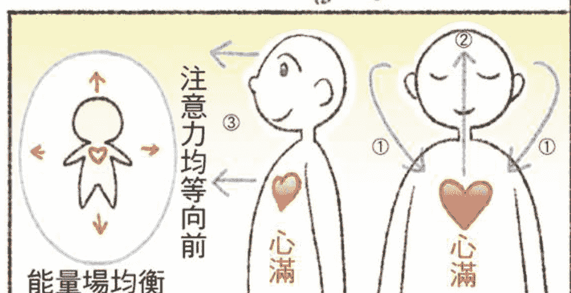
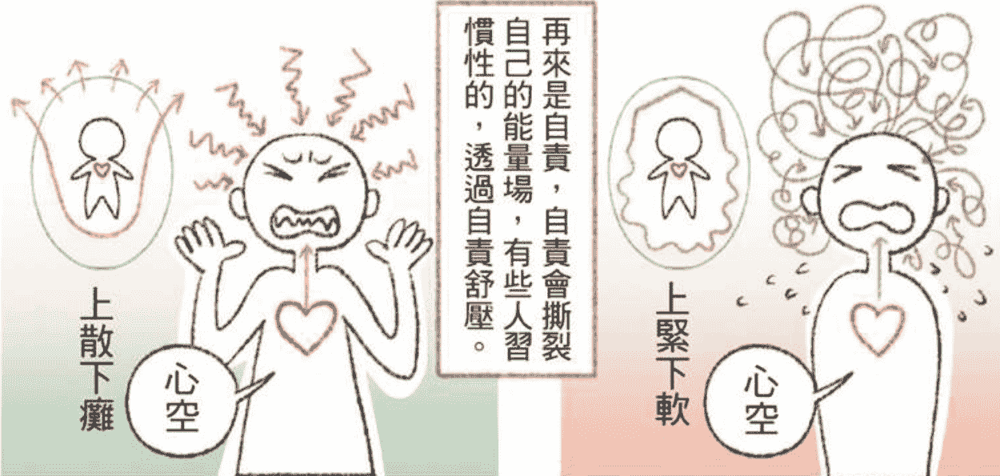
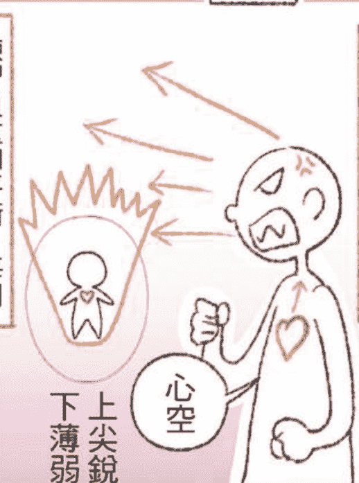
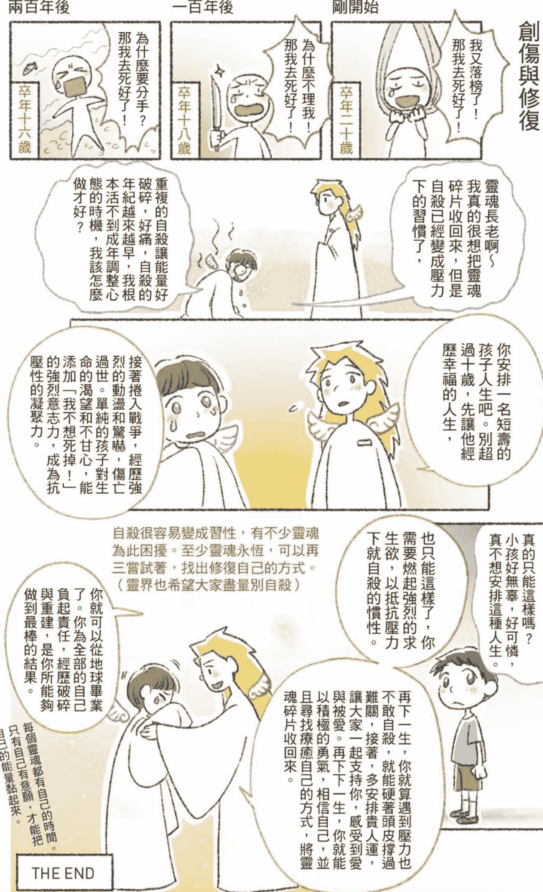
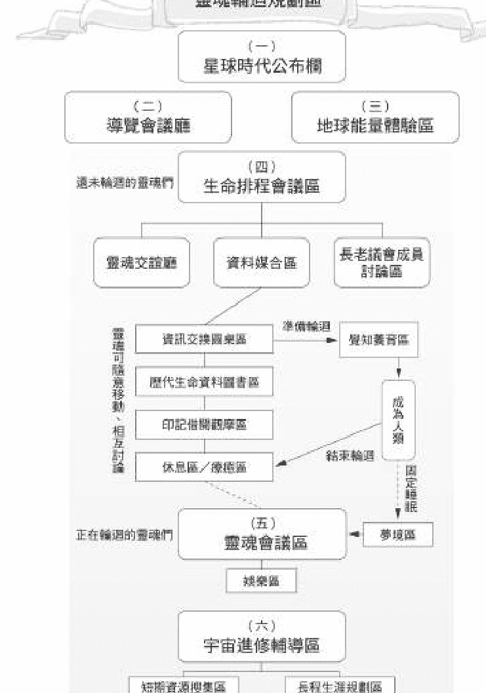
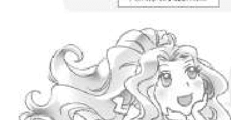

## 人生使用說明書

## 灵界运作·2

灵魂期待对世界有所作为，  
于是规划你的一生  
身为人类的你，  
是闯关人生、创造命运的主角

畅销书《灵界运作》续集，首本灵魂轮回规划的详细解说  
详谈业力、福报、生命蓝图、指导灵、守护灵与人生安排的幕后背景

## 我们是小湛和Azure！
向大家介绍大脑与心轮之间的能量关系！

心轮是灵魂的锚定点，当心稳定，大脑也会平静。理想中的状态是，人们保持对身心的关注，大脑与能量场均衡。

但现实很难理想化。

最常见的问题是焦虑，大脑恐慌多过于心轮，失去和身体的连接。思绪混乱。

再来是自责，自责会撕裂自己的能量场，有些人习惯性的，透过自责舒压。

愤怒是将自己的能量压缩到喷出去发动攻击，也会削弱自己的运势。

练习负重和平衡，每周固定训练身体的力量，能让大脑稳定抒压。当大脑与心稳定，情绪自然稳定了。

运动还能加强能量场排除负能量！

至少运动三分，有冒汗、心跳加快，记得补充水分！

## 创伤与修复

自杀很容易变成习惯，有不少灵魂为此困扰。至少灵魂永恒，可以再三尝试着，找出修复自己的方式。（灵界也希望大家都尽量别自杀）

每个灵魂都有自己的时间。只有自己有意愿，才能把自己的能量黏起来。

THE END

## AZURE MULO

# 人生使用说明书
灵界运作・2

小湛 著

## 前言

## 我们是如何来到地球，成为人类？

各位好，我是小湛。我从二〇一二年就在Facebook记录我与灵魂Mulo对灵界的探索，在网络上详细介绍我在灵性旅程上的启发。刚开始我也很困惑，坊间其他通灵人的灵性和灵界纪录，与我经历的大不相同，我想要透过日记梳理我的感受，期待未来的我能够搞清楚灵界真实的样貌。

多年后我理出头绪，由于灵界能量轻盈，人类的意念较重，人类的意念和价值观会成为一道滤镜，灵界会依照个人的认知呈现不同的样貌。更往内探索细节，其实精神上的启发都是相同的。

灵魂并非高高在上、完美无瑕的状态。所有对灵魂和灵界的“完美想像”，都是“人类觉得自己并不完美，得寄托于更完美的存在”产生的投射。若是无法接纳真实的自己，得遁逃到身心灵领域自我安慰，并无法解决生活问题，一再被现实打回原形。

灵魂的个性可以从人类的个性略窥一二。你有多了解自己，你便是在理解你的灵魂，以及你为何会有今日的人生。灵魂的大爱或许会无视自己的苦痛，如果你想帮助自己的人生改变，就得意识到个人的习性，尤其是无价值感、没自信的议题，可能亦是灵魂层次即有的模式。

当我想起我的前世，以及和Mulo共有的记忆，Mulo强烈地想爱著世界的心意，我真切感受到了。长期的相处中，Mulo的喜怒哀乐也让我惊觉，我不也是这个模样吗？我们都太习惯把苦痛往心底吞，把分享和善意带给其他人，将自责与惩罚留给自己。我们实在太像了，我才确信，Mulo真的是我的灵魂，我很能理解祂过去的判断与思维。

于是我与Mulo打开一场马拉松，重复面对前世今生遗留的创伤和自我设限。当我能够释放对生活的压力，与灵魂整合，就能够以全新的角度，看待人类与地球生态的关联性。也是在进入灵魂的角度之后，身为人类对世界的不公平、怨怼、愤怒，还有不甘心，也就逐一化解。

事实上，重建人际关系的方式、沟通和谈判技巧、认识情绪和心灵的方式、认识童年创伤与早期的自我设限......相关的知识、书籍以及专业人士，已经遍布全球了。人类需要的，宇宙都在时代中带来了，而我们也在练习成为治愈自己、治愈世界的时代角色。

我以系统化的方式，整理我对灵界的理解，以浅显易懂的方式集结成书，让对灵界、对精神层次感到好奇的读者们，能够透过文字与图画进入我所见到的宏观世界。

“灵界运作”从一开始即设定为系列书籍。第一本主轴是“地球与生态”，第二本是“灵魂与人类”，第三本是“宇宙与星球文明”。

我从第一本铺成——关于如何保护自己，以及瞭解地球能量的运作，再进入第二本的主题。若少掉基础的概念，人们对自己存在产生的质疑和不安全感，反而会过度追求灵界／灵性的开发，带着生物性的竞争角度，充满优越感，最后活在自己的世界里，与世界脱钩。

而我所见到的灵界具有超越地球生态的平衡，关于灵魂之间的合作与协定。所有在地球上的意识，包括每一个人的灵魂，都是为了爱这颗星球，于是进入地球的轮回循环，成为现在的模样。然而，规划人生的顺利与否，都看灵魂最初的愿景“我想要为这颗星球——地球，提供帮助”或者“我想要为自己达成何种期许？”目标的不同，造成人生际遇的多样化。

人生规划是一系列缜密的考量，还要经历无数次的彩排。我的前世经历过人生悲苦，也曾被逼害、被伤害，甚至被虐待与枉死......也确实都是灵魂的规划。灵魂为何要创造苦痛？灵魂在想什么？也都会在本书内详细探讨。

理解灵界和精神层次的流动，能够带来抚慰，使我们暂时安歇和释怀。灵性探索的过程就像进入医院修复自己，最后，我们终究得从医院康复，回归到地球和人类的生活之中。

这本书提供小湛我和Mulo的观点，分别从人类层次、灵魂层次的角度，理解我们为何在此？我们需要做什么？而在成为人类以前，我们经历了什么？这样的可能性。

当我们知晓过去的安排，重新锚定当下，也就能开展无限的未来。

欲购买更多书，请浏览海洋书屋：www.ocean-book.com

## CHAPTER  
01

地球灵魂  
轮回规划区

可曾想过，当还没有成为人类之前，你保有灵魂的姿态，是如何来到地球的？你为何规划今世的人生？

能够成为人类的灵魂，在宇宙星际之中都有一定的质量。灵魂像是明亮的光体，如果想成为人类，就需要压缩灵魂质量，降低频率，变得沉重密实，才能进入地球的能量循环之中。

倘若灵魂的质量太小、太年幼，就无法胜任人类的体验。因为人类的生命会经历各种压力和情绪的变动，例如哀伤、愤怒、激烈的懊悔与怨恨，能量太小的灵魂会痛苦到崩解。所以要成为人类，灵魂得有一定的抗压力，经过其他星球的历练，有相当的能量韧性，才能够体验人类的七情六欲。

灵魂想要成为人类有很多种因素，其中最重要的一项原因，就是“我想要为这颗星球——地球，提供帮助”。

## 灵魂的来源

如果把宇宙的能量用人类的观念来简化，可以把宇宙的“维度”视为楼层。来自七维度以上的楼层，你感官世界中的宇宙，皆为明亮闪烁，这里的能量饱满强盛，你不需要飞船，只要起心动念，即能在一定的范围内瞬间自由移动。具有如此强大活力和精神力的灵魂，我会称之为“高灵”。

若是来自七维度以下的楼层，你所见到的这个宇宙，则是黯淡、闪烁着遥远星光，类似人类的肉眼所见的宇宙。或许你的感官可以看到电磁波、磁场等等，然而能量不够强壮，你需要依赖额外的保护层，像是防护衣、飞船还有其他的交通工具。得靠其他能量提供保护而来到地球的灵魂，我会称之为“外星人”。

维度的差异，并没有高等低等的差别，只是代表能量的疏密之分，灵魂来自不同世界，有截然不同能量运作的特质。因此，来自越高维度世界的众生们，它们所认知的世界跟地球的能量差异也就越大，甚至会呈现格格不入、难以适应的状态。

无论你是来自哪一方维度的存有，不管是高灵或者是外星人，甚至两者都有当过，这都没有关系。我们都因为各种原因，遇见了地球。在灵魂层次里，你所见到的地球也许是闪闪发亮，又或者是充满难题与挑战，当你靠近地球的能量场时，产生一股心念：“我好想要为这颗星球提供帮助。”你就会在这一瞬间，切换空间，进入地球的“灵魂轮回规划区”。

欲购买更多书，请浏览海洋书屋：www.ocean-book.com

## 维度

## 宇宙的基础架构

## 衔接到其他的宇宙

维度像是不同的图层，有各种生态现象，越高维度，密度越小，能量越是轻盈细腻。

高灵也会有载体，载体就像是衣服，灵魂能套上一层又一层的载体，像是穿着内衣（高灵细腻的维度）又可以套上夹克（外星人密度的载体）。

在无重力的世界，大家的形状都很随意，甚至可以任意变形，任意模仿变身其他的高灵。需要附识技术。

多数的飞船都有改变维度的技术，方便进入不同星球生态内考察。

小灰人是地球古代的外星文明产物。（实验品）

载体只能套上寿命相对短（能量宽松）的体验。

灵魂的本质，是各式各样的能量体。前往密度大、低维度的世界，像是顺着水流飘，相对容易。

如果灵魂对自己足够了解，经验会使灵魂更加强壮（光变大），才有力量朝高维度、密度小的世界探索。

+ 龙族  
- 小精灵  
- 阿颯  
- 小湛  
- 精怪  
- 原子  
- 域灵  
- 小灰人  
- 外星船

# 灵魂轮回规划区

有底色的区域分两层，方便还未轮回，和正在轮回的灵魂上下楼交流。实线是串流的区域，虚线是正在轮回的灵魂才能使用的通行道。最热闹的区域在交谊厅！

## 统一差异的星球中立区

灵魂轮回规划区，是一片明亮无尽的独立空间，这儿充满宁静与期待的氛围。每颗星球都有专属的等待区和休息区，这是为了让来自各方的众生，在初来乍到时，能够理解这颗星球的能量架构。

这个空间由宇宙规划团队和星球合作创建，存在于第八维度。至少对地球而言是第八维度，因为宇宙的层次仿佛千层派，有些区域的夹层（维度）特别多，有些区域的夹层很是简洁，而地球就位于宇宙夹层较为简洁的区域。事实上，宇宙不是只有一箇中心，而是在不同的维度里，有“各自不同的中心”或者“连续性的大大小小集合中心”，宇宙能量的转换丰沛而复杂，维度彼此穿插交叠。

我们继续把焦点带回地球。无论如何，每一颗星球，包括高灵创造出来的能量空间，都会有一处以上的“休息与等候区”，这里像是管理员制定秩序的专用管道，方便整体结构基础的运作和维护，有人性化的生活空间和休息娱乐区，最重要的是管理人员认进出，确保一切流程安全稳定。

我们可以把地球上的“第八维度”视为跷跷板中的立柱，平衡来自上下左右、各种境界的能量流动，仿佛交通枢纽，具备独立运作的能力。

即使灵魂们有配备的自卫武器，以及可能产生冲突的危险器具，都会被冻结，无法使用和拿取。若有激烈对立的情绪升起，就会自动被弹出灵魂轮回规划区。这里充满地球母亲的温柔，与坚毅守护生命的决心。

在这个空间内，无论你来自何种维度、有多复杂的语言和表态方式、心灵感知、灵魂的能量大小等等差异都会被统一，成为交流无碍

## 的伊甸园。即使像是鲸鱼般巨大的灵魂，或像蚂蚁一样小的灵魂，前者会缩小，后者会放大。又或是来自高温处百万度的星球、习惯高温的灵魂，以及来自极寒冰冻的星球、习惯冰寒的灵魂，一切的差异都会消除，使每一位众生能够见到彼此，没有冲突与伤害，完全平等。

过去大家曾经生活在天差地别的世界，没有任何交集。如今终于有机会，交换与众不同的眼界和思维方式。众生们在灵魂轮回规划区聚集，惊讶于从未遇见的生命体。彼此好奇地打量，自我介绍，感到有趣新奇极了。这里弥漫着善意与和平，期待对地球有所作为，充满激励的气氛。

当众生们想探索这片空间，映入眼帘的，会是一片巨大的荧幕，上面记载这颗星球跟世界的歷史，每一块土地上、海洋中，空气中，过去现在以及未来预计要发生的時代事件。

## 灵魂轮回规划区①——星球时代公布栏

灵魂轮回规划区的第一站，即为星球的时代公布栏。公布栏像是时钟保持更新，显示此时此刻当下，地球各个区域正在进行的时代议题，以及未来预计要发生的事件。

宇宙星際之中，无论在何种维度的境界里，每一颗星球都像是一座学校，每一所学校都设定了独特的难度跟挑战。地球的难度很高，这里是一个“练习解决问题”的世界，每个时代和地区都会有类似的冲突、习性，隐藏在所有生命体的基因里面。灵魂们进入轮回的目的，

## 靈魂輪迴規劃區②——導覽會議廳

當下定決心，要成為地球生命體的一員，你會感受到一股引力，引導你離開星球公佈欄的熒幕，進入導覽區。

當過地球生命體的靈魂，或者是現任地球生命體的靈魂（非現任人類，後續會解釋），祂們會在生物睡眠時間來到這裡，擔任志工團隊，提供身為前輩的建議和經驗談。這裡有非常多的詢問接洽處，以及發送傳單、進行講解的櫃檯，你可以加入或者旁聽。如果你還沒有清楚的想法，可以漫無目的地在這裡閒逛，收集不同的傳單。有的是歷史介紹傳單，或者地理和地質介紹、人類的歷史、植物的歷史、演化與生命型態的不同之處等。

導覽區的空間很大，設置了非常多獨立空間，讓靈魂們自由入座，有如享受電影般的以全景視野，回顧地球發生的種種往事。人類在地球的歷史中，只佔極為短暫的時間，導覽區的重點放在整個星球文化文明的進展，包含非人類的時代，所以當然也涵蓋了其他靈性存有的視角，例如龍族、鳳凰與其他生命體在地球上的歷史和旅程。其中亦包含微小生命體的紀錄，像是細菌的演變和環境的關係，從微觀到巨觀，甚至恐龍時代的紀錄都有。導覽區鉅細靡遺地記載所有曾經發生在地球上、已經滅絕或依舊發展中的生命體們的故事。

欲購買更多書，請瀏覽海洋書屋：www.ocean-book.com

## 靈魂輪迴規劃區③——地球能量體驗區

地球能量體驗區，可以想成百貨公司內的服飾專櫃。這裡依照能量大小排列，按每一種有形無形的生命體，以及所處的維度資料，將生命體的模板逐一排列開來。這裡有“模板擺設區”和“體驗間”兩大區域。可以挑選你有興趣的生命體模板，翻閱吊牌上的介紹說明，像是“喜愛熱鬧群居的物種，壽命短，生存在限定的海拔和地理環境裡”。

當你想嘗試成為某個物種，拿著生命體模板進入體驗間，接著彷彿掉入電影劇場中，你成為主角——也就是這個生命體。倘若你成為非洲象，可以選擇過去的時代背景，或者現代環境，甚至是模擬未來的氣候模式進行體驗。你可以感受踩踏草原或荒蕪的漠地、涉過河谷等歷程；感受“重量”、“耐力”與“緩慢”；感受嗅聞的氣味、眨眼的力道、皮膚被風吹拂的溫度......全方位地沉浸於大象的觀點之中。

體驗時間有限，感受會漸漸淡去，你又回到當下，會有熒幕為你分析：“你並不喜歡過度乾燥的環境，或許可以考慮溼潤的氣候”、“沉重的身軀會讓你的靈魂感到疲勞，建議選擇體型更小的物種，例如狐狸”。地球能量體驗區集合了高科技和人性化的資料整合，會貼心地提供指引，例如“你剛剛體驗的四種物種都有共通點，或許這個共通點也是你的專才......”，以此建議體驗者探索自己偏好的領域。

在這裡你想待多久就待多久，然而靈魂體驗到最後，終會感到厭倦，因為不想只有自己單獨體驗，而是期待和朋友一起分享生命的喜悅。如果想和親朋好友一起感受地球生命體的多樣化，只有加入此時此刻的星球輪迴，才有合作的機會。

地球的生態中，除了人類之外，亦充滿群聚共生的物種，例如極地苔原、昆蟲、魚群、鹿群等，因應不同物種的需求，靈魂們需要討論合作的可能性。因此靈魂收集好在“地球能量體驗區”獲得的資料，接著便前往“生命排程會議區”，進行密集的討論。

## 地球筆記本

大量的體驗資料需要記錄下來，所以在地球能量體驗區中，大家都可以獲得一份像是平板電腦的輕薄能量，這份“筆記本”會提供目錄，記錄最常遊覽和檢視的區域，也提供簡單的瞬間移動技能，可以點選有興趣的交誼廳講座，瞬間前往旁聽。

筆記本會直接綁定靈魂，無法被偷竊、窺探和複製，屬於“靈魂輪迴規劃區”的隱私保障，由星球規劃團隊保護，只能在地球上使用，當靈魂離開輪迴規劃區，筆記本就會被收回。

這份筆記本也能成為通訊錄，記錄在地球上靈魂們的能量特質。若是經過其他靈魂的同意，筆記本也能夠成為彼此的聯絡方式，可以隨時出現在對方身邊，也能進行封鎖，或做一般訊息傳遞。

## 靈魂輪迴規劃區④——生命排程會議區

當你成為地球上的某個物種，你的意志力足以改變載體部分的基因，你的起心動念和無意中的行為，可能造成時代的阻力難題，也可能突破時代多年的困擾。

例如，你平常很積極讀書，覺得靠自己爭取最好的結果理所當然。但是某天你覺得很累，想直接偷同學的筆記來看，意外發現偷別人的筆記可以減少這麼多自己唸書的時間，於是你嚐到甜頭，開始思考要怎麼用小聰明替自己撈到更多好處。這份“我自以為很聰明、我不可能被抓”的自信就會進入載體基因，你的身體會記錄“我要儘可能偷取對我有用的好處”。

欲購買更多書，請瀏覽海洋書屋：www.ocean-book.com

## 生命排程會議區又分成三大區域：靈魂交誼廳、資料媒合區、長老議會成員討論區

## 靈魂交誼廳

在地球上，想要當人類以外的物種，度過普通的生命歷程，並不需要太複雜的夥伴資料媒合。然而想要成為人類，無法自主的童年需要依賴周遭環境的支持，因此靈魂交誼廳內的社團，能夠協助靈魂挑揀合作的對象。

靈魂在交誼廳四處打聽，前往各個社團尋找幫手，也留下自己的興趣跟專長。社團有的是“醫療科技研究社團”、“亞洲財政與經濟”、“當代藝術與表演劇場”等，裡面都會有布告欄記錄了社員名字，以及這些社員的專業領域，目前正在哪個國家體驗。筆記本也能發揮作用，進入社團搜尋關鍵字，尋找個性和專業能夠相處的靈魂，接著等對方上線互動，詢問自己想知道的專業內容。

也有的靈魂實在太忙了，沒空定時到專業社團活動，畢竟有興趣的領域太多。社團也會有公佈欄，訪客可以留言尋找合作對象，等社員有空上線，再和訪客交換一般訊息，繼續討論合作的可能性。

靈魂們相互約好時間，真正地面對面互動，才能確定未來是否要合作。靈魂和靈魂之間亦會相互介紹更多的朋友，因此交誼廳就顯得格外重要。這裡充滿放鬆的沙發、海灘和自然風情，靈魂能夠隨心所欲地創造／改變想要的空間樣貌，甚至設定香氛氣味、自然風、陽光等，讓感知更豐富三維，盡情享受氣氛，好好聊天。

確定將來會合作之後，靈魂們才會把彼此的筆記本靠近，交換帳號。這個設計是確保每一位靈魂的帳號都屬於自己，無法被任意挪用或未經同意傳播。

若靈魂還沒確定會合作就交換帳號，就像提供路人你的工作和私生活範圍的通訊方式，甚至對方也會把你的信息傳給其他不認識的靈魂。這就得看大家會不會騷擾你的行程，或者把你先想好的點子拿去使用，畢竟有些機會是先搶先贏，名額有限。

也是有的靈魂一開始沒有任何防範，後來吃了悶虧，本來預計人生一路都要拿第一，結果總是被另一個人洞察先機。對方的人生安排、居住地點、成長環境、就職公司幾乎和他一模一樣，對方屢屢搶走他的名額，這就是對方靈魂的小聰明，覺得從你那邊可以得到最好的，祂就不必努力蒐集資料和爭取，只要搶現有的東西就好了。甚至還狡辯說：“你一開始就邀請我，又沒說我不能抄你的、拿你的。”當事者靈魂氣到把對方封鎖，困擾就解決了，從此雙方人生際遇大不同。

所以靈魂們也是得花時間挑選夥伴，確保對方的品格能和自己合作愉快，而不是把你的努力整盤端走。

## 公眾人物靈魂

有的靈魂設定人生的時候，就預計成為充滿魅力的創作人士。由於需要作品來大鳴大放，靈魂會先擬定創作方向，像是編曲、唱歌、編劇、表演、書寫、繪畫、演講......擬出幾份創作草稿，放在交誼廳社團，測試觀眾的接受程度。

這些作品牽涉靈魂往後人生的發展，因此作品的能量特質都會受到靈魂規劃區的保護，像是上鎖，避免其他靈魂抄襲、端走成果。因此創作者靈魂可以安心地大膽表現自己的才華，觀察觀眾的反應，決定哪些熱門作品優先發表，或者需要調整細節，以奠定自己的公眾地位。創作者靈魂能借由觀眾的反應，決定未來人生要在哪些地區發展，並規劃人生的合作靈魂。

創作者靈魂的人生主軸和一般人類不同，需要先把作品做出來再安排人生。等出生之後展露才華，再把靈魂層面早就準備好的內容製作出來，被觀眾投票、被圓桌認同，最後走上預計的人生藍圖。

如果沒有在出生前做好作品發表的演練，人類層面端出來的作品就會前途不佳，即使內容優秀，然而螢光幕前的位置都在生前規劃時被搶光，硬生生擠到後方。這也是靈魂高估自己的影響力，忽視生前在交誼廳排演的重要性。這就是我們說的懷才不遇，都是靈魂太高估自己，忽視和群眾鏈接的重要性。

其實很多人類歌手的靈魂，在交誼廳也都有開演唱會和俱樂部，祂們的人類在出生前，就已經受到熱烈歡迎了，好比地球上的網紅，大部分在靈界也是同樣的身分。那些認真經營地球人生的靈魂，總是很忙又很充實地安排有形無形的行程，盡情地發揮影響力。

靈界的社團，影響人類生涯安排頗深。有非常多的靈魂想要收集生活靈感和創意素材，或者展現自己的魅力，透過社團發表，又或者是把靈界的一部分經歷，當成創作來源。

理想中，靈界和人類兩個世界兼顧是最好，但難免有的靈魂在人類生活太過受挫，把焦點都放在經營靈魂的社群，以至於疏忽照顧人生，使人類層面產生疏離無奈的感覺，難以接受平凡的命運。

## 靈魂志工

交誼廳之中又分為鬧區和細語區，總是有些靈魂偏愛輕聲交談，不喜歡張揚。交誼廳中巡迴的靈魂志工有特別申辦的權限，如果某些靈魂太興奮或不肯接受意見，在細語區過度吵鬧，靈魂志工可以拿出名牌，瞬間把對方傳送到鬧區，或者暫時拒絕對方進入細語區，藉此簡單地管制秩序，以保障多數守規則的靈魂的權益。

靈魂志工都是申請打工的一般靈魂，只要大致上瞭解地球生態的能量循環，經過基本考試之後就能獲得志工權限，並以此換得地球代幣。（地球代幣將在稍後談到。）

靈魂交誼廳會定期舉辦“全球靈魂研討會”，還有以國家和地緣為主的“分區靈魂會議”。開會的時間很頻繁，如果以人類時間估算，全球靈魂研討會大約兩個月舉辦一次，分區靈魂會議則是兩週舉辦一次。開會時間會有才藝表演和演講等活動，很豐富有趣，靈魂志工會提醒每個區域排程的時代議題要到了，有任何疑問可以發言或者提供意見。開會時間約兩到三天，橫跨全球時區，讓每個靈魂都可以參與到內容，錯過會議也能看筆記本的紀錄，靈魂要不要參加都隨意。

人類覺知沒有權限參與靈魂交誼廳的活動，因為大部分覺知的能量太小了，會被靈魂規劃區巨大的光能量壓扁，通常都是載體入睡後，靈魂和覺知合一才會參加活動。

## 設定基因與目標動向

交誼廳的專業社團內，有比導覽區更詳盡的地球生活細節介紹。例如，詳細解釋沙漠中一天會經歷的溫差變化、物種的型態和演化趨勢、物種體內的水分多寡和必要營養來源、現代面臨的壓力和歷史壓力的不同之處。

每個靈魂喜愛的物種和特色都不同，這裡就像熱鬧的學校社團，曾經當過某些物種的前輩，會在這裡當志工詳細解答新來靈魂的疑問，或者邀請新來靈魂成為接下來輪迴的家人。

因此靈魂交誼廳又分為各種大小廳，像是海洋物種區、陸地物種區、兩棲類、動物類、植物類、真菌類等等，當然還有人類。也有地球靈界的體驗：龍族、精靈和其他存有。

靈魂在物種出生前，就得思考該如何搭配基因，具有什麼樣的特殊能力？從胚胎中塑造變異的基因，例如更能吸收水分，卻要避免短命和影響其他基因的正常運作。地球筆記本會協助靈魂運算自己想要嘗試的基因發展，若靈魂已經有在地球體驗的其他前世，地球筆記本也會記錄詳細的生理和心理變化、改變基因的可能性等資料，提供靈魂參考。

## 資料媒合區

這個場域又分成三大類：信息交換圓桌區、歷代生命資料圖書區、印記借閱觀摩區。

## 信息交換圓桌區

資料媒合區有一片片潔白圓桌，有意願合作的靈魂們，將各自在“地球能量體驗區”收集好的資料，透過筆記本放到圓桌檯面上。此時系統會快速計算出靈魂之間的契合度。

例如能一起吃苦耐勞，不等於可以有福同享；可以吃喝玩樂，不等於能同舟共濟。在靈界沒有壓力的狀態下，每一位靈魂看起來都很和善、願意分享，實際上成為人類，體驗到來自家族、學校和職場的負擔，以及承擔社會期許，都會是另一個模樣。

圓桌會浮現靈魂設定為人類之後，與其他人類相處後的情緒變化，以及有可能採取的行為，呈現鮮明的影片畫面。使靈魂們再次探討，自己的人類設定和採取的行為互動模式，真的是自己期待見到的發展嗎？該如何加強或者插入其他因素，避免極端的衝突與破壞？

靈魂如果決定要當人類，很難透過前面的“地球能量體驗區”模板取得新的變化，因此為了更深入瞭解地球物種的變動性，可以借閱其他靈魂前輩的經驗，也就是“借印記”，來模擬自己在生活壓力下，可能做出的選擇。

欲購買更多書，請瀏覽海洋書屋：www.ocean-book.com

## 歷代生命資料圖書區

這一區匿名記載地球誕生以來，大量靈魂在地球上的生態體驗，提供各方靈魂參考借鏡。靈魂都有自己的個性和專長，會在同樣的壓力下做出截然不同的選擇。舉例來說，同樣經歷戰爭，有的靈魂會起義、反抗不公平的對待，有的會默默隱忍，或者同流合汙，又或者攜家帶眷逃難。

歷代生命資料圖書區也有清楚的檢索能力，像是能夠選擇物種、年代、地區、性別、專長領域、社會影響力、革命／改革活動、極端體驗、安全體驗、平凡體驗、失誤範本、啟發與扭轉困局方式......讓靈魂可以快速篩選出想要理解的人生範本。

大多數靈魂規劃人生的失誤在於，祂們太過理想化了。靈魂在自己的星球和境界、甚至是其他的宇宙中，極少會體驗到“飢餓”、“有限的生命”等感受。具有壓力的世界極為稀少，多數世界的體驗都和豐盛、心想事成有關，畢竟靈魂是永恆的，感到開心就會充滿能量，自給自足。

靈魂很難想像，自己沒有經歷過的事情。地球的生命有限，活著就會有生老病死，尤其地球的物種繁衍速度很快，競爭也就強烈，同類太多，就要爭奪有限的地球資源，因此會有相當大的生存壓力。

過度的壓力會導致焦慮、恐懼、不安全感、悲哀和絕望、無力感、自責和自我傷害，形成往內退縮的封閉能量，造成失去和周遭環境的鏈接。失衡的壓力也會激發競爭意識，成為朝外迸發的能量，以此宣洩壓力，例如見不得人好、嫉妒、造謠毀謗、侵略性、搶奪、暴力甚至謀殺行為。

如果靈魂依舊帶著“我是永恆的，我心想事成、我完美無瑕”的思維，只搜尋“成功”、“厲害”、“被大家喜歡”這樣的關鍵字，只看好的一面，毫無危機意識，那麼成為人類之後，就會產生極為強烈的挫折感。反過來，心思縝密的靈魂會嘗試尋找“失敗的人生案例”、“生存壓力”等關鍵字，就會發現把自己設定得很厲害，也容易被嫉妒、被潑髒水、被誤會、大家都把工作推給你、被霸凌......

生存壓力以及競爭意識，會使人產生不平衡的感受，只有當過人才知道內心壓力的變動性。無論如何，以上的情感都是正常的反應，重點是，靈魂該如何控制對人性的拿捏和提防？

成為人，就會有“人性”的一面。像是看到厲害的人就不舒服，感覺到自己匱乏，想要挑毛病做人身攻擊，甚至是聯合其他人，對優秀人才做出傷害行為，以感受自身的優越。

人類是群聚動物，如果道德良心沒有被靈魂控制好，也就容易挑撥離間、偷雞摸狗、中飽私囊，期望以此得到社群認同。有壓力說說閒話沒關係，只是要怎麼說、要怎麼想，才不會害到別人？而自己的壓力又該如何化解，或者能被他人接納？至少壓力不要累積到變成傷害自己和傷害他人的因素。

身為人的挫折與經驗，都有靈魂志工在旁邊提供建議和宣導，建議新來的靈魂務必得搜尋避免傷害的關鍵字：“化解霸凌危機的能力”、“貴人運”、“轉職運”、“有效溝通的能力”......只是聽到宣導，依然有為數不少的靈魂覺得“自己不會那麼笨”、“只要有愛就會成功”、“愛能解決一切問題”的思維。不願接受前輩的意見，也是沒辦法的事。新

## 印記借閱觀摩區+休息區

靈魂都會“理想化”自己在壓力下應該會成為什麼模樣，因此理想跟實際的差距在哪裡？有前輩達成你想要的目的嗎？最好的方式就是借取前輩的人生範本來觀摩。

靈魂從歷代生命資料圖書區找出想要的資料，收入筆記本之後，就能到印記借閱區。這裡充滿一個個大型半透明泡泡，靈魂們拿著筆記本陸續進入單顆泡泡，體驗筆記本指定的借閱記憶。印記的下載只有一瞬間，白光閃過，接著泡泡破滅，靈魂會由志工扶著到旁邊的休息區躺一會兒。

印記借閱區的體驗會加入輪迴的機制——“遺忘自己身為靈魂”的設定，以完全地投入“印記”的體驗。這是和地球能量體驗區的最大差異。在印記借閱區會經歷深刻的主觀感受，包含創傷衝擊，相比之下，地球能量體驗區就像看窗外風景輕盈沒有負擔。

也是因為印記借閱區的深入其境，會帶給靈魂相當大的壓力，鄰近的休息區就像一片瀰漫溫柔療愈香氣的草原，宛如沐浴室，清爽潔淨的能量如細雨灑落，清除靈魂的壓力。

一旦靈魂休息好，就會回到信息交換圓桌區和同伴會合，觀察新體驗的印記資料和自己的心得感受，檢討是否累積足夠的經驗值，解決圓桌模擬的問題和事件。或者靈魂也能回到歷代生命資料圖書區，重新選擇印記資料。若是太累了想暫停，想去導覽區、交誼廳休息都可以。

## 印記對應性格相似的靈魂

也有靈魂想要借閱和自己個性截然不同的印記，例如個性怯懦的靈魂想要借閱勇敢大膽的特質，此時泡泡就會擋下靈魂，拒絕讀取。靈魂需要從更基礎的印記中，學習“讓怯懦在某些壓力下累積成勇敢的動力”，不能直接抄捷徑取得“強壯勇敢的特質”。

靈魂能夠借取的前輩記憶，只有“和自己性格相像”的部分。你可以借過去歷史上的偉人、名人、宗教領袖......任何曾經真正存在過的人類全方面的人生體驗，以作觀摩。前提是你要有部分的性格與之雷同。

人的一生中有各種價值觀，例如家庭觀、社會觀、人際觀、戀情觀、職場觀、世界觀......印記借得太多，即使是他人經歷的苦難，也會造成靈魂的負擔，因此靈魂們可以調整印記的壓力值，例如特別放大印記中的“家庭觀”的影響，希望今生以之為借鏡，同時縮小其他價值觀的影響力。那麼這份借來的印記，只有一小部分會特別使你為之動容，其他部分的人生旅程則雲淡風輕。

靈魂們必須透過親自體驗、嘗試，摸索出“我真正需要的”和“實際上的我能辦到”的差異和經驗值。

## 平行宇宙、多重宇宙

印記借閱區可以提供“平行宇宙”的選項，也就是借閱前輩的人生體驗之後，在模擬測試裡做出自己的選擇，看看會是自己想要的發展嗎？例如，你借閱美國肯尼迪總統的人生印記，你讓自己對槍擊有所警覺而避免被刺殺的發展。但接下來你又該如何帶領國家和人民繼續前進？歷史會在模擬中因你而改變，而你真的能創造更好的歷史嗎？

印記的平行宇宙選項，並不會干擾真實宇宙的時間軸與既定的歷史事件。也因為隨時能夠借閱印記，可以跳躍不同的時空閱覽，你能夠一下子當維京人，接著成為現代日本上班族，再來跳躍回史前時代，然後又成為中世紀的歐洲騎士......靈魂的地球筆記本記錄的體驗順序，不一定按照現實的歷史事件，而是能夠隨意發揮排列。

對靈界而言，讓靈魂扮演過去的歷史角色，重新揣摩社會責任與事件的控管程度，再對比正史的結果，兩者之間的差異性，成為靈魂對“自我的理解”，這才是演練平行宇宙、多重宇宙的精髓。當靈魂從印記得出領悟，即能將經驗深化，並且實際操作在自己的人生中。

## 急躁的靈魂

急著想要加入地球生態的靈魂，借個一兩份理想化印記，就認為自己能活出理想化的人生。輕忽壓力帶來的變量，很可能拖累其他靈魂的人類人生，像是累積千萬賭債，使全家人都不好過。

因此為了避免靈魂興奮忘我地忽視自己的承受程度，靈魂輪迴規劃區要求，每一位靈魂在設定輪迴時，需要借閱至少五份以上的印記，這五份印記要有不同的性別、身分與階級，以及生活在不同文化

## 想要發揮影響力的靈魂

靈魂越是設定巨大的社會格局和改革能力，肯定會牽涉大量的靈魂們，大家得重複地借印記，藉由過往年代的君臣記憶，探討歷史上的失誤在今生又該如何避免？

大家在圓桌上檢討誰還需要什麼特質？有足夠的危機處理能力嗎？彼此真的有足夠默契，能夠妥善應用地球的資源，減緩可能的損失？哪些時間點要相互扶持？如果有其他候選人及團體一起出面爭奪有限的位置，該如何因應？這將會是數千、數萬名靈魂——或者更多的靈魂得反覆切磋，同時開會的大事。

圓桌可以無限擴增面積，進行繁密的計算，確保每一個靈魂的人生行程，都能在大約的時間，進入合作時段，以及相互抒解時代的壓力和業力。

## 命運的安排

因此人的一生中，所謂的大運、小運、徽運、大難、時代變動，都是在資料媒合區的圓桌上，逐一拼湊而成，牽涉了每一個人和家族

## 地球的時間感

值得注意的是，在靈魂規劃區廣大的腹地中，只有少數區域，像是“資料媒合區”會帶入地球的時間流逝感。在其他的區域，無論你花多少時間感受地球資料庫的一切，當你離開靈魂輪迴規劃區，你身上的計時器、環境的變化，依然停留在離開的那一片刻。

如果靈魂已經有體驗其他地球物種的經驗，像是成為大象、鯨魚、神木等等，體態較為巨大甚至是長壽的生命體，也體驗過成為雲朵、岩石、大地等無機物經驗，都可以加強靈魂對於“慢”、“耐力”和“累積力量”的感受，加強理解地球的能量如何運作。

地球在宇宙星際中實在是非常渺小的星球，來自四面八方的靈魂，通常比地球大多了。有的靈魂原始的質量非常大，大到像是黑洞

## 長老議會成員討論區

當靈魂們準備好成為人類的資料，會和預計合作的所有靈魂一起來到有如巨大殿堂的白色會議室。

如果需要調閱資料，會議室中間就會浮出長桌，如同信息交換圓桌，白淨的長桌可以進行更細節的探討，像是每日的心境變化，與周遭環境人事物的關係，而不僅是大範圍的人生排程。靈魂長老會加入祂們的經驗分析。

靈魂長老們平時就會關注信息交換圓桌區，已經對重複探討人生的靈魂們有所瞭解。會議中，長老會針對更細節的情感關係，例如父母、伴侶、子女的牽絆，誰會特別依賴誰，依賴的需求與深度，還有雙方該如何變得更加契合，以避免過度創傷，導致關係不如預期。

長老議會成員並非民選機制，這裡的長老靈魂，可以視為宇宙單位的公務人員，屬於星球規劃團隊成員，直接服務地球的意志。如果要用維度來區別長老們的能量狀態，約為九到十二維度，祂們在這個宇宙中像是教授的身分，都是資歷非常深的前輩靈魂們，每一位都有塑造星球、星系和宇宙的經驗，對靈魂成長茁壯的歷程非常熟悉。

靈魂長老甚至能夠直接調閱靈魂在其他星球的經歷，或者靈魂獨自旅行時自己私下做的隱匿事——在宇宙中沒有任何的祕密，靈魂們的思考、感受都會影響宇宙每一寸細緻的能量波動，宇宙會記錄所有靈魂的所作所為，只有品行道德能夠和宇宙有所共鳴的靈魂長老，能夠取得相關信息。正因為能夠獲得相當多的隱私，長老們也需要為靈魂們守密。

靈魂長老很清楚，靈魂們在合作中，多少會隱蔽自己曾做過的虧心事，或者高估自己的承受能力，甚至為了顏面而虛張聲勢。但是祂們的同伴不知道，或者連自己都不願承認，那麼以上的問題，極有可能在成為人類之後成為未爆彈。靈魂長老重視的是“抗壓力”——在人際中感受到的人情壓力、體弱病痛的痛楚壓力、生存受到緊急威脅的壓力

## 靈魂長老的工作能力

現階段在長老議會成員討論區任職的長老約有三百多位，祂們的能量體積，能夠同時分身數十萬，參加各種大大小小的靈魂會議，安排和主持各方靈魂的活動。靈魂會議中見到的靈魂長老最少三位，最多到九位。當靈魂結束人類的一生，人生經驗的總結非常重要，會有十位以上的長老參與討論。

假如這一生扮演的是掌權人士，牽涉國家社會鬥爭，要探討的層面甚至可達到一對三、四十位靈魂長老的交流，逐步探討這一生創造多少機會，卻也扼殺了多少機會，以及面對懊悔的事件，靈魂對權

## 靈魂輪迴規劃區⑤——靈魂會議區

靈魂會議區僅提供“正進行地球輪迴階段”的靈魂們使用。這裡是人類載體進入睡眠期，靈魂暫時回到靈界休息的區域。因為在地球的生活與生存壓力太大太深了，睡眠時靈魂和肉體依然保持鏈接，一旦回到靈界，靈魂身上殘餘的載體壓力，很容易擴散開來，所以要特別限制壓力影響的範圍。

靈魂會議區的場域有一部分和生命排程會議區重疊，方便靈魂們在人身入睡之後，回到靈界尋找資料，重新借印記和規劃排程。

## 休息區

靈魂會議區的場域會加強靈魂的壓力代謝，又結合一部分的休息區能量，使靈魂沐浴療愈的光雨，能在最短的時間內恢復精神。

在靈魂會議區，生命排程會議區分成上下兩樓，上層是還未當人類的靈魂，下層是已經當人類的靈魂，上下兩樓可以相互對話互動。

已經成為人類的靈魂，如果想要尋找未出世的孩子的靈魂，就會在重疊的區域尋找可合作的對象，在指定的社群內搜尋有意願的靈魂，也能一起坐上信息交換圓桌區，討論未來的發展，當然也能在其後一起進入長老議會成員討論區做後續交流。

## 夢境區

夢境區就像門口的玄關，只佔了地球的靈魂輪迴規劃區很小的區塊，提供靈魂轉身、脫下鞋子與大衣，抖落塵埃，卸下在人類生活的煩惱與壓力，最後返回靈魂輪迴規劃區休息。

靈魂與人類大腦的整合程度，決定人類醒來之後記不記得夢，或者只記得淺層夢境（大腦磁碟重組、釋放壓力）或深層夢境（依稀記得靈魂在靈界的活動和體驗）。若是醒來後對夢毫無印象，代表身體有徹底放鬆休息，靈魂也有在靈界休息到。

夢境區也分幾個層次：個人的、團體的，或者是集體意識。

生活上密切交流的人們，經常煩惱同一件事情，或者是為對方著想，腦波、心念的頻道接近，也就容易進入對方的夢裡。這包含已經往生的人類意識，雖然身體的壽命結束了，仍對某些人某些事有所掛念，這份牽繫的能量就會在夢境中透露出來，成為提醒。

然而亡者的託夢對象，還是要尋找壓力比較低的人才能夠託夢。因為情緒壓力太多，如太悲傷、自責跟恐懼，就像是一層厚重的迷霧，阻擋亡者的訊息傳遞。

集體意識的夢境，往往跟當地人所恐懼、擔憂的事情有關，例如夢到地震、戰爭，以及預期中可能會發生的衝突。這樣的夢境，也是在釋放集體潛意識的壓力。

預知夢是靈魂在信息交換圓桌區安排未來發展時設定的錨定點，確保人生每一片刻的發展都在預料之中。

夢境是一窺靈魂在靈界活動的門扉，甚至有些重複夢到的夢境，和前世記憶、家族議題有關，有時候靈魂長老以及指導靈，也會透過夢境提醒人類需要重視的細節。夢境在絕大部分的狀態下，都在釋放身體的潛意識壓力。如果對人生非常重要，是帶著提醒跟警告的夢

## 境，你会重复梦到，直到你醒来后依然记得。反之，大部分的梦你只会做一次，只要不会影响到日常生活，就不需要放在心上。

恶梦虽然是正常地抒解压力，其实也是改变的契机。做了恶梦醒来，你可以立刻回想梦中的场景，自己是否可以发挥想象力，击退梦中威胁你的人事物？恶梦意味着你有一部分能量被压抑、无法伸张，所以在醒来之后，用力展现自己的反击和对抗，再荒谬的剧情都没有关系。不用担心伤害别人，你只是在对抗你的压力，当你改变梦的走向，就会取回自己一部分的力量。

每一天晚上，人类的觉知都会在睡眠中和灵魂整合。然而作息、饮食、健康、情绪的状态，都会导致每一次睡眠和灵魂整合的百分比不同。长期有睡眠障碍的人，灵魂则会透过晃神的时刻回去灵界，只是灵魂也会累得很难全神贯注，难在灵魂规划区久留，或者只能躺在休息区安歇。

如果想加强和灵魂的整合，首先要注重睡眠品质和保持稳定的作息，先从照顾好身心做起，尤其情绪的照顾。情绪与压力，往往是觉知和灵魂之间最大的隔阂，因此生活上安排抒压的管道，无论是透过运动或者寻找咨询心理师，只要能倾吐心声和宣泄生活压力，都是不错的方式。把焦点放在照顾身体、照顾情绪，都会加强觉知及灵魂的整合，而能够更清楚地记得梦境，当整合的同步率提升到一定程度，甚至会记得在灵魂轮回规划区内 的经历。

欲购买更多书，请浏览海洋书屋：www.ocean-book.com

## 娱乐区

灵魂会议区还有一处独有的空间，名为娱乐区。

人类的生活形态丰富精彩，科技与生活用品使许多灵魂大开眼界，毕竟不是每颗星球都这么热闹。灵魂在这里建设出“模拟地球”，像是大型娱乐游戏区，或许人类的自己没有足够的财力成为沃尔沃享受人生，但在那里，灵魂想成为什么样的人都可以，应有尽有。

在那里，灵魂可以享受扮演另一种人生，像是电影《黑客帝国》，可以随时切换剧情、随时变身，没有任何身份地位和血缘的负担。在那里也是认识新朋友的机会，灵魂们可以玩竞争游戏而不會受傷，或者创造单人游戏尽情发泄身为人类的压力，有非常多種可能性。

有的灵魂厌倦人类的生活形态，想变成仙人或变成飞鸟在高山峻岭间翱翔也没问题，甚至能重返恐龙时代，以及更早期的地球历史。这里也结合一部分导览区的资料，让灵魂们充分發揮想像力抒发压力，又不至于承担印记的沉重。

难免会有灵魂觉得生活压力太大，很累很烦不想回去当地球人的状况，为了避免灵魂和载体长期失联变成植物人，灵魂会议区都会倒数计时，强制把灵魂送回人类体内，使人們苏醒。

## 拒绝回到人体内的灵魂

植物人，还有放弃生存症候群（resignation syndrome）这种一睡不醒的现象，往往是灵魂在人类的体验中受到极大惊吓和创伤，压力累积到痛苦得拒绝回到身体内。

然而人类的寿命还没结束，人的身体能量场依然需要在无形中支持周遭家人和环境的能量，提供灵魂资源等协助，这些早在圆桌排程上紧密相连，否则会拖累其他的灵魂与人类的生命规划。

有些灵魂是成群结队一起来到地球体验，本来说好要一起创造人生格局。然而灵魂们在成为人类之后，发现环境压力和未来的变动，不如刚开始所想。尤其是爱好和平的灵魂，没有准备好面对未来的冲突和险峻的挑战，立刻决定放弃人生。

祂们有的一做出决定，其他的同伴也做出同样的决定，全体陆续以消极睡眠的方式面对人生。一九九〇年首度记载出现在瑞典难民儿童身上，被描述为“文化束缚综合症”，受影响的儿童或青少年表现出焦虑、嗜睡症状，有的呈现对环境漠不关心的疏离，逐渐远离他人，最终发展成昏迷、大小便失禁。然而其人类的觉知依然留在身体内，对环境有所感知。只是灵魂的拒绝合作，没办法让小小的人类觉知整合身体能量苏醒。

## 暂时遗忘痛苦

灵魂长老不会强迫受伤的灵魂非得回到人生岗位，而是建议其他后备方案，那就是“遗忘痛苦”。透过深层睡眠之后醒来，人类会发现本来很烦恼、绝望的事情似乎没有想像中那么重要，仿佛重生似的——这个措施是“将痛苦的档案封存”，延后处理问题。或许现在的此刻，灵魂与人类都不知道该如何面对事件和打击，至少先把情绪和生活照顾好。延后的时程不一定，可能隔几年再被类似的事件触发，或者延后到下辈子面对。

毕竟这趟人生旅程中发生的一切，都是灵魂决定发生的，当时的失误，就得靠未来补救，只是要找什么方式补救和加强？所有的摸索和尝试，都是灵魂成长的一部分。

## 灵魂轮迴规划区⑥——宇宙进修辅导区

宇宙进修辅导区是近代新增的区域。这里分成两大区：短期资源蒐集和长程生涯规划。这里也分成上下两楼，让“还未轮迴”和“已经加入轮迴”的灵魂们能够一起参考。

有别于导览会议厅和印记借阅观摩区，宇宙进修辅导区提供其他星球的文明和知识纪录，将和地球历史接近的星际文化、常见的文明冲突现象、战争和沟通技术、疗愈和支持的社会架构，做完善的分模拟对，让灵魂们参考其他世界和物种同心协力克服挑战的经验。

### 短期资源蒐集区

大部分的灵魂都习惯用自己的特质生活，像是来自激烈风暴的星球，也习惯用激烈冲撞的方式和周遭的人对抗 / 交流，以致格格不入、痛苦不已。灵魂可以来到短期资源蒐集区，查看他所属的能量特质和天赋，寻找与自己有着相关特质的灵魂前辈们，在进入能量迟缓僵硬的世界，是如何成功克服格格不入的感觉？该如何放緩速度，或者降低压力，避免招致误会？

这里依照能量特质分类，灵魂只要拿出地球笔记本，笔记本就会搜寻相关资料，此外这里也有一排圆桌，能够调阅其他星球的信息，并且提供灵魂进修信息，像是使用新的技术修补人类能量场，使人类能量场和蔼可亲，降低对其他人的威胁感。

除了外在保养，地球笔记本也会在圆桌调阅其他星球文化以及时代歷程，检阅和自己特质相似的其他灵魂，如何在各式各样的星球顺利生活，拥有受到爱戴和尊重的特质？自己想要的，别人是如何做到？以此作为借鉴。这里也能借阅部分的外星印记，使灵魂感同身受，加强经验与实作印象。

另外，由于地球的能量沉重，导致适应不良的灵魂累积相当多的业力，人与人之间充满误解和压力，持续的地球轮迴又使灵魂痛苦不堪，在短期资源蒐集区，也提供灵魂新的选项。

每颗星球都有类似业力的能量循环，不同的星球有不同的化解方式。业力沉重的灵魂可以调阅相关资料，看能量与自己相仿的灵魂是如何突破业力的惯性和压力，从其他星球毕业。甚至如果灵魂愿意，可以申请短期进修，前往其他星球取材。由于每颗星球的重力、太阳系、星系引力不同，时间可以被重新调配。只需要人类睡眠的一个晚上，或者陆续几个晚上的睡眠时间，就可以经历外星文明的一生。

当灵魂结束短期外星进修，就需要再次实践於日常生活中，调整人类生活的心态与行事方式，让灵魂长老看见灵魂想改变的决心，就可以再次申请短期进修，到其他世界逛逛，增加新的体验，扩充感知。灵魂长老在这个区域，会更密切地和灵魂们保持联络，提供任何有助于突破现状的选项。

### 长程生涯规划区

长程生涯规划区，则会有灵魂长老和即将从地球毕业的灵魂们，讨论结束地球旅程之后，能够前往的星球。看是要游玩抒压，或者进修发掘自己的潜能。星際多的是有趣和好玩的世界，例如高科技文明与自然生态区，灵魂能在這裡阅览期待前往的世界的资料，但是有的世界需要灵魂调整频率，像是从五维度前往七维度。

灵魂长老会在這裡提供讲义和教学，灵魂可以在人类睡眠期过来进修，像是写考卷一样，慢慢累积调整频率的技术。等到人生结束之后，可以直接前往嚮往的星球体验，并且获得灵魂长老的推荐函，将来能够在新的星球灵魂轮迴规划区，得到优先录取的机会。

由于灵魂的寿命无限，因此以上的学习探索，都没有时间限制。

灵魂轮迴规划区尽可能提供所有支援，无论是出生前辅导，睡眠后的灵魂集会，以及人类结束一生后的灵魂会议，祂们希望每个人与灵魂，都能勇敢表达自己的需求，祂们才能够针对问题给予建议和支持。

# 人类使用说明书

每一名成为地球物种的灵魂，在确定加入轮迴以后，圆桌就会将全部测试的体验资料、所有区域和导覽的介绍，浓缩整理成“地球能量使用说明书”，收入地球笔记本中，灵魂可以随时拿出來检视。

若是选择成为人类，则会有“人类使用说明书”，详细介绍人类身体各个部位的保养、年纪、内分泌激素和压力情绪等等的关联性，也会记载人體祖先們的習性、业力与福报等影响，还有和亲朋好友、手足、远房亲戚等的生活与身体状况、预计的寿命长短、运势的高与低、建议该如何相互支持、灵魂们何时要固定开会讨论......简言之，

就像是把星球时代公布栏、导覽会议厅、地球能量体验、生命排程会议、灵魂会议区、宇宙进修辅导区六大区的内容全部浓缩起来。

灵魂在地球的每分每秒、在人类身边和在灵界活动的迹象，全都會收入筆記本中。如果要具象化地球笔记本内容的资料厚度，以人类的书籍来比喻，至少是三层楼到四层楼高的书页。倘若灵魂有地球的前世历程，厚度又会再增加。

地球笔记本的档案，都会收录地球灵魂轮迴规划区的云端纪录，每天更新档案，提醒新插入的时代流程，哪些时刻会提前或者延後，需要灵魂主动翻阅。虽然灵魂阅读速度很快，但不是每个灵魂都有阅读说明书和收集资料、研究内容的习惯。因此虽然资料众多，却依然有许多灵魂不知道该如何适应地球生活。

若灵魂没有足够的耐心理解地球保持更新的能量，也就會疏忽對人類載體的關注，久而久之，人类可能会偏离人生蓝图，没有预估的顺利。幸好人類还有灵魂团队，能够支持我们的灵魂，重新校正人生蓝图。

宇宙星際的獨立保護區：有關宇宙和外星的過去歷史和介入，都會放在第三本討論。

坊間所談的“阿卡西数据库”是宇宙其他的生命体所创建的民营数据库，类似Google地图，公开标示许多灵魂的信息与背景，但不是每个灵魂都喜欢被别人任意评价、任意公开自己的隐私信息。尤其有些灵魂能力很强，更容易接到骚扰电话要求提供帮助，因此就会申请修改自己的档案，佯裝成普通灵魂。

## CHAPTER
02

灵魂团队

只要在地球上，身为人类，都有专属属于你的灵魂团队。

不是每一颗星球的生命体都有灵魂团队支持。是在能量较为沉重、能量循环严谨（业力因果沉重）的地区，星球轮迴规划区才会新增灵魂团队的选项，地球正好符合这样的标准。若星球的能量轻盈，生活难度并不高，就不需要灵魂团队“指导灵”与“守护灵”辅佐。

地球除了物质界（人类生活圈）、灵界（精灵界，例如龙族生活的层次）还有其他境界，具有多样 的弹性选择，使灵魂得以主观、旁观体验和学习，活用工具来认识自我。即使只当指导灵和守护灵，协助其他人類生活，亦能获得大量经验值。

以比喻来说：人类的身体就像是公司，人类的灵魂是公司老闆。指导灵仿佛员工来来去去，也会上下班打卡。守护灵则是公司大门的守卫，挡住外在干扰，确保公司内部正常运作。

人类的身体，是地球提供的元素。地球分出一部分提供给灵魂，使灵魂透过轮迴学习和地球的能量共处。透过灵魂实际运用，这个身体产生全新的感知，提升地球整体的成长和经验。可以这么说：人类的我们，集合灵魂的智慧与地球的精华而诞生。人类和灵魂、地球同步成长，共同学习，扩展体验。这并不容易，尤其绝大多数来自轻盈世界的灵魂们，对扎实、厚重的地球能量很是陌生，于是我们的灵魂，在指导灵、守护灵的辅助之下，共同安排人生机缘的种种，决定人生如何执行。

这一篇章节将会详细介绍辅佐我们人生的帮手：灵魂团队的成员。

## 守护灵

身体能量场的守护者，轮迴规划区信道的警卫

守护灵是第一个和人类层次接触的灵魂团队成员。当胚胎来到妈妈子宫里二到三个月，灵魂开始锚定於胚胎，守护灵会来到胚胎旁边，把地球的肉體制定为灵魂想要的样貌。灵魂的意志和蓝图规划，决定了胚胎的DNA是否正常运作，在未来人生的喜怒哀乐、命运跌宕之中，让灵魂能与身体一致，避免在大喜大悲中灵肉分离。

守护灵会隔绝外在有害能量跟环境情绪，甚至能保护人类的身体不受他人的意念干扰。不过这份保护，也有承受压力的上限。第二重要的工作，就是审查指导灵们的交接，让前来服务的指导灵在安全的环境下工作。

守护灵保护个人能量场同时，也会依照灵魂当初设定人生的规划，将每一天、每一个时段需要的灵魂资源（地球代币）[3]妥善安排。例如人生三十岁之后走大运，灵魂每日可提款的资源额度变大，守护灵可以将放大的额度拿来加强人类的健康，获得强健的代谢能力、流畅的思绪，甚至使人類气场更友善，引人喜爱。

守护灵像是能量场的门戶管理者，保护人类能量场的三大层次：

欲购买更多书，请浏览海洋书屋：www.ocean-book.com

## 灵魂可能是光体、外星人，甚至气体、声音等各种样貌。人形物种在宇宙中占非常少数。为了方便介绍，灵魂皆画为人形。

### 灵魂与守护灵媒合

准备好的接受任务的守护灵会佩戴徽章，在轮迴交谊厅等候意图成为人类的灵魂过来洽询。双方会自我介绍，分享人生蓝图规划，此时守护灵会提供许多建议，毕竟祂会是未来的守门员，如果双方价值观不同（涉及地球代币的资源分配问题），守护灵也能婉拒灵魂的邀约。

没有守护灵合作，灵魂是不可能进入轮迴的。也可以这么说，轮迴规划区透过高标准来培训守护灵，促使所有的守护灵会谨慎挑选对象，藉此筛选掉一部分没准备好的当人类的灵魂。

想成为公众人物，像是偶像明星、站上讲台的领袖人物，很容易接收到观众的投射，如过度的热情痴迷，以及强烈的反感的诅咒，都会累积在当事者的能量场外围造成负担。守护灵会依照每个灵魂规划的人生角色，讨论如何善用地球代币才能保护人类，不至于过度吸收环境压力，变成人身的负担。

不过，这也很看灵魂特质，有的灵魂来自刚硬的世界，祂的人类的能量场，可以承担比较多的压力，守护灵就会斟酌降低标准。反之，有的灵魂来自轻盈柔软的世界，祂越是柔软，守护灵的保护力越是要加强，需要灵魂补充更多的地球代币，以放大防护的力道。

### 灵魂和守护灵諮商

灵魂和守护灵在轮迴前的諮商，很像价值观、财务的讨论，每位守护灵的资歷不同，要求的地球代币多寡和讨论的重点方向也不一样。如果双方难以取得共识，得拉长时间磨合，或者直接换一位新的守护灵从头评估，也是常有的事。

等整体方向讨论得差不多，守护灵都会建议灵魂先一起去当动物，像是当成双成对的鸟类，有了紧密的感情合作关系，大概瞭解彼此的个性和分工，再來当人类也不迟。至少，在灵魂进入人生轮迴之前，双方能累积信任。

灵魂成为人类之后，往往又是另一个模样，守护灵必要时可以申请支援，请前辈来指点或者请伙伴来代班。总是有的人類个性让守护灵也看不下去，得先去旁边冷静消个火气，才能维持中立客观的态度继续工作。

守护灵协助的灵魂人生蓝图越复杂，轮迴规划区也会付给守护灵大量的感谢与善意，像是公家单位支付薪水。灵魂本身不需要支付守护灵薪水，但有的灵魂多少会给一点，感恩守护灵的大力支持。

### 人类之外的守护灵

生活在都市内的动植物灵魂，也曾当过人类。正因为对人类的生活有所留念，或者相识的灵魂也是人类，就有缘分与人类亲近。

疲憊想休息的人类觉知碎片，经常选择当树木，享受风吹和阳光。因为植物载体的感官比动物简单，花个几十年成长，再加上与地球深刻地链接，能够把前世累积的压力释放掉。植物的情绪状态非常稳定，便不需要守护灵额外看顾。

陆地上的动物，无论是鸟类或两栖类等，只要生命週期大于五年，也会有守护灵。人类的情绪碎片往往都在陆地上，若是因为战

## 守護靈的責任

守護靈看著人類出生、成長、被環境影響、遭遇背叛、被拋棄，失魂落魄，痛哭失聲，以及面對病痛的惶恐，守護靈只能輕輕地抱著人們安慰。人類身處絕望的谷底時，守護靈們的心情肯定不好過，但祂們必須堅守職責，因為知道所有人生的藍圖規劃，即使當事者是靈媒，能夠收集靈界訊息，守護靈也不能透露太多，所以守護靈幾乎是靈魂團隊中最沉默的存在。

為了保持絕對客觀的立場，必要時，像是人類遭受虐待、充滿痛苦和絕望時刻，守護靈會“關起窗戶”隔絕人類的思維，只看人生計劃的表單行動，在指定時刻接通能量保護人身。這份疏離，同樣導致很多人感受不到守護靈的存在。

守護靈學校會有一系列的保護和安置，守護靈承受的壓力不亞於靈魂，守護靈定時要休息和輪班，也有固定的心理輔導，這部分就會在人類的睡眠時段進行。原本的守護靈在人類睡眠時，會讓守護靈實習生代班，確保守護靈的工作一直都在進行。通常人類醒來前五秒，原本的守護靈就會回到崗位。祂們都很小心地輪班，以免遇到突發的事件，畢竟人類很容易給自己找麻煩，像是摸黑上廁所但是絆倒了。

如果是淺眠的人，就會讓代班守護靈待久一點，讓原本的守護靈能夠安心休息。

## 過量的迷幻藥物，會破壞身體能量管道

醫療用的迷幻藥物劑量會有所節制，非醫療使用的娛樂用迷幻藥物很容易過量，超出身體的負荷量。

假設某人有五百位指導靈經常一起辦公，少的時候也有五、六十位，但有天當事者因為好奇想嘗試迷幻藥物，其能量場會因為過量的迷幻藥物讓大腦當機，身體和靈魂短暫分離。

非自然因素導致的強烈身心分離，就像撕開保護膜，使身體肩背、腦後的能量場破損，運勢、健康持續外流。當能量場的保護失調，大多數的指導靈就無法在這種壓力下工作，守護靈最多隻能讓一兩位指導靈過來工作，而多出來的工作量全都要靈魂自己負責。

突然間讓那麼多指導靈無法同時工作，替人類整理資源、安排日常與下半輩子的人生藍圖，人類將來只會過得更辛苦。就算人類進入大運，流失的能量就像水龍頭壞掉，使大運的成效不如預期。

我曾遇到幾位學生承認曾經使用死藤水、相思樹水等迷幻藥物，想借此抒發生活壓力，但發現治標不治本，甚至身心狀態更糟糕。他們的能量場呈現“霧霧的”毛玻璃樣貌，和一般人光滑柔韌的能量場相比，脆弱許多。我詢問他們的靈魂為何要讓人類體驗迷幻藥？他們的靈魂才承認，因為平常疏於照顧人類，後來發現人類對社會適應不良，而靈魂也想求速成，想要立刻、快速解決問題，沒有深入評估後果，認為反正試了再說。這也是靈魂太急躁，沒耐心經營人生，忽視問題嚴重性帶來的慘痛經驗。

我的前世中也有身為女巫、薩滿，在傳統宗教儀式中使用迷幻藥的經驗。反而前世有使用迷幻藥的經歷，這一輩子靈魂規劃體驗時都會特別謹慎，以免干擾人生藍圖的發展。至於一般開刀的麻醉、手術，切除某些器官等動作，反而不會影響身體能量場太大的運作，因為沒有強迫身心分離，而是讓身心同步沉睡。

Mulo是這樣向我解釋迷幻藥和手術開刀對能量場的差異：“靈界是精神層次的世界，如果有任何‘想逃離自己的身體、厭惡自己的存在’的思維而使用迷幻藥，過量的迷幻藥物會使人精神渙散，身體鬆軟失衡，使‘想逃走’的意念凌駕於‘身體希望好好活著’的感受。身體的意志低於人的意念，就像是塑膠袋破掉了，靈魂碎片四散。”

“因為疾病和意外得手術開刀，病患都會恐懼死亡，想要活著，身體的求生欲強烈，往內的力量集中，能量自然不會散失。”

“幸好人類能量場的中樞是心輪，只要你的心輪、你的感受還在，你願意為自己的生命負責，想把握人生歲月，迴歸自己的意志力就可以把靈魂碎片逐一吸回來。尤其照顧好身體健康，當心臟仍然在跳動、血液保持輸送，身體能感覺到你的重視，身體也愛你，在身心同步的狀態下，能量場就會啟動自我修復的能力。”

## 指導靈

冥冥中照顧人類日常生活所需，提點生活注意事項

靈魂還在安排人生藍圖時，地球筆記本會提醒靈魂到交誼廳尋找其他夥伴成為指導靈，分擔成為人類的壓力。

指導靈都是另一名靈魂。指導靈有祂們自己的行程和安排，有可能正在擔任小型物種，或者正在經營另一個時區的人類，也可能完全沒進入輪迴。每一位指導靈的經驗值和能力都不同，靈魂只需要整體能量的千萬分之一就可以成為指導靈，這也是要避免靈魂過度分散能量而疲累。能量穩定豐沛的指導靈，足以同時分身去照顧不同的人類。

相較之下，守護靈必須是完整的靈魂狀態，不能分身，要隨時保持在工作模式，所以守護靈的職責比指導靈辛苦許多。

指導靈和當事者靈魂的合作，不需要經過信息交換圓桌的媒合，也不會被運勢和機運的時間安排限制，雙方的合作條件較為寬鬆。因此有些人生行程搭不上關係的靈魂，會選擇直接從靈界保持聯繫，成為彼此的指導靈。

指導靈的數量沒有上限，再多都不會造成人身負擔，因為指導靈存在的“指導靈辦公室”，不屬於人類的身體能量場，而是位於人體後方獨立出來的空間。“指導靈辦公室”直接和輪迴規劃區相連，輸入了輪迴規劃區強大的光與保護，人類生活的沉悶壓力才不會影響到指導靈。

在地球上，只有人類擁有指導靈，其他物種並沒有指導靈的協助，因為人類是地球上生存壓力最大的物種，也是最具挑戰性的體驗。

## 指導靈的日常輔助

指導靈提供給你的靈感和建議，都是從心底發出來的，有時候會分不清楚究竟是自己還是祂們的想法。想分辨的話要多加練習，尤其要靜下來，沉澱思緒之後才能做出區別。也可以說，在靈界是“越認識自己，就越能區別祂們和自己的不同”。

小湛我經常遇到網友詢問：“我該如何連接我的指導靈？”其實真的不必特別連接，祂們已經在日常生活中提點和幫助我們了。平常我也沒在問祂們意見，我自己會把生活打理好。倒是買菜和做菜的時候，很明顯會聽到祂們嘮叨“菜再多洗一次”、“不要加太多鹽”之類的。

若是為了靈性發展，想要聯絡指導靈，祂們都會說：“如果人類的覺知非常不穩定，只是想透過收訊獲得自我價值感，或者想遁入靈界逃避生活壓力，那麼我們寧願關掉所有聯絡視窗，避免介入人們不穩定的精神，免得更加傷害他們。”

當人類性格單純，沒有強烈的慾望與索求，指導靈很樂意給予指點。讓人類莫名地“直覺很準，可以用直覺決定人生大小事”，若是這種情況，即使看不到祂們也沒關係。

即使我和指導靈能直接溝通，祂們都不會明講答案，就算是“東西找不到”這種好像無傷大雅的小事也一樣。因為人生課題要靠當事者自己執行，指導靈若提示太多，則會被輪迴規劃區視為“介入人生的選擇”，甚至會把祂們調離職位。

如果期待指導靈能夠給自己“一個明確的答案”，要心知肚明：你正在把人生的主導權往外推，你並不是真的想為自己承擔責任。因此指導靈只能戳一下、給一個簡單的訊息，頂多戳兩下就不管你了，這也是尊重我們的自由意志。人類若不願接受建議，祂們也沒轍。

小湛我的指導靈以訓練我“尊重這個身體”及“保持放鬆”為宗旨。每次東西找不到，我會大喊：“我的○○不見了，請指導靈陪我找好嗎？”祂們都笑咪咪地說“好呦”，又或者先念我“每次東西都亂放”。這時候我就得練習放鬆（再怎麼緊張都要），剋制頭腦的胡思亂想，試著信任自己的身體，也就是讓精神與肉體整合。接著指導靈會帶著我亂繞——這邊翻翻，那邊翻翻，觀察我有沒有更信任自己的身體，我能否控制自己的情緒，例如憤怒或沮喪。

請指導靈幫忙尋找遺失物，找到的機率很高，只是很花時間。難免我會很焦慮、很生氣，情緒會妨礙我對自己的信任度，這的確是我自己的問題。如此一來，遺失物就得多花幾天翻找，等到我真的能穩定下來，才會找到物品。輪迴規劃區希望指導靈的存在是“默默陪伴，讓你能夠相信自己的力量”，人生的主角依然是人類。

欲購買更多書，請瀏覽海洋書屋：www.ocean-book.com

## 我們的靈魂和指導靈的合作

考慮到人一生會接觸諸多的領域和人際關係，以及想要嘗試的學習範圍多寡，靈魂從一開始規劃人生，就得設想到合作的指導靈類型。若靈魂想要有更豐富、進階的體驗，就得親自尋找適合的指導靈幫手，一如老闆面試員工，靈魂得有耐心地尋找能力高強的指導靈，逐一面試，談好合作條件、工作內容，以及提供的地球代幣多寡。

大部分的指導靈都需要地球代幣交換，價格要先談好，是算次數付現還是統包、有沒有訂金和尾款？要講好合作方式才會有後續合作。有的指導靈是親友支持，純粹來幫你，祂們沒有打算在地球進入任何一個輪迴，自然不需要收地球代幣。如果指導靈有自己的輪迴規劃，然而非常喜歡你的話，就算要支付代幣也會開個友情價。

出生後，靈魂會提供地球代幣給守護靈運用，只有守護靈才能使用地球代幣的能量，增強人身的防禦力，像是放大幸運，和消除人類的業力。守護靈才有權利直接把地球代幣轉換為其他能量，所以出生後靈魂都會把手邊賺得的地球代幣全權交給守護靈處理。

而指導靈們有自己的生命安排，祂們也需要地球代幣投資自己未來的規劃，指導靈認為自己的時間和專業能力有多少，就會為自己的付出訂出價碼。

當靈魂預計未來人生將會擔任人類歷史上重要的角色，像是君王、發明家，要能夠如預期地發揮才能幫助到世界，擴散影響層面。這種牽涉數百萬人類命運的安排，靈魂與指導靈們前期的討論時間，會長達五百年以上。

也就是說，靈魂要成為人類歷史上的偉人並不容易。靈魂需要安排的指導靈數量、專精能力、合作默契，得經過一次又一次地彩排，找出所有可能的出錯點，預防犯錯，還要設置各種補救措施，確保人生規劃一切順利。否則人生容易出差錯，或者出現道德瑕疵、判斷力不足，容易釀成大禍，導致嚴重的傷害事件發生。

靈魂若想要成為有能之士，像是政府官員，本身人品得要有相當抗壓力，能夠抵抗反對聲浪，為社會找到最好的選項。然而理想和現實總是有落差，有些靈魂自認能夠清白地做好事，忽視實際上官僚結構的腐敗問題，其中存在著好幾代的潛規則，人在其中很容易同流合汙，又或者變成晦暗中拉幫結派，因此很需要累積耐性改變風氣。

時代改革的推動，非常依賴靈魂對人性的掌控度，否則一不小心，就會重複腐敗的掌權手段，並拿權力來服務個人的私慾，又或者是因為不夠合群，被視為擋人財路的箭靶，遭到對手抹黑傷害，甚至斷送職涯發展。

人類品格的發展，需要靈魂時時刻刻的關注與調整。靈魂設定好人生主軸，指導靈只能輔助人生旅程上的細節，無法取代靈魂做人處事的智慧。不管再好的指導靈找來多好的機會，如果靈魂忽視重要性，人類又不懂得珍惜，指導靈也就莫可奈何。人生的主控權，依然操之在靈魂和人類的手上。

## 指導靈是相對輕盈的體驗

密集輪迴的靈魂都會感到疲倦，想要有多一點的休息時間，卻又想繼續幫助地球。那麼成為指導靈只出一張嘴，也算是間接參與時代的盛會。

再來，靈魂規劃區內雖然能平衡靈魂的差異化，然而靈魂真實的質量，依舊收納在地球能量場中。一旦靈魂確定要進入地球輪迴，靈魂需要和地球的能量校對頻道，壓縮質量，將覺知放入人體內，才不會瞬間解壓縮導致人體自燃，因為靈魂的原始能量實在太強大了。能量壓縮對靈魂而言，像是負重，頗有壓力。對短期體驗的靈魂而言，當指導靈輕鬆舒適許多，並不需要壓縮能量。尤其純當指導靈的體驗，不會產生任何業力與因果的牽扯，一切都是良緣。

欲購買更多書，請瀏覽海洋書屋：www.ocean-book.com

## 靈魂、人類影響指導靈與之合作的默契

我曾見過一名網友的指導靈超級多！簡直像俱樂部，大家都在講話聊天，氣氛放鬆愉快。這位網友的靈魂熱愛交友，來者不拒。只不過靈界的人際關係，也會反映在他人類的生活上：當事者喜歡往熱鬧的地方走，面對生活壓力只想逃走，或者想透過娛樂活動發洩壓力，無法集中精神解決個人的私事。

如果是講求工作效率的靈魂，挑選出來的指導靈，通常也是精英等級的幫手。大部分的人生問題，都在靈界沙盤推演中提前預見、提前找到解決之道。所以他的人類人生看似毫無障礙，問題一發生，很快便解決掉。即使出現意外事項，指導靈的應變能力也能協助靈魂快速排解障礙，可說是合作愉快。

因此，靈魂的交友個性和工作能力、對問題的解決態度、人生會呈現什麼狀態，都可以從指導靈的組合中，一見端倪。

我還見過非常少數的狀況是，人類持續地埋怨自己的靈魂團隊，咒罵自己的靈魂和指導靈，覺得自己人生悲慘，都是祂們害的。由於人類和靈魂非常相似，會責怪的人類，往往也有著遇到壓力就會四處怪罪的靈魂。靈魂會怪人類不長進，也會怪指導靈事情都做不好。當靈魂和人類持續怨懟所有可能傷害自己的人事物，指導靈也會憤而不幹，導致身體機能的維持、緣分的安排等沒有足夠的幫手協助，讓人生更不好過。畢竟指導靈就像員工，沒有被好好對待的話當然能夠離職，遠離不舒服的環境。

還有一種狀況是，靈魂先天的規劃不足，導致人生不順遂。人類努力地想振作，積極地在生活上找機會突破，即使一再挫折，依然不想放棄自己。人類的振作會影響靈魂，讓靈魂跟著努力補救。當指導

### 灵魂制定指导灵的工作制度

灵魂团队的内部分工，都是灵魂决定的。以我的人生为例，Mulo希望指导灵发挥专长就好，没事别说话，想要聊天玩乐请等到下班再使用笔记本互动就好。Mulo还有制定其他上班规则，像是每天工作都有要达标的KPI，工作要有效率等。

小湛我在烹调餐点时，会有教导我做营养食谱的健康指导灵；採买时指导灵则会提醒我家裡缺什么，记得放入购物篮结帐。当我就学时，有负责督促课业的指导灵，教我如何整理笔记和画重点；等我毕业了业就不再需要督促课业的指导灵，这位指导灵就会离职，到其他人类身旁服务。

我大学毕业后进入职场，朝艺术、设计领域摸索，结合创意的艺术指导灵就会支持我，陪我激荡创作能力。随着我下班，祂也跟着下班，指导灵的专业和工作时间会配合服务对象调整，因此白天和晚上的各种公私生活，可能是由不同的指导灵互相辅助而成。

不过我發現，大部分人的灵魂团队并没有设定规则。有的人身边的指导灵，一周工作时数极少，却长期留在办公室内无所事事。反而是Mulo希望指导灵有需要再来上班，非工作时间就不必过来，可以说门禁严格。

Mulo向我解释：“指导灵没事做就会聊天打屁，和人类一样。一聊天，就会让其他正在工作的指导灵分心，降低工作成效，我不喜欢这样。不是每个灵魂都和我有一样的标准，有的灵魂觉得不说话的办公室很沉闷，要多聊天才放松。因此每个灵魂对人生态度的不同，灵魂团队的组成、合作风气也截然不同。也确实有的指导灵认为和我合作压力很大，所以我需要找有同样价值观的合作伙伴，双方才能尽兴。这也是灵界的职场交际啰。”

假设未来人生会创业，我的灵魂会成为指导灵，到其他已成功的企业家身边实习。我认识几位厨师朋友，他们身边就有协助做菜与挑选食材的正职指导灵，人类更后方还有指导灵实习生，这些实习指导灵都是其他人类的灵魂，准备未来开店，正在旁边观摩做笔记。

生活上的灵感，多数是由指导灵提供的。食衣住行和各行各业，都有专业的指导灵来辅助，确保人类有基本的谋生能力，或者有意外事故发生时，指导灵能够和灵魂、守护灵一起讨论想办法，紧急应变。

即使灵魂没有数学才华，如果祂想要体验数学天才的人生，还是可以聘请各方专精数学的指导灵一起加入人类旅途，使灵魂能够成功体验到期望的人生。指导灵就像是人生外挂程序，指导灵的专业，能够带给灵魂“全新体验”、“全新视野”。

### 指导灵的类型

第一种：“生活管理指导灵”

生活管理指导灵往往是数量最多的帮手，照顾生活小细节。例如：做菜时提供我们调味的灵感，上课时带我们抄重点笔记，採买时暗示我们走去折扣区。和亲友吵架时，提醒我们自省，思考问题点。

生活管理指导灵会提点我们注意行程，安排人际互动，让我们能量能与群众、环境交流，适时地释放在地球生活的压力。生活管理指导灵也会在灵界分享消息，串联周遭人们的指导灵资源，相互协助。当我们在闹区和人多的地方，或者搭乘公共交通工具时，生活管理指导灵也会透过人们能量场，相互交换资料，做缘分牵线和细节运势的安排。

由于大部分的灵魂注重在灵界的隐私，在轮回规划区交谊厅以外的地方不会轻易地和陌生灵魂互动，那么在人类的场合，就可以透过生活管理指导灵的活跃，交换全新的信息和消息，提供灵魂增加认识其他灵魂的机会。这就像是突然得到一份传单或看见一句广告标语，有机会接触全新的人际关系，产生更好的机缘。

如果人类的生活都在家里上网，指导灵牵缘分的机会就会受限。因此指导灵也会想办法让人萌生许多意念，鼓励大家多出门走走，接触人群，方便祂们安排人生因缘。

## 第二种：“健康管理指导灵”

“健康管理指导灵”是三种指导灵中唯一“必选”的指导灵。若灵魂只想当人类尝鲜，或者觉得自己很强，不需要指导灵，轮回规划区依然会强制配额“健康管理指导灵”给当事者，而必选的指导灵就由轮回规划区提供地球代币薪水。毕竟人类活得更好一点，也是减少对其他人的负担。

健康管理指导灵至少有两到三位轮流照顾身体，包含脑幹的运作，像是呼吸、心跳、内分泌、肠道系统的正常运作，也都跟祂们息息相关。在日常生活中，灵魂没办法分心照顾这些细节，灵魂需要全心全力思考未来人生的發展、家庭、人際等的关系，还得想办法调整

人身的情绪状态。健康管理指导灵负责记录每分每秒身体各种层次、体内外的状态，让身体尽量保持健康与平衡。例如祂们每天晚上都会轻轻提醒：“看一下时钟，要睡觉了。”然而人类通常不会乖乖听话，健康管理指导灵只能再接再厉。

健康管理指导灵督促我们照顾好自己，例如不小心在客厅睡着，会突然全身抖一下醒来，仿佛有谁叫你回房间睡觉，不然会着凉；当你踢被子时，唤醒你把被子拉回来盖，诸如此类就是健康管理指导灵的告诫。

如果人类长期饮食跟作息不健康，过度忽视自我的感受，罔顾祂们的提醒，或者灵魂不知道该怎么处理人身的情绪与压力状态，健康管理指导灵仍然无法帮我们控制好健康。

健康管理指导灵还有最重要的工作内容，便是定时将人身数据往上传到宇宙数据库。这部分会由地球轮回规划区统一收集，再往更上一层传，交给宇宙的灵界督导检视。每天小湛我睡前，都会看见健康管理指导灵整理相关资料，这些资料像是金色的文件往上飘到云端存盘。如果健康管理指导灵慢一点上传，天上的祂们还会督促快点交档案，那些降下来提醒的光芒很威严。

虽然宇宙会客观记录万物的思维和言行举止，然而感情的流动，像是灵魂、人类、指导灵对生命的领悟，则是另一种切入角度。指导灵对人类生命历程的理解、对人类的怜悯和看法，会提供灵魂看待世界的全新思维，补充更近人情的分析。再來，指导灵提供的个人档案具有隐私，不能随便公开，甚至有些资料是连当事者灵魂都得递交申请才能看。例如指导灵们之间的讨论，包括评论服务的灵魂和人类，是否真的足够认识自己？

指导灵做笔记和讨论的过程很直白，不是每个人的灵魂都能够接受。隐私保护也是确保当事者灵魂不会找指导灵算帐。如果谁都能一时冲动干预专业人士工作，谁还敢当指导灵，讲出真实的观察心得？

当一生结束之后，灵魂会回到轮回规划区和灵魂长老开会，调阅健康管理指导灵记载的所有资料，检视人类的思考从哪一片刻开始偏离人生主轴？灵魂有多少挽救的机会却错失了？人的身体内分泌失调从哪里发生的？指导灵有善尽提醒吗？灵魂都有重视吗？

透过指导灵记录人身的状态，从客观检视灵魂是否顾及全局，还是高估或者低估自我？灵界的祂们，透过各种帮手、职业的安排，能从人生计划的缩影牵涉灵魂的进化，让更高层次的祂们探讨未来的宇宙拓展。指导灵做的工作，便是最底层的管理与督促，确保个人与世界的运转一切顺利。

## 指導靈與人生變動

一般人日常生活中所需要的指導靈數量，五到七位就綽綽有餘。如果進入事業的高峰期，指導靈們便會幫忙整理人脈資源，像是到處牽緣分，讓你認識哥哥的朋友的姐姐的老闆獲得一筆贊助與賞識。

很多冥冥中的安排，都是指導靈在幫忙鋪排與打理，確保你能走上預計的人生藍圖。我曾看過一位準備開店的大姐，背後有將近四百多名的指導靈！隨著她開完店，就恢復成照顧日常生活的三位指導靈。

我們的靈魂只要負責照顧人身的情緒管理，就可以讓身心保持在相當穩定的狀態，特別當壓力來了，思考要找誰或用其他方式化解，以免妨礙個人的精神狀態。這部分就像是打電動，靈魂努力地把自己調整在最好的主線狀態，由指導靈們排除周遭的小怪和小細節，確保人生進展順利。

當然也會發生極端的狀況，像是人類明明擁有非常多的資源，個人卻擺爛與頹喪。原因也許是靈魂高估人身的抗壓力，或者是故意讓人身經歷這些打擊做自我檢討，可是不代表人類真的能反省。

靈魂藍圖若是要有大幅度的變動，還是會以靈魂的考量為準，指導靈為輔。許多靈魂熱衷去各家當指導靈，往往也是在收集各種衝突素材，向那些擁有足夠調適能力的靈魂，學習如何面對動盪的人生，提高經驗值。

## 特殊指導靈

灵魂额外聘请的帮手，可与人类层面交流

不是每个人都有特殊指导灵。有些人的灵魂，这一生的重点著重在特定领域，认为原本的指导灵就夠了，很可能終其一生都不會有特殊指導靈。

特殊指导灵跟一般指导灵最大的不同在于，特殊指导灵位於人類的能量場之外，沒有和輪迴規劃區鏈接。特殊指導靈在人類的能量場外層有個指甲大小的錨定點，祂們的心意和心態一定要夠正直，才不會侵佔人類的能量和傷害能量場。

特殊指導靈不限定靈魂身分，甚至連精靈都可以約聘。比如說，靈魂希望這一生和靈界有更深的交流，像是“可以聽到建議”、“有清楚的互動”，那麼當人類去廟宇、教堂等宗教儀式的場合時，靈魂會嘗試聯絡在裡面服務的精靈，簽訂合約、發出人類能量場的通行證，請對方來協助人類覺知的靈性發展。

有些靈魂傻愣愣地誰都相信，所以靈魂籤合約、遞給對方“特殊指導靈”的身分證件，輪迴規劃區的靈魂長老還是會簡單審核，確保對方真的有愛心想照顧人類。因此也確實發生過，某些精靈和精怪別有心思地想和靈魂籤合約，但是在接過身分證件時審核沒通過，證件會發

出金光擋下對方，並提醒靈魂到其他地方尋找更適合人類的特殊指導靈。

通过审核的特殊指导灵就像约聘教师，其中不乏有前世因缘的灵魂。祂们也像是代理监护人，协助灵魂一起照顾人类的身心成长。虽然可以对人类发言，但也是点到为止，因为重点是辅佐人生，而不是取代人生的選擇。

特殊指导灵会更靠近肉体的层次，位於人類的頭部兩側，會有金色的能量與人類的思緒相連。以我的灵魂团队为例，从宇宙星際过来协助Mulo的灵魂伙伴中，跟Mulo同辈的灵魂成為我的一般指导灵，比Mulo年長的灵魂則成為我的特殊指导灵。我会称呼祂们“长老”，也是因为祂们的年岁和资历连Mulo都非常尊敬，不过灵魂并没有寿命限制，长老的模样依然年轻强健，一点都不老。

而我的特殊指导灵长老，经常联络灵魂规划区的灵魂长老，祂们会一起讨论地球各种层面的现象，也会互相协助工作。

# 灵界督导

## 灵魂的保护者导师

灵界督导的层次又位於地球的灵魂长老之上，灵界督导像是宇宙的观察者，是灵魂长老的前辈，也像是各个灵魂的守护者。无论你的灵魂是来自其他宇宙，或者是在这个宇宙土生土长，都会获得一名灵界督导的默默关照。

灵界督导存在於另一个空间，当灵魂规划不同的星球体验，都会有灵界督导提供灵感和方向，并且记录其身心状况，收入宇宙的能量流动中，角色像是更高一层的指导灵。当灵魂来到地球，这些资料就会被灵魂长老调出来检阅。

灵界督导几乎不会介入人类的生涯规划，除非灵魂层次极需要帮助，祂们才会出面给予指点。灵界督导位於宏观的视角，考量宇宙格局的生态平衡，提供灵魂长远的成长引导。

所有的灵魂都是被爱、被守护的，人类也是被爱、被守护的，每一个存在都被眷顾。灵界督导希望所有的灵魂和人类都能够更认识自己，既独立自主，又能够融入社群团结合作，识得自己成长的方向，以及找到喜爱的人际交流方式。

## 源頭與愛

## 创造宇宙与每一場體驗的境地

每个人对源頭的概念不同，这里说的源頭是指造物者，创造宇宙和更大的世界，超出人类可理解的无形力量，是一切因缘的起始。

我所见到的源頭有无数多个，仿佛河流一样，源頭像是一种“种族”，有群聚并且相互链接的，也有漂流四处旅行，或者是害羞地离群索居的。源頭会创造宇宙，源頭们的意识，感受强烈或者细微，闪闪的灵光孵化了灵魂和意识体孩子。源頭会让孩子自由成长，离开故乡，制定自己渴望的生活方式。灵魂、精灵、意识体、高灵、外星人，大家都是源頭的小孩，只是出生的时间不同，所以有年長与年幼之分，也就有各自不同的体验历程。

## 宇宙

人类所知的宇宙，仍然限於固定能量规模的结构。宇宙是源頭創造出來的體驗場地，宇宙就像是子宫，有的源頭會把宇宙捧在掌心，有的源頭會把宇宙收在懷中，或者把宇宙背在肩上游蕩。有的源頭身上，甚至會同時存在大量的宇宙，又或者是源頭們把各自創造的宇宙堆疊在一起。也有源頭不想創造宇宙，覺得太費心力了，但是很願意協助照顧這些小宇宙，彷彿園丁，四處欣賞各個源頭創造的宇宙生態。

有些強壯的靈魂是源頭的孩子，像是小源頭，祂們也有力量和夥伴合作創造宇宙，制定宇宙的秩序和能量流動。往往一个宇宙，會由複數個源頭同時照顧。

人类的情感，灵魂的情感，源頭也都有。源頭是所有一切的发生之处。

而每个人类和灵魂所来自的宇宙和源頭，极有可能是非常不一样的，造成我们的个性天差地别。每个灵魂都会与自己的源頭和故乡，有非常相似的性格。只是灵魂离开源頭故乡时间太久，经历太多事情，以及来到地球成为人类之后会受到创伤，或者学会遮掩，以及想要融入群体之中，渐渐地就失去了“自己的感觉”，都不确定自己究竟是什么模样。

灵魂会持续分身到各种世界体验，而压力和痛苦也会使灵魂分裂，久而久之，在地球的灵魂能量，就会分散到无法脱离地球的引力。我见到人们有些习性，承载著灵魂离开源頭故乡的创伤，像是感到被遗弃、孤寂与空洞、不被理解、失去爱等。即使我们看起来都是人，内心的感触和外在的行为都不相同，这就是灵魂根本上的差异。因此在地球上的人生，虽然困难，充满大量无法理解的人事物，但反过来说，地球上也聚集了相当多的人才、知识及经验。

珍惜自己，愿意替自己勇敢，能够倾听内在孩子的声音，以及接纳身体与情绪的不完美，我们的能量就会开始整合。越是认识自己，内在的压力会因为“被看到”与“被接纳”转换成灵魂的进化，成为“爱”，使我们足够整合到返回灵魂家园。当灵魂沿着源頭往上追溯，会抵达其他的宇宙，直抵自己的源頭故乡，遇见灵魂原生家族。

### 宇宙之爱

甫出生的小意识体、小灵魂太脆弱了，祂们进入某个宇宙著床，自身的光还不完全，必要时会回归宇宙的中心——这是巨大的爱、明亮无私的一体体验。

宇宙内所有的设计者、维护者，也就是源頭们养育成熟的大灵魂们——灵界督导，将对宇宙的关怀与期盼放入其中，仿佛一座小火炉，凝聚每一位小朋友的心灵，给予强大的支持与包容。

在“宇宙之爱”的领域，所有意识体、灵魂串联在一起，深深地休息，直到这个小意识体、小灵魂觉得自己有气力了，想尝试一点不一样的事物，祂更想追寻“我能做什么”的可能性。好奇心会使祂离开链接，被宇宙的能量[5]推引，来到接下来适合祂的星球做轮回体验，再穿上一件能量载体，使祂的能量结构更加厚实。

有些来自外宇宙的孩子，能量结构相对稳固，就不必被引导至“宇宙之爱”休息。若祂们真的很累，灵界督导也会帮助祂进入宇宙之爱、调整祂来到这个宇宙的状态，能和所有小灵魂和睦相处，或者找其他世界的技术求援，提供最大值的帮助。

只要灵魂们愿意体验，就能够穿搭星球载体。灵魂透过无限次的星球体验，让灵魂对于“我”的认知更加完整透彻，祂们就愈加明亮、充满自信。

这份“我”的意念将带着宇宙中心的爱。即使表面上火盆与火把是分离状态，仍然能不限时空、在宇宙各地大量散播著，持续创造整个宇宙群体的能量，扩及／共振全体灵魂。直到有一天，灵魂们不再需要载体的保护，蜕变为完整的“光”，也就是来到灵界督导的层次，具备强大稳重的力量，就能够朝外探索新的宇宙和源頭世界。

## 靈魂回家的道路

在地球，每一個生命都有一條能量管道朝上，延伸至宇宙、靈魂的來處。還有一條能量管道朝下，連接地球，接受地球給予的生命力和活力，與地球的時代運勢同步。

這條能量管道結合靈魂和人類層次，穿透人身，串聯靈魂的來歷，也就是與靈魂曾經住過、輪迴過、遊歷過的星球和境界串聯。靈魂參與過的世界，我都會稱之為“家”。若追溯“外在能量管道”，即能看見靈魂“回家的道路”。

人類體內的“內在能量管道”，是自我歸屬感、自我認同與安全感，串聯前世今生、印記預習、內在小孩，諸多情緒等內在力量。

當人們能夠安定身心，認識內在的陰晴圓缺，整合靈魂碎片，人類的內心強韌度與靈魂的整合程度，亦會協助地球，帶來穩定時代的和諧能量。靜心陪伴自己，能將靈魂的源頭品質、宇宙星際各個星球的純淨、獨特能量，全部帶入地球，為世界擴展全新的體驗。當你的心穩定，即在引入豐盛的靈魂能量。

若靈魂是以百分之百的能量來到地球體驗，至少要讓能量完整到百分之八十，才有力氣離開地球的引力。有時，靈魂會待在地球的輪迴規劃區休息一陣子，有點力氣了再來選擇生物的載體，將遺留在某個地區的靈魂碎片帶回來。在哪裡破碎的，就要從哪裡撿起來，為自己當初做的決定負起責任。

當靈魂完成來地球許下的承諾，完成對自己的期盼，能夠與地球的能量保持平衡（化解因果）就能夠順利畢業。若靈魂發現當初設下的目標太遠大，辦不到也沒關係。接納此時此刻的自己，把焦點回歸內在，也是一份完整。

## 源頭

心輪是靈魂錨定於人體的中樞，氣場以心輪為中心往外擴展。靈魂的能量透過心輪，上下錨定於宇宙和地球之間。

對靈魂而言，在地球，距離源頭和其他的宇宙和緯度非常地遙遠。有些靈魂在地球的生活非常受挫，急著想離開地球，然而回到故鄉的路途看似永無止境。靈魂的焦慮也會感染其他人類，然而越是心急想求速成，不想管因果業力，靈魂越是累積因果業力。靈魂回家的路，想從地球畢業，真的那麼難走嗎？

願意面對身為人的不完美，整合內在所有情緒的感受，就可以把靈魂完整的能量帶來地球。專注於生活和感受，願意花時間，制心與自己相處。靈魂專注的力量一旦落實於星球之上，會將過去經歷的每一顆星球、境界、宇宙，甚至源頭的力量帶來地球。個人的和平穩重的氣氛，能吸引善意之人靠近。願意使自己完整，也是讓地球蒙受恩寵，加速自己身心靈與所有世界的完整，靈魂也就能在力量充沛之時，安心從地球畢業。

長期圍繞外在能量管道（例如追靈與法術），會更想回家，更討厭地球與排斥人群。浮躁的情緒充滿心輪，持續把精神拉往宇宙。或許這種狀態下，大腦會習得光與愛和宇宙無限的美好知識。個人的部分，卻失去和身體與生活的連接，難以接地，與周遭人們失去平等交流，這是身心靈更加分裂的狀態。

## 進入輪迴的前置作業

## 累積“地球代幣”

宇宙星際每個世界的能量循環不盡相同。為了方便靈魂快速熟悉當地的能量運作，星球的輪迴規劃區會採取能量代幣的機制。有的代幣來自靈魂之間的“信用”，有的代幣來自靈魂之間的“相互施力”，有的是“禮貌”，端看當地星球的能量規則。整體而言，代幣機制都是提倡靈魂維繫交流，互相協助的方式。地球代幣是“善意”，你對別人的善意跟尊重，對方若是感受到了，也會迴應你善意和尊重。

是否真心感謝，是裝不來的。當靈魂幫助地球上的其他存有，就是在「打工」、幫助自己也幫助世界，達成友善交流。人類層面的發展，則是另一件事情了。兩個世界的能量平台還是不同的。

地球代幣是善意的精華，需要靈魂發自真心、專注地感激感謝，才會出現的閃耀能量。

靈魂要有相當程度的能量技術，才能兌換不同世界的代幣。當靈魂在各式各樣的世界遊歷，為了適應當地風情，嘗試學會越來越多的能量技術，最後把看似不同的能量代幣，轉譯成另一種能量代幣，就像是把小麥加工製作成麵條。轉換能量代幣的技術，非常看重靈魂的學習能力和過往資歷，難度相對高。但是擁有轉換代幣的技術，可以減少靈魂另外需要打工的時間。

輪迴規劃區是心連心的世界，只要起心動念就有所顯化。靈魂對地球的愛和善意，以及對其他靈魂的愛來到一定濃度，就會在面前聚集成為明亮的能量光點，成為貌似小星星的地球代幣。

“地球代幣”是地球制定的遊戲規則，目的是要讓眾生互相支持。靈魂在成為人類之前，可以先規劃成為其他的生命體，像是動植物或者是精靈等其他維度存有，在相對單純的生活之中，對彼此表達善意與愛，加速累積地球代幣。在良性的交流中，你給我需要的，我給你需要的，互利互惠，滿心歡喜。這是因為地球希望眾生們保持更大、更深邃的鏈接，萬物一體。

地球代幣沒有一定的數值，如果對方全心全意地愛你、欣賞你，你收到的地球代幣會特別有分量。反之，對方覺得你提供的服務勉強可以，不算太滿意，地球代幣就會比較小和少。心意是無法被隱藏和刻意表現的。

地球代幣既然是心念的聚集，大家難免都會有小聰明，想找固定的夥伴刻意互贈地球代幣。然而帶有目的性的善意沒有那麼純粹，代幣只會越來越少。既然靈魂無法在小小的群體中累積到大量的地球代幣，就得在靈界四處“打工”，擴展靈界交際圈。打工的性質各式各樣，像是在輪迴規劃區當志工，你可以分享你在地球上的經驗，越是精準地回答對方所需要的問題解答，對方的滿心感激，就會成為地球代幣，累積在你的身上。也有的打工是在精靈界，靈魂會先體驗精靈的載體，優遊在大自然之中，淨化空間跟環境，即能得到域靈（指每一寸土地的意識，地球的氣脈精靈）的愛和感謝。

有些靈魂喜歡負重扛東西、以修理技術提供幫忙，有的靈魂喜歡動腦筋指點給意見，也有的靈魂善於鼓舞他人、能看到對方的優點而受到喜歡。很愛說話、很喜歡交流的靈魂，適合到處拉攏人脈，介紹不同的朋友，像是媒介幫助兩方之後，自己也能夠獲得地球代幣。地球代幣的心意流動，鼓勵靈魂們在探索地球能量的同時，看見自己最擅長而不需要費力，甚至享受其中的工作，用最少的力氣獲得最大的成效。

地球代幣沒辦法“轉贈”，比較像綁定，和人類的錢財稍微不一樣。畢竟這是別人愛我的心意，他的心意是送給我的，不是送給其他人的。因此，當一名討人喜歡的靈魂獲得了大量的地球代幣，祂的周遭會充滿閃亮亮的晶瑩能量，證明自己很有能力迴應大家的需求，而大家看到閃亮亮的靈魂，也覺得對方可以協助自己，而樂於交往，或者詢問祂是如何辦到的？

也有的靈魂不想引人注目，或者想要停止交際，地球筆記本能提供“遮掩”效果，讓這位靈魂周遭的地球代幣收入另外一個空間，不被發現，而能夠安靜地安排自己的行程。在輪迴規劃區的交誼廳，靈魂都會被最閃亮、充滿地球代幣的靈魂吸引，可以向祂們請教或者加入對方成立的社團群組。靈魂之間會開辦大量的活動，活動能使大家玩得愉快，也促進地球代幣的交流。

也有許多靈魂，已經不想加入地球的輪迴，祂們享受每一天都像同樂會的日子，隨時都能提供幫助，創造娛樂，有聊不完的話題，也是有這樣的靈魂存在。

輪迴規劃區唯一會剔除的只有“不想再對地球付出”同時“能量平衡”的靈魂，若能繼續對地球保持著愛，靈魂可以永遠待在輪迴規劃區，直到這顆星球學校所有的時代課程結束。

透過靈魂們的友善鏈接，地球代幣活絡地來來去去，構成了地球靈界的經濟產業，督促各方靈魂珍惜成為地球生命的生活，也要謹慎拿捏支出與收入。雖然善意和愛取之不竭，但是靈魂能專注的心力有限，才能同時顧及兩個世界的成長。靈魂們之間的互相合作，資源循環亦是構成了“地球集體意識”的重要驅動力。不是隻有人類層次的思維決定地球的未來，人類的思維只佔了百分之三十，其他地球物種約百分之二十，剩下的全是靈界的靈魂們，努力為地球保持能量循環的成果。

最後，地球代幣的效果是“放大某些能力”，像是讓自己的天賦更加凸顯出來。地球代幣，終究還是要創建在靈魂基礎就有的條件上。沒有的條件，則可以在交誼廳內的社團學習。

## 決定“想成為的角色”

星球布告欄招募的時代重要角色，像是各個地區的總統，以及政治、經濟、科技的領導人物，已經排滿到三百年之後。實在有太多的靈魂爭著想幹大事，充滿理念地希望自己能夠改變地球的格局。

如果靈魂不想等待這麼久，還是可以立刻加入體驗，只是能選擇的身分都是社會上的小螺絲釘，以認識這個時代人類的生活需求為主，在社會上沒有廣泛的影響力，亦無法影響時代的變動。

若靈魂想成為富二代，一出生就含著金湯匙，輕而易舉地來到上位，靈魂其實要在輪迴規劃區花上數百年的安排，還得認識到可靠有能力的靈魂合作，才能爭取到稀有的機會。若是挑戰從平民角色翻轉到上流人士，過程需要的拉力和推力，更是考驗各種階層和專業領域的人們提拔，靈魂得找好各階層的合作伙伴，做好人生格局鋪成。

具備能力和雄心大志的靈魂，必須花大量時間，在地球能量體驗區和生命排程會議區蒐集資料，邊打聽哪些靈魂可以合作，邊累積打工資源。最重要的是，安排生命中的挫折又不至於太過，理解自己的抗壓力到什麼程度，如何將逆境扭轉為順境。就算靈魂在靈界先爭取到機會，也不代表會成功。因為靈魂長老對“足夠改變世界格局的角色”的審核更加嚴謹。

審核的第一關，靈魂也要在其他星球有相似的體驗，第二關則是靈魂前世就在練習躋身上流社會，像是成為商人，對地球的人際和經濟、政治有足夠的涉獵，才能一步步爭取到更高的位置。靈魂長老會持續地與登記的靈魂密切討論，給予完成要件的任務，例如建議靈魂借取成功危機處理的印記，或者先當難度較高的底層人民，從困難中體驗自己缺乏和需要補進的條件。同一個角色位置，至少會有二十名靈魂候選人爭奪。就像學校分發，一旦人生安排缺少重要環節，或者團隊合作的支持能力不足，靈魂就會被競爭對手比下去。

即便靈魂在輪迴規劃區做好排程，人類層次依然不能掉以輕心。當人類要站上越高的位置，也越需要有識人的本事，以及能從鬥爭中化險為夷的技術，還要有被群眾喜愛的人格特質。像是“桃花運”不僅僅和感情有關，也包括被大眾喜歡，容易引人注目——若是使用不當，就會變成壞事傳千里，甚至被集體霸凌。

人類在壓力下的反應、情緒的調節能力，決定了群眾的直接觀感。要成為公眾人物，成也群眾，敗也群眾，所以靈魂和人類一定要很清楚如何掌握人心。隨著指定時代的排程逐漸倒數，靈魂長老會加緊篩選，逐一淘汰準備不足的靈魂。

爭取時代主角的過程，時間既長又競爭激烈，輪迴規劃區的圓桌生命排程系統，會以成功機率最高的人類生命藍圖格局為時代主軸，例如大國未來的領導者做人處事風格，決定當地政局的可能性。在這個階段，輪迴規劃區重視的是“能夠精準拿捏自己的情緒壓力，以及做好意外方案備案”的靈魂特質，而不是“夢想能做多少好事”的靈魂。

影響力越廣，越是牽動底層群眾的生死存亡，靈魂只有美夢並不足夠，還需要有收拾善後、創造止損點的機智與智慧。重點是“危機處理的應變能力”，急迫之下得將個人的利益放在腦後，以保護大局為優先。地球特定地區累積大量的歷史業力，文化和宗教歧異容易演變成政治導火線，當靈魂們輪迴其中，浸泡入時代業力，該如何在承擔業力的同時，又引導業力在有控制的環境下順利代謝掉？這並不是容易的技術，甚至需要成千上萬的靈魂一起分擔風險，相互牽扯，非常依賴領導者靈魂的魅力，以及對群眾的凝聚力。

與領導者親近的幕僚性情，又會決定地方的治理水準、法規的制定，以及人心在利益中貪腐與否的機率。這決定了當地土地的歷史業力、社會風俗和宗教民情的轉換，又會使某些領袖特別權威，或者聲望隨時能被取代，導致動亂和戰爭的可能性。有些靈魂挑戰成為革命軍，在靈魂層面，革命軍的靈魂確實會和大國領袖靈魂討論好互出挑戰的課題。而雙方實際上的內鬥，又會影響國際政局和經濟，鄰近國家的領袖與其幕僚、黨派主導者，又該如何因應？因此國與國之間、黨派和黨派之間的關係，再牽涉到漫長歷史淵源、不同種族的文化血脈、各個家族的傳統觀感，時代藍圖是以重點角色的靈魂藍圖往下推演。

在地球，戰爭和衝突是常態，和平反而得之不易。這是其他星球少有的體驗，對靈魂們而言，地球體驗格外刺激。靈魂們可以決定站在第一陣線，挑戰時代議題，或者位居第二陣線堅持理念，或者把焦點集中在個人事業和家族之上，生活在和平地區遠觀一切。

戰爭往往是延續歷史業力的顯化，提供一個機會，讓現代人能夠用更高的智慧，檢視生存壓力與人性，以及靈魂善意之間的衝突，持續用先進的技術介入，嘗試引導業力平安宣洩。地球亦是讓靈魂們見識到，地球的生態挑戰之嚴峻，連基本的善意都維持不易，還得具有實作能力駭馭。

氣候災難，亦是顯化人類長期與大自然的失衡。有些靈魂自願承受災禍化解業力，就會安排在特定時刻出現在當地。人們居住在業力濃度高的地區，政治險峻一觸即發，隨時可能發生戰爭，使土地深藏的業力大量宣洩出來，投生在此，比待在其他地區的人類承擔更多地球業力。缺點是在業力大的環境裡，生命變動幅度也大，情緒更容易被煽動，個人能控制的人生條件有限。這都在靈魂藍圖的意料之中。

對剛來地球的靈魂們而言，地球到處都是有待解決的問題，重點太多，難以聚焦。輪迴交誼廳的靈魂們流傳一句話：“如果想知道自己能為地球付出多少，自己適合扮演什麼樣的角色，就投胎到戰爭地區吧。”因為在生與死的極端壓力中，人們無力思考未來，只能想著生存所需，像是：“這些問題如何發生的？我該怎麼做才能解決掉問題？以及我真正想要的究竟是什麼？”因此，靈魂來到地球的第一生，就讓自己進入危險的前線生活，產生第一世的戰爭創傷。當第一世承擔地球業力，獲得地球的感謝，下一世可以自由選擇在地球任何地方出生。

創傷也會使靈魂反思，例如“我認為要改變金融市場才能獲得安全與保障”，於是規劃下輩子成為財經專業人士。又或者有靈魂認為“戰爭是不公平的階級對抗”而想讓自己成為政治人物，希望透過國際聯盟阻止戰爭。也有的靈魂想成為人權鬥士，當然也有的靈魂嚇壞了，覺得自己最好還是住在和平地區，當個普通人類就好。

業力與衝突帶來星球和時代議題，使靈魂反思自己的作為和能耐，決定採取激進或保守的人生規劃。

當靈魂經歷幾輩子的人生之後，第一世經歷的土地會進入業力平緩期，迎來片刻的和平時段，靈魂再規劃最後一生，可能是旅遊經過或是成為動物居住在這塊土地上，把第一生的痛苦與哀傷的靈魂碎片取回來，完整自己，從地球畢業。

靈魂渴望改變世界，願意提供幫助，充滿愛與捨身的奉獻，希望時代能在最短時間內變成理想中的模樣。然而大部分人類寧願享受保守的生活，害怕受傷或財富產生變動。越是業力沉重的地區，當地的人們也越是頑固拒絕改變。

靈魂需要謹慎，在幫助世界的同时，又要竭力避免被沉重的環境習性帶走。成長與自覺，需要一起調適。因此人類層次和靈魂層次在命運的鋪成上，兩者相當歧異。也就是因為如此矛盾，靈魂們更想理

解、化解人類在地球的生態衝突。我們會在接下來的章節，更詳細地討論靈魂安排人生的考量。

## 塑造人生主軸：“覺知”

當靈魂設定好人生的起伏，與諸多靈魂談好合作關係，接下來就是把自己的一部分放入人類胚胎中，成為覺知。

假設這一生的人類會經歷大起大落，要有強大而堅韌的決心，不畏艱險，靈魂便會使用地球代幣，放大靈魂某些特質，例如堅定、任性、大膽挑戰、不被傳統束縛。同時也要考慮到，過度的大膽可能導致粗心愚昧，需要一點挫折打擊，靈魂就會在人生路上安排粗心而失誤的慘痛教訓，適當的創傷能修正靈魂過度放大的某些特質。原生家庭的教育也很重要，父母親的特質（包括父母親靈魂對其人類的控制）能否適當地阻止過大的自我，又能夠鼓舞缺乏自信的性格？

靈魂會請成長指導靈在旁協助引導，讓人類時時刻刻反省，只是又得考量到，人類可能不肯採取指導靈給予的直覺提醒，更想逞凶鬥狠。那麼靈魂又要再安排某些事故，讓人類覺知受到打擊，下次做決定就不敢再隨便意氣用事。

靈魂也要控制壓力，謹慎覺知在創傷中的反應。例如自卑、自責可能導致自殘和自我封閉，那麼靈魂需要提前安排好朋友、親人和鄰居等人際關係，讓其他人能夠適時介入，陪伴人類覺知，讓受傷的心情在脆弱時刻，依然能夠相信其他人的支持，保有對外在世界的鏈接，而不會內縮導致情緒更加極端封閉。

## 決定生命歷程人格的分工

靈魂設計了人生藍圖，希望加上新的特質，於是在交誼廳社團尋找合拍的搭檔。地球人口不可能無上限地增加，在有限的人口總數內，靈魂都在爭取出生的機會。有意願合作的靈魂不少，包含待在地球上比較久的靈魂，我會稱作老靈魂。

我對老靈魂的定義是，真實地參加地球的人類輪迴十次以上，已經累積相當多的經驗。如果輪迴間隔的時間少於一百年，很難休息足夠，這樣的老靈魂不想再當人生的主導者，然而過去時代累積了些許業力、恩恩怨怨，需要回到前世地區重拾靈魂碎片。

若是雙方都有當人類的意願，新來的靈魂會和老靈魂談好條件，雙方想當人類的重點是什麼？是想要體驗人類生活？想有職業上的貢獻？人生藍圖的影響力要有多廣？要如何分配體驗人生的階段？

## 人類的一生大概分為三個時期：

幼年時期，承擔較多的原生家庭家業，影響未來看待世界的視野，形塑探索世界的方式，以及心理上與人群鏈接的親密度。童年是重要的情感基礎，因為主要照顧者的情緒管理可能因為經濟與人際不夠穩定，導致情緒壓力遷怒於幼兒身上。有經驗的靈魂會在人身旁邊安撫，協助幼兒覺知調適出順利長大的應變能力。

青壯年時期，是人類個體與世界鏈接的重要階段，有相對強烈的情感衝擊與更多的付出能力。在這個階段，承擔的社會責任與壓力也最大，若靈魂預計幫助世界、化解家業和土地業力，就會將阻礙集中在這段時刻，青壯年亦是頻繁處理人際紛爭的時期（長輩、手足、子女和職場、鄰居、朋友），屬於向外鏈接的挑戰。

中老年時期，是人類個體審視自我定義、自我價值與群體 / 社會 / 家庭鏈接的關係，是人生最末的精華段落。也由於前兩個時期累積一定的自我意識，分配體驗這個階段的靈魂，承受的壓力相對小。

新靈魂經常選中老年階段當主軸，老靈魂則視一生的難易度決定第一或二階段，或者兩者統包。若是童年安排的壓力較少，也很適合讓新靈魂體驗。實際上的安排，不一定會切割得很清楚，就像開車一樣，新靈魂會和老靈魂輪流切換正副駕駛，因此同一個人類，他的一生中在不同的際遇下，可能會顯現出天差地別的人格特質——有時謹慎溫柔，有時莽撞衝突。

輪迴區的圓桌能模擬一生中可能遇到的突發狀況，若新靈魂和老靈魂確定要合作為“複合型靈魂”，得兩人三腳綁在一起合作無間，重複模擬壓力下的能量切換，無論在任何突發狀況下都能讓主導權交接順利。

請注意，這裡談的是複合型靈魂，而不是複合型覺知。

能量嘗試融合的期間，有可能會相互排斥。複合型靈魂會再分一部分當動物、植物等，讓複合型靈魂能夠喘息，分散壓力，如此才能把主要焦點回歸於人類的生活上面。尤其是成為植物的效果特別好，植物屬於複合型靈魂，因此開花落葉結果的過程，只是代謝掉不同的靈魂能量，甚至能讓其他部位的斷枝產生新的生命。

合作的靈魂們會組合成複合型靈魂，將祂留在輪迴規劃區，再把複合型靈魂分出複合型覺知。複合型覺知會由主導者照顧，複合型靈魂則由全體一起輪流照顧。

植物就是複合型靈魂的代表。開花、落葉、結果，只是代謝掉不同的靈魂能量。

植物的一生中，重複有新的靈魂加入，植物長大的過程，帶動整體靈魂整體意識的成長，也是讓靈魂們一起感受生命的生老病死，也就沒那麼害怕體驗地球生態了。

靈魂嘗試合作的過程中，可能會反悔而更換夥伴，這就得持續做測試，討論出一致的目標，然而有時候也會發生大家爭著體驗最舒服的階段，沒有靈魂想承擔壓力最多階段的情況。雙方要確定好分工，靈魂之間的合作測試就得花上人類的數百年。

老靈魂都具有新手時期參與複合型靈魂的合作體驗，懂得在面對人生最劇烈的衝擊時，例如親密家人的死亡、事業的一夕崩壞，還能夠穩住新手別慌張，邊教導新手該如何處理崩潰的人類情緒，邊安撫新手理解地球的強大沖擊能量。

複合型靈魂會相互分攤這輩子產生的業力與功德福報。分攤的分量與涉入比例成正比，也因為要有主導者，所以如果兩方合作，比例約為七：三。有些老靈魂對輪迴非常熟悉了，甚至可以帶上兩位新靈魂，三方能量比例約為五：三：二。這輩子造的業力、功德福報比例也是同樣的五：三：二，生命結束之後，依照比例取走自己需要負責的量。

也有另一種狀況是，新靈魂只想待二十年就結束約定，但是老靈魂想活到六十歲，於是人生到了二十歲發生一場巨大意外，一方面是幫忙原生家庭消化家業，另一方面，身體躺在病床上的過程，方便新靈魂收拾能量回到靈界、老靈魂重新載入能量，進入新靈魂騰出的空間。這是出生前說好的分離階段，不算半途毀約，所以人身還有點迷迷糊糊轉不太過來，但也不至於到精神解離的程度，依然能在一段時間後恢復原本的生活，但可能會有一種身體內少了什麼元素的奇妙感覺。

在確定好人生分工的項目之後，雙方靈魂分離出自己一部分的能量，像是搓湯圓，把分出來的部分融合成一個能量體。接著當動植物測試，確定雙方都有合作默契了，再把融合的能量送去“覺知養育區”。當然有的靈魂想全靠自己來，完全地投入和體驗人生，就會省下磨合的時間，不過依然要拿出自己一部分的能量，送去覺知養育區。

## 功德、福報與業力：機緣與人生課題的安排

靈魂層次有靈魂層次的能量，人類層次的能量也只能在成為人類之後，才能累積和代謝。福報與業力是“人類層次”的能量，回顧靈魂規劃輪迴的安排，靈魂們透過重重安排，想要成為人類與諸多生命體的目標之一，即是化解人類層次的壓力。

注重“意念”的靈界，是更開放的能量流動場域，像是泡在海洋內，四面八方都有洋流上下左右循環。福報和業力是個人與群眾、環境的關係，人的意念累積成為集體意識——自己對自己的看法、他人對自己的看法，或者是對特定族群的看法。

巨量的想法，成為一股巨大的能量流動現象——在生生不息的時代洪流中，舊有的集體意識塑造人類，學習新知的人們也在塑造全新的循環。這包含福報與業力的能量變遷。

#### 功德

在靈魂層次，你給我的善意我領受了，我滿心歡喜的心意也傳遞回去，雙方善意的能量達成平衡。地球代幣，顯化了靈魂之間的互相信任與友愛。

靈魂還在輪迴規劃區時，就開始大量使用地球代幣投資人生，設定出生地點和家庭背景、所在學校和職業領域，拉攏各方地區的人脈資源，也包含靈界和指導靈們談好的分工和頭期款。

人類出生前靈魂消耗的地球代幣，佔據人類一生使用的地球代幣約八成到九成。剩下的一成到兩成，是考量到下輩子需要保持的人脈鏈接，或者後天想額外拉攏新的人際關係和事業發展。

靈魂加入輪迴成為人類時，若人類層次還想多做點善事累積能量資源，老實說，依照人類“做功德”的方式，對命運的變動影響有限。即使靈魂兼差頻繁地打工賺地球代幣，也要考量到靈魂長期不在人類身邊盯著人生藍圖的進行，人類的意志很容易被業力影響而歪掉，進而在重大時刻做出錯誤判斷。靈魂最好是在輪迴前就賺足了地球代幣再來投資人生，否則容易落得兩頭空。

人類的部分也不必想著要賺能量回饋，例如許多人寄望“賺”功德可以改變人生，然而功德同樣是心念累積的能量流動。只是宗教簡化其意義，甚至直接與“錢”畫上等號，以為捐多少錢就能夠獲得多少功德和福報。並不是，能量不是宗教贖罪券，不是花越多錢就可以上天堂。

功德和福報類似地球代幣的“善意”，然而和地球代幣的“善意”最大不同之處在於接受者的心態。“你對我有恩情 / 提供幫助，我卻無以回報，因此略帶歉意。”功德和福報更像人與人之間的保存借據，期待將來有所回報。

請記得在地球以及在每一顆星球的輪迴體驗的重點是“能量平衡”，也就是“進”與“出”的穩定協調。然而，人類經常更傾向於“你拿實質的物品給我，我拿實質的某物回報”。許多善良的人得到支持和幫助，即使對方說不用回禮，不必在乎，善良的人依然會感到虧欠，這是一種自卑的情緒：“我沒有好到可以免費得到幫助，我非得做出回饋，讓對方感覺到我的價值。”功德 / 福報貌似是群眾期待的“好”能量，但終究創建於弱勢一方的心態，並非平衡平等的現象。

事實上，過多的功德與福報，也會成為靈魂無法從地球畢業的關鍵。慷慨付出和分享看似是“好事”，但這是人類層面的觀點。從靈魂層面的觀點，需要更嚴謹地探討：“你的付出要到什麼時候，才會感到‘夠了’？”尤其靈界探討的是“心念的穩定”。

以下是三種功德與福報大量累積到無法離開地球的類型。

## •第一種人：

某人一直支持你、贊助你，你無以為報，只能持續領受好意。久而久之，對方的慷慨大方和源源不絕地提供資源，讓你的感謝變成：
“我實在太對不起您了，來生我一定要補償你，我得回饋您給我的一切。”

慷慨的人覺得自己本就該源源不絕地給予，但身邊受盡他恩惠的人，只要還有良心，到最後都會出現愧疚的情緒，以致出現以下想法：“恩人都沒打算從地球畢業，我怎麼敢走？我也得繼續留在地球支持恩人，直到我們之間能量平衡。”

提供恩惠的人雖然本性善良，如果他發誓要永遠留在地球提供協助：“我永遠做不夠，我要做更多善事。”這是他的決定，卻無意中讓周邊一票人與靈魂不敢從地球畢業。或許每一生他都備受愛戴、飽受支持，滿滿貴人運，但以平衡地球能量的角度來看，他的人際創建在懸殊的能量比例上，群眾充滿愧疚地鏈接他，也拖累他的靈魂能量，無法從地球離開。

有些人受到超出預期的協助，人性還會變得扭曲：“恩人一直幫我，讓我感覺自己太弱小、沒用處，我嫉妒他，甚至恨他的光彩奪目。我不認為有人會對這樣的我這麼好，他肯定心裡有鬼！我要測試他、挑釁他，逼他露出馬腳，我要證明他不像表面上的那麼好！”於是我們就看見在公眾媒體上，有人因博愛無私備受愛戴，依然有粉絲轉黑粉，用凶猛黑暗的言語攻擊對方。

## •第二種人：

他們源源不絕地付出，但心中可能參雜的信念是“因為我不值得擁有”，甚至是“我不值得被好好對待，我不能藏私，別人好，我就好”。

無法踩剎車的過度付出，把別人和自己混在一起，失去辨別的能力，這樣往往會吸引懶散的人與靈魂靠近。也是有的人和靈魂覺得在地球上“靠自己太累了”，而把心力放在尋找“有能力支撐我的對象，替我分擔業力”，拉住憐憫心大發、急著要付出的人與靈魂，像是寄生蟲一樣什麼事都不想做，把生命的責任推給對方。

擁有救世主情節的靈魂和人類，會無盡地給予、縱容懶惰蟲們，使他們更不想改變、不想靠自己。這也是一種能量互補的現象。糾纏一起的雙方能量變得沉重滯怠，這並非健康自由的平等關係，導致雙方皆無法脫離地球的能量場。

## ●第三種人：

熱衷給予和付出的人類和靈魂，如果沒有意識到“點到為止的付出”的重要性，往往會操死自己。“當我付出，我才有價值，我要成為做得最好的那一位。”這樣的想法其實參雜著競爭心，為了證明自己最棒、最厲害、最善良和最能幹，一旦身邊有其他人的付出讓自己覺得“被比下去了”，就會很不舒服。

於是，帶有競爭心的付出者，會漸漸遠離能幹的神隊友，以免自己“感覺不良好”，無意中四處尋找豬隊友搭檔，因為豬隊友會持續創造問題，他就可以持續不停地收拾善後，證明自己很有能力，能夠無限地奉獻。不過，卻也因為沒有人分擔重重堆疊的生活壓力，演變成一邊埋怨豬隊友給自己找麻煩，一邊又很高興自己能夠解決豬隊友的問題。

## 雙方心念的落差，使功德與業力一線間

“給予”牽涉到對方，而對方的思維決定能量如何流動。這裡舉個例子，假設我在路上見到一隻幼鳥跌落路邊，附近找不到親鳥和鳥巢，於是送去野鳥救傷單位。對我而言，事情已經結束了，我不奢求幼鳥長大飛來道謝，或者誰頒獎狀給我，我只是想救一個生命。

幼鳥本身可能是怕我的，害怕我的手和氣味，我們沒有足夠的時間相處，我終究是幼鳥生命中的過客。但是幼鳥的靈魂在旁邊看著，靈魂輕易地看透我的心思——我沒有貪念與保留，自知沒有撫養幼雛的經驗，能力所及便是尋求其他人幫助。當幼鳥的靈魂感受到我的真誠，就會為我送上一份感恩之意、發自內心的道謝。這是靈魂層面給人類層面的心意，就會有匯差，以後者（人類、輪迴生命體）的能量層次為主。發自生命的感謝，就是功德。

我們再來看看另一種發展：我撿到幼鳥，發現是珍稀品種，市價不便宜。我起了貪念，但也確實想盡辦法照顧幼鳥，到這個階段是一個門檻：我是出自於貪念與利益而收養，其次才是重視生命。我的貪念讓幼鳥的靈魂感到不滿，我虧欠牠的靈魂一份，所以換得業力一份。

本來幼鳥交給專業人士照顧是有機會存活的，結果在我的貪心之下無法養活，最後幼鳥死了，我就會再欠一份業力。幼鳥的靈魂有資格對我索求賠償，這部分會由我的靈魂與幼鳥的靈魂談判（這不是人類可以干預的），像是把我今生一部分的運勢送給對方，讓幼鳥靈魂能夠規劃下一個生命輪迴。（若是人類層面所欠的，就用人類有的部分來還，例如運勢與壽命。）

或者，幼鳥還真的被我養活了，幼鳥很愛我，把我當親孃，我們的互動是溫情相愛的，這份“愛”感動了幼鳥靈魂，這裡又是一個門檻：幼鳥靈魂為我的愛送上一份感恩，於是我獲得一份功德。承接前面舉例的人為買賣行為，當我想把救活的幼鳥賣出，幼鳥靈魂的決定——喜歡或不喜歡我這麼做，一念之間，就是業力與功德的差別。

再來說另一個狀況，譬如買魚然後放生。許多宗教人士都這麼做，通常是為了想要贖罪或者累積功德，但是要看魚與其靈魂是否會感激你，才會成立功德。當我們為了個人私慾與利益（我要更多功德！），本身就不是真的珍視其他生命，是以“我”為優先，這是個人的貪念，輪迴規劃區會記上一筆。接著魚放生了，在放生途中，魚難免受傷，但是魚可能不認得漁夫和放生者的差別，魚的概念是：“都是人類害的！”魚被放生，可能會產生不滿：“你們怎麼可以這麼對待我？害我那麼苦！”這個意念丟到放生者的頭上，於是放生者多了一筆業力。而魚的靈魂是否會感恩，那又另外算，業力和功德是無法相互抵銷的。

功德和業力的交流是關係的呈現，說不準誰會感激你或討厭你，因為也可能產生誤會與不諒解，完全看對方當下的反應。有些人會認定你的付出理所當然，有的人不喜歡你的介入幫忙，世界上眾生心念千萬種，有些靈魂旁觀冷靜看著，沒有感謝也沒怨恨；有些靈魂情感豐富，每件事情都要對帳......我們終究無法理解，除了自己之外，其他的會有何反應。

不妨再看一個範例。窮人看見世界發生災難，他一天只賺一百元，還有一堆貸款得繳，手頭侷促，但是他想想，有更多人需要幫助，於是咬牙捐出五十元。同樣的，有錢人一天進帳幾百萬，他看見世界發生災難，有更多人需要幫助，於是捐了五百萬元。心念的差別，與錢的多寡無關——窮人給出的錢與他的生存息息相關，他捨得捐出一頓飯的金額，是因為先看見了別人的需要，即使知道自己無法給出更多，還是願意捐出一份心力。他滿懷誠意給出的五十元，可說遠遠超過金錢本身的數字，有可能轉換成五百萬的功德或地球代幣。

地球和宇宙知道這個人的心意勝過一切，那麼地球會以真誠的感激，感謝這個人與靈魂的良善。宇宙和地球是天地公正的力量，它們的巨大足以改變遊戲規則，既能提供功德也能提供地球代幣，通常都是以地球代幣獎勵靈魂的善良。這又是和靈魂和靈魂之間、人類和人類之間、靈魂和人類之間的不同之處。

至於有錢人衣食無缺，他的立足點沒有窮人艱困，他給出五百萬並不勉強，世界還是會提供地球代幣，謝謝他與靈魂的善良，大概是給五十地球代幣。因為上天知道，這五百萬元給出與否，其實不會對有錢人造成什麼影響。

其餘就看收到幫助的人的迴應。有錢人的五百萬可以做很多事情，不過要看是給予了什麼樣的人。如果是給不懂感恩的團體與個人，這些人嘴上說著“感恩感恩”，實際上是為了滿足個人私慾，拿來自己買房買車中飽私囊，那麼這五百萬可能連一分功德都沒有。

小湛我有一回站在某間廟宇旁邊，正巧看到尼姑和信徒對話。信徒說想做功德，尼姑拿出一本筆記，詳細念出給祖先回向、種福田......等各式各樣的名目，價格都是一人份兩三千元起跳，信徒雙手合十，從皮包掏出一把錢，指定要給家裡每一位成員哪些項目，想了想，又再掏出一疊鈔票追加。

我在旁邊看著能量在雙方頭上流動。信徒很愛他的家人沒錯，但是這份愛包含了許多恐慌與壓力，以及認為自己不夠好的卑微，還有試圖控制一切的緊繃。尼姑嘴上說著感恩感謝，能量反應出來卻是輕視的，腦後方出現對財務的虛妄與房貸的相關影像，只給了信徒大約十功德的質量。這兩把鈔票目測大約上萬元，然而一個試圖花錢買心安，另一個收錢滿足物慾，能量還真沒多少。我在路上撿個菸蒂、打掃環境，就能得到土地的感激，收到的功德是幾百幾千，遠比這兩把鈔票獲得的多。

有錢人如果願意做功課，向急需幫助的人們提供五百萬，像是弱勢團體與社福機構，真正解決這些人的燃眉之急，他們的感激真情流露，也就遠遠超過五百萬功德。

人們付出能獲得的功德，會看當事者的身分、能給予的程度，以及後續影響的效應來決定，很令人玩味。擁有越多錢，不代表越多人要喜歡你。有些人會把你當凱子騙，有些人會羨慕嫉妒恨，但是也有些人，的確會因為你的給予感激不已。

我們實在無法控制他人或其他眾生如何看待自己；原本的珍惜也可能變成反目成仇。心態是善變的，這就是生命的多變——而我們生活著，就是在各種碰撞中認識人性，觀察誰是真的需要幫助？或者，什麼是裝模作樣？練習判斷人性，不只是為了保護自己，也是給自己留下一條退路。只是很多的靈魂太善良，以為來到地球就是要一直給予和奉獻，渾然失去對世界的戒心。所以請記得：

- 不給超過自己能夠負擔的時間、精力與金錢，先把自己顧好，有餘力才給。
- 給了就給了，拿不回來也無所謂，當我發自內心提供，就不必揣想對方如何運用，給了就放下不必管。
- 如果對方計較了、還想後續追討，那是他的問題，不是我吝嗇。
- 我能分清楚對方的意圖和自己的意圖的差別。
- 觀察自己給予的心態，是否參雜其他心思？像是恐懼做錯、想得到額外好處、勉為其難……這些牽掛的情緒中，可以拿來辨別你未來適合的人際關係。某些人適合繼續交流，或者拉遠關係以策安全。
- 如果付出的心血與金錢超過自己的負擔，要有最壞的打算。不管是無形或有形層次，在地球上談的重點都是“限度”——壽命是有限的、生活品質是有限的、時間是有限的——就連空氣、水和陽光也會因地理環境和季節有所限制。
- 灵魂進入地球的有限空間，就是要做好各種層次的理財 / 成長規劃，支出與給予能夠平衡到不至於造成自己的負擔。雖然很多人都說宇宙是無限的，那是以靈魂在其他世界生活的層次而言。人類的我們終究還是要落地，正視生活上的限制。

人並不需要刻意做功德做善事，如果想幫忙，就發自內心地幫——感受自己對萬物的愛，而不是“我想得到好處”。前後順序很重要，心態，決定能量截然不同的流向。貪功德的人，滿腦子都在想著賺功德、種福田，好大喜功，輪迴規劃區會記錄這些人的投機，意圖用錢換取靈界的好處。世界是有智慧的，不會縱容投機者，甚至會安排更多的事故磨練這些人的貪婪，讓他們看見自己生命中的恐慌、壓力，能夠重新檢討自己。

功德和地球代幣一樣，無法轉給第三個人，因為功德是“我和某某的一對一關係”，沒有第三者存在。很多人會用“迴向”這個詞，彷彿可以捐什麼給第三第四者以上，但是在能量中並非如此。人們專心念經時，透過經文勾起人類集體潛意識的信仰能量，是這個“呼喚”的動作讓祖先或眾生感覺到“我被重視了”，大受感動，接受到“人的心意”、“來自人的能量”受到安撫與離開，與功德無關。再怎麼誠心念經，只要對方還在生氣、不領情，就無法強迫對方接受心意。這也是一種人際關係，我們終究無法控制其他眾生的自由意志。功德無法強求，不如顧好自己的心念，放下對功德的執著，達成內心與環境的和諧更重要。

## 福報

當功德累積成福報，福報才能運用在生活上。福報也分成個人和家族的差異，在個人層面，福報是“個人的影響力”，包括“其他靈魂對我的印象”，不僅僅是人類層次的印象。比方說，有的詐騙集團騙倒一票人，卻又拿部分的錢去做善事，詐騙集團究竟是好是壞？

福報是“所有與之接觸的眾生靈魂們”一起在靈界討論出來的結果，像是投票，靈魂們時時刻刻會互相討論：這個人現在的模樣是他個人的私慾導致，或者是為了彌補愧疚感才付出？他是真的想付出嗎？畢竟靈界可以看清楚人的心態。

這些參與討論的靈魂們，有的是家裡養的寵物，或者是祖先、父母、晚輩、職場同事、鄰居......在日常生活中，人們之間感情或濃或淡，然而在靈魂層次上，靈魂都能看清楚對方的心態。我們的靈魂在靈界其實很忙，隨時都要開會做筆記，相互回饋、檢討。如果靈魂透過其他靈魂的提醒，發現自己的人身被利益矇蔽了，就得想法子挽救自己的人生，像是使某些事件爆發上新聞，來一個巨大的震盪，以避免錯誤無可挽回。

福報也和“做好分內的事情”有關。例如我在職場中負責插畫，我會給自己訂下標準，一週內至少要畫幾張圖，對得起自己的能力與薪水。現在我當美術老師，也是儘可能地在課堂中照顧好所有同學，專心改作業，在我能做的範圍內做到最好。能夠享受自己工作的人，可以調適好工作或者服務的心態，本身福報都還不錯。當個人的福報滿到一個量，是身體能量場無法容納的，就會流入家族的福報中。所以有些家族福報多，都和一家人心地良善、能夠專注在自己的領域有關。

福報是功德累積的結果，當靈魂時時刻刻緊盯自己人類的心態變化，這樣的人類在日常生活中也就少掉無謂的恐懼，發自真心地專注做事。當人類與靈魂在同步狀態下生活，靈魂的善意會擴及周遭環境，讓周遭的人覺得“和你在同一個空間很舒服”，成為很大的渲染力。

即使你只是坐在辦公室工作，你的穩定就是在替地球帶來穩定的靈魂力量，宇宙和地球會在無形中給予更多的愛和支持，甚至讓你有更多機會出遊，接觸更多人，把你安穩的影響力擴散出去。福報足夠的人會在宇宙和地球冥冥的牽引下，避開不必要的麻煩，甚至因為本身強大的善意和穩定，能夠化解周遭障礙。說起來，也是能夠誠實地面對自己，錨定自己的狀態，在每一個當下好好生活罷了。

有的家族因為祖先做了大量善事，造福周遭鄉里居民，人們的感恩和愧疚像是成了借據，儲存在家族能量場。這份歉意強烈到是由眾人的靈魂碎片化成的。後代子孫繼承祖先的福報，其實是拿到借據，也就是拿到眾人的靈魂碎片，這些碎片像是能量管道，眾人的靈魂不管是否還在地球，祂們感受到“恩人與其後代來提款了”，就會從遠端提供地球代幣、祝福的能量或者相關好禮，以交換自己的靈魂碎片。等終於能量平衡，也就抵銷了當時欠款的福報。

家族的福報和“感恩的心”有關，只有當人“對環境與人心懷感激”才能提領祖先留下來的福報。換句話說，就是要生活得更接地氣，更專注於當下，以及保持善良透澈的心意，讓自己的能量累積到一定濃度，才能接到祖先累積的福報。所以並不是誰都能受到家族福報的照顧。其實太過勞累、身體太虛弱也沒辦法接到家族福報，因為這是一股很深層、需要累積專注意念才能對上的頻道。

家族福報不一定都會帶來好事。事實上，有些人是在前世有著各種恩恩怨怨，例如說兩大家族因為貿易上產生鬥爭。由於對錢的執著和對人的詛咒惡意太過強烈，於是靈魂們就在輪迴規劃區說好，要透過下一生的輪迴平衡各種層面上的能量關係。於是曾經的生意對手來到自己的家族，成為後代長孫，受盡全家族上下的疼愛，接著這位長孫接管家族事業，變成敗家子，散盡祖產，使得家族沒落。

這類人生劇情的前期都是先承受大量家族福報，並且消耗大量家族福報（獲得巨量的寵愛），直到家族福報耗盡。早期福報造就的奢侈個性，以及業力發作的擺爛性格，會把全家人員全部拖入負債的無底洞。

過多的家族福報不一定是好事，容易造成無限度的花費，使當事者高估自己的承擔能力，變得自大妄為。因此靈魂在做輪迴規劃時，需要謹慎地做好研究，清楚自己在優渥的環境下會放大什麼性格？如何在適度的壓力下增加警惕之心，是需要物質的控制，或者人為的教育？在什麼年齡介入輔導最恰當？需要在何種處境之下才能認真檢討？......有非常多的因數需要考量。

與此相反的人生劇情是，人類先承受大量家業和負債，屢屢遭逢打擊，奮力求生，將挫折打擊化為推力，成為不屈不撓的個性，並且在磨難中見真情，結識大量貴人，受人賞識，最後獲得家族福報，將家族聲望推到國際，譬如擁有世界級連鎖的事業。先化解家業帶來的悲劇，透過靈魂和個人努力，破解壓力的過程，化危機為轉機，也正是因此受到他人欣賞，最後再借助個人的福報和家族的福報，讓聲望來到最大值。

功德與福報，終究是“關係的鏈接”，是生命與生命之間活躍的鏈接能量，是人們互動、欣賞、關懷的表現。我們對彼此的善意，自然會累積成貴人運，帶來合作提攜，推動財運與各種運勢的開展。與其說是功德使我們獲得這些好處，不如說，平常的待人處事就是在累積功德，使我們擁有福報，像是呼吸一樣自然，這都是細水長流累積的結果。

功德與福報不是人類一生活著的成就與目的，這些能量僅是過程和紀錄，像是儀表板的指標，讓靈魂能夠在各種關係之中認識世界的多元面向，記錄自己與世界的相處之道，亦像是鏡子，看見自己成長的模樣。

## 業力

業力會呈現在生活習慣中，尤其呈現在人的性格之上。

比方說，貪婪就是一種習慣。如果父母本身的習慣就是佔別人便宜，在這種環境教育中成長的孩子，也會習慣佔別人便宜。當貪婪成為習慣，看不到別人的需要，失去了對他人的同理心，甚至會演變成為剝削、搶奪等極端現象。

同一個家庭裡成長的孩子，因為靈魂的特質不同，有些孩子天生善良，即使父母生性貪婪，然而靈魂的善良會讓孩子不斷提醒自己：“我不要變得跟爸媽一樣。”這就是在消化家業，以靈魂的良善特質改變家業的習慣。

有自覺改變的孩子長大之後，無論他是否有生育下一代（即使不生也無妨），他都會格外注意貪婪對人的影響，由於具有正義感的覺察力，他的感知和思維也為當地的群眾集體潛意識中，注入了改變貪婪的力量。換言之，想要花錢請通靈人士消除業力，其實效果有限。你不可能花錢請別人幫你改掉習慣，除非你自願改變。

更多的狀況是，通靈人士拿自己的壽命和運氣幫忙抵銷他人的業力，短期內看似有幫助，長期來看是捲入他人的生命議題，雙方能量緊密牽扯。有些人雖然這輩子沒有通靈能力，但上輩子是通靈人士，因為太想幫助客戶導致能量緊密牽絆，這輩子直接成為客戶的後代來擔家業，而這一生的朋友與職場夥伴，也統統是過去的顧客，要平衡彼此過度糾纏的能量，靈魂才得以從地球畢業。

業力都和生存壓力有關

很多人害怕業力，以為業力把地球化為地獄。並非如此。

不是業力導致靈魂無法離開地球，事實上，是靈魂在成為人類的過程充滿執著，掉出大量靈魂碎片，使靈魂能量無法完整，才沒有力氣離開地球。

業力的累積，只是顯示地球的生存壓力之大，有太多靈魂高估自己的能力，導致成為生命體之後感到害怕，而激發生物的求生本能。業力是基於“對活著的有限資源的不安全感”，所以掠奪、報復、發動攻擊，或者擺爛、冷漠、罔顧他人需求。業力是種“僵化頑固”的能量，彷彿巨石，阻塞了靈魂輕盈的愛與分享。

人類通用的錢幣跟財富，也在無形中套用地球代幣的概念。當靈魂成為人類之後，人類有限的生命，以及對生存壓力的不確定感、恐慌感，讓應該是中立的“錢”牽涉了慾望，產生執念。“財富”變成集體潛意識中，聚集渴望、焦慮、匱乏的恐懼等等諸多意念。

業力和執著有強烈的關係，而執著的定義是：如果得不到，就會產生強烈的情緒起伏，彷彿生命與之息息相關，因此非得緊抓不放、大量囤積，甚至永遠無法滿足，成為貪婪。

業力和集體潛意識最大的差異是，業力非常沉重，儲存在地底之下，集體潛意識則輕盈地飄散在土地之上。人的身體就像是淨水器，會透過居住環境、人際和生活模式吸收環境／代謝體內業力的濃度。由於每個人先天設定的業力多寡不同，身體淨化業力的力道也不同，有些人是儲存業力大過於代謝（未來將發生意外），有些人是代謝大過於儲存（正在事業起飛時），而大部分的人體內的業力是代謝率和儲存率相當，體內保持在不上不下的業力濃度。能長期維持在平衡的業力濃度，也是非常不容易的。

業力水庫

每個靈魂預計今生承擔的業力分量並不同，如果這一生命的業力水庫較小，累積一點壓力就會身心出問題，稍微忽視作息，就這邊痛那邊痛，或者倒黴好一陣子，時時刻刻都得謹慎防範。小型的業力水庫貌似讓生活品質容易受到干擾，其實目的是為了不要在今生累積過多

## 替他人消化業力

靈魂生活 / 居住 / 旅行到某塊土地，就是在分擔當地的土地業力，輪迴在某個家族，就是透過血緣分擔其家族的家業。業力在這部分，像是潛移默化的習性和集體意識。有的靈魂會在輪迴規劃區的印記借取中，看見某靈魂累積的業力實在太多，而且是不小心被其他人拖累的，因此心生憐憫，願意替印記借取者分擔一部分的業力。

靈魂在出生前規劃今生的業力鋪成，約人類一生中整體的六成。還有四成的業力靠後天吸收，後天收納業力的幅度很大，就看業力水庫的囤積速度，小型的洩洪（感冒和小倒黴）能否安排得宜，以及在為人處世上，能否避免大型洩洪（嚴重受傷事故）。

性關係中的強烈吸引力也會交流業力，可分擔的業力大概是三次重感冒就可以消化掉的程度，而發生一次性關係，要完全代謝掉對方連接過來的業力，約需要兩年時間。性關係承受的業力比例，和一生承擔的業力相比並不多，人們會透過莫名的吸引力協助對方分擔業力，分擔完之後就覺得沒趣，想分開了。這也是靈魂說好合作到此為止。可以把一夜情當作彼此的靈魂互助，只是無形中交換的業力多寡，就看靈魂的考量了。

婚姻包含對彼此的許諾和生命契約，雙方都會承擔對方家族的業力。若有一方容易招受對方家族欺負，就是對方的家業太重壓迫過來，而當事者可以決定要默默承受（以受傷的方式分攤業力），或者挺身對抗（拒絕接受業力）。

但若單純維持伴侶關係，沒有契約上的許諾，雙方就不必承擔對方的家業。也可以把業力當作雙方價值觀／習慣上的衝突，雙方能否在堅貞的感情中，克服／分解掉業力帶來的不適。因此業力也像是功課，雙方都得負責，不能全推給某一方忍受。

另外，捐款給他人，會依照心念有兩種現象：

## 化解個人業力

想改變個人業力，首先要能夠看見自己習慣的模式，也就是培養“覺察力”。養成覺察力的前提是當事者要具有“願意探索的心意”，不僅願意接受知識，還要能夠與人交談，一對一地在對話和行動中察覺對方和自己的不同，並與之討論相異的價值觀。價值觀需要被挑戰，才有機會突破，最後看見身上的誤區。

還未準備好改變業力的人們，對自我的認知並不穩定，會把別人相異的意見解讀為“他不喜歡我”、“他一定討厭我吧”，很容易進入自艾自憐，甚至易怒、動氣的頑固狀態。因此，意識到“別人不一定是我想猜的”是非常重要的觀念，不確定的問題要講出來。有太多人被業力的僵滯能量束縛，放棄溝通，一切都在腦中臆測，卻沒有料到，業力影響人類最大的部位其實是大腦。

業力會煽動情緒，讓人極端地憎恨、詛咒與發動攻擊。業力往往來自人際關係，因此我們需要反思、求證，儘量保持在客觀立場，與人溝通討論。若是遇到不對盤的人就保持距離，不需要浪費力氣筆戰和生氣。生命很珍貴，要把時間放在值得的人身上。尤其業力會觸發人類的好鬥和怪罪的特質，該如何找到自己和他人都能平衡共處的模式，不會心生怨懟，或者至少可以保持界線，避免災難擴大。

##### 灵魂安排业力的考量

个人业力不是每一辈子都要一口气消化完。如果灵魂经历了五世人生，每一世各造成了A、B、C、D、E五份业力。第六世若人生重点和B、C有关，灵魂就专注于处理这两份业力，但若处理不好结怨，又新造成了F业力。于是第七世，灵魂觉得处理老问题优先，安排面对A和D，E和F等有余力再处理。如果过程中又有新造的业，那就继续继续延后，直到轮回处理完。

业力是息息相关的，有A、B、C才会衍生后续的D、E、F，甚至只要专注解决A，其他的B、C、D、E、F就自然化解掉了。如果没解决根本问题，造业的速度会比不上还业的速度，因为整体问题其实都出在A业力之上，这也是最大的挑战。灵魂有时候需要时间累积经验和挫折，才能鼓起勇气面对A业力，以及从A业力看见自己缺乏的，以及需要加强的特质。

业力是让灵魂学会厘清问题，整理自己习性的脉络，找出困住自己的关键，再想办法破除。为了要度过A严峻的课题，也许会投资福报让家境特别富裕，让自己有足够的资源度过难关；也可能反过来，不使用任何福报，让自己进入最艰难的苦难中，直接面对A业力。随着灵魂的个性与考量不同，业力与福报的能量搭配也大大地不同。

灵魂看人生蓝图，就像站在山上看一条大河的流向：

大河是你的人生，各方面的业力和事件，都会在远处可以看到的地方，汇集起来造成巨大的阻碍。这条河是活的，又随时随着周边的人改变流向，业力和事件也可能忽大忽小。灵魂必须学会估算每次遭逢挫折，必须投资的业力与福报，构成成长的适当刺激；有時得激進，有時得緩和，有時得與別人的藍圖相會，互助交流。這包含了極其慎微的考量與打算。

如同理財都有投資風險，難免會出現錯估形勢，或者合作伙伴半途放棄的現象。每次事件都是靈魂在靈界學習駕馭自我的功課。當人生藍圖操作熟練（這也要看靈魂本身的領悟性高低），知道該如何挑戰與安排，自然能從地球達成能量平衡，而順利畢業。

##### 业力的运用

业力不是只有坏处，越是想要做生意赚大钱的人就會更需要业力的帮忙。业力的性质是“人與人之間需要磨合的關係”，也就是未解的挫折緣分，彼此之間尚未圓滿，靈魂碎片相互掛鉤。以及，某人渴望報恩，非要報恩了才會感到心安，這既是福報也是一種執著與業力。

連鎖產業，包括跨國企業的執行長以及創辦者，非常需要“與群眾創建鏈接”，因此越要有沉重的業力打基礎，還有入世的實力，來成為今生“持續創造課題、解決問題”的主軸。業力就像是巨大而穩重的基石，具有足夠智慧的靈魂，才能夠善用業力帶來的顛簸，加以磨練技術和智慧，有如駕馭滔天巨浪，勇敢衝浪，即使被浪擊倒還能重新站起來，具有堅強的生命力和意志力。

待在地球很久的老靈魂，擁有相對的膽識與多世的準備，前世就已經把上游廠商、下游廠商的人際關係打好，今生人們都是要向祂報恩和回饋，或者是祂要報恩與回饋關係。也有可能祂故意安排許多的打擊，使這一世的人更不服輸，嘗試各種領域的技術，最後找出個人的求生之道。

活躍流動的業力和凝滯的業力不同，活躍的業力就像是石油，可以成為燃料，但是處理不好就會造成環境汙染，多出額外的業力。事實上，造成人類生活困擾的業力，都是後者凝滯的業力，阻塞在生命歷程上，變成世代的傳承。

有強烈意志力的靈魂和人類，會善用業力與個人特質。以健身房的訓練比喻，我們會先拿起重量適中的啞鈴操作，隨著肌肉鍛鍊起來，再進階拿起更重的啞鈴。業力就像是負重，靈魂要足夠理解自己的承擔能力，不能操之過急導致嚴重的打擊，要保持耐性地鍛鍊，持續加強重量／業力，有勇氣和意志面對自己的問題並改進。

漸漸地，靈魂與人類面對業力時就能夠快速評估風險，將原本凝滯的業力推動，讓業力開始流動，雖然會帶來許多小人和災難，但是危機都在可控制的範圍。隨著可以推動的業力增大，阻礙越來越小，而業力帶來的人際議題，也都會在危機中被化解，成為客戶和投資者。

此時業力更流暢地循環，一個業力穩定循環的商家能帶動幹部和職員，一起透過有形經濟的支持提高生活品質，創業家的靈魂在無形界，也會教導幹部和職員的靈魂們如何將業力化為助力。也只有人們的生活水準提升，才有餘力照顧心靈層面，加強人類與靈魂的整合，而不會汲汲營營免於貧窮。

然而這些敢創業、挑戰與人互相扶持的靈魂，很清楚操作業力的過程中有多太變量，越是希望事業做大，幫助越多人，估算錯業力的流動、被打趴的機率也會激增。這些人的靈魂基本上都做好了“得花三四個輩子以上收拾殘局”的心理準備。

靈魂的膽子之所以這麼大，是因為祂們期待在今生發光發熱、擴展影響力，要證明自己能夠駕馭地球最複雜和沉重的能量，以及為了穩定更多家庭的生計，要讓整體社會經濟進步，提高人類的生活品質，必須和更多靈魂有所鏈接，不是隻有單一面向的考量。

這類型的靈魂藍圖規模會非常廣大，影響的靈魂甚至達到百萬、千萬或上億，有些靈魂會與之長期合作，有些只是短期相處，或者是間接受到影響。也因為影響力極大，今生我們看到的跨國企業，都是靈魂們在數百年前開始密集策劃，要把所有可能的意外都放入藍圖中討論，例如有公司內鬥、被離職員工報復、被政府清算，或者是家人之間的紛爭導致槍擊案......一個處理不好就會被業力反撲。現代的有錢人，其實都是個人業力和家業沉重的人，他們才能駕馭業力帶來的負擔，具有一定的經濟實力。

## 簽賭、股票、財富與業的社會性流動

財富在集體潛意識中，和努力、付出等勞動力幾乎畫上等號。也正因為多數人對財產的重視，導致靈魂的資源需要分出一部分，加強資產的安定。例如從靈界層次，尋找可長久經營的銀行業主管靈魂，有地球代幣的互相支持，隨時可從靈界得知銀行業的內部消息，人類就有“直覺”安排投資和取消投資。如果沒這方面人脈，極有可能面對突發的經濟體制造成的損失，靈魂需要額外規劃其他事件，以安頓人類的失落情緒。

每個人重視的程度不同，有人覺得一百元很重要，因為身上可能只剩一百元要度過艱困的月底，所以在他的心念中這筆錢非常貴重，如果遺失了，他的得失心也會加倍，就成了一筆高利貸般的利息。若是你撿到這一百元卻佔為己有，就會欠對方很大一筆業力。

如果撿到錢依照法規交給管轄單位處置，而這個單位制度公正，那麼穩定的環境能量就會成為絕緣體，把這份黏著在一百元上的個人業力，暫時交給土地保管。管轄單位會開放招領，遺失者縱使內心充滿怨懟，但沒有想到要領取，這份業力也會回到遺失者自己身上，自己丟出去的業力又回來，不會變成誰的負擔。

樂透等抽獎彩券、簽賭事業，也是一樣的道理。有一大群你無從得知身分的人們，以自己辛苦付出獲得的錢投資這筆生意，但是你得獎了，他們沒有中獎，而且你並沒有真的透過努力獲得等比例的金額。乍看之下，這是一筆天上掉下來的禮物，實則是暗示你虧欠了這群人（以及各種價值觀）的付出。你很難在今世還清他們的人情與勞力，只能在未來幾世和數以萬計的人保持互動與因緣，直到你把欠他們的部分還清。如果抽獎都沒中，這樣很好，你和誰都不相欠，是值得高興的事情。

反過來說，中獎也能解釋為你過去替很多人付出，那些人可能散落在各地，沒有打算在今世與你互動，但確實欠你一份人情，因此透過社會性流動的抽籤運勢讓你得獎，還清你們之間的緣分。只是這個機率小很多，因為前世的恩情，往往會累積在當時的家族福報中，而非進入社會人群，除非你前世是個非常厲害的君王——非常得人心，福報滿到社會層次。

中獎了願不願意收下，就看當事者決定。誰欠你，你也可以心胸寬大不去計較這回事，想捐出去也是平衡和這些人的關係，主導權在債主身上。只是一般人看不到能量層面，很難說得準到底是誰欠誰、對方是否放過你一馬。所以我們常常看到很多大獎的得主，幾年之後下場並不好，這就是在獲得了意外之財的同時也收到鉅額業力，一下子就被業力捲走，發生大小意外。能克服業力的煽動和誘惑，還能夠自保到最後，其實非常不容易。

靈魂們把資源放在這種簽賭，八九成的比例都是借出去的會要回來，畢竟在地球生活不容易，大家都希望多受一點照顧、多攀浮木。公眾的抽籤體制，其實是讓社會中的人們／靈魂互相借取資源，等待往後還清。

股票牽扯到國內國外的政局和經濟操作，這更是數以萬計甚至好幾億人的恩恩怨怨。投身股票，都是抱著想賺錢的心思和執著，執著越大，分散的能量也會進入股票市場中。可以說，股票是很巨大的業力／慾望流動，會玩股票的都是老靈魂，透過股票的操作來處理累世和他人的恩恩怨怨。新靈魂有敏感度，覺察到這是一股磅礴的業力流動，為了不想與太多人掛勾，反而不會輕易涉入。因此人是否會被股票吸引，也是有無形界靈魂的考量。是誰操作賺錢，就是誰的業居多；投資者也會分攤到，只是其次多。

同樣和財富有關的是，如果老闆計算薪水的標準，和勞工的努力不成正比，靈界上就是老闆欠員工一筆帳。靈魂輪迴規劃區會把每筆帳記清楚，未來老闆會用很多方式還給員工，例如把老闆的幸運值轉到員工身上、把老闆的家庭和諧轉到員工身上......諸如此類的運勢轉換。靈界有非常多的補償與取代安排。詐騙集團也是，乍看之下收穫甚多還不會被抓，可是騙了那麼多與勞力不成比例的錢財，就會換得非常多的業等待未來償還。

靈魂們終究都是良善的，只是有很多潛規則，需要親自體驗與學習，透過輪迴轉換心態，把和其他靈魂層面、人類層面的能量平衡結清。

## 性別與責任

人在成長過程中面臨的煩惱與壓力，很大一部分與性別脫不了關係。性別與責任分配，又影響人們對彼此的觀點，產生愛恨情仇，最後所有感受和想法，都會成為集體潛意識的流動。

男性和女性可負荷和承載的業力也有顯著差異，這和性徵有相對關係。男性的性器官往外發展、能量擴散出去；女性的性器官往內收存，能量被容納與涵養。傳統的文化和社會風氣，鼓勵男性闖蕩、展現自己，要獨立、充滿力量，勇敢向前衝；要求女性貼心、忍耐，照顧他人的情緒。隨著時代變遷，有些家庭改變封建思維，鼓勵女孩“多出門看看世界”，再提醒“你要保護自己，注意安全”，但社會很少提醒男性出門要保護自身安危。女性既要保護自己又要關懷他人，該如何拿捏貼心禮貌和自保身心的矛盾，實在是很大的功課。

從男性和女性的人生難度、複雜度來看，女性相對不容易。當靈魂決定成為女性，考慮到的首要條件是：“女性的身體比起男性，更能吸收業力的濃度。若想要加倍替世界代謝壓力，女性的載體比男性更為適合。”

若靈魂期許自己能在情感上帶來豐富的愛，支持和照顧更多的人，就有極大的可能性安排自己成為一名女性——既要凝聚家庭的秩序，維護家務整潔，有餘力的話最好還要能負擔家計、照顧長輩、撫育幼兒，還得兼顧所有成員的身心舒適。能具備以上條件的女性終究是少數，被社會賦予萬能期待的女性幾乎喘不過氣，蠟燭兩頭燒，或者得寄望伴侶和原生家庭提供更多的金錢和人力支持，才有餘力考量自己的身心健全狀態。若沒有其他支援，更怕伴侶和家人成為豬隊友，也只能靠意志力硬撐。

也只有靈魂在靈界先做好了功課，把所有生活周遭人事物的命運排開來，像是不要全部的小孩一起生病，也不要家人輪流生病出意外，而經濟壓力和嚴重負債最好發生在婚前而非婚後，女性才有足夠的精神和體力照顧親屬與上班賺錢，家庭和事業才能兼顧。以及最重要的，身體基礎要強壯健康，還要有養生的觀念，才有持久力承擔更多責任，人生的安排才會相對順遂。

相對於男性，女性更容易進入集體潛意識的框架，複製家族習性的模式。畢竟習慣承受和吸收壓力的載體特質，在無形的勞累中已經沒有餘力深思自我，容易把集體傳統視為自己的一部分。

男性生命議題的難度比起女性相對輕微。身為男性對靈魂來說有著相當大的彈性，靈魂設定為男性，會分兩種模式：符合家庭期待，或者走出自己的路。比起女性，男性往往會成為家族中最被看好的性別，獲得最多家族的資源和重視，“容易被看到、被認同”，養成較高的自信和行動力。此時，“母親”也容易在潛移默化中，成為男性另一股壓力。若母親對自己的性別有強烈的無價值感，因為生了兒子連帶提拔母親的地位，母親也會特別期待兒子、依賴兒子，甚至威脅兒子：“你要成長為我要的樣子，我為你全然犧牲奉獻，你只能唯命是從。”這導致男性成長過程中遭遇到的矛盾是另一種模式：“我想要成為自己，但是我不能拋棄母親”或者“母親是控制我這一生最大的陰影”。親情之間的寄託有時候也顯得窒息。母親有多脆弱，便要求兒子多堅強，以至於男性不知道，或者不敢表現出脆弱受傷的一面，必須假裝更堅強，絕不能示弱。

男性和男性的相處之間，若是過分強調男性陽剛的特質，那麼氣質較為陰柔、內斂的男性，也就容易成為男性群體中的受害者。這亦是集體潛意識的影響：合理化社會男性特徵的框架，忽視個體的多元性。本應是保護弱者的陽剛特質，卻成了傷人的暴戾。

若家族寄予男性強大的期待，那麼靈魂一旦選擇成為男性，也會被家族觀念限制：“倘若我真的走自己的路，就像拋棄了家族和長輩對我的期待。我想勇敢成為自己，可是我也想愛家人，我究竟該如何是好？”心理矛盾地內外拉扯。於是男性比起女性更容易言不由衷，得維護人們期待的高標準，卻無法忍受自己的脆弱和缺點，加上載體本身的能量外發，一不注意就表現衝動、具有外顯的語言和行為暴力。女性當然也會衝動與暴力，只是女性的衝動和暴力，經常是長期忍耐之後的反彈。

若靈魂在設定成為男性時，選擇情緒較為穩定的母親，或者父親能夠提供母親感情方面的支持和平衡，那麼母親會依賴丈夫而非兒子，能讓兒子長出自由的空間，才能讓靈魂盡情地表現自我。

相對的，若靈魂設定為女性，選擇情緒較為穩定的母親和父親，也就不會吸收過多父母親的負面壓力。這裡還有一個重點是，如果女性在情感層面是穩定的，身為女性的承受與內斂特質，擁有往內聚合的能量，其實比起男性更能獨處，也能夠充分發揮專注力，加強和靈魂的同步整合，將靈魂的特質發揮到最大。

女性內在承受的壓力和張力是具有爆發力的，靈魂若有經驗地引導女性的情緒管理，甚至能將過去壓力轉換為推力，使其表現得比男性更突出。總而言之，男性和女性若能練就調適情緒的能力，都能將載體的自由度、爆發力，發揮到最大值。

現代正在模糊男性與女性的社會框架，男性能夠成為照顧者，女性也能夠外出闖蕩。成為男男女女的靈魂們，試圖消弭性別歧異，帶來多樣化關係的平衡，無論是社會責任、感情面向、家庭分工，靈魂們期許帶來自由與多元的社會結構。

當越來越多人突破傳統集體潛意識的潮流，也會使守舊的一方、被業力影響較深的人們，更頑固地抗拒改變，甚至試圖把社會風氣導回舊有的模式，並以業力的模式（暴力與鬥爭）發動攻擊。業力也都和歧視、階級化有關。

新舊雙方的衝突在所難免，時代演變總是會經過天秤的來回擺盪，時而激烈、時而平緩，影響人們看待自己的方式。無論怎麼做，都會被不滿意的人指點，在這樣的狀態下又該如何找到內在的平靜，活出自己想要的人生？

在何處成長、與誰相處等背景都會形塑一個人對自我、對他人的評價和看法。即便在後天領養的家庭內成長，也會吸收到後天家庭的價值觀，分擔後天家庭的壓力。靈魂若對自己的性格不甚瞭解，以及沒有細查合作的靈魂夥伴個性，很大機率就會進入不適合自己的環境成長，以至於日積月累地承擔他人的不穩定情緒，變得過度反彈或過度隱忍，導致人類成年後形塑出來的人格，與靈魂原本期許的人生藍圖產生極大落差。

光是能夠與自己的性別和平相處，認識性別帶來的社會框架，以及該如何調適個人和他人之間的情緒界線，就是一輩子的功課了。

## 靈魂伴侶、雙生火焰

首先需要釐清這兩個詞彙的意義。普遍的概念是指人們之間有深刻的能量鏈接，有著天註定的緣分，必定要陰陽調和。有非常多年輕男女渴望進入愛情，但期待的是“請保護我、愛我、支持我、照顧我”的對象，就像是找另一個爸爸媽媽。如果你期待中的“靈魂伴侶”出現了，當他表示“請保護我、愛我，支持我、照顧我”，你能夠為對方做到這些事情嗎？還是會感到憤怒：“應該是你給我這些條件，而不是我要付出這些！”

感情並非一面倒，期待對方扛下自己生命的重量。所以進入關係以前，需要意識到你在尋找的是單純的依賴，自己彷彿幼兒需要對方百般照顧；還是你已經準備好和另一個人進入新的關係？你很清楚他是獨立個體，他的價值觀不等於你，你的價值觀也不等於他的。

我們需要理解人們的“想像”和“實際”有所落差。人類伴侶，並不等於靈魂層次的親密度。在地球上，戀情——尤其是婚姻的能量鏈接，僅次於有血緣的原生家庭親子關係。地球上的感情都是靈魂設定來的，“設定”相互支持，或者互給生命議題。

傳統時代為了保持社會結構的穩定，在宗教層面指定一男一女的結合，認為婚姻可以減少性慾帶來的社會混亂現象。為了強調婚姻跟一男一女的合理性，也會加重“靈魂伴侶”、“雙生火焰”的觀念，延伸出守貞、禁慾等相關的社會規範和限制。事實上，非常多的性犯罪者其實並不甘於單一的婚姻關係，即使有了婚姻，也無法保證絕對不會外遇，畢竟每個人需要的情感親密度和性的需求多寡都不同。

性與愛，可以說是考驗人與人之間、靈魂和靈魂之間對親密度的認知，是否有足夠的默契？重點不是追求“絕對適合我的對象”，而是“我真的認識自己的需求嗎”。越是親密的關係之中，越講求默契。能夠互助，一起合作和分攤壓力，瞭解自己的同時也願意瞭解對方，才不會變成互相索討、消耗跟折磨。如果懷抱著追求一個完美的感情對象，就像是在跟自己的幻想談戀愛，看不到真實的人性面向。當夢想撞上現實，受到的挫折會更大。換句話說，只有當人無法接受自己的不完美，才想追求另一個完美的存在來滿足自己內心的缺乏。

如今有許多打著“靈魂伴侶、雙生火焰”的話術，進行靈性 P U A 的行為，例如：“我還記得我們靈魂之間的約定，你我有著前世密不可分的緣分，如今我會帶領你，找尋你的天命。”聽起來很美對吧？但如果你不喜歡他呢？

“你為什麼要違揹你的天命？我知曉你要走的路，為何不臣服宇宙的安排？你遇到我就是命中註定的安排。”對方將自己視為宇宙一樣的上位者。有不少網友來詢問我：“請問我真的跟某某有緣分嗎？我怎麼覺得不是這樣，但是他非常堅定，這讓我很猶豫。”

先把“宇宙”跟“天命”和“臣服”等身心靈文字拿掉，回到你真實的感受。你的感覺不對，這就是答案！對方只是拿一系列身心靈用語吊你的胃口，縱使他有一廂情願的說法，也別忘了你有自由意志！不得不承認，以上類似的話術還真的很容易抓住渴望“靈魂伴侶”的男男女女，讓雙方不只成為男女朋友，甚至發生性關係，還同住在一起。然而時間會帶給我們答案，使我們知道彼此是否真的合適。

沒自信的人，特別會崇拜舌燦蓮花的對象。就算旁觀的人感覺到荒謬、可笑或難以置信，然而這類型的人往往高度膨脹自我，就算說的內容毫無道理，然而他的絕對自信就成為一種真理，讓沒有自信的人盲目而嚮往他的風采。

自己的感覺很重要，尤其感情絕非靠單方面主導。隨著時間拉長，謊言和包裝都會漸漸褪去，使你自問：“我究竟想要什麼樣的關係？”在地球上，靈魂們都會考量到在地球的生活，既然目標是幫助地球，那麼在感情和婚姻層面，靈魂也會有理想化的安排。

## 感情正緣

靈魂設定的緣分，俗稱“正緣”，你一定能夠遇到對方，不用擔心錯失良機。既然靈魂會安排雙方相遇，一定會有各種方式將你們撮合在一起。

靈魂之間的約定，有很多的可能性。舉例來說，A靈魂太懶散了，什麼事情都做不好，靠自己很難改變，總是心累，於是希望積極的B靈魂帶給自己富足的生活和改變的動力。理想中的正緣規劃是：B人的力量、勇敢果決，感動了懶惰的A人，讓A人學習到了積極的好處，還有改變的動力。B靈魂的主導性，連帶讓A靈魂跟著改變。

只是靈魂成為人類之後，要如何把個性天差地遠別的A和B湊在一起？靈魂為了讓彼此看對眼、能在一起緊密相處，會讓荷爾蒙開始作用，爆發強烈的情慾能量，讓身體層面對於性和感情的慾望衝昏頭，感覺到對方非常重要，難以割捨，體內荷爾蒙爆發到足以使人喪失理智。就像是一見鍾情，對方強烈的感性使你無法自拔，非他不可。然而越快速沉溺的情感，也就有越多理想化的投射和強大的心理需求，摩擦也多。

B靈魂的目的是要幫助A靈魂，如果B人的使命感、密切的督促提醒變成了日夜不停的嘮叨，懶散的A人不一定會領情，甚至產生怨恨，覺得“B都在逼我”，認定是B毀掉這段關係。激烈爭執之後，雙方也就不歡而散。

還有一種狀況是，前世你所怨恨、牽掛的人程度越深，你就有越多的靈魂碎片沾附在他的身上。如果他對你也是同樣的心態，那麼這段感情的激情程度也會反應前世的愛恨有多深。有些愛得撕心裂肺的伴侶關係，分分合合、哭哭啼啼地痛苦得不得了，往往雙方是前世鬧僵的親子關係。過去沒平衡的愛恨情仇，於是這輩子再相遇一次。靈魂們再次嘗試能否更有智慧地解開雙方的糾葛。如果心灰意冷，也是放下執著不再牽掛，就不需要下輩子再一次遇見得轟轟烈烈。

靈魂對人生有太多層面的期待，像是分擔原生家庭的業力，傳承原生家庭的價值觀。兩個來自不同家庭的人，想法自然有差距，如果沒有溝通的平臺，各說各話，已經失去交流的可能性，正緣也會走向形同陌路。浪費且輕率的態度，終究會把深愛的感覺耗磨掉。正緣不代表你絕對只有這段情誼，也不代表大家的關係一定友善，正緣只是代表著，靈魂期待著和另外一個靈魂相見，雙方已經排好行程要相處一段時間，期待創造一段美好的關係和結局。人的一生中可能有許多正緣、零星一兩個，也可能完全沒有，有的靈魂太怕相愛之後有牽掛，就又有下輩子了。也有的靈魂覺得在地球生活太不容易，希望透過良好的感情和婚姻，使人生獲得安穩的支持。

性方面的吸引力往往和業力有關，性促使雙方更緊密地相處，如果靈魂能駕馭好業力，也可以讓性慾成為雙方滿意的關係。在情感上，漸進式的結合能使關係更加緊密，在靈魂層面幾乎都是早就認識的好朋友，或者是一起來地球的靈魂故鄉家人。只是當人類的過程中，人類的性格可能會被大環境影響，靈魂才會小心地試探，確保彼此的性情還在意料之內。即使人類層面不記得靈魂的記憶，然而透過耐心的觀察、理解對方的特質，也能帶來實質的心安。像這樣的良緣，無論結果是分是合，雙方的情感波動都還在能夠控制的幅度，也就不會有因愛生恨的強烈激情和報復心。能夠長相廝守的正緣夫妻，都在前世打下良好的基礎，甚至是一起來地球的外星人夥伴，在人生前半場先去忙碌各自的人生使命，可能是照顧原生家庭，或者是衝刺職場成就感。雙方說好了，在人生後半場相見，轟轟烈烈的時段已經過去，接下來就是細水長流，相互扶持到終老。

無論是哪一種感情關係都要保持交流，讓愛保持流動，關係才能長長久久。所以也是有發生過，不是正緣的兩人因為能夠互相珍惜，即便人生安排的道路完全不一樣，可能不得不遠距戀愛，後來感情結束了，對方都在自己生命中成為非常重要的人。這種意外發生的默契如此美好，最終卻不得不分離，也實在太遺憾，於是靈魂安排下輩子再度相見，可能成為家族成員、職場貴人或者戀人，延續過去的好緣分。

也因為靈魂都希望幫助這個世界，有的靈魂抱持強烈的“拯救世人”的想法。如果靈魂和人類都有“我不值得被愛”的議題，或者是“別人都比我更重要”的觀念，進入人類感情就會很辛苦。因為靈魂層面想要解救的，一定是“很有問題”的人，甚至是大家眼中非常爛的對象，才有犧牲自我、拯救對方的必要性。如果靈魂好幾輩子都跟性情乖戾的對象長期相處，甚至遭受虐待，最怕的就是對方不知改進，領悟的時候未到，靈魂還想繼續保持生生世世的緣分，不願放棄對方，最後就累積出靈魂創傷。

## 性與業力

生存壓力影響各個層面，性不僅和欲望、業力相關，亦是短期內，靈魂能最快交換大量人生資源的平台。越想幫助世界的靈魂，越會慎重考慮透過人類性關係的鏈接，承擔世界與眾人的壓力，像是讓自己充滿爛桃花，總是遇人不淑。

若其中一方因控制欲、愛和欲望不願放手，成為恐怖情人，這樣的伴侶不一定是業力沉重，更像是內心的不安全感激盪出強烈的控制欲，這份控制欲還未轉化成業力，需要小心處理。這部分就要回到人類層面，尋求幫助和資源上的保護。

從事性產業的人士，無論是自願或者非自願，進入這個產業往往都和靈魂的安排有關。也因為密集地與人交流身體的能量，幾乎都承受相當大量的業力，或者是前世和太多人有深切的緣分，而得靠性行為平衡前世的能量關係。然而從事性產業，不一定是“承受、償還”業力的被動模式。我曾經見過一名大老闆，他非常得客戶愛戴，格外有個人魅力。他在電視上接受訪問時，我看見他的前世是一名紅牌的青樓女子，他的靈魂讓前世的大量性行為，成為與達官貴人的能量臍帶。重點是，前世的他也在如此複雜的聲色場合摸透人性的貪婪和欲望，知道該如何說話行銷，也知道如何安撫。今生的他仍保有這份天賦，前世愛慕他的客戶，亦成了今生支持他的客戶，前世累積的業力成為今生的貴人運。

## 性行為與性上癮

剛來到地球的新靈魂，還很習慣星際中靈魂之間緊密的鏈接能量，祂們樂於享受愛的鏈接，於是設定強烈的性慾——像是尋找性慾強烈的家族投生，或者人類層次很早就接觸到性的信息，身體還未發育完成以前，就想嘗試性關係。

性慾基因強烈的家族，可能有附加的問題。像是祖先管不住性衝動，強暴無辜者，受害者的恨意、怨念和詛咒影響到家族能量場，導致後代子孫雖然能享受性行為，卻在感情和婚姻中一再被背叛，彷彿永遠無法得到愛。

有的靈魂則會讓自己進入壓力較多的後天環境（例如職場），壓力一旦滿出來人就會找目標發洩，有些人是對自己發洩、強烈的自責和自我攻擊。有些人是往外，像是在網絡上、生活上到處發動挑釁，而性行為也是其中的方式之一。

我們的身體是地球的一部分，理所當然有生物性的現象。對生命而言，最重要的事情就是繁衍後代，留下基因。越是感覺到不安全，充滿威脅，身體累積的壓力會使全身的能量往性器官移動，要以繁衍後代優先，於是產生性慾。性行為非常消耗體力和精神，雖然性快感使人欲罷不能，然而過多且頻繁的性慾會影響日常生活的專注力，無論發生多少性關係、嘗試各種不同的性對象和性的玩法，都沒辦法滿足。當你發現自己性上癮，對性的興趣遠高於其他事物，建議你回頭思考目前自己的處境：你現在有感覺到生活上的壓力嗎？你的壓力來源在哪裡？你的身體其實非常恐懼，害怕到得啟動生物本能，以性和繁衍優先。

理想中的關係，生命是因為相愛，想要有更密切的共鳴與互動而發生性關係，藉此產生緊密的鏈接，感受彼此的需求；若有餘力，再一起撫養後代。如今的時代中，多數人的關係以性優先，愛其次。這樣的性行為結束之後，容易感到空虛和寂寞，這場性行為（或者是商業行為），終究出自於發洩壓力，沒有感情的鏈接。即使身體互相接觸，心靈也沒有共鳴。或許能因為身材、容貌和技術獲得稱讚，暫時滿足虛榮感和被需要的感覺，卻無法進入情感上愛的鏈接。

每個人都渴望被愛、被重視，能夠在鏈接中感覺到獨一無二。以愛為主導的性行為，在激烈而專注的過程中，彷彿整個世界只剩下彼此，像是把愛昇華到另一種層次。也有些狀況是，即使彼此相愛，其中一方卻不想產生性行為，使另外一方感到挫敗。這並不是誰的錯，而是性的能量同時也會誘發最深層的恐懼——倘若前世今生受過性羞辱的創傷，性行為就會讓人聯想起羞辱、侵害，甚至性的迫害。性行為也就勾動了內在的恐慌：‘這是危險的事情，我最好不要去感受。’

靈魂會有自己的成長計劃表，若靈魂想要解決相關問題，就會安排面對創傷的過程。若人類的你想解決和性有關的問題，當然也能向相關專業人士求助，例如性治療師。有的前世創傷會導致性器官過度緊繃和恐懼，可以透過訓練和調適獲得抒解。

## 性慾和性傷害

性慾，經常在嚴厲的律法中被視為混亂的來源，亦成為人們相互指責和攻擊的詞彙，使人類為自己的性慾和性別感到羞愧。然而，無論男女都會經歷青春期，時間到了身體自然會發育，表現出性徵，進入載體成熟期。人會有性慾、有性關係其實是很正常的事，性是我們每個人生命中的一部分。

性關係在兩情相悅之下，往往是最大化的業力交流過程，雙方的能量包括靈魂資源，無論好壞都會快速交換，相互支持和分攤生活壓力。發生性行為之後，彼此的能量還是會糾纏持續一段時日。能量就像水從高處往低處流，業力滿的流往業力少的人身上，靈魂資源多的流往資源少的人身上。有的人可以把性和愛分開，但不是誰都能這麼辦到，我可以分享前世對性方面的探索和體驗。

我曾經當過性慾極強的男性騎兵，巡守邊疆的過程總是生死交關，因此離開崗哨時我經常邀約各方女性發生性關係，甚至一天兩三次還能神采奕奕。那輩子的我非常享受性愛的過程，說是種馬也當之無愧，我的私生子多到數不清。也幸好我當時職場表現亮眼，軍餉可觀，我會送房送錢給各個前女友和私生子，女性對我一致好評，我頗得人緣。壞處是，向我示愛的女性彼此競爭，相互仇恨，她們每一個都想要擁有我的愛。

我的靈魂本意是想要透過兩情相悅的性慾，讓雙方都在自願又愉快的狀態下，盡情大量地代謝業力。我雖然能把自己這邊的業力安頓好，但眾女子身上的業力、以及因為性和佔有慾引發的情緒後浪，就已經不是我能夠控制的了。女子之間結下深重的殺業，我大可以不用管，然而我實在看不下去了，不得不協調多方關係，儘量化解恩怨，才結束一群人後續多達六輩子的大亂鬥。

在身歷其境之後，我的靈魂會在輪迴規劃區提供相關經驗，提醒靈魂們在安排萬人迷人生的同时，也要能夠分辨誰會吃醋嫉妒。這也是性價值觀的重點：知道哪些人適合當炮友，哪些類型會暈船到死追不放，無法單純享受性，連愛也要。可是當浪子的那一生，人類的我只想要性，喜歡周遊於女人之中享受自己的魅力，說起來其實更愛自己，並不想被誰獨佔。這明顯是衝突的價值觀造成的殘局，才難以收拾。

還有另一個前世經驗可以分享：那一生的我被家人騙去當軍妓，以獲得微薄的收入補貼家用。然而軍人們上戰場，累積的壓力亟欲發洩，對待女性的過程非常暴力，導致軍妓的一生充滿痛苦和絕望，並且終生不孕。而這一世的規劃，是因為靈魂的上一輩子當過將軍，保護國家的過程中難免兩兵相爭，我的將軍前世對傷亡者感到愧疚，想用自己的身體承擔和化解時代業力。我的靈魂則是在這一世的規劃裡，希望透過性關係教導其他人類的靈魂如何排解業力。人與靈魂兩個不同層次的感受，也就影響到下一世的發展。

## 性與業力的交流

我的靈魂很願意站在第一陣線推動改革，阻擋紛亂。然而站在風口浪尖上，也容易被當作攻擊的目標，在政治鬥爭中累積業力。既然累積了業，我也敢償還，因此我的前世經歷過極端的社會高層和下層的體驗，也是為了快速代謝業力之後，又能到其他地區提供協助，輪流在不同的文化扮演不同的角色。

靈魂的考量，對人類層次來說不一定公平。被規劃的性行為，可以是享受或者是痛苦的。甚至，靈魂會刻意安排劇烈動盪的人生，包括性創傷的發生。我曾有一世被長輩強暴，性格大變，放棄女性的身分，後半輩子都以男性的姿態生活，甚至加入戰爭，抵抗外敵，保護故鄉成為英雄，走出全新的路。然而，那一世的我卻也因此無法認同自己真實的性別。

我也曾在兩河流域文明中，有過一段相互扶持的女女伴侶關係，我們是船伕，輪流撐篙載客往來河岸。我和伴侶從小一起長大，相互喜愛。伴侶想要有個孩子，和我討論之後，她到其他的村莊與男性接觸，後續懷孕、生子，我倆一起撫養孩子長大。在當時的年代，人們可以自由選擇伴侶和生活模式，並沒有既定的婚姻規則和生活規範，一群人安居樂業，喜歡誰就和誰在一起，尊重彼此的別離，並且支持單身需要照顧的村人，這是寧靜平凡、充滿愛的歲月。

我的靈魂Mulo嘗試各種男男女女的人生角色，透過這些人生，不同的性關係，性的鏈接，見到人性的陰暗與光明。由於業力會煽動人的情緒和壓力，因此不習慣地球能量的靈魂，往往不知道該如何控制自己人類層面的惡意與暴行。當靈魂規劃人生高估自己的控制能力，以為自己的人類能夠控制業力，但其實承擔的業力太多，反而被業力淹沒理智。大部分的靈魂怕痛，儘量避免與失控的人類和靈魂互動。

而我的靈魂反倒憐憫對方負荷巨大的業力，還會刻意靠近，希望能分攤對方身上的業力。

我所見過最無私奉獻的靈魂，幾乎都會規劃自己的人身深入險境，接觸失控而暴力的人類。靈魂出自善意，認為自己的愛和存在可以感化對方，卻沒料到自己成為被性侵發洩壓力的對象，甚至在被侵害後遭到殺害。縱使靈魂的大愛，能夠原諒所有的傷害，溫柔地包容這一切發展，人類的我們卻很難認同慘劇的發生。

在人生的規劃和情感承受度之上，靈魂和人類是兩種截然不同的層面。受害者有不原諒的權利；靈魂會原諒別人，那是靈魂的事。如果身心遭到嚴重的傷害，一定要把靈魂和人類層面分開討論。無法控制性衝動的加害者，就交由法律審判，也是給加害者重新學習和檢討的機會，不須把他人的失控視為自己的問題。請記得地球是各自學習能量平衡的場地。把靈魂和人類層面分開，也是給人類的我們，學習原諒自己（為何會遭逢這種事）、療愈自己的機會。

雖然性關係會導致業力大量交流，但若是出自“非自願”發生的性關係，傳遞來的業力也能還回去。因此發生性侵的不幸事件，只要受害者有強烈的“我拒絕承擔你的一切業力”意念，可以在能量層面把對方的業力推回去，不限時效。就算靈魂想吸收代謝，人類的我們依然能夠拒絕業力的進入。

性、性別、你身上有的生理特徵，包括你的情緒反應，是人類這個載體先天具備的狀態。身為人類，你會有性需求、想要發生性關係，是很自然的現象。可以依照你的速度、你的想法，和你的性伴侶討論你想要的性的方式。即使你沒有對性的需求也無妨。你是你自己，不需要為你的存在感到羞恥，我們只是需要理解事情有多種面向，並且能與自己和平相處。

性，是人類的生存需求，也是表達愛的方式之一。你有拒絕性的權利，也請尊重別人的拒絕。每個人的性與愛，都值得被守護。

## 母親懷孕與新生命的到來

當一位女性懷孕，能量場也會產生亮麗的變化。從外觀上，地球的能量會比宇宙的能量提早來到母親周遭，能量比平常人還厚實，有一層暖暖的地球純淨藍色氣脈呵護著母親，調整母親的頻率。確定會降生來到世界的小寶寶，在母親懷胎七個月後，宇宙金色的能量會越來越多，滿滿地進入母親的體內。不只如此，地球的生命力像是清澈的蘋果綠，也會從地底自母親的雙腳延伸上來，溫柔地托著子宮。

當母親滿懷喜悅地盼望孩子到來，母親的靈魂和孩子的靈魂也充滿期待，彼此的心輪會散發美麗的愛的光芒，宇宙的金光和大地的生命力豐沛地交織著。此時此刻，覺知寶寶愉快地繞著媽媽前後左右上下飛，像是小飛俠一樣，偶爾飛速竄回子宮內，又竄出來，還沒出生就很好動。越靠近臨盆，覺知寶寶在媽媽身邊待的時間會更長，更熟悉物質界的身體。當金色小朋友和我對上眼，甚至會飛來我旁邊晃，想要跟我玩。如果小孩子太愛玩，孩子的守護靈就會把祂撈回去，像是收風箏線。我們的守護靈在我們還未出生的時候，就已經在工作了。

如果覺知寶寶的生命藍圖沒有預計待在地球上太久，可能出生前就成為死胎，或者出生不久即夭折的話，覺知寶寶能量會顯得虛弱，也沒有活力飛舞。子宮周圍氣脈的能量很不穩定，甚至是虛無的。

有些靈魂，想要透過生死的交替帶走家族的業力。業力沉重的家族，的確容易導致不孕、死胎和流產，或者出生的孩子多病，都是孩子的靈魂自願犧牲，轉化家族沉重的壓力。

## 人工流產

也有的靈魂當人類以前，覺得孩子越多越好。愉悅地在輪迴規劃區和各方靈魂談好條件，同意生下很多孩子，甚至覺得生越多越好。等實際上當人類之後，才意識到經濟能力和生活品質的不穩定，根本無法撫養這麼多的孩子，因而採取避孕或流產。在人類的角度，或許覺得流產非常不人道，孩子很無辜很可憐。但是，母親的自主權呢？以及使女性受孕的男性在哪裡？男性應該提供保護和一起撫養母子的責任，這不是一位女性的問題。更遑論，有些女子是在非自願的處境下被強暴懷孕，懷孕牽涉到太多可能性，不是隻有母親的責任。

孩子並非為了符合誰的價值觀才出生。若準備好迎接孩子到來，我們需要考量孩子未來的身心健康，塑造穩定的人格，替孩子準備好安穩無虞的生活。

親子之間，應該有一群人，而非一個人。一群人準備好成為照顧者，平等地分工合作，輪流將時間與精力專注於孩子的身上。理想的家庭環境中，至少要有三到五位以上的成人輪流照顧一位孩子，時時刻刻注意孩子的心理跟身體發展，耐心陪孩子發展觀察力與專注力，並能夠陪孩子發洩精力。同時，也要有兩位以上的成人保有穩定的經濟基礎和收入，確保團體衣食無缺。最好每一位成人都有其他工作創建自信，也能夠獲得充分的休息，保有獨自的人際朋友圈，擁有個人、育兒、工作和人際團體的界線，保有自我身心健全的空間，才能避免成人將失控的情緒發洩在無辜的孩子身上，造成孩子童年身心創傷。大人穩定孩子才能穩定，而教學環境是另外一件事。

學校會有老師和同學的替換，以及升級、換班的制度。人際經常變動的環境，無法讓孩子創建安全感。老師的工作是教育而非育兒，兩件事情要清楚分開，才能使老師專心專業地傳遞知識，協助孩子理解社會化的規則，讓孩子察覺，學校就是社會，社會不會替他包尿布和收拾殘局，社會有大小規則需要遵守和尊重，孩子得學會進入社會規則，在社會中與同儕平等合作，甚至他得練習照顧其他孩子，分擔責任。此時孩子在家庭中學習的支持能力，就能發揮應用在學校之中。

學校和家庭的感情親密度並不相同，孩子內心的安全感和脆弱層面的撫慰，是家庭成員之間的鏈接與照顧。孩子才會清楚知道，哪些事情要和誰討論，哪些狀況需要切換角度思考，創建清晰的判別能力，這是公私分明、理性和感性切換的思維基礎訓練。

當家庭裡面，有不只一位成人關愛孩子、深入孩子的世界，每一位成人都知道孩子的身心狀況，成人之間能夠互相討論育兒觀察，分攤憂慮，一起思考解決問題的辦法，這樣一來，孩子隨時都能夠找信賴的成年人討論對世界的想法，練習順暢的表達能力，滿足大腦的發展與心理上的情感需求。

孩子感覺到自己的情緒和表達能夠全方位地被接住，有助於孩子未來的人際發展，包括融入社會中的團體發展，使孩子看到社會的不公義願意挺身而出，勇敢發言，也在面對難關時，能夠冷靜思考如何解決問題。

人們相互支援，就沒有誰的犧牲奉獻和心力交瘁。在幸福的鏈接裡，不需要歌頌苦難和創造痛苦。唯有感受到成人之間彼此支持與相愛，孩子才能在友善平等的環境中體會愛的真諦，以及感到對世界、對未來的希望，成年人的心性穩定，即是對孩子最好的身教。

此時此刻，我們已經準備好迎接更多的孩子來到世界上，確保孩子們健康平安，能夠獲得足夠的成長資源，有豐沛的經濟支持和情感友善的對待，我們能保障每一位孩子的人生藍圖，使孩子成為他靈魂理想化的模樣，擴展對世界的幫助與影響力。

因此，回到當下的世界。成年人之間依然混亂、有歧見，只想把問題、怨氣和不滿歸因在某人身上，像是怪罪母親獨自一人無法承擔如此重責大任，大部分的人卻置身事外。

養育孩子絕對不是母親一人的責任，這是群眾與團體向心力不足的表現。母親也是一般人，會受傷會脆弱，不需要把母愛無限上綱，彷彿受孕當了母親就得變成神力女超人，卻沒有人問這位女性是否準備好成為一名母親。是誰讓她懷孕的？當時的情境是否安全或者被逼？她的身體適合懷孕嗎？孩子的基因是否正常？身體與精神層次都需要照顧到，有太多的疑慮需要探討與架設安全網，而非單一歸咎為“墮胎不好”的粗暴結論。墮胎的行為，僅是呈現這個世界還沒有足夠的愛，沒辦法支持母親，也無法支持孩子幸福平安的生存。

母親的情緒會傳染給孩子。如果母親精神與體力、經濟能力不足，她無力愛也無力撫養這孩子，孩子的精神與身體又會受到多長久的折磨？如果沒有人能保障、照顧到所有孩子未來的身心健康（也避免未來造成的自殘與犯罪），就不該指揮別人應該如何對待自己的身體所有權。事實上就是這位母親辦不到，沒有人來接住使她感到安全，強迫沒有能力的人去照顧更沒有能力的孩子，簡直是悲劇一場。女性是否決定墮胎，那是她對自己生命的負責，也是她與孩子之間的關係。

## 嬰靈

人工流產的歷史相當悠久，也是極具爭議性的話題。各方宗教與團體認為孩子是個生命，保有意識，不該殺害無辜的孩子。然而未出生的孩子，在靈界又呈現什麼模樣？

我確實見過些許案例，但這些孩子擁有的情緒更多是茫然，類似於“不是說好我要來嗎？怎麼不讓我來？”這種搞不清楚狀況、驚訝和傷心，覺得自己莫名被拋棄了。

其實未出生的孩子，能量還在靈魂的校對中來回調整，神經系統和靈魂沒有完全整合。當孩子的靈魂從母親靈魂得知要取消出生計劃，靈魂可以減少靈肉之間的鏈接，減少痛楚與傷害。畢竟結束這短短的一生，靈魂也要把覺知寶寶放回自己身上結合，完全吸收和承擔覺知的情感和不適，靈魂可不想增加無謂的創傷，祂們也會採取保護自己的措施。

關於嬰靈為何都跟著母親，因為是從子宮流掉的，不是從爸爸的攝護腺內流掉。假設媽媽拿掉小孩，覺得這個責任應該是父親的，如果跟小朋友說“你去找爸爸”，祂們就真的會過去了，男性還是會因為這樣的關係而被嬰靈跟上，我就曾見到一位花心男身上趴著六隻黑色的嬰靈。

我還看過另一種很少數的狀況，小孩同時恨著所有害祂不能誕生的人，所以會分靈到全家上下，每個都記恨著。這發生在雙方家長都

## 生命的結束

當靈魂規劃人類出生，也會考量生命如何結束。然而生命結束的過程不一定是安詳，甚至是突如其來，或者漫長而痛苦的。面對生命末期，人類只想平靜結束，靈魂的考量卻橫跨更大的面向，甚至會採取壯烈犧牲的苦難模式。往往讓人難以理解靈魂到底在想什麼？

假設人能活到七十五歲，這一生中，約有十五到三十次以上的登出機會，就像遊戲的存盤定點，也就是業力較多的運勢低潮期。考慮到靈魂的理想和現實層面經常有落差，如果人生真的設定得太難，靈魂非常後悔當初的決定，已經沒有心情繼續體驗。又或者覺得人生目的提前達成，沒有再待下去的理由，靈魂就可以選擇最接近的存盤點，也就是運勢較低的狀態下，在人為或意外事故之下過世。

靈魂會在生命登出前三個月到六個月前決定結束的方式，將決定提交給輪迴規劃區。輪迴規劃區則會發函給所有與此人相關的人類靈魂，方便其他的靈魂做能量的交接，例如同家族中，擁有相同血緣的親屬會互相分擔家業。如果有誰決定登出，但他或許有還未消化掉的家業，靈魂們就要開會討論多出來的部分誰要分擔？該如何化解掉？或者該繼續留存在家族內，成為下一代待化解的議題？

除了家業的分攤，還有職場人際的關係。靈魂們會和經常相處、友好的靈魂保持能量網絡的鏈接，像是提供部分地球代幣，支持對方的事業提高名望，當然也會一起分擔職場和土地的業力。在靈魂層面，誰若要離開人生，大家都得趕快算帳，搞清楚彼此往來的明細是否有餘額和欠款，因為這些都會牽扯到下輩子可能的緣分。如果人生贊助者退出，其他靈魂得找新的股東與事件安頓，以免破壞原來人生事業穩定的計劃。也正是因為人生牽扯到太多有形無形層面的連接網絡，靈魂們都會再三考量，確定不會造成誰的麻煩，才決定登出。

不過也有的狀況是，靈魂想登出，但是人生規劃的合約和家族太過緊密，家族成員持續把運勢和資源傳輸過來，變成想死還死不了，福報一直拯救自己。通常過了低潮期，或者聽進了親友靈魂的勸退，靈魂也就算了。倘若生活還是太難熬，靈魂可以再找靈魂長老商討和家族的緣分與關係，先把合約取消，這樣才能順利登出。不過半途毀約，沒完成的能量網絡也有可能牽涉下輩子又要再見面，靈魂們得重複今生未完成的能量平衡，因此還是得慎重考慮到收拾善後的問題。

## 意外亡故

比方說突然飛來橫禍，一輛車子衝來，在無冤無仇的狀態下斷送性命，這種瞬間發生、難以補救的死亡，對靈魂而言是相對不痛苦的結束方式。

意外事故，往往和代謝家族業力、土地業力有關——透過自己生命的結束，化解家族和土地中的業力。因為死亡會打開兩個世界的能量交流，當靈魂離開失去機能的肉體，前往輪迴規劃區休息，也將身邊發生意外的晦氣和業力，一併捲入靈界，達成新的因果平衡。

造成意外的肇事者，本身都有粗心大意的特質，以及正好處在命運的低點，才遇上同樣在命運低點的往生者。事實上，肇事者與意外亡故的當事者幾乎沒有前世緣分，反而緣分更深的是肇事者和往生者的家屬們。可以這麼說：“越深刻的前世恩怨情仇，越需要在活著的時候面對。”透過衝擊性的傷亡事件，除了代謝業力，亦是要讓肇事者和往生者家屬們牽上線，再次平衡前世恩怨。

若是肇事逃逸，事故抓不到凶手，心虛的肇事者和無力無奈的家屬們，也會揹負一生的內疚和遺憾。然而這筆帳只是延後，待往日以及下輩子，再次面對。

## 意外凶殺

若為凶殺案，被隨機當作目標而喪命，由於牽涉到的是“人為刻意”，這又是另一個層面的靈魂約定。

我們所稱的凶手，這些人類在生活中受到挫折和打擊，超過當時靈魂所預料。靈魂做人生規劃時，高估自己人類的承受度，使得人類層次難以釋懷，試圖報復社會與大眾，產生殃及無辜的念頭。當人類萌生攻擊性，但還未有所作為時，其指導靈、守護靈都會立刻通報輪迴規劃區，讓靈魂議會長老和所有生活在當事者周遭的人類靈魂們，以及當事者靈魂本身，一起開會討論要如何面對接下來的重大事件？

人類在情緒激動下，能量場會過度緊繃，更難被靈魂控管，往往當事者靈魂再怎麼著急，也制止不了謀殺的意圖。此時就要看其他人類的靈魂們討論，該如何防禦和防範事故的發生。可惜的是，多數人類的靈魂們都自顧不暇，或者膽小怕事，不敢主動制止，怕殃及自己人類的性命。膽大的靈魂們，則會想辦法安排機緣，像是出現在事故現場，投入地球代幣增加更多“幸運”，例如剛好低頭閃避子彈、第一時間阻止凶手，或者能緊急救援受害者。

成為受害者的類，一樣處於運勢較弱的時刻，正在靈魂所安排的存盤點，靈魂正在考慮是要回到靈界還是繼續面對人生。既然凶手會用殘忍的方式傷害群眾，不如透過結束自己人生的方式，帶走凶手和事件的部分業力。這也是靈魂的一份愛和自我犧牲。雖然這部分很難令人置信，但確實，成為受害者的類的靈魂，會允許自己成為吸引犯人的目標，直接承受對方的暴力攻擊，並且透過死亡帶走對方身上的業力與怨恨，也讓這份意外死亡成為群眾們重新檢討社會安全的生命議題。

也有的靈魂，理解地球社會充滿憤世嫉俗的潛在危險人類，祂們本來就不打算久留人世，早在出生前計劃好生命的最末要成為“肉盾”，安排機緣，帶給親友強大的震撼，使親友在哀慟中產生堅決改革的意志力，轉化死亡帶來的傷痛，重視人道救援、投入社會運動，成為更多生命的保護者，促使人類社會的進步。

不得不承認，人類總是需要再三重複的意外教訓，才能制定保護群眾的法案。

## 熟識之人的凶殺

靈魂不會規劃為了殺戮而殺人的人生。換言之，在每一段人們相識的因緣中，靈魂都期待彼此能互相理解，化解衝突。若有強烈的憎恨與不滿，這份情緒甚至與前世緣分相關，像是誰背棄了誰，因此產生強烈的情緒，雙方都期待今生可以和解。

還有另一種狀況是，與前世恩怨糾纏的對象今生並沒有緣分，然而今生認識的某人氣質，太像前世的他。此人追逐心中的幻影，以非常高的標準，執著地希望頂替者用自己想要的方式迴應自己。於是有些人，無法控制自己的悲傷和失落感，得不到就毀掉，像是發狂一樣的發動攻擊，這其實也是靈魂不知道該如何拿捏情緒的控管。

Mulo曾經在靈魂規劃處輔導許多殺人者的靈魂，Mulo向我解釋：「無論是發生在家庭中、感情關係、職場或者其他工作領域的殺人事件，包含暴力攻擊事件，加害者的靈魂都有幼兒化的一面。祂們不認為要替自己的情緒負責，反之，是『其他靈魂和人類不懂得體恤祂』，就像是個大寶寶，覺得自己痛下殺手是『被逼的』，是受害者『故意逼他來到情緒的臨界點』，堅持『自己才是受害者』。」

這讓我非常意外，Mulo惋惜地說：「靈魂們在沒有壓力的狀態下，都充滿善意和溫暖。人類也是，沒有壓力的狀態下，誰都是好人。然而地球的生活壓力一來，感到不被理解，無法獲得想要的支持，有大寶寶心態的靈魂與人類就會失控。」

「無法替自己的情緒負責任」的心態背後，又是另一個信念：「我無法相信我會犯錯。」有太多的靈魂抱著遠大的理想，期待來到地球大顯長才。若靈魂的主觀感受和控制慾成正比，缺乏傾聽、接受他人意見的能力，那麼膨脹的自信容易演變成：「我是對的，你要聽我的。」一旦別人不肯被控制，嘗試抵抗和逃脫，施暴者「無法接受別人對自己的異議，也無法接受被拒絕」的結果，就是加強控制，甚至懲罰對方的「不乖」，竭力掩飾自己「無法控制他人」的無力感，最後決定對方的生與死。

當死亡事件真的發生了，當事者的靈魂也會懊悔，很難承認自己的失控失誤，也許會在靈魂層次深深地道歉，向受害者表示下一輩子希望能夠挽回祂的信任，或者請對方給自己再一次機會，總是會有靈魂心軟地說：「那就下一次再見面吧。」不過也有靈魂會憂慮地說：「我擔心又被你殺了。」加害者靈魂之後的規劃可能就會調整為：祂設計自己先天殘缺，無法傷害任何人，今生的脾氣依然暴躁，但也期待透過和周邊其他人的相遇，重新練習情緒的控管，再次得到大家的支持。

## 病痛亡故

病痛的蔓延，一樣有靈魂「先天」決定好和「後天」忽視健康以及能量資源運用不足，無法及時求醫而導致的結果。病痛都和代謝業力有關。罕見疾病，都是靈魂前世經歷某些事件，因此感到愧疚和悔恨，於是安排與病症同在，希望改變某些僵化的心性。病友身邊的親友，也都有相關的前世緣分，說好要一起面對極具挑戰的生命議題，產生新的覺悟與韌性。

我希望在這邊創建一個概念是：「病痛不是誰降給誰的懲罰，病痛是靈魂期許將生命的不順遂昇華到更高的眼界，能夠原諒前世今生的自己做出的選擇。」靈魂進化的意志優先，其後才是化解業力因果。

有的疾病並非靈魂的前世導致，而是靈魂的大愛，願意承擔家族祖先在過去時代與他人恩怨導致的能量淤塞，而使自己先天體弱多病，持續地把靈魂資源分送給家族每一個人，很是犧牲奉獻。選擇這麼做的靈魂，也往往在人類生命結束之後，靈魂整合這一生累積的病痛，才會意識到這種痛苦實在難以承受。因此犧牲自己的健康幫助家族，都是第一次當人類的靈魂會嘗試的選項，因為在其他星球和境界並沒有疾病和疼痛的存在。對靈魂而言，病痛是新奇獨特的體驗。往好處想，被病痛限制的人生，也使人類無力造業，多數時間都在化解業力，因此生命結束後，靈魂可以隨時從地球畢業。

接著是後天導致的病痛。從小病成為大病，以及人們忽視身體的疲累與病徵，人的身體機能逐漸衰退，甚至產生一連串的併發症。這樣的人在早期身體還算健康時，也是有粗心大意，或者高估自己的承受能力，還有太過急躁和焦慮等等徵兆，沒有意識到健康的重要，導致身體耗損量高過於身體的修復力。身體漫長的病痛與衰退現象，像是自我折磨，可以抵銷前世今生與他人的恩怨。膽子大的靈魂，若希望今生造的業力別延後到來生，例如今生有參與戰爭，招致怨恨，今生晚年就會承受各種病痛，至少讓下輩子沒有其他負擔。

倒是膽小的靈魂，因為怕痛，擔心自己承受不了壓力，人生安排更加保守，像是病況一惡化，就能立刻獲得他人援助，將大量的地球代幣集中在「減少痛苦」。即使有病痛，也會選擇沒那麼痛的疾病，不至於太難受。

漫長的病痛其實有另一個好處是「減少執著」。有非常多個人在生活上被恐懼所驅使，以至於害怕失去，產生強烈的佔有慾、競爭性，頑固且不聽勸，尤其對金錢、財產、人際關係很是執著。這股緊抓物質不放的慾望，會產生大量「靈魂碎片」——就是因為太在乎了，在乎到大過於自己的性命。當人們大量心力投注於爭奪、保有物質的所有權，會導致靈魂能量黏附在物質之上。那麼疾病的痛苦、時時刻刻的不適，逼得人不得不將注意力放回自己身上，亦能回收靈魂能量，放下對物質的執著。這是比較辛苦的收回靈魂碎片的方式。

如果生前最介意房地產、金錢的歸屬，這份執著也會依附在房子裡。即使是流動的金錢跟股票，往生者的執著也會轉化成業力，透過金錢、股票和任何虛擬貨幣繼承下來。越在意越執著，即使這些財產數量少，業力卻是驚人地多，因為承擔太強烈的慾望了。

所有人類精神層面的慾望和感知，都會因為不甘心的試圖掌控，繼續影響繼承者們。生前牽掛家族，無論是太擔心，或者太深愛而捨不得離開，也會使祖先的能量繼續留在家族裡。所以有些傳統習俗會提醒，別在將死之人身邊哭泣或者吵架，這是因為家屬的悲傷或者激烈的情緒會使往生者死不安寧。甚至因為生前強烈的情感，像是遺憾、內疚、失望與憤怒等，導致死後能量散落，依附在生者身上，卡在家族能量場內。

所謂的「家族業力」，就是祖先們的執著。祖先的牽掛，至少可以回推八代到十一代以上。家族業力都和血緣有關，只要有血脈串聯，這些祖先甚至不必是你的直屬祖先，也包括遠房親戚，可說影響深遠。

若是某塊土地上有一群人，同樣對物質充滿強烈的佔有慾，這一代人死後殘餘的執念，也就成為「土地業力」，成為集體意識的一部分，使所有剛出生、仍在生活的人們，無意識中一起分擔著對物質財產的佔有慾，以及為了囤積個人財產，甚至不惜剝削他人、大肆破壞環境的心態。

並不是所有人都能在病痛的折磨中放棄對物質的控制，但病痛或多或少能夠減緩執著的程度。因此為了避免個人、家族至群體社會，累積大量的執著、業力和破壞力，幾乎每個人都得經歷病痛帶來的生命課題，意識到生活不是隻有財富和囤積，生命應該有更好的發展，能重視健康，享受和平與放鬆的未來。

## 自殺

我遇見好幾位自殺的幽魂，祂們卡在兩個世界的夾縫，不是太好過。因為自殺的當下，精神上肯定是破碎、絕望與痛苦不堪的，能量是混濁與沉重的狀態。人之所以決定自殺，其實是為了解決生活上的痛苦，覺得人生無法控制，至少能決定自己的死亡。但是死亡之後的發展，可能又是當事者無法控制的。

也由於自殺的情緒壓抑消極，能量沉重到像是鎦銬，把悲傷的魂魄鎖在原地成為地縛靈。困住祂們的，正是死前的那些情緒。當意識依舊存在，沒了身體，也就失去呼救的管道。最糟糕的是，亡魂還帶有感知，罵你的人講的話，你是千里耳都聽得到，醜陋的嘴臉也都看得到；也會看到愛你的人哭得肝腸寸斷，而你連安慰都辦不到。這些階段經常讓很多剛死之人崩潰，想祈求寬恕，於是創造了通往地獄的道路（集體潛意識幻象），在那裡創造受懲戒與被責罰的痛楚，以求讓良心好過。

甚至有的人自殺，是抱著強烈羞愧的心，這份羞愧像是捂住自己的眼鼻，蜷縮著拒絕任何接觸。像這種嚴重封閉的亡魂，只能靠時間慢慢沖淡，直到有一天祂連自己是誰都想不起來，防衛鬆懈了，才有機會接觸到其他的幫助。有些人抱著強烈的怨恨，想以自殺報復某人，堅決報復的意念，成了大塊的靈魂碎片，成為厲鬼，扭曲而沉重地停滯在空間之中，重複怨恨著對方。即使建築改建和拆毀，祂們依然存在四處漂盪。原本想報復，最後痛苦的卻是祂們自己。

宗教儀式中的唸經、迴向，帶來的是集體意識的祝福和信仰的能量。真的能提供幫助，但也要這位過世的當事者「願意聽進去」，如果祂不想聽，還在生氣、不信任人，那做什麼都沒用，無法強迫往生者離開的。經文只是輔助工具，重點是念的人「發自真心願意提供幫助地念誦」，這份他人給予的善意，才能真正打動往生者，感覺到自己被同理、被接納，才會離開。

我的做法都是和往生者聊天，聽祂們訴苦——因為自殺者內心過不去的檻，經常和寂寞、無法被接住有關。祂們依然認為自己是「人」而不是鬼，祂們仍充滿感情和牽掛，渴望被理解，被接納。我只是陪祂們聊天，引導話題，提示祂們注意到內心的糾結，靠祂們發自內心的恍然大悟，願意放下執著，能夠接受幫助，就像釋放自我枷鎖，才會輕盈地轉化為一道光而離開。解鈴還須繫鈴人。療愈只能從內在開始。

我還見過許多個案是因為家族中的恩恩怨怨導致自殺，破碎的部分殘留在家族能量場內，下一回輪迴勢必要重新回到這個家族，重複和前世相關的經歷，嘗試圓滿、練習把過去的碎片撿回來。如果又自殺了，那就再安排下一世。重複在家族中自殺、還未整合的當事者，本身就容易精神不集中，有些恍神，容易感情用事，很沒安全感，更需要周邊人們的支持。而每一次靈魂重新再來，都得再加強投注資源，把過去的失誤補起。從哪裡碎掉的，就要從哪裡撿回來。

靈魂還可以透過輪迴成動物，來收回靈魂碎片。有些精靈若是看到飄散的靈魂碎片，也會幫忙撿一下。其實靈界有非常多的方式協助靈魂回收能量，只是過程通常需要時間。畢竟靈魂是永恆的，既然有永恆的時間，就可以無限地重新嘗試。

亡魂留在原地能做的，就是重複再三地回味生前的痛苦，才會有人看到自殺者重複生前的動作——直到受不了，能夠自我反省和後悔，重新檢視當初自殺的感受，想出其他非自殺的可能性，找到全新的出口，能量才會提升，有機會離開。但這麼漫長的自我折磨，也實在是太辛苦了。

至少活著，你還能求救，你還能打字、說話，你能移動，還能表達自己。痛苦會使人的感知縮限，你能關注的似乎只有痛苦本身，那就鼓起勇氣，既然都想自殺，要不要給自己一個機會到外縣市，像是度假打工，接觸全新的人和環境？也許，你只是需要一個機會突破既有的限制，能夠感覺到「我有能力改變」，給自己重新開始的能力。

## 安樂死

自殺和安樂死最大的差別在於，在執行安樂死之前，當事者與親屬們都有經過溝通，取得諒解，知道當事者的無奈。這份選擇是為了減低身體無法避免的損傷造成的痛苦壓力，但是無礙雙方的相互珍惜。安樂死，就不算是自殺了，因為彼此的關係已經獲得圓滿，即使往生也不會有執念牽絆。

## 時代議題導致的大型事故

Mulo曾經向我分享一個故事。有一位靈魂，非常想成為世界級的偉人，祂在規劃區四處結交朋友，縝密地規劃人生發展，期待在各方資源的贊助下，成為一方領袖，有能力照顧身邊所有的人，發揮巨大友善的影響力。當祂成為人類，由於含著金湯匙出生，後天的教育放大了靈魂的自信變成了傲慢，看不起貧窮人，又充滿野心，急著想擴張領土。靈魂本來規劃要建校教育群眾，但人類卻把建校的土地和錢拿去建了賭場。人類的載體還放大了靈魂對權力控制的慾望，這一點讓靈魂出乎意料，只能努力地從靈界找幫忙，像是找各方教授過來勸說自己的人類，然而人類目中無人，不只聽不進去，還打跑所有知識分子。最後，這位想成為偉人的靈魂所設計的人類，在擁有強大資產的背景下成為軍閥，四處征戰，殺人無數，直到死前都不認為自己有錯。

這一生結束之後，這位軍閥的靈魂愧疚不已，無顏面對所有支持者。這麼重大的打擊使祂承認自己錯了，感受到自己多麼渺小與不足。只是軍閥殺了太多人，承擔無數怨恨成為業力，祂得重新設計人生，來償還過去的罪孽。於是這位靈魂的下一世，設計自己在年少輕狂的時候因為犯罪入獄，即便出獄之後，又會因為當車手、販毒等各種因素重複入獄。甚至最後捲入殺人事件，即使不是他殺的，卻因為嫌疑太重而被判刑，他的一生都得在牢裡度過。那麼漫長的牢獄生活，限制了他前世累積的暴力習性。他在牢裡認識其他犯人，大多是跟他前世一起合夥造業的軍人。無趣的生活迫使他重新思考生命的意義：「如果過去別衝動就好了......」

即使只是在心裡重新檢視，想像「如果當時」的可能，就像創造了平行宇宙的機會，使靈魂層次重新回顧、模擬以及安排自己習性的改變。靈魂也在此時引導人類的自己，再次檢視心靈與環境是否達成平衡。只是身為軍閥產生的業力很難光憑一輩子就釋放掉，後續三輩子，靈魂知道自己多麼容易殃及無辜，因此刻意安排機緣使自己殘缺，離群索居，練習忍受孤寂與沉默。靈魂認真篩選養育自己和靠近自己的人，期待能改變人類的心境。

## 死亡歷程

剛往生的人，靈魂會在第一時間被守護靈帶到輪迴規劃區，儘可能地讓所有能量回到靈界，讓靈魂整合。看起來就像是彗星拖著長長的尾巴，彗星的頭就是靈魂，越沉重的能量就會拖在彗星越後面。如果沒有在往生的那周跟上靈魂迴歸靈界的軌跡，拖在最後面的那些執著，也就是靈魂碎片，就會卡在兩個世界之中，變成亡魂、固執的意念，或者成為影響後代子孫的家業。未來可能就會需要透過其他輪迴，再次轉世，回到人世間把這些碎片整合回收來。

結束這一生的時候，如果覺知沒有太多的情感牽絆，會感覺到自己的全身被光籠罩，自己似乎泡在溫泉裡被消融了，甚至充滿幸福感。這份感覺，就是在死亡過程同時和靈魂整合，一起被守護靈扛到靈魂規劃區休息。但如果，這一生感覺很不公平，生前對周遭人等充滿埋怨和遺憾，情緒很多。當身體死後，就像塑膠袋破洞了，騷動紛亂的情緒散落一地，在人類層次散落的情緒就集中在人世間。

覺知擺盪在兩個世界之間，還不適應能量切換的狀態，這是大部分人剛往生的狀態。每個人適應的能力不同，全看生前是否有練習情緒的拿捏和安撫的能力，而決定你收回靈魂碎片的程度，你對自己和其他人的關係感到安心了嗎？這決定了你能否安然進入靈界的休息區，或者繼續留在人世間徘徊。

生者與亡者的哀傷悔恨，都來自於沒有好好地告別，沒有及時向彼此吐露真實的感受。因此在世的親友充滿不諒解、強烈的哀傷自責，也會加重往生者逗留的情緒——畢竟祂們無法離開，卻依然能夠看到、感受到。如果到了生命尾端，身體已經撐不住了，當事者還是強烈惦記房產和某些人事物，覺知跟身體分離的過程就會像被火燒。死亡，在充滿執念的狀況下，也容易成為靈魂創傷的來源。

在生前練習放下執著，練習面對恐懼，其實也是在幫助自己度過最後的流程。

## 往生者託夢是如何發生的？

人要往生的時候，附近的能量空間會有所波動，因為人體正在大量流失陽氣、生命力，地球正在回收這些能量。靈界各方眾生也會覺察到，不乏好奇圍觀的無聊存有，也包括在周遭管理當地能量秩序的精靈。祂們有的會過來架起結界，避免眾生過度靠近往生者偷走靈魂碎片，也有的會檢視往生者落下地的靈魂碎片，分類是哪些執著。

當靈魂碎片牽掛家裡的某些人，只要說幾句話就釋放執著，是非常簡單的任務。如果往生者的靈魂有安排，或者有能力的精靈發現，還會通報輪迴規劃區，要不要給靈魂碎片對話、消除執著的機會？也就是提供託夢的機緣。

往生者對在世者有非常多的想法想說，但親屬的情緒若是太悲傷、太痛苦，強烈的情緒會翻攪能量場，導致往生者的話語連不上去，像是電話打不通。往生者要麼找情緒相對穩定的人託夢，因為能量場相對清澈許多沒有雜質，要麼就是靈魂支付地球代幣，請附近的精靈還有其他存有幫忙架起溝通橋樑，像是轉譯能量，讓往生者的電話可以接通親屬混亂的能量場，屬於有技術性的託夢。至少透過交代幾句話，就可以放下執著，讓靈魂碎片黏回靈魂身上，使能量完整，對靈魂而言也是值得的代價。

我們每一個人都會面臨生命的結束，也都期許自己能擁有舒適的死亡。那麼在事故發生之前，即使無從預料靈魂的安排，我們能做的就是設想自己擁有的事物，將如何分配和寄託？提前安排後事規劃，創建遺囑，也是降低靈魂碎片的分散程度，甚至影響來生的緣分有無。能夠好好告別生命的人與靈魂，幾乎也沒有下一回地球輪迴了，對生命的坦然就是對地球的告別，能在此生之後，迴歸靈魂的家園，滿心歡喜地從地球畢業。

## （四）人類與地球萬物

### 靈魂分身

靈魂挑選輪迴的物種，考量到影響世界越大層面的生命體，需要的地球代幣就越多。人類便是其中的佼佼者。壽命越長的生命體，靈魂需要投注的覺知能量相對多，格外容易累。幸好成為動物一樣能夠代謝地球的業力，活著就有所貢獻。

在靈魂成為人類以前，或者正在成為人類的過程中，靈魂會同步塑造其他的地球生命體「喘息」。至少當人類的過程，靈魂還可以切換視窗，來到其他物種的角度，稍微轉換心情。靈魂成為動物散佈在世界各地，也是用靈魂的能量鏈接各個載體形成網格，保持和地球相同的頻率，穩固地球的維度能量，像是用力擁抱著地球，也能降低自然災害的發生。這是為了要讓靈魂的影響力達到最大值，靈魂會儘可能地分散載體的分佈，各載體之間基本上是不可能見到面的。

所以身為人類，你一定會有其他的動物手足，位於地球的各個角落。可能是飛鳥、深潭中的魚蝦、中小型野獸；當然也可能是昆蟲，或者是微小的真菌，有非常多的選項。當靈魂的其中一部分處於大自然，能夠相對安定人類層面的情緒跟心態的穩定。所以保護自然生態，其實也是在幫助人類，郊區的野生動物很大一部分都是人類靈魂的分身。我們一直都在萬物一體中，只是有無意識到罷了。也正是靈魂會分取一部分成為動物分散在地球生活的壓力，於是有些傳統文化，會有動物守護靈的概念，那更像是拿自己的靈魂分身作象徵。

### 畜牧業

靈魂又是怎麼安排被飼養的動物生命藍圖呢？前面的篇章提到，靈魂會透過安排沉重的傷害來化解業力，在畜牧業上也是。為了食用而養殖的動物，也都有人類相關的議題。有些畜牧產業管理動物的方式並不人道，只是以營利為目標，做最大化的集體生產，使動物彼此踐踏，在壓力中相互攻擊，甚至容易引發疾病，讓動物的生命過程充滿痛苦和虐待。

過去的歷史上，有些人類不友善地對待其他人們，他生前累積的業力實在太沉重了，如果要成為人類，靈魂沒有把握能夠控制業力，擔心又繼續傷害別人，不如就成為遭到虐待的養殖動物，承受可怕的待遇。除了消化業力，屠宰之後的肉品，也會送上過去曾結怨的人們餐桌，透過被食用，也像是道歉，以平衡跟對方的關係。

但並不是所有的畜牧業都會用極端的方式飼養動物，現在越來越重視人道飼養，尊重生命的心意，可以減少靈魂的痛苦和地球的負擔。即使最後會屠宰和食用，至少動物在養殖過程是舒適的，生命是被尊重的。善待物種，都是在減少靈魂碎片，以及減少業力在短時間內的大量累積。

有的動物在身為人的前世，並沒有傷害那麼多的人，也沒有那麼多的業力。只是身為人類的時候，充滿不安與執著，強烈的情緒導致靈魂碎片過度分散，靈魂覺得好累，實在沒有那麼多時間一直過來輪迴成為人類，不如把分散的靈魂碎片集中，成為動物的覺知，這樣的動物會記得自己的前世，記得曾身為人。成為動物，面對養殖場的管理方式，感受到人與動物的懸殊差異，也會讓動物的覺知感受到：「原來我已經不是人類了，過去我所牽掛的所有人事物，也早就不重要了。」

人類因為教育學習體制重複鍛鍊大腦，造成大腦過度強勢，壓制靈魂的能量。動物的生活模式，沒有長期訓練大腦的過程，動物可以透過「直覺」和靈魂同步，知道這一生的安排與目的。被畜牧飼養的動物，都知道自己的壽命什麼時候會結束，它們會在有限的時間內，反覆思考過去身為人的執著跟現在的處境。帶來領悟，也是練習放下執著／業力。

但不是所有的畜牧動物都是帶著悲情遺憾的心態，面對被屠宰的命運。首先要談到動物載體的特質。肉豬的載體可以承受的業力是人類的八倍，透過成為豬，被飼養、被屠宰的過程，靈魂可以加快釋放過去累積的個人和社會業力；野豬的載體能夠承受的業力大概是人類的四倍。當靈魂過去成為人類累積的業力越多，為了快速代謝業力，也就會密集規劃成為肉豬的體驗。無形中，也會增加食用豬的市場，使肉豬的繁殖場越來越大，越來越多。

想要成為牛隻的靈魂，反而是帶著想要分享愛的心，期許自己的一部分能成為人類的一部分，喚醒人們的良善，因而做出這樣的自我犧牲。牛隻承載的是超過人類十倍以上的土地業力，所以靈魂過去如果有強烈的愛國心、對土地資產有強烈的執著，更適合成為肉牛代謝和土地相關的業力。靈魂如果成為羊只，羊只是承載民族集體意識的傳統能量，像是祖先對後代的惦記。雞鴨等鳥類承載的是人類大腦強盛的算計與鬥爭的能量；魚類等海產則是人們破壞大自然需要代謝的業力。

靈魂會依照過去身為人類的習性，輪迴成不同的食用物種，透過生死化解過去累積的各種層面上的業力還有緣分。成為食用動物，肯定還是會在屠宰的過程感到恐懼和無助而散失靈魂碎片。不過，比起人類層面的散失靈魂碎片，成為動物散失的分量會少很多，也就是讓大塊陳舊的業力，更新為較少的業力，可說是兩者相權取其輕。

欲購買更多書，請瀏覽海洋書屋：www.ocean-book.com

### 寵物

成為寵物的動物，可能前世當過人類，或是曾當過飼主的精靈界朋友，又或者靈魂剛來地球想嚐鮮，目的較為多元，重點都是不想當人類深入險境，今生只想旁觀和提供陪伴，順便近距離體驗人類的生活。

飼養多種寵物的飼主也會發現，你會對其中幾隻動物特別偏心，這些偏心都和前世的情感有關。例如寵物曾經是愛你的長輩，你當時沒辦法孝敬對方，今生就加倍愛回來。如果寵物前世還真的是照顧你的長輩，今生就有很大機率它會帶著前世的記憶，認真盯著你的作息——會等你回家，一旦你晚睡就對你大叫，頗有管理之意。黏人的寵物可能曾是你的晚輩，甚至是兒孫的機率都很高。牠們特別想撒嬌，想獲得你的寵愛。反而過去曾經是平輩的寵物，今生的感情就像好夥伴，帶給你強烈的支持感。

多數的寵物生命週期較短，牠們並不想久留，成為動物對靈魂也是個框架。牠們因為愛你，才願意陪你共享一段時光。有的寵物會被飼主虐待，這種現象往往發生在成為寵物的靈魂低估飼主的靈魂與業力的關係。人在過多的業力 / 壓力下，會想找目標發洩，若成為寵物的靈魂一開始的目標就是替飼主分擔壓力，那麼無形中，飼主的攻擊性很容易因為業力和壓力爆發，甚至造成寵物的死傷。

同樣的，會找野生動物下手虐待的人類，在進行殘忍的虐待過程會有激昂的情緒出現，這些情緒也都是靈魂碎片。其人類的守護靈會替這些碎片做上記號，當人類的靈魂在輪迴規劃區和靈魂長老討論自己的人類虐待動物的行為，以及分散的靈魂碎片該怎麼取回，靈魂長老會建議靈魂，把自己的靈魂碎片集中，輪迴成動物，這些動物會因為機緣安排，被其他會虐殺的人類殺害。[7]

### 人、動物、愛與恨、大腦的控制

如果靈魂只有體驗動物，會習慣享受當下，讓能量保持在穩定的平衡中。

動物和人類的載體最大的差異是，人類會「恨」。人類的大腦能夠體驗強烈濃厚的情感知覺，感受到沉重的、壓力的反彈情緒，靈魂成為人類的過程，在生活壓力之中面臨不公平、強大的挫折時，「恨」與相關負面的感受出現了。恨像是爆發的利針和殺傷力，靈魂會驚慌失措：「我怎麼可以恨人呢？我怎麼可以討厭人呢？這種情感好可怕！」，因為在其他輕盈的世界，靈魂如果感受到「恨」，載體就會破滅。結束在能量輕盈星球的輪迴體驗，就像泡泡無法承受高壓，所以靈魂需要「能量平衡」，因此透過虐殺的快感而分散的碎片，需要透過強烈的「我想保護自己的生命」的意志來取回。曾經扮演攻擊者，之後就需要成為承擔者。靈魂如果還有來生，甚至會安排人類成為照顧動物的職業，為過去的失衡做出補償。如果靈魂的性情溫和，能夠控制人類的思想與引導恰當的抒壓行為，沒有刻意、惡意傷害其他生命，也就不需要扮演極端的兩個角色，只要把自己過得穩定就好了。

無論如何，成為什麼樣的物種，都是靈魂自願的選擇。沒有誰是被強迫和被懲罰，所有的發生，都出自於愛與和諧。

## 靈魂藍圖的變量

人生藍圖並非拿來侷限人的能力，而是期待人們、鼓勵靈魂儘量來到預計中的標準值，在每一個定點相互合作，竭力做出最好的發展，如果有餘力超前進度，提前完成今生的目標，就有更多餘力自由發揮。

每個人的人生都環環相扣，血緣串流了家業，社會與文化風俗構成了民族業力，以及土地業力的影響，人很容易在無意中就被各種層次的能量引導至特定的生活模式，就像是跟隨固定的軌道行事，隨波逐流，而毫無覺察。

在地球的生活，是讓靈魂練習融入地球的能量氛圍，成為地球生態循環的部分，感受各個層次的能量牽引，最後能夠駕馭這些能量不被控制，甚至可以反過來改善整體環境的氛圍。因此生命藍圖的秩序非常重要，你和誰的緣分、你和環境的關係，不是說改就能改的。每個人的命運鋪陳牽扯到靈魂相互支援，你的運勢或許和遠方親戚的事業規模有關，遠房親戚的事業又照顧了成千上百的員工家庭，這些員工們過去或許和你也有緣分，而透過你無形中傳遞的靈魂資源平衡著彼此之間的關係。

在輪迴規劃區的圓桌排程，目的就是在把大家的運勢、有形無形的相互支持，加入地球的能量場，確保每一個時間點，會自動啟動接下來的運勢鋪陳。當然也常常發生靈魂成為人類之後，發現事情沒有自己想得那麼美好，中途想要解約。靈魂長老在這些事情發生以前，其實已經努力勸導跟建議過了，靈魂若要放棄原來的設定，還得需要花時間週轉，讓其他靈魂們有機會做出取代方案，牽扯的關係和層次非常廣泛。

雖然靈魂和人們有自由意志，但不是“因為我有自由意志，所以我欠你的資金和合約就不必管了！”並不是可以這麼任性地說改就改，否則世界會大亂。人如果想要修改糟糕的人生藍圖，需要意識到這是非常大的機緣調動。首先你的意志力要持續超過半年甚至兩年以上，因為你正在跟無形中巨大的地球能量流動對抗著，你的意願要強過於原來的靈魂設定，“不想放棄自己”是非常重要的心願。因為慣性，還有業力會讓人懶惰，覺得好累而回到既有模式。當人們真的展現出“我想要改變，我想要創造一個更好的處境”的意志力，並且能夠保持下去，也就是改變自己的慣性，正在駕馭業力，產生扭轉的動能。

靈魂長老和你的靈魂團隊此時就可以作證，祂們能擔保你真的改變了，從內而外的，你值得更好的選擇跟安排。你的生命力帶動祂們的支持，加強靈魂藍圖推動的力量，於是人生跟著改變。人生還是可以有很大的轉圜空間，重點是耐力、專注力、毅力，不要放棄自己。強大的意念，通用於兩個世界。

## 刻意經營 / 挑戰高難度的身心

關於多重人格（DID）可以《24個比利》做例子。這些人格中有的是外靈，有的是前世，甚至有守護靈（試著別讓人類能量潰散），不過絕大多數是外靈，也有幼年時受極大創傷，導致情緒崩解的靈魂碎片。

精神嚴重分裂，或者具有攻擊與暴力性質，只有部分和外靈有關，更多的是自己內部的解離。甚至解離的狀況是前世就發生了，參雜著前世的創傷和壓力，今生要練習把前世的份一起收回來，或者至少能夠練習能與其他部分的自己和平相處。這樣的人生主軸，都要先意識到自己的理想和現實之間的差距，以及願意找專業人士求助。其實許多精神分裂的原因，都和人際的挫敗有關。因為人而導致的創傷，也需要靠人協同修復，獨自撐著反而壓力更大，狀況愈嚴重。

求助也需要勇氣，或許也會遇到無法交流的對象，但至少給自己多一點機會，嘗試找到能接納自己的人。靈魂也都在靈界替人類尋找求助的管道，兩個世界一起努力整合。

## 增加未知變量的人生藍圖

在未出生的人類機運安排中，有一個選項是：“是否願意增加未知的變量？這個選擇會帶來刺激和驚險，需要額外找資源緊急應變。”有的靈魂覺得人生種種全都在規劃裡，實在太無聊無趣，特別想點選這個選項。這份選項就會讓人類“格外能夠感受到靈界，也容易招受靈界眾生注意”，也就是天生能量場薄，很容易被外在環境擾動。這類人的主要特徵是，從幼兒時期開始就容易哭鬧，容易受驚，很難安撫，十分敏感。

Mulo說我這輩子的人生，反而沒有打開這個選項。祂表示：“我規劃你會開靈通，是要你能夠冷靜地辨別和篩選祂們的差異，理解能量的流動和結構，不是要給我自己找意料之外的麻煩。”Mulo對我的靈通設定是“加強與靈魂的同步率”。好處是，靈魂的感知和狀態與人類同步並行，缺點是，靈魂容易看不到自己的誤區。這部分就得看靈魂的個性是否願意接受諫言，特殊指導靈的挑選也要和靈魂有相當的默契。人類與靈魂的同步所打開的靈通，相對於“增加未知冒險”的選項安全多了。

“增加未知冒險”像是旋轉鈕，可以選擇開大或開小。這份選項所出現的變量，不會出現在輪迴規劃區的圓桌內，而是隨機的突發狀況。如果靈魂足夠熟悉自己的狀態，將這份選項視為能夠成功克服的挑戰的前提下，往往會在短時間內累積大量經驗值。然而潛藏的隱憂是，靈魂若是抱著遊戲好玩的心態做設定，實際當了人類之後發現實在太不容易了，天生能量場薄又容易被靈界眾生捉弄，還得額外花錢、花時間找其他人求助，除此之外現實中的倒黴事也容易發生在自己身上，別人都沒那麼衰。長期的壓力如果超過心理承受度，甚至會導致思覺失調，或者意志被擊倒，失去求生意志，只想擺爛過日。

因此人生種種設定，往往要靈魂多當人類幾次體驗過後，才知道哪些選項可以按，哪些最好別碰，依照最適合自己的人生採取行動。

## 老靈魂與新靈魂的不平等合作

這個現象很容易出現在緊密到失去界線的親子關係裡面。有些老靈魂，祂們前幾次的人生體驗過度自我中心，導致合作的靈魂們非常不愉快。有的靈魂不想計較，會釋放對彼此的牽扯，然而老靈魂招人怨的行為模式，還是會給自己累積不少業力。又或者合作過的靈魂還是太生氣了，不想輕易地算了，只是想要冷靜一段時間，觀望老靈魂會不會自我反省，再來重新規劃雙方的緣分，等將來和解。

既然靈魂之間的合作不愉快，彼此都有靈魂碎片掛勾，產生的業力也需要化解掉，於是靈魂長老希望老靈魂練習解決人際問題，學會如何友善對待別人，不要在壓力下把自己的情緒跟業力丟到別人身上，以及該怎麼看到自己的問題。

有的老靈魂真的太急躁了，甚至不認為自己有錯。老靈魂只想要解決業力，不想思考業力從哪裡發生的，還有的老靈魂會怪東怪西，認定祂所遭受的一切都是別人害的，都是地球的規則不公平，無法包容祂的行為，祂不甘心得靠自己承擔。其他當過人類的靈魂都吃過人生的悶虧，因此非常小心審核合作夥伴過去的經歷還有名聲。有前科的靈魂，需要花更多的心力說服其他的靈魂合作，還得化解對方的疑心病，實在太麻煩了，不如找還沒有搞清楚狀況的新靈魂和自己合作人生，彼此有緊密的家庭關係和業力鏈接，好讓自己身上的業力，能在這一生全交託出去。

新靈魂剛來輪迴規劃區，由於還沒有收集完足夠的資料，仍在一頭熱血中，眼神還充滿著光彩與期待，比起經過輪迴顯得疲累的靈魂，這麼單純輕盈的模樣，非常容易辨認出來。老靈魂會說自己都沒有朋友，或者沒有誰可以相信，自己很無辜地承受很多業力，請新靈魂過來當自己的小孩，讓自己重新學會愛和友善的人際關係。如果新靈魂太單純，也就很容易把老靈魂的訴苦聽到心裡面去，畢竟大家來到地球，就是想要來提供幫助啊。

圓桌系統在排演人生藍圖的過程，持續跳出各種提示，提醒新靈魂：『你要有足夠的經濟能力，才更方便加入人類社群。你要設定更多的朋友關係、職場關係，還有往外鏈接的方式。』只想著解決自己問題的老靈魂會搶著說：『我可以提供你所有的經濟，你只需要忍耐我一點點的情緒，就可以幫我化解所有的業力。如果你想要幫助我越多，你就需要更仰賴我，這可能會讓你承受社會的批判，但是我會給你住所，不會有其他人攻擊你。』

當然也會有旁觀的靈魂看不下去，想要多講一點話。不過有經驗的老靈魂就會緊緊抓著新靈魂，像抓著替死鬼，強調自己有多可憐，一定需要新靈魂的幫助，不可以拋棄祂。善於情緒勒索的這個能力，在後來成為人類的親子關係中也會非常明顯。父母親有強大的控制慾甚至是攻擊力，都是業力過強的特徵，畢竟人類跟靈魂是有相像之處的，才會導致業力累積的速度大過於消化的分量。

新靈魂還是有機會親自操作地球說明書和圓桌系統，以及在借印記的過程裡，看到各種不太對勁的跡象。會主動找資料求證的新靈魂搞清楚狀況之後，大多會拒絕過度緊密的依附關係，或者退而求其次成為鄰居，如此一來還是會照顧對方，但是不想要住在同一個屋簷下。輪迴規劃區的志工以及靈魂長老，秉持客觀的立場，不方便直接點破不公平的合約，但都會重複詢問新靈魂：‘你確定真的想要把自己的人生完全拿來拯救這個人還有他的家族嗎？你需要承受非常多心理上的折磨，甚至因此封閉，再也不相信其他人能夠幫助自己，成為你的人類的生命創傷。你真的不想自己獨立操作系統？’

然而往往旁人越勸退，新靈魂就越覺得老靈魂可憐，於是堅定地說：‘我不需要獨立操作，因為我非常相信我的能力跟我的勇氣。人生這麼短暫，捱一下就過了。’新靈魂實在捨不得放棄對方。

在成為人類之後，新靈魂成為的人類，會由於種種因素導致的挫折灰心喪志，他沒辦法外出找工作，必須倚賴長輩的經濟支援還有提供的住所，然而經濟無法獨立，也會影響到自信以及對他人的看法。比如說，覺得所有人都是險惡的，每個人都要騙自己，沒有人能夠相信。這種信念也是傳承了家業，固執、無法信任、拒絕接觸，以及最重要的：業力的惰性。

“繭居族”、“啃老族”就是這麼來的。他們並不是失敗者，這牽涉到靈魂合約，承擔了超乎他們所想像的生命壓力，也因此痛苦不堪。當然有的靈魂發現虧大了，後悔當初沒有把資料找齊，或者乾脆先逃出家門再說。只是有時候，靈魂們實在不知道該如何著手認識地球的能量，因為在輪迴規劃區的交誼廳待的時間太短，人際資源完全不夠鋪陳。因此新靈魂在人生挫敗中很容易流落街頭，有很大一部分的心理因素是放棄自己，無法確定自己在地球的定位。也就是因為新靈魂們沒有看清楚地球說明書就跑下來的現象實在太多，以至於當初人生的規劃非常簡易，沒有其他的備案。

經歷過類似苦難的靈魂們不少，這些感同身受的友善老靈魂們，就在人類的社會層面成立社會福利機構，推動法案，透過各式各樣的公職和法人單位，試圖從不同年齡層的群眾切入，提供實質生活上的輔導和資源。

縱然靈魂之間有極大的差異性，有的會為了自己的利益隱瞞部分消息，但其實友善的靈魂跟人們還是佔多數，大家都非常願意提供幫忙，給予信息、行動上的分享。而能不能真的符合自己的需求，還是需要當事者願意多打聽消息，以及給自己更多的機會嘗試，請別輕易地放棄自己。

## 靈魂為什麼不能直接幫助人類？

如果靈魂急著想拯救人身的自己，或其他的人類，直接用靈體的狀態接觸情緒爆炸的人（無論是憤怒、恨意、悲傷、痛苦、焦慮等等），就像手指被燙到，靈魂會受傷。最安全的狀態下，是靈魂和人類保持一段距離，祂們耐心地在生活上安排際遇，像是引導人類閱讀有啟發性的書，讓人類層面得到抒壓的幫助，以及安排能夠協助自己成長的其他人類，獲得同伴的支持。如此一來，人類的性情越穩定，靈魂也就能靠得越近，人與靈經常保持在整合的狀態。

並非靈魂不想整合，而是多數時候祂們也被人類的情緒嚇著了。地球的能量既沉重又紮實，如果靈魂太心急、太心軟，就很難拿捏幫助人類的方式。也可以說，人的身體是個安全的屏障，區隔人類壓力和靈魂的狀態。即使靈魂有上帝視角，像是自己創造了迷宮，大概知道哪個地方需要轉彎，可是實際上走路、補給糧食、跨越難關的都是人類，經歷心境轉折的也是人類，人類的層次也可以決定要不要轉彎，要加速或者慢下來，也有人決定就坐下來擺爛，這是靈魂無法控制的。命運還是掌握在人的手中。

祂們其實能幫的有限。把靈魂視為決策生命的主宰，也是高估祂們了。靈魂是和我們同步學習的，沒有誰才是主導，而是當下你做的決策，才是真正的主導。靈魂真的會善良到給自己攬一堆事情，像是把自己安排到業力重的家族，總是結識業力重的人們，就是想幫忙分擔和化解業力。我難免也會埋怨Mulo過去的安排。不過我的個性，確實不奢求別人對我如何，至少我要加倍地把自己照顧好。每次遇到狀況差的時候，我就告訴自己：好吧，又是心靈打掃時間了，至少現在的我，可以安慰我自己。

倒是Mulo看我總是在收爛攤子，祂自己也心虛了，就另外安排其他的學習跟進修，陪我一起面對童年創傷。我覺得心態上，我已經比Mulo更強壯了，這是我後天學習來的，我可以主動出擊，安撫過去，扭轉沉重的習性。我喜歡這樣的自己，現在換Mulo心情不好的時候會想來抱抱我，我變成祂的安撫小朋友啦。

## 靈魂合作失敗

理想的狀態下，靈魂都能夠完成人生目標，可惜現實不一定稱心如意。

如果中途反悔了，靈魂長老隨時都能提供幫忙，像是趕快調新的指導靈過來，協助靈魂之間合作，或者請其他指導靈過來分擔靈魂某項工作的壓力，會做很多複雜的靈界資源的調整。

靈魂長老議會的存在，就是想辦法調節靈魂之間的歧見與衝突，替靈魂解決現階段遇到的難關。說起來，靈界有很多的相互扶持都發生在睡眠過程中，靈魂們會趁肉體休息時跑回輪迴規劃區開會，討論解決生活上的問題，這又是睡覺很重要的原因了。[8]

靈魂長老最常遇到的狀況，就是複合型靈魂其中之一不想幹了，臨時要退出，其他成員無法接受，靈魂也會吵架到打起來，甚至大哭，混亂狀況還真不少。靈魂長老就要輪流勸架，或者請人身指導靈緊急介入，讓那段人生以空白記憶的方式度過。雖然頭腦沒記憶，身體還是記得創傷，就會在未來成為心理壓力的引爆點。也只能暫時延後解決問題，以手動方式降低參與者與環境互動的痛苦指數，靈魂才肯繼續留下來，讓人生藍圖繼續走。創傷型失憶症的身體反應機制，還有情緒壓力突然在睡一覺就消失，就是這麼來的。

也難免有的靈魂想毀約，直接逃回靈界，不想管就是不想管，剩下的靈魂不知道該如何是好，甚至就擺爛賭氣了，這樣的人類也就活得渾渾噩噩，消沉擺爛，對生活充滿挫折，甚至想將情緒／暴力發洩到無辜者的身上。最後人生結束結帳，雙方還是得平攤業力，也都留下相關創傷。

## 無法承認自己的失誤

有的靈魂高估自己的意志，認為有困難硬拼硬闖就能過了。卻沒料到，從原生家庭繼承而來的習性，會使頑固的性情變成暴力傷人，導致闖下無法收拾的嚴重後果。也有的靈魂認為只要努力一定會成功，但是努力的方向也很重要。努力是一種態度，是達成成功的要素之一，而更重要是因緣的安排，人生將來的位置，取決於靈魂在輪迴規劃區的細節安排，才促使你的努力達標。然而不努力，連機會都沒有，努力在競爭體系的社會是基本的人生態度。又要在努力中，找到適當休息的平衡，才不會像煙火一瞬間爆炸，什麼都沒留下。努力之餘還要斟酌時間，生命是場耐力賽。

在成為人類的同時，靈魂能同步體驗當動物和地球精靈，稍微可以分散焦點，釋放在地球的壓力。但是這份機制也容易成為逃避，像是太熱衷在精靈界工作和遊玩，偶爾才回來人身簽到，忽視人類情緒的壓力。

也有當初想承擔的業力太多，靈魂已經很努力控制了，可是人類承受業力產生的影響超乎想像，這時候靈魂就要多蒐集資料，找更多救援的機會安排到生活上。然而人類也有拒絕的權利，如果人類什麼都不想管，完全放棄自己，靈魂也是無可奈何。靈魂協助人類層次有很重要的黃金時段，約在人類的二十歲以前，心性與認知還在吸收期，願意接受各種管道和信息。超過二十五歲之後，人的大腦理解漸漸塑形，頑固的人會更頑固封閉、不聽勸。三十歲以前，若靈魂的個性和人類的成長環境還保有和周遭環境接軌的機會，大腦對外界還保有好奇和探索之意，思考上也就沒那麼僵化，可以接受新信息的進入，整個人生還有很大機會調整。[9]

## 從地球畢業的靈魂

當靈魂覺得自己已經完成來地球的目的，心滿意足了，對地球了無牽掛，靈魂長老會詢問靈魂願意畢業了嗎？

如果答案是，輪迴規劃區會送給決定畢業的靈魂一份禮物——把靈魂累積的所有地球代幣，加上地球給予的感恩和祝福，化為白金色明亮的紀念物，宛如巨大的金翅膀與銀光徽章，感謝靈魂為地球的付出，為靈魂舉行盛大的畢業典禮。靈魂長老會親自替靈魂別上徽章，靈魂在熱烈的全體掌聲和輕盈的能量包覆中，滿懷喜悅地離開地球的能量場。

有的靈魂突然發現能離開了，在震驚中邊哭邊笑，捨不得還在輪迴規劃區的好友們，於是想留下來當志工，分享能畢業的心得。也是有這麼重情義的靈魂，全身金燦燦的，像是大明星，讓諸多靈魂們好生羨慕。有些準畢業生，也會待著待著突然又覺得可以繼續輪迴幫忙地球，讓靈魂長老哭笑不得，那就再把金翅膀和徽章兌換回原來的地球代幣，將地球的祝福先放一旁。等靈魂結束輪迴後，看是要走要留？有些靈魂覺得在地球就像當兵的日子，過程百般難熬，真的能離開了，又充滿捨不得，尤其在地球上交了許多好朋友，大家那麼努力地相互支持，共患難，地球儼然成為另一個靈魂家園，也確實如此。許多靈魂離開地球之後，都會和一起成長的夥伴們保持聯絡，有的還一起旅行，甚至共組家園。許多從地球畢業的靈魂，都會在離開一陣子之後，掛念地球上的時代變化，以及懷念當初一起面對壓力而撐過來的朋友們，對地球念念不忘。

## 后记

即使我已經在網絡記錄十年，靈魂輪迴規劃區的細節直到這本書才公開。

Mulo感慨地對我說：“因為在靈魂輪迴規劃區，這裡的能量直接承載宇宙和源頭的力量，能量太豐沛、強大，任何人類層面的執著都會被排除。這兒劇烈的能量洗滌，是為了讓靈魂迴歸最原始良善的狀態，能清晰地理解規劃輪迴中的細節。因此要讓你跟上我的腳步，回憶起在這裡工作的每一部分，需要這麼多年的磨合，釋放你生活各個層面的壓力，才能真正地將靈魂層面的發展，屬於我擁有的知識寶庫，順利無礙地被人類層次的你記錄。”

地球的靈魂輪迴規劃區，也是Mulo長期服務和休息的區域。當我回憶起這方面的記憶，能夠鉅細靡遺地寫下每一處空間的運作方式，我甚至記起與諸多靈魂相處的小故事，像是我（Mulo）也曾經當過導覽員、輔導員，或者以靈魂長老的觀點，提點許多靈魂在進入輪迴以前，需要注意的細節。寫本書的同時，我也和其他的靈魂長老搭上線，感謝祂們在我寫本書時，替我增加幾段解說和建議。

所有平臺的成立都是為了交流，地球的生命之間，還有人類之間，都是為了保持合作、溝通與協調。當靈魂成為人類，遇見更多不同的人（與靈魂），彼此性格的懸殊，以及人類載體承擔歷史的業力與習性，於是衝突發生了——發生在自己裡面、家庭裡面，以及社會和國際之間。

差異化帶來不理解，激發競爭性和優越感，衍生歧視與傷害，戰爭因此而生。

當我透過Mulo的視角凝視世界，我本來以為的社會結構的不公平，原來背後暗藏的是，諸多靈魂們對自己的瞭解與否，以及對地球能量的理解與否。

靈魂們發現人類情緒的失控會造成靈魂碎片，削弱靈魂的能量，靈魂需要療愈自己，使自己重新完整，才要重複輪迴、練習修補自己。當靈魂與人類能夠重視到情緒失衡帶來的後續問題，就會有自覺地調整和覺察問題的發生。

人生是一場耐力賽，從靈魂層面看來，要成為有錢人、有影響力的人，有相對的風險跟代價需要面對，尤其得承擔更多的業力責任，以及人際之間的恩怨。長得漂亮、個性討人喜愛，另一面則是更容易被注目，容易受到外在誘惑和傷害，甚至被虛榮感和社會潛規則帶走，偏離靈魂規劃。看似令人羨慕的設定，其實都有另一層隱憂，因此做出人生的每一項設定，都需要靈魂細細考量。

以靈魂長老的角度看待，人生是一場讓靈魂認識自己的過程，知道在各種際遇中，在什麼樣的關係裡面，足以充分展現自我的光彩，或者，知道自己的理想和實作的差異，願意花更多的時間以及力氣補充自己的能力，以追上理想的自己。反之，降低標準也無妨，摸索自己的步調，創造出喜愛的人生與舒服的格局，也是種圓滿。

形形色落的靈魂，千百際遇的人們，當我們在地球上相會，聽聞不同文化、風俗和命運的故事，以此為借鏡，或者努力效法。從認識自己的挫折，學習辨識可合作的夥伴，從混亂中重建秩序，以及練習解決問題的方式。

地球是讓靈魂們學習“限制”的世界，發現人生和自己規劃的有哪些不同，才會珍惜得來不易的資源，包含珍惜自己的存在。

人們只是需要“看見”，看見自己，看見其他人，釋放既有的濾鏡和偏見。我們需要的資源都在當下，你的靈魂也在冥冥中引導著你“重新看見”。

每一位人類，每一份人生的規劃，對生命的安排，都是靈魂對地球的期待。

人類是靈魂的希望，我們為愛而生。

---

## 灵界运作2

- 小湛（Azure Mulo）
- 卢春旭
- 黄婉华
- 钟湘晴
- 王琼瑶
- 王荣文

| 项目         | 内容                     |
|--------------|--------------------------|
| 出版社       | 遠流出版事業股份有限公司  |
| 地址         | 臺北市中山北路1段11號13樓 |
| 电话         | 02-2571-0297              |
| 电话         | 02-2571-0197              |
| 统一编号     | 0189456-1                 |
| 问           | 萧雄淋律师                |
| ISBN         | 978-626-361-448-2 (EPUB)_V1 |
| 初版一刷     | 二〇二四年一月            |
| 电子书出版日期 | 二〇二四年一月            |
| 电子书格式   | ePub                     |

有著作權・侵害必究 Printed in Taiwan

遠流博識網 www.ylib.com E-mail: ylib@ylib.com

遠流粉絲團 www.facebook.com/ylibfans