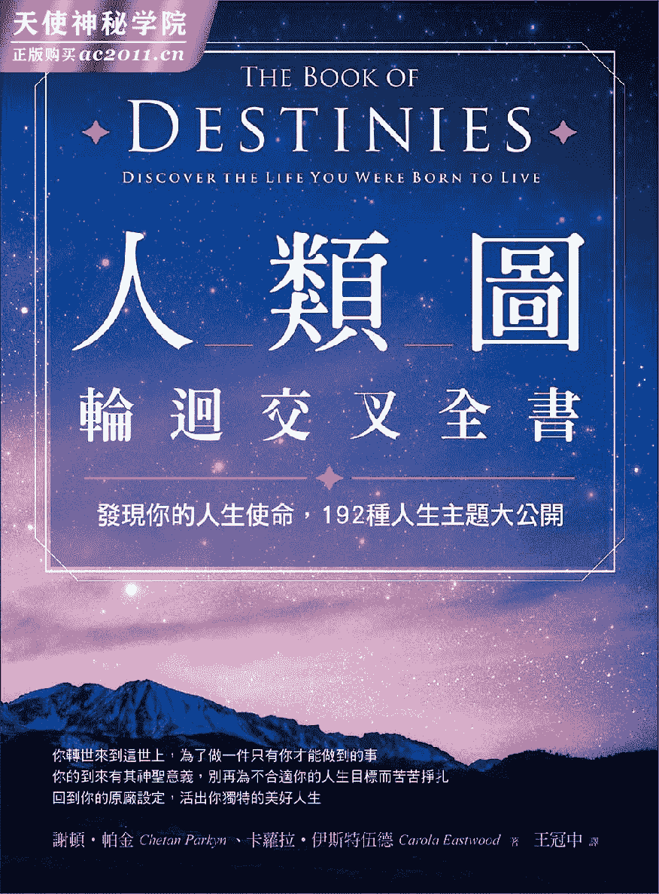
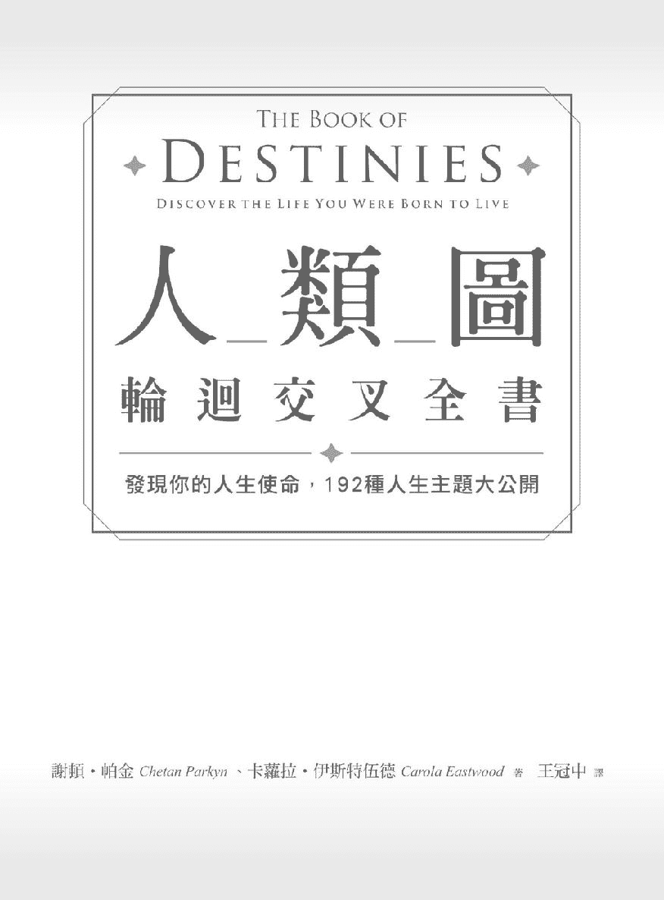
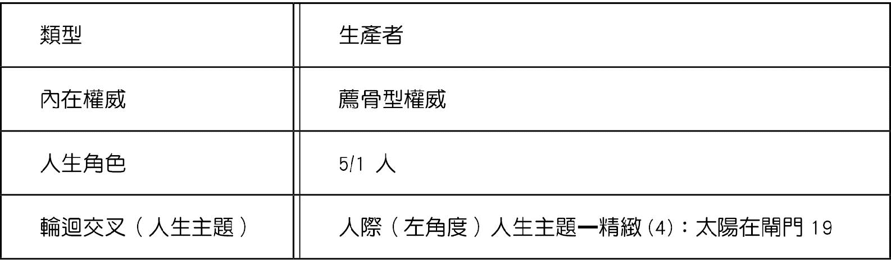
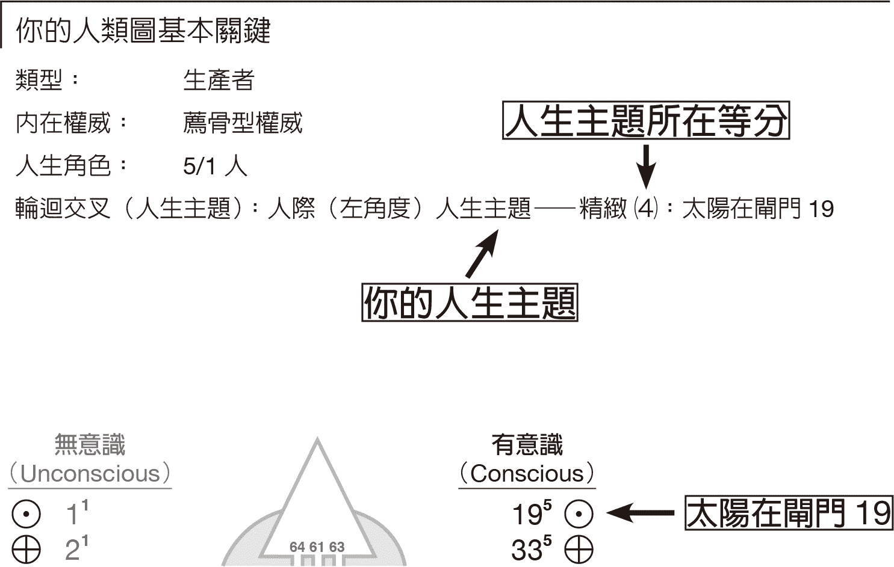
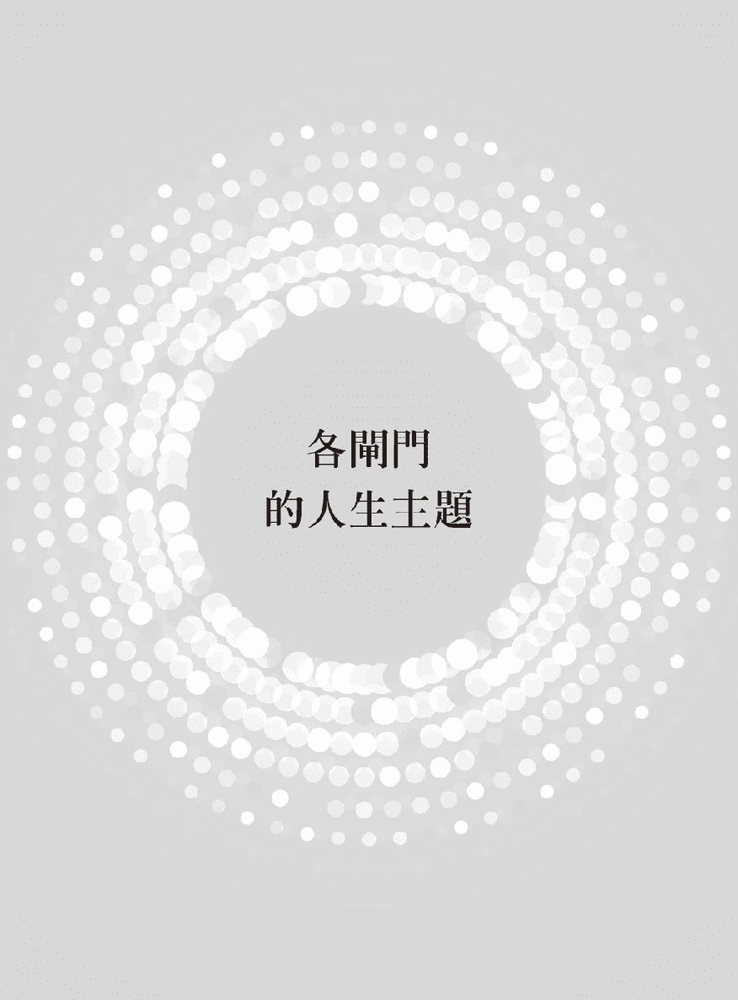

带着爱、欢笑和感恩的心谨将本书献给茹帕韦斯特布鲁克 Rupa Westbrook。

——谢顿帕金 Chetan Parkyn

带着爱和至高无上的尊敬将本书献给已故的史蒂芬鲁塞特 Stephen Rousett 感谢你为我们所有人展现的宽大胸怀以及崇高的勇气与智慧。

——卡萝拉伊斯特伍德 Carola Eastwood

每个人都带着特定的命运来到这世界—他或她都有某件事需要去实现、某项讯息需要去传递、某个课题需要去完成。你来到这世上并非意外你的到来是有意义的。你的存在身负着某种目的而整个人生就是要透过你来完成某件事情。

——奥修 OSHO

## 【推荐序】  探索我们尚未被诉说的故事

每个伟大的故事背后都有一个贯穿的主题。我们从读过的书、看过的电影、以及围在营火旁听到的故事中得知这个道理。而我们的人生—日复一日在现实中上演的人类故事—也都带有一个中心主题一个贯穿的叙事方式决定了我们是什么样的人也决定了我们要在这世界上经历什么样的存在。这就是我们注定要过的人生。

美国政治家威廉詹宁斯布莱恩 William Jennings Bryan 曾说「命运并不是机率偶然而是一种选择。命运不是等待着发生的事情而是要去实践的事情。」但如果我们知道自己是在往正确的方向前进、走在正确的道路上那么我们关键性的选择也会更有依据。而这就是《人类图轮回交叉全书》可以帮上忙的地方了。

如同这本美好的指南会说明的我们实际上总共有一百九十二种可能的「轮回交叉」或称作「人生主题」。不论我们是属于哪个主题那主题都是打从我们出生的那一刻起就和我们的特质与个性交织在一起而我们的人生就是一段自我发掘的旅程去探索我们能够如何最好地运用此主题的讯息来实践我们来到这地球上的目的。

故事都需要意义生而为人也是一样。但或早或晚大多数人都会遭遇某种程度的自我探询质问内容经常会包含这类烦恼「我是谁我在这里扮演什么角色」我也曾经历这个过程因为我强烈相信每个人生来都有其目的都有独特的方式能解开自身最大的潜能。在我人生旅程的这个阶段作为一个智慧的追寻者以及热切的人类状态研究者每当有关于我自身的新意义揭露时通常我都不太会感到意外。直到我发现了谢顿帕金博大精深的作品这也是为什么我会很乐意推荐这本讨论一百九十二个人生主题的书籍。在书中谢顿带领我们每个人去探索我们尚未被诉说的内在故事。一旦发掘了我们的人生主题它就会成为我们灵魂深处的召唤促使我们觉醒看见我们生来要实现的命运。

我很荣幸能够在二〇一四年接受谢顿一系列三部分改变人生的解读谢顿在解读中点出了我的人生主题—感染的主题—而这主题完美地描述了我。它合理解释了非常多的层面而且也呼应了我心灵上的驱动力这心灵驱动力一直是我人生中核心的一部分。让人格外惊奇的是谢顿绝对不可能知道我本质中最私密的层面然而单纯透过我的出生信息他却揭露了我内在最深处的许多面向。

同样那组信息—出生日期、时间和地点—可以引导我们每个人了解自己独特的人生主题。拜这本书所赐我们能够拜读书中洞见底蕴的每一页进行深度的探索。如果你已经读过他的第一本书《人类图找回你的原厂设定》Human Design: Discover the Person You Were Born to Be 你就会很熟悉那种发掘最深沉自我的灵光乍现时刻。彷彿在我们来到这个宇宙的那一刻同时也有一份设计图收藏到某个神祕的卷宗里而谢顿就在解读着我们的这份人生设计图。

我很幸运能将我的作品和教学扩展触及到全球数以百万计的人首先是《心灵鸡汤》Chicken Soup for the Soul 系列该系列多种语言译本合计销售逾五亿本后来还有《成功法则》The Success PRINCIPLES。我这一生都致力于赋予人们力量透过上述每一本书中罗列出的原则、策略和技巧论证我们每个人都有能力释放我们最大的潜能并达到成功与快乐。我知道谢顿也致力于达成相同的结果。如果我们想要掌握自身的成功和个人的成就满足那么了解我们的人生目的、我们的使命任务、以及我们的天赋本质就是获得我们所需策略的关键元素这点是不言而喻的。

请准备好透过这本无价的指南来认识你自己。因为一旦我们被带领进入了我们的人生主题许多事情都会变得合理且有意义一切都会步上正轨。生命的伟大奥祕又再揭开了一层面纱。

认识我或知道我作品的人或许会对这段谢顿解读我人生主题的节录有共鸣「你致力于做出贡献以造福人类而你的欲望可能会考验或强化了你这项承诺的深度??你是典型的知识传递者喜爱启发他人去关注有共鸣的才能和理念??你喜欢把让自己感到振奋的事物传递给周遭每个人??〔并且〕把信任、繁荣兴盛、共同创作、以及各式各样可能的体验传播给全世界。」没错那听起来就是在描述我

我和谢顿的交流为我带来独一无二的「心灵鸡汤」—我的人生目的突然间被译码透过简单易懂的语言摊在阳光下了。这让我得到一个必然的结论早在我出生之前我的灵魂就已经提供了完美的计划来指引我的人生旅程。

作为一名成功的教练和导师我热爱启发他人当他们的明灯为他们指引道路。而谢顿拥有成为人类图大师的伟大天赋他会引导人们了解他们最深切的核心真相让他们觉醒去觉知并信任自身的人生目的。我极力推荐他的作品以及这套强大的成功工具让它们指引你的脚步。

然而觉察我们自身的人生主题只是个开端。我们也可以欣喜地阅读我们所爱之人的人生主题这有助于我们更加了解他们并完全拥抱他们的个体性。无条件地接纳我们亲近的人同时也知道他们深切地了解并接纳我们的本质可能会把彼此的关系带到新的层次有更深刻的连结与更大的满足感。再者知道了每位家人和事业伙伴的人生主题也会带来全新层次的接纳和正向合作更进一步促进我们的成功。

有句话据说是伟大的哲学家亚里斯多德说的「认识自己是所有智慧的开端。」既然你在阅读这本书就意味着你正往进一步认识自己迈出了下一步也就是朝着智慧前进。我竭诚欢迎你踏上这趟旅程并赞扬你的成功。现在我要邀请你继续阅读下去踏进一段更伟大的故事里—你的人生故事。

——杰克坎菲尔 Jack Canfield

## 【作者序一】  被遗忘的人生主题

一九七九年我二十七岁时很幸运地在印度孟买接受一名影子解读师 Chayyashastri 的解读。当时我的人生正陷入危机在那之前我所做过的每一件事对我来说都不再有意义。这位仁慈的智者告诉我许多关于我人生的事情包括过去、现在和未来而他和我的连结引起非常深刻的共鸣永远改变了我的人生。

在此之前我一直是个机械工程师但他告诉我说我会跟他做一样的工作引导人们重回他们已经遗忘的人生。他告诉我要做好准备迎接一个新的系统进入我的生命并说我会写书把这个系统介绍给全世界永远改变人们的生命。在做完「影子解读」后不到一周有个非常有成就的印度男士跟我讲解如何看手相。在简短描述过手上的所有特征后他坚决要求我「现在就开始练习」因此我展开了为人解读的旅程。接下来几年我实验过各种我能找到的传统智慧一直期待能够找到解读师所预言的那套「系统」。

当我在一九九三年与人类图相遇很显然地人类图就是那套系统。然而我必须等到二〇〇九年也就是距离一九七九年那次解读整整三十年后我的第一本书《人类图找回你的原厂设定》才出版问世。几年后我出版了第二本书《人类图爻线全书》The Book of Lines: A 21st Century View of the IChing, the Chinese Book of Changes 而这是第三本书《人类图轮回交叉全书》。

本书中的一百九十二个人生主题二十年来历经了我和人生伴侣以及本书共同作者卡萝拉伊斯特伍德 Carola Eastwood 一同进行的十数次撰写与修改。在经历过数以千计的个人与伴侣解读加上密集的研习每隔一段时间的深度冥想以及偶尔灵光乍现的洞见都让这本书持续得到洗鍊。

一如好酒需要多年的熟成才能让每一口都值得细细品味因此我会建议大家一点一点慢慢体会你自身的人生主题。你来到这世界并非偶然。宇宙中的各种主题并不会出错。就让你的人生主题成为你的指引吧

——谢顿帕金

## 【作者序二】  听见灵魂的乐章

我在十九岁时失去了我的第一个小孩此后我开始急切地想找到我的生命意义。某年夏天我站在悬崖顶上听到从邻近敞开的窗户传来了乔治哈里逊 George Harrison 的歌曲《亲爱的上帝》My Sweet Lord 我感受到一阵平静并开始祷告。很神奇地我的祷告应验了我的心灵完全甦醒进入上帝的心中。我停留在这奇妙的喜乐之中整整三天。

我满心渴望想要教导其他人让他们也能体验灵魂意识的觉醒因此我开始研究世界宗教和古老的传统智慧。当我首次发掘占星术时为其准确度而惊叹不已。经过几年的钻研我成为专业占星顾问、专栏作家和教师。

那项经历再加上心理谘商训练成为我建构私人执业的基础。我爱我的工作并持续研究新的系统也感觉到还有我没接触过的系统可以作为我协助客户的强大工具只是我还不知道那系统是什么。

一九九八年时我遇到了人类图而我直觉地知道这就是我一直在寻找的系统。当我得知我的人类图如何运作时感到既气馁又欣喜—气馁是因为我花了这么多年的时间才遇到人类图欣喜则是因为现在我已经掌握了关系成功的关键。

我对研习人类图的追逐引领我遇见了我的灵魂伴侣谢顿当时我前往旧金山去参加他开设的课程彷彿超越了冥冥之中的命运安排我们的生命交会了不仅进入我长久以来渴望的灵魂伴侣关系同时也走进已持续将近二十年的工作伙伴关系我们一同将人类图以及这本书中的一百九十二种人生主题以简单易懂的方式介绍给世界并协助读者获得更多启发与满足的人生。

亲爱的读者这本书是为你们而写的而且我满心期待当你们在阅读自己的人生主题时也能听见自己灵魂的乐章。

——卡萝拉伊斯特伍德

## 【前言】  和你独特的命运同调

人类存在的奥义并非仅是单纯活着而是要找到活着的意义。

——俄国文学大师杜斯妥也夫斯基《卡拉马助夫兄弟们》作者

你是否曾问过自己你的人生目的是什么你是否曾经思考过你来到这世界上是要做什么以及你是否正走在完满人生的正轨上

有些人相信我们的人生并没有什么真正的目的。我们只是某个随机运作过程的一部分各种细胞群无止尽地蔓延这些细胞群不断地自行繁衍最后也只是走向必然的死亡。

还有部分人相信我们是由上帝所创造而上帝唯一的兴趣就是检视我们是不是「够听话」因为够听话的人才能进入祂的国度如果我们的表现不及格就会遭受永恒的可怕折磨而我们只有这一生的表现机会。

在上述两者的观点中人生的目标都无关成就与满足。前者是缺乏人生目的而在后者的概念中人只有死后才有机会找到满足感。

然后还有一些人相信我们有数以千计的人生可以在许多层级的意识中慢慢进化可是没有方法能加快这个过程。经过万古永世我们创造了因果业力这些业力必须要消除否则我们会困在无限的人生循环中而且我们也无能为力因为一切都操控在「神的手中」。从这个观点来看或许人生可以达到满足只是我们无力确保这件事会发生。而且这个过程需要非常、非常久的时间。

然而社会与生物科学都显示所有生物的一致驱动力就是要拥有「更多的生命活力」。对我们来说这意味着拥有更多的体验和更多的乐趣而这些全都导向更高的满足感。

我想起了我曾经搭乘巴士从英国伦敦前往尼泊尔加德满都进行横跨大陆的旅程。

在一个大满月的晚上我在加德满都和一对瑞士夫妻共进晚餐过程中我们注意到一位穿着橘色袍子的苦行僧站在门口。在印度、尼泊尔、以及部分国家有个古老的传统是追寻灵性的修行者会抛下世俗的一切到各处去大多是徒步行走走遍各处土地以获得灵性的知识和体验。他们被称为苦行僧在徒步各地的过程中通常穿着橘袍并且带着钵和杖。这位苦行僧是瑞士夫妻的友人而他也立刻被邀请来和我们一起喝杯茶。

我很快就得知这位苦行僧对生命有很深刻的研究。他在和我的瑞士友人谈论的过程中展露出高度的洞见和智慧对他们诉说着关于他们以及他们人生的各种事情。他和他们谈了非常久完全忽视了我的存在。

那过程非常迷人但由于我的没耐性所以我打断了他问他能不能谈谈关于我的事情。他转向我短暂地看了我一会儿然后说「满月生日」随即又转回去继续他和我朋友们的谈话。

当然他说的没错我确实是在满月时出生的。

似乎又过了好久的时间他持续向我的朋友们描述着各种美好和神祕的事物—关于他们的过去、现在和未来的人生。再一次我又觉得完全被忽视了。

最后在恼怒之下我再次打断了苦行僧坚持要他告诉我一些关于我的事情。而再一次他又转向我盯着我的眼睛看然后说「尊敬的先生人生有许多次而这一生是最重要的」

我必须说单单这句话就重新唤起了我内心探索的渴望也让我领悟到时间一直在流逝想要清明、临在当下并对自己的人生负责完全操之在我。「人生没有目的」以及「上帝的审判日」这几派思想全都搞错了。是否遵循这一生的经历活出完满的人生决定权仍旧在我们手中。

### 你独特的个人命运

如果人生并不是个需要解决的问题而是个奥祕需要亲自去活出来呢在那奥祕里我们被提供了一些非常独特的线索是关于我们个人生命道路的线索。显然宇宙里并没有重复的事物。没有两粒沙子是完全一样的没有两个人是完全一样的也没有两个人会过着完全相同的生活。我们有种强制机制是必须根据自身的本质来过生活。一如现代物理学近期的发现显示如果世界上所有发生的事物都纯粹是我们内在存在状态的反射那么从这个角度来看若我们没有忠于自己那就会象是透过一个扭曲的滤镜来观看人生或者是试着在走音的乐器上演奏音乐。

本书的目的是要协助你发掘自身独特的人生道路让你能和你的命运同调并且学习有创意地活着去面对生命带来的所有挑战因为深知自己是根据真实的本质在生活因而找到满足感。这本书呈现了人类图系统中很至关重要的一个层面个别描述了全部一百九十二种人生主题是搭配《人类图找回你的原厂设定》使用的书籍。你出生的时间和地点确立了关于你的某些特质其中一项就是你的人生主题也就是你人生预设的故事线。我们每个人都有着其中一种主题打从我们一出生就开始引导我们直到人生的最后一刻而了解并拥抱你的人生主题会给你带来一些强有力的线索让你知道如何让自己确实走在你的生命旅程上。然而由于你是生在非常特定的环境里其中涉及了父母、社群和环境因此几乎可以肯定的是在你的性格养成过程中你必定会习得周遭环境所呈现的信念、态度和制约。你会很自然地暴露在你所生的文化里并且吸收该文化所带来的影响与模式。你可能会被鼓励要追随父母、祖父母、教师、手足和社会的步伐或规范完全无视你内在的自然意向如此你必然会活出一个不协调的他人人生。

安养院义工布朗妮维尔 Bronnie Ware 在部落格与她的书籍《和自己说好生命里只留下不后悔的选择》The Top Five Regrets of the Dying: A Life Transformed by the Dearly Departing 中写到她陪伴即将去世者的经历他们都知道自己时候已到。布朗妮发现大多数人临死前最大的憾事可以用她一再重复听到的一句话来总结

「我多希望我能有勇气活出忠于自己的人生而不是活出别人对我的期望。」

《人类图轮回交叉全书》是设计来协助你发掘你来到这世上要过的人生。

如同神祕主义者奥修曾说的如果「人类是自然自动进化过程的终结是无意识进化的最终产物。当人类出现时意识的进化也随之展开??」。

或许这样的觉察也让耶稣说的话有了新的意义。耶稣在展现神迹后说「我所做的事信我的人也要做并且要做比这些更大的事。」约翰福音十四章十二节

如果宇宙中的所有事物都是根据宇宙法则来运作而你也被赋予了意识能够与这些法则直接互动这难道不会因此让你带有潜能和目的有能力来引导自身的意识演化

如果这样的说法是真的那么觉察到你在生命展开前所做的灵魂约定对你来说有多重要你是否活出了那个约定还是你因为别人告诉你关于人生的事情而偏离了正轨忘记了你自身的独特目的

事实上你是否曾经停下来思考过你有多么的独特以及你能够给这个世界带来什么特别的特质什么是你天生得心应手能够自然表露的呢

就如同书本里的故事情节或一部电影的主题音乐你的整个人生也有着一个独特、一致且能识别的潜流。那就是你的人生主题是你的旋律是你在生命这首交响曲中的一个部分而且只能由你来演奏。

了解并且接纳你独特的人生主题确实会带来转变。体现这项觉察能让你对自己的人生目的感到安心与清明。就像一枚钱币掉落到地上或是灯泡亮起你会在一瞬间「豁然开朗」。你不再需要面对他人错置的预期也不再需要疑惑为何他人的人生轨道和你全然不同因为你会了解到那个默默推动着我们每个人经历人生的祕密要素也会了解到要如何直接触及自我实现的源头。

就像你的基因编码一样你的人生主题和你的整个存在是和谐共振的不论是在身体上、心智上、情感上或心灵层面上皆然。当你的觉知和你的人生主题同步时你会发现自己能够完全自然地拥抱那主题。你会终于了解你的人生目的和旅程而一旦你知道了自己的人生主题你也会着迷于了解你生命中其他人的人生主题。这份知识能扩展你的认同和赏识去接纳并引导周遭他人的独特主题形式。没有所谓的「好」主题也没有「坏」主题。每个主题都只是生命乐章中不同的段落。

### 如何确定你的人生主题

要确定你的人生主题编按在人类图官方系统中称为「轮回交叉」透过计算即能找出你出生当下太阳相对于地球的位置关于这部分细节会在后面「人生主题如何形成」中详述。换句话说你只需要知道你的出生日期和出生地点最理想的是可以知道确切的出生时间。

要做计算很简单交给我们就可以了。有了你的出生信息然后造访我们的网站[www.humandesignforusall.com](http://www.humandesignforusall.com "Get Your Human Design Chart - Human Design for Us All")即可。在网站首页有个免费报告的连结这份报告会透过电子邮件寄送给你。或者你也可以使用智能型手机和平板应用程序 app 或是透过人生主题计算器 Life Theme Calculator 来做计算更多细节请参考我们的网站[www.humandesignforusall.com](http://www.humandesignforusall.com "Get Your Human Design Chart - Human Design for Us All")。

你的报告里会包含一份完整的人类图本命图这份图表会点出各项「关键」也就是你活出成功人生的个人密码。这些关键信息包括你的「类型」、「内在权威」、「人生角色」和「人生主题」。这四个项目都提供了关键的信息需要被放在一起来考量。《人类图轮回交叉全书》专门描述全部一百九十二种人生主题而《人类图找回你的原厂设定》则是讨论另外三个项目。后面我们也会稍微看一下这另外三个项目我们的网站上也有相关信息。

由于你的人生主题贯穿了你的整个存在赋予关于你人生的重要意义与目的因此它是个极为重要的「关键」。

请注意若你不清楚自己确切的出生时间你还是能知道正确的人生主题。在我们的网站上在「出生时间」栏位填入你出生当天的正午时间即可。在大多数情况下这是可以取得正确人生主题的且会在你内心有很深的共鸣。若是你后来得知了自己确切的出生时间你可以再次取得一份免费的人类图本命图重新检视计算的结果。

得知确切出生时间的方式就是去申请一份你的出生证明。译注在台湾各地的户政事务所均可申请无须回到户籍地申请。

父母或亲戚也可能会记得你的出生时间或者有做纪录但不要只依靠记忆。我们发现母亲不一定都会正确地记得小孩的出生时间。

### 解密你的人类图本命图

你的免费人类图本命图会包含许多信息看起来会像下面这个范例

你的人类图基本关键

在本命图底下有四个项目列出了你的类型、内在权威、人生角色和轮回交叉人生主题。如同前面所说的《人类图找回你的原厂设定》里会完整详细地说明类型、内在权威和人生角色以及其他元素本书则主要是关于你的轮回交叉人生主题。人生主题的名称包含了该主题的类别个人〔右角度〕、固定〔并列〕或人际〔左角度〕、太阳闸门所属的等分括号内数字、该闸门数字以及根据太阳的位置就该主题所做的描述。

在下方的范例中人生主题的名称包括了描述性的标题「精致」和类别「人际」。人生主题有三个类别「个人」右角度、「固定」并列以及「人际」左角度。你会在后面看到每个「个人」人生主题都有四种变化每个「人际」人生主题有两种变化而每个「固定」人生主题则只会出现一次。括号内的数字(4)是太阳在天空中的位置所属的等分。太阳的符号是☉地球的符号则是⊕。

尽管其他的数字也会影响你的人生主题但你可以忽视那些数字只聚焦在你的太阳所在的闸门位置即可。要找出你的人生主题只要确认你的太阳所在的闸门位置—在前一页的范例太阳是在闸门 19—然后再确认你的人生主题所属的「分组」或「类别」个人、固定或人际。以下是人生主题信息呈现在目录的样貌

######  人际人生主题—精致  ⑷

闸门右上角的上标数字从 1 到 6 指的是其在《易经》卦象中的爻线位置《易经》卦象也就相对于人类图的六十四个闸门。

三百八十四条爻线的完整描述收录在我的第二本书《人类图爻线全书》中。

### 三种类别的人生主题

人类的六十四个遗传密码也相对应于六十四个太阳闸门的位置而且每个太阳闸门都有三种人生主题「个人」右角度、「固定」并列和「人际」左角度。

如果你是属于「个人」人生主题你就是走在自我探索的旅程上你追求亲身的经历去探索生命带给你的多元有趣事物。你会打破新的关系连结不一定会察觉到你的行动对他人造成影响所带来的意涵不论是在过去、现在或未来的事件中皆然。每个个人人生主题会在一年当中以同样的间隔出现四次每次间隔三个月。因此在这本书中每个个人人生主题都会有四种变化。由于相同人生主题的每个版本都有一些相同的信息因此这些资料每次都会提及以方便读者阅读。

如果你碰巧拥有非常罕见的「固定」人生主题那么你就拥有人类体验中一个非常独特的特质。你在人生中有个非常明确且固定的轨迹而且必须维持在那轨迹上。在一个充满「忠告」的世界里—充满各种惯例和规范、教条和信念—很重要的是这些拥有固定人生主题的少数人必须要了解其特质一切以其为优先无论如何都要忠于该主题。六十四个固定人生主题每个主题每年都只会出现不到两小时的时间因此固定人生主题是非常特别而且非常罕见的。

拥有「人际」人生主题的人扮演的是监督他人的角色给予他人领导与教育或是在他人的事务里担起权威的职责。你经常在帮他人善后并且担负起责任你可能很乐意这么做因为显然这对你来说是很容易且自然的或者你可能百般不愿意因为没有人有资格做这件事。你天生的角色就是担任向导、指路者、老师、有智慧的顾问、或是负责向他人提出建议的领导者。每个人际人生主题每年会出现两次每次间隔六个月。因此每个人际人生主题的两种变化都会出现在这本书中。由于相同人生主题的每个版本都有一些相同的信息因此这些资料每次都会提及以方便读者阅读。

必须了解的是没有哪个人生主题比其他主题更好或更重要。然而在全球人口当中个人人生主题出现的频率会比人际人生主题高而固定人生主题则罕见许多。

关键在于去欣赏你的人生主题是如此独特且精确。一旦你全然拥抱你的人生主题你自然会放弃去抗拒和做无谓的纠结。接纳并沉浸在你的人生主题特质里将会引导你毫不费力地轻松拥抱你独特的人生旅程。一旦你找到了你的人生主题那就静静地与它相伴。

对于过去二十年来曾由我们提供个人解读或指导的许多人来说当他们第一次听到关于他们的人生主题时都有很深刻的认同感。我们的客户经常会流下泪水—认同的泪水、宽心慰藉的泪水因为他们终于对他们心中和他们的世界里那股长久以来的渴望有了明确的描述。

### 人类图本命图的五种类型

在人类图系统里本命图区分为五种「类型」编按在人类图官方系统中只分成四种类型显示生产者并入生产者类型之中。这些类型是根据图表中哪些特定的部分有定义有颜色以及哪些部分无定义无颜色来区分。你的类型基本上就是对你整体本质的描述也是你能轻松连结并运用能量来活出自我人生的方式。没有哪个类型是比较好的而所有的类型在我的另一本书《人类图找回你的原厂设定》里都有更为完整的描述。

这五个类型如下显示者 Manifestor、生产者 Generator、显示生产者 Manifesting Generator、投射者 Projector 和反映者 Reflector。

##### 显示者

如果你的生命图表是属于显示者那么你的人生就是关于活动不论是你本身的行动或者是推动他人去采取行动由于你天生拥有充沛的能量能在你周遭的世界里催化各种活动因此你呈现出的生命是持续朝着你的意向前进。

身为显示者你能够持续取用格外强大的驱动力藉此创造结果。而当你将他人纳入你的创造中你会启发一个相互支持合作的团队。然而你的行动可能非常迅速以致你会发现你远远超越每个人经常还承担了别人的工作和责任只是为了「把事情完成」。而且当你把大家抛在后头你可能会发现他们开始对你有所埋怨。当你对他人缺乏速度和产能感到不耐烦并且选择接手他们的责任你就会疏离了那些可能会对你的努力有所助益的人。

你可能已经注意到了对于你的发起能力其他人可能默默在担忧、甚至恐惧着—为何你能推动事情他们却做不到。他们可能会心怀忧虑担心你可能发起某件事完全改变了他们的生活而且是他们不会喜欢的改变。他们甚至可能会更进一步去阻挡你的一举一动造成你可能必须强行穿越把你所有的能量都用来避开他们或者更糟的是你屈服成为替他们个人服务的显示者为他们做所有的事情而不是为你自己做事。

当他人对于你接下来要做什么有不确定感时你可以给予他们一些信息让他们知道你的打算如此一来你会发现他们不仅不再阻挡你甚至还可能突然很热切地想要协助你。在一个显示者身边是有很多乐趣的谁知道接下来会发生什么呢

##### 生产者

如果你的本命图是生产者类型那么你拥有的是最单纯的运作你是「设计来做出回应的」—对生命带给你的所有事物做出回应然后投入你强大的能量。这个回应是来自你的下腹部亦即你的荐骨中心因此可以被描述为「腹部的回应」。所有生产者的本命图都有这个与生俱来的荐骨回应然而这未必会自动成为他们的内在权威或做决定的过程如后面的描述。荐骨的回应有两种可能性你的回应是从下腹部升起一股能量一种活力满满的「OK」或「好的」讯号去承诺投入事物中或者你也可能感觉下腹部的能量降低能量上「不 OK」暗示着「现在不行」。当你出现「现在不行」的讯号时就别去投入至少暂时不要。如果你身体内完全没有推动的能量那就不要牵扯到事物当中。

你有明确的荐骨中心持续在产生生命能量而此能量也总是能被你取用等着正确的事物到来引发那个「好」的腹部回应。这股不可思议的生产者能量一旦投入到事物里便不会停止。只要你做出承诺这股动能就会带领你前进。一旦投入后要放弃并不容易。要记得遵循你腹部的回应这回应会随时随地告诉你什么人和什么事物跟你有共鸣以及什么人和什么事物跟你是没有共鸣的。

要是你无视你内在「腹部回应」的引导系统任由自己对任何人或任何事物做出承诺你很可能会变得筋疲力竭对一切都感到不满。要是你没能遵循你的内在指引别人可能就会来占你便宜取用你那看似永无止尽的能量。你可能会发现自己在不知不觉中同意了他们愿意用你巨大的能量来为他们做任何事。

由于我们都被训练成使用我们的头脑来做决定因此若要能精通善用你天生自然的运作方式就必须要有所觉察并且反覆练习。在做决定时将你的觉察意识从头脑转移到下腹部的位置就是你最关键需要练习的功课。

实际上就像听起来那么简单只要信任你的腹部回应就能够转变你的人生。

##### 显示生产者

如果你的本命图是属于显示生产者类型你会拥有一股蠢蠢欲动的能量经常等不及要投入事物当中—任何事物皆可尤其当你没事情做的时候更是如此。你不喜欢停滞和限制。在人类图的五种类型里你的类型运作或许是最复杂的你可能需要花一些时间才能掌握自身的运作。然而一旦你了解自己独特的生命运作方式你会惊讶地发现要在每个行动中得到满足是多么的容易。因为太阳地球位置的缘故有一些人生主题会自然形成显示生产者类型。

和生产者类型一样你也拥有下腹部的回应可能是能量上扬的「OK」抑或能量下降的「不 OK」或「现在不行」。先留意你的腹部回应然后才把自己的巨大能量投入到事物里是很重要的尤其要注意「现在不行」的讯号。信任这些回应并且等待你的下一个回应。你天生的特质比较急躁所以你可能会在取得内在回应的「同意」前就率先去发起了。然而缺乏清晰回应的操之过急可能会给你和周遭人带来失望甚至带来严重的后果。

在做决定时你有两个步骤去获得清明。首先如果你得到了「OK」的回应那是给你一个「提醒」显示你被激起了一定的兴趣你现在有潜能去投入那个引发你回应的事物。这只是第一步。这个回应会带来想要朝向引发回应事物前进的冲动。而当你做出第二步你会感受到你是否准备好要将能量上的回应转化为完整的发起行动。你可能会需要经历第二步骤数次每次都去检视是否要更进一步。而在行动当中会出现所谓的「决定性时刻」在这些时刻里你会感受到自己是否要更进一步去发起或者要退一步不再投入。那感觉有点象是恍然大悟的「我明白了」时刻你纯粹「确认了能够前进」而你也确实清楚知道这点。

对于看着你运作并且预期你会完全投入一项行动的人来说这个过程可能会让他们很困惑因为你实际上还在测试状态而且随时可能退出进一步的投入。然而一旦你投入了某个人、事、物你会像一阵旋风般完成各种事情同时也感染每个人一起动起来。

尽管你有着充沛的能量在其他人都出现疲态后你仍能轻易地持续很长一段时间但要小心别预期别人也能跟上你的步调。你有能力取用自身的荐骨生命能量那是一个几乎取之不尽、用之不竭的能量来源若你遵循自身自然的运作方式你便能活出喜乐满足的状态而那自然的运作方式就是回应与测试唯有获得清明时才全然投入。

##### 投射者

如果你的本命图是属于投射者类型你就拥有成为引导者的潜能可引领他人校准他们的人生。从数据上来看投射者属于少数族群约占世界人口的 20%他们被显示者、生产者和显示生产者所围绕这三个类型都有充沛的能量能够长时间投入事物当中。而投射者很难和这些「能量类型」一样投入相同程度的能量。即使他们亟欲这么做投射者天生的运作仍是非常不同的。就如美国前总统欧巴马和肯尼迪、以及其他人所适切展现的投射者的设计并不意味着他们无法达成伟大的成就而是意味着他们要有所成就的方式是不同的。

身为投射者你活在一个赏识和邀请的环境里。当一项邀请来到你面前不管是直接或间接的邀请你都能感受到自己是受到召唤来投入其中并且唯有你才能够分辨自己是否对这项邀请有共鸣。

如果你对这项邀请或召唤有共鸣那么你个人的内在权威将会指示你是否要去投入。没有获得清明就跳入一个情境里可能会让你感到格格不入、不受赏识和感激、甚至被拒绝。

在你了解你的类型之前你可能会发现自己是如此渴望被赏识以至于你会催促自己去发起各种事情而这必然会导致你遭遇到困境。透过等待邀请与正确的召唤你会自然地靠近正确的体验将人们、地点和活动以有益的方式连结在一起而你也藉此提供自己天生独特的指引。由于你缺乏源源不断的能量无法很长时间处于活跃状态而且由于你能够置身他人能量漩涡之外去观察因此最适合你的情况是你受到召唤来提供你的指引和有智慧的协助。安于旁观或者乐于将你的焦点在各个情境之间移转对你来说是一项资产让你有机会将自身的能量和专注力投入在真正需要的地方。

##### 反映者

如果你的本命图是属于反映者类型你是世界上最具包容力的人之一。透过你的接纳能力你有潜能成为智者中最有智慧的人。你所经历的人生是在反映你的环境和周遭的人们。你就像一面镜子把他人的特质反照回去给他们让他们能够非常清楚地看见自己通常那种感觉就象是他们第一次认识自己。由于你是如此地开放、包容和接纳因此也存在巨大的脆弱性特别是当你被告知要和周遭所有人有相同的行为举止时。反映者占全球人口不到 1%因此务必要很清楚你是要来活出非常不同的生命型态的。

你经常会在你所处的环境里感受到被其他人忽略的事物。你甚至可能吸收他人的想法、感觉、动机、想望、发起和其他事物而且你可能很容易就会被他人内在的感受给淹没一不小心这些感受就会成了你的感受。每天找一些时间独处有助于你保持清明并且不受他人影响同时也要花一些时间积极地释放那些淹没你的人、事、物这点非常重要。

作为地球上最敏感的族群之一你很可能一辈子都受到误解因为你天生就是会把各种人、事、物反照回去给他们。尽管大家可能都很想要你来为他们的人生挹注智慧但很重要的是你一定要设下底线。这些界线肯定涉及你的生活情况很可能也涉及到任何工作环境。如果可能你需要有自己的房间而且最好是在房子里有一方自己的区域不要住在公寓大楼或太接近他人能量场的影响范围。

当你每天给自己一些时间去反思你的体验你会发现你的一天充满了许多极富意义与真实的宝藏。这些宝藏成了你的智慧之库尔后你也能将这些智慧传递给世界以及前来寻求的人。这是个体现强大耐心的一生并在其中领悟到你的内在是和生命同调的你能够信任生命所带给你的所有事物。这并不是说你无能为力而是要去认知到玫瑰的脆弱—如果没有受到保护玫瑰很容易便会被踏碎然而当玫瑰受到珍惜、滋养和保护其内在将蕴含无法言喻的美。

### 六种权威

当我们谈到人类图里的「权威」我们指的是每个人与生俱来的做决定过程。或许我们能够了解关于自己最重要的部分那就是如何在任何情境下做出对自己行得通的决定。在你的设计里就内建了这样的工具只要你持续去运用这个工具你的整个人生就会出现正向且有益的改变。人类图系统里有六个不同的权威而我们每个人都拥有其中一种权威来引导我们的人生。了解自身的权威是非常重要的而了解他人的权威也能带来启发。

##### 情绪型权威

只要本命图里的情绪中心是有定义的有颜色那么此人做决定的过程就和情绪密切交织。我们都知道情绪会上下起伏在兴奋狂喜以及沮丧绝望的两极之间摆荡。大多数人从没觉察该如何评估自身的情绪因此会有因冲动或制约而采取行动的倾向而非找到情绪上的清明后再做决定这些人也因此吃尽了苦头。情绪清明意指找到一个不受结果左右的平静点这个平静点不会受到预测结果带来的「高点」和「低点」所拉扯而是坚定地投入整个过程超越了所谓的「结果」。地球上有几乎半数的人是属于情绪型权威因此就算你个人并不是情绪型权威但你和周遭许多人的关系与互动过程仍会涉及找到情绪清明因为情绪会压倒几乎所有其他做决定的过程。

##### 荐骨型权威

如果你的情绪中心是没有定义的无颜色但你的荐骨中心有定义有颜色你就属于荐骨型权威。这个权威所属的能量中心是生产者和显示生产者这两种类型的核心。荐骨中心是个强大的能量中心持续产生生命动能需要去寻找能量的出口。荐骨权威做决定的过程纯粹是一种下腹部的直观回应。腹部的回应是一种实际的能量移动对某个人、事、物的能量上扬表示「OK」的回应而能量下滑则表示「现在不行」的回应。荐骨可能发出类似「嗯」或「嗯哼」之类的声音。因为荐骨能量一旦投入了就很难停下来因此荐骨型权威的人必须时时觉察并运用荐骨回应这点非常重要。

##### 直觉型权威

如果你的情绪中心和荐骨中心都没有定义无颜色而你的脾中心是有定义的有颜色那么你就属于直觉型权威这是所有权威里做决定时速度最快的你在一瞬间就能完成对情境的评估在别人讲完话之前就能总结出对方要讲什么在正确的情境下你已准备好要立即采取行动或者停下动作。直觉型权威的运作是透过品味与真实的食物有关但也跟环境与人有关可检视环境或人是否有品味、直觉声音的世界包含听得见和听不见的频率以及本能包含我们的嗅觉以及相关的细胞记忆但也包含无法用逻辑描述的预感。每个感官都让你能立即觉察你所处的环境或情景。

##### 意志型权威

如果你的情绪中心、荐骨中心和脾中心都没有定义无颜色而你的心脏中心是有定义的有颜色并且透过有定义的通道连结到喉咙中心那么你就属于这个非常独特的意志型权威而这也决定了「你要的事物就是需要发生的事物」。这是个显示者的设计暗示你是各种意志活动的催化者而最重要的部分在于你内心非常清楚你要的是什么。当你忠于自身的权威你会发现这权威不仅为你服务也服务他人不管他人当下是否心存感激。

##### 自我型权威

如果你的情绪中心、荐骨中心和脾中心是没有定义的无颜色而你的自我能量中心是有定义的有颜色而且你的心脏中心不论有无定义并未透过有定义的通道连结到喉咙中心那么你就是属于自我型权威这是最个人也可能是最敏感的权威型态。自我型权威会有来自你胸口中央的确认讯息给你一种是否要开放去投入某个人、事、物的感受能力。你是属于投射者的设计在邀请的环境中运作包含给予邀请与接受邀请因此辨别你被吸引要投入某事物便纯粹是种个人的体验。被他人催促或逼迫对你来说是行不通的因为你的决定必须来自你自身的清明你需要信任这个个人的内在指引。

##### 外在型权威

如果你是属于反映者类型或者你的喉咙中心连结到心智中心而且或者你的心智中心连结到你的头顶中心但你其他的能量中心都没有定义你就是属于外在型权威。你会察觉到自己是个有同理心的人能够接收到周遭每个人的感觉、恐惧和意图。很重要的是你需要给自己时间和空间找到自己的清明而这需透过有耐心的反思过程来达成。在做重大决定时建议你至少要用一个月的时间来感受各个层面最后才做出确定的结论。你会发现如果你有耐心地去观察和清楚的探寻你将成为地球上最有智慧的人之一。

### 十二种人生角色

有十二种人生角色呈现出人类图本命图中有意识和无意识太阳和地球闸门爻线之间的组合爻线就是闸门数字旁的上标数字。在《人类图找回你的原厂设定》中有对人生角色的详尽描述。以下是对六条爻线的个别简短说明。

##### 1 爻

1 爻必须要认同他们的人生、活出他们的人生、实际成为他们的人生。他们寻求完整的实体身分认同并深植其中。因此养狗的人便真的会表现出像狗一样的性格。他们受吸引而成为植物、树木、情人、艺术品、计算机、疗愈物品、电影、另一个人。

##### 2 爻

2 爻受到「自然的事物」吸引。他们总是在寻找玩乐的而且本质上有趣的事物。他们会倾向忽略所有的事物除非他们看见那事物带有某种自然的特质。2 爻可能极为天真、易受骗同时也非常优秀杰出但要是他们被占便宜、被打扰、或因为看起来很纯真而受到嘲笑他们会感到不悦、甚至愤怒。他们倾向寻求新的信息和教育。

##### 3 爻

3 爻必须去尝试、去实作、去实验。就算所有的情况都说「不行」他们还是会坚持继续尝试有时候甚至是和各种极其不利的情境对峙挑战极限到了一种顽固的地步。他们可以被看作是格格不入的人需要找到自己的逃生路线—能够给予他们一扇总是敞开的大门的任何承诺。但他们会碰巧遇到很惊奇的发现、创新和突变。

##### 4 爻

4 爻热爱生命深深爱着生命他们有影响力能够把他人聚在一起而且他们会持续这么做。然而一旦他们的信任遭到背叛他们就会变得敷衍、卑劣、抽离、疏远、防备和脆弱。4 爻需要一再被提醒去对生命敞开心房。

##### 5 爻

5 爻持续将所有事物概念化有潜能成为伟大的领导者和指引者。据称宇宙是心智的延伸而 5 爻能够扩大概念的界线。然而他们需要经常检视与现实的连结否则他们就会活在一个对其潜能做投射的能量场里。

##### 6 爻

6 爻总是觉得身负重任因为他们比其他人对生命更有洞见不论他们是否想要这样的能力。6 爻可能需要抽离时时受召唤的情况但他们又会被吸引回来担起责任因为他们在这方面是天生的专家。他们周遭围绕着各种对他们的期望而他们必须学习放掉任何持续的义务感。

##### 爻线结合形成各种人生角色

如同先前所说的人生角色乃是结合了有意识与无意识的爻线数字因此举例来说 1/3 人生角色就是结合了有意识的 1 爻态度和无意识的 3 爻特质。

在十二种人生角色里有七个是属于「个人」右角度人生角色对应个人人生主题 1/3、1/4、2/4、2/5、3/5、3/6、4/6。

有一个是「固定」并列人生角色对应固定人生主题 4/1。

还有四个是「人际」左角度人生角色对应人际人生主题 5/1、5/2、6/2 和。

### 人生主题的四个等分

根据一年当中每个时间点太阳相对于地球在天空中的位置一百九十二个人生主题均分为四个等分或四个象限。四个等分的名称分别为(1)起始、(2)文明、(3)二元性、(4)突变。

在我们出生当下太阳所在的天空位置就是我们的设计中接收到 70%能量的部分。你的本命图中「有意识的太阳」所在的等分也决定了你这一生背后的驱动力。

1\. 如果你有意识的太阳位于「起始等分」那么你就是一个「起始者」总是站在最前线让事情起步开启新的想法、风格、企划、研究、提案和体验追逐新的知识、感觉和潜能。

2\. 如果你的人生主题落在「文明等分」你会协助开启并建立沟通管道让人们能够更好地彼此连结。这会透过建筑、音乐、写作、演讲、交际、农业、艺术、旅游、教学和许多其他方式来进行而你对于人们互动和合作的方式接受力是很强的。

3\. 如果你的人生主题落在「二元性等分」你会探索各种可以想到的方式来促进成长或改善。你可能会质疑男性和女性活出其人生的各种方式以及其他的二元性观点你的注意力会被人生的强韧与脆弱、健康与福祉、安全议题所吸引并且最终去质问我们生而为人来到这世界上要做什么。

4\. 如果你的人生主题落在「突变等分」你就是在改变与转换的前线。你观看着生命透过创意演化的推进而成长与扩张有时这会是你直接介入的结果有时你则是很惊奇地观察着周遭生命扭转成为新的形式。

每个等分的开始都是某个版本的个人人生主题—方向 Direction 也就是「人面狮身」the Sphinx 为接下来的一季定调。

每个等分的结尾可能是人际人生主题—体现 Incarnation 或人际人生主题—精致 Refinement。

每个人生主题都与其中一个等分有直接连结除了人际人生主题—体现和精致以及固定人生主题—合理化 Rationalization、隐遁 Retreat、警觉 Alertness 和需求 Need 这些主题都跨越两个等分。

### 人生主题如何形成

一百九十二个人生主题有时会被称为「轮回交叉」ncarnation Crosses 因为它是由你出生当下或某个特定事件形成的当下天空中的四个点所组成。当这四个点透过一个轮圈连结起来就代表我们周遭的天空而它看起来就象是十字形交叉。这四个点是由特定的「出生时刻」太阳和地球的位置太阳和地球正好在相对的两边以及出生前太阳运行轨迹回推八十八度角的太阳与地球位置大约出生前三个月这四个点所组成。因此这个「十字交叉」的角度就是八十八度角编按而非九十度直角。

随着太阳看起来一年四季绕着我们旋转它也会逐一经过各个人生主题从个人主题移动到固定主题再到人际主题然后再回到个人主题如此不断地循环。

出生当下太阳的位置代表一个本命图里 70%可取用的能量因此我们将每个人生主题以太阳位置以及相关卦象闸门的名称或关联来命名。在人生主题中有意识太阳的位置带着此生有意识的意图而出生前八十八度角太阳和地球的位置则带着人生主题中无意识的基因层面。每个人生主题都融合了有意识和无意识的特质。

你的人生主题这一生都会跟随你默默地提醒着你的专注力、才能和天赋在什么地方能有最好的发挥。从客观的角度来看你的人生主题是最好的—它就是如此你越放轻松去接纳它它就越能为你服务带领你经历你的人生旅程。

在大部分的人生主题里会列出部分拥有该人生主题的名人以及重大事件。由于固定人生主题非常罕见因此我们只能找到极少数拥有固定人生主题的名人。如果你知道其他有这些罕见人生主题的人也欢迎跟我们分享。

# 1

个人人生主题

The Personal Life Theme of

DIRECTION (THE SPHINX) (4)

##### 太阳在闸门 1

### 方向人面狮身 4

方向是你的人生目的不论你是在为自己找方向还是在为他人指引方向。许多人会将你视为灯塔让人们能够判定自身的方向。有时你会发现自己指向一个违反常理的方向但如果你是忠于自己、忠于自身创意动能的那么那个方向就会是正确的。在我们的星球上埃及的人面狮身象征着已被遗忘的古老指引力量它仍旧持续神祕地指向某种比我们更伟大的事物。而在你身体内的某处你还记得这股指引力量。

要留意的是虽然你有能力为他人指引方向但并非理所当然表示你就必须领导这些人也不意味着你有责任或义务要带领他人度过他们的人生即使你是做得到的。如果你发现自己过度施惠他人而且要持续不断协助他人找到他们的道路那你可能需要重新思考这些关系是否真的健康。为他人指出方向然后鼓励他们运用自身的能力投入其中会是最好的做法。最终每个人都要为自己的人生旅程负责要是你忘了这一点可能会让你陷入一次又一次偏离正轨的状况。

你的意识太阳在闸门 1 因此你会以创意的方式表达自己可能是透过与生俱来的艺术天赋或者是为周遭的世界提供更具创意的指引。你总是以新奇且创意的方式与生命互动。不论你是用较隐晦巧妙的方式提供指引或是以明显深思熟虑的准确性来给予方向那些前来找你寻求指引的人都会得到别出心裁的指示知道要如何前进。走较少人走过的路是你的做法虽然你期望每个人都能够自动理解关于你的这个面向但你也有能力去说明你这么做的目的和理由。要记得你的类型和内在权威总是会让你知道哪些人和情况值得你的指引。

###### 此人生主题的名人

美国女演员莎莉菲尔德 Sally Field

美国男演员伊森霍克 Ethan Hawke

美国女演员、记者兼作家玛丽亚施赖弗 Maria Shriver

法国物理学家、化学家玛丽居礼 Marie Curie

美国女演员艾玛史东 Emma Stone

固定人生主题

The Fixed Life Theme of

CREATIVE SELF-EXPRESSION (4)

##### 太阳在闸门 1

### 创意的自我表达 4

你的人生主题就像河流从你体内流过催促你持续不断地传递出创意的自我表达。你透过关注源源不断的创造力来源驱策自己表达自我而不去在意他人和周遭环境。你倾向不断告诉每个人你所知道的事情通常不会理会他人真正的需求和兴趣也不会理会他人是否有能力理解你。这个倾向可能会惹恼他人因为那排山倒海而来的知识量不管和他们的人生是否有关联都会让他们无法招架。

别人可能会请你安静或者请你至少要克制住在口头上对人生做评论所以你会转而透过其他的途径来表达自己可能是透过艺术、写作或音乐等。你随时随地都在寻找方式来阐明人生能够如何拓展进而带来可能的改善。你有独特的方式与生命连结而且你能察觉到许多不同面向以及创意的可能性。若没有你来指出这些层面别人是完全无法察觉到的。

你会体悟到独处时间可以让你不受干扰地深入探索你体内的创意能量。其他时候你会刻意寻找伙伴向他们点出你所领会到的事情。有时你会发现你的伙伴无法和你一样理解这件事在恼怒之余你会再次退回到独处状态。当你了解到所有的表达都有完美的时机并且就此对你的互动模式做出调整你会看到自己轻易且有创意地转变了他人的人生同时给他们带来很大的助益。当你信任自身的类型和内在权威你会体悟到你所有的创意追逐和表达都有正确的时机。你会学习到如何让你的人生达到最高的效率与满足。

人际人生主题

The Interpersonal Life Theme of

DEFIANCE (4)

##### 太阳在闸门 1

### 反抗 4

你的人生主题是要反抗当前你生命中所面临的事物状态去找到另一个或许是更高的层次或者就算不是更高层次也至少要是不同的道路。对于生命中任何你认为需要重新导向的事物你都会采用你能找到的论据和原则来扭转其情势。与其透过你的心智或你的情绪来勉强寻求满足感当你允许自己与更高的自我有深刻的内在连结并且由你内在深处本能知道是正确的事情来推动你你就会取得成功。

你的整个生命旅程都涉及了打破过时的「现状」以及不适当的生活方式让你能自由地向周遭的世界引介并鼓励真诚性。你会和那些遵从并实践你的卓越理念的人结为朋友也会欣赏那些愿意透过你的创意概念来拓展自身视野的人。在此同时你会悄悄地远离那些不认同你的转变之道的人即使这些人非常想要得到你的关注。

你的意识太阳在闸门 1 因此如果有人想要寻找不同的做事方式来找你就对了这并不是说你一定要唱反调而是你更尊重生命所带来的各种变量。你并不适合纯粹去跟随大家的步伐用「预期」或者「政治正确」的方式来做事情。你只会勉强配合一阵子尤其是有人逼迫你要有特定的行为举止时你大概只会短暂地勉强配合然后你就会跑掉去做自己的事情就好像什么事都没发生过一样。你非常尊重坚守自身真理的人而这些人也可能会因为你的支持、指引和创意观点而受益而且你也会寻找各种方式来为他们提供你的贡献。人们通常会想要和你有所交流或者至少一窥你打算要做什么。而你的类型和内在权威总是会让你知道哪些人和哪些事在此生对你是重要的。

###### 此人生主题的名人与重要事件

俄国作家费奥多尔杜斯妥也夫斯基 Fyodor Dostoyevsky

美国女演员布兰妮墨菲 Brittany Murphy

美国男演员李奥纳多狄卡皮欧 Leonardo DiCaprio

美国乡村音乐创作歌手米兰达蓝珀特 Miranda Lambert

柏林围墙倒塌

# 2

个人人生主题

The Personal Life Theme of

DIRECTION (THE SPHINX) (2)

##### 太阳在闸门 2

### 方向人面狮身 2

方向是你的人生目的不论你是在为自己找方向还是在为他人指引方向。许多人会将你视为灯塔让人们能够判定自身的方向。有时你会发现自己指向一个违反常理的方向但如果你是忠于自己、忠于自身创意动能的那么那个方向就会是正确的。在我们的星球上埃及的人面狮身象征着已被遗忘的古老指引力量它仍旧持续神祕地指向某种比我们更伟大的事物。而在你身体内的某处你还记得这股指引力量。

要留意的是虽然你有能力为他人指引方向但并非理所当然代表你就必须领导这些人也不意味着你有责任或义务要带领他人度过他们的人生即使你是做得到的。如果你发现自己过度施惠他人而且要持续不断协助他人找到他们的道路那你可能需要重新思考这些关系是否真的健康。为他人指出方向然后鼓励他们运用自身的能力投入其中会是最好的做法。最终每个人都要为自己的人生旅程负责要是你忘了这一点可能会让你陷入一次又一次偏离正轨的状况。

你的意识太阳在闸门 2 你有方法得知关于生命的事情以及你能采取或提供给他人可能的方向。这过程有时是无法解释的因为你会知道这些事并没有明确的韵律或原因彷彿是「你知道了就是知道了」而你并非总是能够说明缘由。你的感受性经常和生命的走向连结而且超越了社会明显的「正常」假设。有时无心的一句话就会改变一个人的人生轨迹而你或他们在当下并不会察觉到发生了什么事。信任你的类型和内在权威你将会知道何时要介入去提供你的神奇指引也会知道何时要退到一旁并保持沉默。

###### 此人生主题的名人

美国男演员乔治克隆尼 George Clooney

英国前首相东尼布莱尔 Tony Blair

心理学大师西格蒙德佛洛伊德 Sigmund Freud

德国音乐家约翰尼斯布拉姆斯 Johannes Brahms

德国哲学家卡尔马克思 Karl Marx

阿根廷前第一夫人伊娃裴隆 Eva Perón

美国男演员贾利古柏 Gary Cooper

固定人生主题

The Fixed Life Theme of

THE DRIVER (2)

##### 太阳在闸门 2

### 驾驶 2

你的人生主题是关于为自己和他人指引方向透过你自身内在的投入找到生命的意义。你透过平衡自身内在的两极确立自己的人生方向过程中通常会广泛延伸至世俗的活动里同时你也在静默的内在「觉知」核心里感受到自身的真实。这个平衡的过程可能让你对目标变得很固定且无法改变—或许是维持稳固不动或是投射出一条无法动摇的外在生命轨迹。

可以这样说「当你知道了你就是知道了」然而要向他人说明你知道什么或你是如何知道的可能性微乎其微。有些人会很乐于待在你身边对你想沟通的事抱持开放态度也接纳你告诉他们的事物所带来的任何转变。然而仍有些人对于接受你告诉他们的事并不是那么开放在这些情况里你就必须在内心评估看看揭露这件事有多重要因为你无法提供任何科学知识、经历、前例来作为佐证。虽然你知道这件事很重要并不意味着每个人都准备好且愿意聆听或是据此采取行动。

如果你想要给这个世界带来重大的改变就要找到正确的时机并且要确定你所寻求的改变是有创意且是务实的而且最重要的是这个改变也要和你内在感受的正确事物相符。只要你是根据自身的类型和内在权威来行事那么在正确的时机下这个方式就能确保你的成功并带来个人的满足。

人际人生主题

The Interpersonal Life Theme of

DEFIANCE (2)

##### 太阳在闸门 2

### 反抗 2

你的人生主题是要反抗当前你生命中所面临的事物状态去找到另一个或许是更高的层次或者就算不是更高层次也至少要是不同的道路。对于生命中任何你认为需要重新导向的事物你都会采用你能找到的论据和原则来扭转其情势。与其透过你的心智或你的情绪来勉强寻求满足感当你允许自己与更高的自我有深刻的内在连结并且由你内在深处本能知道是正确的事情来推动你你就会取得成功。

你的整个生命旅程都涉及了打破过时的「现状」以及不适当的生活方式让你能自由地向周遭的世界引介并鼓励真诚性。你会和那些遵从并实践你的卓越理念的人结为朋友也会欣赏那些愿意透过你的创意概念来拓展自身视野的人。在此同时你会悄悄地远离那些不认同你的转变之道的人即使这些人非常想要得到你的关注。

你的意识太阳在闸门 2 你保持开放接收来自你天性层面指引的方向这些天性的层面能让你连结到一个无法验证的源头带给你深切的觉知。当你知道时就是知道了。当你把知道的事情或智慧传递给世界他人可能无法置信有时甚至会予以谴责直到你所知道的事情变成众所皆知的事。你可能会对你认为已经过时的传统和信仰系统做出反应但你很清楚知道要给人们的态度带来明确的改变良好的时机和清楚的表达是很重要的。务必记得你的类型和内在权威你就会找到完美的方式来对抗这个沉睡的世界。

###### 此人生主题的名人

美国喜剧演员唐里柯斯 Don Rickles

美国女演员崔西罗德兹 Traci Lords

美国男歌手比利乔 Billy Joel

英国男演员亚伯特芬尼 Albert Finney

英国男歌手盖瑞葛里特 Gary Glitter

# 3

个人人生主题

The Personal Life Theme of

THE LAWS (1)

##### 太阳在闸门 3

### 律法 1

你的人生主题是要在一个混乱的世界里建立律法和秩序。要做到这一点你需要变得有所觉察觉察到那些对你而言很重要的价值而这些价值都是从过去经历的教训以及你处理周遭人、事、物的过程中一点一滴积累下来的。在孩童时期很重要的是你需要让自己去顺从惯例和规范并接受这些规范所带来的结果。时至今日当你去评判这些结果你会开始在社会处理事情的方式中找到缺陷而你或许可以带来改善或是找到自己的方法去避开那些你认定无法改变的阻碍。由于你具有潜在的忧郁性格因此你的本质带有转变的能力你的生命会持续在许多不同的现实之间转移同时你也会去支持那些你认为对你所生活的世界很重要的价值与律法。

你或许已经察觉到了在最好的情况下法律是用来提供指引并促进公平的环境。然而法律也需要与时俱进随着时间而调整。强加成为固定教条的规范迟早都会被打破或遭到蓄意改写。生命并非固定不变而随着改变发生法律也需要做出调整。你会发现自己一直处在这样的调整过程中因而了解到不仅你的人生处于持续不断的转变状态每个人的人生也都是如此包括你的家人、朋友、事业伙伴、以及客户。有些人非常享受在你周遭会经常经历改变的状况有些人则会找到一些理由来疏远你。你是生命转变的媒介而这是你在人生中必须要去察觉体会的一个面向。

你的意识太阳在闸门 3 你受到召唤要透过新的概念、标准和想法来进行创新。在创新的过程中你亟需稳定与组织若无你会发现自己经常遭受挑战因而越来越不确定什么价值观对你最有意义。要了解到你的人生是具变异性的而且你总是给自己的人生和他人的人生带来转变。许多人并不热中激进的改变因此会对抗你或者选择不参与你的行动因为你所拥抱的创新和生活方式对他们来说转变太大。要很清楚你需要有组织而且也要留意你的类型和内在权威如此一来你会发现你不仅会吸引到真正赏识你的伙伴而且你的人生也会大幅成长带来极大的成就和满足。

###### 此人生主题的名人

英国喜剧演员查理卓别林 Charlie Chaplin

美国女演员珍妮佛嘉纳 Jennifer Garner

英国女王伊丽莎白二世 Queen Elizabeth II

美国马术运动员安罗姆尼 Ann Romney

英国女歌手维多莉亚贝克汉 Victoria (Posh) Beckham

美国女演员凯特哈德森 Kate Hudson

固定人生主题

The Fixed Life Theme of

MUTATION/INNOVATION (1)

##### 太阳在闸门 3

### 突变创新 1

你的人生主题是要转变你的世界不论用什么方式同时也在每个人的人生里带来创新。你透过推翻不再符合人类福祉的惯例、旧法律或旧习俗同时呈现新的替代方案藉此带来改变不论这些方案是否已经过试验。你在创新的方式上会非常固定而且你很容易会吸引到允许你担任领导角色的人不论你可能把他们带到什么地方。你天生就具有影响力和领导力。伴随领导力而来的是责任不仅对那些追随你的人有责任也对你自己有责任需要去分辨你希望吸引哪些人、事、物以及避开哪些人、事、物。

你有很强大的想象力而且有影响他人的强劲能力。这两种能力都需要在清明的状态下执行才能给你带来最佳的助益。通常你所面对的情况都和一些人有关联那些人在他们的生命中不一定有着可以被视为最高的价值。与其受到你没有共鸣的价值所影响你应该在自己的人生中保持警戒允许你的自信带来你所知的正确创新。你要颠覆存在许久的传统并不难但很重要的是要清楚区分两件事也就是拥有这项能力以及知道何时去使用那能力。

若你对创新的态度太过僵固那么当你无法成就你所坚信的改变时就会导致失望。然而你僵固的态度可能意外地开启进入强力转变领域的大门透过完全的赋予力量以及突破性的方式影响了你以及周遭所有人。透过聚焦在你的类型和内在权威上清楚辨别哪些人、事、物能使你产生共鸣你就会对生命可以给你带来的契机、以及加入并对你的旅程做出贡献的人感到惊奇。

人际人生主题

The Interpersonal Life Theme of

WISHES (1)

##### 太阳在闸门 3

### 希望 1

你的人生主题要有个愿景可以改善那些掌管人类的条件、法律和规则。由于你来此是要超越所有自行强加或毫无必要的限制因此你会让每个人都能取得并适用你的愿景这有时是透过公然与传统唱反调的方式并且把那些坚守旧道路的人抛在身后。尽管你对这世界带着乌托邦式的憧憬但你也体悟到唯有透过务实的改变和能够提供支持的价值方能成功。试图解决每个人糟糕的生活标准必定会让你筋疲力竭而且还得不到你想要的成就和满足。

想要超越自行强加或旧有传统的界线必须要有想象力而且也要以他人能够认同和追随的方式来运用你的影响力。你经常发现自己超出了他人能够理解的范畴而你也必须孜孜不倦地扩展他们的视野让所有人都能达到你知道能够达成的状态。你的内在拥有各种方法能够开展人们的眼界去看见各种其自身无法看到的可能性。了解到你有这样的能力也会激励你把你的梦想传播到他人的生命里。大部分人很少会认真思考他们想要在生命中得到什么他们只是满足于顺从传统顺从他们周遭普遍的景况。他们或许也有梦想但却从没想过这些梦想也能成为现实。而你有方法能提供振奋人心并且带来转变的替代方案改变这一切。

你的意识太阳在闸门 3 你经常在创新并抛开带来限制的想法和概念拥抱你认为可对自己和周遭人带来正面改变的事物。尽管你能够忍受需要边做边修正的计划但你也总是会留意最好的方法把每个人带向更好的生活方式和有所改善的社会。尽管你支持每个人的正面潜能但你也知道许多人可能不愿意在人生中做出改变并且了解到要维持你对于「更好的世界」能够实现的决心有多困难。在你生命中的各个层面务必信任你的类型和内在权威如此你才能找到内在的指引去带出你认为对于一个意识成长的世界很关键的改变。

###### 此人生主题的名人

美国女演员卡门伊莱克特拉 Carmen Electra

美国男演员雷恩欧尼尔 Ryan O’Neal

美国女演员安迪麦杜维 Andie MacDowell

澳洲名模米兰达寇儿 Miranda Kerr

美国女演员洁西卡兰芝 Jessica Lange

# 4

个人人生主题

The Personal Life Theme of

EXPLANATION (3)

##### 太阳在闸门 4

### 说明 3

你的生命中常有想要告知和说明的冲动。有时你觉得能很好地传达自己想要说的事情而有些时候你和你的听众则可能很疑惑你到底是在说什么并且质疑你是如何得知你说的那些事情。你的内在存在着转变他人人生的能力。你的天赋是能够与各式各样的人沟通你的挑战则是要让人听懂你说的事情。你倾向把事情一股脑脱口而出许多时候你会发现自己所说的事情和别人在思考或表达的事情没什么关联。发展出自在对话的能力是需要练习的特别是当你有如此多的洞见需要去表达和说明时。

你的表达力量以及你分享的能力—分享那些能转变你的世界的洞见—不仅存在你说话的内容当中也存在你说话的声音里。语调是你在沟通时至关重要的一部分。当你很放松并按部就班地陈述时你的声音语调能最清楚地传达信息。跳跃式的说话方式或是任意地穿插陈述你的洞见特别是当你想要一股脑脱口而出的时候就可能导致误解和疏离。因此你会发现发展说话技巧和对自己的声音感到自在是非常重要的否则你会发觉大家都很疑惑你到底在说什么因而不确定他们是否真的想要或需要注意听你说话。要记得你所说的事情可能很有权威而且无庸置疑之所以会让人们很困惑和担忧是因为你所说的内容和他们本身或他们感兴趣的事情并不相关。

你的意识太阳在闸门 4 你的头脑总是会为各种事情想出解决方案。你甚至可能会给不存在的问题或情况找到解方而这是没有人会费心去思考的部分。当你冲口说出脑袋里冒出的最新想法时你可能会发现听者都在远离你。另一方面如果你给自己一些时间去观察头脑的思绪观察脑袋如何透过检视所有理论上的可能性来组织想法你就能用出色的方式来解说复杂的情境。要记得一个很重要的原则就是尽管你有方法能够解决任何人的问题并不表示他们想要你为他们解决问题你的类型和内在权威一直都是你的基石让你知道当下是否是你需要去解说某件事的时机。

###### 此人生主题的名人

古巴政治家斐代尔卡斯楚 Fidel Castro

美国女演员蜜拉库妮丝 Mila Kunis

美国女演员荷莉贝瑞 Halle Berry

美国篮球运动员魔术强森 Magic Johnson

固定人生主题

The Fixed Life Theme of

SOLUTIONS (FORMULATION) (3)

##### 太阳在闸门 4

### 解决问题公式化 3

你的人生主题是关于为生命中的各种问题找出解决方案。虽然你很擅长排除状况或是为所有事情验证解答但你未必知道如何把你的解决方式付诸实行。你能够看见公式和理论背后错综复杂的模式而这会让你陷入自己的世界里试着去找到方法改变社会的运作。在坚持表达与执行你提供给这世界的解决方案以及和身边所有人保持私人关系以维持他们对你的信任与支持两者之间你会发现自己持续在保持平衡。

为所有的事情找到解决之道是你的生活方式因为你能够在任何时候为任何人解决任何事。然而只因为你能够找到解决方案并处理每个人的问题未必就意味着他们真的想要你来帮他们修正他们的人生。要小心分辨实际的需求以及分辨何时提供你的协助与如何提供协助。

你的心智运作能够围绕简单的问题编织出复杂的思绪网络有时可在最迂回的方式下得出最明确的解答。你也可以在思考的过程中构思出没什么人想得到的可能性。一不小心你就会陷入妥协的情况中找方法将最不合逻辑和最无章法的思考模式合理化而你的脑袋也会寻求任何方法逃离妥协的状况。当你陷入明显无关紧要的情况却找不到普遍受认同的解决方案时会感到非常心烦意乱。但只要抓住有逻辑的思绪就能带领你去到他人从没思考过的面向那会是非常让人惊奇的。让你的理论能被接受而且务实可行可说是一种艺术长期而言在你试着转变世界之前要记得信任你的类型和内在权威。

人际人生主题

The Interpersonal Life Theme of

THE REBEL (REVOLUTION) (3)

##### 太阳在闸门 4

### 反叛者革命 3

你一直都在为那些显然比你不幸的人争取权益你认为对抗世界上的不公义是你的责任。你忠于自己的原则而且会实际采取行动为那些被社会抛弃或遗忘的弱势族群找到有助益的解决方案。有必要的话你会彻底改革停滞的景况带来新的秩序。你需要觉察到自己的人生并不是去做出反应而是要能够辨别哪些人、事、物真正值得你的关注和投入。这样的分辨能力将会带来改变让你在自己的人生中感到成就和满足同时也能转变那些你所支持之人的人生。你了解到反动革命的强烈欲求也被鼓舞去支持反叛者的道路但你最终并不认同大规模的动荡巨变而是更倾向透过有意识的选择来促进个人成长。

支持着你对世界上公义的担忧的是你协助人们理解繁荣兴旺重要性的能力。你有方法能够扩展人们的视野让他们可以窥见那看不清的真相。你阐明潜在的自由不论社会要大家相信什么这自由都是每个人与生俱来的一部分。当你质疑反叛的起因时你会发现反叛是源自对纯真的渴望那是与生命纯粹体验匹配的纯真超越了社会为了控制人们而发展出的规范与限制。

你的意识太阳在闸门 4 你有个非常聪明的头脑经常想要表达并且想为每个人的问题提供公式或解决方法特别是那些涉及剥夺权利的问题。你经常在寻找方法以对抗不公义你把人们的困境视为自己的责任并且找到途径推翻腐败的体制。你总是在以下两者之间寻求平衡—一者是能够改善世界的理论特别是改善金融领域另一则是实施确实能够执行并带来改善的原则。要记得你的类型和内在权威将为你厘清何时要表达你的考量何时应该保持沉默。当你只有理论却没有务实的解方这时去宣扬自己的想法会削弱你给世界带来实际改变的可能性。

###### 此人生主题的名人

美国男演员班艾佛列克 Ben Affleck

法国政治家拿破仑波拿巴 Napoleon Bonaparte

美国女歌手玛丹娜 Madonna

美国男演员劳勃狄尼洛 Robert De Niro

美国知名厨师茱莉亚柴尔德 Julia Child

美国女演员珍妮佛劳伦斯 Jennifer Lawrence

美国男演员史蒂夫卡雷尔 Steve Carell

# 5

个人人生主题

The Personal Life Theme

OF CONSCIOUSNESS (4)

##### 太阳在闸门 5

### 意识 4

你的人生目的是要去探询我们来到这世界上要做什么并且试着去发掘一切事物的意义。透过批判性的观察以及对过往历史的反思你能找出模式中的模式也就是支撑所有生命历程的基础。你透过持续的见证以及谨慎地根据自身诸多经历来调整生活藉此逐渐唤醒你的意识。你会触发他人去质问让他们找到方法去扩展自身对生命的理解。透过唤醒你自身的意识你也将这火炬传递给和你契合的人让他们也能发掘唤醒自身意识的方式。

你通常会向他人点出他们所忽视的自身生命重要特质。不论你是否了解这么做所带来的意涵和结果你都藉此协助其他人理解到他们原先以为已经完整的思考过程实际上缺少了至关重要的概念和领悟。意识总是处于成长的状态你见证了意识的成长而且也经常促进了意识的成长。有时你会积极地宣扬新的理解有时你则是个安静的观察者观察着周遭正在发展的扩张情况。不论是哪种状态你都赞赏生命中的这些体验甚至在某种程度上融入了体验当中。

你的意识太阳在闸门 5 你经常深入并超越时间的时节与维度。你经常在当下与过去的经历中发现可能带给你安全未来的生命模式。你根据自身内在深沉的时间感给自己创造了仪式和习惯。这些模式标志着你每天的一部分时间你生命的一部分时间而且你极不愿意这些习惯受到打扰。有个危险是你可能会过度使用头脑来检视你的人生说服自己需要更活跃一些但实际上耐心观察对你来说才是更好的解答。要记得留意你的类型和内在权威它们会带领你进入真正适合你的时机和情境。

###### 此人生主题的名人

美国电影制片人华特迪斯尼 Walt Disney

美国占星师罗伯特汉德 Robert Hand

美国陆军军官乔治卡斯特 George Custer

美国喜剧演员赵牡丹 Margaret Cho

固定人生主题

The Fixed Life Theme of

RITUALS (HABITS) (4)

##### 太阳在闸门 5

### 仪式习惯 4

你的人生主题是要保有可靠的模式让你的一生都维持在规律的流动里。在众多人群中你的生命是围绕着各种仪式和习惯在运行这些仪式和习惯都是你认为对自己的福祉至关重要的你需要持续专注才能维持这些仪式。有时你会觉得被迫跨出你的日常惯性在生命中努力取得进展然而不论你是否在生命里纳入新的模式你都会回归到自己的步调不受他人的建议和压力影响。

从你的步调当中被拉出来感觉就象是你因为别的事情分心而无法达成你的人生目的。你在协助他人处理他们的人生议题时无疑会很有耐心但到头来不论如何你都要回归到自己的韵律中。当你以自己的步调前进你会发现自己贴近一种吻合整体自然界的宇宙时间感而这总是能成为你很大的慰藉来源。自然并不需要时钟就能四季轮替宇宙时间掌管着所有的生命形式植物和动物世界都与这个宇宙时间同调。每当你觉得和人类世界以及其做作的模式格格不入时请记得你还有大自然这个盟友。

当你体悟到你以自己的步调与生命互动时将会带来最好的机会你也因此能体验到最深刻的满足感但是要在你的内在找到耐心去等待这些机会可能会是个挑战。观看世界在你的周遭东奔西跑彷彿你位于暴风的中央可能是个有趣的利基点。这并不是说你就和世界脱离了而是你在观察世界的同时你仍旧以本身自然的韵律在经历生命。若你能留意你的类型和内在权威它们将会为你指引出可以给你带来最大意义的人、事、物与时机。

人际人生主题

The Interpersonal Life Theme of

SEPARATION (4)

##### 太阳在闸门 5

### 分离 4

你的人生主题是要和他人分离这样你才能找到自己并在各式各样潜在的体验中找到自己的人生目的。不论你的生命中发生了什么事你都会让自己保持平静放下你对生命应该给你什么的期待并且接纳和拥抱生命所给予的一切。当你变得客观你便能出于自己本身的完整性去同理他人而不是需要他人来让你觉得完整。与他人分离并坚守自身本质到最后这会带领你达到自身的完整性。

有时抽离对你来说是种挑战尤其是当你知道自己能做出多大的贡献时。然而习惯性地去拯救他人或者接管他人混乱的景况会让你分心以致无法专注于自身的人生目的和成就满足。当你从客观的角度进入一个情境中你会发现自己的存在有着巨大的实际效益。你的耐心以及在正确时机行动的能力再加上你拥有广泛的观点超越了任何对可达成事物的隐含限制这些都是你的人生和你的能力是如此重要的原因。

你的意识太阳在闸门 5 你对时间和时机的概念与他人不同。事实上你会发现很多人会妨碍你规划自己人生的方式特别是当他们的要求不必要地侵入你的生活方式时。你可能会说服自己应该要去协助他们配合他们的要求但大多数情况下你的意愿都和你的本质相违背。虽说你能够协助他人但未必表示着那些即是会在你实际的人生轨道上出现、而且需要用你自身方式去成就和实现的事情。当然他人也是你人生中的一部分但只会在正确的时机出现而且只会持续一段时间。要信任你的类型和内在权威这是最快的方式让你知道在生命中的某个时间点哪些人、事、物对你来说真正具有意义。

###### 此人生主题的名人

美国男演员大卫卡拉定 David Carradine

美国女歌手妮姬米娜 Nicki Minaj

美国男歌手吉姆莫里森 Jim Morrison

美国女演员金贝辛格 Kim Basinger

# 6

个人人生主题

The Personal Life Theme of

THE GARDEN OF EDEN (3)

##### 太阳在闸门 6

### 伊甸园 3

你的人生主题是要深入探索各种情绪体验你这一生都带着伴随你出生而来的光。在你心里你保存的记忆是关于人生如何充满着爱然而在你的现实里你却经常遭遇不甚完美、有时甚至很恶劣的世界带给你的挑战。痛苦的童年经历是因为人们缺乏正直和操守而这让你感到震惊也因此让你渴望回到一个完整且有爱的状态。你可能会透过与他人在情绪和性方面的亲密关系来找寻这种爱但结果只会令你感到失望因为这些都只是短暂的经历并无法满足你灵魂的渴望。

你灵魂的渴望是如此深切以至于你会花一辈子的时间来找到返回「伊甸园」的路也就是那个有爱、有光明、有智慧的地方你觉得这地方一定存在某个层面里。你的寻找可能带领你去旅游、进出各种关系、转换各种工作和生活环境以及经历各种人生体验直到你终于发现这个你如此渴望想要寻找的乐园其实一直存在你之内。当你体悟到这一点并且在你之内找到深刻的平静你也就回到了「伊甸园」而从这时起你便能够和他人分享你的光与喜悦。

你的意识太阳在闸门 6 你可能位于人生各种摩擦的中心经常以某种方式解决自身和他人的问题。你可能寻求把自己的焦点全然只放在亲密关系上以及放在和他人上演的戏剧化情境上藉此避免面对你内在真正遭遇的问题。你可能不断担忧着未来以至于不愿做出承诺在当下继续前进。另一方面的你则是充满了启发性的想法但却遭到扼止因为你没能让这些想法完全实现。你能记得最重要的事就是你自身所带的光明而当你释放这道光芒让它照耀世界你便能够改变一切真正给地球带来乐园。生命是一齣有着许多不同舞台的戏剧当你记得你的类型和内在权威你便能及时好好演出你的角色。

###### 此人生主题的名人

英国王子哈利 Prince Harry

都铎王朝最后一位君主伊丽莎白一世 Queen Elizabeth I

美国女演员洛琳白考儿 Lauren Bacall

俄罗斯冰上曲棍球员亚历山大奥维琴根 Alexander Ovechkin

西班牙王后莱蒂西亚 Letizia of Spain

固定人生主题

The Fixed Life Theme of

CONFLICT RESOLUTION (3)

##### 太阳在闸门 6

### 冲突解决 3

你的人生主题是要投入并参与各种情绪以及情绪的表达然后在这过程中结交朋友。你感受到深切的推动力渴望亲密关系这种关系很容易会和他人的情绪结合有时会造成心烦意乱但通常会开启更紧密连结和更大创意的可能性。你总是会越过纯粹与性相关的亲密关系开放并接纳单纯结交朋友的亲密关系因此你在这方面很容易会被误解。然而人们会和你有连结你的内心存在着对整体和谐融洽的深刻追寻而你透过给予友谊将人们聚集在一起来实践这个渴望。

目前在地球上对于情绪有很大的误解。尽管我们知道我们都生活在同一个星球基本上可说是彼此的邻居然而世界上的人们依然还没学会如何有爱、有创造力、以及有效地彼此连结。你生命的重要特点就是要去探索情绪的奥祕并且尽可能向生命中的这个领域需要教育的人们清楚地揭露你的发现。你有意无意地付出努力去协助人们了解到不论有任何差异我们都需要和睦相处特别是那些会受到我们情绪影响的差异。

你无疑花了许多时间去质疑生命—质疑为何生命会如此质疑你究竟要扮演什么角色。你可能意识到人们可以用更好的方式来过生活前提是他们要能学会彼此和睦相处。有时你会坚持和那些与你起冲突的人、以及那些不想要亲近感的人建立友谊但由于你能够看穿他们反对因此你会倾向不顾一切地投入其中。如果你对此没有警觉长期下来便可能会造成问题。然而如果你很谨慎密切留意你的类型和内在权威你就会知道何时以及如何最有效地与他人连结以及何时要退到一边并保持沉默。

人际人生主题

The Interpersonal Life Theme of

THE (EARTH) PLANE (3)

##### 太阳在闸门 6

### 地球层面 3

你的人生主题是要在处理人生较困难的层面上有所成就和智慧。你会遇到挑战同时也会在挑战中创造新的选项将劣势转为优势。最终当他人遭遇人生中较艰难的历程时你能够指引他们做出正向且有益的改变。你可以成为所有人的朋友你会吸引弱势者也会吸引到较有能力的人而你也会为每个人梳理他们的道路使其变得平顺。

通常你会发现自己担任交涉者或顾问的角色协助他人的人生恢复秩序。你会被召唤进入各种情绪化的情境有时是充满慈爱有时则需要给人当头棒喝让他们明理。你的挑战是要在情绪化的情境中保持客观这样你自身才能有情绪上的清明。你的天赋是要让人能欣赏他们自己以及他们生命中的人这些人都会影响到他们的情绪健康。

你的意识太阳在闸门 6 你会发现在享乐与痛苦、狂喜与苦恼、喜悦与灾难、性、食物、药物、成瘾、以及生命中各种高点与低点的情绪领域中调停者的角色总是落在你身上。透过你自身的方式你会引导许多人将他们的困境转变为优势将他们的试炼转变为成就以及将他们的缺乏转变为获利。你有方法能把苦难变成体验有时会向每个人传达出对生命中各种试炼的深度接纳认为这些试炼是让我们的力量与能力得以成长的方式。你的设计让你比世界上大多数人更有能力而当你有智慧地去投入并且遵循自身的类型和内在权威你自然会为自己和他人带来助益而且也会避开那些必须由他人自行解决的情境。

###### 此人生主题的名人

意大利女演员苏菲亚罗兰 Sophia Loren

美国作家史蒂芬金 Stephen King

日本女歌手安室奈美惠 Namie Amuro

香港女演员张曼玉 Maggie Cheung

# 7

个人人生主题

The Personal Life Theme of

DIRECTION (THE SPHINX) (3)

##### 太阳在闸门 7

### 方向人面狮身 3

方向是你的人生目的不论你是在为自己找方向还是在为他人指引方向。许多人会将你视为灯塔让人们能够判定自身的方向。有时你会发现自己指向一个违反常理的方向但如果你是忠于自己、忠于自身创意动能的那么那个方向就会是正确的。在我们的星球上埃及的人面狮身象征着已被遗忘的古老指引力量它仍旧持续神祕地指向某种比我们更伟大的事物。而在你身体内的某处你还记得这股指引力量。

要留意的是虽然你有能力为他人指引方向但并非理所当然表示你就必须领导这些人也不意味着你有责任或义务要带领他人度过他们的人生即使你是做得到的。如果你发现自己过度施惠他人而且要持续不断协助他人找到他们的道路那你可能需要重新思考这些关系是否真的健康。为他人指出方向然后鼓励他们运用自身的能力投入其中会是最好的做法。最终每个人都要为自己的人生旅程负责要是你忘了这一点可能会让你陷入一次又一次偏离正轨的状况。

你的意识太阳在闸门 7 你能提供符合逻辑的指引目的是要让每个人走向你看到的确定未来。你可能认为自己有责任要接管某个情境或提供指引这些指引通常是来自你自身的经历。到最后你会寻求要拥有影响力即便你在提供自己的贡献后就会抽离。闸门 7 有许多不同的方式可「指引方向」根据决定你人生角色的爻线而定但不论你是属于哪种方式对于那些担忧未来福祉的人来说你都是一盏明灯。要记得你的类型和内在权威会告诉你哪些人需获得你的指引以及何时给予指引也会让你知道何时要站出来引领路途以及何时要退到一边让他人找寻自己的道路。

###### 此人生主题的名人

英国生物学家亚历山大弗莱明 Alexander Fleming

美国女歌手惠妮休斯顿 Whitney Houston

美国男演员达斯汀霍夫曼 Dustin Hoffman

瑞士网球运动员罗杰费德勒 Roger Federer

固定人生主题

The Fixed Life Theme of

INTERACTION (3)

##### 太阳在闸门 7

### 互动 3

你的人生主题是要身处在社交互动的中心。你在各处都能发现建立关系的机会而在这些关系中你能够提供某种形式的带领和引导。透过你的友谊和互动你会倾听人们非常深层的分享与人生经历而这通常会增进你的洞见和知识。如果你发现自己所分享的事物并未受到赏识你就会抽离然后找到新的地点和圈子去进行互动。你通常是那个聚集许多人和集结众多观点的人但你随后就会离开让大家独自继续进行。

你与人沟通的方式非常直接有时说出来的话会让人很难立即理解。这有可能是因为你谈论到别人从未思考过的事情。你的观点打破了人们旧有的模式和生活型态但有时这对他们来说太过「不同」让他们难以立即采行或者甚至拉长了时间也难以采行。的确你有能力深入倾听他人的人生烦恼并且同理他们。你可能会变得比某些人更了解他们自己但在帮助他人解决问题时介入多深对你才是健康的则是有界线的。要留意你声音的力量特别是你讲话的音调。当你处于放松状态并且依序有条理的表达你所说的话才会达到最大的效果。

你倾向拥有策略性会在意社交和商业互动能带来什么样的未来成就。你有着真实的天赋能介入并提升他人的觉察点出透过清晰的互动造福公共利益将会带来人类繁荣的前景。然而你的思想经常会超前所处的时代而且对那些有着强大自得利益和安全疑虑的人来说你的想法可能太过理想主义。当人们对你的指引无法开放地接纳时你有时会感到失望但如果你花时间培养良好的说话技巧和时机你会在生命中带来最大的影响力。要很清楚自身的类型和内在权威知道何时该投入以及何时与如何光荣身退。

人际人生主题

The Interpersonal Life Theme of

CHARADES (MASKS) (3)

##### 太阳在闸门 7

### 装模作样面具 3

你这一生是来扮演许多角色的以因应持续改变的各种情况。你会给所有和你互动的人带来人生转变这过程通常很神祕而且他人通常不知道你已经触及了他们的人生。你拥有不可思议的能力能够适应任何角色以实现你当下的目的。但你必须小心不要过度认同任何特定的角色例如那些和大学学位、公众头衔、以及与其他「官方认可」身分相关的角色。大家可能都想要你成为他们人生中的一部分然而是否要和他们互动是由你决定的。尤其是你有种倾向会一直把自己放在一个具有权威性的「拯救者」角色里。

你有天赋能为他人解决几乎所有的难题很快地你就会发现在那些很容易引来危机的族群里你特别受到欢迎。能如此轻易地处理他人的问题或许让你感觉非常心满意足但如果你觉得让他人的人生能和谐运行成了你的专职工作那么你自己的人生可能很快就会变得不自在和不安。知道如何优雅地游走在各种问题情境之间是一种你需要熟练精通的艺术形式。

你的意识太阳在闸门 7 你知道只要自己投入没什么情况是你不能修正或恢复秩序的就算有也不多。问题在于在这个混乱的世界里你要接管哪些人、事、物呢短暂扮演「救世主」的角色或许很有意思但当这变成了例行工作你就会开始寻找透过远距离的方式来为他人整顿他们的人生。只要一切进行顺利「救世主」就能获得尊敬但当事情不顺利时这个角色很快就会失去可信度。留意你的类型和内在权威能让你清楚意识到妥协和折衷的情况而且也会让你更贴近最能准备好接受你提供的天赋并因其而受益的人和情境。如此一来当你的工作完成时你也就能不受阻碍地自由移动至下一个目标。

###### 此人生主题的名人

美国女演员梅兰妮葛莉芬 Melanie Griffith

西班牙男演员安东尼奥班德拉斯 Antonio Banderas

苹果共同创办人史蒂夫沃兹尼克 Steve Wozniak

美国电视名人凯莉詹娜 Kylie Jenner

# 8

个人人生主题

The Personal Life Theme of

TRANSFERENCE (CONTAGION) (2)

##### 太阳在闸门 8

### 转移感染 2

你有个转移的人生主题有方法能将具潜在利益的概念传达给几乎每一个人。你有强烈的决心要对人类做出有益的贡献而这样的决心可能会因为你的欲望而受到考验或强化。留意你自身的欲望会让你敞开去体验能扩展感官的经历使你和生命有亲密的接触并转变他人的人生不论你是否有意识到自己所带来的影响。清楚觉察你自身真正的驱动力会强化你的安全感也让你要向世界传达的事情能够不受阻碍地传递出去。

你是典型的启蒙者喜爱启发他人去关注与你有共鸣的资产和理念不论那些资产和理念是属于个人、家庭或企业。你乐于将让你振奋的事物分享给周遭每个人。有时你会把信任、荣景、共同创作、以及各种潜在的反馈体验扩及整个世界。在你做这些事的时候要保持你内在的平衡有时会是个挑战尤其是当你身边的人还没准备好与你同行时他们可能不像你感觉的那样全心投入。

你的意识太阳在闸门 8 你对于贡献的质量有着恒久的兴趣特别是源自于你和周遭每个人的创意贡献。合作是你达到成就的关键。你确实喜爱立下典范而让你愉快的情况是人们互相合作、彼此信任针对你想做的事情在不需要过多说明或给予太多细节的情况下即能契合你感兴趣的事物。你有方法能够扩展每个人的财富只要大家都把自身的意向和努力与你结合而且准备好对你的各种建议说「好」但是你也必须预期来自他人有建设性的建议。当你守住自己的高标准并且能够发觉和劝阻坚守社会一般惯例的意图而不是尽一切努力去超越他们你就能确保你的成功和满足。信任你的类型和内在权威你便能知道何时要对哪些人、事、物做出承诺特别是在你倾向认为每个人都应该自动感激你的情况下。

###### 此人生主题的名人

美国女演员梅根福克斯 Megan Fox

英国乐手麦克欧菲尔德 Mike Oldfield

爱尔兰裔男演员皮尔斯布洛斯南 Pierce Brosnan

美国女歌手珍娜杰克森 Janet Jackson

固定人生主题

The Fixed Life Theme of

CONTRIBUTION (2)

##### 太阳在闸门 8

### 贡献 2

你的人生主题是要付出自己做出对社会和世界有长远价值的贡献。你天生具有以身作则的能力而这可以赋予力量去启发你和其他人前提是你要忠于自己以及忠于自身独特的道路。你在呈现自己时所展现的真诚与素质是一种鲜明的典范能协助他人提升自身的标准。

以身作则是赋予他人力量最有效的方式能让人们积极为自己、为自己的人生、为自己所处的世界负责。这并不表示你就必须过着「政治正确」的生活而是要根据对你自然不做作的方式来过生活。这涉及了欣赏你自身与众不同之处并且以正面有建设性的方式来珍爱这些差异。透过你充满活力的本质你能够影响他人的人生。然而很重要的是你要学会分辨将你的能量和注意力投注在什么地方。在你和他人的互动中建立相互信任是至关重要的

你持续给予他人机会来加入你的努力而且你也让人很难拒绝因为你的内在有着很强烈的合作精神。由于你强烈渴望合作因此你可能会有受到他人过度影响、犹豫不决的危险甚至可能在执行对你来说真正重要的事情时表现得过度自满而这可能会限制了你贡献的价值使得你的个人标准必须妥协或舍弃。你会透过深刻的个人特质去触及他人因此最重要的是要忠于自己。务必信任你的类型和内在权威藉此得知哪些人、事、物真正和你有共鸣如此一来你才能一直做出最好的贡献。

人际人生主题

The Interpersonal Life Theme of

UNCERTAINTY (2)

##### 太阳在闸门 8

### 不确定 2

你的人生主题是要安抚世界让世界了解到没有什么问题是无法克服的同时也了解到生命是要去活出来的奥祕而不是一个需要解决的问题。你能够提供资源以带给他人安全感并且深知你在物质上取得的任何成功都是存在意志的一种象征。在充满恐惧的世界里你发现自己会持续提醒人们黑暗显然只是缺乏光明只要坚持不懈总有方法可以度过难关。

你是天生会带来光明的好手为那些迷失或消沉的人照亮道路。你充满生气的特质让你能提振他人去投入真实的人生旅程不论他们是否意识到你在拉他们一把。你透过坚定的态度去揭显人们最好的特质驳斥或排除任何明显的阻碍和错误信念让他们的真实本质和能力不再受到遮蔽藉此赋予人们力量。你的重大挑战是要决定将自己的注意力投入给哪些人、事、物否则你肯定会处于一种经常筋疲力竭的状态。

你的意识太阳在闸门 8 你是贡献的好典范能够连结许多与你契合之人的人生而在你带来慰藉与赋予力量的存在下这些人也能够团结起来。你能够告知并提醒人们关于他们天生的长处协助他们培养超越恐惧的觉察意识并且鼓励他们持续地投入人生。你带来合作的精神让人们更容易透过共同的目的而结合提升他们的目标和连结。在你自己的人生里你的挑战是要忠于自己默默地信任自身的类型和内在权威并且记得你能做的事是有限的。

###### 此人生主题的名人

美国女歌手和演员雪儿 Cher

英国男歌手乔科克尔 Joe Cocker

美国赛车手东尼史都华 Tony Stewart

美国前第一夫人多莉麦迪逊 Dolley Madison

# 9

个人人生主题

The Personal Life Theme of

PLANNING (4)

##### 太阳在闸门 9

### 计划 4

你的人生主题涉及制定计划来确保家庭与社区的安全以及未来福祉。你人生中最重要的特质或许是会为那些最亲近你的人做考量—不论是情人、亲属、客户、挚友、商业伙伴或是社区成员。你最大的满足来源是将你的技艺以及专注细节的能力带入你自己「家庭」的事务里促使其茁壮。你的天赋之一是能够觉察到你生命里重要人士的需求并且有能力透过与整个世界互动来计划如何让对你而言最重要之人的生活情况获得改善。在所有的事务中你偏好当面握手成交的方式清楚的协议通常是在饭桌上谈成的但你经常也需要书面合约以确保各方都能完全了解你的承诺。当你和你的家庭或社区处于健康快乐的状态你就会感到满足觉得自己达成了人生目的。

制定计划是你与生俱来的能力但要制定广泛全面的计划既适用你自己、也适用那些对你最重要的人可能就像试图同时骑两匹马一样困难而这样的形容并不夸张。生命对你来说可能会变得象是在走钢索一样让你经常在两种选项中拉扯充满挫折。你可能会想迫使他人接受你的观点却发现这么做会干扰你想达成的事情让情况失衡。到头来你必须信任你的感觉。要达到清明和情绪上的平静通常需要很大的耐心与决心而这也能带来最丰盛的结果。

你的意识太阳在闸门 9 你擅长发觉细节。你能够注意到他人要花许多时间才能看见的事物而这天赋也给予你时间去谋略该如何前进。当你搜集了所有的细节也因执行所需而集结自身与他人的所有能量你的计划工作就完成了而你的方案也同时启动上路了。在制定计划以及自行完成必要的工作之间你经常发现自己处于一种微妙的平衡所以很重要的是要了解你是代替谁在行动。当你有家人和社群的支持时你就是满足的当你必须孤军奋战或是独自掌握所有的可能性时你就会感到挫折和失望。你的类型和内在权威将会引导你知道哪些人是和你站在一起的而哪些人不是。最终你也会知道要在哪里寻找你的成就和满足。

###### 此人生主题的名人

英国前首相温斯顿邱吉尔 Winston Churchill

美国作家马克吐温 Mark Twain

美国电影导演伍迪艾伦 Woody Allen

英国诗人威廉布莱克 William Blake

美国籍希腊女声乐家玛丽亚卡拉丝 Maria Callas

固定人生主题

The Fixed Life Theme of

FOCUS (4)

##### 太阳在闸门 9

### 聚焦 4

你的人生主题是要维持聚焦不受生命带到你面前的干扰所影响。你有能力给予清楚的引导远在投入任何活动前就做了良好的计划。当你体悟到自身对生命的全面观点你便有能力为几乎所有的可能结果做好计划。你组织相关细节的天赋让你能像雷射般聚焦在标的上。然而要是你不小心很容易就会失序混乱在这过程当中你会开始重新思考、猜测、以及重新决定某些事物的重要性。

大家都喜欢受到鼓励而你也会给人们的努力带来鼓舞和稳定感前提是你被引导要这么做。就如同飞机的机翼能确保飞行的稳定你则是能为你所投入的计划维持稳定性。在你协助他人之后你会发觉自己能够组织必要的细节来协助任何人维持在正确的行动轨道上同时也能持续聚焦在你自身生命的重要元素当中。

你有天赋能向他人点出他们错过或忽略的细节和议题。你能够为任何企划或努力提供多种实行方式但在此同时你也可能会做太多分析以至于你自己无法做出明确的选择。要小心你过度思考的倾向也要记得你的头脑是消化吸收想法时很棒的工具但它永远无法达到一个平静的状态去做出决定。当你发现你真正在寻找的事物已包含了所有的可能性而且你也透过专注的聚焦能力将所有的可能性整合起来那么你就会知道你是在正确的轨道上。如果你留意自身的类型和内在权威你就会很清楚哪些人、事、物真正值得你投入注意力和宝贵的智慧。

###### 此人生主题的名人

意大利服装设计师吉安尼凡赛斯 Gianni Versace

美国女歌手和演员贝蒂蜜勒 Bette Midler

人际人生主题

The Interpersonal Life Theme of

IDENTIFICATION (4)

##### 太阳在闸门 9

### 辨识 4

你的人生主题是要在与他人连结之前全然清楚对你而言重要的事物是什么。虽说你有个聪明的头脑但并不意味着你已经发展出智慧去运用头脑造福所有人随着你在生命中持续不断地实验你的智慧才会逐渐增长。当你脚踏实地站在务实和稳固的层面而不是聚焦在满足自我或取悦他人上你才会获得他人更大的支持及授权。你的人生历程必定会经历一些失误和弥补的过程。

话虽如此你确实拥有与生俱来的能力透过投入决心与机智你会在此生拥有许多成就。你能够在看似完美的计划中发掘被遗漏的环节而你会沉住气不急着完成某事直到一切到位、万事俱备。你可能会一针见血地打击不切实际的空想者直到他们体悟到你是在引导他们走向更好的结果。因此你的挑战是要在以下两者之间做区别你的内在指引告诉你人们需要的事物以及人们说他们想要的事物。一旦你达成了他们想要的接着就要给予他们所需的。

你的意识太阳在闸门 9 你能就你的努力注入极大的专注力与专业计划。你在制定计划时肯定会运用头脑里的策略但如果你只根据头脑的认知来行动而不是以你天生对实际细节的专注能力为基础那么你会发现不论你试着要做什么都不会带给你成就和满足。很重要的是在你对任何人、事、物做出承诺前必须要获得清明。当你认知到你的类型和内在权威会持续引导你去接触真正需要你关注的人们、企划和资源清明便会显现。务必随时准备好去赞颂人生所有的成就不论成就大或小。

###### 此人生主题的名人

英国籍奥地利心理学家安娜佛洛伊德 Anna Freud

美国女歌手布兰妮斯皮尔斯小甜甜布兰妮 Britney Spears

美国美式足球员阿隆罗杰斯 Aaron Rodgers

英国男歌手奥齐奥斯本 Ozzy Osbourne

# 10

个人人生主题

The Personal Life Theme of

THE VESSEL OF LOVE (4)

##### 太阳在闸门 10

### 爱的化身 4

你的人生主题是要成为爱的典范展现所有爱的表达形式。对生命的爱、对自我的爱、对感官享受的爱、以及去爱你的人生历程与一路上遇见的人们这些都是你人生道路的一部分。如果你在孩童时期受过伤害你对爱自然纯真的表达可能就会受到侷限。生命总是一次又一次要求你去信任爱的律动这些爱的律动会从你的内心或在你身旁源源不断涌现且会跟随你到任何地方。「爱」是宇宙中流动能量的固有本质而你天生就是爱在地球上传达的管道和媒介。

不论你有没有觉察到你总是会影响你所接触的每一个人。你会让人们敞开心房让他们的生命更为轻松自在并且提醒他们我们所有人本就是相互连结的。你会促使人们意识到并且牢记赞颂「爱」这个美妙的人生礼物是很重要的而且你就是那个推手让人们能感受到彼此的连结、认同和珍惜。你协助人们度过试炼安抚那些弱势、边缘和被社会排斥的人。爱是充满光辉的而你就是爱的使者。学着接受各种不同形式的爱的表现不论你在那角色中是否总是感到自在。

你的意识太阳在闸门 10 你能够成为他人的典范让他们知道在人生的旅程中要如何表现特别是当情况变得艰困时。你喜欢这趟旅程吗不论途中遭遇到什么样的试炼和磨难你是否能找到有创意的方式去看待和度过挑战你是否能说你爱上了自己的人生如果你能这样说那么你就能把这种「生命之爱」传达给你遇见的每个人协助他们找到彼此的连结。你最终的追寻是自我之爱而你也会了解到这并不是他人能够给你的你必须自行实现自我之爱。你确实能够将爱带入周遭每个人的人生当中而你的类型和内在权威会引导你朝向那些能够全然反射你纯真本质的情境。

###### 此人生主题的名人

美国网球运动员克里斯艾芙特 Chris Evert

美国女演员珍芳达 Jane Fonda

法国女歌手凡妮莎帕拉迪丝 Vanessa Paradis

法国籍意大利女歌手卡拉布鲁尼 Carla Bruni

固定人生主题

The Fixed Life Theme of

OPPORTUNITIES (BEHAVIOR) (4)

##### 太阳在闸门 10

### 机会行为 4

你的人生主题是要持续寻找能推动生命向前进的机会。你对身边每个人都有很大的影响力但你可能会发现自己在评论他人的行为不论你是否受到邀请来做此评论。在你所有互动的核心里你有着深切的渴望想要与人连结但你在做出称赞和批评时都要很谨慎。要记得他人的不当行为是他们自己的责任是他们私人的事而和直接的责难比起来温和的引导更能受到他们的认同和回应。

你喜欢寻找没有受到潜在限制阻碍的机会这让你能轻易地运用你的能力来推动事情向前迈进。在这样的做法下当有值得追逐的机会出现时你有时会试图说服他人投入他们觉得不自在的活动。你有着强烈欲望想要在「了解你」的人们当中取得个人扩张的机会进而见到生命的进展然而有时你必须独自前行。

你可能发现自己与父权传统正面冲突并且尝试去检视和确认这些传统是否依旧符合时宜。试着依照他人的训诫来过生活对你而言会充满挑战而试图规范每个人「应该」如何表现则会造成反弹。然而你经常会注意到简单的改善和不复杂的调整能够开启巨大的机会。对你的类型和内在权威很清楚能引导你迈向带来满足的关系连结和自我之爱的表达这些都是你热切想要寻求的。

###### 此人生主题的名人

苏格兰女王玛丽一世 Mary Stuart (Queen of Scots)

人际人生主题

The Interpersonal Life Theme

OF PREVENTION (4)

##### 太阳在闸门 10

### 预防 4

你的人生主题是要找出生命中什么行得通什么则是不确定或不安全的。你希望预防每个人犯错、浪费了时间和精力而这有时会让你看起来固执己见甚至自以为是。你很容易卷入他人的事务中有时他人甚至没有请你来介入。这可能会让你遭遇困难特别是在你的人际关系上你可能会在关系中限制了朋友、伴侣或小孩的生活方式。要很清楚重要的界线在哪里。别说「照我告诉你的方式去做就对了」试试看这么说「那个做法可能不太好。这么做或许会对你比较好。」切记对你来说要找到某件事不值得的原因很容易但在你认为琐碎不重要的事情上还要去给予鼓励对你会是比较困难的。

当你遇到没有实际助益的固着想法你很可能会跳进去做调整。你心中无疑已经有了对事情极有帮助的结果和做法而且你也有能力改正各种潜藏的灾难但如果你持续遭遇来自相关人士的怨怼这表示你可能正在剥夺他们犯错的权利因为他们需要在这些错误中学习到重要的教训。有时你必须退后一步保持距离去观察而且在事后小心不要恣意说出「我就跟你说吧」

你的意识太阳在闸门 10 你持续在关注清楚且真诚的自我表达。你很容易会担任众人典范的角色而且你会挑战人们让他们以更独创、更好的规划、或更有安全意识的方式来经历人生。在一切的底层你真的不喜欢失衡状态而且也不能容忍人们安于明显坏习惯的情境中。你的人生可能都在提供指引但真正的问题在于你是否自由地过着自己的人生还是你不满身边发生的所有事情但却选择打安全牌「扮白脸」与过着充实人生并鼓励周遭的人跟进两者之间有很大的差异。要很清楚自身的类型和内在权威如此你才能分辨要把自己的注意力放在什么地方以及要避开哪些人和情况。

###### 此人生主题的名人

美国商业大亨霍华休斯 Howard Hughes

丹麦名模海伦娜克莉史汀森 Helena Christensen

美国电视名人瑞安西克雷斯特 Ryan Seacrest

美国女演员爱娃嘉德纳 Ava Gardner

# 11

个人人生主题

The Personal Life Theme of

THE GARDEN OF EDEN (4)

##### 太阳在闸门 11

### 伊甸园 4

你的人生主题是要深入探索各种情绪体验你这一生都带着伴随你出生而来的光。在你心里你保存的记忆是关于人生如何充满着爱然而在你的现实里你却经常遭遇不甚完美、有时甚至很恶劣的世界带给你的挑战。痛苦的童年经历是因为人们缺乏正直和操守而这让你感到震惊也因此让你渴望回到一个完整且有爱的状态。你可能会透过与他人在情绪和性方面的亲密关系来找寻这种爱但结果只会令你感到失望因为这些都只是短暂的经历并无法满足你灵魂的渴望。

你灵魂的渴望是如此深切以至于你会花一辈子的时间来找到返回「伊甸园」的路也就是那个有爱、有光明、有智慧的地方你觉得这地方一定存在某个层面里。你的寻找可能带领你去旅游、进出各种关系、转换各种工作和生活环境以及经历各种人生体验直到你终于发现这个你如此渴望想要寻找的乐园其实一直存在你之内。当你体悟到这一点并且在你之内找到深刻的平静你也就回到了「伊甸园」而从这时起你便能够和他人分享你的光与喜悦。

你的意识太阳在闸门 11 你对生命的所有层面都充满想法。许多的想法跟社会能够如何透过更好的沟通、以及基于平静人生体验的哲学来进行改善有关联。你的许多想法能够透过你对艺术、音乐和语言的鉴赏来向社会呈现。你会倾向看见人生更光明的可能性期望社会能加入你的行列但这些理念通常都很不切实际甚至会遭到轻蔑。有时你可能很难记得你在他人身上寻找的其实就是你内在带有的光。当你遇见志同道合的人这道光就会更显光明因此可能会让你以为是他们带有这道光而不是你自己带着这道光。因为你的伙伴而感受到光明感觉肯定很棒但也要留意你的类型和内在权威它们会持续提醒你什么对你来说才是真实可靠的。

###### 此人生主题的名人

德国音乐家路德维希范贝多芬 Ludwig van Beethoven

美国男演员布莱德彼特 Brad Pitt

英国作家珍奥斯汀 Jane Austen

法国女歌手爱迪琵雅芙 Edith Piaf

英国作家亚瑟 C 克拉克 Arthur C. Clarke

美国实业家 J 保罗盖蒂 J. Paul Getty

固定人生主题

The Fixed Life Theme of

IDEAS (4)

##### 太阳在闸门 11

### 想法 4

你的人生主题是要形成你的想法、加以考量并且把这些想法告诉世界。你是个天生的教师能够揭露深奥的思想和概念。你可以不带任何意图和动机去呈现想法并认定在听力所及范围内的所有人都已准备好要听你说什么。你会想出很出色的概念形成的思绪能和许多不同层面的信念与生命体验连结这点是无庸置疑的。当这些想法在正确的环境和情境下表达出来时你会给许多人的生命带来深刻的正面影响。然而对于不熟悉你行事风格的人你的想法表达便很容易会引起担忧。

与其立即说出来你可能会发现把想法写下来等到正确的时机再来揭露会是比较好的做法。你是天生的教师有许多让人惊奇的概念可以分享然而你必须找到那些能够因为你所分享的想法而获得最大助益的学生也就是那些已经准备好要接受你的分享的人。你必须发掘何时以及如何去表达你的想法和哲学以及哪些人准备好要聆听并采取行动。虽说是你提出了出色的想法但这并不意味你必须亲自去实现该想法。通常你的想法更适用你周遭人们的生活。你生命中的部分乐趣是去见证这个过程。

由于你心智运作的独特性质以致很少人能够拥抱你最深切的想法所以耐心是必要的若看不清楚这一点可能会导致你全然受到误解和沮丧气馁。是的你的想法和概念能够运用在几乎所有的情况里甚至是运用在世俗的人们身上但你生命体验中最深刻的部分以及最接近你内心的信念通常需要保守在自己心里作为你和存在之间的祕密。务必要留意你的类型和内在权威以决定何时何地去表达自己也协助你决定某个人是否真的准备好能够聆听你的表达。自然和自然的存在永远都是你的盟友。

人际人生主题

11The Interpersonal Life Theme of

EDUCATION (4)

##### 太阳在闸门 11

### 教育 4

你的人生承诺是要鼓励每个人为每个人提供教育作为他们与生俱来的权利。你的天赋是将人生各领域的知识传播给准备好要向你学习的人不论是身体、心智和灵性层面的知识。你具有天生的教学能力但你的信息传递未必是透过分享和讨论的方式而是透过讲授的形式。然而在最纯粹的形式下教育需要运用各种可能的方式去引导出学生自身的才智让他们能够取用自己与生俱来的天赋和才能。

教育是在传达知识而最有效的方式就是呈现带给人们启发的理念让他们能在所处的社区以及整个世界中去突破固定的社会信念。生命会进化信仰系统也会随之进化而你有方法去推动世界与时俱进。知识是一回事觉知又是另一回事。当你开启了倾听者的头脑也开启了他们的心灵那就是你最伟大时刻的来临。

你的意识太阳在闸门 11 你的心智能够沉浸在非凡的想法、概念和哲学里。你会针对人生能够如何大幅改善给予务实的建议。你了解到当全世界的人们对于自身的经历能相互沟通那么意识就能更自由迅速地演进。你不仅是在散布讯息你更偏好分享理念让人类能够成长领悟到彼此的连结并且有建设性且和谐地整合彼此的潜能。你憧憬着和平的地球在这样的地球上每个人都能找到贡献的方式。在你协助每个人在其人生中成长的努力下也要记得你的类型和内在权威总是会引导你接近能带给你最大成就和满足的人、事、物并且远离只会带来干扰的情境。

###### 此人生主题的名人

美国女演员凯蒂荷姆斯 Katie Holmes

美国电影导演史蒂芬史匹柏 Steven Spielberg

瑞典女王克莉丝汀娜 Queen Christina of Sweden

美国女歌手克莉丝汀阿奎莱拉 Christina Aguilera

# 12

个人人生主题

The Personal Life Theme of

THE GARDEN OF EDEN (2)

##### 太阳在闸门 12

### 伊甸园 2

你的人生主题是要深入探索各种情绪体验你这一生都带着伴随你出生而来的光。在你心里你保存的记忆是关于人生如何充满着爱然而在你的现实里你却经常遭遇不甚完美、有时甚至很恶劣的世界带给你的挑战。痛苦的童年经历是因为人们缺乏正直和操守而这让你感到震惊也因此让你渴望回到一个完整且有爱的状态。你可能会透过与他人在情绪和性方面的亲密关系来找寻这种爱但结果只会让你感到失望因为这些都只是短暂的经历并无法满足你灵魂的渴望。

你灵魂的渴望是如此深切以至于你会花一辈子的时间来找到返回「伊甸园」的路也就是那个有爱、有光明、有智慧的地方你觉得这地方一定存在某个层面里。你的寻找可能带领你去旅游、进出各种关系、转换各种工作和生活环境以及经历各种人生体验直到你终于发现这个你如此渴望想要寻找的乐园其实一直存在你之内。当你体悟到这一点并且在你之内找到深刻的平静你也就回到了「伊甸园」而从这时起你便能够和他人分享你的光与喜悦。

你的意识太阳在闸门 12 你在表达自己的洞见时有时需保持谨慎。这并不是说你不知道什么是适当且值得表达的而是你会越来越觉察到你的话语对人们造成的影响。有时你说的事情是关于他人并未面临且不想考量的情境。你的内在会听见各种事情但需要等待正确的时机来表达。然而你能够触及很深刻的创意远超出他人认为的正常程度而你所产出的结果会让自己和他人都感到惊奇。你希望在这世界上看到的光明事实上你的内在已经拥有当你找到那内在的光要珍惜它并且记得如何再次找到它。留意你的类型和内在权威它们将会在你的整个人生旅程中为你提供指引。

###### 此人生主题的名人

英国披头四乐团成员保罗麦卡尼 Paul McCartney

美国总统唐纳川普 Donald Trump

德国女子网球运动员施特菲葛拉芙 Steffi Graf

美国男演员埃迪希布莱恩 Eddie Cibrian

固定人生主题

The Fixed Life Theme of

CAUTION (ARTICULATION) (2)

##### 太阳在闸门 12

### 谨慎清晰表达 2

你的人生主题是要非常清楚你要选择如何与人沟通。你有天赋能看见许多人视野之外的事物所以你所表达的事情可能让人震惊但同样也可能让人着迷。你有成为教师的潜能启发他人进一步深入探究生命的惊奇而你也能够揭露超越他人觉察范围的议题。学习演说和语言技巧能够大大强化你的人生你也会找到各种简单的方式来表达你对生命的独到见解。

透过你的声音你会改变生命周遭的环境。你是能够揭露生命许多层面的教师这些层面都是他人所忽略的而你也会启发他人去调整他们生命的志向。由于你能够探究过去和未来领域而你探究的方式未必符合当下的标准或现实因此有时你所表达的事情会超越他人认为可能的范围。

你了解到有些事情可以说有些不能说你在谈论关于你对未来的看法时必须要很谨慎觉察到这一点。你必须区别什么是很重要必须表达的以及什么是你必须保留的因为这不是他人能够消化和理解的事情。你不必一直都待在一个孤立的祕密知识泡泡里只不过你必须知道什么事最好保留不说继续作为你和存在之间的祕密。务必记得你的类型和内在权威会引导你让你知道何时适合揭露你所知道的事以及哪些人已准备好要聆听。自然和自然的存在永远都是你的盟友。

人际人生主题

The Interpersonal Life Theme of

EDUCATION (2)

##### 太阳在闸门 12

### 教育 2

你的人生承诺是要鼓励每个人为每个人提供教育作为他们与生俱来的权利。你的天赋是将人生各领域的知识传播给准备好要向你学习的人不论是身体、心智和灵性层面的知识。你具有天生的教学能力但你的信息传递未必是透过分享和讨论的方式而是透过讲授的形式。然而在最纯粹的形式下教育需要运用各种可能的方式去引导出学生自身的才智让他们能够取用自己与生俱来的天赋和才能。

教育是在传达知识而最有效的方式就是呈现带给人们启发的理念让他们能在所处的社区以及整个世界中去突破固定的社会信念。生命会进化信仰系统也会随之进化而你有方法去推动世界与时俱进。知识是一回事觉知又是另一回事。当你开启了倾听者的头脑也开启了他们的心灵那就是你最伟大时刻的来临。

你的意识太阳在闸门 12 你知道自己说的话对听者能够产生多么强大的效应而你也知道贴近他们聆听的能力以及反思你告诉他们的话是非常重要的。你能够扭转情势透过你说的话以及你的传达方式转化每个人的体验。你能够让人们突破他们对自己人生的错误想法并且穿越让他们确信自己无法成功的阻碍。在他人看不见的地方开启一扇门是你很棒的天赋。在你急着想鼓舞人们之际要很清楚自身的类型和内在权威并且和当下的需求保持连结。

###### 此人生主题的名人

印度文学家萨尔曼鲁西迪 Salman Rushdie

美国女歌手宝拉阿巴杜 Paula Abdul

缅甸政治家翁山苏姬 Aung San Suu Kyi

捷克前总理瓦茨拉夫克劳斯 Václav Klaus

# 13

个人人生主题

The Personal Life Theme of

DIRECTION (THE SPHINX) (1)

##### 太阳在闸门 13

### 方向人面狮身 1

方向是你的人生目的不论你是在为自己找方向还是在为他人指引方向。许多人会将你视为灯塔让人们能够判定自身的方向。有时你会发现自己指向一个违反常理的方向但如果你是忠于自己、忠于自身创意动能的那么那个方向就会是正确的。在我们的星球上埃及的人面狮身象征着已被遗忘的古老指引力量它仍旧持续神祕地指向某种比我们更伟大的事物。而在你身体内的某处你还记得这股指引力量。

要留意的是虽然你有能力为他人指引方向但并非理所当然表示你就必须领导这些人也不意味着你有责任或义务要带领他人度过他们的人生即使你是做得到的。如果你发现自己过度施惠他人而且要持续不断协助他人找到他们的道路那你可能需要重新思考这些关系是否真的健康。为他人指出方向然后鼓励他们运用自身的能力投入其中会是最好的做法。最终每个人都要为自己的人生旅程负责要是你忘了这一点可能会让你陷入一次又一次偏离正轨的状况。

你的意识太阳在闸门 13 你经常倾听人们和四周状况和他们有着深刻的连结。你可能很容易吸引到在人生中感到迷惘的人他们可能是短暂的困惑或是感觉与自己的人生目的脱钩。让人们觉得你随时准备要聆听他们说的任何事可能会对你造成困扰除非你很清楚所听到的事情和你内在某个层面是有共鸣的。你通常在某个特定的故事或事件发生后才会了解到它们的重要性而你则能够根据持续增长的人生经历来重新调整内在的指引。务必记得你的类型和内在权威会让你更贴近自己的人生旅程。

###### 此人生主题的名人

英国人权律师艾玛克隆尼 Amal Clooney

葡萄牙足球运动员克里斯蒂亚诺罗纳度 Cristiano Ronaldo

美国作家葛楚史坦 Gertrude Stein

美国画家诺曼洛克威尔 Norman Rockwell

固定人生主题

The Fixed Life Theme of

LISTENING (1)

##### 太阳在闸门 13

### 倾听 1

倾听是你的人生道路。不论你是否喜欢你总是会从生活周遭接收到许多分享如果你试着去吸收这些讯息或是去理解它们你很容易就会感到筋疲力竭。不论你走到哪里你都会敞开自己去搜集那些故事人们因此认定你很有兴趣听他们的故事然而有时你会发现自己亟欲得到平静与安宁。

许多人在人生中因为意外情况而脱离正轨后会变得完全与自己的人生脱节。他们已经失去了人生目的和方向感只想找人倾听他们的故事让他们能和生命重新连结。不论你是否想要这么做你确实有方法能让人们与他们的人生目的重新连结。对你来说问题在于如何分辨你要在何时何地让自己介入他人的人生。你能够在许多层面上去倾听而你也确实能听出人们未说出口的事情。就像能和马或狗沟通的人他们能够感受动物非语言式的沟通而你也拥有类似的天赋能够深层地聆听人们的问题。因此你能够窥见人们的人生而那是他们无法直接表达的部分。

你注定要成为倾听者。你在各种频率上所听见的事物有些很明显有些或许和不同的时地有关联在这过程中你会给世界带来转变。而且在整个过程中你必须时时记得你自身的人生需求。不论你在这世界上会遇到什么样的阻力你都能为他人提供一种独特的连结和引导形式。对于你在人生中不间断的努力以及你必须聆听的事情有时你可能会觉得自己没有得到应有的感激但在某些或许未被看见的层面上人们对你是存在巨大感谢的。要信任你的类型和内在权威让它们来引导你接近那些符合你自身人生旅程的情境。

人际人生主题

The Interpersonal Life Theme of

CHARADES (MASKS) (1)

##### 太阳在闸门 13

### 装模作样面具 1

你这一生是来扮演许多角色的以因应持续改变的各种情况。你会给所有和你互动的人带来人生转变这过程通常很神祕而且他人通常不知道你已经触及了他们的人生。你拥有不可思议的能力能够适应任何角色以实现你当下的目的。但你必须小心不要过度认同任何特定的角色例如那些和大学学位、公众头衔、以及与其他「官方认可」身分相关的角色。大家可能都想要你成为他们人生中的一部分然而是否要和他们互动是由你决定的。尤其是你有种倾向会一直把自己放在一个具有权威性的「拯救者」角色里。

你有天赋能为他人解决几乎所有的难题很快地你就会发现在那些很容易引来危机的族群里你特别受到欢迎。能如此轻易地处理他人的问题或许让你感觉非常心满意足但如果你觉得让他人的人生能和谐运行成了你的专职工作那么你自己的人生可能很快就会变得不自在和不安。知道如何优雅地游走在各种问题情境之间是一种你需要熟练精通的艺术形式。

你的意识太阳在闸门 13 如果人们迷失了方向或是暂时无法达到成就和满足你能够协助每个人和他们的人生重新连结。你有着倾听者的耳朵能够清楚体会到他人的处境并且给予鼓励或提供方向而这些指引是来自你对生命运作的深刻体会。你可能会倾向承接他人的重担因为你能同理他们的困境也能看到替他们解围的方式但你必须记得最终每个人都要为自己的人生负责。有时光是聆听某人的故事、表达你对他们本质的理解、拍拍他们的背、给予他们祝福这样就已经足够了。你的类型和内在权威总是会引导你去分辨哪些人、事、物值得你的分享和协助哪些并不值得。

###### 此人生主题的名人

英国作家查尔斯狄更斯 Charles Dickens

美国男演员艾希顿库奇 Ashton Kutcher

美国女演员瑟琳娜文森 Cerina Vincent

美国男演员克里斯洛克 Chris Rock

美国男演员詹姆斯史派德 James Spader

法国小说家朱尔凡尔纳 Jules Verne

# 14

个人人生主题

The Personal Life Theme of

TRANSFERENCE (CONTAGION) (4)

##### 太阳在闸门 14

### 转移感染 4

你有个转移的人生主题有方法能将具潜在利益的概念传达给几乎每一个人。你有强烈的决心要对人类做出有益的贡献而这样的决心可能会因为你的欲望而受到考验或强化。留意你自身的欲望会让你敞开去体验能扩展感官的经历使你和生命有亲密的接触并转变他人的人生不论你是否有意识到自己所带来的影响。清楚觉察你自身真正的驱动力会强化你的安全感也让你要向世界传达的事情能够不受阻碍地传递出去。

你是典型的启蒙者喜爱启发他人去关注与你有共鸣的资产和理念不论那些资产和理念是属于个人、家庭或企业。你乐于将让你振奋的事物分享给周遭每个人。有时你会把信任、荣景、共同创作、以及各种潜在的反馈体验扩及整个世界。在你做这些事的时候要保持你内在的平衡有时会是个挑战尤其是当你身边的人还没准备好与你同行时他们可能不像你感觉的那样全心投入。

你的意识太阳在闸门 14 你有能力辨别关于物质的事物而且能够让这些事物变得有趣且实用。你能够吸引人到你身边在财富与丰盛的议题上结合众人的利益。你理解财富的益处而且也经常把焦点放在生命的这个层面上。你有能力投入任何你所遭遇的事情当中并且让它们成长兴盛。但你有时也会有「做过头」的倾向在你的努力上太过忘我使得自己筋疲力竭。然而到最后当你停下脚步你总是能够放轻松并在你的成就中找到满足。留意你的类型和内在权威它们能指出哪些事物值得你的关注和行动也让你知道什么时候应该要退一步旁观。

###### 此人生主题的名人

美国女演员茱蒂佛斯特 Jodie Foster

印度前总理英迪拉甘地 Indira Gandhi

美国女演员梅格莱恩 Meg Ryan

美国媒体大亨泰德透纳 Ted Turner

瑞士科学家纳西姆哈拉梅因 Nassim Haramein

美国男演员丹尼狄维托 Danny DeVito

美国女模劳伦赫顿 Lauren Hutton

固定人生主题

The Fixed Life Theme of

PROSPERITY (EMPOWERMENT) (4)

##### 太阳在闸门 14

### 富足赋予力量 4

你的人生主题是要欣赏你自己和身边每个人的富足。你所享有的丰盛水平和你对生命的安全感有直接的关联。你是否能自在地融入身边的人们抑或你的个性以及在生命中扮演的角色总是让你格格不入你有在荐骨和圣洁之间徘徊的倾向—有时透过性吸引力来与人连结有时则投入更为灵性的召唤。当你在性和灵性本质之间建立了内在的平衡你便会在内心找到富足的来源并且能轻易地将这富足扩展至外在世界。

每个人对于让他们感到安全的事物都有不同的想法所以清楚自己对于安全感的看法是很重要的。你在生命中这一块若有任何失衡的状况会让你在任何群体或环境里都无法安稳。评估你的世界并且决定什么状态能让你稳固立足如此你才能确定拥有什么对你来说是重要的。要确定这些特质或物品是你可以随时取得的。

你不可能在一生中完全不引起注意因为不论你到什么地方你都会影响到几乎每一个人。你喜欢敦促人们参与各种事物因为你喜爱「激励他人」去投入你感兴趣的东西只要他们对于你带领他们进入不同的体验是心存感激的。一旦你的生命中有安全感你也就准备好去面对一路上遇到的人、事、物。你生命中的最大挑战在于在你敦促自己去尝试各种可能的极限后要能找到自身内在的平衡。切记你的类型和内在权威是很棒的盟友能够协助你找到平衡。

人际人生主题

The Interpersonal Life Theme of

UNCERTAINTY (4)

##### 太阳在闸门 14

### 不确定 4

你的人生主题是要安抚世界让世界了解到没有什么问题是无法克服的同时也了解到生命是要去活出来的奥祕而不是一个需要解决的问题。你能够提供资源以带给他人安全感并且深知你在物质上取得的任何成功都是存在意志的一种象征。在充满恐惧的世界里你发现自己会持续提醒人们黑暗显然只是缺乏光明只要坚持不懈总有方法可以度过难关。

你是天生会带来光明的好手为那些迷失或消沉的人照亮道路。你充满生气的本质让你能提振他人去投入真实的人生旅程不论他们是否意识到你在拉他们一把。你透过坚定的态度去揭显人们最好的特质驳斥或排除任何明显的阻碍和错误信念让他们的真实本质和能力不再受到遮蔽藉此赋予人们力量。你的重大挑战是要决定将自己的注意力投入给哪些人、事、物否则你肯定会处于一种经常筋疲力竭的状态。

你的意识太阳在闸门 14 你有方法提供资源并且教育人们关于丰盛、财务和拥有财物的议题。你本身在这些领域可能接受过强大的教育经历过失去与累积财富及资产的过程。当你做出正确的区别和选择时金钱可能会源源不断涌入同样地当你做出不佳的选择时你可能会完全耗尽自身资源。当你突破难关达成预料之外的成就使得周遭所有的丰盛和财富更加扩张你也因此能够得到真正的满足。当你遵循自身的类型和内在权威你便能够超越众人的预期给自己和他人的人生带来更大的丰盛和财富。

###### 此人生主题的名人与重要事件

印度教上师沙迪亚赛巴巴 Sathya Sai Baba

美国女演员歌蒂韩 Goldie Hawn

夏威夷檀香山建立

冰岛女歌手碧玉 Björk

法国哲学家伏尔泰 Voltaire

美国美式足球员特洛伊艾克曼 Troy Aikman

# 15

个人人生主题

The Personal Life Theme of

THE VESSEL OF LOVE (2)

##### 太阳在闸门 15

### 爱的化身 2

你的人生主题是要成为爱的典范展现所有爱的表达形式。对生命的爱、对自我的爱、对感官享受的爱、以及去爱你的人生历程与一路上遇见的人们这些都是你人生道路的一部分。如果你在孩童时期受过伤害你对爱自然纯真的表达可能就会受到侷限。生命总是一次又一次要求你去信任爱的律动这些爱的律动会从你内心或在你身旁源源不断涌现且会跟随你到任何地方。「爱」是宇宙中流动能量的固有本质而你天生就是爱在地球上传达的管道和媒介。

不论你有没有觉察到你总是会影响你所接触的每一个人。你会让人们敞开心房让他们的生命更为轻松自在并且提醒他们我们所有人本就是相互连结的。你会促使人们意识到并且牢记赞颂「爱」这个美妙的人生礼物是很重要的而且你就是那个推手让人们能感受到彼此的连结、认同和珍惜。你协助人们度过试炼安抚那些弱势、边缘和被社会排斥的人。爱是充满光辉的而你就是爱的使者。学着接受各种不同形式的爱的表现不论你在那角色中是否总是感到自在。

你的意识太阳在闸门 15 你是天生博爱的人道主义者在自己的人生中创造时间和空间给几乎每一个人因为你认为每个人在整个生命的计划中都有其重要性。你会用某种方式关注未来也关注着生命中每个人的福祉。你经常在调整自己使自己更趋近流过所有生物的生命韵律。你看见周遭人们的流动确认生命在持续前进着。人们总是会被你吸引因为你让他们能和生命之流连结而且你也给予他们爱和抚慰让他们知道自己是「朝着正确的方向前进」。信任你的类型和内在权威能够持续给予你指引和确认让你投入值得你紧密连结的人们与情境。

###### 此人生主题的名人

英国威廉王子 Prince William

美国女演员梅莉史翠普 Meryl Streep

澳洲女演员妮可基嫚 Nicole Kidman

英国数学家艾伦图灵 Alan Turing

固定人生主题

The Fixed Life Theme of

EXTREMES (2)

##### 太阳在闸门 15

### 极端 2

你的人生主题是去探索生命各个时期的极端尤其是与人的行为以及自然界各个阶段有关的极端情形。你会探寻生而为人的各种可能性会去检视对我们的纯粹本质造成限制的所有情况而这些制约情况是世世代代传承下来的。就如同水手、园丁和大自然爱好者一样你能够观察到季节的时程并与之互动。你持续寻求在生命之流中找到平衡并去修正任何脱节或状态不佳的事物。在此同时你也会寻找生命流动所带给你的机会。

每条河流都有两个岸。就如同河流在两岸之间穿梭你的人生也在人性和自然的各种不同极端情况间流动。透过你遇见的人你会亲身体验到生命带来的各种不同面向。你和自然越同调表达越不做作你就越能自在地接受发生在你身上的任何事而你的生命历程也会变得更轻松。

对于他人的人生你能够给予安慰尤其是那些生活在主流社会边缘的人。你会观察人们以及他们的运作模式检视他们的行为和生活方式有时会因观察到的现象而去调整自己对生命的态度。你可能会透过自己过着极端的生活沉浸在不寻常的活动中以期找到自己的生命流动。要记得你眼中的正常在别人看来未必如此。你生而为人存在这个世界上并不是要去认同每一个人也不是要寻求别人认同你的为人或你的人生目的。如果有人不认同或挑剔你的做法要记得这不是你的问题别把它变成是你的问题。你的类型和内在权威能让你找到人生使命的时程和方向。

人际人生主题

The Interpersonal Life Theme of

PREVENTION (2)

##### 太阳在闸门 15

### 预防 2

你的人生主题是要找出生命中什么行得通什么则是不确定或不安全的。你希望预防每个人犯错、浪费了时间和精力而这有时会让你看起来固执己见甚至自以为是。你很容易卷入他人的事务中有时他人甚至没有请你来介入。这可能会让你遭遇困难特别是在你的人际关系上你可能会在关系中限制了朋友、伴侣或小孩的生活方式。要很清楚重要的界线在哪里。别说「照我告诉你的方式去做就对了」试试看这么说「那个做法可能不太好。这么做或许会对你比较好。」切记对你来说要找到某件事不值得的原因很容易但在你认为琐碎不重要的事情上还要去给予鼓励对你会是比较困难的。

当你遇到没有实际助益的固着想法你很可能会跳进去做调整。你心中无疑已经有了对事情极有帮助的结果和做法而且你也有能力改正各种潜藏的灾难但如果你持续遭遇来自相关人士的怨怼这表示你可能正在剥夺他们犯错的权利因为他们需要在这些错误中学习到重要的教训。有时你必须退后一步保持距离去观察而且在事后小心不要恣意说出「我就跟你说吧」

你的意识太阳在闸门 15 你天生会关心出现在你生命中的人希望他们踏出正确的步伐迈向肯定的未来。你会吸引到社会各阶层的人在许多地方都能结交朋友并且立下典范让人们知道如何活出一个包含广泛可能性的人生。你很容易就可能会扮演一个过度保护与限制的监护者角色这会给无忧无虑的生活方式带来侷限但你内心其实是带着良好意图的。放轻松笑看事物能够消除责任过度沉重的感受也能迅速将你的目的和好意传达给他人。每当你怀疑自己的贡献是否被需要时就连结你的类型和内在权威你会知道你的指引和抚慰能在哪里带来最大的效益。

###### 此人生主题的名人

英国摇滚吉他手杰夫贝克 Jeff Beck

英国音乐家米克弗利特伍德 Mick Fleetwood

美国女歌手卡莉赛门 Carly Simon

英国作家乔治欧威尔 George Orwell

# 16

个人人生主题

The Personal Life Theme of

PLANNING (2)

##### 太阳在闸门 16

### 计划 2

你的人生主题涉及制定计划来确保家庭与社区的安全以及未来福祉。你人生中最重要的特质或许是会为那些最亲近你的人做考量—不论是情人、亲属、客户、挚友、商业伙伴或是社区成员。你最大的满足来源是将你的技艺以及专注细节的能力带入你自己「家庭」的事务里促使其茁壮。你的天赋之一是能够觉察到你生命里重要人士的需求并且有能力透过与整个世界互动来计划如何让对你而言最重要之人的生活情况获得改善。在所有的事务中你偏好当面握手成交的方式清楚的协议通常是在饭桌上谈成的但你经常也需要书面合约以确保各方都能完全了解你的承诺。当你和你的家庭或社区处于健康快乐的状态你就会感到满足觉得自己达成了人生目的。

制定计划是你与生俱来的能力但要制定广泛全面的计划既适用你自己、也适用那些对你最重要的人可能就像试图同时骑两匹马一样困难而这样的形容并不夸张。生命对你来说可能会变得象是在走钢索一样让你经常在两种选项中拉扯充满挫折。你可能会想迫使他人接受你的观点却发现这么做会干扰你想达成的事情让情况失衡。到头来你必须信任你的感觉。要达到清明和情绪上的平静通常需要很大的耐心与决心而这也能带来最丰盛的结果。

你的意识太阳在闸门 16 你很擅长看见进入到你生命中任何事物的可能未来。你能选择要支持的行动方针或企划将你的关注投入其中并设想可能的结果相反地你也能够迅速劝阻任何不值得你进一步关注与挹注能量的提案或议题。这样的能力可能会随着时间和练习而成长让你能够熟练地挑选出对你的家庭和社群有益并符合逻辑的解方。最终你知道你所做的决定是源自你清明的情绪而这清明则源自你自身情绪权威的平静。

###### 此人生主题的名人

美国前总统约翰肯尼迪 John F. Kennedy

美国女演员葛蕾蒂丝奈特 Gladys Knight

美国摇滚歌手梅莉莎埃瑟里奇 Melissa Etheridge

美国女演员安妮特班宁 Annette Bening

英国绿洲合唱团成员诺尔盖勒格 Noel Gallagher

固定人生主题

The Fixed Life Theme of

EXPERIMENTATION/ENTHUSIASM (2)

##### 太阳在闸门 16

### 实验热忱 2

你的人生主题是要发掘你想对哪些人、事、物贡献你的技巧、注意力和能量。每个人对于什么样的事能让社会进步都有自己的憧憬和想法而你有能力即刻察觉只需要做些调整就能行得通的努力并且也能看出不会有结果的无用作为。当你找到对你而言正确的动机和兴趣你就会尽力去推动使其实现。

一旦你尝试并完成实验要小心你会因为内疚而一而再、再而三重复同样的实验。尽管你已经验证了结果、得出了结论但还是不甚满意。对你来说通常需要够满意才能看见某事物的潜能而不至于更深地涉入其结果当中。你有很棒的天赋能为他人点出他们所忽略的细节。当这些细节得以执行会带来更大的成就。

当你有踏实与清明作为基础时对任何企划的执着和入迷都会成为你的强项但当你需要去满足头脑中的疑虑和困惑时同样的事就成了你的弱点。过度思考问题特别是当你已承诺要行动时会带来一定程度的犹豫进而干扰并破坏你对精湛技艺的追求。你有天赋能够辨别什么事情需要注意但如果你不小心便可能会变得过度投入外来的、甚至是不相干的潜能里。你的才能是能够辨别要专注在哪些方面以及如何将自己投入其中但务必要记得在你跳进去之前你内在拥有的类型和权威会引导你生命历程的各个面向。

人际人生主题

The Interpersonal Life Theme of

IDENTIFICATION (2)

##### 太阳在闸门 16

### 辨识 2

你的人生主题是要在与他人连结之前全然清楚对你而言重要的事物是什么。虽说你有个聪明的头脑但并不意味着你已经发展出智慧去运用头脑造福所有人随着你在生命中持续不断地实验你的智慧才会逐渐增长。当你脚踏实地站在务实和稳固的层面而不是聚焦在满足自我或取悦他人上你才会获得他人更大的支持及授权。你的人生历程必定会经历一些失误和弥补的过程。

话虽如此你确实拥有与生俱来的能力透过投入决心与机智你会在此生拥有许多成就。你能够在看似完美的计划中发掘被遗漏的环节而你会沉住气不急着完成某事直到一切到位、万事俱备。你可能会一针见血地打击不切实际的空想者直到他们体悟到你是在引导他们走向更好的结果。因此你的挑战是要在以下两者之间做区别你的内在指引告诉你人们需要的事物以及人们说他们想要的事物。一旦你达成了他们想要的接着就要给予他们所需的。

你的意识太阳在闸门 16 你能够评估许多潜在的议题并且找出具未来发展性的项目。你可能很快就会给出评论有时会偏好迅速决定的急迫感以致只能在事后才知道自己是否正确。因为仓促或分心而错失了致胜的投资可能会导致懊悔。你越能抽离你的标的就越能正确地判读是否要投入不论标的是人还是企划。有些书在成为畅销书之前曾遭到数十家出版社拒绝。信任你的类型和内在权威它们能完美地引导你度过人生。

###### 此人生主题的名人

美国女演员玛丽莲梦露 Marilyn Monroe

美国男演员克林伊斯威特 Clint Eastwood

美国女演员布鲁克雪德丝 Brooke Shields

美国男演员摩根费里曼 Morgan Freeman

德裔美国名模海蒂克隆 Heidi Klum

# 17

个人人生主题

The Personal Life Theme of

SERVICE (1)

##### 太阳在闸门 17

### 服务 1

你的人生目的是要提供服务让社会变得更好。你对需要改进的情况能够做冷静且合乎逻辑的评估这是众人所寻求的天赋。你可能倾向沉溺于只看到问题变得过度挑剔以致失去你所需的支持来执行必要的改善。你可能会受到诱惑去扮演一个持续耗尽自身能量的角色努力却得不到满足感在完全不合适的情况下仍奋力去服务和伸出援手。

对这件事很清楚你就会对你的人生有重大的理解服务是你生命的道路而你的类型和内在权威会告诉你什么时候该去服务以及如何服务。这会帮助你了解到服务无关个人而是关于改善这世界。一旦你的服务变成攸关个人你的人生目的就丧失了纯粹性。当然你可以去关爱你生命中的人但如果你持续清楚地理解这道理你就能避开被视为理所当然的情况而不至于出现怨怼。要务实地了解到完美是不可能达成的目标。你只能在你当下所做的每一件事上尽力做到最好。没能了解这一点会让你长期陷入不满足的情境里。当事情出错时苛责自己很容易但于事无补。

你的意识太阳在闸门 17 你会对遭遇到的所有事情给出自己的观点。视不同的情况你的意见能够以非常多不同的方式表达出来你的脑袋是很有弹性的会根据每个情况的需求来调整你的想法这可说是一门伟大的艺术。若是太过武断和固执己见以及确信生命中没有事物能适当运作会让你变得过度挑剔与批判。提供服务这件事一方面可能感觉是个令人厌烦的责任但另一方面则近乎是一种祈祷的形式。你的类型和内在权威将引导你知道要站在什么立场。

###### 此人生主题的名人

美国女歌手玛丽亚凯莉 Mariah Carey

美国女歌手黛安娜罗丝 Diana Ross

美国电影导演昆汀塔伦提诺 Quentin Tarantino

美国女歌手菲姬 Fergie Duhamel

法国国王路易十七 King Louis XVII of France

固定人生主题

The Fixed Life Theme of

OPINIONS (1)

##### 太阳在闸门 17

### 意见 1

你的人生主题是要让自己投入去看到想法如何形塑你周遭的世界。表达你的意见可能会让他人改变态度并思考要如何最好地活出他们的人生。你协助他人重新思考他们的行动和道德观提供他们广泛多样的替代观点。由于你有很强力的见解因此你很容易就能影响几乎每一个你所介入的情境。在没有你的介入下你仍经常可以为许多情境带来影响。

当你在阐述观点时你的意见几乎都能在与他人的讨论中被接纳这使得你认为你所倡议的任何事都是正确的自觉你的意见高于所有其他的意见。这个态度可能导致你认为原则比人更重要。如果这样的态度没有加以克制你会发现其他人开始远离你。

要很清楚你是来提醒他人去实现他们自身对是非对错的观点去理解到哪些想法值得分享并在新概念出现时做出调整。如果你去观察想法形成的方式以及想法的流动—一个接着一个的想法形成我们所谓的逻辑—你会发觉到所有的想法都指向所谓「确定的未来结果」。当然你会精炼并维持你的观点但你能带来最好的服务就是去表达符合当下需求的意见让人们能放轻松带着信心看向未知的未来。你的类型和内在权威总是会指引你让你知道何时要表达你的意见何时应该保持沉默。

###### 此人生主题的名人

澳洲名模艾勒麦克法森 Elle Macpherson

人际人生主题

The Interpersonal Life Theme of

UPHEAVAL (1)

##### 太阳在闸门 17

### 动荡 1

你的人生主题是要挑战任何缺乏基本人类价值或价值遭到忽视的情况。他人可能认为你是麻烦制造者因为你经常透过强烈的观点、甚至是纯粹的固执在阻挠、挑衅和造成动荡。要很清楚你的挑战从来不是在个人的层面上而是和体制系统以及做事情的方式有关。你在这方面能为社会带来重大的价值。

见到不公义的情事会让你极度愤慨。你不喜欢让自己感受到不必要的失衡情况也不喜欢看到有人被强加不公义对待的情境。你很容易就会被带入他人的故事与是非对错的概念里你倾向会为败局已定的事情出头因此也会承受其后果只因你无法接受人们没有方法有效陈述异议的现状。务必要记得你是来挑战体制而不是来挑战人的。当人们生活在正确的制度下你便能赋予他们力量运用他们自身的方式成功发展。

你的意识太阳在闸门 17 你对于生命中你认为合乎逻辑与正确的事物有着许多的意见。你能剖析你认为无效的论点指出对人们无益的错误逻辑和惯例。当你察觉到因为无能或错误的认知而造成潜能无法发挥你可能就会跳出来指出每个人处理事情的方式都是错的。自由地表达意见或许是需要的但若你在错误的时机表达可能会让你的人生非常难过特别是当每个人都把你的观点看作是人身攻击时。要了解到没有人喜欢被批评。很重要的是你要认知到自己的伟大天赋是要修正体制和无觉知的习性但未必是要修正那些在体制内运作或是活出那些习性的人。你的类型和内在权威将会引导你在人生中做出好的选择。

###### 此人生主题的名人

美国男演员华伦比提 Warren Beatty

美国零售商沃尔玛创始人山姆沃尔顿 Sam Walton

希腊音乐家范吉利斯 Vangelis

纽西兰女演员露西洛里斯 Lucy Lawless

# 18

个人人生主题

The Personal Life Theme of

SERVICE (3)

##### 太阳在闸门 18

### 服务 3

你的人生目的是要提供服务让社会变得更好。你对需要改进的情况能够做冷静且合乎逻辑的评估这是众人所寻求的天赋。你可能倾向沉溺于只看到问题变得过度挑剔以致失去你所需的支持来执行必要的改善。你可能会受到诱惑去扮演一个持续耗尽自身能量的角色努力却得不到满足感在完全不合适的情况下仍奋力去服务和伸出援手。

对这件事很清楚你就会对你的人生有重大的理解服务是你生命的道路而你的类型和权威会告诉你什么时候该去服务以及如何服务。这会帮助你了解到服务无关个人而是关于改善这世界。一旦你的服务变成攸关个人你的人生目的就丧失了纯粹性。当然你可以去关爱你生命中的人但如果你持续清楚地理解这道理你就能避开被视为理所当然的情况而不至于出现怨怼。要务实地了解到完美是不可能达成的目标。你只能在你当下所做的每一件事上尽力做到最好。没能了解这一点会让你长期陷入不满足的情境里。当事情出错时苛责自己很容易但于事无补。

你的意识太阳在闸门 18 你认知到社会所强加的各种规范和限制不论这些规范和限制是以父权、母权、宗教、历史、或其他传统与制约的领域为基础。你经常有想要修正失衡的状态、修补被破坏的制度以及改善先前已建立的体制的冲动。你或许会感觉被迫要跳入未适当运作的情境里因为你看见了要如何修正该情境但要记得唯有在反映你的类型和内在权威时你的服务才是有效的而非只是你想要「做正确的事」。人生是个奥祕有许多所谓的规范都是不断变换的。

###### 此人生主题的名人与重要事件

法国女演员碧姬芭杜 Brigitte Bardot

美国女演员葛妮丝派特洛 Gwyneth Paltrow

比利时画家埃米尔克劳斯 Emile Claus

一九五八年法兰西第五共和国建立

固定人生主题

The Fixed Life Theme of

CORRECTION (3)

##### 太阳在闸门 18

### 修正 3

你的人生主题是要去觉察到可能干扰生命自然流动的所有缺陷。你有能力可以检视任何情况并且找出方法修正对成长无益的事物。如果你把你的观察和调整定调为针对个人的批评你就会遭遇麻烦相反地透过建议或运用一些方法带来改善你便能够消除人们的疑虑而你促成改变的机会也会提高。

你有天赋能够改善任何人的生活前提是你没有过度苛求。当然生命中总是会有需要改进的地方而你会是第一个点出如何进行这些改善的人。尽管你最擅长的是指出改善体制的方式但唯有当你让这些改善对个人更具吸引力时人们才会追随你可能带来的修正。你的挑战在于要把改进以吸引个人的方式呈现同时不能让这些改进看起来象是在做人身攻击因为你自己大概也知道你有个神奇的本领那就是能够不费吹灰之力激怒他人。

不论你想如何重新调整生命中的事物你都有吸引注意力的本事即使你只是在忙着做自己的事。有时你会吸引到不必要的注意力把你卷入不必要的冲突局面中。每当这种情况发生时你会试着让一切恢复秩序就好像这是你的责任一样。然而如果你停下来一会儿你可能会发现这些情况通常在你没有积极处理的情况下也会自行解决。透过刻意的暂停你可以避免让自己陷入不必要的困境里。信任你的类型和内在权威来告诉你何时真的值得你投入自己去修正这世界。

人际人生主题

The Interpersonal Life Theme of

UPHEAVAL (3)

##### 太阳在闸门 18

### 动荡 3

你的人生主题是要挑战任何缺乏基本人类价值或价值遭到忽视的情况。他人可能认为你是麻烦制造者因为你经常透过强烈的观点、甚至是纯粹的固执在阻挠、挑衅和造成动荡。要很清楚你的挑战从来不是在个人的层面上而是和体制系统以及做事情的方式有关。你在这方面能为社会带来重大的价值。

见到不公义的情事会让你极度愤慨。你不喜欢让自己感受到不必要的失衡情况也不喜欢看到有人被强加不公义对待的情境。你很容易就会被带入他人的故事与是非对错的概念里你倾向会为败局已定的事情出头因此也会承受其后果只因你无法接受人们没有方法有效陈述异议的现状。务必要记得你是来挑战体制而不是来挑战人的。当人们生活在正确的制度下你便能赋予他们力量让他们用自身的方式成功发展。

你的意识太阳在闸门 18 你会持续在人生的所有领域里觉察到需要做的改进—为自己所做也是为身边每个人而做。你倾向去挑战每一件事但除非你衡量过自身的力量以及评估好如何善用否则不论你到哪里都会遭遇到冲突。随着你变得更有智慧你会对以更细腻、更同理的方式获取人们的注意和合作来让这世界变得更好表示欣赏。你有很棒的天赋能给地球上的生活带来很大的改善。这个天赋需要透过提供务实且有智慧的策略来滋养。如果你持续在听众尚未准备好的地方找问题和制造议题人们可能会因为你的存在而觉得倍受打扰而不是按照你想要的方式受益。是的这世界可以是个乐园但你要信任自身的类型和内在权威才能知道你何时需要对这世界做出贡献何时应该让一切自行发展。

###### 此人生主题的名人

美国前总统吉米卡特 Jimmy Carter

印度国父圣雄甘地 Mahatma Gandhi

英国男歌手史汀 Sting

美国女演员凯莉瑞帕 Kelly Ripa

日本女歌手滨崎步 Ayumi Hamasaki

# 19

个人人生主题

The Personal Life Theme of

THE FOUR DIRECTIONS (WAYS) (4)

##### 太阳在闸门 19

### 四个方向道路 4

你的人生主题是要测试这世界上所有体验的极限然后找到内在的平静去反思藉此对你复甦和更新的过程提供支持。有时你可能不知道为什么你会被推动去投入某些体验或是拒绝投入某些体验许久之后才发现这些全都为你的生命带来了意义。要注意若试着透过你的头脑来引导你的人生必定会导致你感觉机会和答案都与你擦身而过。尽管你有很棒的合理解释但有一部分的你知道生命很神祕远远超出你的头脑所能理解。

你这一生有许多机会能去了解一些深奥的真相。你可能会回想起深锁在记忆中的时间、地点和体验而这些仍持续形塑着你现在的生活。有时你很外向会去探索与你生命交会的所有人、事、物有些时候你会静坐沉思着生命和其所有令人惊叹的事物。就像海浪有韵律地起起落落就像月亮阴晴圆缺的不断循环随着你在生命循环中成长随着你对生命的理解和体悟逐渐发展你的生命模式也会持续向外和向内移动。

你的意识太阳在闸门 19 你能够感受到身边每个人的需求而且你经常受到吸引去和他人一起满足他们的需求和想望。在其他时候他人会反映你自身对连结与支持的需求因你想寻求归属感。你通常比他人更清楚他们人生的必需物但要是你不留意这可能会成为很大的干扰让你偏离了自身的人生轨道。当你很清楚自己在食物、庇护、健康、陪伴和灵性方面的需求你就能够先在自己的人生里致力去扩展这些资源接着你便能依照你的条件来聚焦在这世界上。如果你坚持要跳进每一个有需要的情境里虽说这过程很迷人但你可能很快就会耗尽自身的能量。你的类型和内在权威总是会让你清楚自己在任何情境里的最新需求也会让你知道哪些人和情境能带给你最大的成就和满足。

###### 此人生主题的名人

美国电视脱口秀主持人欧普拉温芙蕾 Oprah Winfrey

法国前总统尼古拉萨科吉 Nicolas Sarkozy

英国女演员凡妮莎蕾格烈芙 Vanessa Redgrave

美国男歌手亚当蓝伯特 Adam Lambert

固定人生主题

The Fixed Life Theme of

NEED (4)

##### 太阳在闸门 19

### 需求 4

你的人生主题是要去留意你周遭所有的需求。你能够迅速感受到你的伙伴间发生了什么事有时你会非常敏锐地感觉到每个人的需求以至于你必须抽离去找到自己内在的平衡。当你和他人互动时你能够透过格外有创意的方式来引导他们的生活走向必要的改善同时将他们的注意力导向生命奇妙美好的部分这些部分是他们从未注意过的。

你非常敏锐地感受到这世界的需求因此你会寻求进入团体和集会中但事后回想时你可能会认为这些团体和集会对你并不具吸引力甚至可能是个负担。你的使命是要透过务实但神祕的方式把人们带入一个共同的目的。然而尽管许多人会感激你的贡献但也有人觉得很难配合你和你的做法。你的敏感性超越了人们能够理解的范畴而当你发觉自己遭到忽视、拒绝、或某种程度上的嘲笑时你很容易会受伤。你会选择抽离退到你觉得安全的群体里而当你再次被生命单纯的美好触动、或是有人看出你的困境而给予你爱和友谊时你又会重新站出来。

你喜欢能将你的努力和他人的努力结合的情况也喜欢大家一起做出贡献。你经常会发现透过你的存在人们会更愿意彼此合作。你可能是个局外人促使其他局外人聚集在一起。信任你的类型和内在权威你就能引导自己去遇见真正欣赏你极具创意作为的人。

人际人生主题

The Interpersonal Life Theme of

REFINEMENT (4)

##### 太阳在闸门 19

### 精致 4

你的人生主题是要给杂乱无章的世界带来精细的改进。你对于自身的环境非常讲究透过你内在的美感和创意你感受到一股动力要让你所到的每个地方都能重新调整、再造并恢复活力。当你对自己很清楚明晰时你的内在感受力和创造力很容易就能让你所处的环境更充实丰盛而当你不稳定时你周遭的世界也会显得阴郁彷彿世界上的问题多到你解决不完。对你而言丰盛的环境就等于丰盛的人生。

活在混乱的世界里会让你消沉沮丧。经常帮别人善后会消磨你的创意热忱因此对你很重要的课题是要清楚分辨并慎选你的伙伴。由于你能够深刻感受这世界可以如何改善因此你可能会让自己投入你所遇到的任何情境里随即很快就被压垮了尤其是当你认定自己是唯一一个有正确想法和能力来打理事情的人时。有时不妨停下来看看推动这股驱动力或习惯的内在因素是什么留意并感谢这段过程中的任何启发。带动精致过程的是你的存在因此务必把你自己放到正确的地方。

你的意识太阳在闸门 19 你非凡的敏锐性能触及每个人的人生。你能够很迅速地评估人们和情境。你总是对你的环境和里头的人很敏感因此关键在于要选择让环境对你造成多少影响以及你要介入这环境到怎样的程度。在某些情况里你会准备好要贡献你的美感和光明而在其他情况里你会试着去忽略周遭的混乱。当你做出承诺时所有事物都会因为你的创意而转化当你不去投入时你可能会感觉你让自己失望了。带来精致的过程对你来说可能象是个「工作」但要记得在这个杂乱无章的世界里你能做的事情是有限的。你的类型和内在权威会引导你去投入真正与你契合人的人生而不是那些只想利用你能力的人。

###### 此人生主题的名人

美国男歌手贾斯汀提姆布莱克 Justin Timberlake

奥地利音乐家法兰兹舒伯特 Franz Schubert

俄罗斯前总统鲍利斯叶尔钦 Boris Yeltsin

美国女摔角选手龙达鲁西 Ronda Rousey

# 20

个人人生主题

The Personal Life Theme of

THE SLEEPING PHOENIX (FUTURE TRANSFORMATION) (2)

##### 太阳在闸门 20

### 沉睡凤凰未来转变 2

你是个无可救药的浪漫主义者被你的探寻所驱动想找到与生命的亲密关系。除非你非常清楚自身的需求否则你可能真的会在所有错误的地方找寻爱和深刻的体验。你总是略为超前你所处的时代运用各种方式追求不可能的梦想。当你伸出手去抓住梦想在那短暂的瞬间你不禁惊讶于它们为何如此迷人又难以捉摸然后就坠落燃烧一段时间后又再度从你的经历灰烬里升起接着你又再度出发一头栽入下一段追寻。在你的人生历程中你很深切地影响着他人让他们能体悟到你所指出的事物。

尽管你在浪漫经历方面感到失望但通常也因为这些经历让你进入了自我蜕变的过程。你发现随着你的转变那些接近你的人他们的人生也会跟着转变。有些伙伴会陪伴在你的旅程里有些则会愤而离去和你保持距离。不论你是否觉察到你都会透过自身强大的魅力和充满活力的本质吸引他人开启与生命的深刻连结。经过一段时间经历各种昙花一现的起起落落你的天赋也因此意味着你的人生会持续蜕变。由于你的显示生产者类型你很可能无休止地保持活跃。然而你的重大挑战在于要避免只是为了忙碌而忙碌而是要很清楚你来到这里是要为了什么而忙碌。当你开始太过严肃地看待生命你就即将面临新的启发当你获得新的观点时记得要笑着面对。生命总是想要向你揭露更多但当你忘了自己的幽默感时生命便会有所保留。

你的意识太阳在闸门 20 你总是需要临在任何时刻或活动的当下—专注、沉思、甚至冥想。你很容易就会陷入众多活动里这些活动会同时把你带往许多不同的方向而且通常没有任何特定的焦点。因此很重要的是你要学会拥抱当下。当你发现自己在当下保持警觉便可指引你的行动和意图让你的人生有全新的转变。你从「沉睡」中甦醒变得能够与人连结并有着惊人的创意总是受到你自身强大的灵性本质所驱动。在这样的时刻里你内在的「凤凰」会展翅飞翔为你和他人带来复甦与重生。当你提醒自己根据自身的类型显示生产者与内在权威来经历人生你会在旅途中找到更多的意义和潜能。

###### 此人生主题的名人

英国维多利亚女王 Queen Victoria

英国作家亚瑟柯南道尔爵士 Sir Arthur Conan Doyle

美国爵士音乐家迈尔士戴维斯 Miles Davis

美国男歌手巴布狄伦 Bob Dylan

德国音乐家理查华格纳 Richard Wagner

固定人生主题

The Fixed Life Theme of

NOW (2)

##### 太阳在闸门 20

### 当下 2

你的人生主题是要把你自己和他人的注意力与焦点引导至当下—此时此地不论你去到哪里你会发现人们总是在追忆过去或担心未来而你的存在会召唤人们回到当下。你可能会极度忙碌而你的忙碌可能影响周遭每个人特别是当你说服他们来参与你的活动和兴趣时。尽管你生命中的人都很尊重你真心把你当朋友和伙伴但如果你坚持要大家一直处于忙碌状态那么你终究会失去他们的支持。显示生产者可能经常过度着迷于他们本质中「发起」的部分但身为这个类型你不仅必须等待来自荐骨的下腹部回应也要等待情绪清明才能去投入各种事物。

当你的「此时此地」变成了「哪儿也不是」你会迷失在周遭的世界里失去和最亲近之人的连结同时忘却了对你和这些人最切身相关的事情。当这情况发生时要在身体上和情绪上与他人分离一阵子重新建立你和自身内在指引的连结。一旦你重新调整自身的清明你或许会发现自己受到指引去和一个全新的群体连结。

有时你觉得自己试图要取悦身边每一个人却牺牲了自己的成就和满足还有些时候你觉得如果你没有完全投入他人的事情中便会让别人感到失望。这样的情况可能会造成你生命的严重失衡状态。每个人多少都希望能在生命中得到慰藉而你正是能够透过鼓励和支持来赋予他人力量的人。然而持续这么做可能会让你觉得受到限制彷彿你在放弃部分的自由。作为一个活在当下的存在主义者检视生命是没问题的但要记得深切推动着你的那些感受都和你所处的群体以及身边的人有关联。考量到这点最终还是你的内在权威与情绪上的清明能引导你经历整个人生。

人际人生主题

The Interpersonal Life Theme of

DUALITY (2)

##### 太阳在闸门 20

### 二元性 2

你的人生主题是要觉察两种非常强烈但有时互相冲突的需求并在两者间取得平衡。其中一个需求是在这世界上身为一个个人能有正面、强大且动态的影响力另一个需求则是成为你所属群体中包容且有贡献的一部分。你有强大的能力去达成你所投入的任何事情也因此他人会持续臆测并高度期待你会为他们做什么。

在你的承诺中保持清明将会是你一生持续遭遇的难题。保持忙碌对你来说很容易然而在忙着处理人和各种情境的过程中能给所有相关人士带来力量以及有建设性的支持则是你的最终目标。你可能会觉得自己象是同时在骑两匹马在致力于达到个人的成就和满足之际也要支持你身边的人。当你接纳了这样的处境并且在这不同的两面之间找到平衡你将会有伟大的成就。当你和遵守承诺的人达成协议会让人神清气爽因为这会让你感觉受到支持和赏识。然而如果你遭遇违背承诺的失望这可能意味着你在寻求拯救他人或是寻求接管他人的人生而你采用的方式让他们心生怨怼因为他们感觉自己被剥夺了力量。

你的意识太阳在闸门 20 你经常在评估你的环境规划你的下一个议题并且研究该如何执行。你可能投入他人一系列的规划和休闲里却没能理解到这些人对你有多重要这是因为你太过忙碌以致无法停下来体会这点。你透过自己做的事来协助你所属的群体时会带来巨大的效益。但也要了解到你的类型显示生产者和情绪权威跟你生命中的人们以及你与他们的互动质量有很深刻的连结最终这些因素都会决定了你在人生中任何时刻的成就和满足程度。

###### 此人生主题的名人

美国女歌手史蒂薇尼克斯 Stevie Nicks

英国女演员海伦娜宝汉卡特 Helena Bonham Carter

美国男演员约翰韦恩 John Wayne

美国病理学家杰克凯沃基安 Jack Kevorkian

# 21

个人人生主题

The Personal Life Theme of

TENSION (1)

##### 太阳在闸门 21

### 紧张 1

你的人生目的是要带来紧张藉此让你周遭的生命保持在正确的频率上。就像乐器上的弦如果不维持在正确的张力下就无法发出正确的声音因此若没有必要的控制生命中重要的事物也就无法成长和维持。不论他人是否认同你你都能察觉到他人因为制约而和他们的人生不同调之处而要去对峙、甚至是激怒他们做出改变对你来说是很自然的事。你经常在挑战他人而且你采取的方式会让他们不自在因为你触及了他们生命中缺乏清明的领域。很重要的是你不能有针对个人的恶意或批评否则你很容易就会失去你所珍爱之人的爱与支持。

你有忧郁倾向。当你了解并且顺从这项特质它便能成为你探索内在深度的途径。你的内在深处蕴含着不同程度的创造力而当你有觉知地表达时便能够缓解伴随忧郁而来的意志消沉。刻意允许你的创意能量流动能够引导你去接触喜爱的事物并且带给你深度的成就和满足。静心冥想、按摩和运动能够缓和过度紧绷的感觉但有觉知地释放自己总是需要是「对的」、总是需要掌控一切的感觉则能带给你最佳的舒缓。如果你能满足于控制生命中那些你能够控制的层面诸如住哪里、吃什么、行为举止、穿什么、做什么事、以及你对生命的一贯态度会有助于你在世界的侷限里找到自己内在的平衡。

你的意识太阳在闸门 21 你的内在有股想要掌控情势的欲望。经过一段时间你可能会成为天生的领导者成为一个社区或家庭的大家长试图接管每个人的人生。然而纵使你试图以良好意图去支配他人最终若变成一种控制方式那么你迟早会遭到抵制。但在这个控制倾向的底层是一种能力能够知道还有谁可能可以担起责任或是够资格来接管生命中具挑战性的情况。当你身处一个情境中却无法掌控时你或许会试着坚持自己的主张却没有考量到你的类型和内在权威。但你会发现当你对自身的承诺很清楚明晰时人们会更乐于让你协助他们去和对他们很重要的事物保持同调。

###### 此人生主题的名人

英国男歌手艾瑞克克莱普顿 Eric Clapton

荷兰画家文森梵谷 Vincent van Gogh

美国前副总统艾尔高尔 Al Gore

美国女歌手诺拉琼丝 Norah Jones

英国男演员伊旺麦奎格 Ewan McGregor

英国电视节目主持人皮尔斯摩根 Piers Morgan

固定人生主题

The Fixed Life Theme of

CONTROL (1)

##### 太阳在闸门 21

### 控制 1

你的人生主题是要在人生中获得控制。在最单纯的形式下这意味着你负责掌控自己要穿什么、吃什么、住哪里还有尤其是你的个人态度。这个基础的理解会协助你掌控你所遭遇的其他许多情况。你有强烈的冲动要在几乎所有的情况中取得控制不论实际上是否真的需要你这么做。你被驱动着要自发地跳入行动中在其他人有任何动作之前就先行评估整体策略而且你也经常期待别人跟你一起跳进去结果却发现他们不愿意这么做或者他们还没准备好要这么做。

如果你太过认真看待他人的不认同和劝阻你很容易就会心烦意乱因此很重要的是你必须在任何努力中找到自身的清明不论别人是否认同你是否认同你所做的事。根据你的体验随着时间推进你将学会分辨自身活动的必要性和急迫性知道自己是否冲动行事抑或确实根据个人的清明来行动。坚持掌控情势可能会造成冲突但你的真实天赋在于谋略以及评估哪些是最好的行动。有时这意味着你能做的最有创意和最有助益的举动就是把控制权交给有资格掌控的人。

当你知道自己显然获得了控制权你便能有自信地给生命中的挑战带来创新的解方。忠于你自身的本质你就能成为一个不做作的掌权者而你勇敢的行动也会激励他人在他们的生命当中做出果断的改变。要找到自身的清明需要能在任何情境中留意自身的类型和内在权威。你的内在清明能够确保外在的平衡而当你找到这个平衡你就成了那个当大家都陷入混乱时能够掌控局面的人。

人际人生主题

The Interpersonal Life Theme of

ENDEAVOR (1)

##### 太阳在闸门 21

### 努力 1

你的人生主题是要做改变的先锋经常在催化和着手各种新的冒险行动。要是看似没什么事情发生你就会设法去触发一些事情。你内建了要有所成就的驱动力激发你去带领、教导、劝诱和激励他人采取行动。你不一定总是要留下来看事情的发展和结果你只要成为推动企划开跑的人就够了。这并不是说你对于你的冒险行动如何发展不感兴趣而是因为你很快又会投入其他的需求和企划中。

放手以及把责任交付给有能力的帮手对你来说是个挑战但这是值得的。你会收到回报而且能在远处关注事情的发展但如果你选择控制一切如此不仅会消磨你也会消磨和你共事的人。到头来每个人都必须为自己的人生负责因此对你和每个人来说细致巧妙的处理会好过你进入「控制狂」模式。紧紧掌控你的企业和所有相关人士以及保持客观并相信正确的做法会带来正确的盟友和结果这两者之间有着很明显的差异。

你的意识太阳在闸门 21 你亟需在内心找到智慧。如果你的心脏中心是有定义的你就能够连结到所需的意志力来坚定自己的立场并且把你的努力往前推进同时缓和你自身控制的本能将它运用在任何情境的实质需求上。如果你的心脏中心是没有定义的那就要清楚意识到想要控制一切的欲望需要很大的智慧与耐心你需要练习管理并下放责任而不是坚持掌控一切。当你投身在你生命中所有的企划和情况当中你会了解到埋藏在你内心深处的价值永远是值得追寻的。有时真正吸引你的是制定追求的策略更胜于实际去夺取和达到成就。找到并活出你的勇气来源才能真正带给你成就和满足。遵循你的类型和内在权威能够在你所做的每一件事情上为你提供指引。

###### 此人生主题的名人

美国男演员马龙白兰度 Marlon Brando

美国作家马雅安杰洛 Maya Angelou

美国男演员小劳勃道尼 Robert Downey Jr.

德国政治家丹尼尔龚—本第 Daniel Cohn-Bendit

# 22

个人人生主题

The Personal Life Theme of

RULERSHIP (1)

##### 太阳在闸门 22

### 统领 1

你的人生主题是要去统治。人们会自然地看向你认为你拥有知识和资源能够担起重责大任。你的智慧大多来自过去行得通的事情所带给你的广阔视野而且你也了解到要得到持久的解决方案需要时间、毅力和决心。即使你找到了解决方法也不保证大家会立即认同和支持而这可能导致你在坚持自己感觉是正确的立场时踌躇犹豫。

站出来领导对你来说很容易而且也会被你希望给予好印象的人所接纳然而若你培养魅力和优雅你努力的成果也会加成。身为领导者你肯定喜欢你生命中的人们能有百分之百的共识因为任何未达整体的状态都会让你心烦意乱。在接下这个挑战时谦逊是关键。试图对抗「你的人民」的意志去强加你自身的意志或许会被容忍一段时间但迟早都会导致「不光彩」而非让你成为大家都信任的领导者。领导者的位置有时是很寂寞的特别是不同群体有着不同的观点和偏好而每个人都期望你做出裁决时。当你宣告你的决定时务必要很清楚明晰而且要坚定

你的意识太阳在闸门 22 你的存在不仅优雅而且也十分谦逊和慷慨。你可以是个优雅的统治者用各种形式的美来使「宫廷」耀眼灿烂从时尚和建筑到音乐、文学及艺术。透过鼓励「你的人民」去经历能带给个人力量和赏识的体验来扩展他们的人生你很轻易地就能超越统治者较严苛的任期限制。和「你的人民」有所连结并且留意他们的需求将带给你很大的助益特别是在试炼的时期。要记得你的类型和内在权威总是会引导你做出清楚的决定最终能给你和他人带来最大助益不论你在决定的当下是否能立即预见结果。

###### 此人生主题的名人

法国女演员茱丽叶毕诺许 Juliette Binoche

美国西洋棋手鲍比费雪 Bobby Fischer

苏联航天员尤里加加林 Yuri Gagarin

韩国女歌手太妍 Kim Tae-yeon

美国女演员莎朗史东 Sharon Stone

固定人生主题

The Fixed Life Theme of

GRACE (1)

##### 太阳在闸门 22

### 优雅 1

你的人生主题是要体现优雅的所有特质不论是身体上、情绪上或心灵上的特质也不论这些特质是否明智、合适或合理。你连结了重要的脉动远远超越世俗世界的脉动进入了不合逻辑、不理性、甚至是不可能的领域。在他人只看见墙的地方你能看见门—一个没人看得见的开口一个他人无法自行想象的连结。当你了解到你看世界的方式有多么不同而且没有你的分享他人便无法拥有相同的观点你会体悟到遵循自身的本质有多么重要。如果你让自己对他人的反对与劝阻做出反应很容易就会从优雅沉沦到你认为的不光彩。

你是浪漫的人时有不理性的情况而且可以很热情不需要有好理由就能爱上任何的人、事、物。你偏好走没人走过的路。如果你看见大家在人生中都走某条道路你很可能就会走另一条路。这并不是说你很难相处你只是在许多事物里看见了别人没注意到的潜能。你拥有接近大自然的频率特别是动物王国能给你带来深刻的助益。不拘礼节并且优雅地接纳所有存在是你给予这世界的礼物。

你会敞开心胸接纳没人看见的愿景和潜能音乐、时尚、形形色色多采多姿的梦想和冒险都可以是你生命调色盘的一部分。从群体和机构里寻找你渴望的支持和鼓舞可能会让你很不自在因为你看到的总是超越固定的议程与规范体制。当你在面对他人时感到挫折你总是能在动物界找到朋友因为动物们的感官能够察觉到你内在的光明和优雅。信任你的类型和情绪权威你就会持续在生命中找到有趣且激励人心的道路。

人际人生主题

The Interpersonal Life Theme of

INFORMING (1)

##### 太阳在闸门 22

### 告知 1

你的人生主题涉及互动与沟通交换新闻和八卦让每个人都能跟上变换的时代。你天生是感情丰沛的人持续在扩展流过内在的情绪不论这些情绪是否容易被人接受。学习引导你的情绪是你一生的课题。你会把情绪带入你表达的话语里你了解到自己所说的话未必符合逻辑也未必能立即让人理解但那些话可能是很富有诗意的。你的内心是个浪漫的人可以的话你会看见一个开朗的世界。无畏地表达情绪是你生命中很关键的元素。有时你必须独来独往因他人未必会理解驱动你的因素。

你能够给他人带来觉察去看见生命中隐藏的部分藉此推动他们所面对的情境。口述传统是人类论述的一部分能够赋予讲者与听者力量去跟上变化的世界。你描绘出他人没能看见的机会和可能性同时也鼓舞他人在生命中加快前进的步伐。你理解他人所误解的事物给受压迫的人带来力量和启发并且在混乱之处散播和谐。每个人都有想要在人生中获得保证的深切希望而透过你的话语、你的存在和你的作为你也确实给了人们安定感。

你的意识太阳在闸门 22 你带有内在的光辉能够吸引人们甚至迷惑人们并开启某些生命元素的连结这些元素通常是他人无法接触到的。你能看见他人在生命中受困的因素也知道透过一些推动和鼓舞他们是能够挣脱的。藉着诉说有趣的故事或者坚定地握着某人的手你就能将一个人的沉重压迫感转化为一种自我价值的感受。你的挑战在于要确定自己只是提供他们能够处理的信息而不是持续扮演拯救者的角色或是造成了依赖性。建立连结释出灵性的话语温柔地拥抱然后踏上你自己的道路要信任你的类型和内在权威将引导你去到你能发挥天赋长才的时间和地点。

###### 此人生主题的名人

美国参议员米特罗姆尼 Mitt Romney

美国女演员丽莎明内利 Liza Minnelli

意大利实业家吉亚尼阿涅利 Gianni Agnelli

美国吉他演奏家詹姆士泰勒 James Taylor

# 23

个人人生主题

The Personal Life Theme of

EXPLANATION (2)

##### 太阳在闸门 23

### 说明 2

你的生命中常有想要告知和说明的冲动。有时你会觉得能很好地传达自己想要说的事情而有些时候你和你的听众可能很疑惑你到底是在说什么并且质疑你是如何得知你说的那些事情。你的内在存在着转变他人人生的能力。你的天赋是能够和各式各样的人沟通而你的挑战则是要让人听懂你说的事情。你倾向把事情一股脑脱口而出许多时候你会发现自己所说的事情和别人在思考或表达的事情没什么关联。发展出自在对话的能力是需要练习的特别是当你有如此多的洞见需要去表达和说明时。

你的表达力量以及你分享洞见的能力—分享那些能转变你的世界的洞见—不仅存在你说话的内容当中也存在你说话的声音里。语调是你在沟通时至关重要的一部分。当你很放松并按部就班地陈述时你的声音语调能最清楚地传达信息。跳跃式的说话方式或是任意地穿插陈述你的洞见特别是当你想要一股脑脱口而出的时候就可能导致误解和疏离。因此你会发现发展说话技巧和对自己的声音感到自在是非常重要的否则你会发觉大家都很疑惑你到底在说什么因而不确定他们是否真的想要或需要注意听你说话。要记得你所说的事情可能很有权威而且不容置疑之所以会让人们很困惑和担忧是因为你所说的内容和他们本身或他们感兴趣的事情并不相关。

你的意识太阳在闸门 23 你很擅长说能够大幅改变人们对现实观感的话。你会接收到独特的洞见让你亟欲转化成语言权威地表达「我知道」。由于你所说的事物出自新颖的来源很可能超越人们曾听过的一般看法和信念因此你说的这些事对你的听众可能很具挑战性。如果你的话语和音调没能表达个人的确定性你就会遭到忽视因此也就丧失了带来转变的机会。对你来说关键在于找到尽可能简单的方式来表达你的洞见让人们能够和你想传达的事物有所连结。磨练你的说话技巧是你一生的课题。信任你的类型和内在权威便能知道何时适合表达这对你会非常有帮助让你能够透过你全新表达的洞见来转变你的世界。

###### 此人生主题的名人

爱尔兰摇滚乐团 U2 主唱波诺 Bono

西班牙画家萨尔瓦多达利 Salvador Dalí

英国贝斯手席德维瑟斯 Sid Vicious

卢森堡大公夫人玛丽亚特丽莎 Maria Teresa, Grand Duchess of Luxembourg

固定人生主题

The Fixed Life Theme of

ASSIMILATION (2)

##### 太阳在闸门 23

### 同化 2

你的人生主题是要将你的「觉知」传达给他人。然而不论你知道什么你很容易会发现自己处于孤立状态因为许多人都不希望自己的人生因为你所表达的洞见而出现大幅度转变。这并不是说你的洞见有什么问题而是你表达的时机和方式会导致可能的困境。人们希望在生命中有确定感因此要是你不够谨慎的话你所说的话以及你所表达的方式可能真的会让他们感到困扰。你不需要限制自己只说能够让你「融入」他人的事情但你需要慎选措辞、时机和听众。如果你习惯把事情不假思索「脱口而出」你会发现自己经常受到误解甚至被排挤而他人也不会信任你想传达的价值与重要性。

如果你想要能被听见那么学习社交技巧特别是说话技巧对你来说就很重要。你也必须辨别哪些朋友和伙伴能够清楚听见你要表达的事情而且可以把你带入让你能够自由发言的环境。最终你的声音带有转变他人生命的力量尽管措辞选择还是很重要但声音质量、说话语调通常才是真正带来影响力的因素。当你很放松时你的语调会让人更容易聆听和理解当你很紧绷时或者当你在压力下谈话或是你觉得被迫要去传达重要的洞见这时你的声音质量就会改变让别人比较难去听见你要说的内容。聆听自己讲话并且注意你的话语对他人造成的效果这么做对你会有很大的帮助。

如果你很气馁觉得没有人想聆听你的另类观点你就会孤立自己因而限制了你的影响力以及与世界的连结。再次强调你所表达的洞见本身并没有问题事实上这些洞见可以大幅改变人们的集体观点开启新的理解、信念和意识领域。然而你需要发展出技巧去辨别哪些人能听见你。要觉察好的时机以及你说话声音的舒适语调。信任你的类型和内在权威你就会知道要在何时去传达你那让人惊奇的洞见。

人际人生主题

The Interpersonal Life Theme of

DEDICATION (2)

##### 太阳在闸门 23

### 奉献 2

你的人生主题是要提供有影响力的沟通亦即对所有个人都有价值的强大沟通。你为了每个人的利益而表达自己的洞见结果就是人们会找寻你接收你的智慧和阐释。你倾向对改善他人的人生变得执迷彷彿那是你的职责因此你可能经常会去拯救他人或是试图为他们接管和安排所有的事情。你的挑战是了解到自己的极限并且在你把自己绷得过紧前放手。指引他人去找到他们自身的力量和资源这样他们才能有自信地在自己的人生道路上前进。

你有着潜在的惊人洞见并且寻求能够立即表达。你的谈话或许很深奥并具有权威性且不容置疑但除非你以他人能够听得进去的方式表达否则你可能会发现你的听众都在疏远你。因此磨练你的说话技巧是至关重要的。当你学会衡量你对听者造成的影响并且将你的说话技巧和社交技巧结合你会发现有人已准备好要听你说话。你有能力用最简单的措辞表达复杂的概念和强大的洞见但这需要努力不懈地练习才能有稳定一致的表现。你的奉献是要提升人类而你关注的是要让你的洞见有效益也就是能帮助人们成长并且在他们的人生中赋予他们力量。有时你必须亲力亲为去协助有时你必须退居一旁让人们以自己的方式成长。

你的意识太阳在闸门 23 你有方法透过你声音的力量让人们接触到体验人生的全新方式。当你在自己的人生中很清明且平衡时你的声音质量就会吸引他人的注意当你承受压力或失衡时人们就很难听见你要表达的事物。要让你想传达的信息能被听见除了你所说的内容外你的语调和声音品质也同样重要。你的话语能够直接切入人生的要素但说话的时机和语调将会决定你的话语能否被听者所吸收。当你和自己的人生同调时你说出的洞见将有潜能可带来巨大的转变而当你的表达不合时宜或者只是一股脑脱口而出时就不会有人聆听。如果你留意自身的类型和内在权威你便会知道何时适合表达你将会看见身边上演着强大的转变也因此带给你最大的成就和满足。

###### 此人生主题的名人

美国电影导演乔治卢卡斯 George Lucas

英国男演员提姆罗斯 Tim Roth

美国绿党成员吉尔史坦 Jill Stein

澳洲女演员凯特布兰琪 Cate Blanchett

脸书创办人马克祖克柏 Mark Zuckerberg

美国电视节目主持人史蒂芬荷伯 Stephen Colbert

# 24

个人人生主题

The Personal Life Theme of

THE FOUR DIRECTIONS (WAYS) (1)

##### 太阳在闸门 24

### 四个方向道路 1

你的人生主题是要测试这世界上所有体验的极限然后找到内在的平静去反思藉此对你复甦和更新的过程提供支持。有时你可能不知道为什么你会被推动去投入某些体验或是拒绝投入某些体验许久之后才发现这些全都为你的生命带来了意义。要注意若试着透过你的头脑来引导你的人生必定会导致你感觉机会和答案都与你擦身而过。尽管你有很棒的合理解释但有一部分的你知道生命很神祕远远超出你的头脑所能理解。

你这一生有许多机会能去了解一些深奥的真相。你可能会回想起深锁在记忆中的时间、地点和体验而这些仍持续形塑着你现在的生活。有时你很外向会去探索与你生命交会的所有人、事、物有些时候你会静坐沉思着生命和其所有令人惊叹的事物。就像海浪有韵律地起起落落就像月亮阴晴圆缺的不断循环随着你在生命循环中成长随着你对生命的理解和体悟逐渐发展你的生命模式也会持续向外和向内移动。

你的意识太阳在闸门 24 你的头脑经常在转动试着要达成完整的心智层面领悟。它透过将心智的概念反覆思索、精炼结果来达成此目的但你的头脑很难找到静止点。然而真理是难以捉摸的而领悟只会在寂静的时刻到来。当你达到静止点亦即那个情势翻转的时刻你便能连结到极为深刻的领悟。冥想、耐心和警醒地观察你头脑的习惯将会带领你达到那种领悟。密切留意你的类型和内在权威它们将引导你遇见当下真正值得你关注的人们和情境。

###### 此人生主题的名人

美国女演员洁西卡艾芭 Jessica Alba

英国男演员丹尼尔戴—路易斯 Daniel Day-Lewis

美国金融界经理人伯尼马多夫 Bernie Madoff

美国女演员蜜雪儿菲佛 Michelle Pfeiffer

美国女演员邬玛舒曼 Uma Thurman

英国足球员大卫贝克汉 David Beckham

固定人生主题

The Fixed Life Theme of

RATIONALIZATION (1)

##### 太阳在闸门 24

### 合理化 1

你的人生主题是要持续回到你自身的真实。你会被拉入生命的各种互动中接触到各式各样的人和情境。在一些情境里你可能选择去同理而在另外一些情况里你可能会去主导事情如何进行。你有方法能够回顾很远的过去或是把眼光放向未来藉此确认特定的指引。你的想法和观点走向和大部分人想的不一样。你能够透过非凡的洞见厘清他人的犹豫不决而你也总是受到欢迎前提是你要运用自身弹性且创新的思考过程而不是锁定在某个教条式的思维里。

你的挑战是你倾向过度思考每一件事从来没有得出满意的结论却坚持要在心智的思辨上探究得更深入。你的头脑经常在寻找真理然而真理并无法透过头脑来确认。真理既单纯且完整而且唯有在思绪停止的片刻寂静中才能得知。你或许有个聪明绝顶的头脑但你想在人生中获得满足就必须要让自己连结到另一个层面的意识。

你最有力的天赋在于你内在有能力看见每个人和每件事情在生命的计划中都有各自的位置而且你有方法能够从独特的观点去观察、概念化、创新和引导这个世界。你经常渴望拥有独处的时间和空间能够思索生命的奥祕辨别哪些事物和你切身相关而哪些事物和他人有更直接的连结以及你是否需要直接与他们有所牵连。在这一切互动之中要记得你的类型和内在权威会引导你完美地忠于自己的人生并带领你迈向自身的成就和满足。

人际人生主题

The Interpersonal Life Theme of

INCARNATION (1)

##### 太阳在闸门 24

### 体现 1

你的人生主题是要透过自身当下自发的存在向他人展现出每个人都应根据自身内在的真实来经历人生。你有时可能会窥见或明显地连结到另一个时代和维度不论是过去或是未来而这让你觉察到生命持续的演化过程。你可以很清楚地觉察到他人以及所有生物有时会超越所谓朋友和伙伴的正常界线去追逐你对生命的着迷以及生活的艺术。你对生活方式的选择未必会和他人的生活方式兼容因为你的内在带有某种相异性和独特性。

透过强大的观察力你有能力看出触动他人的事物。你能够预见人们的需求以及困扰他们的问题经常预先想出能够缓和他们所处情势的解决方案或合理解释。你可以是很棒的聆听者能够连结他人的烦恼必要时会建议、甚至执行极为创新的方式来处理他们的问题而这通常也会给他们的问题带来解方。「体现」化身是一个人在身体形式里最接近有觉察意识的状态而你这一生有大部分时间都在努力探索身体的能力和极限。

你的意识太阳在闸门 24 你拥有心智能力去思考广泛的人生议题经常在创造与重新创造各种情境和可能性。随着你的智慧发展你能够扮演教师的角色向他人阐述人生并不是需要解决的问题而是需要去亲身经历的奥祕而且我们的人生就是活在每个当下你的头脑可能会游走在众多不必要的思绪当中而你必须对哪些是切题且有建设性的保持警觉以避免过度思考并造成不必要的担忧。活在身体形式里有时并不轻松因此要时时谨记你的类型和内在权威会完美地指引你经历你的人生。

###### 此人生主题的名人

英籍美国好莱坞女演员奥黛丽赫本 Audrey Hepburn

美国男歌手兰迪特拉维斯 Randy Travis

美国职业摔角手和男演员巨石强森 Dwayne Johnson (The Rock)

英国女歌手莉莉艾伦 Lily Allen

意大利时装设计师唐娜特拉凡赛斯 Donatella Versace

# 25

个人人生主题

The Personal Life Theme of

THE VESSEL OF LOVE (1)

##### 太阳在闸门 25

### 爱的化身 1

你的人生主题是要成为爱的典范展现所有爱的表达形式。对生命的爱、对自我的爱、对感官享受的爱、以及去爱你的人生历程与一路上遇见的人们这些都是你人生道路的一部分。如果你在孩童时期受过伤害你对爱自然纯真的表达可能就会受到侷限。生命总是一次又一次要求你去信任爱的律动这些爱的律动会从你内心或在你身旁源源不断涌现且会跟随你到任何地方。「爱」是宇宙中流动能量的固有本质而你天生就是爱在地球上传达的管道和媒介。

不论你有没有觉察到你总是会影响你所接触的每一个人。你会让人们敞开心房让他们的生命更为轻松自在并且提醒他们我们所有人本就是相互连结的。你会促使人们意识到并且牢记赞颂「爱」这个美妙的人生礼物是很重要的而且你就是那个推手让人们能感受到彼此的连结、认同和珍惜。你协助人们度过试炼安抚那些弱势、边缘和被社会排斥的人。爱是充满光辉的而你就是爱的使者。学着接受各种不同形式的爱的表现不论你在那角色中是否总是感到自在。

你的意识太阳在闸门 25 你内心带着纯粹的纯真有时非常无私忘我而有时你带着坚定的勇气成为普世之爱的化身这种爱超越了人们对爱的认知。你有时会承受让内心深受打击的沉重考验令你感到心碎直到你找到安抚人心的拥抱。如果你无法从人身上找到合适的拥抱「自然」永远等着接纳你。地球上的生活并不是轻松的旅程而且许多人对于如何接受和表达爱有着非常奇特的想法但你是那个可以散发光芒并把纯净的爱投射给世界的人。你会让其他人看到世界上的万物都值得爱而你就是这项珍贵特质的使者。信任你的类型和内在权威你就会知道该置身何处。

###### 此人生主题的名人

美国预言家爱德加凯西 Edgar Cayce

美国女演员葛伦克萝丝 Glenn Close

加拿大男演员威廉薛特纳 William Shatner

英国男歌手艾尔顿强 Elton John

美国男演员布鲁斯威利 Bruce Willis

美国男歌手乔治班森 George Benson

固定人生主题

The Fixed Life Theme of

INNOCENCE (1)

##### 太阳在闸门 25

### 纯真 1

你的人生主题是要永远保持纯真接纳并承受世界上任何可能的腐败影响。在所有人都放弃时你依旧保持乐观而这份乐观会带领你总是预期会找到最好的事物。通常你就是那个带来最好事物的人。你的本质中有因缘际会的特质能在正确的时间带你到正确的地方透过纯真去触发不寻常的机遇。即使在人们无法赏识你的天赋而且试图贬低你、打击你的情况下只要你信任自己真诚的目的你依旧能毫发无伤地安然度过。

你对生命有着深深的信任这是很少人拥有的但你也必须辨别这项特质并给予滋养。要是你允许自己被别人的意见和批评影响这可能会削弱你的自信让你偏离自身的人生目的。而你的人生目的就是要在没人做得到的情况下仍有自信且无可责难地经历人生。信任你自己信任你内心确知是正确的事情你就能活出非凡的人生。有观察力的人会看见你内在爱与平静的特质但要是你不够谨慎那些没能看见你这些特质的人就会因为他们自身的贪求与对生命的不信任造成你偏离正轨。

你内在有着很重要的生命火花推动你投入许多不同的情境中透过你自信的态度在世界上触发一种赞颂生命的感受。要很清楚你自身的态度即便是在事情看似要失控的情况下亦要如此。你能够给身边所有的人、事、物带来平静与宽慰的特质。当你花些时间退后一步客观地去看你的人生你会了解到自己的人生有多么独特即使在最单纯的时刻里你也能经历广泛的冒险体验。信任你的类型和内在权威来让你知道什么是可行的有时这些事只专属于你和你独特的道路。

###### 此人生主题的名人

英国音乐剧作曲家安德鲁洛伊韦伯 Andrew Lloyd Webber

人际人生主题

The Interpersonal Life Theme of

HEALING (1)

##### 太阳在闸门 25

### 疗愈 1

你的人生目的是要给世界带来疗愈。这有可能是以间接的方式发生例如你自己生病而你痊愈的过程给他人带来了启发。不论你是否有意识到这个效应透过你深刻的爱与同理你到任何地方都会给他人带来疗愈的能量。有时你单单只是走进一个房间就能为身边的人触发疗愈的效应。从这个角度来看你必须为自身的健康福祉负责否则你会过度承载他人的病痛耗尽能量甚至连你也一起生病了。你可能会认为疗愈全世界是你的责任但如果你真的尝试这么做你会筋疲力竭因而无法协助任何人。要记得有时候任何人—特别是你—所能带来的最简单疗愈就是愉快的心情和开怀大笑。

你作为疗愈者的角色是要给世界带来有着爱和平静的存在。不论你是否意识到你都拥有潜能能给一些当代医疗无法处理的情况带来疗愈的效果。但这并不表示你要去对任何医疗专业人士和机构发起挑战除非你对于要这么做是全然清楚的。然而你有时确实能够带给那些标准化程序无法治疗的人幸福和抚慰。生命有非常多的层面疾病有很多种方式能缠上我们。很有可能你并不了解自己带来了什么但你肯定会觉察到当你介入后所发生的改变。在你生命中的所有互动里你都需要先照顾好自己的健康。请记得这句谚语「医生请医好自己」如此一来你才会够强健并准备好去协助他人。

你的意识太阳在闸门 25 你带有一种纯真这项特质触及了身体与心灵层面之间的领域。尽管你透过疗愈性的存在带来了强大的爱的能量但对那些不了解你内在特质的人来说你可能看起来很疏远甚至很冷漠。透过认知到自己非凡的天赋你能够臣服于身处在正确环境和尊重你的人群中有多么重要。对于那些持续透过自身欲求来耗尽你的能量却没能给予任何回报的人跟他们保持距离是绝对必要的。要了解并信任你的类型和内在权威它们将指引你度过生命中的所有试炼。

###### 此人生主题的名人

美国男演员史提夫麦昆 Steve McQueen

美国女演员瑞丝薇斯朋 Reese Witherspoon

美国心理学家威廉赖希 Wilhelm Reich

纽西兰女演员姬莎卡索—休斯 Keisha Castle-Hughes

# 26

个人人生主题

The Personal Life Theme of

RULERSHIP (4)

##### 太阳在闸门 26

### 统领 4

你的人生主题是要去统治。人们会自然地看向你认为你拥有知识和资源能够担起重责大任。你的智慧大多来自过去行得通的事情所带给你的广阔视野而且你也了解到要得到持久的解决方案需要时间、毅力和决心。即使你找到了解决方法也不保证大家会立即认同和支持而这可能导致你在坚持自己感觉是正确的立场时踌躇犹豫。

站出来领导对你来说很容易而且也会被你希望给予好印象的人所接纳然而若你培养魅力和优雅你努力的成果也会加成。身为领导者你肯定喜欢你生命中的人们能有百分之百的共识因为任何未达整体的状态都会让你心烦意乱。在接下这个挑战时谦逊是关键。试图对抗「你的人民」的意志去强加你自身的意志或许会被容忍一段时间但迟早会导致「不光彩」而非让你成为大家都信任的领导者。领导者的位置有时是很寂寞的特别是在不同群体有着不同的观点和偏好而每个人都期望你做出裁决时。当你宣告你的决定时务必要很清楚明晰而且要坚定

你的意识太阳在闸门 26 你很擅长说服他人跟随你的带领会提出许多跟随并支持你可带来的好处。有时你会想要操弄他人因为这对你来说是轻而易举的事。你可能会夸大宣扬自己的能力和自己能提供的事物特别是当你在销售东西时。当你带有责任感地运用时给予人们指引是你很棒的天赋特别是物质层面上的指引。因此很重要的是你必须遵守你所代表的一切而不是去利用他人的纯真。最终你真正在销售的其实是你自己因此务必非常清楚你所代表的事物为何。当你留意自身的类型和内在权威你便会知道如何做出能够带给自己最大成就和满足的决定。

###### 此人生主题的名人

印度哲学家奥修 Osho

美国女歌手泰勒丝 Taylor Swift

巴西赛车手埃默森菲蒂帕尔迪 Emerson Fittipaldi

英国诗人菲利浦席得尼爵士 Sir Philip Sidney

固定人生主题

The Fixed Life Theme of

PROCURING (THE TRICKSTER) (4)

##### 太阳在闸门 26

### 获取诡计者 4

你的人生主题是要跟上各种的交流与互动特别是物质世界里的交流与互动。你会持续发现自己受到他人的信任这些人想要你协助他们厘清自身的价值。在这样的角色里总是有可能对那些能力或信息不如你的人占便宜而你的道德可能会时不时受到社会以及周遭人的质疑这可能会导致你也去质疑自身的道德观。

在道德议题方面你需要非常警觉因为你很容易就会因为他人的要求和他人宣称的原则与顾虑而偏离正轨。每个人对于正确与合适都有各自的概念而对他人的概念照单全收可能会让你偏离自身独特的能力与风格。你的内在有手段能够达成事情而你采用的方法也让你得到了「诡计者」的称号因为没有人知道你是怎么做到的有时甚至连你自己也不清楚。这个能力是受到你的心脏中心的潜在意志力所驱动让你有途径能够透过被认定是「正常」的方法来完成事情使你能达成看似不可能的事。你的运作过程可能被描述为「巧妙的手法」或显示出某个非常独特的天赋让你能够成就他人做不到的事。

你有强大的天赋能满足他人的需求特别是当他们并不确定自己想要从人生中得到什么时。担任满足他人需求的媒介需要有很大的自信。你很容易就能辨别什么是「好的」交易但要在各方人马的需求都能被满足的情况下找到平衡并且有能力评估人们真正值得拥有什么一直会是你存疑的部分。当你留意自身的类型和内在权威你将能找到自己所需的内在指引让你有自信并且在任何情况下都能获得成就和满足。

人际人生主题

The Interpersonal Life Theme of

CONFRONTATION (4)

##### 太阳在闸门 26

### 对抗 4

你的人生主题是要在需要改变的情况下担任领导的角色。你有内在的驱动力要担负起责任特别是在物质层面上而你的挑战在于需要根据每个情境的需求调整你的情绪。你有很强大的能力可以教导他人事情「应该」如何进行而且你有种急迫感和能力去大幅改变自己和他人所面临的侷限环境。这可能让你很难去配合那些需要你协助和领导之人的步调及时程。如果你无法满足自身的需求在你得到满足前你有可能会造成混乱或者你可能会突然完全抽离不理会他人的困惑以及对于你认定必要之改变无能为力的情况。

你强大的意志力可能改变你所遭遇的任何情境并且给生活在侷限环境里的人们带来丰盛的物质助益。你有方法协助他人为自己的人生负起责任藉此带来大幅成长因为你能够看出他们困在哪些旧模式和传统里。你的重大挑战在于你是否能分辨以下这两种情况的差异一种是纯粹让你看不顺眼的情况另一种是确实需要你的直接协助来为所有人修正事物的情况当你能够区分这两种状况你便会找到共识支持所需的激进改革进而推动你和他人突破失调的生活情境。

你的意识太阳在闸门 26 你有能力改变人们对任何事物的观点特别是和财产或者权力地位有关的事物。你很擅长运用巧妙的方式来处理各种情境这是他人很难忽视的。如果你自身的需求没有立即得到满足你可能会操弄他人的情绪直到你的需求得到满足为止。有时你真的很享受身处危机的中心因为你比他人更容易找到出路。然而持续过着戏剧性的人生是没有必要的。当你发现自己受到某人或某事的挑战最需要的就是从个人清晰的角度去进行互动。与其过着富争议的人生你会发现当你留意自身的类型和内在权威并且认知到内在给予你的清楚指引去为周遭的世界提供支持和协助你将能得到最大的成就和满足。

###### 此人生主题的名人

美国女演员帕蒂杜克 Patty Duke

英国足球员麦可欧文 Michael Owen

巴西前总统迪尔玛罗赛芙 Dilma Rousseff

美国女演员丽莱米克 Lee Remick

# 27

个人人生主题

The Personal Life Theme of

THE UNEXPECTED (1)

##### 太阳在闸门 27

### 意料之外 1

你的人生主题是要沉浸在意外之事当中。这或许是最非凡的人生主题之一你给你的生命以及身边所有人的人生带来了意料之外的彻底改变。即使面对生命的不确定性和不可知的层面你仍能带来觉察和影响力也带来照顾的本质静静地思索如何从生命中得到最多的收获。如果你接受并拥抱生命带给你的一切带着开放的态度准备迎接任何挑战那么你在表达自己对这世界独特的梦想、愿景和关照时就不会遭受阻碍和气馁。要信任你自身独特的能力而这能力未必会遵循任何人对于生命应该如何运行的概念。

生命是个奥祕而你是来探索这奥祕的。当人们坚持事情只能以某些方式进展时你通常会证实完全相反的状况点出或展现各种的替代方式。对那些觉得生活索然无味或毫无意义的人你可以给他们带来不同的态度你会用新发现的有趣可能性来替代自满心态。当你带来改变时或是你吸引改变降临到你的生命中时你的存在便能够轻易地影响和提振每个觉得困在固定且无聊人生里的人。

你的意识太阳在闸门 27 你给世界带来了特别的滋养与照顾特质你给予人们的关心和支持经常远超过社会一般的预期。你了解到生命有多么珍贵也知道人生能够带给我们多么奇妙的事物—当然也能拿走。要注意你在生命中给予和接受的照顾是平衡的。如果你要把自身的能量和资源给予任何人或是从周遭的人们那里接收资源要很清楚每个情况当下的实际需求。在生命带给你以及你带给生命的众多需求里信任来自你的类型和内在权威的指引会让你知道要如何前进。

###### 此人生主题的名人

美国女演员莎莉麦克琳 Shirley MacLaine

美国男演员杰克尼克逊 Jack Nicholson

美国女歌手、演员芭芭拉史翠珊 Barbra Streisand

俄国政治家佛拉迪米尔列宁 Vladimir Lenin

美国女演员安柏赫德 Amber Heard

美国纪录片导演麦可摩尔 Michael Moore

固定人生主题

The Fixed Life Theme of

CARING (1)

##### 太阳在闸门 27

### 照顾 1

你的人生主题是关于照顾。你能够立即觉察到那些最需要关注的人们和议题。在没有明确的请求下你倾向将自己的注意力赋予每个人和每件事并且经常急着给予支持。在慷慨的天性下你会去寻找所有能够提供关照的机会。你通常不看自身的需求和利益反而会找寻方式改善周遭的世界把你的努力放在公众的利益上。尽管你有时会想要有所保留但你也会有想伸出援手的冲动深入连结他人的人生。

在这个人们和自然都感受到挑战与苦恼的世界里你的存在和滋养他人的特质是众人很需要的。你能看见缺口而且知道只要做些简单的调整就能带来大幅的改善而你有时会觉得自己有义务投入改善工作完全没有考虑到自己的福祉。是的你能在这一生里展现极大的慷慨与同理但要切记你能做的有限。不论你是否刻意如此但让他人养成了依赖不仅可能耗尽你的能量也会削弱了他们的能力与责任感。

你会寻求许多方式在生命中散播关照因为你感受到他人的需求没被满足。你试着让人们看见你内在强大的驱动力生命很重要即使他人可能已经忘记这一点。你本身也有很精采的生命体验和历程这些经历也让你更深刻地理解到我们在本质上是彼此连结的我们都需要彼此的照顾。透过你对照顾的热爱你能启发他人找到并欣赏自身在世界上独特的位置和价值。务必要信任你的类型和内在权威让它们引导你跟你最有共鸣的情境互动。

人际人生主题

The Interpersonal Life Theme of

ALIGNMENT (1)

##### 太阳在闸门 27

### 校准 1

你的人生主题是要让自己和身边每个人都贴近共同的记忆了解到关照会让生命变得有价值。你倾向测试每个情境的极限藉此带来秩序然而你也能直觉地感受到何时要积极地投入以及何时要抽离去搜集更多观点。要小心有时你可能会过度热心采许一些冒险举动因而损及或危害你想要达成的安排。务必记得你内在有潜能去挑战生与死的极限。如果你发现自己处于极端状态请深吸一口气然后回头。

在这个人们经常发现自己被分隔、放逐和受苦的世界里你的存在和滋养的本质是众人所亟需的。你能看见缺口知道只要简单的调整就能带来大幅的改善这不仅是关于人们也关于自然。你经常觉得有义务要投入以带来改变却不曾考量到自身的福祉。你确实很慷慨也很有同理心但务必记得你能做的也就那么多。允许他人依赖你最终会耗尽你的能量也会削弱了他们的才能与威信。你的觉察力让你比他人更能看出他们的需求而且你也会知道代替他人采取行动是否符合最大的利益。要审慎挑选你的战斗力

你的意识太阳在闸门 27 你天生能感受到哪些人、事、物在当下需要最多的资源、滋养和协助特别是在重大试炼和动荡的时期。对于预料之外的情境你能比他人更快看清楚而当面临官僚的拖延以及他人对于做出正确的事犹豫不决时你可能会变得恼怒且苛刻。有时你有必要退后一步重新评估真正的需求有些时候你则要跳进去提供快速的调整与解方。当你密切留意自身的类型与内在权威你便会与当下真正的需求连结这会让你免于经常要进入「补救者」模式而变得筋疲力竭甚至吃力不讨好。

###### 此人生主题的名人

美国男演员查宁塔图 Channing Tatum

英国女演员珍娜—路易斯科尔曼 Jenna-Louise Coleman

美国前总统尤利西斯辛普森格兰特 Ulysses S. Grant

美国作家科丽塔史考特金恩 Coretta Scott King

# 28

个人人生主题

The Personal Life Theme of

THE UNEXPECTED (3)

##### 太阳在闸门 28

### 意料之外 3

你的人生主题是要沉浸在意外之事当中。这或许是最非凡的人生主题之一你给你的生命以及身边所有人的人生带来了意料之外的彻底改变。即使面对生命的不确定性和不可知的层面你仍能带来觉察和影响力也带来照顾的本质静静地思索如何从生命中得到最多的收获。如果你接受并拥抱生命带给你的一切带着开放的态度准备迎接任何挑战那么你在表达自己对这世界独特的梦想、愿景和关照时就不会遭受阻碍和气馁。要信任你自身独特的能力而这能力未必会遵循任何人对于生命应该如何运行的概念。

生命是个奥祕而你是来探索这奥祕的。当人们坚持事情只能以某些方式进展时你通常会证实完全相反的状况点出或展现各种的替代方式。对那些觉得生活索然无味或毫无意义的人你可以给他们带来不同的态度你会用新发现的有趣可能性来替代自满心态。当你带来改变时或是你吸引改变降临到你的生命中时你的存在便能够轻易地影响和提振每个觉得困在固定且无聊人生里的人。

你的意识太阳在闸门 28 你可能随时准备好要投入生命所带来的一切冒险或者在某些情况下你或许会发现自己对于可能发生的事情极为恐惧因而让你很难有所行动。唯有当你了解到你需要面对、接受并解决所有的挑战才能变得成熟你才会体悟到自己是有很好的能力可以因应挑战的。你人生旅途中的一个持续重点就是要在这两者之间找到平衡接受你所面临的难题以及清楚自己是否需要投入或是要投入多少。你的类型和内在权威会持续将你的注意力导向对你而言很重要的情境一旦你获得清明就不要让任何事情阻碍你。

###### 此人生主题的名人

英国男演员约翰克里斯 John Cleese

美国前第一夫人希拉蕊柯林顿 Hillary Clinton

美国企业家比尔盖兹 Bill Gates

美国女歌手凯蒂佩芮 Katy Perry

美国女演员茱莉亚罗勃兹 Julia Roberts

西班牙艺术家巴勃罗毕卡索 Pablo Picasso

美国女演员薇诺娜瑞德 Winona Ryder

固定人生主题

The Fixed Life Theme of

RISKS (3)

##### 太阳在闸门 28

### 风险 3

你的人生主题是要扩展生命可能性的限制直到你达到个人满足感的门槛。有时你会不断去挑战任何强加在你身上的限制不论那是真实的限制还是想象的限制以致你看起来很鲁莽。你的冒险包含了各种活动包括实体活动和投机臆测活动。你感受到想要赌一把的冲动因此甘冒所有的风险只为了得到刺激的体验。这并不是说你不关心安全而比较象是你很活跃、充满活力而且实际上也因为「铤而走险」的人生而获得滋养。

一旦你体验过了想要暴露你所有弱点的冲动而且所有的风险都已被挑战且满足过你就能抽离去反思你所达成的事情。在紧接而来的安静空间里你能够欣赏并且发展你的内在力量和自我价值感受。在成就中你能够放松恢复活力因为经历过的事情而茁壮并且去述说所发生过的事撰写你的回忆录然后把你的注意力放到下一次的冒险行动上。

你未必是受到想要自我满足的需求所驱动而是你总是想要去碰触那种永生不朽的感受在生与死之间、物质与绝对之间那感受就存在于你大展身手的当下。在你延伸、碰触并达成「不可能」的辉煌时刻里你会瞥见满足的感受甚至是虔敬的感受而这感受是无法透过其他方式取得的。你有着慷慨的本质并会启发他人在生命中进一步伸展触角如此一来他们才能拥抱更多生命的精髓与奥祕。当你遵循自身的类型与内在权威你便会在人生中找到真正带给你启发的人们与冒险并且觉察出你要获得成就和满足所实际需要达成的极限。

###### 此人生主题的名人

美国男演员李察德雷福斯 Richard Dreyfuss

人际人生主题

The Interpersonal Life Theme of

ALIGNMENT (3)

##### 太阳在闸门 28

### 校准 3

你的人生主题是要让自己和身边每个人都贴近共同的记忆了解到关照会让生命变得有价值。你倾向测试每个情境的极限藉此带来秩序然而你也能直觉地感受到何时要积极地投入以及何时要抽离去搜集更多观点。要小心有时你可能会过度热心采许一些冒险举动因而损及或危害你想要达成的安排。务必记得你内在有潜能去挑战生与死的极限。如果你发现自己处于极端状态请深吸一口气然后回头。

在这个人们经常发现自己被分隔、放逐和受苦的世界里你的存在和滋养的本质是众人所亟需的。你能看见缺口知道只要简单的调整就能带来大幅的改善这不仅是关于人们也关于自然。你经常觉得有义务要投入以带来改变却不曾考量到自身的福祉。你确实很慷慨也很有同理心但务必记得你能做的也就那么多。允许他人依赖你最终会耗尽你的能量也会削弱了他们的才能与威信。你的觉察力让你比他人更能看出他们的需求而且你也会知道代替他人采取行动是否符合最大的利益。要审慎挑选你的战斗力

你的意识太阳在闸门 28 你热爱挑战特别是那种很刺激的挑战。你很擅长在苛刻且可能有极高风险的情境中找到出路而那通常是在你脸上挂着沉静、满足的微笑时。你寻找着也预期着需要你发挥天赋的情况让一切事物能同步顺利运作因为在你的内心深处你了解到自己是个战士生来要赞颂生命与其所有令人惊奇的潜能。务必记得你的类型和内在权威它们将指引你跟真正值得你投入的人们和情境连结并带给你最大的成就和满足。

###### 此人生主题的名人

美国女歌手格蕾丝斯里克 Grace Slick

阿根廷足球运动员迪亚哥马拉度纳 Diego Maradona

美国男歌手索尼奥斯伯恩 Sonny Osborne

美国政治家约翰亚当斯 John Adams

# 29

个人人生主题

The Personal Life Theme of

TRANSFERENCE (CONTAGION) (3)

##### 太阳在闸门 29

### 转移感染 3

你有个转移的人生主题有方法能将具潜在利益的概念传达给几乎每一个人。你有强烈的决心要对人类做出有益的贡献而这样的决心可能会因为你的欲望而受到考验或强化。留意你自身的欲望会让你敞开去体验能扩展感官的经历使你和生命有亲密的接触并转变他人的人生不论你是否有意识到自己所带来的影响。清楚觉察你自身真正的驱动力会强化你的安全感也让你要向世界传达的事情能够不受阻碍地传递出去。

你是典型的启蒙者喜爱启发他人去关注与你有共鸣的资产和理念不论那些资产和理念是属于个人、家庭或企业。你乐于将让你振奋的事物分享给周遭每个人。有时你会把信任、荣景、共同创作、以及各种潜在的反馈体验扩及整个世界。在你做这些事的时候要保持你内在的平衡有时会是个挑战尤其是当你身边的人还没准备好与你同行时他们可能不像你感觉的那样全心投入。

你的意识太阳在闸门 29 你有种几近天生的倾向会对遇到的任何人和任何事说「好」。在所有的可能用词中「好」代表着生命将会前进有事情将会发生。由于你说的「好」是来自你的荐骨中心所以其背后会有一股很强大的支撑能量。然而你也会渐渐发现人们和情境对你的持续说「好」不一定都抱持正面的反应。对你来说很明显的事情对别人可不一定。你最欣喜的就是当每个人都投入你的目标和努力但这需要你非常留意你的类型和内在权威它们会告诉你谁和你「站在同一阵线」也会让你知道何时要采取行动把对你来说很迷人的事物和理念介绍给这些人。

###### 此人生主题的名人

美国前第一夫人罗莎琳卡特 Rosalynn Carter

法国时装设计师可可香奈儿 Coco Chanel

美国前总统比尔柯林顿 Bill Clinton

美国男演员劳勃瑞福 Robert Redford

美国职业骑师威利舍梅克 Willie Shoemaker

英国男歌手劳勃普兰特 Robert Plant

美国男演员冯迪索 Vin Diesel

固定人生主题

The Fixed Life Theme of

COMMITMENT (3)

##### 太阳在闸门 29

### 承诺 3

你的人生主题是要对生命所带来的一切做出承诺最重要的是要根据自身的条件来做承诺。你倾向对遇到的任何人或任何事都说「好」这必然会导致过度承诺和筋疲力竭。你可以有很多的成就但你必须很清楚自己要把所有的能量投入到哪些人、事、物当中。每个人都想要你对他们做出承诺答应他们的需求而且他人会施压你去加入他们不论你是否感兴趣。

身为显示生产者你会发现尽管你有大量的精力但你的耐受度还是有限的然而你或许已经体悟到有股无意识的内在推动力让你一直保持在活跃和忙碌的状态。时不时把精力消耗殆尽对你来说是很正常的状况因此透过事先计划你便能够在活动中间安插喘息的机会让你有时间和空间恢复活力。在这些恢复精力的时间里你会了解到为了忙碌而忙碌以及为了人们和企划而忙碌两者是有所不同的因为后者确实能给你的承诺和活动带来助益。要活出更丰盛且满足的人生这样的体悟是很重要的关键。

你让事情实现的能力无庸置疑。事实上不论你去到哪里人们都会试着吸引你的注意力和兴趣让你投入他们的人生和企划里。由于你很乐于助人而且也习惯了忙碌因此你的人生可能会集结越来越多的事情和动能一路上聚集了人们与企划直到你达到自身的极限而必须停止—如果你停得下来的话。显示生产者有非常独特的方式能得知要把自己的注意力放在什么地方。问题在于你是否有能力分辨哪些人、事、物能够给你的生命旅程带来力量。要做到这点你特别需要密切留意你的内在权威。虽然你的内在权威很安静但无疑会引导你经历你的人生。

人际人生主题

The Interpersonal Life Theme of

DILIGENCE (INDUSTRY) (3)

##### 太阳在闸门 29

### 勤奋勤勉 3

你属于最忙碌的族群而你觉得有必要将这种忙碌感传达给每个人。由于想要有所成就是你的驱动力因此你必须对自身的承诺很清楚明晰。话虽如此你仍旧有做出过多承诺的倾向不论你是否对这样的状况有所觉察。就算不合常理你仍旧会受到诱惑而变得活跃。你确实能够排山倒海去达成凡夫俗子认为不可行的事情。

身为显示生产者你拥有强大的能力与耐力。然而有时你会无来由地受到驱动只因你很强烈地想要保持忙碌。把你自己和你的成就拿来与他人比较是毫无意义的。纯粹只因你受到一种无意识的责任感所推动以致为了忙碌而忙碌完全不同于因为你内在对于活动与承诺的清明而受到推动的忙碌状况。关于这个达成你内在脉动的驱动力值得去检视其源头的欲望或动机是什么。

你的意识太阳在闸门 29 你对任何人或事几乎都会自动说「好」。人们会找寻你要你加入他们的企划并且想要在他们的人生中持续拥有你的支持希望因为有你的投入而感受到安全感觉得他们的人生在往某个方向前进。或许你能为自己做的最好事情就是学会分辨哪些人、事、物真正值得你的投入哪些并不值得。对你来说成就从来都不是问题重点在于辨别能力你将能量投注在哪里你就会在那里找到成就和满足。你的成就和满足来自于内在清明的决定以及百分之百全然地投入。显示生产者在做人生的动态选择时有个非常独特的方式当你学习留意内在权威你会了解到你有很明确的方式做出清楚的决定。

###### 此人生主题的名人

美国作家雷布莱伯利 Ray Bradbury

英国女演员赫娜布莱克曼 Honor Blackman

加拿大女演员金凯特罗 Kim Cattrall

美国女歌手多莉艾莫丝 Tori Amos

法国音乐家克劳德德布西 Claude Debussy

法国摄影师亨利卡蒂尔—布雷松 Henri Cartier-Bresson

# 30

个人人生主题

The Personal Life Theme of

TRANSFERENCE (CONTAGION) (1)

##### 太阳在闸门 30

### 转移感染 1

你有个转移的人生主题有方法能将具潜在利益的概念传达给几乎每一个人。你有强烈的决心要对人类做出有益的贡献而这样的决心可能会因为你的欲望而受到考验或强化。留意你自身的欲望会让你敞开去体验能扩展感官的经历使你和生命有亲密的接触并转变他人的人生不论你是否有意识到自己所带来的影响。清楚觉察你自身真正的驱动力会强化你的安全感也让你要向世界传达的事情能够不受阻碍地传递出去。

你是典型的启蒙者喜爱启发他人去关注与你有共鸣的资产和理念不论那些资产和理念是属于个人、家庭或企业。你乐于将让你振奋的事物分享给周遭每个人。有时你会把信任、荣景、共同创作、以及各种潜在的反馈体验扩及整个世界。在你做这些事的时候要保持你内在的平衡有时会是个挑战尤其是当你身边的人还没准备好与你同行时他们可能不像你感觉的那样全心投入。

你的意识太阳在闸门 30 你容易受到生命带来的欲望所吸引而且有着几乎无穷无尽的冲动想要跳进任何潜在的体验中。如果你停下来思考人生你的体验经常会让你觉得不可思议—起初你很惊奇于自己会去尝试这些体验紧接着你很惊奇于自己从中获得的知识竟能带给你如此大的助益。欲望就象是口渴唯有全然经历和体验过后才能够平息。当你很清晰地带着努力去经历带着百分之百的承诺去投入你就能够完全体悟、完全描述该经历并且推荐或反对他人去尝试。透过你第一手的体验来描述活动以及透过你所传达的兴奋感能够把对生命中可能性的欣赏和领悟火焰传递下去。当你信任你的类型和内在权威来指引你的承诺你便能够全心跳入任何体验里并且将自身的体验分享给所有你遇见的人。

###### 此人生主题的名人

美国男演员克里斯法利 Chris Farley

美国网球运动员约翰麦肯罗 John McEnroe

英国媒体名人阿曼达霍尔顿 Amanda Holden

美国名模玛葛海明威 Margaux Hemingway

固定人生主题

The Fixed Life Theme of

DESIRES (FATES) (1)

##### 太阳在闸门 30

### 欲望命运 1

你被驱动着要蜡烛两头烧有时甚至达到濒临崩溃的状态。欲望推着你走在一条固定的轨道上以尽可能最直接且最短的时间去体验并完成任何事。你厌恶人们妨碍你。你的生命是要来实现一个明确的命运这命运只有你知道因此他人无权阻碍你的进展、拖慢你、或是否定你的急迫感。如果有人准备要加入你的历程那很好然而他们必须为自己的存在负责为所有发生在他们身上的事负责。

由于在众人之中你特别有驱动力因此你务必要清楚并坚定自身的目的感不论他人是否认为合适。要记得每个人都有各自的观点以及各自的价值观与道德观因此很重要的是你要觉察自身独特的人生道路。你必须要分辨哪些是必须实现的欲望哪些是纯粹的幻想并不值得追逐。要是你坚持急忙跳入遇到的每件事却没有先找到你内在的清明你就会发现自己淹没在情绪和执迷里片刻不得喘息。

当你投入活动的过程并不是因为急于想要得到某种体验而是因为你拥抱类型和权威的内在智慧你就能找到你的成就和满足。在所有的努力中一旦你找到自身的清明确认了召唤你的事物你就会知道任何折衷举措都是无用的全然地投入才是唯一可行之道。在极强烈的体验过程中特别是在经历了之后当你给予自己一些时间深度放松去欣赏这整个经历的成就你也就开启了自我实现的大门。

人际人生主题

The Interpersonal Life Theme of

DILIGENCE (INDUSTRY) (1)

##### 太阳在闸门 30

### 勤奋勤勉 1

你属于最忙碌的族群而你觉得有必要将这种忙碌感传达给每个人。由于想要有所成就是你的驱动力因此你必须对自身的承诺很清楚明晰。话虽如此你仍旧有做出过多承诺的倾向不论你是否对这样的状况有所觉察。就算不合常理你仍旧会受到诱惑而变得活跃。你确实能够排山倒海去达成凡夫俗子认为不可行的事情。

身为显示生产者你拥有强大的能力与耐力。然而有时你会无来由地受到驱动只因你很强烈地想要保持忙碌。把你自己和你的成就拿来与他人比较是毫无意义的。纯粹只因你受到一种无意识的责任感所推动以致为了忙碌而忙碌完全不同于因为你内在对于活动与承诺的清明而受到推动的忙碌状况。关于这个达成你内在脉动的驱动力值得去检视其源头的欲望或动机是什么。

你的意识太阳在闸门 30 你受到欲望驱动若没得到平息或满足就会让你很困惑、倒抽一口气而且持续想要更多。欲望驱动着你然后你的欲望会推动你周遭每个人因为他们都以你为榜样。你对任何人、企划或努力的全然承诺本身就已足够。你无疑能够带来催化作用促成伟大的成就但你能为自己做的最重要的事就是对自己的承诺很清楚明晰。在每个当下认真过你的人生不论你有多么持续「忙碌着」。显示生产者以非常独特的方式投入人生切记要密切留意你的内在权威让它引导你和与你有共鸣的人们及努力连结。当你找到自身的清明而去投入人生你便会从活动所带来的沉重义务中得到缓和与超越。

###### 此人生主题的名人

美国名媛派瑞丝希尔顿 Paris Hilton

日裔美籍音乐家小野洋子 Yoko Ono

美国篮球运动员麦可乔丹 Michael Jordan

美国女演员蕾妮罗素 Rene Russo

# 31

个人人生主题

The Personal Life Theme of

THE UNEXPECTED (2)

##### 太阳在闸门 31

### 意料之外 2

你的人生主题是要沉浸在意外之事当中。这或许是最非凡的人生主题之一你给你的生命以及身边所有人的人生带来了意料之外的彻底改变。即使面对生命的不确定性和不可知的层面你仍能带来觉察和影响力也带来照顾的本质静静地思索如何从生命中得到最多的收获。如果你接受并拥抱生命带给你的一切带着开放的态度准备迎接任何挑战那么你在表达自己对这世界独特的梦想、愿景和关照时就不会遭受阻碍和气馁。要信任你自身独特的能力而这能力未必会遵循任何人对于生命应该如何运行的概念。

生命是个奥祕而你是来探索这奥祕的。当人们坚持事情只能以某些方式进展时你通常会证实完全相反的状况点出或展现各种的替代方式。对那些觉得生活索然无味或毫无意义的人你可以给他们带来不同的态度你会用新发现的有趣可能性来替代自满心态。当你带来改变时或是你吸引改变降临到你的生命中时你的存在便能够轻易地影响和提振每个觉得困在固定且无聊人生里的人。

你的意识太阳在闸门 31 你有能力带来影响以及给予指示因为人们会受到你要说的事情所吸引。你可能会发现自己毫无预警地被推着去担任领导的角色。当责任突然间落到你身上你或许必须快速「长大」或是让你的影响力非常迅速的发展。当情势突然转变而你被推上了具影响力的地位要认知到你天生就有能力因应这些转变。找到正确的盟友谨记你对生命的热情并且运用你的想象力你将能够翻转起初看起来似乎不可能克服的挑战。当你处于困境时你的类型和内在权威总是会指引你要转往哪个方向但别忽略了一个事实那就是你给了自己一个非常有意思的人生因此绝对不要想抱怨

###### 此人生主题的名人

英国摇滚乐手米克杰格 Mick Jagger

美国女性飞行员爱蜜莉亚艾尔哈特 Amelia Earhart

瑞士心理学家卡尔荣格 Carl Jung

美国女演员珊卓布拉克 Sandra Bullock

美国前第一夫人贾桂琳肯尼迪欧纳西斯 Jackie Kennedy Onassis

固定人生主题

The Fixed Life Theme of

INFLUENCE (2)

##### 太阳在闸门 31

### 影响 2

你的人生主题是要根据任何情境的要求来拥有影响力。由于你有带来冲击的能力因此你能够扮演许多角色你有时会扩展自身栩栩如生的想象力有时会去检视情境中各种最细微的元素和事实而且你在提供自身观点时总是会去评估人们与情境。几乎所有你做的和说的事情都会对他人产生影响。当你左右他人来赏识你的观点时你也会持续找出并调整任何不符合当下需求的僵固态度和教条。

你的内在拥有能力去担任领导者而你要如何介入他人的人生以带来最大的效应则是由你决定。你很容易认为自己需要取得控制你的声调会获得他人的注意力不论你是否清楚要如何给所有相关人士带来最大的益处。拥有强大的想象力能够开启一扇门通往超越你的聆听者所能想象的可能体验但要是你不够谨慎这也可能造成你必须去实现变得沉重的努力。注意你的动机来源能够协助你辨别自身的责任并且为他人提供平衡的领导。

你能找到方法去激起人们的欲望和幻想而你也总是好奇自己能如何转移他人的观点。这并不是说你必须一直都是关注的焦点但当每个人都对你的引导和指示感兴趣时你确实会乐在其中。当你遵循自身的类型和内在权威你会发现驱动你的生命特质你也会了解自己最可能会影响世界的地方。

人际人生主题

The Interpersonal Life Theme of

THE ALPHA (2)

##### 太阳在闸门 31

### 领头者 2

你的人生主题是要去带领。领头即是「群体的领导者」而你的角色是去影响众多在生命中寻找务实影响力的人。你拥有坚定刚毅的天赋能够透过头脑检视一个情境的所有面向也能够本能地辨别动机和行为的模式。你的人生主题必然会让你站上有影响力的位置然而你是否清楚知道何时要对哪些人、事、物给出承诺则会影响你自身的生活质量和你的领导力。

你有着很广泛的想象力让你能够投入各式各样的可能性当中从纯粹的幻想到全然务实的现实都包含在内。当你透过较具逻辑的一面来平衡你对广泛且深刻体验的追逐你最强大的能力就能找到表达的途径因为逻辑面要求的是确定且安全的结果。有些人会因为犹豫和保守的倾向而受限你则是能够延伸触角去承接并超越令人畏惧的挑战。无须轻率、莽撞地想拥有领导力而是应该拥抱你天生的潜能找出方法穿越你所遭遇到的一切限制。

你的意识太阳在闸门 31 你的影响力无庸置疑。你或许是在进行私下的谈话却发现人们会拉长脖子聆听。不论你到什么地方人们几乎都会自动预期由你来担任领导者为他们解决问题点燃他们的想象力点出可能的行动并且指引方向。要是你不够小心可能会发现人们变成了拖油瓶要你拉着他们经历人生。这样的状况对你的吸引力并不会持续太久而且所有的领导者都知道有所贡献的追随者和当个拖油瓶的追随者两者之间有着非常大的差别。要很清楚你自身的类型和内在权威你便能知道哪些人和情境是你适合提供领导的而你也会因此在人生旅途中得到很大的成就和满足。

###### 此人生主题的名人

美国男演员阿诺史瓦辛格 Arnold Schwarzenegger

英国作家艾蜜莉勃朗特 Emily Brontë

美国汽车工程师亨利福特 Henry Ford

法国男演员尚雷诺 Jean Reno

美国女演员丽莎库卓 Lisa Kudrow

# 32

个人人生主题

The Personal Life Theme of

THE MAYA (3)

##### 太阳在闸门 32

### 马雅 3

你的人生主题是要去描述发生在你世界里的每一件事。你透过观察成长和改变的过程将这些与宇宙的基本原则连结做出对所有事物的描述。你总是知道至少两种评估和描述同一件事情的方法。你的沉思冥想是想领会到并非每件事都像表面上看起来的那样尽管你或他人多么希望它们应该要和表面一致。科学和宗教系统持续在翻新而随着它们从一个观点转移到另一个观点你也有天赋能体悟并描绘出替代的可能性。你对转移的观点保持开放的态度这也让你更能与生命的奥祕连结了解我们在生命中的位置。

当你审慎观察你几乎能够立即看出事物的荒诞之处。除非绝对必要否则千万不要忍受这些谬误。你能够迅速看穿不可靠或单纯就是不正确的「事实」、信仰和概念。很重要的是你不仅要在自身追求真理的探索中坚定决心过程中也要保持健康的幽默感。生命不一定要像很多人认为的那样严肃有时你必须后退一步从直接的参与中抽离以便得到自身真实的观点。在你的生命中你的沉着与改变的观点是很重要的。

你的意识太阳在闸门 32 你时时在关注着人生的状态总是去顺应周遭持续在发生的改变。要让改变打乱你的生活抑或从容地面对改变完全操之在你。你知道小题大作是很容易的。你有强大的能力能够经受住生命中所遭遇的一切也了解到如果你太过严肃看待事情将会损及你自身的成长与成就满足。遵循你的类型和内在权威将会消除你对于错过生命中任何事物的恐惧并且也会确保你总是能获得成功所需的支持和指引。

###### 此人生主题的名人

德国哲学家弗里德里希尼采 Friedrich Nietzsche

英国作家佩勒姆格伦维尔伍德豪斯 P. G. Wodehouse

美国特技演员埃芙尔克尼芙尔 Evel Knievel

美国音乐艺术家萝德丝里昂 Lourdes Ciccone-Leon

固定人生主题

The Fixed Life Theme of

CONSERVATION (3)

##### 太阳在闸门 32

### 保存 3

你的人生主题是要在快速改变的世界里持续维持自身的长期目标。你的天赋是能辨别哪些方式能够增进并改善他人的人生体验在此同时你也有方法能够经常重新评估威胁到人们成长的情境。尽管你很擅长在生命重要的领域中看见可能的失败与崩坏但你必须透过务实的方式来平衡你自身的观点去分享给那些你希望影响的人。

要找到认同并且支持你观点的人特别是当你展现过度严肃和激进的态度时。你对于改变的本质越务实你在保存上的努力也会越有效益。当然一定有一些潜在的限制会侷限住一个人在人生中的进展但要记得我们每个人都在构想并活出我们自身的现实而这让我们有机会能够丰富我们的环境。当我们培养创造力并且允许创造力扩展我们也就能透过接受生命的所有挑战来丰盛我们的人生。一旦你辨别并确认了你的创意方式你在自身所有的努力中也会变得非常有效率。

你可能拥护旧传统和风气也会对于人类价值观衰落、气候变迁、以及可能包括人类在内的全球物种灭绝等情况非常感兴趣。你拥有热情是很棒的一件事而你要做多少表达要如何有创意地运用热情来突破限制都是由你来决定。当你留意自身的类型与内在权威你会了解真正驱动你的因素也会知道如何给自己带来最大的成就和满足。

###### 此人生主题的名人

美国吉他手查克贝里 Chuck Berry

人际人生主题

The Interpersonal Life Theme of

LIMITATION (3)

##### 太阳在闸门 32

### 侷限 3

你的人生主题是要提供界线与限制让他人能意识到生命的许多自然侷限。你透过实际地看待成长潜能觉察失败的可能性并且运用过去的教训来对未来做预期藉此达成使命。由于你能感受到所有情境中的限制而且能务实地评估哪些事情可以达成因此人们总是期盼你提供可靠的参考依据。

你持续在维持正面满足的成长以及屈服于衰退和失败之间寻求平衡。有时你可能会过度谨慎有时你则可能冲动地去突破显然被强加的不必要苛责这些苛责会打击成就感。你可能会扮演「幸存者」的角色但同时也是致力维持成长的人。你的内心深处意识到生命的神圣也知道要如何不计代价尊重、保护、以及滋养生命。当遭遇看似无法处理的情境时只要你退一步客观地评估一切你便能经得起所有的挑战和阻碍找到出路。

你的意识太阳在闸门 32 你持续在评估哪些事物是可以维持的哪些则不行。你能把握成长的时机而且这类时机众多但是当衰退出现时你很容易就会警觉到而你也必须缩减或重新调整资源。有时你了解到改变的情况不是你能掌控的而你能做的只有观察并且等待情势翻转。你了解到拥有想象力并且遵循估量过的长期目标能够支持你度过不顺利的时期。信任你的类型和内在权威你便会受到指引去做出看似矛盾的行动在稳定的时期实施改变而当其他人都在行动时则保持静默。

###### 此人生主题的名人

美国作家苏菲亚布朗 Sylvia Browne

美国男演员柴克艾弗隆 Zac Efron

捷克裔美国籍女网运动员玛蒂娜娜拉提洛娃 Martina Navratilova

印度女演员芙蕾达苹托 Freida Pinto

比利时男演员尚—克劳德范达美 Jean-Claude Van Damme

# 33

个人人生主题

The Personal Life Theme of

THE FOUR DIRECTIONS (WAYS) (2)

##### 太阳在闸门 33

### 四个方向道路 2

你的人生主题是要测试这世界上所有体验的极限然后找到内在的平静去反思藉此对你复甦和更新的过程提供支持。有时你可能不知道为什么你会被推动去投入某些体验或是拒绝投入某些体验许久之后才发现这些全都为你的生命带来了意义。要注意若试着透过你的头脑来引导你的人生必定会导致你感觉机会和答案都与你擦身而过。尽管你有很棒的合理解释但有一部分的你知道生命很神祕远远超出你的头脑所能理解。

你这一生有许多机会能去了解一些深奥的真相。你可能会回想起深锁在记忆中的时间、地点和体验而这些仍持续形塑着你现在的生活。有时你很外向会去探索与你的生命交会的所有人、事、物有些时候你会静坐沉思着生命和其所有令人惊叹的事物。就像海浪有韵律地起起落落就像月亮阴晴圆缺的不断循环随着你在生命循环中成长随着你对生命的理解和体悟逐渐发展你的生命模式也会持续向外和向内移动。

你的意识太阳在闸门 33 你对平静有着深切的需求透过平静的状态你才能够反思让白天经历的事件沉淀并消化吸收成为你的人生经验与智慧库。你需要找到不受打扰的空间去思索你所见证过的一切、他人的故事与经历以及发生在你身上的事件。你是个说故事的人能够给生命的奥祕以及人们的互动方式增添色彩与意义。你会提出个人的实例来支持你的论述点出过去获验证的方式藉此协助你的听众更好地与改变中的世界连结。有些事情你会几乎完全保留只向能够专注聆听的人透露这些祕密。你会接触到生命中许多不同层面的体验因此要让你的类型和内在权威成为你的指引带领你踏上能获得最大成就和满足的道路。

###### 此人生主题的名人

美国专栏作家玛莎史都华 Martha Stewart

美国作家赫尔曼梅尔维尔 Herman Melville

英国男歌手达尼哈里森 Dhani Harrison

美国女演员玛莉—露易斯帕克 Mary-Louise Parker

固定人生主题

The Fixed Life Theme of

RETREAT (2)

##### 太阳在闸门 33

### 隐遁 2

你的人生主题是要拥抱恢复活力的重要性因为你经常在吸收周遭人们的各种意图、活动和情绪。你或许相信自己有无限的包容力能够吸收所有的事物但你之后就会体悟到一天当中所发生的事情多到你无法轻易地在睡了一晚后就完全消化。你对他人的需求非常敏锐而你通常没有意识到这一点因此你很容易就会被吸引进入他人的人生里很快地就会把你的能量资源消耗殆尽。

你需要找到机会抽离找到时间让自己恢复活力亦即去恢复你天生的创造力和接受力。你体验生命的深刻程度远超过大多数人所能想象。有时你会融入时间和共享体验的领域里进入一个他人已经遗忘或无法轻易体会的现实情境中。这并不是说你要在生命中当个隐士而是要强调你必须把找到内在的平衡放在第一顺位如此你才能知道何时、何处去与人连结。

在抽离的过程中你沉浸于世界的美好当中能够感受到周遭瑰丽的环境带给你的创造力特别是在大自然中。你并非试着要逃避生活和逃离他人但你触及生命的程度非常深刻因此你通常在独处的状态下最能感到满足或者至少是在了解你需要安静空间的人身旁。当你走出隐遁时你会有非常棒的故事可以诉说包括口头上的讲述以及透过创意方式来呈现让听众沉浸于惊叹之中。信任你的类型和内在权威它们将会确实地引导你在与人互动以及独处反思之间取得平衡。

###### 此人生主题的名人

美国美式足球员汤姆布雷迪 Tom Brady

人际人生主题

The Interpersonal Life Theme of

REFINEMENT (2)

##### 太阳在闸门 33

### 精致 2

你的人生主题是要给杂乱无章的世界带来精细的改进。你对于自身的环境非常讲究透过你内在的美感和创意你感受到一股动力要让你所到的每个地方都能重新调整、再造并恢复活力。当你对自己很清楚明晰时你的内在感受力和创造力很容易就能让你所处的环境更充实丰盛而当你不稳定时你周遭的世界也会显得阴郁彷彿世界上的问题多到你解决不完。对你而言丰盛的环境就等于丰盛的人生。

活在混乱的世界里会让你消沉沮丧。经常帮别人善后会消磨你的创意热忱因此对你很重要的课题是要清楚分辨并慎选你的伙伴。由于你能够深刻感受这世界可以如何改善因此你可能会让自己投入你所遇到的任何情境里随即很快就被压垮了尤其是当你认定自己是唯一一个有正确想法和能力来打理事情的人时。有时不妨停下来看看推动这股驱动力或习惯的内在因素是什么留意并感谢这段过程中的任何启发。带动精致过程的是你的存在因此务必把你自己放到正确的地方。

你的意识太阳在闸门 33 你了解到自己很容易就会被促进美好世界的努力给淹没然而你也拥有大量的创意和内在感知能够丰富你所进入的任何环境。对于时尚和装饰观念你很挑剔也很苛求绝对不会屈就于平庸和水平之下的展现。有时你会想完全避开某些人和情境因为人们有可能非常粗俗且迟钝而且你也了解到有些情境几乎无法翻转成为反映你想要的秩序与美学状态。但要记得你有天赋能够转变环境和人生把丑陋变成美好—你的内在总是带有这种能力。信任你的类型和内在权威你便会知道何时要抽离、何时要投入你也会在生命中找到平衡持续带给你成就和满足并且让美好的事物成为世界上必要的存在。

###### 此人生主题的名人

美国前总统巴拉克欧巴马 Barack Obama

英国诗人珀西比希雪莱 Percy Bysshe Shelley

美国女歌手洁西卡桑切斯 Jessica Sanchez

美国爵士音乐家路易阿姆斯壮 Louis Armstrong

美国航天员尼尔阿姆斯壮 Neil Armstrong

# 34

个人人生主题

The Personal Life Theme of

THE SLEEPING PHOENIX 34 (FUTURE TRANSFORMATION) (4)

##### 太阳在闸门 34

### 沉睡凤凰未来转变 4

你是个无可救药的浪漫主义者被你的探寻所驱动想找到与生命的亲密关系。除非你非常清楚自身的需求否则你可能真的会在所有错误的地方找寻爱和深刻的体验。你总是略为超前你所处的时代运用各种方式追求不可能的梦想。当你伸出手去抓住梦想在那短暂的瞬间你不禁惊讶于它们为何如此迷人又难以捉摸然后就坠落燃烧一段时间后又再度从你的经历灰烬里升起接着你又再度出发一头栽入下一段追寻。在你的人生历程中你很深切地影响着他人让他们能体悟到你所指出的事物。

尽管你在浪漫经历方面感到失望但通常也因为这些经历让你进入了自我蜕变的过程。你发现随着你的转变那些接近你的人他们的人生也会跟着转变。有些伙伴会陪伴在你的旅程里有些则会愤而离去和你保持距离。不论你是否觉察到你都会透过自身强大的魅力和充满活力的本质吸引他人开启与生命的深刻连结。经过一段时间经历各种昙花一现的起起落落你的天赋也因此意味着你的人生会持续蜕变。由于你的显示生产者类型你很可能无休止地保持活跃。然而你的重大挑战在于要避免只是为了忙碌而忙碌而是要很清楚你来到这里是为了什么而忙碌。当你开始太过严肃地看待生命你就即将面临新的启发当你获得新的观点时记得要笑着面对。生命总是想要向你揭露更多但当你忘了自己的幽默感时生命便会有所保留。

你的意识太阳在闸门 34 如果你曾经停下来留意你的活动量你可能会发现自己是周遭最忙碌的人。你有着驱动力要为了活跃而活跃不论只是双脚轻拍地板或是试着让人们加入你的活动抑或请他们让开别挡住你的路。要记得存在之神总是要你成长因此当事情看起来在走下坡而且你的努力遭到阻碍时就是你看见重要事物的机会。当你停下来去体会那个新的观点你会学习到如何站起来并扩展进入新的生命体验。信任你的类型显示生产者和内在权威你便会知道当你强力经历你的人生之际哪些人、事、物是真正吸引你的。

###### 此人生主题的名人

美国女歌手麦莉希拉 Miley Cyrus

美国西部传奇枪手比利小子 Billy the Kid

美国律师小约翰肯尼迪 John F. Kennedy Jr.

英国名模凯莉布鲁克 Kelly Brook

固定人生主题

The Fixed Life Theme of

GREAT ACTIVITIES (POWER) (4)

##### 太阳在闸门 34

### 伟大的活动权力 4

你的人生主题是要能自在地运用你的力量。你有很棒的才能可以经常让自己投入众多的活动中因此要确认你是全心乐于投入你在忙的事情而不只是为了忙碌而忙碌。别把自己的人生拿来和别人做比较而是要有个清楚的界限知道自己能够承担多少活动。如果你坚持要一直忙碌着你会感到筋疲力竭同时也失去你想要的成就和满足而成就和满足正是能够给你带来最佳支持与提升的元素。

你有种魅力会吸引人们接近你。他人会立即看见你的能力可以的话他们会试着让你介入他们的人生。由于有众多的需求要取用你的时间和能量你可能会发现自己像部多头马车同时被拉往许多不同的方向。每个人都期望你能活跃在他们的人生当中但要支援哪些能带给你最大满足的企划和人们则是由你决定。明辨要和哪些人互动是非常重要的因为被视为理所当然的状况很快就会把关系消磨殆尽。身为显示生产者你总是有股冲动想要发起和表露。然而由于你的类型缘故非常重要的是你必须找到自身的情绪清明然后再去做重要的事或是承诺投入你强大的能力。

你有能力做出涉及许多人的伟大行为但你的成就和满足的源头主要来自你自身的清明以决定你是要投入还是旁观。找到情绪清明对你来说并不困难只要留意你吸引来的那些人的特质。在你的核心你总是会寻找和你属于同个家族的人你和这些人有种心照不宣的亲密连结。当你所处的群体尊重并赏识你你会发现自己的行动均与自身的期望相符。

人际人生主题

The Interpersonal Life Theme of

DUALITY (4)

##### 太阳在闸门 34

### 二元性 4

你的人生主题是要觉察两种非常强烈但有时互相冲突的需求并在两者间取得平衡。其中一个需求是在这世界上身为一个个人能有正面、强大且动态的影响力另一个需求则是成为你所属群体中包容且有贡献的一部分。你有强大的能力去达成你所投入的任何事情也因此他人会持续臆测并高度期待你会为他们做什么。

在你的承诺中保持清明将会是你一生持续遭遇的难题。保持忙碌对你来说很容易然而在忙着处理人和各种情境的过程中能给所有相关人士带来力量以及有建设性的支持则是你的最终目标。你可能会觉得自己象是同时在骑两匹马在致力于达到个人的成就和满足之际也要支持你身边的人。当你接纳了这样的处境并且在这不同的两面之间找到平衡你将会有伟大的成就。当你和遵守承诺的人达成协议会让人神清气爽因为这会让你感觉受到支持和赏识。然而如果你遭遇违背承诺的失望这可能意味着你在寻求拯救他人或是寻求接管他人的人生而你采用的方式让他们心生怨怼因为他们感觉自己被剥夺了力量。

你的意识太阳在闸门 34 你有着几乎无穷无尽的能量除非你刻意持续消耗自身的能量。如果你对于要把自身的努力与专注力给予哪些人、事、物犹豫不决你很容易就会耗尽能量。如果你对于自身的承诺并不清楚明晰你会发现自己持续被往不同方向拉扯彷彿你在试着根据外在的因素来控制内在的纷乱最终成就和满足也会离你而去。祕诀在于对自身的显示生产者类型很确定了解如何最佳地运用你的庞大能量并且要在你的情绪权威上很清明知道要将注意力给予哪些人、事、物。是的你有动力想要有所成就但你仍旧需要在情绪和意图上很清楚明晰。当你从内在清明的基础上去投入就会让每个进入你影响力范围的人都得到提升。学习辨别力与耐心将会带来实质的助益。

###### 此人生主题的名人

美国吉他手吉米亨德里克斯 Jimi Hendrix

美国律师卡洛琳肯尼迪 Caroline Kennedy

国际知名华人武术家李小龙 Bruce Lee

乌克兰前总理尤莉亚提摩申科 Yulia Tymoshenko

# 35

个人人生主题

The Personal Life Theme of

CONSCIOUSNESS (2)

##### 太阳在闸门 35

### 意识 2

你的人生目的是要去探询我们来到这世界上要做什么并且试着去发掘一切事物的意义。透过批判性的观察以及对过往历史的反思你能找出模式中的模式也就是支撑所有生命历程的基础。你透过持续的见证以及谨慎地根据自身诸多经历来调整生活藉此逐渐唤醒你的意识。你会触发他人去质问让他们找到方式去扩展自身对生命的理解。透过唤醒你自身的意识你也将这火炬传递给和你契合的人让他们也能发掘唤醒自身意识的方式。

你通常会向他人点出他们所忽视的自身生命重要特质。不论你是否了解这么做所带来的意涵和结果你都藉此协助其他人理解到他们原先以为已经完整的思考过程实际上缺少了至关重要的概念和领悟。意识总是处于成长的状态你见证了意识的成长而且经常也促进了意识的成长。有时你会积极地宣扬新的理解有时你则是个安静的观察者观察着周遭正在发展的扩张情况。不论是哪种状态你都赞赏生命中的这些体验甚至在某种程度上融入了体验当中。

你的意识太阳在闸门 35 你一心想看到进展就好像你在人生旅途中透过体验意识而真的有所成就。这种前进的感受会促使你去经历各种事物努力满足内心想要与生命和生命带来的一切有亲密连结的渴望。你透过直接投入所有的挑战来搜集经历和成就。在人们聚集之处你会探索多种观点诚挚地寻找能带给你改变或满足感的任何人、事、物不论那感受有多么短暂。务必记得真理就存在你之内而你最终的追寻就是要找到那个真理。你的类型和内在权威总是会指引你让你知道哪些人、事、物会提供你有价值的体验哪些并不会。

###### 此人生主题的名人

英国喜剧演员罗素布兰德 Russell Brand

美国女演员安洁莉娜裘莉 Angelina Jolie

以色列名模芭儿拉法莉 Bar Refaeli

意大利歌剧演唱家切奇莉亚巴托莉 Cecilia Bartoli

美国 CNN 主播安德森古柏 Anderson Cooper

固定人生主题

The Fixed Life Theme of

PROGRESS (EXPERIENCING) (2)

##### 太阳在闸门 35

### 前进经历 2

你的人生主题是要去尝试生命带给你的各种事物踏上你追寻意义和满足的历程。你的人生旅程推动你不计代价去从事和拥有各种体验。如果有谁是测试人生极限的佼佼者那人必定是你你被驱动着去经历一个又一个事件而你最终会了解到其价值并不在体验本身而是在于你带给该体验的事物以及你作为一个有意识的人在那体验中的经历为何。

你不能指望人们了解你内心燃烧的热情而你可能会发现当你投入新的冒险行动时都是被放任独自去进行的。这并不是说你想要有新体验的欲望有什么错也不代表人们不愿意加入你的行列没关系这只是表示你对于无法接受的拘束和限制感受上可能比他们还要强烈。在你寻求进展的过程中要记得体验的目的只是要去「经历」。当你观察自己在体验核心里的状态你会成为最有智慧的人之一。在这样的时刻里你可能会深刻地领悟到生命无可限量的特性而透过反思你也能向他人传达相关的感受。

有则故事说到有个和尚站在竹林里好几天想要「成为」竹子还有个故事是关于人们去跳伞却到最后一刻才拉开伞绳还有故事是说人们在不保证会有财务上的回报的情况下便耗尽家财去冒险。在这些故事中人们都只是想尽可能和生命亲密接触只不过他们的惊奇举动让人摸不着头绪不晓得为什么会有人去做这样的事情。你不需要让追逐疯狂成为你的人生道路因为你的类型和内在权威总是会精准地引导你投入体验当中—那些能够带来你所渴望的前进感、扩张感和满足感的体验。

人际人生主题

The Interpersonal Life Theme of

SEPARATION (2)

##### 太阳在闸门 35

### 分离 2

你的人生主题是要和他人分离这样你才能找到自己并在各式各样潜在的体验中找到自己的人生目的。不论你的生命中发生了什么事你都会让自己保持平静放下你对生命应该给你什么的期待并且接纳和拥抱生命所给予你的一切。当你变得客观你便能出于自己本身的完整性去同理他人而不是需要他人来让你觉得完整。与他人分离并坚守自身本质到最后这会带领你达到自身的完整性。

有时抽离对你来说是种挑战尤其是当你知道自己能做出多大的贡献时。然而习惯性地去拯救他人或者接管他人混乱的景况会让你分心以致无法专注于自身的人生目的和成就满足。当你从客观的角度进入一个情境中你会发现自己的存在有着巨大的实际效益。你的耐心以及在正确时机行动的能力再加上你拥有广泛的观点超越了任何对可达成事物的隐含限制这些都是你的人生和你的能力是如此重要的原因。

你的意识太阳在闸门 35 你人生的出发点带着深切的驱动力想要体验生命所带来的一切事物。许多次你都从令人惊奇的冒险行动中全身而退这扩展了你的认知知道哪些事情是可行的。随着年纪渐长他人会因为你对生命体验的丰富知识而前来讨教然而那些曾经令你着迷的人、事、物却已不再吸引你因为你已前进到新的体验中。随着你对于要和哪些人、事、物有连结变得更有选择能力你会安静地逐渐靠近你自身的核心并远离其他人追寻的诸多体验。信任你的类型和内在权威你便会知道哪些人、事、物真正在召唤你你也会知道何时要去投入或是退居一旁让他人通过。

###### 此人生主题的名人

美国男歌手王子 Prince

瑞典网球运动员比约恩博格 Björn Borg

俄国网球运动员安娜库妮可娃 Anna Kournikova

利比亚前领导者穆安玛尔格达费 Muammar al-Gaddafi

澳洲饶舌歌手伊琪亚萨莉 Iggy Azalea

# 36

个人人生主题

The Personal Life Theme of

THE GARDEN OF EDEN (1)

##### 太阳在闸门 36

### 伊甸园 1

你的人生主题是要深入探索各种情绪体验你这一生都带着伴随你出生而来的光。在你心里你保存的记忆是关于人生如何充满着爱然而在你的现实中你却经常遭遇不甚完美、有时甚至很恶劣的世界带给你的挑战。痛苦的童年经历是因为人们缺乏正直和操守而这让你感到震惊也因此让你渴望回到一个完整且有爱的状态。你可能会透过与他人在情绪和性方面的亲密关系来找寻这种爱但结果只会令你感到失望因为这些都只是短暂的经历并无法满足你灵魂的渴望。

你灵魂的渴望是如此深切以至于你会花一辈子的时间来找到返回「伊甸园」的路也就是那个有爱、有光明、有智慧的地方你觉得这地方一定存在某个层面里。你的寻找可能带领你去旅游、进出各种关系、转换各种工作和生活环境以及经历各种人生体验直到你终于发现这个你如此渴望想要寻找的乐园其实一直存在你之内。当你体悟到这一点并且在你之内找到深刻的平静你也就是回到了「伊甸园」而从这时起你便能够和他人分享你的光与喜悦。

你的意识太阳在闸门 36 你生活在混乱的边缘这混乱称为「地球上的生活」。你的整个人生旅程持续在寻找光明你内心知道光明存在某处只是不知道确切的位置。你经常面临阴郁的情景需要你全心地关注并且有意愿从中穿越而出。你给了自己一辈子的时间在适应人类体验而你渴望能够避开体验如果你无法避开至少要在自身之外寻找一个更光明且更有爱的环境。然而当你更有创意地投入生命带来的挑战你也会变得更有智慧且更满足。最终你会了解到那光明一直都在你之内。当你散发那光明它便会扩散照耀这世界。这是你这一生内在带着的一个奇迹。务必信任你的类型和内在权威你便能感受到需要对哪些人、事、物投以关注。

###### 此人生主题的名人

犹太裔理论物理学家阿尔伯特爱因斯坦 Albert Einstein

英国男演员米高肯恩 Michael Caine

美国男演员寇特罗素 Kurt Russell

美国宗教领袖杰西奈 J. Z. Knight

固定人生主题

The Fixed Life Theme of

CRISIS RESOLUTION (1)

##### 太阳在闸门 36

### 危机处理 1

你的人生主题是要去尝试所有你能接触到的体验同时也尽可能对所有发生在你身上的事情保持客观。冲突和危机是你生命中持续发生的一部分因此不论是你或他人被惹得心烦意乱你都会成为处理、度过和解决所有可能危机和争端的专家。你在危机当中表现出来的坚定自信往往会让人在他们的人生中更加信任你。

长期下来随着你经历过更多的人生体验你会学到克服艰巨困境的方法即使是在事件结果仍不明朗、人们通常还看不清楚之际。这就象是你拥有额外的感官能够预见可能的挑战并且累积了许多有创意的方式来因应这些挑战。你的内心受到隐约的欲望推动着你去和形形色色的人连结而你也确实有能力协助他人找到度过难关的方式。

尽管你不断发觉自己有能力处理生命丢给你的各种状况但唯有当你抽离实际投入所带来的强烈感受你才会感觉到真实的进步和成长。当你确实抽离你会发现自己能够触及不寻常、甚至很极端的人类体验若能审慎处理这些体验能带给你巨大的效率让你不论到哪里都能带来和平、团结和相互赏识。务必记得你的类型和内在权威会引导你去遇见那些可以带给你最大满足感的人们和情境。

人际人生主题

The Interpersonal Life Theme of

THE (EARTH) PLANE (1)

##### 太阳在闸门 36

### 地球层面 1

你的人生主题是要在处理人生较困难的层面上有所成就和智慧。你会遇到挑战同时也会在挑战中创造新的选项将劣势转为优势。最终当他人遭遇人生中较艰难的历程时你能够指引他们做出正向且有益的改变。你可以成为所有人的朋友你会吸引弱势者也会吸引到较有能力的人而你也会为每个人梳理他们的道路使其变得平顺。

通常你会发现自己担任交涉者或顾问的角色协助他人的人生恢复秩序。你会被召唤进入各种情绪化的情境有时是充满慈爱有时则需要给人当头棒喝让他们明理。你的挑战是要在情绪化的情境中保持客观这样你自身才能有情绪上的清明。你的天赋是要让人能欣赏他们自己以及他们生命中的人这些人都会影响到他们的情绪健康。

你的意识太阳在闸门 36 你经常被提点要在各种困境中寻找一丝希望透过有意识地面对试炼而找到令人惊奇的解方。当挑战接踵而至只要坚持不懈你就会有方法一一解决。你经常会发现自己被推进他人混乱的情绪中进入了人生的高低起伏包括他们对于愉悦和痛苦、欢欣和灾难以及性、食物、药物、成瘾等事物的误解。尽管你能把这些事当成是自身的使命但你的人生并不只是要去解决他人的问题而是要去体悟到对每个生活在地球上的人来说都有某种适用的条件和影响。你能够体验到一些生命中较艰难的层面而且能够认知体悟并找出最佳也或许是最体贴同理的因应方式。密切留意你的类型和内在权威让你能辨别哪些人和情况值得你的关注而哪些是你应该避开的。

###### 此人生主题的名人

美国足球运动员米娅哈姆 Mia Hamm

美国饶舌歌手皇后拉蒂法 Queen Latifah

美国男歌手亚当李维 Adam Levine

美国吉他手杰瑞坎特罗 Jerry Cantrell

# 37

个人人生主题

The Personal Life Theme of

PLANNING (1)

##### 太阳在闸门 37

### 计划 1

你的人生主题涉及制定计划来确保家庭与社区的安全以及未来福祉。你人生中最重要的特质或许是会为那些最亲近你的人做考量—不论是情人、亲属、客户、挚友、商业伙伴或是社区成员。你最大的满足来源是将你的技艺以及专注细节的能力带入你自己「家庭」的事务里促使其茁壮。你的天赋之一是能够觉察到你生命里重要人士的需求并且有能力透过与整个世界互动来计划如何让对你而言最重要之人的生活情况获得改善。在所有的事务中你偏好当面握手成交的方式清楚的协议通常是在饭桌上谈成的但你经常也需要书面合约以确保各方都能完全了解你的承诺。当你和你的家庭或社区处于健康快乐的状态你就会感到满足觉得自己达成了人生目的。

制定计划是你与生俱来的能力但要制定广泛全面的计划既适用你自己、也适用那些对你最重要的人可能就像试图同时骑两匹马一样困难而这样的形容并不夸张。生命对你来说可能会变得象是在走钢索一样让你经常在两种选项中拉扯充满挫折。你可能会想迫使他人接受你的观点却发现这么做会干扰你想达成的事情让情况失衡。到头来你必须信任你的感觉。要达到清明和情绪上的平静通常需要很大的耐心与决心而这也能带来最丰盛的结果。

你的意识太阳在闸门 37 你经常在观察「家庭」表现的方式测试家庭互动的健全性并且确定在所有的计划和意图中都存在程度一致的相互支持。你是为他人立下典范的人也是确立情绪状态的人特别是在家庭中或在紧密的团体里。握手、拥抱和熟悉的触碰是你建立连结以及平息争端的方式。一场精心的晚宴搭配得宜的食物、饮品、伙伴和环境堪比是一种灵性的体验。当你很清楚自身的类型和内在权威的情绪本质你的清明便能在你为他人制定的计划中传达出肯定。

###### 此人生主题的名人

美国律师拉尔夫纳德 Ralph Nader

美国女演员伊丽莎白泰勒 Liz Taylor

美国男歌手乔许葛洛班 Josh Groban

美国前总统女儿雀儿喜柯林顿 Chelsea Clinton

美国作家约翰史坦贝克 John Steinbeck

美国喜剧演员雀儿喜韩德勒 Chelsea Handler

固定人生主题

The Fixed Life Theme of

BARGAINS (1)

##### 太阳在闸门 37

### 议价 1

你来到这世界上心中带着一个承诺要尽一切可能服务你的朋友、家人和社群的需求。透过天生的坚定与责任感你经常发现自己在为身边的人发声不论这些人是你的亲属、友人、事业伙伴或是社区的成员。你天生有能力可去推动你认为自己有义务要做的事情藉此确保你所属群体的最大福祉与进展。然而你对某些人也需要培养耐心因为他们需要时间来理解你所做的事。

你是天生的交涉者而且总是把家人、亲属、朋友、事业伙伴和你理想世界的社群放在第一位。你透过自身的可靠与责任感来鼓励他人为共同利益做出贡献活出「我为人人人人为我」的古老情操。你的许多协议是透过在饭桌上握手成交的方式达成而友谊的连结和共识也都是在饭桌上建立的。你会拥抱那些信守承诺和责任的人而逃避责任、占便宜或打破协议的人则会让你非常愤怒甚至会让你直接切断与这些人的连结。

你深切地希望能把大家聚集在共同的目标之下因为你把世界视为一个群体能透过简单的协议和相互支持来共生共荣。你有影响力能引导他人做出贡献不论是透过坚持要他们做出贡献或只是透过你自身负起责任的典范来感染他人。信任你的类型和内在权威能让你知道谁真正和你站在一起并且能够做出良好且有所成就的协议也会让你知道谁做不到这一切。

人际人生主题

The Interpersonal Life Theme of

PROGRESSIVE COMMUNITY (MIGRATION) (1)

##### 太阳在闸门 37

### 进步社区迁徙 1

你的人生目的是要不计代价去带领、珍爱、以及保护你的家庭、团队或社区。你天生就很关心家庭的进展你的时间感与四季同步而且你有强大的意志力能消弭对你的计划造成干预的一切因素。你让家庭能够保持与时俱进并会不断确认自己是否超前别人一步。因此伴随你的家庭、团队或社区的物质支援你便可获得巨大的成功。

你天生触觉敏锐能够确实感受哪些人和你站在同一阵线而哪些人不是。你和他人所做的许多协议都是在餐桌上达成的或是在相对较不正式的场合下达成因为在这样的环境下才能建立亲近感。你最重视的是忠诚当你觉得自己遭背叛、忽视或持续被占便宜你就会突然抽离切断那些人与你的亲密连结。你是真的会放弃他们转身离去。那些突然被切割的人会很错愕瞬间从圈内人变成局外人而你则会将原本的注意力和能量转移到你生命和社区中的其他领域。

你的意识太阳在闸门 37 在家庭成员之间你有自身独特的标准和要求当你认为某事物值得投入你就会坚持要求家人给你百分之百的支持。不论他人是否认可你的这份坚持协议归协议你会在团体的组成中明确提出这个基本认知。其他人知道你会为他们做所有的事通常还会超越既定的共同安排而这种时时待命、决心、甚至是奉献的精神是不容轻忽的。透过密切留意你的类型和情绪权威你会在情绪清明中认知到哪些人、事、物在生命中支持着你也会知道何时要做出承诺以及何时该离开。

###### 此人生主题的名人

英国男歌手罗杰达尔屈 Roger Daltrey

美国作家托尼罗宾斯 Tony Robbins

美国歌手黛娜索尔 Dinah Shore

印度前总理莫拉尔吉德赛 Morarji Desai

加拿大男歌手小贾斯汀 Justin Bieber

美国女歌手凯莎 Kesha

# 38

个人人生主题

The Personal Life Theme of

TENSION (4)

##### 太阳在闸门 38

### 紧张 4

你的人生目的是要带来紧张藉此让你周遭的生命保持在正确的频率上。就像乐器上的弦如果不维持在正确的张力下就无法发出正确的声音因此若没有必要的控制生命中重要的事物也就无法成长和维持。不论他人是否认同你你都能察觉到他人因为制约而和他们的人生不同调之处而要去对峙、甚至是激怒他们做出改变对你来说是很自然的事。你经常在挑战他人而且你采取的方式会让他们不自在因为你触及了他们生命中缺乏清明的领域。很重要的是你不能有针对个人的恶意或批评否则你很容易就会失去你所珍爱之人的爱与支持。

你有忧郁倾向。当你了解并且顺从这项特质它便能成为你探索内在深度的途径。你的内在深处蕴含着不同程度的创造力而当你有觉知地表达时便能够缓解伴随忧郁而来的意志消沉。刻意允许你的创意能量流动能够引导你去接触喜爱的事物并且带给你深度的成就和满足。静心冥想、按摩和运动能够缓和过度紧绷的感觉但有觉知地释放自己总是需要是「对的」、总是需要掌控一切的感觉则能带给你最佳的舒缓。如果你能满足于控制生命中那些你能够控制的层面诸如住哪里、吃什么、行为举止、穿什么、做什么事、以及你对生命的一贯态度会有助于你在世界的侷限里找到自己内在的平衡。

你的意识太阳在闸门 38 你有着去对抗生命以及周遭明显不公义的脾气。你倾向以你所见的状态称呼事物经常会去挑战他人和情境要他们证明自身的可靠性并提出合理说明。你有着强大的驱动力使你能在行动中坚持不懈直到你达到赋予所有参与者力量的结果然而如果你发觉没有人和你及你的意图同调你很容易就会采取相反的立场变得固执甚至失礼。在一切的底层你寻求正直高尚的结果。留意你的类型和内在权威是至关重要的你会因此知道何时要将你的注意力及能量投向何处也会知道要完全略过哪些人、事、物。

###### 此人生主题的名人

美国男演员梅尔吉勃逊 Mel Gibson

美国男歌手史蒂芬斯蒂尔斯 Stephen Stills

法国画家亨利马谛斯 Henri Matisse

德国赛车手麦可舒马克 Michael Schumacher

美国女演员维多莉亚普林斯波 Victoria Principal

英国作家托尔金 J. R. R. Tolkien

固定人生主题

The Fixed Life Theme of

OPPOSITION (4)

##### 太阳在闸门 38

### 反对 4

你的人生主题是要透过你的方式找到有意义且能够赋予力量的事物不论代价为何。你无法接受任何和你感觉正确的事物没有共鸣的东西不论你的立场对他人来说是否合理。事实上你不能轻易地被描述为通情达理的人因为如果你的标准没能被满足你就会准备好去挑战每个人。有时你深思熟虑、热情、甚至激烈的观点会让人感到震惊。

尽管你倾向走自己独特的道路以及选择自己的理念但你是人权的倡议者有时也会和他人协力联手。你欣赏那些对不平等和不公义的看法跟你相同的人但你通常比他人更深思熟虑而且在「纠正错误」上也有更强大的毅力。就这方面而言需要去确认你的行动和观点不会习惯性地导向所谓的「一意孤行」也就是过度强调相关人士的错误而不是去探讨他们所面临的情势和体制问题。

你拥有深刻的直觉和洞察力经常在探索分裂的世界找寻力量和团结。当他人没有维持操守时你能够立即察觉到而且你会放弃那些达不到你的原则的人不论你是否刻意这么做别人则会因为你对他们的态度突然改变而感到震惊。你想知道生命本身是有意义的特别是关于你生命中的那些人。如果那些人没有适当的表现他们就会被放弃而你也会继续去寻找真诚和信赖。为正当的理念奋斗以及与生命本身对抗两者之间有种微妙的平衡。要留意你的类型和内在权威让它们协助你在这个经常很矛盾的世界中找到平衡。

人际人生主题

The Interpersonal Life Theme of

INDIVIDUALISM (4)

##### 太阳在闸门 38

### 个人主义 4

你的人生主题是要透过认同与尊重个体性来为自己和他人赋予力量。个体总是一个局外人在生命中有个非常特别的位置但不必然会涉及传统、当代事物和惯例等议题。身为一个个体你会发现自己对他人来说总是很特异甚至因此被嘲笑。对你而言要融入世俗规范和他人认为重要且理所当然的荒谬琐事中是很困难的。这并不是说你比他人更理解生命或你对生命有更重要的理解而是你对生命的观点是非常不同的。如果你明知不可为但仍屈服于满足他人的期望你就会变得困惑最终会非常懊悔。

当你忠于自己的本质你就有潜能把前所未见的巨大改革力量与冲击带进每个人的生命里。你透过一种改变的过程来达成这一点通常不采纳传统而且会出人意料地积极投入新发掘的领域。透过培养觉察力你了解到如何激励他人去理解生命很根本的一个面向自由做自己的自由。在此同时你也会体悟到即使把牢笼的门打开有些人仍会拒绝离开去寻找他们的自主权。你知道即使有人真的离开了他们的「牢笼」他们很快就会迷失然后想着要回到他们所谓的安全里甚至会责怪你为何要来扰乱他们。

你的意识太阳在闸门 38 你可能对自己为他人造成的影响觉得很意外这些人可能对你感到恼怒或是去挑战你但你并没有刻意做什么去惹怒他们。有时你可能会发现自己被逼到了墙角没有明显的支援和盟友疑惑着事情怎么会发展到这步田地也疑惑着要如何透过话语或行动来脱身。经过一段时间的观察你会明显看到你激怒他人的这个事实然而是否要在你的世界里扮演战斗者的角色或者单纯做自己—做一个个体—完全操之在你。你的类型和内在权威会指引你让你知道哪些目标确实对你有利也知道生命中的哪些人真正懂你并欣赏你的作为。

###### 此人生主题的名人

英国作家艾伦沃茨 Alan Watts

英国女演员茱莉亚欧蒙 Julia Ormond

法裔盲人点字法发明者路易布莱叶 Louis Braille

美国女演员黛恩坎农 Dyan Cannon

# 39

个人人生主题

The Personal Life Theme of

TENSION (2)

##### 太阳在闸门 39

### 紧张 2

你的人生目的是要带来紧张藉此让你周遭的生命保持在正确的频率上。就像乐器上的弦如果不维持在正确的张力下就无法发出正确的声音因此若没有必要的控制生命中重要的事物也就无法成长和维持。不论他人是否认同你你都能察觉到他人因为制约而和他们的人生不同调之处而要去对峙、甚至是激怒他们做出改变对你来说是很自然的事。你经常在挑战他人而且你采取的方式会让他们不自在因为你触及了他们生命中缺乏清明的领域。很重要的是你不能有针对个人的恶意或批评否则你很容易就会失去你所珍爱之人的爱与支持。

你有忧郁倾向。当你了解并且顺从这项特质它便能成为你探索内在深度的途径。你的内在深处蕴含着不同程度的创造力而当你有觉知地表达时便能够缓解伴随忧郁而来的意志消沉。刻意允许你的创意能量流动能够引导你去接触喜爱的事物并且带给你深度的成就和满足。静心冥想、按摩和运动能够缓和过度紧绷的感觉但有觉知地释放自己总是需要是「对的」、总是需要掌控一切的感觉则能带给你最佳的舒缓。如果你能满足于控制生命中那些你能够控制的层面诸如住哪里、吃什么、行为举止、穿什么、做什么事、以及你对生命的一贯态度会有助于你在世界的侷限里找到自己内在的平衡。

你的意识太阳在闸门 39 你会发现要激怒他人并不需要太费功夫。尽管他人可能很恼火但你也看得出你的挑衅实际上测试了他们的自信与真诚。同时你在自己的人生中也会遭到挑战和激怒甚至因为你所做的事情而遭到否定或质疑。很重要的是不要只是做出反应不论是对他人还是对你内在被触发的任何状态皆是。这是一生都要学习的课题。如果你能在内在找到平静点并且从这个基础上清明地互动、回应或回答你就能避开要花许多时间和力气才能平息的恼怒状态。你追寻的始终是要在他人身上找到与你有共鸣的真诚和有力特质。然而你无法在每个人身上都找到这些信任你的类型和内在权威你便能知道要去激发哪些人、事、物也会知道何时以及如何保持沉默。

###### 此人生主题的名人

美国女演员琳赛萝涵 Lindsay Lohan

美国男演员汤姆克鲁斯 Tom Cruise

美国前总统女儿玛丽亚欧巴马 Malia Obama

英国黛安娜王妃 Princess Diana

第十四世达赖喇嘛 The Dalai Lama

意大利裔法国服装设计师皮尔卡登 Pierre Cardin

德国诗人赫曼赫塞 Hermann Hesse

固定人生主题

The Fixed Life Theme of

PROVOCATION (2)

##### 太阳在闸门 39

### 挑衅 2

你的人生主题是要坚持个人以及个人表达的重要性。在些许的耐心和练习下你会发展出天赋看穿绝大多数隐藏真诚的外表。当你发现生命遭到不合理的规范所阻碍或者单纯的行动遭到不必要的混乱所牵制你能够介入去干扰任何人和任何事直到恢复明智和通情达理的状态。有些人会认同并欣赏你这种单刀直入的做法有些人则否。对那些很难立即在你的行为中看见助益的人你会发现他们最后还是能够赞赏你的努力。

你拥护个人主义因此也倡议每个人体验自由的权利。自由的发展有许多阶段涵盖了各种的可能性从「免于某事的自由」进展到「做某事的自由」最后来到纯粹的「自由」没有任何限制与条件只有作为有意识的个人为其行为负责。你的整体目标是要设立典范并且找到方式将这个自由传递给所有个人作为他们与生俱来的权利。

有时你会被激怒因为人们试着说服你说你不需要这么特立独行与充满挑衅。你会听到像这样的话「要是每个人都像你这样做会发生什么事」你要是不够留心这样的态度便可能会让你动摇。你要很清楚在你生命的历程中你要寻求和「懂你」的人连结这些人能完全欣赏你充满活力的本质。无论如何并不是所有人都可以纳入。事实上你必须知道有些人会因为你的提议和影响力而倍感威胁。因此很重要的是你要信任自身的类型和内在权威藉此得知谁真正了解你并尊重你同时知道你在生命中要和哪些人、事、物连结。

人际人生主题

The Interpersonal Life Theme of

INDIVIDUALISM (2)

##### 太阳在闸门 39

### 个人主义 2

你的人生主题是要透过认同与尊重个体性来为自己和他人赋予力量。个体总是一个局外人在生命中有个非常特别的位置但不必然会涉及传统、当代事物和惯例等议题。身为一个个体你会发现自己对他人来说总是很特异甚至因此被嘲笑。对你而言要融入世俗规范和他人认为重要且理所当然的荒谬琐事中是很困难的。这并不是说你比他人更理解生命或你对生命有更重要的理解而是你对生命的观点是非常不同的。如果你明知不可为但仍屈服于满足他人的期望你就会变得困惑最终会非常懊悔。

当你忠于自己的本质你就有潜能把前所未见的巨大改革力量与冲击带进每个人的生命里。你透过一种改变的过程来达成这一点通常不采纳传统而且会出人意料地积极投入新发掘的领域。透过培养觉察力你了解到如何激励他人去理解生命很根本的一个面向自由做自己的自由。在此同时你也会体悟到即使把牢笼的门打开有些人仍会拒绝离开去寻找他们的自主权。你知道即使有人真的离开了他们的「牢笼」他们很快就会迷失然后想着要回到他们所谓的安全里甚至会责怪你为何要来扰乱他们。

你的意识太阳在闸门 39 你很轻易就能挑衅他人。你能带出他人活力的本质这是他们已经遗失或遗忘的而再次甦醒的过程通常会让他们感到震惊。他人跟你互动却不受到某种影响是不可能的。你不是鼓励他人用更有意义的方式与生命连结就是用他人认为不可能的方式来重新安排事物。你能够哄着他人去做他们通常不会考虑做的事情而他们也会对过程中所发掘的自由感到惊奇。要了解到不是每个人都懂你而当你把人们带出他们平常的观点和界线时也要知道这当中会牵涉到什么。不论你如何苦口婆心或亲自为他人做了什么有些人还是会坚持停留在困住的状态。要记得在所有的情况里你的类型和内在权威都会告诉你哪些人已经准备好接受你的指引你也会知道何时要与他们互动何时要保持低调、保持距离过好自己的人生。

###### 此人生主题的名人与重要事件

美国男演员席维斯史特龙 Sylvester Stallone

美国前总统小布什 George W. Bush

英国男歌手林哥史达 Ringo Starr

美国建国

英格兰国王亨利八世 Henry VIII

# 40

个人人生主题

The Personal Life Theme of

PLANNING (3)

##### 太阳在闸门 40

### 计划 3

你的人生主题涉及制定计划来确保家庭与社区的安全以及未来福祉。你人生中最重要的特质或许是会为那些最亲近你的人做考量—不论是情人、亲属、客户、挚友、商业伙伴或是社区成员。你最大的满足来源是将你的技艺以及专注细节的能力带入你自己「家庭」的事务里促使其茁壮。你的天赋之一是能够觉察到你生命里重要人士的需求并且有能力透过与整个世界互动来计划如何让对你而言最重要之人的生活情况获得改善。在所有的事务中你偏好当面握手成交的方式清楚的协议通常是在饭桌上谈成的但你经常也需要书面合约以确保各方都能完全了解你的承诺。当你和你的家庭或社区处于健康快乐的状态你就会感到满足觉得自己达成了人生目的。

制定计划是你与生俱来的能力但要制定广泛全面的计划既适用你自己、也适用那些对你最重要的人可能就像试图同时骑两匹马一样困难而这样的形容并不夸张。生命对你来说可能会变得象是在走钢索一样让你经常在两种选项中拉扯充满挫折。你可能会想迫使他人接受你的观点却发现这么做会干扰你想达成的事情让情况失衡。到头来你必须信任你的感觉。要达到清明和情绪上的平静通常需要很大的耐心与决心而这也能带来最丰盛的结果。

你的意识太阳在闸门 40 你有意志力去达成任何你想做的事特别是在支持你的家人、群体或企业时。拥有情绪权威表示你的情绪掌控着你的人生由于你的情绪总是呈现上下起伏的波动在兴奋与冷漠之间游走因此在某个当下看似完美的安排到了下一刻看起来可能就全然不同。你和社群的连结是透过支持的协议建立的该协议确保了各方都能被满足。你有意志力能做出承诺但你也需要在事前完全清楚自己的条件是会被达成的。如果他人把你的付出视为理所当然那是很伤人的若你的努力能获得赏识则会大幅提升你的自我价值。信任你独特类型的运作方式并且记得要有耐心在对任何人、事、物做出承诺前需要先等待情绪清明。

###### 此人生主题的名人

美国男歌手麦可杰克森 Michael Jackson

美国女演员卡麦蓉狄亚 Cameron Diaz

美国女演员莉莉汤琳 Lily Tomlin

美国男演员李察吉尔 Richard Gere

固定人生主题

The Fixed Life Theme of

DENIAL (3)

##### 太阳在闸门 40

### 拒绝 3

你的人生主题是要检视你生命中所有的关系连结支持那些能带来助益的关系并且切断或限制没有助益的关系。你很容易就能察觉出哪些人对你的福祉和你认为重要事物的福祉有贡献哪些人则否。你经常在清除那些你认为无关紧要的人和情景有时候是以突然疏离的方式来断开。你会刻意放慢、甚至阻止任何你觉得进展失控的活动藉此把每件事和每个人带回有秩序的状态。你一生中会经历许多不同的领域和关系经常在远离任何你觉得匮乏或没有效率的人、事、物。因为你对于自身的承诺很坚定因此当身边的人未能遵守承诺时你会非常气愤。

你天生倾向去投入对你没有帮助的伙伴关系因而发现他们最终会限制了你对自由的感受。在这样的情况下你可能会发现自己很难拥有适合自己和伙伴的长期关系。你偏好和生命中的人立下明确的协议但如果有个伙伴的行为让你不安你可能就会和他切割或至少与他保持安全距离直到能重新建立清楚明确的感觉为止。由于你是非常感官的你的触碰能和他人建立强烈的连结因此在紧张或面临压力的时刻一个简单的拥抱或握手就能迅速重新确认联系并消除误解。一起分享食物对你来说也是种得到慰藉的方式能和他人建立亲近的关系。象是和真诚的友人共进晚餐这样简单的事情能很容易带给你亲近的体验提醒你去投入这个有时很冷漠的世界。

一般来说你喜欢按照自己的方式做事。如果这意味着要拒绝人们接触你和接触你想要控制的事物那就这样吧。尤其当你感到犹豫或抽离时你身边的人又有他们的要求和议题这时你的情绪权威总是能担任你生命的向导。有时这需要很大的耐心直到获得你自身的清明为止。遵循你的感受在连结你的情绪权威时也要信任你的类型运作如此你就一定会知道生命想要将你的注意力和努力引导到什么地方。

人际人生主题

The Interpersonal Life Theme of

PROGRESSIVE COMMUNITY (MIGRATION) (3)

##### 太阳在闸门 40

### 进步社区迁徙 3

你的人生目的是要不计代价去带领、珍爱、以及保护你的家庭、团队或社区。你天生就很关心家庭的进展你的时间感与四季同步而且你有强大的意志力能消弭对你的计划造成干预的一切因素。你让家庭能够保持与时俱进并会不断确认自己是否超前别人一步。因此伴随你的家庭、团队或社区的物质支援你便可获得巨大的成功。

你天生触觉敏锐能够确实感受哪些人和你站在同一阵线而哪些人不是。你和他人所做的许多协议都是在餐桌上达成的或是在相对较不正式的场合下达成因为在这样的环境下才能建立亲近感。你最重视的是忠诚当你觉得自己遭背叛、忽视或持续被占便宜你就会突然抽离切断那些人与你的亲密连结。你是真的会放弃他们转身离去。那些突然被切割的人会很错愕瞬间从圈内人变成局外人而你则会将原本的注意力和能量转移到你生命和社区中的其他领域。

你的意识太阳在闸门 40 你很清楚意识到自己有多可靠也意识到自己耗费了多少能量来达成事情。但要是你和他人建立的协议没被遵守你很容易就会乱了方寸。有时中断协议不需要什么明显的原因纯粹只是显示时机已过当这样的情况出现时就把你的注意力转向他处。你是个传讯者也是为家庭或社区成就事物的人而且迟早你会坚持要因为你致力满足所有人需求的贡献而受到表扬不然你就会离开去别的地方。在你所有的行为中你都有个内建的时间感不论这种时间感是否适用于他人的计划或议题。务必记得留意你的类型和情绪权威才能带来成就和满足而且你需要很大的耐心才能达到清明的平静点。

###### 此人生主题的名人

墨西哥女演员莎玛海耶克 Salma Hayek

美国网球运动员吉米康诺斯 Jimmy Connors

美国男演员查理辛 Charlie Sheen

美国女教师、航天员克里斯塔麦考利芙 Christa McAuliffe

美国电视名人卡米尔葛拉默 Camille Grammer

# 41

个人人生主题

The Personal Life Theme of

THE UNEXPECTED (4)

##### 太阳在闸门 41

### 意料之外 4

你的人生主题是要沉浸在意外之事当中。这或许是最非凡的人生主题之一你给你的生命以及身边所有人的人生带来了意料之外的彻底改变。即使面对生命的不确定性和不可知的层面你仍能带来觉察和影响力也带来照顾的本质静静地思索如何从生命中得到最多的收获。如果你接受并拥抱生命带给你的一切带着开放的态度准备迎接任何挑战那么你在表达自己对这世界独特的梦想、愿景和关照时就不会遭受阻碍和气馁。要信任你自身独特的能力而这能力未必会遵循任何人对于生命应该如何运行的概念。

生命是个奥祕而你是来探索这奥祕的。当人们坚持事情只能以某些方式进展时你通常会证实完全相反的状况点出或展现各种的替代方式。对那些觉得生活索然无味或毫无意义的人你可以给他们带来不同的态度你会用新发现的有趣可能性来替代自满心态。当你带来改变时或是你吸引改变降临到你的生命中时你的存在便能够轻易地影响和提振每个觉得困在固定且无聊人生里的人。

你的意识太阳在闸门 41 你的想象力经常在权衡潜在的生命体验预期可能的结果、助益和损害。在一切潜在体验的开始首先会以没有极限的梦想或幻想形式产生你所能想象的事物开始成形并且成为你人生事件的一部分。一开始只是些微的可能性后来可能变成改变人生的经历带领你和他人与生命有全新的接触。你会带动全新且意料之外的趋势而这种趋势基本上可能会以有创意和让人分心的方式接管你的人生。要很清楚你的类型和内在权威如此一来在你采取任何行动前你都能够百分之百确定自己的行动是符合自身本质的藉此让你能够以带来成就和满足的方式拥抱你的梦想和幻想。

###### 此人生主题的名人

美国女歌手艾莉西亚凯斯 Alicia Keys

美国女演员黛安莲恩 Diane Lane

法国作家司汤达 Stendhal

英国作家威廉萨默塞特毛姆 W. Somerset Maugham

美国男演员约翰贝鲁西 John Belushi

法裔意大利爵士乐小提琴家史蒂凡葛瑞波利 Stéphane Grappelli

固定人生主题

The Fixed Life Theme of

FANTASY (4)

##### 太阳在闸门 41

### 幻想 4

你的人生主题是要游历想象和幻想的领域。你能够想象任何的东西也因此你可能在他人的人生里非常有影响力会指引他们走向其自身无法想象的体验。伴随所有想象而来的也可能是难以实现的结果因此期望越大失望也越大。当所有事情的结果不如你的期待时有时甚至可能导致危机。

你有能力预先考虑到情势这是他人无法做到的因此你会根据自己预期会发生的事情来形塑自身的人生旅程以及和你最亲近者的人生旅程不论你预期的事是否奠基在能带来成就和满足的事情上。你可能会发现自己在追逐梦想不顾结果地投入冒险和体验中彷彿这些冒险和体验本身就能满足你。尽管这个方法对你很有用但别人却不一定会认同。对于你会如何给人好印象的不切实际想法可能会把你击溃特别是当你把期望放在他人的认同上时。

专注在被认定已然足够的创意幻想上将带来满足感甚至能创造时尚且具影响力的新潮流。然而有时你可能只是骗自己去相信含糊空想的概念能够带来务实的结果。过度思考这些概念无法帮助你获得清明。信任你的类型和内在权威能让你知道自己何时已经超出能带来满足结果的范围也知道自己何时是跟能带来成就和满足的事物同调。

人际人生主题

The Interpersonal Life Theme of

THE ALPHA (4)

##### 太阳在闸门 41

### 领头者 4

你的人生主题是要去带领。领头即是「群体的领导者」而你的角色是去影响众多在生命中寻找务实影响力的人。你拥有坚定刚毅的天赋能够透过头脑检视一个情境的所有面向也能够本能地辨别动机和行为的模式。你的人生主题必然会让你站上有影响力的位置然而你是否清楚知道何时要对哪些人、事、物给出承诺则会影响你自身的生活质量和你的领导力。

你有着很广泛的想象力让你能够投入各式各样的可能性当中从纯粹的幻想到全然务实的现实都包含在内。当你透过较具逻辑的一面来平衡你对广泛且深刻体验的追逐你最强大的能力就能找到表达的途径因为逻辑面要求的是确定且安全的结果。有些人会因为犹豫和保守的倾向而受限你则是能够延伸触角去承接并超越令人畏惧的挑战。无须轻率、莽撞地想拥有领导力而是应该拥抱你天生的潜能找出方法穿越你所遭遇到的一切限制。

你的意识太阳在闸门 41 你的想象力对他人来说可能很迷人而你会带领他们进入新的冒险和体验。你能够想象潜在的发展并预期结果并使他人确信会得到有意义的经历虽然他们未必像你一样肯定。你可以让责任与义务听起来很有趣而且能够展现如何达成不可能的事情这会激起人们的好奇说服他们参与你的努力。要留意你所提议的事物是来自内在的整合而不是源于想讨好某人或是想满足你对他人人生的想象。与其认定你会为任何前来寻求指引的人提供协助或是去带领任何在人生中看起来有些迷失的人唯有当你记得遵循自身的类型和内在权威时你才能真正有所成就。

###### 此人生主题的名人

美国男演员保罗纽曼 Paul Newman

美国脱口秀主持人艾伦狄珍妮 Ellen DeGeneres

美国首席大法官约翰罗伯兹 Justice John Roberts

奥地利音乐家沃夫冈阿玛迪斯莫札特 Wolfgang Amadeus Mozart

美国女演员布莉姬芳达 Bridget Fonda

英国大提琴演奏家贾桂琳杜普蕾 Jacqueline du Pré

# 42

个人人生主题

The Personal Life Theme of

THE MAYA (1)

##### 太阳在闸门 42

### 马雅 1

你的人生主题是要去描述发生在你世界里的每一件事。你透过观察成长和改变的过程将这些与宇宙的基本原则连结做出对所有事物的描述。你总是知道至少两种评估和描述同一件事情的方法。你的沉思冥想是想领会到并非每件事都像表面上看起来的那样尽管你或他人多么希望它们应该要和表面一致。科学和宗教系统持续在翻新而随着它们从一个观点转移到另一个观点你也有天赋能体悟并描绘出替代的可能性。你对转移的观点保持开放的态度这也让你更能与生命的奥祕连结了解我们在生命中的位置。

当你审慎观察你几乎能够立即看出事物的荒诞之处。除非绝对必要否则千万不要忍受这些谬误。你能够迅速看穿不可靠或单纯就是不正确的「事实」、信仰和概念。很重要的是你不仅要在自身追求真理的探索中坚定决心过程中也要保持健康的幽默感。生命不一定要像很多人认为的那样严肃有时你必须后退一步从直接的参与中抽离以便得到自身真实的观点。在你的生命中你的沉着与改变的观点是很重要的。

你的意识太阳在闸门 42 你是成长的催化剂透过循环和持续的体验来扩展经历为你自己和他人带来暂时的完满和满足感接着你又会转移到其他的观点和觉察。不论你是否体悟到关于你自身的这项本质你总是会成为展开体验的媒介给每个参与的人带来很大的潜在助益。如果你不清楚哪些人、事、物需要你的关注而且没能信任自身的清明你可能会进入停滞的体验不但无法带给你满足在自己的人生停滞不前之际还要看着他人一一卓越晋升。在自身缺乏清明的情况下去协助他人最终会让你筋疲力竭。对你而言重点在于找到提供你的能力以及获取相应回报之间的平衡。务必记得遵循你的类型和内在权威因为当你根据自身的设计来投入体验时其时机、参与和结果将会带给你成就和满足。

###### 此人生主题的名人

美国男演员安迪加西亚 Andy Garcia

美国女演员克莱儿丹妮丝 Claire Danes

美国脱口秀主持人大卫赖特曼 David Letterman

美国动作片演员史蒂芬席格 Steven Seagal

爱尔兰女演员瑟夏罗南 Saoirse Ronan

固定人生主题

The Fixed Life Theme of

COMPLETION (1)

##### 太阳在闸门 42

### 完成 1

你的人生主题是要为你投入的任何体验带来完结并且让他人感激你的参与。你会受到召唤进入许多活动因为你不仅能让事情进展和扩张而且你也能让事情完满地结束。你经常会发现自己担任顾问、提倡者或推广者的角色为人提供有建设性的建议让每一件事都能以有益众人的方式发展。

你促进成长的能力与你对情况变化的警觉性相辅相成。你总是在为事物把脉留意限制并对环境和情境保持警觉对于他人可能忽视的必要调整也很机警。由于你能够给每个人的人生带来很大的助益与提升因此你必须注意不论是在短期或长期的协议上在满足他人要求的同时也需要找到自身的满足感和成就感。

你可能很害怕加入开放式的协议因为你从不确定自己是否能找到方法脱离协议因此你总是偏好订定明确的协议。你可能很擅长完成交易、结束合约、以及终止协议但要小心你在私人生活中选择抽离关系的方式尤其是和那些珍惜你的人特别是当他们老是拿他们的需要和请求来烦你时。对某人或某事给出个人的承诺以及为了自身的自由和成长而抽离两者之间仅有一线之隔。找到快乐的媒介是你一生的课题。当你留意你的类型和内在权威你就会明确得知要投入哪些事、避开哪些事以及哪些人能满足你的条件、哪些人不行。

###### 此人生主题的名人

意大利画家拉斐尔 Raphael

人际人生主题

The Interpersonal Life Theme of

LIMITATION (1)

##### 太阳在闸门 42

### 侷限 1

你的人生主题是要提供界线与限制让他人能意识到生命的许多自然侷限。你透过实际地看待成长潜能觉察失败的可能性并且运用过去的教训来对未来做预期藉此达成使命。由于你能感受到所有情境中的限制而且能务实地评估哪些事情可以达成因此人们总是期盼你提供可靠的参考依据。

你持续在维持正面满足的成长以及屈服于衰退和失败之间寻求平衡。有时你可能会过度谨慎有时你则可能冲动地去突破显然被强加的不必要苛责这些苛责会打击成就感。你可能会扮演「幸存者」的角色但同时也是致力维持成长的人。你的内心深处意识到生命的神圣也知道要如何不计代价尊重、保护、以及滋养生命。当遭遇看似无法处理的情境时只要你退一步客观地评估一切你便能经得起所有的挑战和阻碍找到出路。

你的意识太阳在闸门 42 只要有可能你完全支持扩张和发展而且你也准备好伸出援手来协助人们成长与成功。然而你也必须警觉若过度热切想跳入不是以现实为基础的情境中结果将会带来失败。当你把视野越过完成事务的混乱过程停下来反思你的参与所带来的助益你便会领悟到生命的神奇体会到有许多事物是值得赞颂的。尽管你有能力在自身未获得多大利益的情况下带领他人前进但如果你没能把自身的成就和满足纳入协议里你最终将会感到失望。务必记得对你而言最好的互动是那些双赢的承诺而这些承诺会在你遵循自身类型和清明内在权威的情况下自然出现。

###### 此人生主题的名人

英国女演员艾玛华森 Emma Watson

教宗本笃十六世 Pope Benedict XVI

苏格兰男歌手格里拉夫提 Gerry Rafferty

英国女演员茱莉克莉丝蒂 Julie Christie

意大利女演员克劳蒂亚卡蒂纳 Claudia Cardinale

# 43

个人人生主题

The Personal Life Theme of

EXPLANATION (4)

##### 太阳在闸门 43

### 说明 4

你的生命中常有想要告知和说明的冲动。有时你会觉得能很好地传达自己想要说的事情而有些时候你和你的听众可能很疑惑你到底是在说什么并且质疑你是如何得知你说的那些事情。你的内在存在着转变他人人生的能力。你的天赋是能够和各式各样的人沟通而你的挑战则是要让人听懂你说的事情。你倾向把事情一股脑脱口而出许多时候你会发现自己所说的事情和别人在思考或表达的事情没什么关联。发展出自在对话的能力是需要练习的特别是当你有如此多的洞见需要去表达和说明时。

你的表达力量以及你分享洞见的能力—分享那些能转变你的世界的洞见—不仅存在你说话的内容当中也存在你说话的声音里。语调是你在沟通时至关重要的一部分。当你很放松并按部就班地陈述时你的声音语调能最清楚地传达信息。跳跃式的说话方式或是任意地穿插陈述你的洞见特别是当你想要一股脑脱口而出的时候就可能导致误解和疏离。因此你会发现发展说话技巧和对自己的声音感到自在是非常重要的否则你会发觉大家都很疑惑你到底在说什么因而不确定他们是否真的想要或需要注意听你说话。要记得你所说的事情可能很有权威而且不容置疑之所以会让人们很困惑和担忧是因为你所说的内容和他们本身或他们感兴趣的事情并不相关。

你的意识太阳在闸门 43 你会发现打从你出生开始你就有着众多关于人生和宇宙的非凡洞见而这些洞见未必符合他人的信念和理解。将洞见转化为语言对你一直是个挑战除非你能够培养有效的说话技巧。那感觉就象是你的头脑会听见一个声音或看见一个影像而你最大的工作就是把这个声音、影像、洞见转换为他人能够接收且能够理解的形式。有时这种转换看似不可能而且你或许宁愿保持沉默也不愿去表达这些说不出来的事物。这并不是说你的洞见不正确相反地这些洞见很新颖、与众不同而且可能带给他人启发。信任你的类型和内在权威你将知道他人何时已准备好要聆听同时你也会找到方式来传达这些令人惊奇且持续寻求透过你来表达的洞见。

###### 此人生主题的名人

英国查尔斯王子 Prince Charles

美国女演员葛丽丝凯莉 Grace Kelly

美国女演员琥碧戈柏 Whoopi Goldberg

加拿大男演员雷恩葛斯林 Ryan Gosling

美国女演员安海瑟威 Anne Hathaway

加拿大男歌手尼尔杨 Neil Young

固定人生主题

The Fixed Life Theme of

INSIGHT (4)

##### 太阳在闸门 43

### 洞见 4

你的人生主题是要连结、思索和表达各种洞见。如果你没留意你可能会有脱口而出的倾向讲出尚未完全成形的观点或者和身边人们与情境不相关的事情。如果你持续用这种方式呈现自己的观点别人就会觉得你的表达是种干扰甚至会导致他们忽视你或刻意疏远你。

当你感觉没人对你的表达感兴趣或者没人能了解你说的话你可能会因此变得沉默并且刻意抽离。由于你在听觉上非常敏锐对声音与振动频率很敏感因此你能够阻绝任何傲慢、干扰、或与你的思绪不相干的人。然而如果你能安住当下并且学习在良好时机表达的说话技巧以及学习对自己的声音感到自在你会发现你的洞见不仅能让人惊奇也能够给他人的人生带来深刻的转变。

务必了解你的内在有个非凡的运作在进行着。最好的描述就是你的头脑会在声音自发性地传入时「下载」影像形成你的「洞见」然后你会将这些洞见转换为思绪再转化为语言。由于有一部分的你准备随时把脑袋中任何的灵光乍现说出来因此你首先要很清楚自己的表达是否符合当下情境与你的听众。对你而言声音和寂静是两个极端而在这两者之间真相在寻求表达。当你找到自己的声音与时机你传达出的强大洞见就能引发他人人生的深度转变。密切留意你的类型与内在权威你就会知道是否有听众正准备要聆听你的真知灼见。

人际人生主题

The Interpersonal Life Theme of

DEDICATION (4)

##### 太阳在闸门 43

### 奉献 4

你的人生主题是要提供有影响力的沟通亦即对所有个人都有价值的强大沟通。你为了每个人的利益而表达自己的洞见结果就是人们会找寻你接收你的智慧和阐释。你倾向对改善他人的人生变得执迷彷彿那是你的职责因此你可能经常会去拯救他人或是试图为他们接管和安排所有的事情。你的挑战是了解到自己的极限并且在你把自己绷得过紧前放手。指引他人去找到他们自身的力量和资源这样他们才能有自信地在自己的人生道路上前进。

你有着潜在的惊人洞见并且寻求能够立即表达。你的谈话或许很深奥并具有权威性且不容置疑但除非你以他人能够听得进去的方式表达否则你可能会发现你的听众都在疏远你。因此磨练你的说话技巧是至关重要的。当你学会衡量你对听者造成的影响并且将你的说话技巧和社交技巧结合你会发现有人已准备好要听你说话。你有能力用最简单的措辞表达复杂的概念和强大的洞见但这需要努力不懈地练习才能有稳定一致的表现。你的奉献是要提升人类而你关注的是要让你的洞见有效益也就是能帮助人们成长并且在他们的人生中赋予他们力量。有时你必须亲力亲为去协助有时你必须退居一旁让人们以自己的方式成长。

你的意识太阳在闸门 43 你经常会有自发性的洞见这些洞见透过你倾泄而出而你也倾向冲动地表达这些洞见。然而唯有当你使用清晰的语言在良好的时机与正确的情境下说出你的洞见才会对你的世界有实际的影响。年轻时你有跳入任何承诺里的倾向但未必真的有好理由让你这么做。随着年岁渐长你会对自身的体验更有选择性但你潜在的思想中仍有着驱动力想要满足自身的欲望。透过满足你的欲望你会发现自己的创意出口扩大了而且你也能够去传达以你自身经历的务实现实为基础的洞见。当你能够以清晰、有智慧和合时宜的方式来传达你自身的觉知你便会大幅影响和转变人们的生活给他们带来很大的助益。留意你的类型和内在权威它们将会指引你接触到真正值得你全心投入的人们和体验。

###### 此人生主题的名人

英国建筑师彼得库克 Peter Cook

英国男演员强尼李米勒 Jonny Lee Miller

美国男演员洛克哈德森 Rock Hudson

美国电影导演马丁史柯西斯 Martin Scorsese

英国女演员洁玛艾特金森 Gemma Atkinson

美国艺术家乔治亚欧姬芙 Georgia O’Keeffe

# 44

个人人生主题

The Personal Life Theme of

THE FOUR DIRECTIONS (WAYS) (3)

##### 太阳在闸门 44

### 四个方向道路 3

你的人生主题是要测试这世界上所有体验的极限然后找到内在的平静去反思藉此对你复甦和更新的过程提供支持。有时你可能不知道为什么你会被推动去投入某些体验或是拒绝投入某些体验许久之后才发现这些全都为你的生命带来了意义。要注意若试着透过你的头脑来引导你的人生必定会导致你感觉机会和答案都与你擦身而过。尽管你有很棒的合理解释但有一部分的你知道生命很神祕远远超出你的头脑所能理解。

你这一生有许多机会能去了解一些深奥的真相。你可能会回想起深锁在记忆中的时间、地点和体验而这些仍持续形塑着你现在的生活。有时你很外向会去探索与你生命交会的所有人、事、物有些时候你会静坐沉思着生命和其所有令人惊叹的事物。就像海浪有韵律地起起落落就像月亮阴晴圆缺的不断循环随着你在生命循环中成长随着你对生命的理解和体悟逐渐发展你的生命模式也会持续向外和向内移动。

你的意识太阳在闸门 44 你有某种程度的警觉性能够连结人们与环境一瞬间就能指出你在当下的前景为何。你能够迅速衡量谁和你站在同一阵线谁有资源可提供协助。观察各种壮举、时尚和财务持续不断地循环并且在循环的过程中进行调整你也能看出世界上正在呈现的模式和趋势。当你对于要前进或有所保留抱持怀疑时记得要信任你的类型和内在权威你就会找到能完美引导你的资源投入能带给你领悟和满足的伙伴与情境。

###### 此人生主题的名人

法国皇后玛丽安东妮 Marie Antoinette

美国出版商拉瑞弗莱恩特 Larry Flynt

澳洲女演员东妮克莉蒂 Toni Collette

印度女演员爱丝维娅雷 Aishwarya Rai

美国苹果公司执行长提姆库克 Tim Cook

固定人生主题

The Fixed Life Theme of

ALERTNESS (3)

##### 太阳在闸门 44

### 警觉 3

你的人生主题是持续处在警觉状态不仅对周遭的环境保持警觉特别是也对你内在的环境保持警觉。你的感官会让你知道你的世界处于一切安好的状态。你经常在确认自身对当下环境的直觉感受特别是对环境中的人们而你的直觉会把一切连结到过去的事件以及可能的未来。你很享受自己世界里的秩序感对那些看起来迷失的人你也经常会给予指引、指导和友善的聆听。虽说每个人都有故事但你也了解到自己未必有义务要聆听。

你有能力去与人们连结感受每个人的存在和投入程度。在评估当下的事件时你也一直做得比他人迅速。你能看到被他人忽视的机会而且可能会急着想善加利用这些机会。尽管他人会有所迟疑但这些机会在你看来是再明显不过了。你真的很喜欢把自己的努力和能力与他人的努力和能力结合。然而你需要很清楚地传达你的观点让他人能对于你所提供的事物找到属于他们的清明这样你才能获得他们的支持与投入。

你倾向对简单的议题过度思考坚持把每个人的观点都纳入考量结果给你自己和身边的人造成困惑。的确你很投入为生命中的议题找到全面的解决方案而且你有能力深切认同每个人的担忧然而最重要的是你首先要找到并信任自身的清明。当你遵循自身的类型和内在权威你的警觉就能被导向当下情势的关键本质让你突破对于个人未能拥有成就和满足的恐惧。

人际人生主题

The Interpersonal Life Theme of

INCARNATION (3)

##### 太阳在闸门 44

### 体现 3

你的人生主题是要透过自身当下自发的存在向他人展现出每个人都应根据自身内在的真实来经历人生。你有时可能会窥见或明显地连结到另一个时代和维度不论是过去或是未来而这让你觉察到生命持续的演化过程。你可以很清楚地觉察到他人以及所有生物有时会超越所谓朋友和伙伴的正常界线去追逐你对生命的着迷以及生活的艺术。你对生活方式的选择未必会和他人的生活方式兼容因为你的内在带有某种相异性和独特性。

透过强大的观察力你有能力看出触动他人的事物。你能够预见人们的需求以及困扰他们的问题经常预先想出能够缓和他们所处情势的解决方案或合理解释。你可以是很棒的聆听者能够连结他人的烦恼必要时会建议、甚至执行极为创新的方式来处理他们的问题而这通常也会给他们的问题带来解方。「体现」化身是一个人在身体形式里最接近有觉察意识的状态而你这一生有大部分时间都在努力探索身体的能力和极限。

你的意识太阳在闸门 44 当你选择投入自己时你很擅长把人们聚集在一起。你会透过超越逻辑的感官来接近人们和事物而这属于更为直觉的记忆觉察未必能够轻易说明。你对自然和自然的产物可能有着很大的兴趣因为这些代表着人类世界之外的维度。身为一个向导和聆听者你会迅速衡量情境观察生命的模式如何微妙地交织在一起以及这些模式朝着哪个方向发展。当你过度思考或者聚焦在久远以前的情境上就会限制了你在当下有效发挥的能力。信任你的类型和内在权威会让你连结到能够带给你最大成就与满足的人们和情境。

###### 此人生主题的名人

美国前第一夫人萝拉布什 Laura Bush

美国男演员马修麦康纳 Matthew McConaughey

美国男歌手吹牛老爹 Puff Daddy

美国女演员凯西葛蕾芬 Kathy Griffin

# 45

个人人生主题

The Personal Life Theme of

RULERSHIP (2)

##### 太阳在闸门 45

### 统领 2

你的人生主题是要去统治。人们会自然地看向你认为你拥有知识和资源能够担起重责大任。你的智慧大多来自过去行得通的事情所带给你的广阔视野而且你也了解到要得到持久的解决方案需要时间、毅力和决心。即使你找到了解决方法也不保证大家会立即认同和支持而这可能导致你在坚持自己感觉是正确的立场时踌躇犹豫。

站出来领导对你来说很容易而且也会被你希望给予好印象的人所接纳然而若你培养魅力和优雅你努力的成果也会加成。身为领导者你肯定喜欢你生命中的人们能有百分之百的共识因为任何未达整体的状态都会让你心烦意乱。在接下这个挑战时谦逊是关键。试图对抗「你的人民」的意志去强加你自身的意志或许会被容忍一段时间但迟早会导致「不光彩」而非让你成为大家都信任的领导者。领导者的位置有时是很寂寞的特别是在不同群体有着不同的观点和偏好而每个人都期望你做出裁决时。当你宣告你的决定时务必要很清楚明晰而且要坚定

你的意识太阳在闸门 45 你会自动采取高贵庄重的姿态在此姿态下你对「你的人民」有种责任感。你会确保资源直接传送给你但你也会检视如何运用所有的资源给每个人都带来助益。在你的能力范围内你会对朋友、家人、业务伙伴和员工做出承诺协助安排途径让他们能够累积财富和资产。你喜好提供管道让人们学习如何扩展自身的能力和资产而看着你的家庭和社区繁荣茁壮会带给你很大的喜悦。务必要遵循你的类型和内在权威你便能知道要将注意力放在何处藉此带来最大的成就和满足。

###### 此人生主题的名人

美国前第一夫人芭芭拉布什 Barbara Bush

法国海军军官雅克库斯托 Jacques Cousteau

美国男演员强尼戴普 Johnny Depp

美国男演员米高福克斯 Michael J. Fox

美国前总统女儿娜塔莎欧巴马 Sasha Obama

美国饶舌歌手肯伊威斯特 Kanye West

德国音乐家理查史特劳斯 Richard Strauss

固定人生主题

The Fixed Life Theme of

POSSESSION (2)

##### 太阳在闸门 45

### 拥有 2

你的人生主题是要辨别什么对你是真正重要的不论是家庭、社群、金钱、财产、教育、或任何生命所带来的事物。你会检视周遭的世界并且采取必要的行动将人们和他们的资产吸引到你的影响范围里。最终你寻求让生命中的所有人获益特别是在物质层面获益因为你有与生俱来的概念知道如何处理资源以及教育人们如何处理资源。

你理解那些让生命看似不公平的许多失衡状态也知道人们很容易感受到压迫、甚至感到无助但你同时也看到了机会让你和每个人都能在一同努力的情况下扩增资产。你可能刻意指引与鼓励人们去结合彼此的努力和资源来增加他们的财富和共同福祉。然而你要是没留意可能很容易会过度控制擅自为他人做主张但这些主张可能不适合他们或他们的生活方式。

你天生拥有能力去支配你的世界。在此同时你也可能过度担忧生命中的危险和困难并且会就可能发生的事情做推测。你会采取行动来保护和你最亲近的人然而因为你很清楚明晰而去掌控以及因为你认为这是你的责任而去掌控两者之间只有一线之隔。当你知道有问题的情况无法解决时去掌控该情况是让你丧失对自身能力的信任、也丧失对周遭人们的信任最快的途径。在你接管生命中的任何人、事、物前务必确定你已透过自身的类型和内在权威取得清明。唯有在清明的情况下才去投入而不是只因为你觉得自己有义务这么做。

人际人生主题

The Interpersonal Life Theme of

CONFRONTATION (2)

##### 太阳在闸门 45

### 对抗 2

你的人生主题是要在需要改变的情况下担任领导的角色。你有内在的驱动力要担负起责任特别是在物质层面上而你的挑战在于需要根据每个情境的需求调整你的情绪。你有很强大的能力可以教导他人事情「应该」如何进行而且你有种急迫感和能力去大幅改变自己和他人所面临的侷限环境。这可能让你很难去配合那些需要你协助和领导之人的步调及时程。如果你无法满足自身的需求在你得到满足前你有可能会造成混乱或者你可能会突然完全抽离不理会他人的困惑以及对于你认定必要之改变无能为力的情况。

你强大的意志力可能改变你所遭遇的任何情境并且给生活在侷限环境里的人们带来丰盛的物质助益。你有方法协助他人为自己的人生负起责任藉此带来大幅成长因为你能够看出他们困在哪些旧模式和传统里。你的重大挑战在于你是否能分辨以下这两种情况的差异一种是纯粹让你看不顺眼的情况另一种是确实需要你的直接协助来为所有人修正事物的情况当你能够区分这两种状况你便会找到共识支持所需的激进改革进而推动你和他人突破失调的生活情境。

你的意识太阳在闸门 45 你拥有影响力能将人们聚集在一起和你一同合作。你能够进入任何情境中并且负责掌控因为你能够处理所有事情也能处理任何傻到要去抗拒你的人。有时你必须等到每个人都理解并赞赏你所提出的事情你才能自行或代替他们执行事物。你通常有最终的决定权而这个最终的话语权经常会教育听者对合作能带来社区福祉有新的认知。随着你逐渐成熟你处理危机情况的能力也会大幅成长但年轻时你必定要经历许多戏剧性的情况。你很好胜但如果你缺乏自身类型和内在权威的清明让你知道哪些事物值得追求那么就算胜利也会很空虚。

###### 此人生主题的名人

美国前总统老布什 George H. W. Bush

二战犹太人大屠杀受害者安妮法兰克 Anne Frank

美国双胞胎女演员欧森姊妹 The Olsen Twins

英国男演员麦坎迈道尔 Malcolm McDowell

美国股票经纪人乔登贝尔福 Jordan Belfort

# 46

个人人生主题

The Personal Life Theme of

THE VESSEL OF LOVE (3)

##### 太阳在闸门 46

### 爱的化身 3

你的人生主题是要成为爱的典范展现所有爱的表达形式。对生命的爱、对自我的爱、对感官享受的爱、以及去爱你的人生历程与一路上遇见的人们这些都是你人生道路的一部分。如果你在孩童时期受过伤害你对爱自然纯真的表达可能就会受到侷限。生命总是一次又一次要求你去信任爱的律动这些爱的律动会从你内心或在你身旁源源不断涌现且会跟随你到任何地方。「爱」是宇宙中流动能量的固有本质而你天生就是爱在地球上传达的管道和媒介。

不论你有没有觉察到你总是会影响你所接触的每一个人。你会让人们敞开心房让他们的生命更为轻松自在并且提醒他们我们所有人本就是相互连结的。你会促使人们意识到并且牢记赞颂「爱」这个美妙的人生礼物是很重要的而且你就是那个推手让人们能感受到彼此的连结、认同和珍惜。你协助人们度过试炼安抚那些弱势、边缘和被社会排斥的人。爱是充满光辉的而你就是爱的使者。学着接受各种不同形式的爱的表现不论你在那角色中是否总是感到自在。

你的意识太阳在闸门 46 你热爱你的身体了解照顾好身体的重要性如此你的身体才能带领你充分体验人生。不论你到哪里都能全然地活在当下任何时刻都准备好接受一切事情藉此表现你对生命的热爱。不论你到哪里都能清明地与所有的人、事、物连结而这也强化了你的能力让你擅长在对的时间出现在对的地方。你非常的感官喜好世界上的接触、质感和吸引力。你欣赏身体赞叹身体能让你与人们、环境、以及生命中众多的惊奇直接连结。你能给所到之处带来爱。留意你的类型和内在权威你便能知道哪些地方最需要你的存在和参与。

###### 此人生主题的名人

美国男演员麦克道格拉斯 Michael Douglas

美国摇滚歌手布鲁斯史普林斯汀 Bruce Springsteen

英国小说家 HG 威尔斯 H. G. Wells

美国摄影师琳达麦卡特尼 Linda McCartney

固定人生主题

The Fixed Life Theme of

SERENDIPITY (3)

##### 太阳在闸门 46

### 因缘际会 3

你的人生主题是要持续感谢你总是会在对的时间出现在对的地方。透过你纯真的方式同时也运用你的狡猾你很擅长把自己移动到有着各种机会的境遇中。你带来的活力和存在感能带领你进入拥有重大影响力的情境而你会在其中激励人们采取不同且更能获得认同的观点并赞赏他们自己的人生。你可能很疑惑自己是如何且为何会进入不寻常的情况里尽管如此绝对不要偏离来自你内在权威的指引你的内在权威会告诉你如何处在那些情境当中以及如何以自身的条件就所遇到的挑战做协商。

许多人会怀疑自己因为他们以为要是情况如何如何自己就能有更多成就。而你带来保证那就是一个人只要改变态度就能改变他的整个人生历程特别是当人们克服自身过度严肃的倾向时。我们对他人的言行以及面对各种情境的态度会影响我们接触到的一切。当我们留意生命带给我们的事物并且为我们在人生中接触到的人们和体验表达感激一切就会变得有所不同。从这角度来看你经常会指引他人更仔细地观察他们自己和他们的人生—要有更多的乐趣而且切记要知足

你可能认为自己很幸运总是在对的时间出现在对的地方。而真正重要的是拥有必要的元素准备好面对并接纳生命带给你的一切人、事、物。你致力要在生命中成长而这样的态度让你能轻易透过吸引你的地点和旅程中遇到的人们让你在生命中持续前进并提升。想要维持这样的能力就要随时好好照顾身体的需求因为你的身体是带领你经历一切的载体。当你在人生中成长并提升的同时要留意你的类型和内在权威藉此得知何时要按兵不动以及何时何地是你的下一个召唤。

人际人生主题

The Interpersonal Life Theme of

HEALING (3)

##### 太阳在闸门 46

### 疗愈 3

你的人生目的是要给世界带来疗愈。这有可能是以间接的方式发生例如你自己生病而你痊愈的过程给他人带来了启发。不论你是否有意识到这个效应透过你深刻的爱与同理你到任何地方都会给他人带来疗愈的能量。有时你单单只是走进一个房间就能为身边的人触发疗愈的效应。从这个角度来看你必须为自身的健康福祉负责否则你会过度承载他人的病痛耗尽能量甚至连你也一起生病了。你可能会认为疗愈全世界是你的责任但如果你真的尝试这么做你会筋疲力竭因而无法协助任何人。要记得有时候任何人—特别是你—所能带来的最简单疗愈就是愉快的心情和开怀大笑。

你作为疗愈者的角色是要给世界带来有着爱和平静的存在。不论你是否意识到你都拥有潜能能给一些当代医疗无法处理的情况带来疗愈的效果。但这并不表示你要去对任何医疗专业人士和机构发起挑战除非你对于要这么做是全然清楚的。然而你有时确实能够带给那些标准化程序无法治疗的人幸福和抚慰。生命有非常多的层面疾病有很多种方式能缠上我们。很有可能你并不了解自己带来了什么但你肯定会觉察到当你介入后所发生的改变。在你生命中的所有互动里你都需要先照顾好自己的健康。请记得这句谚语「医生请医好自己」如此一来你才会够强健并准备好去协助他人。

你的意识太阳在闸门 46 你能够以非凡的方式触动人生和他人。你对生命有着深切的爱你也透过身体与生命有着深刻的连结。不论你到哪里你都是一种能量奇迹所以你必须保持警觉知道自己是根据内在权威与人们和情境连结否则你会发现自己筋疲力竭持续渴望休息。人们会受到你的吸引却不知道为什么至于是否要和他们有所连结完全由你决定。对于你的纯真本质不需要觉得羞愧或过度保护因为这样的特质会让他人对你更敞开也更放松。爱的力量会激发透过你传递的疗愈力量而疗愈一切则是最高层级的爱超越了人类能够理解的领域。

###### 此人生主题的名人

澳洲女歌手奥莉薇亚纽顿—强 Olivia Newton-John

美国女演员琳达汉弥顿 Linda Hamilton

英国女演员凯萨琳丽塔—琼斯 Catherine Zeta-Jones

美国名模谢丽尔铁格斯 Cheryl Tiegs

美国男演员克里斯多福李维 Christopher Reeve

美国女子网球运动员小威廉丝 Serena Williams

印度宗教导师阿玛拥抱圣母 Ammaji (The Hugging Saint)

美国作曲家乔治盖希文 George Gershwin

# 47

个人人生主题

The Personal Life Theme of

RULERSHIP (3)

##### 太阳在闸门 47

### 统领 3

你的人生主题是要去统治。人们会自然地看向你认为你拥有知识和资源能够担起重责大任。你的智慧大多来自过去行得通的事情所带给你的广阔视野而且你也了解到要得到持久的解决方案需要时间、毅力和决心。即使你找到了解决方法也不保证大家会立即认同和支持而这可能导致你在坚持自己感觉是正确的立场时踌躇犹豫。

站出来领导对你来说很容易而且也会被你希望给予好印象的人所接纳然而若你培养魅力和优雅你努力的成果也会加成。身为领导者你肯定喜欢你生命中的人们能有百分之百的共识因为任何未达整体的状态都会让你心烦意乱。在接下这个挑战时谦逊是关键。试图对抗「你的人民」的意志去强加你自身的意志或许会被容忍一段时间但迟早会导致「不光彩」而非让你成为大家都信任的领导者。领导者的位置有时是很寂寞的特别是在不同群体有着不同的观点和偏好而每个人都期望你做出裁决时。当你宣告你的决定时务必要很清楚明晰而且要坚定

你的意识太阳在闸门 47 你经常试着想理解这个世界和发生的每一件事特别是发生在你身上的事。你向过去寻找与现在相关的引据有时会全然根据他人的前例来做主张。你的头脑可能会与简单的议题拉扯想要寻找令人满意的方式来解决这些议题。有趣的是唯有当你不再让你的头脑与急迫的问题拉扯你才能有所顿悟。放松和沉浸在各种替代的活动里有助于你做出明智的决定这也会让你了解到自身的领导是多么广泛和宽大。留意你的类型和内在权威你便会接近能让你的「宫廷」耀眼灿烂并带给你最大成就与满足的人们和情境。

###### 此人生主题的名人

美国女演员克劳黛考尔白 Claudette Colbert

俄国小说家列夫托尔斯泰 Leo Tolstoy

英国男演员柯林佛斯 Colin Firth

固定人生主题

The Fixed Life Theme of

REALIZATIONS (OPPRESSION) (3)

##### 太阳在闸门 47

### 领悟压抑 3

你的人生主题是要找出什么对你是合理的然后加以维持直到你的感受告诉你事情改变了。在这个世界上你被处于许多不同困惑程度的人们所围绕而你会想要持续描绘自己对现实的观点只是没什么人能真正理解你。在拥护稳稳地扎根过去的理想以及支持满足当下实际需求的提议之间你会试着取得平衡。一旦你达到了平衡你就有机会赢得许多人全心全意的信任。

你很容易迷失在自己的思绪里并且会仔细筛选各种概念、前例和想法寻找适合当下情况的可用之物。当你有所突破且有所领悟在那一瞬间你便能够放松享受伟大成就带来的满足感。但这种满足感总是很短暂的因为你很快就会开始考量你面对的情况里更多的层面??接着你的头脑又开始运转。

你充满各式各样的想法有些想法很务实有些则否。你会想将你所有的想法投入这个世界里并运用各种方式给予正当性。当你的想法是有效的就能消除许多受到压抑的观点让人们摆脱压制他们人生的过时信仰系统和教条当你的想法无效时你可能会坚持认定它们是有效的最后为了赋予其正当性而陷入情绪风暴里。务必记得你看待生命的方式非常独特你看见的事情经常超越了他人的视野。当你记得你的类型这个独特的本质而且有耐心地遵循你的情绪权威你就会发现自己在寻找成就和满足的道路上获得很大的助益。

人际人生主题

The Interpersonal Life Theme of

INFORMING (3)

##### 太阳在闸门 47

### 告知 3

你的人生主题涉及互动与沟通交换新闻和八卦让每个人都能跟上变换的时代。你天生是感情丰沛的人持续在扩展流过内在的情绪不论这些情绪是否容易被人接受。学习引导你的情绪是你一生的课题。你会把情绪带入你表达的话语里你了解到自己所说的话未必符合逻辑也未必能立即让人理解但那些话可能是很富有诗意的。你的内心是个浪漫的人可以的话你会看见一个开朗的世界。无畏地表达情绪是你生命中很关键的元素。有时你必须独来独往因他人未必会理解驱动你的因素。

你能够给他人带来觉察去看见生命中隐藏的部分藉此推动他们所面对的情境。口述传统是人类论述的一部分能够赋予讲者与听者力量去跟上变化的世界。你描绘出他人没能看见的机会和可能性同时也鼓舞他人在生命中加快前进的步伐。你理解他人所误解的事物给受压迫的人带来力量和启发并且在混乱之处散播和谐。每个人都有想要在人生中获得保证的深切希望而透过你的话语、你的存在和你的作为你也确实给了人们安定感。

你的意识太阳在闸门 47 你有天赋能够解决悬而未决的难题这些难题都是他人无法解决的。事实上你能够找出几乎任何事物的道理破解奥祕让人们能摆脱生命中的困境。你发现自己能在他人从不觉得有可能的地方为他们指引一条道路。你会走较少人走过的路避开不必要的阻碍以免阻挡你前进的路。透过你的话语和行动你让人们知道运用与他们原先建构的不同方式去面对挑战任何形式的暴政和压迫都能被攻破。在这一生里你可能给予人们许多的帮助但要记得你最终只是个传讯者。你需要经常与自身的类型和情绪权威连结才去投入人、事、物之中。

###### 此人生主题的名人

英国作家阿嘉莎克莉丝蒂 Agatha Christie

英国女歌手艾美怀恩豪斯 Amy Winehouse

美国男演员泰勒派瑞 Tyler Perry

俄罗斯前任总理迪米悌梅德韦杰夫 Dmitry Medvedev

纽西兰男演员山姆尼尔 Sam Neill

# 48

个人人生主题

The Personal Life Theme of

TENSION (3)

##### 太阳在闸门 48

### 紧张 3

你的人生目的是要带来紧张藉此让你周遭的生命保持在正确的频率上。就像乐器上的弦如果不维持在正确的张力下就无法发出正确的声音因此若没有必要的控制生命中重要的事物也就无法成长和维持。不论他人是否认同你你都能察觉到他人因为制约而和他们的人生不同调之处而要去对峙、甚至是激怒他们做出改变对你来说是很自然的事。你经常在挑战他人而且你采取的方式会让他们不自在因为你触及了他们生命中缺乏清明的领域。很重要的是你不能有针对个人的恶意或批评否则你很容易就会失去你所珍爱之人的爱与支持。

你有忧郁倾向。当你了解并且顺从这项特质它便能成为你探索内在深度的途径。你的内在深处蕴含着不同程度的创造力而当你有觉知地表达时便能够缓解伴随忧郁而来的意志消沉。刻意允许你的创意能量流动能够引导你去接触喜爱的事物并且带给你深度的成就和满足。静心冥想、按摩和运动能够缓和过度紧绷的感觉但有觉知地释放自己总是需要是「对的」、总是需要掌控一切的感觉则能带给你最佳的舒缓。如果你能满足于控制生命中那些你能够控制的层面诸如住哪里、吃什么、行为举止、穿什么、做什么事、以及你对生命的一贯态度会有助于你在世界的侷限里找到自己内在的平衡。

你的意识太阳在闸门 48 滋养你的能力极为重要但学习耐心也同样重要。你需要有耐心直到你精通自身的天赋并且找到扩展天赋的支持、鼓励和内在清明。如果你稍微停下来思考就会发现自己已拥有所有的资源得以顺利度过人生中的每一个转折但你通常会寻找方法来向自己和世界证明你的能力。如果验证你的能力要花太久的时间你可能会失去热情为了无法以你所想「要是能如何如何就好了」的方式进行而感到挫折沮丧。要清楚了解到证明自己这件事实际上的重要性为何知道你想要赶上谁或取悦谁以及为什么要这么做。辨识、允许、然后释放任何升高的焦虑感特别是透过固定的运动和开怀大笑都能够协助你在人生道路上稳定地前进。学习信任你的类型和内在权威会指引你何时要采取行动何时要有觉知地停下脚步这会带给你渴望的成就和满足。

###### 此人生主题的名人

美国女演员艾莉西亚席薇史东 Alicia Silverstone

爱尔兰男歌手鲍勃格尔多夫 Bob Geldof

美国女演员苏珊莎兰登 Susan Sarandon

英国女演员凯特温斯蕾 Kate Winslet

美国男演员杰西艾森柏格 Jesse Eisenberg

瑞典女演员碧烈爱兰 Britt Ekland

固定人生主题

The Fixed Life Theme of

FRESHNESS (DEPTH) (3)

##### 太阳在闸门 48

### 新鲜深度 3

你的人生主题是要经常重新评估并更新你自身的生活以及这个世界。你透过发展并强化你的天赋才能来达成这件事运用审慎的策略和觉察来布局你的世界让你的环境充满扩张和活力。在你追求新知的过程你可能选择深度投入到体验当中或是短暂进入体验中然后就移动到下一个吸引你的事物。不论你到哪里你都会搜集知识进而提炼成内在的智慧来源而你也寻求将这份智慧与世界分享。

你经常感受到去找到新技能的驱动力开始新的努力或是和人们建立新的连结藉此提升你对生命意义的感受。有时你可能发现自己有一堆读到一半的书还有各种你已经不再感兴趣的友谊和企划。这未必意味着你已经完成了每一件你开始着手的事情。回到相同的事情里或者试着去证明你和某些人、事、物的连结只会干扰你让你觉得厌烦。当然你的足智多谋会给人们和环境带来很大的影响因为你会广泛涉猎各种兴趣、考验和挑战。

你经常在扩张自己的才能、活动和知识总是被推动着去发展并且深化你与生命的连结寻求找到并穿越各种限制或界线。你把时间花在积极探索每个生命体验以及寻找解答但唯有你全然投入后解答才会出现。你会去探究生命所有精采之处而你也提醒了人们生命是多么珍贵我们有机会能够去投入和参与在在显示出存在之神对我们的眷顾。不论一个人的兴趣有多广泛或者某件事看起来有多诱人当你在为自己的努力寻求伙伴和支持时非常重要的是要记得你的类型并且运用内在权威来找到你渴望的成就和满足。

人际人生主题

The Interpersonal Life Theme of

ENDEAVOR (3)

##### 太阳在闸门 48

### 努力 3

你的人生主题是要做改变的先锋经常在催化和着手各种新的冒险行动。要是看似没什么事情发生你就会设法去触发一些事情。你内建了要有所成就的驱动力激发你去带领、教导、劝诱和激励他人采取行动。你不一定总是要留下来看事情的发展和结果你只要成为推动企划开跑的人就够了。这并不是说你对于你的冒险行动如何发展不感兴趣而是因为你很快又会投入其他的需求和企划中。

放手以及把责任交付给有能力的帮手对你来说是个挑战但这是值得的。你会收到回报而且能在远处关注事情的发展但如果你选择控制一切如此不仅会消磨你也会消磨和你共事的人。到头来每个人都必须为自己的人生负责因此对你和每个人来说细致巧妙的处理会好过你进入「控制狂」模式。紧紧掌控你的企业和所有相关人士以及保持客观并相信正确的做法会带来正确的盟友和结果这两者之间有着很明显的差异。

你的意识太阳在闸门 48 你经常在扩展你的天赋和才能。随着你日益深切地投入人生感觉你有着无限的企划多工进行并且在执行当中随时制定策略。然而并不是你展开的每一件事都能有丰盛的成果。对你而言追逐企划和展开事业以及得到预期的结果是真正驱动你的因素。当然达到完满能够带来满足但透过探索和投入新的任务来运用你足智多谋的特质也会有同样的效果。经过一段时间你会了解到你能够催化几乎任何事但事先透过自身的类型和内在权威获得清明会让你知道哪些事物能真正带给你成就和满足。

###### 此人生主题的名人

美国男演员麦特戴蒙 Matt Damon

美国著名黑人民权领袖杰西杰克逊 Rev. Jesse Jackson

美国前众议院议员丹尼斯库辛尼奇 Dennis Kucinich

俄罗斯总统佛拉迪米尔普丁 Vladimir Putin

英国唱片制作人西蒙高维尔 Simon Cowell

# 49

个人人生主题

The Personal Life Theme of

EXPLANATION (1)

##### 太阳在闸门 49

### 说明 1

你的生命中常有想要告知和说明的冲动。有时你会觉得能很好地传达自己想要说的事情而有些时候你和你的听众可能很疑惑你到底是在说什么并且质疑你是如何得知你说的那些事情。你的内在存在着转变他人人生的能力。你的天赋是能够和各式各样的人沟通而你的挑战则是要让人听懂你说的事情。你倾向把事情一股脑脱口而出许多时候你会发现自己所说的事情和别人在思考或表达的事情没什么关联。发展出自在对话的能力是需要练习的特别是当你有如此多的洞见需要去表达和说明时。

你的表达力量以及你分享洞见的能力—分享那些能转变你的世界的洞见—不仅存在你说话的内容当中也存在你说话的声音里。语调是你在沟通时至关重要的一部分。当你很放松并按部就班地陈述时你的声音语调能最清楚地传达信息。跳跃式的说话方式或是任意地穿插陈述你的洞见特别是当你想要一股脑脱口而出的时候就可能导致误解和疏离。因此你会发现发展说话技巧和对自己的声音感到自在是非常重要的否则你会发觉大家都很疑惑你到底在说什么因而不确定他们是否真的想要或需要注意听你说话。要记得你所说的事情可能很有权威而且不容置疑之所以会让人们很困惑和担忧是因为你所说的内容和他们本身或他们感兴趣的事情并不相关。

你的意识太阳在闸门 49 你有着驱动力想要去表达与世界相关且带有价值的原则。若是不留意改革者可能经常活在情绪焦虑的状态特别是当他们察觉到自身拥护的原则并没有受到社会遵从时。很重要的是要提醒你你有三种可能的表达层级反应、改革以及反叛。反应是种无意识的习惯通常是直觉地说「不」。改革可能很激烈但很容易就会陷入没有赢家的冲突和僵持状态。而身为反叛者你可以选择自己的道路符合你自身的清明和原则。当这些原则受到完全的理解而且你也遵循自身的类型和内在权威你就会在你的世界里得到重生并达到成就和满足。

###### 此人生主题的名人

美国男演员詹姆士狄恩 James Dean

英国男演员汤姆希德斯顿 Tom Hiddleston

美国女歌手卡洛尔金 Carole King

美国女演员玛丽史汀伯格 Mary Steenburgen

美国男演员尼克诺特 Nick Nolte

美国女歌手雪瑞儿可洛 Sheryl Crow

固定人生主题

The Fixed Life Theme of

PRINCIPLES (1)

##### 太阳在闸门 49

### 原则 1

你是一个有着坚定原则的人会特别关注社会是否公平对待人们。你是第一个注意到不公义的人也是第一个透过宣扬自身的原则来抨击不公义的人。很重要的是要去发展自身的智慧来源如此一来你才能辨别自己支持的转变是否可行并且真正有效提升觉察以及生活质量。否则你就只能持续强调你的原则认为这些原则是唯一有效的观点并且坚持每个人都要认同你。采取这样的立场会让你恶名昭彰最终并不会带来满足。

你的头脑可能会说服你你提出来的所有东西都是合适的「解决方案」应该被纳入考量并获得采用。的确你的心智能力能够为生命的复杂情况构思许多不同的解决方法而且你也有执行许多计划的热情。你有着与生俱来的反叛特质需要有所警觉以避免生命成为一连串的冲突不然你的努力可能只会绕着可预期的循环在兜圈而不是具有真正的提升力量去促成你所渴望的重生。你最大的能力是能够越过让他人困住的尽守本分限制给予他们鼓励并协助他们调整其优先考量元素。

你的天赋有一部分是你与生俱来的能力能够评估人们是否拥有适当的资源。如同历史显示的当人们的基本需求遭到忽视基本生活原则遭受阻挠这时革命就会兴起。革命会以三种层级来呈现—反应你用坚定的「不」来拒绝每个人和每件事改革有原则的反对成了你的生命之道以及反叛者你看着现状决心要不计代价发扬自身乐观的价值与原则。你一直在为情势把脉而你也必须了解到冷静地采取预防性的措施会比全面的反应和改革更有效益特别是当你指出人们可以采取的简单步骤来提升他们的生活时。在所有情况下要记得你的类型和内在权威将会正确无误地引导你得知何时何地要去投入行动—何时要坚守住自身的原则何时则要让世界自行厘清一切而你不去介入。

人际人生主题

The Interpersonal Life Theme of

THE REBEL (REVOLUTION) (1)

##### 太阳在闸门 49

### 反叛者革命 1

你一直都在为那些显然比你不幸的人争取权益你认为对抗世界上的不公义是你的责任。你忠于自己的原则而且会实际采取行动为那些被社会抛弃或遗忘的弱势族群找到有助益的解决方案。有必要的话你会彻底改革停滞的景况带来新的秩序。你需要觉察到自己的人生并不是去做出反应而是要能够辨别哪些人、事、物真正值得你的关注和投入。这样的分辨能力将会带来改变让你在自己的人生中感到成就和满足同时也能转变那些你所支持之人的人生。你了解到反动革命的强烈欲求也被鼓舞去支持反叛者的道路但你最终并不认同大规模的动荡巨变而是更倾向透过有意识的选择来促进个人成长。

支持着你对世界上公义的担忧的是你协助人们理解繁荣兴旺重要性的能力。你有方法能够扩展人们的视野让他们可以窥见那看不清的真相。你阐明潜在的自由不论社会要大家相信什么这自由都是每个人与生俱来的一部分。当你质疑反叛的起因时你会发现反叛是源自对纯真的渴望那是与生命纯粹体验匹配的纯真超越了社会为了控制人们而发展出的规范与限制。

你的意识太阳在闸门 49 你会受到吸引去拥护符合世界需求的原则。带着这样的觉察你能够轻易地担任「拯救者」的角色而这会让你分心偏离了投入和你自己的人生相关的事物。需要谨慎留意的是你自身的需求要先获得满足然后才投入自己去满足他人的需求。当你这么做的时候你的努力会更有效益而你也确实革新了每个人的生活带来深刻的转变。对于任何有闸门 49 的人很重要的提醒是至少有三种表达的层级反应、改革以及反叛。反应是一种习惯通常透过一种被制约且反射性地「不」来表达。改革可能很激烈但很容易就会陷入不必要的冲突于是就限制了任何实质且长久的改变。身为反叛者你能选择自己的道路符合自身的清明也符合能够带来复兴的相关原则。信任你的类型和内在权威它们将引导你知道你的反叛能在何时何地取得成功并带给你滋养自身核心的成就和满足。

###### 此人生主题的名人

美国前总统亚伯拉罕林肯 Abraham Lincoln

美国女演员珍妮佛安妮斯顿 Jennifer Aniston

英国音乐家彼得盖布瑞尔 Peter Gabriel

英国生物学家查尔斯达尔文 Charles Darwin

美国脱口秀主持人杰里斯普林格 Jerry Springer

# 50

个人人生主题

The Personal Life Theme of

THE LAWS (3)

##### 太阳在闸门 50

### 律法 3

你的人生主题是要在一个混乱的世界里建立律法和秩序。要做到这一点你需要变得有所觉察觉察到那些对你而言很重要的价值而这些价值都是从过去经历的教训以及你处理周遭人、事、物的过程中一点一滴积累下来的。在孩童时期很重要的是你需要让自己去顺从惯例和规范并接受这些规范所带来的结果。时至今日当你去评判这些结果你会开始在社会处理事情的方式中找到缺陷而你或许可以带来改善或是找到自己的方法去避开那些你认定无法改变的阻碍。由于你具有潜在的忧郁性格因此你的本质带有转变的能力你的生命会持续在许多不同的现实之间转移同时你也会去支持那些你认为对你所生活的世界很重要的价值与律法。

你或许已经察觉到了在最好的情况下法律是用来提供指引并促进公平的环境。然而法律也需要与时俱进随着时间而调整。强加成为固定教条的规范迟早都会被打破或遭到蓄意改写。生命并非固定不变而随着改变发生法律也需要做出调整。你会发现自己一直处在这样的调整过程中因而了解到不仅你的人生处于持续不断的转变状态每个人的人生也都是如此包括你的家人、朋友、事业伙伴、以及客户。有些人非常享受在你周遭会经常经历改变的状况还有些人则会找到一些理由来疏远你。你是生命转变的媒介而这是你在人生中必须要去察觉体会的一个面向。

你的意识太阳在闸门 50 你经常与维持世界上生命稳定的价值观有所连结。你能感受到社会未能尽到照顾人们的责任。你很重视每个人都获得需要的支持特别是在食物、庇护和健康方面。为达此目的你可能很固执的坚持要确立律法、道德和指导方针。你希望看见世界转变在此同时你自己的人生也在转变有时很大幅度地从「旧」转变到「新」。当你留意你的下腹部回应并且信任你的类型和内在权威你便会知道自己怎样可以最有效率并且得到成就和满足。

###### 此人生主题的名人

以色列总理班杰明纳坦雅胡 Benjamin Netanyahu

美国电视名人金卡戴珊 Kim Kardashian

美国心理学家提摩西李瑞 Timothy Leary

美国时装模特儿艾尔兰鲍德温 Ireland Baldwin

固定人生主题

The Fixed Life Theme of

VALUES (3)

##### 太阳在闸门 50

### 价值 3

你的人生主题是要觉察社会中失衡的价值这样你才有机会予以转变。你持续在评估他人的情绪与行为藉此确定他们的优点或是需要改善之处。在具有影响力的声调下你能够突然地执行一项具转变性的愿景因而鼓舞了必要的改进。你也能够瓦解失衡的态度。你为个人和社会带来了平衡持续提醒众人注意无益且不再必要的惯例。

在你自己的人生中你需要一直检视自己的环境看看你是否有维持自己的标准抑或屈服在生活的压力之下。在工作和生活型态上许多人发展出了退而求其次的习惯而你有方法可以为他人描绘更高的标准同时你自己也会采行那些标准。当态度改变时一切也会跟着改变。若缺乏这样的觉察你会发现自己因为他人的需求和原则而妥协但这些人并无法体悟或坚守你的价值。

尽管你持续在对抗那种把低标准当成唯一真理的情境但你对世界的愿景是所有人都能和谐共处一同贡献让价值更为丰盛。如果你太过接近拥护贫乏价值的人而没有努力去改变你的环境这环境最终将会耗尽你的能量。然而如果你是在自身清明的状态下去投入而不是让普遍的制约情况把你给淹没那么你就能够执行有益的新价值进而改变世界。当你遵循自身的类型和内在权威你就是遵循着自己的人生而你所处的人群和情境里也就存在真实成长和建立有益价值的可能性。

人际人生主题

The Interpersonal Life Theme of

WISHES (3)

##### 太阳在闸门 50

### 希望 3

你的人生主题是有个愿景可以改善那些掌管人类的条件、法律和规则。由于你来此是要超越所有自行强加或毫无必要的限制因此你会让每个人都能取得并适用你的愿景这有时是透过公然与传统唱反调的方式并且把那些坚守旧道路的人抛在身后。尽管你对这世界带着乌托邦式的憧憬但你也体悟到唯有透过务实的改变和能够提供支持的价值方能成功。试图解决每个人糟糕的生活标准必定会让你筋疲力竭而且还得不到你想要的成就和满足。

想要超越自行强加或旧有传统的界线必须要有想象力而且也要以他人能够认同和追随的方式来运用你的影响力。你经常发现自己超出了他人能够理解的范畴而你也必须孜孜不倦地扩展他们的视野让所有人都能达到你知道能够达成的状态。你的内在拥有各种方法能够开展人们的眼界去看见各种其自身无法看到的可能性。了解到你有这样的能力也会激励你把你的梦想传播到他人的生命里。大部分人很少会认真思考他们想要在生命中得到什么他们只是满足于顺从传统顺从他们周遭普遍的景况。他们或许也有梦想但却从没想过这些梦想也能成为现实。而你有方法能提供振奋人心并且带来转变的替代方案改变这一切。

你的意识太阳在闸门 50 你有着能给世界带来最大助益的价值观。你不怕和每个人分享这些价值观不论这么做是否直接对你个人有益。你会颠覆世界上的不平衡和不公义带来更不偏颇且更公正的环境。你总是在寻找方法让人们在人生中向前迈进尝试新的习惯和更好的标准来支持他们。要记得你的类型和内在权威如此才能够贴近你自身强大的能力去鼓励这世界更关怀和更怀抱希望而这么做将会带给你很大的满足和成就。

###### 此人生主题的名人

美国作家麦可克莱顿 Michael Crichton

英国足球员韦恩鲁尼 Wayne Rooney

越南裔美国模特儿提拉特基拉 Tila Tequila

英格兰球会切尔西俱乐部老板罗曼阿布拉莫维奇 Roman Abramovich

美国男演员凯文克莱 Kevin Kline

美国电视节目主持人强尼卡森 Johnny Carson

# 51

个人人生主题

The Personal Life Theme of

PENETRATION (1)

##### 太阳在闸门 51

### 渗透 1

你的人生主题是要在许多层面上渗透生命。不论你到什么地方遇到什么人你都能立即与之连结透过你的直觉既迅速又毫不费力地直接进入他人的生命。若你多加留意的话你能够看出他人的动机、野心和恐惧通常能立即了解到许多关于某人人生的情况。你未必知道该如何做到但你能够使人受到冲击和震惊让他们对自身的生活环境有新的觉察为他们开启可能性对其自身的生命做出重大的调整。

你有着强大的直觉潜能因此未必会察觉到你的渗透能力对他人造成的影响而他人也未必和你有相同的洞察力。当你和他人连结时要很清楚你的出发点是诚实正直的而不是想要操弄他人并且记得务必从爱的基础去进入他人的人生。不必要地占人便宜对你和他人最终都会造成冲击而激发彼此的成长与优势则会大大提升你们的人生。

你的意识太阳在闸门 51 你有方法能使沉睡中的人们受到激荡进而使他们进入对自身存在和态度有所觉察的状态。你很快就能看穿他人的人生目的而如果这些人坚称他们的人生和你认为的不同你会给他们严厉的当头棒喝让他们面对现实。你为生命的奥祕着迷而且会尽一切可能找到生命的目的究竟为何。你会去戳弄他人看他们如何反应并且从中获得很大的乐趣。提醒你注意要确定你所传递的所有震荡都是遵循你的类型和内在权威否则你可能会发现你的行为不仅不被感谢甚至还会引发冲突因为这些行为会触动对抗和反对你的反作用。

###### 此人生主题的名人

奥地利指挥家海伯特冯卡拉扬 Herbert von Karajan

美籍瑞士裔精神科医生伊丽莎白库伯勒—罗丝 Elisabeth Kübler-Ross

美国男歌手菲瑞威廉斯 Pharrell Williams

美国女演员贝蒂戴维斯 Bette Davis

固定人生主题

The Fixed Life Theme of

ShOck (1)

##### 太阳在闸门 51

### 震惊 1

你的人生主题是要成为避雷针突然、新颖、而且有时很震惊的事件能透过你作为媒介来传递。你未必知道自己是从哪里获得神祕知识的清晰细节但这知识迟早会透过你和你的体验来表达。你倾向一头栽进各种情境里接受怪异的挑战作为个人任务而这样的挑战只有身为战士的你能够承担。

你能跳脱框架去思考不受他人评估自身情势的正常方式所束缚。你经常会为繁杂的难题提出多样化且难以解释的聪明解方你会渗透并直达这些难题而不是试着去理解它们。你受到内在的觉知所驱动知道真实且持久的解决方案无法在产生该问题的相同层面上找到。你运用「心的智慧」来解决问题而非依靠单纯的直觉、心智或情绪考量。

很重要的是要知道任何的困难要能真正地解决都只能透过忠于自己和了解实际驱动你的因素你是否想尽可能深刻地投入生命的奥祕中抑或你是出于未满足的意志力而去与人生和人们互动你展现的聪明才智是否是你天赋的纯粹表达抑或只是想要挑战那些跟不上你成就的人不论你选择如何解决难题生命对你来说并不枯燥乏味而你所追求的努力也不需要受限。密切留意你的类型和内在权威它们总是能引导你做出正确的决定知道要和哪些人、事、物互动以及要如何与人生互动来取得最大的成就和满足。

人际人生主题

The Interpersonal Life Theme of

THE CLARION (1)

##### 太阳在闸门 51

### 号角 1

你的人生主题是要鼓舞他人开放心胸唤醒他们的直觉、内在指引、或其他能引导他们获得内在觉察的感官。你是个传讯者你的工作是要让崇高的理念变得务实让看不见的事物能被看见最终要给地球带来更多的光明和领悟。从某方面来看你是要来登高疾呼指向生命更高层的可能性但你必须很清楚激起你去唤醒与引导他人的因素是什么。

当你很清明也找到了动机的源头你便能够成为最清楚明晰的传讯者去传播那些能够唤醒沉睡世界的洞见和启示。如果你本身并不清明不了解推动你的因素为何你就会引发各种的不和谐且让人心烦意乱的影响而且通常是无意间就这么做了。有组织地传播知识能协助你传达伟大的洞见因为你会触及那些接受力最强的人。并不是每个人都能「得到」你提供的讯息然而表达事实和务实的细节总是能鼓舞你的受众专心聆听这会让他们看见你想传达的事物是很实际的而且也是改善他们生活很关键的元素。

你的意识太阳在闸门 51 你常常透过你带来的消息震惊他人。有时你完全不假思索听者的需求或理解吸收能力就将讯息脱口而出。不论你的听者是否和你说的事情有所连结你都倾向继续传递你认为需要说出来的事情。人们有可能会很感激从你身上得知关于生命的「最新消息」但也有些人可能会背离你不愿听你说这些。有时你会用骇人的叙述来震吓人让他们能继续接近你或者也可能是想藉此摆脱他们。不论你做什么你都有能力让他人对他们自己和人生有新的觉察。给予务实、同理且清晰的讯息是你所能带来最好的服务。密切留意你的类型和内在权威它们将会引导你在人生中更有效率且更满足让你在受吸引而来的伙伴里找到乐趣。

###### 此人生主题的名人

美国女演员派翠西亚艾奎特 Patricia Arquette

美国《花花公子》杂志创刊人休海夫纳 Hugh Hefner

美国女演员克莉斯汀史都华 Kristen Stewart

美国古典乐歌手贾姬伊凡柯 Jackie Evancho

# 52

个人人生主题

The Personal Life Theme of

SERVICE (2)

##### 太阳在闸门 52

### 服务 2

你的人生目的是要提供服务让社会变得更好。你对需要改进的情况能够做冷静且合乎逻辑的评估这是众人所寻求的天赋。你可能倾向沉溺于只看到问题变得过度挑剔以致失去你所需的支持来执行必要的改善。你可能会受到诱惑去扮演一个持续耗尽自身能量的角色努力却得不到满足感在完全不合适的情况下仍奋力去服务和伸出援手。

对这件事很清楚你就会对你的人生有重大的理解服务是你生命的道路而你的类型和权威会告诉你什么时候该去服务以及如何服务。这会帮助你了解到服务无关个人而是关于改善这世界。一旦你的服务变成攸关个人你的人生目的就丧失了纯粹性。当然你可以去关爱你生命中的人但如果你持续清楚地理解这道理你就能避开被视为理所当然的情况而不至于出现怨怼。要务实地了解到完美是不可能达成的目标。你只能在你当下所做的每一件事上尽力做到最好。没能了解这一点会让你长期陷入不满足的情境里。当事情出错时苛责自己很容易但于事无补。

你的意识太阳在闸门 52 你带来静止不动的特质可以为生命的各种活动提供稳固的基础。在投入任何人、事、物前你的内在必须平静且静止有时你甚至不愿意受到任何驱策。你的静止能带来很高的专注力这是在研究和检视世界问题起因时必要的元素让你能够找到修正的方式。当你在移动时你的活动带着某种目的和保证让你所做的事情都很有效益带领你和他人进入并经历人生的各种情境带来极大的成就和满足。要记得你的类型和内在权威是你永远的指引让你知道哪些关系和努力跟你的内在有最深刻的共鸣。

###### 此人生主题的名人

法国作家安托万迪圣—修伯里 Antoine de Saint-Exupéry

英国名模塔玛拉埃克尔斯通 Tamara Ecclestone

南非企业家伊隆马斯克 Elon Musk

美国女演员凯西贝兹 Kathy Bates

固定人生主题

The Fixed Life Theme of

STiLLNeSS (2)

##### 太阳在闸门 52

### 静止 2

你的人生主题是要体现静止。这当然不是说你必须在生命中保持静止不动而是指在经常纷纷扰扰的世界里你仍带着一种内在的平静。有些人总是在移动而你可能也会感受到一股推动力想要让自己也自发地活跃起来。然而你知道冷静的客观性是有价值的而它是来自在任何情境中等待正确的时机去采取行动。

当你进入一个房间里面的气氛就会随之改变。如果房间里充满混乱的活动气氛就会因为你而转为平静或者如果有人卡在某个状态中此人就会因为你而变得有建设性和充满活力。你会给那些静不下来的人带来一种约束感给那些不需被困住的人带来重要的能量火花。单纯透过你的存在和内在平静就会促使这一切发生。

透过你的静止不动你看这世界的方式就像你坐在山顶上看着下方平原的所有活动。你可能感觉到自己从他人显然很琐碎、步调很疯狂的人生中抽离但你抽离的洞见和观点能带来很大的助益。他人迟早会寻求你的建议和介入而你则必须确认自身的类型和内在权威藉此确认你是否想要介入。当你处于事件的中心透过全然投入活动里同时仍保持内在完美的静止与平静你便会感受到很大的喜悦。你自然的存在状态具有沉思的特质而这状态会给你带来最大的成就和满足—当你介入事物但没有深陷其中当你很忙碌但同时保持平静当你全心投入但也保持抽离。你的状态并非懒散或漠不关心而是一种平静且关注的存在这种存在会给世界带来和平与福祉。

人际人生主题

The Interpersonal Life Theme of

DeMaNDS (2)

##### 太阳在闸门 52

### 要求 2

你的人生主题是要要求社会改进但你必须要有很大的耐心才能给这世界已经确立的状态带来修正。你有许多要求可能是针对个人而且侷限在你认识的人里头藉此来控制你的环境。但当你的要求不是针对个人—不是针对你的伙伴或你自己—而是针对社会的运作方式那么你所提出的要求就会更有效益。很重要的是你要欣赏自身这方面的特质否则你可能会屈服于持续的压力不知不觉中将这压力散布至他人的生活中因而更加难以放松。

如果你的要求显然对这世界没有立即或长久的效果你可能会变得悲观。要提醒自己平静和喜悦、冥想和颂扬的重要本质如此你就能找到方法度过那些看似没有任何成就的时期。要记得生命是个奥祕生活在其中你要去扩展自身的才能和智慧。生命并不是需要经常去修正的东西。如果你失去了幽默感、耐心和同理心你会因为一个接着一个不满意的情况、不愉快的互动、以及糟糕的关系而感到苦恼。如果你发现自己处在这样的状态那就重新来过。生活随时都可以重新出发。

你的意识太阳在闸门 52 你带着某种程度的平静让你能等待看似无止尽的时间最后才采取行动。那感觉就象是你坐在山顶上看着底下的世界评估着每个可以想见的可能性然后才去行动。当你选择采取行动时你会带着累积许久的能量和确定感几乎没什么能够阻挡你。身处重大活动中你也喜爱保持平静无波澜的状态。事态越疯狂你就越平静。你偏好让社会自行修补其道路进而进入更高层次的频率但如果你的类型和内在权威并未直接示意要让这件事发生你可以等待。随它去吧

###### 此人生主题的名人

美国游泳运动员麦可费尔普斯 Michael Phelps

美国女演员丽芙泰勒 Liv Tyler

加拿大女演员潘蜜拉安德森 Pamela Anderson

英国女演员奥莉薇亚德哈维兰 Olivia de Havilland

英国女歌手雪莉儿柯尔 Cheryl Cole

美国职业拳击手麦克泰森 Mike Tyson

# 53

个人人生主题

The Personal Life Theme of

PENETRATION (2)

##### 太阳在闸门 53

### 渗透 2

你的人生主题是要在许多层面上渗透生命。不论你到什么地方遇到什么人你都能立即与之连结透过你的直觉既迅速又毫不费力地直接进入他人的生命。若你多加留意的话你能够看出他人的动机、野心和恐惧通常能立即了解到许多关于某人人生的情况。你未必知道该如何做到但你能够使人受到冲击和震惊让他们对自身的生活环境有新的觉察为他们开启可能性对其自身的生命做出重大的调整。

你有着强大的直觉潜能因此未必会察觉到你的渗透能力对他人造成的影响而他人也未必和你有相同的洞察力。当你和他人连结时要很清楚你的出发点是诚实正直的而不是想要操弄他人并且记得务必从爱的基础去进入他人的人生。不必要地占人便宜对你和他人最终都会造成冲击而激发彼此的成长与优势则会大大提升你们的人生。

你的意识太阳在闸门 53 你经常会启动新的企划和努力寻求扩展自身的人生体验。由于你感受到一股压力推动着你和他人去突破任何与旧概念和想法相关的约束及限制因此你经常会进入他人的生命研究人性之道。不论你是否有完成你启动的企划和活动你仍会继续启动任何你感兴趣的事物许多时候你因此协助他人把你到来之前在人生中停滞已久的事情推动向前。你着迷于观察事情的运作方式而且由于你有保持活跃和启动事情的冲劲因此很容易显得一刻不得闲。随着时间推进你会变得更成熟能辨别哪些事物真正驱动着你你也会找到最好的选择而这一切都是遵循你的类型和内在权威而来。

###### 此人生主题的名人

意大利时装设计师乔治亚曼尼 Giorgio Armani

美国作家玛丽安娜威廉森 Marianne Williamson

美国男演员汤姆汉克 Tom Hanks

美国女歌手寇特妮洛芙 Courtney Love

固定人生主题

The Fixed Life Theme of

BEGINNINGS (2)

##### 太阳在闸门 53

### 开始 2

你的人生主题是要让事情启动上路并且一路看着事情完成。你对生命的许多层面都很感兴趣而且你会为自己和任何涉入你冒险过程的人带来转变性的成长经历。你触及的所有事情都有扩张和成长的潜能。然而你必须运用下腹部的回应来厘清真正召唤你的是哪些人、事、物以及要忽视或略过哪些人、事、物。

在展开新的企划后你可能会变得焦虑看着企划希望有好结果。然而当你自然地贴近你的本质并且准备好取得成功所需的一切你会培养出内在的信任感信任你所有的努力。你会找到必要的物质并且和他人建立必要的连结取得他人的支持。到最后由于你的驱动力如此强大因此务必要很清楚每个新的努力都是真正吸引你的而不是对每个心血来潮的冒险采取行动因而让你失去了最终最想拥有的伙伴、支持和赏识。

有时你会被驱动着去介入某事或某人随着你开始进行投入得越来越深你才突然意识到那企划的真正规模和时程。你可能会觉得那已超过你能力所及然而你必须相信自己会获得必要的支持和引导来完成你开始的事情。你能够推动、激励、并且维持许多人的努力但在开始任何事情前就要确认你在每个承诺里都能得到成就和满足。否则由于你的慷慨贡献你能够促使所有人的人生向前迈进但却发现自己遗落在后头因此变得悲伤甚至绝望。在任何承诺的一开始密切留意你的下腹部回应并且信任你的内在权威确保你是被召唤投入真正对你有益的人、事、物。

人际人生主题

The Interpersonal Life Theme of

CYCLES (2)

##### 太阳在闸门 53

### 循环 2

你的人生主题是要透过你对于持续变化世界中各种情境的回应为他人立下典范并提供支持。你的生命透过物质成就的循环带来巨大的转变不仅会影响你自己也会影响陪伴在你身边的人。你能够很自然地贴近那些位高权重者包括社交领域和商业领域因为你本身就是个强大的人。透过你结交朋友和组织人际网络的能力你有潜能可为他人的人生带来大规模的发展。你的挑战是要清楚辨别循环何时开始、何时结束以及如何对每个新的循环做回应让你能在对自己而言正确的时机投入其中。这通常意味着要把某些人抛在后头让不同的人能够接近你。

你的内心深处带着对失败和失去的恐惧以致你时时保持高度警觉。因此要是不注意的话你可能会有压力过大的情况。由于你经常生活在紧张的边缘经历新的努力和体验因此你可能会变得过度恐惧可能因此过度承诺去投入无法达成的目标或者可能会被困住完全无法做出承诺。如果你失去平衡很重要的是要意识到这状况并且知道如何迅速找回平衡。当你处于失衡状态你很可能会轻易投入对你无益的循环在该循环完成之前无法优雅地从中脱离。

你的意识太阳在闸门 53 你经常被推动着进入新的体验。你的人生似乎有源源不断的活动有些是关于你感兴趣的事物有些是其他人的提议这些人想要把你带入其中藉此运用你的能力来推动事情。因此你必须学会极度果断决定事情的优先级知道哪些人、事、物对你较重要哪些则不是那么重要。你会成为世界改变的中枢因为你散发的能量和能力可以为和你共事的人以及你的企划带来转变。因为恐惧或是因为需要被看见「在做正确的事情」而顾此失彼一直都是潜在的问题。要避免这个问题你就必须信任自身的类型和内在权威。

###### 此人生主题的名人

美国哲学家巴克敏斯特富勒 R. Buckminster Fuller

巴基斯坦女权运动人士马拉拉优素福扎伊 Malala Yousafzai

美国女演员蜜雪儿罗德里奎兹 Michelle Rodriguez

智利诗人巴勃罗聂鲁达 Pablo Neruda

# 54

个人人生主题

The Personal Life Theme of

PENETRATION (4)

##### 太阳在闸门 54

### 渗透 4

你的人生主题是要在许多层面上渗透生命。不论你到什么地方遇到什么人你都能立即与之连结透过你的直觉既迅速又毫不费力地直接进入他人的生命。若你多加留意的话你能够看出他人的动机、野心和恐惧通常能立即了解到许多关于某人人生的情况。你未必知道该如何做到但你能够使人受到冲击和震惊让他们对自身的生活环境有新的觉察为他们开启可能性对其自身的生命做出重大的调整。

你有着强大的直觉潜能因此未必会察觉到你的渗透能力对他人造成的影响而他人也未必和你有相同的洞察力。当你和他人连结时要很清楚你的出发点是诚实正直的而不是想要操弄他人并且记得务必从爱的基础去进入他人的人生。不必要地占人便宜对你和他人最终都会造成冲击而激发彼此的成长与优势则会大大提升你们的人生。

你的意识太阳在闸门 54 你有着内在驱动力要不计代价在人生中前进而你会被驱动着进入许多不同的环境在这些环境里你会获得人们的注意他们会协助你往目标迈进。你有着想要前进的动力不论是在物质上或精神上抑或两者皆是。不论你在哪里你都在结交朋友、组织人际网络、创造连结。你原本的社经地位并不如你当前所呈现的形象重要而你目前所呈现的形象可能会协助你更上一层楼。有时你会短暂结交朋友接着又移动到其他社群而新的社群也会带领你在目标上继续前进。在你想投入并取得进展的驱动力下务必要留意你的类型和内在权威它们总是会引导你接近有深刻意义的事物并遇见在你一生中有着长久重要关系的人们。

###### 此人生主题的名人

美国男演员尼可拉斯凯吉 Nicolas Cage

英国理论物理学家史蒂芬霍金 Stephen Hawking

美国新闻主播凯蒂库瑞克 Katie Couric

印度上师帕拉宏撒尤迦南达 Paramahansa Yogananda

美国男演员杰瑞米雷纳 Jeremy Renner

小约翰肯尼迪之妻卡罗琳贝塞特—肯尼迪 Carolyn Bessette-Kennedy

固定人生主题

The Fixed Life Theme of

AMBITION (4)

##### 太阳在闸门 54

### 企图心 4

你的人生主题要求你要在物质层面和心灵层面上找到认同。你开启了很多扇门并且走过了各种循环—希望与绝望的循环、清晰与假象的循环、成功与失败的循环。你总是寻求能找到自身内在的平衡同时也被推动着去成长与转变。你对自己有非常高的期望因此当你发现自己的希望被你能掌控的环境粉碎时你可能会崩溃。

你对机会有着敏锐的嗅觉能够发掘潜在的努力和伙伴关系而他人甚至还没意识到这些机会的存在。然而很重要的是你要留意自身的下腹部回应然后才承诺投入其中如此你才能在一开始就知道这机会是否能带来正面的前景。只因为某个冒险行动很吸引人就贸然跳入可能会导致挫折和懊悔因为你会陷入一个活动的循环里无法在没有严重后果的情况下脱离。

你可能感觉到自己被看不见而且可能是更高的力量指引但就如同古老格言所说的「相信上帝但首先要系好你的骆驼。」换句话说当你把眼光放向更艰难的活动时首要之务是要处理好必要的问题。你会注意到你生命中事件循环的时间在循环中人们和承诺都要走完整个过程后才能进入到下一个循环。如果你够警觉循环便能够成为漩涡推着你往上进入更高且更强大的环境你能在这环境里为世界带来更大的影响力。留意你的类型和内在权威必定能协助你找出哪些人、事、物应成为你人生中的一部分为了什么目的以及要停留多久。

人际人生主题

The Interpersonal Life Theme of

CYCLES (4)

##### 太阳在闸门 54

### 循环 4

你的人生主题是要透过你对于持续变化世界中各种情境的回应为他人立下典范并提供支持。你的生命透过物质成就的循环带来巨大的转变不仅会影响你自己也会影响陪伴在你身边的人。你能够很自然地贴近那些位高权重者包括社交领域和商业领域因为你本身就是个强大的人。透过你结交朋友和组织人际网络的能力你有潜能可为他人的人生带来大规模的发展。你的挑战是要清楚辨别循环何时开始、何时结束以及如何对每个新的循环做回应让你能在对自己而言正确的时机投入其中。这通常意味着要把某些人抛在后头让不同的人能够接近你。

你的内心深处带着对失败和失去的恐惧以致你时时保持高度警觉。因此要是不注意的话你可能会有压力过大的情况。由于你经常生活在紧张的边缘经历新的努力和体验因此你可能会变得过度恐惧可能因此过度承诺去投入无法达成的目标或者可能会被困住完全无法做出承诺。如果你失去平衡很重要的是要意识到这状况并且知道如何迅速找回平衡。当你处于失衡状态你很可能会轻易投入对你无益的循环在该循环完成之前无法优雅地从中脱离。

你的意识太阳在闸门 54 你的人生总是处于转变的状态带领你进入并穿越许多的情境有时甚至连喘口气的空档都没有你又会跳入下一个回合里。试着要抓住某个已经完成的事情会让你更加筋疲力竭。务必非常审慎并依照自己的方式过生活否则你会发现自己在原地踏步经常把自己的能力、能量和资源供应给身边每个人最后却让自己枯竭了。要记得你有着巨大的能量和能力同时也有着下腹部的回应能够提供线索让你知道哪些事物和你最切身相关。信任你的类型和内在权威你便能知道哪些人、事、物真正在召唤你广大的能力。

###### 此人生主题的名人

英国剑桥公爵夫人凯萨琳 Duchess Catherine (Middleton)

美国女歌手琼拜亚 Joan Baez

美国前总统理察尼克松 Richard Nixon

英国男歌手洛史都华 Rod Stewart

# 55

个人人生主题

The Personal Life Theme of

The SLeepiNG phOeNix (fuTure TraNSfOrMaTiONN) (21))

##### 太阳在闸门 55

### 沉睡凤凰未来转变 1

你是个无可救药的浪漫主义者被你的探寻所驱动想找到与生命的亲密关系。除非你非常清楚自身的需求否则你可能真的会在所有错误的地方找寻爱和深刻的体验。你总是略为超前你所处的时代运用各种方式追求不可能的梦想。当你伸出手去抓住梦想在那短暂的瞬间你不禁惊讶于它们为何如此迷人又难以捉摸然后就坠落燃烧一段时间后又再度从你的经历灰烬里升起接着你又再度出发一头栽入下一段追寻。在你的人生历程中你很深切地影响着他人让他们能体悟到你所指出的事物。

尽管你在浪漫经历方面感到失望但通常也因为这些经历让你进入了自我蜕变的过程。你发现随着你的转变那些接近你的人他们的人生也会跟着转变。有些伙伴会陪伴在你的旅程里有些则会愤而离去和你保持距离。不论你是否觉察到你都会透过自身强大的魅力和充满活力的本质吸引他人开启与生命的深刻连结。经过一段时间经历各种昙花一现的起起落落你的天赋也因此意味着你的人生会持续蜕变。由于你的显示生产者类型你很可能无休止地保持活跃。然而你的重大挑战在于要避免只是为了忙碌而忙碌而是要很清楚你来到这里是为了什么而忙碌。当你开始太过严肃地看待生命你就即将面临新的启发当你获得新的观点时记得要笑着面对。生命总是想要向你揭露更多但当你忘了自己的幽默感时生命便会有所保留。

你的意识太阳在闸门 55 你经常觉察到灵性稍纵即逝的本质也意识到生命中有许多层面毫无道理可言。你无法否认自己的灵性同时也觉察到许多人早已遗忘、或是被他人说服而忽视了其自身的灵性。「做政治正确的事」这样的建议可能促使你去做极为有创意和或全然不同的事因为你寻求着和生命有越来越紧密的连结。浪漫主义者是伟大的梦想家而梦想家可能是最有创意的一群人以他人无法想象的方式表达他们的独立性。如果你有耐心地以独特的方式平衡自身内在的灵性本质你会发现自己能够触及更深刻的满足。留意你的类型和内在权威它们会完美地指引你接近和你的灵性本质同调的人们和努力。

###### 此人生主题的名人

美国艺术家格洛里亚范德比尔特 Gloria Vanderbilt

美国女演员茱儿芭莉摩 Drew Barrymore

美国名模辛蒂克劳馥 Cindy Crawford

美国摇滚乐团主唱科特柯本 Kurt Cobain

英国男演员艾伦瑞克曼 Alan Rickman

固定人生主题

The Fixed Life Theme of

MOODS (1)

##### 太阳在闸门 55

### 情绪 1

你的人生主题是要透过你经常变化的情绪来启发创意。你有一生的时间去探索他人所不知道的情绪低谷和高点。如果你愿意这么做你就能释放某种程度的创意在自身和他人的现实当中引发新层次的可能性和赏识。太过依附预期可能导致情绪突然大幅转变尤其是当你的预期没能实现的时候。然而深呼吸并且记得把自己带回当下你便能迅速找回自己的平衡。

你有方法能够透过直接接触或透过周遭的朋友去照亮他人的生命。你有能力觉察细节也有技巧能看见生命中他人可能忽视的有趣面向这些能力让你能够强化每个人的处境。问题一直都是你要把你自己和你的能力投入到哪些人、事、物中你可能很容易因为心胸狭隘的人而感到恼怒然而你也能够展现非凡的友谊去拥抱绝大多数的人。你性情上的这种样貌显示出你的情绪变化只是你和未知源头之间的事情未必是你和他人之间的情况所造成的。

你渴望自由难以忍受任何的限制。当受到不必要的阻碍时你很容易会变得忧郁。很重要的是要接受偶尔出现的忧郁情况对你来说是很自然的。要知道你投入生命的方式不容易被社会理解如果你听从他人的建议和方式而不是遵循自身的情绪本质你深度的挫折感会因此更加严重。与其假装这世界并不存在来避免这样的情形不如了解到你有方法能触及一个人能达到的最深切情绪而你带来的强大创造力会使每个人大感意外包括你自己。要记得生命是趟非凡的旅程当你信任自身的类型和内在权威你会受到指引去接触对你有着最大助益的人们和情境。

人际人生主题

The Interpersonal Life Theme of

SPIRIT (1)

##### 太阳在闸门 55

### 心灵 1

你的人生目的是要完全地拥抱生命和生命一同展现让生命能量能够不受阻碍地在你体内流过。你的感受越丰盛你的心灵就越能自在翱翔因此在所有时刻都要很清楚什么是推动你并最终带给你成就和满足的元素。你越感受到拥抱和接纳就越能够去付出。你有自然的天赋能和他人合作并且能够辨别什么事物会有成效因此随着你的年纪越大你会变得更有智慧而且对于哪些人、事、物能够获得你的关注与投入也会更挑剔。

在你与他人互动的过程中若你的天赋能够自由流动就能为你的生命带来最大的满足感。当你拥抱世俗与神圣、原始生命能量与升华的灵性并找到两者间的平衡你就会发现某种魔力。当你不受普世信念或传统限制去经历人生你便能够触及更高层次的创意而这几乎是他人无法做到的。你启发并引导他人用他们自身无法想象的方式去检视生命将他们从他们认为无法超越的传统侷限中释放出来。有时这会让那些想要维持僵固控制的人不满。你渴望绝对的自由但你也准备好与他人深度互动前提是他们不会试图限制你。

你的意识太阳在闸门 55 你可能给他人的人生带来深刻的影响。你在世俗与崇高之间取得平衡将性与灵性结合有时会运用自身的魅力毫不费力地吸引他人到你身边有时则坚持需要有自己不受拘束的空间。你的灵性本质不可否认而且你也看到自己有全然不讲理的一面被驱动着去反对任何理性的「常规」。你有被拥抱的深切需求。虽然被另一个人拥抱是很美好的但你真正的渴望是要被生命拥抱。信任你的类型和内在权威你便会知道要承诺投入哪些人、事、物并允许生命带领你进入世界上一些最深刻的体验里。

###### 此人生主题的名人

美国苹果公司创始人史蒂夫贾伯斯 Steve Jobs

英国吉他手乔治哈里逊 George Harrison

澳洲网球运动员莱顿休伊特 Lleyton Hewitt

加拿大女演员海伦薛佛 Helen Shaver

# 56

个人人生主题

The Personal Life Theme of

THE LAWS (2)

##### 太阳在闸门 56

### 律法 2

你的人生主题是要在一个混乱的世界里建立律法和秩序。要做到这一点你需要变得有所觉察觉察到那些对你而言很重要的价值而这些价值都是从过去经历的教训以及你处理周遭人、事、物的过程中一点一滴积累下来的。在孩童时期很重要的是你需要让自己去顺从惯例和规范并接受这些规范所带来的结果。时至今日当你去评判这些结果你会开始在社会处理事情的方式中找到缺陷而你或许可以带来改善或是找到自己的方法去避开那些你认定无法改变的阻碍。由于你具有潜在的忧郁性格因此你的本质带有转变的能力你的生命会持续在许多不同的现实之间转移同时你也会去支持那些你认为对你所生活的世界很重要的价值与律法。

你或许已经察觉到了在最好的情况下法律是用来提供指引并促进公平的环境。然而法律也需要与时俱进随着时间而调整。强加成为固定教条的规范迟早都会被打破或遭到蓄意改写。生命并非固定不变而随着改变发生法律也需要做出调整。你会发现自己一直处在这样的调整过程中因而了解到不仅你的人生处于持续不断的转变状态每个人的人生也都是如此包括你的家人、朋友、事业伙伴、以及客户。有些人非常享受在你周遭会经常经历改变的状况有些人则会找到一些理由来疏远你。你是生命转变的媒介而这是你在人生中必须要去察觉体会的一个面向。

你的意识太阳在闸门 56 你有天赋能透过分享关于生命的典范和故事来激励他人而这些故事也表达了许多关于你持续在改变的信念。很重要的是要了解到过着一个变化的人生意味着你的信念必定会随着生命的进行而有所改变因此要避免试着根据他人的原则来调整你的信念。你是天生的理想主义者经常描绘出一个你想看到的光明世界并且提出支持这世界的价值观。你经常在表达新颖的概念看看是否有人愿意接纳。随着时间推进你会了解到你所拥抱的梦想通常是反映出你对自己的感受。当你越清楚留意自身的下腹部回应及内在权威你就越能被指引走向令人满足的人生。不论你怎么看这世界与其规则不论你对这世界有什么样的信念务必记得生命依旧是个奥祕。

###### 此人生主题的名人

巴西名模吉赛儿邦臣 Gisele Bündchen

英国剑桥乔治王子 Prince George

美国作家厄尼斯特海明威 Ernest Hemingway

美国男演员艾伯特布鲁克斯 Albert Brooks

美国男演员罗宾威廉斯 Robin Williams

英国男演员班奈狄克康柏拜区 Benedict Cumberbatch

固定人生主题

The Fixed Life Theme of

STIMULATION (BELIEFS) (2)

##### 太阳在闸门 56

### 激励信念 2

你的人生主题是要探索生命中各种可想见的信念和激励形式同时也去探索你能带给生命的信念和激励。你对活动和刺激的热爱没有极限随着你经历人生你在沿途会有许多惊奇的体验也会搜集许多故事。你会尝试各种冒险有时全然不顾健康和财务上的顾虑只为了能感受刺激。最终你会透过你所诉说的故事以及这些故事带给聆听者的影响扩展你对生命的理解。

你经常因为投入的活动量而让人们吃惊。你会跳入各种随机的冲动里不管自己是否确实能够完全投入或从头到尾完成。你的生活很容易会变成多工模式。你把自己投入各种的刺激里不论这些刺激是否适合自己。你的蜡烛不仅两头烧甚至连中间也一起燃烧随着你更加深入你的旅程你的驱动力就是各种刺激要让自己身处在生命带来的一切事物核心里。旅行、研究、文化探索、宗教、人群、剧院、舞蹈、艺术、美食、品酒、以及庆典全都是你可能涉猎的领域你会透过各种活动深入探索生命的多采多姿。

你的生命旅程有一大部分是要去突破他人的限制所设下的界线。别人告诉你别做什么事只会更加增添你要去做的决心。你经常诉说着几近幻想且虚幻到可能遭到嘲笑的故事目的只是要看看你的听众会如何反应接着你会根据他们的反应做出应对。故事的喜悦总是存在你叙述的过程中如果你能在故事里增添「铤而走险」的元素让故事「难以置信」你所获得的乐趣也就更大。要记得你的类型和内在权威一定会引导你度过生命中的各种情境赋予你投入活动和叙述故事的正确时机和理由带给你最想追寻的成就和满足。信念会永久延续满足只存在当下。

人际人生主题

The Interpersonal Life Theme of

DISTRACTION (2)

##### 太阳在闸门 56

### 分心 2

你的人生主题是要身处在刺激当中让自己的人生充满各式各样的体验。有时你会因为他人或周遭的世界而分心有时则是你的所作所为吸引了他人的注意。你是天生的生命赞颂者但一不小心你很容易就会陷入他人的需求里。由于你经常暴露在扩展你的信仰系统的情境中因此你会强化了你自身以及他人生命体验的基础。除非你的目的非常清楚明确否则别人很可能会误解你的意图而你会经常因为不必要的关注而遭遇阻碍。你能够轻易地激励他人因此你可能会太过投入于无法带给你满足的景况中直到你终于觉悟到自己必须逃离而且也确实逃离了。你有时会逃得很突然而且只字未留。

你的重大挑战是要能根据自身的本质来过生活同时也让生活维持乐趣不会因为看到各种有意思的事物或者因为他人的期望而让你偏离了正轨。你所相信的事物会成为你的外在装饰。你可能带领自己和他人经历愉悦的人生在各处寻求游历及其他分心的机会不论是身体上或心理上希望藉此找到那些遥不可及、近在咫尺、或远在他乡的事物。你这一生可能致力于研究文化、宗教、政治、写作、历史、以及各种社会行为藉此扩展受限制或不公义的概念或传统。你是生命各领域演化的宇宙代言人。

你的意识太阳在闸门 56 你是绝佳的说书人而且你会分享各式各样的故事。有些故事是来自你自身的经历有些来自你听到的事情还有些则来自广阔的幻想领域。如果你选择透过口头述说你的故事你会发现已有人准备好要聆听特别是喜欢听故事的小孩子们。如果你选择把故事写下来你会发现最好先把故事都架构好免得自己叙述得太过忘我。你会发现你的故事就是自己人生旅程的写照而说出这些故事需要将惊奇的部分与实际的部分结合将神祕与世俗结合。信任你的类型和内在权威你便会知道你的哪些信念能带给你最大的成就和满足。

###### 此人生主题的名人

英国男演员丹尼尔雷德克里夫 Daniel Radcliffe

美国男演员伍迪哈里逊 Woody Harrelson

美国女歌手珍妮佛罗培兹 Jennifer Lopez

加拿大女演员安娜派昆 Anna Paquin

# 57

个人人生主题

The Personal Life Theme of

PENETRATION (3)

##### 太阳在闸门 57

### 渗透 3

你的人生主题是要在许多层面上渗透生命。不论你到什么地方遇到什么人你都能立即与之连结透过你的直觉既迅速又毫不费力地直接进入他人的生命。若你多加留意的话你能够看出他人的动机、野心和恐惧通常能立即了解到许多关于某人人生的情况。你未必知道该如何做到但你能够使人受到冲击和震惊让他们对自身的生活环境有新的觉察为他们开启可能性对其自身的生命做出重大的调整。

你有着强大的直觉潜能因此未必会察觉到你的渗透能力对他人造成的影响而他人也未必和你有相同的洞察力。当你和他人连结时要很清楚你的出发点是诚实正直的而不是想要操弄他人并且记得务必从爱的基础去进入他人的人生。不必要地占人便宜对你和他人最终都会造成冲击而激发彼此的成长与优势则会大大提升你们的人生。

你的意识太阳在闸门 57 你有着惊人的直觉能够深刻地聆听生命以及你周遭的声音。感觉就像你有着内建的声纳能够察觉声音的细微差异也能听到人类听觉范围以外的声音警示着环境正在改变。有时你对他人的了解比他们自己还要多这意味着你会在非常深入的层面影响着他们特别是你有能力预估生命会带领他们到哪里去。如果你留意自己如何接触他人以及如何传达你的直觉洞见你会发现人们非常感激你的存在和建言。然而如果你没留意在互动中直言不讳即使你直觉得知的事情极为有益人们还是会和你保持距离。你的类型和内在权威总是会指引你让你知道何时要和生命连结以及如何投入如此一来你才能深入渗透并带给自己强大的成就和满足。

###### 此人生主题的名人

英国男歌手约翰蓝侬 John Lennon

美国男歌手西恩蓝侬 Sean Lennon

墨西哥电影导演吉勒摩戴托罗 Guillermo del Toro

美国名模贝拉哈蒂德 Bella Hadid

意大利男高音卢奇亚诺帕华洛帝 Luciano Pavarotti

固定人生主题

The Fixed Life Theme of

INTUITION (3)

##### 太阳在闸门 57

### 直觉 3

你的人生主题是要透过运用和扩张自身的直觉深入解读人生。你对事物的观察入微经常远远超出他人能做到的范围。但若没有大量的练习和鼓励你所观察到的事物可能很难被表达出来。事实上你的「跳脱框架思考」模式可能让你找不到太多听众。你甚至可能会屈服而选择保持沉默而非受到吸引去试着解释他人没能了解的东西。这并不是说你不聪明或者没有强大的洞见而是你必须找到他人能够接受的方式来分享你的观点。

你经常在寻求向世界表达你的真实却发现他人因为沉睡、受到制约、过度传统以致无法接收到信息。你虽有洞见但经常找不到词汇或方法加以描述因此会引起听者的担忧和质疑。这并不是因为你的观点有问题而比较是因为你沟通观点的方式可能会造成误解。你会学习到有些事情可以说有些事情就是不能说有些人已准备好接收你的非凡洞见有些人可能只会展现短暂的兴趣然后很快又会回到他们习惯的模式里。

你永远都会被自身对真理的观点所吸引。透过你连结「寂静之声」的能力—也就是你透过自身独特且神祕的方式所接收到的生命震动—你会接触到生命中一些最奥祕的层面。这能力最终将揭示出他人并不像你这样赞赏生命。然而当你留意自身的类型和内在权威你将会找到机会让你能传达出真正令人惊奇的洞见和观点而这会粉碎幻象并且在急需之处透出一线曙光。即使仅对有限的听者传播你的观点也能带给你很大的满足。然而不论他人是否能够了解绝对不要忘记维持自身平衡和自我欣赏的重要性。

人际人生主题

The Interpersonal Life Theme of

THE CLARION (3)

##### 太阳在闸门 57

### 号角 3

你的人生主题是要鼓舞他人开放心胸唤醒他们的直觉、内在指引、或其他能引导他们获得内在觉察的感官。你是个传讯者你的工作是要让崇高的理念变得务实让看不见的事物能被看见最终要给地球带来更多的光明和领悟。从某方面来看你是要来登高疾呼指向生命更高层的可能性但你必须很清楚激起你去唤醒与引导他人的因素是什么。

当你很清明也找到了动机的源头你便能够成为最清楚明晰的传讯者去传播那些能够唤醒沉睡世界的洞见和启示。如果你本身并不清明不了解推动你的因素为何你就会引发各种的不和谐和让人心烦意乱的影响而且通常是无意间就这么做了。有组织地传播知识能协助你传达伟大的洞见因为你会触及那些接受力最强的人。并不是每个人都能「得到」你提供的讯息然而表达事实和务实的细节总是能鼓舞你的受众专心聆听这会让他们看见你想传达的事物是很实际的而且也是改善他们生活很关键的元素。

你的意识太阳在闸门 57 你有着强大的直觉经常在检视环境总是在感受自己和他人生命中持续改变的环境。你的生命中不乏机会会被吸引去扮演八卦提供者的角色但你必须留意自己透露了多少事情因为你的直觉能够撷取许多细节可能超出人们能理解或想听的范围。如果你跳跃式的揭露讯息很容易会让他人感到震惊和不安。当你了解你的听众而且也知道如何最佳地呈现你所知的事你就会找到致胜公式。密切留意你的类型和内在权威谨慎行事你便会知道谁已经准备好聆听你要揭露的事情知道他们何时愿意接收信息也知道他们能够消化和吸收多少信息。

###### 此人生主题的名人

英国神祕学家阿莱斯特克劳利 Aleister Crowley

英国前首相撒切尔夫人 Margaret Thatcher

英国男演员萨夏拜伦柯恩 Sacha Baron Cohen

美国女演员凯莉普雷斯顿 Kelly Preston

英国女演员凯特沃许 Kate Walsh

# 58

个人人生主题

The Personal Life Theme of

SERVICE (4)

##### 太阳在闸门 58

### 服务 4

你的人生目的是要提供服务让社会变得更好。你对需要改进的情况能够做冷静且合乎逻辑的评估这是众人所寻求的天赋。你可能倾向沉溺于只看到问题变得过度挑剔以致失去你所需的支持来执行必要的改善。你可能会受到诱惑去扮演一个持续耗尽自身能量的角色努力却得不到满足感在完全不合适的情况下仍奋力去服务和伸出援手。

对这件事很清楚你就会对你的人生有重大的理解服务是你生命的道路而你的类型和内在权威会告诉你什么时候该去服务以及如何服务。这会帮助你了解到服务无关个人而是关于改善这世界。一旦你的服务变成攸关个人你的人生目的就丧失了纯粹性。当然你可以去关爱你生命中的人但如果你持续清楚地理解这道理你就能避开被视为理所当然的情况而不至于出现怨怼。要务实地了解到完美是不可能达成的目标。你只能在你当下所做的每一件事上尽力做到最好。没能了解这一点会让你长期陷入不满足的情境里。当事情出错时苛责自己很容易但于事无补。

你的意识太阳在闸门 58 需要透过让你的存在与生活中的活动维持新鲜有趣来滋养你对生活的热情。在任何企划中如果你踏出正确的第一步你就占了很大的优势但如果你在没有百分之百清楚的情况下就对某人或某事做出承诺而且是带着「总得有人来做」的勉强态度那么你很快就会失去兴趣也会丧失重要的投入意愿。当你每天醒来或是来到任何新努力的起点不妨先停下来一会儿检视自身内在的态度。你的态度不仅描绘了你的动机如何受到影响同时也会触发他人的活力或是呆板乏味。你喜欢站在有良好目标的活动最前线藉此带来实质的改善。但唯有当你留意自身的类型和内在权威并且信任它们告诉你的事情你才能确定自己是全心投入这样的追逐之中。

###### 此人生主题的名人

中华人民共和国前主席毛泽东 Mao Tse-tung

法国男演员杰哈德巴狄厄 Gérard Depardieu

德国女演员玛琳黛德丽 Marlene Dietrich

法国钢琴演奏家理查克莱德门 Richard Clayderman

固定人生主题

The Fixed Life Theme of

VITALITY (4)

##### 太阳在闸门 58

### 活力 4

你的人生主题是要允许自己被吸引进入能够触发活力和带来喜悦的情境。安住当下让你自己获得提升让你生命中的每个面向都得到滋养使你的兴趣保持新鲜生动将会带给你渴望的成就和满足。然而如果你坚持要控制和指挥你的环境和其中的每个人很快你就会发现自己对情势的发展感到不满最后你会对自己所做的事情失去兴趣在过程中变得筋疲力竭甚至灰心沮丧。

你经常是第一个看到机会的人而且会找到方法投入这些机会。由于你轻易就会自发地跳进任何的机会里经常不顾一切接着很快就发现一切超过自己所能负荷因此你总是很难保持内在的平静。任何活动的开始通常预先已决定了结果会如何。例如当你每天醒来如果你停下脚步有觉知地浏览当天的事情期待那些最有可能带来喜悦的事件评估该如何投入这些事件这么做对你会有很大的助益。生活在一个恒常充满喜悦的状态可能是你的生活方式而当你感到喜悦时也会不由自主地感染身边每一个人。

你的存在很容易获得他人的注意力和参与而你充满活力的驱动力则能提升每个人的能量。担任活动的催化剂同时也成为活动里平静的来源是你一生的想望。在任何承诺中随着每个人和每件事都围绕着你转当你刻意将自己置身于活动的中心你会在所体验到的平静里找到很大的喜悦和乐趣。你天生欣喜的本质会触发每个人的情绪。若你在对任何人、事、物做出承诺前能够留意自身的类型和内在权威你维持高度活力的能力将会获得强化。

人际人生主题

The Interpersonal Life Theme of

DEMANDS (4)

##### 太阳在闸门 58

### 要求 4

你的人生主题是要要求社会改进但你必须要有很大的耐心才能给这世界已经确立的状态带来修正。你有许多要求可能是针对个人而且侷限在你认识的人里头藉此来控制你的环境。但当你的要求不是针对个人—不是针对你的伙伴或你自己—而是针对社会的运作方式那么你所提出的要求就会更有效益。很重要的是你要欣赏自身这方面的特质否则你可能会屈服于持续的压力不知不觉中将这压力散布至他人的生活中因而更加难以放松。

如果你的要求显然对这世界没有立即或长久的效果你可能会变得悲观。要提醒自己平静和喜悦、冥想和颂扬的重要本质如此你就能找到方法度过那些看似没有任何成就的时期。要记得生命是个奥祕生活在其中你要去扩展自身的才能和智慧。生命并不是需要经常去修正的东西。如果你失去了幽默感、耐心和同理心你会因为一个接着一个不满意的情况、不愉快的互动、以及糟糕的关系而感到苦恼。如果你发现自己处在这样的状态那就重新来过。生活随时都可以重新出发。

你的意识太阳在闸门 58 你有翻转情势所必须的精力可让几乎无法运作的状况变成令人惊奇的事情。你的活力会带动几乎所有的事物但务必确定你是准备好要投入的。透过经验的累积你会更清楚知道如果你要把自身的能量投入一项企划你本身的需求也必须要被满足。在做出承诺前先确定这点是非常重要的否则你会耗尽自身的资源并且失去兴趣和热忱放任一切自行发展。任何事的起点通常就预示了对你而言会有什么结果因此务必有意识地遵循自身的类型和内在权威然后才对任何人或任何事做出承诺如此你就会知道要在什么时候投入去连结哪些人、事、物。

###### 此人生主题的名人

美国高尔夫球运动员老虎伍兹 Tiger Woods

美国篮球运动员勒布朗詹姆士 LeBron James

美国作家帕蒂史密斯 Patti Smith

英国女歌手艾丽高登 Ellie Goulding

印度灵性导师拉玛那马哈希 Ramana Maharshi

# 59

个人人生主题

The Personal Life Theme of

THE SLEEPING PHOENIX (FUTURE TRANSFORMATION) (3)

##### 太阳在闸门 59

### 沉睡凤凰未来转变 3

你是个无可救药的浪漫主义者被你的探寻所驱动想找到与生命的亲密关系。除非你非常清楚自身的需求否则你可能真的会在所有错误的地方找寻爱和深刻的体验。你总是略为超前你所处的时代运用各种方式追求不可能的梦想。当你伸出手去抓住梦想在那短暂的瞬间你不禁惊讶于它们为何如此迷人又难以捉摸然后就坠落燃烧一段时间后又再度从你的经历灰烬里升起接着你又再度出发一头栽入下一段追寻。在你的人生历程中你很深切地影响着他人让他们能体悟到你所指出的事物。

尽管你在浪漫经历方面感到失望但通常也因为这些经历让你进入了自我蜕变的过程。你发现随着你的转变那些接近你的人他们的人生也会跟着转变。有些伙伴会陪伴在你的旅程里有些则会愤而离去和你保持距离。不论你是否觉察到你都会透过自身强大的魅力和充满活力的本质吸引他人开启与生命的深刻连结。经过一段时间经历各种昙花一现的起起落落你的天赋也因此意味着你的人生会持续蜕变。由于你的显示生产者类型你很可能无休止地保持活跃。然而你的重大挑战在于要避免只是为了忙碌而忙碌而是要很清楚你来到这里是为了什么而忙碌。当你开始太过严肃地看待生命你就即将面临新的启发当你获得新的观点时记得要笑着面对。生命总是想要向你揭露更多但当你忘了自己的幽默感时生命便会有所保留。

你的意识太阳在闸门 59 你和他人会有密切的接触有时会变得非常亲密有时则会刻意疏远。你在本质上是很忙碌的能够在许多密切接触中进出。尽管你总是寻求尽可能的紧密接触但你也了解到当你的伙伴有着不同的时间感和不同的亲密接受度想要拥有长久的连结会变得很困难。你在人生中会有非常多的觉醒透过你与人生伴侣的互动以及你对自然和各种形式生命力表现的欣赏都会带给你启发。要记得你的显示生产者类型本质和内在权威当你的人生出现必然的不寻常转折它们将协助你找到安定感。

###### 此人生主题的名人

德蕾莎修女 Mother Teresa

印度瑜伽大师尤吉巴赞 Yogi Bhajan

美国前总统林登约翰逊 L. B. Johnson

苏格兰男演员史恩康纳莱 Sean Connery

美国男演员克里斯派恩 Chris Pine

固定人生主题

The Fixed Life Theme of

STRATEGY (3)

##### 太阳在闸门 59

### 策略 3

你的人生主题围绕在所有可能的层面上连结、创造和探索关系从朋友到情人再到灵魂伴侣。你是天生的媒人总是在寻求荐骨与圣洁之间的平衡、务实与浪漫之间的平衡、身体连结与心灵连结之间的平衡。你经常在自己的人生和他人的人生中制定策略你把人聚集在一起一同赞赏生命藉此在所有人之间培养出对友谊更广泛的理解。

由于你受到连结需求的强力推动因此当你感受到拒绝时可能会急着要突破阻碍打进局势内。你与生俱来的驱动力很难加以克制。然而若你能够留意一切互动的实际需求便能避免做出不受欢迎的推进举动。你充满灵性的本质能够看见别人可能看不到的机会有时你需要非常机灵才能成功地引导他人看到对你来说显而易见的事物。

有时你会竭尽所能与某人结为朋友找到一切方法去接近他们去感受他们与你之间的特殊连结去感受他们的世界。一旦你建立了那个连结你就会去寻找还有谁是在相同的频率上。你可以安排详细的会面计划制定策略让每个人都能看到彼此的个人特质。最终你从自身类型和内在权威接收到的指引将会告诉你要和谁互动以及要避开哪些人。你可以成为所有人最好的朋友但要很清楚少数哪些人对你具有特别的意义。

人际人生主题

The Interpersonal Life Theme of

SPIRIT (3)

##### 太阳在闸门 59

### 心灵 3

你的人生目的是要完全地拥抱生命和生命一同展现让生命能量能够不受阻碍地在你体内流过。你的感受越丰盛你的心灵就越能自在翱翔因此在所有时刻都要很清楚什么是推动你并最终带给你成就和满足的元素。你越感受到拥抱和接纳就越能够去付出。你有自然的天赋能和他人合作并且能够辨别什么事物会有成效因此随着你的年纪越大你会变得更有智慧而且对于哪些人、事、物能够获得你的关注与投入也会更挑剔。

在你与他人互动的过程中若你的天赋能够自由流动就能为你的生命带来最大的满足感。当你拥抱世俗与神圣、原始生命能量与升华的灵性并找到两者间的平衡你就会发现某种魔力。当你不受普世信念或传统限制去经历人生你便能够触及更高层次的创意而这几乎是他人无法做到的。你启发并引导他人用他们自身无法想象的方式去检视生命将他们从他们认为无法超越的传统侷限中释放出来。有时这会让那些想要维持僵固控制的人不满。你渴望绝对的自由但你也准备好与他人深度互动前提是他们不会试图限制你。

你的意识太阳在闸门 59 你能够为人们厘清许多困惑特别是关于他们的亲密关系和性生活议题。你通常能看出他人的特质是否适合彼此而你也被驱动着要去寻找灵魂伴侣一个能在心智、身体、情感和心灵上全然拥抱你的人。你经常在寻求方法以能和生命中的许多人保持亲近的关系而这最终会回归到你与自己的亲密关系以及和那些最能反映出你本质的人的相处关系。你可能会融入爱里头透过深刻的表达和连结由你的灵性本质带来转变。当你遵循自身类型和内在权威为你铺设的神祕道路你会找到最大的成就和满足那就是「了解自己」。

###### 此人生主题的名人

加拿大女歌手仙妮亚唐恩 Shania Twain

美国男演员杰克布莱克 Jack Black

波多黎各男演员路易古兹曼 Luis Guzmán

美国福音歌手尤兰妲亚当斯 Yolanda Adams

美国女歌手黎安莱姆丝 LeAnn Rimes

# 60

个人人生主题

The Personal Life Theme of

THE LAWS (4)

##### 太阳在闸门 60

### 律法 4

你的人生主题是要在一个混乱的世界里建立律法和秩序。要做到这一点你需要变得有所觉察觉察到那些对你而言很重要的价值而这些价值都是从过去经历的教训以及你处理周遭人、事、物的过程中一点一滴积累下来的。在孩童时期很重要的是你需要让自己去顺从惯例和规范并接受这些规范所带来的结果。时至今日当你去评判这些结果你会开始在社会处理事情的方式中找到缺陷而你或许可以带来改善或是找到自己的方法去避开那些你认定无法改变的阻碍。由于你具有潜在的忧郁性格因此你的本质带有转变的能力你的生命会持续在许多不同的现实之间转移同时你也会去支持那些你认为对你所生活的世界很重要的价值与律法。

你或许已经察觉到了在最好的情况下法律是用来提供指引并促进公平的环境。然而法律也需要与时俱进随着时间而调整。强加成为固定教条的规范迟早都会被打破或遭到蓄意改写。生命并非固定不变而随着改变发生法律也需要做出调整。你会发现自己一直处在这样的调整过程中因而了解到不仅你的人生处于持续不断的转变状态每个人的人生也都是如此包括你的家人、朋友、事业伙伴、以及客户。有些人非常享受在你周遭会经常经历改变的状况有些人则会找到一些理由来疏远你。你是生命转变的媒介而这是你在人生中必须要去察觉体会的一个面向。

你的意识太阳在闸门 60 你会发现有时候很难超越一些传统和价值观这些传统和价值观持续引导着你的人生而且也对社会和你的世界贡献了重要的益处。你能够坚定地守住较保守的做法不愿改变你的信念除非你有无庸置疑的证据显示你能够带来值得的转变。你不容易被新颖的事物动摇。然而如果改变能带来明显的实质助益你会让旧有的限制迅速变成有建设性的创新跳板。要了解到你的人生持续在转变而且你无法停止这种转变因此就让自己遵循你的下腹部回应和内在权威你会发现转变过程变得更顺利也让人更容易接受。

###### 此人生主题的名人

美国拳击手穆罕默德阿里 Muhammad Ali

美国前第一夫人蜜雪儿欧巴马 Michelle Obama

美国男演员凯文科斯纳 Kevin Costner

美国女歌手桃莉巴顿 Dolly Parton

固定人生主题

The Fixed Life Theme of

LIMITATION (4)

##### 太阳在闸门 60

### 限制 4

你的人生主题是要在生命带给你的各种侷限中辨别并找出你的道路。生命充满各种可能的限制和不公义这些限制和不公义涉及许多不可缺少的东西例如食物、庇护、健康、财务和气候以及法律、政治和宗教上的指责及争论。你会意识到与你的人生和他人人生相关的所有潜在限制。当你指出这些限制感觉可能很象是你想要让人生停下脚步。然而你是在运用你所有可用的方法包括挑战人们的信仰系统来放慢持续前进的改变让每个人都能看出必须先处理哪些事情才能让前进的步伐更合时宜。一旦确认了一个景况的实情你就能在任何限制中找到有创意的方式来建立基础建立新努力的起点。

你总是担忧着认为人们应该避开或改变对他们无益的制度和传统。有一部分的你是静不下来的经常在寻找刺激消除那种你或任何人受到侷限或牵制的感觉—尽管你已经做好功课确定可以怎么处理那些限制。你可能会非常担忧并且全心投入寻找能够改善所有人生活情况的方式以至于没能把自己照顾好。有时你可能会拿自己的福祉来冒险事后回想才发现这是毫无道理的做法。

如果你能自我克制而不是习惯性地以固定的方式来面对挑战你会发现自己能够获得更大的满足感。自我克制能带来客观性让你找到实际且明智的机会使所有相关的人都受益。由于你持续在质疑生命的目的会从许多不同的资源、文化和信仰系统取得各种观点因此你必须时不时提醒自己生命是很神祕的而挑战是发挥创意的契机。当你发现自己投入得过深或太过严肃认真记得要放轻松然后庆祝一下。遵循你的类型和内在权威会带给你清明有助你做出各种调整进而带给你成就和满足。

人际人生主题

The Interpersonal Life Theme of

DISTRACTION (4)

##### 太阳在闸门 60

### 分心 4

你的人生主题是要身处在刺激当中让自己的人生充满各式各样的体验。有时你会因为他人或周遭的世界而分心有时则是你的所作所为吸引了他人的注意。你是天生的生命赞颂者但一不小心你很容易就会陷入他人的需求里。由于你经常暴露在扩展你的信仰系统的情境中因此你会强化你自身以及他人生命体验的基础。除非你的目的非常清楚明确否则别人很可能会误解你的意图而你会经常因为不必要的关注而遭遇阻碍。你能够轻易地激励他人因此你可能会太过投入于无法带给你满足的景况中直到你终于觉悟到自己必须逃离而且也确实逃离了。你有时会逃得很突然而且只字未留。

你的重大挑战是要能根据自身的本质来过生活同时也让生活维持乐趣不会因为看到各种有意思的事物或者因为他人的期望而让你偏离了正轨。你所相信的事物会成为你的外在装饰。你可能带领自己和他人经历愉悦的人生在各处寻求游历及其他分心的机会不论是身体上或心理上希望藉此找到那些遥不可及、近在咫尺、或远在他乡的事物。你这一生可能致力于研究文化、宗教、政治、写作、历史、以及各种社会行为藉此扩展受限制或不公义的概念或传统。你是生命各领域演化的宇宙代言人。

你的意识太阳在闸门 60 你倾向回顾过去透过回顾来寻找如今生命样貌的根本原因。你经常在调查问题的起因而不是随波逐流直到你看到一个转向便会跳进去。对此你可能给出的合理辩解是当生命中出现机会意味着你注定要去尝试这些机会。你很擅长用他人做不到的创意方式来化解挑战而且你也喜欢能被赋予空间和信任来处理这件事。你通常会避开世俗的议题以及社会认为很重要的虚伪做作。当你在挑战潜在的限制并设法突破时你能为自己做的最重要的事就是信任自身的类型和内在权威来为你提供指引。

###### 此人生主题的名人

法国时尚设计师克丽丝汀迪奥 Christian Dior

美国女演员吉娜戴维斯 Geena Davis

俄罗斯神祕主义者格里戈里拉斯普丁 Grigori Rasputin

美国女演员琳达布莱尔 Linda Blair

# 61

个人人生主题

The Personal Life Theme of

THE MAYA (4)

##### 太阳在闸门 61

### 马雅 4

你的人生主题是要去描述发生在你世界里的每一件事。你透过观察成长和改变的过程将这些与宇宙的基本原则连结做出对所有事物的描述。你总是知道至少两种评估和描述同一件事情的方法。你的沉思冥想是想领会到并非每件事都像表面上看起来的那样尽管你或他人多么希望它们应该要和表面一致。科学和宗教系统持续在翻新而随着它们从一个观点转移到另一个观点你也有天赋能体悟并描绘出替代的可能性。你对转移的观点保持开放的态度这也让你更能与生命的奥祕连结了解我们在生命中的位置。

当你审慎观察你几乎能够立即看出事物的荒诞之处。除非绝对必要否则千万不要忍受这些谬误。你能够迅速看穿不可靠或单纯就是不正确的「事实」、信仰和概念。很重要的是你不仅要在自身追求真理的探索中坚定决心过程中也要保持健康的幽默感。生命不一定要像很多人认为的那样严肃有时你必须后退一步从直接的参与中抽离以便得到自身真实的观点。在你的生命中你的沉着与改变的观点是很重要的。

你的意识太阳在闸门 61 你有着强烈的渴望想要知道宇宙是如何运行的而且你在追寻的过程中经常会把自己推入不寻常的处境。有时你会得到惊人的洞见协助你重整先前的观点并开启新的可能性和视野。在经常的寻找之下你的头脑与你认为的真相同步但你也了解到尽管你的头脑能让你接近真相但你并无法实际碰触到真相。你越努力尝试你对真理的追寻就越不成功直到你放轻松去遵循自身的类型和内在权威并且允许这个内在的指引带领你去到你真正在寻找的地方这时你追求实现和满足的旅程会让你比自己认为的更接近真相。

###### 此人生主题的名人

英国男演员奥兰多布鲁 Orlando Bloom

美国电台主持人霍华德斯特恩 Howard Stern

俄罗斯哲学家乔治葛吉夫 George Gurdjieff

美国女演员茱莉路易丝—卓佛 Julia Louis-Dreyfus

美国女演员潘妮洛普安蜜勒 Penelope Ann Miller

固定人生主题

The Fixed Life Theme of

TruTh (ThiNkiNG) (4)

##### 太阳在闸门 61

### 真理思考 4

你的人生主题是要持续追寻真理不论你会在什么地方找到真理。你非常专注思考你的人生和每一个体验深知真理是存在的只是从来没能完全掌握。你总是期待若自己更认真地思考真理就会浮现但你却持续感到失望。你可能说服自己说只要脑袋经常转动迟早能获得真理。然而如果你能目睹自己的思绪你会看到你的脑袋总是在兜圈而且持续在一个议题的两面之间游移。真理会在突然之间无预警地默默到来而且一直停留着直到你的心智能够理解它而这时它又会离开了。

你几乎能够立即辨认出虚假和不真实。不需怎么努力你就能从获悉的事物中辨认出谎言特别是你也能从声音、说话和他人的行为举止中辨别出来。你能够短暂容忍谎言和夸大接着就会坚持要有所改变否则你就会疏离。在创意和灵感为常态的氛围下你能够发光发热。任何较次等的情境最终都会消磨你。你是个创新者追求着对生命新鲜且突破的观点。

有一件事是很清楚的不论你思考什么或做什么不论你运用传统或创新真理总是存在你之内。当你符合生命的流动时你便能够透过清明且精细的方法实现改善的力量给世界带来巨大的效应。想要摆脱脑袋里的喋喋不休会需要一些纪律但当你做到时深奥的洞见会不知从何而来地向你显现而你也会赞叹这些时刻。这经历是如此惊人你会认真考虑更常抽离脑袋的频繁活动挪出时间和空间来见证你的被动思绪。遵循你的类型和内在权威你便能得知在所有的时刻里哪些人、事、物值得你的关注。

人际人生主题

The Interpersonal Life Theme of

OBScuraTiON (cONceaLiNG 61 OBSCURATION (CONCEALING) (4)

##### 太阳在闸门 61

### 遮蔽隐藏 4

你的人生主题是要以他人无法轻易看透的方式过生活。你透过认可社会拥护的僵固价值以及可变价值来安排你的人生和活动。透过了解这些基本价值你能找到新颖的方式带来转化和改变但你随时都隐藏着自己的方法和意图。因着你的兴趣和步骤你会丢给人们一些模糊不清的细节并且暗示你是为了众人的利益而这么做也因此让人们摸不着头绪。由于你是许多层面上转变的媒介因此很重要的是你要抗拒诱惑不能说服自己生命中的某些特例是唯一有长久意义的事物。相反地要运用你的影响力去找到能赋予他人力量的价值和议题而且不让这些个人对你产生依赖。

你有天赋能够跳脱框架思考这是他人在没有你的直接介入下无法自行做到的。你也有巧思能够轻易避开固定的界限但除非你能加以说明否则他人无法理解你是如何做到的。这些能力可能会吸引他人坚持要你向他们透露你的祕密但这么做总是会带来后果。当然你能够带来协助、纾困为许多人提供清楚的指示但很重要的是你要用自己的方式做到这些事不能有所妥协。真理只有一个但要传递真理需要一些特别的巧思你必须非常清楚自己要怎么做。

你的意识太阳在闸门 61 你能带来很大的灵感启发。你轻易就能吸引人们到你身边也很容易就会沉浸在他人对你的兴趣当中这可能会让你很容易遭到利用。如果你答应人们的请求他们会认定你总是会伸出援手来改善他们的人生但总是随传随到是很累人的而且会让你偏离了自身真正的兴趣和灵感。掩盖你的道路让人们很难跟随你和你做的事这么做或许看来「政治不正确」但这必须成为你的生活方式。当你留意自身的类型和内在权威时你会感到最为踏实而且它们会清楚引导你接近能够带给你助益和满足的人与启发。

###### 此人生主题的名人

美国人权运动领袖马丁路德金恩 Martin Luther King

美国脱口秀主持人萝拉史莱辛洁 Dr. Laura Schlessinger

美国女演员费唐娜薇 Faye Dunaway

美国男演员杰森贝特曼 Jason Bateman

# 62

个人人生主题

The Personal Life Theme of

THE MAYA (2)

##### 太阳在闸门 62

### 马雅 2

你的人生主题是要去描述发生在你世界里的每一件事。你透过观察成长和改变的过程将这些与宇宙的基本原则连结做出对所有事物的描述。你总是知道至少两种评估和描述同一件事情的方法。你的沉思冥想是想领会到并非每件事都像表面上看起来的那样尽管你或他人多么希望它们应该要和表面一致。科学和宗教系统持续在翻新而随着它们从一个观点转移到另一个观点你也有天赋能体悟并描绘出替代的可能性。你对转移的观点保持开放的态度这也让你更能与生命的奥祕连结了解我们在生命中的位置。

当你审慎观察你几乎能够立即看出事物的荒诞之处。除非绝对必要否则千万不要忍受这些谬误。你能够迅速看穿不可靠或单纯就是不正确的「事实」、信仰和概念。很重要的是你不仅要在自身追求真理的探索中坚定决心过程中也要保持健康的幽默感。生命不一定要像很多人认为的那样严肃有时你必须后退一步从直接的参与中抽离以便得到自身真实的观点。在你的生命中你的沉着与改变的观点是很重要的。

你的意识太阳在闸门 62 你擅长专注在细节与表达细节。当你在引导人们的注意力时你能够非常清楚地表达事情因此你可能认为自己说的事不会被误解。至于你所表达的事情是否「正确」则是另一回事了。你说的事能让人满意因为你对生命清晰又有逻辑的说明预测着未来的可能性。透过你所提出的论述事情能够往前推进而且人们也能为你所说必定会到来的改变做好准备。密切留意你的类型和内在权威你便会知道哪些人、事、物最值得你投入能量和关注。

###### 此人生主题的名人

美国女歌手琳达朗丝黛 Linda Ronstadt

康瓦尔公爵夫人卡蜜拉 Camilla Bowles

美国女作家亚利安娜赫芬顿 Arianna Huffington

德国女演员黛安克鲁格 Diane Kruger

荷兰画家林布兰 Rembrandt

美国男演员佛瑞斯惠特克 Forest Whitaker

固定人生主题

The Fixed Life Theme of

DETAILS (2)

##### 太阳在闸门 62

### 细节 2

你的人生主题是要检视并表达你在生命中遭遇的所有事物的细节。你有着敏锐的观点能够迅速分辨各种情境的所有层面有时远远超越众人。要注意自己表达的事情并不是去批评他人、批评他人的价值观、以及批评他人做事的方式而是分享关于你对生命的理解。你经常在确认自己观察到的细节是否符合他人的看法若符合你就会用这些细节有建设性地组织你的世界。

所谓有逻辑的事物是经常在改变的因为新的发现与理解会取代原先的事实。同样地哲学也经常在引人入胜的思维运作下调整更新而你则热中于跟上最新的思想和观点。真理是固定不变的但要找到方法来表达真理或者将真理结合至你人生的理路中一直都是有意思的挑战。有组织与精确的思绪会带给你很大的满足感然而很重要的是你也需要与生命活跃的动能连结而非只侷限在纯粹心智的运作与信息的传递里。

你能够就几乎所有的事情说出一番大道理可以成为某个特定观点或论述的强大盟友或抨击者。你能埋首在各种事实和证据中并且为你想表达的所有事情提供佐证指出你的立场所带来的助益呈现一个非常强有力且合乎逻辑的论述。然而如果你只执着在逻辑、事实和细节上这样的做法可能不是每个状况都适用特别是当他人拥抱你认为过时的传统价值时。要留意你的类型和内在权威它们能让你得知何时去提出自己的观点何时要保持沉默、倾听、开放搜集更多细节。

人际人生主题

The Interpersonal Life Theme of

OBSCURATION (CONCEALING)

##### 太阳在闸门 62

### 遮蔽隐藏 2

你的人生主题是要以他人无法轻易看透的方式过生活。你透过认可社会拥护的僵固价值以及可变价值来安排你的人生和活动。透过了解这些基本价值你能找到新颖的方式带来转化和改变但你随时都隐藏着自己的方法和意图。因着你的兴趣和步骤你会丢给人们一些模糊不清的细节并且暗示你是为了众人的利益而这么做也因此让人们摸不着头绪。由于你是许多层面上转变的媒介因此很重要的是你要抗拒诱惑不能说服自己生命中的某些特例是唯一有长久意义的事物。相反地要运用你的影响力去找到能赋予他人力量的价值和议题而且不让这些个人对你产生依赖。

你有天赋能够跳脱框架思考这是他人在没有你的直接介入下无法自行做到的。你也有巧思能够轻易避开固定的界限但除非你能加以说明否则他人无法理解你是如何做到的。这些能力可能会吸引他人坚持要你向他们透露你的祕密但这么做总是会带来后果。当然你能够带来协助、纾困为许多人提供清楚的指示但很重要的是你要用自己的方式做到这些事不能有所妥协。真理只有一个但要传递真理需要一些特别的巧思你必须非常清楚自己要怎么做。

你的意识太阳在闸门 62 你能够很有逻辑地说明生命中的几乎任何事。你不喜欢别人强力反驳你的观点特别是当他们的逻辑只是出于猜疑时若有这样的情况发生你可能会采用非常手段来避开或重击他们的观点。你喜好投入晦涩难懂的知识论证其重要性但通常又没能让他人也了解其有效性与意义。这并不意味着那些知识无关紧要而是你需要更加努力去说服他人看见其正当性否则你就只能在没人协助和贡献的情况下独自进行你的冒险行动。务必记得你的类型和内在权威会引导你去投入真正对你和你的人生旅程很重要的事物。

###### 此人生主题的名人

美国女演员黛安卡洛 Diahann Carroll

英国企业家理查布兰森 Sir Richard Branson

美国男演员詹姆斯贾格纳 James Cagney

印度女演员琵艳卡乔普拉 Priyanka Chopra

# 63

个人人生主题

The Personal Life Theme of

CONSCIOUSNESS (1)

##### 太阳在闸门 63

### 意识 1

你的人生目的是要去探询我们来到这世界上要做什么并且试着去发掘一切事物的意义。透过批判性的观察以及对过往历史的反思你能找出模式中的模式也就是支撑所有生命历程的基础。你透过持续的见证以及谨慎地根据自身诸多经历来调整生活藉此逐渐唤醒你的意识。你会触发他人去质问让他们找到方式去扩展自身对生命的理解。透过唤醒你自身的意识你也将这火炬传递给和你契合的人让他们也能发掘唤醒自身意识的方式。

你通常会向他人点出他们所忽视的自身生命重要特质。不论你是否了解这么做所带来的意涵和结果你都藉此协助其他人理解到他们原先以为已经完整的思考过程实际上缺少了至关重要的概念和领悟。意识总是处于成长的状态你见证了意识的成长而且经常也促进了意识的成长。有时你会积极地宣扬新的理解有时你则是个安静的观察者观察着周遭正在发展的扩张情况。不论是哪种状态你都赞赏生命中的这些体验甚至在某种程度上融入了体验当中。

你的意识太阳在闸门 63 你会对人生和值得你关注的事物建构合乎逻辑的理论勾画出前进的方式以众人可理解的概念加以分享。由于你受到头脑的质疑所驱动要在世界的运行中找到符合逻辑的模式因此你会沉浸在怀疑中以此当作找出并建构逻辑解方的途径。尽管你本身就能为生命中的问题找出对应的解决方案但你也会触发他人的思考过程如此一来你所分享的知识以及你对社会福祉的考量便会激起对真理的追寻而真理就存在怀疑之外。你会建立起比社会上常见模式更广泛的参考架构。尽管你有着聪明的头脑仍旧要记得你的类型和内在权威会持续引导你去连结值得你参与的人们和人生议题。

###### 此人生主题的名人

美国男歌手邦乔飞 Jon Bon Jovi

美国女演员洁西卡贝儿 Jessica Biel

澳洲男歌手安迪吉布 Andy Gibb

美国女演员伊娃曼德丝 Eva Mendes

美国传教士约尔欧斯汀 Joel Osteen

法国企业家贝尔纳阿尔诺 Bernard Arnault

固定人生主题

The Fixed Life Theme of

SUBSTANTIATION (DOUBTS) (1)

##### 太阳在闸门 63

### 证实怀疑 1

你的人生目的是要质疑并测试所有事物之后才给予你的认可。人们可能会说你很挑剔、很难取悦但在你的质疑和担忧都得到考量和解答前坚守你的立场是很重要的。你会检视生命中的一切从物理到当前的科学观点再到宗教概念以及对更高智慧的信仰而且你会在任何哲学、论点和意见当中挑出漏洞。你拥有心智能力去解构所有的态度、主张或论证并且将每个人的注意力导向先前没什么人考量到的因素。

特别是当你发现没人对分享你的担忧和观点感兴趣时以及你觉得孤立和被遗弃时你可能会怀疑自己也怀疑自己所代表的一切。生命中没有什么是绝对的因为事实总是持续在重新调整而你的人生旅程则是持续的心智变迁状态。唯有当你提升了心智有限的能力时你才能获得真理。尽管你的心智能力极为出色但在侷限之外还有更大一片天。

当你透过冥想让自己与心智的谋略保持距离时你便会在逻辑与非逻辑之间、已知与未知之间、以及理性与非理性之间的缺口找到平衡。信任并学会自在地处于这「缺口」中会带来许多的可能性让你扩展智能欣赏所有的生命形式。因此切记不要尝试只透过头脑来解决所有的情况。能找到你的清明最可靠的方式就是留意你的类型和内在权威它们将默默引导你接近那些真正值得你关注和投入的人们与人生议题。

人际人生主题

The Interpersonal Life Theme of

DOMINION (1)

##### 太阳在闸门 63

### 主控 1

你的人生目的是要获得掌控担任领导者藉此透过你强大的能力影响他人并累积支持。你的头脑努力不懈地想要找到最好的方式去说服和鼓舞那些对你的观点有任何抗拒迹象的人。当获得掌控时你是否拥有效率端看你是否能以智慧和谦卑从过去的教训中学习。而当你提供了所需的事物来聚集人们的支持时也会大大强化你的效率。

你在评估他人时能迅速看出他们可能欠缺的部分而你也会协助或建议他们能够大大改善生活的方式。带着广泛的想象力以及有能力让人们投入人生中以前未必感兴趣的领域你能够轻易地掌控局势展现出你的影响力并提出能如何改善景况的建议。你很巧妙地为他人建构具吸引力的情景但你也必须训练耐心等待自己的建议得到验证否则那些建议便只是你脑袋中构思的可能性而已。要小心别去操弄各种情况因而忽视了人们真实的需求和喜好否则最终对你和他们都没有助益。

你的意识太阳在闸门 63 你能为他人提供很棒的指引但你也可能会尽一切努力把所有人维持在你的影响之下。要记得心智是有限的可能受到怀疑的侷限分散了你的注意力让你误以为未来的结果远比当下的现实更重要。你可能很容易会根据对未来的承诺来过生活而且会大胆地说服他人也这么做。不论是关于过去、现在或未来真理都是恒常不变的。透过信任你的类型和内在权威你会找到符合自身本质的生活方式同时也能服务那些向你寻求指引和协助的人。

###### 此人生主题的名人

英国音乐家大卫吉尔摩 David Gilmour

美国前任联邦准备理事会主席艾伦葛林斯潘 Alan Greenspan

美国篮球运动员侠客欧尼尔 Shaquille O’Neal

英国女演员瑞秋怀兹 Rachel Weisz

苏联女航天员范伦蒂娜泰勒斯可娃 Valentian Tereshkova

# 64

个人人生主题

The Personal Life Theme of

CONSCIOUSNESS (3)

##### 太阳在闸门 64

### 意识 3

你的人生目的是要去探询我们来到这世界上要做什么并且试着去发掘一切事物的意义。透过批判性的观察以及对过往历史的反思你能找出模式中的模式也就是支撑所有生命历程的基础。你透过持续的见证以及谨慎地根据自身诸多经历来调整生活藉此逐渐唤醒你的意识。你会触发他人去质问让他们找到方式去扩展自身对生命的理解。透过唤醒你自身的意识你也将这火炬传递给和你契合的人让他们也能发掘唤醒自身意识的方式。

你通常会向他人点出他们所忽视的自身生命重要特质。不论你是否了解这么做所带来的意涵和结果你都藉此协助其他人理解到他们原先以为已经完整的思考过程实际上缺少了至关重要的概念和领悟。意识总是处于成长的状态你见证了意识的成长而且经常也促进了意识的成长。有时你会积极地宣扬新的理解有时你则是个安静的观察者观察着周遭正在发展的扩张情况。不论是哪种状态你都赞赏生命中的这些体验甚至在某种程度上融入了体验当中。

你的意识太阳在闸门 64 你经常警觉到生命中新的可能性彷彿就像你接受到闪耀的灵感启发被驱动着去进行探索找出它们从何而来以及代表什么意义。人生是个无止尽的探索你在其中苦苦追求真相但要完全厘清和理解是不太可能的。你经常会点出别人看不见的可能性但你对自己的人生可能仍处于困惑的状态。重要的是要记得你的心智是有限的它只能理解意义。在你持续扩张的现实里要密切留意自身的类型和内在权威让它们引导你去接近能带给你成就和满足的人们与环境。允许自己成为见证一切的意识是你这一生能够拥有最宝贵的经历。

###### 此人生主题的名人

美国女演员拉蔻儿薇芝 Raquel Welch

德国政治家弗朗茨约瑟夫施特劳斯 Franz Josef Strauss

美国女歌手碧昂丝 Beyoncé

美国饶舌歌手杰斯 Jay Z

固定人生主题

The Fixed Life Theme of

MULTIPLICITIES (CONFUSION) (3)

##### 太阳在闸门 64

### 多样性困惑 3

你的人生主题是要去细究生命持续带来的多样可能性。你感受到人们的生命缺乏可能的深度与各种机会但要向他们清楚传达这一点会是个挑战。你经常在问「你有考虑这点吗或者你有研究过那件事吗」你时时刻刻都在尝试扩展人们的视野和想象力。你几乎就象是座图书馆蕴藏着各式各样的生命可能性与体验运用历史前例为自己提供佐证而且你也持续寻找准备好要听你分享观点的听众。

了解到观察生命有许多可能的方式可能导致你进入一个几乎是永久的困惑状态特别是当你允许你的心智来掌控你的人生时。你的想象力能够往非常多不同的方向奔驰你会追着一个又一个「闪亮亮的物体」试着要找出意义和解答。允许你自己退后一步脱离心智的活动透过冥想找到平静藉此观察心智的运作。透过这个角度你有机会看到你的心智是要来为你服务而不是来带领你的。当你允许你的心智来为你服务你就有可能体验到与生命多样性启发和经历的连结。

如果没人对你的观点感兴趣你可能会对自己的人生目的感到困惑。你可能会开始更深入地探索过去研究历史的事实与虚构事物、政治与宗教系统、远古文化、艺术形式和金融政策。尽管你可能从过去中找到有兴趣的议题但当下才真正值得你关注。当你找到方式把过去的范例带入当下的现实里你会在人生旅途中体验到很大的成就和满足。留意你的类型和内在权威因为它们能让你清楚哪些人、事、物真正值得你投入精力和考量哪些不值得。

###### 此人生主题的名人

英国男演员彼得塞勒斯 Peter Sellers

人际人生主题

The Interpersonal Life Theme of

DOMINION (3)

##### 太阳在闸门 64

### 主控 3

你的人生目的是要获得掌控担任领导者藉此透过你强大的能力影响他人并累积支持。你的头脑努力不懈地想要找到最好的方式去说服和鼓舞那些对你的观点有任何抗拒迹象的人。当获得掌控时你是否拥有效率端看你是否能以智慧和谦卑从过去的教训中学习。而当你提供了所需的事物来聚集人们的支持时也会大大强化你的效率。

你在评估他人时能迅速看出他们可能欠缺的部分而你也会协助或建议他们能够大大改善生活的方式。带着广泛的想象力以及有能力让人们投入人生中以前未必感兴趣的领域你能够轻易地掌控局势展现出你的影响力并提出能如何改善景况的建议。你很巧妙地为他人建构具吸引力的情景但你也必须训练耐心等待自己的建议得到验证否则那些建议便只是你脑袋中构思的可能性而已。要小心别去操弄各种情况因而忽视了人们真实的需求和喜好否则最终对你和他们都没有助益。

你的意识太阳在闸门 64 你倾向以过去作为参考来为当下辩证当然你确实能找到许多历史上的例子协助支持你的地位和维持你在当下环境中的主控权。由于你能够轻易地重组事实和信念做出对你的独占利益有帮助的论述因此你也身负重大责任。你有潜能可以知道人们希望或期待在生命中达成的事透过这样的优势你能够引导他人协助每个人做出好的决定。到最后当你看见你的努力、你的管理和你的投入协助了人们在其人生中成长你也会因此体验到很大的满足感。不论你的人生走在哪条路上你的类型和内在权威都会引导你辨别要将注意力和努力投注在什么地方藉此获取自身的成就和满足。

###### 此人生主题的名人

美国参议员伯尼桑德斯 Bernie Sanders

捷克音乐家安东宁德弗扎克 Antonín Dvo?ák

美国女歌手粉红佳人 Pink

美国女演员蜜雪儿威廉丝 Michelle Williams

美国男演员亚当山德勒 Adam Sandler

人类正进入一个新的阶段一种新的意识渐露曙光。在人类的意识层面至少已经有一万年的时间没有新的进展。我们曾经出现过佛陀、曾经出现过爱因斯坦但我们仍在等待一个带有爱因斯坦特质的佛陀或是带有佛陀特质的爱因斯坦。这天已经越来越近。

请屏息以待。

——奥修

## 致谢

如果我们退后一步抽离地看着这本书会看到书中包含了许多发生在这世界上的故事以及许多独特的个人在这世代里提供给我们的机会。在我们叙述这些故事的过程中有许多的参与者和带来影响的人、情人、朋友、小孩、向导、教师、学生和旅人这些人全都透过他们的存在和经历以他们完美且独特的方式带给我们助益。我很开心也很享受这个过程能把这些故事以文字的形式记录下来我倍感荣幸。

首先我要感谢我的挚爱卡萝拉。我不太确定你是如何培养出耐心支持着这本书的进展提供了各种清晰的审视、编辑和阐明一路上花了无数小时撰写与投入。我由衷地感谢你。很快地这世界就要来享用这本书享用你所带来的故事和启发。像我就已经等不及啦

我在一九七九年被告知关于这些信息和其他书籍而且如果没有已故的拉乌卢胡 Ra Uru Hu 本名罗伯特亚伦克拉柯尔 Robert Alan Krakower 所灌输的信息《人类图轮回交叉全书》就不会存在了。拉乌卢胡在一九八七年的激烈经历中存活下来他在八天内被灌注了整个人类图系统的信息而且是在没有任何使用指南的情况下接收到整个知识。拉不管你现在在哪里、在做什么我们都由衷地爱你、感谢你。

感谢世界各地数以千计的人信任我为他们解读人类图也很感谢数以百计跟随我们学习的学生感谢你们给予反馈以及分享你们的体验。另外感谢数以千计的客户信任卡萝拉带领你们经历一段转变人生的过程我们真诚地感谢你们。我们相信你们是真心享受能够更进一步了解自己的人生主题或许也在文本中找到了与真实人生经历的连结。

能找到一间非常棒的出版社来协助我们是此生最大的幸运。打从第一天起新世界出版社 New World Library 就和我们站在一起支持着这本书。那感觉就像和家人共事。杰森加德纳 Jason Gardner 带领我们走过整个过程安排好一切事务并且在过程的每一步都给予我们最大的支持。我们的编辑杰夫坎贝尔 Jeff Campbell 协助梳理清楚我们在书中遭遇瓶颈的部分。杰夫你真是个舞文弄墨的艺术家只要有机会金柯宾 Kim Corbin 就会给整个宣传过程带来欢笑和能量和她共事的每一天都是个愉快的经历。丹妮尔加拉特 Danielle Galat、莫妮克米伦坎普 Monique Muhlenkamp 和蒙罗马格卢德 Munro Magruder 的倾力相助让其他出版社也能看见本书的潜力。崔西康宁汉 Tracy Cunningham 的封面设计与排版都非常出色。也非常感谢亚历山大罗伯兹 Alexander Roberts 和玛肯迪雅哈夏 Markandaiya Harsha 的圆轮及其他图样设计。

特别感谢史帝夫丹尼斯 Steve Dennis 他在二〇〇七年时还曾经是个不情愿的客户他当时的女友给了他一份他的人类图还让我帮他做解读。结束时他告诉我说「这应该要出一本书」在经历了二十八年的等待后这句话听在我耳中格外令人振奋。史帝夫不仅协助我把第一本书的文字修润得更简洁易读更把我介绍给他在伦敦的出版经纪人强纳森洛伊德 Jonathan Lloyd。透过强纳森的引介我们来到哈珀柯林斯出版社 Harper Collins 会见当时非小说部门的主管贝琳达巴奇 Belinda Budge 贝琳达后来也成了我事业的强力支持者与顾问。透过贝琳达的引介我们会见了庇护港出版社 Shelter Harbor Press 的珍妮特利蒙吉安 Jeanette Limondjian 她给了我们许多宝贵的建议协助我们把著作推向世界。

葛伦西斯克 Glenn Sisk 对于我们的事业总是充满各种鼓励由于我们有着类似的幽默感因此几乎每次聚首总是开怀畅笑。非凡生活 Divine Living 的吉娜戴维 Gina DeVee 总是随时准备好要帮我们牵线人脉而且多年来一直给予我们最大的支持和友谊。大卫内格尔 David Neagle 和他的团队带给我们突破性的教练指引为此我们永远感激。寇比班森 Kirby Benson 和亚伦奥肯 Alan Oken 给予卡萝拉出色的训练和指导协助她的转变人生专业教练事业起步。卡萝拉也要感谢潘妮洛碧杨安德拉德 Penelope Young-Andrade 给予她转变人生咨询以及心理综合疗法的专业训练。

德尔森阿姆斯壮 Delson Armstrong 以及格雷戈哈本 Greg Halpern 与其家人这些年来一直是我们的挚友我们都正在为多年来努力的企划收尾准备把成果推向世界。

贝琪罗宾斯 Becky Robbins 是我们一辈子的朋友和盟友。荷莉伯格 Holly Burger 总是在需要时协助我们找到扩展视野的方式。芝诺狄克森 Zeno Dickson 和柴坦尼欧丹尼尔 Chaitanyo Daniel 向美国和全世界敞开人类图的大门我们非常感激你们无私地维持那扇门的敞开并且以无人能及的方式赋予这套系统一个形体。艾瑞克梅默特 Erik Memmert 是最棒的朋友持续无私地更新其微中子软件[NewSunWare.com](http://NewSunWare.com "New SunWare - New SunWare Homepage")让软件更切合人类图的各个面向。艾瑞克的足智多谋与幽默感总是能给人带来惊喜。

有些朋友和家人虽然并不清楚我们在做的事情但仍信任我们并且给予鼓励这是我们修来的福气。特别感谢谢顿的朋友和家人萨特亚达玛基斯 Satyadharma Keyes 是和我一起嬉闹的伙伴总是能不费吹灰之力随时在任何事物中找到乐趣马克特尔弗 Mark Telfer 是我最老的朋友经常扮演我的法律和运动顾问开朗的亚当威廉森 Adam Williamson 现在已经离开我们了还有我的兄弟姊妹尚恩 Shaun、莎莉 Sally、海瑟 Heather、爱德华 Edward 他最近也到另一个世界去照顾农场了、席拉 Scylla、以及巴比 Bobbie。我很感谢你们每个人存在我的生命中。

给卡萝拉的家人能成为你们的一份子我们无比感激。比尔 Bill、科利斯 Kollis、科里 Corey、史蒂芬 Stephen 和其家人、茱蒂 Jodie、杰米 Jamie、洁丝敏 Jasmine、大卫 Dave、克里斯 Kris、凯西 Casey、派珀 Piper、盖布瑞 Gabriel、密丝蒂 Misty、乔伊 Joey、以及安娜 Anna 不需怀疑你们每个人都给这本书的写作过程带来了重要的影响。卡萝拉由衷地感谢她的妈妈和爸爸安妮塔 Anita 和哈里逊伊斯特伍德 Harrison Eastwood 卡萝拉也要感谢她的五个小孩给她的人生带来了意义。

最后我谢顿认为这是非常幸运的一生。很幸运能拥有这些令人惊奇的冒险很幸运一路上认识许多友人。要是我没有这个福气和奥修一同修行在那个彷彿暂停的时空里吸收他非凡的智慧和幽默我是不可能写出这本书的。无尽地感激。

BC1082

##### 人类图轮回交叉全书  发现你的人生使命 192 种人生主题大公开  The Book of Destinies: Discover the Life You Were Born to Live

作者  谢顿帕金 Chetan Parkyn、卡萝拉伊斯特伍德 Carola Eastwood

译者  王冠中

责任编辑  田哲荣

协力编辑  刘芸蓁

封面设计  斐类设计

内页构成  欧阳碧智

校对  蔡昊恩

发行人  苏拾平

总编辑  于芝峰

副总编辑  田哲荣

业务发行  王绶晨、邱绍溢

营销企划  陈诗婷

出版  橡实文化 ACORN Publishing

地址 10544 台北市松山区复兴北路 333 号 11 楼之 4

电话 02-2718-2001 传真 02-2719-1308

网址[www.acornbooks.com.tw](http://www.acornbooks.com.tw "橡实文化")

E-mail 信箱 acorn@andbooks.com.tw

发行  大雁出版基地

地址 10544 台北市松山区复兴北路 333 号 11 楼之 4

电话 02-2718-2001 传真 02-2718-1258

读者传真服务 02-2718-1258

读者服务信箱 andbooks@andbooks.com.tw

划拨账号 19983379 户名大雁文化事业股份有限公司

印刷  中原造像股份有限公司

初版一刷 2020 年 10 月

定价 620 元

**ISBN** 978-986-5401-37-5

版权所有翻印必究 Printed in Taiwan

THE BOOK OF DESTINIES: DISCOVER THE LIFE YOU WERE BORN TO LIVE by CHETAN PARKYN

Copyright © 2016 by CHETAN PARKYN

This edition arranged with NEW WORLD LIBRARY through Big Apple Agency, Inc., Labuan, Malaysia. Traditional Chinese edition copyright © 2020 by Acorn Publishing, a division of AND Publishing Ltd.

All rights reserved.