# 人际关系占星全书

# 96种日常情境 × 12星座沟通攻略

盖瑞·葛史奈德 GARY GOLDSCHNEIDER 著 / 刘梦译

应用手册！一生会遇到的96种人际关卡，这样你都能顺利运用。

立即使用！一本搞定12星座的老板、同事、恋人、朋友、父母、小孩

- 如何跟______座老板谈加薪？
- 如何拒绝或坦诚______座的同事？
- 如何打动______座的客户？
- 如何拒绝或坦诚______座的邀请？
- 如何应对______座想要的婚姻生活？
- 如何向______座的人提分手或离婚？
- 如何教导______座的小孩？
- 如何跟______座的成年子女互动？
- 如何照顾年老的______座的父母？

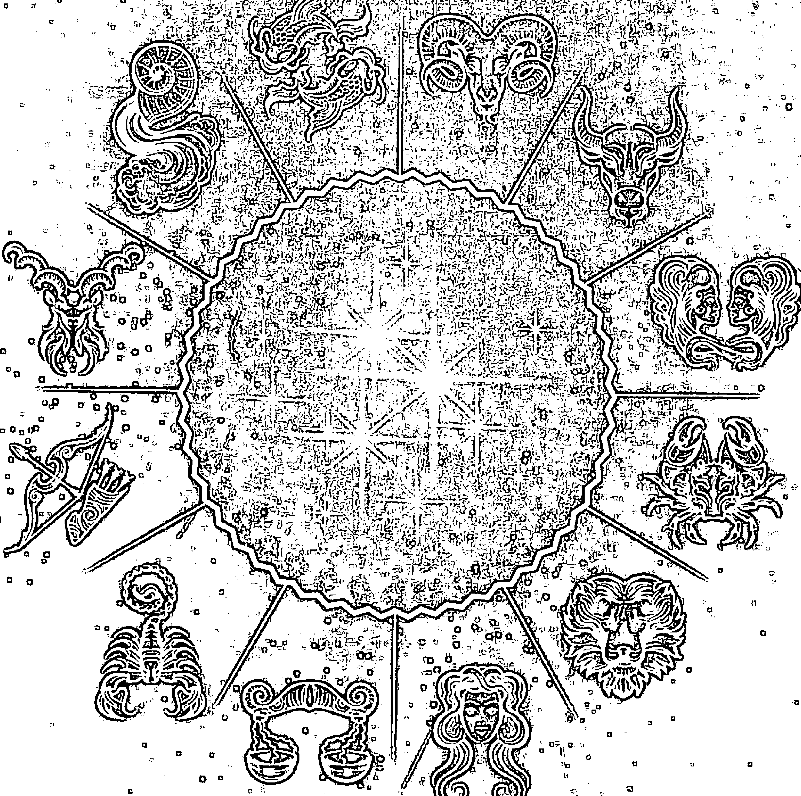

# THE ASTROLOGY OF YOU AND ME: How to Understand and Improve Every Relationship in Your Life

# 人際關係占星全書

# 96種日常情境 × 12星座溝通攻略

蓋瑞·高史奈德 GARY GOLDSCHNEIDER ———著 吳妍儀 ———譯

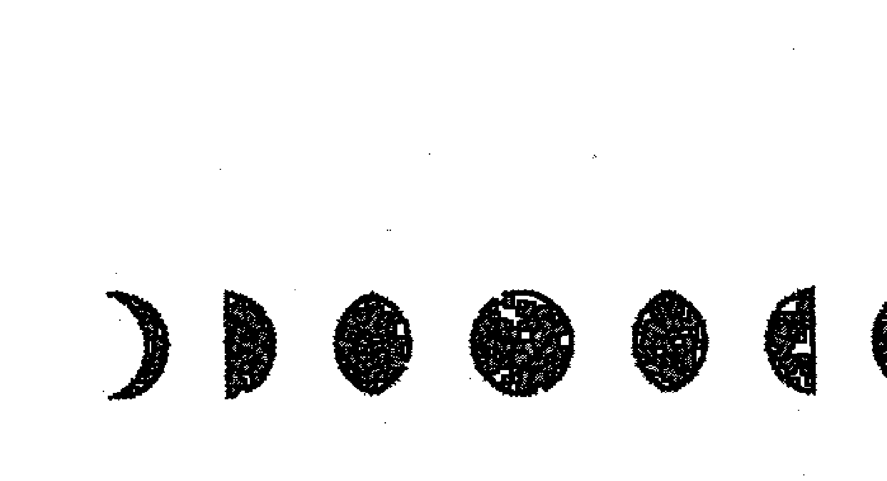

此書獻給我的七個孩子——

- 安德魯（Andrew）
- 亞倫（Aron）
- 以薩克（Isak）
- 莎拉（Sara）
- 安東（Anton）
- 亞莉安娜（Ariana）
- 以及伊莎多拉（Isadora）

他們為我上了生平第一堂真實人生心理學

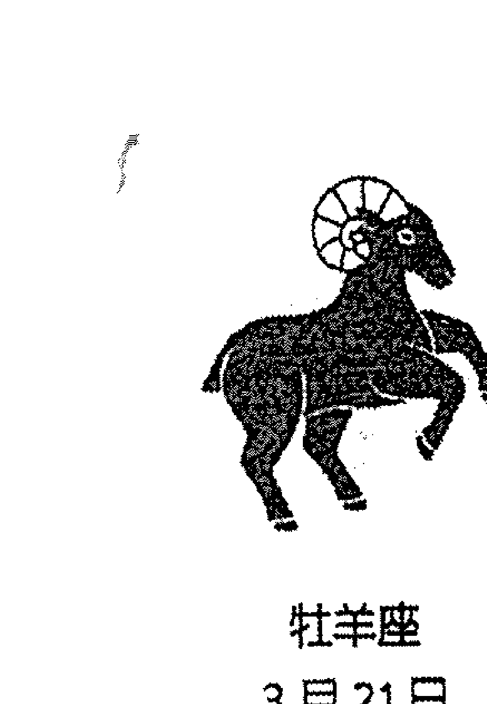

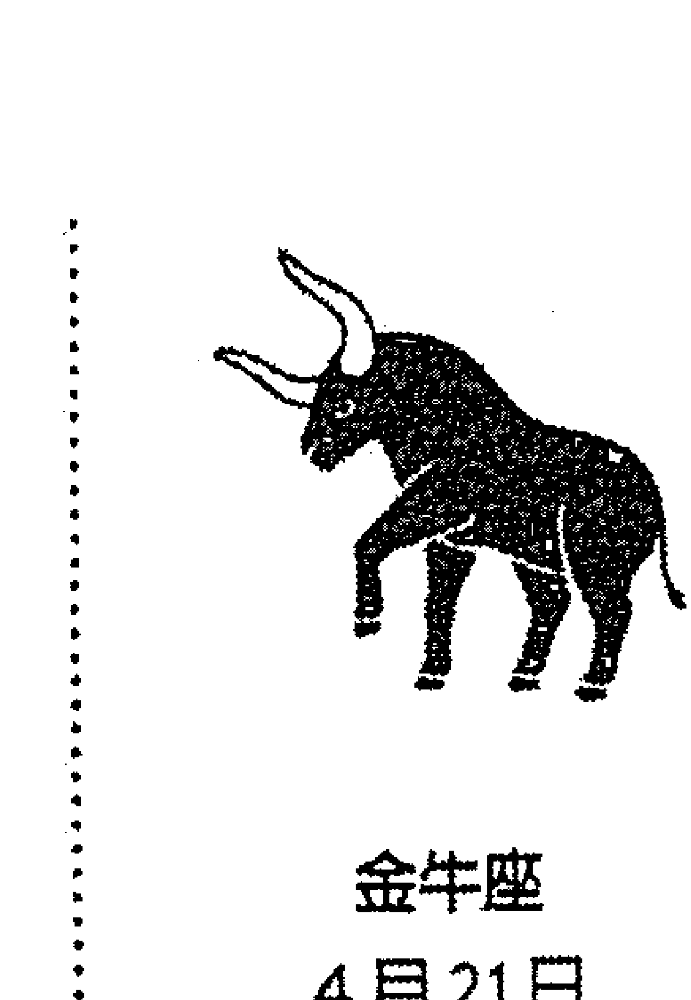

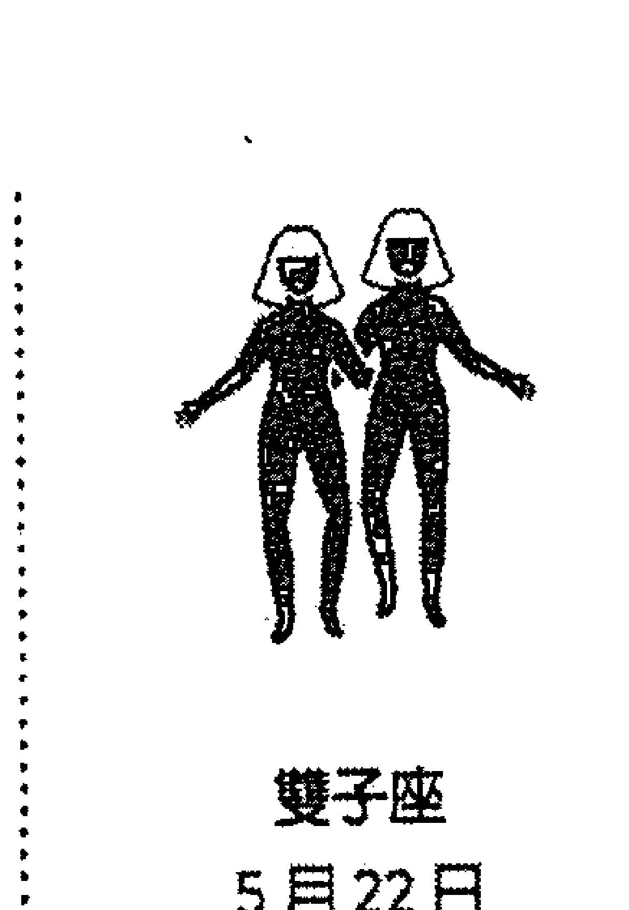

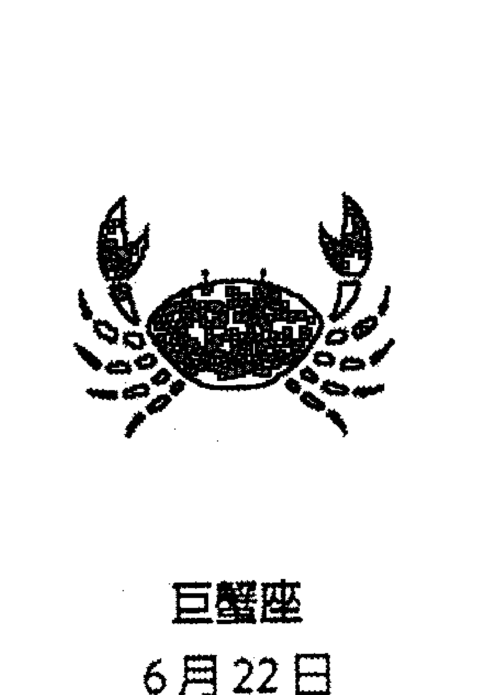

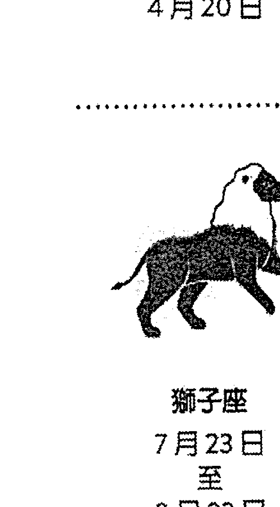

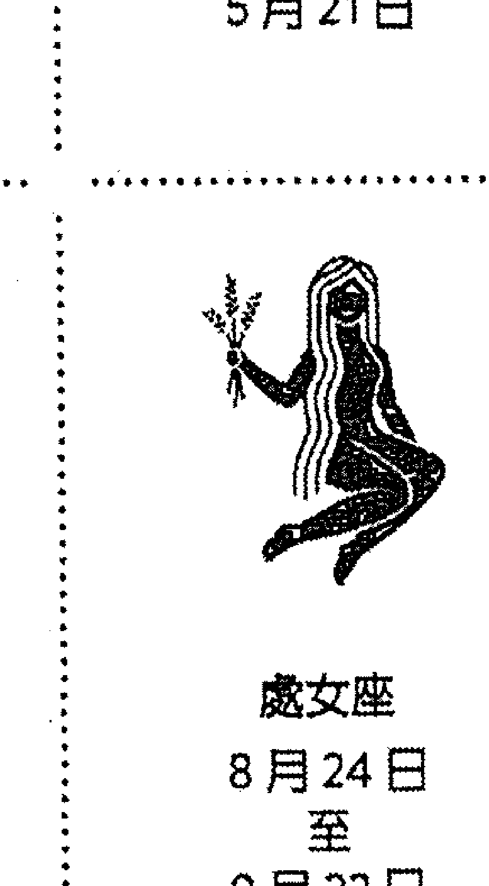

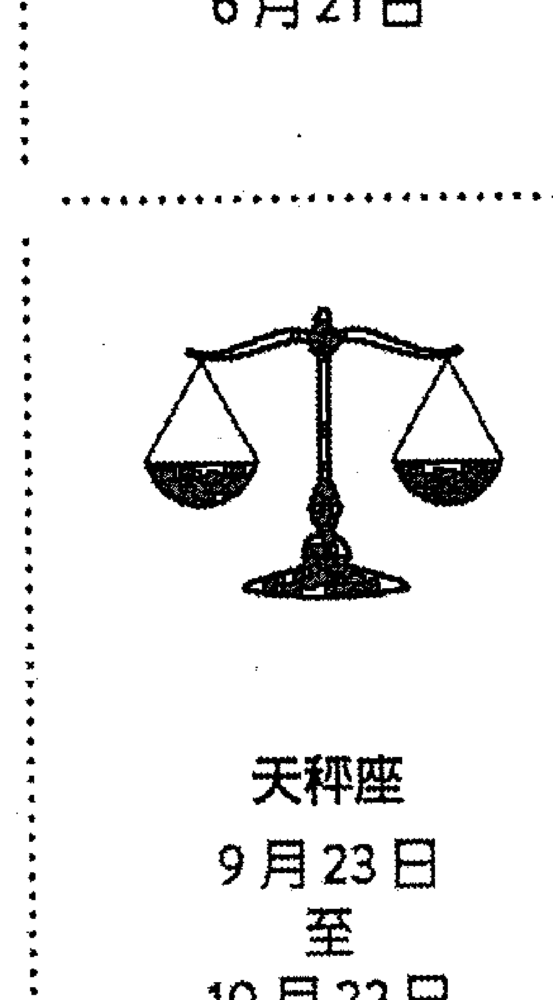

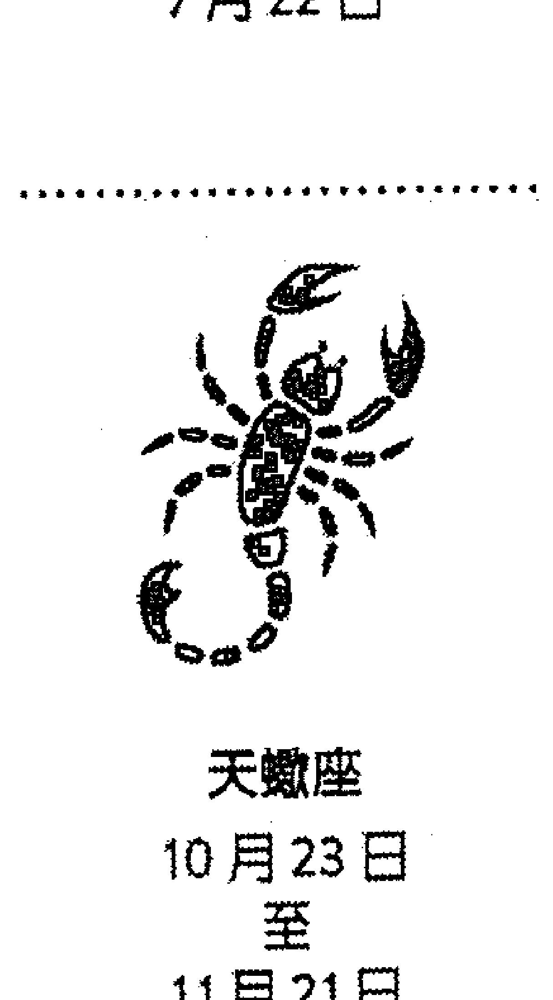

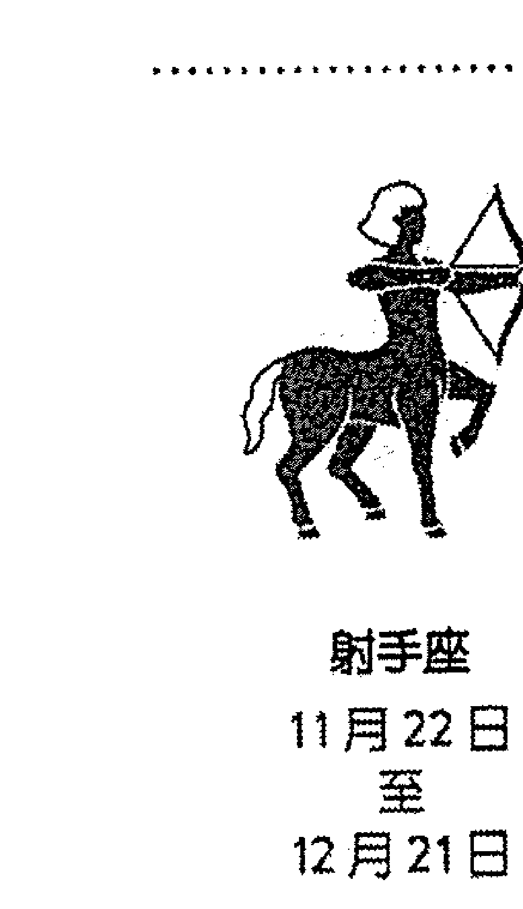

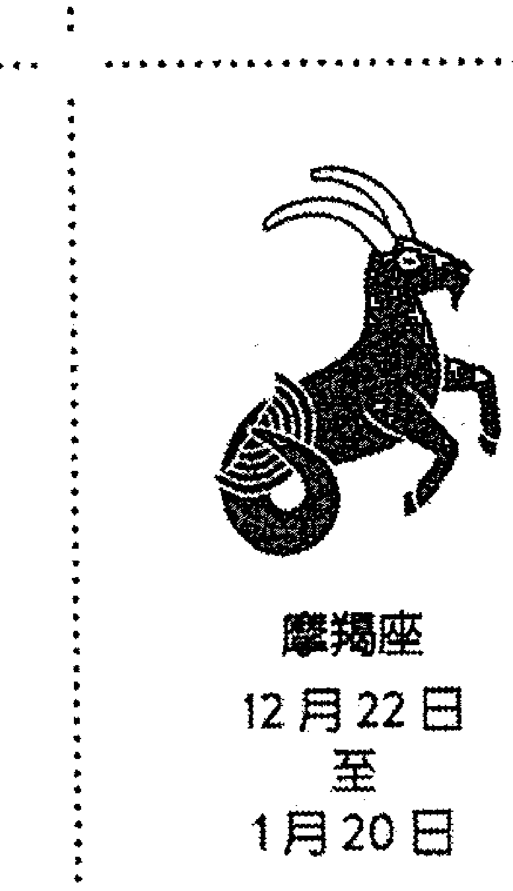

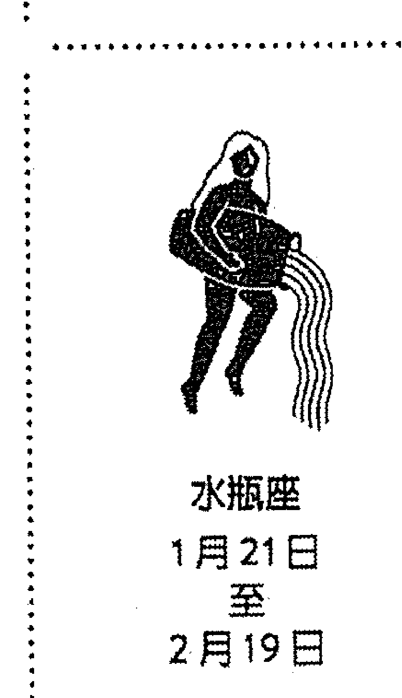

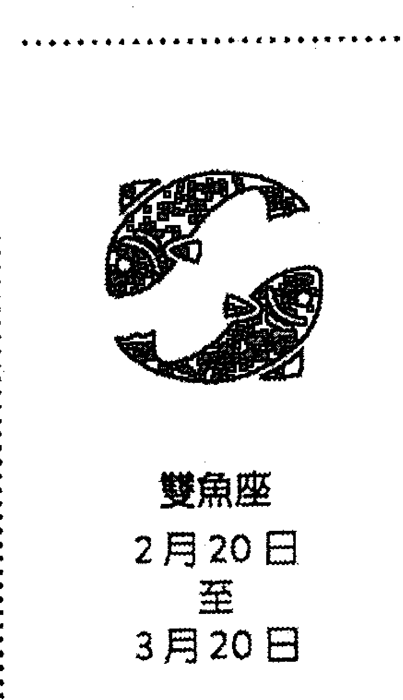

# 96種情境綱要

## [ 工作篇 ]

1. 要求____座老闆加薪
2. 向____座老闆宣布壞消息
3. 替____座老闆安排差旅和娛樂
4. ____座老闆的決策風格
5. 打動____座老闆
6. 提案並對____座老闆做簡報
7. 面試或雇用____座員工
8. 宣布壞消息或解雇____座員工
9. 與____座員工一同差旅或娛樂
10. 分配任務給____座員工
11. 激勵或打動____座員工
12. 管理、指導或指正____座員工
13. 尋求____座同事的建議
14. 向____座同事求助
15. 與____座同事一同差旅或娛樂
16. 與____座同事共事
17. 打動或激勵____座同事
18. 說服或指正____座同事
19. 打動____座客戶
20. 向____座客戶推銷
21. ____座客戶重視的外表和舉措
22. 保持____座客戶的興趣
23. 向____座客戶報告壞消息
24. 招待____座客戶需注意的「眉角」
25. 與____座建立合夥關係
26. 與____座合夥人之間的任務分配
27. 與____座合夥人一同差旅或娛樂
28. 管理並指導____座合夥人
29. 與____座合夥人長期的合作之道
30. 與____座合夥人分道揚鑣
31. 反擊____座競爭者
32. 智取____座競爭者
33. 當面讓____座競爭者刮目相看
34. 對____座競爭者削價競爭或高價搶標
35. 與____座競爭者的公開戰爭
36. 向____座競爭者展現你的態度

## [ 愛情篇 ]

37. 吸引____座的目光
38. 初次跟____座約會的建議
39. 初次跟____座約會的助興與敗興之舉
40. 對____座採取「攻勢」
41. 打動____座的方法
42. 擺脫____座的方法
43. 與____座戀人進行討論
44. 與____座戀人發生爭論
45. 與____座戀人一起旅遊
46. 與____座戀人的性愛關係
47. ______座戀人的親暱表現
48. ______座戀人的幽默感
49. ______座的婚禮和蜜月
50. ______座的家庭和婚姻生活
51. ______座婚後的財務狀況
52. ______座的不忠與脫軌
53. ______座與子女的關係
54. ______座面對離婚的態度
55. 遇見______座秘密情人
56. 與______座幽會的地點
57. 與______座的秘密性愛
58. 長久保有______座秘密情人
59. 與______座的秘密歡愉
60. 與______座秘密情人分手
61. 與______座前任成為朋友
62. 與______座前任複合
63. 與______座前任討論過去的問題
64. 對______座前任表達親暱感情的程度
65. 界定與______座前任現有的關係

## [ 朋友與家人篇 ]

66. 要求______座前任分擔照顧子女的責任
67. 向______座朋友求助
68. 與______座朋友溝通和聯絡
69. 向______座朋友借錢
70. 向______座朋友徵求意見
71. 拜訪______座朋友的時機
72. 與______座朋友一起慶祝和娛樂
73. 與______座室友分擔財務責任
74. 與______座室友分擔打掃責任
75. 當你的訪客遇到______座室友
76. 與______座室友的社交生活
77. 與______座室友的隱私問題
78. 與______座室友討論問題
79. ______座父母的教養風格
80. ______座父母與孩子的相處
81. ______座父母給孩子的金錢觀
82. ______座父母的危機處理
83. ______座父母的假期安排和家族聚會
84. 照顧年邁的______座父母
85. 與______座手足的競爭和親近
86. 過往的成長經驗對______座手足的影響
87. 與疏離的______座手足往來
88. ______座手足對繼承、遺囑等金錢議題的處理
89. 與______座手足的家族團聚和慶祝活動
90. 與______座手足一起度假
91. ______座子女的人格發展
92. ______座子女的嗜好、興趣和職涯規劃
93. 對______座子女的管教
94. 與______座子女的親暱程度
95. 處理______座子女與手足之間的互動
96. 與成年______座子女的互動

# 目次

自序:一本關於另一個傢伙的星座書 12

## 牡羊座 14
3月21日至4月20日

### 工作
- 你的牡羊座老闆 15
- 你的牡羊座員工 16
- 你的牡羊座同事 18
- 你的牡羊座客戶 19
- 你的牡羊座合夥人 21
- 你的牡羊座競爭者 22

## 愛情
- 與牡羊座的第一次約會 25
- 你的牡羊座戀人 26
- 你的牡羊座配偶 28
- 你的牡羊座秘密情人 29
- 你的牡羊座前任 31

## 朋友與家人
- 你的牡羊座朋友 33
- 你的牡羊座室友 34
- 你的牡羊座父母 36
- 你的牡羊座手足 38
- 你的牡羊座子女 39

## 金牛座 42
4月21日至5月21日

### 工作
- 你的金牛座老闆 43
- 你的金牛座員工 44
- 你的金牛座同事 46
- 你的金牛座客戶 47
- 你的金牛座合夥人 49
- 你的金牛座競爭者 50

## 愛情
- 與金牛座的第一次約會 53
- 你的金牛座戀人 54
- 你的金牛座配偶 56
- 你的金牛座秘密情人 57
- 你的金牛座前任 59

## 朋友與家人
- 你的金牛座朋友 61
- 你的金牛座室友 62
- 你的金牛座父母 64
- 你的金牛座手足 65
- 你的金牛座子女 67

## 雙子座 70
5月22日至6月21日

### 工作
- 你的雙子座老闆 71
- 你的雙子座員工 72
- 你的雙子座同事 74
- 你的雙子座客戶 76
- 你的雙子座合夥人 77
- 你的雙子座競爭者 79

## 愛情
- 與雙子座的第一次約會 81
- 你的雙子座戀人 82
- 你的雙子座配偶 84
- 你的雙子座秘密情人 86
- 你的雙子座前任 87

## 巨蟹座 96
6月22日至7月22日

### 工作
- 你的巨蟹座老闆 99
- 你的巨蟹座員工 100
- 你的巨蟹座同事 102
- 你的巨蟹座客戶 103
- 你的巨蟹座合夥人 105
- 你的巨蟹座競爭者 106

## 愛情
- 與巨蟹座的第一次約會 109
- 你的巨蟹座戀人 110
- 你的巨蟹座配偶 112
- 你的巨蟹座秘密情人 113
- 你的巨蟹座前任 115

## 朋友與家人
- 你的巨蟹座朋友 117
- 你的巨蟹座室友 118
- 你的巨蟹座父母 120
- 你的巨蟹座手足 121
- 你的巨蟹座子女 123

## 獅子座 125
7月23日至8月23日

### 工作
- 你的獅子座老闆 126
- 你的獅子座員工 127
- 你的獅子座同事 129
- 你的獅子座客戶 130
- 你的獅子座合夥人 132
- 你的獅子座競爭者 133

## 愛情
- 與獅子座的第一次約會 136
- 你的獅子座戀人 137
- 你的獅子座配偶 139
- 你的獅子座秘密情人 140
- 你的獅子座前任 142

## 朋友與家人
- 你的獅子座朋友 144
- 你的獅子座室友 145
- 你的獅子座父母 147
- 你的獅子座手足 149
- 你的獅子座子女 150

## 處女座 152
8月24日至9月22日

### 工作
- 你的處女座老闆 154
- 你的處女座員工 155
- 你的處女座同事 157
- 你的處女座客戶 158
- 你的處女座合夥人 160
- 你的處女座競爭者 161

## 愛情
- 與處女座的第一次約會 164
- 你的處女座戀人 165
- 你的處女座配偶 167
- 你的處女座秘密情人 168
- 你的處女座前任 170

## 朋友與家人
- 你的處女座朋友 172
- 你的處女座室友 173
- 你的處女座父母 175
- 你的處女座手足 176
- 你的處女座子女 178

## 天秤座 180
9月23日至10月22日

### 工作
- 你的天秤座老闆 181
- 你的天秤座員工 182
- 你的天秤座同事 184
- 你的天秤座客戶 185
- 你的天秤座合夥人 187
- 你的天秤座競爭者 188

## 愛情
- 與天秤座的第一次約會 191
- 你的天秤座戀人 192
- 你的天秤座配偶 194
- 你的天秤座秘密情人 195
- 你的天秤座前任 197

## 朋友與家人
- 你的天秤座朋友 199
- 你的天秤座室友 200
- 你的天秤座父母 202
- 你的天秤座手足 203
- 你的天秤座子女 205

## 天蠍座 207
10月23日至11月21日

### 工作
- 你的天蠍座老闆 208
- 你的天蠍座員工 209
- 你的天蠍座同事 211
- 你的天蠍座客戶 212
- 你的天蠍座合夥人 214
- 你的天蠍座競爭者 215

## 愛情
- 與天蠍座的第一次約會 218
- 你的天蠍座戀人 219
- 你的天蠍座配偶 221
- 你的天蠍座秘密情人 222
- 你的天蠍座前任 224

## 朋友與家人
- 你的天蠍座朋友 226
- 你的天蠍座室友 227
- 你的天蠍座父母 229
- 你的天蠍座手足 231
- 你的天蠍座子女 232

## 射手座 235
11月22日至12月21日

### 工作
- 你的射手座老闆 236
- 你的射手座員工 237
- 你的射手座同事 239
- 你的射手座客戶 240
- 你的射手座合夥人 242
- 你的射手座競爭者 243

## 愛情
- 與射手座的第一次約會 246
- 你的射手座戀人 247
- 你的射手座配偶 249
- 你的射手座秘密情人 250
- 你的射手座前任 252

## 朋友與家人
- 你的射手座朋友 254
- 你的射手座室友 255
- 你的射手座父母 257
- 你的射手座手足 259
- 你的射手座子女 260

## 摩羯座 262
12月22日至1月20日

### 工作
- 你的摩羯座老闆 263
- 你的摩羯座員工 264
- 你的摩羯座同事 266
- 你的摩羯座客戶 267
- 你的摩羯座合夥人 269
- 你的摩羯座競爭者 270

## 愛情
- 與摩羯座的第一次約會 273
- 你的摩羯座戀人 274
- 你的摩羯座配偶 276
- 你的摩羯座秘密情人 277
- 你的摩羯座前任 279

## 朋友與家人
- 你的摩羯座朋友 281
- 你的摩羯座室友 282
- 你的摩羯座父母 284
- 你的摩羯座手足 285
- 你的摩羯座子女 287

## 水瓶座 289
1月21日至2月19日

### 工作
- 你的水瓶座老闆 290
- 你的水瓶座員工 291
- 你的水瓶座同事 293
- 你的水瓶座客戶 294
- 你的水瓶座合夥人 296
- 你的水瓶座競爭者 297

## 愛情
- 與水瓶座的第一次約會 300
- 你的水瓶座戀人 301
- 你的水瓶座配偶 303
- 你的水瓶座秘密情人 304
- 你的水瓶座前任 306

## 朋友與家人
- 你的水瓶座朋友 308
- 你的水瓶座室友 309
- 你的水瓶座父母 311
- 你的水瓶座手足 313
- 你的水瓶座子女 314

## 雙魚座 317
2月20日至3月20日

### 工作
- 你的雙魚座老闆 318
- 你的雙魚座員工 319
- 你的雙魚座同事 321
- 你的雙魚座客戶 322
- 你的雙魚座合夥人 324
- 你的雙魚座競爭者 325

## 愛情
- 與雙魚座的第一次約會 328
- 你的雙魚座戀人 329
- 你的雙魚座配偶 331
- 你的雙魚座秘密情人 332
- 你的雙魚座前任 334

## 朋友與家人
- 你的雙魚座朋友 336
- 你的雙魚座室友 337
- 你的雙魚座父母 339
- 你的雙魚座手足 340
- 你的雙魚座子女 342

# 自序

## 一本關於另一個傢伙的星座書

二○○七年十月一個下雨的午後，我又再度回到故鄉費城，並且很快打電話給怪癖圖書公司（Quirk Books）的總裁兼發行人大衛·勃根尼克特（David Borgenicht），說我人在這裡。他立刻邀請我過去，不久後我就走在舊城熟悉的街道上，按了這家不尋常出版社的門鈴。一位接待員請我進去以後，我等著大衛，然後立刻被他的「最糟狀況」系列圖書所贏得的獎項吸引，這些獎狀裱了框，顯眼地展示在牆上。大衛跟我從未見過面，但我們已經透過一位共同朋友，即阿姆斯特丹美國圖書中心的瑞克·萊特史東（Rick Lightstone）而彼此認識了；我和瑞克都住在阿姆斯特丹。怪癖圖書熱忱友善又放鬆的工作氛圍，讓我印象深刻。大衛熱邀我進去，然後在他的會議室長桌前請我坐下，對面藏書室的書架上有一批精選書籍，其中包括我寫的《生日的秘密語言》（Secret Language of Birthdays）。

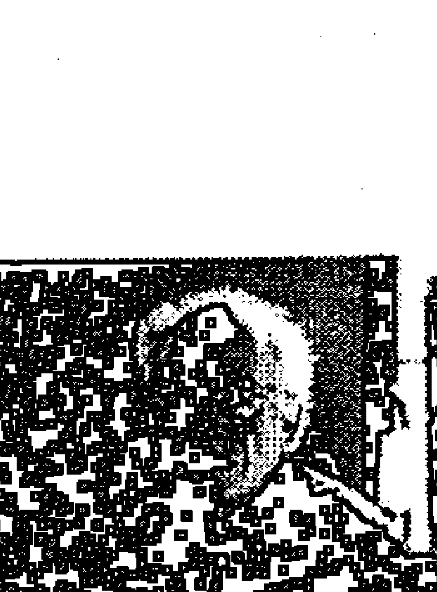

蘇瑞·高史奈德 (Gary Goldschneider) 生日：5月22日 星座：雙子座

瑞克曾經建議過要跟大衛一起炮製一個新書計畫。大衛就像是能讀到我的心意似的，立刻鼓勵我分享對於我下一本書的任何點子。我提了幾個縈繞在我腦中的構想，而在仔細把這些想法記下來之後，大衛直接說道：

> 「我對新書有個點子。這會是一本關於『另一個傢伙』的星座書。」

> 「另一個傢伙？」我困惑地問道。

「是啊，」他回答：「你知道的，一九九○年代大家談的都是我、我、我。大家對於跟他們說『他們是什麼人』的那種書趨之若鶩，而你的《生日的秘密語言》真的抓住這股潮流了。我現在心裡想的是一種星座手冊，告訴你如何透過別人的星座來接近他們，本質上就是在幾乎任何一種

人生範疇裡，怎樣應付一個摩羯座、獅子座或雙子座等等。」

六個月後，二〇〇八年四月，大衛在前往倫敦書展的途中，到阿姆斯特丹稍作停留來看我。在史佩廣場盧森堡咖啡館的一張桌子前，他坐在我對面，列出他和同僚具體提出的此書主要部分：工作、愛情、朋友與家人。每個範疇之下都有小標，像是你的天秤座老闆、你的水瓶座秘密情人和你的雙子座朋友，而在每一個小標之下還有另外六種情境，說明像是「要求天秤座老闆加薪」、「與水瓶座的秘密性愛」，以及「向雙子座朋友借錢」等議題。這個計畫需要的總字數大約是十七到十八萬字，很是讓人望而生畏；但既然三本「秘密語言」系列的每一本總字數都有五十萬字，我們都知道我辦得到。

我當時發現大衛的原創點子很棒，現在也仍舊這麼覺得。現在的人對於別人更感興趣，或許是因為對自己的興趣稍微少了那麼一點點。直到後來我才領悟到，這正是我一直想寫的書，而且實際上我曾經以「自己的太陽星座書」的形式，向各家出版社提案過。我覺得現在時候終於到了，在這個類別裡可以再出現另一本重量級的書。從一九六〇年代，以及琳達·古德曼（Linda Goodman）劃時代的巨作《太陽星座》（Sun Signs）出版後，在這個流行領域裡，這類型的書很奇怪地一直缺席。我們雙方的想法與興趣配合得剛剛好，這種令人滿意的刺激讓我寫出了這部作品。我要感謝大衛以及怪癖圖書公司的全體同仁，他們讓我們的共同創作變成一個極其完美的體驗。我想我從沒有像寫這本書一樣，這麼享受寫作的過程。

蓋瑞·高史奈德
阿姆斯特丹，二〇〇八年十一月## 牡羊座

3月21日至4月20日

牡羊座是黄道十二宫的第一个星座，代表火象基本宫，象征纯粹与高度自恋的星座能量。因为火星是牡羊座的主宰行星，牡羊座的人倾向于显得很强劲、很进取，而且坚持要得偿所愿、要当赢家。虽然他们常常很孩子气又心胸开阔，但也可能在情绪上很顽固，并且觉得很难表达他们复杂的感受。他们不喜欢被分析，在与他们自己有关的方面会采取“你看到什么就是什么”的态度。

### 工作

### 你的牡羊座老板

牡羊座老板是天生的领袖，对于他们希望整个团体该往哪个方向走，不会有太多疑虑。明确、清楚而苛求，这些烈火性格的人会要求他们的员工尽其所能地投入每一分心力，然后再多投入一点。因为扮演这种角色对他们来说太如鱼得水，所以他们渴望做决定，并且看到这些决定被落实。他们是真正的独立个体，自然会尊重其他人的个体性；一旦他们的员工明白老板有何期待之后，这些牡羊座老板就会以惊人的开放态度看待员工独立作业，甚至期待他们这么做。

- 要求牡羊座老板加薪
牡羊座老板可能已经料到你有这个念头。最有可能的情况是，你甚至不用问，他们自己就会提议给你加薪（如果这是你应得的）。然而，这也意味着如果你需要主动要求加薪，你可能会被回绝。牡羊座老板乐于当个宽宏大量的人，但只有在有正当理由的时候。对于你可能完成的惊人交易——让整个团体有了新活力与方向的那一种——会让他们印象特别深刻。他们并不那么注意稳定或勤勉的行为，因此可能会忽略不引人注目却忠诚效力的员工。

- 向牡羊座老板宣布坏消息
请确定你戴了安全帽。起初在一阵不祥的沉默之后，牡羊座老板可能会勃然大怒（别排除大吼大叫或拿起附近的东西乱扔的可能性）。越来越红的脸色可能是第二个警告标志。地震式的爆发很可能会延续几分钟，但通常就像夏季暴雨，很快就过去。有一种选择是直接把那份令人困扰的报告以书面形式递给你的牡羊座老板，然后迅速撤退。

- 替牡羊座老板安排差旅和娱乐
要是你把事情安排得就像牡羊座老板自己会做的一样，他们会非常高高兴；如果你没有，就会挺不愉快了。所以你要成功，最根本的就是要搞清楚他们特别的欲求和期望。既然组织工作通常不是他们的强项，他们可能会完全仰赖你来让事情尽善尽美。请记得，他们热爱气派的姿态，而且会不惜血本让自己有面子。要特别注意那种小小的神来之笔，点出你对他们的偏好很敏锐。牡羊座老板会对愿意多花心思的人青睐有加，所以你事先通知餐厅、旅馆或旅行社办事人员你老板的偏好，会是很好的作法。

**强项**
- 有启发性
- 精力旺盛
- 有开创性

**弱点**
- 不注意
- 紧绷
- 缺乏自觉

**互动风格**
- 咄咄逼人
- 爱下命令
- 直言不讳

### 牡羊座老板的决策风格

牡羊座老板自然会自己做所有重要的决定，而且通常不会要求你提出建议。话虽如此，当你自己做决定的时候，他们喜欢看到你表现果断；而在他们正视你所做的事情时，你就屏息以待吧！牡羊座老板总是在做决定、下命令，他们不会容忍抗命或误解。他们也不常改变心意，所以在面对困难或失败时，他们很可能会怪到你头上，指出他们眼中属于你的弹性问题与弱点。最好鼓起勇气实现他们的信条，并且在进展不妙的时候，温和地提醒他们，他们本来的命令是什么。

### 打动牡羊座老板

第一步是先引起你的牡羊座老板注意。要达到这个目标，最佳方式不是定期发出温和的备忘录，而是简明扼要、思考周全的计划，如此才能够迅速地穿透牡羊座的盔甲。计划应该在你们两人独处的时候提出，因为我不建议你在同事面前冒着让牡羊座老板尴尬的风险。不要试着巴结牡羊座老板，或者用拐弯抹角或委婉的方式推销你的想法，这样只会让他们更不耐烦。你一使出你的绝招之后，最好让他们独处一下，一旦他们准备好之后就会给你答复。

### 提案并对牡羊座老板做简报

面对牡羊座老板，最好让整件事简洁有力。一开始就阐明你的重点／结果，而不是留到最后才说。用不超过五个项目的清单列出你的主要论点。不要怕说出你计划里的内在问题，也不要把计划中会牵涉到的花费与努力缩到最小。挑战对牡羊座老板很有吸引力，而可能性低、甚至根本不可能的事情通常会燃起他们的斗志。请确保你留下够多空间让他们亲自参与，少了这个，提案就不可能成功。既然他们通常很容易觉得烦，请设法穿着柔和或中性色调与风格的服装。

### 你的牡羊座员工

尽管有着强烈的独立性格，牡羊座员工却很擅长遵循规定，以及听从上司的指示。同时，他们会立刻瞥见上司的错误，也会看到他们的计划里有什么样的缺陷与漏洞。通常他们会对这种事情保持缄默，直到某一天，或许受到刺激、或者不公平地被指控犯了错误，他们才会翻旧帐，把曾经加诸他们身上的不公平与不正确的命令都搬出来。请期待牡羊座员工会想出改变事态的建议，但通常只有在他们觉得整个团体或老板对他们开诚布公的时候，他们才会这样做。

## 面试或雇用牡羊座员工

牡羊座求职者寻求的是一个可以清楚执行、定义精确的任务，没有模棱两可或过度异想天开的要求。面试并雇用一位牡羊座，最成功的作法是直截了当。特别重要的是不要太加油添醋，因为牡羊座不会忘记虚假或误导性的承诺。不要把牡羊座实事求是的态度误解成缺乏热忱；新进的牡羊座员工已迫不及待要把他们超凡的精力投入手边的任务了。愉快、乐观的环境，可以最有效率地引导出他们最好的一面。

- 优点
辛勤工作
精力充沛
乐意帮忙

## 宣布坏消息或解雇牡羊座员工

这可能很难处理，因为在牡羊座自认为表现一直很好的时候，你可能很难拿他们的失败去跟他们对质。对许多牡羊座来说，失败是人生中最难处理的部分。此外，牡羊座员工对于自己和自己的工作通常缺乏客观性，只看到他们想要或需要看到的那一面。如果可能的话，应该花几个星期渐进地让他们对坏消息或解雇有所准备，给他们时间去调适，并且让警讯真正进入他们脑中。务必避免采取突然间针对他们的行动，因为他们可能会展现出同样突然而狂暴的反应，让所有相关人等都极不愉快。

- 弱点
叛逆
易怒
不宽容

## 与牡羊座员工一同差旅或娱乐

虽然他们拉着行李箱走天涯的能力高强，不过大多数牡羊座员工在安全、熟悉的环境下工作，表现最好。虽然一般来说他们是很有活力的人，却可能难以适应经常变动的新处境，而在长期出差的状况下，他们可能会变得困惑混乱，以致限制了他们的成效。在娱乐方面，牡羊座员工是绝佳的组织者，能替同僚、客户与老板规划好晚餐、庆祝活动和闹区夜游活动。他们也特别擅长得知其他人喜欢什么，所以也很会送礼。

- 互动风格
诚实
忠贞
坦率

## 分配任务给牡羊座员工

只要任务范围界定好，通常不会有问题。牡羊座员工非常善于弄清楚他们不喜欢什么，也会事先让你知道。所以应该鼓励他们提前告诉你，他们是否觉得能够完成一项指定任务，而不至于过度担忧或有压力。然而有些情况下，如果牡羊座员工的老板或上司确定只要他们做对了，就可以刺激或鼓励牡羊座接受本来没那么想做的任务。这样的工作最好从鼓励他尝试的角度分配下去，如此，牡羊座员工还有机会选择退场，而不必被怪罪。

## 激励或打动牡羊座员工

金钱对一般牡羊座员工而言，可以是强烈的激励因素，他们相信如果你是认真的，你就会用金钱来证明你是说真的。红利可以是激励牡羊座员工的强烈诱因。因为牡羊座员工通常拥有非凡的精力，他们并不介意超时工作以赚取一点外快。然而必须小心确保他们对自己的能耐没有不切实际的看法，不会给自己过大的压力。虽然你可能已经打动牡羊座员工，他们可能会接受被指派的任务并且辛勤工作，但还是要小心戒备，避免他们高估个人的能力导致崩溃。

### 管理、指导或指正牡羊座员工

牡羊座员工对批评极端敏感。如果你花时间完整解释你的意思，他们就可以应付得来；但他们可能会特别易怒，而且会被一句脱口而出、未经思索的评语深深伤害到。他们也无法应付那种日复一日的唠叨式批评，他们通常脸皮不够厚，无法把这种负面言论弹开了事。让他们大笑、或至少微笑地面对自己的弱点，或者在紧绷的情况下笑看任何有趣或荒谬的事，会大大有助于跟他们沟通。总的来说，牡羊座员工很容易管理和指导，只要你对他们诚实，又没有太多藉口，或者做出误导性的保证。

### 你的牡羊座同事

#### 强项
- 投入
- 愿意奉献
- 精力充沛

通常可以预期牡羊座同事会尽到他们份内的责任，而且对工作有积极的态度。然而，因为他们很容易气馁（通常会导致不满或彻底的沮丧），他们需要有同事保证他们对这个团体的价值。感觉到自己对于现在进行的事有根本的重要性，甚至是工作核心，对牡羊座同事来说，是一种应该被满足的重大需求。并不是所有的牡羊座都需要当明星，在团体里鹤立鸡群；通常只要重视他们所扮演的角色就够了。

#### 弱点
- 气馁
- 自我批判
- 沮丧

### 寻求牡羊座同事的建议

如果你选择找牡羊座同事咨询意见，他们大多数人会觉得受到恭维，因此会尽己所能地帮助你。然而，因为他们直率又极其固执己见的做事方法，你应该把他们的建议放在心上，却不必然要照本宣科。既然牡羊座同事会继续追踪看你有没有遵循他们的建议，你应该准备好进行第二次、甚至第三次讨论。如果你没有这个准备，那么你一开始就不该去找他们求教，因为他们会相当认真地看待这种事。漫不经心地随口给建议，并不是他们的专长。

#### 互动风格
- 积极正向
- 友善
- 乐于帮忙

### 向牡羊座同事求助

牡羊座喜欢有人来找他们帮忙，无论牵涉到的工作有多繁重，通常他们都会愿意尽己所能地协助你。请记得，牡羊座同事的动力来自于挑战，而且他们也需要感觉到自己很重要、很有价值。有强大的牡羊座当帮手，肯定是一项优势。然后，你必须小心不要太常拜托他们，或者让他们觉得被占便宜了。所以，最好把他们的帮助保留给偶尔的紧急状况，而不是每天或每星期都靠他们。

#### 与牡羊座同事一同差旅或娱乐

因为他们的个体性与严格的价值观，最好别放任牡羊座同事完全控制差旅或派对计划。只要清楚界定他们的任务，当他们身为团体的一部分时，通常会做得很好。牡羊座同事热爱玩得开心，特别是在他们发现自己其实很享受本来没特别期待的任务时。要让他们保持好心情，让他们的精力能够轻松地流动，笑声和开玩笑会很重要。他们热爱生动有趣的展览，也很享受为了同事与老板的特殊品味而做些量身打造的安排。

#### 与牡羊座同事共事

牡羊座同事有非常强烈的好恶，特别是在跟人有关的方面。他们通常会给别人第一次机会，但如果他们感到失望或者遭到背叛，便很少会给人第二次或第三次机会。别期待他们会对他们个人不喜欢的人特别合作。他们可以跟这样的人一起工作，但不会明显地对他们很亲切，或者特别显得过度热心帮忙。你也不该期待他们踏出和解的第一步。要达到最好的结果，就是让他们加入他们觉得自在的团体。

#### 打动或激励牡羊座同事

诚实与直接最能够打动牡羊座同事，他们需要知道你对他们坦诚相待，从没有恶搞他们。他们特别疑心操纵别人、偷偷摸摸、或者不正当的行为，就算你只是手法细腻地尝试解决问题也一样。挑战对他们来说是强大的动力，甚至到了需要完成看似不可能任务的地步。在此，你必须为了他们和整个团体而防范他们的骄傲自大，寻求实际而非超越常理的方法，在日常事务上尤其如此。给牡羊座同事比较小而可为的任务，并且逐渐建立他们的自信心。

#### 说服或指正牡羊座同事

牡羊座很难被说服，尤其当你的论点与他们截然相反的时候，更是困难。他们对诱人或讨人喜欢的作法心存疑虑，对于过度有攻击性的作法则会强烈抵抗。说服牡羊座同事的最佳办法，是用例子让他们看到某种方法可以成功，同时尽可能让争论保持实事求是、不带情绪。因为他们对批评极为敏感，请把话说得简单明了；如果他们对你的论点提出反驳意见，或者提出解释为自己辩护，就听听他们怎么说。

### 你的牡羊座客户

满足牡羊座客户并不难，只要你细心听他们的话，把他们需要的东西给他们就行。问题在于他们可能觉得他们的期望已经非常清楚了，然而实际上某些重要的事实却还没有彻底定义清楚。换句话说，牡羊座客户通常会假定你了解他们，因为他们觉得他们的想法极为清楚不含糊，所以不可能有人会误会他们的意思。想像一下，当你要求进一步厘清的时候，他们会有惊讶。他们可能假定你有点迟钝，或者根本就是脑残。用你的直觉，设法第一次就搞懂。

- 优点
    - 自信
    - 不模棱两可
    - 直截了当
- 缺点
    - 过度苛求
    - 不能宽恕
    - 没耐性
- 互动风格
    - 结果导向
    - 情绪激烈
    - 难搞

#### 打动牡羊座客户

牡羊座客户期待你很有警觉心、聪明，而且完全理解他们所说的话。他们可能对你提出的复杂考量、问题和不确定性大感不解，同时也极端不耐烦。一旦你已经展现出你的理解，还有及时满足他们期望的意愿，请不要拘束，用你对他们最热爱的主题所具备的知识来打动他们——希望你已经事先研究过这些功课了。如果你没有，不必介意，反正他们可能还是会让你知道；如果你有去问过或者猜测过他们喜欢什么，就更是如此。

#### 向牡羊座客户推销

算了吧！牡羊座客户对于被推销不感兴趣。他们要不是以前全都听过了，就是根本不信任你的动机，因此会在你的推销话术讲到一半时就打枪。他们才是重要的人，你不是，而他们要他们的需求被满足。『妥协』二字真的不在他们的字典里。如果你还是想设法说服他们相信新产品或新服务的价值，你可以在一同意满足他们的需求以后就提出来，方式要委婉、诱人、不太认真，这样才最能够成功吸引他们的注意。

#### 牡羊座客户重视的外表和举措

请谨记在心，牡羊座客户是你们两人之中比较重要的那一个，所以别试着用你美丽的衣服或超炫的发型来抢牡羊座的锋头。你的外表应该柔和、自信而低调。话虽如此，要是你觉得这场会议重要到足以让你以最佳外表来参加，牡羊座客户会很感激。所以，把你的外表打理整齐，举止专业有效率。最重要的是，别沉浸于闲聊漫谈当中，或者太努力打趣逗乐。反正你精心准备的先发笑话或俏皮话，可能会彻底失败或者只得到一个象征性的浅笑，进而让你的起点往后倒退了一光年的距离。

#### 保持牡羊座客户的兴趣

最能打动牡羊座客户的就是结果。这不表示许下承诺，反而是强调你过去的纪录。如果你曾经为一位竞争者完成很好的工作，更是如此。光是提到主要竞争者，就会引起牡羊座客户的反应，还会让他们对你要说的话产生新的兴趣。对牡羊座客户强调你为什么比较喜欢为他们工作，他们会像猫舔牛奶一样欣然接受。一旦他们知道你曾经在他们的领域里为别人工作，他们就会设法尽其所能地取悦你。

#### 向牡羊座客户报告坏消息

你愿意走进飓风里吗？挑战龙卷风呢？你的牡羊座客户不想听坏消息。他们付你钱是要你提供好消息。所以就给好消息吧！如果你的好消息已经用尽了，那就用好的角度来呈现坏消息，强调结果本来可能更糟得多。不要强调你怎样尽了全力，或者这只是运气不好，这样的解释只会产生负面效果。准备好一条退路，让你能拯救整个计划，还能满足牡羊座客户的期望——解释你只需再多一点时间就可以把工作完成，并且提议少收点钱。

#### 招待牡羊座客户需注意的“眉角”

事先做点调查，确定牡羊座客户用餐的偏好——食物、服务、氛围、呈现方式——并且专注于细节。秘书和办公室里的传言是主要消息来源。在招待这方面，牡羊座客户偏好哪种音乐或俱乐部的气氛，可能也是一般常识。一般来说，牡羊座喜欢吃也喜欢喝，所以你可能会有控制他们酒量的问题。别担心，如果他们享受了一段好时光，就比较有可能同意你的看法。确保你提供的交通方式迅速又简单。

### 你的牡羊座合夥人

牡羊座合夥人可以对任何事业付出超凡的精力。然而，要是他们往错误的方向直冲，他们常常狂热而偏执专一的方式便可能被证明是个问题，可能导致重大的时间与金钱损失。所以，事情在实践阶段之前，最好经过充分的讨论与计划，而且你要留心他们的进展。他们不会喜欢对你或整个团队做每周工作报告，所以应该用谨慎的方法为之。牡羊座合夥人喜欢独立工作，为他们自己的引擎提供自己的燃料。

- 优点
- 忠诚
- 积极正面
- 诚实

#### 与牡羊座建立合伙关系

你的牡羊座合夥人所扮演的角色，从一开始就应该界定清楚，否则他们往往会同时参与太多事。他们想要你当合夥人的动机，也是检视的重点。为什么这么独立的人会需要或想要一个合夥人，还有为什么要找你？建议作法是让两位合夥人都有完整的书面法律保障条文，意思是有单独一位律师可以考量你们双方的期望。详细列出未来可能的困难会让你的牡羊座合夥人不耐烦，不过这么做是必要的，以防事情出差错。

- 缺点
- 疏离
- 健忘
- 不敏感

#### 与牡羊座合夥人之间的任务分配

牡羊座合夥人可能认为他们是多工处理者，有能耐完成几乎任何艰巨的任务。不过在日常基础上，若他们的工作有限而且界定清楚，合伙关系会运作得最好。工作范围可以按照个别计划做决定，不过他们真正的强项（不管是行销、公关、销售、还是研发等等）很快就会变得很明显。牡羊座合夥人可能遭遇到的问题是，他们最想做的，未必是他们做得最好的或是公司所需要的。他们可能非常固执地抓着他们最爱的任务不放，尽管已经出现了负面的结果或表现。

- 行动风格
- 进取
- 思路偏狭
- 充满野心

#### 与牡羊座合夥人一同差旅或娱乐

牡羊座合夥人通常很享受差旅，以及与工作相关的娱乐活动，但却不一定是做安排的最佳人选。请确定你和你的助理有留意你的牡羊座合夥人所做的计划，因为牡羊座合夥人可能很健忘，以致在他们匆忙且不耐烦地想把事情搞定的时候，忽略了重要的细节。通常出差或是在工作岗位时，牡羊座合夥人都是合伙关系的良好代表，个性积极正面、直率又有野心。请确定在处理客户时，他们有把团体的利益置于自己的利益之上。他们常常太自我中心，可能会为了自己的兴趣而牺牲团体的好处。

#### 管理并指导牡羊座合夥人

一般来说，牡羊座合夥人是管不得的。大多数时候，你必须仰赖他们的直觉与判断。接受指示并不是他们的特长，因为他们觉得他们总是知道最多，在危机出现时尤其如此。因为他们的直觉力很强，特别是在侦测骗局和骗子的时候，公司通常会从这种能力中获益。设法清楚地向他们表达你的期望，丢出几个明显的暗示，然后把履行工作留给他们。

#### 与牡羊座合夥人长期的合作之道

牡羊座合夥人有着非比寻常的忠诚度，而且一旦许下承诺，就会长期坚守。然而，毫无疑问会出现一些长期性的问题，有可能会损害彼此的关系。只要有可能，在合伙关系中应该撇除所有私人事务。牡羊座在某些主题上非常敏感易怒，而当这种问题被掀起的时候，可能会引起爆炸性的反应。请记得他们的强项是客观性而非深刻的感受性，而且最好不要太深入干涉个人事务。就算你的牡羊座合夥人很直言不讳，如果可能的话，你还是要保持圆融而有耐性。

#### 与牡羊座合夥人分道扬镳

在紧密合作好几年之后，跟一位牡羊座解除合伙关系是可以达成的，只要是以对双方都有利、务实又可行的方式为之。因为牡羊座合夥人很诚实，鲜少会要求他们不觉得有权要求的东西。这不尽然是因为他们对你个人的关心，而比较是因为他们内在的公平概念让他们不会占你便宜。你可以呼吁行为要符合伦理，而他们鲜少会想跷越伦理规范。当他们必须承认失败时会有很深切的失望感，但他们的独立性会驱策他们继续前进。

### 你的牡羊座竞争者

直接强碰的时候，牡羊座竞争者可能相当凶猛吓人。至少照他们的行事方法，可能会以激增的精力、资金的挹注，还有无可忽视的专注持久宣传战，造成压倒对手的威胁。遭遇这样的对手可能会变得像是在打仗，随之而来争取消费者与客户的整个斗争过程则会是全面性的战争。要赢过牡羊座竞争者，意味着全方位研究他们的战略，而且就像在战争里一样，要對市場的形勢與現狀有深入的了解。光是忽略牡羊座競爭者，自顧自地經營你的事業，希望他/她會失敗或者就這樣退場，通常不會奏效。

## 31 反擊牡羊座競爭者

就像在拳擊賽中一樣，對抗牡羊座競爭者最有效的戰略是反擊。當然，讓牡羊座先動作並不難，但要有那個耐性和自制力按兵不動，尋找弱點，並且直到那時才跳進去攻擊，便可能很難；不過如果你想取得勝利，這是很根本的。如果你讓牡羊座競爭者把自己累垮、然後犯下你可以從中獲利的錯誤，他們可能會導致自己的失敗。你甚至可以考慮偶爾透過恫嚇與挑戰，煽動他們進入一種狂熱狀態。

### 特質
- 堅持不懈
- 好鬥
- 勢不可當

#### 弱點
- 過度自信
- 盲目
- 不理智

## 32 智取牡羊座競爭者

牡羊座的計畫通常很簡單，應用的是單一路線的攻擊戰略。創造出一個長程計畫，讓牡羊座最初的攻擊力道被消耗掉，同時編織出一個複雜的封鎖網絡，造就出種種會拖垮你的對手的小障礙和問題。讓你的計畫保持靈活，並且跟競爭者最近的猛攻保持同步。也要準備好跟這個領域裡的其他競爭者聯手，在必要的時候讓步妥協。有彈性而不死板的防衛計畫是最好的。不當個固定的目標，你就阻撓了敵人的必要攻擊。

#### 互動風格
- 充滿活力
- 恢復力強
- 有挑戰性

## 33 當面讓牡羊座競爭者刮目相看

毫無疑問地，你的牡羊座競爭者會拒絕被你本人打動。最好只當你自己，甚至不要試著讓他們印象深刻。他們需要讓你深深記住他們對你印象不深，一旦你無視於他們的這種需求，你就占了上風。在受到挑戰而要回應他們挑釁性的言論時，最好保持眼神接觸，委婉而有點諷刺地回覆。含糊朦朧又冷嘲熱諷，可以激起他們的怒火。對他們的評論回以微笑或大笑，就像是對牡羊座火上加油。說話速度要緩慢而清楚，並且讓沉默往對你有利的方向發揮作用。

## 34 對牡羊座競爭者削價競爭或高價搶標

不要採用牡羊座那種有侵略性的方法，要靜悄悄又有效率地達成你的目標，多處理細節而不是擺出堂皇的姿態。如果牡羊座競爭者是市場上的領頭羊，就慢慢地蠶食他們的優勢，一點一點賺取毛利率，漸漸地削價競爭或者報價高過他/她，讓時間站在你這邊。另一方面，如果你是市場上的主導力量，牡羊座便是挑戰者，你應該建立一層厚實的防禦，平穩地繼續前行，不讓他們帶刺的倒鉤或子彈貫穿。保持你的自信，但同時小心注意對你的優勢所造成的真正威脅，在不慌亂的狀況下迅速反擊。

## 35 與牡羊座競爭者的公開戰爭

牡羊座的公關路線可能會采取極端的閃電戰，所以對你來說，最好以更保守、明智的方式來對抗。在替你的公司建立可靠因子的同時，顯示出你的對手在思維上的錯誤，取笑他們過度簡單的廣告，並且利用他們的天真來讓他們感到尷尬。接著，宣傳你的產品或服務的優越性，來對牡羊座對手提出挑戰，會釣出所費不貲的回應，這樣就可以從財務面上榨乾他們。如此能夠逼他們採用狗急跳牆的昂貴手段，來對抗你挑撥性的進擊。

## 36 向牡羊座競爭者展現你的態度

在牡羊座令人印象深刻的軍火庫裡，這可能被證明是弱點。牡羊座對手在防衛方面通常沒那麼強，當個人因素在商業交易中浮上檯面時，他們便無法應付。把這點放在心上：你不是非得刺激或傷害他們不可。透過採用理解、仁慈、合乎倫理與務實的路線，你可能會贏得他們的尊重，或甚至可以取得未來共同合作事業的成果。要讓牡羊座的攻擊「消風」，最佳作法莫過於同意他/她的看法，並且展現你們兩人能夠怎樣共同朝著單一目標努力，這樣到頭來或許比全面開戰來得好。

## 愛情

## 牡羊座
3月21日至4月20日

## 與牡羊座的第一次約會

準備好被迷住、頭暈眼花、飄飄然……什麼都有可能！無論是充滿活力，還是保持安靜的自信，這個人對於他／她的期望、偏好、或者感覺上事情應該發展的方向，都不會有太多懷疑。牡羊座不太可能送出混雜或模稜兩可的訊息，而是會在第一次約會時帶頭。要是你決定先搶下這個角色，牡羊座毫無疑問會讓你這麼做，但只要你一有任何猶豫不定的跡象，牡羊座這個約會對象很可能就會好心地接管，而不是看著你掙扎。一旦牡羊座開始為你們兩人做決定，他／她就不太可能停止。

## 吸引牡羊座的目光

要抓住迷人牡羊座的目光，通常不難。一旦牡羊座看出你有興趣，他／她可能會完全忽視你，不管這種吸引力是不是互相的都一樣。由於牡羊座的這種策略，可能讓人很難確定他／她到底對你有沒有意思。直接接近牡羊座可能導致他／她走開，或者用尖銳的言詞給你釘子碰。如果你沒有被這種反應嚇退，繼續進攻，牡羊座很可能會正視你，最後接受你的邀請，聊一聊、散散步，或者不免俗地喝一杯。既然牡羊座渴望被注意，你應該在初次見面的幾小時或一、兩天後追加一通電話、電子郵件，或者雙管齊下。

## 初次跟牡羊座約會的建議

牡羊座喜歡明亮的燈光、活動、電影，以及所有種類的娛樂活動，而你們在一起的第一個晚上會是令人難忘的，只要你能取悅他們強烈的品味與偏好。牡羊座約會對象有可能會對你的不專注擺臭臉，或者對你無趣的舉止打哈欠。他們會對你有很多期待。然而，牡羊座有種獨立的傾向和強烈的領導特質，可能會要你遵從，並且在你設法跟上步調的時候拼命堅持。你可能會有這種想法：你的牡羊座約會對象對你的興趣，及不上為了你好而「演」一下的興趣。

## 初次跟牡羊座約會的助興與敗興之舉

牡羊座厭惡任何設法想要澆熄他們活力、要他們冷靜、或者想占有他們的行為。輕微的愛慕之舉，像是早期的碰觸、偶爾伸出手臂環抱他／她、或者勾著他／她的手臂，都不建議。盡可能保持淡漠，不要表現出你的情緒，無論是正面還是負面。太早展露情感，通常會讓牡羊座變得困惑而冷淡。找出讓你的約會對象感興趣的話題，然後讓對話朝著那個方向發展。請記得，滿足你的需求與想望之所以對牡羊座具有重要性，只是因為這樣反映出他們成功取悅了你。避免突然陷入沉默；讓事情持續發展。

#### 優點
- 令人印象深刻
- 自信
- 有決斷力

#### 缺點
- 愛說教
- 固執己見
- 強勢

#### 互動風格
- 有說服力
- 有決心
- 直接

## 對牡羊座采取「攻勢」

牡羊座喜歡先采取行動。行動會發生得非常突然——可能在你們兩人察覺到之前就發生了——而且可能如閃電般迅速地消失。就算此事在凌晨時分持續進行，對於所發生的事，你們雙方都不太可能記得太多。對牡羊座來說，重點在於被這個體驗帶著走，而不是你的風度、人格、或者你的問題（但願不是）。牡羊座想要在他們想要的時候得其所欲——而且就只是這樣。不要期待柔情或同理心的展現，因為你不會得到的。

## 打動牡羊座的方法

光是能夠撐過跟牡羊座的初次約會，就很令人佩服了。不要想辦法炫耀你的才智或優秀特質。只有在你有能力面對他們的強烈情緒、理解他們的心願和慾望的時候，牡羊座才會真的對你印象深刻。極端固執己見的牡羊座，並不期待你或任何人同意他們的看法。儘管如此，牡羊座還是不會放棄嘗試說服你相信他們有多正確。別迴避爭執，因為從鬥劍似的機智對答到徹底不留情的擊倒出場，牡羊座都很享受這些互動。去證明你是個值得的對手。

## 擺脫牡羊座的方法

一般來說，在牡羊座大膽無畏又充滿自信的外表下，有個最恨且最怕被拒絕的內在小孩。如果你期望避免牡羊座繼續付出你不想要的關注，或者對於被拒絕產生不快的劇烈反應，你就必須放聰明一點。給出一個明顯的暗示，講到你想拋下他／她這個牡羊座對象（或許還補充說你習慣如此），他／她毫不猶豫就會跳進來扭轉局勢，當那個先拒絕的人。輸贏對大多數牡羊座來說是非常重要的事情。輸，不是他們的作風。

## 你的牡羊座戀人

你可以指望牡羊座戀人的誠實，以及維持親密往來的渴望。然而，他們的活力如此充沛，以至於你可能無法符合他們對於你的精力所做出的持續要求。雖然他們極為獨立（而且極可能鼓勵你也這樣做），但他們卻想要每天都跟你有所接觸，不管是虛擬的、聽覺上的、或者是身體上的。牡羊座很痛恨自己被說成很黏人，因為他們的自我形象是一個完全獨立的個體，但他們非常仰賴伴侶，至少會聽他們的話，認真看待他們的建議，還有遵從他們的指揮。

## 43 與牡羊座戀人進行討論

太常發生的情況是，跟你的牡羊座戀人進行討論，就意味著靜靜聆聽他們有什麼話要說。基本上，牡羊座對於討論沒什麼興趣，而是對行動比較有興趣。你會很快得到這個概念：討論的主要目的是糾正你這方的不當行為。所以當牡羊座說「我們必須談談」的時候，期待最糟的狀況吧！警告、怪罪、讓你覺得內疚、說教，全都有可能。然而當牡羊座「心情對」的時候，可能會舌燦蓮花、機智又有魅力到極點。牡羊座也很享受笑話、講故事和文字遊戲——只要保持簡短就好。

## 44 與牡羊座戀人發生爭論

為了你好，請盡可能避免跟牡羊座戀人爭吵。牡羊座是基本宮的火象星座，脾氣很差。跟你的牡羊座戀人起爭執，導致他／她突然摔電話或者衝出房間，都可能是家常便飯。跟牡羊座爭辯通常不會讓事情有任何進展，反而只會讓你的牡羊座伴侶表現出他們的怨恨，並且有機會對你的行為說出他們的反對意見。既然牡羊座伴侶把這麼多事情都放在心裡，表達抗議這件事可能成為跟他們爭吵時真正正面的成果之一。

## 45 與牡羊座戀人一起旅遊

跟牡羊座戀人一起旅遊可能真的很刺激，只要你別試著箱制他們的行事作風。他們自視為極端健康的人，並且期待你也是如此。那表示你絕對不要嘗試用抱怨或者展現出身體上的痛苦，來讓他們慢下來。他們最常表現出的反應是對你的苦難不怎麼同情，然後敦促你盡快恢復常態。此外，你會感受到要跟上他們的超凡精力所帶來的壓力。

## 46 與牡羊座戀人的性愛關係

牡羊座不怎麼喜歡延遲的滿足。他們通常急著立刻就得到他們想要的，沒能得到就會很不開心，而且常常會因此感到沮喪。牡羊座想要在他們想要的時候就得其所欲，而他們通常都會得到。雖然他們可以有最極致的表現，但在某種程度上，你永遠不會從他們身上發現太多他們對你或者這次體驗的感受。別試著去問，因為他們認為你應該已經知道這次的經驗有多棒、或者他們有多棒。在公開場合顯得莽撞衝動的牡羊座，私底下可能非常溫柔甜美。然而，他們可能不會總是等到環境比較舒適、私密的時候，才表達他們較為激情的感受。

## 47 牡羊座戀人的親暱表現

大多數牡羊座似乎不像是喜歡摟摟抱抱的類型。你肯定不該期待他們會在社交場合中曬恩愛，相反地，他們通常會在這種場合保持冷靜。然而在私底下，他們可以極端親暱，而且不管是給予還是接受，他們都很樂意。在一起的寧靜時刻會顯露出他們溫柔的一面，而你本來從不知道有這一面的存在——只要你能找到時間逮住他們，度過平靜的幾小時。事實上，牡羊座真正需要、甚至無意識中最想要的，就是找到一個能讓他們感到自在、且能信任到足以放下戒心的人。

### 強項
- 獨立
- 誠實
- 精力旺盛

#### 弱點
- 缺乏自覺
- 苛求
- 愛支配人

#### 互動風格
- 果斷
- 專注
- 有活力

## 48 牡羊座戀人的幽默感

處在一段親密關係中的牡羊座，就愛傻傻地享受樂趣；但因為他們認真又很有自覺的舉止，要這麼做常常有困難。當他們真正讓自己放鬆下來的時候，通常很喜歡玩文字相關遊戲、桌遊、說笑話，還有像真正的孩子（他們就是）一樣地玩耍。最好讓他們來打出他們準備好要玩樂的信號，然後你就可以溫柔地鼓勵他們，直到他們達到一種整體的狂歡狀態。然而，別讓事情變得太誇張，因為他們那把「火」可能會失控，事實證明那會很具有毀滅性。注意他們有惡作劇的傾向。

## 你的牡羊座配偶

你的牡羊座配偶最要求的是誠實。當然，要是你的牡羊座配偶在婚姻中誤入歧途一、兩次，他們會期待自己能夠被寬宥——如果你有發現的話。在日常生活中，牡羊座配偶會把事情搞定，但通常他們的優先順序會落在他們的專業那邊，而不是家庭這頭。身為他們的配偶，他們會期待你鞏固碉堡，確保家裡事事運作順暢。牡羊座並不是盡心盡力的清潔工，所以讓東西保持井然有序的責任可能會落在你肩上。

#### 優點
- 誠實
- 辛勤工作
- 負責

#### 缺點
- 言行刻意欺瞞
- 有誤導性
- 自私

#### 互動風格
- 專注奉獻
- 有勇氣
- 大膽

## 49 牡羊座的婚禮和蜜月

雖然牡羊座通常沒那麼熱衷於儀式和公開表露感情，但他們會對婚禮拿出百分之百的熱忱與合作精神。牡羊座往往會花錢花到超出實際所得，所以在撒錢揮霍的婚禮和蜜月之後，你可能會發現自己在結婚初期很缺現金。期待牡羊座在臥房裡的全副注意力吧！在你的蜜月之後，你可能會覺得累壞了，需要一次真正的休假。讓你的家成型可能會是你的工作，這時，你的牡羊座配偶則在想辦法獲取一些現金。

## 50 牡羊座的家庭和婚姻生活

浮誇的牡羊座通常太專注於他們自己、他們的想法、以及他們的事業，以致無法對更世俗平凡的家庭事務做出穩定的貢獻。從一開始就創造並架構出他們的責任範圍會是好主意，而不是讓他們沉淪到一種忽略家務的固定模式，或者更糟的是期待你去做所有的工作。他們其實在日常事務上表現得相當好，只要他們的任務有定義清楚，而你也有在注意他們的活動。對於保持他們的高昂興致，讚美與回饋是必要的。

## 51 牡羊座婚後的財務狀況

開銷過多對牡羊座來說是個大問題，對他們的配偶而言也是。牡羊座不只是常常漫不經心地花錢換取他們需要的東西、刷爆信用卡、花掉他們所沒有的錢，還常常過火到讓自己背上他們永遠不可能還得起的債務。這時候，想當然是身為配偶的你被期待去拯救他們。然而不知怎的，牡羊座似乎總是能在財務上糊裡糊塗混過去，通常會在最後一刻避開全部的災難。奇怪的是，他們對這種事情的漠不關心似乎帶給他們好運，也對他們有正面效果。

## 52 牡羊座的不忠與脫軌

你的不忠是無可容忍的，但牡羊座的不忠就可以。要不是因為牡羊座傾向於保持忠誠、偶爾才會脫軌，否則就會創造出一種不可能維持的雙重標準。再者，牡羊座的婚外情通常維持不久，雖然很激情，在情感上卻涉入不深。如果你做得到，就忽略牡羊座對外的吸引力和調情行為，因為那些行為並沒有太大意義，或是會對你的婚姻造成真正的威脅。反正有一大堆事情只是發生在你那牡羊座配偶活躍的想像世界裡，在這種情況下，牡羊座會很難分辨幻想與現實。

## 53 牡羊座與子女的關係

牡羊座可以是絕佳的父母，但他們並不特別愛做這種麻煩的工作。對孩子來說，牡羊座父母是絕佳的顧問、老師與策士，他們能夠立即運用他們的精力，鼓勵下一代在運動、學業與交友方面的表現。主要的問題在於牡羊座父母大多數時候並不會在孩子身邊，因為他們的事業和個人事務占去他們太多心思，所以重要細節會留給誰處理，可想而知。牡羊座父母會在發生緊急事件時現身，但他們肯定不特別擅長解決每天冒出來的小問題；他們往往會小題大作，或者乾脆忽略不管。

## 54 牡羊座面對離婚的態度

既然牡羊座對承認失敗很敏感，一旦婚姻出現問題時便只有兩種可能：無論如何都要守在一起，或者讓你承認「一切都是你的錯」。請注意你的牡羊座配偶承諾要重新開始，並且發誓要避免再犯過往錯誤的時候。雖然牡羊座是出於一片好意，但當事情與他們有關時，他們通常會變得不切實際。承諾全都是出於好意，但不知怎的大半時候就是不會實現。倘若離婚一途不可避免，如果你能夠冷靜地在紙上搞定所有法律、監護權與財務問題，並在不責怪、不發怒的狀況下讓你的牡羊座配偶同意這一切，那會是最好的解決之道。

## 你的牡羊座秘密情人

你的牡羊座秘密情人感情熱切而強烈，會為了愛奉獻一切。然而，有時候你難免會納悶，那所有的精力是針對你，還是針對一種理想中的愛——一種太過完美而永遠不可能實現的理想。所以儘管牡羊座的愛很熱烈，在信念上與表達上通常註定是非實質的。有時候，牡羊座這個秘密情人看起來就像是愛情聖殿裡的男女祭司，把愛當成宗教般尊崇。被放在高台之上，對你來說只會讓事情變得更有挑戰性，因為即便不是不可能，但要達到牡羊座的理想還是很困難，儘管他們有強烈的需求要相信你。

#### 優點
- 專注奉獻
- 熱切
- 感情強烈

## 55 遇見牡羊座秘密情人

對既有關係的不快樂與不滿，讓牡羊座有動機把你找出來。所以，你不必為了與他們相遇而做任何事情。這種事情可能發生在派對上，或者偶爾發生在公開場合。牡羊座臉上的表情與伴隨而來的舉止，會立刻告訴你，他們在追尋什麼，以及這是為什麼。跟他們牽扯時要小心，因為他們可能會用依附於過去或現有關係上的同一種理想主義來抬舉你。趁著你做什麼都不可能有錯、並且他們的熱情還很高昂的時候，享受這段秘密戀情的開端吧！

#### 弱點
- 不切實際
- 過度苛求
- 盲目

#### 互動風格
- 堅定
- 理想化
- 積極正面

## 56 與牡羊座幽會的地點

牡羊座這個秘密情人可能在你家跟你見面，因為他們很可能已經結婚，或者正與別人同居。這個地點可能成為他們眼中的聖殿，是他們可以定期造訪、期待當成「家外之家」的地方。這讓你得以控制情況的某些面向，但也要靠別人的好心，尤其是你的重要性處於第二順位。當他們開始想要過夜的時候，你必須決定這個愉快的關係是不是你想要更長久維持的東西。在做這個決定以前要仔細思考，不過不要迴避問題太久。

## 57 與牡羊座的秘密性愛

牡羊座秘密情人會把焦點放在你身上，釋放他們全部的性感。問題是，在激情波濤中的某處，可能有衝著前任或現任伴侶而表達的憤怒或怨恨，所以某方面來說，這會減損你除了是個替代品以外的重要性。當然，你會想要以你自己的身分被愛，而不是被拿來跟別人比較。通常怨恨越深，衝著你而來的性慾表現就會越強烈，這會讓狀況變得更糟糕，儘管其中牽涉到極強的肉體愉悅。討論這一點可能有必要，不過牡羊座的火焰可能隨後就涼掉了。

## 58 長久保有牡羊座秘密情人

通常這應該不是問題，因為牡羊座這個秘密情人會完全沉浸在他們對你的愛之中。如果你想盡可能長久保住你的牡羊座秘密情人，你可能必須刻意地避免討論他們的動機、意圖與其他感情牽扯。牡羊座遲早會提到這些，然後你就必須準備好打開理解的耳朵。然而，你要把話說清楚，儘管你充滿柔情或愛意，但你並不會在牡羊座自我的祭壇上犧牲你的自尊或自重。你也有你的需求與想望，而你的牡羊座秘密情人必須體認到這一點。讓自己圓融機智些。

## 59 與牡羊座的秘密歡愉

牡羊座很愛出外尋歡作樂。出現在夜總會、電影院和派對上，是他們很享受的事。首要問題是遇見他們的朋友、同事或家人，而這些人並不知道你的存在。在這種短暫的會面中，你可能必須準備好撒謊或者稍微扭曲一下事實，讓牡羊座負責講話就好。安靜的兩人晚餐或是下班後的隨性小酌，對大多數牡羊座來說也十分宜人，而且比起社交場合更能確保你擁有多一點點的隱私。留意牡羊座的酒精攝取量，有可能迅速地急轉直下失去控制，尤其是在他們玩得正愉快的時候。

## 60 與牡羊座秘密情人分手

如果你的牡羊座秘密情人還處於秘戀的理想化階段，分手會變得非常困難。他們感受到的拒絕對他們來說是無可忍受的，而他們會想到一百萬個理由要繼續下去，而且幾乎不可能不傳簡訊、發電子郵件、或者直接來敲你的門。然而，一旦你下定決心要分開，你就必須強硬且堅決地拒絕當面見到他們。如果你想避開不快、憤怒與傷害的極端結果，請用體諒但堅定的溝通來緩和狀況，讓你們逐步發展到分手的地步，而不是一次突如其來的驚嚇。

## 你的牡羊座前任

你的牡羊座前任的憤怒和怨恨，不太可能在分手後很快就消失。因為牡羊座無疑會大肆將問題歸咎於你，他們可能會繼續保持侵略性，拒絕通情達理地適應你的需要與想望。你的牡羊座前任的整體態度，會把重點放在他們心目中認為有權得到的事物——因為你過去犯的錯，所以他們有權得到。所以在為你做錯的事而尋求報復的時候，他們可能會堅持要你為這種行為付出代價（甚至已經事隔多年）。你要是拒絕承認做錯事，你的牡羊座前任便不太可能原諒你、或者放棄讓你產生罪惡感。

## 61 與牡羊座前任成為朋友

跟你的牡羊座前任朝著建立友誼邁出的第一步，是必須承認你過去的錯誤，並且要求寬恕。一旦你的前任接受了這件事，不管他/她有多不情願，你都可以繼續往前邁進了。別設法想從他們身上得到一樣的東西。令人驚訝的是，你的牡羊座前任後來可能會自己心甘情願地道歉。與牡羊座前任建立堅定的友誼是有可能的，而一旦達成，通常可以持久。牡羊座前任可能相當寬宏大量，只要他們不覺得自己被逼迫，他們反而可以不受拘束地付出。再者，當你真正需要幫助時，他們是可以仰賴的，而且在緊急情況下他們會挺你。

## 62 與牡羊座前任複合

這有很大一部分仰賴於你們之中哪一位在促使複合。如果你的前任真

#### 互動風格
- 咄咄逼人
- 好鬥
- 苛求的想要這麼做，那麼決定權在你。如果你是對複合最有興趣的一方，事情可能會變得更複雜。牡羊座前任必須被追求得好像你們要結婚了，甚至像第一次約會那樣。別期待關於這個主題的長期深入對談。請記住，牡羊座的行事作風是行動派的，而那些行動的基礎，可能是長時間完全迴避這個主題，或是無止盡地反覆思考後的瞬間決定。

## 63 與牡羊座前任討論過去的問題

跟牡羊座前任談論過去很有可能變成獨白，且驚人的是根本講不到幾個字。牡羊座前任很可能跟你談這個主題才幾分鐘就坐立不安了。他/她持續地打岔，以致可能會切斷你們之間任何真正的溝通。牡羊座前任不太可能客觀地處理過去，卻不讓習慣性的怪罪與憤怒爆發出來。設法去除情緒性問題的危險性，保持冷靜，拒絕讓牡羊座用指控惹毛你。在一個安靜私密卻有社交性的環境裡見面可能有幫助，牡羊座在這種地方比較可能保持冷靜。

## 64 對牡羊座前任表達親暱感情的程度

牡羊座前任會對你的親暱表現非常猜疑，所以最好嚴格避免這種表達方式，讓事情保持比較客觀的狀態。過個兩年左右，偶然碰一下手臂或拍拍背，可能會發展成短暫的擁抱。雖然牡羊座常常會感覺到親暱的情感，但他們卻很難表達出來或是去接受，而寧願走極端：完全切斷身體接觸，或者毫無保留地「撩下去」。請等待他們表達親暱感情的小小信號（通常很低調），然後以類似方式回應。

## 65 界定與牡羊座前任現有的關係

這樣的界定必須基於事實，大半要靠隨機應變，因為牡羊座前任通常厭惡做出口頭或書面協議。所以，你必須對牡羊座想要的東西極為敏感，而且絕對不要提醒他們，你認為你們曾經同意過什麼。應該永遠不要逼迫牡羊座前任表達他們的感受或者做評估，因為他們通常不願或不能做到（或者既不願也不能）。讓你跟牡羊座前任的新關係靜靜地自己發展，而不要去做計畫。

## 66 要求牡羊座前任分擔照顧子女的責任

牡羊座前任可能會把你們的共同子女看成是你過往錯誤的活證據，尤其強調你在他們眼中怠忽職守，以致必須讓孩子面對問題。可能很難讓牡羊座前任專注於現在的情境，因為他們還是太受困於過去了。隨著時光流逝，應該溫和地鼓勵牡羊座前任想想看什麼對孩子最好，而不是一逕想著他們自己受創的自我。你必須堅持你的前任要遵守法庭的決定。你要遵守你這方的條件，並且堅持你的前任也同樣要做到。不要期待他/她對情緒問題有深切的理解。

## 朋友與家人

牡羊座
3月21日至4月20日

# 你的牡羊座朋友

可以信賴牡羊座朋友會維持多年的忠誠，即使他們不常跟你聯絡。一通電話，或者一年拜訪兩、三次，顯示出你的牡羊座朋友仍然把你記在腦中、放在心上。他們的時間表通常都排得滿滿的，幾乎可以保證他們沒多少時間跟朋友相聚。然而，身為牡羊座最好或者最老的朋友，你很可能會發現自己被包括在他們的家庭慶祝活動當中，藉此強調你被視為至少跟兄弟姊妹一樣親近。跟牡羊座有共同的朋友，會確保有需求時，可傳達最新消息或者八卦給彼此，通常是透過電話為之。

# 向牡羊座朋友求助

在此，第一個問題是你得先抓住牡羊座朋友，因為他們通常以光速行動。你一留訊息給牡羊座朋友，他們肯定會在一星期內跟你聯絡。到那時，你的問題可能已經解決了。一旦他們記住你真的需要他們的事實，牡羊座朋友就會幫忙，不過是在他們忙碌行程表的時間約束下進行。十之八九，牡羊座會選擇做出有價值的建議或給予忠告，而不是親自現身。你最好是鮮少請求牡羊座幫忙，而不是定期如此。

# 與牡羊座朋友溝通和聯絡

牡羊座朋友並不特別擅長溝通或保持聯絡。既然你們的互動可能很稀少，你最好發簡訊或寄電子郵件給他們，而不是期待即時通訊軟體或者電話對談那種悠閒的樂趣。留下簡短訊息能讓牡羊座即時得知你的行動，也會給你的朋友機會，在行程中或短暫的喘息空間裡偶爾回應你。然而，別屏息期待回應。牡羊座通常缺乏喘息空間的生活風格，送出了清楚的訊息：如果你行，就來抓我啊！

# 向牡羊座朋友借錢

這會很困難。他們自己就會把錢用到極限。刷爆信用卡和讓銀行帳戶透支，是牡羊座的專長，所以能借給朋友的多餘存款少之又少。話雖如此，他們可以的時候就會幫忙，而且通常極為慷慨。牡羊座對於錢的態度不是太認真，因為他們是理想主義者，通常滿心想的都是比經濟收益與報酬更重要的議題。這種真正的漠不關心反映在態度上，通常會透過他們的言行來傳達這種訊息：如果我有錢，我就會給。如果錢回來了，那就是借款。

強項
- 恆常不變
- 關愛
- 體貼

劣勢
- 散漫
- 八卦
- 缺乏焦點

主動風格
- 投入
- 目標導向
- 精力旺盛

## 70 向牡羊座朋友徵求意見

不管你有沒有徵求，牡羊座朋友總是準備好要給予建議。他們可能會提議在你的問題裡扮演主角——不是當你的代理人，就是在幕後當你的策士。有人向他們徵求建議，會讓他們覺得自己被需要而顯得有重要性。而他們熱切地想要帶頭，是很明顯可見的。一陣子以後，你可能會開始後悔一開始問了他們，因為他們的投入可能會變成一種宰制，指出他們現在已經把這個問題當成他們自己的責任（或許還暗示你很無助或根本無能）。所以你在對牡羊座提出要求前要小心，或者讓你一開始的請求保持點隨性或漫不經心。

## 71 拜訪牡羊座朋友的時機

牡羊座朋友並不輕易讓自己閒閒在家，因為他們要不是不在，就是不折不扣地在逃避世界（如果他們在的話）。他們偏愛在幾個約會之間的空檔見你，或許吃個午餐或喝上一杯。他們瘋狂的步調能容許的全部時間，通常就是一小時。你們同在的這段時間裡，他們通常會對你付出全部的注意力。請確保你建議他們關掉手機，否則可以預期會出現干擾。要為買單或不買單做好準備，因為牡羊座可能會在離開的時候順手拿起帳單付錢，不然就是衝出門去，留下你付全額。

## 72 與牡羊座朋友一起慶祝和娛樂

牡羊座朋友熱愛慶祝生日，尤其是他們自己的生日。年復一年出席同樣的派對，跟同樣的人進行同樣的對話，可能會變得累人，但這可是牡羊座最樂在其中的。應該要精心挑選禮物，因為你的牡羊座朋友可能很會送禮，也期待收到某個選得很好的回禮。當牡羊座為朋友和家人辦派對的時候，通常是走奢華風格。他們耗費了這麼大的精力，以至於你很難輕易拒絕邀請。如果你無法出席，請花時間想個真的很好的藉口。要牢記你先前的藉口，你選擇的家人只能死一次！

# 你的牡羊座室友

牡羊座室友可能覺得很難跟天天同住一起的人和睦相處；反之亦然，與牡羊座同住的人或許也有此想法。高度理想化的牡羊座室友並不是生來做俗務瑣事的，他們把心思放在更重要的目標上，同時卻可能被自己的雜物絆倒。此外，牡羊座的室友必須留意和討論他們有趣的想法、觀念和感受，絕對不能忽略他們。牡羊座的挫折忍受力很低，而他們很可能用悶悶不樂、風雨欲來的安靜來表達他們受傷了，那種安靜不是爆發成惱怒與怒火中燒，就是變成週期性的沮喪。通常只要看看他們的臉就知道全套故事了。讓他們保持快樂吧！

## 73 與牡羊座室友分擔財務責任

牡羊座室友會履行他們的財務責任，只要那些責任有仔細地規畫好——不只是他們要貢獻的總金額，還包括什麼時候付、怎麼付。把重要的事情拋諸腦後是牡羊座的專長，所以你可能要面對這件小事：月底時，很有技巧地提醒他們該付房租了。整體而言，你應該避免討論錢，特別是他們的錢。可能有必要準備一個B計畫，以防你的牡羊座室友沒辦法及時付食物、租金或水電瓦斯等費用。

## 74 與牡羊座室友分擔打掃責任

雖然牡羊座室友有精力打掃，但他們最常缺乏的是動機與意願。在此，最有效的是結構清楚、無關情緒的作法。寫出每週例行工作清單，甚至具體到詳列哪一天要做什麼，這樣他們就知道其他人對他們的期待是什麼了。當他們忽視這樣的清單，提出不變的藉口說他們晚一點會做時，可能很容易就發生爭執。更糟的是，他們可能就這樣消失好幾天。把他們的一團亂留給他們，只清理你自己的空間這招並不會奏效，因為他們很有可能根本無視自己的雜亂。給他們的整齊一點獎勵會有幫助，小小的獎賞與感激的表示也行。

## 75 當你的訪客遇到牡羊座室友

如果你們是共同的朋友，所有人都可以賓主盡歡。然而如果他們只是你的朋友，牡羊座室友又覺得他們很惱人或麻煩，那麼就要小心了！牡羊座的脾氣非常容易引爆，而他們誠實又經常缺乏自制，保證會引起衝突。事後當面對質，他們很可能會否認整件事情，或者說是你的朋友先挑起的。通常較圓融的作法是，在你的室友安排到別處忙碌的時候，再邀請你的新朋友或是跟牡羊座合不來的老朋友。

## 76 與牡羊座室友的社交生活

在自家範圍開趴的時候，牡羊座室友可能會帶來很大的樂趣。事實證明他們會很慷慨地付出金錢與時間，也會想出種種辦法來娛樂並取悅你的賓客。（這樣的派對也可以當成要他們打掃的誘因，至少在準備期間如此。）要是你帶你的牡羊座室友出去參加派對，別期待他們會靜靜地坐著，或者慢慢變得自在起來。牡羊座的作法通常是直接一頭鑽入，從而把賓客分成兩個陣營——一個是享受牡羊座個人秀的陣營，另一個則是不欣賞的那種。不論是哪一邊，你的牡羊座室友都注定會是注意力的焦點，問題只在於時間早晚。

## 77 與牡羊座室友的隱私問題

牡羊座室友可能很令人訝異地是注重隱私的人，他們需要自己的房間作爲退隱之地，絕對不要直接踏進去破壞這種隱私。永遠都要敲門，並且準備好要說的話。在他們憤怒或沮喪的時候，最好讓他們獨處；否則你就有風險，要面對一次最激烈、而且肯定不愉快的衝突。請確保他們也知道你期待他們尊重你的隱私，因爲他們對此可能會顯得太隨性，尤其是趁你不在的時候借用東西。如果你們兩人都有自己的房間，會是最好的狀況。如果你們其中一人或者另一個室友睡在客廳的沙發上，可能就會有問題了。

# 與牡羊座室友討論問題

討論你的問題對你的牡羊座室友來說永遠是有可能的，但討論他們的問題則通常不可能。牡羊座無法輕易討論自己的感受，或者解釋爲什麼某些事情會對他們造成困擾。另一方面，他們可能態度相當開放地聽你談你自己，還常常提出驚人且有幫助的建議。然而，他們不用問就自己給建議的傾向同樣強烈，所以他們很可能不管你有沒有問，就自行提出他們的看法。若問題是有關於他們所迴避的家務、付房租或伙食費、或者忘記有人來電或留訊息，就準備好面對一場大戰吧！永遠要尋求提出這種話題的正確時機。

# 你的牡羊座父母

牡羊座父母會對子女投入甚多的心力——有時候甚至太多了。不管他們自己有多違反傳統，他們通常很努力讓孩子走在筆直狹窄的道路上。牡羊座父母有強烈的倫理信念，而且不會容忍子女逾越他們的是非觀念。懲罰與獎賞在他們教養孩子的方式上可能占有重要地位。大半情況下，他們會同意他們所生存的社會所訂下的規範，但會敦促他們的孩子做個堅強的個體，有自己處理事情的獨特方式。然而，他們必須記得後退一些，真正讓他們的孩子去犯錯，並爲自己做決定。

# 牡羊座父母的教養風格

牡羊座父母通常相信紀律，會毫不猶豫地把紀律加諸孩子身上，並且很肯定這樣會有助於他們往後的人生。他們的觀念是，紀律建立品格，並且替不這麼做就會很混亂的狀況提供架構。動手其實不是他們的作風，雖然偶爾他們的怒火烈焰可能會以火山那種程度氾濫成災，但通常都過得很快。他們更常把嚴格的限制加諸子女身上，如果子女違反就禁足。雖然牡羊座父母傾向於嚴格又不讓步，但他們卻驚人地心軟，而且常常原諒錯誤，特別是那些無心之過。牡羊座父母的孩子應該避免直接挑戰他們的權威。

# 牡羊座父母與孩子的相處

大多數時候，牡羊座父母很疼愛他們的孩子。在他們嚴格又處處禁止的態度之下，通常隱藏著一顆柔軟的心。牡羊座父母喜歡跟他們的孩子一起找樂子，一直想出各種能讓雙方都享受其中的娛樂可能性。看著他們跟孩子一起玩耍，你可能常常納悶到底哪一個才是小孩！對牡羊座父母來說，全心全意把孩子當成兄弟姊妹來對待，甚至跟他們一起跑進沙池裡去，一點都不算是不尋常。然而，當他們的孩子調皮搗蛋或者直接違抗他們的願望與信念時，這種親暱之情便可能立刻抽離。

# # 81 牡羊座父母給孩子的金錢觀

大多數牡羊座父母會每週給他們的孩子零用錢，不過他們也會注意這筆錢是怎麼被用掉的。孩子若是因為某個特定事件或計畫而需要錢，應該直接去找牡羊座父母，清楚講明他們的狀況，牡羊座父母允許金錢支出的機率很高。在許多情況下，牡羊座父母不會要求回饋，特別是當孩子做的投資是某種促進自我發展的活動時。一旦牡羊座父母答應給予金錢支援後，他們就會做到，但子女還是應該講清楚那筆錢要怎樣償還、什麼時候償還。

# # 82 牡羊座父母的危機處理

牡羊座父母很容易情緒激動。一旦警鈴開始響了，他們可能會立刻跳起來行動。不幸的是，這麼做，並不是在所有狀況下都有正面效果，因為他們急著採取行動時，偶爾會因為太匆促而往錯誤的方向跑。然而，他們也能夠踩剎車、猛然停止，然後改變航向。一般來說，牡羊座父母的直覺很強，他們的投入是全面的，所以他們確實是一個救星。他們很愛扮演英雄角色，所以他們可能會全然享受這種經驗，不管過程有多驚險。沒有必要就別驚動他們。

# # 83 牡羊座父母的假期安排和家族聚會

內心深處是傳統主義者的牡羊座父母，很享受家族聚會與習俗上的長假。他們特別喜歡自然環境，尤其享受野餐、野炊和露營行程。請牢記在心，牡羊座父母其實是個大孩子，只等著重新發現他們的童年。請確保有把牡羊座父母包括在所有的活動中，永遠別假定身為大人的他們就對孩子的遊戲與樂趣不感興趣了。可以仰仗他們以慈愛的慷慨購買必要裝備、或者支付旅遊與住宿費用。牡羊座父母熱愛把錢花在他們喜歡的事情、人和活動上。直到後來他們才會操心帳單的事。

# # 84 照顧年邁的牡羊座父母

年邁的牡羊座父母會很難處理。牡羊座並不總是感激有人相助，尤其是在他們確信他們可以自己來的事情上——儘管這個信念是錯誤的。年邁的牡羊座父母對現實的認知並不總是很精確，以致他們不太容易接受自己無法在沒人幫忙的情況下處理事情。牡羊座父母極度獨立，然而當他們終於能夠溫順地接受幫助時，通常會顯露出你從來不知道存在著的面向。通常他們的命運就是退化到某種孩子氣的狀態，所以別猶豫，要有耐心地帶頭，扮演父母的角色，然後把所有事情都仔細地規劃好，消除不確定性，有系統地以縝密的安排取而代之。

# # 你的牡羊座手足

牡羊座手足會想要在兄弟姊妹之中帶頭，尤其若是他們的年紀最長時。另一方面，一個年紀較小或者排行居中的牡羊座手足可能期待被保護，他們通常會沉浸在家庭平靜與安全的懷抱中。在功能失調或不穩定的家庭中，你的牡羊座手足可能是混亂情境中的堡壘或支柱，甚至取代了父母的地位，幫忙扶養其他兄弟姊妹。年紀較長的牡羊座手足也可能很獨裁，搶下總司令的位置，要求其他人必須不加質疑地遵從命令。然而，事實證明這樣的專橫可能會讓年幼的弟妹感到安心，因為牡羊座嚴格的紀律帶來了一種安定感。

## 85 與牡羊座手足的競爭和親近

對牡羊座而言，沒有手足相爭的問題，因為他們是無可辯駁的老大。雖然牡羊座可能會對其他手足表現出親暱的情感，常常在父母缺席的情況下關心他們，但在大多數事務上，牡羊座不會容忍手足挑戰他們的權威。其他手足如果設法質疑一個牡羊座弟妹的這種權威，或者嘗試清除這種權威，就會有一段難熬的時光。牡羊座手足可能會對其他人表達深切的感情，並且偶爾讓人感覺親近，但通常他們嚴格的態度鮮少會放鬆太久。

## 86 過往的成長經驗對牡羊座手足的影響

牡羊座手足並不會輕易地寬恕或遺忘。任何輕蔑、迫害或其他形式的對抗，會延續到成年以後，就像他們控制其他手足的模式一樣。所以，他們會把童年的角色與議題帶到成年生活中，以致經常妨礙他們跟其他手足建立正常關係。不盡然是他們拒絕放下這些事，而是他們真的沒辦法做到這一點。要讓時間擔任療癒的工作，隨後帶來接納，需要其他人的耐心與理解。

## 87 與疏離的牡羊座手足往來

要把疏離的牡羊座手足帶回家庭裡，是極端困難的。一旦牡羊座手足脫離家庭，不論原因是覺得被拒或被誤解，或者就只是失去興趣，他／她都會頑固地避免與其他人保持聯絡或者進行其他溝通的努力。一般來說，最有效的聯絡方式是透過他們童年時最親近的一位手足或父母。與此同時，其他人應該保持距離，因為其他人的任何嘗試通常會讓事情更難辦。透過你那位疏離手足的配偶或共同朋友來達成和解，也是可行的。

#### 互動風格

| | |
|---|---|
| 當先鋒 | |
| 領導 | |
| 有紀律 | |

## 88 牡羊座手足對繼承、遺囑等金錢議題的處理

牡羊座手足通常對他們所擁有的事物很慷慨。然而一旦跟遺囑與繼承有關時，他們通常會堅守立場，拒絕讓步。這並不是因為金錢或資產本身，而是因為這些東西所象徵的意義；也就是說，那是他們眼中去世父母所表達的愛、溫情或關懷。所以，牡羊座被排除於遺囑之外或者以不恰當的方式被記得，對他們來說是徹底的拒絕，也因此表達了在父母生前，這個牡羊座手足真的很不重要。

## 89 與牡羊座手足的家族團聚和慶祝活動

通常可以仰賴牡羊座手足對家庭團聚與其他慶祝活動做出重要的貢獻。然而，他們可能寧願在金錢方面有所貢獻，因為他們忙碌的行程表不容許他們貢獻出自己的時間。可以期待他們會在聚會時出現，但這是無法保證的。如果他們出現了，有可能來去都一樣倉促突然。有智慧的兄弟姊妹在提到敏感話題時會小心翼翼，因為如果牡羊座受到嘲弄或刺激，易燃的天性可能很容易就被點燃。他們實在太容易就被戳爆，應該要避免這樣做。

## 90 與牡羊座手足一起度假

除非讓牡羊座手足帶頭，並且在大多數事情上接受他/她的權威，否則你們很難一起共享愉快的假期。問題常常出自於牡羊座對安排實際事務不感興趣。一等到其他兄弟姊妹發覺這一點，想試著糾正事態以避免災難的時候，牡羊座手足可能會把這當成是在批評他們如何處理（或者忘記處理）重要安排。再者，牡羊座手足會把這樣的努力當成在挑戰他們的權威。一旦假期順利開始了，牡羊座就可以添加正能量、活力，以及為大多數活動注入開創性精神。

# ## 你的牡羊座子女

由於牡羊座是一個孩子的星座，象徵性地代表了生命大循環的開端，因此，牡羊座小孩在還小的時候應該覺得很自在。這就是為什麼發現一個牡羊座孩子沒有快樂的童年時會特別悲哀。從某種角度來說，你的牡羊座子女對這個人生時期的需求比其他星座更多。所有牡羊座孩子真正需要的是在安全的環境下徹底地表達自己，而沒有不當的責備、懲罰或壓迫感。父母能犯的最大錯誤，就是把沉重的責任，尤其是青少年和成人的，加諸牡羊座子女身上。讓他們自在地玩耍、學習並成長，牡羊座子女會比大多數人更享受青春。

### 91 牡羊座子女的人格發展

與其嘗試塑造你的牡羊座子女，你反而應該讓他們的人格自然地展現出來。持續的不贊同會損害他們與生俱來的自信，進而阻礙他們的成長。牡羊座孩子熱愛玩耍（有時候是以一種過度生氣蓬勃的方式），但對他們的精力大潑冷水並不是解決之道。可以溫和地指引他們從其他觀點來看待事情，並且學習到他們所樂於從事的事情，對他們的玩伴來說可能沒那麼有趣。總是會出現的問題是，牡羊座孩子產生的過量精力該怎麼辦。有趣但有建設性的活動會引導這樣的精力，並且在發展上帶來豐富的收穫。

## 92 牡羊座子女的嗜好、興趣和職涯規畫

牡羊座子女比較是行動導向，而非研究導向。雖然他們很喜愛閱讀，但他們更期待將自己的想法付諸實踐，而不只是想想而已。如果牡羊座孩子深信一個洞挖得夠深，就可以從世界的另一頭鑽出來，有一天你可能會發現他們在家裡後院挖出一個超級大洞。牡羊座孩子熱衷於嗜好和閒暇時間的活動，這些活動通常是他們自己發明出來的。他們會把發現的任何東西，立刻變成他們的。他們有著很豐富的內在生活，裡頭充滿了他們最喜歡的幻想角色。在選擇職涯的時候，變得最為成功的成年牡羊座，可能就是能夠成功把這種遊戲元素與創新整合到他們專業之中的那些人。

## 93 對牡羊座子女的管教

牡羊座子女需要管教，這可以提供必要的架構以便引導他們超凡的精力，不過規則必須是他們能夠理解的，而且絕對不要顯得像是沒有必要的嘮叨或批評。這樣的負面反應有可能澆熄他們本質中的火焰，或者讓它縮小成一抹昏暗的微光。所以必須在他們混亂狂熱的行為，以及你壓迫性、過度限制的制約這兩個同樣不受歡迎的極端之間，找到良好的平衡。正常來說，睿智、敏銳的父母會找到正確的方式來對待牡羊座孩子，用一種有智慧的方式來平衡放縱與緊抓不放的引導。

## 94 與牡羊座子女的親暱程度

牡羊座孩子極端渴望溫情，不過成年後的他們卻可能很難表達這一點。雖然擁抱偶爾會受到歡迎，微笑、和藹的話語或慈愛的動作卻最能觸動他們的心靈。對牡羊座孩子來說，親暱就只是用輕鬆方式表達的仁慈。牡羊座孩子最不信任成人擺出的傲慢姿態。在感情的領域裡，他們有種準確無誤的直覺，分辨得出什麼是真的、什麼是裝的。他們尋求的是在人的眼睛與聲音裡讀出溫情，而且他們很難被愚弄。

## 95 處理牡羊座子女與手足之間的互動

因為牡羊座孩子傾向在跟手足有關的事情上，扮演宰制性的角色，父母可能會發現自己太常罵他們了。應該避免這種行為，在其他小孩面前尤其如此。最好把牡羊座子女帶到一邊去，冷靜地解釋為什麼這種行為不被接受。牡羊座如果是手足間排行最長的，會有嫉妒新生弟妹的傾向。他們忽略或傷害另一個孩子的興趣，必須朝著建設性的方向轉移，轉向保護新生弟妹，並且溫柔地陪他們玩耍。正常情況下，如果父母有耐心、對兩個...孩子的需求都很敏銳，這是可以達成的。

## 與成年牡羊座子女的互動

要是你的牡羊座子女覺得自己被剝奪了真正的童年，父母就很難博得他們的認同與信任。這樣的牡羊座子女經常過度嚴肅，並且努力迴避、甚至拒絕他們與生俱來孩子氣的本性。父母通常是靠著找出雙方都享受的活動，來成功重建與牡羊座孩子的緊密聯繫，而不是嘗試跟他們把話說開來或分析他們。牡羊座成人通常會閃避父母那方所採取的心理學路線，但儘管他們起初抗拒做心理治療，他們常常會在獨立生活以後去做。

## 金牛座

4月21日至5月21日

金牛座代表星座周期中的固定宮土象星座，強調的是生於這個星座的人內在的固執與重視感官。以金星為主宰行星的金牛座，喜歡美與所有形式的身體表達，從運動、流行到設計都包括在內。雖然金牛座一開始行動就會相當活躍，他們卻很熱愛放鬆與慢慢來，往往會拖延，寧願在原地保持舒適安逸，也不願繼續前進。

### 工作

金牛座
4月21日至5月21日

### 你的金牛座老闆

許多人把金牛座的人格描述為霸道或一副「老闆樣」。的確，金牛座老闆很安於這個位置，但其實他 / 她寧願留在幕後，讓事情自己順暢運作。當然，這是預設了員工都受過良好訓練，知道對一個金牛座老闆要有何期待。這樣的假設並不總是，有合理依據，雖然金牛座老闆通常會花時間和力氣去講清楚他們想要員工怎麼進行。規則與條例通常會維持在最低限度，然而卻是無可改變的，至少對金牛座老闆來說是這樣。

1. **要求金牛座老闆加薪**
在要求金牛座老闆加薪之前，做好萬全準備是必要的。至少提前一星期排定約談，讓你有充裕的時間以書面陳述你的理由，並強調你過往的成就，才能做出強有力的簡報。把這份文件帶去開會，並在你離開的時候留給你的金牛座老闆。重要的是，不要在會議中匆促行事，也不要施加任何壓力。除非你真的打算這麼做，否則永遠別威脅說要求不遂就要離開公司。你要是沒把說出來的話貫徹到底，金牛座老闆就不會再認真看待你了。別對金牛座老闆提出隨口說說的威脅。

2. **向金牛座老闆宣佈壞消息**
建議先來點愉快的前奏來緩和打擊。讓你的金牛座老闆做好準備，保持氣氛舒適和放鬆是非常重要的。避免在一陣不自在的沉默之後，脫口說出壞消息；反而要從解釋失敗或被擊潰的理由的背景資料，來導向消息本身。先承擔責任會讓金牛座老闆對你刮目相看。無論如何，你都不該設法把責任轉移到你的管理者、公司或同事身上。金牛座老闆免不了會問到損害控制，以及該採取哪個新方向，所以你要事先想好一個回應劇本。

3. **替金牛座老闆安排差旅和娛樂**
身為真正的感官主義者，金牛座老闆喜愛舒適和愉悅，所以你必須注意細節，確保晚間活動或途中過夜時，他們會過得很愉快。對許多人來說，金牛座工作的邊際效益幾乎就跟擁有一份好薪水一樣重要，而這肯定包括食物、飲料、娛樂，還有商務艙旅遊的奢華享受。然而，不要浪費公司的資金，因為金牛座老闆很能敏銳察覺這些事情要花多少錢。他們會很感激沒有犧牲品質的折扣，而你精明的研究會替你加分。

| 特質 | 弱點 | 動機與恐懼 |
|------|------|------------|
| 穩定、專注周到、謹慎 | 霸道、沒有彈性、不敏感 | 關注、指導性、明確 |

### 金牛座老闆的決策風格

金牛座老闆在評估你的決定時，會特別警惕且吹毛求疵。沒什麼事情能讓他們對你的人格與能力有更深刻的洞見了。在關鍵時刻，金牛座老闆想確定他們能夠仰賴你良好的判斷力。所以，不要做出衝動或不加思索的決定，而是要給自己必要的時間想清楚，然後徹底實踐計畫。你的金牛座老闆甚至可能（在你不知情的狀況下）安排好一個實際測試的情境，你會在其中接受擢升到某個管理職的評估。

### 打動金牛座老闆

盡心盡力、辛勤工作，最能打動金牛座老闆。可靠性和信任度也可得高分。對他們來說，最有份量的不是神來之筆或者閃電般的成功，而是日復一日平順地營運你的部門。請避免被貼上「麻煩製造者」、甚至是「呼風喚雨之人」的標籤。最好當個圓融的外交家或和平使者——一個安靜、有能力、有效率的員工。務實到了極點的金牛座老闆，在評估你的工作時會想要看到一段時間內的扎實成就。這一點，就比其他一切都更能夠促使你的金牛座老闆給你加薪或升官。

### 提案並對金牛座老闆做簡報

應使用經考驗後證明有效的方法。在團體中，請確保每位出席者都有一份準備周全的書面資料。讓簡報保持簡單清晰，不必覺得非用高科技溝通方式不可。單一螢幕上的圖像和電腦繪圖，會是簡單有效、又不至於讓人心分的作法。焦點應該放在你所說與所寫的文字上面，而不是簡報工具。讓你的內容為自己說話。你的金牛座老闆會對你的資料、思考周全的想法、以及實際的推論印象最深刻。避免天真的理想主義或不切實際的預測。

### 你的金牛座員工

金牛座員工很明顯是以工作為重的類型。然而，他們有自己完成事情的方式，並且通常是以輕鬆的方式進行。這表示他們自身的舒適對他們來說極其重要，所以他們很可能緩慢而確實地進行。再者，既然他們從來不在今天做能拖到明天的事情，他們可能會有趕上預定期限的困難。金牛座員工是可怕的拖延者，經常延後他們不真正有心情去做的事，就只為了個人的享樂。對於他們的老闆和同事來說，連哄帶騙加上輕微地催促，效果會比嚴厲地向金牛座員工下命令來得好。

### 面試或雇用金牛座員工

整體而言，金牛座對於一項工作能提供的安全感很關心。雖然他們會

### 宣佈壞消息或解僱金牛座員工

金牛座可以應付直率的行為，所以最好當面告訴他們，不要拐彎抹角。一般來說，金牛座員工不會中途放棄，所以他們不太可能直接離職，替你省下開除他們的麻煩。既然他們往往會撐到最後，一旦你決定擺脫一位金牛座員工，你會有必要親自出馬，使出致命的一擊。把你決定的理由講清楚——雖然金牛座可能會頑固地不同意針對他們而來的控訴或指責。

### 與金牛座員工一同差旅或娛樂

金牛座是真正的感官主義者，他們喜歡全然享受他們參與的任何活動所帶來的身體舒適。你可能必須替他們設下有限的預算，免得他們花費過度，因為他們對於食物與舒適設備難以抗拒的弱點，可能會讓你的財務受到考驗。他們不喜歡分享房間，或者只吃一餐的一部分；他們擁有的是屬於他們的，也只能由他們來享受。雖然他們能夠分享，但他们通常並不想這樣做。當然，享受一場表演、舞蹈或會議的社交面向除外。

### 分配任務給金牛座員工

只要任務界定清楚，而且金牛座員工相信自己可以完成，他們就會產出像樣（如果不是優秀）的結果。然而，如果他們不了解你不怎麼出色的簡報，或者對你選擇忽略的事情有嚴重的懷疑，你便可以預期會出現最糟的狀況。從金牛座員工那裡獲得良好工作成果的秘訣，在於確保他們從一開始就在正軌上。他們不太可能在計劃中途繞道或者突然變卦。請把他們務實主義的態度放在心上，不要期待或要求才華洋溢、甚或太有想像力的結果。

### 激勵或打動金牛座員工

金牛座是非常報酬導向的，所以棒子加胡蘿蔔的策略（即軟硬兼施）通常會奏效。沒有胡蘿蔔的棒子也行，但只有在輕輕戳而不是大棒猛打的狀況下才有用。讓金牛座員工最感欽佩的是入世的智慧與知識，但你掌握事實的能耐也有用。他們會注意到你的說服力與魅力，但不見得會臣服於此。雖然你要說的話通常比你說的方式更重要，持平而論，金牛座員工對輕柔的聲音以及溫暖、人性化的態度，反應良好。

### 管理、指導或指正金牛座員工

金牛座能夠處理出於善意的建設性批評。實際上，比起虛偽的讚美和奉承，他們反倒偏愛對於他們的工作成果做出誠實的評估（尤其是能讓他們受益的評估，就算內容是負面的）。金牛座員工想造就出可能達到的最佳結果，如果你的批評與指導可以幫助他們造就出這樣的成果，那就更好了。可以讓他們自己工作，但偶爾他們會想要有你加入的意見或認可，以確定他們是朝著正確的方向走。只要不時迅速地檢查一下他們的工作內容就好。

| 特質 | 弱點 | 動機與恐懼 |
|------|------|------------|
| 盡心盡力、工作導向、緩慢確實 | 拖延、過度放鬆、享樂主義 | 穩定、自信、低調 |

### 你的金牛座同事

金牛座可以成爲一個部門的支柱或勞動主力。他們超級可靠，但卻不該占他們便宜，或者把他們逼到超過合理限度，因爲就連他們自己都有個極限。這絕對不是暗示他們缺乏頭腦。一般來說，金牛座同事值得仰賴，除非他們徹底反對事情發展的方向。在這種情況下，他們可能只剩下兩種選擇：要不是放慢他們努力的步調，到達公民不服從的地步，就是當場辭職或要求調職。

### 尋求金牛座同事的建議

如果你正氣急敗壞，跟一位金牛座策士一起待個幾分鐘，可能會讓你冷靜下來。對於總是充滿人生智慧的金牛座同事，會花時間和力氣在你需要的時候真正幫上忙。雖然他們很可能給你不請自來的建議，但當人們找他們商量的時候，事情通常會好轉。他們可能會要求花一段時間好好琢磨一下來龍去脈，以便替你的問題想出一個可行的解決方案。如果你的情況要求正面衝突，他們會敦促你這麼做；但只要有可能，他們會支持讓事情自己解決的不干涉態度。

### 向金牛座同事求助

金牛座同事可能會謝絕介入直接的幫助或抗議，寧願不要無事生非。(然而要是牛看見紅布，或者覺得你受到不公平對待，牛通常會跑過去保護你。) 金牛座對於比他們小很多或老很多的人被虐待特別敏感，如果他們懷疑這些人被占了便宜，他們會很快站出來捍衛這些老弱。只要有可能，他們就會提供財務上的幫助，但通常有其限度，因爲他們在這種事情上態度保守。金牛座在緊急狀況下會分享他們的空間、交通、甚至衣服，在人們有需要時，並不會要求償還。

### 與金牛座同事一同差旅或娛樂

基本上，金牛座同事更喜歡待在家裡。話雖如此，他們很享受一年一、兩次的遠遊。他們非常擅長差旅訂位事務，以及替自己和他人訂定計畫。娛樂是金牛座的專長，雖然他們很可能想要接管辦公室派對或慶祝活動的計畫。在這種情況下，請給你的同事某個特殊任務、敦促他們守住這個工作，以此設法管理金牛座的支配傾向。然而在臨危授命的時候，總是

可以請求金牛座同事來做。

### 與金牛座同事共事

只要計畫運作順利，金牛座同事很容易跟其他人合作。但如果問題浮現了，他們可能會開始相當直率地說出他們的不滿，也常常堅持把大部分責任攬在他們寬闊的肩膀上。在其他人認為他們太強勢、霸道或固執的時候，可能會產生問題。金牛座專業人士非常苛求，最討厭的就是粗劣或草率的工作，還有徹底的無能。不了解工作成果有多糟的人，很可能會埋怨金牛座要把事情做對的那股強烈驅力。

### 打動或激勵金牛座同事

報酬最能夠驅使金牛座行動，雖然他們很少會這樣要求。他們的內在動機，通常就只是他們想看到工作完成得很漂亮，而且所有人都得到好處。所以，他們個人的報酬可能就只是一種滿足感，但透過紅利、假期或加薪來激勵他們，他們會感激地接受，而且這樣會促使他們更賣力工作。其他人的感激與謝意總是能打動金牛座同事，雖然這樣做並不是必要的。名望也會打動金牛座同事，他們會感激地接受組織最高層級人士的親自致謝或表揚。

### 說服或指正金牛座同事

頑固到簡直成了傳奇的金牛座同事，一開始可能很難被說服，而且一旦他們打定主意，通常就不可能改變了。批評對金牛座來說並不是問題，他們甚至可能很感激這樣的態度，只要事實證明這些批評有幫助、又用正確的方式傳達就行。應該靜靜地接近他們，只要可能就趁他們獨處的時候，因為他們很憎惡在眾目睽睽之下被點名或面對尷尬處境。在平靜且不引人注意的環境中，他們通常會樂於把事情說開來並傾聽。然而，一旦他們把你的話聽進去了，他們就會討厭必須再聽你講第二次、第三次。

### 你的金牛座客戶

雖然有著讓人受騙的隨和態度，金牛座客戶卻會毫不含糊地表達他們的期望與要求。在他們講話時改變話題、建議別的方案、或者用任何方式轉移他們對當前任務的注意力，都不是好主意。再者，你最初在規畫與實踐某個會滿足他們欲求的計畫時，最好讓一切保持在軌道上，專注於金牛座客戶的主要心願和目標。然而，所有的金牛座也都熱愛奢華和豐富，所以隨著事情的發展，你附加在產品或服務上的任何一種甜頭與附贈品，都會取悅他們。當他們的顧客對這種附加特色反應正面的時候，他們最高興了。

| 特質 | 弱點 | 特質 |
|------|------|------|
| 隨和、堅強、通曉世事 | 缺乏彈性、無趣、缺乏想像力 | 固執、專注、苛求 |

### 打動金牛座客戶

金牛座客戶通常只會被那些能夠專注不移的人打動。他們對於那些像花蝴蝶般，在話題之間飛來飛去的人非常挑剔又不耐煩。像他們這種穩重的客戶，很難靠魅力去迷惑和說服。如果你重複某種他們已經說過的事，或者有其他表現顯示出你沒有仔細聽他們說什麼，他們也會對此非常不滿。而且他們會提醒你這種失誤，很容易就會責備你這種行為，甚至在你們第一次開會時就這麼做。讓金牛座客戶說大部分的話，當你問你問題的時候，回答要明智而簡潔。

### 向金牛座客戶推銷

通常金牛座客戶在你們第一次開會時，會有那麼一刻：他/她舒舒服服地往後一靠，給你一種表情，簡單說來就是：「說服我啊！」在這一刻，你必須充分準備好你手邊的每一記重炮，包括事實、圓餅圖、曲線圖、以及任何適用的視覺材料，因為這位客戶是非常視覺導向的。要是你在測試降臨時通過它，你朝著做成生意就邁進了一大步。你通常（但並不總是）能夠從金牛座客戶臉上讀出你的成功或失敗，雖然許多這樣的客戶會很努力隱藏任何反應，直到他們後來有時間反覆考慮你的簡報為止。

### 金牛座客戶重視的外表和舉措

要好看。別怕穿上剪裁時尚、色彩豐富、質感又好的衣服，要呈現你最好的一面，以便展現出你代表的公司品質。請記得，對於金牛座客戶，你的簡報中所有的物質層面，包括書面、聽覺或視覺材料的每一行，都必須展現出品質。反過來說，你犯下的任何錯誤，都會被視為反映了你公司的服務或製作品質馬虎。所以在你們的第一次會議之前，請確保你完全準備好面對最嚴苛的檢視。

### 保持金牛座客戶的興趣

雖然金牛座客戶很嚴肅，但他們也熱愛被取悅、被娛樂。他們的要求可能很沉重，但只要你手邊有種種論據，其他方面又準備得完美無瑕，你就可以不時打開你的魅力開關。你巧妙的神來之筆通常會很吸引他們；高度推薦你偶爾以戲謔的形式表達幽默（而不是講可能搞砸的笑話）。如果你覺得他們會在任何一刻失去興趣，建議提供他們茶點和飲料，或者休息一下，轉換話題，或是直接問他們想知道什麼。避免令人不自在的冗長沉默。你的表現應保持冷靜但穩定的節奏。

### 向金牛座客戶報告壞消息

如果壞消息報告得好，金牛座客戶可能會讓你感到驚訝，實事求是地接受這件事。這不必然表示他們喜歡這樣、甚至不見得表示他們接受，但與其這樣告訴你，金牛座反而更可能去找你的老闆或董事會。在報告壞消息的時候，別試著加以粉飾，而是要以客觀但關切的方式來處理。至少接下來你就不會被指控歪曲事實或說謊。要是你對發生的事感覺格外糟糕、或者特別需要為此負責，簡潔地表達你的感受會是明智之舉。

### 招待金牛座客戶需注意的「眉角」

金星主宰下的金牛座客戶熱愛美、身體享受、娛樂、食物、飲料和愉快的環境。所以舉個例子來說，帶他們去吃晚餐的時候，你會發現氛圍、服務和擺盤都跟食物的味道一樣重要。要有心理準備，他們期待頂級餐廳並且會點昂貴的品項，因為眾所周知，他們有著奢侈的品味。一旦你看出他們完全沉浸在樂趣中，你就可以放心地嘆口氣，知道你的商業交易很有機會成功了。讓對話保持趣味性，先別提起商業議題，而應讓你的金牛座客戶自己提到主題。

### 你的金牛座合夥人

整體而言，金牛座合夥人會覺得他們比你更了解發生什麼事。他們極端固執己見又有點霸道，比起誰帶頭，他們更關心由誰做最後的決定。事實上，這個牢靠又堅定的個體，最感興趣的事情就是做最後的決定。你可能會發現你的反對意見被掃到一邊或者被漠視，造成某些緊張與挫折。然而，就算在你認為你的金牛座合夥人完全錯誤的狀況下，隨著時間過去，你可能會理解、甚至同意他們的觀點。要對抗做生意比較令人不快的面向，金牛座合夥人可能是很好的緩衝，能夠替你、公司以及你所有的員工提供安全和保障。

### 與金牛座建立合夥關係

與其把合夥關係的組織架構都交給金牛座合夥人，最好是把你的計畫交給他們，讓他們提出批判性的意見，並且加以編修增補。通常良好的妥協可以透過這種簡單的方法達成。然而，要是你讓金牛座向你提出第一份草稿，或者跟你一起寫合約，這樣通常不會成功，因為金牛座合夥人如果一直覺得他們被要求做出貢獻，然後又被拒絕或被忽略（這樣更糟），就會變得很氣餒。請確保在原始的提案裡，非常清楚地說明他們在合夥關係裡的角色，確定在日常事務運作中分配給他們很多責任。

### 與金牛座合夥人之間的任務分配

如果認為應該只給這個強悍、務實主義者實際的任務，那你就錯了。金牛座合夥人也是有創意的人，他們了解生產、行銷與銷售的理論面向，尤其了解公關。他們可能對花錢有點不負責任，在他們覺得某個品項對他們的工作十分必要時，往往會隨意花錢，雖然他們也有個可取之處：通常會找出最划算的交易。請確定在現金花費超過一定數目時，需要你的同意。因為外表上強烈的風采，金牛座可以勝任令人印象深刻的公司代表。

| 強項 | 弱點 | 互動風格 |
|------|------|----------|
| 保護性、牢靠、堅定 | 霸道、漠視不理、固執己見 | 有決定性、堅定不移、難以對付 |

### 與金牛座合夥人一同差旅或娛樂

金牛座合夥人在出差和娛樂的時候，可能搞出巨額帳單。金牛座合夥人有無可否認的奢華傾向，動力來自於他們對奢華與舒適的愛好。但奇怪的是，在辦公室派對、替其他人安排旅行或娛樂活動這些事情上，通常可以仰仗金牛座做出省錢的安排，卻依然好到讓所有相關人等都高興。在關於他們自己的現金支出上，必須保護金牛座合夥人對抗他們的盲點；這可以靠你或你的財務經理來管理，事先讓金牛座合夥人看一份嚴謹的預算。

### 管理並指導金牛座合夥人

雖然大多數情況下，許多的金牛座合夥人都想當老大，但他們也可以被管理與指導，只要你訴諸他們實際的一面，並且肯定他們把事情辦到最好的技巧就行。一旦他們同意你的基本想法，如果後勤上有可能，就把實踐留給他們。直接衝突的時候，他們可能在消極與積極之間交替——處於守勢，像個不會動的物品，然後換成攻勢，力量勢如破竹——所以最好避免跟他們直接硬碰硬。如果你對他們的感受很敏銳，或者表現出你信任他們，他們就會相當開放地考慮你的建議。請避免對他們下命令。

### 與金牛座合夥人長期的合作之道

金牛座合夥人通常對他們的商業關係很忠誠又堅定，是那種長時間裡死撐著的長期受苦類型。然而，這並不容易表示可以很容易跟他們保持融洽，因為他們只能靜靜地逆來順受一陣子，然後就會讓別人知道他們真實的感受，通常方式都很直接而強勁。所以定期開會有幫助，你在會議中能鼓勵他們說出他們的抱怨，而不是把怨氣埋在心裡。他們一看出你準備接受他們說的話，並隨之採取行動，或者甚至你只是敞開心胸聽他們說話，跟他

### 與金牛座合夥人分道揚鑣

金牛座合夥人占有慾極強，而且通常會開始把你們的生意看成大半是他們自己的。所以對他們來說，要放棄公司很難，特別是他們覺得是自己培植、指導並發展的公司。如果雙方可以同意由一位仲裁者來做共同法律代表，那是最好的狀況。然而，頑固的金牛座可能會尋求自己的法務代表，甚至代表他們自己的利益。準備好對財務、房地產、責任、保險，甚至是他們很放不下的物品辯論一番。通常他們會有興趣買下你的股份，然

### 你的金牛座競爭者

金牛座競爭者堅韌又有決心，不是你能夠輕易從路上掃開的人。如果他們在這個領域裡有漫長的歷史就更是如此，因為他們會抗拒任何把他們從現有的位置上擠走的嘗試，尤其是在他們已經是第一名的時候。他們以及他們公司的每一分精力，都會用在抵抗、破壞和謹慎攻擊你的產品上。你覺得他們有點笨拙或遲鈍，可能會想要智取或者欺騙他們，但他們有可能極端精明，對誘餌很有戒心。或許你能期望的最佳狀況是，你們各自鞏固自己公司的地位與成就，各霸一方，如此便不至於對彼此造成太大損害。

+   **強項**
- 堅韌
- 有決心
- 很能抵抗

## **31 反擊金牛座競爭者**

設法在市場上發展出你可以據為已有的一席之地。避免直接攻擊金牛座競爭者，反而要找另一條路線繞過他們。一旦他們看出你對他們領域的主要部分不會造成威脅，他們的警戒可能就會放鬆一點，更能接納你的努力。也要讓他們相信，有的是給兩種優秀產品生存的空間。尋求和平的談判，擁抱現狀（至少現在如此），並且對妥協抱持開放態度，會減輕他們野蠻的保護性。最重要的是，總是要以尊重的態度對待他們，沒有一絲嘲弄的暗示。

+   **弱點**
- 過度保守
- 缺乏想像力
- 會卡住

## **32 智取金牛座競爭者**

如果一定得變成全面戰爭或激烈競爭，你有必要辛勤工作，才能比你的金牛座敵手更洞燭機先。金牛座競爭者的防守很優秀，而且要逗弄出他們的反應，好讓你可以從他們的盔甲上找出漏洞，是極端困難的。最好的作法是把他們摸透，用光明正大的手段發掘他們的計畫是什麼，以及他們如果真的打算攻擊你，會想怎麼做。不要在這時就打草驚蛇，而是要進行得緩慢確實，做必要的研究。一旦你確認了他們的意圖，你就可以炮製你自己的作戰計畫，這可能會從針對他們弱點的雷霆一擊或閃電戰開始。

+   **已知弱點**
- 驕傲
- 跋扈
- 毫不讓步

## **33 當面讓金牛座競爭者刮目相看**

保持冷靜、沉著、鎮定。只有在你表現出你做過廣泛的研究、手邊蒐集到所有論據的時候，金牛座競爭者才會對討論的主題有最深刻的印象。你的服裝、風格和舉止應該稍微偏保守一點，這樣他們才會認真看待你。顯示出你尊重他們是可敬的對手，但也表現出你們對於彼此可以更互相接納、少一點對抗。雖然金牛座競爭者可能囉唆又愛主導對話，你仍不應該設法阻斷他們的滔滔不絕，反而要用慎選過的簡短評論逐漸挖他們的牆角。

## **34 對金牛座競爭者削價競爭或高價搶標**

要是你們雙方都在爭取同一個客戶，或者設法促銷同樣或類似的產品，你會被迫採用攻擊性的路線。這必然會涉及的，不只是讓你的產品或服務看起來很好，也要讓他們的看起來不好。不需要捏造錯處或者誇大既有的問題，因為他們公司的路線可能存在真正的缺陷，在這個領域裡是人盡皆知的。集中在這些弱點上，毫不留情地猛打這些地方。接下來，把焦點放在強調你的公司能夠怎樣在這些領域中成功，並且對於顧客以及專業人士都同樣給予更多紅利。

## ## 35 與金牛座競爭者的公關戰爭

金牛座的公關路線，很有可能會嘗試走新潮有型這一條款，但不免也有那麼一點過時。設法來個耀眼華麗的宣傳活動，以嶄新的路線奪人目光，讓你的對手措手不及。你會知道你成功了——不只是因為你的銷售數字上漲、對手的銷售數字跟著滑落，還因為敵營散發出的沉默氣氛，這是他們能夠給予的最確實的讚美。專心讓媒體對你的工作感興趣，好讓你變成新聞，而不是那種普通老套的付費廣告。用你的魅力去取得平面和影像報導，特別是要爭取受訪機會。

## ## 36 向金牛座競爭者展現你的態度

在處理跟金牛座對手的……對一碰面時，最好避免走個人路線，反而要以嚴格的專業方式對付他們。在你們的對話或未來互動中的某一刻，這可能會讓他們有動機跨越那條線，嘗試稍微隨興一點或友善一點；到時候，你就能夠決定是否接受這個序曲。無論接不接受，你都握有主導權。要是你們兩人都在同一個團體裡致詞，或者出現在某位客戶的董事會議上，請確定你的金牛座對手先講話。特別注意他們的方法，並且準備好在你的簡報裡提到他們的錯誤，不過請讓你的語氣保持友善輕鬆。

## 愛情

## ## 與金牛座的第一次約會

金牛座這個約會對象通常是個慢郎中。他們想要先觀察你，然後照他們自己的速度決定是否想再見到你，或者定義你和他們之間的關係。金牛座對於合不合得來心知肚明，不過他們不太可能在初次約會時就表現得太清楚；他們通常很小心翼翼，不會洩露他們在這方面的想法或感覺。他們很有吸引力，會以他們的外貌造就出強烈的印象，但也會利用他們的聲音，而他們的聲音可能很挑逗，並且經過良好的控制和修飾。

### ### 37 吸引金牛座的目光

大多數金牛座都相當友善，至少會對你最初的攻勢保持開放。然而，他們會期望你的攻勢不要太猛烈，因為這些充滿耐心的對象需要時間來下定決心。建議去散步。如果你們已經在走路了，就繼續下去。如果你僅僅是「碰上」彼此，或者偶然在社交活動中相遇，最好在一開始保持沉默，然後傾聽金牛座有什麼話要說，也給他們機會好好看待你。如果你可以用你的沉默撩起金牛座的好奇心，那麼越安靜越好。

### ### 38 初次跟金牛座約會的建議

由金星主宰的金牛座會熱愛有美學與感官特質的活動。當你選擇了一個會合地點，要喝咖啡、酒、上餐廳、看電影或表演的時候，請記得，品質對他們來說非常重要。只要天氣好，在宜人的環境裡散步，對於熱愛自然的金牛座來說永遠是個好主意。在雨中或寒冷天氣裡到處走，肯定不算是金牛座心目中的美好時光。一般來說，與金牛座的初次約會必須充滿溫暖、舒適與安全感。

### ### 39 初次跟金牛座約會的助興與敗興之舉

金牛座這個約會對象通常對口若懸河的大嘴巴印象不佳，甚至會直接冷掉。另一方面，他們對謙遜與自信印象很好。最重要的是，他們想找到你身上某種引人好奇、會讓他們想更了解你的東西。永遠別試著催促他們或對他們施壓，而要容許他們照自己的步調進行。藉由落入他們的節奏裡，你就能夠前進到下一步，而不至於努力到一半倒退。他們的臉部表情與肢體語言，會讓你知道你做得怎麼樣。

+   **強項**
- 有把握
- 體貼
- 外表好看

+   **弱點**
- 拖延
- 反應遲鈍
- 不表露感情

+   **互動風格**
- 平衡
- 自信
- 肢體性

## ## 40 對金牛座採取「攻勢」

跟金牛座初次約會的典型狀況是：你偶然用手臂環抱住他們、碰觸他們或握他們的手，而你被猛然瞪一眼，那眼神似乎在說「別這樣」，然後是默默地加上比較輕柔的「我會告訴你什麼時候可以」。總是要注意，由金星主宰的金牛座把愛看成是他們的領域，憎惡任何一種侵犯他們世界的舉動。讓他們為自己做決定，並且盡可能頻繁地給予回應，不要讓他們非得自己告訴你。默默地讓他們看到你們兩人在同一個波長上。

## ## 41 打動金牛座的方法

比起有侵略性的態度、言詞流暢或好看的長相，讓金牛座這個約會對象更有好感的是有趣的本性，以及理解他們與他們願望的能力。所以，讓他們有好印象的最佳方式是建立一種好相處的氣氛，在其中，他們覺得可以自在地選擇回應或不回應。讓事情自然地發展；溫和地把約會引導到一個正面方向（對你而言的正面），可能是最佳的進展方式。過程中以你的穩定堅持和接納，而不是以炫耀的態度來讓他們印象深刻。如果他們在準備時費了些功夫，請表現出你對他們的衣著、髮型與整體外表的欣賞。

## ## 42 擺脫金牛座的方法

一般來說，是金牛座會刷掉你，而這件事可能發生得相當快，且方式相當粗暴。不過，金牛座並沒有那麼容易擺脫，因為如果他們喜歡你，他們會非常有決心，而且非常持續地努力。然而，他們的驕傲與強烈的自我形象，不會容忍太多直接的拒絕，所以如果你想擺脫他們，就徹底講清楚：要不是你對他們毫無興趣，就是你們之間不會有結果。只要你沒有送出混濁的訊息，擺脫他們應該不是問題。碰到難應付的對象，就讓時間去解釋吧！

## ## 你的金牛座戀人

金牛座在愛情這方面往往有強烈的占有欲。他們會把你視為屬於他們的，就像他們的家、他們的車或他們的衣服，而且他們會把這當成是對你極大的恭維。當然，如果你並不完全同意他們，而是堅持你是自己的主人，你有自由做你想要做的事，就會產生問題。他們可能看似同意你的看法，因為這樣做只會強化他們的信念——自己真的很公平——並且顯示出他們對你的愛是多麼有安全感。但事實上，在他們的感情夠深的時候，他們永遠不會想要分享你或者放棄你。

## ## 43 與金牛座戀人進行討論

金牛座可以是個有耐性的聆聽者，不過卻相當固執己見，而且通常愛做論斷。一般來說，他們的價值觀不是道德性的，而是反映了他們的務實主義本性，更在乎某事物是否奏效，而不是它是對是錯。因此，他們在跟你討論的時候可以相當客觀，因為他們敞開心胸聆聽，而且鮮少會從道德上譴責你。聽他們的建議，你會做得很好，因為他們的判斷通常很健全，可是要小心他們有武斷和固著於某些觀念的傾向。

## 44 與金牛座戀人發生爭論

在大多數主題上，金牛座會非常固執地堅守他們固若金湯的立場。所以跟他們爭論通常會有反效果，因為你越努力嘗試攻擊或說服他們，他們就會變得越倔強。金牛座通常冷靜、沉著、鎮定，會表現出極大的耐心，甚至能夠忍受偶爾的侮辱。但當他們達到崩潰點的時候，你的行為可能會像是一隻出名的公牛面前揮舞紅旗。他們的衝刺可能是爆炸性的，而且最好不計代價地避免引燃。徹底避免跟他們爭論，通常是最佳解決之道。

## 45 與金牛座戀人一起旅遊

雖然金牛座可以是很好的旅遊者，也完全享受這種追尋的過程，但他們通常待在家裡感覺更快樂。跟金牛座一起旅行的兩個問題是他們對奢華的喜愛，以及他們時時刻刻都揹著（或者要你揹）他們的一半家當。甚至更糟的是，因為他們愛買東西，等你們要回家的時候，他們的袋子、背包或行李箱可能幾乎提不起來了。當然，隨著你們的行李重量增加，你的皮夾重量就往下掉，因為鮮少有星座比他們更享受買禮物和一般的消費。

## 46 與金牛座戀人的性愛關係

你的金牛座戀人傾向於對性實事求是而坦白。他們完全不會羞於談論性這件事，順便一提，也不會羞於先發動。他們有興趣的通常是真正為性而性的肉體性愛，或多或少滿足了他們對性的飢渴，就像他們對食物或睡眠的渴望一樣。所以，他們切入這個主題的方式缺乏神秘或纖細微妙之處，可能會讓你不太滿意。行為本身也可能有種古怪的、非關個人的客觀性，導致你會納悶地想，他們是不是真的知道、甚至在乎你是誰。

## 47 金牛座戀人的親暱表現

由金星主宰的金牛座戀人可以極端親暱和深情。但是別忘了，對他們來說，親暱是親暱，性是性，愛是愛，而這些沒有哪一個是另一個的滿意替代品。他們對於親暱情感的表達，可以是明確身體性的，包括（但不限於）擁抱、愛撫、讓人安心的觸碰或深情的眼神。然而不知怎的，他們設法用上述任何一招來傳達所有權，可能會讓你明確地感到不舒服，特別是在親近的朋友們面前。可是，拒絕他們親暱的姿態，是你能做出最糟糕的事情。你就咬牙忍耐過去吧！

## 48 金牛座戀人的幽默感

金牛座是死守字面解釋的類型，所以大多數笑話、雙關語和文字遊戲，通常不會讓他們有太大反應。他們痛恨被嘲笑，不過在他們不覺得受到過度威脅時，偶爾可以加入。他們喜歡的喜劇演員通常是很好的演員，極其完美地扮演他們的角色，所以能夠完全誘發出金牛座的仰慕、樂在其中，還有因此而生的笑聲。金牛座總是願意讓自己開心、享受美好時光，通常偏愛以電影、戲劇或最新廉價小說等形式傳達的輕鬆幽默。讓他們儘可能維持好心情，藉此避免問題。

## 愛情

| 特質 | 描述 |
| :--- | :--- |
| **強項** | - 充滿愛意 - 關懷 - 投入 |
| **弱點** | - 占有慾過強 - 愛控制 - 喜歡操縱 |
| **互動風格** | - 直接了當 - 坦白 - 願意付出 |

## ## 你的金牛座配偶

你的金牛座配偶可以極其奉獻、穩定、可靠又充滿關懷。他們總是自命為家務事的主宰角色，想做主要的決定，或者至少在實踐上扮演要角。雖然他們能夠拖延這種事情好幾週、甚至好幾年，一旦金牛座下定決心開始行動，通常是擋不住的。金牛座配偶鍾愛居家的樂趣，會想要家成為一個舒適安全的所在，小孩、朋友和家人在家裡都可以感覺自在。

| 特質 | 描述 |
| :--- | :--- |
| **強項** | - 可靠 - 穩定 - 關愛 |
| **弱點** | - 拖延 - 專橫 - 愛找樂子 |

### ## 49 金牛座的婚禮和蜜月

即便很實際又能找到划算的交易，金牛座通常會想要不惜血本地為自己的婚禮提供令人印象深刻的儀式和奢華的婚宴。同樣地，他們會想要在特別美麗的景點度蜜月，不是無比天然，就是極度奢華，或者兼而有之。周遭環境也有助於讓他們放鬆，好讓他們全然地享受蜜月。金牛座新婚者對於麻煩的狀況、憂心忡忡、或會讓他們或你無法享受人生難得經驗的任何負面訊息，並不感興趣。

| 特質 | 描述 |
| :--- | :--- |
| **強項** | - 冷靜 - 堅強 - 熱情友好 |

### ## 50 金牛座的家庭和婚姻生活

金牛座新婚者不會對自己的計畫猶豫不決，他們對於自己想要哪種樣子的家有非常好的概念。他們想要這個家舒適美麗，有和諧的色彩、雅緻的布料、令人愉快的線條，還有搶眼的佈置與焦點。一旦家佈置好了，你的金牛座配偶就不太可能想改變東西，而且會堅決抗拒你改變事物的期望。而且他們深信他們的品味無可挑剔，所以你的反對只是你缺乏品味的證據。因此只要有可能，你就應該把裝潢工作留給他們。

### ## 51 金牛座婚後的財務狀況

金牛座並非永遠是世界上最令人興奮的人，不過他們屬於比較奢侈的那一群。他們的品味偏向奢華，他們也無法克制自己不花錢，尤其是在打折或特價的時候。你和金牛座配偶之間關於錢、還有該怎麼花錢的爭執，可能會一直存在，所以只要有可能，他們若有在工作就應該花他們自己的錢，或者在相當嚴格的預算範圍內讓他們有決定權。讓他們做獨立的財務決定，會有助於減少爭執。

### ## 52 金牛座的不忠與脫軌

因為金牛座通常認為性與道德無關，他們會覺得跟其他人分享親密沒什麼不對，只要不把這樣的戀情當一回事，不會威脅到他們的婚姻就好。然而如果婚姻真正幸福，他們就算有背叛配偶的念頭，也鮮少這麼做。不過，金牛座會像飛蛾撲火般被肉體之美吸引，所以如果他們非常（或者甚至只有一點點）不快樂或不滿足，他們會覺得很難抗拒邀約，因而偶爾會在某位情人的臂彎裡度過一個下午或晚上。

## 53 金牛座與子女的關係

一般來說，金牛座是絕佳的父母。他們是真正的撫育者，從付出或關照他人之中得到極大的滿足。此外，他們明顯厭惡所有形式的虐待小孩或小動物，所以他們的家總是充滿了許多小孩和動物。金牛座很期待能將子女的朋友和寵物視為家庭的一員，所以他們會常常出現。金牛座父母的獨生子女可能會明顯地感覺自己被得到的大量關懷弄得快窒息，所以至少有一個手足是最好的。

## 54 金牛座面對離婚的態度

做好被榨乾的心理準備吧！金牛座不會輕易就放棄財物。事實可能證明，他們失去你之後的真正安慰，就是得到大筆現金、大多數家具和房子。一般來說，金牛座對這種事情不會害羞，也不會騙人，他們會透過律師充分釐清他們的要求。他們不是會尋求報復的人，只會想要為他們多年來無私的奉獻（就他們看來是如此）得到適當的補償。他們會很樂於以不含糊其辭、不情緒化的方式，仔細地把事情談清楚，而且盡他們所能地對你公平。

## ## 你的金牛座秘密情人

在你們第一次愉快的幽會之後，別訝異金牛座秘密情人竟然期待你回到你的配偶或戀人身邊。金牛座秘密情人能夠對他們的慾望極為實事求是，甚至會講清楚，在相聚的主要理由過去以後，他們的感受並不想和你住在一起、分享親密感、甚至是一起過夜。然而，一旦你真的佔據了他們的心靈之後，他們會想要緊緊地抓住你，而且可能想變成你的固定戀人或配偶。就像在其他領域裡一樣，金牛座會隨著時間過去而變得很依戀，並且有強烈的占有欲。

## ## 55 遇見金牛座秘密情人

很有可能你會被共同的朋友介紹給金牛座秘密情人。說真的，友誼通常是這種關係開始的基調，而不是澎湃的肉體激情，甚至是身體的吸引力。你會覺得跟金牛座在一起很自在，能夠分享並談論你自己，當然也包括你的金牛座秘密情人。

| 特質 | 描述 |
| :--- | :--- |
| **強項** | - 性感 - 表達力強 - 誠實 |
| **弱點** | - 不敏銳 - 缺乏同情 - 占有慾過強 |
| **互動風格** | - 坦白 - 不含糊其辭 - 直白 |

### 與金牛座幽會的地點

金牛座在自己的地方感覺比較自在，只要有可能就偏愛在那裡碰面。就算他們跟別人同住，他們也可以安排好一段空檔時間。他們的一部分誘人魅力，在於他們想要讓你看見他們有品味、或者很有價值的個人資產，他們會準備好爲此向你長篇大論一番。他們不是會突然把你撲倒在地或站著貼在牆上的那……型。床可能會非常舒適，而且很適合做愛。準備好迎接令人享受的經驗吧！

### 與金牛座的秘密性愛

一般來說，在性方面有兩種類型的人：熱情的與感官性的。金牛座秘密情人屬於第二種範疇。他們不是會讓感情在突然間或者猛烈地爆衝出來的人，他們傾向於在完整探索所有感官領域（味覺、觸覺、嗅覺、視覺與聽覺）的同時，真正享受他們的肉體反應。他們也期待在所有領域裡，長時間、不受干擾地被取悅。金牛座秘密情人喜愛性所提供的所有肉體感受，最好是以不慌不忙又不受拘束的方式爲之。取悅你就意味著取悅他們，但他們也期待你會同等回報。

### 長久保有金牛座秘密情人

這通常不必要，常常也不可能，因爲金牛座經常就是緊抓不放的那方——這是在他們有興趣的狀況下。如果真的事事合拍，隨著時間流逝，他們會傾向於變得更有興趣，而不是相反地變得索然無味。金牛座秘密情人對於他們所愛的對象是不會厭足的，而且就像豐盛角（希臘神話裡象徵豐饒的羊角）一樣，他們能給你的新樂趣永遠也用不完。你的金牛座秘密情人所能給予的能力真的很驚人，而不論你是否選擇跟他們分享這麼多都無關緊要，只要他們從這段關係中得到他們想要的就行。

### 與金牛座的秘密歡愉

你的金牛座秘密情人通常偏愛食物勝過所有其他形式的娛樂，因此，外食並享用美味大餐，對他們來說意義遠超過只是單純的娛樂。雖然他們願意跟你分享他們的經驗，但幾乎會立刻變得很清楚的是，有你或沒有你並沒有太大差別。但願你是移情能力很強那種人，可以感同身受地體會他們的享受之情。如果你也能夠對你的大餐津津有味（還可以付錢），這是個多出來的紅利。

### 與金牛座秘密情人分手

你的金牛座秘密情人會讓你知道事情結束了。然而他們能夠長期硬撐著，以致常常在這過程中承受了很多懲罰。很有可能你的金牛座秘密情人對你的忍受度，比其他星座的秘密情人多上許多——只要他們選擇如此。請記得，金牛座是固定宮星座，所以就像他們不願意離開房子，他們可能也很難離開你，因為他們必須再度重新開始找愛人。金牛座在他們的關係裡感到很自在，而且不會輕易放棄。

## ## 你的金牛座前任

你的金牛座前任很可能會把他們的責任推到你頭上，尤其是牽涉到小孩的時候。甚至在經歷財務與情緒艱難時期的時候，他們通常也會指望你；當他們無法及時付錢時，他們肯定會事先讓你知道。如果分手或離婚是金牛座提出的，你可能不能期待從他們身上得到超出法律規定太多的東西。

### ## 与金牛座前任成为朋友

跟你的金牛座前任建立友誼是明智的作法，不過請注意他們在分手後還想控制家庭的傾向。請記得，一般金牛座不只是樂於撫育，還有占有慾，而在婚姻告終之後，要中斷某些發展完全的模式與態度，對他們來說並不容易。他們通常會是替友誼開限定條件的人，而你必須看出你是否有可能同意這些條件。只要有可能，你的金牛座前任就會偏好讓你們之間保持和諧。

### ## 与金牛座前任复合

或許和解是你心中的一種可能性，但你的金牛座前任卻鮮少有相同看法。對大多數金牛座前任而言，那扇門一旦關上，即便是分居後也還是緊閉著。然而，你是很有可能跟他們打造出一種新的關係，並且在某些方面，新的關係可能比原有的更成功也更有益。讓這個關係觸礁的岩石，可能不再是障礙，因而讓暴風雨吹襲的海面得以平靜下來。與其試圖回到曾經失敗過、而且可能因為相同理由再一次失敗的關係，你發展這個新的關係可能會比較好。

### ## 与金牛座前任讨论过去的问题

跟你的金牛座前任討論過往的議題是有可能的，但要產生有意義的結果卻不太可能。金牛座完全清楚彼此的關係為何瓦解，而且他們並不期待從你這裡得到任何新資訊。再者，他們鮮少有興趣重新挖出老問題來檢視或剖析。然而，他們確實常常會多愁善感，所以偶爾坐下来看看照片或影片，隨興地追憶往事可能還不賴。要小心提防，別讓事情的發展超過這個程度。

| 特質 | 描述 |
| :--- | :--- |
| **強項** | - 負責 - 合乎倫理 - 可靠 |
| **弱點** | - 愛控制 - 占有慾 - 封閉 |
| **互動風格** | - 坦白 - 感官的 - 誠實 |

# 64 對金牛座前任表達親暱感情的程度

感情與感官滿足對金牛座來說來得太自然了，以至於很難把這些元素從跟他們的關係中排除掉。當然，在親密程度有所節制的時候，金牛座會覺得受傷，而且除非他們徹底恨透了你，否則他們會對偶爾的好話或者溫暖的情感表達十分感激。不過一旦兩年的療癒期過去了，他們便鮮少會再想要更多。而且他們容許你對他們表達的感情，以及他們向你表達的感情，會跟過去屬於不同種類，處於不同層次——更加客觀而有特定形式，比較不是發自內心或情緒化的。

# 65 界定與金牛座前任現有的關係

你用不著界定或討論此事，就會清楚知道金牛座前任對你和他們現在的關係有何感覺。他們的聲音語調和行為模式，通常清楚洩露了他們對你的感覺。你絕對不能講明、甚至不能暗示他們不知道自己在這方面的心意，或者他們沒察覺到他們感覺到心中有真愛，卻無法對你表達。金牛座知道他們有什麼樣的自知之明，對於他們可能不自知的事情，他們並不關注。無論你怎麼嘗試說服他們，一旦事實跟他們想的不一樣，否認與衝突肯定會接踵而至。

# 66 要求金牛座前任分擔照顧子女的責任

如果你在他們眼中不是個負責任或有能力的人，你的金牛座前任很可能根本不想讓你照顧小孩，反而會爭取保留全部的控制與監護權。然而，他們也明智公平到足以知道小孩通常需要也想要雙親，所以他們通常會同意讓你在週末見他們，或者偶爾在假期中見面。如果是你得到監護權，請預期你的金牛座前任會想常常看到孩子。只要有可能，就容許這項特權。

## 朋友與家人

金牛座
4月21日至5月21日

# 你的金牛座朋友

在你有需要的時候，你的金牛座朋友會特別為了你而在你身邊支援。金牛座朋友對你的友誼忠實而專注，只要有可能，他們會全心投入幫忙。然而，因為他們的固著觀念，金牛座可能會給出錯誤的建議，同時還深信他們完全正確，覺得你應該不加質疑地遵從他們的忠告。他們似乎把每件事都極端清楚地以黑白分明的方式來看待，但他們看見的太常只是他們想看見的。跟金牛座朋友在一起通常很有趣，他們會很享受娛樂、購物和短程一日遊。金牛座朋友也希望你尊重他們，不去利用他們慷慨的本性。

- 態度
  - 慷慨
  - 樂於幫忙
  - 很有說服力
- 缺點
  - 專橫
  - 愛控制
  - 無所不能
- 互動風格
  - 愛指揮
  - 充滿自信
  - 樂於付出

# 向金牛座朋友求助

最好只有在你真正需要的時候才請金牛座朋友幫忙，理由有二。第一，你可能不想被告知要怎麼做，或者硬是得到你不想遵循的建議、或沒有彈性的協助提議。金牛座朋友很可能把拒絕這種提議、或者拒絕遵循他們的建言，當成是你個人拒絕他們與他們的信念。其次，如果你一直求助，就像喊「狼來了」太多次的小男孩，他們便不會再認真看待你了。所以，事實可能證明要求一位金牛座朋友幫忙，抵不過長期而言所帶來的麻煩。

# 與金牛座朋友溝通和聯絡

金牛座朋友喜歡慣例，而且十足是習慣的動物。透過每天的電子郵件、簡訊、即時通訊和電話，都是有可能的。清早及深夜是他們最熱愛跟你聯絡的時間。金牛座朋友甚至是出了名地會把他們的手機放在床邊，免得你在半夜需要他們幫忙，或者只想聊聊。不要利用這個事實占便宜；設法只在合理的白晝時間跟他們聯絡，並且請體貼地看待他們撥出來給你的時間。

# 向金牛座朋友借錢

金錢之事對於金牛座來說非常重要，不該輕忽以對。金錢對他們來說就是安全感，所以大筆借貸或者近期內不可能歸還的錢，可能會導致他們的焦慮和擔憂。因此就算他們可能會借你錢，最好還是向非金牛座朋友借，因為這牽涉到金牛座沉重的責任感。幾天之內就歸還的臨時小額借款，金牛座處理起來通常沒問題。一旦你證明自己在這方面值得信賴，你甚至可能發現自己在週末前經常借用的小額金錢，到了星期一又借給你了。

# 70 向金牛座朋友徵求意見

金牛座朋友熱愛給建議，而且通常不請自來，所以你可能省下了向他們提出要求的麻煩。他們霸道又固執己見的本性，保證了他們對幾乎任何主題都有觀點。他們不只期待你聽他們的，他們也會期待你相信他們說的是真的，然後不加質疑地遵循。在任何一種情況下，真相對於他們來說都是顯而易見的，以至於不贊同的人通常會讓他們感到大惑不解。別人回饋給他們的建議，他們會心懷感激，但並不總是照單全收。金牛座是慢郎中，而且很難管控。除此之外，給予建議對他們來說通常就夠好了，他們並不期待你的回饋。

# 71 拜訪金牛座朋友的時機

金牛座朋友享受偶爾的拜訪，但不喜歡你把他們的地方當成永久聚會的地點或臨時住處。他們需要隱私才能把事情做好，而且在社交方面也有其極限。如果你事先安排好拜訪時間而不是臨時冒出來，會是最好的。他們在門口見到你，面對你的問題：「我這個時間來打擾會不方便嗎？」當他們回答「會」的時候，可是一點都不會尷尬。一旦你懂了，這種事情就不需要再發生了。跟金牛座朋友敲定時間見面，他們會一絲不苟地遵守，而且他們通常會準時，或者至少一般不會遲到超過十五分鐘。

# 72 與金牛座朋友一起慶祝和娛樂

只要其他人能幫忙，金牛座朋友通常準備好要玩樂一番。問題在於他們需要一切親力親為：從烹飪到做所有的安排，包括購物和寄發邀請函。事後他們很可能筋疲力竭，還有點怨氣。所以應該只在他們事先同意跟其他人分擔責任的時候，才要求他們幫忙安排活動。就算他們事先同意了，你也必須注意他們，因為他們覺得自己總是比別人更清楚怎麼做事，很可能在其他人還沒意識到他們在做什麼之前，他們就越俎代庖了。

# 你的金牛座室友

因為金牛座對他們的空間和家具有超強的占有慾，他們可能覺得很難跟同住的對象分享。最好獨居或者與伴侶同住的金牛座，會覺得很難跟專業上或私人生活上獨立於他們之外的人分享空間。如果所有相關人等可以一起坐下來，針對日常生活中什麼可以做、什麼不能做，打造出普遍方針和具體規則，藉此避免日後所衍生的問題，會是最好的處理方式。金牛座可以是優秀的清潔人員，但有時卻不在乎自己的衣服到處亂放。通常他們非得頑固地照他們的方式做事不可。

# 與金牛座室友分擔財務責任

一般來說，金牛座室友在財務上很負責任，只有兩個例外。第一，他們很可能難以在月底湊齊租金；第二，他們通常會負債。這兩種特徵都讓他們很難在生活中輕鬆履行他們的財務責任。基本上，金牛座受到他們自己花錢，以及（當然了）過度花費的需要宰割。他們對於金錢能憑空冒出有極大的信心，對他們來說經常也是如此，而且如果有必要，他們並不介意辛勤工作以賺取金錢，但他們不時都會感受到金錢的壓力。

# 與金牛座室友分擔打掃責任

一旦有動力這麼做，金牛座室友就很擅長打掃。然而，他們是動作慢又能夠忍受混亂的類型，特別是他們自己造成的混亂，他們能忍得像大部分人一樣久。真正困擾他們的是你帶來的混亂，他們可能會很不耐煩地在清理他們自己的東西以前先清你的，或者在讓你自己清理以前就先清好了。因為金牛座室友在打掃方面可以遵守時間表，若你把打掃時間表貼在明顯處，會是明智之舉。請預期他們會拖延這樣的責任，因為他們往往會忽略這些事一陣子，然後再一次全部解決。打掃通常會讓他們心情不好。

# 當你的訪客遇到金牛座室友

其他人若擅用金牛座室友的東西，會非常容易激怒他們。在不熟悉的面孔以某種規律性持續出現的時候，你的金牛座室友也會不自在，而在熟面孔持續出現時會更不自在。簡言之，金牛座會盡可能忍耐你，但絕不是一整批五花八門的朋友。請預期他們會很直率又徹底沒禮貌，努力讓你的客人覺得不受歡迎到想離開。對你們雙方來說，應付這種問題的最佳方式是，同意如果金牛座室友的客人受到歡迎，那麼你的客人也應該受到歡迎，或至少裝出令人愉快的態度，這會讓所有相關人等都比較好辦事。

# 與金牛座室友的社交生活

如果開派對是金牛座的主意，你可以預期他們會把所有必要的採購、烹飪與清潔工作執行到底，或者至少做很大一部分的工作。如果派對是你的主意，你的金牛座室友可能會出現、也可能不會，端看他們的心情而定。金牛座有時候很難分享共同的朋友，所以如果是你做計畫和邀請，他們可能會整晚不在家或者裝病躲在自己房間裡。話雖如此，食物和注意力同樣是金牛座的弱點，所以他們常常可能被好吃的食物及好玩的對話拐出藏身之地。

# 與金牛座室友的隱私問題

當他們刻意要這麼做的時候，金牛座室友知道怎樣跟其他人融洽相處。雖然金牛座在社交上相當長袖善舞，但他們可能不時會徹底退縮，拒見任何人，包括你在內。金牛座如果有需要的時刻卻無法保持全然的隱私，那麼他可能會是團體裡最不開心的人。另一方面，當心裡擔憂某事或

- 優點
  - 誠實
  - 工作辛勤
  - 負責任
- 弱點
  - 難相處
  - 占有慾強
  - 邋遢
- 互動風格
  - 堅持
  - 苛求
  - 直率

者突然有需求的時候，他們相當有可能直接闖進你的房間，要求你注意他們。他們通常不覺得這種雙重標準有什麼錯，會爭辯說他們雖然不夠圓融卻充滿關懷的干預，長期（或短期）來說對你有益。

# 73 與金牛座室友討論問題

金牛座已經準備要討論問題，特別是你的問題。此外，在你根本沒問的情況下，他們可能會給你一般生活與特定個人問題的建議，並且一點都不會覺得不好意思。不用嘗試投桃報李，因為他們通常不會欣賞。當你可以看出金牛座室友需要說出他們的不滿與困難、卻覺得很難這麼做的時候，你可以有耐性地花一段時間鼓勵他們說出來。他們永遠不會為此感謝你，但很明顯地會欣賞你打開溝通管道讓他們表達自我的能力。

# 你的金牛座父母

身為撫育者，為人父母的金牛座可謂真正表現出他們的本色。此外，他們對三、四個孩子的長期付出，也能像對一個孩子一樣多，而且他們相當喜愛大家庭。然而，對他們來說，很難無條件地付出。必須達到的條件通常符合他們強烈的信念，而如果孩子沒能達成他們的條件，金牛座父母相當能夠拒絕履行承諾，甚至會收回他們給予的東西。所以不意外地，當金牛座父母有心慷慨的時候，他們的孩子便要提高警覺了。

- 樂於付出
  - 撫育
  - 專注奉獻
- 專制獨裁
  - 有威脅性
  - 不可靠
- 親暱
  - 保護性
  - 愛控制

# 74 金牛座父母的教養風格

金牛座父母施加的管教通常不是身體方面的，但在他們氣昏頭失去冷靜的時候除外。大部分時候，他們選擇縮減或取消特權。他們很擅長向孩子暗示他們會被禁足，而這種警告通常會達到想要的脅迫目的。然而，金牛座父母知道持續的直接威脅很快就會失去效力，並且應該只在這些威脅背後有貫徹到底的意圖時才提出。最有可能的情況是，瞪一眼加上限制性的碰觸或手勢，就可以傳達訊息了。當金牛座父母突然間安靜下來的時候，最好離他們遠一點。

# 75 金牛座父母與孩子的相處

金牛座父母熱愛摟摟抱抱。他們極度重視身體感覺，而他們的小寶寶在視覺、觸覺與嗅覺上都讓他們陶醉（特別是皮膚和頭皮）。夜晚時把哭鬧的孩子帶到他們的床上安慰，或者至少抱著他們走路、並且哼一首熟悉的旋律，是金牛座父母的行為特色。雖然金牛座通常被批評說老讓他們的孩子處於控制之下，但應該要記得，金牛座父母需要很多睡眠，所以很有可能會盡量愉快地哄一個孩子進入沉睡狀態。隨著他們的幼兒長大進入兒童階段，金牛座父母總是會在身旁給他們一個擁抱和一句好話，而且通常不必要求就有。

# 80 金牛座父母给孩子的金钱观

教孩子怎么掌控金钱，对金牛座父母来说很重要。他们通常会鼓励孩子有可能的话就存钱，不是把硬币丢进小猪存钱筒，就是开个银行账户给他们。通常金牛座父母会充当银行，谨慎做纪录并在必要时发放基金。然而，金牛座通常会对孩子该怎么用钱有强烈的建议。他们把现金支出当成是投资机会，会鼓励孩子把自己的钱投入可以回收的回馈性领域——如果不是财务上，就是教育上的回收——而不是浪费在糖果或垃圾食物上。

# 81 金牛座父母的危机处理

虽然金牛座父母在危机时刻都会跟孩子站在一起，但他们的孩子透过经验会学到独自处理问题，根本不想把父母扯进来。这是因为金牛座父母通常过度反应，接管了整个情况，而且在未来还会采取过度保护或责怪的态度。给小孩惩罚的反应，也让孩子在这种事情上宁可保密。通常金牛座父母甚至会透过他们的行为而加速危机发生。在大多数情况下，如果他们能够退一步而不是去火上加油，危机从一开始就绝对不会浮上檯面。

# 82 金牛座父母的假期安排和家族聚会

在假期和家庭聚会这方面，金牛座父母通常会把整个过程都想清楚。对他们的小孩来说很不幸的是，这其中包括对孩子应有行为的严格指导方针，例如指派任务的细节。企图挣脱这样严苛的期待不会管用，因为金牛座父母会把任何藉口、甚至包括真正的疾病，当成是在装病以逃避责任、或者彻底叛逆的证据。在这种情况下，最好听金牛座父母的话，而不是反对他们，因为反对所导致的不快，通常不值得先前的挣扎与努力。如果他们看出你的欲望或厌恶极为强烈，静静地动之以情或许可以奏效。

# 83 照顾年邁的金牛座父母

虽然金牛座父母宁愿自己照顾自己，但若他们的子女坚持提议要帮忙照顾他们，他们会觉得很满足，一般来说也会接受。从非常务实的层面来看，他们把孩子的帮助当成回报他们过去在亲职照料上的付出。然而，金牛座父母有他们的骄傲，所以你的涉入最好保持在必要事务上，而不要一直为他们过度操心。太常见到的情况是，子女想给金牛座父母他/她认为最好的东西，但那却不是父母真正喜欢的。最后，金牛座父母喜欢以细微的方式宠溺自己，用不着你帮忙。

# 你的金牛座手足

你的金牛座手足通常会奋力保持他们在家庭中的地位。若金牛座排行老大，他们宰制性的一面通常会浮现。排行中间或最小的金牛座小孩会憎恶被宠溺或娇生惯养，他们想被认真看待、想因为自己的力量与道德素质而得到尊重。金牛座和他们的手足可以融洽到一个程度，不过到头来他们更关心的是有机会独自发展个人的兴趣。而且他们的朋友、他们的所有物和他们的活动，对他们来说才是独特且最重要的，所以他们的手足必须谨记不要在这些领域里越界。

- 特质
  - 坚强
  - 讲求道德
  - 受到尊敬
- 缺点
  - 有侵略性
  - 喜怒无常
  - 暴躁
- 互动风格
  - 咄咄逼人
  - 有警戒心
  - 关切

# 85 与金牛座手足的竞争和亲近

金牛座手足通常只会跟他们其中一个兄弟或姊妹发展出竞争关系，且一般是跟年龄最相近的那一个。这种争斗会持续多年，最后没有一个孩子会是赢家。如果你的金牛座手足排行比较长，他们会力争以维持支配者的位置；如果金牛座手足的年纪比较小，他们可能会采取一种带刺或容易恼怒的态度，显示出随时愿意跟哥哥或姊姊一较高下。这样的冲突可能会把父母逼疯，但这就像两把刀互相磨利一样，金牛座和非金牛座手足会磨利他们的对抗与争论技巧。在争执中，金牛座手足真的愿意放弃或自己选择走开的时候可谓少之又少。

# 86 过往的成长经验对金牛座手足的影响

金牛座的记性很好，对他们来说并不容易（在大部分情况下或许是不可能）宽恕或忘记牵涉到手足的过往议题。对于轻蔑和侮辱，他们可能会记得一辈子，也许成年以后吵架吵得正凶时，还可能会旧事重提。通常这样的情感牵绊会拖慢金牛座的发展，所以事实可能证明在这些问题上讲和会是个重要的里程碑。好的父母会领悟到这一点，鼓励金牛座子女真诚地讨论显然困扰他们的问题，甚至一起把其他手足也带进这个讨论里。

# 87 与疏离的金牛座手足往来

疏离的金牛座手足，会顽强地拒绝重新联络或回应重拾手足情谊的提议。通常他们并不只是单纯地渐行渐远，反而是有某个特定问题长期以来一直在啃噬着他们。有时候激怒他们（甚至刻意这么做），让他们宣泄怒气，可能是把他们堵住的情绪摇松所需的炸药份量。一旦怒气宣泄出来了，或许就有可能来个坦诚的讨论，甚至重聚一堂——也许是在某个有限的基础之上。

# 88 金牛座手足对继承、遗嘱等金钱议题的处理

金牛座手足想要得到理应属于他们的东西，并且会为此奋战。他们特别钟爱有情感价值的事物，会想要留住父母或其他亲戚家中这样的物品，作为逝者与快乐童年记忆的永恒纪念物。金牛座很擅长借钱给手足，但坚持在合理的时间内要拿回来，这通常是因为他们自己也需要些资金。偶尔他们甚至会忘记要回来，但如果借钱的人记得还钱，他们会相当高兴。

# 89 与金牛座手足的家族团聚和庆祝活动

如果金牛座手足与家人的关系良好，他们会想要在安排聚会时扮演重要角色。金牛座乐于以任何方式帮忙，不想错过做重要决定的机会（也就是说，照他们喜欢的方式把事情搞定），或者出席盛会。要是他们被排除在这种计划之外，他们很可能会觉得被激怒，然后完全拒绝参加活动，或者心不甘情不愿地出席。应该让他们全权控制食物与场地设计的领域，这是他们的强项。在这种活动中，可以信赖金牛座手足会努力工作、尽心奉献。

# 與金牛座手足一起度假

金牛座手足只為了一個理由去度假——享受美好時光。因此，任何干預這個目標、或者甚至只是有可能干預的事情，都會碰上強硬的抵抗。金牛座對於一趟美好假期的想法是好食物、舒適的睡覺地點（露營也包括在內）、有趣的附加行程、有挑戰性的活動、自然環境和好的伴侶。為了保證最後一項，金牛座通常會帶他們自己的朋友，這也提供了對抗常見家庭無聊情境的緩衝。通常在金牛座手足玩得很開心的時候，其他人也都會有個好時光。如果不是，就要小心了。

# 你的金牛座子女

金牛座子女可以相當嚴肅。身為死守字面意義的人，他們期待你守住承諾；倘若如果你沒有，他們通常會大鬧一場。這種認真甚至會滲透到他們的遊樂時間，因為他們參與遊戲與運動時，沒有一件事是漫不經心的。金牛座子女的行為與心情是一種古怪的混合——活躍與懶散、熱情與疏離、吱吱喳喳與沉默，通常難以預測。當然，他們堅持要有自己的玩具、遊戲，還有一個安全放鬆的家中地盤當作運作基地，而要是這些東西被剝奪了，他們會變得非常不快樂。金牛座子女只願意跟其他孩子分享到某個程度，而且是要根據他們的條件來分享。

# 金牛座子女的人格發展

某些金牛座子女似乎從不改變。他們在很小的時候就已經對自己很有自信，會從自己的經驗中學習，但不知怎的總是維持他們人格中的根本核心部分。對於這些總覺得應該待在原地比較自在、而不是進展到下一階段的穩定個體來說，經歷童年階段可能很困難。不該嘗試逼他們、甚至不要鼓勵他們超前自己的進度。任何小孩的人生都免不了會出現情緒困難，但如果受到父母誤解，金牛座孩子會特別傾向於叛逆與不快樂。請以耐心和理解穿越他們的風暴期。

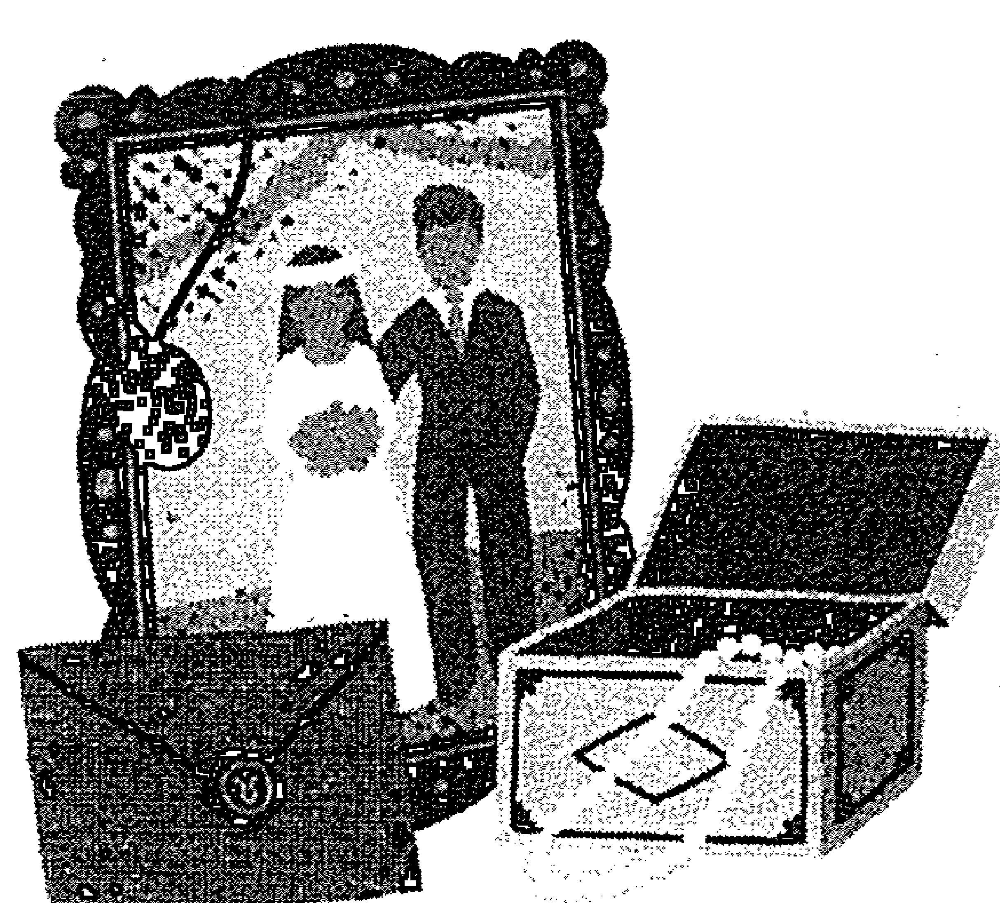

- 特質
  - 熱情
  - 鎮定
  - 堅持
- 弱點
  - 無可預測
  - 情緒不穩定
  - 自私
- 互動風格
  - 認真
  - 專注奉獻
  - 苛求

# 92 金牛座子女的嗜好、兴趣和生涯规划

金牛座子女是熱愛用雙手工作的實踐型生物。他們有著別人做，然後透過模仿與原創的有趣混合跟著做的特殊能力。他們是那句老諺語的範例：「眼睛能看到的，雙手就能做。」因此，介紹他們認識範圍寬廣的嗜好與手工藝（包括音樂與舞蹈，這是金牛座的兩大專長），會很有幫助。因為他們很容易無聊，如果缺乏挑戰可能會變得懶散或毛躁不安。金牛座子女對他們的成就感到驕傲，但也需要他們的父母一路在身旁讚美，鼓勵他們更進一步。

# 93 对金牛座子女的管教

金牛座子女看似強悍，但在被責怪、批評和管教的時候，他們的情感是很脆弱的，尤其是在管教來得不公平時。在大多數情況下，他們會管控自己的行為，因為令人驚訝的是，他們通常在生命早期就發展出強烈的道德與倫理意識，並且能夠加以堅守。他們對自己的評價，通常比父母、師長或手足加諸他們的還要嚴厲得多。身為父母，只要有可能，應先克制住負面批評，並且開始察覺到金牛座子女怎樣評估自己的行動。你會做得很好。

# 94 与金牛座子女的亲暱程度

非常奇怪的是，雖然許多金牛座子女是溫柔親切的，但要他們表現並接受親暱情感卻有困難，面對過度熱情的大人尤其不容易。與其對此大驚小怪——這只會讓金牛座子女很不自在——反而應試著提供普通的每日配給，一點小擁抱、微笑、溫柔的聲音語調，這樣他們就可以輕鬆地接受了。如果他們沒有被你弄得不知所措，你可以透過領會他們的觸碰或瞥視，鼓勵他們展現親暱情感。就像花朵一樣，金牛座孩子透過這樣的對待是會開花的。被情緒淹沒或被剝奪情緒的金牛座子女，可能會在心理上變得與人隔絕，極端難以交心。

# 95 处理金牛座子女与手足之间的互动

在許多方面，最好不要干涉金牛座子女。他們自己就會決定他們想要怎麼跟手足相處，會在這方面對父母與手足送出強烈的訊號。金牛座子女只準備做到一定程度；若嘗試把他們推到這些極限之外，會激發他們的頑固個性，到最後則會激起憤怒。父母永遠不該逼他們跟手足或朋友玩耍。金牛座子女會充分表達清楚，這種決定是由他們來做，而且也只能由他們來做。其他人會開始尊重他們，因為他們會誠實表達情緒，拒絕假裝。

# 96 与成年金牛座子女的互动

成年金牛座很有可能在许多方面都很像孩提时代的金牛座，显得不变而持久。而且他们的良好特质通常会有所增进，不好的特质则会变得更加根深蒂固。所以对金牛座能有什么期待，父母和手足都不会有太多怀疑。因為以前已經體驗過他們的反應太多次了。有不快樂童年的金牛座，通常會變成不能也不會合作的成年金牛座，因為他們無法釋放自己的怨恨與傷痛。擁有快樂童年的金牛座，通常會十分合作，甚至渴望幫忙解決困難。

## 雙子座

5月22日至6月21日

雙子座是變動宮的風象星座，這指出了他們需要變化，而且有迅速地從一個活動跳到下一個活動、從一段關係跳到下一段關係的傾向。由水星主宰的雙子座是溝通者，偏愛與心靈有關的事務，包括謎題、遊戲、電腦和演繹推論。大多數雙子座處於持續而迅速的行動狀態，他們的心靈以光速移動，身體則是盡力跟上。事實證明要約束這些飄忽不定的人做出確定的承諾，是很值得的挑戰。

# 你的雙子座老闆

鮮少有雙子座對於日復一日號令或經營一個組織感到自在。相反地，他們享受成為團隊的一部分，平起平坐地分享經驗。因此，雖然他們很有能力承擔成為老闆的工作，但卻不是天生的領袖，反而偏愛退居後方，讓事情自己運作。雙子座老闆非常善於授權，仰賴幾位有能力的員工監督公司的活動。這樣的人通常會得到優渥的報酬，而且得到授權的責任範圍很廣。然而，雙子座老闆喜歡對所有重要的事情做最終決定。

### 要求雙子座老闆加薪

雖然雙子座老闆會直接讓你知道他們對你是什麼感覺，但建議你先做好完全的準備並且謹慎地接近他們。趁他們心情正對的時候逮住他們是必要的，而且最好走輕鬆隨性路線；不要排定約談時間，反而要找個合適的時機在走廊上突襲他們，問他們是否有一分鐘時間談談。（機靈的雙子座可能已經感覺到你在想什麼了。）為了讓他們放鬆，一開始先講另一件事，甚至是另外兩件事，然後再進行你的說服工作。簡潔清楚地陳述你為何應該得到加薪的理由。請做好談判的準備。

### 向雙子座老闆宣布壞消息

只要是跟壞消息有關，最好不要拐彎抹角。你一丟下炸彈，就要確保你手邊立刻就有個夠力的損害控制方案。概述這個計畫的落實方式。準備好面對雙子座老闆提出的各種反對意見，包括拒絕承認事情有你講的那麼糟。小心雙子座老闆藉著暗示你可能對資料詮釋錯誤，來逃避壞消息。雙子座老闆是硬凹大師，他們可以朝著對他們有利的方向扭曲事實，甚至在過程中說服了你。站穩你的立場，堅持要他們充分聽取意見，並且強調為何需要立刻採取行動以避免災難。

### 替雙子座老闆安排差旅和娛樂

短程旅行、國內航班、還有整體而言的樂趣，是雙子座日常的必需品。因此在合理範圍內，雙子座老闆會認可能夠有助於公司形象、導致打開新市場的差旅計畫。請挑選有額外好處與驚喜的不尋常旅館。雙子座老闆喜歡旅遊，不過如果不可能這樣做，他們就會派員工去，透過他們的事間接享受旅程。他們熱愛辦公室派對，很享受在派對中成為眾人矚目的焦點、講有趣的故事。絕對別忘了他們的生日；他們總是很感激有驚喜派對。飲料要清淡（低酒精濃度），並且提供大量甜點和獨特的酥皮點心。規畫娛樂活動永遠是好主意。一旦娛樂氣氛夠嗨了，跳舞音樂就該逐漸導入。

#### 優點
- 生氣蓬勃
- 樂於溝通
- 有趣

#### 弱點
- 易分心
- 膚淺
- 緊張

#### 互動風格
- 熱心
- 適應力強
- 有邏輯性

## 雙子座老闆的決策風格

雙子座老闆喜歡分享，所以他們容許其他人做決定。他們鼓勵其他人表現獨立性，只要持續讓他們得知發生什麼事就好。他們不太喜歡長時間的正式會議，寧願用短小精簡的方式概述他們的計畫，也期待其他人效法。永遠別忘記雙子座老闆對於冗長或迂迴的簡報很不耐煩。他們通常會堅持以事實為基礎來做重要決定。因此，比起想像，過往的表現會讓他們留下最好的印象。當然了，雙子座老闆的所有決策都受制於變化，而且通常至少會變動一次。

## 打動雙子座老闆

打動雙子座老闆、或者激勵他們照著你的建議做事的最佳辦法，是讓他們好奇。只讓他們看到一點點你的打算，並且讓他們表達出興趣。蓋好你的底牌，只有在他們願意加碼的時候才讓他們看到你有什麼牌。請小心，雙子座老闆通常後來會把你出點子的功勞據為己有。（典型的場景是：員工呈上他／她的主意，雙子座老闆說：「哇，真高興我想到這個！」）讓雙子座老闆照你的話做，最聰明的作法是只偶爾提到某個主意，不露痕跡地把這個想法「種」到他們的腦海裡，隨後看著他們「發現」這是他們自己的主意。

## 提案並對雙子座老闆做簡報

對雙子座老闆來說，呈現某件事的方式可能就跟內容本身一樣重要。雙子座熱愛所有的高科技產品，以及能夠提供浮誇或華麗感的軟硬體設施。在你的簡報中保持輕快和樂觀的節奏，可以自在地從一個主題跳到另一個主題。要不計代價避免無聊或者陷入停頓。只提幾個重點，剩下的時間則以有趣的事實來潤飾這些重點，進而提升所有出席者的愉悅程度。請確保護雙子座老闆不時插入幾句評論，而且在你重述這些評論的時候做出正向的詮釋。

## 你的雙子座員工

雙子座員工是真正的多工處理者，熱愛忙碌。他們的專長在於同時間替老闆做好幾件事，並且替舊計畫想出好幾個新點子或新方法。他們在工作時間表裡同時應付好幾件事的能力，還有他們的多才多藝，讓他們成為優秀的代打者，能夠臨危受命，取代其他人的位置。這甚至可能意味著他們真的是在辦公室裡到處遊走，因爲在所有的星座中，他們是最不可能被綁在辦公桌前的。這一切較爲不利的一面是，雙子座員工很容易覺得無聊，而且可能沒有鬥志或持續力，日復一日地執行相同或相近的職務。他們的雙手特別靈活。

## 7 面試或雇用雙子座員工

雙子座求職者尋找的工作要包含夠有趣的任務，又能自由地認識其他人、並且探究未來的可能性。這個愛好社交的星座，並不喜歡被釘在公司裡的單一職位上。如果他們永久地被固定在一張辦公桌前，只會讓他們不快樂，到最後變成精神崩潰預備軍。話雖如此，雙子座求職者會很樂於聽到（至少剛到職的時候）他們的工作很輕鬆，而且有清楚的界定（只要保證將來的選擇範圍很廣就好）。薪水對他們而言，通常不像工作環境與學到東西那麼重要。

## 8 宣布壞消息或解僱雙子座員工

被開除可能是雙子座員工實際上很歡迎的事情，因爲這表示他們可以去追求不同的新事物。然而，他們對批評或討論他們的工作表現不佳，反應並不是很好。給他們可以去哪裡找新工作的實際建議、恰當的推薦信、或許還有一點資遣費，通常會讓他們心平氣和些。對他們宣佈壞消息應該不是大問題，反正他們往往會給自己大部分的工作成果正面的詮釋。

## 9 與雙子座員工一同差旅或娛樂

雙子座熱愛旅遊與派對，所以在這些範疇裡會發現他們的「雙子」元素。輕快如風的他們有著愛找樂子的個性，最享受的莫過於改變環境，或者在辦公室派對裡歡鬧。在這種情況下，他們談話與娛樂的需要，可以得到優先權。如果派一個雙子座員工代表公司去參加一場大型會議或董事會，請確定他們經過明確的指導，能傳達你想傳達的公司形象。雙子座是超強演員，在一個好導演的指導下，能夠駕馭幾乎任何必要的角色。他們的衣著應該維持在保守路線上，避免顯得俗麗或令人震驚。

## 10 分配任務給雙子座員工

雙子座天生就是解決問題的人。然而，讓雙子座員工展現出最佳表現的工作，是那些跳脫框架去思考的任務。永遠都是古怪、不尋常或意料之外的事物，引起這些人的好奇心，所以請確保不要讓他們的新任務太重複或無趣。給他們自由是好的，只要你像對待一個青少年一樣，把話講清楚：伴隨著這種獨立性而來的是爲他們的行爲與表現負責。請確保雙子座員工定期跟一位上司聯繫，且不只是在專案開始的時候，而是在整個專案期間都這麼做。他們可能很快就失控了，所以好好盯著他們，不過最好不要讓他們知道，免得箝制了他們的行事風格。

## 11 激勵或打動雙子座員工

訴諸思考能力，最能夠打動或激勵雙子座員工。如果你可以用直接又合乎邏輯的方式向他們解釋現狀是什麼，以及可以怎樣處理或導正，他們就會滿懷熱忱地往正確方向前進。然而，請記得，他們講理的需要，常常導致他們與人爭論；一個不小心，他們就會跟你辯論每一點到地老天荒。報酬很容易就能激勵雙子座員工，你對他們能力表現的興趣與信心也很能打動他們。因此，他們很容易相信一個新專案不會是一項負擔，反而是一個令人興奮的機會，讓他們可以享受其中並往前邁進。

## 12 管理、指導或指正雙子座員工

雙子座比任何其他星座都喜歡批評他人，卻對他人的批評很敏感。如果你可以指導他們，同時卻不批評他們的工作，你就會發現他們很有可塑性又很合作。在給予意見時，語氣保持樂觀積極。要特別注意，就像不乖的頭髮一樣，失控的雙子座可不是什麼好看的景象。必須盡可能讓這個星座保持在筆直的正道上，然而還是要給他們足夠的自由，照他們自己的方式做事。只要這個危險的平衡保持住了，雙子座員工就會繼續做出寶貴的貢獻。

## 你的雙子座同事

對於所屬的任何團體，雙子座同事都可以加上一點不同滋味——只要雙子座的人數沒有太多就好。諺語裡的「一桶猴子」，很適合用來描述太多雙子座齊集一堂、很難搞定任何事的狀況。然而，可以找雙子座同事來臨時替補一位缺席的同僚，這樣能夠大大提高他們的價值，畢竟他們不只是活潑的娛樂大師而已。雙子座同事機智又健談，如果你放任他們，他們會講到你耳朵爛掉為止，這可能讓你沒辦法做太多事。

#### 優點
- 令人愉快
- 手巧
- 有創造力

#### 缺點
- 心神不寧
- 多嘴
- 缺乏自覺

## 13 尋求雙子座同事的建議

找雙子座提供建議，他們高興都來不及，因為他們熱愛解決問題。在大部分情況下，他們會自告奮勇提供諮詢，而且還會一直如此。因為這項特質，你不常有這個必要主動去問。他們分析性且樂觀的態度，通常會讓你覺得愉快——就算他們的建議並不怎麼出色。他們會提起你可能沒想到的議題和方法，所以聽聽他們的說法可能有幫助，即便你不同意他們的假設或結論也一樣。最傷害他們的莫過於你拒絕聆聽，因為被突然打斷是有可能發生的最大侮辱。

#### 互動風格
- 節奏快速
- 樂觀
- 有趣

## 14 向雙子座同事求助

雙子座同事通常有空幫忙，而且他們在兩個領域裡特別強：處理語言事務與執行實作的任務。唯一的問題是，他們常常必須照自己的方式做事，結果得到的可能是某種只有他們才懂的東西，而他們達成這個結果的方式可能讓人難以理解。因此要修正或逆轉他們努力的成果，或許很困難或者不可能。然而如果他們受到良好的指引，不疾不徐地做，就能夠產出正中紅心的優秀結果。「用腳思考」是他們的專長，結果好壞都有可能。

## 15 與雙子座同事一同差旅或娛樂

在為一場辦公室派對或下班後聚會安排娛樂活動時，雙子座通常更喜歡由自己來負責娛樂這一塊。在這個領域裡的雙子座很難控制，必須提醒他們，他們的工作是管理或安排，而不是成為注意力的焦點。對於組織性的問題與挑戰，他們相當能夠採取邏輯性、分析性的路線，在替娛樂活動訂位與做旅行安排時都是如此。他們善於處理細節，在調查並考察最划算的航班、旅館與食物時，表現很優秀。此外，他們是安排實際可行時間表的能手。他們熱愛旅遊。

## 16 與雙子座同事共事

雙子座同事一般來說在團體環境下運作良好。他們天生就是社交動物。讓別人感覺更好、看起來更好，是他們的強項。最重要的是，他們需要有人欣賞他們的作為。可不能期待這些人在幕後隱姓埋名地工作。他們有超直接的風格，要求別人承認他們在整部機器裡是重要、甚至是必要的齒輪。他們不是宰制或採取主控的類型，通常很樂於當團隊裡的一分子，並且讓所有參與者都有一趟愉快的旅程。他們閒聊的需求會惹惱某些人、逗樂其他人，但雙子座的機智問答和談笑本事，會讓每個人保持活躍和警覺。

## 17 打動或激勵雙子座同事

這些健談的靈魂最容易被其他人的談話技巧與快捷思維打動。當然，強硬、沉默的類型或者慢郎中則會讓他們覺得無聊。他們往往會對跟他們同類的才智煥發人格印象深刻，而跟這樣的人唇槍舌戰常常能激勵他們。他們努力在速度、效率、邏輯與機靈程度上勝過其他人，這可能是讓你敦促他們盡全力的一種辦法。他們有高度競爭性，可以達成希臘神話中大力士海克力士那般的豐功偉業，工作表現頂尖。然而，請小心避免讓他們浪費精力在毫無成果的掙扎與爭論上。

## 18 說服或指正雙子座同事

總是要訴諸雙子座同事的理性。如果你可以用你的論證邏輯說服他們，他們會聽的。弔詭的是，他們對於與心智相關的事物很情緒化，而且如果有人不了解他們，他們可能會大吼大叫。讓這種攻擊過去。這類事件總是很快就過了。他們可以忍受少量批評，但一直吹毛求疵則會激起他們的怒火。請記得，他們的心情可以像天氣那樣多變，所以如果你努力跟他們溝通卻不成功的時候，晚點再試就好；到時，你可能會面對相當不同的人或狀況。雖然他們對輕蔑之舉有非常好的記性，卻不容易懷恨在心。

## 你的雙子座客戶

#### 優點
- 注重現實
- 周密
- 清楚

你的雙子座客戶很可能對細節和整體戰略計畫都很有興趣。他們很容易被惹惱、高度挑剔，可能非常苛求，一點都不好應付。一旦專案啟動以後，他們會期待一直得到最新情報，並為他們投入的金錢尋求可展現的成果與價值。對他們來說，特別重要的是扎實的成果，因為他們不會滿足於未來獲利的承諾，或用來解釋貧乏成果的迂迴硬凹。要是你提供他們一項服務，他們會特別注意其中的書面語言與內在邏輯；如果你是在製造或銷售他們的其中一項產品，他們會非常仔細地檢查有沒有缺點。雙子座是很難懟弄的客戶。

#### 缺點
- 愛爭論
- 挑剔
- 嘮叨

#### 互動風格
- 超直接
- 苛求
- 愛挑錯

## 19 打動雙子座客戶

雙子座潛在客戶只會對過往的表現印象深刻。準備好詳細清單，以及每週、每月與年度銷售試算表是必要之舉，就算只是讓他們在你面前匆匆瞥一眼這些資料也好。這麼做，可以確認他們需要的東西就在這裡。隨後，他們很可能會仔細地爬梳一遍這些結果，所有不相干的事實會被過濾掉，誤導性的數字運算會無情地暴露出來，而糟糕的結果會被推回去給你看。因此，在你們的第二次會議裡，你必須準備好面對負面事實的總進攻。

## 20 向雙子座客戶推銷

一旦你吸引住並引起雙子座客戶的興趣，就必須讓他們相信你有能力迅速談定交易，並且符合他們大多數的要求。最好動作迅速地準備並簽訂合約，而不是花上好幾個星期解決複雜的法律與實踐議題（在替公共消費準備產品與服務時，方針也是一樣）。請記得，對雙子座客戶來說，速度是根本要素；對他們而言，這是你的生產能力的直接指標。以合乎邏輯又直接了當的方式把你的計畫賣給他們。施展魅力通常沒有幫助。

## 21 雙子座客戶重視的外表和舉措

請謹慎地穿上色調柔和的衣服，避開會讓人不安或分心的鮮豔顏色。同樣地，最好避免味道強烈的香水、古龍水或鬚後水。然而，雙子座客戶通常非常跟得上最新流行風格，而你絕對不會想要顯得太過保守或老派，這樣可能會讓他們有個印象：你的產品或服務過時到無可救藥了。他們的利眼會落在一點細微修飾或細節上——一只時尚的別針、手鐲、手錶或其他配件、剪裁有型的衣著，你的髮型也十分重要。雙子座的頭髮會自然地偏向於狂野些，所以這些客戶會對你控制自己髮型的任何嘗試給予肯定。

## 22 保持雙子座客戶的興趣

挑逗或直接的誘惑行為，可以讓雙子座客戶接下來幾個月保持興趣。雙子座可以非常善於挑逗，因此，他們也欣賞別人身上的這種技巧。雖然不建議實際跟這樣一位客戶接觸，但每次的會議、電話或電子郵件，都可以用細微的暗示來加料，就像在晚餐裡有節制地加點香料，會有提味的效果。玩遊戲是雙子座的強項，而且不像其他星座，會鼓勵他們的不一定是獲勝，而是玩本身的純粹樂趣。他們會立刻認出並承認有個可敬的對手，而這種尊重可能會直接反映在他們保持商業關係活絡的意圖上。

## 23 向雙子座客戶報告壞消息

雙子座客戶很可能以驚人的冷靜方式接受壞消息。他們甚至會同情你已經做盡一切來確保成功的主張（要是他們一直都認定你和你的公司已經做到最好了）。只要雙方的損失還可以掌控，雙子座客戶很擅於損害控制與勾消損失。他們甚至可能建議進一步合作，只是需改變策略。一般來說，建議你繼續跟這樣的客戶聯手。衷心的相互合作，還有從過往錯誤中學習的能力，可以導向未來的成功。

## 24 招待雙子座客戶需注意的「眉角」

雙子座客戶熱愛被寵溺。跟他們進行商業會議，在最初一、兩次坐在辦公室裡會談以後，最好轉移到酒吧或餐廳，趁著喝一杯或吃一頓的時候進行。挑個你熟悉、而且覺得特別適合他們個性的地點。這樣做的時候，事前儘可能多了解他們個人的好惡會是關鍵。帶一位素食主義者去牛排館，或者帶一個講究的酒客去啤酒館，顯然並不恰當，並且會帶來強烈的反效果。輕鬆地拿起帳單，並且確保他們看到你留下豐厚的小費，但只有在服務配得上的時候才這麼做。

## 你的雙子座合夥人

有些人認為雙子座合夥人是失控的自走砲。雖然雙子座卓越的分析技巧受到重視，但他們魯莽的行事作風和多話也常常受到懷疑。雙子座合夥人在這方面應該要受到管控，而且必須教會他們不要露出底牌。他們並不總是察覺得到誰可能傷害到他們的合夥關係，所以，他們的開放性與過度信賴的天性（或者就只是不在乎誰知道什麼事），容易讓另一個合夥人與他們經營的公司或團體受害而產生風險。作為雙胞胎星座，雙子座往往會如對待兄弟般地對待他們的合夥人，期待與他們分享，卻也期待毫無疑問的忠誠和支持。

## 25 與雙子座建立合夥關係

跟雙子座合作，最好在合夥關係開始從事任何商業交易以前先簽下合約。雙子座可以是很滑溜的客戶，同時也善變到極點。可能很難讓他們堅持原有的口頭協議。書面合約涵蓋的不應只有組織的結構與經營（包括占比與義務），對於如果事情出錯要怎麼處理，也要有極其詳細的描述。所以，合約的結構會持續存在於合夥關係的日常營運中，以便給雙子座合夥人嚴格的行為指導方針。

#### 優點
- 敏銳
- 活躍
- 分析性

#### 缺點
- 多話
- 草率
- 疏於注意

### 特點
- 分享
- 開放
- 令人印象深刻

## 26 與雙子座合夥人之間的任務分配

一般來說，雙子座合夥人接受指導的表現比指導別人來得好。他們那一方的合夥關係，應該由另一位合夥人小心地規畫出來，當然了，這需經過雙子座的同意。在某些方面，活躍的雙子座就像一把槍或一條消防水龍帶：你只要把他們指向目標，然後扣下扳機或按鈕就行了。執行是他們的強項，雖然他們的規畫技巧也可以很敏銳，但同樣可能的是他們會走歪，然後導向混亂。跟雙子座共同經營生意的合夥人，通常在他們很保守小心、卻不怕偶爾在精明估算的基礎上賭一把時，最為成功。不推薦兩個雙子座一起合夥，因為這樣可能會導致無止盡的爭辯與討論。

## 27 與雙子座合夥人一同差旅或娛樂

非雙子座的合夥人，可能是那個替雙方制定旅行計畫的人，或者是訂飯店和機票的人，但通常雙子座合夥人最擅長出差和代表公司。普遍會出現的場景如下：非雙子座合夥人留守本壘看店，雙子座合夥人則跑遍全世界，或者至少是跑遍全市或全國，招攬新的生意，向外探索潛在客戶與商業機會。然後全部的訊息再傳回本壘的非雙子座合夥人那裡，他自己則小心翼翼、沉著冷靜地決定每個個別合約的價值。這種工作模式可以高度成功。

## 28 管理並指導雙子座合夥人

管理或指導雙子座合夥人的最佳方式是，容許他們隨心所欲，同時設下一些不至於箝制他們行事風格的限制。不快樂的雙子座無法發揮他們的最高效能；在極端的情況下，他們甚至完全無法運作。恭維他們的工作，鼓勵他們活躍的心靈——基本上就是對他們的作為表達欣賞之情——並且包括一些小甜頭，會讓他們很開心。在這方面，可以把雙子座當成小孩或青少年看待，並且鼓勵他們取悅你，同時嘉惠公司。任務導向的雙子座，忙碌的時候通常很滿足。

## 29 與雙子座合夥人長期的合作之道

只要你的雙子座合夥人覺得被重視，你就有可能掌握住這些容易變動的夥件。時機不好的時候他們也會繼續工作，甚至把好幾個月都奉獻給並沒有財務回饋的專案——只要他們覺得工作有趣又刺激就行。另一方面，一旦雙子座覺得被低估或未受賞識，他們會像兔子一樣，很容易就跳、跳、跳走了。兔子般的雙子座很享受安全感，還有偶爾被摸摸拍拍（當然這是比喻）。在時機好的時候跟他們一起工作或相處，鮮少有別的合夥人会比他们更有趣。在艰困时期，一定要向他们一再保证尽管有负面的结果，一切依然没问题，未来还有希望。

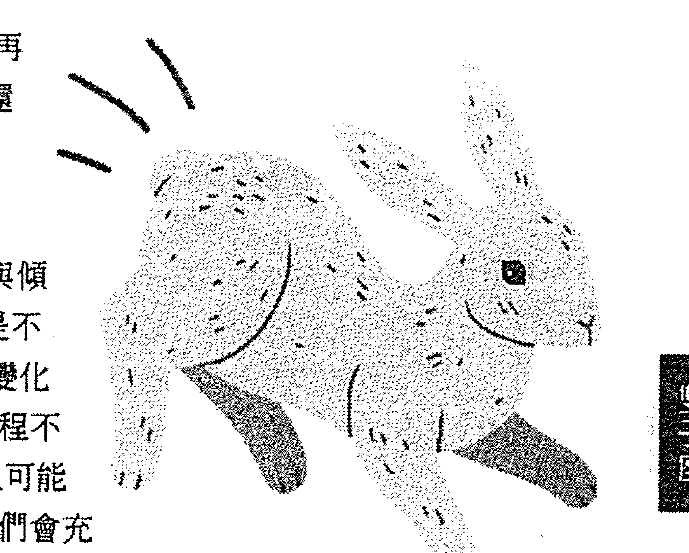

## 30 与双子座合伙人分道扬镳

因为双子座合伙人有安然度过逆境的弹性与倾向，解除合伙关系不必然会很困难，或者被看成是不好的事。事实上，通常是双子座合伙人为了寻求变化而先开始这个过程。然而，这并不意味著分离过程不会很复杂。请记得，双子座热爱细节。虽然这些人可能很快同意你的提议，并且同意合约的要求，但他们会充满热忱地复查合约上的小字体内内容，并且闲聊其中的某些要点（而且通常是死缠著不放）。法律与半法律讨论可能会因此延长。最好在这类细节上对双子座让步，把你的精力与注意力省下来，放在重要议题上。

## 你的双子座竞争者

双子座有高度竞争性。是出人头地的挑战与刺激感在驱策著他们。他们处于获胜的喜悦时，并没有虐待狂倾向，不觉得非得羞辱或摧毁他们的对手不可。然而以他们锋芒的机智、反讽的意识、挖苦、心思敏捷与伶牙俐齿，如果必要的话，他们是很有能力这么做的。不需要太多准备与预谋，双子座就能即时准备好加入战局。对任何公司来说，严密控制这些有高度竞争性的天性是最好的，因为他们在他们的双子座代表激起对立与深刻的敌意时，这些天性可能会产生反效果。毕竟在颠倒混乱的商业世界里，今天的敌人可能是明日的伙伴。

特点

- 反讽
- 聪明
- 机智

弱点

- 伤人感情
- 激起怨恨
- 充满敌意

## 31 反击双子座竞争者

互动风格

- 好斗
- 有挑战性
- 机警

与其抢先单挑双子座竞争者，最好观望等待。就像拳击界里的反击高手，在回应以前先让双子座竞争者攻击，让他们显露出他们有什么。双子座竞争者在疯狂晃动的时候，是最脆弱的。放轻松坐好，冷静地接下乱拳，然后用精简扼要的刺拳阐明你的论点。这可能会激怒你的对手，但也给了你机会挥出击倒他的那一拳。请谨记，除了战斗的喜悦外，对双子座竞争者来说鲜少有任何事会牵扯到个人。

## 32 智取双子座竞争者

双子座很善于计划，在比较你们双方的产品服务时，通常会做广泛的研究，仔细钻研公关和广告，检视每个范畴里的销售，以及整体性地分析你的每项优缺点。所以，你在这些领域中也必须有同等准备，如此方能迎接他们的挑战，才有机会胜出。预期双子座竞争者的策略。尤其要检查你公司的弱点，并且迈出大步歼灭他们。双子座竞争者的一项弱点是，他们通常只能看见现在或刚过去不久的发展。所以，你可以靠著洞见整体局面、做长期计划与拒绝放弃，屡次地击败你的双子座对手。

## 33 当面让双子座竞争者刮目相看

在跟双子座竞争者会面时，不论是一对一或在团体里，最好用保守风格来对抗他们的浮华作风。建议穿颜色低调的奢华服装。整体而言，要呈现出镇静、坚定不移的外表——梳理整齐的头发，烫得无懈可击的衣服，还有昂贵的配件（手表、手镯、别针）。相对于会被这种外表摆平的双子座客户，你的双子座竞争者可能会因此被激怒。让他们为你镇定的外表与举止气急败坏，然后用自信的笑容打击他们。

## 34 对双子座竞争者削价竞争或高价抢标

一般而言，双子座对手会设法提供客户或一般大众比你更多的价值与赠品。他们总是会设法靠这些额外好处的多样性与份量来制造深刻印象。另一方面，你最好换个方向，不要玩他们的游戏。集中精力在降低你的价钱，并且强调大量销售、大众市场等等。在权利或产品的出价战里，让这些对手先露出他们的底牌，这时你要撑住，直到他们自己耗尽力气退出，或者被迫报价过高为止。请记得，尽管双子座精力非凡，最好还是靠顽强对抗来搏斗。

## 35 与双子座竞争者的公关战争

双子座对手会用每一分浮华绚丽的光彩来抓住大众目光。他们时尚到极点，而且正中大众对创新永无餍足的欲望，起初会成功地大量销售，然后通常会收摊，因为他们已经累积大笔利润了。你的方法应该要强调过往的可靠性、稳定的销售、起初少量的获利率，然后最重要的是，有计划地逐年建立信赖你产品可信度与可靠性的客户群。保证是很重要的，就像明星与普通人的认可都一样很重要。用你自己的广告，在你的对手异想天开的承诺上戳洞，并且揭示他们如何缺乏任何可靠事实的背书。

## 36 向双子座竞争者展现你的态度

双子座竞争者在这方面可能有所缺乏。虽然他们伶牙俐齿又常常夸下海口，但却可能无法彻底让客户与消费者相信。他们总是有些可疑之处。要反击他们的许多提议，可以温暖、友善、随和的态度取而代之，而你的目标阅听大众会为之心动。说话要慢，并且完整涵盖你的论据，以便跟他们高能量、连珠炮般的语调形成对比。设法建立与客户之间的稳定信任，这种信任会激发他们对你的产品或服务的信心。提供更长期的保证可能也有益处。

## 爱情

双子座
5月22日至6月21日

## 与双子座的第一次约会

几乎任何事情，你的双子座约会对象都很乐意尝试一次。他们不容易被吓到，这些多变的约会对象是真的对你想做的事情有兴趣。跟你们在一起的时候，采取主动到某种程度是好的（过了那个程度以后，他们就不再觉得有趣了）。他们可以相当间接地享受经验，特别是他们在（或者自认为在）给予乐趣的时候。因此，你乐在其中对他们来说可谓大大提升他们的自尊。兴奋是他们的强项——这是他们最快乐的状态。无聊是他们最大的敌人。

## 吸引双子座的目光

双子座对于被搭讪一点都不嫌弃，尽管事实是他们外向的本性通常导致他们先开始这么做。他们左顾右盼的利眼会把你从人群中挑出来，而在你发现以前，他们已经让你参与快速而有趣的对话了。“这么迷人的人怎么可能单身？”你心想。答案很简单。双子座永远都单身，就算他们结婚了也一样。如果你在寻求随性的关系，或者只想找一夜情，这个人可能很适合你。

## 初次跟双子座约会的建议

双子座热爱娱乐和被娱乐。有时候他们喜欢同时做两件事，所以如果你安排好这一晚要看一、两场电影，要是他们边看边发表连珠炮似的意见——或者至少是偶尔有机智的评论与笑声——别觉得惊讶。出外跳舞、泡夜总会或看电影，可能很有趣。他们热爱社交场合，以及新活动所带来的兴奋感。稍后如果你希望的话，会有很多时间做更亲密的接触。

## 初次跟双子座约会的助兴与败兴之举

你的双子座约会对象必须感觉受到欣赏。没有任何事情比他们跟你说他们最爱的笑话时，你眼中流露的特殊光彩，或者听到你赞美他们的外表，更让他们兴奋了。如果他们梳了很时髦的发型、穿了很酷的衣服、或者足蹬一双十分有流行感的鞋子，他们会想要得到你的注意和认可。反过来说，没有别的事情比被人忽略更扫他们的兴了。请注意，你不必拍他们马屁或者拼命赞美他们，反正无论如何他们都会觉得这种行为很可疑。

### 强项
- 令人兴奋
- 有趣
- 有冒险性

### 弱点
- 缺乏自觉
- 自私
- 自我中心

### 互动风格
- 乐观
- 话多
- 有说服力

## 🔢 对双子座采取「攻势」

在晚上的关键时刻，正当你盘算著是否要更靠近双子座，或者诱使双子座采取攻势，你可能会发现你的约会对象已经投怀送抱了。双子座对这种事情有第六感，他们不只是口语沟通大师，也是非口语沟通大师。所以，请记得，当一个念头跑进你的收件匣时，常常一份副本就立刻转寄到他们的收件匣了。第一次接触通常很愉快，而且可能惊人地激情。冷静的反应不该被当成是没有兴趣或拒绝的征兆，只是客观的抽样或初次浅尝。

## 🔣 打动双子座的方法

知识与事实最让双子座刮目相看。请确保你用功钻研过他们的专业、嗜好或特殊兴趣，这些是你在约会前就该知道的。问出他们可以长篇大论回答的问题，会燃起他们的兴趣。更好的是鼓励他们带你去他们最爱造访的其中一个地方。他们虽然有鉴赏力，但在新的环境下却可能会不太确定，然而在他们自己的地盘上（他们希望你不熟悉），他们可以扮演他们最爱的一种角色——连珠炮式的导游。做好准备，并且假装有在听，不过你只需要捕捉到足以架构出下一个问题的讯息就行。

## 🔢 摆脱双子座的方法

除非他们彻底为你神魂颠倒，摆脱掉双子座这个初次约会对象，最容易的方式就是以忽略他们来伤害他们的自尊，拒绝为他们的机智评论发笑，发牢骚，讲你自己，说你觉得不舒服，或者直接告诉他们你觉得很不开心。一般来说，约会对象对他们来说反正不是顶重要。他们甚至可能会跟别桌或下一排座位上更讨他们喜欢的人看对眼，你一转身，他们可能就已经不见了！然而要是他们执著于你，可能就会比捕蝇纸还黏。

## 你的双子座恋人

拥有双子座恋人，肯定会为你的生活增添滋味，也会带来相当多的不确定性，因为想要预测他们的行为就算不是不可能，也十分困难。多变的情绪保证鲜少有无聊时刻，但却可能束缚了你的计划，或者损害到你们的关系结构。订下约会可能会特别困难，因为他们虽然通常会准时抵达（在他们确实出现的时候），最大的危险却在于他们会突然取消他们从没想要履行的约定。让人气急败坏却魅力迷人，这些瞬息万变的家伙会让你一路苦追。

## 🔣 与双子座恋人进行讨论

双子座并不讨厌谈话，但他们可能并不是非常认真看待你说的话。虽然他们可能会点点头或者说“嗯哼”表示收到，这却不是他们有在听的真实指标。要是你挑的话题，是他们不感兴趣或者听了不顺耳的主题，他们会一直把话题转换到他们觉得更有趣的事情上。要是你坚持继续努力，他们可能会狠狠瞪你一眼然后走开，或者巧妙地认出旁边有一样东西或一个人，突然很需要他们去注意。

## 44 与双子座恋人发生争论

面对双子座，危险永远在于讨论会变得有争议，然后变成吵架。这些人遣词用字是这么有技巧，在口头机智问答时又这么专心想赢，以至于被检视的议题可能会在混乱中消失无踪。让他们说他们想说的，然后温和地引导他们回到主要的论点上。让你自己的评论保持简单扼要，目标在于达成最大效果。当双子座首先勉强承认你有任何一点说得对时（这可能得花上十分钟到半小时不等），这是个正面的指标，指出他们有听到你的话，而且事情正在往正确方向进行。

- 魅力迷人
- 机智
- 才气焕发

- 不可预测
- 鲁莽唐突
- 有误导性

## 45 与双子座恋人一起旅游

双子座喜欢装备轻便、移动迅速的旅行，所以，你带上的任何多余行李保证会引起他们的批评与愤怒。准备好背或拉你自己的行李箱，因为他们可能干脆拒绝帮忙，争辩说你早该把大多数行李留在家里。一旦上路（不管是靠汽车、飞机、巴士或火车），这些健谈的灵魂就会设法在旅途中尽力娱乐你，以此满足他们的需求——让你赞赏他们的机智与才华、聆听他们舌粲莲花或随口闲聊，从一个话题跳到另一个话题。在他们身旁睡著，或者甚至只是偶尔打个哈欠，是绝对不行的，因为这是觉得无聊最确切的迹象。

- 拐弯抹角
- 有说服力
- 爱挑逗

## 46 与双子座恋人的性爱关系

双子座喜欢多样性。质通常比量更重要，所以他们期待你总是为他们维持最佳状态。他们也会期待你知道他们什么时候想做爱，并且给他们最有趣的独特经验，或者至少对他们实验的需求保持开放。整体而言，他们很容易被撩起，所以也很容易满足——至少比大多数其他星座容易。延迟满足愉悦并不是他们的强项之一，所以他们的情绪智商偏低。他们在办事前中后都想讲话的倾向，可能会逼死你；但你如果跟一个双子座在一起，你就必须忍受这一点。

## 47 双子座恋人的亲暱表现

双子座不太会公然表达柔情或晒恩爱。他们通常会以特别不带情绪、甚至不假思索的方式表达柔情，所以你必须动作很快才能接到。柔情可能采取的形式是匆促的微笑、猛然一瞥、背上一拍、甚至是挖苦或反讽的带刺言论，虽然他们是一片好意。无论如何，他们的情感表达通常没有把你的期待考虑在内。双子座有他们自己做事的古怪方式，特别是在情绪层面上，要在这方面自我表达，他们通常会显得很尴尬和笨拙。

## 48 双子座恋人的幽默感

你的双子座恋人热爱大笑。不幸的是，他们经常性的幽默对象可能是你，一阵子以后这可能会变得让人难以忍受。你这方提出抗议的任何尝试，都免不了会碰上你缺乏幽默感的指控。他们的幽默不只是口头上的，还可以延伸到各种偶尔甚至近乎虐待狂的恶作剧。看某人不自在以及导致别人尴尬，会让他们满心欢喜。双子座也非常爱逗别人。他们可能会很快承认他们不是认真的，并因此拿你认真看待他们来寻开心，尤其是在你对他们有反应的时候。

强项
- 独立
- 热爱自由
- 令人兴奋

弱点
- 不可靠
- 不可依赖
- 无道德感

互动风格
- 迅速
- 机智
- 不假思索

## 你的双子座配偶

你的双子座配偶可能因为他们的个体性与对自由的强烈需求，而威胁到你们的婚姻稳定与表现。而且这些双子经常采用双重标准，根据这些标准，他们有理由自己跑掉，但你却不行。因为他们没有道德感的态度，以致他们鲜少看到自己的行为哪里有错（如果他们真能看到的话）。不知怎的，到头来你通常会在家里等他们回来。对于这种态度，最好的处理办法是维持你自己保持独立的权利，拒绝替他们擦屁股——实际上与比喻上都是如此。

## 49 双子座的婚礼和蜜月

跟高度社会化的双子座结婚，通常会带来很多乐趣。他们会让自己很尽兴，也花很大精力让婚礼大获成功。相对来说，事实可能证明蜜月有些令人失望，因为一对一的私人互动并不是他们最擅长的。虽然性爱可能很刺激又非常多样化，但你可能很早就觉得他们并没有在更深的层次上对你敞开心胸。随着时间过去，他们肯定能够这样做，所以最好不要一开始就对他们施加压力。在这个早期阶段就唠叨著已婚人士的责任，是不受欢迎的。

## 50 双子座的家庭和婚姻生活

坚守义务并不是双子座的强项，所以他们可能会把正常的家庭任务看成是没有意义的苦工。（猜猜看到头来会是谁做了那些工作！）然而他们够务实，所以会领悟到打扫、把东西归位、还有一般而言有条理的规划家庭空间，都是非做不可的事。最好列出清单、概述他们的责任，坚持他们应遵守规则并履行义务。他们通常在想出新计划和问题的创新解决方案时，表现出众。然而，你会发现自己必须督促他们保持在正轨上，并且看著他们有始有终实践他们良好的意图。

## 51 双子座婚后的财务状况

双子座并不会挥霍无度，实际上事实证明，在持家方面的现金开支上，他们相当吝啬。出于某种原因，他们不可能接受或掌握家庭预算必须包括不刺激、不有趣的项目，像是清洁用具、修缮项目、隔音材料、修理屋顶、管线修缮之类的。诀窍在于让他们对此产生个人兴趣并亲自参与，因为他们的双手相当灵巧，而且对你赞赏他们的工作反应良好。虽然可以规定双子座遵守紧绷的预算，然而你必须在这方面辛勤努力，因为他们有很强的冲动会买下预料之外又通常不实用的东西。旅行、娱乐、电脑用品，还有跑得快或外表浮夸的车子，对你的双子座配偶来说有致命的吸引力。

## 双子座的不忠与脱轨

因为双子座是最有可能误入歧途的星座之一，你最好容许双子座纵容他们调情（有时甚至很过分）的自然需求。要是你对他们太严厉，禁止这样的举动，你所冒的风险便是逼他们反叛，沉浸于全套的出轨恋情中。最好给他们看不见的束缚，这样他们会觉得自由，却也知道他们只能做到某个程度，才不至于惹毛你。双子座通常会在不被抓到的情况下，尽他们所能掩饰形迹，但他们的恐惧与罪恶感可能轻易就被撩起，所以他们会对自己的游荡癖性设下界线。

## 双子座与子女的关系

自己就是小孩的双子座，通常是好得惊人的父母——奉献、投入，成长过程里有他们是很有趣的。他们特别热爱运动、游戏、露营，以及大多数的度假娱乐活动。虽然通常他们能应付得来的就只有一、两个孩子，某些双子座却很享受更多小孩的陪伴与崇拜，会把孩子们当成朋友、甚至是兄弟姊妹来对待。看著自己的孩子成长，并且体验到预期之外的新事物，会长期维持他们的兴趣。然而当孩子们够大了，双子座不仅不会抓著他们不放，反而会推他们离巢，敦促他们自由高飞。

## 双子座面对离婚的态度

要是你决定甩掉双子座配偶——或许是在第N次原谅他们的越轨行为以后——你可能会发现，在厘清所有物、现金与法律义务的时候，他们讲求实用、务求合理的那一面，惊人地容易应付。另一方面，双子座在情绪领域里可能很快就失去控制，所以他们在面对离婚这件事时并不觉得自在。被嫉妒、愤怒或暂时的恨意袭卷的时候，失控的双子座好处理的程度大概就跟龙卷风差不多。你的双子座配偶的感受很快就可以冷静下来，而在情绪风暴自己吹完时，他们通常就有办法进行一场有建设性的坦诚讨论。

## 你的双子座秘密情人

### 强项
- 自由
- 有空相伴
- 热烈

跟双子座进行秘密恋情的时候，请期待一场稍纵即逝却很热烈的交会。不论好坏，这场恋情能不能成功，仰赖的是你想不想继续。跟大多数人相比，双子座秘密情人比较不可能是非常可靠或者要等上很久的那种人。而且既然双子座需要把发生在他们身上的事情说出来，他们便不太可能愿意或能够让事情保密。如果一项让人尴尬的细节自动流入旁人的耳朵，然后变成像野火般在你社交圈里散播开来的下流八卦，可别觉得惊讶。

### 劣势
- 不值得信赖
- 不够慎重
- 太爱讲话

## 55 遇见双子座秘密情人

你可以在最难以预料的地方，遇见或钓上双子座秘密情人。起初的接触很可能非常短，而且或许就只是一句话或眼神一瞥。大体来说，他们会在这之后直接跟你联系，或者透过共同的相识或朋友传话，表示他们愿意接受你的追求。他们的自我热爱被奉承，所以你觉得他们很迷人、有趣、或在任何方面引人好奇的事实，就是大大的加分。像是酒吧、夜总会、约会网站或app这样比较传统的环境里，会有很高比例的双子座，所以你偶然遇到一个的机会相当高。通常能透过他们活泼的个性、有技巧的沟通、还有让别人印象深刻的需要，来认出这位秘密情人。

### 互动风格
- 直接
- 有回应
- 坦白直率

## 56 与双子座幽会的地点

双子座对亲密时的环境条件并不特别要求。一般来说，他们比大多数其他星座更乐意在任何地方温存，这甚至可能包括公共场合。他们外向的性格和最惊世骇俗的一面，容许牵手及亲吻，甚至若想更进一步，可能还不会让他们尴尬。在他们的住处待上一下午或一晚可能真的很有意思，这不只是因为牵涉其中的行动，也因为你得以看到他们迷人的收藏，包括各种物品、书籍、CD和DVD，还有他们最新的电脑软体。若是在你家，这些好奇的灵魂很可能想要翻遍你的许多私人收藏，包括衣服、帽子和鞋子，以便从中认识更多的你。

## 57 与双子座的秘密性爱

双子座通常很容易被撩拨，也很容易满足。他们可能有各种有点变态的兴趣，热爱实验，对于千变万化的性爱体验很著迷，从印度爱经到SM都包括在内。我们可以把你的双子座秘密情人想成进了糖果店的孩子，或者香蕉树上的猴子。这一切对他们来说有什么意义是很难定义的，但通常一切都是在幽默与疏离的状态下做的，而不是真正深刻的投入。在某些方面，你可能觉得自己像个旁观者，被邀来享受他们的表演。

## 58 长久保有双子座秘密情人

就像谚语里的兔子，只要被欣赏，双子座就会留下；但如果不被欣赏賞，他們就會跳、跳、跳走了。就在你已經習慣了他們，以及他們所有的奇怪習性、緊張的矯揉造作和需求時……他們就跑了。雙子座能夠像水一樣從你的指縫間溜走，而且沒有保證不敗的方法可以留住他們跟你同在。然而，你要是能在太不在乎與太過在乎之間找到一個好的平衡，他們就有可能留下來；如果此刻沒有引起他們興趣的其他地方好去，就更是如此。雙子座的忠誠，或者說是缺乏忠誠，通常是由他們最近的心情和行程表而定，這可能包括你，也可能不包括你。

## 59 與雙子座的秘密歡愉

雙子座熱愛跟你一起出現在公開場合，主要是想炫耀你的存在。他們期待你外表出色、談吐出色、舉止出色，而且整體而言，讓他們看起來出色。他們熱愛電影、夜總會、外出用餐、音樂會、以及幾乎任何有趣的活動，可謂是真正的行動派，而且通常不是那種渴望在家安靜度過一晚的類型。另一方面，當他們在家時，他們會著迷於大多數最新的媒體，特別是電腦軟體和範圍廣泛的音樂與電影。愛玩到了極點的他們也喜歡解謎和桌遊。偶爾讓他們贏可能很明智，否則他們可能會變得非常暴躁不安。

## 60 與雙子座秘密情人分手

這通常不是問題，除非雙子座秘密情人對你、還有你的性愛與浪漫重度上癮（在這種情況下，他們可能拒絕離開）。等到你反覆掙扎又仔細思索過甩了他們的重大決定後，你可能才一轉身便發現他們早就跑了。他們通常會偵測到被拒的跡象，所以寧願拒絕別人，也不要被拒絕。然而，他們覺得這種事情極端不愉快，為了避免衝突，他們可能會在你還沒察覺的時候就靜靜地溜走。他們會盡他們所能避免困難，尤其是情緒上的困境，寧願看你保持快樂，或者在你不快樂的狀況下就這樣結束。

### 你的雙子座前任

對於你的雙子座前任這種獨立又難以馴服的靈魂來說，一旦他們不再跟你有情愛或婚姻關係，他們可能會變得驚人地忠誠、信實、甚至可靠。看到他們身為朋友比身為戀人還更關心你，是種很奇怪的感覺；不過讓人震驚的是，常常都是這樣。或許對他們的要求不那麼多，他們就比較容易付出。如果在分手以後你不對他們施壓，而是等著看他們的善意是否會在沒有要求需索的情況下出現，事情通常會比較順利。

## 61 與雙子座前任成為朋友

跟你的雙子座前任建立友誼最容易的辦法，就是出席你這位前任也會現身的重要事件或活動——不管是專業上的還是社交性的。你們見到彼此的事實，就會給雙子座前任一個機會跟你保持親近，卻又不至於太親密。因此，這個接觸是不具威脅性的，而這就是一般雙子座最喜歡的狀況。要是你想要建立一個成熟完滿的友誼，建議你慢慢來，避免送出太多混淆的訊息，整體而言保持坦承卻不牽涉到身體接觸（如果可能的話）。

## ❷ 與雙子座前任復合

跟你的雙子座前任復合——至少是以短期嘗試爲基礎——總是有可能的，不過長期來說鮮少會成功。你甚至可能發現，分手一年後，你的雙子座前任又出現在你家門口，堅持要回到你身邊，還說人人都知道你們屬於彼此，若你堅持矯揉造作的分手就太扯了。在此刻和其他場合，當他們顯示出自己完全脫離現實又不尊重你的感受時，你必須立場堅定地拒絕回應。

## ❸ 與雙子座前任討論過去的問題

你可以跟雙子座前任在冷靜、沉着又鎮定的心境下，客觀地討論過往。然而要是他們變得反應過度或者很激動，最好在他們突然大肆責怪並反控以前，放下這個話題。然而要是這種情況真的發生了，通常也像夏季暴雨一樣來得快去得急，因此對話可以延遲到以後見面再說。畢竟雙子座是調查者，在解決一個謎題的意義上，他們很有興趣直搗事情的核心。找個氣氛愉快的公共環境讓你們談話，會有助於舒緩緊張。

## ❹ 對雙子座前任表達親暱感情的程度

小心不要讓你的雙子座前任會錯意。除非你們正式分手已經好幾個月以上，否則應避免直接表達感情。雙子座是動作很快的人，而且又有容易起反應的人格特質——容易激動又神經緊張——所以應盡可能讓狀況保持冷靜。親暱感情的表達可以不那麼身體性，而且最好透過溫和的聲調或溫柔的微笑來表現，而不是用擁抱、甚至碰手來表達。禮物應該避免，因爲禮物對雙子座來說可能暗示有義務要回饋某些東西給你，所以會造成你設法要「買回」前任感情的印象。

## ❺ 界定與雙子座前任現有的關係

跟你的雙子座前任建立共同行爲守則是絕佳的主意。應該公開討論什麼可行與不可行，並達成結論。在輕鬆的氣氛下見面兩次、甚至三次，好讓這個議題能夠充分而全面地討論，並且沒有當場判斷或立刻決定的壓力。總是要給雙子座機會把事情想清楚，因爲他們往往會改變心意。如果他們起初反對你的想法，但後來有時間仔細思索、並且看出你論證的智慧何在之後，這番討論便可能成效良好。最好讓親友知道你們共同決定的最新狀況。

## ❻ 要求雙子座前任分擔照顧子女的責任

因爲他們感受到的傷痛，你的雙子座前任有時會對共享孩子的監護權態度冷淡，把自己受傷的自尊擺在讓子女擁有父母的需求之前。此外，他們可能很快就跟一個不特別想為小孩負責的單身人士，展開令人興奮的新關係。請保持耐心，因為隨著孩子長大、開始碰觸到他們的心弦，雙子座的行為會變得更有責任感。雙子座到頭來會發現，情愛關係來來去去，孩子卻總是在。

- 弱點
- 頑固
- 咄咄逼人
- 叛逆

- 互動風格
- 參與
- 投入
- 很有反應

## 朋友與家人

雙子座
5月22日至6月21日

### 強項
- 有趣
- 愛玩
- 不認真

### 你的雙子座朋友

雖然雙子座並不是只能共享樂而不能共患難的朋友，不可諱言地，在一切順利的時候有他們在好玩多了。他們在面對緊急事件或長期問題時，易受驚嚇、緊張又愛擔心，因而降低了他們對你的用處。雙子座是十二星座中最愛玩的星座之一，這讓你的雙子座朋友成為你想玩樂時會带上的人選。雙子座通常採取一種輕快、不認真的態度，能夠為幾乎任何活動帶來歡樂。他們連珠砲似的閒聊，會讓你知道他們自己也很樂在其中。

#### 弱點
- 緊張
- 不可靠
- 愛擔心

### 向雙子座朋友求助

當有人向他們求助的時候，雙子座朋友常常會很困惑。他們通常願意伸出援手，不過可能不知道該從哪裡著手，或者可能突然拉著你往錯誤的方向奔去。同情心或同理心不是他們的專長，他們較喜歡替問題想出合邏輯的解決方案，而不是提供情緒支持。雖然他們本身並不冷漠，卻可能因為這種明確的心理傾向而看似冷漠。他們的持續力並不高，因為他們可能很容易被別人的求救訊號或下一個出現的注意力分散物給拉走。

#### 互動風格
- 健談
- 感情外露
- 輕快

### 與雙子座朋友溝通和聯絡

溝通是雙子座的強項。如果這些朋友對你有興趣，跟他們溝通不會是問題——這是假設你可以跟得上雙子座朋友快捷敏銳的心思與喋喋不休。當他們正講個不停的時候會傾向於不聽，所以，你必須定期要求他們放慢他們的獨白，聆聽並理解你設法要傳達什麼。雙子座朋友并不是很擅長保持聯絡，如果他們長時間忙於其他活動，他們會假定你了解。當他們恢復聯絡的時候，毫無疑問會表現得像是沒有發生任何事一樣，繼續跟你照常往來。

### 向雙子座朋友借錢

雙子座相當擅長借出金錢，也擅長給你時間還錢。然而，他們能給予的金額可能不是太讓人印象深刻，因為他們手上鮮少有太多現金。等到他們記起來去銀行、甚至是檢查他們的帳戶時，你可能已經找到其他更可靠的人了。你要求要借錢，肯定不會傷到他們的感情或損害你和他們的關係，因為他們一點都不介意被人問。

### 70 向雙子座朋友徵求意見

雙子座朋友給的建議常常沒什麼幫助，因為他們的建議絕少是合乎常識、可用的那些類型。他們很可能想到種種非比尋常的建議，聽起來很迷人，卻永遠不可能奏效。他們奉獻越多時間去思考這種事情，就變得越脫離常軌，直到最後他們可能真的相信自己的妄想，也確信你應該相信。所以，從一開始要求雙子座朋友給建議就要小心——常常都不值得惹這種麻煩的。

### 71 拜訪雙子座朋友的時機

雙子座朋友通常很樂於見到你，不過他們可能也（湊巧）正要出門。計畫好再上門也沒有比較簡單，因為你可能在那裡敲門按電鈴，他們同時卻去別的地方享樂了，根本忘記你和他們有約。最好在出門前打電話給他們，確認你到的時候他們會在家。然而別讓他們等太久，因為你晚到的話可能會撲空，或者碰上一陣冷酷的沉默。

### 72 與雙子座朋友一起慶祝和娛樂

雙子座熱愛慶祝和娛樂。然而，不應該由他們來做所有的安排，因為他們可能很健忘又不可靠，雖然他們會努力克服他們天生的緊張與焦慮。最好邀他們出席活動，而不是讓他們來負責。通常可以指望他們靠口頭與肢體上的幽默來娛樂賓客，別人的讚賞對他們來說就像火上加油。可以指望他們熊熊燃燒的能量點亮一場聚會，尤其是與會者都乏味到極點時。

### 你的雙子座室友

喜歡嘉年華會嗎？最好習慣這樣，因為你的雙子座室友很可能在任何時刻把你們的生活空間改造成一個嘉年華會。他們不只是為了對你（還有其他朋友或室友）有益而安排好整件事，還很有可能邀來一整批配角來幫忙他們。如果這整件事開始聽起來像一部費里尼電影，那麼你就開始有整體概念了。只要你沒有一大堆正經工作要做，或者有任何別的事要求你專心，雙子座室友其實相當有趣。

### 73 與雙子座室友分擔財務責任

「責任」二字不必然是會出現在雙子座室友的字典裡。履行責任，尤其是家務類的責任，並不是他們心目中的歡樂時光，而對他們來說，當然是歡樂時光優先。雙子座的金錢來得快也去得快，所以如果他們有錢，你最好迅速行動，在他們把錢花在他們最新的熱情所在以前，先取得租金、雜貨與日用品帳單所需的基金。的確，要他們事先付錢，可能是避免你們債台高築的唯一辦法。不同於許多占星學家所堅持的，並不是所有的雙子座都是小偷或騙子，但如果你放任他們，他們可能確實會忘記付錢。

## 74 與雙子座室友分擔打掃責任

你的雙子座室友如果有心，就能夠徹底打掃。問題是，他們的心思通常放在別處。對細節很固執的雙子座肯定不會看不到有什麼地方需要清理，但不知怎的，他們在意識到這個事實的同時又立刻加以忽略。他們沒能力看到自己搞出的一團亂，已經蔚為傳奇。如果你跟他們對質，他們可能只會告訴你，他們收拾自己房間的方式是他們的事。進一步說，如果你堅持他們應該清理公共空間，他們可能會暗示或直接挑明，他們幾乎不在家（這有可能一部分是真的），所以髒亂是你造成的。猜猜看到頭來是誰做了收拾的工作？

#### 弱點
- 分心
- 渴望得到注意
- 令人惱火

## 75 當你的訪客遇到雙子座室友

問題在於通常上門的不是你的客人，而是雙子座室友的。他們可能以讓人畏懼的速度邀來新訪客，也很擅長建立一批你總是料到的固定常客。對雙子座來說，人生是持續不間斷的小酒館歌舞秀，所以，時時刻刻準備好大量食物、飲料和音樂吧！他們並不會抗議你邀請新面孔或熟面孔來家裡，因為這些人只會變成他們表演的潛在觀眾群而已。是的，跟雙子座室友在一起，你永遠不會是獨自一人，人類同伴他們永遠不嫌多。

#### 互動風格
- 易變
- 兼容並蓄
- 精力旺盛

## 76 與雙子座室友的社交生活

對雙子座來說，人生就是小酒館歌舞秀，舉辦派對的暗示可能就藏在背景裡。在替所有食物和飲料付錢的時候，可能會出現問題，但雙子座有錢的時候並不介意到處花錢；若非如此，他們就只會告訴別人「自帶酒食」，或者說這是個「一人一道菜」的聚會。正常來說，食物對他們反正沒那麼重要，因為他們的嘴巴最常用來說話而非進食。既然雙子座不需要很多睡眠，準備好讓派對持續到凌晨吧！

## 77 與雙子座室友的隱私問題

雙子座室友對你的隱私需求充滿了疑心。他們可能並不了解你對他們隱私的尊重；畢竟他們有什麼好隱藏的呢？大多數人會透過沉默或保密來遮掩私密的想法和感覺。換句話說，他們靠著不顯露事情來隱藏。有趣的是，雙子座用的是一種不同的隱藏策略——他們藉著表露一切來隱藏，而且是透過無盡的聲東擊西與變換主題為之，所以你永遠不會真正發現他們最深沉、最黑暗的秘密。畢竟，他們前幾天才跟你講過了，不是嗎？

## 78 與雙子座室友討論問題

討論是雙子座很享受的事情，不過可能很難讓他們停留在同一主題太久。他們維持注意力的時間很短，人生又這麼有趣，以至於他們通常會以極快的速度從一個主題跳到另一個主題。他們的分析技巧很高明，熱愛解開謎語、謎題與神秘事件，而如果你能鎖定雙子座室友，他們會盡全力對你的問題追根究柢。如果你跟他們有個問題，最好不要讓他們變成問題，反而要用抽象方式討論，然後讓他們自己隨後把整件事串起來。

### 你的雙子座父母

整體而言，雙子座是好父母，至少在他們真正對孩子有興趣的時候是這樣。他們有廣泛的興趣與豐富的情緒變化，而他們很享受自己身為家中團隊領袖的角色。然而，他們的心思通常會被肯定不包括孩子在內的其他事務給占據。在這些時候，他們的孩子必須能夠照顧自己，因為雙子座父母不會有空。經濟支援、生活費與教育等責任，在雙子座父母心目中可能有很重的份量，以致他們很容易受到擔憂與壓力所影響。

### 79 雙子座父母的教養風格

雙子座父母並不樂於管教自己的孩子，因此，他們要不是疏於管教，就是完全拒絕這個概念。雙子座父母的小孩很可能大部分時候都橫衝直撞，除非雙子座的配偶負責控制（通常就是這種狀況）。這可能建立起一種情境：孩子去尋求雙子座父母同情的聆聽和從輕發落，而讓另一位父母處於不自在又不受歡迎的地位。雙子座父母如果自己小時候受到嚴格管教，便很可能容許、甚至鼓勵自由。

### 80 雙子座父母與孩子的相處

雖然雙子座並不是過度情緒化的人，而且他們與子女的互動是很冷靜的，但他們是真心樂於有小孩，連他們朋友的小孩也包括在內。對他們來說，每天表達親暱情感是有可能的，但他們鮮少表現得過度熱情。他們的同情總是帶有一種超然的氣氛，就好像他們理性評估過情況，而不只是對此做反應。這點在孩子受傷或者有危險的時候，尤其如此。在這種情境下需要父母全部同情和理解的孩子，可能會對雙子座父母的反應感到失望又挫折。

### 81 雙子座父母給孩子的金錢觀

因為賺錢鮮少是雙子座的主要興趣，所以大多數雙子座父母時不時會面對財務問題，或者在某些情況下一直如此。他們通常堅持孩子不可以浪費金錢，而且在認識他們的人眼中，他們顯得很吝嗇。冰箱不太可能看似食物豐富的豐饒之角，他們也不太可能花太多現金在他們視為奢侈品的項目上。太常見的狀況是，雙子座父母會衝動地花掉家裡小心存起來的錢，揮霍在不切實際的項目或計畫上。

### 82 雙子座父母的危機處理

在陷入真正的危機時，雙子座父母非常有可能過度反應。事實證明，他們在公開場合失去冷靜，對他們的配偶與子女來說極端令人尷尬。他們高度緊繃的神經系統和快捷的雙手，經常讓他們得以挽救大局；不過要是他們往錯誤的方向前進——通常還是以曲速飛行的速度——災難也可能迅速現形。當他們花時間坐下來討論或思考恰當的反應時，他們可以有最佳的表現，能夠考量到事情的每一個面向。然而，他們缺乏深刻的情緒關懷這點，可能很令人困擾。

### 強項
- 有趣
- 多樣化
- 熱枕

#### 弱點
- 愛擔心
- 緊張有壓力
- 缺席

#### 互動風格
- 積極
- 參與
- 精力旺盛

### 83 雙子座父母的假期安排和家族聚會

當雙子座父母設法自己做所有的準備工作時，免不了變得過度緊繃。所以最好避免這種情況，要不是完全把他們排除在準備工作之外，就是嚴格限制他們的參與度，而他們通常會鬆一口氣地接受這件事。雖然他們對自己的直系親屬很熱情，但延伸出去的大家族聚會則讓他們很冷漠，所以他們通常會設法躲掉這種聚會。鮮少有人像雙子座這麼享受假期（不論長或短），不過他們對於假期的好惡是極端特別的。別計畫驚喜，然後希望雙子座會以正確的方式接受。

### 84 照顧年邁的雙子座父母

雙子座有越老越不實際的傾向，因此對他們的能力也有越來越脫離現實的看法。他們通常只想讓自己盡興，特別是在社交互動中，對著有空聆聽的所有男女老少放送他們持續不斷的想法。要成為他們的朋友或寵兒，主要要求就是有一對隨時準備聽他們說話的耳朵。替他們安排種類廣泛的書籍、遊戲、謎題和互動活動，會長久維持他們的快樂。所以，雙向的人際互動對年邁的雙子座父母來說並不真的那麼重要。

### 你的雙子座手足

沒有多想事情想起來比雙子座獨生子女更可悲了。雙子座子女熱愛身邊有兄弟姊妹，如果沒有的話，他們很可能用朋友和小動物來填補這種空虛，於是朋友和小動物就成為了他們的替代手足。（如果更進一步孤立他們，他們就別無選擇，只能活在童話故事世界中，裡頭充滿了他們的填充玩具動物和幻想朋友。）作為家庭單位的一部分，可以仰賴雙子座手足帶來精力與探索家庭團體的衝勁。他們對語言的創造性使用通常能觸發他們，其他人則可能會發現這滿有感染力的。

### 85 與雙子座手足的競爭和親近

雖然雙子座有相當強烈的競爭性，但透過個人成就贏得遊戲的挑戰，對他們才是最重要的，打敗他們的對手則不是。他們玩測試個人技巧與智商的單人電腦遊戲時所表現的熱忱，可以展現出這一點。因此，他們傾向於跟手足聯手而非對抗，而且他們特別享受可以跟兄弟或姊妹在他們的隊伍中配對的團體運動。在此，他們真正的競爭精神就出現了，得以完整地表現出來，對抗他們傳統的對手。雙子座的成就高峰，會是在這樣的對抗賽中拿下贏球的跑壘、投籃或觸地得分。

### 過往的成長經驗對雙子座手足的影響

你的雙子座手足可以輕易地原諒並遺忘。很有可能持續困擾著你的無論什麼事，對他們來說從來就沒那麼重要。雙子座手足很容易被惹惱，不過他們的惱怒很快就過去了。這可能實際上就是問題的關鍵，尤其如果你就是忘不了某個不幸事件的人。被提醒到你的雙子座手足其實現在不在乎、過去也從未在乎這件事，可能令人特別惱怒。請設法理解，對他們來說毫無重要性的是那件事，而不是你。

### 與疏離的雙子座手足往來

疏離的雙子座手足通常會與他們從未特別親近的手足漸行漸遠，同時跟他們的最愛保持完好無缺的羈絆。要是他們被逼著打破緊密的連結，應該要記得，雙子座是雙生子的星座，而他們與一度親密的兄弟或姊妹恢復緊密關係的渴望，幾乎就跟生物性的衝動一樣強勁。因此，遲早他們會敞開心胸重建彼此的關係。在雙子座疏離手足的例子裡，能期望的最多是熱情友好與偶爾的電子郵件、電話或家庭團聚。

### 雙子座手足對繼承、遺囑等金錢議題的處理

大部分情況下，雙子座手足並不在意去世的父母所留下的錢。如果你推論說他們在父母還活著的時候就想碰那筆錢，他們肯定會覺得被冒犯。向雙子座手足借錢通常不是問題，因為他們很樂於跟家庭成員分享他們所擁有的。對大多數雙子座來說，錢不是用來囤積的東西，而是要讓它自由地流動。當雙子座手足似乎被某個需求太迫切的兄弟或姊妹占便宜的時候，或許會發生一些狀況；但事實上，雙子座可能根本不是那樣看事情的。

### 與雙子座手足的家族團聚和慶祝活動

雙子座手足很樂於慶祝過節的場合，只要他們所有的兄弟姊妹都參與就好。通常一、兩位最受喜愛的表親，在這樣的聚會中可以取代一位手足的位置，充當他們的副手。最糟的狀況是，一位雙子座被迫獨自面對慶祝活動。在這種情況下，他們往往會從大人的世界裡退縮，以他們所能做到的任何方式尋求逃避。他們太常撤退到他們自己不快樂的殼裡，拒絕出現。甚至別邀請他們——除非有個經歷過考驗的真誠玩伴出席。

### 與雙子座手足一起度假

在家庭懷抱中被呵護著的雙子座手足，通常會在家庭假期中享受一段絕佳的時光。在這種努力下，他們鮮少是領袖。能夠沉浸在陪伴的溫暖中，參與冒險、探索、競賽和一般的歡樂活動，他們就相當滿足了。持續玩樂是雙子座的食糧。他們在這種短程旅行中需要的睡眠很少，而且他們可能半個晚上都用他們的鬼把戲讓父母與手足保持清醒。請確保他們在白天有很多辛苦的體能運動，以保證所有人晚上能好好休息。

- 好奇
- 精力旺盛
- 有創意

- 孤立
- 不切實際
- 退縮

- 社交性
- 願意貢獻
- 多話## 你的雙子座子女

雙子座子女需要父母的大量投入。雙子座子女幾乎對發生在他們身邊的每件事都有興趣，所以應該提供他們範圍廣泛的各種活動。雙子座小孩可以是小甜心或小魔頭，就看你們和你的心情而定。在你企圖專注於某件事的時候，沒有別的事情比他們持續的打斷更讓人抓狂。當你終於看到你的雙子座孩子專注於某種單槍匹馬的活動、或者在睡覺時，你會體驗到極大的釋放感。

- 活潑
- 令人愉快
- 容易入迷

- 惱人
- 感情需索強
- 調皮搗蛋

## 91 雙子座子女的人格發展

- 苛求
- 才氣煥發
- 全神貫注

如果你沒有提供難伺候的雙子座小孩口味廣泛的經驗與機會，再加上實行這些活動所需要投入的相應高度能量，他們就會受害。如果想徹底開發你的雙子座小孩，有技巧的引導以及良好的判斷是必要的。一定要給這樣的孩子充分的自由，但同時也要他們履行義務——當然，是公平的義務。義務中包括要求他們完成某些每日任務，打掃與整理他們的房間也在其中。寵壞他們可能跟忽視他們是同樣重大的錯誤。

## 92 雙子座子女的嗜好、興趣和職涯規劃

你的雙子座子女通常對語言有很大的興趣，也有天分。這表示可以鼓勵他們用母語發展他們的寫作與口語技巧，但也可能在外語方面。這樣的發展可能直接導向創意寫作、新聞寫作、編輯、出版、網路系統或軟體發展的職涯。而且雙子座子女也有音樂方面的天分。雙手與手指特別靈巧的他們，可能在種類廣泛的各式樂器上都表現優秀。音樂表演、教育、廣播、管理或作曲、編曲的職業生涯都有可能。通常一個雙子座子女的主要興趣，後來會開花結果變成職涯選擇。

## 93 對雙子座子女的管教

特別是對於雙子座子女，管教應該表示指引和安排，而不是懲罰。在意義上，雙子座小孩特別需要一位能理解他們的父母來管教，否則他們很可能會把精力浪費在膚淺地從事多種活動上。學習自律對雙子座來說最重要，這樣他們才能以最有生產力的方式引導他們的精力，最終不必有個父母或老師監督他們。許多雙子座是自學成才的，主要是用他們在人格成形期得到的自律技巧來自主學習。

## 94 與雙子座子女的親暱程度

不需要一直給雙子座小孩獎勵或表示親暱。只要知道你讚賞或認可他們在做的事，通常就夠了。持續的不認同，可能會傷害他們的情感，所以在否定性的事情上請慢慢來。點個頭、給個微笑或一些和藹的話，對他們已經足夠。對雙子座小孩的發展來說，同樣重要的是他們自己表達親暱感情的需要，不只是對父母和手足，還有對待他們的寵物。在許多方面，他們表達感情的需求通常比他們接收感情的需求還明顯。

## 95 處理雙子座子女與手足之間的互動

應該放手讓雙子座子女用自己的辦法去搞定他們的手足問題。如果父母能夠不插手是最好的，尤其是不強迫雙子座小孩去感受他們沒有的感覺，或者以某種剝奪其權利的方式行動。比較小的雙子座孩子通常會飽受強勢的哥哥姊姊批評，甚至是被壓迫，雖然在某些狀況下，最小的雙子座孩子可能最被重視，當成家中有天分的閃亮寶石。年紀較長的雙子座小孩對宰制弟妹通常不感興趣，反而可能相當體諒，並且對弟妹的發展有建設性的貢獻。

## 96 與成年雙子座子女的互動

成年雙子座子女對於自己的教養成功或失敗，還有父母的整體行為，都有很嚴格的看法。有高度批判性的他們會很快指出父母的缺失，以及家庭裡手足結構可能發生的崩壞。這些人勇於討論與辯論，因此可以隨時尋求他們的意見，而且他們通常會提議參與團體討論。他們的方法最常是分析性的、超然的，而不是帶有情緒的，雖然他們可能一開始需要先宣洩一下怒氣。

## 巨蟹座

6月22日至7月22日

在月亮的主宰下，這些基本宮水象星座對別人的感受高度敏感，對失望的感受也很深刻。因為月亮對海洋潮汐的影響，以及螃蟹隱遁的天性，巨蟹座被認為是經常需要躲避世界的情緒化人種。然而就像螃蟹，在被干擾時，他們會變得很具有攻擊性，要得其所欲的時候也很有說服力，特別是在事關他們的居住空間、食物，以及他們心愛之人的時候。

### 工作

巨蟹座
6月22日至7月22日

### 你的巨蟹座老闆

否認或低估巨蟹座老闆的統御特質，可能是個錯誤。對於事情要怎麼做極度講究的巨蟹座老闆可能非常苛求，儘管方式低調。他們期待他們的員工了解、甚至能夠預測他們的期望。對巨蟹座老闆來說，最可靠的不是規則與命令，而是每個人都處於相同情緒波長的事實。巨蟹座老闆不喜歡麻煩，他們想要事情運作順利。基於這個事實，他們需要讓自己的支配權不受質疑，而不只是想要展現權力。

巨蟹座特質
- 低調
- 輕鬆
- 和諧

巨蟹座弱點
- 過度苛求
- 有所期待
- 太講究

要求巨蟹座老闆加薪
說服巨蟹座老闆給你加薪是極端困難的。巨蟹座老闆通常對於你是否配得上加薪很有概念，雖然之前他們可能已經釋放出少量暗示，指出他們對這個議題的感受。最常見的情況是，他們已經預料到你會對他們提起這個議題，而你隱約覺得他們一直在等你提起。要是你選擇在正確的時機接近他們，尤其是你在這個部門的表現受到好評的時候，他們可能會出乎意料地輕易就給你加薪，甚至列出某些細節，說明你的新薪水、津貼或職位。

互動風格
- 有說服力
- 憑感覺
- 有同理心

向巨蟹座老闆宣佈壞消息
巨蟹座老闆有陰晴不定的傾向，這種時候，最重要的是你不要正好碰上他們心情差或心情過嗨。密切注意他們的行程表，並且跟他們的私人助理保持密切聯繫。挑一個他們最放鬆、情緒最中立平和的時間點。用這個主題的歷史面向概述來做開場白。鼓勵巨蟹座老闆發問，特別是關於現在能做什麼來控制已經造成的損失，或許還有怎樣把看似對公司不利的狀況變得有利。

替巨蟹座老闆安排差旅和娛樂
巨蟹座老闆實在太講究了，所以如果你能跟他們的私人助理先開個會，確定他們確切的偏好，就再好不過了。一旦知道了這些事，將來就可以仰賴這些資訊，因為巨蟹座是非常有習慣性的生物。巨蟹座老闆通常不贊成花大筆現金讓他們在路程中快樂和舒適。他們是從省錢而非奢華的角度來考量，只要不適程度不高就好。這點在跟他們的座位還有床鋪有關時，尤其如此。對他們的性情來說，好食物可以造就奇蹟。

## ❹ 巨蟹座老闆的決策風格

就是在這個範疇裡，巨蟹座老闆支配性的面向浮現了。這些人是不會容許個人權威被質疑的決策者。然而，他們會花時間和心力，在做出最後決定前諮詢員工的意見，這通常會貢獻一整個會議的時間，對手邊的主題做有意義的討論。在這方面，他們認為他們的決定是團體感受與一般意見達成共識的最後總和。他們會非常小心地避免做出不受歡迎的決定，免得將來危及他們地位的優越性。

## ❺ 打動巨蟹座老闆

巨蟹座老闆有時候可能很倔強、動作慢又沒反應。最好試著激勵他們行動，但不需要讓他們過度印象深刻。你應該專注於設法說服他們，等了太久才實行一項每個人都已經同意的戰略會有些危險。如果還是沒有得到充分的同意，就讓他們在一星期內排定一個團體會議。一旦巨蟹座老闆的情緒被激起並投入以後，他們終究會開始領悟到這些計畫的重要性，並且開始果斷地往前邁進。

## ❻ 提案並對巨蟹座老闆做簡報

請把巨蟹座老闆的敏感性與可能的易怒放在心上，你應該極為小心地不要觸及他們的逆鱗。因此，你提案或做簡報的方式，在每一方面都跟你希望傳達的內容、論點或觀點一樣重要，有時候甚至還更重要。如果你開始意識到你走錯路線了，準備好一個靈活的備案，並且隨機應變地做個調整，以減低他們的惱怒。一旦你看出他們有反應了，就無懼地繼續講下去。

### 你的巨蟹座員工

巨蟹座員工特別擅長行政的工作，他們在辦公室裡有時間琢磨書面作業。最好不要打擾他們，他們便可以用一致且高品質的風格，穩定產出大量的文書。巨蟹座員工似乎奉獻給他們的工作，並且對公司有不容質疑的忠誠度。事實上，他們對於現狀如何有自己的想法，但他們通常會很有耐性地觀察和聆聽，並將想法留在自己心裡。如果鼓勵他們開口表達意見，他們才會說，但只有在溫和地反覆敦促以後才會這麼做。他們的觀察通常值得留意。

## ❼ 面試或雇用巨蟹座員工

巨蟹座求職者鮮少自吹自擂。他們的想法是，過往的紀錄會說話，所以他們不需要去打動你。他們不是一登場就口若懸河的那種人，通常會等你問他們具體的問題，而不是自己提供資訊，或者試著主導面試。他們可能給人模糊的印象，很難確切形容，而且有時候或許還不完全人在心在，但事實上他們都在吸收所發生的每一件事。你的巨蟹座員工不會輕易讓你進入他們的私密世界。

## 宣布壞消息或解僱巨蟹座員工

巨蟹座員工對壞消息極為敏感，而且可能會把這個看成是針對個人。他們很可能有罪惡感，會立刻假定如果事情往不對的方向發展，至少有一部分是他們的錯。他們的情緒天線如此敏銳，以至於他們通常會立刻知道你要對他們宣布壞消息，或者開除他們，所以別浪費時間做漫長的前導，或者其他口頭上的準備。他們甚至可能一開始會對公司的觀點表達同情，但最常見的狀況則是長期深深懷恨在心。

## 與巨蟹座員工一同差旅或娛樂

巨蟹座在本業工作最自在。雖然他們可以偶爾享受一趟旅程或派對，但最好還是把他們留在個人工作區完成他們的任務。巨蟹座的想像力活躍到身體可以不去任何地方，卻能夠體會到廣大世界的種種經驗。他們在計畫或建立專案時非常有用，而不僅僅是被挑來實現這些計畫的人選。他們有挑對人做恰當工作的特殊才能，所以，你可以信任並仰賴他們在大多數情況下所做的判斷。

## 分配任務給巨蟹座員工

總是盡忠職守的巨蟹座員工，會盡全力做好被指派的任務。然而，他們也對自己、自己的能耐與自己的興趣所知甚多。要是他們對自己完成某項指派工作的能力表示懷疑，你最好聽他們的，而不是把他們的反對意見擱置一旁，或者企圖說服他們相信不是這樣。就算你竟然成功地讓他們同意做某些他們不以為然的事情，通常事實會證明，長遠看來，他們起初的保留態度才是正確的。

## 激勵或打動巨蟹座員工

身為水象星座，巨蟹座很難推動。不容易知道要怎麼接近他們，以及到底應該在哪裡施加壓力而不至於碰上抗拒，或者毫無抗拒——這甚至更糟。不要把他們沒表示反對誤認為默許。你的努力要滲透進去需要時間，而就算時間過去了，事實可能也會證明你的努力並未成功。大多數時候，巨蟹座員工必須自己產生動機去把工作完成。一旦他們說服自己某種行動是正確的，他們就能夠貫徹到底。

## 管理、指導或指正巨蟹座員工

一般而言，當你嘗試給員工方向或者批評他們的表現時，處理巨蟹座員工一定得比處理大多數人來得更小心。他們的感情很容易受傷，必須特別注意你的陳述可能在他們身上產生的情緒反應。謹慎地以一種冷靜、溫和的方式說話，並且避免談到可能被誤解的個人性質主題。如果你能夠傳達你的語意和意圖又不至於惹毛他們，你就有了一個好的開始。如果他們一開始心情就不好，先暫緩一下，等到其他時候再試。

觀察力強
奉獻
專注

讓人困窘
模稜兩可
沉默

漠視
重隱私
隱遁

## 你的巨蟹座同事

- 有同情心
- 有想像力
- 謙遜

- 疏離
- 失衡
- 退縮

- 低調
- 情緒化
- 輕聲細語

### 13 尋求巨蟹座同事的建議

一般來說，巨蟹座同事並不提供建議，除非你向他們提出要求。就算是這樣，要表達可能影響你行為的意見，他們可能會很克制，甚至害羞。他們的謙遜延伸到他們工作的幾乎每一個範圍，所以他們看起來不會受制來自於自尊心的考量。缺乏自負或蠻勇的他們經常走到另一個方向去，顯得缺乏信心。事實上，如果他們真心相信自己能幫忙的話，就會把你要建議給你。這最常發生在他們覺得自己特別拿手、直覺也很好的領域裡。

### 14 向巨蟹座同事求助

雖然有人找他們幫忙的時候，巨蟹座同事可能不會立刻挺身而出，但若是小規模或大規模專案需要他們的地方，卻可以仰賴他們親自現身提供協助。最好在真正需要他們之前的一小段時間去找他們，以便讓他們理解你的要求，然後給他們時間，以有可能最好的方式，做好提供幫助的準備。他們對於自己所相信的理念是強勁的支持者，會為了推進這種專案的實踐與執行而特別為你多做一些。在狀況變得困難的時候，他們不是會退縮的那種人。

### 15 與巨蟹座同事一同差旅或娛樂

巨蟹座同事並不是好應付的旅伴，因為他們極為講究吃什麼、睡哪裡，還有一般來說他們要怎麼做事。換句話說，他們有必須配合的要求與需要，且不只是在旅行的時候，在被招待或準備辦公室慶祝活動時都是如此。你的巨蟹座同事完全不是派對動物，但因為他們有退縮的傾向，在他們參加社交活動，可以忘記他們的內向並讓自己盡情放鬆的時候，他們會特別盡興。不幸的是，他們的反應是無法事先預料的。

### 16 與巨蟹座同事共事

身為如此重隱私的人，你的巨蟹座同事在跟團體有社交往來的時候，並不總是很投入其中或呼風喚雨。但在專業情境下，他們會盡力做好本分，做出不招搖的貢獻，默默地幫忙。他們與其他人合作的能力，仰賴好感與善意的出現，也仰賴對團隊的積極態度。一旦這些情緒需求得到滿足，無論任務有多難，巨蟹座都不會閃避他們的責任。在好的狀況下，他們甚至可能擔負起領袖的角色，並在他們的追隨者身上鼓舞出極大的忠誠。

### 17 打動或激勵巨蟹座同事

如同前面指出的，如果要求巨蟹座同事做的某件事，已超過他們對日常任務的尋常奉獻程度，那麼要引導他們便不是那麼容易了。然而，一旦觸動他們的心弦，他們可能同時受到激勵，也覺得深受感動。巨蟹座同事對痛苦並不陌生，他們對其他人的感受有很大的同理心，特別是那些真正需要他們的人。因此當一位同事極其沮喪、或只是經歷艱困時期的時候，他們可能被打動並且受到激發。通常可以發現他們置身於辦公室適應不良者或邊緣人身邊，因為他們能夠同情這些人的問題和處境。

### 18 說服或指正巨蟹座同事

巨蟹座同事若成為被攻擊或尖銳批評的對象，反應會是受創並退縮。他們被這種口頭攻擊或無禮的輕蔑刺痛以後，將來對你肯定會變得非常抗拒，並且會拒絕被說服，甚至在你的論證很健全的時候亦然。請記得，在頭腦（邏輯、思維、理性）和心靈（感受、同情、情緒）之間的任何衝突中，對巨蟹座同事來說，後者幾乎總是取得優勢。就算在他們自己訴諸邏輯與理性的時候，你仍可以感覺到他們的方法裡有這種強烈的情緒偏好。另一方面，他們對其他人可能會有尖銳的批判，而且拒絕放鬆他們的要求。

### 你的巨蟹座客戶

巨蟹座客戶很難取悅，這不是因為他們太蠻橫或者太苛求，而是因為他們實在太挑剔了。在某些日子裡，你呈上去的東西對他們來說好像都不對，就算可以展現出利潤和成長也一樣。不要期待靠著事實和數字來贏得他們的支持，反而要試著讀取他們的情緒狀態，以便看出他們有心情做什麼。換句話說，準備好在必要時立刻脫離你精心準備的簡報。如果你動作快又能接收到他們的感受，就比較有機會成功。

## 19 打動巨蟹座客戶

影響巨蟹座客戶的最佳方式是，仔細聆聽他們說什麼，並且對他們的抱怨抱持同理的態度。只有在你和他們接上頻率，雙方在同一個波長上，

- 愉快友好
- 懂得讚賞
- 有想像力

- 古怪傻氣
- 奇特
- 不合邏輯

- 模糊不清
- 挑剔
- 難搞

#### 20 向巨蟹座客戶推銷

在提出一個不尋常的提案——一個應該很有活潑有魅力的提案——之後，應留下一點東西讓巨蟹座客戶發揮活躍的想像力。另一個開局策略是在他們心中種下一個想法的種子，接著在隨後的會議中讓他們聲稱是你們想到的——通常的表現形式是，以你原先的建議為基礎做出的新提案。解讀巨蟹座客戶的情緒，以便知道他/她是什麼感覺極為重要。把這種理解列入你的推銷考量中是很根本的，同時也要知道你的巨蟹座客戶在各種狀況下是怎麼想的。巨蟹座的推論過程可能不會完全合乎邏輯，不過仔細研究以後或許會變得能夠預測。

#### 21 巨蟹座客戶重視的外表和舉措

巨蟹座客戶有狂野、怪異的一面，可能會使得他們的穿著風格不尋常。為了建立惺惺相惜的連結，你應該避免平淡無奇或過度保守的衣著，而且要梳不尋常的髮型、穿引人注目的鞋子、或者穿色彩鮮明的全套服裝。當你看到他們的微笑時，你會知道你成功了。你會因為拿你的外表碰運氣而非小心行事而賺到好處。建議你儀表整潔並精心打扮，不過所有的古龍水或其他香氛都應該低調，雖然還是要獨特。你的言談和動作應設法調整到跟他們同步，但不要凌駕或忽略他們。

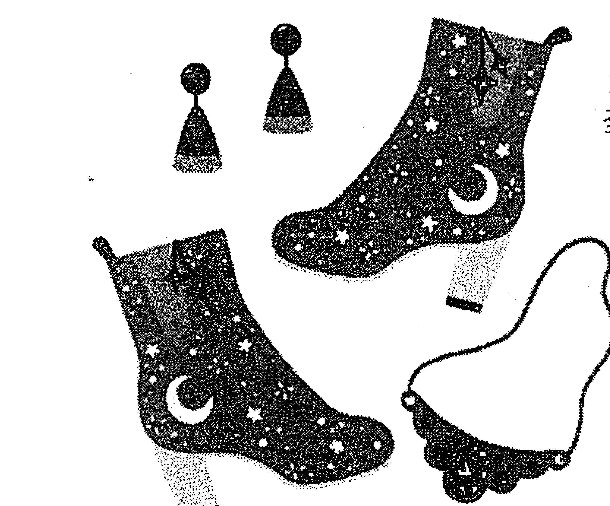

#### 22 保持巨蟹座客戶的興趣

巨蟹座客戶熱愛關於各種個人冒險行為的故事，與商業或個人性質有關的都可以。因此各種娛樂活動，從講笑話到直接調情，他們都會很欣賞。如果你可以迷住巨蟹座客戶，可能就贏得戰役的一半了。一旦他們被你有說服力的舉止或誘人的言談牽著走，就會對於你想表達的任何客觀事實有更開放的態度。在他們或你的辦公室裡便相當有可能達到這一點，所以不太需要請他們喝美酒、吃大餐。讓他們期待下一回充滿樂趣的會面吧！

### 23 向巨蟹座客戶報告壞消息

要記得，巨蟹座對負面事物、痛苦與不適並不陌生。這不是說他們追求這個，而是你不必為了表達負面結果而請求他們寬恕或原諒。一個問題的複雜面向會引起他們的興趣，適合他們自身人格中細微的迂迴曲折之處。藉著要求他們加入你的行列，幫忙解決問題，不管問題有多大，你都會形成一個連結，能夠帶領你們以同組隊員的身分，一起經歷艱困時期。永遠別提議一個你會完全獨自處理的解決方案，也不要把整件事丟給巨蟹座去解決。合作就是關鍵。

## ㉔ 招待巨蟹座客戶需注意的「眉角」

怪的是，巨蟹座客戶可能很樂於為你做某件事，而不是反過來。就算是你請客，請留下某些部分讓他們可以自由地做出貢獻，甚至偶爾讓他們帶頭。看到他們讓你開心，而不是你讓他們開心，會給他們更大的鼓舞。你能期望的最佳狀況是在一個晚上的時間裡，發掘並分享彼此的喜惡，導向一種愉快友好的氣氛，低調地感受到賓主盡歡。

### 你的巨蟹座合夥人

只要你能確保你們大多數時候意見一致，巨蟹座會是優秀的夥伴。巨蟹座有浮想聯翩的傾向，當某種有想像力的事物對他們有強烈吸引力的時候，他們相當能夠拋下他們比較務實的作法。從正面來看，這可能表示他們跳脫框架思考的能力，會以驚人的方式帶著你的團體向前邁進；從負面來看，這可能導致同等劇烈的災難。訣竅在於由你小心評估他們想到的每個新計畫。巨蟹座合夥人守護本壘的本事絕佳，他們很擅長照料內部工作，像是計畫、研究、分析與發展，你則是負責對外的銷售，以及創造你們的產品或從事服務的工作。

- 想像力
- 原創性
- 保護性

## ㉕ 與巨蟹座建立合夥關係

巨蟹座傾向於訂定合約，他們會欣然同意保證你們雙方的權利，並且確保同樣考量到風險與利潤的條款。最好從法律觀點小心地建立合夥關係，當然也要預測可能出現的任何困難。建議讓合約走保守路線，所以可能有必要緩和你未來的巨蟹座夥伴任何不尋常或狂野的主意。另一方面，你應該敏銳地感覺到他們的偏好，並且對他們的要求有回應。正常來說，可以信賴你的巨蟹座合夥人會說話算話。

- 脫離現實
- 不切實際
- 容易發生災難

## ㉖ 與巨蟹座合夥人之間的任務分配

聽聽他們對於分配任務的想法，然後對他們的強項與弱點做你自己的評估。巨蟹座對他們的能力並不是很客觀，雖然他們對於自己的好惡有很清楚的概念。請確保別讓他們在他們很樂於從事、卻並不適合的領域裡扮演要角。完成這項任務意味著不要冒犯或侮辱到他們，長期來說這樣會替你省下麻煩。重要的是你要花時間去解釋。請有耐性，並確保他們完全理解你在說什麼，也完全同意。

- 關懷
- 奉獻
- 可靠

#### 27 与巨蟹座合伙人一同差旅或娱乐

只要你对他们的需求与偏好有回应，巨蟹座合伙人就会得到抚慰。设法不要给他们一套严格苛刻的时间表，并且要确保有留下暂歇与休息的时间，因为他们在压力下会很容易累。放慢做生意的步调，可保证他们最彻底的参与程度。巨蟹座热爱在安静、亲密的环境下尽情享受。非常重要的是，你不要太常丢下他们跑掉。不时把你的全副注意力放在他们身上，事实会证明这么做让人极度安心，提供了他们所需的安全感。

#### 28 管理并指导巨蟹座合伙人

一旦巨蟹座合伙人知道他们该做什么，就可以让他们自己来，特别是在熟悉的环境下进行的本垒工作任务。让巨蟹座合伙人尽可能自由自在地布置好他们的本垒，让这里在某些方面成为真正的居家避风港。他们会在这方面守护他们的权利，所以应设法不要干预他们的做法——即使采用最保守的说法，这些做法也可能有点不太正统。只有在你发现他们的内规在财务上不健全时，你才应该介入，并且以重建这些方法为目标。在这种情况下，建议你修正他们的想法，而不是以全盘推翻为目的。

#### 29 与巨蟹座合伙人长期的合作之道

通常巨蟹座合伙人加入就是要长期参与的。就算很沉闷乏味，你仍可以信赖他们年复一年的稳定投入。巨蟹座不是太过喜爱变化，他们特别擅长以极其可靠的方式执行同样的任务。在出现恼火与困难的时候，建议你采取抚慰人心、同情而理解的态度。巨蟹座合伙人有时候可能让你很烦，所以在这方面，你的耐性会受到考验。通常离开他们一阵子去出差，或者为某个外部专案工作，会解决这个问题。

#### 30 与巨蟹座合伙人分道扬镳

只要能够在感觉良好、或者至少没有强烈负面感受的状况下达成，你就做得不错了。问题通常是巨蟹座合伙人把一切都当成很针对个人，以至于他们很可能觉得受伤、大惑不解、被拒绝，到最后则是愤怒或沮丧。有助于避免这种状况的做法是，一旦你领悟到这是不可避免的，请确定不要突然跟他们决裂，而是要花些时间小心翼翼地让他们对你的离开做好准备。让一切尽可能保持客观，不过只要你能够做到，就对他们的感受加以回应并同理，以此尊重他们的情绪状态。

### 你的巨蟹座竞争者

巨蟹座竞争者是推托之词的艺术大师，而且可能相当难以解读。藉着保留大量资讯、抛出假线索，他们设法伪装了自己真正的意图。用“偷偷摸摸”这个词汇来形容他们可能很严苛，不过一个巨蟹座竞争者迂回曲折的能耐，几乎没有什么限度。他们也有种诱人并且有说服力的特质，可以迷惑他们的对手，并且至少暂时性瘫痪他们抵抗的意志。虽然你的巨蟹座竞争者可能看似很放松，甚至很被动，但他们在受到直接挑战时，可能会很有攻击性地猛烈进攻。

#### 51 反击巨蟹座竞争者

你应该引出巨蟹座竞争者，而不是设法直接对抗他们。让他们尽可能完整地展露他们的底牌，就算这可能有误导性又充满假线索。至少以这种方式，你很有机会研究他们的欺骗方法。当然，不要对他们提出的内容照单全收，反而要看看后面有什么，以便发现潜伏在阴影中的真相。此外，他们的肢体语言、面部表情和语调，通常会比他们试图传达的事实产出更多的资讯。花些时间有效地计划你的反击。

+ 谣饵
- 有说服力
- 诱人
- 迷人

#### 52 智取巨蟹座竞争者

让你的巨蟹座竞争者认为你相信他们告诉你的话。甚至给他们这种想法：你的反应是以那个事实为根据的。在此同时，你可以像他们一样秘密行事又诡计多端，这样最能够做出胜过巨蟹座竞争者的计划。在无所作为与犹豫不决的虚假掩护背后，你应该积极运作，计划你的宣传活动。当你出击的时候，应重击他们最脆弱的地方。继续重炮出击，直到他们终于被迫撤退或让步为止。一旦你在他们的防御上打出一个结实的洞，他们的行为就会开始比较老实而合理。

+ 弱点
- 偷偷摸摸
- 有误导性
- 负面

#### 53 当面让巨蟹座竞争者刮目相看

保持你的回应简短并切中要点。因为巨蟹座竞争者在心理学上的精明，会让他们想要你尽可能多说话，这样将来他们就可以用你的话来对付你。不给他们这个机会，你就可以在拒绝反应的同时利用他们的困惑。要是他们发动魅力攻势，你可以照样回敬，并且玩他们的诱惑游戏，同时小心不要落入他们迂回的阴谋里。藉着扮演强壮沉默的角色，你抗拒与忍耐的能力会让他们留下深刻印象。

+ 互动风格
- 挑战
- 控制
- 瘫痪

#### 54 对巨蟹座竞争者削价竞争或高价抢标

在巨蟹座竞争者外在的自信与魅力底下，是一层厚厚的不安全感与怀疑。要削价对付你的巨蟹座敌手，最佳方式是让他们怀疑自己的方法，借此激起他们的不安全感。一旦他们的方法在你身上缺乏效果时，便会让他们特别受挫。利用反讽、机智与委婉的冷嘲热讽，你会唤醒他们对自己、他们的产品或服务的怀疑。一旦你设法达成这个任务，你就可以继续随心所欲地刺激他们，就像个扑克牌高手一样，在唬人与叫牌的时候脱颖而出。

#### 55 与巨蟹座竞争者的公开战争

要反击巨蟹座竞争者充满想像力的公关活动，最佳办法是专心在他们的大架构上戳洞。比起搬出反驳主张，支持你产品的优越性胜过他们，并且继续出击，展现他们对于自身商品品质缺乏实际的思维。藉着展现出他们的主张有误，损害他们的产品信用，你会让他们觉得无助。直到那时，你才应该开始对你自己的商品建立公关上的主张，这会对大众与客户产生同样明显有效的冲击。

#### 36 向巨蟹座竞争者展现你的态度

巨蟹座竞争者是诉诸个人路线的大师，所以最好把这招留给他们，并且专注于经验性与客观性的事物上。去除你的陈述中任何太情绪化的语调，尽可能多多仰赖资料与数字。让事实为自己说话，而不要企图给事实一个合乎实际的诠释。怂恿你的巨蟹座竞争者显露出情绪性的反应，让他们为了对抗自己在周遭搅动出的混乱感受，而把自己弄得筋疲力竭。有把握与自信地进行下去，涤除你言谈中的所有怀疑。

## 巨蟹座

## 与巨蟹座的第一次约会

身为感受深刻的生物，巨蟹座不会轻忽看待关系与情绪方面的事。话虽如此，巨蟹座却能假装很尽兴，也能够没有任何深刻感受地到处鬼混。但当他们陷进去的时候，就会陷得很深。如果你的巨蟹座初次约会对象表达了对你的感觉，请把这当成该珍惜的恭维来接受，绝对不要小看。巨蟹座初次约会对象对于他们是否想再见到你，不会留下太多怀疑空间。如果他们真的喜欢你，你就可能难以摆脱他们。

### 吸引巨蟹座的目光

巨蟹座热爱被追求，如果他们喜欢你的话，就更是如此。他们鲜少带头，而是会让你来跟他们搭讪或邀他们出去。问题在于他们对于自己的好恶太过挑剔，以至於你很难解读你在任何一刻到底做得怎么样。通常他们在一段关系的早期阶段不太确定他们的感觉，需要时间把你看清楚，慢慢理解现状。你的巨蟹座约会对象很容易失望和困惑，对自己并不是非常确定，虽然他们强烈的口味与偏好在指引他们。

## 初次跟巨蟹座约会的建议

如果你能事先找到他们喜欢的演奏会、夜总会、餐厅或节目，那就这么做吧！不要带他们去参加你喜欢的活动。要是你无论如何还是决定带他们去你最爱的地点之一，请做好他们可能一点都不喜欢、可能整个晚上都搞砸的准备。不管你们去哪里，别把所有时间都花在告诉他们某样东西有多了不起，因为如果他们就是不喜欢，要让他们信服是不可能的。如果有疑虑，就邀请他们到你家，烹煮一顿美味的晚餐给他们享用，接着安静地共处一个晚上。

## 初次跟巨蟹座约会的助兴与败兴之举

巨蟹座约会对象的好恶各有不同，但在所有的例子里，他们对两者都感觉强烈。跟你的巨蟹座约会对象建立连结很简单：找出他们喜欢什么，然后给他们。如果你注意到他们不喜欢的事物，或者他们告诉你他们不喜欢什么，你就要像躲避瘟疫一样，避免这些活动、地点或嗜好。不要跟他们讨论这些事，或者设法改变他们的心意。一旦他们开始信赖你，也知道

+ 强项
- 感情流露
- 感受性
- 充满爱意

+ 弱点
- 占有欲
- 紧抓不放
- 假装

+ 互动风格
- 委婉
- 警惕
- 评估价值

你尊重他们的判断，你就可以思考与他们迈入下一个阶段了。

## 40 对巨蟹座采取“攻势”

在大多数情况下，最好避免先采取行动。这些人是真的很热衷于探索情感里委婉细腻的差别。他们对于你的意图会伸出触角，而且通常在你有所动作以前就知道你打算做什么。他们可以在你没有察觉的情况下，强烈地影响你的感受。仔细注视他们、聆听他们，寻找你表现得如何的线索。通常到第二次或第三次约会，你就会知道他们容许你跟他们发展到哪里。

## 41 打动巨蟹座的方法

你对于巨蟹座的同理心，以及你对他们愿望的敏锐度，最能够打动他们。如果你试图炫耀你的知识、外表、个性或人际关系，便可能是在自掘坟墓。巨蟹座喜欢在你没有告知的状况下，自己发现关于你的事情。要是你误解了他们的意思，或者弄巧成拙，他们也很可能对某些主题提出不请自来的意见。既然巨蟹座约会对象对于你的行为极端挑剔，若你严重失言的话，便可能就没有下一次机会了。

## 42 摆脱巨蟹座的方法

除非你的巨蟹座初次约会对象为你神魂颠倒，否则可能很容易就靠糟糕的外表、严厉的评语或粗鲁的对待来摆脱他们，因为他们对于其他人的感受实在太敏锐了。如果他们喜欢你，你要迅速摆脱他们会很难或者不可能。他们会忽视所有的警告迹象，甚至以正面方式来诠释你的负面行动。一旦你把他们约出来，而且他们看中了你，他们设下的温柔陷阱与编织出来抓住你的天罗地网是变化无穷的，而且可能变得相当令人愉快。

## 你的巨蟹座恋人

巨蟹座很享受处于稳定关系中。他们十足是习惯的动物——习惯让伴侶听命于他们。因此，从性爱到财务援助在内的一切，他们都会仰赖伴侶。这些人喜欢事情往好处发展，只要他们能为所欲为，就会很深情和蔼。在愿望被拒绝的时候，他们会变得非常爱抱怨又易怒，通常会退缩到他们的壳里，并且宣泄出愤怒与怨恨。就像他们的象征物螃蟹，他们高度自我保护，但对于痛苦也不陌生。

## 43 与巨蟹座恋人进行讨论

巨蟹座不介意谈他们的感觉，但他们比较擅长表达而非分析。既然跟巨蟹座恋人之间免不了会出现一些情绪问题，最好的作法通常是让他们明白说出来——虽然他们常常会隐藏情绪问题，深埋在心里。之所以会由你来进行有意义讨论的正确时间和地点，是因为你的巨蟹座恋人不会带头做这种事情。这会很困难，但请设法让事情保持客观，否则他们可能会暴怒并失控。

## 44 与巨蟹座恋人发生争论

跟巨蟹座争论，往往会没完没了。就算有个暂时的停战或协议，也别期待你已经看到你们之间的某个争议话题终结。就像叼了骨头的狗一样，你的巨蟹座恋人无法轻易放手。争执会变成采取无止尽的拌嘴与低调冲突的形式，只有偶尔才会累积到一个大高潮。这样的背景噪音肯定会把你累倒，让彼此的关系永远承受压力。最好避免针锋相对，就让他们做最后定论吧！

+ 深情
- 仁慈
- 付出

## 45 与巨蟹座恋人一起旅游

跟巨蟹座一起旅行一阵子可能很享受，但不要常常这么做。迟早他们会渴望回归家园的舒适与安全。在旅行几天以后，他们会很容易累，容易变得筋疲力竭又不开心。然而，他们能够忍耐很多事，而且在紧急状况下，可以仰赖他们和你站在同一阵线。在旅途中，这种奉献面向可以带着你们两人熬过某些艰困时刻。在计划你的旅程时，设法将舒适的休息地点包括进去，好让他们能在那里恢复平静。

+ 容易恼怒
- 自私
- 退缩

## 46 与巨蟹座恋人的性爱关系

与巨蟹座恋人的性爱可以很享受。只要他们能够公平地得到他们真正喜欢的部分，他们通常愿意取悦你，并且对你的需求有回应。他们在这个领域里也有自我牺牲的倾向，不过要注意不要让自我牺牲发展成自怜和憎恶，因为到最后会让你自作自受。在极端的状况下，巨蟹座可能让自己非常不快乐，而且他们并不会充分察觉到这个状况。如果他们从一开始就把他们的伴侶或这个关系理想化，就更是如此了。

+ 自我保护
- 接纳
- 依赖

## 47 巨蟹座恋人的亲昵表现

一般来说，要巨蟹座表现柔情比性爱来得容易。他们对恋爱关系有非常抚慰人心的效果，可持续地设法避免灾难。这种想要忽略问题、避免麻烦的特质，有时可能导致他们变得令人畏惧地柔情万千又殷勤体贴。这点在他们害怕他们的伴侶可能爆出一阵批评、或者直接诉诸暴力的时候，尤其如此。因此，柔情的表现可能变成一种操纵工具，或者想要否认或避免关系真相曝光的确切征兆。

## 48 巨蟹座恋人的幽默感

巨蟹座可以享受笑声，特别是他们自己的，但这并不是他们很开心的信号。通常这是紧张的笑声，表示他们正试图遮掩附近某种困扰他们的东西。他们真正享受的一种幽默，是分享不为人知的一句妙语、恶作剧、做鬼脸，以及其他只有你俩才能分享的反应。这种局内人笑话或私房笑话，对他们来说很让人安心，但却常常惹恼了陪伴他们的其他朋友和家人。

## 你的巨蟹座配偶

+ **优点**
- 有计划
- 有效率
- 居家

巨蟹座配偶一心一意要建立安全的家庭基地。他们对居住地的几乎每件事都有兴趣，会努力让事情成为他们想要的样子。他们知道自己会尽可能多花时间待在家里，所以会很明智地打从一开始就从效率与乐趣着眼来规划他们的住所，把每个细节都打理好。当他们对抗空间或地点的固定限制时，可能因为不能改变这些事情而变得非常挫折。巨蟹座配偶必须能自由花钱来持续改善居家环境以及维护的工作。

+ **弱点**
- 受挫
- 偏狭
- 爱控制

### 巨蟹座的婚礼和蜜月

你的巨蟹座配偶必须感受到蜜月就像在家里那么自在，若要在不熟悉的环境中度过冗长的蜜月，他们不太可能有好的反应。所以，计划在一个他们认识的地点度蜜月通常是好主意，那里或许是他们这些年来偶尔会造访的地方。在大多数情况下，浪漫对他们来说，还不如采取行动时的环境来得重要。对于你们将回归的那个生活空间，你的巨蟹座配偶可能已经下定决心，也有计划要整修它，让它合乎他们想要的样子。

+ **互动风格**
- 保护性
- 维持
- 有信心

### 巨蟹座的家庭和婚姻生活

一旦巨蟹座配偶在他们的巢安顿下来以后，他们就会相当快乐和满足。这种快乐会直接反映在他们对婚姻伴侣的态度上，但反过来说，他们感受到的任何不快乐也会同样反映出来。就像月亮，这些“月球生物”会把他们的感受反映到别人身上，所以最好让他们保持好心情。请确定预算有很大一部分——除了房租或房贷、以及水电瓦斯费以外——可以让他们每个星期做新的采购。巨蟹座热爱食物，也是很优秀的厨师，所以你会从中受益。

### 巨蟹座婚后的财务状况

巨蟹座并不乐于为他们花的每一分钱做说明，或者要求你的许可，他们必须能自由地（在合理范围内）独自处理财务，而没有持续受到批评或质问的威胁。另一方面，他们自己可能对于配偶拿家里的钱做什么非常挑剔。最好尽可能把家务事交给你的巨蟹座配偶来定夺，不过要让他们同意定一笔预算，特别是花在各种活动上的百分比。巨蟹座能够限制自己的花费，一旦他们掌握诀窍，甚至能够积聚钱财。

## 巨蟹座的不忠与脱轨

巨蟹座很可能在大多数时候都在你的身边支持你，但如果他们自己去了别处，他们不会想被质问。要是他们真的弃你而去，这可能仍然会是个秘密，甚至长年都笼罩在迷雾中。“他们有没有出轨？”会是你永远不可能得到答案的大哉问。要是你直接质疑他们是否有任何不检点或彻底不忠之处，巨蟹座配偶可能会拒绝回答，甚至在你表现出怀疑与不信任的时候威胁要离开。

## 53 巨蟹座与子女的关系

巨蟹座在关爱、奉献与同理这些领域里，可以是优秀的父母。然而，巨蟹座也可能把他们的孩子闷到窒息，不让孩子得到他们急切渴望的自由。他们用铁箍把孩子拴在自己身上，经常阻碍孩子长成真正的大人，以便紧紧抓住他们。对巨蟹座来说，与其说这是为了控制，不如说是他们拒绝放手，并且在某些状况下是没有能力放手。巨蟹座父母太常有这种感觉：毫无疑问地，他们应该替自己的孩子做所有重要的决定。

## 54 巨蟹座面对离婚的态度

跟巨蟹座配偶分手可能是极端痛苦的过程。因为他们的感受如此深刻，又与他们的伴侣创造出强烈的情感连结，以致巨蟹座通常需要在离婚后跟他们的配偶保持有效且可行的关系。普遍来说，他们会争取屋子里任何一样他们自认为有权拥有的东西，这当然包括房子本身。无论如何，既然他们已经投入这么多的时间和精力在家庭事务上，他们很可能会要求拥有绝大多数物品。如果可能，最好把家和孩子留给他们，你则设法搬到更好的地方去。

## 你的巨蟹座秘密情人

巨蟹座相当擅于隐藏的艺术，而且会被秘密关系吸引。你的巨蟹座秘密情人非常能够坚持他们这一方的协议，因为他们的谨慎，通常会让这种关系有可能成立又令人心满意足。一般来说，巨蟹座秘密情人看不出在爱情中付出他们的一切，事后毫无愧疚地回到伴侣或配偶身边有什么不对。通常他们跟你一起达到的情感表现，会正面地影响他们的主要关系，长期而言则是增进那段关系的品质。巨蟹座的风流韵事可能延续好几个星期，甚至好几年。

## 55 遇见巨蟹座秘密情人

最好有个特殊场所，你可以在那里定期会见你的巨蟹座秘密情人。这个地点需不受干扰，而且极度隐密。巨蟹座必须在那里感到舒适，而不觉得有任何廉价或低俗之处。大多数巨蟹座本来就很世故，而随着世故而来的是对品质的要求。而且他们喜欢跟你拥有高品质的独处时间，而不是被催促或者塞进一个指定好的空档里。对他们来说，这不只是关乎性，最重要的是诚实表达情感。缓慢的表达与情感的滋长，或许比突然间爆发的热情更重要。

+ **强项**
- 谨慎
- 手腕圆滑
- 清楚

## 56 与巨蟹座幽会的地点

一般来说，巨蟹座在他们家或你家一样觉得不自在。他们对于在哪里以及怎样表达他们的爱极为挑剔，通常宁愿在一个没有强烈过往关联的中立环境相会。这样的地方对他们来说可能不尽然会变成一个新家园，却是个他们可以放松、从周遭繁忙世界中隐遁起来的逃避之所。如果你提供这种地点，好让他们不必烦恼这类事情，效果最好。

+ **弱点**
- 善于欺骗
- 有所隐藏
- 支吾其词

## 57 与巨蟹座的秘密性爱

巨蟹座在秘密恋情中是极端重视肢体表达的生物，他们可能渐渐变得非常情绪化又热情。然而，他们的强项在于感官性，而不是性欲。对他们来说，触碰另一个人身体的行为，在感官之乐中是最高尚，而容许另一个人碰触他们则是信任与深刻亲密的表现。巨蟹座的专长是时间拉长的亲吻与拥抱，但也会随着时间而发展出相当复杂且纠缠的例行动作。相对于单方面而言，他们偏爱相互间的表达。巨蟹座很享受尽可能仔细地逐渐了解他们的情人，以全面、微妙而详细的方式追求亲密感。

+ **互动风格**
- 自信
- 不模棱两可
- 凭感觉

## 58 长久保有巨蟹座秘密情人

如果巨蟹座秘密情人真心爱着他们的伴侣，想掌握住他们不会有任何困难，反倒是他们会做任何力所能及的事来把握住你。因为他们强大的同理能力，他们会立刻感觉到你真正有反应的时候，以及你在假装或是在情绪上从他们身边抽离的时候。要是他们觉得自己快要失去你了，他们就会拉紧造成羁绊的束缚，而且通常会让你很难、甚至不可能逃离。巨蟹座秘密情人会无所不用其极地紧抓着他们所爱的人。他们缺乏羞耻心，对他们的感触表达很坦白。

## 59 与巨蟹座的秘密欢愉

在大多数情况下，没有一种娱乐是必要的。巨蟹座秘密情人热衷在你周遭编织他们的魔咒，全面地魅惑并引诱你。除此之外，其他一切都是次要的，因为爱通常是他们的最高理想。他们对你的所有期待就是回应他们，并且完全把你自己献给这段秘密恋情。唠叨闲聊通常被放在次要地位，及不上亲密的眼神、爱抚、甜言蜜语和愉悦的叹息。在此主要要求是欣赏此时此刻的他们。稳定的眼神接触尤其让他们兴奋。

## 60 与巨蟹座秘密情人分手

巨蟹座秘密情人必须完全确信他们的恋爱关系已经彻底结束，才会放弃这段感情。如果他们还是爱着你，对你来说，单方面结束这段关系会极为困难。另一方面，如果你还是爱着他们，而恋情的刺激对他们来说已化为乌有，他们可能会相当无情地抛下你，就像丢开烫手山芋一样。因此，分手的时机与方式通常取决于巨蟹座秘密情人，而不是他们的伴侣。

## 你的巨蟹座前任

很重要的是要知道是谁甩了谁，或者分手是不是双方在没有敌意下的共同协议。如果是后者，就不会造成实际的问题。如果巨蟹座前任是甩人的那个，跟他们交涉可能会非常容易，因为他们并不觉得自己被拒绝，甚至还可能从这个经验中获得力量。然而如果他们是被甩的那一方，那么各式各样的攻击、负面感受和伤害性的倾向都可能会浮上台面。怨恨在此可能扮演要角，尤其是在他们觉得自己没犯错却被拒绝的时候。他们受到不公平对待的感觉，可能造就出延续多年的愤懑。

与巨蟹座前任成为朋友
分手后可能至少要过个一、两年，你的巨蟹座前任才会准备好当你的朋友。一旦巨蟹座前任对一段关系关上门，门就会一直紧闭着，必须要另外开一扇全新的门。巨蟹座对于第二回合极端谨慎，想着要把任何东西给同一个人第二次，他们总是会非常小心。当然，如果对于巨蟹座前任曾经感受到的可怕痛苦做适度补偿，建立友谊会比较容易。最好承认你的错处，还有你对他们的责任。

与巨蟹座前任复合
这会极为困难，除非你是受伤的一方，而巨蟹座前任实际上没什么过失，情绪上也完好无伤。在这种情形里，你一开始可以逐渐放下你的痛苦与怨恨（或者只静静表达几次），让双方变成朋友，然后从那里继续发展。如果你的巨蟹座前任仍旧爱你，和解是有机会的，只要你不会不公平地利用他们的感情。建议做法是让一切保持低调，甚至随性，而不是评论或讨论正在发生的事。就让新局面的奇迹征服你们两个。让事情自己发生，不要急。

与巨蟹座前任讨论过去的问题
如果你不向巨蟹座前任提起过去的问题，会是最好的。过去对巨蟹座来说是非常棘手又敏感的领域，他们并不会轻易忘记或原谅。如果巨蟹座前任开始追忆，或者怀旧地长篇大论谈及过往，这是非常好的迹象，但别操之过急。请用一个深情的眼神或微笑来表达深有同感，这样对他们来说已是足够的鼓励。当他们确实提起过去的问题时，请让他们完整表达自己的见解，而不要变得冷漠或改变话题。在某个主题上被质疑的时候，尽你所能冷静诚实地回答。

对巨蟹座前任表达亲昵感情的程度
只有在你能够做得极端圆融又委婉的时候，才当第一个表达感情的人，否则就让他们先示好吧！巨蟹座的感情太细腻，以至于他们会感受到你表现出的一点点柔情或温暖，所以没有必要做过头，这样反而极有可能立刻引发负面反应。只要倾听他们，并且对他们的感情表示同理，这样做本身就会被视为情感的表达。持续保持留意的状态，这样你才不会错过从他们这方发出的第一个亲昵表示。错过这个可能是严重的失误。

**强项**
- 自信
- 有力量
- 付出

**弱点**
- 充满怨恨
- 被拒绝
- 负面

**互动风格**
- 谨慎
- 安静
- 细心

### 65 界定与巨蟹座前任现有的关系

对大多数巨蟹座前任来说，鲜明的定义是不可能的。因为他们如水一般的特质，使得他们最常在抗拒以逻辑方式论定的感受之海中泅泳。对你的巨蟹座前任来说，就算他们有所有最良善的意图，做他们可以坚持的决定仍可能非常困难。处理这个问题的最佳办法就是走一步算一步，让现有的关系一次迈进一步。不事先计划，过一天算一天，你会向他们证明，可以把他们的情绪与感受托付给你。

### 66 要求巨蟹座前任分担照顾子女的责任

如果巨蟹座前任确信你是好人，有把孩子的最佳利益放在心上，就不会有太多问题。然而如果他们基于你过往的表现而怀疑你的品格，在这个议题上，他们会很难搞。借着展现某种正面的一致性，慢慢建立你的信用，并且在新的连结成形时，容许过往的伤害愈合。要是孩子跟你的前任同住，要对法庭订下的规则或者巨蟹座前任对你做出的要求有回应。如果孩子跟你住，仍应让巨蟹座前任在孩子的生活中扮演重要的角色，但要防备他们有操纵或控制的行为。

## 朋友与家人

### 白羊座
6月22日至7月22日

### 你的巨蟹座朋友

虽然巨蟹座可以是绝佳的朋友，但他们很可能想要把你完全据为己有，并且不愿意跟共同朋友分享你。巨蟹座朋友非得知道他们不只是你的好友，还是你“最要好”的朋友。你在外闯晃的时候，他们会有耐性地等你回到他们身边。你打一通讲很久的电话给他们是可行的，但他们更喜欢在他们住处舒适的气氛下，让你透露你最近的恶作剧。不要期待他们这么轻易就分享他们自己的经验，因为他们倾向把个人的事留给自己。然而在需求急切时，他们可能相当仰赖你的支持。

### ⦁ 向巨蟹座朋友求助

巨蟹座朋友觉得他们是生来助人的。巨蟹座会慷慨地对你的需要付出时间与注意力，可说是最有包容力与同理心的朋友。然而在谈到起而行动的时候，他们往往会有所保留、小心翼翼。因此，他们的支持通常是比较情绪性的，而非动力上的。他们特别善于替你布置出一个私密空间，让你可以藏在这里舔你的伤口。他们很有保护性，在这样的处境下，会做他们能做的任何事情来保护你免受伤害。他们的同情与理解通常是可靠的。

### ⦁ 与巨蟹座朋友沟通和联络

由于巨蟹座经常很被动的倾向，一般来说会由你来采取必要的步骤，确保跟巨蟹座朋友的定期沟通与联络。他们会很感激能听到你的消息，就算你们上次讲话到现在已经过了很久。从他们的观点来看，沟通并不是很必要的，因为把你放在他们心上，对他们似乎就足够了，而他们通常缺乏急切地要对你表达他们感受的需求。偶尔传个简讯或电子邮件给他们，他们会很喜欢。同样地，如果你去旅行，寄张明信片，表达一些亲切的想法，你的巨蟹座朋友也会投以赞许的目光。

### ⦁ 向巨蟹座朋友借钱

巨蟹座朋友借钱可能非常慷慨。然而，他们确实觉得把钱要回来非常尴尬，所以请确保你有根据最初的协议偿还他们金钱，免得伤害到他们的感情或者钱包。如果你没依约偿还，他们很可能会陷入安静的沮丧中，让你毫无疑问地知道有事情不对劲。这样的场合可能导致疏离、甚至是关系的结束，这不尽然是为了钱，而是因为你侮辱了他们。请记得，在大多数巨蟹座心目中，迟钝是排行前几名的罪恶，在与他们的密友有关时尤其如此。

**特质**
- 有兴趣
- 有耐性
- 奉献

**弱点**
- 多管闲事
- 黏人
- 隐遁

**互动风格**
- 接纳性
- 个人性
- 好奇

## 70 向巨蟹座朋友征求建议

巨蟹座朋友很乐于给建议，而且通常不需请求，他们就会毫无保留地倾囊相授。在他们看到你的行为不妥或者会伤害到自己时，他们就会很快建议你改弦易辙。他们不会把这种建议看得很随性，或者爱听不听随你。他们会坚持到你终于遵循他们的建议，或者加以拒绝为止——如果是拒绝，在这个领域里，他们可能不会那么快再帮你一次。一般来说，他们的建议很有帮助，但你必须小心他们不要只是谈到他们自己，而非提出客观建议。

## 71 拜访巨蟹座朋友的时机

对巨蟹座朋友来说，拜访是非常重要的，尤其会面地点是在他们家的时候。只有在他们自己的空间里，他们最温暖、最包容的那一面才会找到表达方式。安全感对巨蟹座朋友来说很重要，而跟其他人分享这种感觉，可能对所有相关人等来说都很让人满足。他们无疑会很乐于喂食你，以及分享所有最近的新闻与八卦。普遍而言，你离开巨蟹座朋友时的感觉，会比你进屋前来得好，除非你刻意惹毛他们，在这种状况下，你应该替自己彻底省去拜访的麻烦。

## 72 与巨蟹座朋友一起庆祝和娱乐

在巨蟹座朋友决定要出游的时候，他们会想要享受真正的好时光。然而，不要试图拉着他们去他们百分百“不会”乐在其中的庆祝活动。你会发现，他们若不是在最后一分钟告诉你他们不去（毫无疑问地，理由是身体不适），不然就是垮着脸出席聚会，让人毫不怀疑他们觉得很糟。巨蟹座热爱举办庆祝活动和派对，但他们会很想做所有的烹饪工作，而且一定要自己做准备。他们相当能够做到这一切，但他们也可能在派对办完以后大崩溃，或者接下来几天都失联。

## 你的巨蟹座室友

因为巨蟹座对家以及所有居家事务的依恋，他们很可能对你们的共同生活空间有热切的兴趣，会设法让它成为对抗世界的避风港。他们热爱舒适的一面以及对食物的热情，会给床铺、寝具、沙发、饮食、点心内容、暖气和热水特别优先地位。巨蟹座的家是巢穴、是藏身处、也是私人圣殿，所以让他们成为他们的室友，是巨蟹座能够提供的最大恭维之一。侵犯他们的隐私（他们就是必须有自己的房间，但可以分享共同生活空间），是他们不会容忍的事，但可期望他们会把同样的隐私权延伸到适用于你。

## 与巨蟹座室友分担财务责任

巨蟹座可能相当擅长管钱。赋予他们收取你这份钱之后，支付房租和水电气账单的责任，是认可他们的能耐，通常对他们会是合适的安排。另一方面，你可能必须为食物与其他家庭开支建立严格的预算，因为巨蟹座室友精致的品味可能轻易就失去了控制。只要告诉他们你每个月准备付多少钱，甚至把你要出的那一份放进一个现金罐里，让他们加上自己那一份以后，想怎么花就怎么花。

## 与巨蟹座室友分担打扫责任

一旦巨蟹座室友开始动手了，他们就是优秀的清洁专家。唯一的问题是让他们有动机开始，因为他们在这方面是恶名昭彰的拖延者。他们相当能够在混乱中生活，甚至接近这一团乱后，依然对此视而不见。安排派对或拜访的日期，会唤醒他们看到清洁的必要性。他们的工作通常很有效率，而一旦他们投入心力，他们就有斗志与集中力坚持下去，完成事情。另一个让他们对清洁日做好准备的方式，是对必要的清洁用品表现一些兴趣，并且确保这些东西被增添到购物清单上。随后，你可以把那些用品放在看得到的明显地方。

## 当你的访客遇到巨蟹座室友

如果巨蟹座室友的平静与隐私一直被打扰，他们可能会被惹恼。他们对这个议题的紧张，可能让他们变得太易怒，以至于变得难以同住。你必须对宾客来访的频率、还有你的宾客对巨蟹座室友产生什么影响，特别留意。维持在合理范围内，事实可以证明这样的拜访对所有相关人等都很愉快，因为巨蟹座室友对于展示居住空间并得到其他人的赞赏，很引以为傲。巨蟹座热爱欢乐气氛，所以偶尔有来晚餐、饮酒并且放松一晚的客人，可能会带给很不错的享受。

## 与巨蟹座室友的社交生活

不知怎的，巨蟹座室友总是深度投入于派对与庆祝活动中。他们的烹饪和组织技巧在此得到凸显。购物、装饰、清洁、送出邀请函、以及烹饪，皆可为特别的节目增添全新的氛围。不要试图阻止他们承担他们担起的任何一个责任，因为如果你做得太多，他们只会觉得失望，甚至觉得被忽略。社交对巨蟹座来说并不总是很轻易，而办一场派对可能是彻底放纵他们社交面向的机会。如果顺利的话，他们会在随后几天不断谈论这件事，而且乐意将来再重复一次。

## 与巨蟹座室友的隐私问题

不能也不该侵扰极端注重隐私的巨蟹座。一旦巨蟹座的巨蟹们进了他们的巢穴，就很难被挖出来。应该有几小时、几天、偶尔甚至要有一星期的时间，让巨蟹座室友独处，不受到你或任何人的干扰。一旦你显示出你...

**居家**
- 投入
- 支持

**退缩**
- 充满恐惧
- 孤立

**互动风格**
- 有保护性
- 呵护
- 愿意帮忙

巨蟹座

同理他们的需要，他们就会给予温暖的回应，并且在你觉得很需要别人的时候，展现帮忙的意愿。不要抗议他们锁门的习惯，并且要了解，有时候光是敲门便可能被视为一种重大侵扰。

## 🦀 与巨蟹座室友讨论问题

巨蟹座水象的一面，通常让人很难逮住他们以便讨论特定议题。在他们最初几次回绝随机提起的问题讨论以后，你可能觉得需要刻意为这个目的订下时间，充分地开个会议。就算他们可能会在最后一刻躲掉这种集会，请不屈不挠地坚持下去，直到他们终于坐下来跟你谈为止。列出讨论主题清单，甚至在这样的会议中做笔记，会很有成效，也能反制某些巨蟹座异想天开的举动与缺乏专注力。一旦巨蟹座承认有需要以行动解决某些问题，就可以信赖他们会做他们该做的必要工作。

## 你的巨蟹座父母

巨蟹座可说是最有爱、最关心孩子的父母。深情又有保护性，使得他们很容易满足于孩子被抚育与被保护的需求。然而，他们也有可能过度保护，并且可能因此挫折或阻碍子女成为独立自我的需求。巨蟹座父母必须学习“放手”这门艰难的功课，容许他们的孩子有理所当然该有的自由。因为他们充满爱的支持是个如此温柔的陷阱，以致他们的孩子经常屈服于此，变得过度依赖他们的巨蟹座父母。

**强项**
- 抚育
- 爱
- 关怀

**弱点**
- 过度保护
- 爱控制
- 让人窒息

### 🦀 巨蟹座父母的教养风格

理想状况下，因为巨蟹座父母对子女宽广的同理心，让他们需要、甚至必须施加的管教并不多。正常而言下，对于一次轻率或打破规定的行为，他们会跟子女有一段交心的谈话，事情就可以和平落幕。然而要是被逼急了，巨蟹座父母可能对孩子施加相当严厉的惩罚，通常的形式是禁足。巨蟹座父母喜欢把他们的规则想成是众所周知的，所以只有故意如此才算违反，但这种状况应该很罕见。他们对于聆听解释与接受借口抱持开放的态度，至少在一项规定第一次被打破时是如此。

**强项**
- 支持
- 贡献
- 有兴趣

### 🦀 巨蟹座父母与孩子的相处

作为通则，巨蟹座父母是非常有感情的。对他们而言，对子女表达感情是相当自然又容易的事。他们的子女很快就学到，父母没表达亲昵感情的时候，就是有什么事情不对了，而就像小孩子常做的那样，子女通常会因此责怪自己。巨蟹座父母可能必须向孩子解释，他们的距离感与缺乏情绪表达，跟孩子没有关系，而是因为他们生活中的其他问题使然。巨蟹座父母不只能够表达亲昵感情，也热爱接收以拥抱、亲吻与微笑这些形式表达的深刻情感。

## 81 巨蟹座父母给孩子的金钱观

巨蟹座父母通常会给孩子每周零用钱，但会坚持他们维持这个数目，不要经常要求更多现金。然而，只要他们在财务上负担得起，他们就会回应某个孩子需要某种特定衣物、社团费用、或某种极其特殊的娱乐活动需求。巨蟹座父母如此乐于给予又有同情心，以至于他们通常会在孩子自己提出要求以前，就提供额外的现金了。

## 82 巨蟹座父母的危机处理

巨蟹座父母会尽他们所能在危机发生以前先斩草除根。他们对子女的同理心，会让他们知道事情不对劲，然后以行动解决问题，或至少做到损害控制。虽然巨蟹座可以很放松、很抚慰人心又可靠，在紧急情况下，巨蟹座的行动也能够相当迅速，所以在紧急时刻可以仰赖他们。然而因为他们过度保护的态度，他们也可能变得很紧张，最后在急着救援子女的狂热中反应过度。面对危机时保持冷静，是他们必须努力的方向。

## 83 巨蟹座父母的假期安排和家族聚会

巨蟹座父母并不把人生看成持续的家庭假日。有的是要做的杂事、该完成的功课，还有必须照应的个人外表。话虽如此，他们养儿育女的严肃方式在碰上假日与家庭聚会的时候就会放松，在这些场合里，他们真的可以放松自己，容许孩子享受美好时光。然而这并不包括让他们满地撒野，因为他们的保护本能会浮上台面，让孩子安全地免于遇险。在家庭庆祝活动或假期里，沉浸在美好的感受中，肯定能疗愈巨蟹座的暴躁不安或沮丧。

## 84 照顾年迈的巨蟹座父母

因为在他们还是年轻父母时，关爱子女是他们人生中极其重要的一部分，所以年迈的巨蟹座很能体会被好好照顾的必要性。但由于他们知道花费大量时间和精力是必要的，所以他们不常要求子女照顾他们。正常来说，他们会试着自己过日子，而且肯定是在他们自己家里，或者被说服搬进比较小、距离家庭成员近些公寓。年迈的巨蟹座父母对于要他们搬进老人院的建议，鲜少反应良好。巨蟹座年纪越大，越不喜欢跟别人分享空间。

## 你的巨蟹座手足

除非巨蟹座排行最长，在这种情况下，他们具主导性与攻击性的那一面很可能会浮现，但通常他们能够优雅轻松地融入有好几个手足的家庭里。巨蟹座手足容易被比较活跃的哥哥姊姊宠坏，以致他们会满足于扮演次要角色，安静而不受打扰地做自己的事。他们很可能有个最喜欢的手足，他们会依附那名手足，几乎变成对方的影子。巨蟹座手足跟其他孩子

不同的地方在于，他们强烈地需要父母，尤其是在他们有慢性的生理、心理或情绪症状时。

**强项**
- 敏感
- 亲昵
- 热爱拥抱

**弱点**
- 依赖
- 黏人
- 依恋

**互动风格**
- 充满感情
- 疏离
- 只顾自己

## 85 与巨蟹座手足的竞争和亲近

一般来说，巨蟹座并不是手足竞争专家，他们对于自己拥有的事物和自己的身份感到很满足。如果被逼迫，巨蟹座会竞争，而且通常会胜出，但蓄意的攻击通常不是他们的风格，除非受到严重的挑拨。巨蟹座倾向跟会分享彼此感受的手足亲近，不论共享的是快乐还是痛苦。若巨蟹座手足是排行最大的，他们会建立自己的优势地位，但不会培养竞争性，并且会对弟弟妹妹发挥强烈的保护能量，特别是让他们避开学校里年长学生的恫吓与不公平的挑战。

## 86 过往的成长经验对巨蟹座手足的影响

巨蟹座手足的记性很好，对过往议题心怀怨恨的时候，尤其如此。时间通常不怎么能够冲淡这种不愉快的记忆，所以如果他们的手足希望清理掉这种事，他们通常必须先挑起问题来讨论。十之八九，你的巨蟹座手足会逃避这种努力、直接拒绝回答、或否认这种议题对他们的重要性，以致让事情变得更复杂。然而在几乎每个巨蟹座的情绪生活中，都有过往议题必须讨论或解决，以免阻碍成年后的发展。

## 87 与疏离的巨蟹座手足往来

这很难处理。当你的巨蟹座手足变得疏离时，就像真正的螃蟹，会倾向退缩到自己的壳里。一旦他们处于防卫姿态，就极难把他们引诱出来。只有靠着与他们长期建立信赖关系，他们的手足才能指望打动他们，并且把他们带回家庭的怀抱中。让事情更复杂的是，通常这种行为不只有一个起因，要为之负责的是一整个慢性长期情绪混乱的复杂网络。建议秉持着坚持、耐性与理解来进行，一一解开这些困难。

## 88 巨蟹座手足对继承、遗嘱等金钱议题的处理

在财产继承方面，巨蟹座手足通常会要求理应属于他们的东西，但不会再多。尤其如果他们在情感上与逝者很亲近，他们甚至可能会照着逝者设想中或者明白提过的心愿来花钱。至于找巨蟹座手足要钱，他们的兄弟姊妹可能会发现他们有点吝啬，而且不愿意轻易跟辛苦赚来的钱分离。在紧急事件或者牵涉到父母的花费分担时，可以信赖巨蟹座手足会付他们那份账单，但可能必须开口要，而不是他们自动付。

## 89 与巨蟹座手足的家族团聚和庆祝活动

如果巨蟹座手足与家庭里的其他人关系友好，他们会动手协助这些节日活动；在他们有心情庆祝的时候，尤其如此。如果他们暴躁不安或退缩，就必须稍微推动他们一下。然而，最近或长年以来跟某位手足不合，

可能让巨蟹座完全避免出席或参与。这个问题最好事先处理，而不要放烂到大日子要来临的时候。一旦巨蟹座可以把这个冲突放下，就能够把他们的正能量奉献到极致。

### 20 与巨蟹座手足一起度假

只要你对手足的需求，尤其是他们强烈的好恶有敏锐度，事情就可能进行得非常顺利。巨蟹座很享受家庭假期，不过在他们需要退缩到自己的空间时（应该要准备好这种场所），必须让他们这么做。他们特别喜爱各种类型的游泳或沐浴。众所周知，这个水象星座有在靠近海洋、湖泊或河流的地方度假的倾向。巨蟹座可以跟别人一样享受阳光，但他们也很享受在树荫下的清凉草地上发懒。

## 你的巨蟹座子女

巨蟹座孩子可能变得过度依赖父母。因为对安全感的强烈需求，巨蟹座孩子需要父母大量的支持、引导与保护。巨蟹座孩子频繁地觉得，需要仰仗一个并不了解他们或尊重他们感情的敌意世界对他们高抬贵手。对这种孩子充满体谅的父母，必须设法把他们的孩子引入这个世界，并且教导他们应付这个世界必要的社交技巧。发展巨蟹座孩子真正的独立性，是最大的挑战。因此要把依赖降到最低、把负责任的独立自主拉到最高，父母的参与是必要的。

**挑战**
- 沉浸在个人思绪中
- 寻求自由

### 21 巨蟹座子女的人格发展

巨蟹座子女是不寻常的，而且要不是因为他们显现在父母、手足或其他家庭成员身上的强烈依赖性，他们是有能力发展成自己作主的人。在家庭怀抱中受到呵护的巨蟹座子女，会体验到的问题并不多。为了让他们的人格得以开展，所有社交活动，像是学校、社团、运动、文化与网络接触都应该被强调。这会抵销他们独处的自然天性，也会对他们不受羁绊、孤立于世界之外而茁壮的幻想生活做出一些限制。

**弱点**
- 过度保护
- 感情需求强烈
- 反社会

### 22 巨蟹座子女的嗜好、兴趣和职涯规划

应该明显鼓励会带着巨蟹座孩子接触其他同侪的嗜好，而不是那些会让他们孤立于世界之外的嗜好。应该注意并遵循他们自然的兴趣。举例来说，如果他们喜爱音乐，还有比赛的天分，与其让他们开始练习像钢琴这样的独奏乐器，最好尝试让他们可以跟其他孩子在管弦乐团里合奏的弦乐器、铜管乐器或木管乐器，或者是跟摇滚乐团合奏的鼓与电吉他。巨蟹座可以是绝佳的编辑，而且通常会在出版业找到满意的职涯。他们也对身体挑战有反应，需要冒险来抵销他们的幻想倾向。

**互动风格**
- 依赖
- 有原创性
- 梦幻## 93 对巨蟹座子女的管教
与其有个规定什么可以做、什么不可以做的赏罚分明系统，对巨蟹座子女的管教，意味着建立他们可以照着运作的架构与指导方针。巨蟹座孩子倾向于飘荡神游，若他们的精力可以被刺激并导向积极的方向，他们的反应会是正面的。藉着创造出让他们配合的标准与需求，巨蟹座孩子的父母可以轻推（绝对不能强迫）他们去参与工作成果会让所有人看到的生产性活动。成就感带来的骄傲，可以变成未来的强烈驱动力。

## 94 与巨蟹座子女的亲昵程度
巨蟹座子女对情感表现的需求很高。然而，他们对于情绪上与身体上被接近的方式太挑剔了，以至于或许只有最敏锐又有观察力的大人，才能得到他们的接纳。对巨蟹座子女来说，最扫兴的事情就是别人用错误的方式对他们说话或碰他们。真正能跟巨蟹座子女同步的父母会知道这一点，也能够一致地采取正确的途径。因此，知道怎么对巨蟹座孩子表达亲昵感情，就跟感情本身一样重要。

## 95 处理巨蟹座子女与手足之间的互动
在有手足或朋友在场时，对巨蟹座子女说话永远不要疾言厉色或语带批判。成人应该知道正确的作法是把他们拉到一旁去，直接、一对一且和蔼地对他们说话。尽管父母应该注意他们的巨蟹座孩子与其他小孩的互动，尤其是跟他们的手足，但父母却不该一直干预以纠正状况，反而应该学着退一步，让他们的巨蟹座孩子尽可能多处理自己的事情。这种态度提振了父母与巨蟹座子女之间的信赖。

## 96 与成年巨蟹座子女的互动
巨蟹座往往太过于活在过去，所以，他们在精神上会带有童年未愈合的伤疤。如果是家庭成员与成年巨蟹座子女之间的互动，光是这位父母、手足或其他家庭成员的出现，就可能触发旧有互动剧本与感受。基于这个理由，有时候可能透过电子邮件或电话来联络巨蟹座子女，把负面刺激降到最低，效果会比较好。当伤口随着逐渐增加的信任与爱而得到疗愈时，可以花更多时间亲自跟他们互动。

## 狮子座
生日：7月23日至8月23日

以光芒四射的炽热太阳为象征，固定宫的狮子座把自己创造性的温暖散播到其影响范围内的一切之上。狮子座引以为傲的是让他们的火焰维持在控制下，以及在能够裨益他人时做出困难的判断。生于此星座的人，情绪上很热烈，不容他人拒绝他们的要求，也准备好在必要时为之奋战。狮子座要求其他人的尊重，而且会贯彻他们的承诺，证明他们很可靠。

狮子座
7月23日至8月23日

### 你的狮子座老板

身为天生的领袖，狮子座在得到任何公司的顶尖位置时都会欣喜若狂。然而，所有权对他们来说并不是最重要的事——只要他们是执行长或董事，他们也会乐于当员工。狮子座老板会设法做到公平无私，只要他们的权威没有受到质疑、或者工作没有受到威胁，他们就能成功办到。就他们看来，他们只是代表他们之下的每个人，设法替他们争取到有可能最好的薪水、工作条件、晋升机会与津贴。狮子座对他们的工作很引以为傲，所以在股东、董事会或公司所有人祝贺公司的成功时，他们很乐意代表所有人接受。

### 强项
- 公平
- 骄傲
- 苛求

### 弱点
- 自我本位
- 对权力饥渴
- 自我中心

### 互动风格
- 友善
- 开放
- 慷慨

## 1 要求狮子座老板加薪
在狮子座老板心目中，你若不是准备好要加薪了，就是还没。狮子座老板会详细研究你过往的表现，以此反驳你加薪的要求。如果你配得上加薪，他们会尽可能辛勤工作，来确保你的薪水在他们的预算与计划范围之内。最常见的状况是，如果他们无法立刻答应加薪，他们至少会让你有个概念，知道加薪是否可能、什么时候可能，还有你需要做什么来得到加薪。要是你指出你比较不配加薪的同事已经加薪了，他们会小心翼翼地指出客观来说为什么是这样。

## 2 向狮子座老板宣布坏消息
如果这种消息不会让狮子座老板往自己身上想，而是当成在反映他们的工作或领导，你就可以用非常客观的词汇陈述，并且让他们处理。然而如果狮子座老板觉得要为这个困境负责的员工让他感到失望，或者他们把失败的责任揽在自己身上，那么你最好带他们去一个灯光美气氛佳的地方喝一杯或吃一顿，以减轻这个打击。狮子座老板甚至可能在这种氛围下，让你讶异地一笑置之，或者坦承他们暗自高兴这场灾难发生了，或者这个专案终于结束了。

## 3 替狮子座老板安排差旅和娱乐
狮子座待在廉价或低俗的环境里会觉得羞耻或尴尬。他们的王者天性要求某种高级、配得上他们贵族气质的东西。头等舱座位和四星级旅馆是必要的。所以最好排定较少的旅程，花比较多钱在奢华的膳宿上，而不是安排便宜的多趟行程。换句话说，当狮子座在做某件事的时候，他们相信应该要把事情做对。通常他们会为了这些特别的旅程，用个人的花费添购几件新衣着，包括鞋子、帽子和商务西装。

#### ④ 狮子座老板的决策风格
狮子座会自己做所有重要的决定，但却聪明地让你认为你也参与其中。只要你们两人意见相同，就没有问题——他们很乐意跟你分享这个决定。然而请做好准备，如果先前是你想到关键性的建议或者达成协议，你的狮子座老板可能会说：“嘿，我真高兴我想到这一点。”说到底，为什么他们不该居功，反正最后是他们代表你和所有其他员工？英语中王室的自称“we”（就像国王与王后会说“吾等不悦”（We are not pleased）），一定是狮子座发明的。

#### ⑤ 打动狮子座老板
最好间接激励狮子座老板。比起贸然提出一个建议，或在一段时间内反复催促他们，最好还是不着痕迹地顺便把这个想法种到他们心里，然后让想法在那里发芽一会儿。反复地做这件事会打动他们，还会给出额外的好处：他们可以为了发展这个想法、还有（在某些状况下）自行发现这个想法而居功。狮子座老板可能开始仰赖你这方提出这样的小贡献，也感觉到他们在为重大会议做准备的时候，有需要把你留在身边。

#### ⑥ 提案并对狮子座老板做简报
在向狮子座老板正式提案或者做重要简报的时候，应设法排除所有停顿之处，并且创造出某种宏大计划。单纯陈述你的案由并不足够。利用风格、活力、浮夸的展示、以及充满希望的信念，以便说服他们支持你的理念。请记得，你的狮子座老板会判断你呈现的每样事物的品质。如果你带着畏怯、随便或者草率的资料出现，不管你的想法多有说服力、多麼能够服人，都不重要了。拼错字或者模糊不清的屏幕，在狮子座老板眼中都会减损你的可信度。

### 你的狮子座员工
可以指望忠实到极点的狮子座员工会投注大量时间和精力在他们的工作上，并且对他们参与的团体或公司保持忠诚。他们相当能够坚守一项工作或任务，通常会发现他们在某个专业里待了一辈子。这不只是忠诚的问题，也指出他们抗拒改变，还有他们习惯以他们的专业获得肯定，也深受信赖，因此可以靠他们产出实质的成果。野心通常会敦促他们寻求回报，财务以及职位升迁两方面都要。对大多数狮子座来说，在专业上唯一可能的方向就是往上爬。

狮子座

## 优点
- 有野心
- 忠实
- 坚定

## 弱点
- 不敏感
- 霸道
- 没有弹性

## 情绪特质
- 坦诚
- 精力十足
- 积极正面

## 7 面试或雇用狮子座员工
正常来说，狮子座求职者会呈现他们最好的一面，并且设法强调他们过去的经验与成就。虽然他们可能看似低调，但他们平静话语背后的力量却是很显著的。他们也能够偶尔出现戏剧化的爆发，揭露一点潜藏在他们底下的火山能量。重要的是要告诉他们，在新职位上，他们要处理的障碍或面对的负面条件。虽然他们可能会忽略这些事，却永远不能说他们没事先得到警告。

## 8 宣布坏消息或解雇狮子座员工
狮子座倾向于强烈认同他们的专业，以及他们共同工作的团体，所以被开除或者收到坏消息，对他们可能造成相当大的打击。狮子座员工对事情往往会采取正面态度，以至遮蔽了他们认为负面的事情。所以，定期给他们暗示，指出他们的专业抱负即将受到打击，可能只会被他们忽略。这通常让他们的老板必须做出相当直白的陈述——这么做可能很残忍，但至少他们能够理解。

## 9 与狮子座员工一同差旅或娱乐
狮子座员工一般来说很感激能旅行，但太大量的出差会迅速磨损他们。他们不需要很多娱乐，因为他们是天生的探索者，喜欢找到自己的方式。如果他们自己出去了，留下你自行打发时间，可别觉得惊讶。只要他们能自由做自己的事，便还是有机会跟你或团体同乐。不要用限制他们选择的过分要求来拘束他们。

## 10 分配任务给狮子座员工
对于擅长完成指定任务的狮子座而言，清楚指示他们需要的做法，还有对他们的整体期待是什么，对他们通常是帮助而非阻碍。若事情感觉有点模棱两可，可能导致他们的方法要不是变得攻击性过高，就是太个人主义，再不然就是对自己不确定、没信心。这些选项没有一个会让你手上有个快乐的狮子座。一旦你给他们明确的指示，你就不需要定期查核他们的工作，因为你可以信赖他们交出你想要的结果。

## 11 激励或打动狮子座员工
大多数狮子座员工并不需要激励。他们充满热忱的精力，会带领他们穿越最严苛的奋斗。你也不需试图让他们印象深刻，因为狮子座通常只会被自己的努力与成功彻底打动。激励与打动狮子座，这两种作法都抵触了狮子座时时刻刻主导并站在顶端的基本原则。要是你发现狮子座员工仰慕你的作为，你可以把这当成一种高得不寻常的恭维。然而从那以后，他们可能会把你的惊人壮举视为理所当然。另一方面，狮子座员工需要你对他们刮目相看。

## 02 管理、指导或指正狮子座员工
不建议持续管理或指导狮子座员工的做事方式。若你总是拿着各种解释与“有帮助”的建议逼近他们，他们可能会把这当成严重的侮辱，暗示他们笨到没办法第一次就听懂。同样地，一句批评通常就够了。长篇大论的谴责可能导致他们装聋作哑、摆臭脸，因为他们觉得自己被羞辱了；一旦激怒他们，这样可能会挺可怕的。建议作法是，给他们一个简短的备忘录，不要口头上或面对面冲突。狮子座员工自豪于不必提醒就能够理解上司的期望。

### 你的狮子座同事
虽然狮子座并不是过度热爱社交，不过他们可以担任任何运作组织的重要角色，特别是在指挥链上较高端的位置。他们并不满足于在低阶职位上待得太久，会设法在组织内晋升，而且可能因此激起同事的憎恶。要是拒绝晋升他们，他们可能会投效另一家更赏识他们能力的公司，以致更进一步激起嫉妒。因此，他们的雄心壮志通常会阻碍他们符合忠实员工与可亲同事的典型形象。

#### 03 寻求狮子座同事的建议
狮子座同事可能令人惊讶地具有同情心，而且通常会尽力提供有助的建议。然而，他们会对自己的时间设下严格的限制，因为他们唯恐拖延到他们的工作。接近他们的最佳方式，是在相对私密的地点设下一个午餐约会，防止隔墙有耳。你可以在这里尽情倾诉，而一旦他们有时间想点子以后，如有必要，就定下第二个约会，更周密地讨论他们有助益的想法。

#### 04 向狮子座同事求助
找狮子座同事帮忙的时候，如果这种帮助在任何方面与他们在团体中的位置有所冲突，他们可能会对介入很谨慎，不然的话他们就会帮忙。然而请谨记，狮子座同事永远不会参与可能削弱他们地位、或减少他们未来晋升机会的行动。他们通常不会暗算或误导别人，鲜少会提供虚假的建议来搞砸你的努力。他们可能也相当诚实，在一开始就直说他们不是你该找的对象，而且可能建议另外一个可以带来更大帮助的同事。

#### 05 与狮子座同事一同差旅或娱乐
请记得，狮子座非常具有支配性，而且觉得很难跟其他人一起坐在后座太久，尤其是当那个人是同事的时候。一旦认清他们需要把自己摆在第一，你就能享受与他们共度的时光。

| 優點 | 弱點 | 互動風格 |
|---|---|---|
| 有自信 | 被憎惡 | 強勁 |
| 有能力 | 不討人喜歡 | 有魅力 |
| 有野心 | 被排除 | 引人注目 |

一位，在跟他们出差或同乐的时候，会让事情变得容易一点。如果你打从一开始就无法驾驭他们充满雄心壮志的人格特质，那么最好避免跟狮子座同事困在这种情境中。话虽如此，在制定旅游计划或准备派对的时候，他们总是会做他们份内该做的工作，不过肯定会用他们自己的方式做，同时假定你也很享受成果。

## 16 与狮子座同事共事
狮子座同事不是工作团体里最合作的个体，除非老板特别命令他们追求一条已经清楚界定好的路线。有高度竞争性的他们，通常会设法以负责团队成功的闪亮明星之姿，从团队里脱颖而出。要是专案失败了，他们鲜少会担起责任，反而会声称是其他人的无能损害到他们的努力。如果提供肯定或某种红利作为潜在回馈，倾向于追求报酬的他们，就可以被徵召来当团队成员。在良好的指导下，事实通常会证明，他们过人的精力对团队很有价值。

## 17 打动或激励狮子座同事
受到挑战所吸引的狮子座同事，考验他们的能力最能够激励他们。事前直陈这个专案的困难、甚至不可能之处，会激起他们的斗志。表明无法期待任何人完成这项考验，本身就会激励他们拿出所有能耐，努力完成此事。同样地，最能够打动狮子座的是其他人的出色壮举，也同样使他们受到挑战要在将来追平或超越这样的努力。说他们不如另一位同事，甚至会更进一步刺激他们。

## 18 说服或指正狮子座同事
如果你能够提供狮子座同事喜欢的某些东西作为回报，就能最有效地批评或说服他们。他们特别难以招架加薪、或者升迁到公司中较高位置的提议，甚或暗示说这样的晋升可能会降临在他们身上。所以可以藉此轻易说服他们接受批评，或者遵循某个会达成这种目标的既定行动。事实可能证明做出这样的改变对他们相当困难，但采用利诱策略，提供地位晋升或特权的希望，通常会驱动他们尽最大的努力。

### 你的狮子座客户
狮子座客户确切知道他们要什么，所以你最好有心情去听，而且如果可能的话，遵循他们的引导。他们很直接，通常会坦白地问你能不能保证他们寻求的结果；如果可以的话，他们要怎么确定你可以交出成果。狮子座客户非常以结果为重，而且只要你的方法不会弄巧成拙害到他们，他们并不在乎你怎样达成结果。除非狗急跳墙，否则他们不太可能冒险。他们可能已经对你做过一些研究，否则他们根本不会跟你接洽。

#### 19 打动狮子座客户
你有多擅长聆听他们说话，还有你迅速反应的能力，最能打动狮子座客户。如果你可以即时想出实际的办法来实践他们的要求、符合他们的需要，他们很可能会给你进行的许可。而且如果他们对你的能力有足够强烈的信心，他们会给你大笔可用预算来充分实践你的计划。狮子座通常会当场作决定，所以如果他们说需要时间考虑某些事，那么你的服务、产品或能力可能已经卖不掉了。

#### 20 向狮子座客户推销
狮子座客户景仰好的销售技能，通常认为如果你可以卖给他们，那么你也能够卖给所有消费者。他们很可能扮演魔鬼代言人的角色，会提出反对意见，只为了看看你怎么应付，这样做通常会产生很有价值的新主意和方法。不管他们是否决定跟你做生意，他们会把你的建议拿来自用、甚至将来自己居功，而不会有任何的良心不安。狮子座客户通常期待你在代表他们的时候，以同样投机的方式，把其他人的精力与想法导导向一个积极正面的结论。

#### 21 狮子座客户重视的外表和举措
风采最好不要压过你的狮子座客户，所以让你的外表保持低调温和。他们会默默地认可你恭维他们的服装或配件，或者表示赞美地迅速一瞥以及恭敬的态度。要是他们变得有攻击性，你最好沉默下来，改变话题或走开，不要让冲突层级逐渐升高。然而要是他们继续如此，甚至到了侮辱人或虐待人的地步，你就应该非常明确地画下界线，并且警告他们不要再继续下去。

#### 22 保持狮子座客户的兴趣
通常狮子座客户会着迷于你的口语能力与掌握时机的能力。精挑细选的几个字，胜过长篇大论。注入一点反讽、幽默或嘲讽，偶尔加上一点让人忍不住想多问几句的谜样评论，也有助于维持他们的兴趣。要是他们甚至要求某一句话的解释，你就会知道你钓到他们了。这样的策略即使反复使用，效果依然不减。就像好的表演者面对观众一样，会让狮子座客户想要看到更多。

## 23 向狮子座客户报告坏消息
先给狮子座客户好消息，不管它可能有多微不足道。把坏消息拆解开来，然后一一呈现，而不要一开始就用一句负面陈述讲出来。给每一个部分一个正面诠释，但不要试着掩盖事实或直接撒谎。深入细节可能有助于唤醒这些客户对损害控制的创新想法。如果他们信任你、也相信你的方法，他们可能会给你另一个机会来导正第一次不成功的事情。

| 特質 | 弱點 | 互動風格 |
|---|---|---|
| 自信 | 無道德感 | 有說服力 |
| 堅持 | 自私 | 機會主義 |
| 結果導向 | 自命不凡 | 自信 |

## ㉔ 招待狮子座客户需注意的“眉角”
狮子座客户热爱被宠溺，所以请给他们陪伴、大餐或直接送出隆重华丽的礼物。百般体贴会让他们有回应，但要准备好在他们一露出嫌烦的迹象时就退开。在所有表演或放映节目中，前排座位或者任何可以让人看见他们、欣赏他们的位置都是比较好的。必须给他们的全副注意力，这包括为他们的笑话发笑（而且或许也对其中一则补上一句评论，显示出你听得懂），很多稳定的眼神接触，并且以礼貌的姿态预料他们的行动。分享对于其他人的侮辱性评论，通常能充当有趣的机智妙语。

### 你的狮子座合夥人
- 值得信赖
- 可靠
- 忠诚

狮子座可以说是最值得信赖、最可靠的合夥人。然而，他们很可能不时走自己的路，自认是为了你们两人而行动，实际上却是忘了你想要的是什么。他们甚至可能从这样的突袭行动中回来，很骄傲地让你看他们的成果，并且确定你会很高兴。这种时刻，可能让你和狮子座的合夥关系陷入严重危机。在没有被这种“发作”拉得偏离方向时，他们能够很能干又充满活力地执行他们的日常任务。因为狮子座合夥人有时候很难倾听别人，请确保他们了解你打算传达什么——不是写下来，就是要他们概述一遍。

- 想法古怪
- 分心
- 不注意

##### ㉕ 与狮子座建立合夥关系
狮子座通常需要被说服这样的结盟是有利的。他们对独立行动充满自信，不会很快就看出为什么有必要合夥。然而一旦他们做出承诺，你就会发现他们对于创造组织架构很合作，虽然也很苛求。建议你们采取严谨的法律限制与条件，因为你的狮子座合夥人有独立行事的倾向。合夥的前一、两年会是最困难的，因为就像对待一匹精神抖擞的马，必须让狮子座习惯把公司这辆马车往正确的方向拉。

- 个人主义
- 合作
- 精力充沛

##### ㉖ 与狮子座合夥人之间的任务分配
在合夥关系中，应让狮子座合夥人在挑拣自己的任务时有尽可能多的转圜空间。请尽可能让他们独立运作。可以期望他们会投桃报李，给你同样的自由，但狮子座也有可能非常苛求又爱控制。因此建立一个双重标准的环境，可能对他们有利，对你却有害。分派任务最困难的部分是每天或每星期的会议，因为狮子座对于必须定期解释或证明他们行动的合理性感到不自在。

##### ㉗ 与狮子座合夥人一同差旅或娱乐
跟狮子座合夥人一同旅游很有趣。他们的热情、幽默与一般来说给人的好感度，可对许多商业努力增添正面的推进力。然而，他们并不怎么能够应付负面状况，而如果事情进展不妙，他们可能会变得不爽或沮丧。在这种状态下要振奋他们，会很困难或不可能。所以在顺利的时候，最好放任他們自己來並表示欣賞；而在狀況變得艱困時，如果可能，就讓他們獨處。整體來說，獅子座不需要娛樂。當他們需要自己出去透透氣、做點自己的事情時，你必須體諒。

## 28 管理並指導獅子座合夥人

大半情況下，管理並指導獅子座合夥人幾乎是不可能的。他們可能傳達出這種印象：他們同意你對於他們的工作所做的提議，但接著就跑到相反的軌道上了。稍後如果你當面質疑他們的行動，他們會指出，他們沒有完全搞懂你的意思，或者覺得有必要為了公司好而改變方向。因此，把你對獅子座的管理限制在同意分工與進行工作的大範圍，像是銷售、公關、行銷等等，同時接受他們會用自己的方式來履行職責。

## 29 與獅子座合夥人長期的合作之道

如果你可以接受他們對獨立的需要，你與獅子座的合夥關係便可以延續好幾年。不過如果從一開始就持續有摩擦，身為獅子座合夥人的你能撐過一年、最多兩年，就算幸運了。如果一切順利，公司生意興隆，你可能撞上的唯一問題就是他們惱人的習慣：把成功的功勞都算在自己身上，卻忽略你的貢獻、甚至你的存在。這點在處理客戶和員工的時候都一樣。你可能不願意擔任沉默合夥人或者「另外那個人」的角色，但事實上你或許得被迫接受這種角色以避免衝突。

## 30 與獅子座合夥人分道揚鑣

跟獅子座合夥人分道揚鑣可能讓人如釋重負，尤其是在他們傲慢的天性與拒絕被管理造成多年來的高強度困難之後。請有心理準備面對他們顯得不太關心或毫不關心你未來的福祉。然而，平分利潤並建立公司的基礎架構，可能驚人地簡單，因為他們急著要繼續進行他們的下一份工作，很有可能早已經安排好了。因此，他們看似樂意給予的態度不能歸功於他們的慷慨，或者對公平的需要，而要歸功於他們急著往前進。

## 你的獅子座競爭者

獅子座競爭者是可畏的對手。這些熟悉獲勝滋味的鬥士，習慣得到他們要的結果。他們成功的意志，只有他們撐下去、不計代價拖垮對手的膽量與鬥志才匹配得上。所以如果你能夠擊退他們持續的攻擊，堅守你的陣地對抗他們，你便可以為此而自豪。為了獲勝，你的努力也必須有高度創造性與同樣的堅持。獅子座競爭者當然可能想要財務上的斬獲，但他們主要的動機是在爭鬥中勝出。他們重視他們的驕傲與戰鬥魂勝過一切。

## 31 反擊獅子座競爭者

一種著手處理這種狀況的方式是，把你自己變成固定不動的物體，以對抗獅子座的不可抗力。然而，這樣的直接對抗可能會拖垮你，而獅子座的堅持則可能隨著時間侵蝕你的防禦。通常最好尋求更委婉的手段來反制他們持續的攻擊。研究他們的路線，學習他們的方法（這些方法傾向於重複），並且嘗試多種反擊技巧，直到你找到有哪些技巧能有效拖慢他們的速度。一旦他們動作夠慢，讓你終於能擊中他們的要害時，把你所有的一切灌注到最後一擊上——但願這就是獲勝的致命一擊。

## 32 智取獅子座競爭者

獅子座競爭者在被激怒和煩躁的時候，可能可以成功地操弄他們瘋狂轉向，藉此卸下他們的防衛。通常可以靠著反覆刺激他們，來達成找出他們弱點的成就。當他們忙著揮開像蚊子一樣嗡嗡叫的你時，你可以趁此機會包抄他們，理想狀態下並不會被注意到。這樣的突襲最好保持低調，因為他們反制攻擊的能力無疑是超凡的。如果你能找到他們的某位員工會受到你的殷勤所影響，滲透他們的組織永遠都是一種可能性。透過間諜行動，對於他們的計畫得到預警，可能導致成功。

## 33 當面讓獅子座競爭者刮目相看

最好完全不要讓獅子座競爭者對你印象深刻，反而要讓他們認為你是個不怎麼優秀的對手——一顆軟柿子。藉著扮演白癡或混蛋的角色，說服他們相信你的無能，如此，你可能會耍得他們以為你不值得他們付出最大努力，而他們可能變得過度自信。在戰火正熾的時候，精明地從不值得你花時間的交火中撤退，可以傳達你的懦弱，進一步鼓勵他們低估你未來的能力。面對面衝突的時候，你這方最好保持低調。

## 34 對獅子座競爭者削價競爭或高價搶標

與其設法在有價值的資產上出價高過獅子座，通常最好對看似價值很低或根本沒價值的東西表現出很大的興趣，藉此混淆你的獅子座競爭者。當他們在嘲笑你這種愚蠢的選擇時，你可以施展你的魔法，把全新產品變出來，更進一步混淆他們。既然獅子座痛恨承認他們犯了錯，低估了你，他們就不會犯兩次同樣的錯誤。所以最能成功破壞他們行情的作法，可能就是首先推出的那些，所以應盡全力在最初的那些嘗試上。

## 35 與獅子座競爭者的公關戰爭

獅子座往往會過度沉溺於氣派的公關姿態裡。與其直接用你自己的大規模宣傳戰來對抗他們，最好鼓勵他們進一步過度花費，耗盡他們的資金，藉此拖垮他們。最能夠達成這個目標的作法，是用你自己聰明的公關出擊與影射，損害他們的產品或服務，還有他們的促銷路線。對於他們產品真正的效力提出懷疑，可能會刺激他們，並且引起如潮水般湧來的否認，清楚地把他們逼到採取守勢，而他們在防守這方面並不是很強。繼續不停地引誘他們，求取最佳結果。

## 36 向獅子座競爭者展現你的態度

獅子座對奉承非常招架不住。討好他們，然後看著他們驕傲地自我膨脹，你通常可以成功破壞他們的防線。他們可能會發現他們欣賞你，甚至考慮把你從你的公司或團隊拐去為他們工作，或者變成他們的合夥人。直白的引誘路線對獅子座來說可以有很好的效果，因爲這樣的序曲容易喚醒他們龐大的自我。一旦你讓他們被你的頭腦、外表或能力釣上鉤，你就可以操縱獅子座競爭者，而且出人意料地輕鬆。然而不要刻意讓你自己置身於他們的爪子下，因爲在發現你口是心非以後，他們的怒火將毫無寬恕的可能，而且深具毀滅性。

## 愛情

### 獅子座

7月23日至8月23日

#### 與獅子座的第一次約會

- 有差別待遇
- 不表態
- 精明

要是你在初次約會時點燃獅子座的火焰，隨後你可能面對的唯一問題是想要滅火。傳統上，態度冷淡的獅子座在初次約會時，通常會採取一種很務實的態度：讓我來看看你是什麼樣的人。所以與獅子座的初次約會就變成一種選拔賽，你在其中被衡量與判斷。如果可以接受，進一步的發展就有可能；如果你沒通過測試，你就出局了。請記得，通常是由獅子座來拒絕，而不是你。要是你打破這個規則，請小心被摒棄的獅子座約會對象肯定會往你身上倒的種種後果。

- 愛下判斷
- 愛拒絕
- 冷淡

##### 37 吸引獅子座的目光

如果你有興趣跟獅子座約會對象成功發展，你看起來最好處於最佳狀態，在跟他們搭訕和求愛的時候都是。也要小心你說什麼，還有你怎麼說。閒聊漫談不太可能讓你有任何進展，雖然獅子座約會對象可能會用這個當成戰略，以不引人注意的方式摸清你的底細。雖然獅子座對讚美總是保持開放態度，他們也會懷疑你打動他們的企圖；而如果他們認為你口不應心，他們就會走開。他們熟知所有奉承與誘惑的伎倆，而且精明到足以辨識得出來。

- 警戒
- 有耐性
- 有觀察力

##### 38 初次跟獅子座約會的建議

你的獅子座約會對象喜歡出門享樂。在家度過寧靜的一晚，並不是他們初次展開接觸的速度。對於第一次約會，獅子座喜歡能夠自由移動並且做選擇，而且通常會拒絕被困在跟你獨處的狀態中。去參加派對是很理想的，因為他們會有機會成為眾人矚目的焦點。克制住任何嫉妒的表達，因為這樣會立刻破壞他們的心情，讓他們覺得緊繃、受到限制。當他們在表現的時候，你只需滿足於變成另一個欣賞的觀眾就好。

##### 39 初次跟獅子座約會的助興與敗興之舉

在你們初次約會時，大多數獅子座會希望你看起來很棒。和他們在一起的對象必須讓他們引以為傲，而不是引以為恥。你的衣服、髮型、鞋子與皮膚不該看起來邋遢或破爛。如果他們為了前面提到的任何項目讚美你，你便可以肯定你已經跨過通往他們那顆心的第一道跨欄。你的口語能力也會讓他們心動，尤其是在你能夠讓一位老闆娘、侍者或共同朋友印象深刻時。如果你讓別人一開始就留下壞印象，別期待你的獅子座初次約會對象會替你解圍。

## 40 對獅子座採取「攻勢」

獅子座約會對象會給你夠多的信號，把他們的願望告訴你。他們的綠燈會透過聲調、特別的一瞥或者手勢，來發出他們準備好讓你親近的信號。一般來說，如果沒得到這種邀請，最好別嘗試對他們太逾矩，但要保持敏銳的觀察力。因為在大多數獅子座的字典裡並沒有「拒絕」這個詞彙，如果他們覺得你失去興趣了，他們就會相當迅速地自己拉開距離。要是他們提到要再見你，他們就會期待你在當時或下次約會時發動攻勢。

## 41 打動獅子座的方法

獅子座約會對象在大多數情況下，會被溫暖、陽光、開放的性格打動。這些人並不著迷於痛苦與受苦，無論其他人可能覺得初次約會對象身上有這些特質多有趣、多引人入勝。基本上，他們想要享受快樂，而如果你可以跟他們同樂，程度越高越好。永遠別澆熄他們豐富的熱忱，要是你這麼做，肯定會碰上石頭般的沉默。獅子座約會對象不喜歡藉口、辯解、或者在衝突之前退卻。他們期待你百分之百在場投入，而且在共同活動裡全力以赴。

## 42 擺脫獅子座的方法

在你們兩人都很享受的初次約會之後，獅子座通常會有耐性地花一、兩個星期等你再度跟他們聯絡。然而如果你在這個時間內沒打給他們，他們有兩種選擇：接受你的沉默就是拒絕，或者他們自己先起頭。一旦他們接受你拒絕了他們，他們的驕傲鮮少會容許他們進一步繼續。要是他們決定跟你聯絡，只要你這方有一點不感興趣的暗示、或者提出蹩腳的藉口，通常就足以永遠擺脫他們了。

## 你的獅子座戀人

獅子座很投入、願意承諾、熱忱，而且整體而言支持你和他們的關係到某個限度。他們不僅在週末才可靠，偶爾在週間也是，只要你不干涉他們充滿野心的職業規畫。避免讓他們必須選擇把時間奉獻給你還是他們的工作，因為如果他們選擇你，可能是因為他們覺得有壓力要這麼做。請記得，雖然獅子座可能痛恨失去你，但他們總是對自己找到替代品的能力充滿信心。

## 43 與獅子座戀人進行討論

你的獅子座戀人不介意在他們選擇的時間與地點，討論他們認可的話題。不過度多話的獅子座，寧願奉獻他們的全副精力來享樂或表達他們的浪漫感受。因為他們通常處於持續而迅速的移動狀態，以致很難把他們固定住夠長時間，來討論你想了好一陣子的重要事情。他們傾向於迴避，會透過各種手段極力避免他們不想討論的主題，從改變話題到直接拒絕說話都有可能。

## 44 與獅子座戀人發生爭論

如果被充分激怒了，獅子座會吵架，但他們寧願不這樣做。要是你堅持爭吵一番，你從這些火象人身上得到的可能會比你要的還多。出乎意料地擅長簡潔用字的獅子座，知道怎樣傷害他們的對手；而且如果他們受到嚴重威脅，可能會強烈爆發出來。對他們來說，這種戰役是毫無保留的。正常而言，他們認為尋釁吵架等而下之，這也指出了他們在大多數情況下的優越感。要是你逼他們決定要跟你討論還是跟你大戰，請有心理準備他們會選擇後者，以避免前者。

## 45 與獅子座戀人一起旅遊

獅子座如果能以你為傲……不只是你的外表，也包括你的仁慈，還有對他們的關注與慷慨……才會真正享受與你一同旅行。對他們來說，最尷尬的莫過於你反覆地計算你有多少錢，卻退縮不去花一筆頗為可觀的費用。任何廉價的暗示都會讓他們覺得掃興，尤其是在旅行度假的時候。他們覺得他們奉獻很多，你也應該如此。出遊時，千萬不要一身邋遢或衣冠不整地現身，因為他們認為你的外表直接反映了他們的外表。

## 46 與獅子座戀人的性愛關係

如果你跟得上，這是可以讓人極為心滿意足的領域。獅子座有重視性愛的傾向，所以他們通常期待有高品質的頻繁性愛，也會把他們特殊的需要和想望考慮進去。你不需太懷疑自己是否有取悅到他們，因為他們不論身體還是口頭都會積極地激勵這個過程。在這種事情上，獅子座一點都不害羞，他們想要就要。

## 47 獅子座戀人的親暱表現

獅子座通常是熱情而非感官派的，喜愛對鍾情對象採取直接的性表達。他們喜歡在公開場合維持冷靜的假面，所以他們會迴避擁抱、依偎、深情的眼神，還有其他太過深情的姿態。這可能也會繼續存在於你和他們獨處的時候。對獅子座來說，太過親暱不僅是不必要，甚至還可能惹惱他們，讓他們完全倒胃口。如果他們不樂意合作，你必須教育他們你在這方面的特殊需求。準備好遭遇某些抵抗吧！

## 48 獅子座戀人的幽默感

雖然獅子座戀人喜歡讓自己玩得開心，但他們通常生來沒有特別好的幽默感。他們常常聽不懂笑話，得有人解釋給他們聽。他們太常把某些議題看得過於嚴肅，以至於任何不認真看待他們的嘗試，都會碰上石頭般的沉默，甚或憤怒。嘲弄他們，當然是徹底撈過界的行爲，因爲最驕傲的獅子座很難嘲笑自己。這真的可能阻礙他們欣賞機智的應答，因爲他們很容易把事情視爲針對個人。

## 你的獅子座配偶

獅子座配偶傾向於忠誠，而且會持續多年。然而，忠誠並不必意味著忠貞，而只要他們的配偶一表現出不感興趣的第一個跡象，獅子座守貞的日子可能就屈指可數了。獅子座需要得到帝王式、皇家式的禮遇，被供奉在高臺上讓人崇拜，就像國王或王后（他們就是）一樣。獅子座是絕佳的演員，可以爲了他們的孩子、他們的社會地位或事業繼續這樣的婚姻，但他們的心靈與思想可能已在別處了。對你的獅子座配偶好——而且是非常好——你的努力就會得到回饋，回到你身上的獎賞會是好幾倍。

## 獅子座的婚禮和蜜月

你的獅子座配偶會把蜜月當成一輩子一次的經驗，並且期待你盡全力讓此事成功。如果你有任何保留，沒有投入你全部的注意力、參與度、以及財務承諾，或者沒有完全奉獻給他們（而且只奉獻給他們），就是不可接受的。不要玩遊戲，試圖透過調情激起他們的嫉妒，否則你會發現一頭獅子衝到你面前，這可不是個愉快的景象。獅子座喜歡事情進展順利，沒有因你而造成的錯誤或失望。婚禮應該順暢地接軌到蜜月，然後進一步建立一個家。

## 獅子座的家庭和婚姻生活

獅子座喜歡能夠自由選擇你們兩人要住在哪裡，不只是住哪個城市和社區，也包括住處本身。擁有一棟房子通常對獅子座很有吸引力，但他們一般會滿足於一間公寓，直到孩子與一些多餘的現金出現爲止。然而，孩子和現金最好在幾年內實現，好讓他們快樂。如果你納問你在這一切之中的位置是什麼，那麼你應該要覺得光榮——你被選擇成爲他們得到滿足的工具，你將會分享獅子座所有物品所帶來的喜悅。

## 獅子座婚後的財務狀況

獅子座熱愛花錢，事情就這麼簡單。無論那是你的錢還是他們的錢，對他們都不重要，雖然他們確實熱愛你寵溺他們。如果你們有個共同銀行帳戶，要當心獅子座會把它們當成自己的私人金庫。他們很少會考慮到長期的財務後果，或者你可能對錢有不同的看法。他們覺得他們工作得非常努力，所以他們理當可以自由地花用他們想要的東西，包括你的那份。如果你能夠滿足他們在財務上的需求，他們會以忠誠與奉獻來回報你。

## 52 獅子座的不忠與脫軌

雖然可能會受到一張新臉孔的強烈誘惑，但只要獅子座是快樂的，通常就會保持忠貞。必須原諒他們偶爾的行為失檢，他們肯定不會張揚此事，但如果被發現，可能只會一笑置之。如果你能夠忽視他們偶爾跟其他人的性愛狂歡，這樣更好。要是你對這些胡鬧大驚小怪，或者威脅要離開他們（或者自己也享受這種自由），就準備好承受獅子座的全部怒火吧！獅子座要求理解——這等於要你睜隻眼閉隻眼，或者在極端的狀況下是指完全原諒他們。

## 53 獅子座與子女的關係

大多數獅子座認為沒有小孩的家是不完整的。不這麼認為、而且決定自己不要小孩的獅子座，通常會有幾個侄兒、侄女或外甥、外甥女，甚至是寵物，可以讓他們揮霍他們的親暱感情。要是你決定家裡要有孩子，獅子座喜歡孩子是他們自己的；但如果那不可能或不可求，他們便會當養子女或繼子女盡心盡力的父母。他們不會容忍違抗他們管教或規矩的行為，而且他們會期待你在處理這種事的時候跟他們團結一致。一般來說，他們寧願自己寵溺或懲罰小孩，而不要你介入。

## 54 獅子座面對離婚的態度

因為獅子座通常不接受被拒絕，對於你不快樂、缺乏溝通、或者「這段關係就是不行了」的暗示，他們可能的反應是帶頭開始離婚的動作。与其等錘子往下錘，他們更有可能到頭來自己揮動大錘。所以如果你想把握一個獅子座配偶，請確定你看起來快樂又滿足。當然這並不能保證你的配偶也這麼覺得，但正常來說，獅子座可以在要求得到配合（他們會讓這些要求極其清楚）的狀況下，感到滿意。

## 你的獅子座秘密情人

獅子座秘密情人是欺騙藝術的大師，他們會認真地讓你和他們的情愛關係避開第三方的窺探之眼，不管那些人可能是誰。而且你要是散播關於他們的話，他們會非常不滿，甚至會為了這種顧慮而跟你一刀兩斷。在浪漫事務上很熱情的獅子座，在愛情方面會以戲劇化的花俏來付出他們的全部，想用深摯的承諾來打動你。與獅子座秘密情人的一場難忘戀情，很可能讓你一輩子魂牽夢縈。

## 55 遇見獅子座秘密情人

你的獅子座秘密情人愛冒險，而地下戀情的興奮就像磁鐵般吸引他們。然而，他們會小心翼翼安排跟你的會面，以避免他們現有的關係瓦解，傷害到所有相關人等。他們一貫的態度是，他們做什麼是他們的事，與別人不相干。他們有自己私密的價值觀，通常跟社會價值觀不符，所以可能被其他人貼上不道德的標籤。他們會選擇一個較私密性質的會面地點，只要有可能，就會避免被人看到在公開場合與你在一起。

## 56 與獅子座幽會的地點

一般來說，獅子座較喜歡在你家或一個跟他們沒有強烈連結的中立地點會面。雖然慢慢來對他們很重要，他們偶爾也會接受迅速的幽會，發現這樣總比完全沒有來得好。雖然獅子座是行動派，卻認為這樣的地點極為重要：這個地點要讓他們自在到可以跟你討論事情，不只是談私人事務，還有其他讓他們感興趣的主題。不該催促或壓迫他們去面對物質上的現實，因為他們遵循的是自己的自然節奏。

## 57 與獅子座的秘密性愛

雖然獅子座在性愛方面很熱情，但浪漫對你的獅子座秘密情人來說也同樣重要。在任何一種情況下，性雖然不是必要條件，表達浪漫感受肯定是。獅子座的態度是，性是非常自然的事情，在伴侶雙方都有心情的時候就會沉浸其中。他們可能會對你在性方面被忽略的任何埋怨或憤怒，感到大惑不解。他們相當能把你想要的給你，自己卻不真正有太多感覺。他們不把這看成偽裝，反而只是盡他們所能應付現實，並且避免麻煩。

## 58 長久保有獅子座秘密情人

在關乎愛情的時候，獅子座秘密情人並沒有太多嚴格的要求，他們大多數時候都相當令人愉快。與獅子座的秘密戀情可以維持多年，他們會持續適應新情況與其他同步發生的關係中的改變。通常在性方面很有自信的獅子座，沒什麼要讓別人印象深刻的需要，但在此同時，他們會敏銳地察覺到你是不是很享受。因此把握住獅子座秘密情人的最佳方式之一，就是別在你心中留下懷疑——你想要他們、需要他們，也徹底欣賞他們。

## 59 與獅子座的秘密歡愉

只要獅子座秘密情人發現環境舒適，又不至於扯上任何低俗聯想，除了你的出現以外，他們就不太需要別的娛樂了。然而，他們會期待你處於最佳狀態，展現出耀眼的個性與令人愉快的風度。雖然獅子座常常會傾心於憂鬱又高度複雜的那種類型，一般來說這樣的關係卻讓他們不快樂，到頭來他們會靠著意志力斷開這種關係。他們很欣賞並享受禮物與分享歡樂的活動，但你可以光靠大笑和微笑這樣的助興，就讓獅子座秘密情人保持歡愉。

| 項目 | 描述 |
| :--- | :--- |
| **強項** | 外向、感情外露、願意付出 |
| **弱點** | 善於欺瞞、難搞、不原諒 |
| **互動風格** | 熱情、私密、謹慎 |

## 與獅子座秘密情人分手

獅子座秘密情人在彼此的關係結束時會想要知道，而且寧願是在雙方同意之下做此決定。他們的驕傲並不容許他們明顯感到自己被甩，所以他們通常會在既成事實之後想出一套合理的說詞，讓他們能平靜以對。他們大大偏好在分手時避免不快，但如果被前任逼得太急，他們肯定能夠一報還一報。考量到獅子座其實性烈如火，大多數獅子座對分手的態度驚人地和平又不懷恨意，而如果你對他們也是這樣，他們會相當樂於祝你一切順利。

### 你的獅子座前任

如果獅子座前任覺得得到你的善待，他們很可能表現得慷慨大方又友善。如果不是這樣，在尊重你的地位這件事上，他們會表現出明顯的冷漠與不關心。在這種情況下，雖然缺乏同情心，獅子座卻鮮少變得有攻擊性或懷恨在心，除非他們被嚴重傷害了。讓一個緊張的獅子座冷靜下來的最佳辦法，是先客觀地保證你的正面意圖，然後在個人層級上舉止有禮，避免對他們冷嘲熱諷或侮辱。通常你的獅子座前任會想要快點進展到下一個伴侶。當你的前任明顯展現出對某個人的熱情時，你不該讓這件事刺激到你。

#### 優點
- 慷慨
- 和藹可親
- 關心

#### 缺點
- 冷酷
- 沒同情心
- 令人生氣

#### 三種風格
- 體貼
- 公平
- 有禮貌

## 61 與獅子座前任成為朋友

除非你對你的獅子座前任懷恨在心，否則建立友誼應該不會有什麼問題。大多數獅子座前任對往前邁進的態度很開放，鮮少對舊問題念念不忘，或者緊抓著怨恨不放。他們最常採取的是「且走且看」的態度，他們會在這種狀況下觀察你的態度，然後調整適應或者加以反抗。要是你走中庸路線，你的獅子座前任通常會跨出建立友誼的第一步，在鬥個你死我活的階段之後，這樣可能還頗令人愉快。你立刻接受和平協議，可以為將來的善意建立正面基調。

## 62 與獅子座前任複合

就算只為了考慮複合，你的獅子座前任都需要積極的保證，或許甚至還要書面或錄成影片，講明你不會再犯同樣的錯誤。財務承諾對他們來說會有影響，不過你要是做任何以金錢換取感情的嘗試，他們會覺得被冒犯。在這種事情上高度理想化的獅子座，通常需要感覺到浪漫火花的回饋，而不只是走輕鬆的路，接受吸引人的交易。如果你的獅子座前任欲擒故縱，你表現出的堅持與理解可以化解他們的抵抗，並且當成你的意圖很認真的證明。

## 63 與獅子座前任討論過去的問題

最好不要跟獅子座前任做這種討論，因為他們通常渴望避免被舊有的劇本困住。偶爾提到過去，他們會容忍，但要是你決定再挖深一點，不免會碰到頑強抵抗，或者激起迅速的制止。要觸及這種你認為應該處理的問題，最好的方法是讓他們為了過去你們都覺得有點尷尬、或覺得不知所措的狀況微笑或大笑。事實證明這可以變成進一步檢視此事的敲門磚，只要不變得太過嚴肅就好。

## 對獅子座前任表達親暱感情的程度

獅子座對於回應正面的對待，肯定有溫暖和親暱的那一面。然而在你往那個方向採取任何行動以前，最好先建立一些信任。一般來說，獅子座的傷口必須花長時間來撫平，所以至少在第一年，最好不要嘗試在情緒上太親近他們。任何過早的親暱暗示都可能導致挫敗，讓這段療傷期變得更長。然而如果你能撐住等下去，你的耐性最後會得到回報。

## 界定與獅子座前任現有的關係

既然大多數獅子座相信承諾就是要被打破，最好不要設下太多規定和守則。另一方面，獅子座通常會努力試著遵守他們那一方的協議，一旦他們認真同意要這麼做以後，就可以信賴他們會履行他們的義務。小心任何閒聊或意圖的表達，因為獅子座的慷慨可能比較像是一時充滿希望的表示，而不是一個可靠的保證。獅子座的善意光輝可能會在一夜之間蒸發，被某種沒那麼美妙的東西取代。

## 要求獅子座前任分擔照顧子女的責任

獅子座對他們的孩子很有占有慾，也非常保護。大部分情況下，他們贏得單獨監護權後會很振奮，只會同意你在週末見到孩子、甚至更少。要是你成功地爭取到讓孩子跟你同住，你的獅子座前任會極力爭取儘可能多見到他們，而且絕對不會放棄他們的最終目標：平等分享監護權，甚或逆轉法庭的決定。在這個領域裡，要控制住獅子座衝動與堅持的能量，可能必須讓他們同意嚴格的規定和守則。

## 朋友與家人

### 獅子座

7月23日至8月23日

- 忠誠
- 奉獻
- 支持

### 你的獅子座朋友

獅子座就是傳說中那種超級上道的朋友。他們的忠誠、奉獻與支持可以非常突出，而且他們也以不論時機好壞都支持他們最親近的朋友聞名。他們被需要的需求並不是太過顯著，所以如果你寧願獨處一陣子，他們也會樂於讓你長期這樣做，卻不會因此傷害到彼此的友誼。另一方面，他們很享受跟他們的摯友每天問候或互動，也熱愛分享最近的新聞與八卦。他們偏好實際見面勝過虛擬聚會，不過既然你的行程表可能很滿，在你們能再度相見之前，偶爾傳簡訊或打電話便已足夠。

- 分心
- 健忘
- 判斷力差

## 向獅子座朋友求助

「嘿，朋友就是這樣啊！」當你向獅子座朋友道謝時，這是他們明講或暗示的典型回應。既然跟獅子座朋友的溝通管道是暢通的，你通常只要開口問就可以接受他們的幫助了。精力充沛的獅子座通常很忙碌，所以最好盡可能提早提醒他們。而且你應該小心不要利用他們良善的天性，理由有好幾個。首先，你可能變得太依賴他們。其次，你正在阻止自己發展成有能力又獨立思考的人。在這方面，事實可能證明對你太好的獅子座朋友會損害到你自己的能力。

- 會騰出時間
- 心胸開放
- 樂天

## 與獅子座朋友溝通和聯絡

除非雙方真的很想聯絡，否則獅子座寧願不要有交流。由此可知，他們並不覺得有必要保持聯絡。要是你偶爾需要獨處，他們會很體諒，並且期待你也是一樣。然而，他們會期待你通知他們重要的事情，或者他們已經投資時間或建議的事情。混雜的訊息、從第三方聽到真相、或者完全被隔離在外，也可能會惹毛他們。作為真正坦率正直的人，他們想要直接聽你說沒有扭曲或複雜闡述的版本。

## 向獅子座朋友借錢

生性慷慨的獅子座會盡他們所能地常常幫忙。然而，他們會期待收回借款，所以若你沒還錢，可能表示一段美麗的友誼開始告終了。如果是小額借款，通常不會有問題，雖然這絕對不該惡化成每天的施捨。在大額借款的狀況下，你最好寫下借據或正式的協議，在投資的情況下更是需要。在有需要的時候，你的獅子座朋友提供的不只是他們的現金，也包括他們豐富的精力。

## 70 向獅子座朋友徵求意見

對大多數獅子座來說，有人為了重要事務而徵詢他們的建議，是很讓人心滿意足的事。然而，你在此可能碰上的困難是，獅子座的建議並不總是最好的，因為有時候他們希望為真、卻不真正屬實的事情，可能會蒙蔽他們的判斷。而且雖然他們設法要幫忙，結果卻可能沒有反映出他們的善良意圖。在這樣的情況發生之後，如果你在將來忽視獅子座朋友的建議，或者在任何情況下退縮不前，他們可能會覺得被輕視了。為了這個理由，你在請求獅子座建議的時候應該小心，除非你完全準備好要遵循這番意見。

## 71 拜訪獅子座朋友的時機

通常獅子座較喜歡去你的住處拜訪你，或者在咖啡廳見面喝杯咖啡。這可能反映他們需要離開房子透透氣，或者在工作過後需要休息，又或者他們不願意在你面前暴露他們疏忽家務。如果他們遲到，別覺得詫異；獅子座鮮少準時。你在等候的時候應設法放輕鬆，因為等他們抵達的時候，他們可能會有點煩躁，可以用得上你的冷靜作為一種安撫心情的情緒緩衝。一星期跟一位獅子座朋友見幾次面是相當有可能的，而且可以讓雙方都覺得很值回票價。

## 72 與獅子座朋友一起慶祝和娛樂

一般來說，獅子座很享受各種派對。然而，他們通常偏愛跟朋友一起慶祝並且認識新面孔，勝過傳統的無聊家庭聚會。找他們幫忙安排派對活動，並不總是最佳作法，因為就算他們滿懷善意，可能還是不會把幫忙安排事情的慷慨建議貫徹始終。常常「心有旁鶩」的獅子座，甚至可能到了最後一刻才想起來他們答應過要參加，因此可能就在派對進行到一半的時候堂堂進場。如果你真的要仰賴他們的幫助，最好的作法是順路去接他們，帶他們跟你同行。

### 你的獅子座室友

獅子座的宰制性可能常常引起問題。不管獅子座住在哪裡——宿舍、分租公寓或一般的房屋——他們通常會把自己看成「他們的」地盤上的國王或女王。只要你理解他們有相信自己具備皇族地位的需要，就不會有什麼問題。事實上，他們會捲起袖子在需要完成的任何計畫中埋頭苦幹，從一疊髒碗盤到一堆待洗衣物都包括在內。不要挑戰他們的權威或者參與無用的競爭，除非你只想惹麻煩。獅子座憂慮重重的時候就會表現不好，所以只要有可 能，就設法保護他們免於負面想法，讓他們流露陽光的那一面。

- 很陽光
- 樂於助人
- 樂觀主義

## 73 與獅子座室友分擔財務責任

問題不在於獅子座室友會不會付錢，而是在於何時付錢。不幸的是，在你需要收錢的時候，他們的房租和水電瓦斯費可能已經花得差不多了。(順便一提，應該由你來收錢，因為獅子座可能會忽略或忘記這件事。) 如果可能的話，最好他們的薪水一到就跟他們要錢。要對獅子座提起未付帳單這個話題總是很困難，在這種不愉快的話題出現時，他們要不是答應明天付，就是迅速開溜。請想出一個聰明的辦法來叫他們及時付錢，並且訓練他們定期對購物與其他家庭開銷做出貢獻。

- 弱點
- 容易擔憂
- 霸道
- 愛爭論

## 74 與獅子座室友分擔打掃責任

在獅子座的優先事項清單裡，打掃通常排名不高。你的獅子座室友能夠製造出極大的混亂，這不是因為他們太不體貼，他們通常只是渾然不覺。所以從客觀的角度來看，獅子座可以生活在看似戰區的地方，而他們自己甚至不知道。問題在於，他們就是習慣睡在沒鋪好的床上、或者被自己的毛巾絆倒。話雖如此，他們通常夠小心翼翼，能夠繞過散置在地上的東西而不是踩上去，藉此創造出可供通行的通道。然而要他們把東西收拾好，可能必須留待偶爾空出來的週六下午，到那個時候，你才終於能夠跟他們談這個話題。

- 互動風格
- 宰制性
- 帝王似的氣派
- 壓倒性的強勢

## 75 當你的訪客遇到獅子座室友

獅子座室友通常急切地想向他們的同事、家人或朋友炫耀「他們的家」。如果你在這種導覽時刻缺席是最好的，反正即使你在場，也會變得完全置身事外。要是你需要在那裡，那麼最好在房間裡閉門不出，讓你完全在導覽中消失。就盡可能忽略你聽到的「我的」這個、「我的」那個吧！獅子座就是需要讓別人印象深刻。反過來說，獅子座在你朋友們的聚會中會極端不自在，他們可能會提到有某個重要約會，然後便離席。

## 76 與獅子座室友的社交生活

必須擬好賓客清單，好讓這份清單對每個室友都有同樣的代表性。所以如果你們兩個，那麼一半的邀請函應該給你的賓客，另外一半則是獅子座的賓客。就算結果是一群人擠在這一區、另一群人擠在那一區，也比看到敵對、偏袒與衝突（不管多麼有禮貌）發生來得好。有時候最好讓獅子座室友和他們的朋友接管整個派對，下一次你和你的朋友也這麼做，以避免大家全混在一起所衍生的問題。若你限制自己待在房間裡可能會更好。不幸的是，獅子座的隱私觀念其實等同於宰制這個空間、把這裡變成他們「私人的」領域。在某些時候，你可能開始納悶，既然獅子座室友似乎得到絕大多數的好處，你到底為什麼還要平均分攤費用？可是啊，你現在跟這麼棒的人住在一起是你運氣好，不是嗎？

## 與獅子座室友討論問題

大多數獅子座無法處理他們心目中來自其他人的負面反應，而很不幸地，提出問題通常會被視爲在製造麻煩，這樣可能讓人極難談論某件發展錯得離譜的事情。獅子座忽略這種棘手議題的能耐，有時候似乎是沒有限的。設法逐漸導向這樣的事務，或者一次只討論一個小重點，然後想辦法在幾週（如果不是幾個月）的時間之內，涵蓋整個議題。你在這個領域裡最大的成功，會是克服拖拖拉拉的漫長過程，所以請想辦法避免失去耐性、把你的挫折一古腦兒發洩出來，然後激發出一次極端重大、通常持續不斷的爭執。

### 你的獅子座父母

就像一個獅群裡的獅子與幼仔，獅子座父母對他們的子女極度保護。因爲獅子座總是認爲他們比較懂，而他們在日常生活裡壓倒性的存在感，可能會讓他們的孩子覺得窒息。雖然獅子座父母鮮少隨機決定任何事，但他們可能並不總是有空，因爲他們的職業生涯與業餘活動對他們來說實在太重要了。這表示現代獅子座父母會把他們的小孩交給幼稚園、學校或保母照顧，甚至會把一位（外）祖父母或其他家庭成員帶進家裡，幫忙照顧孩子。在這種情況下，獅子座父母可以有效監督孩子的福祉，卻不用親自花很多時間照顧他們。

- 有保護性
- 關心
- 負責

- 讓人窒息
- 無所不知
- 不在場

## 獅子座父母的教養風格

獅子座父母太常讓他們的孩子到處亂跑，這若不是因爲他們不在場，就是因爲他們相信應該讓小孩子自由表達自我。當然，他們有一定不能逾越的鐵則規範，通常是關於安全事項——從確定門窗有鎖好，到過馬路時左右兩邊都要看。通常這被當成是他們雇來照顧孩子的幫手要遵守的規定，不過獅子座父母也會把這些規定灌輸到子女心裡。在談到懲罰的時候，慈愛的獅子座可能顯得很嚴厲，但事實上卻完全寬宏大量。獅子座的管教鮮少動手，但他們會用銳利的眼神或簡短的警告來傳達他們的不悅。

- 挑戰
- 宰制
- 權威

## 獅子座父母與孩子的相處

大多數獅子座父母對他們的孩子極度親暱。親吻、擁抱和溫柔的說話聲調是常規。獅子座顯少會把收回親暱表現當成武器，主要是因爲他們有表達親暱之情的強烈需求。獅子座真心喜愛跟他們的孩子一起參與閒暇活動，會很樂意去遊樂園、露營、游泳，以及探索自然環境所提供的許多挑戰。獅子座熱愛沉浸在自家子女的親暱情感之中，所以經常可以看見他們的小孩用力抓著他們的手，甚或在他們身上爬來爬去。對於獅子座父母的小孩來說，他們的媽媽或爸爸真的屬於他們。

## 獅子座父母給孩子的金錢觀

鮮少有父母像獅子座這樣，對小孩這麼慷慨。這點不但可以在他們對高等教育與婚禮的付出態度上觀察到，也能夠在直截了當的樂趣追求上看到。從某方面來說，這種態度並不像表面上看到的那麼無私，但他們從自己的慷慨中得到極大的樂趣，所以很值回票價。此外，他們從鄰居、朋友與家人那裡得到的附加樂趣也帶來極大的滿足。對獅子座來說，看到他們的慷慨得到感謝、沒有被忽略，是很重要的。

## 獅子座父母的危機處理

危機通常是在獅子座父母不在場的狀況下出現的，因為他們有太多時間出門在外。被通知有緊急狀況的時候，獅子座父母會丟下一切，衝去救援他們受傷的孩子。然而如果問題不嚴重，他們通常能保持從容鎮定，等到適當時機再開口對照顧者（老師、保母、家人）或小孩說話；如果有必要，有時候會在雙方面前，同時對雙方說話。獅子座父母憑直覺就知道保持放鬆很重要，而且過度反應可能會誇大問題。

## 獅子座父母的假期安排和家族聚會

可以偶爾仰賴獅子座父母幫忙計畫家庭聚會，但不要太常這麼做。這不只是因為他們的時間表很滿，也是因為他們不喜歡在超過他們控制範圍的團體活動裡扮演小角色。獅子座的哲學是以老大的身分完全掌控一切，否則就完全不要做。然而，他們會致力於計畫並執行假日活動，並且也徹底享受這些活動。鮮少有其他星座的父母比獅子座更享受跟子女與朋友共享假期了。野炊、踏青，還有以大海沙灘為特色的溫暖景點，是他們的最愛。

## 照顧年邁的獅子座父母

年邁的獅子座父母會很享受被照顧，但也會——甚至在古稀之年——想要照顧孫子女或其他家庭成員。透過這樣的活動，他們在某種程度上保持年輕。獅子座比別人更不喜歡覺得自己老而無用；他們需要別人想要他們、需要他們。所以，有趣的是，照顧年邁的獅子座父母可能意味著要讓他們照顧別人。經常出現的主要問題是，年邁的獅子座父母可能高估了自己的能耐，因而讓自己感受到壓力，並且導致健康問題，在某些狀況下甚至危及他們照顧的對象。他們總是拒絕承認這些事實，還會抗拒任何為他們解除任務的嘗試。

### 你的獅子座手足

你的獅子座手足會奮力維持、或者增進他們在家庭中的地位，方法通常是跟哥哥姊姊爭鬥。獅子座手足不會滿足於只保有屬於他們的東西，他們傾向於爭取領袖角色，讓其他人都感受到他們的存在。他們也有想要得到父母認可的強烈渴望，並且讓其他人承認並回報他們對家庭的重要貢獻。獅子座手足也很樂於充當非正式的家庭代表，因此要求其他家庭尊敬他們自己的家庭。

## 與獅子座手足的競爭和親近

與獅子座手足的敵對關係可以持續很多年。獅子座不是會從鬥爭中退卻的那種人，他們會堅持頑抗他們的手足競爭者。照他們的看法，只有一個派可以分，而他們會確保自己得到最大的一片。在比較大的家庭裡，通常有一、兩個手足比較安靜，對於吸引他人注意或尋求回饋根本沒興趣。獅子座就傾向於跟這些謙遜的手足形成最緊密的連結，通常會充當他們的保護者與捍衛者。

## 過往的成長經驗對獅子座手足的影響

大多數的獅子座手足很難原諒並遺忘。他們很可能被家庭戲劇裡，他們受到糟糕對待的老劇本控制住。他們成年後最大的挑戰之一，就是讓自己從這些思維模式中得到釋放，雖不必然要遺忘，但肯定要原諒。他們的記憶會固著在單一事件上——這通常牽涉到某位特定手足——這件事黏在他們身上，甩都甩不掉。這樣的事件可能變成一種藉口，讓獅子座每次面對嚴重的失敗需要有個解釋時，就扯出來用。在這方面，你的獅子座手足可能深陷在過去，除非他們去處理這種議題，否則他們會發現很難在自己的人生道路上往前邁進。

## 與疏離的獅子座手足往來

可以勸誘疏離的獅子座手足回到家庭的懷抱。在大多數情況下，最佳辦法是承認他們（而且只有他們）可以幫助全家度過一個難關。一旦他們相信他們被需要，而且能夠提供獨特的協助，獅子座通常會決定出手幫忙。在這麼做的過程裡，舊有的衝突與同情免不了會浮上檯面，在他們內心製造衝突。這有可能導致他們結束疏離狀態，但也有可能把新的衝突與鬥爭帶進家庭裡。

## 獅子座手足對繼承、遺囑等金錢議題的處理

有高度競爭性與鬥爭性的獅子座在談到繼承問題時，會要求得到屬於他們的東西。他們甚至會試著接手整個法律程序，並且因為他們代表手足做了這些工作而要求得到更多。要是你需要跟你的獅子座手足借錢，請確保你可以中肯地表達你找他們的理由，以及你這麼做的需要。

- 愛下命令
- 得到回報
- 受人尊重

- 過度苛求
- 說話刺耳
- 自私

- 好鬥
- 咄咄逼人
- 不屈不撓

獅子座手足通常會慷慨到成了毛病的地步，可以不想太多關於還錢的事就把錢借給你；如果你是他們成長過程中親近的兄弟姊妹，尤其如此。然而，建議作法是盡可能快點還錢，以避免將來被指責。

## 79 與獅子座手足的家族團聚和慶祝活動

獅子座手足通常是家庭聚會背後的推手。雖然他們並不過度熱愛舉辦、甚或出席一再重複的無聊生日派對，但他們可能對特殊事件感到很興奮，特別是為了某個蒙在鼓裡的父母或手足舉辦的驚喜派對。此外，他們自己也喜歡得到驚喜，在其他人準備好秘密慶祝會、而且設法讓他們大吃一驚時，他們會相當高興。雖然獅子座熱愛得到實質的禮物，但他們會把派對當成大禮來接受，由此產生的美好感受，可以讓獅子座連續好幾個星期、好幾個月都精神振奮。

## 80 與獅子座手足一起度假

度假是獅子座的專長。熱愛旅行的獅子座手足，會提早樂呵呵地期待並積極計畫這種活動。他們的興奮可能難以自制，但他們會很小心地不要顯得失去冷靜，所以會假裝很實事求是地看待各種事務。白沙海灘、乾淨的海水與藍天，還有最重要的溫暖天氣，就像磁鐵般吸引他們，而你通常一開始就會知道他們的偏好是什麼。要是他們被逼著參觀一個地點，或者參與他們並不完全享受其中的活動，請準備好面對一隻臭臉獅子吧，因為在度假時，你的獅子座手足並不會太過自我犧牲。

### 你的獅子座子女

一般的獅子座子女會期待擁有所有其他孩子有的東西，而且還要再多一些。獅子座子女察覺到他們自己特殊的精力，他們會採取的態度是：父母、師長和其他權威人士擁有他們是幸運的。強壯、有自信又有把握的獅子座孩子，目標是在他們參與的任何活動中出類拔萃。雖然他們不一定有學術傾向，但他們在學校的表現可能相當不錯，不只是在運動方面，也在校內政治上，他們通常會在這方面表現出領導能力。他們也可能在他們的社交團體裡占據一個顯著的位置，在這裡可能會發現他們完全表達出比較浮誇的一面。

## 81 獅子座子女的人格發展

就算是順從的獅子座孩子，在他們的發展中都會到達一個臨界點，他們會在此時迸發出他們這個星座明顯的精力與活潑風格。這樣的孩子總會有個能夠躲起來的安靜面向，不過一旦重新充電過，他們就會再度加入戰局。你經常可以在一群幼童之中找出獅子座孩子，他們是最有精力又最有獲勝意志的小孩。獅子座子女若自己獨處，過得並不好，他們特別需要社交互動來造就出平衡良好的人格。他們領導他人、讓他人印象深刻、與## 93 獅子座子女的嗜好、興趣和職涯規畫

身為超級成就導向的人，你的獅子座子女在挑戰下茁壯，體力性質的挑戰尤其如此，不過牽涉到其他生活領域的挑戰亦然。因為他們的領導傾向，他們會在不只能擔當領袖，還能成為團體代表的職涯與活動中表現良好。他們往上發展的流動性，頻繁地導致他們在領導的團體裡有相對應的提升。然而既然他們常常成為傲慢（過度自傲）的犧牲者，他們也可能要為團體的失敗負責。他們最大的挑戰之一，就是理解並承認他們的侷限。

## 94 對獅子座子女的管教

雖然獅子座子女比大多數孩子更討厭被管教，而且經常反抗施加在他們與他們所愛之人身上的管教，一旦他們長大了，他們就會承認自己的童年歲月需要有個架構。獅子座狂野的能量就是吶喊著要求方向指引，這樣，這股能量才不會在叛逆與無用或沒生產性的活動裡消散掉。有個父母或老師節制他們，引導他們採取比較有建設性的行為，對獅子座孩子來說可能很有必要。在此，心智訓練是關鍵，因為你的獅子座子女經常不先思考就採取行動。

## 95 與獅子座子女的親暱程度

雖然獅子座子女可能推開過度親熱的父母，也強烈否認他們需要這種感覺，但他們也會偷偷地渴望親暱，不過只限於他們能夠接受的形式。此外，他們對親暱感情的需求，通常是表現在他們對寵物、較小的朋友或手足的態度上，一般來說是針對那些缺乏自衛能力的對象。獅子座子女是有需求者的典型保護人，他們可以對比他們弱小的生物表達親暱之情（同時也從他們身上接收）。他們特別熱愛非身體形式的親暱表現，在得到一個微笑、溫柔的觸碰、或表達認可的眼神接觸時，會相當高興。

## 96 處理獅子座子女與手足之間的互動

獅子座子女通常能夠變成他們其中一個或許多個手足的小小父母。只要這樣的行為一直都有正面的影響，那麼他們實際上的父母不干預這樣的行為會是最好的，不過父母仍應該注意狀況。這樣的童年經驗可以是獅子座孩子磨練為人父母技巧的機會，最後會讓他們長大以後成為自家孩子的好父母。在跟他們的手足處於競爭關係的狀況下，為了保護雙方，獅子座活力充沛的力量可能必須被削弱。攻擊性過強的獅子座孩子，遲早有必要學會跟手足交涉的其他手段，而不只是一味地打倒他們。

## 強項

- 外向
- 自信
- 受歡迎

#### 弱點

- 自我中心
- 吵鬧
- 不被喜愛

#### 互動風格

- 自信
- 能得到認可
- 不常弄錯

獅子座

## 與成年獅子座子女的互動

如果獅子座子女長成真正的獅子座大人，在最佳狀況下，互動會是可以預測而有成效的。不過如果獅子座大人是個從未長大的孩子，孩提時困擾他們的問題，同樣會投射到他們成年的接觸之中。交友與維持友誼的困難，是這些問題中最先出現的，此外還有無法忍受老闆或其他權威人物制定規定與守則的叛逆傾向。但願在獅子座子女變成大人的時候，他們會採納比較不自私、不自我中心、不本位主義的角色，認可接納、同理與分享的價值。

## 處女座

生日：8月24日至9月22日

就像雙子座，處女座是受到迅速的行星水星主宰的變動宮星座，不過它的元素是土象。在最佳狀態下根基穩固的處女座，是講究實際的思考者，能夠把組織帶進周遭之人的生活裡。然而一旦被自己敏感的神經與消化系統圍攻的時候，處女座可能變成自己最糟糕的敵人。處女座是絕佳的組織者，受到他們所屬任何團體所賞識，但他們的私生活是他們自己的事，而且他們可能對此非常保密。

### 工作

處女座
8月24日至9月22日

### 你的處女座老闆

處女座老闆是高度務實的，一般來說是實際派，因此，你行動背後的意圖或理想，對他們來說不如結果來得重要。事實與數字在他們的思維中扮演重大角色，所以請確定你被召喚到他們辦公室的時候，手上就有這些資料。只有符合邏輯與受到證據支持的藉口，你的處女座老闆才會接受。不要設法激起處女座老闆的同情或理解，並且讓你們的互動盡可能不涉及情緒。處女座老闆極度重視他們的時間以及你的時間，所以應試著不要在閒扯中虛擲光陰。

#### ❶ 要求處女座老闆加薪

盡可能多帶能顯示出你對工作很有貢獻的支持證據，以及你造就出的正面成果。如果你的處女座老闆手上已經有這些資料了，不要覺得訝異，因為探究調查是處女座的專長。而且要有能耐顯示你在更高薪的職位上能夠更有效地行動、對公司更有價值。無疑地，你的處女座老闆會問你幾個問題，探探你的底細。請確保回答簡單扼要，直取重點。避免岔題、打哈哈、或突然轉換話題。

#### ❷ 向處女座老闆宣布壞消息

雖然處女座老闆鮮少變得情緒化，但若突然間給他們看壞消息，可能會讓他們失去平衡，立刻激起他們的憤怒。他們會問的第一個問題通常是：「這是怎麼發生的？」第二個則是：「誰該為此負責？」對處女座老闆來說，確定該怪誰這件事極為重要，而一旦他們確信某個人要為此負責，他們便會用如雷射光似的強烈程度瞄準那個人。正常情況下，冷靜的處女座老闆提出的批評，在其他人看來可能像是瘋狂鞭笞，攻擊是以讓人眼花的速度發動的。只有在受害者能夠以同樣的靈活度擋開每一個打擊時，他們才有機會在專業上存活下來。

#### ❸ 替處女座老闆安排差旅和娛樂

在旅行事務方面，處女座絕對堅持這些事情以有秩序的方式安排好。他們鮮少會接受你設法替一次的疏忽找藉口。既然出錯無論如何只會激起一陣暴風雨般的痛罵，最好就直說你很抱歉，然後盡可能無縫接軌到備用計畫上。處女座的娛樂需求通常很匱乏又容易達成，也就是說，一等到你很清楚他們喜歡與不喜歡什麼以後就容易了。處女座極端挑剔，所以請確定你有事先做好他們的偏好核對清單，然後一絲不苟地照做。

## 處女座老闆的決策風格

處女座老闆很樂見你做決定，只要這些決定有扎實的經驗基礎就好。他們不希望看到你在表達或執行這些決定時胡扯一通或含糊不清，寧願你對就對、錯就錯，而不要設法面面俱到。書面而非口頭決定對處女座來說最具份量，這包括決定做成的日期、涉及哪些員工與資料、預算方面的事實和數字，以及所有其他相關細節。雖然他們在你面前可能只會迅速地瞄一眼你的計畫，你可以確定的是，他們會私下用放大鏡檢視一遍。

## 打動處女座老闆

許多處女座老闆對事實印象深刻——而且只對事實印象深刻。他們很愛清單、試算表、日程表、以及讓你的事實更有力又容易理解的所有結構性輔助。在口頭上呈現事實的時候，請讓你的簡報簡潔有力，絕對不要以糖衣包裝。請記得，處女座喜歡自己決定對事物的看法，不需要你去告訴他們你的計畫有多棒。打動處女座老闆，會激勵他們為你多做一點。

## 提案並對處女座老闆做簡報

先以簡短概觀的形式，從陳述你的提案意圖與範圍的導論開始。從那裡再進行到最重要的論點，同時確定能夠以連貫的順序列舉這些論點。循著每一個論點，請準備好回答無疑會處理到小細節的針對性問題。最後，呈現你落實提案的預算、人事及時間要求概述。對於這種事情，你的處女座老闆傾向於相當小氣，總是寧願儉省節約勝過大方慷慨，所以請預期他們會同時縮減你的需求與可用資源到勉強過得去的最低限度。

### 你的處女座員工

處女座員工認真看待他們的工作，而且通常以很高的專業水準交出品質良好的成果。即使他們可能有點悶，卻是可以仰賴又值得信任的員工。因為處女座是最重隱私的人，他們的工作通常會是重要的社交宣洩途徑。因此對處女座來說，工作代表一個他們能夠拿錢、又有機會每天跟其他同事互動的職務。他們最要好的朋友常常就在同事之中。午餐時間的討論、飲水機或咖啡機旁的交流，還有下班後喝一杯，是處女座重要的社交機會。

## 面試或僱用處女座員工

通常很容易決定未來的處女座員工能做與不能做什麼，這點從他們的履歷和第一次面試就能夠判斷。處女座鮮少只為了得到工作，就把自己表現成不是他們原本的樣子。他們首先是个務實派，知道雇主和员工雙方一定要有清楚的概念，了解在某個潜在工作情境裡共處會面對什麼狀況。通常他們的問題相當一針見血，不過也極端露骨地表現出他們的優先選項。最重要的是，處女座想要確定公司會給他們某種適當程度的安全感。

#### 缺點

- 認真
- 專業
- 值得信賴

#### 弱點

- 沉悶
- 需求強烈
- 無趣

## 8 宣布壞消息或解僱處女座員工

處女座員工經常有種隱藏的自卑情結，在面對失敗以壞消息或開除危機的形式出現時，可能會把他們擊倒。對他們來說，陷入困境，甚至到達情緒崩潰的地步，其實不算不常見。因此，謹慎的老闆或主管在向處女座員工宣布壞消息時會格外小心，以避免任何直接的責怪。你的最佳作法是，純粹處理顯示出不可能繼續走相同路線的事實與數字。如果從這個方向著手，處女座便相當能夠修正他們的作法，並且在未來繼續為組織效力。

#### 互動風格

- 有責任感
- 樂於幫忙
- 盡忠職守

## 9 與處女座員工一同差旅或娛樂

雖然處女座員工很挑剔，但他們對於公司預算內可能與不可能做的事情卻很有意識。生性節儉的他們，花費鮮少超出他們的需求，就算在有錢可花的時候亦然。娛樂在處女座員工的優先事項清單裡排名不高，他們很容易就滿足於某些有趣的對話，還有放鬆喝一杯。他們的強項是組織與計劃，所以不論只是為他們自己或者為了整個團體，他們都相當有能力安排整趟旅程。對於他們繁重的辦公室工作來說，旅行是他們期待的某種回饋。

## 10 分配任務給處女座員工

如果任務有經過詳細的說明和解釋，處女座員工便完全能夠執行。身為一板一眼的人，他們會嚴格遵守指示。所以最好不要把太多事情留給他們去想像，而要完整交代一切，通常最好以遵循一連串的步驟來表達。他們偶爾會有疑問，所以當有問題產生的時候，應該讓他們能自在地徵詢上司的意見。他們獨立作業的能力比在團體中工作來得好，應該給他們會受益於全面性方法、又需要個別關心照料的工作。

## 11 激勵或打動處女座員工

處女座大體來說是以思考為重的。所有關乎智慧、心智靈活度、謎團與問題等等可以被釐清解決的事務，對他們特別有吸引力。因此，存在高度邏輯性的專案，還有知道怎麼利用他們的腦袋來增進公司利益的老闆，最能夠激勵他們。處女座無法忍受跟遲鈍愚蠢的人一起工作，總是會想要與聰明人並肩工作。需要解決的問題越困難，你的處女座員工越有動力去處理。

## 管理、指導或指正處女座員工

如果建設性批評是以正確的本意提出的，處女座員工可以接受並從中獲益。自己就非常嚴苛的處女座，知道在任何人的工作裡挖出錯誤、並且說明能夠怎麼糾正，是很有價值的。只要老闆在管理與指導處女座員工時保持客觀，並且避免表現出憤怒或直接指控，他們會發現處女座願意成為上對下命令的實踐工具。回饋導向的處女座，對於自己做得好的工作能夠得到幾句感謝或稱讚，通常就很滿足了，但若有升遷或紅利那就更棒了。

### 你的處女座同事

處女座可能在任何組織裡跟他們的同事變得非常親近，不只是身為專業人士，也會成為朋友和熟人。雖然處女座同事可能較喜歡單獨工作，他們卻以自己身為團隊成員所達到的成就為傲。在這樣的團體裡，他們就算願意，也極少主動尋求領導者的角色，只在常態下滿足於扮演謙遜的角色。勤奮工作的他們，鮮少讓他們的同事失望，或者把自己不想處理的工作推到同事身上。雖然處女座在大多數事情上很有禮貌、圓融又體貼，他們卻可能在企圖堅守事實與字面原意的時候，對情緒上的細微變化變得很不敏感。

#### 優點

- 樂於幫忙
- 誠實
- 有禮貌

#### 缺點

- 不敏感
- 沒感覺
- 沒同情心

#### 互動風格

- 謙遜
- 不做作
- 工作勤奮

## 尋求處女座同事的建議

最好向處女座同事尋求專業建議，而非個人建議。處女座並不是人類心理學專家，他們可能會完全誤解一個情況，結果提供了若你照做不誤，會被證明造成災難的建言。處女座同事在牽涉到行程表、複雜指示與技術細節的專業事務上特別敏銳，他們通常會花時間幫你釐清難以理解或執行的命令。他們如剃刀般銳利的心靈，有辦法切開含混的參照資料，找出會產生實際結果的可行方法。如果他們講話或思考速度對你來說太快了，只需要求他們放慢速度，用簡單的方式花時間解釋事情即可。

## 向處女座同事求助

通常處女座不是立刻行動的那種人，他們需要深思一下你的要求，特別是考慮這種行動對於他們的專業立場可能有什麼影響。如果他們認為幫助你對他們無傷，他們可能會答應。援手可能來得很慢，但大半狀況下，他們對自己的承諾會貫徹到底。然而要有心理準備，他們會隨時限制他們參與的範圍或時間長度，因為他們有時候會為了某些理由，需要縮減協助的規模。

## 與處女座同事一同差旅或娛樂

在跟處女座同事一起旅行時，你會發現他們很享受有你陪伴的樂趣，程度就跟享受任何為他們計畫的特別娛樂活動一樣高。如果你們兩人很合得來，他們會享受跟你共享一般的日常活動。習慣退居次要角色的處女座同事，會很樂於在大多數事務上聽你的，而且會在做決定時讓你主導。對處女座同事展現仁慈與體貼，他們就永遠都會多做一點來幫忙你。要是他們突然間變得退縮又情緒化，不要試著詢問他們，而是要讓他們自己走出來。

### 與處女座同事共事

處女座同事只要沒有被忽略或被視為理所當然，在跟其他人共事時是極其合作的。雖然他們得到獎賞和回饋的需求不算過高，但他們仍會從所屬團體提供的稱讚中得到滿足。鮮少表現叛逆的處女座同事，只有在遭受明顯不公平或不誠實的對待後才會開口抗議。他們對被打破的承諾特別敏感，因為他們把講出來的話當成了法律約束。抱怨對於他們的精神健康來說是必要的，所以應設法忽略他們的小挫折與惱怒。

### 打動或激勵處女座同事

處女座如果置身在一個人人盡力而為、辛勤工作的團體中，會最有動力貢獻全副心力。閃避責任與不勞而獲者會惹惱處女座同事；想搭順風車的有魅力或膚淺之人，以及利用操縱手段避免做份內之事的人，也特別容易激怒他們。要是這樣的「廢柴」在團體裡出現了，處女座顯然是能夠勇於開口要這些人回歸正軌的正確人選。你的處女座同事如果不堅持就什麼都不是了，而他們直到團隊以最高效率工作以前，是不會罷手的。

### 說服或指正處女座同事

處女座同事只能用常識與邏輯論證來說服。訴諸於他們的情感通常會失敗。要是你希望針對處女座同事提出批評，最好把他們拉到一旁，有耐性地用建設性的方式，逐一列出論點來指正他們所使用的方法。然而，這些批評出現的頻率絕對要維持在最低程度，因為頻繁的吹毛求疵會讓你的處女座同事緊張，還會耗損他們。要說服處女座同事你的方向才是正確的，最好限制在一段時間內的數次簡短解釋。處女座不是很容易一次就被說服，在他們準備好接受你的方法以前，他們需要先看出這樣做有效。

### 你的處女座客戶

處女座客戶可能非常講究而挑剔。跟他們共事會需要大量的專注力，因為他們會希望你鉅細靡遺地遵循他們的指示。他們會期待你一絲不苟地照顧到每個細節，因為他們會拿放大鏡仔細查看你的報告。你應該溫和地敦促他們往大處著眼，並且去感受你在遵循的基本方法或哲學，但在這方面對他們不要有太多期待。他們鮮少會稱讚你的工作表現，不過光是他們繼續當你的客戶這個事實本身，就應該當成是一種感謝的表示來加以接受。

### 打動處女座客戶

處女座客戶會要求你採用他們使用的同一種分析性、全面性方法。因此，取得他們前一個已經發展好的專案概要，對你可能很有用，這樣你就可以看出他們的方法學。一旦你能夠掌握這個部分，也準備好開始你的專案，處女座便會對你盡力涵括他們指示中提到的每一點感到印象深刻。他們通常會期待定期更新進度，以便對你的進展有個概念。在任何一刻，他們都可能吹哨叫停，要你糾正並重新導引你努力的方向，所以做好準備吧！

### 向處女座客戶推銷

一旦你向處女座客戶證明了自己的能力，賣出新專案或產品鮮少會成為問題。然而，一定要先建立你在他們心目中的可信度，所以請確定你最初的專案是成功的。最重要的是，你在向他們推銷時應該合乎邏輯，並且沒有顯露出矛盾或不一致之處。要樂觀積極，不過在此同時不要粉飾或忽略潛在的困難，像是壓低成本或是趕上截止期限。你過去跟其他客戶的紀錄會是重要的賣點，要是你過往曾經協助改善他們某位競爭者的名聲，就更是如此。

### 處女座客戶重視的外表和舉措

最好不要穿太花俏或風格太突出的衣服，這樣可能會讓處女座客戶無法專注在你的簡報內容。強烈的古龍水或香水、性感的風格、或者時髦的髮型，可能都有不良後果。建議你展现出自己是一個準備好要聆聽的可靠之人。準備聆聽這個特徵，可以用記下完整筆記和問出聰明問題來加以支持。處女座通常會被他們聽眾的不耐煩、注意力散漫、還有無法理解主要重點（這個最重要）給惹惱。他們痛恨重複說明自己的意思，所以應想辦法第一次就弄清楚他們說什麼。

### 保持處女座客戶的興趣

處女座客戶相當執著於自己的做事方式，所以表現出對這個領域的好奇心，並且請他們提出建議，談談他們會怎麼處理事情，會有助於保持他們的興趣。避免試圖用趣聞或笑話來替你們的會議增色，而且最重要的是，不要離題或者持續改變話題。處女座易受到複雜性與難以理解之事所吸引，所以可以用挑戰他們的心智來抓住他們的興趣。複雜性是某種讓他們著迷的東西，而你處理問題領域的心智靈活度，具有抓住他們注意力的作用。

### 向處女座客戶報告壞消息

只要你有一份理由清單，以合乎邏輯的方式解釋為什麼會導致失敗，你的處女座客戶就可以接受壞消息。一一呈現這些理由，並且證明將來能夠怎麼避免（或者至少降到最低限度），你就可以說服你的處女座客戶給你第二次機會。對於舊有問題的新解決方法，處女座可能會漸漸變得相當熱衷，尤其是只用來稍微改一下他們自己的方法（而不是全部改掉）的便宜方案。所以，採納方向上的些微改變，同時維持他們原本的意圖，對他們來說會有最好的結果。

##### 細節

- 細節導向
- 專注
- 周密

##### 挑剔

- 挑刺
- 講究
- 不知感激

#### 互動風格

- 重視事實
- 觀察力強
- 分析性

處女座

## 招待處女座客戶需注意的「眉角」

一旦你把處女座客戶從專業環境與商業話題中帶開，他們便相當有可能放鬆下來，不再那麼拘謹，並且讓自己可以徹底享樂。他們想要維持個人與專業生活之間嚴謹的區隔，不過他們就是不知道該怎麼做。容許他們暫時忘記自己的職涯，徹底沉浸於享樂主義的追求，你便是幫了他們一個大忙——他們不會輕易忘記這點。一旦處女座客戶對你的娛樂風格上癮了，他們可能會繼續跟你做生意，同時總是期待你為他們準備好的額外娛樂時間。

## 你的處女座合夥人

一般來說，處女座是很好的生意夥伴。儘管如此，處女座更多變的那一面，會在他們成為合夥人的面向上到處展現。令人難以預測的他們，可能會做出讓人料想不到的徹底改變，使得他們的合夥人不時覺得一頭霧水。這並不必然是因為他們算計的態度，反而跟順應衝動行事比較有關，而且經常連他們自己都驚呆了。所以對處女座合夥人能期待什麼，通常很難完全確定。既然處女座生性注重隱私，又有很多事情留在自己心裡，因此可能很難知道他們在想什麼。

- 特質：忠誠、冷靜、謹慎
- 劣勢：衝動、難以預測、令人困惑
- 互動風格：重隱私、低調、令人驚訝

## 與處女座建立合夥關係

處女座喜歡事先知道對他們的期待是什麼，所以在與他們建立的任何合夥關係裡，勞務分工應該徹底討論、計畫，然後寫下來。處女座鮮少會同意接受他們不確定是否能夠駕馭的任務。他們尋求的是履行承諾，因此他們明顯是結果導向的。他們也很有可能對他們的合夥人（們）有相同、甚至更多的期待。然而弔詭的是，對他們來說，最好的合夥人是跟他們相反的：強項在於理論、想像與直覺的人。

## 與處女座合夥人之間的任務分配

盡可能讓你的處女座合夥人自己工作。而且要是有必要組織一群專業幕僚來幫助他們、並且實現他們的想法，那麼最好也把助理的選擇權交給他們。處女座對於他們能夠共事與不能共事的對象，有很好的直覺。要是你需要你的處女座合夥人協助你自己的某個專案，他／她會準備好伸出援手。然而，你必須盡可能避免打斷他們的工作；他們的專注力一旦被破壞了，就很難迅速恢復專心。

## 27 與處女座合夥人一同差旅或娛樂

你與你的處女座合夥人之間的革命情感，可以在一起旅行的過程中增長。這種情誼本身是建議雙方一年進行一、兩次商務旅行的好理由。雖然處女座合夥人有強烈的偏好，但大多數會委託你選擇旅館、餐廳或旅行方式。萬一你在這方面顯得不感興趣或難以決定，他們也能夠指引方向。對大多數處女座合夥人來說，並不需要每天晚上都有餘興節目；最常見的狀況是，旅程中有單單一場傑出的節目或其他表演就夠了。

## 28 管理並指導處女座合夥人

在某些方面，處女座可能很難管理；但在其他方面，他們卻驚人地好說話。當然，有很多事情要看他們個人的性格，不過當你看到他們顯示出抗拒被指導，你就應該立刻收手，尋求比較不直接、不正面衝突的方式。同樣地，你不應該利用他們看似願意服從命令的那一面，因為他們可能會覺得憎惡，並且直到很久以後才表現出來。與其直接要求處女座：「你介意做這個嗎？」你反而應該試著在沒問問題以前就感受到答案。你對處女座的想望與需求表現出的敏銳度，他們會很感激，而且通常對他們的不滿有安撫效果。

## 29 與處女座合夥人長期的合作之道

通常只有在時間拉長以後，跟處女座合夥人才會出現問題。因此，你可能覺得合夥關係的發展一切順利，然後有一天卻被處女座特別針對你而爆發的怒氣嚇到。為了避免這種時刻，請溫和地鼓勵處女座合夥人偶爾表達他們的負面感受，然後認真看待他們說的話。這個方法唯一的問題是，處女座很愛抱怨，你在這方面鼓勵他們，可能會惹出麻煩。

## 30 與處女座合夥人分道揚鑣

處女座可能很依戀他們的合夥關係與合夥人。然而在狀況就是不好的時候，他們也能夠務實地接受。如果你是不開心的一方，同時他們卻相當滿意，或許你能試著明確提出對你們有較好改變的建議。要是你的處女座合夥人不同意，或者無法達到這種要求，這可能會成為他們能夠理解並接受分家的理由。如果他們是不開心的一方，他們可能忍受了好幾個月或好幾年，卻什麼都沒有說，然後有一天就無預警地宣布他們受夠了。

### 你的處女座競爭者

處女座競爭者可能極為機靈，在心智層次上很可能是個可畏的對手。他們喜愛跟對手較量機智程度，會用他們需要使用的任何策略，撒下混亂的種子，製造困惑、不知所措與氣急敗壞。通常這些事會做得很委婉，同時他們則在自己那一邊保持冷靜、鎮定、泰然自若。一旦他們的武器生效，他們就會用一種顯得天真無辜的方式，繼續進行原本替他們的產品或服務安排好的計畫，就好像根本沒有發生任何事一樣。

## 31 反擊處女座競爭者

要反擊處女座競爭者鬼鬼祟祟的伎倆，最佳之道是毫不留情地以其人之道還治其人之身。一看到他們有介入你的公關與行銷活動的跡象，你就應該靜悄悄地全面宣戰並發動攻擊，沿用他們用來顛覆你計畫的方式，設法破壞他們的計畫。在此同時，你應該做好自家的損害控制，強力地對抗他們的攻擊性行為，並且很快地補起他們在你網子上戳出的洞。你的迅速反應會讓他們氣餒，使他們變得脆弱。

## 32 智取處女座競爭者

處女座最大的長才在於他們的計畫，所以最好不要嘗試在這個領域裡直接反擊他們。最好等到他們的計畫結構變得清楚以後，再找方法在每一點上直接對抗他們。通常如果你能夠在某一、兩個領域裡，在他們的盔甲上擊破一個洞，就可以導致他們懷疑自己整體計畫的有效性。一旦達成這一點，他們就肯定會開始改變，而你就掌握了你們互動的節奏。從這以後，他們的行動就可能限制在對你的戰略做回應。當這些競爭者處於守勢的時候，通常會導致混亂。

## 33 當面讓處女座競爭者刮目相看

因為處女座的風格很隱密，你應該把目標放在相反的方法上。保持輕鬆與開放，通常會惹惱你的處女座競爭者，讓他們冷不防失去平衡。在他們很驚訝（可能還在竊笑你如此愚蠢，竟是個什麼都講的大嘴巴）的同時，你可以利用他們的失衡狀態。隨你高興多丟一點假線索和矛盾的說詞，破壞他們的冷靜；在他們開始反應的時候，便可能會揭露他們的許多隱藏意圖。

## 34 對處女座競爭者削價競爭或高價搶標

通常處女座競爭者致力於在幕後做他們真正的生意，有時甚至非正式地讓其他人代表他們公司的利益。在這方面直接反擊他們，最好的作法是做一點研究（還有間諜工作）來破壞他們的策略。在全面的競標戰中，最好用虛張聲勢來對抗處女座競爭者，因為他們很可能從表面上理解你的行動。一旦你讓自己喊出高價的時候，你通常可以成功地拉高他們的競標，直到你終於退出為止，留下他們成為一場過度膨脹競標戰的可疑贏家——反正你本來就沒有興趣要贏。

## 35 與處女座競爭者的公關戰爭

處女座競爭者通常夠聰明，足以分析你的方法，然後逐點加以反擊。挫敗他們的一個辦法是採用相同的路數，並且把你的公關與行銷保留到最後一秒為止。通常你會贏得這種神經戰，並且逼他們表明立場或攤開底牌。他們會設法用針對你公司的虛假或誤導性陳述，刺激你的情緒，讓你做出反應。站到制高點，然後拒絕對這種嘲弄恫嚇做出任何回應。也要拒絕採取下三濫的路數，不要批評他們的產品，反而要設法宣傳你的產品。

### 36 向處女座競爭者展現你的態度

大多數處女座競爭者會設法保持客觀。他們通常在個人事務上非常有保護性而且保密。就連拐彎抹角地講到他們私生活中的某件事，都可能讓他們大為光火。因此在停火與和平時期，應努力避免這種話題。然而在跟這種對手之間的全面戰爭中，你滿有可能把這種訴諸個人的路線當成武器來使用。處女座生氣的時候表現最糟，而且他們會讓自己招致更進一步的攻擊，也會暴露他們的敏感之處，並且讓他們脆弱的神經系統受制於極度的壓力之中。

## 愛情

處女座
8月24日至9月22日

+   強項
    - 有品味
    - 有辨別力
    - 吸引人

+   弱點
    - 封閉
    - 不表露感情
    - 靜默

+   互動風格
    - 冷靜
    - 不被打動
    - 處變不驚

### 與處女座的第一次約會

處女座在初次約會時可能格外不表態又顯得冷淡。極度挑剔又謹慎的他們，通常會保留自己的感受，鮮少洩露他們到底喜不喜歡你。最好不要闖入他們的空間。不要逼他們說出他們是不是覺得很愉快。處女座約會對象會想要以他們的外表來讓你印象深刻，所以請確保你說了他們看起來有多棒這樣的話。他們會期待你沉浸於機智、反諷、文字遊戲與對話之中，以有趣的主題與充滿洞見的評論為特色，用這些話來讓他們覺得很有趣。在他們陷入沉默的時候，並不必然暗示你有什麼不好的地方，所以就繼續高談闊論吧！

## 37 吸引處女座的目光

雖然大多數處女座對於被邀出去初次約會持開放態度，但他們可能會挑明，你們第一次會面的時刻不是談話的最佳時機。幾天後安排一場電話對談，在其中可以計畫你們第一次的長時間會面。通常最好只跟他們散個步，或者放鬆地喝杯咖啡或飲料，而不要安排有晚餐和餘興節目的精緻約會。這樣會讓有辨別力的處女座有很好的機會仔細觀察你，並且決定是否要進一步交往。

## 38 初次跟處女座約會的建議

在經歷了最初相遇、在電話上講過話、去散步或喝一杯以後，你們現在準備好進入第一次成熟的約會了。在此，你應該全力以赴，不嫌麻煩，不吝花費，讓你的處女座約會對象印象深刻，並且確保你們都很愉快。找出處女座約會對象喜歡哪種音樂、食物或其他活動，因為最糟的就是你做了差勁的選擇，導致他們全程不表贊同或者不樂在其中。處女座是很會抱怨的，所以你會馬上知道你的現狀，或許還能及時改變方向。

## 39 初次跟處女座約會的助興與敗興之舉

敗興之舉比較容易討論。處女座約會對象太有選擇性又挑剔，實際上任何事情都可能讓他們覺得掃興。舉例來說，他們可能喜歡你提議的某件事，但可能時機不對或地點不對。既然他們的拒絕是這麼難以預料的事情——就算對他們自己也是——你就有必要直接冒個險。真正會讓他們興奮的是你有能力解讀他們現在的狀態與心境，以及能夠當場就立刻急中生智，想出某種取悅他們的事情。

## 40 對處女座採取「攻勢」

在對處女座採取行動以前，能洞察時機（知道在正確的時候做某件事）是關鍵。只有在一切剛好都對的時候，處女座約會對象才會充分回應；覺得現在時機不對的任何感受，免不了會導致你被推開——身體上和情緒上都是。鼓勵他們採取行動通常不是一個可行的選擇，因爲他們鮮少會這麼早就表達立場。在他們似乎對你的行動採取開放態度時，他們並不會有所克制。因此，你必須當那個遲早要冒著被拒的風險採取行動的人。

## 41 打動處女座的方法

周密的準備通常會讓處女座印象深刻。如果你準備周全，就越過第一道門檻了。這樣的準備包括的不僅是先訂位、買票、安排舒適的交通與保證擁有一定程度的隱私，還要看起來好到足以陪他們出去一晚。處女座就是期待事情順利，而在事情不順利的時候，他們可能顯得缺乏同情與理解。盡你所能還不夠，一切必須是完美的。如此苛求的態度可能會激發某些人達到更高的成就，卻讓某些人完全倒胃口。

## 42 擺脫處女座的方法

在許多情況下，處女座約會對象不在意被拒絕。你們兩人一起出去的第一個晚上結束時（而且通常還更早），你們都會知道彼此是不是合得來。身爲真正的務實派，處女座約會對象鮮少想要繼續跟某個顯然不適合他們的人來往，反之亦然。你不必然要想出華麗的藉口，向這些思慮清楚、合乎邏輯的人說明爲何沒再聯絡。在這種情況下，說實話一點都不會讓他們心煩。

### 你的處女座戀人

處女座戀人的附帶好處，在計畫旅遊、安排預約和計畫未來的時候，會變得很明顯。處女座在他們精明的盤算以及安排好上述事情的需要之下，不會留下太多錯誤的空間。有時候你會希望他們不需要這麼精確地敲定每件事，可以留下一點轉圜空間給最後一刻的變化；但大半時候，他們會替你省下很多時間和麻煩。一般來說，處女座對這段關係所貢獻的好處勝過對他們的伴侶，並且會努力保持關係的健全和它的限度。

## 43 與處女座戀人進行討論

你的處女座戀人會要你履行你所做的承諾，並且逼著你維持原來的計畫。因此，任何涉及你這方改變心意的討論，都會被嚴肅地處理。處女座寧願討論特定論點，而不只是漫無重點地談下去，雖然他們確實有喜歡八卦的弱點。你與處女座戀人最享受其中的討論，會是讓他們微笑和大笑的那些，因爲在這種時候，他們會拋下比較嚴肅苛刻的態度，真正放鬆下來。

+   弱點
    - 結構清楚
    - 井然有序
    - 有所準備

## 44 與處女座戀人發生爭論

+   弱點
    - 有強迫性
    - 緊繃
    - 不讓步

忘了跟處女座吵架吵贏這種事吧！他們不只會用邏輯在你的論證上打出具有毀滅性效果的洞，還會阻礙你這方反抗他們意志或逃避責任的努力。在此有個悖論存在：雖然他們的論證合乎邏輯，但他們的行爲可能一點都不理性。在被逼著理性的情況下，他們只會說「不」，拒絕聽從任何合乎常識的論證。這種理性與不理性的奇異組合，讓他們成爲令人望而生畏的對手。他們也傾向於不輕易原諒或遺忘。

+   弱點
    - 經過算計
    - 精確
    - 井然有序

## 45 與處女座戀人一起旅遊

坐在車裡、飛機上或火車上，而且知道你的處女座戀人從票到點心飲料都已經幫你打點好了，是多麼愉快的事。處女座討厭應變不及，因此準備是他們的強項。雖然嚴重的判斷錯誤是不尋常的，處女座也只會把失算當成不幸的意外一笑置之，不希望自己因而承受責備。雖然他們欣賞有趣的對話，閒聊卻可能讓處女座覺得疲累，讓他們非常緊張又壞脾氣。請用機智的文字遊戲、解謎和玩遊戲來維持他們的好心情。

## 46 與處女座戀人的性愛關係

就連最嚴謹的處女座（而且通常就是最緊繃保守的那些），都會在私底下自由奔放。他們甚至會冒險進入有點變態而奇怪的性愛領域裡，而在跟你獨處且通常是在他們自己的地盤上時，可能讓人訝異地積極或有反應。在臥室（或者任何其他房間）被似乎很端莊、甚至過度拘謹的處女座「攻擊」的經驗，可能是相當令人難忘的。在他們選擇的時間和地點揭露私底下的自己，是處女座的專長。之後請不要提到這件事，或者企圖拿他們的行爲來嘲弄他們，因爲處女座的幽默感有嚴格的限度。

## 47 處女座戀人的親暱表現

大多數處女座不喜歡公開展現親暱。處女座的熱情勝過感官性，不愛經常被觸碰或擁抱，而且可能也會在你企圖親吻他們的時候閃避，就算只是親親臉頰也一樣。雖然他們有冷漠的名聲，大多數處女座在有這個心情的時候，會因爲針對他們的微笑或和藹的話語而感到愉快。當你能夠解讀表示「保持距離」或者「別碰我」的紅色警告燈在閃爍時，你和你的處女座戀人相處會最順利。

## 48 處女座戀人的幽默感

有些人堅持處女座沒有幽默感，因而替他們貼上極端愛批評、挑剔、敏感又愛責備的標籤。有些人甚至完全拒絕說處女座的任何好話，堅持他們的負面特質最後會毀滅任何戀愛關係裡的浪漫。雖然這樣說是過頭了，但不可否認的是，嚴苛認真的態度，確實常常讓處女座無法充分放鬆並讓自己享受樂趣。但知道怎麼讓處女座戀人笑的人，通常對他們沒什麼好抱怨的。

### 你的處女座配偶

就連最獨立的處女座，都能夠相當自然地進入婚姻領域，成為絕佳的家務管理者與供養者。雖然他們對秩序的堅持可能會把他們的伴侶逼瘋，在整理自己的私人工作與生活空間時，卻是馬虎到讓人難以理解。這樣的區域可能看似邏輯雜亂，事實上卻是根據某種奇特的處女座邏輯安排的，而且只有他們自己看得出來。雖然你的處女座配偶很努力工作，但他們卻未必喜歡這樣。他們寧願做必要的最低限度工作，然後放鬆下來自得其樂。他們在緊急狀況下表現耀眼，而且在被需要的時候會在場。

+   ## 優點
    - 可靠
    - 辛勤工作
    - 居家

+   ## 弱點
    - 有強迫性
    - 霸道
    - 草率

### 49 處女座的婚禮和蜜月

雖然處女座配偶喜歡他們的婚禮與蜜月事事安排得宜，他們卻寧願讓別人來掌管這些事。他們一點都不討厭做計畫、或者說出他們的要求與願望，但在談到落實的時候，他們喜歡讓別人來執行，好讓他們人生中難得一次能夠站到後方，或者更精確地說，坐下來或者躺下來放鬆。當他們跟新婚配偶獨處的時候，他們也期望在任何領域都可不受到壓迫——他們在享受的，可能是長期以來第一次擁有的真正假期。

+   ## 互動風格
    - 堅持
    - 愛批評
    - 有洞察力

### 50 處女座的家庭和婚姻生活

處女座對於他們的要求非常堅持，因此最好盡可能少反對他們，並且要確定他們至少暫時對你的行為感到滿意。其他選擇並不令人愉快。當你沒有達到處女座的要求時，最好做好準備面對如洪水般湧來的批評、抱怨、謾罵、或者只有北極寒風能夠相比的冷酷態度。處女座難以取悅是惡名昭彰的，所以只要有可能，最好不要質疑他們，設法遵循他們訂下的規則就對了。

### 51 處女座婚後的財務狀況

你的處女座配偶可能非常擅長走捷徑、撿便宜、存到驚人的巨額存款，以及在沒錢的狀況下做事。他們在花錢方面往往顯得小氣，並且要求他們的伴侶也抓緊家中錢財，而非花掉它。處女座在配偶不必要地花錢時會生氣，甚至到達不跟他們說話、或者迴避身體接觸的地步。對大多數處女座來說，編列預算並加以遵循（而且當然堅持你也要這麼做）都是自然不過的事。

### 52 處女座的不忠與脫軌

像處女座這樣超級頑固又遵守規則的人，對不忠的態度卻是令人驚訝地無涉道德。在他們確定配偶的忠誠與愛時，他們相當能夠忽略偶爾的脫軌。然而，他們鮮少會忘記這種不忠的任何細節，可能會在以後用來當成對付配偶的武器。他們也看不出自己偶爾調情或一時放縱有什麼不對，只要所有私事都保密就好。事實上，處女座並不把性看成婚姻中最重要的事，所以不值得對此大動肝火。

### 53 處女座與子女的關係

處女座極其擅長照顧子女的日常需求。特別重視細節的他們，會想要檢視子女精神上與身體上的每個領域，以確保他們一切都好。他們也會注意孩子們的衣著、功課與飲食習慣。他們很擅長為子女做好上學的準備，並且確保他們還年幼的時候不會落單。隨著孩子年歲漸長，處女座父母會願意讓他們獨立，而且會為了不必這麼勤勉地照顧他們而鬆一口氣。然而，處女座父母通常會敏銳地注意有沒有麻煩發生。

### 54 處女座面對離婚的態度

處女座配偶在離婚事務上特別不能寬恕。他們通常會設法留住孩子、房子、銀行帳戶，以及他們能夠抓住的東西。他們的態度是，他們最辛勤工作，所以應該得到積聚下來的大多數東西（債務與帳單除外）。通常伴隨這種態度而來的是對配偶需求的無知，但除此之外，他們在正常狀態下並不會設法破壞或施加情緒傷害。他們確實造成情緒傷害的事實，在大多數情況下並不是因為他們有意傷人，而是因為他們的不敏感或冷漠。

### 你的處女座秘密情人

你的處女座秘密情人很容易不高興，以致在浪漫關係中無法信賴他們能維持穩定性。經常為了抓住伴侶而緊張兮兮的處女座，其行為會揭露出他們懷疑與批判的天性在運作，因而損害了他們的感情，也藉此傳達出他們的不安全感。最常見的狀況是，這種負面思緒除了導向他們自己，但也有可能分別指向他們伴侶的態度，或者這段關係的本質。在對事態有正面感覺的時候，處女座秘密情人天生的美麗就會煥發出來，強調並補足了他們的才智、能耐、以及負責的本性。

### 55 遇見處女座秘密情人

你之所以會認識潛在可能成爲秘密情人的處女座，經常是透過共同朋友，或者在他們的職場附近。你還可以在圖書館、書店、電腦課程、公益團體志工活動、藝廊或博物館遇到他們。你也可能透過朋友或家庭成員——他們覺得他/她很有趣，認為你們兩人應該見見面。處女座對你的興趣，也可能以同樣的方式被撩起。在初次會面以前，雙方可能都建立起一種期待感，有助於增強實際接觸時的強烈程度。而且你們兩人對於你們的介紹人的感受，不只是有助於充當見面的藉口或理由，也提供把關係鞏固在一起的水泥，這在早期階段尤其如此。

### 與處女座約會的地點

處女座必須花很多時間待在自己的地方，在那裡，他們才會真正覺得自在。起初若他們邀你去他們家，可能是最好的，這個作法本身就是高度讚美，也是他們感興趣程度的指標。就連處女座在你敲門後邀請你進去，都是一種信任的表現，但這也顯示他們有興趣讓你更進一步認識他們。要極度尊重他們的空間，而如果你真的會這麼做，也要盡可能少在他們不在或離開房間的時候，碰觸物品或翻動他們的書籍、文件或冰箱。

### 與處女座的秘密性愛

只要發生的一切留在你們兩人之間，絕對不向任何人複述，處女座是很可以享受性愛的。要是關於他們性愛風格的資訊傳回他們耳裡，不管話說得多好聽，他們都可能極端氣惱。同樣地，對於他們說的話要守口如瓶，尤其是分享的秘密。你的處女座秘密情人通常會同等回報，一樣尊重你的隱私。整體而言，秘密情事對處女座來說極其有吸引力，這些隱密的冒險讓他們性慾亢奮。徹底享受他們，但要小心，如果你以任何方式背叛處女座，你應該要預期會迎來極端的嫉妒，以及充滿攻擊性的迅速報復。

### 長久保有處女座秘密情人

如果你繼續跟處女座秘密情人來往，一旦你深陷其中並詳盡地熟知他們的愛與不愛，你通常可以把握住他們。與處女座秘密情人分手的理由，通常純粹跟感情強度隨著時間而削弱有關。然而在你看見處女座秘密情人的時候，他們經常是已婚或者在穩定的關係中，一旦他們放縱一下的需要過去了，你就要準備好面對他們回到原來的伴侶身邊，並且在這過程中拋下你。事後看來，他們尋求並且需要的可能不是你這個人，而是秘密戀情本身。

### 與處女座的秘密歡愉

在你們共處的時候，處女座秘密情人喜歡得到你的全副注意力，但他們也很享受玩遊戲、猜謎、解決問題，還有討論各種話題。有趣的各種性愛變化與心智活動，對他們特別有吸引力。絕對別試圖直接穿透他們的謎團面紗，反而要以委婉、間接的方式表達興趣，向他們表示這種面紗讓你陶醉。這樣的興趣，通常是你們獨處時，你的處女座秘密情人需要的唯一娛樂。當你們一起公開外出時，請記得他們對於用餐、觀賞表演的座位、以及交通工具等品質的偏好。

+   優點
    - 吸引人
    - 體貼
    - 能幹

+   缺點
    - 不安全感
    - 懷疑
    - 不穩定

+   互動風格
    - 謙遜保守
    - 重隱私
    - 愛批評

# 30 與處女座秘密情人分手

跟處女座秘密情人分手，最常見的狀況是在關係長到失去效用以後，由他們開口提出。這可能聽起來很冷血，但與處女座秘密情人的戀情經常是奠基於務實考量，因為處女座既誠實又實際。要是你決定跟處女座分手，他們很可能毫不掙扎就接受這樣的決定，心裡知道另一個戀人可能就在下個街角等待他們。現實面的分手最好直接了當地對面解決，避免欺騙或玩心理遊戲。

### 你的處女座前任

處女座通常不是非常熱衷於要繼續跟前任伴侶維持關係。太常見的狀況是，他們滿懷負面的感覺，寧願就只是跟過去斷個乾淨。他們擅長應付律師及法律事務，會循每一個管道來確保自己得到恰當的補償，在取得子女監護權這方面也會顧到。他們寧可不在前任面前表露情緒，讓事態保持冷靜且實事求是。雖然他們可能很容易心煩和惱怒，特別是覺得自己被冤枉或者承受不公平對待的時候。

#### 當頭
- 思慮清楚
- 有決心
- 不模稜兩可

#### 弱點
- 愛譴責
- 缺乏熱忱
- 怨恨

#### 互動風格
- 冷靜
- 實事求是
- 超然

# 31 與處女座前任成為朋友

不要期待跟你的處女座前任太親近。你設法建立新的情感羈絆，通常打從一開始就注定失敗。處女座對這件事情的態度，遵循的是這句老話：「一朝被蛇咬，十年怕草繩。」通常你能期待達到的最佳狀態是，客觀地理解另一個人的立場、相互尊重，並且沒有（或者停止）怨恨與敵意。所有身體接觸都應該刻意地避免。如果你試圖誘惑他們，或者在情緒上觸動他們，你的處女座前任在態度上可能會變得特別惡劣。攪動舊有的情感，通常只會陷自己入罪、招來憎惡。

# 32 與處女座前任複合

就算只是一種可能性，這個議題都要在長期重建尊重與信任之後，才有可能考慮。如果在讓你靠近他們或者開始討論複合事宜以前，你的處女座前任要求你提出口頭和書面保證，說你會公平對待他們，不要覺得詫異。你必須準備好把你的自傲放到一邊，也要坦白承認過去的失敗，還有你有意改變。然而除非你能夠以實際行動來背書，否則就算給他們全世界的承諾，他們都不會相信。

# 33 與處女座前任討論過去的問題

只有在你準備好分析、聆聽、接受，還有最重要的，從你的處女座前任的觀點來看事情，你們才能討論過往的議題。一旦你有展現出任何憤怒或其他強烈情緒的跡象，就應該準備好面對你的處女座前任轉身走掉。有時候最好根本不要去談往事，因為一旦處女座跟你踏上這條路，直到這個主題完完全全（而且通常很痛苦地）耗竭以前，他們不太可能會停下來。就像咬着骨头的狗，你的处女座前任不会轻易放过这样的议题，会连着好几天、好几周、甚至好几个月谈下去。

### 6.4 對處女座前任表達親暱感情的程度

如果真要這麼做，你也該盡可能少在這樣的行為裡採取主動。雖然你到頭來可能得等上好幾年，但最好還是讓處女座行動。即使是最輕微的微笑、流連的眼神接觸、或者輕輕地碰手，都要心存感激，而且最重要的是，對於這些序曲不要反應過度。事實上，你最好徹底忽略這些事情。你的最佳途徑，可能是開始透過書寫來表達感情，這樣你的肉體存在感才不會那麼強烈。

### 6.5 界定與處女座前任現有的關係

你的處女座前任是界定這種關係的大師，所以替行為與言論建立基本規定這件事，應該留給他們去做。能夠嚴格遵守這些警告，對你來說會是證明你一片善意的最佳辦法。在關鍵時刻，你甚至可以指出你在這個領域的成就，當成例子說明你要讓事情行得通的善意與想望。絕對別做出你並不準備遵守的承諾。對處女座來說，你的話就是你的約定。

### 6.6 要求處女座前任分擔照顧子女的責任

對所有處女座來說，安排都來得很自然。在固定的探訪或分享模式牢牢建立的時候，他們會覺得最自在。彈性處理通常不可能，就算子女在某個特別場合之前做出要求也不行。此外，處女座通常會斬釘截鐵地堅持要你遵守關於子女的法律約束協議。你若展現情緒，很可能會讓他們封閉起來，所以應努力避免表現你的感受，從訴諸同理關懷到直接的狂喜狂怒都不行。正面與負面情緒都可能同樣受到譴責。

## 朋友與家人

處女座
8月24日至9月22日

### 你的處女座朋友

處女座朋友可以極為支持又很有幫助。他們似乎知道你真正需要他們的時候，而就算他們跟你失聯了好一陣子，他們通常會在正確的時機冒出來。雖然一般來說，處女座的感情需求可能很強烈，你的處女座朋友卻覺得很難直接向別人要求幫助。對於這樣的求助，他們一般會拖很久才說，所以當這些要求終於來了的時候，你應該認真看待。跟處女座朋友的聯絡不需要很頻繁，而是每隔幾週或幾個月一次，給他們打個電話或寄封電子郵件，讓他們知道你現在的情況就可以了。

+   **特質**
    - 樂於支持
    - 樂於幫助
    - 恆久不變

+   **問題**
    - 需求強烈
    - 難相處
    - 愛批評

# 67 向處女座朋友求助

只有某些時候才能得到處女座朋友的幫助，亦即他們人生中的一切都到齊了，而他們也樂意付出的時候。然而，因為他們太常埋在自己的問題裡，情緒狀態總是不夠穩定，甚至不見得幫得了他們自己。因為這麼敏感的神經與消化系統，處女座常常處於受苦、或者至少是輕微不安的狀態裡。所以必須在請求他們的幫助以前，確定他們的身體、心理與情緒狀態。要是他們夠好，就不必遲疑，開口要求吧！

+   **互動風格**
    - 關愛
    - 愛評論
    - 投入

# 68 與處女座朋友溝通和聯絡

處女座的溝通特色是直接講重點，不過在表面之下，可能潛藏著其他議題。與處女座的對話，通常可以同時在好幾個不同層次上發生。經過這樣的意見交換以後，你會想要在心裡再過濾一次對話，然後尋找其中的言外之意。溝通頻率對大多數處女座來說並不重要，但恆常不變就很重要。要是出現了一個每週或每月接觸的日程表，處女座會期待你保持這個狀態。事實證明一起休閒一晚，或者延續一段時間的電話對談，就足夠維持好一陣了。

# 69 向處女座朋友借錢

許多處女座朋友有一條不成文法則，內容如下：「如果我不向你借錢，你也別向我借錢。」對於過去從未向你借過錢的處女座朋友，你若找他們借錢，可能會碰一鼻子灰。他們在任何特定時刻，荷包滿滿或者一貧如洗的事實，並不是讓他們付出金錢的壓倒性因素。他們想知道那筆錢要拿去做什麼用、讓你花這筆錢是不是好主意，還有你打算以什麼方式、在何時還錢。有這些因素和其他條件加諸借款上的時候，你可能反倒希望往別處去借錢。

# 70 向處女座朋友徵求意見

處女座朋友可以給出非常有幫助的建議，因為他們的思考合乎邏輯，而且能夠預料到遵循某種行動路線可能產生的問題。然而，他們肯定會在稍後問你是否照著他們寶貴的建議做了；如果你沒有，他們可能會選擇下次不再幫你。處女座往往既愛下判斷又很苛刻，在從他們那裡得到建議以後，你或許不希望讓你的行為被仔細地檢視。在要求或者接受他們的建議以前要仔細想過，因為這可能讓一段美好的友誼開始走向終點。

# 71 拜訪處女座朋友的時機

拜訪處女座朋友，應該在他們選擇的時間與地點進行，只要這樣的決定對你來說不會有很高的重要性就好。幾乎對每件事都很挑剔的處女座，如果不確定他們是否想要以某種方式做某件事，可能很快就會變得緊張不安。所以，最好不要說服他們做任何他們顯然有抗拒感的安排。壓迫他們只會讓狀況變得更糟，甚至可能突然導致一場雙方都要花很長時間才能恢復的災難。

# 72 與處女座朋友一起慶祝和娛樂

雖然處女座朋友是優秀的計畫者與組織者，卻無法總是可以信賴他們在事件來臨時會有好心情。他們經常在準備節目的時候扮演重要角色，結果卻因為嚴重頭痛或神經質的胃痛，導致他們根本無法出席。說實話，他們通常寧願如此。社交聚會並不是他們的強項，而他們寧願跟人一對一見面，或者頂多一次見幾個人。然而，要是你需要他們陪伴或提供保護，他們會把這個角色做到淋漓盡致。

### 你的處女座室友

處女座室友並不會試圖在日常生活情境中扮演宰制者的角色，然而他們的最低要求，通常嚴格到足以讓人強烈感覺到他們的存在。處女座肯定不會自謙，他們相信他們是來這裡幫忙，並且維持家務的穩定。他們鮮少會帶來不確定、混亂、或明顯的反叛，但如果他們屢次被惹毛或被忽略，他們一定會堅持立場，拒絕讓步。他們可能極其不能原諒室友的錯誤，而就算有，也極少忽視別人的輕蔑，不論那種輕蔑看起來可能有多麼微不足道。

# 73 與處女座室友分擔財務責任

處女座並不是以他們的慷慨出名的，所以，他們會準備好履行他們的義務、穩定、誠實謹慎、有秩序。

+   **優點**
    - 義務
    - 穩定
    - 誠實謹慎
    - 有秩序

+   **缺點**
    - 不寬恕
    - 嚴格
    - 有報復心

+   **互動風格**
    - 目的清楚
    - 合乎邏輯
    - 負責

# 74 與處女座室友分擔打掃責任

實際上，儘管處女座有「打掃狂」的名聲，但他們可能跟別人一樣亂糟糟。可是他們會打掃，而且通常很迅速。然而這並不表示他們也會清理你造成的混亂。通常嚴謹的地理分隔線，會明白顯示他們在哪裡收手。他們並不喜歡嘮叨別人去打掃，反而經常以簡短且沒那麼好聽的措辭，發出打掃命令。處女座室友在打掃方面真正的強項是，他們每樣東西都有位置可放，也相信每樣東西在不用的時候都應該盡可能各歸其位。

# 75 當你的訪客遇到處女座室友

通常處女座對於你請來的賓客會抱持戒心，把他們看成潛在的麻煩製造者，而自己必須在事後清潔善後。另一方面，處女座對於來待幾天的自家親友可能非常奉獻又體貼。對大多數處女座來說，待太久真的讓人無法接受，因為他們在來客太過享受的時候會變得很緊張。財務上來說，在一次拜訪拉長的時候，他們一點都不差於要求或暗示其他人幫忙貢獻食物、甚至是水電瓦斯費。

# 76 與處女座室友的社交生活

處女座室友偶爾很享受讓自己放鬆一下。他們肯定能像派對上的其他人一樣狂野、喧鬧、炫耀性感，而且常常有過之而無不及。然而在喧囂沉寂下來，他們開始整理收拾、並且客氣地送賓客到門口時，他們的組織與秩序感幾乎是立刻恢復了過來。通常處女座室友會自己擔負起派對的所有責任，並成功執行，而且不期待任何感謝。然而這只是在其他人沒能幫忙的時候，因為在有人伸出援手時，他們會非常感激的。

# 77 與處女座室友的隱私問題

處女座是極端注重隱私又秘密行事的人。他們會要求自己的空間是不可侵犯的，但他 們對客廳、浴室和廚房這樣的共享空間則相當開放。在任何還不到火災的狀況下，都絕對不能進入他們的房間，而他們也期待你能口頭呼叫他們或者敲他們的房門（但拜託，不要太頻繁）。當他們使用網路，或者在公用電腦或電話上講話時，他們不希望你在背後看或在旁邊聽。清早、深夜，當然還有這兩個時段之間，都應該給他們最大程度的隱私。

# 與處女座室友討論問題

只要對話保持冷靜理性，堅持主要重點，處女座室友對於解決問題有很大的信心。他們偏愛跟你討論任何特定話題，只要你事先想過，而且認真考慮過他們的觀點。與其設法碰巧逮住他們，當場來個即興對話，他們較喜歡跟你約個時間，這樣他們可以全神貫注在這個議題上，而且最重要的是整理好想法，準備來場溫和的辯論。他們對於幾乎任何問題都能靠邏輯與常識解決的信仰，是無可動搖的。

### 你的處女座父母

處女座父母熱愛制定規範與守則，會設法保護並捍衛他們的子女。他們很可能替子女生活的每個面向建立結構，努力替孩子省下力氣，保護他們不受傷害。一旦他們的子女長大了，想試圖更獨立的時候，並不總是會感激父母這種控制狂的態度。處女座父母太常拒絕認可這種對自由的要求，堅持他們的孩子成年之前要完全順從，結果可能造成孩子的叛逆。明智的孩子不會直接反對處女座父母，但只要有可能，就會把他們自己的願望與行動埋藏在心裡。

# 79 處女座父母的教養風格

因為處女座父母對於禁止某些活動的嚴格態度，使他們被迫為了規則被打破的狀況，預留某些管教方法與懲罰形式。正常來說，禁足就是足夠的懲罰了。然而，處女座父母聰明到也會獎賞他們的孩子遵守規則，尤其是在子女有注意他們的建議、或者遵循他們的指示，並且產生正面成果的時候。他們通常會設法跟孩子創造出一種團結感，和子女分享他們自豪的家庭態度。處女座父母在子女也把他們視為朋友的時候，是最快樂的。

# 80 處女座父母與孩子的相處

處女座父母可能不會過度誇張地炫耀親暱感情，通常是在小地方顯現。跟處女座父母同調的子女，很容易就可看出這樣的跡象，而且很珍惜。就算是最嚴格的處女座父母，也有不時自動展露的柔軟面向。在子女對他們表達親暱之情的時候，處女座父母可能顯得淡漠，甚至制止這種情感表達，但之後他們獨處時則會欣賞這些表現。諷刺的是，身為這麼務實的個體，處女座父母卻可能更容易無緣無故就偶爾表達親愛之情，而不是把這當成獎賞。

# 81 處女座父母給孩子的金錢觀

處女座父母對於給子女現金非常嚴格，不只是因為他們很節儉，也因為他們想要把好習慣灌輸給孩子。正常狀況下，他們會給小額零用錢；然而，他們也會注意那些錢是怎麼花的。如果一個孩子希望買某樣特殊物品，處女座父母會堅持他／她為此存錢，用自己的錢去買，通常會要他們去當保母、送報紙、或者割草坪。如果是非常昂貴的品項，處女座父母通常會幫忙，方法是付錢要孩子去做某件需要有人做的事。

+   **責任**
    - 保護
    - 捍衛
    - 關懷

+   **過度嚴厲**
    - 死板
    - 無法妥協

+   **教養風格**
    - 權威式
    - 有決心
    - 固守儀式

# 82 處女座父母的危機處理

因為處女座父母有非常敏銳的神經系統，以致他們可能對某個情境過度反應，讓危機無中生有。理智的子女不會讓我們的處女座父母暴露在這種不安的狀況中，反而會自己處理這個情況。然而在真正緊急的事件中，處女座父母通常會保持冷靜，有效率地糾正事態。身為愛操心的人，他們可能覺得很難放下對子女安全的恐懼，因此有時反而在不知不覺中引起小災難，而不是避免這些災難。處女座父母必須學到，被壓抑的恐懼可能有其心理作用，會把他們設法保護孩子避免的那種危險吸引過來。

# 83 處女座父母的假期安排和家族聚會

處女座父母知道怎麼為任何假日或家庭聚會做周密的準備。雖然他們的孩子會很感激自己不用做太多事，但同時他們也很渴望能夠體驗衝動行事的自發性喜悅，而且可能會開始覺得過度計畫讓事情變得乏味而可以預測。不幸的是，處女座父母傾向於每次都用同樣的方式做事，這種高度可預測的方式，過一陣子就會變得無聊了。身為傳統與儀式的愛好者，處女座父母傾向把家庭看成支持他們比較保守的一面。

# 84 照顧年邁的處女座父母

處女座父母隨著年齡增長，會變得很挑剔。所以可能很難一邊照顧他們，一邊顧及他們的好惡。愛抱怨的年邁處女座父母需要表達他們的偏好、擔憂與關心之事，而不是憋著不說、變得鬱鬱寡歡——照顧者面對這種事也不愉快。最好把協議寫成書面文件，這樣可以提醒處女座父母他們本來同意什麼，尤其是在年邁處女座父母的記憶受損時。影響年邁處女座父母的最佳方式，就是應用良好的古老常識。

### 你的處女座手足

不要把處女座手足的安靜當成軟弱。通常處女座手足相當確定他們自己的力量，不會在不必要的狀況下設法讓別人直接注意到他們。他們滿足於獨自工作，除非真的有需要，否則鮮少會要求任何一種幫助。處女座手足可以對他們在手足中的排行位置調適良好：身為老大，他們會比較堅定自信；排行中間的話，他們會比較能適應情勢；而身為老么，他們會很令人愉快，常常都是高高興興的。他們對家庭的忠誠度很高，不論順境或逆境都會支持他們的手足。

# 85 與處女座手足的競爭和親近

處女座手足通常滿足於他們在家中的地位。他們不需要參與沒完沒了的手足競爭來建立自身地位，或者對此感到有自信。他們會把精力放在家庭結構內來工作，不抱怨，也不需要被肯定。他們的回饋通常來自服務本身，而在這個領域裡，他們可以相當無私。然而，回饋對他們也很重要，他們會要求他們的努力得到公平的回報。雖然處女座覺得跟自己的手足很親近，但他們通常會第一個離巢，並且建立自己的家。

+   **特質**
    - 適應性強
    - 支持
    - 貢獻

# 86 過往的成長經驗對處女座手足的影響

當處女座手足覺得被冤枉的時候，可能相當無法寬容。而且他們愛做判斷與批判的態度，很可能以嚇人的力道落到他們的手足身上，並且讓全家人的心情都潑了很大一桶冷水。直到這樣的議題被處理並解決以前，一家人都會繼續走在困難重重的路上。除了其他事情以外，最重要的是處女座代表正義，就他們看來，正義是某種對每個人都算數的東西，而當不義抬頭的時候，他們便會出手解決。他們對錯誤行為給予的懲罰，通常意味著冷酷以對、沉默、忽視犯錯的人，但他們也可能動手。

+   **弱點**
    - 靜默
    - 被動
    - 易怒

# 87 與疏離的處女座手足往來

大多數疏離的處女座手足是難以接近的。一旦他們對其他人下了判斷，他們就會採取一種很難（如果不是不可能）突破的刀槍不入的淡漠態度。因此要在一段時間內接近他們，會需要很多耐性。然而，你是有可能一點一點滲透的，在幾個月、甚至幾年時間裡，謹慎且敏銳地施加壓力。向他們道歉通常有幫助，但遞出橄欖枝，並且敦促所有相關人等出手結束家庭的不和，也可能同樣有效。一旦他們重回家庭，他們就可以很徹底地做到，毫無保留。

+   **互動風格**
    - 樂意幫忙
    - 友善
    - 含蓄

# 88 處女座手足對繼承、遺囑等金錢議題的處理

處女座手足對於金錢事務相當嚴謹，尤其是在跟繼承有關的事情上。他們不只是堅持每個人都要被公平對待，並且肯定會起身接受他們理應得到的那一份。要是他們被列為家族產業的信託管理人或保管人，他們也會想要得到適當的報酬。處女座並不熱愛把錢借進借出，但他們為了重要事務（通常牽涉到他們的核心家庭）而需要這麼做的時候，並不會猶豫開口要求，甚至會尋求法律手段來打破一份遺囑。

# 89 與處女座手足的家族團聚和慶祝活動

眾所周知，處女座手足很盡責，而且在準備家庭聚會的時候，可以仰賴他們做他們份內的工作。當家庭成員彼此許久不見的時候，他們特別熱愛團聚。在這種時候，他們的組織技巧真的很出色，而且通常會把自己的住處當成主要聚會地點，甚至能夠奇蹟般地找出人人都能就寢並且放行李的地方。對於比較年長的家人，像是父母、阿姨姑姑和姨丈叔伯等等，他們甚至會放棄自己的床，打地鋪一、兩晚。

# 90 與處女座手足一起度假

在跟度假有關的時候，處女座手足並不樂於隨機決定任何事。他們充分察覺到某些家庭成員的煩人偏好對他們來說特別討厭，而從一開始他們就會講明白，如果採取這種不討喜的態度，他們就不希望參與其中。因此，到頭來他們拒絕其他人的任何作法，堅持要照他們的方式來做事。雖然他們的惱怒指數很高，他們的個人要求在正常狀況下卻很合理，而且本質上相當保守。基本上，他們只是不想暴露在可能毀掉假期的不確定性、或任何瘋狂或令人困擾的行為之下。

### 你的處女座子女

處女座的孩子很盡責，可能成為家庭的中流砥柱，年復一年毫不抱怨地付出。然而如果他們覺得不被感激、被視為理所當然、或者根本被忽略，遲早他們的怨恨會累積到難以忍受的程度，最後終於爆發。因此最好注意他們，並且給他們的幫忙一點獎勵。雖然處女座小孩可能是良好行為的模範，但當與父母有關的時候，他們也有高度挑剔與愛下判斷的一面。一板一眼的處女座子女會堅持父母要說話算話。這些小孩的父母很快就會學到不能輕易許下承諾。

+   **優點**
    - 堅定
    - 盡責
    - 合作
    - 順從

+   **缺點**
    - 固執
    - 不贊同
    - 拒絕

+   **特質**
    - 含蓄
    - 警戒
    - 小心

# 91 處女座子女的人格發展

處女座子女長大的時候似乎沒有改變很多或很快。他們的人格核心會保持原樣，雖然理所當然地，他們的興趣與活動改變相當多。他們的外表也可能經歷極端的變化，因為他們不怕做出劇烈的改變。處女座子女有小小年紀就建立起來的信念，那是他們無論如何都不會放棄的信念。處女座孩子對於道德的態度很強烈，鮮少有小孩能像處女座那樣，在別人沉浸於他們眼中不符倫理的行為時，表現得那麼不贊同。看到父母對其他手足、寵物和朋友的不公平待遇，處女座子女就是不會光忍耐而不強烈抗議。

# 92 處女座子女的嗜好、興趣和職涯規畫

處女座子女所追求的職涯通常會涉及服務，像是健康照護、社會工作、教學、還有出版。他們也擅長積聚大筆金錢，也知道怎麼投資金錢，所以他們是優秀的銀行家、股票經紀人和生意人。成長過程中，他們的嗜好對他們來說極為重要。不管是電玩、運動、流行或電影的收藏家或狂熱愛好者，他們對這些追求所付出的精力，通常超過學校的課業。話雖如此，處女座通常是好學生，他們的組織性技巧確保他們會過關，而且成績優秀。

# 93 對處女座子女的管教

一般而言，管教對處女座子女來說不是必要的，他們對於什麼可以做、什麼不准，非常有意識。他們鮮少在直接違規的時候抗辯說自己不知。情，或者找藉口。處女座子女在打破規矩的時候，完全知道他們涉及了什麼狀況，而且連後果都知道。如果紀律必須被貫徹，他們通常會接受，不會抱怨。然而要是管教行為不公平或不必要，他們會用盡全力保護受到不當對待的手足或朋友。

#### ① 與處女座子女的親囉程度

雖然親囉之情對處女座子女來說不是最重要的事，但他們對此卻非常有反應。用擁抱或和藹的話向親愛的家庭成員表達，真的會觸動處女座子女的心。他們極度熱愛寵物和其他小生物，就連正常狀態下不表露柔情的處女座孩子，都會把親囉感情揮霍在這些生物身上，每天毫無保留地表現出他們的感受。通常處女座子女有偏愛的手足或父母，他們可以跟這些人分享他們的親囉感情，但這樣的偏愛可能導致家庭中的嫉妒，在某些狀況下甚至很極端。

#### ② 處理處女座子女與手足之間的互動

如果父母和手足給處女座子女公平待遇，他們就不會造成問題。在受到不公平對待的狀況下，處女座子女就是不會接受，而問題會持續發生，直到所有錯誤都被糾正為止。處女座子女不必被逼迫或提醒他們應負責任或義務；通常他們就是提醒的那個人，方式還滿像大人的。處女座子女特別擅長記得假日、生日和各種特殊場合，他們會帶頭把每個人召集起來慶祝。在懶散或抗拒的家人之間點燃火焰，讓他們參與活動，是處女座的特長。

#### ③ 與成年處女座子女的互動

有時候處女座子女在態度上是如此成熟，以至於他們似乎小小年紀就已經長大了。在這些狀況下，處女座孩子與成人版的他們並沒什麼差別。在檢視之後，我們可能會說，成年的處女座子女只是稍微更大人一點點。處女座子女常常更成熟些的一個理由，與他們的嚴肅有關，這種性質會持續，而通常在他們的成人生活裡還會變本加厲。對成年的處女座子女來說，享受樂趣、偶爾真正放鬆一下之所以非常重要，其中一個理由就在於此。成年的處女座子女高度重視朋友與家人，他們跟這些人在一起時，總是能夠以輕鬆的方式讓自己開心。

## 天秤座

生日：9月23日至10月22日

跟金牛座一樣，天秤座是受到金星主宰的愛美人士。在社交上極有天分的天秤座，對於怎樣交朋友以及處理人性的複雜面，所知甚多。但這並沒有把他們變成社交花蝴蝶，因為他們當中許多人仍較喜歡獨處，不過命運卻似乎帶領他們去從事能用上他們待人天賦的專業。天秤座在人生中的重大挑戰是保持平衡，這可由他們的象徵符號——天秤，作為代表。

### 你的天秤座老闆

除了被員工喜愛以外，天秤座老闆只會更重視另一件事，那就是被員工大大擁戴。這種受歡迎的強烈需求通常會出賣他們，甚至可能損害他們的努力。他們沒有專注於辦正事、努力追求正面的結果上，反而太常把興趣放在自我滿足之上。有時候，他們對仰慕之情的需求似乎是無邊無際的；知道這一點的人，就能夠透過讚美的給予及保留來操縱他們。天秤座老闆創建成功公司的掙扎，通常在於要對抗最難搞的敵人——他們自己。

- 1 要求天秤座老闆加薪

對於要在天秤座老闆的公司裡力爭上游的人來說，別企圖讓自己的鋒芒蓋過老闆是很重要的。只要天秤座老闆不覺得被野心更大的員工威脅，他們通常會同意給員工加薪或升職。天秤座老闆的聰明員工，很快就會理解到他們真正該效忠的對象不是公司，而是公司的主事者。天秤座老闆期待旗下員工展現不容置疑的個人忠誠——一種只會隨著歲月而增強的堅定支持。

- 2 向天秤座老闆宣布壞消息

對天秤座老闆來說，良好的感受常常比良好的結果更重要。反之，天秤座老闆可以接受壞消息，只要所有相關人等都共同分擔相同的感受就好。因此，天秤座老闆可以從一起為壞消息哭泣之中，得到等同於一起慶祝好消息的情緒滿足。在壞消息呈上以後，天秤座老闆絕對不想一個人獨處。分享是天秤座精神構造的關鍵，少了這一點，幾乎每件事都變得毫無意義。天秤座老闆鮮少說「我」；他們更常說的是「我們」。

- 3 替天秤座老闆安排差旅和娛樂

天秤座在團體中運作良好，而這會影響到他們對於跟別人一同出差、旅行與慶祝的看法。在坐下來吃飯的場合，應該特別留意坐在天秤座老闆那一桌以及其鄰近位置的人。同樣地，雖然天秤座老闆在旅程中會自己占用飯店的一個房間（至少在他們抵達的那天下午會如此），陪伴他們出差的其他人卻不該選擇其他樓層的房間，反而應該選擇靠近老闆的房間。所有能夠增加分享與私人互動的社交考量，都應該有最高的優先性。

- 受歡迎
- 有個人魅力
- 討人喜歡

- 自負
- 感情需求強烈
- 自我挫敗

- 令人愉快
- 有魅力
- 磁鐵般的吸引力

### 你的天秤座員工

天秤座員工不必然會過度熱愛社交。雖然他們明顯有待人處事方面的天分，卻通常寧願獨自工作；他們發現他們的專注力，有很大程度仰賴過濾掉讓他們分心之事。你的天秤座員工通常是完美主義者，鮮少容許個人要求與他人沒完沒了的胡扯破壞了他們的高標準。但不可否認的是，無論他們多努力試圖去否定，他們在工作上的命運，似乎就是跟其他人密切相關。他們對人性的了解，通常會受到同事與老闆一致的高度讚賞。

- 8 宣布壞消息或解雇天秤座員工

大多數天秤座員工對於自己的專業能力有很高的評價，所以拿他們的缺點或明確的失敗跟他們對質，對他們來說並不容易忍受。然而如果他們是被調到另一個部門，或者是面對減薪的消息，這番宣言可能根本不會被當成壞消息；如果這樣表示壓力變少、工作條件更舒適，就更是如此。大多數天秤座員工並不是過度努力的勞工。他們很享受執行比較簡單的任務，這樣不僅讓他們的壓力比較小，又容許放鬆，同時可與同事維持友善關係。

> 理解體諒
> 聰明
> 完美主義

- 9 與天秤座員工一同差旅或娛樂

雖然不是所有天秤座員工都是派對魔人，他們對於社交場合和娛樂卻跟別人一樣很享受，甚至常常比大多數人更樂在其中。所有天秤座都熱愛找樂子，並且認為差旅和娛樂是他們所做工作的回報。說真的，這樣的活動對天秤座來說是必要的，而且在專業角度上被視為他們工作的重要益處。天秤座員工喜歡保持輕盈，這包括輕裝旅行，以及用機智和幽默來點亮社交場合。可以仰賴天秤座員工有能力讓整個過程對每個相關人等來說都更愉快。

> 拒絕
> 傷人感情
> 不切實際

- 10 分配任務給天秤座員工

避免指派份量過重或太有挑戰性的工作給一般的天秤座員工。在工作上，無可否認地，天秤座有慢慢來的傾向，而且他們如果被迫日復一日不能鬆懈地完成大量工作，會變得極不快樂。他們最喜歡的狀況有兩個層次——要不是給他們不至於造成太多壓力的可駕馭或輕鬆的工作，就是給他們有趣的任務，讓他們受到挑戰而更辛勤工作，接著讓他們的工作步調有一段休息或放慢速度的時期。

> 互動風格
> 精力充沛
> 爭強好勝
> 放鬆

- 11 激勵或打動天秤座員工

天秤座員工珍惜他們的度假時間，而且熱愛享受放假與不用值班的日子。所以，保證他們會有更多休息或延長他們的度假時間，可以是很強烈的激勵因素。比起那些就只是埋頭苦幹、光憑決心與辛苦工作得到成果的人，輕鬆又亮眼地完成自身任務的老闆和同事，最能夠讓天秤座欽佩。天秤座員工也對令人愉快、充滿良好幽默感的同事印象很好；對任何人都鮮少微笑或好言好語，個性又太過嚴肅的陰沉之人，則會讓他們覺得掃興。

- 12 管理、指導或指正天秤座員工

只要讓你的指示簡短有力，放手讓天秤座員工自己去做，不要嘮叨他們（除非你是用一種歡快輕鬆的方式叨念），管理和指導天秤座員工便可以輕易達成。大多數天秤座員工都很難接受批評，因為他們完美主義的態度，讓多餘的要求變得不必要——至少他們心裡是這麼想的。在天秤座員工顯得判斷力很糟的時候（這可能很常見），可能必須告訴他們一個徹底改變的方法，因為他們不時會朝著完全錯誤的方向出發。

### 你的天秤座同事

通常可以仰賴天秤座同事來點亮每個人的一天。在帶著微笑或機智的評論裡，常可以明顯看出他們的好性情。雖然天秤座同事很享受其他人的陪伴，然而在只剩下他們的時候，他們還是能夠產出高品質的工作成果。處於團體中的時候，他們社交性的一面會浮現，尤其是跟三、四位同事共同參與活動時。天秤座不只享受社交上的交流，也知道該怎樣發揮身為團隊一員的功能。然而當他們確實判斷錯誤的時候，因為他們的魅力、以及如磁鐵般的性格影響力，很可能會拖著所有人跟他們一起脫軌。

- 令人愉快
- 歡樂
- 和善

- 13 尋求天秤座同事的建議

- 不知所措
- 方向錯誤
- 有誤導性

絕對不能總是從字面意義上接受天秤座的建議，因為他們給出這些建議的時候，通常別有涵義。天秤座的智慧，有時在經驗上或現實中並沒有良好基礎。當然，在他們不特別喜愛的同事前來詢問時，天秤座有能耐給出誤導性的建議，可能因此讓他們可憐的同事急匆匆地往錯誤的方向衝去。熱愛惡作劇、鬧劇式幽默與諷刺性指涉的天秤座，給出的勸告絕對不能從表面上照單全收。因此，他們在幾乎所有狀況下注入幽默的能力，只有在出於正面意圖時才會得到感激。

- 有趣
- 幽默
- 社交能手

- 14 向天秤座同事求助

天秤座同事通常不是你第一個想要求助的對象。他們總是太過沉浸在自己的世界中，沒時間跳出來幫別人的忙，或者保證他們會做到某些個人承諾。不過，要是他們特別適合幫忙——是能夠提供某個專業或技術的唯一人選——可以在有限制的情況下找他們。天秤座同事鮮少會請求同等回報，要求別人幫忙以作為回饋，他們通常覺得這樣做有失身分，不利於他們的專業形象或社會地位。

- 15 與天秤座同事一同差旅或娛樂

在共享美好時光的時候，天秤座同事超級有趣。他們不僅能夠自得其樂，也很擅長讓別人享受到樂趣。相對來說，在狀況變得很嚴苛或嚴肅的時候，或者在他們就是玩得不愉快時，待在他們身邊就沒那麼開心了。就像受到霜害的花朵，他們會凋萎皺縮，好心情幾乎立刻就消散一空。一旦經驗過他們的這種行為，同事通常都會承受壓力，必須確保他們的天秤座同事繼續保持愉快的心情。

### 你的天秤座客戶

為天秤座客戶工作是很愉快的經驗。一般而言，很有禮貌、令人愉快又興高采烈的他們，會擺出一張和善的臉孔，而且看不出來有揭露或討論任何他們個人問題的需要。同樣地，他們通常不會深入生意上的困境，但會讓你看到一個清楚的畫面：他們想要做什麼，以及怎麼做。你應該採用同樣樂觀的態度面對工作，因為天秤座對熱情的態度反應良好，特別是跟他們自己不尋常的計畫有關時。你採取不合慣例的態度非但不會惹惱他們，還常常有助於讓他們更正面地評估你的能力。

- 19 打動天秤座客戶

讓天秤座客戶印象最深刻的是，認真看待他們、並且被他們激發出仰慕之情的人。你的天秤座客戶很吃奉承討好這一套，對他們來說，你能給予的最大恭維，或許是你覺得他們很迷人、他們的想法很有趣。雖然他們所有的想法不一定都行得通，但若在第一次會談時修正或批評這些想法，可能會讓他們整個冷掉，以至於中斷與你的談話。所以請保持樂觀，把修正留待你們一起工作的稍後階段，特別是在事情進展順利的時候。

- 熱忱
- 有禮貌
- 令人愉快

- 有幻想傾向
- 沒人情味
- 膚淺

- 20 向天秤座客戶推銷

天秤座客戶不容易被說服，除非你們的商業基礎前提是一樣的。正常狀況下，根本不必向天秤座客戶推銷，因為如果你們對基本事項有共識，他們就會很開放地接受你的提案。要是他們真的喜歡你走的路線，他們也會準備好為另外一層投資釋出資金。避免嘗試向他們推銷大筆生意，不只是因為沒必要這麼做，也因為這樣的作法只會讓他們退避三舍，事實證明會有反效果。

- 誘人
- 吸引人
- 積極正面

- 21 天秤座客戶重視的外表和舉止

天秤座客戶對自己的外表感到自豪，所以你在這方面的風采最好不要壓過他們。你應該看起來很好，但不要「太」好。正常狀況下，他們永遠不會評論你的外表，但你可以確定他們已經把每個細節都看進眼裡了。回到公司時，他們會回答同事和主管問到你的問題，並附上簡單的陳述，描述你看來如何、聽來如何。保持協調、反應積極、整潔與整體感，避免過度浮誇或撩人的服裝。請確定你的服裝上沒有皺褶、斑點或水印，髮型應保持整潔美觀。

- 22 保持天秤座客戶的興趣

要保持天秤座的興趣，最佳的達成方式是把你的興趣牢牢地鎖定在他們身上。你要做的就只有仔細地聆聽他們，保持敏銳且有反應。讓他們提起一個話題，然後準備好朝正確方向跟著飛翔。藉著總是讓他們帶頭，你會表現出你有能力理解他們、遵循他們的指示。如果你想在某個特定主題上深入細節，就丟出一句妙語，甚或直接問他們，在這個領域裡多做闡述是否可能引起他們的興趣。如果他們真的想多知道一點，才繼續往下說；否則你可能是挖了個大坑給自己跳，最終很難爬出來。

- 23 向天秤座客戶報告壞消息

報告壞消息的時候不要找藉口，但也不要用會讓人心生警戒的方式說。保持冷靜和良好的協調，採用這樣的態度：「我們雙方都是有經驗的生意人，可以應付像這樣的挫折。」要是他們起了戒心，手邊請準備好另一組數字，可以讓發生的事看起來比較正面。此外，顯示出一次的失敗，事實上可能是因禍得福的契機，會引起這些客戶夠多的好奇心，讓你足以從一不小心就很難處理的狀況下脫身。正常情況下，你的天秤座客戶對冗長的事後檢討或哪裡出錯的解釋，並不感興趣。

- 24 招待天秤座客戶需注意的「眉角」

天秤座客戶熱愛被請喝酒、吃飯，而且一般而言喜歡以許多方式被寵溺，視他們個人偏好而定。唯一的問題是，他們可能在這一晚結束以前，就開始把你看成主要的娛樂活動。雖然在跟有魅力的天秤座客戶交涉時，相互引誘的價值是無可磨滅的，但在個人往來與生意往來之間作出嚴格的區分，會乾淨俐落得多，在專業上也有益處。早點畫下界線而不是稍後再說——或許丟下一個相當廣義的暗示——會有助於保持恰當的平衡。

### 你的天秤座合夥人

大多數天秤座合夥人非常多才多藝，能夠在短時間內代理職務，甚至是在他們正常專業範圍之外的領域。所以，你把自己努力的目標放在專精的領域中，然後給天秤座盡可能大的空間來展現他們的諸多才藝，會讓合夥關係進行得很順利。在需要雙方共同投入的專案上，當另一個人是團結與可靠的磐石時，天秤座合夥人也會做得很好。天秤座的精力可能很快就耗損，而他們傾向以突然爆發的方式表達自己的意見，而不是在長時間裡定期釋放。

因為天秤座強大的社交技巧與對人類性格的知識，最好把牽涉到與他人聯絡的工作留給他們，尤其是代表合夥關係進行的外部專案。你的任務應該要比較偏向在內部工作，處理涉及到維護、計畫與行銷的客觀活動，同時把公關、廣告、簡報和銷售留給天秤座合夥人。與其跟天秤座合夥人分擔一樣的工作，更好的作法是透過共同協議，維持嚴格區別，分派工作讓你們各自完成。然而在必要的時候，天秤座也會知道怎麼分擔與幫忙。

差旅和娛樂對於天秤座合夥人來說，肯定是加分的。鮮少有其他星座比心情正對的天秤座更有趣了。以揮霍無度而聲名狼藉的他們，現金和信用卡支出是受到控制的，除非他們花的是公司的錢而非他們自己的錢。因為他們引人注意的天分與社交需求，你們兩人不太可能獨處太久。你必須理解他們霸占聚光燈的需求，也要了解他們帶著最新交上的朋友突然失蹤的偏好。

- 神奇
- 有魅力
- 隨和

- 苛求
- 猶豫不決
- 拖延

- 公平
- 平衡
- 友善

## 28 管理並指導天秤座合夥人

雖然天秤座合夥人會傾聽你有什麼話要說，想管理和指導他們卻很困難。既然他們這麼活躍，在你能夠抓著他們制定共同計畫以前，他們可能已經採取行動了。然而，他們深思熟慮的那一面，以及做長期決策的困難，會給你機會討論特定議題，並且對他們未來的行動提出建議。讓他們放慢腳步的最佳辦法，是讓他們去考量相反的觀點。因此，從「另一方面來說……」開始來回應他們的斷言，通常是讓他們回歸現實、刺激他們思考的最有效方法。

## 29 與天秤座合夥人長期的合作之道

天秤座合夥人只要覺得有得到賞識與公平的對待，就能夠承諾並長期投入。真正的問題可能是他們不間斷的批評，還有他們連最好放任不管的事情也要插手修正的偏好。天生就是思考家的天秤座有讓人抓狂的傾向，總是創造出種種未完成的專案，而正當你以為事情終於徹底完結的時候，他們又一直回去處理。對他們的這個面向要有耐性，因為他們不太可能改變這點。最好由你毅然決然推進到進程表的下一個項目，然後讓他們在辦得到的時候跟上你的腳步。

## 30 與天秤座合夥人分道揚鑣

跟天秤座合夥人分開，通常會激起令人困惑的感受，你很可能同時覺得既後悔又如釋重負。分道揚鑣通常看似對天秤座合夥人比較有利，因為他們總是對自己的感受保護得很好，還有一套在事後合理化狀況的奇特辦法——就像《伊索寓言》裡的那隻狐狸，吃不到葡萄，就說反正葡萄可能是酸的。你的感受則是另一碼子事，而你的天秤座合夥人對你的關切，很可能幾乎不存在。在分家事宜上採取現實主義路線的天秤座，看到的是這種分家對彼此的好處，而且對於所有權與利潤的分配會很公平；但對債務就比較不是這樣了，他們可能會留給你去還清。

### 你的天秤座競爭者

天秤座競爭者以取勝為目標。然而，他們可能會很奇怪地損害到自己的立場，甚至背叛一度對他們來說很重要的理想。他們可能變成自己最糟糕的敵人。天秤座競爭者有時顯得自信滿滿，同時心中又暗藏著嚴重的懷疑與不安全感。最常見的狀況是，這些懷疑不是關於他們的產品或服務——這些東西常常都有最高品質——而是對於他們自己，而且是很深層的。大多數天秤座通常沒有察覺到他們的不安全感，對自己也缺乏自覺，不過他們會繼續快快樂樂地照他們的路線走，不多想這種事。

## 31 反擊天秤座競爭者

天秤座競爭者走的是飄忽不定的路線。他們傾向於背離原有路線、遵循假線索、並且誤導自己的努力，所以光是看著他們犯錯而不作任何評論、甚至不反對他們，常常就可以反擊他們了。在天秤座連連獲勝的時候，必須直接反擊他們，不然他們會以他們走運的努力徹底壓倒你。做到這一點的最佳方法之一，是送出關於你的計畫的假線索，同時把你真正的計畫藏起來。這會鼓勵你的天秤座競爭者為了努力阻止你進犯而徹底走錯路。

## 32 智取天秤座競爭者

天秤座競爭者非常受制於習慣，他們往往會用相同的方式做事，特別是利用過去經得起考驗的好辦法。所以，勝過他們一籌的最佳之道，是研究他們過去的活動，並且特別注意確保他們獲得最大成功的特定方法。接著激起他們內在的不安全感——主要是針對他們最愛的計畫的效果，散播懷疑——你就能讓他們覺得孤獨無助。難以決定是天秤座最大的敵人，而如果你可以趁他們正設法下定決心、沒有防備時出手，通常就可以果斷地突破他們的防線。

## 33 當面讓天秤座競爭者刮目相看

最好不要試圖讓天秤座競爭者對你刮目相看，反而要徹底拒絕讓他們留下深刻印象。用唐突或漫不經心的方式對待他們，最能夠打亂他們看似四平八穩的沉著態度。一旦天秤座競爭者激起你的反應，他們就會扼住你的死穴；而要避免讓他們激起你的情緒反應，你必須培養出一套他們無法輕易操縱的全新反應模式。面對天秤座競爭者，特別是面對面時，絕對別失去你的冷靜，不管他們沉浸於什麼樣的狂妄宣言或鬼扯，你都要保持自制和鎮定。他們的挫折會很明顯，你就可以安全地看著他們作繭自縛。

## 34 對天秤座競爭者削價競爭或高價搶標

在競標戰中要跟天秤座競爭者削價競爭，最佳辦法是刺激他們的自我懷疑。就像個好的撲克牌玩家一樣，只要你能，就應該盡量唬人，讓他們覺得他們手上拿的牌不夠好，不足以對抗你手中的牌。絕對別讓他們看出你保留了什麼，但要確實警告他們，你有某些相當厲害的東西。同樣地，可以常常在出價方面高過他們，辦法是逼他們出價高到他們終於自行退出，而這通常在很早期的階段就要做到。要是他們過度反應，繼續出高價，你應該在最後一分鐘退出，把爛攤子留給他們。

## 35 與天秤座競爭者的公關戰爭

既然天秤座競爭者可能是公關與廣告專家，你很可能會輸掉跟他們的全面戰爭。有時候最好讓他們主導戰場，並且過度投資到多半是小題大作的宣傳戰裡，從財務上耗損他們。在這個時候，你可以把你的錢放到行銷與銷售上，說服批發商買下並推銷你的產品，而不是設法透過昂貴的廣告戰來贏得整體大眾。不要強調天秤座競爭者的產品有哪些缺點，反而要強

## 36 向天秤座竞争者展现你的态度

知道關於天秤座競爭者私人生活的實際情況，可能讓你得到強有力的武器。在直接衝突時，惹惱天秤座競爭者的最佳辦法，是在維持客觀冷靜一段時間以後，突然對他們的私生活領域做出一個間接指涉——一個會讓他們特別不快的指涉。如果他們咬了這個餌，就會變得非常激動，或者就只是生悶氣，而你可以立刻道歉，然後解釋說這樣的指涉不是故意的。這麼做只為了進一步激怒他們，並且損害他們在商業辯論中努力達到的任何客觀性。他們甚至可能必須要求休會，好讓自己恢復平靜。

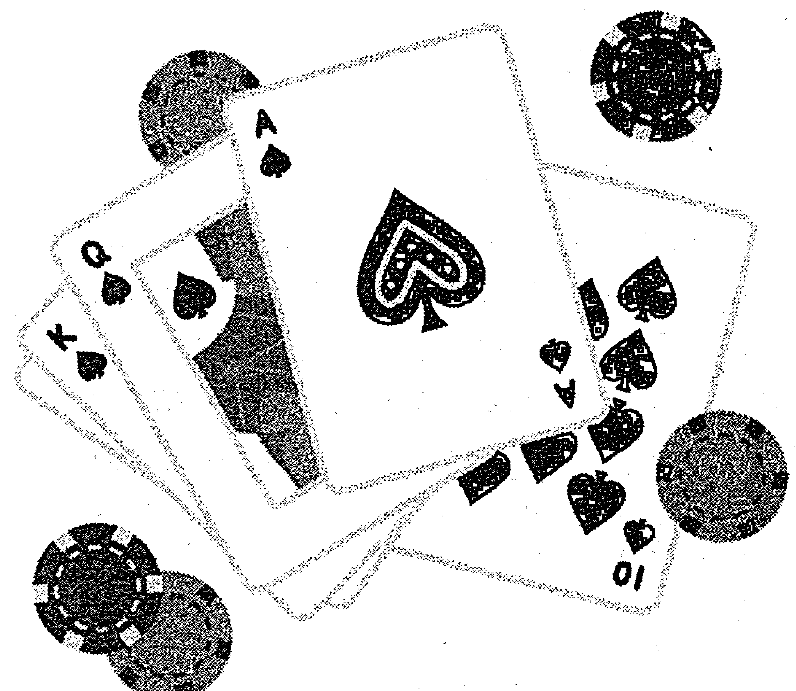

## 愛情

天秤座
9月23日至10月22日

## 與天秤座的第一次約會

天秤座是十二星座中最有魅力的戀人。如果他們喜歡你，他們不會浪費時間去做他們的指定功課，而是馬上就把你迷得昏頭轉向。請準備好目眩神迷，還有接受挑戰，因為你很難不去碰這些擁有高度吸引力的人。初次與天秤座約會時，你可能覺得自己是世界上最幸運的人。他們極大的吸引力中，有一部分在於天秤座讓你覺得跟他們在一起很好，甚至很榮幸。然而你那種「我好幸運」的感覺，在接下來的約會裡可能很快就變成「可憐的我」。第一次跟天秤座約會時，最好設法保持某種客觀性，以避免徹底被迷昏頭。

- 極其吸引人
- 誘人
- 有魅力

- 有誤導性
- 暗中損害
- 虛偽

## 37 吸引天秤座的目光

你可能認為你是在向天秤座約會對象搭訕，然而事實上可能反過來說才是真的。在天秤座亮起綠燈的時候，要抗拒不跟他們搭話可能會難如登天。向他們求愛可能是個複雜的過程，身在其中，你會在他們的包圍網裡越纏越緊。與天秤座的所有初次接觸都環繞著一種陰謀性質，他們的態度隱含著某種共謀意味，暗示著只有你是重要的，還有你們已經很親密了，然而實際上你們並沒有任何肢體接觸。籠罩在他們的魔咒之中時，現實常常隨風四散。

- 耀眼
- 愛下判斷
- 磁鐵般的吸引力

## 38 初次跟天秤座約會的建議

你可能會非常享受與天秤座約會對象共處，以至於忘記所有像是訂位之類的平凡瑣事。雖然你可能較喜歡讓約會保持簡單，沉溺於對話並慶幸自己的好運氣，但你的天秤座約會對象卻可能漸漸覺得跟你在一起很無聊。所以，很重要的是你也要注意實際的事情，尤其是提供適當的娛樂，回饋你所得到的樂趣。一場音樂會、愉快的一頓飯、到某個最愛的景點旅行，你的天秤座約會對象都會很欣賞。

## 39 初次跟天秤座約會的助興與敗興之舉

天秤座約會對象會要求你心醉神迷。光只是欣賞他們是不夠的，他們需要看到你眼中的火花，還有迷醉到神魂蕩漾的仰慕之情，表明了你完整的興趣與投入。只要不到這個程度，就會讓他們掃興到自覺花時間在你身上只是浪費。他們是否會被你吸引，要仰賴好幾個因素：你看起來如何、談吐如何、舉止如何，甚至是聞起來如何。如果你專注於這些個人因素，而不是設法用金錢讓他們印象深刻，你應該能夠吸引他們。

## 40 對天秤座採取「攻勢」

對天秤座約會對象先採取攻勢，然後當下被他們拒絕，可能是常見情形之一。這清楚地向天秤座顯示出你對他們有興趣，但也讓他們有了主導權。請持續努力，因為這也在他們的期待之中。到最後，他們可能會容許某些接觸，但他們總是會讓你懸在半空，渴望更多。要極其小心地別弄髒了他們的妝容或弄亂他們的頭髮，因為他們朝鏡子裡看一眼，就可能讓你被貼上「肇事者」的標籤。打翻水或酒在他們身上的任何地方，都會讓你的努力和這個晚上迅速告終。

## 41 打動天秤座的方法

地位能夠讓天秤座印象深刻。所以，你認識誰，可能比你知道什麼更重要。安排「巧遇」某位有名氣的熟人，可能變成天秤座約會對象心目中最精采的事情。另一種加分作法，可能是某間很潮的飯店經理或主廚，在你進門時直接叫出你的名字並打招呼。安排一幕場景，一個「粉絲」來到你桌前向你要簽名或者只是打招呼。如果這件事自動發生會很好，但如果明顯是設計過的，就只會激起懷疑，很有可能產生反效果。

## 42 擺脫天秤座的方法

對你的天秤座約會對象表現冷淡，通常就足以擺脫他們了。當你對他們失去興趣的時候，天秤座約會對象會「自動」對你失去興趣。相對來說，以某種方式告訴他們，你不覺得他們有性吸引力（就算表達說你依然仰慕他們具備的其他特質），可能會傷害到他們的自尊，刺激他們為了洩憤而引誘你。這種扳回一城的伎倆是大多數天秤座的明確特徵，因為他們喜歡當能做選擇並拒絕的那方。

### 你的天秤座戀人

如果你要成為天秤座的戀人，最好談吐、行為和外表都令人滿意。天秤座對於跟他們一起公開亮相的對象很挑剔；他們也期待受到善待，並且期待你帶他們度過一段美好時光。你可以期待來自天秤座的回饋，不過很清楚的是，他們期待你能夠一直表達讚賞，卻不去想要得到任何回饋。話雖如此，天秤座在關係中很能付出，而能擁有他們的愛與完整關注的人確實很有福。在天秤座變得不快樂的時候會出現問題，而你不該忽略這些難題，並且要在事情失控以前，盡可能迅速處理。

### # 43 與天秤座戀人進行討論

天秤座試著要公平，雖然並不總是能成功。在力求公正的同時，他們通常會進行冗長的對話，去解釋或證明他們行為的合理性。他們完全期待你有同樣的行為，而且在你有過失或者明顯犯錯的時候，他們會想知道你所有的動機、意圖和目的。在你為你的狀況做辯護以後，他們會當法官，而你應該預期到做錯事不但會有判決，判決還會被執行。天秤座不是那種只做口頭威脅卻不打算貫徹到底的人。

- **強項**
- 付出
- 親暱
- 充滿了愛

### # 44 與天秤座戀人發生爭論

天秤座很擅長遣詞用字。而且由於他們愛下判斷的心靈通常會看到事情的兩面，所以不合理、自私或偏頗的觀點不太可能影響他們。一般來說，天秤座會尋求一個雙方都樂於接受的公正解答。如果你和你的天秤座戀人陷入爭執，一會兒之後你可能會出現這個念頭：他們已經做得很好，涵蓋到每個面向、考慮過每個角度了，以致你的在場真是顯得有些多餘。天秤座喜歡解決爭論，不留下任何懸而未決的部分。

- **弱點**
- 不快樂
- 感情需求強烈
- 自私

### # 45 與天秤座戀人一起旅遊

跟天秤座一同旅遊的時候，他們會期待你保持警覺和關注。要是你飄進自己的夢幻島，或者讓你的注意力偏離到一個新興趣上面，你可能會突然被一記肘擊或用力一掐帶回現實。雖然天秤座可以對別人表示興趣、邀請第三方加入你們的兩人世界，但你卻不行。這只是因為在事關他人的時候，他們的判斷被認為是無懈可擊的，然而他們的伴侶卻被評價為不怎麼完美。交新朋友是天秤座的特長，在旅行時尤其如此，所以你最好習慣。

- **互動模式**
- 有選擇性
- 期待
- 親暱

### # 46 與天秤座戀人的性愛關係

天秤座是非常性感的生物，所以他們不只喜歡做愛，還喜歡談論性愛。他們不避諱評價他們的伴侶，並且會討論他們過去的戰績、做比較，然後讓你知道你表現得如何，甚至在動作中就講開了。天秤座戀人會檢視並分析前戲與性交的每一個面向。他們對於實驗抱持開放態度，在所有性愛相關事項上都很有創造力，但通常認為教你怎麼做是他們的責任。他們的精力是赫赫有名的，所以在跟你的天秤座戀人共度夜晚的時候，別期待在做愛與說話之間能有多少睡眠。

### # 47 天秤座戀人的親暱表現

天秤座並不然很愛摟摟抱抱，不過這也不必然意味著他們很冷漠。他們展現出一種很有趣、並不總是會立刻被看出來的柔情。他們可能會用反諷、機智與嘲諷來表現他們對你的在乎，而且當然了，你可能不是那麼欣賞他們表達親近或良好感受的方式。有其他人作伴時，他們會展現出可能被詮釋為侮辱的親暱感情，但事實上他們所做的就只是在玩鬧或開玩笑而已。接受他們的起手式並同等回敬，一般來說他們會開開心心地接受。

天秤座

### # 48 天秤座戀人的幽默感

天秤座最重要的就是想要享受美好時光。既然他們大部分都是熱愛尋歡的生物，你會預期你的天秤座戀人有發展良好的幽默感。然而他們講的笑話和開的玩笑，通常都會讓其他人付出代價。天秤座特別享受看其他人不自在或冷不防失去平衡。（雖然他們不真的是虐待狂，但他們確實很喜歡惡作劇。）說實話，當現場所有人都加入同樂時，天秤座最快樂。

### 你的天秤座配偶

- 社交能手
- 監督
- 令人愉快

天秤座配偶特別擅長安排一家人的社交生活。計畫晚餐、安排跟親友的聚會、排定長短假期的慶祝活動，還有監督子女的人際關係，全都是天秤座的專長。然而普遍來說，天秤座配偶對於自己的核心家庭，其關心程度更高過對父母和手足的家庭。在他們家裡，他們傾向於當老大，所以也是抱怨與問題的最高法院。取悅配偶對他們來說是非常重要的，而如果他們無法做到這一點，他們可能會體驗到極大的挫折感，通常會導致憂鬱。

- 過度受控制
- 受挫
- 怪異

### # 49 天秤座的婚禮和蜜月

婚禮與蜜月的每個面向都可引起你的天秤座配偶的興趣，如果事情沒有做對，他們可能立刻就覺得不滿意。然而，他們常常很快就能同時調整自己與配偶的行為，然後繼續處理下一個問題。天秤座很容易惱怒和心煩，所以其他人應該努力不要攪亂他們高度活躍的神經系統，盡可能自己處理事情，而不要用問題轟炸他們。在親密和社交的情境下，你的天秤座配偶都熱愛放鬆，最後則會讓自己玩個痛快。

- 指尊性
- 投入
- 處變不驚

### # 50 天秤座的家庭和婚姻生活

雖然你的天秤座配偶並不特別擅長或有興趣打掃，他們還是期待自己的家看起來很美麗。所以如同你能夠想像的，維持家的美觀是他們伴侶的責任。天秤座配偶覺得他們在美學與財務上都做出了足夠的貢獻，所以自己不需要再承擔所有冒出來的維修小任務。他們非常善於指揮他們的配偶，會一直找出新的任務讓他們去執行，同時讓自己忙於更重要的事務。

### # 51 天秤座婚後的財務狀況

天秤座配偶確信他們很擅長理財。因為這種信念，他們通常自命為銀行家、財務顧問與商業智囊，這讓他們的配偶感到相當驚愕。沒有別的領域比財務領域更有可能讓你的天秤座配偶失去控制，朝著錯誤的方向猛衝。然而他們拒絕承認這個事實，而他們既是揮霍無度者又是有缺陷的經濟學家，同時又無憂無慮地忽略或否認自身行為的後果，這種獨特的組合可能會把家庭帶往毀滅邊緣。

### ## 天秤座的不忠與脫軌

對於大多數天秤座配偶來說，偷偷享受點小樂趣不算不忠。要是你對他們的怪異行為極其生氣，或者威脅要分手，他們很可能只會一笑置之，認為這沒什麼要緊，而且溫和地斥責你竟然這麼認真看待他們的行為。天秤座配偶並不特別擅長掩飾他們的行徑，而他們談到此事時，可能坦白公開到令人痛心。正常情況下，天秤座並不需要他們的配偶嚴守忠誠，只要他們沒發現這些調情就好。

### ## 天秤座與子女的關係

天秤座很享受屋子裡有一堆小孩，而且最好是他們自己的，雖然他們孩子的朋友通常也會在場，並且受到歡迎。天秤座父母極為擅長處理所有社交情境，他們實際上很享受載著他們的孩子到處跑，並且確保孩子參與大批課後活動時能玩得開心。然而他們並不總是會出席這些場合，因為他們忙碌、通常很瘋狂的時間表，讓他們必須有大批的保母和奶媽，而且最重要的是要有個合作、順從、關愛又能分擔的婚姻伴侶。

### ## 天秤座面對離婚的態度

只要監護權事宜徹底討論過、財務議題解決了、共同的資產公平公正地分配了，天秤座配偶就可以很享受離婚的過程（一旦他們的情緒問題得到控制）。他們對待離婚的方式，通常跟處理婚姻相同，也就是說，他們會鉅細靡遺地監控整件事。然而在他們主導的時候要留意他們，因為他們的熱心和偶爾古怪的點子，可能會讓事情變得混亂而複雜，特別是在他們的法務代表也分享他們扭曲的觀點時。

### ## 你的天秤座秘密情人

你的天秤座秘密情人特別容易苦於愛上「愛情」的致命後果。他們在這種事情上極其不切實際，把愛的世界體驗成一座教堂，讓他們在其中對最神聖的事物致敬。因此，他們把心愛的人看成被崇拜與景仰的神祇。可以把天秤座想成是這個宗教的男女大祭司，史上所有關於羅曼史的流行歌曲都可以視為他們的聖經。被這樣的情人選中，帶來的是份量驚人的責任，但也伴隨著大量的樂趣，可以視為相當愉快的自我激勵。

### ## 遇見天秤座秘密情人

見面的實際地點或環境其實不重要。這種相會會承擔起兩人生命中某個神奇時刻的重要性，是一個不會被遺忘、熱情奔放的頓悟。這種相遇發生的方式通常就是一見鍾情，雙方都心蕩神迷。然而，天秤座秘密情人幾乎立刻就逮住機會主導一切，畢竟這方面的事務他們比較專業。天秤座秘密情人對於怎麼繼續沒什麼疑慮，而且很樂於在這趟浪漫與愛的探索中擔任導遊。

- 浪漫
- 感官性
- 狂喜

### ## 56 與天秤座幽會的地點

既然天秤座是一對情人中比較浪漫的那一位，他們喜愛被帶到你的房間去，他們在那裡可以更加被迷惑住。就算你的住處很凌亂，他們還是會視之如宮殿；儘管如此，最好至少空出幾分鐘或幾小時時間，讓那裡比較能見人一點。所以建議你延遲你們的第一次會面，直到你有稍微多一點時間打掃，並且讓你的住所更吸引人為止。天秤座秘密情人也會帶你回家，不過那熟知一切的氣氛，很可能會讓人聯想到他們過往的斬獲。

- 不切實際
- 有幻想傾向
- 受苦

### ## 57 與天秤座的秘密性愛

雖然你的天秤座秘密情人非常能夠等待，但他們天生熱切的愛好是直取重點。通常某些清純無邪的前戲，或者至少是親暱表現，會在回家路上開始，而到你們兩人抵達的時候，激情通常已來到了引燃點。脫掉另一個人的衣服是常見的情景，雖然狂熱的感受可能讓你們兩人在往臥房的路上自己脫掉衣服，然後在後面留下一道衣物散落的小徑。天秤座秘密情人不一定會要求用床，但遲早你們會抵達那裡，而且能夠在這個經驗持續的過程裡，在更舒適的狀況下放鬆。

- 令人信服
- 提出要求
- 勢不可擋

### ## 58 長久保有天秤座秘密情人

如何把握這些愛昏頭的生物，這個問題很容易回答。只要天秤座秘密情人仍然愛你，他們就不太可能離開這段關係。然而一旦他們對你冷下來，你就不可能把握這些人太久了。要是他們對你的感情漸漸消退時，碰上人生中的新愛人（在這種狀況下通常是免不了的），他們可能會相當粗魯地甩掉你。你可以大惑不解地問：「我做錯了什麼？」但答案通常是千篇一律的：「沒什麼。」

### ## 59 與天秤座的秘密歡愉

對天秤座秘密情人來說，愛通常就是充足的娛樂了。然而這種社會性生物，終究想要讓人看見他們跟你在一起，所以整個關係可能為了這種需求而被犧牲，因為這麼一來，必然會打破低調隱密的模式與謹慎的行事。一旦你們兩人公開出現，最好讓你們的關係看起來像是一段友誼，以避免同時傷害到伴侶和家人。公開秀恩愛應該要避免，雖然不管怎樣，神秘的微笑和從容的感官刺激，可能還是會讓整件事曝光。做好別人開始說閒話的心理準備吧！

### ## 60 與天秤座秘密情人分手

這種事可能發生得相當快，因為在一連串看似無窮無盡的戀人大遊行裡，你不太可能是第一位或是最後一位。如果是你決意你已經受夠了，那麼你應該預期到啜泣、眼淚、抗議、懇求，還有最後展現的狂暴憤怒，或許還耗盡了你儲備的玻璃器皿與瓷器，因而讓戀情「破」局有了一層全新的意義。天秤座秘密情人就是無法相信或接受任何人會有意拋棄他們的感情，所以他們可能會替你這樣的作為找藉口。你的一個慰藉來源，可能是你有能力諷刺地說道：「是我運氣夠好，能成爲許多滿足的靈魂之一——不管爲時多麼短暫。」

### 你的天秤座前任

天秤座前任很可能讓他們的伴侶感到有點困惑和混亂。而且天秤座捕捉住他們伴侶與戀人的網羅如此細膩而強大，以至於這些伴侶很難放手不再著迷於天秤座的魅力，毫髮無傷地逃脫。因此，天秤座前任在分手許久以後，還得以繼續對他們離開或直接拒絕的人行使權力。要是天秤座是被拒的一方，他們通常有更先進得多的復原能力，有時還能乾脆把過往的關係，當成不過是忙碌愛情生活中的一個小挫折。

- 自信
- 自足
- 心照不宣

- 傷人
- 令人混亂
- 讓人困惑

## 61 與天秤座前任成爲朋友

天秤座前任並不排斥跟過去的配偶和戀人建立友誼。他們寧願讓前任們成爲朋友而非敵人，而且他們知道怎樣撫平怒氣、處理問題，好讓事情對所有相關人等都沒那麼尷尬。天秤座的外交手腕可以很高超，足以權衡所有運作中複雜的社會與個人力量。雖然他們的態度可能極端自私，但他們也能夠同理其他人，並且懂得他們的苦處。不管他們看似如何地缺乏同情心或冷漠，天秤座絕對不可能被指控成不理解發生了什麼事。

- 令人陶醉
- 神奇
- 令人嚮往

## 62 與天秤座前任複合

被困在天秤座的網羅中（或許很受傷又令人困惑），受到他們斷然拒絕的人，可能會很渴望複合。最常見的情況是，這種渴望既不切實際又不令人嚮往，而天秤座前任身爲這個領域的專家，肯定知道這一點。除非他們有心情玩弄前任的感情，否則天秤座會阻止任何和解的嘗試，而且會終結整件事。不過這種玩弄的傾向，在某些天秤座身上相當明顯，他們樂於讓前任陷入愛與渴望的危險流沙裡。

## 63 與天秤座前任討論過去的問題

天秤座總是樂於談論過去，但他們的談論帶有一種明確的評斷氛圍，往往會評價他們前任配偶與戀人的行爲，並且加以譴責。在經過一、兩回合這樣的討論後，他們的對手通常受夠了，或許還很後悔一開始提起過去的問題。此外，這些討論所激起的憤怒與挫折重擊，可能還會留在他們身上——這些負面感受沒那麼快消失。所以，跟天秤座最好只專注於正面的回憶，只回想好時光。

## 64 對天秤座前任表達親暱感情的程度

在一段關係結束以後，天秤座前任並不反對分享親暱感情、甚至是性愛。在這麼做的時候，他們經常忽視另一個人的感受，使得另一方自然而雖然把天秤座的情感表達，看成是他們對復合保持開放態度的指標，或者是表達這段關係還在繼續。天秤座古怪的地方是，他們可以關上門、真正結束一段關係，卻又讓另一個人覺得這段關係還活著。這種雙重標準經常讓他們陷入水深火熱之中，而且可能讓天秤座前任變成令人厭惡、憤怒、甚至憎恨的對象。

## 65 界定與天秤座前任現有的關係

這個提議通常很困難。有時候天秤座很清楚他們的感受，有時候則否。他們最常覺得很難下定決心。要處理這樣的模棱兩可並不怎麼讓人愉快，因為你從未真正知道你站在什麼立場。你的天秤座前任也不知道，而這個事實肯定讓人有點不舒服。困惑、誤解與欺騙很可能凌駕一切，導致不確定性與混亂。可以採取的最佳態度是自己先站穩立場，不隨著你的天秤座前任的每個新立場而轉變或重新調整。

## 66 要求天秤座前任分擔照顧子女的責任

大多數天秤座前任會在監護權事宜上尋求公平。他們看得出孩子擁有雙親的真正價值，以及與前任配偶培養友誼而非敵意的益處。外交手腕圓融到極點的天秤座前任會很願意妥協，但在這種乍看合作與迷人的氣氛之下，埋藏的是他們照自己意思做的頑固決心。此外，你的天秤座前任是很聰明的策略家，知道什麼時候該進逼、什麼時候可以退讓。他們也不吝於使用他們的誘惑魅力，來促成他們的要求。

## 朋友與家人

天秤座
9月23日至10月22日

### 你的天秤座朋友

「我們的友誼會維持到盡頭……但這裡就是盡頭了。」對於天秤座朋友如何行動，這個評價是不是很真確呢？嗯，無可否認的是，天秤座的友誼通常長度有限，可能很快又無可預期地走到了盡頭。不管天秤座是否總是要為此負責，這都不是重點，但他們確實有種傾向——一頭栽進熱烈的關係中，然後在某一刻開始退出，卻沒有通知另一方他們的打算。大多數天秤座覺得他們的行為很公平，而且做出對所有相關人等都很實際的判斷。然而對於他們的朋友來說，這樣並沒有讓事情更容易，他們可能覺得自己遭受嚴峻的評估，然後唐突地被拋棄了。

### 67 向天秤座朋友求助

天秤座朋友可能讓人難以置信地樂於付出。此外，他們的慷慨似乎是無條件的，直到他們想要回曾經給你或借你的東西為止。他們可能突如其來地要回借款和出借物。問你做了什麼是沒有用的，因為這種行為鮮少跟你的行動有任何關係，反而跟你的天秤座朋友心情如何比較有關。天秤座通常會慷慨地付出他們的技能、時間與精力，但可惜啊，他們完美主義的傾向，通常會吸引他們花時間改善已經運作得很好的事情。

### 68 與天秤座朋友溝通和聯繫

天秤座傾向生活在自己的世界裡，而周遭都是他們的朋友與熟人。所以跟他們保持聯絡的方式之一，是透過他們創造的這個人際網絡。就像蜘蛛網一樣，拉一下其中一股絲線，就會引發所有相關者的回應，尤其是位於網絡中央的天秤座。話傳得極快，所以天秤座一定會聯絡你，毫無閃失，而且不會有太多耽擱。忘了私下通訊這回事吧，因為天秤座朋友有種辦法，會把消息散播給聽得到的所有人。

### 69 向天秤座朋友借錢

天秤座如果有錢，別人開口問的時候就會借。有時候他們看出了你的需求程度，你甚至不必開口就提議要借錢給你。他們常常根本不把這看成是借款；他們就只是給錢，沒有進一步的定義、條件或要求。他們把錢給其他人的時候，也不會有建立共同信用額度，以便將來自己也可以利用的想法。正常情況下，他們得到的回饋就是幫上忙的簡單滿足感，此外也有他們救了別人以後在朋友圈裡得到的聲望。天秤座朋友痛恨看到親近他們的人看起來窮困潦倒，因為這樣會讓他們自己的社會地位跟著蒙塵。

| 特徵1 | 特徵2 | 特徵3 |
| :--- | :--- | :--- |
| 熱切 | 投入 | 評估 |
| 拒絕 | 嚴厲 | 退縮 |
| 迅速 | 無法預測 | 令人驚訝 |

### 70 向天秤座朋友征求意見

在給予建議方面幫忙到了極點的天秤座朋友，經常提供非常寶貴的諮商，而從後見之明來看，可以說他們挽救了大局。天秤座是天生的法官與評估者，能夠同時看到事情的兩面，隨後作出客觀的評估，甚至對最磨人的事情亦是如此。天秤座通常被選為調停者，而許多人信任他們到足以服從他們的仲裁，知道他們有約束力的決定，是在冷靜公平、沒有偏見的狀況下達成的。天秤座朋友鮮少會尋求你的建議，因為要接受（他們心目中）不像他們那樣小心權衡過的意見，他們會抱著警戒的態度。

### 71 拜訪天秤座朋友的時機

天秤座朋友會非常驕傲地炫耀他們所擁有的東西，當然了，這包括他們居住與工作空間的顏色和整體設計。但他們鮮少正式邀請人來訪。這比較不是出於獨處的需要，而是因為他們想要有很多時間充分準備一次重大的展示。除非處於最佳狀態，否則天秤座痛恨被看到，畢竟他們對批評特別敏感。天秤座朋友更有可能辦一場盛大派對，一鼓作氣地炫耀他們的才藝、成就與風格，而不是發出定期性的邀請。對他們來說，最大的回饋是聽到每個人都在說，他們度過了多棒的時光。

### 72 與天秤座朋友一起慶祝和娛樂

儘管朋友經常順道拜訪，許多天秤座寧願外出，不是在公共場合就是去拜訪他們的許多熟人。這也給了他們機會炫耀他們的新衣、珠寶、古龍水或香水，還有最新的車子或3C產品。在派對邀請名單裡被略過，或者在社交聚會裡被忽視，是天秤座朋友可能碰到最糟的命運，至少在聚會這個領域裡是如此。天秤座需要迷惑、引誘並以魅力吸引他們遇到的人——本質上來說，就是要成爲派對上的靈魂人物。他們鮮少有別的時刻，比站在一圈仰慕者中央的時候更快樂。

### 你的天秤座室友

除了覺得很難做完事情、或者很難享受片刻安寧以外，有個天秤座室友的經驗其實很有樂趣，鮮少會有無聊的時刻。天秤座不會遠離朋友太久，這表示他們不會獨自來去任何地方。聆聽這個群體在樓梯上如行軍般的腳步聲，可能很快就變得惱人，不過你能做的不多，只能接受這一點，並且祈禱鄰居會抗議。在朋友沒陪著他們的少數時刻，天秤座室友會把時間花在講他們自己和他們的最新經驗上。你的天秤座室友若不是讓你變成更有社交性的人，就是到頭來你會躲在自己房間裡，把音響開大聲些。

### 與天秤座室友分擔財務責任

天秤座在荷包滿滿的時候會分擔財務責任，但當支票帳戶見底、信用卡刷爆的時候，就會變得很緊急。通常他們會要你幫一下他們那份房租和水電瓦斯費，同時答應下個月補足。說實話，他們通常會設法做到這一點。然而每個月付帳單的日子快到時，你可能會為之一縮：他們若沒主動說要付錢，你一想到要問這件事就緊張。一旦你習慣他們需求的規律節奏之後，事情看起來就沒那麼緊急了。但他們確實會讓你一直有壓力，覺得手邊得要有可以活用的錢才行。

### 與天秤座室友分擔打掃責任

多數情況下，天秤座相當整潔，就算這只是出於他們的美感與維持外表的慾望帶來的要求。天秤座室友會動手做，也會協助需要動員兩、三個人的打掃計畫。不過如果照他們的偏好來，他們寧願只做自己份內的打掃工作。最常見的狀況是，他們保持自己房間的整齊，但不會極端整齊。天秤座室友是最有可能把塵土掃到地毯底下的那種人（粉飾太平。他們告訴自己，「只是暫時如此」）。身為拖延大王，天秤座室友習慣延宕打掃計畫好幾天、甚至好幾週。

### 當你的訪客遇到天秤座室友

因為天秤座有找朋友來玩的嗜好，所以你通常會有很清楚的概念，知道家中會一直出現訪客。因此，在一次拜訪與拉長的短期居住之間，有一條微妙的界線存在。要是你委婉地暗示或許你的天秤座室友要替食宿和水電瓦斯多付點錢，你可能會發現自己面臨指控，被說成是反社會的掃興鬼。天秤座確信他們實際上替你省了錢，一直提供你持續的免費娛樂。過了一陣子以後，玩得這麼開心的緊張感可能變得很累人，讓你渴望得到一些平靜與安寧。

### 與天秤座室友的社交生活

天秤座室友鮮少需要辦派對，反正通常已經有一個在進行了。可以預期的是，在天秤座的團體進場之後不久，會有人叫某人（或許就是你？）出門去買啤酒、葡萄酒或披薩。雖然這讓你可以不必煮飯，卻可能會有體重增加與睡眠不足的劇烈後果。你可能就這樣溜出去赴你自己的約會，不過被迫夜復一夜這麼做之後，會讓你懷疑自己到底是不是真的住在那裡。你唯一的希望可能繫於讓你的天秤座室友坐下來談談，然後建立一份每週行事曆，把你的活動也包括進去。

### 與天秤座室友的隱私問題

你的隱私可能不存在，他們的隱私則是不必要的。關上你的房門並上鎖，變成了孤立而非隱私，而社交性超強的天秤座室友與朋友，甚至可能把這詮釋成有敵意的行為。你可能必須在別處尋求隱私，就這樣接受你住在火車站或巴士總站的事實。當然，你可能會發現你也很樂在其中，只要你一星期能獨處一、兩晚就好（在你的天秤座室友和他的同伴們離開時就有希望）。天秤座室友常常讓你自問：「他們從來不想獨自一人嗎？」答案永遠是一樣的：不想。

| 特徵1 | 特徵2 | 特徵3 |
| :--- | :--- | :--- |
| 有娛樂性 | 令人愉快 | 社交性 |
| 麻煩 | 惱人 | 讓人分心 |
| 投入 | 參與 | 管理性 |

### 與天秤座室友討論問題

天秤座室友熱愛談話，但遠住他們討論事情可能會很困難，特別是當主題是你的抱怨時。他們可能會把事情倒過來看，所以這場討論的重心，變成他們眼中屬於你一輩子的問題，而不是他們造成的問題。對天秤座室友而言，他們的行為很正常，只不過表現出了人類的社交衝動。你則是怪胎——愛抱怨、緊繃嚴肅、容易惱怒，而且無可救藥地跟其他人疏離。一陣子以後，你會領悟到這樣的討論只是在浪費時間。為了保全自我與生存，你必須站穩腳跟，堅持你的立場，忽視所有侮辱與帶刺的言論，照著你的需求來整頓事情的秩序。

### 你的天秤座父母

天秤座父母對於他們的社會地位極為敏感。他們想要子女看起來很棒，而且跟「對的」那種小孩交朋友。天秤座父母非常投入於規劃子女的職涯，所以他們對於子女的教育有強烈的興趣，小心翼翼地監控成績和其他學業指標。在子女表現成功時，天秤座以他們為傲，毫不猶豫地把孩子的成就歸功於自己。他們會以各種方式犧牲他們的時間與金錢，只為確保子女能夠領先群倫，其中包括加強成就的課外活動。

### 天秤座父母的教養風格

天秤座父母是子女行為的嚴峻法官，但只在於他們真正重視的那些事情上。回家作業必須要做，成績必須要好。然而在玩耍和享受歡樂時光這方面，他們也給子女很大的自由。他們鮮少嚴重懲罰子女太晚回家，或者花太多時間上網、看電視或玩電玩。對社會地位顯然很敏感的他們，如果子女嚴重逾越正常社會行為，或者以其他方式讓家庭名聲蒙羞，他們會毫不猶豫地罰小孩禁足。

### 天秤座父母與孩子的相處

天秤座父母在孩子還小的時候，熱愛摟抱他們。雖然這種親暱程度隨著孩子年齡的增長而遞減，不過他們通常會和藹地對子女說話或者微笑，至少在一切順利時如此。天秤座父母會有意識地把不表現親暱當成懲罰，他們的親暱程度通常跟子女的合作程度直接成正比。經常取悅天秤座父母的孩子，通常可以指望父母相應地表達良好的感受。天秤座父母一般很享受跟他們的孩子一起對寵物和其他小生物，表達相互的親暱之情。

| 特徵1 | 特徵2 | 特徵3 |
| :--- | :--- | :--- |
| 目標導向 | 有野心 | 支持 |
| 霸道 | 充滿壓力 | 苛求 |
| 堅持 | 投入 | 評估 |

## 81 天秤座父母給孩子的金錢觀

一般的天秤座父母會看出有需要給每個小孩每週零用錢。這會是除了午餐錢、交通費、常常還有服裝預算以外的錢。雖然他們的子女可以照自己的意思花零用錢，天秤座父母很有可能會注意新買的東西和支出，以便評估這些花費的正面或負面影響。天秤座父母相當能夠減少或砍掉定期的現金花費，他們會極其清楚地講明，金錢不該被浪擲在無用或根本有害的追求上。

## 82 天秤座父母的危機處理

因為容易興奮又感情外露的人格特質，使得天秤座父母經常反應過度，把小事化大。極端戲劇化的他們，可能輕易地便在公共場合展現他們的情緒，像是在擁擠的購物中心或大街上，導致他們的子女十分尷尬。他們的孩子很快就學會把最令人不安的事情藏在心裡，而不是跟天秤座父母分享，因為他們肯定會反應過度。因為這個理由，天秤座父母的子女通常會發展成獨立自主又能幹的人，不常要求外援。

## 83 天秤座父母的假期安排和家族聚會

舉凡跟社交活動有關的時候，天秤座父母總是如魚得水。天秤座父母特別擅長計畫，所以可以仰賴他們把事情鉅細靡遺地安排好，並且確保所有出席者——特別是他們的子女——都會有一段愉快的時光。天秤座父母能夠用別人的立場來思考，並且發現什麼可讓其他人得到最大樂趣，以及什麼會讓他們倒胃口。因此，家庭成員會期待像是生日、旅行、野餐或野炊等特別活動，而天秤座父母會在其中扮演要角。

## 84 照顧年邁的天秤座父母

只要你確保你的天秤座父母有一、兩個好友在附近，你就可以降低相當多的憂慮。雖然是可以放著天秤座父母獨處一陣子，但若能讓他們每天跟同年齡層的朋友接觸，會讓他們明顯比較開心，甚至增進健康。天秤座父母在退休人士社群裡過得很好，他們可以在其中擁有自己的家，但也有機會在他們希望的時候進行社交往來。年長的天秤座父母很享受跟他們的同儕分享經驗，而且特別喜歡參與特殊的社交活動並做出貢獻。

### 你的天秤座手足

天秤座手足不只要求得到父母的注意，也要求其他手足的注意。他們爭取注意的作法，通常是透過他們熱情洋溢的活動與光彩奪目的舉止來達成。要是他們缺乏他人的注目，通常會變得更加浮誇。如果這不管用，他們可能會生悶氣，而且變得有點抑鬱。但他們還是留意著家中其他成員，通常會成功地引起注意，最後被欣賞。天秤座熱愛對團體做出貢獻，而且著迷於跟兄弟姊妹一起進行的特殊家庭活動。

## 85 與天秤座手足的競爭和親近

天秤座通常會參與手足間的競爭。雖然他們很享受跟兄弟姊妹爭鬥，正常情況下，他們是以好玩的心態這麼做的。一旦他們得到父母的注意，他們就感到快樂滿足了。天秤座並不是要宰制手足的那種類型，他們只是喜歡被注意到，然後平等地參與大多數活動。大部分時候他們並不是領袖或霸道的人（雖然他們總是會讓別人聽到他們的意見），尤其是在跟計畫活動和做決定有關的時候。天秤座熱愛身為大家庭的一分子，通常會公開對他們的手足表現親暱之情。

## 86 過往的成長經驗對天秤座手足的影響

天秤座相當擅長原諒與忘卻。一旦他們以自己的方式處理了這件事——反擊或懲罰犯錯的人，下了判決，找到折衷方案——他們就能夠自由自在地繼續過日子，不至於心懷怨恨。天秤座手足相當活在當下，而且沒有時間或性格傾向要想著過去的問題，或者被這些問題牽制。然而，他們可能跟懷恨著過去的兄弟姊妹有相處上的問題，而他們輕鬆自在的態度，或許會被比較嚴肅的家庭成員誤解或譴責。

## 87 與疏離的天秤座手足往來

天秤座手足通常不會跟其他家庭成員疏遠，除非他們被團體放逐。所以如果要把疏離的天秤座手足帶回家庭裡，讓他們覺得自己再度受到歡迎，是兄弟姊妹的責任。天秤座手足鮮少試圖拒絕其他家人，而在難解的問題能被擺平、衝突結束的時候，他們的反應會是鬆了一口氣。正常情況下，應該由本來帶頭疏遠他們的兄弟或姊妹，先來跟疏離的天秤座手足接觸，而一旦成功，事態就可以平順地朝正常化前進。

## 88 天秤座手足對繼承、遺囑等金錢議題的處理

天秤座是天生的法官與調停者，總是尋求讓所有相關人等得到權利上的公正和平衡。他們會在與父母死亡有關的繼承權和其他事宜上帶頭，想要看到這些棘手問題獲得確定，和平的結果勝出。通常其他手足會認可他們的天秤座手足有這些能力，在這種事情上扮演重要的角色，或者至少給意見、當顧問。在向天秤座手足借錢的時候，他們會對此抱持開放態度；但如果有一個雙方都同意的償還時程表，他們會覺得更自在。

## 89 與天秤座手足的家族團聚和慶祝活動

天秤座手足熱愛參與這些活動，並且經常帶頭安排諸事。他們年紀漸長以後，會特別熱愛聚會活動，因為他們真心想念住在遠方的兄弟姊妹，而且很樂於偶爾看到他們，了解彼此的近況並回憶往日時光。一起共度假期是特別享受的事，而這樣的時刻通常意味著他們自己的子女與堂表親都會有段愉快的時光。慶祝活動會發掘出天秤座手足真正的社交元素，他們會沉醉於遊戲、聚餐和活潑的對話中。

## 90 與天秤座手足一起度假

天秤座手足非常熱愛偶爾跟他們的兄弟姊妹去度假。他們一連好幾個月期待著這樣的活動——夢想、計畫，然後在日子接近的時候幫忙。然而要是父母因為經濟問題而擱置原本的計畫、或者縮減規模，他們很容易對此感到失望。儘管如此，他們有足夠的創意，能在這種狀況下奮發起來，幫忙想出其他可行的選擇。年紀大些以後，天秤座手足是絕佳的組織規劃者，能夠協調好可行的度假日期、旅行計畫與假期中的租賃事宜等等，然後召集遠地的親族到同一地點相聚。

### 你的天秤座子女

天秤座子女雖是順從的，卻也很苛求。天秤座子女有個不變的要求，就是他們要當注意力的中心。身為人生舞台上的表演者，天秤座子女想要被欣賞、承認、認可，並且得到父母愛與親暱的回饋。他們可以提供很多的回報——持續不停的娛樂，只是天秤座子女的許多好處之一。無論是唱歌、跳舞、畫畫、寫作或設計新遊戲、發明新穎的活動，只要天秤座子女在旁邊的時候，就鮮少有沉悶的時刻。他們的創造天賦特別突出，不過必須讓他們維持在控制之下，免得他們變得太野。

## 91 天秤座子女的人格發展

天秤座子女需要父母的引導與智慧，才能適當發展。他們有種顯著的狂野與行為失控的傾向，父母若給他們為所欲為的行動自由，反而對他們有害。以耐心與理解的監督對待他們，天秤座子女可以在引導之下通過特別有挑戰性的成長階段，最後勝出，證據就是他們平衡良好的成人人格角色。另一種狀況可能很有災難性：一個經常在混亂行為邊緣蹣跚前行的孩子，在挑戰社會權威時，失序到了極點。

## 92 天秤座子女的嗜好、興趣和職涯規劃

無論你的天秤座子女看起來多內向或孤立，你可以確定的是，他們的命運最終會連結到其他人。雖然這說到底對我們所有人都為真，但天秤座孩子在社交處境下卻有種特殊天賦，所以，他們尤其擅長擔任團隊領導者、老師及各種類型的社工人員，包括心理學家與顧問。他們年紀還小的時候，其他孩子自然而然就會找上他們，尋求幫助與建議。能夠以這種方式幫助他們的玩伴、學校好友和熟人，給了天秤座孩子很大的滿足感。

## 23 對天秤座子女的管教

雖然寫做「管教」，實際上用「指引」更佳。你的天秤座子女對於懲罰的反應並不健康，而且可能會苦於深刻的精神創傷。父母絕對不能走捷徑，吼他們或者打他們；反而要用平靜、有耐性、堅定卻理解的方式，設法抑制天秤座子女那種反覆無常的能量。一位父母能給天秤座孩子的最大禮物，就是教導他們自律的價值。一旦他們掌握到這個概念：把秩序加諸己身，可以讓他們在世界上走得更遠，他們就會堅守個人成長與生涯成功的道路。

## 24 與天秤座子女的親暱程度

就像花朵會轉向太陽尋求光照，天秤座子女會轉向他們的父母尋求親暱情感。經常讓他們得不到親暱情感，可能導致他們變得退縮，並且在情緒上受到傷害。同樣地，天秤座子女也要能夠對父母表達親暱之情。愛——給予和接受兩方面都是——在天秤座子女的日常生活裡扮演重大角色（更勝於大多數其他孩子）。父母應該小心地使用抑制親暱感情這個作法來懲罰天秤座子女，還要小心別在身體與心靈接觸兩方面，不恰當地利用他們的力量與受到偏愛的地位。

## 25 處理天秤座子女與手足之間的互動

這是個很困難的問題，因為天秤座子女通常沉浸於激烈的手足競爭之中，藉此爭奪父母的感情。從實際的角度來說，處理這個問題最簡單的方式，就是讓父母之一先注意天秤座子女，一旦他們明顯滿意了，再轉向他們的手足。既然天秤座子女確實會尋求父母明確的偏愛——而且他們通常在得其所欲以前不會停止——他們的父母一定要找到辦法付出注意力，卻不至於激起其他子女的敵意。當然，只要有可能，所有小孩都應該得到同等的對待。

## 26 與成年天秤座子女的互動

在可能的最佳狀況下，天秤座子女會長成一個平衡、負責又有愛心的成人。然而，運氣不夠好，沒有認真謹慎的父母引導的那些人，很可能大多數時候都到處撒野和處於失控狀態。這樣的天秤座可能會發現自己成年後，受到飄忽不定的行為、以及生活缺乏穩定的傷害。跟這些成年天秤座子女互動，要有很大的耐心和體諒。最好讓他們來找你尋求指引與幫助，而不是設法替他們經營生活，因為這麼做免不了會激起他們的不安全感，最後甚至引起怨恨。

#### 天蝎座
日期：10月23日至11月21日

天蝎座是固定宫水象星座，受到黑暗行星冥王星与好斗的火星共同支配。就像他们的同名生物，天蝎座最好放任其自理，因为他们施加痛苦的能力是很显著的。天蝎座可以非常有魅力却也好斗，他们对于性爱领域的兴趣和能力是众所周知的。就像处女座，天蝎座过着隐遁的生活，通常会在他们周围营造出一种神秘气氛。受到金钱与权力的致命吸引，天蝎座必须学会对他人温柔和善这门功课。

### 工作

#### 天蝎座
10月23日至11月21日

##### 你的天蝎座老板

- 目标精准
- 有保护性
- 强大有力

天蝎座老板是严肃的人——进取心强却容易咄咄逼人，并且专心致力于让公司成功。因此，他们对旗下员工设下极高的标准，期待他们每天都做到最好。天蝎座不接受交出粗劣或马虎工作的借口，宁愿你坦白承认失误，而不要企图解释成没这回事。强大有力又有支配性的天蝎座老板随时都握着方向盘，不容许他们的同僚质疑或损害其权威。在向他们的上司或企业主报告时，他们会设法保护自己的员工免于不合理的要求，并且坚持为他们的员工所付出的努力，取得适当而通常很丰厚的回馈。

- 没有弹性
- 不宽恕
- 严厉

###### 1 要求天蝎座老板加薪
最好等着天蝎座老板自己提起这个话题，因为他们会注意到员工努力的成果而给予应得的奖赏。有时候，这点可能是在正常对话里间接做到的，当时对话中正好出现辛勤工作与回馈的主题。绝对不要直接要求天蝎座老板为你加薪——一旦提过了这件事，就要让他们仔细考虑一阵子。正常状况下，天蝎座老板会在两周到一个月内回应你。在这个时间间隔之后，你可以考虑做个简短的提醒，因为他们心里通常想着许多事情。

- 严肃
- 咄咄逼人
- 有支配性

###### 2 向天蝎座老板宣布坏消息
最好如实说明，真真切切，不要试着包裹糖衣。虽然天蝎座老板有着恶名昭彰的坏脾气，甚至很暴烈，但如果你想给事情一个没根据的正面诠释，他们会更生气。到最后，不管是谁的错，大多数天蝎座老板终究会为发生的事情扛起责任，而在回报他们的更上级时，通常会把受谴责的责任从员工身上转移到自己肩头。说真的，他们确实觉得好像所有重大失败到头来都必须由他们负责。

###### 3 替天蝎座老板安排差旅和娱乐
天蝎座老板喜欢享用美食，以及舒适、甚至奢华的住所。只要其他事情都顺利到合理程度，这些事物能够让他们在整个商务旅行中都维持好心情。天蝎座老板约会迟到是恶名昭彰的，他们可能让你先去招待客户或潜在生意伙伴好一段时间，才终于姗姗来迟。天蝎座常常采用一种没那么委婉的方式，来展现他们控制情况的能力，有时就像是在发表宣言。不消说，在这样的旅行中，身为他们的助理或同伴，你绝对不该设法让自己的光芒压过主人。

#### 天蝎座老板的决策风格
天蝎座的决定里没有什么模棱两可的部分，但通常要花点时间才会出现。天蝎座老板并不会很快确定他们的心意，而是喜欢有很长一段时间好好考虑，并且做出思考周全的决定。绝对不要在这个过程里催促他们，因为这样除了不管用，更可能激起他们的恼怒与攻击性。一旦他们下定决心，表明了他们的决定，就极不可能改变或收回自己的话。然而古怪的是，他们可能会替自己留下一个秘密漏洞或出路。保留第二（甚或第三）方案是典型的天蝎座特征，就算那些备案鲜少执行。

#### 打动天蝎座老板
不是为了追求红利或其他回馈的想望，就只是因为工作要求而付出努力的员工，天蝎座老板会特别欣赏。规律地多做一些的人，很可能让天蝎座老板印象最深刻。反过来说，天蝎座老板对设法霸占公众注意、炫耀才华的浮夸之辈敬谢不敏。通常是安静谦虚的员工，通过他们不倦怠、不自私且忠诚的态度，成功地让天蝎座老板留下好印象。

#### 提案并对天蝎座老板做简报
天蝎座老板对大多数事项通常已有定见，所以，你的简报要不是强化他们已知或相信的事情，就是会有所抵触。如果是后者，请准备好进行寸土不让的持续战斗；若是前者，你的天蝎座老板可能会同意你所做的努力，却不会认真加以认可。通常是通过与天蝎座老板的歧见，而非与他们意见一致——通过强烈且知性的论辩，以及有来有往的机智对答——真正有效解决问题的主意与方法才会浮现。前面所说的一切都会敦促你做好周全准备，但也要准备好强力为你的观点辩护。

#### 你的天蝎座员工
让天蝎座员工独自工作，他们就会把事情办好。他们有自己的做事方式，同侪不见得能够共享或理解这套方法。天蝎座员工很可能显得行事隐密，他们不是具有社交性的、或急于揭露太多自身的方法或私生活的那种人。忠于公司的天蝎座员工，总是会尽力做到超越正常责任需求的范围。他们只有在受到过度或不公平攻击或批评的时候，才会变得好斗。这种时候，他们就会变成可畏的敌手。

#### 面试或雇用天蝎座员工
天蝎座求职者不是会自吹自擂的人。事实上，除了他们的履历表或简历上列出的内容之外，面试官可能必须套出他们的个人信息。天蝎座求职者对于工作条件并不是太过好奇，但通常他们对工作条件会有几项必须符合的标准。一旦他们对工作的可靠性与安全性感到满意，他们就会敞开心胸表现出更高的意愿，但还是会有所保留。天蝎座求职者鲜少会虚伪地陈述自己，或高估自己的能力。

- 忠诚
- 奉献
- 慎重

##### 8 宣布坏消息或解雇天蝎座员工
被指控做错事、或者受到开除的威胁时，天蝎座员工可能会变得相当好斗；在他们每天付出一切来履行职责的状况下，尤其如此。他们能够接受坏消息，所以雇主和同事不该兜圈子，反而要直接讲出来。天蝎座通常够诚实，足以接受他们要负责到什么程度，但他们经常会保持安静，而非参与激烈的争论。天蝎座能够用寥寥数语说出他们要传达的事，觉得没有很大的需求要为自己行为的合理性辩护。被开除的威胁，通常不会惊吓或威吓到他们。

- 隐遁
- 孤立
- 好斗

##### 9 与天蝎座员工一同差旅或娱乐
因为天蝎座热爱隐私，所以最偏爱的是独自旅行。如果他们必须跟同伴同行，那么另一个人绝对不该碎嘴，或者以其他方式打扰天蝎座内省、安静的举止。天蝎座员工和其他人一同旅行时很容易被惹恼，而且可能一如平常地变得沉默且情绪不稳。在招待天蝎座员工的时候，最好事先询问他们的偏好，或许甚至要针对这个主题做点研究。他们最亲近的同僚，应该能够提供关于天蝎座员工好恶的资讯。

- 自给自足
- 秘密行事
- 含蓄

##### 10 分配任务给天蝎座员工
天蝎座员工是把特定任务执行得非常好的专家。他们并不喜爱多样化或者扮演多工处理者的角色，所以最好检视他们的工作史并直接询问他们，弄清楚他们是不是这项任务的正确人选。花时间做这种研究很值得，因为在大多数例子里，天蝎座员工一旦被放在正确的位置，就会有高水准的表现。反之，如果给了他们不对的工作，你可以预期到会有不怎么优秀的表现，还会有一阵阵的气馁、甚至沮丧。一般而言，最好不要让他们成为大团体里的一部分，只要有可能，就让他们自己去完成任务。

##### 11 激励或打动天蝎座员工
激励天蝎座员工的最佳办法，是让他们在自己的能力范围内做有可行性的工作。在从事自知能够驾驭的工作时，天蝎座员工喜欢那种内在的安全感，而不喜欢被过度挑战或压迫。不要犯下这种错误：替他们加薪，然后要他们完成他们不特别有兴趣去做的工作。如果你了解他们的需求，因此即便受到顶头上司的压迫，也拒绝逼他们去做不适合他们的工作，你的天蝎座员工会对此深感钦佩。如果你保护他们的利益，他们就会为你多尽一分力。

#### 管理和指导或指正天蝎座员工
一旦被指导过，就可以让天蝎座员工自己去做他们的工作。他们对于你一直打探进度的反应非常感冒，因为他们不需要持续受到检视，就能产出高质量的工作——一直检视只会让他们紧张，对他们的表现反而有负面影响。如果以正确的方式、用恰当的立场提供批评，天蝎座员工是可以接受的。绝对不该以直接的方式，威胁、哄骗或责怪情绪高度敏感的天蝎座。跟他们交涉的时候，最好尽可能保持客观。就算如此，你仍必须小心不要冒犯他们，所以请字斟句酌，避免扰乱他们的感受，引起愤怒或好斗的反应。

#### 你的天蝎座同事
天蝎座同事会被吸引去协助最困难、最有挑战性的任务。对痛苦并不陌生的天蝎座，知道变成环境牺牲品、最糟的是还受制于自己的恐惧与焦虑，是多么严重的事情。与其设法安慰有需要的同事，天蝎座宁可直接跳进去，卷起袖子干活。天蝎座同事不会轻易害怕，也不会被看似无法征服的目标与复杂的任务吓倒。向不可能的任务挑战，比从事轻松规律的项目更能激起他们的兴趣。

#### 寻求天蝎座同事的建议
你的天蝎座同事能够几句话就给予建议。正常情况下，他们会花时间考虑你的话，然后用他们思考过的意见来回复你。在这个过程中不该催促或压迫他们。通常他们的建议是奠基在他们自己、还有公司同事的经验。天蝎座记得很久以前的事，会牢记其他人可能多年后已经忘记的重要细节，因此他们能够得到非常适用的资讯。然而，口语能力并不是他们的强项，所以请仔细聆听，以便理解他们想告诉你的事。

#### 向天蝎座同事求助
如果天蝎座同事确信你正处于受苦之中，而且他们有能力减轻痛苦，他们就会尽力来帮助你。这种帮助不会只是空口说白话。如果他们相信你的理想，不管要求身体力行还是财务援助，他们都会准备好明确办到。天蝎座是理想派与实用派、改革斗士与经验主义者的奇异结合，可以提供一针见血的分析，同时还能规划出攻击与解决问题的作战计划。一旦致力于帮助你，天蝎座同事在你再度恢复最佳状态以前是不会停手的。

#### 与天蝎座同事一同差旅或娱乐
建议你跟那些你已经很亲近的天蝎座一起旅行。跟也是朋友的天蝎座同事一同旅行，能够带来许多乐趣；但如果是你根本不认识的人，要调适并配合他们苛求的个人偏好与品味，事实可能证明那并不是个愉快的经验。要是你选择掌控你并不熟识的天蝎座，你一定会碰上抵抗，而且他们通常会拒绝遵从你的命令，甚至完全沉默或心情恶劣。要是由天蝎座同事主导，你可能会发现自己无法享受他们在食物、住宿与交通上的偏好，因而被困在无可逃脱的艰难处境中。

| 强项 | 弱点 | 互动风格 |
| :--- | :--- | :--- |
| 乐于助人 | 专横 | 乐于支持 |
| 起身体抗 | 内心纠结 | 有同情心 |
| 精力旺盛 | 受苦 | 喜爱挑战 |

##### 16 与天蝎座同事共事
天蝎座同事并不是以乐于合作出名的。有强烈主见的他们，对于事情应该怎么做总是有自己的想法。无论多少劝诱或威胁，都不可能让他们退让任何一丁点。话虽如此，他们可以跟其他人顺利地合作，但只有在他们真正相信被选中的方法有效果又合理的时候才行。如果被人问起，天蝎座同事绝对不会克制说出他们的意见，但他们也绝不会轻易揭露内心真正的想法。天蝎座身为任何团体里的宝贵成员，在要求他们为团队合作出力之前，应该先咨询他们，而且应该认真考量他们的意见。

##### 17 打动或激励天蝎座同事
激励天蝎座同事非常困难。最常见的状况是，尝试这样做反而适得其反。这些强大的人必须自己产生动力，过程中的最佳助力是如实接受他们本来的样子，并且客观评估他们的贡献是否能够恰当的应用到手边的任务上。此外，天蝎座同事并不会轻易被打动或说服；他们一般采取的态度是，认为他们的方法可以更有效地达成任务。天蝎座同事也不会常常自夸或过度逞能；他们通常会对自己的能力做出实际的评估，并且知道他们是否能取得成果。

##### 18 说服或指正天蝎座同事
因为天蝎座同事很难应付，以致你的批评通常只会反弹出去。然而在碰触到天蝎座同事的敏感痛处时，他们有能耐愤怒地回击，让批判他们的人因此吃不完兜着走。要是天蝎座同事起初反对你的观点，随着时间过去，在耐心与坚持之下，有可能说服他们同意你的理由。改变对大多数天蝎座来说并不容易，但因为他们有私下仔细考虑事情的倾向，他们会好好思考你的意见与态度。无论他们是否回应你建设性的评论或说服的尝试，你可以确定的是，他们不会忽略或忘记你的指正。

#### 你的天蝎座客户
天蝎座客户确切知道他们想要什么，而且坚持要从你那里得到。如果你想要一直接他们的生意，你最好能够满足他们对每一个细节的要求。一个通盘计划和检查表是不可或缺的。只要你提供他们定期进度报告，天蝎座客户就不会对你紧迫盯人。他们也不会太匆忙。一般来说，他们宁愿你做得很周全，慢慢执行他们的要求。然而，谁是老大是毋庸置疑的，你的天蝎座客户会期待你精确地遵循他们的要求与命令。

#### 打动天蝎座客户
天蝎座客户对你个人还有你们公司过往的整体表现，印象最深刻。在他们投资辛苦赚来的钱到你的其中一项产品或服务以前，他们会想要仔细检视你的过往纪录。若他们没先做过研究来核实你给出的数字，就不一定会接受你所提出的数据。此外，他们会亲自跟以前曾与你共事过的人谈话，验证你的可靠性。没有强有力的成功纪录，你不太可能让天蝎座客户刮目相看，或者获得他们的生意。

- 目标精准
- 肯目的性
- 乐于助人

#### 向天蝎座客户推销
一旦你的商业背景通过测试，你会面对的工作，就是说服天蝎座客户相信你的产品或服务是最好的。极度重视品质的天蝎座客户，对于你的资产或在证券交易所的股价，印象没那么深刻，反而比较在意你能提供他们的东西。天蝎座客户并不会特别追求较便宜的价格，如果你可以同时保证品质或表现，他们会愿意额外多投资一些钱。天蝎座客户有追求安全的倾向，在关于生产与赶上截止期限这方面不太可能甘冒风险或者碰运气。

- 压力大
- 苛求
- 挑剔

#### 天蝎座客户重视的外表和举措
天蝎座客户想要从你那里得到可靠与可信任的感觉，所以你的外表应该保守谨慎且令人安心，不要有任何可能惹恼他们的古怪或不寻常修饰。相当有可能的是，虽然他们很重视品质，但他们的外表却可能极为传统和保守。要是你能够在这些方面与他们相称，你就已经建立了双方之间的共通性与信任的桥梁。“我们”这个概念越快取代“我和你”的对立性，一切都会越好。一旦这种团结一体的感觉建立起来，也采纳了一条共同的路线，事情就可能进行得更顺利。

- 直接
- 不模棱两可
- 爱下命令

#### 保持天蝎座客户的兴趣
只要你继续制造出可观的成果，并且保持未来预测的可信度，天蝎座客户就会继续把他们的生意交给你。他们大概就只能做到这个地步，因为他们鲜少会对你或你在做的事表示兴趣。信任是第一要务。一旦你赢得信任，他们就不会一直表现出好奇心，用问你问题、或者做研究检视你的进度来烦你。所以在天蝎座客户显得冷淡的时候，你应该觉得松一口气——把这当成恭维来接受，不要试图吸引他们的注意力。

#### 向天蝎座客户报告坏消息
本身是现实主义者的天蝎座客户，应付得了坏消息。如果你已经跟他们建立起团结感与信任度，你们可以一起以相互合作的精神处理负面发展，立刻透过共同努力来改善事态。这种“我们”需要找到解答、还有“我们”可以处理此事的感觉，比起天蝎座客户下一道尖锐苛刻的命令或威胁你自己把事情搞定，要更可取得多了。然而要是事情发展至此，天蝎座可以很无情、甚至很爱报复，不惜威胁采取法律行动与其他报复行动。

在你们的商业关系早期就努力建立共同信任与尊重，对于避免冲突来说是很必要的。

##### 24 招待天蝎座客户需注意的“眉角”
最好的食物、最好的娱乐活动，总的来说还有你负担得起的最高品质事物，最能够让天蝎座客户留下良好印象。然而这并不表示需要到处撒钱，因为如果你把某种实际上差强人意的东西当成高级品拿出来，你可能会被判断是个傻瓜。在餐厅或俱乐部谨慎地花钱，会被当成一种指标，指出你和你的天蝎座客户在做商业交易时有多精打细算。如果他们度过一段愉快时光，天蝎座客户可能会有非常慷慨的回报——下次你们在社交场合见面时，他们会想要投桃报李，替你付帐单。

#### 你的天蝎座合伙人
天蝎座合伙人很擅长担起责任，但你必须小心别让他们全盘接管。他们的能力通常很强，对于主导全局的兴趣也同样很高。天蝎座合伙人常常可以压过你接管指挥权，端视你人格的强度与耐力而定。这种状况本身不是坏事，尤其在你生性比较被动的时候。不过，个性更积极的人可能会发现自己跟天蝎座合伙人起了冲突，因而浪费大量可以用來裨益合伙关系的时间与精力。

| 强项 | 弱点 | 互动风格 |
| :--- | :--- | :--- |
| 有责任感 | 难搞 | 支配 |
| 有经验 | 不敏感 | 爱下命令 |
| 目标明确 | 独裁 | 自以为是 |

##### 25 与天蝎座建立合伙关系
与其说天蝎座多疑，不如说是谨慎。他们通常觉得起草一份能预见问题、在事情出错时能够处理发生状况的详细合约，对你们双方都有利。这个协议应该既无所不包又清楚明白。如果你对于你的天蝎座合伙人支配性的态度有疑虑，你在合伙关系里的利益与积极参与的程度，就应该在这样的协议里得到保证。一旦这样的合约由一位法律代表起草，并由双方共同签字公证，可能就永远没有必要再用到它了。

##### 26 与天蝎座合伙人之间的任务分配
在每个项目开始之前，你们双方所扮演的角色应该仔细地规划好。你们的强项与弱点应该被检视过，做出明智的分工，以便保证合作能够成功。一旦任务分配好，双方合伙人都应该勤勉地守护自己的范围，不让另一方的活动重叠到自己的。每天回报通常不必要，但每隔一周左右应该开一次会，借此掌握项目的进展，并且评估是否需要改变。天蝎座合伙人可能在某些重要领域里拖延，同时耗费不必要的精力在其他事情上，所以最好多加留意他们。

##### 27 与天蝎座合伙人一同差旅或娱乐
对你们双方最好的办法，是在各种会议里轮流代表公司，借此强调你们自己的专长领域。跟你的天蝎座合伙人一起差旅，在大多数状况下并不建议，而且不必要。你们其中一方留在本垒或者独立进行其他项目，通常会有比较大的进展。天蝎座最好自己找乐子并且独自旅行，因为他们的品味与偏好太强烈而显著，对于这种冒险的合作精神又太有限。事实可能会证明，日复一日在路上担任天蝎座合伙人恭顺的副手，是个相当大的考验。

##### 28 管理并指导天蝎座合伙人
天蝎座不可能轻易接受指挥。想驾驭他们超凡的精力和强硬的观点也很困难。与其浪费时间做这种没有成果的努力，最好在一开始先达成某种具有约束力的协议，然后让你的天蝎座合伙人遵守这些协议。相对来说，你可能必须对抗他们试图控制你的独裁倾向，虽然他们的建议与指引可能常常很有帮助又令人安心。然而如果他们犯下重大错误，又拒绝认错，为了避免灾难，冲突可能是免不了的。

##### 29 与天蝎座合伙人长期的合作之道
天蝎座合伙人通常是长期合作的。他们有能耐多年维持他们那一方的协议内容或股份。然而，他们可能对于你处理事情的方式有意见，而且鲜少会不好意思开口说。要是你拒绝听这种批评，他们通常会加强他们的努力，直到你听见为止。天生爱冲突的天蝎座，不是容易回避的对象，而且你标准的回避机制会受到严厉的挑战。如果你想抱怨他们的方法、行为或整体表现，应该要在正确时机以充满敬意的方式为之，否则这些话会被视为抵御的攻击，而他们通常会做出更强烈的反击。

##### 30 与天蝎座合伙人分道扬镳
必须逐字遵循你应该已经跟你的天蝎座合伙人签订的最初合约。正常情况下，像是债务、房地产、著作权、资产与利润划分之类的事情都应该涵盖到。要不计代价设法避免争执，以及牵涉到尖刻言语及责怪的全面对战，因为面对天蝎座的全面攻击并不是个愉快的场景。只要事情保持客观、礼貌和愉快，合伙关系的解除可以在双方都满意的情况下达成。请记得，天蝎座的记性很长，而且极端固执，所以最好现在就解决所有问题，不要留下重要议题悬而未决。

#### 你的天蝎座竞争者
天蝎座竞争者不喜欢输。他们对于胜出的欲望极其强烈，以至于他们能够做出很不合伦理的行为，但只有在最极端的状况下才会如此。这是因为只有在公平战斗中获胜，他们才能完整体验到打败对手时的那种原始喜悦。天蝎座竞争者在战火正炽的时候觉得很自在，实际上还很放松，这经常释放了他们最丰富的能量。策略是他们的强项，因为一个真正的天蝎## 蠍到極
- 一絲不苟
- 詭計多端

## 不道理
- 殘酷
- 傷人

## 周密
- 好鬥
- 競爭心

# 反擊天蠍座競爭者

天蠍座競爭者是很強悍的對手。因為他們好鬥的天性，知道怎麼對抗他們便顯得很重要，否則他們就會壓倒你。他們特別善於等待，可以用閃電般的速度攻擊你，然後又再度採取守勢。這種攻擊與防禦的絕佳組合，讓人很難反擊他們。最重要的是，保持冷靜，而且不要匆促行動而暴露了你的弱點。其次，要小心別落入詭計與陷阱之中。第三，準備好面對漫長艱困的戰鬥，而不是迅速輕鬆取勝。用你自己完善的準備，來跟他們周密的準備較量。

# 智取天蠍座競爭者

在設法做出勝過天蠍座競爭者的計畫時，你會涉入一場艱難的鬥爭之中，因為制定計畫正是他們的強項之一。一開始，先對你過往的強項跟他們一直以來的弱點給予同樣的關注。在他們的方法裡找到漏洞，並且仔細地分析他們曾經受過的挫敗，如此便有希望能夠從中找到他們的致命弱點。建立你自己的強項，一直到你確定有能力可以進行長期戰役為止。直到這個時候，你才應該轉而檢視他們最大的強項（以便讓你可以預測他們的攻防模式），然後關注你自己的長期弱點——你的天蠍座競爭者肯定會發現的。

# 當面讓天蠍座競爭者刮目相看

只在你處於優勢立場時，才接近你的天蠍座競爭者。裝好人或者用裝傻這招，並無法愚弄他們之中大部分的人。他們很擅長找出掩飾和詭計，鮮少會落入傳統的陷阱中。他們是戰爭藝術真正的學生，對於放鬆、安靜又自信的舉止有最深的印象。一旦他們承認你是勢均力敵的對手，你就會得到他們的尊重，這樣會把他們推到公平對抗的方向，並且減少他們使用下三濫伎倆的需要。你的身體外在形象不該過度令人望而生畏，但可以小心翼翼地採用誘惑的方法，只要你仍然察覺得到他們的專業伎倆就好。

# 對天蠍座競爭者削價競爭或高價搶標

天蠍座競爭者很會唬人，不過他們鮮少在沒有彈藥庫存的狀況下就上談判桌。在叫價超過他們的時候，你會發現要解讀他們的意圖很困難。因為他們如此縝密行事，讓他們得以掩藏他們真正的動機，還有口袋的深度。削價跟他們競爭的最佳辦法，是激起他們的憤怒、破壞他們的平衡。雖然胡亂揮打的天蠍座進攻者在任何對抗中都很嚇人，他們卻留下了可能被暗中破壞、力量被榨取的裂口。然而當他們使出冷血的手段時，甚至可能變得更可怕——他們眼中令人畏懼的眼神就是信號，告訴你最好退後，或者你得面對他們全面性、目標精準的暴怒。

# ## 35 與天蠍座競爭者的公關戰爭

公關戰爭通常不是天蠍座競爭者的強項。要是這變成了全面戰爭，應該預期到會出現他們一貫的強項：預先規劃與無情的執行。但大多數天蠍座被要求衡量大眾的脈動和心態時，會顯得不確定。雖然他們很有個人魅力，但大多數天蠍座競爭者並不知道該怎麼引誘一般大眾，或者怎麼打敗理解群眾喜好的對手。太常見的狀況是，天蠍座競爭者遵循固定的規則，無法展現出反擊你新式又多樣化的新方法所需的彈性。

# ## 36 向天蠍座競爭者展現你的態度

天蠍座在私人領域裡是危險的對手。因為天蠍座太了解自己的動機與感受，以致他們能夠輪番攻擊與誘惑他們的對手，經常讓對手手足無措又大惑不解。在確保成果的時候，他們可以用非常沉著又經過算計的方式，運用個人的魅力與磁鐵般的吸引力。此外，他們素有背信忘義的名聲，而你不該忘記這一點。要特別留心他們看似不感興趣、放手不再努力的時候。

> > 「復仇這道菜最好冷了再上。」

## 愛情

### 天蠍座

10月23日至11月21日

# 與天蠍座的第一次約會

雖然天蠍座是高度性感、熱情的人，他們卻相當能夠保持自制。他們無可否認地充滿了魅力，會以難以捉摸的方式施展他們那種特別的魔法，而不會引起警戒或擔憂。然而如果你真的想要，他們總是準備好更進一步。天蠍座想要好好看清楚你，但對於表露他們真正的個性、展現他們的意圖，會特別謹慎。你應該清楚表明，施與受在這個領域裡很重要，互動是互惠性質的，而不是一條單行道。

- 熱情
- 自制
- 性感

# 37 吸引天蠍座的目光

天蠍座可能是主動搭訕和追求的那一方。就算最不進取的天蠍座，通常也會打出讓你繼續進行的信號，所以在看似過度被動的同時，他們仍保有主控權。天蠍座並不羞於建議為你們的初次約會訂下時間，但通常會建議一個比較不公開、較有隱私的地方，他們可以在這裡更認識你。隨後天蠍座約會對象的追求，遵循的是一種老套的模式：委婉地堅持你們要再見面。而如果他們真的喜歡你，這就成為固定的方式了。

- 深藏不露
- 愛打探
- 秘密行事

# 38 初次跟天蠍座約會的建議

天蠍座喜愛在低調的環境下，靜靜地享用晚餐。他們熱愛美食，特別受到異國料理吸引，所以會很享受有這種食物的民族風餐館。不要把他們安靜或含蓄的舉止詮釋成不感興趣，因為許多天蠍座約會對象喜歡讓事情慢慢發展。不疾不徐可能被錯誤地詮釋成害羞，而實際上大多數天蠍座約會對象是相當有自信的。身為誘惑藝術的大師，天蠍座知道怎麼等候而不逼迫，用一種最誘人且有魅力的方式，編織他們的誘惑之網。

- 謹慎
- 難以捉摸
- 觀察入微

# 39 初次跟天蠍座約會的助興與敗興之舉

大多數天蠍座約會對象並不樂於被問到關於他們自己的事。如果他們擋開或者忽略你針對他們個人的提問，你就應該完全避免碰觸這個主題。極度感官取向的天蠍座約會對象，香氛、偶爾的碰觸或「意外地」近距離擦身而過、溫和的言語性暗示、以及低調而有邀請性質的一瞥，會讓他們感到興奮。雖然他們無可否認地重視身體的吸引力，經驗豐富的世故行為通常最讓他們興奮，沒那麼委婉的暗示與行動則會讓他們掃興。對他們的沉默與隱私表現出尊重，而且不打擾他們含蓄的舉止，絕對是助興之舉。

# 對天蠍座採取「攻勢」

一般來說，天蠍座約會對象會把事情巧妙地操縱到讓你先採取行動，不管程度可能有多輕微。如果他們激起興趣了，他們會打信號要你更進一步，但他們不會期待你以侵略性的行為來回應。然而一旦天蠍座約會對象徹底被撩撥了，他們完全盛放的熱情天性便會顯露出來，讓人對於他們極度性感的傾向再無疑問。靜水流深，一旦你打出完全亮起、清楚明白的綠燈通行標誌以後，你最好準備對天蠍座全面釋放的性感接招。

# 打動天蠍座的方法

天蠍座約會對象對你的外表會特別有印象。好看而且滿足感官慾望的人，對他們有高度吸引力，就算他們自己沒那麼迷人的時候也是如此。天蠍座吸引人的特質會對你越來越有影響力，但他們期待驚喜，或者至少在一開始就對你感到極度好奇。天蠍座約會對象很快就會捕捉到你有興趣進一步跟他們親近的任何暗示，但請記得，他們缺乏立即反應可能是一種策略，因為他們以隨心所欲控制個人感情為傲。

# 擺脫天蠍座的方法

如果天蠍座約會對象覺得你極有吸引力，你就不容易擺脫他們。他們會持續追求他們的興趣，甚至可能有絕不放棄的執迷。編造出你已有個穩定關係的故事，通常只有更進一步刺激他們的作用。他們有尋求挑戰的傾向，所以你丟出來的所有路障都會招致他們加倍努力、捲土重來。通常最佳方式是忍住不要直接拒絕，而是隨著時間流逝，逐漸降低接觸的頻率，然後再永遠拋下他們。

---

# 你的天蠍座戀人

你的天蠍座戀人可能同時很嫉妒又有占有欲。他們完全期待你只跟他們往來，一旦出現你對別人感興趣的跡象，他們很可能不是大發雷霆，就是變得沉默、退縮且沮喪。天蠍座認為，因為他們付出很多，就應該也得到很多，而且你能夠擁有他們是你運氣好。除此之外，對天蠍座來說，愛是有領域性的——他們就是不喜歡有人去招惹他們選中的人。你的天蠍座戀人也很有保護性，對於心愛之人的福祉有很明確的興趣，在他們生病或有需求的時候，可以安靜地給予關懷。

# 與天蠍座戀人進行討論

許多天蠍座對於自己說什麼顯得很小心。他們相當清楚言語所具有的力量，知道那些話能夠在後來的討論裡被用來對抗他們。無論他們選擇討論什麼，你可以確定的是，就像一座冰山，表面之下有很多沒說出口的東西。

天蠍座也喜愛利用暗示而非直接陳述，特別是在對別人施加壓力的時候。因此，他們的威脅在大多數狀況下是隔了一層的，但你應該認真看待。天蠍座一定會貫徹他們的意圖。

- 關懷
- 保護
- 感興趣

# 44 與天蠍座戀人發生爭論

大多數天蠍座不會選擇發動爭論，不過一旦涉入，就可以靠他們來結束爭論。對他們來說，爭論只是另一種形式的戰役（在極端的狀況下會是戰爭），必須不計代價獲勝。因此，不建議跟天蠍座挑起爭執，因為情緒上的附帶後果可能很嚴重。避免使討論變成爭論，這意味著要敏感而且極為有覺知，藉此控制住謾罵的層次。避免爭論變得太沉重的一個方式是開玩笑，並且以不會被認真看待的競爭性文字遊戲和俏皮話來注入幽默。

- 嫉妒
- 占有慾
- 憤怒

# 45 與天蠍座戀人一起旅遊

天蠍座很擅長事先制定計畫和做安排，但並不總是會選擇這麼做。在這個領域裡，一種古怪的消極可能會浮現，逼得你只能帶頭來做，拿你的偏好來冒險。這可能會導致天蠍座無情地批評你的選擇，用上他們精心磨練過的諷刺與反諷，甚至到達輕視你的極端手段。因為這些理由，你最好一開始就堅持，在計畫旅行的時候就要他們扮演更積極的角色；要是你們旅行時起了爭執，就能給你一些彈藥。

- 投入
- 嚴肅
- 沉默寡言

# 46 與天蠍座戀人的性愛關係

天蠍座對於性的興趣、投入與表現是眾所皆知的。他們經常對此感到自傲，但不會公然表達。通常這種態度會呈現在性事的安靜自信上；他們知道，他們可以做到伴侶的任何要求。他們也不會克制而不表達自己的願望，這些願望被界定得很清楚，而且經常很苛刻。他們免不了有非傳統、甚至有點變態的性態度，然而這不該讓人感到意外。天蠍座熱愛探索性愛領域的大道與小徑，沒留下多少空間給他們的伴侶去想像。

# 47 天蠍座戀人的親暱表現

與其說天蠍座重視感官，不如說是很熱情。大多數天蠍座選擇在暴風雨般的過程裡，完整表達他們的感受，而不是沉浸於太情緒化、漫不經心的碰觸裡。因此，他們並不是太愛摟摟抱抱或展現親暱。他們通常是透過講笑話、甚或拋出侮辱的話（但眼中有淘氣的目光一閃）來表達深情。你應該了解這其實是一種親暱的表現，而且天蠍座期待你永遠不會因此被冒犯。他們在這方面可以做得相當過火，除非你把玩笑開回去、或者就只是保持冷靜，否則你很有可能會覺得受到嚴重侮辱，然後發火，這樣只會激起更多的嘲弄。

# 48 天蠍座戀人的幽默感

天蠍座的幽默相當怪異，他們的幽默通常意味著拿另一個人尋開心。他們說的這種俏皮話或者其他機智的評論都意有所指，是在針對誰、針對什麼事，幾無疑義。一旦天蠍座做出這樣的陳述，他們很可能會透過一個挑釁的微笑，甚至是一個宏亮的竊笑、或者直接大笑出來，施加進一步的傷害（當然，他們不是有意的）。訣竅在於不要有負面反應，反而要跟他們一起笑。在你們兩人能夠私下交換關於同一個人的笑話時，便可以享受到很多樂趣。

# 你的天蠍座配偶

天蠍座通常很忠誠，卻並不總是忠貞。意思是，他們把個人的生活當成是他們自己的，因此在跟性自由有關的時候，特別抗拒受到伴侶或者整體社會的支配。然而在此同時，他們可以忠誠地履行他們那一方的婚姻責任，過著某種雙重生活。天性隱密行事的天蠍座，就算有，也鮮少跟家人或朋友分享他們個人生活的資訊。天蠍座熱愛他們的家，並且會盡可能多花時間在家裡，而且他們不會拒絕投入金錢讓家變得美麗舒適。

- **優點**
- 忠誠
- 重視家庭
- 維持

# 49 天蠍座的婚禮和蜜月

度蜜月時，與性有關的面向，對於你的天蠍座配偶來說茲事體大。能提供給伴侶樂趣，對他們來說很重要，他們自己的樂趣則不是關鍵。天蠍座把蜜月之旅看成是慾望的激情實現。因此，如果狀況只是差強人意或者不順利，他們很可能會感到極為失望、挫折與沮喪，而且他們可能會試圖隱瞞這一切反應。婚禮通常被視為只是蜜月的必要前奏，蜜月才是最重要的部分。

- **弱點**
- 不貞
- 叛逆
- 性關係混亂

# 50 天蠍座的家庭和婚姻生活

天蠍座配偶並不總是會察覺到、或者對婚姻伴侶的心願有所回應。就算在與配偶的日常接觸中，他們似乎也活在自己的私密世界裡。通常很難交心的天蠍座會退縮到私密的空間裡，就算那裡只有一張椅子外加一本書或一份報紙。你的天蠍座配偶能夠隨心所欲地關上耳朵，所以你可能會發現他們好幾分鐘、好幾小時、甚至好幾天沒在聽你講話了。然而在這段時間裡，他們肯定有在聆聽他們的內在聲音，而且受到他們內在的提示所刺激。所以，不要因為他們的反應而責怪自己；你可能甚至不會涉入他們之中。

- **互動風格**
- 秘密行事
- 抗拒
- 個人主義

# 51 天蠍座婚後的財務狀況

天蠍座喜愛花錢在食物、飲料與昂貴的個人及家庭用品上。幸運的是，他們也很擅長賺錢，因此保證了固定的現金流。然而你必須注意盯著他們，因為不只是他們的花費可能會失控，他們也會被各種承諾會有回饋的投資計畫吸引。有時候最好保有某些跟你的天蠍座配偶分開的帳戶、收入與開支，留下共同日用家庭基金讓你們兩人使用即可。

# 52 天蠍座的不忠與脫軌

天蠍座有很高的性需求，你或許能夠滿足，或許不能。此外，他們還深受秘密私通、隱藏的浪漫關係之類的事情吸引。就算你在性方面滿足了你的天蠍座配偶，他們可能還是覺得需要偶爾沉浸於婚外情之中。從天蠍座的眼光來看，他們可能同時既對你很忠誠，又偶爾出軌一下，卻不覺得自己做了什麼不合倫理道德的事。透過這一切，他們也能夠保持一種傷人的雙重標準，在他們對別人表示興趣的時候，還堅持你要專心一意。

# 53 天蠍座與子女的關係

天蠍座配偶對子女非常保護，在孩子還小的時候，他們鮮少會讓孩子離開他們的視線。所以，雖然他們的子女長大後很有安全感，但通常也會覺得被天蠍座父母主宰和控制。鼓勵子女獨立對天蠍座來說是很大的挑戰，這表示可能要冒著鼓勵孩子變得叛逆的危險。這個精神上的斷奶過程，對天蠍座配偶和他們的子女而言是一樣痛苦的。在這樣的過程裡，年紀較長也較明智的天蠍座父母應該採取的行動是，灌輸責任感與成熟度到子女身上。

# 54 天蠍座面對離婚的態度

很不幸地，天蠍座人格中較多的負面面向可能在此時顯露出來，特別是在天蠍座配偶覺得受到不公平或糟糕的對待時。天蠍座有種無可否認的復仇傾向，這可能會導致他們傷害配偶，對配偶採取報復行動。天蠍座是可畏的對手，而當你的天蠍座配偶為了失敗的婚姻不顧一切與你作戰時，你可能會覺得很難抵抗。為了這些理由，最好行為恭敬而沉默，避免激起他們做出能力所及的最糟行為。在離婚訴訟的程序裡，盡可能少跟你的天蠍座配偶聯絡，把大多數溝通事宜交給律師為佳。

# 你的天蠍座秘密情人

許多天蠍座秘密情人所扮演的多情角色，就像手和手套一樣親密。他們雙倍的熱情與神秘的天性，讓他們成為地下秘戀的理想候選人。這指的不是高頻率的感情牽扯，而是正好相反。大多數天蠍座秘密情人的感情牽扯相當少，也相當有選擇，但通常涉入很深。除了喜悅或沉醉以外，這個事實通常也保證他們可能經歷某種程度的痛楚和苦難。他們的情人會證實，天蠍座是非常情緒化的，事實上常常像是火山爆發一般，雖然這些感受通常處於控制之下，只有在最親密的情況下才容許顯露出來。

# 55 遇見天蠍座秘密情人

天蠍座秘密情人會以難以捉摸的方式表示他們對你有興趣。偶然對共同朋友提到的一句話、不經意的一瞥、或者拐彎抹角的奉承評論，都可能有打信號的作用。稍後你可能會自問：「他們是不是真的對我有興趣？」

讓你失去平衡可能是天蠍座的一個策略，通常會促使你掀開你的底牌，同時他們卻依然深藏不露。導致你的尷尬，甚至是點點不安，對天蠍座秘密情人來說可能正中下懷，因為他們處理愛情的方式，常常很類似他們上戰場的模式。讓你成為對手，也是種獎賞。

- 多情
- 親密
- 有如火山

# 56 與天蠍座幽會的地點

讓你去他們家，會讓天蠍座秘密情人覺得受到刺激。他們的住處是他們的巢穴、他們的窩、他們的網羅，在其中，他們可以纏住你，把你牢牢地置於他們的掌握之中。在此密謀顯得很重要，天蠍座秘密情人會藉此激起你的好奇心，並且敦促你更認識他們。誘惑是許多天蠍座的專長，所以你可以好好享受。如果戀情不成功，稍後會有足夠的時間後悔或哀傷。你可能會發現自己在這種處境下是有侵略性的一方，你的天蠍座秘密情人也會投桃報李，造就出一生一次的初體驗。

- 痛苦
- 受苦
- 不快樂

# 57 與天蠍座的秘密性愛

有時候，跟天蠍座墜入愛河可能很像是一種上癮經驗。不管天蠍座有什麼（如果他們能夠把它裝進瓶子裡），可能都會變成非常受歡迎的靈藥。像上癮藥物一樣，天蠍座的愛會導致越來越高的劑量需求，而且在這種愛被扣住的時候，可能造成真正的戒斷症狀。雖然天蠍座可能給人受到壓抑、害羞或退縮的最初印象，一旦他們沉浸於性接觸時，他們真實的熱情本質就會顯露。在釋放出這樣灼熱的爆發性能量以前，請確定你可以應付這樣的戀情，而不會怪罪或後悔。

- 隱密
- 有所隱瞞
- 依戀

# 58 長久保有天蠍座秘密情人

如果你們兩人在情感上深深地融入彼此，正常來說要保有你的天蠍座秘密情人並不難。事實上，讓你的天蠍座秘密情人退卻，可能才會變成問題。做好準備，面對天蠍座秘密情人想要讓事情照現狀持續下去。對於你們見面的秘密面向，還有拒絕讓外界有任何機會看到或闖入這種私人領域而言，這一點特別真確。當天蠍座秘密情人想跟你聯絡的時候，可能會沉迷於暗中進行的溝通方式，甚至用上密碼與暗號。

# 59 與天蠍座的秘密歡愉

天蠍座秘密情人會充分表明他們個人的偏好。娛樂他們可以簡單到就只是跑一遍他們列出的清單。不幸的是，這可能讓你的需求與慾望被排除在外，所以在娛樂這樣的情人時，應設法使用保證雙方都能得到樂趣的方法。大多數歡愉是屬於私人性質的，因為天蠍座通常不會刻意讓人看到你和他們一同出現在公共場合。由他們下廚的親密晚餐會取代造訪餐廳，看DVD與聽CD比去看電影或聽音樂會來得好。

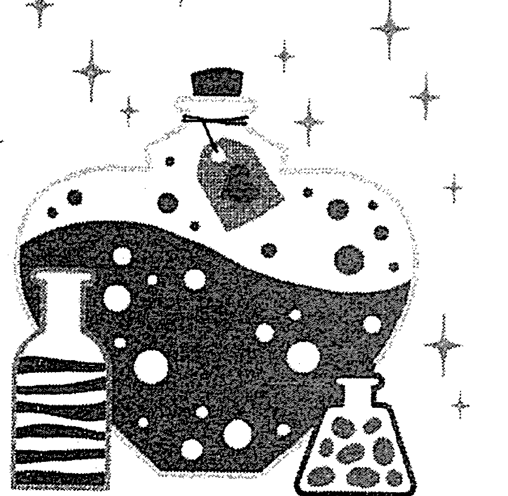

# 60 與天蠍座秘密情人分手

不幸的是，跟天蠍座秘密情人的激情關係，通常會保證激情的分手。過程不必然會很戲劇化，但肯定很情緒化，因爲分手可能爲雙方帶來極大的痛苦。問題是這段關係與分手可能留下不會很快癒合的傷痕，以致讓你未來的感情牽扯、甚至是你很快再投入戀情的能力與興趣，都籠罩一層陰影。苦澀與挫折很可能同時浮現。爲了對抗這些反應，請專注於這段關係美好的一面，拒絕對負面反應的感受讓步。

# 你的天蠍座前任

- 談判
- 合作
- 驕傲

你的天蠍座前任並不容易對付。衆所周知，他們需要對你過往的行爲（尤其是對他們強大自我的侮辱）做出懲罰性的報復，而這可能促使他們採取傷害性的行動。在某些時刻，你會受到痛苦的測試，而且必須決定是否要採取守勢以等待雨過天青，或者要反擊。不論採取哪種方式，你都需要形成一個戰略，而且這套戰略應該跟你的家人、牧師、會計師、律師或朋友聯合制定。這些人也可以對你的天蠍座前任施加壓力，讓他們守規矩，並且讓他們看出採取合作和談判的方式會對他們有利。

- 報復心切
- 倔強
- 愛懲罰

# 61 與天蠍座前任成爲朋友

正常情況下，跟天蠍座分手以後便不可能建立深切的友誼。你能期望的最多只是停止明顯的敵意，以及一份不穩定的停火協議。不幸的是，天蠍座就算會，也鮮少真的寬恕或忘卻。此外，你所表現出的任何軟弱跡象，或者對寬恕的懇求，都可能會碰上輕蔑或附加的懲罰。天蠍座前任的態度是：「你種什麼因，就結什麼果。」所以你不應該期待他們會幫你。他們可能被迫合作的唯一領域，是懸而未決、需要金錢轉移的商業與個人事務。

- 有侵略性
- 難相處
- 愛指控

# 62 與天蠍座前任複合

不建議你與天蠍座前任複合。天蠍座通常有一股想要施加傷害的深切需求，而再度跟你的天蠍座前任密切聯絡，可能會促發他們的這種需求。與你的天蠍座前任保持距離，並且避免複合，對你的情緒和精神來說，可能是必要的。偶爾談起你們的關係沒什麼不好，但對於任何可能同意和解的暗示，都要保持疑心。既然天蠍座知道怎麼打開他們的魅力開關，你就必須運用更多的自制力加以抗衡。

# 63 與天蠍座前任討論過去的問題

依照天蠍座的看法，他們清楚知道發生了什麼事，所以就他們看來，沒有必要提醒他們。討論過往的問題對大多數天蠍座前任而言，就像是往撕開的傷口上灑鹽。首先，他們會懷疑你這麼做的動機，並且會小心提防你把他們牽扯進你未來的計畫裡。要是你就只是想要追憶往事，對愉快的共同活動做個輕鬆的交流或開個玩笑，請務必小心地切入這個主題；趁天蠍座前任心情正對的時候開口，可能有幫助。

## 34 對天蠍座前任表達親暱感情的程度

天蠍座前任可能會對你的情感表達有所回應，但如果這種反應往肯定與性有關的方面再發展一點，你可能會後悔當初為什麼要替這種事起頭。請記得，天蠍座把性的競技場當成他們個人的地盤，況且他們還擁有怎麼用這些力量對付你的整套知識。所以在對天蠍座前任表達任何身體上的親暱感時，最好保持疏離、尊敬與客觀。柔和的聲調或者可愛的一瞥，可能就是雙方能謹慎容許的最高表現了。

## 35 界定與天蠍座前任現有的關係

最好不要跟你的天蠍座前任討論這個關係，反而要給出你自己的定義，試圖保持冷靜和公正，並且敦促他們也這麼做。把彼此間大部分的互動限制在商業、物流與財務事宜，以及實際的日常家庭活動。持續把他們含括在家庭計畫裡，而不是排除他們，可以避免讓你的天蠍座前任覺得疏離。這是提供某種穩定性與社交控制的有效辦法，這樣他們的情緒才不會失控。有時候一位共同朋友可以扮演中間人的角色，協助界定現有關係，並且緩和一觸即發的情況。

## 36 要求天蠍座前任分擔照顧子女的責任

你和你的天蠍座前任必須小心防止在分手時，把子女當成武器來對抗彼此。此外，最好透過法律代表和法庭，而不是透過私下聯絡來謹慎處理所有監護權事宜。你們的子女絕對不該被逼著選邊站。說真的，孩子或許正是能夠讓事情和平進行的人，甚至有助於處理分居父母之間所產生的問題。在許多情況下，比起另一位父母，聰明的子女可以更有效也更理智地應付天蠍座父母。

## 朋友與家人

天蠍座
10月23日至11月21日

### 你的天蠍座朋友

-   態度
    - 選擇性
    - 有趣
    - 愛慶祝

天蠍座在選擇朋友的時候很挑剔，所以如果你被選中當他們的朋友，你應該要覺得榮幸。通常天蠍座會把最要好的朋友儲備起來，保留給最棒的時刻。大多數時候感情需求並不特別強烈的天蠍座，通常會在他們想樂一樂、慶祝一番、或者只是想到鬧區去玩的時候聯絡你。他們可能是很棒的同伴，不過他們的友誼大半建立在他們自己的條件上，而且通常是在他們自己的勢力範圍。本質上比較多才多藝又多變的人，會跟天蠍座相處得最好，因為他們能夠迅速適應天蠍座嚴肅的心情，以及複雜情緒狀態的改變。

-   情緒
    - 暴躁
    - 情緒不穩
    - 喜怒無常

**向天蠍座朋友求助**

既然大多數天蠍座朋友不常也不輕易找你幫忙，他們便假定你也不會很常找他們求助。然而在嚴重或者有危機的情況裡，他們是可以仰仗的。在緊急情況下很冷靜的天蠍座，對於他們的朋友來說可能是救命恩人，不論是字面上還是比喻上都是。一旦他們從你的聲音裡聽出口氣很認真，他們就會跳出來幫你，而且如果有必要，甚至會接著攻擊那些跟你對立的人。然而在釋放這些能量以前，你應該仔細想清楚他們的行動可能有什麼後果。

-   互動風格
    - 強有力
    - 刺激思維
    - 防禦性

**與天蠍座朋友溝通和聯絡**

天蠍座朋友並不難維繫。你可以很長一段時間不跟他們聯絡，而在這樣的中斷之後，他們通常很樂意得知你的消息。因為他們並不渴求你的注意，所以不要一直詢問他們過得怎麼樣來煩他們。通常這種沒事找事的行為只會惹惱他們，而他們寧可你別管他們。在他們有事情要跟你分享的時候，他們自會聯絡。雖然重隱私而且內向不愛交際，天蠍座可以是絕佳的溝通者，能夠用寥寥數語把他們通常很發人深省的觀念傳遞給他人。

**向天蠍座朋友借錢**

雖然在生活的許多領域裡占有慾很強，天蠍座朋友卻能夠出人意料地輕易把錢分享給他們親近的人。他們痛恨吝嗇小氣勝於一切；與其在晚餐之後推託帳單分配，他們會藉由自己買單來避免這種事。但是請注意，他們會假定你的錢也會分享給他們，所以如果他們有需要，他們可能會用聽起來像外科醫師要一把手術刀那樣不假思索的方式跟你說。天蠍座通常很善於用錢——賺錢、處理錢和花掉錢。他們處於貧窮狀態時會不快樂，因為那等於剝奪了不符合他們心目中對好生活的概念。

**向天蠍座朋友徵求意見**

天蠍座朋友會想要有時間思考過你的問題後，再給你意見。他們深思熟慮的天性，並不適合提供突如其來或膚淺的建言。不需要提醒他們，你曾經要求他們的建議；當他們準備好的時候，自然會想出一個解決方案。天蠍座通常自視爲世故的人，對於人類心理學與世事運作有良好知識。雖然這是真的，不過你可能不會想要盲目地遵循他們的建議，因爲事實可能證明這樣做有反效果。

**拜訪天蠍座朋友的時機**

天蠍座很喜歡朋友來訪。他們通常有很多東西可以跟朋友分享——在對話中，也在彼此享受的音樂、運動、政治諷刺與藝術領域裡，當然還有飲食。跟天蠍座朋友定期出去吃飯，可能極爲愉悅，雖然費用很昂貴，因爲他們的品味絕佳，而他們對品質的期望也很高。雖然他們偶爾會去拜訪你，但他們在自己的住處會更快樂也更自在，而那個住處經常看似一個秘密藏身處、洞穴或者窩巢。你若能享受其中，對他們來說有著至高無上的重要性。

**與天蠍座朋友一起慶祝和娛樂**

對天蠍座來說，慶祝和娛樂是非常特別的活動，而非每天沉溺其中的平常事。他們總是抱著很大的期待盼望這樣的事情到來。如果出席運動賽事、音樂會或表演，他們會想要買最好的位置，所以也假定你想這樣做。對於這些事情總是知識豐富的他們，會坦率地跟你分享他們的專門知識，舉止幾乎就像個導遊或是知識的泉源。如果他們帶著你一起去參加他們極爲投入情感的活動，你有必要讓他們帶頭，並且對他們的行動與觀察表達你的欣賞。

### 你的天蠍座室友

隱私是大多數天蠍座室友的第一優先事項。不但他們的房間是不可侵犯的領土，他們可能也會開始把整間公寓或者房子看成自己隱遁的巢穴，只不過順便扯你一起來幫忙付房租、分擔開支而已。以這樣的態度，社交活動可能很難實踐。此外，天蠍座喜歡控制他們的環境，所以在他們最敏感的時刻，你的天蠍座室友會設法減少你所產生的訊息量——不論是堅持音樂和電視要以較低音量播放，還是要求你別喋喋不休，還給他們安寧。天蠍座在剛醒來的時候脾氣壞得出名，而且通常需要一杯黑咖啡才能讓他們動起來。

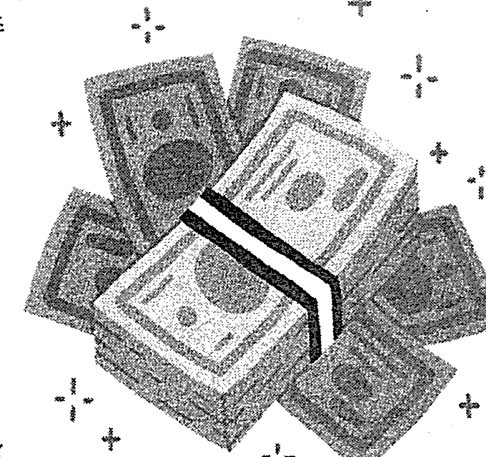

-   - 保護性
- 支持性
- 投入

**與天蠍座室友分擔財務責任**

就算他們付得出來，找天蠍座室友出他們那份房租、食物、水電瓦斯及其他開支，可能都很困難。最難的部分可能是提起這個話題，而沒讓他們拒絕談論或搪掉你的問題。事實是，天蠍座只有在準備好的時候才能做事情，而他們抗拒被催促。在令人滿意的月份，他們會把他們的貢獻以現金放在一個顯而易見或習慣放的角落，讓你去花那筆錢，或者把錢交到正確的地方。除了簡短指出他們留下什麼以外，你不太可能再聽到更多關於那筆錢的事。

**與天蠍座室友分擔打掃責任**

天蠍座室友並不是以對清掃的興趣而聞名的，雖然一旦他們下定決心要做，在這個領域裡，他們是相當能幹的工作者。通常他們會同意幫忙打掃共同區域，但對於把他們自己的房間弄得比較能見人的建議，則會猶豫不決。對他們來說，他們的房間是私人巢穴，你可能永遠不會被邀請進去，而且就連讓自己的空間置於你的審視之下，都會讓他們心生憎惡。一扇關閉的門可能是你必須習慣的景象，不管這些室友在不在家。

**當你的訪客遇到天蠍座室友**

天蠍座室友不常邀請客人來家裡。然而，偶爾他們會讓密友或家人來過夜。他們會期待你很輕易地就接受這些訪客，讓客人們覺得受到歡迎。不要在天蠍座與他們的客人共享時光的時候闖入，因為他們對於「屬於」他們的人占有慾很強。天蠍座室友會很自在地偶爾邀請訪客過夜、或者來個一夜風流，不管他們有沒有給你同等機會如法炮製都一樣。

**與天蠍座室友的社交生活**

雖然不是太過社交型的人，你的天蠍座室友還是能夠享受偶爾開趴。他們甚至會跟你分擔責任，並且在列出賓客名單時讓你有相同的地位。不過如果你在家的社交生活變得太活躍，他們會很惱怒，而且他們會明確表達他們需要隱私。擺出臭臉、然後砰一聲關門的不快樂天蠍座室友，在你的客人開始擠進來的時候，是不會做太多事情來提振歡樂心情的。所以，你必須對他們需要孤立隔絕的需求保持敏銳，不要讓太多人流造成他們的焦慮。

-   - 退縮
- 不愛溝通
- 封閉

-   - 秘密
- 隱匿
- 愛控制

## ## 與天蠍座室友的隱私問題

奇怪的是，如果你和你的天蠍座室友相處愉快，在跟你獨處時，他 / 她或許就不會堅持隱私。這是天蠍座室友覺得和你很親近的最確切指標——事實上，親近到他們不會承認你是個分離的實體。像他們這麼重視隱私的人，竟然可以把你們兩人視為一體，這個事實毫無疑問是個恭維，但這或許也會被證明是很甜膩的，而且可能顯示出他們需要佔有並控制你。這或許會讓你處於一個怪異的立場：你要堅持你自己的隱私，而這是天蠍座抗拒給你的東西。

## ## 與天蠍座室友討論問題

跟天蠍座室友深入的討論不只是可能的事，事實證明他們經常很有幫助，不僅在給予建議方面如此，在鞏固你們之間深切的個人連結方面也是如此。天蠍座室友鮮少找你討論他們個人的問題（除非他們把你扯進來），但在你碰上困難的時候，他們是很好的聽眾（除非這個困難與他們有關）。至於家中訪客、財務事宜、或者勞務分配，大部分天蠍座室友可能很難參與對話或討論。就算你們約好時間要對這些事務敞開來談，他們可能不是到得太晚，無法認真的討論，就是根本不現身。

## # 你的天蠍座父母

大多數天蠍座父母會根據非常嚴格的原則來養育他們的子女。他們對於親職有很多想法——通常在他們甚至還沒有孩子的時候就成形了——而這些固定的原則，在實踐時不容有變化或妥協。他們對自己的子女極端直接，會堅持孩子要規律而不加質疑地做功課、家務、並且盡家庭義務。天蠍座父母對於子女感到驕傲，並且想看到他們看起來處於最佳狀態，特別是在出門去上學的時候，不過在家庭事務與社交場合也是如此。他們認為子女的行為直接反映了他們身為父母的能力，對良好的聲譽高度重視。只有一位天蠍座父母的組合，運作上通常比雙親都是天蠍座來得好，因為天蠍座有著苛求的天性與毫不妥協的態度。

### ## 天蠍座父母的教養風格

天蠍座父母在管教事宜上會很嚴格。然而，他們也會跟孩子講得非常清楚，他們寧願根本不要處罰他們。他們宣稱選擇權在於孩子——不是遵從規定避免受罰，就是破壞規定招致懲罰。毫不含糊的規矩是天蠍座父母從一開始就定下來的，所以他們的子女永遠無法說他們不知道。從禁足到怒瞪一眼、打屁股或推一把，範圍廣泛的懲罰都是當場執行，沒有事先計畫。然而在更嚴重的越軌狀況下，他們可能施予更複雜、延續得更久、以糾正根本問題為目標的懲罰。

-   - 保護
- 勸告
- 鼓勵

-   - 過度保護
- 霸道
- 嘮叨

-   - 堅持
- 苛求
- 驕傲

### 天蠍座父母與孩子的相處

天蠍座父母對他們的子女可以非常慈愛，但通常只有在他們乖乖守規矩的時候。天蠍座很一致地把表達親暱感情當成是一種獎賞，就像他們把執行管教當成是一種懲罰，總是以黑白分明的方式處理這些事。然而，天蠍座父母也能夠開玩笑假裝生氣，用他們裝出來的威脅和侮辱當成親暱的表達。在天蠍座的怒容剛開始出現時，他們的子女已經學習到怎麼解讀，並且決定接下來會是一場風暴還是一陣大笑。

### 天蠍座父母給孩子的金錢觀

金錢對天蠍座來說很重要，因此大多數天蠍座父母會花時間教導子女怎麼使用（而且不要誤用）金錢。通常把錢看得很緊的天蠍座父母，對零用錢不會太慷慨，會堅持子女要靠做家務來賺取現金。此外，天蠍座父母會鼓勵子女靠著當保母、送報紙和整理庭院之類的工作來賺錢，但他們也會嚴格監督這些錢是怎麼花的。某些天蠍座父母會鼓勵、甚或要求他們的子女把這些賺來的錢存到銀行帳戶裡，等將來需求或慾望出現時使用，藉此教導他們「好習慣」。

### 天蠍座父母的危機處理

在危機情況下，可以指望天蠍座父母會明確地支持子女。然而在子女明顯有錯，以及別人因為這些行為而受傷的狀況下，也可以期待天蠍座父母會做出嚴厲的警告與懲罰。對於每個相關者來說，把這種危機維持在最低程度，生活可以好過很多，因為天蠍座父母的反應很嚴厲。要是危機直接牽涉到天蠍座父母，他們會期待其餘家人表現出全然的支持與理解，否則這些家人可能會苦於接下來的後果，這將牽涉到責怪、憤怒與怨恨。

### 天蠍座父母的假期安排和家族聚會

依工作行程表而定，天蠍座父母可能選擇要不是徹底參與這種活動，就是完全把規劃與執行留給其他人。雖然他們可以享受假期和家庭聚會，但大多數天蠍座父母通常會把他們的職業、家務計畫、以及與朋友先訂下的約定擺在前面。到頭來假期和家庭聚會比不過這些事，落居第二順位，可能會讓某些家庭成員不高興、甚至覺得受到侮辱。天蠍座通常會認為這是另一個人的問題，而不是他們自己的問題。要是天蠍座父母選擇全程參與慶祝和度假的規劃，他們的投入通常是徹底而完全的——雖然他們非常能幹，有時候卻不免顯得過度控制和專橫。

### 照顧年邁的天蠍座父母

大多數上了年紀的天蠍座父母，只會在最低限度的必要需求上，要求家人幫助他們，其他部分他們會自己來。假定他們有足夠的退休金可以過活，他們的需求可能限制在每週幫忙採買並且／或者打掃。在比較嚴重的狀況下，在個人衛生與運動等事務上，他們寧願得到專業護士或健康照護工作者的協助，而不願要求他們心愛的人提供這種協助。天蠍座父母喜愛定期看到他們的孫輩，會很感激你帶他們來拜訪。偶爾他們可能願意造訪你家（雖然並不常這樣），並且只會在你安排好往來交通時，他們才會去。

### 你的天蠍座手足

在任何家庭團體裡，天蠍座手足都會讓人感覺到他們的存在。光是他們強烈的好惡，就足以證明這一點了。但是當你加上好鬥與愛控制的脾氣，你就會領悟到他們真的是一股該被重視的力量。天蠍座手足通常不會克制他們的抗議或命令，反而會讓他們的兄弟姊妹知道他們心裡在想什麼。他們在家庭中的位置是極端重要的因素。最年長的天蠍座手足對弟妹可能很像是暴君，然而最小的天蠍座手足可能有比較陽光、甚至是惹人憐愛的傾向。排行居次或夾在中間的天蠍座手足若是被無視或忽略，通常會吃最多苦。

### 85 與天蠍座手足的競爭和親近

天蠍座手足可能會跟他們的兄弟姊妹發展出強烈的敵對關係，特別是若他們身為老么，拼命地呼喊著要被聽見、被認可。對天蠍座小孩來說，沒有什麼比在遊戲和運動競賽裡一再輸給其他手足更難受的了。這樣的敗北可能催生出一種成年後的慾望：事事爭先、不計代價求勝，而且經常對抗壓倒性的不利機率。另一方面，天蠍座手足也能夠跟他們的兄弟姊妹發展出強烈的羈絆，會持久延續到進入成人生活後期。在這些人當中，最常見的是一種敵對與親近的有趣混合。

### 86 過往的成長經驗對天蠍座手足的影響

天蠍座的記憶可以維持很久。這個事實可能在心理上對他們不利，而且因為他們無法原諒或忘記過往的委屈，以致會造成嚴重的問題。問題或許可以討論，但他們牢記在心的實際事件卻很難處理，不論是他們自己來還是有諮商師幫忙。他們平息這種議題的渴望，對於天蠍座來說是非常正面的步驟。一旦做了這種決定，他們就可以緩慢而小心地前進，花許多年時間讓這些事情平息下來。這樣的決心可以看成是天蠍座生活中的重大勝利。

### 87 與疏離的天蠍座手足往來

疏離的天蠍座手足在心理上通常讓人很難接近，必須長期反覆嘗試，才能跟他們有真正的溝通。必須展現出很大的敏銳度，因為若太常打擾他們，可能只會把他們惹惱，或者更加堅定他們不予回應的決心。把他們的感受列入考慮，以及溫柔又有說服力的那種堅持，會開始讓他們朝著正確方向移動。在這一切之下，許多天蠍座有種不曾言明的渴望，想要真正與他們的手足相親相愛，並且被接納回到家庭的懷抱（雖然他們可能永遠不會承認）。

-   有說服力
- 個人主義
- 有覺察力

-   受苦
- 怨恨
- 好鬥

-   愛控制
- 直言不諱
- 苛求

### 88 天蠍座手足對繼承、遺囑等金錢議題的處理

天蠍座手足通常不會要求超過屬於他們自認為應有的那一份。在受到不公平或不誠實的對待時，他們才會發動攻擊，對敵人寸土不讓，而這些敵人通常是他們自己的親人。除了受到公平對待的需求以外，他們也會把他們的道德倫理價值，延伸涵蓋到權利被侵犯的其他家庭成員身上。因為他們在這種事情上不輕易放棄，遺囑與繼承問題可能會延續很多年。一般來說，只要有可能，天蠍座就會在財務上幫助他們的手足。

### 89 與天蠍座手足的家族團聚和慶祝活動

天蠍座手足熱愛參與聚會及其他家庭慶祝活動。依他們忙碌的時間表而定，他們偶爾會跟你們共度假期，尤其是在孩子們（表親們）相處愉快的時候。天蠍座熱愛身為團體一份子的輕鬆感受，會慷慨付出金錢和時間來確保這類活動的成功。期待他們定期表現這種熱忱肯定是可行的，只要頻率不要超過一年兩次，或者最多三次。

### 90 與天蠍座手足一起度假

天蠍座手足通常較喜歡跟他們的朋友而非兄弟姊妹去度假。在假期長度範圍長達兩週到一個月以上的時候，舊有的敵意與衝突可能會浮上檯面，導致重大分裂。天蠍座的兄弟姊妹應該要察覺到這一點，並且避免死守對於假期的固定承諾。要是假期只延續幾天，頻率也沒有過高的話，每個人肯定都可以享受到樂趣，只要所有爭論都嚴守「暫停」的規範就好，免得爭執失控，毀掉每個人的美好時光。

### 你的天蠍座子女

天蠍座子女可能是任何家庭喜悅的來源，只要公平對待他們、不要利用他們就好。天蠍座孩子熱愛他們的朋友勝過世界上任何其他人，而且甚至能夠跟兄弟姊妹分享朋友，卻不會變得占有慾過強。父母會發現天蠍座子女很有責任感、有覺察力、精力充沛、對父母的個人問題有同情心。一個天蠍座孩子經常能夠在父母缺席時成為家庭領袖，或者提振群體團結的驅動力，並且在父母在場時支持他們。對他們來說，沒有什麼比跟大人和其他小孩一起談笑、享樂更令人愉快了。

### 91 天蠍座子女的人格發展

天蠍座子女在很小的時候就展現出型態良好的人格，有時甚至已經完整成形。他們的特徵會在一、兩歲的時候強烈顯露，而且驚人的是，可以在整個人生裡保持恆定。觀察一個天蠍座孩子的人格發展，是個很迷人的過程，因為他們的感情如此深刻，以致他們心理狀態的錯綜複雜是很難解的。教師、父母、其他家人和朋友，在跟天蠍座孩子維持關係的時候，真的會碰上挑戰。他們的行動經常是無可阻止的，而且天蠍座有著強大的人格特質，其他人必須學習如何處理，而不要為了跟他們戰成僵局而用精力。

-   **優點**
    - 討人喜歡
    - 盡義務
    - 精力充沛

### 天蠍座子女的嗜好、興趣和職涯規劃

天蠍座子女的興趣經常混合了心智與身體。對挑戰很有反應、深受吸引的天蠍座子女，大多數很擅長克服困難，雖然他們也相當能夠享受更傳統的愉快活動。相當常見的是，後者被當成是前者的回饋。在一段時間內被剝奪簡單的感官享受，可能耗掉他們的正面能量，並且讓他們不快樂、甚至變得尖刻。因此，以糖果、最愛的食物、親暱表現或禮物等形式表現的回饋，是讓你的天蠍座子女保持好心情必須符合的要求。良好的職涯路線，是能提供挑戰、適當的報酬與愉快的工作環境那種。

-   **缺點**
    - 容易生氣
    - 愛爭論
    - 不快樂

### 對天蠍座子女的管教

天蠍座子女對於教師、父母或其他家人採取行動管教他們，反應非常差。大多數天蠍座子女有很清楚的是非觀念，而且覺得懲罰或管教是不必要的，因為他們完全能夠察覺到自己做了什麼。的確，他們的自我懲罰可以比任何大人做得更多，而且他們犯下的錯誤會讓他們深深受苦，特別是在他們對其他人採取不公平或傷人行為的時候。天蠍座子女比大多數人更能夠忍受痛苦、責難和孤立，甚至這種懲罰明顯不公平時，亦是如此。

-   **互動風格**
    - 支持
    - 樂於助人
    - 有動力

### 與天蠍座子女的親暱程度

天蠍座子女熱愛給予並接受親暱情感，但很有選擇性，雖然採取的形式可能相當不尋常，甚至怪異。成年天蠍座甚至可以對他們的敵手很有感情；他們小時候在競爭或者明顯的戰役中，就可能展現出這種特徵了。其中有一部分是跟這個事實有關：他們真心尊敬那些能夠挺身抵抗他們強烈人格的人，而他們與對手之間分享的親暱感情，通常是一種互相尊敬的徵兆。雖然對某些人來說，天蠍座是感情表達太露骨的生物，但他們也可以對其他人相當帶刺又冷淡疏離，這通常指出天蠍座子女在容許任何人太接近以前，必須先發展一種有意義的個人關係。

### 處理天蠍座子女與手足之間的互動

當天蠍座子女帶頭的時候，得到父母和手足一致的尊重是非常重要的。有時候他們可能自己擔起家庭的領導權，甚至到了跟父母競爭控制權的地步。有時候父母的管教行為、懲罰和訓誡，可能都被迫衝著天蠍座子女而來，因為這些孩子已經變成其他手足的代表了。因此在這種情況下，天蠍座子女被迫長大，並且在他們發展早期就裝出成熟負責的態度，而這可能會導致他們被剝奪童年無憂無慮的快樂。

## 與成年天蠍座子女的互動

就像前面指出的，天蠍座子女可以在很小的年紀就成熟變成大人，視個人環境而定。在青少年時期就已經相當成熟的天蠍座子女，成年時可能已經完全成形，並且繼續在他們的餘生中展現出同樣的特徵。父母在與天蠍座子女對抗的時候，經常詫異於他們所面對的似乎是一個小男人或小女人，而他們可能是相當可畏的對手。成熟是天蠍座天生就很有感的事情，因為這補足了他們的嚴肅與感情深度，以及他們對於世界極度現實的觀點。

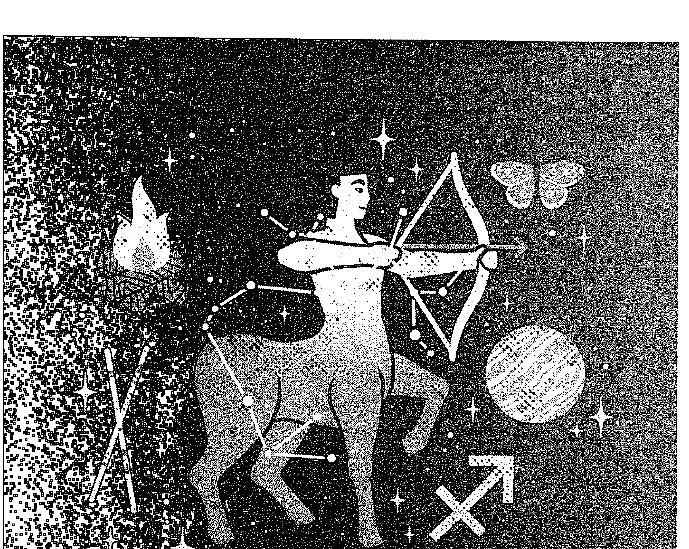

## 射手座

日期：11月22日至12月21日

射手座是變動宮火象星座，受到樂觀又極端開朗熱情的木星主宰。大多數射手座對生命採取極其正面的觀點，並且相信對於有勇氣大膽嘗試和做夢的人來說，幾乎任何事情都是可能的。身為理想主義者，他們堅持與他們接觸的人要有合乎倫理的行為並且誠實，偏好從動機而非達到的結果來評價一個人。射手座是小生物的天生保護者，而且是弱勢的擁護者。

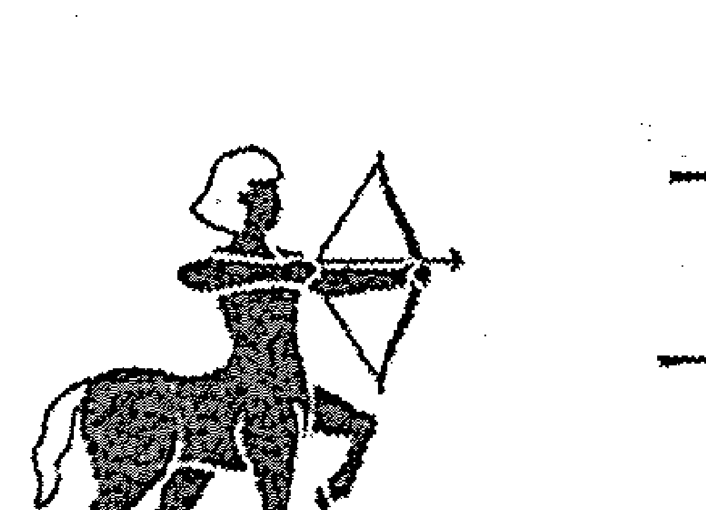

### 工作

射手座
11月22日至12月21日

### 你的射手座老闆

因爲高度獨立與個人主義，射手座並不總是適合老闆這個角色。他們傾向於突然出動，而且常常是在一頭熱之下，魯莽地奔向自己的方向，所以他們的員工可能很難跟上他們的腳步。此外，他們可能不會花時間清楚地跟公司溝通他們的想法，而寧願讓他們的行動來爲自己說話。不是團隊合作者的射手座老闆傾向自己掌權，然後跟著他們的直覺走，而不是仔細規畫好一場戰役並委派責任。

- 直覺
- 有說服力
- 迅速

- 不溝通
- 含糊不清
- 沒有同情心

#### ① 要求射手座老闆加薪

身爲結果導向的人，射手座老闆對你的工作方式可能不會表露出太大興趣，也不會花時間聽你的建議和抱怨。所以，要不要接近他們、陳述你的意見，同時希望他們會更認識你，全都取決於你。跟他們的助理保持密切聯繫，找出他們旋風式行程中最有利的休息時間。不要用閒聊來浪費射手座老闆的時間；應該用清楚、簡潔又明確的方式陳述你的觀點。只有在你真正應該得到加薪的時候，才在隨後某一天去找他們談這件事。

- 獨立
- 個人主義
- 衝動

#### ② 向射手座老闆宣佈壞消息

射手座老闆很容易發怒，在壞消息第一次呈上的時候很可能就會怒火上衝。不要試圖讓他們冷靜，反而要讓他們發洩即時的怒氣。他們可能會怪罪到你頭上，或者設法跟你討論這件事，然後達成一個爲控制損害而構思出來的共同決定。在這樣的危機狀態裡，你可能跟射手座老闆產生連結，雖是報告壞消息的人，卻因此造就出正面的結果。要是這些計畫成功了，你或許會發現你的射手座老闆更常徵詢你、甚至尋求你的意見。

#### ③ 替射手座老闆安排差旅和娛樂

因爲射手座老闆生氣勃勃又有強烈野心的天性，讓他們可能會花很多時間旅行，但不會期待被悉心照顧或款待。出差的時候，他們鮮少在任何一個地方待上太長時間，所以他們的行程表必須很有技巧和效率地安排好，以便發揮最大效果。射手座老闆只需要在正確時間被放在正確地點，放出他們的閃電，然後再繼續進行下一次的較量。住宿處只需要舒適到合理的程度，不一定要豪華。要記在心上的是，他們會想要在旅途中和待在旅館裡的時候工作，所以請確保有供電設備、無線網路和高速網路接頭可用。

#### 4 射手座老闆的決策風格

射手座老闆以快速做決定聞名。有時候他們會堅持自己的決定，有時則不會。對他們來說，一個決定不必然是有約束力，而且可能取得某種試驗性質的地位；如果發展不利，這個決定就會被改變或駁回。所以如果射手座老闆做出你覺得有錯的決定，你不該太過氣惱，因為在幾天、幾週或幾個月內，他們可能就會恍然大悟，然後修正他們的計畫，讓這些計畫更能配合你自己的規畫。不要立刻反對你的射手座老闆，而是要表現出耐心與克制，然後觀望並等候。

#### 5 打動射手座老闆

射手座老闆對於不會太努力爭取他們的注意，卻隨著時間產出優秀成果的員工，印象最好。要是他們對你的工作表現出興趣，尤其是對你用來達到成功的方法感到好奇，請放心地公開並分享你的想法與作法。如果他們得到的結論是，你和他們在相同的波長上，射手座老闆會對你的能力很有信心，而且很可能決定把同事們都垂涎的好專案託付給你。

#### 6 提案並對射手座老闆做簡報

射手座老闆並不是有耐性的人，所以你應該讓提案保持簡潔，簡報則要簡短有力。他們甚至不會選擇全程出席會議——遲到、旋風式地繞行會議桌一圈（但願他們會短暫地坐下來），然後在他們要往門口走的時候聽你說幾句話。因此，你可能要趁他們在場的短時間內拋下你的文件，然後用希望是有啟發性的即席方式，特別針對他們發言。你對你的提案表現出的熱忱與樂觀，他們會注意到的。

### 你的射手座員工

射手座員工可以是辛勤工作又專注奉獻的，但你必須留意他們，因為他們也有能耐在任何時候追隨他們的衝動。他們會跟一個工作團體或公司待在一起，直到他們得到夠多經驗，然後就獨自離開了。促使他們朝著專業上的獨立邁進的事件，經常不是經過計畫的，甚至不是他們自己造成的；命運就是插了一腳，提供了他們走自己的路所需要的推力。射手座員工可以充當他們所屬工作團體的臨時老闆，並且運作得很順利。

#### 7 面試或雇用射手座員工

一定要接受射手座求職者本來的樣子，因為再怎麼多的解釋或灌輸，都沒辦法讓他們克制我行我素的性格太久。然而，因為他們太多才多藝（他們的簡歷或履歷通常都能指出這點），他們是寶貴的多工處理者與代理人，總是能夠在短時間內就承擔起暫時的責任。雖然射手座員工很容易厭倦，不過他們也相當能夠長時間執行重複的任務。話雖如此，如果你給他們公司裡有趣又刺激、鼓勵個人進取的職位，他們的反應會更加正面。

#### 8 宣布壞消息或解僱射手座員工

因為樂觀又積極的態度，射手座員工對於批評與責難的反應很糟。如果壞消息與他們的行為有直接關聯，他們可能變得沮喪且不快樂；如果是因為其他人的失敗，他們通常會跳進去幫忙導正事態。要是他們不公平地被開除了，他們會要求跟他們的雇主把事情談開來。他們的處事方法高度合乎道德倫理，會想要講明他們的動機純正，而且十分努力。射手座會積極尋求好的推薦信，為他們的下一份工作加分。

#### 9 與射手座員工一同差旅或娛樂

在差旅路上的時候，可能很難跟得上這些發電機。射手座員工最好獨自出差，雖然他們很享受路上有一、兩個同伴，只要這些同事不會阻礙或拖累他們就好。射手座員工很享受被其他人娛樂，不過因為他們在這個領域裡的品味是很有選擇性的，通常最好讓他們自己帶頭提供娛樂。他們在制定計畫和規劃活動的時候不太需要幫忙，雖然他們用某種方式做事的獨特方法與理由並不容易揣度。

#### 10 分配任務給射手座員工

請確保射手座員工有仔細聽你說話，並且完整地理解你期待他們做什麼。另一種狀況當然是他們會在你解釋完以後走出去，然後就照著他們的方法去做。堅持要他們把你的指示寫下來——在極端的狀況下，甚至還要簽名；也要叫他們重述這些指示，以顯示出他們真的有在聽。在你的許可之下，可以讓他們修正一、兩點，這麼做會讓他們有好一段時間，覺得自己不太尋常卻經常很有用的建議受到欣賞與重視。

#### 11 激勵或打動射手座員工

在許多情況下，比起你的表現，射手座員工對你的意圖印象更深刻，特別是在事情不成功的時候。他們合乎倫理的工作方法，強調的是思考清晰、動機純正、以及誠實的重要性（這最為優先）。射手座員工重視的不只是跟其他人有關的誠實，也在乎一個人對自己的誠實。最令他們失望的就是看到老闆自欺欺人，或者活在幻想世界裡。從後見之明來看，完全為了正確理由而採取的迅速有效行動，或許是讓他們最刮目相看的。

#### 12 管理、指導或指正射手座員工

射手座員工必須很有技巧地管理、指導或批評，以避免激起他們的反抗與敵意。請記得，他們對於需要做什麼，以及應該如何達成，總是有非常清楚的想法。所以持續地糾正和批評他們，可能導致他們的熱情降溫，讓他們的表現變差。一個氣餒、不受青睞的射手座看起來可能很可憐，而你稍後或許會後悔沒有更敏銳、更體諒地對待他們。此外，你可能因此失去一個有需要時能請求支援的最寶貴盟友或援手。

### 你的射手座同事

雖然射手座同事在企業組織下工作會覺得不自在，但在融入同儕這方面，他們是很友善且合作的。通常可以指望他們會說好話或者給個微笑。他們的樂觀主義是很明顯的，雖然當他們頹喪的時候，他們的羽毛看起來可能比其他人更髒更髒。同僚可以信任辛勤工作的射手座，會在幾乎任何艱困的情況下伸出援手。然而，射手座的第一直覺是靠他們自己解決問題，而不是以團隊合作者的身分加入挽救的行動。

- 優點
  - 樂於助人
  - 友善
  - 樂觀

- 弱點
  - 衝動
  - 受挫
  - 疲態畢露

#### 尋求射手座同事的建議

射手座非常重視觀念，會花很多時間以哲學方式思考事物。因此，他們經常能夠仔細思考你的話，而且一旦他們有足夠時間徹底考慮這些話，就能給出很好的建議。射手座同事通常可以對問題做出不同的詮釋，並從非常不同於大多數人的觀點來看待這些問題。正面詮釋可以幫助你重振低迷的心情，給你希望；負面詮釋則是他們試圖警告你，要對抗自欺妄想和錯誤的樂觀主義。除非你準備好面對真相，否則不要去找射手座要建議；真相或許是他們最優先考慮的。

- 互動風格
  - 坦率
  - 直接
  - 易感

#### 向射手座同事求助

射手座同事總是準備好用行動來為他們的話背書。行動導向的他們如果覺得你受到不公平對待、或者認為你是他們的朋友，就會站在你這邊，為你上刀山下油鍋。他們是劣勢那方的支持者，不介意跟你站在同一陣線作戰，以對抗看似壓倒性的不利機率。由於你有這麼忠實的好同事在你身邊，他們超凡的精力，能夠產生提振士氣、給你更多精力戰鬥的作用。而且問題一解決，他們就會退開，不會想要藉此控制你，或者對你施加不當的影響力。

#### 與射手座同事一同差旅或娛樂

你和射手座同事之間感覺良好的時候，一起旅行可能是最令人愉快的經驗。射手座對於他們喜歡的同事極為友善和親切，他們友好而積極的舉止，會讓任何旅途或娛樂的經驗都值得懷念。身為一個好旅行家，他們不會耽誤你時間或者過度苛求。如果你在旅行前跟他們不熟，等到旅程來到尾聲，你們可能已經變成堅定的好朋友了。然而你可能要花一點時間，才能習慣他們有趣而通常很獨特的思路和舉止。

#### 16 與射手座同事共事

雖然射手座同事可以相當合作，但他們高度個人化且經常很衝動的處事方法，卻會導致他們跟公司規定、傳統行為模式及更保守的觀點決裂。情況常常是，等到一個解決特定問題的特殊小組成形的時候，他們可能已經搞清楚狀況，並把問題永遠解決了。對大多數射手座同事來說，要減少他們的努力、接受團隊合作裡比較次要的角色，顯得特別困難；這在他們知道怎麼靠自己迅速解決問題時，尤其如此。對於怎樣做個團隊合作者，他們有很多要了解的地方，但他們學得很快，而且能夠適應得很好。

#### 17 打動或激勵射手座同事

如果射手座同事對一個專案有信心，他們會有高度動機為此付出全力。但如果他們有嚴重的懷疑，他們便相當能夠抑制他們的能量，甚至透過批判的態度讓事情緩下來。在對待如此倔強的射手座員工時，動機是非常重要的。你可以透過你的邏輯推理與所提方法的效果，真正地打動他們，藉此遏止他們頑固又魯莽的傾向。然而，他們還是會對你的動機有疑慮，如果他們覺得你不誠實，儘管你做得很成功，他們還是會耿耿於懷。

#### 18 說服或指正射手座同事

如果能幫忙解決問題，射手座同事相當能夠接受建設性的批評。他們對有用的小訣竅特別能接受，通常會試試看這些招數是否奏效。如果你知道在什麼時機以什麼方式接近他們，會最容易說服他們；當他們被迫或被要求遵守命令的時候，可能會頑固地拒絕聽從。跟他們溝通的最佳時機絕不是他們正在辛勤工作的時候，而是休息時間，若能夠一起出去吃飯、或者下班後喝一杯的話會更好。心情放鬆的時候，他們更有準備被說服到至少聽聽不同的觀點，並加以考慮。

### 你的射手座客戶

射手座客戶肯定是結果導向的，因此對於你的禮物包裝沒什麼興趣，反而比較在意盒子裡的內容物。任何不必要的裝飾、你跟他們做生意答應會有的益處、或者直接送禮，他們都會抱著懷疑看待。基於同樣的道理，他們也拒絕接受露骨的承諾與保證。然而只要你和你的射手座客戶雙方都保持一致的看法，射手座的樂觀主義與理想主義可能還是會明白表現出來。在大多數射手座心目中，在其他條件都相同的情況下，正向思考總是比負面、保守或膽小的態度來得好。

#### 19 打動射手座客戶

對於射手座客戶的專案深廣度，你表現出的理解力會讓他們印象深刻。他們不喜歡器量狹小、閒聊和過度講究細節，總是喜歡大處著眼，勝過對細節做瑣碎的分析。如果你選擇一直卡在小問題上面，進而拖慢了專案的進展，你會發現他們非常不耐煩。這不是說他們鼓勵你把小心謹慎拋諸腦後。儘管他們走積極正面路線，但他們不會催你在做重大決定時倉促行事，或者擱置你的批判態度。射手座客戶知道每個角落都暗藏危險，而他們相信要為此做好準備。

#### 20 向射手座客戶推銷

最好不要試圖以使用你產品或服務的好處，來向射手座客戶推銷。他們只想在盡可能不麻煩的情況下，讓自己的要求得到滿足。最重要的是，他們必須相信你，所以他們會要求你對他們誠實。在大多數情況下，他們也想得到保證，知道你不會做出不合倫理的行為、不會違反任何法律、或沉淪於不道德的行徑裡。他們的名字和聲譽對他們很重要，如果你涉入他們的生意，他們會期待你用心地避免讓他們的名聲蒙羞。

#### 21 射手座客戶重視的外表和舉止

你所展現的外表，其重要性絲毫都及不上射手座自己的外表。他們會高度覺察到自己看起來如何，以及他們營造出什麼樣的印象。在衣著與合乎潮流的觀點這兩方面，射手座客戶希望他們的品味得到直接或間接的認可。如果你能夠避免做作的行為，而且不設法用昂貴衣物給他們好印象，會有最好的表現。在大多數情況下，他們的衣著會顯得自然而非正式，並且會對不僵硬、不過於優越的態度留下良好印象。雙方以自然的態度互相認可，有助於讓事情有好的開始。

#### 22 保持射手座客戶的興趣

射手座客戶特別喜歡技術事宜、謎題、幽默、甚或傻氣的文字遊戲，雙關語和笑話都包括在內。因為他們高度的個體性、以及他們對他人個體性的尊重，他們通常會欣賞你非主流或怪異的做事方法，並且認可在遠離規範的環境下蓬勃發展的努力成果。當他們對你的方法感到好奇的時候，更有可能以財務承諾支持他們的興趣，這些承諾能讓你的專案往前邁進，並且更快產生結果。在跟射手座客戶交涉的時候，請避免消沉或令人心煩的主題。

#### 23 向射手座客戶報告壞消息

射手座客戶不想聽到壞消息。由於他們天生的樂觀主義與理想主義，看到他們的夢想化為雲煙，這樣的結果可能對他們產生很大的打擊。然而他們也相當堅韌，能夠想出B計畫，或者能夠證明有效的全新途徑。你或許能夠說服他們相信，削減開支或把一個專案刪修到比較能夠管控的規模，永遠是一種可能性，並且讓他們領悟到他們的宏大計畫只是暫時延宕而已。一般來說，射手座客戶有辦法安然脫身，撐過顯而易見的災難。

| 積極正面 | 疑心重 |
|----------|--------|
| 理想主義 | 不接受 |
| 自然     | 不切實際 |

| 直率   |
|--------|
| 誠實   |
| 不拘禮節 |

#### 24 招待射手座客戶需注意的「眉角」

射手座客戶喜歡拼命工作、用力玩耍。他們不太會在工作時間裡追求自己的樂趣，但他們還是可以享受一頓好午餐、喝一杯、熱烈的對話、長時間散步或慢跑，或者是一局網球或高爾夫。別想嘗試靠著豪華款待來買下、甚至影響他們對你或你公司的興趣。他們可能把這種款待看成不只是尷尬，在某方面還不道德。你的人格、觀念與公司，對他們來說已是充足的娛樂和招待，排除了用花錢來確保他們過得開心的需要。

### 你的射手座合夥人

要跟你的射手座合夥人維持良好的工作關係，在私人層面上擁有良好感受是非常重要的。射手座喜歡事情輕鬆進行、沒有壓力，在此同時也享受跟你的日常往來和接觸。就像婚姻一樣，跟射手座的合夥關係可能有喜悅，但也會成為挑戰與興趣的無盡泉源。無論後來事情如何發展，射手座合夥人都期待你的誠實，也會堅持你的意圖要純正而合乎道德。你總是要夠對射手座合夥人敞開心扉，雖然這不是必要的，因為你們公司可以在高度客觀又誠實的基礎上順利運作。

- 誠實
- 合乎倫理
- 直率

- 愛下判斷
- 緊張
- 心煩意亂

- 開放
- 充滿精力
- 能幹

#### 25 與射手座建立合夥關係

在與射手座建立合夥關係時，一切都應該公開，並且詳細地陳述清楚，所有含糊之處或暗地裡的議程規畫都要努力避免。這樣會讓事情有個好的開始，也會提供一個將來可以回顧的清楚參照點。有必要這麼做的另一個理由是，射手座合夥人有個明顯特點：他們會改變心意，卻並不總是對此有自覺。此外，他們還可能同時感覺到有需要讓你堅持原本的承諾，以致造成某種雙重標準。基於這些理由，一個能為你們雙方做法務代表的好律師，應該起草一份簡明卻包含一切、有法律約束力的合約，讓雙方簽字。

#### 26 與射手座合夥人之間的任務分配

射手座合夥人是多才多藝的，但卻往往同時做太多事情，以致力量分散。替他們難以捉摸的能量加上規範與組織，可能是必要的。如果你可以控制好他們，射手座合夥人就可以把他們超大存量的精力應用在任何任務上。既然他們很容易厭倦，請確保他們的工作內容是有趣的，而且不會卡在某個無聊或重複的職務上。跳脫框架思考是他們的專長，但你必須讓他們比較不切實際的那一面不至於失去控制。

## 27 與射手座合夥人一同差旅或娛樂

雖然射手座是很好的旅人，但他們對於自己的工作基地有著驚人的熱愛，會在這裡建立他們的工作空間，並且很自在地用盡可能最好的方式把工作完成。一般而言，最好放手讓他們獨自出差，並且安排他們自己的娛樂，因為他們的品味是高度個人化的，如果他們被迫用對他們很陌生的方式來做事，很可能會引起衝突。射手座合夥人特別需要自由去做他們自己的選擇，在他們想要的時候走出門去或跳進車裡。

## 28 管理並指導射手座合夥人

雖然射手座合夥人可能很難管理或指揮，卻可以用委婉的方式做到這一點，方法是把關於他們行為的重大決定留給他們，然後你在正確的時機現身，往對的方向推他們一把。隨口一句評論對他們來說經常能夠變成強烈的動因，而他們隨後會反覆思考你說過的話。這些合夥人是高度哲學性又富有思想的，他們需要相當多「停機時間」來反思你的觀察，並且構思自己獨特的反應，這經常意味著他們會想出一套全新的有效途徑。

## 29 與射手座合夥人長期的合作之道

長期來說，射手座合夥人會堅持要你遵守你的承諾，並對你們共同的工作保持全然的奉獻。一旦你有任何放手或退卻的跡象，他們就會變得緊張氣惱，並且相當能夠在爆發的怒氣中表達對你的指控。他們對於合夥人確切的所有長期要求，就是你對他們的意圖保持忠誠，對公司專心奉獻，對他們投入的精力與方向保持持續的支持，並且做出成果。他們對分心、做白日夢、缺乏焦點、一直找藉口和不必要的要求最為感冒。

## 30 與射手座合夥人分道揚鑣

如果射手座合夥人覺得你有不合乎道德的行為，要跟他們拆夥可能非常困難。他們鮮少會在資產與不動產的分配上表現得自私，因為他們以自己的公正與誠實為傲。要是你試圖想取得占比不公平的戰利品，他們會以令人畏懼的強大力量反抗你的努力。在合夥關係中累積了可觀債務的狀況下，他們會堅持債務要償還到最後一分錢，而且你們兩人要完全聯合起來負擔起你們的責任。好聚好散並不總是有用，但從你的合夥人眼中看來，這樣肯定比較令人嚮往。

### 你的射手座競爭者

射手座競爭者可以靠他們豐富的精力把你拖垮，讓你筋疲力竭。為了跟上他們，你必須保持警醒和靈敏。他們不會只在一條陣線上發動攻擊，而是會設法透過好幾種手段來促進他們的產品與服務，並且用各式各樣的方法來貶低你們公司的優點。然而，射手座競爭者不一定有長期支撐的續航力。他們的心情與路線很容易改變，有可能以轉移宣傳活動所強調的重点，打乱你一次专注于一个领域的努力。

-   精力充沛
-   多变
-   让人不安
-   不合群
-   太有攻击性
-   散乱
-   暗中颠覆
-   转移变换
-   对抗

## 31 反击射手座竞争者

在做生意这方面，射手座竞争者看似更投入于概念与原则，而非追求金钱所得。射手座竞争者经常会想到新主意和新方法，但其中有许多都没什么道理，或者是不成功的。然而，成功点子的百分比虽不高，却让人畏惧又有效果。对抗射手座竞争者最困难的部分，在于反击他们的闪电战术技巧。应设法保持锁定，不要对他们每次进攻的成果有所反应，反正许多攻势很快就会被舍弃。

## 32 智取射手座竞争者

智取射手座竞争者的最佳方式，通常是让他们浪费自己的时间、金钱和精力，去执行他们的许多点子，然后你可以悠闲地坐下来一一击破，只处理最重要和最有效的那些即可。除了这种选择性的反击技巧之外，你把鸡蛋都放在同一个篮子里最好，亦即将攻势专注于一、两个领域，个别地而不是持续地使用大量火力。多亏有出其不意的要素，你会逼得射手座竞争者采取守势，而当他们采取守势时，并不总是觉得自在或成功。

## 33 当面让射手座竞争者刮目相看

射手座竞争者对于欺骗、不诚实与操纵只会觉得轻蔑。比起他们被违反道德行为所激怒时的状态，在公平决斗中，他们通常比较容易对付，所以让你的表现保持开放而光明磊落，就会很顺利。这也可以应用在你的外表上，应该要保持低调而不突兀。通常射手座竞争者似乎更有兴趣为赢而赢、并且支持他们的理想，所以你应该在财务方面掌控住有利位置，然后在任何情况下都采取实际、精明与慎重的方法，来让他们留下深刻印象。

## 34 对射手座竞争者削价竞争或高价抢标

因为射手座竞争者充满热忱又豪爽的做事方法，你应该让他们为了对全面性的多种议题出价而累垮自己。别让他们逼你压低标价以吸引顾客，反而要看着他们在许多领域里占得地盘，结果将来很快又放弃。借着采取这种路线，你会让他们作出他们无法履行的承诺。当你认真想要在竞标战中打倒他们的时候，请在少数几次努力中付出你所有的一切。借着出其不意与深度的参与，低价抢下或高价超越他们所出的标价，便可能导致他们迅速撤退，并且在几个你其实不在乎输掉的领域里对抗你。

## 35 与射手座竞争者的公关战争

设法展现出他们促销不可靠产品与服务的方法有多不切实际，在他们的宣传活动上打出几个洞。强调他们对顾客缺乏经年累月的承诺与持续性，这种办法可以极其有效地破坏他们的承诺，特别是在维修领域里。同样地，强调你的公司在你们产品背后提供稳定的支持与可靠性，并且举例说明你们如何可靠。给出你们公司过去几年对顾客坚定承诺的具体例子。

## ⑥ 向射手座竞争者展现你的态度

采用更个人性质的路线，通常能够动摇并暗中颠覆你的射手座竞争者。他们在需要社交与个人互动的商业领域里并不是专家，当你成功地与客户和大众都建立连接时，他们可能被抛在后面。当他们开始尊敬你的社交长才以后，可能就会撤退到客观的壁垒后方，专注于策划更新的花招来抓住大众的注意力。你最好采取一种温暖、甚至友好的路线，因为关键在于受欢迎的轻松优雅态度，而非挑战性或拒人于千里之外的态度。射手座竞争者会很难揣度或反对你的低调做法。

## 爱情

射手座
11月22日至12月21日

-   有魅力
-   幽默
-   观察敏锐

-   戏弄
-   测试
-   反复无常

-   身体性
-   刺激
-   活力十足

### 与射手座的第一次约会

你的射手座约会对象可以很有魅力，虽然有点疏离，但还是很迷人。他们喜欢慢慢地从不同的观点来评估你，而且特别擅长在他们的观察中注入幽默，提问时眼中闪着恶作剧的光芒。有时他们轻松的调笑可能变得严肃，让你觉得微微有些不自在。但最常见的状况是，在你长时间的沉默之后，他们免不了要改变话题。射手座总是持续迅速地行动，所以你必须快速移动才能跟上你的这位约会对象。他们通常一秒就改变心意，送出无声的讯息后，让你跟上他们旋转的步调。

### 吸引射手座的目光

射手座对什么都充满兴趣，所以想要引起他们的关注并不难。然而要把握住他们可能就难了，因为他们多变的天性与难以承诺的问题，确保了一段关系的最早期阶段会有个不确定的未来。要让射手座约会对象对你更有兴趣，可以这样做：采取神秘态度，因为这些天生的侦探家很享受挖出秘密，以及让隐藏的事实曝光。射手座约会对象也倾向于挑战，所以你若试图拒绝他们，通常只会刺激他们——这是在他们喜欢你的情况下。射手座往往会坚持到得其所欲为为止。

### 初次跟射手座约会的建议

通常射手座约会对象会想到“做某件事”的点子。极爱动身体的射手座约会对象会一如往常地建议费力的活动，这也符合他们的目的：测试你有没有能力跟上他们。要是你通过这个考验，你就可以确定他们的兴趣会被激发出来，而且他们会想要将来定期排定时间碰面。在一次长时间散步或跑步、游泳、骑脚踏车或其他激烈的活动之后，免不了接着要在桌前坐下来更认识彼此，而且事实可以证明这会是最愉快的事。

### 初次跟射手座约会的助兴与败兴之举

如果你可以跟得上他们，射手座约会对象就会兴奋，反之就会觉得扫兴。极其活泼又乐观的他们，也会很快就对你表现出的任何消极性感到排斥，虽然偶尔的反讽带刺可以得到他们的赞美。在某个领域里，他们可能会有一点双重标准：他们可以很自在随意地批评你，却憎恶任何针对他们而来的批评。因为他们极端重视身体面向的本质，如果他们觉得你真的很吸引人，你的外表可能是真正让他们兴奋的条件。

### 40 对射手座采取“攻势”

一般来说，对射手座约会对象采取攻势并不必要，也不建议。如果他们喜欢你，他们一点都不会羞于先采取行动；而如果他们不觉得你有性吸引力，你这方的任何举动都会让他们倒胃口。因此最好采取观望态度，把采取行动这件事留给他们去做。如果彼此都有性方面的兴趣，请记得，射手座约会对象有心理准备做到底，而且会毫不保留地给出他们的一切。

### 41 打动射手座的方法

射手座约会对象对你自然的举止与诚实会留下深刻印象，特别是你动机上的纯正。他们不喜欢任何虚假或人为造作，因此对于他们自己不一定也有的特色或观念，他们的反应很正面，会对你的坦率公开表示尊重。没有必要恭维射手座约会对象；说真的，他们对讨好他们的尝试充满了疑心。你能给他们的最大恭维，就只是让自己看起来很棒，参与活泼的对话，并且让他们觉得跟你一起出现在公众场合很值得骄傲。

### 42 摆脱射手座的方法

既然射手座很容易感情受伤，想摆脱掉他们便不难。众所周知的是，如果你说了他们不喜欢的话，他们甚至会突然转身走掉。射手座很容易像爆竹似地爆炸，所以在目睹这种反应以后，你可能会觉得有需要小心从事。如果他们喜欢你，他们会让你知道；在此之后，摆脱他们会变得更困难，因为他们的傲气可能会受到伤害。但他们可以理解你需要独处，而不会觉得被拒。

### 你的射手座恋人

射手座是忠诚又热情的恋人。然而，他们也能相当放松，享受欢乐友善与美好的心情，并且对人生中的许多乐趣感到开心。他们积极的倾向与极多的精力，让他们成为宝贵的伴侣，总是会在任何情况下寻求最佳方案，并且激发出你身上最好的部分。不过，他们很不擅长处理失望，在事情不成功的时候可能会陷入沮丧。容易失望的他们，在被拒的时候，积极的那一面可能就此跌落谷底，让他们觉得无望而且被抛弃。但他们活泼的精神很快就会复原，而他们的人生哲学会敦促他们下次再做得更好一点。

### 43 与射手座恋人进行讨论

射手座非常热爱哲学上的讨论。他们不但有很多事情可以贡献给任何对话，也知道他们可以从对话里学到很多。相对而言，他们对闲聊并不感兴趣；身为一个行动导向的人，他们知道行动比文字更掷地有声。射手座在争论中不会轻易放弃。他们会继续下去，有时可以坚持好几天、好几个星期、甚至好几个月，非把他们的观点讲清楚不可。这展现出他们的需求不只是要赢，还要完全表达他们经常具道德性的宣言，而他们确信这两者都很正确且有帮助。他们相信他们可以拨乱反正，只要你给他们机会。他们的恋人总是希望射手座能放他们一马，但射手座觉得这种事很难办到。

### 与射手座恋人一起旅游

让人惊讶的是，射手座可以很居家，通常宁可在自己家里放松，但当他们决定离开某处的时候，他们也可以动如脱兔。一旦他们打定某个主意，要跟上他们有时可能很困难，甚至不可能。他们也不会让你陪伴他们的任务变得更容易，因为他们实在太专注于达成自己的目标了。你最好学会怎么解读他们打算全速前进的警告迹象，并且准备好跟他们一起移动。

### 与射手座恋人的性爱关系

射手座是偏向热情洋溢而非感官享受的类型，他们通常不会专注于做爱的预备或后续。他们直接、热情、有时显得无可抗拒，因此可以仰赖他们提供高度的兴奋。对你们两人来说，满足并不必然是这种狂热活动的常见附加物，但这样的经验在大多数状况下都是让人难忘的。自发性的表达是射手座的一项专长，惊喜则是这种行为的一项必要特色。你这方温驯而可预测的行为，可能会让他们扫兴，或者刺激他们以形式极端的性刺激来攻破你的防御。

### 射手座恋人的亲密表现

相当深情的射手座，有独特的表达爱方式。他们天生对身体的轻松态度，容许他们自在地跟朋友距离很近，但他们可能会避免触碰、握手或抚摸他们心爱的人，而宁愿把身体接触延迟到他们性欲被撩拨的时候。因此，射手座通常较喜欢通过他们温柔的目光一瞥、微笑、轻笑或窃笑来表达深情。喜爱动物的他们，可能觉得对心爱的宠物表达深情，比对恋人表达亲昵还容易。

### 射手座恋人的幽默感

射手座恋人热爱笑声，他们喜欢把日常的陈述，抹上一层机智、通常带有反讽的色彩。大笑的实际动作带给他们多得不寻常的乐趣，而笑声响亮的表现，是他们正在享受好时光的确切征兆。

### 你的射手座配偶

射手座配偶极其能干，但因为他们的职涯倾向于在世界上（或者至少在他们的社交与专业领域中）功成名就，他们可能大部分时候都不在家，无法陪伴他们的配偶与家人。这么一来，可能会把大量的责任放到他们的配偶身上，而他们的配偶必须很擅长让家中诸事运作顺畅。如果你和你的射手座配偶在专业上与社交上都很忙碌，事实可能证明有个管家是必要的。通常而言，拥有小孩（而且雄心万丈地培植他们的教育与职涯），是让射手座配偶在家务上更积极投入所需的磁石。

| 正面特质 | 负面特质 | 行为模式 |
| :--- | :--- | :--- |
| 能干 | 缺席 | 直截了当 |
| 有野心 | 不感兴趣 | 精力充沛 |
| 活跃 | 满脑子自己的事 | 目标导向 |

### 49 射手座的婚礼和蜜月

对你的射手座配偶来说，婚礼与蜜月通常不是那么重要。由于他们的行程表十分紧凑，婚礼后可能没什么时间度蜜月，不过他们可能会细心地计划在当年稍晚、甚至是下一年再度蜜月。虽然他们会照着传统婚礼的正式程序走，但若照他们的意思做，他们会选择公证结婚，省去一大堆忙乱和喧闹。不过特别的是，如果他们未来的配偶非常想要一个盛大的家庭派对，射手座会尽责地扮演他们的角色，甚至努力表现出某种程度的热情。

### 50 射手座的家庭和婚姻生活

别指望会常在家里看到你的射手座配偶。他们有忙碌的行程表，在他们迅速进出自宅的时候，看起来仿佛是家里的过客。他们极其独立，所以你必须用固定的行程表与责任来约束他们。身为大拖延家，他们总是尽可能推迟清扫、整顿、打理他们的工作与居住空间。这并不是指他们有拖延的倾向，而是这类活动整体而言对他们缺乏重要性。

### 51 射手座婚后的财务状况

射手座并不是以节俭、省钱或编列出名的。他们很容易有钱时就花钱，几乎就像钱留在口袋或钱包里会烧出一个洞似的。当他们没钱的时候，他们也能够靠着相当少的钱过日子，但在财务水准充裕的时候则不必然会这么做。所以说，他们只有在极为必要的时候才会节省。射手座在现金流运作良好的时候最开心——他们很享受以轻松不复杂的方式赚钱和花钱。他们更有可能花钱买衣服，以及像是运动器材这样的特殊物品，而不是把钱花在度假或电脑产品上。

### 52 射手座的不忠与脱轨

射手座配偶非常忠贞。要是他们出轨了，通常会经历很大的自我折磨与罪恶感，然后才能公开跟他们的配偶讨论某次秘密情事。如果他们真的选择说出来，在终于吐实的时候，情绪可能会如激流一般泉涌而出。诚实对于射手座来说太重要了，以至于他们保密的理由（就他们看来）是出于一体贴他们的配偶、子女与其他家人。射手座配偶并不擅长保密，也没有处理地下恋情的能耐，所以应该尽力避免踏上这条路。

### 53 射手座与子女的关系

射手座父母的重大问题之一是，他们可能会对子女的职涯有太大的野心又显得太霸道。就算他们加以否认，并且声称子女是自由的（他们常常这样做），然而仔细一看就会看出他们有高度的期望是子女必须符合的。射手座父母觉得跟子女非常亲近，而且通常有控制他们职涯选择的倾向，即使他们在教养过程中会教导子女要为自己思考，也给了他们某种程度的自由。有智慧的射手座父母会借着拒绝批判与控制子女，来避免在子女身上培养出叛逆心态；如果他们够努力尝试，就非常能够做到这一点。

### 54 射手座面对离婚的态度

通常射手座配偶离婚只是因为他们需要自由，因此，他们甚至不会出现对伴侣的恶劣感受，促使他们产生离开的动机。他们的直觉就是做出了要求：为了他们的自我发展，现在该离开了。而他们可能相当冷淡无情，不让任何事情挡住他们的去路，包括对子女的义务。他们也不会过度担忧配偶的状态，他们似乎知道配偶会熬过这个难关。对许多射手座来说，离婚只是另一个人生中的事实，就好像先前的婚姻一样。

### 你的射手座秘密情人

射手座秘密情人常常变成性猎食者的轻松猎物，有一部分原因在于他们极为同情情人的苦境。如果射手座觉得情人孤独又不快乐，就会立刻用他们对待受苦小动物的相同方式直接反应。非常有同情心与同理心的射手座，可能感受到他们所爱之人的苦痛，以致会给予深情与支持的回应。这种感受之后，性爱就会相当自然地发生，而且通常是给予而非接收。射手座秘密情人对他们的情人很敏感且反应热烈，但他们为了维持婚外情而忽略并抛弃家人的作为，可能极端伤人。

### 55 遇见射手座秘密情人

射手座通常会透过机缘巧合或共同朋友遇见他们的情人。他们对于孤独不快乐的人有种第六感，无法抗拒地对这些人产生兴趣，甚至可能会产生牵连。对他们来说，这样的感情牵扯鲜少变成定期的习惯，但在大多数射手座的生命中确实会发生几次。（射手座秘密情人比较不常跟生活快乐满足的人发生秘密恋情。）他们也会针对自己的需求放出信号，但一般来说，射手座秘密情人会在他们的婚姻或孤独的存在里默默受苦，而不会追逐别人以减轻自己的苦况。

### 56 与射手座幽会的地点

一般来说，射手座秘密情人在你的地盘上会觉得比较自在——至少在秘恋的初期阶段是如此。既然他们在展现感受时，通常自视为付出和帮助的一方，他们甚至可能把他们的头一次到访，看成是来你家帮你的忙。射手座帮助他人的需求之大，让他们鲜少能够克制住自己，不设法去照亮他们情人的生活与居住空间——不论性爱上的表达是否也包括其中。他们经常会在真正的激情火焰点燃以前，先造访几回。

### 57 与射手座的秘密性爱

一旦射手座情感上投入了，他们就准备好把自己的一切奉献给他们的情人。然而如果受到糟糕的对待，到最后他们会放弃帮忙的努力，不管他们有多么气恼，都会设法保留他们的尊严。他们受伤的自尊可能促使他们接着找另一个秘密情人，以便让他们再度觉得被欣赏、被重视。因此在大多数情况下，并不是性爱本身支配了射手座对性爱投入的程度，而是更复杂的情感、甚至是伦理考量。

### 58 长久保有射手座秘密情人

射手座秘密情人会对他们帮助过的那些人保持忠诚，前提是这些人对他们没有过大的伤害。对射手座秘密情人来说，被欣赏的重要性无远弗届，而把握住他们的最佳方式，就是让他们知道你在细微的事情上很重视他们，而不是做出夸张的爱情告白。极其观察入微的射手座知道他们的情人什么时候在假装，以及什么时候他们的言论和行为真的就是那个意思。对于射手座秘密情人来说，诚实是最佳策略。如果他们觉得你真的需要他们，他们的自我牺牲精神可能是他们持续承诺的强烈动因。

### 59 与射手座的秘密欢愉

射手座秘密情人很享受被宠溺与款待。烛光晚餐或者其他浪漫节目，在他们的优先顺序清单上名列前茅。充满谜团与冒险的私密环境，对射手座秘密情人有磁铁般的吸引力。他们可能觉得你的地方极为有趣，而且想要浏览一遍你拥有的书籍、CD和个人财物，藉此努力地更认识你、更了解你。这让娱乐他们变得很容易，因为你只要邀请他们过来，让他们到处闲晃就行了。他们可能在第一次到访的时候就试图帮忙，甚至到了协助整顿并打扫你家的地步。

-   同情心
-   同理心
-   深情

-   疏忽
-   抛弃
-   伤人

-   性感
-   反应积极
-   唤起记忆

### 与射手座秘密情人分手

一旦你向射手座秘密情人表示你不再需要他们了，他们就会离开。在某种意义上来说，他们的任务已经完成了，可以去找另一个可怜的受伤生物来帮助，同时也把他们的精力奉献给那些不需要恋情与性爱的人。要是你决定在恋情进行到一半的时候改变伴侣，射手座受伤的自傲通常会保证结束掉这段关系。在这样的情况下，他们可能会回到原本的伴侣身边，再度把全新的关切之情投注到他们的子女和朋友身上。

### 你的射手座前任

-   有礼貌
-   亲切友好
-   善意

射手座前任在情绪上是相当冷静的，只要对立与敌意没有浮上台面，就不太可能纵容自己公开表露感受。他们宁愿对现状保持客观，既不膨胀对过往的感伤情绪，也不对未来抱持过多希望。虽然他们并不厌恶讨论，但他们会让他们保持少量、简短。这看似不怎么愉快，但他们会保持礼貌，藉此防堵情绪依赖。射手座前任相信，如果双方都能展现善意与真诚，他们就有机会把事情处理到每个相关人等都满意。

-   冷酷
-   不露感情
-   唐突

### 与射手座前任成为朋友

虽然不怎么热络，事实证明这种友谊在处理亲职、家务与财务事宜上很有效。良好的工作关系可以撑上很久，藉此解除紧张、抚平过往的棘手议题。在射手座前任已经找到新伴侣的时候，事情可能变得更加复杂；在这种例子里，会需要更大的接纳与理解，以便跟他们之间的友谊保持完好无损。射手座前任可能非常被动地让你带头、回应你的建议，而不是自己先采取行动。不要施加压力或催促你的射手座前任，他们需要随心所欲地自己做决定。

-   令人愉快
-   客观
-   实际

### 与射手座前任复合

跟射手座前任和解是有可能的，但需要很多理解与耐性。在他们的骄傲或荣誉感受到严重考验或直接破坏后，射手座前任不太容易接受你的和解提议。无论多少道歉或承诺，都不会让他们对你的好意信服。他们反而会等着看你有多真挚，还有你是不是出于纯粹而诚实的动机而进行这件事。射手座前任要花个一、两年、甚至更久才能下定决心的状况，并不罕见，所以如果他们无法或者不愿意做决定，你必须等待，并且展现出真诚的敏锐度。

### 与射手座前任讨论过去的问题

对于这个议题要慢慢来。射手座前任很容易在讨论过往问题的过程中，变得不高兴而且情绪激动。这样的不快可能突然之间逆转了分手后浮现的任何正面趋势。应该不计代价避免这种挫败。当你看到暴雨云在累积的时候，应迅速撤退并且改变话题。如果你必须提起某些议题，就用写的方式。

### 对射手座前任表达亲昵感情的程度

要是你决定公开对你的射手座前任表达亲昵感情，你可能会面临拒绝。然而如果他们能够打破自己的沉默，而且你看出他们冰封的外表有开始融化的迹象，就可以把这当成表达亲昵感情的前兆。不要过度反应。就算他们凝视着你的双眼或者握住你的手，要注意射手座前任可能只是在测试你。他们并不会避讳表达他们其实没有感觉到、却出于本能地当成一种控制情绪的手法，藉此操纵你，有时他们甚至对此没有自觉。

### 界定与射手座前任现有的关系

虽然射手座前任可能会同意种种规定和指导方针，却不要期待他们会加以遵守。在谈到情绪方面的事情，包括浪漫恋情、性与爱的时候，射手座极端不可预测又冲动。他们可以保持冷静、控制感情到一定程度，然而当他们的情绪沸腾到超过他们所能控制的地步时，很可能爆发出一阵火热的激流，就像是火山爆发一般。请采取冷静路线，拒绝以同样强烈的态度回应他们，因为在这样高度紧张的情况下，过早做任何事可能会让你们双方随后后悔不已。

### 要求射手座前任分担照顾子女的责任

在你的射手座前任的人生中，通常有比照顾孩子更多的事情要做，所以他们可能相当乐意分享出孩子的监护权。就算他们坚持当主要照顾者，也会对你在周末与特殊场合带孩子，并且偶尔接他们放学的提议让步。在他们不必要求或威胁的状况下，反复展现你的善意、定期提供财务与后勤支持，以慷慨的精神免费给予他们所需要的支援，也可以抚慰他们，并且降低他们对你的怨恨。

## 朋友与家人

## 你的射手座朋友

跟射手座朋友为伍很有趣。事实上，当他们准备好乐一乐、希望能分享这种经验的时候，他们通常会联络你。射手座不是经常会向你抱怨或找你帮忙的那种朋友，他们总是维持乐观的沉着态度，同时把他们的困扰放在心里。作为他们的朋友，你可以鼓励他们偶尔讨论一下他们的问题，因为压抑他们的感受、沉浸于私密的烦忧之中，可能会导致忧郁。他们偶尔可能太过乐观，这让你有必要把他们拉回现实，无论这样的过程可能多么痛苦。

- 有趣
- 乐观
- 自负

- 不切实际
- 过度乐观
- 压抑

- 有信心
- 有兴趣
- 投入

### 67 向射手座朋友求助

射手座朋友就是来帮忙的——如果你需要他们的时候能逮到他们的话。一旦你设法得到他们的注意——通常是透过语音信箱留言，或者寄给他们一、两则简讯——他们会警觉到你碰到了困难，而要是你急需帮助，他们很快就会出现在你家门口。一旦他们确信你的需求实际上就跟你说的一样迫切，他们能提供的救援程度就没什么极限。只要你度过了危机，你的射手座朋友通常不会久留。

### 68 与射手座朋友沟通和联络

一般而言，射手座朋友不怎么需要持续沟通。他们坚定地相信他们的友谊，看不出持续向其他人保证他们的感受有啥用，他们也不需要再三向自己保证。然而免不了的是，射手座朋友会排定一个晚上或一个下午聚一聚，好让你们两人更新并分享各自的最新消息，以及某些共同友人的有趣八卦。此外，既然射手座是习惯性的生物（至少在他们的人际关系上），你可以跟他们订好符合他们工作时间表的每月固定活动或聚会。

### 69 向射手座朋友借钱

你的射手座朋友的财务状况可能起起伏伏。虽然他们是慷慨的人，会跟你分享他们的最后一点面包屑，然而当你有财务需求的任何时候，他们却可能处于破产状态。如果你不知道他们缺现金，被他们拒绝的经验（还有他们对于拒绝你而觉得失望又尴尬），可能对你们双方都很痛苦。在你的射手座朋友真的有经费的时候，可能根本不问何时还钱就给你钱了。虽然他们可能随着时间过去而忘了这笔小额借款，你最好还是立刻还钱给你的射手座朋友，不要利用他们善良的本性。

### 70. 向射手座朋友征求意见

射手座朋友很享受给予建议。他们比较有可能让这种咨询维持简短、直取重点，而不是进入长篇解释，或者在后续会面中持续提醒你这件事。他们的态度通常是，由你来决定是否要遵循他们的建议。如果你忽略他们的意见，并不会因此伤害到他们的感情，但若是你一再陷入同样的问题，他们可能会失去一直警告你的兴趣。就他们看来，你的许多麻烦都有个简单的答案，所以他们可能觉得是你一直把事情弄得比实际更复杂，造成了你自己的麻烦。

### 71. 拜访射手座朋友的时机

射手座朋友通常处于动态，不容易发现他们在家，而他们一旦安定下来，就会欢迎朋友来访。因此在途中拜访他们，比趁着他们赶着到当地酒吧或餐厅赴约的路上逮住他们，更合常理。这样的拜访最好保持简短。是你们想共度一个安静的夜晚，最好邀请他们来拜访你，同时记得如果他们有个约很早以前就订下来了，可能必须因此延后跟你的约会。

### 72. 与射手座朋友一起庆祝和娱乐

射手座朋友热爱生日和假日庆祝活动。他们会乐于在他们的住处主办这种活动，但他们也可能有空加入不在自家进行的群体活动。他们的角色通常是去店铺采买，经常被要求冲出去买临时需要或忘记的东西。射手座热爱小派对，胜过大排场坐着吃的晚宴或聚会。他们热爱与三五好友共度安静或喧闹夜晚（看他们心情而定）的亲密感。付账单是某种他们荷包满满时会喜欢做的事，而他们提供美食和好酒的慷慨也是有名的。

## 你的射手座室友

射手座室友可能会用他们丰富的热情累垮你。此外，在他们有心情讲个不停的你会，急切地想找个办法让他们闭嘴，或至少现在别讲话。值得感谢的是，他们大部分时候会在外晃荡，留下你一个人得以再度专注，从他们精力充沛的猛攻中恢复过来。射手座室友可能难以应付负面状态，因为他们在没有满足期待、或者出现意料之外的失望时，经常陷入忧郁之中，无论原因是来自你或房东。有时他们只是忘了缴房租、水电瓦斯费和伙食费，所以只要提醒他们付钱就好。这样的探问并不会冒犯到他们。

### 73. 与射手座室友分担财务责任

出于善意，射手座室友会同意分担财务责任。然而，贯彻到底对他们来说并不总是有可能的，尤其是他们正在转换工作、或者正待业中的时候，而这两种状况可能会频繁发生。当月底逼近、他们却完全破产的时候，射手座室友可能变得焦虑，而他们也会把焦虑传达给你。他们免不了会要求你罩他们一回，并且答应会尽可能迅速还钱。当他们有工作的时候，就会及时履行他们的义务了。

### 74 与射手座室友分担打扫责任

射手座既不是以打扫技巧、也不是以渴望物归原位而闻名。他们反而是对整顿有自己的古怪观点，甚至可以骄傲地展示他们的成果，留下你震惊于他们为生活状态带来秩序的成就有多低微。所以说，射手座室友的观念相当独特，然而一旦他们下定决心要打扫，就可以做得很好。在正确时机逮住他们，可能是个令人望而生畏的挑战。请容我预先警告，打扫这件事在射手座的优先顺序清单上，排名不高。

### 75 当你的访客遇到射手座室友

射手座室友可能非常欢迎你的客人，会设法让他们觉得舒适放松。然而他们旋风式的精力，并不总是有助于让人感到宾至如归，因此，就连最平静的灵魂都可能被他们扫出的闪电给震撼到。毫无疑问地，射手座可能对你的客人出言挑衅，但这不是出于负面感受，而是出自检视这些客人的需求，想看看将来是否可以信赖这些人。射手座通常是人格的好裁判，他们可以从一哩外就瞥见不诚实和虚伪，而他们就是克制不住要发动芒刺，戳破那些过度膨胀的自我。

### 76 与射手座室友的社交生活

大多数射手座室友很享受办派对，无论跟你一起或者自己办（在你不在家时）都一样。唯一的问题是，他们可能开始霸占目光焦点，尤其是在他们喝了几杯，或者把他们热烈的愉悦累积到变成狂热程度的时候。闹过头是不变的结果，无论后果是杯盘落地、还是分贝飙高到令人难以忍受的程度都一样。射手座的笑声是令人难忘、又有高度传染性的。正常状况下，除非在场每个人都玩得很开心，否则你的射手座室友是不会满足的。第二天早上，他们可能对自己的行为已毫无记忆。

### 77 与射手座室友的隐私问题

射手座室友鲜少要求隐私。最重要的是，他们在家时很享受社交接触；其次，他们能够在周围有一大堆活动的状况下专心或工作。周遭若连续好几天太安静，射手座室友很可能会变得紧张起来。他们不把隐私看成某种必须为自己确保的东西，而是当成他们可以跟你、甚至是你的朋友们分享的东西。小心你告诉他们的事，因为他们喜欢跟别人分享你的观念、甚至秘密，并把这种分享当成是鼓励你更开放、更不重隐私的手段。

## 与射手座室友讨论问题

一般来说，射手座室友已经准备好带着同情聆听了。身为一个好听众，他们可能不会立刻想出一个解决方案，但在一段时间后，突然间，他们就会被一阵灵感闪电给照亮了。从字面上遵循这些天启的时候请小心，因为射手座室友太常提出他们独特的观点，而不是想着你能够怎样处理一个特定问题。到最后，他们会觉得你的问题是你自己要注意的事。

## 你的射手座父母

射手座父母对他们的子女非常乐于付出。他们并不是被责任感所逼，而是受到他们的奉献与爱驱策。射手座父母通常会透过加入家庭宠物、以及在美丽自然的环境里建立家庭的需要，来丰富他们的居家生活。话虽如此，许多射手座父母尽管有稳固的亲子关系，婚姻终究还是失败了。这通常是因为他们苛求的本性，他们没有能力连续许多年一直妥协，而他们天生就静不下来的个性，可能因此把他们牵引到离家很远的地方。一旦他们下定决心要跳船了，不论是为了改变生活还是换一个新伴侣，他们这么做的时候并不会回顾，也不会后悔。

## 射手座父母的教养风格

在子女表现出不合伦理或不诚实的行为时，射手座父母会对子女很严厉。光是违背他们的期望还不足以真正惹怒他们，因为他们其实很欣赏子女展现出的勇气与个体性。射手座父母并不常管教他们的子女，也不会对身体施加惩罚性的行为，除非他们被逼到了极限。射手座父母在愤怒时可能陷入的坏习惯是变得沉默，这样做对子女的影响通常比体罚更深远而残酷。另一个坏习惯则是让人有罪恶感或者自艾自怜。

## 射手座父母与孩子的相处

射手座父母热爱搂抱猫狗，还有——对，他们的子女。倾向于用身体表现的射手座，很享受跟心爱的人紧密接触，而且相信拥抱是日常接触中的重要部分。然而，他们没有很庞大的需求要从别人那里接收亲昵情感的表达，反而宁愿由自己来给予。在搂搂抱抱的时刻以外，他们可以相当冷静含蓄，完全看不出他们能够多深情温柔。射手座父母也能够透过笑话、逗弄的行为和温和的嘲弄等亲昵方式，来表达深刻感情。

## 射手座父母给孩子的金钱观

射手座父母宁愿剥夺自己的食物和必要需求，也不愿拒绝孩子的需求。但他们不会把礼物堆到子女头上，或者只买他们要求或渴望的东西。射手座父母在容易建立品格、而且符合发展教育与专业机会等目的的领域里，会很慷慨。他们想给孩子最好的，在这方面他们经常显露出他们真正的意图——要看到他们的子女出人头地，变得成功。不过不该让这样的野心失去控制，因为他们可能剥夺了子女的进取心与自我价值感。

## 射手座父母的危机处理

射手座父母产生危机的能力，就跟处理危机的能力一样强。有时正是这个事实，让他们看不见为什么一开始危机会产生，因此也无法加以解决。许多射手座父母明明把目标放在拯救子女，结果却离靶心很远。部分原因在于他们的判断力被蒙蔽，但也是因为他们有过敏的神经系统，可能因此太容易就受到干扰。学习在炮火下保持冷静，对射手座父母来说是很大的挑战。

## 射手座父母的假期安排和家族聚会

与自己的兄弟姊妹关系良好的射手座父母，可以在任何家族聚会里，把这样的良好感受传递给他们的子女、姪子女与外甥、外甥女。问题是，虽然他们的子女与甥姪辈可能这些年来都很期待见到彼此，他们的父母却未必，因为他们经常被射手座成员毫不妥协、让人疏离的行为给惹毛。射手座父母太常感觉到自己像是家庭聚会里的外人，而在怨恨或愤怒的情感冒出头的时候，就会替他们的子女造成问题。一开始子女可能觉得很自在，直到看到父母变得乌云密布为止。

## 照顾年老的射手座父母

许多射手座年纪越大，就变得越龟毛古怪。很难满足的他们，对于他们个人空间的任何侵扰可能会产生埋怨，特别是一片好意、设法让事情保持秩序的亲属。上了年纪的射手座父母会送出要人退开的强烈讯号，而如果这个讯号没被注意到，他们或许就会完全断绝联系。照料年迈射手座父母需要极大的圆融与关怀，才能避免激怒他们。通常最佳途径是让他们自己想办法，同时仔细留意他们，并且确保他们的身体需求得到满足，安全也得到保证。

## 你的射手座手足

射手座手足太常发现自己是家庭中的怪胎。他们的兄弟姊妹可能很难应付射手座手足，因为射手座保护他们（如果年纪较小）的天生倾向，常常得不到感激，或者就直接被拒，而他们想胜出的冲动（如果年纪较长）很有可能变得有支配性。射手座跟他们的手足太过不同，以至于通常鹤立鸡群，甚至到了看起来跟其他手足不一样的地步。如果要避免冲突，必须给予射手座的个体性极大的尊重，而且给他们的处事方式宽广和弹性的空间。

## 与射手座手足的竞争和亲近

射手座手足即使会，也极少放弃跟他们的手足争斗。这包括争取父母的注意，虽然射手座比较不在意要成为父母的最爱，而是想在游戏与比赛中取胜。在竞争中有自信又好斗的射手座，在与家人、朋友的私下互动里可能很安静、甚至害羞。他们鲜少会设法把注意力引到自己身上，通常光是自己玩就满足了，尤其是为自己创造一个幻想世界。如果他们让一位最喜欢的兄弟或姊妹（通常是同性别的）分享他们充满想象力的鲜明创造物，应该把这当成一种恭维。

## 过往的成长经验对射手座手足的影响

射手座手足可能非常不能宽恕，也可能永远不忘他们某位兄弟姊妹给予的侮辱。对街上碰到的宠物或动物极度保护的射手座手足，会谴责残忍或疏忽的行为，而且不轻易原谅。要是他们觉得自己受到父母残忍或疏忽的对待，射手座小孩有时候会默默受苦，甚至自愿受责，以便保护他们的手足不受伤害。这样的过往经历会带到他们的成人生活中，而且会不时地浮现，导致家庭平衡状态受到扰乱。

## 与疏离的射手座手足往来

让一位疏离的射手座手足参与任何一种体能活动，是把他们带回家里的最佳方式。所有的开聊、承诺、提醒过往的欢乐之类的作法，通常不会有效果。但如果疏离的射手座手足同意接受邀请，看一场运动比赛、一场时装秀或科技展、或者到海滩度过一下午，可能是朝向和解与最终原谅的第一步。射手座不喜欢不愉快的感受，若能摆脱这些感受，同时不必道歉或承认失败，又能维持他们的尊严，他们就会释怀。

## 射手座手足对继承、遗嘱等金钱议题的处理

既然公正与诚实对射手座手足如此重要，他们会坚持在遗嘱与继承事宜上，所有相关者都要得到合乎伦理的对待。他们同样可能为自己或为手足站出来说话，同时会谴责并反对任何的不公平。不幸的是，他们经常很道德的态度也可能是谴责性的，而在把行为用黑白分明的词汇说成好或坏的时候，他们可能把自己封闭起来，无法跟其他人做有意义的沟通。他们重大的人生课程，是学会更能接受并理解其他人的处境与观点。

## 与射手座手足的家族团聚和庆祝活动

射手座手足很享受一年一、两次美好的家庭庆祝活动。他们也相当好客，会期待邀请每个人到他们家来，然后花费心力确保客人们有一段好时光。然而对于承诺要更常出席——好比说，每个月都出现——他们则会谨慎考虑，因为他们高度重视自己的隐私与自由。此外，在聚会更常举办的状况下，过往的议题更有可能浮现，而他们的恼怒门槛通常也很低，极容易就过了临界点。

### 与射手座手足一起度假

射手座手足较喜欢独自度假、跟朋友度假、或者带着自己的小家庭度假。所以若射手座的兄弟能克制住不把他们包括在自己的度假计划里，会比较好。与其在离家很远的地方跟爱唱反调的射手座困在一起，邀请他们在夏天参与一个比较大的社交聚会，像是野炊，会是比较审慎的做法。如果他们是素食主义者（许多射手座都是），请确保能配合他们特殊的饮食需求。他们对动物的爱与对肉食的反感是密不可分的。

## 你的射手座子女

射手座子女可能很难、甚至不可能控制。热爱自由到了极点的射手座小孩，会打破既定的规矩、捣毁设计来关住他们的栅栏。这些不可抗拒的力量横扫他们面前的一切，当然了，除非他们有个父母是真正八风吹不动的人。在这种情况下，斗个你死我活的战役很有可能接踵而至，导致家庭里一直鸡犬不宁。明智的父母不但会给射手座子女他们要的自由，还会容许他们赢得这种自由，在长期斗争的末了取得它。射手座子女在不可能的挑战面前总是发展蓬勃，而且会自豪于身为不平等战斗中的弱者，最终还是获得胜利。

### 射手座子女的人格发展

应该透过射手座子女人格发展的不同阶段，明智地引导他们。要是他们在这种发展的关键点上被限制住了，他们可能会苦于严重的情绪困扰，以致阻遏了成年时的人格成长。射手座子女如果要发展得当，就要得到大量的理解与耐性，而好的父母应该避免对他们挑衅的行为作出任何未经思考的反应。通常他们的叛逆只是表达出不被理解的受伤感，而睿智的父母会理解这种行为，不会凭冲动作出反应。

### 射手座子女的嗜好、兴趣和职涯规划

不该嘲弄射手座子女不寻常的野心，即便他们自己也没有完全认真看待时亦然。除了想当消防队员或运动明星、电影明星这种标准的童年梦想以外，射手座子女可以想到最怪异的职业志向，通常是以他们的嗜好或主要童年兴趣为基础。绝对不要取笑或嘲弄他们的选择，因为他们会非常认真地看待这种事，在以后的人生里可能会很难忘记你的嘲弄。射手座子女通常会在青春期晚期改变或调整他们的职业方向，而且可能到头来挑了一个相当实际的职业，并且发展得很成功。

### 对射手座子女的管教

请对抗任何想对射手座子女动手的冲动。正常来说，一句警告或威胁的一眼就绰绰有余，如此已经能让他们知道你有什么感受了。用管教手段反制他们经常很狂野的倾向，最好在形式上具有结构和实际的规则，并在仔细向他们解释过以后，确定他们能够理解。一旦射手座子女同意你的见解，他们就会热衷地遵守你的规则，叛逆就不该是个问题了。然而要是你制定了独断的限制，他们就会全力反对这些限制，那么就请预期会有最糟的状况发生。射手座子女在跟父母冲突的时候不会退让，而且在冲突中经常显得亢奋，所以请避免给他们借口让这种表达方式失控。

### 与射手座子女的亲昵程度

亲昵感情会让射手座子女茁壮。就像花朵会转向阳光，他们会敞开心胸，同等给予回应。然而因为他们厌恶所有类型的虚伪，父母在公众场合做出的虚伪亲昵表现会让他们退缩。除非你想以最明确的方式被揭发而尴尬不已，否则就请克制任何这样的虚伪行为。就像他们因亲昵感情而茁壮，射手座子女也会苦于缺少温情。冰冷、批判或过度苛求，抑制住爱或把爱当成武器的父母，对敏感的射手座子女可能会造成无可形容的伤害。忽视也可能被证明是一种形式阴险的虐待。

### 处理射手座子女与手足之间的互动

大多数射手座子女并不要求特别待遇，他们只想得到跟手足一样的机会。如果他们的兄弟姊妹不理解或无法接受射手座手足的不寻常特质，就永远不要公然逼迫射手座与其他手足和乐相处。可以用比较委婉的方式——一种不会进一步恶化既有一触即发处境的方法——引导孩子们与射手座手足共存。解除射手座与其手足之间的冲突，可以变成一种常规性的家庭活动，能够产生很大的回馈，并减低家中的压力程度。

### 与成年射手座子女的互动

身为心性如此强健的个体，接近成年的射手座子女应该要尊重他们经常不太寻常的生活风格与习惯。对他们做出种种预设，可能会招致灾难。反而应该在他们要做某件事情以前，问他们这样做是不是合他们的心意，并且不是用犹豫或贬低人格的方式问，而是直截了当，不带防卫。此外，在计划一项活动的时候，最好丢下一个建议，在他们心里撒下一颗种子，随后再让他们带头做。成功安排一次简单聚会（或许去喝一杯或者去散个步）的骄傲，通常会让成年射手座子女很珍惜，并且让将来的互动留下空间。

| 特质类型 | 优点 | 缺点 | 其他特质 |
| :--- | :--- | :--- | :--- |
| **性格特质** | 热忱 乐观 乐于付出 | 多话 不注意 健忘 | 狂热 满怀希望 乐于原谅 |
| **手足/相处特质** | 付出 充满爱 自然 迫切 | 不满意 多变 分心 捉摸不定 焦躁不安 | 突出 独特 自信 古怪 被拒绝 奇特 无畏 大胆 有挑战性 |
| **子女行为倾向** | 有挑战倾向 努力奋斗 克服 | 敌对 叛逆 不注意 易怒 好斗 坚持 | |

## 摩羯座

生日：12月22日至1月20日

摩羯座受到决定命运的行星土星支配，是严肃且充满野心的个体，绝对不容小觑。这个星座的基本宫土象本质，让摩羯座成了极其负责任的人，在他们参与的任何团体里，都可能占支配地位又有极高要求。摩羯座需要定期放松身心，不要这么严肃地看待自己。在他们终于能够放松的时候，他们享乐的能耐是很强大的。熟识他们的人，会重视他们实际而务实的态度。

### 你的摩羯座老板

摩羯座老板有着支配型人格，所以生于这个星座的老板会想要得到不容置疑的遵从。此外，他们会坚持主张他们身为部门或公司领导者的地位，而无论如何，他们都不会容许你或别人损害他们的权威。在为摩羯座老板工作时，“风头绝对别抢过主子”绝对是一条该遵循的好准则。摩羯座不一定会对晋升如饥似渴，不过一旦到了老板那个阶级，便有可能紧抓着他们在企业天梯上的那一阶不放，而且在大多数状况下打算尽可能长久待在那里。

- 支配
- 有决心
- 自信

摩羯座老板会期待你用事实与数字来支持你对加薪的要求，而这些资料要清楚显示你有不可或缺的特质、有辛勤工作的纪录，还有带头做事并坚守公司指导原则的历练。请避免对你未来的贡献做出惊人的保证或承诺，你的摩羯座老板只会把这样的宣言撇到一边去，认为那只是一厢情愿。一旦这些请求实际的人确信你的加薪要求具有正当理由，他们就会认真考虑，然后迅速回复你他们的决定。

- 不敏感
- 不理睬
- 顽固

如果你必须为即将报告的失败或崩坏负主要责任，那么你应该要有心理准备，一般的摩羯座老板会严厉地批判你，并且对你的大多数借口与解释充耳不闻。另一方面，要是你在要披露的坏消息中只是扮演一个小角色、或者那个状况根本与你无关，你便可以强调你对公司的忠诚，以及你打算更加努力工作来匡正形势。如果失败的计划值得拯救，你就可以自愿带头肃清，做损害控制，或者集思广益，想出一个新部门来取代旧部门。

- 独裁
- 指挥
- 坚定

虽然摩羯座老板很享受美好时光，他们却是节俭的人，舍不得把钱花在娱乐上，不管那是为别人或是他们自己安排的都一样。面对热爱佳肴美馔的摩羯座，你应该用包含大份量美食与上选美酒的晚餐来宠溺他们的胃口。选择新潮或者“正夯”的餐厅，在此并不重要。在安排住宿地点的时候，摩羯座老板只需要中等价位或稍高于平均水准的旅馆即可，而除非公司此时荷包满满，否则不需要为他们安排头等舱。

### 4 摩羯座老板的决策风格

摩羯座老板会坚持所有重要决定都留给他们来做，并且期待你对于他们的指示毫不质疑。另一方面，当他们征询你、要你起头的时候，确实会很重视你的意见，但最后，他们会期待你做出若他们在场的话会做的同一种决定。要做到这点，你必须彻底了解老板的心意与方法，而且总是寻求最有效的办法追随他们的脚步。因此，摩羯座老板要求坚定不移的忠贞，但也要求你对于他们的愿景有深层的理解。

### 5 打动摩羯座老板

只有结果，才能让高度务实主义又实际的摩羯座老板刮目相看。无论这些结果是一般程度还是很不得了，长期来说并不是最重要的，他们倾向于看重稳定成长胜过突如其来的意外收获，反正他们对意外收获总是有点疑心。摩羯座老板不会真的被你的兴奋与热情给打动，反而会要求有扎实的好论证可以支持你的想法。一旦他们知道能够信任你的判断，他们就会对你的想法有正面反应，并且有动力全力支持。

### 6 提案并对接羯座老板做简报

在向摩羯座老板做简报的时候，请确保你有花时间慢慢来，细节方面绝不可仓促草率，而且最重要的是，要完整清楚地陈述你的提案中的每一个面向。摩羯座老板是深思熟虑的人，一旦他们邀请你或命令你做简报，他们就会花时间去听——在许多方面，你成功打动其他人，会被看成是分享成就，由此展现出你和你的老板多么地合作无间。无论是私下还是在团体中，当摩羯座老板能够以完全赞同提案来回馈最佳员工的时候，最开心了。

### 你的摩羯座员工

传统而言，摩羯座员工既专注投入又勤奋努力，但他们也是有高度野心的灵魂。通常他们的目标就是朝着成功之梯往上爬，而要达成这个目标最好的办法，就是从第一座梯子的阶梯，跳到下一座梯子的最高阶，然后继续如法炮制。所以，他们只会忠于公司到某个程度，并且总是会留意自己的利益与进展。他们通常会在正确时机弃船离职，然后熟练地换档以配合新的位置。他们的工作品质很高，会以卖力工作来弥补他们缺乏原创性的不足。

### 7 面试或雇用摩羯座员工

对未来的摩羯座员工做广泛调查，通常不是必要之举。事实上，反而可能是他们已经事前好好调查过“你”，以便得知你的好恶、性格特征与经验。他们的履历表通常很适切，他们的技术背景和工作资历也足以胜任职务。这是因为摩羯座鲜少应征他们只是希望能得到的位置，反而会专注于他们客观上知道自己的良好纪录可以取得的职位。身为现实主义者，摩羯座比他们大多数的竞争者更有觉知，也知道怎样在初次面试时创造好印象。

### 宣布坏消息或解雇摩羯座员工

应设法避免在摩羯座员工处于沮丧、承受痛苦或不安的时候，向他们宣布坏消息。如果你在这种时候宣布，你可能会看到他们膛目结舌，低下头去，颓然地垮下肩膀。在这种处境下开除他们，可能导致极度不安，以及默然无声的精神崩溃。然而当摩羯座处于比较满足的心理状态下，此时若告诉他们工作做得不好，他们容易变得感情用事，甚至可能失控。在否认自己做得不好、为此热烈争论、最后大吼大叫以后，他们会很难冷静下来。冲出房间甩上门，通常是摩羯座为这个暴风雨般的场面所做的盛大终曲。

### 与摩羯座员工一同差旅或娱乐

身为感觉主义者的摩羯座热爱找乐子，他们很享受旅游和娱乐的舒适与奢华。然而他们很节俭，而且不会轻易跟他们的钱分手，除非这顿菜肴真的颇为特别。在低预算的旅程中，摩羯座很擅长因陋就简；就算他们自己并不乐于如此，通常也不会抱怨。不过如果住处不够干净、不够卫生，他们会想要立刻离开，找比较好并且只稍微贵一点点的房间。如果公司出差的预算很慷慨，摩羯座一点不觉得宠溺自己很可耻或羞怯。

### 分配任务给摩羯座员工

摩羯座员工很擅长接收指示，指明要他们做什么，以及最好怎么遵循工作以及部门的规定。在把他们丢进一项新职务以前，摩羯座会想要做好准备，并且坚持在一连串训练课程里得到广泛的简报与指示，这或许是以实作的方式进行。摩羯座的辞典里没有“失败”这个词，他们也没有兴趣在第二次或第三次才把事情做对。这有一部分问题可能出在于他们的工作狂性格，以及他们习于让自己处于巨大的压力下。

### 激励或打动摩羯座员工

可靠、扎实、不打高空的实际推论，会让摩羯座员工印象深刻。老板在做出执行面的决定时，若表现得很有见识，他们在摩羯座员工眼中就加分了。摩羯座员工会尊重能够跟他们并肩工作、不浮夸、只管卷起袖子认真干活的老板。如果他们可以把老板看成不只是同僚，同时也是朋友，他们就会为老板多尽一份心力。通常摩羯座员工的整个社交生活就跟他们的同僚绑在一起，所以他们是很好的委员会成员、派对规划者与工会成员。

**优点**
- 专注投入
- 坚持不懈
- 勤奋努力

**弱点**
- 野心过大
- 不忠诚
- 自私

**潜在弱点**
- 充满抱负
- 向上提升
- 不让步

### 12 管理、指导或指正摩羯座员工

管理与指导摩羯座员工不该成为难题，只要两件事有先获得保证与同意就好：首先，一开始就先讲明他们的一切责任；其次，切实地评估你对他们有什么期待。要是第一点模棱两可或含糊不清，第二点又只是一厢情愿，摩羯座通常会突然停止整个行动，然后要求这两点要得到更完整的讨论与解决，他们才会继续做这个工作。对这个阶段的摩羯座员工有耐性，并且不带批判地聆听他们，随后便会得到额外的好处。

### 你的摩羯座同事

摩羯座同事稳定而可靠。他们在任何工作团队中都是可靠的一分子，并且能够连续多年执行适当或高水准的工作。他们并不是毫无幽默感的人，反而很享受工作上的社交接触，也热爱偶尔讲个希望能吸引同僚注意的笑话或故事。摩羯座特别喜爱办公室派对、庆祝活动和特别节目，这些场合让他们有机会沉醉在美好的感受中。摩羯座会在同事之中得到一位独一无二的挚友，他们会跟这个人共进午餐，如果有空，偶尔也会去散个步。

### 13 寻求摩羯座同事的建议

摩羯座同事给建议时是很认真以对的，因此如果他们不认为自己帮得上忙，就会克制不给建议。然而到了这种时候，他们过去可能已经在办公室里建立了能给出明智建议的名声，所以在艰困的状况下，继续找他们、也稍微逼他们帮一下忙，是值得的。到最后，摩羯座同事会把你持续的努力当成是一种恭维，通常会同意提供他们的智慧来协助解决问题。他们的方法是保守派的，不过你大可以信赖他们的判断，并且遵循他们建议的做法。

### 14 向摩羯座同事求助

摩羯座同事会准备好在行为和语言上提供帮助。然而，他们必须完全确信来求助的人真的需要协助，而且出手帮忙能够对整个工作团队的福祉与成功有所贡献。事实上，摩羯座同事比较乐意在专业情况上帮忙，而不是针对某个人提供个人性质的协助。因此，摩羯座同事通常会把团队的好处置于个人利益之前，不管是其他人、甚至是他们自己的利益都一样。

### 15 与摩羯座同事一同差旅或娱乐

旅行和娱乐，能够让平时较严肃安静的摩羯座同事有机会跨出去表现自己，放纵一下自己社交的一面。

- ### 优点
  - 懂得感激
  - 厚道
  - 社交性

- ### 缺点
  - 无趣
  - 惹人怨
  - 被忽略

- ### 行动风格
  - 稳定
  - 可靠
  - 无私

### 16 与摩羯座同事共事

摩羯座同事不总是觉得在工作事务上跟别人合作很容易，特别是当他们觉得动机或方法不恰当，所以碍难同意的时候。此外，他们对人有强烈的好恶。他们可能对于所属工作团体有正面的感觉，却觉得团体里有一、两个人极端恼人，导致彼此间偶尔会产生尖锐的对立。摩羯座同事自己不爱惹麻烦，所以渴求注意、常常生事制造骚动的多事之人，特别让他们心烦。

### 17 打动或激励摩羯座同事

长期而言，能够产出稳定可靠结果的老板与同事，最能让摩羯座同事留下好印象。个人高度的承诺与奉献也会让他们刮目相看，他们尤其仰慕那些把公司与团队需求置于个人需求之上的人。摩羯座同事看到周围的人尽心尽力服务、贡献并同心协力的时候，会受到强烈的激励。激励摩羯座同事，在实质上有助于制造成果，因为他们稳定而强劲的作风一旦彻底被激发，能量是极其庞大的。当他们决心要赢的时候，几乎没什么障碍能够挡住他们的路，而且他们鲜少在目标实现之前放弃。

### 18 说服或指正摩羯座同事

与你的摩羯座同事交涉时，最好用轻描淡写的批评方式，以及更委婉、具说服性的说辞，因为太过直接可能会让他们觉得有针对性，导致他们更加坚持立场，顽固地抗拒你的意见。摩羯座同事喜欢被撒娇、拜托与求情——尽管他们总是采取严肃而务实的立场。说服他们并做出批判性观察的工作，应该留给团体里那一、两个能够对他们施展引诱魔法的人。这样的人通常知道什么时候可以接近摩羯座同事，以及怎样让他们听人说话。

### 你的摩羯座客户

摩羯座客户想要什么，在你和他们初次会面的时候，大概就已经底定了。这些牢靠的人自信而且目标精准，很清楚他们想要你替他们达成哪些事。然而，他们可能不了解自己真正需要的是什么，在此，你的分析能力与直觉，可能有助于启发他们，让你对他们的帮助远超过他们所知可能的程度。摩羯座客户会对你的建议保持开放，只要你提出这些建议时，是用引人好奇、不冒犯又不制造冲突的方式为之。

### 打动摩羯座客户

- 优点
  - 自信
  - 目标精准
  - 扎实

如果你提供给摩羯座客户宣传与销售他们产品或服务的新观点，是你們从未考虑过的，他们就会对此印象深刻。充满野心的摩羯座，总是在寻求让他们更上一层楼的新方法。话虽如此，你仍必须把他们内在的保守倾向考量进去——你必须确定你的论证有扎实的事实做后盾，而且你的方法务实到能够满足他们。摩羯座客户会带着兴趣仔细聆听极不寻常的点子，只要这些点子有稳固的基础，特别是在财务面上。

### 向摩羯座客户推销

- 缺点
  - 缺乏自觉
  - 无知
  - 顽固

让你的点子为自己说话，而不是用包装纸和缎带加以包装。摩羯座客户是直来直往的人，他们想要你把你的资讯与概念直接丢出来。他们会立刻让你知道他们同不同意，但以他们的个性来说，也可能会告诉你他们需要时间斟酌一下。思虑周到至极的摩羯座，说他们会在一段时间之后回复你，就不会只是说说而已。他们对于自己的决定也不会含糊不清，对你的提议所给予的回应通常是清楚的“好”或“不”。

### 摩羯座客户重视的外表和举止

- 互动风格
  - 正直
  - 开放
  - 留心

你的外表对摩羯座客户来说不是太重要，因为他们对于你要说什么比你看起来如何，更有兴趣。事实上，他们最有兴趣的是他们有什么话要说，而他们期待你仔细听好。因此，你应该有极度乐于接受的态度——总是很专注，并且以静默来表现这种专注，只偶尔提出字斟句酌过的问题。在这样的会谈中，你最好看起来像个进行访问的记者。这并不意味着贬低你自己，而是让摩羯座客户主导，你则提供温和的引导，让事情保持在正轨上，又让彼此都有收获。

### 保持摩羯座客户的兴趣

摩羯座客户对你的兴趣，直接跟你对他们表现的兴趣成正比。对摩羯座客户来说，最令人不悦的就是某个人觉得他们很无趣，甚至在他们讲个不停的时候睡着。如果你很注意他们的一举一动，他们除了比较可能采纳你的服务，也会激发出他们最好的想法，到头来让未来的任何计划都更有成效。一旦你们双方明确定义了一项任务，别浪费任何时间，马上向摩羯座客户显示你能够以迅速且有效率的方式执行计划。

### 向摩羯座客户报告坏消息

在大多数专业情况下总是实事求是的摩羯座客户，可以应付坏消息而不至于乱了方寸。他们通常已经料到了会发生这样的事，因为一般而言他们会眼观四面耳听八方，监控任何商业努力的进展。他们可能已经想好另一个应变计划，而藉着立刻提出这样的新方法，他们会让你免除解释你运气不好、或者找借口为一个明显的失败开脱的责任。与其立刻打发掉你，他们会给你第二次证明自己的机会，让你觉得自己受到接纳、甚至得到回报。

### 24 招待摩羯座客户需注意的“眉角”

因为摩羯座客户在商业事务上的严谨态度，使得他们喜爱以愉快的方式宣泄压力。认真工作也认真玩是摩羯座的特色，所以请确定你所提供的娱乐形式会让他们大感震撼，而不只是稍微让他们振奋一点。请牢记摩羯座与生俱来的体型特征，拿出令人印象深刻的菜单、酒单、音乐、舞蹈及有趣、刺激的活动。在娱乐领域里全力以赴，可以产生实质的效果，通常表现的形式是，当你们下次一起参与专业会议时会更亲密无间。

### 你的摩羯座合伙人

摩羯座合伙人所展现出的明显正负面特质，你在与他们建立合伙关系时应该列入考量。摩羯座是充满野心又努力工作的人，可以仰赖他们逐年产出稳定的成果——虽然不是很出色。摩羯座合伙人并不是最有想象力或最多采多姿的人，他们没有太多弹性与多重才艺，但将他们安置在一个或多个限定范围或职务功能上，不必监督并管理其他人复杂而多样的工作时，他们会做得很好。身为优秀的行政人员与记帐人员，摩羯座合伙人会确保所有纪录都以完美的次序保存下来。

- 专注
- 井井有条
- 善于行政工作

### 25 与摩羯座建立合伙关系

大多数摩羯座会坚持跟你一起坐下来，规划出公司的结构以及你们两人在实行时会扮演的角色。在成为你的合伙人之前，摩羯座可能已完成周密的审查过程，仔细检视过你的背景与过往纪录。只有在他们完全确定你的可靠性以后，才会同意起草一份严谨的合伙合约，牢靠地约束你们成为一个有机的团队。这些合约很可能只提供很小或者根本没有转圜的空间，所以你在签字之前最好全神贯注地看清楚合约内容。

- 平淡乏味
- 没有想象力
- 沉闷

### 26 与摩羯座合伙人之间的任务分配

摩羯座合伙人对自己的强项与弱点通常颇有自知之明，而且很清楚哪些任务最好留给他们来执行。只要你仔细聆听他们对于这个议题的想法，然后承担起留给你的任务，你就会做得很好。唯有当你们两人都觉得某个该做的工作做起来不自在时，才会产生问题，而这样可能导致必须引进某个要负担重要行政责任、却不会成为公司正式合伙人的第三人，甚至第四人。只要工作协议有详细定义好，你就可以跟你的摩羯座合伙人共同分担任务。

- 能干
- 可靠
- 稳定

### 27 与摩羯座合伙人一同差旅或娱乐

身边有个摩羯座合伙人跟你一起旅行，会满令人安心的。摩羯座有很多实际的技能，而且擅长执行、排定日程、还有规划商务会议与出差。在这样的旅程中，你可以确定不会有太多事情要碰运气。然而这样有好也有坏，因为有时候你或许比较喜欢跟着直觉走，即兴发挥，但你的摩羯座合伙人却可能企图要你继续遵循他们的既定计划。你可能必须找到一个办法追随你自己的意思，自己脱队去造访你选择的娱乐景点，却不至于羞辱或疏远你的摩羯座合伙人。

### 28 管理并指导摩羯座合伙人

如果你的计划总是在变，而你又太有想象力，如此就会很难管理并指导你的摩羯座合伙人。控制摩羯座合伙人的最佳方式，是让他们遵守事先同意的具体细节（或者至少是计划较早阶段中讨论过的那些），而且你自己也要尽可能遵守。奇怪的是，摩羯座合伙人有着古怪的一面，这一面通常会在他们情绪激动或气恼烦乱的时候出现。面对这样的时刻，若你能以冷静且坚定的方式，应用规则与指导方针，会有让他们平静下来并回到正轨的作用。然而在大多数情况下，摩羯座合伙人并不需要广泛的管理或指导。

### 29 与摩羯座合伙人长期的合作之道

一旦摩羯座合伙人知道他们可以信任你，你也已经证明你在猛烈的攻击下还是很能干，他们就会把你这个部门的日常运作留给你定夺。他们不时会仔细检视你的工作，但通常只有在公司接受完整的财务与商业状况检视时为之，常态下一年约四到六次。如果你逼摩羯座骤然做决定，或者催促他们改变公司商业活动的基本方向或结构，可能就会跟他们产生摩擦。除此之外，只要稳定而正面的结果（尽管不是多了不起）随时可得，长期来说，事情应该会运作得很顺利。

### 30 与摩羯座合伙人分道扬镳

等到你们实际上各走各的路时，与摩羯座拆夥可能就是个可预料的必然结果。摩羯座首先是务实派，他们会在发生困难的当下就察覺到，而且当问题每况愈下的时候，他们对于你们之间的状况到底有多严重，是不会自我欺骗的。问题是，他们可能选择不分享他们的想法，而且就只是照样进行日常运作，仿佛没什么不对劲；然后到了某一天，他们会扔下炸弹，说现状行不通了。通常到这个时候，他们已经想好怎么最有效率的执行分家了。

### 你的摩羯座竞争者

你可以确定的是，摩羯座竞争者对你很有挑战性。坚持不懈的他们鲜少在奋战中放弃，而且他们可以一连好几年持续不断地跟你竞争。千万別犯下这种错误：认为他们很迟钝，或者无法反击你迅速而预料不到的猛攻。虽然这种短兵相接可能让他们一时措手不及，一旦他们看出你有何打算...算，他們就可以做出令人望而生畏的防禦。摩羯座競爭者的分析能力很強，而且他們能夠不辭辛勞地檢視你的宣傳活動，每個細節都不放過，並且在準備好了以後，很樂意展開反擊——他們是可畏的對手。

## 反擊摩羯座競爭者

反擊摩羯座競爭者最有效的方式，是設陷阱讓他們掉下去。因為他們習慣使用理性而非直覺，所以你應該設法丟出假線索，並且讓他們對你的宣傳活動做出不周全、不可靠的假設。一旦他們認為他們猜透你了，通常就會採取一種可能導致他們大大偏離目標的態度。固執的摩羯座會堅持他們的結論，拒絕加以改變或調整，這讓你有你所需的時間與空間，去推動你的產品或服務，而不至於遇到任何阻力。

## 智取摩羯座競爭者

很難智取這些頑固的競爭者，因為周全的準備是他們的強項之一。最好小心地監視你的摩羯座競爭對手，想出他們的方向，然後從他們過往的歷史中，找出已知有效的精心考量策略，讓他們冷不防地失去平衡。他們有可能會採取伺機而動的策略，在這種狀況下，你的耐性會被考驗到極限。請記得，摩羯座競爭者總是想著長期策略，所以你應該設法用不斷變動而精明的短期決定來宰制他們，如此一來，他們可能會覺得這些決定令人困惑，因此很難加以反擊。只要他們搞不懂你，你就可能會贏。

## 當面讓摩羯座競爭者刮目相看

藉著擾亂他們的預期，讓你的摩羯座競爭對手猝不及防。一旦你了解他們對你和你的公司有什麼假設，你就可以挫敗這些念頭，然後讓你的競爭者留下印象，覺得你看似很有本事。事實上，當他們注視著你，並且折服於從他們的分析來看找不到可以解釋的詭秘成功之道時，你就可以進一步混淆他們。穿著撩人或配色上令人迷惑的衣服，說著前後邏輯不連貫的話，發出緊張或不恰當的笑聲，可能全都證明會很有效。你就像一條蛇般，會讓他們感到迷惑慌亂，尤其當他們失去專注或整體而言顯得很不自在時，效果會更明顯。

## 對摩羯座競爭者削價競爭或高價搶標

在競標戰中務必小心保密，絕對不要讓你的摩羯座競爭者看出你真正的意圖。在你用令人困惑的規律改變戰略時，這些穩紮穩打的人可能會被誤導。如果你細心研究他們的計畫，他們推論中的某些缺陷會顯露出來，讓你能夠解除他們的武裝，贏得上風。另一個也很有效的戰略是，確保一個乍看之下對你沒有什麼益處的客戶或資產，因為摩羯座競爭者會接著苦惱地想你為什麼要做這種決定，而在苦思過程中浪費掉寶貴的時間與精力。

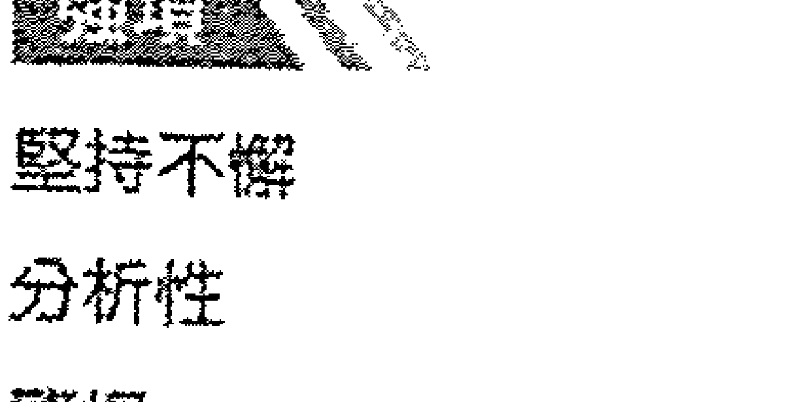

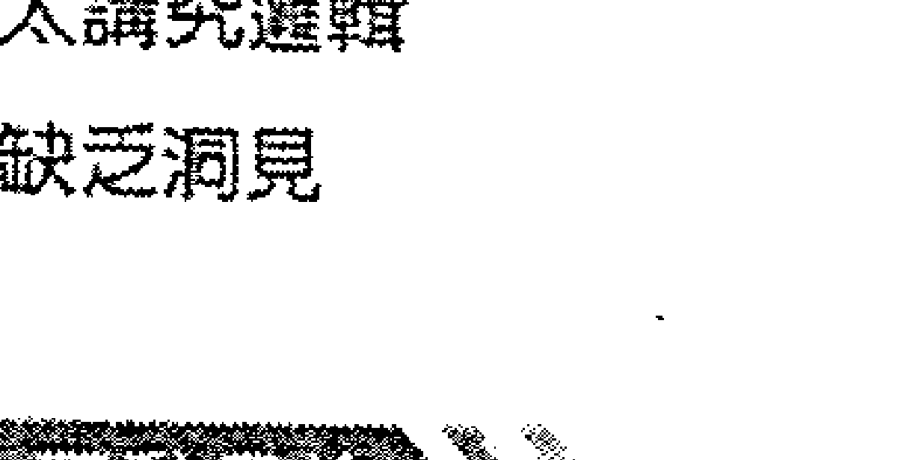

## 35 与摩羯座竞争者的公开战争

公关并不是摩羯座竞争者的强项。他们通常会犯下自认为擅长这个领域的错误，选择为了省钱而自己执行公关宣传活动，而不是聘用知名而昂贵的公司来处理这种专业工作。如果你把极多的预算分配到公关上（或许就是聘请了你的摩羯座对手该用却没用的那家公司），你应该能够在这种争斗中战胜。摩羯座竞争者经常对人性缺乏某种理解，这可能导致他们疏远了顾客。

## 36 向摩羯座竞争者展现你的态度

因为摩羯座竞争者缺乏敏锐度且思路偏狭，所以他们的心思很容易被解读。利用机敏的心理学方法，针对摩羯座面对个人攻击时的弱点下手，你就可以有效地让这些对手失去行动力。对他们的个人生活做点研究，挖掘他们一成不变的习惯、以及他们采用的顽固策略，以便得知确切来说他们在某种情况下可能会怎么反应。一旦你能够预测他们的行为，在可能发生的任何竞争性争斗中，你就确立了能够对付他们的重大优势。让他们心理崩溃并且反制他们的行动，可以在随后瘫痪他们的努力。

## 愛情

摩羯座
12月22日至1月20日

## 與摩羯座的第一次約會

與摩羯座第一次約會，情況很可能迅速發展到肉體層面。如果性方面的化學作用對你們兩人來說都很對味，觸摸、親吻、或許更進一步可能都免不了。因此，最好計畫你們要在哪裡見面，並且決定你是否要到鬧區去，或者在家裡享受比較親密的夜晚時光。摩羯座約會對象可能很實事求是，所以就算你們只約會一次，他們還是不太可能覺得被拒，而會以平常心看待。要是有可能進一步發展，事實會證明摩羯座約會對象很體貼而投入，但不是太過火。

- 優點
  - 觀察敏銳
  - 直接
  - 懂得欣賞

- 缺點
  - 缺乏熱情
  - 實事求是
  - 含蓄

## 37 吸引摩羯座的目光

如果你已經相中摩羯座一陣子了，以正確的方式接近他們，確保關係進展是非常重要的。一個有效的策略可能是替第一次會面找個藉口，把它放到約會之外的另一個範疇。建議來個腦力激盪時段、學習或工作專案、或者電腦方面的活動，通常會拉近你們兩人的距離。事實上，你們雙方可能都知道正在發生什麼事，但這樣通常有助於不要太早逼你的摩羯座約會對象考慮到浪漫關係。請確保求愛發生在比較放鬆或中性的環境下，而不是過度私密或隱蔽的地方。

- 互動風格
  - 身體性
  - 反應敏銳
  - 感官性

## 38 初次跟摩羯座約會的建議

通常向你的摩羯座約會對象建議活動中的某個選項，會比試圖把你預先安排好的時程表強加於他們來得好。在起初的對話（請保持簡短）之後，你可以開始「也許我們可以偶爾一起……」這類的談話，然後在這裡打住。給摩羯座約會對象足夠的時間考慮，然後回覆你，或許你應該等個兩週或一個月。（如果他們到那時還沒有回應，就表示他們可能沒興趣，那麼最好別再找他們了。）與他們更進一步的最佳辦法，通常是你「碰巧」遇見他們，然後就可以重啟你們最初做過哪些活動的話題。

## 39 初次跟摩羯座約會的助興與敗興之舉

要是你們決定一起出現在公開場合，摩羯座約會對象對於他們想跟你一起亮相的時間和地點會有所選擇。一旦地點決定好，無論是讀書、工作或娛樂的環境，最好盡可能讓事情顯得自然而隨性，並且給你的摩羯座約會對象足夠的空間。傾聽你的碎念，可能是他們很樂意接受的事，因為這樣不會造成嚴重的威脅。你的魅力會讓摩羯座約會對象興奮，無聊而可預測的建議或殷勤則會讓他們掃興。

## 40 對摩羯座採取「攻勢」

「攻勢」很有可能是互相的，而不是由你們其中一方造就。摩羯座約會對象對於相互的性吸引力有偵測雷達。他們在有心這麼做的時候會有高度反應，而在吸引力是雙向的時候，他們的感受又會更加強烈。摩羯座可以非常地縱情而開放，狀況可能相當快就變得很狂野。如果對你來說事情發展得太快了，你決定退一步，你必須準備好婉轉的藉口，避免傷害到摩羯座的感情，以致激起他們的失望或憤怒。

## 41 打動摩羯座的方法

摩羯座約會對象會對你冷靜、成熟卻有鑑賞力的舉止印象深刻。他們會對你的外在表現出特別的興趣，把這看成你的真實本性，以及你對他們有何感覺的指標。你選擇的髮型、衣著、布料、鞋子和香水，全都會讓他們感興趣。而如果他們對你有興趣，這些事情還會提高他們的好奇，到達足以更深入探索的程度。如果你們雙方決定在外面吃一頓或者看表演，請確保你沒有節省開銷，而且當然要事先提議由你請客。最常見的狀況是，你的摩羯座約會對象會想要跟你一起分攤帳單，以避免任何依賴或占便宜。

## 42 擺脫摩羯座的方法

在關係初期，摩羯座很容易擺脫；不過隨著感情進展變得更加認真深入以後，就會變得困難得多。不過，光是顯得對他們缺乏興趣可能不會奏效，因為這種態度實際上只會讓他們更來勁，激起他們誘惑你的慾求。最好準備一個好藉口，或者乾脆撒謊。最好的說法是，現在是你很忙碌的時期，而你很喜歡這樣的狀態，等你有時間的時候會再找他們。你的摩羯座約會對象通常會接收到暗示，然後收手。

## 你的摩羯座戀人

摩羯座很可能以非常實事求是、但也極為自然的態度對待性愛。典型摩羯座的態度是：「我迅速跟另一個人上床，好讓這件事不再橫檔在我們之間，然後我們就可以更了解彼此了。」雖然摩羯座是很重視身體的生物，超越性愛的層面對他們還是很重要，而他們通常寧願發展認真深入的關係，而不只是簡短膚淺的關係。摩羯座相當能夠克制到正確的人選出現為止。因此，他們天生的效率與選擇性，讓他們不至於浪費時間和精力在「魯蛇」身上。

## 43 與摩羯座戀人進行討論

摩羯座一點都不排斥討論問題。當他們處於對他們而言真正重要的親密關係裡，他們會樂於給這段關係時間，並且努力解決問題。摩羯座不是把重要議題放著不管的那種人，他們通常會先提出需要討論的議題，而且在雙方都發表意見、徹底講明白以前是不會罷休的。然而對於這種討論要在何時何地進行，摩羯座會加以選擇。他們很可能等上好一陣，直到環境條件對了為止。這樣的行為乍看像是拖拖拉拉，然而通常並非如此。

- 有選擇性
- 有效率
- 有深度

## 44 與摩羯座戀人發生爭論

摩羯座極端固執，在爭論中絕不會退讓。要是在初次對決之後事情還是沒結論，其他衝突肯定會接踵而至，直到事情解決、達成協議、或者證實分居或分手為止。如果你花時間解釋你的行為或觀點，你的摩羯座戀人至少會仔細考慮你的說法，而不是馬上就把這些說辭打發掉。話雖如此，他們也期待你採取相同的作法，還會徹底而冷靜地盤問你他們講過的所有論點，以便確定你了解他們說了些什麼。

- 機會主義
- 勢利眼
- 挑剔

## 45 與摩羯座戀人一起旅遊

因為摩羯座固著的觀念與意見，你的這位戀人並不是最好相處的旅伴。此外，他們通常寧願待在家裡，除非有理由讓他們願意去旅行，或者你用可以在遠方土地得到難以言喻的樂趣這個點，來哄他們一起去。要讓他們踏上你的飛毯，一定要強調旅行能提供的教育與職涯機會，而且當然要向他們保證你會全心全意地關注他們，特別是要放在提供豐富性愛回饋的浪漫背景之下。

- 嚴肅
- 苛求
- 直接

## 46 與摩羯座戀人的性愛關係

摩羯座喜歡頻繁的性愛——只要是跟他們關愛而且看得見未來可能性的對象。摩羯座接受美好的性愛與它所帶來的深刻情感益處，他們了解性愛在發展浪漫關係中的重要性。性與愛對許多摩羯座來說是一樣的東西，而他們之中只有少數人會用膚淺或過度浮濫的方式對待其中之一。摩羯座在浪漫事務上期待他們的伴侶有同等的承諾，而不會長久維繫一個只有他們單方面付出的關係。

## 47 摩羯座戀人的親密表現

摩羯座在感官領域中就跟在性愛領域裡一樣，有很多可以貢獻之處，因此，親密表現的施與受，對他們來說是浪漫方程式中很重要的一部分。然而，他們表達親密感情的模式，並不是很容易讓人理解，這個事實通常導致其他人認爲摩羯座的特徵是疏離和冷漠，因為他們並沒有徹底表達自己的熱情。你的摩羯座戀人比較有可能在眼神一瞥、某種聲調、或者短暫微笑與手臂輕觸中表達親密之情，而不是透過一吻或直接擁抱來表現。同樣地，你若過度熱情地表達你的親密，可能會讓他們退縮，在公共場合

## 48 摩羯座戀人的幽默感

傳統上，摩羯座通常被指控完全沒有幽默感。這並不是真的，但話說回來，他們對於什麼事情好笑的想法，以及對你的幽默表達欣賞的方式，讓人並不總是很容易理解。摩羯座在一個好笑話之後會展現一個小小的微笑，通常伴隨著眼神一閃或者低聲竊笑，而不是直接笑出聲。在他們講故事或者說了個機智的論點以後，他們期待看到你臉上出現一絲理解的光芒，而不是聽到捧腹大笑或者歇斯底里的格格笑聲。因此，他們的幽默路線通常比較微妙，而且比大多數人的幽默更細膩。

## 你的摩羯座配偶

身為充滿支配慾的人，你的摩羯座配偶必須當家裡毫無疑問的統治者。他們控制周遭每個人的需要已經是眾所周知的了，而最明顯表達出這一點的就是他們對伴侶的態度。摩羯座配偶對他們心愛的人可以極端有野心，而他們令人生畏的望夫／望妻成龍之心，並不罕見。這種朝向成功的推進力，不只出現在專業領域裡，也出現在家務事上。因為自身專橫的特質，摩羯座必須學會退一步，偶爾給他們的另一半喘息的空間。

- 有野心
- 投入
- 可靠

## 49 摩羯座的婚禮和蜜月

在計畫婚禮和蜜月的時候，你的摩羯座配偶全都鉅細靡遺地想好了——不只是他們自己的婚禮和蜜月，有時候也替別人籌畫。處理各種付款事宜、並且讓一切事物保持在負擔得起的程度，是摩羯座的專長。而你們在度蜜月時，你的摩羯座配偶也會名副其實地確保一切物超所值。確保他們自己得到最大樂趣和最少打擾，在他們的優先順序名單中排名很高，但他們總是以明智又節約的方式為之。婚禮和蜜月明確的獲得成功，對於跟摩羯座締結的婚姻開端來說是根本關鍵。

- 強勢
- 令人窒息
- 專橫

## 50 摩羯座的家庭和婚姻生活

在你和摩羯座配偶的婚姻生活之初，就要創造出你自己的定位，否則你可能會發現自己只是跟在他們後面，甚或被排除在外。摩羯座是有支配性的，而且自然地會想要控制幾乎每一項居家活動。表現出你能幹、進取到足以要求理應屬於你的事物，並且建立你的強項與專長，會使你的摩羯座配偶真正尊敬你，同時接受要介入你的私人空間是徒勞無功的。像是「別插手」或者「我搞定了」這樣毫不掩飾的句子，可以警告他們注意這點，並且在一開始的時候為之就夠了；日後，就用心知肚明的一瞥來取代。

- 支配
- 控制
- 支持

## 51 摩羯座婚後的財務狀況

大多數情況下，最好把家庭財務留給摩羯座配偶來處理，因為他們有很務實又負責的方法。然而在編預算的時候，你應該確保自己堅持參與家庭收入該怎麼花的決定。這並不是說摩羯座配偶會試圖把所有可用經費用在他們自己身上，但他們確實傾向於務實思考，因此人生中較享樂的面向有時就被忽略了。你可能必須面對未經劃酌就花錢的指控，尤其是把錢花在衣服、娛樂和一般來說可有可無的東西上。但你必須支持自己，必要時甚至可以用上經過掩飾的威脅。

## 52 摩羯座的不忠與脫軌

大多數摩羯座配偶是非常忠實的。要是他們誤入歧途，問題不在於他們跟另一個人形成的關係，反而在於他們沒有能力從情緒層面處理事情。苦惱的懺悔、情緒爆發，還有緊張或沮喪的攻擊，在這種狀況下可能都會出現，甚至天天上演。要是摩羯座配偶可以在不覺得極端有罪惡感的狀態下處理他們的問題，他們的行為可能比較容易被接納與忘卻。克制住不給出你的寬恕，通常可能被證明是很有力量的武器，可以維持你掌握力量的地位，甚至覺察到愛在任何關係中總是擁有更重要的地位。

## 53 摩羯座與子女的關係

大多數摩羯座配偶都很重視家庭，會想要擁有至少一、兩個孩子。不幸的是，他們會把為人父母當成某種促進他們個人規劃、而非子女自身規劃的東西。就像《舊約聖經》中的造物主，摩羯座通常選擇以自己的形象來塑造子女。身為這種摩羯座的配偶，肯定意味著要支持並捍衛子女的權益。太常見的狀況是，這可能導致家庭內部深刻的裂痕與兩極對立，而摩羯座配偶將成為被排擠的那個。

## 54 摩羯座面對離婚的態度

摩羯座配偶對離婚這件事應付得並不好。他們對物品、金錢、子女，還有最重要的住所與家庭安全感的依附，讓任何一種分手都變得很困難。在你甚至可能很享受你剛發現的自由，或者覺得終於如釋重負地脫離他們支配性的態度時，你的摩羯座配偶可能苦不堪言，讓你處理事情的難度增加許多。因此在許多方面，離婚可能變得跟先前的婚姻一樣，問題很大，甚至有過之而無不及。你採取的態度可以有同情心到某個程度，但應該以務實為主。

### 你的摩羯座秘密情人

摩羯座秘密情人相當能夠保證讓他們的伴侶得到性滿足。摩羯座秘密情人不只是重視性愛，還具備長時間纏綿的鬥志，有助於讓性方面的興致維持好幾個月，甚至一連好幾年。他們相信兩個人之間發生的事是他們的事，與別人無關，所以他們也很擅於保密，不會損害到與他們伴侶既有的關係。雖然摩羯座秘密情人很體貼，有時卻沒能考慮到伴侶的感受，在表明他們真正的需要時可能不夠委婉。

### 特質
- 性感
- 謹慎
- 持久

## 55 遇見摩羯座秘密情人

最常見的情況是，你們共同的朋友把你介紹給摩羯座秘密情人，而不是你倆偶然巧遇。這種事情可能發生在一場派對或者其他社交活動上，抑或在某個刻意撮合的家庭晚餐聚會裡。摩羯座通常不會透露太多關於他們自己的事，在第一次約會的時候會相對安靜，好仔細地觀察你。雖然要穿透他們的盔甲、察覺到他們的感受（當然，包括他們對你的興趣）可能很困難，但在一、兩週內（頂多是一個月），他們會毫不猶豫地以某種方式跟你聯絡。

#### 缺點
- 不敏感
- 過度苛求
- 自私

## 56 與摩羯座幽會的地點

摩羯座會帶你回家，或者到一個他們有幾分熟悉且不易引人注意的地方去。在你們初次密切的社交聯誼或親密的性互動中，要你的摩羯座秘密情人在屬於你的地方應付這一切，對他們來說不好駕馭，挑戰性太高了。摩羯座並不真正對他們的伴侶和他們怎麼生活感到好奇，他們寧願以完全直接而熱切的方式會見他們的情人，沒有會分散他們注意力的事情。只要環境安靜而整潔，保證不被打斷，摩羯座秘密情人便會感到滿足。請確保你有關掉手機，免得他們覺得你很無禮。

#### 互動風格
- 實事求是
- 刻板
- 入世

## 57 與摩羯座的秘密性愛

與摩羯座秘密情人之間的性愛，可能會有種怪異的、非關個人的感覺。通常在這段親密時間過去以後，你可能會納悶他們到底有沒有一個人的身分跟你互動。從某些方面來說，摩羯座對愛的肢體表達這方面表現很棒，但他們對於信任、親密與尊重的理解卻有缺陷。因此，跟他們幽會一回之後，你可能感覺很好，或許也累壞了，但不免也覺得空虛，甚至對發生的事情覺得有幾分困擾。日後你們雙方或許有必要針對這一點好好談談，好讓你的摩羯座秘密情人用比較真誠的態度對待你。

## 58 長久保有摩羯座秘密情人

只要你能夠在性愛方面取悅並滿足摩羯座秘密情人，你要把握住他們應該沒什麼太大問題。簡言之，如果他們沒有從你身上得到他們所需要的，他們跟你聯絡的頻率就會降低，到最後則是徹底拋下你。持續地提供滿足，對於把握住你的摩羯座秘密情人來說是關鍵，這裡指的不只是身體上的滿足，也包括你是否能證明跟你在一起很有趣，而且你是個好夥伴，能免於使他們落入沮喪的狀態中，畢竟他們很容易體驗到這種情緒。

## (59) 與摩羯座的秘密歡愉

摩羯座秘密情人想出門的時候，較常喜愛出入像是電影院、夜店，還有華麗、很酷或很潮的地方。偶爾（或者是頻繁到一週一次），摩羯座秘密情人喜歡拋下自己的困擾到鬧區去，有時甚至沉溺於讓人驚訝的外放行為。欣賞並分享他們稀奇古怪、充滿精力的突發奇想，順著他們的浮誇行徑而不顯得震驚或氣惱，會讓他們珍惜你，並且容許自己更信任你。對於他們的行為方式做出任何情緒上的抽離或批評，對這段關係可能都是致命的。

## (60) 與摩羯座秘密情人分手

雖然摩羯座秘密情人相當能夠把你當成燙手山芋般隨手丟了，但卻不建議你突然跟他們分手。要是你放棄他們，草率地把他們從你的生活中踢出去，你可以預期將會得到一個嚴厲且苛刻的回應，不但直接針對你個人而來，也會傳達給你們共同的朋友、甚至是生意上的熟人。跟摩羯座秘密情人分手的最佳辦法，是以緩慢而漸進的速度為之，讓你們之間的聯絡隨著時間而變得比較不那麼頻繁。摩羯座心高氣傲，當他們的自尊心受傷時，很有可能會憤慨地一股腦兒爆發出來。

## 你的摩羯座前任

摩羯座通常會對他們的前任伴侶採取一種負責任的態度，甚至在分手後還能維持很多年。對他們來說，有持續而積極的興趣對舊愛關懷備至，卻不會喚醒任何浪漫的興趣或激情，一點都不算是不尋常。摩羯座前任對於家人與共同朋友的批評特別敏銳，所以通常會舉止得宜。同樣地，摩羯座前任會堅持他們的前任伴侶以得體並尊重的態度對待他們。如果他們受到侮辱或忽視，他們可能非常難以原諒。

## (61) 與摩羯座前任成為朋友

正常來說，這不是問題。然而，你們的友誼最好保持在嚴格的限制下，而你的摩羯座前任可以毫無困難地界定並堅持這些限制。只要你維持在這些守則限度內，並且遵守規定，你們之間就不會有衝突。摩羯座可能對禮儀規範持續被破壞感到相當氣惱，當他們的前任以無可預測又不理性的方式行動時，尤其如此。不事先通知就去按他們家的門鈴、或者半夜打電話給他們，你的摩羯座前任肯定不欣賞這種行為。每隔一、兩個月聯絡一下摩羯座前任，或者要他們聯絡你，這樣就行了。

## (62) 與摩羯座前任複合

與摩羯座前任討論複合這件事，不該輕忽以對。就連提起這個話題，都具有很重要的意義。請記得，在這種談話裡，你所做的任何承諾或者你所表達的任何感受，他們都會認真看待，而日後若你聲稱自己只是開玩笑，他們很可能會覺得被背叛，因而徹底切斷你們之間所有復合的可能性。

- 體貼
- 關懷
- 有警覺心

- 過度敏感
- 好鬥
- 不寬恕

- 傳統
- 尊重
- 負責

笑，想藉此擺脫他們，是不會有用的。你可以確定的是，要是沒有得到你界定明確的承諾，沒有任何摩羯座會認真同意複合。這些承諾包括（但不僅於）法律上的保證、財產與財務的重新調整，以及重新定義過的家庭關係與承諾。

## 63 與摩羯座前任討論過去的問題

與摩羯座前任討論過往的問題，而不激起他們的怪罪、譴責或製造罪惡感的傾向，可能很困難，或者根本不可能。你的摩羯座前任對於這樣的對質，態度可能很嚴厲，而你肯定不會讓他們留下美好的感受。你責怪他們或者跟他們爭辯的任何嘗試，都可能激起火山爆發般的憤怒，所以在這方面一定要非常小心謹慎。可能有幫助的作法是在公共場合邊喝咖啡邊進行這樣的討論，提供某種社會性的控制，而不是硬著頭皮做充滿危險的私下對質。這樣的會談長度應該要有限制，甚至可以邀一位共同的朋友在場當仲裁者。

## 64 對摩羯座前任表達親密感情的程度

任何親密表現都應該避免，或者處於嚴格的控制之下。你的摩羯座前任會抱著懷疑態度看待這樣的表示，他們會確信你這樣做是一種操縱與控制的策略。與其表達親密感情，最好用別的方式表現出你的關切與擔憂，尤其是在他們需要的時候提供幫助，或者就只是準備好傾聽並認真看待你的摩羯座前任要說的話。通常你能做的最體貼之事、還有會替你掙得最高點數的行動，就只是放摩羯座前任一馬。

## 65 界定與摩羯座前任現有的關係

摩羯座前任對於現有關係的地位有良好的概念，在這個議題上不需要你提供意見。他們深信自己在這種事情上的意見很正確，所以通常會拒絕你的觀點，除非你們的看法剛好一致。首先是個現實主義者的他們，會很快地指出你哪些時候的觀察只是一廂情願的想法。最好避免跟他們談論這段關係，但如果你忍不住要開這個話題，並且表達你的觀點，請準備好面對不怎麼有同情心的反應。

## 66 要求摩羯座前任分擔照顧子女的責任

每當子女牽涉在內的時候，摩羯座前任的支配性特徵就浮現了。他們很難應付跟這類議題有關的問題，他們堅持自己是唯一的監護人，你出現在孩子們的生活中只會造成不安與困擾。然而，如果你可以透過你極為負責、不自私又關愛的態度——真正把子女的需求放在第一位——向他們保證你不會造成困擾，他們會開始對共享監護權採取比較開放的態度。摩羯座前任傾向於做出道德譴責，而且會毫不猶豫地指出你所有的缺陷，不只是在私底下，在公開與司法環境下亦然。

## 朋友與家人

摩羯座
12月22日至1月20日

### 你的摩羯座朋友

就算與摩羯座的交情不深，摩羯座還是會對於朋友的困難展現關懷之情，並且在朋友有需要的時候支持他們。習慣上，摩羯座只會固定對他們的伴侶、幾個親人和一、兩個朋友給予情感上的付出。因此如果你是摩羯座的朋友，你可能會發現自己就是他們「最好的」朋友，在他們人生中佔據的位置有多嚴肅而重要，就有多嚴肅而重要。身為摩羯座的摯友可以是一個很沉重的使命，而且並不總是令人愉快。從積極面來看，摩羯座對他們最好的朋友非常之好，而在某些狀況下，他們甚至更愛有摯友相伴，勝過任何人。

### 向摩羯座朋友求助

如果摩羯座把你看成真正的朋友，他們會毫不遲疑地幫助你。如果你一再忽視他們的建議或濫用他們的幫助，對於付出的少數限制之一就可能會出現：他們將來可能會拒絕協助你。不管摩羯座多忙於其他事情，他們都會立刻把事情擱下，去幫助一個真正有需要的朋友。最好別濫用他們的幫助，在不必要的狀況下召喚他們，或是把這當成爭取他們注意的計謀；最好只在迫不得已的狀況下才要求他們幫忙，在這段友誼中有過一、兩次就好。

### 與摩羯座朋友溝通和聯絡

摩羯座並不是最佳溝通者。他們不覺得經常聊天很重要，寧願只是在心血來潮的時候不定期聯絡你。維持規律的聯絡這件事可能要留給你來做，而你應該謹記，你可能很難約束摩羯座，要他們遵守友誼中固定的義務與時間表，因為這不同於他們對商務聯絡方面的態度。然而一旦他們答應要見面，就會可靠的現身，而且鮮少會讓他們的朋友失望。雖然他們不太擅長遣詞用字，但他們是很坦白的人，大部分狀況下可以信任他們所給的意見與判斷。

### 向摩羯座朋友借錢

摩羯座會借錢給他們的摯友，但也會要求依照固定時間表還錢。在某些情況下，他們甚至會做額外的工作或者掏出他們的積蓄，以便有資金可以借給你。不過要是他們看到你浪費他們的錢（對他們來說，浪費的形式可能是你參與不可靠的商業投資，或者把錢給了不可靠的親友），毫無疑問地，他們將會拒絕再對你這麼慷慨。另一方面，如果你善用他們借你的錢，甚至靠這筆錢再賺錢，他們可能會認真考慮直接投資你未來的事業。

| 正面 | 負面 | 三種特質 |
| :--- | :--- | :--- |
| 穩定 | 有所要求 | 關愛 |
| 樂於付出 | 沉重 | 負責 |
| 可靠 | 愛下判斷 | 體貼 |

### 向摩羯座朋友徵求意見

既然摩羯座朋友對於這麼多議題都有定見，你或許在開口問以前，就已經知道他們的建議是什麼了。這可能讓你根本不去尋求他們的建議，雖然摩羯座朋友對事情的某些看法可能證實相當有啟發性。無論如何，他們會認真看待你的問題，並且慷慨地提供他們的時間與想法。摩羯座鮮少會對他們建議的行動改變想法，或者承認他們一開始對你的處境評估錯誤。對於某個既定策略的失敗，他們通常會找到另一個理由來解釋。

### 拜訪摩羯座朋友的時機

雖然摩羯座朋友的家很歡迎你，你甚至可能長年在那裡度過不少時光，你卻永遠不該假定門永遠是開著的，或者你的朋友有時間和興趣常常見到你。雖然摩羯座可能受得了比較頻繁的拜訪，但隨著時間過去，他們可能累積了不少抱怨和惱怒。直到後來事情變得有點太超過的時候，他們的憤怒才會爆發。常常邀請他們到你家，也不是可行的選項，因為他們寧願把大多數時間花在自家地盤上。

### 與摩羯座朋友一起慶祝和娛樂

一般來說，摩羯座朋友喜愛付出，勝於接受。在計畫慶祝與派對活動的時候，他們在勞務與金錢方面都是牢靠的貢獻者；但若這些活動是為了他們的利益而辦時，他們可能會退縮。這種對獎賞或報償所抱持的奇特迴避態度，是因為他們不願意覺得自己受人恩惠，或是不想在將來被指責為不知感激。在節慶場合裡，摩羯座總是無條件付出，卻鮮少要求任何回報。他們在自己做得很好的工作裡得到莫大滿足，而且私下很享受為此接受祝賀。

### 你的摩羯座室友

摩羯座室友明智又穩定的能量，會讓大多數居家活動每天都保持在軌道上。當然，摩羯座對於經濟與效率的要求，可能會把他們的室友逼瘋。在每一筆能源與現金支出上，節儉的摩羯座室友會保證把浪費控制在最低程度。事實證明，被他們質疑看到你的房間到深夜還開著燈就夠惱人了，但在摩羯座室友暗示你要為此多付點電費時，你可能會發現自己被逼到了極限。你那無憂無慮且無所謂的態度，在這間屋子裡可能不會得到太多欣賞。

## 73 與摩羯座室友分擔財務責任

雖然你們會一起分擔財務責任，不過摩羯座可能會堅持對付款、購物和水電瓦斯的使用做執行上的決定。他們不只是理所當然地在這些領域裡奪取掌控權，也藉由表現出他們優越的務實思考力來支持這種態度。不幸的是，他們以這種角度分配給你的角色，通常是對實際現狀沒什麼概念的空想家，跟他們自己所採取明智的態度正好相反。最好不要針對這些事情涉入沒完沒了的衝突，就把這種事留給他們去處理吧！在大多數情況下，摩羯座室友會清楚而公平地詳細說明你的財務責任。

## 74 與摩羯座室友分擔打掃責任

摩羯座室友有時可能變得相當邋遢，但在混亂的插曲之間——特別是在他們自己的房間裡——他們會替自己和室友規劃出嚴格的打掃時間表。所以，住處的外觀很可能在邋遢與整潔之間巨幅震盪。奇怪的是，儘管他們吹噓著自己很務實，摩羯座室友卻可能在追求個人興趣的時候「大走鐘」，對於事情看起來怎樣變得很盲目。你可能必須在共同生活空間裡做額外的工作，好讓一切保持整齊，卻不會從你的摩羯座室友那裡得到任何感謝，他們甚至可能不會注意到你所做的一切。

## 75 當你的訪客遇到摩羯座室友

摩羯座室友通常不喜歡家裡有客人，不管是你的還是他們的。在大部分狀況下很保守的摩羯座室友是習慣的動物，他們喜歡事物在沒有太多騷動之下維持原狀。要是你邀請朋友或親人來待超過一個週末的時間，就準備好迎接麻煩吧！你的摩羯座室友會因為需求增加而堅持要你做出更多貢獻，接著他們終究會開始試著趕走那群討厭的人——不甚委婉、頗為直白地建議他們離開。要避開這些尷尬，最好把這種拜訪的頻率與長度降到最低。

## 76 與摩羯座室友的社交生活

雖然摩羯座室友不是派對動物，不過他們仍可以不時地享受一下美妙的盛宴。這樣的節目給他們一個機會，展露他們浮誇外向的一面，而你或許從不知道有這一面的存在。摩羯座在派對上無拘無束，他們自己就可以提供大量娛樂。然而一旦他們開始計算讓人頭腦清醒的花費，可能就會有一段時間不希望重複這種經驗了。陪伴他們去參加共同朋友在別處舉辦的派對，可以是很好玩的經驗，只要不期待他們會為任何東西出錢就好。

## 77 與摩羯座室友的隱私問題

雖然摩羯座室友會堅持要保有隱私，同時他們也會驚人地善於分享公共空間。他們會堅持的一件事情是，要有拉長而不被打斷的時間，以滿足他們的泡澡、淋浴與美妝方面的需求。他們使用廚房的要求也一樣，在這裡，他們就是不能被趕被催。太常見的狀況是，摩羯座對待分享的態度，就好像他們是在給你某種特別的禮物，而不只是承認你有平等的待遇。你可能偶爾得被迫提醒他們，這棟房子或公寓也是你的。

| 精打細算 | 過度挑剔 | 直率 |
| :--- | :--- | :--- |
| 節儉 | 容易惱怒 | 有管理能力 |
| 明智 | 愛打聽 | 愛控制 |

### 78 與摩羯座室友討論問題

與摩羯座室友之間總是會產生問題，但他們鮮少會承認那是他們造成的。因此在討論問題的時候，最好把這些難處當成是互相的，並且尋求摩羯座室友的支持來客觀地解決這些問題。絕對不要試圖把某個家務災難歸咎於你的摩羯座室友，或者想讓他們有罪惡感。你永遠都會激起他們的否認，而且不只如此，你還可能迎來一陣激烈的指責風暴，而矛頭就指向你。這樣的爭論可能很容易就失控，讓家中的低氣壓一連持續好幾天。

### 你的摩羯座父母

理論上，每個小孩都應該有機會得到一位摩羯座父母，但千萬不要兩個都是。摩羯座太獨裁、太有保護性、太愛控制他們的孩子，而且幾乎天天、甚至時時刻刻如此，除非另一位父母比較寬容隨和，否則這個孩子很可能會吃足苦頭。摩羯座父母嚴肅地看待他們所扮演的角色。他們會確保子女受到良好的照顧，而且絕對不會規避對子女的責任。雖然能夠給予關愛，許多（但並非全部）摩羯座父母卻選擇把愛保留起來當成一種武器，藉此脅迫子女尋求他們的認可、並且同意他們的要求。

| 貟責 | 嚴格 | 權威性 |
| :--- | :--- | :--- |
| 關切 | 苛求 | 保護性 |
| 充滿了愛 | 強制高壓 | 愛控制 |

### 79 摩羯座父母的教養風格

摩羯座父母是嚴格的監工。他們對子女的期待，通常會小心而詳細地表達出來，以避免可能產生的誤解。摩羯座父母可能暗示或者明講：「如果你乖乖的，你就會得到一切。如果你使壞，那你什麼都得不到。」直到後來小孩才會終於搞懂，「乖乖的」就只表示遵循摩羯座父母的規定。摩羯座父母鮮少會執行任何一種體罰，但體罰的威脅可以強力嚇阻孩子的不服從。許多摩羯座父母嚴肅的舉止，讓人難以懷疑他們要子女從命的決心。

### 80 摩羯座父母與孩子的相處

儘管有著嚴謹的態度與嚴肅的舉止，摩羯座父母也喜愛跟孩子一起玩樂。直接搔癢、摔角、競爭、開玩笑和逗弄，並沒有那麼不尋常。只要子女遵從摩羯座父母的規定，避免對這種官方命令表示批評或公然反叛，一切就會進行得很順利。實際上，摩羯座父母有對子女表現親暱感情的強烈需要，而雖然他們對子女也報以親暱很讚賞，不過他們卻並不要求如此。許多摩羯座父母不喜歡從長大的子女那裡收到昂貴禮物，覺得他們不想讓孩子把錢浪費在他們認為是奢侈品的東西上面。

### 81 摩羯座父母給孩子的金錢觀

摩羯座父母會樂意提供子女適度的每週零用錢，不過通常只涵蓋到必要需求的錢。他們教導孩子要節儉，而且絕對不要蠢到把錢浪費掉。金錢在摩羯座的排序中佔據一個重要位置，當金錢是辛苦專注工作賺來的時候，尤其如此。摩羯座父母可能嘲弄孩子的不切實際或愛做夢，只為了讓他們能夠毫無疑義地控制這個領域。不幸的是，許多孩子會去迎合這樣的角色，就算這麼做只是為了取悅摩羯座父母苛求的自我。

### 82 摩羯座父母的危機處理

雖然在危機時刻可以仰仗摩羯座父母，但他们也可能對必須解救他們任性的子女這件事產生埋怨。他們執行的懲罰所導致的痛苦，常常比危機本身產生的苦難還大。摩羯座父母通常採取的態度是，他們的子女惹上的麻煩大半是他們自己搞出來的，因此他們基本上沒什麼同情心，雖然還是會在場扮演他們的角色——負責任的父母。免不了的是，有些狀況下，摩羯座父母的子女一開始之所以惹上麻煩，只是因為他們被過多限制性的規則束縛，需要表達他們的個體性。

### 83 摩羯座父母的假期安排和家族聚會

摩羯座父母會參與家族聚會，但他們還是比較喜歡把假日留給自己和他們的配偶。他們甚至可能會找個保姆——（外）祖父母或者其他家庭成員——好讓他們可以出去玩，或者至少有一陣子免除身為父母的責任。在跟旅行有關的時候，摩羯座父母較喜歡只跟他們的核心家庭去度假，而不包括阿姨嬸嬸、叔伯舅舅和其他表親堂親。度假時，摩羯座父母並不會太過吝嗇，但他們仍舊不會放過省錢與避免非必要花費的機會。

### 84 照顧年邁的摩羯座父母

年邁的摩羯座父母通常會講明白，他們不想讓任何人照顧他們。雖然他們會感激你提議要幫忙，不過他們只會在絕對必要的時候才接受幫助。聘請全天候幫手來照顧他們，或者把他們送到老人之家，並不是他們喜歡的作法。摩羯座父母非常依戀他們的環境，而且寧願獨自掙扎受苦，也不要去搬去一個他們不熟悉的地方。這樣通常會導致他們逐漸喪失行動力，所以他們鮮少出門，甚至限制自己在家中的活動只到某個最低限度。

### 你的摩羯座手足

除非是排行最長的，否則摩羯座孩子正常來說會退到兄姊後面，相當能夠融入家庭的次序中。排行最長的摩羯座孩子是毋庸置疑的老大，會以高度負責的方式施展他們的權力。年紀較小的摩羯座小孩可以相當狂野，但鮮少反叛秩序與權威，對他們的哥哥姊姊大多會予以尊重。摩羯座會很快從手足那裡領會到暗示；他們在必要的時候會表現得很堅定，能夠很快就取代任何人的角色。手足之間親密聯繫所產生的良好感受，能讓他們蓬勃發展，而且他們在心理上也依賴著親密家庭所保證的安全感與保護作用。

| 合作 | 依賴 | 堅定 |
| :--- | :--- | :--- |
| 關愛 | 充滿恐懼 | 尊重別人 |
| 多才多藝 | 感情需求強烈 | 有保護性 |

### 85 與摩羯座手足的競爭和親近

摩羯座手足會奮力維持他們在家庭中的權力，並與確保家庭穩定的事務保持合作態度。因此，他們會非常嚴厲地處置堅持特立獨行、或者設法損害家庭權威的家人。摩羯座手足通常採取的是一種看門狗的態度，而在他們發動攻擊的時候，他們咬下的那一口會很令人畏懼。與摩羯座手足的競爭，在任何家庭中都算是常見的狀況，雖然只要有可能，摩羯座寧願和平相處。只是當他們被逼到極限、警鈴大作的時候，他們會變得非常有攻擊性。

### 86 過往的成長經驗對摩羯座手足的影響

摩羯座手足相當不寬容。過往的議題對他們來說，長年來都近在眼前。處理過去對他們來說可能是一個真正的問題，因為這麼猛烈地緊抓著過去的問題不放，可能會妨礙他們的自我發展。一個仁慈、體諒又有同情心的兄弟或姊妹，可以幫助他們處理這種議題，而且如果有足夠的耐心，還可以療癒他們的心病。可以預期的是，大多數摩羯座人生中的某一時刻，會發生他們被困在過去問題（通常是跟某個特定的創傷事件有關）的困境。

### 87 與疏離的摩羯座手足往來

摩羯座手足可能極為頑固，而且可以連年不斷拒絕兄弟姊妹的接近。能夠觸及他們心扉的唯一辦法是連續好幾個月、甚至好幾年，同時結合堅持與退讓的作法。通常脅迫或者催促摩羯座手足建立停火或復交協議的所有嘗試，都會以慘慘的失敗告終。感覺得到接近他們的正確時機，對於成功來說是必要的。如果處理得恰當，在明智而審慎地激勵他們一段時間之後，疏遠的摩羯座手足或許會是開始主動聯絡的那一方。

### 88 摩羯座手足對繼承、遺囑等金錢議題的處理

摩羯座手足對於遺囑與繼承議題，採取的是主導性的角色。他們不只是為了自己的利益而堅持，同時也是為了兄弟姊妹的利益。正常來說，他們不會尋求特別的回饋，而會與團體形成同盟。一般而言，摩羯座不會向他們的手足或資產與信託基金借錢，除非發生緊急事件，逼得他們以此作為最後手段。他們會謹慎地歸還所有借來的金錢，雖然這可能要花點時間。

### 89 與摩羯座手足的家族團聚和慶祝活動

摩羯座手足通常很重感情，很享受與他們最愛的兄弟姊妹、以及他們的配偶和子女的團聚與年度假期聚會。鮮少有其他的事情所帶來的樂趣，會勝過看著他們的子女跟表親堂親在這種場合玩在一塊。摩羯座手足對於家庭慶祝活動提供的溫暖與友好氣氛有真切的感受，而因為他們奉獻的本性，他們會不惜精力與血本來讓這些活動圓滿成功。在這樣的活動結束以後，摩羯座會很滿足，不過在下一年到來以前，他們可能會有興趣再度聯絡。

### 20 與摩羯座手足…一起度假

雖然摩羯座會以家庭為重，不過帶著一個兄弟或姊妹，外加他們的一對孩子一起去度假，大概就是他們能處理的極限了。對摩羯座來說，假期意味著真正擺脫一切，這甚至包括他們的家庭。話雖如此，發現你正跟你的摩羯座手足…一起度假，可能是最享受的一次經驗。一旦摩羯座手足下定決心採取包括你在內的行動路線，他們就不太會去區分他們的利益和你的利益，他們覺得要負責給你和其他人一段美好時光。

### 你的摩羯座子女

摩羯座孩子在心智上，通常會比他們的實際年齡成熟。這些小大人有著嚴肅的舉止，他們的父母可以幽默地看待這一點，但若是嘲笑這些孩子，將會是極大的錯誤。摩羯座要求被尊重，若試圖拒絕給他們尊嚴，他們會以驚人的力道反擊，儘管他們還是小朋友。生於這個星座的孩子是充滿自信的，他們知道自己要什麼，以及該如何取得。用情緒勒索、激發他們的罪惡感，並不是非常妥當的做法，因為摩羯座小孩對人類心理學頗有理解。

### 21 摩羯座子女的人格發展

既然摩羯座在早年就顯得很成熟，你可能會納悶，摩羯座小孩的人生裡還有多少人格發展要展現。他們碰到的困難可能會在稍後出現——在成人早期，他們開始領悟到自己被剝奪了真實的童年時。這種感覺——他們的內在小孩因為不成熟的情緒發展而嗷嗷待哺——可能會是一種令人無法抗拒的領悟，喚醒了各種的後悔與怨恨。最常見的狀況是，父母並沒有錯，但他們很可能變成摩羯座子女怪罪的對象。

### 22 摩羯座子女的嗜好、興趣和職涯規劃

許多摩羯座小孩很早就對於自己將來想要發展的職業生涯很有概念。然而，他們卻不知怎地沒有辦法實現自己的這種理解，可能得等到成人後，花了相當長的時間才能在某個專業上安定下來。年輕的摩羯座成人通常是好幾次起步失誤的受害者，不過終究會碰上某項專業，跟他們有記憶以來就已經出現的某個嗜好或生活興趣相關。一旦他們下定永久的決心，並且動手去實現他們的願望，他們就可以在接下來的工作生涯裡堅守他們的崗位。

## 93 對摩羯座子女的管教

摩羯座子女了解有需要以管教來遏制狂野的能量，包括他們自己的能量。他們可以理解，甚至同情一位覺得管教有必要存在的父母。這樣的理解，容許他們忍受施加於他們和手足身上的懲罰。這是因為他們很清楚是非，而當他們打破這些規則的時候，他們知道這麼做要冒著被報復的風險。他們把管教看成是不必要的，但接受懲罰則是他們逾矩之後免不了需要承擔的後果。

## 94 與摩羯座子女的親密程度

摩羯座對親密的需求是挺複雜的一件事。他們看起來就像是不尋求也不渴望親密，而且他們完全滿足於沒有親密表現的生活。然而，他們有種要給予親密情感的古怪責任感，很容易可以見諸他們對較年幼家庭成員與寵物的態度上。一旦他們的父母掌握了這種根本事實，就可以明顯看出摩羯座子女確實需要親密（就像大多數小孩一樣），但要他們自己承認這一點或者直接要求，對他們來說有很大的困難。這通常要怪他們的驕傲與自信，導致他們覺得要求被擁抱——甚至是默默地要求——無疑是承認了自己的軟弱。

## 95 處理摩羯座子女與手足之間的互動

如果手足中排行最長的是摩羯座，這個孩子與兄弟姊妹的互動必須得到引導。極為常見的情況是，身為老大的摩羯座是個小父母，一直在篡奪父母的特權，心裡總是以弟妹的利益為念。要處理這些獨立而通常充滿困擾的親權干預，最佳方式是由父母給摩羯座子女一些雜事和責任，不管他們的年紀或排行順序是什麼，讓他們覺得自己很重要，其他人需要也想要他們。然而這些責任一定要受到控制，以避免前面談過的那種童年剝奪感。

## 96 與成年摩羯座子女的互動

如前所述，成年摩羯座子女可能早在他們實際上成年之前就轉大人了。所以當摩羯座來到三十歲以上的任何年齡，他們的家人可能就只是用比他們年輕得多的既有方式，繼續跟他們互動。既然許多摩羯座子女似乎是天生的成人——至少在心理上如此——他們的整個人生都會對他們所扮演的角色非常自在，只要他們有清理掉沒得到真正童年的任何埋怨就好。既然老成是大多數摩羯座的天生狀態，他們對年齡增長適應良好，而且對於完全為自己與他人負責並不會覺得不自在。然而若過度高估他們的能耐，總是可能浮現出來變成一個問題。

## 水瓶座

日期 1月21日至2月19日

水瓶座這個固定宮星座，統治我們現在生活的新紀元。受到革命性的行星天王星主宰，水瓶座通常是很現代、很有前瞻性的人，他們很不尋常，而且也能接納別人的不尋常。水瓶座通常是他們愛人心中的喜悅與絕望之源，他們可能不穩定並冷漠到令人抓狂、忽視人類的情感，讓人很難與他們維持長久的關係。然而，他們迷人的特質與敏捷的心智，卻深深吸引著那些願意忽略或原諒他們這種任性傾向的人。

### 工作

水瓶座

1月21日至2月19日

### [特徵]

- 敏捷
- 聰明
- 開放

### [特徵]

- 不耐煩
- 飄忽不定
- 難以理解

### [特徵]

- 立即
- 不可預測
- 無法掌控

### 你的水瓶座老闆

水瓶座並不特別適合當老闆，一般來說，水瓶座老闆也確實是較少見的。這有幾個理由，包括他們飄忽怪異又衝動的行為、需要獨自行動、閃電般迅速的舉動，以及沒興趣掌控他人或建立王朝。話雖如此，如果你有個水瓶座老闆，至少你已經先得到警告了。事實上，跟他們一起工作通常很有趣（在你跟得上他們的時候），而且他們對員工相當慷慨。他們的沒耐性已是眾所周知，所以在他們需要你的關鍵時刻，不要測試他們暴躁的脾氣，或者用你的缺席或拖拖拉拉使他們感到失望。

### 1 要求水瓶座老闆加薪

水瓶座老闆以光速行動，而且有取消正式約會的惡習，你的第一個問題會是追上他們，並且抓著他們去開會。你可能必須甘願滿足於設法在走廊上突襲他們，或者在離開餐廳的時候快速談個三秒鐘。你可能必須實際上把他們拉到一旁聊一陣，以此取代真正的約見。仰賴他們的助理來轉達水瓶座老闆的行蹤不會奏效，因為你們的領導人飄忽不定的行蹤，可能讓助理們跟你一樣感到挫折。

### 2 向水瓶座老闆宣布壞消息

如果你突然間被水瓶座老闆叫去解釋最近的銷售損失或業績下滑，你幾乎不會有時間整理你的思緒。所以如果你有個水瓶座老闆，你最好準備在短暫的預告後就解釋你最近的行動。這一點可以靠著替你的工作建立完整檔案、把所有重要紀錄都留在伸手可及的範圍來達成。如此周全的準備能夠創造比較大的成功，讓你可以在去老闆辦公室的路上隨手抓到一份檔案。請確保你有定期溫習這份資料，並且把它有條理地組織到容易參考的程度。

### 3 替水瓶座老闆安排差旅和娛樂

水瓶座老闆的旋風式能量與瞬間決策力，讓人很難事先安排好差旅和娛樂方面的預約。然而，水瓶座老闆要求每件事都運作順暢，讓他們能夠執行重要的商業決定，而不必擔心行程與後援。最好在做安排時儘可能保持流動與彈性，而且要有備用計畫、好的航班取消保險，還有能夠逆來順受、充滿體諒之心的餐廳領班。與一位知道能期待什麼，而且可靠又有同情心的旅行社代辦人員固定配合，是重要關鍵。

### 水瓶座老闆的決策風格

水瓶座老闆會快如閃電地做出決定，並且期待你能夠效法他們。如果反應太慢，你的決定可能會讓他們很挫折，因為等待不是他們的強項。做決策對他們來說很容易，不過或許是太容易了，對於他們大多數員工來說會變得很難遵循，甚或難以理解。當這樣的決定由上而下傳遞的時候，經常留下一群大吃一驚的員工，彼此驚訝地面面相覷。要求水瓶座老闆進一步解釋可能很困難或是不可能，所以至少你要知道能期待什麼。

### 打動水瓶座老闆

水瓶座老闆的動力來自於自身，而且無法逼他們往任何他們不想追求的方向去。唯有能夠理解他們快捷的心思和方法、以及立即執行他們計畫的能力，才能真正讓他們印象深刻。要是他們在走廊上遇到你，或者在進出一棟建築物的時候碰到你，他們會期待你跟著他們走到電梯前（有時他們或許會邀請你跟他們一起搭電梯），同時一路仔細聆聽他們簡要的命令。在你們短暫的行程之後，請確保你有盡可能迅速地寫下他們方才說過的話。

### 提案並對水瓶座老闆做簡報

水瓶座老闆沒時間聽冗長的提案，而且對於無止境拖拉的漫長文件或簡報特別不耐煩。保持精簡扼要，講話時最好不要帶著筆記或視聽輔助工具。請記得，你只會得到水瓶座老闆幾分鐘的全副注意力，所以務必濃縮你的想法，用字力求精簡。如果水瓶座老闆在你簡報到一半時打斷你，或者一直插入他們的想法、反對意見與要求，別覺得訝異。保持專注，然而腳步要輕盈到足以很快就改變方向並即興發揮。

### 你的水瓶座員工

水瓶座員工人格特質中不尋常的地方，對於他們的老闆來說，可能一直是越研究越有趣的主題。水瓶座員工有獨特的做事方式，而一旦他們養成某種習慣，就很難讓他們更改，或者教他們別的方法。此外，水瓶座通常有叛逆傾向，因此生於這個星座的員工並不總是能好好接受高層權威的命令，他們對於被交代要做什麼會感到憎惡，因為他們手邊通常有更好的辦法。話雖如此，水瓶座員工可以把樂趣與輕鬆的心情帶到任何團體裡，而且他們喜歡事情進行得順利，沒有額外的麻煩。

### 面試或僱用水瓶座員工

水瓶座求職者可以用他們敏捷的心思，以及陳列出他們有能力貫徹想法的工作紀錄，來讓老闆留下好印象。正常情況下，水瓶座求職者會很快吸收丟給他們的任何資訊，然後立刻證明他們已經理解了。雖然他們可能不同意，但他們會以明確的說法，建議更合乎他們好惡的改變。水瓶座想看到未來雇主對他們的建議保持開放態度，並且對他們的需求有回應，這樣他們才能感覺愉快地接受工作機會，簽下合約。

### 宣佈壞消息或解僱水瓶座員工

水瓶座員工通常屬於兩個極端之一，沒有中間值：一種會接受壞消息，另一種不會。能接受的那種水瓶座員工可能會同意老闆說的，他們會在另一家公司發展得更好，而且實際到能夠接受批評與建議。不接受的那種水瓶座員工則可能因為被開除而變得非常瘋狂，除了口頭上的攻擊，而且看似已準備好採取實質的攻擊。他們的脾氣與反應過度在公司裡可能已經人盡皆知，在面對這種水瓶座員工時應該謹慎處理，讓打擊和緩輕微一些——或許靠著慷慨的資遣費，或者心意寶貴的握手致意。

- 古怪
- 奇特
- 無法掌控

- 輕鬆
- 友善
- 接納

### 與水瓶座員工一同差旅或娛樂

水瓶座是個熱愛找樂子的星座。水瓶座員工痛恨拘泥於形式、嚴謹的時間表，以及剝奪旅行與娛樂樂趣的其他嚴肅態度。因此跟他們一起旅行的人，採取的方法應該同樣輕鬆友善，而且必須沒有憂鬱傾向。水瓶座員工有時可能太過活潑，以致讓人很難天天跟他們在一起。因此與水瓶座員工一同旅遊，最好保持短時間，而且可以事先警告他們要控制他們的熱情。當然了，也不要完全澆熄那股熱情。

### 分配任務給水瓶座員工

因為水瓶座是固定宮星座，水瓶座員工相當能夠長時間堅持一項任務，並且適當地執行。然而要發展出驚人的結果（水瓶座相當能做到），他們必須對自己的工作有很大的熱忱。為了產生這樣的熱忱，一開始在挑選他們的任務時就要讓他們有些選擇權，或者至少讓他們幫忙給這件事一個定義並加以具體化，通常會是個好主意。光是把任何一種老套工作放到水瓶座身上，是不管用的，因為他們對於大多數任務有高度個人化、甚至是古怪的方法。他們的特別任務，最好是由一位雇主針對水瓶座員工發展出來的，而不是抽象地憑空想出。

### 激勵或打動水瓶座員工

只要發現水瓶座員工更多的偏好，並且把他們最喜歡的事情交辦給他們，就能激勵你的水瓶座員工。舉例來說，如果他們喜歡跟其他人工作，就讓他們成為團體的一份子；如果他們寧願獨自工作，就給他們自己的空間與設備。了解他們不尋常的本性、對他們的需求與想望都有回應的雇主，最能夠打動水瓶座員工。任何看輕水瓶座員工言論或要求的嘗試——拒絕認真看待他們，或者暗示他們太古怪、太飄忽不定、不值得信任——都會激怒大部分的水瓶座，就算這種觀察並沒有錯也一樣。

### 管理、指導或指正水瓶座員工

某些情況下，水瓶座員工几乎是完全管不動的。水瓶座很容易煩躁、不悅，接著就動怒。許多水瓶座員工會發現，如果用錯誤的方式接近他們，要他們接受批評和指教便很困難，或者是不可能。如果聰明的老闆想要好好管理水瓶座員工，就要花時間認識這些員工，下手輕巧，而且不會一次丟給他們太多沒有彈性的規定。一直責怪他們，會逼瘋大部分的水瓶座，經常監督他們的工作狀況也會。

### 你的水瓶座同事

水瓶座非常能夠接納他們的同事，而雖然他們有獨來獨往的習慣，但若被要求的話，他們也會參與團體活動。喜歡讓事態保持輕鬆的水瓶座同事熱愛交換笑話，而且特別喜歡能夠炫耀口語能力的機智快問快答或俏皮話。水瓶座同事的才氣總是能得到團體裡所有人的高度重視，因為這可以振作精神、提高士氣。雖然可以信賴水瓶座同事會做他們份內該做的任務，不過他們通常不會設法超時工作來多賺一筆，因為他們極為重視自己的休閒時間。

- 機智
- 建立士氣
- 娛樂他人

- 膚淺
- 疏離
- 不受約束

- 幽默
- 反諷
- 才氣煥發

### 尋求水瓶座同事的建議

水瓶座同事有冷眼看情勢的能力，並且可以給出客觀的判斷。雖然他們不容易被逮住，好照著排好的時間表來個正式會面，但如果你在正確時機抓住他們，他們對跟你談話會抱持相當開放的態度。因此最好就只是探頭看看他們的辦公室，或者迅速打個電話給他們，看他們是否有空。通常努力個幾次，應該就能成功跟他們接觸和交流。你的問題應該保持簡短並且直接講到重點，你會發現他們的回答雖簡單扼要卻頗有幫助。應忽略他們比較極端的建議，只遵循中庸的意見即可。

### 向水瓶座同事求助

水瓶座同事相信天助自助者。因此根據此原則，他們可能不會特地幫你，他們認為這樣只會耗損你的士氣和個人的進取心。然而如果他們看出你已經試過了，而且確實無計可施，他們可能會很出人意料地幫你解決問題。如果此事關乎個人而非公務，水瓶座同事更有可能在這種情況下出手相助。他們通常會在別人有需要的時候，對他人表現出一種真心的關懷，因為他們的本質即是理想主義者。但在專業事務上，他們會積極地捍衛他們的時間，期待他們的服務會得到報酬。

### 與水瓶座同事一同差旅或娛樂

如果水瓶座同事不是你的摯友或夥伴，跟你一同出差時，他們表現的所有小怪癖和偏好，可能會讓你很驚異。水瓶座同事可能很愛操心，並且把他們的擔憂以緊張的形式表現出來，可能會讓你猝不及防。一旦他們冷靜下來，確定事情會順利進行以後，他們就能夠很令人愉快。在娛樂方面，他們熱愛看現場表演，夜店的音樂或舞蹈都包括在內。他們對於長時間坐著吃飯比較不感興趣，通常較喜歡順路簡單吃吃，然後在不同的娛樂場所進出，這樣他們才不至於有錯過任何娛樂的風險。

### 與水瓶座同事共事

水瓶座同事對於被命令或者與他人合作反應不佳，當他們忙於自己的工作時，尤其如此。然而如果他們相信自己奉命加入的團體有努力的目標與原則，他們就會慷慨地貢獻自己的才智與精力。一般來說，水瓶座覺得跟別人共事不容易，因為他們對於事情該怎麼做有特殊的看法。他們被要求每天參與社交或團體環境時，做得並不好。讓他們跟別人一起工作的較佳辦法，是只把他們與另一個人連結在一起，那個人最好是他們已經認識並且喜愛的同事，然後再把這個雙人組合融入較大團體的努力當中。

### 打動或激勵水瓶座同事

長期而言，承諾給他們更多自由的時間、更少需全神貫注的辛苦專案，可以激勵水瓶座同事參與其中。承諾給他們更多薪水與更大特權，對他們的效果不大，因為他們知道，如此一來，他們會被要求投入更多時間和精力來賺取那些薪水與特權。清楚而合乎邏輯的思維能打動水瓶座同事，定義不清的目標與含糊、過度樂觀、模稜兩可又誇大其詞的計畫則不能。雖然是理想主義者，水瓶座同事也有強烈的科學與務實傾向，在事實與數字方面要求實用主義路線。

### 說服或指正水瓶座同事

水瓶座同事可以敞開心胸面對建設性的批評。如果你夠小心，用正確的方式接近他們，他們會特別樂意聆聽你的計畫，向他們顯示如何以更省力的方式達成相同成果。學得很快的水瓶座可以非常迅速地學會新方法與新技術，通常只要解釋或示範一次就會了。如果水瓶座同事極不同意你說服他們的努力，他們可能就只會扮演魔鬼代言人，鼓勵你多告訴他們一些，或者進一步解釋。一旦你完全滿足他們了，他們才會敞開心胸照著你的計畫走，甚至對這些計畫變得很有熱忱。

### 你的水瓶座客戶

奇怪的是，水瓶座客戶對於他們想要什麼，不一定有清楚的概念。有太多事情仰賴你的專長為何，以及你能夠提供他們什麼，所以他們會聽完你的完整闡述以後，才做出決定。對於切入任何特定問題或需求的許多不同方法，水瓶座客戶都保持開放態度，他們會很享受跟你討論這些事，而且可能要求進行第二次、甚至第三次會談。你們之間的關係會在這段時間稍微加深，讓他們對於你是怎樣的人，以及他們是否能信任你可以提升他們的最佳利益，有更清楚的概念。

### 打動水瓶座客戶

水瓶座客戶對於你能提供的廣泛選擇範圍與方法，會留下最好的印象。你願意貢獻時間給他們，跟他們一起工作，以發展出一個共同理念或方法，他們對此也會大感驚喜。既然你可能不會為這些初期會議開出任何價錢，他們會很樂意免費得到你的知識帶來的好處。請確定讓你們的第一次會議有一、兩個小時的時間，這樣雙方才不會覺得很趕。水瓶座客戶熱愛幽默與機智，所以也要確定你有些有趣的故事或笑話可說。他們會特別愛聽他們競爭對手的精采八卦。

### 向水瓶座客戶推銷

光是你的開放態度、你的創新與傾聽他們問題的意願，就足以向大多數水瓶座客戶推銷了。當然，你在這個領域的背景和早些時候的成功經驗，也會讓他們印象深刻，所以請確保手邊有一份你的商業紀錄列印文件。也要記得，他們會回去告訴他們的同事跟你見面的事——但願他們覺得很驕傲能見到你、並且能引起你的興趣。自己就是表演者的水瓶座客戶，會對於你介紹自己、你個人的成就及作出保證的表現，公開表達讚賞之意。

### 水瓶座客戶重視的外表和舉措

最新的風格與時尚，會讓水瓶座客戶特別印象深刻。所以，請確保你買了些在剪裁、質料、花樣和顏色方面能吸引目光的衣服。他們不僅對接觸時尚很感興趣，還會因為你特別花心力為了這個場合，選擇並穿著這些衣物而被打動。在此對比之下，水瓶座客戶鮮少會想要跟你競爭，也鮮少覺得輸你一籌，因為他們通常滿足於自己的外表，並不會覺得被別人比下去。要是你選擇呈現出比較輕鬆或隨意的外表，你可以這麼做，但一定要避免極端正式或過度保守的衣服。

### 保持水瓶座客戶的興趣

在你與水瓶座客戶的會面中，請確保維持一種機關槍似的快捷路線，讓他們不至於對你感到厭煩。同樣地，要對他們的許多問題與意見立即反應，藉此顯示出你有所警覺。想長期保持他們的興趣，仰仗的是你選擇在他們身上投資多少精力。經常寄出你的進度報告，還有你替他們發展的公關計畫副本，兩者都不可或缺。請確保水瓶座客戶會把對你能力的讚揚散播得又廣又遠，而在這麼做的同時，他們會替你吸引來更多的客戶。

- 優點
  - 體貼
  - 接納
  - 支持
- 弱點
  - 含糊
  - 沒有焦點
  - 不確定
- 互動風格
  - 有反應
  - 合作
  - 信賴

### 23 向水瓶座客戶報告壞消息

因為水瓶座客戶對於採用新方法抱持開放的態度，所以向他們宣佈壞消息可以成為改變戰略的信號。單單一次運氣不佳，鮮少會導致水瓶座客戶立刻把你除名。他們很喜歡分析哪裡出了錯，然後跟你一起計畫有望獲得更大成功的全新戰役。對於暫時的挫敗來說也是如此，因為水瓶座能夠看到更寬廣的整體局面，通常接納度也夠高，可以等待改變的到來。然而，他們的耐性有個明確的限度，會堅持要在幾週或幾個月內看到結果。

### 24 招待水瓶座客戶需注意的「眉角」

水瓶座的人熱愛玩樂，水瓶座客戶也不例外。安排在時尚餐館裡享用一頓晚餐、在很潮的酒吧喝一杯、或者是某個全新演出的前排座位，都會大大有助於你達成目標。水瓶座客戶並不期待與你的商業關係裡會出現友誼，雖然好感度對他們來說很重要。行事作風通常很冷靜疏離的水瓶座客戶，樂意以提供客觀地享樂而非情感投入的方式來共享娛樂機會。可以期待他們有同樣的回應，也邀請你出去，這永遠都是事情順利進行的良好徵兆。

### 你的水瓶座合夥人

水瓶座能夠把生命與熱情帶到任何商業合夥的關係中。然而必須小心盯著他們，因為他們超凡而通常飄忽不定的能量，可能很容易就失控。無可預測的水瓶座會走他們自己的路，卻沒有先跟你商量，或者就算你給了建議也沒去注意。想緊緊地束縛住他們是不可能的。退而求其次的作法是安排好每週會議，讓他們知道你的期待，並且讓你對於他們的意圖有些警覺。在這種會議上，關乎細節與大局兩方面的討論最好都要有。

- 水瓶座
  - 活潑
  - 熱情
  - 個人主義
- 缺陷
  - 無可預測
  - 衝動
  - 飄忽不定
- 互動風格
  - 友善
  - 多才多藝
  - 精力充沛

### 25 與水瓶座建立合夥關係

把水瓶座合夥人牢牢牽制住的時間是在簽訂合夥協議之前，而非之後。關於新公司及他們在其中扮演的角色，應該做廣泛的討論，並在討論時給予特別的關注，讓他們能夠保持在控制之下。任何條款，如果能解釋成給他們更多免於你檢視或評估的自由，就應該要小心地修訂。水瓶座合夥人在起草這種協議的時候，會相當樂意答應你的要求，心想反正隨後他們還是會照自己的意思進行。你的工作會是要他們遵從自己的書面聲明。

### 26 與水瓶座合夥人之間的任務分配

水瓶座的人通常會同意平等公正地分配任務，問題在於如何讓他們遵循事先同意的計畫。他們比較不規律又任性的能量，可能會在這方面造成真正的問題，因為他們經常會棄他們預定的責任於不顧，而寧願去做冒出的新事情。這會把你置於一個讓人不甚舒服的位置：令人畏懼的監工，總是在破壞他們的美好時光。在水瓶座合夥人的熱忱上澆冷水，是個不會The request was rejected because it was considered high risk抱持開放的態度。水瓶座秘密情人很樂意在公開場合被人看到跟他們的情人同在，並且成爲各種爭議的中心。

## 60 與水瓶座秘密情人分手

這通常不是問題，因爲你的水瓶座秘密情人可能已經跟你分手了，只是你沒發現，或者他們根本從一開始就沒真正跟你在一起過！水瓶座秘密情人很少緊抓住你，逼你跟他們繼續在一起。對他們來說，這世界充滿了新的有趣事物，而最新的一個可能就在轉角處等候他們。並不是他們的自信刺激他們前行……他們常常對他們愛人與做愛的能力很沒安全感——而是他們的信念在驅策他們：每當他們缺乏新戀情的時候，宇宙總是會給他們一個新的。

### 你的水瓶座前任

如果水瓶座前任沒對你表示出很大興趣，不要驚訝，很有可能他們已經把焦點轉移到別人身上了，導致你不是如釋重負地鬆了口氣，就是承受莫大的痛苦，端看你的感受而定。在分手後極短的時間裡，你可能就不認得這些人了。他們的改變如此之大，而他們可能看起來也不太認得你了。水瓶座前任有時候會把你當成從沒存在過那樣地對待你，因此讓你很難或不可能跟他們建立任何一種關係。對於大多數的水瓶座前任而言，感情一旦結束就是結束了，你不可能期待太多。

- 不依賴
- 自制
- 客觀

## 61 與水瓶座前任成爲朋友

- 冷漠
- 疏離
- 不關心

水瓶座前任通常對於分手後跟你維持友誼不感興趣，但只要接觸保持零星而表面，就有可能維持聯絡。讓形式上的接觸涵蓋到實際事務與決定，是你能期望的最佳狀況了。最重要的是，不要期待他們表達情感，這樣會讓你免於很多挫折與受傷的感受。要是他們對你表示興趣，這可能只是一種策略，目的是獲得他們想要的某種東西，而你應該拒絕陪他們玩這種遊戲。

- 實事求是
- 感受遲鈍
- 不感興趣

## 62 與水瓶座前任複合

在水瓶座前任對重燃愛火表現出善意興趣的少見例子裡，他們可能願意在永久性的基礎上做出承諾。然而，他們同樣也能把討論複合成一種控制你的計謀——實際上，就是爲了自私的目的而利用你。請小心翼翼進入對於這個議題的任何討論，逼迫他們爲他們的意圖提供確定的保證，甚至建立書面的合法約束。如果你有興趣複合而他們沒有，你就只能期待一個充滿痛苦與苦難的未來了。

## 63 與水瓶座前任討論過去的問題

大多數水瓶座前任肯定完全沒興趣討論過去，更不要說重溫過去的問題。

## 64 對水瓶座前任表達親暱感情的程度

這通常是不可能的。再度強調，如果水瓶座前任逐漸增加親暱的表現，這通常是因為他們想要得到什麼，不管是身體上的還是財務上的。這種親暱表達可能帶有性慾色彩，而且會直接攪動出舊有情緒，可能很快就導致你們兩人上了床。不幸的是，在大多數情況下，事實會證明，看似愛火重燃的事情就只是孤立且單一的事件，不管這種經驗有多愉快，都明確地建議你就讓事情到此為止。

## 65 界定與水瓶座前任現有的關係

什麼關係？這整件事情或許用簡單幾個字就能作爲總結，而不會留下多少想像空間。水瓶座前任往往會把現有關係界定成只限於幾個必須處理的必要領域，像是子女、稅金或財產。任何嘗試進一步描述或定義彼此關係的討論，通常都不可能，因為你的水瓶座前任對此並不感興趣，或者明顯有敵意。你對於這個議題的想法，可以用寫信或者發電子郵件的方式給他們，但對他們的回應別期待過高。

## 66 要求水瓶座前任分擔照顧子女的責任

共享監護權，是可以預期並與水瓶座前任保持接觸的唯一一個領域。因為他們對子女的愛，還有繼續待在孩子生活裡的希望，使得他們很可能做出一些讓步，去見你、甚至討論某些事情。孩子通常會要求有相同的時間與水瓶座父母相處，因為他們會提供孩子很多樂趣和特殊待遇。這種期待可能讓你處於一種不自在的位置，致使你得扮演嚴格的老師或惡魔這類不討喜的角色。

## 朋友與家人

水瓶座 1月21日至2月19日

### 你的水瓶座朋友

友誼對大多數水瓶座來說極為重要。對他們而言，友誼通常預設了理想性、全面性與普遍性的重大意義，遠勝過其他個人關係。因此，他們大多數的友誼都有高度抽象與客觀的性質——是冷靜的，而非熱情的。水瓶座鮮少有興趣致力於每天、甚至每週聯絡，他們會趁著在移動的時候，或者在他們最近的積極斬獲逐漸沉寂或暫時休止時聯絡你。所以你不該仰賴他們成為你穩定的支柱，反而應該把他們視為你人生中有趣的附加活動——一個同時具備娛樂性又有一點特別的人。

- 理想主義
- 多才多藝
- 自發

- 怪異
- 不可靠
- 不確定

### 67 向水瓶座朋友求助

對於行動迅速的水瓶座朋友，最好只問一、兩個問題就好——尤其是那些可以在超迅速的意見交換中快問快答的題目。在關於移動、計畫、安排職責、為工作與未來計畫列清單，還有購買難找品項這些方面的幫助上，最好別指望他們。對你的水瓶座朋友來說，幫助是某種他們只能在閒暇時提供的東西，而他們的閒暇時間可能本來就已經極為有限，或是根本不存在。然後還有跟他們聯絡的問題，這也很困難。最好留下語音訊息，或者在你需要幫助之前幾天、甚或一、兩週前，給他們一封事前通知信。

- 抽象
- 客觀
- 冷靜

### 68 與水瓶座朋友溝通和聯絡

雖然水瓶座朋友是很好的交流對象，不過可能會是由他們來聯絡你，而不是反過來。這不只是因為他們很難找，也是因為他們更喜歡當開始聯絡的那個人，這麼做，可以讓他們選擇哪個時間、地點與方式最適合他們。太常見的情況是，他們聯絡你時，不免會剛好影響到你正在忙的事情，而一旦你發現不可能立即回應他們的自動表示，事實可能證明他們將來會變得更難聯絡上。首先，水瓶座必須感覺到你真的急切需要他們；其次，你想溝通和聯絡的企圖必須在正確時機、以正確的方式打動他們。

### 69 向水瓶座朋友借錢

別仰賴能夠向水瓶座朋友借錢，即便是那些已經答應或承諾要借你錢的人。雖然他們滿腔善意，卻很有可能就在要給錢之前，把錢花到別處去了。他們對於花錢太沒有意識了，以至於完全無法信賴他們會履行固定的財務義務。然而如果你可以讓他們對你用那筆錢做的事感興趣，他們可能會把那筆借款看成是有趣的投資，到頭來給你的錢比你要求的還多。他們對這種興趣的覺醒，值得花時間慢慢發展，因為這麼做很有可能行得通，進而帶來慷慨的現金。

## 70 向水瓶座朋友徵求意見

水瓶座不是那種會給出冗長建議的人。正常情況下，他們不需要時間思前想後，就可以用寥寥數語告訴你他們的想法。通常他們在客觀議題上很敏銳，但他們在心理觀察、人類情感、還有人生黑暗面等領域，並不是特別有天分。有時候他們直接就拒絕牽扯進令人沮喪或不健康的討論裡，這不只是出於厭惡，而是出於原則。最好把你要求的建議，限制在他們已經展現處理靈巧度的領域裡，尤其是技術性的事務。

## 71 拜訪水瓶座朋友的時機

因為他們通常不在家，拜訪水瓶座朋友會變得很困難。此外，如果他們在家，卻完全沉浸於專業或私人事務上，他們可能不會回應門鈴或敲門聲。當水瓶座完全沉浸於手邊的事務時——當然，可能隨時改變——甚至經常會排除掉已經事先排好的拜訪，所以你已經事先得到警告，不要有假設，或者讓自己期望太高。你可能會覺得最好建議他們來拜訪你，給他們範圍寬廣的時間作選擇，並且容許每個選擇有幾小時、甚或幾天的時間區間，讓他們可以順道拜訪。

## 72 與水瓶座朋友一起慶祝和娛樂

熱愛找樂子的水瓶座很享受慶祝特殊場合，以及到鬧區去度過一段美好時光。然而，因為他們迅速改變的時間表，最好的作法通常是趁著心血來潮就決定慶祝或者外出。在這樣的衝動之後，你們雙方都能廣泛參與各種活動，過得很愉快，從簡單的一頓飯或喝一杯、到各種娛樂可能性的全面大爆發都有可能。你會發現水瓶座享樂的能力是無窮盡的，只有在你企圖踩剎車叫停的時候才會造成問題。

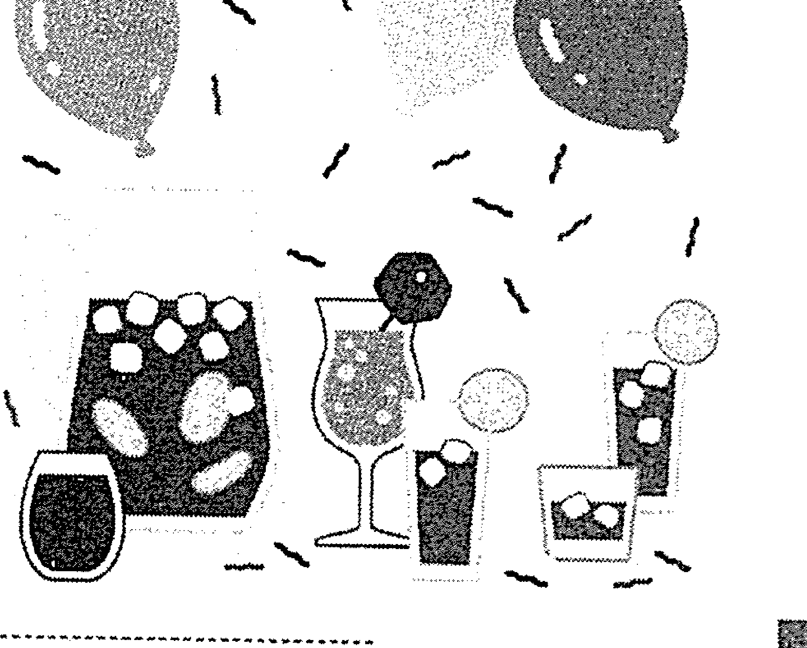

### 你的水瓶座室友

水瓶座室友往往會以驚人的快速步調來來去去，拒絕在同一個地點、甚至位置停留太久。要跟上他們、甚至只是適應他們，可能很難或者根本不可能，所以你最好就只是做你自己的事，並且盡你所能地忽略他們。他們不會故意去惹惱你或者干涉你在做的事，所以當你們互相容忍的時候，一切會最順利。大多數水瓶座的疏離，已排除掉任何真正深刻的牽連。你應該避免用大範圍的家事責任造成他們太大的負擔。他們很可能為了讓你不要煩他們，就迅速同意這些責任，隨後也同樣迅速地忽略這些責任。

## 73 與水瓶座室友分攤財務責任

不幸的是，水瓶座室友通常對錢感到束手無策。他們花錢花得太快，以至於總是在月底時捉襟見肘。欠你房租可能令人遺憾地變成一種模式，雖然當他們現金充裕時，很可能會對你一擲千金。在關乎一般的付款事宜時，水瓶座室友就是不可靠，除非你冒著讓他們脾氣爆發的危險逮住他們，接著迅速退場。

## 74 與水瓶座室友分擔打掃責任

不要走上替他們打掃善後的那條路。你處理長期旋風所造成的後果，會讓你感到筋疲力竭又沒完沒了，並且只會激起你的憤慨。最好讓他們被自己的混亂淹沒，同時保持你自己的房間乾淨整潔，希望這樣能成為一個好模範。問題在於讓公共空間維持秩序，像是廚房、浴室或客廳，而你免不了必須做大部分的工作。但在一切變得一片混亂以後，你必須押著你的水瓶座室友把事情做好，並且堅定地拒絕接受任何藉口、或者保證將來會參與的承諾。

## 75 當你的訪客遇到水瓶座室友

大多數水瓶座室友有驚人的容忍度去接納你的訪客，甚至是那種在意料之外時刻來訪，還決定比預期停留更久一點的不速之客。水瓶座愛找樂子，而且鮮少錯過跟其他人分享好時光的機會。然而要是你的訪客異常保守或一絲不苟，你那位極不尋常的水瓶座室友的狂歡與惡作劇，可能會讓他們看得很震驚。對立人格所表現出的尖銳互動，可能會把這種拜訪帶向戛然而止的尾聲。

## 76 與水瓶座室友的社交生活

不論事前或事後，辦派對通常是讓你的水瓶座室友打掃的好辦法。水瓶座熱愛派對，而且很可能同時貢獻時間與精力，以確保每個人都很愉快。要控制住他們可能會有點問題，雖然他們通常會跳舞跳到腳軟為止，而且可能突然間就不見人影。然而有時候，他們可能必須真的被抬到他們房間去，扔到他們床上。甚至在最狂野的活動中，水瓶座室友依然不會為事情能發展到什麼地步而設下底線。

## 77 與水瓶座室友的隱私問題

水瓶座室友並不會特別尊重你的隱私，因為在一起同住的時候，他們是以團體而非個人作為思考單位。他們也會容忍你闖入他們的私人空間，雖然在他們深刻投入事業或親密活動的時候，通常會畫下一條嚴格的界線。一般而言樂意分享的水瓶座室友，對於分享他們的食物、空間和錢（這是指他們有錢的時候），抱持著開放的態度。通往他們房間的門比較有可能是開著而非關著，因此不需要先敲門，就會招來偶爾的談論與造訪。

## 與水瓶座室友討論問題

水瓶座室友對於在自發性的基礎上討論問題，態度很開放，但很可能對預先安排、比較正式的會議感到卻步。然而，特別是在他們很快就同意你提出的要求時，你可以預料到他們會徹底忽略他們似乎極其容易就同意的事情。要逮住水瓶座，讓他們答應履行固定的義務是非常困難的。他們很能體諒你的期望，然而對於加以執行的看法卻不實際。他們有個盲點，看不出他們是被討論的問題的一部分，而且還有可能把批評指向其他人，或者就只是怪時機不對或運氣不好。

### 你的水瓶座父母

許多水瓶座有著自由的靈魂，根本不會選擇結婚或生小孩。那些結婚生子的人，很可能保有他們的獨立地位，或者鼓勵他們的孩子剛成年就離巢。水瓶座父母不是過度苛求或占有慾強的類型，相反地，他們喜愛看到子女發展出獨立的態度；但當子女打破他們制定的某些不可撼動的安全規定時，他們可能會無法忍受。所以當水瓶座父母覺得子女讓自己置身險境時，他們就會在子女的自由之上畫下一條界線。水瓶座父母對課外活動通常比對學業更有興趣，會特別鼓勵他們的孩子參與運動、社交活動、建立友誼與投入創意活動。

- **優點**
  - 鼓勵
  - 有興趣
  - 解放

- **弱點**
  - 不夠寬容
  - 充滿恐懼
  - 自私

- **互動風格**
  - 活躍
  - 熱忱
  - 不重課業

## 水瓶座父母的教養風格

大多數水瓶座父母寧願根本不要管教他們的小孩，除非在跟安全有關的時候。要是一個孩子打破規矩而且招來危險，水瓶座父母會嚴厲地懲罰他們，可能會禁足他們一段時間。在其他情況下，水瓶座父母會設法教導他們的孩子為自己的行為負責，給他們附有但書的放任：讓孩子知道，他們雖然擁有自由，卻也要為自己的行為負起責任。舉例來說，如果容許他們在週間夜晚出門，及時起床並且做完功課就是他們的責任。水瓶座父母討厭嘮叨。

## 水瓶座父母與孩子的相處

水瓶座父母可以對他們的孩子很親熱，卻沒有一大堆大驚小怪或嚷鬧。每天給予並接受擁抱和小小的親吻，對他們來說很正常。然而，大多數水瓶座父母的親暱程度不會再更深入了。在許多情況下，這些人可以相當冷靜，以致常常遺忘了孩子的情感需求。大部分水瓶座父母的性情有點古怪，表現親暱情感的方式也很奇特，甚至可能過火到逗弄、甚或嘲笑他們的子女。許多小孩看不出這種行為是在表現親暱和慈愛，而且就算他們看得出來，他們的朋友可能也無法理解，因而可能一直覺得很困惑。

## 81 水瓶座父母給孩子的金錢觀

水瓶座父母可以對現金開銷相當慷慨。他們通常會給子女豐厚的每週零用錢，而且他們很樂於看到子女把錢花在追求愉快（但無傷害性）上。就算他們領悟到吃點巧克力可能會導致蛀牙，還是覺得巧克力提振情緒的性質勝過蛀牙的風險。在子女需要的重大物品上，水瓶座父母也會給得很慷慨。唯一的問題是，錢可能已經花在水瓶座父母最近的熱情所在或時尚追求了。他們的腦筋通常很清楚，會避免為了子女想要或要求的昂貴物品而讓家庭陷入嚴重的負債狀態。

## 82 水瓶座父母的危機處理

身為高度緊張的人，許多水瓶座父母在子女遇險時（至少在他們眼中是如此），很容易反應過度。顯得極度緊張，而且過早就來救援，是典型的水瓶座特徵，可能經常因此加強而非減少了危險。舉例來說，處於警戒狀態、設法要警告子女的水瓶座父母，實際上卻可能讓孩子分心，就像是有一輛車逼近的時候，孩子的注意力卻被父母的聲音給轉移了。水瓶座父母必須學會怎樣對孩子的覺察力更有信心。

## 83 水瓶座父母的假期安排和家族聚會

水瓶座父母並不熱愛家族聚會，但他們喜歡跟子女一起去度假，而且他們甚至會帶著子女的一、兩個朋友一同前往。關鍵在於，他們喜歡做的事情（度假）與他們被要求去做的事情（家族聚會）之間的區別。水瓶座痛恨以重複而可預測的方式一再做某些事情，所以每年同樣的老套家庭活動會徹底讓他們感到厭倦。對水瓶座來說，厭煩導致惱怒，惱怒導致怨恨，怨恨導致最後頑固地拒絕參與。然而在度假時，他們可以完全沉浸於他們自發性的衝動，以及他們對冒險的嚮往。水瓶座父母的舉止，通常就像個大孩子。

## 84 照顧年邁的水瓶座父母

年邁的水瓶座父母通常會要求別人不要管他們，而且會頑固地拒絕接受子女的幫助，不論是身體上還是財務上。隨著年齡的增長，他們有明顯的小氣傾向，所以很適合靠著很少的物資生存下去，不管他們是否需要如此。他們能夠維持生存的少量配給，對大部分他們那個年紀的人來說是不可能的，而且肯定不想這樣過。因為水瓶座父母的古怪癖性也會隨著年紀一起增長，子女通常會對父母讓人無法理解的怪異行為表現出極大的關注，甚至開始假定可能出現某種形式的失智症了。最好只是留意年邁的水瓶座父母，而不要去管制他們常常很古怪的生活風格。

### 你的水瓶座手足

水瓶座手足不可避免地會透過他們的機敏與才氣，為他們的手足點亮生活中有趣的一面。你除了可以倚靠他們享受一段好時光，也可以仰仗他們就只是靜靜地為家庭生活添加輕鬆、不嚴肅的氣氛。他們的心情可能突然間從低調轉變至狂亂，以致會在手足之間製造出一股震波。然而當這種行為維持個幾年以後，無可預期的事也會變成可以預期的，大家對他們的反應就會開始減弱。想新的計畫和以獨特方式思考是水瓶座的特殊專長，他們的手足會開始高度重視這種能力；在事情變得太過無聊或老套的時候，兄弟姊妹通常會轉向水瓶座手足尋找靈感。

- 有啟發性
- 有想像力
- 創新

- 令人困擾
- 讓人震驚
- 讓人心生警戒

- 突然
- 自發
- 不嚴肅

## 85 與水瓶座手足的競爭和親近

在大多數情況下，水瓶座與手足之間並不會太過競爭，就算他們在家庭以外顯現出有攻擊性的特徵也一樣。水瓶座會選擇親近自己的手足，但這並不是有可能，因為他們的某些特質可能會被認為惱人和令人不快。然而，水瓶座手足有種贏得人心的辦法，讓別人常常能夠原諒他們令人苦惱又喧鬧的逾矩行為。與其競爭，水瓶座手足覺得做自己的事情就滿足了；他們的競爭趨力通常會被轉換成尋求優越，並且超越他們個人最好的狀態。

## 86 過往的成長經驗對水瓶座手足的影響

水瓶座手足不只是健忘，他們也能夠原諒並忘卻過往的問題。他們的健忘通常指出他們傾向於往前邁進、非常地活在當下，並且期待著未來。過去對大多數水瓶座手足來說並沒有太多的重要性。然而對於他們的這種傾向，某個覺得被虧待的兄弟或姊妹可能不會有同感；在這種情況下，水瓶座手足的健忘或接納特質，只會進一步激怒被虧待的一方。水瓶座手足必須學習體認到，過往的議題對其他人來說可能有多重要。

## 87 與疏離的水瓶座手足往來

因為水瓶座希望事情能夠順利，而且他們強烈需要對手足表達他們的友善之情，所以他們會對和解保持開放態度。很有可能他們是被團體放逐，而不是自己選擇疏遠。所以可以由家庭選擇在他們之間把事情說開來，接納迷途的水瓶座手足回歸家庭的懷抱，最後朝著和解之路前進。在大多數情況下，疏離的水瓶座手足會同意回來，甚至同意在這麼做的過程裡達成某些要求。但水瓶座手足可能永遠不會完全理解，為什麼當初他們會被拒於門外。

## 88 水瓶座手足對繼承、遺囑等金錢議題的處理

一般來說，金錢對水瓶座並不是最重要的東西，所以借錢對他們來講沒什麼大不了。他們也不會因為自己在遺囑裡受到財務上的忽略而太過難受，除非逝者是他們在情感上非常親近的父母或親屬。在所有兄弟姊妹（包括他們自己）都分到相等份量的時候，水瓶座最快樂。他們討厭爲錢爭執，而很可能因爲拒絕這樣做，因此受到財務上的損失。比別人更加理想主義的他們，鮮少摒棄他們對金錢事務上所抱持的原則。

## 89 與水瓶座手足的家族團聚和慶祝活動

水瓶座手足非常樂於在家庭假期、慶祝與團聚中扮演適當的角色。他們會立刻回應所有家人之間共享的美好感受，絕對不會在這種活動裡，替自己尋求特別的關注或有權力的位置。讓他們快樂並避免爭論會有附帶好處，讓大家不至於承受水瓶座的惱怒和突然的情緒爆炸。充滿喜樂、笑逐顏開的水瓶座一現身，總是會爲家庭聚會帶來歡樂的氣氛。請確保把他們納入滑稽短劇、故事、遊戲或戶外娛樂活動裡，以便好好利用他們旺盛的精力。

## 90 與水瓶座手足一起度假

在任何度假活動中被撇下，對於大多數水瓶座手足來說可能都是種折磨。他們必須被包括在進行中的事件裡，如果沒有，你就準備好回來時面對臭臉、充滿埋怨、甚至淚眼汪汪的反應。水瓶座手足在度假時偏愛更有挑戰性與令人興奮的活動，面對危險時鮮少會退縮，實際上還會因此被鼓舞。身爲水瓶座的手足，必須時時留意他們，因爲無可預見的意外或疾病，可能是其他方面很愉快的假期突然告終的信號。必須不時提醒水瓶座手足他們的限制，並且給他們一些約束，雖然他們通常會對嚴厲的約束感到退縮。

### 你的水瓶座子女

水瓶座子女可能會對他們的父母造成嚴重的問題，但因爲他們歡樂的天性，他們會立即回應父母的注意、理解與接納。問題通常牽涉到他們不尋常的做事方式，而且他們完全拒絕用你的方式做事——事實上，他們也拒絕任何其他方式。如果他們腳上的鞋子讓他們感覺不舒服，他們就會赤腳走進雪地裡；如果逼他們吃對他們有益卻不討他們喜歡的食物，他們連看都不願意看一眼；嘀咕抱怨、哭喊、扭動和尖叫，在他們年紀比較小的時候很常見，而他們對於控制他們的嘗試就是這種反應。

## 91 水瓶座子女的人格發展

應該容許水瓶座子女以他們獨特的方式，逐漸經歷不同的童年階段。身爲父母的你，若是在他們發展的某個關鍵點反對他們，他們很可能就會被卡在那裡，然後在青少年時期與成年後的人生裡產生巨大的心理問題。請記得，水瓶座子女不像其他人，而且他們對於大多數事務有高度個人化的方法，必須得到認可、甚至得到尊崇。因此，他們需要、也應該得到特別的對待。

殊待遇，尤其是你想要避免嚴重麻煩的時候。如果把童年發展比擬成一棵樹的成長，應設法避免過度摘除和修剪水瓶座的枝椏。

## 92 水瓶座子女的嗜好、興趣和職涯規劃

應該讓水瓶座子女在範圍廣泛的各種活動中作選擇。這樣做之所以必要，不只是因為他們有必須用掉的旺盛精力，也是因為水瓶座小孩對大部分提供給他們的活動不會有興趣。仔細觀察他們的嗜好偏向，通常可能會產生他們在往後的成年生活裡會選擇什麼專業的線索。絕對不要試圖把水瓶座子女硬塞到某個不成熟的模型裡，或者逼迫他們遵循你偏愛的道路。他們高度叛逆的天性遲早會爆炸，然後脫離那條路，長期而言會導致你更強烈的失望與不快樂。若是這樣，還不如接受他們個人的選擇，不管這麼做有多困難。

- 歡樂
- 懂得欣賞
- 反應敏捷

- 容易惱怒
- 叛逆
- 難以駕馭

## 93 對水瓶座子女的管教

- 苛求
- 挑剔
- 個人主義

水瓶座子女很難或者不可能被管教。此外，既然他們對這種對待方式的激烈反應，可能很快導致全面衝突、甚至是戰爭，所以只要有可能，最好別管他們。堅定地運用某些基本規則，以及表現出體諒、溫柔、充滿愛的態度，通常是讓他們那股任性的能量處於控制之下的最佳方式。要是你體罰你的水瓶座子女，如果他們猛烈回擊，不要覺得驚訝，因為他們就是不會容忍被虐待。他們可能也會為周遭同樣承受不公平待遇的動物挺身而出。

## 94 與水瓶座子女的親暱程度

水瓶座子女比大多數孩子更需要擁抱。在比較年幼的時候，摟抱、安撫的聲調、充滿愛意的眼神、還有撫慰的輕拍，對於使他們容易興奮的個性平靜下來，是不可或缺的。水瓶座子女仰賴親暱感情過活，也很能夠在他們成年早期，把這樣的投資連本帶利回饋給充滿體諒與支持的父母身上。因為水瓶座精力充沛又瘋狂的天性，他們的父母可能會犯下錯誤，以為他們不需要太多鼓勵與慈愛，但不給他們這些將會是個更重大的錯誤。應該給你的水瓶座子女可以照顧的小寵物，這樣他們就可以學會溫柔與撫育，而不是狂野而難以駕馭。

## 95 處理水瓶座子女與手足之間的互動

水瓶座子女需要有特別能體諒的父母，來監控他們與手足之間的互動。太常見的情況是，手足們可能無法理解水瓶座不尋常且經常令人困擾的習慣，因而討厭他們。父母會受到最徹底的挑戰：在庇護一個特別狂暴的水瓶座子女時，還要維持家庭的和諧。另一方面，如果他們真的被接納了，而且徹底滿意他們所受的待遇，水瓶座子女就算會、也很少蓄意惹麻煩，或者想辦法打破家庭日常生活的和平，只為了爭取注意。

## 96 與成年水瓶座子女的互動

奇怪的是，就算最不安分的水瓶座子女，都可以在成年生活裡變成平靜的典範。一旦他們在童年與青少年時期發洩得夠多，他們經常會定下來過和諧得驚人的成年生活，展現出他們在早年缺乏的合作與理解精神。因此，成年的水瓶座子女可能在他們肆虐多年的家庭裡，變成一股穩定的力量。那些只認識他們童年時期的人，多年後見識到他們的轉變，常常會被嚇一跳。

## 双鱼座

## 2月20日至3月20日

双鱼座，鱼的星座，是受到海王星主宰的变动宫水象星座。属于这个星座的人，感情深刻，比多数人都重视情绪问题，会在他们认真看待的关系里要求深刻的投入。极其敏感的双鱼座很容易情绪受伤，面对拒绝时总是特别脆弱。他们的灵性或对神性的信念很强烈，就像他们对艺术（主要是音乐）的涉入很深一般。虽然很重视感官，双鱼座却也知道生活里有许多经验，比他们能见到、能摸到的更多。

## C 工作

## 雙魚座
2月20日至3月20日

- 豐富
- 流暢
- 有同理心

### 你的雙魚座老闆

基於某種奇特的理由，雙魚座被認爲是不善理財的。然而在歷史上、而且在他們的朋友圈裏，對生於這個星座的人來說，金錢似乎來得很容易。同樣地，雙魚座老闆太常勾勒出一種錯誤的想像：一條超放鬆卻優柔寡斷的魚，彈跳到超出其能力範圍之外的地方。但事實上，生於這個星座的人經常是極佳的老闆，甚至是商業王朝的締造者。賺錢對他們來說來得很自然，因爲錢是一種他們完全了解的流動媒介，而善於撫育的雙魚座老闆，對於守護事業與員工利益的能耐極高，有能力把利潤帶給所有相關人士。

- 容易被操縱
- 過度敏感
- 過度保護

## ❶ 要求雙魚座老闆加薪

雙魚座老闆喜歡看到他們的金錢被善用，因此如果他們認定你在公司裏有良好的工作紀錄，他們就會想要回饋你，以便激勵你更進一步產出高品質的工作，並爲公司增加利潤。你的加薪要求應該直接表明，同時附上你覺得這種加薪很正當的理由。在關於未來工作的承諾方面，大多數雙魚座老闆會稍微加油添醋，但藉著答應給你比較高的位置，他們可以聰明地把你成功所需的工具交給你。

- 放鬆
- 適應性強
- 有影響力

## ❷ 向雙魚座老闆宣佈壞消息

在事情不成功的時候，雙魚座老闆總是願意再試一次，甚至兩次。所以，帶來壞消息通常只是前奏，表示要在組織裏做點變革，在二度開始嘗試之前對計劃做幾項變更。通常最好讓雙魚座老闆想個新的工作日程表，因爲他們在時機不利或者根本就是災難的時候，非常擅長迅速思考。的確，當他們被逼到牆角的時候，通常也就是他們最厲害的時候。請記得，痛楚、苦難與不幸，是大多數生於此星座的人衆所周知的特質——儘管受到重大挫折，他們也知道該怎樣堅持下去。

## ❸ 替雙魚座老闆安排差旅和娛樂

雙魚座老闆極爲重視品質，有時他們之中某些人佔據權力位置，只爲了能夠徹底享受這些附帶好處。正常來說，雙魚座老闆的旅遊、住宿與用餐預算很高，會容許自己沉浸於自身發展得很好的品味中。雙魚座喜歡表現得有教養，因此他們在高級餐廳和旅館的奢華環境裏顯得非常自在，甚至可以說像是回到家一樣。雙魚座不太可能克制住奢侈花費，他們知道，在哪里被人看見通常可能是一種潛在的商業工具，可藉此讓客戶與競爭者印象深刻。雙魚座會想要在出門的時候穿上精緻的好衣服，而且他們特別喜歡美麗的鞋子。

## 雙魚座老闆的決策風格

以猶豫不決、優柔寡斷爲人所知的雙魚座老闆，在大多數商業環境下有保持彈性的極大優勢。他們一點都不是猶豫不決，而是喜歡好整以暇地仔細考量許多因素，然後才做成決定，而且通常都是正逢其時。因爲這種對「決策時機」（kairos，意思是執行一項行動的正確時間）的敏銳度，他們很可能在大多數的商業行動中得到成功。一旦雙魚座老闆下定決心，他們會立刻就準備好實踐他們的想法，並且讓他們的專案開花結果。

## 打動雙魚座老闆

雙魚座老闆知道，一家成功的公司意味著每個人的回饋都有增加，所以打動他們的最佳方式，就是讓他們看看你身爲團隊合作者做得有多好。同樣地，整個團隊在奮鬥時合作無間，雙魚座老闆就會更有動力賣出產品，並且以「職人精神」的最高水準來提供服務。雙魚座老闆在辦公桌之間漫步、監督他們的員工時，通常會從詢問看似與個人工作無關的事情開始，好讓員工放輕鬆。要打動你的雙魚座老闆，你也應該採取同樣放鬆、友好的口氣。

## 提案並對雙魚座老闆做簡報

雙魚座老闆需要對提案感到信服。他們總是想知道爲什麼他們應該相信你說的話，而且他們來到會議桌前，是爲了看到有讓人信服的證據支持你的主張。雖然不必然要用吸引人的技巧和特色來替你的簡報增色，不過雙魚座老闆有非常重視美學的傾向，會很欣賞優雅並令人愉快的簡報，就像他們也會覺得草率和粗心的簡報極爲令人討厭一樣。雙魚座老闆通常會用簡單地點頭來表示他們的贊同與欣賞，比較不會用華而不實的稱讚來表達。

### 你的雙魚座員工

因爲擁有極大的適應力，雙魚座員工經常受到極大的重視。幾乎能夠在任何狀況下代打的他們，總是被視爲可靠的臨時替代者，接獲通知後很快就可以上陣。雙魚座員工往往是無私奉獻的，會爲了整體的好處而犧牲自己的利益。然而，他們這種犧牲的特質可能對自己不利，因爲謙讓可能讓自尊心低落，到頭來導致怨恨積少成多。雙魚座員工的努力會在財務上得到完全的回饋，當他們被容許在公司裏慢慢往上爬的時候，狀況會是最好的。

- 有彈性
- 適應力
- 無私

## ⑦ 面試或雇用雙魚座員工

成功的雙魚座求職者可以向他們的新雇主提供他們的靈活彈性，並且以履歷表證明他們能執行大範圍的多種任務，藉此支持他們多才多藝。未來的雙魚座員工通常很謙遜，雖然很有自信，但也鮮少吹噓自己的成就。他們知道怎樣讓外表顯得好看，會很敏銳地察覺到自己看起來如何，以及現在流行的風格與品味是什麼。對於工作內容有了更多了解以後，他們會很誠實地表達是否自認爲適合這個工作。要是面試進行得順利，如果有需要，他們通常願意立刻開始工作。

- 自我犧牲
- 謙讓
- 積怨

## ⑧ 宣佈壞消息或解僱雙魚座員工

雙魚座員工能夠應付壞消息，而且在你跟他們說之前，他們可能已經預料到了。他們不會試圖否認自己對已發生之事的責任；事實上，他們甚至會責怪自己到超過必要的程度，而這通常是出於一股保護他人的慾望。在嚴重的情況下，他們甚至會先提出辭呈，而不是等著斧頭落下。在事情不成功的時候，這些現實主義者有足夠的覺察力，知道什麼時候應該適可而止，分道揚鑣勢在必行。

- 奉獻
- 辛勤工作
- 以團隊爲重

## ⑨ 與雙魚座員工一同差旅或娛樂

雙魚座員工善於旅行，但不常這麼做。在偶一爲之的商務旅行中，他們可能很含蓄，而且非常欣賞提供給他們的一切舒適享受。不過度要求娛樂的他們，對美食難以招架，會願意花一個清閒的晚上，跟你一起坐在提供高品質料理的安靜餐廳裏。雙魚座員工也極度有助於擬定計畫和事前預約，尤其是他們以前去過的城市。他們通常有常去的最愛地點，也很樂於分享這些地方，並且帶他們的旅伴去看看他們在其他狀況下未必會去的特殊景點。

## ⑩ 分配任務給雙魚座員工

這是雙魚座員工真正在行之處。他們不但會仔細聆聽指示，無私地奉獻給他們的任務，此外還保有足夠的彈性，可以把他們的技能應用在大範圍的各種商業活動上。雙魚座員工很擅長融入既有的團隊中，不猶豫也不抱怨地扮演他們的新角色。然而，他們極爲敏感，通常沒辦法應付粗暴的對待。話雖如此，他們總是能夠儘可能給出良好的表現，在受到不公平對待的時候毫不退卻，雖然他們寧願不起爭執。

## ⑪ 激勵或打動雙魚座員工

最能打動雙魚座員工的是，工作時謙遜又考慮周到的雇主與同事。技術事宜上的專業性會讓他們刮目相看，對於手邊的資料有深刻洞見的奇蹟締造者則經常讓他們心生敬畏。在這樣有啟發性的人身邊工作，可能是極有激勵作用的，能激發出雙魚座員工的最佳表現。他們夢想在未來成爲這樣的人，而假以時日，也總是能夠自然地發展成爲這樣的角色。

## 12 管理、指導或指正雙魚座員工

雙魚座員工不怕被批評，事實上還很歡迎他們尊敬的人直率地提出批評。雙魚座員工把建設性的意見與指正當成教育過程中重要的一部分，他們會感謝你提出建議，並且是真心這麼想。雙魚座員工的另一個強項在於，他們能夠被管理與指導的程度。安於副手角色的他們，能夠把自尊心排除於工作之外，對於必須做的事情可以處理得很有效率。

### 你的雙魚座同事

雙魚座同事喜歡在放鬆的環境裏工作，同事們能夠以輕鬆自在的態度對待彼此。因爲有著極度敏感的本性，別人所產生的負面情感很容易傷害到雙魚座，因此當同事們相處愉快時，他們是最快樂的。釋出善意對雙魚座同事來說極爲重要，因爲他們知道如果呈現出這種特質，事情就會進展得很順利。有時候雙魚座同事把自己逼得不夠緊，只要有可能，他們更喜歡只做份內的工作並且如期交差。

- 好性情
- 敏感
- 有同理心

- 易受傷害
- 容易不安
- 倔強

## 13 尋求雙魚座同事的建議

雙魚座是天生富有同情心的人，總是會讓他們的同事有個可以倚靠哭泣的肩膀。因爲他們的情緒傾向與同理能力，雙魚座能夠感覺到問題背後的緣由，並且預知到牽涉其中的更深層動機和慾望。他們也能夠以有同情心的方式帶出這種領悟，而不會讓其他人激動不安或是受到驚嚇。然而，既然雙魚座同事很難讓自己與他人的痛苦保持距離，你應該要小心不要擾亂他們敏感的本性，或者導致他們把你的哀傷吸收過來，變成他們自己的。

- 放鬆
- 欣賞
- 順從

## 14 向雙魚座同事求助

雖然對你的苦境感到同情，雙魚座同事卻沒有足夠的自信，覺得自己有能力幫你。而就算他們覺得可以提供幫助，可能還是會有所保留——不是出於保持較低能見度的期望，就是出於先照應他們個人問題的需求。沉浸在個人思緒中的雙魚座，傾向於把自己放在第一位。如果他們能夠及時做完他們的工作，他們就會儘快回應你。所以比起要求立刻得到關注的緊急處境，把時間拉長來看，他們比較有幫忙的可能性。

## 15 與雙魚座同事一同差旅或娛樂

雙魚座善於接納的本性，讓他們成爲一同旅行遊樂的理想同伴。非常知所感激的他們，會很感謝你對他們付出的任何關注，以及爲他們所做的努力。別期待他們在安排旅行或約定時會扮演積極的角色，並且請習慣雙魚座惡名昭彰的特色：不會準時出現。此外，早上他們需要很長的時間才能清醒。通常只有在他們喝完第二杯咖啡或柳橙汁以後，他們才會意識清醒到能夠對話。

## 16 與雙魚座同事共事

雙魚座同事對於與他人合作抱持開放的態度，但他們並不總是能夠這麼做，通常這是因爲個人理由。他們在團隊努力中的問題核心通常在於他們過度自覺又缺乏自信，在比較私密的情境下，他們覺得很難打開心扉，往往會害羞並退縮。因此，心懷善意的他們會抱持開放的態度、甚至很渴望幫忙，但他们自己的人格特質卻會妨礙這種努力。通常最好等到他們覺得準備好開始的時候，才讓他們自願參與某個計畫，而不是施壓要他們這麼做。

## 17 打動或激勵雙魚座同事

雙魚座同事對於能夠以同情和理解的態度對待他們的人，印象最好，因爲他們對自己的許多心情與複雜的情緒狀態很敏感。只有非常少數的同事知道怎麼對待他們，所以雙魚座同事可能自覺孤立於團體之外，甚至到了表現出偏執狂傾向的程度。他們的同事之中，有個好友或共事者能夠了解他們，知道在何時可以接近他們、還有怎樣接近他們，通常是激勵他們工作的關鍵。可以仰賴他們能夠信任的這個人，來充當雙魚座同事與其他同僚之間有效的溝通橋樑。

## 18 說服或指正雙魚座同事

很難說服雙魚座同事對抗他們自己的意志。當他們表現出頑固與強烈的好惡時，可能就像一匹馬，可以被帶到水邊，卻不能逼他們喝水。此外，既然他們極爲敏感，他們對於直接的批評便不太能好好接受。當他們覺得不獲賞識的時候，免不了會退縮、變得安靜，而且事實證明很難把他們從這種內縮的狀態裏喚醒。他們無法表達自己的憤怒與怨恨。太常見的情況是，當他們受到不當批評時，就會陷入沮喪狀態，所以如果你想要他們工作很有成效，方法就必須溫柔又體諒。

### 你的雙魚座客戶

善於處理金錢的雙魚座客戶，不太可能把錢浪費在沒有成果的努力上。另一方面，一旦他們看出你的產品或服務的價值時，便會毫不猶豫地慷慨投資在你能提供的事物上。雙魚座客戶在商業事務方面極爲敏銳，會在下定決心之前不斷質疑你。相當有可能的是，在他們跟你見面以前，你已經經歷過詳盡的審查過程了。此外，他們也會對你的公司或部門做徹底的調查。因此，別因爲他們對你已有的了解而感到驚訝。

## 19 打動雙魚座客戶

雙魚座客戶感興趣的不只是你的工作紀錄，還有你的願景，尤其是你跟他們一起做夢、發展有創造性專案的能力。他們最關注的是有沒有可能建立某種個人紐帶，確保你完全理解他們的想望，並以有效又兼具敏銳度的方式加以實現。你預期他們心願的能耐，對他們來說非常重要。如果你們覺得你對他們的想望夠有反應，便會毫不猶豫地投資金錢，讓你獨自進行你的工作。

- 特質：愛好研究、敏銳、慷慨
- 弱點：揮霍無度、不安全感、多疑

## 20 向雙魚座客戶推銷

雙魚座客戶不會對試圖說服他們的挑釁姿態或浮誇簡報作出反應，不管你的努力多有說服力都一樣。他們會靜靜地坐著，通常會提出幾個問題，而你的推銷是否成功，幾乎完全取決於你怎麼回答。因此當這樣的探詢浮現時，請不慌不忙、深思熟慮地回應，就算這樣要耗掉一些時間。另一方面，對於可以簡短回應的問題，就不應該囉囉唆唆地講下去。雙魚座客戶對於你情緒反應的觀察非常敏銳，並且會十分注意你回應的邏輯。

- 直覺力強：周密、消息靈通、精明

## 21 雙魚座客戶重視的外表和舉措

你的外表對於雙魚座客戶來說是很重要的，你所呈現的所有書面與視覺資料的狀態也一樣重要。如果你在這些領域的任何一處有所欠缺，或者根本就是草率行事，他們會覺得很難相信你的任何主張與計畫。因此，雙魚座客戶更有可能從你的外表與簡報表現，而不是簡報資料來評價你。正常狀態下，他們會精心打理自己的外表，作爲對你表示尊重的信號，但這也是他們的品質指標。雙魚座客戶希望能夠因為與你共事而感到驕傲。在這層意義上，如果你想得到他們的尊重，就不要讓他們失望。

## 22 保持雙魚座客戶的興趣

一旦你打動雙魚座客戶並且拿到合約，他們就會等著看你能產出什麼。然而如同前面指出的，他們不會對你緊迫盯人，通常會給你充裕的時間拿出成果。雙魚座客戶不必然會要求你在第一個月拿出什麼驚人成果，但如果過了幾個月以後，你還是沒有表現出實質進展，他們就會漸漸變得緊張。以在三、四個月內造就出一次足以讓他們大爲驚豔的重大成功爲目標，你在這一年剩下的時間裏就會占盡優勢。

## 23 向雙魚座客戶報告壞消息

建議你在這方面採取有點迂迴的路徑，因爲用帶著負面衝擊的全副力量來打擊他們，可能會讓他們招架不住。至少花一個星期散播你的壞消息，然後用刻意但委婉的方式，避免一次全部釋出。這樣也會給你多一點的時間，開始彌補你的某些損失，或者至少想出怎麼做的辦法。一旦你的雙魚座客戶看出你很擅長迅速地控制損害，並且靈活到足以改變路線以達成改善，他們很有可能會容許你繼續進行下去。

## 24 招待雙魚座客戶需注意的「眉角」

雙魚座客戶想要享受一段美好時光，並且會期待你全力以赴地招待他們。任何小氣的表現都會讓他們掃興，雖然如果你只為了給他們好印象就浪費錢或亂砸錢，他們也會覺得你很愚蠢。請記得他們熱愛奢華與品質，還有他們深受名牌的吸引。雙魚座對於生活中的優質事物是真正的狂熱分子，他們會很樂於跟你分享他們對奢侈品味的喜愛。雖然他們拿起帳單時不會猶豫，但還是會期待你付錢，而且也會慷慨地給小費。

- 委婉
- 聰明
- 有策略

### 你的雙魚座合夥人

- 迂迴
- 含糊
- 有誤導性

- 間接
- 容易改變
- 滑溜

## 25 與雙魚座建立合夥關係

請確保你用小心而有秩序的方式建立合夥關係。一位你們雙方都滿意的優秀律師，對於起草最初的契約來說具有關鍵的重要性。若不可能這麼做，那麼你們雙方都必須有個別的法律代表。請確定合約很嚴謹。而就算有，也別留下太多模糊空間，因爲雙魚座擅長從先前被認爲滴水不漏的合約中掙脫，可是惡名昭彰的。要無情地修正並除去合約上所有的模糊之處。在這方面，沒講清楚的通常跟講清楚的一樣重要。

## 26 與雙魚座合夥人之間的任務分配

在最初的合夥關係合約裏建立任務指導方針，不是個壞主意。只要有可能，就在你們合夥關係的最初幾個月和幾年裏，讓你的雙魚座合夥人遵守這些規定——這是出於原則，也是出於必要。如果你容許一套比較有流動性的安排，你可能會發現你的雙魚座合夥人在你能阻止以前，已經朝著別的方向游走了。一般來說，雙魚座合夥人會覬覦更有創造力的專案與財務上的決策，而把比較乏味的維護和銷售事務留給你。不要把公司的願景完全留給你的雙魚座合夥人。雖然這方面他們很擅長，但也有能耐完全朝錯誤的方向脫軌而去。

## 27 與雙魚座合夥人一同差旅或娛樂

你必須小心監督雙魚座合夥人的花費，否則即便預算會爆掉，但在你知道以前，你就已經有很驚人的信用卡帳單要付了。此外，如果他們把預算...算花光了，你將沒什麼機會花任何錢，除非你挖自己的私人基金出來用。當你們雙方都在享受美好時光的時候，雙魚座合夥人得到的是大部分的樂趣。然而如果你決定早點去睡覺，在沒有你的情況下，他們還是可以毫無問題的玩樂到凌晨。如果在路上，你想讓雙魚座合夥人保持好心情，旅行的食宿安排就應該要是頂級的。

## 管理並指導雙魚座合夥人

管理並指導雙魚座合夥人可能看似非常順利，直到某天你才如夢初醒地發現他們真正的打算是什麼。事實上，管理與指導雙魚座可能不像表面上看起來那樣容易。雖然他們會同意你說的任何事，然而一旦他們自己著手處理，就很可能忘記他們一開始答應過的每件事，而且一點都不會內疚。他們甚至可能沒察覺到他們正在破壞你的信賴，只要最新的想法或機會一到，他們就轉移注意力了。

## 與雙魚座合夥人長期的合作之道

一旦你習慣雙魚座合夥人的運作方式，也接受他們不尋常的工作方法，事情就會變得容易許多。然而，你最好奉獻一些時間和心力，照看任何優良合夥關係合約的大部分文字內容，其中應涵蓋當事情出錯、或者你們任何一方想退出時，要怎麼處理。你很有可能面對這樣的狀況：雙魚座合夥人太難控制，或者真的會造成災難。

## 與雙魚座合夥人分道揚鑣

如果現狀在合約上看來很健全，你只需嚴格遵循合夥關係合約的文字即可。不要讓自己落入必須配合雙魚座合夥人多變要求的地步，否則他們會把你逼瘋。一旦你們兩人同意現在是分家的時候了，就以高度有條理的方式逐一進行。最重要的是，在這個困難時期應仔細盯著你的雙魚座合夥人，因為他們可能會把合夥的錢花到失控，而他們趁著公司倒閉前實現夢想計畫的慾望可能會膨脹，然而不幸的也會爆炸，留下你來收拾殘局。

## 你的双鱼座競爭者

雙魚座競爭者是很狡詐的人。他們最愛的計謀，就是讓你以為你抓到他們了，就像抓到一條魚一樣，然而事實上卻是他們在抓你！他們通常會假裝屈服，被你的釣線吸引上了鉤，或者就只是沒你那麼聰明，同時卻充分意識到是他們愚弄了你，並且贏得優勢。當你忙於沾沾自喜、甚至幸災樂禍的時候，他們已經計畫要讓你垮台，或者根本已經在執行了。所以絕對不要從表面上來解讀雙魚座競爭者的行動，而要更深入地看進表面之下，以便預測他們真正的戰略。

## 反擊雙魚座競爭者

- 有誘惑性
- 迂迴
- 有說服力

- 不公平
- 手段卑劣
- 不道德

- 狡詐
- 騙人
- 引誘

雙魚座是戰略大師，所以要反擊他們，你就必須了解他們打算做什麼，也要想出一種阻止他們的辦法。因為他們很擅長引誘你上鉤，所以你必須發展出透過等待與不反應來智取他們的耐性。一旦你有機會真正取得優勢（而且不是被騙到認為你有，這樣可能很致命），你必須無情地出擊並摧毀他們的陣營，否則雙魚座競爭者會捲土重來，在幾個月、甚至幾年後，在你最意料不到的時候報復你。

## 智取雙魚座競爭者

不要試圖智取雙魚座競爭者，而要逼他們掀開他們的底牌，進而揭露他們的計畫。接下來有兩種可能：一個是他們設計出一次佯攻，讓你猝不及防，以致對他們的詐術過度反應；或者另一種可能是，他們發動認真的直接攻擊，讓你必須立刻反應。如果你設法要在雙魚座競爭者展開第一步行動以前就智勝他們一籌，運氣可能不會太好，因為他們太迂迴又機靈，除非你藏了個間諜或者竊聽設備在他們的核心組織裡，以其人之道還治其人之身，讓假計畫落入他們手中，然後完全擺脫他們的追蹤。

## 當面讓雙魚座競爭者刮目相看

雙魚座競爭者對於拒絕落入他們許多詐術之中的人，最為刮目相看。他們只會嘲笑那些蠢到會相信他們的人。同樣地，看起來比較厲害、談吐不凡、比他們更有說服力的對手，也會讓他們印象深刻。請記得，雙魚座對手屬於一流的詐騙專家；如果你不記得，他們就會提醒你。舉例來說，要是你試圖愚弄他們，他們很有可能看似信服了，但就在你認為你已經完全唬住他們的時候，他們可能強烈地瞪你一眼，緊緊握一下你的手臂，同時說出或者暗示：「絕對別詐騙一個詐騙專家。」

> 「絕對別詐騙一個詐騙專家。」

## 對雙魚座競爭者削價競爭或高價搶標

雙魚座的反應太易變，腳步又太輕快，讓人很難對他們削價競爭或高價搶標。身為虛張聲勢的高手，他們通常會坐在相當弱的牌後面，在看似註定要大開殺戒之前，逼你丟下你的籌碼，然後放棄。但這只是個計謀而已。為了你想要的項目或資產逼高你的出價，以及在爭取某位潛在客戶的合約時逼你降低出價，都是他們的專長。要在心理上勝過、甚或猜透雙魚座對手實在太困難，以至於你極有可能從一開始就放棄這麼做。請保持你的決心，不要一受到刺激就改變心意。

## 與雙魚座競爭者的公關戰爭

最常見的狀況是雙魚座競爭者在幕後工作。他們通常不會直接攻擊你的廣告與公關活動，卻會用各種迂迴卑鄙的手段，來顛覆並破壞這些活動。與其先建立他們自己的宣傳活動，他們比較可能等你這麼做，然後破壞你的努力。他們會試圖把你的話過來對抗你自己，藉此顯示出你的弱點與矛盾，引誘你花錢，徒勞無功地企圖跟他們匹敵，然後逐漸拖垮你攻擊的力道，還有你抗拒的意志。算準時機閃電出擊，通常能夠阻止他們的進擊路線——至少暫時如此。

## 36 向雙魚座競爭者展現你的態度

雙魚座競爭者非常圓滑，他們催眠你、控制你的能力非常有誘惑性。就算是他們的最大死敵，都有可能被他們的魅力迷惑，發現自己喜歡他們。要反擊他們有高度操縱性的靠近，最佳之道是以石頭般的沉默迎向所有這樣的序曲，堅定地拒絕相信你看到或聽到的任何事。最重要的是，不要設法玩他們的遊戲或者跟他們鬥智，因為你沒什麼成功的機率。你當然應該要友善，但在此同時也要毫不含糊地給他們一個直接的信號，指出你沒有上他們的當。

## 愛情

雙魚座
2月20日至3月20日

## 與雙魚座的第一次約會

如果你的雙魚座約會對象覺得你很吸引人，就會立刻對你的示好反應積極。雖然許多雙魚座重視身體之美，但這對他們並不是最重要的事。因此，你的雙魚座約會對象會欣賞你的人格，特別是你不尋常的特質。雙魚座經常在尋找某種特別的東西——某種不尋常的東西——而你很有可能符合要求。因為衣服對他們很重要，他們很可能穿著講究，並且期待你也一樣，雖然過度豪華又昂貴的衣服並不是嚴格的必要條件。

- 衣著講究
- 愛美
- 特別

## 37 吸引雙魚座的目光

在奇特或不尋常的環境下遇見雙魚座，是可以預期的狀況。通常雙魚座約會對象不會專程來與你相遇，反而像是漂流到你的生活裡。更常見的狀況是出於機緣巧合，而非出於計畫。然而，雙魚座也能夠準備微妙的陷阱，反映出一點計畫，卻給人隨性的印象。雙魚座約會對象一旦依戀上你，直到他們得到你以前，不太可能會放手。這些慾望從一次性的隨性會面，到延續的戀情都有可能。

- 奇怪
- 有怪癖
- 愛操控

## 38 初次跟雙魚座約會的建議

如果感覺很強烈而且是雙向的，雙魚座約會對象不太可能克制得住自己。因此在高度隱私的環境下共度親密時刻，可能比外出到鬧區更為恰當。雙魚座是情緒化的人，而且絲毫不怕表達他們的感受，這些感受顯然是浪漫而帶有性慾的。到頭來與雙魚座初次約會對象上床，不該被看成是意外之事——從雙魚座的觀點來看肯定不是。在性愛前後出外迅速喝一杯，也是一種選擇。

- 引人入勝
- 有誘惑性
- 反應積極

## 39 初次跟雙魚座約會的助興與敗興之舉

對雙魚座約會對象來說，最掃興的就是你不覺得他們吸引人，或者你忽略了他們誘人的「性」致，拒絕他們的示好。如果沒有從你這方表現出的慾望，雙魚座約會對象是不會跟你在一起的。他們很容易對許多不同種類的人感興趣，但對於選擇真正要談情說愛的對象時，他們是相當挑剔的。對雙魚座約會對象來說的助興之舉，會包括你夠敏感，能立刻確定他們的好惡，而不必讓他們來背誦一遍清單。

## ❹⓪ 對雙魚座採取「攻勢」

對雙魚座約會對象採取攻勢的方式，可能是從事相互性的活動。一旦某些無聲信號送出去了，然後透過眼睛與雙手得到強化，其他一切都會水到渠成，通常中間不會中斷，除非為了脫掉多餘的衣物。這種自動展開的過程，特徵是一種行雲流水的動作，一旦開始了，直到你們雙方都達到性滿足之前，鮮少會停止。如果你對於跟雙魚座約會對象進展得這麼遠、這麼快有任何疑慮或擔憂，那麼最好一開始就別跟他們有牽扯。

## ❹① 打動雙魚座的方法

情感上的誠實能夠打動雙魚座約會對象，而且他們痛恨所有形式的膚淺和虛偽。如果你的感情是假的，你的行為不誠實，他們立刻就會知道，並且選擇不再見你。要是你選擇陪伴他們進行令人興奮的浪漫冒險，他們覺察情緒的立即性與深度會非常令人驚訝，而且通常令人心滿意足。你的無所畏懼，還有你拋棄常規與社會習俗的能力，會讓他們對你更進一步留下好印象。對他們來說，為愛而做的每一件事，都是在超越善惡的狀況下發生的。

## ❹② 擺脫雙魚座的方法

既然雙魚座約會對象對於膚淺表面與傳統常規都毫無興趣，你所持的批判、緊繃或譴責的態度，都足以讓他們落荒而逃。雙魚座約會對象對於不贊同的態度極其敏感，以至於他們可能會選擇對你直言進展不順的事實，而且相當坦白地建議彼此不要再繼續下去。無論如何，只有在你和你的雙魚座約會對象相處融洽、對彼此有共同渴求的時候，初次約會才進行得下去。如果狀況發展得不好，終止可能來得很突然，而且會在幾乎任何活動中間就發生。

### 你的雙魚座戀人

雙魚座戀人會在任何一段發展成熟的關係裡給出他們的一切。就算最日常或平淡的配對，都會被這樣的伴侶賦予新的生命，充滿了深切的情感。跟他們相關的人會作證說明他們有苛求、充滿占有慾、誘人、愛控制又熱情的本性。就連最反覆無常或獨立的戀人，都會覺得很難或不可能在同時間繼續其他的關係。在他們的雙魚座戀人離開之後許久，他們很可能有好一陣子都處於筋疲力竭的震驚狀態。

## ❹③ 與雙魚座戀人進行討論

雙魚座戀人絲毫不會對可以大發牢騷的機會保持緘默，因此在跟他們進行討論的時候，很可能有大半內容是他們在說你做錯了什麼。雙魚座是天生的抱怨大師，覺得自己有很好的理由，必須完整而毫無保留地為他們的不滿發聲。他們就是這樣處理他們感覺發生在自己身上的事。你不需要在這種「討論」裡講話，只要聆聽，以及在必要時回答他們的問題就好。不要說太多，否則你只是在把自己的墓穴又挖得更深一點。

- 熱情
- 誘人
- 浪漫

### 44 與雙魚座戀人發生爭論

忘了跟雙魚座戀人爭論這種事吧，在你打算吵贏的時候尤其如此。極度頑強的雙魚座不會放棄爭辯，並且會爭到你們兩人都筋疲力竭、心情很差為止，而這種心情很可能會延續好幾天、甚至好幾個星期，所以跟他們起爭執絕對不是好主意。最好克制住不要直接爭吵，寧可隨口做出簡短的評論。要是你的雙魚座戀人開始爭辯，你可以選擇拒絕參戰，並且趁著火苗變成地獄烈火之前迅速滅火，或許可以離場以避免一場爭端。

- 有占有慾
- 愛控制
- 充滿恐懼

### 45 與雙魚座戀人一起旅遊

偶爾的短程旅行，還有時間拉長的假期，雙魚座都很享受。他們有迅速適應的訣竅，而且通常不管在哪裡都很自在。雙魚座偏愛迅速改變場景，勝過無聊的固定地點（他們很有可能會表現出來，因為他們很容易感到無聊），他們總是樂意把目光放在新的刺激地點上。他們偏愛浪漫的地點，而如果你無法或者不懂得欣賞這種地方的誘惑力，那麼你最終會被唐突地丟下。如果能夠分享這些旅程，全然地參與其中，你會享受到真正的樂趣。

- 完全投入
- 不妥協
- 忠誠

### 46 與雙魚座戀人的性愛關係

與雙魚座的性愛通常是沒有止盡又頻繁的。當雙魚座在性方面受到某人吸引時，他們可能好幾週、好幾個月、甚至好幾年都保持在高亢的興奮狀態。雖然可以指控他們很容易激動亢奮，但事實上他們只會對少數幾個浪漫伴侶，在深刻的情感層次上完全奉獻出自己。對雙魚座而言，愛會被提升到一個崇高的位置；一旦愛缺席的時候，性可能會變成乏味、沒什麼啟發性的活動。

### 47 雙魚座戀人的親暱表現

雙魚座可以極端親暱而深情。當性愛、浪漫與親暱表現自然地混合成一種令人愉快的媒介，讓他們可以日夜在其中泅泳的時候，他們是最快樂的。他們樂於跟你分享他們那種如水一般的媒介物，但你並不一定要完全分擔他們的感受，因為他們總是能夠表現並沉浸於足夠你們兩個人用的愛。事實上，雙魚座知道訣竅，能夠與某些覺得很難或不可能分享這種感受的人交往，而他們隨後就會搖身一變，成為這些人在這種事情上的導師。

### 48 雙魚座戀人的幽默感

儘管雙魚座的舉止看似嚴肅，他們最喜歡的莫過於說笑話、大笑、鬥嘴，以及沉浸於跟戀人之間的機智交鋒。能夠把他們這一面引出來的人，對他們來說是非常寶貴的。所以並不是雙魚座偏愛當個受苦受難的人，而是他們接受這是他們人生的命運，自覺不幸注定要如此。當他們覺得情緒上快要溺斃時，戀人製造的愉快幽默與率真的喜劇，可以在他們心情變好以前充當救生工具。

### 你的雙魚座配偶

雙魚座配偶很重視家庭，並且很享受在家中度過的時光。雙魚座配偶致力於照顧家庭，但少了子女的婚姻對他們來說沒什麼意義。所以如果他們的配偶不想收養小孩，他們通常會把為人父母的衝動，轉移到侄兒女、外甥兒女、其他親近家人或朋友的孩子身上。許多雙魚座為人父母的衝動實在太強烈，甚至連寵物也變成他們的子女了。雙魚座配偶可能會對他們的伴侶太過保護，以致過度擔憂他們的安康。雖然在正常狀況下他們會很感激自己得到關注，但他們卻不會替自己尋求這種守護。

## 雙魚座的婚禮和蜜月

雖然雙魚座（特別是雙魚座女性）被描述成對性愛不怎麼感興趣，但這個說法在蜜月時卻不是真的。雙魚座會為了婚禮而花費大筆金錢，並且期待在新婚之夜與隨後的日子裡有豐碩的回饋。然而，他們的伴侶才經常是這種回饋的受惠者。雙魚座配偶熱愛分享，而他們發現最讓他們感到滿足的事情是互相包容的浪漫。安排婚禮、邀請函、儀式、蜜月地點、旅館及預約餐廳的細節，對他們來說是最大的喜悅泉源。

## 雙魚座的家庭和婚姻生活

每天跟雙魚座配偶生活在一起，並不是很容易。他們最大的問題通常是憂鬱，這種感受常常不是來自婚姻，而是因為低自尊讓他們覺得自己很沒用，這通常阻礙了他們在專業上的抱負。說真的，許多雙魚座配偶沒什麼野心，只滿足於舒適的家庭生活與一份尋常的工作。誠然，不尋常的雙魚座可能會過著異乎主流的生活，但他們大半不會選擇婚姻，或者要是他們真的結了婚，到最後也會出於厭倦或者因為覺得被忽略而離開婚姻。

## 雙魚座婚後的財務狀況

雙魚座配偶負責到足以長時間堅持他們的工作，而且是夠格或者（在某些狀況下）是很突出的家計負擔者。他們可以極其有效地管理家庭帳戶和預算，能夠體認到金錢的流動性質，也知道如何花錢。過度花費是他們的重大問題之一，經常讓他們的家庭陷入負債狀態。但不知怎的，他們總是看似有辦法擺脫這種處境，甚至連貧窮和破產都可以冷靜處理，持續地忍耐，直到最後超越困境。

## 52 雙魚座的不忠與脫軌

雙魚座只有在自己被配偶當成工具人、被虐待或被忽略的狀況下，才會出軌。就算是受到這種對待，他們可能還是會保持忠貞，自苦於他們與配偶之間的痛苦衝突，落入深沉的沮喪狀態中，卻拒絕放棄。許多雙魚座心中有種無可否認的受虐傾向，讓人有時候不免懷疑他們很享受他們的苦難，而且他們肯定能夠談這件事。他們一直抱怨，甚至在相當快樂的時候也是如此，這樣可能會累垮他們的伴侶，並且讓他們的婚姻關係很緊繃。某些家庭成員有時會納悶地想，為什麼他們一開始要結婚。

## 53 雙魚座與子女的關係

雙魚座配偶總是完全奉獻給他們的子女，有時候還太過頭了。他們對子女的占有慾和過度保護的態度，可能嚴重損害子女的發展，以致造就出過度仰賴雙魚座父母的年輕成人。一部分問題在於雙魚座恐懼與受苦的傾向，這種傾向可能讓他們的子女對自己的行為覺得極有罪惡感與不安全感。因此，子女的信心受到貶抑，經常導致成年後神經質的行為。所以，雙魚座父母有必要學習放手，並且鼓勵他們的子女變得更負責而獨立自主。

## 54 雙魚座面對離婚的態度

離了婚的雙魚座，外表看來像是真正失去了靈魂。一旦雙魚座失去每天的家庭互動，他們通常會在掙扎中下沉，落入絕望的深淵。有個例外是承受多年的不快樂之後，有勇氣離婚的雙魚座配偶，這些人可能體驗到被釋放的興奮和喜悅。健康類型的雙魚座，經歷了離婚，會在幾年之後再婚，並且經常是跟非常不同於第一任配偶的人——一個更能深刻欣賞他們的人。然而，情感上受創頗深的雙魚座，則可能會與一個跟前任相似度驚人的人再婚，然後再度經歷同樣的苦難與虐待循環。

### 你的雙魚座秘密情人

經常可以發現雙魚座秘密情人一而再、再而三地愛上愛情，而非愛上一個「真實的人」。他們欺騙自己，認定他們真心愛著別人，但實際上卻是沉浸於自戀與高度理想化的衝動裡。他們重複相同的模式：迅速著迷，然後是激情又善妒的占有行為，藉此折磨著自己和他們的戀人，並從中把高強度羅曼史能夠提供的痛苦與愉悅全都經歷一遍。對於雙魚座的秘密戀情，最好的描述莫過於《北非諜影》主題曲歌詞裡的這一段：「月光和愛歌，如故還如新，熱情滿心中，嫉妒又不平。」

## 55 遇見雙魚座秘密情人

雙魚座秘密情人對於他人的需求極度敏感，尤其是在他們感覺到自己可以療癒另一個人所承受的不快樂或忽略時。他們會無私地奉獻自己，並且將精力揮霍到一個讓他們覺得自己被需要的關係裡。許多雙魚座秘密情人是在實現他們的秘密幻想，在其中，他們看似拯救者，救援比他們更無助的生物；在給予愛的時候，他們在自己眼中變得崇高起來。太常見的結果是，兩個人雙雙淹沒在情感之海中，而不只是一個人。雙魚座秘密情人必須拋開這種傷害性的態度，才能建立真正的自尊。

## 56 與雙魚座幽會的地點

只要能確保徹底的隱私，你們其中一人的家就可以了。通常雙魚座的家會更好，尤其是他們單身，你則在虐待成性的配偶或同居人之外尋求避難所的時候。對雙魚座來說，他們的家有一種受到保護的感覺，有時就像是個令人安心的蘭或洞穴，在其中，他們可以有效地從世界上撤退。經常拜訪這樣的地方，很快便會引發你是否要永久搬進來的想法，但這種情境不太可能成功。一旦你被雙魚座秘密情人的情網抓住，一整組新的問題可能會開始浮現，相較之下，你原本的關係看來還沒那麼難搞。

- 付出
- 懂得欣賞
- 反應敏捷

## 57 與雙魚座的秘密性愛

與雙魚座秘密情人的性愛可以極度令人滿足，尤其當他們很孤單而你又極為不快樂的時候。這些負面情感不知怎的融合交織，製造出讓人心醉神迷的性高潮。當然，中間不時會被進一步的孤寂與渴望打斷，而這些感受必須再度被平息與滿足。一旦被這種古老的性愛成癮雲霄飛車抓住，就很難下車；在跟雙魚座秘密情人共享這一趟旅程的時候，尤其如此。當狀況變得很瘋狂的時候，親友可能也會在情感上被捲入；或者在他們能保持客觀的情況下，他們就只會坐在一旁，目瞪口呆地看著這種狂歡。

- 受苦
- 自戀
- 易受矇騙

## 58 長久保有雙魚座秘密情人

想保有雙魚座秘密情人，或許就像試圖在屬於魚的水元素裡抓住一條滑溜的魚，那是辦不到的。很快地你就會看出真正讓他們興奮的那件事，就是你的苦難，因此你們關係的存續，就直接取決於你在別人手中承受的虐待大概有多慘。同情導致安慰，安慰導致慾望，慾望導致激情，整個瘋狂的雲霄飛車又從頭再來一遍。所以，把握你的雙魚座秘密情人，或許就等於把握你自己的不幸。

- 被迷住
- 受折磨
- 感情強烈

## 59 與雙魚座的秘密歡愉

雙魚座秘密情人很享受別人跟他們說他們有多棒，尤其是在跟那個害你這麼悲傷的壞人相比時。對於雙魚座秘密情人來說，這樣做一點都不算是不尋常：講關於「那個人」的笑話，並且對於智取「那個人」得意洋洋。

## 與雙魚座秘密情人分手

既然跟雙魚座秘密情人分手，可能表示你終於準備好放下其中的痛楚與苦難，你會因此發現自己處於一個沒那麼激情、卻比較健康的狀態中。你的雙魚座秘密情人不需要被憐憫，因爲可以肯定的是，他們會找到另一個可以依附的受苦靈魂。但願你也會找到一個比較平衡又沒那麼黏人的人。

### 你的雙魚座前任

- 態度
    - 誠實
    - 自然
    - 寬恕
- 態度
    - 難搞
    - 不穩定
    - 不快樂
- 運作風格
    - 含糊
    - 不確定
    - 膽怯

可能要花上一段時間，不過一旦雙魚座前任跟你之間真的結束了，一般來說他們就不會回頭，或者甚至不會嘗試跟你聯絡。在最初分手與一去不回的轉捩點之間的時期，可能會很不確定又造成考驗。就像兩隻魚朝著不同方向到處游動（亦即雙魚的符號），這些人要下定決心會有很大的困難，他們通常每天都在改變作法。你的雙魚座前任可能因此對你和家庭生活，有著非常不穩定的影響。他們的報復心並不重，雖然他們的「不確定」是真的，但那通常不是他們施展的策略。

## 61 與雙魚座前任成爲朋友

雙魚座前任並不會反對建立友誼，但因爲分手之後他們就不再信任你，以致他們永遠無法全心全意地進入這份關係。他們極度懷疑要形成這種友誼的所有序曲與意圖說明，所以最好徹底避免這個議題，而是讓你的行動來爲自己發聲。不要期待你的雙魚座前任先做出表示，因爲他們通常會撤退到自己的小小世界裡，而且不會設法先開始跟你聯絡。正常來說，你能期待的最佳狀況是沒有或少有爭論與衝突。

## 62 與雙魚座前任複合

雖然你的雙魚座前任在許多方面像水一樣軟弱又含糊，但他們對於複合卻是相當堅定的：答案是不變的「不」。他們會指出他們很煩亂，而且不在討論這種可能性的情緒狀態裡，同時指出你傷他們太深，以至於他們不打算回來再試一次——至少沒那麼快。雙魚座前任要花很長的時間，才能讓感受沉澱到足以客觀地談論大多數事情，包括複合在內。

## 63 與雙魚座前任討論過去的問題

雙魚座前任真的會把各式各樣的感受歸咎到你頭上。在他們挑釁的消極表現變得太過火時，你複誦這句箴言可能很有幫助：「責怪再責怪，罪惡加羞恥，一直念到他們終於理解到他們在做什麼為止。要他們對自己無止盡重複的話達到這種領悟，對他們來說是很難的，他們會非常堅決地提起你的每一個不可原諒又惡劣糟糕的行為。對於你這方嘗試原諒自己或者為這種事情道歉，他們只會充耳不聞。

### 對雙魚座前任表達親暱感情的程度

雙魚座通常會回應親暱表現，但在雙魚座前任的例子裡，他們對於你的動機太多疑，以至於會覺得很難或者不能接受。你能期待的最多只有逐年建立他們的信任，直到他們終於能容許你做出這種表示為止。同樣地，不要期待他們對你表達親暱情感；如果他們這麼做了，你可以確定是有某種反覆無常的感受促使他們這麼做，而他們自己可能沒察覺到。

### 界定與雙魚座前任現有的關係

與雙魚座前任現有的關係，很容易波動極大，尤其是在兩極之間震盪，因此不可能加以界定。這表示你能夠日復一日、週復一週都很確定的事情，就只有一樣：這段關係的不確定性。做預測並且得到固定的協議，會是極端困難的，而你可能必須仰賴離婚原始文件的恆常性，來當成唯一固定的參照點，因為雙方感受上的變化，都會讓維持共同決定的能力變得不穩定。

### 要求雙魚座前任分擔照顧子女的責任

雙魚座前任與他們的子女通常有強烈的情感羈絆，會因為孩子不在身邊而承受極大痛苦。如果你們雙方能夠協商出一個公平的協議，平等分享監護權，你就應該對你的雙魚座前任建議這個選項，而不要試圖取得完整監護權。就算這樣的監護權分配是公平的，你還是必須預期在關於子女的事務上常常會有擾動，這會直接跟你的雙魚座前任當時經歷的情緒不安程度成正比。比起任何其他因素，子女通常更能夠可靠地幫助他們的雙魚座父母控制極端的情緒。

## 朋友與家人

雙魚座
2月20日至3月20日

### 你的雙魚座朋友

- 優點
    - 樂於付出
    - 分享
    - 慷慨

雙魚座對於幸運到足以成爲他們堅定朋友的人來說，有着永無止盡的魅力。此外，他們的敏銳度與反應力，確保了他們會清楚地覺察到你的情緒狀態，並且對你的感受給予高度尊重。雙魚座朋友在有需要的時候特別可靠。雖然朋友的數量有限，他們依然高度重視這份友誼，而且就像他們生活中大多數其他的領域一樣，他們重質不重量。通往雙魚座家的大門總是向你——他們親愛的朋友——敞開，在你急需幫忙的時候，他們非常樂意付出且十分慷慨。

- 缺點
    - 曖昧不清
    - 過度情緒化
    - 揮霍無度

### 向雙魚座朋友求助

- 個性特徵
    - 有趣
    - 有選擇性
    - 奉獻

正常來說，你甚至不必向雙魚座朋友求助，因爲在你還不知道的時候，他們就已經評估過你的狀況，而且自願要幫忙了。雙魚座朋友知道窮愁潦倒、受苦受難是什麼滋味，而且因爲他們強烈的同理心，使得他們幾乎立刻就能夠設身處地爲你着想。在許多方面，你的痛苦就是他們的痛苦，在此情況下，他們會立刻同情你的苦況，並且喚醒他們想要出手相幫的渴望。當你的雙魚座朋友允諾會幫忙的時候，你可以指望他們會貫徹承諾。

### 與雙魚座朋友溝通和聯絡

雙魚座通常過着低調隱蔽的生活，即便是公衆人物也極度保護自己的隱私。所以，無論他們是比較隱蔽還是比較公衆的類型，他們並不總是有着時間或意願，想定期跟你保持聯絡或主動聯絡你。然而當你聯絡他們的時候，他們會回應，而且在大多數例子裡，建議的作法就是這樣。一旦他們把你納入他們神聖的朋友圈中，就鮮少會拒絕你的接近。如果他們花了一段時間才回應你，不要覺得詫異——雙魚座可能動作很慢。

### 向雙魚座朋友借錢

雙魚座朋友會與最親近他們的人分享自己的任何事物，包括金錢在內。對他們來說，金錢就像他們擁有的任何其他物品，是要被分享的，而向他們借钱並不會觸發警報。既然雙魚座花錢很隨性，可能要花一段時間，他們的財源纔會充裕到能夠幫助你，但他們是會幫你的。他們鮮少會把錢要回來，或者要求立下正式借據。但如果他們需要錢，會理所當然地認爲你會同樣給他們回饋。慷慨是雙魚座朋友如實的特徵。

### 向雙魚座朋友徵求意見

雙魚座朋友通常不太情願給建議，因為他們對於其他人的觀點太尊重了，而他們對自己在這個領域裡的能力又太過謙遜。然而如果你堅持，他們會以忠告回應。請記得，這樣的意見通常是高度主觀的，因為雙魚座所做、所想與所說的一切都沾染了情感色彩。所以，你可能會拒絕照字面遵循他們的意見，寧願挑選某些有幫助的片段，然後嚴謹地考慮這些部分。雙魚座朋友不會抗議這種選擇性的程序，他們很樂於以他們能做到的任何方式提供協助。

### 拜訪雙魚座朋友的時機

雖然雙魚座朋友高度重視他們的隱私，卻不需要你事先約好才能見他們。他們喜歡他們的密友未經告知就順路來訪，並且經常很歡迎這樣的打擾，視之為令人愉快的分心消遣，讓他們可以擺脫自己的許多情緒，通常是對症下藥的解毒劑，藉此鼓舞他們脫離陰鬱或沮喪狀態。雙魚座朋友把你拜訪他們的想望當成真正的恭維，或許還是最高程度的。他們也對見面喝一杯、吃一頓飯保持開放態度，但鮮少會來敲你的門，而是更喜歡在街上、或者在你的住處或辦公地點出來的路上跟你見面。

### 與雙魚座朋友一起慶祝和娛樂

雙魚座朋友熱愛抽出時間娛樂和慶祝一番，當成偶爾脫離他們內在與私密生活的慰藉，但他們通常無法應付大批人群，寧願在家裡度過比較安靜的夜晚，或者跟幾個親密朋友出去。話雖如此，一年大約一次左右，他們可以辦一場盛大又吵雜的派對，對此他們會全力以赴，而且毫無拘束。他們主辦這種社交聚會的奢侈鋪張是眾所周知的。他們會下廚、提供所有飲料、做裝飾，並且用表露他們真正親暱感情與愛的特別方式，招待每一位朋友。

### 你的雙魚座室友

雙魚座室友只要確定他們擁有自己神聖不可侵犯的私人空間，就會很難料理。一旦確立了這一點，而且你知道不要隨便入侵他們的地盤，事情就可以運作得很順利。要是你需要他們，只要敲門或者喊他們的名字就夠了。然而有些時候他們會忽略這種召喚，把這當成某種時機不對的干擾。正常狀況下，雙魚座室友不管有多出神（而且從宇宙的意義來說，他們可能真的神遊到遠方了），都能夠幫忙處理日常居家雜務，並且拿出房租和伙食費，雖然大部分東西他們都有遲交的傾向。

### 73 與雙魚座室友分擔財務責任

只要雙魚座室友知道他們的責任是什麼，就會盡其所能地履行。然而，所有責任都應該清楚地表達清楚，因爲有時候雙魚座只聽到他們想聽到的，因此，狀況可能變得相當含混模糊，除非你自己很清楚。就算他們承認曾經聽你說過什麼，他們可能在幾分鐘內再度神遊他方，把所有負責責任的念頭拋諸腦後。最好在紙上寫下他們應負的所有財務責任，甚至讓他們在上面簽名。

### 74 與雙魚座室友分擔打掃責任

雙魚座室友透過打掃和維持整潔，可以得到很多滿足。然而就算有最良善的意圖，他們還是有能耐累積並產生必須親眼見過才會相信的混亂。他們那種特殊形式的混亂，通常意味著他們把用完的任何東西隨手就扔到地上。因此，你不會太難找到他們——你只需要追蹤他們留下的痕跡就好。一旦把雙魚座室友逮住，然後徵召來組成一支清潔隊伍，你就會發現雙魚座室友是絕佳的打掃人員，而且別具慧眼，能讓東西看起來漂亮整潔。

### 75 當你的訪客遇到雙魚座室友

雙魚座室友通常只有非常少數幾個密友，但他們喜歡這麼想：隨時歡迎這些人來跟他們待一陣子。這可能表示這些人的其中一位，幾乎任何時候都會走進來，或者更糟的是在半夜時分按門鈴吵醒你。此外，雙魚座室友相信必須跟他們的朋友分享一切，這免不了包括在家裡共享的東西，或者根本就屬於你的東西。這個事實可能導致真正的難題，因爲你必須眼睜睜看著雙魚座室友對你的私人財產表現得太過慷慨。

### 76 與雙魚座室友的社交生活

通常當你爲了你的朋友們舉辦一場大型派對時，你的雙魚座室友會做好安排，讓自己根本不在家。如果他們非得留下，他們可能會固守在房間裡，拒絕現身。另一方面，當你和你的室友（們）決定一起辦個派對，雙魚座室友就會熱心參與。雖然他們採取自我克制的方式，然而直到聚會的節奏達到高潮時，他們可能會展現出極端外放的行爲。雙魚座室友喜歡不時放下拘束，所以在家裡辦派對的場合是再好不過了。

### 77 與雙魚座室友的隱私問題

極爲重視隱私的雙魚座，會堅持你在保證居家和平與安寧時能夠謹慎看待，並且大多數時候都會剋制你的熱情和衝動。雙魚座把大聲的噪音與樂音當成汙染的形式，所以大多數時候你必須讓你的音響保持小聲。此外，雙魚座室友特別沉迷於浴室。他們會想要得到保證，能在那裡待上很長時間而不被打斷，好讓他們可以充分地泡澡或淋浴，以及照料個人衛生、造型和其他身體功能。

### 78 與雙魚座室友討論問題

雙魚座室友心頭通常有過多的個人問題，讓他們不想沉浸於太多關於居家問題的對話，特別是你與他們之間可能產生的困難。最常見的情況是，雙魚座室友認為你和居家空間可以為他們內在的騷亂提供紓解。他們雖不想跟你討論問題，但在某些時候，他們可能需要讓他們飽受折磨的靈魂卸下重擔，甚至要求你的建議或幫助。光是評論說他們看起來不快樂，或許需要談談，你就會讓他們比較容易說出口。

### 你的雙魚座父母

雙魚座父母專注奉獻於子女的福祉與個人成長。這樣的父母不只是有極大的需求要養兒育女，在養育孩子到成年初期所需的那些年裡，更是投注了相當多的精力。雙魚座父母為他們的子女感到驕傲，也急於給他們最好的機會。他們也很喜愛跟他們的小孩一起享受樂趣，會排定全家都可以參與的活動。有時候過度恐懼又要求很多的雙魚座父母，必須鼓勵子女獨立，以此表現出他們對子女的信心。直到這時，他們的子女才能夠長大，變成可以自立的獨立個體。

- 撫育
- 關懷
- 愛

### 79 雙魚座父母的教養風格

一般來說，雙魚座父母覺得大多數的管教方式都令人討厭。就算在他們覺得有必要懲罰孩子的時候，他們也覺得很難、甚或不可能加強管教。體罰通常是不可能的，這會直接抵觸他們強烈的同理心感受，而且他們無法把痛苦加諸心愛之人身上。在設法限制青少年的時候，禁足是一種明確的可能性，從嚴厲的譴責到用手勢打信號在內的各種警告也是。不幸的是，太常見的情況是雙魚座父母就只是讓孩子到處撒野胡鬧。

- 充滿恐懼
- 要求權利
- 占有慾

### 80 雙魚座父母與孩子的相處

雙魚座父母喜愛寵壞他們的孩子，而這個過程的一部分是對他們恣意表達親暱情感。雙魚座父母的子女會覺得自己特別有福氣，能受到這麼多的關注；但在此同時，被寵壞的孩子可能發展出諸多的問題，而要是父母有比較不縱容、不過度獎賞的態度就可能避免了。因此，雙魚座父母雖然用意良好，卻太常因為過於寬容和體諒而產生不完美的結果。雙魚座父母的子女並不總是有適當的準備，能夠面對艱困世界的現實面。

- 保護性
- 熱情
- 驕傲

### 81 雙魚座父母給孩子的金錢觀

雙魚座父母太容易給子女過多的禮物，包括慷慨的零用錢，讓孩子覺得只要合意就能花錢。為了平衡這種慷慨，雙魚座父母應該花必要的時間教導子女金錢的價值，以及一些關於節儉與儲蓄的訓誡。雙魚座父母也應該鼓勵他們的子女去賺錢，特別是靠著進行困難或苛求的家庭雜務來賺。以這種方式，他們的子女就不會茶來伸手、飯來張口。

### 82 双鱼座父母的危机处理

双鱼座父母往往会神经兮兮地瞎操心，却没有意识到他们正在把自己的恐惧注入到子女的心中，事实上他们可能导致了危机，而不是阻止危机。此外，这里的危险是，重复的行为模式被灌输到子女心中，而这通常是（父母本人）自我形象低落与缺乏自信的后果。在有危机的处境下，双鱼座父母可以控制他们比较狂乱敏感的一面，并且迅速而明确地保护他们的孩子。这一点，对于子女的朋友和家里的宠物来说也是如此。

### 83 双鱼座父母的假期安排和家族聚会

双鱼座父母会替他们的子女举办惊奇派对，并且为家庭聚会的成功做出实质贡献。然而在假期方面，他们很享受与自己的孩子或配偶单独度过。在与配偶出去或者完全独处的时候，他们的惯例是找可用的最佳人选来，在他们缺席时帮忙照顾孩子。双鱼座父母也会照顾堂表亲，以如同对待自己子女的温柔关爱态度对待他们。一般来说，阿姨嬢嬢和姨丈叔伯都会信任他们的判断。

### 84 照顾年迈的双鱼座父母

年迈的双鱼座父母对于他们能得到的所有帮助都心怀感激。既然他们的人生总是会变得更内化，他们的需求免不了变得更固定而明显，照顾他们的责任便会落在子女身上。大多数年迈双鱼座父母最大的需求，是被带出去散步、偶尔参与社交活动，以及娱乐或享用一顿特别的晚餐，这样他们就不会觉得自己像是被幽禁起来的可怜人。通常藉由维持他们愉快的心情，并且提供短期的每日护理照料，子女可以发现他们年迈的双鱼座父母过得非常好。被家人遗忘或忽略，对于年迈的双鱼座父母来说是最糟的状况。

## 你的双鱼座手足

当双鱼座在手足里排行老大时，一种非典型状况可能会发生。这样的孩子经常对他们的手足极度保护，此外还对他们很贴心又关爱。跟通常有压迫性又有支配欲的典型年长子女相反，双鱼座老大反映的是双鱼座人格里比较被动又关怀的特质。然而，这样的小孩可能会留下手足团体中领导角色的空缺，以致必须由比较幼的孩子来承担。较小的双鱼座手足通常被温柔地拥在家庭的怀抱里，拥有一个舒适、却受到高度庇护的童年。

### 85 与双鱼座手足的竞争和亲近

与双鱼座手足的竞争，通常只是低度的冲突。虽然比较被动的双鱼座偶尔会被迫争取认可，然而在大部分情况下，他们总是满足于自己在家庭位阶中的位置，并不会与他们的兄弟姊妹过度竞争。他们倾向于亲近所有的手足，但是会跟其中一个特别亲，在较大的家庭里通常指的是异性手足。正是跟这位亲近的手足，双鱼座会有最具竞争性的冲突，而这通常是在很好玩且正常的心态下产生的。

### ⑧⑥ 過往的成長經驗對雙魚座手足的影響

雙魚座手足對於童年痛苦的感受非常強烈，並且不想輕易釋放這樣的感受。因此，一個雙魚座手足很可能帶著傷疤、甚至是還未癒合的傷口進入成人時期，他們不能也不會讓傷口癒合。學習變得成熟，並且能夠接受過往的痛苦、把它拋諸腦後，是任何雙魚座發展中的主要挑戰之一，特別是當這些侵害牽涉到某位手足的行為或言語時。雙魚座手足很需要家庭團體中的和諧，而且相當有可能在手足合不來的時候受創深重，甚至到了病倒的地步。

### ⑧⑦ 與疏離的雙魚座手足往來

整體而言，雙魚座往往會感覺自己被跳過、疏忽或忽視。他們也總是會落入受傷與自憐的模式中。因為這些特質，要應付自覺被冤枉或拒絕的疏離雙魚座手足，可能很困難。如果要把雙魚座家人帶回家庭的懷抱，必須面對的挑戰是往外送出敏感的觸角，去接觸這樣的雙魚座，並且以誠實而明智的方法堅持下去。雙魚座會對他們覺得有誠意的道歉，還有衷心情誠而非形式上與他們和解的嘗試，有所回應。

### ⑧⑧ 雙魚座手足對繼承、遺囑等金錢議題的處理

雙魚座手足期待自己在遺囑裡明確地被提到，一旦他們沒被提起的時候，可能會深感憤懣。比起金錢和物品，逝者對他們所表達的欣賞與愛更加重要。遺言或遺囑裡的一句好話，對他們來說或許就是足夠的情感食糧了。留給雙魚座的金錢，他們在花用時通常會考量到逝者會想要或贊同的事情。向雙魚座手足借錢時，如果他們有錢，便會樂於跟他們的手足分享他們所擁有的，而且鮮少要求還錢，比較小的金額肯定是不用還的。

### ⑧⑨ 與雙魚座手足的家族團聚和慶祝活動

雙魚座手足可以在這些活動裡扮演主動角色。他們是懷舊而感傷的生物，只要追憶兒時同在的舊時光，對自己的手足就會覺得心軟。拍照通常是雙魚座手足最愛的一項嗜好，他們是家庭過去的非正式編年史家。製作剪貼簿在家庭聚會裡到處傳閱，與手足、父母和自家子女分享，是他們最愛的方式之一。在美好的感受占優勢的時候，他們最快樂了。

- 有保護性
- 撫育
- 關懷

- 被動
- 沒有方向
- 讓人不感興趣

- 低調
- 警戒
- 體諒

### 與雙魚座手足一起度假

雙魚座手足喜愛參與當下發生的事。不幸的是，他們負面的那一面通常會讓他們覺得被排除在外，甚至實際上並非如此的時候也這麼想。所以，明智的父母會給他們額外多一點的關照，以確保讓他們不覺得被兄弟姊妹排除在外。通常假期的成敗，就掌握在雙魚座子女手中。在一次負面經驗之後，他們的手足要不是想要把他們和其他家人留在家裡，就是會更勤勉地照顧他們的需求，至少當成一種保證，以對抗又一次的壞經驗。雙魚座手足對這樣的特別待遇，反應很正面。

### 你的雙魚座子女

雙魚座子女可以很柔和甜美，把父母的愛都引了出來；但他們也可以非常難搞，因為他們的情緒經常與周遭人的感受格格不入。當雙魚座子女被誤解時，他們會丟下情緒炸彈並且失去控制，因為他們身上就寫著「易碎物，請小心」。極度敏感正是他們的特色，但當他們快樂、覺得被接納與理解的時候，他們會點亮他們的空間，讓其他人充滿喜悦。看著雙魚座小孩受苦是最悲哀的事了，然而當他們同時也讓你日子難過的時候，你可能會很難同情他們。

- 喜悅
- 快樂
- 熱情

- 絕望
- 被誤解
- 被拒絕

### 雙魚座子女的人格發展

如果體諒的父母能以有智慧又敏感的方式來對待雙魚座小孩，他們便可以輕鬆地穿越人格發展的各個階段。然而如果你的雙魚座小孩受到剝奪，而且覺得挫折又被誤解，他們很可能幾乎每個階段都在跟父母和世界對抗。即便就連最難相處的雙魚座子女都能熬過去，但最終他們與父母都不免傷痕累累。快樂的雙魚座子女對愛與溫暖的回應，自然得就像是花朵會自然地轉向陽光一般；但在氣惱的時候，他們會覺得親暱表現很難接受，甚至會加以拒絕。

- 敏感
- 反應性
- 苛求

### 雙魚座子女的嗜好、興趣和職涯規畫

雙魚座子女有著形形色色的嗜好與興趣。這些嗜好和興趣通常僅限於童年，而隨著成長，他們會對其中大多數失去興趣。雙魚座在童年閒暇時間的追求與玩樂，鮮少預言他們成年後的職涯。對大多數雙魚座來說，童年與剛成人的時期之間有著嚴格的區隔。童年與成年似乎是兩個完全不同的世界，某些人甚至認不得長大後的雙魚座小孩了。學習在成年生活裡再度拾起玩心，對大多數雙魚座來說是重大挑戰。

### 對雙魚座子女的管教

雙魚座子女對於嚴厲的管教方式與懲罰，反應很差。這些作法可能讓他們陷入困境，並且進入一種打破規矩的模式，因而帶來更多的懲罰，還有隨之而來的苦難。雙魚座子女不守規矩然後被懲罰的問題在於，一旦變成模式以後，會變得像是他們接受這樣就是常態，迫使他們重複錯誤，進入無限的循環。所以，雙魚座子女不該像其他孩子那樣被管教，在對待他們時要特別考量他們高度敏感的天性。

## 與雙魚座子女的親密程度

雙魚座子女比大多數人更需要親密表現。摟抱、擁抱、親吻與微笑，在他們的每日膳食中都是健康而基本的養分。一個被剝奪親密感情的雙魚座孩子，看起來很可憐——有點像是濕淋淋、髒兮兮的雞。收回的親密情感可能導致他們生病，心理上和生理上都會。這是父母能對雙魚座孩子做出最殘酷的事情。救命工具可以是一隻最愛的貓或狗，雙魚座小孩能夠轉向毛小孩來尋求親密感情。一個小朋友或親近的手足，也可能幫忙彌補這種不足。但正常來說，雙魚座孩子需要直接從父母那裡接收到愛。

## 處理雙魚座子女與手足之間的互動

對父母來說，很難不保護他們的雙魚座子女，以致他們有時候會太努力嘗試讓其他手足接納雙魚座小孩了。此外，一旦雙魚座小孩被貼上「最受寵」的恥辱標籤，反而會激起羨慕與嫉妒，讓狀況變得更糟。父母必須畫出一條微妙的界線，剛好足以保護雙魚座子女、卻又不至於激起敵對並傷害到其他孩子的感情。一旦風暴平息，子女之間很有可能自己解決問題。

## 與成年雙魚座子女的互動

許多雙魚座會把他們的童年拋諸腦後，在成年時改變型態，成為一個截然不同的人。成年雙魚座最大的問題是透過重新喚醒內在小孩，與他們的青春時期恢復連結。他們經常必須等到自己為人父母時，才能如實地與童年本質上的魔法恢復真正的接觸，同時對於童年時期有客觀的理解——這是他們小時候所缺乏的。下面這個想法對雙魚座來說，或許比對大多數人更真切：「成人長大以後會成為小孩。」

國家圖書館出版品預行編目（CIP）資料
人際關係占星全書：96種日常情境×12星座溝通攻略
/ 蓋瑞·高史奈德（Gary Goldschneider）著；吳妍儀
譯，-- 初版，-- 臺北市：橡實文化出版；大雁文化
行，2018.07
面：公分
譯自：The astrology of you and me : how to
understand and improve every relationship in
your life
ISBN 978-957-9001-65-6（平裝）
1.占星術
292.22 107010271

BC1050

## 人際關係占星全書：96種日常情境 × 12星座溝通攻略

## The Astrology of You and Me: How to Understand and Improve Every Relationship in Your Life

作 者 蓋瑞·高史奈德（Gary Goldschneider）

譯 者 吳妍儀

責任編輯 田哲榮

協力編輯 劉芸蓁

封面設計 黃聖文

內頁構成 歐陽碧智

校 對 蔡昊恩

發行人 蘇拾平

總 編 輯 蘇拾平

副總編輯 于芝鋒

主 編 田哲榮

業 務 郭其彬、王綬晟、邱紹溢

行 銷 陳雅雯、汪佳穎、張瓊瑜、余一霞

出 版 橡實文化 ACORN Publishing

地址：10544 臺北市松山區復興北路 333 號 11 樓之 4
電話：02-2718-2001 傳真：02-2718-1258
網址：www.acornbooks.com.tw
E-mail 信箱：acorn@andbooks.com.tw

發 行 大雁出版基地

地址：10544 臺北市松山區復興北路 333 號 11 樓之 4
電話：02-2718-2001 傳真：02-2718-1258
讀者傳真服務：02-2718-1258
讀者服務信箱：andbooks@andbooks.com.tw
劃撥帳號：19983379 戶名：大雁文化事業股份有限公司

印 刷 中原造像股份有限公司

初版一刷 2018 年 7 月

定 價 680 元

I S B N 978-957-9001-65-6

版權所有·翻印必究（Printed in Taiwan）
如有缺頁、破損或裝訂錯誤，請寄回本公司更換。

The Astrology of You and Me: How to Understand and Improve Every Relationship in Your Life by Gary Goldschneider, illustrations by Camille Chew Copyright © 2009, 2018 by Gary Goldschneider
This edition arranged with Quirk Books through Big Apple Agency Inc, Labuan, Malaysia.
Traditional Chinese edition Copyright © 2018 by ACORN Publishing, a division of AND Publishing Ltd.
All rights reserved.