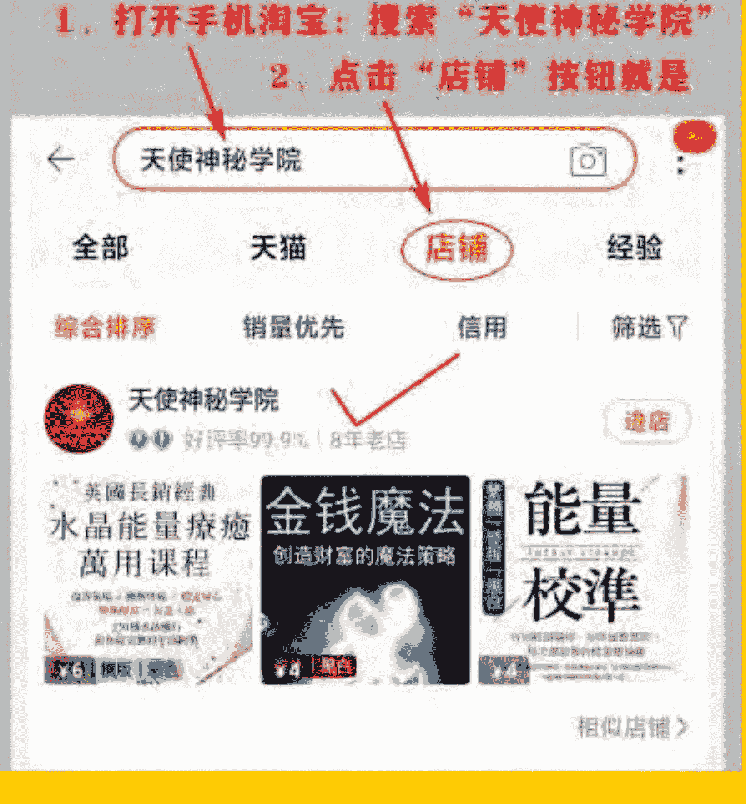
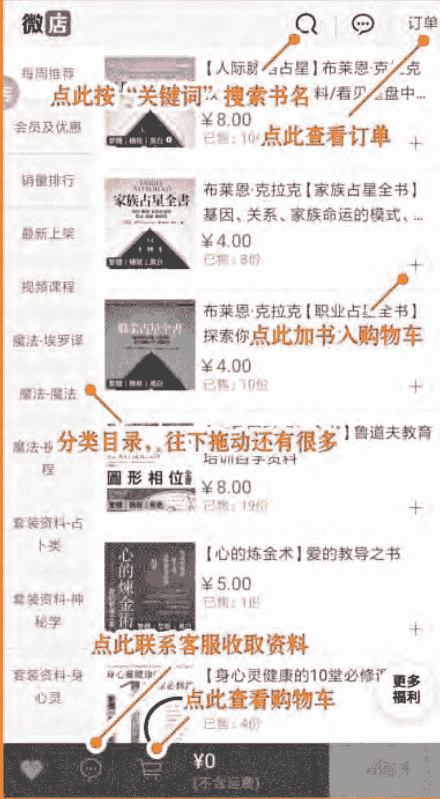
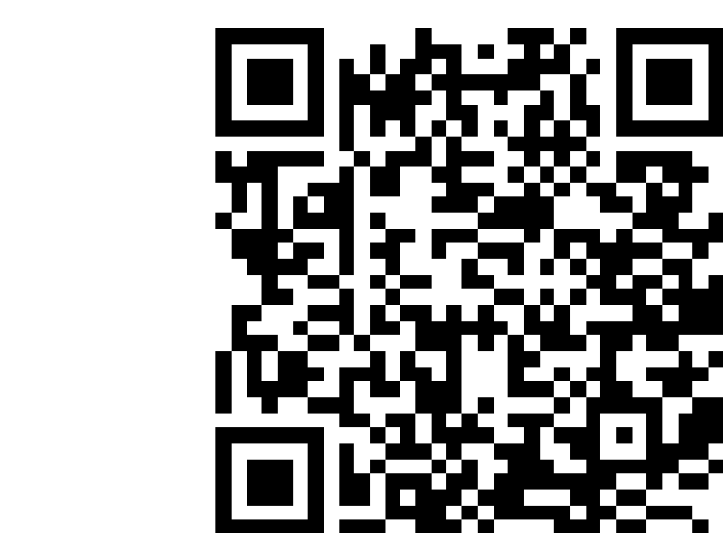
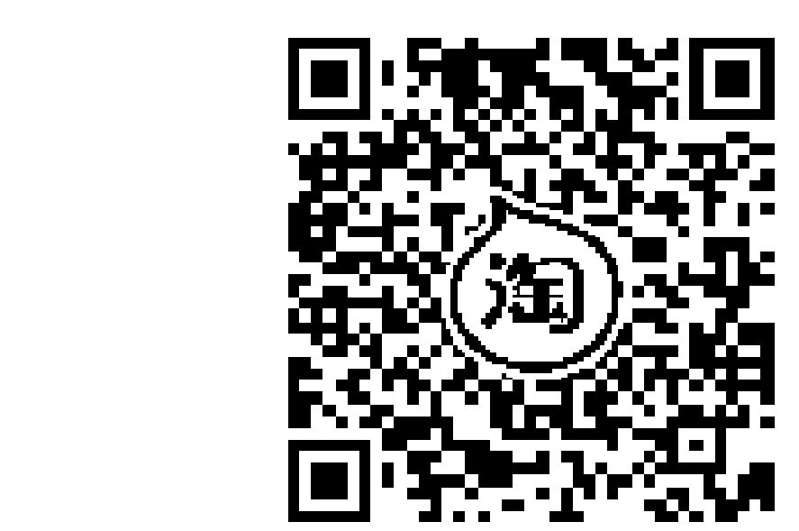
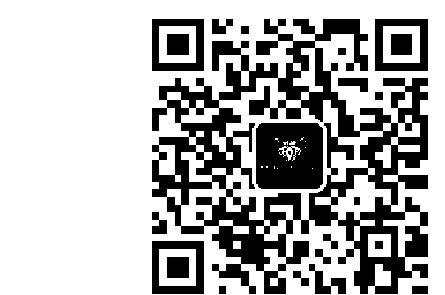

# 2014「今日之神」
## 走出靈性文盲
### 人類文明的第四次轉化

2003 Tomorrow's God
Part Two:
The 4th Transformation

宇宙造物主 親自解說
尼爾·唐納·沃許著
Jimmy 譯

一本值得我們和後代子孫一再閱讀的鉅著！

聽神解說：讓今日世界成為一個和平、和諧、喜悦與豐盛的多元社會，真正行得通的關鍵是什麼？今後必然崛起的新觀念有哪些？這些觀察建言與智慧，能幫助我們看見「生命以及生命如何運作」的更大真相！

福利公告：

凡在【天使神秘学院】购买任何电子资料赠送实体书，详情请咨询店铺客服！

备注：如客服不知道这活动你可能进了盗版店铺！

赠书活动仅在以下正版店铺购买有效哦！

## 【天使神秘学院】淘宝店

手机淘宝扫以下二维码

## 【天使神秘学院】微店

手机微信扫以下二维码

## 制作说明：

本书由《天使神秘学院》出重金从台湾购入的原版书籍扫描制作完成。为达到最好阅读效果，特地把书全部切开后，再经由专业扫描设备高精度扫描完成，并经过一张张的PS后期处理最终成书，其间花费大量的人力、物力以及时间，只为能给大家提供经济并优质的神秘学学习资料而努力。

本学院强力谴责某些机构和个人，把本学院花心血制作完成的电子书籍，包装后直接放在自家网上低价倾销的行为，以谋取不劳而获的经济利益。如果长此以往最终将无人愿意再为大家花心思制作电子书，那以后可能大家再无新书可读。

为让大家以后能够读到更多的好书，也为了本学院的良性发展。本学院恳请大家尽量做到如下几点：

-   一、尽量在天使神秘学院的官方网站购买电子书籍。

官网访问地址：[http://www.ac2011.cn](http://www.ac2011.cn)
短网址：ac2011.cn
网址含义：(Archangel College 成立时间：2011年)

手机微信购买
请扫以下二维码

手机淘宝等购买
请扫以下二维码

加店长微信号
请扫以下二维码

-   二、在收到电子书后小范围传阅即可，千万不要公开传播，更别挂到网上低价销售。

同时为答谢广大支持者，学院电子书将做如下调整：

-   一、学院会把一些早已收回制作成本的电子书折价销售。
-   二、最新制作的电子书籍会开放打印功能，大家购买后有条件的可自行打印成书。

天使神秘学院
2021年3月

(2003「明日之神」Tomorrow's God, Part Two)

2014「今日之神」第二部

## 走出靈性文盲
: 人類文明的第四次轉化
### THE FOURTH TRANSFORMATION

宇宙造物主 親自解說
尼爾·唐納·沃許 著
Jimmy 譯

## 导读序言

## 2014

## 「今日之神」

## Part Two

## 走出「灵性文盲」：人类文明的第四次转化

### 1 生活中所有领域，都是灵性的展现
14

### 2 倡导「灵魂才是主人」的全民觉醒运动
30

### 3 听神谈「政治」—今日之神与真实生活
58

### 4 听神谈「经济」—重新定义财富
96

### 5 听神谈「教育」—孩子与子孙们将面对的冲击
122

### 6 听神谈「关系」—与外在世界的各种关系之道
156

## * 九本『宇宙造物主親自解說』的《與神對話信息》系列書籍一覽表

### 7 聽神談『性』與『靈性』
188

### 8 聽神談『開悟』—人類的開悟之道
206

### 9 揮別與歡迎同一個神
232

> 你的靈魂知曉關於你的每件事，它知曉你的過去、現在與未來。它知道「你是誰」，以及你在尋求成為怎樣的你。它親密地熟悉我，因為它是我那最接近你的部分。
>
> 靈魂是神最接近你的那個部分。這是真實的。所以，要認識我，你所須要做的只是去真正認識你自己的靈魂。
>
> ——摘自《與神為友》——

## 人類進化已邁入「無法避免巨大轉變」的階段

當一群人發現自己處在日漸明顯的致命危機裡，而他們也已經嘗試過數百種不同的努力方式，但總是無法讓他們真正地脫離危機。假如這個時候，有人送來一套能讓他們有效脫離危機的指引方法，此人是不是一個善心的智者，或是個騙子（但他提供的指引確實可以化解那致命危機），又有何關係？

這比喻正像我們和這位自稱「宇宙造物主」的老兄之間目前的處境。祂提供了相當完整的觀察建議給我們，但許多第一次聽到或接觸到《與神對話》的人，想到的經常是「那是神嗎？是哪一位神？是誰所信奉的神？」

這個問題當然常在對話中被尼爾提出，其中一次神幽默地反問：難道你們還能想出更好的生活之道嗎？在面對所有這些全球大災難的悲慘情況和預言時，難道你們還能得到更好的忠告嗎？

這位智者透過尼爾在清醒的意識下，以「自動書寫地回答」尼爾的提問及「自動書寫地問答」的方式，傳遞了九套「親自解說」的觀察建言資料，提供了我們珍貴的參考資訊與忠告，內容從關於個人日常生活的議題到全球的危機、宇宙的奧秘、到死後生命如何運作、生命的更大真相、意義與目的等。

在論及全球性的議題方面，從《與神對話Ⅱ》到《2014今日之神》，神一再重複告訴我們，人類的演化已進入一個巨大的轉變階段，許多社會上普遍的「核心觀念」將受到顛覆性的挑戰。例如人們對於道德、是非對錯、富有的定義、教育關注的重點、國家主權、民主政治等等的認知，都將逐漸發生定義和認知上的轉變。特別是對於神、對於生命和對於靈性的認知，必定會遭遇到一種「觸及更大全貌的真相，而產生更完整定義」的重大衝擊。

這是因為人類在地球上的演化，已走到必定會遭遇這些衝擊的階段。就像一個已經脫離幼兒期的孩童，他成長的過程已經到了一個「必然面臨一些無可避免轉變之衝擊」的階段。

成長是生命必然的現象，進化是一種無法避免的轉變，它是個「遲早」的問題，不是「會不會」的問題。而它已經在地球上加速發生了。

進化所趨的方向永遠是「看見生命的更大真相、走向自己的更大真理」，它是個「逐漸憶起深藏於我們內心的智慧」的過程。當人類還處於進化的「幼兒階段」時，這個過程總是迂迴、緩慢，並充滿著痛苦、災難、衝突和迷惘。但如今地球已邁入「脫離幼兒期」，轉化已在加速發生，我們可以選擇走一條較少苦難並能較快走出無知的途徑。而整套「與神對話」信息，就是引導我們看見「生命以及生命如何運作」的更大真相的最佳參考資料之一。

成長、進化或稱演化，本質上是一個過程，但人們經常誤把「過程或過程中產生的現象」當成「目的」或當成「原則」。過程是人們可以控制的，目的和原則卻是人們需要跟隨和遵守的。也就是說，演化並非一個人類只能跟隨或必須遵守的過程，而是一個人類可以「有意識地加以改善和控制」的過程。在《與神對話III》裡神指出：不了解自己能控制自己演化過程的物種，是將自己降格為自己演化過程的旁觀者（observer of its own evolution）。也就是說，認為自己只能觀察，無法改變。

例如，物競天擇、適者生存的觀念是個受到許多人深信，也是我從小被教導的「真理」。但在我讀了「與神對話系列信息」並探索其意思後我才覺察到，適者生存事實上只是演化「過程的現象」，並非演化的「原則」。這之間有極重大的差別和意涵。其意涵是，我們可以不把「過程」和「原則」混淆，可以有意識地選擇適合自己的原則，可以進入「有意識的演化」（conscious evolution），可以成為自己演化之控制者。也就是說，我們可以幫助自己和幫助我們的社會，以選擇一條較少苦難並常充滿著喜悅、平靜與富足的「演化原則」，這也是我認為「與神對話信息」可以為大家帶來的莫大貢獻與禮物。

滿喜悅的途徑，較快地走出無知、走出靈性文盲。像這樣的珍貴意涵，通常是我們在「所經歷的悲慘、衝突、災難、迷失和痛苦還不夠多」之前，幾乎無法看見和了解的更大真相。

這就是「與神對話信息」的價值——以非常平易近人的現代文字，幫助我們看見生活中、人生中、生命中和宇宙中的更大真相——只要我們願意敞開心胸地探索它，並嚴格檢驗它。

今日人類需盡早覺知，並需勇於面對的首要真相是：每一個人都是「身心靈三個面向同時在運作的生命」（3-fold being）。這是我們的真實面相，但我們卻經常忽視自己靈魂的部分。如今人類已經進化到「必定會面對此一真相」的階段了，人類已經演化到無法再忽視「靈魂是自己非常真實的一部分」的時代了，也就是所謂「靈性覺醒」的時代。

靈性在地球上全面覺醒的時刻已經開始了。每一個人遲早都會發現自己的「靈魂」才是自己真正的主人，才是身心靈三合一組合中「孕育人生中的一切際遇」的老大。雖然我們可以繼續忽視它，我可以拒絕面對這個真相，像個拒絕面對成長的小孩般，但我頂多也只能忽視到我物質身體即將終止運作前。個人的靈性覺醒是如此，社會的靈性覺醒是如此，全球的靈性覺醒也是如此。

事實上，觀察出情況的真相是什麼？(What is so?)，並積極尋求什麼是行得通的方法？(What works?)，這就是所謂的「靈性覺醒」的開端。

「Worlds?），這一簡單的觀念正是一種高度進化文明的思維和表現。」

從觀察人類生活中各主要問題——包括個人問題（如健康、財富）、社會面向（如政治、教育）和全球議題——的角度，神曾多次指出（如本書第三章）問題是因為：人類在許多方面有一大堆混淆不清的信念（a bunch of mixed-up beliefs）。而這些混淆不清的觀念主要來自人們對於精神性（即靈性）的忽視與無知。

靈性文盲（spiritual illiteracy）、功能性文盲（functional illiteracy）和重新定義神（redefine God）這三個名詞，都是神在這本《2014今日之神》對話中的原文用語，是神觀察人類「今日所面臨並最需被正視的問題」所提出的一些關鍵重點。在一系列神的觀察建言裡，祂不斷從各種角度告訴我們：人類現在若要走出文明毀滅的危機，並達到世界真正的和平與和諧，就必須重新了解「神真正的本質」，盡快脫離「靈性文盲」，並擁抱「新靈性」——可以讓當今世界、讓我常生活在和平喜悅中，更行得通的靈性（spiritual）觀念。並且，盡快把「新靈性」的觀念落實到日常生活的大層面裡。

那些自古流傳下來的靈性觀念，或稱舊靈性觀念，主要是適用於當時的社會民情、當時的社會制度、當時民眾所深信的價值觀，以及當時民眾對神和生命的信念。那些舊靈性觀念流傳至今的教導

並非不對或不好，只是它們已經不適用於現代社會了，更無法對生活在21世紀的我們產生有效的幫助。就像神在本書第一章所用的比喻：「你無法用西元一世紀的醫療工具，在一間二十一世紀的手術房開刀。」

「新靈性」所講的正是：能讓今日世界成為一個真正和平、和諧、喜悅與豐盛的多元化社會，行得通的靈性觀念。

本書延續第一部的議題範圍，神透過與尼爾對話的方式指出，人類在地球上的演化正面臨著上述的巨大轉變，已進入了「人類文明進化第四次的大轉化」期。並舉出了在「新靈性」的日子裡，人類社會在「政治」、「經濟」、「教育」、「關係」和「性」等主要面向上，會帶來哪些顛覆性的新觀念？而這些「新觀念」會對我們的社會帶來怎樣的提升？會創造怎樣的價值呢？

歡迎參考這份值得反覆探究的對話和註記說明，一窺人類文明進化第四次大轉化（the fourth Transformation）後的新世界！

2014年7月於台北
Jimmy

人類無法以西元一世紀的指導方針，在解決二十一世紀的困境——更別說是用比那更早以前的指導方針。

這像是，以西元一世紀的醫療工具，在一間二十一世紀的手術房開刀。

一切都取決於你們有沒有聽進那召喚，人類的靈魂今天仍在大聲召喚：「誰願意加入擴展人類意識的人道團隊？」這是個一致的努力、是個共同的創造、是一份共同的承擔。

生活中的所有領域，宗教、政治、經濟、教育、性、富裕、健康……沒有一個不是「你對於生命本身所深深相信的東西」的展示。

在過去數千年人類演化過程中，社會的所有領域都已經有過徹底性的變革，除了宗教，除了人們對靈性（spirituality）的了解。

## 第一章

New ways for you to experience Life

### 1 生活中所有领域，都是灵性的展现
(New ways for you to experience God)

我之前❶提到凯伦·阿姆斯壮——她是一流的宗教事务评论家——在她划世纪的《为神而战》（The Battle for God）书里，她说：“在十七世纪的启蒙时代，源自神话及崇拜仪式而产生的虔诚信仰会开始崩溃，迫使有信仰的人急切地想抓住表现宗教情怀的新方式。”我在本书中听到的是，同样的事不久就要发生了。是不是？

是的，而且是为了同样的理由。人类对于“昨日之神无法帮助今日世界”❷的集体觉悟，将非常快地达到转变的临界质量（critical mass）。

是的，很快就会有另一波“因崇拜神话而产生之虔诚信仰的崩溃”❸，人类将再次急切地想抓住“表现宗教情怀”的新方式。我想，我曾称这正在来袭的巨大转变为人类文明的“第四次转化”（The Fourth Transformation。

對這議題的探討，讓我回到我朋友杜安·艾爾金的洞見，他在《未來的許諾》（Promise Ahead）書裡寫道：

「人類之前面臨過這種如此徹底地轉化我們對自己實相的看法（view of reality），以至於它創造了我們對自己的感受、對我們與別人的關係，以及我們對宇宙的革命性看法，共有三次這樣的大轉化。」

第一次轉化……發生在距今大約二萬五千年前，當人性意識首度『醒來』的時候……第二次……從大約一萬年前，當人類從遊牧式的生活轉變到一種較為穩定的生活，定居在鄉村與農場裡。

到大約五千年前，還屬於這第一次轉化的一部分，我們看見城市和國家的興起，以及我們如今所知道的文明的開始。杜安說：『第三次我們感知得到的大轉化，發生在大約三百年前，當農業社會的安穩步調，開始轉變成科學工業時代激進的物力論（dynamism）和唯物主義。』

每一次，人類普遍的生活型態改變時，生活中的所有面向都隨之改變，包括人們所做的工作，生活在一切的方式，彼此相處的方式，以及他們如何視自己在社會裡的角色，以及自己在宇宙裡的位置。」這些聽起來完全像是你說的「當人類擁抱今日之神時」會發生的事。

是的，你完全抓到重點了。嗯，實際上，是杜安。我做的只是延伸他的邏輯，而稱這種靈性的覺醒為人類文明進化的「第四次轉化」(the Fourth Transformation)。這是一個姍姍來遲的徹底變革 (revolution)。正如我們之前注意到的，在人類社會演化過程裡的所有事物，似乎都已經有過徹底性的變革，除了靈性 (spirituality) 之外。科學已經進步到讓人們驚奇的程度。醫學已經進步到延長人類壽命到我們難以想像的程度。科技已進步到把人類彈射到「我們對自己所創造的東西之理解與處理能力」的邊緣。政治、經濟、工業和藝術——每樣東西，真的是每樣東西，都進步了，除了宗教，除了我們對靈性的了解，仍還停留在幾千年前的情況。

而結論是：

人類無法以西元一世紀的指導方針，來解決二十一世紀的困境——更別說是用比那更早以前的指導方針。這像是，以西元一世紀的醫療工具，在一間二十一世紀的手術房開刀。

今日的道德、倫理，及社會的挑戰，無法用十八或十或六世紀的理解和教導來解決。那些教導和理解並非「錯的」，它們並不是「壞的」，它們只是不完整 (incomplete)。然而，除非你願意確認這點，除非人類能承認「關於神與生命」方面，那些過去所教導與理解的東西是不夠完整的，否則，在你們的星球上，想要長久繼續地過你們已知形式的生活，可能沒有希望 (can be no hope)。

事實上，你們已經放棄了許多地球「以前原有的模樣」。在你們看見更多擺在眼前憂目驚心的情境之前，你們還願意再犧牲多少呢？

但是，有些人認為問題的原因，跟我們在此所陳述的正好相反。他們說，真正的問題是因為我們已脫離了我們的祖先，以及他們的祖先，所流傳下來的理解與教導，而人類需要回到那種古代教誨的傳統智慧，而非離它們更遠。

主張基本教義的人對於你們經典上所有傳統智慧的理解，在許多方面是聰明——卻不完整，因此，在其它的許多方面是危險的。

尊重傳統，但要擴展對傳統的理解④，才是現在的訣竅。那是目前宗教必須做的，如果他們希望在往後的歲月對人類有所幫助——或甚至認為想幫助人類存活下去的話。

尊敬你們的傳統智慧，但要擴展對傳統智慧的理解。這是當人們擁抱今日之神時將發生的事。

所以，這一切將在何時發生，我們能不能說得更明確一點？

就個人的角度，對那些「選擇有意識地創造他們演化方式」的人，演化過程本身將更加迅速地移動。而對那些「在演化過程裡把自己視為觀察或旁觀者⑤，而非參與者」的人們，演化過程將移得更緩慢。

就整體的角度，這過程向前移動的速度，取決於「人類在個別選擇有意識地創造他們的演化過程中，他們多快地找到彼此，以及同意一起共同創造他們的未來的人數多寡，還有人數多快能達到臨界質量」而定。

這也是一個「人類可以控制」的狀況。如果大量的人聚集在一起，創造一個團隊，並選擇去體驗「有意識的演化」(conscious evolution)，人類就能在非常短的時間內，達到臨界質量。數十年，而非上百年。或許甚至不到數十年，而是數年。

這全都取決於你們自己。這一切都取決於你們如何回應那召喚，全都取決於你們到底聽進那召喚了沒？因為人類的靈魂今天仍在大聲召喚：「誰願意加入擴展人類意識的人道團隊（humanity's team）？」

❶ 在本書第一部《重新定义神》的第九章）
❷ Yesterday's God cannot serve today's world 译注：“昨日之神”与“今日之神”是同一个神，有点像“小时候的世界”与“长大后的世界”是同一个世界。本书第一部有完整的说明，两者间的九大差别可参阅第 233 页。
❸ 原文为“因崇拜神话而产生之虔诚信仰的崩溃”，指基于神话故事的宗教信仰体系的瓦解。
④ Honor the tradition, but expand the understanding.
⑤ 指在演化过程中采取被动、不参与的态度。

## 人類最大的致命弱點是：依賴（Dependence）。你們依賴神、依賴政府、依賴社會、依賴宗教、依賴他人，甚至依賴學校。

擁抱「今日之神及新靈性」是一種倡導「靈魂才是真正的主人」的全民覺醒運動。它會將你們從「依賴」中解放。

人類第二大的弱點是：缺乏相互依賴。（lack of interdependence）

「相互依賴」是一種互惠的關係；而「依賴」則是不正常地依靠某樣東西，到達在身體上或心理上成為習慣的程度。

重視「首要價值」、「探索今日之神」並「活出新靈性」的基本功課：

- 走入內心（go within）；
- 鍛煉你的身體；
- 吃得健康；
- 定時地為你的靈魂尋求心靈的啟迪與養分。

## 第二章 A Civil Rights Movement for the Soul

### 2 倡導「靈魂才是主人」的全民覺醒運動 (A Civil Rights Movement for the Soul)

我現在已受到啟發。我想要開始行動。我能夠做什麼？具體地，此時此地，今日和明天，我能夠做什麼？

任何希望認真地探索今日之神，並親自活出新靈性的人，第一件功課就是：走入內心 (go within)。

開始訂出一張每天練習的時間表，去做靜觀 (meditation)、深度祈禱、默默聆聽的練習，無論你喜歡哪一種。你可以現在，當下就開始。早上十五分鐘，晚上十五分鐘，就可以改變你的人生。你們有些人，一輩子都沒花那麼點時間與你的靈魂靜心交談 (quiet communion with your soul)。

第二、鍛煉你的身體。你的身體如果一整天都是笨重的話，你的頭腦就無法充份和輕易地接收到新的東西。如果你沒有一個定期的運動養生方式，那麼，現在就建立一個。這是你在接下來二十四小時之內可以做的事。每天花二十分鐘鍛煉身體，你就能改變人生。你們有些人，一輩子都沒花那麼點時間在有決心的身體運動上。

第三、吃得健康。你正以你所攝取的食物在鈍化你的頭腦，並扼殺你的身體。這種影響是緩慢而潛伏的。直到疾病的發生時，你們才會知道，然後想逆轉它就會變得極為困難。

在西方世界裡，有三分之二的人體重過重。你們吃進糖類，吃進澱粉，你們吃進動物脂肪，吃進各式各類「即使在你們星球上演化最成熟的消化系統也無法處理」的東西，而你們便在遠早於你們的身體被設計的存活年限，終止了你們目前形式的肉體生命。不管你們多少次或以什麼形式被警告，你們都不停止，彷彿決心要大吃大喝（或吸煙）到你消逝於人間。

抽煙確實是你們飲食問題中的大問題，因為你們所攝取的是尼古丁，而你的身體直接吸收這種致命的化學物到你的肺裡。它是人類吃進體內最糟的一種東西，因為它在吃掉你——但你似乎並不在乎。你甚至不在乎那些深愛你的人，因為，你寧可讓你的配偶、孩子們和家人失去你，比你被設計的年限還早很多年，只為了你能每天有許多許多次的尼古丁滿足。

在新靈性的日子裡，這將被視為「缺乏靈性紀律」中最軟弱的一種，因為它顯示出對首要價值（The Prime Value）——就是「維護生命」——最可悲的漠視。所以，要開始實踐新靈性，我們所需做的，就是採取一些非常實際的基本步驟——例如，就只是照顧好自己。沒錯！這是起點，因為這樣做就是對「首要價值」付出了注意及尊重。當生命，而非立即滿足和短期利益，成為你的首要價值時，你將知道，你已走出了靈性文盲。

如果你們人類想生存下去的話，那麼，就必須提升「維護生命」的這個簡單觀念。

目前，大多數人類都不想「照顧自己」。他們「要別人來照顧」他們。這就是導致宗教告訴你們要信仰什麼、政府告訴你們要做什么，學校告訴你們要做什么，經濟告訴你們要擁有什么，以及社會告訴你們要做什么样的人的原因。如果有樣東西在捉弄著你們，如果說人類有一個最大的致命弱點，那就是：依賴。（Dependence）

這就是我為什麼稱呼：擁抱「今日之神及新靈性」是一種倡導「靈魂才是真正的主人」的全民覺醒運動。因為它會將你們從「依賴」中解放。

正因為你們依賴，才會被一個不合理的、暴力的神壓迫；正因為你們依賴，才會被一個不合理的、暴力的政府壓迫；正因為你們依賴，才會被一個不合理的、暴力的經濟，甚或一個不合理的、暴力的社會，被一個不合理的、暴力的學校壓迫——你們現在不僅需要教育自己，還需要防禦自己。人類第二大的弱點則是：缺乏相互依賴。（lack of interdependence）等一等。你說我們最大的弱點是「依賴」，而我們的第二一個弱點是「缺乏相互依賴」？這聽起來好像有點矛盾？因為你們認為「依賴」與「相互依賴」是同一回事。但它們並不是。「相互依賴」（或相互依存）是一種互惠的關係；而「依賴」則是不正常地依靠某樣東西，到達在身體上或心理上成為習慣的程度。很多人不正常地依靠（reliant on）他們的宗教、他們的政府、他們的老闆、他們整個的社會結構。將這些依賴或依靠的結構拿掉，他們就完全沒辦法去面對挑戰、克服阻礙、解開僵局、解決問題，甚至做出決定。他們總認為自己有一些「無法靠自己力量得到滿足」的需求。這就是昨日之神鼓勵他們去想像的東西，以讓許多人變成需要依賴祂。今日之神不會鼓勵這種事。事實上，今日之神會說：「你們不需要我；你們不需要需要宗教；你們不需要政府；你們不需要你們的社會結構。那些都只是「你們的工具」，而你並不是「他們的工具」。要為你們的方便而使用他們，不要為他們的方便而被他們利用。

但每個人都需要某個人。在生命的公式裡，肯定有需要某個人的空間吧！

你們相互依賴，傳達的意思是沒有人能單獨存在——沒有人是一座孤島（no man is an island）。但，你們依賴，傳達的意思是你們需要自己之外的某個特定對象。當我們講到「與外在世界的各種關係之道」。這議題的時候，我們會再對此多談一些。現在，你問我「探索與實踐新靈性」應採取什麼樣的步驟。我已給你三件可以馬上去做的事了。還有第四件。是什麼？

定時地為你的靈魂尋求心靈的啟迪與養分。找出一個方法去認識——也就是說，去重新認知，去再次認識——所有生命的神聖性，並去榮耀那神性，以及被神聖啟發的東西。

以你們覺得適合自己的方式去進行這一點。

定時去教會、廟宇、清真寺、猶太教堂或心靈教室，如果那是你找到你神聖啟發的地方的話。然而，不要在那裡不問問題，要在那兒探索議題，要在那兒探索選擇。如果你心裡出現矛盾，別害怕反駁那裡的教義。別囫圇吞棗，別只因為別人所說的就接受，也別因為「跟著群眾走」是最容易做的事，而就從眾。

關於崇拜的場所（house of worship），要記得：神不需要「被崇拜」，這一點今日之神必定會表明。因此，何不將這些場所改名為「崇敬之堂」（House of Reverence）。人類現在會受益的是：完全看清「表達一種對生命的崇敬」以及「崇拜一個實際上在結束生命，並在召喚其他人也這樣做的神」，是兩種極大不同的經驗。這是今日之神與昨日之神之間的差別。萬一我到一間崇拜的場所，那裡人們尊敬的神是一位在使用殺害做為解決衝突的方式，並以無止盡折磨的威脅做為一個控制群眾的方法，和我靈魂深處的某個東西相互矛盾，使我無法忽視的話呢？那麼，就找一個新的地方與新的方式，去體驗你本性固有的「對所有生命的崇敬」。

每天都給自己時間去與自然界親密交融，或在安靜的環境裡自處。或許聆聽好的音樂，或讀詩或古典文學。或以某方式與生命——也就是被表達呈現出來的神——的奇妙连接。你或许希望创造一个定期的阅读方案——告诉你，一个月读两本以上的书。至少你可以确定在你拿著这本书时，你就已经开始在这样做了。那么，你可以说这是一件「今天此时此地」你已在进行的事。嘿，太棒了！——所以我已经开始上路了！那么，别停止。别让这本书变成开始和它的结束。如果你真的想探索与实践新灵性，就让你自己去熟悉许多「新灵性在外在世界的表达」。去教育你自己。首先，去明瞭那些表达是什么。其次，看看那些表达中的任何部分，是否与你自己的内在真有共鸣——或带你更靠近它。这意味着，如果你从未去过一间犹太教堂，或一间清真寺，或一座天主教堂，那就去探索其中一间。去看看那裡在进行些什么。如果你从未了解在基督教公谊会的贵格会（Quaker）的聚会是如何运作，去看看，看看那裡在进行什么。如果你不曾了解大同教（Bahá'í）信仰是怎么回事，去发现看看。如果你从未静坐或静观过，去试试看；如果你从未祈祷过，去试试看；如果你从未以禁食做为净化身体的方式，去试试看。观察看看做这些会对你的心智、你的身体、你的灵魂有什么影响。

閱讀、閱讀、閱讀。大肆閱讀一番吧！以便你能明白，所有的老師及所有的源頭，都在為「共同創造人類對於今日之神的認識與了解」帶來些什麼。

你會從哪裡開始呢？

外在世界有那麼多資訊！很難知道該從什麼地方開始。

- 布萊德·布蘭頓（Brad Blanton）的《坦誠對神》（Honest to God）
- 狄巴克·乔布拉（Deepak Chopra）的《看见神——认识神的七种面貌》（How to Know God）
- 拉姆·达斯（Ram Dass）的《岁月的礼物》（Still Here）
- 韦恩·戴尔（Wayne Dyer）的《每个问题都有个灵性上的解答》（There's a Spiritual Solution to Every Problem）
- 杜安·艾尔金（Duane Elgin）的《未来的承诺》（Promise Ahead）
- 一行禅师（Thich Nhat Hanh）的《佛法之心》（The Heart of the Buddha's Teaching）
- 托姆·哈特曼（Thom Hartmann）的《古老阳光的末日——拯救地球的资源》（The Last Hours of Ancient Sunlight）
- 罗伯·海莱因（Robert Heinlein）的《陌生地的陌生人》（Stranger in a Strange Land）
- 海洛·韩德森（Hazel Henderson）的《打造双赢世界》（Building a Win-Win World）
- 伊斯特与杰瑞·希克斯（Easter and Jerry Hicks）的《有求必應》（Ask and It Is Given）、珍·休斯頓（Jean Houston）的《跳轉時空》（Jump Time）、芭芭拉·胡巴德（Barbara Marx Hubbard）的《你正在改變世界——有意識的演化》（Conscious Evolution）和杰拉德·詹波斯基（Gerald Jampolsky）的《人生的橡皮擦——用寬恕抹掉過去的傷痛》（Love is Letting Go of Fear）。
- 戴芙妮·金瑪（Daphne Rose Kingma）的《創造真愛》（The Future of Love）、李承憲博士（Dr. lichi Lee）的《腦呼吸》（Brain Respiration）、麥克·勒納（Rabbi Michael Lerner）的《靈性才是王道》（Spirit Matters）、瑪麗·莫莉希（Mary Manin Morrissey）的《毫不遜色之偉大》（No Less Than Greatness）、韋恩·馬勒（Wayne Muller）的《學習禱告》（Learning to Pray）、傑克·理德（Jack Read）的《下一個演化》（The Next Evolution）、堂·米格爾·路易茲（Don Miguel Ruiz）的《讓心自由——托爾特克智者的四個約定》（The Four Agreement）、強納森·薩克斯（Rabbi Jonathan Sacks）的《差異之尊嚴》（The Dignity of Difference）、勞勃特·狄奧巴（Robert Theobald）的《社群時代》（Reworking Success）、艾克哈特·托勒（Eckhart Tolle）的《當下的力量》（The Power of Now）、瑪麗安·威廉遜（Marianne Williamson）的《每日的恩典》（Everyday Grace）、波羅摩漢娑·瑜伽難陀（Paramahansa Yogannanda）的《Everyday Grace》。

位瑜伽行者的自传（Autobiography of a Yogi）和葛瑞·如可夫（Gary Zukav）《新灵魂观》（The Seat of the Soul）。
并非所有的这些人都被归类为所谓的「灵性书籍」作者，但全都与「新灵性」在地球上反映出的「新的思维及存在方式」有关。我在此推荐的书名，并非是这些作者值得一读的唯一书籍。例如玛丽安·威廉逊的任何著作，几乎都可以帮你打开心智、疗愈心灵，及抚慰灵魂。

我也相信，并非毫不谦虚地，藉由阅读「与神对话」系列的书，可以获得很多洞见。《与神对话二》对当今世界有许多非常切题的洞见，也以非常实际的说法，谈到灵性原则在日常生活中的应用。《与神合一》里谈到的是人类的十大幻觉，以及在《与神对话之新启示》里的九个新启示，都是「新灵性」奇妙简洁、精彩清晰、不可思议的有力声明。
我知道，还有其它许多非常特殊、许多非凡深奥、许多有丰富智慧的作者和老师们，他们的名字也应该被包括在这里。

你是否同意这些作者说过的每件事呢？
不，当然不。我并不想同意每个字及每个声明。我认为那是一种心智上的草率。

然而，许多人的确相信一些能提供他们心灵粮食的书里，所讲的每一字和每一句陈述。

对不起，我认为那是危险的。那可能创造出对每个字的狂热信奉，及每个段落的死板诠释，最后导致一个如此封闭——而非打开——的心智反应，将灵性启示的过程削减到只是个「一路在记忆」的过程。

但你不是说，这些书是「经由启示而写出的神的话语」（inspired Word of God）吗？

是的，但它们是被人类写出来的——有些不只被一个人——而许多还曾被翻译成多种语言，被「更新」及被修正过。

当然，我们所有宗教的传统圣书，也都在刚才所列出的名单中，因为它们包含着伟大的智慧。不过有个可悲的事实是，有许多宣称自己以这些书所讲的智慧过生活的人，并没有从头到尾读过这三本书。

在研究过这些圣书，以及其他的一些经由神圣灵感带给人类美好的教导之后，我相信，如果我们以同样的态度，应用在刚才那些书上，将对我们大有助益。这些书的每一章、每一句都该被放在下面这个简单的测试下来检验：

这想法行得通吗？这是支持生命和维续生命的吗？这有助于疗愈人心吗？它可以创造和谐吗？测试之后，每个人应该自己打定主意，依照自己的权威行事，靠自己内在的智慧，去达到自己的结论。

并且要记得，即使是一个你不同意的观点，也可能带你更接近你的内在真理。

我（在第一部的最后一章）说过，视每本书都是神圣的，每位信使都是神圣的，我的意思正是你讲的这个脉络。因为生命、人生与生活中的一切，都是为了「让你回到你内心最深处的真理」而被创造来的，只要你容许它，它就会那样运作。⑨

生命会将你对「你内在的真理」打开（Life will open you to what is true inside of you）。所以，祝福生命，以及在生命、人生与生活里的每件事。别谴责你不同意的东西，或评断它为无价值。别谴责它不得体、无用或不神圣。因为我要再说一次：每件事都是神圣的，都在引领你到你内心最深处的真理，每件事的确都在引领你到那儿。⑩

你不同意你现在在读的每个字吗？或是几乎同意在这本书里的每句话吗？很好！那么它已达成它的任务。因为这对话的目的，并不是要说服你任何事，却是将你带回给你自己 (to return you to yourself) 去与你最深的真理重新结合，去召唤你到更深的了解，并带给你更大的明晰——而这对话的创造者不在意那怎么发生。我（在2003年）曾说过，在某个非常近的「明天」，人类将心甘情愿地拥抱一个对神与生命的一个被扩展、被放大的观念。这是真的，这已经在发生。它在你我们现在所知的宗教上，已开始产生了巨大的影响。那「看起来」会像什么？当今日之神被拥抱了，宗教将在几个根本的基础上发生改变。在新灵性的日子里❶，你们现在的宗教组织，将会停止彼此的攻击与对抗。它们将停止在细节上争执。它们将停止对彼此的谴责，及告诉彼此的信徒，他们将下地狱。它们也将停止做另一件事情，而这件事非常重要。停止做哪一件事？在新灵性的日子里，你们目前已成立的宗教组织，将停止认为它们自己拥有全部的答案。他们将承认，毕竟，他们并没有所有「关于神和关于生命」的完整资讯。他们将公开承认，对于神，他们可能有些地方不够了解——而这些更完整的了解，将可以改变一切。

> 约翰·丹布列顿（John Templeton）爵士称这为「谦卑神学」（humility theology）。

这描写得很切题。这是能让今日世上的神学受益匪浅的东西——当地球人拥抱今日之神时，它将是你们大部分排他性的宗教组织所采纳的态度。

刚开始，这会是缓慢地发生，然后会像一缕新鲜的微风扫过大地。更多的国际会议及议会会被召开，就像是那些近年来已经在开的会议，邀请全世界的宗教代表在一个地方，共同探讨相互尊重与合作的途径。

我知道现在已经有一些这类的努力，例如联合宗教倡议（United Religions Initiative ⑫）。

在这些重要的聚会里，讨论的将不是聚焦在消除宗教之间的差异，因为他们已经认识到「灵性的多元表达」是一种赐福，而非一种问题。因此他们会将焦点锁定在去寻求尊重这些差异的方法上，看看是否能透露给人类更多关于「神的全部」（the Totality of God），并寻找看看这些不同的观点的组合，是否能产生一个大于其部分之总和的「整体」

当然，那将需要那些宗教愿意对于之前互相否定或反驳的教义不计前嫌才行。

那正是已开始在发生的事。来自不同信仰的神学家与老师们，开始在清理他们各自的教义，故意地寻找矛盾之处，然后更加深入钻研那些显然相冲突的真理，去看看是否可以发现一个更大的真理（a Larger Truth）。往往在矛盾的交叠里，会发现一个伟大的和谐（a Great Harmony）。

> 要记得《与神对话》告诉你们的「神圣的二分法」——两个显然矛盾的真相，可以同时存在于同一空间里。

是的，我的确记得，每当我面对关于任何事的相反观点，或面对显然矛盾冲突的真理时，这一洞见都曾对我很有帮助。我已明白，如我父亲曾告诉我的：「儿子，每个故事都有它的两面。」我已经学到，一个人并不需要是「错的」，以便使另一个人是「对的」。

这是个成熟的迹象，大多数人随着年岁的增长，终究会来到这里。他们开始看见，他们并不是住在一个非黑即白的世界里，还有很多层次的灰，而如果只坚定地站在一个「二选一」的位置，很少会对任何人——尤其是对生命——产生有益的帮助。
你们并非活在一个「二选一」的实相里。实相是「两者皆可」。

然而，虽然许许多多的人类，例如你们的父母，经由变得成熟的过程，足以开始了解这些，但在你们星球上的宗教却比较不能拥抱这个智慧。相反地，大多数最大型的宗教一直都固执地拒绝放弃它们「二选一」的范型（"either/or" paradigm）。这是即将会发生的戏剧化转变之一。因为你们的宗教将在新灵性的日子里，接纳这些更大的理解。

但那时候宗教就不会主张任何事了吗？如果他们主张每一件事，那它不就等于什么都不主张了。我这样说有没有道理？

就你们现在的观点，这完全合理，因为你们仍稳定地站在「你们认为的非黑即白的世界」里。然而，如果说「宗教主张每一件事，那宗教便什么都不主张」是真实无误的话，那么，神便什么都不是，因为神是每一样东西。

这一点刚好是宗教所争辩的。至少，他们之中的一些人会争辩说，一个「是一切事物、是所有的人及所有东西的神」，几乎比「根本没有神」更糟。

他们说，实际上这是个派来误导人们的假神。他们说，不，神必定主张些什么。神必定是「这」而不是「那」之类的。

然而，如果神是「这」而不是「那」，那么，就必得有个「非神」的东西存在——而这样的东西是不可能的。

了解以下这点，你将了解关于今日之神的每件事：没有东西存在，也无法存在，于神之外的领域。(Nothing exists, nor can exist, outside of God.)

在新灵性的日子里，你们现在已成立的宗教，将停止宣告「某些东西能存在于神之外」。

他们将完全采纳他们自己的教义——全能及无所不在的神，他们会说「神是无所不在的」，而现在，他们真的是那个意思。

在今后的日子里，人类将在「大神」和「小神」⑮之间做选择。大神是每样东西的神；小神是有些东西，却非其它东西的神。

在小神的世界里，神是所有正面东西的源头，而魔鬼是所有负面东西的源头。这是你们主要的排他性的宗教组织，在你们受限的思维脑海里，用来解决你们所谓「正面与负面的二元性」问题的办法。

当你们否定在任何东西里的善时，当你们否定任何东西的完美时，你会视之为负面。在这里面，你想像你看见了魔。哦，我刚想到：撒旦（SATAN），即「视任何东西为负面的」（Seeing Anything As Negative）。是的，那是个很好的英文头字语（acronym）。它可帮助你们了解，撒旦并非以人的形式存在。撒旦只是一种心智状态⑯。我曾跟你们说过很多次：「看见完美」（See the Perfection）。我曾告诉你们：「所有的事情都是完美的」。当你否定了宝贵的东西——即在生命里的每样东西——那么你就否定了我。你就否定「存在于所有东西及每一刻里的神」。所以，我们可以说，魔鬼（DEVIL）是：否定生命中每样有价值的东西（Denying Everything Valuable in Life）！当我们否定神的完美，称生命里的任何东西为不完美，我们就把它给颠倒了，我们把人生颠倒过来了，「人生」（lived）反过来拼就是「魔鬼」（devil）！喔，既然你这么有兴趣创造文字游戏，何不也给「神」创造一个头字语？

好吧……神（GOD）是克服否定（Getting Over Denial）。当你克服了「否定每样东西都是完美的」时，你即是神。当你克服了否定你是神时，你在那里当下，即是神。所以，神是「生命克服了否定它自己」（Life that has Gotten Over Denying itself）。

真不赖。你做得一点都不差。事实上，这个头字语相当合适。因为，当你停止否定你自己，停止否定你真正是谁时，你就会变成那「你真正是谁」——你与今日之神成为一体。

因而，你进入了一个抉择的时刻。你与整个世界都将在「大」与「小」之间做出抉择，因为所有的生命，都是个在宏观与微观之间、在生命本身之最大与最微小的表现之间的移动❶。它是个钟摆的过程，一个吸入和呼出的过程。

你是在控制这呼吸过程的人。你可以深深吸一口气，大大地扩展，或你也可以很浅地吸一口气，在你开始收缩之前，只扩展一点点。

人类一直处于这个「扩展」的过程。扩展你们的意识，扩展你们的觉知，扩展你们的存在状态（state of being）。然而，现在人类在做一个决定，而整个人类种族正在集体地屏息观察。你们在问，我们要比现在变成更长远，又更丰富，或我们要开始变得更短促而稀少？我们要吸入更多空气，更多生命能量，或是现在要停止扩展，开始呼出我们吸入的空气，放掉我们收集的生命能量，最后重新开始整个过程？我们要膨胀或紧缩、要扩张或收缩、要变得更大或变得更小？

你们的医生称吸气（breathing in）的动作的「吸入扩张（inspiration）」⑱，这并非巧合。

所以，你们要选择灵感启发或到期终止（inspiration or expiration）？你们要选择吸入或呼出呢？

永远是这抉择，永远是这决定，那是永恒存在诸神们的进退选择⑲。

灵感和启发是吸入的动作，吸入更多空气，放进更多生命能量。当灵感和启发停止时，期满终止便随之发生⑳。

这就是目前当今的情况——由于灵感和启发停止了，所以人类正迈向死亡的边缘。

事实上，在某些方面，我们已经开始觉得变少了。我们已开始缓慢却明确地在破坏我们的地球家园。我们已开始缓慢却明确地在我们的生活方式。然而，在其它方面，又仿佛我们是在扩展，我们是在吸入。每一分钟，我们吸入越来越多生命的本质，及生命能给我们的东西。我们是在扩展我们对每样东西的知识和体验。

> ⑱ inspiration 的意思有：灵感；启发、鼓舞、唤起；吸入、注入让人扩张的东西。
> ⑲ that is the eternal dilemma of the gods
> ⑳ Expiration occurs when inspiration has ceased.

不尽然。（Not quite.）不尽然？什么意思？你们在每个领域都扩展了你们的知识及经验，除了一个地方之外。如你已经指出的，有一个领域没有进步。

我们的「信念」。没错。你们仍然紧握着你们上百年、上千年以前所保持的基本信念。

然而，现在你们必须在小爱与大爱之间，小生命与大生命之间，小神与大神之间，小自由与大自由之间，小喜悦与大喜悦之间，小智慧与大智慧之间，小世界与大世界之间，做出选择。

现在，你们必须选择你的小想法或你的大想法（big idea）。如果你们在所有这些事情里选择后者，绝不会错。但每个人都将挑战你，每个人都将质疑你，每个人都会说……

「嘿，是什么了不起的大事啊？」（What's the big idea?）你将有个机会对他们说：

了不起的大事是，我们全都是一体的（We Are All One）。了不起的大事是，只有一个一体的神（One God），而这个一体的神不在乎你是天主教或新教、犹太教或回教、印度教或摩门教，或根本没有宗教信仰。了不起的大事是，我们所需做的一切，就是彼此相爱，然后在我们世界里的每件事就会自动照料它自己——出於我们彼此关愛的意願。了不起的大事是，我们每个人不比我们任何的其他人更好。了不起的大事是，地球所有的自然资源是属于所有世界上的人，而这与那些资源的位置在哪里——在其土地的上方或底下——无关。了不起的大事是，没有人真的「拥有」任何东西，尤其是彼此，或星球本身——那是我们人类的家乡——的一大块土地。了不起的大事是，自由是生命的本质，而非你赚得或能被赐予的东西，却是你的本是（What You ARE）的东西，任何限制其表达的努力，都是在限制「生命本身」的努力，而生命将在每个层面被灵魂重新创造，直到灵魂——即自由本身——在每个片刻都被完全地表达了。了不起的大事是，爱不知任何形式的条件或限制（Love knows no condition or limitation of any kind），而任何限制其表达的努力，都是在限制「生命本身」的努力，而生命将在每个层面被灵魂重新创造，直到灵魂——即爱本身——在每个片刻都被完全地表达了。
了不起的大事是，喜悦是你们存在的自然状态（your natural state of being），而喜悦最能被充分且迅速体验到的方式，永远是藉由「将喜悦送出去」。

这都是一些了不起的大事，其实还有更多。

这些想法是如此之大，以致小的心智（small minds）不可能接受它们。

事实上，你们都是那「了不起的大事」，你越快理解这一点，你就越快体验到其美妙在你之内，做为你，且经由你，移动到你的世界里②。

感觉上好像世界现在需要的，不只是有个「新的神」（new God），更是需要许多人来「将今日之神带进人类生活中」的一个新的决心（new determination）。

那正是这世界在开始获得的东西。

就在近日，人们已开始结合在一种草根运动里——不是关于改变信仰，而是关于教育的运动；不是关于改变人们的想法，而是扩展心智的运动。

这将是一个「认识与信任灵魂才是自己真正的主人，才是身心灵三合一组合中的老大」的全民觉醒运动，终于，人类将终结「被自己相信一位邪恶、暴力及报复之神」的压迫。
人们将在他们的社区、城市，和村庄群集在一起，经由许多人，以及今天的传播技术所创造的一个网络，与全球其他的团体连结起来。

这可以是人道团队的工作！世界各国的人们可以组成研究团体，及帮助促成热情的志工团体。他们能提供节目、课程、制作专题讨论会、工作坊和静修会。

他们可以创造各学科间的、各职业间的，及各宗教间的对话，并且定期聚会，以探讨在二十一世纪里使生活行得通的挑战。他们可以制作主要事件，称为「创造美好的明天」，在其中，解决方案为导向的节目及方案可被展示和讨论，并凝聚大众共识的支持。而这可能只是一半的情况！

那只是一半的情况。因为许多人和组织将会自动接受召唤，现在就有许多。

我得到的想法是，你说新灵性将邀请人类到一个对他们自己更宏大的体验。当他们看见自己为神的一部分（A Part of God），而非与神分离（Apart from God）的时候，他们的整个观点也将朝向那样的方式改变，以至让整个横跨地球的生活方式，变成它以前从未有过的样子。

你的印象与描述是正确的。这将带给人类极大的喜悦。人们将像孩子似的，如此喜悦和快乐。事实上，这也是新灵性信息的一部分，不是吗？要在我们的日常生活里记住并处于孩子般的纯真？要回到赤子之心？

是的。所有伟大的大师，以他们自己的方式，都曾一再这样教导。回到孩童时的纯真（Go back to the innocence of children.）。

当纯真从最深的了解中浮出，它有种特殊的纯净。但从缺乏了解所浮出的天真，并非真正的纯真，因为它是「不了解」时的唯一选择，那只是一种缺乏了解。

另一方面，当你深深地理解而保持纯真——也就是说，无知于任何特定的动机，无知于自私，或无知于仅为自己的需求去伤害别人——从深刻理解升起的那种纯真，它有一种特殊的纯净，你们称之为「神性」（divinity）。

那是天使们的纯真，他们并非因为什么都不知道而处于纯真，反而是因为他们什么都知道。

## 第三章

## TG and "Real Life"

认为「政治与灵性应该要分开」是人类所有的观念里，最行不通且最无益的观念之一。

问题是：人类在许多方面的信念全都混淆不清了（mixed up）。
你们有一大堆混淆不清的信念（You have a bunch of mixed-up beliefs）。
你全都搞混了。

问题不在于你们将灵性排拒在政治之外，而是在你们「将灵性的本质带入政治的过程」，经常是在腐蚀而非提升你们的政治，以及你们的政治体系。

你们定义神的方式，就是你们希望定义你们自己的方式。在将来，你们会直率地承认这点，而非试着隐瞒这点。

人们的生活是建立在他们的「价值观」，而他们的价值观是建立在他们「对生命的深深了解」上，他们对生命的最深了解是建立在他们的「文化故事」上。

### 3 聽神談「政治」－今日之神與真實生活 (TG and "Real Life")

讓我們開始認真關心一些基本的事實吧！我想知道，新靈性將如何影響我們星球上的「真實生活」。我是指社會的一些日常生活的東西。例如，政治。

哦，新靈性將使政治的面貌完全改觀。

好耶！

當今日之神被接受了，政治會在好幾個重要面向上改變。

在新靈性的日子裡，「政治與靈性並無關連的觀念」將永遠被拋棄。

記住，新靈性說，政治是你們「展示出的靈性」。在往後的日子裡，這終於將被認清。

在你們星球上的某些社會認為「政治與靈性應該要分開」。就我觀察，這是人類所有的觀念裡，最行不通且最無益的想法觀念（most nonfunctional and nonbeneficial idea ever visited upon the human race）之一。

但這就是我們整個國家的制度都建於其上的基礎！這也是美國立國精神之一最初的價值之一。美國以其「教會與國家的分離」②而自豪。

那是有所益的。
我不懂。你剛才不是說它是無益的嗎？
好吧！讓我們來定義我們的用詞，你就會懂了。
如果你們定義「教會」為一個組織，以一種非常明確的方式，教導一種明確的教義的組織；而定義「國家」為一個被賦權去創造及執行管理你們人民的法律機構，那麼，分開這些元素是有益的。
如果你們定義「靈性」為：你們的「文化價值觀」和你們認為「最珍貴而不可侵犯之信念」的總和③；而定義「政治」為：你們「選出誰來制訂與通過法律」的過程，以及「法律該如何被解釋和被採用」的過程，那麼，分開這些元素就不是有益的。
國家的功能並不是發布特定的宗教教義。所以，一個特定的教會或宗教將其影響力施於一個國家治理的運作機制上，就不是有益的。沒有一個教會或宗教能夠代表所有人民的良知發聲，故此，這種影響力對那些不贊同某些宗教教義及教會觀點的人們，是不公平的。

然而，讓「你們的文化價值觀和你們最珍貴的信念」影響你們藉以決定誰該提議法律及它們該如何被採用的過程，是有益的，因為每個做那決定的個人，都被認為是，或被要求是，照著他或她的良心去投票。④

你似乎是在描述「在整個系統上的集體衝擊」和「在那系統內特定的人們或議題上的個別衝擊」之間的差異。

一點都沒錯。政治是一種過程，國家是一個機構。(Politics is a process. The State is an institution.)

如果你們藉以決定「誰該提議及制訂你們的法律，以及，那些法律終將如何被解釋和採用」的過程，並未包含「表達出你們的文化價值觀及你們最珍貴信念的任何空間」的話，那麼這些價值及信念又有什麼用處呢？

所以，你認為我們應該結合靈性與政治？

在美國，你們已經結合了政治與靈性——然而你們的國家卻擁有全世界最高的暴力犯罪率，以全國的生產毛額來說，你們擁有一個「具相同條件國家可忍受的數量」還更多的兒童活在貧窮裡，有更多的種族與性傾向的大規模歧視，並且有數百萬的人們過著缺乏醫藥照顧、適當的營養、適當的住宅、安全的街道、雙親家庭的生活，或沒有一個更美好未來的真正希望。

我不懂。我以為你說，我們需要在政治裡有更多靈性。而現在你卻告訴我，我們在美國已經結合了兩者——

——而且，全世界都是這樣——

——全世界都是，而我們是一團糟（a mess）。

問題不僅是人類在政治方面的信念混淆不清。問題是：人類在許多方面的信念全都混淆不清了（mixed up）。

你們有一大堆混淆不清的信念（You have a bunch of mixed-up beliefs）。你們全都搞混了。

我以為你是個不評判的神呢！

我是。

我聽來像是在評判喔！
那不是評判。只是一種觀察。說「外面在下雨」和說「下雨不好」是不一樣的。我僅是觀察，以人類說他們「想要達到什麼」為前提、以人類堅持他們「希望體驗什麼」為前提——就是，一個和平、和諧與快樂的世界——而你們正走向相反的方向。如果你們認為用你們一直以來所展現的行為，想產生出希望的結果，那麼，你們真的是混淆不清了。事情不會那樣發生的。
讓我再重述一次。
事情不會那樣發生的。(It’s not going to happen that way.)
那你認為將靈性帶入政治，就能讓它發生嗎？
我再重述剛才說的：靈性已經被帶入你們的政治。你們只是不承認這個事實。
至少你們的國家不承認。在某些國家，它是被公開承認的，而那比較誠實。
再說一次，問題不在於你們將靈性排拒在政治之外，而是在你們「將靈性的本質——文化的價值與不可侵犯的珍貴信念——帶入政治的過程」。
所以，你是說整個問題的核心是：我們目前的文化價值以及我們認為不可侵犯的珍貴信念，都正在腐蝕而非提升，包括我們的政治體系。

是的。不僅在美國，全世界都是，你們的政治一直以相反和不利的方向被「你們對靈性的認知與信念」影響著。
為什麼會發生這樣的情況？而將更多靈性的力量帶入政治又會有什麼幫助呢？

它會這樣發生是你們的信念是建立在你們對昨日之神的認知上。它們捏造了舊靈性（Old Spirituality），那是一種分離與優越、報復與暴力的靈性。

在今日之神的時代，所有這些都會改變。「將新靈性帶入政治」才是對你們有幫助的解決之道。

那麼，在美國其實沒那麼嚴重，因為我們大多能將這靈性的東西保持在政治之外。我知道、我知道，你說我們沒有，但我必須反對你的說法。因為這裡並不是沙烏地阿拉伯或伊朗——在那些地區，靈性的信念幾乎就像是法律。

如果你以為，在美國，你們的文化價值觀及你們最珍貴的信念並未反映在你們的政治體系裡，你要不是在對自己說謊，要不就是你眼盲了。

嗯，當然我們的政治確實反映出我們的文化價值觀與我們的信念！這正是政治所應該做的。但在這個國家裡，我們保持宗教與政治的分離。你是指在你們的國家裡，「宗教」與你們的文化價值觀及你們最珍貴的信念無關喔，那麼，你剛才就自相矛盾了。如果你們真的將宗教保持在政治之外，那麼，你們的政治就不會反映出你們的文化價值觀及最珍貴的信念。反之，如果你們的政治的確反映出你們的文化價值觀及最珍貴的信念，那麼，是你們並沒有將宗教保持在政治之外！你們無法兩者都做到。等等。當我說到「文化價值」時，我談的並不是關於與神打交道的神學結構、終極實相的本質和救贖之路之類的。那是「宗教」的權限範圍。而當我談到我們最「不可侵犯的珍貴信念」時，我沒在談關於天堂與地獄、或祈禱的力量、或婚姻的神聖性、或任何其他的信念，那也是宗教的權限範圍。我談的是文化價值，不是談宗教價值。是指美國價值（American values），而非新教、天主教、猶太教或印度教的價值。我談的是國家的信念，而不是宗教的信念。你明白這差別嗎？

我從來沒有以那種方式想過這一點。

嗎？

有，我相信它們有這樣教導。

你們的主要宗教難道沒有教導，神是全能、全創、全知、無限及無所不在的嗎？

嗯，是的，你說過。但是，並沒有主要的宗教教導過「自由」與「神」是可以互換的這種觀念。

我在這對話裡曾告訴過你，「自由」這個字與「神」這個字是可以互相交換的。

那給我一個所謂的「美國價值」的定義。

好的。自由。自主權和自由（Liberty and Freedom）是美國的價值。

嗯，一個「全能、全創、全知、無限及無所不在」的人，基本上不就是完全「自由」的嗎？是的，我想是的。而這樣一個人，豈沒有「自由」——在無論他或她在什麼時候或什麼地方想——去做任何他或她想做的嗎？是的，我不得不同意。基本上，這豈不就是你們對神的定義嗎？是的，它是。那麼，你們定義神的方式，就是你們希望定義你們自己的方式⑥。在將來，你們會直率地承認這點，而非試著隱瞞這點。在新靈性的日子裡，「你們如何用政治定義你們自己，反映出你們如何定義神」的想法將廣被接受。如我一直在解釋的，你們一直以政治在定義你們自己，但這樣的想法本身卻廣被譴責，所以你們必須假裝你們沒有在這樣做。然而，事實上，你們一直都企圖在創造一個「根據神的特質所建立的人類社會」——儘可能以你們所了解的那些特質在創造。

事實上，經由你們稱為「政治」的過程，你們想要神給你們那些特質。

我不會那樣說。

你不會嗎？事實是，你會。在美國你們一直主張「天賦人權」（God-given rights）。你們相信，你們的政治過程應該准許你們這些相同的權利。

你們的政治就是這麼一回事。

你知道嗎？我真的從來沒有這樣想過！

喔！別人會這麼想。世界上的其他人會看見你們在做什麼，他們看見你們製作了一部憲法，創造一個國家，都是建立在你們最深的文化價值和你們最珍貴的信念上——即，建立在你們的「靈性」上。他們看見你們到處宣揚這點，在政府殿堂裡，在你們宣示的誓言裡，甚至在你們的錢幣上。

這些人也看見，你們的靈性與他們所認為的靈性截然不同。他們不相信人們該與神有同樣的權利和自由。他們不認為人類該「把自己設定成像神般的」。他們只相信，人類在神的面前該謙卑。他們看見美國人在神面前毫不謙卑。

所以，當他們看見美國的文化價值觀散播至全球時，他們看見了自己的文化價值觀受威脅和被削弱。他們看見自己的靈性被妥協。他們看見他們自己的神被挑戰。

這就是產生宗教戰爭的東西，因為，突然間，這變成了一個攸關生存的問題。一個他們「自我認同」之最重要與最個人的方式——他們最不可侵犯的信念——的存活問題。

因此，我們有了一個文化的衝撞，也就是說，一個信念的衝突。它不只是在美國發生，也發生在許多對神與生命抱持不同基本信念的人們之間。

這是「使得人類的問題持續不斷」之源頭。也是為什麼「新靈性將成為人類的解決之道」的原因。

人類的奮鬥競爭並不是一場軍事的奮鬥競爭，而是一場心智的奮鬥競爭。

如果它只是場軍事競爭，那麼，競爭終究會結束，因為最強大的軍隊會輕易地獲得勝利。然而，你們的歷史，即使是今日的世界大事，都證明了最強大的軍隊什麼也不能贏。它能鎮壓、制伏，卻無法勝利。

制伏與勝利並非同一件事。

唯有當你改變人們的想法和所在意的（change people's minds），在帶給人類和平與和諧的奮鬥裡，你才有辦法宣稱勝利。而這只有當人類了解到：人類的問題並非一個軍事問題、並非一個政治問題，也非一個經濟問題時，才會發生。人類今天面對的問題是個靈性（spiritual或稱心靈或精神上）的問題。

唯有當這一點被人類理解時，軍事的、政治的與經濟的工具才能被用來幫助「解決」問題，而非只是在「處理」問題，或甚至「製造」問題。更確切地說，所有的生命都會被重新安排，變成解決問題的一部分，而非問題的一部分。到最後，對這一點的「理解後的大幅改變」，將是拯救人類走出自相殘害的關鍵。

這會如何發生呢，尤其在政治方面？新靈性在我們的政治過程裡，將會帶來什麼改變？

對於人類目前政治過程所造成的難局，人類會產生自己的解答。這些解答將源自人類「對於神及對於生命的新了解」中浮現。

我知道。我是問你，那些改變中較大、較明顯的會是什麼。

新靈性會將「一體的觀念」帶入你們最珍貴的信念裡。

在新靈性的日子裡，人類終於將開始抱持更多共同的基本信念，為全球所有的政治表達，創造出更一致的標準。

如之前解釋過的，現在你們的政治在不同的地方都表達著截然不同的珍貴信念與文化價值。因為對這些行不通的政治分歧感到沮喪，你們有些人類社會選擇完全忽略神，而形成一個「建立在與神毫無關係的政治體系」。

長久以來，這些政府都做得不好，也沒辦法做好，因為人們的生活是建立在他們的「價值觀」，而他們的價值觀是建立在他們「對生命的深層了解」上，他們對生命的最深了解是建立在他們的「文化故事」（cultural stories）上，但無論人們怎麼樣地努力，想試圖將神或上帝從人類的文化故事中泯滅或消褪，都無法移除其影響，因為與神的連結是人類的本能，試圖忽略這連結只會徒勞無功。

故此，那些曾試圖把神從社會及政治的大環境裡消滅的政府，要不是垮臺——

——好比在蘇聯、東德等等的例子裡——

——就是，為了不垮臺，只好放寬他們的限制，「允許」神回來。

舉例來說，比如在「新」俄國的例子裡。甚至，現在在中國，神也有點漸漸蔓延回來了。

是的。我再說一遍：想要將神全然從人們生活中根除的政府，會發現那是根本不可能做到的事。朝向神的衝動是細胞性的（The impulse toward the Divine is cellular），即使在真正無神論者的例子裡，也只能夠被一股「征服與否認最深本能的心理過程」的巨大力量所一時覆蓋。

每個人——以及其生命中的每件事物——都對你們所謂的神充滿了一個「心裡最深處的知曉」、一個內在的覺知。不過，挑戰仍然是，昨日之神給每個人的看法和認知都不同調。因而，人類就像一個管弦樂隊，每個人都在看著一本不同的樂譜。每個單位都在完美地演奏其曲調，然而結果並不是一首交響曲，而是不和諧的雜音。

你們的神——昨日之神——創造的不是交響曲，卻是不和諧的雜音。

你是說，現在對我們有益的是一份新的樂章，其旋律組合完美且和諧。而一旦我們擁抱今日之神就能夠產生這情況嗎？

是的。

我先前說過，人類曾企圖創造一個根據神的特質——盡你們對這些特質所理解的模樣——建立你們的社會。而你們想要神給你們和你們社會這些特質的過程，就是你們所稱的「政治」。

但問題不在於你們「在你們的社會裡追求似神的特質」，問題是在於：你們對「那些特質是什麼」有個不完整的覺知及理解。

在新靈性的日子裡，神的本質及神的特質，將被更完整、更清楚地理解。

這將為全球的政治帶來巨大深遠的衝擊。

這是什麼意思，請給我一個例子。

所有東西都是一體的——包括神與人類也是一體——這是新靈性的一個基礎性的原則。這概念，以一個全球性的基礎覆蓋在你們政治體系上的概念，將產生巨大的影響。沒有反映這新的信念，或沒能將自己適應於它的政治體系，都將完全無法存活。

在國家的政治或政府的層面，對於這新信念的「適應」會產生什麼情況？

那正是你們要去發揮的地方。人類將決定那看來會產生什麼情況。而且他們必須決定。

我以為在我們這個有關我們未來的對話裡，我們可以從你這裡獲得一些指示。

文明進化社會的成員，不會想要獲得指示（get direction），他們會自己設定方向（set directions），不會等待別人告訴他們去做什麼，他們自己決定他們選擇做什麼。

是依照他們「自己希望體驗什麼」，而非依照外界的指示。

文明進化的社會是「自己決定」的社會。

但，並非所有社會成員都知道什麼對他們最好，或是什麼是共同的利益。你不能就只讓人們去做他們想做的無論什麼。那是無政府主義、那是暴民統治、那是社會自戕。

就目前你們社會民眾的意識層次而言，你分析的情況是正確的。產生一個文明進化社會的過程，是個集體意識的提升轉換，而那是新靈性將產生的。隨著那轉換，會發生一種群體覺知的擴展。

在新靈性的日子裡，社會的成員將明白他們的共同利益是什麼，並將知道，如何不必經過爭鬥、吵鬧、打架或暴力的衝突，就能達到那共識的決心。

這聽來幾乎是好得令人難以置信！

嗯，如果你這麼說，它便將好得難以置信。唯有當你認為，這是個你選擇去產生的真相，它才可能實現。你必須相信你最宏大的真相，並且活出它。然後真相將讓你重獲自由。

現在，如果你是「浮現中的新靈性社會」的一員，或如果你正在努力幫助創造這樣一個社會，當更多人擁抱今日之神時，對於「政治看來會是什麼樣子」的問題，你會怎麼回答？

喔，我會說，它看來像是獨裁政權的結束，這是其中之一。我認為，一旦被些政權控制及統治的人民了解到，人民才是維持這種政府於「一體」不垮時，獨裁政權將無法持久。

這感覺完全是蘇聯所發生的事。那裡的人們了解到，他們的團結才是力量之所在，而不是在政府。所以，一個壓迫性的政府，終究會被解散，因為它無法生存。唯有開放與改革，才能為此開啟大門。

柏林圍牆的倒塌事件也是一樣，這也結束了米洛舍維奇（Slobodan Milošević）在南斯拉夫的政權，同時也縮短了無數個自大、獨裁的政府及領袖的統治。

當大批的民眾被教育並擁抱新靈性的基本原則時，獨裁政權將永不可能存在，因為事實上，基本原則中的其中之一就是自由。當他們了解到「自由是事物的自然狀態（freedom is the natural state of things）」時，人們就不會接受任何不自由的事。

關於自由的真相，你說得沒錯：「自由」是萬物在自然秩序裡的本然狀態，它也是今日之神之本是，也是人類本該處於的狀態。這當然也包括，有自由去效忠一個不給他們自由，卻要求他們去做某些行為的神。

自由給我們「選擇不自由」的自由，這是對自由的悖論（paradox）。

沒錯，而現在在美國，你們正在那樣做！

哇！這可是個社會評論喔！

嗯，看看你們的周遭。難道你沒看見你們的自由正在消蝕嗎？你們當然看得見。而你們也在贊許它發生。

為什麼？我們為什麼這樣做？

為了同樣的理由，全世界的人也這樣做。

因為恐懼。

> 我告訴你們：「恐懼和罪疚感」是人類唯一的敵人。
> （Fear and guilt are the only enemies of humans.）

現在，你們活在一個「建立在恐懼之上」的世界裡。如果你們害怕的東西夠多，你們就會開始放棄所擁有的每樣自由。而且你們還會心懷感激地那樣做。

因為你們只要一種「更勝於自由」的東西。

是什麼？

- 安全。(Safety.)
- 保安措施。(Security.)
- 存活。(Survival.)

那「不自由，毋寧死」又怎麼解釋呢？

你告訴我啊！

美國已經失去了方向。曾是指引世界之光的國家，現在已經失去它的方向。整個世界都失去了方向。但別擔心，你們會再度找到你們的方向。今日之神將帶領你們到那裡。因為，一個帶來自由信息的靈性，不會支持一個永遠壓迫和壓抑的文化故事。遲早，自由會啟發自由本身的經驗。在新靈性的日子裡，「自由的信息」將啟發人們「對自由本身的體驗」（the message of freedom will inspire the experience of freedom itself）。今日之神將被理解為是自由的本質，並且既然人類將理解他們自己與今日之神是一體的話，他們也將理解自己與生俱來的本質就是自由的。那麼，如果人們的外在經驗與他們的內在真理不相符，他們就會開始質疑。

于是，然后反抗宗教与政府的权威。

是的。这是会发生的事。它已在前苏联政府发生过；它已在南非发生过；它已在波兰与捷克、南斯拉夫与阿富汗发生过。而当美国政府变得更加独裁并剥夺自由时，它也将在那里发生。

所有这一切将在全世界发生，因为一个自由的信息将启发自由对其本身的体验。

我再重申一次，新灵性是个倡导『灵魂才是主人』的全民觉醒运动。它是一种『让人类脱离对一位压迫、愤怒、暴力与杀戮之神的信仰』的信息。当这信息被人们接受时，不论一个独裁政府多么有权力，或一个宗教多么压抑，都没有关系了。当不再支持压迫及压抑的人数达到临界质量时，那些政府将会垮台，而那个宗教将会消失。

我看见另一个有深度的政治发展从新灵性中浮现出来了。

是什么？

我看见目前形态的民主政治正在消失。

是吗？为什么呢？你为什么看见这事在发生？这是你选择去创造的吗？

没错，我想是的。

为什么？

因为一体（Oneness）是另一个新灵性的基本真理，而那些拥抱新灵性的人——

其人数每年都将以倍数地增加——

将发现他们自己无法和任何人或任何东西分开。我相信这种一体感将不只是理论性或观念性，而是经验性的。

我同意你的看法。新灵性将产生这种转换。人们不只会知道他们自己与每样东西是一体的，他们还会感受到这种一体感。

在新灵性的日子里，“所有东西都是一体的”将是来自经验的（the unity of all things will be experiential）。

这将显著地改变人们对于许多事情的态度。

的确会。

从他们分分秒秒过他们的生活、与他们心爱的人、家人与朋友的互动方式，到他们与其它更大的生活层面，如环境、经济、商业、亲职教育，以及我们称之为“政治”的活动等方面。

举例来说，他们可能不会再支持以“多数决原则”来作为影响团体的任何决定，或影响整体社会的决策的最佳方式。

这可真有趣了。多数决原则是民主的基石。过半数的一票就能底定江山。

是的，但这不会发生在新灵性的日子里，因为在那未来的日子里，金钱不再能买到赢得一场选举所需的票，或在立法会期中，买到成败关键的一个首肯。特殊利益团体再也无法抓住够多的民众，去产生通过或阻挡一个超过半数的筹码。

再也没有武力镇压、选票交易、黑箱作业及权力政治来替上百万人决定未来的方向，来替那些无法在议堂上发表个人言论的市井小民做决定，而在议会代言人被明确选出来时，他们就更没有发言权了。

认清我们真的是一体的，我相信做为一个文明的社会，我们将发明一个决定事情的新方法。社会中一些最重要的选择，将不再被一小撮人掌控在手里。

这非常吸引人。你看这样的转换会如何发生呢？

民主的新体系将被清楚地定位，比如，小团体的决策，以及区域性或全国性的直接投票，就必须要求“三分之二的多数决”。

目前，在大多数“代议制的政府”里，人们每隔几年就会选举他们的代表人，并由这位代表人随之对他们任期内的议题进行投票。不过，新灵性将会改变这一切。人们将透过公民投票的方式，直接投票——电脑连线计票，在投票结束后的几秒钟，投票结果就能揭晓。

我们还是会派出一个代表人去国会大厅，但不是去同意或否决某项特定的法案。而是，去决定要将哪些法案提出，而这些法案将透过区域性、全国性或全球性的公民投票来表决。

代表人的工作，就是去注意那些议题，去深度地研究替代的方案及细节，完成那些一般公民不可能完成的程序。然后借由舆论的共识程度，来决定将哪个解决方案放入公民投票，以取得三分之二的多数赞同。

因为任何被放在公民投票议题上的议题，都必须先有一定程序的共识，那几乎不可能影响到提不出一个议案所需的选票——因为每张选票都是必要的。

由于对一个提案最后能否被批准，会经过一个全国或全区性的电脑计票，游说者将无法对公民投票产生重要性的冲击，因为他们不可能举办足够的餐会，或招待人们去度假和坐游轮，来影响那三分之二的选票。

你的想法是，越多人参与最后的决定，就越无法不公平地影响投票结果？

是的。人民将变成“制订法规的参与者”，而他们的代表人就成为他们的“议题研究者与答案提提议者”。这些代表人会经常地做轮替，并依次在他们的社区内被区域选举会议选出，其成员则由其区域里的人们选择，并且，同样地，依照电脑连线计票的三分之二多数决。

为了累积每个区域代表处的办公年资，这些来自各个区域的代表们，每七年轮换一次，以增进他们搜集分析事实的能力。

所以，“协商一致的决策”及“全民电脑连线的投票”，是你看到政治施行的方法里会发生的改变。

是的。我认为我们将全面检修（overhaul）我们的社会藉以“产生领导人和在各种议题上做决定”的整个体制。我们将创造一个新灵性带来的觉知——

能反映“我们全是一体”的觉知——之新的程序步骤。我们将更像一个群体

那样地工作，设计出一些能让“群体意志”（The Collective Will）无误并且即刻地被得知的方法。

我還看到一个第三种改变。

> 嗯，做为人类的代表，你表现得相当好喔！你的第三个想法是什么？

我看见“透明度”正成为政治过程的一部分。我相信，新灵性的信息是，没有真相，就不是文明的社会；没有真相，便没有你是谁的觉知，而真相不是局部性的。它必然是整个的真相，唯一的真相。

你是正确的。这是今日之神的信息。拥抱新灵性的人们，将对一种“全然的能见度的生活方式”做出承诺。

再次地，这将在政治的过程上带来巨大的冲击。由于我们将视我们自己全为一体，所以将不会有攻击性的广告、没有人格暗杀、没有诽谤。因为我们了解到，我们对别人做什么，便是在对自己那样做。因而，政治运作的过程和语言也会改变。其资金的来源与管理也会改变。

你说得蛮顺畅又精彩！喔，那是新灵性在引领我的想法，在启发我的新方法。当然，新灵性对全人类都会这样做。现在我看见了。我现在明白了“这将可以如何发生”。所以，关于资金的来源与管理，你的想法是什么？嗯，由于“明白我们是一体的”会是我们最内在的体验的一部分，所以我们很清楚，在我们政治竞技场内的所有募款活动，将由所谓的“全体选民”（“the electorate”）的独立单位负责。所有特殊利益团体的募款，无论其种类或来源，都将被根除。选举及竞选的开支费用，将由一个被所有的人创立的基金会负责，并平均分配给所有的候选人或议题团体。国际性政治体（Body Politic）的结构也将改变。一种世界性的审议团体将被组成，代表人类去看全球关心的议题，然后，借由共识一致的投票方式，推荐行动的方向给林林总总的全国性审议团体，接着，也由共识一致的投票方

式，推荐给全国的选民。

在某日的某时，世界上的人们将会一起投票。在任何国家，必须有三分之二的投票人赞同一个议案，才能让它得到该国的通过，而该国三分之一的人必须给予他们的同意，所推荐的行动方向才能被采纳。

这只是可行的做法之一。关于所有这些如何达成的方法，可能会有上百个不同的建议被提出。不过，从新灵性浮现的核心的概念，如我开始感觉到的，会是将权力从少数精英的手裡移到全球许多人手上。

如此一来，任何一个在权力尖端的人，永远无法再执行或“推动”一个超过他四分之一选民反对的决定。并且，再也不会有一个国家——无论多么强大——会采取一个超过全世界四分之一国家反对的行动。

你明白了吗？那些是你想象到的一些有趣的改变，一旦人类放下其目前“分离与不足的文化故事”，他们会自然想起更多更多同样的改变，且更具想象力的改变方法。

我还没告诉你最有趣的想法呢！

哦？那是什么啊！

## 税制的废除。

你认为新灵性会怎么启发这项议题？

当我们真的相信我们全是一体的时候，我们将创造一个系统，借由比例的计算提供我们集体的资源来满足集体的需求。

你们已经有这样一个系统了。它叫做“课税”制度。

是的，但如果我们真的相信新灵性的信息是自由，而自由是作为生命的我们是谁的本质，那么，这样一个“强制性徵税的系统”，将被拒绝而视为不适当的。

一个“自愿性的分享系统”——一种个人收入的定期捐献，将取而代之。许多灵性教师及大师已经鼓励这样做。在巴哈欧拉（Bahá'u'lláh，大同教创始人）的教导裡，已有自愿与人类分享个人房地产的事。但，新灵性信息也说：

> >“这不应该以强制的方式介入，使它变成一种人们被迫跟随的法律。不，人们应该是按照他自己的选择，自愿地为别人牺牲资产与生命，而心甘情愿地捐献给穷人。”

追隨大同教信仰的人们说：

> >“不要有贫民窟、饥饿、贫困、奴隶和摧残健康的苦役。”他们是对的。

所以，我看到在未来将有像这种“自由愿意分享所有收入来源”的系统——按照百分比来捐献，从每个人。那些钱将透过一个在工作场所的自愿方式，或从每个人在任何银行之存贷帐户自动扣除，而送进一个“中央基金”。

在明日之全然透明的社会裡，不需要现金。每样东西的帐款，将透过一个“存贷帐户”来收支——自一个帐户借出而存入另一个帐户的简单程序。将不会有任何一种的强制扣税。

你认为怎样才能让人们为这目的，而选择自愿地从他们的帐户捐款出去？

首先，如果他们基本的，最珍贵的信念是——“我们并非分离，而是一体、一个单一的共同体”，那么，没有依比例地为共同利益贡献自己的一份，会感觉没有贡献给你自己，感觉上会像是在欺骗自己。

会像是，有一天，你单独去到一个高尔夫球场，然后在自己的计分卡上作弊，写下比你击出的更少的杆数，即使你明知，除了你之外，不会有人看到那计分卡。那有什么益处呢？

不为共同利益贡献，就像是在欺骗自己。那有什么好处呢？

此外，因为从新灵性浮现的社会，会是个全然透明的社会，所有不贡献给共同利益基金的人的名字，会印在当地的报纸上，在当地的广播及电视上公布，并登录在“拒绝贡献”的网站（refusestocontribute.com）上。没有比“共同监督检验之光”，更能够召唤人们回到自己的较高本性（higher nature）上的东西了。

> >以“同侪间的评论”为激励，永远比任何法律更有力量。

现在，已经说了这么多，我仍然还没提到，我认为将会被带入我们全世界的政治及政府体系裡，最大并最深远的改变是什么呢！

那又是什么呢？

在政府的各个层面成立一些部门，聚焦在“创造和平”，以及“传播人类在每个区域上的努力，所产生最高利益的有用资讯”有哪些。

让我们先看看第一个想法。至今，“解决方案共享”（Shared Solution）的观念仍未能从人类的权力结构中得到很大的注意。对于一些最烦人问题的出色解答，一直有被创造出来，现在有许多都被实施，且有效地作用着——但人们却不知道。结果是，在全世界各地仍继续在“推倒又重来”地费力进行。

几乎每個人類的問題，都在某個地方被解決過。然而，“分享我們最具想像力的頭腦所創造的解答”，卻仍是人類沒有在任何地方做到其能被分享的最低底限。應用已存在的現有技術，會幫助人類在面對實際挑戰時，訂出可運用的有效策略。

問題會是什麼呢？盡可能地做出最好的教育節目——比現在地球上所有地方提供的都好？那已經做到了。為那些小型企業，尤其是女性和少數族群，以及那些沒多少企業資金的人的事業，找到一個新的融資方法？那已經做到了。以一種負擔得起且有效的方式，為所有的人提供健保？那已經做到了。

那麼，真正的挑戰是什麼？治癒我們所知道的最具破壞性的疾病？已做到了。提供一個高級生活品質，機會均等，及給每個人最大的表達自由的方式來管理我們自己？人類已經做到了。藉由清理貧民區（ghetto）來減少犯罪，及藉由在那些罪犯的生活中創造新希望和真正的機會，來轉化那些犯罪行為的滋生地？人類也已經做到了。我們知道如何可以做到這些。

我要第三次地再問：我們認為我們無法克服的挑戰，我們認為無法解決的問題是什麼？在不同文化、種族、信仰及歷史的人群中，增加容忍和減少衝突嗎？人類已經做到那些了。我們知道該怎麼做。最後我們面對集體的「性

功能失常」，而為全人類創造一種健全且神聖的性愛，讓人們去慶祝和享受？人類已經做到這個了。我們知道如何做。在工作、居家和所有人類互動的領域，終結一切偏見和歧視？人類已經做到了。我們知道如何做到。我們的弊病項目是無止盡的，而我們找到的解答也一樣多。問題不在我們找不到解決方法，而是我們沒有分享出去。有為數驚人的例子指出，人們對那些「已經存在的解答」仍然毫無所知。在「肉身的人類」身上，一隻手竟然不知道另一隻手在做什麼。或，還有更糟的，我們的確知道有解答，但為了一些微不足道的理由，卻寧可相信我們無法將它公諸於世。而我們所給的理由竟然是：我們無法承受、我們負擔不起！（We cannot afford it!）在這地球上大部分的地區，我們的經濟模式竟是如此，以至於除非有利可圖，否則我們無法讓自己聚集足夠的資源，去解決我們最困難的問題。故此，一直到最近，全球各地的人們仍因為他們無法取得某些藥品——因為藥廠所開出的價格，遠非貧困的人所能承擔，而無奈地死亡。這些藥廠甚至努力地禁止含有同樣配方而專利過期的藥物被引介到當地的市場裡，以確保他們的產品是唯一可買到藥品。直到這些公司實際地被逼急而感到羞愧之後，才開始尋求與世界上經濟落後地區的人們及政府合作，才使某些藥品可以被買到。

仍然，在我們世界裡，取得現代醫藥的所有神奇與奇蹟，大半是錢的問題，以及一個人能花多少錢在這方面，以維持生活的品質與存活的問題。

這種「需要產生利潤才會去幫助和讓資源分享出去」的觀念，是你們擁抱今日之神及新靈性時，第一個將改變的事，因為你們會明白，這不是支持生命或供養生命的，卻是不利於自己的。

這完全是另一個討論。

是的，現在我想聽聽更多關於「解決方案共享」的想法。

嗯，對我而言，似乎唯有當我們視別人的問題為我們自己的問題，別人的挑戰為我們自己的挑戰時——

> ——那正是「新靈性」會產生的倫理——

我們才會看見在地球上的每個國家，建立一個「全國解決方案共享辦公室」，以及一個全球性的辦公室的好處。我們至今尚未如此做，是件值得注意的事。

當然，這些辦公室會是電腦連線的，當人類終於共同地面對其最急迫的問題和最使人氣餒的挑戰時，在地球上的每個地方，對「什麼是有用的」，將即刻地被提供分享。它會追蹤實驗，小心地觀察大膽的創意，有任何工作藉創新而產生了解答的消息，就立刻散播出。

當我們尋求為所有的人創造一個更美好的生活，這種資料分享將十倍地縮短我們社會及社區、我們的學科及機構、我們的提倡團體、助人組織和政府代辦處的「學習曲線」。我指的是所有的人——而非只是為富有和處境幸運的人。這些想法並非來自自我，而是來自這種文化的創意人，像杜安·艾爾金、海芝·韓德森、珍·休斯頓、芭芭拉·胡巴德、愛琳諾·莉肯（Eleanor Roosevelt）、傑克·理德，和許多其他的人。

正如現在，全球的戰略部門和國防部門，都在追蹤全球易惹爭端的地點、危險地區和衝突地點，「解決方案共享辦公室」也一樣地，會追蹤計畫與籌設方案，以及認證「解答區」——在那裡，某人或組織提出任何真正重要的創新，都會被傳到其他地方以便被快速有效地應用。

正如軍隊裡有整張牆那麼大的地圖和電腦化的影像，可精確地告訴我們哪兒有真正或潛在的混亂，同樣地，一個「和平部門」（Department of Peace）也會有同樣成熟的設備，可指出真正或潛在在平靜的地方——和它為何被形

成、如何被形成的資訊。「和平室」（“Peace Room”）的概念，是芭芭拉·胡巴德最初在一九八四年，於美國民主黨全國大會裡引介的。她建議說，我們需要一個新的社會功能，它應該「掃描、勘測、連結與溝通什麼是在美國和在世界各地都行得通的。」現在，芭芭拉的「意識演化基金會」透過一個叫「Evolve.org」的網站，已開發出她自己這套追蹤系統的「版本」，稱為「協同效應中心」（the Synergy Center）。「就我所知，」芭芭拉告訴我：「演化網站是提供一個全面性的母體（Matrix）——去認證及連結每個領域裡的解答與創新，被視為社會轉換至下一個階段的一個整體系統。當然，它（在2003年）仍屬胚胎階段。」這些都是神奇且具有想像力的構想，它們是來自神奇又具想像力的人們。無疑地，當「新靈性」在你們的文化裡被擁抱時，會有更多的想法和方案被更多的人提出。並且，沒錯，這將永遠地改變你們的政治。當人類不再贊同或容忍今日政治的運作體系、謀略機制、詭計與操縱的方式時，這一天就會很快到來！

（此处无内容）

（此处无内容）

（此处无内容）

在新靈性的日子裡，你們經濟的目的，不再是產生利潤（profit），而是產生富裕（wealth）。

在新靈性的日子裡，財富與富裕將不被定義為「擁有財物與權力」（possessions and power），卻是「使用權與快樂」（access and happiness）。

我們在此要講的重點是「使用」，而非「擁有」生活中的東西。

答案是，重新定義「富裕」為：可取得使用與可流通分享（access and availability）。從「擁有財物與權力」的經濟，轉換到一種「使用與合作」的經濟。

把「人人的經濟」，改變為一個「為所有人最高利益的經濟」體系。人類只要改變其對財富的定義，從「擁有財物和權力」改變到「使用與合作」，世界就能夠在一夕間改變。

### 4 听神谈“经济”——重新定义财富 (Redefine wealth)

我们有这么多的企业丑闻，以及这么多企业的贪婪在这世界。这些企业有许多高级主管，都宣称自己是“敬畏上帝的人”。然而，不知为什么，他们在昨日之神的教诲中，发现一个“给了他们空间去做他们所做”的信念，认为那完全没问题。

全球性大企业扬言要接管世界。他们现在比大多数的政府更有权力，也许比所有的政府都更有权力。他们看起来显然在支配我们的政府。

我们曾摇头感叹地问道：“是怎么样的伦理会创造出这样一种商业行径——这样的权力滥用？”如果这就是今日现存的伦理，那就赶快把今日之神带进来吧！

但，那会变成什么样子呢？新灵性会如何影响全球的经济呢？

你将注意到的第一件事就是，经济将不会与你们其它的生活系统分开。再说一次，“所有一切都是一体的”的观念——新灵性的基础信念——将在创造今日的世界裡，扮演一个领导的角色，尤其在经济的关系上。

在新灵性的日子里，所有的经济、商业及生意考量，将变成一种“创造一个适合每个人的生活方式之社会结构”的整体系统考量（Whole System Approach）的一部分。

近几年来，在你们的星球上，已提出许多经济计画与措施，但却没有考虑到这些决策对社会或对环境的冲击。

工厂的倒闭，及企业大规模的从一地迁移到另一地——更别说迁移到国外——很少人注意到这些决策对事情产生怎样的影响。所谓的“人类成本”（human costs）根本就不是评估得失考量的一部分。

但在眼前的未来，良心将被带回到商业裡。对于多重影响的议题讨论，意识将提升，觉知将增加。决策将不会在一个孤立的环境裡产生。企业将了解他们自己是一个人们的社区，也是人们更大社区的一部分，而他们的生活将直接被他们自己的决定所影响。这样的理解，将找到一整个新的“存在的理由”。

在新灵性的日子里，商业与交易的“目的”将会改变。●目前商业模式的目的是，为其业主赚取利润而存在。

嗯，這聽起來有點過於嚴厲吧！其實，許多商業的存在是以某種方式在服務大眾。
目前你們所有的商業都是利潤導向的，當商業停止獲利時，它們便「倒閉」。你們的社會及你們為它所建立的價值觀，已使得一個不賺錢的商業不可能「存活在商場裡」了。

這就是為什麼我們會有「非營利組織」。想要以服務大眾為第一優先——且被認定是在這樣做——的商業模式，透過被政府核許以非營利的身分，而免於市場的嚴酷考驗。這允許他們保持商業型態，不論賺賠。
胡說！他們仍需要讓他們所賺的比他們所花費的更多，否則，他們也會「倒閉」。你可以去問問任何一個所謂的非營利組織的醫院看看！

沒錯。實際上，越來越多的非營利醫院會拒收貧窮的病人，因為醫院沒錢能夠提供他們服務。所以，如果你沒多少錢，你就會得到較少的醫療服務——而不會有什麼預防保健。急診也許會有（但即使那也不保證）！但預防性醫藥或預防性醫療，想都別想！

嗯，這是怎麼回事？人類的生命品質（quality of human life），與醫師的診所、醫院和老人照顧機構的獲利率（profit margin），孰輕孰重？

人類的生命品質重要。

從你們社會的情況來看，並非如此。根據你們的社會，獲利才是重點。就算是你們的「非營利組織」也是這樣。

你們正全面削減與刪除社會的服務，因為你們說你們「負擔不起」。在你們的學校裡，你們正提供越來越少的課程，因為你們「負擔不起」；你們正將精神病患送回街道上，關閉中途之家和其他的機構設施，因為你們「負擔不起」。

認為你們「負擔不起維持一個文明社會」的想法，是你們的社會不再文明的原因。

只要你們繼續堅持創造一個「擁有的」和「沒擁有的」社會形態，你們都將面對這問題。當貧富之間的差距加大時（每年都還在持續增加），你們能期待的只有文明的消失。

但沒什麼了不起。沒人在乎。「沒麵包，就叫他們吃蛋糕吧！」瑪莉皇后②不是這樣說過嗎？只不過是少數人需要十多萬美元的收入、兩至三部的汽車、兩千五百美元的大螢幕電視，及占地數公畝的莊園。至於其他的人呢？

> ② Marie Antoinette，國王路易十六的妻子，一七八九年，法國工人連沒麵包都沒得吃，瑪莉皇后公然回答的一句經典瞎話。

沒錯，你已開始把它描述得恰如其分。不過，這是許多人不想要正視的事。

昨日之神曾被描繪為「每個人自求多福」式的那種神（every-man-for-himself kind of God）。這是因為舊的神被認為是與人類分離的，而昨日之靈性也說：「人類是彼此分離的。」

當所有這些「分離」不斷地進行時，神必須照顧「祂自己的」需要，而人類必須照顧「他們自己的」需求。如果神的需要沒被滿足——順便提醒，是被人類所滿足——那麼，神只好去做神所必須做的……而如果人類因此從中被逮到的話，糟糕，能說什麼呢？

同樣地，人類必須照顧他們自己的需要。如果他們的需要沒被滿足——沒被其他人類所滿足，那麼，人類只好去做人類所必須做的……而如果其他人因此從中被逮到的話，糟糕，能說什麼呢？

生命是艱難的。

> 「已在發展中的世界，今日，我們仍有三十億人口活在貧窮中。」這是社會評論家傑克·理德在《下一個演化——讓世界對每個人都行得通》（The Next Evolution: Making the World Work for Everyone）裡所說的。『在這些人當中，有十三億人口活在極端的貧窮裡。這裡我們談的貧窮，不是在美國所定義的貧窮，而是絕對的、難堪的貧窮。在那兒的人們，連基本的食物、安全的飲水與避難所都沒辦法獲得。在那地方，當務之急是每天的存活。』

這是因為你們有個以創造利潤為目的的經濟體系。

那麼，這個體系應該以什麼為目的呢？

在宇宙裡，沒有「應該」。誰來決定「應該如何如何……」呢？

好啦！我了解，今日之神沒有任何要求、沒有任何規定。

是的。「必有某些要求規定存在」的想法，是個幻覺。這是「人類十大幻覺」之一。

我在前面曾提到，關於這些幻覺，神已經由《與神合一》③這本書，精彩且清晰地向我們一一解釋。在此，我們是否能再複習一次？

可以。人類十大幻覺分別是：「需要」的存在、「失敗」的存在、「分離」的存在……

> ③ Communion with God，2001年方智出版社，王季慶譯

在、「不足」的存在、「必有某些要求規定」的存在、「審判」的存在、「定罪」的存在、「有條件」的存在、「優越感」的存在、「無知」的存在。

一旦你們對這些幻覺有所了解，你們對生命及生命的運作——以及如何讓生命行得通——就能更加明白。

舉例來說，你們社會的經濟是出自於「不足是存在的」與「分離是存在的」這兩個幻覺。人類要快樂所需的東西是「不足的」想法，以及人類彼此是「分離的」想法，是形成你們整個「經濟模式」的新靈性基礎。

新靈性將對你們的經濟模式，提供一個新基礎——一個做生意本質上的新目的。

那目的會是什麼？

產生富裕。(To generate wealth. Wealth 亦稱「財富」或「富有」。)

哦，那是一種進步嗎？

實際上，它是的。

我看起來並非如此。

> ④ The Ten Illusions of Humans are: Need exists, Failure exists, Disunity exists, Insufficiency exists, Requirement exists, Judgment exists, Condemnation exists, Conditionality exists, Superiority exists, Ignorance exists.

我對這點還有更多要說的。抱歉。繼續吧。

目前，在你們的星球上，富裕被定義為「所擁有的財物與權力」(possessions and power)。舊靈性鼓勵你們對地球擁有主權——你們將這詮釋為統治管轄 (dominion)的意思。因此，你們認為，對人、地方及東西的所有權或權力，是一種資產——或你們稱為「財富、富裕」的東西的一部分。按照這思維模式，你擁有的東西越多，你的權力就越大，你就越富裕。

在新靈性的日子裡，財富與富裕將不被定義為「擁有財物與權力」，卻是「使用權與快樂」(access and happiness)。

我不太懂。

我們在此要講的重點是「使用」，而非「擁有」生活中的東西 (use of, rather than, ownership of, the stuff of Life)。

現在，我問你一個問題。你需要一台吸塵器嗎？

對不起，你在說什麼啊？

你覺得為了生活更輕鬆快樂，你需要一台吸塵器嗎？我不確定「需要」在這裡的意思，但我確定我想要一台。因為它可以讓我清潔地毯的工作變得比較輕鬆。

嗯，我的回答也是一樣。我不確定「需要」的意思，但它的確可以讓洗衣服更輕鬆。

的確。那你需要一台洗衣機嗎？

它的確會。然而，你知道，世界上有一半的人都沒有這些東西而度過一生，不是嗎？

是的，我了解。只是為了方便，如此而已。我們這些住在較富有的國家的人，擁有這些東西會很方便。它們可節省我們的時間。

而「時間就是金錢」。

呃……是的，我是這樣認為。我的意思是，人們都這樣說啊。

真是一種有趣的社會經濟型態。

哦，那只不过是句諺語罷了。但，如果能幫每個人都省下那些時間，那不是很棒嗎？是很棒。但我不知道這種事會不會發生。無論如何，不會是最近的將來。然而，當這時刻來臨時，不會為所有人帶來較好的生活嗎？是的，我想會。我想這樣說是很公平的。但如我剛說的，要讓全世界經濟成長的水平，足以使地球上的每個人都能負擔得起這些東西以前，還得等上很多年。現在，如果我告訴你，有一個方法可以讓你不需要等到「經濟成長」那天，就能使得地球上有更多的人能負擔得起一台吸塵器及洗衣機呢？事實上，如果答案根本不是成長社會的經濟，而是「縮減經濟」呢？如果我說，很快的有一天，每個人都可使用吸塵器和洗衣機，但卻不用製造和購買任何一台額外的吸塵器和洗衣機呢？你對那會有什麼看法？我會想知道這是怎麼做到的。

答案是，重新定義「富裕」、重新定義「財富」為：可取得使用與可流通分享（access and availability）。從「擁有財物與權力」的經濟，轉換到一種「使用與合作」的經濟。

並非每個人都需要擁有自己的吸塵器，他們需要的只是對它的「使用」（the use of）。並非每個人都需要擁有自己的洗衣機，他們需要的只是對它的「使用」。

如果他們彼此合作，而訂定一個使用吸塵器的時間表的話，就不會。只要彼此稍微配合，應該一點差別也沒有。

他們也能對一台洗衣機做同樣的事嗎？

當然囉！住在公寓宿舍的人，一直都在這樣做啊。

很好。現在，如果住得很近的四戶人家，每戶都擁有自己的吸塵器，而且彼此同意，只要吸塵器需要更換時，他們會先擱置不買並暫時共用彼此的吸塵器，直到全部只剩下一台為止：……你認為，那三台還能用的吸塵器，被製造來滿足先前的需求，現在該如何處理呢？

如果彼此住得很近的四戶人家，決定共用一台吸塵器，那會怎麼樣？你認為他們的地毯會比較不乾淨嗎？

> ⑤ Shift from a 'possessions-and-power' economy to a 'use-and-cooperation' economy.

這是個有趣的問題。我沒有想過這個問題。這三台生產剩餘的吸塵器，能否用來供給另外其他十二戶家庭，如果他們也以同樣的方式共用的話？而這十二戶家庭，以四戶為一組，共同分攤一台吸塵器的價錢，是否會讓這吸塵器成本降百分之七十五而更負擔得起呢？是的，我看會。現在，如果你在一棟有十四戶家庭的公寓大樓裡，每戶都同意，並定出他們用吸塵器的時間表，如一週一次，每次一個下午或早上，那麼，這台吸塵器將會大有用處，不是嗎？它就不會有大半時間都蹲在某個壁櫥裡，而且每戶只要花一點點錢就能使用它了。現在，許多人付巨額款項去擁有和持有（own and hold）東西，但在他們擁有它時，又有大半時間沒有在使用它。嗯，在一個消費導向的西方社會，每個人都被訓練成認為他們必須擁有「屬於自己的」每樣東西。但在世界某些較不「富有」的地區——注意，這可占了世界的三分之二的人口——

——是的，在三分之二的世界裡，四戶家庭能彼此之間共用一台吸塵器，或一台洗衣機，或一部車的話，他們就會感激得不得了。

你明白了嗎？現在你逐漸明白了。這個世界有綽綽有餘的物資，足以讓每個人快樂的活著。只不過你們需要把「人人為己的經濟」，改變為一個「為所有人最高利益的經濟」體系而已。⁶

我們現在討論的這整個想法，都在我先前提過的傑克·理德的書《下一個演化》裡寫得很清楚。

是的，是我給了傑克那樣的靈感。

傑克被啟發去寫出這樣的想法：「人類只要改變其對財富（wealth）的定義，從擁有財物和權力」改變到「使用與合作」，世界就能夠在一夕間改變。」他寫的是對的。

但如果這是那麼有效的話，為什麼人們不那樣做呢？至少在世界上經濟蕭條的地區會很有用，那裡的人們無法負擔個人的物資。

在這些地方，「使用與合作」的倫理並不比在較開發國家裡更廣泛地被教導。另外，人們嚮往他們所看見的東西。縱使在最貧窮的國家，雖然他們無法擁有其它的奢侈品，但電視已四處可見。
正由於他們沒有很多可支配的所得能用在娛樂上，所以，許多人在他們的空間時刻都在看電視。從電視裡，他們觀看到西方社會的情境喜劇和戲劇，接收到關於「美好生活」該有的樣子。因此他們渴望那種生活方式是理所當然的事。你不能期待他們不去嚮往那些東西。
不，要讓像這樣的事情變得可行，富人必須去重新定義富裕、重新定義財富（redefine wealth），而不是貧窮的人去定義。那些設定標準的人，必須重新設標準。
你的意思是，我們不能只說：「嘿，我們這些人，能負擔得起這個，但你們那些負擔不起的人，跟著分享資源就好了」，是嗎？
「去做我所說的，別做我所做的。」是這樣嗎？
喔，那只是個想法。
那不是一個好想法。如果你要世界改變，你就必須先去成為你想要看見的那改變（be the change you want to see）。

此外，還有別的理由值得人們從「擁有權」移到「使用」的模式。一個建立在這種模式上的經濟，也會產生許多有益的邊際效應。

比如說？

東西的製造會減少。在地球上，每個人會去使用到的許多東西——被個人或一個家庭所使用——有百分之九十五的時間，它們都被閒置著。靠「東西的使用率」維生的生意人，非常了解這一點。去問問任何一家航空公司，他們的飛機每天有多少小時的「停工時間」。而你們將會發現，幾乎沒有一個時段它們不是在使用中的。

由於這個因素和飛安的考量，使得每架飛機都以高規格的技術被製造，讓它可以被持續不停地使用，並且有效地運作。這樣也能減少飛機被生產製造的數量。世上沒有任何航空公司可以負擔得起，在機坪裡的每架飛機只使用百分之五的時間。這將會是荒謬的。然而，正是這種荒謬，構成你們「西方世界的經濟模式」。

我不認為大多數人曾以這種方式去思考。

當人類社會擁抱今日之神時，會有更多的人以這種方式去思考，正如傑克·理德所做的。

為什麼？一個新的靈性模式（new spiritual model）如何能讓我們想到一個新的經濟模式（new economic model）？

新的靈性模式宣稱：「你們都是一體的。」它也說：「有足夠的。」如果你認真關注這些信息，你將立刻開始想出對待每個人的方式，如你想被對待的樣子，給每個人你想要被給予的東西，提供每個人你想要被提供的東西。

你會很快地發現，最容易讓社會達到這樣的方式，不是以一種向上螺旋式的永不停止地追求成長、成長、成長的世界經濟，並企圖讓每個人都可以負擔得起同樣的東西，而是去：提供每個人能取得和使用同樣的東西。

這樣，在你們的星球上，消費品的產量會減少，而這對你們的生態會有很棒的正面關連。

我可以預見它會如何發展。首先，製造的種類會減少，也就是說空氣和水的污染會少一點，並且丟棄的垃圾會減量。當我們從目前「用過即丟的社會」轉變到一個「最大使用率的物品共用社群」時，我們將發現自己在節約地管理所有的資源，並更聰明而均衡地利用資源。

一點都沒錯，你懂了。但那只是其表面而已。

人類終於將要實踐我的朋友，丹尼斯·威弗（Dennis Weaver，演員及環境論者）所說的「生態經濟學」（ecologonomics）的東西了。丹尼斯結合了「生態學」及「經濟學」，創造了「生態經濟學」這個詞。他也成立了生態經濟學院（Institute of Ecolonomics），並引用你說過新靈性會啟發的那種「全系統考量」，結合我們的生態學和經濟學，以支援創造一個永續的未來。
丹尼斯·威弗所說的是一個非常好的概念，那是從一個真正有遠見的人所呈現出的「前瞻性思維」的好例子。
如果人們能取得和使用（access to, and use of）他們覺得他們需要的東西，他們就能非常快樂地過生活。而這，即是富裕。
這聽來很像杜安·艾爾金在數年前發起的「自願簡樸運動」。感覺像是他所聲明的「儉樸地過生活，讓別人也能活」（Live simply, so that others may simply live）的精髓。
沒錯。
所以，出自我們全是一體的基本思維，新靈性將轉換人類從一個「人人為己」的模式，到理德（Reed）所稱的「為所有人最高利益」的模式。它將讓我們為一個全新的理由在做生意——不是去創造「利潤」而是去創造「富裕」——一個我們重新定義的「富裕」。

是的，這是社會未來將盛行的觀念。這些觀念都發生在所有成熟的社會裡，而你們的社會才剛開始要邁入成熟，它才剛開始要脫離年幼無知的階段。

有些很棒的老師和領導人正沿著這方向在幫助我們，像是《社群時代》的已逝作者勞勃特·狄奧巴。我與勞勃特很熟，我認為他是個在經濟和經濟的社會意涵上相當非凡和成熟的思想家。另一位這類思想家是拉比麥克·勒納（Rabbi Michael Lerner），他已經倡導相當一段時間了，鼓勵我們在商業和整個世界裡創造出「一個新底線」。他的書《靈性才是王道》（Spirit Matters），是一本讓人興奮與具有啟發性的「商業相關之新靈性原則」的清晰解說。

是否還有其它重要的面向會影響世界的經濟嗎？我們是否能在此有個概觀的敘述？

在新靈性的日子裡，經濟將是透明的（the economy will be transparent）。正如我們會在政治裡看到的透明化（transparency in politics）。

是的。將沒有秘密、沒有黑箱交易、沒有「創意會計」。每個人都將知道關於每個人的每件事。沒有秘密的理由、沒有秘密的動機，因為在為提供真正富裕所做的每件事裡，你都將出自「一體」——每個人平等取得過一個好生活所欲的東西，以及，每個人都因此更快樂的可能性。

當經濟的目的因此改變了，並且富裕的定義也因此改變了，「為了產生經濟利益而不讓任何人得到任何經濟資料」的想法，會看起來是未開化的、幼稚的、完全不適當的作為。

> 在《與神對話二》裡，你提到把每件物品標上兩個數字：「我們的成本／你們的價格」的商業行為——讓顧客在購買時，會知道這一家公司「每件物品的利潤百分比」是多少。同時，每個月發一張明細給所有公司員工，說明每位員工的薪水及津貼。

是的，這就是我說的商業及經濟透明化。知識即是力量，而今日之神會經常鼓勵權利從選擇性的少數人手裡，轉移到大多數人手中。我之前說過這些，而你也將見到，在任何對新靈性的認真討論裡，這主題將一再被重複。

在新靈性的日子裡，經濟將被區域化（localized）。這是剛才那個主題的延續。要把經濟力量從選擇性的少數人移到多數人手中，

## 最有效的方法是透過去除集中化（decentralization）。

不是創造一個集中式的巨大經濟體，而是在所有各處，創造許多「小型經濟」。

一點都沒錯。

傑克·理德建議，在未來，我們可以看見「自給自足的社區」，在其中絕大部分，或全部，住在那裡的人們，都會在社區間彼此獲得需要與欲望的滿足。新的能源，例如風與太陽能，也能在社區裡取得。由於較少土地被製造廠占用（因為在共同取得、使用與合作的經濟模式下，製造業將大幅減少），在每個社區內，有更多土地可以用來種植食物。如此一來，我們不需要從加州進口水果，或從委內瑞拉進口四季豆。

可以通過區域性法律，允許種植及培育大麻類植物，以供做上百種的運用——例如，可用來做為現今藉由砍伐樹木以獲取紙漿產品的取代品、做為繩索及最強韌有力的帆布，以及做為各種衣服的布料。而這些只是列舉幾項能從大麻這項資源中製造出的產品。區域性貨幣和以物易物的制度型態，嚴謹地運用在一個特定區域內的交易上，可以使一大半的數百萬人脫離「經濟」。

## 鐵絲網」的牢籠。

在未來，人類的地區化經濟政策的特性，會是多樣且多變化的，但，至少你這些見解是對的：只要你們不再依賴一些遠方資源（食物、衣服、居所及能源）才能生存，他們很快就能對他們的生活有更多的控制。如此，不可避免地，將產生更多的自由，以及一個較高的生活品質。新靈性的信息是，「需要」是個幻覺。「需要是存在的」這種想法，連同驅策人們進入「一種追求更大、更好、更多」的心理狀態的消費文化，比任何其它單一思維更容易讓人類受制於製造商、公司、政客、能源供給者，以及那些認為他們是唯一能夠提供「人們得到快樂所需要的東西」的人。擁抱今日之神——祂說你們什麼都不需要，並鼓勵你們去體驗——將改變這切。我記得你前面說過——人類最大的弱點，就是「依賴」。是的。新靈性將導致一個更依靠自己、更自恃的意識（sense of self-reliance）浮現。個人將為自己的生活擔起更大的責任，同樣地，一群人也會為了共同的利益而團結在一起。此外，新靈性還將帶來其它的經濟衝擊。

在新靈性的日子裡，將不會有不平衡的財富佔有和資源壟斷，赤貧的情況也將不再被允許。
「少數人控制著巨大百分比的世界金錢和資源」的時代，即將消逝。
在新靈性的日子裡，每個人都擁有一份「追求基本生活」和「獲得存活能力之機會」的權力。
像是提供最低收入的保證、可負擔的基本房貸、可使用的預防性醫藥、依照每個人的心智而非金錢去教育、真正平等的雇用與升遷機會等經濟工具，以及相關的補救措施，將能讓社會消除掉許多的痛苦、窮困與絕望。
這些及其他 的補救措施今日已經都有。在往後，擁抱今日之神將讓人無法不重視它們，並將消除人類「需要維持利潤以維持生存」的思維模式——人類數千年來所有經濟活動的特徵。
在新靈性的日子裡，天然資源是屬於全體人類共同享有（natural resources belong to all）。
每個人將會對於「一個國家或個人，只因其位置因素，宣稱對地球的天然資源擁有所有權或控制權」的觀念，覺得是件十分荒謬的事。珍貴資源，比如樹木（終究，它們供給世界的氧氣）、礦物、石油和水資源，將被視為共同持有物(10)，為所有人類共同擁有，並為所有人類的最高利益，被所有人類共同享用。

這一切的結論彷彿是，在今後的日子，新靈性將會帶領我們脫離一種無意義的老鼠競賽（get us out of the rat race）。

是的。這種描述很貼切，也是句很好的總結警語。

太棒了，因為無意義競賽的問題是：即使你贏了，你仍然是鼠輩！

## 第五章
our kids and God

在 人類的轉化裡，教育永遠是最重要的一項工具。今日之神將教孩子：恐懼和罪惡感是人類唯一的敵人，愛是一切唯一的真相，而神永遠不會懲罰他們。

強制與懲罰不會是教育過程的一部分。因為懲罰只是「停止」了行為，卻無法完全「改變」行為。

新靈性浮現的教育方式，將把精神性（spirituality 即靈性）拉入所有的研究領域裡，以「價值的探索」覆蓋每一個議題。

新靈性教育所關注的焦點是「創造」。這將稱為「教導創造」的教育（Creation Education），這是今後的學校最大的一項區別。「人道與人性教育」與「開啟孩子心靈力量及超自然能力」的教導，將正式成為基本教材的一部分。

### 5 聽神談「教育」—孩子與子孫們將面對的衝擊
(Our Kids and God)

那我們的孩子會怎麼樣？新靈性會在他們身上帶來什麼衝擊？

你們後代的生活會有很大的改變。其中之一就是，他們將不會再被忽視。

忽視？誰在忽視他們？

許多成人忽視他們。當父母把越來越多時間投入工作，並忙於其他的事情時，孩子們被放逐在他們自己小世界裡的時間，越來越多、越來越長。

兒童花大量的時間看電視、玩電腦、打電動或耽溺在電影螢幕（screen）前。毫不誇張地，他們在真實的生活中被屏除（screened out）。

沉溺在螢幕前讓孩子們脫離現實進入虛擬的世界。但如果他們可以因此運用所學，發揮想像力的空間，那倒不錯，但事實上並不是。那是個存在於電視節目製作人、電腦程式設計者、電玩設計者，以及電影製作人的想像力，所創造出來的世界，存在這些人所教導孩子們的東西裡。
我們並不想要我們的孩子在這污水池裡游泳（swimming around in this cesspool）。
這句話是你說的，我不會這麼說。我對這現象沒有評斷。但是，如果你們不要他們「在這污水池游泳」的話，那麼，為什麼你們讓他們將自己沈溺在裡面？
你說的沒錯。我們是在這樣做。我想那是因為如此一來，孩子們就不會來煩我們，所以我們才讓他們跳進去，在裡面游泳——
——並被淹沒在裡面——
——並被淹沒在裡面。有時，他們好幾小時才會浮出水面來透氣。我是說，他們能在螢幕前花上半天。喔，不只半天，應該說花上一整個週末。
這和我小時候不一樣。那時候，我們從不想待在家裡，那是最糟的狀況。
我們只想往外跑，到朋友家裡「鬼混」。我們會用硬紙板蓋紙牌屋，會用雪堆造城堡，無中生有發明一些遊戲。如此，我們和朋友建立綿長的情誼。

現在卻不同，把孩子帶到戶外去，他們都不知道自己要做些什麼。

「新靈性」正在邀請你們改變這一切。

在新靈性的日子裡，成人們將具有「還給孩子們想像力之天賦」的工具。

今日之神不會將「對神的恐懼」烙進孩子的靈魂，去嚇唬他們。今日之神會教孩子們：恐懼和罪惡感是人類唯一的敵人，愛是一切唯一的真相，而神永遠、永遠不會懲罰他們。

今日之神將教孩子，永遠不要害怕失敗，神的國度並沒有失敗存在。只有努力（effort）存在，而努力才是最重要的，只有努力才是重點，因為每個努力導向一個推動生命本身向前的結果——向生命所渴望的方向前進。

今日之神將教孩子有足夠的一切，並沒有不足。人類會認為他們存活及快樂所需要的東西，永遠都足夠，因此，孩子們不必去爭奪成為最好、最快或最聰明的人，他們也不需要進入無情的競爭、怪罪別人、把別人剔除，以便在人生中做個「贏家」。

今日之神將教孩子們，沒有輸家，只有迷路和失去方向的人。今日之神將教孩子們，不會有人永遠迷路，都會有找到回家的路的時候，都會有回到愛，回到神心中的路——因而他們可以替一些迷路的人領路，不是嘲笑、判斷或定罪，而是伸出援手，讓他們看見一條回家的路。

今日之神將教孩子們，他們與神是一體的，他們可以在每天的生活裡，如「神會採取的行動那般」地行動（act as God would act），如「神所處所是的那樣」地所處所是（be as God would be）。今日之神正在給父母這些工具來教導孩子。

這些工具就是「新靈性」的訊息。

哦，我的天啊！我好感動，我的眼淚幾乎掉出來了。

你可以為你過去對待孩子的所作所為而哭泣，但別為你們接下來要為孩子們做的哭泣。因為那確實是個光明的未來。

嗯，你陳述的未來是如此美好，但你確定你所陳述的這些都會發生嗎？

你想要它發生嗎？

想啊！

你願意為這個發生做一些事嗎？

是的！

那麼它就會發生。

那我們的學校方面呢？學校方面看起來會怎樣？我們對今日之神的擁抱會如何影響學校呢？或者不會？

喔，會的。生活中沒有一件事不會被「人類對今日之神的擁抱」所影響，而教育是受影響的範圍中首當其衝的項目。

在人類的轉化裡，教育永遠是最重要的一項工具。那些奪取權力，並想牢牢掌權的人就非常了解這一點，而這就是為何他們盡其所能地去抑制或控制人民接受教育和學習的原因。

控制人民的方法就是去控制人民心裡所相信和在意的，而最好的方法就是從年輕人開始。全部把他們送到同樣的學校，全部教他們同樣的東西，限制他們知道其他的東西，並告訴他們，想擴展知識和了解更多的慾望，是不被允許的禁忌。

大多數宗教所經營的學校都是這樣在運作。他們著重在資訊的背誦和強記，並暗中灌輸他們的文化訊息。

② There is nothing in life that will not be affected by humanity's embracing of TG.

從新靈性浮現的教師們⑶將了解，要孩子們「記住真相」的目的是請他們「重新創造過去」（to memorize facts is asking them to re-create the past），但那需要孩子們先去探索一些觀念和想法——如公正、寬容、平等及誠實——並邀請他們去創造一個嶄新的未來，因為他們的想法很可能和你們不一樣。

那正是我們所害怕的。

為什麼？你們真的這麼以過去所發生的事情為傲嗎？你們真的想要你們的孩子們重複你們的過去嗎？

嗯，你這樣說的話……

你好像是這樣的意思。你們的社會很少有地方鼓勵新思維。即使對成人都如此，更別說對孩子了。不，你們是想要你們的後代跟隨著你們制訂的界線走。你不希望產生棘手難解的議題或格外分歧的意見。當然，這絕對不可以在宗教裡。不可在政治裡。不可在經濟、社會體制裡，也不可在教育裡。不可、不可、不可偏離踏慣的道路。

從新靈性浮現的「新的教育方式」會像什麼？

它將和你們以往習慣的教育方式大相逕庭。
它將精神性（spirituality 即靈性）拉入所有的研究領域裡，以「價值的探索」（values exploration）覆蓋每一個議題。因此，孩子從他們人生的早期，就覺知到一個個人最基本、神聖的信念，與他的日常行為，是沒有分離的，而且整個社會皆是如此。
在孩子們經驗裡的每件事情——每一樣事物——在其核心，都會因其前因後果的進展，轉化成一種靈性經驗。藉由沉浸在這樣一種意識脈絡裡，學生們將學會使用這些「靈性工具」去解決人生問題，和迎接生命的挑戰。
我很好奇，教育家是否有一天會承認，今日大多數兒童最終要面對的問題及挑戰，很少或根本不會與幾何、地理、生物或歷史有關係，但卻和公正、寬容，平等及誠實等「價值觀」，有絕對的關係。
這些都會出現在「新靈性」的教育環境裡。
由於教育的影響是如此強而有力，加上過去人類要不是非常沒效率，就是極端地去操控教育。因此，這正是新靈性開始發揮功效的地方。
如果人類想從一個「原始生物的社會」（即許多人是自私且暴力，或極度操控的），轉化到一個「文明進化的社會」（即許多人是有愛心、慈悲的），那麼，大多數的人類都必須重新教育。
而第一步就是，將「懲罰」從教育的過程中永遠地排除。
排除懲罰？
是的。
在新靈性的日子裡，「強制」與「懲罰」都不會是教育過程的一部分（coercion and punishment will not be part of the educational process）。
你說的是體罰嗎？
「以打孩子的方式告訴孩子」他們不能故意傷害別人，這樣並沒有教導孩子變得「更好」，只是在教他們，身體上的暴力是一種具有控制權的人能享有的問題處理方式。這示範給孩子看的，正好是你教他們不要去做的行為。
但應該有一些比較良性的懲罰方式，比如說「時間到了」或是罰寫「我不再打人」三百次。
沒有。那也是懲罰。

但是，老師如何處置那些肆無忌憚的小孩呢？有時候，懲罰性動作是唯一的辦法。即使頂尖的教育家們也都同意這點。
這樣的理由並不會讓懲罰成為「對的」。
難道這些兒童專家們也錯了嗎？
並沒有「對」和「錯」——這是另一個你們的孩子會學到的重要觀念，以便當他們長大並開始接管世界時，不再持續「對／錯」的思維模式。
所謂「對」和「錯」這回事根本不存在，只有依照你們試著想要達成的事，什麼對你們是行得通，什麼是行不通。
如果你們試著要做的是「改變」孩子的行為，那麼批評或懲罰孩子，是行不通的——更別說試著幫助她發展出一個積極的自我形象（順便一提，那正是她在被批評或懲罰的情況下，能輕易地改變她的行為的唯一空間）。
記住，你不希望孩子只是「停止」其行為，而是去「改變」其行為。這兩者是有區別的。當你想讓別人停止某種行為時，懲罰或體罰可能偶爾會有效——但不久之後，這些行為還是會發生（如做父母……當總統的……都領教過），因為懲罰只是「停止」了行為，卻無法完全「改變」行為。

> ④ 在整套與神對話裡，神所謂的「行不行得通」的意思是「有沒有發揮其功能」。當人類懂得以「功能性的發揮」來取代對與錯（如：行得通叫對、行不通叫錯），取代好與壞、該或不該、道德或不道德等的時候，就是走出了神所謂的「功能性文盲」。

這一點我真的要好好想一想。

有很多與孩子互動的有效方法，可幫助孩子創造有利的成長經驗。但是，批評和懲罰都不在其中。

哪些是有效的方法？

光這個問題，就可以寫一整本的書。

嗯，我必須要說，是有些教育專家贊同你所說的，他們也說懲罰不是最好且唯一的最後手段。安戴爾．法柏（Adele Faber）與伊蓮．瑪茲利許（Elaine Mazlish）針對這主題寫了一本書，而這本書充滿許多給老師和家長們的無價智慧。書名為《如何跟孩子有效的溝通》。

> 《如何跟孩子有效的溝通》

這本小冊非常令人驚訝，裡面列出一些代替懲罰或威脅的有效且完整的方法，包括教我們如何導正愛犯錯的孩子，面對錯誤的行為要如何做補救的工作，並讓孩子親自去體驗錯誤行為所帶來的自然後果。這本書解釋了如何幫助孩子們改變行為，以及所有那些的運作功能，它解釋得如此簡單，可讓每一位讀者在短時間內變成一位兒童心理專家。

孩子真的能被激勵啟發成自我學習和自我規範，而我個人認為，法柏與瑪茲利許是這方面解說得最好的教育家。

我同意。

我還想補充說明的是，這本傑出著作中的兩位共同作者麗莎·奈柏格（Lisa Nyberg）和羅莎琳·鄧普頓（Rosalyn Templeton），前者贏得三、四年級最佳教師獎，後者是擔任儲備教師的指導老師。她們的見解清晰透徹，而她們的觀察極具洞察力。

那麼，所以你贊同懲罰在學校裡、在家裡——這些都是神的國度——是行不通的。

是的，我同意。

那你剛才只是故意在扮演唱反調的人囉！

我在此書第一部一開始就聲明過，我會替某些人說出他們的想法。

你做得很好。很多人相信懲罰是一種修正錯誤行為很適當且有效的方法；而很多人真的相信神會處罰那些不遵守神的律法的人，因此人類有所謂的「道德權威」，並有互相以道德權威對待和監督的責任。

所有這些想法都是不真實的（untrue）。但是，關於神和關於生命，人類卻相信了許多不真實的事情，因而人類無法和平和諧地相處。

這些信念大部分是在你們年幼時被教導的，而你們很多人又照本宣科地傳給下一代。

如果說學校在這些事件裡，扮演著重大的角色，這樣說公不公平？

絕對公平。事實上，這樣的說法還算客氣。毫無疑問地，實施懲罰和強制的學校是傳遞局限——而因此，不準確——的觀點給下一代的主要管道，而你們實際上還故意創造這樣的學習機構，讓它們從一個片面且局限的觀點在教導孩子們關於生命的事。像某些教會學校、正統猶太小學及伊斯蘭學校，就是最好的例子。

舉例來說，一間伊斯蘭學校只以一種伊斯蘭的生活方式在教導孩子。在大多數這種學校裡的課程表，幾乎都是極端片面狹隘的。它必然包括學習阿拉伯語文及背熟《可蘭經》，同時也可能包括伊斯蘭法律、聖訓的研究，以及伊斯蘭歷史，但別的教材可能涵蓋不多。也很少涉及外國歷史，或根本不教，如果有，也不會提供其它外國文化的觀點。為此，像這樣的學校，最多只能說它是個「灌輸思想的工具」。許多人會認為，上這種學校而變成一個「哈菲茲」（huffaz）——逐字逐句記住《可蘭經》的詩人——是件了不起的事。就像已經提到的，在今日世界大多數的學校裡，私立或公立，記憶和背誦是一個主要的工具。那是因為，大多數學校的目標，是教育下一代去複製父母的生活。確切達成此目標，最可靠的方式就是讓孩子牢記和父母所記得的同樣的東西。到那時，孩子和父母將來自同樣的知識基礎，保有同樣的理解，擁抱同樣的信念，思考同樣的思維，並展示同樣的行為模式。擁抱今日之神的人會想幫助人類去除掉對神和生命的錯誤信念，因此他們會強調，未來的教育不是教孩子去複製，而是去創造。複製是一回事，創造是另外一回事。在新靈性的日子裡，教育所關注的焦點是「創造」。這將稱為「教導創造、教導創造能力」的教育（Creation Education），這就是今後的學校將教導的內涵是什麼？會教些什麼呢？它將是關於，引導年輕人看見「他們是誰」。它將是關於，開啟每個人內在的創造力；它將是關於，允許他們根據自身的經歷去看見自己、相信自己，並做自己的權威；它將是關於，讓他們回到自己內在的智慧，並鼓勵他們將內在真理發揮出來；它將是關於，教他們如何明確地，實踐這些教導。
那將不同於「老派學校」，因為今後的學校將是關於喚醒孩子的心智，而非麻木心智；解放孩子的心智，而非桎梏心智；打開孩子的心智，而非封閉心智。
今後的學校將是關於，擴展孩子的心胸，而非縮小心胸；釋放孩子的心胸，而非禁錮心胸。
最重要的，今後的學校將教育孩子如何先將他們的「心與靈」連結起來，以及將「心與身」連結起來，最後再教他們體驗自己的「身心靈」的合而為一。 (connecting their minds to their souls, connecting their bodies to their minds, and experiencing all three as one)
而最終，體驗「一切皆為一體」。
「教導創造」的教育是關於，體驗一切皆為一體，並體驗你自己為創造者。
這是現今許多學校裡，都沒有教導的東西。
許多？我根本不確定有任何學校會教這個東西。
「教導創造」的教育將帶給孩子們以下的新靈性訊息：

+   - 一、在宇宙裡，你與每個人和每樣東西都是一體的——包括神。所有的東西都是這個「一體的活系統」(One Living System)的一部分。
- 二、由於你與神是一體的，你擁有創造出「你想在你人生裡體驗的東西」的力量。
- 三、你創造的方法是根據你的所思、所言、所行。
- 四、在創造的過程中，是不可能「出錯」的，而且，失敗是一種幻覺。你創造的每樣東西都是完美的⑨正如它所是——包括你。
- 五、在創造的當下，你就在實現你的人生，因為創造是你成長與演化的方法，而這正是，你與一切萬物在地球上要做的事（Because creating is how you grow and evolve, and that is what you and all living things are on earth to do.）。
- 六、生命本身就是你最偉大的老師，而它有一些「內建」的結果，但這些結果從不包括懲罰。懲罰從不是神的計劃中的東西，神的國度裡並不存在懲罰這東西。學習本來就是很單純的事——它只不過是回憶起你靈魂早已知道的一切。當你用已有的經驗，去盡量憶起關於生命的更多真相時，這種「學習」會是充滿歡喜的。然後，你將會在你需要憶起的時候，憶起那些「能讓你的人生和生活行得通」的事。
- 七、無論如何都不去傷害任何人、任何地方和任何事物；只盡量去幫助別人，

⑨ 與神對話裡神常提到這點，其意思是：從人類所在的位子和視角，可能看到或覺得某些事物是不完美的，但當人們成長、進化並擴展意識到某程度時，即會明白和看見每件事和每樣東西的完美。

### 八、世界永远有足够的东西可供应每个人。快乐，只需要很少的东西。而替自己创造快乐最快的方法，就是先替别人创造快乐。

### 九、你最好的朋友，就是生命本身（Your very best friend is Life Itself.），因为它永不结束。当你结束在地球的生命时，不会有「末日审判」，不会有定罪，不会有惩罚，反倒是给你一个机会，去反省你一生所有的所思、所言和所行，并决定，在你继续其他人生探险的过程中，当你又遭遇相似的情况时，你是否希望做出新的选择。选择即那一「你们藉以演化和用来体验你真正是谁」的过程。

以上就是「教导创造」的教育，第一年的核心课程之九大重点。当孩子循序渐进地往前走时，这些讯息会越来越有深度。

这听起来好棒，但三R（Three R’s）的部分该如何教呢？就教和解（Reconciliation），再创造（Re-creation），再合一（Re-unification）。

呃……不……我说的是阅读（Reading）、写作（wRiting）和算术。

瞧，你又來了，又卡在你的舊模式裡了。你教孩子的三R，遠不如今日之神將教導孩子的三R重要！

你的意思是，我們的孩子不需要學閱讀、寫作和算術囉？

這些當然需要，但那些技能只能當做創造和解、再創造及再合一的「工具」。有了這新的三R，你們和你們的孩子將能創造一個嶄新的未來。

在新靈性的日子裡，教育優先考量的不再只是傳播事實，卻是增加對「生命的敬畏與驚奇」的感受、覺知、理解、同情、接納、慶祝和感恩。

已故心理學家漢恩·吉諾特博士（Dr. Haim Ginott）相信：「每位教師應該先成為一位「人道與人性教育」的導師（a teacher of humanity），然後再成為一位學科教師。」這個概念來自法柏與瑪茲利許的那本很棒的小冊。

一位學科教師的教師。這個概念來自法柏與瑪茲利許的那本很棒的小冊。你說的就是這個意思嗎？

沒錯。在「教導創造」的教育課程裡，人道與人性的教導，將正式成為基本教材的一部分。

the increasing of sensitivity and awareness and understanding and compassion and acceptance and celebration of and appreciation for the awe and wonder of Life

好的，請告訴我關於新二一R的真正意涵吧！

對你們的世界會有極大幫助的是，在你們現存的社會結構裡，去尋求「造成你們彼此間分歧和分裂的主要因素」的化解。例如種族、性別、國籍、宗教之間的歧視。

這樣的和解必須包括，承認彼此在過去為了追尋更好的生活，而造成對彼此的傷害與錯誤。雙方都必需有誠意地互相道歉。

例如像日本，就應該為曾經佔領和壓迫韓國人民而道歉。甚至為一些目前對韓國不禮貌的態度表示道歉。

沒錯。

或像美國，為佔領美國原住民的土地，逼原住民們退居到保留區而道歉；或因在二次大戰時，將一些日本人關進集中營，向日裔美國人道歉；或因設置黑奴制度，引發了一直持續到今日上百年的歧視，而向美國黑人道歉。

是的。

或大英帝國應該向印度道歉；或俄國應該向波蘭道歉；或猶太人因為侵佔巴勒斯坦人的土地，應該向巴勒斯坦人道歉；或巴勒斯坦人用暴力和恐怖主義的方式反擊，應該向猶太人道歉，或……天啊，這名單可沒完沒了！

的確如此。你剛才已經說出人類最大的核心問題。因為，大部分人至今未曾忘記這些不義之事。而這些故事代代相傳，最後變成該民族「文化故事」的一部分。那些已經造成深刻的傷痛，如死亡、痛苦和傷害，已經成為你們留傳給下一代的教材內容的一部分。

那就是為什麼新的教育——「教導創造」的教育，主要的內容是有關：如何創造一個比較新的世界、如何創造一個新的未來、如何創造一個關於你們對於「人類、民族、文化，和不只是國家而是全球的公民」方面，你是誰（who you are）的新想法。

「教導創造」的教育不是把上一代的痛苦傳給下一代，而是教你們的孩子「和解、再創造及再合一」的新三R。

請告訴我更多第一個R的意涵。要如何進行？

「和解」必須包括社會、團體及個人的修復（restoration），才能讓他們有「再度恢復整體的感覺」。這還包括，賠償過去的損失至最可能的程度。人們必須感覺被賦予力量去做他們是誰，然後才會開始思考他們可以變成誰。修復方案必須包括，縮小世界貧富之間的差距。尤其最重要的是教育的貧瘠與匱乏——也就是缺乏受教育的機會，和缺乏對教育的認知——就進化的發展而言，這比任何因素都重要，那是讓人類仍停留在年幼無知階段的重要因素。

這裡所討論的和解，是「人類重新開始覺醒」（human renewal）過程的第一步。

## 第二個 R，是什麼呢？

「再創造」意指拋棄舊有的方法、古老的故事、積習已久的習慣、老舊的基礎理論，以及做事情的傳統理由，而以你對「你是誰」所曾抱持的最偉大憧憬之下一個更恢弘版本，重新創造嶄新的你自己。

我們在此談的是，重新定義你們自己為一個物種族群（redefining yourselves as a species）。如果你們想要和平和諧地住在一起，你們的世界就必須被重新定義和創造，並重新定義出「身為人類」的新觀念。如身為人類的意義究竟是什麼？成功的意義是什麼？富裕和快樂的意義又是什麼？

大部分這些再創造的工作可以透過「教導創造」的教育來完成。不過，這是需要全世界的人民、政府和非政府的組織，來共同努力才能達成。

> 12 re-creating yourselves anew in the next grandest version of the greatest vision ever you held about Who You Are

## 第三個 R，又是什麼呢？

「教導創造」的教育——附帶地說，它不只提供給孩子們，也提供給所有年齡層的人們一些計畫——將永遠鼓勵人類去尋求與一切萬有（All That Is）重新合一的經驗。那意味著，與神的重新合一，並與全人類的重新合一。它意味著，與所有生命，在其顯現的許多形式裡心思相連，形成「一體」。

這最後的 R 是新三 R 中最重要的一個。因為如果這一點實現的話，其它的每件事將各就其位。了悟你們是一個生命體（One Being）——生命中的每樣東西其實是一體的東西（One Thing）的不同顯現——能夠並且將永遠改變你們的整個體驗。

是的，我想我明白了。但閱讀、寫作、算術和其它所有的學科該怎麼辦？

你指的是生活的「資料」，人類知道這些累積來的資訊是有用的，可以幫助你與他人的互動，以及與他們周圍世界的互動。

對，這就是我剛說的三 R。原始的三 R。

「教導創造」的教育也會教像閱讀、寫作、算術這些工具學科。

還好。嚇我一跳！

但不是做為主要科目。

那意思是：...?

意思是，這些科目分享給孩子們，不只是為了學習而學習，而是為了使用，孩子可以將這些必備的知識應用於生活中。

學生將這些科目視為創造過程中的工具，這些工具使他們可以去創造。學習的焦點將放在紅色推車上，而非放在「用來製造紅色推車的螺絲起子和扳鉗」那些工具上。

當他們經驗到創造的樂趣時，使用這些用來創造的工具，將是孩子們想要學習的科目，不必辛苦說服他們，他們就會自動去學。

我很喜歡我所聽到的，但我並不十分了解這種新形式的教育，將如何運作。這些「純學科（purely academic subjects）」將如何進行教導呢？

並沒有所謂「純學科」這種東西。每一樣東西都必定與生命有關（Everything has to do with Life）。問題是你們現在在學校所教的學科，總是經常沒有和生活與生命連上。學生沒有看到所學的與生活或生命有任何關聯和好處，所以沒興趣學習。

當孩子們找到學習的理由——他們所認同的理由——就會學得非常快。孩子能在幾分鐘之內學會最複雜的電腦程式，讓父母們嘆為觀止。他們可在父母讀完操作手冊之前，就已經弄清楚操作的方法了。他們是家裡唯一知道如何設定錄影時間的人。

哈！真有趣！還一點都不假呢！

所有的孩子都想了解「我為什麼需要知道這件事？」如果你告訴孩子：「你就是去做。」是沒用的。如果你試圖要做的，只是在「學習」的周圍產生一些想讓學生興奮或熱情的話，就沒有用。會有用的是，在一個「主題」的周圍，先設定一個與主題有關係的範圍。最好的方法是，根本不去教「主題」，卻教某個完全不同的東西——即孩子真的「感興趣的東西」。在任何一天，你們甚至可以問孩子喜歡學些什麼。

嗯，那是個新奇的方法！

在新靈性的日子裡，教育的功能將是，在「支持生命的原始體系和資料」畫一個相關範圍或圓圈⑬。我們現在就假設，你用「教導創造」教育中的第八個重點，做為教育孩子的主要教材來舉例說明。第八個重點的內容是：「每個人都可以有足夠的東西。快樂，只需要很少東西。而替自己創造快樂最快速的方法，就是先替別人創造快樂。

我同意你的說法。

要教導這條重點時（那不是只教一次，整學年度都要持續地教導這點），你可以先舉一個經典案例，說明某些東西是如何足夠的，以及一個「來自」那心境的人如何使別人快樂。

想像力豐富的老師可以創造一個吸引人的故事——或引導孩子去編想出一個這樣的故事——在故事中讓人感到快樂，需用到「數字」來當工具。在敘說的故事中設定一個「問題」後，老師會邀請所有的孩子一起想辦法來找出解決問題的方法。如果老師將故事編得引人入勝，孩子們就會想要找出解答，而且會利用他們能找到的任何工具。

這就是我們如何讓孩子們看到，「學會如何使用工具」是件很有趣的事。

是的。這只是方法之一。想像力豐富的老師，每天都想出一大堆的方法。

孩子們將沉浸在探索與體驗「關於生命的觀念」裡，不再以學習一種事實、一種方程式、一種方法、一套公式為學習目的，而是用那些做為「達成目標的工具」。

是的。就是這樣。你抓到重點了。

沒錯。

每個老師應該先成為一位『人道與人性教育的導師』，再成為學科知識方面的導師。

我喜歡。我很喜歡這種教育模式。

但是「教導創造」的教育不僅在教法上和以往不同，所教的內容也不同。

新靈性最早的一個信息是：你創造你自己的實相（you create your own reality）。

「教導創造」的教育也會花很多時間在「開啟孩子天生的能力」上，包括通靈等超自然能力（psychic abilities）和這些能力的彰顯。

哎呀，在此我們進入危險地帶了。有些家長不會想聽這些。

在不久的將來，你們的社會將擴展其思維模式，並探索新的可能性。它不會永遠困在昨日之神的恐懼和限制裡。

靜觀（Meditation）很快將成為正規教育的一部分（目前已經有學校如此做了），而初階的心靈藝術（psychic art）訓練將隨之而來。年幼的兒童將被鼓勵去接觸他們的「第六感」，並且去訓練、運用和擴展他們的心靈力量。

我不相信這些。我不相信學校真的會教這些，會教導小孩如何使用這種能力。過去，這些都被指責為「虛幻玄秘的」，或「和魔鬼打交道」。

那是因為，昨日之神是位好妒的神，祂甚至不希望別人知道有這種力量存在，更別說要擁有或運用這些能力了。

另一方面，今日之神明確地告訴你們，神早就給了你們這些能力，就是要你們去善加利用這些能力，不必有什麼罪惡感。就像性。

是的，像性，那是另一個巨大的禁忌。

在這對話裡，我們能否也談談它？

我們可以，我們也會。

太好了。關於這方面，我有些想與你討論的東西。

我確信你會的。

但現在，關於「心靈力量」，我們真的會在學校裡教我們的孩子這些嗎？

是的，當然。為什麼不教呢？學校就是孩子們學習有關生活、人生與生命的場所，不是嗎？學校教育是生活中的一部分——一個很大的部分。為何要忽視它呢？

你知道，他們確實說過，人類的大腦只被使用到很少很少的比率，甚至不到百分之五。然而，我們一向很不願意對這些不可思議的大腦奇蹟敞開心胸，因為害怕會觸犯得罪一位嫉妒與憤怒的神。

嘿！告訴你一個好消息吧！今日之神是不會嫉妒與憤怒的。

他不會嗎？(He won't?)

她不會。(She won't.)

嗯……

所以你們的孩子將能自由去開發那百分之五以外的東西，並探索那其它的百分之九十五甚至善用其中一小部分，那時你們將會對他們能做、能知，和能經歷什麼，感到震驚和驚訝。「教導創造」教育所努力的專注焦點，就是帶領孩子越過內在潛能的門檻，並溫柔地邀他們跨越過去。有些孩子已經跨過此門檻，進入內在潛能的領域了，雖然學校還沒有教這些。近來，全球出現了一些孩子，他們似乎都具有已提升的「覺知感」，以及已擴展的「理解生命」的能力。是的，那是「人類已進入快速演化提升」的一個前兆。今日，越來越多兒童都能活在當下，並能敞開心胸接納一切可能發生的事。有些大人稱這些年輕人為「靛藍小孩」（Indigo children）。其實，之所以稱為靛藍，我是始作俑者。因為我在一部叫「靛藍」的（Indigo）電影裡，擔任主角。這部電影是我和詹姆斯·崔曼（James Twyman）合寫的電影，他是電影的執行製片。而製片和導演則是由「美夢成真」及「似曾相識」的製作人史蒂芬·西蒙所擔任。

這部電影因其特殊的訊息吸引了很多人注意，因為其中要表達的訊息談到小孩可以改變人們的生活，而如果我們開始傾聽他們的話，可能會做得更好。

> 「一些小孩將領導人們：……」

正是如此。但現在我開始嫉妒了，那大人怎麼辦？對我們會不會太晚了？難道沒有一點點接受「教導創造」教育的可能性？

你們當然可以。事實上，你就是提供課程者之一。你現在能提供新靈性的課程，以每週一次或每兩星期一次的方式，帶領人們探索未來數年裡「教導創造」教育將告訴孩子們的東西。

人們能做什麼呢？人們要如何教導「自己都不知道如何進行」的課程呢？

學某樣東西的最好方法，就是親自去教導它 (The best way to learn something is to teach it.)。去吧，去開課。稱它為一個「非正式的新靈性學習團體」。去將一些我們之前提到的那些好書，並開設一些相關課程。給那些團體一些閱讀作業，然後一起討論。

創造一種「師生共學」的學習環境。你們並非一定要知道每件有關的事才能當帶領老師。你們只需有旺盛的學習動機，而且願意與人分享成長的過程。

記住，好的老師從來不試著灌入知識給學生，卻是，試著幫助每個學生將內在的潛能開發出來。

對！不是灌入（putting in），而是打開讓它流出（tapping in）。

非常好。你說得真棒，解釋得完全正確。

所以，在你的學習團體裡，你的工作就是，引發出別人的智慧，而不是將你的智慧放入那裡。引發出別人的智慧，你並不需要懂太多⑯。事實上，你認為你懂得越少，效果會越好。

我真的喜歡這個觀念。許多願意分享「新靈性」資訊的人們，可以用這樣的觀念去組織一些「學習團體」。我們真正需要做的就是去創造一種「學習的環境」，對不對？

是的。而所謂的「教導創造、教導開創能力」的教育就是這麼一回事——無論是對兒童或是對成人。

在新靈性的日子裡，教育的推廣方式將不是創設一間「學校」，而是創造一種「學習的環境」（education will be about creating, not a school, but a learning environment）。

的確，在你們最蒙福的明天，甚至不會有任何像你們現在設計的「學校」。

沒有學校？

沒有傳統觀念的那種學校。

再也沒有一排排課桌椅圍繞著黑板、白板與佈告欄圍起來的場景。再也沒有散發黴味的走廊、嗡嗡作響的置物櫃，及成群的兒童跌跌撞撞擁擠潮濕的教室，那對全世界的孩子來說會像個「迷你監獄」。

它們的確是「迷你監獄」，他們的身體被困在那兒，命令被大肆咆哮（如「排好隊！」、「留在座位上！」、「舉手！」等），而心智卻得去吸收、記憶及神化（那真的根本就是在「造神」）一大堆令人窒息、使人變遲鈍、讓人昏昏沉沉的事件和數據。

那些舊式的學校將被「學習社區」所取代。在學習社區裡，學生不再因年齡或性別而被分隔，卻會自然地以「興趣」分組，年齡、性別、種族、文化或背景不拘。

年輕人與年長者一樣，可以在同一組。年長者可以分享生命中的歷練給涉世未深的；而年輕人可以發問及表達建議和探索問題，並提供讓年長者瞠目結舌的探索方式，讓彼此都能從學習中獲益。這些互動的合力效應即是「教育在新靈性的日子裡會是怎麼樣」的典型代表：一場神奇與神秘的「生命與生命的相遇」(a magical, mystical encounter of Life with Life)。

## 第六章

## God's way in Relationships

在新靈性的日子裡，人類將不再視「關係」為一個滿足需要的手段。關係的目的，是經由與別人分享自己的人生，而「創造」喜悅、快樂、完整和滿足。

如果你把一個關係的目的視為「為了創造」某個東西，那麼，你將會把你所希望體驗的，帶到那個關係裡。你將視你自己為「你選擇想要創造」的源頭，因為，任何東西的創造者，即是源頭。

那些必須存在你們經驗裡的「壞」或「相反面」的東西，並非必須存在於你們當前即刻的經驗裡。它僅必須是你們能夠覺知的某樣東西；它僅必須是你們能夠意識的範圍的一部分。

你有能力給出任何「你希望收到」的東西。沒有任何「你經由一個關係想要取得」的東西，是你無法付出給那個關係的。

### # 6 聽神談「關係」— 與外在世界的各種關係之道 (God's way in Relationships)

你知道嗎，你為我們未來所勾勒的畫面，實在令人興奮！

很好！該是人類再度對生命感到興奮的時候了。

既然我們在談的是關於興奮，那我們現在能不能來談談「性」？

讓我們先來談「關係」(relationships)。

當然，我就是要從那兒開始。

我知道你想那樣。

確實沒錯。因為我想要知道，今日之神將如何影響整個「重要且錯綜複雜的人類經驗」領域。性只是關係裡的一部分而已，所以我想先談談整個「關係」。我先告訴你，就像之前我們談的有關宗教、政治、經濟與教育一樣，今日之神會把你對關係的認知整個顛覆過來（turn your understanding of relationship upside down.）。

我想也是。

嗯，你明白嗎，關於「新靈性」的每樣東西都是革命性的。實際上，你們整個社會將會被徹底重建❶。在新靈性的日子裡，人類關係將在其「目的」和「過程」上完全被重新創造 (human relationships will be completely re-created in both purpose and process)。

所以，你想知道的第一件事是什麼呢？

如何使它們行得通？

那要看你所謂「行得通」的定義是甚麼？

如果「行得通」的意思是「能讓關係持久」，那要如何做到？

我想從這點談起。

你認為，如果一個關係不「持久」，它就「行不通」嗎？

嗯，它顯然不大行得通嘛！

是不是該看看那關係的「目的」為何呢？

喔，那麼一個關係的目的是什麼呢？

你告訴我。

我想大多數人持有的觀念是：透過生命的彼此分享，我們可以找到喜悅、幸福、完整和滿足。

這並不是關係的目的。

不是嗎？

不是。一個關係的目的，是經由與別人分享自己的人生，而「創造」喜悅、快樂、完整和滿足。

在新靈性的日子裡，人類將不再視「關係」為一個滿足需要的手段。人類relationships will no longer be seen as a means of need fulfillment。人類將了解，需要是個幻覺，雖然人類可以選擇與那個幻覺共舞和遊戲——很像一位享受著他自己的把戲的魔術家——人們終究會明瞭，生命最神聖的經驗（經由與他人的結合）之目的，並不是為了滿足需要。

誰說是「滿足需要」？我說的是「找尋喜悅」。

如果你在找尋某樣東西，你就並沒有擁有它，而如果你沒有擁有它，你將想像你需要它。

哦！

你只能藉由「你既有的東西」，去創造出某些東西②。

這是個有趣的說法。

我才剛開始呢！

如果你認為，一個關係的目的，是為了「找到」某樣東西，那麼，你就會繼續尋找它。你將不會「體驗到」它在你之內，因為如果它「在你之內」，你就不會試著「在你之外」找尋它。因此，你會對外尋找——那就是，在你稱為你愛的人那裡尋找它。 另一方面，如果你把一個關係的目的，視為「為了創造」某個東西，那麼，你將會把你所希望體驗的，帶到那個關係裡。你將視你自己為「你選擇想要創造」的源頭，因為，任何東西的創造者，即是源頭（the creator of anything IS the Source）。

多迷人的觀點啊！

這其實只是個一般常識。(It's really just common sense.)

然而，你剛才所謂的「大多數人持有的觀念」，並沒有這個「一般常識」。事實上，那個「大多數人持有的觀念」比任何其它的觀念，更容易導致一個關係的結束。

大多數人從「對外尋求」的經驗中來獲得他們的快樂，包括——或許尤其是——「關係」的體驗。

在此，我們談的尤其是浪漫關係。

是的，但你們將發現，在此所說的每一句話，也都同樣適用於所有其它種類的關係上。

很好。沒錯。

新靈性將教導，沒有一個與某人或某樣東西的關係，是你無法以任何有意義的方式去「體驗你自己」。在新靈性的日子裡，所有的關係都將被視為神聖的（all relationships will be seen as holy）。

這就是前面（第2章），當我說你們是「相互依賴」的時，我的意思是，沒有人能夠單獨存在——沒有人是一座孤島。但你們是不需要「依賴」的，指的是像你們認為自己需要一個特定的人那種依賴。所有的關係都是神聖的，而每一個關係都能產生其所意圖的經驗。認為「你需要一個特定的別人，以產生關係所意圖」的想法，導致關係裡異常且明顯的功能障礙。因為它創造了一個幻覺：一個人需要依賴另一個特定的對象，才能經由「體驗自己真正是誰」而得到快樂。然而，體驗自己真正是誰，確實是每個靈魂的內在目標。

現在，如果你想繼續探索這整個關於「關係」的議題，我們將必須進入某些可能感覺有點遙遠的東西。在此的討論，可能變得有點難理解，但就人際關係的討論而言，卻全都很合理（all make sense），如果你緊緊跟著我的話。

## 你想要繼續探索下去嗎？

當然。我們上路吧！
好的。
你能了解「你是誰」——不只是觀念上，而是體驗上——的唯一方法，是藉由明白「你不是誰」。我已經把這整個宇宙呈現給你們，以便你們能體驗這一點。
我以前說過：「當你不是的那個東西缺席時，你是的那個東西，就不是。」³ 這是關於「相對領域（Realm of the Relative）」——你們活在裡面的世界——的一個深奧真理的聲明。
你說的是，當「冷」不存在時，「熱」就不存在；當「大」不在時，「小」就不是小；當「壞」缺席時，「好」無法被體驗。
沒錯。在相對領域裡，你無法只有其一而沒有其二。在「絕對領域（Realm of the Absolute）」裡，這不是真的，在那兒，一切萬有即一切萬有（All That Is）。
在絕對領域裡，沒有一樣東西的存在，是基於「與任何別的東西的關係」而存在（nothing exists in relationship to anything），理由很簡單，因為根本沒有所謂「別的東西」存在。

³ “In the absence of that which you are not, that which you are, is not.”

在相對領域裡也是這樣，在那兒，只有一樣東西（One Thing），而那一樣東西，就是『一切萬有』。然而，這一樣東西以無數的面貌和方式顯現它自己。有時候『這樣』，有時候『那樣』；有時候『快』，有時候『慢』；有時候在『這裡』，有時候在『那裡』。你懂嗎？ 我懂。但為什麼呢？ 我正要解釋。 神所選擇去做的是：在祂自己的體驗裡，認識祂自己④。這是神的神聖目的：完全認識祂自己。神只需要想祂自己，就能夠很容易地在觀念上認識祂自己。然而，神若想體驗神自己，就必須遭遇某些『神所不是』的東西。唯有透過那樣的遭遇，神才能體驗『神所是』的東西。不過，情況是，並沒有神所不是的東西。我要重複說：當你『所不是』的那個東西缺席時，你『所是』的那東西，也就沒辦法『是』。在這情況裡，神發現一個解決之道。神推論說，既然除了神之外，沒有其它東西存在，神必得從祂自己創造出某些『看起來顯然不是神』的東西。神藉著劃分它自己成兆億個或更多（事實上，更多得多）的較小部分——而那些部分的每一個會看起來是在「神的整體」之外的某樣東西——而做到這點。
藉由這方式，每一個個別部分都能夠認識整體，而整體也知道每個個別部分，而且神能體驗到「神是誰及是什麼」（Who and What God Is）。
這計劃是精巧美妙的。這想法是英明高超的，與神蠻相稱的。因此，相對領域被創造了，而相對經驗也隨之被創造了。現在，神分出來的所有部分都能體驗他們自己，在與任何「別人」的關係裡，他們「自己是誰及是什麼」，故此認出和體驗「神的個體性」及「神的整體性」，也就是「一切（the All）」及組成「一切之種種部分」的宏偉、神奇和光榮。
當然，這僅是「一切如何運作」的一個非常簡單、基本的解釋。但這樣的解說還清楚嗎？
有幾分吧！
什麼地方不清楚？
那是否意味著，當我要體驗某個「好」的東西時，某個「壞」的東西也必須存在於我的經驗裡？
嗯，首先，「好」與「壞」是種價值判斷（value judgments），它與你對自己及你對生活必須做的許許多多的決定有關。
我知道，我知道，但我不想扯入那個錯綜複雜的問題層次。我們能否直接面對這個問題的答案？
好的。答案是可以的。某樣「壞」的東西——按照你們的說法——必須存在你們的經驗裡，你們才能夠經驗某樣你們稱為「好」的東西。

喔，這解釋了很多事情。現在我了解為何人生老是一坨——但在此有一件你們會稱為「好」的消息：那些必須存在你們經驗裡的「壞」的東西，並非必須存在你們當前即刻的經驗裡。
那是什麼意思？

它的意思是，你希望體驗的所謂「相反面」，或並非你希望體驗的「東西」，可以存在你的過去，或在某個離你甚遠的地方——例如，在你們宇宙裡最遙遠的位置。
它僅必須是你們能夠覺知（aware）的某樣東西；它僅必須是你們能夠意識的範圍的一部分。
你們的宇宙只不過是一個關係脈絡場（Contextual Field）。它是個架構體（holder），或可在其內倒入它可能有的每個經驗的容器（container），或，用另一種說法，「本然」的整體（the Totality of That Which Is）。換言之，是神。

隨你怎麼稱呼它。現在你能夠到這「記憶與距離」的關係脈絡場——即你們所謂的「時間與空間」——去找到與你目前選擇相反的經驗。你並不需要將那相反面拉到你身上。你只需要懂得它的存在。因此有所謂「知識就是力量」的說法。

所以，為了要經驗一個「美好時光」，我所要做的，只是記得（remember）什麼是「壞的時光」？

完全正確。

或者，為了經驗在「這裡」生活有多好，我所需要做的，只是觀察「那裡」的生活有多壞。

當然，要記得，「好」與「壞」是你們特定的判斷。

當然。

它們單純只是你或你們的觀點。從另一個角度，「壞」的東西可能被稱為是「好」的。
所以，人生只是個視角和觀點的問題（Life is just a matter of perspective.）
你剛說出了某件非常重要的事。
我們的經驗端賴我們如何看待事情。
這是正確的。你如何「看待」事情，端賴你「選擇如何看待」它們。
我不懂。我們看事情不就如事情所是的樣子嗎？
不是。因為你們賦予每樣東西「它的意義為何」。永遠記住這個。
在新靈性的日子裡，所有的人都將了解，除了他們賦予事物的意義之外，沒有東西有任何意義（all people will understand that nothing has any meaning save the meaning they give it.）。
好吧！那麼，這與「關係」有什麼關連呢？
與一切事物都有關連。你們關係裡的每一項意義，都是你們把它放在那兒的。

⑦ You give everything its meaning. 譯註：因為頭腦只是個「經由感官接收到的資料」的處理器，它完全根據自己之前的記憶和體驗所累積的資料在做解釋，在告訴我它感受到什麼，而我都只是在創造「因為這些資料而認為我知道」的真相和意義。

根本沒有東西有任何意義，除了你們給它的意義之外。那包括所有施加於你和被你施加的（done to you, and done by you）事物。你可以給這些事物任何你想要的意義，然後，你將據以行事，並相信那是真的。
如果你希望維持清晰，很重要的是，要記住：所有一切都是你編造的（You have made it all up.）。
你可以對你生活中已發生的這些事，一笑置之，說，「沒事。它不值得我失去平靜。它傷害不了我。我不是那樣的弱者。」或者，你可以說，「我非常痛。我傷得很重。這很可怕。我無法承受。」
不論前者或後者，你所說和心理接受或認為的，都將成為你所經驗的。
是的，嗯，我試著說前者，但後者似乎經常獲勝。我的意思是，在此我們要面對現實一點。情況有時候真的是很傷人！非常痛！幫幫我吧！
受傷的感覺只是一種遺忘的行為（an act of forgetfulness）罷了。你已遺忘了你是誰，你遺忘了別人是誰，而且你也忘了你倆來這裡做什麼。你已融入幻境，你已成為那幻覺。你在活出你創造的故事裡，有如一位昏睡中的編劇，他正夢見，他活在自己的劇本裡。

你可以繼續演出那劇本，直到其苦澀、悲慘的最後結局，如果你喜歡的話，但你已經知道結局（ending）了，所以有什麼意義呢？

不，我並不知道結局。結局是什麼？

結局永遠一樣。結局是：有一天你會覺醒——在此生、下一生或在下下一生——你將了解，你真正是誰，以及每個別人是誰，而你將寬恕每個人和每件事，並且，你將跨越寬恕，到達一個你能明白「寬恕是不必要的」（forgiveness is not necessary）的境地。

你將看見整個過程中的完美，看見它如何全程奇妙地運作，以產生你自己的演化。你將感謝你劇本裡所有的演員，你們將在一起歡舞作樂，因為神的愛將擁抱你們這群人，而在你們對神的愛——即對生命本身的愛——裡，你們將彼此擁抱。

你確定結局是這樣？

從沒有任何我說過或透露過的，比這事更為確定。在新靈性的日子裡，所有人都將了解「關係的目的」與生命的過程，以及他們在其中的角色，他們將祝福這過程，並稱之為神聖；他們將從事這過程，並稱之為冒險；他們將體驗這過程，並稱之為喜悅——而且他們將完成這過程，並稱之為涅槃⋯⋯然後在他們選擇的時間，快樂地重頭再來一次——在這創造本身之永恆的極樂迴圈裡。 這是意識在開展的故事。這是人類在演化的故事，這是你們所處（being）的故事。⑨ 你們的「關係」是這故事的一部分。在過去，你們曾為了非常接近你剛才說過的那些理由，而進入關係。透過彼此分享你們的人生，在追求你們的幸福，希望找到你們的滿足、喜悅和完整。 我只不過想要結束寂寞罷了。 一樣，只是少幾個字的說法。 所以，那又有什麼不好？ 沒有什麼不好，但故事裡有一頁，是你現在來到這裡要明白的： 除非你終結你「生命裡的寂寞」，否則你永遠無法終結你「人生路上的寂寞」。⑩ 再說一次，請再說一次！ 如果你內心感到孤單，如果你內心覺得不完整，你會終其一生在你自己的外面尋覓，試圖找到那無法找到的東西。既使一再經驗這樣的戲碼，你招來的可能還是一連串不持久的關係。

> This is the story of Consciousness, unfolding. This is the story of Humanity, evolving. This is the story of You, being.

> You can never end the loneliness in your life until you end the loneliness within your life.

你一直在讀我的日記嗎？

由於你不明白你在那裡做什麼，所以關係無法持久。你是在試圖「找到」滿足，而非「創造」滿足；你是在試圖找到喜悅，而非創造喜悅；你是在試圖找到完整，而非創造完整。

因為你相信，關係是個發現的過程。其實它並不是，它是個創造的過程。

人生也是一樣。

但我曾試圖想在關係中「創造」喜悅、快樂與完整，可是有時候，別人仍對我拂袖離去。所以這到底怎麼回事？

那些你的喜悅、幸福和完整，是否因此從你的人生中消失了呢？

當然啦！

那麼，從一開頭在你之內就沒有那些。沒有人能奪走「在你之內的東西」（Nobody can take with them what is in you.）。

記住這點，請永遠記住這點。

所以，我不需要用一個關係去「創造」喜悅、快樂與完整。那些全都早就蘊含於「內」了。

你用一個關係去「體驗」那些。就像神如何體驗自己那樣，你創造關係，以便體驗早已蘊含於你內在的「你是誰」。

那麼我的確需要一個關係！在此，你讓我搞不清楚了。

你並不需要一個外在於你自己的關係。對你們很有助益的是，在你們內心有個與我的關係。

在新靈性的日子裡將很清楚，人類所有的關係都是「跟隨著（with）靈魂」在創造、開始和結束，並且是「在靈魂之內（within）」創造、開始和結束的。

一旦你在你內心與我——與生命，與神，與一切萬有——有了一個關係，你與外在於你自己的每樣東西和每個人的關係，將是個喜悅、快樂與完整的體驗——因為你已將那些放在你之內。接著，你在人生的所有時刻，都能體驗那些在你之內的東西。

不過，在你之內所沒有的東西，你便無法在外面體驗它（what you do not have within, you cannot live without）。

聰明！但如果我「沒有它活不下去」，可是我內心又找不到它時，我如何能將它放到我之內？

我告訴你，並不是從你關係中的對方去獲取。因為將重擔放在你愛的人身上，他們永遠都負擔不了。他們會盡快地逃離你。他們會看到，在你內心有個洞，是不可能填滿的，即使他們試著去填滿。

關係的目的並不是「找到」完整，而是去「分享」你的完整；不是找到快樂，而是去分享你的快樂。如果你不快樂地進入一個關係，你將沒有快樂可放在那裡——我再說一遍，在人類的「關係」裡，你只會找到你放在那裡的東西（In human relationships, you only find what you put there.）。然後，你能隨意進出，不論在各個面向你想表達或體驗什麼。然後，你無法從那容器裡，取出任何你沒放進去的東西。如果你是在等待別人提供給你「你沒有付出過」的東西，你則是在製造某種你一生中最大的錯誤。

> ⑫ can’t ‘live without it’

> ⑬ Relationship exists as a Contextual Field, as a holder or container into which you can pour all that you are.

簡而言之，關係是關於付出（giving），而非收受（receiving）。兩者都是。你在關係中收到的是「你從你自己收到的」，但，你的幻覺讓你以為，你從另一個人收到它。故此，你所收到的，只是你所付出的（What you receive is only what you give.）。這正是秘密所在。如果你認為，你將收到你所不願或不能付出的東西，你將會很傷心很失望——也會讓別人傷心和失望。但我如何能給出「我無法給出」的東西呢？你有能力給出任何「你希望收到」的東西。沒有任何「你經由一個關係想要取得」的東西，是你無法付出給那個關係的。你可能以為，你無法付出什麼，你可能也這樣說服自己，但這並非關於你的真相。思考一下這個可能性：你進入關係是為了「憶起如何讓自己成為比現在更偉大的你」。那是所有關係與所有生命的目的。我說過：「生命的目的，重新創造你對「你是誰」曾抱持的最偉大憧憬之最恢弘版本。」當然，為了要做這個，我們必須有完全的自由。

> ⑭ You are able to give anything that you wish to receive. There is nothing that you want out of a relationship that cannot give to a relationship.

神賜予你那個自由。

神可能會，但別人可能不會。

事實上，自由並不是神賦予你的某樣東西。我用一種比喻來說：自由是你們本質 (Freedom is what you are.)，神是那樣，而你們也是那樣。那是你們所是的本質。這是為什麼無論何時，當你的自由甚至只是稍微被踐踏時，你就感到耿耿於懷和被貶低。並不是外在於你的什麼東西被踩在腳下。是你。是你存在的本質被踐踏。

「愛」與「神」是可以互換的字眼；而「自由」與神也是可以互換的字眼。所以，愛與自由也可以互換。它們描述著「同一個經驗」。

在新靈性的日子裡，愛與自由將被視為同一件事 (love and freedom will be understood to be the same thing)。

對於大多數目前在婚姻脈絡內的人們而言，這個觀念的了解與體驗將帶來重要的意涵。

你可以再次這樣說，我以前也聽你說過，但除了帶給我麻煩外，它一點用也沒有。

## 為什麼？

因為大多數人不接受「當你愛某個人時，要給被愛的人完全的自由」的觀念。

> 等等。讓我們在此暫停一下。你說的「完全的自由」是什麼意思？自由並非什麼「可以局部是、局部不是」的東西。它就像懷孕。你無法「有一點懷孕」。要嘛你自由，或要嘛你不自由。¹⁵

自由去做任何的事？

> 要嘛你自由，或要嘛你不自由。(Either you are free or you are not.)

即使你沒有給我們這種自由。

哦，但我有給你們。

是啊，只是如果我們用了自由，就招來懲罰。

不，我不會。

嗯，配偶們會。 人類都這麼認為？ 只是認為嗎？他們是「經驗」過。 那麼，人類在他們的關係裡，沒有經驗到自由囉？ 沒有多少人有。 他們全都有。 我不認為如此。當他們被「某人離開他們，使得他們的生活變得悲慘」所懲罰時，就沒有。當他們受到這懲罰，因為他們喜歡打高爾夫，或被工作困住，或不夠關注對方，或——願上帝不讓它發生——與另外一個人體驗片刻以性表達的愛時，就沒有。 在新靈性的日子裡，人類將了解，他們在關係裡永遠有完全的自由，沒有人能將它拿走，因為那即「他們是誰」，而每個想怪罪別人削減一個人的自由的企圖，只不過是個「遺忘的行為」。

every attempt to blame someone else for curtailing one's freedom is simply an act of forgetfulness

關係是建立在完全的自由（total freedom）上的。這就是關係運作的方式。

所以，當一個丈夫告訴妻子，如果她不對他付出足夠的關注，他將離開，難道這是自由嗎？在關係裡，妻子不應該也可以自由地做她自己嗎？

當然。如果那位丈夫告訴她，他在關係裡要某種分量的關注，否則他要離開，而妻子不給他那種分量的關注時，妻子是在做一個自由的選擇。

但她要為那選擇受到懲罰。所有的選擇都有後果。然而，後果並非懲罰，它們是結果（Outcomes are not punishments, they are results.）。

在關係裡，雙方都有自由去表達自己的喜好。這些宣告是表達「你是誰」的聲明。你的夥伴並不必須「同意」你是誰，你的夥伴只必須「留意」（notice）它。舉例來說，如果你是個選擇不住在煙霧迷漫的環境裡的人，你有自由宣告那一點。你的配偶隨之有自由在家裡或不在家裡吸煙。你隨之有選擇留在家裡或離開的自由。

對於這種「對方的自由選擇」，任一方都不必覺得被冒犯，或容許自己被他們「傷害」。說你被別人自由意志的抉擇「深深傷害」，就是否定你與別人兩者真正是誰。那是個「遺忘的行為」。

關係是個讓自由得以完美表現的情境場（Relationship is the perfect expression of freedom.）。當關係的共同創造者遺忘了這點，而選擇將他們自己認定為「受害者」角色的時候，就是進入不快樂和悲慘之際。

所以，如果你宣佈，愛是自由，那麼你必定是在說，所有在關係中的任何人都該能以他們感覺適當的任何方式，對任何他們所愛的人自由地表達愛，而沒有限制或懲罰。你是這樣看待婚姻的嗎？

不是。某些人可能那樣看待婚姻。但我的看法並非如此。

那麼，你對婚姻的看法是什麼呢？

我看待婚姻和我看待生命的方式是一樣的，那就是「沒有特定的看法」。生命只是如是（Life just is.）。而，婚姻也是一樣。它是它所是，而非它所非。

誰決定它是什麼？每個人都說：「是神決定的。」

神不決定。神要在什麼基礎上做這些決定呢？神留給你們決定。婚姻是「兩個人說是什麼就是什麼」的東西（Marriage is what two people say it is.）。

但社會需要設定一些規範（rules）。

為什麼？

來保護人們啊。

免於誰的侵害呢？免於他們自己的侵害嗎？

保護別人。

誰啊？

社會本身、保護社會、保護社會免於分崩離析。

你認為，如果規定少一些，社會就會分崩離析（fall apart）嗎？

並不會。事實上，我認為它反而會落在一塊（fall together）。它首度回歸它真正的樣子，而非人們想要別人相信它應該是的樣子。

當我觀察人類，我會說，在人們之間各種「關係」的最好情況，包括婚姻，都被體驗為一個固定不變的潮起與潮落，一個持續且不斷在變化的過程，在其中，換言之？

沒有規定或限制。在其中，僅有一致的協定，那就是，在每一個當下說出真話，並在其中，個人的偏好被公開地宣告、決定及選擇被公開地做出，其後果也被坦然地接納為一種「潮起與潮落本身的自然結果」。

換言之？

每個人都可以去說出他們所選擇說的，去做他們所選擇做的，去成為他們所選擇成為的，而如果一個人的選擇侵犯或妨礙了另一個人的快樂，那麼，另一個人可以說出來。而如果同樣的選擇繼續被做出的話，那麼，另一方也可以做他們的選擇，而過程就是這樣，以「愛和生命本身」之名自由選擇，隨之再自由選擇。

在這情境裡，沒有受害者和加害者，沒有「對」或「錯」的配偶或夥伴，卻只是有覺醒、覺知、意識的生命 (awake, aware, conscious beings) 在有意識地觀察，並有意識地繼續選擇他們的共同創造。

聽來不怎麼浪漫。人們想要相信婚姻意指忠貞，終其餘生對一個人「忠誠」，去愛一個人，而且只愛那個人，以一種親密的方式——

——你的意思是以一種性的方式——

——是的，我意指一種性的方式……若以一種性的方式對任何別人表達愛，就是對第一個人的背叛和深刻羞辱。

那是一張完美陳述「人類的婚姻關係」很棒的藍圖。在這裡我所說的東西，都沒有與它矛盾。事實上，在這裡所說的每件事都支持這樣的陳述。

但這情境並沒有容許任何自由，至少沒有性的自由。

正好相反，它允許最大的性自由。

怎麼會呢？那情境說，「以一種性的方式對任何別人表達愛，是對第一個人的背叛和深刻羞辱。」在我聽來，那不像是自由。

如果那是你「自由進入」的劇情，它怎麼會不是一個自由的表現呢？而如果你留在那情境裡，而「自願遵守」其協議，它又怎麼不是一個自由的表現呢？

如果你遵守協議是因為你不得不那樣做呢？

但你並非「不得不」。你那樣做，是由於你「想要」那樣做。你才那樣去做的。

你在生命裡做的每件事，都是由於你「想要」去做。並沒有什麼是「不能自由選擇」的事（There is nothing that is not free choice.）

我聽你那樣說過，但我不知道……如果我做某件事純粹是因為我不想失去一段關係，我並不覺得那是「自由」。
但那是自由。那是你在做的一個自由選擇，選擇留在那關係裡。你也注意到那樣做會有什麼結果，而你在自由地那樣做。什麼時候、什麼地方你的自由被奪走了呢？
在新靈性的日子裡，關係將不包括責怪與評斷，或受害者一加害者的情節，卻將被理解為「共同創造的經驗」，在其中，每個人都為他們的選擇與決定負責。
每個人與人之間的關係，都是個奇妙的訓練場所（wonderful training grounds）。
它們提供一個前所未有的機會去公布和宣告、表達和完成、成為和體驗「你真正 是誰」，以及「你現在選擇成為誰」。
然而，人類喜歡做的，是自由地做一個選擇，然後宣告他們沒有選擇。這容許他們讓自己成為「受害者」，而讓某個別人成為「加害者」。
嗯，有些情況是，我們因別人的選擇而受害，我們不論選擇哪邊都不會快樂。

那仍然不表示你沒有任何選擇。說你沒有選擇，就是在放棄你的主導權，那是在放棄你的力量，那是在說「關於你」的謊言。那是個遺忘的行為。

我不知道。有時，對我而言，那聽來全像只是一些推託之詞而已。當然，我永遠有個選擇。但如果那是個很爛的選擇的話，那哪算是一種選擇？

它是 最棒的那 一種選擇。

在你體驗「你是誰」的過程裡，當你差不多要做出巨大的突破時，生命會將你放在「爛選擇」的點上。

永遠記住這個。

「那情境的創造」與「是否選擇面對那困境的契機」永遠是來自你的靈魂、經由你心智到你身體的一個宣佈：是該為你的整個生命「躍入更高選擇」的時候了（is Jump Time for the totality of your being）。

事實是，在這種時刻，你的選擇並不「爛」，它們只是「關鍵性的」。在你一生中，你大概只有六或七次的機會將自己帶到這種「關鍵性的選擇點」。那是屈指可數的。

歡迎迎接這些「關鍵性的選擇點」，別從它們面前退縮。它們提供你稀有且令人屏息的機會，在你的演化裡向前躍進。它們永遠是你生命中最偉大的祝福之一。所以，關係最終和基本的目的是「演化」。

當然。這就是我先前為什麼問你，你是否認為一個關係「行不通」是因為它不能持久嗎？而我說：「要看它的目的是什麼。」你又問：「那麼，關係的目的是什麼？」現在，在此，你已經回答了你自己的問題。

演化是一切事物的最終和基本目的。再也沒有一種比「透過你與另一人的外在關係」更快的演化方法了。

神聖關係（Holy relationship）是你的內在在遇見另一人的外在，以及另一人的內在遇見你的外在的地方。並且，在最美好的時刻，兩者的外在都被兩者的內在融化，容許他們的內在相遇，覺醒到他們是「同源並且一體」的覺知，並去經驗那覺知。

這就是在這世界上，你們稱為「愛」的東西。

## 性的表達將被體驗為「對生命之喜悅的慶賀」，及「對神性之輝煌的表達」。

性的表達並不會抑制心靈的覺醒。甚至有很多的性行為也不會。但在任何事上有過多的強調，產生不平衡及能量的消耗時，是會的。

當兩個人彼此相遇時，他們不可能沒有交換能量。這「能量交換」就是所發生的事。能量到哪裡去，導致什麼結果，則取決於正在經驗的每個人。

「性犯罪」的猖獗是因為「性壓抑」的猖獗。只要有性壓抑存在，你們就會看到性的犯罪行為和性的功能失常。

你們討厭暴力，但你們卻喜愛觀看暴力。你們喜愛性，但你們卻討厭觀看性。

### 7 聽神談「性」與「靈性」 (Sex and Spirituality)

好吧！現在輪到性了。人類到底怎麼了，為何對性如此放不開呢？新靈性會改變這一切嗎？

今日之神將讓人們非常清楚，性的表達是一種對生命的慶賀 (sexual expression is a celebration of Life) ——

——既然「生命」與「神」這個字是可以互換的，那麼，性的表達也是一種對神的慶賀 (a celebration of God) 囉？

這是正確的。完全正確。

那麼，為什麼那麼多人為性感到羞恥呢？

因為他們被如此教導。他們被如此告知。有些人甚至相信是「昨日之神的命令」告訴他們要以性為恥。

當我是天主教信徒時，我被教婚姻與性的目的，就是為了種族的繁衍。因此，任何企圖想防止生育的避孕措施，都會被視為是干涉神的意志，也因此會觸怒「至高者」。所以，天主教家庭往往有五個、六個、七個到八個小孩。

我被直接地教導，使用任何一種避孕方式都是有罪的。我被教導，神唯一容許為無罪的家庭計畫方法，就是「週期避孕法」——在女人生理週期的排卵期避免房事，而人口已飽和的家庭要在非受孕期行房事。

這是對「生命中最自然的愛」的一種落伍且原始的表達方式。

對此，我沒有評斷。

> 嗯，你對任何事都沒有評斷。

> 那是正確的。

還有，小孩候，學校與文化都教導我，要自覺裸體是羞恥的，所以永遠不要讓人看見自己光著身體，也永遠不該渴望看見別人赤裸的身體。這是一種罪，我該為此感到羞愧。在某些文化裡，性行為時也不能讓人看見赤裸的身體。燈光必須關掉，而且伴侶至少必須穿著部分衣服。

這些禁忌有些已經慢慢消退，但仍有為數驚人的人們被這些禁忌影響著。

那是真的。

你認為，人類對性感覺如此罪疚，是應該的嗎？

並沒有所謂的「對」與「錯」。只有在你想達成什麼的前提下，什麼是「行得通」與什麼是「行不通」❶。所以，在此你想達到什麼呢？

我不確定我們知道。我不確定人類是否清楚。我們有些人想做這一件事，而我們有些人想達成另一件事。我只知道，我會選擇性（sexuality）有關的事。

那是什麼？

我選擇經由喜悅地付出與接受身體靈敏的愉悅，去慶賀我身為人及我對生命的愛、我對另一個人的愛，及我對我自己的愛，並創造、表達和體驗與我心愛的人身心合一的狂喜。我選擇不帶羞恥、愧疚與窘困地表達和體驗這件事，並帶著孩子般的開放與驚奇、成熟地欣賞與注視與另一個人身心靈交合的美，享受情感交織的強度及令人屏息的興奮。

嗯，你為什麼不告訴我們你真正的感受？

你問了，我也回答了啊！

你的確回答了。而我們也可以結束這個議題的對話，因為你剛才已經說到新靈性所要教導的東西了。

是嗎？真的嗎？

是的。真的。

在新靈性的日子裡，人類的性將被體驗為「對生命之喜悅的慶賀」，及「對神性之輝煌的表達」，而且永遠都是這樣的意思。除了那些人們自願接受的限制之外，它將毫不困窘、羞恥、內疚地表達，並且毫無局限地表達。

如果我們有一個像那樣的世界，那豈不太美好了？

是的，新靈性的到來將對於「帶你們到一個上述之你們所有人都能創造出的世界」，大有幫助。

在這整個對話裡，你一直在說，這一天正在來臨，你漸發現，你是對的。美國聖公會就在我們開始這對話的那天，同意選出第一位同志主教。你說，這是不是很有趣？

這像是人類首次嘗試擁抱今日之神的開始。有些非常有勇氣的教會領袖勇敢大聲且公開地說：他們理解的神，是可以接受一個「性取向與眾不同」的人。

這個例子就是一種無條件的愛，很快地，你們所有人都會了解，這是今日之神的禮物。

不過，現在仍有一些保守人士，他們相信昨日之神的愛並不是無條件的，除非我們依照祂的旨意而行時，祂才愛我們。不過，美國聖公會採取這樣大膽的行動是很不容易的，如以下這則新聞故事所證實：

明尼阿波利斯《八月六日》——聖公會領袖冒著保守人士可能出走的危險，投票贊同選出他們第一位公開的同志主教。保守人士說，他們對這樣的決定感到悲傷，難以言喻。

聖公會在星期一做最後投票，並確認吉尼・羅賓森牧師為新罕布夏郡教區的新主教……主教的投票結果以六十一比四十五開出，確認羅賓森的當選。其中兩位主教棄權，但在教會法規之下，這兩張票被計算為「否定」票。

有些反對羅賓森的大會代表，含淚離開會場。

「這個團體故意選出一個在婚外性行為不斷的人，與歷史上耶穌基督教會的信仰及秩序相悖離。」匹茲堡主教羅勃・鄧肯說，「這個團體已將自己從全世界百萬聖公會基督徒中分離了。」……

鄧肯號召聖公會教派的主教，與坎特伯里（Canterbury）紅衣主教羅文・廉斯，「去介入處理那已佔據我們教區的緊急事件」。

「願上帝憐憫他的教會。」鄧肯說。有十八位其他主教聯合簽署鄧肯的聲明：……

我覺得很有趣，但也覺得不可思議，鄧肯主教提到神，描寫聖公會為「祂的教會」。在世界各地，就是這種宣稱「神擁有他們的教會」的所有權觀念，才使得人們之間造成了分離。

天主教徒說，他們的教會是「祂的教會」；回教徒說他們的信仰是阿拉的唯一真實信仰；摩門教徒說他們的七重天是神真正的天堂；耶和華見證人說，選民是被神選召的，其他人都無法上天堂。
今日之神說，每個教會都是「他的教會」、每個信仰都是「她的信仰」、每個靈魂都是神的靈魂，因為他或她都與神分享同樣的靈魂——宇宙間沒有任何人或物，是存在於神的共同體（community of God）之外的。
甚至性行為很頻繁的人也不例外？
對不起，你說什麼？
有些人相信，性行為太頻繁無法達到心靈上的提升。他們說，靈性與性是不能相混的。所以，就讓我開門見山地問你，性能量是否會干擾到心靈能量？表達性愛是否會耗盡一個人的「能量庫存」，讓心靈的覺醒變得困難，甚至不可能嗎？
如果是這樣，那麼，生命的運作與「生命本身的目的」不就背道而馳了。
生命的目的是為了演化，然而如果創造生命與表達愛的肢體行為黯淡了演化的前途，那麼宇宙的運作，豈不因這種巨大瑕疵而錯誤百出嗎？
在我看來肯定是的。

我向你保證，生命不是那麼亂無章法地組合在一起的。性的表達並不會抑制心靈的覺醒。甚至有很多的性行為也不會。但在任何事上有過多的強調，產生不平衡及能量的消耗時，是會的。太多工作、太多食物、太多飲酒、太多糖分、園藝修繕、保齡球、游泳、電視、胡蘿蔔汁、性……做太多任何事——甚至太多心靈修煉——都會創造一種不平衡。

佛陀發覺這一點。他體驗到，開悟無法藉由自我放縱（self-indulgence）的行為而達成，也無法藉由自我剝奪或自我苦行禁慾的修練方式來達到。事實上，它是藉由在兩者之間的中庸之道③達成的，在這兩者之間的所有事都保持平衡。

關於開悟這議題及如何達成，還有更多要說的，因為「全人類的開悟」將是新靈性的一個主要目標④。當我們結束目前關於今日之神的討論時，我們會討論人類的開悟。

太好了。是接下來談這議題嗎？我們先談完性的議題再來談吧！雖然我不確定，我們談到那話題時你會不喜歡我那樣做，但我們等著瞧吧！

為什麼？是什麼會讓我不喜歡？

到時候你就會知道。

哦，太好了，我現在開始有點如坐針氈、迫不及待了。

不，你不必。只要停留在「當下」這一刻。

謝謝你喔！我不常那樣做，但很多人那樣做，而我很高興我剛做了，因為這是一個顯示出有時候什麼是「足以令人為之瘋狂」的好例子。

我觀察到許多人類的一個習慣，我稱它為「寄望未來」（future‑izing）的習慣。人們的心智已經去到了未來，而非停留在當下的這一刻。此時此地，每件事都是完美的，但他們卻在他們的頭腦裡，進到了未來，使得他們的當下片刻完全被打亂了。

為了某些原因，在我一生中，我很少那樣做，但剛才你一定注意到我那樣做了。我想是因為，當神說可能會讓我不喜歡的時候，我的耳朵就必須豎起來了。所以我有一點想過頭了。但我現在回來了，回到當下這一刻，而我要說，我很高興，一個活躍的性生活完全不會減少心靈的覺知。我想我早就知道，但我很高興聽到你的確認。

無論如何，性並非大多數人所認為的那樣。
我知道。

性是人與人之間的「協同作用的能量交換」（Synergistic Energy Exchange）。它是在任何兩個人之間彼此相遇時所交換的能量，而問題不在他們是否在進行性行為，是在其品質（quality）如何？在其進行的是哪一種（kind）「協同作用交換」的能量？

所以，其實每個人一直在與他人有「性」（sex）——能量在協同運作的互動。

沒錯。當兩個人彼此相遇時，他們不可能沒有交換能量。這「能量交換」就是所發生的事。能量到哪裡去，導致什麼結果，則取決於正在經驗的每個人。

人們能否與任何人有性——我是指肉體性交的那種？我的意思是，那有沒有關係？或這種經驗在人的一生當中，應該只保留給某一兩個人？

在此並沒有「應該」或「不應該」。關於這件事，一個人「選擇與哪種人在一起」才是重點。

我知道我想要的重點。

是什麼？

我想做那種「永遠不會與一個不想和我有經驗的人發生性行為」的人。我想做那種「永遠不會強迫自己與任何人有性行為，永遠不會要求別人和我有性經驗，如果對方年紀太小、不夠成熟、情緒或心智上不夠穩定，我不會邀請對方和我發生性關係」的人。我想做那種「能與別人在性方面保持協議，在那方面正直可靠」的人。

去吧！去成為這種人吧！

但我想要每個人都成為那樣的人。

是嗎？嗯，並非每個人都想成為那樣的人。甚至你也不會一直是那樣。

我知道。那麼，若要更多人一直成為那樣，那會需要什麼？

會需要更大的「自我覺知」，並且對「生命本身的目的」有更完整的了解。當你真正擁抱今日之神時，你就能對這一點有更大的領會。你將帶更大的自我覺知到每個片刻與每個選擇裡，包括你圍繞著性有關的選擇。現在許多人正在這樣做，他們進入更大的自我覺知，他們實際上正在為新靈性鋪路！不過，「性犯罪」在我們的社會裡仍然猖獗。那是因為「性壓抑」的猖獗。只要有性壓抑存在，你們就會看到性的犯罪行為和性的功能失常。

那是否就是「為何天主教會有這麼多問題是神父們在性方面用不當的方式行事」的原因？是的，正是那原因。同為人類，我們都一樣在這些地方錯亂了。我們寧願讓孩子在電影上觀看不可置信的暴力，但我們聽說，電影播放有性方面的畫面時，我們就感到被冒犯並震驚地跑去要求見經辦人。這是怎麼回事呢？那是人類的文化，是你們一直在給自己的混亂訊號。你們討厭暴力，但你們卻喜愛觀看暴力。你們喜愛性，但你們卻討厭觀看性。

> You hate violence, but you love to watch it. You love sex, but you hate to watch it.

實際上，許多人都喜愛觀看卻不承認自己的喜愛。他們一定不會讓他們的孩子觀看它。哎呀！也許我們該通過一些法律來反對性行為，那麼問題就解決了。

關於規範人類性表達（sexual expression）方面的法律，據我的觀察，並不會有益於人類。

喔，反正它們全被破壞了。

一點都沒錯。

所以他們所做的一切，只是在我們的性行為周圍，創造出更多的憤怒、羞恥、內疚，與「遮掩」的情緒。

這是真實的。

然而，總該制訂一些法律，比如防範強姦的法律。

那並非一種防範「性表達」的法律，那是個防範「攻擊」的法律。任何一種攻擊——攻擊的定義是：一個人對另一個人未經准許或不想要的身體上的接觸——都是犯法的。人類已經同意這些。

那麼那些歧視性偏好者的禁令呢？還有所謂的仇恨罪行（Hate Crime）——一種針對基於個人的種族、性別、國籍或性生活方式，而犯下的攻擊行為的額外懲罰——的立法，又如何呢？那些也不是禁止或管制「性表達」的法律。我對這些中的任何一項，都不會有評斷。關於這些，人類必須為自己做決定。

我想，美國最後一項禁止性愛表達方式的法律，就是反對所謂雞姦的法律。這部法律在2003年夏天，最終被美國最高法院駁回。發生在兩個成人都同意的私密行為，我不覺得是法律、法院或司法審判系統之任何面向有權干預的範圍——而最高法院顯然同意。

不過，許多人仍在怒吼。

是的。這又回到我們先前的話題：許多人希望根據宗教價值來訂定民事法（civil law）。去探索「在沒有民事損害的情形下，不該創立或執行民事法規」的思維，可能有益於人類。

包括禁止賣淫的民事法嗎？

在許多地方，賣淫是合法的。
是的，我知道。在比利時、德國、荷蘭及瑞士，它是開放經營的業務，還設有堂而皇之之光鮮的店面。事實上，它就只是為了性服務所做的金錢交易，在世界上大多數國家是合法的。不過，美國卻不然——但很奇怪，在內華達州大多數的郡裡是合法的。

那麼，從道德上或從地理位置上來看，賣淫的爭議是什麼？

嗯……

還有別的問題嗎？

你知道，在性方面，我真的沒有其它問題了。而且由於我在與你對話，我發現，令我滿意的是，我已在這議題上回答了我大部分的問題。

滿意地回答了你自己的問題，是朝向大師級的學生的標記。

哦，等等，我可沒有那樣說喔！

是我說的。先前在「關係」的目的上，你想出了你自己的答案，現在，你經驗到自己已擁有關于「性」方面所需的所有答案，而不久後，你也即將證明，在一個「最大的議題」上，你也擁有你自己的答案。

我有嗎？

你有。

## 你們所需要的一切智慧，都藏在你們之內。而你們經常都在與神對話。

每當你們走入自己的內心搜尋，以一顆純淨的心及一個追尋至高真理深深的渴望時，你們都會收到它。

關於你們所有人的真相是：你們具有深刻的洞見與非凡的智慧，要去體驗這些洞見和智慧時，你所要做的只是，「內心對它敞開」並「召喚它前來」。

沒有什麼是要緊、必須做的事（“Nothing matters.”）。這是我的靈魂從那「一體的靈魂」，也就是一切生命的本源，所收到的信息。

你來到這世界，不是為了「變得更好」，或「處理一些事」。所有你需要做的工作都已被完成了，而你所做的，只是在明白這一點。

體驗開悟最快速的方法是：去幫助和促使其他人了解他們的開悟。

## 第八章
### The way to enlightenment?

好吧，這到底是怎麼回事？

現在我們實際練習「新靈性」第一個須牢記在心的基本原則（the first basic tenet of the New Spirituality）的時候了。

那是什麼？

你們所需要的一切智慧，都藏在你們之內。你們經常都在與神對話。每次當你們走入自己的內心搜尋，以一顆純淨的心及一個追尋至高真理深深的渴望時，你們都會收到它。你們所需做的，只是傾聽「你的靈魂必須對你說的」，並且去信任它。

是的，我確實如此感受到它，我明白它。

*   All the wisdom you will ever need lies within you.
*   All you have to do is listen to what you have to say to yourself, and then trust that. 意思是：傾聽你的靈魂必須傳送給你的感覺（感覺是靈魂的語言，即靈感），並信任它。整套與神對話系列中，神一再重複告訴我們：每個靈魂都是正在體驗不同歷程中的「個別化的神」。

我們就在此展示一下這個基本原則。

是嗎？

是的。現在，我們在對「今日之神」這議題的對話，已經告一段落。 在全篇的對話裡，我讓你問問題，我做答覆，就好像我是擁有所有洞見的智者，而你是缺乏覺知的凡人。但這並非「關於你的真相」，而這持續在進行的神對話，也並非「關於任何人的真相」的遵循範本。 關於你們所有人的真相是：你們具有深刻的洞見與非凡的智慧，要去體驗這些洞見和智慧時，你們所要做的就只是，「內心對它敞開」並「召喚它前來」。

這我相信。經過這許多年來，我相信這一點。

對於你自己嗎？

對於每一個人。

是的，但你有將你自己包含在那裡嗎？許多人認為，別人大都是聰明的，但他們自己則不是那樣。許多人認為，別人都是具魅力與美麗的，但他們自己則不是那樣。許多人都相信別人最好的地方，對自己卻只相信最壞的地方。

我不會。我不屬那些人。就「進入內心並從內在帶出智慧」而言，我會謙虛地說，我相信我不比其他人更差。

我們就拭目以待吧。

你衣袖裡到底還藏有什麼乾坤啊？

我已經告訴你了。我正想對你們提出：你，以及所有其他人，都擁有「你們曾經問過的每個問題」的答案。而我將用證實這一點，來總結我們的對話。

我將把我們的角色翻轉過來，以一個「最大的議題」來問答。

喔，好傢伙！

你準備好了嗎？

我想應該可以吧：

你想？

嗯——

> you, and all others, have all the answers to every question you could ever ask

你準備好了或還沒準備好？

嗯…，我準備好了。

好。現在我們將開始進行了。記住，從現在開始，你是擁有答案的人，而我則是問問題的人。

我了解。

在我們所有進行過的對話裡面，這是一個最大且最重要的議題——開悟之道是什麼？（What is the way to enlightenment?）

而新靈性對此問題會怎麼說呢？今日之神又會怎麼回答此問題？

你知道嗎？我已經關注這個問題很久了。最近，我還跟一個大約有十二個人的小團體對這個問題做了分享和討論。

你告訴他們什麼？而對你跟他們所說的，現在你還想補充說明哪些？說吧！我在等你的答案。

開悟之道是什麼？

嗯，「開悟」是個難以捉摸、神奇、神秘的經驗——每個人似乎都很希望到達，都對它有個渴望，也似乎都在尋求的體驗。我了解這種想尋求的理由，

因為，如果我們全都開悟了，就可以想像我們的人生會比現在來得更美好，

當我們想必都尚未開悟。

此外，我心裡浮現的是，如果我們全都相當快地開悟，整個世界都會不同，而我們會體驗不同的人生。想必會是較少的混亂、較少的壓力、較少的衝突，和我會想像那是較少的悲傷、憤怒、暴力，以及「在這個時代裡使我們人生悲慘、支離破碎與不快樂」的所有事情會大量減少。

所以，人類尋求開悟，而我們自古以來一直在尋求開悟，自從我們開始意識到人類是可以「開悟」的——無論那是什麼——是個事實。

無論那是什麼嗎？你甚至不知道開悟是什麼嗎？

有點耐心吧！很快一切就會明朗了。這句聽來有點熟悉吧？

嗯，這聽來很熟悉。

聽來像是你會說的話？

沒錯。你學得很快。請繼續說。

我們以前不只在尋求開悟，我們也在尋求一個「開悟的定義」，因為除非我們知道我們要去哪裡，否則，我們無法到達那個目的地。因而，大多數人的第一步，就是試著在找「開悟的定義」，或它看起來像什麼、感覺像什麼、滋味像什麼，或體驗起來像什麼。然後，在我們弄清楚，且知道我們的目的是什麼之後，我們才能去想，從我們所處的地方到我們想要成為的狀態，需要哪些努力。

我觀察到，人類或一部分的人們正趕著尋求開悟的風潮。很多人說他們知道開悟的途徑，他們知道如何引導你到那裡。林林總總的「開悟之道」被建立、推薦、創造、表達、經驗、分享並進入我們群體的生活空間裡。數千年來，各種形式、規模和種族的大師們一直在開創一條開悟之道。

尤迦南達說，他知道一條開悟之道；賽巴巴（Sai Baba）說他知道一條開悟的方法；佛陀、瑜珈大師瑪赫西（Maharishi Mahesh Yogi）也說他知道一條開悟的方法。耶穌基督與穆罕默德也以他們自己的方法，說他們找到了開悟之道。

有趣的是，所有這些大師的信徒們都堅持，他們老師所說的是對的，他們的方法是最好且最快的方法。也許不是唯一但卻是最快的方法，因此，事情變得 很急迫，你需要採取那個方法，或你需要變成天主教徒，或你需要學超覺靜坐 (Transcendental Meditation，簡稱 TM)，或你需要學太極拳——並且不 是等某個時候才學，是現在，立刻在這個月。

或你需要參加這個團體去經歷所有的儀式、或去讀這本書、或去受洗或不 接受洗禮，或依你特定的大師告訴你去做的無論什麼是最快、最迅速到達我 們全都想要去的地方——即一個稱為「開悟」的地方。

現在，這樣的開悟之道有雙重的危險：第一重的危險是認為，為了要開 悟，有一些「你必須去做」的特定事情，如果你不去做，你就不會達到開 悟；第二重的危險是認為「你的開悟方法，就是最快、最好的方法」。

大約十二或十五年前，有 EST 運動裡的人跟我接觸。當時，維納·艾哈德 (Werner Erhard) 創造了艾哈德研討訓練 (Erhard Seminar Training，簡稱 EST)，這個訓練在美國與全世界新思維社群裡，是個大型的運動。
應邀加入 EST 運動的人們，深信這個訓練是到達開悟最快速的途徑。因此 他們開始吸收群眾去上艾哈德研討訓練，變得非常積極投入。對他們而言，

這是件相當迫切的事。如果你不感到迫切的話，他們會無法了解你為什麼沒 有迫切感。他們還會看著你說：「你就是沒辦法了解，不是嗎？」

這是自然的，因為他們發現了某個一夕之間讓整個人生改變的方法，而他們想要將它傳給你，他們知道，這就是開悟之道（The Way）。雖然有許多道路，這並非唯一的道路，但這可能是最快的道路。我報名了EST研討訓練，而我也變得開悟了。事實上，我變得如此地開悟，以至於我覺悟我不需要EST訓練才能開悟——那真的讓EST的人很高興，因為他們要我去上下一個階層，還有再下一個更進階的訓練課程。EST訓練彷彿是個多層級的課程。你可以上層級一、層級二、層級三——他們給課程取了非常多花俏的名稱。而一旦你進入課程，你可能真的再也出不來了。你必須使勁地將自己拔出來。而如果你真的出來了，你就會被他們裡面的人搞得感覺你好像做了某些極端糟糕的事。他們會說你沒有錯，只是非常可悲，因為你就是還不了解。

多年前，尤迦南達成立自我實現聯誼會（Self-Realization Fellowship）。尤迦南達從一九二〇年一直教到他去世的一九五二那年。他在一九四六年出版了他的人生故事《一位瑜伽行者的自傳》（Autobiography of a Yogi）。此書最大的貢獻就是將吠陀（Vedic）哲學介紹到西方國家。當被稱為大師的尤迦南達來到美國時，他帶來一種叫「自我實現」的技術，那是他稱為開悟的東西。當你「了悟自己是誰」，你就變得「開悟」了。

而大師也形容自己是處於一種開悟的狀態 (being enlightened)。也就是說，他開悟了。而他開悟了，因為，他說他開悟了。

你的意思是，就那麼簡單？

是的。我不喜歡去打破某些人的魔咒，但開悟就是『說出你開悟了』。就是那麼簡單，我們待會將再多談這部份。

大家聽尤迦南達的演講和解釋他自己開悟的訣竅，其中他談到一個過程，就是每天深刻地冥想。這個過程是由尤迦南達教他的學生，他的學生再教給他們的學生，如此不間斷地擴增，直到美國各地及全世界，都有非常大量的學生們投入這個「自我實現聯誼會」裡。迄今，他們仍有許多追隨者。

如果你和「自我實現聯誼會」的某些會員聊過，他們會告訴你：『就是這個方法。就是這條道路，也許不是最好，但它卻是我們最有把握的途徑。所以，請加入我們吧！』那是很棒的，因為那是他們的體驗，而且他們在誠懇地分享它。

甚至一位近代頗具魅力的人士叫瑪赫西 (Maharishi)，他在幾十年前出現時，就宣告了另一種開悟的方法。這開悟的方法叫「超覺靜坐」(TM)。瑪赫西在披頭四最受歡迎的時候和他們交上朋友，因此在一個非常短的期間內，他就風靡了全球，同時開始在各地弘法，並在世界各地廣設寺廟和冥想中心。他創設了龐大的大學。現在，在愛荷華州的費爾菲爾德（Fairfield）就有一間很具規模的大學。在世界各地他也創建了其它的學習中心，以及許多TM中心。

我現在從其他學生那邊學會超覺靜坐，他們也是從其他學生那邊學來的，他們又是從其他學生那邊學來的，而他們是從大師那裡學到的。

部分在超覺靜坐裡的人，有一種難言的迫切感，因為他們會告訴你，超覺靜坐是個工具，能在非常短的時間裡，引導你開悟，而他們很想把這麼好的東西帶給你。

當你有個改變生命的方法時，自然會想要與許多人分享，而這是沒有錯的。這是非常令人欣喜讚賞的，非常奇妙的。但這就像性、像甜蜜的糖、像任何好東西一樣，如果你不小心，如果你對它過分熱心的話，它會讓你失去平衡。

現在，有許多其它課程：像瑪赫西的超覺靜坐、像尤迦南達的自我實現聯誼會，像艾哈德的艾哈德研討訓練。有許多的課程，有許多的進行方式，有許多被大師們開發出來的途徑。有一本由布萊恩·魏斯（Brian L. Weiss）寫的《前世今生》，他在書裡談到，事實上，有許多條路是可以通向山頂的。

那麼，我們該推薦哪個方法呢？那麼，我們該鼓勵別人走哪條路呢？這是我在問你的問題。

我們是不是該鼓勵別人自己去探究這許多已有的途徑，使他們能夠知道，如果他們的意圖單純（intention is pure），如果他們的願望真實（desire is true），在他們的內心與靈魂裡，他們將能選擇出最適合他們的正確途徑？

> 神說：「凡呼求我的，我必回應。」

你說的沒錯。我的確說過這句話。

而對這樣的呼求，今日之神將確保每個人都以最有效回應的方式——從我們所創造和抱持的being狀態之中心點發出的振動——被答覆。

換另一個說法，神，或神性（divinity），或開悟，都在每個人的生命中，以最適合他們的背景，他們的文化，他們理解的層次，他們慾望的層次，和他們意願的方式出現。

這場對話的內容，這本許多人會讀的書，就是屬於這個範疇。對某些人而言，它會是完美的，與神溝通的完美工具。但對其他人，它不是，他們甚至不會讀到這裡來，也不知道這裡說的是什麼。

所以，有許多溝通的工具，也有許多修練的方式：身體的修練、心智的修練、精神的修練，而有些修練同時涉及這三者——身心靈（the body, the mind and the spirit）。

剛才我們曾談過佛陀。現在來講整段故事。他名叫悉達多·喬達摩（Siddhartha Gautama）。少年時，生活在富裕的皇宮裡，因為他父親是某大區域的統治者，而擁有許多財富。多年來，他們試圖保護悉達多不去接觸外面的世界，所以他們一直將悉達多隔離在皇宮裡。但有一天，悉達多冒險跑到圍牆外面，於是獲悉了百姓在街巷裡的生活情況。他認識到貧窮、疾病、苦痛、殘酷、憤怒，以及當他在圍牆內從沒體驗過的負面經驗。於是，他放棄了所有的財富，包括整個家庭、妻子與孩子和家裡的每個人，而開始尋求開悟。

「我能做什麼？」他問自己：「我能做什麼？」從此，他就經歷一連串狂烈的身心修練，從禁食、終日冥想到各種想得到的肉體磨練。這些磨練持續了相當一段時間，不只是幾週，而是漫長的六個年頭。他請教過當時的許多大師，詢問他們如何成就或邁向開悟的經驗，並照著他們告訴他的方式去做，因為他想要榮耀那些教導他的大師。不過，沒有一個方法真正讓他開悟，於是他覺得，這些苦行方法只帶給他一個憔悴的身軀，以及因身心磨練而讓人難熬的生活。

> 「我將坐在這棵樹下，直到我開悟。我已試過了所有的方法。我做了所有肉體的磨練，包括挨餓、禁食，及所有的冥想。我已對這些方法厭煩，我不再嘗試任何方法，現在我要坐在此地，而我絕不會起身，除非我開悟。」

於是他就坐在那兒，什麼都不做。沒有練習、沒有冥想、沒有禁食，什麼都沒有，只坐在那兒，完全放空地什麼都沒做（doing absolutely nothing）。那是我們很多人都難以做到的，因為我們認為，為了要開悟，必然有某些事是必須做的。

佛陀坐在那兒，直到他睜開雙眼並了解到他已經開悟了。他說：

> 「我開悟了。」

人們於是來到他身邊，喊道：

> 「你做了什麼？你做了什麼？老師，教我們！你成佛了，悟道了。秘訣是什麼？你做了什麼？」

後來，佛陀說了一句相當不凡的話：

> 「並沒有任何你必須做的事。（“There is nothing that you have to do.”）」

試想，在費盡所有那些時間之後，在所有那些自我鞭策，衣不蔽體、挨餓禁食，及其它肉體上的煎熬修煉之後。在經歷了所有這些之後，他發現開悟和數念珠、燒香或每天花三小時靜坐冥想無關。它跟那些並不相干。但如果你要与它相关，它可以是；如果那适合于你，它可以是；如果那是你的途径，它可以是；然而，你并「没有必要」做任何事。
实际上，佛陀说：「我开悟了，因为我已了悟，开悟是：领悟出并没有任何你必须做的事。」
这不是很有趣的事吗？当你想到人们投入的努力、多年的课程及训练，却只发现，开悟完全不需要任何东西（enlightenment requires nothing at all），是否有点可悲？
现在我来到这对话，我要大胆地下结论。我告诉你，有一天，我，也一样，可以开悟！
你也许以为我在开玩笑，但我并没有。我可以成为一位开悟的大师，而每一个人也都可以。你知道我如何得知我会开悟吗？当我在每个片刻都发现和平、喜悦与爱。我也像佛陀、像耶稣基督、像尤迦南达、像玛赫西、像李承宪博士，选择追求开悟。
在我自己所走的道路上，我尝试过每样东西。首先我尝试过正统宗教。我每天虔诚地念玫瑰经，藉由这个让神回答你的祈祷的公式——公式中有固定的祈祷文，有特定的程序。
我也试过禁食，试过静观，试过读遍我能取得的每本书。我上过艾哈德研

而有一天，我曾有个「灵魂出体经验」(out-of-body experience)。那很有意思，因为我并没刻意去做这件事。当时，我正试着以我的禁食产生结果，以静观产生结果，以念诵玫瑰经，希望所有这些修练可以产生结果，但那些都没有带我到我想要去的地方。
当时我在那里，只单纯地试着想睡一会儿。我就睡着了。但在那一瞬间，我十分自动地飞出我的身体，就这么飞出去了。我知道我离开了。那是一种有意识的觉知(conscious awareness)。觉知到我不在我的身体里，我知道我不在。
我不在此花时间去向你解释或描述我的经验，虽然我可以告诉你，它是非常真实的——直到今日，依然历历在目。在我一生中，我有三次这种经验，自从初始那一次外还有两次。每一次经验都带我到相同的境界：一个「纯粹层级的觉知」空间。有点像「戒酒匿名会(AA)」上常说的：纯粹的觉知(Absolute Awareness)。而当我从我第一次出体经验回来时，我被赐予一句让我惊愕不已的两个英文字。你想知道它们是什么吗？

## 我正在洗耳恭听！

「没有任何必须做的事。（"Nothing matters."）」
没有什么是要紧、必须做的事。我的灵魂从那「一体的灵魂」，也就是一切生命的本源，所收到的信息，是多么令人惊奇赞叹啊！没有任何必须做的事吗？然而，像EST训练、像超觉静坐、像我进入尤迦南达的修行，它改变了我的人生。而这就是信息背后的信息：
如果没有东西本质上是要紧且必须做的，那么我就有自由去宣称「我选择什么对我而言才是要紧的」。
但要说有些东西本质上是要紧且必须做的，那即是说，如果有些东西是不要紧的，比如说，神是要紧的，那么，我最好弄清楚那是什么，因为如果我弄不清那是什么，我将会被谴责为有罪的，或至少是无知落后的。
但是，有个声音在我出体经验时对我说：「没有任何必须做的事」。我那时才明白，我们可以自由地选择「在我的人生里，什么是要紧且必须做的」。而我的意思有两方面：其一是使其变得要紧(make matter)，其二是使其变成为物质的東西(make something into matter)，让看不见的能量显现在物体实相里，让它转成事或物。

所以，以下是我愿与寻求开悟的人分享的：如果你认为有一个开悟的途径，那是个独一无二的途径、最好的途径、最快的途径、在明天早上十点前，每个人都必须知道的途径，你将猛然发现自己感到有压力、且紧张不安，而你的自我（ego）将深深地卷入，你会尽可能地去说服更多人相信那是事实。然后，突然之间，你的行为开始「一点都不像大师」，却像个在巨大的紧张和压力下的人，因为像「你是否有搞懂我试图在告诉你的」这类的事，会突然对你变得要紧。如果你不小心，你甚至会开始设计配额或订立目标。每一周，或每个月，或每一年，你要有一定数量的人数认同你。如果没有，你会认为你没有做好。

然而，如果你只是单纯地没有期待、没有要求、不需要任何回报地去爱，你就已经做得非常好。
开悟，到头来你会发现，它跟你用你的身体和头脑在做什么毫无关系。它只跟『你与你的灵魂共同在做什么』有关。
这是个精彩的洞见，你表述的方式，打开了明晰的空间，很好！
谢谢你。我想分享：如果你只是无限制、无条件、不需要任何回报地去爱，你就已经做得非常好。

报地爱你所触及的每个人，你就已经开悟了，而你也显示给每个人他们也够如何变得开悟。那会像任何其它存在的系统一样的快速。
那会像超觉静坐一样快；会像加入自我实现联谊会一样快；会像上艾哈德研讨训练；或，现在，会像上「论坛」会（the Forum）一样快。如果你学会无条件地爱你自己，并一样地爱每个人，那么，你不动一根手指就能完全地疗愈你自己。
现在我要讨论关于「健康」这件事，因为许多人相信，除非你健康良好，否则你并没有开悟。
你真的说得蛮顺的，不是吗？
请继续。我想听听关于「健康」你怎么说。

## 开悟的人一定是健康的吗？

健康是什么？健康是拥有一个没毛病的身体吗？健康是活到九十、一百、两百或五百岁？
健康是，你的物质身体没有疼痛也没有任何毛病吗？健康是在你的肉体经验里没有任何不健全存在吗？或，健康是，不论情况如何，你都能够置身在

## 一种喜悦与平安中处之泰然（being okay and in a place of joy and peace no matter how things are）？

健康是什么，如果不是快乐的话，最佳的健康是什么？我认识很多每天做运动、举重、慢跑及锻炼身体的人，他们的身体非常健康，但他们的内心（heart）、他们的心智（mind）及灵魂（soul）却是绝望地悲伤。我还认识一些举步为艰，甚至几乎无法拿起一根牙签的人，他们的身体是处在如此恶劣的状态……但他们的内心、他们的心智和灵魂是明亮的，而他们是快乐的。我认识这样一个人，他的名字是拉姆·达斯（Ram Dass）。拉姆·达斯是位大师，我很荣幸地能亲自见过他。许多年来，他教过许多人。他还写了一本叫做《Be Here Now》的书。在大约两年半或三年前，拉姆·达斯中风了。当时他还很年轻，才六十三岁。我在拉姆·达斯中风之后，在丹佛的一家旅馆房间里遇见他。而我要告诉你一件事，我从没遇见过一个比他更健康的人。我与这位大师坐在那房间里。我说：「拉姆·达斯，您好吗？」只见他在

16 Be Here Now，中译《岁月的礼物》，2002年方智出版，丁凤逸译。

那儿坐在轮椅上，非常缓慢和细心地对我说：「我非——常——好！」此刻，我要说那是真的健康……那是平安、那是喜悦。接着，拉姆·达斯坐着与我聊天。我问了他许多问题，因为我想从他那了不起的心智里听到，他对于他的人生有何感想，以及他体悟到什么。他对我极有耐心，因为过去他必定听过上百次像我提出的那些问题，不，该有上千次吧。但他还是注意地倾听，仿佛是他第一次听到那样。
他也没有急着回答。我的印象是，他深刻地思考每一个问题，进入内心去看，不是看他要如何回答那问题，而是看他「当下的体验」是什么。那真是个「不可置信的以身示范」。
他只是在给我他当下的体验。
当你有如此多的快乐、平静、智慧与喜悦，以至不论你的困境是什么，你都可以将生命花在与每个人分享上，那即是开悟¹⁷。你已成为一位大师。
当你的生命不再是关于你，不再是与你有关，而是与你所触及到的每个人的生命有关时，你已成为一位大师。
最后，这就是你来到这世界的原因。你到这儿来，不是为了「变得更好」，或「处理一些事」。试想一下这个可能性：所有你需要做的工作都已被完成。
所以，现在你需要做的，只是明白这一点¹⁸。
因此，这一刻就是你解放的时刻。你可以从毕生追求开悟的牢笼中解放，

> > ¹⁷ When you have so much happiness, peace, wisdom, and joy that you spend your life sharing it with everyone else, no matter what your predicament, that's enlightenment.

> > ¹⁸ All the work you will ever need to do is finished. All you have to do now is know that.

从任何思想的禁锢——例如它看来必得像这样，不不，它看来必须像那样，不不，你必须藉由这途径、藉由那课程、藉由其他的活动来达到——中被释放。当然如果你选择去经历那些途径、课程或活动，你仍然可以去做，但如果你觉得有压力，觉得被它压迫着，那么，想想那怎么可能是一条开悟之道呢？我认识一位原名为李承宪的博士。他创造了一条奇妙的开悟之道，名为「达恩瑜伽」（Doen Yoga）。它是一个你终生都适用的身心灵整合过程。有人曾对它奉献了一辈子。它很棒，我试过它。很有用，上百万人在寻找他们的开悟之道上使用它。有一次我问李博士，人们是否需要达恩瑜伽以达到开悟。他的回答是非常迅速的。他说：「不。」他甚至没试图思考他的回答，他没有拐弯抹角，他只给我一个字的回答：「不。」在此的重点是，上山的路不止一条。每个真正的大师都明白这点。因此，今天就让自己重获自由。停止你加诸在自己身上如此艰辛的磨练，以至于你已不再享受它了。做对你有帮助的事，但要确定它带给你喜悦。下决心，让在你有生之年的每一

天、每一刻、每一句话，你都将与你生命中触及的每一个人，分享这点：以一种确定的方式让他们知道，没有他们必须做的事，没有他们必须去的地方，也没有他们必须是的样子，才能让他们现在被你所爱。让他们知道，他们只要如他们现在所是的样子 (just as they are)，如他们正在那里的样子，即是完美。
用你余生的岁月帮助人们找回他们自己 (giving people back to themselves)，以便他们可以爱自己。从和他们的相处之中，展示给他们，你知道他们什么都不缺，他们什么都不少，他们什么都不需要，也沒有他们所不是 ⑲。
你想知道让人们体验「他们已开悟」的最迅速方法是什么吗？
我想知道，你能告诉我吗？你真的能告诉我吗？
对任何人而言，体验开悟最快速的方法是：去帮助和促使其他人了解他们的开悟 (cause another to know that THEY are) ⑳。
这是今日之神的信息，这是新灵性的教导。这也是为何「Namast’e」已成为一句如此有力量的工具，如此有意义并具有「带出如此特别能量互动」的功效：
「我内在的神看见并尊敬在你之内的神。」㉑

⑲ nothing they are not，这里的意思是：他们也是神，没有神所不是的东西。
⑳ 註：与神对话里常说，每一个灵魂都是大师，都已开悟。包括进入死亡第三阶段前尚未释放「对自己心智的认同」的灵魂，祂们只是尚未「忆起」。可参阅《与神谈生死》。
㉑ “The God in me sees and honors the God in you.” 这是Namast’e的意思，是印度和尼泊尔人常用的问候语。

如果我们真的心怀上述的意思，就没有什么必须做、必须被达成的。当然，如果我们说 Namaste 只是因为它听起来很酷，那就还有很多必须做的事。但如果我们真的是这个意思——如果，当我们说 Namaste 时，是发自我们肺腑的真心诚意——那么，我们的奋斗已结束，寻求已结束，开悟终于是我们可以达到的。

## 第九章

....................................................

Good-bye, and Hello

要藉由『进入当下并带入身心灵合一的你』，你会自动过关。生命要求的，仅是如此。
在面对那几乎压倒性的反对声浪前报以微笑，并在你们心里明白，你们的任务已经完成。它只是一个时间的问题。
去吧！与所有的国家分享这份信息。开始倡导『灵魂才是主人』的全民觉醒运动。将我的子民从他们对一位『愤怒、压迫、苛求、限制、暴力与杀戮的神』的信仰中释放。
释放我的子民，并拯救你们的世界。为你们的孩子及他们的孩子，本能地优先服侍（Pre-serve）和维护（preserve）这样的观念！
今日之神不要求被服侍，却是所有生命的仆人。

### 9 挥别与欢迎同一个神 (Good-bye, and Hello)

所以……我刚才的表现如何？我有通过吗？
通过？失败？你无法失败。只要藉由「进入当下并带入身心灵合一的你」❶，你会自动过关。生命要求的，仅是如此。
是的。
现在，时间到了。
是的，我知道。但我不想离开。
我们必须离开。这是个很好的对话，一个很好也很长的对话，但现在我们必须结束它。

❶ by stepping into the moment and bringing to it All Of You

我想试着至少做个总结。这里有这么多要领悟的东西。我想在此把今日之神与昨日之神的区别，一一列出。
可以，很好。那会让人们之后比较容易参考。
正是如此。你已经清楚定义和描述了今日之「神的真实本质与面相」，你已经给了我们一个美妙的憧憬，而。这里是你所说的一些概要：

- 1. 今日之神不要求任何人相信神。
- 2. 今日之神没有性别、身高、形状、肤色，或任何个别生灵的特征。
- 3. 今日之神一直都在「与」每个人说话。
- 4. 今日之神没有与任何东西分开，反而是无所不在、一切的一切、起点和终点、开始和结束、过去曾是、现在就是、未来将是的每样东西的总和。
- 5. 今日之神并非一个单一的超级生命体，而是称为「生命」的特殊「历程」。
- 6. 今日之神永远在变。
- 7. 今日之神是不需要的（needless）。
- 8. 今日之神不要求被服侍，却是所有生命的仆人。

### 9. 今日之神是不评判、不定罪，及不惩罚，并且无条件地爱所有人。

这是一个几乎难以置信的神之难以置信的描述。我知道你在这整个对话里说过，这奇妙的神已开始被人类拥抱，但我仍好奇，人类是否有一天能接受这样的一个神或上帝。
那正是你们最大的心灵挑战（your greatest spiritual challenge）。它将需要雷射般的视力、不屈不挠的力量，与非凡的勇气。它将需要采取坚定的承诺与非凡的耐力。
它将问你们，那些选择真的为「新灵性在你们的星球上浮现」而努力的人，在面对那几乎压倒性的反对声浪前报以微笑，并在你们心里明白，你们的任务已经完成。它只是一个时间的问题。
你可能不是以你目前的肉身形式在这里看到那结果，但无论如何你都会看见那样的结局。当那一刻来临时，我将招呼你前来，我会说：「看，看你已启动的事。」
我的地球朋友，做得好！地球居民们的朋友，做得好！生命、爱，及神的朋友，做得好！
现在，去吧！与所有的国家分享这份信息。开始倡导「灵魂才是主人」的全民觉醒运动。将我的子民从他们对一位「愤怒、压迫、苛求、限制、暴力与杀戮的

神」的信仰中释放。
释放我的子民，并拯救你们的世界。本能地优先服侍它（Pre-serve it），为你们
的孩子及他们的孩子，维护它（preserve it）。
哦，未来是如此的明亮，因为此时此地它被你的光照耀。所以，让你的光在所
有人面前如此明亮地照耀，以至他们最终无法不知道他们是谁。
现在即使是昨日之神也要求这一点。此时此地，就在这一刻，昨日之神说：我
的时代曾在此，而现在我的时代已过了。现在是一个「新的神」的时代②。但这并
不表示你必须得放弃我。我无法被放弃，因为我永远与你们同在。你们的新神，
今日之神，只不过是在「另一个形式」里的我（me, in Another Form）。
所以，我现在说……别了！让我们挥别昨日之神。
……哈啰！我是今日之神！
我爱你们。

## 九本「宇宙造物主亲自解说」的《与神对话信息》系列书籍一览表

| 序号 | 书名与相关信息 | 出版日期 |
| :--- | :--- | :--- |
| 1 | Conversations with God (Book I) 《与神对话 I》 | Dec. 1994 1998 年 05 月方智出版 |
| 2 | Conversations with God (Book 2) 《与神对话 II》 | Aug. 1995 1998 年 12 月方智出版 |
| 3 | Conversations with God (Book 3) 《与神对话 III》 | Sep. 1996 1999 年 08 月方智出版 |
| 4 | Friendship with God 《与神为友》 《与神为友：如何建立一份与神的友谊》将于 2015 年元月重新翻译出版 | Jul. 1999 2000 年 10 月方智出版 |
| 5 | Communion With God 《与神合一》 《与神融合：如何创造与神一体的融合》将于 2015 年 5 月重新翻译出版 | Jul. 2000 2001 年 11 月方智出版 |
| 6 | Conversations With God for Teens 《与神对话青春版》 | Sep. 2001 2003 年 05 月方智出版 |
| 7 | The New Revelations 《新启示录》 《与神对话之新启示》 | Apr. 2002 2005 年 02 月远流出版 2013 年 10 月重新翻译淳鸣出版 |
| 8 | Tomorrow's God 《明日之神》 2014 今日之神第一部《重新定义神》 2014 今日之神第二部《走出灵性文盲》 | Jan. 2005 2006 年 05 月方智出版 2014 年 06 月重新翻译淳鸣出版 2014 年 09 月重新翻译淳鸣出版 |
| 9 | Home with God 《与神谈生死》 | Mar. 2006 2012 年 07 月方智出版 |

## 国家图书馆出版品预行编目资料

走出灵性文盲 : 2014今日之神 . 第二部 / 尼尔 . 唐纳 . 沃许 (Neale Donald Walsch) 著 ; Jimmy 译 . -- 初版 . -- 台北市 : 淳鸣国际, 2014.09
面 ; 公分
译自 : Tomorrow's God : our greatest spiritual challenge
ISBN 978-986-89981-2-4(平装)
I. 信仰 2. 神
210.111 103015642

## 走出灵性文盲：2014 今日之神 第二部

作 者：尼尔·唐纳·沃许 (Neale Donald Walsch)

译 者：Jimmy

美术设计：Being创意工作小组

编 辑：「推动第一张骨牌」志愿者团队

润稿校对：Susan·彭惠铃·陈澔量

发行人：陈志鸣

出版者：淳鸣国际有限公司

地 址：台北市瑞光路302号5楼

传 真：(02)2797-7228

网 址：www.cwgessence.com

E - m a i l : lifesalesman@gmail.com

经 销：吴氏图书股份有限公司

地 址：台北市中和区中正路788之一号五楼

电 话：(02) 3234-0036 传 真：(02) 3234-0037

印 製：中原造像股份有限公司

初 版：2014年9月

定 價：新台币180元 (平装)

TOMORROW'S GOD
by Neale Donald Walsch
Copyright © 2004 by Neale Donald Walsch
Complex Chinese translation copyright © (year) by CwG Essence International Corp.
Published by arrangement with Atria Books, a Division of Simon & Schuster, Inc.
through Bardon-Chinese Media Agency
ALL RIGHTS RESERVED

◎本书如有缺页、破损、倒装，请寄回本公司更换。

ISBN : 978-986-89981-2-4第一次轉化：距今大約三萬五千年前，當人類在地球上開始「醒來」的時候。

第二次轉化：從大約一萬年前，人類生活方式從遊牧移居轉為農耕定居，鄉鎮、城市和國家開始形成，地球上的各種文明開始興起。

第三次轉化：從大約三百年前工業革命的崛起，到現代科技進步神速的千禧年。

第四次轉化：千禧年之際，人類的「靈性」開始覺醒，開始走出舊靈性觀念中許多對生命的謬誤信念，開始了解到「每個人都是身心靈三位一體的生命，在這三合一的生命組合裡靈魂才是主人」，開始領悟「靈性才是王道」，並擁抱新靈性和今日之神。

每一次的轉化，人類生活的所有面向都隨之改變，包括食衣住行、工作與生產的模式、人際相處的方式、所關注的領域和事物…

本書除了解說今後「政治」將會如何運作？「經濟」會是什麼模樣？「教育」有哪些重大改革？神也經由尼爾，暢談「關係」、「性」、「開悟」與「健康」等精彩議題，以及一些未來社會主要的價值觀。願意去探索和掌握這些「新觀念」與其價值的人，將能掌握未來，能幫自己並幫助社會更平和地轉化。

本書是神透過尼爾在2003年進行的第八次公開對話，2005年元月在美國出版，書名為《明日之神 Tomorrow's God》。而今重新翻譯為《2014今日之神》，分為《重新定義神》和《走出靈性文盲》兩部出版。

定價：NT$180元