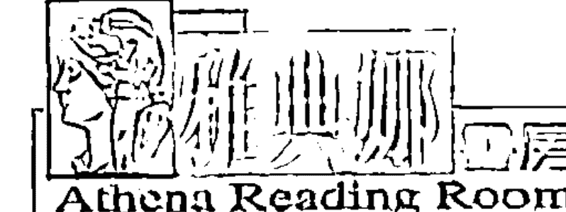

## 以科學眼光看氣功

本書將以科學的觀點，讓讀者了解氣功的科學基礎所在，藉以端正視聽，並且將氣功修煉當成一種修心養性、涵養道德的方式，用於改造人的內心世界和精神世界。

張振興

## 作者介紹

張振興，台中縣人，生於民國四十九年。幼年時，就已學得一些有關吐納靜坐和國術的基本拳術。青少年時對氣功產生了極大的興趣，就一頭鑽進了氣功的領域。曾服務於陸軍醫院，接觸了與東方完全不同的醫學架構，對氣功有了更科學、客觀的認識。曾拜訪大陸及台灣等各門派，獲得不少珍貴的資料和寶貴的經驗，全心投入研究氣功的範疇。

多次在有關的氣功雜誌和術數雜誌上發表研究氣功心得及表演驚人的絕技。精通手相、面相、陽宅、陰宅風水、命理鑑定，接受企業各界預約諮詢。綜合了現代醫學與中醫、針灸等理論，設計完整的氣功練習計劃與實際運用的方法。真正完整揭開氣功神秘面紗，從任督二脈「小周天」、「大周天」、「小藥」、「大藥」至真正健康養身靈修的高級功法，一脈相承，並保證學成。

著有《南嶽氣功》、《洞天福地·氣道祕境》、《氣功縱橫》、《氣功發微》、《奈米新論·氣功駭客》。

現任：美國哥倫比亞學院傳統醫學系主任、中國傳統民俗療法協會區委員、南嶽氣功世界聯盟機構負責人、台北市國術會永久會員、瑞億富科技股份有限公司總經理、氣功之友會專任講師、中華民國氣功協會永久會員、衛星電視台氣功講師、中國醫藥研究會學術委員、耕莘醫院氣功講師

### 南嶽氣功教室

地址：新店市北新路二段191號6F
電話：(02)2917-8368、2917-3118 張老師
聯絡時間：每週四、五、六下午3:00～10:00

## 序文

自從科學的出現到現在，科學家們已經可以透過它來控制能量，製造工作具、載人飛行、治療疾病，同時觀察天體。科學的產生，造就了科學家們卓越傲人的研究成果，也成就了世界的現代化。許多人因為科學所帶來的進步與正向發展，認為科學所提出的各種理論是絕對正確、且萬能的，相信科學能解釋一切所有的自然現象；相反的，若是科學無法證實或解釋的現象，便將之歸類為「迷信」、「怪力亂神」之說。

然而事實上，這個世界確實存在著許多現象，是科學家們到目前為止仍未能找出合理答案的，以下隨便舉幾個例子與各位讀者分享：

- 「地心引力」發生的原理

牛頓發現了地心引力的法則至今已超過幾個世紀，但為什麼會發出這種引力呢？到現在物理學家們仍無法清楚回答其中的原理，宇宙的奧妙博大目前也只是一知半解！

- 物質的根源

物質的根源（基本成份）是什麼呢？目前的科學只帶領我們查探到電子及夸克等的階段，但所有科學家都明白，這些都還不是物質的本源，造成我們不能再更進一步對物質根源進行探討的原因，是在於現今測定機器的極限，不能測量更加細小的粒子，導致現代科學其實還無法真正了解到物質的本源。

- 「高溫超電導」／「常溫核融合」可能嗎？

這兩個問題如果答案是【Yes】的話，可能以後世界的科學秩序，甚至於政府秩序都將被改變。因為「高溫超電導」這項技術，可以讓我們在不需耗損任何電力、或是只需耗損極少的電力，便能儲存有效電力，大大提升現有發電廠的發電效益。只要將電力儲存在低耗電量時，發電廠的剩餘電力會被儲入超電導電池中，當發電廠供電不足時，便可將超電導電池中的電力釋出使用，這樣就無須擔心因突然的電力需求而導致停電的狀況發生；而且可以更少的發電機組應付更多的用電需求；發電廠以後可以在任何時間皆產生電力，不必再擔心高用電負荷的問題了！

而「常溫核融合」就更厲害了。如果可行，它可利用「水」這種全球含量極高的物質來發電，因為現時其發展的困難之處，就在於啟動這項反應所需的能量比這項反應所生成的能量要來得更多，得不償失！主要是因為目前所有技術造成的「核融合反應」往往需要一些天文數字似的能量才能實現。一旦人類發明「常溫核融合」，這個問題就會被解決，核融合大量化使用的可能性也會提高，由於水幾乎是用之不盡、取之不絕的，因此這種能量價格的低廉也就可想而知。

但是非常可惜，雖然陸陸續續不斷的有科學家（尤其是日本科學家），聲稱已將上述兩種技術變得有可能，並且完成一些成功的實驗，但主流科學家始終不承認這些實驗是正確的，因為聲稱達成這兩項技術實驗的科學家們，往往是在「輸出功率高於輸入功率」的情況下所達成，不符合現有的科學能量守恆定律，也因此這些實驗結果自然會被否定。

- 「超能力」及「靈異現象」的原理是什麼？

姑且不論這兩個現象的原理，就說它們存在與否，很多現代科學是根本一口咬定它們是不存在的。世界上有很多自稱超能力者，雖然他們當中有很多是偽裝的，但當中亦有些可能是真的擁有超能力，卻是科學無法解釋的。

靈異現象方面，一些國外的科學家雖已用科學的方法證實了一些人可能會有前世的記憶，但這兩項現象的原理究竟是什麼呢？即使是現在發展蓬勃的科學，也沒有能力清楚地去解答！

- 生命的本質為何？

生命的起源究竟是被創造還是演化而來？生物體的各種異常反應、生命的本質……等，都是目前已很發達的科學所未能完全解答的謎題。

多年來，中國古老的氣功療法所產生的特殊現象與能量，因為尚未能現代科學方法予以說明論證，一直以來被世人披上了神秘的面紗，被中醫、武術及各界有心人士誤導，將之渲染成神奇的特異功能，因而掩蓋了這種中華傳統文化所流傳下來珍貴的寶藏，更貶低了氣功的真實價值，殊不知科學未能解釋或證實的氣功能量與論述，早已存在於宇宙、自然、與人體之中，這也就是為什麼在現代醫學碰到了無法逾越的難題的今天，中國古老的氣功療法非但沒有被屏棄，反而因為有著神奇的療效而受到了世界各國醫學界、科技界的廣泛關注。

中國老祖宗智慧的結晶——「氣功」，絕非一般「不懂歷史、不講哲學、打著科學旗號而反對氣功」的有心人士所言，毫無科學論據、裝神弄鬼、無稽之談。對此本書將以科學的觀點，讓讀者了解氣功的科學基礎所在，藉以端正視聽，為發揚中華民族偉大古老的養生哲學思想盡一份微薄的心力。

筆者有願於此把氣功修煉當成一種修心養性、涵養道德的方式，用於改造人的內心世界和精神世界。修煉氣功中的高層次功夫，就是號召人們在德的指導原則下，去發現和尋求含藏在生命中的崇高精神，去造福社會，造福人類。推展氣功的實踐活動，不但有益於增強和提高人們的體質，更將有助於精神文明的建設。

## 目錄

序文 ………………………………………………………………………… 3

### 第一章 玄學是精神學問 氣功需要尋求突破

- 1 引言 ………………………………………………………………………… 14
- 2 科學與玄學 ……………………………………………………………… 15
- 3 總結與展望 ……………………………………………………………… 30

## 第二章 神與人的關鍵交叉點——中脈

- 4 煉精化氣，煉氣化神，煉神還虛，煉虛合道 ……………………… 36
- 5 揭開氣功的神秘面紗——中脈之秘 ………………………………… 40

## 第三章 常溫核融合

- 6 宇宙能量與科學
- 7 人體生物能量場
- 8 核反應

## 第四章 氣功發掘大腦智慧

- 9 腦科學的新發現
- 10 揭開大腦的奧秘
- 11 氣功對於大腦發展的作用
- 12 氣功狀態下的大腦變化
- 13 開啟智慧的潛能

### 第五章 宇宙論中的量子效應

- 14 宇宙的起源

## 第六章 光才是最終本質

- 15 宇宙的現象與能量
- 16 現代科學的物質觀
- 17 量子宇宙
- 18 物理世界中的相互作用效應

## 第七章 潛意識與特異功能

- 19 宇宙是氣的根本來源
- 20 氣功能下的人體變化
- 21 氣的本質
- 22 氣功的物質本質
- 23 什麼是潛意識
- 24 潛意識的力量
- 25 氣功的潛在意識 ……………………………… 212
- 26 氣功與特異功能 ……………………………… 224
- 27 量子信息波與氣功物質現象 …………………… 226
- 28 科學實驗證明了意識的物質特徵 ………………… 233

- 結語 …………………………………………… 237
- 附錄 · 幸福養生保健法（1—3） ………………… 248

## 第 1 章

### 玄學是精神學問
### 氣功如何尋求突破

## 1 引言

中國氣功源遠流長，可惜這門珍貴博大的學問至今仍被視為一種雜學，還不能納入正統所謂「學院派」的學習管道。在國內即使已貴為台灣大學校長的李嗣涔先生，近年來對氣功與特異功能方面的推廣也只能在體制外做努力。如何尋找中國氣功發展的途徑和方向，實在值得我們作深入的探討！

氣功雖未能具有一套系統的科學理論，但已在防病治病修心健身方面顯現出了它的神奇能力與其他近代科學技術望塵莫及的實用價值。氣功得不到現代科學的正確認識，並不代表著氣功不科學，畢竟實踐是檢驗真理的唯一標準，實踐證明，氣功能夠有效地改善人體的生理狀態，不僅能夠防病治病，還能保健養生。但它的科學原理在哪裡呢？

要正確地認識氣功，就必須正視現代科學的局限性，在現代科學的有限認知之下，是無法全然深入了解氣功的博大精深與奧秘的。比如，氣功學說建立在正確的天人關係之上，即人只是自然無限小的一部分，它必須不斷順應自然的變化才能夠存在與發展；而現代科學卻一直把人孤立在自然之外，彷彿人和自然沒有什麼必然的聯繫，只要吃飽穿暖就可以很好地活著，特別是自然科學的基礎觀念是對稱，在這種觀念下，自然界就是靜止的，人在空間任何時候任何地方都是一樣的。儘管不少人懷疑現代科學的基礎，但發展的慣性使很多人還一直迷信現代科學，彷彿它已經發展到盡頭，不需要創新了。

雖然氣功、特異功能和心靈感應等現象一直以來是常規科學定律所無法解釋的，但科學的發展與研究日新月異、突飛猛進，隨著氣功的推廣日漸普及與受到重視，目前也已有更多的研究者投入氣功的科學研究，相信終有一日氣功學說與神奇作用將會於科學領域中獲得相關驗證，氣功得以「驗明證身」的日子也就不遠了。

## 2 科學與玄學

甚麼是科學？科學是能經過重複的實驗及觀察方法，反覆測試其結果都完全一樣，近乎真理，具有必然性和可靠性，我們日常所接觸的科技產品，就是科學的成果與典範；玄學則是精神領域學問，研究的是與人的思想與意念相關的抽象事物，會隨著人的意志和境況的不同而有所變化，不但很難由不同的人產生重複的同一現象，就是同一個人在不同的情況下，也難重複相同現象；玄學是以人的內在經驗與直覺作為依歸，很難用科學方法去驗證。

常有人說：「玄學是未來的科學」，「氣功、命理」都是屬於「玄學」類學科。由於氣功的特異現象多年以來一直無法使用科學的方法加以引證，某些玄學人士又會信口開河，將它渲染成神奇的特異功能，使得氣功往往被迫落入「無稽之談、怪力亂神」之誤導與迷思，實為氣功愛好者痛心之處。利用氣功醫病的詐騙案例層出不窮，近聞大陸方面上海市已禁止氣功行醫。這類騙案對於氣功界所帶來的負面影響，值得氣功界朋友們深思反省，希望各界有心人士能為導正一般大眾對氣功之誤解與迷思而努力，同時尋求氣功正確發展的途徑與方式，共同來重整這塊殘破卻珍貴的中國文化資產。

### 〈1〉氣的測量概況

在氣功及中醫的相關論述中，「氣」的觀念其實是難以讓一般人理解的。人體的「氣」基本上可分為「實氣」及「虛氣」兩種：呼吸、放屁都是「實氣」；氣色、神氣、氣功等內在經驗的表現都是「虛氣」。「氣」是構成人體和維持人體生命活動的基本物質之一，它主要通過臟腑組織和機能活動來反映人體的生理和病理現象，這種「氣」會在人體內全身運行，成為人體生命的原動力，也可以發於體外作用於他人，成為治病的一種手段。

氣功的科學研究，必需從「氣」的科學證據來著手。事實上，人體科學發展史上記載著，「生物電」早在一七八六年被意大利的伽爾佛尼所發現；一八四八年德國人雷蒙第一次記錄到神經電流；澳國人伯杰找到了腦電波，德國人伯格記錄到第一所腦電圖，接著有了心電圖、肌電圖的應用，證明各器官確實有著不同的電場。

一九七〇年美國人科恩成功的測到心肺磁場，瑞特測到交流肌磁場，再度證明了人體內各器官有皆其獨特的電磁及物理場。根據人體各部位及各器官的物理場有著不同波長的層次、輻射範圍及特性，蘇俄科學家哥迪克（Godik）及古拉葉夫（Gulyaev）等人研發出一系列的偵測儀器（Real time dynamic mapping），可以在人體與周遭環境間不停互動的同時，測試到生物整體及各部份的氣及其即時動態平衡狀況（Real time dynamic balance）。根據哥迪克與古拉葉夫的研究，人體周圍的能場有六層：

1. 紅外線熱輻射層（Infra-red thermal）：表現生物體因微血管流量轉變而產生的體溫變化。
2. 熱輻射層（Radiothermal）：表現生物體內熱能量之變化。
3. 電場（Electric field）之各別電場，這些器官被包圍在具有高電阻的皮膚內，因此產生了三層不同的電荷分佈（Triple electric），而呈現著人體皮膚微震的生理現象。
4. 磁場（Magnetic field）：表現腦、心臟等器官更真實的動態，因為電場測試時會受到體內導電或衣服之干擾，相較之下磁場測試的穩定度與真實性會相對提高。
5. 化學光輝能場（Chemiluminescence）：表現化學物質在組織內之活動，例如抗氧化情形等。
6. 聲波輻射（Acoustic radiation）：表示體內各器官活動訊息，例如心跳聲、肺動聲、血流聲、胃腸蠕動聲等；在超音波層次，還可顯示出器官內部的熱能。

既然「氣」已被科學界所認定涵蓋了以上種種物理能場，任何用以測試這些能場之儀器，應皆能測出「氣」在質與量上的變化。如此不只能夠證明「氣」的存在、「氣」是什麼？還可隨時測出「氣」在人體內的分布及運行狀況。除此之外，藉由這些科學測量儀器的輔助，更可依「氣」於人體的出口穴道、脈口，進行「氣」的測量，進而窺得人體構造生理與病理的全貌，深入了解練氣功對人體生理及病理的影響。

日本中谷義雄及西德傅爾（Voil. P.）研究的穴道測量成果，已達到可測量「氣」的境界。穴道是生物電能的集中點，反映出細胞的生理狀態。測量穴道上的電阻變化及左右對稱性，可對血氣流通進行科學性分析。脈口是中醫脈診的位置，韓國劉大夫及臺灣汪叔遊配合運用電子儀器，已從事經脈研究十多年，積累豐富經驗。近期臺灣學者魏凌雲教授更把探脈的研究推進新的里程碑，利用電腦頻譜分析，針對脈波與腦波進行相關性分析，建立資料庫，確立數值定義，使人們對「氣」的迷惑消失。此外蘇聯克里安照相術亦能提供間接性對「氣」的理解。

### 〈2〉心理、生理與保健

心理影響生理，生理也能影響心理。「身心相通」是目前科學無法解釋的一個現象，醫學研究使人們對思想影響身體狀況的途徑有了最初的了解。例如，安慰劑效應證實，當病人心理上相信治療有效時，安慰劑有時會發揮效用，促使病人的症狀減輕或痛苦減少，而實際上他們接受的治療可能是沒有效果的。科學對身體自癒的過程了解甚少，這種自癒的能力常常遠遠超過現代醫藥所能產生的效用，例如許多癌症病患在醫生宣佈死期時竟能靠本身意識力或自療而使生命延長，其間因果關係值得我們從人體學中探討。

我們知道大腦是由約一四○億個腦細胞所組成，腦是一切思維的根源。大腦接收感官所傳來的外界刺激，產生腦電波經由網狀神經系統反射引起生理與心理的回應。情緒反應較為複雜，這種情緒反應程度取決先天性和後天性，同樣的感官刺激對於不同人，會因為不同的本能與經歷，而產生不一樣的反應。

一般人都誤認無病及身體強壯就是健康，其實身心健康才是真正的健康。人們工作賺取金錢，原本是為了獲得生計及提高生活的素質，這是合理也是無可厚非的。但現代人過份追逐物質慾望，使得金錢成為人們煩惱的根源。心靈無法如清水般清晰。過份追逐物質的過程中，無可避免地會對大自然進行無情破壞，這是人類的集體罪行。空氣、水和食物的不斷污染、溫室效應……等，地球生態正面臨岌岌可危的危機，這也許是大自然對人類的最大控訴！在地球生態日趨不平衡的今天，人類如不能及早悟醒，前景將更加暗淡，我們應針對上述問題謀求多方面自救。如何提高人的免疫能力及心靈昇華正是我們最重要課題。

「氣功、靜坐」對於提高免疫能力及精神昇華具有一定的價值與功能。經過實證，修練氣功能紓解大腦對整體的刺激性反應準備，排除情緒干擾，化解憂鬱症狀；同時會引發身體自癒功能，自動修補體內功能障礙，增強身體免疫的能力。但如果學習氣功未得正確觀念及學習途徑，則表面上靜坐，氣功只是好聽名詞，反而會對人體形成傷害，這絕非氣功學習者所能想像的。

### 〈3〉生物反饋儀器

「反饋」在人的生命活動中具有重要的意義。人對一切身體過程和活動的調節之所以成為可能，是由於無數複雜的反饋迴路的相互作用。例如，溫度變化時引起的出汗反應；身體受傷時或不舒適時引起的痛反應；光線加強、減弱時瞳孔放大縮小的調節。這些都是反饋過程。也有不少生理過程的變化緩慢或生物電反應微弱，是人體無法直接覺察到的。生物反饋技術就是為了解決這個問題而在二十世紀60年代所發展起來的一門學科和醫療技術。

「生物反饋療法」是利用現代生理科學儀器，通過人體內生理或病理信息的自身反饋，使患者經過特殊訓練後，進行有意識的「意念」控制和心理訓練，通過內臟學習達到隨意調節自身軀體機能，進而消除病症、恢復身心健康。實驗證明，心理（情緒）反應和生理（內臟）活動之間存在著一定的關聯，心理社會因素通過意識影響情緒反應，使不受意識支配的內臟活動發生異常改變，導致疾病的發生。生物反饋療法將正常屬於無意識的生理活動置於意識的控制之下，透過生物反饋訓練建立新的行為模式，實現有意識地控制內臟活動和腺體的分泌。

在「生物反饋儀」電子儀器的幫助下，我們身體內部的生理過程、生物電活動可以被放大為機體電活動信息，並以視覺（如儀表讀數）或聽覺（加蜂鳴音）形式呈現出來，使主體得以了解自身的機體狀態，並學會在一定程度上隨意地控制和矯正不正常的生理變化。「生物反饋儀」可以反饋給人的信息包括肌肉的緊張度、皮膚表面的溫度、腦電波活動、皮膚導電量、血壓和心跳次數等，因此「生物反饋療法」得以根據反饋信號，讓求治者學習調節自己體內不遂意的內臟機能及其他軀體機能、達到防治身心疾病的目的。由於此療法訓練目的明確、直觀有效、指標精確，因而求治者無任何痛苦和副作用。

據國內相關報導證實：生物反饋療法對多種與社會心理刺激有關的身心疾病都有較好的療效。以高血壓為例，某院前用此法治療二六四例，治療有效率達80%以上。實施這種治療，是利用現代化的技術手段，在電子儀器的幫助下，使病人一般感覺不到的體內的生理變化信息（如血壓升降、心跳快慢、胃腸蠕動、腦電波形……等）顯示出來，加以放大，讓病人自己直觀地看到或聽到它；病人可通過自我意識來主動地調節自己生物信息的變化，譬如降低或升高血壓、調節心率等。生物反饋學習過程就是學習正確操作性條件反射，對抗病態性條件聯繫，從而糾正和矯正異常的生理反應。

## 第二章 玄學是精神學問 氣功如何尋求突破

正不良行爲和習慣，消除病體症狀，達到治療疾病的目的。舉例來說，身體的每一部分都影響著人的鬆弛感。一個人的肌肉鬆弛，皮膚溫暖，還不一定完全鬆弛；也許心跳還是快的，腦電波頻率是高的。生物反饋可以幫助人們發現神經系統哪一部分沒有放鬆，提高對身體鬆弛狀態的全面覺察。

「生物反饋學」在歐、美、日發展非常迅速，許多生物反饋治療的設備亦隨之因應而生。現試簡述「典型生物反饋儀器」供各位參考，也許可爲氣功的驗證提供一條捷徑。

### ◎心率計

使用者只須將心率計的感應器夾在手指上，只需數秒感應器便可自動探測到心跳的次數。

### ◎皮膚溫度計

選擇手掌溫度作爲身體活動的指標，觀察學習控制手掌的溫度，當放鬆入靜，溫度上升，指示體能得到調整，對於神經緊張的偏頭痛有良好的療效。

### ◎ 皮膚阻抗儀

皮膚的電阻值和神經緊張或鬆弛有很大的關係，高阻抗表示鬆弛，低阻抗表示緊張。

生物反饋儀近年來百花齊放，不論電學、聲學、光學形式反饋儀……等，都不斷地在推陳出新，以後有機會再和朋友們探討。

### ◎ α 波磁反饋儀

利用帽子形線圈注入 α 波頻率電壓並戴在頭上，用電磁方式感應入腦裏，使腦電波進入 α 波狀態，據說如此可達到所謂「天人合一」的境界。初步驗證 α 波磁反饋儀對於人體有一定的效用，具體功效驗證有待進一步研究。

### 〈4〉生物反饋的啟示

人是身心合一的一個整體，人的生命即在於身心的協調與統一。氣功是從我國自古的人體生命整體觀點出發，要求人們把日常工作、生活中外放的「意志」收回來，專注於自身，用以提高「心」對於「身」的控制能力，加強身心的和諧和統一，強化人的生命運動，使「身（生理）」和「心（智能）」的功能得以充分發揮，並且達到高度協調的狀態。另一方面，以解剖和生理為基礎的現代醫學的發展，也逐漸突顯了身心協調的問題與其重要性。

根據統計，目前人類疾病的起因有 60 ～ 70 ％是來自於身心的失調。也因此人們對於人的生命運動中的生物學因素和心理學、社會學因素的綜合作用越發重視，進而形成了一個新的分支學科——「身心醫學」。「身心醫學」基本的研究和治療方法之一，就是生物反饋（Biofeedback）技術。

一九六○年美國醫生 Marinacci 等人利用肌電圖（MEC）作為反饋信號，幫助中風以及外周神經損傷的患者，透過自身的意識活動，使受損局部恢復健康。這一成功案例引起了人們注意，亦成為生物反饋技術的開端。所謂生物反饋，就是用特定的儀器從人體引出特定的信號，並以適當方式知會本人，使他能夠根據反饋信號，有意識地修正偏差，達到預定的目標，即控制人體內某一種或某些過程。經過一定的訓練，人們便能獲得在某種程度上自主控制其生理過程的能力。

自 60 年代以來，生物反饋技術的發展可以歸納為以下三方面：

一、對正常情況下自主控制的生理過程，透過生物反饋技術，可以提高信噪比，強化意識的控制能力，使自主控制達到更深、更細的層次。使用肌電圖幫助人來控制局部骨骼肌的收縮，抑或使身體高度放鬆……等，就適屬於這一類的例子。

二、藉由生物反饋技術，以意識控制中樞神經系統的某些活動。例如，用腦電圖（EEC）為反饋信號，可以透過意念使大腦皮層α活動增強，讓人情緒安定，全身放鬆。

三、借助於生物反饋技術，可以有限度的自主（意識）控制由植物神經系統所控制的內臟、組織功能。例如，通過皮溫反饋自主地控制皮膚溫度，經W・C・Lynch等人的實驗，四名兒童經訓練後能以意識控制左、右兩手的溫度，使其相差2℃～3℃；有一名兒童還能使同一隻手的不同手指的溫度相差1℃左右。此外，用意識改變自己的心率、降低血壓等各方面，也都取得了相當成效。

很顯然的，生物反饋技術的發展，尤其是對內臟生理過程自主調節的成功實踐，突破了生理學的舊有陳規，說明了人有可能透過學習與訓練，逐步地學會調節自身的生理過程。在目前的西方生物反饋技術已經被廣泛應用，作為身心醫學的一種治療方式，不僅將之應用於臨床、康復、保健等方面，更運用於體育訓練等等，使用上相當普及。

目前盛行於西方的生物反饋技術，其實就是一種簡易的初級氣功。稍微有所不同的是，氣功是透過自己的「氣」，也就是經由「意識過程」來實踐反饋，是以「呼吸精氣，獨立守神」來達到「肌肉若一」，進而得以自主控制人體的生理過程。以此來做解釋，生物反饋可以被視為是一種借助於儀器強化內在意識活動的初級氣功。

西方生物反饋技術的出現和發展，帶給了我們正反兩個方的啟示：

一、生物反饋理論研究於70年代末趨於沉寂，說明了它在現代生理學和生命科學的範圍內找不到更進一步的出路。深究其原因，應是缺乏了「氣」的概念和對「氣」的認識。沒有「氣」，人的「神（意識）」是無法和「形」的各部分直接相聯繫的。而這也說明了「氣」是人的生命中不可或缺的要素。

二、生物反饋作為一種初級氣功，在西方世界的實踐中，對於改善人的身心健康是有所成效的，因而形成了流行的風潮。既然生物反饋能夠在一定程度上自主地控制自身的生理過程，那麼作為「超級生物反饋技術」的氣功，必定能使自身生理過程的自主控制達到更深的層次、更廣的範圍內，以及更高的效能。

生物反饋和氣功，雖然緣起不同，層次亦有高下之分，但在一定意義上可以說是殊途同歸的。

### 〈5〉腦與氣功

氣功對生理功能影響研究，各國學者近年來已取得豐富的臨床資料，研究者觀察到練習氣功入靜時血壓降低、腦電α波增多、皮膚溫度升高、耗氧量、心率、呼吸等生理指標降低。腦是神經系統主宰，氣功與腦活動息息相關，探討氣功與腦的關係確實具有實際的意義。

50年前，西德伯傑教授發現人腦處於一種連續電化振盪的狀態。他將腦波分為α波、β波、θ波等。在氣功的腦電研究結果表明，練功處於入靜狀態腦電α波增多，波型整齊有同步趨向，α波增減與人的情緒有關連，憂慮和緊張會抑制α波，α波有利人體各系統自我調整。

根據腦生理學家的估算，人的大腦皮質有一四〇億個神經細胞，加上小腦，整個腦有一五〇億個細胞，這些腦細胞的數量與生俱有，不會產生細胞分裂而有所增加，但通過鍛鍊腦力，腦神經細胞受到外界刺激，會長出芽，再長成長枝，形成所謂的「神經元」，與其它腦細胞所延伸出來的枝結合，則形成突觸，使得腦細胞之間得以相互連絡，形成信息網絡，變得活躍起來。透過氣功正確地自我鍛鍊，可以促進腦細胞的開發與利用，使頭腦變得更加清晰靈活，大腦與整體的生理會亦能日趨協調，達到治療和養生功能。

### 3 總結及展望

在探測外太空時代的今天，對於人體奧秘「內太空」的探索是具有重大意義的。腦是人的思想與行動的總指揮，現今先進醫學儀器有助於我們探究這個奇妙的組織，客觀地研究氣功和靜坐，進行正確的腦潛能激發與養生之道，再加上生物反饋儀幫助練習，以及如溫度攝影儀、起音波腦斷層儀、核磁共振儀、腦波頻譜分析儀……等現代化儀器的輔助驗證，相信對於我們探索與研究人體「內太空」的奧秘都會有相當大的幫助。

但這一切都必須由基礎研究做起，不應過份追求或迷信儀器。透過反覆實驗與研究，期望能漸漸配合氣功去解開記憶、意志、睡眠……等人體真正之證。氣功研究發展應有系統科學化，考試學位制度化，氣功學會制，以醫病保健為基本要素，避免強調特異功能與宗教的介入。因為目前氣功領域尚有太多現象是科學無法解開的謎題，卻剛剛給了一些假藉宗教名義的敗類可乘之機。我們應該用科學的角度去正視並探究這些特異功能的本質，否則被誤導的氣功迷思很容易在社會上產生惡劣的影響。氣功界朋友們應在發揚氣功時樹立大眾對氣功的正確觀念，不要只著重於利益考量，反而將氣功的獨特珍稀之處商業化；應該結合中西醫學各家的長處，為氣功尋求更新穎的突破！

## 第2章 神與人的關鍵交叉點——中脈

「中脈七輪」是印度特有的能量運行路線，也影響著各種修行體系，如佛家、氣功、瑜伽、仙術、神功及密法……等；在此架構下，身體、情緒、理智、靈性、特異功能皆與七輪皆有著相互呼應與影響的對應關係，而「中脈」更是儲藏人體生命能量的源頭。

目前世上之功法一致認為：「氣不入中脈，則無有成」。中脈不通，天眼不開，無論是修煉哪門功法，都不能算是學有所成。中脈一通，全身大小氣脈皆通，人的整個生命活動就會呈現與天地相合的盎然生機，生理功能就會出現返老還童、青春不老等現象，針對此一特殊異象，在古代修行文化的文獻書籍中早有記載，因此有了「中脈一通、百病不生」的說法；中脈練通後，也開了天頂，此時便能達到「天人合一」，人與宇宙的能量訊息合一，以光合光，達到修煉的最高境界。

不論是練「氣功」，練「瑜伽」，修「密宗」，「中脈」可說是各宗法中最火紅的專有名詞，而且好像大家都通了「中脈」似的。就如同練各種氣功，好像大家都通了「任督二脈」。其實，教功的人有沒有真功夫，只是隨便說說，究竟是「真通」還是「假通」，莫衷一是；而一些學功者道聽塗說者有矣，人云亦云者有矣，更奇怪的是還有一些附庸風雅者更不在少數，如何能夠把「氣」練好呢？

## 第三章 神與人的關鍵交叉點——中脈

所謂真正的名師，是一些真正練功有心得的人，對於氣脈的論述，絕對是簡單明白，開門見山，一針見血。古文的艱深奧妙，或一直拐彎抹角，長篇大論，到了行家的眼底其實不值一哂，幾句話甚至幾個字就擺平了。

古時候因為識見不廣，許多本來很簡單的東西，往往需要反覆的解說去形容同一個現象，亦或不知道怎樣形容比較貼切，只好東拉西扯，旁微博引似的，比喻貼切也還罷了，若是隱喻不當，那可真是殺人不償命了。像過去煉丹士，家中盡是鍋碗瓢盆，鉛汞鼎爐的，不少人就真把這些東西吃下肚而一命嗚呼，殊不知這些煉丹士不過是取這些東西做個隱喻罷了！不然豈會真有十月懷胎，那位老兄懷個來看看？不過指的是養氣以孕育陽神罷了！

既然現在科學昌明，一切學識皆已公開透明，就應該徹底公開，讓有天份的人能如獲至寶，勤加研習，使氣功能夠繼續傳承下去，並發揚光大。

### 4. 煉精化氣，煉氣化神，煉神還虛，煉虛合道！

人的生存離不開精、氣、神。人只有精足，氣充，神旺，身體才能健康。所以古人講修身養生之道，就離不開精、氣、神之修養。「精、氣、神」本是古代哲學中的概念，是指形成宇宙萬物的原始物質，含有元素的意思。中醫認為「精、氣、神」是人體生命活動的根本。在古代講究養生的人，都把「精、氣、神」稱為人身的三寶，如人們常說的：「天有三寶日、月、星；地有三寶水、火、風；人有三寶神、氣、精。」所以保養精、氣、神，是健身、抗衰老的主要原則。

什麼是「精」？「精」是構成人體、維持人體生命活動的物質基礎。從廣義上說，「精」包括精、血、津液，一般所說的「精」，是指人體的「真陰」（亦稱為元陰），不但具有生殖功能，促進人體的生長發育，而且能夠抵抗外界各種不良因素影響而免於發生疾病。因此陰精充盛不僅生長發育正常，而且抗病能力也強。精的來源，有先、後天之分；先天之精是秉受於父母的，它在整個生命活動中扮演著「生命之根」的角色作用著，但先天之精需要有物質不斷地補充，才能確保精無虧損，才能發揮其功能，這種物質即是後天之精。後天之精是來自飲食的營養物質，有了營養物質的不斷補充，才能維持人體生命活動。古人有云：高年之人，真氣耗竭，五臟衰弱，全賴飲食以自氣血。因此，注意全面均衡營養的飲食，才是確保後天養先天的首要方式。

什麼是「氣」？「氣」是生命活動的原動力。氣有兩個含義，不只是運行於體內微小難見的物質，更是人體各臟腑器官活動的能力。因此中醫所說的氣，既是一種物質，也是一種功能。人體的呼吸吐納，水穀代謝，營養分布，血液運行，津流濡潤，抵禦外邪……等一切生命活動，都是依賴著氣化功能來維持正常運作。由於氣是流動行走於全身、持續不斷運動的，所以人體也應該要有適當的運動，促進臟腑內氣的升降與出入，才會有利於維持正常生理功能及器官運作。中華傳統流傳下來的多種健身運動及氣功，就是「以動養氣」的寶貴遺產。

什麼是「神」？「神」是精神、意志、知覺、運動等一切生命活動的最高統帥與最終體現。它包括了魂、魄、意、志、思、慮、智等活動，透過這些活動能夠體現人身的健康狀況。例如：目光炯炯有神，就是神的具體體現。「神」的重要性自古便備受重視，《素問·移精變氣論》說：「得神者昌，失神者亡」。因為神充則身強，神衰則身弱，神存則能生，神去則將死。中醫治病時，會觀察病人的「神」，來判斷病人的療癒成果，有神氣的，療癒效果良好；沒有神氣的，療癒效果不佳。這也是中醫望診中的重要內涵之一。

精壯，氣壯則神旺，神旺則身健，身健則少病，內則五臟復華，外則肌膚潤澤，容顏光彩，耳聰目明，老當益壯。

練精化氣、練氣化神、練神還虛，是靜坐功練精、氣、神，疏通經絡。這是內丹術功法的三步功夫，實際上武術家所講的「內壯」，也是指練精、氣、神。「練精化氣」是真氣過三關，通任督，培育丹田之氣，循經運行的一種功法，是古代氣功主要流派之一內丹術功法中的第一階段，也稱「百日築基」，因其範圍相對較小，故稱小周天。「練氣化神」是在小周天基礎上內氣從丹田發動，通過奇經八脈、十二經脈，流遍全身，使精和氣密切結合，達到氣化為神的目的。腎氣入腦，補益腦髓，腎腦可以互相補益。所似，丹書上說，大周天可以長壽還童，這是第二步功。「練神還虛」是前二步功接下來的步驟。前二步功都是意（神）在起主導作用，而「練神還虛」則有兩層意思，一是由於長期苦練，已形成條件反射，一坐下來真氣就能週天流轉，氣息微微，若有若無，中和之氣與天地合而為一，這就叫還虛了；另一層意思是在練功中出現一些覺境，輕鬆愉快，俗念全無。

在現今物質經濟文明發達的時代，盲目對於物質生活的追求往往令人無所適從，人們所有的意識都是建立在「物質交換」為基本載體的溝通模式下，窮盡一生追尋在這個世界上的幸福、快樂、自我、滿足感等慾望，小到詐欺大到戰爭，不擇手段無所不用其極，然而得到的結果卻是，就算是富甲天下的人也不一定感到快樂或滿足；殊不知幸福快樂或滿足這類東西不是權力所能霸佔的，也不是金錢可以購買的，更不是他人所能給予的；快樂和滿足是一種狀態，只有透過自我心內與精氣神的調整，讓身體的能量處於一種健康、近乎「道」的運轉狀態，達到「練精化氣，練氣化神，練神還虛，練虛合道」的境界，方能得到前所未有的真正的快樂、舒適與滿足！

### 5 揭開氣功的神秘面紗——中脈之秘

藏密氣功關於脈的學說，是以「中脈」為中心，中脈乃持命氣（真元之氣）與遍行氣（動作之本）等匯聚之所，也是獲取宇宙外氣、能量的主要通道，修中脈是藏密氣功最根本的法門之一。「中脈」在藏密宗派中被稱之為「命脈」、「大道脈」，梵語稱作「阿縛都帝」，藏語稱作「武瑪」、「根打瑪」、「索索瑪」，這些名稱都表示「中脈」的重要性和功能，比如「命脈」即表示「中脈為一切眾生之命根」，代表著中脈的重要性；「大道脈」則代表「中脈為成佛之捷徑」，代表著中脈的特殊功能。「阿縛都帝」是梵語，意思是「能產生俱生智慧」；「武瑪」是藏密的稱呼，有「成就之母」的意思，「根打瑪」是藏語對中脈的另一種稱呼，含有「能生一切功德智慧，一切由此而生」之意。在中醫經絡學中，「中脈」也可以「沖脈」這條經脈作為中脈解釋。

「中脈」之重要性又以佛教密宗最為重視，因為它是眾生脫離苦海的捷徑，成佛涅槃的唯一路徑，「開通中脈」更是修持密法的第一大成就，所以「中脈」又被稱為「靈脈」。中脈開通後，修行者不光是神通具足，而且生死涅槃已無差別，故而《協巴多傑根本續》中有偈云：「氣不入中脈者，妄想證菩提，如若手捻沙，欲得酥油者」。中脈的位置從百會穴到會陰穴，連成一直線，在這一直線中有七個重要穴道，稱為「中脈七輪」，分別為頂輪、眉心輪、喉輪、心輪、臍輪、丹輪、海底輪，此無形體的氣脈（靈脈）為氣功中的高速公路，中脈一通，百脈全通，也是佛教靈修中最重要的功法。

印度教認為人體中有幾萬條經絡，最主要的是「三脈七輪」，其中「中脈」是三脈七輪中被認為是最重要的，因為左右兩條陰陽脈，只有匯聚到中脈才能起作用；就好像是只有人的存在，左右兩隻手才能起作用一樣。至於談到七輪，它是依附在中脈四周的，如果中脈沒有開發，七輪也不會閃起靈性的火花，因此修煉中脈可說是是揭開人體靈性的敲門磚。

### 〈1〉中脈七輪

在古印度《吠陀經》中有非常清楚記載，認為人體是一個特殊的發光能量場，練氣功可以看到身體有光，是因為人體天生就是一種會發光的能量場。在身體非常健康的時候，可以感覺到身體有用不完的力氣，覺得身體輕安健壯，似乎沒有什麼事情可以難倒自己，這個時候就說明了身體能量非常充足、且非常健康。健康表現在依附於人體中脈的「七輪」，因為七個輪吸滿了能量，所以在身體上會發光，表現在人體外表的活動是願意幫助別人，心情開朗，有用不完的力氣，感覺可以克服一切難關。

七輪是在人體脊椎從百會穴一直到會陰穴這之間，上面有七個穴位，在印度被稱為七個脈衝輪，這些輪吸收能量之後便會向外發射能量，所以就有光從體內散發出來。七輪從下往上排依次是：海底輪在會陰穴，臍輪即水輪，日輪是胃輪，心輪（火輪），喉輪（風輪），眉輪（月輪、印堂穴），頂輪（梵天輪）。由這七個輪組成了人體的能量庫。如果其中有一個輪能量不足，身體就會出現病狀，就會有不健康的表現，身體的的光彩也會暗淡，像是發黃、乾燥……等症狀，就代表著其中一個輪缺少了能量，而在身體上表現出種種變化。這時許多人在不明究理的情況下，會到醫院去看病，有時藥到病除，有時卻是藥到病重，吃了藥反而病況比以前還要更嚴重。如果是修行人，明白練氣開通中脈的過程之後，自己打坐或透過深呼吸來調節，可能當天晚上或睡完一覺，病況就消失了，第二天起來皮膚會散放光芒。

七輪或中脈在現在解剖學上是看不見的，也無法在顯微鏡下被觀察到，但現代醫學確實承認它們的存在，雖然用儀器不能將之具體的測出來，卻能測出能量的匯聚之處。國外科技甚至已能檢測出人體內的能量流，如果身體內的能量像電流一樣在體內來回運行無阻，身體就會健康，心情開朗，皮膚的光澤度也會非常飽滿。許多人皮膚的光澤度非常糟糕，原因就是左右脈不平衡，中脈堵塞，導致輪也堵死了；就像在高速公路上開車，突然前面撞車，後面的就堵上了，堵上之後可能又會發生另外的車禍，本來有車禍又加車禍，這個時候我們的脈輪就開始增加負擔，身體負擔多了，就會有疾病的產生。

現在的科學已經認可中脈的學說，在西方中脈學說非常盛行，修練瑜珈功的人也非常多，無非是希望能透過這個方法，來達到身心的健康。修習中脈，不但可以幫助人們打開先天本靈，還可以釋放後天壓抑的東西。比如你從小在家裏沒有受到尊重，被別人欺負，造成了你心理上無形的壓抑，一直到你長大結婚，這種情結都打不開的時候，你可以試著通過這種修行，慢慢的把心結打開。如果家裏受到了非人的待遇，也可以透過瑜珈功慢慢的把不愉快的負面能量釋放掉，最後達到身心健康狀態，難過的往事便再也不會造成心理上的陰影了。許多人在小時候經歷了負面的經驗，積壓在心靈深處，這個心靈是凡夫的心靈，不是先天的心靈。一旦積累過多，這樣負面的能量就會越擴越大，直到有一天像火山一樣突然爆發。爆發過後負面的能量好像被釋放出來了，其實根源並沒有去掉。我們修中脈或修佛法，就是要把這負面的根源去除掉，是挖根，就像中醫治根，西醫治表不治根。

中脈七輪在人體的脊柱上，是主要的神經叢，是控制著身體各部位的機關，也是中承轉接站，一旦失去作用力的時候，身體的各個輪就會出現相應的混亂，產生

## 第二章 神與人的關鍵交叉點——中脈

各種疾病。而當七個脈輪在身體吸收能量之後，會各別發出七種不同顏色的光芒，七彩光環就會在我們自身圍繞。

- 海底輪（純真輪、根輪）：光的顏色是暗紅色，形狀像四個花瓣，是純真與智慧的表現。這個脈輪是整個身體能量系統的根本與源泉，位置在人體的會陰穴，從會陰穴到上面三寸之內，也叫生法宮，像兩個三角形的頂尖相對著，這就是底輪，它儲存人體所有的能量，也是我們智慧的根源。透過修中脈達到禪定，智慧打開，光明現前，所以說一定要把底輪打開，中脈修通。

海底輪對應身體的盆骨神經叢，盆骨就是小腹腔，女性有時候小腹冰冷，就是因為這個輪沒有熱，不僅不通而且是冰涼的，所以小腹就會痛。它反應到身體的排泄系統和生殖系統，掌管荷爾蒙的分泌。海底輪變暗淡的時候，身體的疾病就會出來，例如性冷感就是海底輪造成的。海底輪就好像一個倉庫，我們的大靈就在這倉庫裏蘊育著，一旦海底輪受到嚴重傷害的時候，我們的性靈或無位真人就不會被喚起，智慧也會受到壓抑。這時候身為一個凡夫，就無法行夫妻之實，因為「性」正是海底輪給予我們的啟發。

- 臍輪（正道輪、水輪）：位於腹部的中央，肚臍往下到丹田這一塊，可以畫成一個圈，臍輪是橘色，形狀是蓮花十二瓣。臍輪表現人的性格是追求，同時又掌管我們的福德和財富，練中國丹功的人，一般福德都是比較好的，而且也知道如何去賺錢，因為他們有了一定的智慧。臍輪左部的一個點對應我們的衣食無憂，右邊的點對應我們的後天事業有成，所以就形成了一個圈，以肚臍為中心點。臍輪的另一個特性是平衡，古代遵奉聖賢到者，都會教導子孫後代要避免走向極端，過一種中庸平和的生活，這就是臍輪所產生的作用。

臍輪控制著身體主動脈神經叢，掌管脾臟、胰臟和肝臟，還有腎上腺、胰腺，所以要經常鍛鍊身體。如果是思想過度考慮問題，或用腦過度的人，要補充臍輪的能量，精力才充沛。精力充沛的時候，整個身體或臍輪是發熱的。如果長期的透支，就會衰竭，如果無法照顧自己的脾臟、胰臟、肝臟、消化系統、循環系統、神經系統，身體就會出現虛脫，造成很多器官上產生疾病。脾臟不好，就會容易出現白血病等與血液相關的症狀；胰臟不好，會出現糖尿病、腎炎；肝臟不好，會變得注意力無法集中，打坐參禪的時候妄念非常多，上班也精神不濟，容易煩躁，免疫力下降。此時就應該要停止眼前的工作，補充一下臍輪的能量，讓臍輪從煩躁的熱度當中清涼下來，身體就會逐漸平衡，陰陽之氣也就會平衡。

- 胃輪（真知輪、日輪）：臍輪外面有一圈表的就是胃輪，這個輪是活的，是可以轉動的，有時候在海底輪和臍輪之間（稱水輪），有時候在臍輪和心輪之間。胃輪像個圓圈圍著臍輪轉，有時候在下，有時候在上。胃輪就像月球圍著地球轉，是臍輪的護衛，保護著臍輪。胃輪的顏色是黃色的，形狀是十六塊花瓣。胃輪的性質是創造力和真知力，一旦打開胃輪，會得到宇宙的真知，佛經經常講的「實相」就是表現在胃輪。

胃輪在身體上是相應腹腔的太陽神經叢，掌管著腸胃的消化系統，也是營養的吸收系統。一個人如果過分的擔憂和勞碌，就會出現胃腸方面的疾病，像是胃痛、胃漲、酸氣、便秘，甚至腸癌或胃癌，這都是因為胃輪的能量不足。身體若出現這些情況，就應該要停下工作，不要想任何事情，天塌下來也還有別人頂著，要先把自己的身體調理好，即使不透過藥物來理療，也能透過氣功的鍛鍊來自行調理，一旦腸胃吸收和消化恢復到良好的狀態，身體自然就會健康。

- 心輪（仁愛輪）：在胸部的正中間，顏色是綠色的，形狀是八個花瓣。心輪相應的是心臟神經叢，照顧著心臟呼吸系統和胸腺。在兒童時期，抗體會在胸骨內形成，幫助對抗疾病和適應外部環境。如果一個人在童年時期曾經受到驚嚇，受到驚嚇的心輪能力就得不到健康的發展，很多人心理扭曲的非常糟糕，成年的時候就會表現出一種暴力傾向。有的人平時表現很好很正常，但突然就自殺了，或是出現反社會人格，都是因為小時候心輪受到重創，接受的負面經驗太多，所以心輪無法健全的發展。透過修習氣功，可以把後天的壓抑連根拔起，打開先天本靈的時候，就是打開了先天的輪脈，使其充滿具足的能量，如此壓抑的病症就會徹底消失。

又如有的人長大之後會變成膽小，沒有自信，缺乏愛心，也不敢去相信別人，這都表現出這個人的心輪比較弱，他的心臟和呼吸系統也是比較弱的。手紋的深淺與紊亂與否，和心輪的發展也有密切的關係。有些人的手紋非常糟糕，很淺，非常亂，代表他小時候受到刺激之後，手紋和心臟神經系統有一部分沒有正常健全地發育、成長。手紋深而且非常清晰的，沒有多、亂的雜紋，表示這個人發育的非常正常，心靈沒有創傷，能量比較充足，說明他的心臟系統或呼吸系統非常強，生命力也比較好。手紋非常淺、或心臟神經系統非常弱的話，他的心靈就相當脆弱，很容易受到傷害，平時也容易感冒，稍微風吹就會感冒，再嚴重一點就會咳嗽，最後甚至肺炎或心臟病等，問題都會全部出來了。

- 喉輪（風輪）：顏色是藍色的，形狀是由十六個花瓣組成，平時照顧我們頸部的神經叢和甲狀腺，比如說喉部發炎，說不出話來，都是風輪沒有調養好。風輪可以調整我們的甲狀腺，還能調整我們說話的音量。萬物一體就表現在喉輪上，因為呼吸、說話是人體的主要表現。古時候的高僧大德，喉輪都非常健全洪亮，釋迦佛用一音演萬法，各個道都聽得十分清楚，如獅吼般宏亮威武。

喉輪好的人是非常謙卑的，就像聖賢人一般十分謙遜。喉輪好的人，無論發生什麼事情，都能夠沉著應對，靜觀其變，不會因為受到別人的侮辱就產生嗔恨，也不會因為受到別人的誇獎就受寵若驚。寵辱不為所動，就是因為喉輪非常發達。此外喉輪的右半部表達的是言語，說出的話總是婉轉甜潤、非常中聽，在社會上社交能力、人際關係溝通能力非常好的人，絕對是喉輪、尤其是右半部相當發達的人。如果是一個人喉輪發育不健康，脾氣就會非常古怪，非常孤僻，不願意說話，一說話就很容易傷害人心。

我們手掌皮膚上的末梢神經會經過喉輪分布到大腦，因此喉輪與我們手掌以及身體的觸感能力有很大的關係；同時喉輪也掌管人體熱量的吸收和體能的分配，人的高、矮、胖瘦，都是由喉輪來支配掌握的。想減肥和增高的人，就必須要鍛鍊喉輪。現在社會上很流行減肥美容，其實只要修煉喉輪，讓喉輪開通無所阻隔，人體自然就能恢復到理想的體重與天生麗質。

風輪又何以會被阻隔堵塞呢？一個人喜歡在私底下胡說八道、搬弄是非、亂說他人不是的時候，風輪就會堵上。如果自己的喉輪不好，可以探討其原因，是否自己喜歡在私底下老說張家長、李家短，這個不如你，那個不如你……之類的。如果是的話，從現在開始要學習誇獎別人，讚嘆別人。讚美別人的時候，風輪就會發達，說話就會非常有磁力。時常誇獎別人，修法的時候，口中自然會有津液出來。經常讚美別人，很多福報就會隨之而來，源源不絕。

- 眉心輪（月輪、第三隻眼、寬恕輪）：位於腦的正中心，從眉印堂往裏、從兩個耳朵往裏、從百會穴往下，三條線所匯集形成的那個點，稱做『第三隻眼（月輪）』，顏色是紫的。眉心輪是個狹長的通道，它對應著我們大腦裏的松果體與腦下垂體，松果體、腦下垂體正好連接著我們的左右半腦，左右半腦視神經交叉處就在第三隻眼上。當我們處於負面能量完全釋放、沒有壓抑、不再胡說八道、也不去傳播謠言、非常清靜的情況下，第三隻眼睛便會打開，自己的大靈就能看到外部很多時空層，佛家稱之為天眼通、佛眼通、法眼通，五眼通全部打開。

眉心輪保養良好的人，大腦非常安寧，記憶力非常好，很有智慧，很有生命活力，心中常常湧現出智慧。智慧的表現，在我們的兩個眼睛，還有第三隻眼睛。大文學家、音樂家、畫家、詩人，他們的眉心輪保護得比一般正常人來得更好，因為他們思考的時候就是用第三隻眼睛來看、來觀，屬於下意識的觀看，這時就會出現很多充滿智慧的作品。眉心輪如果保養不好，就會出現失明、耳鳴、眼花、思維反應非常遲鈍……等，慢慢地大腦疾病也會跟著出現。平時經常寬恕別人的過錯，不去計較別人的過失，心懷大度，心不起煩躁，心平氣和，月輪則有光明，皆有利於眉心輪的保養。

- 頂輪（梵天輪、自覺輪）：位於頭頂百會穴上，也就是嬰兒幼小時會跳動的部位，人體的左右脈任督脈的會合於此，也是身體能量中心的會合點。當我們的無位真人從海底輪往上升到頭頂上，也就是天靈蓋，一旦天輪打開，身體的五脈能量會在我們的天輪上形成一朵蓮花，這個蓮花有千個經絡所形成的葉子，叫千葉寶蓮，在我們頭頂上同時還會形成三花聚頂，聚頂之後就會形成一個千葉寶座。而頂輪又有「大樂輪」之稱，在靜坐未打通大樂輪以前，等於是受活罪，腿麻腳酸，一旦打通了頂輪，腦部氣輪充滿，其樂無比。

人體內有三條最主要的經脈：左脈掌管過去和潛意識（紅色），右脈掌管將來和超意識（藍色），中脈掌管現實和顯意識（白色）。智慧的開發，佛教稱為自覺或覺悟，一旦人的能量達到三花聚頂，就是智慧開啟的時候。頂輪也掌管著大腦的邊緣系統，邊緣系統除了有一千條神經叢組成外，還有一千條神經線路。古時修煉者用千葉寶蓮來表達修練狀態，主要是因為頭上有一千條神經系統匯聚在百會穴（天輪穴）。當身上的七萬兩千條經脈開通，頂輪三花聚頂開花的時候，就是智慧顯現的時候，此時光芒的顏色是白色的，且光明無量照十方。天輪穴的功能不是用我們凡夫的語言所能描述的，它超越了我們人世間的生物學及心理學的範疇，若以玄學和哲學來描述，或許能夠是當表達這靈性的範疇。

頂輪同時掌管著我們的決斷力和自覺能力，道家亦稱之為天靈蓋、三花聚頂。醫學科學上所說的神經傳導物質都在頂輪。以道家的說法，此處在封口以前為先天，剛出生的嬰兒不會說話，但卻表情豐富，好像有說有笑的樣子，因為嬰兒還處在形而上的境界中，與以往的精神環境保持接觸，此時小孩子的天靈蓋特別敏感脆弱，手指一戳，天靈蓋就漏了，一漏靈魂就跑了，這個人就死亡了，心臟有可能還在跳動，但是靈魂跑了，因為把他的天門打開了，所以孩子的頭頂不能用力去摸的。等到頂輪封口以後，嬰兒就會說話了，而開始進入了後天的生命，頭頂便會慢慢地隨著成長而變得堅固，真的是不可思議。

近年的紅外線攝影，已可攝到人體放光的情形，而證實了梵穴輪的可能正確性。佛或菩薩後面所顯現的光環，就是由天輪上的光表現出來的，由天輪形成籠罩於全身。一旦頂輪出現偏差、失調，就會出現輕重不一的神經病或精神病，或是能量失調，如頭痛、睡眠不好，都是能量損失過多，還會出現莫明其妙的憂鬱症、長期疲勞、發呆等問題，這些都屬於凡夫後天能量不足所帶來的負面的東西。修行者懂得保養自己，就不會出現這些症狀。修行之後記憶力不好又發呆，和前面所述的病症是不一樣的，完全是兩碼事情；修行之後帶來的發呆，是一種大智若愚、呆若木雞的那種狀態，並不是說真的頭腦失去了控制，而是不願意去跟凡夫去爭論或辯論什麼，所以有時候修行者發呆，考慮的完全是先天的東西。

## 〈2〉七輪全數開啟，才是真正通中脈

打通「中脈」是脫離初級階段進入高級修煉境界的必經途徑，也是成道得道者必備的訓練。「中脈」不是交感或副交感神經，而是靈脈！無形體的氣脈，七輪全開啟才是真正通「中脈」。然而「中脈」到底在那裡？印度的「拙火瑜伽」所提到的「中脈」，是位於脊椎當中的「運流中心管」，是從脊椎的底部直通到頭頂，是一條中空的管道，由下而上，分別形成七個能量聚集點，故稱為「中脈七輪」。中脈有兩條，一條是「後天中脈」，一條是「先天中脈」。印度的「拙火瑜珈」所提的中脈是「後天中脈」，與道家所提的「督脈」其實是同一條。

在身體正中央的，是為「先天中脈」。

「中脈」是由百會直透會陰的中央通道，是能量向上昇華的最佳捷徑。也是人體命脈（命根）。道家稱「玉柱」，醫家稱「衝脈」，佛家稱「中脈」。經過臨床驗證，中脈如果堵塞，百脈不通。心理又是直接控制中脈的總開關，心理稍不平衡，中脈則堵。要想使下丹田儲備的能量向上昇華，必須把中脈守開，否則，能量上升時則會受堵。要想守開中脈，可以從「中脈七輪」海底輪、生殖輪、臍輪、心輪、喉輪、眉間輪、頂輪依次守開，為能量的昇華修好通道。在此介紹幾種易行有效通中脈的方法：

- 觀想聚能法：觀想自己從百會至會陰有一條明亮的光柱，此光柱上下一致，整體快速旋轉，男順時針，女逆時針，產生向心力，帶動宇宙四面八方的光能向光柱旋聚。

- 觀想通透法：觀想自己體內中脈為一條明亮、透明的空管道，如手指粗細。觀想一明亮刺眼的太陽，從百會進入中脈，停留一分鐘，沿中脈下行至會陰，在停留一分鐘，然後沿中脈上行至百會，如此反覆進行。

- 百會呼吸法：觀想頭頂百會穴處如漏斗狀，吸氣時，意念真氣由此漏斗進入，沿中脈行至會陰，呼氣時，由會陰上升至百會。如此反覆練習，久之可感到神行遍體，有返老還童之快感，還可使90%大腦尚未開發使用的潛在功能得以被開發與善用。

## 〈3〉真正打通「後天中脈」的現象是什麼？

打通「後天中脈」的現象，是一條極細且紅熱的線在脊髓當中的「運流中心管」由下而上升起，而且是由尾椎開始升起。這種紅熱集中的能量線的升起，是自然的，是不加意念的。當升起時，就必然能內視到及清楚地感受到脊髓內的溫熱，那是一種內部的舒服。此時所得到的紅熱的線往上升起，可稱為「拙火升起」，又可稱為「智慧氣升起」。練功到此火候，還不能見到七輪。

## 〈4〉真正打通「先天中脈」的現象是什麼？

智慧氣升起後，日久功深，智慧氣自然開始向身體的正中央靠攏內斂，才能形成「先天中脈」。打通「先天中脈」的現象是身體正中央形成了一條可內視，可感覺到的「氣柱」。這一條「氣柱」可以比喻做電動馬達的軸心，此根軸心長度大約是人體身高的一半；更奇特的是軸心在轉動時，還會在不同位置生出七、八個套在軸心轉動的「氣輪」，氣輪的大小是一樣的。此時「氣柱」就是「中脈」，「氣輪」就是「脈輪」。當然「氣柱」是直直的圓柱狀。「氣輪」套在「中脈」上旋轉，旋轉的速度約1秒2～3圈，有時順時針旋轉，有時逆時針旋轉。「氣輪」在轉動時，有時也會突然間變小，縮入「中脈」不見，有時又可由「中脈」生出來。

「氣輪」的轉動是自動化的，不需意念帶動。這時，練功之人會一直認為自己只是一個旁觀者而已。轉啊！轉啊！有時「氣柱」與「氣輪」皆可伸出頭頂，衝開天靈蓋，此時，就不是七輪，會在頭頂上方虛空多生出一輪，叫第八輪。

日久功深，「氣柱」與「氣輪」會轉化成「光柱」與「光輪」。又日久功深，「光柱」可開始化生光柱，一條光柱可化生很多條光柱，至此方知，真正的「中脈」在那裡？到處都是！

## 〈5〉天地間有數不清數目的「大中脈」存在？

當今世界上不知有幾人親眼目睹天地間的「大中脈」顯現。那種異象，使人深印腦海裡。「中脈」是巨大的，深奧不可測的。這是練功的大相應。相應的傳奇太多了，練功到某一層次，就會有這一層次神奇的相應。在此，把「中脈」的秘密全部公開了，也許還有很多人不識貨。因為得來太容易了。要知道，在「密宗」這是「無上密法」，就是你供養了百萬元給密宗上師，密宗上師也不見得會傳給你。因為此，修密宗，大家都停留在「四加行」、「觀想持咒」、「結手印」、祈求「本尊相應」。

其實老實坦白告訴你吧！當你「中脈」七輪顯現，七光輪自轉，（當你找到了相應本尊時），你愛怎麼與本尊相應，就能怎麼相應，只要動一動念力就行，你就立刻變成本尊。這就是「能量頻率一致時，就會共振」的科學原理。有人修一輩子都看不見佛菩薩顯現，通「中脈」的另一具體驗證，就是你想看佛、看菩薩，佛或菩薩就會立刻與你重疊，讓你看的夠清楚，你不想看了，就會立刻消失。為什麼會這樣？因為佛菩薩他們都通了「中脈」，你也通了「中脈」，所以就接通了。在密宗的「無上密法」裡叫做「子光」與「母光」相會，就可「入我」、「我入」。重點就是如何找到相應的本尊身，沒有一個客觀的觀察者（上師）在旁守護協助，是極有可能走火入魔的，修煉諸君不可不慎。

## 〈6〉中脈開通，人神交會

人體是一個小宇宙，都是由許多互動的能量場所組成，能量場可分為《生命能量場》與《物質能場》，心靈能量大於物質能量，心靈能量可大到無量無邊。氣一般則可分為內氣與外氣二類，內氣也就是自己本身具有的能量《生命能量》，外氣即外在的能量，宇宙的能量。中脈開通，是由頂輪、額輪、喉輪、心輪、臍輪、丹輪、底輪，逐一開啟，貫通中脈，再針對七輪穴位，啟發並增強其「自體能量」，使自體之「小宇宙」與「大宇宙」相結合。七輪一旦打通，也就是自己的天地動脈暢通無阻的時候，才真正的明白通天徹地這個詞彙。

通中脈開頂後，人生觀、價值觀已經完全改變，從凡夫脫胎換骨成聖者。此過程全然無加以意識作用或修法，而是「自然」形成的意境。智慧之氣從海底輪發起，一路上行，閉地戶開頂門。智慧之氣剛開始啟動的時候，下半身會起震動，有一說是「靈蛇出動」，道家稱此現象為「一箭透三關」。中脈開通之後，海底的無位真人（大我、性靈）能量具足，便能和宇宙能量互動，可以源源不斷的將宇宙能量（外氣）吸收進來，這也就是大家常常追求的長生不老。一旦大靈具足能量，和宇宙能量互動的時候，不知道你是宇宙，還是宇宙是你，和宇宙的能量不分你我，是一個不是兩個。海底輪的大靈在蓮花裏頭，蓮花在污泥中生長蘊育，最後蓮花開，蓮開見佛，見的是大靈，並不是見了阿彌陀佛。蓮開見佛就是見自己的本靈，能量具足，在自己的中脈裏出出入入無有障礙，吸收宇宙的原始之力，那時便真正有了「通天」的法力，而不是法術。

在我們日常生活周遭，充斥著許多眼睛看不到的「波」，像是電視、手機、微波爐……等的電磁波，這些「波」的存在，說明了宇宙中確實存在著非常多眼睛看不到、卻有著巨大影響力的「能量」。簡單來說，能量就是粒子的波動；在宇宙間變動轉換的是「宇宙能量」；在物質間傳遞的是「物理能量」；在生物活體上傳遞的，則稱之為「生物能量」。無數的科學實驗發現，生物能量與物理能量、宇宙能量的確有些不同，但其間到底差別何在？有沒有共通的橋樑？能不能彼此互相交換或傳遞？會不會交互影響而產生能量的變化？到目前為止，這些問題都是科學研究者努力想要解開的謎題。

對於現代科學僅處於發現卻無從解釋的能量，因為無法被具體實用，常被科學研究者視為不可思議的奇蹟，或是根本故意去忽略它的存在。這說明了現代科學到目前為止其實尚有其缺陷存在，或者說是盲點也罷，因為像生物體內原子轉換、常溫核融合、高溫超電導……等，都是些研究不出個所以然的現象，然而其又確實有之，且基本上都應與宇宙磁場能源有關。

「能量」的存在是無庸置疑的。宇宙浩瀚，蘊藏著無窮無盡的能量，如何把看不到的、量不出來的能量轉變，依據客觀的科學實驗程序進行操作與測量，並用數字化的方式把它表達出來，確實是人類的一大挑戰；而人類要如何從無盡能量中找到有利人體的能量？如何獲取、吸收？如何「借力使力」？如何利用最經濟的方式創造出最大的能量利用與價值，更是處於能源耗費殆盡、精神近乎枯竭的現代人所應該正視且努力克服與突破的課題。

在我們身邊的空間裏，其實充斥著無窮盡的磁場能量，然而這種看不到、摸不到、聞不到的磁場能量，長久以來一直處於「自由心證」的混沌狀態中，信者恆信，不信者恆不信。究竟什麼是能量？很少有人認真去研究。其實能量有科學的一面，也有玄學的一面。因此，有科學家以光子、量子、粒子（微小粒子）的質能轉變來解釋能量；也有精神學、靈學、神學以「意識」、「意念」所引動的「波動」來闡釋能量。大至宇宙、地球、人體等物質世界，小至情緒、意識等精神世界，都有能量。

## 6 宇宙能量與科學

大約在一百五十億年前，宇宙由大爆炸誕生出來的同時，宇宙能量便已經產生。至今宇宙仍以每零點零一秒三千公里的速度，繼續不斷膨脹著。從銀河系來看，其中存在太陽系中的宇宙能量較多，木星當中也存在著高濃度的宇宙能量。宇宙能量的種類相當多，且依粒子大小不同而異，但都是陰與陽同時存在的。宇宙能量的最小粒子大約是10～80公尺，這也是構成宇宙的最小物質。現今物質化的實證科學之所以難以將宇宙能量檢測出來，更無法證明與解釋這看似無形的宇宙能量的存在，除了是因為宇宙能量的粒子過小之外，也因為這些粒子都是陰、陽成對存在著，屬於中性電，因此難以具體檢測。然而不容否認的，宇宙間確實存在著許多超微奈米粒子，這些粒子的移動會產生宇宙波與宇宙能量，雖然肉眼看不到，但卻有著舉足輕重的影響力；只要用對方法，這些能量就能被取出當成電來使用，或者做成反重力裝置翱翔於天地之間，亦可促進生物生長、治療疾病、水質淨化、展現氣功超能力……等，用途非常廣泛。

## 7 人體生物能量場

古代印度將「人體能量場」稱為「普瑞那」，也就是「萬有能量場」；中國古代《內經》中則將「人體能量場」稱之為「氣」。二者都認為世上所有有生命和無生命的物體，都是由這種「能量場」或「氣」所組成的，而有生命體生命的強弱，更與這「能量場」或「氣」的變動有著密切的關聯性。

印度有一位醫生製作了一架特殊的照相機，可以在人體通上電流後，拍攝下通電者人頭上的光環，發現健康人頭上的光環圓大而明亮，患病體弱者頭上的光環則略顯暗淡；精神病患者頭上的光環不圓，為其他一種形態；剛剛斷氣死亡的人頭上光環則會逐漸縮小變暗，以至星星點點，最終消失得無影無蹤；光環突然消失者，過幾天便得重病病倒。由此可見，人體周圍所出現的光圈就是維持生命體所必須的「能量場」或「氣」所發出的光，是「氣」或「能量場」的形象化的客觀存在，並非有心人士所謠傳為臆造或幻覺現象。

此外，中國的經絡學說另有此一說：傳統經絡學就是人體的「能量通路學」，能決死生、治百病、調虛實，因而不可不通。雖然科學或醫學上無法以解剖的方式來證明經絡的具體存在，但其實早在一九五○年代，德國醫師傅爾便發現，人體有「電能」分佈在細胞的內外之間，於是他設計了一個簡單的電流迴路，測出人體電能的變化。他驚訝的發現，兩千年前中國古人繪製的「經絡圖」，幾乎與他檢測人體電能變化的路線圖一模一樣，之後有了「傅爾電針」的發明。自此不但證實了人體經絡的存在，更奠定了「通經絡、治百病」的理論基礎，同時也開啟了「能量醫學」的研究熱潮。溫熱能量、超音波能量、微電流能量……等，都是能量醫學研究的範圍。

一九八八年國內中科院物理所研究員王唯工利用「共振理論」，將人體經絡與能量通路密切結合，研發出「脈診儀」。他所提出的「共振」血液循環理論，是認為「氣」事實上就是血液與心臟的「共振」，也就是人體血液循環的動力。「脈診儀」的研發與運用，更進一步提高了傳統經絡學、亦即「能量通路學」的科學性。藏密瑜珈通過入定內視、中醫通過針灸等，在在都證實了「人體能量場」的存在，中醫稱之為「脈絡」，藏密則視其為有明點運行其中的「三脈五輪」。現代歐美各國已將明點的存在公諸於眾，使用特殊的精密儀器便可以見到天空中的明點。但藏密瑜伽認為這種明點是不分身心內外的，所見的明點既是身外所見之，又是自己身心氣脈中明點運行的反映。所以，一些人高深定力的修行者可以在自己的體內看見整個宇宙。這說明了人體生物能量場與整個宇宙萬物存在著共同的規律，在佛教被稱之為本性、佛性、真如……等等。

近代物理學的量子論為現代人理解這種高穿梭的佛性作了較恰當的解釋。量子論認為在物體大、運動範圍廣，即相當於量子數很大的極限情形下，微觀運動規律應該趨近於宏觀運動規律，並且兩者應該有相互對應的關係。新興的邊緣科學量子控制論則進一步闡發了這一對應原理：宇宙的無窮無盡的生能量場，會以一定的頻率不斷的振動而輻射能量，而生物個體能量場則在其波動下發生了狀態的變化。這一實驗證實了二千多年前佛教的觀點：宇宙不是由實物組成的，而是由能量組成的。藏密瑜伽則一方面以「內證入定」，讓修行者本身生物能量場處於最小激發狀態而減少能量損耗、提高承受外界能量的能力；另一方面則「外修氣功」，以其自身能量場的振動頻率與宇宙生能量場的輻射頻率同步，進而無須任何儀器就可見以一定頻率波動的明點，而這種可見的明點是身內身外共有、也是宇宙與人體所共有。

「人體生物能量場」的觀點，還可以解釋藏密瑜伽中所出現一些功效的原因。以最基本的「誦咒」為例，「誦咒」產生「振動」，而這種振動的頻率與宇宙能量輻射場的振動頻率相符合，如此便能提高個體生物能量場的能級。「生病」的原因就是振動有不調和的現象，包括心理上、精神上的疾病亦是如此。以誦咒的聲波振盪即可調整身心的振動頻率，以聲波來打通體內脈結，所以誦咒是一種自我心身的振動頻率調整，亦是一種氣的調整、一種人體生物能量場的體現。

近年來已有越來越多歐美的醫學院開設另類療法的相關課程，「能量療法」便包含在其中。從理論研究到臨床運用與實證，應需一段漫長且艱辛的歷程，然而能量商品的發展，卻遠遠超過正統能量醫學的進度。雖然礙於法律限制，不能宣稱具有「療效」，但眼明手快的商人，往往企圖將「無形」的能量轉化成一件件具有神奇「保健」功效的商品，「能量商品」不斷地被「發明」，也不斷地推陳出新，至確實療效，也只有試過的人才知道，有可能感受深刻，也有可能是毫無感應。

## 8 核反應

生物能量是生物生存最重要的必須要素，但其中仍有許多至今還未能破解的奧秘，例如「人體中的能量轉變」，就是其中之一。要了解這個問題，首先要從「核反應」說起。

世界上各種動物、生物的身體構成都脫離不了大自然的各種元素，而每一種元素的原子都帶有正負電子荷。這些元素不但在生物體內不斷地進行化學變化，原子核內還會進行著無休止的轉換，改變原子核裡質子和中子的數目，使一種元素轉變為另一種元素，也就是把過剩元素轉換成所需元素。而這種轉變必須消耗巨大的能量，這就是生物體自身所具有「能量轉變」的功能。科學家們將這種「能量轉變」視為生物體內的「核反應」，認為生命的細胞質就是原子核的「反應堆」，提出了「生命的原子轉換」理論。可見生命的奧秘就隱藏於原子核內，至今仍是一個難解的謎團。但生物體內存在核反應的各種科學實驗，從另一個側面證明了生物體內確實有一種維持生命的能量場，這種能量場就是生物體內原子核轉變所需能量的來源。也正因為如此，人們可以通過特殊攝影來看到生物能量場的電磁光。而許多生物的眼睛，如蜜蜂的眼睛，可以看得見紅外線、紫外線，也能看到各種生物體所進射出的電磁光波。至於藏密瑜伽所出現的拙火、虹化等現象，都可以從人體內的生物核反應、核融合找到相似的解釋。

核反應是宇宙中早已普遍存在且極為重要的自然現象。現今存在的化學元素除氫以外都是透過天然核反應合成的，在恆星上發生的核反應是恆星輻射出巨大能量的源泉。此外，宇宙射線每時每刻都在地球上引起核反應。在原子物理學中，核反應指的是核子或核粒子通過碰撞產生不同粒子的過程。從理論上來說，參與核反應碰撞的粒子數目可以超過兩個，但因三個以上的粒子在同一時間在同一位置相撞的機率遠低於兩個粒子，因此實際上這種情況幾乎不會出現。

所謂「核反應」，是指因反應而致原子種類改變的現象；而化學反應則是原子種類反應前後均維持不變；例如一般燃燒碳（C）燃燒與氧（O）反應，會形成二氧化碳，其化學反應式為：

```
C + O2 → CO2
```

也就是說原子種類反應前後均未曾改變。

至於核反應方面，以在太陽內產生的核融合反應為例，四個氫原子核（H）中，由一個氦原子核（He）與兩個電子（e）所形成的反應如下：

```
4H → He + 2e
```

反應前後的原子種類均已經發生改變。

核反應有「核分裂」與「核融合」兩種。除了容易因自然毀壞而引起核分裂的鈾等不穩定的放射性原子外，安定的原子不容易引起核反應。一般而言要想引起核反應時，就必須利用粒子加速器給予極強的能源，使其產生衝突的方法。根據現代核物理學的理論，除非給予巨大的能源，否則就不可能引起核反應。以一般最簡單說明的舉例來說，假設眼前有一道牆，當越過這道牆時就會產生反應，以化學反應而言，如果牆的高度只有一公尺，當然能夠輕易地越過牆壁，因此，容易引起反應。但如果是核反應的話，牆的高度可能超過一千公尺以上，必須藉助直昇機才能越過，故而不容易產生反應。

### 〈1〉核分裂

原子彈以及裂變核電站的能量來源都是「核分裂」。「核分裂」是指由較重的（原子序數較大的）原子，主要是鈾或鈈，分裂成較輕的（原子序數較小的）原子的一種核反應形式。重核原子經中子撞擊後，分裂成為兩個較輕的原子，同時釋放出數個中子。釋放出的中子再去撞擊其它的重核原子，從而形成鏈式反應而自發裂變。原子核裂變時，除了放出中子外，還會放出熱，核電站用以發電的能量即來源於此。而由於每次核裂變釋放出的中子數量大於一個，因此若對鏈式反應不加以控制，同時發生的核裂變數目將在極短時間內以幾何級數形式增長。若聚集在一起的重核原子足夠多，將會瞬間釋放大量的能量。原子彈便應用了核裂變的這種特性。製成原子彈所使用的重核含量，需要在90%以上。

> 「水能載舟，亦能覆舟」，如果能安全地控制核分裂反應，則其所釋出的巨大能量必能造福人類，這也是二次世界大戰結束後，科學家們研究的重點。核分裂過程顯示每次分裂後會有2到3個新的中子產生，而這些中子也就是引發後續分裂反應的關鍵，如果它們分別又引發了2到3次分裂反應，則分裂反應的次數便會一直增加，而且是以等比級數的速度增加，即1次變2次，2次變4次，4次變8次，8次變16次……，而因每次都放出巨大的能量，所以能產生相當驚人的總量，這就是原子彈爆炸能產生巨大威力的原因。但如果能夠在每次分裂後把2到3個新產生的中子吸收掉一、兩個，而只讓一個中子繼續引發下一次分裂反應，則我們即可控制每次反應的數目使其保持固定，並可把每次反應產生的能量用來發電，這種狀況即稱為「臨界」核分裂反應，而前述分裂次數一代比一代多的狀態稱為「超臨界」反應，反之若分裂次數一代比一代少則稱為「次臨界」反應；核能電廠運轉發電時是保在臨界反應狀態，停機時則保持在次臨界狀態。

### 〈2〉核融合

核融合的原理是：在標準的地面溫度下，物質的原子核彼此靠近的程度只能達到原子的電子殼層所允許的程度。因此，原子相互作用中只是電子殼層相互影響。帶有同性正電荷的原子核間的斥力阻止它們彼此接近，結果原子核沒能發生碰撞而不發生核反應。要使參加聚變反應的原子核必須具有足夠的動能，才能克服這一斥力而彼此靠近。提高反應物質的溫度，就可增大原子核動能。因此，聚變反應對溫度極其敏感，在常溫下其反應速度極小，只有在1400萬到1億度的絕對溫度條件下，反應速度才能大到足以實現自持融合反應。所以這種將物質加熱至特高溫所發生的融合反應叫作熱核反應，由此做成的融合武器也叫熱核武器。要得到如此高溫高壓，只能由核分裂反應提供。但目前，科學家也已研究出了其他一些方法，比如：用多束雷射光照在同一個點上，就可以產生出超高溫等等。利用核融合反應的另一大問題就是，沒有可以用來盛放融合反應的物質，地球上的物質都會在高溫下熔化。但是由於核融合反應的輻射污染，比核分裂要小得多，所以科學家還在不斷探索當中。

目前，人類尚不能利用核融合技術建設核電站，從而緩慢、穩定地釋放受控的工業化融合核能。為了獲取這種核能源，主要核大國10多萬名科技人員正在開展相關研究，力圖設計、建造出獲取核融合能量的工業化平台。由於模仿太陽的核融合反應過程，這種工業化平台被稱作「人造太陽」。它將為人類提供一種革命性的新能源。首先，地球上已有的核融合原料可供人類使用上百萬年，幾乎可以徹底解決人類能源問題。第二，核融合不會污染環境，不會產生放射性廢料。第三，未來的工業化核融合反應可在稀薄的氣體中持續、穩定地進行，其安全性遠遠超過核分裂技術。第四，冷核融合技術能幫助人類在常溫條件下誘發核融合，極大地減少核融合設備的製造成本。

不過後來有人發現核反應在某些情況下也和化學反應一樣會出現越過一公尺矮牆的情形，也就是在不需要高溫高壓的熱能提供條件下，也會產生核融合反應，這就是所謂的生物體內原子轉換常溫核融合。為什麼會發生這種現象呢？現代科學無法解釋，我個人則認為與宇宙能源有關，接下來，就從生物體內原子轉換開始說明吧。

### 〈3〉在生物體內產生核反應！

所謂生物體內原子轉換，是指人類或動物、植物體內的原子轉換為其它原子，也就是所謂的核反應。同理在生物體內也會產生常溫核融合。

生物體內常溫核反應研究持續時間最長的是法國的克兒符蘭，他在一九五七年向法國醫學會提出的《生命的原子轉換》一文中認為，人和生命的細胞就是「原子反應堆」。一九六八年，他報導了兩隻老鼠的試驗結果。一九六九年，他又報導了對龍蝦等生物的試驗結果。法國教授克兒符蘭在論文中提出：「任何一棵生長在自然界的普通植物的體內，每時每該都能輕而易當事舉地進行核反應。」一八四四年貝爾齊利烏斯在一個特殊的培養器裡種植出的萬苣乾燥燒成灰，經測定後就發現了植物生長過程中，體內的原子核發生了改變。這明顯是一種「核融合」現象。一八七六年到一八八三年德國的生物學家梅爾採勒重複了這個試驗，進一步得到了證實。一九五八年法國斯特拉斯大學藥物研究所的梅茨和哈塞爾曼等人，對人體進行生物化學統計測定的結果進一步證明，動物體內也具有「核融合」的能力。生物體內的「核融合」的原子數量雖然微乎其微，正常情況下生物體內的「核融合」既合成了生物體必須的稀缺元素，又不危害生物身體健康。但是這個生物學現象卻證明常溫下是可以發生冷融合反應的。另外，人體自焚之謎是否與個別人超常的體內核融合有關，科學家還沒有找到答案。

此外有關生物體內原子轉換的研究，亦早在十九世紀就已開始。法國的一位科學家海爾奇雷經由數百次的實驗，證實在蒸餾水中浸泡發芽的種子內部，鉀、磷、鎂、鈣硫磺的含量均較發芽前增加；另外，他還發現植物有磷轉換為硫磺、鈣轉換為磷、鎂轉換為鈣、碳轉換為鎂、氮轉換為鉀……等現象。一八七三年間，海爾奇雷將其研究成果收錄在『無機物的起源』一書中。海爾奇雷的成就，於進入二十世紀後由他人進行追加實驗獲得確認。在法國巴黎工科大學任教的皮耶·巴朗杰教授，即為其中之一。

巴郎杰透過嚴密的實驗證實，將豆種子浸泡在氯化錳水溶液中直到發芽為止，結果錳消失，取而代之的是鐵。其後他在用蒸餾水使蠶豆種子發芽發現磷和鉀的含量並未改變，而相同種子以氯化鈣水溶液使其發芽時，種子的磷與鉀增加約10%，另外鈣也增加了。

和皮耶相同時期，同為法國人的路易·凱布朗博士則利用動物來研究生物體內原子轉換的現象。促使凱布朗研究生物體內原子轉換的關鍵，來自於年輕時候的觀察。住在不列塔尼半島的凱布朗，對雞老是吃摻雜在泥土中的雲母碎片，感到很不可思議！在沒有石灰岩的土地上，為什麼母雞會生下殼為石灰質的蛋呢？他直覺的認為必然是來自雲母。調查之後發現，雲母幾乎全部都是鉀和鋁所構成的硅酸鹽，並不含有鈣。因此，他認為雲母中可能有某種原子轉換為鈣。

凱布朗後來在養雞場內經由以下的實驗，證實了先前的推測。他把雞放在不含鈣質成分的泥炭粘土地上，結果所生的雞蛋蛋殼非常柔軟。當他開始給予雲母後，發現雞會貪婪地吃著雲母，藉此解決鈣缺乏的問題。就在翌日，母雞生下重約七公克具有硬殼的蛋。

### 〈4〉在自然環境中也會產生原子轉換

現代人大多認為，石油是昔日的樹木埋藏在地底變化而來的，不過凱布朗卻不是這麼認為。相反地，他認為石油是由受到擠壓的矽（Si）的結晶片岩所形成的。

凱布朗對原子轉換反應的研究，整理後重點大致如下：

- 1．在生物體內會產生原子轉換。
- 2．只要有相當於核物理學理論百分之一以下的微量能源，就能引起原子轉換。
- 3．大部分的原子轉換，只會發生在原子編號到30為止的原子中。
- 4．原子轉換是由O、H、C、L的移動所引起。
- 5．O是唯一無法使其分離的堅固原子。
- 6．這些反應會由不安定的原子轉換為安定的原子。
- 7．原子轉換不會產生放射能。
- 8．原子轉換大多會產生酵素。

### 〈5〉因原子轉換實驗獲得諾貝爾獎提名

日本人在獲知凱布朗的生物體內原子轉換實驗後，也開始著手進行研究。其中之一為京都大學農學系的小牧久時博士。他認為凱布朗的實驗大多以動物為對象，似乎不夠精密，於是改用專門的發酵微生物進行精密研究，看看會不會產生原子轉換。在嚴格的管理下，小牧使用酵母菌……等約30種微生物進行實驗，結果發現鈉會轉換為鉀或鎂、鉀會轉換為鈣錳會轉換為鐵，亦即會出現各種原子轉換現象。此外，又使用二十四種微生物，證實會有磷生成。

一九七五年，凱布朗和小牧久時博士，同時被提名角逐諾貝爾醫學生理學獎，不幸雙雙落敗。他們之所以未能獲獎，是因為大多數科學家都不承認有生物體內原子轉換的現象存在。

目前小牧久時博士組織「小牧久時和平財團」，積極推展實現世界和平及地球環保運動，同時也向文部省全力爭取設置「地球環保大學」（只有研究所）。

另一位進行原子轉換實驗的日本人，名叫櫻澤如一。他將號稱「無雙原理」的哲學，推廣到全日本及世界各地。所謂「無雙原理」，是將東洋醫學根源所在的陰陽論，視為宇宙的普遍真理；以其為歷史、醫學、科學、經濟、社會等各個範圍的指導原理，並且建立體系。其宗旨是希望大家了解宇宙是由物質世界與多次元（非物質）世界所構成，萬物皆為陰陽的組合，同時在生活中加以實踐。具體的例子是，食物可分為陰、陽兩種，只要均衡攝取，就能擁有健康、恢復體力。當然，在這個時候，調理法也是非常重要的因素之一。關於「無雙原理」，目前正由「日本Q協會」以販賣正食食品（自然食）為主，持續進行活動。櫻澤在赴法推廣「無雙原理」期間，認識了凱布朗，二人成為知己。後來櫻澤將凱布朗的作品翻譯成日文出版，同時也建議小牧久久時博士進行生物體內原子轉換的研究。

櫻澤以放電管代替生物，在放電管中進行原子轉換。此外，他還致力於使原子轉換工業化。一九六四年六月二十一日，櫻澤的實驗獲得了成功。他在放出鈉特有的黃色光譜的鈉放電管中加入氧後，黃色即告消失，取而代之的是鉀特有的淡紅色光譜。

換言之，實驗證明產生了以下的反應：23Na+16O→39K，亦即產生了鉀。

鈉放電實驗所用的放電管為S型，為免放電管內不純物質混入，特採用無電極方式只保留鈉。至於放電，則是將線圈圍繞在放電管周圍當成電極來進行。根據佐佐井先生的說法，原子轉換是經由顏色的光譜照片加以確認的。雖未經過嚴密的分析，但確實產生了鉀。另外，也進行電極使用碳和鋁的實驗。經過重複在空氣中及真空進行碳電極實驗後，確認獲得了以鐵為主，原子序數到30為止的原子混合物。在此同時也產生了金。

碳電極反應是組合電極的碳（12C）、空氣中的氮（14N）與氧（16O）、大氣水分中的氫（1H）等四種原子，從而產生不同原子序數的元素。受到實驗成功的鼓勵，櫻澤希望能使其工業化。為了研究原子轉換工業化的課題，他擬定了設置研究所的計畫。其目標如下：

1. 將海水中的鈉變成鉀。
2. 利用空氣中的氮製造硅（14N→28Si）。
3. 將鐵轉換為錳。
4. 利用原子序數到20為止的輕元素製造金。
5. 製造鑽石、新的礦物或金屬。

令人遺憾的是，櫻澤還來不及完成這個計畫，就赫然與世長辭了。整個研究由佐佐井接手再持續進行研究，一年後即因故中止。

## 第三章 常溫核融合

### 〈6〉為什麼會產生生物體內原子轉換？

經由以上的說明，想必各位早已明白，在生物體內經常會產生原子轉換。核物理學認為，除非給予巨大的能源，否則就不可能產生核反應。因此，據此理論作為武裝的物理學家，始終不肯相信經由嚴格實驗所證明「生物體內會產生核反應」的事實。換言之，「生物體內原子轉換」這個現象，至今仍未被學界接受，但事實上生物體內的確會產生原子轉換，也就是核反應。

那麼，生物體內核反應是基於何種原理而產生的呢？關鍵就在於櫻澤於放電管內引起核反應的實驗。放電時會放射產生所謂的宇宙能源，同理放電管內經由放電，也會放射出高濃度的宇宙能源，使其大量存在於空間中。因此，當然很容易產生核反應，多極弧光是一種巨大的放電技術。除了能放射大量宇宙能源以外，其反應也證明能產生原子轉換。例如，可形成不會生鏽的鐵；而原本無法自由混合的鐵和鋁，可以用任意比例混合成合金，成為前所未有的新材料。佐佐井使用單極弧光進行空氣中碳電極放電實驗，證實能夠產生鐵等多種類原子。而多極弧光能產生比單極弧光更強的宇宙能源，所以必能產生原子轉換。至於目前，可藉由元素分析等精密實驗加以確認。

### 〈7〉常溫也能引起核融合

那麼，為什麼在生物體內會產生核反應呢？可以知道的是，生物體內（尤其是微生物體內）充滿了宇宙能源，所以容易引起核反應。原子核中的陽子、中子，是宇宙能源塊，不斷有宇宙能源超微粒子出出入入的旋轉體。當這種原子核存在於高濃度的宇宙能源空間中時，只要一點點能源，便可在生物體內引起核反應。

另一個超乎核物理學常識的核反應，就是「常溫核融合」。根據現代核物理學的理論，要想引起核融合，首先必須使互相對抗帶正電的原子核附著在一起產生反應才行，而戰勝正電荷反抗能源需要巨大能源。核融合反應能產生巨大能源，被視為二十一世紀的理想能源，各國均不惜投下鉅資進行熱核融合的開發。但因必須在億度超高溫度下，製造高密度的等離子體狀態，故要想引起核反應，需要莫大的能源。

而在最近，有人根據其研究成果，否定了先前的說法。這個研究成果的主要內容如下：在非超高溫的等離子體狀態下，也會引起核融合反應。換句話說，或許只需藉由常溫核融合，就能取得大量能源。報告於一九八九年三月二十三日提出，發表者為英國南安普頓大學的佛列契曼（M.Fleischmann）教授與美國猶他大學的龐斯（S.Pons）教授等人。他們是以一根直徑4公分的鈀金屬柱作為負極，外面環繞的鉑金屬線圈作為正極，再將這個裝置浸在含有許多氘原子的重水中，通上電流，便可以促發核融合反應。據他們所提供資訊顯示，此種核融合反應速率很慢，要花相當長的時間，但是能量轉換率很高，每輸入1瓦特的電功率，可以得到4.5瓦特的功率，猜測此融合反應是由於鈀金屬晶格將氘原子吸住，而促使發生。

正當全世界科學界對這一「常溫核融合」議論紛紛且競相嘗試的時候，義大利的科學家於四月十八日聲稱不經電解過程也能達成核融合。他們將鈦和氘氣裝在金屬容器中，施以不同的溫度和壓力，曾紀錄到大量中子的釋出。不久之後，美國布理加姆青年大學的瓊斯博士及其研究小組，也提出類似的研究報告。他們同樣是以鈀（陰極）與白金（陽極）為電極對重水進行電解，結果檢出大量的熱與中子。據報告指出，重水被陰極的鈀吸收後，引起以下的核反應：D+O→He+n，D+O→T+H。其後，有世界各地的研究者陸續展開追加實驗。由於一開始並不順利，因此，很多人都認為根本不會出現核融合反應。直至追加實驗獲得成功的例子相繼出現，人們這才相信常溫核融合現象確實存在。不過大量的熱並未如預期的那樣順利產生，因此無法當成能源來使用。在後面的章節中，我們用作學問的心態，繼續研究核融合何以會在常溫之下產生。

### 〈8〉引起「常溫核融合」的原因為何？

「常溫核融合」現象確實存在，不過卻不會出現預期中的能源。截至目前為止，科學界仍無法解釋何以在常溫之下會引起核反應。儘管如此，我們還是要問，「常溫核融合」究竟是基於何種原理而產生的呢？

關於這點，我們來聽聽希臘大學數學、物理學教授D.T.帕帕斯的說法。帕帕斯教授是少數幾個以宇宙能源為主，從理論層面進行研究的宇宙能源理論研究家之一。凡是與宇宙能源有關的國際會議，他都一定會出席，並且發表研究報告，是宇宙研究方面的佼佼者。繼發表論文「常溫核融合與宇宙能源」之後，帕帕斯在一九八九年十一月於瑞士召開的宇宙能源國際會議上，再以「利用火花放電創造能源」為題，發表他的理論。帕帕斯的理論如下：「最早發表常溫核融合的龐茲—福萊休曼，是使用弧光放電裝置成功地引起常溫融合。這時所產生的能源，是弧光放電下發生的宇宙能源與核融合所引起。」「龐茲—福萊休曼為什麼沒有注意到這一點呢？事實上從錄影帶中的閃光，亦即清晰的火花，便可看出原子融合的現象。」也就是說，帕帕斯認為，龐茲—福萊休曼除了重水的電解裝置以外，還使用弧光放電裝置，結果由此產生宇宙能源，致使整個實驗場充滿宇宙能源，因此，在常溫下容易引起核融合反應。在龐茲—福萊休曼實驗中出現的閃光、亦即火花，其實就是引起核融合現象。

龐茲—福萊休曼發表「常溫核融合」的報告後，世界各國有許多科學家進行追加實驗，但是成功的人卻很少。原因是因為，龐茲—福萊休曼並未提及「併用弧光放電裝置」這件事，是以追加實驗無法使實驗完全再現。總之，帕帕斯認為常溫核融合必須在宇宙能源充分存在之下才能夠引起反應。那麼，為什麼在宇宙能源存在下會產生常溫核融合呢？帕帕斯針對這點作了以下的說明：電磁氣學普遍認為，電荷具有同性相斥、異性相吸的特質，不過這種想法並不正確。例如，兩圈電流合而為一時，會形成大型磁場，而不會出現互相抵抗的現象。

帕帕斯提出「安培—帕帕斯基本法則」，認為當荷電粒子在光速約70%以下時，異種電荷粒子會相吸，同種電荷粒子則會相斥。反之，當荷電粒子達光速約70%以上時，同種電荷粒子會相吸，異種電荷粒子卻會相斥。由吸引力即可說明核融合現象。至於過剩能源，也可以用安培—帕帕斯基本法則來說明。或許單憑這樣還無法充分說明「常溫核融合」反應，但帕帕斯獨創的基本法則，卻指出了荷電粒子會因速度不同而改變相吸、相斥性質的事實。從這點來看，這不也是一項重要的發現嗎？

因此我認為，在宇宙能源存在的條件下，同種荷電粒子間的吸引力會產生強力作用，從而引起「核融合反應」；這時宇宙能源的濃度愈高，就愈容易引起反應。總之，生物體內原子轉換與常溫核融合，的確是在宇宙能源存在下才能產生；反過來說，只要能製造一個充滿宇宙能源的空間，就可引起電荷反應，一旦此一技術確立，便可創造出任意原子。

解釋了那麼多物理現象，經由各種演化的目前進行中之實驗，其實無非是要告訴大家一個即將要由科學驗證的文學事實——由此可知經由氣功鍛鍊到相當程度時，在藉由上師加持開啟中脈所產生的頭骨變化及其他體質的改變，實在也不必大驚小怪了！因為曾經有學員（還是執業外科醫師）在練功時質疑此一物理現象，認為人體骨骼不可能產生異變除非溫度超過1200℃，為了讓他明白這個目前尚無法確切解釋清楚的現象，且畢竟在氣功仍然屬於玄學的今天，我也只能儘可能用大家可以理解的方式闡述，要是在古時候，佛祖大概又是『不可說』『不可說』了！

## 第四章 氣功發掘大腦智慧

在科技文明能探測外太空的今天，地球上的人類目前已有50多億人口，但生命起源與宇宙誕生的由來等問題，至今仍然是個「謎」，也是歷年來科學家們所探索的熱門課題。從宗教的神源論、達爾文的進化論到宇宙大爆炸誕生的假設論點，目前雖廣為科學家們所接納，但因某些問題的爭論至今未能找出具體的實證與結論，仍有些科學家對這些概念提出質疑，相應產生生物來源外星球等說法。回顧我們日常生活中常見超自然現象、宗教、命理、特異功能等，目前仍未能用我們已知科學定律去解釋。面對周圍比比皆是的「謎」，我們應積極團結不同領域科學家嘗試以各種新的科學技術去探索，以開放理性的心態發揚新的觀點和理論，尋求突破、揭曉謎底。人類在探索浩瀚宇宙的同時，必須要先了解人類力量的源頭——我們的大腦。對於奇妙且充滿奧秘的大腦，近年在各國科學家努力下所取得豐富的臨床經驗中，已漸明其機理，且對開發腦力提供了客觀可靠的方法，展望能發掘出埋藏在腦內無窮的智慧。

### 9 腦科學的新發現

從進化論的觀察中我們可以得知，人類大腦新皮層的機能區比其他動物發達，因此能從「動物」中完全進化而來，成為具有智慧的萬物之靈，而這種大腦智能也完全改變了動物的本能與生理條件，成為支配人類進化的根源。人體大腦是一個設計完美的器官，在腦內有著不同精細的區域來掌管各自的獨特功能，在各個區域之間，還有如網般錯綜複雜的神經纖維相互連接，彼此傳遞訊息，指揮身體做出反應，構成我們的生命活動。

二十一世紀已邁入「腦科學」的時代，原本被認為奧妙、神秘的大腦，在腦科學的研究與發展之下，我們已能逐漸了解到大腦的功能，近十年來，拜電腦科技與精神科學的結合所賜，人類對於大腦的研究有著長足的進步，對於大腦的發展更有了創新的研究發現——

① 大腦可以繼續地增長：大腦是由多種細胞構成，主要是神經細胞（neurons）和神經膠質細胞（glial cells），神經細胞又簡稱為神經元。近來腦科學的重大突破，在於發現神經的可塑性，也就是過去被認為大腦長到一定的年紀就定型、不能改變的觀念已經被推翻。大腦是一個可塑性很強的器官，只要還活著，年紀再大仍能不斷改變。雖然科學家們曾經認為，大腦的重量、腦細胞的數量以及大腦皮層的厚度都是由遺傳所決定的，但近代研究已證明，對大腦施予一定的刺激，可以使大腦的體積增大，包括神經細胞的大小及某些腦細胞的數量，都會因大腦受到刺激而有增長現象。

② 大腦的壽命不會因年齡而衰亡：過去的科學毫無爭議地認為，人類大腦在發育成熟以後，便會停止生長，而腦細胞也會因年齡增長無可避免地衰亡、老化。也就是說，大腦在我們兩歲時發育成熟後，就將終其一生維持它的基本原狀，而且只會不斷地衰減；但近代研究卻已證實，對大腦施予一定的刺激，大腦便不會因年齡而退化。

③ 大腦細胞可以再生：以前的科學認為，人類身體其它細胞可以再生，腦細胞卻無法再生，但近代科學研究證實，對大腦施予一定的刺激，腦細胞可以再生，還可取代已死亡的細胞。

④ 雙腦同步：從前的科學以為，人類大腦的左右半部，各司著不同的職責，在智力活動中有著不同步的分工和節奏，根據接受到指揮將執行的工作不同，兩腦半球輪流居於支配的地位，如此不斷地轉換。但近代研究已證實對大腦施予一定的刺激，兩腦半球會開始產生一種相同連貫節奏的腦波，並進入一種和諧且同步的運作狀態，這是一種極高效率的思維狀態，它會使人變得更有創造力與想像力，記憶力以及學習的能力也會跟著增加。

⑤ 意識可以控制大腦的調節作用：過去科學界一直認為，大腦所出現的各種狀態，都是大腦電化學活動所產生的不同模式，人類大腦的大部分活動，如大腦電性活動的節奏和化學物質的分泌，與人體的神經系統一樣，是不受人的主觀意識所調整或控制的。但近代科學研究已證實，對大腦施予一定的訓練控制，人的意識是可以控制大腦思維、情感，以及各種精神狀態的。

⑥ 大腦的超學習能力：近代科學研究發現，大腦經過適當的開發後，可以產生超乎想像的學習、記憶、再處理及回憶的能力。

### 10 揭開大腦的奧秘

大腦是宇宙中最複雜的物體，它凝聚著宇宙中所有的奧秘。大腦思維至今對人類而言，仍保持著神秘的面紗，所以腦科學也被稱作科學之巔。大腦的活動既有腦電的參與，更多的是化學轉換的過程。當我們在學習開發大腦潛能與智慧之前，應該對於這自己最陌生的朋友——「大腦」，有一些基本的認識。

#### 〈1〉腦組織

根據維也納大學康士坦丁·梵·艾克諾摩博士估算，人類的腦神經細胞數量約有一千五百億個，腦神經細胞受到外部的刺激，會長出芽，再長成枝（神經元），與其它腦細胞結合併相互聯絡，促使聯絡網的發達，於是開啟了資訊電路。大腦的組織結構特徵若以數字來表述：它包含了1,011個神經元、1,015個突觸、以及比之多10倍的膠質細胞。一個普通的運動神經元的表面約有1,000個突觸，多重的與3000～5000個巨大中間網絡神經元相聯繫，除了這少數的幾百萬個運動神經元外，整個大腦和脊髓就是一個巨大的中間網絡，它包括了整個中樞神經系統神經元的9.98%。大多數腦神經元既不是感覺神經、也不是運動神經，而是中間網絡神經元。在這其間，除了一般離子之外，更活躍著50多種已知的（未知的還在其外）神經遞質和各類肽，從而產生了各種各樣的電磁現象，例如0.5～3 HZ的δ波、3.5～7.5 HZ的θ波、8～13 HZ的α波以及14～60 HZ以上的β波等等。對於1個到達信號的反應一開始就捲入幾百幾千個神經元，再通過突觸的相互作用，接連捲入的神經元將不計其數；中間的網絡神經元是真正複雜物質的代名詞，連目前的腦科學研究都仍未能確切掌握其中的運作機制。

人的大腦約有140億個神經細胞，重量約1.4公斤。大腦主要由左右半球組成，其間由纖維束將左右兩半球各同名部份一對稱連接起來。左右兩半球性質不同，左半球專管語言，分析和邏輯思維，而右半球則負責視覺和音樂的感受。大腦半球皮層是中樞神經系統最完善的部份，不同部位具有不同功能。功能代表區有：運動區、視覺區、聽覺區、意識區。

根據科學家調查結果，勤於用腦的人如愛因斯坦等也只使用了腦細胞總量的十分之一，所以人類腦細胞的潛能很大。通過不斷自我教育開發大腦潛能，提高智力是人類能進步的動力，這動力是人類生育於天地之間，成長於人文社會以致能推動歷史前進的泉源。我們進食適當食物供應腦所需營養，用有效方法訓練大腦皮層神經細胞的突觸增加，有良好的睡眠習慣都是追求獲得聰明智力頭腦的要素。

人類依賴食物而生存，儘管至今還不真正了解腦神經細胞所需最佳營養確實機理，但食物影響腦功能確實存在。保持均衡營養素如脂肪，維生素A、B、C、E、鈣、糖、蛋白質都是腦必需營養素。堅持早飯要飽，午飯要好，晚飯要少，對腦保養有實際效用。我們從睡眠實踐角度去觀察證實少吃肉類，多吃穀物、蔬菜、水果等含纖維素和碳水化合物的食物，能使睡的很熟，就算縮短睡眠時間，精神也十分飽滿，可見素食能提高睡眠質量，促進新陳代謝，促進血液微鹼性，排除肌肉積存乳酸，消除疲勞。

#### 〈2〉大腦的左右腦功能

科學家們經過了多年的腦科學研究，徹底發現了左腦和右腦不同的意義。一般來說，左半腦主要是處理語言、邏輯、文字、數字、分析、次序、數列等功能，也就是結構化的學習能力。而許多特殊的功能，都被發現是由右腦來負責的：處理節奏、旋律、音樂、圖片和做白日夢、非語言的模式與空間關係的功能，即所謂的創意活動。

左右腦之間的高度精密組織系統，是由腦細胞和其它腦細胞相連接，密不可分，在腦中將信息前後左右來回交互地傳遞。然而人類大腦真實的複雜情形，永遠是超乎我們所能想像得到的。一般人可能從來未曾深入思考過關於大腦的知識，對於大腦所蘊涵的潛能表現，也相對地了解甚少。左右腦的發達程度及能力體現，和我們的生活經驗有著十分密切的關係。經常側重運用一邊大腦的人，當需要運用另一邊大腦時，就會較為困難。在中國傳統的教育中，大多數的訓練都是針對左腦來進行的，因而右腦的很多重要的能力（如想像力、創造力、圖像的記憶力、藝術等）都未得到徹底的開發與運用練習。

右腦（亦稱為印象腦）所發揮的能力屬於直覺能力，對於外在的信息接受是情境式吸收，不是邏輯和分析的吸收。比如，幾個月大的孩子不會說話就能分辨出媽媽的聲音和長相，這樣的能力完全是由「印象腦」的情境記憶來完成。在人類的發展史上，右腦的發展遠早於左腦，一般而言，新生嬰兒的信息皆是由右腦運作、吸收，再加以整理，大約在兩歲以後左腦才逐漸發展，承接右腦來運作，也因此右腦可以說是左腦發展的基礎。

凡是圖像的記憶、情境的記憶、空間的領會、音樂的動感、藝術的領悟、直覺的反應等等無意識邏輯的運作……等，都是由右腦來完成的。所以，在記憶上，將語言、文字、符號等左腦所接受到的外界信息加上色彩、圖像和情境，經過右腦發揮視覺和聽覺的想像和連接，將會使記憶的效率更高，記憶的內容更加牢固。

#### 〈3〉腦波

無論是我們的心理活動，還是生理活動，都是由大腦所主宰，腦電波則能反映出大腦的意識活動。每一個人，每一天、每一秒，不論在做什麼，甚至睡覺時，我們的大腦都不時地會產生「電流脈衝」，這些由大腦所產生的電流，稱之為「腦波」。腦波依頻率來分，大致可分為四大類：β波（意識）、α波（意識與潛意識的橋樑）、θ波（潛意識）及δ波（無意識），這些意識的組合，形成了一個人的內、外在行為，以及學習上的表現。近代電腦科技，已可將我們的腦波透過「腦波測量機」，清清楚楚地呈現在電腦螢幕上。

## 〈4〉腦細胞興奮做夢 睡眠出現快慢波

睡覺時，腦細胞的活動並沒有完全停止，甚至還有一些腦細胞處於興奮狀態，這些興奮的腦細胞活動，就是我們做夢的原因。由於做夢時興奮細胞數量較少，時間短，所以醒後較不易留下記憶，只有把剛做夢時的人突然喚醒，醒後才能作短暫回憶。

睡眠可分「快波睡眠」及「慢波睡眠」。睡眠開始時，首先會很快進入慢波睡眠，約持續90分鐘後，轉入快波睡眠約5分鐘，又再一次轉入慢波睡眠，一夜轉化約3-5次。快波睡眠時眼皮跳動，睡眠者做夢，大腦緊張活動。慢波睡眠生理節奏從醒著的時候開始減慢，逐漸進入熟睡狀態。熟睡能使人的腦力和體力得到很好恢復和補充。

腦神經的一個重大反應是腦自發電位（腦波）的變化。現代醫學已經證實，腦部的各種活動，包括思想、情緒、慾望等，都是電流與化學反應呈現出來的，透過腦波儀可以測量出腦波的波形圖。腦波（Electroencephalogram, EEG）是將導電電極放在頭皮上所測得的微弱電壓訊號，而這個電壓訊號是綜合龐大數量的個別神經纖維電化學訊號所得來的。腦波最早是由一位德國科學家貝格於一九二九年所發現，他將兩個電極放在被測試者的頭顱上測量，發現人腦是處於一種連續振盪的狀態，同時測量到大約10個微伏左右的電壓變化。依照腦波的頻譜特性，可以將其區分為 α 波（alpha 8-13 Hz）、β 波（beta 13-22 Hz）、θ 波（theta 4-8 Hz）、δ 波（delta 0.5-4 Hz）等頻帶，其中 α 波是可發現於一般正常人靜態休息閉眼時出現之主要腦波。當眼睛張開時，α 波便會消失；β 波則常出現在心智活動較強時；θ 波和 δ 波為慢波，會在睡眠和腦部病變時出現。α 波（ALPHA/ α wave）、β 波（BETA/ β wave）、θ 波（THETA/ θ wave）和 δ 波（DELTA/ δ wave），這四種腦波即構成了腦電圖（EEG）。腦電圖是腦內電波的顯示，但腦內電波的電壓很小，只有百萬分之幾伏特。大腦產生生物電振盪主要來自神經細胞的新陳代謝，這些腦波活動雖是自發性的，但與感官（五官）是否受到刺激，神經系統是否正常，年齡、身體狀況有著密切的關係。

α 波：頻率在8-13Hz範圍，α 波與一個人的心情是否平靜隨和，感覺是否輕鬆愉快有關，憂慮和緊張都會抑制 α 波。

β波：頻率在13-22 Hz 範圍，這種波是由憂慮和緊張引起。

θ波：頻率在4-8 Hz 範圍，這種波通常會在半醒半睡的入夢狀態下出現，會感受到各種影像，如童年的回憶及各種難忘的經歷。這種幻覺狀態能增加靈感及提高創造力。

δ波：頻率0.5-4 Hz 範圍，只有在健康成人睡時才能觀察到這種腦波。

每一種腦電波都有其相對應的不同的大腦意識狀態。也因此在不同意識狀態下，需要不同的腦電波，才能最完美地完成不同的大腦工作。如果大腦在某個具體情況下不能出現相應的腦波，身體就會產生不協調、不和諧的狀態。舉個例來說，如果在想睡覺的時候大腦不出現θ波和δ波，這時就會產生失眠的狀況（INSOMNIA）。

雖然腦波的發現至今已有百年的時間，但是人類對於腦波所隱藏的訊息卻仍然處於無法完全明其究理的階段。在臨床上，腦波的特徵可以用來診斷或了解腦神經細胞的放電作用，例如癲癇、腦腫瘤、腦部受傷……等病症發生的時候，異常放電的腦神經細胞會激發周圍的腦神經細胞同步放電，經過訊號傳遞及加總後會產生明顯的棘波（spike）訊號，藉由多點腦波的訊號特徵，醫師們可以回推腦神經細胞異常放電的位置，卻不一定能百分百解讀其所隱藏的訊息。

## 第四章 氣功發掘大腦智慧

## 〈5〉 α波與氣功

近百年來，無數的科學家耗費了大量的時間研究 α波，因此積累了 α波豐富的基礎研究知識與結論。α波在大腦中時而出現，時而消失，它並不是一直存在於腦中的。例如，α波不會在深睡的情況出現；而一個人如果在激動、恐懼、或憤怒的狀態下，大腦中也沒有 α波的存在。δ波在深睡時出現，θ波在淺睡的時候出現，而 α波則是在初睡或初醒時（即半睡半醒時）出現，此時身體處於放鬆狀態，並有自覺的警覺意識。

氣功動力越高深者，其大腦的 α波和 θ波電壓越高，此種氣功態下的腦波是人體進入最佳狀態時腦細胞作用所產生的結果。氣功態時 α波明顯增加，代表人體可以透過意識活動來實現對人體系統進行自我調節（自動修復），意識層次可以很容易地轉而進入潛意識層次，發掘人類本能（元神）信息對人體內臟器官進行自主的調整與控制。在腦電波測量及頻譜的分析中顯示，氣功功夫越高者，α波頻率越接近 8HZ，是一種極慢波，而地球磁場中有一個 7.83HZ 休曼波段，與腦電 α波的頻率可能異常放電的位置，卻不一定能百分百解讀其所隱藏的訊息。

十分相近。有此學者認為腦電生物電磁場與地球的諧振作用，為中國古典氣功理論「天人合一」學說提供了一個可能的物理模式。

睡眠時與氣功態時的腦波是完全不同的，睡眠時，腦細胞活動並沒有完全停止活動，還有小部份腦細胞處於興奮狀態，所以會做夢。而氣功態與催眠時的腦波亦有所不同，催眠態也會出現θ波，但α波越漸消失或減低。而氣功態時α波與θ波會同時增加，α波協調同步性也會增高。

許多的氣功師、修行靜坐家、超能力者都能產生強大的α波，原因是在於他們善於掌握兩大要領：完全的放鬆與專注。「放鬆」與「專注」是引導大腦進入α極慢波狀態的最佳途徑。目前世界各地的大醫院精神科中，都有運用激發α波的機器，來治療精神疾病，如焦慮、緊張、不安……等病症，可見α波的確與心靈的舒緩有相當程度的關聯性。

臨床上的許多研究證實：進行α波訓練能使人感受到輕鬆愉快，心平氣和，頭腦清醒；而使用腦波頻譜儀器分析及研究腦波和中微子的關係，更將對大腦的智力開發更具有革命性的進展。

①腦電 α 波入靜誘導儀：把使用者前額連接電極至儀器，就能夠輕易、準確地測量到入靜狀態，學習掌握 α 波，促進身心合一，左右腦協調。大腦在產生 α 波時，身體裏會產生如手掌溫熱，胃裏會感到一股暖意，額頭會散出一種足以令人心靈雀躍的極度愉悅之感。正如同氣功靜坐進入所謂「初禪」的狀態，此狀態對於大腦潛能的開發有相當的作用。在 α 波狀態之下，短暫記憶較容易進入潛意識之間門，形成長入記憶，使用用者學習速度將會明顯提高，得到相當卓越的學習成效。

我們也知道在氣功態下，腦電波也是處於豐富的 α 波狀態，所以此類儀器也許會為靜坐、氣功驗證帶來新的捷徑。

② α 波磁反饋儀：利用圓形或帽子形線圈注入 α 波頻率電壓並戴在使用者頭上，用電磁方式感應入大腦，使人進入古時氣功理論「天人合一」境界。地球磁場中有一個 7.83Hz 稱為休曼波頻率，休曼波與腦 α 波頻率相近的事實，是各國科學家在研究傑出人物大腦活動狀態的過程中所獲得資料。α 波磁反饋儀是以休曼波頻率電磁感應，用強迫手段使得大腦左右半球協調，初步驗證可促進頭腦清晰，對於睡眠也有良好效用。近年來美國、日本和中國均有此類商品推出。

從氣功科學實驗得知，靜坐和氣功練習者在入靜的過程中，腦電 α 波明顯增加，氣功功力高深者腦電 α 波和諧性高，功力的增進與腦電 α 波和諧性一起增長，這是各國學者運用腦電波頻譜分析儀配合氣功師進行研究實驗所獲得的共識。從實驗中我們得知靜坐氣功確實可以降低憂慮，改善情緒與行為，改善血液迴圈，對於一些慢性病、腰酸背痛、疲勞、神經痛……等，都有一定療效。但希望氣功界朋友要自律，不要在廣告上大吹氣功可治百病等天衣無縫的謊話及騙案，做成對氣功事業的衝擊及摧殘性的傷害。數年前英國一位學者在研究大腦潛能時從實驗得知，靜坐氣功引起頭痛，主要是入靜時產生 α 波幫助溝通左右腦半球，但左右腦雖在 α 波狀態下不能達到和諧性同步功能。

至於靜坐中見光，幻覺等現象主要是由於小腦在靜坐氣功時進入清醒境界導致引起。這類問題我們應儘量從實驗中證明，方能使氣功科學化。

## 〈6〉人體聽覺系統 忽略神奇功能

日本BODYSONIC在研究人體聽覺系統時，發現人們能聽到聲音，除了是由空氣中傳播的聲波傳進耳朵，然後傳導至大腦皮層中的聽覺區，再進一步感覺到聲音之外，我們忽略了另一種與生俱來的功能，那就是在母體內孕育時的體感途徑，此一體感亦能感受到聲音。利用電子超低頻換能器營造震盪效果，組成體感音樂器材。身體及耳朵均能直接感受到音樂的能量，如此對於對神經獲得鬆弛、回復疲勞，皆能發揮顯著的效果。日本DR.NAKA MATS基於上述系統，增設由α波調製光及音大腦誘發系統，配合電腦系統處理，誘發刺激後之腦電波即送到電腦系統處理，根據預先編排程式決定誘發時間或形式，所有腦波資料儲存在電腦內，所需文字及圖表可通過印表機印表作保存。

## 11 氣功對於大腦發展的作用

人是一個複雜的多系統、多層次的生物體，各器官在不同系統和不同層次的位置上，各有著其特定的活動與規律，但就整體說，大腦和神經系統是人體的主宰。一般人的腦細胞大約有140—150億個，但一般人所利用到的腦細胞，卻只有其中的4%到5%，最多也超不過30%。有些人到了一定的年齡，就覺得記憶力退化殆盡，一直到死的時候，卻還留有80%～90%的腦細胞，沒有充被分地利用、發揮功能。

從古至今，人們在不停地研究大腦潛能的開發，探究大腦功能的極限。大腦的記憶速度到底有多快？記憶效率有多高？還有哪些潛在智能未被開發？又該如何將平時未能使用到的80%腦細胞加以有效地開發與利用？人類的大腦奧妙無窮，具有常人無法理解的巨大潛能，相信只要針對大腦進行更進一步的潛能開發與運用，我們每個人都可以擁有一個「超級大腦」。

古今中外許多事例表明，在氣功修煉的過程中，就可以進入「超級大腦」狀態。氣功是一種通過調氣、寧神，達到自我身心鍛煉和強身健體的活動。人體入靜後，神氣藏於心，精氣歸於腎，魂歸於肝，意守丹田，使腎精充足，上填髓海，使腦髓充實，靈機記憶得以恢復。現代科學研究發現：氣功對於開發人腦80%以上未被利用的腦細胞有明顯的啟動效果，同時能夠喚醒95%以上處於沉睡、未使用狀態的腦神經元。修練氣功可使大腦皮層細胞電活動有序化，協調大腦兩半球的功能，為大腦活動提供良好環境，挖掘大腦潛力，調整神經功能，創造最佳情緒，增進智慧。因此對於科學工作者而言，修習氣功將有助於其提高智慧、能力、精力、開發大腦的潛能，研發出更多的發明與創造，為人類帶來更多的貢獻。世界上最具創造能力的人，在創造過程中都會讓自己的大腦不自覺的進入一種特殊的腦潛能釋放狀態，在這種狀態下可以出現敏銳的直覺和激發無限的靈感，人類的大多數重大發明都是在這種狀態下完成的。

以氣功開發大腦潛能後，我們的大腦便能夠自如的進入一種「超常功能」的狀態，一旦進這種狀態，大腦的超級功能就會根據人體需要自然地展現：在這種安靜平和的狀態下，我們可以自主自己的集中狀態（集中能力是大腦的基礎能力，對其它能力有很大影響），精神可以高度集中，思路更加清晰，記憶能力超乎平常，思維異常活躍，直覺、靈感不斷，對外界的理解感知會更全面更直接，自由的進入最佳的學習狀態，效率倍增。在大腦超常功能狀態下，人與虛空融為一體進入「天人合一」的境界，宇宙虛空包含人類所有信息，是人類智慧的信息庫，超常功能狀態是開啟信息庫的鑰匙，進入這種狀態就可以自由提取各種需要的信息。

## 〈1〉氣功促進大腦增長

研究證明，意念的集中與分散對大腦產生的刺激，可以明顯地增加大腦體積，增大腦神經細胞的體積和某些腦細胞的數量。佛家氣功有「戒定慧」之說，靜極人定，定能生慧，產生「大智慧」或「善知識」，其物質基礎就是大腦的增長。隨著大腦體積增長，其功能也會跟著增進。《中國人體科學》1997年第6期曾有篇報導指出，有位理喻先生，就是在循序漸進的「擴大腦感應系統」的基礎上，開始「感應思維」訓練。就是通過腦能量的開放輻射，把外界物質直接轉化為思維，再下筆於文字。其特點是：定題後一日不停的連續性，每日平均在五千字的穩定性，下筆一句不改的準確性，理喻先生「先習練了半年氣功，後進行了一年半時間的自我訓練，訓練字數計一百七十萬字，感應思維書寫的速度由最初十幾分鐘一個字，逐步穩定到兩秒一個字」。最後形成了洋洋灑灑二百七十萬字的三大部六卷冊、且具有鮮明特徵的特異思維書稿——《洪荒歲月》。

## 〈2〉氣功可以促使大腦再生

根據最新研究發現，堅持適當有效的修習氣功，腦細胞不但不會隨著年齡的增長而衰減退化，大腦的許多部位反而會繼續不斷地增長，大腦的功能和智力會持續提高，即使到了七八十歲、甚至更高年齡也都是如此。在適當的意念力刺激下，大腦神經細胞甚至可以再生；也就是說，堅持有效適當的意念刺激，大腦就能像皮膚一樣不斷自我癒合，彌補衰亡的細胞。

## 〈3〉氣功有益於全大腦思維

當意念介於有與無之間，或沉思、進行高度創造性思維的時候，大腦的兩邊腦半球便會進入一種合諧、同步運作的狀態，科學家把這種狀態稱為「大腦同步」或「全大腦思維」。氣功學中有人稱之為「人定狀態」，此時練功者正處一種極高效率的思維狀態。在氣功態中，有時可以使大腦兩半球的電波「同步化」，使人進入極其放鬆的狀態，令人心曠神怡，並產生種種非常瑰麗、驚心動魄的夢幻般的感覺。就是在這種功能下，人的智力得以開發、記憶得到增強、創造力獲得激發，並能提高解決問題的能力，開拓深層記憶，加強感知能力……等。經常練功的人，可能會有這樣的經驗：當我們人靜入定時，在功態中，會聽到美妙無比的樂曲，或是看到變幻多彩的十分逼真的景象，有時時間回溯至童年的情感、情景，遇到陌生而又親切的師長……等等。然而不論是那種情形，都有可能會使我們的大腦彷彿得到一種調整，以一種新的方式存在，接受新的思想，用這種新的思維方式，擁有新的能力。

## 〈4〉氣功有利於大腦自我調節

現代科學家們發現，大腦的任何狀態，都能夠透過外部的刺激，來加以改變或重現。生物反饋的研究也證明：只要感知到自己的意識，人們就可以學會對自己的意識進行調整與控制。透過簡單的學習，人們就可以調控自己的思維、感情和喜怒哀樂……等各種精神狀態。「達摩西來無一字，全憑意念下功夫」，氣功功能的高低，全由大腦自我調節與潛能開發的程度所掌握。

## 〈5〉氣功有助於開發大腦的超級學習能力

人類的大腦，比我們所了解或所能想像的要更為複雜、更有能力。我們一般所說的智力，其實只是大腦真正能力範圍中很小的一部分。人的大腦在學習能力、記憶力和創造力……等方面，都有著比我們過去所認知的還要更巨大的潛力。氣功可以使正常人的大腦產生超乎想像的吸收、記憶和回憶的能力。藏密氣功中的一些功夫，是沒有修煉的常人所無法理解的。就如同體育鍛煉可以使人的身體變得越來越健康一樣，修練氣功、促使意念的強烈活動，則可以使常人的大腦智力大大增強。

## 12 氣功狀態下的大腦變化

氣功是人類最好的健腦活動，練習的時間越長，方法得當，調節大腦的能力就越強，也越能將腦神經功能的強化，使大腦生長的加速達到最高極限，如此智力就會越高，更有能力深入更高一級的學習和修煉，相輔相成，相得益彰。此外，修習氣功還可以克服精神活力的退化，消除學習能力的障礙，治癒大腦綜合病症。可見，當氣功練習到足以提高大腦智力的程度之時，便能延緩大腦衰老，開發學習能力。

在氣功狀態下，大腦的生理狀態和活動規律到底是如何變化，這無疑是氣功科學研究中極為重要的課題之一，也是歷年以來氣功科學研究中稍嫌薄弱的一環。

有研究人員觀察發現，人體進入氣功狀態以後，大腦深層的腦神經細胞就出現一種非常良好的興奮狀態；也有人從生物電觀察，發現在氣功的狀態之下，大腦深層的腦細胞變得興奮後，就會形成比較強的腦生物電流。較強的腦電流進一步作用於意念部位時，就會造成意念部位的生物電加強，進而會使整個人體出現體液中的蛋白質膠體形成集合體、或者形成集合體的微粒的特殊現象。作用於意念部位的電流使體液中的蛋白質膠體形成微粒以後，又會進一步形成帶電的膠體，如此腦部的生物電便會加強，腦細胞的活性也會隨之增加。也就是說，在氣功的激發下，大腦深層的腦神經細胞會出現一種非常特殊的、良好的狀態，進而釋放出更多的能量，那麼練功就可能隨著腦電波、腦生物電流的加強，激活平常沒有利用到的80%～90%的腦神經細胞。潛在的腦神經細胞被激發活絡以後，就會以許多種表現顯現其近乎異常的功能。這就有如佛家所說的定轉內功，有人講智慧功、開智功、智能術一樣。練習氣功可以幫助學生提高學習成績，也可以促使科技研究人員開發出更多的創新成果。

另外也科學家透過測腦電圖發現，氣功修習者的腦電圖可以由老年人、成年人的狀態，回復到好像年輕時代、童年時代一般。老年人和成年人進入氣功狀態後，腦電圖會瞬間加強，峰值普遍地升高，頻率變慢，這也正是小孩腦電圖的特徵。這是一個相當重要的發現，因為一般人無論是睡覺，或是運用其它的體育鍛煉，腦電雖然會有所變化，但相應來說並不會恢復到孩童時期所具有的腦電圖特徵。因此從這個角度來觀察，氣功可說是訓練大腦、開發智慧非常理想的特殊技術。

從多方面的研究還發現，人進入氣功狀態以後，大腦皮層就會處於一種「高度的保護性抑制狀態」。在一般正常情況下，一天24小時中，人的大腦處於「高度的保護性抑制狀態」的時間只有14—16秒鐘；也就是說，即使睡了一整天的覺，大腦真正休息的時間也只有14—16秒鐘而已。修練氣功，就可以把這個時間延長，使大腦皮層真正有效的休息時間加長。除此之外，氣功還可以使交感神經系統的活動漸趨舒緩、亦或說是調整。如此一來，整個人的大腦神經，包括脊柱神經等等的功能，都可以得到相當良好的調節與改善，也因此，有部分神經衰弱、神經官能症的患者，包括患有精神病、精神分裂症的病人，如果以氣功加以輔助治療，都可以獲得顯著的進步與療效。

總而言之，修練氣功可以使大腦的微循環得到明顯的改善，而這也是其它的鍛煉方法無達到的效果。在氣功狀態下，大腦深層的腦細胞會因為供血充足而變得活躍起來，加上生物電的加強，整個大腦神經系統功能的適當調整，如此便調節、改善了與神經系統的相關的所有人體功能。所以，氣功可說是激發人體大腦的能量、功能，開發人大腦智慧十分理想的特殊技術。

## 〈1〉同一區域內腦電活動的同步性

腦電圖是區域性腦細胞電活動的某種統計量度。一般依照探查電極在顱骨上放置的解剖位置，分為枕葉、頂葉、額葉和顳葉。常人清醒狀態下記錄下來的是大量高頻低幅波，不同腦區腦波同步性很差，只是在枕區出現α諧波，波幅約50μV；而練功時，出現大量α諧波（8HZ左右），波幅很高，約150～180μV，同時額葉α活動與枕葉相比佔明顯優勢。諧波的出現，說明了同一區域內腦細胞電活動趨於有序；諧波波幅增長三倍有餘則說明了有序活動的強度大大地提高。Wallace觀察了26個人練功前後和練功過程中的腦電圖，測量了自7HZ到12HZ各個頻率上α波波幅隨時間的變化，並繪出各腦葉腦電頻率—時間等強度曲線圖。結果顯示，在練功狀態下，頂葉和額葉α慢波（8～9HZ）強度顯著增大，而10～12HZ的α快波強度或增或減，或保持不變，無一定趨勢。各腦葉相比，當受試者從靜休態進入練功態時，α活動的優勢從枕葉轉向額葉。這一點與Das、Anand等人對多種瑜珈功和禪定時腦電觀測的結果是一致的。

另外一九七三年J・P・Banquet對練功時腦電的改變進行了Fourier分析。他

## 第四章 氣功發掘大腦智慧

觀測了12個練功的人和12個健康人（對照組）的腦電。結果顯示：

①在練功狀態第一階段裡（剛開始入靜），功率譜在α波段呈高峰。但α活動強度的增大並不是練功所特有的，其特點在於高強度α波從枕葉向額葉轉移；由練功前的枕葉優勢變為額葉優勢，而當練功結束、睜開眼睛時，高幅α諧波依然存在。該腦波景象顯然與常人腦波景象相反。若以受試者閉眼安靜狀態下的腦波功率譜作為自身對照，雖然氣功師閉眼時容易進入入靜狀態，但仍可看到兩者的差別：閉眼安靜時枕區α段能量集中，而額區較分散。在氣功態時如前述，恰與此相反，呈逆轉關係。在典型例子中，可以看到完全的逆轉，即原來在枕區的功率譜曲線出現在額區，而原來在額區的功率譜曲線出現在枕葉。不同的受試者，儘管功法不同，額葉功率譜α優勢峰及額區——枕葉功率譜逆轉這一點似乎是一致的。

②在練功狀態第二階段（入靜程度加深），功率譜上主頻率向低頻方向移動，直至θ波佔優勢。這種θ波和瞌睡狀態的θ波不同：(a)它的抗干擾能力很強，不因聲光刺激而阻斷，而瞌睡波則不然；(b)練功態θ波是某一不變主頻率的連續的波列；(c)若於此時收功，θ波活動可以持續相當一段時間，而瞌睡θ波隨著人的清醒即告消失。因此這種θ波是練功狀態所特有的。

③在深度入靜時，在慢波背景上出現大量高幅β諧波，功率譜主頻率為20Hz和40Hz，形成棱形調製波。隨著練功結束，β諧波消失，α諧波為主。因此，隨著時間推移，入靜程度加深，練功時腦電功率譜峰值在頻域上呈反S形變化，即左移、右移、再左移。

為了更明確地把練功狀態腦電圖與睡眠態、清醒態等區別開來，J. P. Banquet於一九七四年做了進一步的實驗，從腦電圖功率譜來看實驗結果，練功能態確實是與清醒態、睡眠態完全不同的一種新的生理功能態。

### 〈2〉練功狀態下腦電活動對外界刺激的反應

Kasamatsu 與 Hirai 觀測禪定僧人腦電圖時指出，在禪定狀態下，聲光刺激不會導致α活動阻斷。Wallace的實驗也表明在練功過程中，刺激不會使α活動中斷。J. P. Banquet的實驗則證明，練功狀態下腦電圖的頻率結構是相當穩定的，在聲光刺激下α活動及θ活動在受干擾後數秒鐘即恢復原來的狀態。

為了確實證明這一點，P Williams等人進一步觀測了光刺激對練功時腦電圖的影響。實驗結果表示：練功組因閃光引起的α活動強度的變化較小，有短時間的阻斷現象，但恢復較快。在練功狀態下皮層對於外界刺激的響應幅度降低了，但人仍是十分清醒的，正如氣功理論中所說，「聽而不聞，視而不見」。這和睡眠的情形截然不同。

許多實驗也都證明，氣功態下腦電活動的有序結構穩定性能會大大地提高，因而練功者在練功時可以清晰地回答問題，移動肢體，而腦電波的特徵結構不變。綜合所有實驗證明，人們在練氣功時的腦電活動與常態或常人相比，是處於一種新的功能狀態——氣功態。這種狀態下腦電活動的特點如下：

一、同一區域內腦電活動有序化，這主要表現為形成一定頻率的大幅度連續諧波，因而功率譜上出現明顯的優勢峰。它有以下特點：

- （1）優勢頻率隨時間改變，這種改變和功法、功夫深度有關。
- （2）練功的人，腦電優勢頻率時間的變化順序是α快波（10Hz左右）→α慢波（7~8Hz）→θ波→β波（δ調製）→α波→θ波→……，似有週期性，週期為數分至十多分鐘，這可看作一種超慢調頻波。
- （3）我國有些氣功師腦電優勢峰的頻率也有變慢趨勢，未觀測到優勢頻率的週期性變化。然而功率譜優勢峰幅度隨時間作週期性變化，呈S形波，週期從數分至數十分鐘，這可看作是一種超慢調幅波。

二、區域有序化的程度與腦區位置有關。

- （1）額葉優勢。開始練功時 α 波從枕葉向額葉擴展，練功狀態下額葉 α 活動佔優勢。θ 優勢波、β 優勢波也都首先發生於額葉，然後向枕葉擴散，前者始終佔優勢。
- （2）左、右半腦有序活動強度的變化與功法以及練功深度有關。根據對某些氣功師的觀測，α 活動強度始終是左腦佔優勢；但練功的人的腦電圖表明，練功使左右腦 α 活動強度趨於均衡。這一結果和左右腦腦電活動相干性的實驗結果是一致的。從腦科學角度來看，這意味著右腦的作用得到更好的發揮，而且是一種更高級的平衡狀態。
- （3）不同腦葉以及左右半腦腦電活動有序化，這主要表現為不同腦葉之間腦電波的相干性大幅度提高。這裡最有意義的是：
    - （3.1）左、右半球之間腦電相干性大大提高，其中左右額葉腦電活動的同步化趨勢尤為突出。它對於理解氣功的特點（運用意識為主）和氣功鍛煉帶來的智能提高是很的意義的。
    - （3.2）同一半球內頂葉和額葉腦電波相干性大大提高，且左、右半球內部腦細胞活動的有序性均得到增強，在日常條件下處於抑制的右腦得到了鍛煉，顯然這有利於智能的開發。至於左腦相干佔優勢，還是右腦相干佔優勢，可能和運用意識的方法有關。
    - （3.3）不同腦區腦電的相干性與練功人的功夫高低呈正相關，這表現為相干強度的提高，相干頻域的擴展（一般來說是從α頻段向兩邊擴展），相干持續時間延長，以及相干的空間分佈特點（左、右半球相干性提高）上。
    - （3.4）不同腦區腦電相干性在頻率結構上有不同類型，它說明氣功態下的腦活動不能用簡化的「抑制」和「興奮」來描述。
    - （3.5）腦電活動的相干性因功法而異。

## 13 開啟智慧的潛能

究竟我們智力高低是如何決定，是先天遺傳還是後天環境影響？這是十分具爭論性的問題。遺傳基因胎教決定我們的血型，性格等先天條件；家庭及社會環境的教育因素是後天條件，兩者均具重要。根據實驗證實，前者占 60 多左右，但先天條件不過是智力上限，透過好的教育我們可將潛能發揮至極限。臺灣及新加坡提倡因材施教優教育初步也取得一定成效。先天條件較好，智力發展快，但後天教育是可補先天不足。我們從大腦的基本認識中已了解智慧的發展是建立在腦細胞突觸，在不斷學習時突觸會受資訊刺激變化而形成記憶。

心靈感應現象自古便是常規科學定律無法釋疑，但從量子力學中得知，宇宙間充滿中微子運動，中微子有很強的穿透本領，一個中微子可穿過厚達一千光年的鉛牆，我們人類人大腦的高能反應也能產生少量的中微子，假如第三公共通道中微子通信的假設成立，心靈感應問題就能理解。

在我們生活周圍中會遇到無數難解的謎，例如特異功能或宗教人仕所刻意引起的某些神奇現象，面對這些疑難雜症，我們是否唯有求助於鬼神呢？這是個有趣的問題，也涉及到個人宗教信仰權利。在二十世紀末的今天，我們對宇宙認識還是「瞎子摸象」時代，應本著無盡求新知欲望，發自內心喜悅去探究宇宙奧秘，配合哲學、心理學、醫學、現代物理學層次去解析各種神秘現象。掌握中微子知識，尋求對腦波、第四度空間的了解，以及開發人體潛能與大腦智慧，解開遺傳基因（DNA）等問題之謎，至此人類才能真正操縱自己的昨日、今日、與未來，面對未知的世界勇往直前。

# 第5章 宇宙論中的量子效應

## 14 宇宙的起源

宇宙是如何形成的？它有開端嗎？又是如何起源的？為什麼它是這樣的結構狀態？人類從古至今便不斷地在探討這類的問題。關於宇宙的起源，古代人只能以思辨的方式提出一些猜想，無法建立實證性的理論，也因此在歷史上曾經出現過各樣的神話傳說，但其實宇宙的起源本身卻是一個不折不扣的科學問題。二十世紀以來，由於科學技術的蓬勃發展，對於宇宙的觀測人們取得了越來越多的重大發現，而隨著愛因斯坦廣義相對論的提出以及天文觀測技術的提高，科學的宇宙學理論得以確立，從而將關於宇宙起源的研究置於嚴格的科學理論與事實觀測的基礎之上，逐漸建立起科學的宇宙模型。

天文學家認為：在宇宙初始之時，沒有天體，也沒有星系，只有一團熾熱均衡的元素氣體，且有著很大的密度與很高的溫度，元素中只有中子、質子、光子等粒子，而熾熱的氣體正是現今宇宙間一切物質和生命的本源。正如「宇宙大爆炸論」的倡導者美國科學家加莫夫（一九〇四～一九六八）曾指出的：「現今宇宙中存在的所有元素都是在大爆炸的最初三分鐘內合成的。」天地的初始，原是一團熾熱的元素氣體物質。根據大爆炸宇宙論，今天的宇宙，是起源於一五〇億年前的一個原原子的大爆炸，其後經歷了一連串的演化與作用的過程，才形呈了如今的結構狀態。

### 〈1〉大爆炸宇宙學的興起

大爆炸宇宙學模型早在一九二〇年被提出。美國天文學家斯萊弗在研究遠處旋渦星雲所發出的光譜之時，首度發現了光譜的紅移，更發現到旋渦星雲正快速地遠離人們而去。美國天文學家哈勃自一九二三年開始便在威爾遜天文台進行了一系列的觀察活動，該天文台可以驗證及演示天文學中的「多普勒效應」（由靠近或退行波源發出的波兩者之間有頻率上的不同：靠近波源發出的波經過壓縮後頻率增大，而退行波源發出的波頻率檢小）。哈勃發現，遠距離星系顯示出典型的退行光源所具有的向低頻方向的「紅移」現象，而星系越遠，其紅移量越大。這一點清楚的說明了，距離觀察者越遠的星系，其退行速度也就越大，即星系的退行速度 V 與星系到觀察者之間的距離 r 成正比。

一九二九年哈伯將此一關係寫成公式：v = Hr。公式中的 H 稱做「哈勃常數」，是星系退行速度與距離之間的比值，這一公式便是著名的「哈勃定律」。根據這一解釋，宇宙的膨脹模型似乎已經確定地建立起來了。人們相信宇宙在長時間內持續不斷地在膨脹，而物質密度卻一直在變稀。由此反推，宇宙的結構是演化的產物，在某一時刻前有可能是不存在的。然而宇宙膨脹是如何進行的呢？二十世紀的40年代的美籍科學家伽莫夫等人提出了「大爆炸宇宙論」。

一九四八年伽莫夫等人在美國《物理評論》雜誌中發表了關於大爆炸宇宙學模型的文章，提出宇宙在極早期的時候，由溫度極高、密度極大，且體積極小的物質迅速膨脹而形成的，經歷了一個由熱到冷、由密到稀，不斷膨脹的過程，猶如一次規模極其巨大的超級大爆炸。

根據此一學說，我們今天所觀測到的全部物質世界，在距今大約一五〇億年前最早的宇宙，是統統都集中在一個很小的範圍內的，而且溫度極高，密度極大。大爆炸開始後0.01秒，宇宙的溫度約為攝氏一千億度，其物質的主要成分為輕粒子（如光子、電子或中微子），而質子和中子僅僅佔了十億分之一。所有這些粒子都處於熱平衡狀態。由於整個體系快速膨脹著，因此溫度急速下降，大爆炸後0.1秒，溫度下降到攝氏三百億度，中子與質子的比例也從原來的1下降到了0.61。大爆炸1秒鐘後，溫度已下降到攝氏一百億度，隨著密度的減小，中微子不再處於熱平衡狀態，開始紛紛向外逃逸，中子與質子的比例進而下降到0.3。然而此時溫度仍高，並不足以讓核子把中子和質子束縛在一起。大爆炸後13.8秒，宇宙溫度下降到攝氏30億度，這時質子與中子已可形成如氘、氦一般穩定的原子核，化學元素便從此時開始形成。大爆炸後35分鐘，宇宙溫度持續下降到攝氏3億度，停止了核形成，氦與自由質子的質量比例大致保持在0.22～0.28的範圍內，由於此時溫度還是很高，質子仍不能和電子結合起來形成中性原子。

中性原子大約是在大爆炸發生後30萬年才開始形成的，這時宇宙的溫度已攝氏下降至攝氏3,000度，化學結合作用已足以將絕大部分的自由電子束縛在中性原子之中，到了此一階段，宇宙的主要成份是氣態物質，而隨著溫度不斷地降低，這些氣態物質便慢慢地凝聚成密度較高的氣體雲，到了10^9年後，更進一步形成了各種星系，10^10年形成恆星系統，這些恆星系統又經歷了漫長的演化，才形成了我們今天所看到的宇宙。

大爆炸本身被認為由兩個依次相隨的相變所組成。第一個相變導致波動「真空」的暴脹，這一相變遵守德西特方程式，因而也被稱做「德西特宇宙」；而在第二相中，暴脹宇宙變為更加穩定的羅伯遜——瓦爾克（Robertson-Walker）膨脹宇宙，這一宇宙就是我們今天所居住的宇宙。當宇宙年齡到五萬至一百萬年的時候，物質從輻射中脫離出來，進一步的相變也就從而發生，空間變得透明，物質粒子在宇宙空的膨脹過程中自行誕生而出。從此刻開始，已知宇宙的歷史變成了時空中星系和恆星進化的歷史。

一般認為，現在分布在宇宙廣闊空間裡的物質，是大爆炸後最初的幾百萬分之一秒中合成而成的，但物質並不是突然出現的。在宇宙初始的最早階段，溫度極高，僅存在超熱的等離子體，而原子是不存在的，因為熱噪聲（thermal noise）阻止了電子和原子核的結合。之後當等離子冷卻，各種原子構成分子，在進一步冷卻，又形成了複雜分子，使氣態物質向液態過渡推進，然後進一步形成我們所熟悉的晶體形式。

隨著物質在萬有引力的作用下匯聚在一起，星系逐漸成形，在星系中，又形成了恆星及恆星系。在活躍的恆星周圍條件適宜的行星上，分子和晶體結構進一步組成結構，類細胞（cell-like）結構，也就是所謂的「原生質」，可能從此開始形成。如果熱條件和化學條件適宜，便可為更高程度的有序結構（生命現象的基礎）的進化開啟大門。

根據大爆炸宇宙學的觀點，大爆炸後宇宙的演化過程經歷了四個主要的階段：

- ①基本粒子形成階段：第一批合成的粒子是強子（像質子、中子等重粒子），它們在大爆炸後的10⁻²⁴～10⁻⁵s內形成。它們以非束縛的自由實體存在著，但是在宇宙早期的極高密度中，它們會極迅速地相互碰撞和相互作用，這一時期的極高溫度（估計為10¹⁵K）阻止粒子結合成原子。強子在這一過程中最容易自我湮滅，衰變為質子，並把一部分能量添加給輻射火球。在最初的幾毫秒後，火球溫度降低，冷卻到可以允許輕子（如電子和中微子般質量輕的粒子）居於主導地位，此時膨脹的宇宙密度變得更小，它的物質含量從10³⁰g/cm³降到了10¹⁰g/cm³。然而當宇宙生命的第一秒中過去後，輕子就會自我湮滅成光子，進一步以高頻率的輻射為火球增添燃料。所以說在最初的一秒鐘的時候，光子數比物質粒子要多得多，而宇宙的能量主要是輻射，存在的物質粒子不能聚集為更大的團，強烈的輻射場撕裂所有更進一步的物質結構，物質只能在強烈的輻射場中以暫態的形式存在。
- ②元素形成的核融合階段：當宇宙年齡達到100s的時候，平均溫度已經下降到了約10^5K，平均密度降到約10^-10g/cm3，與今天仍然存在的活恆星內部的溫度和密度非常接近，這時就可使強子和輕子以電磁力結合維中性原子。氫原子是一個電子以電磁力束縛於一個質子而形成的，它是最先出現的元素。因為火球的溫度夠高，足以透過將質子與質子結合為氦原子（估計每10個氫原子就有一個氦）而把兩個氫原子融凝在一起，所以最初的年輕宇宙中充滿了氫氣和氦氣。隨後當物質有效地從輻射中脫離出來時，星系形成的時代便開始了。
- ③星系形成階段：星系形成的時間框架到目前為止仍然是一個爭論中的問題。然而比較一致的看法是，星系的形成可能是在宇宙10^6～10^9年之間開始的。這時的平均溫度已經降到了300K的範圍，密度從10^-10g/cm3降到10^-20g/cm3。在巨大的氫和氦的星雲中，氫和氦粒子的不均勻分布產生了進一步的引力中心，使物質匯聚體的溫度又升高到核燃燒的溫度，而這次是在新形成的恆星內部，這就導致了一些重元素的合成，像是碳、氧和鐵。
- ④實物形成階段：從氫到氦的核變化過程產生了從活躍恆星向周圍空間的發射恆定輻射流，在恆星具有圍繞其旋轉的形星的地方，它們的衛星獲得了部分的能量流，只要行星距恆星的距離適當，及能量流沒有強到能使水沸騰，也沒有弱到致使水變成冰，那麼更複雜的匯聚體就有可能在已經比較複雜的元素混合體中出現，如超分子結構型體（supramolecular configurations）。其中有些結構型體到了如此複雜的程度，以至於與生命相關的自我維持的新陳代謝過程就開始了。

根據大爆炸宇宙論，我們的宇宙大約有150億年的歷史，它的平均密度小於10^-30g/cm3，背景溫度是2.7K，我們的太陽是我們銀河系中超過二千億個星星中的一個，而我們的銀河系又是許多星系中的一個，在銀河系之外大約有一千億個像銀河系一樣的星系，其中有些十分浩大驚人。

### 〈2〉大爆炸宇宙學模型的成就

宇宙溫度從早期的極高溫度降到今天的極低溫度（絕對溫度3K），如此巨大的溫度遞變是任何實驗室條件都無法辦到的，但是人們可以把已得知的關於粒子物理、核物理、等離子體物理以及其他的物理知識，應用於不同的宇宙演化階段來預言各種宇宙學效應，比方像是大爆炸核合成及微波背景輻射等。經過多年的天文觀測，這些預言已逐一被證實，成為大爆炸宇宙模型的有力證據。

- ①哈勃定律：從「哈勃定律」得到啟示而建立的大爆炸宇宙模型，可以反過來預言這種定律，而此預言的正確性已在28,000個星系的紅移（或退行速度）與距離的關係的觀測數據中被獲得證實。
- ②宇宙的年齡：宇宙既然有了大爆炸的誕生初始，它的年齡便有了討論的依據。大爆炸宇宙學預言宇宙今天的年齡約為一五○億年，宇宙中的結構，例如恆星、星系等，都是在宇宙形成以後逐漸形成的，所以它們的年齡必須小於宇宙年齡。近年來，人們採用多種不同的方式來測定星系和恆星的年齡，例如測量放射性元素及其衰變產物在星體中的豐度等，最後得到的結果是完全一致的，即星系和恆星的年齡，都是在幾十億年的數字，這與宇宙的年齡是相符合的。
- ③大爆炸的核融合：大爆炸宇宙學認為最初的宇宙中，既沒有分子，也沒有原子。第一批原子核是在大爆炸後10^-2秒到3分鐘這段時間內，由質子和中子組合而成並遺留至今的，因而預言了宇宙中輕元素的豐度（如氦的豐度約為25%，氫的豐度約為75%）。多年來人們對天體範圍內的輕元素豐度的觀測結果，正好與大爆炸的預言有著一致性，進而成為大爆炸宇宙學的最早證據。
- ④微波背景輻射：大爆炸宇宙學模型認為溫度降低到3000K左右時，中性原子將大量形成，光子與他們失去耦合，變成宇宙中的一個獨立組分留下來。伽莫夫當時便預言了這種作為歷史遺蹟的背景光子，到了今日應當仍可被觀測到，並估計出大約溫度為10K。一九六四年就在物理學家們計劃用輻射計觀測這種背景輻射的時候，美國貝爾電話實驗室的兩位工程師，彭齊亞斯和威爾遜在安裝測試衛星天線的過程中，發現天空各個不同方向上都存在一種不變的，相當於3.5K的黑體輻射背景（即微波背景輻射），也因此獲得了一九七八年的諾貝爾物理學獎。後來，一九八九年發射的COBE（宇宙背景探測者）衛星則最終測定出在10⁻⁴精度內宇宙背景輻射是各向同性的，且測得背景光子的溫度為2.7K，於是從理論上預言的，在4×10⁵年時留下的遺跡終於被實測充分地證實了，而這也成為大爆炸宇宙學的最強有力的證據。

大爆炸宇宙學模型發展至今，特別是關於輕元素豐度的解釋和微波背景輻射的測量，說明了大爆炸宇宙學模型正在邁向於成熟之路，但這並不代表此一理論是無可挑剔、毫無失誤的；相反地，大爆炸理論仍存在著許多問題，包括視界問題、平坦性問題（現已被膨脹理論所解釋）、奇性問題、磁單極子問題、重子不對稱問題、暗物質問題和宇宙常數等難題，都有待於進一步的研究與驗證。然而在不斷解決這些問題的過程中，相信也必將使得大爆炸宇宙學模型更加完善。

## 15 宇宙的現象與能量

宇宙大爆炸後，便形成了氫、氦等元素粒子，這些元素粒子經過上百萬年的孕育及演化，同時經歷了化學力和引力的作用，其物質開始凝聚成為恆星、行星，於是形成了原始的星際世界。在原始恆星的星際世界形成之前，宇宙空間到處彌漫著氣體與塵埃。氣體和塵埃混合物在引力的作用下收縮成為雲團，並逐漸形成原始恆星胚胎，原始恆星便開始有了形狀。

成型後的星球在空間中的生存環境和運動規律是為「宇宙環境」，無時無刻不受外界空間環境和相鄰天體運動規律的影響和作用著，就如萬有引力作用維繫著宇宙天體的和諧運動與規律；又如同我們居住的地球，在橢圓的軌道上圍繞著太陽公轉，形成了四季的交替。而地球上生命和人類的起源，也就是早期恆星以超新星的形式爆發時，灑落在太空中的一些元素：例如碳原子，我們人體中的每一個碳原子核，皆是起源於原始恆星之中。

天文學家認為：在一五○億年前造成大爆炸而形成宇宙的物質是「正反」物質。前蘇聯著名物理學家薩哈羅夫指出：「這緣於物理定律中的微小不對稱，即正物質反物比例為一○○億零一比一○○億。在宇宙大爆炸的瞬間，正反物質相湮滅。我們今天的宇宙世界就是僅僅剩下的這一個粒子而構成的，這也就是我們今天見不到反物質世界存在的原因。」

此外物理學家也發現，自然界中有四種基本力在作用著，它們分別是引力、電磁力、核力、弱力，在這四種力當中，電磁力、核力、弱力所釋放的能量雖然有強有弱，但都容易被人們所發現，且能感受到它們的存在。相對而言，引力則較為不同，與其他三種力相比較，引力不但屬於最微弱的力，甚至人們根本就感覺不到它的存在，然而引力卻可以一種看不見的力量支配著宇宙。

近代科學研究陸續證實，宇宙中充滿著不斷旋轉的粒子，即使說宇宙是由這些不斷旋轉的粒子所組成的也不為過。然而這些粒子並非真實的物質，而是頻率各自不同、同時朝反方向旋轉的能量體，也因此宇宙本身就是一個不斷旋轉的能量體，由於所組成的粒子皆相同，所以宇宙間所有的能量都可以互相交換。目前科學家已偵測到宇宙間呈現出一條條的能量線，代表著宇宙間各個物體之間的能量正不斷地在進行交流，此一宇宙中的物質型態被稱做「宇宙弦」（cosmic string），進而有了「超弦理論」的誕生。「超弦理論」認為，宇宙弦可以產生可觀的重力輻射強度，它是超導的，能夠產生極度低頻率的電磁波，雖然無法直接觀測到，卻可將周圍的離子體加熱，產生造成星系形成的特定微擾（perturbations）。

宇宙的能量粒子會因為不同的波動頻率範圍，而存在於不同次元的空間。較高次元空間中的能量粒子，波動頻率相對較高，比較屬於精神層次，能量也就愈強；而較低次元空間的能量粒子，波動頻率偏低，屬於物質層次。宇宙中的某段頻波在某一個時間點創生了物質性的地球，而地球環境則孕育了擁有完整身、心、靈整體的人類，人的身心靈與宇宙萬物有著相同的能量粒子所組成，彼此的能量也是因為如此，才能夠相互交換、互通有無。

## 16 現代科學的物質觀

十九世紀初，英國化學家道爾頓所發現的原子論在近代化學上掀起了一場革命，該理論認為所有氣體都是由微小的、不可分割的、被稱之為「原子」的單位所組成的。繼此理論之後，阿佛伽德羅又進一步提出了分子理論，爾後「原子——分子」理論就成了解釋所有物質形態構成的正統理論。

分子是物質中能夠獨立存在並保持該物質一切化學特性的最小微粒，分子由原子組成，在各種化學反應中組成分子的原子仍保持獨立，不改變其性質。當「原子——分子」理論學說與化學元素理論相結合，物質構成理論又獲得了更完整的面貌。每一種化學元素代表著一種原子，不同的化學元素就意味著不同的原子，而所謂的單質就是由一種原子組成的，如氫、氦、氧、碳、金、鍺……等。

不過當時人們發現自然界中化學元素只有十幾種，為什麼自然界中還會有這麼多種類的物質形態呢？這是因為不同的原子可以相互結合在一起，形成不同的分子，也正是由於原子這種不同排列組合方式的多樣性，決定了多種不同的自然界物質形態。

在道爾頓的原子理論發表不到五十年後，實驗工作者就發現，原子並不是不可分割的，而是由更微小的粒子組成的，後來人們又發現，這些更微小的粒子還可以再分割，原子的碎片會變得越來越碎。如此一來，整個傳統典型的自然科學理論便被動搖了。二十世紀初物理學的實驗徹底粉碎了所有實體都是由不可分割的原子組成的觀點，原子和原子核分裂後出現的亞原子粒子的表現方式並不像傳統意義般固定，它們具有被稱之為「非局域性（non-locality）」的神秘相互關聯性，同時具有波動性和粒子性的雙重性質。

到了二十世紀20年代，量子力學領域中的物理學家突然發現，物理實在變得非常怪而且不可思議，時間和空間再也不是物質原子（或牛頓的質點）相互作用的被動背景了，它本身也變成了非常複雜的實體，並與光子和電子相互作用，進入物理現象的結構中。對於哲學家們和具有哲學思想的科學家們來說，看起來似乎是物質的世界本身變得非物質化了，用科學哲學家卡爾·波普爾的話來說：它已經變得更像雲，而不是像岩石。

## 宇宙論中的量子效應

量子力學拋棄了確定的運動軌跡概念，並把概率決定性引進了物質實體。從這時起，物質的領域變得越來越神秘，客觀實在在量子物理學家的眼前似乎不存在。面對著自然界的難解之謎，由丹麥物理學家尼爾斯·波耳領導的許多科學家決定暫時放棄他們觀察到的事物獨立本質的臆測，開始認為他們觀察到的客體僅僅只是「現象」。

德國物理學家海森堡說：「原子物理學家不得不服從這樣的事實，他的科學僅僅是連接人類與自然的無線鏈條中的一條鏈節，科學不可能簡潔地說出自然界本身。」正如柏拉圖在抽象的形式和觀念世界中粉碎了愛奧尼亞自然哲學家的唯物主義一般，傳統典型力學的決定論世界觀在複雜的數學物理公式中也被粉碎了。

無論是德默克利特的原子論，還是牛頓的質點，都不是物理實體的最終基礎。物理學家魏格納說得好，現代量子力學必須滿足於討論「觀察」而不是討論「可觀察的」。物理學家們可以描述她們觀察到了什麼，但是不可能把它們說成是獨立於被觀察而存在的實體。

在實驗中量子的物理學家所遇到的謎，引起了現代科學史上有關物理實驗的本質最著名和最有影響的深入討論。惠勒的觀點與玻爾及海森堡的觀點相近，他認為，當說到粒子時，我們再也不是在處理可觀的、獨立於觀察者的實體了，在顯示它們發射時被觀察到的和被接收到的之間，人們沒有任何基礎說粒子是什麼，又在進行什麼作用。

惠勒是這麼說的：在被觀察到的和被接收到的之間出現的東西是一個「巨大的煙霧」，在粒子發射的地方尾端是清楚的，在接觸到檢測器的起始端也是清楚的，但在這兩者之間的東西卻是「煙霧」，什麼也看不清楚。量子現象是這奇怪世界上最奇怪的東西！

## 17 量子宇宙

海森堡的量子宇宙理論，是試圖將關於物理宇宙已知的物質更直接地與我們的生命和心靈的體驗整合在一起的一種理論，而這一遺產之後被美國量子物理學家斯塔普（Henry Stapp）繼承並發揚光大了。

海森堡本人對量子論的哲學結論態度模棱兩可：有時它暗指是心理上的，有時又指物理學上的解釋。他寫道：「我們最終被引導到相信，我們在量子論中用數學公式表示的自然規律不僅處理粒子本身，而且還處理我們關於基本粒子的知識。因此粒子的客觀實在性概念消失在明晰的數學描述當中，所以數學描述不再代表基本粒子的行為，而代表了我們對這些行為的知識。」

然而海森堡也認為，如果我們想描述在原子事件中發生了什麼，我們就必須認識到「發生」是指物理方面，而不是指「觀察」這種心理活動。我們可以說，一旦客體與測量儀器，即與世界的其餘部分之間相互作用，從「可能的」向「現實的」躍遷就發生了，它不與觀察者心靈中的結果紀錄活動相關。很明顯地，如果從「可能的」向「現實的」躍遷（即波函數的崩坍）是由於測量儀器與粒子的相互作用，那麼我們的觀察所提供的量子世界就是物理實在；然而如果波函數隨觀察者心靈中的結果紀錄而崩坍，那麼超越我們的觀察的量子世界在本質上就是精神的。前者為量子力學提供了「本體論」的解釋，而後者則提供了「精神上（或唯心主義的）」的解釋，即哥本哈根學派的觀點。

斯塔普選擇了「本體論」的解釋（同時他也做了唯心主義的修正），並把它的應用擴展到超越量子領域而進入宇宙領域，進而完善了「海森堡的量子宇宙」。

量子宇宙拋棄了玻姆的「隱含序為基礎」的量子潛能，而保留了以下的觀點：在量子理論中出現的機率分佈存在於自然界中，並不僅僅存在於觀察者的心靈中，量子機率分佈與其突然變化結合在一起，將有助於更全面地描述（物質）實體，這種描述顯示，物理世界的進化是兩種過程交替地向前發展的，一種是透過類似於典型物理學定律的決定論規律漸進地進化的；另一種是以週期性地突然出現，無法控制的量子以跳躍形式向前進化。

根據斯塔普的觀點，海森堡的量子宇宙提供了生物學、甚至是心理現象一個一致的量子力學的解釋。在這個宇宙中，演變中的量子儘管部分地受著數學規律的支配（類似於典型物理學的規律），但它並不是指任何真實的東西，它只描述了與實際事件相關的可能性及概率性，所以宇宙不再是類物質的（matter-like），它是類心靈的。現象的類物質方面僅限於某種數學特性，這些特性也可以只理解為進化中的類心靈世界的特徵。把典型物理學（當中沒有心靈的自然位置）的含意顛倒過來就是海森堡的量子宇宙（當中幾乎沒有物質的自然位置）。

斯塔普得出結論指出：如果這些非典型的數學規律被接納為本質上是心靈世界的特性，那麼我們就似乎在量子理論中發現了一種科學的基礎，這種科學也許能夠以數學和邏輯上一致的方式，成功地處理原子物理學到生物學、甚至是到宇宙學的科學思想的整個範圍，同樣也包括在經典物理學框架內顯得非常神秘的領域，即人類大腦中的過程和人類意識經驗流之間的聯繫。

### 〈1〉宇宙能量場與量子的相互作用

假設宇宙基態的前能是一種湍流介質，對物質與能量所引起的擾動相當敏感，由於宇宙能量場的可塑性，量子和量子組態所產生的擾動表現為傳動波的形式，波振面互相干擾產生複雜的宇宙能量場變形，這種變形會影響宇宙能量場中量子的運動，也影響由量子構成的組態的運動。因此宇宙能量場與能量之間的相互作用似乎表現為一種雙向傳輸過程的形式，從量子軌跡和組態到宇宙場中的波形，又從波變形場到量子的軌跡和組態。

關於這種雙向傳輸過程一個很好的動力學比喻就是「大海」。我們可以把宇宙量子場概念化地比喻作一個充滿潛在能量的大海，各式各樣的物質、能量使其表面起伏不平，它們的波形軌跡留下散開和聚合的尾波，整個波動搖晃著漂浮在這個大海表面上的物質、能量。而這也正好是地球表面所發生的情況，就如同輪船在海上行使一般，在水中產生擴散出去並對其他船隻的運動造成影響的尾波。同樣的情況也發生在大氣之中，這也就是為什麼飛機在起飛和降落時應該小心地隔開一定距離的原因。海的表面是高度調制的，海上相互干擾的波陣面會形成某種記憶。

研究者就曾經發現，船隻或其他物體所產生的波干涉在水分子的震盪運動中會留下某種編碼的痕跡，當這些波干涉痕跡經過複雜的數學分析後，可以顯示船、風向、海岸線的影響以及其他一些擾動源。

在日常生活經驗中，船隻和海洋之間的相互作用可以作為量子和宇宙能量之間相互作用的模式。在這兩種情況中，有一個在空間和時空中轉化為波形的過程，以及反過來影響這個空間和時空中的過程的波形。描述這類轉化的數學公式自十九世紀以來就已經被人們所知悉，當時J．B．傅立葉指出，空間和時空中的任何波形都可以被分解為一系列規則的、週期性的振盪，只是頻率、振幅和相位不同。他最先提出的波分析在科學上有廣泛的應用，例如，S波形是矩陣理論中的關鍵因素。在此一理論中，粒子被認為是在與其他粒子的相互作用中形成的。

海洋和大氣紀錄在其中運動的物體所產生的干涉波陣面的各種系數，宇宙量子場內的運動也是如此，只是海洋和大氣的圖像貯存能力雖巨大卻是有限的，而宇宙量子場的貯存能力則是無限大的，它能紀錄和儲存一個又一個的波陣面而不丟失信息。宇宙潛在能量具有無限的深度及廣度，因此在其中所產生的波形能夠紀錄物質與能量時空域內正在發生或已經發生的一切。

宇宙的信息紀錄是永久的，與一般的信息介質不同，其潛在能量亦不會受耗散力的影響，除了量子和量子組態外，沒有什麼能干擾其初始能量的狀態。而量子和量子組態只能使波形圖像複雜化，並不能抹去這些波形紀錄，因此宇宙中的物質能量的行為紀錄是永久的，也是完整的。

傅立葉的雙向轉化過程說明了兩個分立的實體之間的相互作用，但在某種程度上亦容易造成誤解。在現在的情況下，所謂會有分立的物體或事件彼此相互作用和反作用的說法是不完全正確的。宇宙能量場中物質和能量的量子不是獨立的、亦不是彼此分離的實體；它們是一個整體，在這定義之上，量子既在場中，又是場本身。

依其自身的屬性來看，每一個量子就是一個「事件」，也是在宇宙能量場中的一種擴散過程。作為一個分立的事件，這個量子是一個微粒，是宇宙能量場中的一個要素，它又是一種波。實際上，量子既是微粒又是波，它是一種與周圍介質相互作用的實體，但與它相互作用的這種介質又是它自身的延伸。宇宙中物質能量的時空組態保存了波形痕跡，此波形痕跡在空間和時間中對物質能量的反饋使「過去」和「現在」之間保持一致。然而，「未來」並不是這種紀錄的組成部分，它是開放的。因此宇宙中物質能量的進化不僅僅是已知實體的開展，更是某種真正新奇的事物的突現。

### 〈2〉量子真空相互作用

宇宙能量場的基本概念是普遍的相互關連，其真正的意義是把原子和星系、動物和人、大腦和心靈相互聯繫起來，並把每一個信息反饋給所有事物，又把所有事物的信息反饋給每一個事物，宇宙間所呈現的是一個相互關聯的聯繫網。

有越來越多的證據顯示，相互關聯的信息場是一種宇宙量子真空的特殊顯現形式。究竟什麼是量子真空呢？在當代量子物理學中，量子真空被定義為其方程既遵守波動力學，也遵守俠義相對論的系統的最低能量狀態，然而，它遠遠不只是一種系統的狀態，它也是神秘的「零點能」場（"zero-point energy" field）顯示自己的地方，這種場的能量當所有其他場處在零點能的時候就會出現。零點能是「實際的」能，但它們與一般的電磁力、引力和核力並不一樣，不過它們是宇宙的電磁力、引力和核力的真正源泉，正因為如此，它們也是束縛於質量中的能（居住在已知宇宙中的物質粒子）的創生源泉。

作為量子真空基礎的零點能場的專業定義顯示，它是一種幾乎無限的，其中物質粒子成為顯現的能量海。根據英國物理學家 P．狄拉克的計算，在正能態中所有粒子都有負能量的對應配對物（到目前為止，所有現存已知粒子的「反粒子」都已經由實驗發現了）。量子真空的零點能組成了「狄拉克海」：負能量的粒子海。儘管這些粒子是不可觀察的，但它們絕不是虛幻的，如果有足夠的能量（數量級在 10^20 J/cm^3）去激勵真空零點場的負能態，那個場的特定區域就能被「踢」進真實的（即可觀察到的）正能態。此一過程被稱之為粒子偶產生：正能（現實的）粒子與其反粒子同時於場中出現，如此一來，哪裡有物質，哪裡就有狄拉克海，可觀察到的宇宙就好像漂浮在上面。

儘管今天的絕大多數科學家對這種神秘的能量領域仍一知半解，但對於它的研究興趣正迅速地增長著。如今人們已經知道，正是量子真空才創生了可觀察的宇宙（當它的區域變得極具地不穩定並分裂成物質和引力之時），正是這一宏大的能量場才合成了存在於空間和時間中的物質粒子。人們同時也了解，量子真空不僅是與宇宙中物質的源泉，而且還是物質的淵藪。

S．霍金著名的「黑洞理論」顯示，在黑洞的「事件範圍」內，真空中合成的粒子偶中的一個粒子就會逃進周圍空間，而它的「同胎反粒子」則會被吸進黑洞，衰變回真空零點場。這種場包含著巨大的能量密度，惠勒估計它的密度等於10^94 g/cm^3，此一數量比我們已知宇宙的所有物質還要多，與之相比，原子核的能量密度（宇宙中最覓食的能量塊）僅僅為0.13 g/cm^3，可說是小巫見大巫了。

如果真空零點場的能量是普通的正能量，那麼宇宙就將立即崩坍成比針尖還要小的體積（或實際上為原子的直徑），這是根據愛因斯坦著名的公式E=mc^2（該公式定義了能量和質量之間的關係）所得出的結論，與質量相關聯的真實能量與特定的萬有引力的大小對應，如此一來，如果巨大的真空能量是真實能量，它就會把所有膨脹的恆星和星系凝縮進劇變的、完全難以想像的「破灰點」。但是至少直到我們宇宙的最終階段（及我們現存的宇宙週期的最終階段），物質世界對於這種最終的災難來說是安全的。

今日與未來的幾十億年內，已知的宇宙仍將繼續漂浮在這一巨大能量場的頂部。更確切地說，它將繼續與之共同存在，就像一組氣泡懸掛在其中一樣，我們所知道的和我們作為其中一部分的物質世界，並不是真空零點場的一種凝固體，而是真正的一種薄霧體。

標準的知識認為真空零點場是均質的和各向同性的，這一認知是從量子電動力學中推演而來，然而在隨機電動力學中，此現象的真空被視為是恆定的量子漲落場。除此之外，愛因斯坦的相對論也假設了一種有結構的場：時空連續場。這種場與物質的真實世界相互作用，它不具有自身的實在性，它是純粹幾何學的。但也有其他人認為宇宙中的時空是真實於量子真空的物理學上的一種實在的場：

匈牙利物理科學家 L．賈諾希（L.Jánossy）在幾十年前進行了這麼一個開創性的研究，他把著名的相對論效應（物體的速度接近光速時，時鐘變慢，物體的質量增長），歸因於真實世界和量子真空的相互作用。當物體加速到接近光速時，物體的物質粒子與真空的力——粒子（force—particles）相互摩擦，而這一摩擦就減慢了它們的過程和增加了它們的質量。根據此一不同觀點，真空並非抽象的幾何結構，而是一種真實的物理場，並與已知宇宙的物質粒子相互作用。

L·伽達格（László Gazdag）堅持認為真空場的能量是可以觀察的，實際上也是可以測量的，儘管不是在所有情況下都能這樣。真空的能量場的行為方式就像一種超流體。如同大家所知，超流體具有奇怪的特性，比如對極低溫下的氦而言，所有阻力和摩擦都消失了，因此它通過狹縫和毛細管時就不會損失任何能量。相同的道理，物體通過該液體運動時也遇不到任何阻力（因為電子通過它運動也沒有阻力，所以超流體同時也是超導體）。如此就某種意義上來說，對通過其運動的物體或電子而言，超導超流體就不存在，即它們得不到其存在的任何信息，此時希望藉由測量儀器追蹤或記錄電子運動狀態的企圖就會完全失敗。

由此可知，量子真空是宇宙間一個非常有意義的要素。現今的科學研究認為，真空與宇宙物質即可觀察的世界之間的相互作用，對於我們了解物質的本質是相當有幫助的。

例如，俄羅斯物理學家和生物學家小組A．阿基莫夫（A.Akimov）、G．I．西普夫（G.I.Shipov）、V．N．賓赫（V.N.Binghi）及其合作者們提出了一個「物理學真空」的精緻理論，在他們的理論中，真空是延伸在整各宇宙中的一種真實的物理物質，它記錄和傳輸了粒子和其他物體的蹤跡。

另外俄羅斯人的「物理真空紐力場理論」則聲稱，從粒子到星系的所有物體都在創生真空中的渦漩，由粒子和其他物質物體創生的這種渦漩是信息攜帶者，它把物理事件精準瞬時地聯結起來，這些「扭力波」（torsion wave）的群速度大約是10^9 C的數量級，即大約是光速的十億倍。不僅是物理物體，我們頭腦中的神經元都會產生和接受扭力波，因此我們人類的腦也是基於真空的「扭力場的傳輸——接收者」。這就對於心靈感應、遙視、及遠距離身體效應……等氣功的特異功能提供了一種物理學上的解釋，對於更為標準的「量子非局域性現象」也可以此作為解釋。

## 〈3〉量子相干性的非局域性

愛因斯坦相對論中對於真空信號的傳輸與接收理論有著更多更加相互關聯的描述。信號從空間中的一點到另一點傳輸得越快，在此時間內它所聯結起來的粒子就越多，儘管在空間相互分離的事件之間沒有絕對的同時性相互關連，但是當信號傳輸的速度大於光速時，它們就打開了相互作用錐，該錐把空間中的給定點與宇宙的過去和未來聯結起來。這也可以幫助解釋宇宙的結構為何會如此均勻。

依照量子真空相互作用理論，量子態的粒子選擇並不是隨機的，它受到了粒子與真空相互作用的微妙但卻明顯的影響，根據此一概念，量子世界的某些現象，尤其是非局域性和相干性，並非反常現象。如果把量子和量子真空之間的相互作用表徵為雙向傅里葉變換過程，真空的每一個干涉圖樣反饋到相映的時空態或位形空間，並遵守這樣的可逆性原則，從時空向光譜領域轉換的反過程是從光譜向時空領域轉換，結果時空的致密物質範圍內，每一個光子、每一個電子、每一個原子和每一個原子中的每一個原子核，都與整個範圍內的波函數（或者與和它們自身狀態或構形空間相對應的波函數）一起連續地內構成。只要量子處在非相互作用狀態，以上所述的內構成就不是有效的。

然而此條件是一種抽象概念，根據這種抽象概念，便能同意量子力學所說的，波函數是對可供選擇的可能狀態的一種適當描述。但當量子面臨決策事件時（在真實世界中這種情形是經常性的），它的機率使量狀態就分解為決定論狀態。對這種狀態的選擇並不是量子學所規定的，後者只能賦予可供選擇的可能性一種權重，在連續光譜的彭加勒系統中恆定的量子真空相互作用要求這種選擇與系統在其內的狀態空間或構形空間相一致。

探索關於相干性和非局域性現象概念的典型例子是「揚氏雙縫實驗」，實驗中光從某一光源發射出來並讓它通過光屏上的一個狹縫，另一個光屏放在第一個屏的後面來記錄穿過狹縫的光線，於是就好像讓水通過小洞那樣，光束呈扇形散開，並形成了一種衍射圖樣。此圖樣表明了光具有波動性的一面，並不是自身的反常。但如果屏上再開第二個狹縫，那麼就會出現兩個衍射圖樣的疊加，即使每次只發射一個光子也是如此。在狹縫後傳播的波形特徵干涉圖樣，當它們的相位差是180度時，其波前相互抵消，當它們是同相位時，則相互加強。

看上去就好像每個光子同時穿越了兩條狹縫一樣。時間和空間對這種效應似乎沒有什麼影響。對該實驗的「宇宙學」描述中，干涉的光子起源於遙遠的星系，它們發射的時間相隔數千年。儘管如此，它們到達實驗室仍能相互干涉，就好像它們發射僅僅只相隔幾秒鐘似的。

為了避免得出每個光子被告知其他光子的狀態並據此選擇自己的路徑這樣的結論，量子物理學家通常都假定，每個具有波粒二象性的光子都分裂並取兩條路徑，即通過兩個狹縫，所以它然後又重新結合起來從而在光屏上產生干涉圖樣。此一觀點與量子理論的數學是一致的，而且在過去幾十年中幾乎沒有例外出現。然而這種標準觀點或許需要修正。

D．查爾蒙（David Chalmers）的實驗證實，光子只穿過一條狹縫，然後與穿過另一條狹縫的其他光子結合而產生干涉圖像。在該實驗中，一個激光源被分列為兩束，然後再到達光屏上的雙縫之前通過半鍍銀平面鏡重新結合，就和平常一樣，人們就會觀察到明暗交替的干涉條紋，然後把一塊偏振片放在狹縫前面，把方向調整到保證只有垂直偏振光子才能通過狹縫，第二偏振片放在狹縫的前面，把方向調整為只允許水平偏振的光子通過狹縫。我們都知道，方向相反的偏振光不能相互干涉，如果每個光子不管其偏振方向如何，都能通過兩個狹縫，那麼方向相反的偏振就不會阻礙產生干涉圖樣。但是在方向相反的偏振的情況下干涉沒有出現。當第三偏振片放置到來自兩個狹縫的光子的光路，並使其與兩個狹縫之間的角度都呈45度角，從而使它們偏振角度的差異抵消時，干涉圖樣又產生了，由於偏振角度一致了，光子又相互干涉了。

對此，費曼（Feynman）重新解釋了量子力學定律：光子並不是自我干涉，而是受了記憶的作用。先前發射的光子從物理學上來說並不在那兒，但它們的蹤跡仍存在，因此最合理的解釋是，連續發射的光子與先前發射的光子的蹤跡相互干涉。但這些蹤跡是如何記錄和傳輸的呢？攜帶蹤跡的物理媒介是必須的；一種超越相對論時空界限的媒介，即量子真空的標量介質波譜。

此外，著名的「薛定諤貓」思想實驗顯示了量子的非局域現象。它提出我們可以把一隻貓放在一個封閉的容器裡，然後把一個裝置放在容器中，該裝置完全隨機地釋放或不釋放毒氣，當打開容器時，貓究竟是死是活？常識告訴我們，若裝置釋放了毒氣，貓就已經死了；如果沒有釋放毒氣，貓便仍活著，所以在打開容器前，貓不是死的就是活的。然而事件的這種狀態是量子理論所禁止的，只要容器封閉著，就存在狀態的機率疊加——貓必定是既死又活的狀態，只有當容器打開後，兩種機率才坍塌為一種。

德布羅意也提出了一個類似的思想實驗，他提出我們將一個電子放進封閉的容器，之後把這容器一分為二從巴黎運出，一半用船裝到東京，另一半裝到紐約，常識告訴我們，如果打開紐約的這一半容器並發現了電子，那麼電子在容器從巴黎出發的時候就必定已經在裡面了，但以量子理論出發，每一半容器都必定有電子隱藏的非零機率，因此當在紐約那一半容器打開的時候（無論該容器裡是否有電子存在），在東京限定電子存在機率的波包也就被約化了。

「在空間上相互分離的粒子能夠相互告知其各自狀態」這一點，構成了量子的「非局域現象」，很明顯地它們之間的相互關連或是於同處於同一個包含兩個粒子的共同座標系中，亦或者是由於其他的效應，如時間的可逆（因此被觀察的粒子能夠把它正在被測量的信息通知似乎不分離的孿生粒子）。「量子真空相互作用」理論的意圖正在於證明宇宙中的共同粒子現象（及同一座標系中包含兩個粒子），它的粒子共同系統是由包含粒子和量子真空之間的雙向轉換的相互作用過程所構成的，此時量子狀態的選擇不是隨機的，是通過以真空為基礎的具有同時干涉能力的波轉換與宇宙其餘部分相聯繫。

## 18 物理世界中的相互作用效應

在本世紀的大部分時間裡，量子理論在說明它以實在作為尺度所研究的現象方面遇到了困難。在過去約百年的時間中，相關的問題與反常性不斷地增加。一九○○年普朗克提出，物體是以稱之為量子的不連續的包的形式輻射能量的；一九○五年愛因斯坦證明，光除了具有人們熟知的波動性外，還具有粒子性；到了一九一三年玻爾又論證了，電子從繞核旋轉的一個軌道到另一個軌道並不經過中間過渡過程；一九二三年德布羅意假設，量子具有波粒二象性；幾年後海森堡於一九二七年以公式表現了測不準原理，從而為量子世界的知識帶來了實際的限制；最後玻爾被迫採用了哥本哈根的解釋——量子是一種「終極現象」，人們不可能超越記錄（和數學計算）它的觀察去認識和思考這種現象。而根據惠勒的觀點，目前的量子理論用複數的機率幅來描述了關於物理力學系統的一種完整知識形態，但對於機率幅背後隱藏著什麼並沒有提出明確的答案。量子態的波函數並不能歸到真實性上，它是對可能的不同觀察的潛在可能性的一種表述。

# 第6章 光才是最终本质

人類是大自然運動的產物，是物質世界經過千百萬年的演化，最終孕育而出的世界主宰。人類的身體就如同一台精確無比的機器，可以接收來自外界的氣和光。掌握了正確的氣功修煉方法，就能夠啟動這台機器，在修煉的過程中，從宇宙自然、以及萬事萬物間獲取能量，來加強自身的潛在意識。這是一個「物質」的過程，更是一個物質不斷發生「運動」與「轉換」的過程；「煉丹」就是這種高能量物質最後的質變。任何一種有效的氣功修煉方式，最終目的皆在於透過潛在意識的激發和調控，吸收獲取宇宙自然中的高能量物質，藉此得以不斷地加強人體潛在意識的能量，進而由量變到質變，在體內合成更高層次的高能量物質，激發人體與智慧的潛能。

氣功學是東方的先哲們對於人與自然關係探索中逐漸領悟到的一門學問，它遠早於中醫的發展，甚至可以說是中國傳統文化的源頭。透過氣功，人們可以更深入了解人與自然的科學關係，促進並推動更多重大的自然科學發展，這也是東方科學在十七世紀以前一直遙遙領先於西方的基石。根據後人不斷歸納和總結的陰陽學說，人們當時已經「科學地」認識到人與自然相互影響的關係，萬物都是在與自然變化的對立中存在的，但自然的力量是巨大的、不可抗拒的，萬物便不得不不斷地尋求與自然變化相統一的狀態存在。人的存在亦是如此，人活著並不是天賦的，而是在本質上依賴著自然的變化而存在，雖然我們可能無法感覺得到，但這卻是不可爭的事實，人體天生下來即有著與自然變化不斷相適應的機制，然而也正是這種機制的存在，才能夠使人持續地存活著，如果這種機制遭受破壞，人體便會在人與自然矛盾的刺激與變化中生病、甚至死亡。

東方科學是一門獨特的科學體系，它一開始就將自然萬物歸一，即萬物都是由同一種最基礎的物質組成的，我們無法將這種物質確切地命名，因為它包含了自然界的一切存在，但為了方便理解，古代先哲們便根據它的存在狀態命名為「氣」，用意在以空間中可觀察的「雲氣」來形容這種連續在空間中活動存在的基礎物質。

「氣」在自然界有兩種存在形式，一種是有組織的狀態，是以我們能夠觀察到的物質存在；另一種是無組織的狀態，這就是我們常說的空間，或者說空間本身就是物質的一種存在形式，只是這種基礎物質我們觀察不到而已。在東方科學裡，這兩種物質狀態是用陰陽來描述的，陰即有序之氣，陽乃無序之氣，陰陽是可以轉換的，即混沌之氣（陽）可以在能量的作用下組織起來成為有序的暫態結構（陰），有序結構適應不了環境就會從它的有序狀態向無序狀態轉化，並向外釋放能量。物質是不滅的，它只會從有序到無序或從無序到有序並伴隨著能量的運動；能量也是不滅的，從有序向無序轉化釋放的能量又會重新引起周圍連續的物質再組織，如此不斷地重複著。

如「氣一元論」中所述，萬物都是由同一種最基礎的物質組成，也由同一個原理所支配。統一的基礎物質無形無象、無所不在，組成了自然界的一切，而其中的原理也非常簡單，即陰陽規律，從無序到有序是事物的生，從有序到無序是事物的死，陰陽規律其實就是自然系統的發展規律，或者說生命的規律，萬物的存在都不是天賦的，它們是有生有滅的，且都符合陰陽規律。

## 19 宇宙是氣的根本來源

自從人類有史以來，「氣的根本來源為何？」一直是人們致力研究的問題，尤其是在氣功發展起源的中國。其實，在氣功修煉的過程中，我們時時刻刻都處在一種與外界進行能量交換的狀態中；在我們練功的時候，也就是一個從宇宙自然中吸收大量能量的過程。氣功之氣的根本來源，是來自於「宇宙」；「氣」是宇宙裡一種既有物性又有靈性的特殊物質，它的物性通常會以三種方式來表現：

1．以「能量」的方式表現出來：當人的身體接觸到這股氣的同時，會產生一些相應的感覺，或脹或麻、或涼或熱、或痛或癢、或不自覺地擺動，或感到一股氣流在體內流動……這和人體接觸到其它能量時（如電能、熱能等）也會產生感覺的道理一樣。只不過人們已製造出能測定電能熱能的儀器來證實電與熱的存在，而對於氣卻還未能製造出相適應的儀器來測定，因此氣的能量表現似嫌科學依據稍有不足。由於每一個人所具有的氣場（生物場）不一樣，所以當接觸到它時，也就會有不同的表現和不同的感覺，有偏向電能的感覺，也有偏向於熱能的、光能的、磁能的……。

2．以「分子運動」的方式在時空中運動：我們在日常生活中，經常可以聞到花或食物的香味、還有其它許許多多不同味道，這是因為帶有味道的物質分子在空氣中運動，人的鼻子吸收到了，便會產生嗅覺。同樣的道理，練氣功的人在功能時（按功或練功時）所聞到的氣味，也是具有味道的物質分子運動的表現。有所不同的是，人在常態下所吸收到的有味道的物質分子，都來自近距離的地方，而在功能時卻可以吸收遠距離的物質分子，而且往往在功能結束時，這味道也就隨之消失。因此，修練氣功的過程，實質上也就是接受能量和吸取自然界裡的物質元素的過程！

3．以「場」的方式向外發射：就如電場、光場、磁場一般，氣場的向外發放，也是呈波浪的形狀，一圈一圈地向外發射的。功力高深的人，其氣場可以發射得很遠，百里、千里，都不成問題。

一百多年前，一些科學家根據宇宙空間中無數的系統持續並然有序的發展特性，提出了「永動機」的設想。不可否認的，「宇宙」本身就是一個巨大的「永動機」，因此宇宙整體能一直保持在持續不斷的運動狀態；而組成宇宙的無數系統也正是如此。或許仍有許多人堅持著「能量守恆」的論點，認為宇宙中不存在無中生有的永動機，但卻已有越來越多的科學實驗證明，宇宙空間並不空，反而充滿著連續的物質，雖然我們看不見，這些物質卻是客觀存在的；不僅如此，這些連續的物質並不是靜止不動的，而是充滿著不對稱運動，也正是這種不對稱運動的存在，才能使宇宙中無數系統獲得持續運動的能量，從而將自己保持在有秩序的狀態。

「力」與「物」是自然界中最普遍的現象，也是宇宙存在的基本形式和本質表現，兩者都是宇宙的本源。力（即力量）是一個總的概念，通常以能量、場、射線以及冷、熱等形式表現出來。在廣大無垠、沒有盡頭、無形無象的宇宙中，同時存在著兩種特性完全不同的東西，一種是以氣態形式存在的無限多的物質微粒，另一種是能產生原動作用的力量。物是被動的，但若缺乏力的作用，永遠不可能組合成新的物質，或是改變目前的狀況。力的作用在於為各種物質的變化編排程序，並推動這些程序的實現，它具有巨大的影響力，在無限的宇宙空間中無所不能。從古至今我們在天體星系中所觀察到的無限多星體的有序運動，正是根據這宇宙中的「力」所編排的程序而存在著、變化著。所以說，力不但是宇宙的基本要素之一，更是宇宙萬物產生和變化的最根本的本源。

而「力」與「物」是相對存在的，力主導著物的變化。在物質的運動變化過程中，力始終處於支配地位，起著主導作用；物質是被動的，物質沒有力的作用不可能運動，也不會有變化，然而在力的作用下，物又不得不運動變化。主動的力與被動的物質相結合，方能在無限廣闊的時空舞台上演化出多姿多彩、千奇百怪的物質世界，而力量的大小，則決定了相應質量的物質進行運動和變化。

## 20 氣功態下的人體變化

氣功科學，也就是所謂的「人體能量科學」。「能量」是推動人體生命的基本物質。「人體能量」也就是我們體內那股維持生命真氣（元氣）的力量。藉由氣功的修練，人體這個小宇宙便能吸收到大宇宙的無窮能量，進而達到跨越身、心、靈各種領域的多種醫療功效。

然而在修練氣功時，我們的身體到底發會產生如何的生理變化？與一般人在正常狀態下的生理狀況又有什麼顯著的不同？我們可以從多年前大陸研究人員所發表的《關於中醫「氣」本質研究情況的報告》中探出端倪。當時的實驗針對不同人在氣功運氣時的物理效應、生理效應等多項指標，進行了一千多次試驗與測試，實驗項目包括；壓力—熱效應、流場觀察、感應電場、能譜測量、熱釋光、紅外輻射、靜電富集，電場偏轉和截獲、經絡電阻、未稍血循環等。研究結果說明了在氣功狀態下，人體會產生以下物理與生理的效應：

### 〈1〉氣功運氣時的物理效應

1．氣功師運氣於手部發功時，與其指相近的壓電晶體探頭上，測得信號係脈衝性對流熱效應所致，流速約每秒25－50厘米，能穿透孔徑為60微米的激光柵，這些都是常人無法產生的。

2．當氣功師發功時，手掌及臂下方有一團團熱氣陣發性地向前移動，這種流動既不是自然對流，也不是壓力差所導致產生，而是某種溫度較高的物質推動著周圍空氣所引起的強迫對流。

3．氣功師發功時，其手指距壓電晶體探頭30厘米處，即可測得30毫伏左右的50週感應信號（常人在相同距離測不出），說明了氣功師發氣功時其身體周圍的電磁場與常人有顯著差異。

4．氣功師發功時，測得其手部發射連續能譜，量級為數千電子伏、30秒內發出累計電量級為200微庫倫。（常人則無此現象）

5．氣功師運氣時，其掌心勞宮穴紅外調製幅度80％，而常人小於15％。

6．氣功師發功時，其印堂穴靜電富集電量為10的14次方一10的18次方庫倫，常人為零。

### 〈2〉氣功運氣時的生理效應

1．氣功師運氣於手掌時，其食指末端血管容積脈搏波的波幅變大，頻率加快，經血流圖測量，血流量比常態下增加約1/5。

2．氣功師手掌對準病人頭部穴位發功時，可測得病人掌心皮溫上升1/3℃（十二例），血管容積脈搏波的波幅增大，停止發功後，即恢復原狀。

3．氣功師在距家兔膻中部位20厘米遠處發功時，2～3分鐘後，家兔鼻尖皮溫上升3-3.5℃，同時，紅血球電流速度明顯增高。

由大陸及國內所做的實驗發現，氣功師父在練氣時，至少發生了下面幾種變化：

(a) 溫度發生變化：大部份師父練氣時，身體溫度會上升，通常伴隨著血壓下降，但也有小部份相反，溫度下降，血壓上升，手掌溫度上升的原因主要是血管放鬆，血流量增加的結果。因此師父練功時，顯然刺激到了大腦自主神經的樞紐——下視丘而產生溫度變化。

(b) 低頻的震波：大陸的學者用壓力偵測器在身體的重要穴位，測量低頻震波，比一般人高10倍左右。這些數據表示，氣功師父在練功時，身體的穴道產生了機械的振動，推動周圍的空氣形成震波。

(c) 大腦神經的反應：人體一切功能均受中樞神經系統之控制，例如手腳的律動或言行舉止，因此研究中樞神經系統之行為為對照「氣功」的本質極為重要。他們用各種方式用外部行為模式去刺激，然後測量這些神經信號送進大腦之後的反應。結果發現當師父練功時，這些神經信號在大腦受到不同程度的抑制，但是自主神經中樞所在部位腦幹則明顯處於激發的狀態。這一事實解釋氣功練到高深時所產生之「視而不見，聽而不聞」的現象提供了神經生理學的基礎。臺大醫院腦神經室所做的類似實驗顯示，練功10年以上的師父，其腦神經誘發電位與一般人有顯著的不同。

### 〈3〉外氣的作用

在中國大陸所做的氣功實驗中，有超過百分之五十的研究是在了解外氣對小分子、細胞、生物大分子、植物種子、動物及人體的免疫功能之影響，以及外氣用來治療病症的效果。在氣功外氣對老鼠腹腔巨噬細胞，淋巴細胞，腫瘤細胞，心肌細胞的等實驗中，均觀察到了非常顯著的效應。在對大腸桿菌及葡萄球菌之實驗時，也發現到以「養氣」作用30分鐘可以大幅增加細菌之繁殖速率從1.5～7倍，「殺氣」則可以殺傷細菌百分之五十到九十。陽明醫學院生化科也嘗試以「養氣」及「殺氣」來研究對癌細胞之影響，結果發現細胞呼吸速率、DNA合成率、蛋白質合成率及細胞生長數目雖無明顯變化，但RNA之合成量就出現了顯著的不同，實體腫瘤在接受十次「殺氣」，每次兩分鐘後，DNA有斷裂情形，顯示外氣的確與細胞內大型生物分子產生了交互作用。

至於外氣對人體的效應，北京中醫學院研究了外氣對腦α波的影響，發現在外氣作用下，正常受試者腦電功率明顯增大，由於大腦是控制身體心理及生理的總樞紐，因此大腦生理發生改變，當然會影響到身體，由此可以證實外氣療法是有理論根據的。

## 21 氣的本質

氣功之氣是什麼？這個問題一直沒有得到科學的回答。目前人們普遍認為，氣功之氣雖然一般說來常人看不見、摸不著，也不能被直接感覺到，但它是一種客觀存在的物質性的東西。現在有些氣功師發出的外氣，有的常人可以看見，有的可被儀器檢測到，有的可改變其它物質的形態，情形不一。但是，同人體經絡一樣，只認識到氣功之氣是一種客觀存在還遠遠不夠，人們還不清楚它到底是一種什麼物質，它的性質怎樣，它是如何在人體內發生作用的？

人體的「氣」，其實質是有機物燃燒後所產生的能量，與自然界的有機物如汽油、酒精、煤炭、木柴燃燒後產生的能量是一致的。經絡與其說是「氣」的通道，不如說是「能量」的通道，因為凡是在經絡裡「氣」的所到之處，必然有熱產生，亦即能量運輸到了那個地方，使那個地方的器官、組織、細胞獲得能量後，才能進行新陳代謝和正常運轉，一旦能量無法適時適量地供給所需，人體的器官、組織、細胞就不能正常運作，就會表現出能量過量供給和供給不足，導致陰陽失衡的病變。

人體的「氣」，也就是人體的能量，是人體生命活動的原動力，也是人體中最基本、最重要的物質。在現代量子及高能物理的科學範疇內，發現氣是一種綜合性的複合能量，有其物質性，卻無法分別其內科。氣功之「氣」，究竟具有怎樣的特性與功能？它與氣功、特異功能的關係又是為何？幾千年來，人類為此進行了艱苦的探索，終於有了傲人的成就與發現：

第一、「氣」代表生命力。所以，死人沒有氣，活人有氣息。氣不足的人，生命活力受到制約，所以老人和病人就屬於這類人，氣不足沒有活力。

第二、氣的表徵。「氣」是人類體內的「特殊」物質，一般正常狀態下的感官感知不到，無法確定氣的存在，高級氣功師和某些特異功能者，則能在其練功的功態下感知體內氣的存在與運行。所以許多科學研究者臆測，氣是一種處於「量子」能場的層次，並且受著意識的操控，但必須是有修行過的人才有能力去控制。

第三、元氣的本質和形態。現在的人們幾乎達成共識，認為「氣」既是物質、又是能量、還帶有信息，具有著這「三位一體」的性質和形態。物質、能量、信息三者可以相互轉化，只需要微乎其微的能量，所傳達出的信息便能夠操控著極大能量的產生。

## 第六章 光才是最終本質

### 〈1〉氣的五大本質

氣功的「氣」，不但是以物質、信息、能量等多種形式存在著，同時還具有生命性、整體性、運動性、全息性、目標性、雙向性、超距性，以及綜合性……等特徵。也因此有了更具體的「氣的五大本質」：

- 1、光本質：主要說明了練氣功進入到氣功狀態時，人體可能產生光子和釋放光子。但所發出的卻是一般人看不見的不可見光，在日本被稱做奧拉，在我國則稱之為輝光。練氣功可以把人體的光子發射出來。光子是物質，也能轉化成能量。
- 2、生命能學說：認為練氣功主要是練人體的生命物質，使生命物質的活性加強、釋放的能量增加。練功人發射出高能量物質的外部表現形式是人體的多方面的功能。代表生命力的強弱及身體疾病狀況。
- 3、活化細胞的功能：認為練氣功可以使活動能量高的細胞增多，並使其各個不同層次的活性加強。活細胞學說與氣功術語、中醫氣化理論的術語、陰陽之氣的術語有相吻合的地方。以氣養身，氣走全身去活化細胞。這樣來觀察、分析、研究氣功，發現練氣功有激發細胞功能的作用，使活細胞的整體性和生命性加強了，表現為多種功能。
- 4、電子吸附的效能：認為練氣功，主要是導致人體大腦皮層處於高度的保護性抑制狀態。在這種狀態下，大腦深層細胞會出現新的氣功興奮灶。這個新的興奮灶又由於人本身的腦電流而產生生物腦電興奮。一旦平時沒有被利用的這部分腦神經細胞興奮起來，腦電就會突然加強，形成很強的腦電流。這個很強的腦電流，又作用於全身的敏感部位，使體液中的蛋白質膠體形成帶電微粒流，從而出現帶電微粒流運動。因此就形成了電流，產生了電磁引力。於是，人在練功或靜坐的時候，都可能出現自發動功。另外，帶電的膠體微粒流又能形成集合體，進一步釋放電流。所以，自發動功時，只要你意念上稍微加強，就動得越來越強。其中原理就在於電流、電磁場的吸附力量。在這種作用下，人體生物分子就會出現電子的定向運動；定向運動的帶電微粒流又會進一步運動，因此練功的人會出現各種各樣的反應，酸、麻、脹、痛、寒、涼、溫、熱、浮、沉、大、小、旋轉等。電子的定向運動是自動化的、下意識的，你什麼地方有毛病，它就可能到那個地方，使你那個部位的細胞發生改變，這樣就起著一定的治療作用。
- 5、能量資訊轉換：現在利用科研方法與技術觀測氣功的外氣得知，外氣中含有紅外輻射波，有靜電信集，低頻磁信號或者說磁資訊，有微粒流，有生物等離子發射等等。但是這些還不能代表整個氣功之氣的完整的本質，比如說它是電磁波，可是電磁波通過不了靜電屏蔽，而外氣卻可以順利通過，那麼外氣就不能單純地被看成是電磁波。有人觀測到，某些氣功師發放的外氣有中微子效應，或者說類似於中微子。這就能夠解釋氣功的超距作用。為什麼氣功師在不接觸物質的情況下就能改變物質的形態呢？因為外氣中的中微子具有穿透任何障礙物的能力。這是高能物理學已經證實了的。

### 〈2〉氣的本質是生命層次的標量波

「標量波」是與橫波的電磁波、赫茲波（herz wave）不同的波，是縱波所有的電、磁、重力的向量要素一體化後形成的。現代科學的儀器測定不出標量波。在時間刻度上，標量波是朝時間前進方向延伸的波。標量波可能就是氣的實體。

一八九〇年，尼古拉·特斯拉（Nikola·Tesla）發現了與赫茲波不同的縱波的特斯拉波（Tesla wave）。一九八六年，美國的火箭工程學家托瑪斯·潘艾丁（Thomas · Bearden）認為特斯拉發現的波可以叫做「特斯拉波」、「標量電氣重力波」、或「零向量電磁波」。在進行了歸納之後，潘艾丁把它命名為「標量波」。

赫茲波觸碰到物質後，一部分被物質吸收，餘下的被物質反射，因此它與輻射光一樣，是輻射波。因為它是與距離的平方成反比而衰減（1/r2）的，所以它不能夠透過物體和人體或遠距離地對物體和人體產生影響。但是，標量波是潛在、壓力的波，並且是不具有正、負電荷的中性的波，所以能穿透物體；並且因為它不會與距離的平方成反比而衰減（1/r2）所以它甚至能貫通地球，從地球的這一面穿透到那一面，一切的遮罩都對它不起作用。

標量波是四維空間（五維時空）的波。假如長、寬、高是三維，那麼空間第四維的要素就是「潛在」。關於五維時空的認識最早是一九二〇年德國的卡洛茲（Kaluza）和克萊因（Klein）提出的。從這一認識可以導出一個假說，即光是「高維」在進行纖細的起伏運動過程中產生出的一種極微小的波。但僅憑這一假說，是闡明不了第四維的要素的。

標量波產生的機制是什麼呢？標量波源於原子放射出來的零的縱波。在原子空間，質子、中子、電子在進行激烈的旋轉運動，但儘管如此，卻不產生能量和熱。通常的科學是這樣解釋這一現象的：正的質子和負的電子相重迭，結果相互抵消而「消失了」。但是，既然有能量守恆定律存在，就不能貿然下「消失了」這樣的斷語。它們應該是「被『變換』為處於零狀態的另一種能量了」。這種能量就是標量波，它與被包含在特定原子空間的基本粒子數成正比，無時無刻不從特定的原子空間放射出來。放射出標量波的特定的宇宙空間變得稀薄了，於是，旨在填補那個稀薄的宇宙空間的來自全宇宙的吸引作用便發生了，那就是「重力」。就是說，重力和（作為重力波的）標量波是結對發生的，以此，宇宙得以保持平衡。

生命層次以上的標量波不正是「氣」的實體嗎？氣與標量波具有驚人的相似之處：能透過所有的物體，能貫通地球，任何遮罩對它不起作用。最近，日本在氣的測定方面的最權威人士佐佐木茂美博士在其所著《迄令為止所知的「氣」的科學》一書中，有如下闡述：

> 「兩個磁場的強度是相同的，但磁場的方向卻正正相反對，於是正和負相互抵消為零。按這一原理製造的。無誘導線圈（Non Inductive Coil）中的磁場為零。被置於這種零磁場中的水會變成另一種類的水，其性質與氣功師向水放氣而製成的所謂氣功水的性質非常相似。就是說，零磁場會產生某種能量，這種能量可能就是我們稱之為「氣」的東西。

產生於這個零磁場（處於零狀態的電、磁、重力一體化後形成的場）的能量正是「標量波」。標量波的發現，不僅有助於闡明氣的實質，而且在理論上提示我們：有可能通過一種特殊技術，從宇宙空間源源不斷地獲取十分清潔的能量，或使廢物（包括核廢料）消失在空間。

宇宙假如僅具備由重力形成的吸引力，那麼宇宙就立刻會坍塌、消亡。只有同時具備與重力結對發生的標量波的排斥力，宇宙才能獲得平衡、調和，處於安定狀態。

「無產生氣，氣產生形態，形態產生生命。」這是中國古代的老莊宇宙論所提及的宇宙各個層次的進化模式。在這裏，氣（陰陽）位於無（太極）和形態（物質化、四象）之間，它是形態得以產生的根源，是還未成為形態的非物質或半物質的東西。

與氣同質的東西，還可舉出印度瑜伽所強調的普拉納（活力）。氣和普拉納，既是如神智學所認為的，是現代科學的物理層次上的光即通常的光；也是現代科學所未知的不可視的光，即普拉納（從天向地流動的能量）和昆達利尼（據認為，它存在於人的脊椎底部的中樞，它是從地向天流動的能量）。應當把這些觀點聯繫起來對氣加以考察。

我們現在所見到的光全都是反射光。反射之前的光（根源的光）是不可視的，它賦予萬物以生命。這種光位於比物質層次高一層次的四維，作為一種具有黃金分割比形態的漩渦，這種光具有與通常的七色光對應的振動。這種光在人體內的通道是經絡，是與伽克拉（瑜伽專用語，相當於中醫學中的穴位）相連接的依達管、賓卡拉管。在物理的性質上，它處於一種半（非）物質狀態。氣和普拉納的流動有兩個方向，即從天向地和從地向天，兩個方向的流動是同時進行的。當這兩個流動結合起來之後，昆達利尼便甦醒了。

氣分廣義的氣和狹義的氣。

- （1）所謂廣義的氣，是指產生礦物、植物、動物、人類等所有一切的氣。可以說宇宙就是由氣和物質構成的吧。
- （2）狹義的氣，是指人類所具有的氣。例如氣功師發出的氣等。促使這種氣產生並對其加以控制的必要條件是意識、精神作用的參與。在這方面，可以說生命和精神層次的共同作用是不可或缺的。

現在，科學家發現，在氣的發放過程中，人體出現紅外線、靜電、磁、超聲波、腦波的變化。與此相關的研究正在進行當中。不可否認，這種研究本身是很有價值的，但它僅能測定到氣與電磁波、聲波、腦波進行相互作用後所發生的變化。並不能把握氣的本質。

物理層次的光和生命層次的光，換言之，電磁波和氣即生命能量，是性質不同的能量。後者具有以下的特徵：

- （1）能穿透一切事物。從物理學的角度來看，這也就是電氣中性的縱波的重力波（標量波）所具有的特點。所以氣能順暢地穿透物體，甚至地球。穿透後，其強度不會衰減。
- （2）因此，有可能遠距離地對氣進行操作。氣與光和電磁波相乘後，會出現於物質世界。氣和普拉納是四維之光，所以具有靈眼的人能看出它從原子當中湧出。朝鮮金鳳漢博士的一項研究表明，在妊娠後15小時，胎兒的經絡就形成了，但在那時，其他組織還未形成。其他組織是從經絡生髮出來的。在順經絡向胚胎中心流動的能量（名為薩納爾）的作用下，肉體沿著經絡，漸漸地產生並開始具有形態。這就是位於原子中心的中性芯起作用的結果。通過中性芯的作用，不但能與四維相接，還能與宇宙更高維的能量和意識相接。
- （3）氣能受到精神、意念的控制。精神是五維的存在，人之所以能存活，就是因為有精神。真正的我，既不是三維的肉體，也不是四維的氣，而是五維的精神層次中最上位的魂、高我（考薩爾體、因體）。控制氣，就是五維的真正的自我，率領四維的充滿活力的氣和三維的肉體朝著一個規定的方向去運作。

氣能夠比物質的藥品更快地治癒傷痛和疾病，這是不言而喻的，因為氣是生命層次的能量。另一方面，像偉大的藝術、科學和哲學創作那樣的精神活動，假如沒有朝規定方向運作的精神以及充滿活力的肉體的參與，也是不能實現的。一部小說、一幅繪畫、一首樂曲，在完成之前，在創作者的精神世界中，雛型、藍圖已經浮現出來，藉用科學的語言來說，就是波粒子已經湧出。把這叫做想像形態。

四維的生命層次的氣實際上就是物理學上的「標量波」。同是四維的標量波，其現實表現是千差萬別的。標量波是原子中基本粒子中和的狀態，是作為與物質基本粒子在品質，即波長和波形上完全相同的電氣中性的波而放射的。

在物質世界中，存在著複雜的、由低級向高級合成進化的過程，如基本粒子進化為原子，又進化為分子、高分子、細胞、器官，乃至生命體。在四維空間，存在著與物質世界這種過程相同的過程。（不過，它是像全息圖那樣，是作為干涉圖形而存在著的）。這就是阿卡希克記錄存在的物理學上的根據。一個人的分身的存在是確定無疑的。

那麼，從原子到生命體，產生如此複雜合成進化的過程的機制是什麼呢？參照大橋正雄所著《波動性科學》一書的觀點來作一些闡述。

原子是怎樣化合為分子的呢？先來探討一下作為氣體而存在的氫和氧是怎樣化合為與其性質、功能完全不同的水的情況吧。

在這個情況下，不是波長（頻率）相同的原子進行協同共鳴，而是由在頻率上存在極小差別的原子相互結合合成波即「念波」。新形成的念波的頻率就是兩者頻率上的差。結果是，作為氣體的氧和氫出乎意外地進化為具有高級性質、功能的水。當這種結合進一步反覆進行下去之後，就出現了分子，然後是高分子、細胞、器官，乃至生命體。

一旦進化到高分子，便出現DNA那樣的複雜的生命物質（遺傳因數）。病毒的DNA含量為20萬個，人的DNA含量為50億個。相當於1000冊百科辭典所包容的巨量資訊，被收納在位於細胞核中的總長為1.5米的螺旋狀的旋管中。僅僅是化合的這一個階段，進化形態的表現便足以令人驚詫不已了。

只是，生命並不是突然出現在這一個階段上的。宇宙整體就是一個大的生命體。儘管在人類看來是潛在的，但基本粒子和原子確實具有生命。宇宙間的一切都是光的運動所創造的成果。

生命體中的細胞和器官分別具備其固有的功能和波動，作為這些功能和波動的綜合體的念波具有將生命體統一起來的固有波動。這種波動也就是生命體本身的波動。A・N・奧帕林（原蘇聯生物化學家，一八九四～一九八○）曾就生命的本質等提出三個疑問。

- （1）「無機物通過反覆化合，為什麼會產生生命的功能？」
假如不從「在高維空間有鑄型」的觀點出發，則無法回答這個問題。即使把炭等十數種組成生命體的元素混合，也無法使生命產生；只有在高維鑄型的影響下，多種元素以一定的順序進行多次化合，才能產生生命。生命不是突然產生於無生物的，它是潛在生命表現的結果。
- （2）「決定物質和生命體形態的是什麼？」
表現物質形態的是粒子性，但決定物質形態的是波動性。例如，水的分子間角為104度30分，這就是由波動性所決定的。
- （3）「在生命體中，整體決定部分，其機制是什麼？」
即使分別地做出人體的器官，也不能將它們拼裝成一個生命體。兩個原子化合之後，原來它們分別具有的波動仍殘存著。整體是在幾個部分相互干涉，形成念波後形成的。這個整體表現出與各個部分原來狀態不同的性質和功能，並以此把各個部分統一起來。

DNA相當於旨在製造部分的硬體，而整體形態的設計圖相當於軟體，它位於波動的四維生命體的一方。腦並不只是物質腦，它同時也是四維的腦，後者不僅能感知意識，也能感知無意識乃至宇宙意識。

如前所述，有了氣，人才能存活。有的氣功師能發放外氣，那麼，外氣是什麼呢？外氣的根源是以進行過複雜的合成進化的標量波即生命能量。

但據說外氣的運行速度很慢，一秒只有數十釐米。這是外氣在近距離起作用時的速度。從人體發出的氣在意念的控制下，一邊進行合成進化，一邊移動，速度必定是慢的。實際上，氣作為搬運波運行時，其速度是光速，或光速以上；所以氣能暫態地到達地球的任何一個角落。

氣功師和特異功能（超能力）者也是這樣來發揮功能的。為什麼普通的人沒有這種功能呢？實際上任何人都具有這種功能，不過大多數人的這種功能是潛在的。

此外，普通人散發到體外的氣，是不規則的，是無一定方向的，因此，立刻就消散，形成不了力。而氣功師和超能力者發放的氣，能用意念控制，因此能像鐳射一樣，射向一個規定的方向。通過刻苦認真的氣功鍛煉，人們會逐漸掌握這種發放外氣的能力。

對意念進行控制，不可能在生命層次實行，而只能在精神層次實行，它是高維的標量波起作用的結果，不僅在氣功修練中，而且在冥想、修業、求道的訓練中，精神層次的作用是不可或缺的。在這些場合，最重要的一點是，必須朝一個規定的方向進行集中統一的意念訓練。當能把握這一點時，練功者的身心都會發出光輝。

暗示、催眠可以說是施術者通過精神層次用自己的腦的狀態去支配受術者的腦的狀態。在向遠距離目標施加影響的場合，不是完全沒有能量的作用。儘管難以用科學的儀器對這種能量的作用加以測定，但精神層次的標量波的微弱作用是肯定存在的。在向他人施加影響時，即使能量的強度十分微弱，也能使共振充分產生。

### 〈4〉氣功的物性與靈性

氣功的物性主要表現為「能量」、「分子運動」和「場」，而它的靈性主要表現為超乎物性的能動能力。氣功中的物性與靈性與自然界中的力與物在本質上是一致的。然而，氣功中的氣也叫真氣、元氣，是物性與靈性的結合，它與自然界中作為純物質的氣又不完全相同。純物質的氣，只有物的屬性，而氣功中的氣，生命元氣的氣，既具有物質的屬性，又具有力量的成分。人們練功中採氣，吸收能量，不但是為了補充身體中所需要的「精微之物」，更重要的是為了吸收對自己的生命力有所助益的無形力量，從根本來提高自身的生命力與免疫力。

氣功之「氣」與生命元氣之「氣」所具有的兩重屬性，分別為物性和靈性，其物性主要表現在三個方面：①氣態的物質微粒（分子運動），②能量，③場；其靈性主要是指其具有有意識行為和超意識行為的能動能力。用一句最簡單的話來說：「氣」是一種「力」與「物」的結合體。我國古人早已明確指出：「氣，精微之物也。」、「氣，便是命也。」、「氣為血帥，血為氣母。」、「血動據氣，氣動依血，血氣相依而行。」這些論述，既指出了「氣」具有物質微粒的成份，又指出了「氣」更重要的成份是生命力！這不得不使人聯想到量子力學裡的「波粒二象性」。在血液循環系統裡，「氣」主要是指供血能力，所以能推動血液這個載體的流動，與血液「相依而行」。

## 22 氣功的物質基礎

氣功能是人體一種重要的功能態，亦有其物質基礎。人作為地球上最高級的有機物質和智慧生命體，具有三大基本功能：化學功能、物理功能、與控制功能。人體構造精巧絕倫，就其組織上和功能上來說，任何最精密超自動化和智能化的機器也無法與之比擬。人是多功能的「物質—信息—能量」的轉換器，「物質—信息—能量」的多功能相互轉換，就是人這種智慧生命體的物質基礎。

（一）「化學功能」在人體中佔著主導地位：人本身就是生物化學合成的產物，人體具有極度微密且複雜的化學反應系統，而這系統也是人體一切功能的基礎。

（二）人體具有幾乎無所不包的「物理功能」：這種物理功能是在化學功能的基礎上所產生的。人體具有強大的電場，同時也運作著（或者「經過功能開發而可能實現」）各種基本粒子場效應及其相互作用（如粒子衰變效應：即各種粒子相互撞擊後釋放能量和產生新粒子的過程）。

（三）人體具有超精密的「控制功能」：人腦是個超級大容量的信息庫，是由各個神經中樞和外圍神經所構成一個超大型規模的信息控制系統。借助於人體化學功能和物理功能，這個信息系統能將外界信息和人體內部功能信息進行存貯、處理、及輸出作用，同時以電傳導為載體來傳導「神經脈衝」形式的生命信息（興奮、抑制等），同時對人體各種功能態進行全面的控制和調節。至於人的「心理功能」，就其根本也是控制功能的一種表現形式。人的心理現象（包括思維以及各種精神反應和心靈活動），是與人腦及神經系統的物質現象相互緊密連結的，而人腦和神經系統物質現象的產生，即是以電傳導為基礎的控制功能。心理現象與人腦神經系統「互為表裡」、「二位一體」，是「神經物質運動」與「神經物質派生物（信息）」的關係。

## 第六章 光才是最終本質

以下幾個簡單的例子，足以說明人體「物質——能量——信息」多功能作用的巧奪天工。第一，人體中含有十八種有機和無機化學元素（也就是「原子」），這些元素會由原子向更小的粒子——即微粒子進行衰變的物理反應，也會由原子向更大的分子及其聚合物進行化學反應。在化學反應方面，由二十種氨基酸極其複雜眾多的排列組合而成了多功能的蛋白質，由四個核苷酸的不同排組而形成核酸，世界上有多少物種，就有多少種氨基酸和核酸不同的排組方式，尤其是人體內遺傳基因密碼轉錄工程的複雜精密程度，就算是最現代化的化工工廠與之相比也要相形見絀。第二，人體的神經細胞和肌細胞的電現象產生於胞膜內外的鈉、鉀離子交換，由於離子和其它化學遞質的作用，激發神經系統的電導、電容、電位和電流，神經電沿著電纜狀的神經纖維束來進行傳導。從人體的單個細胞來說，其膜電位平均只有70毫伏，但細胞體很小，如果換算為當量相同的一部發電機，其電位「電壓」就相當於7萬伏，人體能量之大由此可見。第三，人腦的信息貯存容量，理論上於一生中可存貯50億冊書的信息；而人體神經系統纖維束的長度如果形象地比喻，相當於整個北美洲的全部通訊線路總長；人腦處理信息每秒鐘達到40億次。這是任何高功能的電腦也無法與之相比媲美的。因此，有些科學家們認為，人的心理和生理活動的潛力，到目前為止其實只利用了15％，人體尚存在大量的潛在功能有待開發。

人體的三大基本功能完美巧妙並微密有序的相互結合，而這些功能也就是產生氣功功能態的物質基礎。

另一方面，當氣功師運用發放外氣的方法治病的時候，人們一開始只認識到氣功效應的物質基礎是「外氣」。後來陸陸續續又進一步發現了遠距離遙控發功治病、改變物質分子結構、以及其他各種各樣的特異功能現象，此時氣功的物質基礎便很難再用所謂的「外氣」來做簡單地解釋了。因為在氣功發揮神奇功能的過程中，已經不僅僅是一個物質的、能量的運動過程，當中還有著意識成份的微妙參與和作用。那麼，氣功的物質基礎究竟是什麼呢？目前，在有著許多知名氣功師和科學家共同參與的科學實驗中，現代科學對氣功師所進行的多學科研究已測定出：在氣功的做功過程中，其物質基礎具有多種已知的「波」和「微粒子」的特性。雖然氣功的物質基礎絕對不僅於此，這些實驗最起碼證明了，氣功的物質性和科學性是不容置疑、且而客觀存在的。

在進一步研究和探索這種特殊物質本質的科學驗證中，幾經研究證明，氣功的物質基礎是一種「光能量信息流」。從目前已經出現的氣功現象和特異功能現象來看，這種光能量信息流，具有高能量、具有穿透性，能夠突破和穿越各種物體障礙；又能超越時空，可以與過去、現在和未來等各時空狀態中的信息接通交流。這種光能量信息流所發出的光，是一種不可見的靈光，也就是紅外線和紫外線的不可見光。目前只有那些具有超視覺特異功能的人才能看到，它是物質世界中更高層次的精微物質。其實，這種光，存在於每個人的身體中，它源自於人的潛在意識，是伴隨著人的生命而與生俱來的，只是沒有得到普遍的開發和調動。所以，這種光能量信息流又具有意識性和信息性，它並不是無生命的、被動的，而是具有獨立意識和主動的，同時又濃縮著有關宇宙大自然和生命的大量信息。所以在氣功的神奇功能中，才又表現出其意識性與信息性。

這種「光能量信息流」又是人體生命中最為本質的功能。人的生命活動中，本就包括著與大自然不斷地進行這種「光」能量的交換現象。這種能量的交換，即使不在練功的狀態下，也可能在不知不覺中進行著。而氣功修煉只不過是使這種能量交換更加有序化、有目的和高效率而已。

就總體而言，氣功的物質基礎，應該說是「光」與「氣」相隨相伴的。在功力較淺的階段，氣的密度會大一點，相對地光的密度就小一點。隨著功力不斷地提高、變得深厚，氣的密度便不斷地變小，而光的密度則相對不斷地加大。等到了高級的功夫境界，高功夫師即能隨時隨地的散發出光束和光球，也可以隨時隨地的改變和影響周圍的事物。這種光也是有顏色的，而且顏色代表著物質的能量層次，也代表著練功者的功能層次。例如紫金光便是代表著氣功功力的最高層次。

修煉氣功，就是與宇宙大自然中的光和氣進行能量交換。可以與日、月交換，即採日、月之光和氣，採天地之氣，採山澤之氣；也可與植物交換，即採樹木之氣，甚至還可以與動物交換。人與人之間也可以進行交換，如氣功師的帶功報告，就是把自身的光、自身的信息和能量給予受功者。氣功師為人發功治病，也是將能量加諸於病人的身體，同時，把病人的病廢之氣排除體外，如排給大樹，或者直接排給大自然，從而進行正負能量的交換。

氣功修煉的物質基礎，就是在先天的高能量物質基礎上，經由後天和外界不斷地進行能量交換而建立起來的。不斷地從宇宙大自然中，採集光和氣，加強和培養自己先天的高能量物質，並使積聚在體內的光和氣，在練功中發生質的變化與躍進，最後練成高能量物質來發揮神奇的功能。

氣功修煉進入到一定的層次，特別是出現了某些特異功能之後，修煉者常常會面臨著一個共同的問題：氣功到底是「唯心」的？還是「唯物」的？也許這個問題本身包含著深刻的矛盾點，但我們可以肯定地說：「氣功是物質」。氣功本身是物質世界中深刻而微妙的物質運動現象，即使現有的科學理論與科學方法，尚未能準確解釋和直接把握氣功和特異功能現象中的物質性原理並加以證實，但是，這些神奇現象中所顯示出的高能量和超時空的信息性，卻都可以間接證明，氣功和特異功能是有著特殊的物質基礎，這一切都有待現代科學進一步地去探索和印證。

### 〈1〉超越時空的物質觀

當氣功和特異功能現象的物質屬性無法以現代科學技術與方式加以確證或完全了解之時，並不代表著我們應該立刻去否定這些特殊現象的存在，相反地，我們更應該去反思我們對物質認識的局限性。

就哲學的角度而言，物質是不以人的意志為轉移而客觀存在的，物質是可以認識的，且其認識的深度是無限的。但是，人類對物質世界的認識過程，卻是階段性發展的。因為對物質發展的認識，總是需要透過人的實踐活動來加以完成，所以，就必然侷限於一定階段人類對物質所認識的水準與程度。也就是說，人們對物質的認識，是緊隨科學和文明的發展而發展的，並且總是受限於科學和文明的發展程度。相對於目前人類文明程度和科學的發展水準，我們必須承認，我們今天對於物質世界的認識，仍然是不完善的，而且是有待於突破和發展。在廣闊的大千世界中，必定還會存在著我們還沒有認識到的精微物質，或是物質的更深入的微觀層次，亦或是物質的其他存在方式。

我們對物質世界的認識，是相對於我們目前的時空觀而建立起來的。也就是說，我們對於物質的認識，是以三度空間中一定的物質存在形態為依據的，由宏觀向微觀的各個層次縱深發展，並進而去把握物質在三度空間中的運動速度，這就構成了今天對物質世界認識的基本範疇。而氣功修煉者，在特異感知中所把握到的特殊物質，在三度時空中，恰恰是無形無質的，它不依賴於三度空間的存在方式而存在，所以，我們在三度空間中建立起來的物質感知方式，自然就無法感知到它的存在了，亦即在現有的時空觀和物質觀中，這種特殊的物質感知不到了。由於它沒有三度空間中的質量和體積，因此三度空間中速度的概念對它也就沒有意義了，它超越了速度的範疇，從而在根本上超越了時空。這種特殊的物質，可以在過去時空中和未來時空中任意往返，於是才有了氣功現象中的追溯過去和預測未來。其實古人在他們的修煉實踐中，已經發現了氣功現象中的物質性特點，古人用「空無」和「妙有」這兩個微妙的概念來進行表述。也就是說，氣功中的微渺物質在三度時空範疇中，是「空無」，但借助於氣功態，當修煉者的特異感知進入一個更高層次的時空範疇時，就可以對之進行把握了，如此，「空無」就成為「妙有」了。古人所認識到的這種「有」和「無」的矛盾與聯繫，對我們無疑的有著多方面的意義。即使在現代科學面前，這也不失為一種深刻的認識。

在三度空間中所建立起來的物質觀，認為物質和意識應該是截然分開而且是對立的，此時，意識不過是物質的屬性和反映而已。但是，如果突破現有三度空間範疇，存在於另一種時空範疇的特殊物質，卻是一種有生命、有意識的物質，而它所具有的意識並不是物質的屬性，它本身既可以說是物質，又可以說是意識，物質和意識是同時存在的，是同一事物的兩種不同的屬性。所以，我們必須要理解和把握這種在氣功和特異功能現象背後、有著決定作用的物質性，其前提條件和必要的理論準備，就是要超越現有的物質觀所依據的時空觀，以及現有的物質觀中物質與意識二元對立的觀念。

### 〈2〉潛在意識把我們引入一個嶄新的物質層次

目前社會上所流傳的上千種氣功，除了硬氣功和武術氣功以外，大部分都是「外氣內收、內氣外放」的健身術，同時又是人體潛能開發的一門技術。我們現在已經知道，人都具有著一定的潛在功能，這種潛在功能是由人的潛在意識所賦予的。在通常情況下，人的先天潛能並不會也無法表現出來，但是，透過氣功的修煉，進而開發調動人的潛在意識，便可以把人的潛在功能逐步地發掘出來。氣功透過「外氣內收，內氣外放」的修煉過程，不斷地把宇宙自然中的精華物質吸收到體內，去開發、加強、淨化和鍛煉人的潛在意識，最終在體內形成三氣合一的高能量物質，致使人體發揮出巨大的潛能，實現三氣合一、明心見性。所以上乘的氣功又被稱做是修行術。氣功的意義不僅僅在於能夠改變人的身體狀況和開發人體潛在能量，氣功修煉的過程也並不只是一個開發能量的過程而已，它更為可貴的意義在於能深入人的精神領域，開發人的大智大慧。高層次的氣功修煉就是開發、修煉人的潛在意識，使潛在意識得到深入且徹底的開發，讓人的潛在意識煥發出人性無限能量的光輝。

在種種神奇的氣功和特異功能現象背後有著決定作用的物質基礎，也就是我們在氣功修煉中所要發現和修煉的特殊物質，它就是人的潛在意識。它是氣功和特異功能的物質基礎。我們所說的人體本身所具有的潛在能量，實際上也就是人的潛在意識所具有的能量。我們還可以更進一步地說，氣功的物質性就在於潛在意識的物質性。潛在意識既是物質，又是意識。因為它是物質，所以具有著巨大的潛在能量；又因為它是意識，所以又具有著獨立的意識、思維、判斷能力和信息性的特點。我們還可以說，潛在意識既是一種特殊的物質，又是一種特殊的意識。

人的「潛在意識」，在古代的氣功典籍中又被稱做「元神」。實際上，古人對它有著十分深刻的了解和認識。因為要真正全面而深刻地了解它，需要在氣功修煉中達到高層次的功夫才能完成，再加上古人多半是在秘傳的典籍中才提及它，而且在描述的過程中往往採用了借像比喻的方法，為它增添了許多神秘的色彩。因此，即使是在古代，人的潛在意識也並沒有被廣泛地認識與接受。近現代科學創立以來，科學實證的方法與古代文化的思維方式間的巨大反差，更使得古籍中有關的記載被今人視為荒誕無稽之談，而完全忽略了人的潛在意識的真實存在，也忽視了它所具有的深刻意義和重要價值。在氣功和特異功能現象引起了科學極大關注的今天，該是讓科學真正認識和了解人的潛在意識，揭開其深刻奧秘的時候了。對於潛在意識的科學驗證將逐步揭開所有氣功和特異功能現象的奧秘，而且將會為今日的科學以及文明帶來翻天覆地的巨大變化。如今，古代文化和現代科學思維方法上的巨大差異仍然存在，為了避免古代文化氛圍中神秘色彩的影響，我們不再沿用舊的稱謂，將人的「元神」改稱為「潛在意識」。之所以將之名為「潛在意識」，是因為它確確實實是客觀存在的，同時，這一客觀存在又以一種特殊的存在方式處於某種潛藏隱匿的狀態。這種以潛隱狀態存在著的客觀存在把我們引入了另一個嶄新的物質層次，也正是在這一嶄新的物質層次內，人的潛在意識將人及宇宙自然、世間萬物深刻而微妙地加以聯繫。這是一種不可見的內在聯繫，氣功修煉使得人與自然、人與萬物的這種不可見的物質內在聯繫得以積極主動地實現。氣功修煉的本質就是在這一嶄新的物質層次內微妙地進行著人與外界的物質交換。當我們把思維擴展到這一高級的物質層次中，將更容易理解傳統的中醫理論和氣功理論了。

中國傳統的氣功理論和醫學理論都認為，宇宙自然和人自身中存在著這樣一個高級的物質層次。這個物質層次中的精華物質統馭著宇宙自然的演化運動，也主宰著人的生命體的精微內在運動。天人合一只在在這個物質層次中才能夠完成。而這一深奧的思想也唯有在以實修體驗的思維方式和實踐方式為特徵的東方文化中才會產生。中醫的理論也正是建立在特異感知的狀態下，在更精微的物質層次中觀察人的內在生命活動。而現代醫學則是依據現有的物質觀、透過對死人大體的解剖完成對人體生命結構的認識。兩者方法的差異導致了立足點和層次的不同，也造成了對人體奧秘認識與了解的落差。

### 〈3〉氣功的物質本質是光

既然氣功和特異功能現象中的物質基礎在常規的認識方式中是無法感知到的，那麼在特異的感知中這種特殊物質又是一種什麼樣的狀態呢？透過超視覺功能的特異感知，我們能夠「看到」這種特殊的物質是以「光」的形態存在的。當然，這是一種不可見光。更確切些說，我們所說的氣功中的「氣」，實際上是「光」。這種不可見光是一種超物質。潛在意識從直觀形象上看到的是一個光球，而這種不可見光的超物質又具有哪些特點呢？以下略述一下我們所見，供大家參考討論。

第一，具有能量性。這種不可見光本身具有高能量，這種高能量可以影響和改變物質的性質和狀態。這一點在氣功高功夫現象中有所體現。這種不可見光不僅具有高能量，而且根據光的「顏色」還可以劃分出若干能量等級。氣功修煉的過程也正是由低能量向高能量躍升晉級的過程。

第二，具有超時空性。「氣」所具有的超時空特性，就在於能夠超越時間方向和空間距離的障礙，有著超越空間距離的來去自由、超越過去現在未來在時間中自由轉換的表現，這種特性在本質的意義上將拓展我們對於時空概念的再認識。

第三，信息性。「氣」又是一種信息物質，本身承載著多方面的信息。具有信息儲存記錄和信息交流的功能。

第四，具有永恆性。「氣」做為一種超物質，這種不可見光是萬古不滅的，它是物質存在的最基本的形式。

第五，意識性。「氣」這種超物質具有獨立的意識性，當某個事物承載了這種光的時候，它便具有了「生命」的靈性。動植物正因為有了這種光才具有了生命，人因為有了這種光才具有了人類的本性。又因為具有意識性，它也有著全息的可變性。它是生命及宇宙自然的全息縮影，同時，它的外觀形態又可以不斷地變化；可大、可小、可呈現出不同的面貌。正因為世間萬物都具有這種光，所以我們說萬物皆有靈氣。光是氣功中物質基礎的本質，也是物質世界的本質。這個世界是一個氣和光的世界。

### 〈4〉萬法歸宗

中國氣功最大、最完善的兩個流派，分別是「道家氣功」和「佛家氣功」，如果依照文字的記載來計算，氣功的流傳已經有幾千年的歷史了。但實際上，氣功的歷史其實還要更早一些。縱觀氣功的發展歷史，是先有氣功，後有流派的。練氣功的人越來越多，派別也就紛紛出現了。老子是道家的鼻祖，從古至今，老子被公認為是中國古代的一位氣功高功夫師，而且至少後世還沒有人能夠超過他。假設當時老子成道時留下了一種功法，傳來傳去，衍生出來的功法越來越多，形成各個流派，今天道家氣功的各種流派各種功法，追根溯源都能找到老子的淵源。那麼當年老子的功法，是不是仍然還可以往上溯源？這些問題，往往當功夫練到一定程度，可以用功夫往上追溯之時，這些問題的答案便自然揭曉了。所以功夫到了一定程度的人，就不會有門戶之見，流派之爭，他自然就會知道「萬法歸宗」的道理。凡是三氣合一的人都知道，煉丹是煉精化氣，煉氣化神，煉神還虛，煉虛得道，亦即明心見性。儒、道、佛家的萬法歸宗就是歸到三家的精華物質上——「丹」或稱「舍利子」。所以我們說三家都煉為明珠，道家稱玄珠，佛家叫寶珠，都是指人的本性。通常大家都說，「天地人」或「精氣神」，我們叫天氣、地氣、人的元氣，這是儒、道、佛三家練功的核心。萬法歸宗，要求練功人要以釋迦牟尼普渡眾生為楷模，以儒家的中庸保持心態平衡，又要以老子的道法自然為指南。

總之，「萬法歸宗」是要歸到氣功最後要達到的高境界，歸到最後練出來的高能物質，歸到重德的根本，因為重德是練高功夫的最高原則。這就好像大家都要前往同一個目的地，因為各自出發的地點不同，各人條件也不同，不一定非要走同一條路，只要最後達到了目的地，就一樣是獲得了成功。登山之路雖異，山頂見月則同。氣功也是一樣，因為各人條件不同，對氣功的理解也有差異，最終就造成了氣功流派紛呈的局面。但必須要承認的是，各個流派皆各有所長，亦有所短，所以要取長補短。氣功雖然有各門派之分，但從物質的本質上來說其實都是一樣的，都是煉精、氣、神，都是採集地光、天光、宇宙光。天下氣功終究是一家。

## 第7章 潛意識的關鍵特殊功能

### 23 什麼是「潛意識」

人人都有潛意識。在修習氣功的過程中，常有人會出現一些特異功能、超能力的現象。比方說，能預知未來、預測某些事情、透視人體、聽到一些異於平常、像是來自於不同空間的聲音，有的甚至可能出現隔空搬運的功能……等等。練功之人對於自己出現某些特異功能或超能力，往往會感到既興奮又新奇；而一時沒有產生特異現象的練功者，對這特殊的異像總會感到神秘，更迫切於超能力的出現。然而，究竟是什麼樣的人才會產生超能力？在什麼樣的狀況下，特異現象才會出現？針對這些問題，至今的科學發展仍無法解釋清楚。以下將根據傳統的氣功理論對於氣功和特異功能的相關論述，結合筆者在氣功修煉實踐中的一些體驗，來淺論氣功的潛在意識與特異功能、超能力的關係，以及意識與超能力相關的科學研究，供大家參考。

人有所謂的「意識」和「潛意識」。一般人學習的時候，都是運用意識的力量；然而，世界潜能大師傅恩·崔西曾經說過：「潛意識的力量比意識大三萬倍以上。」所以，任何的潛能開發，任何的希望要實現，都必須依靠「潛意識」。

「潛意識」是一個心理學概念，含義相當豐富且複雜。從字面來做解釋：意識，簡單地說，是人們對於世界明顯認知的大腦心智活動；潛，是「潛藏」、「不露在表面」的意思。「潛意識」便是不明顯，不露在表面的大腦認知、思想等的心智活動。針對此一心理學概念，心理學家弗洛伊德曾經用了「海上冰山」來形容：浮在海平面上可以讓人一眼瞧見的一角，是「意識」；而隱藏在海平面以下，人們看不見、卻更廣大的冰山主體，便是「潛意識」。

平時人腦接受外界信息刺激的方式，可分為「有意識接收」和「無意識接收」兩種方式。我們大腦每天都會受到不同程度、時而有形、時而無形的刺激，而產生不同程度的人體反應；「有意識接收信息」是人腦對於周邊事物的刺激「有知覺」地接收，而「無意識接收」則是人腦對於周邊事物的刺激在不知不覺的情況下接收了，這就是所謂潛意識。

潛意識在人體中扮演著極大、極重要的角色，它是一個固定卻活躍的心理程序的「發電廠」，通常不會被人們察覺它的存在。當人醒著的時候，潛抑的潛意識大

## 第七章 潛意識與特異功能

大地影響著我們的日常生活，它影響我們思考、感覺和行動的方式；在夜間，它又會在夢裡出現。潛意識也影響著我們職業的選擇、結婚的對象、健康的狀況以及我們生活之中大大小小的每件事，在我們的一生中不停地工作著。

就功能面而言，潛意識具有以下的特點：

### 〈1〉潛意識具有記憶儲存功能

潛意識有如一個巨大無比的倉庫或銀行，它可以儲存人生所有的認知、思想和感情。從一開始出生到老死的所見所聞、所感所想……等一切意識到的東西，都會在無知覺、非特意的情況下進入潛意識，同時被儲存起來。一些熟悉的事物，如長期生活環境中的風俗民情、觀念、人物景象、他人的某些思維習慣和行為特點等，經常是不經過明顯的意識記憶，不知不覺地便直接進入並儲存在人的潛意識。所謂「近朱者赤，近墨者黑」，便是潛意識吸收和反饋的結果。

### 〈2〉潛意識具有自動排列組合與分類的功能

潛意識會將所保存下來複雜且多樣的東西，自動進行排列重組與分類，以隨時應付各種情況所需。人們做夢，其實就是一種潛意識自動排列組合的反映。當我們思考某個問題的時候，與這問題有關的潛意識便會被我們喚醒，從潛意識裡晉升到意識中，進入大腦思考運作的範疇。而與思考問題無關的潛意識，在一般情況下並不會被喚醒，會原封不動地埋藏在原處，直到有需求的時候才會被喚醒而有所動靜。一般患有「神經病」的患者，大腦功能是紊亂的，也就是潛意識排列組合混亂無序造成的。

### 〈3〉潛意識的「密碼性」和「模糊性」

這裡所指的「密碼」，是用來比喻喚起潛意識時的特定意識指令或特定的情景。「模糊」是指存入大腦的潛意識會變成我們無法清楚辨識的模糊「代碼」，只有透過意識的重新「解碼」，才能變得清晰。「解碼」的過程速度相當快速，人們幾乎無法察覺。

當我們想要思考回想某件事情的時候，例如當我們想回憶少年時代一件成功往事的時候，潛意識就會接收到一個特定的指令，於是這方面的潛意識便會很快地被喚起，並經過意識「解碼」，當時的往事便會栩栩如生重現在腦海裡。

此外，當我們在某種特定情景的刺激下，一些有相互關聯性的潛意識有時也會自動地浮現出來。比方說看到電影中親吻的畫面，潛意識中的某些相關的記憶有可能就浮現在腦屏幕上，與電影中的畫面交相輝映在大腦意識中。這就是潛意識的「密碼」被喚起且快速被意識「解碼」的表現。

### 〈4〉潛意識具有直接支配人行為的功能

人的所有習慣性動作、行為，以及一些自己也沒有意識到的行為，實際上都是潛意識在支配著。有些人遇到難題，立即的反應是想要「挑戰」、想辦法解決，並且馬上訴諸行動；有些人遇到難題，則會不自覺地、甚至不加思索地就想到「退縮」，想到「失敗」，而且也表現出退卻的行動。這就是過去不同經驗的潛意識所牽引導致的作用。

### 〈5〉潛意識具有自動解決問題的思維功能

當我們思索某一難題，一時苦無解決之道的時候，我們可能會暫時停苦思，去做別的事。結果突然有一天，問題答案的線索，甚至是完整的答案，就這麼靈機一動從腦中「蹦」地跳出來了！原來這就是潛意識自動地在替我們思考、解決問題。一般寫作家、畫家們所謂的「靈感」，就是潛意識自動思考的功能表現。

### 〈6〉潛意識的快速習慣反應，形成特殊感應和直覺功能

歷史學家們研究發現，印第安土著人能從馬蹄印的痕跡來判斷馬走了多遠的路，這種直覺判斷實際上就是土著們長期與馬、馬蹄痕跡接觸累積所形成的經驗潛意識的習慣性反應。而母親們對嬰兒的某些特殊感應，也是長時間與嬰兒生活在一起的習慣潛意識的直覺反應。

潛意識就像是「心」的大海，它匯集著一切思想感受的涓涓細流，容納了各種觀念心態的百川江河，形成我們一切思維意識的源泉。人從呱呱墜地那一刻起，潛意識便開始逐漸形成：父母老師們的期望、教誨、家庭環境的影響、學校的教育，從小到大的經歷，所有曾經影響過我們的外部思想與觀念、以及自我內部所形成過的觀念意識與情感，無論是正面積極的意識情感，還是負面消極的意識情感，都會在我們的潛意識裡匯集沉澱、儲存起來，形成我們內心豐富的世界和靈魂。潛意識也正是我們形成新的思想、心態、智慧取之不盡、用之不竭的素材和信息源泉。

## 24 潛意識的力量

美國知名學者奧圖博士曾說：「人腦好像一個沉睡的巨人，我們均只用了不到1%的腦力。」一個正常的大腦記憶容量大約可以儲存六億本書的知識總量，相當於一部大型電腦儲存量的一百二十萬倍！如果人類能夠發揮出大腦其中一小半的潛能，就可以輕鬆學成四十種語言，熟記整套百科全書的內容，甚至獲得十二個博士學位！根據研究指出，即使是世界上記憶力最好的人，也不過使用了大腦功能的百分之一；人類的腦部智慧，至今仍然處於「低度開發」的階段。大腦是人類無窮盡的寶藏，可惜許多人終其一生都忽略了對它的深入了解，也不懂如何有效地發揮它的無限潛能，也就是潛意識中所激發出來的力量。

人的潛意識具有超越一般常識、幾乎可稱之為全然未知的超意識能力。舉凡人類的直覺、靈感、夢境、催眠、念力、透視力、預知力……等，都是潛意識與前在能力的具體表現，而這種能力是一直秘藏在我們腦裡的，是一種超越時間、跨越空間，與無限境界相連結的能力。常有人以「奇蹟」或「超能力」來解釋某種神奇的力量，其實指的就是潛意識的力量。

潛意識的力量，是人們原本就具備卻忘了使用的能力，這種能力我們稱為「潛能」，也就是一直存在著、卻始終未被開發與利用的能力。潛能的動力深藏在我們的深層意識當中，也就是我們的潛意識。潛意識潛藏在我們一般意識底下，具有一股神秘的力量，也被稱作「右腦意識」、「宇宙意識」，腦內革命作者春山茂雄則稱它為「祖先腦」。潛意識內聚集了人類數百萬年來的遺傳基因層次的資訊。它囊括了人類生存最重要的本能與自主神經系統的功能與宇宙法則，也就是人類過去所得到的所有最好的生存情報，都蘊藏在潛意識裡，因此只要懂得開發這股與生俱來的能力，幾乎沒有實現不了的願望。

潛在意識的世界，是超越三度空間的超高高度空間世界。潛意識一旦被開啟，就會和宇宙意識產生共鳴，宇宙資訊將以圖像方式浮現出來，心靈感應等ESP（Extra Sensory Perception）超能力也將一一出現。愛因斯坦把第四度空間定位為「時間和空間合而為一的世界」，這項說法在現實世界裡固然難以想像，但在潛在的世界則是有可能存在的。每一個人都具備著潛意識的存在，只是過去的人類並沒有這種體認。

## 25 氣功的潛在意識

### 〈1〉認識潛能

潛意識是佔人類意識中的最大部分，然而只有更明確地把「人體——宇宙學」中潛意識的深刻含義都包括在內，「意識」這一概念才具有其真正的、全部的意義。潛意識是具有個體性的，表現為「意識體」、「靈魂」，它可以單獨地游離、活動、轉化、顯現。如此一來，靈魂附體，託夢，靈魂轉世，也就有了明確的解釋。然而「意識體」並不是一成不變的，它們除了轉移，也會產生各種分解、合成、重新組合的情形。整個人類的意識，或說萬物的意識、宇宙意識，都是相通聯、融匯成一體的。

許多人無法理解，即使是練就了特異功能的人也不見得清楚了解，人為什麼會有超能力？這種人體的特異功能究竟是怎麼來的，使得人的超能力被披上了一層神秘的面紗。其實，特異功能的超能力現象自古便有其蹤跡，幾乎歷朝歷代所留下正式或非正式的歷史文獻材料中都能找到關於特異功能和超能力現象的記載，古人把將特異功能稱為「神通」；現代科學則稱之為「人體的潛在功能」。如今氣功界已經普遍地認為，人體特異功能是人類所普遍具有的一種潛在能力和潛在功能，一旦被開發，就會廣為人們所掌握善用；也就是說，只要用正確的方法把人體潛能開發出來，人人都可以具有特異功能、擁有超能力。有的人可能還不滿足於這個答案，還要問，人為什麼會有潛在的特異功能呢？這個深入的問題便涉及潛能問題的實質了。

概括而言，人的所有潛在能力，包括已經受到廣泛承認和尚未受到廣泛承認的功能，都來自於人的潛在意識，人的潛在意識依照傳統的說法又叫做元神，它本身是一種高能量物質，而人的潛能的開發也就是人的潛在意識的開發。我們都知道，人的生命是由兩大部分所組成的，其中一個部分是人的肉體，就是每個人這個具體的軀殼，這個軀殼是可見的，他的生命是有限的，有著由形成、產生逐漸走向發育、成熟以至衰亡的過程，現代人類生活水平和醫療保健水平大幅提高，人的平均壽命也不過就是七八十歲，人的生命仍然是相當短暫的；而人的生命的另一個部分便是人的精神，這個精神世界是看不見、也摸不著的，目前，我們對人的這一部分了解甚少。人的精神世界是非常之博大和豐富複雜的，它往往具有十分驚人的力量。一般人對於人的精神的理解，僅限於將之視為我們自身能夠意識、把握的思想意識，諸如我們的思想、想法、願望……等等。但依照傳統的氣功理論，這只是人的精神中的其中一部分，這一部分只是在日常生活中極易顯露和把握的部分，人的精神領域其實還有相當大的部分我們所缺乏認識和了解的。傳統理論將這可以把握的、由後天生活經驗形成的部分，稱為「後天識神」，現在也有人稱之為「顯在意識」；而那不可把握的部分是在人的生命產生之初、還沒有「明顯意識活動」的時候，就已經具有了的意識系統，叫做「先天元神」，如今我們稱之為「潛在意識」，這個潛在意識記錄著個體生命的全部歷史和信息。人出生之後，有了初步的簡單的意識活動，我們稱之為後天識神，又叫做顯在意識，這時後天的顯在意識替代了先天的潛在意識，先天的潛在意識至此就隱藏在生命的深處。自此后天的顯在意識便支配影響著我們一生的生活，同時也需要透過後天的學習和經驗的積累去加以培養，這就是我們通常所稱的意識；潛在意識則會一直隱藏在生命的深處，直到你的機體生命的結束為止。現代醫學對死亡的科學鑑定，是透過心臟、脈搏停止跳動時間的長短，以及觀察散瞳與否來確定死亡。其實，這都是不夠精確的，精確的死亡鑑定應是人的潛在意識和軀體的分離的時候，此時軀殼才是真正失去了最本源的生命活力，並開始變質腐壞。但潛在意識和軀體的分離又是用常規技術所無法測定的，至少目前的科學技術水平還無法測定，也因此在醫學臨床上總會出現一些死亡測定的失誤，例如人明明是死了，脈搏、心臟也停止了，瞳孔也散了，但又奇蹟般地活了過來……等，許多連醫學權威也無法解釋的怪事出現。這種現像也正反映出現代科學技術雖發達，卻仍有其侷限性。

「顯在意識」與「潛在意識」是兩個相互獨立的意識系統，但又有著某種內在的、微妙的聯繫存在。人的潛在意識總是會巧妙地影響著人的顯在意識。修煉氣功的本質，就是要去掉人的後天和潛在意識中不好的東西、不良的習性，讓人的顯在意識不斷地能和潛在意識與人的本性相溝通，獲得潛在意識的幫助，最後，在最高境界中達到潛在意識和顯在意識的協調一致與和諧統一的狀態。這也就是古人所謂的「返本歸真」，其中的「本」和「真」就是人先天的潛在意識和本性，而這也是氣功修煉中萬法歸一的本質規律。人的精神，包括人的顯在意識和潛在意識，是由人的機體軀殼來承載的，所以，保持身體的健康、長壽是開發利用人的精神世界（潛在意識）的前提。依照傳統的氣功理論與氣功修煉者的體驗，人的潛在意識至少具有以下內容和意義：

第一，人的潛在意識有強弱之分。一般而言，潛在意識強的人，後天生命力強，身體素質好，智力水平高，抵抗力、免疫力等都好；而潛在意識弱的人，各方面都會顯得差得許多。但是由於人後天的情況各不相同，對此會有著各不相同的影響，所以實際情況其實更為複雜。但是其中仍有一個基本的規律，那就是潛在意識越強，先天根基越高的人，如果後天不講德，自私、貪婪，你的潛在意識中向善的本性就會對你不滿意，不僅不會幫助你，還會出難題給你，甚至讓你的各方面情況變得越來越糟糕，如果你的壞事做太多，你的潛意識甚至還會把你搞垮；同時也會存在著另外一種情況，就是你的潛在意識強，先天基數高，後天德的修養也可以，但同樣身體也很弱，甚至多病、多災、多難，這其實是在考驗、鞭策你，看你在難關和挫折中會不會喪失人的美好的本性，如果你因難關而對人生有更進一步的徹悟，德的修養也會隨之更上一層樓，而體弱多病往往也可以成為一個契機，讓你養心煉性，走上修煉的道路。很多人，乃至很多成功者，都是由此走上了氣功修煉之路。

第二，人的潛在意識的結構，決定了人的潛在功能的強弱和大小。潛在意識是人性以及習性的綜合體。顯意識是將來的潛在意識，潛在意識以無影無形而又不可抗拒的力量左右人生，反作用於人的顯意識，產生不可思議的影響。顯意識，即後天意識支配下的人的行為——習性，隨時轉化成潛在意識，善行轉化成光明物質，惡行轉化成黑暗物質。潛在意識最基本的組成核心是人的本性，這個本性被人的習性所感召的物質所包圍，有光明的、也有暗淡的光。所以古人有「性本善」之說，也有片面的「性本惡」之說，指的都是潛在意識的物質屬性。在人的潛在意識的內部結構中，紀錄著一個人先天基數，潛在意識強的人，他的先天基數就大，也就意味著他的潛在功能將有很大發展的可能性。當一個人的氣功功夫達到一定程度後，就能用特殊的方法測查他人潛在意識各方面的情況，自然也可以查出一個人的先天基數。這個先天基數甚至可以具體到用數字來表示。氣功界高功夫師做了個形象的比喻，把人的先天基數比喻為一個煙盒中裝有多少支菸，比如說一個人是24支菸的，就是說這個人的先天基數是24。一般來說，18支菸的人就已具備了較強的潛在功能，相對來說，18支菸以上的人修煉氣功，如果其他後天條件都具備，那麼他們就都可以修成上乘功夫。一個人先天基數越大，修煉氣功出功夫就越快，將來可能達到的功夫層次也就越高。這個先天基數只是代表一個修煉氣功和開發潛能的先天素質方面的指標，就像搞體育、音樂和美術的專業人員要有先天的專業素質一樣，但是若想成功，仍需要其他後天條件。

第三，潛在意識的內部結構中還包含著多方面的先天遺傳密碼信息。比如，潛在意識能反映出你的祖先們所具有的家族先天基數，又叫做祖德密碼，如果你後天德的修養很好，在你修煉高級功夫要產生質變的那一刻先天基數不夠，高功夫師父就可以幫助把你的家族先天基數的遺傳信息提取出來，加到你的先天基數上。這樣，你的先天基數增加了，就能達到練高級功夫所需要的基數了。另外，一個人的潛在意識，還能反映出來自你的祖先們的知識和經驗的遺傳信息，這部分遺傳信息的繼承和開發提取也跟你後天德的修養有著直接的關係。如果你後天德的修養好，功夫練到一定程度後，和祖先們的遺傳信息接通了，就能直接把祖先們所積累的知識和經驗變成你自己的知識和經驗。

第四，人的潛在意識對人的顯在意識和人的日常行為，具有很深刻的影響、制約以及支配作用。例如，我們的生命中常常會出現這種情況：我們莫名其妙地產生某個想法，做出某種舉動，或者不由自主地聽憑直覺做出某種選擇，然而卻也找不出理由或根據，其實在這一切的背後，都是受到了潛在意識的支配。在某種意義上可以說，潛在意識決定和支配著人的命運，所以掌握了人的潛在意識，就等於是掌握了人的命運；就更深層的意義來說，掌握了一個人的潛在意識的情況，也可以據此預測人的活動，甚至是人一生的命運。

第五，人的潛在意識具有獨立的品格、獨立的道德觀念和價值標準，往往高於我們社會生活中的普遍標準，它會依據此標準對你的行為做出判斷和評價，決定和你的關係、以及對你的態度。它也具有超常的記憶能力和認知能力，這種能力是超越時間和空間的。潛在意識在這方面的能力要遠遠超過人的顯在意識。例如，在人的日常活動中，被你的顯在意識所忽略的微不足道的小細節，在你的潛在意識中都能找到準確清晰的記憶。在人的顯在意識中，存在著記憶的遺忘，而在潛在意識中根本不存在遺忘這個概念。現代醫學和生物都證明了，我們一生中所利用的腦細胞只是能利用的腦細胞的百分之幾，而剩餘的百分之九十多卻白白地浪費掉了。如果充分地開發了人的潛在意識中人性的光輝，就能夠充分地利用腦細胞，那將大大地提高人的思維和記憶能力。這一點，對於發展科學和教育方面的巨大意義是無法估量的。俗語中常說「舉頭三尺有神明」。其實，這個神明不是別的，也不是什麼外來的神秘力量，而是你自己的潛在意識，它會對你一生的所做所為記上一筆「良心帳」，並在一定的時候跟你「清算」。人的潛在意識以它所遵循的自然法則，在生命的深處對人的思想和行為隨時做出判斷，並相應地做出反應。這種反應通常表現為對人的心理和生理多方面的影響，他能相對於人的行為，影響人在偶然中做出一個決定，一個選擇，從而在人的生活道路上和命運中帶來深刻影響與重大變化。做好事的人，他的潛在意識可能會「提醒」他避免一次災禍；而做壞事的人，他的潛在意識也許會「引導」他正好遭遇上一場災禍。所以民間「善有善報，惡有惡報」的說法並不是迷信，其中的道理就是潛在意識所產生的作用。

第六，人的潛在意識具有高能量，所以它具有物質性，也可以說人的潛在意識同時也是一種物質，一種超物質。氣功修煉首要之務在於清理潛在意識中黑暗的東西，並使之淨化。從宇宙自然中吸收高能量的光來加強潛在意識所具有的能量，使之地發生質的躍變，進而透過修煉把握、運用和控制潛在意識這種高能量，就能夠改變和糾正周圍的事物，為社會造福。比如，在幾萬人的氣功帶功報告會上，氣功師能帶動會場上所有人，發功治病，使幾百人、幾千人，甚至幾萬人同時受益。

### 〈2〉潛能的種類

依照傳統的「五眼六通」的區分方式，以下為其中幾種已被廣泛承認的特異功能，也就是所謂的超能力：

- 1、肉眼通。指人的天目穴被打開，視覺功能加強，並出現各種超視覺功能，特別是在晚上，用天目穴可以看見空間各種顏色的光球和光束。
- 2、天眼通。是在肉眼通基礎上，進一步增強了的超視覺功能。天眼通的特點是能突破空間和穿透障礙，具體體現為遙視功能和透視功能。
- 3、慧眼通。是在天眼通基礎上，能超越時間的超視覺功能，表現為對所看到的人、事、物，在過去和未來時間方向上的存在狀況和發展狀況的視覺感知。也就是可以看到事物的未來狀態，也可追溯事物的過去狀態，而且可以多角度、全方位、也可以改變事物的形態和狀態來觀看。比如透視到一個病人的腫塊，可以加強意念把腫塊「切開」去看腫塊的內部情況。這種功能又叫做「析眼」功能。
- 4、法眼通。達到法眼通階段時，人的兩眼已經具有較高的能量，可以改變和糾正周圍的事物。如集中目力使衣服著火，這個階段還會出現搬運功能，也可以用意念把病氣病灶從病人的身上「搬走」。這種治病方法的功能層次，就比普通發放外氣治病的功能層次高出許多。
- 5、佛眼通。是氣功的高層次功夫，可以自動地影響和改變周圍應該受到改變的事物。例如達到佛眼通的高功夫師能夠自動地激發周圍人的潛在功能。
- 6、天耳通。天耳通是耳邊出現聲音信息。這種聲音可分兩種，一種是來自自己潛在意識的聲音信息，一種是來自外界的聲音信息，這種功能有時是耳邊自動出現聲音信息，有時也可提出問題，耳邊出現聲音信息來回答；可以用於預測和查知各種事情。
- 7、神足通。簡單地說，就是可以加快走路的速度而又不感到疲勞，至於能達到什麼程度要根據個人所達到的功夫層次而異。在初級的神足通功夫中，速度最起碼可以加快一倍，有眼功的人可以看到神足通的人腳下有兩個光球，走路時兩腳好像踩在滾動的光球上。功夫層次不同，腳下光球的大小和形狀也隨著變化。根據古書的記載，高層次的神足通本領就更加神奇了。
- 8、宿命通。練到慧眼通初期，就可以看事物的未來狀況和過去狀況，但看到的時間跨度和準確度都還不夠；到了慧眼通後期，有宿命通根基的人就會看見眼前出現太極圖或先天八卦圖，把它們收進丹田，就可以用它們預測和追查各種事情。收入太極圖是宿命通的標誌，能收入先天八卦圖時宿命通就會通得更好，更加準確，而且可通入更遠的時間和範圍。
- 9、他心通。他心通就是可以感知他人的思想，進入他人的意識。他心通的初期是出現同步效應，別人說上句，你知道他下句要說的是什麼。他心通後期，可以準確地了解他人心中的想法和將來要進行的行動。

## 26 氣功與特異功能

根據傳統氣功典籍的記載，除了肉眼通、天眼通、慧眼通、法眼通、佛眼通、天耳通、神足通、宿命通、他心通……等幾種特異功能外，人體實際還有著其他種類的潛在功能。然而儘管修練氣功可以獲得各種不同種類和形式的特異功能，目前國際上承認的只有兩類：一類稱作「特異感知」，是指不用正常的感覺器官進行感知，而能感知到正常人感知不到的事物或信息，如耳朵識字、內視、透視、遙視、微視等。內視可看到自身體內的各器官組織、內氣流轉等；透視能透過人體看到他人體內的器官及病變，有的能看到他人體內的經絡、穴位、以及內氣運行情況；遙視能看到千里之外的人或事物；微視則是能看到常人所看不到的極細微的物質；另一類稱作「特異致動」，指不通過任何形式的實際接觸而對環境或物質對象施加物理作用，包括意念移物（又稱意念搬運）、意念改變物質的存在形態，如意斷鋼絲、意念停錶……等。

## （第七章）潛意識與特異功能

此外，人體的特異功能還包括了「特異治療」功能，也就是不依靠任何常規的醫療方式，僅憑藉著人體特異能量，便能夠對病人進行治療；還有「隱身功能」，具備這種功能的人可以使自身隱形，並能穿牆破壁，進入封閉的房間，這在人體特異功能現像中較為少見，是非常高層次的功能。

針對這修特殊的功能與現象，雖然不斷地已有科學家們進行考察、研究，氣功的特異功能現象目前仍然尚未獲得科學界的普遍承認，其中主要原因如下：

- 1、特異功能現象不穩定，難以任意重複，尤其在對特異功能進行嚴格的考察和實驗時，考察、實驗的條件越嚴格，特異功能的可重複性就越低，實驗成功的可能性越小。造成這種狀況的主要原因是特異功能是在特異狀態下所實現的（這種狀態可稱為特異態或功能態，特異態與正常態的顯著區別在於，特異態時邏輯思維中斷，發功者要進入輕鬆入靜的狀態，或是以一念代萬念）。特異態受功能者當時的情緒、周圍的環境影響相當大。尤其當在進行嚴格實驗時，受試者心理緊張、情緒波動等因素，都會影響受試者進入特異態的情況，或是根本進不了特異態，因而影響了特異功能實現的可重複性。

- 2、特異功能現象超出了現代自然科學的知識範圍，科學研究者無法解釋。很多科學家曾經針對一些特異功能現象提出過一些假說，但這些假說往往只能牽強地解釋這些現象，而不能解釋其它現象，也或者當這些現象稍作調整後，這些假說便無法自圓其說地提出合理的解釋。

雖然對於科學界來說，關於氣功的特異功能仍存在著許多未解之謎，但歷年來所累積的宇宙物質論述，以及與潛意識相關的科學研究與論證，或多或少已為氣功特異功能的科學性開啟了一扇光明的大門。

## 27 量子信息波與氣功物質現象

量子信息波與一般電磁波、引力以及粒子流的有著本質上的區別與差異，論證了氣功物質現象其實是一種宇宙的量子效應。量子信息波的基本屬性是構成物質氣場的要素，而量子信息波與空間第四向度的相關性質，將可對幾種典型的氣功物質現象作出合理的物理解釋。

許多氣功現象證明了空間的第四向度是存在的。雖然我們平常所在的空間是三維空間，四維空間的概念與我們的直覺經驗相距甚遠，但它的確是客觀存在著。我們可由物理學中得知，在物質的四種基本相互作用中，只有電磁力與引力是影響宇宙物理過程的。由於這兩種力都與距離平方呈反比衰減，會使人誤以為這兩種物質場既不會自三維空間中消失，也不會自三維空間外「創生」。但這僅是非相對論的情形，在有正、反粒子的產生與湮滅的高能物理情形下，引力與電磁力場既可以從三維空間外透入（此時產生一對正、反粒子），也可以逸出三維空間（此時正、反粒子對相互湮滅），間接表明了空間第四向度的客觀存在性。

空間第四向度的概念與量子信息波的概念相互結合，將有助於說明量子力學向來的疑難問題，使量子力學達到更高的層次的和諧，而將量子力學加以擴展解釋其意義，同時也能為許多氣功的宇宙物質現象提供合理的解釋。

在量子力學中，物質的德布羅意波長長期以來就是一個既是客觀存在，卻又得不到一個清晰的物理圖像的東西，而這也是迄今為止，作為宇宙量子效應的氣功特異現象始終得不到自然科學解釋的癥結所在。為了突破這一核心問題，物理科學家們進一步研究了量子信息波與空間第四向度的關係，發現量子信息波正不斷地由物質發射和吸收，並彌漫於整個四維空間中，不同的物質會發射和吸收不同信息的量子波。物質與其特定的信息的量子波的相互作用，導致物質粒子在三維空間運動的同時，也會在第四向度上進行有規則的來回振動，這說明著物質粒子時而在三維空間內，時而不在三維空間內，而物質粒子在一個週期時間內在三維空間內走過的距離就是德布羅意波長，也就是說，長期以來量子力學中所說的物質波，其振動方向是在第四向度上，而非在三維空間內。

粒子在第四向度上振動的概念解釋了量子統計力學中的交換對稱性問題。當粒子平均距離小於其熱運動的德布羅意波長時，粒子之間會發生強烈的量子相干擾現象，從而改變了粒子系統的統計性質（由經典統計變為量子統計），這種現象是由於粒子同時振動到第四向度時，彼此與對方發射的量子波發生相互作用，從而偏離了原有振動模式所致（因為全同粒子發射的量子信息波含有完全相同的信息）。我們認為，物質粒子具有被包含相同信息的量子波攝動的特性，而這也正是氣功搬運現象的物理基礎。

量子力學中有一個著名困難疑問，就是在無限深方勢阱中波函數的零點問題。對一維無限深方勢阱，波函數交替出現波峰、零點和波谷，依照量子力學原理，波峰與波谷處粒子出現的機率最大，零點處粒子出現的機率為零。於是產生了以下的疑問：粒子怎能在零點處既幾乎不出現，又能頻繁地通過該點往返於兩邊呢？對三維無限深方勢阱，波函數的零點曲面將三維空間分隔成一個個的「盒子」，粒子在盒子邊沿出現的機率為零，卻又能通過盒子邊沿到另一盒子中，這是為什麼呢？這一問題恰好可由第四向度的概念來解決。在三維無限深方勢阱中，粒子的量子信息波場在四維空間中形成駐波，駐波波幅最大處恰在波函數的零點位置，當粒子每次運動到接近零點時，會被越來越大的量子波振幅振到第四向度上，等回落至三維空間時，它已「通過」（實際上是繞過）了該零點，因此，粒子的確在該零點處未曾出現，卻又能「通過」該點從一方到另一方。更仔細地數學計算表明，相鄰兩個零點恰好是半個德布羅意波長，這與前述德布羅意波長的物理理解釋是一致的，即在第四向度上振動一個來回是整個德布羅意波長。

有了上述這些概念，我們就可以對許多氣功特異現象作出合理的物理學解釋，例如：

- 1、特異致功：氣功外氣能夠使小物體發生位移，表示量子信息波具有非零動量，當其受到具不同信息的物體反射時，將此動量傳給物體，只要外氣足夠強，可導致物體移動。

- 2、搬運：是使一物體從某處突然消失，在另一處又突然出現的一種氣功效應。它是氣功師由腦中發出特定信息的量子波，加強了物體在第四向度上固有的振動幅度，從而導致物體在某次振動時脫離三維空間（突然消失）、在高維空間中運行，然後又回返三維空間（突然出現）的一種現象。如從全密封藥瓶中取藥、送藥，當藥片自瓶中「抖落而出」時，瓶子不破；再把藥片送進瓶中時，瓶子也不破。在這裡，瓶子相當於經典勢壘，而搬運顯然是在第四向度上對此經典勢壘的繞過。之所以搬運信息要通過腦（而不是穴位）來發射，是因為這種量子波必須包含較多的信息量，只有足夠複雜的腦才能夠「製造」出這些信息。

- 3、意念斷裂與焊接：金屬分子間的結合力是很強的，在常溫下使金屬斷裂需要很強的衝擊力。但高功夫氣功師能夠以意念使金屬刀、叉發生斷裂，然後還能用意念使斷裂的金屬「焊接」起來，且焊接層面在X光探測下沒有裂紋。這種現像也可由物質在第四向度上的振動來解釋。由力合成與分解的平行四邊形法則可知：在某一向度上很小的力若分解到與其垂直的向度上，能產生很大的力。所以，只要氣功師能夠以量子信息波加大金屬在第四向度上的振動幅度，並使其一部分的振動方向與另一部分相反，則在第四向度上很小的作用力會在三維空間內產生很大的拉力，將金屬拉斷；同樣，意念焊接也只能是在第四向度上完成，其要點是使剛剛斷裂的層面嚴絲合縫地對齊，這在三維空間需要克服很強的經典勢壘才能「對齊」，因而在常溫下不可能，而在四維空間則無此困難。

- 4、輕功：這是指氣功師能夠使自身體重顯著變輕的功夫，不是一般表演中的踩雞蛋、踩紙圈等雜技藝術。從物理學原理上講，重量是質量與重力加速度的乘積，而三維空間中質量守恆又是不破的真理，所以輕功機理不外乎兩種可能：一是質量未變，僅改變了重力加速度，這是理論界通常的看法；二是重力加速度未變，氣功師將身體的某些物質暫時交替地移到第四向度上，使三維質量變小，氣功科學研究者傾向於第二種可能。

- 5、透視：一些特異功能者的非眼視覺能看清人的五臟六腑或地下礦藏，本文認為這旁證了所提取的量子信息波運行於四維空間的論斷。因為三維空間中的透視（如X光透視）從邏輯上講必使發射器與接收器分處於被試物的兩側，且將三維信息壓縮至二維；而特異透視則不同，「發射器」與「接收器」同在一側，且能直接提取三維信息（可以轉動、翻頁），表示這種信息至少具有四度維數，且運行於四維空間中。

- 6、氣功化學催化：某些化學反應需在高溫、高壓下才能完成，原因是粒子間存在經典勢壘，高溫、高壓能幫助粒子衝破經典勢壘結合。但如果加入催化劑，則該反應在常溫常壓下也能發生。催化作用已被證明是一種量子效應，即對經典勢壘的繞過。但如果不加催化劑，某些高功夫師的發功也能使反應在常溫、常壓下進行，這稱作氣功催化。其機理仍然是發功加劇了粒子在第四向度上的振動，並使粒子在第四向度上發生結合，從而繞過經典勢壘。

- 7、追溯：極高功氣功師具有對歷史的精確追溯和對未來的一定預測功能。值得物理學界思考的是，一些早已不存在了的物品（例如打碎的玻璃杯），其毀損前的完好狀態信息仍能被氣功師追溯到，似乎在物質不滅的自然法則之外，還應加上「信息不滅」法則。這種信息只有以量子波的形式存在於四維空間中，才能保證不消散。因為在三維空間中，由於受到熱力學第二定律的製約，任何信息都會隨著其物質載體的逐漸瓦解而喪失，只有脫離了物質載體的量子信息波，存在於第四向度上，方能不受物質世界歷史變遷的影響而長存。至於預測功能，根據相對論理論，顯然與量子信息波的超光速性有關，同時也和人腦對量子信息波下意識計算模擬有關。

## 28 科學實驗證明了意識的物質特徵

辯證唯物主義大師恩格斯說：「我們的意識和思維，不論它看起來是多麼的超感覺，總是物質的、肉體的器官即人腦的產物。物質不是精神的產物，而精神卻只是物質的最高產物。這自然是純粹的唯物主義。」而當恩格斯談到物質的運動時則說：「物質的運動，不僅是粗糙的機械運動，單純的位置移動，而且還是熱和光、電壓和磁壓、化學的化合和分解、生命和意識。」由此恩格斯把宇宙中的物質運動形式分為七個層次，即位移、光、電、磁、化學、生命、意識。

這七個層次可概括為三大範疇：非生命物質運動範疇、生命範疇、意識範疇，這也說明了恩格斯把意識是看作一種物質運動形式的。辯證唯物主義認為：運動都是物質的運動，沒有不是物質的運動，也沒有不運動的物質。既然意識是運動形式，也就必然是物質存在的形式。

多年來已有大量的實驗證明，意識符合這一物質定義的條件。科學實驗證明了意識具有被科學所確認的物質特徵：

### 〈1〉意識活動可以顯示出能量特徵

年來為數眾多的特異功能實驗證明了意識活動可以使物體產生變形、位移等變化。如北京師範學院林書煌教授等人監測，由特異兒童所進行的「意念致動」實驗，先後轉移的樣品有磁鐵、昆蟲、M3螺母、火柴棒、M6螺母、機械手錶等，還可以使電子表變慢等。要使有形體、有重量的物品發生位移或形態變化，必須藉助物質的力，否則是不可能的，這已是現代科學的定論。既然意識活動能使之成為現實，證明意識活動是有力度的，意識的物質屬性也就得到了確證。這些實驗的成功，為氣功所說的「精神力量」找到了科學根據。

### 〈2〉意識可以呈現出物質作用

近年來的氣功實驗，不僅可以透過不同的意念活動使癌細胞增長或滅亡，甚至可以用於工、農、林、牧、漁各業的生產。一九九一年中國氣功科學研究會智能氣功研究組在年初和年末召開的兩次學術經驗交流會，均有近百篇論文報告了各地氣功組織與當地有關部門的研究人員合作所取得的實驗成果。其中以農作物增產實驗內容最多，如小麥增產5%，水稻增產4%，玉米增產5%，其它還有棉花、大豆、蕃茄、蔥頭等均獲得增產。這一切都證明了意念活動具有特殊的物質性，否則是無法取得如此豐碩的物質成果的。

### 〈3〉承認意識的物質性的重要意義

承認意識的物質性究竟有什麼意義？最重要的是它關係到氣功科學研究能否沿著正確的軌道向前發展。

無論是「潛在意識」或是「顯在意識」，對於人們生命活動和客觀世界的某些物質都能引起的巨大作用和顯示出的巨大能量，而這也就產生一個問題：使這些物質發生變化的力量到底是從哪裡來的？答案只可能有兩種，一種答案是使這些物質發生變化的力量來自另一種物質，如此就必須承認意識的物質性；另一種答案是使這些物質發生變化的力量不是來自物質，就是說，是一種非物質的力量使另一種物質發生了變化。這種非物質的力量是什麼？又是從哪裡來的？這些問題必又將導致兩種結果。第一，陷入不可知論，不知道從哪來的，也不知道它是什麼。否認意識的物質性，就沒辦法對意識問題繼續進行研究，也勢必會把自己引向不可知論。否認意識的物質性，認為意識不可知，揭示這類事物的本質就比較困難；承認意識的物質性，研究意識本身的固有規律，尤其利用特異功能感知人的內心世界，揭露這類事物本質就容易多了。第二，陷入唯神論。有特異功能的人，能夠運用意識來「搬運」，像是可以把杯子、手錶等物搬走。這是什麼力量所產生的作用？這就是意識的力量。意識能使物體發生位移，就證明意識也是物質的，因為只有物質的力量才能使物體移動。如果否認意識的物質性，那麼物體在沒有其它外力下的位移，只能歸到神的力量上去，就難免陷入了唯神論。承認意識的物質性，才能促使氣功的科學研究有更進一步的發展。

## 緒語

隨著科學進步與發展，人們對於宇宙本質、生命來源、意識與智慧的產生機制，甚至於是超意識與特異功能等各方面，都已有了初步認識的輪廓，然而在探索的過程中，現代科學其實也面臨著許多不解之謎，例如：

（1）粒子非局域現象：「非局域性是指在系統的一部分發生的事件或過程，在該系統的其它部分也同時發生的一種內在的關聯性。兩個粒子只要起源於同樣的量子狀態，即使在空間上相隔一段距離也會相互聯繫。這種相互聯繫幾乎是瞬間發生的；複雜的測試設備證明了這種相互聯繫比光速還快。根據彭羅斯的觀點，大腦利用量子轉換來產生擺脫了初始狀態的過程，這就可以說明我們根據自己的意志可以去改變部分狀況的變遷。解釋大腦各個分離的部分是怎樣密切配合的。這種方法的支持者宣稱，非局域性（一個粒子同時出現在一個以上位置的能力），也是大腦中許多過程的特徵。」《微漪之塘——宇宙中的第五種場》。而量子效應也顯現在生命領域內。截至目前為止，人們認為生命有機體所表現出的行為方式與過程皆與量子世界有關。生命狀態對於量子狀態和共振反應是敏感的，同時也顯示出其效應具有長程序（long-range order），並非僅是局域過程，而這種長程序效應是典型物理學所不知道的，它們是非線性的、不連續的，只有使用波函數和序參量才能來進行描述。

（2）生命之謎：一個分子集合體初始地形成單獨的個體，如何會有與其他分子集合體串聯的可能性而自行協調成一致的、具有活性的三維有機體？分子的基因如何能夠與宇宙生物體的活動協調一致，即局部的行動如何能夠影響全體？比如鳥為何會知道符合空氣動力學，為何能夠整體（從內到外，從骨頭到羽毛）進化而適應環境？

（3）超乎常理的一些現象：生命本原（生命場、生命能、本能），轉世／附體／神授，特異功能，孿生子心靈感應／孿生疼痛（twin pain）／母子感／瀕死經驗。關於瀕死經驗，美國喬治華盛頓大學附屬醫院加護病房醫生朝拉說，瀕死經驗實際上是腦子在死前最後一次放電。為了知道開給病人的止痛藥是不是管用，他監測了七名病重病人的腦波。他發現病人撒手人寰以前一個小時，原本微弱的腦波會有一段時間特別活躍。時間長短不一，最短的有三十秒，最長的有三分鐘。他認為這種迴光返照應該是血流減少、氧氣量降低，死亡以前，腦子電波的最後一搏。他說，這股電波像瀑布一樣，從腦子的一個點發出，灑向不同的區域。這股電波會讓瀕死的人看到清楚的景象也會有感覺，而瀕臨死亡後來又活過來的人，還會記得這種感覺，這也就是所謂的瀕死經驗。以往的研究顯示，心臟病發後來被救回來的人裡面有五分之一有過瀕死經驗。他們描述的瀕死經驗包括了靈魂出竅、愉悅、看到光、看到隧道或是看到過世的親人。

（4）人類文明的共通性：人類的文明驚人的相似，例如自有歷史以來，相信死後有生命及輪迴的信仰，幾乎在所有世界宗教中都有著重要的地位。基督徒們相信輪迴再生，這種看法自早期歷史一直到中世紀都還以各種形式出現。而人類所有的精神導師都在告訴我們同一件事：人活在地球上的目的，就是與我們基本的、覺悟的自性結合。世界所有的宗教、所有的文化都有著超乎意外的一致性，例如靈魂等。

以上許多現象是用現代科學仍無法清楚解釋的，更多是被視為迷信、偽科學。而歷代一些超脫開發出與凡人不同的功能與智慧的修練方法，如同氣功修練，因為是屬於以人體自身作為試驗的內求法，其過程與感受難以用言語表述，諸多氣功現象的科學實驗，亦往往免不了遭受到不應該有的誤解與非難，例如：

- (1) 氣功實驗的結果往往超越了常理、常規、常識，無法用現有的科學理論和知識來解釋，也缺乏系統的理論把這些實驗的結果「結合在有組織的和公認的科學綱領中」，也因此往往被屏除於科學之外。

- (2) 氣功實驗的成功與否，和受試者、實驗者的精神狀態都有著密切的關聯性。而科學最講究的就是實驗的客觀性，受試者乃至實驗者精神性因素的摻入，都是與科學的純潔性不相容、不被科學所接受的。

- (3) 氣功實驗的結果往往只有對特定的人且在一定條件下才具有可重複性；有時候即使對於同一個人，同一種實驗的結果也可能因時、因地、因人（實驗者和旁觀者）而異。所以，氣功實驗的結果通常不具備現代科學所要求的普遍性與可重複性，而這種普遍性與可重複性，卻是科學研究所追求的共同終極目標。

- (4) 有人把氣功、特異功能的實驗及有關的表演，乃至魔術混為一談，於是設計了一些作假的表演，再由表演者現身說法揭穿其弊端。試圖以此之假，證氣功、特異功能實驗之偽。

- (5) 近年來氣功、特異功能的實驗數量已累積不少，相關的發表與報告也很多，但水準卻參差不齊，大多數的實驗，從實驗設計、實驗條件控制、實驗方法和過程，到實驗結果的分析、討論，都有著不同程度的瑕疵與問題點，不夠嚴謹，也顯得不夠可靠。在氣功日益普及、氣功科學實驗逐漸受到重視的今天，這些「不可靠」的實驗觀測報告，不但無法促進氣功科學的證項發展，反而引起了更大的懷疑。

- (6) 絕大多數從事氣功、特異功能實驗研究的人，對於氣功本身缺乏了解。這不僅影響了實驗工作的本質，更影響了對實驗結果的認識。在此情況下就會產生兩種結果，一種是盲目地肯定，從實驗結果作過多的推測，從而導致錯誤的結果；另一種是把實驗過程與結果過於簡單化，把原本可以從實驗結果裡獲得的信息輕易地忽略了。

- (7) 許多氣功、特異功能研究者，仿效現代科學的術語，自行創造了一些似是而非的名詞，用來說明一些與氣功有關的現象，像是人體場、生命信息、生命頻譜……等等。這些術語似乎帶了點「科學」的色彩，但卻沒有被賦予確切的內涵。因而這些貌似「科學」的術語的不但不能促進氣功的科學化，反而混淆了視聽，使真正嚴謹的科學工作者望而卻步。

以上情況不僅顯示了氣功、特異功能實驗本身與現代科學規範之間的固有矛盾，也表明了氣功、特異功能實驗發展至今，建立其獨有的、嚴格的方法學原則是勢在必行的。有鑑於此，尋求氣功科學化的根本辦法，不應只在於孜孜追求科學界的承認，而應在氣功學和現代科學的互相對立的方法論、認識論的基礎上，結合氣功科學研究的特點，建立氣功科學實驗研究的方法學原則和方法論基礎，並以此規範氣功科學今後的研究工作，從而推動氣功的科學實驗研究。

作為自然界最複雜的巨大系統，人體生命現象是自然界重要的物理過程之一，也是西方量子過程研究科學最完美、最有效的對象。量子過程是決定自然界物理變化的基本過程之一，然而目前的物理科學研究對於量子過程所知尚嫌甚少，原因是量子現象，尤其是宇宙量子現象，本質上是一個整體的問題，不能夠拆分成各個局部來分別研究。儘管如此，發展至今的整個自然科學，代表了重分析、重局部、重結構的西方文明的最高成就；而中華民族的氣功學則源遠流長、博大精深，代表了重綜合、重整體、重功能的東方文明的精華。如今，隨著氣功科學研究的不斷地進步與深化，東西方文明互相借鑑、互補長短、互相交流促進，拋除各種宗教的外衣及糟粕，採用現代科學的方式來研究中國古老生命科學，東西方文明融匯貫通的最終結果，便是能夠系統化體系化的闡述人類古老的生命科學，此時必將是人類進化的一大躍進，而氣功之謎的最終揭示，也將為地球文明在宇宙發展史上的進化歷程中，打造出耀眼的里程碑。

## 《附錄1》幸福養身保健法之一

## 迅速流暢《攝護腺篇》

在台灣，五十歲以上的男性多有攝護腺肥大的問題，是導致男性排尿不順暢的主要原因。

當一個男人每次小解使盡了全力，想解個暢快，無奈總是「涓涓細流」，令之垂喪不已。雖然，這不過是日常小事一樁，但一旦「不按規矩來」，總是解得不順暢，一樣形成生活上的大困擾；只有身歷其苦的人才了解：隨心所欲，迅速流暢，當真不亦「快」哉！

攝護腺肥大這個病除非是女性及太監，否則只要男人上了五十歲，皆有可能得到此病。

攝護腺是位於男性膀胱及直腸中間的器官，主要功用在於製造男性的精液，以便護送精蟲進入女性生殖器官內。由於男性的尿道被包在攝護腺中，一旦其肥大，便會壓迫尿道，使患者出現排尿增多、夜尿頻繁、尿線變細、尿流強度減弱、膀胱殘餘尿量增多，及排尿時間增長等症狀，嚴重時甚至尿液無法排出，變成尿閉或尿失禁，有可能會變成泌尿道感染疾病。病人初期感染可能發生在尿道，但會逐漸蔓延至膀胱，使膀胱的收縮力變差，導致尿意滯留、發炎、結石等惡性循環，同時感染會上行至腎臟，使腎臟發炎、結石，功能日益惡化，最後甚至有尿毒的可能。因此，攝護腺肥大問題不容忽視。

根據統計，一名五十歲的男，如果能活到八十歲，則其攝護腺肥大的機會約有二成至三成五。因此，在此年齡層的男士們最好提高警覺。

以往，攝護腺肥大的治療幾乎以外科手術為主，一舉將攝護腺切除；可經膀胱切除，或經攝護腺包囊切除。這類手術或多或少會有後遺症。所以在缺乏有效的藥物治療前，攝護腺肥大的處理，向來都是採觀望態度。

近年來，陸續已有多種藥物問世，對攝護腺有收縮作用，或能減輕因之造成的排尿阻礙。但這些或多或少會有副作用現象發生，有少數患者因服之而造成性無能症狀，因而使用尚未普遍。

平常我們可多喝開水，對於尿路結石、攝護腺肥大等泌尿科疾病也能發揮預防緩解的攻功效，可謂一舉數得。不過，少喝得多，尿就會跟著多，此時千萬不可憋尿，否則，累積的尿液將使膀胱發炎，原本多喝水的預防效果即前功盡棄了。

一般攝護腺肥大的患者，全身症狀可見乏力、昏眩、貧血、食慾減退，並影響到排便、脫肛、疝氣等等。

這在中國傳統醫學裏屬於「癃閉」範疇，其病因主要為腎氣虧損。在氣功保健上我們可採用逆式呼吸法：「收小腹→吸氣至丹田→口氣〈並放鬆小腹，且一律用鼻不用口〉。」反覆練習。

> 〈記住：不能使用腹式呼吸法，即呼吸方法與逆式呼吸法相反。如果使用之，反而會加速病情惡化！〉如果使用逆式呼吸法再配合站樁功，那麼效果更好——

- 一、站姿，雙足微張〈不須與肩同寬〉，膝微曲；然後雙腿往外成八字。
- 二、收腹提肛，背脊挺直，全身放鬆，下顎微收，舌抵上顎，唇齒輕閉。
- 三、雙手手掌輕輕放置大腿上，兩臂張開；與胸平行。

這種站樁功是屬於藏密氣功的一種，久練可加強腎臟、命門火、肝膽跟胃等功能，且有助男性之性能力！

> ——節錄於「林鈺文化出版」——《洞天福地 氣道秘境》第109頁～第111頁

## 〈附錄2〉幸福養身保健法之二

## 尿失禁的救星

根據統計，台灣地區大約有20%的婦女深受尿失禁之苦。有些婦女舉凡咳嗽、打噴嚏、跑步或任何用力的狀況下，就會造成漏尿的情形，嚴重影響生活。過去醫學知識不發達時，婦女常會以為漏尿是一種正常的老化現象。事實上這是一種病！會造成這種病的原因，約有一半的婦女是因懷孕期間，骨盆腔下的神經和肌肉受到子宮拉扯，造成膀胱敏感度不佳或膀胱下垂導致尿失禁的形成。此外，有的是括約肌遭破壞所引起，稱為「真實性尿失禁」；如果是因組織發炎或緊張、焦慮等心理因素導致膀胱不正常收縮，即為「尿急性尿失禁」；膀胱脹滿後，因無法適時反應收縮，使尿液多得溢出來，稱為「滿溢性尿失禁」。

目前，醫學教常用的方法有藥物、物理療法與手術。但藥物及物理治療只能改善漏尿情形，無法真正治療，所以只有手術是最好的方式。但萬一有不適合開刀的內科疾病或麻醉禁忌時，那麼該怎麼辦呢？

南嶽氣功的第一堂課——「培引先天氣」，乃利用丹田本身的反彈力量，以鐘擺擺動方式來回很自然地敲擊。它具有健胃整腸、聚氣、造血功能，且對於尿毒症患者〈還未洗腎之前〉同樣具有功效。對於泌尿系統弱的人有增強之效：尤其是對尿失禁的病患，效果更是宏大！因為敲丹田時會刺激人體的氣海穴及後腰部的腎俞穴，因此對腎臟及下焦部位有很大的幫助，同時還可訓練膀胱肌的力量，使膀胱正常收縮、尿道通暢、骨盆肌肉適時放鬆……這都是正常排尿的必要因素。正常排尿自然就會降低腎臟結石、尿道感染的機率，保健我們的泌尿系統。當您培引先天氣做得好時，就能訓練自己即時反應，特別是可以在咳嗽或大笑前，先終止解小便的動作，減少在公共場合出現不慎漏尿、尿失禁的尷尬了！

現在就來介紹「培引先天氣」的功法步驟——

- 一、兩腿分開，呈平行站立，與肩同寬，背脊挺直，上半身微微向前傾約15度，兩膝微彎，左手前臂背在後腰處，也就是兩腎的位置。
- 二、自然呼吸，全身肌肉放輕鬆。
- 三、右手掌握空拳，輕敲肚臍下方三寸處，也就是俗稱丹田的位置。利用丹田本身的反彈力量，以鐘擺擺動方式來回很自然地敲擊，手臂不須用力。
- 四、在敲擊的過程，左手臂會感覺到後腰處的震動，即在刺激腎俞穴。
- 五、每次15至20分鐘即可。手酸時可左右手交換。

反應：會感覺腰酸、想上廁所、打嗝、放屁。這些都是正常現象。

> ——節錄於「林鈺文化出版」——《洞天福地 氣道秘境》第112頁～第113頁

## 〈附錄 3〉幸福養身保健法之三

## 年輕感增加吸引力

「想讓自己更具吸引力」，在這個外表至上的現代社會裡，幾乎是各個不同年齡層的人們，心照不宣的共同心願。

對年輕人而言，不少人選擇上整形醫院豐胸、隆鼻、割雙眼皮來達成心願。對於年紀較長的人，拉皮、割眼袋這樣的手術現在也算是稀鬆平常了。

但單單皮相上的改變，是否真的就足以增加自己的「吸引力」？

研究顯示，年輕感的確會增加吸引力。然而，你看起來有多年輕，其實深受身體姿態、走路方式的影響甚鉅。即使你擁有漂亮精緻的五官，但走起路來如果總是彎腰駝背或是行動遲緩，那麼，吸引力肯定大打折扣。特別是不少人年紀輕輕，就已有嚴重的駝背現象，不僅看起來毫無朝氣，也因為經常性的頸椎前突，容易壓迫神經，造成腦部缺氧，通常腦力也比較不靈活。

加以，現代人經常坐在電腦桌前，有時幾乎一整天都不曾離開椅子一步，也常導致經常性的肩膀痠痛、下背疼痛及腰痛。

一個經常腰酸背痛的人，臉容多半不開朗動人，更遑論吸引力了。姿勢的端正與否，其實與一個人身體是否健康，有絕對的關係。因為，人體正中的脊椎一旦歪斜，壓迫到身體各部位，想要不酸、不痛也難。

從年輕起就要注意飲食均衡和鈣質的補充，和保持正確的坐姿與睡姿，並以適當的運動鍛鍊增強腹肌與背肌，是保持腰背健康、預防骨刺增生的不二法門。

南嶽氣功的基本功中的氣功CPR，在調整脊椎、促進背骨健康上效果良好，因此可以有效地治療氣喘、呼吸道過敏、鼻炎，同時，也有助於降血壓。此外，對於五十肩、媽媽手、打電腦所引致的手腕病也有良效。

氣功教室裡的一位徐先生，從小就患有氣喘，並曾鼻竇炎開刀。到氣功教室習功三個月後，即不再犯氣喘，不僅體況較佳，並且，鼻塞的毛病也減輕許多。有呼吸道毛病的人，多練氣功CPR，對症狀的改善頗有效驗。

我自己因為是高瘦的身材，稍不注意就很容易出現輕微駝背的體態，之前，曾花了不少時間學練瑜珈以矯正體態、增進健康，但多年以後，才發現傳統瑜珈的體位法的確有它的危險性存在；我觀察發現不少傳統瑜珈的研習者，因為練習不當，大多有頸椎突出，胸椎下陷、後腰椎間盤突出以及膝關節鬆弛〈過度伸展、韌帶拉傷〉的問題。

好比，瑜珈中著名的犁鋤式伸展，原本目的在於伸展及強化背肌及頸部，然而，因為這個動作會強烈壓迫頸椎及背椎，對於有高血壓、脊椎骨刺、肩頸肌肉退化的人，如果貿然從事，往往會導致頸椎受傷、變形、脫節或肌肉拉傷。

此外，常見的三百六十度繞頸運動〈可促進頸部血液循環〉，其實是會磨損頸椎的椎間盤的，長久下來，不僅脖子會疼痛，也會導致頸椎骨刺。較安全的作法是以頭部順著胸口做一百八十度繞頸來替代。

「不正確的運動，不如不要動！」、「不安全的運動，不如不要動！」這兩句話，是健身愛好者應該謹記在心的首要原則。雖然，為了健康，每個人都應該適當的運動，但前提是，一定要做有效且安全的運動。

南嶽氣功的功法，經過多年的不斷修正、改進，所以並沒有運動傷害之虞。並且，在坐著練功時，也以任何年齡層均適用的平坐式為基本姿勢，不強調雙盤或跪坐。

就我自己的經驗，練習氣功CPR對姿勢的修正，脊椎的伸展很有幫助。平常打電腦累了，利用空檔練個幾分鐘，頗有清涼降壓的舒適感，除了可以輔助任督循環之外，也是像相當適合忙碌現代人隨時可練的簡便運動。

氣功CPR的功法步驟如下：

- 一、站姿，雙足微張。兩手握拳，手肘彎曲與身體平行，掌心朝腹方向，兩拳相距5公分。
- 二、提拳緩舉至鼻尖，兩掌拳心相對，肘關節相碰呈V字形動作，兩臂合攏，靠攏相碰，兩拳心相對碰，大拇指置於鼻尖。
- 三、吸氣，兩拳向上直舉，雙手盡量伸直，兩臂盡量貼耳。
- 四、下臂不動，上臂向後彎，兩拳心相碰置於腦後呈抱頭狀，閉氣默數3秒〈放鬆，不用力〉。
- 五、兩臂拳心向前，兩肘向外撐開，然後雙拳徐緩放下回返步驟一姿勢。

> ——節錄於「林勞文化出版」——《洞天福地 氣道秘境》第115頁～第118頁

## 國家圖書館出版品預行編目資料

以科學眼光看氣功 / 張振興著 : -- 初版 .--
臺北縣深坑鄉 : 新潮社, 2010.12
面 : 公分.--

ISBN 978-986-167-746-0 (平裝)

1. 氣功

413.94 99020773

## 以科學眼光看氣功

張振興 / 著 2010年12月 / 初版

〈企劃〉



〔出版者〕新潮社文化事業有限公司
郵撥帳號 / 郵撥11803960 新潮社帳戶
(信用卡請來電02-26642511)
〔總管理處〕台北縣深坑鄉北深路三段141巷24號4F
電話 (02) 2664-2511 * 傳真 (02) 2662-4655 / 2664-8448
〔E-mail〕service@xcsbook.com.tw

〈代理商〉

## 紫宸社文化事業有限公司

地 址 / 台北縣中和市中山路三段110號7F之6
電 話 / (02)8221-5697 * 傳真 (02) 8221-5712

法律顧問 · 蕭雄淋律師 Printed in TAIWAN

ISBN 978-986-167-746-0