# 佛門占星初機

佛門高僧的占卜法

洪能平 著

## St. Royal College
## 天使神秘学院

- 专业占卜预测机构
- 神秘学培训机构
- 水晶能量研究中心
- 神秘学资料库
- 官方微信：strcdts
- 微信公众平台：strc2011
- 读书交流QQ群：
  - 占星塔罗占卜师交流群：814594478（加入密码：PDF）
  - 神秘学其他综合群：659338717（加入密码：PDF）

微信号：strcdts

天使神秘学院

天使神秘学院 院长QQ：715104687

微信公众平台：strc2011

## 制作说明：

本书由《天使神秘学院》出重金从台湾购入的原版书籍扫描制作完成。为达到最好阅读效果，特地把原版书全部切开后，再经由专业扫描设备高精度扫描完成，并经过一张张的PS后期处理最终成书，其间花费大量的人力、物力以及时间，只为能给大家提供经济并优质的神秘学学习资料而努力。

本学院强力谴责某些机构和个人，把本学院花心血制作完成的电子书籍，包装后直接放在自家淘宝网上低价倾销的行为，以谋取不劳而获的经济利益。如果长此以往最终将无人愿意再为大家花心思制作电子书，那以后可能大家再无新书可读。

为让大家以后能够读到更多的好书，也为了本学院的良性发展。本学院恳请大家尽量做到如下几点：

- 一、尽量在本学院的网站购买电子书籍。
- 二、请勿用技术手段把电子书内的水印及加密去掉。
- 三、在收到电子书后小范围传阅即可，千万不要公开传播，更别挂到淘宝网上低价销售。

同时为答谢广大支持者，学院电子书将做如下调整：

- 一、学院会把一些早已收回制作成本的电子书折价销售。
- 二、最新制作的电子书籍会开放打印功能，大家购买后有条件的可自行打印成书。

天使神秘学院
2019年1月

# 佛門占星初機
佛門高僧的占卜法

洪能平◎著

## 目錄

- 自序 005

- 第一部 份：基本規則
  - 一、第一條線索：月亮 013
  - 二、第二條線索：宮頭行星 055
  - 三、第三條線索：水星和金星 121

- 第二部份：Yes或No的問題預測
  - 一、單一問題
    - (一)我可以開店創業嗎？169
    - (二)選擇那一份工作？174
    - (三)親愛的乖乖快回來？182
  - 二、兩個問題
    - (一)能否解決財務困境和生意洽談順利？187
    - (二)愛情沒了，錢也沒了？192
  - 三、三個問題
    - (一)官司、購屋和懷孕？197
    - (二)考試、工作和結婚？206

- 第三部份：事件狀況的問題預測
  - 一、單一問題
    - (一) 愛情進度？223
    - (二) 我爸爸的病況如何？229
  - 二、兩個問題
    - (一) 倒會的情形？會頭在哪裡？233
    - (二) 失蹤人口的預測？237
  - 三、三個問題
    - (一) 病危、遺產和投資開店？241
    - (二) 換工作、換家和換女朋友？244

- 第四部份：徵象預測法結合代碼預測法
  - (一) 考試考第幾名？251
  - (二) 今年會遇上什麼衰事？257

- 後記 265

## 自序

本書是一本接續、轉折的書。在接下來進行一系列有關本命論斷書籍的撰寫之前，務必先處理一個問題：論斷方法的說明。從現今的西洋占星學來看，卜卦論法和本命論法是相脫勾的，以致兩者可分開學習，甚至是先學本命論法，然後再學卜卦論法，這是一個錯誤的學習程序。如果卜卦和本命論法有著密切關係，即卜卦論法的基本原則，就是本命論法的基本原則，那麼學習順序應該反過來，先學卜卦，再學本命。理由是，卜卦所涉及的問題數較少，本命所涉及的問題數較多。

說接續，指的是本書所說明的卜卦論法，將可引用在本命論斷上，兩者的基本預測規則相一致，只不過本命論斷較複雜，必須加入其他參考因素。因此，當有了本書的論斷規則基本概念後，要進入本命論斷就較容易了，所以取名《佛門占星初機》，「初機」意指入門的第一步。說轉折，指的是從代碼預測法轉向徵象預測法，兩者雖有差異，但共同的是隨機、因緣。代碼預測法是無我的，徵象預測法很難達到無我境界，因爲徵象本身就存在着可能性的推敲。然而，如果對徵象進行特定的處理，在部分事件的預測上，也可達到無我的預測境界。本書就在於說明如何藉由徵象作預測，並儘可能不起心動念、不起妄想，讓答案自己浮現出來。

現今所流行的占星學，以西洋占星學較普遍，印度占星學少爲人知，應該說只在印度較普遍。中國也有占星學，但中國占星學是屬於世俗占星學，以預測古代王朝統治和天災地變爲主，採用的預測方式是恒星和行星的合相。西藏也有占星學，但完全是抄襲的，把西洋和印度占星學，以及一些中國傳統命理術數全抄在一塊，亂七八糟，無知至極。有不懂的西洋占星家，誤以爲西藏占星學很神祕，如同密教，對其進行研究。結果呢？一無所獲。理由很簡單，西洋占星家可能看得懂印度占星學，但絕對看不懂中國命理術數的花樣。比如，北斗七星如貪狼、破軍等，本來是實際星體，卻被化爲虛星納入參考因素中，怎麼看得懂？虛虛實實、真真假假，就如同把密教和佛教混在一塊，不知道該稱藏密或藏傳佛教，兩者在古代印度是不同的宗教體系。藏族的可悲之一，在於先天地理、氣候環境受限，難以獨創出璀璨的文化內涵，只能吸收外來的文化，而在吸收後，又基於民族自尊心，搞出有點特別的東西以自我安慰，結果就是大鍋炒，對佛教如此，對占星學也是如此。

中國古代帝王對星象之學相當敏感，嚴禁民間流傳，所以並不盛行。理由很簡單，當有人要造反時，總是拿星象當幌子，說應天而行，天象異端顯示著改朝換代，騙取愚民愚婦的認同、支持，所以星象成了鬥爭的必備工具。在唐朝時，佛教相當盛行，不少印度僧侶遠道而來傳教、翻譯經典，來者之中不乏對占星學有深入研究的。可惜的是，英雄無用武之地，《開元占經》裡看不到印度占星學的珍貴資料，卻只看到中國占星學的影子，這是為了配合帝王口味，避免招來殺身之禍。

直到明末清初，西洋傳教士帶來了西洋占星學，才有少數人對占星學進行研究，終於有了《果老星宗》這樣的土產占星學，雖然內容誤解、迷信甚多，但至少像是一本占星書。在這些舶來品中，包括西洋和印度占星學，是以本命論斷為主，《天步真原》即是，看不到卜卦占星學。可見，卜卦占星學從唐朝到清朝，只有極少數人知道，並且不願公開。印度僧侶或西洋傳教士，如果懂得占星本命論斷，不會不懂得占星卜卦，所以應該說是無意公諸於世。

民初以來，中國歷經了重大動亂，最後臺灣和大陸分治。大陸方面，信仰馬克思主義，視命理術數為封建迷信，凡執業者即違法，公安可把你抓去關起來，自然無緣見識占星學。

台灣方面，引進西洋占星學也相當晚，差不多是二十年前才逐漸有人涉獵；在這之前，是以《果老星宗》的傳統論法為主。就我所知，最早在臺灣開課專門講解卜卦占星學的人，可能是我，已是十多年前的事了。當時所採用的教材，全是翻譯的，等於是完全抄襲。那時我對西洋占星學深信不疑，尤其是透過卜卦的印證，更加深了對西洋占星學的相信。後來，隨著研究的逐漸深入，以及靈識記憶的喚醒，看法有所不同，觀念也改變了。這其中最大的變化是，對印度占星學另眼相看。印度占星學絕非如表面般的膚淺，以致西洋占星家誤解了印度占星學。以兩千多年的時間來計算，印度占星家的人數恐怕至少上萬人，可是在這萬人之中，真正了解占星學的人可能不超過十個，以致連印度占星家也對印度占星學的玄妙都不甚理解，寫出來的占星內容有參考價值的並不多，充斥著不必要的內容；尤其是近百年來，受到西洋占星學的影響，印度占星學快被同化了，所能保有的傳統特色愈來愈少了。本書點明了一個相當重要的關鍵觀念，即宮位和宮主星的明暗、強弱作用。這觀念，只在印度占星學上可看到，並且是印度占星學的最基本觀念，凡了解印度占星學的人，都必須具備這最基本觀念，西洋占星學沒有這樣的最基本觀念。

我的看法，有沒有這最基本觀念，不但切割了西洋和印度卜卦占星學的不同，也劃分了彼此在本命論斷上的差異。本書所說明的占星卜卦方法，並不等同於印度卜卦占星學，因為經歷長時間的演變後，印度卜卦占星學有不同版本，並且不輕易公開。可這麼說，本書中的占星卜卦方法，只是印度卜卦占星學中的一個版本，只不過這個版本相當古老，早在釋迦牟尼住世時就已存在，並被佛門納入濟世、渡化眾生的方便法門，不外傳。就這個方便法門來說，不脫離『諸行無常、諸法無我』的法印規定。本書內容雖經我作了相當大的修改，但基本法則不變。

也許，讀者大德們不認同，或者不習慣這一套佛門高僧的星象占卜法。但重要的一點，正因為諸行無常、諸法無我，所以占卜法是無量無邊的，星象可被拿來占卜，象棋、撲克牌、符文、易卦，甚至鳥卦、米卦、測字等，皆可被拿來占卜，所以西洋卜卦占星學不會是唯一的卜卦占星學。藉由本書，讀者大德們將看到另一種對星象的詮釋，並且這詮釋不但可應用在卜卦上，也可應用在本命論斷上。

最後，提醒兩點。其一，若問我，到底是西洋卜卦占星學較準，或佛門卜卦占星學較準。我的回答是『一切隨緣』！準或不準，是因緣問題，不是方法的問題。其二，在西洋卜卦占星學和佛門卜卦占星學中，只能擇其一，不要想把兩者混同，認為合參較準，理由是『相應』需要時間，當應用愈久，相應就愈相應。讀者大德們應該考量的是，那一種占卜法較簡單明瞭，較易看出答案，這才是重點。當選擇佛門卜卦占星學，後續的本命論斷才能接下去；若是選擇西洋卜卦占星學，後面的佛門占星內容可不必看了，因為不是有緣人。佛門卜卦占星學有三世十方諸佛護佑，應用者務必心存善念，是在助人，不是在撈錢。有三世十方諸佛護佑，自然會準！

> 記於娑婆世界二十一世紀臺北萬法講堂

## 第一部分 基本规则

### 一、第一條線索：月亮

假設一個場景。五千多年前的你，是個通曉天文的人。坐在菩提樹下，思考著這樣的問題：如何應用星象來作占卜？

占卜，就是要直接了當取得答案，而且愈準愈好，盡可能降低失算。占卜的答案來自隨緣，答案是定點的，因此理應有一個指標來指出這個定點。坐在菩提樹下，仰望滿天星辰，繁星點點，最凸顯的，就是月亮，特別是滿月時，一個又大又圓的大餅，高掛在天際。毫無疑問，順其自然，月亮成了指出答案的指標代表，被稱作因緣星。

- 狀況一：答案會有明暗、顯隱之別，因為業果的成熟是逐漸的。當業果成熟，答案就明；業果未成熟，答案就晦。

智慧已開的你，想到了一個方法來辨別答案的顯隱。以月亮和答案定點行星之間的相位容許度，來決定業果的成熟度。依據經驗實證，2度是一個界定指標。於是，當以與月亮形成最緊密相位關係的行星，來作為答案的顯示，在月亮與該顆答案星（業果星）之間，依據相位緊密度而有了兩種情況：一是，當相位容許度在2度以內，可稱為「顯相位」，意指答案較明顯；二是，當相位容許度超過2度，可稱為「隱相位」，意指答案較不明顯。

### 探討一：入相位和出相位有何區別？是不是入相位比出相位更能顯示答案的明確度？

西洋卜卦占星學把入相位界定為是指示「將發生」，出相位界定為是指示「已發生」，因而看重入相位。採用徵象預測法來作占卜，不同於代碼預測法的占卜，前者是「定位化」的，即藉由一個固定點來判定答案，這等於說在預測的過程中，沒有移動，只有定點，所以不必考慮是入相位或出相位。後者的代碼預測法，在預測過程中是移動的，因此答案星可能因移動而轉換。入相位不會比出相位更能顯示答案。

#### 探討二：吉相位是否比凶相位更能顯示答案？

西洋卜卦占星學視相位有吉凶之別，這會導致判斷上的困難，因為吉相位未必就是肯定，凶相位未必就是否定。捨棄相位的吉凶之別，對相位的認定只有兩種，一是有相位，二是無相位。有相位意指有因緣，無相位意指無因緣。於是，就月亮的相位關係來說，月亮是因緣星，與月亮有形成相位，即是有因緣；與月亮無相位，即是無因緣。因緣的深淺，即答案的明顯度，取決於月亮的相位容許度。

#### 探討三：相位有何特定情況？

有兩種情形需要特別注意，一是相位的對比關係，這在卜卦時較少發生，因為月亮要與兩顆行星形成相等相位容許度，只發生在交點上，即當月亮與北交點形成90度時，相對地也與南交點形成90度，又當月亮與北交點形成45度時，會同時與南交點形成135度。

相位的對比關係有四組：
- ① 0度和180度。
- ② 60度和120度。
- ③ 45度和135度。
- ④ 90度和90度。

在相位對比關係下，前三組有輕重之別，重點分別落在180度、120度和45度上。在本命論斷時，在相位的判斷上，這是一個相當重要的基本觀念。本命的論斷所涉及的因素較多，因而對於相位的引用也較多，在針對相位進行梳理時，就會用到這個基本觀念。然而，在卜卦時，這情形只發生在交點上。交點可當現象星，即可當答案星，意思是「空無」。這「空無」，有吉凶之別，吉者指「沒事」、「白擔心」，意思是無緊要、沒關係。凶者指「有去無回」、「幹白活」，意思是到頭一場空，兩者涵意略有不同。

當卜卦時，答案星是交點，到底是南交點或北交點，才是答案所在？依對比關係來作判定。

- (一) 與北交點形成180度，與南交點形成0度，答案星是北交點。與北交點形成0度，與南交點形成180度，答案星是南交點。
- (二) 與北交點形成120度，與南交點形成60度，答案星是北交點。與北交點形成60度，與南交點形成120度，答案星是南交點。
- (三) 與北交點形成45度，與南交點形成135度，答案星是北交點。與北交點形成135度，與南交點形成45度，答案星是南交點。

注意！上述的相位對比關係，只能說是一個判斷的基本原則，而不是必然的規則。理由是，當所提問的問題過多，造成星象要多方顯示時，未必能顧及到這相位對比關係。然而，就單一問題的提問來說，這相位對比關係是普遍適用的。

二是，特別要注意90度相位。90度相位是「拒絕」相位，意指拒絕被因緣所引發。不妨如此看待，月亮作為因緣星，是要引發某顆特定行星來當答案星，並透過相位來作引發。可是，在諸相位中，90度具有拒絕的權力，不願意當答案星。因此，當月亮的最緊密相位是形成90度，該顆被引發指定為答案的行星，可能拒絕了月亮的邀約！於是，答案很可能轉向另一顆行星。因此，當月亮與交點形成90度的相位時，可能表示交點並非答案星。

一旦發生月亮的最緊密相位是90度，不要貿然確立這顆與月亮形成最緊密相位的行星就是答案星。可注意以下的相關情形：

- 1. 該顆行星是否有與代表事件的徵象星形成相位？
- 2. 該顆行星是否落入強宮或陷宮？

依上述兩項情況來作交叉，共有四種情形，如下：

- A. 有與徵象星形成相位，落入強宮，可當答案星。
- B. 有與徵象星形成相位，落入陷宮，在一定條件下，可當答案星。所謂的一定條件，是指除該顆行星外，月亮並沒有與其他行星形成容許度2度以內的相位。
- C. 沒與徵象星形成相位，落入陷宮，與B一樣，在一定條件下可當答案星。
- D. 沒與徵象星形成相位，落入陷宮，不可當答案星。

90度相位關係是最難判斷的，西洋占星家若是依90度來判定為肯定的答案，通常會說Yes，補上一句：『過程辛苦！』意指不否定成功的可能，但艱難會出現。所謂「艱難」，應該指的是事件的狀況，而不是最終的結果。倘若依一翻兩瞪眼來作判斷，最終的結果才是真正的答案。因此，先不必理會過程如何，過程有時未必會顯示，瞄準最終結果的答案星才重要。在非連續預測的情況下，通常依月亮的最緊密相位即可取得答案星。90度相位的特殊，在於答案星可能轉移了。發生轉移的情形，可採用對比的方式來看，即一定有另一顆足以取代90度緊密相位的答案星。兩相比較如下：

#### 19・基本規則

當B比A具備更優勢的條件，足以取代A成爲答案星。比如，B呈現：是／是／強，肯定取代了A。90度相位要當答案星，條件比較嚴苛，若呈現：是／是／強，不成問題。倘若三者缺一，就可能被取代掉。在判斷上，與月亮的相位緊密度是第一個考量，如果A的相位緊密度是2度以內，B是超過2度，B不能取代A，即B之所以能夠取代A，兩者在相位緊密度上，必須是同等級。然後，再依據下兩項情況來作比較。如果下兩項情況一樣，即皆有與徵象星形成相位，並且皆落入強宮，以落入第十、五、一、七宮的強宮排列順序來作區隔，也可依是否合相宮頭來作區隔。

狀況二：答案是以吉凶來作顯示，因此答案星本身應該非吉即凶，非凶即吉，以表示是或不是，對或不對，會或不會，可或不可等肯定與否定的確立。

| | A | B |
|---|---|---|
| 與月亮的相位容許度在2度以內？ | 是/否 | 是/否 |
| 是否與徵象星形成相位？ | 是/否 | 是/否 |
| 落入強宮或陷宮？ | 強/陷 | 強/陷 |

A代表形成90度最緊密相位的答案星；B代表另一顆答案星。

在十顆行星中，扣除月亮，剩下九顆。其中，就吉凶屬性來作確認，只有四顆。木星和金星是吉星，土星和火星是凶星。所謂吉星，表示答案是肯定的，顯示著正面回應。所謂凶星，表示答案是否定的，顯示著負面回應。徵象預測法對於問題的提問比較寬鬆，代碼預測法的問題設定比較嚴謹。以問病情來說，徵象預測法只問「病況如何？」這如何，以吉凶星來作回應。吉星表示病況佳，凶星表示病況不樂觀。代碼預測法是針對病況的偏向來作預測，即針對復原或危急的其中一端來作預測。
要注意的是，所謂的負面答案未必就是否定答案，而正面答案也未必就是肯定答案，一定要抓住問題的本身。比如，問「騙某人的錢，能不能騙得成？」這個問題的本身心存惡念，當答案星是凶星，表示騙不成，或警告不要騙。當答案星是吉星，難道就表示騙得成？沒這回事。千萬不要以下卦來預測不良意圖。又比如預測離婚，問「會不會離婚？」和問「要不要離婚？」是兩種不同心境。當有心離婚，卜問：「會不會離婚？」其實是意指離婚能不能離得成。這時，當星現吉星，表示不會離婚，離不成；當呈現凶星，表示會離婚，離得成。於是，吉星的答案是否定了當事人的心意，而凶星的答案反而符合了當事人心意。答案星是不理會當事人的心意，只就因緣來作回應。

狀況三：當月亮在移動時，可能在一定時間內與某顆吉星或凶星，一直保持著相位。這麼一來，豈不是在一定時間內所占得的答案皆相同？不會！因為吉星可反變為凶星。

依經驗，吉事不一定有吉兆，但凶事一定有凶兆，這正是所謂的「好的不靈，壞的靈」。因此，就吉凶的占斷來說，最重要的是凶兆的顯現。這是一個相對概念，非凶即吉。比如，卜問某交易能不能成交？倘若占到凶兆，就表示沒指望，交易不成。倘若沒占到凶兆，或占到吉兆，就表示有指望，可達成交易。差別在於，若占到吉兆，吉的答案更明顯。

吉星本身的作為答案星，一定要有一個機制讓吉可反變為凶，這樣才能適應答案的變化性。比如，倘若月亮在六小時內，只與金星形成相位，那麼在這六小時內所作的占卜，豈不皆為吉？不會，也不應該這樣。巧妙的變化在於宮位，因為宮位隨時在移動，並透過宮主星系統，行星所代表的宮主星，也隨著宮位的移動而變化。在十二個宮位中，第六、八、十二宮，被界定為是「凶宮」。在卜卦上，其作用就在於讓吉星反變為凶。

於是，針對金星和木星所代表的吉兆，有下列情況：## 探討四：依據星象來設立占卜，所考量的順序是什麼？

任何的設立，必定是由簡而繁，占星卜卦也不例外。在考量順序上，首先是考量連續預測的問題，其次才是考量問題的數目，即一次同時提問幾個問題。前者的問題一定要克服，然後才能處理後者的問題。為何？理由很簡單，一次提問多個問題的情況較少，因為多個問題可以分開來提問，沒必要一定同時提問。況且倘若一次同時提問多個問題，除非因緣相當具足，不然往往不會同時明確顯示答案，一次問二個問題，有可能只明確顯示一個或兩個答案。

當金星不是第六、八、十二宮的宮主星，作為答案星，呈現吉兆。
當金星是第六、八、十二宮的宮主星，作為答案星，呈現凶兆。
當木星不是第六、八、十二宮的宮主星，作為答案星，呈現吉兆。
當木星是第六、八、十二宮的宮主星，作為答案星，呈現凶兆。

有了「第六、八、十二宮的宮主星是反吉為凶」這條規則後，可把這條規則套用在其他行星上。每一次的占卜，不管月亮的最緊密相位關係之行星，一定是金星、火星、木星或土星。太陽、水星、天王星、海王星和冥王星，也有可能成為月亮的最緊密相位行星。這五顆行星，可以中性來看待，即無吉無凶。然而，若與月亮形成最緊密相位，進而身為答案星，那麼是不是第六、八、十二宮的宮主星，就相當重要。

請記得這條指示：如果業果已成熟，答案明顯是凶兆，那麼占卜的結果理應凶兆凸顯。

因此，很簡單的一條判斷規則，當月亮有形成最緊密相位，只要這顆答案星是凶星（火星、土星），或第六、八、十二宮的宮主星，所呈現的就是凶兆。沒有凶兆，就是吉兆。

狀況四：某顆行星與月亮形成最緊密相位，成為答案星。然而，正確的答案並非落在該顆行星上，即該顆行星被否定作為答案星，答案星另有他顆行星，這時候該顆看似答案星，卻非答案星的所在位置，應該是落入第六、八、十二宮中。因此，第六、八、十二宮被稱為「暗宮」、「陷宮」。

在相隔相當短的時間內，比如二十分鐘內，進行兩次的占卜，而這兩次的占卜，所針對的是相似或不同事件。可是，結果卻答案不同，即一吉一凶。在這種情形下，如果僅以月亮的最緊密相位關係來作判斷，往往會得到相同答案，不會是一吉一凶。於是，必須有一條規則來進行刪除，即把原本的答案星刪去，取而代之的是另一顆答案星。當原本的答案星落入第六、八、十二宮內，就表示被取代了。

在此所提及的一個論斷規則，是西洋卜卦占星學所沒有及未曾深思的問題。就占卜來說，理應先分成非連續預測和連續預測兩種，然後再就其答案判定的變化進行梳理。在非連續預測，即單次預測的情況下，月亮的最緊密相位行星作為答案星，不管落入那一個宮位內，都是第一考量。但是，情況若是連續預測，在前後兩次占卜有可能是不同答案的情況下，月亮的最緊密相位行星作為答案星，一定要有一條占卜規則去刪除其作為答案星，這條規則就是這顆原本的答案星在時間的變化下，移入了第六、八、十二宮內。詳細說明，參閱第二條線索。在連續預測的情況下，隨著時間的移動，月亮和宮位跟著移動。因此，倘若在相隔時間不久的情形下作連續預測，前後兩次占卜之出現不同的答案星，有兩種情形：一是，月亮在移動後，與另一顆行星形成最緊密相位，自然取代了前次占卜的答案星，這種情形發生的可能性低，只發生在月亮同時與兩顆以上的行星形成相當接近的緊密相位容許度時。西洋卜卦占星家誤以為入相位表示將發生，出相位表示已發生，不難看出，在月亮的移動過程中，如果同時與兩顆行星形成緊密相位，並且與這兩顆行星的相位容許度很接近，在經由實證檢驗後，發現答案是落在入相位的行星上，於是就認為入相位的重要性大過於出相位。前面說過，星象占卜是以定點來確立答案的，因此理應與出相位或入相位無關。然而，若是進行連續預測，星象的定點自然會改變，而由於月亮的移動方向是一定的，即順行（逆時鐘），所以會被誤以為入相位是指向答案。不妨思考一下，在連續預測的情況下，如果兩顆行星與月亮的相位容許度相差頗多，一顆出相位差1度，另一顆入相位差6度，答案星不會落在後者。

二是在宮位的移動過程中，原本沒有落入第六、八、十二宮的答案星，轉而是落入了第六、八、十二宮中，這時常是意味著該顆答案星已失去作為答案星的代表，答案會由另一顆行星來取代。此外，在宮位移動後，原本的答案星並沒有落入第六、八、十二宮，並且與徵象星有形成相位，又是月亮的最緊密相位行星，這時的答案星可仍然是答案星，但有可能基於宮位的移動發生「反吉為凶」的情形，即答案星本來不是第六、八、十二宮宮主星，卻已變成了是第六、八、十二宮宮主星。

佛門高僧的主要功課是修行，應用佛門卜卦占星學來為眾生服務，只是方便法門，結個善緣。佛門高僧就如現在的民意代表，寺廟就是服務處，每天都開著，都在做選民（眾生）服務。但占卜的服務須佛門高僧親自執行，就如同民意代表親自處理選民服務。由於時間受限，所以服務通常只集中在特定某日，從早到晚，其餘時間，佛門高僧和民意代表忙著自己的事。如果是一星期排出一天，方便眾生求問，順便為眾生解惑，那麼當求問的眾生過多，要排隊，甚至抽號碼牌，依序求教。這時候，豈能沒有一套判斷規則，來分辨前一個提問和後一個提問的答案不同。

西洋卜卦占星學並沒有針對連續預測提出適當的解決方案，這不但是一個嚴重的致命傷，同時也表明了西洋卜卦占星學是在瞎猜答案，或者說是依據運氣和人情世故來判定答案，未必與星象有關。以十七世紀的英國來說，當時著名的占星家，一年之內的顧客數（卜卦數），有的超過五千人次。依如此多的人數，一天之內至少占卜十次，如果服務時間是每日十小時，那麼等於是一小時得占卜一次，這不可能不是連續預測。然而，從實際的資料來看，卻看不到西洋卜卦占星家如何妥善處理連續占卜的問題。由此不難推想，當時的英國占星家，如John Gadbury，只是在Yes或No的猜中機率高達二分之一的情況下碰運氣。正因為沒有妥善處理連續占卜的問題，所以下卦占星學沒落了，被塔羅牌占卜所取代。

-   狀況五：在連續預測中，當一顆原本該是答案星的行星，落入了第六、八、十二宮，被蓋住了，失去作為答案星的角色，這時候理應出現另一顆答案星。這另一顆答案星，有可能來自月亮的次緊密相位的行星，或者是來自合相宮頭的行星。到底是那一顆？可依據徵象星來作判定。參閱第二條線索之說明。
-   狀況六：答案星即業果星，在占卜時，如果只提問一個問題，則答案星應該只有一顆。答案星與徵象星彼此之間的相位關係，表明了答案的明確度，不管是形成什麼相位關係。

所謂徵象星，指的是所提問之事件的宮主星。比如，第二宮宮主星，代表有關錢財方面的事；第四宮宮主星，代表有關家庭方面的事。因此，宮主星有兩個作用，其一是透過第六、八、十二宮宮主星，來讓答案星反吉為凶，或讓中性星界定為凶。其二，依宮位的內涵界定，來讓宮主星成為徵象星，使得答案更為明確。就後者來說，當答案星有與徵象星形成相位，表示答案更明確；當答案星沒與徵象星形成相位，答案星還是答案星。

#### 探討五：徵象星的特定作用為何？

徵象星除了如上所述，可讓答案更明顯外，最重要的作用是當同時提問多個問題時，如何界定那一顆答案星是屬於那一個問題的答案。當情況是只提問一個問題時，答案星只有一顆，並且答案星就是答案星，雖然若與徵象星形成相位，並不會動搖該顆答案星的地位。然而，當一次提問多個問題時，假如同時提問兩個問題，就應該有兩顆答案星。這兩顆答案星在那裡？透過第一、二、三條線索，可找到兩顆答案星。倘若同時提問的兩個問題，答案星分別是一吉一凶，這時候就必須辨別到底那一件事是吉，那一件事是凶。辨別的依據就是徵象星，透過徵象星與答案星的相位關係，來分別確認答案。要注意的一點是，徵象星絕不是答案星，雖然答案星可兼徵象星，但答案只落在答案星上，不會落在徵象星上。西洋卜卦占星學的答案星和徵象星不分，依據一堆的徵象星彼此間的相位關係來找答案，以致重點落在「相位」上，往往依相位來判定答案，而不是依「行星」（答案星）來判定答案，也因此，相位的吉凶屬性在西洋卜卦占星學上相當重要，可是在佛門卜卦占星學上相位就只是相位，表明相關性而已。

當讀者大德們看到這裡，如果腦筋不是夠清晰的話，可能會打結了。在此，先作一點小小的整理，好讓讀者大德們不混亂，才能繼續接下去。

-   ☆卜卦的依據是「諸行無常、諸法無我」，意味著人世間的世事變化的無常。
-   ☆一種卜卦系統的建立，最核心的關鍵就是建立吉凶的分辨原則。
-   ☆卜卦可能失算，即不可能百分之百準確。然而，一種有效的占卜系統，就是要可提高準確率。在因緣具足下，一定會準。
-   ☆設立一種卜卦系統，必須考量到兩個問題，一是連續預測的問題，二是同時預測多個問題。諸多的變化、複雜化，是因為要解決這兩個問題而形成。如果不處理這兩個問題，僅就單一提問來作占卜，或吉或凶，猜中的機率是二分之一，不管用那一種占卜法。
-   ☆進行連續預測時，前後兩事件可能是不同結果，即不同答案，因此要能區隔前後答案的不同。所謂連續預測，一般是以兩小時來作界定，即在兩小時以內進行兩次以上的預測，就稱為連續預測。
-   ☆月亮是因緣星，可用以指向答案。在非連續預測的情況下，與月亮形成最緊密相位關係的行星，就是答案星。
-   ☆答案星有吉有凶，以凶來作判定，非凶即吉。
-   ☆吉反凶的判定，依據是第六、八、十二宮主星。
-   ☆在連續預測的情況下，前一個提問的答案星，如果是落入第六、八、十二宮內，表示該答案星被刪除了。在非連續預測的情況下，答案星的落入第六、八、十二宮內，還是答案星。這個規則並非一成不變，可依徵象星情況來作調整。
-   ☆第六、八、十二宮主星，可被視為是凶星，但第六、八、十二宮，不能被視為是凶宮，而是陷宮或暗宮，意指被蓋住了，兩者涵意不同。
-   ☆原則上，提問一個問題，就有一顆答案星。提問兩個問題，就有兩顆答案星。提問三個問題，就有三顆答案星。問題數與答案星數相一致，但有時一顆答案星可身兼兩個問題的答案星。

#### 31 • 基本規則

數學，沒必要涉足佛門占星學。倘若相信佛門占星學，那麽就去學習、應用各種世間法命理術數合參！如果讀者大德們不相信佛門占星學，那麽就去學習、應用各種世間法命理術數合參！一個獨立系統，千萬不要與任何的世間法命理術數合參！

-   ☆答案的明顯度可依兩方面來看，一是月亮的相位緊密度，當容許度在2度以內，為答案明顯，超過2度，較不明顯；二是徵象星與答案星之間的相位關係，有相位，表示答案明顯，無相位，則較不明顯。
-   ☆同時提問兩個問題以上，可依據徵象星來判定那一顆答案星屬於那一個問題，線索是答案星與徵象星的相位關係。

下表是一個交叉情況的說明：

|          | 非連續預測 | 連續預測 |
|----------|------------|----------|
| 一個問題 | 非凶即吉。觀看答案星是否為第六、八、十二宮宮主星。不管答案星所落入的宮位。 | 非凶即吉。觀看答案星是否為第六、八、十二宮宮主星。當答案星落入第六、八、十二宮，該答案星被取代。 |
| 多個問題 | 分別依月亮相位、宮頭行星、金星和水星等三條線索來確立答案星。徵象星是區別答案星的指標。 | 同左。當答案星落入第六、八、十二宮，該答案星是否被取代，依徵象星來作判定。 |

上表是一個交叉情況的說明：

占星學，可考慮捨棄其他的邪知邪見，因為這是相應問題。佛門占星學是要開啟智慧，不是導入迷信。讀者大德們可加入一些不必要的小行星、阿拉伯點或恆星等，或搞出新花樣，以此來顯示自己懂很多，這是個人自由，但這跟佛門占星學無關。一系列的佛門占星學，可寫超過一百本，內容有一貫的思想和預測技巧，足以包含全部的命理術數，包括風水，是完全獨立的體系。

星盤圖 (1) 是預測一系列的佛門占星叢書，與新出版公司洽談出版事宜，是否順利？緣由是我原本所合作的出版公司，改變了經營方向，無意再出版占星書籍。後來，透過陳德昇老師的引薦，與新出版公司談及是否出版。我的考量是，這是一系列的書籍，不是出個兩三本就結束，所以是長期的合作。當然出版公司也有本身的考量，除了市場性外，也涉及出版公司的路線和品牌問題，因為不曾出版過有關命理方面的書。

在二〇一二年七月二十六日當天，我與陳老師一同前去出版公司。陳老師有一系列的書交由出版公司出版，所以彼此相當熟識。當天下午，我拿出前兩本書的電子檔，給出版公司評估。回來時，與陳老師去圓山飯店用餐，又再閒聊了一會兒。等陳老師開車回去後，我就打開電腦作預測。從卜卦盤上來看，月亮的最緊密相位行星是金星，而金星作為金牛座的宮主星，是第三宮宮主星，第三宮宮主星是出版、寫作的徵象星，所以金星是答案星兼徵象星，沒涉及第六、八、十二宮主星，不會反吉為凶，因此答案是肯定的。星盤上還有一個情況，是接著所要說明的第二條線索，即金星合相宮頭，表示金星的答案更明顯。

在回程的路上，陳老師跟我說，如果這家出版公司不願出版，他就幫我再介紹另一家。我說「一切隨緣」，並告訴他我的看法。我說這一系列的佛門占星書籍，自有十方三世諸佛菩薩的護持。我的出書，不是想賺多少錢，而是在於點化眾生，開啟眾生的智慧。如果無緣合作，就表示出版公司與十方三世諸佛無緣，由諸佛菩薩決定要與那一家出版公司合作。

只因與出版公司老闆初次見面，不了解對方的宗教信仰，所以不方便多談。我說有不少人寫了命理方面的書，要找出出版社出版，好像是在拜託別人幫他出書。如果我仍然是寫西洋占星學方面的書，那麼是我在拜託別人，可是我所寫的是佛門占星學，所以出版社可以評估出版後的市場性和品牌影響情形，但相對地，諸佛菩薩也在評估是否有緣、有福出版這一系列的書，所以當原本合作的出版公司說無意出版，我一話不說，視為無緣。有緣無緣，自有諸佛菩薩的安排。

#### 探討六：依徵象預測法來作占卜，是否一定是「一次定江山」？

當業果已成熟，就可測得出來，不會是一次定江山。有的占卜限定只占一次，並且限定在某段期間內，比如三個月，不可針對同一提問進行占卜，這是不吉，而後隔些時候，針對同一問題再作占卜，所占得的答案理應同祥是吉，當然也有可能是凶。即使是第一次的占卜，也未必就是準確答案，然而依據業果已成熟的業力顯示來說，倘若針對同一提問進行十次的占卜，所得的答案，應該有七次以上是相同答案，因而不限定於一次定江山。

若要一次定江山，並且預測準確，不但要心存善念，而且要有諸佛菩薩的護佑，才能把失算降到最低。依各種不同的占卜法來看，採用星象來作占卜，可不需要諸佛菩薩的護佑，因為諸佛菩薩改變不了星象，星象是不可能被諸佛菩薩搬移動的。可是，別種占卜法所採用的工具，卻是諸佛菩薩可以調動的。當然，也可完全不仰仗諸佛菩薩的護佑，只根據因緣具足來占卜準確答案。

#### 探討七：時主星有沒有作用？會不會影響結果的判定？

時主星在卜卦時完全沒作用，不影響結果的判定，可不理會。時主星最早是用來擇吉的，當要執行某事時，可選擇主宰該事的小時來執行。比如，想追某位正妹，可選擇金星所主宰的小時打電話邀約。後來，有自作聰明的占星家將其納入卜卦中，增添了論斷因素，結論是畫蛇添足。

占星卜卦最基本的兩項判斷，一是有效預測或無效預測？二是答案星是否顯現？兩者合而為一，當答案星明顯，就是有效預測；當答案星不明顯，有可能是無效預測。任何的論斷因素，皆是用來進行這兩項判斷。與這兩項判斷無關的內容，不必理會。

就非連續預測來說，答案星的明顯化，有以下的指標：

1.  答案星與月亮形成容許度2度以內的最緊密相位。
2.  答案星與所詢問之事件的徵象星有形成相位關係。
3.  答案星落入第一、五、七、十宮等強宮中。
4.  答案星合相宮頭位置，相位容許度2度以內。
5.  答案星與月亮形成容許度超過2度的最緊密相位。
6.  答案星與所詢問之事件的徵象星沒形成相位關係。
7.  答案星沒有落入第一、五、七、十宮中。

可將上面的相對情形加以組合，以取得答案星。

-   A. 具備1、2、3條件，最最明顯。
-   B. 具備1、2或1、3條件，最明顯。
-   C. 只具備1條件，次明顯。
-   D. 具備5、2、3條件，次明顯。
-   E. 具備5、2或5、3條件，算明顯。
-   F. 只具備5條件，算明顯。

當業果已成熟，只須觀看1、2、3、5等四條件，即可確立答案星。

作一個小結論，在非連續預測的情況下，答案星往往就是與月亮形成最緊密相位的行星。在最緊密相位的分類下，可分成兩種情況：

1.  相位容許度2度以內、相位容許度超過2度。
2.  形成90度相位、形成非90度相位。

以上面的兩種情形，搭配以下的三種明顯指標，即可定位答案星：

-   A. 與徵象星是否有形成相位。
-   B. 是否落入第一、五、七、十宮。
-   C. 是否合相宮頭在2度以內。

在非連續預測的情況下，最主要的判斷依據是月亮相位。因此，就上述的第一點來看，即使月亮的最緊密相位，其容許度超過2度，仍是作為答案星的第一考量。比較難判斷的是，當發生90度相位時。整個情形的解析如下：

-   (一)答案星相當明顯，若加上A、B、C的輔助，更肯定。
-   (二)一定要加上A、B、C的輔助，才能肯定是答案星。
-   (三)答案星也是明顯，若加上A、B、C的輔助，更肯定。
-   (四)除非A、B、C全具足，不然很可能被取代。所謂的「A、B、C的輔助」，指的是至少要具備A或B其中之一，若加上C，則更具優勢。提醒很重要的一點，不管本書列了多少論斷規則，作了多少說明，這些都只是參考。在實際占卜時，所面對的星象情況會是相當多的，如何決定答案星？雖是有參考規則，但還是離不開因緣。什麼樣的因緣？讀者大德們應該體會的，是，星象到底想要告訴你什麼？如果真覺得星象看起來混亂，答案星難以確定，這種情況是因緣不具足的徵兆，一者星象有混淆之象，二者心境浮動，肯定的直觀感覺沒出來，不妨對詢問者說：「因緣不具足！」盡可能不要勉強作判斷，以免失算。要明白的是，答案的浮現是取決於問題本身，因此才會說需要業果的成熟。業果不成熟，可能是問題提得太早，也可能情況尚有變化。不要認為任何的提問，一定會有明確的答案出現。還是一句話，常想著：「星象到底想告訴你什麼」。

| 容許度2度以內 | 容許度2度以內 | 容許度超過2度 | 容許度超過2度 |
|---|---|---|---|
| 非90度相位 | 90度相位 | 非90度相位 | 90度相位 |
| A、B、C | A、B、C | A、B、C | A、B、C |
| （一） | （二） | （三） | （四） |# 廢？

#### 探討八：星座在卜卦預測上有何作用？

星座的唯一作用，就是作為轉碼，讓行星具有宮主星的代表性，除此以外，無其他作用。星座的廟旺陷弱和互容等情形，完全不必理會，不影響結果的判定。一系列的佛門占星學，星座不具有任何的命理意涵，卜卦預測如此，本命和運勢論斷也是。有關星座的巧妙應用，另寫專書作說明。星座可說是一種論斷手法，含蓄講是論斷的前置作業，用以探索當事人對相關事件的可能反應，不客氣講是一種江湖騙術。很多人都在談星座，連幼稚園的小弟弟、小妹妹也在談星座，但占星行家對星座的應用，另有看法。以前我寫過好幾本有關星座的書，那只是基礎，真正的實論應用是較高段的，等我寫出來，讀者大德們看了之後，才能算是對西洋占星學有更深入的了解。

狀況七：卜卦最重要的是占卜吉凶，其次才是狀況。因此，先看吉凶，再看狀況。吉凶，有時明顯，有時不明朗，判定的一條相當重要的線索，即是相位容許度，包括兩方面，一是因緣星（月亮、宮頭、水星和金星）與答案星之間的相位容許度，二是答案星與徵象星之間的相位容許度。以前者為主，後者為輔。

有關事件狀況的呈現，前面說過是可遇不可求的。理由是，星象的移動變化，是盡虛空遍法界的，不是特別的某人而呈現。應該說是答案與外境的星象形成相應，不是星象為答案服務，也不是星象決定、主宰答案。當星象是針對娑婆世界的一切眾生而呈現，自然是沒選擇特定對象。即使透過地點的不同，宮位情況有所不同，也是針對一大群人而呈現的。以臺灣來說，經緯度差異不大的情況下，宮位情形是沒什麼差別的，而這星盤圖情形相應於兩千三百萬人。如果在兩千三百萬人當中，發生時間相差甚小範圍內的同時進行占卜，在非連續預測下，所占得的答案吉凶是一致的，但就事件狀況的呈現來說，卻未必能同時呈現。

吉凶本身就是一種狀況，因此答案星就是狀況星。除答案星外，也可能出現其他的狀況星，可用來描述事件狀況。比如，預測離婚的結果能不能拿到贍養費？結果的吉凶，代表可否拿到贍養費，但拿的過程未必順利。答案星用以顯示結果，顯示能否拿到贍養費，同時也可能呈現出拿到贍養費的過程的狀況。但有時，卻由另一顆狀況星來顯示拿到贍養費的過程狀況。記住！答案星只有一顆，狀況星可以有多顆。因緣星、徵象星、答案星和狀況星，彼此的關係如下：

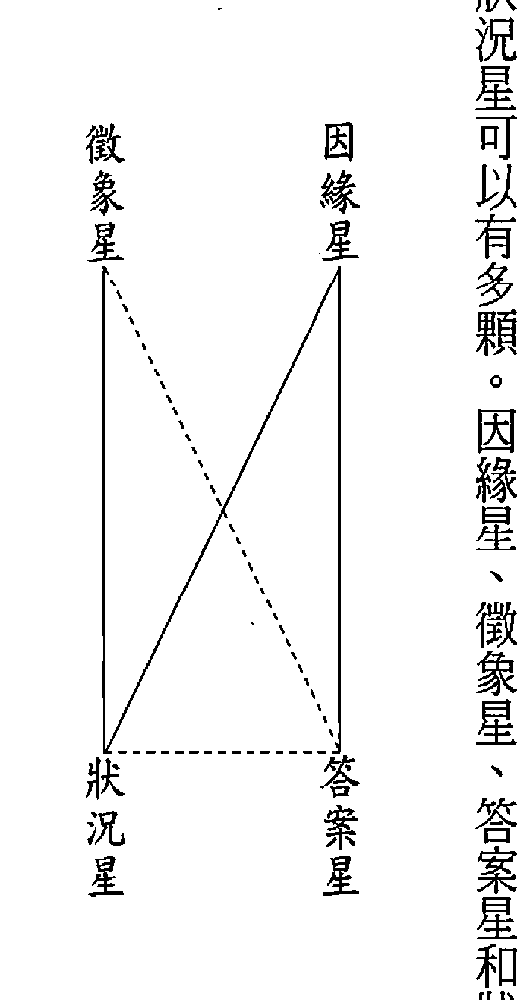

+   1. 因緣星與答案星之間，定有相位，並且往往是最緊密的相位關係。特別需要注意的是90度相位，有可能最緊密相位的行星，拒絕當答案星。
2. 徵象星與答案星之間不一定有相位，沒相位並不影響答案星的呈現，有相位表示答案更明顯。這時，答案星也就是狀況星。
3. 作為狀況星的基本條件是，必須同時與因緣星和徵象星形成相位。與答案星不同的是，狀況星並非是因緣星的最緊密相位行星，只要有形成相位即可。狀況星與徵象星之間，也只要有形成相位即可，兩者之間的相位容許度，愈緊密就表示狀況愈凸顯。當狀況星有多顆時，表示狀況較複雜。有時，行星雖與因緣星沒形成相位，但卻與徵象星有形成相位，也描述了部分狀況，可當成是狀況星，只不過這種情形下的狀況預測，準確度很難確定。
4. 答案星與狀況星之間一定要有相位，然而如果有相位，就表示狀況凸顯。

由上述四點可知，透過相位關係和緊密度，以及與因緣星和徵象星之間的相位關係，即可判定何者是答案星，何者是狀況星。答案星是以相位緊密度來作考量，狀況星是以同時與因緣星和徵象星形成相位來作考量，兩者有別。

可這麼說，答案星是主要狀況星；而狀況星則是輔助狀況星，可用來補充說明狀況。當答案星已顯示了狀況，則狀況星可能無用武之地。又如果所提問的問題本身，就只是在占卜狀況，無明顯的吉凶預測，那麼答案星往往就是狀況的顯現，雖然狀況星同樣可作補充。比如，預測目前的工作狀況？這與預測公司會不會倒？不一樣。前者可能無吉凶意涵，而只不過是顯示了難易或特殊情況；但後者卻涉及吉凶，雖然吉凶與狀況是相連的，可是主角還是吉凶。

記住：狀況的描述，絕不能否定了答案星的判定。比如，答案星呈現凶兆，而狀況星卻是吉兆，表示「看到，吃不到」。反之，答案星呈現吉兆，而狀況星卻是凶兆，表示過程多所障礙、困難，但還是大功告成了。

狀況星的說明，與徵象星一樣，包括行星和宮主星兩方面。徵象星與狀況星的區別，在於徵象星一定是所詢問之事件的代表行星或宮主星，比如問及有關錢財之事，金星和第二宮宮主星是徵象星，因為金星和第二宮宮主星可代表錢財。狀況星指的是過程中的情況，以及所可能涉及的人事物。就事件過程中的情況來說，以行星來作描述；就事件所可能涉及的人事物來說，以宮主星來作描述。比如，當金星和第二宮宮主星是狀況星，金星用以表示過程順利、平和，第二宮宮主星用以表示過程中涉及金錢。徵象星可用來認定答案星的明顯度，狀況星不行。

就第六、八、十二宮宮主星所代表的「反吉為凶」作用來說，只適用於答案星，不適用狀況星。比如，當金星是狀況星，是第六、八或十二宮的宮主星，可說進行過程平和，不能說進行過程不平和，因為「反吉為凶」不適用狀況星。又如果第六宮宮主星是狀況星，指的是過程中所涉及的人事物，是屬於第六宮所代表的人事物，比如第六宮代表下屬，意指過程中有下屬的涉入，可能是幫忙，也可能是搞鬼。從整個占卜的預測架構來看，結果和過程是兩回事，結果是由答案星來作確定，過程是由狀況星來作確認。可以沒有狀況星，但不能沒有答案星。因緣星就是要指定答案星，而徵象星則是可更進一步確定答案星，並引出狀況星。狀況的描述也是一種因緣，所以要與因緣星之間有相位。記得一點，星盤圖是相應的，即要有因緣才能顯示情況，所謂情況，包括答案和過程兩方面。往往因緣並不完全具足，以致只能看出答案，沒辦法看出狀況。當一次提問兩個問題以上，一張星盤圖往往是難以兼顧的，即難以同時針對多個問題來呈現答案和狀況，於是只好捨狀況，取答案。千萬不要針對同時提問多個問題，進行答案和狀況的一併解讀，只因星象真的是難以兼顧得那麼周全。針對事件狀況的描述，還涉及時間性，也就是所謂的過去、現在和未來的可能狀況進行卜問。有學生曾問我，說塔羅牌占卜可針對過去、現在和未來的可能狀況進行卜問，占星卜卦可不可以？可以。西洋卜卦占星家以入相位和出相位，來說明事件的過去、現在和未來的可能狀況，甚至有占星家自作聰明的加上過運（Transit）來解說三世。狀況的呈現不離因緣，因此因緣星是用以顯示三世的指標。當因緣星與答案星形成最緊密相位，答案星身兼狀況星，也就是代表現在。這個「現在」，指的並不是占卜的當下，而是答案落實、事件發生的當下。占卜的當下和事件發生的當下，有時間落差，也因此西洋卜卦占星家才把入相位當成代表將發生，因為入相位表示時間的邁向未來。然而，西洋卜卦占星家疏忽了一點，在緊密相位的情況下，即使是出相位，照樣是答案星，不會因為是出相位而被否定作為答案星。就占卜的當下來說，事件有可能是已發生了，即所占問的是已發生的事。這時候，所謂的「現在」，還是事件發生的當下，雖然是已發生。因此，何謂三世？要先認定「現在」。西洋卜卦占星學是以占卜的當下當作現在，而佛門占星學是以事件發生的當下當作現在，兩者不同。在確立「現在」後，即可依狀況星的情形來看未來和過去的可能情形。因緣星與狀況星之間的相位緊密度，容許度若超過2度，並且是在5度以內的入相位，往往指示著未來的狀況；也就是說，在容許度2度以內，所指示的是現在的狀況，即距離事件發生很接近，業果已成熟時的狀況。過去的狀況，同樣呈現在狀況星上，當狀況星與月亮之間，具有相位容許度超過2度，但在10度以內的出相位關係時，往往指示著過去狀況。此種情形表示該顆狀況星已被鎖定，難以動搖，用來指示已發生的狀況。相關說明，請參見後面「愛情進度？」實例解說。

答案星和狀況星可合稱為現象星，皆指示著某種現象。答案星所呈現的就是或吉或凶，是事件的最終結果。狀況星所呈現的是或難或易，或涉及的相關人事物。在非連續預測，且只提問一個問題的情形下，月亮是因緣星的第一考量，除非月亮空相位。月亮除了主要是當因緣星外，也可身兼徵象星，因為月亮本身也代表著某些人事事物，比如問及有關家庭、女人等問題，月亮就身兼了徵象星。除了當因緣星、徵象星外，月亮也可當答案星和狀況星，但有一定的條件限制，即月亮必須與第五宮宮主星形成120度相位。如果情況是，月亮與第五宮宮主星形成120度相位，並且其容許度是月亮的最緊密相位，這時月亮不但是因緣星，更是答案星，或吉或凶，取決於月亮是否為第六、八、十二宮宮主星。倘若不是最緊密相位，則月亮可當狀況星。若月亮緊密合相宮頭，也可能是答案星。

狀況八：行星所代表的事件狀況的說明。

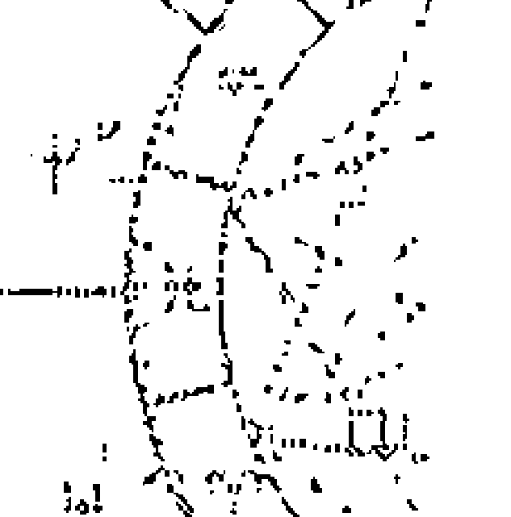

#### ☆太陽

+   1. 發生、達到、爆發。
2. 活躍、有力。
3. 熱切、熱情、溫暖。
4. 放大、顯著、壯觀、揮霍。
5. 掌控、指揮。
6. 開創、獨特。
7. 吸引、誘惑、出色。
8. 喜愛、偏袒。
9. 消耗、投入。
10. 喜悅、享用。
11. 堅持。

#### ☆月亮

+   1. 適應、接納。
2. 生產、腫脹、繁殖、肥沃、滋養。
3. 變化、移動、轉變、徘徊。
4. 退縮、保留、隱匿。
5. 儲存、收集。
6. 不安、不確定。
7. 沈靜、乏力。
8. 發飆、情緒、一時的發作。
9. 感染、感動、共鳴。
10. 稀釋、濕潤。
11. 幻象、虛擬。

#### ☆水星

+   1. 游移、分散。
2. 活潑、敏捷、靈巧。
3. 適應、應變、伸縮、機動、反射力。
4. 並進、多元。
5. 多慮、不定、疑惑、慌張。
6. 傳遞、介入。
7. 規劃、心想。
8. 虛構、編造。
9. 探知、學習、模仿。
10. 提示。
11. 感知、觸發、領悟。

#### ☆金星

+   1. 欣賞、讚美。
2. 美化、粉飾、浪漫。
3. 溫和、柔順、撫慰。
4. 喜好、戀慕、觸動。
5. 享受、舒適、貪念、耽迷。
6. 聯合、跟隨、認同、親近、互惠。
7. 磁力、吸引、親切。
8. 穩定、冷靜、平和。
9. 愉悅、歡欣、開懷、幸運。
10. 諧調、折衷、周旋。
11. 輕鬆、悠閒、懶散。

#### ☆火星

+   1. 促進、行動、引發、噴發。
2. 剝奪、入侵、攻擊。
3. 活力、衝勁、過動。
4. 熱切、灼熱、振奮、慾念。
5. 對立、挑戰、衝突、不和。
6. 獨斷、銳利、脅迫。
7. 直衝、激動、暴力。
8. 破壞、剖開、擾亂、瓦解。
9. 盡力、克服。
10. 厭惡、憤恨。
11. 率先、冒險、輕率、粗俗。

#### ☆木星

+   1. 擴大、膨脹、過量、誇張。
2. 豐富、累積、增進、繁盛、老練。
3. 顯眼、讚譽、提拔。
4. 花費、浪費。
5. 好運、吉兆、得到、圓滿、有益。
6. 贈與、和睦、融洽、寬大、善意。
7. 改善、恢復。
8. 爽朗、滿意、樂觀、歡笑、晴朗。
9. 傳達、公佈。
10. 想望、理想、幸福。
11. 優越、精華。

#### ☆土星

+   1. 缺乏、缺陷、畏縮、單調、乏力、沉悶。
2. 放棄、離開、厭倦、孤獨。
3. 黏貼、膠著、僵硬、凝聚、鞏固、沉澱、依舊、慣性。
4. 自制、冷淡、束縛、保守、熟慮、服從、提防。
5. 衰弱、無力、退化、降低、老化、沒落、老舊。
6. 慢性、延遲、阻止、障礙、困難、辛苦、停止、限制。
7. 痛苦、不幸、災難、失去、失敗。
8. 隱藏、貯藏、樸素、粗糙、節約、笨拙、沉重。
9. 憎恨、反感、猜忌、狹隘、偏執。
10. 焦慮、掛念、疑心、煩惱、消沈、悲傷、悲觀。
11. 嚴肅、貪婪、吝嗇、壓縮、集中、持久、忍受、老練。

#### ☆天王星

+   1. 變形、異常、不同、怪異、奇特、顛覆、異端、逆轉。
2. 突然、驚奇、變動、不定、不按順序、發作、快速。
3. 不測、橫禍、意外、危機、爆裂、崩潰、震動、劇變。
4. 煽動、反對、反駁、杯葛、搗亂、插手、混亂、推翻。
5. 前進、改造、先驅、革新、新發現、多樣、嘗試、推動。
6. 疏遠、分離、拋棄、脫離。
7. 活潑、動力、狂熱、興致、極端、衝動、膽敢。
8. 獨立、釋放、自由、隨意。
9. 協同、兄弟情。
10. 不相容、矛盾、不滿、變節。
11. 越軌、涉險、違法。

#### ☆海王星

+   1. 融入、耽溺、屈服、滲透。
2. 幻想、虛擬、放大、泡影、假裝。
3. 茫然、朦朧、迷惑、盲點、困惑。
4. 疏隔、緩和、受制、受難、流浪。
5. 浪漫、美感、陶醉、喜樂、魅惑、敏感。
6. 隱密、掩飾、消失、逃避、撤退、冷感。
7. 施捨、接納、善意、同情。
8. 不明確、曖昧、紛紜、流動、稀釋、波動。
9. 欺瞞、誤導。
10. 放蕩、不節制。
11. 凋謝、脆弱、多慮。

#### ☆冥王星

+   1. 埋藏、潛藏、隱匿、陰暗、不明。
2. 消滅、破壞、重生、轉機。
3. 暗中、背叛、惡念、掠奪、傾覆。
4. 狂熱、很敢、不捨、極致。
5. 災難、不幸、變故、惡化、變質、劇變。
6. 僵硬、獨霸、掐住、妨害。
7. 裂開、敗壞、丟棄。
8. 深入、淤塞、嚴重、沉沒。
9. 出軌、荒淫、怒火、激情。
10. 恐怖、不法、脅迫、暴虐。
11. 不淨、恨意。

### 二、第二條線索：宮頭行星

這第二條線索，指的是合相宮頭的行星，較特殊的是所謂合相宮頭，限定在容許度2度以內。在本命論斷上，合相宮頭的容許度可擴大為3度。這條線索，是西洋卜卦占星學所沒列示的，也因此西洋卜卦占星學對諸多情況理不清。合相宮頭的行星的作用，包括以下五方面：

+   (一) 在非連續預測的情況下，緊密合相宮頭的行星，有可能取代月亮的最緊密相位行星，而成爲答案星，但條件是必須與徵象星之間有相位。
+   (二) 在非連續預測的情況下，當月亮發生空相位，宮頭位置取代了月亮，成爲因緣的指標。這時候，答案星的明顯度，依合相宮頭的容許度，以及所落入的宮位來作判斷。
+   (三) 合相宮頭的行星如果不是答案星，有可能是重要的狀況星，即顯示著明顯狀況。若作為重要的狀況星，要與徵象星有相位，但不一定與月亮有相位，因為宮頭就代表因緣。
+   (四) 在連續預測的情況下，如果發生答案星的轉移，合相宮頭的行星，是一個觀察指標。
+   (五) 在一次提問多個問題的情況下，合相宮頭的行星有可能是其中的一顆答案星。

在閉關期間，臺灣有人出版西洋卜卦占星學的書，有學生拿來給我看。可發現的是，所引用的資料相同於我十多年前就已整本翻譯好的內容，有幾個情形必須說明。

其一，即使是抄襲，也應該抄得有技巧。雖然西洋卜卦占星學發展至今，可說預測的基本原則大致相同，然而在寫書方面，卻風格各不同，內容的順序安排不會一樣，若連順序的安排都一樣，一看就知道是抄那一本書的。

其二，要抄就抄齊全一點，好讓想研究卜卦占星學的讀者，有較多的內容可供參閱。若只抄前面一部份，而後面的卻沒了，會讓讀者誤以為西洋卜卦占星學就是如此而已。

其三，怎麼可以把所抄襲來源的書不列入參考書目，反而列幾本其他書。在西方的占星學書後面，通常會列有參考書目，而這些書目，很有可能作者根本沒看過。可是，真正的資料引用來源是那一本書，應該必然列為參考書目。我所看到的卜卦占星學中文書，其中的論斷規則，是引用自《Horary Astrology-The art of astrological divination》這本書。這本書早在十多年前，我就已經整本翻譯整理好，提供給學生參考。我所提供的參考資料不只一本，因為西洋卜卦占星學有新舊之分，目前所能買到的大多是二十世紀以後出版的書，就內容來說，不同於十九世紀之前的書。因此，就研究西洋卜卦占星學來說，至少要有兩本教材，一新一舊，以供對照，才能了解有何不同。

其四，要注意是否觸犯著作權。若不但抄內容，就連圖形、表格也照搬，很不適當。書中有關星座的廟旺陷弱、主宰行星的表格，只在上述的卜卦原文書中看得到，是原作者繪製的，豈能照搬，又沒列表格出處？另外還有一個圖形，是時主星的圓形圖，這圓形圖只在《Practical Astrology》這本書中有，同樣沒列出處，這會讓人誤以為是臺灣作者自己繪製的。《Practical Astrology》這本書是英國出版的，不是美國出版的。這本書是呂陽明老師的上課教材，在我上呂老師課的半年內，就已利用空間時間整本翻譯整理好，是我所翻譯的第一本占星書。十多年前，有幾位目前在開課教占星學的人，透過各種管道向我拿取相關資料。依我的個性，不會吝嗇。但後來我發現，這幾個人自認為自己很聰明，只要看資料就懂了，就可以當占星大師，開課教學生。這其中甚至還有人對所教的學生說我只會抄襲，沒什麼本事。凡事講緣份，學生與老師之間也是緣份，有緣則聚，無緣則散，與貶抑某人無關。若說同樣是抄襲，但親自進行翻譯或整理資料的人是我，自然對原文更熟悉。當時我沒說破的一點是，研究西洋占星學到最後，會有一道關卡，這個關卡沒過，就只能算是外行人。要突破這關卡，一點都不難，真正難的是難在要看關卡在那裡？沒看到關卡，如何談突破？關卡沒過，論斷方式就只能是書上所寫的那種外行人的論法。文字只是表象，大家都可以抄，但真正的玄妙所在，只有內行人知道。西洋占星學是邪知邪見，就如同是入魔道。當入魔修練到最高境界，只差一念之間，即可轉為佛道。這一念之間，就是從邪知邪見轉向正知正見。當我出版第一本占星書後，把書拿去送給呂老師，順便就這關卡直接點明，呂老師聽後，感到驚訝，他沒想到我可以自行看到且突破這道關卡，當下即說：「阿平，你已經算是占星內行人了。」我十多年前開課教占星學，從未有一個學生問我這道關卡。這關卡，我不會說破，而是讓學生來問，從學生所問的問題中，即可得知是不是有觸及到這最後的關鍵。一旦不曉得這關卡，結果就會搞出一堆不必要的東西，如合盤、中點、阿拉伯點、恆星等花樣，是外行人的花樣。佛門占星學不存在這道關卡，只因本來就是正知正見，沒有轉魔入佛的問題。讀者大德們可以不懂西洋占星學、印度占星學、八字或紫微斗數，但卻不能不懂佛門占星學，若是想一探預測的玄奧的話，等仔細研讀並應用本書後，即可有這樣的感覺。若是還執著於世間法命理術數，那只能說是入魔已深，對正知正見已無法接受，難以體會什麼是諸行無常、諸法無我。一句占星學的名言：「敢公開的，就沒什麼訣竅」。訣竅不在書中。完全抄襲西洋占星學，是難以超越西洋占星家的。資料是死的，若要活用，必須看出資料中的錯誤，尤其在解盤方式和論斷規則的應用上，有那些問題？如果一拿到資料，就當成寶，盡信其中所言，如何超越原作者？我之所以完全捨棄西洋占星學，就是因為研究到最後，對所看到的資料，認定為沒參考價值，以及透過靈識記憶找到了新資料，參考價值高過於西洋占星學。告訴讀者大德們一件事，在異度空間的龍宮裡，有一大部的星空佛法，裡面記載著許多星象的預測法門，只要寫一些出來，就足以讓讀者大德們大開眼界。

#### 41・基本規則

|  | 徵象星 | 狀況星 |
| --- | --- | --- |
| 行星 | 代表詢問事件的主宰行星 | 事件過程的難易 |
| 宮主星 | 代表詢問事件的宮主星 | 事件所涉及的人事物 |點化智慧。所以佛門占星學一系列的書，沒列書目；若要列書目，只有一條「星空佛法」，完全沒有抄襲的問題。雖然在適用上，不得不借用世間法的象涵意，但這是借相顯相，而就預測方法來說，佛門占星學是獨立體系。將來，是西洋和印度占星家要來抄襲佛門占星學。阿拉伯點、恆星、卜卦論斷、運勢論斷、本命論斷、合盤論斷、時事占星學、換置命盤等，那一樣不是抄來的？抄有分兩種，一種是有用腦抄，另一種是沒用腦抄。

在我跟呂老師學占星學，到出版第一本占星書之間，相隔有四年，這四年期間有三年是就讀研究所碩士班。我在這四年中，翻譯整理了不少占星資料，並就其中問題進行深入研究和實論測試，因此打下了深厚基礎，也能夠完全看清楚西洋占星學的問題和關卡所在。我對西洋占星學的了解，可說勝過諸多西洋占星家。

想當占星大師的人，可能想著先抄先贏，並沒有深入深思其中的問題。這種抄法，不可能超越西洋占星家。當對占星學的認知，就只是停留在表面上，根本看不到關卡在那裡，即使抄了上百本，教了上千的學生，也還是在原地打轉。急著當占星大師，急著得名得利，如何靜下心來深思、細心研究？因為所參閱的資料有限，以及思維廣度受限，所以認為占星學就只是西洋占星學那些把戲而已，再也沒其他的了，以致先抄先贏。沒想到的一個結果，所抄出來的東西終將被淘汰、取代！

#### 61·基本規則

我喜歡追根究底、深入研究，所以關閉十年作探索，對占星學的了解，已到了可完全推翻西洋占星學的境界。以本書來說，與西洋卜卦占星學相對照，西洋卜卦占星學絕對可以收攤！如果把四本有關星象占卜的書翻譯成英文，賣給西洋占星家看，足以讓西洋占星家們知道自己所知是何等有限。我不急著當占星大師，「占星大師」只是個虛名，真正重要的是正知正見、點化眾生，而不是引導眾生入迷信，造諸惡業、浪費錢財。先抄不會先贏，當我一步步推翻西洋占星學時，讀者大德們將看到，先抄的人有哪些問題沒注意，甚至完全沒看出來。

就資料的解讀來說，提出三點看法。一者，不要亂添加一些不必要的阿拉伯點和恆星，這跟卜卦無關；即使在本命論斷上，阿拉伯點和恆星早已被捨棄，不妨思考為何被捨棄。十九世紀和二十世紀的西洋卜卦占星學，有一個很重要的差別，即前者廣泛應用到幸運點，但後者並不如此，這可從書中看出。有關阿拉伯的書，英文版買到的只有一本，是滯銷書，十多年前我賣出三本。有關恆星的書，買到的有五本，這五本要湊齊不容易，頂多擁有三本，我五本全扔了，阿拉伯點的書也扔了。我所看到的中文卜卦占星書，其中有關恆星的資料並不齊全，以致沒提到同一顆恆星，其實有不同的看法。

恆星的被捨棄，與天文學的發展脫離不了關係。古時候，以肉眼來看天上繁星，無法測知與地球之間的距離有多遠，現今透過高科技望遠鏡，可知道是多少光年，依光年來作計算，距離自然是相當遙遠。在這麼遙遠的天際他方，某顆恆星可影響一個人的命運，誰會相信？西洋占星家盡力在拋開迷信的包袱，以減少被批判的力道，所以才會宣稱在進行科學化。在占星科學化的過程中，捨棄恆星是很自然的。就實際論斷來說，也確實沒必要有恆星。等接下來有關本命論斷的一系列書出版，書中沒引用阿拉伯點和恆星，著重的是論斷技巧的巧妙應用，讀者大德們即可看到，佛門占星學有何玄妙之處。

西洋占星家是迷信於天上行星會影響一個人的命運，在這樣的迷信下，必須盡可能找到解釋理由，亦即針對一個人之所以發生什麼事，從星象上找到自圓其說的依據。在天海冥未被發現前，以肉眼來看恆星，與金星、火星、木星等行星一樣，皆是一個發光點，只是不移動，自然會被拿來加入論斷因素，以便擴大自圓其說的空間，讓占星學站得更穩。在這個過程中，往往是有一個具知名度且自作聰明的占星家，先針對恆星的作用和涵意進行妄想式的說明，然後就有人接著進行修改、補充。有西洋占星家試圖透過射線的作用，來為天上行星影響地上命運作辯護，所針對的射線作用僅涉及內行星，不會把恆星列入，理由很簡單，恆星實在是距離太遙遠了，解釋不通。

#### 63·基本規則

喜好研究占星學的人，不妨思考一下，西洋占星家已經捨棄不要的東西，難道適合在臺灣發揚光大？真正的訣竅，不在星多、虛點多，不在論斷因素多，而是在於一整套巧妙的論斷技巧，有層次、有焦點，可提高預測的準確率。

也許，有迷信恆星者會提出這樣的反駁，說某星盤圖上的某恆星合相某行星，所以某人發生某事。這樣的說詞，犯了方法論上的錯誤。理由很簡單，相同的情形，沒發生該事的人遠多於有發生該事的人。諸多西洋占星家清楚這樣的情況，所以最終捨棄了恆星。恆星要能被承認有必要存在，只一個情形，即有些情況無法透過十顆行星看出，必須藉由恆星來看出，那麼恆星就一定存在論斷中。但依西洋占星家目前的看法，十顆行星即可用以解釋各種事件的發生，沒必要加入恆星，也沒必要加入阿拉伯點，以致將其捨棄。再次強調，論斷功力的深淺，在於一套運作星象的規則和過程，並加上一些論斷手法，不在於單一顆行星或虛點的對命運起決定性作用。

順便一提，有些一人喜歡預測時事，即研究所謂的世俗占星學。就世俗占星學來說，充滿著相當多荒謬之處。二十世紀之前的世俗占星學，在論斷時會應用到恆星，比如古代中國占星學就是相當標準的世俗占星學，完全以恆星來作預測。有關世俗占星學的批判，在此不多說。只提一點，自古以來，認為彗星會帶來災難，於是當彗星出現時，就有人說是不祥之兆。這不祥之兆，往往不是彗星出現的當時就發生，而是隔了某些年後才發生。這麼一來，就有問題了。要相隔多少年，才會起作用？沒不一定。這豈不是把相隔多年的事，硬套在彗星上來作解釋？現在如果還有占星家說，某彗星的出現會造成什麼樣的影響，肯定會被笑無知，因為全是妄想，在彗星出現和事件之間，進行妄想式的解說。恆星不也是如此？

一個國家的存在，以目前來看，少者幾十年，多者上百年。而一個本命盤的適用期限，一般是四十年，過了四十年，就要進行調整。因此，以一個國家本命盤來論斷國運，當這個國家成立已超過四十年，原來的本命盤已不適用，還預測什麼？告訴讀者大德們一件事，一個國家本命盤上所顯示的會發生的情況，在前四十年就已發生完了，那這個本命盤的論斷價值就已經沒有了。

針對占星學作研究，有一項工作相當重要：驗證。如何驗證？涉及研究方法，形成行家和外行之別。以恆星來說，自古以來就有不少占星家對恆星產生迷信，那麼為何現今恆星卻被棄而不用？不妨從驗證的角度來看。基本前提是，當某顆恆星與某顆行星形成合相，就表示會發生某事。這所謂的某事，必須具有特定的界定，即不脫離該顆恆星和該顆行星所代表的徵象。驗證可從兩方面來看，一是發生的機率，二是解釋上的唯一性。

先說發生機率，所謂發生機率指的是某顆恆星與某顆行星形成合相，同時具有此星象徵兆的人，發生相同或相似事件的機率有多高？很顯然，其機率不足到不可捨棄恆星的程度。假設以六十億的人口來看，在大約相近時刻出生的人，本命盤上有著恆星合相的情形，人數必然相當多。又因為恆星是不動的，而行星是繞著星盤圓周在移動的，所以不只是同時出生的人，才會具有相同的恆星和行星的合相，因而具有相同星象的人應該更多。在這些人中，難道會發生相同或相似的事件？不可否認，有這個可能。但驗證不能只看有發生的，忽略了沒發生的。有發生和沒發生是相對數據，當發生的數據遠低於沒發生的數據，驗證的結果自然是棄恆星不用。假設有一百萬人，同樣具有某顆恆星與某顆行星的合相徵象，在這一百萬人中，只有一萬人發生了相同或相似事件，發生的機率等於是百分之一，這樣的機率實在太低了，不具說服力。驗證的結果，如果沒有達到百分之七十的機率，至少也要達到百分之五十的機率，才具有說服力。諸多占星家的思考深度和廣度不足，以致忽略了驗證的相關問題。這猶如讀書就只是把書本內容記起來，而不去判斷書中的對錯。占星行家看恆星，就是一個固定的點，當行星合相恆星，同樣也是一個固定點。這等於說，從這個固定點來斷定會發生某事。這種推斷方式相當冒險，失算率太高。原因很簡單，沒有轉寰的空間。一旦沒有轉寰的空間，那麼對於那些具有相同恆星合相行星，卻沒有發生相同或相似事件的人來說，該作何解釋？

在西方，占星學遭到有識之士的強力批判，所以西洋占星家才會說占星學科學化、占星學現代化。這樣的訴求，導致了占星家捨棄了固定點的推論方式，以綜合的方式，並搭配心理學的相關技巧，來呈現新的占星論斷面貌。依固定點來作推論，很容易一下子就被批倒了，理由是只要搬出一堆有星象卻沒現象的實例，那麼固定點的推論方式在事實擺在眼前的情況下，就沒輒了。西洋占星行家很清楚，足以拿出來否定固定點推論方式的實例實在太多了，以致乾脆捨棄固定點的推論方式，所以不要恆星，也不要阿拉伯點。

固定點和綜合式推論方式的差異，在於相位的應用，即固定點的推論方式只限定於合相，而綜合式推論是各位皆有。讀者大德們不妨試著應用看看，就固定點推論方式來說，把一堆恆星全列出，然後再把十顆行星拿來對照，找出合相的所在，依此論斷會發生某事。結果只有兩種情形，一是根本沒發生某事，所以否定了某固定點的作用；一是有發生符合徵象的某事，這麼一來，是否就證明了某固定點的作用？未必！因為必須是唯一的推論依據，才可證明某固定點的預測作用。如果可透過綜合式的推論方式，得出推論結果，那麼同樣是否定了固定點的存在作用。也就是說，某事的發生，其預測依據可以不必來自某固定點，那麼這固定點同樣是沒用的。

在所能預測的範圍有限的情況下，當重要的事件已經透過行星和交點來作呈現時，自然不需要考量恆星。恆星之所以有必要存在的前提，即是透過行星和交點的綜合推論，沒辦法呈現重要事件的發生，唯有藉由恆星才能看出重要事件的發生，這時恆星就非應用不可。一旦恆星不具有唯一的顯示作用，就可棄而不用。依目前西洋占星論法，其所涉及的論斷因素如此之多，對任何一件重要事件的發生，已有足夠的論斷因素來作解釋，所以才不動用到恆星。

或許讀者大德們會有這樣的看法，認為透過固定點和綜合式的推論的綜合，更可以提高預測準確率。意思是說，恆星合相行星所代表的可能發生某事的徵象，如果結合了綜合式的推論的相關徵象，即可得到更肯定的推論。比如，依恆星合相行星得出發生車禍的徵象，結合了星盤圖上同樣也有發生車禍的徵象，那麼就可以相當肯定此人會發生重大車禍。有這樣的看法，並不奇怪，但我會明確的說，這完全是外行人的看法。其中細節留待他書再作說明，只簡單提一點。

依據相關徵象的加總來作推論，不是方法論，而是主觀妄想。也因爲是主觀妄想，所以脫離了肯定與否定、對或錯的判定。世間法命理術數充滿著這種「累加」的妄想推論法，這是沒有經過方法的訓練所形成的一種方法。有方法，可稱爲正見；沒方法，可稱爲邪見，這所謂的「沒方法」，指的是一種沒經過思辨的「徵象累加法」。正見產生正信，相信占星學可透過相應法則，而對命運加以預測，雖然不是百分之百，但卻不會疏忽了重要事件。邪見產生迷信，同樣相信占星學，但相信的基礎不同，迷信是不知爲何，不理解原理、法則，看到什麼就抄襲什麼，當預測準確時，更加深迷信，當預測不準時，盡力尋找解釋理由。正信和迷信、正見和邪見，差別在那裡？論斷方法！正信的論法是一套驗證的過程，驗證即是論斷，論斷即是驗證。迷信的論法是散彈打鳥、撒網捕魚、徵象的累加，甚至是不同預測系統的徵象累加（合參）。我對占星學的認同來自於正信，而非迷信。

#### 69．基本規則

什麼是「徵象累加法」的妄想式推論方式？比如說，在一張本命盤上，透過行星所落入的星座或宮位，看到了離婚徵象，又透過行星相位也看到了離婚徵象，再者透過恆星、阿拉伯點又看到了離婚徵象，由於離婚徵象一再出現，所以認為離婚的可能性相當高。把離婚徵象一一加起來，愈多，就表示愈可能離婚。這種論法，不但在占星學可看到，在八字和紫微斗數上也可看到。直接了當說，這完全是外行論法。問題出在哪裡？如果這種論法可以成立，那麼許多的論斷因素皆可被加進來，也就是說完全沒有刪除、檢驗的機制，包山包海，全部都可納進來，這不是方法的應用，而是妄想的發揮。真正的占星行家是驗證和論斷同時進行，其過程是先有某種假設，然後透過一定的判斷步驟，求證於某一徵象的發生機率。也就是說，所針對的是一個離婚徵象，依據既定的判斷規則來印證這個離婚徵象發生的機率有多高，而並不是與其他相似徵象進行累加。可這麼說，單一徵象在何種情況下，會百分之七十以上發生特定現象，即使沒有達到百分之七十，至少也要達到百分之五十。以百分之五十的發生機率來說，這機率與其他的徵象完全無關，不需要累加。單一徵象就是一種因緣的顯示，重要的是如何依一定的觀察指標，來判斷產生特定現象的機率。一旦觀察指標，即作業流程確立，預測和驗證同時進行。行家和外行，差別就在於曉不曉得這樣的作業流程。透過驗證的經驗累積，作業流程在經過修正後，預測的準確度就會提高。在執行作業流程的過程中，根本不需要考量多餘的論斷因素，所以真正的占星行家只需要傳統七顆行星和兩個交點，就已足夠了。

無師自通者透過占星書籍所看到的是徵象累加法，自然以為占星論法就是如此，如果缺乏深思，很可能一輩子就是如此散彈打鳥式的預測。以占星卜卦來說，真正的關鍵就是答案星，依一定的作業流程來確認那一顆是答案星，以及這顆答案星在既定觀察指標下，可達到多高的準確率。而並不是扯一堆徵象星進來，然後依徵象的累加來判定答案。整個西洋占星學，可說已經走火入魔，在徵象累加的妄想下，進行妄想式的合理辯護。只要是妄想的，不合理也會變成合理，這絕不會讓占星學得到有識之士的認同。西洋占星學之所以走到這般田地，只因為無師自通的外行人太多了，寫了太多一點參考價值也沒有的占星書。想從外行變內行，先拋棄徵象累加法，找出有效的作業流程，才能把相關問題和核心格局看得一清二楚。所謂核心格局，意指作業流程的應用。

佛法修行講究「信、解、行、證」，四者是相互融攝的。這「信」，是相信，更重要的是正信，只有透過解、行、證，才能說是正信。解者，了解、理解，是相當深入的；行者，預測、驗證，實際執行。證者，有所得，破迷開悟，知道什麼是命運，如何預測命運。相信占星學，認為占星預測準，這很可能只是表面、表象的，離深入核心還有一大段距離，甚至可能走偏了。佛家講「四依法」，其中的「依智不依識」，智者，智慧、理智；識者，情識、主觀意識。如果對命運的預測，是脫離不了宇宙人生的真相，那麼一定需要依智慧來洞悉，不能依主觀妄想來作理解。當想藉由占星學來得名得利，占星學的呈現就只能是情識的映現，所以各依妄想來發揮，搞出一大堆花樣，看得眼花撩亂，結果是愚昧無知，還有另一個結果，即占星學不是學問，而是撈錢的工具。恆星何其多？上億的。西洋占星學書中所列的，通常都超過一百顆，能信嗎？

此外，在台灣有占星家以「古典占星學」為號召，這名詞用法有問題。占星學界沒什麼學派之分，唯一的學派是漢堡占星學派，其論法也確實很特別。現代和古典占星學之別，是依歷史性來作劃分的，從十九世紀末到二十世紀初是分水嶺。在界定上，現代與古典有兩大不同，一者是否有應用到天海冥三顆現代行星來作論斷，二者是否在論斷手法上有引入心理學。前者不必多說，後者是影響了整個占星論斷程序的安排，即當心理占星學發展出來後，改變了西洋占星學的論斷手法，擴大了解盤的空間。因此，並不是指加入阿拉伯和恆星來作論斷，即是古典占星學。現今的古典占星學，就是印度占星學，以預測事件為主，極少談及心理，並且只應用傳統七顆行星和兩個交點來作論斷。佛門占星學可以是古典占星學，境隨心轉。

二者，參閱西洋卜卦占星學的書，最重要的重點是相位！相位的巧妙應用，不是三天兩天可搞清楚，一定得深入研究。不少人在看西洋卜卦占星學的書，看如何解盤求得答案，往往是重點落在各徵象星上，什麼徵象星落入什麼位置，什麼麼徵象星有何相關性，以此來看出相關性。解讀卜卦盤的步驟，不是先解讀相關性，然後再下定答案，再來詮釋相關性。理由是相關性不一定呈現，但答案一定呈現。而答案來自那裡？西洋卜卦占星學通常是依相位來取得答案。因此，從對相位的巧妙解讀，可看出作者功力的深淺。簡單說，凶相位有時是肯定的，吉相位有時是否定的，如何界定，即是功力。這其中的巧妙，要細看才能看得出。倘若功力不深，僅以一些資料、實例來湊成一本書，解讀方向不對，自己也不知道，雖然結果有可能猜對，只因猜中的機率是二分之一。

三者，西洋占星家有相當多無師自通的人，所寫的書根本不值得一看。那一本書值得看？想辦法找個真正了解西洋占星學的人來作介紹。若要深入了解西洋占星學，一定要有西洋占星行家的指導，才不會誤入歧途。為何會強調恆星、阿拉伯點等已退流行的內容，理由很簡單，缺乏交流，自己搞自己的一套，這樣的書若翻譯成英文，拿去西方國家賣，會被看成是怪胎，當成笑話。當初我賣書，忘了介紹那幾本書是滯銷書，以致被當成寶，想來真是罪過！

也許讀者大德們會說，我宣揚佛門占星學，也是在自己搞自己的一套。我的回答是，佛門占星學遠早於西洋占星學，西洋占星學一開始就是抄襲來的，而且抄得很不齊全，又加上希臘的神化和星座妄想，已脫離了宇宙運行之道，成為江湖術數。從本書中，可看到最原始的卜卦占星學的基本預測規則，雖然我作了不少修正、補充。這些基本規則，是可進行驗證的。同時，可看到兩點，一是有些問題的處理，西洋卜卦占星學辦不到，因為辦不到，所以西洋卜卦占星學根本就不提這些問題。二是，就整個占卜的過程來說，本書用最少的參考因素來取得答案，意在讓讀者大德們看清楚，事實上只要傳統七顆行星和兩個交點，就足以解決所有的提問。

如果讀者大德們是一個占星天才的話，那麽藉由本書的說明，可自行設計自己專屬的占卜規則和流程。這等於說，在既定的宇宙運行法則下，占卜並非一成不變，而是可千變萬化的。佛法說『一即一切，一切即一』，法則不變，應用可變。不是天上的行星在決定答案，而是你的心基於因緣而相應答案，行星只不過是對境、工具。真正熟悉本書，占卜工具可未必是星象。

針對多餘的論斷因素進行批判，主要是為了開啟眾生的智慧，提供芸芸眾生一個開展思辨的線索，不要掉入迷信的執著中，還以為自己是對的。一個基本原則，天上的行星、小行星、恆星、虛擬的阿拉伯點等，並沒有決定、主宰你的命運。占星預測是借相顯相，所以論斷因素不是自性獨立存在的，而只不過是在借相顯相的過程中，用以作爲把萬法進行歸類的方式而已。於是，只要傳統的七顆行星和兩個交點，可把萬法納入其中，就沒必要有多餘的論斷因素。以現代行星的天海冥來說，可存在，也可不存在。可存在，是因爲可把萬法現象中的一部分納入其中；可不存在，是因爲這部分的萬法現象，可被分散納入其他傳統七顆行星中。因此，提高準確預測的機率，決定於是不是徹底明瞭預測的法則和技巧，兩者是合一的，而不是取決於論斷因素的多寡。論斷因素愈多，自然就愈混亂。而之所以認爲這些多餘的論斷因素是必要的存在，根源於一種超越的主宰者的邪知邪見。比如，認爲恆星是超越的存在，會決定一個人的命運，所以論斷時得參考恆星。這種觀念，中國自古以來就有，至今還是有人深信不疑，這是個人的智慧問題。對於占星學，讀者大德們的心態如何，決定了作法。倘若是研究，必須具備兩個要件，一是懂得如何消化資料，辨別其中的對錯、優劣，而不是從中只看到秘訣、論斷技巧；二是曉得如何進行研究，即要有可行的研究方法。這兩項是合一的。抄襲容易，超越難。抄襲只要敢，看到什麼就當成寶。超越需要智慧。慧，前階段是看出荒謬之處，後階段是就荒謬之處作修正，若連荒謬之處都看不出，根本談不上修正。兩千多年的時間不算短，但西洋占星家卻沒看出荒謬之處，即使有人看出了，也找不到修正的方向。一路走來，也許我的因緣特殊，數萬西洋占星家兩千多年做不到的，我花十年時間跨出了第一步。理由是在這造惡業，自己、親人或後代子孫，將因此而承受惡報，所以停筆了。一一方面對西洋和印度占星學進行更深入的研究，一方面透過靈識記憶的追尋，洞悉最原始的占星學，並加以修正、補充。各人業力須各自承擔，我無權決定讀者大德們的作法，但可提供一條思索的方向，在諸行無常、諸法無我的運行法則下，讀者大德們可開創出專屬於自己的預測法，不管所應用的預測工具是什麼，只要明白一個道理，沒有任何超越的存在去決定你的命運，是你自己所造下的善惡業，在決定你和親人的命運，而預測的原理只有一個：「相應」，善用相應，可開創出各種不同的預測方法。我在因緣之下得以研習西洋和印度占星學，這只是在於喚醒我的靈識記憶。當我逐漸恢復靈識記憶，自然對占星學另有看法。占星學在傳承過程中，由於一些自作聰明者的加入，搞出一堆不必要的花樣，自然讓占星學走向歧途。這種邪知邪見的歧途走向，非我所能扭轉，我沒偉大到可以改變眾生的貪念，世間法命理術數就是眾生貪念的映現罷了。我所能作的，就只是提供點資料作爲點化之用。信者自信，不信者就別信。

我強調正確知識的重要性，修行、學佛，絕不是要否定世間有益的知識。現今的正確、有益知識，是諸多智者的心血積累，修行者既然置身事外，就不要去標榜透過修行所得的智慧，可超越世間正確知識，因爲兩者是不同的走向。說直接點，沒有正知正見，沒有正確的知識，只靠修行所能達到的智慧程度有限。釋迦牟尼雖然受限於所處時代，不具備現代的諸多知識，但求知精神卻是令人欽佩的，並且有自己的一套思辨方法，所以才能與諸外道辯論，這絕不是只靠修行即可如此。

同理，占星學和各種命理術數，其深入研究也需要有正確的知識和研究方法來作基礎，絕不是說天上有某顆恆星，或創造了某顆阿拉伯點，然後說這會影響你的命運，要別人去迷信這種說詞。讀者大德們可以相信佛門占星學，也可不相信佛門占星學，但我希望的是不要迷信，不要我寫什麼就相信什麼。拿去印證，並且從印證中體會其中的玄妙運行法則。讀者大德們可繼續緊緊抱住世間法命理術數，得名得利，但我提醒兩點，一是佛只渡有緣人，二是所造之惡業必須有遭

#### 77·基本規則

受惡報的心理準備。爲何占星學會成爲有識之士的批評對象，而不被其讚歎？值深思！在占星書籍中，可看到某些對於實際命例的解說。就本命盤的解析而言，以我目前的境界，一眼即可看出功力的深淺，而所謂的功力深淺，指的是解讀的線索有沒有拉出來，以及論斷的層次感有沒有確立。由於目前臺灣的占星家，對占星學還不能算是夠深入研究，所以功力尚淺，以致解讀的線索和論斷層次感尚未明確化。待我針對本命盤論斷進行一系列寫作時，會把相關問題一一作說明。此，先提醒一點，儘信書，不如無書。一張本命盤，並不是生辰八字正確，即可拿來論斷。有時，正確的生辰八字也會與命格不符，需要作調整。學生拿給我看的占星書中，有的名人的本命盤，一看就知道有問題，但作者還是強行作解釋，只因外行。就卜卦占星學來說，對於書中的實例描述，我往往持保留態度。不是我不相信作者，而是當考量到連續預測的問題時，很自然會認爲相當傳神的預測，把實例的整個情況全預測出來，而且相當準確，並不是不可能，但只是巧合。不妨這樣想，在一個提問的預測之後，相隔半小時後，接着又提問另一個問題，在相差半小時的情況下，如果星象並無多大變化，即行星沒有移換到另一個宮位，那麼針對前一個預測的傳神描述，難道也能套用在後一個預測上？顯然，這不是不可能，但發生的機率相當低。因此，我不否認針對事件的狀況描述，可達到相當精準的程度，但這是可遇而不可求的，是因緣使然，而不是時常如此。當作者描述預測某實例時，說明著如何細膩地預測出整個情況，這可能是加油添醋。

針對占星卜卦，可記住以下兩點：

一是，最重要且最根本的是預測答案的吉凶，並透過吉凶來描述事件的狀況，但事件的狀況未必會呈現。

二是，研究卜卦占星學，一定要考量到連續預測的問題，預測技巧的變化，就在於此。

##### 探討一：宮位的主要作用？

接下來，所要說明的主要是有關連續預測的問題。在說明前，必須先對宮位和宮主星進行作用上的界定。

一般懂得占星學的人，透過對本命占星學的了解，認為宮位代表了某個特定生活領域的事項。比如，第二宮代表錢財，所以當行星落入第二宮內，可用以論斷錢財狀況。請讀者大德們先把這樣的觀念拋開。宮位本身之被用作為論斷某特定生活領域的事項，是有條件限制的，這在解說本命論斷時再作說明。就卜卦來說，第二宮就只是星盤上第二個空間而已。

星盤上的十二個宮位，分成三組。第一組是第六、八、十二宮，稱為陷宮、暗宮，用以表示當行星落入這三個宮位，如同烏雲遮日，蓋住了。第二組是第一、五、七、十宮，稱為強宮、明宮，用以表示當行星落入這四個宮位，如同雲開見日，發光了。第三組是第二、三、四、九、十一宮，稱為中性宮或無記宮，用以表示當行星落入這五個宮位，不明不暗，除非有既定條件的引動，不然可視而不見。請先記住這三組宮位分類。

##### 探討二：宮主星的主要作用？

在有關特定生活領域的事件代表性上，宮主星才是真正的主角。這就是說，第二宮宮主星可代表錢財事項，但第二宮不能代表錢財事項，兩者有別。宮主星作為現象星（答案星），只發生在第六、八、十二宮宮主星的情形。宮主星作為象徵星，即生活事項的代表，則是十二宮位皆包括。須注意的是，宮主星的作為

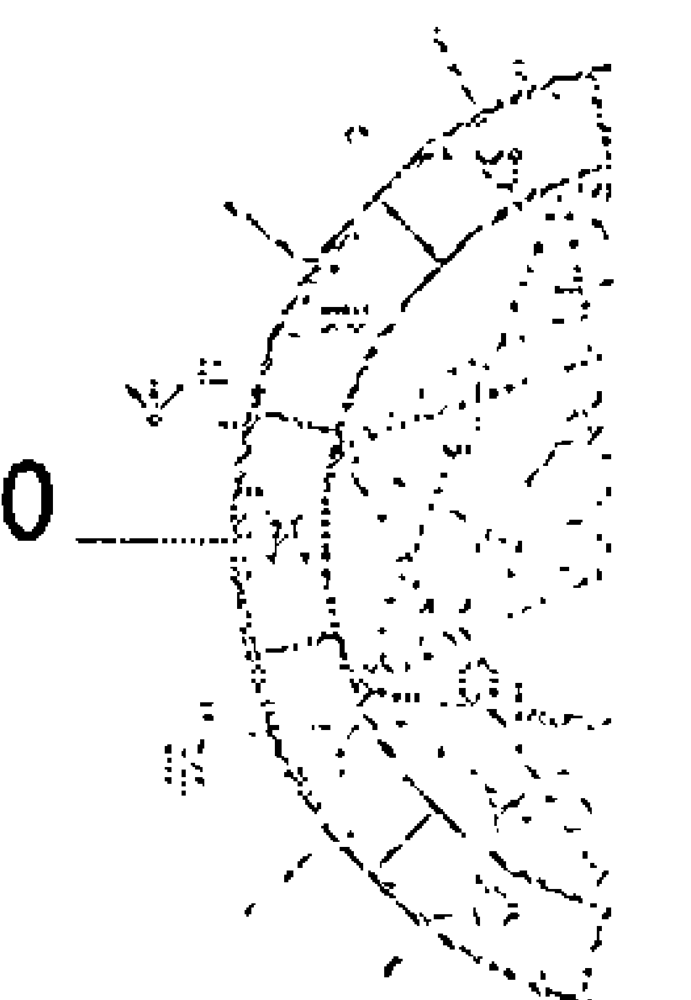

第一、五、七、十宮宮主星，即強宮宮主星，無反凶爲吉的作用，所以稱第一、五、七、十宮爲吉宮，是不對的。

##### 狀況一：

在非連續預測的情況下，月亮有可能形成空相位，沒有與任何行星形成相位。這麼一來，少了月亮的指引，答案星是轉而落置在合相宮頭的行星。同樣是以相位容許度2度來界定，合相宮頭2度以內，即是屬於明顯的答案星。由於可能同時有兩顆行星合相宮頭2度以內，因此要有區別、判斷的依據，而這就是強宮的作用。

- 1. 行星合相宮頭有兩種情形，一是在宮尾合相下一個宮位的宮頭，二是在宮頭合相當宮的宮頭。不管是那一種情形，判斷原則是看其所落入的宮位。
    - 落入第一宮的宮尾，就是落入第一宮；落入第十二宮的宮尾，就是落入第十二宮。

- 2. 把強宮和相位容許度一併考量，答案星即可呈現。
    - A. 落入強宮，並且容許度2度以內的行星，即是答案星。若有兩顆，以相位容許度最緊密者爲答案星。倘若有兩顆行星的緊密度相當接近，相差10分以內，依第十、五、一、七宮的順序來作取舍，即最優先取的是第十宮內的行星。
    - B. 沒落入強宮，但也合相宮頭在容許度2度以內，是第二考量。
    - C. 落入強宮，但合相宮頭的相位容許度超過2度的行星，是第三考量。
    - D. 沒落入強宮，並且也沒落入第六、八、十二宮，合相宮頭的相位容許度超過2度的行星，是第四考量。

通常，只考量到A、B兩種情形。當有兩顆行星落入同一個強宮，一顆在宮頭，一顆在宮尾，並且合相宮頭的相位容許度皆在2度以內，並非宮頭行星就強過宮尾行星，依容許度來作區別，較緊密者即是答案星。

- 3. 另一個觀察指標是徵象星。當所提問之事件的徵象星，與某顆合相宮頭在容許度2度以內的行星有形成相位，則這顆行星成為答案星。除非月亮是空相位，不然原則上還是以月亮作為因緣星，來判定答案星的落點。

針對月亮的相位容許度，可略為加寬，但以9度30分為限。

西洋卜卦占星學的預測方式，可說是分散式的。雖然主要還是依靠月亮來作判定，但牽扯進來的徵象星往往有好幾顆星，以致當月亮形成空相位時，除了月亮以外，其他多顆徵象星彼此間仍有相位，可依據這些相位來猜測答案。鎖定一顆答案星，是集中式的預測，如同打靶，先射準紅心，再對外作推敲。

##### 狀況二：
徵象星有兩種，一是行星徵象星，二是宮主星徵象星。比如，以錢財事項來說，金星和第二宮宮主星皆是徵象星。之所以會有兩顆徵象星，是因為在星象的諸移動變化中，若只有一顆徵象星，那麼這單一顆徵象星要與答案星形成相位的機率較低，若有兩顆徵象星，則可提高與答案星形成相位的可能性，以方便判斷答案星。在徵象星方面，有些事項的歸屬尚未形成一致看法，因而有徵象星抉擇上的難處。比如死亡，有占星家認為冥王星是徵象星，也有占星家認為土星是徵象星。在冥王星未發現之前，死亡的徵象星確實是土星。於是可這麼說，如果你習慣只用傳統七顆行星來作論斷，倘若你習慣用十顆行星來作論斷，那麼死亡的徵象星可自行決定為土星或冥王星，即你必須確立自己的應用慣性。

徵象星是用來判定答案星的一條重要線索。當徵象星有與答案星形成相位，則答案更明顯，也表示針對事件的狀況描述，有較明顯的顯示。當徵象星沒與答案星形成相位，則並不表示答案不明顯，因為答案的明顯度，主要還是取決於月亮的相位容許度，而是針對事件的狀況描述的因緣不具足，可判定答案，但無法呈現較多的相關線索。

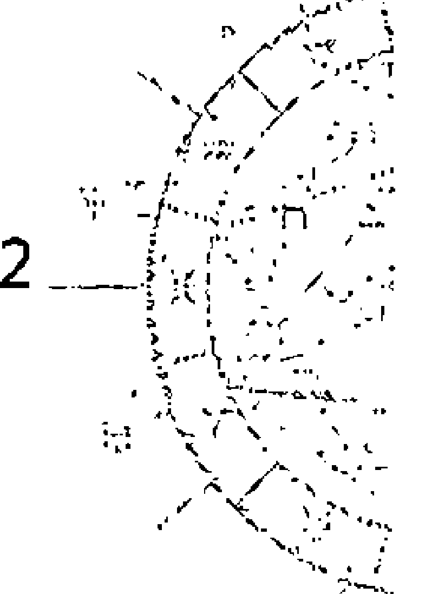

隨著情況的愈來愈複雜，為免讀者大德們搞混，先作一點梳理的工作，方便讀者大德們記住其中的相關性。

☆星象占卜，可分成非連續預測和連續預測，彼此以兩個小時作劃分，兩小時內進行兩次以上的占卜，即是連續預測。前一次預測和後一次預測，時間間隔超過兩小時，即是非連續預測。

☆非連續預測就是單次預測，西洋卜卦占星學所呈現的就是單次預測的規則。非連續預測是以月亮當因緣星，來作為最主要的判定依據。連續預測的確立答案星，多了一條線索，即一定要考量合相宮頭的行星。

☆在連續預測中，答案星的確立有兩條線索，一是與月亮形成最緊密相位的行星，二是合相宮頭最緊密的行星。到底何者才是答案星？在連續預測時，轉而改為以合相宮頭的行星作為第一考量。

☆在連續預測時，若有兩顆以上的行星合相宮頭，相位容許度皆在2度以內，何者才是答案星？判斷依據有三：

- 1. 合相宮頭的緊密度，愈緊密愈明顯。
- 2. 是否落入第一、五、七、十宮中。
- 3. 是否與徵象星形成相位。

三條件皆具備者，為第一考量。倘若三條件不全具備，以後面兩條件的支撐來決定答案星。比如，有兩顆行星皆合相宮頭，其中之一是更緊密的合相，但卻不具備後面兩條件，而另一顆行星則具備，那麼答案星會是合相宮頭次緊密的行星，非最緊密的行星。

如果情況是最緊密行星和次緊密行星，各具備2、3兩個條件的其中之一，優先考量的是3的條件，其次才考量2的條件。若兩顆行星同樣落入明宮，依第十、五、一、七的順序來作選擇。

☆ 在非連續預測中，即單次預測，月亮形成空相位，因而失去扮演因緣星的角色，此時判定答案星所在，是依合相宮頭的行星來作考量。

☆ 月亮形成空相位，所造成的必須把確立答案星的線索落置在合相宮頭的行星，其所應用的判斷規則，適用於連續預測時。

☆ 當行星落入第六、八、十二宮內，合相宮頭，在月亮形成空相位時，可用以作為考量是否是答案星。但若是在連續預測時，行星落入第六、八、十二宮，並合相宮頭，若有其他行星也合相宮頭，則通常不作為是否是答案星的考量。

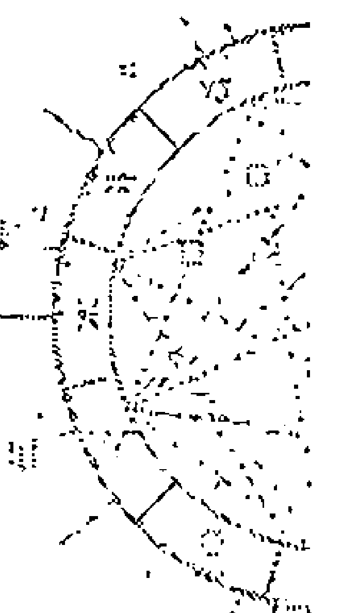

##### 狀況三：
徵象星主要是作為預測事件的代表，因為所要預測的內容，往往是以事件來作呈現。比如，問及某人的病況，病況即是事件，代表病況的行星或宮主星即是徵象星。西洋卜卦占星學把代表人和事物的徵象星，一同視為徵象星，複雜化了論斷線索。除非所提問的事件是有關心理、想法等，沒涉及事件內涵，不然徵象星一律以事件徵象星為主，不必考慮人的徵象星。有關徵象星所代表的人事物，以較常見的徵象列示如下：

#### ☆太陽

- 1. 老闆、長官，泛指領導者、名人。
- 2. 賭博，與賭有關之事。
- 3. 娛樂、遊戲事項。
- 4. 孩子、孫子。
- 5. 貴重或炫麗的物品，如寶石、黃金、昂貴服飾、傢俱。
- 6. 眼睛。
- 7. 父親、老公、男人。
- 8. 金融、股票業務。
- 9. 心臟、脊髓、脾臟、健康情形。
- 10. 政治、權力事務。
- 11. 開銷、花費之事項。
- 12. 運動、比賽事項，如賽馬。
- 13. 有錢有勢的朋友或親戚。
- 14. 華麗的地方。
- 15. 演藝、舞台、劇場等表演事項。
- 16. 權位、名聲。
- 17. 創作事項與作品。

如果問及某事的發生（如緋聞），會不會對自己的名聲，甚至職位，造成相當不利的影響？當答案星與太陽有相位，表示答案明顯。答案為吉，則少有影響。

#### ☆月亮

- 1. 與水有關的事物，如飲料、酒。
- 2. 嬰兒、懷孕、生育事項。
- 3. 家禽、寵物，如貓、狗。
- 4. 消化器官、腦、乳房、癌症、胃、情緒、淋巴系統、鼻、腫瘤、胸腔、子宮。
- 5. 食物，泛指吃的東西。
- 6. 日常用品、各種收集品。
- 7. 公眾事務、群眾、輿論。
- 8. 家庭生活。
- 9. 母親、老婆、女人。
- 10. 與夜間有關的事務。
- 11. 結婚事項。
- 12. 貴人。
- 13. 公共場所、公共用品。
- 14. 房地產事項。
- 15. 大眾運輸。

如問及月亮所代表的器官的病況，此時月亮身兼因緣星和徵象星，比如提問乳癌的病況如何？答案星若為凶，並且落入第一、五、七、十宮，表示病況危急、嚴重。

#### ☆ 水星

- 1. 寫作、廣告、郵件、書、編輯。
- 2. 代理、經銷、委任代表。
- 3. 廣播、評論、傳聞、消息、口才。
- 4. 氣喘、呼吸、用腦（右半球）、支氣管、肺、耳、手、過敏、嘴、神經系統、知覺、甲狀腺、拇指、聲帶。
- 5. 集會、契約。
- 6. 汽車、腳踏車、駕駛、旅行（短程）、交通。
- 7. 兄弟、同志、同學、親戚、年輕人。
- 8. 商業事務、買賣。
- 9. 好事者、閒聊。

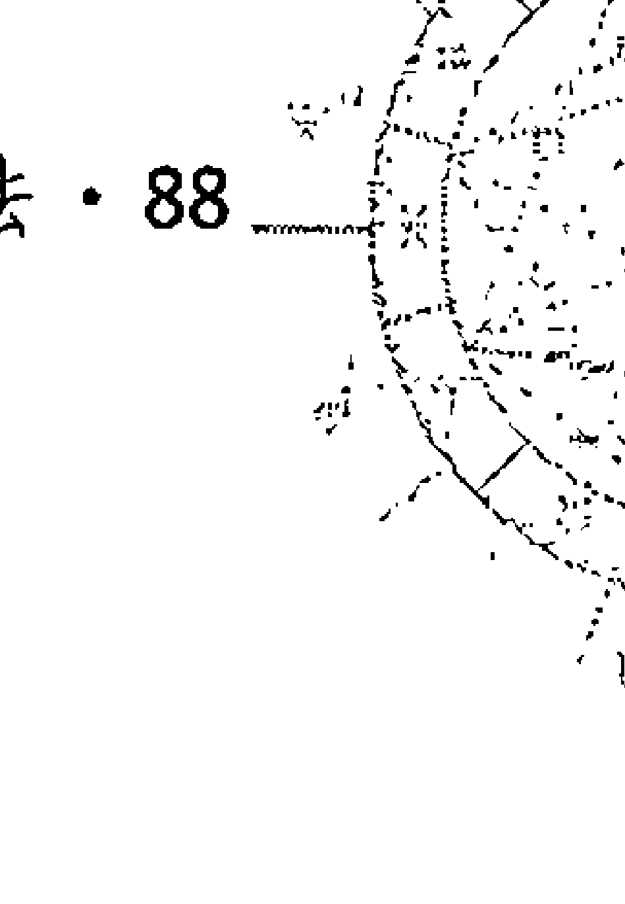

#### 89・基本規則

#### ☆金星

- 1. 審美觀、各種藝術、風格、色彩感。
- 2. 裝飾品、女裝、流行服飾、時尚、香水。
- 3. 演員、作曲、戲劇、美術、美容、音樂、歌唱。
- 4. 錢財、財政、財產、金融業、遺產、行賄、收入。
- 5. 結盟、合夥、同伴、朋友、交情。
- 6. 愛好之物、習癖、情趣。
- 7. 仲裁、休兵、和解、外交。
- 8. 背的下半部、靜脈、膚色、膀胱、糖尿病、聲調、生殖器、脖子、腎臟、喉嚨、腰部、卵巢、味覺、腫脹、性病。
- 9. 臥室、舞廳、宴會、慶典、色情場所。
- 10. 一般衣物。
- 11. 同儕、實習生、青少年。
- 12. 出納、會計、家庭僱傭。
- 13. 服裝設計、室內設計、傢俱、園藝。
- 14. 捐贈、禮物、奢侈品。
- 15. 顧客、買主。
- 16. 性愛、情愛之事、情人、婚事、配偶。
- 17. 女兒、女人、太太。
- 18. 糖果、花、美食。
- 19. 消遣、娛樂、樂事、假期、玩具。
- 20. 吉兆、好事。
- 21. 居家附近、鄰居。
- 22. 電腦程式設計師、一般雇員、土木工程師。
- 23. 教育、學習、教師、學生、記性、心智。
- 24. 飲食、零食、食品雜貨店、服務業。
- 25. 眼光、視野、視覺。
- 26. 個人及公共衛生。
- 27. 部屬、員工。
- 28. 想法、策略。

#### 91 · 基本規則

#### ☆火星

- 1. 酸性物質、肉食動物、肉販。
- 2. 偶發事件、縱火、橫禍。
- 3. 動物或蟲的咬傷、傳染病。
- 4. 活動力、運動、特技表演、拳擊。
- 5. 體能、腎上腺素、膽汁、膀胱、高血壓、血液中的鐵質、血管、紅血球、肌肉、發炎、急性病、腦炎、內分泌腺、頭、臉、泌尿生殖器、額頭、骨折、皮膚發疹、陽具、疝氣、嗅覺。
- 6. 武器、軍用品、軍人、消防工作。
- 7. 火製品、鐵製品、切割器具、金屬物品、機械、尖銳物品。
- 8. 火、燃燒、灼熱、燒傷、雕刻。
- 9. 麵包廠、殯葬業者、牙醫、藥商、藥劑師、外科。
- 10. 私販、討債、流氓、竊盜、凶手。
- 11. 強烈色調、情人、色慾、姦情。
- 12. 脾氣、敵意。
- 13. 垃圾、廢棄物、毒藥、香菸。
- 14. 成年人、男人。

#### ☆木星

- 1. 利益、好處、幸運、榮耀、昇遷。
- 2. 行政管理、廣告、顧問、民意代表、長官。
- 3. 脂肪、中風、動脈、血壓、肥胖、糖尿病、肝臟、內科、腦下垂體、靜脈、大腿、腫瘤。
- 4. 宗教、法律、哲學、科學、高等教育、教授、預言家。
- 5. 大型動物、皮草、賽馬、傢俱、貴重物品。
- 6. 上流階層、遺產、顯赫地位、禮儀、有閒階級。
- 7. 集會、捐助、法人團體、遊行、慈善團體。
- 8. 證券、債券、金融、資本家、經紀人、鑑價、仲介交易。
- 9. 俱樂部、慶典、運動事物。
- 10. 外國、遠距傳達、外交、長程旅行、交情、國際貿易、行銷、網路、運輸。
- 11. 風俗、慣例。

#### ☆土星

- 1. 老年人、窮人、勞工階級、下屬。
- 2. 土地、農業、考古、製陶業、官僚、畜牧業、礦業、鐘錶業、編輯、土木工程師、園藝、政府單位、歷史、警察、政客、例行公事、製鞋業。
- 3. 慢性病、骨格、關節、硬化症、聽覺器官、皮膚、凍瘡、感冒、鬱血、牙齒、聾、濕疹、痛風、結石、頭髮、駝背、體弱多病、小兒麻痺、脾臟、減肥。
- 4. 建築、皮製品、不動產、穀物。
- 5. 禁慾、修行、單身、囚禁。
- 6. 死亡、殯葬、廢棄物、排泄物。
- 7. 洞穴、爬蟲類。
- 8. 實物買賣、經濟、數學、唯物論、理性。
- 9. 回憶。
- 10. 負債、破產。
- 11. 父親、先人、前輩。
- 12. 習慣、慣例、老舊、通俗、傳統。
- 13. 義務、專長、職業。
- 14. 賭博。
- 15. 親戚。
- 16. 租稅。
- 17. 餐廳、水果、店東。
- 18. 心靈、道德、真理、智慧、誓言。
- 19. 家中寵物。

#### ☆天王星

- 1. 身體方面的畸形、精神病、神經系統、腳踝、身體的流質、痙攣、意志力。
- 2. 意外災害、危機。
- 3. 占星學、天文學、航空、飛行器、廣播、機械製造、電子、電磁、氣體、玄學、心理學、放射線、音響、大眾運輸、科學、思想家。
- 4. 前衛思想、利他主義、無政府主義、民間組織、立法機構。

#### ☆海王星

- 1. 演藝人員、藝術、攝影、舞蹈、戲劇、靈感、化粧、音樂、詩、心靈。
- 2. 幻想、夢想、盲點。
- 3. 精神病、不明原因的疾病、感覺、腳、腫脹、幻覺、過敏、憂鬱症、神經纖維、嗜睡。
- 4. 收容所、慈善事業。
- 5. 密告、走私、賄賂、間諜、偷竊。
- 6. 政治動員。
- 7. 通姦、私奔、行刺、怪癖。
- 8. 野生動物、私生子、棄嬰、地震、龍捲風。
- 9. 管閒事、革命。
- 10. 策略。
- 11. 同事、友誼、合作、黨派。
- 12. 專利。

#### ☆冥王星

##### 事物徵象：

- 1. 賍物。
- 2. 肛門、潛意識、膀胱、排泄器官、性器官、傳染病、直腸、自殺、身體中毒素。
- 3. 綁架、犯罪、流氓、搶奪。
- 4. 暗殺、無政府主義。
- 5. 考古、偵探、間諜、保險業、租稅。
- 6. 原能、輻射線、石油。
- 7. 死人、汙物、殯葬工作、廢料、屠宰。
- 8. 有毒動物。
- 9. 假貨。
- 10. 有水的地方、與水有關的職業、水災、飲料、酒、化學。
- 11. 監獄。
- 12. 占卜、偵探、預感、魔術、靈媒、神秘主義者、宗教。
- 13. 敵人的中傷、苦難。

#### 97・基本規則

##### 事物徵象：

- 8. 性工作者、貪污。
- 9. 有毒的動植物、爬蟲類、天災。
- 10. 橫禍。
- 11. 獨裁者。
- 12. 不可思議之事。
- 13. 轉捩點。

在宮主星的作為徵象星方面，可分成人物和事物兩類，其中重要的是事物，人物只在所提問之事不涉及事物，而僅就某人的想法、個性或現況來進行占問時，才有用處。當所問及的是有關某事物，代表此事物的宮主星即是徵象星，涉及該事物的人，可不列為徵象星。比如，詢問老爸的投資情況，投資屬於事物，老爸屬於人物，「主角徵象星」是代表投資事項的第五宮宮主星，而代表老爸的第十宮宮主星是「配角徵象星」。基本原則是，可以沒有配角，但卻不能沒有主角。答案星的顯示作為答案，主要是呈現事件的吉凶、狀況，與代表人物的宮主星之間的相位關係如何，並不影響答案星的呈現；答案星就是答案星，就是答案！

意指透過第五宮和第七宮來顯示人物的親屬關係。第五宮代表孩子，所以凡有親子關係者，可藉由轉盤定位於第五宮，來確認親屬關係。比如，孫子是孩子的孩子，所以由第五宮的第五宮來代表。第七宮代表配偶，所以凡是有配偶關係者，可藉由轉盤定位於第七宮，來確認親屬關係。比如，姐夫是姐姐的配偶，姐姐屬於兄弟姐妹，由第二宮作代表，因此姐夫是由第二宮的第七宮來代表。第五宮作代表，第二個孩子是由第七宮作代表，因為第七宮是第五宮的第三宮。廣泛的跳盤，不止限於兄弟姐妹，凡是具有老二、老三、老四等排序情形，皆可納入跳盤之中。在西洋占星學上，兄弟姐妹一律由第三宮作代表，但在印度占星學上，第二宮只代表弟妹，兄姐是由第十一宮作代表。以下所示的人物代表，有包括轉盤和跳盤在內，然而在實論上，不管是卜卦、本命或運勢論斷，很少使用到。有的占星家依據本命的轉盤和跳盤，來推論六親情形，這只能說是瞎猜。轉盤和跳盤可被完全忽略，所以以下內容，僅作為提供了解西洋卜卦占星學的參考資料。針對父母的宮位認定，西洋占星學依男女有別作區隔。就男人來說，第十宮代表父親，第四宮代表母親；就女人來說，第四宮代表父親，第十宮代表母親。這實際上是不必要的，因爲占卜是以事件徵象爲主。

#### ☆第一宮主星

##### 事物徵象：

- 1. 色身、外形。
- 2. 態度、姿態、給人的印象。
- 3. 出生情形。
- 4. 童年情形。
- 5. 個性、習性。
- 6. 臉、頭。
- 7. 眼睛（印度占星學是第二宮）。
- 8. 壽命、健康。
- 9. 看法、意見。

##### 代表人物：

- 1. 男人的舅舅及女人的伯叔父的死亡和遺產。（第四宮的第三宮的第八宮）
- 2. 女人的舅舅及男人的伯叔父的錢財。（第十宮的第三宮的第二宮）

#### ☆第二宮宮主星

##### 事物徵象：

- 1. 錢財、資產、負債。
- 2. 銀行、投資、股票、保險。
- 3. 耳朵、喉嚨。
- 4. 動產、珠寶、物質、資源。
- 5. 買賣。

##### 代表人物：

- 1. 男人的舅舅及女人的伯叔父的宗教和遠距旅行。（第四宮的第三宮的第九宮）
- 2. 女人的舅舅和男人的伯叔父的文書和短程旅行。（第十宮的第三宮的第三宮）
- 3. 兄弟姐妹的朋友。（第三宮的第十一宮）
- 4. 配偶的兄弟姐妹的孩子和投資。（第七宮的第三宮的第五宮）
- 5. 孩子的宗教和遠距旅行。（第五宮的第九宮）
- 6. 女人的表兄弟姐妹及男人的堂兄弟姐妹的職業和地位。（第十宮的第三宮的第五宮的第十宮）
- 7. 雇員的死亡。（第六宮的第八宮）
- 8. 配偶、合夥人的競爭對手和同伴。（第七宮的第七宮）
- 9. 朋友的文書和短程旅行。（第十一宮的第三宮）
- 10. 曾孫。（第五宮的第五宮）
- 11. 女人的祖父及男人的祖母。（第四宮的第十宮，第十宮的第十宮的第七宮）
- 12. 遠距旅行的豔遇。（第九宮的第五宮）
- 13. 兄弟姐妹的憂傷和損失。（第三宮的第十二宮）
- 14. 配偶的兄弟姐妹的健康和員工。（第七宮的第三宮的第六宮）
- 15. 孩子的職業和地位。（第五宮的第十宮）
- 16. 配偶、競爭對手的死亡和遺產。（第七宮的第八宮）
- 17. 老闆的小孩。（第十宮的第五宮）
- 18. 朋友的家庭。（第十一宮的第四宮）
- 19. 家人的朋友。（第四宮的第十一宮）

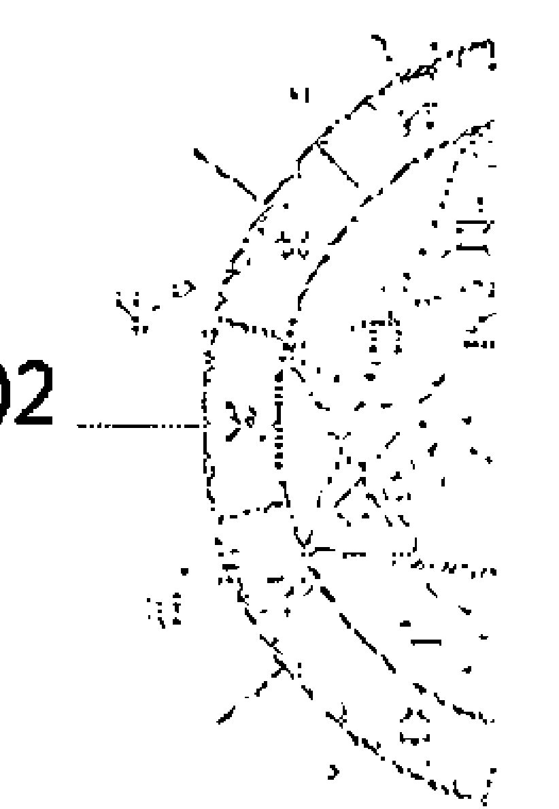

- 20. 男人的祖父及女人的祖母的死亡。（第十宮的第十宮的第八宮，第四宮的第八宮）
- 21. 女人的祖父及男人的祖母的錢財。（第四宮的第十宮的第二宮，第十宮的第十宮的第二宮）
- 22. 孫子的疾病。（第五宮的第五宮的第六宮）
- 23. 遠距旅程中的健康。（第九宮的第六宮）
- 24. 姪子（女）、外甥（女）的死亡。（第三宮的第五宮的第八宮）

#### ☆第三宮宮主星

##### 事物徵象：

- 1. 廣告、廣播、閒聊、消息、新聞、雜誌、輿論、電話、網路。
- 2. 旅行社、行政人員。
- 3. 文書、契約、郵件。
- 4. 手臂、肩膀、呼吸系統、聲帶、手指、肺部、神經系統。
- 5. 汽車、機車、腳踏車、交通、運輸。
- 6. 書、地圖、文學、教育、考試、演講、出版、印刷、老師。

##### 代表人物：

- 7. 兄弟、親戚、訪客。
- 8. 當地。
- 9. 觀念、認知、知識、記憶、學習。
- 10. 商品處理。

#### ☆第四宮宮主星

##### 事物徵象：

- 1. 出生地、家庭生活。
- 2. 晚年、老人、命終、埋葬、墳墓。
- 3. 胸部、消化器官、最終致命的疾病、身體的氣力、子宮。
- 4. 建築物、不動產、土地、房子、旅館。
- 5. 穀物、農作、園藝、礦業。
- 6. 女人的父親、男人的母親、遺傳。
- 7. 收藏品。

##### 代表人物：

- 1. 男人的舅舅及女人的伯叔父的職業和地位。（第四宮的第三宮的第十宮）
- 2. 女人的伯叔父及男人的舅舅的家庭。（第十宮的第三宮的第四宮）
- 3. 配偶的兄弟姐妹的婚姻。（第七宮的第三宮的第七宮）
- 4. 孩子的朋友。（第五宮的第十一宮）
- 5. 朋友的孩子和投資。（第十一宮的第五宮）
- 6. 雇員的專長和名聲。（第六宮的第十宮）
- 7. 父母的疾病。（第十宮的第六宮）
- 8. 配偶的宗教和遠距旅行。（第七宮的第九宮）
- 9. 男人的舅舅及女人的伯叔父的朋友。（第四宮的第三宮的第十一宮）
- 10. 女人的舅舅及男人的伯叔父的小孩和投資。（第十宮的第三宮的第五宮）
- 11. 兄弟姐妹的錢財。（第三宮的第二宮）
- 12. 配偶的兄弟姐妹的死亡和遺產。（第七宮的第三宮的第八宮）
- 13. 孩子的秘密敵人、憂傷和損失，賭博及比賽的損失，戀情的悲傷和失戀。（第五宮的第十二宮）
- 14. 協議上的獲得。（第三宮的第二宮）
- 15. 女人的表兄弟姐妹及男人的堂兄弟姐妹。（第十宮的第三宮的第五宮）

#### ☆第五宮宮主星

##### 事物徵象：

- 1. 孩子、懷孕、生育、管教。
- 2. 愛情、浪漫、嗜好、性關係、年輕人。
- 3. 藝術、電影、音樂、創作、裝飾品。
- 4. 娛樂、享樂、打賭、賭博、拳擊、比賽、機會、冒險、投資、投機、運動、股票。
- 5. 背部、心臟。
- 6. 社團、學校、社交。

##### 代表人物：

- 1. 男人的舅舅及女人的伯叔父的憂傷和損失。（第四宮的第三宮的第十二宮）
- 2. 女人的舅舅及男人的伯叔父的健康和僱員。（第十宮的第三宮的第六宮）
- 3. 事業上的競爭對手。（第十宮的第七宮）
- 4. 配偶的職業和地位。（第七宮的第十宮）
- 5. 秘密敵人的孩子。（第十二宮的第五宮）
- 6. 男人的岳母、女人的公公。（第七宮的第四宮，第七宮的第十宮）
- 7. 朋友的健康和僱員。（第十一宮的第六宮）
- 8. 僱員的朋友。（第六宮的第十一宮）
- 9. 孫子的死亡。（第五宮的第八宮）
- 10. 男人祖父及女人祖母的職業和地位。（第十宮的第十宮，第四宮的第十宮）
- 11. 獲得在國外的遺產。（第九宮的第八宮）
- 12. 寫作的收入。（第三宮的第二宮）
- 13. 第二個兄弟姐妹；兄弟姐妹的文書和短程旅行。（第三宮的第三宮）
- 14. 配偶的兄弟姐妹的宗教和遠距旅行。（第七宮的第三宮的第九宮）
- 15. 女人的表兄弟姐妹及男人的堂兄弟姐妹的錢財。（第十宮的第三宮的第五宮的第二宮）
- 16. 女人的堂兄弟姐妹及男人的表兄弟姐妹的死亡。（第四宮的第三宮的第五宮的第八宮）
- 17. 父母、老闆的死亡。（第十宮的第八宮）

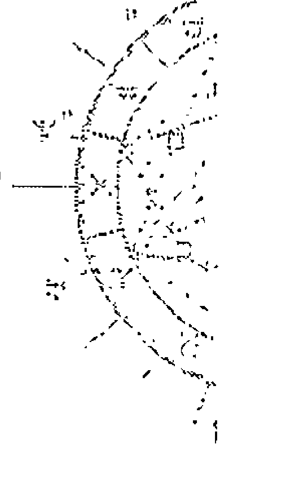

- 18. 朋友的婚姻、配偶。（第十一宮的第七宮）
- 19. 配偶的朋友。（第七宮的第十一宮）
- 20. 男人的祖父及女人的祖母的朋友。（第十宮的第十一宮，第四宮的第十一宮）
- 21. 來自不動產的所得。（第四宮的第二宮）

#### ☆第六宮宮主星

##### 事物徵象：

- 1. 小動物、寵物、貓、狗、雞、家禽、羊、豬。
- 2. 腹部、腸、食物消化、便秘。
- 3. 健康、疾病、醫療、藥局、健檢、衛生、護士、營養。
- 4. 咖啡館、烹調、廚師、一般衣服和飾品、穿著、存糧、飲食、紡織。
- 5. 公務員、清潔工、警衛、僱傭、員工、部屬、消防、教師、勞動、勞工、警察、服務能耐、房客、細部工作。

##### 代表人物：

- 1. 男人的舅舅及女人的伯叔父的外貌和個性。（第四宮的第三宮的第一宮）

#### ☆第七宮宮主星

##### 事物徵象：

- 1. 協議、結盟、信用、商譽、交涉、外交、公眾意識。
- 2. 公開爭論、反對、敵意、敵人、訴訟、官司。
- 3. 藝術、美感。
- 4. 腰、臀、靜脈、背部的下半部、臀部、卵巢、身體的兩側。
- 5. 配偶、伴侶、同夥、結婚、離婚、際遇中的人。

##### 代表人物：

- 1. 男人的舅舅及女人的伯叔父的錢財。（第四宮的第三宮的第二宮）
- 2. 女人的舅舅及男人的伯叔父的死亡和遺產。（第十宮的第三宮的第八宮）
- 3. 女人的舅舅及男人的伯叔父的婚姻和配偶。（第十宮的第三宮的第七宮）
- 4. 配偶的兄弟姐妹的職業和地位。（第七宮的第三宮的第十宮）
- 5. 孩子的錢財；賭博和投資的所得。（第五宮的第二宮）
- 6. 女婿、媳婦的死亡和遺產。（第五宮的第七宮的第八宮）
- 7. 朋友、繼子的死亡。（第十一宮的第八宮，第七宮的第五宮的第八宮）
- 8. 秘密敵人的配偶。（第十二宮的第七宮）
- 9. 女人的父方及男人的母方的親戚。（第四宮的第三宮）
- 10. 孫子的職業和地位。（第五宮的第五宮的第十宮）
- 11. 祖父母的疾病。（第四宮的第十宮的第六宮，第十宮的第十宮的第七宮的第七宮）
- 12. 職業上的遠距旅行。（第十宮的第九宮）
- 13. 婚姻及配偶的憂傷、損失和限制。（第七宮的第十二宮）
- 14. 不動產的契約、文書。（第四宮的第三宮）
- 15. 第三個兄弟姐妹。（第三宮的第三宮的第三宮）
- 16. 兄弟姐妹的孩子和投資。（第三宮的第五宮）
- 17. 配偶的兄弟姐妹的朋友。（第七宮的第三宮的第十一宮）
- 18. 第二個孩子；孩子的文書和短程旅行。（第五宮的第三宮）
- 19. 兄弟姐妹的孩子；短程旅行中的享樂。（第三宮的第五宮）
- 20. 女人的堂兄弟姐妹及男人的表兄弟姐妹的職業和地位。（第四宮的第三宮的第十宮）
- 21. 秘密敵人的死亡。（第十二宮的第八宮）

#### ☆第八宮宮主星

##### 事物徵象：

- 1. 遺產、贍養費、稅收、嫁妝、共有財產、遺傳。
- 2. 鬼神經驗、中陰身、轉世、玄秘才能。
- 3. 膀胱、排泄器官、生殖系統、性器官、性能耐、外科。
- 4. 死亡、葬禮、墓園、保險、重生、自殺、老年病。
- 5. 損失、破產。
- 6. 死亡所造成的損失和傷痛。（第八宮的第十二宮）
- 7. 員工、部屬、房客的錢財。（第六宮的第二宮）
- 8. 老闆的名聲和地位。（第十宮的第十宮）
- 9. 朋友的宗教和遠距旅行。（第十一宮的第九宮）
- 10. 海外的朋友。（第九宮的第十一宮）
- 11. 孫子的朋友。（第五宮的第十一宮）
- 12. 男人的祖父及女人的祖母。（第十宮的第十宮，第四宮的第十宮的第七宮）
- 13. 勞動的所得。（第六宮的第二宮）

#### 111 · 基本規則

##### 代表人物：

- 1. 男人的舅舅及女人的伯叔父的文書和短程旅行。（第四宮的第三宮的第三宮）
- 2. 女人的舅舅及男人的伯叔父的宗教和遠距旅行。（第十宮的第三宮的第九宮）
- 3. 兄弟姐妹的健康和員工。（第三宮的第六宮）
- 4. 配偶的兄弟姐妹的悲傷和損失。（第七宮的第三宮的第十二宮）
- 5. 孩子的家庭和命終。（第五宮的第四宮）
- 6. 女人的表兄弟姐妹及男人的堂兄弟姐妹的孩子和享樂。（第十宮的第三宮的第五宮的第五宮）
- 7. 女婿、媳婦的職業和地位。（第五宮的第七宮的第十宮）
- 8. 配偶或夥伴的錢財；透過合夥所賺得的錢財。（第七宮的第二宮）
- 9. 因外國人而導致的損失。（第九宮的第十二宮）
- 10. 朋友的職業、地位和名聲。（第十一宮的第十宮）
- 11. 事業和生意往來中的朋友；老闆、父母的朋友。（第十宮的第十一宮）
- 12. 男人祖父及女人祖母的錢財。（第十宮的第十宮的第二宮，第四宮的第十宮的第二宮）
- 13. 訴訟的結果：配偶、他人的錢財。（第七宮的第二宮）
- 14. 侄子（女）、外甥（女）的錢財。（第三宮的第五宮的第二宮）
- 15. 繼子的職業和地位。（第七宮的第五宮的第十宮）

#### ☆第九宮宮主星

##### 事物徵象：

- 1. 廣告、電報、遠距連絡、遊行、宣揚、刊物。
- 2. 遠距旅行、空運、海運、外國、外交、接觸世界、視野、離鄉背井。
- 3. 信仰、宗教、慈善、教堂、牧師、哲學、高等教育、奉獻、夢想、科學、直覺力、預言、靈感、道德。
- 4. 法律、司法、官司、法院。
- 5. 商業、貿易、進出口、移民。
- 6. 探勘、野生動物、賽馬。
- 7. 肝、臀部、腿的上半部、大腿、坐骨神經。

##### 代表人物：

- 1. 男人的舅舅及女人的伯叔父的家庭和命終。（第四宮的第三宮的第四宮）
- 2. 女人的舅舅及男人的伯叔父的職業和地位。（第十宮的第三宮的第十宮）
- 3. 第四個兄弟姐妹。（第三宮的第三宮的第三宮）
- 4. 兄弟姐妹的婚姻和配偶。（第三宮的第七宮）
- 5. 配偶的兄弟姐妹、親戚、文書和短程旅行。（第七宮的第三宮）
- 6. 事業的憂傷、損失和秘密敵人。（第十宮的第十二宮）
- 7. 第三個孩子。（第五宮的第三宮的第三宮）
- 8. 孫子；孩子的投資和享樂；於假期中從運動、休閒和情愛所得到的享樂。（第五宮的第五宮）
- 9. 女婿、媳婦的朋友。（第五宮的第七宮的第十一宮）
- 10. 朋友的朋友。（第十一宮的第十一宮）
- 11. 父母的疾病。（第四宮的第六宮）
- 12. 遺產的所得。（第八宮的第二宮）
- 13. 寵物的住處和命終。（第六宮的第四宮）
- 14. 繼子的朋友。（第七宮的第五宮的第十一宮）
- 15. 意志堅持的所得。（第八宮的第二宮）

#### ☆第十宮主星

##### 事物徵象：

- 1. 權威、成就、野心、出名、信譽、尊嚴、目標、榮譽、道德、公眾形象。
- 2. 老闆、領袖、地位、父親、上司。
- 3. 骨頭、關節、膝蓋。
- 4. 事業、職業、政府、政黨、家庭以外的事務、職務。

##### 代表人物：

- 1. 男人的舅舅及女人的伯叔父的孩子和投資。（第四宮的第三宮的第五宮）
- 2. 女人的舅舅及男人的伯叔父的朋友。（第十宮的第三宮的第十一宮）
- 3. 兄弟姐妹的死亡和遺產。（第三宮的第八宮）
- 4. 配偶的兄弟姐妹的錢財。（第七宮的第三宮的第二宮）
- 5. 孩子的健康和僱員。（第五宮的第六宮）
- 6. 僱員、房客的孩子和享樂。（第六宮的第五宮）
- 7. 女人的堂兄弟姐妹和男人的表兄弟姐妹。（第四宮的第三宮的第五宮）
- 8. 從外國所得的錢財。（第九宮的第二宮）
- 9. 朋友的憂傷和損失。（第十一宮的第十二宮）

#### ☆第十一宮宮主星

##### 事物徵象：

- 1. 朋友、熟識、友愛、博愛、同事、同伴。
- 2. 遠景、希望、願望。
- 3. 聯盟、社團、同志、會員、俱樂部、合作、國際協議、社會理念、組織。
- 4. 腳踝、小腿、脛骨。
- 5. 顧問、議員、立法機關。

##### 代表人物：

- 1. 男人的舅舅及女人的伯叔父的健康和雇员。（第四宮的第三宮的第六宮）
- 2. 女人的舅舅及男人的伯叔父的忧伤和损失。（第十宮的第三宮的第十二宮）
- 3. 第五個兄弟姐妹。（第三宮的第三宮的第三宮）
- 4. 兄弟姐妹的宗教和遠距旅行。（第三宮的第九宮）
- 5. 配偶的兄弟姐妹的文書和短程旅行。（第七宮的第三宮）
- 6. 事業、職業上的錢財所得；老闆的錢財。（第十宮的第二宮）
- 7. 第四個孩子。（第五宮的第三宮的第三宮）
- 8. 孩子的婚姻和配偶。（第五宮的第七宮）
- 9. 伴侶、對手的孩子。（第七宮的第五宮）
- 10. 女人的表兄弟姐妹及男人的堂兄弟姐妹的死亡和遺產。（第十宮的第三宮的第五宮）
- 11. 女人的堂兄弟姐妹及男人的表兄弟姐妹的錢財。（第四宮的第三宮的第八宮）
- 12. 父母的死亡。（第四宮的第八宮）
- 13. 男人的祖母及女人的祖父的朋友。（第十宮的第十宮的第七宮的第十一宮，第四宮的第十宮的第十一宮）
- 14. 女人的祖父及男人的祖母的職業和地位。（第四宮的第十宮的第十宮，第十宮的第七宮的第十宮）
- 15. 孫子的錢財。（第五宮的第五宮的第二宮）
- 16. 配偶的父母、家庭和命終。（第七宮的第四宮）
- 17. 來自遠距旅行、宗教所得的錢財。（第九宮的第二宮）
- 18. 因錢財事務而遠距旅行。（第二宮的第九宮）
- 19. 繼子的憂傷和損失。（第七宮的第五宮的第十二宮）

#### ☆第十二宮宮主星

##### 事物徵象：

- 1. 痛苦、悲傷、不安、失望、恐懼症、孤寂、不幸、暗中悲泣、憂慮。
- 2. 慈善機構、庇護、修道院、安養院、靜坐、冥想、感化院。
- 3. 暗藏、謀殺、黑函、私釀的酒、密會、秘密交易、共謀、犯罪、偵探、內在情感、暗中敵人、隱藏、賄賂、無心之過、告密、密謀、秘密戀情、私生活、醜聞、秘密組織、間諜、偷竊。
- 4. 麻醉、虛張聲勢、欺騙、虛假、偽造、模仿、詩、夢遊。
- 5. 大型動物、象、馬、放逐、逃走、釋放、休息、睡覺。
- 6. 拘留所、監獄、因果報應、限制、抑制、自我墮落、自我傷害、自殺。
- 7. 藥、腳、腳趾、殘疾、重症、醫院、石油、毒藥。
- 8. 著魔、玄學、巫術、心靈、隱居、獨居、無爲、催眠。
- 9. 與海有關的事物、奴隸。
- 10. 遺產的歸屬。（第八宮的第四宮）
- 11. 姪子（女）、外甥（女）的孩子和享樂。（第三宮的第五宮的第五宮）

代表人物：
-   1. 男人的舅舅及女人的伯叔父的婚姻和配偶。（第四宮的第三宮的第七宮）
-   2. 女人的舅舅及男人的伯叔父的外貌和個性。（第十宮的第三宮的第一宮）
-   3. 兄弟姐妹的職業和地位。（第三宮的第十宮）
-   4. 配偶的兄弟姐妹的家庭和壽終。（第七宮的第三宮的第四宮）
-   5. 孩子的死亡和遺產。（第五宮的第八宮）
-   6. 女婿、媳婦的錢財。（第五宮的第七宮的第二宮）
-   7. 國外的不動產；遠距旅行的住所。（第九宮的第四宮）
-   8. 朋友的錢財。（第十一宮的第二宮）
-   9. 祖父母的疾病。（第十宮的第十宮的第六宮，第四宮的第十宮的第七宮的第六宮）
-   10. 職業上的短程旅行。（第十宮的第三宮）
-   11. 女人的母方親戚及男人的父方親戚。（第十宮的第三宮）
-   12. 繼子的錢財。（第七宮的第五宮的第二宮）

狀況四：一旦答案星確立，進而也可確立狀況星。在連續預測時，狀況星指的是與因緣星（月亮）和徵象星同時形成相位的行星。這等於說，在連續預測時，除了答案星的確立有必要借助於宮頭來當因緣外，就狀況星的認定來說，與非連續預測時一樣。

#### 119 · 基本規則

獲取更多好書，請加微信號：strcdts
店鋪：http://strc.cr.cx

### 三、第三條線索：水星和金星

西洋卜卦占星學把第四宮宮主星等同於月亮，即代表著另一顆因緣星，透過其相位關係，同樣可用來指示答案。為何一定是第四宮宮主星？西洋卜卦占星學一直無法提出解釋。事實上，這是一個錯誤的認知，錯在西洋占星家不曉得有代碼預測法。最原始的卜卦占星學，可以是徵象預測法，也可以是代碼預測法。當採用代碼預測法來作占卜，並且一次提問兩個問題時，就會應用到第四、五宮宮主星，不只是第四宮宮主星，並且只限定於水星和金星。一個很簡單的情況，如果是採用代碼預測法，同時預測兩個問題，就會有兩個答案，一個答案來自月亮，那麼另一個答案該來自何處？自然必須設定另一顆因緣星。在兩顆因緣星的指向下，即可分別產生兩個答案代碼。後來，代碼預測法失傳了，卻傳下來了第四宮宮主星是另一顆因緣星，導致占星家不知所以然。
本書所說明的是徵象預測法，並非代碼預測法，然而就一次提問多個問題來說，還是得涉及水星和金星，即第四、五宮宮主星。

讀者大德們要先有一個觀念，連續預測和一次提問多個問題，是兩種不同的情況。就連續預測來說，主要是透過宮頭位置來作為因緣的呈現，在判斷上還算容易。當進行一次提問多個問題時，照理說一個問題就有一顆答案星，兩個問題就有兩顆答案星，三個問題就有三顆答案星。依星象的呈現來說，最好是不要超過兩個問題，倘若是是一次提問三個問題，必須因緣具足才能出現三顆答案星。

就一次提問兩個問題來說，月亮是其中一顆因緣星，水星或金星是另一顆因緣星。水星只能作為處女座宮主星，金星只能作為金牛座宮主星，為何如此？這涉及當水星或金星作為因緣星時，可身兼答案星。依據這兩顆行星的主宰兩個星座，會有吉凶兩種不同答案出現。

在接著細說之前，針對水星和金星在占卜時的特別作用，列示兩點：
-   1. 當一次提問兩個問題以上時，水星和金星作為第四、五宮宮主星，有其特別作用。
-   2. 水星和金星可當因緣星，並且可兼答案星。

#### 狀況一：在一次提問多個問題的情況下，月亮所代表的因緣星，至少指向一顆答案星，即指向其中一個答案。指向那一個問題的答案？很簡單，與月亮形成最緊密相位的行星，就是其中的一顆答案星，而這顆答案星是那一個問題的答案星，可透過與這顆答案星形成相位的徵象星來看出。

在一次提問多個問題下，一顆徵象星有可能與多顆答案星形成相位關係。判斷的基本原則是依據相位的緊密度。因此，當月亮的最緊密相位行星成為答案星後，這顆答案星所代表的是，與它形成最緊密相位的徵象星所代表的問題。注意！這個判斷的基本原則並非一成不變，只因星象有可能呈現各種情況，因此還是要謹記著：「星象到底想說什麼？」

#### 狀況二：扣除月亮的最緊密相位行星的作為其中一顆答案星，月亮的不是最緊密相位的其他相位，所指向的行星也有可能是另外的答案星。換句話說，一次提問多個問題，月亮的相位行星皆可成為是答案星，而其中最肯定的一顆答案星，就是最緊密相位的行星。

西洋卜卦占星學在處理一次提問多個問題時，也是以月亮相位行星作爲最主要考量，並參考了第四宮宮主星的相位行星。以月亮相位行星作爲最主要考量是對的，但針對第四宮宮主星的考量，並沒有限定其爲水星或金星則是錯的。依星象來看，月亮有可能形成空相位，或者相位只有一個，那麼在這時候進行一次提問多個問題，月亮的相位數少於問題數，就必須尋求解決之道，於是依據代碼預測法的應用原則，把水星和金星拉進來作爲解決之道。當一次提問多個問題時，最先考量的是月亮相位數，一旦月亮的相位數多過問題數，那麽要每個問題皆可找到答案星，可能性比較高。如果是月亮的相位數少於問題數，就要以水星或金星的相位來作補充，補得過來，即可每個問題皆可取得答案，補不過來就沒辦法全部取得答案。

如果月亮的相位數多過問題數，並且星盤圖上的水星或金星，是作爲第四宮或第五宮宮主星，這時候情況較複雜，即答案星並非全落在月亮的相位行星上，有可能是落在水星或金星。

#### 狀況三：在非連續預測情況下，答案星主要是透過宮頭位置而取得。在一次提問多個問題情況下，答案星主要是透過月亮而取得。在連續預測時，水星和金星的作為第四、五宮宮主星，可補充答案。

進一步細說，先把問題本身分成單次預測和連續預測，然後再分成單個問題和多個問題。相互交叉後，共有四種不同提問內容，各有其處理方式。

#### ☆第一種問題情形：單次預測、單一問題

-   一、優先考量
    - 因緣星：月亮。
    - 答案星：與月亮形成最緊密相位的行星。
    - 答案明顯度指標：
        1. 與月亮的相位容許度2度以內。
        2. 與徵象星有形成相位。
        3. 答案星落入第一、五、七、十宮內。
        4. 答案星合相宮頭。
-   二、次要考量
    - 因緣星：宮頭位置（並非行星）；當月亮是空相位時。
    - 答案星：合相宮頭位置的行星。
    - 答案明顯度指標：
        1. 合相宮頭在容許度2度以內。
        2. 與徵象星有形成相位。
        3. 答案星落入第一、五、七、十宮內。

說明：照理說，在單次預測、單一問題的情況下，是不應該產生誤判、失算，因為答案星是一目了然的，答案應該相當清楚。失算的原因，即是答案星判定錯誤。為何發生錯誤？很簡單，答案星並非落在月亮的最緊密相位行星上。這等於說，也有可能落在其他行星上。為了方便判斷，所以設定了容許度2度以內的範圍，來作為基本界標。這個基本界標，並非死板板的，只能說基本原則是如此，但並非絕對如此。可這麼想，如果有某一顆行星，並非月亮的最緊密相位行星，甚至也不是月亮的次緊密相位行星，可是在明顯度指標上卻具足了條件，那麼有沒有可能成為是答案星？依據判斷的基本原則，在單次預測、單一問題情形下，月亮的最緊密相位行星就是答案星，尤其是在容許度2度以內，可不管其他行星的狀況。然而，確實有可能其他行星取代了月亮的最緊密相位行星，而成為答案星，進而造成失算。

為了避免失算，答案明顯度指標應該成為判斷的依據。在此，我只能告訴讀者大德們，本書所寫的內容，只不過是參考資料罷了，是為了引導讀者大德們進入星象占卜的方便之說。真正的答案來自那裡？來自因緣，來自「心」與「星」的相應。透過因緣而示現了星象，這星象即是答案。可是，答案要經過解讀才能成為答案，這就是徵象預測法。如何解讀？以心來與星感應道交，這是我所不能傳授的，唯有透過實際占卜經驗的累積，提昇感應力道，才能達致。正所謂的「菩薩引進門，修行在個人」。西洋占星家試圖把占星學科學化，如果預測的最高境界是心與星的相應，就不可能科學化。失算的另一種可能情況，是忽略了月亮本身有可能是答案星。這條判斷規則，西洋卜卦占星學未提及。請讀者大德們記住，世間法占星學和佛門占星學在論斷上的一個重大差異。世間法占星學是透過「兩端」來取得答案、推測的結果，而佛門占星學是把答案、推測的結果，落在「一端」上，這「一端」即是推測結果。這個重大差異，不只顯現在卜卦上，也顯現在本命和運勢的論斷上。如果讀者大德們是以世間法占星學的「兩端」原則，來理解佛門占星學的「一端」判定，必然產生混淆、誤解。舉例來說，某行星落入某星座、某宮位，並且形成某些相位，這其中，行星落入星座就是兩端，一端是行星，另一端是星座。同理，行星落入宮位也是兩端，一端是行星，另一端是宮位；行星的相位亦是兩端，一端是行星，另一端也是行星。世間法占星學就是透過兩端來取得推測結果，其中的基本觀念是，認為透過某一颗行星的相應情形，包括所落入的星座、宮位和与其他行星的形成相位，可用来确认这颗行星会呈现出什么样的答案。然而，佛門占星學卻不這樣認為，當某顆行星成為推測的結果，即答案，這答案的真實情形，很難從行星所落入的位置或相位關係看出，強行推測的結果就會形成一種瞎猜的習慣。也因當推測出或吉或凶時，較能肯定的是或吉或凶，至於或吉或凶的內容，即更細緻的情況，理應再作更進一步的預測。以本命論斷來說，假設情況是木星落入處女座，落入第二宮，並與火星、土星有形成相位。從兩端的論法來看，考量的是木星落入處女座、木星落入第二宮、木星與火星有相位、木星與土星有相位。從一端的論法來看，木星就是答案。兩端論法是想透過木星的各種情況，來推測出木星所可能呈現的現象。當木星落入處女座，可說對木星的大而化之有所限制，因為處女座是講究細緻的。姑且不論星座的荒謬，一個問題：星座真能對行星的狀況進行調整嗎？或者說木星有必要透過處女座，才能確定其所呈現的現象嗎？沒必要！木星就是木星，木星所呈現的現象，就是其所代表的命理徵象的其中之一，與其所落入的星座完全無關，所以才說「星座無用論」。以一個最簡單的例子來說，當木星成為答案星，在沒有反吉為凶的情形下，木星所代表的吉星，所呈現的就是吉兆，不會因為木星的落入那一個星座，而改變了吉兆的呈現。當木星是落入陷弱星座內，答案照樣是吉。也因此，星座的廟旺陷弱，根本是多餘的。一旦扯入星座的廟旺陷弱，不但會造成判斷上的混淆，還會提高失算的可能。木星就是木星，木星就是吉兆，這是一端論法。

當木星落入第二宮，可有兩種看法，一是木星落入財帛宮，二是木星落入平宮、中性宮。木星落入第二宮，是試圖透過第二宮來推測木星所可能呈現的現象，以財帛宮來作推測，表示木星的吉兆被限定在錢財方面，即吉兆和錢財這兩端是合而為一的。然而，實論印證的結果並非如此，所以漢堡占星學派乾脆捨棄宮位。完全捨棄宮位的考量是不對的，因為在特定情形下，木星落入第二宮確實可呈現出錢財方面的吉兆，只不過這特定情況，西洋占星家至今並未發現，或者有人發現，但卻不願意說出來。從平宮的角度來看木星落入第二宮，表示木星所呈現的吉兆是屬於中等程度，這所謂的中等程度，是百分比的呈現，與呈現木星的那一個命理徵象無關，這是一端論法。

從相位來看，有兩個簡單看法，一是綜合看法，一是偏向看法，前者是兩端論法，後者是一端論法。西洋占星家認為一個相位的形成，由於涉及兩顆行星，所以理應是兩顆行星的綜合。比如，木星和土星形成相位，兩者是相互影響的，以論斷職業來說，應該是有涉及木星和土星性質的行業。同樣，木星和火星有形成相位，應該是有涉及木星和火星的行業。這種看法，就同木星落入星座、木星落入第二宮，木星可單獨起作用，並與星座、宮位和有形成相位的行星，進行一場綜合作用，經由綜合作用後，取得了推測的結果。不用說，這樣的綜合過程需要相當的妄想，否則做不到。從事件的顯現來看，兩端論法的綜合過程是不必要的。原因很簡單，每一顆行星皆有其所代表的人事物徵象，這些徵象是經由諸多占星家進行歸類所給定的；既然已經設定了行星的代表徵象，就表示事件的現象可依單顆行星來看出，差別只在於因緣是否成熟，不需要加入另一顆行星的代表徵象。比如預測職業，木星的顯現就表示是從事木星的行業，不管木星有何相位，職業的性質不會因為相位的關係，綜合了另一顆行星的職業性質。這等於說，如果行星的歸類是相當清楚明瞭的，那麼所示現的職業也就相當清楚明瞭。一個人有可能同時擁有兩個職業，或者更換職業，就兩種不同的職業來說，是分別由兩顆行星來作象徵，也就是說兩顆行星皆有示現，並不是兩顆行星的綜合。這就是一端論法。
在一端論法中，相位所指的是一種「相關性」，是外圍的涉及領域，並沒有介入當顆行星的代表徵象中。以上的木星和土星形成相位來說，如果木星是呈現為職業，以從事法律事務來說，當木星與土星有形成相位，可推測為職業是土地代書，因為土星所代表的土地、不動產，是木星行業的外圍涉及領域。也就是說，職業的現象星是木星，土星是徵象星，木星和土星之間，現象星和徵象星之間，是相關性，不存在彼此的相互影響介入。
也許讀者大德們看了之後，會覺得還是存在相互影響，要把兩者綜合起來作論斷。注意！這是解讀星盤圖的一個相當重要的基本觀念，沒搞清楚，論斷線索會混淆。兩端論法的相位關係，是兩顆徵象星之間的關係，兩者不一樣。現象星指的是事件現象所示現的行星，而徵象星指的是事件現象所涉及的相關人事物。現象星只能是行星，徵象星可以是行星和宮主星。
以宮主星作徵象星來說，如果木星是現象星，土星是徵象星，也是第十宮宮主星，當兩者有相位，木星所代表的有所發展的現象，那一方面有發展？透過徵象星獲得訊息，是第十宮的事業方面有發展。推論的焦點，一定是現象星，不會是徵象星。再舉個例子來說，讀者大德們可能會比較清楚。當火星和天王星有形成相位，意指可能發生火災，因為火星是火，天王星是意外。在西洋占星學的兩端論法中，透過火星和天王星的綜合來推測出發生火災的結果，這樣的推論是兩顆行星的相互介入、影響，即兩顆皆是徵象星。倘若其中一顆是現象星，如天王星，另一顆是徵象星，如火星，則不能推測為會發生火災。為何？因為火災的現象一定是火，即火星必須成為現象星才可以，而天王星所指的意外，以電線短路來說，即表示是由於電線短路而引發火災。如果天王星是現象星，火星是徵象星，現象不落在火上，而是落在意外上，比如因為用火煮東西，不小心被燙到，這是意外傷害。

可簡單這樣看，現象星是果，徵象星是因。兩顆行星之間的相位關係，是因果關係，並非兩者皆是果。當把兩者皆當成是徵象星，沒有現象星，那麼兩者皆是果，也兩者皆是因，因果不分。在學習卜卦占星學時，就要確立這樣的一端論法的基本觀念。而這樣的基本觀念，同樣可引用在本命論斷上。如果讀者大德們熟悉西洋占星學，即可看到這種情形，在西洋卜卦論法上，往往是一端論法的觀念，可是在本命論斷時，卻又變成了兩端論法，甚至是三端、四端論法，把星座、宮位也融入其中。永遠記得，事件現象的推測，一定是落實在行星上！行星的現象示現，可以有輕重之別，但其本質、所代表的人事物徵象，是不變的。
現象星與徵象星之間，可以是涉及關係，也可以是因果關係。然而，最重要的一個基本觀念是，可以沒有徵象星，但絕對不能沒有現象星！如上述的火星作為現象星，可以不明原因發生火災，但預測的結果就是發生火災。

就占星卜卦來說，一定要有答案星（現象星），但不一定要有徵象星。徵象星是外圍線索，不是核心線索，徵象星無法改變現象星，現象星可不理會徵象星。西洋卜卦占星學扯了一大堆的線索，很多是不必要的。星象占卜的真正複雜性，是出在一次提問多個問題，必須找出相關問題的答案星。如果是單次預測、單一問題，只要有一顆答案星即可。

一顆行星所包含的命理徵象、現象，相當多，占星家想透過各種方式來確認到底是呈現那一個徵象、現象，是必然的。除了星座、宮位外，還參考相位。扯了一大堆，到最後真能確認嗎？沒有！就是瞎猜，依個人的主觀妄想來作確認，以至形成散彈打鳥、撒網捕魚的預測方式。這其中最根本、最關鍵的因素，就在於單一張星盤所能示現的，是相當有限的答案，這是基本前提，一個不可動搖的基本前提。在這個基本前提下，如果硬是要解讀出各種訊息，那麼最終的結果只有一個：瞎猜。這是避免不了的。這就如同口袋裡只有一千元，卻想買一顆大鑽石，除了妄想之外，沒第二條路。

讀者大德們要想到的是，單一張星盤圖所能示現的範圍到底有多大？以單次預測、單一問題來說，是最簡單的，星盤圖的示現可以相當明朗，至少也是比較明朗。然而，當有多個問題同時要求示現，單一張星盤圖能否全部示現，是個問題。只因問題的本身可能是錯綜複雜的，所以示現也應該是錯綜複雜的，可是星象根本無法兼顧這錯綜複雜的情形，只好摘要來作示現。作為一個占星家，很可能犯了一個毛病、錯誤，誤認爲星象是萬能的，無所不示現的。實際的情況是，諸多的預測其實是來自於主觀妄想，星象示現所受的限制，透過占星家的主觀妄想，變成了無所限制，只因妄想是無量、無邊的。一旦沒有妄想，星象所能達到的示現就被限定在一定範圍內，這就是一端論法。

星象占卜所涉及的問題，至多不會超過三個。在同時呈現三個答案的情況下，星象必須依靠因緣相當具足，才能圓滿示現答案。那麼依此來推，一張本命盤要說出多少答案？一生中有關命運的全部答案。這是不可能的！一張星盤圖在兼顧的情形下，所能示現的頂多只有五個答案，超過五個就相當吃力了。因此，世間法占星家如果不是一個騙子，至少是半個騙子，只因一千元可以買到假鑽石，根本買不到真鑽石。透過星象占卜，可得知什麼？知道答案的示現需要因緣，知道當問題過多時，星象是難以兼顧的。有這樣的基本觀念，才能對占星學進入更深一層的研究。 就一端論法來說，答案就是答案，木星就是木星。到底呈現了木星的那一個徵象、現象？解決的方式有二，一是憑直覺和運氣來直接猜測，二是藉由其他方法來作更細部的預測，這就需要依靠菩薩心印法門和萬佛法印法門。從實際執業算命的角度來看，不得不被迫選擇走第一條路，因為更細部的預測需要時間，而顧客想要的是立即得到答案。

#### ☆第二種問題情形：連續預測、單一問題

-   一、優先考量
    - 因緣星：宮頭位置。
    - 答案星：合相宮頭位置的行星。
    - 答案明顯度指標：
        1. 合相宮頭在容許度2度以內。
        2. 與徵象星有形成相位。
        3. 答案星落入第一、五、七、十宮內。
        4. 與月亮的相位容許度2度以內。
-   二、次要考量
    - 因緣星：月亮。
    - 答案星：與月亮形成最緊密相位的行星。
    - 答案明顯度指標：
        1. 與月亮的相位容許度2度以內。
        2. 與徵象星有形成相位。

說明：連續預測時的答案星判定，有時是相當困難的，也因此西洋卜卦占星學一直未能妥善處理相關問題。困難之處在於，作為因緣星的月亮，未必就是因緣星。在月亮作為因緣星有可能被取代的情況下，西洋卜卦占星家也不曉得該被什麼取代，於是補上了第四宮宮主星，多一個可能指向答案星的指標，然後在月亮和第四宮宮主星的分別指向下，進行猜測遊戲，複雜化了判斷線索。關鍵就在於，沒有把宮頭行星列入考量，這點是西洋卜卦星家所不知道的。

在連續預測時，宮頭行星是否一定足以取代月亮的最緊密相位行星，而成為答案星？未必。這就是連續預測時的難處。在此把宮頭行星列為優先考量，把月亮最緊密相位列為次要考量，主要是在於凸顯宮頭行星在連續預測時的重要性。讀者大德們不妨把兩者視為同等地位，即兩者皆有可能指向答案星，於是判斷的線索就落在「明顯度指標」上。當明顯度指標愈具足，答案星就愈明顯。

#### ☆第二種問題情形：單次預測、多個問題

#### 一、優先考量

因緣星：月亮。

答案星：與月亮形成最緊密相位的行星。

- 答案明顯度指標：
1. 與月亮的相位容許度2度以內。
2. 與徵象星有形成相位。
3. 答案星落入第一、五、七、十宮內。
4. 答案星合相宮頭。

說明：除與月亮形成最緊密相位的行星外，月亮的次緊密相位行星、月亮的個問題的情形下，凡與月亮有形成相位的行星，皆有可能是答案星。當水星或金星作為第四、五宮宮主星時，表示水星或金星插入答案星之中，成為其中的一顆答案星。

#### 二、次要考量

因緣星：水星或金星。

答案星：水星或金星，身兼因緣星和答案星。

#### 答案明顯度指標：

- 1. 與月亮的相位容許度2度以內。
- 2. 與徵象星有形成相位。
- 3. 水星或金星落入第一、五、七、十宮內。
- 4. 水星或金星合相宮頭。

說明：在一次提問多個問題的情形下，徵象星的作用顯得特別重要，因為要區隔那一顆答案星是相應於那一個問題。判斷的基本原則，是依據徵象星與答案星之間的相位容許度，容許度最緊密者，即指示著那一個問題的答案星；有時這基本原則不適用，只因問題愈多，答案的呈現情形也愈多，但徵象星與答案星之間有形成相位，是一個相當重要的考量。因此，明顯度指標應該講只有兩項，即落入第一、五、七、十宮，以及合相宮頭。當水星或金星不作為第四、五宮宮主星時，答案星是依與月亮形成相位的行星作為主要考量。

#### ☆第四種問題情形：連續預測、多個問題

#### 一、優先考量

因緣星：宮頭位置。

答案星：合相宮頭位置的行星。

答案明顯度指標：

- 1. 合相宮頭在容許度2度以內。
2. 與徵象星有形成相位。
3. 答案星落入第一、五、七、十宮內。
4. 與月亮的相位容許度2度以內。

#### 二、次要考量

因緣星：月亮。

答案星：與月亮形成最緊密相位的行星。

答案明顯度指標：

- 1. 與月亮的相位容許度2度以內。
2. 與徵象星有形成相位。
3. 答案星落入第一、五、七、十宮內。
4. 答案星合相宮頭。

#### 三、次次要考量

因緣星：水星或金星。

答案星：水星或金星，身兼因緣星和答案星。

- 答案明顯度指標：
1. 與月亮的相位容許度2度以內。
2. 與徵象星有形成相位。
3. 水星或金星落入第一、五、七、十宮內。
4. 水星或金星合相宮頭。

說明：在連續預測情形下，一次提問多個問題，情況是最複雜的。在線索的掌握上，要先看是提問兩個問題或三個問題以上。觀察的先後順序是：第一，先看合相宮頭的行星；第二，月亮的最緊密相位行星；第三，水星或金星是否為第四、五宮主星。

一次提問兩個或三個問題，在觀察指標上有何差別？就合相宮頭的行星來說，是第一觀察重點，這是連續預測時的特別之處。當提問兩個問題時，如果沒有行星合相宮頭，那麼答案星只有兩種可能，一是水星或金星，二是月亮的最緊密相位行星。假如水星或金星不是第四、五宮主星，兩個問題的答案星會全落在月亮的相位行星上，其中一顆是最緊密相位行星，另一顆則未必是次緊密相位行星，但一定是與月亮有形成相位的行星。如果水星或金星是第四、五宮主星，往往會是其中的一顆答案星，而另一顆則是與月亮有形成相位的行星，未必是最緊密相位行星。要注意的是，在一次提問多個問題的情況下，月亮的最緊密相位行星未必會是答案星，只因星象可能難以兼顧，所以只能說是與月亮有形成相位的行星是答案星，而最緊密相位行星則優先考量。

如果情況是有行星合相宮頭在2度以內，其中一顆理應是答案星。另一顆答案星的判定，如果水星或金星不是第四、五宮主星，自然是落在月亮的相位行上。然而，倘若水星或金星是作為第四、五宮主星，在判定上比較困難。依據實證經驗，以月亮的緊密（不一定是緊密）相位行星作為優先考量，然後才考量水星或金星。這等於說，當一次提問兩個問題時，情況往往還不至於太複雜，可不必動用到水星或金星。因此可這樣說，水星或金星的作為第四、五宮主星，最主要是用在於處理一次提問三個問題以上。如果不是連續預測，依月亮主星，最主要是處理兩個問題的答案星。在兩個問題的情況下，也有可能兩顆答案星皆落在合相宮頭的行星上。

當一次提問三個問題時，答案星的呈現有以下情形：

- 1. 三顆答案星皆來自合相宮頭的行星。
- 2. 兩顆來自合相宮頭的行星，一顆來自水星或金星。
- 3. 兩顆來自合相宮頭的行星，一顆來自月亮的相位行星。
4. 一顆來自合相宮頭的行星，兩顆來自月亮的相位行星。
5. 一顆來自合相宮頭的行星，一顆來自水星或金星，一顆來自月亮的相位行星。
6. 一顆來自水星或金星，兩顆來自月亮的相位行星。
7. 三顆答案星皆來自月亮的相位行星。

判定那一顆答案星是屬於那一個問題，可依徵象星來作判斷。徵象星包括行星和宮主星兩者，於是彼此的關係如下：

在占星卜卦上，宮主星徵象星的重要性大過於行星徵象星。因此，答案星理應與宮主星微象星有形成相位，不要求相位的緊密度，依此建立起答案的線索。當發生一顆宮主星微象星，同時與兩顆以上的答案星有形成相位時，才有必要依據相位緊密度來作區隔，最緊密者即是該問題的答案星。在星象難以兼顧的情況下，要完全符合問題和答案的呈現，並不容易。因此，不妨儘可能避開連續預測，且又一次提問多個問題的情形，除非是顧客的要求，不得不測。

#### 探討一：為何水星一定是處女座的宮主星？

一般懂得西洋占星學的人，都知道雙子座和處女座同樣由水星主宰，即水星是這兩個星座的宮主星，尤其是雙子座，在特質的描述上與水星諸多相同。有關水星宮主星的認定，涉及到吉凶的判定，這是西洋卜卦占星學所不知道的。在西方卜卦占星學上，水星和金星，就如同其他行星一樣，沒什麼特別作用，也因此當水星作為雙子座宮主星時，被視為就是這個宮位的宮主星，進而導致失算。在此，說明了一個要點，水星單獨作為雙子星的宮主星是沒作用的，只有在水星作為處女座宮主星時，才能被連帶有所作用。在非連續預測情形下，當水星成為答案星，由於水星是中性星，因而其吉凶判定須仰賴其所代表的宮主星。當水星作為第六、八、十二宮宮主星，具有反吉為凶的作用，導致答案是否定的。水星所主宰的兩個星座的區別就在於此，第六、八、十二宮宮主星的認定，只能以處女座來作判定，絕不能以雙子座來作判定，這是西洋卜卦占星家所不知道的。當第六、八、十二宮宮頭落在處女座，進而導致水星成為第六、八、十二宮宮主星，才能被視為是凶兆的代表。當雙子座作為第四、五宮時，水星所身兼的兩個宮主星如下：

- 1. 雙子座是第四宮，處女座是第七宮。
2. 雙子星是第五宮，處女座是第八宮。

上述兩種情形，是依古時候等宮制來作確立的。顯然，兩種情況中只有一種是凶兆，即當雙子座是第五宮時。在水星作為答案星的情形下，基於身兼第四、七宮宮主星，以及五、八宮宮主星，而有兩種不同的吉凶結果。

其中的一顆答案星，並且本身就呈現了答案的吉凶。比如，同時提問有關婚姻、錢財和事業等三個問題，水星呈現出身兼第五、八宮宮主星的情形，並且與代表事業的第十宮宮主星有緊密相位，這時的水星可不必透過一定要與月亮有形成相位，才能成為答案星，而是可直接自己身兼因緣星和答案星，由於涉及第八宮主星，所以有關係的問題呈現出凶兆。

西洋卜卦占星家可說完全不知道其中的玄機，所以才會認為第四宮宮主星也可當因緣星，這是一個長久以來的錯誤觀念。這個錯誤觀念為何一直被流傳下來？道理很簡單，當一次提問多個問題時，或者月亮無相位時，必須借助月亮以外的行星來處理，而在傳承過程中，失傳了完整的訊息，只傳下了第四宮宮主星也可當因緣星這樣的錯誤，然後就導致犯下更多的錯。當把第四宮宮主星扯進來，沒搞清楚其條件設定，一定是水星或金星，並且是有涉及第七、八宮宮主星的吉凶之別時才能使用。

西洋卜卦占星學可說是犯一個錯，然後就導致犯下更多的錯。當把第四宮宮主星作為一顆輔助因緣星時，是否可順利處理問題？沒有。因為可發現有時準，有時不准，準確度相當不確定，只因誤用了第四宮宮主星。為了解決相關的問題，主要是一次提問多個問題和月亮形成空相位等兩個問題，又把命主星（第一宮宮主星）扯進來，命主星的認定並非是因緣星，但卻可等同因緣星，即透過命宮宮主星（代表詢問者）與事件宮宮主星之間的相位關係，可用以判定答案。經過這樣的演變，西洋卜卦占星學有三顆因緣星，一是正牌因緣星，月亮；二是輔助因緣星，第四宮宮主星；三是相似因緣星，命主星。藉由三顆因緣星與多顆事件徵象星之間的相位關係，來推論出答案。這其中，甚至還發展出很多不必要的內容，更複雜化了預測過程，自然也讓結果的判定無法一目了然。

像西洋卜卦占星家這樣的搞法，搞到最後就是塔羅牌占卜取代了星象占卜。這世上就是少不了自作聰明，又想要自立門戶以表現自己能耐的人，原本只有一樣，就自己再加上一、兩樣，以複雜化來顯示自己的本事。何必呢？如果簡單單即可處理，沒必要畫蛇添足。當任何的占卜一定要搞到複雜，就表示有問題，因為猜中的機率本來就相當高，根本不需要以複雜化來作預測。掌握因緣是占卜的關鍵，而不是複雜的猜想過程。

如果水星是作為雙子座宮主星，並且是作為第六、八、十二宮宮主星，是否有作用？完全沒作用。有作用的是在於水星的作為處女座宮主星。以雙子座作為第六、八、十二宮，依等宮制來對照處女座，有以下三種情形：

- 1. 雙子座第六宮，處女座第九宮。
2. 雙子座第八宮，處女座第十一宮。
3. 雙子座第十二宮，處女座第二宮。

這三種情形沒有涉及第四、五宮。在判斷應用上，只涉及處女座的第九、十一、三宮等，就作爲答案星來說，沒有呈現凶兆；就作爲事件徵象星來說，代表第九、十一、三宮的生活事項。注意！水星的作爲雙子座的第六、八、十二宮宮主星，絕對不能視之爲凶！

目前在宮位制的採用上，大多數是使用不等宮制，除了少數印度占星家還在使用等宮制。在採用不等宮制的情形下，當雙子座作爲第四、五宮宮主星時，未必分別身兼第七、八宮宮主星，這時的判定還是以處女座爲主，看水星作爲處女座宮主星是代表那一個宮位。雙子座作爲第四宮宮主星，在不等宮制下，有可能身兼第八宮宮主星，這時同樣呈現了反吉爲凶的凶兆。一個結論，水星作爲雙子座宮主星，只在第四、五宮時才有作用，其作用就是用來表示水星的吉凶，而或吉或凶，取決於處女座宮主星。當金星作爲天秤座宮主星，並且是第四、五宮宮主星時，在不等宮制情形下，與水星的判定情況一樣，不另作說明。

#### 探討二：為何金星一定是金牛座的宮主星？

與上述水星的情形一樣，可從天秤座作為第四、五宮時，金星身兼兩個宮主星來看〈依等宮制〉：

- 1. 天秤座是第四宮，金牛座是第十一宮。
2. 天秤座是第五宮，金牛座是第十二宮。

當金星涉及作為第四、五宮宮主星時，在這樣的情形下，才會形成一吉一凶。當身兼第五、十二宮宮主星時，藉由第十二宮宮主星的反吉為凶，來呈現凶兆，而當身兼第四、十一宮宮主星時，無法發揮此作用。

如果把位置調換過來，即金牛座作為第四、五宮，依等宮制，對照天秤座的宮位情形如下：

- 宮位情形如下：
1. 金牛座第四宮，天秤座第九宮。
2. 金牛座第五宮，天秤座第十宮。

結果是並沒有涉及第六、八、十二宮，無法呈現一吉一凶。

情形來看也是一樣，無法呈現一吉一凶。以水星的：

- 1. 處女座第四宮，雙子座第一宮。
2. 處女座第五宮，雙子座第二宮。

當金星是作為天秤座宮主星，並且是第六、八、十二宮宮主星時，是沒作用的，有作用的是金牛座宮主星，情形如下：

- 1. 天秤座第六宮，金牛座第一宮。
2. 天秤座第八宮，金牛座第三宮。
3. 天秤座第十二宮，金牛座第七宮。

這時候，金星所代表的宮主星只能是第一、三、七宮的宮主星，與第六、八、十二宮無關，不管是作為答案星來呈現吉凶，或作為徵象星來代表事件的生活領域，皆應該以金牛座的宮主星為主。

有關第六、八、十二宮的問題，小結以下三要點：

- 1. 第六、八、十二宮是暗宮、陷宮，第六、八、十二宮宮主星具反吉為凶的作用。第一、五、七、十宮是明宮、強宮，但第一、五、七、十宮宮主星，不具反凶為吉的作用，因此第一、五、七、十宮宮主星並非代表吉星。
2. 水星和金星的作為第六、八、十二宮宮主星，只在處女座和金星的情形下才可。除第六、八、十二宮外，其餘的九個宮位的宮主星代表，也一律依處女座和金牛座的宮主星來作判定。這等於說，水星和金星的作為雙子座和天秤座的宮位宮主星代表，完全沒作用。

#### 3. 第六、八、十二宮宮主星的代表性有二，一是作為反吉為凶的代表，二是

單純作為某事件的代表。前者是呈現為答案星，後者是呈現為象徵星。重點在於答案星，而非象徵星。就事件、生活領域的代表性來說，第六、八、十二宮宮主星其實是可以省略的，亦即可把第六、八、十二宮宮主星所代表的人事物象徵，分配入其他宮位宮主星。以第六宮來說，主要是代表工作，而工作其實就是事業，可直接以第十宮來作代表。讀者大德們不妨細想，第六、八、十二宮宮主星其實並沒有很專屬的事件代表性，若專一作為答案星的反吉為凶作用，情況會更簡單明瞭。

#### 探討三：命主星在卜卦時有何特別作用？

命主星在西洋卜卦占星學上有其特別作用，此特別作用可稱之為相似因緣星，即與正牌因緣星月亮具有相似作用。當命主星與象徵星有形成相位，可據此來推測答案的可能性。與月亮的不同，在於命主星代表詢問者，即是「人」的代表，非因緣，也非事件。之所以會把命主星拿來當作相似因緣星，理由很簡單，增加一條判斷線索，以便擴大答案的可能性，作為自圓其說的藉口。在星象的錯綜複雜化下，諸多情形皆有可能發生，因此月亮有可能形成空相位，或者與事件徵象星之間無相位。於是，在不少情況下，如果多一條線索，就可多一項推論的指標，以免形成無答案狀態。然而，線索一旦多了，就會有弊端，最明顯的是在諸多線索中，有可能這邊的線索是呈現肯定答案，那邊的線索是呈現否定答案。這樣一來，如何判定最終的結果？也許有占星家會說，有其他規則來作為判斷依據。對此，不妨從猜中的機率來看，如果猜中的機率本來就相當高，甚至高達二分之一，那麼有必要透過如此複雜的過程才能取得答案嗎？倘若從因緣的角度來看，有因緣就有答案，沒因緣就沒答案，答案來自隨緣，絕不是來自攀緣。換句話說，無效預測是可能的，失算也是可能的，一切皆是因緣使然。占星家所能做的，就是減少失算，提高準確率，如此而已，而不是強行預測。當提問一個問題來進行占卜時，每次都要幾乎全盤皆看，就會產生一個問題，即每次都在進行自我妄想，透過那麼多的線索來猜想答案是什麼。當失算時，回頭再來看這些線索，發現是由於那個地方沒注意到，所以誤判了。而不認為是因緣不對，時機不對。這麼一來，就會形成強行預測，並且強行自圓其說，藉由諸多的線索來合理化答案。一旦起妄想，不合理的也會變成是合理的。仔細深思，線索的複雜化自然會導致合理化的自圓其說，在佛家講這是所知障，依方法論來說，這是主觀的遐想。

命主星作為徵象星之一，所代表的就只是第一宮的徵象，如此而已。當命主星與事件徵象星之間有相位，與答案的判定，並無關係，命主星絕不能等同月亮。當所詢問之事件，是有關第一宮時，命主星才有作用，作為徵象星；當所詢問之事件，與第一宮無關時，命主星就不是徵象星。比如，問及當事人未來的走向？這「走向」，相當廣泛，無任何特定生活領域的設定，於是徵象星只好設定為是當事人，即第一宮宮主星。

第一宮和第七宮是互為對宮，以致西洋占星家把第一宮當成是當事人，而第七宮當成是當事人的對方。比如，當事人問及一樁買賣能否成交？以買房子來說，買方是當事人，那麼賣方就是當事人的對方，賣方以第七宮來作代表，即第七宮宮主星是賣方的徵象星。問題的關鍵在於，答案的呈現是否有必要涉及買賣雙方的徵象星。一旦涉及，判斷就複雜化，而複雜化若是與答案的呈現是存在必然的關係，那麼雙方的徵象星自然就應該被列入考量。然而，就實際占卜來說，根本沒必要這麼複雜，也就是說可省去雙方徵象星的考量。以上述問題來說，是否成交，取決於答案星。房子的徵象星是第四宮宮主星、月亮，於是月亮是身兼因緣星和徵象星，通常依月亮的最緊密相位，即可看出答案。再次提醒讀者大德們，答案星就表示答案，在因緣具足下，答案是明顯的。答案星與徵象星之間有形成相位關係，固然可讓答案更明確，但如果沒與徵象星之間有相位，照樣是答案星。徵象星的地位和作用，絕對比不上因緣星和答案星。在一次提問多個問題的情況，為了區別那一顆答案星屬於那一個問題，這時徵象星的重要性就相對提高了，是必要存在的。如果是預測單一問題，直接了當，有因緣就準，沒因緣就別強行預測，記得「隨緣而不攀緣」！一旦強行預測，並且一定要取得答案，諸多不必要的內容就會被創造出來。佛經裡面講，有八種人無法聽聞佛法，其中一種人是「世智辯聰」。這種人有點小聰明，也自認為聰明，只相信自己所認為是對的，搞出一些不必要的花樣來展示自己的聰明，而缺乏智慧去作深思。在命理界常可看到這樣的人，認為自己懂了，一看就懂，無師自通，結果常常是兩種情形，一是完全抄襲，看到什麼就抄什麼，然後自認為是大師；二是，在抄襲中還胡亂加油添醋，以顯示自己的特別。這是在造惡業，誤導眾生。

有一個最根本的問題值得探討。占星學是如何形成的？以預測命運來說，創造者必然是洞悉宇宙運行之道的人，這樣的智者是先透過修行，當境界到達已超出三界後，再藉由星象當工具來作預測。由於凡夫無境界可言，所以只要依循智者的創作。關鍵是，在預測技巧的表象背後，存在著宇宙運行之道。如果完全捨棄對道的理解、感悟，那麼就變成是無知，並在無知之下，扭曲了預測技巧。從巴比倫到希臘的占星學，皆是傳承自別人的，只看到星象可拿來作預測，而卻沒有任何的修行境界可言，自然搞出一套神化的占星學，認為天上繁星就是神，神可主宰人的命運，所以透過星神可預測命運。一路發展下來，只在表象的預測技巧作花樣變化，而完全沒有進入道的體會。佛家講破迷開悟，講覺而不迷，何謂悟、覺？簡單說，就是知道真正的真相。當對真相不了解，就是迷，進而執迷不悟。舉個簡單例子來說，當要畫畫時，把水彩的顏料摻入水中，紅色的顏料可讓水變紅，藍色的顏料可讓水變藍。這時候，水其實還是水，水並沒有變，顏料只不過被均勻散佈在水中，顏料還是顏料，水還是水。對一個幼稚園程度的小朋友來說，不會明白這個道理，他會以為水變紅、變藍了，水不一樣了。以佛門占星學來看西洋占星學，西洋占星學就如同是幼稚園的程度。為何？基本規則

因為沒看清楚宇宙人生的真相，佛家稱為佛性、本來面目，這本來面目與宇宙之道是相應的，並非獨立其外。水被染成顏色，是迷，失去了妙智慧，是無明且無知。命運的運行是宇宙之道，是水，而不是顏料。誤把顏料和水合一，就形成了宿命論，是天上的行星在主宰人的命運，沒看清楚宇宙運行之道與行星無關，所以命運與行星無關。

當深陷迷惘不覺之中，而又想要預測準確，只好在顏料上下功夫、搞花樣。多擠一些顏料出來，是個人的偏好，與水無關，水根本不理會擠多少顏料在裡面。對於顏料，某人覺得這個顏色好，就多用這顏色；另一人覺得那個顏色好，就多擠那個顏色。你擠一堆，我擠一堆，他擠一堆，五花八門，所形成的就只一個「假相」！唯有水才是「真相」。

從水下手，從水下功夫，我可以告訴讀者大德們的是，未來的「雲端」預測技巧的創作者，就是你！但前提是，你得先明心見性，與水合一，不與顏料合一，這是博士級的預測法門。當然，也可以選擇停留在幼稚園階段，造諸惡業。

探討四：所預測之事件的代表宮位內的行星，有何特別作用？

依西洋卜卦占星學，凡代表事件的宮位，其宮位內的行星是徵象星之一。這又多了一個論斷因素。這個論斷因素是多餘的，沒必要的存在，以致無任何特別作用。之所以會把這個論斷因素加入，很簡單的考量，即月亮、命主星和第四宮宮主星等三顆行星，有可能沒與代表事件的宮主星徵象星形成相位，這麼一來，判斷上就沒有事件徵象的相關線索，所以一定要加上這個論斷因素的考量。西洋占星家到目前為止，對於某宮位所代表的人事物，其可能呈現為命運事件的機率到底有多高，無法提出明確肯定，以致才有漢堡學派占星學的大膽認定：宮位無用論。依常見的論法，凡宮位內有行星落入，則該行星會對該宮位產生影響，亦即可透過該行星來推論該宮位的可能現象。因此，在占星卜卦時，把宮位內的行星視為是徵象星之一，是很自然的結果。以反面來看，如果行星與宮位是可以脫離的，那麼宮位的重要性就降低了。行星不能脫離宮位，是兩端論法；行星可以脫離宮位，是一端論法。所謂現象的發生，是落置在行星上，而行星可藉由宮主星來呈現宮位領域的現象，也就可以不理會宮位本身。任何現象發生的預測，唯一的主角是行星，不是宮位，宮位主要是用來示現行星的表現程度，而不是決定行星的展現方向；是力道百分之多少的呈現，而不是落實在那一個生活領域上。

##### 探討五：占星卜卦的印證和經驗累積。

讀者大德們不妨思考這樣的問題，當某顆行星落入某宮位，難道這個宮位所代表的生活事項，就會呈現出該行星的狀況？相當多的占星家認為是如此。這是占星論斷境界提昇的一大障礙。簡單說，如果把宮位全部不要，就只依行星來作論斷，是否可行？若是可行，那麼宮位就沒那麼重要了。

正確的看法，應該是行星落入某宮位時，在什麼樣的條件下，會對該宮位所代表的事件有所呈現，而不是一旦落入某宮位，就一定會讓該宮位呈現行星所代表的現象。這是本命論斷方面的問題，在此不作解說。就卜卦來說，只有一句話，根本不需要考量詢問事件之代表宮位內的行星，只因這根本不是徵象星。

不管是本命論斷或卜卦，只要是作為一種研究，就涉及印證，並透過印證來修正預測規則，這其中又與經驗累積有關。當論斷因素過多時，印證就相當困難，因為難以設定簡單的判斷規則來作印證。同時，在經驗累積上也有困難，因為星象重覆出現的可能性低。西洋占星家講求占星科學化，這是不可能的，理由是一旦論斷所涉及的因素過多，這個也要看，那個也要看，預測就只能是妄想的過程，而妄想不可能進行印證，只能是主觀的合理化解釋，無法套上科學方法式的檢驗流程。以西洋卜卦占星學來說，當把相關的徵象星全納入論斷因素，包括第四宮宮主星、命主星、代表事件的宮主星、代表事件的行星、代表事件宮位內的行星等，構形一幅複雜的線索圖，無從檢驗、印證，因為在多條線索情形下，準確答案幾乎一定被包括在其中，就看占星家如何猜想。

印證的前提，表示預測有可能失算，所以印證是要檢驗預測的準確率有多高。印證要有觀察指標，把觀察指標設定為以下四項：

- 1. 月亮的最緊密相位行星。
- 2. 月亮的相位行星（必須與事件徵象星有相位）。
- 3. 合相宮頭的行星。
- 4. 水星和金星的作為第四、五宮宮主星。

不管是不是連續預測，也不管是不是一次提問多個問題，答案星是否落在上述四項的其中之一，就是印證所在。印證的結果有兩種情形，一是高達百分之七十以上的答案星，確實是呈現在這四項中，二是呈現在這四項中的答案星，低於百分之七十。把檢驗標準設定為百分之七十，才能凸顯占星卜卦的可行性，沒達到百分之七十，至少也不能低於百分之五十，因為占卜有很多情況是二取一，猜中的機率本來就高達百分之五十。

透過印證才能取得經驗累積，所謂經驗累積，就是當有兩顆以上的行星具備了答案星的條件，導致判斷上有難以抉擇的情形，在更仔細的察看下，可發現可能成為答案星的行星，彼此間有所差異，這差異就是經驗累積的所在。區別差異，並透過差異而斷定真正的答案星所在。

西洋占星學、八字、紫微斗數等世間法，在採用徵象累加法的情形下，沒辦法進行印證，進而無法形成經驗累積。印證一定要有印證的指標，依指標來印證預測中的機率。各指標間可存在差異性，透過印證來解讀指標的差異性，即可構成經驗累積。徵象累加法之所以沒辦法進行印證，問題在於徵象本身包含了許多的可能性，以致所進行累加的是諸多徵象的其中之一，而不是唯一，根本無法印證，也無法形成經驗累積，結果就是以碰運氣來作猜測。比如，某徵象當中包含了離婚徵象，這離婚徵象並非是此徵象的唯一徵象，而是諸多徵象的其中之一。當兩個徵象加起來時，是全部徵象的合在一起，而不是兩個離婚徵象的結合。所謂印證，是印證單一離婚徵象的發生機率；當把兩個廣泛的徵象合起來，離婚徵象並沒有成為印證的指標，而是成為兩個徵象結合後所妄想出來的一個可能性。

##### 狀況四：結論。

針對第一部分所作的三條線索的說明，下一個結論是：「三條線索是一，不是三！」基於方便解說，所以三條線索分開列示，在實際應用上卻是三者並進。 為何？理由很簡單，星象是相應之境，用來與答案形成相應，而答案與情況本是一體。於是當情況愈複雜，答案就愈複雜，或吉或凶只不過是一種答案的簡化、二分法的呈現，實際情況有可能非吉非凶，無吉凶可言。
另一個要知道的情形是，星象非人力所能改變，不像塔羅牌或易卦占卜，連續兩次的占卜往往是得到不同的牌象或卦象。以六小時的時間範圍來看，有可能月亮所形成的相位關係，並沒有多大變化，還是與相同的幾顆行星形成相位，甚或至最緊密相位行星沒變，這時候面對不同提問者的詢問時，難道答案星一直指向同一顆行星？舉個情形來說，如果月亮在六小時的範圍內，唯一的相位關係是與火星形成對沖，火星是凶星，所以當火星作為答案星時，答案是否定的。倘若提問的情形是在六小時內進行兩次，彼此間隔超過三小時，那麼兩次預測所占得的答案理應皆是否定的。如果答案的實際情形並非如此，而是一為凶，一為吉，那麼星象如何呈現吉的答案？
有兩個觀察指標，一是看火星的落入位置，當火星落入第六、八、十二宮，表示被蓋住，火星作為答案星是不成立的，雖然是非連續預測，但月亮的最緊密相位行星，也有沒有可能沒成為答案星。二是看另外的兩條線索有沒有出現？如果有出現，就表示答案星是另有他星，若是沒有，那麼火星仍然是答案星的唯一指標，不管有沒有被蓋住。

一個基本原則，當業果已然成熟，並且預測的因緣具足，答案星就會相當明顯，不管是不是連續預測，也不管一次提問幾個問題。在答案星明顯的前提下，星象的示現一定是「此端不明，另一端明」！意思是說，在星盤圖上，理應看到答案星的凸顯，而這凸顯是透過三條線索，所以說三條線索其實是一條線索。 這三條線索的呈現，在明暗之間。為了區別明暗，所以要有明宮和暗宮之別，當一條線索入暗宮，另一條線索就很可能在明宮。或者，當一條線索與徵象星沒形成相位，另一條線索就很可能與徵象星有形成相位。這樣的星象相應，即因緣的巧妙。 結構如下：

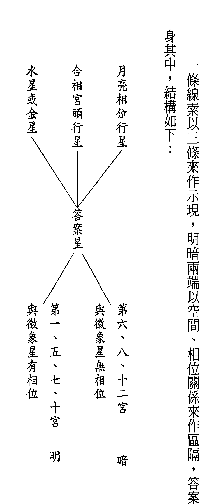

判定即是一種衡量，「此端不明，另一端明」，或者說「此端暗，另一端明」，是衡量的基本原則。在一次提問多個問題的情形下，此基本原則不變，差別只在於「此端暗，另一端明」的「明」，包含兩顆行星以上。答案星是經由相互對照而衡量出來的。因而所謂的答案相當明顯，指的是根本不用對照，一眼就看到答案。當然，也有情況是每端皆暗，看不到明亮之處，這表示答案的業果未成熟，言之過早，或尚有變數存在，或因緣不具足，來者與我無緣、時機不對，只好放棄。

談點佛法。佛法修行在於去除無明，這無明可說即是煩惱，而煩惱不是別的，就是污染。污染了什麼？污染了自性清淨。所以修行就是要拭去塵埃，讓清淨無染的自性（佛性）顯露出來。這其中最重要的一點，就是去除自私自利。沒去除自私自利，就等於沒去除煩惱、無明。

在釋迦牟尼住世的當時及更早之前，娑婆世界存在過一種無私的社會形態，生活在這樣的社會圈子裡，無我是自然的，不但是無我，你也是無我，他也是無我。只有在這樣的生活形態下，才能產生無我的占星預測法門。同時，因為無我，並與大自然合而為一，諸多神通是自然有的，人與人之間可不必多言，心靈自然相通。有了這樣的自然感應力，對答案的判定，根本不需要那麼多條線索、規則，一眼即可明白答案是什麼。這種境界等於說，如果星盤圖上有七顆行星，其中有一顆是答案星，當觀看這七顆行星時，所看到的是其中有一顆行星發光，其他六顆行星皆沒發光，答案就直接顯現了。這樣的預測法門，不需要有明暗宮位，也不需要引入徵象星，依清淨自性即可看到答案。

人類社會是愈來愈走向自私自利，佛家講佛性仍然存在，但卻被障蔽了，也等於說已失去了自然感應力，於是不得不藉由一種類似機械化的判定規則來取得答案。這是無奈！沒辦法中的辦法。要明白的是，星象是宇宙萬法之一，藉由星象來作預測，是萬法彼此相應的原理，而作為一個人，也是萬法之一，當人與宇宙、大自然合一，即是融入萬法相應之中，答案在那裡？根本沒有猜測、推想的過程，答案自己會發光，而預測者可以看到這答案之光。

當人類社會充滿自私自利，失去了自然感應力，只好以另一種方式來解讀答案。這種解讀方式是不是一門學問？是不是科學化？都不是。只能說是把因緣條件化，以規則、條件的方式來呈現可能的答案，然後依據透過腦袋所學得的判斷流程來確定答案。因緣條件化，就是世間法化，從任何的世間法占卜術來看，都已經走上這地步了。有自私的心，自然就搭配了自私的腦袋，依自私的腦袋來起妄想，來取得答案。這樣的預測方式，就稱為世間法。

本書附標題寫著『佛門高僧的占卜法』，但讀者大德們卻不是佛門高僧。佛家講，眾生皆有佛性，不管在家或出家，依此而把讀者大德們皆視為如同佛門高僧，佛性一樣。然而很顯然地，讀者大德們心中的萬般塵埃並未擦拭乾淨，甚至預測過程中，所動用到的是眼看到、腦袋在組合並分析，然後下判斷。這是用腦袋在找答案，而不是用心來相應答案，是沒辦法中的辦法，也是一個辦法。
針對如何提高準確率，作兩點結論。一是，多行善事，多種福田，這不會強化你的技巧，但心中的善念，會讓你與心懷善念者產生相應，導致來找你占卜的有緣人，多半會是可讓你預測準確的人。這種作法是讓善念引發善的因緣。二是，修行，進入佛門高僧的境界，達到根本不需要有規則、條件來看星盤，直接看那一顆行星發光即可。

- 1. 不管是否是連續預測，也不管一次提問幾個問題。
- 2. 依三條線索確定可能的答案星。
- 3. 依可能答案星的落入明宮或暗宮，以及是否與徵象星形成相位，來確立最可能的答案星。
- 4. 看是否有「反吉為凶」，以判定或吉或凶。
- 5. 可依狀況星補充說明相關狀況。

真不好意思！寫到這裡，總結就只有這五點，讓讀者大德們看了老半天，結果是短短數語了結。沒辦法，如果只寫這五點，篇幅不到半頁，怎麼出書？

答案的示現，來自因緣；失算的出現，來自不淨之心。心的不淨，思緒就受到干擾。如何解決？提供一個建議：請常念「南無阿彌陀佛」或「南無觀世音菩薩」！

## 第一部份

### Yes或No的問題須知

#### 一、單一問題

##### (一)我可以開店創業嗎？

有人約我喝下午茶，是個不常見面的老朋友，因為她有個朋友有意開店創業，想聽聽我的意見。

一進門，她已坐在某個角落等待。初見面，基於職業慣性，我很快掃描了對方的神韻。短髮，身材纖瘦，看起來應該不是刻意減肥，而是體質不容易發胖。

上衣穿著簡單的T恤，圖樣是抽象畫，搭配牛仔褲，看起來俐落、清爽。面目清秀、眉毛顯得濃黑，臉型略長，膚色健康，並不很白皙，稍微有酒窩。聲調柔中帶急，有點尖銳的感覺，動作輕快。手上戴的是一般價位的手錶，耳環小而亮，無多餘飾品，手機並非智慧型。依我猜測，這善女人家境並不富裕，靠著自己的努力工作、存錢，想開個店，一者圓夢，圓自己當老闆的夢，不想一輩子受僱於人，二是增加收入。這善女人是吃得苦的，對工作相當投入，若是當老闆，會以店為家。一開口，問我想坐那？外面，我習慣坐外面。客套話後，簡單說明詢問之事，情況與我猜想的差不多。我直言當老闆不容易，很多小店老闆搞到最後，是在幫房東賺租金，因為在看得出來妳是個肯努力工作的人的情況下，所應該評估的最重要一件事，即扣除一切開銷後的純益，一定要超過受僱於人的薪水，不然就別幹。辛苦點沒關係，但絕不能白幹、賠錢。我對這位善女人作了點說明。我說就妳所想知道的事，目前我所能回答妳的是開店創業的時機成不成熟？如果預測結果已成熟，再來找店面，才有機會找到不錯的店面。如果時機尚未成熟，我建議不要勉強，再等看看，多存點錢再說。一般類似這樣的預測，可分成兩種情況，一是尚未找到店面，即使已經規劃好了，還是算尚未落實。二是已經找到店面，可說已準備執行，這時所預測的問題更為明確，即擇定這個店面來創業能否成功？小企業中的店面生意，店面所在攸關經營的成敗。店面不適當，店租再便宜也沒用，人再怎麼努力也可能沒用。

這不是在強調風水，而是在強調地點的考量，如人潮、附近同行的競爭、交通等。有時候當事人已一切決定好了，所謂的詢問是白問，預測結果的可否，不影響開店的決心，甚至店面已承租了。最好的情況是已規劃好，但尚未著手尋找店面，這時候所作的預測，結果若是不行，表示時機尚未成熟，那麼一切緩一緩，沒什麼大礙、損失。針對創業的預測，一般年限是兩年，即所顯示的是創業後前兩年的情況。若是肯定答案，兩年內可獲利；若是否定答案，兩年內難獲利，賺不多或沒得賺，可放棄，或準備至少撐過兩年以上。

善女人要開什麼店？飲料店，屬於加盟店。這種店，在臺灣都市裡相當普遍，成本低、人力少，自己一個人加上一兩個工讀即可搞定。善女人說她有這方面的實務經驗，想先從這做起，等穩定了，多存點錢再來開個咖啡店。這雖然不是什麼大案子，涉及的創業成本低，風險相對也低，然而畢竟這是善女人圓夢的開始，我心中默默祝福她！

喝一口桔茶，稍微沈靜一下，然後按下滑鼠，顯示了星盤圖(2)。

資料是臺灣時間，二〇一〇年八月十四日PM02:38:53，答案顯示可以。星盤圖(2)上，月亮是最亮的最緊密相位行星是太陽，是第九宮宮主星，落入第八宮。從第九宮宮主星來看，沒有反吉為凶。從落入第八宮來看，有可能被蓋住，即不能成為答案星。這時候可從徵象星來作判斷，飲料是水作的，水的徵象星是月亮和海王星，這兩顆行星皆與太陽有形成相位，所以太陽雖然落入第八宮，但不能意味著是被蓋住，而應該是顯示著兩倍之意。雙數宮位一般是指第二宮、第八宮、第十二宮，意指有兩倍、兩個的呈現。木星和土星皆合相宮頭，有可能是答案星。但就與徵象星是否形成相位來看，木星和土星都沒有與徵象星形成相位，所以與太陽相比，太陽才是真正的事件答案星。這其中有待說明的是，第十宮宮主星是金星，本來理應成為當然的事件徵象星，可是其主宰星座卻是天秤座，因此應該棄而不用！也就是說，金星只能作為第五、六宮的宮主星（金牛座），不能作為第十宮宮主星。倘著作為第十宮宮主星，在與木星和土星有形成相位的情形下，木星和土星會取代太陽而成為答案星。就徵象星來說，一者是第十宮宮主星，代表事業；二者是水的代表行星，表示事業所涉及的事物，即月亮和海王星。在星盤圖(2)上，只顯現水的代表行星，不顯現事業的代表行星，就是要把木星和土星排除在答案星外，這是因緣的巧妙之處。順便一提，當金星透過作為金牛座宮主星，而身兼兩個宮主星時，如本例中的第五、六宮主星，一般以作為前一個宮位的宮主星為主，本例中的金星是作為第五宮宮主星。只有在相當特殊的情況下，才作為後一個宮位的宮主星。 我對善女人說，時機已成熟，穩賺不賠！可以很快找到適當的店面。善女人仿佛放下心中一塊大石頭，又眼神中透露著篤定的光芒，露出了小小酒窩的最大極限，笑著對我說：「洪老師，我早就有預感，預測的結果是如此。」接下來的客套話自然是：「店開在那？記得告訴我，若經過一定捧場。」善女人說隨便我喝，免費招待，她不知道我是出了名的牛飲大王，很能喝飲料，麥當勞大杯可樂可以連喝三大杯。我提醒她一件事，做人要實在，可別因為想多賺點錢，在飲料內添加有害人體的東西，這樣做很不道德。她說放心啦！我雖然閉關多年，但這閉關並非完全不出門，有事時還是會出門，比如吃飯、應邀等。

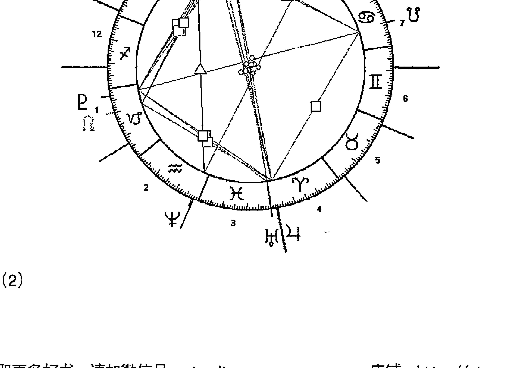

星盤圖 (2)

##### (二)選擇那一份工作？

這是一個學生拿來問我的問題，所涉及二選一。在二選一的問題中，猜中的機率是二分之一，與或吉或凶一樣。從西洋卜卦占星學來看，針對如何進行二選一，採用的是「對宮比較法」。所謂「對宮比較法」，就是依據事件徵象的代表宮位，以當宮和對宮分成兩者，然後透過星象來判定何者為吉，吉者即是答案所在。比如，同時與兩位情人交往，最後情歸何處？愛情屬第五宮代表，第五宮的第七宮是第十一宮，於是兩位情人分屬於第五宮和第十一宮代表。那位代表第五宮？那位代表第十一宮？可在預測前作設定，也可不作設定。若先作設定，可設定其中一人代表第五宮，另一人自然是代表第十一宮。不作設定，則是依第五宮宮主星和第十一宮宮主星的行星特質來作代表性的區別，通常所代表的是職業和個性特徵。比如，第五宮宮主星是金星（金牛座），第十一宮宮主星是冥王星（天蠍座），金星和冥王星分別代表這兩位情人的職業或個性特徵。也可如此設定，先認識的設為第五宮，後來認識的設為第十一宮。現代社會流行「小三」，意指外遇的第三者。老婆是名正言順的配偶，所以由第七宮作代表，即夫妻的當宮，而小三是競爭對手、介入者，所以由第七宮的對宮來代表，即第一宮。於是，第七宮和第一宮，分屬老婆和小三的代表。然而，由於命主星（第一宮宮主星）是代表當事人，所以命主星既代表當事人，也代表小三。判斷的過程，主要是依據月亮、命主星、第四宮宮主星，與事件徵象星之間的相位關係來作判定。事件徵象星除了上述的兩顆宮主星外，也包括其宮位內的行星，如上述的兩位情人的抉擇，除考量第五宮宮主星、第十一宮宮主星外，也應考量第五宮和第十一宮內的行星。當考量因素愈多，誤判的可能性就愈高。我敢直言，依據西洋卜卦占星學來進行二選一的預測，誤判的可能性相當高。理由有二，一是西洋卜卦占星學的對宮比較法，通常是涉及「人」的徵象，比如上述的兩位情人，或老婆和小三，這皆是以宮主星代表「人」。如果占星卜卦的經驗足夠，即可發現宮主星的代表人和事，準確率是不一樣的，代表人的預測準確率較低。這表明了一件事，占星卜卦主要是用來預測事件，因此宮主星主要是作為事件的代表，而不是人的代表，所以當西洋卜卦占星學把命主星（代表當事人）視為相當重要的徵象星時，就已經埋下誤判的可能。二是，如上所述，扯進一堆徵象星，自然會模糊答案焦點，吉凶糾纏在一起，進而導致誤判。

我這樣的說法，可能會讓相信西洋卜卦占星學的人有所質疑。如果不採用對宮比較法，不依「人」來設定徵象代表，那麼如何進行二選一？在此，我先提出一個宇宙運行之道的神秘現象。為何易卦的占卜是六爻？更早的數字卦是有三爻、六爻，也就是說最根本的基數是三爻。我在說明單星預測法時，也提及在答案的設定上，理應設定至少三個答案以上。明白地說，「二」是不確定因素，任何的占卜，應儘可能避開二選一，寧可虛補一個，構成三選一。為何？三是穩定之數，並且在實測上，確實會遇上二選一的問題，因而只好依對宮比較法來作預測。凡遇上二選一的問題，可將其化為或吉或凶來作預測，答案準確率會較高。也就是說，不針對兩造進行一選一，而是針對其中一造進行Yes或No的預測，當其中一造預測的結果是Yes，另一造自然是No。這種預測方式，就如同預測那位總統候選人會當選？當選可能性較高的只有兩人，只要針對其中一人作預測，答案自然就顯示了，不必採用對宮比較法。當然，答案也有可能是兩者皆No，兩頭落空。

如果一定要採用星象來作二選一的預測，務必記得以「事」來作為徵象代表。捨棄對宮比較法，也就等於是捨棄二選一預測法，這時候問題的內容略有改變，即如果問的是「選擇那一份工作？」可改為提問「最終去那裡工作？」這等於是把二選一化為多選一，雖然實際上只有兩種選擇，但卻虛擬成有多種選擇，而答案所呈現的是最終的結果。這時候的答案星，代表著呈現出該最終工作的相關徵象。

在事件宮主星的認定上，依西洋卜卦占星學看法，工作可由第十宮或第六宮宮主星來作代表，以採用第十宮宮主星為主，因為第六宮宮主星有時是作為反吉為凶之用。

星盤圖 (3) 的提問，實際情況是有兩項工作機會可供選擇，可將其化為有多項工作機會可供選擇，然後預測最終花落誰家。資料是臺灣台北時間，二〇〇九年十月十九日PM08:49:50。工作內容是會計，其中一份是傢俱公司，另一份是房仲公司。我最後的建議是，若不急著找工作，這兩份工作都不要，可另尋其他公司的工作。

先看可能的答案星，其一是土星，為月亮的最緊密相位行星，其二是金星，作為身兼第五、十二宮宮主星，可自行當答案星。從土星和金星來看，皆有符合這兩份工作的象徵。就土星來說，代表土地、不動產，可說是象徵星兼答案星，而月亮本身即代表房子，又是代表會計的第二宮宮主星，因此是因緣星兼象徵星。然而，作為答案星的土星是凶星，又是第八宮宮主星，所呈現的是凶兆無疑。第十宮宮主星的海王星，並沒有與土星形成相位，但第六宮宮主星的冥王星，有與土星形成相位，可讓土星作為答案星更明顯。 就金星來看，金星本身就代表錢財，可說是會計工作的代表象徵星，同時金星也代表傢俱，於是代表事件的象徵星。雖然金星沒與月亮有相位，但透過作為第五、十二宮宮主星，自行成為答案星。於是，可說金星就是代表著傢俱公司會計工作的答案星。然而，金星呈現「反吉為凶」，與土星一樣是凶兆。金星與第十宮宮主星的海王星沒相位，可是與第六宮宮主星的冥王星有相位，與土星一樣明顯化為答案星。 從最終的結果來看，在這兩份工作中選擇那一份，差不了多少，同樣是不好乾，薪水少、壓力大。再接下來，可觀看狀況星。星盤圖(3)的狀況星是木星，不是月亮的最緊密相位行星，但卻有與事件象徵星的第十宮和第六宮宮主星，同時形成相位。木星代表必須往外跑，因此這兩份會計工作，恐怕並不單純是內勤工作，也包含了必須對外接洽，所以較為辛苦。

木星的另一個重要徵象，是機會。於是，當木星與月亮、第十宮和第六宮宮主星，皆有形成相位，其所呈現的狀況，理應包括還有的選擇。因此，從相關星象來作判斷，最終於這兩份工作都不要，因為都很吃力；若要勉強抉擇，以選擇月亮最緊密相位行星的土星來作答案星，即選擇房仲會計工作。若不急著上班，可另尋工作，因為星象顯示還有其他機會。這等於說，卜問的結果並非是二選一。如果把問題僵化為是二選一，那麼就不會有其他的選擇。當問題是：「最終去那裡工作？」答案可以是「這兩個地方都不去！」

如果依對宮比較法，把其中一份工作視為是第六宮，另一份工作視為是對宮的第十二宮，有可能產生誤判。誤判的根源來自於工作代表宮位的認定。那一份工作是屬於第六宮？那一份工作屬於第十二宮？一旦認定錯誤，誤判就形成。以此例來說，答案落在土星上，如果認定房仲會計是第六宮，那麼預測結果與我所作的判定一樣，但如果是認定傢俱公司會計是第六宮，那麼預測結果就與我不一樣。同理，兩個情人何者是第五宮？何者是第十一宮？認定上的差異有可能造成誤判。因此，較穩當的作法是，不設定兩者的代表宮位，直接由第五宮宮主星和相關徵象，來指向最終的結果。

對宮比較法是有問題的，比如說某男人有三個情人，最後長期交往是誰？以第五宮代表其中一人，另一人是第五宮的對宮第十一宮，那第三人呢？可說是第十一宮的對宮第五宮，又回到第五宮，這等於說第五宮代表兩個人，在解釋上說不通。或許有人會說，這時候應該改採順序宮位。所謂順序宮位，指的是依第三宮兄弟宮來作排列，第一個情人是第五宮，第二個情人是第七宮，第三個情人是第九宮，每個情人彼此相隔三宮，意味著情人們互為姐妹。這種說詞不對，因為為依序排列的宮位，彼此間沒有競爭性，競爭是以第七宮來作顯示的。西洋占星學的一大錯誤，就是把「人」的象徵代表硬拉進來，導致混淆了整個預測過程。「人」的象徵代表不是沒用，但除非所提問之事，只涉及人，不涉及事，不然後沒必要扯太多。

說個故事。有個女人嫁了一位有錢老公，衣食不缺，生活無慮。在機緣下，遇到了一個帥哥，這帥哥很會說甜言蜜語，打動了女人的心。結果這女人決定與情人私奔。某夜裡，她把家裡值錢的東西全打包，然後與帥哥相約某地會合，一起逃到鄰國生活。走到半路，有條湍急小河阻擋了去路，又沒有看到附近有橋樑。女人說：「水這樣急，如果不小心滑倒，會被水沖走。」帥哥說：「我有個好主意。我先把行李扛過去，藏好，然後再回頭來背妳過河。」

女人心想，只好如此。於是，把行李交給帥哥。帥哥過河後，就不見人影了。女人等了又等，足足等了一整天，終於知道自己被騙了。前面是河流，後方是夫家的追兵，身上又沒錢，可說已是走投無路了。

這時候，她看見有隻狐狸獵得了一隻野雁，叼在嘴裡頭。然而，這狐狸卻又看到了河裡有一大堆的大魚在游著，看起來好像比野雁更可口。於是，這狐狸鬆口放掉了野雁，一下子直撲下水，想抓幾條肥美的大魚來好好享用。但因河流實在太急，狐狸被沖得載浮載沉，費盡氣力才游上岸，癱在岸邊大口喘氣。結果，不但半條魚沒撈著，連野雁也飛走了。女人見到狐狸如此狼狽，就說：「你真是太傻了！如果沒去抓魚，現在豈不可好好享用野雁？結果魚沒吃著，連野雁也飛了。」狐狸回說：「說我傻，那妳豈不更傻？妳為何落到如此，自己想想吧！」人的貪念，想要更好的，想要更多。結果，很可能是兩頭落空。在作任何的抉擇時，除了知足外，應該考量到己身的情況。比如選擇工作，那一份工作更合適自己，做起來更愉快，而不是考量錢更多。薪水雖較多，但卻做得很不愉快，豈不活得很無奈！又比如選擇伴侶，同樣是選擇較合適的對象，絕不是考量可從對方得到什麼。從利益、金錢來考量，並不是唯一的考量，當心中以貪念來作抉擇時，所相應到的很可能也是貪念，貪念即是自私，而自私無法離苦得樂。惜福，珍惜現有的，就是幸福的感覺！

乖乖是一條狗，算是小狗，才四個月大，是女生。她被抱回來後，就養在住家一樓，有庭院。平時是在家裡跑來跑去，偶爾到庭院跑來跑去。有一天，庭院的門沒關好，給她溜了出去，不見了。養她的人，是我的朋友，我朋友建議她來問我，問看看能不能找回乖乖。這種小事，在我看來是小事，在養乖乖的人看來可能是大事，因為乖乖很受寵。我說不用跑一趟，用手機講就可以了。一開頭，我自然先問乖乖是什麼品種的狗，有沒有裝晶片？對方說是白色博美犬，我一聽，這下完了，這麼可愛的小狗，恐怕被抱走了。乖乖還沒有裝晶片，本來是想等她大一點再裝，結果卻蹺家了。當時，我已處理了另一件占卜，所以這是連續預測，時間相距不超過一小時。資料是臺灣臺北時間，二○一一年十月二十七日AM11:23:46。從星盤圖(4)可看到，沒有一顆行星合相宮頭在2度以內，於是只好把觀察指標定在月亮的最緊密相位行星上。木星是月亮的最緊密相位行星，次緊密相位行星是冥王星，然而冥王星落入第十二宮，因此如果有被蓋住的話，應該是冥王星。這等於說，木星作為答案星是相當明顯的。木星本是吉星，可是在此卻是第十二宮宮主星，表現了「反吉為凶」，所以答案是NO，可愛的乖乖找不回來了。第十二宮同時也象徵著迷失，符合蹺家的徵象。我安慰這位不曾謀面的朋友說，人生本來就是緣聚緣散，乖乖雖與妳無緣，但我相信她會好好活著。如果妳願意養流浪狗的話，我可以送一隻給妳。她說不用了。想也知道，會養白色博美犬那麼乾淨的狗，不太可能養流浪狗。

在這個實例中，我完全沒有考慮乖乖是屬於那一個宮位所代表，也就是說根本不需要考慮乖乖的所屬宮位，直接以答案星來判定答案。依據西洋卜卦占星學，得先確立乖乖的所屬宮位，這目前有爭議。一般來說，第六宮代表小型寵物，第十二宮代表大型寵物。若正好不大不小，就難以界定，比如麝香豬就是。還有，狗的種類很多，不少大型狗的體重比一個成年女人還重，這到底算是小型或大型寵物？另一種說法是，把寵物歸入第五宮，這是把寵物等同小孩來看待，現代確實有很多人把寵物當成自己的孩子一般來養。可是，畢竟孩子是孩子，寵物是寵物，不能相等。當解讀占卜的星象時，一定要扯進那麼多的相關宮位，必然導致觀察焦點的分散。乖乖的走失，與命主星（飼主）有何關係？沒有的！與乖乖的所屬宮位有何關係？沒有的！與第四宮宮主星有何關係？沒有的！與乖乖所屬的宮位內的行星有何關係？沒有的！

本例中的答案星，對月亮而言是出相位，可是問題的提問卻是「未來能不能找回乖乖？」乖乖走失是已發生沒錯，然而問題是指向未來，如果出相位不能代表未來的結果，那麼當月亮繼續移動，所碰到的第一個正入相位，是與天王星形成135度，天王星是第十二宮宮主星，只與第十一宮宮主星的冥王星有形成相位，這麼一來徵象根本不符，因為第二宮和第十一宮，與寵物走失找不回來的徵兆完全無關。提醒讀者大德們，如果相信西洋卜卦占星學的入相位比出相位重要，那麼失算的機率會昇高。因緣無入也無出，因緣只不過是刹那的契機。順便一提，本例中的木星不但是答案星，同時也是乖乖的徵象星。雖然木星是第十二宮宮主星，代表反吉為凶，但木星本身卻是吉星，這吉星的徵兆就代表乖乖。因為乖乖是一隻白色博美犬，這種狗是相當標準的寵物，有人侍候，不愁吃穿，不用工作，想睡就睡，想叫的時候就汪汪兩聲，豈不大大好命！人世間少有這種好命。佛家講畜生道是三惡途之一，但乖乖比那些飽受內戰和貧窮、飢餓所困擾的非洲難民來說，不知好命多少倍啊！茶來伸舌，飯來張口，出門有人幫著穿鞋子，還戴太陽眼鏡，拉完大便有人幫她擦屁股，沒煩沒惱，這種境界相當高，所以說乖乖真是好狗命，以木星來顯示。

#### 二、兩個問題

##### (一) 能否解決財務困境和生意洽談順利？

星盤圖(5)是一位友人來電所詢問的問題，同時問及兩個問題，並且是屬於連續預測。情況是當事人面臨著財務困境，雖然不是缺很多，但有燃眉之急。當事人無意向人借貸，想靠自己的能力來解決。因此，前一個問題涉及近期內的財運，財運好，收入增加，自然可暫解燃眉之急。後一個問題是有關一項生意的洽談，詢問的是能否順利達成交易。資料是臺灣臺北時間，二〇一二年八月十六日PM08:54:57。星盤圖上的金星是第二宮宮主星，第二宮和金星皆代表錢財。金星正好合相第四宮宮頭，相當緊密，因此就第一個問題來說，無疑地金星就是答案星，是徵象星兼答案星。於是，金星是否有反吉為凶現象，成為判斷的重要關鍵。慶幸的是，金星所代表的吉星徵兆，並沒有涉及第六、八、十二宮宮主星，答案簡單明瞭，錢財的燃眉之急可獲解決。再看第二個問題，月亮的最緊密相位行星是天王星，落入第十二宮，由於第十二宮是陷宮，代表蓋住，所以有可能天王星並非答案星，而是另一顆與月亮形成相位的行星，從星盤圖上可看出是木星。不管是天王星或木星當答案星，皆沒有反吉為凶的徵兆，因為天王星是第十一宮宮主星，木星是第九宮宮主星，沒有涉及第六、八、十二宮宮主星。於是，從天王星和木星來看，所占得的答案是Yes，生意可成交。然而，有必要注意的是冥王星，合相天頂（第十宮宮頭），並且是呈現凶兆的第八宮宮主星。依事件的徵象來看，此事與印刷有關，印刷由水星作代表，可是水星同時與天王星和冥王星皆形成相位。從相位緊密度來看，水星與冥王星更緊密，於是可推論為結果有兩種可能：一是，冥王星作為答案星，交易不順利；二是，冥王星和天王星皆是答案星，這表示什麼？原本的交易沒成功，但卻有另一筆交易順利達成，同樣是與印刷，而且獲利更多。我推測是第二個結果，理由是木星也合相第三宮宮頭，第三宮同樣可代表印刷，並且木星與天王星有形成相位，與冥王星沒形成相位。最後正如我所預料的，交易成功，但交易對象換人了。從這個實例中，可提醒讀者大德們一些注意事項，即有關答案星判定的問題。本例中的天王星和木星，與月亮的相位容許度相當接近，如果是單一問題的提問，由於這兩顆行星皆沒有反吉為凶的徵兆，以致判斷上較容易。若是其中一顆是呈現反吉為凶，在判斷上就要更謹慎。就如同冥王星作為凶兆代表，與天王星和木星的吉兆正好相反。

當月亮同時與兩顆行星形成相當緊密的相位時，到底哪一顆才是答案星？判斷的依據有二，一是「蓋住」的徵象，一是「顯露」的徵象。徵象有二，一者落入第六、八、十二宮，二者形成90度相位。所謂「蓋住」的徵象有二，一者與徵象星有相位，二者落入第一、五、七、十宮。因此，可把「蓋住」和「顯露」進行相互比較。

讀者大德們須注意，所謂的「月亮最緊密相位行星」，並非絕對的，而只是參考的。比如，月亮與木星形成最緊密相位，容許度3度，而與土星形成次緊密相位，容許度5度。從「原則」上來說，木星應該是答案星，但這只是「原則」，並非「絕對」，因為經由蓋住和顯露的作用，相位容許度較寬的土星，有可能才是真正的答案星。因此，如果情況是沒有呈現反吉為凶，或一吉一凶，那麼答案星就是Yes。可是，當情況是一吉一凶，或其中之一是反吉為凶，那就得考量到蓋住和顯露的情形。

以木星和土星來說，一吉一凶，如果情況是如上述所言的皆與月亮形成相位，依蓋住和顯露來作比較，有以下情形：

-   1. 木星落入陷宮，月亮與木星形成90度，木星與事件徵象星無相位，此為「三陷」情形，雖然木星是最緊密相位行星，但不足以當答案星。
-   2. 木星落入陷宮，月亮與木星形成90度，木星與事件徵象星有相位，此為「兩陷」情形，木星要當答案星也很難，除非土星的情況與木星一樣。若土星落入強宮，與月亮非形成90度相位，不管有沒有與事件徵象星形成相位，足以取代木星成為答案星。
-   3. 木星落入陷宮，沒與月亮形成90度相位，不管木星是否與事件徵象星有相位，木星可當答案星，除非土星很強勢，才足以取代木星，此為「一陷」情形。在此，點明了很重要的一點，即當月亮的最緊密相位行星，身處在一陷、兩陷或三陷中時，90度相位是最關鍵的所在！

依影響的重要性來作排列，第一個是90度相位，代表拒絕相位，第二個才是陷宮，第三個是與徵象星無相位。即使木星只是「一陷」，可是這一陷卻是與月亮形成90度，那麼只要土星略呈強勢，就可取代木星成為答案星。

請讀者大德們務必記住，陷宮同時也是雙數宮位。這等於說，陷宮代表兩種意思，一是蓋住、沒了，二是雙倍呈現。以Yes的答案來說，前者表示Yes沒了，即No；但後者卻表示不但Yes沒有被蓋住，並且是雙倍呈現，Yes的再次Yes，更加肯定。而90度相位，沒有雙數作用。當月亮的最緊密相位是90度，也不要馬上否定其作為答案星，因為星象是可能出現各種情況的。因此，在否定的同時，也要考量到肯定。兩顆可能的答案星之間的抉擇，就在於兩者之間的否定與肯定的對比，一方被否定，另一方就要被肯定。如果另一方沒有被肯定，就不能否定原來的一方。希望這樣的說明，能讓讀者大德們明瞭其中的變化。

##### (二) 愛情沒了，錢也沒了？

人生真是何處不相逢！若是有緣，到那都會碰上。有個好多年沒見的同學，碰巧在一位友人家中相遇。起初，我沒看出來，反而是對方叫出了我的名字。仔細一看，阿彌陀佛，原來是妳！當事人是我這位同學的至友，她倆算是手帕交。

人在走好運時，事事如意，春風滿面。走衰運時，一不小心，踩到了狗屎，趕緊一邊走，一邊用力腳擦地，把狗屎擦掉；結果，碰，哎呀一聲，撞到路邊電線桿，腫了個大包！這位善女人就是正在走衰運，一者股票套牢，彷彿解套之日遙遙無期；二者男友劈腿，心情盪到谷底下面的縫隙裡。於是，我同學就向她推薦找洪半仙問事，事後隔了二天，我請同學吃飯，高檔的，結果算一算，倒賠！

本例是非連續預測，資料是臺灣臺北時間，二〇〇七年九月二十一日PM03:45:32。從星盤圖(6)來看，月亮合相第十二宮宮頭，有可能身兼答案星，但從其相位關係來看，否定了作為答案星的可能，一者沒與第五宮宮主星形成120度，二者沒與相關的事徵象星有相位，或身兼相關的事徵象星。這兩件事，一是有關錢財、投資，一是愛情問題，所涉及的宮位是第二宮和第五宮。月亮的相位有二個，分別是天王星、土星和水星。其中天王星和土星的相位緊密度皆在2度以内，而水星的相位容许度较宽，并且落入第八宫，又是90度相位，因此水星不列入答案星考量范围。排除水星作为答案星，是预测的关键！因为水星身兼第五、八宫宫主星，又自行当答案星，又代表爱情和钱财的金星有形成相位。然而，水星与月亮形成90度，又落入陷宫，可说是处于两陷情况，与天王星和土星来作比较，这两颗行星皆与月亮形成紧密相位，并且不是90度，又落入强宫中，以至于这两颗行星足以成为答案星。

天王星和土星，一吉一凶。吉的是天王星，作为第一宫宫主星，没有反吉为凶。凶的是土星，本身是凶星，再加上是第十二宫宫主星，凶上加凶，没得救。于是，只要区别那一颗行星呈现那一个问题的答案，就解决了。

一眼看去，很显然，天王星代表钱财方面的答案星，因为虽然天王星没有与第二宫宫主星（海王星）有相位，但却与木星有相位。木星可代表财富，并且木星也可算是第二宫宫主星，依照传统七颗行星的宫主星划分。既然天王星显示了钱财方面的答案，那么土星就代表了爱情方面的答案，已无法挽回。就土星的相位关系来说，没有与第五宫宫主星或金星有形成相位，但还是呈现了爱情方面的答案，只因问题有两个，而答案星也只有两个，没有其他选择。土星的落入第七宫，不必设想为是与爱情有关。第五宫宫头落在双子座，等于是没有了第五宫主星。这显示了星象的巧妙，因为股票投资和爱情，皆是由第五宫来作代表，如果第五宫宫主星没有消失，那么应该是代表投资，还是代表爱情？这个提问，碰巧是两个问题同属一个宫位所代表，若两者是一吉一凶，依西洋卜卦占星学不易作判断。

我一再强调一个事实，星象的显示有时是难以兼顾的，尤其是当一次提问多个问题时。在本例中，显示了只有两颗答案星，并且只显示了天王星是有关钱财方面的答案星，而土星并没有显示了是爱情方面的答案星，是因星象兼顾不到。在这种情形下，土星是由于天王星凸显作为钱财方面的答案星，而自然地成为是另一个问题的答案星。结论是，套牢可解套，鸟飞走了，抓不回来。

如果依照西洋卜卦占星学来看，第五宫宫主星没消失，是水星，落入第八宫，结果很可能误判为两头皆落空。为何？因为月亮与水星形成90度，90度相位被当成是凶相，而且第四宫宫主星的金星，又与第二宫宫主星的海王星形成对冲，同样也是凶相。如果从水星和海王星形成120度相位，来解释说投资可解套，或吉或凶两极化，并各有征象，最后只有一个结果：瞎猜、碰运气！本例答案一目了然，不用五秒钟就解决了，其余的时间——陪两位佳人喝茶、聊天。

两个月后，解套了！股票解套了，爱情也解套了。天王星是解放、自由；土星是悲伤、怨恨。

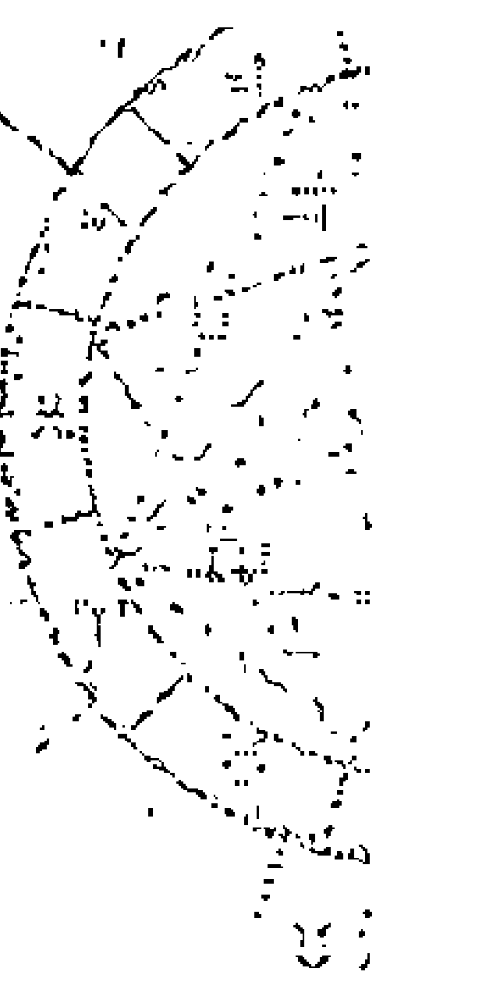

#### 三、三个问题

##### (一) 官司、购屋和怀孕？

当事人是一位中年男性，一次提问了三个问题。其一，由于生意往来所导致的债务纠纷，打官司是要索赔，因此重点是官司能不能赢？其二，有意以某价钱购屋，问是否能成交？其三，想再生个小孩，问及老婆今年会不会怀孕？在咨询过程中，不免会遇上当事人在言语上有所保留，这时只能顺着当事人的意思，不便多问，仅以星象来判定结果。在官司预测上，当事人未必就是吃亏、受害的一方，有可能是占了别人便宜，以致被告，却说成是对方的错，反告对方，要求赔偿。事件的真实情况，占星家并不清楚，当事人也未必会说真话。

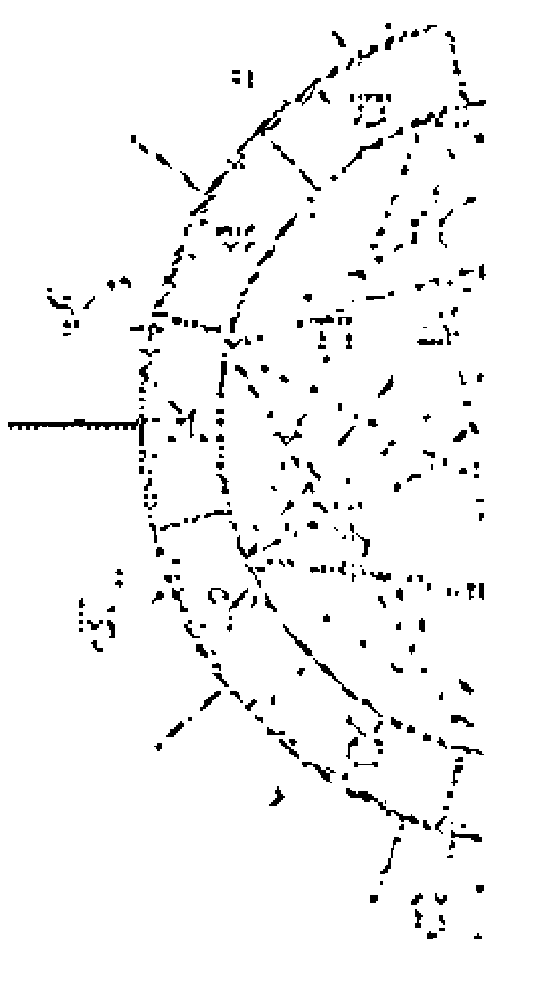

因此，要记得一点，别尽信当事人所言。

就购屋来说，涉及价钱问题，是有弹性的，买方想买低，卖方想卖高，所以是在出价的调整过程中达成交易。因此，就购屋的预测来说，可分成两种情形，一是没设定价钱，直接卜问最后的结果是否成交？二是有设定价钱，卜问依此价钱能否达成交易？依经验，以后者的准确度较高。从前者来看，没设定价钱来作预测，答案若是Yes，表示成交，是意味着卖方的这房子卖得出去，可是买主未必是当事人，即房子卖出去了，但当事人没买到。因此，针对前者的预测情况，必须更明确问及：「这房子是否是我买到？」依什么条件买到？很简单，价钱。既然是依据某价钱而成交，预测自然是锁定价钱，问及的是：「这房子一坪多少钱可买下？」若把两者合一，更精细的提问是：「我可以一坪多少钱买下这房子？」这种占卜法，必须采用代码预测法来作预测，因为征象预测法无法执行价钱调整空间的预测。因此，只能这样提问：「我出价每坪五十万（假设），可否买下这房子？」价钱是被给定的。

在一次提问三个问题的情况下，除非因缘具足，不然不会三个答案皆明显呈现。因此，要记得不可强行解释，勉强取得答案。即使在非连续的单次预测中，也有可能因缘不具足，这往往是言之过早，或预测的时机不当，也有可能是当事人有意刁难。不管是那一种情况，当二条线索不明确，即缺乏相位紧密度，皆务必小心。

本例是非连续预测，在一次提问三个问题的情形下，是否为连续预测差别不大，因为要一次显示三个答案，若月亮的相位数不够，自然得借助于宫头行星、水星和金星。资料是台湾台北时间，二〇一一年一月十一日下午8:24:35。从星盘图 (7) 来看，水星和金星并没有身兼第四或五宫宫主星，因此这条线索不成立。另外两条线索，一条是月亮的最紧密相位行星是太阳，身兼第十二宫宫主星，呈现反吉为凶，不动产由月亮和土星所代表，月亮代表房子，土星代表土地，这两颗行星皆与太阳有形成相位，并且代表钱财的金星也与太阳有相位，因此可先肯定其中一个答案，即以当事人所提出的价钱来购屋，不会成交，这价钱屋主不满意。太阳与月亮是形成90度，有可能拒绝作为答案星。但此例中的太阳，是落入强宫的第五宫，并且与月亮的相位容许度在2度以内，又与相关征象星皆有相位，以致构成拒绝的条件不凸显。另外的两个答案，可通过合相宫头的行星来看出。在星盘图 (7) 上，合相宫头的行星有木星、天王星和南北交点。先看南北交点，所合相的宫头位置是第五宫、第十一宫，其中第五宫代表怀孕，而交点作为答案是表示虚空，因此就怀孕这件事来说，没消息，已解决了两个问题。土星作为第五宫宫主星，与月亮有相位，并且与代表孩子的征象星有相位，因此从土星来看，同样是不会怀孕，于此土星是身兼征象星和答案星。又从太阳来看，同样是不会怀孕，也是征象星兼答案星。然而，就判定来说，可不必如此费心费时，当交点相当紧密合相第五宫宫头，即可断定为是「空亡」，只不过本例中合相第五宫宫头的是北交点，尚有不成问题之意，以致藉由太阳和土星，让答案更明确。

剩下的一个问题是官司，答案星可能是木星或天王星。这官司涉及金钱，属于债务，所以第二宫宫主星是征象星。第二宫宫主星的水星，以及代表钱财的金星，同时与木星和天王星有形成相位。由于事涉法律，所以第九宫宫主星和木星皆是征象星。这么一来，答案星就是天王星，而天王星是第六宫宫主星，呈现反吉为凶，于是判定官司败诉，钱要不回来。或许有读者大德们会问，为何木星不能征象星兼答案星？若是如此，由于木星没有呈现反吉为凶，所以官司会赢。

请细看这其中的奥妙！木星和天王星皆合相第八宫宫头，而巧妙的是被切割开了，木星是落入第八宫，天王星是落入第七宫，木星入陷宫，天王星入强宫，自然是天王星为答案星。或许读者大德们又会疑问，基于宫位系统的不同，木星和天王星有可能一同进入第七宫。这点我不否认，对此我只能说「一切随缘」！

当你习惯应用某宫位系统或某占星软件，就一直使用下去，因缘的相应会自然显示答案。当我第一眼看到当事人时，直觉此人不老实，有所隐瞒，官司的实际情况恐怕与其所言有所落差，我不便多言，只就预测结果断言会败诉。

读者大德们不妨思考的是，如果依照西洋卜卦占星学的论法，能否如此迅速决定答案？恐怕难喔！请看下表：

| 左边（基本论断要件） | 右边（询问事件有关的征象星） |
| :--- | :--- |
| 月亮 | 第一组：涉及债务的官司，与法律和金钱有关，所以包括了木星、第九宫主星、第九宫内的行星、金星、第二宫主星、第二宫内的行星。又第七宫代表官司的对方，所以第七宫主星和第七宫内的行星，也要列入考量。更多的考量是，也包括金牛座内的行星，以及射手座内的行星。 |
| 命主星 | 第二组：涉及购屋，与房子和钱财有关，也涉及卖方，所以包括了月亮、土星、金星、第四宫主星、第四宫内的行星、第二宫主星、第二宫内的行星、第七宫主星。更多的考量是，也包括了金牛座内的行星，以及巨蟹座、摩羯座内的行星。 |
| 第四宫宫主星 | 第三组：涉及怀孕，并不是自己怀孕，而是老婆怀孕，所以相关的征象星包括了太阳、第五宫主星、第五宫内的行星、月亮、命主星、第四宫宫主星。更多的考量是，也包括了巨蟹座内的行星，以及狮子座内的行星。 |

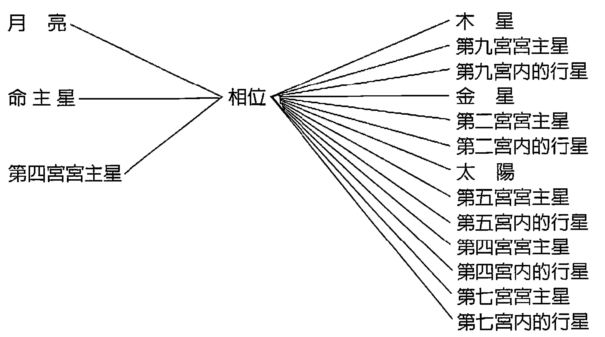

除了上述的征象星外，还有其他一些杂七杂八的论断规则，在此省略不提。左边的三颗行星与右边的三组行星，透过相位会形成一个吉凶皆呈现的网络，这是最常见的情形。判断的困难就在于相位，一者相位往往是有吉有凶，二者吉相位不一定是肯定，凶相位不一定是肯定。这么一来，在面对一次提问三个问题时，搞到最后，只有一个结果，即依据占星家个人的主观妄想来猜测答案。也就是说，如何去诠释相位网络？依据的是占星家的经验、直觉，或者说是主观妄想，来解释诸相位的互动关系，这会导致与占卜的因缘性相冲突。所谓占卜，就是经由随机而显示答案，如果答案必须透过人的主观妄想来运作，那么随机很可能变成是刻意，即占星家的当下直觉、妄想，渗入答案的示现中。当答案只有一、二个时，西洋卜卦占星学还勉强可预测，当答案数超过三个时，由于牵扯入的征象星过多，不但判断上有困难，且易产生误判。更糟糕的是，西洋卜卦占星学加入了很多不必要的参考因素，这不但没有让答案更明显呈现出来，反而复杂化了判断过程，难以直指答案，最明显的就是根本不需要考量命主星，除非所提问之事是有关当事人的想法、个性或现况，命主星作为征象星，才纳入考量之中。西洋占星家搞了两千多年，三条线索中只掌握了一条，少了两条，并且所掌握到的月亮这条线索，在实论应用上也有所扭曲。

另两条线索，至今都还没发现，还谈什么研究、发展占星学？从本例中可看到，透过合相宫头的行星，可直指答案。如果没有合相宫头的行星这条线索，交点和天王星不会成为答案星。又交点的作为答案星是代表虚空，Nothing，西洋占星家并不知道。

本例如果依西洋卜卦占星学的规则来作判定，有可能与我所作的判定一样，为何？因为月亮与太阳形成90度相位，在西洋卜卦占星学上，90度相位是凶相位，通常是代表No的答案。假如情况并非是90度相位，而是120度相位，即其他的星象不变，而太阳和月亮之间的相位是120度，依西洋卜卦占星学来推论，就很有可能产生误判，理由是120度相位是吉相位，通常是代表Yes的答案。再次提醒读者大德们，千万不要以吉凶来看待相位，也不要以软相位、硬相位，或压力、顺畅来看待相位，只以有相位和无相位来看待相位，才是正确的。如果星象换成是太阳和月亮形成120度，我所作的判断还是一样，但西洋占星家所作的判断会不一样。

在本书中所列示的实例和说明，有没有应用到星座？完全没有！这表明了一件事，星座的庙旺陷弱根本是不必要的，所谓的时主星也是根本不必要的。凡涉及星座的论断依据，要全部去掉，因为星座除了作为转码系统外，没有任何其他作用，在卜卦是如此，在本命和运势论断也是如此。西洋占星学已走火入魔、病入膏肓，无药可救！原因只有一个，补药吃太多了，变成泻药，太多自作聪明的人胡乱添加论断因素，而没有认真去思索最关键的核心。我之所以批判阿拉伯点和恒星，也是基于同样的理由。

在禅宗中，有一则相当有名的公案。马祖道一拜南岳怀让禅师为师，整天盘腿打坐，苦思冥想。怀让禅师问马祖：「你这样盘腿打坐是为什么？」马祖答：「我想成佛。」怀让禅师听完后，拿了一块砖，在马祖旁边的地上用力磨。马祖问：「师父，你磨砖做什么？」怀让禅师答：「我要把砖磨成镜子。」马祖又问：「砖怎么能磨成镜呢？」怀让说：「砖既然不能磨成镜，那你盘腿打坐又岂能成佛？」怀让答：「就像牛拉车子，如果车子不动，你是打车还是打牛？」马祖恍然大悟，终成一代禅师，开创了中国禅宗的新页。

关键不在星象，而在因缘！

一旦因缘具足，答案一定在五秒钟内出现，不管是一个答案、两个答案，或三个答案。

##### (二) 考试、工作和结婚？

对于占卜，在台湾相当流行塔罗牌占卜，星象占卜较少人知道。在西方国家，目前应用塔罗牌来作占卜的人，远多于星象占卜。事实上，在二十世纪之前，星象占卜的兴盛程度远超过塔罗牌占卜，那么为何没落了？理由只有一个，不准！为何不准？自作聪明者乱搞。

大部分的占卜，是非连续预测的单一提问，答案通常就是Yes或No，或者说或吉或凶。也就是说，猜中的机率基本上是高达二分之一。在如此高的猜中机率下，如果解说者的人生阅历够，或懂得作出适当的巧妙说明，大致上可以猜中。意思是说，不要拘泥于既定的答案征象，让解释有更大的弹性空间，或解释者懂得适时见风转舵，改变话语，定可提高猜中机率，降低失算可能性。这其中，涉及三方面。

第一方面，经验足够的占卜者，会了解到占卜并非「一次定江山」，即并不是每次的占卜，一定可占得准确的答案，其中必有一定比例的失算机率。因此，察颜观色是必要的，话术的应用也是必要的，这有助降低失算。明明答案呈现的是Yes，结果说到最后却变成No，而No才是准确的答案，这与其说是玄妙，不如说是随机应变。从「一次定江山」来看，星象占卜不如塔罗牌占卜。理由很简单，星象所显示的答案较缺乏弹性解释空间。如果占星家很死板地依星象来回答，万一占得的是失算的答案，结果就是失算。相对地，塔罗牌所占得的牌象，有较大的调整空间，诸多牌象没有明言是吉是凶，可依解说者的察颜观色来作弹性解释。即使是点明了或吉或凶，吉凶征象相当明确，也还是有变换的解释依据。这么一来，就单一问题的提问来说，两者的解释空间有所差别。

第二方面，塔罗牌占卜相对于星象占卜，显得更简单明了，牌象就是答案，没有加入太多的干扰因素。当诸多自作聪明的占星家创造出诸多自己的发现后，反而让星象占卜变得窒碍难行，理由是答案没办法简单明了，一目了然，往往得看老半天，才看出答案。如果猜中的机率本来就高达二分之一，看五秒钟和看五分钟，不会改变猜中机率。看愈久，胡思乱想愈多，有可能愈容易失算。西洋卜卦占星学发展到后来，居然把卜卦盘视同本命盘，把过运（Transit）也扯进来，依据往后的星象来解释事件的后续发展，这完全是妄想。这样的解释，是主观妄想的解释，纯然是占星家在自我幻想。为何会发展到这般地步？无知和贪念。因为无知，不晓得什么是因缘，以无因生果来胡乱解释。因为贪念，想凸显自己的创见，打打知名度，结果误导众生。一个简单的问题，结果本来就是一个简单的答案，却搞成了跑到大老远去，然后再跑回来。

从这两方面来看，星象占卜比塔罗牌占卜处于更不利处境，于是就变成不如塔罗牌占卜流行。大部分西洋卜卦占星家到目前，还没能了解到所谓的占卜，就是要简单明了，而往往复杂的歧路走去，没落是必然的。不是愈复杂就愈准。

第三方面，星象占卜唯一可胜过塔罗牌占卜的是，可一次提问多个问题，甚至所能占问的问题范围，远超过塔罗牌占卜，比如星象可占卜乐透彩，塔罗牌没办法。然而，其一，西洋卜卦占星学只有征象预测法，没有代码和其他预测法，自然应用广度受限。其二，就一次提问多个问题的占卜，在解答上更是复杂，不如拆开成一个个问题来占问，这么一来，星象占卜的特色全没了。

提出这三方面的说明，是要告诉读者大德们，塔罗牌占卜做得到的，星象占卜一定做得到；而星象占卜做得到的，塔罗牌占卜未必做得到的。可是，如果星象占卜还只是顺着西洋卜卦占星学的走向走，那么就只能是走火入魔，浊水不会有澄清的一天。如果花相同的时间，学习塔罗牌占卜和佛门星象占卜，结果后者的应用范围更广，准确度更高，自然更多人选择学习星象占卜。倘若要花更多的时间，才能学会西洋卜卦占星学，学了之后，在应用上又有所困难，应用的广度也受限，自然大多数人选择舍弃星象占卜。

顺便一提，有许多人向我反应，认为占星算命不容易学，理由只有一个，即在实论上缺乏有系统的推论过程。简单说，把一个个论断因素拆开，个别解说不成问题，然而实论是否就是如此？这个问题可说就是西洋占星学的最大问题！

几次与也懂得占星学的友人相谈，我直言在台湾，西洋占星学根本无法坐大，发展空间相当有限。友人问我为何？我说明如下。涉及命理者约可分成两种人，一是贪念炽盛的人，想当大师，想透过命理得名得利；二是对命理充满好奇心，想一探究竟，或深入研究的人。前者与后者的差别，在于前者很可能乱搞花样，把占星学充分复杂化，愈复杂愈好，这样才能显示艰深难懂，提高价值。这么一来会造成一种现象，即除非是想当职业占星家的人，不然不会花大钱去学这复杂的花样。占星学的发展，如果是受限在职业占星家上，那么就流行不起来。

友人问：『倘若不搞那么多复杂花样，不就可以发展起来？』我回答：『问题的关键，就在于西洋占星学的论法不但有问题，而还是发展空间有限。』且其思维模式不适东方人。若说简单，太阳星座最简单，连幼稚园的小弟弟、小妹妹都晓得。简单到这种地步，就变成一点价值也没有！升级一点，依行星所落入的位置和相位来作论断，岂不也还算简单？这就是最大的问题所在。当把行星落入星座、行星落入宫位、行星相位等论断因素，一分开，分别加以说明，岂不相当简单？确实有人是这样来作论断的，这样的人必须具备两种特质，一者迷信，一者很敢。不必深入研究，反正预测就是说明这些论断因素。如果说占星论断就是如此，那也没什么价值可言！因为依据这样所作的粗糙论断，会有两种情形，一是失算太多，二是充满矛盾。另外的附作用是，认为占星论断就是这样散弹打鸟，谁不会？何必上课学习。

再升级一点，讲统合式论断。西洋占星学的发展可说卡在这里，很多有心学习占星学的人，到这里就止步了，最后是放弃了。细想之下，如果占星论断就只是一个论断因素的解说，那根本就不需要花时间去上课，只要买本书来看即可。然而，整本书看完了，对照本命盘，又发现很多地方的推论不准。跑去上课，发现还是在解说一个个论断因素上打转，谈起实论，照搬外行人所写的占星书，在一个个论断因素外，再加上半球、象限、三方和四正，复杂化一点，然后所谓的统合，就是征象累加法。到最后，还是雾煞煞，所以放弃了。我从教学中發現許多問題，這些問題根本無法解決，只因問題的根源出在西洋占星學本身的思維模式上。當無法進行思維模式的修正，就只剩下一條路，取代西洋占星學！西洋占星學可說是極度迷信、簡單，和巧妙論斷手法的組合，但後者只有內行人知道，也不願公開。又在極度迷信和簡單中，強力進行複雜化以提高行情。在極簡單和極複雜之間，沒有過渡空間，這是西洋占星學的一大致命傷，導致許多人最後選擇深入紫微斗數或八字，放棄了占星學。

在西方，研究命理者只能選擇占星學，沒有別的選擇，但在臺灣並非如此，還有紫微斗數和八字可供選擇，沒必要一定深入占星學。市場是相當現實、殘酷的，當西洋占星學被推出，諸多人加入這個市場，開班授課，結果是人來人去，最後差不多全離去了。我不認為這主要是教導上的問題，應該說是西洋占星學本身的問題。要打開占星市場，只有一種可能，提出一種既簡單、易學，又實用，又有準確度的占星學，才辦得到。這樣的占星學，可不需要上課學習，自行看書即可。若是上課學習，那是可學到更多的預測方法，而不是在論斷因素的講解中打轉。佛門占星學是一種嘗試，取代西洋占星學的一種嘗試。

在寫完四本有關星象占卜的書後，接下來就是撰寫一系列本命論斷的書，同樣是依據佛門占星學的論點，並非是西洋占星學之說，看了之後，應該會有一種感覺，有本土化的味道。至於評價如何？由市場、讀者大德們決定。

最重要的一點，不要學佛門占星學到最後，發現在原地打轉，或不得其門而入，所以放棄了。若真是如此，那是我的罪過！一個基本觀念：複雜不一定準，簡單不一定準；論斷因素多，不一定有用，論斷因素少，個個皆有用！

接下來是一個連續預測的占卜，一次提問三個問題。提問的內容是：「工作、考試和結婚？」當事人是個善女人，剛從大學畢業，有穩定男朋友，是學長。就工作方面來說，想參與公務人員考試，若是考上，可有穩定工作，於是其中的一個問題是：「公職考試能不能考上？」若是沒考上，就必須謀職，即使考上了，在等待放榜和分發的這段期間，也可先工作，賺點錢，因此是提問：「能不能順利找到工作？」第三個問題是：「一年內會不會結婚？」因為有結婚的打算，只要工作穩定就可結婚。

從問題的內容和相關性來看，關鍵在於第一個問題，即公職考試能不能考上？若考上了，第二個問題並不重要，同時結婚的可能性會提高。若沒考上，第二個問題就相對重要。至於結婚這件事，只要雙方關係穩定，男方經濟條件許可，何時結婚可自行決定。因而，就第三個問題來說，顯得並不那麼重要，是今年結婚，或明年結婚，大可不必提問，視情況而自行決定即可。

資料是臺灣臺北時間，二○○九年六月十一日PM08:23:56。依星盤圖(8)來看，只呈現兩條線索。第一條線索，月亮有相位容許度2度以內的行星，即天王星，土星的相位容許度也很接近2度，可一併納入考量。

第二條線索，有合相宮頭的行星，同樣是天王星，合相第二宮宮頭；另外，太陽也合相第六宮宮頭，可一併納入考量。依星象來看，可考上公職，並且很快就會結婚。

星盤圖(8)的顯示如下：

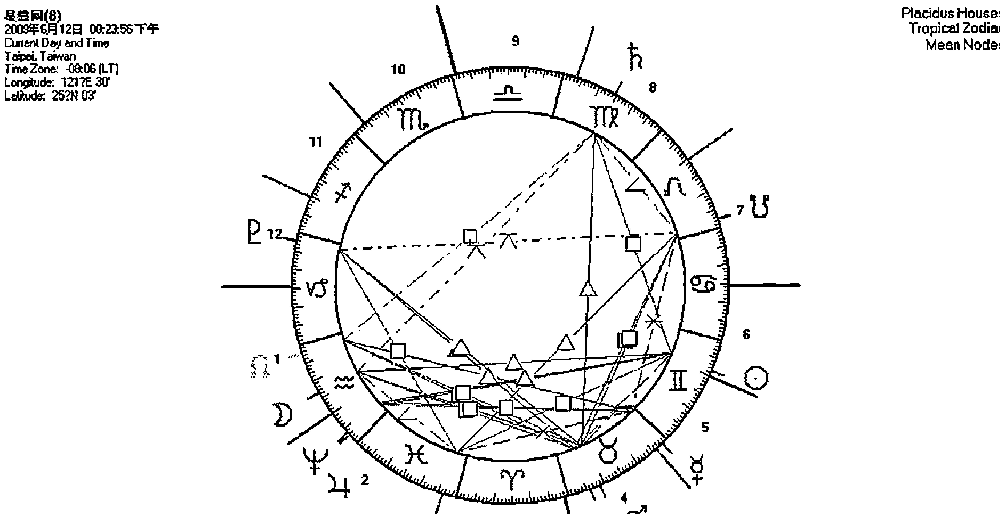

#### 星盤圖 (8)

1.  三個問題中，最重要的是考試能否順利考上。考試是由第三宮和水星作代表，由於是參加高考，即高等考試，所以第九宮宮主星也是徵象星。天王星不但是月亮的最緊密相位行星，而且緊密合相第三宮宮頭，成為雙重答案星，並且又與代表高考的徵象星水星有形成相位，因此可斷定天王星就是考試的答案星。天王星作為答案星，是第一宮宮主星，沒涉及第六、八、十二宮宮主星，沒有「反吉為凶」的徵兆，於是只要安心讀書，即可順利考取。

2.  有關結婚的徵象，月亮是第七宮宮主星，身兼因緣星和徵象星，與火星有相位。火星是月亮的次次緊密相位行星，即扣除土星的落入第八宮外，算是月亮的次緊密相位行星，可能是另一顆答案星。從火星來看，本身是第四宮宮主星，是作為家庭的徵象星，與月亮形成相位，可說是徵象星兼答案星。作為答案星的火星，本來應該是凶兆，因為火星是凶星，然而在此火星並非代表吉凶，而是代表狀況，亦即會在短時間內結婚，火星代表瞬間、很快。之所以如此判定，是因為一旦考上就會結婚，依考試的預測結果來推論火星的呈現。如果預測考試會考上，但不會結婚，兩者之間不連貫。我先恭喜她，再加上一句，別投紅色炸彈給我！因為我還在開關，不吃葷。

3.  就工作方面的問題來看，第六宮和第十宮宮主星是代表工作。第六宮宮主星沒了，因為第六宮宮頭落在雙子座，沒有宮主星代表，可意指這問題不重要，或沒必要。就第十宮宮主星來說，可說也是不存在的，因為第十宮宮頭落在天秤座。若從太陽合相第六宮宮頭來看，太陽是第八宮宮主星，同樣可代表沒了，所以這第二個問題是多餘的。

諸位讀者大德們可看到，在星盤圖(8)上，相位關係有很多是形成90度，依西洋卜卦占星學的解讀，很可能論斷成考試考不上，也不會結婚，因為90度相位是最標準的凶相位，代表凶兆，即便是推論成考試不上，也不會結婚，因為90度相位是最標準的凶相位，代表凶兆，即便是推論成Yes，往往也會說過程相當困難，與我所作的推論正好相反。火星與月亮之間的形成90度，沒有拒絕作為答案星，是因為一者，火星身兼第四宮宮主星，是結婚組成家庭的象徵星，二者火星沒有落入陷宮。

這位善女人看起來挺福相的，長得圓圓肉肉的。我告诉她，若是經濟條件許可，養得起，不妨多生幾個，增產報國。也提醒她，多行善事，多種福田，晚年可享清福。善女人忽然大笑數聲，告訴我她就讀於某國立大學，學業成績不差，自認考試應該沒問題，謝謝我的肯定。

## 第一部份

### 事件狀況的問題通報

有關事件的吉凶或狀況的占卜，有時是合一的，因為吉凶也就是狀況。但有時卻有所分別，不強調吉凶，著重的是情勢的呈現，這情勢可包括過去、現在和未來的情形，通常是以現在的狀況為最重要的預測內容，但少數情形則注重過去或未來情形。

就過去來說，是既定的狀況，無法改變。而未來則涉及情勢的可能演變，有時比現在更重要。占卜主要是預測現況，也包括未來，因為諸行無常，剎那變化，下一個剎那其實就可算是未來。比較有爭議性的是，這所謂的未來到底指多久的未來，即未來總得有一個範圍性，不能說是長久的未來。一般來說，占卜是以三個月的範圍為局限，也就是說占卜所能呈現的未來，以不超過三個月為限。

那麼現在呢？有兩種說法，一個月內，二是兩星期內。就我的經驗來說，以後者為主，甚至不超過一星期。這等於說，當徵象相當明朗，若不是已發生，通常會在一星期內發生，最長不超過十天。這其中存在著一種現象，即如果業果不明、未成熟，那麼都是屬於未來，尚有變數。命運的難測在於，有時業果的成熟相當早，甚至早幾年、幾十年就已成熟了，有時卻完全屬於未定數，下一個剎那都有產生變化的可能。

以三個月的範圍來界定未來的局限，其實是不必要的，只因諸行無常，業果的成熟與否並不限於三個月內，可能跨越三年，甚至卅年，但也可能三天就有變化，所以說乾坤莫測啊！只能說，一切以因緣來顯示。

在西洋卦上占星學中，有依星座和宮位的組合來推測事件發生的時間點的說法，這是一種流傳已久的論法。規則是，依據月亮與答案星之間的相位度數差距，來計算事件於未來發生的可能時間點，計算方式如下：

1.  只能看入相位，不能看出相位，因為在西洋卜卦占星學上，入相位才是代表即將發生的未來。
2.  不管答案星是那一顆，落入那裡，計算的依據只能是月亮，亦即是依月亮相對於入相位的答案星，來計算彼此間形成正相位的度數差距。
3.  這度數差距依月亮所在的星座和宮位位置，來套用上述的計算方式。比如，月亮與答案星之間形成120度的入相位，相距形成120度的正相位，還差 3 度。而月亮是落入巨蟹座、第一宮內，依上述規則，巨蟹座是基本宮星座，又是始宮宮位，所以每一度代表一天，3 度就代表三天，意指事件是發生於與占卜當時相隔二天的時間。

| 月亮落在 | 基本宮星座 | 變動宮星座 | 固定宮星座 |
|----------|------------|------------|------------|
| 始宮宮位 | 日 數      | 星 期      | 月 份      |
| 續宮宮位 | 星 期      | 月 份      | 年 份      |
| 果宮宮位 | 月 份      | 年 份      | 時間未定   |

-   基本宮星座：白羊座、巨蟹座、天秤座、摩羯座。
-   固定宮星座：金牛座、獅子座、天蠍座、寶瓶座。
-   變動宮星座：雙子座、處女座、射手座、雙魚座。
-   始宮宮位：第一、四、七、十宮。
-   續宮宮位：第二、五、八、十一宮。
-   果宮宮位：第三、六、九、十二宮。

這條流傳已久的西洋卜卦規則，可被完全忽略，不必理會。理由很簡單，當所預測出來的時間點超過一個月，準確度就不高，也就是說，針對月份、年份的預測，由於時間相隔較久或過久，變數自然增多，準確度就會降低。這條規則之所以長久被保留下來，原因是在預測日數和星期數上有其準確度。但西洋占星家所預測出來的時間點超過一個月，準確度就不高，也就是說，針對月份、年份的預測，由於時間相隔較久或過久，變數自然增多，準確度就會降低。這條規則之所以長久被保留下來，原因是在預測日數和星期數上有其準確度。但西洋占星家缺乏深思的是，在兩星期的時間範圍內，本來就可算是現在。以相位相差 2 度來看，不是兩天，就是兩星期內發生。在因緣巧合下，有可能時間點正好符合，是巧合，而不是必然。

西洋占星家没有想到的一點是，星座完全是虛擬。如何以一個虛擬的假相來準確預測事件發生的時間點？我以另一種角度來看，當月亮與答案星之間有形成緊密相位，並且此答案星是落入強宮，表示徵象明顯，即可直接推論事件的發生在一個星期內，至多不超過十天，根本不需要依據星座位置來作推論。如果真要預測事件發生的時間點，可採用代碼預測法來作預測，讓因緣顯示事件的發生，是不是在較久的未來？另外，西洋卜卦占星學也有依太陽來預測事件發生的時間點，因為太陽的移動可依天數來作計算。

#### 一、單一問題

##### (一) 愛情進度？

有學生問我：「塔羅牌占卜可預測事件的過去、現在和未來的情況，星象占卜能不能？』這個問題可從兩方面來說，一是如何預測過去、現在和未來的情形？二是占星卜卦的應用範圍。

就預測一個事件的過去、現在和未來的情況來說，任何一種卜卦系統理應皆可做到，但在卜卦系統的設計上，必須具有同時顯示三個答案的功能。要明白的是，卜卦是隨機的，講究機緣，因此倘若有設計了三個答案的同時顯示，那麼只要在這三個答案中，分別加以劃分何者顯示過去、何者顯示現在、何者顯示未來，即可預測三世情況。準不準？依機緣而定，這是卜卦的基本原則。當因緣具足，三世皆明朗，可準到嚇死人！但也有可能因緣不具足，三世之中只有其一或其二準，甚至三世皆不準。

佛家一直強調多行善事，這是一種相應的原理。多種福田，即可與善緣相應，而與善緣相應，就會相應於準的答案。其中的微妙，意味著占卜不只是詢問者的機緣顯示，同時也是占卜者的機緣顯示，詢問者、占卜者和卦象三者的關係是一，不是三。所謂的準，來自於機緣，但這機緣並非只是詢問者的問題，占卜者本身的機緣也納入其中。

西洋占星家認為機緣只來自於詢問者，占星家本身是置身於機緣之外。依據這種思維的結果，西洋卜卦占星學受到局限，沒辦法更進一步超越，即無法達到無所不測的境地。其中的關鍵在於法執，法執不破，卜卦占星學必定在既定範圍內打轉。

一張星盤圖所顯示的星象，是可以透過人為的給定，來進行各種預測的規劃。如此一來，要預測三世有何不能？然而，如果思維是停留在天上的行星決定世間人事，那麼會與相應原理脫勾，應用範圍自然受限。

更明確來說，如果我設計了一個有關三世情況預測的規劃，給定的，是人爲的。可是，在占卜時卻是透過機緣來顯示的，機緣串連起詢問者和我所設計的預測模式，只要因緣具足，我就可以透過星象解釋三世情形。而我所設計的這個三世情況的預測模式，並非是既定不變的，因爲天上的行星並沒有主宰世間人事，而只不過是藉由隨機的星象來相應於我的預測模式。簡單說，讀者大德們也可以設計自己的三世情況的預測模式，但設計後，一定要謹記在心，並經年累月地加以應用。

#### 我所設計的三世情況的預測模式如下：

1.  針對過去情形的預測之觀察指標：
    a. 與月亮形成相位容許度10度以內，超過2度以上的出相位的行星。
2.  針對現在情形的預測之觀察指標：
    a. 與月亮形成相位容許度2度以內的行星。
    b. 合相宮頭2度以內的行星。
3.  針對未來情形的預測之觀察指標：
    a. 與月亮形成相位容許度5度以內，超過2度以上的入相位的行星，此為較明顯的未來顯示。
    b. 與月亮形成相位容許度8度以內，超過5度以上的入相位的行星，此為較不明顯的未來顯示。
    c. 水星或金星作為答案星的情形，此為更明顯的未來顯示。

接著，以一個實例來作說明。一個善男子，喜歡上某善女人，展開了溫溫的追求。溫溫的，非激烈、熱情的，因為此善男子並不活躍，既不會花言巧語、甜言蜜語，就連寫封情書都不知從何下手，滿腔愛意，已湧到了喉嚨，卻吐不出來。只願善女人明白他的心意，了解、體會到他那真誠的愛意。雖然沒有過多的幽默、歡笑，但卻有溫馨的對看。

善男人在我面前坐下，提出了一個問題。我直問：「牽手沒？」「有！」「抱過沒？」「有！」「親過沒？」「沒有！」「已認識多久？」「差不多半年。」至此，我大概了解了。接下來就進行占卜。資料是臺灣臺北時間二〇〇五年十一月二十一日PM03:45:08。

從星盤圖(9)來看，三世的情形顯示如下：

月亮行經天王星的135度，也行經冥王星的150度。冥王星落入第八宮，天王星落入第十一宮，並且天王星與代表愛情的第五宮宮主星太陽有相位，因此可看出代表過去情況的答案星是天王星。由於天王星是第十一宮宮主星，第十一宮代表朋友、社團，於是可推論為是在團體或社團裡相識，原本是普通朋友。第十一宮宮主星沒有「反吉為凶」的情形，可說是不吉不凶，平淡之交。

現在的徵象，依月亮的最緊密相位行星來看，是太陽，並且是第五宮宮主星，意味著正在交往。又依合相宮頭的行星來看，有水星和木星，水星是第六宮宮主星，木星是第八宮宮主星，皆呈現出「反吉為凶」的情形。於是，可推論為吉中藏凶，並且凶大於吉，以致戀情遲遲沒有更進一步的發展，急煞了善男子。水星是落入陷宮的第八宮，但卻與事件的徵象星太陽有相位，於是可被視為是一顆狀況星，表示嘴上功夫不夠力。

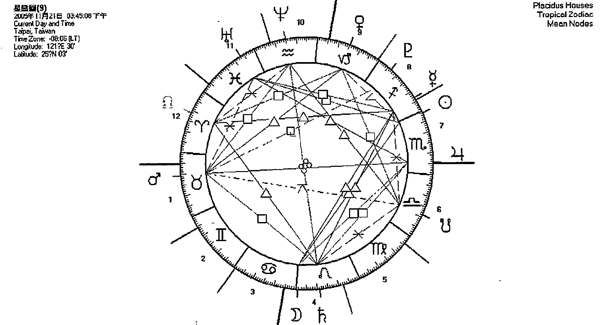

未來的徵象，依月亮的入相位來看，相位容許度5度以內的行星是木星，並且是第八宮宮主星，又合相強宮之第七宮的宮頭，可見未來情形相當不樂觀。木星的最緊密相位行星是天王星，是第十一宮宮主星，很可能的情況是會有另一個團友介入，導致戀情破局。依木星合相第七宮宮頭的緊密度來作判斷，至多不超過三個月，善女人就會向善男子提出分手。

星象中有一個情形值得注意，即太陽與金星有形成相當緊密的相位，金星是第一宮宮主星，並且也代表愛情，可見是善男子一頭熱，女方有可能是抱著交往看看的心態，並沒有相當投入，若有其他的選擇，很可能琵琶別抱，或覺得彼此個性不合，就主動宣告到此為止。提醒讀者大德們，千萬不要因為看到月亮與第五宮宮主星的太陽形成120度吉相位，就斷然說沒問題！沒問題是現在沒問題，下一個剎那就難說了。

如果所提問的問題是：「目前的戀情如何？」依星象來看，確實是沒問題，因為答案星是太陽。可是，由於木星作為第八宮宮主星相當緊密合宮頭，並且是落入強宮，凶兆已然呈現，不得不注意。月亮與第五宮宮主星形成120度，有可能促使月亮成為答案星，然而在本例中，太陽與金星有相位，而月亮與金星無相位，所以答案星還是太陽。

事情的發展正如我所預料的，女方主動提出分手，理由是個性不合，是否有第三者介入，不得而知。善男子明白自己的個性難以討好女方，雖深感失望、氣餒，但也無可奈何。在占卜的當下，我回答善男子有關戀情的未來發展時，說了：

> 「莫強求，天涯何處無芳草，更合適的伴侶尚未出現。」

善男子其實已自覺結果不樂觀，只說：「謝謝洪老師。」

對於我所設計的這個有關三世情況的預測模式，歡迎讀者大德們引用，若能改良更好。注意！得改得比我好，可不能愈改愈爛！

星象占卜其實可以達到無所不測，只因西洋卜卦占星家不懂佛法，境界無法提昇。任何世間法占卜術所能做到的，星象占卜皆能做到；而星象占卜所能做到的，其他占卜術未必能做到。

##### (二) 我爸爸的病況如何？

有關健康的問題時常被問到，就病況來說，既然是已病了，就不會是吉，因此除非病況危及，有喪命的可能，不然通常是預測疾病的狀況。也就是說，以吉凶來作論斷，主要是針對病況危及，有致命的可能，吉者可過關，凶者恐怕往生極樂世界。

而以狀況來作論斷，指的是逐漸惡化、維持現況和逐漸康復等三種情形，以前後兩者為主，簡要說明如下：

1.  逐漸惡化的情形：
    a. 答案星是凶星，加上身兼第六、八、十二宮主星，再加上落入強宮，尤其是落在宮頭或宮尾的兩宮交接處。
    b. 答案星是中性星，其餘情形如上。
2.  逐漸康復的情形：
    a. 答案星是吉星，沒有呈現「反吉為凶」，再加上落入強宮，尤其是落在宮頭或宮尾的兩宮交接處。
    b. 答案星是中性星，其餘情形如上。

若預測的結果，既不是逐漸惡化，也不是逐漸康復，那麼就是維持現況。逐漸惡化意味著恐怕好不了。答案星本身所代表的狀況徵象，也指示著病況的可能演變。

一位友人的爸爸住院了，是腎臟方面的疾病，詳細情況我並不知道，況且我也不是醫生，無法說明病情。當詢問者向我問及時，我只能就病況的嚴重性和可能的變化來作占卜。資料是臺灣臺北時間，二〇二一年九月十一日PM09:03:27。

從星盤圖(10)來看，先找答案星。一者，月亮的緊密相位行星有兩顆，分別是木星和火星。木星身兼第八宮宮主星，落入第十二宮；火星身兼第十二宮宮主星，落入第三宮。二者，合相宮頭的行星，只有水星一顆，是第五宮宮主星，無法自行當答案星，因為雙子座並非第四或五宮。

腎臟是以金星來作代表，星盤圖中的金星有與木星和火星形成相位，因此這兩顆行星皆可算是答案星。兩顆答案星巧合的是，一者皆與象徵星有相位，二者皆身兼宮宮主星。木星的吉，會「反吉為凶」；火星的凶，會凶上加上凶。這病不是突發的，而是長期的毛

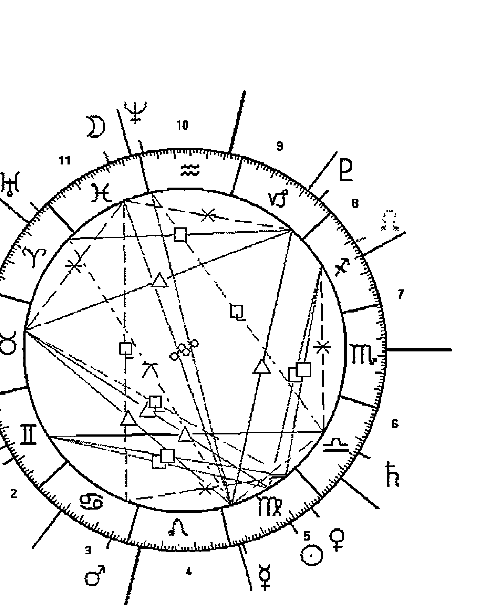

#### 星盤圖 (10)病，可从木星看出。然而，却在短时间内突然爆出严重性，可从火星看出，火星代表瞬间爆发，于是赶紧住院。会不会往生？询问者最在意的结果。答案是情况相当危险，很可能过不了一个月。结果，两星期后往生。

#### 二、兩個問題

##### (一)倒會的情形？會頭在那裏？

我習慣看書或寫作時，一定要告一個段落，才會停下來，因此有時三更半夜還沒睡。某天夜裏，電話忽然響起，我一看牆上掛著的時鐘，現在是半夜兩點多，莫非打錯電話？或發生什麼大事？趕緊拿起電話，電話的那一頭，傳來俏佳人的著急聲音：「洪鐵嘴！你睡了沒？」「還沒，發生了什麼大事？」我回答。來電者是一個相熟的女友人。「我被倒會了！我媽剛打電話給我，說我跟的會的會頭倒了，這會我還沒標起來，可能錢沒了。」我問：「會頭呢？」「我媽說人不見了，跑了，很多會腳現在跑去她家，所以我媽趕緊打電話告訴我。洪鐵嘴、洪半仙，二十幾萬耶！是不是沒了？能不能找到會頭？幫我測一下。」

這種倒會的事，不時就發生，只有大條的才見報，小條的不知有多少，沒見報。當時我正在看《淨土聖賢錄》，轉而開啟電腦，馬上占問。這問題涉及兩個方面，一是錢是不是沒了？二是會頭的情況如何？兩者既是一，也是二；有吉凶，也有狀況。資料是臺灣臺北時間，二〇〇四年五月十三日AM02:34:25。

在星盤圖(11)中，從月亮的緊密相位來看，在相位容許度2度以內，分別與木星、土星和交點形成相位，

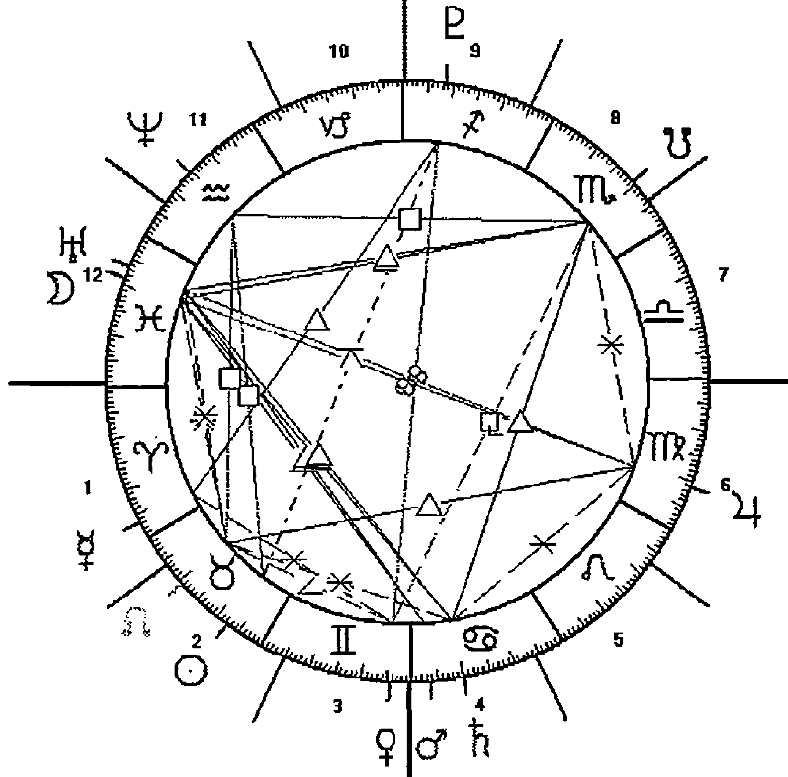

##### 星盤圖（11）

其中最緊密的相位行星是木星，但木星卻落入第六宮，有可能被蓋住，沒辦法成爲答案星。木星是吉星，土星是凶星；木星落入陷宮，土星沒落入陷宮。木星並不是第六、八、十二宮宮主星，沒呈現「反吉爲凶」的情形。因此，如果木星是答案星，那麼所呈現的並非是凶兆。倘若土星是答案星，那麼所呈現的就一定是凶兆。

跟會，與錢財、投資有關，所以第二宮和第五宮宮主星是徵象星。月亮是第五宮宮主星，因緣星身兼徵象星；金星是第二宮宮主星，並且金星本身代表錢財，所以是雙重徵象星。透過相關的徵象星來看，月亮作爲第五宮宮主星，與木星有相位，但金星作爲第二宮宮主星，與木星無相位。細看之下，月亮和金星同時與交點形成相位，而且相位相當緊密，因此第一個問題的答案星出現了——交點！肉包子打狗，有去無回！這錢要拿回來的可能性不大。

依交點的情形來看，南交點落入第八宮，北交點落入陷宮，顯示著南交點偏凶；北交點沒落入陷宮，表示還有點希望拿回錢。因爲北交點偏吉，南交點偏凶；北交點可以是虛驚一場，結果沒事，但南交點卻是毫無希望。之所以推論爲錢可能拿不回來，是因爲土星也是月亮的緊密相位行星，足以作爲答案星。

根據徵象星的顯示，有關錢的答案星是交點，一切恐化為無！所以我回答俏佳人：「財去人安樂！」沉默了幾秒，似乎是在接受一個殘酷的事實。一句短短的話：「這樣喔！」道盡了萬般的不捨。「真不該聽我媽話，跟你會。」我說：「世事難料！」

無奈！摻雜著不甘心！我可以體會到俏佳人的心痛。接著問我：「會頭跑那裡去了？會不會出現？能不能找到？很多人在找她。」從星盤圖(11)來看，木星其實也是答案星，但這答案星是代表著會頭，因為木星是月亮的最緊密相位行星，而月亮又是第五宮宮主星。木星的落入第六宮，是意味著會頭躲了起來，人落跑了。在確定木星是代表會頭時，我問了俏佳人：「會頭是不是一個胖胖的歐巴桑？」她說：「對！」胖胖的，正好符合木星徵象。

更進一步的推測，這會頭是惡性倒閉，捲款捲逃。為何？因為木星是吉星，又沒有呈現「反吉為凶」的情形，表示會頭是有所獲益的，拿錢走人。

會頭在那裏？可透過木星的緊密相位來作推測。木星的緊密相位行星有二，一是月亮，第五宮宮主星；一是土星，第十一宮宮主星。於是我說：「跟妳媽說，先報警，然後從會頭的孩子和最親近的朋友著手去找，說不定可找到人。」

當晚的半夜，在找不到會頭人後，一群人轉向找她兒子，要問出他媽到底在那裏？這兒子心裡恐怕早有數，推說不知道。事隔三天，會頭的一個至交好友，經不起眾人的一再追問，說出會頭有與她連繫，人躲到台南去了，希望與會腳和解，錢還兩成。結果如何，我就不知道了。一旦涉及調解，人多嘴雜，各說各話，意見往往難以一致。即使達成和解，何時可拿回兩成的錢，還不知道呢！

##### (二)失蹤人口的預測？

現在是E世代，上網的世代。諸多小朋友、青少年都在上網，結交一堆網友。既虛擬，又寫實。涉世未深，一不小心，就可能被騙了。這是一個朋友向我提出的詢問，事件是發生在她鄰居。一個就讀國二的女孩不見了，蹺家了，留下一張紙條說要去找網友。急得她媽趕緊報警，希望警察能把她找回來。預測中，涉及兩個問題，一是這女孩會不會被警察找到？二是這女孩現況如何？是不是被騙，甚至被綁了？資料是臺灣臺北時間，二〇〇八年十一月八日AM10:24:36。依星盤圖(12)來看，顯示著人確實是不見了！交點合相宮頭，表示沒有了！

現在人在那裏？這兒子心裡恐怕早有數，推說不知道。事隔三天，會頭的一個至交好友，經不起眾人的一再追問，說出會頭有與她連繫，人躲到台南去了，希望與會腳和解，錢還兩成。結果如何，我就不知道了。一旦涉及調解，人多嘴雜，各說各話，意見往往難以一致。即使達成和解，何時可拿回兩成的錢，還不知道呢！

土星也合相宮頭，並且代表第十二宮宮主星合相第八宮宮頭，暗掉了。月亮的緊密相位行星是火星和太陽，但容許度皆超過2度，所以代表表現況的答案星是交點和土星。警察屬於公僕，可由第六宮宮主星代表，而第六宮宮主星正好是月亮，與火星和太陽形成超過2度以外，5度以內的入相位，代表警察很快即可找到她，透過第三宮宮主星的代表網路，以及第七宮宮主星的代表同伴，不難找到。也就是說，只要查看她的電腦，即可知道她去找誰了。依我的預測，結果是她根本不想回來，但還是硬被拉了回來。請看星象，代表未來的情況有

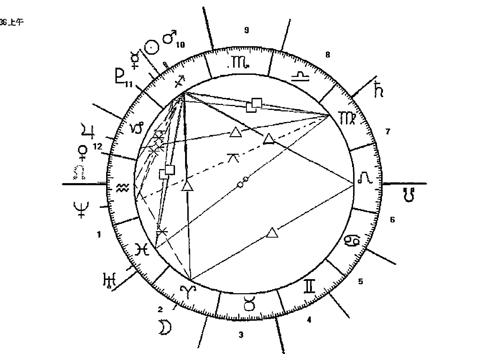

##### 星盤圖 (12)

二，一是火星和太陽，二是水星，身兼第五宮和第八宮宮主星，可自行當答案星，表示不想回家，因為第八宮宮主星代表藏起來。可是，當水星與火星和太陽來作比較，火星和太陽是落入強宮，而水星則是落入平宮，力量強不過火星和太陽，況且還有第六宮宮主星的月亮在施予力量，水星顯得孤單無力。

預測完的隔天，警察伯伯就把她帶回來了。為人父母者，請多加關心自己的孩子！孩子不會無緣無故落跑，事出必有因。若是家庭充滿溫馨、快活、樂趣，孩子豈會不想待在家裡？

我告訴朋友，記得向她父母說，人回來就好，千萬不要責罵她，應該反省自己對孩子的態度，不然今天蹺家了，難保那天不會再蹺一次，而且蹺得更遠、更難找。

火星代表瞬間，所以很快就找到了，於是第二個問題並不重要。依星象來看，她確實是與網友在一起，躲在網友家裡，可從北交點合相第一宮宮頭看出。北交點與代表網友的第三宮和第七宮宮主星有形成相位，於是火星和太陽，可說即是現在情況的徵象星，又是未來情況的答案星。

#### 三、三個問題

##### (一)病危、遺產和投資開店？

接了一位女性友人的邀約，說怕我閉關無聊，不知外面世界有何變化，所以要請我喝下午茶。不用想就知道，宴無好宴，恐怕是有事相詢。果然，接下來，她的一位好友有些事想請我幫她測一測。約定的時間一到，車子開到門口，上車直達目的地。同樣依我的習慣，挑室外或靠窗明亮的地方坐下，也同樣依我的習慣，喝桔茶或水果茶，不喝咖啡。當事人的問題有三項，一者她爸爸病危住院，想知道情況樂不樂觀？二者涉及遺產問題，想知道自己能不能得到一份遺產？情況是當事人並非婚生子女，而是姨所生。事涉法律，我並不清楚相關規定，但從王永慶的例子來看，只要確定真是她爸爸的女兒，照理應該有一份遺產。三者是問及有朋友找她投資開設美容沙龍，想問可不可以？能不能賺錢？

資料是臺灣臺北時間，二〇一一年十一月七日PM02:18:26。從星盤圖(13)來看，答案簡單明瞭，不用五秒鐘就解決了。星盤圖中沒有緊密合相宮頭的行星，雖然土星合相第八宮宮頭，但容許度已超過2度，因此轉而看另兩條線索。月亮有緊密的相位關係，所以這條線索成立。又水星作為第四宮宮主星，是身兼第四宮和第七宮的宮主星，所以這條線索也成立。

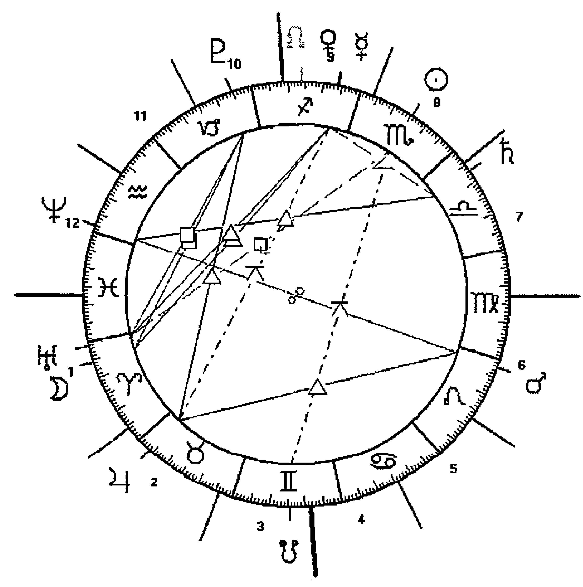

先看第一個問題：爸爸的病危情況？爸爸由太陽作代表，而太陽又是第六宮宮主星，這等於是雙重徵象星，一者太陽代表爸爸，二者第六宮宮主星代表疾病。太陽與天王星有形成相位，並且天王星合相月亮，於是天王星就是第一個問題的答案星。天王星是第十二宮宮主星，呈現「反吉為凶」現象，依天王星所代表的突然、意外，加上第十二宮宮主星的凶兆，可推論為病情突然惡化，一口氣喘不過來就往生了。

再來看第二個問題，有關遺產。月亮的緊密相位行星是水星和金星，遺產與錢財有關，而金星代表錢財，所以金星是遺產的徵象星，而水星則是答案星。從水星所代表的宮主星來看，是第四宮兼第七宮宮主星，而不是第五宮兼第八宮宮主星，沒有呈現「反吉為凶」的情形，因此推論為可順利拿到遺產。但這遺產並非不動產，而是現金，因為金星所代表的是現金，不是不動產。從水星所代表的數字5來作推測，至少可拿到五百萬的現金。

最後一個問題，參與朋友的合夥開店，可不可以？答案是可以。相關的徵象星有，月亮的作為第五宮宮主星，代表投資；水星的作為第七宮宮主星，代表合夥；木星的作為第十宮宮主星，代表事業、開店。月亮和木星皆與水星有形成緊密相位，而金星所代表的出錢和美容，也緊密合相水星，因此水星作為答案星

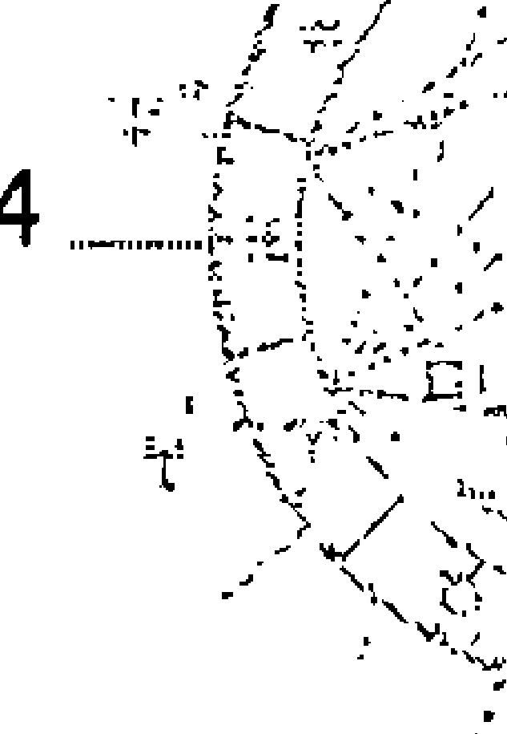

很明顯。水星是雙重答案星，既是月亮的最緊密相位行星，本身又可自行當答案星。由於水星並沒有呈現「反吉為凶」，因此答案是Yes。這所謂的Yes，沒問題，通常只限兩年內，兩年後，諸行無常，沒人敢保證情況有何變化。花五秒鐘看星盤，花不到三分鐘講解，問題解決了，我點的桔茶卻還沒送上來！剩下的時間，只好陪兩位善女人聊時尚，從頭聊到腳，不然一趟車把我從山上載下來，總不能屁股沒坐到有點溫溫的，就載回去了吧！

##### (二)換工作、換家和換女朋友？

這是一個連續預測的問題。情況是本來與某位好友約好，要看他這一兩年的運勢如何？以及問及結婚的事。結果他老弟跟了來，在處理完好友的詢問後，他老弟接著說他有事問，一提就三個問題，有關連三換的問題。我先問了一下大概的情況。諸讀者大德們要注意！這先問一下大概情況，是必要的。因為這是屬於連續預測的問題，務盡可能與上一個提問之間，在時間上能拉開多久算多久。在兩個小時內，若能盡可能拉開時間，準確度所代表的因緣顯示，才會愈明顯。如果上一個提問，與下一個提問之間，只相差幾分鐘，星象不會有太大變化，行星合相宮頭的情形，也就難以顯示與上一個提問之間的差別。況且，當一次提問二個問題時，星象有可能難以同時兼顧二個答案。先說明相關情形。一是，就目前的工作來說，可有可無，薪水不高，勉強過日，想問的是能不能找到薪水更高的工作？較辛苦一點沒關係。二是，覺得所租住的套房氣氛不好，認為風水不佳，想問的是不是應該另尋住處？三是，目前有一位交往半年的女朋友，覺得雙方並不很合得來，近來認識某女孩，想問的是有沒有可能與這位新近認識的女孩，發展到戀情關係？前兩個問題，我沒意見；最後一個問題，我認為若是雙方缺乏感覺，或覺得彼此不適合，應該先作個了斷，分手後再來談新戀情，以免造成劈腿情形，造下惡業。

資料是臺灣臺北時間，二〇一〇年十月二十一日PM08:34:13。分別從三條線索來看，如下：

- a. 月亮的緊密相位行星有金星、火星、土星和海王星。
- b. 緊密合相宮頭的行星是月亮和土星。
- c. 金星可自行作為答案星，身兼第五、十二宮宮主星。

在此，有必要說明的一點是，月亮的合相宮頭位置，有可能使得月亮成為答案星。然而，月亮的最主要角色是因緣星，因此除非答案星缺乏，比如月亮空相位時，不然月亮通常就是因緣星。月亮在具有多相位的情況下，本身的兼答案星，但有一個條件，即月亮與第五宮宮主星形成120度相位。在星盤圖(14)中，月亮並沒有與第五宮宮主星形成120度相位，所以月亮沒有身兼答案星。月亮或其他行星，是否成爲答案星？可依據徵象星來作判斷。

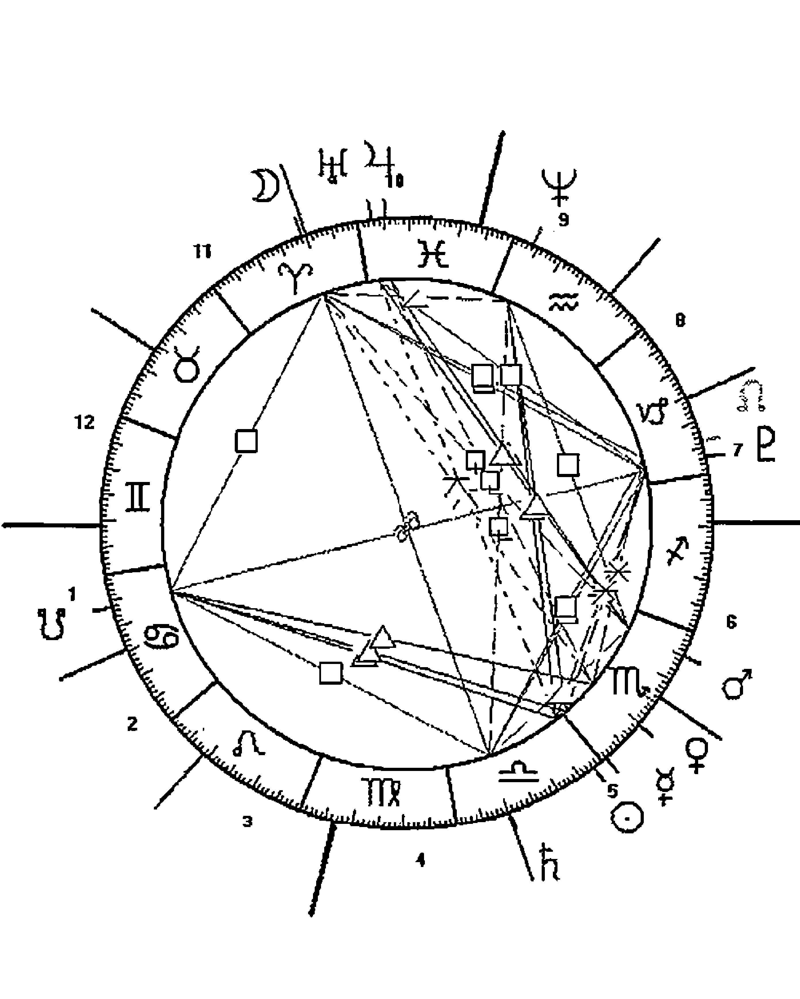

##### 星盤圖 (14)

宮第五宮宮頭，土星本身就是凶兆，又是第八宮宮主星，凶上加凶，表示要找到更好的工作很難，沒希望。就狀況方面來說，可說對目前的工作愈來愈不滿意。土星可說是雙重答案星，既與月亮有緊密相位，又合相宮頭；同時落入強宮，表示作為答案星更明確。

就更換住處來說，我建議趕快搬走。因為代表住家的第四宮宮主星水星，與海王星有形成相位，而海王星則是月亮的次緊密相位行星，成為第二個問題的答案星。海王星代表混沌不明、受限、幽靈等，確實是意指氣氛不對。我看到的景象是，有一個高瘦的男子坐在對外的窗口前呆著，充滿無奈和怨氣。

這套房絕對不能再住下去。月亮的代表房子，同時和第四宮宮主星，皆與海王星有形成相位，讓海王星成為第二個問題的答案星更明顯。

就新戀情來說，沒希望！因為代表愛情的金星可自行當答案星，又與月亮有緊密相位，形成雙重答案星。而金星是身兼第五宮和第十二宮宮主星，呈現「反吉為凶」情形，情況相當不樂觀，至少短期內是如此。不妨先處理舊情，等過一段時間後，若是有緣，新戀情的因緣或許會浮現。

我再次提醒，趕緊搬家，搬家後，運氣才會好一點。我對學生說，依佛門高僧的占卜法來作預測，判斷的時間通常不超過五秒鐘，1、2、3、4、5，時間到，答案星就要出來。若是超過十秒鐘，就是不及格！有緣就隨緣，無緣莫攀緣！

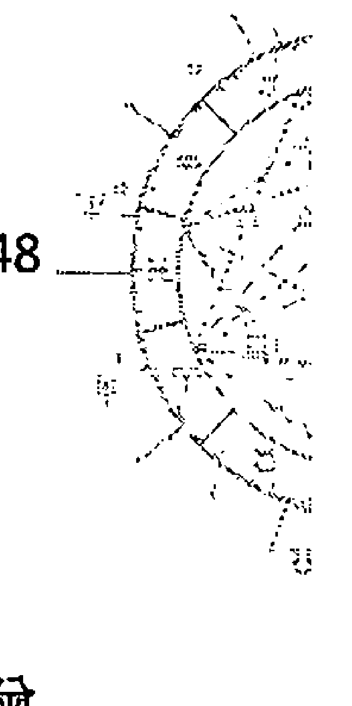

## 第四部份 微象遙測法結合代碼遙測法

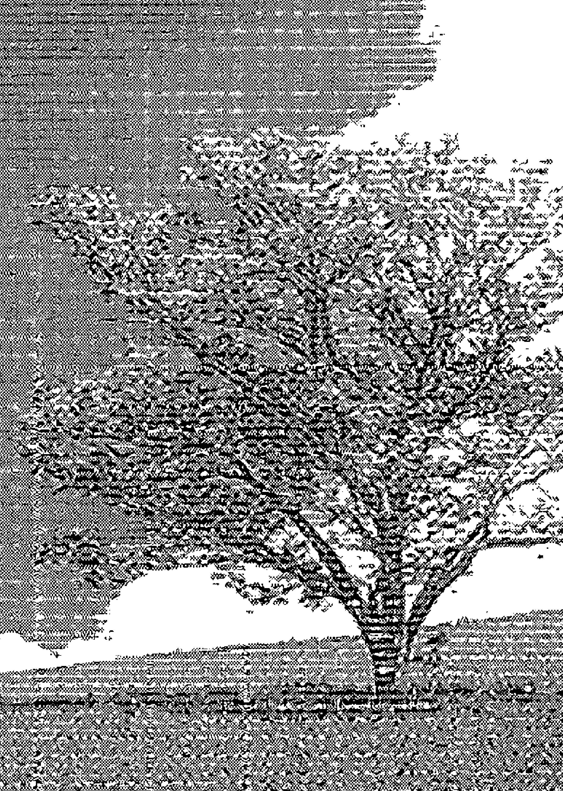

##### (一) 考試考第幾名？

《了凡四訓》這本善書，在經由大力推廣後廣爲人知。事實上，了凡先生並不是什麼偉大人物，只不過寫了這麼一本小善書，而大有知名度，這應該說是他所始料未及的。

書中大意是，勸人多多行善，因爲透過多行善事，可改變自己的命運。然而書中談及命運，卻涉及江湖術數，使得善書變成了江湖術數的宣傳書，是其美中不足之處。從諸多善書中，可看到這樣千篇一律的描述手法，即某人巧遇某算命師或出家人，斷言其會發生什麼事，而後的情節發展有吉凶兩種情形。其一，本來該發生不幸，卻因做了某件善事而改變了；其二，本來會有好運，卻因做了某件惡事而好運飛了。故事平淡無奇，只在於強調因果，善有善報，惡有惡報。

這樣的故事說明，其實是有問題的。問題之一，那位算命師或出家人是何方神聖，居然有如此神算的本事，並未說明。而在這個問題中，宣傳了一個觀念，即命運是可測的，不管是用那一種方法來作預測，並且是宿命論，正因爲是宿命論，所以才有神算。問題之二，強調宿命論，但又以因果來推翻宿命論，這在邏輯上講不通。矛盾的是，果真是神算，那爲何沒算到變數？如果連變數都預測得出來，才算是神算，而一旦預測得出來，就形成了徹底的宿命論，所謂的因果，會變成不是自己的抉擇，即你會去做什麼善事，也被納入命運之中，而不是你決定、自主要去做什麼善事。諸多宣揚因果報應的善男子、善女人，出發點本是善意，但結果卻變成了幫江湖術士作宣傳，強調了算命的準確度有多高、多麼厲害，而沒想到其中的矛盾之處。依我的看法，了凡先生所遇到的孔老先生，並不是什麼高人，只不過是一個江湖騙子。書中一開頭就說了，孔老先生得邵子皇極數正傳，數該傳汝。這是相當標準的江湖說詞，了凡先生當年才十五歲，被唬得一愣一愣的。在净空法師的《了凡四訓講記》裡，有這麼一段話：「《皇極經世書》屬於高等數學，一個人的命運，乃至國家、世界的命運，都可以從《易經》卦數來斷定。」說這話不妥，因為如果不是真的了解，不妨多所保留，尤其事涉江湖術數。妄想之物。《皇極經世書》並不是什麼高等數學，書名取得響亮，內容並不怎麼樣，是用易卦或生辰八字來作預測，皆有其局限性，絕不是針對任何事件都能作出相當準確的預測。我無意批評净空法師，只是隔行如隔山，諸多江湖術數的詐騙技巧，外行人看不出來。況且我宣說的佛門占星學，講的是「諸行無常，諸法無我」，神算是因缘使然，而不是必然。净空法师相对于那么多的专搞怪力乱神的出家人、修行人来说，不知更清净了多少倍，於是我相当敬重净空法师。所谓神算，不是不可能，但得靠因缘，也就是要有运气。显然地，这位孔老先生刚开始时运气相当好，所以猜中了。但后来，没那个运气，所以没猜中。可是，了凡先生的看法却不是如此，他认为是因为自己的行善，改变了命运，才导致孔老先生的失算。以相同的方法来作预测，前几次准，后几次不准，这是很正常的，因为时机不同。也就是说，相同的预测方法，不能保证预测结果全部皆准。

由於《了凡四训》的广为流传，所以就有人自称通晓邵子皇极数，以此来算命捞钱。到底邵子皇极数是怎么个预测法？没人知道，有可能是孔老先生自己取的名称。从汉易来看，确实搞出了许多数的变化，但其内容与江湖术数无关，易经的沦落为江湖术数，可以说是宋代以后的事。探究一种预测法，可从所提问的问题著手。了凡先生所面对的预测，依现在的说法，就是预测“考试考第几名？”

当确立这个问题后，就要想有什么方法可进行如此的预测？请读者大德们想一想，那一种占卜法可占问考试考第几名？我之所以认为孔老先生是运气好，所以猜中了，那是因为针对这样的一个小问题，其预测过程所涉及的原理、方法和预测细节，并不小。如果了凡先生於书中所言皆属实，没有太多的添加，那么有可能孔老先生只是一種簡單的隨機方式，來占出結果，只不過有時運氣太好，所以很準。我不認為孔老先生會瞭解在這小問題的背後，涉及了宇宙運行之道。

有人問了我相同的問題。情況是，為人之母提問了孩子這學期的課業成績，是班上第幾名？一班的學生，差不多有四十個，這等於是四十取一，猜中的機率不算高，還是有可能預測中。

先說預測過程，可分兩階段：

- 一、依徵象預測法確立答案星。
- 二、依代碼預測法確立答案星所代表的名次。

資料是臺灣臺北時間，二〇一〇年十一月二十三日PM09:13:27。從星盤圖(15)來看，月亮分別與太陽、木星和天王星形成相位，其中木星和天王星落入陷宮的第八宮，而太陽是落入強宮的第五宮，並且是月亮的最緊密相位行星，相位容許度在2度以內。由此可知，太陽就是答案星。太陽所代表的數字是01、10、19、28、37。於是，接下來可透過單星代碼預測法來測出到底是第幾名？

先把可能的名次進行排列，如（圖一）：

預測過程如下：
第一回台第一次預測：PM09:31:20

##### 255・徵象預測法結合代碼預測法

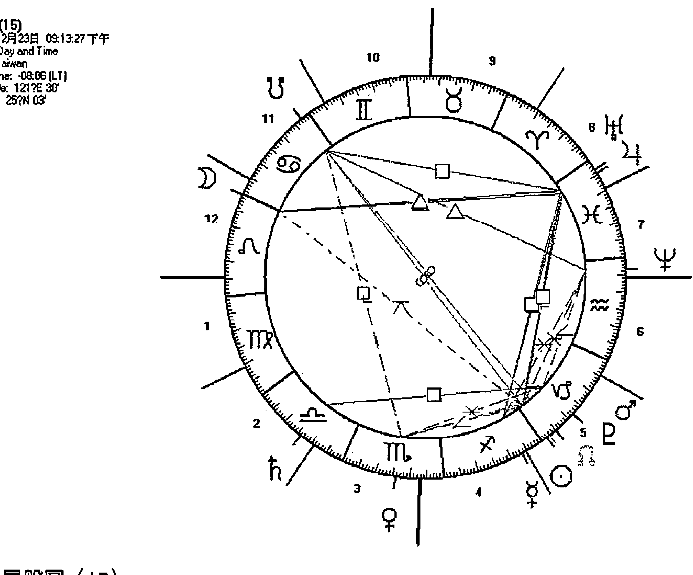

| 1  | 01 | 01 10 | 10 19 | 19 28 |
|----|----|-------|-------|-------|
| 2  | 10 | 01 19 | 10 28 | 19 37 |
| 3  | 19 | 01 28 | 10 37 | 28 37 |
| 0  | 28 | 01 37 |       |       |
|    | 37 |       |       |       |

(圖一)第一回合第一次預測：PM09:36:21
第一回合第三次預測：PM09:44:10

第一回合的預測就出現答案，秒數尾數是10。依10起算，如（圖二）：

月亮的最緊密相位行星是太陽，太陽是第一宮宮主星，代表答案碼是1，對照之下，答案是落在10或37。我說是第十名，這位愛子心切的母親瞪大眼睛回答說，差不多都是在第七名第十五名之間，上學期是第十二名。

在本例中，可能的答案星只有太陽一顆，所以只採用單星法來作預測。若是出現兩顆可能的答案星，則可改採用雙星法來作預測。同樣的預測法，可用來預測壽命和其他事項。

從本例中可看到，是分成兩道程序來作預測，採用的是逐漸縮小可能範圍的方式。孔老先生應該不是用這種縮小範圍的方式來作預測，由於易卦有六十四卦，所以如果每一卦象代表一個數字，只要是在六十四取一的範圍內，依隨機而占得一個數字，因緣具足時，也可猜中，孔老先生很可能是如此預測的。孔老先生後來之所以失算，與了凡先生的行善無關，只是預測的因緣不具足罷了。

#### (二) 今年會遇上什麼衰事？

有關預測某年運勢，有三種提問法，一是：「今年會發生什麼事？」二是：「今年會發生什麼好事？」三是：「今年會發生什麼衰事？」前者無特定指定，後兩者則特定指定好事或衰事。若是特定指定預測衰事，則表示行星所代表的狀況，理應呈現負面情形。

資料是臺灣臺北時間，二〇〇八年一十八日PM02:14:56。從星盤圖(16)可看到，月亮的最緊密相位行星是冥王星和交點，而冥王星是落入強宮的第七宮，交點則是合相第四宮和第十宮的宮頭。冥王星身兼第六宮宮主星，呈現凶兆，符合所問之事；交點意指空無，希望破滅，也符合所問之事。因此，從冥王星和交點的徵象來看，表示會發生破壞、毀滅、落空之事。到底是何事？可從徵象星來看出。木星合相第八宮宮頭，可以為吉星，又棄而不用，因為木星是吉星，又沒有呈現「反吉為凶」，與所問之事的內容不符合。

就冥王星來說，與其有緊密相位關係的行星是月亮和水星，另外火星也與冥王星有相位，但較不緊密。於是線索有四：

-   1. 就冥王星本身兼徵象星來說，冥王星是第六宮宮主星，所以倒楣之事與第六宮有關，工作、健康、員工出狀況、寵物出狀況等。
-   2. 以月亮身兼徵象星來說，月亮是第二宮宮主星，所以倒楣之事與第二宮有關，是錢財方面出狀況。
-   3. 以水星作為徵象星，由於處女座被截奪掉，即水星沒有代表任何的宮主星，水星不能作為雙子座的宮主星代表。因此，若就水星當徵象星來說，所代表的是與水星有關的事項，如文書、短程旅行等。
-   4. 以火星作為徵象星，由於火星是第十一宮宮主星，所以倒楣之事與第十一宮有關，是人際關係出狀況，或與火災、切割受傷等有關。

可依據兩個基本原則來作判定：

-   1. 以相位緊密度較緊密者為優先，尤其是當相位容許度在2度以內，一定要列入考量。依據這個判定原則，火星可先被排除於外，剩下月亮、水星和冥王星本身。
-   2. 宮主星所代表的徵象優於行星所代表的徵象，即優先考量的是宮主星徵象，其次才是行星徵象，這是星象卜卦的基本原則，不適用於本命和運勢論斷。依據這個判定原則，水星作為徵象星的重要性降低。

再來看交點的情形，除了合相第四宮和第十宮宮頭外，也與月亮、火星和冥王星有形成相位，其中相位容許度在2度以內者，是月亮和冥王星。於是，其所涉及的徵象星可說相一致。這種情形稱為「雙重顯示」，意指發生的機率相當高。如果不採用代碼預測法來作更進一步的確認，僅從星盤圖來作推測，應該是工作方面出問題。如果此人是受僱於人，公司有狀況，可能倒了，得另找工作，或因故辭職或被裁員。若此人本身是老闆，經營狀況有問題，可能有財務危機，或員工出了大狀況，造成損失。判斷的依據，交點是相當重要的，因為符合了所問之事。這等於說，如果僅以冥王星來作推論，並不成「雙重顯示」的情形。有時喪事可能接一二連三發生，因此就這問題的提問來說，答案有可能並非是單一的，即不是多選一，而是多選多的情形。藉由代碼預測法，除了可作更進一步確認外，也可進行多選多的預測。

-   1. 第二宮之事，月亮作為徵象星。
-   2. 第四宮之事，南交點合相第四宮宮頭。
-   3. 第六宮之事，冥王星作為徵象星。
-   4. 第十宮之事，北交點合相第十宮宮頭。
-   5. 第十一宮之事，火星作為徵象星。
-   6. 水星之事，水星作為徵象星。

把上述的可能情況進行排列，依單星法來作預測。如（圖三）：

-   A. 代表第二宮之事。
-   B. 代表第四宮之事。
-   C. 代表第六宮之事。
-   D. 代表第十宮之事。
-   E. 代表第十一宮之事。
-   F. 代表水星之事。

預測過程如下：

第一回合第一次預測：PM02:31:17
第一回合第二次預測：PM02:34:22
第一回合第三次預測：PM02:38:10
第二回合第一次預測：PM02:41:16
第二回合第二次預測：PM02:45:32

第二回合同第三次預測：PM02:48:42
第二回合同的預測有出現答案，秒數尾數是2。依2起算，如（圖四）：
月亮的最緊密相位行星是冥王星，冥王星是第六宮宮主星，代表答案碼是6。依答案碼6來看，答案落在A、B、D，A是第一宮的事，B是第四宮的事，D是第十宮的事。雖然呈現C形式答案，有可能答案不在列示中，但在此提問中，這情形不成立。
當事人是個老闆，最後的結果是被朋友所拖累，造成財務缺口，以致影響公司的經營，有倒閉關門的危機。我的建議是如果情況真的很糟糕，就要「留得青山在，不怕沒柴燒」，千萬別讓債台高築，留點本，才有東山再起的可能。後來如何，我並不知道，因為當事人未再與我連繫，說不定已經跑路了！

## 後記

《佛門占星玄機》和《佛門占星天機》這兩本書，除了表達破我執和破法執的觀念外，也可應用在相關的預測上，本書最後的兩則實例即是。再次強調，沒有破我執、破法執，思維的廣度就會受限，停留在意象類比的妄想中打轉，絕不會有什麼突破。本書相對於西洋卜卦占星學，就是一種突破，表明了占卜法是可千變萬化、無所不測的，只要符合相應的原理即可。

這一系列的佛門占星學書籍，不但是長期的研究、撰寫，同時也是一個完成不了的工作，因為諸多內容有可能在我滅度之前也尚未參悟出來，以致只好留待後人去參悟。

在了解代碼預測法後，透過本書的佛門高僧占卜法，可明白諸預測法門之間，是可進行結合應用的。下一本書《佛門占星傳奇——如何猜中15億威力彩頭彩》，是更進一步的結合應用。然後，接著進入一系列的本命論斷說明，諸讀者大德們將可看到，同樣的星象，可以有不同的解讀。

# 佛門占星初機 佛門高僧的占卜法

作 者 洪能平
美 術 編 輯 陳淑美
校 對 洪能平

發 行 人 張書銘
出 版 成陽出版股份有限公司
e-mail:ink.book@msa.hinet.net
網 址 舒讀網 http://www.sudu.cc

法 律 顧 問 漢廷法律事務所
劉大正律師
總 代 理 成陽出版股份有限公司
電話：03-3589000（代表號）
傳真：03-3556521
郵 政 劃 撥 19000691 成陽出版股份有限公司
印 刷 海王印刷事業股份有限公司

港 澳 總 經 銷 泛華發行代理有限公司
地 址 香港筲箕灣東旺道3號星島新聞集團大廈3樓
電 話 852-2798-2220
傳 真 852-2796-5471
網 址 www.gccd.com.hk

出版日期 2013年2月初版
ISBN 978-986-7132-46-8

定價 280元

Copyright © 2013 by Neng Ping Hong
Published by Rising Sun Publishing Co., Ltd.
All Rights Reserved
Printed in Taiwan

> 國家圖書館出版品預行編目(CIP)資料

佛門占星初機：佛門高僧的占卜法 / 洪能平著.
- - 初版. - - 〔桃園市〕：成陽，2013.02
272面；15×21公分. - - （佛門占星；1）
ISBN 978-986-7132-46-8（平裝）

1.易占

版權所有·翻印必究
本書如有破損、缺頁或裝訂錯誤，請寄回本社更換

二千五百多年前，

釋迦牟尼坐在菩提樹下，悟道成佛。

除了禪定、解脫外，

對人生命運的種種，

釋迦牟尼悟到「諸受皆苦」，

苦從何來？苦、集、滅、道，四諦說。

諸苦如何運行？有何契機？

佛門高僧傳承了什麼占卜法，

一者方便渡化眾生，

二者體悟諸苦無常。

就讓本書告訴你些許答案！

ISBN 978-986-7132-46-8