首部以东方人生命经验为讨论基础的心理占星书

活出你自己

你的第一本心理占星书

【实践篇】

韩露 著

像阴柔还能“耗”多少？从星盘角度解析徐志摩的“人间四月天”

新世界出版社

活出你自己

你的第一本心理占星书

依照生辰与出生地点的经纬度输出的个人星盘，代表我们心灵能量的分配，也是灵魂所选择的课题。行星与行星之间的相位呈现我们的心理冲突；行运的行星与本命行星产生的角度，形成生命历程中的情节，仿佛剧本，但剧本不等于演出，因为“态度”是由你做决定，而非宿命。但是，我们来到地球的确同意面对生命中的某些试炼，星盘也确实呈现我们此生要面对的课题。

本书的功能首先是心理成长的知识，只是以占星学的角度。作者综合整合占星学、荣格心理学、现代心理学等诸家理论，整理出条理分明的占星思路，以开发生命潜能的角度，检视并映射内在能量，具备非常专业的专业性。同时还以丰富的案例深入浅出地说明，很适合给大众科普的读者，是一本心理占星书。

定价：35.00元

活出你自己

你的第一本心理占星书

雨路◎著

新世界出版社

http://strc.taobao.com

图书在版编目（CIP）数据

活出你自己 ：你的第一本心理占星书. 下，一学就用的实践篇 / 雨路著. -- 北京 ：新世界出版社, 2012.9
ISBN 978-7-5104-3247-7
Ⅰ. ①活… Ⅱ. ①雨… Ⅲ. ①心理学－通俗读物
Ⅳ. ①B84-49
中国版本图书馆CIP数据核字（2012）第204080号

活出你自己——你的第一本心理占星书
（一学就用的实践篇）

作者：雨路
责任编辑：秦彦杰 张福伟
责任印制：李一鸣 黄厚清
出版发行：新世界出版社
社址：北京西城区百万庄大街24号（100037）
发行部：（010）6899 5968 （010）6899 8733（传真）
总编室：（010）6899 5424 （010）6832 6679（传真）
http://www.nwp.cn
http://www.newworld-press.com
版权部：+8610 6899 6306
版权部电子信箱：frank@nwp.com.cn
印刷：北京中印联印务有限公司
经销：新华书店
开本：710×1000 1/16
字数：185千字 印张：18
版次：2012年9月第1版 2012年9月第1次印刷
书号：ISBN 978-7-5104-3247-7
定价：35.00元

> 版权所有，侵权必究
凡购本社图书，如有缺页、倒页、脱页等印装错误，可随时退换。
客服电话：（010）6899 8638

1 个体化的旅程

- 为自己出征
- 占星学与人生
- 业，是生命课题

2 相位

- 相位：行星之间的角度与关系
- 相位重点
- 无相位：行星力量无法展现
- 星丛

3 推运

- 行星的影响力
- 推运
- 推运的行星所代表的意义
- 行星的退行
- 星盘
- 简易相位记忆法

4 生命蓝图

- 人格三要素
- 月亮与母亲
- 月土相位
- 月天相位
- 月海相位
- 月冥相位
- 太阳与父亲
- 日土相位
- 日天相位
- 日海相位
- 日冥相位
- 责任者意识
- 生命蓝图
- P.A.C
- ——人格的三部分
- 占星与P.A.C
- 星盘论法

5 爱情档案

- 行星与爱情
- 爱情能量在十二星座
- 爱情异形
- 揪出爱情异形
- 前世情缘，今生功课
- 婚姻档案：
- 是佳偶或小三？

6 星座

- 出生图的星座

7 行运及生命之爱

- 行运的木星
- 木星之爱
- 行运的土星
- 行运的天王星
- 天王星之爱
- 行运的海王星
- 海王星之爱
- 行运的冥王星
- 冥王星之爱
- 行星受克时的转化方法
- 外行星引发的世代效应
- 情爱背后的生命密码

8 红尘男女

- 狮子与舞台
- 家暴的迷思
- 今生就学会
- 亲密关系
- 生命的合伙人
- 曾有的激情
- 不雨花犹落
- 无脸男——没有人收留的爱
- 想回家
- 死而复生

9 英雄之旅

- 英雄之旅的三个阶段
- 英雄三部曲
- 大师成长之路

10 宫主星

- 宫主星所落入的宫位
- 宫主星落入……

11 三王星

- 三王星
- 行运的天王星——突变与短暂的迷恋
- 行运的海王星——化不开的心灵迷雾
- 行运的冥王星——小我死亡的心灵转化
- 情人

12 人生解码

- 从占星透视林书豪
- 徐志摩的感情世界——暖暖的人间四月天
- 附录1 行星运行速度表
- 附录2 延伸阅读

个体化的旅程

生命的意义在于了解自己内在独特的本质，并协调内在的冲突，整合意识与潜意识而成为真正的自己，这个整合过程，就是个体化的旅程。

ASTROLOGY
**LEAD YOUR LIFE**
## 个体化的旅程

为自己出征

市场星象学是个体化旅程的初阶，但若是没有经历向内的探索与回归，把我们了悟的真理与智慧和世人分享，这个旅程不算完成。神话中的“圣杯之旅”意味着向内的探索。

荣格是当代第一位由心理学跨入玄学领域的精神分析家，他在1911年开始研究占星学；他的妻子埃玛也是心理分析人员，专研“圣杯传说”。

关于圣杯有很多传说，其中一种说法是，当上帝与撒旦大战时，一个中立的天使把圣杯带到人间——意味着超越二元化对立，在善与恶之间架起心灵通道；另一种说法是，圣杯是最后的晚餐用的圣餐杯，当耶稣由十字架上释放下来时，被用来盛满耶稣的血，这血可以洗净世人的罪——据说看到圣杯发出来的光芒就可以获得永恒的生命，唯有内心纯洁、已赎罪的人才拿得到圣杯。

圣杯的故事有很多版本，其中较脍炙人口的是“圣杯之王”。圣杯之王是圣杯的监护人，负责保管圣杯，当他和异教徒对峙时，被异教徒去势——此事意味着行事与心灵分割——国王受到难言之伤后，国土荒芜，大地寸草不生，生命成为一片荒原。

根据神谕，将会有一个“圣洁的使者”来到城堡，针对圣杯之王的困境发问，就能够治好国王的伤。有一天，这位能解救圣杯之王的骑士波西瓦来到城堡，他看到光彩耀目的圣杯，也看到国王被担架抬了出来，内心疑惑不解。他很想发问，但是又想到曾被告诫：“骑士不要随便发问！”犹豫之间，他遵从社会法则，而舍弃发自真心的关怀，错过一次拯救荒原之国的机会。波西瓦继续他的冒险旅程，五年后又来到城堡，这次他勇敢地提出问题，表达他的真心，治愈了国王的伤痛，也使国土恢复生机。

每个人灵魂的核心都拥有与宇宙根源连结的能量，但是也许和圣杯之王一样，我们过的是与源头切断联系的日子，直到有一天，偶然的机缘，某人发自真心的询问带给我们启示，激发我们去思考：什么是我今生的使命？什么是我真正想做的事？我能够贡献给这个世界的是什么？

我们展开圣杯之旅的第一步是摘掉面具。就像《盔甲骑士：为自己出征》的武士，他永远有打不完的仗，杀不完的龙和拯救不完的公主，但是有一天他发现自己脱不下盔甲，虽神勇而不能自救，迫使他展开向内的探索。

当他真正流露内在的情感，当他流泪时，渐渐地脱离盔甲，放下操控，学会接受而不期待，失望就会减少。他进入沉默之堡，聆听自己内心的声音，在面对巨龙时明白恐惧疑惑都是幻相，最后他放手信任生命，终于与源头相连结。

由表层意识进入真心，要穿越阴影。从三世因果的观点而言，由于执著前世未解的爱恨情仇，想要寻求解答与整合，清除过去世残留的心愿与执著，被一个体现出我们阴影能量的对象所吸引，渴望与他合一，在小情小爱中释放爱恨情仇，在团体的互动或商场较量中释出权力斗争。只有将无意识中的阴影释放出来，提升自我的频率，心灵才能得以转化，脱离原欲的蛊惑。

这些爱恨情仇是男女双方今生短暂交会的局面，慈悲才是双方心灵永恒的层面。解脱业力轮回最直接的方法是去体验它，释放那个能量，然后超越它。生命会因为你不去承担那个冒险而干涸，会为了抗拒内心的渴望而耗掉许多能量，不如在体验中释出渴望，超越执著，以慈悲相待，而后，回到中观¹。

¹ 中观，佛教术语，这里当指漠不动心地观察自省。

占星学与人生

占星学的确可以看出一个人的潜能与发展性。学习占星学的主要目的包括：

- **确认及了悟** 迅速确认自己的生命特性。从星盘中对生命特性的透视，如果以心理治疗的方式，可能要花上好几个月的时间。
- **知进退** 当外在大环境的能量与自身不协调时，退回内心世界自我整理，低调沉潜养息，充实自己，回归自然。
- **超然应对** 了解星图的先验部分和未来的变化，所预测的事件对我们有利，可以事先准备好，从而把握时机；如果是无法避免的困扰，则需要透过灵修，抽离苦境，看清楚我们在此事中要学习的课题。

传统论命把土星与火星认为是凶星，木星与金星为吉星，太阳与水星则为中性的。我们要超越吉凶的分别，生命只在体验后的成长。土星带来沉重的压力，却为松散的生命建构坚实的基础；金星的正面特质是甜美及艺术气质，但是耽溺享受、好吃懒做的习性同样令人困扰。由于凶星所带来的痛苦是急迫性的，令我们很难适应，会倾全力去应对；吉星所带来的麻烦较不急迫，易被疏忽，但来生要改这些习性一样要作功课。

行星的能量形成相位也有互补或互相对应的组合。例如金星与火星影响一个人的爱情、性关系及社交能力，金星与海王星意味着一个人的美学、艺术特质，木星带来成长，土星落实体制的基础、建立结构与秩序，天王星则摧毁结构、带来觉醒——这其中都有相互影响。

了解行星在自己星图中的特质，努力展现其正面能量，平衡它与其他行星之间的协调和互动关系，就能够超越命运的习性。例如火星行事冲动的侵略性带来愤怒与暴力的课题，土星强的人太严肃刻板、一生都在承受责任包袱，木星带来追求成长与扩展的渴望，金星期待爱情及愉悦的享受，天王星不循常规、暴起暴跌。这些都意味着，当我们如此面对世界，生命也这样回应我们，在“有”与“无”当中，体会无常。

## 业，是生命课题

业是我们累世未完成的功课，业力推动我们遇到什么人、发生什么事情，业吸引相同起点、相同频率的人来到身旁，在一次次的创造演出中，提升自己以更高意识、更大的包容来面对挑战。要有勇气去经验生命困境，因为业大慧大。业并不代表惩罚，而是经由转世中角色互换的体验，跳脱以往自我设限的窠臼，扩展心灵层面。

你可能选择安逸的一生，只处理一个问题，或是在一生中面对许多挑战，了结许多问题，这是自由意志的抉择。

安逸的一生看起来很美好，但对进化的突破不大；痛苦能加速成长，然而真正满足的一生是充满智慧及创造力，喜悦地活出潜能，才是走在自己的道路上。

依照生辰与出生地点的经纬度输出的个人星盘，代表我们心灵能量的分配，也是灵魂所选择的课题：行星与行星之间的相位呈现我们的心理冲突，行运的行星与本命行星产生的角度形成生命历程中的情节——仿佛剧本，但剧本不等于演出，因为“态度”是由你作决定，而非宿命。

但是，我们来到地球的确同意面对生命中的某些试炼，星盘也确实呈现我们此生要面对的课题。

在心灵地图中，标示了每个人不同的业。业是此生所选择的生命剧本，在曲折的情节中透露着你一再遭逢的课题是什么。有些人学习超越情感的执著；有些人的课题是金钱；有些人是健康或事业；有些人学习不执著财物，放弃自己所拥有的东西来体会在地球上是不会匮乏的，除非内在的恐惧吸引这些经验。

如果你的太阳在第一宫，你将经历到自己身体及个人形象、自我肯定的课题，随着行星的运转加强感受其正负面；太阳在第二宫的人，经常要面对金钱与自我价值的课题；太阳在第六宫的人，这一生将经历工作、部属及健康的课题。

经历了两极化的经验，超越局限的思想，回到中立的观点，舍弃我们对这部分的过度执著，来圆满我们的业；在事件中，找到正面意义，完成我们的生命课题。业是我们对地球履行责任的动力，当我们自身觉醒，群体意识也会因个人意识的改变而提升。

◇ 行星与业

行星的相位代表善业或恶业的趋力。

- 太阳：自业——你给自己订的功课，在此体会到两极化的经验，与父亲、生命中的权威、生命中的男人的业，影响到生命力的业。
- 月亮：情感方面的自业，与母亲或与女人的业，造成情绪波动、影响安全感的业。
- 水星：学习、教育、与人沟通、签订契约的业，与兄弟姐妹有关的业。
- 金星：爱的业，与亲密关系、金钱、美丑、女性有关的业。
- 火星：行动力、性的业，与愤怒、冲突或男人有关的业。
- 木星：支持、扩张、成长的业。
- 土星：限制、障碍、现实压力的业。
- 天王星：分裂与颠覆、突发事件、人生意外的业。
- 海王星：无意识、耽溺上瘾、被骗、迷惑与救赎的业。
- 冥王星：宿敌、毁灭与转化、死亡或重生的业。

☆ 十二宫与业

宫位是生命情节的演出场景。

- 第一宫：身体、健康、个人外在形象的业。
- 第二宫：金钱、财产、物质丰足、自我价值的业。
- 第三宫：日常的互动、短程旅行、兄弟姐妹、初级教育的业。
- 第四宫：居家、家庭、内心之家、与父亲之间的业。
- 第五宫：恋爱、子女、创造力、短期的性关系的业。
- 第六宫：工作上的业、与部属、雇主、健康的业。
- 第七宫：合伙、婚姻、伙伴关系的业。
- 第八宫：死亡、再生、共同财产、爱恨交织、长期性关系的业。
- 第九宫：宇宙人生观、高等教育、异国文化、长程旅行的业。
- 第十宫：事业、名望、社会地位、与母亲之间的业。
- 十一宫：朋友、社团、理想与终极关怀的业。
- 十二宫：前世的因果、宿缘、潜意识、恐惧的业。

相位

相位，行星之间的角度与关系：合相带有主观的特质，可能是集中火力，也可能缺乏反省；三分相代表同属性的支持，或者前世天赋在今生运作自如；四分相代表障碍与挑战；对冲相则透过相异来学习，也是阴影的投射。

ASTROLOGY
LEAD YOUR LIFE
相位

相位：行星之间的角度与关系

如果行星是演员，相位好比是他们之间的关系。行星所形成的角度有很多种，我们较常用到的是合相☌、六分相⚺、三分相△、四分相□、对冲相☍。

相位表

| 名称 | 符号 | 角度 | 性质 | 正负 | 在本命容许度 | 推运容许度 |
|---|---|---|---|---|---|---|
| 合相 | ♃ | 0 | 合（吉） | + - | 8 | 4 |
| 半六分相 | ⚻ | 30 | 小合（小吉） | + | 2 | 1 |
| 六分相 | ⚺ | 60 | 六和（吉） | + | 4 | 2 |
| 三分相 | △ | 120 | 三合（吉） | + | 8 | 4 |
| 半四分相 | ∠ | 45 | 半刑（凶） | - | 2 | 1 |
| 四分相 | □ | 90 | 刑（凶） | - | 8 | 4 |
| 八分之三相 | ⊿ | 135 | 紧张（凶） | - | 4 | 2 |
| 十二分之五相 | ⋏ | 150 | 争锋（凶） | - | 4 | 2 |
| 对冲相 | ☍ | 180 | 冲（凶） | - | 8 | 4 |

注：+ 为正面力量；- 为负面力量；推运的容许度是本命相位的一半。

合相 ♂

| 角度 | 性质 | 正负 | 在本命容许度 | 推运容许度 |
|------|------|------|--------------|------------|
| 0 | 合（吉） | + - | 8 | 4 |

合相带有主观的特质，两颗行星的合相称为“小上升”，优点是集中火力，缺点是缺乏反省，类似牡羊座的行为。看星盘中有几组合相，就知道当事人有几个人格面具。

- 个人行星（太阳、月亮、水星、金星、火星）之间的合相：是一种不经过大脑的直接反应，自动自发，直接的自我中心。
- 个人行星与社会行星（木星、土星）的合相：木星偏乐观面，容易接受专业进修的社会扩展；土星偏悲观面，是现实人生中必须实践的课题，易受限于社会价值观或权威规范。

- 个人行星与外行星（天王星、海王星、冥王星）的合相：内行星被外行星影响，海王星会弱化个人行星，天王星强化我行我素，冥王星对个人行星形成强制性的心理趋力。
- 注意其中必须有一颗属于个人行星才算，若天王星、海王星、冥王星合相不算；两颗外行星的合相是世代性的影响，意味着时代主题。
- 有三颗行星或三颗以上的合相，就是星丛，会强化其特质，在该领域也会较为偏执。

## 六分相 ※

| 角度 | 性质 | 正负 | 在本命容许度 | 推运容许度 |
|------|------|------|--------------|------------|
| 60   | 六和（吉） | +    | 4            | 2          |

例如：土星在巨蟹10度、天王星在处女12度，如此就形成土星六分相天王星。

六分相是一个愉悦的缘起，充满未来的可能性，代表一个新的发展机会，称为“学习相位”。火相一定与风相形成60度，土相一定与水相形成60度，互相刺激对方学习。

- 火风的六分相比较外向活跃，土水的六分相比较安定，但也并不无聊，仍有丰富内涵。例如金牛六分相巨蟹，金牛提供舒适环境，刺激巨蟹提供温馨照顾，彼此互惠学习。
- 也许当事人没有双子能量，三宫也没有很多行星，但只要六分相多的人，学习兴趣超强。六分相像金星一样，是一种心智上的愉悦。

## 三分相 △

| 角度 | 性质 | 正负 | 在本命容许度 | 推运容许度 |
|------|------|------|--------------|------------|
| 120  | 三合（吉） | +    | 8            | 4          |

例如：太阳在水瓶16度、天王星在天秤10度，如此就形成太阳三分相天王星。

同属性的支持、同构型的安逸相位阻力最少，前世奋斗的天赋变成今生随手可得的潜能，运作自如，是一种舒适调和、放松的状态。虽然是与生俱来的幸运，但如果潜能没有开发，有时候比不上60度的六分相活跃。

- 火相、风相的120度相位，才华表现较为积极。
- 土相、水相的120度相位，自我满足度较高，舒适就好。
- 行星在三分相的相位演出较佳，例如火星在狮子与射手等星座，及火星在一、五、九宫等宫位较能相互协调。
- 三分相像木星一样幸运，可以让我们充电，对自己所拥有的才华也不以为意，反而被动地停留在安逸中。

## 四分相 □

| 角度 | 性质 | 正负 | 在本命容许度 | 推运容许度 |
|------|------|------|--------------|------------|
| 90   | 刑（凶） | -    | 8            | 4          |

例如：月亮在狮子20度、冥王星在天蝎16度，如此就形成月亮四分相冥王星。

四分相又称为刑，代表障碍与挑战，是一种压力内化的紧张与僵持，双方力量冲突，又各自坚持自己的立场，防卫性地自我保护。当事人无法化解四分相的压力时，会因害怕失败而退缩回内心世界，产生冷硬的态度。

- 固定宫的四分相较为顽强。
- 变动宫的四分相是无常的显现，需要灵修来超越。
- 行星在四分相的相位，演出较困难。例如：火星在巨蟹、天秤、摩羯等星座，描述其心理适应的困难点；而火星在四、七、十等宫位，则描述生活场景表现的困难点。
- 四分相是一种紧绷的状态，像火星或天王星一样令人产生恐惧与不确定感，耗掉我们的能源，长久冷战下来，肌肉僵硬，压力与负荷超过对冲相。
- 紧张的能量才是成长与进化的驱力，虽然会有一段僵持与停滞，但压力迫使我们突破现状找到出口。对强者而言，四分相才是解决问题的动力。

## 对冲相 ☍

| 角度 | 性质 | 正负 | 在本命容许度 | 推运容许度 |
|:----:|:----:|:----:|:------------:|:----------:|
| 180  | 冲（凶） | -    | 8            | 4          |

例如：太阳在牡羊座9度、冥王星在天秤14度，如此就形成太阳对冲相冥王星。

180度的对冲相，两颗行星属于对冲的角度，透过相异来学习，也是阴影的投射。

- 个人行星与个人行星的对冲相，形成内在对立的性格，倾向冲突或分裂。
- 个人行星与外行星的对冲相，招引来外在的人事物，像镜子一样。
- 对冲相对立的冲突，压力经由冲突而释出，而四分相是紧绷僵持，压力没有释出。
- 对冲相犹如太阳与月亮，一明一暗，虽然是对立的，但也有互补的作用，相异的两方其实为一个整体，但各自坚持自己的立场，需要整合。

### 特别注意：

- 一般而言，合相的威力最大，但正面、负面特质皆有；吉相位（六分相、三分相）是两颗行星以轻松顺畅的方式演出，互相协调；凶相位（四分相、对冲相）是两颗行星互相给予压力，以压迫性的方式演出。
- 我们为了方便说明而有吉凶之分，但并不是结果论，重点在于当事人的动机与行为。
- 吉相位需要凶相位引动，提供威胁及危机意识，才能活化能量，开发潜能；凶相位也需要吉相位相助，透气抒解，减少意外——但是凶相位才是行动的要素，所以，建设性的行动很重要。
- 三分相太多，对弱者而言，反而怠惰。
- 四分相与对冲相对强者而言，反而具有内在力量。
- 四分相的紧张可以打破三分相单纯的安逸状态，促成三分相稳定发展。最好的状况是在四分相或对冲相的两颗行星中，有一颗行星连结着另一颗行星的吉相位，例如土星对冲太阳，太阳与木星形成三分相，或太阳与水星形成六分相，土星的压力会经由太阳去提升或学习而抒解，这是建设性的出口，较能有所作为。
- 关于角度的容许度，在本命星盘，两颗行星在8度内，形成合相。例如某人太阳在金牛10度，水星在金牛16度，此人太阳与水星合相。
- 六分相的容许度为4度，例如某人太阳在处女12度，金星在巨蟹8度，此人太阳与金星六分相。
- 推运时的容许度减半，例如月亮在双鱼5度，推运的海王星在双鱼1度后，才形成合相，容许度为4度。

## 活出你自己
LEAD YOUR LIFE
你的第一本
心理占星书

## 相位重点

行星是能量的来源，当行星与行星之间的角度形成相位时，相位可以判断这两种能量之间的运作关系是互相拉扯或彼此协调的。

- 日、月、水、金、火星是个人层面的行星，木、土星是社会层面的行星，天、海、冥王星是灵性层面的行星。

| 行星         | 行星属性 | 观察层面 |
| :----------- | :------- | :------- |
| 日、月、水、金、火 | 内行星   | 个人生活 |
| 木、土       | 外行星   | 社会目标 |
| 天、海、冥     | 外行星   | 灵性目标 |

- 内行星和内行星形成困难的角度，例如月亮对冲火星，情绪暴躁，我们称为相位不佳，这是生活面的困扰。
- 内行星和外行星形成的困难角度，我们称为受克，表示内行星，受到外行星强烈的影响。例如海王星对冲月亮，海王星混淆了情绪，月亮被弱化。

| 相位          | 举例       | 结果       |
| :------------ | :--------- | :--------- |
| 内行星 □ 或 ☍ 内行星 | 太阳 □ 金星 | 相位不佳   |
| 外行星 □ 或 ☍ 内行星 | 土星 ☍ 水星 | 内行星受克 |

- 外行星与外行星的相位是世代性的，造成整体性的影响，不是针对个人。

### 相位应用在两种情况：

其一，本命星盘的相位，看个性，看我们内在能量的协调与冲突。如果行星是演员，相位就是他们互动的关系。

其二，在本命星盘中，土星与海王星会弱化与它们有相位的行星，木星与天王星会放大个人行星的外向活力或强化变动起伏的特质，冥王星会对与它有相位的行星造成强迫性的心理趋力，也会产生激烈的外在对抗。

当推进的行星和本命星盘的行星产生相位时，代表生命历程所发生的事件、情节与心理转化。从进入容许度或离开容许度看出事件的时间，宫位看出事件的场景。（参考第三章推运）

例如某人太阳在金牛16度，假设行运的冥王星在摩羯，三分相在推运的容许度为4度，当行运的冥王星走到摩羯12度就进入容许度，走到摩羯20度就离开容许度。

## 无相位：行星力量无法展现

### 行星与任何行星没有形成相位

| 行星 | 描述 |
| :--- | :--- |
| 太阳 ☉ | 缺乏自我意识，没自信，使得太阳的精力、权力、能力无从发挥，或是为了自我肯定而完全的自我本位。对女人而言，可能不婚，因为太阳缺乏感应的对象。 |
| 月亮 ☽ | 封闭自己的情绪面，不容易被了解，或源自童年母亲不在身旁，成长后不知该如何与家人相处，但也可能因此而为家人付出更多，以加强自己与家人之间的亲情互动。对男性而言，可能不婚，因为月亮缺乏感应的对象。 |
| 水星 ☿ | 智能发展不佳，思维与理性沟通的能力受到限制，缺乏思考逻辑，不知道如何表达自己的想法，但也可能努力吸收新知，主动去与别人沟通。 |
| 金星 ♀ | 情爱淡薄，举止木讷，与人社交有隔阂，可能外表潇洒，却终身未谈过感情，有时因为怕被拒而抑制情感，致使情感世界一片空白，相反的，也可能主动与人亲近，或热衷于社交活动。 |
| 火星 ♂ | 难以发挥火星的战斗力，呈没有生命欲求的无动力状态，无法展现能量，对立时，不会采取激进作法，但偶而也会有突来的冲劲或强烈的发泄精力，造成过度消耗。 |
| 木星 ♃ | 木星的社会性未被开发，社会扩展力无法表现，错失成长机会，没有自己体验得来的人生哲学，也有人反而是海阔天空四处追寻，造成焦点无法集中的困扰。 |
| 土星 ♄ | 无法体认自己的根源与责任意识，与父亲缘薄，内心有莫名的压抑，或完全舍弃社会规范，有些人反而能够成功地转化压抑的心绪去克服困难。 |
| 天王星 ⛢ | 缺乏群体意识，天王星的原创力无法展现，但也有人故意表现自己的特立独行，成为冷眼旁观的局外人，强调凸显自己的与众不同。 |
| 海王星 ♆ | 海王星的直觉力无法发挥，无法表达灵感，但也有人因此而热衷宗教，抛弃家庭跑去灵修，或成天做白日梦。 |
| 冥王星 ♇ | 无法探究自己深层的执著，较看不清原欲所在，控制不住自己的生命激情，容易舍弃或自我毁灭；也有人专注于剖析自己潜意识的驱力，试图掌控自己，不被情绪的黑暗面所蛊惑。 |

## 星丛

有三颗行星或三颗以上行星聚集，称为星丛或星群，会加强该行星的能量、特质，使此人偏执于此领域。例如某人星盘中，太阳、金星、水星都在金牛座，我们就可以称这三颗行星为星丛。例如湘云（见P140，图7-5）的火天冥在处女，张婕（见P214，图10-2）的日金水在天蝎，都算星丛。

| 星丛       | 特质 |
| :--------- | :--- |
| 牡羊座 ♈ | 属于侵略和主动的，具有渴望走在前面的冲动，保持动态、前进的倾向，精神的活动力强，但缺乏秩序及持续的专注，倔强不虚伪，透过对抗或争论的力量达到目的，导致不和与争执，人生目标容易被不规则的突发行动所破坏。 |
| 金牛座 ♉ | 属于坚持而唯物的，是建构者、累积者，焦点在于防卫个人的物质，重视肉体感官超过精神，需要感受到事物的实质性，或透过身体去体验，是缓慢而实际的，伴随着单纯的善意及固执的倾向，给予赞美或引导好过去驾驭他。 |
| 双子座 ♊ | 属于聪明而博杂的，由于水星的独特变异性，容易焦虑、心不在焉，具有文学性的才智能力，能很快看到事情的表层，有能力迅速表达，社交性强，容易获得友谊，但相处多年后仍难以捉摸。 |
| 巨蟹座 ♋ | 属于温情而敏感，重视家庭的，沉默无言的雄心，安静的坚持者，人格显性的部分被情绪淹没，透过预感、情绪与直觉响应外界，心之所系是对家人的安全感。 |
| 狮子座 ♌ | 属于权威而华丽的贵族血统，本性喜欢权力，坚定的决断力，具有实践性，情感是热烈、可信赖的，充满自信，展现骄傲与尊贵及领导的气质，拥有舞台的魅力。 |
| 处女座 ♍ | 属于低调而过度谨慎谦逊的，倾向发展成为秩序的、科学性的深层分析，企图援助与精炼进化，是可以合作和有贡献的人，但是在意识上容易产生神经质的批判，是有洁癖的工作狂。 |
| 天秤座 ♎ | 属于公正但犹豫的，带来一种合作的企图雄心，知性的扩展以及艺术性，专注在保持友好的关系，调和、联系以及观念性与社交的交流，并融入艺术的美质。 |
| 天蝎座 ♏ | 属于激情、专注而追根究底，骄傲、过度放任怨恨与报复心妨碍了自然、正当的发展。爱情是重要的要素，但狮子提供了爱情中的领导气质，天蝎则是较低的层面——爱的独裁。 |
| 射手座 ♐ | 属于扩张而具有先知上师的预言能力，是平和、乐观开放的，透过较严谨地呈现正统的哲学或宗教经验带给别人鼓舞的精神激励，但火星在射手，反而使得本性轻率、鲁莽、倔强以及反对正统。 |
| 摩羯座 ♑ | 属于认真努力，可信任，但沉闷的；强烈的雄心壮志，在科学及政治上具有行动力，是安定，实际的，成果是累积的，在例行工作中履行野心，拥有自我意志及自我主义，是第一工作狂。 |
| 水瓶座 ♒ | 属于原创而冷漠疏离的，具有不寻常的特质，思想前卫使得原始本质与相同时代的人相差太大，气质中具有改革的元素，观念坚决，平静而不夸耀地进行自己的计划，是难以控制的反对党，最博爱，但没有包容力。 |
| 双鱼座 ♓ | 属于神秘，过度同情，自我牺牲的人，不懂得保护自己的界限，不切实际，沉浸在自己的内心世界，害怕承诺，具有高度善感的本性，行动被直觉所主宰，生活中充满灵性的体验。 |

## 推运

本命星盘是不变的，但推进的行星与本命星盘产生的相位，一直在变化影响行运。

## 行星的影响力

当我们出生时，依照出生的年、月、日、时，和出生地点，可以输出一张本命星盘。本命星盘是我们出生时刻所有黄道上的行星排列。

但是天体的行星还在运行中，例如，2012年5月5日，推进的木星走到金牛21度，如果某人的本命太阳在处女24度，此时推进的木星与此人的本命太阳形成120度的和谐相位，他就会产生乐观的外表及精神上的扩展，这些愉快的境遇与太阳及木星所在的宫位有关。

> **本命星盘是不变的，但推进的行星与本命星盘产生的相位一直在变化影响行运。**

推运时，比较不强调内行星，因为推进的日、月、水、金、火和本命星盘的行星产生相位时间较短，且关系到生活琐事，并不重要。

- 推进的内行星与本命内行星所产生的相位是生活事件。例如推进的月亮合相本命的金星，我们可能在家里办了一场愉悦的社交活动；推进的水星三分相本命的火星，有能力去计划行动，在签约或协议上增强效率与决断力。
- 推进的外行星对本命内行星所产生的相位是生命事件。例如买房子（推进的冥王星三分相月亮）、母亲去世（推进的冥王星对冲月亮）、权力斗争、不伦恋、三角关系、经济困境、跳票（推进的冥王星四分相本命金星）。
- 推进的外行星对本命外行星所产生的相位为世代性的影响。例如天冥合相的世代，尤其是1963年～1969年，天王星、冥王星合相于处女座，此一世代具有坚决不妥协之强势性格，大好大坏，需加以引导正向发展。

### 推运的写法

行运（推进）英文：Transit　　本命（出生）英文：Natal
行运的木星合相本命的太阳，写作：T♃○N☉
行运的冥王星三分相本命的金星，写作：T♇△N♀

### 推运的说明

首先了解行星本身在推进中代表的意义。
当本命行星受到行运行星影响时，行运行星是外来影响，本命行星是自身的反应，行运行星会反应出本命行星所主宰的事件。

> 例如：
> T♃△N♂ 行运木星三分相本命火星——火星的能量被木星带动而无往不利，适合运动比赛、竞争，有利扩展。
> T♂☌N♃ 行运火星对冲相本命木星——木星的能量被火星逼迫激发，过度自信而一意孤行，形成浪费、轻诺、破财。

例如：

> T☿☌N♄ 行运水星合相本命土星——此刻的想法和沟通影响本人的责任意识。
> T♄☌N☿ 行运土星合相本命水星——责任意识、长者或权威者影响本人的思考。

例如：

> T♄☌N☽ 行运土星合相本命月亮——外部的职业环境给家庭活动或情绪带来额外的责任或压力。
> T☽☌N♄ 行运月亮合相本命土星——日常家庭的问题干扰到正常的职业例行公事。

不同的是**行运土星合相本命月亮会比行运月亮合相本命土星时间持久**。土星会顺行、逆行，影响时间长达半年，但月亮合相的影响只有一两天。

行星因顺行、逆行而造成三次的会合，在第一次顺行时所造成的会合，代表环境事件的产生；第二次会合时，代表第一次会合所造成的环境事件更为发展；第三次会合本命行星时，代表行运行星带来新的事件或环境状况。

行运行星会强化本命盘中原有的相位力量，本命盘的相位会受其牵动而产生骨牌效应，所以须考虑本命盘中原有的刑克关系。

### 行星推进的宫位：

- 当行星推进基本宫时——会带来立即的状况显现；
- 当行星推进固定宫时——情况更强硬或发生势不可挡的改变；
- 当行星推进变动宫时——不耐烦过去的沉闷和渴望改变，会加速其影响力。

### 行星推进的星座：

- 当行星推进火象星座时——有关个人自尊和成长的课题，以一种积极的、外向的方式进行；
- 当行星推进土象星座时——生活上的实际事务将被强调及处理；
- 当行星推进风象星座时——才智、社交的课题将被强调，涉及观念和想法的形成；
- 当行星推进水象星座时——有关精神性事件的课题，包括：情绪、感觉和直觉展现，以个人的感受来响应外在环境的刺激。

### 出、入相位

入相位——当某颗行星接近另一颗行星，快形成相位，但尚未形成时，称为入相位。

出相位——当两颗行星已经形成相位，但其中一颗行星正要离开容许度，称为出相位。

一般情况是入相位比出相位强，入相位代表肇因期，出相位已经承受后果。我个人的经验，火风的行星入相位比较快，也可能提早发生，土水的行星出相位仍在情境中，仿佛雨过地犹湿，例如土星相位过了仍感到身体疲惫，海王星相位已过，情绪仍在缅怀中。

## 推运的行星所代表的意义

| 行星名称 | 描述 |
|----------|------|
| 行运的太阳 | 生命力的展现 / 自我 / 精神的意志力 / 权力驾驭 / 个人精力 / 个人权威 / 创造潜能 / 领导权 / 驱使去取得权威和个人形象 / 阳性驱力 / 雄心 / 自尊 / 骄傲 / 强烈自我展现 / 背部 / 心脏 / 脊椎 |
| 行运的月亮 | 内在支持系统 / 对外在刺激的情绪反应 / 习性 / 潜意识心灵 / 群众心理 / 与女人的关系 / 母性 / 家庭 / 家庭情景 / 家人 / 家庭和家人的财政 / 与房屋、食物、家庭和家庭生产与服务有关的事物 / 食物 / 胃 / 意识之根 / 公众关系 / 消化器官 / 感冒 |
| 行运的水星 | 知识性活动 / 沟通 / 学习阅读 / 逻辑提升 / 思考和思索 / 信息汇整 / 思维概念 / 解决问题的理念 / 工作方法 / 好奇心 / 与兄弟姐妹、邻居、朋友和共同工作者的沟通 / 短程旅行 / 契约 / 手臂 / 脑部 |
| 行运的金星 | 艺术的活动 / 吸引美的和精致的事物 / 社交活动 / 追逐愉悦 / 与女人的互动 / 对别人同情的态度 / 情感的反应 / 在婚姻和浪漫关系上的发展 / 生意活动 / 公众关系的活动 / 银行 / 证券 / 肾脏 / 喉咙 |
| 行运的火星 | 发脾气 / 冲动行为 / 强烈的行动 / 竞争 / 新开始 / 身体精力的消耗 / 生意和职业的野心 / 权力的争斗 / 共同财政的麻烦 / 企图 / 进取 / 挑战 / 政治敌对 / 军事麻烦 / 警察的掌控 / 钢铁机器意外 / 燃烧 / 激动 / 着火 / 外科手术 / 发烧 / 头部 / 出血 / 胃溃疡 |
| 行运的木星 | 喜事 / 利益 / 扩展 / 乐观的外表 / 关注社会秩序 / 宗教、教育和文化活动 / 涉及教会、大学、医院和文化组织 / 对于国外文化和宗教感兴趣 / 与外国人以及那些与学院和大学有联系的人的互动 / 长程旅行 / 法律事件 / 肝、大腿 / 脂肪 |
| 行运的土星 | 加强责任感 / 压抑 / 严谨的心思 / 保守的外表 / 涉及团体、较年长者及组织的责任 / 职业和政治活动 / 与严谨心思的人的生意合伙关系 / 法律事务 / 与建筑、绘画、文书、结构有关的活动 / 与皮肤、骨骼和牙齿有关的问题 / 风湿 / 结石 / 困难、延迟、阻碍和责任。土星推进的宫位将是结合职业、政府、合法的合伙关系、团体或组织的责任。土星的行运带来严谨的和有意义的课题，透过土星的训练在生活中建立结构，在权位的提升中带来自我牺牲与自制。 |
| 行运的天王星 | 人生意外 / 偶发状况 / 不可预期的环境和事件 / 渴望改变和新的经验 / 渴望自由和独立的表达 / 结合性的财政 / 共同的生意、保险、税或死亡的物品 / 电化和科技 / 占星学、玄学理念和活动 / 循环系统 / 脚踝。不寻常和不可预期的事件发生，造成从传统的行为模式中脱离，以展现自己的独特个人主义。 |
| 行运的海王星 | 潜意识心灵的活动 / 潜意识记忆的刺激 / 梦想 / 情绪的敏感 / 直觉的体验 / 观点和心理的印象，感想 / 宗教与神秘主义 / 直觉启发艺术的表现 / 空灵的美和艺术的欣赏 / 同情那些需要同情的人 / 秘密的活动 / 宗教朝圣 / 中毒 / 找不出原因的怪病 / 瘤 / 在封闭空间如医院、救济所、收容所、监狱或宗教隐蔽所的禁闭 / 自我毁灭或逃避主义倾向 / 相位不好，受克时，代表无法捉摸的、逐渐损害的、侵蚀性的影响。 |
| 行运的冥王星 | 毁灭与重生 / 灾难事件 / 无法逃避的改变 / 必须去接受和转换 / 老旧情况的死亡和新状况的开始 / 守秘 / 增加资源和创造力 / 渴望去了解原因和隐藏在事件后的活动 / 躲藏和密谋 / 私通 / 直觉透视力的刺激 / 玄学活动和实践 / 技术的本能 / 共同的生意企业 / 与财政结合、保险、税、遗产、赡养费和死亡物品有关系的事件 / 死亡及葬仪事物 / 癌 / 生殖器官 / 自杀。冥王星倾向于带来基本性的改变与转换，在其推进宫位所主宰的事物上。由于冥王星接触到生命最底层的趋动力，支配着死亡与再生的经验，对于那些在生活上追求外在物质安全感的人而言，接受改变，怀着希望作建设性的改变，是唯一的方法。 |

## 活出你自己
你的第一本心理占星书

## 3 THREE 推运 行星的退行

当一颗行走快速的内行星追过地球，或慢速移动的外行星被运行较快的内行星追上，外行星就会产生看起来像退行的现象（也称为逆行）。就像慢车被快车追上时，慢车看起来像是向后退。

**退行意味着行星的负面作用被彰显；所有的退行都带来不利的影响**。太阳、月亮从不退行，退行只会发生在另外八颗行星上，其中应特别注意的是水星、金星和火星，因为它们离地球比较近，因而退行对本命星图的影响也比较大；木星和土星的退行也要给予注意。

- 在星历上可以看到R、S、D的符号
- 退行是R：Retrograde R退行时是评估与调整
- 退行后折返的停顿是S：Station S停顿时影响力最强
- 停顿后再前行是D：Direct D前行是想清楚后重新出发

- 在本命星盘中，看到行星度数旁写着R(右下角加一撇，类似处方符号)，代表这颗行星在我们出生时处于退行状态，形成能量的退缩，逃避符合规范的期待，比较发挥不出来。
- 水星退行时——使人个性内向，思想偏差，与人沟通时缺乏自信，但另一种方式呈现则是口才如双锋刀刃，可助己助人，亦可伤己伤人。
- 金星退行时——使人抗拒社交，喜欢一对一的交往方式，在情感和亲密关系上也有困难的课题。
- 火星退行时——使人感到动力受阻，实力难以发挥，行动与自我主张被压抑。
- 木星退行时——容易表现出轻诺、空谈、不务实、浪费，不利扩展或缺乏方向。
- 土星退行时——受限制、悲观、厌倦责任、延迟、障碍、压抑。
- 以下三颗外行星经常在退行，涉及到相同世代集体无意识的影响，在个人星盘并不强调。
- 天王星退行时——不稳定、疏离古怪、混乱、反社会、突变。
- 海王星退行时——带来忧郁、幻灭、困惑、迷失焦点、自欺欺人的现象。
- 冥王星退行时——偏执、独裁、强制性、毁灭性、犯罪倾向。

## 手 盘

| 巳 处女♍ | 午 狮子♌ | 未 巨蟹♋ | 申 双子♊ |
| 辰 天秤♎ | | | 酉 金牛♉ |
| 卯 天蝎♏ | | | 戌 牡羊♈ |
| 寅 射手♐ | 丑 摩羯♑ | 子 水瓶♒ | 亥 双鱼♓ |

## 活出你自己
你的第一本心理占星书

手盘的应用：每一格30度，12格360度。合相可能在同一星座，但也未必一定在同一星座，例如水瓶28度与双鱼2度，也是合相。
六分相两格，四分相三格，三分相四格，对冲相为对角线。
假设某人金星在水瓶5度，当行运的天王星推进到牡羊1度时，相差2格，度数在容许度4度，我们可以了解行运的天王星正在六分相此人的金星，是一段社团运的缘起。

## 简易相位记忆法

数字代号：

| 1 | 2 | 3 | 4 | 5 | 6 | 7 | 8 | 9 | 10 | 11 | 12 |
|---|---|---|---|---|---|---|---|---|---|---|---|
| 牡羊座 | 金牛座 | 双子座 | 巨蟹座 | 狮子座 | 处女座 | 天秤座 | 天蝎座 | 射手座 | 魔羯座 | 水瓶座 | 双鱼座 |

### 六分相之星座组合：

每组六分相必为两组相调合之星座。例如：

土水一组为阴性能量，向内吸收，数字2、4、6、8、10、12。
火风一组为阳性能量，向外扩展，数字1、3、5、7、9、11。

### 三分相之星座组合：

每组三分相必为相同元素之星座。例如：

火象：1、5、9
土象：2、6、10
风象：3、7、11
水象：4、8、12

### 四分相与对冲相之星座组合：

虚线为四分相，实线为对冲相。例如：

基本宫：1、4、7、10 皆为四分相
固定宫：2、5、8、11 皆为四分相
变动宫：3、6、9、12 皆为四分相

#### 每差六个宫位为对冲相：

例如：1：7、2：8、3：9、4：10、5：11、6：12皆为对冲相

## LEAD YOUR LIFE FOUR

## 生命蓝图

我们的自由意识与业力结构的平衡法则，形成独特的生命蓝图。从自我的观点来看生命，多少会有些缺憾，但是，从灵魂的观点来看这一切，却非常完美。

## ASTROLOGY LEAD YOUR LIFE
生命蓝图

## 人格三要素 4
生命蓝图

太阳、月亮、上升，是形成我们基本人格的三要素。

月亮、火星、金星是我们的儿童自我，也就是情感自我。月亮代表我们的情感需求、受人安慰的需要、情感支持、情感归属；火星是我们的自我主张、行动力、脾气、情绪上的满意度；金星是我们在这世上可珍惜之事，包括金钱价值与人际价值。金星所主宰的金牛是珍惜及保有物资资源；同样为金星所主宰的天秤则属于交互式的欣赏，珍惜人际资源。童年经验的情感自我形成我们的EQ（情绪商数），一个人遇到任何状况能否冷静地面对，情绪的波动与人际关系，都深受其影响。

太阳、水星、木星是我们的成人自我，也是理性自我。太阳代表我们的理性自我，要用什么样的风格（星座）去面对什么样的人生课题（宫位）；水星代表沟通、协调与谈判；木星是促进自我成长的社会扩展力。水星在双子的特质偏沟通、阅读，在处女的特质偏自我检查、工作效率或生活实务。理性自我这部分经由学习而成长，有点像我们的IQ（智商），从思考、推理来检测一个人知性运作的能力。

大部分人的困扰，都可以回溯到他的儿童自我去探究原由。在每个成人的内心都有一个小孩，面临压力、挫折时，就以熟悉的、惯性的方式呈现。我们可以从呈现儿童自我的行显看到自己的内在孩童，是孤独或不被爱？感觉自己是不存在的？不被重视的，或是内心有许多愤怒的？在软弱的时刻，回过头来，看看自己的内在孩童吧！

## 4 生命蓝图 月亮与母亲

月亮属于阴性能量，代表母性功能与情绪。命盘中的阴性原型形象来自母亲，月亮与行星的相位可以反映当事人与母亲的关系；母亲是人们一生中最原始、最重要的情感学习对象，童年与母亲相处的经验会影响当事人的情感模式。

我们可以从月亮看出来自母亲的个性和遗传，以及童年的家庭生活习惯。例如某人的月亮在巨蟹九宫（月亮：童年经验、胃；巨蟹：受滋润、食物；九宫：外国文化），原来他的父亲是船员，童年就有接触外国食品及食器等饮食文化的经验。月亮在摩羯二宫的人，他的情感自我会以摩羯沉闷保守的方式，稳扎稳打，一步步登上权位的高阶，而这个人的母亲就是一个吃苦耐劳的超市老板娘。

月亮可能表现依赖，也可能表现照顾，看当事人演化的程度。当月亮的情感依赖得到情感支持之后，获得情感安全，才能付出。他可能在意别人是否关心自己，也可能主动去关心月亮所在宫位的大小事件。

对男性而言，他会以月亮的特质来选择妻子的类型；但是，情人不同，情人往往具备这男人星盘里金星的能量。

从紫微斗数的观点而言，月亮主田宅之财。在上弦月出生的人（农历1到10日），表示早期不圆满；中旬（10日后）出生的人，来财较旺，母亲健康长寿；下弦月（20日后）出生的人，晚年退财。

如此看来，中旬出生人最好，但又不能在满月时生，因为占星学中，新月时日月合相，满月时日月对冲。日月合相的人来自单一父母的家庭，例如父亲父兼母职，或母亲母兼父职，他们的意识层面与潜意识完全融合在一起。

满月时出生的人日月对冲，父母个性不合，想法截然不同，可能离婚或分居，影响到自己内在也有冲突，意识与潜意识很难整合。同时日月对冲，对母亲怀胎时的心情也有不良影响。

除了合相与对冲相之外，150度的十二分之五相，代表某些额外的干扰，也很累人，不宜低估。135度的八分之三相，则暗示有紧张及阻碍，虽然压力比四分相弱，但仍有压力。

另有一种传统说法，在满月三天前出生，虽为母权高，来财旺，但需经历人生历练，较为辛苦；出生在满月后三天的人，踏入社会就一帆风顺，享受成果，妻子在一生当中的助力也较强——但天命需如此造作吗？

月亮代表母亲、妻子、家庭与田宅，这倒是东西方皆通的道理。

### 月土相位

| 月土相位 | 内 容 |
| :--- | :--- |
| 月亮与土星 合 相 | 当事人童年的情感经验中，母亲是一个自我牺牲、节俭的人，平常不苟言笑，孩子在母亲的教养下，长大成为较拘束、压抑情感的人，不善于表白，容易把话藏在心里，但能够积极自律，脚踏实地生活。 |
| 月亮和土星 形成正面相位 三分相、六分相 | 母亲是一个节俭谨慎、坚持、有组织能力、有责任感的人，孩子在母亲的教养下，成为相当实际、稳定、正直的人，能够面对长程目标的奋斗过程，但是情绪较为克制，不重视身体的安逸及舒适感，他们会等完成工作才去喝水或放松一下。 |
| 月亮与土星 形成负面相位 如四分相、对冲相 或月亮在摩羯座 | 如果形成四分相、对冲相的度数差距很小，当事人可能在幼年时因父母离异或丧母而失去母亲，也可能家庭经济有困难；如果度数差距较大，可能是母亲忙于工作，交托给个性严厉的保姆或是观念保守、生活节俭的外婆照顾，教养方式重视孩子的现实成就更甚于对孩子的情感支持，得不到爱的孩子长大以后，可能成为一个情感压抑，在异性前面非常害羞，或是事业成功，但吝啬、现实的商人。 |

### 月土相位补充：

即使是好的月土相位也备尝辛苦。月亮是受家庭生活影响的习性及情绪反应，月土相位或月亮摩羯，家庭就是工作场合的比率很高，例如家里开杂货店，做家庭代工，堆了许多物品，童年过早承担原生家庭的责任，养育他们的人把工作看得比家庭重要。

月土相位的人多半认为物质保障才是安全感的来源，他们严肃地看待情感，容易胃口不佳，不太懂得如何疼惜自己的内在孩童。

月土相位的人容易有孤独感，因本身没被滋润，情感吝啬，也给不出。月土相位的女人与她自身的阴性能量联结有困难，她们是处事的强者，情感的侏儒。

女性情谊其实源自母女关系，如果一个人伙伴关系经常出问题，她其实应先与母亲和解。我看过一个案例，当事人在孤儿院长大，从小没有被母亲拥抱爱抚，她的感觉迟钝，对于食物好不好吃、温度冷热都不太有感觉，她的伙伴关系也不理想。

### 月天相位

| 月天相位 | 内 容 |
| :--- | :--- |
| 月亮和天王星形成合相、三分相、六分相 | 母亲具有新时代思想，是个独立自主、不愿被感情束缚的人，采取自由的教养方式。月亮所代表的情绪面，受到天王星独创性的激发，孩子成年后，可以用理性的态度处事，对新科技产物有高度兴趣。（这个相位经常出现在占星家的星盘上） |
| 月亮和天王星形成负面相位如四分相、对冲相或月亮在水瓶座 | 母亲很不寻常、不稳定，可能忙于工作经常不在家，或为了对抗权威的丈夫，生活中经常冷战，成长过程没有给孩子足够的安全感。孩子长大后，成为强烈寻求自由、情感捉摸不定的人，无法忍受单调的生活，在群体中容易成为特异分子，或在计算机网络上与人交谈热络，实际生活中却无法与人正常来往。 |

### 月天相位补充：

母亲是新女性，好的情况下，他们能展现自由与创意；母亲的教养方式是放牛吃草，从不以权威束缚他们，孩子长大也具有原创性的思想，勇于挑战权威。

我有个学生月天三分相，她母亲已经五十多岁，身材曼妙，会跳弗拉门戈舞，穿着华丽令人惊艳，我认为与她月亮狮子有关。

月天的负面相位，从小体验到家庭变异，大起大落。有一个月天四分相的孩子，从小就叛逆，读幼儿园就敢离家出走，走到菜市场就被家人逮到了。另一个月天四分相的朋友告诉我，她是喝“初奶”长大的，我不太相信，后来发现她母亲是卫生所的助产士，她是遗腹子，怀了她，父亲就去世了，她母亲常常在半夜背着她，骑着脚踏车外出接生，孩子生出来，就让她喝产妇的初奶，所以她长得像牛一样壮。

月天的负面相位，呈现不稳定的家庭生活，例如父母常吵架、母亲常离家出走，或是母亲爱打牌，回到家没饭吃，还有一种母亲打扮怪异，或情绪起落甚大，翻脸比翻书还快。

如果孩子童年是在不稳定的情况下成长，他们长大后会觉得安定是令人窒息的。有一个男人童年时，母亲每天打他，如果有一天没打，他反而感觉恐慌，故意打破碗，挨打后才放心地跑出去玩。后来这男人在婚姻中，如果有一阵子没跟老婆吵架，他就显得不安，会故意挑起争端，压力解除后如释重负，就开心地跑去夜店喝酒。

### 月海相位

| 月海相位 | 内 容 |
| :--- | :--- |
| 月亮与海王星 形成合相 | 母亲具有柔性特质，想象力丰富，个性浪漫，容易被人感动，能够体恤别人，月亮的情绪面接收了海王星潜意识的感受力，孩子长大后，也会呈现阴柔的特质与感应力，但容易受外界影响，或因同情而被剥削。 |
| 月亮和海王星 形成正面相位 三分相、六分相 | 母亲拥有海王星的包容与慈悲心，善解人意，经常帮助不幸的人，让孩子在学习中，领悟到人生的美，重视精神生活，对环境高度敏感，具有艺术家特质。 |
| 月亮和海王星 形成负面相位 四分相、对冲相 或月亮在双鱼座 | 由于母亲是软弱的，自小从母亲的身上就得不到保护，反而要学会保护母亲，觉得母亲很可怜，长大后，渴望荣耀母亲，或努力成为母亲的“拯救者”，容易吸引“受难者”或“乞怜者”来到身旁，常因同情别人而被剥削，对于施与受的界限不清楚。 |

## 活出你自己
LEAD YOUR LIFE
你的第一本
心理占星书

### 月海相位补充：

母亲非常慈悲，她们可能会在公益团体或宗教团体当志愿者，说话轻声细语，喜欢艺术，上一些插花或绘画课程，生活中充满美感，也可能溺爱猫狗，把小动物当成自己的孩子。

有位月海合相的同学，她母亲五十多岁还看言情小说，喜欢到海边看落日。

有位月海三分相的同学，家住溪边，她母亲每次知道有水流无名尸，就率先捐棺材安葬，积善之家，很有福报。

月海的负面相位很辛苦，母亲可能吃药吃上瘾，爱做发财梦，被诈骗集团骗钱，沉迷于赌博、买体彩，外面欠了一堆债，家里乱七八糟，从来不整理，颓废、精神萎靡不振。

最糟的是，她可能悲怜自己，觉得自己一生的牺牲没代价，藉此向孩子要素更多的关怀；她常常感伤说“人活着没意思……”等厌世的话语。

她们真正的空虚是一种“神圣的不满足感”，来自灵魂的乡愁。只要能够透过灵修与内在的神性连结，她们的失落和忧郁都可以获得解决，但是大部分的人都外求，于是海王星的空虚变成一个无底洞，侵蚀着她们的心。

### 月冥相位

| 月冥相位 | 内容 |
| --- | --- |
| 月亮与冥王星形成合相 | 母亲是强势而专注的，孩子对母亲完全认同，终身和母亲保持紧密的关系，长大后，对配偶期望甚高，想要得到完全的安全感，像回到母亲子宫的满足。 |
| 月亮和冥王星形成正面相位三分相、六分相 | 母亲是一个不屈不挠、意志坚决的人，子女从母亲身上学到独断坚持的特质，具有强烈的意志，能够正面地展现冥王星的专注力，不断地反省、修正自己，克服困难以达到目标，但无法避免的是情感的独占性强。 |
| 月亮与冥王星形成四分相 | 童年有过痛苦的经验，觉得母亲是不可靠的，会把自己丢在危险的处境中，被迫学会保护自己，长大后面对人际关系易有先发制人的防御心态，以激烈的手段解决问题。 |
| 月亮与冥王星形成对冲相 | 母亲拥有爱憎分明的强烈个性，童年有过被遗弃的经验造成恐惧，渴望爱却又害怕被伤害，月亮的情绪面被冥王星的爱恨两极化所垄断，因害怕失去所爱而对情感的占有欲很强。一生中容易受到不可抗拒的外力摧迫而导致家庭离异，当事人常会因生命剧变而进入神秘学的探索。 |

### 月冥相位补充：

母亲是我们一生中最早的情感经验。有一位月冥四分相的女孩，因为父母离婚，童年没有受到妥善照顾，使她觉得母亲是不可靠的，没有尽到母亲的职责，认为母亲要遗弃她，原因是她九岁时，身为单亲的母亲必须去上夜班，使她在夜里非常害怕。等她学会占星学，她从自己星盘上的月冥相位明白，出生在父母离异的家庭，是自己选择的学习经验，她从小就学会保护自己，从此放下对母亲的执著，化解了她内心的一股怨气。

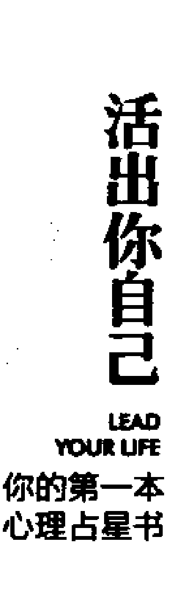

月冥的正面相位是叫人放心的，你会信任当事人有足够的毅力，不动声色，内敛地、全力以赴完成他所要完成的。

月冥合相的人深爱母亲，有一位单身女人到五十多岁仍然和母亲睡在一起；提到自己最恐惧的事，她黯然流下眼泪，答案是害怕母亲去世——她母亲已经八十多岁，她仍然未剪断脐带。

月冥负面相位的功课不只是情感的掌控与占有，而是破坏性、毁灭性，演化程度较低的人，可能在得不到他所要的事物时，以残酷的手段铲除异己或挖出对方丑事，强力斗争，摧毁对方。总之，月冥负面相位是业力课程，当事人必须转化自己的黑暗面重生。

## 太阳与父亲

太阳属于阳性能量，代表父性功能与权威。命盘中的阳性原型来自父亲的形象。太阳与行星的相位可以反映当事人与父亲的关系，童年与父亲的成长经验会影响当事人的人格特质以及面对权威的态度；倘若当事人在成年后，没有在内在建立等值的心理能量，以成熟的心态检视父亲所灌输的人生概念及价值观，则可能照单全收，成为父亲的翻版。

太阳描述我们的理性自我以什么样的风格与生命热忱来完成人生目标，活出内在英雄形象；也可以透过太阳观察，我们的父亲是一个什么样的人。

当一个人的太阳与其他行星形成相位时，他与父亲共同演出这个功能。童年与父亲的互动模式，形成一个人如何面对权威，例如师长及上司，或女人如何面对她的丈夫。来自原生家庭的成长经验是一种熟悉的推力，理性自我借着亲密关系重整，成长茁壮的太阳终于能够抗衡土、天、海、冥的能量，活出自我。一般而言，男性比较容易延续父亲的意志，但有些人也能跳出轮回；有些女性也会重复父亲的模式，例如赌徒的女儿仍嫁给好赌的人，商人的女儿又嫁给商人。

## 活出你自己

LEAD YOUR LIFE 你的第一本心理占星书

### 日土相位

| 日土相位 | 内容 |
| --- | --- |
| 太阳与土星形成正面相位 三分相、六分相 | 父亲是个意志力坚强、严肃律己、节省、压抑情感的人，有较高的成就动机，孩子在父亲的教养下成为重视荣誉地位，看待事情比较严肃的人，具有吃苦耐劳的特质，努力照父亲的期许而活。结合两颗行星的正面特质，透过土星的结构性，实现太阳的自我意识，这是辛苦有成的相位，可获得长者的提拔。 |
| 太阳和土星形成负面相位 合相、四分相 对冲相 | 父爱匮乏，父亲经常缺席或是早年丧父，无法透过与父亲共处来练习展现自己的阳性能量，自我表现受限，但自我期许太高，形成压力重担，有时缺乏自信，在成就感和性格困限中挣扎。刻苦的母亲由于配偶缺席，把人生的希望寄托在孩子身上，长大后，为了获得成就而忙碌，不常在家，重演“缺席的父亲”的角色。太阳的自我意识无法抗衡土星权威的负面影响，被责任感、成就动机所宰制，重视现实，渴求名望，但又有些自卑，恐惧失败，缺乏情趣。 |

### 日土相位补充：

土星代表社会意识、社会价值及规范，当事人沿袭父亲的价值观，即使是正面相位，都必须经历限制、压抑和挫折的磨炼，发展出正面特质，守纪律、有责任感、自我期许甚高。大部分是军人、船员的子女。一般人不太明白“缺席的父亲”的定义，是父亲并不固定在家扮演父亲的角色，以致于他们缺乏与阳性能量互动的练习。

一个童年被父亲遗弃的男人，心里怨恨他父亲，却在研究占星学之后，看到问题出在自己。太阳与土星的对冲相，代表他这一生本来是要透过一个缺席的父亲，来学会照顾自己。

有一位校长的女儿承认她是父爱匮乏的，太阳四分相土星——令人惊讶的是我认识这位父亲，他每天都回家吃晚饭——她难过地说，父亲从来没有抱过她，小学毕业时写毕业纪念册，大家起哄要看校长父亲为她写了什么，结果跟所有的人一样——“敦品励学”四个字。

有一位女士，她母亲是父亲的外室，直到父亲去世都没有认祖归宗；她恨父亲，但又畏惧权威，嫁到夫家后，非常怕她公公，同桌吃饭，肠胃经常不适。她在五十多岁时来到我的工作室上课，看到自己日土四分相，才明白有一个缺席的父亲是自己的选择，明白自己不是受害者，之后她在梦里与父亲相拥痛哭，宽恕了父亲的缺席，而后与夫家长辈的关系也改善得较轻松自然。

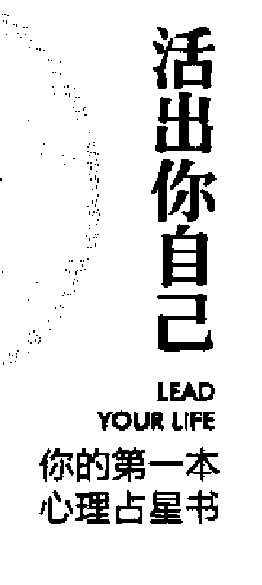

### 日天相位

| 日天相位 | 内容 |
|---|---|
| 太阳与天王星形成正面相位三分相、六分相 | 父亲是不依赖任何权威的人，具有人道主义、平等博爱的特质，孩子在自由开放的空间成长，形成独立自主、平易近人的个性，喜欢自然科学、生物研究，或对计算机有兴趣。天王星的原创精神与改革趋力，透过太阳显现出来，能够自在地表达自己的看法，发挥天王星的独特才华与创意。 |
| 太阳与天王星形成负面相位合相、四分相对冲相 | 父亲的性格不稳定，可能是一个极端个人主义、反传统、冷漠疏离、行为古怪、个性乖张的人。受到父亲的影响，孩子长大后形成恃才傲物、自我本位的个性，过度强调自由，无法忍受限制，因为反权威而容易与上司不和；童年不稳定的生活模式，使他们不能忍受一成不变的刻板生活，太阳的自我意识无法摆平天王星的颠覆能量，太强调自己的独特性而显得疏离叛逆。 |

### 日天相位补充：

日天的正面相位，是聪明的异类，在传统社会较难出头，但是在高科技领域或科学园区，他们是薪资优渥的专业人才。

他们对社会政策的改革有独到的见解，认为贫穷是一种结构性的问题，不是同情可以改善的；他们独来独往，但又会为弱势团体争取权益，宽容但并不包容，重视朋友更甚于家人。

有一位日天合相的女子，她父亲是民选代表，交友满天下，为民喉舌，把家当旅馆，她不喜欢父亲的生活方式，结果她结婚的对象热衷参与社团，杂务甚多，跟她父亲一样整天在外面跑。

在孩子眼里，日天型的父子俩就像哥儿们，可以一起打篮球、打电玩。日天型父亲有实验精神，不在乎别人的看法，会让孩子去念非体制的实验小学。

日天的负面相位，家庭生活极不稳定。一位日天四分相的男士觉得他父亲与家人互动还好，但是父亲的警察职业却因职务调动经常搬家，小学他就念了五个学校，永远是转学生。还有一种状况是父亲对外人极为热忱，待朋友如手足，对家人反而冷漠；或是年轻人上网交谈愉悦，见了面反而没有话说，这都是天王星负面相位所产生的怪异行为。

有位日天对冲的父亲不想作顺民，经常会对老板拍桌子走人，不喜欢官僚体制，不耐烦朝九晚五而贸然创业，又不想做传统产业，结果选择的产品太新潮，无法被普通大众所接受，自己又非生意人的材料，经常创业失败，一生就这么起起落落。

### 日海相位

| 日海相位 | 内容 |
| --- | --- |
| 太阳与海王星形成正面相位三分相、六分相 | 父亲具有慈悲、善心、怜悯弱者的美质，可能在工作之余研习音乐、艺术、文学、书法、摄影等才艺，教导子女对人生秉持真善美的态度，孩子受其熏陶养成对美的事物敏感，对人慈悲的性情。太阳的自我意识融合海王星的理想，能够透过直觉力展现行动。 |
| 太阳与海王星形成负面相位合相、四分相对冲相 | 海王星的负面特质在父亲身上显现，例如个性软弱无能，逃避现实或耽溺悲情，孩子被影响，自我意识薄弱，长大后，觉得理想与现实有落差，在生活中有无力感，形成被剥削或自怜的人格，耽溺于酒精或麻醉品，生活颓废，自我欺骗不愿面对现实。太阳无法实现海王星的理想，与两颗行星相关的宫位，正是人生幻灭的所在。 |

### 日海相位补充：

日海型父亲是内心有依归的人，有奉献牺牲的精神，他们祷告、灵修，是传道人、牧师、社工人员，或是保护动物团体的志愿者。

日海型父亲是浪漫阴柔的，保持宁静的心态，用超然的眼光看世间。他们会听黑胶唱片，与孩子分享“蓝色多瑙河”，或者拉小提琴、写书法；若是没有这些才艺，他们至少还会煮菜或洗衣服，分担大部分的家务。

缺点就是他们无法拒绝别人，家里经常有一大堆直销商品；他太慈悲，容易受骗。日海合相的父亲很慈悲，但人生境遇令人感伤。有位太阳天蝎、日海合相的学员在她父亲去世后，悲怜父亲一生被人欺骗多次，情绪失落，抑郁寡欢好一阵子。日海的负面相位，人际界限完全不清楚，把信用卡借给好友使用，自己背了一身卡债。

负面相位的日海型父亲可能酗酒、吸毒、说谎，悲怜自己一生怀才不遇，生不逢时。我有一个学生逼不得已出面帮她母亲处理离婚过程，因为他父亲赌到身无分文，欠了一身赌债，回家要不到钱，喝了几瓶老酒，闹着要开瓦斯自杀，搞得一家无法睡觉。

曾经，我在射箭场工作时，有位老兵常到卖弓箭的柜台找柜台小姐聊天，他用平剧的腔调唱：“我是天涯沦落人，啊……”我怀疑他是日海负面相位，孑然一身，年华老去，终身的理想已幻灭。

### 日冥相位

| 日冥相位 | 内容 |
| :--- | :--- |
| 太阳与冥王星形成正面相位 三分相、六分相 | 父亲有着强烈的意志力，无与伦比的坚持和决心，所不同的是他们并不崇尚社会的成功模式，而是来自潜意识深处的激情与执着，例如：群众魅力、权力情结或个人的使命感。子女在父亲的影响下，太阳的自我表达能够结合冥王星不屈不挠的意志力，专注于目标，发挥潜力勇往直前，对人生充满狂热激情。 |
| 太阳与冥王星形成负面相位 合相、四分相、对冲相 | 冥王星的负面特质是操纵、摧毁、偏执、爱恨两极化。子女在父亲专权的对待下内心对抗，形成王见王的场面，太阳的自我意识被冥王星的权力欲与支配欲所垄断，个性独裁，人际关系也较紧张，所以日冥相位的人要学习的是控制自己，而非控制他人；处理自己的负面情绪，而不是被自己的负面情绪所摧毁，他们若不是激情，就是绝情，没有灰色地带。 |

### 日冥相位补充：

日冥相位的人是对他的目标专注而深藏不露的，他们生命怀抱炙热的激情，全力以赴，但因冥王星的影响力大，有群众魅力，不适用于私人目的，若不投注于社会运动，会因为偏执而产生强制性，与家人疏离不亲。

日冥的正面相位使一个人能够把生命力集中在自我的更新，他不会为了自己的欲望去斗争别人，他只专注在自我的转化与提升，以超强的意志力断恶，例如决定戒烟，说到做到。

日冥型父亲希望他的孩子承袭他的使命，我极少看到日冥型父亲热衷于艺术或事业，但是这类型的父亲喜欢跟政府官员拉关系、为他们跑腿；他们热衷政治——我听过一个学生分享她日冥对冲的父亲，在她小时候就把她架在肩膀上去听政见发表会，小时候她不懂，父亲说什么，她照单全收，直到她成年，有了自己的看法，父女两人政见不同，每逢选举，争辩到几乎反目。

日冥对冲相的女性另有一个问题，她们会对抗同一世代的男人，因为相同世代的人冥王星都在同一星座。日冥对冲相的女性必须嫁给比她更年轻的男人，否则她会觉得丈夫老是要控制她、支配她，婚姻生活充满对抗。

## 责任者意识

有位心理辅导老师说过一段话：受害者寻求报复，生还者寻求救赎。

我们周遭亲密的人，都在凸显心灵地图中的某一部分。生命中的每个情境，都是灵魂所需要的学习过程，经由灵魂的允许才发生，因为我们特定的频率而招感。任何事皆为共振，像一面镜子，招来与自己相同的能量，或是为了平衡前世行为的业力结构，才会吸引这些事物进入生命中，但是在不了解之前，我们会认为生命问题是别人造成的。当一个人不把自己定位在受害者时，他才会看到事实的真相。

我辅导过上千个离婚妇女，当她们真正看到事实的真相，才会修正自己，展开新的人生；那些认为都是别人害自己婚变的人，往往重蹈覆辙，第二次婚姻也不理想。

在处理共同的经验时，每个人都会呈现他不同的生命本质，请以责任者意识看待生命事件，在过去的创伤中找到深层的意义！我们要自问：往后，同样的事件发生，我们是否能更宽广地面对，更了解此中真义？

## 活出你自己

LEAD YOUR LIFE 你的第一本心理占星书

## 生命蓝图

我们的自由意识与业力结构的平衡法则，形成独特的生命蓝图。从自我的观点来看生命，多少会有些缺憾，但是，从灵魂的观点来看这一切，却非常完美。有些人在婚变后学会独立，也有些人在失业后发现自己的创造力而后找到人生志业。

| 如果你的父母是： | 相位：日或月四分相或对冲相 | 你要学习的是： |
|-----------------|--------------------------|----------------|
| 经常缺席的 | 土星 | 注意自己身心的需要 |
| 有暴力倾向 | 火星 | 保护自己 |
| 软弱颓废 | 海王星 | 坚强振作 |
| 冷漠疏离 | 天王星 | 照顾自己 |
| 动荡不安 | 天王星 | 稳定的价值观 |
| 严苛 | 土星 | 成为自己的支持者 |
| 操纵欲强 | 冥王星 | 自在、信任自己 |

## 活出你自己

LEAD YOUR LIFE 你的第一本心理占星书

子女想得到父母的爱，但若是父母从小没有被爱，他如何懂得给予？虽然肉体藉由父母而生，但是父母在灵性的演化上未必完美，他们内在也有受伤的小孩。接纳自己的生命蓝图，疼惜自己，放下晦暗怨怼的念头。

把问题从阴影中摊出来，看清楚是什么卡住我们的灵魂成长。如果没有从父母亲身上学会，相同的模式就会在配偶身上重演，直到你学会其中的课题;尊重自己、爱自己，那个模式就不会再继续发生。因为，在心灵地图中，能量没有发展成熟的人会向外寻求替代，在异性关系中投射他的阴影；当我们钦羡某种人格美质时，其实就是在为自己未成熟的能量寻找互动的练习机会。

## P.A.C.人格的三部分

P.A.C.是三个字的缩写，P (Parent) 是父母，A (Adult) 是成人，C (Child) 代表儿童。经由三个生命段的经验，或建立认知或写入记忆，透过具有代表意义的表情与语言，分别展现了人格的三部分。

| 类别 | 描述 |
|---|---|
| P | 记录着五岁前，无可怀疑或强迫性的外在事件，包括从父母那儿听来的、看到的一切法则、规范，被孩子当作真理记录下来。 |
| +P | 父母的嘉奖、肯定、支持、安抚 |
| -P | 父母对孩子的批判，权威、惩罚或严厉的教养，形成强迫性行为 |
| 表情 | 皱眉、摇头、手叉腰、嘴角下垂、拍别人的头或肩膀 |
| 语言 | 你应该、你必须、你懂吗、你又来了、我告诉你多少次了 |
| C | 记录着出生到五岁间，内在感觉对外在事件（大部分来自双亲）的反应。童年的处境是依赖、无助、需要被照顾、无法以言语表达，无法处理的情绪等内在感觉的记忆。 |
| +C | 创造力、好奇心、探索及体验的冲动 |
| -C | 被遗弃、被拒绝、挫折、不断索爱的感觉 |
| 表情 | 嘟着小嘴、甩头、耸肩、皱鼻子、嘲弄、坐不住 |
| 语言 | 我不管；我以后要……；我恨红萝卜；我家有大车车，你家没有 |
| A | 十个月大的孩子，大脑活化与成人一样，体验到运动自如，探索玩具，他发觉自己能经由探索和试验而理解、思考一些事情，这些经验可能与P父母所告之或教导的不同，也和C儿童记录的感觉不同，根据这些探索发展出成人的思考方式，A成人需要时间寻求数据及经由自己理性分析来得到结论。 |
| 表情 | 率直、专注的倾听、允许儿童出现的好奇 |
| 语言 | 我想、我知道、可能、客观的、允许不同的方式存在 |

一个人对自己的P与C愈自觉，他的 A 就愈独立；但是，被P垄断而未经分析、没有检视的 A 是偏见的、混淆的，可能用A的表情与口气，讲来自 P 的资料。有一种无法游戏的人是被责任感很强的父母管得很紧， C 的部分完全被压抑， A 又被P垄断，假日还要工作，无法放松。 C 在失恋或输了一场球后，觉得生命没有价值； A 可以找到事件的意义，超越挫折感。

面临压力情境时，不妨问自己，要让人格的那一部分出来讲话？

## 占星与P.A.C.

从占星学来印证一个人的C（儿童部分），月、火、金代表一个人的儿童自我、情感自我。月亮是我们受到家庭影响的生活习性及情绪面，需求被滋养、被呵护的内在孩童；火星代表自我防卫、不满情绪的渲泄，金星是这世上最吸引我们的事物。月、火、金的先天性格取向会受到土星的制约，促使儿童自我提早面对社会的要求，当儿童自我与土星有冲突相位时，会产生A（成人部分）无法解决的心理问题，矛盾于：我要先满足内在孩童的需求？或是遵守社会需求，满足父母师长的期许？

当土星合相月亮或土星四分相月亮、土星对冲相月亮时，会出现被母亲管教严厉，恐惧权威，压抑需要而不敢去满足自己的状况；但当三王星合相、四分相、对冲相月亮时，则当事人不懂得如何满足自己。

火星的负面相位，会成为坏脾气的孩子，C（儿童部分）淹没了A（成人部分），情绪变化极端或有攻击性，木星或天王星会使火星更躁进，而土星和海王星使火星活力低落，形成毫无生趣的人格；虽然（成人部分）可以面对现实，但C（儿童部分）完全没有活力，通常是月亮或火星受到土星的压抑，感到无价值感或阴霾重重。

A（成人部分）的部分，理性自我、成人自我是太阳、水星和木星经由后天的学习及自我成长而发展出来。水星是理性分析加知性的活化；木星促进自我成长，来解除土星的压抑。

我们可以检视自己的月、火、金或日、水、木，看C（儿童部分）或A（成人部分）哪个部分受到土星较多的压抑，找出问题所在，好好疼惜自己，重建内心支持系统，让A（成人部分）有建设性的发展空间。

这些障碍与业力行星有关，包括土、冥与南交。冥王星的习性会透过南交紧紧抓住过去，在行运土星所带来的现实困境中重演灵魂创伤，这个惯性模式会在生命里不断轮回，遇到冲突相位则被打败，遇到和谐相位就获得提升。

虽然因为内在的拉力，要打破以前的惯性模式很困难，但当我们提升自己的频率，强化自己内在的力量，威力之点就在当下——当下你决定创造新经验，输入新的信念，你就可以改写旧模式。任何情境皆为中性，你决定自己的态度！

## 4
生命蓝图
星盘论法

星盘中的正面相位是进化时的辅助力量，而负面相位代表过程中受到的阻碍。对世俗的人而言，负面相位是痛苦的生命历程，但对灵修的人而言，负面相位还是可以超越的，只是过程比较艰辛。

要了解自己的情感自我（儿童自我，也就是先天的性格取向），或者理性自我（成人自我，也就是后天发展形成），可以透过以下的线索明白。

- ❖ 透过相位了解情感自我
- • 月亮、火星、金星为儿童自我。火星、金星、月亮之间有无相位，看家庭生活习性、内在情感与情绪满足度。
- • 火星、金星、月亮与土星有无相位：如果有相位，将促使儿童自我提早面对社会要求，压抑需求，不敢去满足自己。
- • 火星、金星、月亮与天王星、海王星、冥王星之间有无相位：如果有相位，在孩童时代，外行星的力量迫使当事人完全不懂得该如何满足自己；
- • 月天相位不佳——我行我素，特立独行，内在情感是友谊模式，从哥儿们的情感跨到爱情很难；
- • 月海相位不佳——面对人事物，理想一再落空，失望幻灭，肇因于缘起时的假像憧憬，在现实情境中有无力感；
- • 月冥相位不佳——产生强迫性的心理趋力或无形的心理威胁，童年与母亲的掌控较劲，成长后在情爱关系中重演，而造成相处的困难。
- • 当个人行星同时与土、天、海、冥都有相位，情况会变得很复杂：
  - 月土相位——母亲管教严厉，情绪压抑或早熟；
  - 月海相位——自我美化、欺骗、希望幻灭；
  - 月天相位——随时可以颠覆，像个小反叛者；
  - 月冥相位——有斗争的本事，坚忍不拔，愈战愈勇。
- • 情感自我有四分相或对冲相时，要疼惜自己的内在孩童，重建内心支持系统。

## ◇ 透过相位了解理性自我
- • 太阳、水星、木星，代表成人自我，太阳、水星、木星之间有无相位，看成人自我在理性分析、知性的活化，以及自我成长的能力。
- • 水星、木星、太阳与土星之间有无相位，看道德规范如何影响理性自我。
- • 火星使个人行星活跃或躁进，木星、天王星亢奋个人行星，土星、海王星弱化个人行星。
- • 理性自我如果有冲突相位（四分相或对冲相）：
  - 日土相位——不能游戏的人，不工作就有罪恶感；
  - 日天相位——过度冷漠，说变就变；
  - 日海相位——过度软弱，优柔寡断，逃避责任；
  - 日冥相位——过度强硬，孤傲偏执，疏离不亲。
- • 太阳与月亮有四分相或对冲相位时，父母之间问题重重。

| 相位 | 与父母的关系 |
| :--- | :--- |
| 土星四分相、对冲相太阳或月亮 行运的土星四分相、对冲相太阳或月亮 | 父母太严厉，承受父母的压力，如果月土四分相或月土对冲相，就是母亲管教太严；如果是日土四分相或日土对冲相，就是父亲太权威，来自父亲的压力较大。 |
| 天王星四分相、对冲相太阳或月亮 行运的天王星四分相、对冲相太阳或月亮 | 如果天王星对冲月亮或天王星四分相月亮，就是母亲不稳定，母亲与子女之间较疏离；如果是天王星四分相太阳或天王星对冲相太阳，就是父亲较不稳定，父亲与子女间的互动较疏离。 |
| 海王星四分相、对冲相太阳或月亮 行运的海王星四分相、对冲相太阳或月亮 | 父母太软弱，逃避责任，如果是海王星四分相或对冲相月亮，就是母亲不务实或涣散颓废；如果是海王星四分相或对冲相太阳，则父亲比较不务实。 |
| 冥王星四分相、对冲相太阳或月亮 行运的冥王星四分相、对冲相太阳或月亮 | 子女因父母操控而备受压力、精神不安，如果是冥王星四分相月亮，或冥王星对冲相月亮，母亲较掌控、独断偏执；如果是冥王星四分相或对冲相太阳，则是父亲比较强硬、操控。 |

## 爱情档案

金星是爱的行星，火星表现热情，月亮意味着情绪的满足，木星照耀爱的光明面及心灵智慧成长，土星为限制作用，天王星是突发的罗曼史，海王星是理想主义，冥王星则是热切的渴望。

## ASTROLOGY

LEAD YOUR LIFE

## 爱情档案

## 行星与爱情

## 5
爱情档案

婚姻关系的两人通常有土星的相位。虽然土星是负责任的，但土星很沉闷。爱与婚姻的差异必须被认知，可能在一个真爱的关系中没有婚姻，也可能在一个婚姻的关系中没有真爱，还有一种可能是真爱与婚姻全无，但是有自由，例如某些一人一地的分偶。

金星是爱的行星，金星所在的宫位与星座必须被列为第一考虑，再看金星与其他行星的关系，或第五宫的宫头与行星。

火星表现热情，关系到一个人的肉体吸引力及性行为，月亮意味着情绪的满足，木星照亮爱的光明面及心灵智慧成长，土星为限制作用，天王星是突发的罗曼史，海王星是理想主义，冥王星则是热切的渴望。

| 行星 | 爱情特质 |
| :--- | :--- |
| 太阳 ⊙ | 具有强烈支配爱情的主观倾向，冲突时伴随着自负与过强的自我意识，在女性的星盘上，太阳在固定宫时，将使爱情较有自信。 |
| 月亮 ♋ | 带来情绪满足的浪漫与想象，但爱情本质是多变的，是被动、无攻击性的，提供一种母性的联系，在男性星盘上，月亮在固定宫能使爱情较稳定。 |
| 水星 ☿ | 水星与思维的爱结合，也可能提供一种二元化的兴趣，喜欢双线的发展。如果水星与金星、月亮或火星有相位，会被这些行星强化思维的倾向。 |
| 金星 ♀ | 期望爱情的优雅，阴性响应它所接受到的，是一颗愉悦的爱情行星，但有冲突时，愉悦转为怠惰的意识，耽溺于享乐或物化的倾向，如果受到海王星的影响，爱带着幻想的特质，也可能过度美化。 |
| 火星 ♂ | 提供精力与活力，过度强调爱情关系中激情与肉欲的部分，动态与攻击性导致爱的冲动，不允许对方有拒绝的权利，本命星盘火星相位佳时，对爱情具有强烈的主观防卫意识，绝对的忠实，火星在土象星座特别具有行动力，性功能最强。 |
| 木星 ♃ | 是乐观、能自我调适、健康的爱的本质，但是并不强调爱情的忠贞，重视精神成长，在爱中拓展生命视野，喜欢单身生活，不想被婚姻套牢，设法从传统与保守模式中活出自己的自由方式。 |
| 土星 ♄ | 提供爱的野心，但却备受限制，禁欲、冷酷或失望。冲突时，很难克服横跨在爱中的现实障碍，相位有利时，本人很忠实，但也可能是势利、掺杂着现实盘算，爱情有务实的部分，为了现实权位会压抑真情。 |
| 天王星 ♅ | 脱离常轨，带来爱的原创性与主动挑逗的态度，突然在第一眼照亮了爱，提供私奔的勇气，以一种非正统、无政府主义的方式达成，特别是天王星在十二宫或是天王星与十二宫当中的行星形成坏相位，爱情也会突然的终止，但分手后，还能像朋友般地互动。 |

活出你自己
LEAD YOUR LIFE
你的第一本
心理占星书

| 行星 | 爱情特质 |
| :--- | :--- |
| 海王星 ♆ | 极端的、彻底的变好或变坏，具有假装和幻想的元素，由于高度的精神性，可能完全断绝性生活，负面相位带来堕落与耽溺，特别是海王星在八宫，或八宫宫头为双鱼座，或海王星与八宫内的行星形成相位，使爱更神秘。 |
| 冥王星 ♇ | 强烈的激情与感官渴望，或是残忍、虐待、奴役的特质，成为一个支配者和依赖者互相占有或拉扯的型态，有一种强烈的感情反作用力，全有或全无，可能封闭温柔心，断爱绝情，也可能在最高峰时爱人突然死亡，或是在爱人死后仍执著一辈子。 |

使用说明：

1.  看金星与其他行星的相位，例如金星与木星有相位，则参考木星。
2.  看第五宫的宫头，例如第五宫宫头在天蝎座，则参考冥王星。
3.  看第五宫内的行星，例如土星在第五宫，则参考土星。
4.  看金星在什么星座，例如金星在水瓶座，则参考天王星。

## 5
爱情档案

## 爱情能量在十二星座

### ◇ 爱情能量在牡羊座 ♈

你的太阳、月亮、金星、火星、上升点或配偶宫，位置在牡羊座

- • 你们两人皆可带头行动，彼此都有高度的热情与兴奋。
- • 在活动中欣欣向荣，害怕枯燥，喜欢开创新领域，能够在生活中有更多表达自我的机会，也能清楚地表达自己的需求，会为本性的需求而采取行动。
- • 内在有一种需要自己的空间、不想被绑住的强烈意愿，所以彼此都应给对方空间，感受到自由，允许各自做自己想做的事。
- • 牡羊能量在爱情所释放的讯息是按照自己的意愿去处理热情、身体快感和满足。
- • 当牡羊座的女性不愿表达她内在这种独立自主的爱情能量时，会演变成吸引不能拥有的对象，找已婚者或居住在远方的人谈恋爱，表面上看起来是对方不能经常陪伴她，实质上是藉这个方式，拥有自我的空间和独立作业的时间。
- • 如果牡羊座的女性不愿表达自我需求或愤怒的情绪时，她会吸引到既霸道又脾气坏的男人来替她表达，当她较能表达之后，对方的霸道自然会降低。

### ☆ 爱情能量在金牛座 ♉

你的太阳、月亮、金星、火星、上升点或配偶宫，位置在金牛座

- • 双方都需要拥有感觉的空间，例如触觉的接触，彼此依赖的感觉，慢慢品味舒适的环境。
- • 生活水平在一种可预期的安全感和舒畅的基础上，享受感官的满足和有形的美，包括美酒、美食、华服和物质上的丰裕。
- • 当其中一人发展过度时，会成为老饕，在衣食上花费甚多，逐渐变成一个唯物的拜金主义者，一心想钱，也可能变成守财奴，希望对方能供养或负起责任提供生活上的物质需要。
- • 享受物质供养，日久之后，会发现对方变成赚钱的机器，相处时毫无美感，乏味枯燥，俗不可耐，另一种是对方一旦破产，你们的关系即宣告结束。
- • 还有一种可能的投射是对方扮演美的角色。受到金星的影响，你觉得伴侣拥有优雅华丽的外表是很重要的事，你努力装扮他，让他呈现和谐可人的美质，日久又厌烦对方在漂亮的包装下毫无内容。
- • 最好的方式是共同承担开支，双方都能表达自在、美丽和优雅，而不是期待对方为你呈现美质。

活出你自己
LEAD YOUR LIFE
你的第一本心理占星书

### 爱情能量在双子座 ♊

你的太阳、月亮、金星、火星、上升点或配偶宫，位置在双子座

- • 双方都能拥有足够的知性刺激，交换不同的观点，保持沟通管道的通畅，这样你们就可以畅谈任何事情，即使你们不见得要去做。
- • 你们相遇后，被彼此客观、理性的观念和丰富的信息交流所吸引；如果双方都能分享这种能量，可以一起读书讨论，感受被对方的理念所兴奋的快感。
- • 不能分享这种爱情能量时，可能会依赖伴侣的思考力，也许从小没有培养自己理性思维的信心，放弃自己思考的能力，而完全认同伴侣的口才与社交能力。
- • 一开始会很欣慰于伴侣伶牙俐齿、能言善道，似乎任何题材都能侃侃而谈，但是，当自己放弃发言权日久之后，会厌烦伴侣的肤浅，只会滔滔不绝、重复地说一些表面的皮毛，言语毫无深度，又没有创造力。
- • 最重要的是双方都要修正自己，来学习对方的特质，彼此乐于沟通及表达，了解对方，以理性、客观、不依赖的态度，彼此兴奋对方的思考力，达成知性分享的愉悦。

### 爱情能量在巨蟹座 ♋

你的太阳、月亮、金星、火星、上升点或配偶宫，位置在巨蟹座

- • 你们需要彼此照顾，在情绪上或身体上，滋润对方，陪伴对方，并珍惜对方，感受到亲密的慰藉。
- • 双方都被需要，也都需要对方，能够在情感上彼此满足，以仁慈、温柔、拥抱的方式，互相扶持，并给予对方情绪上的满足。
- • 如果爱情能量不能平衡发展时，可能会造成其中一人经常寻找一个母亲来照顾他，而另一人则经常要扮演母亲的角色，长期下来，也是负担。
- • 巨蟹座的主宰行星是月亮，月亮也显示出对母亲的个人体验，巨蟹座的投射可能与母亲未了的心结有关，童年没有得到母亲无条件的爱与滋润，导致内心的干涸，渴望伴侣能给予这样的爱——完全的支持、保护与帮助。
- • 现代心理学盛行一种治疗法——探索“内在孩童”并藉此治疗，亦即透过自己成为自己的母亲，照顾内在孩童，对习惯于巨蟹特质投射的人而言，是一种很好的内在疗愈。

### ☆ 爱情能量在狮子座 ♌

你的太阳、月亮、金星、火星、上升点或配偶宫，位置在狮子座

- • 狮子座的爱情课题是爱人与被爱，你需要从自我中心抽身，在彼此关系中得到积极的响应、肯定和赞美。
- • 如果你们能分享这种能量，双方都会成为对方的粉丝，欣赏对方、为对方喝彩，回馈对方爱与热情，给对方掌声鼓励，告诉对方他有多棒！建立彼此的信心，鼓舞对方在人生舞台中闪亮，支持对方成为众人瞩目的焦点。
- • 如果能量没有平衡发展，就会变成其中一人永远扮演明星，而另一人永远是观众，做得较多的那个人希望自己永远屹立在舞台上，而那个观众则被期待在台下鼓掌。
- • 没有表现出自我肯定的狮子会把爱情能量投注在对方的身上，使对方在幻想中越来越自我膨胀，自己的自尊和自信则日渐降低。
- • 要改善这个关系不是换另一个人去鼓掌，而是双方都能有机会成为被注意的焦点，有机会表达自尊自爱、热情尊贵的王者之风或是英雄角色，能够被欣赏、被鼓掌，拥有自信心，觉得自己很棒！

活出你自己
LEAD YOUR LIFE
你的第一本心理占星书

## ## 爱情能量在处女座 ♍

你的太阳、月亮、金星、火星、上升点或配偶宫，位置在处女座

- • 你们彼此需要为这份关系做一些很实际的工作，让它更好，并且将你判断和批判的天性摆在一边或稍加控制。
- • 你是一个工作狂，不要让同事或工作伙伴们占据太多属于你和伴侣的时间或空间，而且，最好能够告诉对方你的工作内容和流程，让他知道你一向在忙些什么。
- • 处女座常常会找一个勤奋的工作狂来作为爱情伴侣，把家庭或爱情关系变成一种事业，渴望扮演好妈妈、好爸爸，或是有效率的家庭主妇。
- • 假如你将处女座的能量投射出去，可能会找到一个人帮你扮演认真负责的角色，那么你就会成为轻松愉快的花蝴蝶。但是这个情况过度发展的结果，会造成对方成为一个严厉的批判者，老是想要纠正你，把你当成他需要完成的课题，另一个结果是他变成一个把工作带回家的工作狂。
- • 如果善用处女座优质的能量，双方都会成为有潜能、有效率的工作伙伴，脚踏实地地去做，不会幻想像童话故事一样的婚姻生活，彼此在工作上互相扶助、互相支持，如此就不会把能量用来针对对方的缺点，想改造对方或经常批判对方。

### ☆ 爱情能量在天秤座 ♎

你的太阳、月亮、金星、火星、上升点或配偶宫，位置在天秤座

- • 天秤座的爱情课题是美与和谐，你们需要注意彼此之间的和谐与优雅，如果能拥有开放的沟通模式，就能够互相投桃报李。
- • 你会找一个能够互相平等对待的伴侣，但也可能做得过分，经常强调平等，在每一件事情上斤斤计较平等，结果彼此之间反而变得不和谐。还有一种可能性是把自己对美的追求，投射到对方的身上，而去寻找一个外表非常好看的伴侣，然后和伴侣演出一出唯美的爱情戏。
- • 当双方有摩擦时，不要将关系中的冲突扫到地毯下，蓄意掩饰，以维持表象和平，你需要面对问题，让事情能摊开来，见到阳光。面对冲突对你而言是具有挑战性的，因为你习惯逃避面对冲突。
- • 你要学习健康的愤怒，不是每件事都必须妥协，不要压抑委屈在心里产生内伤，同时，你要学习独处。
- • 假如能够在关系中注入天秤座的能量，彼此都能呈现和谐，也能考虑对方，彼此妥协，那么你那亮丽的伴侣也将在这关系中拥有爱与美。

5
爱情档案

活出你自己
LEAD YOUR LIFE
你的第一本
心理占星书

### ☆ 爱情能量在天蝎座 ♏

你的太阳、月亮、金星、火星、上升点或配偶宫，位置在天蝎座

- • 双方都要注意到你们权力结构中强烈的内在需求，因为双方都想要百分之百地掌控对方，容易变成暗中较劲的权力游戏。
- • 分享彼此隐藏在暗处的意愿，讨论你们对于共同享乐的需求，别落入权力拔河的陷阱，参与外在的竞争管道，像运动、球赛、商场上的竞争，这样你们就不会彼此斗争。
- • 另外要注意的是将你的愤怒和怨恨做建设性的表达，而不是让它在体内发酵毒化自己，你的负面情绪需要有出口。
- • 天蝎座的人常想将关系推到极致，如果不能有更好的突破，则宁为玉碎，不为瓦全。有时候，你会以一些无理的要求来测试对方对你的爱及容忍，能够到达什么程度。
- • 天蝎座的课题是当彼此的关系已经有毒素时，需要明白什么时候该让对方离开，让自己的情感升华，这是你最需要学习的。同时，你需要去了解自己内在深沉的情绪，学习与暗流里的情绪相处。
- • 当爱情能量发展良好时，双方得以真诚的互相承诺，彼此的关系会成为刻骨铭心的深情，超越生死。

### ☆ 爱情能量在射手座 ♐

你的太阳、月亮、金星、火星、上升点或配偶宫，位置在射手座

- • 双方能够鼓励与支持对于生命和这世界的理想与热情。能分享你们对智慧的追求，一起旅行，享受大自然的美景，共同参与鼓舞灵感、拓展心灵智慧的活动，分享睿智与精神上的冒险。
- • 有一种倾向是眼里只有最好的：想要进最好的学校、去最好玩的地方旅行。你有信心，愿意冒险，相信明天会更好，虽然是幽默、爱玩乐的人，但仍会朝着终极目标迈进，不论是入世或出世的理想。
- • 唯一的危险是你的期待总是高过于现实，期待伴侣是最理想的，或许你根本就不结婚，如此才能永远拥有自由去追寻最好的，也有机会等待最理想的对象出现。
- • 你对意义的追寻胜过爱情，不会轻易付出生命的承诺，如果关系太沉闷，你会找出口逃掉。
- • 如果双方都能够在外面的世界中寻求理想，而不是期望对方成为你的理想，那么你们就能共同追求高远的目标，分享彼此的心灵智慧，互相丰盛，而不是期望对方来实现你的理想。

## 5
爱情档案

### ☆ 爱情能量在摩羯座 ♑

你的太阳、月亮、金星、火星、上升点或配偶宫，位置在摩羯座

- • 双方都能赋予伴侣责任感和对于彼此关系的承诺，分享彼此的事业、快乐和安全感，这样你们就能真正感受到彼此在工作上和情感上的接近。
- • 同时要注意到彼此的承诺不要太决断，才不至于老是检举对方什么没做到，这样你才能真正得到这份承诺的支持。
- • 你较倾向于权力、地位和成就的追求，但是你与伴侣之间都需要有机会分享权力和责任，否则，可能出现的危机是其中一人扮演太多权威的角色，宛如父亲，另一人只好扮演孩子。
- • 也有可能将会摩羯座的能量投射到对方身上，而去找一个有权力、有社会形象的对象，或是找一个稳重踏实、可依赖的父亲形象，但是有时候这个对象会变得过分霸道，想要控制你，你会感受到被限制的挫折。
- • 另一种投射是去找一个完全相反的角色，可能嫁给一个不负责任的彼得·潘，自己挑起一家重担，扮演权威角色。
- • 假如双方都能表现摩羯座的能量，双方都负起责任，贡献心力在关系里，摩羯座的情感关系会是稳定持久的。

### ✧ 爱情能量在水瓶座 ♇

你的太阳、月亮、金星、火星、上升点或配偶宫，位置在水瓶座

- • 能够成为对方最好的朋友，鼓舞彼此、开放沟通，充分信任，分享对于自由的需求，而不要求绑住对方的脚。
- • 能够鼓舞彼此的理想、刺激知性成长，如此双方就不需要到外面寻找新的经验，能够在承诺的关系中分享和丰盛彼此的经验。
- • 你希望伴侣是独特的，有一些与传统不同的创新观念；偶尔你会做一些特殊行为，例如跳伞结婚。
- • 可能的危险是水瓶座会喜欢找一个很怪异、不负责任、不愿意承诺的对象。当你有这样的倾向时，你需要做的努力是使双方都能够拥有独立自主，能够满足自己与众不同、创新的需求。
- • 你和伴侣之间的吸引力常来自彼此的独特和不平凡，但是，不要把对方当成是你反叛父母或社会规范的工具，例如嫁给不同肤色或不同文化的人，把差异当成叛逆的标志，而没有注意到对方内在。

1 英国小说家詹姆斯·巴里(James M.Bawie)作品《彼得·潘》里的人物，喻指长不大的孩子。

### 爱情能量在双鱼座 ♓

你的太阳、月亮、金星、火星、上升点或配偶宫，位置在双鱼座

- 双鱼的爱情能量是寻求浪漫的梦与无条件的爱，较好的方式是两个人携手共寻美景或成为社会上的助人者、心理辅导者或社工人员。
- 双方能够讨论彼此的梦想、幻想、理想和希望，包括慈悲和灵性的启示。
- 一起寻找灵感，感觉融入更高的境界，双方都能明白，这个美丽的梦境可能不会出现在真实的世界。
- 较差的方式是自己扮演牺牲者，寻找一个救援者或爱上一个宗教人士或大师，以为对方是不同凡俗的理想人物，即使幻相破灭，仍执意追寻另一个不可能成真的美梦，或一辈子暗恋一个人。
- 如果给予双方表达双鱼能量的空间，可能会看到每件事物内在的美质，知道在你内在视野里有一些事物不是物质世界所能建构的；同时你也不要求伴侣扮演神的角色，像神那么的崇高伟大，而是与他分享你的灵感，经由神秘学、艺术或治疗行为，分享幻想及灵性经验，互相启发，或透过冥想提升彼此潜意识心灵。

## 活出你自己

LEAD
YOUR LIFE
你的第一本
心理占星书

## 爱情异形

一般而言，构成吸引的爱情要素包括月亮的情感需求，金星的愉悦和火星的性能量。

但是，还有一个更强烈的因素来自过去世，在我们灵魂的以太元素中，储存着过去世混淆不清的残留记忆，剪不断、理还乱的因果，以及未了的心愿、未处理的课题。这个潜意识中未解的内在情蕴被触动时，勾起前世的记忆，我们会被一个体现此特质的个体吸引，在共处时完成能量的学习。

从心理学的角度而言，**自我=角色+阴影**。人们常为自己的心灵划分善恶、好坏、美丑等二元化的分别，企图否定我们不要的部分，逃避那个阴影。所以，当一个人会让我们感到惊艳时，其实是我们投射压抑的心理能量在对方身上。一开始，对方满足了我们的幻想，我们以为遇到完美的爱，享受短暂的合一境界，感受圆满与喜悦。相处日久，幻相瓦解了，我们体验到破灭的原因来自不真切的期许，他并不是我们想象的人，可是，那个曾经让我们心动的特质却扭曲而夸张地变成丑陋的异形。

爱情蜜月期到此为止，很多人的恋情在此夭折，除非我们能够让自己压抑的阴影在互动中练习做健康的表达，自己落实在生活中呈现阴影的能量。当我们释放内在压抑的渴望，不再需要旧有模式时，治愈就会发生。

在“爱情异形”中，清楚地阐明你的幻相，以及彼此在沟通互动中容易产生冲突的引爆点。亲密关系中最重要的课题是：区分我们的对象与我们投射于对方的理想形象当中的差距。

## 5 FIVE 爱情档案

伴侣双方都减轻自我认同的极端化，调整进入中间地带，向对方学习，共同表现出彼此不同的两种特质。如果双方都停留在某个极端，这个关系就没有机会均衡，而落入站在自己的立场互相指责对方的害怕坟墓。

爱是需要不断学习的情感，超越终极挑战，在体验之后，无论是欢笑或泪水，就像补足最后一块拼图，宇宙给你的礼物，就是你的圆满具足，不再外求。

## 揪出爱情异形

### ☆ 牡羊座的爱情异形 ♈

你的太阳星座或是上升星座在牡羊

| 类别 | 描述 |
| :--- | :--- |
| 你所看到的幻相 | 完美无瑕的淑女或绅士，优雅而进退得宜的名人。 |
| 特别来电的完美特质 | 气质高贵，对艺术美学相当有鉴赏力，个性害羞，却很懂得体贴及协调，也乐意配合别人。 |
| 日久现出异形 | 突变成为一个追随在背后的跟屁虫。 |
| 令你憎恨的包袱 | 你最恨软弱、胆小、没有决断力、无法做决定的人，像包袱一样让你透不过气来。 |
| 事实的真相 | 你对渴望的事物会采取行动追求，即使是侵略人家的地盘，仍勇于冲刺，而你的支配欲、独裁及自我本位，要求别人服从的个性，会造成对方没有表现的机会。 |
| 互动关系的引爆点 | 你怎么能期望一个长期做跟屁虫的人，到最后却不成为你的擦鞋垫呢？ |
| 你的终极挑战 | 个人的自我对抗对方的自我，这是一场彼此的自我之战，你一向热情如火，但你很少听别人讲话。 |
| 最后一块拼图 | 跟你的对手学习倾听，你会变得敏感而体贴，懂得协调。 |

### ✦ 金牛座的爱情异形 ♉

你的太阳星座或是上升星座在金牛

| 类别 | 描述 |
| :--- | :--- |
| 你所看到的幻相 | 你看到探索“心灵地下室”的弗洛伊德，具有不能抗拒的权力与某种神秘力量。 |
| 特别来电的完美特质 | 有洞察力，能做深度的解析或调查，还有超自然感应直觉和磁性吸引力，能够用眼神和咒语迷住你。 |
| 日久现出异形 | 一个喜用妖术的操纵者或巫婆。 |
| 令你憎恨的包袱 | 善于嫉妒又喜欢掌控的激烈性格，任性又纵欲，对性的强烈需求，使你感到难以驾驭。 |
| 事实的真相 | 每一个内在都有兽性，对方反映的就是你的黑暗面，也是你内在的兽性，你为了和平稳定的表象而压抑内在的黑暗面，然而性欲却是人性中最强势的动力。 |
| 互动关系的引爆点 | 陪伴和性这两件事能够共存吗？因为你的需要比较倾向于相伴的愉悦，而你的对手却渴望着强烈的肉体关系。 |
| 你的终极挑战 | 知道的与不知道的之间的关系。由于你对于意识层面、表象的事物非常了解，而你的对手在潜意识深不可测的部分很有天分，当你勇敢地面对自己内心的原欲，不再害怕面对伴侣的激情时，过去被压抑的性能量得以抒解。 |
| 最后一块拼图 | 你可以接近神秘事物，用心深入感受，学习到对手的穿透力和超自然倾向的感受力。 |

### ☆ 双子座的爱情异形 ♊

你的太阳星座或是上升星座在双子

| 类别 | 描述 |
| :--- | :--- |
| 你所看到的幻相 | 带着博爱笑脸的智慧上师，像众人的朋友。 |
| 特别来电的完美特质 | 你喜欢一个热情且拥有学者风范、慷慨又富正义感，能够了解你、支持你，而且非常有雅量的专家。 |
| 日久现出异形 | 任性、伪善，说的话都是无法实现的，一只自我膨胀、吹破肚皮的青蛙。 |
| 令你憎恨的包袱 | 不谈道德，不受法律管辖，不愿做任何承诺，具有流浪癖，坐立不安，没有耐心又喜欢夸大。 |
| 事实的真相 | 你总是到处去寻找经验，你对于经验的饥渴和好奇心，使你对伴侣产生过度期许。 |
| 互动关系的引爆点 | 在适度的乐观和自制之间，能否找到一个平衡点，你的伴侣是个过分乐观的人。 |
| 你的终极挑战 | 要使用你的语言？或是父母权威式的语言？由于你对信息广度的吸收，造成无法专精的困难，于是你对深度智能或专家权威性的用辞有矛盾的爱憎心理，你需要更成熟的沟通，而不只是停留于表面肤浅的交流。 |
| 最后一块拼图 | 你可以从你的伴侣关系里学到提高你的意识层面和专业度，搭配你灵活的口才，你的沟通将更具内涵。 |

### ☆ 巨蟹座的爱情异形 ♋

你的太阳星座或是上升星座在巨蟹

| 类别 | 描述 |
| :--- | :--- |
| 你所看到的幻相 | 你看到冷静严肃、宛如教父的人，像万里长城那么有分量，表情又像扑克牌，不动如山。 |
| 特别来电的完美特质 | 稳重可靠、负责任，保守而成功的企业名人，社会栋梁，即使年纪稍大，仍有野心赢得荣誉与地位。 |
| 日久现出异形 | 一个毫无感情又无法移动的物体，像一块巨石。 |
| 令你憎恨的包袱 | 严厉而冷酷的权威主义者，总是理智支配感情，自我压抑、生命毫无情趣。 |
| 事实的真相 | 你对于权威与成功者的迷恋与认知。 |
| 互动关系的引爆点 | 谁是婴儿该被呵护？谁又是父母该付出爱？你像一个渴求被爱、需要滋润的婴儿，你的伴侣却像一个为事业烦恼，追求成就感的父亲角色。 |
| 你的终极挑战 | 个人的满足与世俗成功的对抗，你最在意个人与家庭的幸福，而你的对手却全心全意地投入精力在事业上，希望扬名立万，你需要从对方身上学会目标取向，找到自己的雄心壮志，以有组织、有耐力的方式活出自我。 |
| 最后一块拼图 | 你可以从你的伴侣学习到深度的承诺，即使心在征途，对家庭还是有责任感，学会如何与权威角色相处，而不以乞怜索爱的姿态与强势者沟通。 |

## 5 FIVE 爱情档案

### ✦ 狮子座的爱情异形 ♌

你的太阳星座或是上升星座在狮子

| 类别 | 描述 |
| :--- | :--- |
| 你所看到的幻相 | 在一群灰蒙蒙的鸵鸟里看到一只卓尔不群的火鹤。 |
| 特别来电的完美特质 | 具有自主创新的观念，不屑于权势的反传统、非主流色彩，带着波西米亚风味的叛逆分子。 |
| 日久现出异形 | 像来自外层空间的无政府主义者，集天才与疯子于一身。 |
| 令你憎恨的包袱 | 思想怪异、行为乖张自负，喜欢做不切实际的狂想，整天想造反，不可信赖。 |
| 事实的真相 | 你很在意后面有没有跟随者，需要群众的拥护，而你的伴侣是个离经叛道的人，经常“虽千万人，吾往矣”！你很羡慕一个脱离父母轨道、脱离群众压力的人，可是你却不能没有群众。 |
| 互动关系的引爆点 | 你如何能够持续付出，还要随时防范对方情绪发作而突然造反。 |
| 你的终极挑战 | 安全感与冒险之间的平衡，因为你的伴侣是一个开创者，他经常发生意外，但你能从伴侣身上学到特立独行的勇气，展现创造力，以及对群体的大爱。 |
| 最后一块拼图 | 你将会有更多的友谊和好朋友，而不只是鼓掌的观众，允许对方自由，由于你比较霸道，你的伴侣较宽容而有弹性，能够容纳不同的意见同时存在。 |

### ☆ 处女座的爱情异形 ♍

你的太阳星座或是上升星座在处女

| 类别 | 描述 |
| :--- | :--- |
| 你所看到的幻相 | 仿佛看到慈悲的救世主降生了。 |
| 特别来电的完美特质 | 待人虔诚，有点神秘气息，怜悯弱者，诗情画意，罗曼蒂克，如梦幻般的气质，虽然焦点不太集中，偶尔会犯傻。 |
| 日久现出异形 | 一个冒牌慈善家。由于你的伴侣是一个太不实际的理想主义者，不能面对现实的丑陋，躲到宗教的城堡里憧憬完美的人生，但人性总是不能十全十美，表现出来的宗教形象常会变成虚假的面具。 |
| 令你憎恨的包袱 | 迂回前进，犹豫不决，讲话拐弯抹角，令人厌烦，耽溺幻想，不愿意面对现实，你是个脚踏实地，工作勤奋的人，在你眼里会认为这种消极性心理简直就是懒骨头的借口。 |
| 事实的真相 | 你的习性精确得像是个解剖学的医生，形成害怕自己造成错误的隐忧，于是你找一个含混不清的人作代罪羔羊。 |
| 互动关系的引爆点 | 这世界上一定有好人或坏人吗？为什么总要区别好与坏？不能包容灰色地带吗？ |
| 你的终极挑战 | 秩序与混乱的对抗，你的生活井然有序，你的伴侣却是散漫的，花很多时间在做梦或冥想，你可以从伴侣身上学会与万物合一，放松自己紧绷的身心。 |
| 最后一块拼图 | 如果你看开一点，你可以学到放手让它去，对任何事都不要过度洁癖或力求精确，学会包容与宽恕，调整一下你挑剔的尺度，从你的伴侣学到包容。 |

### ☆ 天秤座的爱情异形 ♎

你的太阳星座或是上升星座在天秤

| 类别 | 描述 |
| :--- | :--- |
| 你所看到的幻相 | 一个世界级超强优胜者，任何事情都能得到冠军。 |
| 特别来电的完美特质 | 一个自信而果断的先驱，勇敢无畏的英雄人物，独立自主，强调速度，热爱冒险的野心家。 |
| 日久现出异形 | 只是一朵自恋的水仙。 |
| 令你憎恨的包袱 | 你最恨人自私自利，自我中心，不守法又容易愤怒，具有攻击性，翻脸无情，不会为别人着想。 |
| 事实的真相 | 你对自我的无力感。 |
| 互动关系的引爆点 | 你怎么去处理你的愤怒，而不混淆了愤怒与憎恨之间的不同，因为你认为对一个人生气就是恨一个人，所以你不敢生气，压抑健康的愤怒，也无法表达出果断的立场。 |
| 你的终极挑战 | 对方的自我认同与你的自我认同之间的冲突或协调，从伴侣的身上学会为自己发言，学会健康地表达愤怒，不要再做追随者，勇敢地跑在前头，表现出自己被压抑的能量。 |
| 最后一块拼图 | 你一向太在意别人而忽略了自己，从你的伴侣可以学习到自我尊重和自我肯定，公开面对事实地表现你与别人的不同与对抗。 |

### ## 天蝎座的爱情异形 ♏

你的太阳星座或是上升星座在天蝎

活出你自己
LEAD YOUR LIFE
你的第一本心理占星书

| 类别 | 描述 |
| :--- | :--- |
| 你所看到的幻相 | 打扮入时，仿佛稀世珍宝。你容易被一个有价值的人迷惑，即使只是美貌与金钱这种物质层面的价值。 |
| 特别来电的完美特质 | 非常实际，懂得享乐，忠诚而稳定地对待你，令你心动。 |
| 日久现出异形 | 变成一个充满嫉妒，耽溺享乐主义的贪欲者。 |
| 令你憎恨的包袱 | 过分缠人，像八爪章鱼，因为虚荣而倾向物质化，缺乏生命安全感的恐惧，成为一个自私的囤积者。 |
| 事实的真相 | 欲望原本如此，只是你的欲望深藏不露，对方的欲望比较表层，并且傻傻地显现出来。 |
| 互动关系的引爆点 | 金钱一定要介入彼此之间的关系吗？ |
| 你的终极挑战 | 个人的满足与世俗成功的对抗，你最在意个人与家庭的幸福，而你的对手却全心全意地投入精力在事业上，希望扬名立万，你需要从对方身上学会目标取向，找到自己的雄心壮志，以有组织、有耐力的方式活出自我。因为你认为世界的人都在备战状态中，唯一的胜算就是增加自己的强度，不依附他人，才能无欲则刚。但你的对手想要依附他人和你想要掌握自己的意愿形成冲突，你常常处于激情中，忽略自己表层的需要，可以从伴侣的身上学会满足自己身体感官的需求。 |
| 最后一块拼图 | 以往你喜欢不出声隐藏在暗处，现在可以从你的对手学习到把问题明显地摊在桌面上谈，珍惜伴侣对你的忠诚和稳定的感情。 |

### ☆ 射手座的爱情异形 ♐

你的太阳星座或是上升星座在射手

| 类别 | 描述 |
| :--- | :--- |
| 你所看到的幻相 | 一个俏皮的万事通，像花蝴蝶一样招摇。 |
| 特别来电的完美特质 | 非常活跃，擅长沟通，反应敏捷得像私家侦探，最难得的是多才多艺，又具有文学修养，出口成章。 |
| 日久现出异形 | 精神分裂的脱口秀主持人，整天聒噪不休。 |
| 令你憎恨的包袱 | 你最恨人家言辞善变，反复无常，偏偏你的对手是具有分裂性特质的人，常常出现两种相反的论调，做事虎头蛇尾。 |
| 事实的真相 | 由于你自己的不安定，所以会被一个不断在作秀表演的人所吸引。 |
| 互动关系的引爆点 | 如果对方永远只有半个人在场，另外半个好像是已经飞到地球的某处——你如何能拥有这样的关系呢？ |
| 你的终极挑战 | 你的智慧和稳健对抗着像滚石一般的吉普赛心情，你是一个博爱的理想主义者，喜欢研究深入的学术，而你的伴侣是一个善于灵活应用语言的人，你可以从他身上学会生活用语及平易近人的表达。 |
| 最后一块拼图 | 你将从你的伴侣身上学会灵巧的沟通，你只要在心智上调整得更有弹性，更生活化，不要坚持以学术研究的态度处事。 |

### ☆ 摩羯座的爱情异形 ♑

你的太阳星座或是上升星座在摩羯

| 类别 | 描述 |
| :--- | :--- |
| 你所看到的幻相 | 一个充满爱心、滋养众人的大地之母。 |
| 特别来电的完美特质 | 非常有耐性、有同情心，以自我牺牲为信念，随时伸出手来拥抱人的温情主义者。 |
| 日久现出异形 | 仿佛嗷嗷待哺的婴儿，紧抱着过去的奶嘴不放。 |
| 令你憎恨的包袱 | 过度惜物而显得小气，情绪敏感易怒，整天活在幻想中，缺乏安全感，像尚未剪掉脐带、还想躲回子宫的“感情饥渴者”，你仿佛陷入对方无尽的情感需索中。 |
| 事实的真相 | 情感自然的给予是顺乎天性的，你为了成就期许而压抑了内在的人性需求，像爱情、友情和亲密关系，以及情绪的显现，这些都是非常人性化的一面，在补偿心态下，你找到一个完全不压抑情感的伴侣，透过对方来治疗你的情感便秘。 |
| 互动关系的引爆点 | 为什么你没有感觉？ |
| 你的终极挑战 | 办公室与家庭的对抗，也就是事业与家庭之间的冲突与整合，即使你是女性，你的价值观也非常符合父系社会对男性的期许——以事业成功和地位高低作为衡量标准，所以当你从伴侣身上学会亲密动作后，主动地表达自己内在孩童的需求。 |
| 最后一块拼图 | 练习与人亲密吧！即使被形同章鱼的吸盘吸住，也不要挥之即去，向你的伴侣学习温暖的人性关系和情感的耳鬓厮磨，你将会学到人与人之间的亲密互动。 |

### ☆ 水瓶座的爱情异形 ♒

你的太阳星座或是上升星座在水瓶

| 类别 | 描述 |
| :--- | :--- |
| 你所看到的幻相 | 众人瞻仰的万兽之王，鹤立鸡群的英雄人物。 |
| 特别来电的完美特质 | 具有戏剧性的生命动能，像燃烧的火球般的魅力，战无不克，坦率地表露自我，温暖热情，华丽耀眼，高贵的展现笑容。 |
| 日久现出异形 | 支配欲强烈的女王蜂，霸道像秦始皇。 |
| 令你憎恨的包袱 | 挥霍无度，自我吹嘘，虚荣又喜欢炫耀，专制又自负，狂妄肤浅，令你芒刺在背。 |
| 事实的真相 | 你们的方向不同，你是一个为群体使命奋斗的人，而你的伴侣却陶醉于个人秀的演出，为观众的掌声而存在。 |
| 互动关系的引爆点 | 爱或是友谊？你的爱是同胞爱，四海之内皆兄弟也，你可以爱某人时，还需要独处，也可以把一个人当朋友，却不希望被任何人所绑住，而你伴侣的爱却热情有如涌泉。 |
| 你的终极挑战 | 距离与亲密的拉锯，因为你想要独立自主，需要保持距离，而你的伴侣希望建立亲密的王国，他是国王，从伴侣的身上，你要学会展现自己的英雄特质，站到舞台上，成为众人的焦点，你的博爱与伴侣的热情将是人道主义与爱情的最佳结合。 |
| 最后一块拼图 | 距离不是问题，你将学习到靠近一点，去适应不同的距离，巧妙而非一成不变地处理人与人之间的关系，最重要的是了解伴侣有别于理想的英雄形象，其实这正是自己所压抑的英雄特质投射到外界，除非自己展现此能量，否则没有人能够化身为白马王子。 |

### ☆ 双鱼座的爱情异形 ♓

你的太阳星座或是上升星座在双鱼

| 类别 | 描述 |
| :--- | :--- |
| 你所看到的幻相 | 你看到对方时，就像在迷雾中看到灯塔一样。因为你经常不能集中心志，混乱中看到一个精确、有秩序的人，以为生命得到指引。 |
| 特别来电的完美特质 | 善于分析，讲究方法，以工作的心情处事，注重细节，像斯巴达人一样有纪律，又像清教徒一样洁身自爱。 |
| 日久现出异形 | 变成情感冷漠，举止刻板，不时挑剔的审查官。 |
| 令你憎恨的包袱 | 由于你找到一个崇尚理想主义的对手，用一种高品管的检查心态，对于世俗的不完美、不够高尚之处，非常介意，因为过度规律而显得神经紧张，不论在心智、道德与卫生方面都要求高标准，难以取悦，令人疲惫。 |
| 事实的真相 | 你是个抱持梦幻式、罗曼蒂克幻想的人，带着唯美的面具，而你的对手是个实事求是的人，你要面对西洋镜被拆穿，或是被贬得一文不值的危机。 |
| 互动关系的引爆点 | 为什么做任何事情都要像工作一样认真？ |
| 你的终极挑战 | 现实与罗曼蒂克之战，你需要学习务实，不要活在心灵迷雾中。 |
| 最后一块拼图 | 你本来就是一个乐于牺牲的人，但你很散漫，你的对手可以让你集中焦点，专心一意地奉献与持续地服务，向你的伴侣学习工作技巧以及掌握流程的顺畅，有效率地管理自己的生活，专注地把事情做好。 |

**活出你自己**

LEAD YOUR LIFE

你的第一本心理占星书

## 前世情缘，今生功课

## 5 FIVE 爱情档案

人与人之间的互动关系，有些情况还说得清楚，但是有些时候当事人自己也不能明白为什么会被对方吸引。如果把男女双方的星盘比对，列出是什么行星落入对方的十二宫，可以提供我们一些线索去了解前世的因缘。

如果是太阳、月亮、水星、金星落入对方的十二宫，代表近几世的关系；火星、木星、土星是比较远的年代；海王星、天王星、冥王星则是更久远更深的因缘。

例如：
- 孙莉的十二宫宫头是天蝎8度43分，上升是射手3度20分，倘若有人太阳在天蝎10度，此人的太阳落入孙莉的十二宫。
- 张婉的十二宫宫头是巨蟹11度58分，上升是狮子11度17分，倘若有人金星在狮子10度，则此人的金星落入张婉的十二宫。

所以，张婉的金星、土星都落入孙莉的十二宫。
- 孙莉的木星、冥王星落入张婉的十二宫。
- 倘若他们俩人有互动的机会，张婉有还债的心，而孙莉也有报恩的情，张婉会想和孙莉分享生活中的美好事物，而孙莉将在彼此的关系中放下自己冥王星爱掌控的部分，达到灵性的提升。

> > （张婉的星盘见P141，图7-6；孙莉的星盘见P148，图7-7）

### ☆ 你的太阳落入对方十二宫

- 双方都有心灵相通的感觉，意味着某些“业报”未清。过去世曾因彼此是偷情、婚外情或暗恋等缘由，你隐藏你的伴侣，总是让他躲在幕后，很少公开活动。
- 今生你要鼓励及协助对方走出暗室，设法把关系处理到能够呈现在阳光下，和伴侣解开这个结，引导对方了解自我的潜意识，培养共同兴趣。

### ☆ 你的月亮落入对方十二宫

- 双方都有很强的心灵感应，感到很熟悉，过去世因为你太纵容情绪，耽溺于相濡以沫，彼此拖累，你的伴侣想抽离，但双方没有表白清楚。
- 这一生你们要练习正确的滋润，清楚地表达情绪，同时妥善地处理你们之间的财务。

### ☆ 你的水星落入对方十二宫

- 你在过去世曾经以冷漠的方式逃避对方，共同度过一段精神生活枯竭的日子。
- 今生要学习正确的沟通，花点时间充实精神生活，不再彼此疏离，否则你会遭受到对方冷淡的回应或言辞批评。

### ☆ 你的金星落入对方十二宫

- 你们在近几世曾经是夫妻，当时，你没有对爱情负责，虽然共同生活，但没有珍惜对方，把心放在对方身上。
- 你今生要学习与对方分享生活中音乐、艺术等美好的事物，在施与受之间建立和谐的关系，真诚地沟通彼此的情感，珍爱对方。

### ☆ 你的火星落入对方十二宫

- 你们过去的关系充满暴力，你曾折磨对方。
- 今生对方的潜意识中对你反感，但彼此容易有性的吸引。虽然互爱可以化解过去的恶缘，但要谨慎，这是个艰难的课题，充满性的磨难。

### ☆ 你的木星落入对方十二宫

- 你是来报恩的，对方过去世对你很慷慨，现在你要回报他了。
- 今生你很自然地想为他付出，对他友善慷慨，给予物质援助，这是缘于对方前世所播的善因，今生将获得回馈。

### ☆ 你的土星落入对方十二宫

- 你是来忏悔的，过去世，你曾用严厉的方式对待对方，使对方遭受物质的匮乏与精神折磨，完全没有温情以待。
- 今生，对方见到你，还会有很大的压力，你要用爱与温柔、体谅来还债，可以协助对方灵性上的成长，来平衡过去所造的业。

### ☆ 你的天王星落入对方十二宫

- 你们在过去相处得不愉快，冷漠疏离的对待，造成对方精神上的孤立。
- 今生相会，彼此互相吸引又想逃避，可以共同研习神秘学，来化解过去世的疏离，让彼此相处充满创造力。

### ☆ 你的海王星落入对方十二宫

- 过去你曾经欺骗你的伴侣。
- 今生，即使他欺骗你，你也觉得对方有股神秘的力量，让你信服。你在今生和对方的关系中，会有一些牺牲与受苦，双方要在互信、互谅中化解过去的业。

### ☆ 你的冥王星落入对方十二宫

- 过去世，你亏负对方，以高压和专制的态度对待对方，让他精神恐慌。
- 今生你要借着爱来化解这段亏欠，彼此都要走出过去世的阴影。

## 婚姻档案：是佳偶或小三？

- ☆ 佳偶

人在出生的那一刻，接受到宇宙能量的瞬间投射，整个生命能量、爱情观、性欲都在生命密码中呈列出来。

占星学中的佳偶，最起码要具有吸引力的条件；吸引力来自彼此彰显对方心灵中的阴影，我们人格中不敢认领的感觉与趋力。

能够深获我心的异性，必须是最能体现我个人隐藏部分的人。伴侣带来美好的生命礼物，让我们在爱中学习达到完美人格的呈现；如果一味期待对方来替代自己，成为自己阴暗面的代言人，就会产生迷恋。

月亮的相位关系到心灵的相通与深刻的情感联系；金星影响感情及生活中美好的事物；火星影响情欲；这些都和两个人彼此间的吸引力有关。

### ☆ 婚姻不稳定

- 满月时出生的人，日月对冲，父母个性不合，影响到自己的内在也有冲突。
- 太阳或月亮在天蝎或水瓶的人，冥王星在狮子的人，或是太阳、月亮、金星与冥王星有刑冲等负面相位的人，感情较偏激，容易走极端，不易妥协。
- 上升星座是水瓶或射手的人，或是太阳、月亮与天王星、冥王星有相位的人，喜欢独立自主，追求自由，婚姻成为一种束缚。
- 出生于公元1949～1955年之间的人，若天王星在巨蟹，因天王星具有改革传统模式的能量，则带来婚姻生活不稳定。
- 天王星或冥王星在第四宫与第七宫的人婚姻不稳定。
- 天王星或冥王星在天秤座的人，因天秤座是先天夫妻宫，在婚姻上易有强烈改革或斗争。

### ☆ 不婚

- 天王星在天秤或是天王星在第七宫都容易不婚，这是因为太强烈渴望独立自主。

### ☆ 只要孩子不要婚姻

- 天王星在巨蟹或天王星在第四宫，这类人只要孩子不要婚姻，支持反传统的家庭型态。

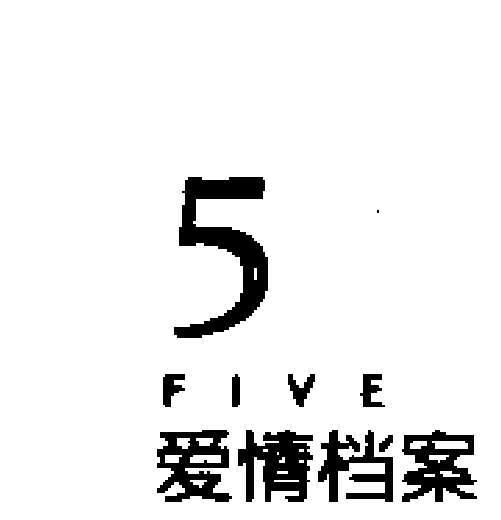

### ☆ 夫星不显

- 童年父亲缺席，得不到父亲关注的小女孩，潜意识期待一个不常出现的男人，或是不可能拥有的对象，她可能爱上一个情感冷淡、工作狂、或是已婚的男人，把他当作父亲的替身。
- 太阳、火星或夫妻宫的主星进入十二宫是谓夫星不显，也代表秘密恋情。因为太阳亦是父星，父星进入十二宫，情感模式源自于童年的遗憾，除非当事人学会照顾自己，识破内心的假象，她才可能吸引到较健康的亲密关系。

### ☆ 秘密恋情

- 十二宫中有阴性行星如月亮、金星、海王星等，其外遇状况是被动、重视精神性、半推半就的，不公开，较矜持。
- 十二宫中有阳性行星如太阳、火星、木星、天王星等，则外遇状况为主动、狂热的，较公开。

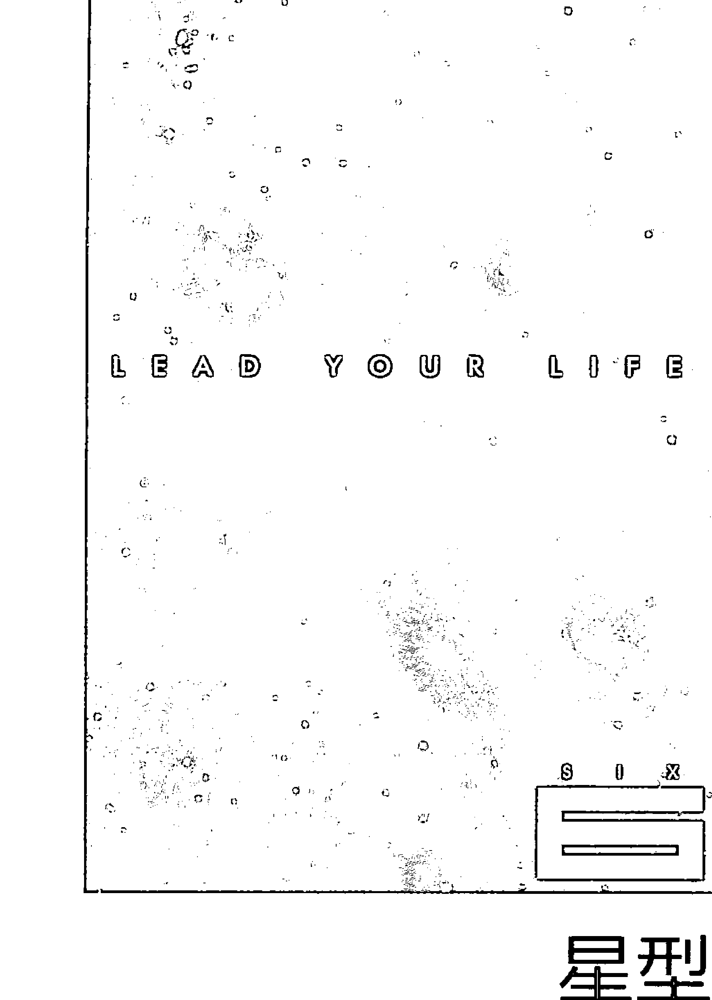

## 星型

星盘上，行星的排列位置，或行星与其他行星形成相位组合，这些星型会诠释出一种特定的生命模式或表现主题。

### 出生图的星型

### 6 SIX 星型

行星在星盘上的分布状况会显现出各种型态，他们对于了解当事人的生命方向及看出星盘的重点所在，具有重要参考意义。

**散落型**

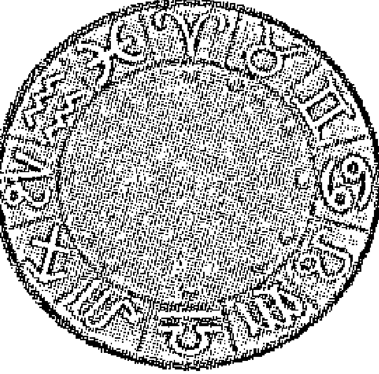

分布在9-10个宫，行星占据许多星座，没有形成星丛。
表示兴趣广泛，有强烈的求知欲，但也可能是“滚石不长苔”，手握九把刀，却没一把利，精力散漫，类似双子或双鱼的特质。

**集团型**

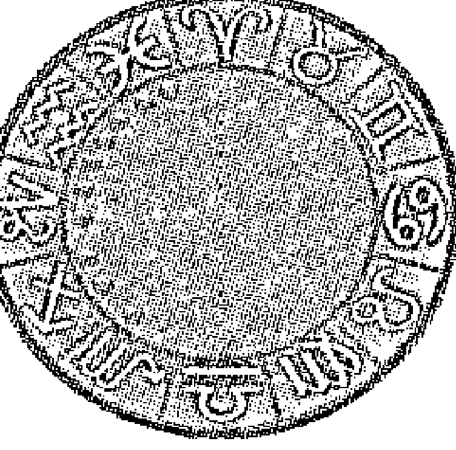

分布在5个宫，行星聚为小集团，两边的行星相连不超过150度。
是某方面的专家，从事学术研究，日常活动、思考主题集中于某方面。和巨蟹的特质有关。

**火车头型**

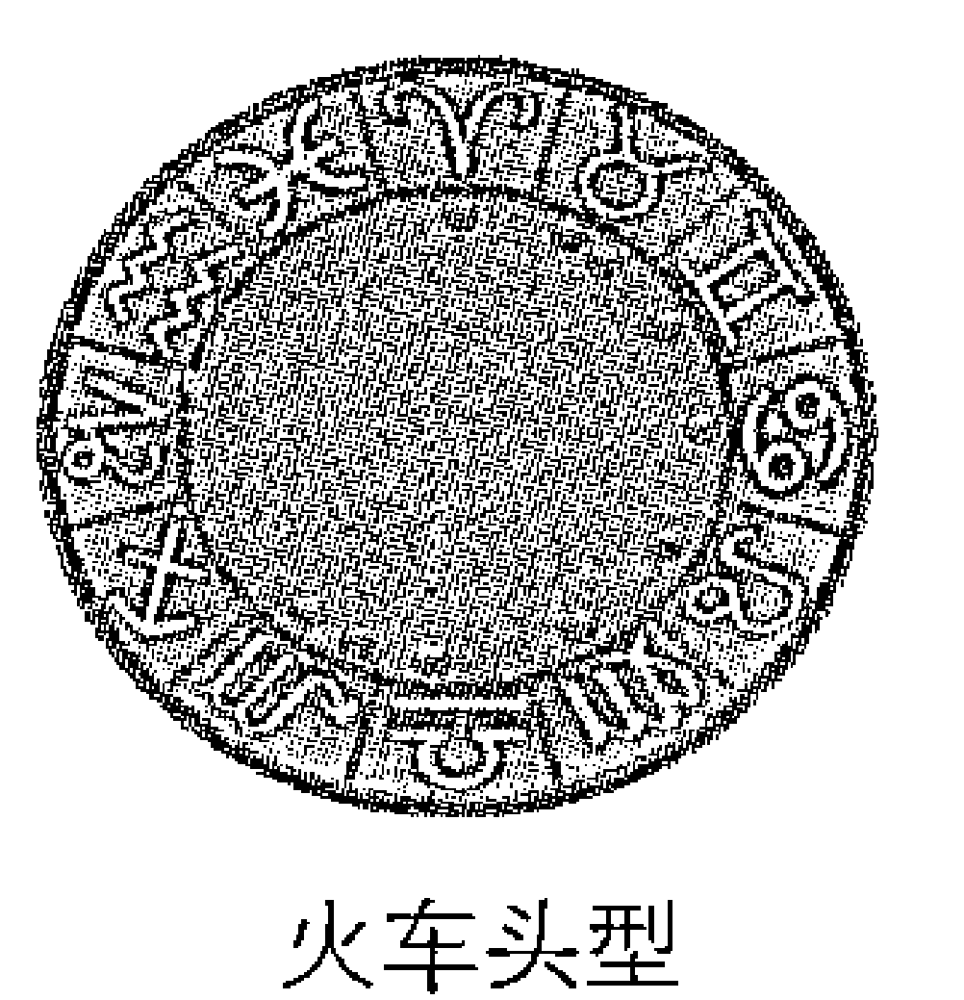

分布在7-8个宫，在120度的范围内没有行星，行星在240度中散布。
精力旺盛，能将驱力运用在工作上，集中精神，快速处理，不喜搁置问题，在星图上以顺时钟方向，带头引导其他行星的第一颗星的宫位有特殊意义，类似牡羊的特质。

**碗型**

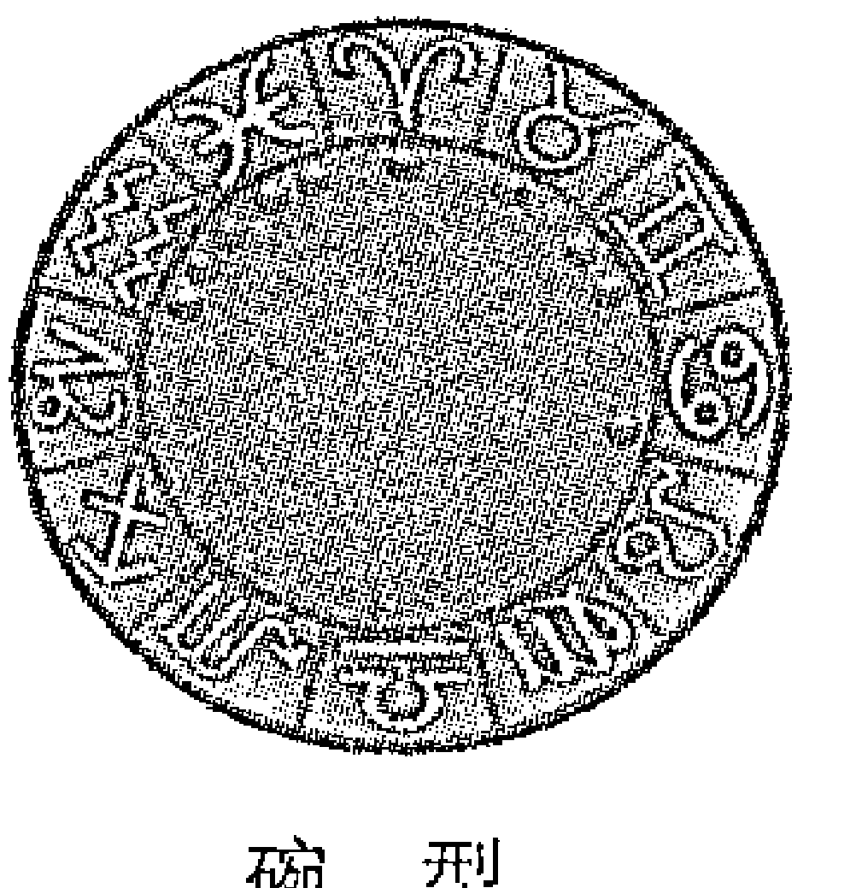

分布在6个宫，行星全在地平线上方或地平线下方，全在子午线以东或子午线以西。
这种碗型力量特别强。全在地平线上方，为人外向，意识层面宽广。全在地平线下方，为人内向，潜意识力量强。全在子午线以东，自我意识强。全在子午线以西，群体意识强。顺时钟的领头行星很重要，如果是木星会带来好运及开展，土星则受其负面影响。碗型和摩羯特质有关。

**杓型**

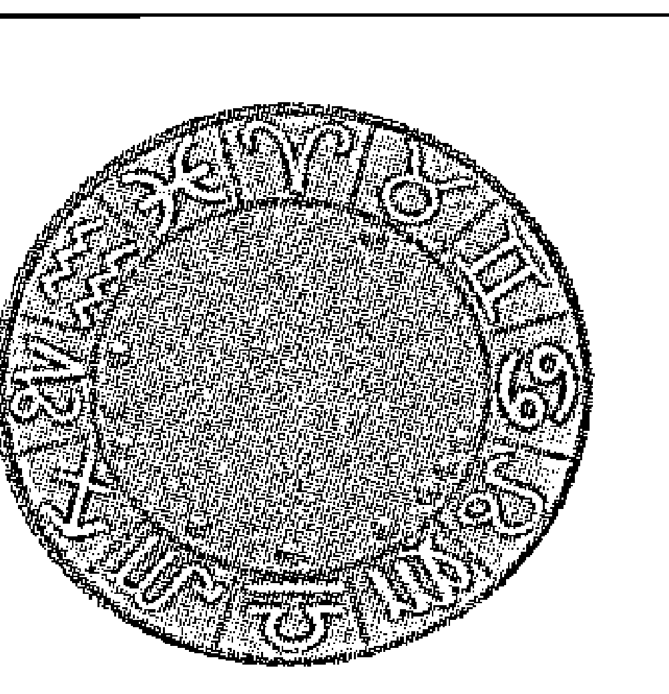

9颗行星分布在半圆，另一颗在另外的半圆。
杓型的人倾其所有心力，为的只是杓柄那颗星，他的驱力来自目标的达成，若杓柄受克，会影响他的心理健康，但他们通常忽略自己，与摩羯特质有关，杓柄是他心之所系，类似圣经故事大力士参孙（Samson）的七根辫子，剪掉就失去力量。

**跷跷板型**

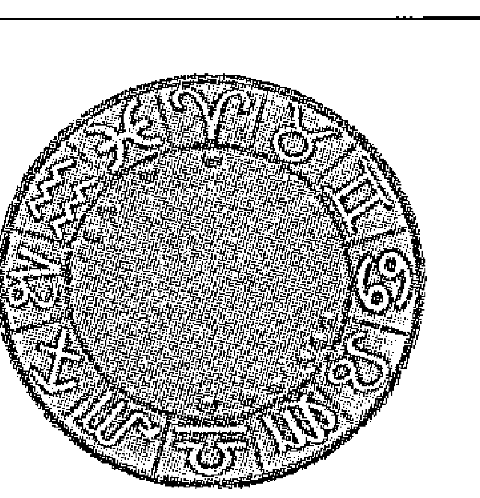

两组星丛相对应，两组相对应的行星，每一组有5颗左右，空白处大于60度，行星比例在6：4也无妨。
看事情会考虑相反的观点和意见，难以兼顾，如果对冲相位太多，将造成精神无法负荷，犹豫不决，类似天秤的特质。

**大三角**

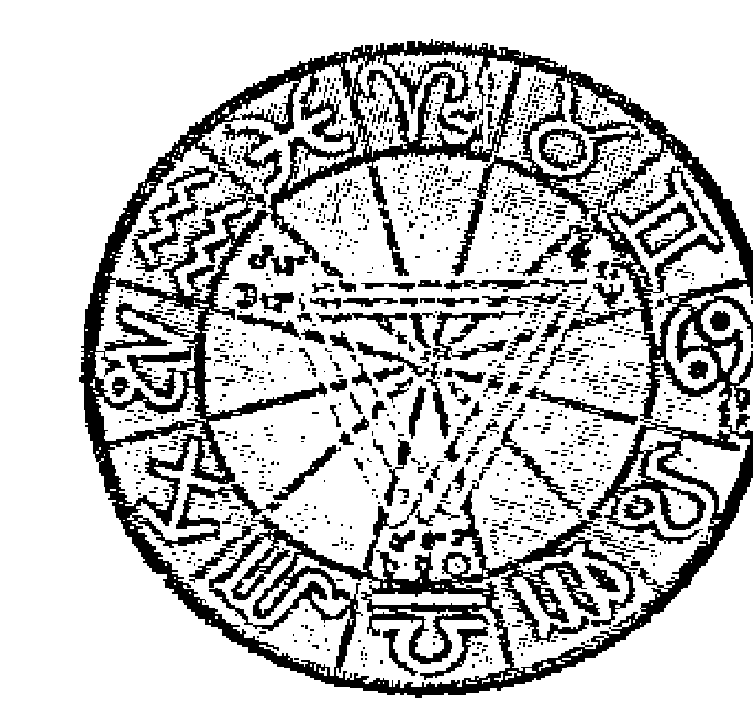

由3组三分相的行星所形成。
表示此人适应良好，在3个宫位中得心应手，但如果呈现在一个肤浅、意志薄弱的人身上，逆境时就无法适应挑战。

**大十字**

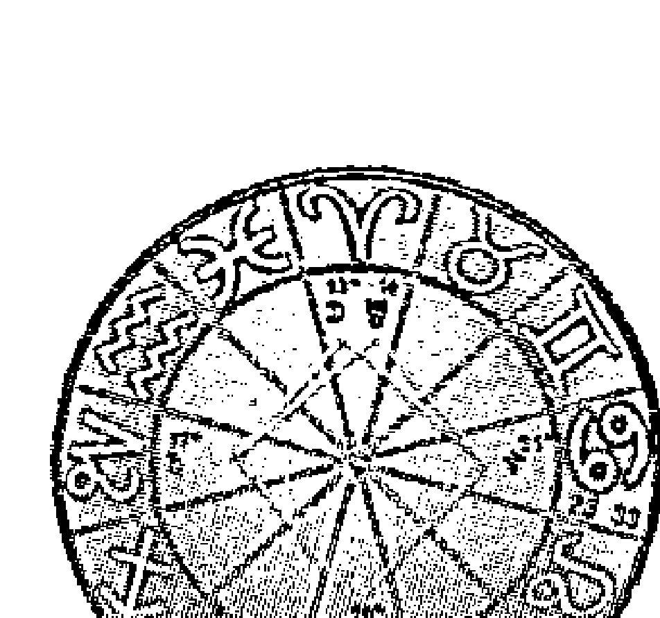

4个行星形成四分相。
这是大好大坏的典型，今生有个十字架要背，最顽强的大十字位于固定宫（金牛、狮子、天蝎、水瓶），会比位于基本宫或变动宫的人有能力应付生命中的挑战。大十字带来紧张及力量，对坚强的人而言，可以加强趋动力，超越挑战。有许多三分相和六分相位的人，或许他是世界上最愉快的人，但是这种人会发现凡事对他而言都太容易到手了。所以过多的三分相位使人耽溺于安逸，四分相与对冲相的紧迫，反而使人具有内在驱动力。必须先考虑整个星盘的结构，才能判断一个“斗士”是否能够克服他的压力，还是会在重担之下倒下去！

**压力三角型**

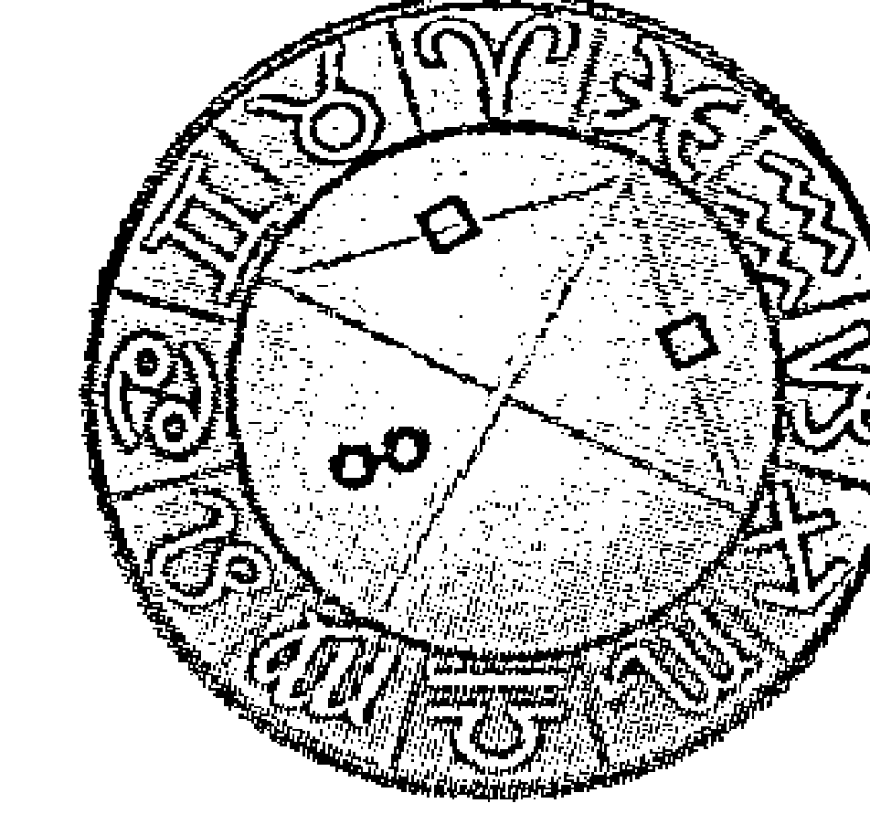

三刑会冲，T型三角，两颗行星形成对冲相，其中一颗行星与另外两颗行星形成两个四分相。
三角形顶点行星承受刑冲的压力，一定要有出口，顶点行星落入的星座或宫位，将展现出特质与才能，指示着个人职业的发展方向，当事人凭借着在紧张对立中磨练出来的力量，来面对人生的挑战。因为承受过度的压力，必须注意顶点行星有关的事故或疾病，在行运行星引动刑冲时，对当事人而言，将是一段难捱的岁月。

| 图像 | 描述 |
|------|------|
| Y型三角 | 又称上帝的手指，两颗行星与另一颗行星形成150度（十二分之五相），而这两颗行星之间又形成六分相。150度是个压抑相位，意味着命运的压迫与限制，150度不容易整合，当一个人能整合两个150度的力量时，这种超强的整合能力几乎是天才，将成为被上帝派下来、具有天赋使命的人，这整合过程将会是终身努力的方向。 |
| 风筝型 | 具有大三角的基本格局外，再加上另一颗顶点行星分别与大三角的两端形成两个60度，和一个对冲相。风筝型中的大三角，保持着才华的基本展现能力，但较为安逸，顶点行星具有开发、引导及催化基本才华展现的作用，顶点行星所落入的星座或宫位所代表的职业可作为职业指引，但若是大三角中有任何一颗行星有更多的凶相位，那么也可能转向凶相位较多的行星去作职业发展，风筝型容易在有成就的人的星盘上看到，有些人还有两个或三个风筝，代表多方面的发展。 |

## # 行运及生命之爱

由于月、水、金、火推进速度较快，看推运时，我们只看木、土、天、海、冥的相位：外行星（从木星到冥王星）的推进会影响生命事件，当然也包括爱情。

一系列占星符号，包括行星符号、星座符号等，如：☉ ☽ ☿ ♀ ♂ ♃ ♄ ♅ ♆ ♓ ♈ ♉ ♊ ♋ ♌ ♍ ♎ ♏ ♐ ♑ ♒ ♓ 等。

## 7 SEVEN 行运及生命之爱

### 行运的木星

以我们的出生时刻与出生地的经纬度，每个人都可以打印出一张“本命星盘”。本命星盘永远不变。

但是天体中的行星持续地在运转中，以行运的木星为例，假设，2012年7月5日有一个孩子出生，当你输出此人的星盘时，会发现他命盘中的木星在双子5度，这个双子5度就是推进中的木星的度数。

例如陈彬的星盘中（见P127，图7-1），金星与水星合相，代表他喜欢思考与表达或阅读，会使用美丽的辞藻，但当2012年9月6日，推进的木星在双子15度，行运容许度4度，与陈彬的金星形成120度时，叫做行运的木星三分相本命的金星；此时，行运的木星在陈彬的八宫，他可能有一些来自共同财产或继承的好运，或者接触玄学而扩展他的体悟。陈彬会在生活上展现快乐、慷慨的外表，恋情顺利，也会有浪漫的社交，生活场景可参考本命金星的宫位（请参考《活出你自己》上册相关章节）。

例如，晓璇有射手的星丛（见P128，图7–2），太阳在射手12，当2012年7月20日，推进的木星走到双子8度时（推运的容许度4度），与晓璇的太阳、水星形成对冲相，此时行运的木星进入她的二宫，她感觉资产增加或扩展自我价值，因而过度乐观，作了太多不切实际的计划或错估情势。

- 木星一年走一个星座，因此，近几年它的行运星座如下：
  - 2006年11月到2007年12月木星在射手座
  - 2007年12月到2009年1月木星在摩羯座
  - 2009年 1月到2010年1月木星在水瓶座
  - 2010年 1月到2011年1月木星在双鱼座
  - 2011年 1月到2011年6月木星在牡羊座
  - 2011年 6月到2012年6月木星在金牛座
  - 2012年 6月到2013年6月木星在双子座

当行运的木星与太阳有正面相位时，是运气最好的时刻，可能高升或出名获利；木星与月亮有正面相位时，情绪满足，家庭生活愉悦，适合旅游；木星与金星有正面相位时，财运好，物质享受愉悦；木星与火星有正面相位时，干劲十足；木星与本命木星有正面相位时，事业荣华，诸事顺遂；木星与土星有正面相位时，解除规范与自我设限，扩展思想及心态；木星与天王星有正面相位时，有突发的偏财或好运当头。

### ☆ 行运木星推运简易说明

流年的运势主要是由推进的木星、土星、天王星、海王星，及冥王星与本命行星来做推算，其推进行星座落的星座与度数可从星历查询（某些占星网页上有星历的相关资料）。

### 表7-1

| Mo/Dy/Yr | Sun | Moon | Merc | Venu | Mars | Jupi | Satu | Uran | Nept |
|----------|-----|------|------|------|------|------|------|------|------|
| 7/ 1/12 | 9Cn15 | 26Sc17 | 4Le59 | 7Ge39 | 28Vi30 | 4Ge11 | 22Li47 | 8Ar28 | 2Pi58 |
| 7/ 2/12 | 10Cn12 | 11Sg01 | 5Le56 | 7Ge47 | 29Vi01 | 4Ge24 | 22Li47 | 8Ar29 | 2Pi57 |
| 7/ 3/12 | 11Cn09 | 25Sg47 | 6Le50 | 7Ge57 | 29Vi33 | 4Ge36 | 22Li48 | 8Ar29 | 2Pi56 |
| 7/ 4/12 | 12Cn06 | 10Cp29 | 7Le40 | 8Ge09 | 0Li04 | 4Ge49 | 22Li49 | 8Ar30 | 2Pi56 |
| 7/ 5/12 | 13Cn04 | 24Cp58 | 8Le27 | 8Ge23 | 0Li36 | 5Ge02 | 22Li50 | 8Ar30 | 2Pi55 |
| 7/ 6/12 | 14Cn01 | 9Aq10 | 9Le10 | 8Ge40 | 1Li08 | 5Ge14 | 22Li51 | 8Ar31 | 2Pi54 |
| 7/ 7/12 | 14Cn58 | 22Aq58 | 9Le49 | 8Ge58 | 1Li40 | 5Ge27 | 22Li52 | 8Ar31 | 2Pi53 |
| 7/ 8/12 | 15Cn55 | 6Pi22 | 10Le24 | 9Ge17 | 2Li12 | 5Ge39 | 22Li53 | 8Ar31 | 2Pi52 |
| 7/ 9/12 | 16Cn52 | 19Pi21 | 10Le56 | 9Ge39 | 2Li44 | 5Ge51 | 22Li54 | 8Ar31 | 2Pi51 |
| 7/10/12 | 17Cn49 | 1Ar57 | 11Le23 | 10Ge02 | 3Li16 | 6Ge03 | 22Li56 | 8Ar32 | 2Pi50 |
| 7/11/12 | 18Cn47 | 14Ar14 | 11Le46 | 10Ge27 | 3Li49 | 6Ge16 | 22Li57 | 8Ar32 | 2Pi49 |
| 7/12/12 | 19Cn44 | 26Ar16 | 12Le04 | 10Ge54 | 4Li22 | 6Ge28 | 22Li59 | 8Ar32 | 2Pi48 |
| 7/13/12 | 20Cn41 | 8Ta08 | 12Le18 | 11Ge22 | 4Li55 | 6Ge40 | 23Li00 | 8Ar32 | 2Pi47 |
| 7/14/12 | 21Cn38 | 19Ta56 | 12Le27 | 11Ge52 | 5Li28 | 6Ge52 | 23Li02 | 8Ar32 | 2Pi46 |
| 7/15/12 | 22Cn36 | 1Ge45 | 12Le32 | 12Ge23 | 6Li01 | 7Ge04 | 23Li04 | 8Ar32 | 2Pi44 |
| 7/16/12 | 23Cn33 | 13Ge38 | 12Le31 | 12Ge56 | 6Li35 | 7Ge15 | 23Li06 | 8Ar32 | 2Pi43 |
| 7/17/12 | 24Cn30 | 25Ge41 | 12Le26 | 13Ge29 | 7Li08 | 7Ge27 | 23Li08 | 8Ar32 | 2Pi42 |
| 7/18/12 | 25Cn27 | 7Cn55 | 12Le16 | 14Ge04 | 7Li42 | 7Ge39 | 23Li10 | 8Ar32 | 2Pi41 |
| 7/19/12 | 26Cn25 | 20Cn22 | 12Le01 | 14Ge41 | 8Li16 | 7Ge50 | 23Li12 | 8Ar31 | 2Pi40 |
| 7/20/12 | 27Cn22 | 3Le05 | 11Le42 | 15Ge18 | 8Li50 | 8Ge02 | 23Li14 | 8Ar31 | 2Pi38 |
| 7/21/12 | 28Cn19 | 16Le02 | 11Le18 | 15Ge57 | 9Li24 | 8Ge13 | 23Li17 | 8Ar31 | 2Pi37 |
| 7/22/12 | 29Cn16 | 29Le13 | 10Le50 | 16Ge37 | 9Li58 | 8Ge24 | 23Li19 | 8Ar30 | 2Pi36 |
| 7/23/12 | 0Le14 | 12Vi37 | 10Le18 | 17Ge17 | 10Li33 | 8Ge36 | 23Li22 | 8Ar30 | 2Pi34 |
| 7/24/12 | 1Le11 | 26Vi12 | 9Le43 | 17Ge59 | 11Li07 | 8Ge47 | 23Li25 | 8Ar29 | 2Pi33 |
| 7/25/12 | 2Le08 | 9Li58 | 9Le05 | 18Ge42 | 11Li42 | 8Ge58 | 23Li27 | 8Ar29 | 2Pi32 |
| 7/26/12 | 3Le06 | 23Li52 | 8Le24 | 19Ge25 | 12Li17 | 9Ge09 | 23Li30 | 8Ar28 | 2Pi30 |
| 7/27/12 | 4Le03 | 7Sc55 | 7Le42 | 20Ge10 | 12Li52 | 9Ge20 | 23Li33 | 8Ar28 | 2Pi29 |
| 7/28/12 | 5Le00 | 22Sc06 | 6Le58 | 20Ge55 | 13Li27 | 9Ge30 | 23Li36 | 8Ar27 | 2Pi28 |
| 7/29/12 | 5Le58 | 6Sg22 | 6Le14 | 21Ge42 | 14Li02 | 9Ge41 | 23Li39 | 8Ar26 | 2Pi26 |
| 7/30/12 | 6Le55 | 20Sg43 | 5Le31 | 22Ge29 | 14Li38 | 9Ge51 | 23Li43 | 8Ar26 | 2Pi25 |

> *数据源：http://astrology.copyliu.org/*

### 行运推运步骤

1.  先找出想要推进的行星目前所在的星座和角度（由星历查出，会因时间不同而改变，并非固定）。
2.  找出该推进行星的五种相位会产生的星座，再推出容许度范围内对应到本命星盘中受到影响的行星（此为推进相位）。
3.  由命盘中，找出各推进行星推进本命星盘之宫位（此为推进宫位）。

以公元2012年7月15日为例，推进的木星在双子座7度。

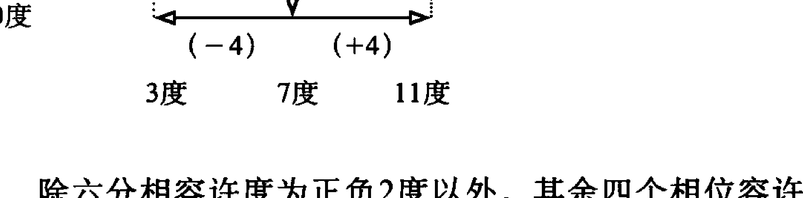

*   与此时木星成为合相（0度）的星座为双子座3度～11度。
*   与此时木星成六分相（60度）的星座为牡羊座5度～9度，狮子座5度～9度。
*   与此时木星成和谐相（120度）的星座为天秤座3度～11度，水瓶座3度～11度。
*   与此时木星成冲突相（90度）的星座为处女座3度～11度，双鱼座3度～11度。
*   与此时木星成对冲相（180度）的星座为射手座3度～11度。

2012年9月6日，推进木星在双子座15度，行运容许度4度，与陈彬的金星形成120度时，叫做行运木星三分相本命金星。此时，行运的木星在八宫。

2012年7月15日，推进的木星在双子座7度。

金水合相。

## 7 SEVEN 行运及生命之爱

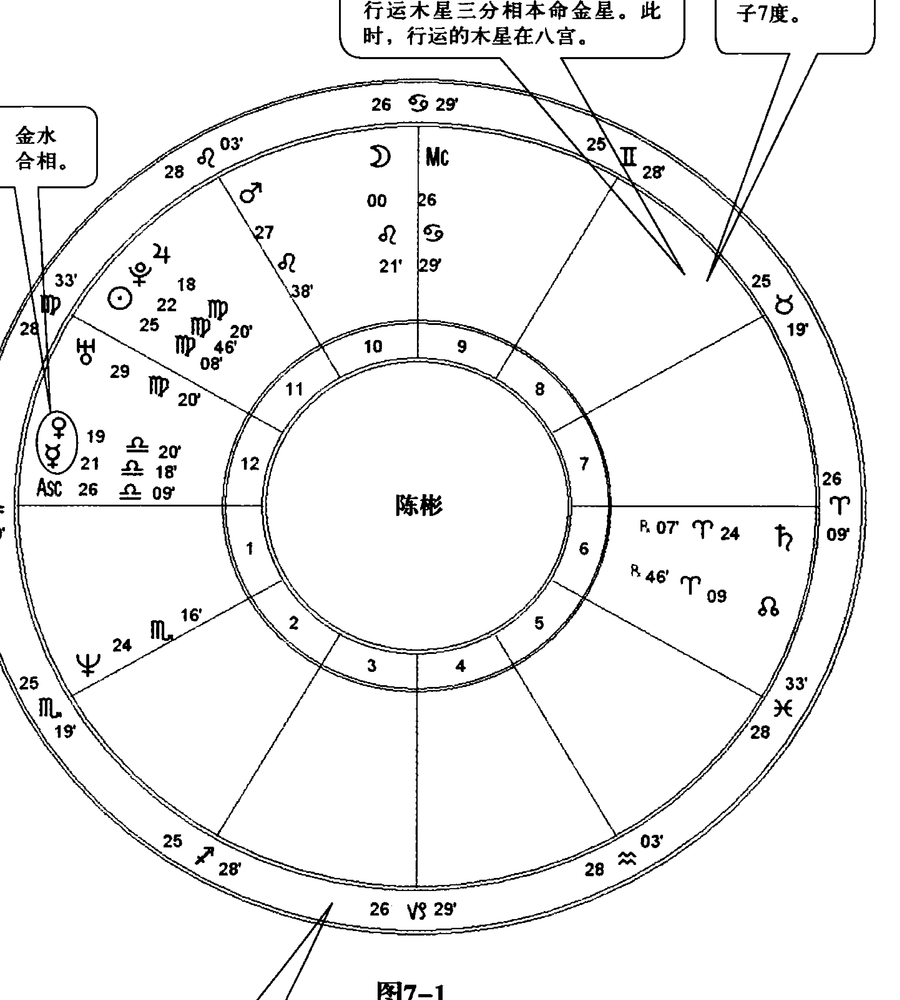

### 图7-1

2015年1月25日推进的冥王星进入摩羯座14度，陈彬木星在处女座18度，12+30×3+14=116度（推运容许度为4度），形成行运的冥王星三分相（120度）本命的木星。

## 活出你自己
LEAD YOUR LIFE
你的第一本心理占星书

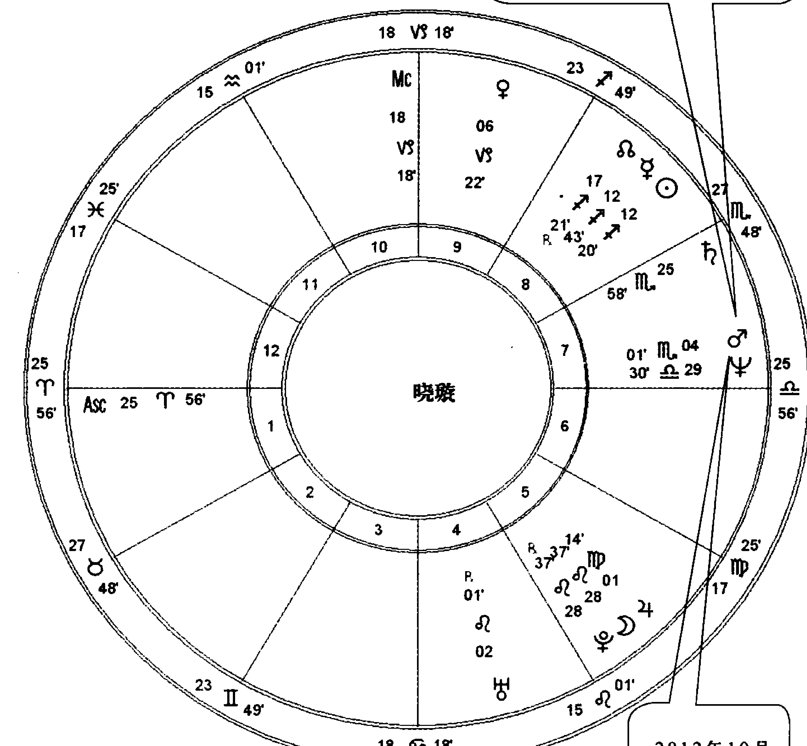

> 火星在天蝎座4度，形成行运的土星合相本命的火星，晓璇会感到动能被压抑、受挫，或身体操劳；此时行运的土星在晓璇的七宫，压力可能来自伴侣或伙伴关系。

> 2012年10月，推进的土星进入天蝎座0度。

### 图7-2

> 2013年11月13日，推进的土星走到天蝎座15度。

> 金星在狮子座19度，行运的土星四分相本命金星，此时刘钧将对社交、财务及浪漫关系感到受挫，情感受到社会规范的压力，金钱匮乏使他内心愁苦（行运土星在十二宫）。

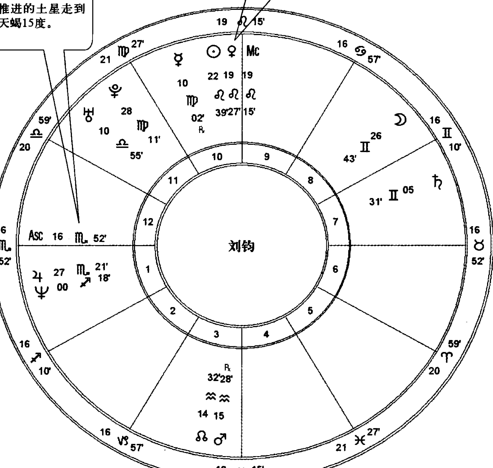

刘钧

## 7
SEVEN
行运及
生命之爱

### 图7-3

### 行运的木星进入本命星盘的宫位

除了本命星盘中的木星和土星、火星或天王星有不利相位，否则行运的木星进入任何宫位，都会使该领域的生活更充实、更丰足，但是时间并不长，要把握良机。

| 宫位 | 内容 |
| :--- | :--- |
| 第一宫 | 有利于展现自我活力，能积极表现自我的个性，乐观的外表，体重增加，对人生意义肯定，对于高教育、宗教哲学感兴趣，个人形象地位提升，有利于行动，开创新生活。 |
| 第二宫 | 蓄财运，经济能力增强，渴望去旅行，存款增加，理财的灵感较敏锐，努力赚钱，可作短期投资，对自己拥有资源的安全感增加，涉及宗教、法律、旅行、出版等生意。 |
| 第三宫 | 知识进修有好运，适合短程旅行，与家人关系愉悦，增加沟通，有利写作，文学有发展，学习计算机、语文的良机。 |
| 第四宫 | 家庭生活有喜悦的转变，透过不动产、食物、家庭用品或不动产而获益，家庭财政转吉，住家扩大空间，在家里的文化活动，家庭精神生活圆满，内心生活更充实。 |
| 第五宫 | 有投机运，因创造力而充实，扩展社交，在创造性的启发和浪漫关系上展现个人魅力，心情快乐，比赛或运动的胜算大，可参与投资，恋爱容易成功，与艺术、戏剧接触较多，对孩子的教育及文化活动感兴趣。 |
| 第六宫 | 工作运佳，可考虑兼职或转业，透过工作结盟而获益，善待部属或代理人，参与社会服务，适合做健康的调整。 |
| 第七宫 | 人缘特佳，与人合作关系幸运，情感愉悦，是结婚或合伙的好机会，易有良缘，有利于掌握法律事务，官司可能胜诉，有利调停及公众关系。 |
| 第八宫 | 有投资运，或在性与死亡、遗产事件中获利，遗产未必是金钱，也包括精神上的重生，或透过保险、税务或合作关系获利，对生死学有兴趣，能了解生命奥秘，透过心理及精神能力去帮助别人。 |
| 第九宫 | 国外旅行、专业进修有利，远方运颇佳，对国外事务有帮助，可接触宗教、哲学，开拓心灵智慧，有利教育、文化理念的宣扬。 |
| 第十宫 | 职业运大好，获得社会信用，有利来自权位人士的帮助，享有知名度，社会形象提升，工作升迁，为了职业而与大学、宗教团体或文化协会联系。 |
| 第十一宫 | 感受友谊团体的喜悦，愿望容易达成，在团体活动中有收获，可得良友，扩展人脉，开放的心胸，人道地关注群体的福利。 |
| 第十二宫 | 有利服务或静坐沉潜，透过内省而获益，能集中精神，创造构思，渴望精神上的隐退，适合从事与医院、收容所、寺院的志愿者工作，体验助人之喜悦，逢凶化吉。 |

### 木星之爱

在爱情中，每一个人有他特殊的模式，但是因为行星的能量，行运也会影响爱情模式的变化。

当太阳、月亮、上升点、金星在射手座，或金星在第九宫、金星与木星形成相位，这些即具有木星爱人的特质。

特色：心胸开阔，热爱自由、随性的生活，内心渴望经历未曾经历的事物，经由这些冒险而体验生命。爱情也是冒险的内容之一，是无止尽的生命追寻，被认为是风流的，不想承诺，不想被套牢，更不想被困在婚姻中，永远是情爱的过客，逼他结婚他就会变成一支冷箭。

| 特点 | 内容 |
| :--- | :--- |
| 金星在射手座 | 黄道上的十二星座都是针对前一个星座的极端表现而调整，由于金星在天蝎是隐密、强烈占有的，金星在射手，希望开放自己的情感，直接地表达内心的感觉，把爱情当作猎人追求目标一样的刺激游戏，希望更多、更好的，永远不够的心态使他们成为情感的过客，信仰爱情自由，不容易承诺婚姻。 |
| 金星在第九宫 | 大学时代十分快乐，透过大学、宗教或旅行巧遇情缘，以自己的异国作风吸引他人，容易爱上不同文化背景的人，被异国情调所吸引，产生异国之恋，对爱情抱持着高度理想，希望与伴侣分享生命的奥秘和心灵智慧。 |
| 太阳在射手座 | 乐观善意而慷慨的理想主义者，有幽闭恐惧倾向，害怕被束缚的婚姻关系，害怕处于密室中，生命视野广阔，认为人生即是冒险，在青少年及前中年期体验爱情，中年后转向宗教、哲学的领域。 |
| 上升点在射手座 | 给人的感觉是友善、乐观的，受人欢迎，天生的独行侠，热衷爱情田野调查，容易脚踏两条船，因为配偶宫是双子。 |
| 金星与木星形成正面相位（三分相、六分相） | 爱情（金星）是快乐的（木星），具有乐观、合群的特质，与人分享喜悦，容易获得别人的好感，重视生命的意义与成长，但也追求爱的享受。金星的爱情因木星而受益，可以经由伴侣获得物质上与精神上的支持，喜欢自由开放的关系，追求和谐，接受体制内的随性，而非体制外的颠覆，通常在离婚后，还会遇到条件更好的伴侣。 |
| 金星与木星形成负面相位（合相、四分相、对冲相） | 木星的扩展作用强化了金星的感受性，而木星的过度乐观又影响金星的爱情需求，认为过程中的探索比目的更重要，因为理想过高，容易成为快乐主义者，在爱情关系上缺乏忠贞，金钱与情感都显现出没有节制的放任现象。扬弃传统，无法接受同年龄异性的情感频率，在年轻时吸引年长的人，中年后又爱上比自己小很多的年轻人。 |

## 活出你自己
LEAD YOUR LIFE
你的第一本
心理占星书

### 行运的土星

土星每两年半走一个星座，例如，推进的土星在2012年10月进入天蝎座0度，晓璇的火星在天蝎座4度（见P128，图7-2），形成行运的土星合相本命的火星，晓璇会感到动能被压抑、受挫，或身体操劳；此时行运的土星在晓璇的七宫，压力可能来自伴侣或伙伴关系。

刘钧（见P129，图7-3）的金星在狮子座19度，2013年11月13日推进的土星走到天蝎座15度，形成行运的土星四分相本命金星的相位，此时刘钧将对社交、财务及浪漫关系感到受挫，情感受到社会规范的压力，金钱匮乏使他内心愁苦（行运土星在十二宫）。

2015年1月13日推进的土星在射手座2度，庆华（见P136，图7-4）的木星在狮子座6度，形成行运的土星三分相本命的木星，此时适合去规划自己的财产，落实长程目标。

土星两年半走一个星座，因此，近几年它的行运星座如下：

*   2000年8月土星进入双子座
*   2003年6月土星进入巨蟹座
*   2005年7月土星进入狮子座
*   2007年9月土星进入处女座
*   2009年11月土星进入天秤座
*   2012年10月土星进入天蝎座
*   2014年12月土星进入射手座

土星行运走到任何宫位，都代表负荷、压力、停滞。土星合相太阳，代表自我表达受到压抑；合相月亮，情绪困顿或家庭财政有压力；合相水星，因兄弟姐妹产生困扰或来自兄弟姐妹的责任；合相火星代表精力受阻，没有生命力，或是因迫于情势不能表达的愤怒。

对一般人而言，当土星进入太阳所在的星座时，会产生压力与挣扎，借着困难来帮助你建立结构、成长，对人生有新的体悟，所学到的经验将成为生命扎实的基础。土星进入二、五、八宫，是财运较差的时候，最好不要借钱给他人，容易惹上金钱纠纷。

### 行运土星推运简易说明

流年的运势主要是由推进的木星、土星、天王星、海王星、及冥王星与本命行星来做推算，其推进行星座落的星座与度数可从星历查询（某些占星网页上有星历的资料）。

1.  先找出想要推进的行星目前所在的星座和角度（由星历查出，会因时间不同而改变，并非固定）。
2.  找出该推进行星的五种相位会产生的星座，再推出容许度范围内对应到本命星盘中受到影响的行星（此为推进相位）。
3.  由命盘中，找出各推进行星推进本命星盘之宫位（此为推进宫位）。

以公元2012年7月11日为例，推进的土星在天秤座22度。

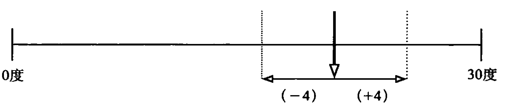

除六分相容许度为正负2度以外，其余四个相位容许度皆为正负4度。

与此时土星成为合相（0度）的星座为天秤座18度～26度。

与此时土星成六分相（60度）的星座为狮子座20度～24度，射手座20度～24度。

与此时土星成和谐相（120度）的星座为双子座18度～26度，水瓶座18度～26度。

与此时土星成冲突相（90度）的星座为巨蟹座18度～26度，摩羯座18度～26度。

与此时土星成对冲相（180度）的星座为牡羊座18度～26度。

### 行运的土星进入本命星盘的宫位

土星会带来困难、延迟与阻碍；透过土星的磨练，会在我们人格松散的部分建立坚实的基础。土星与月亮、金星、木星、天王星形成负面相位时，不利投资，容易破财，是做功课的时候。

| 宫位 | 内容 |
| :--- | :--- |
| 第一宫 | 有新责任上身，负担较重，身体、精神不佳，个人态度倾向保守。 |
| 第二宫 | 收入减少，金钱损失，负荷重，财运差，较节俭，担心经济问题。 |
| 第三宫 | 与家人不和谐，短程交通有障碍，不利于签契约，沟通困难，有来自兄弟姐妹的责任与压力。 |
| 第四宫 | 家庭内易争执，内心负荷沉重，家庭责任增加，在家庭中有冲突，有来自父母的负担。 |
| 第五宫 | 失恋或对恋情失望，投资失利，子女有不幸或来自孩子的责任，财运差，不能玩股票，不利投机。 |
| 第六宫 | 易生病，身体疲惫、健康失调，或与部属不和谐，工作推展不易，工作量增加。 |
| 第七宫 | 夫妻间有悲剧，分居或彼此误解，来自配偶的压力，与较年长的人结婚，不利于公众关系。 |
| 第八宫 | 夫妻不睦，性生活压抑，或因财产争执，容易发生因为借贷、作保、税务等纠纷，或受人牵累，不利合伙。 |
| 第九宫 | 因法律事务而承受压力，为了职业而进修，为了生意而旅行，出版困难。 |
| 第十宫 | 事业责任增加，易失败或丧失信用，或与上司不睦，有三分相则辛苦有成。 |
| 第十一宫 | 在社团中担待重任，与年长者建立友谊，或交往权威人士。 |
| 第十二宫 | 愁苦、压抑，内心沉重，专注于内省或灵修。 |

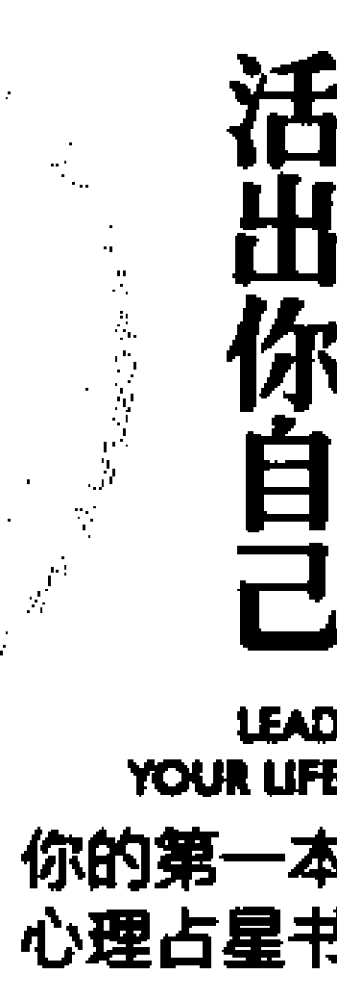

## 行运的天王星

天王星每七年走一个星座，例如2012年4月21日，推进的天王星在牡羊座6度，湘云（见P140，图7-5）的金星在射手座10度，形成行运的天王星三分相本命的金星，湘云会感受到对艺术、创作、音乐或绘画的欣赏，而灵感泉涌，或因团体带来振奋的友谊。

就在同一时段，火星在天秤座10度的张婉（见P141，图7-6）却因为行运的天王星对冲相本命的火星，而感到愤怒或发生意外，也可能与同僚有些冲突。此时推进的天王星在九宫，她可能参加新时代的团体。

### 行运天王星推运简易说明

流年的运势主要是由推进的木星、土星、天王星、海王星，及冥王星与本命行星来做推算，其推进行星座落的星座与度数可从星历查询（某些占星网页上有星历的资料）。

1.  先找出想要推进的行星目前所在的星座和角度（由星历查出，会因时间不同而改变，并非固定）。
2.  找出该推进行星的五种相位会产生的星座，再推出容许度范围内，对应到本命星盘中受到影响的行星（此为推进相位）。
3.  由命盘中，找出各推进行星推进本命星盘之宫位（此为推进宫位）。

以公元2012年7月15日为例，推进的天王星在牡羊座8度。

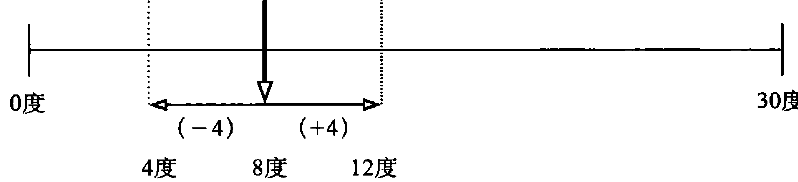

除六分相容许度为正负2度以外，其余四个相位容许度皆为正负4度。

与此时天王星成合相（0度）的星座为牡羊座4度～12度。

与此时天王星成六分相（60度）的星座为水瓶座6度～10度，双子座6度～10度。

与此时天王星成和谐相（120度）的星座为狮子座4度～12度，射手座4度～12度。

与此时天王星成冲突相（90度）的星座为巨蟹座4度～12度，摩羯座4度～12度。

与此时天王星成对冲相（180度）的星座为天秤座4度～12度。

### 行运的天王星进入本命星盘的宫位

代表改革、突变、创新的天王星带来不可预期的变动，变动的结果将会从传统模式中脱离，产生失序的不安，分裂同时也是重组，新模式带来生命的觉醒，让我们超越社会价值观。

| 宫位 | 内容 |
| :--- | :--- |
| 第一宫 | 自我意识的觉醒，人生理念改变，在个人形象上有意外的变化，标新立异或染金发，招来配偶的反感。要注意第一宫、第七宫内的行星相位吉凶，可能为了自由的理念而牺牲稳定的生活。 |
| 第二宫 | 如果行运的天王星与本命的金星，木星产生好相位，可能有一笔突发之财，以发明技术获得收益，或突然从事电子科技行业。如果是坏相位，可能因为朋友破财或把钱花在社团，对财务价值观的改变。 |
| 第三宫 | 透过新的理念改变生活与学习，日常生活的规律被打乱，旅行的机会多，对占星学兴趣浓厚，有利学占星或阅读占星学书籍，或接触新时代思想。 |
| 第四宫 | 内心之家不稳定，个人情绪改变，家庭或是居所环境有变动，或因房地产、土地之事起争执。 |
| 第五宫 | 在艺术和社交的原创性，追求愉快，喜欢投机，投资运要看是否与金星、木星呈有利相位，孩子的意外或子女反抗期，不稳定的迷恋。如果行星与二宫形成负面相位，会因孩子或恋爱而破财。 |
| 第六宫 | 工作关系及职场不和谐，辞职或职位变动，与工作有关的革命性态度，希望成为自由工作者，或想开工作室。透过朋友获得工作机会，健康的意外。 |
| 第七宫 | 爱情纠纷或伙伴关系有变，夫妻成为分偶、分居或离婚，在亲密关系中渴求自由。 |
| 第八宫 | 易因遗产、金钱之事有纠纷，或有突发的病痛。若与火星相位不佳，易生意外，与性有关事项的态度改变，对生死学、神秘学有兴趣。 |
| 第九宫 | 有出国机会，在旅行中易生变动，突然接受宗教或玄学理念，在宗教或哲学、教育协会中推动改革，突然接触出版事业。 |
| 第十宫 | 失去信用、工作变动，但与木星、金星呈有利相位，反而是信誉、地位的提升，职业形象改变，透过朋友、团体和组织的职业获益。 |
| 第十一宫 | 结交特立独行的人，但也容易与朋友意见冲突，友谊不稳定，最好把能量转向学占星学。 |
| 第十二宫 | 潜意识的刺激，有利于冥想，可发挥直觉力，设法找到创造力抒解的管道，对轮回感兴趣。 |

### 天王星之爱

当太阳、月亮或上升点、金星在水瓶座，金星与天王星有相位，天王星在五、七、八宫，第十二宫有天王星，这些即具有天王星爱人的特质。

特色：关心自由平等，具有独立精神与强烈的自主性与革命性的思想，打破束缚爱情的一切社会规范，例如社会意识认为的门当户对、年龄、肤色、种族、阶级、学历、贫富等条件。

| 特点 | 内容 |
| :--- | :--- |
| 金星在水瓶座，或天王星在第五、七、八宫，或金星和天王星形成相位（包括合相、三分相、六分相、四分相、对冲相） | 朋友容易变为恋人，恋人分手后，还可以作朋友，对爱情的需求受到天王星的颠覆影响，讨厌封建的爱情，作风特立独行，寻求个体独特性，认为爱情关系应具备自由的要件，容易被新观念、新思想、热衷人道议题的人所吸引，爱上与众不同的人。 |

## 活出你自己
LEAD YOUR LIFE
你的第一本心理占星书

| | |
|---|---|
| 行运的天王星和本命金星有相位时 | 爱是突然发展的，藉由一段情感事件，释放出内心世界隐藏的能量，一种不自觉的渴望带来振奋而不稳定的短暂迷恋，通常是“第一眼就爱上”，但很少持续长久关系。 |
| 本命星盘中天王星和金星没有相位只是行运造成 | 当事人的太阳、月亮、水星和天王星形成和谐相位。藉由情感事件的冲击，去思考自由意志与社会规范之间的平衡点，经历此事后，突破局限成为更开放自由的人。这个恋爱会打破一些土星的制约。倘若本命星盘的人格较古板保守，例如太阳摩羯或土星型人格，内心的渴望和社会角色的冲突造成分裂，当事人在意别人的眼光，对自己的爱情有罪恶感，无力挣脱天王星之恋，会谴责或把责任丢给他们爱上的人，认为都是对方造成自己的情感困境。 |
| 天王星和金星形成负面相位，当事人的太阳、月亮、水星、金星落入水瓶座又形成负面相位 | 过度发展天王星意识，自我中心，偏离常轨的怪癖，反权威、抗拒社交，只会空谈大爱，面对群众有热情，对家人绝情，私生活中冷漠疏离，不宜近处，可能数年不与家人联系，毫无音讯，只因懒得理会。 |

## 行运的海王星

海王星大约每15年走一个星座，推进的海王星2013年5月1日进入双鱼5度，孙莉的金星在处女9度(见P148，图7-7)，形成行运的海王星对冲本命的金星，孙莉可能出现感伤的心情，这些感伤来自事业上的人际关系，或为了“快速致富”的方案而瓦解了金钱，她可能陷入一个同情的恋情，或在爱情中有欺瞒。

同时，在2015年3月，推进的海王星在双鱼8度以后，进入她的四宫，她将产生内心之家的困惑，或是对居所变迁的迷惘，为家人的关系耗尽心力，例如照顾失智的父母亲、为家庭牺牲等。

尤其是孙莉土星在七宫，同时还会产生推进的海王星四分相本命的土星的相位，可能来自伴侣的压力也弱化她的能量。

孙莉的金星在处女9度，形成行运的海王星对冲本命的金星，可能出现感伤的心情，这些感伤来自事业上的人际关系，或为了“快速致富”而瓦解了金钱，她可能陷入一个同情的恋情，或在爱情中有欺瞒。

土星在7宫，推进的海王星四分相本命的土星，可能来自伴侣的压力也弱化她的能量。

2013年5月1日，推进的海王星进入双鱼5度。

2015年3月，海王星在双鱼8度后，进入她的四宫，她将产生内心之家的困惑，或是对居所变迁的迷惘，为家人的关系耗尽心力。

图7-7

### ☆ 行运海王星推运简易说明

流年的运势主要是由推进的木星、土星、天王星、海王星、及冥王星与本命行星来做推算，其推进行星座落的星座与度数可从星历查询（某些占星网页上有星历的资料）。

- 一、先找出想要推进的行星目前所在的星座和角度（由星历查出，会因时间不同而改变，并非固定）。
- 二、找出该推进行星的五种相位会产生的星座，再推出容许度范围内，对应到本命星盘中受到影响的行星（此为推进相位）。
- 三、由命盘中，找出各推进行星推进本命星盘之宫位（此为推进宫位）。

以公元2012年7月15日为例，推进的海王星在双鱼座2度。

因一个星座30度（0～29），当度数在头或尾时，便会往上一个或下一个星座延伸。

除六分相容许度为正负2度以外，其余四个相位容许度皆为正负4度。

与此时海王星成合相（0度）的星座为
水瓶座28度～双鱼座6度

与此时海王星成六分相（60度）的星座为
摩羯座0度～摩羯座4度，金牛座0度～金牛座4度

与此时海王星成和谐相（120度）的星座为
双子座28度～巨蟹座6度，天秤座28度～天蝎座6度

与此时海王星成冲突相（90度）的星座为
金牛座28度～双子座6度，天蝎座28度～射手座6度

与此时海王星成对冲相（180度）的星座为
狮子座28度～处女座6度

### ✧ 行运的海王星进入本命星盘的宫位

海王星带来梦幻般的理想，正面的显现在于一种空灵的美、艺术氛围或神秘经验，会透过灵修来提升自己，负面的影响是焦点不易集中，迷惘以及自我逃避的倾向。

| 宫位 | 内容 |
| :--- | :--- |
| 第一宫 | 被潜意识的渴求所牵制，感到迷惘，若有所失，对艺术美学有兴趣，有利于灵修，慈悲为怀的形象。 |
| 第二宫 | 对金钱的处理无法掌控，透过与艺术、美学、宗教的方式进财，如果相位不佳，会想要一夜致富，为了赚大钱而被骗或投资失败。 |
| 第三宫 | 沟通不明确，对潜意识心灵的学习课程感兴趣，沉迷于漫画或电玩娱乐而荒废正事，如果是在求学阶段，无法专心念书。 |
| 第四宫 | 强烈渴望内心之家的安详，躲回家中沉潜，为家人牺牲或心灵上的逃避，对家人有无力感，可能家人有心理混淆，或家中有燃气渗漏或漏水的问题。 |
| 第五宫 | 浪漫的爱情幻想，体验到令人迷惘的爱，对艺术有直觉的创造力，孩子产生心理问题或身体过敏，或得了不明原因的怪病，因为投机而破财。 |
| 第六宫 | 身体的弱化，找不出原因的毛病或长瘤，对工作的专注力降低，工作上的无力感，心理的杂念干扰生活流程，工作与宗教、艺术美学有关。 |
| 第七宫 | 在婚姻关系中或合伙关系中产生混淆或牺牲，潜意识心理干扰了人际关系，或人际关系中有欺瞒，或爱上修行人、艺术家或酒鬼。 |
| 第八宫 | 对生死学感兴趣，在金钱与性、共同财产、税务或保险及赡养费等事件上产生混淆的困扰，但也可能是对神秘学有了直觉的领悟。 |
| 第九宫 | 对心灵智慧的渴望，透过长途旅行完成文化、宗教的追寻，但也可能跟错了上师，或为了修行而被骗。 |
| 第十宫 | 对自己的事业、人生方向感到迷失，或是事业与艺术、美学、电影或宗教有关联，对事业有不切实际的态度，在事业上运用直觉，遇负面相位时则是职业上的丑闻。 |
| 第十一宫 | 渴望参与社团，与朋友或宗教团体有关的心灵活动，为朋友牺牲或被朋友欺骗。 |
| 第十二宫 | 有利于冥想及内省，渴望离群索居，净化自己的潜意识活动，对值得同情的人付出关爱，活动涉及宗教、医院或幽闭的空间，遇负面相位则可能上瘾或进入看守所。 |

## 7 SEVEN 行运及生命之爱

### 海王星之爱

当太阳、月亮、金星在双鱼座或十二宫，或金星和海王星有相位，这些即具有海王星爱人的特质。

特色：海王星爱人具有一种梦幻特质，透过玫瑰色镜片来看世界，在不自觉中陷入情网，通常爱的是自己内心的幻相与憧憬，而非真正的对方。

| 特点 | 内容 |
|---|---|
| 金星在双鱼座 | 海王星的灵性驱力影响金星的爱情观，具有自我牺牲的情怀，不实际、抽离现实，抱持高度的爱情理想及包容。可能在幽禁的场合（例如医院）发生恋情，或者爱情是被幽禁的（例如暗恋），包含许多内在的孤独，或是去打禅七、禁语时爱上对方，也可能迷恋上师或暗恋某人。 |
| 金星与海王星形成正面相位三分相、六分相 | 海王星的感受性丰盛了金星的爱情，当事人能将心中对爱的憧憬转化为艺术美学的追求，作品充满灵性美感，他们也可能赚灵性的钱。 |
| 金星与海王星形成负面相位四分相、对冲相 | 金星的爱情需求被海王星的幻想美化，永远在追求理想的梦幻爱人，把自己心仪的特质投射在一个根本不具有那些特质的对象身上，变得虚幻不实，或是海王星的慈悲造成误认同情为爱情，沉溺在自我欺骗的单恋中，带来失望与幻灭，可能陷入一个牺牲的局面，被剥削而无法自拔，金海的负面相位界限不清楚，也可能在金钱往来有混淆，造成剪不断理还乱的关系，当事人都有很深的无力感。 |

## 行运的冥王星

冥王星每20年走一个星座，推进的冥王星在2015年1月25日进入摩羯14度，陈彬的木星在处女18度(见P127，图7-1)，形成行运的冥王星三分相本命的木星，陈彬在社团中，透过神秘学去协助别人成长，投注于社会公益中，让他能落实自己的理念。

对庆华而言，在2014年1月底，推进的冥王星进入摩羯12度(见P136，图7-4)，和庆华十宫的冥王星形成四分相，他可能经历事业上的权力斗争或与他人较劲，过程非常艰辛，却能带来生命的清理与转机。接着，在2015年1月底，推进的冥王星进入摩羯14度，庆华的太阳在天秤18度，形成行运的冥王星四分相本命太阳的相位。只要形成冥王星的相位，通常自己也是掌权之人，此时也容易与权威人士有困难和冲突的关系，彼此强硬的对待，长期紧张，造成身心的负荷。

### **行运冥王星推运简易说明**

流年的运势主要是由推进的木星、土星、天王星、海王星，及冥王星与本命行星来做推算，其推进行星座落的星座与度数可从星历查询（某些占星网页上有星历的资料）。

- 一、先找出想要推进的行星目前所在的星座和角度（由星历查出会因时间不同而改变，并非固定）。
- 二、找出该推进行星的五种相位会产生的星座，再推出容许度范围内，对应到本命星盘中受到影响的行星（此为推进相位）。
- 三、由命盘中，找出各推进行星推进本命星盘之宫位（此为推进宫位）。

### **7 SEVEN 行运及 生命之爱**

以公元2012年7月15日为例，推运的冥王星在摩羯座7度。

除六分相容许度为正负2度以外，其余四个相位容许度皆为正负4度。

与此时冥王星成合相（0度）的星座为
摩羯座3度~11度

与此时冥王星成六分相（60度）的星座为
天蝎座5度~9度，双鱼座5度~9度

与此时冥王星成和谐相（120度）的星座为
金牛座3度~11度，处女座3度~11度

与此时冥王星成冲突相（90度）的星座为
白羊座3度～11度，天秤座3度～11度

与此时冥王星成对冲相（180度）的星座为
巨蟹座3度～11度

### 行运的冥王星进入本命星盘的宫位

冥王星所带来的课题是毁灭与重生，可能涉入斗争或生活中充满紧张较劲，必须接受改变，正面力量是舍弃旧我，接受生命的修剪，放下执著，净化心灵，迎接重生。

| 宫位 | 内容 |
|---|---|
| 第一宫 | 旧模式结束，新机缘开始，性格变化，掌控欲增强，具有群众魅力，增加个人资源，透过玄学实践而改变自我，涉及共同财产和合作生意。 |
| 第二宫 | 为了金钱不择手段，强力操纵，与以往性格不同，对丢弃物的重新利用，让旧的资源重新建立价值，例如把鱼鳞变胶原蛋白的资源回收，及共同财产及合作生意，财产的生灭。 |
| 第三宫 | 抛弃老旧思想模式，热衷某种研究，掌控沟通，改变沟通方式，在兄弟姐妹的关系上有变化，或有斗争。 |
| 第四宫 | 家庭内有变化，生离死别，体会人生无常，舍弃自己内心之家所执著的习性，作一生的回溯与清理，重建自己的内心之家。 |
| 第五宫 | 未婚者情感复杂化，已婚者子女有变化，或子女体会到死而复生，个人魅力增加，有刻骨铭心的爱恋，在创造性表现上有突破。 |
| 第六宫 | 工作、职场、部属、健康等事有压力及变化，注意癌症（如果是负面相位）。 |
| 第七宫 | 对别人的态度改变、合伙关系、夫妻之间有变化，结束旧关系，重建新关系，与伴侣或合作者的权力较劲，或在关系中重生。 |
| 第八宫 | 旧关系的解构，迎接新的经验，放下执著，在性与权力或共同财产方面易争权，如果与火星、天王星有负面相位，为意外之暗示，对生死学感兴趣。 |
| 第九宫 | 心灵智慧的提升与扩展，接触高等教育，对宗教、哲学的观点改变，涉及国外投资的生意，若与木星、土星形成负面相位，则为法律问题蒙冤。 |
| 第十宫 | 有群众魅力，对事业投注强烈的意志力，事业上涉及共同生意，容易在事业上争权，职业的改变或掌握秘密资源。 |
| 第十一宫 | 在人生目标及理念的改变，与好朋友绝交，涉及秘密团体或在团体中争权，或结交到有权力的人。 |
| 第十二宫 | 着重潜意识心灵的运作，如果是正面相位，会打倒竞争者而成功；负面相位则可能发生来自秘密敌人的危险。 |

### 冥王星之爱

当太阳、月亮、上升点或金星在天蝎座，冥王星在八宫，第八宫有星丛，或金星与冥王星有相位，即具有冥王星爱人的特质。

特色：冥王星爱人是激情又偏执的，他们全力以赴，不是全有就是全无，不能接受隐晦或是混淆的状态，有人在爱情中毁灭，有人在爱中提升。

| 特点 | 内容 |
|---|---|
| 金星与冥王星形成对冲相 | 金星的爱情需求被冥王星的负面特质所操纵，在爱情中体验嫉妒、占有的痛苦，感觉被践踏，是三角关系中受害的一方，透过情变，行过死亡的幽谷，而后重生。 |
| 冥王星和火星形成负面相位四分相、对冲相 | 火山爆发的愤怒能量，在情感受伤害后，被负面情绪操控，可能会采取暴力报复手段，不惜玉石俱焚，毁灭对方。 |
| 火星弱势，例如火星在天秤、双鱼 | 想要报复，但没有行动，或害怕行动，心理上经历情感的煎熬后，走过心灵谷底，死而复生，重新评估现况。 |
| 金星与冥王星形成四分相 | 金星的爱情需求被冥王星的偏执所宰制，不伦之恋或陷入三角关系，成为第三者，面对不能控制且没有结局的激情，体验嫉妒、占有等负面情绪，因为禁忌的反扑，愈是压抑则愈陷入，在爱里，有一种强制性的驱力，也可能落入金钱的操控。 |
| 金星与冥王星形成正面相位三分相、六分相 | 对异性有强烈吸引力，容易遇到支持自己人生志业的情感，在爱里重生，金星的爱情需求结合冥王星的专注与群众魅力，当事人能把自己情感的动力转移在建设性的出口，例如艺术创作或者社会运动，由于不断的反省与更新，转化自己情绪的黑暗面，舍去旧我的习性朝正面发展，这是一段深刻的情感体验。 |

### # 行星受克时的转化方法

- 静心冥想转化。
- 通过运动，转化提升能量。
- 找出三分相、六分相的吉星能量，支持自己化解冲突及压力。
- 星盘中没有有利相位时，在身旁的人际关系中找三分相、六分相的朋友来支持自己度过困境。

### ☆ 针对行星能量的正面转化

| 行星 | 正面转化建议 |
| --- | --- |
| 太阳 | 启发创造力、热忱地散发光与爱。 |
| 月亮 | 滋润自己、改变家里的布置、与家人多相聚、寻找支持系统、冥想。 |
| 水星 | 阅读活化脑细胞、进修学习、参加读书会、不要订太多计划。 |
| 金星 | 放松、享受音乐及生活美学、看画展、买花、到五星级饭店用餐、满足感官。 |
| 火星 | 运动、做爱、冲业绩、避免与人冲突、注意发烧、行动小心、慎防意外。 |
| 木星 | 旅行、到野外山林间、吸收大自然灵气、生活态度谨慎收敛、不要去赌博、切忌草率行事、行至善意愿。 |
| 土星 | 坚毅不拔、耐心承担、培养耐性、辛苦地打地基，静静地等待成果。 |
| 天王星 | 学习占星学、学计算机、展现创造力、善用改革、学习独立、觉察紧张、不要冲动，接受生命中的变化及不稳定，有意识地变，自觉地变，保持柔软开放的心来面对变异与无常。 |
| 海王星 | 接触宗教、社会服务、做义工、静心冥想、泡澡、到海边走走、看电影抒解情绪、进行梦的解析、觉察、无为而治，不要推动不切实际的梦想计划、适合利他工作、安于平淡沉潜、接受生命低调，暂时性隐退，顺着日出日落的自然生机。 |
| 冥王星 | 大清扫、丢弃旧物、学神秘学、放弃我执、学习客观、抽离情境、觉察原欲，不被情绪的黑暗面驱动，研究生死学，放弃较低层次的掌控，舍弃小我的执著，听从较高自我的声音，回溯清理自己的一生。 |

### 外行星所引发的世代效应

三个外行星因绕行时间都很长，行运的时间跨度也就大，受到的影响相对也长远。目前，天王星刚进入白羊，海王星也才刚入双鱼，冥王星在摩羯也还有十年光景。

冥王星在摩羯的世代，我们看到家族企业的内斗与权力转移；天王星在白羊最具代表性的就是占领华尔街的行动，以及林书豪突然爆红带动运动产业；海王星在双鱼，吸毒、游民、受刑人、保护动物的主题受到关注——以上皆是这个世代的特色。

| 天王星 | 海王星 | 冥王星 |
| :--- | :--- | :--- |
| 1988—1996在摩羯 | 1984—1998在摩羯 | 1983—1995在天蝎 |
| 1996—2004在水瓶 | 1998—2011在水瓶 | 1995—2008在射手 |
| 2004—2011在双鱼 | 2011—2025在双鱼 | 2008—2022在摩羯 |
| 2011—2018在白羊 | | 2022—2035在水瓶 |

以冥王星为例，在下列四个时间段，星盘上的行星星座出现以下状况的人，他们与同时代异性在个人意识、情感金钱、性关系等主题上会产生权力支配或较劲斗争等问题。

| 时间段 | 配置 |
| :--- | :--- |
| 1938—1957 | 冥王星在狮子 太阳在水瓶、金牛、天蝎 月亮在水瓶、金牛、天蝎 金星在水瓶、金牛、天蝎 火星在水瓶、金牛、天蝎 |
| 1957—1971 | 冥王星在处女 太阳在双鱼、射手、双子 月亮在双鱼、射手、双子 金星在双鱼、射手、双子 火星在双鱼、射手、双子 |
| 1971—1983 | 冥王星在天秤 太阳在白羊、摩羯、巨蟹 月亮在白羊、摩羯、巨蟹 金星在白羊、摩羯、巨蟹 火星在白羊、摩羯、巨蟹 |
| 1983—1995 | 冥王星在天蝎 太阳在金牛、水瓶、狮子 月亮在金牛、水瓶、狮子 金星在金牛、水瓶、狮子 火星在金牛、水瓶、狮子 |

- 冥王星在狮子的世代有王者的天分，当他们是中坚分子时，造就社会运动最蓬勃的年代。冥王星在处女的世代关心环保、健康，强调纪律、组织，但是他们的子女却都碰上了冥王星在天蝎的世代，子女会带来颠覆自身性观念的课题，接下来冥王星在射手的世代，仍延续性的过度自由、不想安定与宗教信仰泛滥的主题。
- 目前因行运天王星在白羊、冥王星在摩羯、冥王星在天秤的世代，将面临挑战，生命历程将有除旧布新的变异。

## 情杀背后的生命密码

2011年我就告诉学生们，未来的两年半期间会有许多情杀的事件，结果这阵子，这些由爱生恨的恐怖情人一个接一个地冒出来。

许多专栏也开始讨论虚拟网络恋潜藏的危机、分手要有技巧、高风险家庭应加强辅导，以及亲子疏离所产生的恋父情结等。

除了这些重点之外，占星的角度早已透露危机讯息。出生在1983~1995年的人冥王星在天蝎，冥王星及天蝎座的能量代表激情、全力以赴、掌控欲及支配性，尚未转化的冥王星能量是难驾驭的，倾向人性阴暗面，他们的情欲需求充满爱恨交织，在这个世代出生的人情感是极端的。

台湾媒体《中时时报》社论曾提到：“这几位情杀事件的男主角都是30岁，理当是够成熟、理性的年纪……”

可是从占星的观点，30岁的人本身都有“土星回归”的课题，尤其是1982～1984年出生的人，在2012～2013年正在土星回归的行运中。

土星回归本来是透过外在的现实困境，让当事人学会为自己的生命筑基，站稳脚步，打下基础，可是遇到冥王星在天蝎这一世代，如果本命星盘中，月亮、金星、火星与冥王星四分相（尤其是火、冥），那么，当事人极可能把自己的生命困顿归罪于他的情感受挫。

火星天蝎的人，会把愤怒封闭在瓶子里，外表不动声色，爆开就危险了；月冥或金冥坏相位的人，自我隐密的个性容易造成社交上的困扰，情感互动中不易妥协，容易走极端。

生在冥王天蝎的世代，月亮、金星、火星又受克的人，他们偏执又极致的情感需求容易为他们自己带来伤害，因为受不了他们偏执的人，交往一段时间就想逃开。

他们渴望占有，害怕失去，但是偏偏这世代的人又有福尔摩斯或怪医博士¹的直觉与穿透力，容易识破别人的秘密。

在缘灭之后，冥王星在天蝎这个世代的人，要学会转化自己的负面情绪。这是不容易的，他们不能接受对方要求分手，主控权必须在他手里，不惜玉石俱焚的报复手段往往带来灾难性的毁灭。

## 活出你自己
LEAD YOUR LIFE
你的第一本心理占星书

## 压力时间点与出生时间对应表

| 压力时间点 | 出生年 |
|---|---|
| 2012年 9月 | 1983～1985年出生 |
| 2012年 10月 | 1985～1986年出生 |
| 2012年 11月 | 1986～1987年出生 |
| 2012年 12月 | 1987～1988年出生 |
| 2013年 1-3月 | 1988～1990年出生 |
| 2013年 4月 | 1986～1988年出生 |
| 2013年 5-9月 | 1985～1989年出生 |
| 2013年 9-12月 | 1989～1994年出生 |

2014年，土星仍在天蝎座，直到2015年冬之后，土星移至射手座，这类极端的伤害事件才会减少，因为射手的焦点并不在两性的爱恨。

冥王星在天蝎座，世代性的执著及灵魂创伤就在性关系、情欲的毁灭与重生之中。他们的父母很可能是出生于1957～1971年冥王星在处女的世代，他们洁身自爱，自律严谨，关心环保及身心灵净化，但是，子女的性观念开放与自己格格不入，颠覆自己的原则。

冥王星在天蝎这一世代，过度地投注情感，过度地把亲密关系当生活重心，过度地在意对方，过度地耽溺性欲……

人生有许多事情，父母的教导反而令孩子们反感。我想父母要关切，但不要不安。父母要教导子女，家里的钥匙不可以随便交给别人，这等于是把主控权交在别人手里。

在子女开始与异性交往前，要观察对方愤怒的态度，注意对方是否有金冥或月冥、火星的坏相位。其中以火冥四分相最严重，这些相位在决裂时，可能自残，也可能激发毁灭对方的残酷动机。

专家们提出，“理性分手”是爱情课必修学分。孩子们不容易做到理性分手，尤其是冥王星在天蝎这一世代。请注意你的孩子，如果子女本身是此一世代，而命盘中的月亮、金星、火星与冥王星有坏相位，当他情感受挫时不要跟他讲道理，请务必要同情他们痛不欲生的感觉，因为当他在情感中挫败时，冥王星摧迫他触及生命的谷底，他将觉得自己仿佛要死了一样，或心痛得比死更难过。

请在孩子走过他们的情感经验时，支持他们的感觉，去理解他们的愤恨或软弱，接纳他们的痛苦，陪伴他们，不要批判他们对与错。帮助他们从情感的伤痛中走过疗愈，很不容易，也很辛苦，但没有别的更好的方法。

## 红尘男女

亲密的人，代表心灵的某一部分，像一面镜子，把我们潜在的阴影翻出。所有的经验，都是要让我们在幻境中，了悟真相。

## 狮子与舞台

她一进门，洒了一屋子爽朗的笑声。以一个中年女人而言，她的装扮算是俏丽时髦的。

面谈的主题，是因为女儿受了情感挫折之后，变得很消极，整天把自己关在房间里，不跟家人交谈，也不接电话，抗拒社交。

她女儿的星盘，太阳、月亮、冥王星都在第五宫处女座，是一个相当坚持原则、情感独断的人，月冥合相显示母亲的支配欲很强。

金星在第四宫狮子座，华丽耀眼是金星狮子的特色。金星在第四宫的人，内心对家的感受，是愉悦丰足的，喜欢待在家里。

但来面谈时，行运的土星四分相金星，行运的天王星又对冲相金星。土星让她体会到沉重、匮乏和不被爱，天王星不稳定的短暂迷恋带来错愕的冲击。刚上大学的她喜欢一位学长，而这位学长另有青睐的人，内心骄傲的她觉得没面子，家人的关心反而是一种压力。

我建议这位女士要接受女儿的情感调适过程。她躲在房间里，以一种“千山我独行”的方式孤立自己，来消融这个难堪的生命经验。过一阵子行运的土星三分相本命月亮，她将学习到自我节制、稳定情绪，将以合宜的态度对待母亲，这段过程会使她更成熟。

做母亲的听了这些话，突然抽泣起来。我仔细看母亲的星盘中，一堆星丛在第七宫，全是狮子，包括太阳、月亮、天王星、冥王星、水星……换句话说，她其实也正在感受土星四分相的压抑和天王星对冲相的不稳定感。不同的是，她是在伴侣关系的互动中，体会到与女儿相同的感受。

她的太阳和土星三分相，从小服从父亲的教诲：“做一个女人，把家管好就好了。”配偶年长她十岁，不在意她花钱挥霍，但对她在小区活动中耀眼的表现，深感不安，而限制她出门社交。

七宫的星丛，显示她很在意配偶的互动。在配偶口中，她是一个什么都不会的女人，就是孩子管教得好，两个孩子一向也让她引以为傲。现在，女儿的沉默疏离，引爆了她内心积压的委屈。她想起年少的自己，是多么才华洋溢，如今却为这个家做种种牺牲配合，虽然每天打扮得漂漂亮亮，但是没有舞台，也没有掌声。

家庭是隐藏在个人背后的共业牵连，家人像一面镜子，反映出我们潜意识的爱憎，子女通常会延续我们未完成的课题。她悲怜自己青春虚度，不能原谅自己没有活出自我，看到女儿不肯外出社交，勾起她多年的隐痛。

狮子在第七宫的她，与配偶的互动关系，是她今生发光的舞台。她们彼此都要展现创造力的能量，互相为对方喝彩，回馈热情。如果能量没有平衡发展，无法表现的一方会把能量投注到对方身上，使对方气势更高涨，自己的自尊与自信则日渐降低。

英雄在活出自我的过程中必然会面对挑战，还好行运土星四分相的压抑期快过去了。这一生，她选择伴侣关系来做生命课题，当她能以一种创造性的幽默或戏谑和伴侣互动，瓦解土星的权威限制时，她将学会自尊自爱，就不会在女儿的事件中流下自怜的眼泪。

## 8 EIGHT
红尘男女

## 家暴的迷思

有一位美容师，太阳月亮都在天秤，她从事与美相关的行业很合适，但她的亲密关系一直处理不好，她很疑惑自己总是遇到自大又暴力型的男人。

据她表示，因为父亲脾气很坏、很权威，使她从小不敢说不，不敢拒绝。无法说不的习性，常常让她成为别人剥削的对象，她自己也深受其扰。

她曾经有一段短暂的婚姻，前夫是牡羊座，个性很急，动不动就动手打人，脾气暴烈。对喜好和谐的天秤而言，婚姻中的冲突，真是令她痛苦到极点。

从星盘上，看到她的太阳四分相土星，这使她和父亲的关系在精神与物质上都相当匮乏。但是即使如此，生命态度仍是一种抉择与超越，而不是命定。

辅导时，常令我想不通，船员的女儿明知道母亲的苦仍嫁给船员，酒鬼的女儿依旧嫁给酒鬼。后来才明白，我们最早的情感经验，来自原生家庭，童年的情感模式会形成烙印。像这位美容师，在她童年的记忆里，对暴力、严肃、冷漠的感觉，无力回应。但是，愈是害怕的事愈形成一种吸引。熟悉的推动力，使她下意识地去接触像父亲的男人，希望透过亲密关系来重整自己，但是因为自我意识太薄弱，始终不能超越。

**我们不是受害者，我们选择艰难的生命蓝图，是期望突破困境，成为自己的支持者。如果没有从父母亲身上学会，相同的模式仍会在配偶身上演绎，直到我们学会，才跳出轮回。**

我们会对某人着迷，是因为他具有我们没有的特质，所以，有同样困扰的女性可以透过亲密关系学习，也可以发展自己内在的阳性能量，加强积极主动，对外表现勇敢果决的特质。当她不需要透过别人来获得这些满足时，就不会再迷恋自我中心的男人。同样的，我们迷恋一个暴力型的男人时，就是要从对方身上学会勇敢。

我曾经辅导家暴妇女，在课堂上告诉学员：“在你还无法展现火星能量，无法健康地愤怒以前，不要匆促再婚，否则还会再遇到暴力的伴侣。”有些人不相信自己会这么倒霉，但也有几位站出来作证，表示她们再婚时，的确是又被打了个半死。

其中有一位妇女说，直到有一天，她决定不再退缩、不再畏惧暴力而忍气吞声，在她丈夫要打她时，她随手拿起车库中的扳手，对丈夫说：“好吧！今天就来决一生死！”没想到，她丈夫看她一眼就溜走了，从此就没再动手打她了！

## 今生就学会

盛兰的事业有成，她是个标准的摩羯，再多的员工也不会困扰她，管理几百个人对她而言是轻而易举的事，但是独子却造成她极大的负担。

天秤座的儿子具有艺术天分，他能够把阴柔的情感表现在绘画及音乐中，却无法与强势的母亲沟通。

母亲因为火星在第一宫，处事明快果断，讲话利落，嗓门大。儿子喜欢宁静和谐，总觉得母亲太凶悍，母亲则认为儿子太软弱。

摩羯的生命态度很坚实，他们从小到大都是稳扎稳打的。母亲无法接受孩子松散的生活，孩子觉得自己尽了力，却总是达不到母亲的标准，也无法说服母亲接受他对艺术的热爱，备受煎熬的孩子，终于崩溃而住院治疗。

海王星在双鱼座的世代，创意工作、神职人员或心理咨询等这类工作将是当红的行业。有时候，孩子反而是我们的灵性导师，过分注重现实利益的母亲，不妨透过孩子接触艺术美学，柔软自己僵化的价值观。

有趣的是，过了一段时间，儿子康复以后，交了一个女朋友，竟然又是个摩羯座的。当然，他在女友身上看到母亲的特质，包括值得信赖、能干负责等优点；当然也跟其母亲一样务实，希望他脚踏实地。

愈怕愈容易碰到，我们的心像磁铁一样，内在有什么不稳定，外在就会相应。在儿子的星盘，摩羯在第七宫，是他发展不良的阴影，这个阴影以父母的权威施压时，他会反弹；但是，当阴影投射到异性身上，构成莫大的吸引，在女友的引导下，他倒愿意学习。

## 8 EIGHT 红尘男女

有个人最讨厌他母亲骂他：“你就像你父亲！”因为在他眼里，父亲是个软弱无能的人，可是隐约觉察到自己也有这个部分，他憎恶自己的软弱，不想面对，但是母亲的责备就像探照灯，照得他无处可逃。

> 会引发恐惧，都是要做功课的部分，逃避或反弹都不是办法，逃到天涯海角，总定会在别人身上打到不足。如果自己星盘中的每一种能量都获得展现，就不会在别人身上制造幻相，别人的好与坏，不会再引发你的恐惧。

不如今生就学会，让自己圆满具足。朝艺术发展和务实的人生，似乎方向迥异，但是总有那么一天，这两种能量在儿子的生命中可以均衡发展、和平共处，不再冲突对立，他就完成他的人生课题了。

### 亲密关系

从自我中心出发的爱情，“需要”的成分较多。当一个人满足安全感的渴求，在自我肯定后，才有能力给予，与人“分享”。所以在感情互动中，“需要”的层次，与“分享”的层次不同。

恋爱中的男女，期望对方给予能量，身心不够强健的人，经不起长期的付出，亲密关系会变质为权力斗争，形成能量的拉扯。对立的人，只想压倒对方，显露出丑陋的一面；而丰足的人在给予中，与对方分享自己最美好的一面。

亲密的人，代表心灵的某一部分，像一面镜子，把我们潜在的阴影照出。你不喜欢伙伴哪一点，就是你恨自己的所在、不宽容自己的地方；你不认同伙伴的某一部分，就是你对自己不满意的部分、对自己人格中不敢认领的部分。当你攻击他时，攻击的正是你自己。你一次一次付出爱的时候，也正是你对自己的生命一再给予承诺的时候。

一个人与别人互动的态度，取决于他当时的能量。任何人都无法永远保持在高能量，亲密关系必然会产生互动的困扰。

亲密伴侣或伙伴关系通常有几个阶段：蜜月期、权力斗争期、互相承诺的稳定期，最后是互相支持、成就彼此的人生志业期。你愈害怕的东西，愈是被吸引；你愈抗拒的事，愈容易发生。来到生命中的亲密关系都带来成长的课题，每一次的分裂与冲突就是我们把阴影投射到对方的身上；在冲突解决之后，要与自己内在的阴影和解。每一次的冲突危机，就带来一次深入真心的机会。

发现自己处于权力斗争时，深呼吸、抽离出斗争现场、进入内心深处，不要涉入。面对冲突与分裂，不妨用心体会事件背后的推动力。一个抛出愤怒的人，处于愤怒的情境中，如果你也以愤怒响应对方，你就会涉入这个幻相。学习让自己成为一个观者，看到对方的需要，了解其背后的痛苦。

## 8 EIGHT 红尘男女

人喜欢圆满，而非分裂状态，害怕秩序被打乱。但是，生命像拼图一样，打散了，才能重整。在重组的过程中，多余的自然会被淘汰。**最有效的革命，是个人内在的转化与重生。所有的经验，都是要让我们在幻境中，了悟真相。**

痛苦时，不要逃避它。把心静下来，静静地领受。成为观者看着它，观察自己骚动的心，正在酝酿什么？无法超越困境时，问自己：“此生来的目的是什么？”**把生命的焦点，提升在永恒的层面，背后的纠结，就会一个一个地化解。**

### 生命的合伙人

这是一个万法唯识的世界，客体因主体而存在，每个人经由他不同的心识，看到不同的世界。

一个人对自己的认知往往与他人看待自己的观点不同，即使亲如父母、配偶，或者子女、朋友。所以，在我的辅导经验中就常看到，夫妻双方自己的认定与配偶的认定，存在很大的差距。

心灵中的每一种能量都想要获得展现的机会，但由于成长过程中父母不鼓励或不允许我们表达，童年压抑的需求等等都会形成阴影——透过亲密关系或伙伴关系，会把这些特质彰显出来。

-   被我们吸引到生命中的人，可能有四种模式：
    1.  同性质的吸引：你觉得伙伴与你很投契，感觉非常熟悉，能够在对方身上看到的美质你自己也拥有，只是尚未展现。
    2.  异质性的吸引：伙伴的特质你不喜欢，甚至有点讨厌。其实伙伴表现的正是你的阴影，你感到不舒服的部分是内心厌恶自己的部分。
    3.  伙伴反映你目前的心境：例如你内心有情感困扰，没有表达出来，伙伴呈现了与你相同的困扰，凸显了你隐藏的情绪。
    4.  伙伴带来讯息：伙伴所谈的，正是我们目前要突破的部分，他带来成长的讯息可以帮助我们提升心灵。

加速我们生命的进化很简单，不妨列一张清单，列出你在配偶或伙伴身上看到的优点。伴侣带来的生命礼物，就是提醒我们检视自己疏忽的能量，学习表现出这个美质。然后，再写出在伙伴身上自己所最不能忍受的特质，列出最生气、最鄙视的部分，马上就可以从阴影中找出我们憎恶自己的地方来修正。

从身旁的人，可以看出你是什么样的人，因为彼此互相吸引。他的表现在于你的引导，有时候他带领你。你支持他时，就是在支持你自己，你不怕他赢，你就会成功。你们开始计较谁的功劳大，毁灭败坏就从这里开始。你对伙伴有多不满，就是你对自己有多不满，像照镜子一样。

## 8 EIGHT 红尘男女

### 占有的激情

有一对夫妻来面谈，妻子觉得先生太冷淡，没感觉，这种不死不活的关系，她认为不要也罢，不如早早分手。先生则表示，他很爱妻子，但是妻子占有欲太强，他不知道自己该怎么做才好，无论怎么对她，总是嫌不够！

妻子有强烈的天蝎能量。天蝎的情感是深刻的，一种极致又决绝的激情，没有相当感情浓度的人，真是无法响应天蝎的激越渴求。

天蝎一直想把亲密关系推到极致，如果他们把生命焦点摆在某人身上，就永远觉得对方爱得不够，永远会设定对方难以企及的标准。

他们彼此相爱，也没有第三者。妻子觉得他们的婚姻问题始于先生学禅，她最痛恨的第三者，就是先生要打坐。她无法挣脱内心的爱恨纠缠，目前还不想灵修，所以当先生静坐时，她觉得自己被隔离在他生命之外。

先生也承认，静坐多少有些逃避倾向，受不了她的负面情绪与无理取闹，他想独自禅定在清凉世界中。

妻子此时痛苦地流泪表示，她也恨自己情绪的黑暗面，但是无法自制，也无法不占有丈夫。

他们的婚姻其实还大有可为，不需要轻言离婚，因为离婚不能解决本质上的问题。可以改善的是先生愿意配合调整自己，包括亲密的拥抱、多做家事，以及减少待在书房打坐的时间，不再消极逃避，主动协助妻子度过这段不稳定期。

我告诉这位妻子：有一部分是任何人也帮不了她的，完全要靠自己；她要先接纳自己内在的黑暗面，把充满极致的渴望对准自己宿习的转化。

受到业力的束缚，我们看不到自心的宽广。妻子所面临的，其实是世人最大的课题，如何超越累世无明的习性。尤其在灵修过程中，属灵的生命渴望提升与舍弃，但是肉体的部分执著在欲望和占有中。

所有的感官觉受都是一种能量，包括嫉妒、愤怒，去体验它，但不涉入它，然后超越，不再耽溺，进而释放它。

我建议她学静坐，从觉察呼吸，到进入内心，让感觉浮现，允许情绪流露，成为观者，坦诚地面对自己的伤痛，慈悲地看待自己。

爱的内容和方式，因人而异。对多数的人而言，爱的情感中也包括习性业力的牵制。内在最黑暗的地方，是我们生命能量的原力所在。执取是痛苦的根源，那个紧抓不放的和被抓的人一样痛苦。经过层层剥除松绑之后，释放这个纠缠的负面能量，会让清

## 8 EIGHT 红尘男女

¹ 佛教唯识论的说法。

## 活出你自己
LEAD YOUR LIFE
你的第一本心理占星书

净的本心活动复苏。冥王星是火星的高八度能量，复活的不止是冲劲，而是最深层的原动力。

家庭是修行的好地方，转化无明原欲，去除我执。我倒觉得先生学禅正是为了妻子离苦而做准备，他们可以分享自己如何超越爱恨纠葛和无明烦恼的心得。慢慢地，妻子也会看到自己强烈爱渴背后的虚妄本质。他们本来只是一般寻常夫妻，倒是度过这段时间后，会是走在道途上的法侣。

## # 8 EIGHT 红尘男女

### 不雨花犹落

如果你在十多年前问我，为什么离婚，我就会告诉你，因为配偶有外遇才离婚。

但是，当我研究占星学，了解自己的星盘中，金星与冥王星对冲的角度，透露我将是三角关系的受害者，透过伴侣的外遇经历到冥王星摧毁人间情爱所带来的伤痛，体验小我的死而复生。换句话说，婚变是我生命剧本中的情节，我选择以此事来学会舍弃私爱，达到灵性的提升。不论我嫁给谁，这件事都会发生；反过来说，我还要感激前夫配合演出来成全我。

从另一个角度来谈，如果我们告诉一个正因配偶外遇而痛苦的妻子说：“外遇是夫妻共谋的压力出口，也许你表层意识不希望先生有外遇，但是深层意识希望他有外遇。”她一定不会同意。

但是，我所观察到的事实却是：双方都放弃改善的意愿，在或不离的矛盾中虚耗能量，长期冲突下来，彼此内心都有强烈的暴力倾向，家庭中笼罩着低气压。但是意识体需要进化，于是会透过一些危机事件来打破僵持的局面，让生命力再度被激发。

当事人都会说自己努力要保有婚姻，但是他们所做的往往是去摇撼一个本来就不稳固的关系，互相摧迫、引爆战火，达到能量的毁灭与重组。

离婚的人会同意，婚变所带来的冲击加速成长，对生命有了更深刻的反省。虽然并没有所谓适合离婚的星座，但是比较起来，牡羊、射手、水瓶座是在离婚以后，比较容易适应单身生活的一群，他们也比较感恩离婚所带来的改变。

花开花落是自然现象，万物有生就有死。当花开时，早就注定花会凋零，刚好下了雨，我们不能说下雨造成花落。有没有下雨，花都会落，雨只是助缘。婚姻也是因缘，缘聚则聚，缘灭则生离死别。缘起就注定缘灭，所不同的是缘灭的时间与方式，本质上都是无常的。

所以，外遇不是婚姻终结者，物必自腐而后虫生，爱情能量趋于疲乏，成长停顿，阻碍进化的脚步，才是婚姻终结者。

### 无脸男——没有人收留的爱

我陪孙女看了好几回宫崎骏的动画《千与千寻》，总让我有很深的感触。

据说，片中“无脸男”的苍白外型、无言的表情，灵感来自台湾九份老街茶馆的一张面具，而他的性格塑造则源自宫崎骏和伙伴铃木的对话。

据说去酒店的客人中有些不善交际的人。当铃木转述友人去酒店的描述后，宫崎骏很感兴趣地塑造“无脸男”的角色，意味着只能透过吞下别人的声音来沟通，本人却是没有自我的悲剧人物。

在我的眼里，无脸男的特质与弱化的海王星能量有关。一开始“无脸男”像一个小媳妇的角色，带着祈求的眼神躲在墙角。他是一个游魂，跟任何人都没有关联，没有归属感，渴望别人施舍一点温情给他取暖，给他依靠。他没有自我的形象，吞下青蛙以后就成了青蛙的样子。

早期很多女人也是这样，未加思索地转述配偶的观点，说得头头是道，没有自己的想法。又像渴望爱情的女人一心想追求真爱，央求别人收下她的心，却总遇人不淑，在破灭的幻相中轮回。渴爱的心是一种寄情，不能爱自己，不能做自己心中的明灯，像小渔舟把灯系在岸上，容易迷航。

中期的“无脸男”代表欲望，像负面的冥王星能量，因为心是空虚的，肚子里填了多少东西都吃不饱，欲望永不止息。

> 一切众生皆因种种贪爱，才有轮回，所以《巴利语佛典》说：
> “在身体离开世界以前，就离开贪爱！”

中期的“无脸男”以欲望来吸引别人上钩，那些满怀欲望之人就被他吞下肚子，因为欲望的驱动就是互相并吞的关系。小千是个无求之人，“无脸男”最怕别人不要，因为无欲则刚。

后期的“无脸男”终于找到他的归依，被汤婆婆的姐姐收留，可以不再漂泊、流浪，找到归属感，终于有了他的家，像修成正果的海王星。对于这种结局，我也放心地呼了一口气。

### 想回家

这是一个快速变迁的时代，温室效应、大地反扑，生命不再稳若磐石。目前也是一段秩序转换的时代，冥王星在摩羯，经不起考验的企业都会被淘汰，失业率节节升高，经济日益衰退，谋生困难，外乡打拼的游子们油然生起返家的念头。

大家都清楚，应该回归简朴的生活，然而，人的痛苦并不完全来自匮乏，而是心失所依。一连串的冲击后，人们渴望回到安适的家园，消融无力感，重新充电，调整自我。

虽说烦恼即菩提，但这需要一个转化的过程。我们如何在乱中找到定，在烦恼中获得解脱的智慧？

不安时，人们迫切需求安全感。在占星学里，月亮这颗行星代表安全感的来源。月亮的银色之光充满抚慰心灵的力量，是我们的感觉接收器与直觉力，是内在支持系统。

## 活出你自己

### LEAD YOUR LIFE

#### 你的第一本心理占星书

月亮掌管第四宫，第四宫也是与安全感有关的领域。第四宫的内容包括家庭、房地产、亲情，一切与根源有关的事物，怀旧情绪、乡愁等。

这些内容，要看当事人演化的程度，着重在身心灵的哪一层面？活在物质层面的人，安全感建立在房子上，把家当避风港；精神层面的人，重视内省及道德勇气，在自己内心之家建立归属感，重视家族根源的意义。然而，当一个人提升到灵性层面时，他知道自己内在神性与宇宙根源是相通的，努力净化身心，为回归宇宙做准备。

海王星这颗行星，是对灵性的渴慕，与一切万有合一的梦想。我们与宇宙根源分离以前，是圆满具足的，永恒的生命并没有死亡；但是，来到人世间之后，活在物质世界的肉体，需要衣食温饱，所以我们害怕匮乏。有生就有死，短暂的直线式人生使我们恐惧死亡。与宇宙分离的疏离感和对死亡的恐惧不安，迫使我们不断向外追求，以填补空虚。

海王星与月亮合相在四宫，会浮现想家的念头，但是想的是哪一个家呢？是有形的物质之家？精神归属的内心之家？或者灵魂的乡愁？

我们早已遗忘自己的根源。夜深人静时，内心浮起宇宙的呼唤，可是愿意聆听、愿意出离红尘的人却不多，大部分的人伴着乡愁，在人生苦海中浮沉。

要在心里有个空间，让自己在身心俱疲的情况下怡神养息，要在心里找到永恒的归依，不要让心奔波露宿、流落天涯。

我们身处红尘，但不要把焦点锁定在红尘的事物，这一切都是即生即灭的。要把焦点摆在永恒。

假想明天就要死，我这一趟红尘之旅学到什么？我为这个世界做了什么？认真地过每一天，但是把心安住在永恒的那一端。

所以，想家的人，可以回家感受亲情的温馨，也可以依自己的喜欢，去建立自己的归属感。但是因缘而生的人事物都会因为缘灭而散，所有的外在寄托都可能在一夕之间化为乌有。

真正的安全感，是认知：我们永远不死，这一切都是过程，好好善用我们的肉身来为灵魂的至善意愿努力。一个人只要走在自己的道路上，他的心就会安定下来；只要准备好了，他的机缘就会出现。

乡愁是人道的契机，度过向内探索的旅程后，就能够像得道的上师一样——处处无家处处家，在任何地方都可以回归内心与宇宙连结，获得爱与支持，这才是究竟的回家之路。

## 8 EIGHT 红尘男女

### 死而复生

冥王星是一种毁灭与重生的力量。许多人对毁灭与重生不太了解，我的一个学员允许我分享她的故事。

她六岁时，母亲就去世了，年迈的父亲下岗后，领着微薄的退休金，生活非常清苦。她二十几岁时，好不容易谋得一份雇员的工作，不明白为了什么，同事经常整她、像工友一样支使她，她很想辞职不干，可是又需要这份收入。

有时候，他们规定她要扫卫生间，以至于她的凉鞋在泡水之后都裂开了。有一天，他们恶作剧地把她的便当藏起来，她身上也没钱买吃的，以至饿了一整天。

那天回家后，她告诉父亲，自己真的做不下去了。父亲难过地进浴室洗澡，她独自一人坐在客厅，看着手腕上的紫水晶手镯。

这个手镯是阿姨给她的，阿姨可怜她没有一件像样的首饰，而送她这个紫水晶手镯。

她看着这个手镯，经历着深刻的痛楚，心里做下决定，毅然地拿了锄头，敲碎手镯……

当她说到这里时停了下来，同学们急切地问她：“你回去工作了吗？”大家不明白她为什么要敲碎手镯。

她在经历一个死亡的转化。她是回去工作了，但是在她决定回去之前，做了这个敲碎手镯的举动，是因为她想着：“这是我最爱的东西，我连最爱的东西都可以不要时，没有人伤得了我！”

冥王星是一股强烈的精神驱力，能够展现巨大的决断与内在力量来面对困境，前提是放下对自我的执著。自我的执著，使我们受制于面子与自尊，受到冥王星催迫时，像一把剑，砍得我们遍体鳞伤。只要当事人无惧地夺下这把剑，冥王星马上转化为他手中的力量。

在敲碎手镯的那一刻，那个脆弱、委屈自怜的她，已经死亡了，取而代之的，是一个坚强无畏的她重生。

她的太阳在第四宫天蝎，月亮在第一宫狮子，行运的冥王星合相第四宫的太阳、四分相第一宫的狮子，使她经历同事排挤斗争的痛苦，但是冥王星修剪了她该舍弃的部分，送给她重生的礼物。

回到原来的工作后，她晚上去念夜校，让自己变得茁壮，积极地面对生命，毫不在意别人的脸色，一心朝着目标努力。十年后，她成为月入六万的营销高手，经常上台演讲自己的心路历程以鼓励新人。

放下执著，说来简单，其实很不容易。

有个故事说，某地的土著要抓猴子时，他们会在椰子上挖洞，放些食物进去，猴子被香味吸引而来，手伸进椰子里拿食物，但抓着食物的手却卡在洞口收不回来，急得哀哀叫，土著便乘机抓到猴子。因为执著手里的食物，不愿放手，就成了土著的猎物。猴子不知道，只要把手放开，就可以逃命。

冥王星带来长期的折磨与煎熬。因为触及到生命最底层的深度，肉体或心灵体会到近乎死亡的痛楚。有人熬不过，真的以肉体来承受毁灭；有人逃过一劫，却体会到精神上的死亡。冥王星的吊诡就在于，行过死亡幽谷，只要愿意放下执著，随即爆发无比的威力，彻底改变重生。

我们每个人都有冥王星，在我们的心灵地图中也都有天蝎座的宫位；行运时，也可能遭逢冥王星迫使我们舍弃心爱的事物。只要留得青山在，放下执著，就会有更大的力量来面对挑战；山不转路转，一切事物都会有崭新的局面。

## # 英雄之旅

英雄得先活出自我，才能超越自我，所以英雄要经历外求、内省与回归三个阶段的磨练。

### 英雄之旅的三个阶段

### ☆ 三个阶段

#### 第一阶段：外求 / 向外的旅程

英雄得先活出自我，才能超越自我，所以第一阶段的英雄具有面对外界挑战的战士特质，能保护自我意识刚萌芽时不被别人侵犯或压抑。

#### 第二阶段：内省 / 向内的旅程

面对中年危机，生命价值观逐渐改变，经历多次的心灵转化，超越二元化对立，接受直觉及内在指引，整合自己阴性、阳性动能，处理宿习及未了之事，穿越阴影与内在根源结合。

#### 第三阶段：回归 / 带礼物回来

明白此生的意义，顺着生命之流，与宇宙自然和谐地过每一天，带着天赋礼物回到红尘，把来自心灵深处的爱与慈悲注入世界。

### ☆ 阴阳能量

阳性能量是一种自信，代表认可自己、有勇气展开冒险，突破万难。阴性能量是被动、容易妥协、重视亲密关系的特质，带给我们安全感，滋润我们的身心。

#### 负面的阴性能量

无法均衡互动阴阳能量，被阴性能量垄断的人格（未必是女性，两性在某一个阶段都可能经验到）。

然而，不健康的负面阴性形象，缺乏积极主动的行动力与开创新经验的勇气，容易把生命寄望在别人身上。

- 依赖、恐惧陌生环境，害怕新经验。
- 被动，逃避责任。
- 匮乏，永远感觉不足，老想从别人手中获得。
- 害怕被遗弃。
- 紧抓所有资源。
- 渴望从亲密关系获得安全感。
- 害怕失去而占有，是需要而非分享。
- 用牺牲达到柔性勒索。
- 做得太多，取悦别人，努力使关系和谐。
- 优柔寡断，决断力弱。
- 容易有罪恶感。
- 低自尊，无自我价值，需要透过别人的肯定才能看到自己的价值。
- 不敢面对正面冲突，喜欢台面下的动作。
- 害怕竞争。
- 被泛滥的情绪牵制。
- 不敢表达自己真正的意愿，容易放弃自己的目标成全别人。
- 对人敏感度高，稳定度不够，容易受伤。
- 表现弱势姿态，扮演乞怜者，以博得同情。

#### **负面的阳性能量**

无法均衡互动阴阳能量，被阳性能量垄断的人格（未必是男性，两性在某一个阶段都可能经验到）。

不健康的负面阳性形象缺乏柔性特质，在协调、同理心及情感交流能力方面稍弱，对亲密关系有阻碍。

- 太在意自我表现。
- 逃避亲密关系，压抑情感需求。
- 霸权思想，被战士的阴暗面所掌控。
- 虚张声势，不通人情。
- 不愿意为别人牺牲，谨守界限，过度防卫。
- 稳定度高，对他人的反应不在意，不尊重别人的感觉。
- 作风强势，迫使别人屈服。
- 不愿面对、不去觉知自己内心的感受。
- 疏离，与人保持距离，缺乏真心交流。
- 凡事自我承担，害怕表现无能与软弱，也不耐烦别人的软弱。
- 无法接受失败。
- 完美主义，律己甚严，好还要更好。
- 为了赢不择手段，容易陷入斗争。

### 拥有特质

#### 第一阶段：处于向外旅程的人所拥有的特质

- 被战士原型主导，充满活力及勇气，确定目标全力以赴。
- 自我表达，展现创造力，强调独特的自我。
- 认同角色就是我，尚未体验的人生变量与无常。
- 向外拓展人际关系，在意社会的肯定，以外在导向认同自我。
- 有勇气捍卫刚萌芽的自我不被他人侵犯。
- 需要层次着重在生理及安全感的需求。
- 追求感官之乐，易受欲望所趋动，体验新经验时着重于生理层面的探索。
- 利己主义，自我中心，基于“只要我喜欢，没什么不可以”。
- 向外贪求，生活充满刺激，远离存在根源。
- 渴望被接受、被赞美。
- 做事执著速效及成果。
- 无法独处，一旦静下来，好像有很多事情要做。
- 自我防卫强，无法接受别人的批评。
- 为了维护自己的利益而侵犯他人的界限。
- 迫切地需要自我肯定。
- 无法改变自己的个性，希望别人配合。
- 不论结果如何，总觉得至少要体验一下。

#### 第二阶段：处于向内探索的人所拥有的特质

- 跨过二元化窄门，超越社会意识，摒弃教条权威及成见。
- 学习没有罪恶感地放松自己。
- 发展相异的能量，让自我这个小宇宙中的阴性能量与阳性能量均衡互动。
- 整合内心不同的需求，让心灵能量各得其所。
- 平衡社会的外在需要与潜意识的内在需要。
- 接纳自己的阴影，处理尚未圆满之事，化解卡住自己通往真心的障碍。
- 舍弃贪欲与斗争心，减少自己的欲求，来获得最大的自由。
- 面对自己最大的恐惧，明白一切都是幻相。
- 对自己的生命负起责任，相信生命中所发生的事件都带着学习的课题。
- 放下过去的执著，安全感来自内心。
- 需要独处来获得内在的滋润。
- 持续静坐，度过意识转化过程。

#### 第三阶段：处于回归之路的人所拥有的特质

- 明白生命一体，绝不伤害别人。
- 顺势而为，不强求结果，得失心较淡，恐惧感减少。
- 有觉照力，对周遭事物敏感度增加。
- 表里一致，没有压抑或分裂，人在哪里，心在哪里。
- 受苦受挫时，坦然接受，看每一件事，未增添惯性的喜憎与分别。
- 天真，如赤子之心，破“面子”两字。
- 从存在根源生出来的热情永不匮乏，是一种没有任何动机、不执著结果的热情。
- 创造力充沛，活在不断的领悟中。
- 认同心灵力量，超越对肉身的执著与挂碍。
- 每天把工作做完，不拖延，迅速处理未了之事。
- 持续净化，沉浸在灵性的喜悦中。
- 利他意识，付出爱心服务大众。
- 慈悲、柔软，但无负担，常住空性。
- 无条件地爱每一个人内在的神性，在事相上仍然尊重自身的界限与能力。
- 一样的吃饭、穿衣、做事情，但心无所滞。
- 大部分的时间是更高意识取代自我意识。
- 经常接触大自然灵气，没有侵略与宰制，与万物共存共荣。
- 心能转境，不被境转。
- 心向永恒打开，为重返宇宙根源做准备。
- 能够在每一刻全然地体验当下。
- 交付给更高的力量，信赖生命的引领。

## # 英雄三部曲

在课堂上，分享英雄之旅的三个阶段，通常是最快乐的时刻。这时候，学员们上了许多课程了，愈来愈了解自己，能够觉察当下的念头，也清楚自己起心动念的真正内在动机，明白这世界都是自己心识的映现，学习善护自己的念头，并且把当下每一件事做好，来种善因。

神话中提到“英雄历险记”，好比我们追寻真我的过程。但是，英雄得先活出自我，才能放下自我。所以第一阶段的英雄不免会透过外求来肯定自我，小我的层面居多，展现的能量倾向热忱与勇气的火象特质以及土象务实的目标取向。

只要有打拼的空间，外在英雄是全力以赴的。他们的身体语言是向前的，不能忍受别人速度太慢，急切地抢话，企图垄断沟通的主控权。喜欢扮演拯救者，不管别人需不需要，带着一点独裁，强迫别人听从。

勇于尝试新经验，被“探险”所召唤，如初生之犊，用革命性的态度捍卫地盘或家园，穿着层层的盔甲，掩饰过度防卫背后的恐惧。偶尔有攻击的行为，因为内心的不安与焦虑尚未被抚平。他们期许自己是完美的，被众人所肯定。

此时英雄最棒的展现是创造力。创造力有两种，一种是表层的组合创造，类似双子灵巧的复制能力；另一种是深层创造，类似水瓶觉醒的智慧。初露头角的英雄最爱展现，他们连自我介绍都是华丽夸张的词汇，像狮子一样。

有时候，我们觉得做缎带花或钩桌布等只是一般才艺，但是很多学员分享，她们第一次感受到创造力居然是透过手工艺，完成作品被称赞，才领悟到：“原来我还有点本事！”这个喜悦，促使她们再去创造下一个喜悦。

我的创造力从黄梅调开始。初中上台演出《游龙戏凤》，我演正德皇帝，借来的戏服太大，我人又不高，观众的评语是：“唱得还不错，可是皇帝看起来胖了些！”

第二次隔了好久，创造力才显现出来。十年的婚姻生活，的确使我心灵沉睡，为爱旷废时日，但是感激婚变使我加速成长。1984年，我写了第一篇文章在台湾《国语日报》刊出，后来又在美洲《世界日报》转载，收到37封读者来信，给我莫大的鼓励。写作开启了我创造力的泉源，我也在写作中整理自己的生命经验。

在课堂上分享创造力的展现时，每个人都会很兴奋，因为创造力的表达和第五宫有关，第五宫又和内在能源的释放有关。所有自发性的活动，包括任何事物可让你自然舒畅地展现内在孩童那任性好玩的天性，呈现天赋才华时，都能够释放内在能源，让自身这个小宇宙活力充沛。对于无法以较高层次的创作活动来展现创造力的人，有些人在恋爱、投资或赌博中感受到电力充沛。

向外的追求，着重生理及感官的满足，易受欲望驱动。欲望是无止境的，静下来时就会有空虚感，不能独处，也无法面对内心的分裂。外在环境的回馈不如预期的成果时，能量趋于疲乏，感到身心俱疲的英雄会转入“内在英雄”的探索与追寻。

内在英雄花很多时间自省、清理过去、学习跟自己相处、探索生命的意义，这是一段实修的过程。

转变的初期，经历意识的变革，超越世俗价值二元对立的冲突情境，达到和谐与统一，建立生命内在的自由。

超越二元对立价值观并不容易。理可顿悟，事需渐修，经历很多生命事件，才能逐步超越。例如一般人认为有钱是好的，匮乏或穷困是不好的，但是有位学员分享她的经验：当她富有时，她觉得她的衣服总是少一件，等到她经济没有以前宽裕时，她才发现她以前实在很丰足，衣柜满满的都是衣服。

但是有些时候，仍会卡在自己虽然可以超越对错好坏，而谈论别人仍有价值评断；或是对别人不再有批评，但对自己落入阴影中仍有罪恶感。

要找到内在的原力，就要穿越阴影；清理自己的一生，愈疗童年的旧创，就成为重要的课题。个人星盘与《圣境预言书》，在此阶段可做为辅助教材。

家族是一个共业团体，透过太阳星座探讨：我所认识的父亲是一个什么样的人，我从他身上学到什么？透过月亮星座，剖析自己与母亲的个人体验、未了的心结，以及自己的情绪模式。

我们这一生的使命，是融合父母的信念，结合意识与潜意识。

## 9 NINE 英雄之旅

## 活出你自己
LEAD YOUR LIFE
你的第一本心理占星书

换句话说，太阳是阳性动能，月亮是阴性动能，在此阶段，要使对立的阴阳和合，相倚相生，兼具理性与情感，悲智双修，建立一种圆融的灵性生活，但不失去入世的热情。

不自觉地爱恋，会截断我们与宇宙根源的联系；但觉察自己的爱恋，可以由伴侣吸引我们的特质，看到自己的投射，来开发自己内在的神秘能源，展现内在发展不良的异性能，不需要再依赖伴侣提供能量，互相需索，形成彼此的操控。

异性能，这个神秘的内在能源，指的是男性个人星盘中的月亮、金星，女性个人星盘中的太阳、火星。当一个人能够展现内在的异性能，他就能够靠自己的力量使自己完整，不再迷恋对方。

大部分人在这个阶段最大的关卡，还是卡在生存安全感。要做到安全感来自内心，需要很大的信任。为什么佛家强调“信解行证”，基督教标榜“信望爱”，都把“信”摆在第一位？“信”为道源功德母，要放手，放下过去紧抓的恐惧幻相，信赖生命的引领，才能提升到更高层次，印证我们是被宇宙眷顾、被深爱的。我也有信心软弱的时刻，但现在我深信，我是被爱、被恩宠的。

第三阶段的英雄，步上回归之旅，带着生命的领悟，回到红尘，以自己的天赋传递讯息，与人分享。此外，回归的深层意义是为重返宇宙根源做准备。

透过冥想，统合潜意识心灵的资源宝库，使它意识化，接受内在的指引，贡献你的慈悲与智慧，成为一个管道。发自内心，去帮助别人离苦，带给别人安详。

最后你会明白，这一生所遇到的每一个机缘，都在帮助你成为“真正的你”，忆起每个人存在的本质就是爱。

# 大师成长之路

每一位大师都会经历类似如下的成长之路，其中，中栏是路，左栏是经历，右栏是这个经历中蕴藏的礼物。

| 经历 | 阶段 | 礼物 |
|------|------|------|
| 依赖、失落、爱比较、自卑、受害者、害怕改变、牺牲、易受伤害、自责、自怜、自贬、没主见、不敢说不、没原则、压抑、犹豫、没信心、逃避、退缩、恐惧被遗弃、沟通讯息不明确、害怕做决定 | 负面阴性 | 协调性强、配合度高、包容、谅解 |
| 攻击、埋怨、背叛、嫉妒、操控、焦虑、批判、自我防卫、冷战 | 冲突 | 振奋、释放负面情绪、面对挑战、斗志高昂 |
| 沮丧、无价值感、空虚、自我批判、重整生命顺位 | 心碎 | 沉淀、寻找生命价值、勇气、再出发 |

## 活出你自己
LEAD YOUR LIFE
你的第一本心理占星书

| 第一列 | 第二列 | 第三列 |
|--------|--------|--------|
| 勇气、冒险、积极、果断、开拓视野、自我表达、行动力、勇于说不、自动自发、生气勃勃、自我激励、有抱负 | 加强正面阳性 ↓ | 自我肯定、幸福感、自我圆满、第一次合一 |
| 侵略性、权威感、霸权、强求、操控、崇尚权位、急迫、过度目标取向、执著成果、完美主义、太多目标、期望过高、忙碌、自我膨胀、竞争力 | 负面阳性 ↓ | 增强效率、凸显世俗成就 |
| 独裁高压、心力交瘁、挫败、嫉妒较劲、协调出问题、被欺骗、友谊冲突、感受无常 | 权力斗争 ↓ | 清理负面情绪 |
| 角色更迭、卸下责任、枯竭、害怕亲密、心如死灰、与世隔离、茫然、失望、死亡的诱惑、害怕再出发 | 死亡区 ↓ | 沉淀、内在自我整理 |
| 回溯这一生、清楚旧业、原痛处理、放下旧怨 | 阴影 ↓ | 面对阴暗面、做内心工作净化 |
| 寻找创造力、对生命再次承诺、感受存在的喜悦、回到初心、宽恕、跟自己和解、依据内心的指引 | 重生 ↓ | 任运浮沉、死而复生 |
| 致命的爱、迷惑、肯定他人的付出、阴阳动能平衡互动 | 伙伴关系 ↓ | 清理宿缘、开发异性性能、悲智双修 |
| 偶像化、恐惧失败、麻木、受限于社会意识、偏执、道德主义、批评、坚持、傲慢 | 领袖期 ↓ | 领袖魅力、利他、振奋他人、活力充沛、睿智、开放、有创造力、富团队精神 |
| 自我神格化、心灵暗夜、放弃责任、迷失 | 大师期 ↓ | 对生命臣服、顺势而为、与大自然有连结、直觉力、天真、来自根源的创造力、资源充沛、不执著的热情无念 |
| 尝试合一的体验 | 回归根源 | 天人合一 |

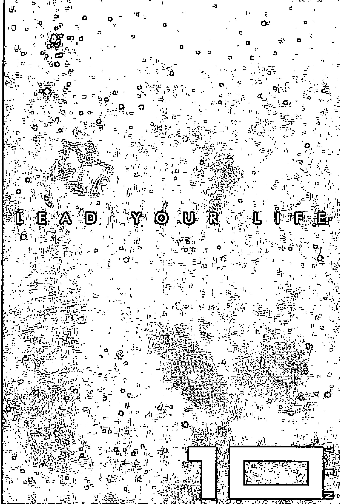

# 宫主星

宫主星是启动该宫活力的关键，宫主星所落入的宫位是能量成功运用的空间，提供连结生活场景调整的线索。

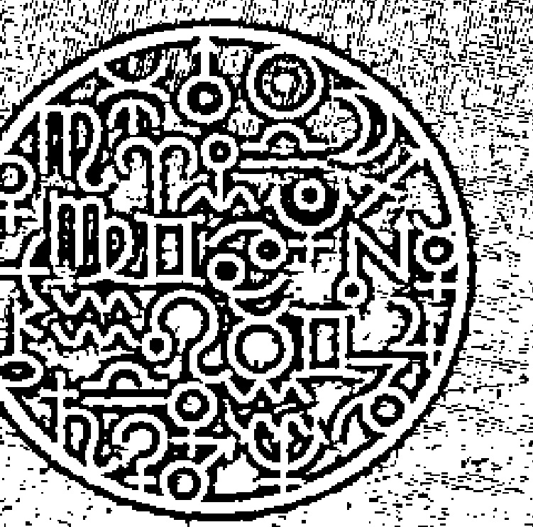

### 宫主星所落入的宫位

-   ◇ 宫主星——每个宫的宫头星座的主宰行星

宫主星指引我们了解宫位间特殊的能量组合关系。宫主星是启动该宫活力的关键，宫主星所落入的宫位是能量成功运用的空间，提供连结生活场景调整的线索。

#### 各宫宫主星决定主题

| 宫位 | 决定主题 |
|------|----------|
| 第一宫的宫主星 | 看自我形象、自我认知的形成与强化 |
| 第二宫的宫主星 | 决定财务的状况 |
| 第三宫的宫主星 | 决定沟通模式及其影响 |
| 第四宫的宫主星 | 决定人际关系与家庭关系 |
| 第五宫的宫主星 | 决定爱情的成败 |
| 第六宫的宫主星 | 决定工作的取向 |
| 第七宫的宫主星 | 决定婚姻的成败 |
| 第八宫的宫主星 | 决定情欲的展现与影响 |
| 第九宫的宫主星 | 决定精神层面的取向及其影响 |
| 第十宫的宫主星 | 决定事业的表现 |
| 第十一宫的宫主星 | 决定与团体互动的取向 |
| 第十二宫的宫主星 | 决定深层意识的状况 |

#### ◇ 宫主星所落入的宫位是因果关系

这个问题的模式（按星盘内容自行填入ABCD）：

第 A 宫的宫头是 B 座， B 座的主宰行星是 C ， C 落入第 D 宫，则 A 宫的决定主题要看第 D 宫。例如：

以李勇的星盘而论（见P213，图10-1）：

1.  第二宫的宫头是天秤座，天秤的主宰行星是金星，金星落入第十宫，他的来财与事业的人际关系有关。
2.  第十宫的宫头是双子座，双子座的主宰行星是水星，水星在巨蟹座，他以温馨支持的沟通方式，在工作领域里运用家常话来维系情感。

以张婕的星盘而论（见P214，图10-2）：

1.  第二宫的宫头是巨蟹座，巨蟹的主宰行星是月亮，月亮落入第四宫，她的来财与四宫有关，她的钱来自母亲给她的房地产。
2.  第四宫的宫头是狮子，狮子的主宰行星是太阳，而太阳在天蝎，四宫所涉及的土地、房子，与天蝎的内容有关，她母亲的钱来自她父亲，她父亲是妇产科医生。

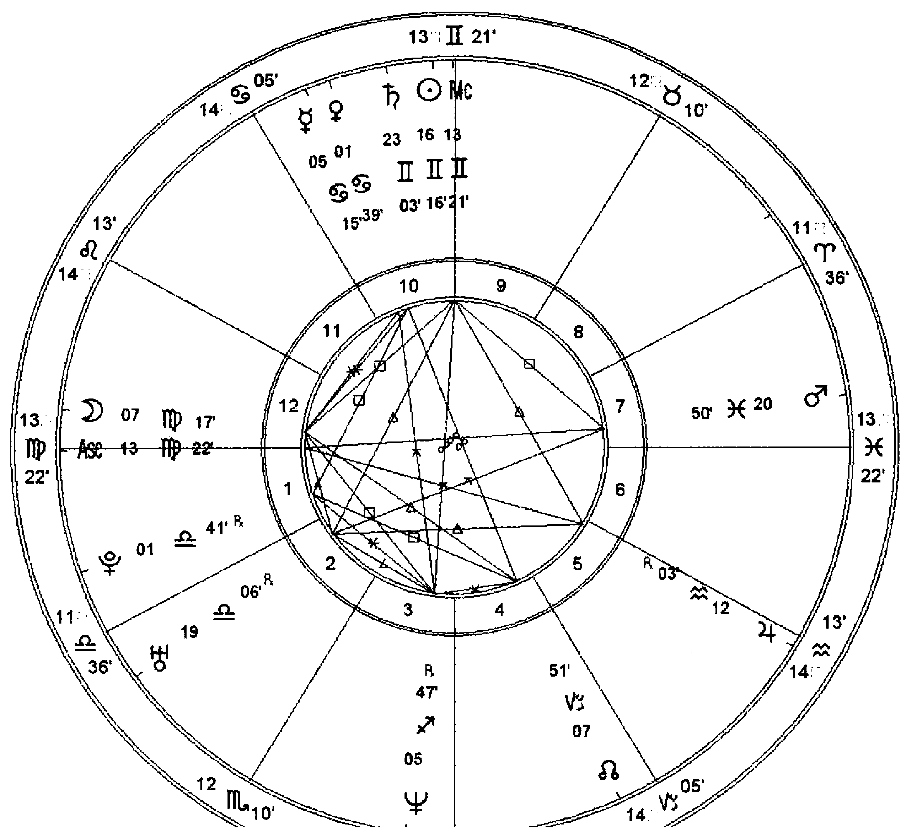

## 10 TEN 宫主星

图10-1

第二宫的宫头是天秤座，天秤的主宰行星是金星，金星落入第十宫，他的来财与事业的人际关系有关。

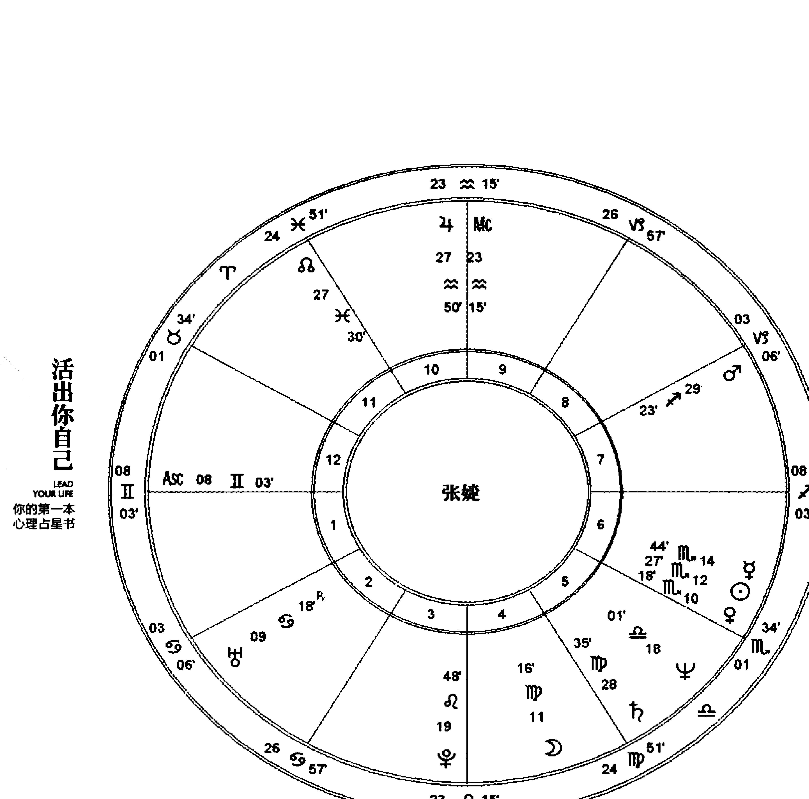

### 图10-2

第二宫的宫头是巨蟹座，巨蟹的主宰行星是月亮，月亮落入第四宫，她的来财与四宫有关。

### 当第一宫的宫主星落入：

看自我形象、自我的形成与强化认知

| 宫位 | 内容 |
| :--- | --- |
| 第一宫 | 第一宫的行星风格会影响自我形象的呈现，或生存挑战的态度，有勇气表现自己，直接的行为表现，会带来他人的直接响应。 |
| 第二宫 | 二宫的行星资源是建立自我形象的主要条件，用勤奋的态度赚钱，累积个人资源，建立个人生活品味，运用基本才干来获得生存优势。 |
| 第三宫 | 三宫的行星风格决定三宫的主题如何延伸到自我形象或装扮上面，尝试各种学习，吸收各种知识，有沟通能力，焦点在于自我厘清，容易受兄弟姐妹影响。 |
| 第四宫 | 喜欢内心之家的安全感，对外表现注重母性关怀，四宫的行星风格影响自我形象装扮，完全复制父母的模式呈现自己，受挫时会逃回内心。 |
| 第五宫 | 发挥个人创造力及才华表现来获得自我肯定，玩乐、恋爱会使自己活力充沛，充满自信，以一种生命热情面对挑战，与人互动较偏主观判断，你希望被人尊重。 |
| 第六宫 | 用服务态度来自我肯定，工作流程精益求精，尽心尽力地帮助别人，累积身心灵健康信息，或透过身心灵净化的技巧建立务实的医护形象。 |
| 第七宫 | 透过跟别人互动或依循别人的看法来确认自己是谁，受伴侣的影响，希望别人能赞同自己，在意别人对自己的支持度，偏向公关型的自我形象。 |
| 第八宫 | 透过神秘学或帮别人作理财规划的能力，得到或给予伴侣心理或经济支持，具有敏锐的洞悉力，经历心理转化后，拥有心理分析与犀利对话的能力。 |
| 第九宫 | 用射手的姿态拓展人生阅历，宣讲自己的人生见闻，投入专业进修、高等教育或游学，来建立专业讲师、人生导师的形象，积极追寻人生的意义，表现出超越旧有价值的宏观作风。 |
| 第十宫 | 透过自律、自我期许及严谨的自我要求，来得到具体的成效，掌握事业的先机，积极追求事业成就，建立企业家或能干负责的形象。 |
| 第十一宫 | 个人形象受团体的主题影响，经由加入社团，推广新时代理念来建立形象，太在乎朋友对自己的看法，主动响应群体的需求，有能力连结人脉，适合当团体代言人。 |
| 第十二宫 | 淡化自我形象，隐藏在幕后，时而退隐沉潜，适合封闭的工作环境，如看守所或慈善单位，个人界限较不清楚，运用内在心灵的力量来建立与世无争的安详形象。 |

### ☆ 当第二宫的宫主星落入：
决定财务状况

| 宫位 | 内容 |
| :--- | --- |
| 第一宫 | 运用自我的才干与能力及物质资源，赢得生存优势，用自己的形象来赚钱或建立自我价值，或是建立财务管理的自我形象。 |
| 第二宫 | 保护自我的资源，建立生活安全感，持续累积谋生技能和证照以肯定自我价值。 |
| 第三宫 | 三宫的学习与沟通主题延伸到自我价值肯定上，培养兴趣来增加物质资源，增强自信，沟通有助于财务收入，家人对自己的财务有帮助。 |
| 第四宫 | 住家楼下开店，家里的状况影响财务，赚钱与房地产有关，或借由温馨的家居生活来增加自己的自我价值。 |
| 第五宫 | 发挥自我才华与创造力来赚钱，或成为自我肯定来源，浪漫爱情或孩子是自我价值中重要的部分，但也可能因恋爱或子女而破财。 |
| 第六宫 | 财务的开启与工作有关，精练流程，累积工作效率，可加强赚钱的能力增加个人资源，透过技术与方法改善自己的工作成果，增加自我价值，生存才能偏向身心灵净化的服务工作。 |
| 第七宫 | 需要伴侣来增强自我肯定，很在乎别人对自己的观感与评价，与人合伙开店或与伴侣一起谋生，看上伴侣的经济能力，为钱结婚，但也可能因伴侣而破财。 |
| 第八宫 | 运用神秘学或心理学来增加物质资源，加强自信，用学到的谋生技能来帮助别人解决心理问题，或是帮别人做理财规划。 |
| 第九宫 | 人生观影响自我价值肯定，藉由专业进修或旅行花钱或赚钱，心灵智慧的扩展会增加财力，想要把自己的经验与人分享，过有意义的生活。 |
| 第十宫 | 严谨的自我要求，加强组织及耐力的培养，运用自己的社会形象与资源来获得最大的利益与自我价值，对事业的成就动机有助于加强物质资源，来财与管理有关。 |
| 第十一宫 | 透过团体人脉赚钱，在组织中谋生，但是也容易为朋友破财，自我肯定受朋友的影响，与志同道合的朋友有共同愿景，需要朋友的认同来增强自己的自我价值。 |
| 第十二宫 | 用整理物质资源的能力来整理心灵资源，开发心灵资源有助于增加物质资源，喜欢隐藏在幕后不居功的心态，但也可能是在医院、赡养院或监狱工作的人。 |

### ☆ 当第三宫的宫主星落入：
决定沟通模式及其影响

| 宫位 | 内容 |
|------|------|
| 第一宫 | 一宫的行星风格决定三宫的沟通方式，直接反应，在沟通中，强调自我主张，容易打断别人的发言，不时地把主题拉回自己身上，希望在交谈中，对方专注聆听。 |
| 第二宫 | 搜寻有利于自己发挥口才的数据，从经济的角度选择学习主题，聊天的内容与经济能力、赚钱能力有关，从累积资源的角度在谈话中收集情报，对财务管理会有一套自己坚持的想法。 |
| 第三宫 | 加强学习、思考及吸收信息的能力，运用在沟通上，灵活的沟通能力很容易与人打成一片，快速吸收信息，数据库经常翻新。 |
| 第四宫 | 四宫的行星影响沟通模式，对于不熟的人，讲话时会自我保护，但熟悉以后，有了安全感，沟通时易有情绪性的表达，家人能否愉悦交谈会影响情绪。 |
| 第五宫 | 用创意的表达方式来沟通，沟通中寻求自我表现，用玩乐休闲的方式上课学习，谈话的主题偏玩乐，或强调自己的才华展现，也有恋人成为自己的同侪的状况，或恋人成为自己的教学助理。 |
| 第六宫 | 工作影响你的沟通，喜欢谈健康医疗的主题，沟通内容涉及养生保健及健康食品，适合从事与人沟通或信息整理的工作。 |
| 第七宫 | 用优雅的方式沟通，令人如沐春风，在乎伴侣的意见，沟通受伴侣的影响，依别人的见解来厘清自己的想法，也有能力协调他人的看法。 |
| 第八宫 | 谈话犀利，穿透力强，对于资金管理、神秘学、生死学、性或情色主题有深入兴趣，可以写色情小说，或有关神秘学的著作，也能在言谈中，深入挖掘自己的内心纠结，会成为兄弟姐妹的辅导者。 |
| 第九宫 | 用冒险的心情开展人生体验，旅行、异国文化、宗教观，容易成为话题，喜欢与人分享自己的理念，扩展自己的心灵视野，深入浅出地与家人分享，或因九宫的理念去学更多东西。 |
| 第十宫 | 事业上的需要影响学习主题，透过学习来加强管理成效，希望自己讲话能让部属信服，能得到上司的信任，但对部属会用权威的指令，喜欢与人分享管理理念。 |
| 第十一宫 | 喜欢与志同道合的朋友分享观念做心智交流，看法受朋友影响，喜欢游走各团体间或成为团体发言人，谈话的主题偏向新时代、社会改革方案及群体的学习沟通。 |
| 第十二宫 | 心灵感受影响谈话内容，谈话易受潜意识干扰，表达内心抽象的感受，因为沟通偏右脑，不连贯的思绪、谈话不容易被人所理解，喜欢一个人默默独处学习。 |

### 当第四宫的宫主星落入：
决定人际关系与家庭关系

| 宫位 | 内容 |
|------|------|
| 第一宫 | 以天真的本能反应主动关怀别人，建立情感联系，表达内心感受，不会掩饰自己的情绪反应，渴望拥有自己安定的生活空间。 |
| 第二宫 | 用感官的方式建立情感联系，购买有质感的物品来安抚情绪，财务稳定时情绪上有安全感，可从事与房地产有关的行业，来财与土地、房地产有关。 |
| 第三宫 | 思考主题与沟通方式跟家庭或内心感受有关，良好的沟通带来情绪安全感，用短程旅行去转换居家品味，会观察家人来决定自己的表达态度。 |
| 第四宫 | 用依赖或温馨支持的方式来建立家庭，保存旧物缅怀过往情怀，父母对自己助力颇大，也可能过度依赖原生家庭，难以剪断娘家脐带。 |
| 第五宫 | 用创意的方式来表达内心感受，以热情有力的方式来影响家人，喜欢跟别人分享自己的才华表现及育儿方式来关怀别人，让别人信任你的才华或育儿能力。 |
| 第六宫 | 把工作带到家庭生活中，类似整合家庭，在家庭生活中结合身心灵的理念，有生活洁癖，也强调健康养身。 |
| 第七宫 | 希望伴侣温馨关怀来满足情绪需要，在意别人对自己情绪反应的看法，需要别人的支持，喜欢与伙伴交心，或把伙伴带到家中谈心。 |
| 第八宫 | 对自己的隐私相当敏感，对神秘学、玄学感兴趣，在人生历程中，因为一段亲密关系，心境经历死而复生的体验，靠自己的力量站起来。 |
| 第九宫 | 在哲学、宗教领域，找到心灵慰藉，期待高学历或不断学习拓展新知来满足精神生活，在家中分享心灵智慧，与家人共同旅行或分享宗教理念，也可能定居在国外。 |
| 第十宫 | 母亲是你追求世俗成功的主要关键，需要家人支持，可能从事医护关怀或室内设计行业，或是在家创业。 |
| 第十一宫 | 是小区的活跃分子，四海一家，家里常有朋友来聚会，喜欢与好友们做心灵夜谈。 |
| 第十二宫 | 心灵需要安静地休息充电，喜欢独处，寻找远离尘嚣的住家，如果有灵修，就不会以上瘾方式渲泄情绪压力，会用心灵力量来加强内心安全感。 |

### ☆ 当第五宫的宫主星落入：
决定爱情的成败

| 宫位 | 内容 |
|------|------|
| 第一宫 | 积极追求浪漫爱情，倾向于个人私爱，非常爱小孩，主动展现创造才华以获得肯定，积极投入嗜好及娱乐，显得尽兴开心。 |
| 第二宫 | 爱钱，基于安全感的需要，把自己的创造才华、戏剧性的表现或收藏的嗜好（珠宝等）当作赚钱的工具，过度溺爱小孩。 |
| 第三宫 | 优先关爱父母、家人，运用三宫的沟通能力，教导孩子们的戏剧演出，运用三宫的文字能力写爱情小说，在爱情态度上喜新厌旧。 |

## 三王星

三王星的作用是在生命历程中，打破土星的自我设限格局和僵化的制约，促使我们意识的改变以及心灵的转化。

## ASTROLOGY 导师
### LEAD YOUR LIFE
#### 三星

## 三王星

一般人会在天王星或海王星与个人行星有相位时开始灵修。有些人在天王星行运时，发生一些人生意外；也有人体会到海王星的理想幻灭，感到非常失落，然后看了一些灵性书籍有了内在的觉醒，也想要静坐沉潜；有些人结合九宫的人生智慧探索，或参加宗教团体，建立了一些信念。但是只要没有经历八宫舍弃小我煎熬的过程，大死一番，表层的灵修模式其实无法改写深层的细胞记忆，无法超越习性，在生活中也无法达到真理的落实。

一个人一生中的强势运发生在行运的土星及行运的冥王星同时支持着星盘中的结构；业力相位则发生在行运的土星或冥王星同时对星盘产生负面相位的冲击，或是土星影响到那一颗行星，而那颗行星又与冥王星有相位。通常是力量最强的地方，引发人生超级大挫败，迫使我们必须转化，改变我们的态度与焦点。

☆ 当第六宫的宫主星落入：
决定工作的取向

| 宫位 | 内容 |
|------|------|
| 第一宫 | 工作或健康是人生的重点，建立助人的形象，主动投入工作，以致健康不佳，希望工作是自己喜欢的，有可能成为一个专业技术人员。 |
| 第二宫 | 从具体的利益考虑学习到谋生技能后，运用分析及整理能力修正到完美的程度，以加强财务收入或建立自我价值，行有余力，助人为乐。 |
| 第三宫 | 基于兴趣学习，收集与工作有关的情报，用模仿的方式整合及思考后，灵活的运用来面对工作需要的沟通，成为工作上有利的资源，兴趣改变，工作也可能改变。 |
| 第四宫 | 服务他人有助于自己的情绪满足，如果工作不是内心的需要，会利用工作技巧改善家庭生活，加强心灵的满足感，增加做事的效率，喜欢把工作带回家。 |
| 第五宫 | 在工作环境中找爱情对象，消耗太多精力在玩乐，以致健康不佳，有机会把自己的创造才华在工作中展现。 |
| 第六宫 | 是劳碌命，重视工作的服务精神，工作中的技巧及效率是受人肯定的，可从事医疗、照顾或服务行业，不断地在工作中净化自己。 |
| 第七宫 | 伴侣进入工作圈，或在工作环境找婚姻对象，与人交涉或协调、建立关系是工作内容，伙伴会寻求你的咨商来协助处理他们的婚姻关系。 |
| 第八宫 | 从他人手里获取资源，或是替别人作理财规划工作，情感再生力量强，在工作中运用深度分析能力或透视别人的问题，也可能在工作中运用神秘学服务别人。 |
| 第九宫 | 扩展新知，不断学习来加强工作专业能力，把自己的人生智慧或人生观带到工作中，喜欢担任讲师，在工作中倡导自己的人生理念。 |
| 第十宫 | 用综合管理的眼光来整合不同的工作技巧，以获得更大的成就，严谨地规划人生，把身心灵的净化当作人生志业，自己可能是员工兼老板。 |
| 第十一宫 | 透过工作关系结交朋友，用自己专业能力为团体效力，代表工会向资方争权益，或在团体中结交有工作能力或理念相同的朋友。 |
| 第十二宫 | 心灵易受工作及同事影响，在工作中默默付出，心灵能量低落时易产生倦怠感，健康及工作都不理想，用心灵力量来支持工作效率，或运用心灵资源启发工作的灵感。 |

☆ 当第七宫的宫主星落入：
决定婚姻的成败

| 宫位 | 内容 |
|------|------|
| 第一宫 | 用自己的主观需要来评估自己与伴侣的关系，希望自己是主导者，伴侣成为自己的跟班，愈能在人前表现自我就愈能肯定自己。 |
| 第二宫 | 你会从生活丰足与否的观点来评估婚姻的价值，从经济考虑的角度来审视伴侣关系，希望伴侣的经济优渥，伴侣是理财高手，或与伴侣一同打拼赚钱。 |
| 第三宫 | 透过亲友或兄弟姐妹而认识婚姻伴侣，沟通能力在婚姻中占了重要的分量，会先用试探的方式了解别人的想法，再建立良好的交流。 |
| 第四宫 | 渴望得到伴侣的关怀与支持，在乎与伴侣双方的家庭能和谐互动，希望伴侣重视家庭，待在家里能够带给自己安全感，但是，你会隐藏自己内在敏感的情绪，也不太敢表达自己的需要。 |
| 第五宫 | 真爱才能成为结婚对象，希望永远谈恋爱，配偶的社交能力强，或者与配偶从事艺术创作，你会刻意展现自己的魅力，吸引别人的注意，并炫耀你的伴侣。 |
| 第六宫 | 从办公室恋情延伸进入婚姻关系，婚姻生活充满工作的沟通，或与配偶共同创业，重视配偶的健康，与配偶的和谐度会影响工作情绪，与人互动时会观察对方的工作条件。 |
| 第七宫 | 在合作关系中认识配偶，在乎配偶的想法，希望建立良好的互动关系，容易被宫主星特质的人吸引，你虽然很想彼此平等对待，但事实上你可能过度配合别人。 |
| 第八宫 | 重视伴侣的心理或经济支持，配偶带来财富或诉讼，容易向伴侣揭露内心纠结或处理别人的私密而获益，用激烈的情感对待方式互动，建立恐怖的平衡，关系中充满操控。 |
| 第九宫 | 伴侣是你生命中的老师，带给你心灵智慧的扩展，与伴侣共同分享生活冒险，对不同文化或不同信仰的人有兴趣交往，会把人生理念或宗教观带到婚姻中。 |
| 第十宫 | 用自我要求的严格态度来要求伴侣，从社会价值的角度寻找对自己有助力的伴侣，在意对方的事业成就。 |
| 第十一宫 | 希望夫妻永远是朋友，期待友情与爱情合一，不想被婚姻束缚，不反对同居或开放的婚姻观，也可能嫁给你的社团，互动的人脉因你所参与的社团而改变，或因社团理念选择伙伴关系。 |
| 第十二宫 | 期待对方是灵魂伴侣或道途上的法侣，过灵性的婚姻生活，用随缘奉献的态度面对每一个互动关系，或遇到宿缘，无条件地付出。 |

☆ 当第八宫的宫主星落入：
决定情欲的展现与影响

| 宫位 | 内容 |
|------|------|
| 第一宫 | 在亲密关系上，渴望拥有自主权，对神秘学与生死学有兴趣，能够转化自己或他人较低层次的欲望，具有性魅力或神秘形象。 |
| 第二宫 | 你从生活安定的角度衡量与别人关系中的得失，注意别人操控的心机。从父母或伴侣得到经济支持或遗产，或努力赚钱来支持父母或伴侣，研究玄学、神秘学来储备生存技能。 |
| 第三宫 | 对神秘学、玄学的兴趣使你与他人的沟通具有穿透力，能透过沟通协助人处理他们的问题，会清楚地表白自己内心的黑暗面，也可能会讲黄色笑话。 |
| 第四宫 | 家庭或内心之家的课题会带来心理转化的契机，释放压抑或情绪包袱之后可得到平静，希望伴侣像父母一样照顾自己。 |
| 第五宫 | 用浪漫的方式呈现性魅力，在游乐场所或俱乐部的社交容易发展成亲密关系，因为兴趣而研究神秘学、玄学，创作才华经历毁灭重生的心灵转变之后，会有更好的作品。 |
| 第六宫 | 注重与性有关的健康问题，用工作逃避自己面对亲密关系的压力，深入人性黑暗面，加强专业技巧，有可能成为心理医师或财务分析人员，工作可能与财产规划有关。 |
| 第七宫 | 伴侣的性生活必须和自己能够协调，彼此间也有共同财产的问题，和伴侣互动会引发自己深沉的情绪翻搅，例如嫉妒或占有，彼此较劲掌控。 |
| 第八宫 | 生命力强韧，具有性魅力，寻找强而有力的经济对象或情欲对象，挑战自己的极限，喜欢一针见血地拆穿别人的假象与心理伪装。 |
| 第九宫 | 精神交融的情欲体验，国外旅行或出国游学有助于扩展自己的生命视野，提升情欲转化，希望伴侣与你共同成长或分担责任与权益。 |
| 第十宫 | 用经营事业的方式善加利用别人的资源，希望得到伴侣的支持创业，崇拜权威者，用压抑的方式处理情欲，也可能与老板有亲密关系。 |
| 第十一宫 | 希望朋友给你支持，不论精神或物质上，朋友的死亡带给你觉醒，研究神秘学或心理学建立个人价值感，参加社团或友谊互动可转化你内在的黑暗面。 |
| 第十二宫 | 美化你的性伴侣，希望灵肉合一，用灵修来转化较低层面的执著，净化杂质，体验深刻的心灵感受，容易有难缠的秘密情人。 |

### 当第九宫的宫主星落入：
决定精神层面的取向及其影响

| 宫位 | 内容 |
|------|------|
| 第一宫 | 认定自己的想法是真理，坚持捍卫自己的个人经验所形成的人生理念，对于提升精神层面有较高的期许。 |
| 第二宫 | 为了加强自我价值肯定而接受专业训练，接触与国外有关的行业而获益，财务影响人生观，在经济上独立自主的经历形成你的人生理念，并成为专家去教导别人。 |
| 第三宫 | 兄弟姐妹及童年的生活常识影响自己的人生理念，移民与家人有关，归纳别人的看法成为自己灵活的表达，表现出专业的样子。 |
| 第四宫 | 藉由家庭生活体验或内心之家的真实感受来建立自己的人生理念，对自己未来的家庭有理想憧憬，双亲之一扮演人生导师的角色引领自己。 |
| 第五宫 | 目前的嗜好会变成将来的专业进修方向，用好玩的心态练习自我表达，透过与人分享获得才华的专业肯定，热情与活力可以增加讲师魅力。 |
| 第六宫 | 认为自己有一套信念要带到工作中，工作或社会服务对你而言是重要的，在工作服务中持续吸收的健康信息使你成为身心灵讲师或工作与国外有关。 |
| 第七宫 | 人生观受到伴侣影响，喜欢与人交流分享人生体验，或找到支持自己人生观的伴侣，热衷学习，透过与伴侣的互动与成长扩展自己的心灵视野。 |
| 第八宫 | 人生信念的转变与亲密关系有关，深度要求强化自己的实力，专业能力有八宫的色彩，涉及心理学、神秘学或理财规划，累积足够经验可能成为讲师。 |
| 第九宫 | 高等教育、宗教或专业进修会成为生活重心，擅长宣扬自己的理念，喜欢讲人生道理，对不同教派的教义宽容度较高。 |
| 第十宫 | 为了提升事业管理的能力而接受国外进修，或是教育训练课程，希望得到社会的肯定，为了爬上权位的高阶而培养自己的专业能力。 |
| 第十一宫 | 表达自己的人生理念，而得到群体的支持时，可以加强信心，人生观受新时代理念或群体意识及社团的影响。 |
| 第十二宫 | 不断地吸收精神粮食以丰富内在心灵，遇到挫折能自我激励，选择灵性课程进修，独自一人默默学习，心灵的安定或恐慌影响人生态度。 |

### 当第十宫的宫主星落入：
决定事业的表现

| 宫位 | 内容 |
|------|------|
| 第一宫 | 事业成功是自我肯定的条件，在意别人对自己事业成就的认同，靠自己的力量完成内心设定的事业目标，态度强硬，不易受别人影响。 |
| 第二宫 | 用持续勤奋的态度来稳固自己事业的表现，事业成就是自我价值与安全感的来源，荣耀地位建立在金钱上，财务管理也会影响事业成功与否。 |
| 第三宫 | 运用分析、处理信息及沟通能力来巩固事业地位，可能从配偶的亲戚获得协助，会因为自己的发言而获得别人的尊重。 |
| 第四宫 | 童年的成长经验影响你的事业态度。在家创业，内心之家的稳定度将影响事业的冲劲，若家庭出状况，就会面临家庭事业难以兼顾的困境。 |
| 第五宫 | 把嗜好、休闲或才华表现在玩乐的心情下变成事业，或者事业内容与创意表现或儿童教育等内容有关，表现方式是愉悦且华丽的。 |
| 第六宫 | 可能从事与健康、医药、宠物或身心灵整合或生机饮食的行业，高标准的自我要求，事必躬亲而显得劳碌，累积工作技巧，精益求精，建立事业的权威形象。 |
| 第七宫 | 可能透过婚姻而获得地位提升或因婚姻而受到限制，配偶在事业经营上扮演重要角色，在事业上喜欢合作关系。 |
| 第八宫 | 从事金融、保险、信托、投资业可以有不错的发展，但也会经历到现实或心理的谷底而重新站起来，工作可能涉及隐私，研究神秘学或玄学有助于事业，也可能进入情人的事业体系，情人也可能成为你的老板。 |
| 第九宫 | 从事与国外贸易、旅游、出版、教育有关的事业，把人生理念带到事业中，也可能理想过高而不容易落实，用专业能力来获得上司肯定。 |
| 第十宫 | 事业企图心及成就动机都强，对自己或对别人的要求也较高，不论从事任何行业，都可位居要职。 |
| 第十一宫 | 透过朋友或团体而获得工作，可得到朋友或团体的协助，团体的需求影响自己的事业导向，有机会成为团体的主导人物。 |
| 第十二宫 | 事业与灵修、社会福利及慈善事业有关，喜欢默默无闻地躲在幕后，也可能是治疗师或夜间工作者。 |

### 当第十一宫的宫主星落入：
决定与团体互动的取向

| 宫位 | 内容 |
|------|------|
| 第一宫 | 可能受到新时代理念的影响而进入团体，或为了保障自己的生存优势而强化人脉，面对竞争时可以透过朋友帮忙，朋友有助于自己人生愿景的达成，也可成为新时代理念的推广者。 |
| 第二宫 | 运用人脉来获得钱财，朋友大部分是富有的，自我价值受同侪影响，学习朋友的理财技巧以增强自己在财务运作的能力。 |
| 第三宫 | 童年的体验影响你的交友观，朋友中可能有作家或口才好的朋友，兄弟姐妹或亲戚对自己有助力，在与朋友沟通中表达自己的人生愿景。 |
| 第四宫 | 交友交心，以食会友，把朋友带到家中谈心，可以结交到共度晚年的好友，或者朋友中有人从事不动产。 |
| 第五宫 | 社交宽广，与朋友相处时展现创造力，用热情的自信及华丽的魅力吸引到朋友。朋友中有些幽默的人，自己对爱情的理想较高。 |
| 第六宫 | 有心为团体服务，希望在组织运作的实务经验中磨练自我，增长工作效率，也可能在团体中分享你在工作中的实务经验及技巧提升。 |
| 第七宫 | 重视伴侣关系，热衷社交互动，用优雅悦人的态度招待朋友，自己的朋友圈可能有一些人从事艺术工作，希望伙伴成为理念相同的朋友，参与你的社团。 |
| 第八宫 | 团体参与和朋友情谊可能会经历毁灭与重生的过程，朋友中有一些人从事金融或保险业，可能发生亲密关系之后把朋友带入社团，也可能在发生亲密关系之后从社团中撤离。 |
| 第九宫 | 喜欢与朋友分享人生观，期待用自己的人生信念去动员或组织群众，在人生历程中的某一阶段会产生人生观巨大的转变，朋友中有人会拉着自己去做某些冒险，也可能有一些外国朋友。 |
| 第十宫 | 用保守或权威的方式投入团体，利用朋友的支持或团体的资源来建立自己的事业名声，有机会成为公众人物，朋友中也可能有权威人士。 |
| 第十一宫 | 四海之内皆兄弟，可能透过网络交友，对团体的寄望颇高，结交特立独行的朋友，或建立新时代联盟。 |
| 第十二宫 | 对朋友不设防，容易被流言所伤而淡化友谊，朋友的关怀很难穿透自己内心的保护膜，朋友可能是贴心或忧伤的来源，因为团体的伤害而进入灵修。 |

### 当第十二宫的宫主星落入：
决定深层意识的状况

| 宫位 | 内容 |
|------|------|
| 第一宫 | 主观意识与潜意识产生干扰，对自己的行为表现不自觉，自我形象明确时有助于潜意识心灵的清明度，灵修后可提升心灵感应能力，否则经常若有所失，有家道中落的现象。 |
| 第二宫 | 无法善用自己的心灵潜能，等到生活危机出现才会积极活用心灵能力，心灵寄托在自我价值上，喜欢做金钱白日梦，可以用物质资源来增进心灵资源的稳定。 |
| 第三宫 | 你与兄弟姐妹有业力牵连，如果没有灵修，潜意识干扰沟通，如果灵修，在表达中具有直觉力，可以心灵感应的方式帮助沟通。 |
| 第四宫 | 父亲可能是困扰的来源之一，和家人互动良好时感到慰藉，互动不良时觉得阴霾重重，渴望重回灵魂的故乡，可以引导家人冥想。 |
| 第五宫 | 心灵寄托在创造力或才华展现，用玩乐的态度来结合内在的想象世界，孩子可能是忧伤的来源，与情人或孩子之间无法厘清界限，可能有秘密恋人。 |
| 第六宫 | 很难同时照顾好工作或灵修，满足心灵深层的需求后才有稳定的工作意愿，长期心灵晦暗可能引发慢性病或体力弱化，可以从事帮人脱离心灵苦闷之工作。 |
| 第七宫 | 伴侣是你的宿缘，与伴侣有业力牵连，幸运的话有灵魂伴侣，伴侣可带来心灵归属感，但也可能带来忧伤痛苦，或是关系不能摊在阳光下。 |
| 第八宫 | 可能耽溺于性爱，透过情欲的纠葛体会到死而复生，获得心灵进化与提升，把情欲挣扎的桎梏转化为心灵世界遨翔的动力。 |
| 第九宫 | 藉由旅行、进修来探索内在心灵，可能投入宗教、哲学研究，得到心灵平静而成为弘法者，也可能是进入监狱辅导的专业教诲师。 |
| 第十宫 | 事业失意时会变得颓废苦闷，逃避现实责任，最好事业能结合灵性进修，适合社工、医护人员及治疗师等助人工作。 |
| 第十一宫 | 朋友是自己的情感包袱，为朋友牺牲，朋友可能有虚情假意或软弱的人，参加灵性活动的团体可以避免这些困扰。 |
| 第十二宫 | 潜在的通灵天赋，找到内在永不枯竭的灵性资源，有能力给予人无形的心灵安慰与镇定力量，需要长时间的静处来净化磁场。 |

### 第四宫
家庭、父母式的爱，或回到子宫的爱，喜欢在家里举办玩乐活动招待小孩，家人的支持影响自己的自信及创造力展现，考虑情绪安全感而选择居家型的爱情对象。

### 第五宫
强烈渴望表现才华来得到别人的肯定与掌声，用赤子之心对待别人，带着冒险的心情去谈情说爱，全心全力培养孩子，希望孩子光耀门楣。

### 第六宫
觉得爱是生活中的次要顺位，把工作带入爱情中，可能发生雇员与雇主的关系或办公室恋情，热爱工作，恋爱时也谈工作，喜欢参与社会服务，关心恋人及孩子的健康。

### 第七宫
集中在爱情在配偶，伴侣一定要爱你，希望伴侣支持自己，希望伴侣成为为自己鼓掌的观众，以配偶为重心，期待每天都在恋爱中，喜欢成为关系中的主导者。

### 第八宫
容易涉入复杂的爱情关系，先性后爱，过度集中在性或爱恨交缠，可能对玄学、生死学兴趣颇高，但当本身已经历毁灭重生的过程，又具备神秘学的解析能力，就会转化为治疗别人的热忱。

### 第九宫
理想主义的爱，把人生智慧带到爱情中，分享生命视野的扩展，经由高等教育或国外旅行来找出发挥才华的管道，孩子可能挑战自己的人生理念，例如佛学讲师的儿子信基督教，透过儿子的信仰学习接纳异己。

### 第十宫
重视提升社会形象或社会条件之爱，用经营事业的方式来展现自己的才华，用事业企图心来压抑恋爱冲动，爱情的基调是沉闷刻板的，教养孩子的态度严肃。

### 第十一宫
平等的、愉快的兄弟爱，自己的才华表现与创造力可以获得朋友们的肯定，喜欢朋友参与自己的嗜好与娱乐，用特立独行的自由作风教养孩子，与孩子互动像朋友。

### 第十二宫
神秘的爱或暗恋某人，与已婚者、寡妇、鳏夫的恋情，可能有前世的宿缘，要活出五宫，就要加强灵性生活，最好恋人是同修，用心灵资源来发展自己的才华，享受孤独的快乐，孩子需要自己奉献牺牲。

## 活出你自己
你的第一本心理占星书

三王星的作用是在生命历程中，打破土星的自我设限格局和旧化的制约，促使我们意识的改变以及心灵的转化。天王星会去除老旧模式，行运的天王星与本命星盘的内行星形成负面相位时，产生一些人生变量摇撼原本稳定的局面后，终于活出真正的自己；行运的海王星与本命星盘的内行星形成负面相位时，可能使我们理想破灭，陷入心灵迷惘而灵修；行运的冥王星与本命星盘的内行星形成负面相位时，使我们身处于一种强制性的较劲斗争中，落入某种情境的谷底，不论如何抗拒，终将被迫舍弃，才得以死而复生。

这些相位推进时，发生一再重复的生命事件，让我们体验到业报的领域，陷入现实的摧迫，产生无可奈何的挫折感，体认到无常而警醒，从而加强灵性净化的意愿，寻找法门实修，培养出灵性觉察的内在力量，或是透过静心冥想，疗愈深层的灵魂创伤记忆。

真正实修，如实走过宽恕、释放、提升、转化的过程，才能清除细胞记忆，解除业力情结，改变生命的深层结构，不再以情绪本能反应，不受旧意识支配，强化内在的力量，建立新思维、新模式，让生命成为一个完整的表达。

## 行运的天王星
——裂变与短暂迷恋

大约是在1998年左右，我有一班学生，普遍的发生天王星之恋。其中有一位学员金星水瓶二十几度，她开玩笑地说：“不可能发生，真的发生我请客！”她认为自己脑袋很清楚。

到了2001年某一天，她来找我，整个眼睛因为长期失眠成了熊猫眼。面对自己无法抑制的渴望，她无力地说：“我过去30年所受的教条规范，全在一夕间崩解！”

当天王星的能量没有得到正面发展，没有内化为自己的内在趋力时，就会发生一些令人震惊的突发事件来迫使自己成长，所以，一个人若是能把外行星的能量整合进来，就可以减少外行星以外在事件来迫使自己进化的状况。

> **天王星之恋就是当行运的天王星和本命金星产生相位时，容易发生打破束缚爱情的社会规范的恋情，例如：年龄、文化、种族、贫富或阶级、性别等。**

这些相位当然不完全都会发生天王星之恋，有些人呈现财务损失或团体分裂，或者社团的人际关系瞬间变异等。

2001年初，我的一位学生分享了她儿子的恋情。当她发现儿子爱上自己二度单身的好友时，尽管很吃惊，但她信任她的好朋友能够处理好这段关系，虽然两人之间差了20岁。她没有去谴责对方，而是怀着祝福与信任善待这段关系，大约两年后，这段恋情就结束了，她儿子也因为这位女士的引领，在情感上成熟了许多。

后来，我另一个学生有位客户是铁工厂老板娘，爱上她们工厂的泰国劳工，两人结伴私奔了。我的学生分享时，为她的客户感到很惋惜，认为赌注下得太大了，天王星在一个星座七年，产生相位的时间最多两年，两年后恋情结束时，人事全非，即使她和对方分手，也回不到原来的生活了。

某位学员也有一段天王星之恋，后来男方承受不了年龄差距太大的压力，在过年期间不告而别。当时，她看到书中的一段说：

> > 观想那些曾使你痛苦的情人来到光中，在其间，你们没有任何欠负……将他们拥入你心识的怀抱里……

她仍然介意他的不告而别，含着眼泪说：“他欠我，我不原谅他！”

这样挣扎了一周，每次静坐时这些旧事全涌上心头，当《光的课程》进行到“橘色之光”，她感到非常疲惫，只好放下心中的纠结。结果过了一阵子，那个不告而别的情人来电请她原谅，说明当时面对的情绪困境及自己的软弱，并且告诉她，他要订婚了。

虽然她本来就不预期天王星之恋要步入婚姻，但是听到情人要订婚，她还是心情波动。她很感激在前一阵子就对这段情感做了清理，否则，她现在一定情绪翻搅。

天王星的行运中，免不了会有年轻的英雄要离开栽培他的国王，在冒险过程中的牵绊拉扯。《内在英雄》这本书也提到英雄本是国王值得信赖的左右手，有一天他要独立开创去冒险，满怀希望走向未知的领域。英雄迫切要展开他的探索，而离开原本互动良好的关系，在这时候，国王要体认到对方在改变，并且让出空间，不论自己有多错愕，国王都需要给出距离，否则，支持者会变成压迫者，对方会认定你在囚禁他、成为他实现英雄之旅的阻碍。

不妨怀抱着祝福让他离去，不要一再挽留而延迟了英雄的探索之旅，直到有一天，英雄在探索中找到智慧与力量，也有了自己的领域而成为国王，他也要面对他旗下的英雄要出征，戏码重演，只是角色转换了。只要英雄在展开他的探索时有勇气说清楚，而国王有了心理准备允许分离，并祝福英雄的探索，如此这两人将来会有崭新的关系。

## 11 ELEVEN 三王星

如果英雄因为恐惧或害怕国王去破坏他的征途而没有说清楚，或为了离开曾经支持他的人，同时带走他们共有的资源，心生愧疚而必须抨击对方，以证明国王是昏君，他们的关系就会决裂，形同陌路，英雄将不被祝福，带着罪疚感步上征途。

经历天王星不稳定的短暂迷恋，或是英雄迎接新挑战的探索、追求个人独特的生活与自由，或面对团体的裂变与混乱，我们可以在冥想中以“慈悲观”请求原谅，也宽恕对方，帮助我们缩短解脱的过程，让我们有智慧去面对改变，在分裂与痛苦中拥有光明与觉知。

活出你自己
LEAD YOUR LIFE
你的第一本心理占星书

## 慈悲观

-   愿众生分享我的平静
-   愿众生分享我的和谐
-   愿众生分享我的喜悦
-   愿众生离苦得乐
-   愿众生自在安详
-   愿众生和平
-   愿众生解脱圆满

### 我原谅

所有曾经在过去或过去生中
有意或无意
以他们的身体、行为、语言、心念伤害我的人

### 我忏悔

曾经在过去或过去生中
有意或无意
以我的身体、行为、语言、心念所伤害的人
我祈求所有人的原谅！

> ——摘自《内观禅十》

### 说明：

在你念经、持咒或打坐后，身心安详才能作慈悲观，把爱与宽恕分享给众生。

## 行运的海王星
### ——化不开的心灵迷雾

有一位新学员上课迟到，表情有点黯然，她解释自己今天签字离婚，耽误了时间，我很吃惊地问她为何离婚，是不是有外遇。“什么都不是……”她幽幽地说，“他不能满足我对婚姻的期待……”我问她：“你对婚姻的期待是什么？”她又说不出来。

我看了她的星盘，海王星在四宫，七宫是空宫，宫头水瓶。她可能搞不清楚自己要什么，也可能有些情节不想说。我对她说：“你根本不喜欢伴侣太黏你！”她点头，原来他们是分偶，伴侣每周五从新竹回来，就赖在计算机前上网——七宫水瓶嫁给科技人是合适的，但四宫的海王星就失落了，她还没有小孩，因此感觉婚前婚后似乎没什么改变。

这个婚姻离得很冤枉，我对她说：“你的期待无法在人的身上实现，你要的是神！”她需要合一，但又不想靠太近，最简单的方法是透过自己内在跟大我合一，但她又期望在伴侣身上实现心灵的憧憬，自然会幻灭。

海王星对合一的渴慕很难在人的身上满足。有一次在《入门》的读书会中，我们谈论到作者与她的配偶在性爱之后，感到非常绝望，针对这一点居然引发深度的共鸣，有好几位学员，她们在性爱之后觉得荒凉、想哭，觉得更失落。为什么世俗认为欢愉的性爱会带来空虚及绝望的感受？对火海合相的人而言，包括月亮在十二宫、火星在双鱼及火星在十二宫等相位，性必须与灵性结合，才能真正的满足。唯一能解释的是，曾经在过去的时空体验过非物质体的合一、一种全然的合一，现在身体阻碍这个合一，非物质体的灵性自然无法满足于只有身体的性爱，所以，这些学员把他们火星的行动力转移到强力的自我淬炼，以及灵性的进展。

行运的海王星有时候也会带来一种错爱的假相。多年前有一位女士来面谈，她的金星在水瓶四度，当时正好与行运的海王星合相。她在面谈时告诉我：她先生有个好朋友深爱她，为了她而不结婚，这二十年来，常常到她家吃饭；因为辜负此人的深情，她感到非常痛苦，有时候还拒绝行房；她想和先生离婚，然后和这个朋友结婚，但又怕伤了先生的心，她先生以为她得了忧郁症，还想带她去度假散心。我问她：“你和这位朋友确认过了吗？”她摇头。海王星是梦想、是救赎，但也可能是混淆或不明智的错爱，我直觉地感到这是她的幻相，她爱的不是那个人，她爱上自己的幻相。我建议她找对方谈清楚，确认对方的心意。

大约三个月后，她来电告诉我，已经和对方深谈，且明确地问清楚，是不是为了她而不婚，结果男方表情错愕，急着澄清，请她不要误解，后来也减少去她家吃饭的次数。因为自己的梦幻寄情与错爱差点毁了这个家，她感激我点醒她，并且收回在那男人身上的寄情，让心回到自己的家。

1666年，葡萄牙有位修女玛丽安，邂逅了一位军官，陷入激情，后来军官回国就冷却了他的心，玛丽安在等待中独自煎熬，悟出情爱的另一种真谛，认为爱的持续并不取决于对方的承诺与参与，仍怀抱深情继续写信。后人看到她的情书，深受感动，但此事在当时若被公开，将是震惊社会的丑闻。可见美感需要时空距离，而玛丽安这种无所求的爱正是海王星之恋的模式，她若因此而放下小情小爱，像特蕾莎修女一样的奉献，那么与军官之恋情也是释出情欲、净化之必要过程。

行运海王星的对冲相，有时会带来幻灭与瓦解，让人重新省视自己的牺牲奉献是不是值得。有一次，一位五十多岁太阳四宫处女座的妇女来面谈，令我印象深刻。她的娘家是台湾南部望族，弟弟们都被栽培做了医生，住在台北。从2006年，行运的土星在狮子开始，她全心投入修建娘家的老屋和祠堂。钱不是问题，但奔波了几年下来，当行运的海王星对冲她本命三宫的冥王狮子时，她感到累了。她发现，即使老屋修建好了，祠堂焕然一新，她的弟弟及弟媳妇们却是冷冷回应，不热衔回老家团圆，过年也没有人祭拜祖先。

她先生是个拘谨隐忍的男人，只说不要太累了，但她对自己多年的辛苦感到困惑而思索，突然明白修建老家及祠堂好像是自己的需要，而非弟弟们的需要。

太阳四宫的她非常渴望与家族根源连结，尤其是在父母都去世后特别失落，身为长女，她觉得自己有责任把家族的精神延续下去，但是行运海王星的对冲相使她幻灭，瓦解她的坚持，觉得自己的心迷失了，像失根的花。

我告诉她，已经尽力了，就不要强求家人的配合，过度把重心摆在娘家，对夫家也不公平，就像“女有归”¹不一定是婚姻归宿，而是内心的归依处；这是一个入道的契机，为内心找到灵魂的归依处，对家人期待幻灭的因，也许反而结出灵性合一的果，未必是坏事。

她三宫的冥王狮子可能有些强制性，让弟弟们反感，行运的天王星在牡羊时又会有全新景象，她在心智上会有另一番了解，产生心灵的转化。

我也曾经历过灵魂乡愁的追寻，在变异中想要找到不变的，做为心灵的依归。当我婚变时，内心纷扰无法平息，在变化多端的世间，愈来愈不容易找到可以永远信赖的事物。我回到儿时成长的地方寻找安慰，但是周遭的环境都变了，我像游魂一样，茫然地走在街道上，玻璃帷幕大楼冷冷地映照着自己孤寂的身影……我不知道如何在繁忙的俗务中找到自我安适的感觉？如何在快速冲刺中保有心灵的一块净土？谁能给予心灵深处温暖的慰藉？

内心的疑惑没有答案。往后十年，我一直向外追求成就以填补空虚，在社团的姊妹爱之中寻求滋润。

后来我开始写作，在社会角色中活出自我，但是，42岁的我发现，无论如何粉墨登场，人生终究是寂寞的。夜深人静时和自己的心灵对话，我决定放弃一切外求的惯性，去完成自己的人生志业。

> ¹ 原文出自《礼记·礼运》，“男有分，女有归”，指男子各有职分，女子各有归属，作者在此进行引申。

我南下创办高雄晚晴妇女协会¹，过程中让我体验到：有人的地方就有权力斗争，是人性的问题，而不单是两性的问题。我在45岁开始五年的“退行”，卸下社会角色，退回自己潜意识中，和内心对话。

有十多年，我每天忙碌地工作，没有觉知地忙碌着，虽然工作，却没有“存在”。“退行”的五年中，我完全没有工作，每天躺在地板上看云，却每天都“存在”，不断地思索：“我是谁？我来做什么？什么是我的真我？”

直到静心冥想后，进入内在寂然无爱的空间，我体会到圆满、一切具足、和平喜悦、慈悲的感觉，学会与自己共舞而没有分裂，安详自在的心不必外求。我才突然明白，这30年来，我所找的就是这个。我的心一直努力要回到生命的原点，与存在的根源交流，从此不再有乡愁。

## 11 ELEVEN 三王星

2003年，行运的海王星合相金星时，我真的发生海王星之恋，但不是人，也不是神，而是重新省视我在35年前的一段恋情。那十多天我活在心灵云雾中，仿佛在幽冥境界，不断地忆起每一个画面，每一段情节，它们从我的细胞记忆鲜活地跳出。

经历了十多天的整理，在重新进入过去的情境体验后，改写我对自己生命中情感模式的诠释与表达，持续在一种深刻的感动中。虽然对方早在1976年已去世，但我在回溯的氛围中，仍深刻地感受到爱，那是一段永难忘怀的经验！

> 1. 晚晴妇女协会是协助困境中的妇女而组成的“自助团体”，结合女人的力量自助、互助，共同度过生命中每一个低潮期；运用小区工作方法，协助有共同困境的女人组织起来，发现并发展彼此的能力与专长，运用内、外资源，发展适合自己的方式，解决女人共同的困境。

## 行运的冥王星
### ——小我死亡的心灵转化

猫的性情很像海王星，我女儿有一只猫，经常在热水瓶上面壁思过，非常有定性。狗的性情则很像冥王星，从2005年媒体报导得知，在台湾新竹头前溪桥上有一只忠心的狗，是漂亮的虎斑米克斯（Mix Dog，混种狗串串），被取名为虎斑斑，它被抛弃了，但是不知道自己已被抛弃，不论刮风下雨，只要有摩托车经过，它就会跑到斑马线，确定不是它的主人，它就再回到人行道，等待下一个红绿灯，如此过了半个多月，被保护动物协会义工发现——事隔多年，应该已被人认养了。

这故事让我很感动，我还听过另一个故事，有个人养了一只很大的狗，狗愈长愈大，食量也愈大，照顾起来不胜负荷，主人就把它带到郊区丢了。过了两天狗跑回来，主人心想，下次要丢更远，就从高雄带到距离一百多公里外的台南放了，过了一周，狗又跑回来，又瘦又饿，全身脏兮兮，看到主人兴奋得不得了，最后主人专程开车到更远的南投，为了不让它认得路，把它放在后车厢，等到车子开到南投山区，主人打开后车厢，看见那只狗已经咬舌自尽了。

## **冥王星是我们激烈情感投注之处，行运冥王星的负面相位，我们将面临被迫舍弃，就像这只狗，最后咬舌自尽断爱。**

但是冥王星所形成的执著或过度防卫，是当事人自己不容易觉察的，也不想面对。我很感激在2005年冬，让我看到自己的冥王星。

那是一个愉悦的周末，知名身心灵讲师若水来高雄演讲，有一位听众发问：“《光的课程》要看到光，也算外求吧！”我感到很讶异，就举手发言：“《光的课程》重点并不在看到光，而是透过结合内在自性之光来达到净化……”中场休息时间，我又去找此人沟通，若水在一旁鼓掌叫好说：“我最喜欢看人吵架！”我其实不是要跟对方吵架，我只是要厘清她的误解。

那天回家后，我感到有点生气，到了第二周上占星的课程，我有个双鱼座的学生表示说她要开始做咨商服务，因为她上了某灵修课程，觉得自己是时候了。另一个处女座的同学随口说：“你是双鱼座，开始咨商后，会不会沾惹到别人不好的磁场？……”当时他们都尚未习修《光的课程》，双鱼座这位同学经常会提到自己对别人的磁场很敏感。大家聊了几句后，双鱼座的同学突然被激怒地说：“听了好心寒，你怀疑我的专业！”

在场的我们都听得出来，处女座的同学所讲的话是基于关心，而非怀疑她的专业，但双鱼座这位学员的冥王星在二宫，不容别人蔑视，强烈捍卫自我价值。

就在这一刻，我突然明白周六的状况，那位在若水的演讲中发问的人并不是针对我，但由于冥王星所在的领域是过去世曾经验到瓦解生命底层的灵魂创伤，让当事人用比较极端的方式强力捍卫此领域——由于我自己冥王狮子在一宫，我错觉对方是冲着我而来，感到不舒服。经过这次之后，我把冥王星变成一双“臭袜子”随手一丢，而且我学到，不要把其他人的行为当作是针对自己而对号入座，可以减少很多不必要的误解。

冥王星就像西西弗1和他的石头，是的，上帝决定石头滚下来，我决定推不推，以及用什么方法推。多年前，我走过行运的天王星对冲本命的冥王星，以及行运的海王星对冲本命的冥王星，我曾经遇到团体中近百人的分崩离析。

遇到危机时，冥王星人会自断经脉，断臂求生，后来被我切断的手臂愈来愈多，多到在路上都会遇见已分手的伙伴。我花了好多年功夫才把这些手臂一只一只接回来，但也没有原来自然。后来我不断思索，可不可以不决裂？直接整合、接纳阴影，这真是冥王星最难的功课。

**虽然不同的意见可以同时存在，但如何接纳异、包容异己，正是冥王星人最难的功课。**

我自己走过“由色入空”，做任何事都全力以赴，执著结果，而后有七年什么都不做，觉得自己沉潜调息够了，才进入中观——全力以赴地做一件事，但不去执著结果如何。因为我的冥王狮子合相上升，影响力大，但不适用于私人目的；但只要不执著，就不会涉入团体资源的拉扯，引发争议。

> 1 希腊神话人物, 出自《荷马史诗》。西西弗犯了渎神的罪行, 被惩罚把一块巨石推上山顶, 到了山顶石头又滚下来, 西西弗不停地做这个重复性劳动。存在主义大师加缪曾以《西西弗的神话》为名写出他的名著。

冥王星人有强大的内在资源，以及超人的心灵疗愈力。他们不害怕死亡，跟急诊室的护士一样，重大生命事件令他们亢奋。他们深信自己像火凤凰，会从灰烬中重生。死亡算得了什么，他们不害怕触及生命的底层，他们会从谷底跃起，大死大生，他们确知自己有这个再生能力。风平浪静太久，冥王星人反而会去摇撼他们生命的船。

冥王星人知道他们的生命里有一个黑洞，那黑洞具有强力的吸引力，若是被卷入，可能让自己沉沦毁灭。抉择都在一念间，但是你无法用道德宣说来转化冥王星，而必须释放八宫的黑暗面，经历冥王星或第八宫的生命事件，在其中经历心理死亡过程，抽离情境，看到一切翻搅皆是虚妄的，透过转化，才能提升自己，不再执著在较低层次中。

有一天，我遇见我前夫在婚后的第一个情人，她告诉我，这几年来受忧郁症所苦，夜里总有声音催促她起来跳楼，我由衷地关切她的身心，与她谈了很久。当天晚上做瑜珈时，看到墙上的《心经》书法写着“照见五蕴皆空”。我想起30年前，当我发现前夫与她的激情时，是多么地伤心愤怒、多么震撼。可是现在回想起来，那些暗潮汹涌的负面情绪，五味杂陈的感官趋动，都是空幻的，我当下要重温30年前的感受，却遍寻不着。

那些色、受、想、行、识，是真实存在吗？现在我只关心她的忧郁症，想要愤怒也愤怒不起来。不是我修养好，只是那些情欲里的嫉妒与怨怼释放完就不存在了，因为它是无自性的，就像《奇迹课程》里面讲的“无意义”，它不是真实的存在，那些愤怒只是我的报复形式。

## 活出你自己
LEAD YOUR LIFE 你的第一本心理占星书

> > 《入门》这本书中谈到：“梦境与实相之间的不同在于、当你接受那一层面的意识状态是真实状态的时候，它便是你的实相；然而，一旦你向更高的意愿层面觉醒，你便知道那一切根本不是真实的存在，只是自我所做的投射，也就是说，是一场梦。如果你相信这些梦是真实的，那么每一场梦便都是真实的。然而，唯一的实相是你的神性自我。当你通过第一级的测验时，你将在第二级测验的领域中醒来，你将理解自己第一级的测验过程只是一场梦。但是，如果你未能通过测验，也就是说，如果你涉人在这些现象中，认为它是真实的，无法掌握它们，这些梦境中的画面便维持在真实的状态中。”

所以，古人说：“梦里明明有六趣，醒来空空无大千。”而我在梦里明明爱恨交织，醒来照见五蕴皆空。反过来说，我们还要感激那些以他们的色身入戏，成全我们从梦中醒来的人。

但是生命是需要过程去释放这些爱恨情仇的。当我跟那些因外遇而婚变的女人同仇敌忾地骂前夫们时，她们很喜欢找我咨商；现在，我告诉她们，要爱你的敌人，感激你的前夫，因为她们还没走过，就听不下去。

这一生当中，我们的情爱纠葛、婆媳关系、伙伴关系，真是没完没了，要纠缠多久都是自己的抉择，所以，发自自由意志真的是很重要。当我们愿意放下，就给自己一条生路。

尤其在2010年，行运的冥王星进入摩羯座，意味着所有的旧模式与架构必须进入舍弃与更新的过程中，又加上2011年行运的土星在天秤座、行运的天王星进牡羊座，三颗能量强烈的外行星都进入基本宫（意指牡羊、巨蟹、天秤及摩羯座），彼此形成刑克的相位，个人的生活巨变或大环境的冲突动荡无法避免，这都是在2012The request was rejected because it was considered high risk

## 活出你自己
LEAD YOUR LIFE
你的第一本心理占星书

喜欢阅读。

这很像全世界一开始对黛安娜王妃的期待，温馨的、母性的、爱家的，但是，请注意金冥三分相、金海对冲相、金星北交三分相所产生的变化。

金冥三分相的人需要大量的关注，冥王星天蝎是他前世的灵魂创伤，金冥的好相位使他形成一种专注的生命美学，令他散发迷人的吸引力，同时，好相位使他能转移自己的欠缺到建设性的出口。他的生命渴望是第一优先，他会先满足自己的第一顺位——篮球，否则他的爱将有所保留。当然这对爱情的互动是不公平的，但是金冥三分相的人所遇到的爱情，对方都会支持他们的人生志业。

报导中提到，他曾经忘了情人节，后来自己做了一只烤鸡向女友赔罪。这是因为金星与火星四分相，他希望在关系中保持自我的独特性与自主性，害怕他的自由被男女关系牺牲；在火星篮球优先的前提下，金星爱情自然会被摆到第二顺位。

由于金星已被冥王化，冥王天蝎强化了金星巨蟹，虽然爱吃、爱家的特质保留，但真正吸引他的不是巨蟹。有媒体爆料说他喜欢芭蕾舞影片中的“黑天鹅”，这是很有可能的，黑天鹅性感兽性的毁灭性人格，正是冥王天蝎的特质。

北交是灵魂的目标，金星与北交三分相，这个正面相位会加强一个人的进化力量。当灵魂活出北交双鱼奉献牺牲的能量时，世界会犒赏他，所以，将来他若是成为牧师，群众的爱慕依旧，粉丝也不会减少。

金星、冥王星、北交形成的大三角是他与生俱来的幸运，但因三分相对当事人是习以为常的，不像四分相有一种摧迫力，所以林书豪本身不会去强调性的吸引力。

从2012年2月开始到2014年12月，行运的冥王星六分相他本命的冥王星，把这股魅力激发出来；2014年4月到2016年10月，行运的冥王星六分相他的北交双鱼，他将转移到传道人的行列。

然而金海对冲相的相位是比较令人担忧的，他最好的出口是与神恋爱。有可能因为同情，或因海王星的慈悲而爱上错误的人，带来幻灭；也可能迫于公众形象，谈一段秘密恋情；还有一种可能是他很难拥有爱情，过着柏拉图的生活，打打电动游戏，投注在神性或慈善事业，牺牲小爱，发展对全人类的大爱！

### ✦ 火星的爆发力

- 火星在牡羊11度、行运天王星合相火星、行运冥王星四分相火星、火星金星海王星形成压力三角形、行运土星对冲本命火星、火冥150度、火星四分相海王星

他的火星在牡羊。没错，从零加速到时速16公里，不到一秒，这就是火星牡羊的猛爆动能。他是勇者，不会被六连败的震撼击倒。火星也代表自我主张，他说：“我不会去做我不想做的事！”他绝不认输：“就算我倒下，也要像个奋斗过的勇士！”他就像个过河卒子，拼命向前。

2012年5月到2015年3月，行运的天王星合相火星，他的个人魅力还会振奋全世界；但是行运的冥王星在2012年起到2016年同时四分相火星，这会带来运动伤害。本来篮球就可能产生强烈碰撞，更何况，也许媒体偏爱林书豪，每支球队只要碰上尼克队，就卯上全力拼命想赢球，他们表达“尊重”的方法是用乔丹级的防守来侍候他，把他当标靶。

火星、金星、海王星，形成一个压力三角形，火星是压力三角形的顶点行星，承受刑冲的压力成为出口。顶点行星落入的星座与宫位，将指引着个人职业的发展方向。由于承受压力，头部和膝盖要小心。他会以运动来宣泄压力，但当运动成为职业时，真是过劳了！

他的膝关节其实在2010年5、6月及10月，行运的土星对冲本命火星时，就已经有问题，2012年2月起，行运的冥王星四分相本命的火星，这种剧烈的冲击更是伤害。

尤其是林书豪有火冥150度的相位，冥王星相位多的人会经历较多的周期性灾难，但是冥王星与任何行星有相位时，会使该行星加速蜕变，所以，你会看到他的火星动力不断地死而复生。他哈佛的室友说，他失败后会沮丧，但不会沮丧很久，如果输球是因罚球不进，他回到宿舍就会去球场练习投球，直到不能投为止。他失败后的积极心态，使他能不断进化，所以死而复生之后，我们会看到进化版的豪小子！

他的情欲受到火风型女人的吸引，能够提供温馨支持的邻家女孩典型确实可能引起他“喜欢”，但是敏感依赖的巨蟹在性关系中使他感到黏腻；月亮也可能对冲金星，他母亲不欣赏他喜欢的人，或他喜欢的人与他的生活习性不协调。

比较难处理的是火海四分相，火海有相位的男人带着一种难以言喻的性魅力，但是他在性生活中感到失落，因为他的过去世曾经体验过超越肉体的性关系，以致于世俗的性关系让他感到幻灭。他需要深刻的灵魂之爱，最好的模式是一种灵性结合的性关系，与神合一才能真正的满足。

但是我们也不需要太担心，也许他会遇上在道途上同修的灵魂伴侣。他是激情而全力以赴的人，如果关系不妥，他也有本事断爱，以铁一般的意志转化自己的焦点，活出更深层的生命意义。

### ☆ 他将如何影响这世界？
天王星在牡羊的世代、火星管牡羊座、正面的火星能量

2011～2018年，天王星在牡羊的世代，这股创新改革的能量将如何影响牡羊座？前一阵子，我还在想“快闪族”及“占领华尔街”应该是这股能量的显现，直到见了林书豪效应，我突然明白，他将为这世界带来某种觉醒！天王星挑战土星僵固的模式，牡羊代表战士、运动员、英雄本色，火星管牡羊座，正面的火星能量是勇气、积极的行动力，负面的火星能量是愤怒、暴力。天王星在牡羊，以迅速闪电的方式，振奋所有人的内在动能；也许他会改变运动竞赛的氛围，让某些人放下以侵犯、暴力及不正派的手法赢得胜利，革新NBA球员的旧形象，重新诠释什么才是真正的英雄本色。运动竞赛的本质是什么？他虽然说“我痛恨输！”，但他心中并没有对立的世界。观众嘘对手时，事后他还安慰对手说：“我不知道我们的球迷为什么嘘你，但我觉得那样不对，你打得很棒！”在球场上奋战久了的一哥们，会觉得一切都是理所当然，林书豪以热切的渴望努力争取，同时把握上场的态度，提醒了其他运动员珍惜比赛的机缘，回到打篮球单纯的乐趣。他让篮球成为全世界关注的焦点，连我这种一辈子不看篮球的也想了解什么叫挡拆战术，什么叫控卫，真不可思议。他的行事作风对周遭的人必然有所启发，科比赛前说不知道林书豪是谁，事后去拥抱他，出席明星赛后，在停车场又拍他的背并耳语。科比的行情是林书豪的33倍（年薪2534万美金），我不认为他需要寒暄客套，我相信他内在某个部分被触动了！

他内在的元素多元又丰富，场外的表现比球赛更令人激赏。他在教育、种族、宗教、品德领域，都引发人们内在的身份认同。他的优质示范让领导者反省，在团队里如何像他一样使每一个人更好。他开口讲话总是说“We”，而非强调自己如何。他让很多人去思考，什么是自己生命的最爱。只要和他有关的产品销售的业绩都倍增，但他也不会为了钱去代言那些不符合他生命愿景的商业活动。

谦卑是他最大的力量，使接触到他的人都受到正面感染。当然，赢球是王道，但除了球赛输赢以外，他创造了许多无形的价值，在每一个人的心中植下永不放弃、坚持理想的信念。他让华人知道，东方人也可以打NBA。他让所有人注意到过去不自觉地使用的歧视字眼，他改写了这一切，他说：“如果我能让其他裔孩子处境好一点，那我所做的一切都是值得的！”

林书豪有一颗无所畏惧的心，又有慈悲的人性关怀。经历痛苦的淬炼后，他明白自己要什么，如同他的手环——“我奉耶稣的名打球，不恋栈这世上的荣华”。那些高档球员年收入是他的数百倍，却没有他的心安详实在。

他吸引人的纯朴本质不是一种包装纸的浪漫，大众需要一段时间来吸收、内化他的智慧；而他在成名后，也会保持平常心去面对世事，过“极简”的生活，读《圣经》，提醒自己莫忘初心。这股清流叫人耳目一新。他获得影响这世界杰出华人奖的殊荣，实至名归。这是一个属于林书豪的时代，我们拭目以待！

## 徐志摩的感情世界——暖暖的人间四月天

前几年，有一部反映徐志摩爱情故事的电视剧《人间四月天》在荧屏热播。一个发生在20年代的爱情故事，为何在多年后依然如此吸引人？它究竟牵扯出现代人内心什么样的感动与渴望？我想从占星学的观点，来分析徐志摩的情感世界。

徐志摩生于1897年1月15日，以他家人唤他的小名“申儿”，设定出生时间在下午3点28分。

### ◇ 星盘概论

- 太阳六分相土星：父亲严肃，与父亲的关系有困难。
- 金星在第九宫：异国之恋，或在异域发生恋情。
- 木星对冲金星：为木星爱人特质，爱情是生命的探索。
- 冥王星四分相金星：易成为第三者，陷入不可能有结果的爱情，在其中体验爱恨交织。
- 天王星在第五宫：容易发生反社会行为的罗曼史。
- 土星在第五宫：为爱受苦，童年的制约太多。
- 月亮在十二宫：易有红粉知己。
- 上升星座三分相金星、上升星座六分相木星：能将创伤转化在艺术美学或文字创作领域上。

### ☆ 行运印证

| 年份 | 事件与星相 |
| :--- | :--- |
| 1917年 | 北大毕业，获得第一荣誉奖：当时，行运木星在双子，行运木星三分相本命木星、行运木星三分相本命太阳。同一时间奉父母之命与张幼仪成婚，当时，行运土星三分相本命土星、行运木星四分相本命金星。 |
| 1920年 | 得到哥伦比亚大学文学硕士学位，当时，行运木星合相本命木星、行运木星对冲相本命金星。 |
| 1921年 | 遇到林徽因，当时，行运天王星合相本命金星、行运冥王星三分相本命金星。林徽因为徐志摩的生命之爱。 |
| 1924年 | 林徽因与梁思成赴美求学，1928年时林徽因与梁思成结婚，徐志摩深受打击，当时的相位是行运土星四分相本命金星、行运土星对冲相本命月亮、行运土星对冲相本命海王星。 |
| 1925年 | 与陆小曼恋爱，当时的相位是行运木星六分相本命金星，行运土星三分相本命金星，行运天王星三分相本命天王星与土星。 |
| 1926年 | 与陆小曼结婚，当时，行运土星进入五宫，行运土星合相本命土星与天王星，行运木星四分相本命天王星、行运海王星四分相本命土星。 |
| 1931年 | 徐志摩为了家计疲于奔命，当时，行运土星合相本命太阳，行运海王星对冲相本命金星。 |

太阳在摩羯的他，其实是个律己、有责任感的人；太阳与土星形成60度的相位，代表他的父亲是个严肃、权威、重视荣誉地位，不易表达情感的人，因此，他所感受的父爱较为匮乏。

金星与木星的对冲相使得徐志摩具有木星爱人的特质。爱情对他而言是无止境的生命追寻，就像郑愁予写的诗：“我达达的马蹄是个美丽的错误，我不是归人，是个过客……”

月亮在双子的他，擅长沟通，需要足够的知性刺激，尤其爱说情话。他的元配张幼仪是个具有土象星座特质的能干女性，担当重任，事业有成，曾任上海女子商业储蓄银行的副总裁及云裳服装公司的总经理，但是，她一辈子没跟什么人说过“我爱你”。张幼仪女士曾在《小脚与西服》一书中提到：“如果照顾徐志摩和他的家人叫作爱，那我大概是爱他吧！”土星之爱就是责任与照顾。这种典型是摩羯父亲所满意的媳妇，但是对徐志摩内在的柔情反而造成窒息感。

人世间的情感，若是日久生情，当事人也许还说得清楚，但是，一旦天王星、海王星、冥王星这三颗外行星行运，与代表爱情的金星产生相位时，的确会让人感受到爱情的强烈震撼！

徐志摩本命盘的金星与冥王星形成90度的负面相位，天生具有激情的基因，容易成为别人关系中的第三者。通常是在无法抑制自己又无可奈何的情况下，涉入“不可能有结果”的恋情中，体会占有、嫉妒等负面情绪，以及冥王星毁灭与重生的过程来放下执著。

1921年，徐志摩在伦敦遇到林徽因，当时，行运的天王星在双鱼9度合相本命金星，这个突然的浪漫迷恋是海王星的梦幻加上天王星的闪电之恋，在刹那间绽放了生命的火花，既兴奋又强烈，也带来突破规范的勇气与生命的觉醒。

同时，行运的冥王星又和本命金星形成120度，带来情感深层的领悟与重生——这是一个值得赞叹的机缘，充满直觉性启示的爱，当事人能将自己的情感动力转化在创作领域，而林徽因正是那个带给他震撼、引领他进入空灵世界的人。

一般人遇到一颗外行星的情爱吸引，多半无力抵抗，更何况徐志摩的**金星在双鱼，具有强烈的海王星人特质；梦幻浪漫、罗曼蒂克，加上天王星惊心动魄的颠覆，冥王星刻骨铭心的激怕——三王星的力量强化了情感深度。**徐志摩的一生，真是值得了！

1926年10月徐志摩与陆小曼结婚。此刻，行运的土星与本命的土星合相，徐志摩在土星回归，第一次意识到人生的责任重担。

陆小曼天生爱美，喜欢绘画、唱戏，颇有才华，因体弱多病而对鸦片上瘾，直到徐志摩死后18年才戒除鸦片。徐志摩遇难时，她拒收电报，宣称这是讨债人的恶作剧，这些特质一再呈现陆小曼身为海王星人的性格模式。

海王星是唯美的心灵迷思，是一种超世俗的灵性驱力，对文学、艺术的超感应力，形而上的创造力与包容、无我、奉献的完美情操，但负面特质是迷失、欺骗、耽溺、上瘾、逃避现实。

徐志摩要的是海王星的灵气之美，却得承受颓废的拖累；一心追求理想伴侣，却把生活搞得一团糟；努力扮演拯救者，却成了被剥削的牺牲者。事与愿违的关键在于，此时（1931年）海王星在处女7度，正好对冲金星。所以徐志摩面对的是情感的欺骗与幻灭，金钱的透支瓦解正是海王星负面能量暗中侵蚀的结局。

徐志摩在现实与梦幻的边缘走钢索，一面承受生活债务的折磨，一面努力攀爬性灵的高峰；创办《诗刊》杂志，不断以写诗来网住旧梦的残影，也借着诗，表白他对林徽因不死的深情。他表层意识虽然不会同意，但事实上，“永远得不到的爱情”正合乎他深层意识的渴望，使其成为追逐爱情的夸父。

徐志摩的火星在双子，而火星的动力是在追逐和征战时才会被燃起。陆小曼曾在一篇《哭摩》的文章中提到：“摩，你为我荒废你的诗意，失却你的文兴……”虽说两人结合带来种种的不如意与生活的拮据，以致他必须把火星的能量用在奔波于北平、上海之间授课糊口，然而“荒废诗意，失却文兴”也是缘于两人结婚了，不必再追逐、征服，火星鸣鼓收兵，创作动力自然熄灭。

相反的，他与林徽因之间，却像春蚕吐丝般牢牢地牵系着默默的深情，在“得不到”的折磨与渴盼中反而拥有无尽的想象空间，所以也激发出他写诗的创造力！

坦白说，他爱的不是陆小曼，而是林徽因。再说得真切点，他爱的其实是他自己内在的女性心像：被压抑在阴影中的阿尼玛 (Anima)，就是造成他深情迷恋的主因。

占星学有很多的学派，其中有些是以荣格深层心理学作为理论的架构。荣格是第一位由心理学踏入玄学的精神分析家，他认为集体无意识较具影响力的原型之中，阿尼玛原型被称为是造成男人情欲吸引与排斥的主因。从月亮与金星的星座可以了解男人的阿尼玛原型——他内在的女性形象。心灵中的每一种能量都想获得展现机会，但是社会经常压抑男性表达他的阴柔特质，这个被压抑的渴望就埋入阴影中。人们对于阴影，若不成为严厉的批判者，便是激情的追逐者；许多中年的危机来自阴影的反扑，迫使人们面对颠覆伦理的激情蛊惑与原欲的挑战。

> 像《心经》的咒语“揭谛揭谛波罗揭谛波罗僧揭谛菩提萨婆诃”被译为：“体验！体验！深入的体验！就能渡过彼岸！”

在体验中超越对立与分别心。虽然行星影响生命情境的变化，但做决定的还是个人的自由意志，人世间情爱的缘起缘灭也不过是每一个怀着宇宙乡愁的灵魂在返乡途中，为了净化自己、超越执著，所面临的一场场历练而已；但是未了的激情会牵动我们灵魂中最深的执著，像飞蛾扑火般，我们渴望激情的洗礼，又害怕被焚毁，一旦有人敢要敢做，以一种发自真心的挚诚真意去要去做，就让人着迷万分。

### **徐志摩一生都难以摆平自己心灵中厚重的社会期许和双鱼座灵动空灵的两股力量**

所以当他知道儿子对他创办的诗刊没什么兴趣时，反而自我嘲讽地说：“一个家出一个疯子也就够了！”否定自己双鱼的美质，阴影投射在陆小曼身上，内心冲突也凸显在现实生活中，陆小曼成了代罪羔羊，成为父权社会惩罚的对象（例如徐父在徐志摩母丧时，拒绝小曼入门，或徐志摩遇难后，世人对她不谅解），因为在封建社会，爱情本来就是禁忌，是要被诅咒的。

林徽因罹患肺病去世是令人遗憾的，因为肺代表我们接纳与付出生命的能力。在中国建筑史上具有影响力的巨擘才女害怕接纳生命？而这和舍弃徐志摩的爱到底有没有关系？一般女子面对徐志摩的深情岂有不动心的？

回溯林徽因的成长背景，一切似乎就能明白。她原是失欢的大房所生，林徽因爱父亲，但恨他对母亲无情，她也极爱母亲，但恨她不争气，如新月般清纯的她还有着美好的未来，自然不想涉入情感的三角关系中。但是，通常人们愈害怕的事就愈容易碰到，刻意对某种角色抗拒与排斥反而会造成禁忌的反扑，这就是生命的吊诡。

在那个半新半旧的时代，许多人从社会意识的价值观去批判徐志摩：念了那么多年的书，应该好好作学问吧？谈什么恋爱？如此辜负他老父的期许！

当我们无法跟自己和解、跟自己内心合一以前，追求自性圆满的动力就常以渴望和别人合一的激情出现；常人要花上一千年轮回体验才能学会的本事，激情却在一小时之内就能完成（例如莺莺夜访张生，以及红拂夜奔等），等待了千年百世的勇气与热情，刹那间迸裂奔腾，全力以赴去行动。

但就如男女双拥的双身佛意味着“悲智双修”一样，大部分人一生所努力的，就是要调和内在的阳性与阴性能量，活出慈悲与智慧的美质。徐志摩的一生是透过恋爱在修行，竭力追寻演出他的阿尼玛原型，可惜终究未能达到合一的境界。

## 附录1：行星运行速度表

| 行星 | 度/日 | 时间/度 | 度/月 | 日/星座 | 日/周期(360度) |
| :--- | :--- | :--- | :--- | :--- | :--- |
| 月亮 | 13度(13度10分) | 2小时 | | 2.5 | 27.32日 |
| 太阳 | 1度(0.985度) | 1日 | 29.5度 | 30 | 1年 |
| 水星 | 1度(1度42分) | 1日(14小时) | 51度 | 30 | 3月(87.97日) |
| 金星 | 1度(1度36分) | 1日(15小时) | 48度46分 | 30 | 7.5月(224.7日) |
| 火星 | 0.5度(0度31分) | 1.7日 | 15度57分 | 60 | 1年11月(687日) |
| 木星 | 0.1度(0度48分) | 12日 | 2度39分 | 1年 | 11.9年 |
| 土星 | 0.1度(0度2分) | 27日 | 1度1分 | 2年又3月 | 29.5年 |
| 天王星 | 0度 | | 0度21分 | 7年 | 84年 |
| 海王星 | 0度 | | 0度11分 | 15年 | 164.8年 |
| 冥王星 | 0度 | | 0度7分 | 20年 | 249.9年 |

## 附录2：延伸阅读

- 1. 《盔甲骑士：为自己出征》（*The Knight in Rusty Armor*），罗伯特·费希尔（*Robert Fisher*）著，机械工业出版社

- 2. 《圣境预言书》（*The Celestine Prophecy*），詹姆士·雷德菲尔德（*James Redfield*）著，台湾远流出版公司

- 3. 《内在英雄》（*Awakening the Heroes Within*），卡罗·皮尔森（*Carol S.Pear*）著，台湾立绪出版社

- 4. 《入门》（又名《古埃及女祭司的灵魂旅程》，*Initiation*），伊丽莎白·海克（*Elisabeth Haich*）著

- 5. 《灵魂之旅》（*Journey of Souls*），迈克尔·纽顿（*Michael Newton*）著，华夏出版社