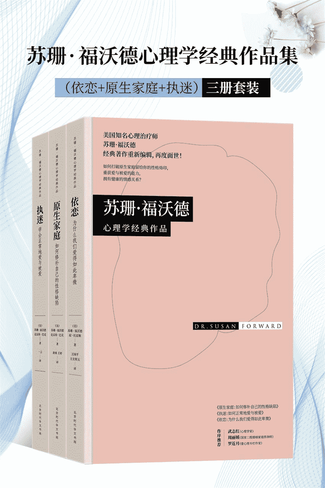

目录依恋：为什么我们爱得如此卑微原生家庭：如何修补自己的性格缺陷执迷：如何正常地爱与被爱

# 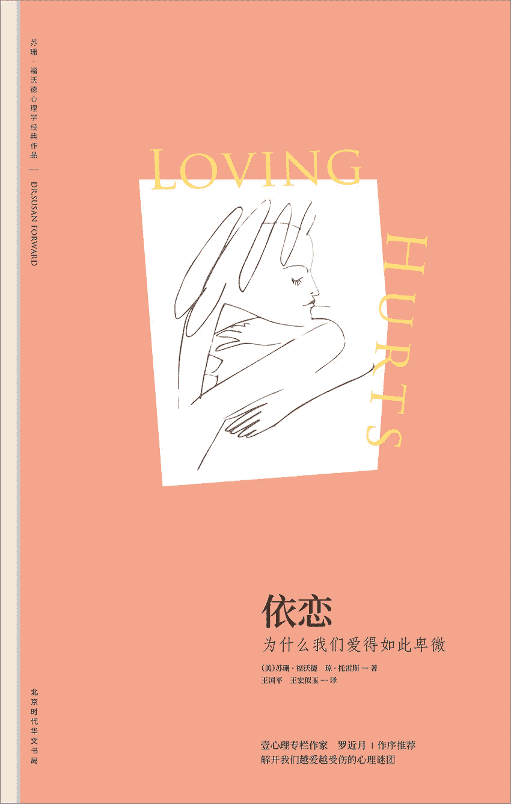

## 依恋：为什么我们爱得如此卑微

**（美）苏珊·福沃德　（美）琼·托雷斯著
王国平　王宏似玉译**

北京时代华文书局

## 图书在版编目（CIP）数据

依恋：为什么我们爱得如此卑微/（美）苏珊·福沃德，（美）琼·托雷斯著；王国平，王宏似玉译.——北京：北京时代华文书局，2018.4

（苏珊·福沃德心理学经典作品）

书名原文：Men Who Hate Women and the Women Who

Love Them：When Loving Hurts and You Don't Know Why

ISBN 978-7-5699-2302-5

Ⅰ.①依…　Ⅱ.①苏……②琼……③王……④王…　Ⅲ.①爱情-通俗读物　Ⅳ.①C913.1-49

中国版本图书馆 CIP 数据核字（2018）第 049216 号

北京市版权局著作权合同登记号图字：01-2017-6649

Men Who Hate Women and the Women Who Love Them. Copyright©1986 by Susan Forward and Joan Torres.This edition arranged with Bantam Books through BIG APPLE AGENCY, INC.，LABUAN, MALAYSIA.Simplified Chinese edition copyright©2018 by Sunnbook Culture＆Art Co.Ltd.All rights reserved.

**依恋：为什么我们爱得如此卑微**

* * *

著　　者　（美）苏珊·福沃德琼·托雷斯

译　　者　王国平　王宏似玉

出 版 人　王训海

选题策划　阳光博客

责任编辑　陈丽杰　袁思远

责任校对　陈丽杰　袁思远

装帧设计　郑金将

责任印制　刘社涛

营销推广　娟娟小宇

出版发行　北京时代华文书局 http：//www.bjsdsj.com.cn

北京市东城区安定门外大街 136 号皇城国际大厦 A 座 8 楼

邮　　编：100011 电话：010-64267120 64267397

印　　刷　三河市华成印务有限公司电话：0316-3521288

（如发现印装质量问题，请与印刷厂联系调换）

开　　本　710×1000mm 1/16

印　　张　16.5 字数 210 千字

版　　次　2018 年 5 月第 1 版

印　　次　2018 年 5 月第 1 次印刷

书　　号　ISBN 978-7-5699-2302-5

定　　价　56.00 元

* * *

★版权所有　侵权必究★

目录扉页版权信息作者介绍关于本书推荐序 女人的幸福，到底去哪儿了为什么我们爱得遍体鳞伤，却找不到症结所在序言 为何爱得如此卑微第一部分 疯狂的控制型关系第一章 从天而降的真命天子第二章 当蜜月结束时第三章 他们是如何取得控制权的第四章 到处都是控制区第五章 她们为什么离不开控制型男人第六章 他们为什么会如此行事第七章 她们为什么会爱上控制型男人第八章 疯狂的控制型关系第二部分 女人的重建第九章 情绪体检：找回你的真实感受第十章 思维暂停法：打消对自己的负面评价第十一章 支持系统：给内心的小孩一个家第十二章 如何处理愤怒情绪第十三章 设定底线：转变你对伴侣的态度第十四章 如何选择合适的咨询师第十五章 如何应对分手恐惧第十六章 爱与尊重：找到你作为女人的平衡点

## 作者介绍

**苏珊·福沃德**

国际知名的心理治疗师、演说家和作家，她的著作有《原生家庭：如何修补自己的性格缺陷》《执迷：如何正常地爱与被爱》《如何识破男人的谎言》《金钱魔鬼》《情感勒索》等。目前，她的作品已被翻译成 15 种文字，在全球发行。

她经常出现在媒体访谈节目中，曾在美国广播公司主持谈话节目长达 6 年，并在美国加州成立了私人性虐待诊疗中心。

**琼·托雷斯**

知名编剧，自由作家，擅长以娴熟的笔触，将故事叙述得格外丰满，有多部电影和电视剧本问世，著有小说《幽灵猫》。

## 关于本书

爱人之间到底应该以什么样的方式相处？你的爱人是不是理所当然地认为他有权管制你的日常生活和行为？你是不是经常会放弃一些重要的活动或朋友来迎合他？他是不是经常嫉妒或者占有欲很强？他是不是经常毫无预兆地就突然从高兴变得愤怒了？他是否总是贬低你的意见、你的感情或你的成就？他是不是动不动就不理你，用钱、用性来惩罚你？是不是你出一点点错他就责怪你……

在这本心理自助指南中，苏珊博士对那些有类似问题的情感案例进行逐一分析，帮助你了解控制型男人所具有的破坏性思想，以及你该如何应对他们的不当行为，包括如何打破固有思想、治愈创伤、重获自尊，甚至如何重建关系或是获得找寻真爱的勇气。

## 推荐序　女人的幸福，到底去哪儿了

罗近月

高级婚姻家庭咨询师，壹心理专栏作家

在这些年的婚姻咨询中，我见过无数活得非常痛苦的女性，当她们找到我咨询时，我以为她们会借此机会好好看看关系是怎么回事，然而我听到更多的期待却是这样：我想知道该怎样控制自己的情绪？我想提升自己的安全感？我想知道如何才能变得不敏感？

当我进一步问她们为什么会有这样的期待时，她们会说：因为丈夫不喜欢，自己也觉得这样不好。除了丈夫的要求，当她们自己的父母、朋友、各类文章也在不断告诉她们如何做女人才是更好的，她们开始进一步怀疑自己。

作为一个多年工作在婚姻情感领域的咨询师，我知道想通过压抑自己来维持关系的女性不在少数。但如果她们只是将所有的问题都习惯归罪于自己的话，她们就既无法改变自己，也无法改变她们的婚姻，只能深陷在痛苦的关系里进退两难。

她们总觉得自己可以变得更好，却又因为无法自控或无法改变自己而挫败。实际上，情绪失控、安全感缺失、对关系敏感看起来好像是她们的问题，其实却只是关系的一个信号灯，暴露出来是他们的相处模式的问题。

看着许许多多的女性在关系里变得歇斯底里，却又不得不为自己的行为自责时，我的脑海中常常冒出这样的问题：女人的幸福，到底去哪儿了？是什么让她们看不清自己的处境？

我多么希望有一本书能让她们稍微多一点看看关系，哪怕只是从冰山的一角开始，也可能让她们更有机会去触碰到真实的自己，而不是一味地为了幻想中的关系去伤害自己。

《依恋：为什么我们爱得如此卑微》这本书作者用深入浅出的语言，为我们清晰展现了控制型关系发展的路线图，既有丰富的案例，也有专业的心理分析，既可以作为女性的自我成长指南，也可以作为专业咨询师评估案例的延伸思考。

我想当任何一个对亲密关系有着更多期待的人拿起这本书时，最直接的改变不是从书中学到什么，而是通过书中大量的案例开始思考自己，理解关系除了自己认为的样子，还有其他更多的可能。打破一味的否定自己的习惯，而这是所有想要从痛苦关系里走出来的第一步。

很多在关系中痛苦的女性以为，只有先改变自己，或者是改变自己的伴侣，现状就会好起来。实际上，只有她们从关系中退后一步，才能清楚地认识到自己、婚姻和人生走向！既看到关系的本质，也看见自己是如何支持这样一段不平等的关系时，作为个人在关系里的能力和力量就开始被看见。

正如作者在书中所说：“很多人不敢回顾造成他们性格和经历的根源，认为过去的就过去了，回首往事无异于顾影自怜。不过自我发现为我们提供了激动人心的新选择，我们越是了解自己性格的成因，就越能顺利的摒弃我们无意义的行为和态度。”

不管你正在什么样的处境中，只有你足够了解自己，了解你身处的关系，你才能开始重建自己，夺回在关系里作为成人的权利。当你能管住自己时，你就准备好要管住你的伴侣了，因为不依赖另一个人独立思考的能力，才是女性找回自己幸福人生的前提！

## 为什么我们爱得遍体鳞伤，却找不到症结所在

●“在艾德拿着杂志上的美女照片，要我学她们之前，我对自己的相貌和身材一向都很满意。他要我学这个、学那个，说只有那样，我才显得更加俏丽，他才更喜欢。他越是这样，我越是认为自己是个丑八怪。”

●“他会说‘我今天早上有个重要的会要开，我要做爱’，但性爱和我一毛钱关系都没有。”

●“我战战兢兢，生怕家里断了奶酪、他爱吃的饼干和爱喝的红酒，否则就会大祸临头。”

●“他动不动就让我出丑，我难过得要命，不想和他一起见朋友，生怕她们见到我忍气吞声的窝囊样子。”

●“我在工作中和在家简直判若两人。工作中，我受人尊敬，才智过人，能力超群。但一走进家门，我顿时成了一个废人。”

●“吉姆心情不好的时候会不理我，我会觉得胃中灼热，然后蔓延到全身。这是我平生最难过的时候。这纯粹是出于恐惧吧。”

通过阅读这本书，这些女性摆脱了折磨她们的男人，重获新生，过上了幸福的日子。相信你也能够做到。愿这本揭示问题真相的书能为你指明方向。

谨以此书献给

温迪（Wendy）和马特（Matt）

## 序言　为何爱得如此卑微

正常人都容不下我这副德性的人。杰夫能受得了我只有一个原因——他爱我。

南希第一次来找我的时候，体重超标将近 30 公斤，还深受溃疡的困扰。她穿着一条肥大的旧牛仔裤，套了一件说不出样子的罩衫，头发蓬乱，指甲被她啃得见了肉，手也不由自主地发抖。四年前嫁给杰夫的时候，她在洛杉矶一家大型百货商场任时尚助理，为商场采购设计大师的作品，足迹遍及欧洲和亚洲的各大城市。那时候，她打扮入时，身边不乏风流倜傥的男士；她写过许多文章，笔下尽是洛杉矶的成功女性。取得这些成就的时候，她还不到 30 岁。但我第一次见到她时，她才 34 岁，却已羞于见人，生怕人家对她评头论足，几乎足不出户。

自从嫁给了杰夫，南希的自信似乎一落千丈。可当我问起她的丈夫，她却喋喋不休地列举了他的种种优点。

他是一个好男人，帅气、风趣、活泼，常常做一些不起眼的小事哄我开心，比如给我送花，纪念我们亲密接触一周年。去年他还给了我一个惊喜，买了两张机票，去意大利给我过生日。

她说，杰夫是一位专攻娱乐界的律师，工作忙归忙，但总想办法抽空陪她。虽说她不敢以现在的容貌示人，但只要出去应酬，他从不落下她。

我以前爱陪他去见客户，因为我们手挽手，就好像一对高中时代的小情侣。因为他，闺蜜们对我羡慕妒忌恨。一位朋友说：“南希，你找到了一位如意郎君呀。”我心里清楚，他的确是我的如意郎君。但再瞧瞧我！想不通我怎么就成了这副德性。我成天想的都是自己太没出息。我要重回从前的模样，不然我早晚会失去他。杰夫这样优秀的男人大可不必守着我这个黄脸婆。只要他愿意，漂亮姑娘多的是，连电影明星都不在话下。他不离不弃，是我的福气。

听着南希的话，再看她的外表，我不禁自问：“这个问题的症结究竟在哪儿？”一个才华出众、能干、爱情美满的女人何以沦落到这么不堪的境地？四年的婚姻生活，究竟出了什么差错，才会毁了她的形象，让她的自我评价一落千丈？

在我的一再追问下，她与杰夫关系的真相才一点一点地浮出了水面。

非要说我对他哪里不满的话，是他经常发脾气。

“发脾气，什么意思？”我问。她竟然苦笑了下。

他跟金刚似的，发起脾气嗓门特别大，又吼又叫。他还经常不顾我的面子。就说昨晚吧，我们陪几位朋友共进晚餐。他兴致勃勃地谈起一出戏，我也插嘴发表了一些意见，他突然打断我，板着脸说：“你给我闭嘴！”接着扭头对朋友说：“别理她。她什么都不懂，就爱瞎说。”我顿时无地自容，连饭都没心情吃了，恨不得找个地缝钻进去。

说着杰夫骂她蠢、自私、没脑子的这些屈辱往事，她忍不住失声痛哭。

我问着问着，这幅画面越来越清晰。在画面中，男方只要一发脾气，就冲女方大喊大叫、摔门、扔东西，而女方千方百计地迎合一个动辄发脾气、恶语相向却又魅力四射的男人。南希说，杰夫刺耳的话常常让她久久不能合眼。她经常没来由地失声痛哭。

结婚后，在杰夫的一再要求下，她辞了工作。如今她想重返职场，却发现困难重重。用她的话说：

现在就算人家要我，我都不敢去工作，别说出差采购了。我不敢拿主意，因为我丧失了信心。

结婚后，家里事无巨细都由杰夫做主。他掌管家里的开销，南希与什么人交往，就连他上班期间，南希在家做什么都要听他的。只要南希的意见与他的不一致，惹他不高兴，他就对她冷嘲热讽，大呼小叫，连当着别人的面，都不给她留一点情面。只要她稍一违背他的意愿，他就能闹得不可开交。

我告诉南希，她有许多问题需要解决，不过我要她放心，她的问题不是绝症，我至少能帮她缓解压力。我告诉她，我们会审视她与杰夫的关系。她自认为丧失的自信并没有丢，不过是寄托错了人，我会帮她找回来。第一次咨询结束后，她平静了许多，不再失魂落魄，而我的心绪却久久不能平静。

南希的故事深深地刺痛了我。我知道，作为一名心理医生，我对来访者的态度就是一剂良药。我与需要疏导的人沟通感情，能让我迅速掌握方法，了解他们的内心。但这次却另当别论。南希走后，我如坐针毡。南希不是第一个来求助这种问题的女人，我也不是第一次产生如此强烈的反应。我不再否认，南希的感受，我感同身受。

在旁人眼里，我自信、快乐，是个什么都不缺的女人。日复一日，我在办公室、在我从业的医院和诊所，语重心长地开导来访者，帮她们重拾自信，重塑她们对自己优点的认识。可回到家，却是另一番情景。我丈夫和南希的丈夫一样，帅气、性感、浪漫，我对他一见钟情，不顾一切地爱上了他。谁知没过多久，我就发现他脾气暴躁，让我自惭形秽、自觉无能并失态。他硬是要掌控我的一举一动，甚至感受和信仰。

作为心理咨询师苏珊，我也许会告诉南希“听你说的，你丈夫的举动不像是爱，倒像是精神虐待”，但我如何用这话来说服自己？苏珊晚上下班回到家，委曲求全，生怕丈夫冲她大喊大叫。苏珊一再告诉自己，他是一个好男人，做他的妻子是自己的福分。要是出了什么问题，那想必也是她的问题。

接下来的几个月，我审视了自己和处于类似情况的来访者的婚姻。究竟出了什么问题，有什么规律可循？虽说来求助的一般是女人，但引起我注意的却是男人的行为和态度。用他们妻子的话说，他们往往帅气、温情脉脉，但常常突然间换一副嘴脸，变得歹毒、刻薄、翻脸无情。这种行为不胜枚举，大到赤裸裸的威胁恫吓，小到没完没了地贬低你，或含沙射影地指责你。不论采用什么手段，结果都是一样的：男人靠不断地贬低女人来取得掌控权，同时推卸责任，不承认是他们的非难给妻子造成了痛苦。恰恰相反，只要心里不爽，他们就把责任一股脑儿地推到伴侣身上。

从我接待过的一对对夫妇的经历，我发现每一桩婚姻都有两面性。只听一面之词，心理咨询师的判断恐怕会有失偏颇。婚姻生活中的龃龉和矛盾，夫妻双方肯定都有责任。所以我往往会请来访者的丈夫一同来治疗。然而，一旦见到了来访者的丈夫，我就发现，虽然他们也有委屈，但相比他们给妻子受的罪，他们的委屈简直不值一提，更痛苦的一向都是女人。她们的自信常常土崩瓦解，许多人甚至还出现了别的症状和反应。比如南希患上溃疡、超重、不注重自己的形象；还有人滥用药物，或借酒消愁，有周期性偏头痛、肠胃病、暴饮暴食、失眠等问题，影响到她们的工作表现。从前叱咤风云的女强人如今会怀疑自己的能力和判断。她们时常抑郁、痛哭和焦躁，甚至到了令人恐慌的地步。在每一个个案中，这些问题一般都出现在两人相处或结婚之后。

发现这些关系中共有的规律后，我开始与同事探讨这件事。她们都表示认识一两个这种男人，他们都会这样对待自己的妻子、恋人，或者女儿。更叫我奇怪的是，虽说我们都见过这种行为，却至今没一个人认真地做过分析总结。

这时候，我开始翻阅心理学方面的文章。由于男人体察不到他们给伴侣造成的痛苦，我首先重新翻阅了人格障碍方面的资料。有人格障碍的人感觉不到愧疚、自责或忧虑。这些情绪虽说叫人不痛快，却必不可少，我们在人际交往中需要他们从伦理道德层面控制自己的一言一行。

人们公认的两大类人格障碍中，首先就是自恋，自恋者与女性交往的初衷无非是为了证明自己高人一等。这种类型的男人往往频繁更换女人，为的是不断寻找爱和崇拜。彼得·潘和唐璜便是大家耳熟能详的两个代表人物，他们被人称作“不会付出爱的男人”。

我研究的这种男人却另当别论。他们爱得很深，在许多案例中，他们与一位固定的伴侣长相厮守，白头到老，但他们的初衷却有别于自恋者，他们需要的是掌控，而不是被人爱慕。

两类人格障碍中的另一类是极其危险的反社会分子。这种人频频制造事端，撒谎欺骗成了他们的习惯。只要有人落入了他们的手中，无不受到利用和盘剥。这类人既有普通罪犯，也有成功人士。反社会分子的一个显著特征是丧心病狂，完全没有道德底线。

但我要研究的男人在人际交往中明白事理、左右逢源，不像反社会者。他并非对谁都一视同仁，相反，他非常有针对性，可惜的是，他针对的却独独是自己的伴侣。

他的武器是语言和情绪。他虽不赞成用武力对待自己的伴侣，却一贯施以精神暴力，结果感情蹂躏的伤害反而重于身体暴力。

不知道这些男人是否从他们强加给伴侣身上的痛苦中获得了快感。真是这样的话，那他们不就是虐待狂吗？

和我探讨过这一发现的人多半一口咬定，与这种男人搅在一起的女人都是典型的受虐狂。我气坏了。我知道，给婚姻不和谐的女人贴上一个“受虐狂”标签的做法，在我们这一行，甚至我们的文化中由来已久，认为这种女人追求痛苦、享受痛苦。用“受虐狂”一词解释为什么这么多女人自暴自弃、对男人惟命是从虽说省事，却贻害无穷。其实，女人早就习得了这种行为，一个自我评价低、听话顺从的女人，在社会上往往会得到回报或颂扬，可是“做个温柔、可爱的女人”这种从小所受的教育，恰恰是她频频遭到虐待的根源。“受虐狂”这个概念格外有害，因为它为欺负女性的行为开脱罪责，一口咬定“女人就爱这样”。

与前来咨询的夫妇们深入交流后，我发现这些丈夫们都不属于上述两类。相比虐待狂，与其说他们从伴侣的痛苦中获得了情感慰藉或性快感，倒不如说伴侣受的罪让他们又气又怕。这些男人不是虐待狂，这些女人更不是受虐狂。男人的暴虐给不了女人一星半点变相的性欲或情感上的满足。恰恰相反，虐待让女人意志消沉、一蹶不振。我再次发现，这些心理学分类和术语都解释不了我所了解的两性关系。我要研究的男人也不在我查阅的文献之列。

他算不得一个活脱脱的反社会者、自恋狂或者虐待狂，尽管他性格中常常具有这些成分。这种男人和心理学文献中提及的男人之间最显著的一个区别，在于他能长期守着一个女人。但可悲就可悲在，他千方百计摧残的却是他口口声声说深爱的女人。

作为心理咨询师，我深知“我爱你”这三个字不足以说明两人相处中的一切。我知道，证明“我爱你”靠的是行动，不是动听的语言。听着来访者的倾诉，我不禁想：“他就是这样对待他深爱的人的吗，这不是对待仇人吗？”

希腊语中有一个描述控制型男人的词——misogynist，“miso”意为“仇视”，“gyne”意为“女性”。虽说这个词在希腊语中存在了几百年，但指的一般是杀人狂魔、强奸犯以及其他对女性施暴的人。严格来说，这些罪犯都是控制型男人。我认为，我要探讨的男人也属于这一类，只不过他们选择的手段不同罢了。

深入了解了控制型男人和他们的婚姻生活后，我不仅对我的客户，甚至对我的丈夫、我自己和我的婚姻都有了深刻的认识。那时候，我们的家庭关系极其紧张。每天临下班，为了多在办公室赖一会儿，我都要绞尽脑汁编造种种借口。我的几个孩子成天紧张兮兮，我的自信落到了前所未有的低谷。说句实话，如果要收集控制型男人婚姻生活方面的文献资料，我和丈夫恐怕是一个典型的例子。在他眼里，一切都是我的错。大到业务有难题，小到皮鞋没擦亮，他都怪我。尽管那段时间主要靠我挣钱养家，但他对心理咨询这一行和我，不是冷嘲，就是热讽。

他越是指责我自私自利、对他漠不关心，我越是低声下气、一味忍让，甚至故意怠慢工作来讨好他。刚结婚时，我是个快乐、活泼的姑娘，时隔十四年，我却成了一个整天担惊受怕、常常强忍眼泪的怨妇。我要么忍无可忍，喋喋不休地质问他，要么躲到一旁生闷气，不敢直面我们婚姻关系中的问题。

后来的一件事让我如梦方醒。当时我着手处理成年人被当作儿童性侵的案例。我坚持将这一问题公诸于众，从而得到了广泛关注。随后，我签下了处女作《对天真的背弃：乱伦及其余孽》(*Betrayal of Innocence：Incest and Its Devastation* )的出版合同。那天，我兴冲冲地跑回家，想与丈夫分享我的幸福和喜悦。但一跨进家门，我就看出他心情不好。我明白，这条喜讯只会让他更加失意，于是我对自己的好消息只字不提，进了厨房，给自己倒了一杯酒，聊作庆祝。我非但不能与我深爱的男人分享幸福时光，还要把幸福埋在心里，深怕惹他不快。

这时候，我意识到我们之间出现了严重的问题。我和丈夫，还有前来咨询的夫妇，都需要别人帮我们解决问题。不过，我丈夫说什么也不肯改变他的态度，或者改善我们的关系。到了最后，我只能得出一个结论：我要是不彻底妥协，恐怕连这段婚姻都保不住。

这一巨大的转变让我伤心了许久，但上苍关上了一扇门，同时又为我开启了一扇窗。我从自己身上发掘出前所未有的创造力和活力。没过多久，我的事业有了很大的起色。我的书出版了，业务不断增长，我还办了一档全国性的现场连线广播节目。不论是广播，还是咨询业务，我接待的婚姻中跟我有着类似遭遇的女性越来越多。广播节目中，打电话来倾诉的女性少则忍受了几个月的精神虐待，长则半个世纪。她们叙述了几个能说明问题的事例后，我一般会针对性地问如下几个问题：

●他是不是理直气壮地认为自己理应左右你的人生和一举一动？

●为了取悦他，你有没有放弃过对你来说非常重要的活动，断绝了与亲朋好友的来往？

●他是不是一贯瞧不起你的观点和感受，贬低你的成就？

●一旦惹他不快，他会不会冲你大吼大叫、放狠话，或者干脆躲到一旁生闷气？

●说话之前你是不是如履薄冰，一遍遍地想着该怎么说，深怕一句不慎惹他动怒？

●他是不是说翻脸就翻脸，让你无所适从？

●你是不是经常心乱如麻，觉得自己干了蠢事，或是配不上他？

●他是不是一个醋坛子，有极强的占有欲？

●在关系中，他是不是认为你是引起所有问题的罪魁祸首？

我提的问题，如果她的回答多半是“是”，那么，她遭遇的很可能是一个控制型男人。我阐明了她们生活中的遭遇，解开了她们的心结。即使隔着一条电话线，我也能听出她们语气中的释然。

在相信自己揭露了一大心理障碍后，我打定主意，到电视谈话节目《早安洛杉矶》(*A.M.Los Angeles* )中小试身手，探讨这个话题。我在节目中探讨了控制型男人惯用的手段和行为。

节目刚一结束，几名女工作人员就围了过来。看来她们都有过与这种男人相处的经历。第二天，广播公司宣布，我的节目接到的电话反馈创了这个台的历史纪录。

此后不久，我又上了波士顿一档脱口秀节目。这次我花了整整一个小时探讨这个话题，得到了更加热烈的反响。信件从全国各地纷至沓来，我明白我切中了问题的要害，触到了大家的伤心处。女性朋友们在来信中言之切切，都在问哪儿能买到关于控制型男人的书，都希望能深入了解这个问题。

她们在来信中倾诉的经历深深触动了我。她们都需要有人告诉她们：她们在婚姻生活中的感受并不“荒唐”，她们并非“一小撮人”，还有人能理解她们，不像伴侣那样否定她们、贬低她们。

她们的反响让我坚信，认清、阐明、理解这种婚姻生活的状况，能让女性摆脱压在心头的自责。这时候，我明白我必须写这本书，我不仅要帮女性认清她们的遭遇，而且要帮她们找到对策。

要想改善关系，我们势必要了解出了什么情况，但光是了解还远远不够。了解不过是认知训练，要想转变自己的人生，改善我们的亲密关系，我们就必须有所行动，而不仅是转变认识。

为实现这个目标，我将本书分为两个部分。第一部分，我要探讨有问题的亲密关系的成因和机制。我将从最初的浪漫和激情，讲到最后的迷茫和痛苦，从各方面剖析女人坠入控制型男人情网的各个阶段。我要分析男性产生这种表现的根源，还要探讨女性渐渐变得逆来顺受的情况和成因。

在这个过程中，我会穿插一些在咨询业务中积累的案例，并且将这些案例贯穿本书的始终。为了保护当事人的隐私，我会隐去她们的姓名和明显特征。但我会在力所能及的范围内保留她们的遭遇和叙述。

本书的第二部分，我选撷了近几年琢磨出的一套行之有效的行为技巧，指导你改善与伴侣的关系，彻底改变你自己。这种技巧将帮你学会自卫，不再为控制型男人左右，摆脱迷茫，重拾自信。

你现在正处于痛苦的两性关系之中也好，往昔的伤口已经愈合也好，或是担心将来遭此不幸也好，本书中的某些内容都可能会激起你强烈的情绪波动。在你踏上这段阅读之旅时，尽管我不能一路相伴，但我希望你能感受到我的关心、牵挂和鼓励。

## 第一部分　疯狂的控制型关系

### 第一章　从天而降的真命天子

一见钟情是非常美好的爱情体验。茫茫人海中，你偏偏一眼看见了他，你们四目相遇，那一刻，仿佛一股电流传遍了你的全身。只要他在身边，你就手心冒汗，心儿仿佛小兔，突突乱撞，你好似浑身上下都焕发着活力。他就是你的意中人、你的如意郎君。只要有他相伴，你就会兴奋、幸福。这种情愫挡也挡不住。这就是浪漫的爱。

罗莎琳德 45 岁那年遇到了吉姆。她生得漂亮，一头红褐色的头发，始终不懈努力地保持着高挑儿、匀称的身材。她开了一家古董店，是一位事业有成的古董商和收藏家，也是广告界的成功人士。她有过两段婚姻，儿子现已长大成人。在见到吉姆本人之前，罗莎琳德就已经听朋友说了很多关于他的事，早就盼着能见他一面。有一天，几位朋友带她去听他在当地举办的一场爵士音乐会。演出结束后，一行四人出去小聚。吉姆身材高大、皮肤黝黑、英气逼人，罗莎琳德深深迷上了他。

我和吉姆互生好感。我们谈了许多，孩子呀、音乐呀……他说他结过婚，现在一个人带着两个孩子，这给我留下了很深的印象。他兴致勃勃地听我谈起我的古董店，因为他做的是家具改装，对上下游市场都很感兴趣。他问我第二天晚上能不能再见一面。结账的时候，我看出他手头不宽裕，于是主动安排第二天在我家见面吃饭。他拉起我的手，紧紧地攥着，盯着我的眼睛。我看得出，他感谢我的良苦用心，感激我理解他的处境。

第二天，我无时无刻不在想他。后来他到了我家，一切都是那么美妙。晚饭后，我播放了《一位明星的诞生》(*A Star Is Born* )这首曲子，我们两人踏着旋律，在客厅跳了一曲。他紧紧地搂着我，我感觉周围的世界都跟着我旋转。“这个男人真心爱我，他身材魁梧，肯踏实地经营一段感情。”我人随着他翩翩起舞，心中一一闪过这些念头，感觉太开心了。这也许是我平生最浪漫的一天。

吉姆碰到罗莎琳德的那年，他 36 岁。和罗莎琳德一样，他也沉醉在他们的浪漫之中，相信她就是自己这辈子要找的女人。他事后告诉我：

她漂亮，是个不服输的人。她有自己的事业，全靠一个人打拼。她独自抚养儿子，是个称职的母亲。我从没见过她这样的女人。她活泼、开朗，对我的生活中的一切，甚至我的两个孩子都非常热心。她完美无缺。我给所有的朋友都打了一遍电话，夸她有多好，甚至打电话告诉了我的妈妈。我跟你说，我这辈子还没对哪个女人爱得那么深。我从没像这样想着一个人，我无时无刻不想着她、梦着她。真的，这的确非同寻常。

第三次见面后，罗莎琳德在自己的名字后添上了吉姆的姓，体会那种属于对方的感觉。她推掉了一切应酬，生怕错过他的电话。吉姆也没辜负她的厚爱。他没有高高在上，玩欲擒故纵那一套，反而和她一样认真对待这段感情。他说到做到，只要答应给罗莎琳德打电话，就一定会打，不像别的男人隔三岔五才打一个，也决不会推说工作忙，耽误了和她见面。两人在一起的感觉就像坐过山车，快乐、刺激。

劳拉是我的另一位咨询者，她的艳遇过程更是生动诠释了“一见钟情”这个词。当时她是位事业有成的财务主管，在一家大型化妆品企业工作。她一头浅棕色的秀发，一双黑色的杏眼，身材苗条，是一位非常标致的女人。第一次邂逅鲍勃那年，她 34 岁。那天晚上，她陪一位女朋友去饭店吃饭：

我离席打了一个电话，等我回来，却发现一个大帅哥坐在我的位置上陪我的朋友聊天。他早就注意到了我，故意待在那儿等我回来。四目相遇的那一刻，我们就仿佛全身过了电。我平生也没对哪个男人有过这样的好感。他生着一双我抵挡不了的明亮的大眼睛。见到他，我就魂不守舍，一门心思地爱上了他。

第二天晚上，我们第一次正式约会。他带我去了一家海边的小餐馆，点了许多我喜欢吃的菜。他是一个懂酒、懂美食的男人，而我喜欢的恰恰是男人的这种品味。他对我的职业、见解、爱好……似乎样样都感兴趣。我叽叽喳喳地说个不停，他却安静地坐在那儿，用那双迷人的眼睛望着我，用心地倾听。饭后，我们回到了我的住处，一块儿听音乐，然后我使出浑身解数，希望能与他亲近，可惜他始终都表现得非常绅士。我爱的就是他这种风度。和他在一起，令人心醉神迷。我平生从没觉得与哪一位男人那么亲近过。

鲍勃 40 岁，在一家服装厂做销售员。他告诉劳拉，他年前才离的婚。相处的第一个月，他和劳拉就搬到了一处，开始谈婚论嫁了。他把劳拉介绍给自己的两个小孩，孩子们很快就和她打成一片。鲍勃爱孩子，这让劳拉更加喜欢他。

杰姬和马克的浪漫史源于一次相亲。从第一晚开始，两个人就认真地对待这段感情。用杰姬的话说：

我打开门，只见眼前站着一个大帅哥，只顾冲着我笑。他说的第一句话是：“我能用下你的电话吗？”我眨了眨眼睛，说行，他过去拨了我们介绍人的电话，说：“喂，约翰，你说得没错。她和你说的一样。”那仅仅是当晚的一个开端。

杰姬娇小玲珑，认识马克的时候，刚刚年满 30。她是一名小学教师，一边要养活上一段婚姻留下的两个孩子，一边要攻读博士学位。马克 38 岁，最近在竞选公职。杰姬记得在满大街的广告牌上见过他的照片。她对他颇有好感，能被他看上，她无比开心。

我们请媒人约翰夫妇出去吃饭。约翰的太太对着我说：“我晓得你们才刚刚认识，但我还没见过比你们更般配的一对人。”她拉着我的手说：“你得嫁给这个男人才行。”马克点了点头，对我说：“听她的准没错，她看人很准！”接着又小声对我说：“你惹麻烦了，你惹的麻烦叫马克。”我笑了，反问他：“是吗，你这个麻烦要干什么？”“你就等着瞧吧。”他说。那晚他送我回家，将车停在我家门口，吻了我。“我知道我是痴心妄想，但我要说，我坠入了你的爱河。”就是那么浪漫。

第二天一早，他打电话过来。我说昨天晚上的话我没听清，他说：“没关系，我一个字一个字地再给你说一遍。”

从那天晚上开始，杰姬就觉得自己仿佛坐上了一块飞毯。马克这么快就爱上她，让她觉得飘飘然。

#### 每段恋情都有浪漫的开始

浪漫让你情绪高涨，意乱情迷。恋爱之初，你们仿佛干柴碰到了烈火，真心难以克制。恋爱像是给你打了一针兴奋剂，将你送上了快乐之巅，这是因为你的身体在这个阶段分泌出许多化学物质，能让你容光焕发。

但是，永远的浪漫不过是文人墨客杜撰出来的故事。我们常听人家说，浪漫的爱情有着让女人完整和幸福的神奇魅力。小说、电视和电影推波助澜，更加让人坚定了这一信念。但令人啼笑皆非的是，连最失败的婚姻一开始也充满了这种快乐和期许。等到浪漫逝去之后，罗莎琳德原本生意兴隆的古董店濒临倒闭；昔日的财务主管劳拉如今意志消沉，都不晓得能不能再找到一份工作；还有从前教书、学业、抚养孩子都不误的杰姬，现在常常莫名其妙地失声痛哭。当初美妙、令人怦然心动的浪漫爱情究竟出了什么问题？这些女性为什么伤心欲绝、大失所望？

#### 暗藏威胁的浪漫旋风

我认为，一段说来就来的浪漫关系就像一阵暗藏威胁的旋风。这种隐隐的威胁能为爱情增添几分兴奋和刺激。就像骑马，小跑固然惬意怡情，可惜终归少了乐趣。骑马的刺激在于打马飞奔，在于你不知道接下来会发生什么。如果旋风般的激情中再添加性爱作为催化剂，就会发展得更加飞快、热烈。

我们往往不会通过常规的过程去了解新伴侣，再说我们哪来那么多时间！旋风般的激情来得又急又快，只会冲昏两个人的头脑。凡是有损伴侣完美形象的事，我们一概视而不见，仿佛两个人都装了滤镜，双眼只盯着对方带给我们的快乐，却忽略了他的为人。我们还自有一套逻辑：和他在一起的感觉那么好，那他一定是个好人。

旋风般的浪漫关系，虽然刺激，但不过是种被误认为亲密关系的假象。你的新伴侣有许多品质会影响你今后的人生，只是这种品质一时半会儿是暴露不出来的。为了看清他的真实面目，发展一段牢固的关系，你需要花些时间慢慢了解他，敞开心扉，认清他的美德、接受他的缺点。

#### 盲目的爱人们

劳拉和鲍勃第一次见面，就产生了奇妙的化学反应，互相倾慕，但这种倾慕与对方本身是什么样的人扯不上关系。劳拉兴致勃勃地说起的不是鲍勃的性格，而是他的眼睛，他的举止，他在餐馆是怎么给她点红酒的，却从没说过：“他是一个正派、率真的男人。”鲍勃满足了她心目中的“如意郎君”这个角色，两个人都钻进了自己编织的套子，不能自拔。

劳拉和鲍勃同居后不久，两人之间就暴露出第一个不合的迹象。

有一天他对我说：“我忘了跟你说了，我还没离婚呢。”我险些没从椅子上一头栽下来，因为那时候，我们正在筹划婚礼！他说：“我感觉自己已经离婚了，我觉得离了婚也就是现在这样。”我惊讶得说不出话来，就那么愣愣地望着他。接着他告诉我，离婚手续正在办，他会办好，叫我不必担心。我突然发现，他从一开始就没对我说实话，他已经和我约会了好多次，却对这件事只字未提。但事已至此，要紧的不是他骗不骗我，而是他赶快把婚给离了。

鲍勃的欺骗本该引起劳拉的警觉，她应该好好审视一下他的为人才是，可她却不想看破，还是执意认为鲍勃就是她的梦中情人。

杰姬也早早地见到了苗头。一开始与马克相处，他说了很多自己对女性的看法，但他说的都是对杰姬的阿谀奉承之词，所以杰姬也没觉得有什么不对劲。

他说他以前交往的女人只关心“你能给我什么”，但他发现我和她们都不一样，我只关心自己能给他什么。他说，我好像是上天的安排，来到这个世上独独为了照顾他似的。他说别的女人贪得无厌，只知道一味地索取，为了过上安生日子，他只好避之如瘟疫。但我却另当别论。

马克把天下的女人都归作一类，一概斥之为“贪婪”“自私”“靠不住”，这本身就能说明马克的观念有问题，可惜杰姬却置若罔闻，只注意到马克说她“与众不同”，能让他“过上好日子”。

一件事也早早地向罗莎琳德敲响了警钟，可惜她却充耳不闻。

第一次约会，他到我家来吃晚饭，我们上了床。谁知他在床上的表现却差强人意，叫人好不扫兴。但我安慰自己说，与新伴侣第一次不举的男人不在少数，这没什么大不了。第二天早上，我们又做了一次，他稍稍好了些，但我还是看出他有这方面的问题。我自忖我能帮他克服这个障碍，还安慰自己，在夫妻生活中，性不是第一位，对我而言第一位的是吉姆的亲切和他对我的尊重。

罗莎琳德采取了大多数女人的做法：她略过了破坏浪漫画面的不和谐因素。吉姆让她觉得幸福，她就低估了后来严重影响夫妻感情的一个问题。

许多女性不自觉地将两性感情这幅画面分作前景和背景两部分。前景是男人具备的一切优秀品质。这些品质被关注、放大、美化。凡是不利的迹象都被归入背景，忽略不计。

这种现象的一个极端的例子就是那些死心塌地地爱上杀人犯的女人。她会告诉你，他是世界上最优秀的男人，世上只有她才懂他。杀人这种罪行沦为了“无关紧要”的背景，杀人犯外在的魅力却被推到了前景。

人们描述浪漫爱情的最初阶段的措辞就很能说明问题：

●我就是看不出他哪儿不好。

●我不想一味盯着他的缺点。

●我干脆闭上眼睛，希望这次我们俩会不一样。

●我当初想必是瞎了眼，才没发现他这个毛病！

那个人让你开心的时候，你很容易就忽略了他以前失败的爱情经历、他的毛病和那些不负责任的苗头。一切有损浪漫画面的情况，你都视而不见。

#### 绝望和困惑

在这种畸形关系的早期反复出现的另一个问题是双方潜在的绝望感：他们都生怕失去了对方。

马克告诉我：“我之所以对杰姬态度不好，就是生怕她跑了。”从马克的话中不难看出，他对杰姬的感情除了爱，还包含着一丝惶恐。他说：

我们第二次约会时，我干脆跟她摊了牌。我告诉她我想过什么样的生活，我说我们是一定要结婚的。我问她还有没有别的约会对象，她说有，我叫她断了，因为除了我，她从现在起不能再见任何一个男人。我是认真的，我也希望她能认真。

在杰姬眼中，马克的猴急，证明他诚心诚意地投入了这段感情。

劳拉的遭遇却又是另一番情景。遇到鲍勃的时候，离她 35 岁生日还有两个月。她生在一个传统的意大利家庭，家人催着她结婚生子。相处第一个月，鲍勃就急着结婚，她不仅开心，而且松了一口气。

局外人见到这种闪电般的婚姻，也许要说一句：“太草率了吧？”两个人在几个星期内相识、相爱、同居，开始谈婚论嫁，显然不是你爱我、我在乎你、希望在一块儿那么简单。

这些人体会到的是一种高涨的、迫不及待地想尽快融入对方、合为一体的欲望。自我感退居其次，他们开始感受对方的感受。每一种情绪的变化都能传染。工作、友谊以及其他活动往往都退居其次。他们把大量的精力都投入到了爱、被爱、获得认可，以及在心理上融入对方中去了。

恰恰是这种恨不得立即结为一体的欲望，推动着两人感情飞速发展。

#### 拯救感

拯救感恐怕是畸形关系中的另一个重要成分。它构建了一种特殊的关系，让女人觉得这个男人没她不行，仿佛自己成了侠女。

与马克相处之初，杰姬的快感多半出自她对马克不尽的关怀和母爱。她要为他付出，她的爱将弥合他人生中的一切创伤。她知道，只要她肯付出，他就会发挥潜能，成为一个事业有成、有所担当的男人。她说：

第二次见面，他就对我和盘托出了他的经济状况，我好高兴他能对我坦诚相告。他 38 岁了，没有工作，一心竞选公职。我觉得这没什么，说不定他当选了呢。他和蔼、帅气、讨人喜欢、前途光明，只要我助他一臂之力，他一定没问题。我打定主意，要用爱和支持帮他重振雄风。

杰姬认为，她能用爱转变马克。对许多女性来说，这个信念犹如一针鸡血，让她自以为是女神、大地之母，或是妙手回春的良医。她的爱能抚平他的创伤，他的问题是贫穷、吸毒也好，不满前任也罢，都不在话下。通过支持、帮助和付出，她为自己营造了一种强大有力的假象。另外她心里还有一种英雄主义在作祟：通过拯救一个男人，她显得更加高尚，因为他是在她的帮助下脱胎换骨，成了一名非同凡响的男人。

殊不知，帮助和拯救之间存在着天壤之别。谁没有困难的时候？谁不需要请别人施以援手，帮自己挺过人生的难关？如果你有能力，可以帮助你的爱人渡过经济难关，也可以表示同情和支持，让对方知道你和他风雨同舟。不过，我说的前提是他能照顾好自己，能解决自己的问题。他不过是暂时遇到了困难。你只需要偶尔拉他一把，但不是常态。

然而拯救却是一种重复性的行为。这种男人手头一向拮据，动不动就来找你求助。他工作不定、生活无着，却一味地怪别人待他太刻薄。

我们不妨比较一下这两类男人：

第一类男人：工作一向勤勤恳恳，经济宽裕。他所在的公司被人收购，他被裁员。找到下一份工作前，他要借点钱渡过难关。他积极找工作，一旦找到，他会将钱如数奉还。

第二类男人：他这辈子没哪一天不缺钱，三天两头跑来找你“救急”。工作从来都不会如他的意，他一贯与老板、上司相处得不好。等他好不容易找到了工作，薪水又少得可怜，根本无法把借你的钱还上。

罗莎琳德认识吉姆的第一晚就注意到他手头拮据，她当即出手给他解围，把第一次正式约会安排在自己家吃晚饭来化解尴尬。没过几个星期，她又叫他带两个十多岁的孩子搬过来和她一块住，直到他在一个乐队找到一份稳定的工作为止。“他说我是天底下最好的女人，自从他认识了我，人生发生了天翻地覆的变化。”不久，她就养起了他们一家三口。

起初，吉姆对罗莎琳德感恩戴德，爱她爱得更深。吉姆和许多控制型男人一样，认为她的帮助证明她真心在乎自己。

许多女性享受着伴侣的感激，当真以为对方少了自己不行。这也难怪，帮爱人一把，感受到你的爱和付出改变了他的人生，的确令人激动。他的感恩戴德也许让你感觉良好，渐渐以为这是一份丰厚的回报。

不过，控制型男人并非个个都需要拯救。许多人有不错的工作，收入稳定。其实，这种男人越是事业有成，越是认为他生命中的女人要依靠他。只有那些一事无成又大男子主义泛滥的男人才期待被人拯救。他的一事无成表现在许多方面，比如手头拮据、吸毒、滥情、赌博，或者守不住一份工作。这种男人经常向别人发出求救信号。许多女性，尤其是有着自己事业的女性，听到信号后往往会带着救生工具匆匆赶过来，殊不知一个回头浪，反而搭上了自己的幸福。

并非每一段炽热的爱情都以畸恋告终，激动人心的爱情也常常会有好结果。不过，如果除了开心和浪漫外，你对我上面提到的其他成分，比如拯救感，一丝惶恐和绝望，亲密关系发展得太快等，故意视而不见，那么，你最终会被推向波涛汹涌的苦海。

### 第二章　当蜜月结束时

让你的“如意郎君”暴露出邪恶一面的，往往是一些看似不起眼的小事。它们会让女性一时摸不着头脑，不晓得对方为什么突然之间失去了魅力，变得脾气暴躁，让你独自背负无端的指责。

劳拉在平安夜遭遇了第一次变故，那时候，她和鲍勃同居刚刚四个月。她是这样说的：

那晚我包礼物一直包到深夜，他说他困了，要我陪他一起睡。我说你先睡，我一包好就去，谁知他顿时发了脾气。他要我立刻上床。那晚我们已经亲热过了，所以我明白他不是为了那个。我没见过他发那么大的脾气。还没等我回过神来，他就冲我大吼大叫，骂我自私自利。然后气冲冲进了卧室，狠狠摔上了门。那响动仿佛整栋楼都在抖。我坐在那儿，整个人都没了主意，不知道该怎么办。最后我把这事归结为过节了，他压力太大的缘故。

劳拉一心只想着鲍勃给她留下的好印象，不肯承认他发脾气是一个危险的征兆。如果她没有一味沉醉于浪漫的爱情，说不定能冷静冷静，从这件事中看出鲍勃脾气暴躁。这是一个非常重要的信号，甚至会影响她的人生。谁知她非但没有警觉，看出爱人的爆发纯属幼稚和喜怒无常，反而找出种种借口替他开脱，将他的不合理行为合理化。

#### 将不合理行为合理化

当某件事让我们不舒服时，我们就会将它合理化，将接受不了的事变得可以接受。那些原本令人伤心的事，只要给它们找一个“好理由”，我们就可以坦然面对，不会再茫然无措甚至心怀恐惧。合理化和我在第一章探讨的视而不见不是一回事。合理化是我们看见了情况，也承认它有煞风景，我们不是否认确有其事，而是将它重新定义，换个说法。

吉姆搬到罗莎琳德家不久，她就开始为他许多不负责任的行为开脱。她告诉我：

吉姆总是找不到有偿演出的机会。他在许多乐队待过，可惜那些领队对爵士乐简直一窍不通。就音乐本身来说，我知道吉姆是对的，但出于经济考虑，我希望他能放下架子，多些宽容。

罗莎琳德替吉姆无法找到一份稳定的工作找了个很好的借口。其实，吉姆脾气暴躁，在工作中顶撞权威人士。但她却每次都认为是领队不懂音乐，不怪吉姆的人品。

以下是女人们千方百计替伴侣过去和现在的行为开脱的几个例子：

●对，他结过三次婚，不过只有我才最了解他。

●他做生意好几次都失败了，但都怪合伙人不厚道，把他的钱坑得精光。

●他说了他前妻不少坏话，但这也怪不得他，怪只怪她贪得无厌、自私自利。

●我知道他贪杯，但他不是正官司缠身吗，等官司了结，他会戒酒的。

●那次他冲我大吼大叫，真把我吓坏了，但那不是他眼下压力大嘛！

●我说他不对，把他气坏了，但话又说回来了，谁会喜欢人家跟自己作对呢？

●他发脾气，我真怪不得他，你瞧他小时候过得也够可怜的了！

当一个女人说到伴侣大发脾气，又加上一句“他不过是因为……”时，她就是在将他的行为合理化。

谁也不见得天天都有好心情，谁都会偶尔发个脾气，我们不能指望自己时刻温和谦让，也不能去苛求别人。当然，我们偶尔也要善解人意，理解自己的爱人有时压力太大，或对某些问题格外敏感。我在这里探讨的不是一贯和善、彬彬有礼，只偶尔发个小脾气的男人。这种男人事后会勇于承担责任，真心后悔自责，不该把自己的爱人当作出气筒。

控制型男人却另当别论，对自己的突然发作，他不会有丝毫的悔意，而被他伤害的女人却在千方百计地为他越来越频繁的发作找理由开脱。

合理化是人的本能反应，并不是什么严重的问题。但是当你习惯性地将伴侣的错误行为合理化，那就真的成为问题了。随着他发脾气的频率越来越高，你也要越来越多地为他开脱才行。

#### 双面人

如果一个男人整天发脾气、对伴侣横挑鼻子竖挑眼，那么谁都有失去耐心、懒得再替他开脱的一天。但事情往往是，一通“狂风骤雨”过后，他又是当初那个帅气、可爱的男人。这样的好时光让你抱定了一个错误的信念——不愉快的日子只是一场噩梦，那并不是他的“真面目”。他浓浓的爱意让你又有了盼头，希望从现在起，一切都会好起来。可惜你拿不准他什么时候会再发作，因为他每次发作表现都不太相同，这种行为正反映了英国作家罗伯特·史蒂文森（Robert L.Stevenson）在其经典小说《化身博士》(*The Strange Case of Dr.Jekyll and Mr.Hyde* )中刻画的人性的光明面和阴暗面，我称这种人为“双面人”。

鲍勃在平安夜发作后，劳拉一时没了主意，不知该如何与他相处。他还是那么帅气、热情似火，但他在生活中却越来越多地表现出他的另一面。

有一天晚上，我们大吵了一架。我累了一天，浑身像散了架，本想睡个安生觉，但他偏要和我亲热。我好言跟他说，但他偏不听。他胡思乱想，说我嫌弃他，玩弄了他的感情。他越说越气，突然腾地跳下床，把衣柜门捶了一个大窟窿。我吓坏了！我告诉他我受够了，他却突然放声大哭，接着又抽抽搭搭地跪倒在我的脚下。他说他愿意改，只是最近压力太大，求我理解他眼下的处境。我一时糊涂了，不知如何是好。他哭着爬到我的腿上，赌咒发誓说我是他这辈子最爱的女人。我只好搂着他，好言安慰他。说着说着，我们又亲热了起来。我认定，我们过了婚姻中最难的一道坎，从今往后，一切就都顺利了。

劳拉仿佛坐上了她控制不了的跷跷板，一会儿沐浴着鲍勃浓浓的爱意，一会儿承受着他说来就来的坏脾气。

这种阴晴不定的情绪叫人不知所措。你惶惶不可终日，因为你不知道下一刻会发生什么。这好比迷上了赌博：偶尔赢一回，但输的时候居多。你的心悬到了嗓子眼儿，但还抱着大赢一把的指望，赖在赌场，不肯罢手。

与此同理，鲍勃举手投足间都透出对劳拉的爱意，劳拉不禁认为，他的坏脾气不过是暂时的，那时的他不是真实的他。他的矛盾行为和变幻莫测的脾气像个钩子，把劳拉钩得死死的。

到现在为止，我们探讨的虽然是控制型男人的行为，但造成这个局面，女性的参与也是一个关键因素。一旦女性接受了对方的贬低和侮辱，其实就是为进一步的伤害打开了方便之门。相比劳拉的唯唯诺诺，我的一位朋友凯蒂就很懂得自我保护：

我就遇到过这种男人。那次我们相约去墨西哥。他一会儿是位魅力先生，我们玩得非常尽兴；一会儿就成了恶魔，凶相毕露。他认为我给出租车司机的小费太多，就站在大街上凶我。我不知道他当时是怎么想的，连那点小钱都想省，但他那么对我，真是找错人了。我直言不讳地告诉他，如果他再敢这样对我，可别怪我翻脸。他好了一两天，就又犯了老毛病。我说到做到，当即跟他分了手。

劳拉就不同了，她的反应实际上是在告诉鲍勃，她能容忍这种虐待。鲍勃事后的赔礼道歉和表白平息了劳拉心中的愤懑，使她相信他是发自内心的悔恨。也许那一刻他确实觉得过意不去，懊悔不已。如果他之后的态度真如他所表白的那样，劳拉也就没现在这份苦恼了。但他的懊悔并没有持续多久，仅够拖住她罢了。下一次爆发一定会接踵而至。

一旦你接受了一个双面人，一时恶言恶语，一时赔礼道歉，一时勃然大怒，一时风度翩翩，你恐怕就永无宁日了。

#### 都是我的错

我们不妨看看这个逻辑：既然他可以这么完美，那如果出了什么事，就一定是我的问题。控制型男人一再对你说“你要是不这么做”，或者“要是你能改变态度”“要是你能……”“要是你能不再……”，他肯定不会再发那么大的脾气。如果你也这么想，那可就糟了。

劳拉回忆道：

只要我不按他的要求去做，他就会说：“你自私，你不懂得付出！”他还说我没结过婚，怎么懂得与人分享，又怎么懂得如何与伴侣相处。他结过婚，想必更懂得分享。我估计他说的也许是对的，也许的确是我自私。从那时候起，我就开始怀疑我自己。

鲍勃句句都戳中了劳拉的软肋，他把责任成功地推卸到劳拉身上。

控制型男人并非个个都像鲍勃一样脾气暴躁、吹毛求疵。他们也会用转弯抹角、令人费解的方式表达失望，但一样咄咄逼人。我接待的另一位来访者便是一例。

葆拉和格里是在上大学的时候认识的。结婚十八年来，他们养育了四个子女。葆拉来找我的时候刚刚四十出头，她生着一头黑色的秀发，一双会说话的大眼睛，身材高挑，是个长相甜美的女人。她告诉我，早在两人订婚后不久，格里就对她横挑鼻子竖挑眼，从一个体贴的男朋友一下变成了一个唠叨个没完的牢骚鬼，这种落差叫她一时没了主意。

那时候我们已经定了婚。我们一起去听查克·贝里（Chuck Berry）的音乐会。我想听听他唱歌，谁知格里却一个劲儿地挑毛病：

音乐太差劲了，低俗之极，他实在搞不懂我，为什么来听这种连没脑子的人都不愿听的音乐……他一口一个我没品位、没文化。他眼神异样地盯着我，好像我是刚从山洞里爬出来的野人。我知道他说的是对的，但我还是喜欢听陪伴我度过青春岁月的音乐。也许我压根儿就没什么长进，也许我压根儿不能与他相比。我就是个乡巴佬，品味粗俗。

葆拉自认为错在自己，说自己是个“乡巴佬”，认为格里有着深厚的文化底蕴。格里让她始终相信他智力超群。

劳拉也和葆拉一样，很快就一本正经地告诉我，她的确“自私、娇气，不愿真心为别人付出”。

我告诉劳拉，她对自己太苛刻了，又问她怎么会有这种想法，她说：“鲍勃这样说的呀，他说得没错。我自私自利，他怎能不生气。”

葆拉和劳拉都为伴侣的精神虐待开脱，把责任一股脑儿地揽到了自己身上。她们深信，只要找到那把“魔法钥匙”，也就是那些能取悦伴侣的“得体的”举止或态度，她们就能挽回伴侣的心，让他好好地对待自己。就好像葆拉和劳拉说的：“也许我只要对他言听计从，一切就都会好起来。如果一切都是我的错，只有他才能发现我错在哪儿，那么，只有他才能帮我改正缺点，让我成为一个优秀的女人。”

可惜控制型男人的脸像六月天，说变就变。今天讨他欢心的东西，说不定转天就让他厌烦。你吃不准什么东西一下子就惹得他大发雷霆。为了取悦他，你成天挖空心思。

罗莎琳德一直体谅地听吉姆控诉那些麻木不仁、不懂音乐的乐队领队，谁知没过多久，他就掉转矛头，把她当成了出气筒。

我请他有话直说，帮我改掉我身上的缺点，免得他再大动肝火。他自然是欣然应允，可是不管我怎么改，他都会突然发脾气，因为我总是犯错。

罗莎琳德和吉姆发现了一个将他们紧紧拴在一起的共识：只要两人闹了点不愉快，就都是她的错。

#### 他的失望

蜜月期的结束不是单方面的结束。不会一个人回家了，另一个还继续待在尼亚加拉瀑布。因此，当女人为两人关系的变化困惑不解的时候，男人也仿佛被兜头泼了一盆凉水。他一开始认为她十全十美，这时候难免大失所望。用杰姬的话说：

马克对我说过，如果让他描绘一个完美女人是什么模样，他肯定会说是我，不用修饰，无须添油加醋。我就是那么完美，毫无瑕疵。

马克的一番话，让杰姬心里很是受用。因此，她看不清这番话潜在的危险也自在情理之中。其实，马克并没有把她当作一个人，有着人人都有的缺点，而是把她奉为心目中的女神。当然，他希望杰姬永远不变，没有瑕疵。

**你应该是完美的**

我们在前文中介绍的南希和杰夫，大家都还记得吧？他们交往了六个月，接着发生了下面这个小插曲：

那晚我们去听音乐会，过得非常开心。音乐会结束，我们坐在座位上，等着过道上的人潮退去。我刚一起身，他就说：“你急什么急啊？”

接着就冲我发火。他吼道：“我说走你才能走！见鬼，你就爱出风头！”他大发雷霆，我听了莫名其妙。接着他撇下我，径直走了出去。这还不算完，回家的路上，他没完没了地数落我，把我吓坏了，一时不知该怎么办。估计我肯定犯了什么大错，不然谁会无缘无故地发那么大的脾气呀！

南希想错了，控制型男人确实会无缘无故地发那么大的脾气。哪怕为了针尖大的一点小事，他也能大动肝火。他夸大其词、虚张声势、小题大做。也许是伴侣忘了去取干洗的衣服，也许是烤煳了面包，也许是卫生纸没了。他会抛下一贯斯文的风度，好像她犯了弥天大罪。比如音乐会结束，南希先他一步起身就足以惹他动怒。可南希的态度却截然相反：她想息事宁人。她接受了他的无理取闹，还为他的所作所为开脱。令人啼笑皆非的是，他为了一点小事大为光火，她却夸大了自己的罪过，为他推卸责任。

南希告诉我，杰夫一向明白无误地告诉她，两人到了这个地步，全是她的错。他说他对南希心灰意冷。她变了，不再是他心目中的她。他感觉自己受到了欺骗。他当初爱上的完美女人究竟去哪儿了？

**你应该精通读心术**

控制型男人希望用不着他明说，女人就能了解他的心思和感受。他希望她能想他所想，将满足他的需要当作自己人生中的头等大事。只有能读懂他的心思，才能证明你爱他。他会说：

●如果你真爱我，难道不明白我的心思？

●如果你不是只顾着自己，你应该知道我想要什么。

●如果你当真在乎我，应该知道我累了。

●如果我的需要对你来说算个事的话，你应该知道，我压根儿不想去看电影。

“你应该知道”这句话的言外之意，是你应该有火眼金睛，一眼看穿他的想法和希望。他没义务说出来，明察秋毫可是你的责任。一个女人要是没这点特异功能，只能说明你无能，日后只会成为他指责你的把柄。

**你就应该一味地付出**

典型的控制型男人指望伴侣是一眼永不枯竭的源泉，为他奉献一切，爱他、崇拜他、关心他、支持他，还要挣钱养着他。在这段关系中，他就像一个饥饿、苛刻的婴儿，无声地要求对方奉献一切，满足他的所有需要。

杰姬嫁给马克后不久，就发现他撒了谎，有几张重要的账单他根本没付清。他本该负责一家的生计，却没有做到。她刚问起这件事，他就发起了火。

他说我不爱他、不了解他，还说我瞧不起他、不支持他。他有好几个朋友还不如他，每天晚上喝得醉醺醺地回家，欠了一屁股债，可人家老婆却一如既往地爱他们、支持他们。我怎么就不学学人家？他说我是一个恶婆娘，竟敢拿几张账单来盘问他。

按马克的观点，不论他做什么，杰姬都不该吵、不该问，除了无条件地爱和付出，其他一概不能管。他认为自己有爱心、有同情心、慷慨大方。他希望他心中的完美女人也有同样优秀的特质，一旦他发现她与心中的期望相去甚远，就会感觉自己受了骗，继而对她心生不满。

**你应该是我的贤内助**

再说罗莎琳德的先生吉姆，他没把她看作一个独立的人，有着自己的需要和情感。他告诉我：

我以为她很坚强，后来有一次，大清早的，她哭得像个孩子。活见鬼，真叫人扫兴。我简直不敢相信眼前的她是我深爱过的那个女人！

罗莎琳德确实是一位坚强、有能力、有实力的女性。不过，和别人一样，她也有不如意的日子。当她勇敢地展现脆弱一面的时候，吉姆表现出的竟然是嫌弃和轻蔑。她告诉我：

那是他第一次见我情绪失控的样子，他的反应叫人更加崩溃，说什么：“你怎么哭成了那样？你哭成那样怎么能处理得了事？”我当时难过得不能自已，生怕他摔门出去，不要我了。最后还是我向他道歉才了事。后来我仔细回想当时的过程，但怎么也想不通，他为什么不把我当作一个有喜怒哀乐的正常人看待。

由于掉眼泪，罗莎琳德在吉姆心中完美女性的地位一落千丈。在吉姆看来，她已经失去了享受他厚爱的资格。

理想化是一把双刃剑。被另一半奉为“完美女神”的感觉的确美妙，却也会蒙蔽女人的理智，让她忘了自己注定要失败。她不可能在“女神”的高位上一直坐下去，永不出错。只要她心情不好，或是做了他不喜欢的举动，他就会把这看作她的缺点。说白了，他找的是一位女神，你达不到这项工作的要求，令他大失所望，就成了他不再爱你，对你横挑鼻子竖挑眼、百般指责辱骂的借口。

女人对控制型男人最初的失望往往都来得非常早，基本在两人确立关系的早期。不过，由于太过兴奋、太过浪漫，突如其来的失望很容易被忽视。即便女人察觉过一丝异样，也不过是美妙恋情交响曲中一个刺耳的小音符。

控制型男人性情暴躁的早期症状并不明显。一旦你们确立了关系，爆发就成了一种常态。这里的“确立关系”可以是一句口头承诺，也可能是同居、订婚或结婚。一旦他认为自己已经“占有”了你，就会立刻换一副嘴脸，对你的控制就开始了。

### 第三章　他们是如何取得控制权的

蜜月临近尾声，控制型男人第一次伤害爱人自尊的时候，他不过是在试水。如果第一次冒犯没有遇到她的反击，那么，她就在无意中纵容了他的行为。

我一再对前来求助的女性重复一句话：千万不能妥协，否则他会得寸进尺。

#### 爱情协议

确立关系之初，控制型男人会频频做出类似的试探。他会不断寻找自己可以为所欲为的边界，虽然有时他自己都没有意识到。遗憾的是，他的伴侣却以为当他伤害了自己时，不去反抗或质疑他的行为，才是爱他的表现。落入这个圈套的女性不在少数。我们从小接受的教育是“爱能感化一切”。我们只要得到一个男人的爱，从此就能过上幸福快乐的生活。为了获得那份爱，我们必须具备一些美德，比如“息事宁人”“宽容忍让”“主动道歉”和“温柔体贴”等。结果证明，恰恰是这些“美德”助长了控制型男人虐待伴侣的气焰。

这就好比你和控制型男人订了一份口头和非口头的协议。口头协议是：**我爱你，我希望和你在一起。** 非口头的协议来自我们内心深处的需要和恐惧，对我们有更大的影响力和约束力。在这份非口头协议中，关于你的条款是：**我的安全感全部来源于你的爱，为了得到那份爱，我愿意百依百顺，放弃自己的需要和希冀** 。关于他的条款是：**我的安全感来源于一切由我说了算** 。

**他必须说了算**

在任何关系中，都有权力之争。夫妻之间常常为了钱、抚养孩子、去哪儿度假、多久看一次公婆或岳父母、谁的朋友素质高、与什么人交往等问题争个不休。虽说这些问题有可能会引起矛盾，但只要两人本着相互关心和尊重的原则，都能商量着解决。

不过，在控制型男人眼中，协商与妥协是不存在的。如果说这是一场你死我活的较量，那他非赢不可，她则必须缴械投降。这种权力失衡是这种夫妻关系中的一个永恒的主题。

妻子的所想、所感、所做、与谁交往、干什么，一切都要由控制型男人说了算。难怪为了换取男人的爱和认可，连许多事业有成、精明强干的女人都不承认自己的才智和能力。

当然，没有人能绝对控制另一个人。因此，控制型男人的诉求往往不能得逞。于是，他会产生挫败感和愤怒情绪。有时候，这种愤怒能被他巧妙地掩饰过去。但有些时候，这种愤怒就会以精神虐待的形式体现出来。

#### 我为什么要用“虐待”这个词

现在，心理健康领域对“虐待”一词的定义涵盖了精神虐待和身体虐待。**凡是通过恐吓、羞辱、语言或身体威胁来控制他人的行为都属于虐待。** 换句话说，不是非得挨了打才叫受到了虐待。

身体虐待的武器是拳头，精神虐待的武器是言语。两种虐待的唯一区别是采用的手段不同。

提到“虐待”这个词，我会慎之又慎。亲密关系中偶尔爆发的坏情绪，或是在气头上说的难听话绝不是虐待。我所说的虐待，指的是亲密关系当中的一方对另一方持续不断地进行伤害。长期的言语虐待会对一个人的心理健康造成巨大的影响，却始终没得到应有的重视。许多前来咨询的女性常对我说：“至少他没动手。”我告诉她们：“结果还不是一个样？你还不是战战兢兢，你还不是孤独无助，你还不是痛苦烦闷？唯一的区别是他们用的不是拳头，而是语言。”

#### 通过精神虐待控制女性

控制型男人有很多精神虐待的招数，比如侮辱、中伤以及威逼利诱，其目的无非是让女方自认为无能、感到不安。大吼大叫、威胁吓唬、大发脾气、骂人、横挑鼻子竖挑眼也是他们惯用的伎俩。这些攻击手段直接、明显，有着很大的杀伤性。

**含沙射影**

为控制女方，控制型男人采取的一个最具威慑力也最有效的招数是，含蓄地威胁对方自己要对其动手。杰姬的父母珞琳和奈特的婚姻当中就充斥着这种手段。

奈特是位事业有成的商人，深受员工的爱戴和尊敬。珞琳是位贤惠的主妇，在家操持家务，抚养两个孩子。结婚三十五年来，奈特采用极具威慑力的手段操纵着珞琳和两个孩子，这些招数外人从没见过。珞琳回忆说：

他妹妹就住我们家隔壁，我们非常要好。一天晚上，我穿上新衣服，戴上新帽子，和她一起去看电影。回来的路上，我们错过了公交车，所以回家时间比我事先告诉奈特的晚了半个多小时。我一进家门，就见他上蹿下跳，连我一句解释都听不进去。他一把扯下我的裙子，拽下我的帽子，拿剪刀剪了，似乎这样还不解气，又把我的新衣服扔进火炉才算完事。我当时恨不得想死。我吓坏了。

奈特大发脾气不是偶尔为之。只要珞琳的行为惹奈特不高兴，就会出现这一幕。

我不是说，奈特这样的男人是成心给妻子颜色瞧，就算最恶劣、最暴虐的行为也多半出于一时冲动、丧失理智。但话又说回来了，不论什么恶魔在心里作祟，成年人都要对自己的行为负责。用珞琳的话说：

我经常求他别那样对我，我都快被吓死了。他说那次我回来晚了，他那么做是担心我的安危。他还说，那么做都是因为太爱我了。但不出一个星期，就因为我烤煳了面包，他把厨房里的碗碟砸了个精光。

在珞琳看来，奈特距离对她动手只剩下一步之遥。他的言外之意明摆着是：“今天砸碗碟，明天瞧我不打断你的胳膊！”他用不着动手打她，变相的威胁就足以将她牢牢地控制在手中。

**言语攻击**

并非每个人都会采取这么激烈的攻击方式，像珞琳说的那样剪帽子、摔碗碟。许多人只是大吼大叫，但鉴于当事人嗓门大，且饱含怒气，常常会很吓人。其实，人们多半不会应对愤怒情绪，包括他们自己的。一旦有人冲你发火，气氛就会变得极度紧张。至于控制型男人，他们的大吼大叫中常常包含着对你的侮辱和指责，让人更加痛苦。这种言语攻击的威慑力和精神伤害并不亚于说要揍你的口头威胁。

对杰姬来说，为了苦苦撑起一个家，她又要教书，又要获得一个高一点的文凭，这时马克的言语确实非常伤人：

为了写一门课的论文，我真累坏了。那段时间接连下了一个星期的大雨，结果车库就被淹了。那天我正在用打字机写论文，马克走了进来，说要带我看样东西，我乖乖地跟着他来到车库，发现水把我存在那儿准备捐给慈善组织的几箱衣服给泡了。他破口大骂：“你个没脑子的傻瓜！成天就知道坐在那台破打字机前打字，根本不管这个家！为了这个家，我有多辛苦，你知不知道！”他在那儿喊，我却慌忙从水里抢出那几箱衣服。他见我不吱声，又冲我吼道：“你以为这是什么宝贝吗？你只想着别人，连家都不管了，你以为你有多了不起！”我抱着从水中抢出的几箱衣服，回到屋子里，他一路跟着我，吵个不休，我躲都躲不开他。我心里乱极了，都没心思坐下来接着写论文，手也止不住地哆嗦。

马克对杰姬人格的侮辱，恶劣程度并不亚于奈特对珞琳的指责，只不过没有扬言要动手罢了。

**冷嘲热讽**

控制型男人并非个个都气势汹汹、扯着嗓子恶语相向。他们也会用冷嘲热讽、横挑鼻子竖挑眼、找对方碴儿的方式折磨人。这种精神虐待格外隐蔽，因为它往往打着教育女人如何为人处事的幌子。

还记得第二章提到的葆拉吧？我认识她那会儿，她的打扮一向得体，无可挑剔，还有本事把几块再平常不过的布头搭配成一件令人眼前一亮的衣服。但她那位心理学家丈夫格里却偏偏对此不屑一顾，一再贬低她的品位、外表和性格。她告诉我：

他不希望我穿蓝牛仔裤，连在家里穿也不行。他说：“你那颜色不搭调，看起来真别扭。”那天他找了我一个下午的碴儿，我忍不住哭了起来，他却说：“你怎么啦？我告诉你是为你好啊！”我做什么都不如他的意。我喜欢看老电影，被他说成肤浅。他还说我幼稚，尽看些没用的书，还说我没用，帮不上他的忙。我使出浑身解数迎合他的口味，可到头来却都是枉然，反正没一件事中他的意。

葆拉爱慕格里的才智和学问。两人一开始相处的时候，她无比开心，满以为他会让她“脱胎换骨”，变成一个成熟的女人，更配得上他。格里的确给葆拉提过不少中肯、合理的建议，可越是这样，她越是分不清他是在冷嘲热讽，还是在给出中肯的批评。

格里是典型的专家型控制者，他们往往从事咨询工作，深受别人的尊敬或崇拜，喜欢打着“改造女人，让她们更优秀”的幌子来挑伴侣的毛病。这种男人往往是医生、律师、教授，或者像格里一样的心理学家。在扮演“批评者”和“导师”的角色时，在行业中的声誉给他们增添了一份可信度。

这类控制型男人常常以伴侣的老师和领导者自居，不过，就算伴侣千方百计按他的要求转变，也从来没有做对的时候。

这种批评好比是滴水穿石：最初几滴没什么要紧，但久而久之、日积月累，便会在石头上留下深深的、抹不去的沟痕。与此同理，控制型男人没完没了地批评和找碴，也渐渐毁掉了伴侣的自信和自我价值感。

只要你掌握了方法，要分清上文探讨的这类精神虐待其实不难。但还有一些虐待的表现却隐蔽得多，它们甚至会毁了女性清醒思考的能力和判断力。我把这种难以捉摸的手段叫作“煤气灯术”，它让你怀疑自己的观点，甚至怀疑自己的神志是否清醒。

#### “煤气灯术”

如果喜欢老电影的话，你大概看过查尔斯·博耶和英格丽·褒曼主演的《煤气灯下》(*Gaslight* )。博耶扮演了一位看似对妻子忠贞不渝，实则采用种种阴谋手段，妄图逼疯妻子的丈夫。他藏起她的首饰，硬是让她以为丢了，或忘了放在什么地方；他从墙上取下一幅画，但硬说是她取下的。这些行为让妻子自以为神志不清，差点摧毁了她的心智。“煤气灯术”指的就是用不易察觉的手段逐渐操纵另一个人。电影中的男主人公为了得到藏在家中的财宝，蓄意地、有条不紊地施展招数。控制型男人则不同，他的行为没有经过周密计划，但他的暴虐程度并不比片中的男主人公逊色。

**矢口否认**

让一个人怀疑自己记忆和认知准确程度的方法有很多，最老套但直接的手段就是对他肯定的事情矢口否认。控制型男人就常常让伴侣相信自己受到伤害的事情并没有发生过。

还记得杰姬说的水漫车库的故事吧，马克是怎么对她张口就骂的？事后不久，马克应我的要求来见我。我问起那段经历，他是这样回答的：

不记得了。我不晓得她说的是什么事。说真的，我不会去记得这些小事，她却把这些事看得很重，甚至重过我们在一起的快乐时光。你说说，她偏偏要记住这些不开心的小事，这又何苦呢？！

按马克的观点，他不记得的事，一概不存在。

如果这个控制型男人碰巧是个酒鬼或瘾君子，那么健忘就更成了他得心应手的惯用伎俩，酒或毒品剥去了文明的假面孔，让他变得肆无忌惮。酗酒和吸毒亢奋的时候，人往往脾气暴躁、不讲情面。但是，他们第二天却有本事将自己前一天的举动忘得一干二净。“真的，我昨晚喝高了，发生的事一点都不记得了”是矢口否认的一个标准的套路。

矢口否认这一招最叫人郁闷的是你对它无计可施。人家一口咬定这事压根儿没发生过，你还怎么解决问题？

**篡改事实**

有时，控制型男人对发生过的事倒不会矢口否认，而是会篡改事实，使之符合自己的视角。当然，同一件事在两个人记忆中的版本不可能一模一样，但在控制型男人的版本中，事实却有可能被大肆篡改。劳拉说了一件发生在她嫁给鲍勃的前一天晚上的事：

我们说好了，结婚前最后一晚我在朋友家过，第二天在那儿举办婚礼。我和他说得好好的，一切也安排妥当了，朋友也在等着我。鲍勃回到家，见到我的手提箱，问我去哪儿。我说不是说好了吗，我要去乔伊和贝蒂家。他上下打量着我，仿佛我得了失心疯。“我可没答应！”他说，“谁说你可以去啦？”我说：“不是我们俩商量好的吗？”他说：“你要认为我说过这种事，我真要担心你了，我绝不可能答应的呀。这是我们结婚前共度的最后一晚！”这时我完全懵了，难道我当真听错了？

这个故事让我想起了乔治·奥威尔的名著《1984》。书中的极权主义者将历史书统统收缴，然后将历史完全篡改成他们的一面之词。对鲍勃和许多控制型男人来说，事实如同泥巴，可以根据他们当时的心情或需要随意捏造。

#### 推卸责任

与“煤气灯术”相辅相成的一个招数是推卸责任。控制型男人一贯认为，就算他表现欠妥，那也是你有错在先。这类男人动之以情、晓之以理，让你相信是你做事欠妥，才惹得他们失态，他们情有可原。借这一招，他们将责任推卸到你的头上，从两个方面保护了自己：首先，他不必承认自己在这个问题上应该承担的责任，免得良心不安；其次，他让你相信，你的性格缺陷才是你们闹别扭的真正根源。凡是对他的指责或质疑立刻就变成了你做事欠妥的证明。

推卸责任这一招一般出现在你和他刚开始相处的时候，之后愈演愈烈。就说鲍勃和劳拉吧，他找不到工作，反而成了她的错。

我俩结婚两个月后，鲍勃又丢了工作，好长一段时间他都没再主动去找。后来，他获得了一次面试机会，应聘的是一个听起来大有前途的好工作。那天下午面试回来，我问他：“你应聘成功了吗？”他说：“成功了，但我没干，因为薪水太低，满足不了你这个爱钱的女人。”他说的意思是我爱钱，不爱他。当然，我的确整天忙工作，但按他的说法就成了我不管他、不支持他，他还说什么我不向着他，我真是冤枉死了！

鲍勃推脱了自己的责任，他不必认为是自己无能，找不到工作，反而怪妻子爱财如命，这让劳拉非常郁闷。

格里推卸责任的一个极端例子，是他跟女病人有染，而且不止一个，被葆拉发现后，他还美其名曰自己是在帮她们克服性压抑。最后，一名病人举报了他，职业心理学委员会吊销了他的行医执照。葆拉不仅没怪他，自己又出去挣钱养家，而且还承担了他的罪过。葆拉告诉我：

他丢了行医执照是我不好。如果我是个好女人，他就不会去拈花惹草。我对他不够温柔，没有对他嘘寒问暖。

听到葆拉说这番话，我简直不敢相信我的耳朵。格里作恶，害了那么多女性的人生，葆拉却把责任一股脑儿地揽到了自己头上！当然，葆拉不过是将格里的话对我复述了一遍，但她自己深信不疑。

请记住，在控制型男人的情感关系中，只要出了问题，夫妻双方都怪女人。葆拉会心甘情愿地接受格里推到她身上的罪过，是因为性对她来说是一块不可触碰的心病。小时候，葆拉的父亲对她的生理和心理进行过摧残，这些创伤给她留下了挥之不去的羞耻和愧疚感。长大后，她始终认为自己是个烂女人。在这个背景下，她深爱的男人指责她，说她不够女人，她哪有不承认的道理？

葆拉不怪格里丢了行医执照，劳拉也不怪鲍勃无能，找不到一份工作。但鲍勃和格里都掌握了利用妻子软肋或痛处的诀窍。凭着推卸责任这一手，他们逃过了自认无能的尴尬。葆拉和劳拉可悲就可悲在，她们靠承认过错“证明”她们的爱。问题是，她们证明爱的程度永远赶不上他们挥霍的程度。

**不许喊痛**

要想证明你的爱，你还得逆来顺受。他骂人的时候，你只要哭一声或回句嘴，那往往就是火上浇油。他认为你的反应是在向他发难，更加证明了你无能、没用。序言里介绍的那位时尚助理南希告诉我：

他冲我嚷嚷的时候，我常常对他说：“求你别嚷嚷了，你冲我嚷嚷，我很伤心，你知道吗？”我要是哭了，他就更来劲儿了，说：“你瞧！咱俩调个个儿，算我的错好了吧，省得你听我批评！”他就是这样，如果我伤心落泪，受的气就更多。

在杰夫看来，攻即是守。靠颠倒是非这一手段，杰夫能将南希变成坏蛋，他自己却成了受害者。

许多控制型男人常常通过转嫁责任来反败为胜。他们常常说“你太娇气了”“你反应过激了吧”“你就是听不得别人的批评”……或者简单的一句：“你真不可理喻。”他们颠倒黑白，这样就不必承担自己给伴侣造成伤害的责任。控制型男人宁愿把责任转嫁给对方，也不愿承认他给伴侣带来的痛苦。

当女人遭到伴侣的非难，却又不能表露自己内心的苦闷或伤感时，她势必要压制自己正常的感情。但感情终归需要宣泄和表达。一旦不能直接抒发，这些情绪只好另寻表现的方式——往往是不利或有害的方式，比如生病、无精打采以及抑郁（见第八章）。

#### 靠武力控制

由于强烈感情的积累，至亲至近的人之间的暴力比陌生人之间的更伤人、更难以预测。在某些情况下，控制型男人往往出手狠毒，其中最重要的一种情况是酗酒。酒降低了人的自制力，刺激人去宣泄冲动。“喝醉了”还给男人提供了一个用武力宣泄愤怒的借口。

家中发生变故，也会增加男人动手打老婆的风险。妻子怀孕、父母亡故、失业、搬家、生病、经济状况恶化等压力事件也常常会引发身体暴力。

如果控制型男人自认为有可能失去他在乎的东西，继而有可能让他有失体面，理性的天平就很可能向武力倾斜。比如，一名家庭主妇在家待了好些年后找到了一份工作，或者重返学校，又或者交了新朋友，让丈夫觉得地位受到了威胁，或是被冷落了，他说不定会靠吓唬和威逼来千方百计地控制她。如果还不成功，他也许就会诉诸武力，认为只要震住她，就能牢牢地把她攥在手心里。

**怎样判断心理虐待即将升级为武力**

极端的妒忌和占有欲常常会导致这种危险。如果仅仅因为迟到这类不足挂齿的小事，你动不动就遭到他没完没了地指责、监视、跟踪、盘问，或是要应付他的过激反应，那么，你千万要当心。如果仅仅因为你在一次聚会上与另一位男士说了几句话，他就大为光火，你也不能掉以轻心。这种猜忌恐怕是一个施暴的征兆。

如果他威胁说要打你，就算仅是说说而已，你也不能掉以轻心。如果他已经在计划如何报复你，或是用暴力来控制你，那你就一定要给自己留条后路了。因为说不准他什么时候要动粗，所以你要做好这样几种准备，比如：

●备点私房钱。

●找一个安全的住处，能让你和孩子暂时避一避风头。

●想好可靠的逃跑方式，能让你随时撤离。

你最好能有可以求助的家人或朋友。不论采取哪种备选方式，有一点是肯定的：只要他动粗，你就必须逃出来，哪怕这意味着你要离开漂亮的家，甚至住到受虐女性收容所去。

控制型男人的终极控制手段是要求女性为了证明她的真爱，放弃她与众不同的特质，放弃她的一部分重要的本性。为了让两人维持和平稳定的关系，控制型男人要求伴侣必须缩小自己的世界。

#### 限制你的世界

这个过程一开始不太明显，绕着弯儿，带着些许的温情，也许你还把它当作是爱意的体现呢。比如说，你一周有一个晚上去上课，你的伴侣会告诉你，你回来之前，他如何数着时间捱过这一晚，你不在家，他如何孤苦伶仃、伤心不已。这些话听起来都像真情流露——他一刻也离不开你！但事实是，这不过是他准备占有你生活各个方面的第一步罢了。当然，你可以不去上课，但要不了多久，还会有别的对你有意义、对他却造成威胁的活动。你究竟要舍弃多少自己的生活，才能证明你对他的真爱？

控制型男人的爱贪婪、苛刻，不论你舍弃、付出了多少，都永远没个够。他始终都认为，你关心他远不如他关心你。他会没完没了、变着花样地考验你的忠诚，这就如同你每个星期都要参加一次结业考试，但一辈子都结不了业。

鲍勃总算找到了一份好工作，说是要“养着”劳拉，她听着心里美滋滋的。劳拉十九岁就出来闯荡，有机会待在家里、做做家务，她别提多开心了。

他赚钱了，薪水丰厚，他叫我辞职，希望我干脆待在家里，享享清福，这可是我梦寐以求的！但后来我才晓得，他是希望我别见朋友。连我给父母、兄妹打个电话，都像打翻了他的醋坛子，就好像他赚钱养我，就有资格控制我似的。

鲍勃打着爱的幌子，为劳拉编织了一个控制她的牢笼。

为了实现自己的目标，控制型男人常常软硬兼施。他可以明说，也可以暗示，不是要你辞去工作、别去上课、与朋友断绝来往，就是含沙射影地抨击他自认为危及他的人和事，让你饱受折磨。到后来，你觉得不如遂了他的心愿，图个安生。不论你的伴侣采取哪种手段，结果都一样：为了满足他的要求，你只好断绝与亲朋好友的来往，放弃一切社交活动和爱好。

妮姬是名警察，二十四岁那年她认识了艾德，一位二十七岁的警官。艾德非常欣赏妮姬的才智和修养，以及身为警察和运动员的强健体魄。妮姬爱慕艾德的男子汉气概，爱他的一头金发、相貌堂堂。他们双双坠入爱河，很快结了婚。可时隔不久，艾德暴躁的脾气和爱吃醋的毛病就暴露无遗。妮姬来看我的时候，他们已经结婚两年了。

不论我做什么，都得向他通报。只要做了没事先经他“恩准”的事，都成了我靠不住的证据。他每天要往我的部门，甚至我的巡逻车上打三四个电话，查我在哪儿、与谁在一起。只要发现我不在，他就大发脾气。我觉得好丢人。

上周我陪一位女上司吃午饭，一回来，就发现他站在我的办公桌旁，满脸通红。他拽着我进了隔壁屋子，对我大喊大叫，说什么我背叛了他，他再也信不过我了。每逢这种时候，我都吓得半死。

妮姬认为艾德的失态着实叫人难堪、害怕，还是不要和他冲突比较好。久而久之，她连工作中的一点小小的自由都舍弃了。

这种妒忌和占有欲不仅局限于老套的担忧，生怕你与别的男人有染，还延及你生活中的方方面面。只要是不在控制型男人的掌控之列，或是看上去会威胁到他的事，都要一概禁止。

### 第四章　到处都是控制区

到我这里来咨询的人，原因形形色色。一位四十三岁女性的遭遇叫人啼笑皆非，她竟然说不通丈夫支付她看牙的医疗费。随着交谈的深入，我渐渐了解了她的丈夫：他是一位身家百万的企业家，她看牙需要五千美元，但他一周只肯给她十五美元。我还了解到，她在丈夫的公司免费干活，丈夫还动不动当着员工的面羞辱她。他不肯支付她看牙的钱，显然不那么简单。

我发现，促使一个人来我这里咨询的具体问题，不过是冰山的一角。没钱、夫妻生活不和、没有正经工作、为孩子争吵……背后隐藏着的往往是亲密关系当中的重大问题。

#### 卧室控制权

蜜月期总有结束的时候，两个人在一起久了，逐渐熟悉了，性生活会自然地经历涨潮期和退潮期。但对于控制权重于一切的控制型男人来说，性生活是一块不能失去的领地。

每个人在性生活中的感受和偏好都不同，伴侣双方必须共同努力，充分沟通，才能渐渐合拍。一旦正常的沟通不能进行，讨论双方需求和偏好的那些开诚布公的对话也就无法展开了。

在交流性需求时，女性往往格外地含蓄。在我们从小所受的教育里，女性要自爱，不能太过性感招摇，更不能表达自己的性需求。我们在这个问题上的弱势，反而成了某些男人伤害我们的杀手锏。指责、污蔑、否定、没完没了地打击和粗暴无礼的态度，往往会让好不容易打开的心门砰然关闭。

蜜月期过后，有些男人也许对婚姻大失所望，于是将这种失望当作诋毁伴侣的借口。当初的浪漫和两情相悦，变成了看什么都不顺眼。当初善解人意的恋人变得不解风情，而且蛮不讲理。

在好的亲密关系中，不仅要有强烈的性吸引，还要有友谊、尊重和关爱。即便性冲动随着时间流逝而消退或改变，但其他因素仍在。但对某些男人来说情况却截然相反：相处得越久，他对伴侣的关心和爱护越少，越是指责她不像个女人，缺少女人味。

**性批评**

比起称赞，我们更相信别人对我们的批评。一次严厉的批评往往比二十次赞美的影响力更大，我们认为这才是对自己真实、中肯的评价。出于这个原因，在伴侣一再贬低你的相貌、性生活中的表现，或是没完没了地拿你跟别的女人作比时，再有信心的女人也会心理失衡。

年轻的女警官妮姬告诉我：

我对自己的相貌和身材一向都很满意。可是艾德总拿着杂志上的美女照片，要我学她们。他要我学这个、学那个，说只有那样，我才显得更有魅力，他才更喜欢我。他越是这样，我越是认为自己是个丑八怪。

艾德对妮姬的挑剔反而打破了两人夫妻生活的平衡。他自封裁判，对妮姬的一颦一笑、穿着打扮品头论足，自然而然地让她处于不利的境地。批评越来越刻薄，对她的打击也就越来越具有毁灭性。

提到心理学家丈夫与女病人有染这件事，葆拉是这样说的：

格里说我不是金发女郎，不合他的胃口。之后又说我丑，身材松松垮垮的，胸部下垂。他会指着我生了四个孩子留下的伤疤，说丑得不忍直视，还说我没有翘臀。最后到了我不敢当着他的面脱衣服的境地，他却又说：“如果你是一个真正的女人，我说什么你都无所谓。”

格里让葆拉觉得自己简直就是个废物，他的恶言恶语让本就没多少自信的葆拉更加自卑。

连关系融洽的夫妻，男人也常常希望妻子注意形象和某些行为，但表达愿望的方式不同，产生的是截然不同的结果。如果是出于善意的好言相告，那就不会给对方造成什么伤害。但控制型男人却并非出于好意，更谈不上真诚。他追求的是控制欲，为了获得控制权，他会毫不犹豫、没完没了地贬损和讽刺伴侣。

性爱的氛围应该亲密无间。我们不仅敞开了身体，也敞开了心扉，同时也更容易受到伤害。当我们放下戒备，分享身体最私密部位的时候，我们也会难以防备那些针对我们表现的评论。每每与奈特过夫妻生活，杰姬的妈妈珞琳都觉得自己是在上刑。她告诉我：

我认为我在床上不是一个热情似火的女人，但我会千方百计地迎合他的需要。但每次做爱，他都会说“连最廉价的妓女都比你强”之类的话，说得我恨不得一头碰死。

珞琳和奈特进入了一个恶性循环：他越是批评、羞辱她，她对床事越是提不起兴趣，从而导致奈特更加没完没了地批评和羞辱，让珞琳更加扫兴。与许多控制型男人一样，奈特认为批评妻子不仅是他的权利，也是他的责任。他认为他的“改造计划”必须坚持下去，尽管结果与他的愿望背道而驰，对她也无益。

**性自私**

对控制型男人来说，什么时候过性生活、怎么过，往往都由他说了算。唯有他的需要才是需要，只有他满意的性爱方式才是可行的。

许多女性说婚后生活的第一个变化是性爱对自己来说变得机械化了。相爱之初性生活中的关心和爱慕一去不返。控制型男人不给伴侣时间调动兴致，也没了当初触摸、拥抱和激吻的快感。南希是这样说的：

我们结婚后不久，杰夫就变了，不再做你说的“前戏”。他干脆跳上来、做爱、完了以后翻身就睡。我不晓得怎么说才好。他当初非常在乎我的感受，谁知没过多久，一切都成了往事。

南希的经历并非个案。和许多控制型男人一样，杰夫认为一旦“抱得美人归”，亲昵和爱抚就纯属浪费时间、多此一举。在杰夫看来，除了做爱，其余的无关紧要。但对南希来说，前戏才是主题。前戏可以调动情绪，为性爱这一主题做好准备。

有一个关于女性性高潮的误解流传已久：女性只有通过传统的性交方式才能获得高潮。近年来的研究证明了一件许多人也许早就清楚的事实：绝大多数女性要靠爱抚或口交才能获得高潮。“只有性交才快活”不过是控制型男人单方面的借口而已。

当罗莎琳德试着告诉吉姆她需要前戏的时候，他却对她冷嘲热讽。她说：

他不懂女性，对女性的身体可以说一无所知。我想跟他说说，谁知他却生起了闷气。他认为，我想要性交以外的亲昵就是拒绝他。除了性交，他什么都不管。如果我要他抚摸我，等我有了感觉再做，他就会说“真叫人扫兴”，然后摔门而出。久而久之，我觉得是因为自己的身体很脏，他才不愿碰我。

罗莎琳德的性渴望成了吉姆对付她的杀手锏。她的需要与他的格格不入，就被他一概斥为“扫兴”，这样她就不再向他提出他不想参与的“非分要求”。责怪和惩罚是控制型男人对付他不喜欢的性偏好的两个惯用伎俩。

葆拉也发现，丈夫格里认为她的性需求“苛刻、令人厌恶”。他的话说得很不中听：

一提到口交，他当即变了脸色。他会说：“你那里看着恶心，闻着恶心，味道也恶心。”还有一次，他竟然说：“你所谓的良宵，就是要我把脑袋埋在你臭烘烘的大腿中间？”

格里的蔑视和嫌弃让葆拉无地自容，不敢正视自己的身体和性欲。不过，格里的话不单单是对葆拉一个人的羞辱，而是对所有女性身体的嫌恶。格里不愿口交本身并不能说明他是个控制型男人。与性偏爱无关，他言辞中表露出的憎恶和嫌弃才更能说明问题。

有的控制型男人则采取另一种方式表达他们的敌意——获得掌控权。当伴侣不如他们的意时，他们往往采取冷战的策略，惩罚她们，羞辱她们。罗莎琳德就有过这样的经历：

我们每次吵架，他都会一连两三个星期不理我。他用这种手段教训我。如果我主动提出亲热，他就会说我发浪，像只发情的母狗。他说我只想着做爱，还说成天想着那事儿的女人最倒人胃口。

吉姆认为，他频频出现阳痿都怪罗莎琳德。就连早在认识罗莎琳德前就有的性无能也怪不得他。他认为，不是他表现不佳，怪只怪她没做好。

男女双方都可能将以前的性问题带进两个人的关系当中，但在控制型男人看来，他的问题也好，对方的问题也好，都可以是他没完没了怪罪和羞辱女性的利器。性功能障碍治疗方面的专家早就认为，即便主要问题在一方，也要夫妻双方都接受辅导才能达到预期的疗效，责怪对方、发脾气、教训人只能加剧业已存在的性问题。

不过，对控制型男人来说，责怪、发脾气、教训人可是伴侣表现欠佳时，他们的几个惯用手段。这样一来，床笫之间的对错，只有他一个人说了算。

控制型男人惯说的一句话是：“我要你教？”就拿警察艾德来说，他连妮姬的体位都要管。他提出做爱，只要她稍有不从，或者皱个眉，他都一概认为是拒绝。妮姬说：

如果我告诉他我在性方面的喜好，他就会说：“连做爱你都要管着我！”如果我坐在他的腿上，依偎在他的怀里，他就会一把抓住我的胸部，我要是说“别这样，我只想你搂着我”，他当即就会发脾气，说：“这是我的，我想怎么着就怎么着！”

许多控制型男人会将女性意见的表达认为是拒绝，并将这种自认为的拒绝当作进一步虐待伴侣的借口。奈特融会贯通，将恐吓战术用到了生活中的方方面面，甚至床上。珞琳起初还顺着奈特，但久而久之，他的蛮横就让她敬而远之。她说：

只要我不顺着他，他就骂我“叫人扫兴的婊子”，接着冲我吼道“滚，你给我滚”，然后一脚把我踹下床。

一旦男人自私自利，不关心女人的感受和需要，再热情如火的女人恐怕也会没了性趣。

以上所有的案例都是两败俱伤。如果一名女性被丈夫搞得自惭形秽，不敢做爱，恐怕要被斥为“废物”。如果一名女性长期忍受虐待和冷遇，对做爱心灰意冷，说不定会被贴上“性冷淡”或“木头人”的标签。反之，如果女性主动提出性要求，说不定又要被斥为“欲壑难填”“骚母狗”“浪骚”或“花痴”。

**霸道作风**

性生活中，另一种控制型男人则蛮横霸道地发泄对女性的仇视。南希的丈夫就是一例：

那天晚上，我整个儿人紧绷绷的。于是我让杰夫替我揉揉背。他先帮我揉，过后我再帮他揉。当时我趴在床上，他事先不说一声，突然进了我的身体。我痛得厉害，气得一把推开了他。他翻身躺在床上，盯着天花板，攥着拳头，咬着牙，从牙缝里蹦出几个字：“你竟然敢这么对我！”

南希喊疼，杰夫却把自己当成了受害者，无视自己伤害了南希的事实。他大发脾气，把事情的责任都推到了她身上。

他在床上的霸道作风并非偶然，这件事不过是杰夫欺负南希的冰山一角。

还有的控制型男人采用性虐待发泄他们的仇恨。他们在做爱时又掐又咬，存心要弄疼妻子。当然，双方都享受这种方式的情况不在此列。我说的是女性不喜欢，男性却不顾给她造成的疼痛、不适或羞耻感，硬是要做的性行为。就好像他在说：“你的身体就是供我玩乐的，不管我选什么姿势，你都得顺着我。”如果女性一再默许自己抵触的，或者会对自己造成伤害的性行为发生，容忍男人不顾自己的意愿，践踏自己的身体，久而久之，她就会不可避免地对性生活失去兴趣。

#### 性爱狂

在性生活中，一个人的风格是相对固定的。换句话说，如果你的伴侣比较节制，那么他很可能会一贯如此，不太可能一下子变得索求无度。

有些人的性行为比较强势，尤其是性欲过剩、要求频繁的男人，常常闹到妻子筋疲力尽，最终对性爱失去了兴趣。这里说的不是两人恋爱之初如胶似漆、难舍难分的甜蜜时光，而是男人一天要求两三次，不管妻子愿不愿意，他想做就做的情况。劳拉和鲍勃就是这种情况：

起初我喜欢与他做爱，可现在却没了这种兴致！做爱对我来说简直成了一种负担。他从不给我一次主动想和他做爱的机会，我从没有过这种欲望。我们一天做两三次，再加上他始终催着我上床，我哪里还提得起兴致？在这件事上，我一贯是被动的。他是个不错的爱人，但这件事和他好不好没关系。

鲍勃的性欲曾是两人关系中的一个重要部分，但不久就成了负担。与某些人吸毒和酗酒一样，鲍勃用性缓解恐惧和压力。这种因情绪波动产生的强烈性欲最近才被心理学家认定为一种严重的情绪紊乱，叫性瘾症。

性瘾与其他上瘾症本质上并无区别：靠性来麻痹内心深处的焦虑，让自己得到短暂的放松。珞琳发现她的丈夫奈特便是一例：

他会说：“我今天早上有个重要的会要开，我要做爱。”做爱的原因和我一毛钱关系都没有。有时候下班一进门，他抓住我就做，还说什么：“今天什么都不顺，我要做个爱。”

鲍勃也是如此，他非但不像个成熟稳重的男人，去直面自己的问题，反而选择用性暂时麻痹自己的焦虑。

鲍勃经常对劳拉说的一句话“只有进入你的身体，我才觉得我拥有你”，便是性瘾者靠性爱获得自信和控制力的一个有力说明。性瘾者强烈性欲的来源尽在这句话中。

如果你碰上了一个性瘾者，久而久之，你会觉得自己不过是他泄欲的工具，你们之间的性爱跟你这个人没有关系。劳拉发现，与鲍勃相处，除了满足他的性需求外，一切都退居其次，哪里还谈得上她的需要。她对我说了下面这件事：

我爷爷去世了，我非常难过。鲍勃和我一起去参加葬礼，可葬礼期间，他一再催我走，跟二十年没见过女人似的！他喋喋不休地唠叨回家“办那事儿”。他的心思我再清楚不过。我被他烦透了，恨不得掐死他。但后来我们还是中途离席回家。我恨自己不争气，只能靠“做那事儿”堵住他的嘴。我恨自己一味顺从他，恨自己中途退出爷爷的葬礼！我真没出息，但我只是怕听他在我耳边唠叨个没完。

有些女性默许性欲旺盛的丈夫的需要，是因为只有性交才能息事宁人，耳根清净。劳拉说：

我们唯一能搭得上话的时间是在床上。只有那时候，他才听得进我的话。有时候，我跟他做爱，只是想他听我说两句话。做爱好像我们两人之间的一场交易。但让我气不打一处来的是，我在床上谈的一些要事，他过后就忘得一干二净，像从未听到过似的。

劳拉觉得，床笫之欢是难得与鲍勃亲近的时刻，她不用去想自己被利用了，放下了对鲍勃没完没了纠缠的愤恨。不过，鲍勃的温柔和宽容仅限于床上，下床后就换了个人。出了卧室的门，他又动不动发火、对她横加指责。

#### 和谐的假象

控制型男人在床笫之间和床笫之外态度的反差越大，女人越是觉得迷茫。她常常自问：“如果他那么需要我，我们之间怎能有问题？”对与控制型男人相处的女人来说，唯独性爱才是让男人放下蛮横态度和控制欲的方法。用杰姬的话说：

马克在床上温情脉脉，夫妻关系能坏到哪儿去？我怎么也想不明白，一个在床上表现出色、百依百顺的男人，怎么出了房门就那么令人讨厌了呢。要是能始终待在床上，恐怕也就没那么多麻烦了。

如果连性生活中都出现了紧张和矛盾，杰姬恐怕早就看清马克的真面目了。不过，由于他在床上表现出的激情，她自认为夫妻关系融洽。但她错就错在不该用性生活的和谐程度衡量两人的婚姻生活。

满意的性生活会让女方忽略了其他时间受到的虐待。愉快的性爱是一剂有效的麻醉药，让女人们产生夫妻和谐的幻觉，尽管许多细节告诉你事实并非如此。

性爱不过是婚姻生活的一部分。这一部分也许两情相悦。不过，如果你与控制型男人相处，你要明白，终有一天，他的控制和支配欲会在别的地方露出真面目。

#### 经济封锁

钱不单纯是一张纸，还暗含着诸多情感和象征意义。一个人掌管多少钱往往表明婚姻中另一个人对他的信任程度，因为那个挣到钱、分配钱、决定如何花钱的人一般掌握着家里的经济大权。这种情况下，钱远远不是货币或交换手段那么简单。钱象征着能力、身份和自由，同时也代表着夫妻关系中爱的多寡，因为给不给钱也是衡量爱意的一种方式。我常听女人说：“如果他肯在我身上花钱，说明他爱我。”认为爱在于给妻子零花钱或在她们身上花钱的男人也为数不少。

对钱的态度和看法早在我们小时候就形成了，通常是父母灌输给我们的。等我们长大成人后，又将它带进了社会生活。虽然钱是许多矛盾和争执的根源，但受传统观念的影响，许多人对这个话题绝口不提，甚至，比起性生活方面的不和，女性反而更不愿谈论经济矛盾。由于许多人难以宣泄她们在财权上的苦闷，因此也得不到这方面的意见和帮助。

在钱的问题上，控制型男人一般分为两类：一类是“挣钱的好男人”，有稳定的职业；另一类是“悲情英雄”，自认为受到了社会的不公平待遇，他有过一段长期失业、手头拮据的经历，常常要靠妻子养活。不过，他挣钱也好，你们双方共同挣钱也好，你接济他也罢，他都要掌管钱的去向！

**“挣钱养家的好男人”**

“我辛辛苦苦挣钱养家，压力山大、什么都要管，所以我当家，我说了算。”持这种传统观念的男人不在少数，这同时又是确定控制型男人是否精神虐待的一个标准——他是否精通“用挣钱能力掌控妻子”这一手段。

珞琳从没外出工作过。结婚三十五年来，怎么花钱都由奈特一个人说了算。他在经济方面的蛮横程度不亚于在生活的其他方面。珞琳说：

我什么事都要迁就着他。如果我想买件衣服，首先得要他点头，我才能拿到钱。我还要告诉他在哪儿买，价格是多少，事后还要给他看收据。我觉得自己简直就像一个没用的小孩子。我买些小东西，还得提心吊胆地防着他不知什么时候大发脾气。记得一次我出门逛街，一口气买了三顶帽子。我以为事先没跟他说一声，肯定要挨他的骂，谁知他一句话也没说，还笑了笑。太想不到了！但两天后，我为狗狗买了一条新链子，他见了后冲我大发雷霆。我永远也摸不清楚他什么时候会发火。

控制型男人对钱的控制欲有多强？一名节目听众曾向我倾诉了她的经历：

我曾是一名职业女性，结婚后，他一再催我辞去工作，我依了他。后来才发现，他赚的钱一分都到不了我的手里，我都不如一个犯人。他是位外科医生，收入相当不错，但他的薪水都存入了一个单独的户头，我根本动不了。他负责家里的日常开销，我口袋里连一块钱都没有。后来我只好拿出了结婚前的一点私房钱，做点小生意。可这也不是办法。如果我想买条连裤袜，他会说：“你不是做小生意吗，你自己买好了。”你说可笑不可笑！我做生意又不是他掏的本钱。他还常拿我的小生意说事儿，取笑我。不管遇到什么困难，我都不愿向他开口。我真的不晓得怎么办。我爱他，他也是个好人，但他把钱管得那么死，我都恨不得把家里的银器偷出来当了。

这位女士的丈夫先是想办法劝她辞去工作，然后借斩断她的经济来源实现掌控她的目的。她靠做小生意赚取一点微薄的收入，但远不足以让她手头宽裕，摆脱丈夫的支配。

控制型男人自认为女人“都是被男人惯坏的”。他这么做，是怕自己的辛苦钱填不满女人的“无底洞”。为此，他不仅不给她钱，连收入都瞒着她，甚至谎报资产、存私房钱。为了给自己的行为找理由，他还振振有词地说，他曾如何受到前妻或前女友的欺骗，她们把他榨得分文不剩，而后弃他而去。

控制型男人对妻子吝啬，自己却大手大脚，还不许妻子过问。用南希的话说：

杰夫一分钱都不给我，对自己却大方得很——小艇、新滑雪板、新车、最好的网球拍、最好的跑鞋、定做的西服和衬衫，他眼都不眨就买了回来。我开的却是一辆又旧又破的车。如果我想买双新鞋，他会大发脾气，说我非把他榨干了不可。我曾经以为，他会顾及面子，不想人家看见他老婆开那么破的车，谁知他却怪我没把车保养好。

杰夫的双重标准巩固了他对南希的控制，他这种态度的言外之意是：“我是优秀人士，就该享受这些东西；你不优秀，所以你不配。”

当然，控制型男人并非个个都是守财奴。只要顺着他的意思，许多人在钱上面相当慷慨。

**“悲情英雄”**

这种男人自恃清高、勤奋、高贵，却身陷不幸。他从不反省自己的问题，反而把养着他的女人当成了仇人。这种男人从懂事起就手头拮据，她的钱也好，他的钱也好，他一向不分彼此。他会说他的困境都是别人一手造成的，说生意伙伴欺骗或背叛了他，或者说老板无缘无故地炒了他的鱿鱼。他的仇敌甚至算上了伴侣，说她对他太刻薄，说前妻“骗光了他的财产”。这种“悲情男人”的经济困境成为伴侣的错不过是迟早的事。

我约见了杰姬的丈夫马克。他七年没谈成一笔生意，按他的说法，他尽了力，但活该他倒霉，又摊上了一个碎嘴的老婆。他说：

我烦透了，为了跑成一笔地产单子伤透了脑筋，她还一刻不让人消停！我不晓得跟她说过多少次，只要做成第一笔单子，我就能打开局面，过上好日子，可我现在不仅要跟天斗、跟地斗，还要跟她斗。我下班刚跨进家门，她劈头就问：“我们的银行卡透支了，今天一天我就接了三个信贷员的电话，你单子还没谈成吗？”她唠叨个没完，就是要我记住，在这个家挣钱的人是她。她也不想想，不偶尔花点小钱，做成生意谈何容易！我出手总不能太寒酸吧，但只要我在一个未来的客户身上投点小钱的时候，你瞧她那脸色！天下的女人都一样：你顺的时候，她们爱你，可一旦你走了霉运，你一下子就矮了几分！

马克说的“霉运”是他七年没往家里拿过一分钱。不仅如此，那段时间，他几次投机生意险些让这个家破产，但他打死也不肯承认经济困难是他的责任。

杰姬养了马克和他的两个儿子整整七年，还时不时地要给马克一次次的冒失投资擦屁股。但他全然不顾这些，始终认为她是个泼妇。每次她一问起他的计划和安排，他就暴跳如雷，说她不晓得体贴人、为人太刻薄。

随着时代的进步，一些夫妇达成共识：女人挣钱养家，男人履行别的角色和责任。不过，如果嫁给的是控制型男人，妻子挣钱反而成了一种罪责，成了控制型男人攻击她的又一件利器。他见不得妻子的成就，怒火中烧，于是又颠倒是非，歪曲事实，巧妙地将自己的失败推到妻子的头上。

罗莎琳德一开始接济吉姆那会儿，觉得自己有魄力、有能耐、胸怀宽大，但不出几年，她觉得完全不是那么回事。她说：

在一起的第一年，我的古董生意做得风生水起。我从银行贷了一万美元进货，第二年年底前就轻松还清了。我好开心。到了第二年年底，吉姆硬缠着我贷了两万美元。我知道生意做不了那么大，怕还不了款，但他想和我一块儿做，不依不饶。可贷了款，他却成了甩手掌柜。他本来是修家具的，所以我想，要是在一块儿做事该有多好。于是我在店面后接了一间房，好让他在那里干活，但他还是成天无所事事。我开了第二家店，为的是多一份收入，可惜我分身乏术。他不愿守着店，也不肯修家具，我只好雇人打理另一家店的生意。再后来，吉姆开始从收银台拿钱。我告诉他不能那样做，谁知他张口就骂我是个自私自利的女人。我怎么也想不通什么地方不对劲儿，想不通他说得好好的，为什么却什么也不干。我管着两个店面，又要出去采购、办展览，外加洗衣做饭，赚钱养自己、养他、养我儿子，还有他的两个孩子。他倒好，成天不是练鼓，就是煲电话。我债台高筑，信誉荡然无存。不知不觉中，我的生意就濒临破产了。

不论罗莎琳德怎么努力，都不如吉姆的意。这位“悲情英雄”一副典型的熊孩子和捣蛋鬼的做派。他告诉妻子他结清了账，其实是在脸不红心不跳地撒谎。他积欠的巨额债务，他和妻子恐怕这辈子都还不起。

你找他对质，他却跳脚骂人，说妻子怀疑他。

如果他失败了，就指望有个人随时拉他一把。那个人自然就是那个爱他的女人。不管哪一类控制型男人，都会牢牢控制着经济命脉，以巩固自己对伴侣的操纵权。如果妻子出门工作，是家庭唯一的经济支柱，那么对掌握经济大权的竞争往往格外激烈。决定他是否取得这项权力的不是他挣钱养家的能力，而是他操纵女人的本事。

#### 控制社交生活

为了获得安全感，控制型男人势必要控制你的思想、见解、感情，甚至你的一举一动。因此，你只能接触赞成他观点或说法的朋友或家人。凡是可能带来不同观点的人，他一概不欢迎。

控制型男人会动用种种手段限制、打压你的世界，其中一招是结交你反感的人，让你宁肯待在家里，也不愿和他一起出门。南希说杰夫就是这么干的：

只要我们和别人聚会，他就始终在一旁观察我的一举一动、一言一行。我简直快要崩溃了。难道他冲我发脾气，是我跟别人说了不该说的话？一进家门，他就会说：“你又在那儿唠叨个没完。”只要我跟别人聊他不爱听的事，他都是这句话：“你说了一堆废话。”我觉得自己仿佛在他的显微镜下被检视着。

他的第二招是发脾气、撒泼和侮辱你，逼得你断绝与他不喜欢、不想见的人的来往。杰姬告诉我，马克对她的女性朋友尤其不客气。

我陪几位女性朋友去参加一个会议，他竟说我是女同性恋！他吃我女朋友的醋，竟当众羞辱我，还骂我的女朋友们是“死拉拉们”。

夫妻双方一般各有各的朋友，各有各的活动圈子。三五个朋友小聚，暂时放下郁闷的心情，享受一下快乐时光也不为过。不过，在控制型男人看来，伴侣任何形式的单独活动都应一概杜绝。

葆拉发现，为了能单独见朋友或是参加活动，她与格里较了好大的劲儿，最后只能作罢。

我到了不带上他，谁也不能去见的地步。只要我说要见见自己的朋友，他都会一脸惊讶状。“你有一个聪明的丈夫，何必要在那些蠢女人身上浪费时间”“你聊什么我陪你，再说我们聊得多开心啊”，要不就说今晚我只能属于他。为了出门见个朋友，我非得和他争上半天。久而久之，我也懒得和他争了。

许多女性为了息事宁人，不得已忍气吞声、做出妥协。要经营一段美满的婚姻，必然要时不时地忍让。但女性一味地迁就丈夫，放弃自己的喜好，迟早会失去自信。许多女人懒得为了参加活动或见个朋友与丈夫争吵，是因为她们已经为亲密关系中的大问题耗尽了心神，这些只是细枝末节，似乎不值得计较。不过，你还真得计较，否则你在不知不觉中就与世隔绝了。说“不知不觉”，是起初你会很开心，以为老公爱你爱得不得了，容不得别人打扰你们。实际上，他是在慢慢地断绝你与你人生中重要的人或事的来往。

控制型男人和妻子双双出席社交活动时，常常会制造种种难堪的场面。他当着众人的面风度翩翩、谈笑风生，一到了背人的地方，他就换一副嘴脸，说她的朋友有多可笑，想不通她竟结交了这样一帮人，接着又说她做人失败。最后，她受不了丈夫的冷嘲热讽，干脆和他待在家里，省得心烦。

控制型男人孤立妻子的另一招是让她当众出丑。罗莎琳德发现，吉姆把私下羞辱和贬低她的态度带到了社交场合。她告诉我：

我主动断绝了与朋友的来往，因为我吃不准他什么时候会发作。他会当着朋友的面说我：“算了，别听她的，她就是个缺心眼儿。”他动不动就让我出丑，我难过得要命，不想见朋友，生怕她们见我忍气吞声的窝囊样子。

吉姆在家早就把罗莎琳德批得体无完肤，让她的自信心受到了重创。听他当着朋友的面数落自己的智商和性格，她哪能受得了！久而久之，罗莎琳德和许多女人一样，想方设法不和他一起出席社交场合。

还有的控制型男人当着伴侣的面与别的女人打情骂俏。这种行为旨在伤害、教训和羞辱伴侣。如果一个男人不顾伴侣在场，借社交活动与别的女人调情，那就是在表达他的敌意。要不了多久，他的伴侣会不敢和他一起出门。

#### 控制伴侣与家人的联系

如果控制型男人看不惯伴侣的朋友和她们的社交活动，他同样会把伴侣的家人看作威胁。他认为伴侣与家人的亲情会淡化他的掌控权。妮姬的丈夫艾德就是一个很好的例子。

他会检查我的手机通话记录，看我是否和家人通了电话。我的家人都在别的州，只要他发现我和他们通了话，就大发脾气，大骂我一顿。久而久之，我都不敢收妈妈的信了，生怕惹他不快。

艾德脾气渐长，妮姬生怕惹他动粗，无奈之下，只好断绝了与家人的联系，而不是勇敢地面对这个问题。

控制型男人让你怕见家人的另一招是当着你的面贬低你的家人，这其实是间接地羞辱你。格里一再提醒葆拉，她出身低贱，而他出身高贵。他说自己的父亲是教授，而她的父亲不过是个小电工，所以她出身底层阶级。他不愿在她家人身上浪费时间，因为他们“没文化、缺乏教养”。言外之意，她也好不了多少，这其实是贬低她、羞辱她的又一招。

不论我们与家人亲近与否，只要谈到家人，我们多半会非常敏感，本能地会去袒护他们。控制型男人会限制伴侣与朋友来往，限制她参加社交活动，同样也会经常与她的家人闹别扭。

#### 利用孩子

控制型男人可能会将孩子视作与他争宠的“情敌”，不管那是你前夫留下的孩子，他自己的孩子，还是你们爱情的结晶，就好像他见不得你在工作、朋友、家人和兴趣爱好上投入精力，在各种活动上花费时间一样，他也会愤恨和嫉妒你与孩子之间的关系。

他拿孩子要挟你，是因为他认为在自己家，他有权为所欲为，不管自己的行为会不会影响他人。

不管家中有几个孩子，他必须做那个最受宠爱的孩子。

**吃孩子的醋**

葆拉发现丈夫格里简直不可理喻，从孩子一出生就开始吃他们的醋。第一个孩子刚出生时，格里就埋怨她把时间和精力都花在了孩子身上。后来，孩子们相继出世，他的醋劲儿越来越大，到了最后，连一点芝麻小事都能引他发作。

我战战兢兢，生怕家里断了奶酪、他爱吃的饼干和他爱喝的红酒，惹来大祸临头。一天晚上，他下班早，家里的奶酪没了，他一发现就大喊大叫。当时我妈妈也在场，她简直都不敢相信。她说：“格里，为了一小块奶酪你就小题大做，至于嘛！”谁知他开始骂我：“那女人从不管我的死活，处处只想着孩子。她什么都为了孩子，讨厌的孩子！我在外累死累活地养活这帮小懒虫，回到家却没了奶酪！”

格里想不到孩子小，需要他和妻子的共同爱护，反而将孩子当作争夺妻子爱的对手。格里认为葆拉花费在孩子身上的心血证明她不在乎他。

可惜他要的永远没有尽头。你爱得永远不够深，永远不够关心、不够支持他。他是一个永远填不满的无底洞。如果你认为自己再努力一点就能让他放心，那可就大错特错了。

**指责你是个不合格的妈妈**

只要是女人，多半非常在乎母亲这个身份。如果控制型男人认为伴侣为了孩子忽略了自己，就会指责她是一个不合格的母亲。不过，她做母亲合格与否不是问题的根源。孩子不过是他撒气的一个由头，利用伴侣担心成了坏妈妈的心理，达到自己的目的罢了。杰姬告诉我，马克常常拿两个孩子说事，对她横加指责：

那次做完手术后，我躺在床上休息。那天是圣诞节，孩子们一早就醒了，大呼小叫地下楼去拆礼物。那是马克来我们家过的第一个圣诞节，为此他说了一整天。他扯着嗓子说，孩子们太自私、太贪婪，只想着自己，不顾别人。说真的，他说的孩子一个十岁，一个八岁。他吼道，孩子们毁了他的圣诞节。他不肯上楼来看我，还说我该学学怎么管教几个熊孩子。养出两个这么没教养的野孩子，我是一个什么样的妈妈，可想而知。没有规矩，不成方圆。他在楼下对我嚷嚷个没完，好端端的一个圣诞节被他给搅了。但到了最后，我照例要向他赔礼道歉，他才肯罢休。

马克发现，只要批评杰姬的两个孩子，她立刻就会服软。杰姬道歉是免得他把气撒到孩子头上。她以为自己是在保护孩子，但其实她的做法是纵容他利用孩子教训她。忍气吞声和道歉，无异于助长了马克的威风。她非但没阻止他对孩子发脾气，还适得其反，让马克的气焰越来越嚣张。

**三角关系**

当女人解决不了夫妻矛盾时，往往会去博孩子的同情，拉他们做同盟，向他们倾诉苦闷。这样一来，孩子们反而直接参与了父母的冲突。说完了马克和孩子，杰姬想起小时候妈妈向她诉苦时，她当时的感受：

妈妈总对我说爸爸不好，说她并不真心爱他，那时候我特别害怕，以为一家人不知什么时候就散了。如果妈妈不爱爸爸，那么，我的生命又有什么意义呢？我不想听妈妈说她不爱爸爸，也不想偏向谁。突然间我既要护着妈妈，又要护着爸爸。他虽无情，但我还是觉得对不起他，连做梦都想挽救他。我做着各种各样的白日梦，梦想着我让妈妈又爱上了爸爸，我们一家人快快乐乐地生活在一起，那样，我就什么也不用怕了。

妈妈向她吐露与爸爸不和的秘密压在杰姬的心头，杰姬也成了这个不良三角关系中的一角。她的安全感受到了威胁，她卷入了大人们的纷争之中。这种情况不仅会给小孩的内心添了一层紧张和内疚，同时也有损孩子与父母双方的亲情。

父亲有时候也会硬将孩子拖进这个不良的三角关系中。控制型男人会挑拨孩子，让他们对付妈妈，说她无能、自私、没有爱心。他会拉拢孩子，贬低妻子，用葆拉大女儿的话说：

那天我和妈妈开车回到家，爸爸在浇草坪。他突然拿水管对着车喷水。望着我们的狼狈样，他开心得哈哈大笑。我们在外跑了一天回来，累得一点劲儿都没了，没心思和他开玩笑。于是妈妈摇上车窗，免得被打湿了。他不高兴了，说妈妈是他见过的最丑的女人。他又扭头对我说：“你妈的脸跟八十岁的老太婆似的。你瞧瞧，简直像个猪头！”我为妈妈觉得难为情，可他嚷嚷个没完，连邻居都听得见。他说他“恨不得走得远远的，免得成天对着她的丑脸”等难听的话，还不住地要我也跟他说，最后我忍不住跳下车，跑回了家。

与许多控制型男人一样，格里喜欢当着孩子的面捉弄妻子。这一做法让孩子处于极其不利的境地。不论孩子作何反应，都要背叛他人生中最重要的一个人。

**家暴**

不幸的是，有些男人最终会对孩子动手。偶尔打几下屁股并不要紧，尽管我不赞成任何形式的体罚，但经常性的体罚和精神虐待却贻害无穷。久而久之，这个大坏蛋会在家称王称霸，谁也不敢与他作对。

最近十年，我专门研究了许多从小受过各种虐待的人。我发现伤害自信，或在心灵留下创伤的原因，家暴当属首位。

刚进入心理咨询这个领域的时候，我惊讶地发现，从小受父亲或其他长辈家暴的人虽恨父亲，但更恨母亲，恨她不护着自己，任由别人打自己，恨她忍气吞声，懦弱无能，不肯挺身而出，拦着父亲。

许多处于这种境地的女性以“我又没做什么，有什么好愧疚的呢”这句话聊以自慰。殊不知，孩子挨打的时候，母亲袖手旁观或视而不见，等于默认了施暴的合理性。在孩子看来，她无异于谋害自己的同谋。况且，对孩子家暴的确是犯罪。

**对孩子的影响**

控制型男人家的孩子多半觉得愤怒、紧张和沮丧。见妈妈受到精神或身体虐待，他们又怕又恨。可惜他们和妈妈一样，有怨无处诉。

这种孩子一般都自暴自弃，不少人学习不好，甚至有身心方面的疾病。幼儿常见的反应是尿床和做噩梦，大些的孩子则通过和同龄人打架、乱交、吸毒、酗酒等叛逆行为发泄他们的愤怒。如果孩子受到家暴和性虐待，叛逆的表现就会更加糟糕。

在这种家庭长大的孩子见惯了大人间的互相指责和互相攻击，他们不懂什么叫互相同情和互相尊重。因此，长大以后，这些孩子很可能会重演同样的家庭闹剧。

控制型男人对伴侣的控制，好比树根之于大树，影响力波及生活的方方面面。他的控制影响了她的工作、兴趣爱好、朋友、家人、孩子，甚至她的思想和情感。她的自信和自尊受到了严重的打击，她对自己的认识，以及与其他人的关系都发生了根本的变化。尽管受到了如此严重的影响，许多女性仍一口咬定，她们的婚姻生活没什么问题。接下来的一章，我们将深入探讨女人到底中了什么邪，会做出这种反常的行为。

### 第五章　她们为什么离不开控制型男人

每当来访者向我诉说丈夫如何虐待自己的时候，我都要问一句：“那你为什么还要忍着？”她们的回答无外乎“因为我爱他”或者“我不敢离开他”，还有人干脆反问一句：“忍受什么？”这些回答说明她们认为自己的不幸与男人的行为无关，或者就像杰姬说她自己的十年婚姻：“他有时候确实会冲我嚷嚷，但除此之外，我们还是非常爱对方的。”这些回答都说明了一个问题：她们被迷了心窍，不愿摆脱这种受虐式婚姻。

与控制型男人相处耗神费力。种种强烈的感情交织在一起，剪不断理还乱，身处其中的女人往往当局者迷。不过，我们一旦了解了是什么束缚住了这些女性，就不难发现她们为什么能容忍丈夫的虐待。

#### 爱情是碗迷魂汤

杰姬尽量淡化马克经常大发脾气这件事，是因为其他时候他们相处得还算融洽。她和马克经常翻云覆雨、纵情欢笑、互相鼓励、相亲相爱。她从没对哪个男人投入过像对马克一样炽热的感情。

不过，再炽热的感情也不过是这段关系的一个方面。与控制型男人相处时，女人为了享受一段美好的时光不得不忍气吞声、有泪往肚子里咽。遭受精神虐待却又不愿脱身的女人往往爱得如火如荼、难舍难分。

**爱你成瘾，成了依赖**

上瘾的爱跟酗酒、吸毒、嗜赌或暴饮暴食等不良嗜好是一样的。爱一个人成瘾（处在依恋关系中）的女人迫切需要对方，失去爱人会让她痛不欲生。爱给了她一种无以伦比的快感——为了获得这种快感，哪怕忍受再多的虐待，她也在所不惜。

这种瘾让女人极度依赖她的伴侣。她越是将对方看作自己快乐的主要源泉，就越是把他变成自己生活的中心。控制型男人的嫉妒心和占有欲会把女方限制在一个小得不能再小的世界，借机提高了他在女方心目中的地位，从而进入了一个恶性循环。她越是依赖他，他的地位越高；他的地位越高，她越是愿意为他放弃一切。要是没了他，她的人生就一无所有。这让她身陷其中，不能自拔。

**女强人也有脆弱的一面**

感情上依赖控制型男人的女性在人生的其他方面往往是一个不折不扣的女强人。有一次我说罗莎琳德太依赖吉姆了，她听了很不高兴，“我可不靠别人，”她说道，“我一个人开了两家店，一家人的开销都是我赚来的。我养着他、我儿子和他的两个孩子。”不过，罗莎琳德确实是很依赖吉姆——吉姆的心情决定她的心情，吉姆向她发脾气的时候，她的自信心和能力也随之荡然无存。

女性形成这种依赖后，往往会认为没有了伴侣的爱，她们简直活不下去。她的自我价值取决于他的评价，她在人生中其他领域取得的成就都不值一提。劳拉的经历就是一个很好的例子：

我在工作中和在家简直判若两人。工作中，我受人尊敬，才智过人，能力超群。但一走进家门，我顿时就成了一个废人。陡然间，我觉得自己什么都做不好。如果我做错了什么事，鲍勃会马上当面数落我，说我不中用，说我蠢。久而久之，我都不敢跨进家门，每天都找各种借口加班，迟迟不想回家。

在外能力出众的女性在家成了受气包，因为她坚信伴侣的爱在她的人生中有着头等意义。事业、钱财、社会地位、声誉，跟伴侣的爱比起来统统显得苍白无力、一文不值。更何况，我们的天性和懦弱只有在最亲密的关系中才会暴露无疑。我们在外面表现出来的一面，与我们的自我认知、我们希望被怎样对待，以及会从伴侣那里得到什么，并没有多少关系。

**虐待和爱你上瘾**

大多数人都以为遭到丈夫虐待的女性迟早会跟对方分手。不过，与控制型男人相处的女人却恰恰相反。控制型男人一会儿甜言蜜语，一会儿蛮横霸道，反而让女人欲罢不能。

玩过老虎机的人应该还记得一旦开始玩以后，自己怎么也挪不开脚步的情形吧？你舍不得走，因为你坚信自己随时能赢一大把。这种期待让你欲罢不能，它时不时地让你尝点小甜头，吊足了你的胃口。与控制型男人相处时，时而如在云端、时而如坠深渊的感觉也有着同样的效果。“不知道什么时候能得到他的爱，不知道他什么时候又会虐待自己”这种纠结的心情让女人欲罢不能，无所适从。

我想重申一遍前言中说过的话：我要在这本书里探讨的不是受虐狂。在这种关系中，“爱”与“痛”始终是两个关键词。那么，你肯定要问：“她们真的喜欢这样吗？难道这就是她们想要的生活？”答案无疑是否定的。大量的证据表明，女性一直在千方百计地让伴侣多些体贴，多些关爱。受虐狂从痛苦中获得快感，但执迷于控制型男人的女性却千方百计地避免受到对方伤害。

**“魔法钥匙”**

控制型男人反复无常的态度在他们伴侣的心中植下了一个信念：只要出错，一概由她来负责。这些女性非但意识不到这种荒谬，反而不惜一切地换取对方的爱和认可。那位年轻的女警察妮姬告诉我：

我只有按他的要求去做，才能觉得自己偶尔还是能掌控事态的。

妮姬已经着手在找那把魔法钥匙了：只要她不出错，艾德就能表现出浓浓的爱意。她深信，只要按他的要求去做，就能让他保持好心情，让他不发脾气。天下的控制型男人都一样，艾德也不例外，为了坚定妮姬的这个信念，他会经常提醒她，只要她不再这么做，或者改了那个小毛病，他就会一如既往地对她好。

可惜世间根本不存在这把魔法钥匙。控制型男人的发狂和柔情与伴侣的所作所为没有半点关系，这一切都是他内心的魔鬼在作祟（我们将在第六章详细探讨这一点）。因此，谁也保证不了他什么时候心情好，或者能不能消除他的坏情绪。

南希告诉我：

我经常一个人坐在卧室里，一遍遍地练习怎么跟他说才能免得他发脾气。我经常一件事反复练习十几次，直到我认为说到了点子上，说得中听，不会惹他不快为止。

后来南希发现，无论她怎么说，杰夫都会说翻脸就翻脸。

葆拉也相信世上有一把魔法钥匙，为此她甘愿放下面子，换取丈夫的爱：

格里对我说：“如果你毕恭毕敬，时不时地哭个鼻子，我就不对你大吼大叫了。”我毕恭毕敬的，也哭过，可惜根本不管用。

如果一个女人相信世上有魔法钥匙，她必定会不遗余力地寻找这个宝物，尽管最后只能是徒劳无功。在寻找的过程中，她放弃了被善待的权利。她的情绪取决于伴侣阴晴不定的心情，她无法从自己最大的利益出发来思考行事，反而畏首畏尾，缺乏信心。

#### 希望的圈套

与控制型男人相处的每一个女人的最大愿望，莫过于希望他有朝一日突然回心转意。她们幻想着他会把自己揽在怀里说：“我错了，我对不起你。请你原谅我。我爱你，以后再也不冲你发脾气了。从今天起，我们从头来过，好不好？”女人都抱着这一线希望。

劳拉记得，婚礼前一天的晚上，她和鲍勃大吵了一场时就是这种感觉：

第二天早上，他六点就给我打来电话，连声向我道歉。他说他压力大，以后再也不敢了。他说他非常爱我，离不开我，说昨晚他太粗鲁，他知错了。他说得非常真诚、充满爱意，我的心一下就软了。我知道暴风雨已经过去，我们从此将过上幸福美满的生活。

结婚这些年来，每次争吵过后的言归于好都给劳拉增添了希望。鲍勃发过脾气后，不是道歉就是送花，或者痛哭流涕地表示悔不该当初。激动不已的劳拉以为鲍勃是真心悔改。不用说，他的悔改仅仅是一时的。

鲍勃这种感人的道歉对女人来说是一碗非常有效的迷魂汤：让她相信未来一切都会好起来。但希望必须导向正确的方向，否则只能带来失望。希望控制型男人突然悔改无异于痴人说梦（见第二部“女人的重建”）。

期望他悔改、寻找魔法钥匙、对他怀有炽热的爱，这三者让女性处于非常不利的境地。面对男性的羞辱、恐吓和利诱，她选择忍气吞声，反而给了他凌驾于她之上的巨大权力：他现在只要变变脸色，就能控制她的言行和看法。

#### 恐惧的圈套

恐惧会对亲密关系产生几个方面的影响，其中之一是生存的恐惧——害怕自己挣不到钱，害怕自己会受穷，害怕自己需要一个人挣钱养活几个孩子，害怕孤独——几个方面的担忧让女性不敢摆脱这种虐待关系（第十五章将详细探讨这些恐惧以及应对方法）。但早在女性考虑摆脱控制型男人前，这种恐惧就已经存在了，它恰恰是源于女性与男性之间的交流。

**担心他给我添堵**

控制型男人冲女方大喊大叫的时候，会让她以为失去了他的爱。她的幸福感过度依赖于伴侣的爱和认可，一旦他不再爱她，她就觉得天都要塌下来了。用罗莎琳德的话说：

当吉姆心情不好、不搭理人的时候，我就会觉得胃中灼热，然后这种感觉开始蔓延到全身。我皮肤紧绷、刺痛，两腿发软，好像连路都走不动了。我恶心想吐，浑身哆嗦，头突突地疼，心跳个不停。这是我平生最难过的时候。这纯粹是出于恐惧吧。

找了控制型男人的女性对这种无能为力的恐惧感并不陌生。控制型男人让这些女性身心俱疲、痛不欲生，她们愿意不惜一切代价来避免这种痛苦，哪怕是忍受他的无理取闹。

你要切记，无论女方有多苦恼，控制型男人始终认为她的痛苦纯属咎由自取。他伤害她的时候，她不能喊疼，尤其是当他的行为的确造成了她的痛苦的时候。

**担心他会使用暴力**

担心失去对方的爱和受到感情伤害的同时，女性还担心如果惹得控制型男人不快，他会做出什么出格的举动。他们发火的时候非常吓人，这些女性担心他们的火气会升级成暴力，哪怕他从没真的动过她一根手指头。对于奈特让她担惊受怕，珞琳是这样说的：

奈特的脸涨得通红、脖子青筋暴露，脸都变了形。他发火的时候，总是喜欢摔东西，大喊大叫。我吓坏了。

虽说奈特从没对珞琳动过手，但他脾气暴躁，两人之间始终有要动手的气氛。

除了扬言要对伴侣动粗之外，控制型男人还会以自残或对孩子动手相要挟。如果伴侣没有按照他的意思做，他会扬言要断了她的经济来源，或者去另找一个女人，或者离家出走。对这些威逼和恐吓，女人越是一再忍让，在这段关系中她就越没有地位。当她觉得孤苦无助的时候，便更加惶惶不可终日。

为了不让自己生活在这种痛苦和惶恐中，许多女性的心理都产生了复杂变化。因为她们的幸福感取决于男人的心情，所以她们不能将自己的伴侣看成是冷酷无情、蛮不讲理的人，必须认为他们是充满爱意的。为此，她们必须改变对自己和对伴侣的看法，如此一来，在她们眼中的这段关系就没有缺点和错误了。下一步——也是最危险的一步——就是说服自己：“他这样对我，纯粹是我咎由自取。”

**同谋**

爱和恐惧虽然像两条绳索一样牢牢地束缚着女人的心理，但她们还不至于看不清自己的境遇。“我知道他很自私，但是我爱他”这句话，说明她还没到歪曲事实的地步。她清楚伴侣做得不好，但她将这理解为爱的一个小插曲。与此同理，常说“我忍着他是因为我怕他”的女性不是不知道自己受到了虐待，但恐惧麻痹了她的理智。

不幸的是，控制型男人还有别的本事将女人牢牢地掌握在手中，其中一招是让她相信，只要两人之间出现了矛盾，全是她的错。

一旦她信了对方的说法——他“优秀”，自己“拙劣”，他总是“对的”，自己总是“错的”，是她的缺点导致了他发脾气，无论他做什么，都是为了帮她完善自己——她便一步步地走进了一个危险的边缘地带，扭曲了自己的观念和认知。

接受他所谓的事实，就等于放弃自己的观点。她明知自己受到了虐待，却编出种种“理由”替他开脱。事情到了这个地步，她其实已沦为折磨自己的帮凶。她暂时舍弃了自己的理性判断能力，和控制型男人合伙欺负自己，同时还想方设法地为他的行为开脱。我将这个过程称为“同谋”。同谋助长和巩固了其他的圈套。

**“他好，我不好”**

一位女性给我的节目打来电话，开门见山地说：“我想控制一下我的醋劲儿。”询问之后我发现，事实是夫妻两人参加聚会，丈夫一贯对她不理不睬，跟个单身汉似的和在场的女人打情骂俏，过后却指责她吃醋。“你想控制自己的醋劲儿？”我说，“为什么不治治他的多情呢？”她肯定地告诉我，他做得没错，错在她自己。他直截了当地对她说，如果她能控制一下自己的嫉妒心，不那么自私，那就天下天平了。她明知自己不喜欢他的做法，但为了替他开脱，她不得不认为自己是个坏蛋，应该承担丈夫招蜂引蝶的罪责。他当着她的面跟其他女人打情骂俏，明明是侮辱她，瞧不起她，但她早就心甘情愿地扮演起他们婚姻中的“反派”。以往的经验告诉她，只要伴侣心情不好，就全是自己的错，绝对没有其他理由。对于许多被控制型男人迷了心窍的女人来说，把罪过一股脑儿地揽在自己身上，要比认清对方的行为绝不是出于爱要容易得多。

**“他都是为了我好”**

男人对女人大吼大叫，总是借故挑刺、骂人，女人为男人的这种行为辩解，认为他是在教导她，为了她好，那么，她其实是在给对方找理由。杰姬就一而再再而三地中了马克的计：

他接了一个单子，本来能拿一大笔奖金，但和从前一样，他没把这个承诺白纸黑字地写下来。说好了的一万美金奖金人家没给他，而是出钱安排我们去了一个破败的旅游景点。进了宾馆房间，我忍不住一阵作呕。我说那家伙对马克太过分了。他转过身，跟见了鬼似的打量着我，接着对我大讲道理，说我不识好歹、贪心、强势。他说我内心龌龊，什么信仰都没有，还说我只要学会别把钱看得那么重，我说不定能成为一个好人。等他说完，我心服口服，认为他说得对，说得有道理。我十恶不赦，没有人性。我还深信，只有马克能改掉我身上的缺点，让我成为一个让他引以为荣的好人。

为推卸自己虐待、辱骂伴侣的责任，控制型男人往往会树立一个不现实的理想形象，让伴侣按照这个要求去做。在杰姬的婚姻中，她的性格缺陷是一个永不过时的主题。马克以终审法官自居，来评价她的一举一动。马克的所作所为对杰姬造成了毁灭性的打击，她完全认可了马克对她的负面评价。她现在的任务就是改过自新，好达到马克的标准。当马克抨击杰姬的个性时，和平时一事无成的他判若两人。

“我在努力变好”“他不过是帮我改过”“他是为了让我认识到自己的错误”和“我努力不辜负他对我的期望”等说法证明，女人的自我认知已被男人的诋毁扭曲了。她不仅为他的恶劣行径辩解，而且还把罪过都揽到了自己身上。

#### 斯德哥尔摩综合征 [[1]](#text00013.html_bz1)

明明受到了伤害却又说对方出于好心，这种情况不仅发生在依赖控制型男人的女人身上。在瑞典银行抢劫案中，人质非但不痛恨劫持他们的绑匪，反而为他们求情。他们这么做，为的是在生命受到威胁的环境中求生。但在银行抢劫案后，有好几名人质竟然对劫匪产生了同情和爱慕之情。事后，社会学家首次评述了这种行为，并将之命名为斯德哥尔摩综合征。随着国际恐怖主义的抬头，人们开始广泛讨论这种现象。

我深信，许多女人沉迷于和控制型男人的关系，是斯德哥尔摩综合征作祟。男人好像掌握着女人的自由，只在他认为合适的时候，施舍或打赏她一星半点。卡罗尔就属于这种情况，她来咨询前和丈夫本参加了一场夫妻关系恳谈会，意识到他们二十七年的婚姻出了问题。卡罗尔说到本的时候，就好像他是一个仁慈、亲切的监狱看守。

我真心想学插花，一直想学，但都没学成，他就是不肯让我去报学习班，说他一刻也不能见不到我。上次我不管他说什么，干脆直接去报了名。谁想他得知后非常生气，抢走了我的车钥匙不让我再去。但我不能发牢骚。他就这副德性，这么做只是因为他非常爱我。

卡罗尔不知不觉地体谅了暴虐成性的丈夫。她不仅替他荒谬的占有欲辩解，而且把他的控制欲理解为对她的“爱”。

为了减少伴侣给自己造成的痛苦，女人有意无意地做的所有事中最徒劳无益的是成为这种虐待行为的同谋。女人一旦成了她伴侣的同谋，她势必会对两人之间的实情视而不见。她歪曲事实以迎合自己的伴侣，说明她已经被迷了心窍。

### 第六章　他们为什么会如此行事

我过去对控制型男人的看法毫不客气，认为他们愚钝、蛮横、不可理喻、冷酷无情。这都没错——不过，现在该说一说他的全貌了。细思控制型男人内心的动机，我们不难发现，他们虐待自己的伴侣不过是为了掩饰他对女人极度的惶恐。他们身陷对女人的爱的渴望和对女人根深蒂固的恐惧之间，始终无所适从。

这些男人和我们一样，都需要感情的关怀，希望被人爱，渴望安全感。作为成年人，我们靠身体的亲昵、感情交流和抚养儿女满足这些渴望。但对于控制型男人来说，这些渴望让他们感到恐惧。他们想与女人亲近这一正常的需要，又掺杂着担心她用感情将自己俘虏的担忧。控制型男人暗自认为，如果自己爱一个女人，这个女人就会利用他的爱占有他、伤害他，最后又抛弃他。他一朝赋予了女人这些无上、神秘的权威，女人就会成为他心头的一大祸患。

为了打消这些顾虑，控制型男人往往下意识地压制他生命中女人的权力。他有一个隐秘的信仰：只要能打压女人的自信，她就能像自己依赖女人一样，乖乖地依赖自己。女人没了底气，不但离不开他，也打消了他担心自己被抛弃的顾虑。

所有这些强烈又矛盾的情绪，使得控制型男人的伴侣不仅是他深爱的女人，也是他的出气筒，是他恐惧、担心和仇视的对象。

说到亲密关系，“仇恨”一词既有爆炸性又引人争议，大多数人恐怕不喜欢用这个词，但也许只有这个词才能充分诠释控制型男人对伴侣态度中表现出的敌意、轻蔑和绝情。

深究控制型男人潜藏的恐惧的成因——他的童年经历，我们才明白他为什么会如此行事。从他父母之间、父母和他之间沟通的方式，我们明白了他长大后仇恨女人的原因。

#### 父爱和母爱，缺一不可

父母共同养育儿子，但也有着不同的分工。妈妈哺育儿子，安慰他，照顾他；父亲则帮儿子摆脱妈妈，免得他过于依赖妈妈。不过，控制型男人的原生家庭往往不是这样。爸爸要么一副冷面孔，要么唯唯诺诺，没办法让孩子脱离妈妈，因此孩子别无选择，只好将妈妈当作他世界的中心。

当然，这种局面不是父母某一方的责任。妈妈非但不能满足儿子得到愉快和滋养的需要，反而还千方百计地让儿子满足自己的需要。婚姻不幸的女性借孩子解决她们自己的问题。无论妈妈采取什么手段，严加管束也好，不闻不问也罢，最终都是同一种结果：儿子越来越离不开她。

长大后，他下意识地把依赖以及相关的矛盾和恐惧转移到他生命中的女人身上。控制型男人认为妈妈权力通天，处处管着他，不喜欢他，打压他，让他觉得自己无能，或者对他提出种种要求，他现在认为伴侣也有着同样的权力。

爸爸代替不了妈妈，影响不了儿子，只会给儿子的心头留下恐惧、感情脆弱的阴影。

**父亲是个控制型男人**

妮姬来找我挽救她和艾德婚姻的时候，我告诉她，如果艾德愿意参与治疗，效果会更好，而且见效更快。艾德一开始怎么也不肯，他认为需要治疗说明他没用。不过，失去妮姬的担心终于占了上风。咨询过程中，我发现艾德和妮姬重演了他军人出身的父亲和母亲的婚姻关系。

艾德的母亲出身工薪家庭，是个胆小怕事的姑娘。两人认识的时候，艾德父亲在她家附近的一座军营当兵。从一开始，艾德的父亲就对妻子颐指气使，有极强的占有欲。对男人和女人的角色，他自有一套说辞。从艾德记事起，他父亲常挂在嘴边的一句话就是：“一个家总得有个人做主，那个人不是别人，就是我。”

**“只有像父亲一样，你才不用怕”**

艾德是家中的长子，下面还有一个弟弟，他从小就深刻地认识到，父亲在家中是绝对的权威，说一不二。一言不合，父亲就对妻子和两个儿子拳脚相加。他有洁癖，晚上回到家后，常常戴着白手套检查卫生。艾德回忆：

老天，他太凶了！他回到家，只要发现地板脏了，有灰尘，盘子乱放，他就让你吃不了兜着走。连妈妈都不能幸免。如果家没收拾好，他会扇她耳光。谁也不敢回嘴，谁也不敢问他。你只能按他说的做。他是个不折不扣的暴君，但能把事情管理得井井有条——凡事只有一个理，他的理。你可别跟他讲道理，因为没有他不懂的，连学习方面的问题也不例外。如果你在家跟他谈政治方面的新思想，会被他一口否决。

小时候，艾德发现唯一稳妥的办法是学父亲的一举一动。他发誓：“等我长大了，我想对谁嚷嚷就对谁嚷嚷，想对谁吼就对谁吼，这样才像个男人。”

与许多父亲是暴君的孩子一样，摆在艾德面前的只有两条路：他要么学妈妈，也就意味着懦弱、无能，成为一个牺牲品（艾德的弟弟就是这样，他胆小怕事、多愁善感，从没找到过一份长久的工作，三十好几的人了，还跟妈妈住一起）；要么学父亲，掌握权力和控制力。艾德选择了后者。他效仿父亲，压制和欺负别人。

**“父亲的道理是唯一的道理”**

在这种家庭长大的男孩只能通过父亲狭隘、僵化的规律了解世界。他不能探索新思想，形成不了自己的人生观点和态度，也不能犯简单的错误。只要胆敢违背父亲的观点，他就要受到严厉的惩罚。只要他与父亲的观点不一致，那就是他学坏了。在父亲看来，只要儿子有不同的声音，无异于忤逆。“你学着点儿，”他记得父亲常说，“我不会输。我说了算。我会打仗，我手段高明。”

暴虐的父亲会营造一个小型的独裁王国，在这个王国里，只容他一个人说话。谁要胆敢发表异议，他就会大发雷霆，严惩不贷。孩子不能违背他的意愿，没有他们发表自己的意见或感想的余地。这种高压制度难免让孩子窝下一肚子的火，而且从来得不到发泄，久而久之，越积越多。

**“要控制女人，只能靠打”**

除了严禁孩子跟父亲顶嘴或发表不同的意见，暴虐专横的父亲也给儿子今后如何对待女人树了一个“榜样”。艾德告诉我：

我可怜的妈妈受不了他。他说风就是风，说雨就是雨。只要她不从，父亲就动手打她。有一次，他揪着她，一把把她扔出了门外。我一直替妈妈感到难过，因为她根本不是父亲的对手。

艾德从小就明白了一个道理，男人可以虐待女人，男人只有强势，女人才显得懦弱。艾德看着父亲虐待母亲，心里很不是滋味，但他心里也暗暗滋生出“瞧不起她”的情绪，因为她无力辩白，连自己都照顾不好。

控制型父亲养育的儿子从小就接受了父亲对女人的蔑视。他发现男人必须始终将女人捏在手里，还学会了掌控她们的手腕——恐吓、伤害和贬低她们。与此同时，要想获得父亲的认可，他就必须学会像父亲那样行事。

#### 妈妈是受害者

对丈夫的施暴逆来顺受的女人扮演的往往是一个受害者的角色，她的一举一动更像是一个无助的孩子，而不是一个成年人。她将做母亲的职责推给了丈夫，孩子都交给一个成年人来看管，那个人就是父亲。但是我们都知道，父亲着实令人生畏。妈妈不愿履行妈妈的责任，她不仅剥夺了孩子的母爱，而且置孩子在父亲的淫威之下于不顾。

**“女人的要求太过分”**

我还记得她跪在地上，抱着我哭，泪水打湿了我的衣襟。那时候我还不到六岁。她哭哭啼啼地说爸爸对她有多不好，她心里有多难过。她哭得我心里难过极了。她说我才是她的唯一，只有我才真心爱她。我暗暗发誓，我要不惜一切努力让她开心。

艾德的这番话不禁令人感慨万千，他妈妈和他的角色和职责都颠倒了。妈妈反倒成了一个被吓坏了的孩子，要人爱护，她指望艾德保护自己、爱自己。

但一个小小年纪的孩子怎能处理得了妈妈放在他肩头的大人的问题？为了安慰妈妈，讨好妈妈，艾德努力过。他幻想着把妈妈救出父亲的魔掌。可当他没本事减轻妈妈的痛苦的时候，只能空留下深深的愧疚和失败感。艾德无力招架妈妈无止境的要求，唯有无助和无能的感觉笼罩着他。

与儿子调换了角色的妈妈往往向儿子传达了一个信息——他应该安慰、保护和照顾妈妈。她忍气吞声，但又明白无误地告诉孩子，她被困住了，苦不堪言；她说不定还告诉儿子，她照顾不了自己，如果儿子不爱她，她就没了活下去的意义；她也许病病恹恹、萎靡不振，经常酗酒，或者做一些自暴自弃的事。无论她用什么办法告诉儿子自己非常受罪，结果都是一样：孩子认为自己有责任让妈妈幸福、开心，他自认为应该拯救妈妈。妈妈强加给孩子一个他无力承担的责任，实际上是在他心中种下了怨恨的种子，日后他会转而对女人发脾气。

**“妈妈不能没有我”**

艾德至今还在照顾不能自立、孤苦无助的妈妈。艾德十二岁那年，父亲有了新欢，抛下他们母子三人，一走了之。此举给他们留下了挥之不去的心理阴影，而且也切断了他们的生活来源，无奈之下，艾德承担起父亲放弃的责任。直到现在，妈妈还在靠艾德接济自己和小儿子。艾德下面的一段话，无意中让我知道他对妈妈有多恼火：

总得有个人照顾他们吧。如果父亲没离开，又是另一种情况，但她始终没能跨过那道坎儿，所以我只好来管他们。最让我受不了的是，她连掌管家里的吃穿用度这点小事都做不好。我经常要过去看看有没有被断电。有时银行打来电话，说她又开了空头支票，我还得过去给她收拾烂摊子。

尽管艾德把妮姬当成了妈妈的替罪羊，但当我指出他妈妈才是他脾气暴躁的根源时，他却百般抵赖，因为承认这一点会让他觉得非常内疚，他只好冲妮姬发脾气。妮姬的说法证实了我的观点：

我真怕他过去看他妈妈，因为每次他回来后，不出一个小时就会发一通无名火。当然，我不敢说他其实是生他妈妈的气，不是因为我。也许他应该让她自己解决问题，而不是拿我撒气。

不能拯救妈妈于水深火热，艾德从小到大都觉得自己没本事、没能耐。操纵包括妻子在内的每一个人，成了他补偿自己深深的无能和无助感的手段。

如果一个妈妈过分依赖儿子，那么她其实是造成儿子日后对女人的需要感到恐惧和痛恨的根源。只要女人对他表露出痛苦或需要，他的第一反应很可能是厌恶、愤怒和蔑视，因为她让他想起了母亲的过分要求，让他觉得力不从心。

**“天下女人都自私”**

由于母亲的精力多半用在解决自己的痛苦上，几乎无暇顾及孩子的需要，因此孩子就一直得不到母亲的支持、爱护、指引和肯定。

只要是孩子，都渴望一份安全感，渴望得到父母的保护和爱。他们长大成人、独立自主需要父母的首肯。一个人只有在小时候依赖的需要得到了满足，长大后才能独立。如果依赖这个需求得不到满足，那么他们心中会形成一个空洞，这种空虚的感觉将伴随他跨入成年。

艾德最初指望妈妈爱护自己，指望她满足自己的一切需求，而妈妈却连自保都做不到。父亲凶神恶煞，他也不敢去求他。艾德从父母那儿得不到这些需要，但并没有就此罢休：他将这些需求带入了成年生活，尤其是带入了恋爱和婚姻生活。作为一个成年人，他迫切希望伴侣能满足自己童年时的缺失。

别说妮姬，恐怕任何一个女人都满足不了艾德这些由来已久的需求。不过，由于他情感发育受到了影响，他并不能认识到这一点，于是他心情低落，看她不顺眼，对她大失所望。在他看来，这些感觉恰恰证明他对她不好，是她罪有应得。

经济拮据、受丈夫伤害的母亲往往有一个不可告人的秘密，是她把孩子当作替罪羊。她不仅不保护孩子免受暴虐的父亲伤害，还把他推到自己和丈夫中间，把他当作她的挡箭牌。

#### 控制型男人是这样造就的

查理来我这儿咨询前，经历了三段婚姻。他和三个兄弟姐妹都出生在美国田纳西州东部。他父亲是一个有闯劲、有抱负的男人，从一个小木匠一路打拼到一家生意兴隆的工程公司的合伙人。查理的妈妈出生在乡下，家境贫寒，好不容易读了一个学制两年的大专，毕业后做了一段时间的会计，一结婚就辞去了工作。她丈夫脾气暴躁，把她当孩子管。久而久之，她心烦意乱、焦躁不安，遇上丈夫对自己动口又动手时，她常常拿孩子做挡箭牌。

**“女人信不得”**

我爸是个霸道、蛮不讲理的人。他经常在手边放把笤帚，如果你哪天犯了错，该做的事没做，他就拿笤帚杆儿抽你的脸。更糟糕的是，他让妈妈来安排我们做什么，可她经常忘了跟我们说。爸爸回到家，会问我们为什么没做。我们只好如实回答，说不知道要做什么，他就会扭头质问妈妈：“你没跟他们说？”结果妈妈却说：“我当然告诉他们了呀！”然后他会将我们一顿好揍，骂我们污蔑自己的妈妈撒谎。她出卖了我们，害得我们挨爸爸打，她自己却袖手旁观。后来我工作了，她又悄悄地偷我的钱，因为她怕爸爸骂她，说她不会过日子。她就像个无能的孩子，跟她比起来，我更像个家长。

幼稚、情绪反复无常的妈妈不仅需要查理照顾，还经常出卖他。她为了自保撒谎，导致查理经常挨爸爸的揍。这让他从中悟出了一个道理，女人无用，靠不住，不值得信赖。久而久之，他心中积满了无法对妈妈发泄的怨恨。

孩子对父母的期许不尽相同。但无论如何，母亲应该保护孩子才是，孩子犯了错也应该帮孩子挡着发火的父亲。父亲是一家之主，挣钱养家，解决家里的矛盾和冲突，制定家里的规矩和制度——这一角色往往赋予他至高无上的地位，不论他表现如何，孩子都要尊重他，死心塌地地爱他。许多受过虐待的孩子往往怪罪他们的母亲，而不怪虐待他们的父亲。一个格外认同父亲的孩子很难从父亲身上挑出毛病，哪怕父亲蛮不讲理。挨父亲打，母亲却不能袒护自己，男孩往往会迁怒于母亲，因为母亲是一切爱和安慰的源泉。

长大以后，查理特别喜欢像母亲一样没用、孤苦无依的女人。他下意识地要挽救她，了却他幼年没办法实现的心愿。不过，他的拯救欲望却伴随着同样强烈的，想要报复自己小时候母亲给他造成的伤害的欲望。作为一个成年人，他现在可以实现埋在心里的欲望了，因为他现在不仅能挽救一个女人，还能把她攥在手里：

我的第三任妻子身高一米六三，体重大约四十五公斤。她一贯胆小怕事，一副战战兢兢的模样。我估计她只要树立信心，一切问题都能解决。所以我要鼓励她，给她信心。我要拉她一把，然后她会对我感恩戴德，永远爱我，我们一起过上美好幸福的生活。

查理对母亲的怨恨和需求都转移到了他心爱的女人身上。只要这个女人扬言要与他分手，就会点燃这种矛盾的感情：

每次她没按我的要求做，或者想疏远我，我都要让她问心有愧，我会说：“我不惜时间、精力帮你。你怎么能狠得下心说和我分手，你这个笨女人！”嫌弃她的时候，我会说：“我为你付出了这么多，你这个忘恩负义的女人。你这个废物，就会哭鼻子！”我不会动手打她，但我会用话语攻击她的软肋。她有什么短处我都清楚，我会揭她的短，刺她的痛处。我有办法让女人认为自己渺小、无用，离不开我。

查理认为，所有女人都和妈妈一样，有可能伤害、背叛和抛弃他，他认为变着法儿报复女人、给她们敲敲警钟并不算过分。查理的父亲给他树立了一个畸形的榜样：

十八岁那年，我第一次结婚，我的婚姻观是男人掌权，男人可以不讲理，女人则是哭哭啼啼地提要求，做保证。

#### 母亲大包大揽的时候

父亲是控制型男人，儿子长大后也成了控制型男人不难理解。但耐人寻味的是，在父亲委曲求全，母亲强势、独揽大权的家庭长大的孩子也会成为控制型男人。男孩瞧不起女人，并不只是效仿父亲。如果母亲管得太严，过度溺爱，他长大后也很有可能是一个控制型男人。

受害型的妈妈保护不了自己的孩子，强势的母亲却又管得太多。这种女人独揽大权，家中的每一个人、每一件事她都要管。凡事她都要插一手，为的是让一家人明白，只有她才能解决问题。她放不下自己的孩子，孩子长大成人了，她还不肯放手。她如影随形，过多地干涉儿女的生活，卡罗尔的丈夫本的母亲就是这样。本五十刚出头，是位事业有成的财务人员。本的父亲是家服装厂的样板师，平时沉默寡言，总是一副垂头丧气的模样。本小时候，家里只有母亲一个人说了算。嫁了个窝囊废的丈夫，本的母亲于心不甘，她把一腔热情都投在了小儿子身上。为了拴住儿子，她什么都要管，儿子人到中年了，她也不肯放手。卡罗尔告诉我：

她一天至少要打一次电话，有时候甚至一天三四个。她每个星期天都要我们过去，想方设法地打听我们家的大事小事。本一向顺着她，从未拒绝她掺和我们的生活。

儿子不同于女儿，女儿跟母亲走得近，可以从母亲那儿学会如何做一个女人；但要想长成一个成熟的小伙子，儿子必须要离开母亲。父母爱孩子的唯一目标是让孩子能独立展翅高飞。母亲要认可儿子追求独立，一旦他需要，就鼓励他离开自己，还要教会他生活的道理。如果母亲愿意让儿子确立自己的身份，允许他冒险、犯错，在他需要自己的时候，随时出现在他身边，那么她就是在培养一个对自己的能力充满信心的男子汉。

然而，控制型的母亲偏偏什么都要管，让儿子觉得自己无能、无助，这样就压制和扼杀了儿子的成长。

**“女人会摆布人，让我觉得无能”**

应我的要求，在杰姬接受咨询期间，马克也来接受辅导。他说他和母亲的关系，从一开始是就为了争取自由和独立的博弈。马克的父亲是位工程师，经常出差，马克的母亲特别溺爱儿子。马克说：

我小时候，只要她不开口说我该怎么做，我就大气都不敢出。放学一回家，我就得练小提琴。如果我想出去玩一会儿，她不是说太冷，就是说太热。我真要出了门，她会拿着我的毛衣或手套，跟在我后面挥着，满大街地追着我。丢死人了，我恨不得找个地缝钻进去。我至今走到那条街，都仿佛还能听见她在我的耳边唠叨：“马基（马克的昵称），你忘了穿毛衣了。马基，你还没练琴呢。马基，马基，马基。”

与马克见了几次面后，问题渐渐暴露无疑，他母亲不再是一个对孩子关怀备至、爱唠叨、人畜无害的妈妈。她侵犯了儿子人生的各个方面，甚至想代替儿子去活。

小时候，马克请朋友到家里来玩，他母亲硬是要始终在场，还要制定游戏规则，她始终不离左右，监督他们的一举一动。她还管马克穿衣、吃饭，交什么朋友，看什么书。马克离家上大学前，他人生中的事务一概由母亲定夺。马克做的事只要违背了母亲的意愿，一准要接受母亲喋喋不休的教诲，有时母亲甚至会以死相逼。

她会说：“你这个忘恩负义的白眼狼，我这都是为了你好。”这不只是“妈妈是权威”，倒像是“妈妈无所不能”！

马克的母亲凡事都要管，不让他主宰自己的人生。因为母亲横插一手，他从没有表现自己能力和效率、独当一面的机会。

连小孩子都有犯错、体会新事物、以自己的步调探索周围世界的空间，但马克的母亲却主宰着他的一切，结果动摇了马克的自信。成年后，他认为女人个个都是恐怖、歹毒的魔头，处处管着他，剥夺他男子汉的权力。结果，他与女人的关系成了权力的斗争。

**“我有权自作主张”**

人的一生中，挫折和失败在所难免，能有礼有节地对待挫折和失败有助于我们清醒地认识自己和事实。父母教我们应对失败和挫折的方法，让我们摒弃“一切需求或愿望始终都能得到满足”这个不切实际的念头。如果一个孩子的希望落空，父母会告诉他“人生中会有许多挫折，但我们要学会接受它们”，这是教孩子面对现实，接受现实。

控制型母亲对儿子生活中的一切都大包大揽，妨碍了他学习独立的过程。儿子体会不了必要的挫折和失败，日后就难以应对人生中大的失意。在一次辅导中，马克告诉我：

妈妈以前不问前因后果，就会说：“这不是你的错，你什么都没做错。”她常常会一下跳起来说：“他们干什么了？是他们惹的祸，对吧？”依我看，就算我开枪杀了人，她也会说错不在我，怪只怪人家挡了子弹的道。

如果不给孩子面对挫折的机会——比如先哭，然后处理情况，接着再玩——而是由母亲在一旁一手包揽，不让他吃哪怕一点点苦头，长大以后，他恐怕连最起码的挫折都应付不了。

母亲始终不让儿子吃哪怕一点苦头，实则是给他传递了如下几条讯息：

●你不必承受挫折。

●不论你做错了什么，始终有人为你解决。

●你天生是过无忧无虑的生活的命。

这种以自我为中心的不良讯息给了小孩子一种无限的优越感：他渐渐形成一种认识，只要是他想要的，没有他得不到的。

这种教育方法看似为了孩子，让孩子过着舒适、无忧无虑的生活，但其实是害了他。母亲事事都管着儿子，舍不得他吃一点苦，把儿子拴在身边，等于让他形成了这样一种认识：没了女人他活不了。这种做法让孩子产生了极强的依赖感，而且他会认为自己的伴侣也有和母亲一样的本事，对他管头管脚、发号施令，关键是让他觉得自己没用、心虚，逃不出她的手掌心。

如果孩子有一位可以效仿的、强悍的父亲，他也许能树立信心，摆脱强势的母亲，可惜大家都知道，强势的女人嫁的往往是唯唯诺诺、懦弱的男人，很难给儿子树立一个代替母亲的榜样。

#### 父亲是个小男人

暴虐的父亲吓坏了儿子，把儿子赶进了母亲的怀抱；窝囊废的父亲因为孤僻、不近人情，也把儿子赶回了母亲的怀里。两种父亲都不能履行好自己的职责，帮孩子摆脱母亲。

懦弱的父亲一贯是个和事佬，一见到家中有了矛盾和问题，立即成了缩头乌龟，躲进自己的世界。

**“男人斗不过女人”**

马克八岁那年，父亲不再出差了。马克开心极了，他一直盼着父亲经常陪自己，现在他终于待在家里了，可依然没时间陪他玩，马克伤心又失望。

他要么成天上班，不见人影，要么就一个人待在房间里不出门。他每天至少要躲进那间屋子一次吧。妈妈追上去跟他吵架，他却认输，上楼待着。他经常在那儿一待一整夜。妈妈找他碴的时候，他干脆跟谁都不说话。

只要和妻子发生矛盾就躲开，马克的父亲向他灌输了一条“真理”，女人强势的时候，男人是斗不过她们的。

我这里讨论的不是天性内向、矜持的男人，轻言细语的男人显然也能和家人亲密相处。我说的是窝囊废型男人，他叫人捉摸不透，拒人千里之外；他一贯不与家人交流；他有一位强势的妻子，只要与她发生矛盾和冲突，他就直接躲得远远的。

有人总把这种忍耐和躲避理解为男人的宽宏大度。忍耐也是应对妻子发威的一个办法。窝囊废型丈夫往往对妻子窝了一肚子的火，他非但不好好地发泄愤怒，反而以沉默、冷战或逃避来惩罚她，儿女们往往也跟着遭殃。这几招有效地保护了窝囊废型的丈夫，但同时也伤害了家人。忍气吞声的男人不肯沟通，常常让想与他沟通的人因无从下手而气恼和狼狈。

强势的母亲大事小事都要管，孩子最终会转向父亲，从那儿学几个对付她的招数。忍气吞声的父亲不肯面对强势的妻子，不仅放弃了教会儿子如何解决矛盾的责任，而且巩固了儿子认为女人都爱管闲事、威吓人的观点。小孩子会想：“你瞧，我爸都受不了我妈，不敢回嘴，我能有什么办法？”

这种做法给本来就觉得自己没用、不能自立的孩子雪上加霜，为他长大成人后和女人的相处蒙上了一层阴影。在马克和本看来，妻子只要露出想有些权力的端倪，就威胁到了男人的安全感。连她们轻声细语地提出异议，都被他们看作是女人企图控制他们。

有个强势的母亲，又迫切希望控制女人的男人，往往会喜欢上与自己母亲性格截然相反的女人。不过，这种男人往往受女强人青睐，他在与她相处日久后，会逐渐把她变成一个胆小怕事的女人。他要做的是改写原生家庭的历史，造就一个“光鲜”的新版本。如果他能管住一个女强人，就等于证明了比起父亲，他更像个男人。他打赢了一场父亲不敢去打的战役。

父亲忍气吞声、母亲强势，父亲暴虐、母亲受虐待，是控制型男人成长的最常见的家庭背景。不过，还有其他抚养儿女的方式深深地影响着一个男孩日后对女性的态度。

#### 脾气暴躁型母亲

采用暴力、冷漠和严厉惩罚对付儿子的母亲只会让他觉得无助、没用和恐惧，让他相信：你娶了一个女人，就得忍受她的伤害。

珞琳记得奈特说过，他小时候，母亲经常粗暴地对待他：

他以前经常对我说，有一次他把脚翘在家具上，他妈妈一把刀就扔了过去。他也说过他妈妈动不动就无缘无故地拿皮带抽他。他把书丢在地上，或者把毛衣落在了学校，都免不了要挨揍。他给我的印象是，他整个童年都生活在极度的恐惧中。

无论奈特的母亲对他有多刻薄，他始终都离不开她，都指望她来满足他童年的需要。与受虐待的孩子一样，母亲的刻薄非但没把他推走，反而让他对母亲表现出强烈的依恋，期望母亲给他爱和慰藉。

父亲是女儿人生中出现的第一个男人，母亲也是儿子人生中出现的第一个女人。如果这个必不可少的重要女性带给他的是无尽的恐惧，日后他会对女人产生深深的仇恨和强烈的需要。

#### 不闻不问型母亲

不闻不问型母亲冷漠自私，与强势的母亲恰恰相反，但两个极端的结果却极其相似。强势的母亲不许儿子经历挫折，儿子日后掌握不了应对挫折的技能。不闻不问型的母亲却伤了儿子的心，伤口难以愈合，因此他长大后也应付不了人生的挫折。

葆拉介绍了丈夫格里的成长环境：

格里从小体弱多病，不是肺炎就是哮喘，到了十多岁身体才有所好转。他说他经常卧病在床，有一次他一躺就是一年多。他需要悉心的照料和爱护，谁知他妈妈只是偶尔看一眼他。他说他多半一个人孤零零地躺在床上，时间长了，他开始给自己编造一个个美丽的白日梦：妈妈进来看他，给他带好吃的，为他读故事，等等。他经常说她有多好，她有多爱他，但这跟我认识的那个女人根本对不上号。他妈妈对人冷漠，连对几个孙子孙女也不例外。我想象不出她是格里向我描述的那个女人。他似乎也摇摆不定，一会儿说她千好万好，一会儿又恨得咬牙切齿，说她对自己不管不顾。前一秒钟他还对我嚷嚷：“你这个自私冷漠的女人，跟我妈一个样！”没过一会儿，他又说她每个星期天早上怎么给他做华夫饼干。他终于告诉我，父亲发酒疯打他的时候，他妈妈却袖手旁观，不肯出手拦父亲，不肯护着他。十五岁那年，他妈妈生了个女儿，突然母性大发，把所有的爱都倾注到了女儿身上——反正格里是这样认为的。他想不通自己到底做错了什么，为什么妈妈不爱他。他千方百计地讨妈妈欢心，希望找回那份遗失的母爱，可惜她无动于衷，对他漠不关心。他研究生毕业时，她连一张贺卡都懒得寄给他。我知道，那件事伤透了他的心。

格里在梦中塑造了一个妈妈，营造了一个亦真亦幻的童年经历。长大以后，他认为女人一个个都冷漠、自私、靠不住，同时他又认为理想的女人应该乐善好施、抚慰别人受伤的心灵。“好女人”应该一心只想着他，围着他转。稍有差池，稍微漠视他的需要，都会揭开格里无助和无人疼爱的旧伤疤。

结婚后，只要葆拉关注她自己的需求和希望，格里就如临大敌，认为她想着自己，无异于抛弃他。葆拉告诉我：

我五年没回过娘家。那天母亲叫我回家看看，连路费都不用我出。格里一路吵到了机场：“你要抛下我了！你知道没人过问是什么滋味吗？你不是不知道，我小时候，我妈经常对我不闻不问，你知道我有多害怕吗？可你不顾我的感受，你一点都不在乎！”他说得我好不内疚，最后都没回成娘家。

我们在第四章也看到了，格里连孩子的醋都吃，说葆拉只顾孩子，不管自己。

童年时，格里连最基本的需求都得不到满足；长大后，他连些微的挫折也不能承受：

什么事都能惹他发火，而且始终是我的错。有一回，他开车出门，车没发动起来，他就把钥匙摔在我身上，吼道：“你这个蠢货！都是你干的好事，平时不好好保养这辆车！”其实我从没开过那辆车。那是他的车。

格里发脾气跟车没关系，这事勾起了他心中的往事，让他想起了童年时母亲对他不管不顾的经历，以及他经受的种种挫折，他把葆拉当成了出气筒。

**“懦弱可耻”**

除了对儿子冷漠、不闻不问，让儿子郁郁寡欢，不闻不问型母亲往往因儿子提出的一些正常要求而惩罚他。这让他从中总结出一条道理：他的需求不可理喻、十分可耻。于是他千方百计地掩饰自己的脆弱。许多控制型男人往往靠欺负女人炫耀自己的男子气概，同时掩饰自己的脆弱。

他还由此总结出一条逻辑：如果他自己的需求不可理喻，那么伴侣的也不能例外。因为这些要求又勾起了他对往事的回忆，因此他必须一口否决。这也是为什么控制型男人对妻子的情绪低落，甚至身体不适格外敏感的原因。

不闻不问型母亲也好，脾气暴躁型母亲也罢，她们的冷酷和漠然对儿子造成的伤害、屈辱贯穿了儿子的整个童年。这两种类型的母亲一手培养了控制型男人。这时候，如果有位好父亲出面压一压母亲的不当行为，恐怕会有一个截然不同的结果。但这种可能微乎其微。奈特的父亲生性孤僻，几乎不与儿子交流；格里的父亲是个暴虐的、动不动就发酒疯的酒鬼。伴随格里和奈特成长的是一种极度的空虚感。长大成人后，他们始终在寻找一个自己从未拥有过的温柔体贴的好妈妈。

#### 有其父必有其子

否认或压抑并不能抹杀强烈的情感，恰恰相反，这种行为只会让怨气越积越深，最后迁怒于人。

查理后来才明白，他成年后对女人的火暴脾气源于从童年起对母亲由来已久的积怨：

妈妈对我的管控简直到了不可理喻的地步。我记得她能让我在椅子上一坐几个小时，一动也不许动，方便她看着我。她常说：“你敢从椅子上下来试试。”我要是走到了门廊，她又开始嚷嚷：“跟你说过多少次了，不许离开我的视线！”我只好又坐回椅子。我只觉得肚子紧绷，跟水泥做的似的，我头疼欲裂，神经突突跳个不停，好像随时会从椅子上掉下来。

查理迁怒于自己，继而又转化为身体反应。与其直接对母亲发火，还不如头疼、肚子疼好受些。渐渐地，每次他一生气，身体都有类似的反应。在辅导初期，发现身体的警示征兆和自己行为之间的联系后，查理特别激动：

我一向是这种感觉，腹中一紧，脑袋又像小时候一样突突乱跳。现在我明白了，那是我心魔挣脱束缚的征兆，我不是恶语相向，就是想办法树立我的权威，教她明白这个家谁说了算。

查理每次生气，都会对妻子发泄一通，就像小时候想对母亲发火一样。他这么做不过是想算过去的旧账，只是找错了对手。

控制型男人天真地认为，他冲妻子发火是因为她做得不好，找妻子的碴儿要比追溯自己愤怒的根源简单得多。再说他自认为对妻子发脾气天经地义。这种自以为是一部分源于他小时候的经历，但很大一部分其实是源于我们的文化传统。

**男人压迫女人的文化渊源**

如今，关于女性权利和男性特权的法律法规已经发生了天翻地覆的变化，但许多男人依然坚信，男性的魄力取决于他们主宰和控制女性的能力。

我们的文化传统将女人描绘成男人敌视的目标，更加巩固了这一观点。文学作品、电影、电视剧中，女人是挡箭牌、陪衬品和交换的筹码，女性频频遭到强奸、殴打和枪杀。色情作品意味着女人天性撩人心魄，男人对其施暴或强暴都不为过。

在成年后对女人又恨又怕的控制型男人看来，这些文化内涵无异于给他们肆意欺负女性开了一张许可证。从《圣经》开始，将女性说成邪恶、罪孽之源的文化让控制型男人有充分的理由痛恨、戒备和辱骂女性。用心理分析学家卡伦·霍妮（Karen Horney）的话说：“男人一贯乐此不疲地为自认为吸引女性的暴力行为开脱。”

除了妖魔化女性，这种文化还为男人树立了一个英勇神武的典范，要男人强大、独立、刚毅、主宰天下、不讲儿女私情。当然，他一定不能惧怕或依赖女人。恐怕谁也达不到这个标准，因为它容不得普通人的情感和需求。对从小渴望女人的爱却又偏偏得不到的男人来说，这个标准无异于一纸空谈。

**婚外情**

格里长大后，他渴望女性关注的需求发展成了道德沦丧的行为。他借心理医生的职务之便与许多女病人发生性关系获得控制权。格里将这看作缓解对女性安慰的渴求的途径。

与此同理，许多控制型男人指望婚外情填补他们永无止境、童年时想得而得不到的母爱。

不过，了解控制型男人发展婚外情的根源并不足以抚慰妻子的心灵创伤。妮姬发现艾德出轨，是在他运动外套口袋里发现了一张女性内衣的收据。她告诉我：

无论我做什么事，见什么人，他都要吃醋，说我跟人家有私情，后来我发现他出轨了……我收拾东西打算回娘家，连话都不想跟他说。

艾德的行为是典型的嫉妒心和占有欲作祟。许多发展婚外情的控制型男人想当然地认为妻子也与人有染。他越是内疚，越是将罪责推给妻子，把对方说成一个坏人，从而减少为自己的行为承担的责任，因为他认为妻子也愧对自己。

婚外情改变不了控制型男人抓住妻子不肯放手的秉性。

艾德回到家，见我当真要走，顿时六神无主。我这辈子也没见过一个一米八几的大块头警察哭成那样。他像个孩子似的，哭着向我求饶、认错。我心软了。他发誓，只要我不走，只要我给他一次机会，他就跟那个女人一刀两断。我给了他一次机会，没有离开。

在艾德看来，妮姬代表了他的母亲。他不能放走眼中这个爱护他的女人。

艾德千方百计地瞒着妮姬，但其他控制型男人却不想费这个力气。比如说奈特，竟然明目张胆地跟他手下的女雇员们勾勾搭搭。珞琳告诉我：

我最恨陪他参加公司的宴会，因为我还得装作没看见他向他的“心上人”献殷勤。他始终把我一个人晾在一边，人家都盯着我，他却跟这些女人跳舞，当着我的面跟她们眉来眼去、打情骂俏。太丢人了！

我恨不得找个地缝钻进去。

奈特借婚外情惩罚和羞辱妻子，同时也满足了自己心理和生理的需求。

还有些控制型男人靠婚外情树立自信，好让自己不再害怕没女人陪。在他们看来，婚外情是给自己留了一条后路。

出轨源于诸多因素，但控制型男人并非个个好色、不忠。对于出轨的男人来说，婚外情往往是他们解决童年时恐惧、需求和矛盾的另一个方法。

#### 依赖和担心被抛弃

上文讨论的男人成年后对女人矛盾、纠结的心理，多半源于他们童年时与母亲的关系。我们也分析了他们是如何将这种情绪转嫁到伴侣身上的。当他们这样做的时候，渐渐相信自己和离不开母亲一样，离不开他的伴侣。

这种依恋的本质是唯恐妻子会弃自己而去。他害怕又像从前一样孤独、无从应对，害怕种种渴求让他不知所措。年龄上，他是一个成年人，但心理上，他依然是那个战战兢兢的孩子。

控制型男人对妻子采取的种种控制手段，无非是因为他生怕被妻子抛弃。为了打消这个担心，哪怕用尽各种手段也在所不惜。为了打消自己的顾虑，寻一份安心，他不惜摧毁妻子的自信，将她控制在手心，免得她抛下自己。

### 第七章　她们为什么会爱上控制型男人

杰姬下定决心改变自己，最后却发现，她的一切努力仍免不了要重蹈父母婚姻的覆辙，不禁心灰意冷。她告诉我：

我决心要经营一个温馨的家，一家人互相尊重、和睦相处、其乐融融。我不想重复父母那种三角关系。但现在看来，我分明是在走他们的老路。

杰姬嫁给马克的时候，认为他帅气、开朗，是一个理想的人生伴侣。马克吸引她的显然是他外在的气质，但外在气质掩盖下的东西也深深吸引着杰姬。爱上一个人，我们总要给出种种理由，不过我们和谁相处、如何相处，多半取决于我们对父母婚姻的认识。

我和杰姬回顾了她原生家庭的生活方式后，她突然明白，往事已成云烟。懂得了作为成年人的选择和她小时候的成长环境之间的联系，她开始重新把握自己的人生，对自己有了一个清醒的认识。

许多人不敢回顾造就他们性格和经历的根源，认为过去的就过去了，回首往事无异于顾影自怜，沉浸在旧伤中不能自拔。不过，自我发现为我们提供了激动人心的新选择。我们越是了解自己性格的成因，越能顺利地摒弃于我们无益的行为和态度。

#### 家人和家庭的意义

小时候，家人满足了我们基本的生存需要，他们也是我们了解世界的第一任，也是最关键的老师。他们教我们如何思考，如何认识自己，对别人应该抱有什么样的期待。父母对待我们的方式、他们之间相处的方式、他们的行为传达的要旨，以及我们内心处理这些信息的方式，奠定了我们的感情基础。

**自我形象**

小孩子以为父母无所不能，掌握着真理和智慧。因此，无论父母说什么，他们都认为这是千真万确的。父母对孩子做出评价时，这个意见往往会在孩子心中打上深深的烙印。如果父母说孩子乖巧、能干、可爱，他们会对自己有一个深刻的积极认识。他们会希望得到别人的优待，因为他们认为自己值得。

但如果一个孩子早期被父母评价为不乖、没用、讨人厌，他会变本加厉地证明父母的“英明”。

不少孩子童年形成的自我形象往往贯穿整个人生。从我辅导的控制型男人的妻子身上，我找到一个共性，我发现她们个个对自己都有一个从小就形成的消极认识。恰恰是这种破损的自我印象害得她们心甘情愿地忍受伴侣的虐待。

**楷模**

自我印象的形成并非一朝一夕，我们通过观察母亲的一举一动，学习怎样做一个女人，怎样与男人相处，而我们的父亲却是让我们知道男人怎么做事，怎么对待女人的第一任老师。此外，父母之间的交流为子女今后如何经营婚姻上了第一堂，也是最重要的一堂课。电影、电视节目或学校的启蒙老师都不如我们日日接触的父母，以及他们的婚姻更具示范作用。小时候，我们不知道还有许多其他经营婚姻的方法和技巧。父母的婚姻决定了我们将来对男女关系的观点。

**讯息**

孩子学习父母的一个方法是从父母的一言一行中读取信息。我这里所指的信息，与父母跟孩子间直接的语言交流无关，而在于孩子是如何解读父母的言行的。比如对一个小姑娘来说，虽然父母不会直截了当地否定她的意见，但要是父母一再打断她的话，或者叫她别出声，她很快就能明白，她的意见无足轻重。

我们从小接收、理解的信息决定了我们今后人生中的自我认知和自我定位，可惜我们意识不到这些信息的存在。回顾我们经历的一大益处是认清从父母那里读取到了什么样的信息。尽管这是一个痛苦的过程，但却有助于我们转变眼下的态度，甚至重新认识自己。毕竟这些信息是我们学来的，而任何我们学到的东西都有被遗忘的时候。

#### 恶性循环

小时候，我们无法自立、别无选择，在强大的成人中间，我们显得那么渺小、无奈。如果生在一个郁郁寡欢的家庭，我们常常会暗暗发誓：等我们长大了，一定要比父母做得更好。

然而，我们只知道孩提时代学到的东西，长大以后，我们仍然会不断地追求能给我们带来舒适感和慰藉的由熟悉的人提供的熟悉的经历和关系。因此，不论我们发过多少宏愿，结果往往是重蹈童年的覆辙。父亲是酒鬼的女人到头来却嫁了一个酒鬼，便是一个很好的例子。她重温了熟悉的时光，如今她想说服自己，作为成年人，她有能力改写从前的家庭剧本，写出一个皆大欢喜的结局。父亲当初终日醉生梦死，给不了她想要的爱，如今她却将希望寄托在另一个醉鬼身上。

为了重温熟悉的一幕，加之期望一个皆大欢喜的结局，许多女性往往逃不脱迷局。尽管她们暗下决心，好好与丈夫相处，好好经营一段婚姻，可惜最终却躲不过一个雷同的结果。

我和杰姬一起回顾她的经历和家庭背景，发现许多她童年的生活模式分明是目前与马克的症结所在。我庆幸在杰姬的案例中，咨询不仅对她自己和马克都有效果，也适用她母亲珞琳。珞琳原本是来帮杰姬解决家庭矛盾的，谁知却留下来解决了自己的老问题。她用隔代人的眼光看待家庭模式，对我来说是一个宝贵的经验。

#### 杰姬的家庭背景

杰姬的妈妈珞琳十七岁那年认识了奈特。在奈特眼中，珞琳仿佛一朵淡雅、漂亮、诱人的小花，只可惜生在穷乡僻壤。她酷爱艺术，家境贫寒却坚持学习了舞蹈。奈特痴狂地爱上了她。奈特仪表堂堂，爱慕他的姑娘不知有多少。他有能力，有抱负，也有魅力。在众多人中，他独独看上了她，珞琳非常开心。

奈特性欲旺盛，珞琳天真无邪，两人很快偷尝了禁果，结果珞琳怀孕了。在家人的催促下，她和奈特仓促结婚。无奈之下，珞琳放弃了做舞蹈家的梦想，奈特也只好退学找了一份工作，放弃了做医生的梦想。他们的青春匆匆而过，很快他们双双觉得自己受了骗。

从结婚那天起，珞琳和奈特的关系就可谓狂风暴雨一般。奈特对娇妻的爱慕很快就成了嫉妒心和占有欲。他要掌握妻子的一举一动，想让她听任他的摆布，他动不动就发脾气，对她恶语相向。冷静下来之后，他仍热情如火，但发起火来，往往叫她终日郁郁寡欢，以泪洗面。十八岁这个年纪，珞琳却要担负着婚姻和养育一个宝宝这个天大的责任，再加上奈特反复无常的态度，珞琳的独立精神被碾压得支离破碎。杰姬就是在这样的家庭中出生的。

#### 母亲是个忍气吞声的榜样

杰姬最早的记忆是妈妈没关碗橱门，父亲对她嚷嚷：

他骂妈妈自私、懒惰，是个十足的蠢货，接着把锅碗瓢盆一股脑儿地扔出了门，叫她去捡回来。我看见妈妈浑身发抖，脸上挂着泪水，但她一声不吭，按他的要求去做。

珞琳不想着反驳或为自己辩白几句，事后却向杰姬诉苦，说自己苦不堪言，但又无能为力。珞琳有意无意地为女儿树立了一个非常有说服力的榜样。

**“不惜任何代价维持婚姻”**

杰姬说的碗橱事件反映了珞琳和奈特婚姻中失衡的话语权和权力。小杰姬从母亲对父亲的虐待忍气吞声中读取的信息是，对男人的挑衅，她只能唯命是从、忍气吞声。从父亲的行为，她了解到男人可以为所欲为，女人只能忍受。

这一幕暗含的另一个信息是，如果母亲已经自身难保，哪里还顾得上孩子？换句话说，如果父亲转而拿杰姬撒气，母亲是指望不上的。

虽说父母的行为向孩子传递了这样和那样的信息，但是只有反复出现的主题才会形成孩子眼中世界。如果女儿看到妈妈对爸爸的身体和精神虐待忍气吞声，她会认为男人可以对女人为所欲为。一个受到虐待并选择忍受的女人其实是教女儿，女人要想留住男人的心，必须忍气吞声。

珞琳一再忍受奈特的虐待，也让杰姬明白了一个事实：她离不开丈夫。杰姬告诉我：

我实在想不通，父亲那么待她，我心目中优秀的妈妈何苦非要跟着他。连我这个小孩子都看得出，他看不上我妈妈。我问她为什么苦撑着不走，尤其是爸爸骂得她哭哭啼啼的时候，她会说：“我能去哪儿？我做什么去？谁来照顾我们？”

杰姬从父母的相处模式中读到了一条信息——女人如果没了男人，就没法在这个世界上活下去。女人没用，要靠男人。男人有权发号施令，女人只能惟命是从——这几点深深地烙进了杰姬的脑海。长大以后，她坚信女人应不惜一切代价找个男人，哪怕这个代价是丧失尊严和自我价值。

#### 女人是附属品的文化背景

世人普遍认为女人不如男人，认为女人撑不起一个家，需要男人赡养。电影、电视或文学作品塑造的男人比女人强壮、能干、聪明，而女人的形象往往多愁善感、优柔寡断、浮躁、消极、缺乏逻辑、玩弄心机，甚至歹毒刻薄。这些旧观念让年轻姑娘更加不能认清自己的优点和价值。

加之社会对男孩和女孩欣赏的方面也有差异——人们往往称赞女孩的素养和相貌，却推崇男孩的学习成绩和强壮的体魄。女孩不必探索、驾驭人生，而是要培养左右别人的手腕，好利用男人为她挣得一席之地。女孩要掌握的是如何伺候男人。

即便是在女孩长大成人后，许多人依然认为女性难以把握人生。我们往往把人生的决定权交给他人，渐渐形成了人生是上天的安排这个观念。童年时认同母亲这位极度依赖他人的、无用的榜样巩固了这种信念，最终让许多女性走上了不幸婚姻的不归路。

**重言传，轻身教**

对孩子来说，身教的影响远大于言传。如果一位母亲教导女儿，别被男人掌控住，或者别让男人虐待、辱骂，但她却在自己与丈夫的婚姻中树了一个截然相反的榜样，女儿恐怕只会记住她的行为，而不是语言。

葆拉嫁给格里前是一位事业有成的商业艺术家，她说她母亲非常赞成她创业，并且从精神和经济上都大力支持女儿：

我妈是位才女，在绘画方面小有成就，也取得了一定的收益，但我爸偏偏对她百般挑剔。妈妈作画的时候，他会站在她身后，一脸不屑地说：“你这辈子也成不了毕加索，亲爱的。”我十四岁那年，妈妈彻底封笔了。我问她为什么，她说：“你爸不喜欢我的画，我画画又有什么意义？”你瞧，她总是告诉我人要有爱好，无论人家怎么说，都要坚持自己喜欢做的事，但她却因为爸爸不喜欢，就放弃了绘画。我很生她的气。

葆拉从这件事中领会的要义是，独立、事业和成功固然重要，但是那些不属于我。后来，葆拉嫁给了格里，婚后不久，格里就对她的工作吹毛求疵，她迅速就辞去了工作。“我恐怕是更想要得到他的认可吧。”她告诉我。尽管母亲口头上支持葆拉追求事业，但母亲放弃自己的事业这个榜样对葆拉的影响恐怕要大得多。

即使一个女人不受母亲这个榜样的影响，取得经济独立，她仍认为自己低男人一等，允许自己动不动就受到伴侣的精神虐待。罗莎琳德和劳拉就是两个很好的例子。我在前文中指出过，一位在工作或职业领域中有主见的女人，在她最亲密的关系中，仍然可能像个长不大的孩子。

#### 双重认同

可喜的是，孩子具有很强的适应能力，即便家庭矛盾重重的孩子也能从中吸取到积极有益的东西，长大后形成阳光的性格。比如说，杰姬就从父亲的攻击性中学习并形成了某些积极的性格，让她在职场中如鱼得水。许多成长在父亲暴虐、母亲忍气吞声的家庭中的女性，从母亲那里继承性别认同的同时，也多少会习得一些父亲的攻击性。在父母一方明显强势的家庭中——父亲也好，母亲也罢——孩子往往下意识地认同强势一方的许多性格特征。不过，和许多我认识的女性一样，杰姬本以为从父亲那儿习得的魄力只能用于职场中。接受我辅导的过程中，她高兴地发现，这些魄力也能在婚姻生活中展现光彩。她已经掌握了这种才能，现在要学习如何将其用于跟马克的婚姻生活中（我将在本书的第二部详细探讨这些技能的运用）。

#### 担心失去父爱

杰姬五岁那年，母亲珞琳再次怀孕。不巧的是奈特那时候的薪水大部分是提成，时高时低。珞琳妊娠反应特别大，又为多个孩子多张嘴愁得夜不成寐。她心情低落，怀孕期间多半时间躺在床上。杰姬记得那段时间父亲对自己的态度急转直下：

那天晚上，我们一家人正吃着饭，我不小心把牛奶洒到了桌子上。我爸开口就骂。他以前从没对我大声说过话。他气得脸涨得通红，脖子上青筋暴露。我真的吓坏了，生怕他对我动手。他骂我把家里搞得乱七八糟，说他为了养活我们，拼死拼活地工作，我却只会给他添乱。接着他命令我把桌子擦干净，他站在一旁盯着我，又吼又骂，让我一滴牛奶也不许落下。我哭得泪眼模糊，连地板都看不清。我当时的感觉就好像到了世界末日，觉得他一辈子都不会喜欢我了。

对担心失去了父爱和母爱的孩子来说，他们体会到的是真真切切的痛苦。孩子往往没有“事情终究会过去”这个概念，他们以为自己正经历的苦痛永远都没有尽头。

由于孩子身心的成长完全依靠父母，所以父母的爱绝非可有可无。如果父母吝啬表达爱意，成天期期艾艾，孩子对依恋父母这一正常的需求会更加强烈。父母越是板着一副面孔，孩子越怕父母抛弃自己，越是千方百计地迎合父母，希望得到父母的亲昵。在无所适从的孩子眼中，爱孩子又伤害了孩子的父母如同一个巨人。这个巨人用恐吓和爱要挟孩子，达到左右孩子人生的目的。这种情况下，孩子必然会调整自己的行为，一方面迎合父母，一方面避免父母发火。

父亲和女儿之间必然会有矛盾和分歧，但如果父女间的主调是慈爱和尊重，女儿会形成对男人的信任和安全感。父亲是女儿人生中接触的第一个男人，他树立的榜样，是女儿今后对男人寄予希望的模样，他对女儿的态度也决定了她的自我认知。

**爸爸说的就是真理**

杰姬把父亲每次骂她的话都当真，而不是当他在发脾气，是在挑她的毛病，找她的碴儿。父亲的话仿佛一记记重拳，打在她的脸上或胸口，将她的自信打得粉碎。

动不动对孩子恶言恶语，会让她认为错在自己。因为孩子想不出无所不能、神一样的父母能犯错，无论父母说什么，他们都一概奉为真理。如果孩子读取到的信息是肯定和积极的，他们的自我评价也会积极乐观。可惜对于许多孩子而言，一次次的责骂抹杀了他们的信心。

奈特对杰姬的评价让她深信不疑。长大以后，每次丈夫用类似的话批评她，她又自然而然地想起了自己是个“坏丫头”。

认为自己是个“坏人”的孩子，长大后无论什么事出了错，都会把责任揽在自己身上。

#### “认错”

杰姬六岁那年，妹妹克莱尔出生了。同一时间，奈特升任一家运动用品商店的经理，收入增加，前途一片光明，于是一家人搬到了一处大些的公寓。珞琳对克莱尔百般宠爱，这是杰姬从没享受过的待遇。杰姬很快明白，克莱尔才是家中的小公主。克莱尔的出生扭转了一家人的运气。奈特拿杰姬对小妹妹的妒忌说事，认为她不如妹妹。只要家中发生矛盾，他都责怪杰姬。尽管他时不时地对珞琳恶言恶语，但他现在发现杰姬是一个更好的出气筒。所以只要他稍不顺心，都觉得是杰姬的错。

奈特拿杰姬撒气，实际上是把她当成了全家的替罪羊。奈特这种人多半不肯承认自己的缺点，受不得委屈，一般会找一个比自己弱小的人为自己承担罪责。这时候，孩子便成了替罪羊的理想人选，因为他们弱小、不能自立，认不清世界。

肩负着全家的替罪羊这一“重任”，杰姬始终摆脱不了“她应该为人生中的所有错误负责”这一观点。

但她妹妹却无须承担这些罪责。这并不是什么特例。如果一家有两个孩子，往往都会受到截然不同的待遇。结果，同一家庭环境中长大的两个孩子，却有着两极分化的性格，长大成人后，他们的人生和婚姻关系也会完全不同。

**爸爸发火都怪你**

珞琳唠叨杰姬这也不是，那也不对，做什么都会惹父亲生气，她无意中让女儿认为自己是全家的罪人。“爸爸生气都怪你……”珞琳每次都会以这句为开头，接着为奈特的荒唐行为找种种理由。

只要我说话声音太大、吃饭太快，只要爸爸下班回家我没及时迎上去，妈妈就会说我要惹爸爸不高兴了。我每时每刻都在想：“我做错什么了？我说错什么了？我为什么就不能乖乖地让爸爸爱我，不惹他生气？”我一天要保证一千次、一万次，一定要做个乖孩子，再也不惹爸爸不高兴了。

珞琳使了一招乾坤大挪移，将奈特的一部分怒气转嫁到了女儿头上。杰姬承担起了这个责任，认为只要父亲不高兴，她就要负责为他消气。结果，杰姬本应学习为人处事的工夫，全浪费在帮妈妈维持家中安宁上了。“别惹爸爸生气”成了母女俩奉行的格言。

**男人的脾气你一辈子都摸不透**

奈特并不是天天对杰姬骂骂咧咧。他宠爱杰姬的时候，恨不得把她当作宇宙的中心，对她简直是百般宠爱。爸爸不冲她发火的时候，简直就是一位了不起的英雄，而她又成了爸爸心头的宝贝女儿。

我特别想要一双冰刀鞋，爸爸一直表示要给我买，可惜我的脚特别瘦，所以很难找到一双合脚的冰刀鞋。准备给我买冰刀鞋的那天晚上，外面下起了滂沱大雨，但为了我，他冒着大雨冲了出去，一连跑了八家店，才找到一双合我的脚的。他十点多才回到家，那时候我都已经睡着了。他走进我卧室的时候，我醒了，我一辈子也忘不了他脸上挂着的微笑，他轻手轻脚地把冰刀鞋放在我的床脚。我太爱他了。爸爸肯不辞辛苦地冒雨为我买冰刀鞋，我认为他是全世界最好、最勇敢的爸爸。

为了女儿不辞辛苦的好爸爸和脾气暴躁的爸爸把小杰姬弄糊涂了，她看不清男人的真面目。时不时享受着父亲宠爱的杰姬，反而更受不了他勃然大怒。

**你别无选择，只能爱他**

杰姬左右为难，父亲爱她宠她的时候，她的心情仿佛飞上了云端；当他换了副模样，她又觉得害怕、孤独、迷茫。

杰姬与马克结婚后，她发现自己的经历和从前如出一辙。马克爱自己的时候，他们如胶似漆；马克心情不好、冲她发火的时候，她又如坠深渊。不论她是喜是悲，她都要全心全意地爱马克，忠于马克，就好像她小时候对待父亲那样——即使父亲虐待她。

杰姬的行为可以归结为一句话：你的感受不值一提，就算一个男人对你再不好，也由不得你不爱他。

#### 你要学会忍气吞声

凡是受过虐待的孩子都会感到非常生气。人家待你不公，你怎能不生气？你被人打骂，哪能装得像个没事人一样？杰姬也不例外。但和许多孩子一样，杰姬无处发泄愤怒。

一次我在饭桌上说了一句爸爸不爱听的话，他竟然说：“你怎么不被噎死！”一听这话，我的眼泪夺眶而出，仿佛被人捅了一刀。我丢下饭碗，跑回了卧室，哭得昏天黑地。满脑子就想着一句话：“你怎么不噎死？你死了算了！”我悲愤欲绝。后来妈妈走进卧室，对我说：“你赶紧回去吃饭，不然你爸真要被你气死了。”我刚坐下，就听她在我耳边小声说：“快向你爸道歉。”每次他骂我、羞辱我，我都得忍气吞声。

愤怒是人类的正常情绪，孩子或多或少都有过这样的体会，可惜许多父母却不懂如何解决。他们往往错以为孩子生气，是因为自己没尽到父母的责任。碰上孩子发脾气，许多父母都觉得孩子失去控制了，自己对此无能为力。孩子的愤怒情绪需要发泄，但要有理有度。父母要教导他们，愤怒没错，但愤怒并不等于就可以去踢小狗、打人、摔东西。父母教会孩子恰当地表达情绪，是给孩子上了他人生中的重要一课。

**女孩排解情绪的文化禁忌**

我们往往鼓励男孩通过体育运动、打架、公开竞争排遣一大部分挑衅和愤怒，但女孩却远没有这么多选择。她们从小所受的教育是要彬彬有礼、脾气温和。女孩如果通过大喊大叫、打架，或参与对抗性的运动排遣愤怒，往往被称为“野丫头”。虽说生活中也有许多假小子，但大多数女孩学会了通过八卦、骂人、挖苦人排遣愤怒，当然，生闷气、噘嘴、哭鼻子的也大有人在。

**恨自己没出息**

当言语攻击不足以排遣愤怒的时候，女人常常将愤怒生生地埋进心里。遗憾的是，愤怒这种强烈的情感即便无法正常地表达出来，也并不会凭空消失，而是会另寻排遣的通道。对许多像杰姬一样受到虐待的孩子而言，这个通道往往是她自己。

杰姬转而恨自己没出息。她恨自己不该生父母的气，认为自己这样实属大逆不道。不用说，愤怒转而成了自怨自艾。

杰姬后来为了掩饰和弥补她的愤怒，曲意向家人和她自己证明，她真的是一个听话、懂事、可爱、乖巧的孩子，关键是不会生闷气。她变得极其乖巧、极其温顺，事事忍气吞声。许多女孩受到的恰恰是这种教育，并且将这种态度一直带进成年。

这种排遣愤怒方式的一个弊端是让她的情绪陷入了恶性循环。她越是曲意逢迎，她的感受和需要越是得不到关注，也就越发愤怒，进而她更加委屈自己去排遣愤怒。这是受到虐待的孩子走上的一条不归路。

**如果你心情不好，说明你是个坏孩子**

父亲说恨不得杰姬噎死才好，她含着眼泪丢下饭碗的行为，也进一步引发了父亲的不快。一家人都会把杰姬当作坏人，好像错在杰姬似的。对于奈特的残暴，没人敢发声。这样一来，受到父亲伤害的时候，杰姬不但不能排遣愤怒，而且不能“喊疼”。

如果不许孩子表达痛苦，她领会的一个负面的道理是：只要心情不好，就说明自己是个坏孩子。由此她很可能还会总结出一个道理：如果她需要安慰，那就说明她很丢人，讨人嫌。杰姬回忆道：

爸爸一说难听的话，我就哭，然后他马上就会取笑我。他会学着我的哭腔说：“瞧你那个丑样子，鬼都不想看。”他说我讨厌，叫我“不许哭”。

杰姬长大后，每当事情出了错，她都有一种孤苦无助的感觉。一遇到伤心事，她不是寻找安慰，而是斥责自己，这对她无异于雪上加霜。说到丈夫马克对她凶巴巴的态度，她说：

我烦透了我的样子，烦透了我这副德性。我坐在那儿，哭得像个孩子。怪不得他烦我。

杰姬一感到心里不畅快，就惩罚自己。她走起了当年她爸爸走的老路子，成了自己最险恶的敌人。

成年人的某些抉择，比如离婚或分手，必然会伴随着痛苦。如果迟迟不做抉择，一味地自责、自怨自艾，痛苦只会越来越深。

#### 人生如戏

我记得最清楚的是每当我爸快到家的时候，空气中就立刻弥漫着一股紧张的气氛。我和妈妈、妹妹在家的时候，气氛轻松惬意，可一听见钥匙插进锁眼的声音，气氛顿时就变了样。我们个个战战兢兢，猜不着他进门时是什么心情。家中常常会出现这样一幕，我们满屋子找小虫子，匆忙收拾东西，或着等在门口，随时准备为他递上饮料、拖鞋、报纸来讨好他，免得惹他不高兴。

总是有泪水、哀求、尖叫和威胁的暴力即将爆发，然后归于平静的时期。

杰姬上文说到的紧张感是家中凌乱和反复无常的行为的直接体现。大家都捉摸不透奈特的心情。家里总是充满泪水、哀求声和尖叫声，随时都有肢体冲突可能会发生，但是紧接着又是一段时间的平静。杰姬记得，不知道有多少次，父亲一发火，母亲就大哭、哀求、讨饶，但要不了一会儿工夫，两人又和好如初。她原生家庭的“气候”是一会儿暴风骤雨，一会儿云开日出，叫人无所适从。杰姬总结出一条道理：制造戏剧性冲突是爱情中必不可少的一个部分。

在这种家庭长大的孩子都把吵闹误当作爱情。长大后，他们会把这些元素当作爱情的调剂。久而久之，他们渐渐迷恋上了做戏。

做戏能有效地掩饰婚姻和爱情中无益和幼稚的一面。喧闹让处于混乱情绪中的人当局者迷，分不清方向。夫妻双方往往斗得难解难分、筋疲力尽，没工夫细想隐藏其中的问题。

在充满戏剧性冲突的家庭中长大的孩子，往往以为紧张气氛是爱情不可或缺的一部分。这样的女孩是风流倜傥、脾气暴躁的控制型男人的最佳伴侣人选。夫妻打架、战战兢兢、事事夸张对她来说是再正常和熟悉不过的事。她认为只有经历过从绝望到欣喜、从恨到爱、从谩骂到甜言蜜语才算得上是真爱。

#### 控制型父亲和青春期女儿

下面这段文字是杰姬应我的要求写给父亲的一封信，我希望她在信中谈谈她在青春期时与父亲的关系：

我爱你，崇拜你，可每次你冲我发脾气，我都吓得浑身发抖。我千方百计地讨你欢心，可无论我怎么做都远远不够。你总拿我和我的朋友作比较——谁谁比我漂亮，谁谁比我聪明。无论我取得了什么成绩，你都是把它说得一文不值。可如果我没取得你要求的成绩，你又说我没出息。你一向喜欢当着他人的面让我出丑，说我不行。我真的不知道你到底要让我怎样做。

杰姬青春期那段时间，得不到父亲的支持和鼓励不说，反而遭到父亲变本加厉的为难。

后来，我好像犯了滔天大罪——我结交了男孩子。我很受欢迎，但正因为如此，我担心我永远失去了父亲。他气坏了。只要一见到我，他都要和我大吵一架。他开始不给我零花钱，不给我买衣服。每次我想要什么东西，都得苦苦地求他。只要我有约会或者和朋友出门，他总是想办法阻挠。每次我刚一进门，他就开始问东问西，我出门在外的每一分每一秒都要向他交代清楚。他这是千方百计地不让我独立。

父亲放心不下青春期的女儿，担心女儿鲁莽地过早偷尝禁果，也在情理之中。但奈特对杰姬的态度不但过火，而且也伤害到了杰姬。奈特对女儿的纠结和不舍，不仅转化为强烈的嫉妒心和占有欲，而且无异于将女儿从身边推走。没完没了地找碴、挑刺，为了鸡毛蒜皮的事小题大做，他把女儿拖进了一场无休止的战争。

一个女孩从童年开始的所有经历开始融合，形成一个成年人。

青春期是女孩成为女人前的最后一站，她开始融合自童年起的所有经历，渐渐形成对今后人生的认识。这是她极其缺乏信心的一个阶段。她的情绪自有主张，让她看起来总是喜怒不定。所以，孩子的青春期是全家人的头痛期。青春期的少女渴望独立，但也离不开家人的支持。

奈特在这个节骨眼儿上对杰姬的态度让她以为自己很不正常。他让女儿以为展露女性魅力是有罪的，越渴望独立就越证明她没出息、一无是处。杰姬自然而然地认为自己是个“坏女孩”，进而伤害了她的自信心。

到头来嫁了控制型男人的女人，家庭背景多半与杰姬极为相似：父亲暴虐、掌管家中的大权；母亲唯唯诺诺，缺少主见。各种形式的精神虐待在所难免。如果还存在殴打或性侵犯的话，对孩子成长和自信将是毁灭性的打击。

#### 身体和性虐待的后果

南希第一次来找我咨询抑郁和超重等问题的时候，她竟然不记得自己小时候受过虐待。在心理辅导过程中，我才渐渐了解到她父亲一向蛮横霸道。那时候，她才明白了杰夫虐待她跟她小时候的遭遇不无关系。南希渐渐习惯了父亲和杰夫靠恐吓与殴打来控制自己。天下遭到虐待的儿童都一样，南希动不动挨打挨骂，她反而认为是自己的错。结婚后被贴上“坏人”的标签，她已经习以为常了。

遭到性侵犯的女孩，难以启齿的羞愧往往让她陷入深深的自责。乱伦的混蛋往往把自己的罪责推到被他欺负的孩子身上。女孩渐渐认为自己下作、肮脏。童年时期为了生存而忍受侮辱、背叛和侵犯的女孩，长大结婚后往往重蹈覆辙。

乱伦这种严重的罪行如今终于引起了人们的关注。仅仅在美国，每十名女孩中就至少有一名会遭到她信赖的家人的猥亵。这些经历会给女孩留下刻骨铭心的创伤，也会扭曲她的人生观和价值取向。

### 第八章　疯狂的控制型关系

控制型男人总是借故找碴、挑起事端，但其实两人都不喜欢这种状态，也并不开心。然而大家都看到了，吃苦的往往是女人。两人的体力和权力极其不平衡，女人受了苦，还得和伴侣像一根绳上的蚂蚱一样拴在一起，我称这种情况为“疯狂的控制型关系”。

两个人相处，难免会有一个人掌权，从而出现权力失衡。和谐的夫妻关系，两个人多半有商有量。然而，在控制型关系中，只能男人说了算，女人没有说话的权利。

控制型男人及其伴侣往往从小就以强大和弱小衡量世事，认为自己懦弱、无能。但成年以后，男人显得强大，因为他强势、好斗、一副凶神恶煞的面孔；女人却显得软弱，因为她不敢惹男人，只好忍气吞声，满足他的需要。但这不过是表面现象，表面之下事实远非如此。

#### 委屈的互换

我们往往会迷恋上帮我们发泄那些让我们不舒服的感情的人。这给那些令人感到羞耻的冲动找到了一条发泄的路径。正因为如此，许多女人被控制型男人所吸引，看中他们的魄力、强悍和活力，看中他们想发怒就发怒的做法。

如果一个女性从小不敢发脾气、憋在心里，她往往指望控制型男人替她发泄一部分怒气。

然而，控制型男人恰恰耻于承认自己的需要。他所以看中自己的伴侣，是指望她替自己表达一部分脆弱的感情。

对控制型男人和他们的伴侣而言，无论是他们之间互相吸引，还是他们替对方发泄隐藏在内心深处的情感，都不是有意为之或者刻意安排的。但是这种无意识的情绪交换，却是维持他们关系的强大而隐秘的力量。

**依赖感互换**

控制型男人觉得悲伤和无助感令人不适，所以一般不愿外露，脆弱可不是他心目中的男子汉形象。不过，他的悲伤和无助感并没有消失，就像愤怒一样，这些情绪和感受必须要想办法排遣。当他的伴侣表露这种情绪的时候，控制型男人也算是间接地得到了发泄。况且，把她掌控在手中，他会觉得自己仿佛又控制了内心那个吓坏了的小男孩。

这种负面情绪和感受的互换，有两个固有的弊端。一方面，对于控制型男人来说，女人表露的痛苦恰恰是他又恨又怕的。他虽说需要她展示脆弱，却又瞧不起她的脆弱或“病态”。他希望她替自己表达羞于启齿的情绪，接着又讨厌她这么做。

另一方面，对于控制型男人的伴侣来说，尽管他打消了她遭人遗弃的顾虑，也叫她不敢离开他，可惜的是她心里只想着自己的苦恼，无暇顾及他“需要被呵护”这个难填的欲壑。所以他常常认为对方不管自己——这恰恰是他的一大心病。

**愤怒互换**

正如控制型男人通过伴侣的行为排遣一部分依赖感一样，伴侣也通过他发脾气排遣自己的一部分愤怒。

杰姬告诉我，虽说马克发脾气非常吓人，让她心里很难过，但她明白自己嫉妒他能痛快地宣泄：

我可不能那样发脾气。他至少知道怎么把憋在心里的事发泄出来，不会像我一样憋在心里。

体会马克的气愤并不足以缓解杰姬的愤怒。恰恰相反，由于马克多半拿她撒气，他的恶言恶语不但没能排遣她的愤怒，反而让旧伤未愈，又添新创。

杰姬和许多女性一样，没有几个朋友，因此排遣不了心中的怨气。她既要压抑对马克的新怨，又要控制过去的旧恨，心中的憋屈连自己都觉得害怕。她担心如果任由自己这样下去，哪一天真的就承受不住了。她觉得自己的怨气仿佛一个积攒了太多火药的炸弹，一旦爆发，想收都收不住。

#### 怨气和痛苦

我们都需要表达自己的想法和感受。一旦表达这些情绪的渠道受阻，它们往往寻找别的通道发泄或得到满足。不过，有些表达渠道却反而造成了更大的伤害。

与控制型男人相处的女性会压抑自己的怨气，时间长了会抑郁成疾。对许多女性来说，承受是她们表达怨气的唯一途径。

我常听女人历数种种身心疾病，但却鲜少有人认为她们的心病源于自己和伴侣的关系。下文的一段对话节选自我的一期电台节目：

詹妮弗：我想好好地跟我丈夫沟通一下。

苏珊：能说说是什么情况吗？

詹妮弗：他脾气不好，总是对我发脾气。

苏珊：他总得因为什么事发火吧？

詹妮弗：哦，我做什么事都碍着他，他怎么看我都不顺眼。

苏珊：他发脾气的时候什么样呢？

詹妮弗：他非常霸道，一贯喜欢发号施令。他从不问我的感受，想干什么就干什么。他张口就骂，什么笨蛋呀，蠢货呀，骂得可难听了。

苏珊：他骂你，你是什么滋味？

詹妮弗：我难过极了，好一阵子缓不过来。

苏珊：这种情况持续了多久？

詹妮弗：断断续续有十五年了吧。

苏珊：你认为他对你的态度和你的感觉有关联吗？

詹妮弗：哦，这么说吧，他也不总是这样。你恐怕误会我的意思了。他薪水高，很顾家，不发脾气的时候，对我特别体贴。

苏珊：但他生气的时候，说话特别难听，这些话把你气坏了。人们被别人这样对待，都会很不开心。你很生气，对吧，詹妮弗？

詹妮弗：（她哭了起来）对呀，但我爱他，我知道他也爱我。

苏珊：或许如此吧，但你偏偏把正当的怨气撒到了自己身上，它们让你消沉、自责。这是女性处理怨气和愤怒的典型办法。

詹妮弗非常抑郁，却丝毫不认为这和自己的婚姻有什么关系。因为如果她只关注自己的抑郁，一心只想着自己的“错”，也就不必面对和丈夫感情破裂这件事了。詹妮弗并非特例，积怨成疾的女性大有人在。

#### 压力和怨气

忍气吞声是造成身体疾病的一个主要因素。其实，“忍”常常能将一个人的身体拖垮。许多女性不但不将对丈夫的愤怒发泄出来，反而下意识地闷在心里，迁怒于自己。在医学和心理学上，有许多疾病都是因为不能处理情绪产生的。

**压力的生理表现**

家族史、遗传因素、个性和体质往往决定了一个女人遇到压力表现的生理症状。

压力在肌肉骨骼系统方面的症状常常表现为腰酸背痛、肌肉痉挛、全身僵硬，以及紧张性头痛。在消化系统方面的症状是各种溃疡、结肠炎、慢性消化不良，以及各种类型的肠道功能紊乱。压力导致的心血管系统方面的疾病包括血管性头痛、周期性偏头痛，如果遇到高血压和冠心病，压力说不定会使人丧命。

**压力的情绪表现**

压力最常见和最有害的情绪表现是抑郁。抑郁有许多表现形式，偶尔的忧伤、消沉、孤独、情绪不稳是人的正常表现，只是一种抑郁情绪，而持续性抑郁则往往成了慢性顽疾，无孔不入。有些抑郁的女性只觉得自己始终浑身没劲，对什么事都提不起兴趣，她们总说自己没有精神，缺少热情。对她们来说，抑郁主要是体会不到快乐或幸福。还有一些女性因为抑郁而嗜睡，一天大部分时间都昏昏欲睡，感觉和反应都变得迟钝。还有些女性因为抑郁而痛不欲生。她们常常因为一点小事而哭个不停。随着病情的加重，不少人生出了自杀的念头，有些人还会付诸行动。

勇于承认自己抑郁的人少之又少，她们常常错以为抑郁代表自己懦弱或没本事。如果你有以下症状中的几项，就说明你状态堪忧，应及早向专业人士寻求帮助：

●长期疲劳

●厌世

●以前开心的事也不觉得开心了

●动不动就愁眉苦脸

●睡眠有问题：要么睡得太多，要么失眠

●对过去耿耿于怀，弄不明白为什么会有这种结果

●看不到未来

●对性爱提不起兴致

●小题大做（对小事反应过度）

●精神难以集中或者健忘

●没有食欲，身体突然消瘦

●暴饮暴食，体重暴增

●动不动就发脾气，心情急躁

●不修边幅、疏于打扮

●经常想到死亡或临终时刻

紧张和压力也是其他情绪反应的潜在诱因。频频的焦虑、恐慌、嗜睡、失眠、心情大起大落都源于压力，而压力又是忍气吞声的结果。

我并不是说女人只要得了心理疾病就都是男人一手造成的。我在前文中说过，许多离不开控制型男人的女性，在童年时各有各的不幸，她们结婚前早就埋下了抑郁的根苗。此外，最近的研究证明，某些抑郁和焦虑是由于体内化学物质失衡导致的。不过，男女相处中存在的悲痛、迷茫、自卑和忍气吞声提供了一块滋生或加重身心疾病的沃土。

**压力和上瘾**

不少女性常常依赖各种物质缓解压力——酗酒、吸毒、抽烟、暴饮暴食都可以暂时忘掉烦恼和冲动。上瘾可以一举两得：麻痹痛苦的心灵，同时又能逃避痛苦的根源。它能让一段糟糕的夫妻关系看起来还能过得去，同时缓解了需要做出改变的不安。

不管采取什么方式，这些女性的目的都是迫切希望得到心理安慰。夫妻关系不和的女性指望酗酒、吸毒等能帮她们解决问题，谁知这样做不但缓解不了心头的压力和矛盾，反而会雪上加霜。不良嗜好不仅毁了身体和意志，而且将愤怒转化为无助、自怨自艾。这不但进一步证明了她一身缺点，也为他的控制欲提供了借口。

每次疏导有不良嗜好的人，我都会事先说清楚，只有她们同时也参加帮助她们戒除各种不良嗜好的课程或机构，我才能治疗她们。

**苦恼不为人知的根源**

上文列举的症状让女性吃尽了苦头，然后她们又下意识地拿自己吃的苦去惩罚自己的伴侣，指望这些生理症状能向丈夫传递以下几个信息：

●你这样待我，你心里过得去？不觉得害臊吗？

●你这么对我，太不应该了。

●我心里好不好受，取决于你怎么对我。

●你知道我有多难过吗？你得关心我，对我好点。

女性认为，她吃了苦，男人理应怜香惜玉。更关键的是，她把这当成她无需为自己的生活做出努力的理由。可惜痛苦并不能解决问题。婉转地私下沟通根本无济于事，因为这不是直面问题的方式。再说控制型男人多半大大咧咧，注意不到妻子细腻的感情。即使他承认妻子在受苦，恐怕也会认为这与他无关。控制型男人往往认为，女人的苦恼只是进一步证明她少根筋。如果她身体垮了，精神也垮了，只会让男人更加瞧不起她，认为她没用、无能。在他的眼中，她既可怜又缺心眼。

#### 来自女人的无力反击

一个女人哪怕再没脾气，哪怕再习惯于一个人暗自苦恼，因伴侣的刻薄和蛮横而产生的怨气也并不能全憋在心里。恰恰相反，她会不知不觉地以种种捉摸不透但又充满敌意的方式发泄出来。

**明里对着干**

嫁了控制型男人的女人往往会在心里骂他一百遍，常常暗中报复，以排遣一部分怒气。一想到奈特那样对自己，珞琳就气不打一处来，可惜她表达不出来。杰姬记得：

我妈经常拿我爸和别人相比，要他知道，他不如人家帅气、聪明、有教养。记得她喊我爸是个“愚蠢的家伙”。她会拿我爸的身高说事儿，那可是他的一块心病。她还会当着人家的面取笑他读白字。这恐怕也是我妈报复我爸的一种方式吧。

可想而知，珞琳的冷嘲热讽只会让奈特认为，对她狠一些纯属她咎由自取。

**暗中作对**

有些女性以不作为来表达她们的愤怒，比如，忘掉一些在她看来无足轻重，对男方来说却至关重要的事情；还有些女性会优柔寡断，连再简单不过的小事也迟迟拿不定主意；更有甚者，她们会养成经常迟到这种惹人恼火的习惯。许多女性还表现出性冷淡，借此表达她们的愤怒；也有些人选择态度冷漠、拒人于千里之外，躲在一旁生闷气。

明里也好，暗中也罢，相比控制型男人大发雷霆、恶语相向，女人表达气愤的招数都算不上什么。

气头上交手，吃亏的还是女人。控制型男人的抵触和担忧出于他的需要，但他总归还能无所顾忌地找人撒气。这恐怕是男人很少吃亏的一个主要原因吧。

然而，无论是担心报复，还是因为家中长辈潜移默化的影响，亦或是担心失去对方的爱后自己会受不了，女人都不能随心所欲地发泄自己的情绪。她们忍气吞声，吃苦的终究是她们自己。

夫妻中一方有权表达敌意，而另一方却没这个权力，那是权力不对等。可惜认为自己无能的女人往往无法看清真相。其实，她比丈夫更有权力，因为与其说是她依赖他，还不如说是他依赖她——她只不过没看明白罢了。他的需要、控制欲、担心被抛弃的恐惧、强烈的占有欲，以及他扭曲的世界观，反而让他成了一只纸老虎。不论他外表有多么强悍，他也只有在控制她、摆布她的时候才觉得自己是个男人。控制伴侣给了他一份安全感，但也让他身陷这种行为模式中，不能自拔。

相比之下，女人一旦学会了准确地评估自己的优势，反而能更好地把握人生，断了他想要改变伴侣行为、掌控伴侣人生的念头。

## 第二部分　女人的重建

本书的第二部分重在教你如何依靠自己改善亲密关系。这个探索和转变的过程需要你参与我的练习和作业。我曾带领许多向我求助的人做过这些练习和作业，效果很明显。

我的辅导方式非常明确，用大量的写作来关注和解开深埋的心结。这种做法常常会让人产生一些抵触情绪，有些人只是读一读练习的内容，而不做作业。但是，就好像只看瘦身指南、不坚持节食，你永远瘦不下来一样，只看练习不做作业，你也很难改善不幸的婚姻-或者在必要的时候，结束这段婚姻。

下文列出了许多有待你回答的问题，以及其他类型的书面练习。我建议你读的时候，备好纸和笔-最好准备一个笔记本，以便以后复习。无论是纸还是笔记本，都请务必保存好，因为辅导过程中，我可能会回顾某些练习。

即便和你相处的不是控制型男人也无妨，我设计的许多工具和技巧能让你更加自信。

如果你的伴侣是控制型男人，我设计的练习说不定能让你少走些弯路，早日摆脱心理阴影，走出困境。这些作业也许令人痛苦、烦闷和不适，但你经历的都会有所收获。我将陪你一起找回自信，让你过上幸福美满的生活。

### 第九章　情绪体检：找回你的真实感受

南希第一次来咨询的时候，压根儿不知道她的许多困惑源于她的婚姻。家里的大事小情，全由丈夫杰夫一个人说了算，对发生在自己身上的事，南希无法掌控、茫然失措。她不知道事情为什么变成这样，也不清楚自己感觉如何，更不知道杰夫的所作所为对她产生了什么影响。为了重新把握自己的人生，南希需要自己来定义哪些事是有道理的，哪些事是真的，而不是继续接受杰夫的观点。

南希的感受、想法和行为，以及杰夫的行为应该是我们要探讨的领域。我们的第一步是了解南希的真实感受。

#### 感受的重要性

杰夫管得实在太宽，连南希想什么、做什么都不放过，甚至包括她怎样做才能得到杰夫的爱和认可：

他常说：“给我说说你什么感觉。别磨蹭，我想知道。我们得沟通沟通。你有什么想法，直说就行了。”我照他说的做了，他又会说：“你说我愚不可及、难以理解，我难过极了。”他常常突然打断我的话：

“错了，南希。你想错了，你不该那样想。”

杰夫只要遇到不开心的事，他就觉得南希“错”了。但是，感受不同于行为，不存在道德准绳，感受不分对和错，谁也无权批判我们的感受和情绪。情绪只是简单的存在，情绪的好坏，谁也管不着。

南希和杰夫结婚这四年，她拼命地压制自己的情绪，跟变了个人似的，大家都不认识她了。她胖了许多，患了溃疡，情绪极其低落，不相信自己的能力。杰夫指责、否定她的情绪，南希糊涂了，不知道自己“应该”有什么样的情绪。南希故意回避、压抑杰夫所谓的“错误”，情绪更加低落。等到她来向我寻求帮助时，她唯一能说清楚的，是她非常痛苦。

南希的痛苦是一个明确的信号，表明有什么地方出了问题。可惜和许多女性一样，她认为自己应该“勇敢地承受心中不快”。在她看来，一心只想着自己的痛苦无异于“自艾自怜”。

**情绪体检**

感受是了解我们自己的最佳途径，透过它，我们能了解自己是谁、有什么需要、在乎什么。要了解你究竟出了什么状况，应该首先认清并核查你对自己、自己的人生和伴侣的感受。

下面这份问卷可以帮你做一次情绪体检。问卷中提到的情绪是向我咨询的、和控制型男人相处的女性经常提到的几个。

请你用“是”或者“不是”来回答每个问题。你也可以在回答“是”的问题旁用铅笔打个勾。如果你还有其他此处没有列出的强烈情绪，不妨将其写下来。

●你总是觉得伤心吗？

●你怕你的伴侣么？

●你觉得无助、不知所措么？

●你是否总是觉得怒火中烧？

●你是否觉得无所适从、茫然，不知道如何是好？

●你是不是觉得自己被伴侣控制住了？

●你是不是觉得心中有愧，觉得自己总是做错事？

●你会不会自怨自艾？

●你是不是情绪低落？

●你是不是觉得自己陷入了困境？

如果你有六个及以上的“是”，那么说明你非常痛苦。

矢口否认或者弱化情绪压力的女性，往往是因为她们害怕了解自己的情绪。这也难怪，谁能看得透自己呢？不过，当你鼓起勇气做了情绪体检，就迈出了转变心情，进而改变生活的第一步。和我一起来处理那些让你痛苦的情绪吧。

为了控制你强烈的情绪，免得让它们压垮了你，你必须首先了解它们源自哪里。情绪也可以很美好，但当情绪失去了控制，或者源于恐惧或无助，恐怕就会影响你的判断和理性。

#### 区分想法和感受

我们往往认为情绪是由外部事件造成的。但事实恰恰相反，情绪或感受其实是我们自身想法的直接结果。先有想法，然后才有感受。下列的说法表明，人们常常将想法和感受混为一谈：

●你不会是生我的气了吧？

●我觉得我哥哥很懦弱。

●我觉得只要我能改，丈夫就会更爱我。

以上这几句话表达的是想法、看法和认知，然后它们导致了某种感受。我们不妨来看看这些想法催生的感受。

“你不会是生我的气了吧？”这其实是一种想法，准确的说法应该是：“我看你是生我的气了，我现在觉得害怕、困惑、难过、伤心、生气。”

“我觉得我哥哥很懦弱，所以我瞧不起他，觉得他还不如我，觉得失望、伤心，不晓得如何是好。”

“我觉得只要我能改，丈夫就会更爱我。所以我心情低落，很自卑，觉得自己讨人厌，不知道该怎么办。”

这里的关键区别不在于文字表述。学会区分想法和感受是你成长的第一步。要想把握自己的人生，你必须要先把握住你的想法。

以下几个例子说明人们往往将想法和感受混为一谈。比如，你烧了一桌好菜，准备和丈夫一起吃晚饭，他却突然找你的碴儿，说你叠错了餐巾。他喋喋不休地说：“你没把这事放在心上。”“你什么都不管，特别是我，你知道我对整洁的餐桌有多在意吗？”“你真是个没脑子、自私自利的懒女人。”

丈夫的长篇说教，可能会让你觉得害怕、丢人、愧疚和气愤。你当时的感受大抵如此，在你看来那些都是真实的。但关键是你要认识到，你跳过了“弄清你身上到底发生了什么”的重要一步。在感受到这些强烈的情绪前，你其实就已经有了想法。

认清这些想法，你最终才能改变自己的行为和反应。在上文说到的长篇说教和你惶惶不安的间隙，你会不由自主地想“他生我的气了”“我要倒霉了”“我做错事了”“我为什么不能分辩几句”“他一生气，我就大脑一片空白，无言以对”“我干什么都无法讨好他”“我真想宰了他”。一旦你认清了想法和感受的区别，你就能控制你的情绪了。

**什么是思维过程**

为了帮前来咨询的人解决这方面的问题，我请她们关注自己的想法。想法不像感受，想法没有一个固定的标签。也许是出于这层原因吧，想法往往更具有普遍性。

下文的练习旨在帮你分清思维过程和感受之间的联系和区别。这里列举的是上文情绪体检中提到的感受。回想一下你自己有没有过类似的感受吧。

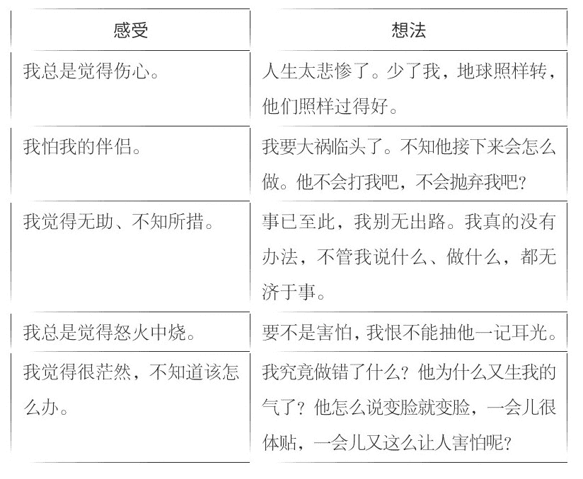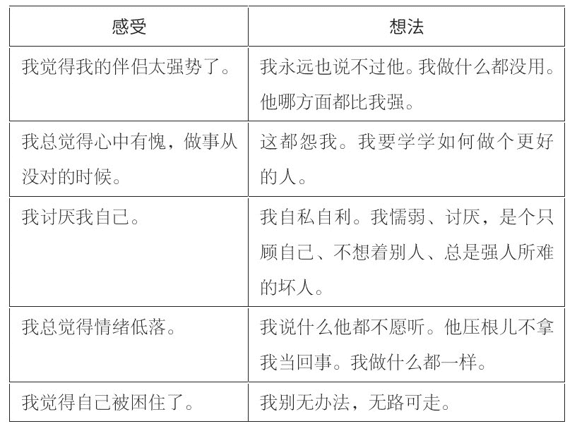

现在再来回顾一遍你的情绪清单，看看你能否识别出在产生感受之前有什么想法。分析得越具体、越详细越好。这个练习，最好每天都做一遍。花几分钟，将你的感受（坏也罢，好也罢）和产生这种感受的想法联系起来。比如，你刚为闺蜜买了一件生日礼物，你心里涌出了一股暖流，你觉得很开心，自我感觉良好。产生这种感受之前，你首先想到的是：“我是个好人。”“我善良。”“我慷慨大方。”“我愿意让我在乎的人开心。”“我朋友会喜欢这件礼物的。”

与之相反，如果送礼物让你紧张且担心，恐怕你会有这样的想法：“我朋友恐怕不会喜欢这件礼物。”“我乱花钱了。”“我不知道他喜欢什么样的礼物，不知道买什么好。”“我送朋友礼物，是不是就为讨好他？”

最初试着找出想法和心情之间的区别和联系，或许有些困难。不过，这项练习能帮你掌握打断下意识反应的技巧，尤其是在倍感压力的情况下（我们将在第十三章介绍更多应对想法和感受的技巧）。

**行为的组成部分**

行为既然是想法和感受的结果，我们也应该分析一下它。以下练习涉及你由于想法和心情而在这段关系中采取的行动，请你用“是”或者“不是”来回答。然后再单独列一份清单，列出你和伴侣相处中的其他行为。

一直以来，你是怎么做的：

●你是不是总是低声下气的？

●你们之间不管出现了什么问题，你是不是都心甘情愿地承担错误？

●你总是战战兢兢吗？你是不是生怕说错了一句话，做错了一点小事，就惹恼了他？

●你是否一再嘱咐孩子，要他们千万小心，别惹爸爸生气？

●你是不是比以前爱哭了？

●你是不是压制自己的感受，尤其是怒气？

●你是不是为了迎合丈夫反复无常的要求，而一再委屈自己？

●你是不是放弃过兴趣爱好，断绝了与亲朋好友的来往呢？

●你是不是放弃了从前的意见、理想、态度、希望和梦想？

●你是否将进修或充电一推再推？

●你是否经常要为伴侣对别人、对你的态度解释，或赔礼道歉？

●你是不是不顾惜身体，体重大起大落？你是不是不像从前一样在乎自己的形象了？你是否找出种种借口宅在家里，足不出户？

●你是不是千方百计地讨好丈夫，你的生活取决于他的心情和认可？

捅破你自认为甜蜜、满意的这层窗户纸，见到这段关系的真相，你现在的心情我再清楚不过。不过，否认只能给你一时的欣慰，从长远来看，这无异于自欺欺人。

南希做上述问卷时，一多半的答案都是肯定的，她一下慌了。问卷将真相赤裸裸地呈现在她面前，她不得不面对现实：为了讨杰夫的欢心，她不仅放弃了她在时尚界蒸蒸日上的事业，而且断了与许多朋友的来往和应酬，她甚至放弃了自己做选择的权利，干脆让杰夫一个人做主。

最让她伤心的是发现自己一直以来对他的虐待忍气吞声，其实是纵容他继续虐待自己。

上述练习能让你幡然醒悟，不再抱有不切实际的幻想，同时看清生活，尤其是美满亲密关系的真相。希望你实事求是，不要怕难过。在这堂课中体会到的苦楚将会化作一座桥梁，让你了解生活中的种种因素对你和你心情的影响。

我们要考察的最后一个因素是你伴侣的行为和态度。与上文的问卷一样，请你用“是”或者“不是”来回答下列问题，然后再自己列一份清单，列出伴侣其他方面的行为。

**你的伴侣一向的表现：**

●他是不是强硬地想要控制你的生活、想法和一举一动？

●他是不是对你横加指责，总爱挑你的刺？

●他是不是威胁你，大喊大叫，或者扬言只要你不按他的意思做，他就不爱你，或者跟你分手？

●他是不是扬言要动粗，吓唬你，叫你言听计从？

●他是不是喜怒无常？

●他是不是一竿子打倒一片，说女人都不是好东西，尤其是你？

●是不是只要你惹他不快，他就冷落你、否定你、切断你的经济来源，以此作为惩罚？

●他是不是认为他的缺点和失败都怪你和家人？

●他是不是经常辱骂你，指责你的性格不好？

●他为难你的时候，是不是只要你生气，他就指责你太敏感，或反应过激？

●他是不是不肯面对问题、矢口否认、转移话题、掩饰过失，刚大发了一通脾气后就像个没事人，把你都给闹糊涂了？

●他是不是为了赢得你的关注，而与孩子或你身边其他重要的人争个高下？

●他是不是特别爱吃醋，有着极强的占有欲？

●他是不是经常为了自己，硬逼着你放弃对你非常珍贵和重要的东西？

●他是不是没完没了地批评你的家人和朋友？

●他有没有贬低你取得的成绩？

●他有没有嫌弃你？

●他有没有逼你采取过你不喜欢或觉得难受的性行为？

●他有没有婚外情？

●他是不是不顾及你的性需要？

●他是不是在外人面前风度翩翩，一到了背人处，就对你百般挑剔？

●他有没有让你当众出丑过？

如果有十个问题你的答案是“是”，那就说明你遇到的是个控制型男人。

#### 走出舒适圈

南希告诉我，做完了上述练习后，她被汹涌而来的情绪冲昏了头脑，发现自己和杰夫的婚姻出了问题，她感到惊慌失措。这种反应早在我的意料之中，情绪体检一石激起了千层浪。

从我个人的经验来看，单单靠诉苦恐怕改变不了苦闷的心境。咨询者必须体会、审视，进而想办法改变现状。这个过程往往苦不堪言，但效果一向不错。

我让南希放心，强烈的不适感并非辅导出了问题，恰恰相反，这说明辅导过程见了效果。她对自己婚姻有了一个痛苦但清晰的认识，是改变的良好开端。不过，认识和懂得还远远不够，必须付出实际行动，走出舒适圈。

我们见过的大多数经过了四五年甚至更长时间辅导的人，都能给出一长串理由，解释为什么自己本性难移。其实，辅导几年后的主要变化像银行存款一样被储存起来了，并不表现在行为上。我一向以为，作为一名医者，我的职责是帮助他人改变行为，以及懂得他们为什么会这样做。当他们认真做这些练习，确实改变行事方式时，他们马上就会有显著的个人成长。

有时，改变做法连想一想都让人觉得可怕，别说动真格的了。但要想改善你的生活质量，你势必要主动改变态度，尝试一下新的行为模式。令人欣慰的是，你已不再是小孩子了，改变的路也不止一条。你的收获将以“自信”的方式来支付。力求改变自然增加了你的自信。一旦发现自己能影响周围的事物，人们对自己和人生会有截然不同的认识。

但一开始尝试改变时，会令人不舒服。这也是人们坚决抵触改变旧的行为模式的一大原因。他们往往误以为心情的好坏显示了改变的过程是否出现了问题。他们以为只要做“对”了，立即就能有一个好心情。其实不然，刚开始改变行为的时候，人们感觉到的多半是害怕、焦虑和无所适从。

杰姬接受了第一个阶段为期三天的辅导后，告诉我：“我还以为辅导能让我好受些，谁知还不如没辅导之前了！心情那么差，还有尝试新鲜事物的必要吗？”

杰姬犯了一个典型的错误：她以为改变行为前心情会先变好。我要她放心，只要她开始改变行为，心情自然会好起来的。

不过，这个时候，我不会贸然要杰姬做出改变。恰恰相反，为了改变她的行为，我们首先要转变她的心情和认识，打好基础。

最初的转变，我建议你还是从自己的心情入手，不是先和伴侣对着干。通过这些转变，你将学会退后一步，更好地控制你紧张痛苦的情绪，而不是被情绪牵着鼻子走。只要控制好情绪，今后主宰你生活的将是逻辑，而不是恐惧和焦虑，进而你将能清醒地认识你自己、你的婚姻和你的人生方向。做好了这些准备，你就能着手改变自己的行为了。

我们迄今做的练习只是迈出了第一步。接下来的几章，我们将详细讲解如何重新评估自己的看法，找出你生活中许多负面信息的根源，以及你当初在什么地方伤到了信心和自尊，并学会管住那个多年来的恶魔——愤怒。同时也教会你关爱自己，能在脾气上来的时候，寻得一些安慰。

当你能管住自己时，你就准备好要管住你的伴侣了。

### 第十章　思维暂停法：打消对自己的负面评价

认清了与杰夫的婚姻真相后，南希战战兢兢、左右为难，而且她非常害怕杰夫，不知接下来该怎么做。她告诉我：

咱们能不能别提婚姻的事，就说我的溃疡和体重问题好吗？至少我俩的这种现状我还能接受。

我告诉南希，从她的讲述和练习中透露的情况来看，她和杰夫的关系是诸多问题的根源。要想解决这些问题，她必须勇于面对。

#### 一个危险的认知

南希认为，对于她和杰夫的关系，最简单、最好的方法就是不去管它。当然，她认为她和杰夫之间的关系也没坏到哪儿去。她认为只要不去管它，就算改变不了情况，至少也能维持现状。

但是，夫妻关系不可能无限期地保持在某一种状态。哪怕你不去管，情况也会变，因为你终究左右不了影响夫妻关系的种种变数。我问南希：“如果杰夫的生意失败了，如果你出去上班，如果你们有了孩子，如果家里有人过世，如果你们两人中有一个病了……这些情况对夫妻关系会有什么影响，你想过没有？”这几种情况都会造成他们夫妻关系的失衡。多年的从业经验告诉我，一旦上述情况打破了这种脆弱而敏感的平衡，控制型男人常常会变本加厉地虐待妻子。

因此，如果你接受现状、得过且过，从长远来看，“以为不去管它，生活就会一切照旧，不被打乱”是一个危险的认识。

我辅导过的每个被控制型男人折磨的女性都热切地盼望有一天好运到来，丈夫能幡然醒悟，将她搂在怀里说：“我知道错了，我对不起你。原谅我吧，我再也不会伤你的心了。我爱你，从今往后，一切都会好起来的。”

其实，你们的关系非但不会转好，反而会变得更糟。随着年龄的增长，人往往更加积习难改，或者说无意去改。你接受现状，无异于放弃了你应该享有的尊重和尊严，在夫妻关系中，你主动要求做一个受害者。

如果你有了孩子，你的选择等于也害了他们。前文大家都看到了，父亲是控制型男人的男孩一般都以父亲为榜样，长大后脾气暴虐，女孩子则胆小怕事。接受现状等于将虐待代代传承下去。

你不妨自问，究竟是维持现状，还是打破现状，到底哪个更值得？我不是已经试过什么都不做了吗？我是不是越来越安于现状了呢？争取改变或安于现状各有什么好处？

回答了这几个问题，许多女性情绪低落，不作声了。她们想必意识到了，她们也可以拥有健康的亲密关系。了解了健康亲密关系，对比之下，她们更看清了一方暴虐、一方忍气吞声的关系，同时也给女性确定了一个努力的目标。

#### 健康亲密关系的基础

我请来咨询的女性说说她们伴侣的品行，听到的无非是如下的说法：“他工作勤奋”“他很会挣钱”“他人很风趣”“他经常陪孩子”“他风度翩翩”“他非常帅气”。这些性格和品行确实很有吸引力，可惜它们却不是健康亲密关系、和谐夫妻关系的基础。

健康的亲密关系是建立在互相尊重、权利平等的基础上的，还需要关照对方的情绪和需要，以及欣赏对方身上的特点和品质。当然，健康的亲密关系还要容得下争吵、发脾气和意见有分歧。不过，互相体谅的伴侣一般能妥善解决双方的分歧，不会把每次冲突看作一场非得分出个胜负的战争。

换句话说，健康的亲密关系为你的生活增添了情趣，让你的生活多姿多彩，而不是逼着你放弃原本不可分割的一部分性格，将生活过得平淡无味。我们爱上对方的品质，才开始了这段亲密关系。如果为了息事宁人，我们不得不丢掉一些优秀的品质，那么两个人在一起还有什么意义？

#### 你只能改变你自己

辅导开始的时候，杰姬向我叫屈：

是马克在家里蛮横霸道，我又没做错什么，凭什么非要我改变，不叫他改改脾气？

我对杰姬说了我对许多来访者说过的话：“你改变不了别人的行为和态度，你能改变的只有你自己。不过，令人欣慰的是，一旦你改变了对伴侣行为的反应，你们的关系也会随着你的改变而改变。”

杰姬始终抱着这样一个态度：只要马克站在她的角度看待问题，自然不会再对她那样狠心。南希也抱着类似的信念。她说：“如果杰夫知道他给我带来的痛苦，他肯定不会再那样待我了。”其实，妻子什么心情、什么感受，杰夫和马克再清楚不过，可惜他们依旧故我，死不悔改。再说，丈夫理解不理解，是杰姬和南希掌握不了的事。我告诉南希和杰姬，试图让丈夫“明白”妻子吃的苦，等于白费工夫。

既然如此，我要请你别理会诸如“沟通”，以及“让别人了解你的情绪”之类时下流行的套话和技巧——它们对控制型男人没用。你可别指望一句话就能让他幡然醒悟，明白自己到底做了什么。他不想明白，也无意沟通。他只想由着自己的性子，想干什么就干什么。他认为你诉苦是与他作对，是要他反击。因此，与控制型男人沟通，无异于对牛弹琴，不仅起不了作用，恐怕还会惹恼了他，让他发起牛脾气。

所以，别抱幻想，因为你只能改变自己的处事方式。

不过，在你改变处事方式前，你必须先学会控制自己的情绪。以下几个步骤旨在帮你做到这一点。

**第一步：做一个旁观者**

我告诉来访者，当局者迷。丈夫刁难、指责她们的时候，我建议她们不妨置身事外，旁观自己的反应。

我嘱咐南希，杰夫再刁难她，不妨对自己说：“真有意思！每逢他冲我发脾气，我都觉得……”（省略处补充她当时的心情。）经过四次辅导，她告诉我：

我拿着买来的食品刚进厨房，杰夫就跟了进来。一进门，他就说我把东西摆错了地方，接着对我嚷嚷，说我一贯乱丢乱放，说我真是个蠢女人，总是把他的话当作耳旁风。他站在那儿指手画脚，说我做的这不好，那也不对。事后我静静地坐下来，把杰夫为难、指责我时，我的感受和情绪列了一个清单。我第一次注意到我气得双手发抖。我观察自己反应的时候，真真切切地感受到了个中滋味。

每次与杰夫发生矛盾，南希都会以“每次他冲我发火，我都觉得……”开头来列出她当时的感受。她很快发现，杰夫的刁难让她觉得“气愤、害怕、发抖、伤心、羞辱、无言以对、难以承受”。

你不妨也做做这个练习。下次伴侣为难你、指责你的时候，你可以试着注意当时到底发生了什么。过后一个人坐下来，以“每次他刁难我、指责我的时候，我都觉得……”开头，详细列出你能想得起的心理和生理反应。

任何东西只要用笔写出来，都会显得有条理、真实清晰，这样做能让你理清思路，看清你一直以来的反应。只要掌握了这个诀窍，你就能置身事外，走出迷局，自然而然地旁观这件事。之后你或许会少一些从前那种茫然、被情绪左右的感觉。

从这份练习中不难看出，你的反应始终脱不了一个模式。认清这些反应能帮助你平息自己的心绪，因为它们尽在你的掌握之中。下次再遇到这种心情，你也不会那么害怕或惊讶。

除了列出你的反应，你还要留意它持续的时间。南希说，尽管她很快就不再发抖、害怕了，但会一连几天不开心，总是觉得伤心和气愤。

你越是能识别和阐明自己的感受，就越能预测自己的反应，也就会越少地感到茫然失措了。

**第二步：以前怎么做，现在还怎么做**

许多来访者觉得很奇怪，我为什么不要求她们改变行为。恰恰相反，我要求她们以前怎么做，现在还怎么做，只须记住一点：现在，是她们自己选择要如此行事的。

一旦你选择做某事，那些行为就不再是一种自动的反应。它变得有意识、有计划，我们的行为在我们自己的控制之下，你变得积极主动而不是被动承受。

耐人寻味的是，出于恐惧或胁迫做出的反应让人不舒服，而同样的反应，如果是出于自己的选择，却令人心情愉悦。这虽然看起来只是一个微不足道的转变，却是向前迈出的一大步。自己选择去做出的反应，有助于你消除在这段关系中的无助感。

当杰姬面对马克发脾气，主动选择自己回应的方式时，她告诉我：

他总是让我战战兢兢、不知所措，要想让他闭嘴，我只能赔着笑脸，说尽好话。但在我决定道歉前的一刹那，我觉得不再那么害怕，也不再像一个木偶了。

为了帮杰姬获得掌控感，我建议她像以前一样道歉，但道歉之前，她要告诉自己：“作为一名成年人，我选择道歉。”细微的态度变化，给了她一种截然不同的体会。

你可别小瞧了这个小变化，它对缓解苦恼有着神奇的效果。

我们在第九章探讨了想法和感受之间的区别。杰姬发现，主动转变思维模式，变“我必须道歉”为“我选择道歉”，尽管行为没变，但南希的情绪反应却有了明显的变化。

**第三步：记录丈夫指责你的种种罪状和负面评价**

这项练习有书面部分，需要大家调动想象力。首先，请你买一盒标签。什么标签都行，衣服标价签也无所谓，但文具店出售的自粘标签最方便（如果买不到标签，你不妨自己动手，将几张纸裁成同样大小的纸片，再在背面涂上胶水就行了）。

我请前来咨询的女性在一张标签上写下伴侣骂过她们的话。杰姬在标签上写到：泼妇、自私、愚蠢、拖沓、懒惰、难缠、拖后腿、歹毒。

请你多做几张标签，一条不落地记下伴侣骂过你的话，然后贴在一张纸上，在最顶端写上“他对我的评价”。

这样一来，你让伴侣强安在你头上的那些罪状，有了一个直观的展示。我特意要你用标签，而不是列一份清单，是赋予这些罪状一个具体的形状，让你清醒地认识到，这些负面评价不过是强加在你身上的，而不是你的真正为人。这些标签象征着伴侣对你的种种虐待。

你的伴侣很可能处处贬低你的能力和办事效率。提到你的才智，他会说你“自作聪明”“万事通”，或者说你“自以为是”，要么直接说：“没有哪个男人喜欢嘴皮子厉害的女人。”说到你的能力或成就，他说不定会给你扣上一顶“爱慕虚荣”“以自我为中心”“绝情”“男人婆”“炫耀权力”等大帽子。

再请你准备一组标签，与负面评价相对，记录你具有的优秀品质。

如果你觉得自己的优点乏善可陈，不妨写上别人对你的评价。找一张纸，在最顶端写上“真实的我”，在下面贴上你的优点。我让杰姬随时在纸上反驳马克对她的负面评价，杰姬贴了整整两页纸：

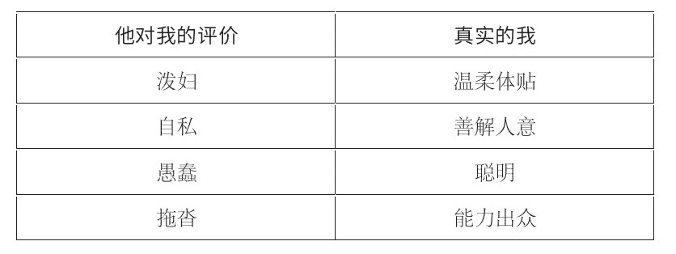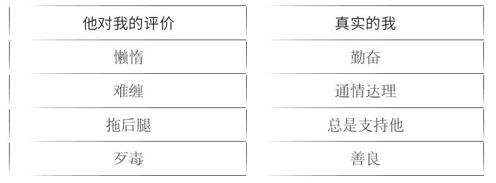

这项练习可帮你重拾自信，所以不要匆匆带过。请你花些时间，好好想想这些评价。比较一下伴侣对你的负面评价和你真实的品质，你会发现二者存在强烈的反差。

来访者们列出了对自己正负两面的评价后，我要她们稍事休息，放松一下，以便做一些重要的想象练习。她们在心中想象出的形象有助于反驳伴侣对她们的负面评价。

想象并不陌生，做白日梦或幻想的时候，我们常常无意中经历了人生的许多场景。我们梦想得到了梦寐以求的工作，我们想象自己穿着一件曾见过的新衣服，憧憬孩子大学毕业。我的一位演员朋友说，每次去试镜，他都想象导演和制片人坐在马桶上。“一想到这一幕，我就不那么紧张了，”他说，“你想想，一个坐在马桶上的人能有多大能耐？”我朋友把大人物想象成一个普通人，这让他松了一口气，显得更加自信。

对我那位演员朋友来说，想象有助于缓解紧张局面。想象能帮我们实现目标，也能塑造我们高大的形象。以下的练习旨在巩固你的优点，同时减少负面评价对你的影响。

首先，通读一遍你正负两面的评价。再把你自己想象成一座城堡，城堡四周是用你的优点砌成的城墙。再想象城堡被围攻。丈夫的负面评价仿佛一支支射向城堡的箭。箭射到城堡坚不可摧的城墙上，纷纷落进了护城河——负面的评价奈何不了你的优点。

想象的时候，你越放松，心中的形象就会越清晰、鲜明。做这项练习的时候，关键是要放松，不能心烦意乱，你的想象才能见到效果。想象城堡这一场景不一定能一蹴而就，但我辅导许多人后发现，一旦她们构思出这幅画面，就能轻松地进入这一场景。伴侣每每对你恶言恶语的时候，你不妨采用城堡这个观想。

杰姬说：

起初我觉得自己挺傻的，但后来我又想，反正我也没什么好失去的，干脆就豁出去了。那次我不想去看马克的妈妈，他骂我自私自利。我心里很不痛快，于是进了卧室，坐下来想象那座城堡。我首先想到的是，只要我不如他的意，他就骂我自私，后来我才认识到，他说的话，我真的不必往心里去。

以前，无论马克说她什么，杰姬都硬往上面靠。观想城堡让她认识到，他对她的评价纯属无中生有，恶语中伤，她大可不必因此感到害怕或伤心。

这类练习有助于降低伴侣对你自尊的攻击力度，还能肯定你的优点。

**第四步：想象丈夫对别人的恶劣行径**

在这节练习中，你不妨想象你的伴侣大喊大叫、百般挑剔、推卸责任，就像平时他对你做的那样，但这次对象不是你，而是别的女人。你不妨把那个人当作他在乎的一个人，比如他的姐妹、女儿或一位好朋友。

你在脑海里想象这一场景的时候，请注意强调一点：即便是对别人，他也秉性难改。他就是那么一个人，哪怕对再亲密的女人也就那么几招。他在别人面前风度翩翩，但对至亲至爱的人，他的态度和对你没有什么两样，与你们是谁没关系。

想象丈夫对另一个女人态度恶劣的时候，你很可能会明白两点：首先，他的品行不好；其次，他的行为与你毫无关系。

现在请你问自己如下几个问题：

●你希望他这样对待你爱的人吗？如果你看到自己的女儿（朋友、姐妹或母亲）受到这样的侮辱和虐待，你希望她怎样做？

●为什么她不该被这样对待，而你却没关系？难道你不如她重要？难道你没资格被他以礼相待么？

这几点极为关键。你不妨自问这几个问题，花些时间好好回答，尤其是被他指责和刁难的时候。你可以先想象丈夫像对你一样对待别人，然后再问自己这几个问题。我估计你会很生气。遭到不公的对待，气愤是再正常不过的事。气愤能坚定你改变的决心（我将在第十二章详细讲解变气愤为武器的办法）。

**第五步：转变你看丈夫的立场**

我在第一章详细讲到劳拉认识了鲍勃，“被爱情冲昏了头脑”。她在后来的辅导过程中，想起了许多警示征兆：

那时候仿佛有一个声音总在我心中说：“当心了。那家伙脾气暴躁，还对你撒谎，说他离婚了。再说他没有定性，每份工作都干不过六个月，是出了名的。”可我管不了那些。我太爱他了，就算这些都是真的，我也不在乎。

刚认识鲍勃那会儿，劳拉觉得鲍勃千好万好。情人眼里出帅哥，劳拉也不例外。我们对眼前之人的了解往往比自己以为的更深，只是我们宁愿对那些破坏浪漫画面的危险征兆视而不见。不过，哪怕我们想方设法地忽略、否认对方身上那些令人不愉快的缺点，但始终都有一个小小的声音在提醒我们注意。

就这一点来说，辅导过程中，劳拉需要调高那个小声音的音量，以便她从一个全新的角度评价鲍勃的行为。我给劳拉设计了如下练习，帮助她巩固明辨是非的能力。你最好也参与到这个练习中来。

首先，想象丈夫又无端地发火，然后问自己如下几个问题：

●一个明理的人至于为了一件芝麻大点的事发这么大的脾气吗？

●他这是不是在借故找我的碴儿？

●只要他不想担责任的事，他是不是都怪到我的头上？

●他有权像对待我一样对待其他人吗？

这项练习将证实你内心对眼下发生的事的认识，或者说，如果你曾经嫁了个控制型男人，但如今已经解脱，将来再结识别的男人，它有助于你留意同一类行为，免得你重蹈覆辙。

如果这是你第一次彻底认清对方的冷酷无情，你恐怕会觉得不能接受，感到非常不安。

与其他辅导一样，我劝你别因为不快而气馁或一蹶不振。你们的亲密关系是一个事实。用哲人的话说，真相伤人。但少了真相，你恐怕仍执着于扭曲的亲密关系，缺乏自信。

闲来无事时，你不妨经常重温一遍这份问卷。从中得出的认识能让你鼓起勇气，主动改变你的境遇。请你记住，生气、吵架、痛苦，甚至觉得亏待了自己或为自己感到不值，都是你的权利。

但同时你也别忘了，走到这一步你付出了多少勇气！请你想想，你见过多少对不和的夫妻或情侣，女人默默地忍受虐待，却不指望能改变现状。你比她们强，你在想办法改变。你看到的真相不容乐观，令人心碎。但你要坚持，不能却步。当你怀疑自己的认识和内心理性的声音时，当你说不清伴侣是否真的错了时，当你找出种种理由为伴侣的行为开脱或揽过责任时，请你拿出这份问卷。这些问题能让你清醒。请拿一张纸，写下你的答案，随身带着。只要你下不了决心，只要你们俩出现了上述的一幕，不妨拿出来参考一下。只要想到他，就请你按这份问卷的步骤对他做出评判。你现在做的是证明你一向认为正确的事。

**慢下步调，看看你是如何对待自己的**

对许多女性来说，接受了她们的真实境遇，却又生出了另一个问题，她们说不定会因为这个新的认识责怪自己。出于这层原因，我在辅导中专门抽出时间，让她们谈谈她们是如何对待自己的。

我听到的多半是如下几种说法：

●我怎么那么傻呢？

●我怎么能容忍这事发生在我身上呢？

●我恨自己瞎了眼！

●我是个聪明人，怎么能一错再错呢？

●我恨他，但更恨我自己，我竟然能受得了他！

你已经吃尽了苦头，可千万别再自责了，别再给你原本痛苦的心情雪上加霜。请你别责怪自己以前没看清真相，而是要承认你如实看待自己和伴侣的关系，以及誓将改变你们关系时表现出的勇气和决心。

以下习题旨在帮你打破自责这一惯常的思维模式。我特意设计了这些小游戏，用以转变辅导对象对自己的看法，以及伤心时对自己的态度。

#### 思维停止键

对自己负面的评价只会给你愁上添愁，这时候，你应该投入全部精力慰藉你受伤的心灵。为打消这些负面的想法，不妨试试思维停止键。

首先，注意你在想什么，尤其是自责的念头。要格外注意如下想法：“我怎么那么傻呢？”“我怎么能忍受那么久，却还是明白不过来呢？”“我真不争气！”“我真没出息！”“我太愚蠢了！”“我真笨。”

其次，为了不让这些自责的想法影响你，你可以跟它们来段对话。就当你的想法是个人，对它直说好了。我建议用如下的对白：“好吧，你又回来了。你给我住嘴！滚得远远的！你不许进来。你不来打扰，我都已经够烦的了。我不欢迎你，不想见你。你没干过一件好事，请你滚蛋，立刻从我的脑海中消失！”

第三，现在请你用好主意和好心情替换自责和坏心情。为了实现这一目的，你要调动从前的一段愉悦、真实的记忆。南希调用的是一段愉快的假日：

那是我第一次去夏威夷，一下飞机，就有人在我脖子上套了一个花环，走到哪儿都能闻到一股醉人的花香。那里的空气清新宜人，我心想：“这不就是伊甸园嘛！”

你不妨找一段难忘的美好经历，沉浸其中，细细地回忆你当时的感觉和心情。你想起的细节越多，这段记忆越真实，就越能令你快乐。练习几次后，你就能随时重温这段记忆，体会一段好心情。

对自己有不好的想法的时候，你不要逃避，也不必否认，你要留意它，喝令它滚开，接着用那段难忘的经历替代它。

这种练习是一个良好的开端，让你对自己好一些。南希发现这个方法能帮她打断自责的念头。久而久之，她觉得自己不再那么伤心，也不再那么紧张了。她说：

我尝到了掌控情绪的甜头，这是前所未有的，以前我连想都不敢想。重温夏威夷那段甜蜜的回忆，我的情绪竟然不再低落了。我还发现，以前遇到问题时，我一直都是在自己折磨自己！

只有多练习，你才能适应这种思维暂停法。心情不好的时候，你恐怕很难立刻停止折磨自己的旧习。不过，一旦思维暂停练习见了效果，你会立即摆脱自己给自己添的痛苦，长舒一口气，觉得一身轻松。

#### 伤心的时候，请你好好关爱自己

你也许和许多来我这里咨询的人一样，花费了大量的精力和时间照顾别人。关照他人是女人的天性。如果你关心的人不开心，觉得孤独、苦闷，你清楚怎么安慰他，给他一个好心情。现在，我希望你像安慰别人一样安慰你自己。这是你迎接改变的关键一环。你要学会关爱你自己，从而觉得自己更加坚强，敢于解决自己的问题。

这个阶段的辅导开始前，我一般会请来访者列一份清单，说说如果别人心情不好，她们安慰别人的 10 种方法。她们列的一般如下：

●给他们拥抱。

●爱抚他们。

●倾听他们的苦楚。

●安慰他们，说一切都会好起来的。

●做一顿他们喜欢吃的饭菜。

●带他们去一个温馨的地方走走，散散心。

●带他们出去看场电影。

●叫他们洗个舒服的热水澡。

●建议他们出去游泳，或参加其他运动项目。

●送他们点小礼物，逗他们开心。

请你也列一份，写上你安慰、关爱他人时做的难忘的事。

**关爱自己**

你为别人奉献的爱心，也应该给自己留一份。从现在开始，你要像关心爱护别人一样爱护自己。无论你需不需要，都请你的孩子和朋友给你一个拥抱。身体的接触非常关键，尤其是你情绪低落、心情不好的时候。从现在开始，请你每天都花一段时间，做一些让自己开心的事。从今天起，你一定要像关心人家一样，顾及自己的幸福，关心自己的身心健康。

你也许觉得这很傻，认为这是娇惯自己，或者认为这无关紧要。不过，请你相信，关心爱护自己才是现在的头等大事。

以下几个简单的小习题可让你掌握技巧，关心爱护自己，缓解你的压力。你可别急于求成，忽略了这一段。

人们一般不肯花时间做自己喜欢的事，连最简单、最方便的活动也不愿参加。出于这个原因，我请来访者和自己做一个约定：请她们答应每个星期参加一项简单的活动，每天至少做一件能让自己开心的事情。

希望你抽出少许时间，为自己做一份表。每隔几周换一次活动项目。你可别以为这些活动是灵丹妙药，你只需要把它们当作你久别重逢的老朋友。

南希最初约定的几项活动都比较消极，比如“我不想成天闷在家里”，我叫她换上积极向上、趣味横生的活动。以下是她修改后的约定。

●我要好好洗一个泡泡浴。

●我要踏着夕阳，在海滩上散步。

●我要拿出一定的时间听我喜欢的音乐。

●每次见面、道别，我都要和朋友拥抱。

●我要和闺蜜一起出去吃饭。

●我要去美甲。

●我要去按摩。

●我每天都要化妆。

●我要重新开始游泳。

●我打算每周送自己一件小礼物。

南希给自己的约定中，格外关键的一点是对身体的关照。她和杰夫的关系已不再亲密，如果她需要杰夫的亲昵，他恐怕会误以为她邀他做爱呢。更何况对南希来说，两人间的性生活一向没什么快乐可言，所以她不再要他的亲昵。但这时候，南希不能没有身体的愉悦，所以我建议她多去游泳、洗泡泡浴，或去按摩什么的，再说她也喜欢这些。

杰姬却另当别论，她和马克的性生活和谐甜蜜，所以她在约定中写道：“希望马克多抱抱我。”

关键是要养成规律的生活，给你的需要留出时间，做做给你带来快乐的事。不过，仅仅停留在想还远远不够，你必须付出行动，可千万别把你亲手订的约定当成了一纸空文。如果你想拥有健康的身体、愉悦的心情，切记要像关照他人一样爱惜自己。只有关心自己，你才能打破不顾自己的旧模式，排解自己的痛苦。

### 第十一章　支持系统：给内心的小孩一个家

孩子弱小年幼，为了生存，他们势必要从小学会把握分寸，应对在家中的遭遇。许多前来咨询的人面临的一个问题，是他们小时候的无助感一直延续到了今天，哪怕他们目前的生活状况已非同往日。

我们在第七章都看到了，杰姬对马克施暴的情绪反应跟小时候父亲对她恶言恶语时的反应如出一辙。与马克在一起体会到的恐惧和无助感，让她仿佛回到了从前，杰姬还不能以成年人的有力反击取代从前的反应。她需要做的是追根溯源，因为只有了解了她目前的行为源于早已成为过去的恐惧，她才能逐步改变她的反应。

追根溯源并非一蹴而就。一再追问她们童年的经历，许多来咨询的人对此显得很不耐烦——她们迫不及待地要解决的是与伴侣之间的矛盾。但我认为，只有先祛除有碍女性成熟的心魔，新的行为模式才能固定成一种习惯，她与伴侣之间的问题才能得到解决。

#### 支持系统

我们一块儿做的练习和辅导迄今还属于认知层面——主要涉及你的思维、理性和想法。但即便是这些练习也会牵动你强烈的心绪。我现在要向你介绍的练习更富感情色彩，因为它解决的是童年往事。对于哪怕再坚强的人来说，往事也常常不堪回首。

欢迎你来我的办公室，看看我辅导咨询者的场景，见识见识旧创对目前行为和心情的直接影响。要说单靠这本书，你就能解决这个难题，那是不负责任的说法。一名女性接受辅导时，无论是单独咨询还是集体辅导，她始终都需要一个稳定的支持系统，来处理她强烈的情绪反应。如果身边没有这种支持系统，你最好别做这项练习。你应该找一个能提供安全场所，并能应对你强烈情绪的咨询师、咨询团队，或妇女保护中心。

虽说有时候朋友也能帮忙，但处理童年的伤心事，朋友的支持恐怕远远不够。面对揭开旧伤疤时涌现的伤痛，心怀善意的朋友也往往束手无策。

此外，如果你童年时期遭遇过虐待或性侵，我建议你最好寻求专业人士的帮助，揭开了旧伤，你才能采取新行动。如今针对儿童虐待的团体遍及全国各地，另外还涌现了许多专注这方面的咨询师，研究成果非常显著。就我个人多年的从业经验，虐待或性侵造成的创伤易于理解，也有针对性，因此这方面的治疗往往有立竿见影的效果。

对女性来说，童年伤得越深，成年后，她就越没有自信。不过，只要你勇于面对和解决心里的旧伤，治疗就会有非常显著的疗效。

#### 那个战战兢兢的小姑娘

妮姬告诉我，艾德冲她发脾气的时候，她总觉得难堪、屈辱，认为自己无能、丢人。我让妮姬想想，这辈子还有没有别人让她有这种感觉，她想起来下面这件往事，那时候她才九岁：

我父亲非常看重我弹得一手好钢琴，可惜我压根儿不喜欢。不过，我练习得非常刻苦，希望能讨他开心。我胆子小，害怕当众弹琴，每次硬着头皮上台表演，我都无一例外地搞砸了。我爸不是那种扯着嗓子嚷嚷的人，他只会板着脸、一声不吭。那次轮到我独奏，我紧张得忘了要弹的一整段谱子。回家的路上，他说他以后都没脸再见别人了，说我当众给他丢了人，让他太失望了。他说我还不如干脆就是一个笨蛋，没有弹钢琴的天分，也省得耗费了他这么多年的心血。他骂我不用心、没脑子，还说我懒，不肯练琴。我彻底崩溃了。我辛辛苦苦地练琴，就是为了讨他喜欢，谁知却是白费工夫。一路上，我强忍泪水，羞愧难当，甚至想到了死。

出乎妮姬意料的是，她发现她的婚姻重演了童年的一幕，那个始终长不大的小姑娘在作祟。为了让她回忆童年时光，我请她带一张小时候的照片过来。我们两人望着照片，父亲羞辱她的一幕幕仿佛潮水一样涌上了她的心头。

为了让她认识到，当时她年纪还小，有多么脆弱，我要她去附近的一所小学去看孩子们玩耍，然后从中挑出一个能让她想起小时候的小女孩。妮姬要认识到，经历那些痛苦往事的时候，她还那么小，孤苦无助，而那个小姑娘还藏在她的心里，每逢艾德施暴，战战兢兢的是那个小姑娘，不是她。

**为什么要回首往事**

我们往往误以为只要不主动去记起或否认痛苦的往事，它们就会自动消失，最终不复存在。但事实上，潜意识中挥之不去的魅影和断断续续的记忆在我们心头留下了深深的创伤，让我们永远难忘。你矢口否认或极力掩饰的痛苦往事控制着你，但只要说出来，它们就会像鬼魅见了阳光一样，顿时烟消云散。

#### 化解往日的愁绪

回首童年的往事仿佛一石激起千层浪，揭开了来访者们忍受多年的旧伤和痛苦。只有承认和抚平了这些心绪，她们才能把握今后的人生。

**平息积怨**

回首童年的往事，想起曾经的遭遇，妮姬发现自己心头的怒火始终无处发泄。大家都知道，有怨无处诉，怨气不会凭空消失，它只会隐藏起来，变成各种症状。

你越是压抑怨气，它越可怕。对大多数人来说，怨气令人难受，强忍怨气更让人难捱。

妮姬不止一次地记起她千方百计地讨好苛刻的父亲，结果却招致他的刁难、呵斥和蔑视。我劝她不要怕这些回忆勾起的怨愤，而是要重新体会这段经历。我很清楚，她会发现它并不像想象的那样吓人。

为了帮妮姬排遣积怨，免得被它压垮，我请她想象自己与父亲对话。我搬来一张空椅子，让她把椅子当作父亲，对他说出自己想说却始终没说出口的话。我让她以“你怎么能”开头，我们来看看妮姬是怎么说的：

你怎么能那样对我？！你怎么能那样羞辱我？！你以为你是谁呀？！我一向敬重你，崇拜你。你知道你多伤我的心吗？我做什么都不如你的意。在你面前，我简直就是个傻子。就为了让你多爱我一点点，我什么都愿意为你做！

做完了这个训练，妮姬仍浑身哆嗦。她平生第一次冲父亲发脾气，但这不仅没什么大不了的，反而发泄了她心中的怨气。

对有些来访者来说，语言还不足以宣泄心中的积怨，她们需要付诸行动，我一般鼓励她们多进行体育锻炼。网球、壁球等竞技体育能帮你发泄积怨，消解身体的紧张感。

妮姬也不例外，她也需要靠身体宣泄。虽说她是位现役女警察，也是位出色的运动员，但还是憋了一肚子气，紧张性头痛也经常发作，而且脖子和肩膀还经常抽筋。

我的诊所提供宣泄情绪的可控场所，我们可以一起做这个训练。我要妮姬对着空椅子想象她父亲，接着拿我备在办公室的一把塑料充气球棒打椅子，尽情宣泄她的怨气。刚开始她认为这样做很可笑，但经不住我再三劝导，她最终答应试试。她双手攥着球棒高举过头顶，砰的一声砸向椅子。她一下一下地砸着，最后简直停不下来。我提醒她可以边砸边说。她砸着椅子，多年的积怨涌上心头，她一遍遍地喊着：“你怎么能那样对我？你怎么能那样打击我？怎么可以？怎么可以啊！”大约三十秒后，杰姬放声大哭，扔下了球棒。我抱着她，直到她止住了哭声。

过了一会儿，她恢复了平静，我注意到她身体放松多了。妮姬告诉我，刚才那一幕真够吓人的，但她感觉好多了。

妮姬和我一起排遣的积怨越多，她越是觉得欣慰。看到自己怒火中烧，然后得到释放，接着恢复平静，觉得一身轻松，这对妮姬来说是一个巨大的突破。

由于重新体会愤怒会令人心烦意乱，我一般都在一旁密切监督和亲自辅导。无论什么时候，我都不会让来访者过度地宣泄，也注意不让她们愁眉苦脸、满腹心思地离开我的办公室。妮姬那天临走前，我让她放松，闭上眼睛回忆一段愉快的经历（这是我在思维暂停一节中介绍过的训练）。我要妮姬重温那段令她身心愉悦的记忆，等到恢复平静才能离开。每次来访者宣泄完情绪后，我一般都会引导她们放松身心，结束当天的一课。

虽说排遣愤怒非常过瘾，但我让来访者这么做并不是因为好玩，而是要见效果。在安全、可控的环境中宣泄被压抑的愤怒，对觉得自己像一个无助的孩子的人来说，是一种最有成效的矫正法。

**改变过去的观念**

我们往往对父母的评价深信不疑。妮姬钢琴独奏的经历便是一个很好的例子——她把父亲对她的苛责当了真。父亲骂她懒、不上心、没脑子、笨、丢人，她都信以为真。在她这个小姑娘的耳中，这不是父亲一时的气话，而是大实话。

在孩子眼中，这不是强加在他们头上的苛责，而是他们身上实实在在的缺点。等孩子长大以后，他们会认为自己挨骂纯属咎由自取，自己罪有应得。

为了摆脱童年时烙在心中的负面评价，妮姬需要将它们说出来，并好好审视一番。认清了许多让她心情不快的往事后，她现在要看一看这些烙在她心头的否定意见。

我请妮姬列一份父亲这些年来对她的责骂，结果她写了一张纸：

**爸爸眼中的我**

●我粗心大意。

●我自私自利。

●我没脑子。

●我是个笨蛋。

●我无能。

●我丢了全家人的脸。

●我让他失望了。

●我是个白眼狼。

●我是坏人。

●我成事不足，败事有余。

●我不中用。

●我太懒，注定一事无成。

妮姬长大后，在工作中和运动场上对自己的要求特别高。我请她说说偶尔没有达到她女超人的目标时，她会对自己说些什么，她总结出以下几条：

**一旦遇到失败，我就会对自己说**

●我努力得不够。

●我真不在乎自己是否名列前茅。

●那次的表现，连我自己都看不过去。

●要不是我太懒，就不会落到今天这步田地。

●我什么都干不好，活该一事无成。

妮姬立即发现，她和父亲一样过于苛责自己，继承了父亲当初的老套路。我请她再看一遍父亲对她的否定，然后用大写加粗的字写上：“你当初说得不对，现在也是错的！”

这时候，妮姬告诉我，父亲偶尔也夸过她。他夸她聪明，是个体育人才，夸她长得漂亮。但由于批评和否定已经为他们父女关系蒙上了一层阴影，加上否定的影响往往强于肯定，她难以相信父亲偶尔的夸奖。久而久之，父亲反而把她说糊涂了。

童年时期，大多数人身边都至少有一个人始终如一地疼爱、支持、在乎她，肯定她的成绩。对妮姬来说，这个人是她的母亲。对别人来说，这个人也许是祖父母、别的亲戚，或者父母的朋友、小学老师。妮姬需要重温母亲对她的评价。我请妮姬列一份母亲对她的赞许：

**妈妈眼中的我**

●我聪明。

●我可爱。

●我风趣。

●我慷慨。

●我能干。

●我刻苦勤奋。

●我脾气好。

●我充满活力。

●我漂亮。

●我是个惹人喜爱的小姑娘。

妮姬列完这份清单后，我问她：“长大后，说到自己，你几乎一次也没提到这些优秀的品质，你不觉得耐人寻味吗？”为了帮妮姬接受这些被忽略的正面评价，我让她在这页的最后写上：“这是真话，我一向如此！”

接着我请妮姬举行一个小小的仪式，摆脱她早就信以为真的负面评价。她要做如下几个步骤：

1.把这份负面评价带回家。

2.把它撕得粉碎。

3.把碎纸片付之一炬，或者埋掉，或者丢进马桶，放水冲走。

妮姬告诉我，举行这个小小的仪式总让人觉得有点荒唐可笑，但肯定有助于减轻负面评价的威力。她不仅亲手撕毁了父亲对她的差评，而且重塑了对自己的好感。

#### 学会重新培养内心的小孩

妮姬这下才认识到，她从小受到了非常深刻的心灵创伤。她心里至今还住着那个被父亲百般批评和挑剔的小姑娘，长大后，她迫切希望得到男人的赞许和认可。少了这份认可，妮姬就觉得无力、害怕。她需要治愈和重新培养这个小孩，以便从内心获得对自己的认可。为实现这一目标，她要对自己大声说出或写出一直以来希望从父亲那里听到的对自己的认可。

我让妮姬给内心那个伤心的小姑娘写一封信。信中不必宣泄她对自己的负面评价，而是要从一个成年人的角度安慰一个伤心、苦恼的小姑娘。妮姬要对小女孩说说自己小时候希望听到的暖心和亲切的话。下文是她写给自己的信：

嗨，小宝贝，

我真后悔，不该对你百般挑剔。是我错了。你是一个优秀的小姑娘，我知道你很努力，想把每件事都做好，好让大家，尤其是爸爸喜欢你、爱你。可惜事与愿违，对吧？要我说，爸爸是爱你的，只可惜他不懂如何表达。他给你买过许多礼物，但我猜你宁愿不要礼物，而要他偶尔对你开怀地大笑，轻轻地拍拍你的背。

我想告诉你，我爱你，我要爱护你，我不会再让别人伤害你。我是你的依靠，我决不会抛弃你。你是一个非常不简单的小姑娘，我希望你牢记这一点。你幽默风趣、聪明伶俐，我知道你努力做个乖孩子，努力学习。如果你不喜欢弹琴，根本不必碰那架破钢琴。

爱你的大妮姬

许多人对过去难以释怀，放不下他们从小受到的屈辱和怨恨。不少来访者甚至一口咬定，她们自己真的是又丑又淘气。给内心受到伤害的小孩写信，帮妮姬拭去了父亲强加在她心头的愧疚和自责。她现在总算明白了，她小时候不过是父亲失意时的一只无辜的替罪羊，这个认识让她不再过于苛责自己。卸掉不该背负的责任，不仅能吹散无辜的孩子心头的阴霾，而且能让长大后的他们坚强起来。

作为成年人，如果妮姬不培养自信、确立自我价值感，他人再多赞许和认可恐怕也无济于事。因此，只有彻底抚平从小烙在心头的伤痛，她才不必迫切指望别人给她一个好心情。

当内心又响起父亲刻薄的声音，呵斥、批评自己的时候，妮姬渐渐清楚自己不再是当初那个小姑娘。她明白，关键是要赶走这个刺耳的声音，代之以她最近练习对自己说的亲切、肯定的话语。经过我们的共同努力，妮姬仿佛变了个人似的。她不再苛求自己，说话也委婉了许多，而且觉得一身轻松。她对自己更体贴、更宽容。

**终结老一套的威力**

为巩固妮姬转变的效果，我提出再做一个练习，以便解除父亲对她的控制。

我请妮姬想象自己站在一座坟墓旁，墓穴中停放着父亲对她的否定和负面评价。我递给她几支特意准备的干花，请她复述如下几句话：

●我要埋葬小时候父亲对我说的恶言恶语。

●我要埋葬父亲对我的批评和压在我心头的魔障。

●我要埋葬对父亲的认可和表扬的渴望。

●我还要埋葬“有朝一日父亲终会对我有求必应”的幻想。

愿它们安息。

天下葬礼都一样，有痛苦也有悲伤，当妮姬放下了幻想，不再期望有朝一日找到那把魔法钥匙，把父亲变成自己从小渴望的样子时，她非常伤心。

作为成年人，妮姬要认识到，父亲也是一介凡人，不可能什么都能满足她。对她严厉，是父亲的天性使然。要妮姬接受“自己改变不了父亲，无法把他变成自己心中渴望的那位温柔体贴的父亲”的事实，她心如刀绞，但她不得不接受：父亲如果爱她、赞许她，何必要等到今日。

事已至此，妮姬不禁悲从中来、心灰意冷，但也觉得无比释然。以前为了得到父亲的爱，她白白浪费了不知多少心血；如今她可以集中精神，追求对她来说明确、有意义的事。

#### 不敢对父母发脾气

妮姬问了一个许多咨询者都问过的问题：“我们做的训练不会伤害我和父母的关系吧？”妮姬是这么说的：

现在我重温了我对父亲的怨气，了解到我改不了他的脾气，但我担心这会破坏了我们相处的美好时光。归根结底，他是一位好父亲。他从没打过我一巴掌，我想要什么，他都会想尽办法给我买。他供我上大学。为了养活一家人，他拼命工作。我那么生他的气，简直是不孝。

我告诉妮姬，她可以留住父亲好的一面，只是解除父亲对她情绪的控制。现在她要诚实地面对自己对父亲的感受，她可以将和父亲之间的关系看成是两个成年人之间的关系，不再是当初那个渴望父爱的小姑娘和吝啬给女儿关爱的父亲之间的关系。

人类行为中最叫人不堪忍受、最有害、到头来也最具破坏性的就是压制怒气。现在妮姬放下了旧怨，发现它并不是她当初以为的那个吓人的魔鬼，她现在准备解决对丈夫艾德的怨恨。

恰恰是因为人们害怕愤怒，所以才不去学习如何疏导、控制或宣泄愤怒。在接下来的几章中，我将讲解把从前和现在的怨气转变为动力和活力的办法。一旦女性对伴侣的虐待感到非常愤怒，她就不可能也不应该一味地忍气吞声、逆来顺受。

### 第十二章　如何处理愤怒情绪

我辅导葆拉是从她参加我举办的一期“乱伦受害者小组”开始的。小时候，父亲经常打骂甚至性侵她。对这种严重的罪行，她一向忍气吞声，这种情况影响到了她生活的方方面面。嫁给身为心理医生的格里那会儿，她自卑、自认为是个受害者也就不难想象了。我辅导她抚平童年创伤的时候，她又伤心地吐露，她还遭到了丈夫的虐待。因此她还得继续治疗，解决心头对他的怨恨。

#### 自我审视对丈夫的怨恨

我首先教葆拉给格里写一封信。当然，这封信她不会寄出，也不会给他看。写信旨在帮她梳理对格里和两人婚姻的看法和感受。我给葆拉列了一份提纲，教她按以下三个方面写：

●你是这样对我的。

●这是我对此的感受。

●这是你对我产生的影响。

我嘱咐葆拉，不要担心，有什么就写什么，不要保留。这一刻，她可以一吐为快，实话实说。以下是她写给格里的信：

亲爱的格里，

我们在大学认识的那会儿，你善解人意、体贴入微。你是第一个肯真心听我说话的人，我爱上了你，恨不得为你赴汤蹈火。你答应保护我一辈子、爱我一辈子，我太需要这一切了。那时候，我的家人快要把我逼疯了，我巴不得逃出那个家。你向我求婚的时候，我高兴坏了。我终于找到了避风的港湾，有了可以依靠的肩膀。

可我们结婚后，一切都变了。你开始找我的碴儿、找我工作的碴儿，我做什么都不如你的意。你变了，你不再体贴入微，反而一天到晚挑我的毛病。你让我心情跌落到了冰点。我信任你，爱你，可你却变得讨厌、自私，千方百计地侮辱我、贬低我。我真不知道做错了什么，让你这样对我！我怪我自己，我努力地改，希望有朝一日赢得你的爱，可惜我始终都做不好。这太让人痛苦了！我现在才明白，你不过是想把我牢牢地攥在手里，生怕我跑了，但你也太狠了！因为我爸对我犯的错，你骂我“烂货”。你说这话，太下作、太绝情了！他欺负我的时候，我才八岁。你知道我无能为力，拦不住他。你竟然翻出这个旧账羞辱我！你比谁都清楚，我心里有多愧疚、有多害臊！可你却不管。你是我真心信任的第一个男人，可你却不值得我信任。你知道你多伤我的心吗？你知道我的心在滴血吗？你太绝情了，拿那种事、说那种话羞辱我，我恐怕一辈子都不能原谅你。

我什么事都依着你。你说看什么书、什么电视、去哪儿度假，我都听你的。自从认识了你，我的哪一件事不是由你做主？除了辞职，那是我自己的决定，因为无论我做什么，你都没完没了地嘲笑指责我！我简直成了一个机器人！你说东，我就往东，但现在我想问自己一句，我凭什么要委屈自己，放弃做人的权利？

我莫不是疯了吧！嫁给你的十八年，我自信全无，尊严扫地。我什么都依着你，那是因为我爱你。但回头再想想你对我做的那些事，我恐怕对爱这个字领会错了。

你对我不好也就罢了，还一天到晚欺负孩子。你对他们恶言恶语，我还得为你开脱！

我不知道你是什么时候开始搞外遇的，但我知道你一贯拿我和别人比较，说我没人家有本事，没人家漂亮。后来我才知道她们是你的病人。你说的那些肉麻的事，我早该有所察觉。最叫我受不了的是，你还被人捉奸在床！你不仅怪她们出卖了你，还把错都推到了我身上！说我不爱你，不支持你！现在听起来这话是那么荒唐，但那时候我信以为真！我陪你坐在法庭上，听法官、律师宣读了几个小时你的罪状。我想做一个贤妻，在你有难的时候对你不离不弃。你知道我当时觉得多丢人吗？那么多双眼睛望着我，好像我是个傻子，到头来你又来指责我，好像罪责在我似的！

你什么责任都不肯担，不是吗？凡事都是人家的错。连霍利生下来就被诊断为脑损伤，你也怪我！你尽过父亲的责任吗，难道她不是你的亲骨肉吗？我一个人带她看病、把她养大，有苦我一个人吃，有难我一个人扛。我求你帮我一把时，你哪次不是转身就走，好像我从外面捡回来一个麻风病人似的，避之唯恐不及！

你摸着胸口想想，哪件事你问过我的意见？你就没把我当人看过。你就是一个以为天下唯你独大的小男孩！什么事都由着你的性子，想发脾气就发脾气。你以为你是谁，可以胡作非为！你再羞辱我、不把我当回事儿，像从前一样不顾我的感受瞧瞧？我偏不信这个邪。说什么爱，什么责任，我当初真是瞎了眼，但你给我听好了：我再也不会由着你了！十八年的罪，我受够了，我不想再遭罪。你别想再骑在我的头上。你休想！

葆拉

葆拉又气又伤心，在治疗小组大声读这封信的时候，她几度泣不成声，好不容易才恢复了平静。在场的人个个都觉得心潮起伏，我也不例外。

她曾是一个逆来顺受、情绪低落、任人宰割的女人。但从这封信的字里行间，我们可以看出她改变的决心。她的治疗取得了很大进展，让我们看到了可喜的一面，她不再是那个战战兢兢的小姑娘，终于像一个成年人一样吐露出自己的心声了。

#### 释放怨气时的“要”与“不要”

葆拉写给格里的信煽起了她心中的积怨。但相比对父亲，她对格里的怨恨却有所不同。父亲已淡出了她的生活，当然再也不会虐待她了。然而格里仍是她生活中重要的一部分，虐待她纯属家常便饭。她刚意识到自己多么恨格里，自然迫不及待地要采取点措施，和我辅导过的许多人一样，她希望快刀斩乱麻。

**别仓促下决定**

我常常提醒来访者，千万别一时兴起仓促做什么重大的决定。盛怒之下，她们的判断往往带着成见。除非和丈夫在一起有性命之忧，否则现在还不到马上去找律师或收拾东西回娘家的时候。

**别急着责备丈夫**

葆拉打算骂格里一顿，至少要给他看看这封信。我要她先放一放。她的心情我当然懂，但这根本无济于事，再说他也听不进去，原因如下：

●葆拉一向说不过格里。

●格里擅于转移话题，颠倒黑白，你说东他说西。

●格里会矢口否认。

●不管葆拉说什么，格里都充耳不闻。

●格里一向擅长推卸责任，把错怪到葆拉身上。

●格里压根不给葆拉说话的机会。

●格里会吓唬葆拉。

和许多控制型男人一样，格里会认为反抗、质问或抱怨他的行为是对他的挑衅。格里不懂倾听葆拉的心声，不懂如何做一个丈夫。他只晓得反击。葆拉现在对他发一通火，宣泄一下怨气，不仅解决不了任何问题，还会适得其反，最后落得和从前一样，把怨气往肚子里吞。说得严重点，还有可能伤害两人的感情，让婚姻无法挽回。即便她下定决心要离婚，也要从长计议，而不是在气头上仓促做出决定。

她左右为难，不晓得怎样才能释去心头的怨气。她既不想离开格里，同时又对他怨恨难平。我的确能帮她排解一部分怨气，却消除不了她的全部怨恨。葆拉还要学会忍耐。这是一项艰巨的任务，但完全值得一试。

**排遣愤怒，讲究的是方法**

小组治疗给葆拉提供了一个安全的环境，让她排遣了一部分愤怒情绪。充气塑料球棒、角色扮演、写信等工具和手段也在可控的范围内宣泄了心中的怒气。

我还鼓励葆拉多参加锻炼。考虑到她每天都很累，还有四个孩子要照顾，几乎分不出身来出门，所以我让她在家锻炼，以便缓解她的苦闷。

葆拉是位艺术家，她还可以借作品创作发泄怨气。她这期间画的画虽不适合办画展，但画画本身却对她大有好处。她为格里画了一张丑陋的肖像，只要对他有怒气，她就对他的肖像发泄一通。此外捏泥巴对平复情绪也很管用。

葆拉还买了一辆自行车，孩子上学之后，她会在附近使劲地骑一圈。这不仅让她放飞了心情，也让身体好了许多，她发现，原来自己也有精力十足的一面。她这才意识到，原来愤怒也能转化成能量（其实，许多优秀运动员都会运用这个小诀窍，将愤怒转化成体能）。

愤怒是对挫折或侮辱的生理反应，一旦转化为体能，怒气自然也就消了。只要是锻炼，哪怕是做家务、洗车都有同样的功效。

#### 别给男人火上浇油

现在葆拉能控制自己的心情了，但每次她想要格里对自己好一点，都是白费工夫，让她好生难过。其实，她对付格里的那套招数无异于给他找借口，火上浇油。每次她分辩、求饶或歇斯底里，最后却总是适得其反，反而落入了他的圈套。她忍气吞声、要求和解，其实明摆着是告诉他，她不知所措、茫然无助，最后反而成了他要挟她的把柄。

许多女性以为大吵大闹，反驳伴侣的指责是为了保护自己。这种行为自然是毫无效果。如果女人不主动说清楚她什么能答应，什么坚决不答应，无异于把自己交给男人，任他宰割。她大吵大闹和低声下气地求饶或大哭一样，都是失去了控制。只要激怒了女人，控制型男人已经赢了一步棋。

下列行为无助于解决你的困扰。你不妨对号入座，看看丈夫对你施暴的时候，你是怎么反应的：

●道歉。

●低声下气地求饶。

●哭哭啼啼。

●争吵。

●分辩。

●说服他从你的立场看问题。

●大吵大闹。

●放狠话。

除了上述行为外，还有很多既简单又有效的应对方式，只是许多女性没学过。不过，我在把这些应对方式教给来访者之前，首先会问清楚，她们究竟想改善亲密关系当中的哪个方面。

#### 发出你的声音

葆拉怎么想、怎么感受、怎么做，都得听格里的，亲密关系中的对与错全由格里一个人说了算。要想改善夫妻关系，葆拉的想法和话语权必须得到应有的尊重。为了开始这一阶段的锻炼，我建议葆拉这样跟格里说：

●这是我的想法。

●我认为应该这样。

●我打算这样做。

●我可不想这样。

●我希望这样做。

少说以下这些话：

●是我不好。

●这样行吗？

●我说得对吗？

●你喜欢吗？

●你千万别不高兴，都依你的好了。

自信的人能轻松地说：“我有话直说，你爱听也好，不爱听也好。”在和谐的两性关系中，两个人都能自由发表自己的意见。可当家里有个控制型男人时，只有他的意见才叫意见，女人说什么，还得请示他。

对葆拉来说，想得到自己真正想要的，而不是格里认为她可以要的，她就必须先明确自己的需要、愿望和底线。

#### 明确你的愿望

我让葆拉列出她对格里的希望，她写了下面几条：

**我对格里的期待**

●我希望得到尊重。

●我希望无所顾忌，想说什么就说什么。

●我希望他能听我倾诉。

●我希望他重视我。

●我希望他和气些。

●我希望他能理解我。

●我希望有自己的信仰，能发表自己的看法和意见。

上述可能也是你对伴侣的期待。此外，如果你还希望男女平等，也许还要加上以下几条：

●我希望钱方面的事，我们两人共同做主。

●我希望性生活方面双方平等。

●我希望他尊重我的劳动（无论是在家，还是在外面）。

●我希望我们能一起参加我认为有意义的活动，而不是只有他来选。

别怕琐碎，只要你想要，尽管列上。你的希望越明确，越有机会实现。比如写明你需要什么样的夫妻生活，你对家庭开支的具体安排。

你除了希望伴侣体贴你、凡事都与你商量着办以外，恐怕还有些重要的人生目标想要实现，比如：

**我的愿望**

●我希望重返课堂。

●我希望多陪陪朋友或家人。

●我希望找一份工作。

●我希望在事业上有所发展。

●我希望他多帮我做些家务。

●我希望他多帮我照顾孩子。

你也可以列一份愿望清单，要详细、明确。“我希望开心”或“我希望有个好心情”等说法含混、笼统，不能给你一个明确的方向，自然也改善不了你们的夫妻关系。

葆拉对格里的暴行有一些明确具体的意见，我鼓励她列出来。读了葆拉列的清单，你不妨也一一列出两人相处中你不允许对方再犯的错误。

**我不能允许的事**

●我不许他再对我嚷嚷。

●我不许他再侮辱我。

●我不许他再没完没了地找我的碴儿。

●我不许他再不把我当回事。

●我不想再听任他的摆布，他说什么，我就做什么。

●我不许他再让我当众出丑。

你列出这样一份清单，其实是为你们的亲密关系设立了一个标准。没有参考或比较，你难以给他的行为划定一条容忍的底线。你要明确什么能忍，什么愿意忍，什么不能忍，你要对自己和亲密关系设定一个期望值。

#### 夺回你作为成年人的权利

令许多来访者愤怒的一点是，夫妻双方不但不能相亲相爱，丈夫反而无视，甚至践踏了妻子的基本人权。为了点醒这些女人，我专门列出十条女性人权声明。请通读这些权利，并在训练中融会贯通。

**人权声明**

1.你有权受到尊重。

2.你有权拒绝为别人的问题或恶劣行径承担后果和责任。

3.你有权发怒。

4.你有权说“不”。

5.你有权犯错误。

6.你有权表达自己的感受、意见和见解。

7.你有权改变主意，或者按自己的步调解决问题。

8.你有权为这一改变据理力争。

9.你有权请求感情支持或帮助。

10.你有权反抗不公平的待遇或反驳无端的指责。

这十条人权声明无意指责或诋毁任何人。如果其中的某些权利在你听来只为了一己之私，或者与你从小所受的教育、对婚姻的期待和地位相矛盾，你也不必太担心。这是你的基本权利，必须得到尊重。

### 第十三章　设定底线：转变你对伴侣的态度

到目前为止，我为大家介绍了我在辅导来访者的过程中总结出来的小窍门，以及我自己设计的小练习，这些能帮她们认识自己的伴侣，同时也认清自己的心情。现在我们要直奔最具挑战的一个主题——转变你对伴侣的态度。

前文中我介绍了情绪宣泄的方式。由于情绪过于强烈或痛苦，我明确提醒过大家不可独自练习，必须要有专业人士在一旁辅导。不过，本章中介绍的练习则不同，从本质上来说，这是一种行为，而不是情绪。虽说有一点风险，但不会让你义愤填膺，或是悲痛欲绝。改变行为简单易学，而且能改变你们亲密关系中可能存在的权力不平等。

#### 重写“剧本”

与控制型男人相处的女人往往守着一个“剧本”，她与伴侣各自扮演一个固定的角色：男人嚷嚷，女人道歉；男人找碴，女人分辩，诸如此类。要帮来访者改变这一出出家庭闹剧的结局，我首先得帮她们重写剧本。

葆拉告诉我，如果格里一进门，发现晚饭还没做好，当即就会大发雷霆。我问她，格里发脾气的时候，她是怎么做的，她说：“我会说是我不好，然后一边找点借口让他消消气，一边手忙脚乱地做晚饭。”遇到这种情况，别的女人也是类似的反应，比如：

●对不起，我没工夫去菜市场。

●我尽了力呀。我上班也累得要命。

●我有个班要加，所以回来晚了。

这种回应的问题在于，这不是解释，而是开脱责任。你为没按他的要求去做事找借口，让自己处于不利的境地。现在你要学着不用借口来回应。

我告诉葆拉，下次格里再为晚饭发脾气，不妨用下面的话答复他：

●是呀，晚饭的确没做好。

●下次我尽力早点做。

●我们出去下馆子吧。

葆拉发现这一招有着意想不到的效果——她改掉了不假思索的借口式回应。她发现自己不仅控制了对话的走向，而且不给格里继续闹下去的机会。她不再找借口、推脱责任，格里也就没了发泄的对象。

葆拉渐渐明白了，格里其实是无理取闹。就算晚饭按时做好了，他还会找别的茬儿。如果她解释、分辩，就给了他吵下去的理由；如果她急着保护自己，就看不清是他在胡搅蛮缠。晚饭没做好不是问题的症结，这不过是格里找的一个小借口，以此对她展开心理战罢了，目的是逼她承认她不在乎他。

控制型男人大发脾气针对的往往不是眼前的对象，而是另有隐情。明白这个道理的人不会像格里一样为了一顿晚饭发那么大的脾气。你可别忘了，控制型男人发怒没有底线，一点小事就能引起轩然大波。他认为饭没做好是直接冲着他来的，哪怕你再低声下气地求饶或解释，对他来说都没有任何意义。

“不分辩”在这里是一记妙招，因为这算不上认输。这一招不仅能帮你平息争端、掌控局面，也能让他不再无理取闹。

为了改善你们的关系，你们两个人至少要有一个像成年人那样处理问题。那个人不是别人，只能是你。靠“不分辩”这一招，你其实已经营造了一种和谐的氛围。你为他的行为设定底线前，关键是要营造出这种氛围。

#### 设限的意义

为了下一步——改写老剧本，你必须学会给伴侣的行为定一个下限，明确地告诉他，你需要什么，什么能忍，什么不许他再犯。你不妨参考第十二章中“发出你的声音”和“明确你的愿望”中列的事项。

妮姬一想到要质问艾德，简直吓坏了。以前只要和他交锋，他不是威逼，就是恫吓，她最后只得败下阵来。葆拉那次质问格里，最后反而连声赔不是，但他就算表示会改，要不了多久，又会故态复萌。因此，葆拉和妮姬非摒弃以前的套路不可。你也是一样。旧套路根本行不通，但并不等于说你就此束手无策，只能忍气吞声。你还可以试着改变你自己的行为。哪怕这么做并不能如愿以偿地改善你们之间的关系，但至少能给你一个好心情。

和许多来访者一样，“新剧本”推出后，你也许会经历一段难熬的时期。为缓解你的紧张和焦虑，我一般会建议你事先排练一段时间。你最好背下下文中符合你情况的句子，把它练熟，就像平时说话一样。但现在还不到你对他说这些话的时候，仅仅是私下排练时间。

**新主张**

●你不能跟我这样说话。

●你不能这样对我。

●你扯破了嗓子也没用。

●你这次吓不倒我。

●我知道这招一直很好使，但你给我听好了，从现在起，这招不管用了。

●我站在这儿可不是听你嚷嚷的。

●等你冷静下来，我再跟你讨论这个问题。

●我不许你贬低我。

●在乎我的人可不像你一样对我。

●你以前靠这种态度摆布我，但你给我听好了，那种日子一去不返了。

●你以为我还会像从前一样听你摆布？

#### 多排练

每次我让来访者改变态度，她们往往都会产生一种莫名的抵制和恐惧。她们担心如果自己的反应变了，会导致天翻地覆的后果。我发现要打消这种恐惧，最好的办法是提供一个安全的环境，让她们放心地、充分地排练新态度和对话。排练得越充分，第一次采用新态度的时候，她们就觉得越自然。

第一次排练，我建议你找一个没人的地方，面前放一张空椅子，想象丈夫就坐在你对面，正在责备你。接着，你挑一句上文列举的话，比如“我站在这儿可不是听你嚷嚷的”，大声地说出来。你要一遍遍地练习，听起来才能让人觉得有力、可信、自然流畅。

我们再来想象丈夫将如何反击你的新态度。在想象中，不论他采取什么手段，你都不用担心。任由他发脾气时，你一贯的身心反应顿时涌上心头。对这种反应，你要见怪不怪，接受这种反应始终陪伴你左右，即使你已变得主动、果断和自信。昔日的反应模式由来已久，不会一下子消失。不过，随着新行为练习得越来越好，昔日的反应自然不会再那么强烈，由此造成的不适感也会渐渐淡去。你清楚事情将如何发展，就不会太过恐惧。

你对着空椅子一个人练习的时候，不论在想象中你先生怎么羞辱你，对你恶语相向，你都要坚守阵地，不为所动。请你用上文所列的措辞回应他，哪怕一开始听起来不够一气呵成。请你记住，你是在检验自己的新力量和决心。

下文中的练习，看上去有点不可思议，但它让不少来找我咨询的人幡然醒悟，下定决心再也不重蹈覆辙。

找一张空椅子，想象你先生坐在上面。请你跪在他跟前，说以下几句话：

●我是个可怜虫，卑微、招人反感。

●你厉害，全知全能，是个人才。

●以后你怎么样我都忍着。

●你批评得都对。

●不管你怎么对我，我都认了。

●为了得到你的爱，我愿意听你的。

做了这个练习后，来找我咨询的女性无不觉得愤怒、羞愧和自卑。一个女人告诉我，以后再也不对先生说这种话了。我对此深有体会——神智清醒的人都说不出这种话，做不出这种事。我问她：“即便不说这种话，你对他的态度是不是也传达着这个意思呢？”

做了这个练习后，许多女性意识到，尽管她们没大声说出这些话，但她们唯唯诺诺的态度却明白无误地传达着同样的意思。你可别忘了，是你的行为，而不是语言在告诉人家，从虐待你中能有什么收获。

**找个人陪练**

有一部分训练，找个人陪练比你一个人练习往往更有效果。有人陪练能营造出真实的场景。你可以找平时信赖的朋友，也可以找家人，但切记别找孩子。你们最好达成如下共识：

1.他不对你做出评价。

2.他不给你提出建议。

3.排练中，不论你流露出什么情绪，他都支持你，护着你。

请注意，这个人是来支持你、鼓励你的，不是来教你怎么做、怎么感受的。我建议你最好找朋友，不要找家人，因为朋友看待问题的角度比家人客观。

在下面的训练中，朋友将扮演你的伴侣。为了演示得更逼真，你不妨挑一段你和伴侣最近闹过的不愉快，由你来扮演你丈夫，先向朋友再现当时的场景以及他对你说的话。比如：

你（扮演丈夫）：你怎么回事？我叫你把我要赴的约记下来。我爽了约，你这下开心了！你不把我当回事，对吧？你心里只有你自己，自私自利的女人！这次约见事关我的前程，可你就写几个字，到时候提醒我一下这点举手之劳你都不肯！

这个练习，你在模拟时最好尽量贴近当时的场景。如果丈夫平时喜欢嚷嚷，你说话时也要尽量提高嗓门。如果他一向吹毛求疵，你也要这样表演。

再现丈夫的所作所为期间，你要留意自己当时的感受。你第一次处于他的立场和角度。如果你扮演得生动，会更明白他的刻薄和幼稚。这段体验有助于坚定你改善自己处境的决心。

你向朋友演示了先生平时的一举一动和一言一行之后，接下来由朋友扮演他，你扮演自己，明确实践你的新态度，比如：

你朋友（扮演你先生）：你怎么回事？我不是叫你记下我赴约的时间，你没听见还是怎么着？

你（扮演你自己）：我站在这儿不是听你嚷嚷的。等你冷静下来再说。

除了掌握新台词，你还要掌握新的想法。其实，你是在两个层面上转变沟通方式：你要对他说的话，你要对自己说的话。你可以想象你们夫妻二人冲突时在你脑海中闪过的念头，并将它们一一列出，这就是在他指责你、刁难你时你一贯对自己说的话，我称之为旧想法。南希列出的旧想法如下：

**旧想法**

●他生我的气了。

●我永远也说不过他。

●我怕他伤了我的心。

●我该如何是好？

●我真不知道怎么对他说。

南希脑海中不由自主地闪现的这几句话吓得她不敢去质问杰夫。她现在要做的是摒弃这些旧想法，代之以新想法。下一次丈夫吓唬你的时候，你不妨试试这些新想法：

**新想法**

●我是个成年人。

●他再嚷嚷也吓不到我。

●我能控制我的情绪。

●他对自己的行为负责，不是我。

●他像一个被宠坏了的小孩子。

●他失控了。

这个练习的目的在于运用你的思考能力，置身事外，旁观你当时的强烈情绪，从而打破老一套的回应模式。你别忘了，心头油然而生的老一套想法和反应不会凭空消失。在你转变思维模式的过程中，新想法会逐渐取而代之，同时也将改变你的心绪。老一套的想法让我们耿耿于怀，新想法却有助于打破以往的桎梏，放飞我们的心情。

#### 明确你的底线

到目前为止，我们一直在可控和可预见的环境中排练。现在到了实战的时候了。你先生精通摆布和威胁你的方法，所以恐惧和退却成了你的本能反应。不过别灰心，新剧本排练了这么久，值得你一试。

葆拉到了这个节骨眼上又开始犹豫了。她告诉我：“不行，说什么都没用。这些年他那一套我习惯了，也挺过来了。推翻这一切可不是闹着玩的。”

为了帮她缓解这种心情，我让她再复习一遍前文中所列的新想法，直到完全内化为止。等到格里下一次发作，她就能从容应对了。我提醒葆拉：“你既不能指责他，也不能任他指责。你要给他设个限度，什么话能说，什么话你不爱听。”

过了几天，葆拉来咨询时说：

那天我带孩子们出去了一趟，也及时赶回来做饭了，可那天不晓得什么原因，格里早早下班回到家。看到我不在，他大发雷霆，一再追问我去了哪儿，接着又来了老一套，说我只顾孩子，不管他。我的第一反应是解释我们去了哪儿、为什么要去，但我忍住了。我告诉他：“我站在这儿不是听你说这些话的。”他蛮不讲理，我也懒得跟他解释。我说：“别跟我比嗓门儿，我不吃你这一套。”他听了，惊得脸都白了。我也吃了一惊，我做到了！一招不成，他又耍起了另一招。他说：“你不会是经前综合征吧？”见我没有反应，他自顾自说道：“我真替你担心。你最近的行为有些反常，不会是咨询得走火入魔了吧？你现在格外冷漠，斤斤计较。”虽然当时我的手在发抖，但我能清楚地看出这一幕有多可笑。他把错全推到我的身上，就因为我能受得了他。我也不知道从哪儿来的力量，耐着性子告诉他：“你那一套再也不管用了。”这一招真有效！他气哼哼地冲出了家门，把门摔得山响。几个小时后，他又灰溜溜地回到家，生了一个晚上的闷气。这事要是搁在过去，肯定是我赔礼道歉，向他示好，但这次我忍住了，让他自作自受，没去理他。

葆拉这种一辈子低声下气、担惊受怕的女人非常希望挺起腰杆，大胆说一句真话，陈述自己的意见和要求。葆拉在小组讲诉这段经历的时候，脸上露出掩饰不住的自豪。她惊讶地发现，采取了自信的行为，她在婚姻生活中变得强大起来，这一招效果显著。当然，娴熟地运用这一招还需要时日。从那次之后，葆拉每次都明确告诉格里，她赞成什么，反对什么，给出自己的底线，她变得更加坚强和自信，同时也更加坚定了改变的决心。

**掌握他的反应**

当你质询或威胁一个幼稚的、没有安全感的人时，他往往会拿出他的老一套，企图把局面拉回到过去他熟悉的模式里。毕竟他那一套现在不一定管用，可放在过去的模式里还是非常管用的。因此，你丈夫对你新表现的打压恐怕会变本加厉。要渡过这一关，你要牢记自己有一招杀手锏：与你离不开他相比，他更加依赖你。他害怕被抛弃，害怕孤独，所以才千方百计地留住你。

你给出底线，采取新行为，在他看来是与他争夺控制权。你收回了之前由他掌握的权力，他怎么肯轻易放弃，只会与你争斗下去。他也许变得更加霸道，更加盛气凌人，说不定会与你冷战，扬言离家出走，或者想着法儿地惩罚你。你别忘了，他内心有一个被吓坏了的小孩，他霸道、为所欲为，不过是为了掩饰内心的不安全感。这说不定是件好事，告诉你只有内心恐慌的人才是这种表现。自信的人不需要控制别人。

面对伴侣的新力量，有些控制型男人采取了截然不同的一套反应，他们声泪俱下、连声道歉，信誓旦旦地答应悔改。控制型男人使出这一招，像个吓坏了的、伤心的小男孩，显得楚楚可怜，女人见了恐怕都会心软。不过，耍横、霸道也好，哭哭啼啼、连声求饶也好，控制型男人的目的都是一个：让伴侣别想着改变这种关系，维持之前存在的、令他觉得安心的权力。

男人的上述种种反应进一步证明，你才是两个人当中的强者，因为只有你才愿意调整态度，改进行为，不惜代价地做出改变。你最了解自己的心情，不靠摆布或制服别人，你也能活得下去，活得很好。

葆拉挑战格里的权威时，格里的反应是变本加厉，葆拉不知何去何从，不知究竟谁更有优势、更强大。如果你也遇到类似的困境，不妨试着换一个角度想，不是“我究竟哪儿有问题，他要这样对我”这种老一套的观念，而是“他究竟哪儿有问题，为什么要这么做”。男人变本加厉地对你的时候，这种新角度会一路陪着你坚守阵地，承受痛苦。当他胡搅蛮缠的时候，你不妨试试以下几种方法：

●我用不着去管他。

●我吃得消。

●他要对自己的行为负责，而不是我。

另外别忘了提醒自己这一点：我是谁，跟他的评价没有关系。

与我辅导过的许多女性一样，葆拉非常在意自己在别人眼中的形象。一直以来，她始终在意格里认为她“还行”。一旦她挣脱了渴望得到格里认可的枷锁，就会明白她痛苦的根源在把自信建立在另一个人一时的兴致上。

**有备而来，不能退缩**

接下来的几个月，格里使出了种种手段，希望葆拉放弃她的新行动。他经常大发脾气、生闷气、横挑鼻子竖挑眼，利用他的专业知识跟她打心理战，还经常一出门就好几个小时，故意不说要去哪里，每次出门，他都故意把门摔得震天响。幸好葆拉看出了他这一套背后的鬼把戏：他指望靠虚张声势、恐吓让葆拉回归“常规”状态。她没有退缩，她的新行为最终取得了效果。

谁也说不准要多久才能见到新行为的效果。谁也说不好你要捍卫多少次自己的权利，设定多少次限制，才能改善你们的夫妻关系。不过，你们相处得越久，他越是固守从前的行为模式，就越抵制改变。但你别灰心。你要记住，每次都采取不同的方法，要慢慢来，别指望产生立竿见影的效果。我对葆拉说：“你和格里这种情况不是一夜之间形成的。你要不厌其烦、一遍遍地展示你的自信，格里才能重视你。”

**教他如何表现**

由于控制型男人往往不清楚自己的态度和行为有多过分、多伤人，因此妻子必须教他如何表现。葆拉必须明确告诉格里，他的哪些行为伤害了她，哪些行为她无法接受。

她要用到的其实是一些简单的行为矫正法，包括不用老办法巩固或奖励格里的负面态度和行为。另外，格里亲切体贴的时候，她要表示感激。

我告诉葆拉，格里对她格外好的时候，她要学会使用下文的语句：

●你……时候，我真的很感激。

●谢谢你……。

●我喜欢你……时候。

●你能……真好。

●你……的时候，我真的好开心。

格里经常从办公室带些杂志回来给葆拉做拼贴画素材，这是他体贴的一面。我嘱咐她，一定要让格里知道，她非常喜欢，也非常感激他这么做。那次她一说出口，格里顿时变了个人似的。“他开心得像个小孩子！”她说。

葆拉改变了态度，格里对她的表现也发生了很大的变化。夫妻之间的关系也随之缓和了许多，慢慢地格里开始尊重葆拉。

一旦发现你再也不听任他的摆布，许多控制型男人反倒会服软，变得更好相处。如果是这样，你们就可以培养亲密无间和平等的关系。

#### 实现你的目的

等你定了底线，赢得了丈夫的尊重之后，就可以逐步向他提出要求。首先，请温习第十二章末的练习，你不妨用它来明确你的愿望和要求。你要挑几个关键点，免得一次要求得太多，显得你太过分。

我请葆拉列出希望通过实际行动实现的愿望，她列出了如下几项：

●我希望在钱的问题上有平等的话语权。

●我希望自己开一个户头，存点私房钱。

●我希望有人帮我做做家务，照顾孩子。

●我希望格里以后对孩子说话别再那么凶。

●我希望在家里辟出一个房间，做我的画室。

我问葆拉，上述愿望，格里最有可能抵制哪一条，她说：“那还用说，钱呗。他平时给我零花钱，每一分钱都要查得清清楚楚。”因此，我们决定首先从钱这个问题入手。如果她能解决最难的一个问题，其他的都不在话下。

葆拉首先要明确自己的底线。如果格里在钱这个大是大非的问题上不肯妥协，她究竟能走到哪一步。她明确表示不愿与他离婚。带着四个孩子，其中还有一个患脑损伤，手上没钱，又没办法出去工作，她不愿过那样的日子。我告诉她：“如果你这么想，底线无异于一句空话，你得说到做到。”她说：“我可不是说着玩儿的。除非手上有钱，怎么花由我做主，否则我始终像一个跟爸爸要零花钱的孩子。”

尽管葆拉能流畅、自信地表达自己的想法，但一说到钱的问题，她顿时蔫了，都不知如何向格里开口。请看如下对话：

苏珊：“你为什么不说‘有自己的户头，有自己可以支配的钱，对我真的很重要。这涉及我的自尊’？”

葆拉：“他的话我耳朵都听出茧子了：‘你不懂理财。钱是我挣的，怎么花，谁管，我说了算。再说你有什么好抱怨的，我让你缺吃少穿了吗？’”

苏珊：“那你跟他说：‘我觉得你没认真听我说话，格里。我希望自己手头上有点活钱，如果这点小事都谈不拢，我别无选择，只好出去找份工作，挣点零花钱。’”

鉴于格里脾气暴躁、反复无常，我建议葆拉一个人多演练几遍，对他平静地提出要求，而不是求他。另外，我建议等他情绪平稳的时候再提。

后来葆拉向格里提出这个要求的时候，他的反应早在她意料之中。但她寸步不让，最后是他妥协了，他吼道：“你这是十足的敲诈！如果你非把钱看得那么重的话，行，依你！”他们讲好，过几天在银行碰面，为她单独开一个户头。但事后他又反悔了，为了不让妻子得逞，他没有如约在银行露面。葆拉带着哭腔给我打来了电话。

我建议她看看报纸的求职栏，挑四五个合适的招聘职位，重重地打几个勾，然后放在显眼的地方。葆拉提出异议：“那不是小儿科吗？”当然，我承认，这属于小儿科，但葆拉也没别的办法，只能让格里明白，她不是闹着玩的。

这个小把戏，或者说葆拉的决心见了效。过了一个月，格里为她单独开了个户头，转了一笔钱，并且答应每个月都转钱进去。她欣喜万分。这场小胜仗为葆拉开启了一扇门，方便她接着提别的要求，比如好好让格里对待几个孩子。

我当然不是说葆拉和格里从此夫妻和谐、相敬如宾。格里还是一股孩子气，为人刻薄，也不愿意来我这儿接受咨询。不过，葆拉下定决心、费了好大一番工夫，改变了自己的态度和心情，再也不像从前那样消沉。她在车库楼上辟了一间画室，在那儿作画，甚至还卖了几幅作品。她经常跟朋友聚会，每周还让格里帮忙料理几次家务。

关键是葆拉认识到，她没必要为格里干的坏事负责。她再也不去理会他对自己的负面评价。他说的话依然伤人，但她认识到，那不过是一个缺乏安全感、担惊受怕的男人在宣泄情绪，为了获得安全感一味地打压她罢了。用她在最后一次辅导结束后道别的话说：“我恐怕要做他一辈子的‘好妈妈’，而不是一个好妻子，但我也认了。”

请你记住，你给丈夫的行为设定底线，不是为了改变他，而是为了改变他对你的态度！单单定一条底线，你改不了一个男人的本性。不过，明确你的底线，什么能接受，什么不允许，能让他对你好一点。这样做可以省去夫妻间一些无谓的争吵。虽说不能立竿见影，但只要你鼓足勇气去尝试，终究会有效果。

#### 一句警告

一旦你做得过了火，刺激了控制型男人，他恐怕会跨越心理虐待这条线，开始身体虐待。一个平生从没扇过女人一巴掌的男人到了六神无主、穷途末路的时候，说不定会一时冲动，诉诸武力。他可能只想重树威风，也可能认为妻子想跟他分手，被吓坏了。既然老一套不灵光，他说不定就会走极端。

一个男人动粗的时候，你更要对他的行为有所约束。我在前文介绍了言语的约束，但对动武，言语约束无异于一句空谈。如果对方失去了理智，开始动粗，你必须立即离开他。对一个暴徒你无法讲理，必须先躲开他，如果有孩子，请带上孩子。请你记住，你的做法是身教，教他们以后遇到类似事件的处理办法。如果他动粗的时候你还不走，等于告诉他“你做什么我都能忍”。你可以去亲戚朋友家避一避，或者直接去受虐妇女收容所，哪怕你没有挨打，仅仅是被推了一把，也要切记躲开他！

如果家暴在你们家是家常便饭，那么，除非有专业人士帮助你解决这个非常严重的问题，否则切不可贸然谈什么新行为。在此我推荐两本书：一本是戴尔·马丁（Del Martin）著的《受虐的妻子》(*Battered Wives* )，另一本是吉妮·妮卡西（Ginny Nicarthy）的《你可以自由：受虐女性自助手册》(*Getting Free：A Handbook for Women in Abusive Relationships* )。

如果为了自己的人身安全，你非得离家不可的话，你首先想到的可能会是：“我什么时候才能回来？”作为从业多年的人员，我可以明确地告诉你，这不是你躲几天就能解决得了的问题。你先生也许一辈子也不会再动手，但谁也说不准。动手的阴影会时刻萦绕在你的心头，除非你坚持拽着他一块儿去做咨询。没有专业人士的干预，我们不建议女性自行解决这个问题。如果你要回去取钱、取衣服，千万别一个人回去，不妨带上一位朋友或亲戚。在这个关键阶段，你越强势，他才越不会再对你动粗，所以关键在于你要态度坚决。如果那是你的住所，你要回去他却赖着不走，别害怕，打电话给警察，让警察“请”他出门。

请记好了，有难处的时候请求帮助也是一种勇气和力量。

### 第十四章　如何选择合适的咨询师

如果你做了我建议的习题，你们的冲突恐怕早已风平浪静，他的性情也会平和许多。但你们要和好如初，恐怕还任重道远。即使你采取了新行动，但还有许多情况你解决不了，结果又会不知不觉地回到老的套路。如果出现了这种情况，你应该寻求专业的帮助。

许多人仍固守“求助是懦弱表现”的旧观念，她们自认为能解决自己的这点问题。不用说，这种观点大错特错。有了困难寻求帮助证明你有勇气、有胆识、有智慧。如果你不能如愿改善夫妻关系，心理辅导说不定能帮你解决。

#### 所谓“病人”，是指你们的夫妻关系

妮姬发现艾德出轨后，原本打算离婚，但经不住艾德苦苦哀求，又给了他一次机会，留了下来。短暂的第二次蜜月过后，两人的婚姻很快又回到了从前的状态，艾德故态复萌，又有了外遇。他的占有欲、控制欲和背叛让妮姬备受折磨。当她想和艾德诉说自己心情的时候，他当即掉转枪头，说这是她的问题，与他无关。他说：“如果你爱伤心，尽管伤心好了。我可没办法。”妮姬真的以为自己“有病”，艾德又让她相信，只要她能把握好自己的行为和情绪，那他们的婚姻会很美满。这时妮姬才来找我咨询。

在我们的共同努力下，妮姬平静了许多，重拾了自信。不过，她的婚姻问题已经很严重。我告诉她，如果要挽救这段婚姻，关键是要说服艾德也来接受辅导。既然婚姻破裂双方都有推卸不了的责任，那么两人就要共同努力，让夫妻关系恢复正常。需要我解决的是这段婚姻的问题，不是妮姬的，也不是艾德的。

不出所料，艾德坚决不肯接受心理辅导，最后还是妮姬扬言，如果他不肯来，那就离婚，他才不情不愿地答应来见我。

谁知经过最初的抵制后，艾德竟然积极配合，真心愿意祛除从前和现在的心魔。最后一次辅导时，艾德对我说了以下一段话：

我以前真的以为错不在我，都怪她，是她不好，连我外遇也是她的错，因为她索然无味。到了这儿，我才明白是我薄情寡义，尤其是对她，我不禁大吃一惊。我以前不明白。接受辅导后，我最难过的一件事是发现她性冷淡是我造成的，都是我不好。

听了这段话，我惊呆了。施暴者和受害者不复存在，夫妻和睦、情真意切的可喜一幕出现了。

可惜妮姬和艾德是对特例。就我和许多同仁从业多年的经历来看，控制型男人来接受咨询的可谓凤毛麟角。

控制型男人一般会认为心理咨询撼动了他在家中的权威和地位。内疚、懊悔、焦虑和伤心等促进改变的心情不在控制型男人的心情之列。因此，就算再好的心理咨询师也拿他们没辙。此外，控制型男人不愿为亲密关系中的问题承担自己那一部分责任，也没有伤心到需要求助的程度，就算他愿意接受治疗，也往往抱着“治治伴侣的坏毛病”这个目的来的。

马克和杰姬就是典型的一例。在杰姬的一再坚持下，马克才不情不愿地来到我的诊所。他当时给我的印象是一位对妻子忠贞不二的好丈夫。咨询过程中，他听不进杰姬说的任何一句话，杰姬说日子过得不开心，他听得一头雾水。他以为咨询和辅导是一种社交，于是不停地说着他的童年故事和业务问题。他幽默风趣，是个帅哥，但我看得出，要让他吐露心声，恐怕比登天还难。用马克的话说，他们之间唯一的问题在于杰姬没完没了地埋怨他业务没有起色，伤了他的自信。他一口咬定，只要我能让杰姬重回刚结婚时那样温柔体贴的状态，做好贤内助，一切问题都能迎刃而解。最近一次咨询，我与他们的对话如下：

苏珊：“杰姬说你屡屡采取情绪暴力。你大喊大叫，吓唬她，把她气哭，侮辱她。你难道就是这样对待你深爱的人的？”

马克：“哦，你瞧，小杰姬就爱夸大其词。她一贯这样。我脾气不好，这我承认。但说到侮辱，除了说她是我的小亲亲，说她是我这辈子见过的最漂亮、最性感、最惹人喜欢的女人，我也没说过别的话呀。你说说，这也算侮辱？”

苏珊：“你是说，你们夫妻双方这些年经历的苦恼和不快与你无关，都是她自寻烦恼喽？”

马克：“绝对不关我的事。我这几年生意不顺，接连几次决策失败……”

苏珊：“我不想听你讲生意。你说说，你在婚姻中起到了什么作用？”

马克：“我对她付出了百分之一百一的真心。我不出门会友，不喝酒，从没打过她一巴掌。没见过哪个男人比我对一个女人更加忠贞不二的。但我不晓得她什么时候想起来做一家之主的。她希望由她管钱，随便赏我几个子儿，真是莫名其妙。”

杰姬：“我没说要独揽家里的经济大权呀，我只是说我打算把工资存入一个单独的户头，负责一家人的开销。”

马克：“我从小也没跟人要过零花钱，现在根本不会。还没哪个女人教过我怎么花钱呢，小宝贝。”

苏珊：“钱的问题先放一放，马克，我们先说说虐待。”

马克：“你听着，我爱她，希望和她过一辈子。请问我错了吗？”

苏珊：“如果杰姬说得是真的，那么，你有时候是个坏蛋。”

马克：“好吧，小姐，你要好好想想的恐怕是为什么你对男人没有好印象。你今晚打算跟谁回家？”

苏珊：“我们现在讨论的不是我，而是你。你到这儿来，是因为你的婚姻出了问题——你口口声声说你珍惜婚姻，口口声声说你珍惜这位女人。但在这整整一个小时的咨询中，我根本看不出你认识到了你们夫妻之间的矛盾，你至少要负百分之五十的责任。”

说到这儿，马克站起身说：“显然，如果要我在这儿接受治疗，你们得找一个懂业务的人来。”说完，他转身头也不回地出了门。

如果我不直接与马克针锋相对，他恐怕会说一个小笑话，讲讲他小时候的趣事，成为治疗小组的开心果。但只要我将矛头对准他，直奔主题的时候，和许多控制型男人一样，他立即施展障眼法，东拉西扯、卖萌、开玩笑。如果不管用，他又开始指责我，就是避而不谈亟需解决的问题。

除非一个男人真心承认，夫妻关系中出现的问题他起码要负一半责任，否则治疗压根儿解决不了问题。

不过，还有一群男人，我称作“假性控制型男人”，他们愿意积极配合治疗。他们从小受到母亲的过分溺爱，长大后，以为天下女人都和他妈妈一样——想他们所想，急他们所急，以他们的满足为己任。如果假性控制型男人再搭上一个不能清楚地表达自己的意见或需求，以为只要提个要求就会遭到抛弃的女人，他的表现也许会像一个控制型男人。但他不是真正的控制型男人，他可恨的行为源于从小所受的教育——摆脸色、发脾气、撒泼能满足他的愿望，而不是出于对女人的恨和恐惧。对这种类型的夫妻，咨询往往有着立竿见影的效果。一旦意识到自己的行为让妻子不快，他会立刻有所悔悟，说：“我真不知道自己让你有那种感受，是我不好。以后我要多照顾你的心情。”

#### 抵制心理咨询的控制型男人

一提到陪妻子来接受咨询和心理辅导，大多数控制型男人的第一反应是：“我才不去呢。问题在你，不在我。”这种简单粗暴的借口将责任一股脑儿推卸给了女人。为了回避咨询，控制型男人惯用的借口如下：

●我的问题我自己能解决，才不要一个精神病医生教我怎样活。

●我就是这么个人，改不了。你要是想改，请自便。

●接受过咨询的人我见过的多了，也没见到他们有什么变化。

●去看心理医生？！咱们可没那闲钱。

●精神病医生比病人还有病！

●我没空！

●你就嫁了我这么个人，要么忍着，要么干脆离婚。

我必须承认，愿意来接受心理咨询的控制型男人实属凤毛麟角。他会答应过来试试，那是妻子以离婚相要挟的结果，但如果他软硬不吃，不肯接受咨询，不惜失去你也不愿开这个头，那么离婚要挟也起不到什么作用。

不过，千万别灰心。许多教堂、教会等机构提供各种形式的咨询服务。也许他打死也不肯接受心理辅导，但说不定同意去这些机构举办的周末婚姻关系恳谈会。这些活动虽然时间不长，能力有限，但能为你们提供一个看待夫妻关系的新视角。

卡罗尔和本就是一例。结婚二十六年后，卡罗尔终于受不了本的占有欲了。本拒不肯考虑参加婚姻咨询，于是她建议试试周末婚姻关系恳谈会。为了息事宁人，图个安生，本勉强答应了。在恳谈会上，他们向对方吐露心声，本第一次发现妻子心情郁闷。他发现自己面对的选择是要么失去妻子，要么答应接受专业的咨询，于是决定来找我。一年中，我辅导了他们许多次。辅导临近尾声的时候，卡罗尔给本写了一封精彩的信：

我最亲爱的本：

我们结婚的时候，你就是我的骑士，披着闪亮的铠甲。

结婚头五年，我们一起打拼，过了几年的苦日子。两个女儿先后降生，你的事业才刚刚起步。也就是那个时候，你变得蛮横霸道。你事业蒸蒸日上，一天到晚张口闭口说的都是生意经，而我却整天待在家里带两个孩子，忙得无暇分身。我们不在同一个频道上，但都脱不开身。就好像上了过山车，一会儿是好日子，一会儿是坏时光，温柔的时候很温柔，难熬的时候真难熬。我知道你离不开我，但我却完全没有了自己的生活。

你取笑我去学校进修的想法。虽然你最终同意我回到学校，却又百般刁难我。你一而再再而三地阻挠我的学业。我花了十年多才拿到了大学学位。一方面，你替我支付学费，可另一方面，这却成了我握在你手中的笑柄，你甚至当着孩子的面奚落我。我对你爱也不是，恨也不能，我原本想跟你一刀两断，即使我那么在乎你，舍不得你，也必须得离开你了。

后来我们去了那个周末恳谈会，一切都有了起色。你答应陪我去见苏珊，情况发生了截然不同的变化。我现在对我、对我们的婚姻有了信心。我们最近成长了许多，我们之间的默契与日俱增。新婚伊始的信任感如今又入驻我们的心中。我觉得自己比以前更加开朗。我爱你，信任你，我觉得安心、快乐。我相信，我们能携手创造美好的生活。

爱你一万年，

卡罗尔

见卡罗尔和本这对老夫老妻敞开心扉，婚姻关系出现变化，令人心潮澎湃。他们参加的周末恳谈会点燃了夫妻开启新生活的火花。

#### 对你的帮助

哪怕你想尽办法也说不动丈夫陪你去接受心理咨询，你也能靠自己获得救助。一位优秀的咨询师是你坚强的后盾，能帮你解开心结。

如果你嫁了个控制型男人，自信和自我价值感恐怕会被消磨殆尽。万般无奈中，你认可了他说你“不行”，渐渐怀疑自己的观点。但在心理辅导过程中，你可以畅所欲言，证明自己的观点，重拾你为了保住婚姻而放弃的那部分自我。

心理辅导还能帮你从风暴中心抽身，帮你分清是非，以便你依据自己的最大利益而不是出于恐惧，重新做出选择和决定。相比单靠你一己之力，咨询师为你敞开了一扇门，为你指引了许多条道路。

**如何选择合适的咨询师**

如果你决定试试心理咨询，首先想到的问题恐怕是：“我怎样才能挑选一位合适的咨询师？”说句实话，这个问题真不好回答。现在的咨询师和咨询业务多如牛毛，令人眼花缭乱。总的来说，你要找的咨询师应该给你一种和他在一起很快乐的感觉。哪怕第一次接受辅导，你也能感觉到他在听你的倾诉，没有对你评头论足，让你有安全感，觉得受到了尊重。如果几次下来，你始终觉得别扭，请相信自己的感觉。你可别以为这是你的错，或者说你内心抵制改变。治疗效果取决于咨询师的医术和医患双方的沟通程度。这是一段时而亲密无间、时而难以相处的过程。你和咨询师相处得融洽与否，以及他的学识和医术水平高低，都关系到你的成长。如果一位咨询师理解不了你的心情和需要，请你不要在他身上浪费时间、金钱和精力。

就我个人认为，心理辅导应主动进行、对症下药、有一定的时间限制。优秀的咨询师能给你充分的反馈。懒洋洋地往椅子上一靠，偶尔对客人哼一声，或抛一句“你觉得呢”的咨询师大有人在，你要当心。主动引导你积极转变态度和行为的咨询师能节约你不少时间和金钱。别担心货比三家。你是顾客，你有权提出疑问，请他们直接回答。找对咨询师的关键是要相信你的直觉。

要鉴别出不合适的咨询师，以下几点仅供你参考：

●咨询师始终端坐在一张大办公桌后，无形中在你们之间形成了一道隔膜。

●咨询师信誓旦旦地告诉你，只要两三个小时就能解决问题，而且索取一大笔咨询费。

●男咨询师不停地夸赞你的魅力，或者告诉你他性生活的细节。

●咨询师基本上不主动提问，靠在椅子上偶尔点个头，一声不吭。●咨询师告诉你，要解决你的问题，可能要花费几年之久。

我认为咨询师的性别并不重要，关键要看咨询师对男性和女性的态度。许多心理治疗师，尤其是精神病医师和心理分析师学的仍是弗洛伊德的老套路，认为女性有问题、歇斯底里、自寻烦恼。弗洛伊德派的咨询师，男也好，女也好，无不认为自己的职责是帮女性“矫正”她们的角色定位。在这种背景下，他们所谓的健康和谐是不论男人作何表现，女人都要学会低眉顺眼、好好持家、当好男人的贤内助。如果女人有自己的抱负，往往被斥为争强好胜、丧门星或男人婆。令人不可思议的是，咨询界持这一观点的咨询师不乏其人。

还有不少男咨询师持很强的偏见。他们认为，如果婚姻出了问题，一准是女人的错。我亲耳听过一位男咨询师说：“她纯属夸大其词，他们夫妻关系哪能像她说的那样糟。说不定是她喜欢受虐，所以才一再惹他动怒。”

令人遗憾的是，控制型男人充斥在各个行业，无处不在，心理咨询界尤其多。咨询师这一职业披着权威这个光鲜的外套，复制着家长和孩子之间的关系，连自家事都解决不了的男咨询师对女咨询者采取的往往是自家的方案。如果你偏巧遇到了一个对女人持和你伴侣相同态度的男咨询师，无异于从一个火坑跳进了另一个火坑。因此，你要注意咨询师给你的感觉。如果他让你想起了丈夫的行为，那你找错人了！只要听见咨询师说出下面任何一句话，请重新考虑你的选择：

●他不过是想维持家中的秩序罢了。

●如果你别一心只想着自己，而是多想想如何做好一个贤内助，也就不会惹他动那么大的肝火了。

●你瞧瞧你，你就像一个叛逆的小女孩。

●你这不是惹他动怒吗？

●你这不是自寻烦恼吗？

●这没什么大不了，谁没发过脾气？

●你想他和气一些，你干吗不好好学学如何做个好女人？

●你有没有想过是你太苛刻了呢？

●你不想想，天底下的男人谁肯找一个比他强的女人呢？

另外，你还要注意以下几个负面评价语：

●丧门星。

●母老虎。

●歇斯底里。

●飞扬跋扈。

●专横霸道。

杰姬第一次找咨询师那次，是马克做生意险些让他们家破产。她对我说了与当时那位男咨询师的一段对话：

他说我歇斯底里，控制欲太强，别说马克，谁都不喜欢这样的女人。他嘱咐我别过问马克的生意，否则他会抛弃我。那段时间，马克把家里的钱都败光了。由于他生意失败，我们卖了房子，我急得都快疯了。每次打电话给那位咨询师，他都会说：“喂，我就知道问题出在你身上。你反应过激，什么都想插一手。你做好你的贤内助，别去烦他。让他自己做主好了。”我说：“可他把家都败光了，全泡汤了！”谁知他还是那句话：“我就知道问题出在你身上。”那之后，他连我的电话都不肯接了。

我不是说男咨询师个个都是控制型男人，或者个个都对女咨询者态度恶劣。恰恰相反，我的许多男同事对女性在婚姻中遇到的问题非常理解和关心。我一辈子也忘不了曾与我一起带领过团队的一位年轻的男咨询师，团队里有一名女性结婚十年，如今却不知何去何从。她向我同事讲述了一系列丈夫极其冷血地对她进行心理虐待的事，然后问自己究竟做错了什么，我的同事答道：

你不知不觉中受到了他的感情虐待，而且是家常便饭。这绝非偶然，也不是普通的夫妻纷争。你其实没做错什么，只不过不晓得怎么保护自己罢了。

由于这位女性在潜移默化中接受了丈夫的许多负面评论，因此另一个男人的点拨对她至关重要。她脸上露出如释重负和感激的神情。她分明觉得有人在倾听自己的心声——说不定是许多年来的头一回。

有人珍惜、尊重你的治疗是你能送给自己的最好的礼物。慎重挑选咨询师，就好比你处心积虑地为孩子挑选一位好医生。一旦挑错了咨询师，只会让你原本郁闷的心情雪上加霜。

### 第十五章　如何应对分手恐惧

杰姬用尽了我教给她的技巧和策略：设定底线、锻炼心智，甚至拉着马克一同来接受心理咨询。可惜她的努力都付诸东流，不但没能改善她的婚姻状况，情况反而越来越糟。马克认为他即将失去对妻子和孩子的控制，于是变本加厉地虐待他们。他的话越来越难听，保持冷静和风度的时间越来越短。

杰姬还抱着一线希望，希望马克哪天能幡然醒悟，昔日对马克的爱意时不时地涌上心头。结婚十年，她对这段婚姻投入了很多感情，一时间真狠不下心一刀两断。但她终于认识到，她和孩子只有听任马克的无理取闹和摆布，才能息事宁人，求得安生。

#### 忍耐的极限

夫妻两个人闹到女人希望一刀两断的地步，势必要有一个爆发点。这一刻不一定非得是夫妻关系闹僵的那一刻，恰恰相反，往往是女人从一个不同的角度看待男人的时刻。这一刻也许很短暂，但说不定在两人分手前已经发生过许多次，导致这一刻最后一次出现的不见得是什么大事，但一般是一系列类似行为中的最后一次。

人各有异，耐心和爆发点也不尽相同。谁也说不好哪件事是压死骆驼的最后一根稻草，以及它什么时候出现。对杰姬来说，关于叛逆期的儿子的那件小事，让她认清了马克。

我儿子格雷格哪怕忘了叠被子，也跟犯了弥天大罪似的。马克这人有洁癖，所以一点小事就能惹他发脾气。他不遗余力地让格雷格遵守他立的毫无道理的规矩。这一次，他让格雷格头顶一把笤帚，绕街区跑一圈。格雷格已经十四岁了，开始顾及面子了，这次他为自己分辩了几句，说他决不会那么干。马克暴跳如雷，张口就骂：“你这个没出息的小东西！我要是叫你蹦，我想听到的唯一一句回答，是‘蹦多高’！”那一刻，我望着马克，发现他真丑，而且胡搅蛮缠、凶残成性。那一刻，我明白我不想再和这个男人在一起。我再也不能让孩子们忍气吞声。我心里咯噔一声——该结束了。

马克虐待杰姬和孩子这些年，她都忍气吞声，只会赔不是，把责任揽在自己身上。终于，在这个爆发点上，她心意已决，哪怕她再留恋马克，也不要自己和孩子再跟着他，这纯粹是自讨苦吃。

就在这个爆发点上，杰姬认识到要趁早结束这段婚姻。她对马克死了心，知道他们之间已经没有了挽回的余地。但对另外一些女人来说，却很难下得了决心与控制型男人分手。她们对自己所受的虐待义愤填膺，一看见对方就气不打一处来，却又拼命地想保住这段婚姻，不论心里有多痛苦。

分手说着容易，但真到了要分的时候，却发现事情不是说说那么简单，分手后往往又会懊悔和自责。即使承认这段婚姻对自己伤害至深，但许多女人仍认为分手或离婚是个错误的决定，只能说明她们做人失败。其实，她们错就错在太过忍气吞声。相比鼓起勇气结束这段有百害而无一益的婚姻，不敢、不愿分手才是最大的失败。如果你千方百计地尝试过改善两人的关系却毫无效果，再留下来就是你的错了。

#### 下决心一刀两断

我十分理解你痛苦纷乱的心绪，这不是一个简单的决定。从业这些年的耳闻目睹让我知道，痛下决定的这段时间对你来说非常难捱。请你放心，你的痛苦和矛盾是正常的，不论多痛苦，你都能承受。我常常把这段经历比作一次大手术：伤口会痛上一段时间，但终究会痊愈，这段百害无益的婚姻就像旧疾，手术之后将会彻底离你而去。长痛不如短痛，若是任由疾病折磨，你只会越来越糟，决不会痊愈。

#### 一段割舍不下的婚姻

控制型男人的行为越是卑劣、蛮横霸道，女人越是对自己的能力丧失信心，越是难以面对一个人的孤独生活，越是觉得离不开他。她甚至认为少了他，自己简直活不了。当杰姬认识到无法挽回与马克的婚姻时，顿觉惶惶不安。她生怕在一个没有窗户、冰冷的斗室中孤孤单单地了此残生。尽管这纯属杞人忧天，但还是吓得她不敢痛下决心，与马克一刀两断。

我经常听女人说害怕没有尽头的孤独。她们不是害怕失去亲人和朋友，而是特别担心能不能再嫁得出去。许多女人担心，如果离开了那个叫她们又爱又恨的男人，浪漫的爱情生活也许就此告终。

怀抱着这层恐惧的女人往往以为，唯有另找一个男人才能填补她的空虚、缓解她的孤独。“出油锅，又进火坑”，这句老话虽千真万确，但抵不过许多下定决心摆脱控制型男人的女人最初的惶恐。

我当年在医院见到的吸毒者就有着同样的恐惧。如果你问一名刚刚决心戒毒的人今后的打算，他多半会六神无主，因为能给他希望的东西有限。不过，戒毒六个月后，他会发现，原来世界上还有这么多美好的东西等着他尝试和享受。

执迷控制型男人的你，就好像一个瘾君子，看不到离开他后的生活，以为少了他，你再也活不下去。为了缓解对孤独终生的恐惧，你往往寄希望于另一个男人。但就好比戒毒不能靠另一种毒品，解决你问题的办法也不是找另一个男人。要解决你的问题，首先是快刀斩乱麻，彻底摆脱这个人。离开控制型男人六个月后，你会像变了个人似的，不仅换了一种心境，而且能从一个新的角度看待人生。只有结束了这段执迷不悟的婚姻，你才能看清方向。我告诉接受辅导的女性，不妨把这段恐惧看作“戒毒综合征”，担心找不到男人就好比担心找不到保持身心愉悦的代替品。这段难捱的日子里，你的感情发生着蜕变。戒除了感情的“毒瘾”后，你会觉得自己格外坚强，发现今后的道路出人意料地宽广。

#### 解决你的分手恐惧

少了马克，杰姬认为自己前途迷茫，但这纯粹是她内心那个小姑娘在作祟。她生怕孤苦伶仃地了此残生，这种担心其实是源于幼年时脆弱、无助、没人疼没人爱的心情。其实她有一份不错的工作，也许还能分得一份房产，再说她又不是交不到朋友。但她偏偏对这些视而不见，愁得夜不成寐。

处在极度担心中的人往往用悲观、阴沉的内心笔触，把未来描绘成一幅灾难性的画面。极度恐惧的人口中往往说的是“永远”“始终”“我不能”等绝对性的字眼。以下是考虑与控制型男人断绝关系时极度恐惧的女人经常说的话：

●我再也找不到爱我的人了。

●没有一个当家做主的男人，我该怎么办呀？

●我注定要在孤独中了此残生了，你知道，孤独是世界上最可怕的一件事。

●我这辈子再也交不到一个朋友了。

●我一个人哪能养活几个孩子！

●我肯定找不到工作。

●如果离婚，人家肯定会认为我是个失败者。

●我人老珠黄，没有一个男人看得上我。

●我要是胆敢离婚，他肯定会杀了我。我说又说不过他，打又打不过他。

有些女性担心这辈子再也没人疼爱，而另一些女性则更担心钱、工作等和基本生存相关的东西。女人不知所措，往往是因为分不清哪些是对实际情况的担忧，哪些是对未来的极度恐惧。很显然，结束一段婚姻后，实际问题往往出在把握不了经济状况和就业市场，独自抚养孩子太困难，社交圈子发生了变化，以及提出离婚后，不知道对方会使出什么手段。对现实情况的担忧不同于对未来的极度恐惧，面对前者，女人会想对策：“要是……怎么办呢？”面对后者，女人只会束手无策。

不论你对未来有什么顾虑，你必须打消极度的恐惧，才能着手安排、制订计划，解决你要面临的实际问题。

**解决问题，摆脱绝望**

为了让你不再恐慌，好好地为将来做规划，请重温第九章的练习，掌握如何分清想法和心情。我们说过，心情源于想法，一旦你学会了转变产生坏心情的想法，自然也就转变了坏心情。这种方法还能将绝望转变为希望，从而让你想出解决问题的方法。你若是将“我要是胆敢离婚，他肯定会杀了我。我说又说不过他，打又打不过他”这一想法转变成“我知道他不会善罢甘休，但我能找到得力的帮手和支持我的人，我要争取我的正当权利”，绝境自然而然就会变得有路可走。

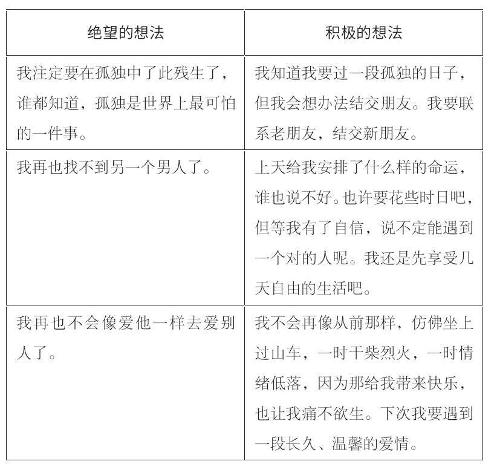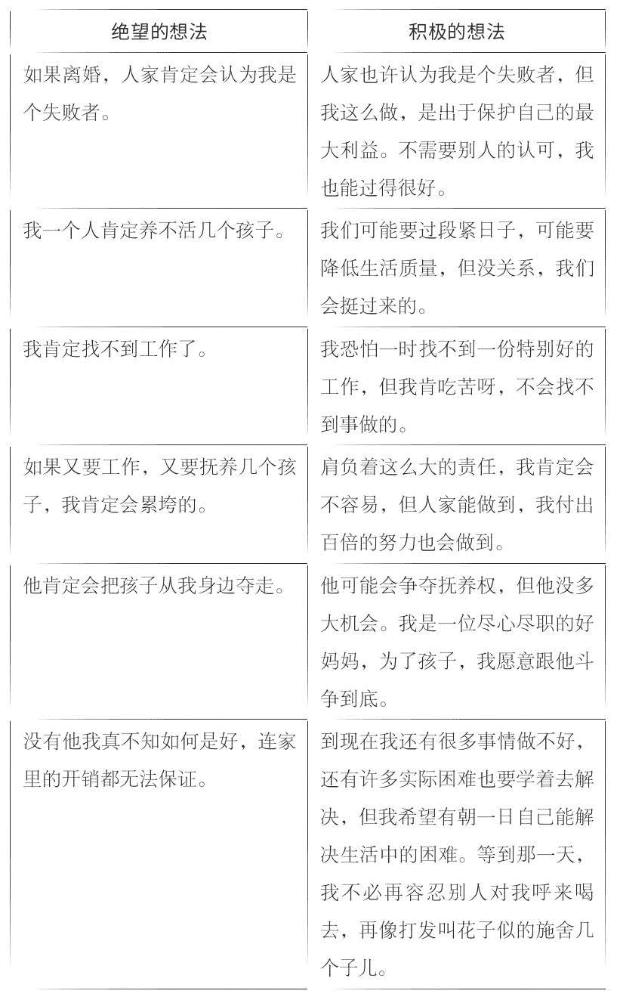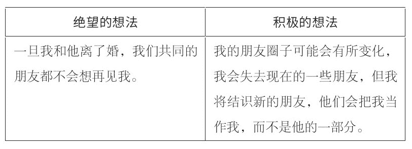

你瞧，转变想法不仅变绝望为希望，而且也找了解决问题的办法，确定了新的立场。如果你处于类似的境遇，不妨列一份你的顾虑和担忧，然后用自己的话重新组织，变绝望为希望，从中找到解决办法。

每次恐惧涌上心头的时候，请拿出这份清单好好看看。时间久了，你会发现你其实很强大、很有能力。这个练习不一定能解决你的所有问题，但变绝望为希望肯定能打消你无端的恐惧。

#### 处理好你对分手的愧疚感

当你下定决心与伴侣分手，内心随之而来的是对离婚的强烈愧疚。

**抛弃他的愧疚**

一想到与吉姆分手，罗莎琳德总觉得心虚，一时狠不下心，所以迟迟没采取行动。在两人同居的几年中，罗莎琳德一度红火的古董店破了产，但吉姆不愿、也无法保住一份稳定的工作，维持一家人的生计。他经常喝得烂醉，对罗莎琳德恶声恶气，说她没女人味，家里入不敷出让他烦透了。四年后，他们的夫妻生活已经名存实亡。罗莎琳德想跟他谈谈他不负责任的行为，他却借故生事，大吵一架，然后一连离家出走好几天。这种分居的生活让罗莎琳德极其恼火。

有十几次，罗莎琳德以为他会一走了之，再也不回来了。每次她备受折磨，准备收拾残局的时候，他又跑了回来，上演前一轮的闹剧。最近一次让罗莎琳德忍无可忍的，是件算不得事的事，是关于钱的。她解释说：

他正等着我为了钱大吵一架，好有借口上演离家出走的好戏。我知道他的心思，也不理他。他偷拿了我从店里取出来的现金，这笔钱我原本是用来买日用品的。我一回到家，就看见他穿了一双新跑鞋。我问他：“你从哪儿弄了这双跑鞋来的？”他说：“商场促销，只要五十美元。”我说：“你哪来的买鞋的钱？”他等的就是这一句，于是大发脾气。他说我嗓门大，像个疯婆子，还说早就烦透了这一切，如果在这个家连这点主都做不了，还不如没这个家。那时候，我真受够了他这一套，干脆说：“那好啊，请你收拾东西，趁早给我滚。”但他摔门而出的那一刻，我知道，如果他回来，我还会接纳他。我知道他无处可去，找不到工作，我不忍心抛下他不管。我不想成为他落魄的时候抛弃他的另一个女人，那样我真的好愧疚。

罗莎琳德不忍心将吉姆扫地出门，让他流落街头，所以一而再再而三地容忍他、接济他，久而久之，她渐渐以为自己有义务照顾他，跟上辈子亏欠他似的。

罗莎琳德和吉姆就好像一个心软的妈妈和一个幼稚的孩子。她分不清被需要和被爱的区别，认不清反复无常、不负责任的人救不得，他们会一再地沉沦，到头来还反咬一口，说救他的人磨灭了他的意志。

吉姆以为家是个菜园子，可以想走就走，想回来就回来。每次他挑起事端，大闹一场，然后甩袖出门，都给他一种大权在握的错觉，以为自己牢牢掌握着对罗莎琳德的控制，而其实他像一个长不大的孩子。

罗莎琳德要认清，与离开他的内疚相比，由着他把自己拖垮、把家当败光更痛苦。为了让罗莎琳德看清她不肯离开吉姆是出于愧疚，而不是爱，我请她列出不分手的理由：

**我为什么不分手**

●他离不开我。

●我爱他。

●我不忍心伤害他。

●我可不能又搞砸了一段恋情。

●我跟他这么久，没法离开他了。

●我不想再孤孤单单的一个人。

●凑合着过吧。

●我人老珠黄，还能指望另一个帅气的男人看得上我？

●我们两个人好的时候，真的很开心。

●没了我，他真不知道怎么过。

罗莎琳德终于看出，她留下来的理由几乎与两个人的感情无关了。

即便如此，她还是狠不下心跟他分手。我建议她再列出分手的理由，认清这个寄生虫的缺点，坚定跟他分手的决心。

**我为什么要分手**

●他磨灭了我的信心。

●我做什么都无法讨好他。

●他现在碰都不肯碰我。

●他大手大脚，不挣钱却乱花钱。

●他害得我生意破产、丧失了信誉。

●他惹的麻烦，自己不肯解决，也不肯负责。

●他经常当众羞辱我，让我出丑。

●他嫌我身材不好，嫌我老。

●我开始恨他了。

罗莎琳德总算明白了过来，她的愧疚多半源于她误以为自己应该照顾吉姆，安排好他的生活起居。我指出，如果她继续照顾吉姆，长此以往，他反而不能自立。

罗莎琳德列的两份清单说明，吉姆的恶劣行径严重伤害了她对他的爱。只有在她接济吉姆、觉得他还需要自己的时候，她才有好心情，才有自信。

下定分手的决心前，我们都会在心里掂量再三。像罗莎琳德一样列出自己的想法能让你分清是非曲直。罗莎琳德看出，与吉姆纠缠下去毫无意义。她也知道，如果吉姆照常回来，她恐怕还是狠不下心把他拒之门外，但两人情分已尽，该下决心了。

**受人恩惠，所以心里愧疚**

南希努力改变自己、改善两人之间的关系，但杰夫却无动于衷，于是她认真考虑跟他离婚。她也狠不下心，不过她的情况与罗莎琳德截然不同。杰夫顾家，是一个有能力、有名望的律师。结婚这四年，都是杰夫一个人挣钱养家。他让南希过着衣食无忧的生活，南希不忍心跟他一刀两断。她告诉我：

我知道我应该离婚，跟他在一起的日子太难熬了。我照着镜子，都不敢相信短短四年，我竟然变成这副模样。但我还是觉得自己无权就这样一走了之，因为他为我付出了许多。我们住着漂亮的别墅，曾一起度过一个个愉快的假日，在社交场合很受尊敬和欢迎。可一想到他不知有多少次当众让我出丑，再想想他的小气、自私，我又气不打一处来。但我知道他爱我，离不开我。后来想想，也许是我不好，要是我再努力些，也不至于闹到非离婚不可的地步。

我见惯了南希这种反应，她是典型的受人“恩惠”，心里有愧。在许多女性看来，被丈夫养着，就是欠着丈夫的，就要对他格外地忠诚。

我告诉南希，忠诚并不等于非得忍受男人的作践或丧失自尊。作为妻子，她千方百计地让杰夫开心，为他营造家的温馨气氛，在他重视的社交生活中尽力配合。只要她消除了跟他分手的愧疚，不怕下不了分手的决心。

**怕伤了孩子**

对带着孩子的女性来说，心里又多了一层愧疚。以下是考虑分手或离婚的妈妈们的顾虑：

●我怎么能做这种事呢？孩子们不能没有爸爸。

●我不能夺走他的孩子。

●离婚会毁了孩子一辈子。大家都知道离婚对孩子的伤害。

●我父母离婚了，我发誓决不让我的孩子受那种苦。

●我无权仅仅因为我一个人不开心就拆散一个家。

这些顾虑和担忧可以理解，但许多顾虑毫无根据。没有证据证明只有父母健全孩子才能成为一个身心健全的成年人。倒是有大量证据证明，在充斥着紧张、冲突和虐待的家庭成长的孩子，长大后不是重蹈父母的覆辙，就是孤僻、消沉，或者主动承担起受害者这个角色。离婚对谁都不容易，但只要有一位慈祥的父亲或母亲引导，孩子就能，也的确挺得过去。你依据事实做出的决定其实不仅为了你好，也是为孩子好。

**觉得对不起家人和朋友**

虽说决定离婚或分手是你的私事，但朋友或家人也许会苦口婆心地劝你改变主意、维持这段婚姻，这就会给你增添些许愧疚。

做了分手决定后，你就要鼓起勇气，顶住好心人狂轰滥炸、让你挽救婚姻的压力。家人往往说得头头是道，试图打消你离婚的念头，但这些理由并不顾及你和孩子的最大利益。家人也许认为你提出离婚是让他们蒙羞。他们常常说“咱们家还没人离过婚呢”“你瞧我和你爸都对付过来了，何况你呢”，再不就是：“我看情况也不像你说得那么糟糕。他起码没动手打你。”

我有一套专门对付这种情况的方法：不辩解、不推脱，这种态度能帮女性抵挡因为别人的不赞成或非难造成的愧疚。家人或朋友指责你，对你说三道四的时候，你不妨用以下几句话作为回应：

●你那样想我很遗憾，但这是我自己做的决定。

●我知道咱们家从没有人离过婚，但我不能因此而不离婚。

●我知道你们对付过来了，但我不想吵吵闹闹地过一辈子。

●我需要你们的支持和理解，不是你们的建议。

●多谢你的关心，但我不想谈这件事。

●不谈这事好不好？

●我做这个决定无意伤害大家，我只为了我自己。

●请你别跟自己过不去，也别怪我。

只要你态度坚决，不为所动，他们的态度根本左右不了你。

家人和朋友反对你离婚的原因不一。家人也许是担心你成为他们的负担，到时还得从经济和感情上给予你扶助。朋友说不定只是好心好意地和稀泥。他们不想你们这一对儿散了，同时又担心你成了他们的负担。你要切记，不论他们是否出于好心，又给你施加了怎样的压力，但他们不了解你的处境，也体会不了你的心情。

适当的愧疚能约束大多数人，免得做出伤天害理的事。这种愧疚当然也事关社会的存续。但许多下定决心要与控制型男人分手的女性心中的愧疚却多半是将别人的责任往自己身上揽，渴望以此得到别人的认可。在这种情况下，愧疚反而成了一种心理负担，其唯一的作用是让女性难以痛下决心，与控制型男人一刀两断，好好过自己的生活。

#### 对他的反应做好准备

我们在前文讨论过，控制型男人为了维护自己的掌控权，往往不惜一切代价，但权威掩饰之下的是他对妻子的依赖。一旦他依赖的对象要与他断绝关系，往往就勾起他昔日的恐惧。出于这个原因，你和他分手常常会遭到他的强烈反抗。由于受到了威胁，他可能会使出你以前从没见过的手段。我再说一遍，只有做好充分的准备，你才能把握局面，不至于因他的反应而心软。

**扮可怜**

让南希终于忍无可忍的，是那次和杰夫去欧洲度一段期盼已久的假日。夫妻俩度假回来后的第一次辅导，她告诉我：

你知道，这次旅行我盼了多久，结果却成了一场灾难！他当众让我出丑，对我大喊大叫，屡次三番地不给我一分钱就把我撂在外面，连飞机晚点、丢了行李这种事都怪我。他简直是个恶棍。有一次，他为了一点微不足道的小事甩手出了餐馆，把我一个人晾在那儿，付不了饭钱。我只好像个做了错事的孩子似的坐在餐馆，等着他拿钱来赎我。这次旅行激化了我们婚姻中的种种矛盾。我就像他的一件多余的行李，走到哪儿丢到哪儿。我气极了，铁了心要跟他分手。乘飞机回来的途中，我说我要离婚。说完后，我扭头不理他，一直到飞回洛杉矶，就让他晾在那儿。一进家门，他又是求饶、又是道歉，说是当时不晓得怎么搞得，居然犯了那种错误。我说：“晚了，没用。”我不想再当众出丑，再也不想受从前那种罪。接着他崩溃了。他哭哭啼啼，像个小孩子。我简直不敢相信自己的眼睛。他一把鼻涕一把泪地说他爱我，没有我他活不下去。他说只要我不走，叫他做什么都行。看他的可怜相，我心软了。现在我也不知怎么办才好。

像杰夫这种平时不把妻子当回事，等到她说要分手的时候扮可怜的男人不在少数，但有时候这也是一个转机。不论怎么样，南希都决定给杰夫一次改过自新的机会。

南希的自信日渐增强，但杰夫之前对此毫无反应，我担心他只知道一种婚姻的相处之道。在他改变对南希的态度之前，还要学习新的相处方式。还有，南希希望他最后关头许下的诺言，能在接下来的相处中付诸行动，改变对她的态度。

旅行回来后的几个星期，两人相安无事、其乐融融，但杰夫没有遵守诺言，来我这里接受辅导。相反，他还告诉南希他不需要外人开导：“你瞧我们多幸福，何必要外人来插一脚？”等杰夫放了心，不再担心会失去南希后，他又故态复萌。南希彻底死了心。这一次，她终于下定决心，跟杰夫分手。

认为妻子可能要离婚，连平时再蛮横的控制型男人也会表现出一副可怜相。他会哭哭啼啼地哀求，甚至放声大哭。他会不住地道歉，保证改好。他会诉说你们共度的美好时光，说他多爱你，离不开你。他的种种反应只会动摇你的决心，以为他已悔过自新。

你改变主意，决定不分手之前，要自问的一个关键问题是：他道歉了，也保证了，之后是不是真的能改，能坚持多久？

**他可能会自暴自弃**

一旦认为自己要遭到妻子的抛弃，有些控制型男人会自暴自弃，尤其是有过酗酒、吸毒或抑郁史的人。女性这时候会担心自己一走，男人真活不了。他说不定会主动说出自杀或自残的打算，要她明白她非留下来不可。

我辅导过一位来访者，她的丈夫有过吸毒史。她和他结婚八年，也受了他八年的罪，终于下决心摆脱这段婚姻。那晚她向丈夫摊牌，说她想离婚，他喝得烂醉，发生了一起严重的车祸。她明白他这是靠扮可怜留住她，让她留下来照顾自己。后来发现这招不成，他又开始以自杀相要挟。到了这一步，我建议她发动他的家人和朋友，在他们离婚期间担任他的支持系统。有家人和朋友的支持，他不会觉得孤单、绝望，最终能渡过危机。

谁也说不好你先生或男友以后会不会以自残或自杀相要挟。有人的确走上了绝路，但留下来并不能保证你救得了他。如果你出于这个原因留下来，以后只要他以为你要抛弃他，就会祭出感情讹诈这一绝招。

有自残倾向或情绪不稳的男人需要专业心理咨询机构的救助。如果他执意不肯求助专业机构，一味地依赖你获得安全感，你要想清楚能不能担得起这个责任。如果你已尽自己所能帮助他、给他支持，他却变本加厉，这时候你就应该明白，自残是他自找的。

**他可能会威胁你**

如果把离婚或分手视作一种背叛，许多控制型男人可能会根据你的弱点，发起疯狂的报复。

如果他一贯掌握家里的财政大权，那他很可能会扬言断了你的经济来源。你在经济上越依赖他，他越是看中这个威胁的效果。他会扬言把信用卡统统收回，注销银行账户……这一切都是要你明白，他有本事叫你求生不得、求死不能。

如果你的软肋是孩子，他就拿监护权相要挟。他会告诉你，如果你想走尽管走好了。他和孩子哪儿也不去。

如果你担心他真的报复你，最好去合格的法律咨询机构，详细了解财产、监护权等方面的情况，维护你的正当权利。

你可别因为跟他分手觉得愧疚，就把一切交给他做主，主动扮演起过错方的角色。

不过，许多威胁不过是他嘴上说说而已。你要记住，他是个纸老虎，你强硬起来，他才会服软。你只有了解了自己的正当权利，才不会被他吓倒。

**一句警告**

如果他扬言要对你和孩子动手，我劝你为稳妥起见，在离婚手续办好之前，先带孩子找个安全的地方避一避。离婚或分手是控制型男人最不能容忍的。请恕我再强调一遍：从没动过手的男人到了这个时候恐怕也会动手！

#### 未雨绸缪

你决定离婚或分手的时候，未来可能存在许多不确定因素。你要事先想清楚今后何去何从，有什么困难，做好充分准备，到时候才不会慌张。

在我接触到的成功离婚的例子中，根据不同的情况、年龄和阅历，每个女人都有一套自己的方案。南希下定决心跟杰夫离婚的时候，已经四年没出门工作过。这些年，她丧失了自信，不敢去求职市场，渐渐怀疑起了自己的能力，她的外貌也今非昔比，重返时尚界无异于痴人说梦。她也清楚，在财产上，杰夫跟她将有一场恶战。再说他本来就是律师，格外不好对付。

南希第一步要做的是找一位律师，了解她起诉离婚会是一个什么后果。但她连这个也不敢，因为杰夫会检查她的每一笔开销，说不定会发现她找了律师。按我的建议，南希找了一位专打离婚官司的律师，第一次咨询不收费。

由于杰夫对钱数守口如瓶，南希不晓得他们到底有多少财产。因此，她的第二步是在律师的配合下拟订一个计划，最大限度地保护她的经济权益，同时找一份工作，免得她完全依赖离婚分财产生活。

说到工作，南希又难住了。她有才能、有经验，就业面很宽，但真到了决定一个明确的发展方向的时候，她又为难了。我建议她列几项感兴趣的职业，明确每种职业的情况，包括是否需要培训、需要哪些技能、有哪些优势和劣势。以下是她一个星期后带来的清单：

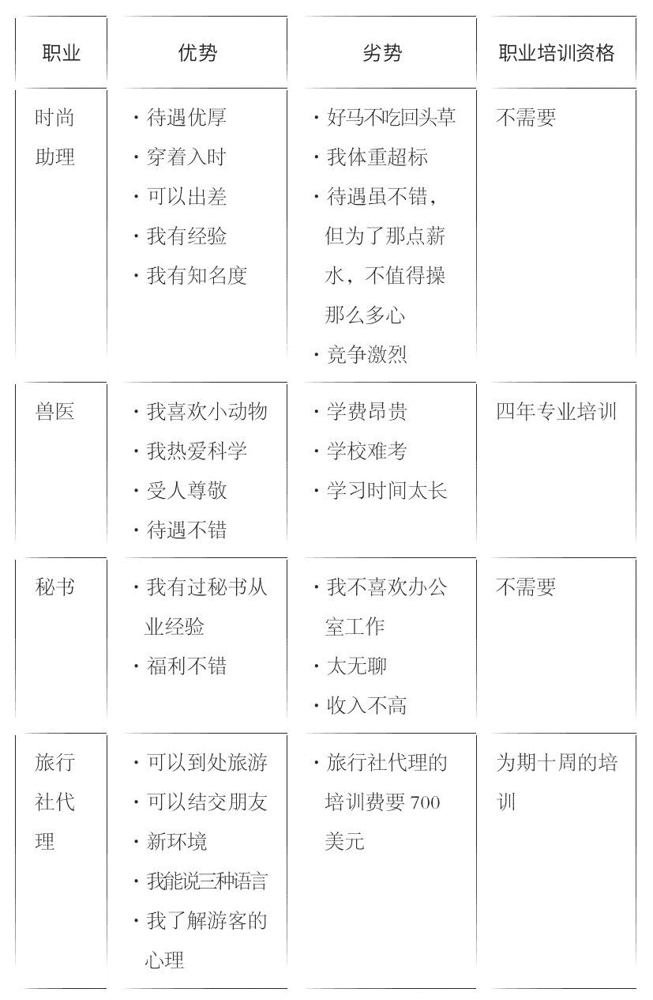

如果你正在考虑换个工作或者第一次出门找工作，这种目标清单可以帮你认清自己的优势、劣势、喜好、是否具有从业资格。纵观南希的清单，不难发现她在旅行社代理这项工作上占有许多优势。但唯一的难题是她要参加为期十周的培训，并且交一笔不菲的培训费。南希以前工作的时候攒下了一点小小的积蓄，现在她打算把这笔钱拿出来付学费。

南希打定了主意，但又担心杰夫从中作梗，不让她去上课。我指出，虽说他有可能阻拦，但如果他看出南希心意已决，恐怕也只能作罢，何况学费又是她自己掏。不过，出乎南希意料的是，杰夫压根儿没注意到她生活中的这一新变化。

南希还在纠结是不是不该瞒着杰夫，应该告诉他自己的计划，否则就像是我们两个人在捣鬼，合伙欺骗杰夫。

南希：“我参加培训的事，真的要对他撒谎吗？”

苏珊：“如果你不瞒着他，你认为会发生什么情况呢？”

南希：“他会动用法律手段吓唬我。说不定还会断了我的生活费，甚至把我扫地出门。”

苏珊：“那就是说实话要付出的惨痛代价。”

显然，忠厚老实是好事，但要看对什么人，是否出于善意。南希要对付的是一个卑鄙自私、可能会采取报复的男人。相比南希的需要和心情，他更在乎失去对她的掌控。

对一个反复无常、有暴力倾向的人隐瞒情况其实是一种生存之道。控制型男人蛮不讲理，全凭一时的意气用事。如果你知道一旦说真话，肯定要遭受他的虐待，那么撒谎并不是什么见不得人的事。

你不仅要规划好今后的住房、安顿好孩子，还要学习如何解闷、如何与外界打交道。拟订一份实现目标和计划的方案，能打消你对未来的恐惧。

规划的时间因人而异。我辅导的一位来访者打定主意，等小女儿高中一毕业，立即跟丈夫离婚。她决定再等两年，是怕离婚对孩子造成伤害，尤其是小女儿。她不像杰姬和罗莎琳德那样无牵无挂，随时可以提出离婚，只要关注如何排解寂寞孤独就够了。

规划未来点燃了许多女性心中的希望，哪怕不能马上付诸实施，哪怕一开始就遭遇了挫折。我经常安慰来访者，一开始的失利并不代表失败，也并不等于计划有问题。这恰恰说明，要想改变生活、转变人生，焦虑和恐惧在所难免。请你坚定目标，不管开头有多难，终有一天会过上幸福美满的生活。

#### 分手或离婚的后果

分手或离婚并不那么简单。法律程序虽然繁琐，但比起情断要简单得多，至少从法律角度，签完字后，双方再无瓜葛。但那份情却令人牵肠挂肚，往往要花很长时间才能真正割断。

**情断**

虽说清楚自己受到了非人的待遇，但即使离婚或分手后，许多女性仍对蛮横霸道的控制型男人念念不忘。我在前文中说过，在控制型夫妻关系中陷得越深，女性越难以自拔，就好像吸毒，毒瘾越深，越难以戒除。

**盼他回心转意**

在除夕夜聚会，鲍勃让劳拉当众出丑后，劳拉离开了他，一纸离婚诉状交到了法院。但两人闹翻后许久，她仍然苦闷得不知如何是好：

他捉弄了我一晚上，对我百般刁难，我想尽办法讨好他，搂着他的胳膊装亲昵，掏心掏肺地对他，可是我做什么都不如他的意。我搂他的胳膊，他嫌我搂得太紧。我走进人群，他说我不该去……反正我做什么都不对。后来我跟一对夫妇聊妇女运动，他走了过来，听着听着，突然把一杯酒泼到我的脸上。我整个人都懵了！我起身收拾东西，出了宴会厅。他像个疯子似的跟了出去，扯着嗓子一路嚷到停车场。见我不理他，他抓住我的袖子，一把扯了下来：“你是我老婆，我说话你就得给我听着，你不许走！”我说：“算了吧。你别想再让我出丑了。我受够了！”谁知他摘下结婚戒指，狠狠地扔在了地上。我真不敢相信他能做得出。这一招让我死了心，我知道我跟这个男人过不下去了。当晚我没跟他回家，随后向法院起诉离婚，但那之后，我们才发现似乎谁也离不开谁。我也不晓得自己是怎么回事，但似乎真的放不下他。

即使离了婚，劳拉还频频去见鲍勃，住在一块儿，受他纠缠。她觉得命中注定两人是一对冤家。

我告诉劳拉，她是“中了毒”——丢不下她迷恋的人，她非彻底戒掉这个“毒瘾”不可——与鲍勃一刀两断。

我介绍了其他的来访者了结这段关系的做法：她们会跟自己约定个期限，至少九十天之内断绝与前夫的交往，包括性生活。但这一点很多女性恐怕一时做不到，因为孩子或其他问题尚存在法律争议，她们难免要与对方打交道。不过，带着孩子或在律师的陪同下与他见面也未尝不可，只要不共进晚餐，最后赤裸相对就好。

劳拉听取了我的建议，断绝与鲍勃来往一周后，她告诉我：

我一天到晚心烦意乱。我得了感冒，开车一路哭着去上班，又一路从公司哭回家。我觉得这辈子算完了，我的泪一辈子都流不干。

这和戒毒的症状真有点像。等熬过了最初几周，劳拉会发现她不再对鲍勃牵肠挂肚，觉得轻松、开朗了许多，虽说她还时不时想见他，但不像以前那样强烈了。

与控制型男人分手的女性不妨也跟自己订个约定。你可以把它看作一份“情绪离婚判决书”。

杰姬跟马克闹翻后，出乎意料的是，她对他的愤怒渐渐消失了，竟然盼着他回心转意。她回味两人在一起时浪漫、美好的时光，想着他的种种好。这时候，对于杰姬的想法，恐怕许多相同处境中的女性都会有：

●仔细想想，以前情况也没那么严重。

●我们在一起的时候还是有不少快乐时光的。

●我跟他一刀两断的时候，他可怜巴巴的。我不能那样对他。

●离婚也许只是教训他一下。现在我们也该重归于好了，我们会过上好日子的。

●我在这段婚姻上投入了那么多的精力，怎么能说放手就放手？

●我这么想念他，离婚说不定是一个错误的决定。

到了这个阶段，女性往往会大事化小，找借口与对方复合。杰姬竭尽全力抵制着这种冲动。为了不让自己一时心软，她发明了一套有趣的小技巧：

每当我鬼迷心窍似的想着他，想着他抱着我，想着他身上的味道，想着他有力的胳膊时，我就想：“也许我应该重温另一种感觉。”于是，我会逼着自己走进书房，翻出我保存的满满一盒借条。这些借条都是我们结婚期间打的，借来的钱全投进了他的狗屁生意，打了水漂。我开始找那些五千、一万、两万的大额借条，这些钱都是磨破嘴皮，求父母、姐妹借给他的，都是我一个人打两份工累死累活地挣钱还上的。我要养活一家大小，还要供着他。望着这些借条，我很快打消了与他重归于好的念头。这一招屡试不爽。

如果你这时候希望与前夫复合，不妨采用类似的方法，也可以参考第九章中“你的伴侣一向的表现”一节中列出的行径，挑一两个前夫对你格外恶劣的场景，然后在脑海中重现这一幕。你看着他的脸、听着他的大嗓门，仔细想想他对你说的恶言恶语，关键是想想你当时的心情，然后扪心自问，你想不想重温那种滋味。

离婚后对他又爱又恨、不知何去何从是人之常情。不过，控制型男人格外靠不住，想拉你回头的时候，他会换一副面孔，变成你心目中的好男人。他清楚你的软肋，花言巧语，利用你的软肋实现自己的目的。如果你经不起诱惑，回到了他身边，他又会故态复萌。你要切记，你们在一起后，也许能过上一段平静甚至美好的日子，但只要他没有诚心改变，要不了多久，他又会恢复霸道、卑劣的本性。这一次说不定会变本加厉，因为他要让你瞧瞧抛弃他的代价。

心理离婚是女人与控制型男人分手后最难捱的一个阶段。了结一段感情如同失去了一位亲人，也许还不止，还有你的希望、你的生活方式，以及你对自己的认识。哀伤在所难免，你可以大叫、哭喊、捶枕头宣泄痛苦，关键时寻求亲戚、朋友的支持和安慰。你要切记，强者有难的时候不怕向人求助，悲伤必然会过去。

**云开雾散**

分手后，当你发现什么新奇、美好的事物时，再也不必急着向谁辩白、解释或陪不是。你现在可以自作主张，不必提心吊胆地想着他的反应。罗莎琳德结束了如履薄冰的生活，不禁喜出望外，尽管她时不时地不知所措，但没人再对她指手画脚，还是让她激动不已。她告诉我：

你不知道，每次吉姆在家，家里的气氛都紧张得恨不能一点就着。现在每晚回到家，我只觉得安全、惬意。这是我的家，再也不是他的了。虽说我有时候闷闷不乐，但比起我和他在一起时的自愧不如、力不从心，还是强多了。

罗莎琳德的坚强和果断渐渐取代了她的孤独和郁闷。我建议她每当考虑跟吉姆复合或为将来的生活发愁时，就大声对自己说：“我不允许别人再践踏我，谁也别想！”

#### 帮孩子渡过难关

父母准备离婚的那段时间，孩子往往比较迷茫，但离婚后，控制型男人被扫地出门，孩子身上很快就会显露出积极的改变。许多女性告诉我，离婚后，孩子学习成绩上去了，也快乐了许多。我们来听听杰姬怎么说的：

马克走后，我们过得越来越好，如今一家人其乐融融。我儿子学习成绩上去了，女儿又愿意回来了。她以前编出种种借口，就是不肯回家，因为家里始终弥漫着紧张的气氛，让人透不过气来。兄妹俩现在经常带朋友回来，马克在家的时候，不是不允许，就是对他们的朋友评头论足、百般挑剔。我们现在更像一家人了。

这段时间，我建议你要如实对孩子解释离婚的原因。你要解释清楚，不能含糊其辞，告诉他他的所见所闻都是真的。爸爸脾气暴躁、蛮横霸道、反复无常。孩子越大，越能明白其中的道理，但就算孩子很小，你也要让他明白，蛮横霸道不可取。

就我个人的经验而言，许多孩子，尤其年纪较小的孩子仍经常与父亲或继父保持联系。如实告诉孩子这些情况也许会伤害父子或父女之间的感情，但孩子的利益远高于前夫的利益。

你把情况如实告诉孩子，是向孩子证实他自己了解的信息。你告诉他他的认识没错，其实是免得他自责，把家庭问题揽在自己身上。做了错事，责任该谁承担就谁承担——一般是家中的成年人——你的实话实说其实为他脱下了将来自怨自艾的枷锁。

向孩子说明情况的时候，关键是要告诉孩子，父亲发火的时候，你没本事好好保护他。杰姬尝试向孩子说明真相的时候，我告诉她，要让孩子了解她保护不了他们，是因为她连自己都保护不了，并且让孩子发表对此事的看法。事后她来告诉我：

我们哭作一团。我好不容易才吐露了自己的心声。我告诉他们，以前听凭马克吓唬作践他们，是我不好。我说他们不该无端受到马克的作践。我要他们放心，从那以后，我学会了许多，再也不许那种事发生了。孩子们说：“妈妈，我们不怨你。你什么时候能不怨自己呀？”见孩子们那么懂事，我泣不成声。

作为一名咨询师，工作中我见过许多人渴望父母的这种告白。对孩子坦诚你曾经的痛苦是送给孩子最珍贵的礼物。杰姬跟孩子们一番真诚的交流，增进了她与孩子们之间的感情，同时对于重塑孩子受伤的自信也大有帮助。

### 第十六章　爱与尊重：找到你作为女人的平衡点

久而久之，为了息事宁人、图个安生，女人无不夹着尾巴做人，在无奈中忍痛放弃大有前途的职业，丈夫不赞成的学业、活动或爱好，恐怕还得断绝与亲戚朋友的来往，只因为他嫉妒或者他认为两人的关系受到了他们的威胁。然而现在你终于重获自由，再也没人从中作梗，阻止你追求真正有价值的东西。想到这里，你该有多开心啊！

#### 找回失去的自我

你付出和失去的东西一般归为下列四类。请列出你为了息事宁人、保住婚姻而放弃的东西。

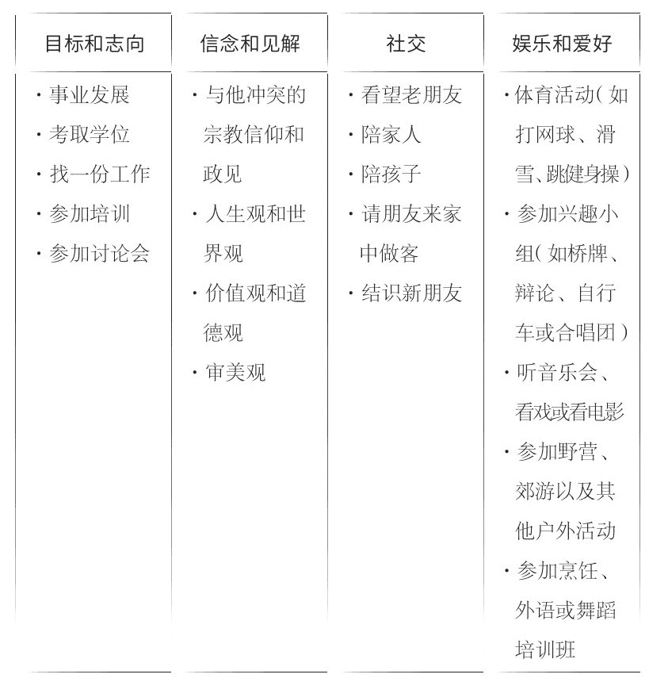

罗莎琳德跟吉姆离婚后，不仅立即着手重振亏损的企业，而且重建自信，并重拾追求。她告诉我：

他从我的生活中消失后，我精力倍增，也不愁资金了。我从没想到是他变着法儿榨干了我的血汗钱。我不仅重振了我的店，而且又杀回了瓷器彩绘这一行。吉姆在的时候，我就是想干也掏不出钱。记得我跟你说过，我把店面辟出一部分，供他做家具改装用吗？对，我在那儿砌了一座新窑，建成了一个干燥间。得空的时候，我坐在那儿给瓶瓶罐罐上色上釉，别提多开心了。我还决定推出一个瓷艺专栏，我绘瓷的手艺可好了，再说广告艺术是我的老本行。我在橱窗里辟出了一角，专门展示我的瓷艺作品。作品销路不错，我为自己自豪，过得很开心。

见罗莎琳德脸上洋溢的自豪，我感慨万分。她送了我一对做工考究的瓷花瓶，感谢我和她一起付出努力，我不禁热泪盈眶。

一段无益的婚姻害人害己，成天绷着神经、吵个不休，伤透人的心神。最叫人开心和精神倍增的莫过于善待自己、活出自己。一旦重返曾经的人生轨迹，许多女性都有一种喜获新生的感觉。

还记得卡罗尔和本吗？两人的生活发生了翻天覆地的变化。卡罗尔下定决心报名参加了培训班，并获得了学位。出人意料的是，本发现比起他心目中塑造出来的女人，卡罗尔更加迷人、更令人怦然心动。最后一次咨询，本告诉我：

以前，我只想找一个不会离开我的女人。我最消极的担忧是，只要她有两只脚，她就会跑。现在我有了自信，不再有那种担心了。她完成了学业，找到了一份工作。说句老实话，我还真为她骄傲呢！她再也不是那个楚楚可怜的小姑娘，更像一个有血有肉的人。她自强自立，遇事据理力争，你猜怎么着？我还真喜欢她现在这种样子！她活泼可爱，谈吐风趣，比过去更有味道了！这么说吧，我比当初更爱她了。

这段二十七年的婚姻现在为他们带来的是无尽的欢乐、幸福和对彼此的重新认识，真令人欣慰不已。

杰姬婚后虽没放弃学业和职业目标，却断绝了与许多朋友的来往和仅有的一点娱乐。马克走后，她做的头一件事是开开心心地邀朋友一块儿去看了场电影。

我几年没好好看场电影了，就因为马克不喜欢。坐在家里看看电视没什么，但真要去看电影，他是百般地不乐意。一走进电影院，他就会大声嚷嚷，表达不满。要是片子好看就罢了，要是不好看，他会怪我硬拉着他出来。到头来，我还不如不看。他让我战战兢兢，没好好看过一部电影。但现在不同了，有许多人陪我看，我还有一位最近在约会的新男友，他是个十足的电影迷。现在看电影对我是种莫大的享受，我不必担心电影不好看，有人当场为难我。

你可别小瞧了你的兴趣和你喜欢的娱乐活动，正是它们塑造了你的个性。能开开心心地去看场电影算不上什么了不起的事，但对杰姬来说却不容易，她终于能不必经别人的同意，做自己喜欢的事了。

**开辟人生的新领域**

几乎每个女人都希望夫妻和谐、婚姻美满。但如果她不巧嫁了一个控制型男人，不仅会变得目光短浅，而且会心甘情愿地忍受他的种种虐待和作贱，因为她生活中的许多支柱已经被这段不良关系剥夺了。南希嫁给杰夫后，不仅辞去了工作，也断绝了与许多朋友的来往。在心理辅导中重拾了自信后，她又与许多老朋友取得了联系。朋友们都念着她，可惜南希都快要忘了跟她们出游时的快乐。她还发现，在顺利拿到了旅行社代理的资格，找到了工作后，她再也不怕杰夫对她气势汹汹的了。丰富多彩的生活给了她一个看待自己和婚姻的不同视角，让她不必在婚姻上寄托过多的情感、需求和希望。结束咨询的时候，南希还是下不了决心跟杰夫分手，但她有了信心，如果非分手不可，她也不再害怕，因为她不再拿后半辈子赌这段婚姻。

由于拓宽了眼界，有了主见，增添了信心和快乐，许多女性喜出望外。最近一位听众打电话来告诉我：

我有一段非常好的成功故事想跟你和广大听众分享。我今年五十八岁，曾嫁给一个折磨了我四十多年、蛮横霸道的男人。不知道这么多年我是怎么过来的，但我终于鼓起勇气，走了出来。说真的，一开始我吓坏了。我从没出门做过事，以为没人肯要我，但我在一家汽车用品商店找到了一份负责前台和接待的工作。我一天要接待许多客人。我还经常出去跳广场舞，开心得不得了。

对女人来说，只有尽快融入新生活、摆脱前夫或前男友的阴影，她才能重拾自信，不再恐惧人生的巨变。

当然，我无意贬低婚姻的幸福和快乐。人都渴望与别人亲近，渴望找到另一半。但找到另一半并不等于非得放弃自由、迷失自我。

**你的新力量将惠及你的孩子**

重拾自我的一个最大益处是，你有机会扭转反面例子对孩子的潜移默化。许多女性常常向我诉苦，担心在控制型男人主宰的家庭中长大的男孩，以后会跟爸爸一样蛮不讲理，女孩会重蹈覆辙，成为像妈妈一样的受害者。我安慰这些女性，只要母亲扭转了态度，打破了这个怪圈，那么不论孩子多大，都能转变对男女关系的认识。

女人鼓起勇气重塑自己的人生，重拾自我，无疑将为儿女树立一个好的榜样。儿子会渐渐认识到女人是可贵的、值得尊重的，女儿也会懂得自己的可贵，不应被人践踏。孩子仿佛一棵小树苗，具有很强的可塑性。见妈妈幸福开心、充满信心，孩子也能增加幸福感。因此，对孩子来说，最伟大的老师是你充满自信的全新态度。

#### 别再重蹈覆辙

辅导结束的时候，罗莎琳德已经有了很大进步，对自己、事业和新成绩充满了信心。之后我们有六个月没联系。一天下午，我接到了惊慌失措的罗莎琳德打来的一个电话。第二天下午，她走进我的办公室，情绪十分激动：

罗莎琳德：“我又走了老路！我认识了一个男人，他叫莱斯。他帅气、迷人，但他又重演了吉姆的那一套。我这又是何苦呀？我这是造了什么孽！”

苏珊：“你别急，你说说到底发生了什么？”

罗莎琳德：“那次我和莱斯去户外野游。我真的很愿意跟他一块去户外。我们爬一道非常陡峭的山坡，我跟不上他。我拼了老命也办不到。于是我喊他慢点，等等我，他不理我也就算了，竟然还大发脾气，扭头扯着嗓子骂我是个懒女人，说什么如果不努力，野游还有什么意义。我觉得我拖累了他，只好作罢，沿着小路下了山，在车里等着他。两个小时后，他下山了，一见我就发起了脾气，说我败了他的兴，早知如此，还不如带个老太婆出来。我又和从前一样，连声赔礼道歉、责怪自己，虽说我真的很伤心。后来我醒过神来，心想我凭什么要向他道歉？是他像个白痴一样对我大发脾气，错的不是我！这时我才回过味来，我又折回了老路上！我挑来挑去，最后挑了这么一个人。我恨自己不争气，只好来找你。”

苏珊：“首先，我要告诉你，你不是不争气，而是大有进步。你瞧，你已经不再一味自责，而是当即认清了你受委屈时的心情、反应和情况。”

罗莎琳德其实已经变得非常关爱自己了。一旦发现自己又落入了老一套，她能及时克制自己。她明白做事欠妥的是莱斯，不是她，最重要的是，当莱斯让她自我怀疑的时候，她能及时察觉。她的经历表明，她不会再找一个践踏她的男人了。

旧的行为模式不会一夜之间消失。改变一向是前进两步，又倒退一小步。罗莎琳德不知不觉地犯了老毛病——道歉，但这并不等于她的治疗前功尽弃。

她也不必为又挑了一个从精神上虐待她的男人自责。谁都无法保证自己不会喜欢上一个控制型男人。喜欢上控制型男人不是问题，问题是长期一味忍受、认同虐待！我安慰罗莎琳德，她做得很好！从一路上发生的事来看，她分明不愿再容忍虐待，哪怕那个男人再风度翩翩、潇洒帅气。

罗莎琳德故事还有一重积极意义，她让我们看到：当一个人树立起了自信，哪怕再次犯错，她也有底气捍卫自己的情感安全。

许多遭遇过控制型男人的女性问我：“我还能相信一个男人吗？”我告诉她们，重要的不是相不相信他的为人，而是你有足够的安全感，相信自己能应付人生的激变。

尽管罗莎琳德与吉姆有过一段不愉快的经历，但她并没有变得谨小慎微、疑神疑鬼，拒男人于千里之外。这是许多受过伤害的女性容易犯的一个错误。她们以为只要关闭感情世界的大门，避免谈感情，就没有危险。但真正的安全感源于你能够自由选择，你相信自己的感情，一旦出了问题，你能照顾好自己。疑神疑鬼、断绝与男人交往给你的只是安全的假象，那只会让你心灰意冷。

**男人并非个个都是控制型男人**

分清哪些行为属于虐待的同时，你也要注意不要给每个惹你不开心的男人都贴上一个“控制型男人”的标签。罗莎琳德发现了明确的证据，证明莱斯侮辱和践踏了她。不过，有些女性为了不让自己再走进一段不幸的婚姻，便错以为男人都不是好东西。

其实，与男人相处时，你所感到的不快并不都是他虐待了你。有的男人木讷；有的男人不善交际；有的男人不懂温情；有的男人还没做好开始一段感情的准备，不敢太认真；有的男人容易激动，动不动就发脾气；有的男人好争论，凡是你说的话都大声反对……但这些行为都不能说明他是一个控制型男人。别忘了，控制型男人旨在控制女性，为了达到这一目的，他往往采取咄咄逼人的姿态，威逼利诱，冷嘲热讽，贬低、摧毁女人的自信，一会儿风度翩翩，一会儿勃然大怒，让女人不知所措。

因此，不要被你对控制型男人的认识和影响左右，对一切男人都有成见。纵容男人虐待、控制你是不行的，但就此以为男人没一个好东西同样不行。

**重寻真爱**

这个世界上有的是体贴、细心的好男人，他们真心爱女人、珍惜妻子和她们身上独特的品质。这些男人不怕女人有才、有志向或有能力，因为他们自信、不缺乏安全感，不必非得把女人踩在脚下才觉得舒心。

劳拉跟鲍勃分手两年后，就找到了这样一个男人。我收到了她的信，随信附了一份喜帖，信写得非常精彩：

亲爱的苏珊，

还记得我当初有多担心吗？我担心自己不会再爱了，我担心再也走不出他留给我的阴影，我担心浪漫的日子从此与我无缘了。我写信是想告诉你，你说得对，我的担心是多余的。我遇到了一个好男人——兰迪。他不冲我吼，从不勉强我，从不疯狂地占有我，我全心全意地爱上了他。我以前看不上他这种男人，认为他们不够帅气、没有激情，但你猜怎么着？我如今丝毫不怀念与鲍勃在一起时的那些让人脸红心跳的感觉。我以前以为吵吵闹闹就是爱，就是热恋。但兰迪的温柔体贴、轻言细语让我明白，他比鲍勃强了百倍，跟他在一起才是幸福！我真心邀请你来参加我们的婚礼，请你见证我们这个特别的日子。爱你，非常非常地感谢你！

劳拉

许多经历过控制型男人的女性都担心，一团和气、彬彬有礼的男人缺乏激情和浪漫，但劳拉却发现，争吵并不像她曾以为的那样，是浪漫关系的调剂品，没有了争吵，她也能与一个男人共浴爱河。其实，与控制型男人相处的情绪起伏，与其说是爱和热恋，倒不如说是苦闷、紧张和摸不透对方脾气的惶惑不安。

#### 找到你作为女人的平衡点

如今许多人面对婚姻心里没底，不晓得何去何从。“从一而终”这老一套的观念正逐渐被人摒弃，但人们又不晓得该用什么新观念去取代它。女人常常为如何善用新获得的自由同时又不显得冷硬无情而发愁，男人则关心如何才能既温柔体贴，又不失男子汉气概。男人和女人一样，都希望拥有自己的事业和志向——有时出于选择，有时迫于生计。

我坚信，作为当代女性，我们的目标是保持那些让我们独一无二的品质——我们的直觉、我们的喜怒哀乐、我们的能力，同时摒弃那些于我们无益的自我牺牲。做女人不必非得要唯唯诺诺、低眉顺眼、抹黑自己，做男人也不是非得有传统的阳刚气概才算有面子。做一个有爱心、甘心付出的女性与关爱自己、保护自己的最大利益并不矛盾。你能送给自己以及与你相处的男人最好的礼物是你的自我价值感，有了它，你才能得到男人的爱和尊重。

[[1]](#text00011.html_z1) 指被劫持者对劫持者宽容、讨好或为其开脱的种种表现——译者注。

# 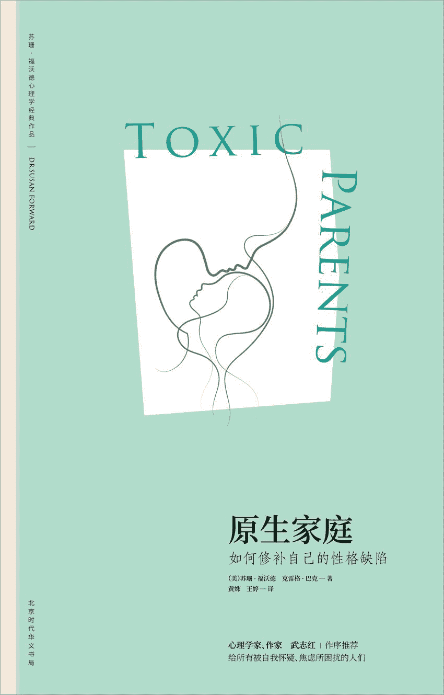

## 原生家庭：如何修补自己的性格缺陷

**（美）苏珊·福沃德　（美）克雷格·巴克著
黄姝　王婷译**

北京时代华文书局

## 图书在版编目（CIP）数据

原生家庭：如何修补自己的性格缺陷/（美）苏珊·福沃德，（美）克雷格·巴克著；黄姝，王婷译.——北京：北京时代华文书局，2017.12

（苏珊·福沃德心理学经典作品）

书名原文：Toxic Parents

ISBN 978-7-5699-1881-6

Ⅰ.①原…　Ⅱ.①苏……②克……③黄……④王…　Ⅲ.①性格-通俗读物　Ⅳ.①B848.6-49

中国版本图书馆 CIP 数据核字（2017）第 263194 号

北京市版权局著作权合同登记号图字：01-2017-6646

Toxic Parents. Copyright©1989 by Susan Forward.

This edition arranged with Bantam Books through BIG APPLE AGENCY, INC.，LABUAN, MALAYSIA.

Simplified Chinese edition copyright©2018 by Sunnbook Culture＆Art Co. Ltd.All rights reserved.

**原生家庭：如何修补自己的性格缺陷**

* * *

著　　者　（美）苏珊·福沃德克雷格·巴克

译　　者　黄姝王婷

出版人　王训海

选题策划　阳光博客

责任编辑　陈丽杰　袁思远

责任校对　陈丽杰　袁思远

装帧设计　郑金将

责任印制　刘社涛

营销推广　娟娟　小宇

出版发行　北京时代华文书局 http：//www.bjsdsj.com.cn

北京市东城区安定门外大街 136 号皇城国际大厦 A 座 8 楼

邮编：100011　电话：010-64267120 64267397

印　　刷　三河市华成印务有限公司　电话：0316-3521288

（如发现印装质量问题，请与印刷厂联系调换）

开　　本　710×1000mm 1/16

印　　张　20.75 字数 230 千字

版　　次　2018 年 5 月第 1 版

印　　次　2018 年 5 月第 1 次印刷

书　　号　ISBN 978-7-5699-1881-6

定　　价　58.00 元

* * *

★版权所有　侵权必究★

目录扉页版权信息作者介绍译者介绍关于本书推荐序 直面家庭的真相前言 有毒的父母，中毒的孩子第一部分 有毒的家庭行为模式第一章 “他们当时只不过是想帮我”——天下无不是的父母第二章 “你不是故意的，不等于你没有伤害我”——不称职的父母第三章 “为什么不能让我过自己的生活”——操控型父母第四章 “这个家里没有酒鬼”——酗酒型父母第五章 “你永远也不知道什么时候会出事”——身体虐待型父母第六章 “你要是没生出来多好”——言语虐待型父母第七章 “父亲对我做的事情永远都不可以告诉任何人”——性虐待型父母第八章 为什么家会伤人——有毒的家庭体系第二部分 拥抱你的内在小孩第九章 “我认为上帝想让我好起来，而不是想让我原谅”——原谅的陷阱第十章 “我已经是个成年人了，可为什么自己感觉不到”——观念、感受、行为调查表第十一章 “我就是没办法丢下他们不管”——自我界定第十二章 “你不该为……负责”——不再自我惩罚第十三章 一劳永逸地克服直面父母时的恐惧第十四章 有些创伤需要专业的心理治疗第十五章 “我能保护自己的孩子”——打破旧有的家庭模式尾声 放弃斗争

## 作者介绍

**苏珊·福沃德**

国际知名的心理治疗师、演说家和作家，她的著作有《执迷：如何正常地爱与被爱》《依恋：为什么我们爱得如此卑微》《如何识破男人的谎言》《金钱魔鬼》《情感勒索》等。本书曾荣登《纽约时报》畅销书排行榜榜首。目前，她的作品已被翻译成 15 种文字，在全球发行。

她经常出现在媒体访谈节目中，曾在美国广播公司主持谈话节目长达 6 年，并在美国加州成立了私人性虐待诊疗中心。

**克雷格·巴克**

影视编剧兼制片人，他曾为全美许多杂志和报纸撰写文章，探讨人类行为问题，现居于美国洛杉矶。他曾与苏珊·福沃德合著过多部作品，如《执迷：如何正常地爱与被爱》《金钱魔鬼》《对天真的背弃》等。

## 译者介绍

**黄姝**

黑龙江大学应用外语学院讲师，曾参与编写《大学英语词汇教学理论与实践》《大学英语基础语法教程》《世界节假日文化》等，参与翻译《跟各国人都聊得来》《走神的艺术与科学》。

**王婷**

现任东北大学外国语学院讲师，主要研究方向为语言学及话语分析，曾参与翻译《从华尔街到长城》《跟各国人都聊得来》《走神的艺术与科学》。

## 关于本书

这是一部振聋发聩的家庭心理疗伤经典之作。苏珊·福沃德博士通过工作中接触到的大量真实素材，分析了各类“有毒父母”的所作所为，以及这些行为如何伤害了子女并特续影响子女成年后的生活。

难能可贵的是，作者的主旨并不在于控诉这样的父母，而在于传授具体的对策，使那些受过或仍在承受父母伤害的人们获得勇气和力量，从与父母的负面关系模式中解脱，恢复自信和力量，得到自由和幸福。

## 推荐序　直面家庭的真相

武志红

你的所有感受都是有道理的，尤其是那些灰暗的感受。

内心充满痛苦的人，只要能发现这样一个简单的道理，他们的痛苦就会减轻很多。

并且，这个道理的核心是，你那些灰暗的、一直以来难以被别人和自己所理解接纳、似乎根本无处安放的感受，其实就是来自你的家庭，而且主要是来自你与父母的关系。

这是一个真相，我们必须尊重的真相。

父母是伟大的，天下无不是的父母，这是我们文化一直所宣导的，经过两千多年一以贯之的宣导，孩子对父母的孝道就成了一种“非如此不可”的教条。

在这种教条之下，你的那些灰暗的感受将无处安放。

一位男士，他的精神濒临崩溃，他有想杀死妻子的冲动，他觉得妻子背叛了他。

我问他，什么时候还曾有过这样的冲动，他说，偶尔有。

我再仔细询问，这些时候有一些什么样的共同点。

结果发现，其中最大的共同点是，每次都是妈妈过来和他一起住，约半年后他产生了杀死妻子的冲动。

我再问，你真正想杀的是谁？他沉默了很久后说，是妈妈。

我另外一位来访者，他做了一个梦，梦见自己杀死了一个女同学，然后就四处逃亡，终日活在惶惶不可终日的道德焦虑中。我请他自由联想，即这位女同学会让他第一时间想到谁，他说，妈妈。

现实中，他当然没有杀死妈妈，他对妈妈百般孝顺。事实上，他对女性极其温柔，他甚至都不会和女性吵架。但他的内心深处藏着很深的道德焦虑，因为他真的对妈妈有巨大的愤怒，这种愤怒有时会让他在一闪念中产生想杀死妈妈的冲动。

孝道教条主义之下，对妈妈的愤怒成了不可呈现的东西，不管这份愤怒有多大，它也不能流向妈妈哪怕丝毫，于是，它最终流向了另一个女人，或者其他人。

这是迁怒，而我们社会中的无数恶性事件乃至陋习，其核心都是迁怒，即将对父母的不满迁怒于其他人。

这两位男士，在相当长时间的咨询中，细致地审视了与父母的关系，尊重了自己对妈妈的愤怒，于是这份愤怒就真的可以放下了；愤怒放下后，对妈妈的更充分的爱出来了。同时，他与妻子就真的可以相爱了。

瑞士心理学家荣格有一个术语“阴影”。我很喜欢这个术语，不能在阳光下呈现的心理，最后就会躲入阴影中，但它不会消失，而是会以我们不能控制的破坏性的方式出现。

譬如这位男士对妈妈的愤怒，如果只能躲在阴影中，那么最终真可能会以制造北京大兴灭门案的李磊的故事模本而结束。相反，当这份愤怒可以用觉知之光照亮时，它反而可以化解了。

在我听到的几千个故事中，类似这样的故事比比皆是。

所以，我们需要《原生家庭：如何修补自己的性格缺陷》这样的书。这本书并没有很深的道理，它简单直接，可以让我们很清晰地去认识自己的家庭。

我们的文化尤其需要这样的书，因为孝道流传两千多年，在我们每个人的心中都扎根太深。我个人认为，孝道以及与孝道密不可分的重男轻女，最终成为几乎一切常见的病态心理的根源。

譬如中国人好面子。为什么？因为我们在孩子的时候是没有面子的，既然父母怎么对孩子都是对的，那么父母可以肆无忌惮地否定孩子、攻击孩子，孩子的尊严荡然无存。于是，等长大了有力量有力气了，就会过度地去捍卫自己的面子。

譬如中国人好吃。为什么？因为看似“一切为了孩子”的我们，实际上在喂孩子吃奶这件事上做得相当之差。于是我们做孩子时吃奶的欲望普遍没有得到满足，一切没有完成的重大愿望都会成为诅咒般的力量，这种吃奶的饥渴感最后就化为了对吃的执着。

譬如中国人有私德而缺乏公德。为什么？因为私德的核心是孝道，是孩子要无条件地遵从父母的规则，这是“非如此不可”的、必须做的东西。相反，公德的核心是良知，但在家里过度孝顺的我们到了社会上就忍不住想放肆，破坏公德都会给我们叛逆的快感。可以说，破坏公德就是过度孝顺的阴影。

类似这样的对比，如果仔细分析起来，可以无穷无尽。

家，是爱与温暖的传递通道，也是恨与伤害的传递通道。但孝道让我们只看到前者，而否认后者的存在。于是，打着“天下无不是的父母”的旗号，父母们就可以放肆地去伤害孩子，像自己的父母伤害自己一样，由此将恨与伤害传递下去。

这个通道，在我看来，远大于战争的破坏力，因为至亲之间的相互伤害容易让人丧失对人性的希望。

有些父母是“中毒”的，而且中毒的父母绝不在少数，尊重这一点，而不是活在孝道的教条主义之下，我们的心就有了空隙，觉知之光就可以照射到我们的心中，爱、幸福与自由就会点燃。

《原生家庭：如何修补自己的性格缺陷》这本书的作者苏珊·福沃德对我有特殊的影响。在北京大学学习时，一次在图书馆借到了一本书《情感敲诈》（*Emotional Blackmail* ），这本书让我读得很过瘾，尤其是长期困扰自己的一些东西一瞬间就明白了，这种理解来得相当简单容易。那时我就想，为什么不这样写书呢？为什么非得将书写得晦涩难懂呢？

也许这是一个重要的起因，为什么我自己的书会写成我现在的风格。

《情感敲诈》这本书，是苏珊·福沃德的另一本力作，我也很期待国内的出版社能将这本书“激活”，就像《原生家庭：如何修补自己的性格缺陷》这本书被“激活”一样。

出版这样的书，是功德无量的事情。说“功德无量”这样的话，容易给人一点压力，似乎这么好的书，你不接受就是你的错。我不希望给你这样的感觉。

选择一本书最好的方式，在我看来，就是你喜不喜欢这本书，至于这本书是否重要，这真的不算重要。

虽然我还想补充说，《原生家庭：如何修补自己的性格缺陷》真的是一本重要的书。

武志红

心理学家，心理咨询师，《广州日报》心理版专栏作家

## 前言　有毒的父母，中毒的孩子

他们大多也和戈登一样，不会把生活中遇到的问题同自己的父母联系起来。这是一个颇具共性的情感盲区——人们很难意识到，与父母的关系会对自己的生活产生重大的影响。

戈登，一位三十八岁的成功的整形外科医生，在结婚六年的妻子离开他后来找我。他曾想方设法地挽留她，但他妻子说，如果他不想办法改掉他那控制不住的坏脾气，她是不会考虑回家的，他突如其来的爆发和毫不留情的训斥实在令她恐惧。戈登也知道自己脾气暴躁而且有些唠叨，但面对妻子的出走，他仍然惊讶得目瞪口呆。

我让戈登聊聊他自己，并在交谈间提了几个问题，引导话题走向。当我问到他父母时，他笑着描绘了一幅光辉灿烂的景象，尤其在谈到他父亲——一位中西部地区杰出的心脏病专家时，他这样说：

没错，过去我父亲经常打我，但他这样做只是为了让我乖乖听话。我不觉得这和我婚姻破裂有什么关联。如果不是父亲，我根本就不会成为一名医生。他是最棒的，病人都把他视为圣人。

我问他现在和父亲的关系怎样，他尴尬地笑了笑，说：

很好啊……至少在我告诉他我打算从事整体医学 [[1]](#text00026.html_bz1) 研究之前是这样的。你是不是觉得我想要成为一个杀人如麻的刽子手？我是大约三个月前告诉他的，现在每次说起，他都咆哮着说他送我上医学院不是为了让我成为信仰治疗师 [[2]](#text00026.html_bz2) 的。昨天谈得更糟糕，他很烦躁地说，让我忘了自己是他的家人。这真的很伤人。我也不知道为什么我们的关系会变成这样，或许整体医学真的不是个好选择吧。

在戈登描述他父亲的时候（显然，他父亲并没有他想让我相信的那样出色），我注意到他的双手不断地扣紧再松开，似乎预示着他内心的不安。而当他意识到自己这一动作时又开始刻意克制，双手指尖相抵，就像讲台前的教授常常会有的样子，这手势看起来似乎是从他父亲那里学到的。

我问戈登他父亲是不是总这么霸道。

不，其实也不能这么说。我是说，以前他确实常常对我大吼大叫。和别人家的小孩一样，我偶尔也会挨揍。可尽管如此，我也不觉得他霸道。

在说到“挨揍”这个词的时候，他脸上的神情以及声音里细微的情感波动触动了我。于是我追问下去。原来，他所谓的“挨揍”竟然是每周被父亲用皮带抽打两三次！戈登用不着犯什么大错便能招来一顿暴打：言语间的些微不敬，低于平均分数的成绩单，或者忘了做家务……都是不可饶恕的“罪行”。戈登的父亲抡起皮带来也是没头没脑的。在戈登的记忆里，他的后背、双腿、胳膊、双手和屁股，都无一幸免。我又问戈登他父亲下手有多重：

**戈登** ：“也没有流血或是怎样，每次我都没什么大事。他只是需要采取些手段让我守规矩而已。”

**苏珊** ：“但你还是很怕他，是不是？”

**戈登** ：“过去真是怕得要死，但为人父母不就应该是这样吗？”

**苏珊** ：“戈登，你希望你的孩子也这样怕你吗？”

戈登避开了我的目光，这问题让他非常不安。我把椅子拉近了些，用温和的语气继续问下去：

你太太是儿科医生。如果她在诊室里见到某个孩子身上伤痕累累，就像曾经你挨完揍身上留下的那些伤痕一样，你觉得她应不应该依法向有关部门报告？

戈登没有回答。忽然间的醒悟让他的双眼满含泪水。他低声说：

我胃里堵得难受。

戈登的防线彻底垮掉了。尽管非常痛苦，他却第一次发现了自己的坏脾气隐藏已久的根源在哪里。从童年时代起，他的心底一直潜伏着一座火山，那是他对父亲的愤怒。一旦外界的压力过大，他便会肆意向身边的人——通常是他的妻子喷发。我已经知道了该如何解决戈登的问题：面对他内心深处这个挨过揍的孩子，并且治愈这个孩子。

那天晚上回家后，我发现自己仍然满脑子都是戈登的遭遇，眼前不断浮现出他终于意识到自己遭受虐待时满眼泪水的样子。我还想起了许多曾经在我这里接受治疗的成年男女，想起他们的生活是如何被童年时期父母设定的模式所影响甚至控制的，这些模式对孩子的情感极具破坏性。我忽然意识到，一定还有更多的人想不通为什么他们总是诸事不顺，而他们同样可以得到治愈。这正是我撰写本书的原因。

为什么要回顾过去

戈登的经历并不是个例。作为一名心理医生，在过去十八年的从业生涯中，不论是在私人诊所，还是在医院，我都接触过大量的咨询者。他们的自尊心大多受过伤害，而这些伤害来自于他们的父母——经常打骂、训斥他们；嘲笑他们愚笨、丑陋或无用，使他们深受负罪感的折磨；对他们实施性虐待；强加给他们太多的责任或者对他们极度溺爱和过度保护……他们大多也和戈登一样，不会把生活中遇到的问题同自己的父母联系起来。这是一个颇具共性的情感盲区——人们很难意识到，与父母的关系会对自己的生活产生重大的影响。

心理疗法的侧重点早已从“当时”转变为“此时此地”。如今的心理治疗早已不再倚重分析咨询者早期的生活经历，而是把重点转移到对他们当前行为、人际关系和心理机制的检验和改善了。我认为这种转变的原因是许多传统疗法昂贵、耗时，却收效甚微，令咨询者心生抵触。

对于能改变破坏性行为模式的短期疗法，我坚信不疑，但经验告诉我，仅治疗身体上的症状是不够的，还必须解决引发这些症状的根源。只有双管齐下，才能获得最好的疗效：在改变咨询者现阶段自毁行为的同时，也要彻底治愈过去的精神创伤。

戈登需要学习一些技巧来控制他的愤怒，但要做出彻底的改变，能够经得住压力的改变，他还需要回顾过去，治疗自己童年时期的伤痛。

父母在我们心里种下了精神和情感的种子，它们会随我们一同成长。在有些家庭里，父母种下的是爱、尊重和独立，而在另一些家庭里，则是恐惧、责任或负罪感。

如果你来自第二种家庭，那么这本书就是为你而写的。随着你步入成年，这些种子也会长成无形的杂草，以你想象不到的方式侵入你的生活。它们的须蔓可能已经伤害了你的自信和自尊，而你在人际关系、事业或家庭各个方面也很可能已经受损而不自知。

我现在就来帮你找出这些杂草，将它们彻底拔除。

什么样的父母是有毒的父母

所有的父母都难免偶有不足之处。我自己也曾在孩子的事情上犯过严重错误，给他们（也给我自己）造成了不小的伤害。能够满足孩子所有情感需求的父母是不存在的，偶尔向孩子发发脾气也是正常现象。每位父母都有可能偶尔对孩子管教过严。大部分父母都打过孩子，哪怕只是偶尔为之。仅凭这些一念之差的过激行为，就能说明他们是残暴无情或不称职的父母吗？

当然不能。父母也不过是普通人，也有很多他们自己的问题。只要他们平时给予孩子足够的爱和理解，大部分孩子还是可以原谅他们偶尔的怒气爆发的。

但也有很多家长，他们的负面行为模式是持续存在的，始终支配着孩子的生活。这些就是伤害型父母了。

当我试着寻找一个合适的词来描述这些伤害型父母所具备的共性时，头脑中不断闪现一个词——有毒。这些父母加之于孩子的情感伤害，就像化学毒素一样蔓延至孩子的整个身心，而孩子遭受的痛苦也会随着成长不断加深。还有什么字眼比“有毒”更适合描绘这些不断贬损、伤害甚至虐待孩子，即使在他们成年后也大多并未收敛的父母呢？

在这一界定中的“持续性”和“反复性”方面也存在一些例外——性虐待和身体虐待的伤害太过巨大，往往一次就足以给孩子的感情造成重创。

遗憾的是，我们应该掌握的至关重要的技能之一——如何为人父母，在很大程度上仍然靠我们凭感觉和本能去尝试。父母的所谓方法主要来源于他们的父母，而他们的父母在教导子女方面的表现可能一样乏善可陈。许多代代相传的古老的教子之法其实不过是貌似聪明的馊主意罢了（还记得“不打不成器”的老话吗）。

**有毒的父母都对你做了什么**

不论小时候的经历如何不同，是常常挨打还是被独自留在家，是遭受性虐待还是被当作傻瓜对待，是被过度宠溺还是为负罪感所累，中毒的成年子女所表现的症状都惊人地相似：自尊心受损以及由此引发的自我毁灭式行为。几乎所有人都或多或少地感到自己毫无价值、不讨人喜欢而且一无是处。

这些想法很大程度上来自于这样一个事实：中毒的子女会自觉或不自觉地因为父母的虐待而自责。对于一个毫无防范、依赖父母的孩子来说，很容易觉得自己做了“坏事”在先，惹得父亲发火是理所当然的，并因此感到愧疚。他如何会认识到这样一个可怕的事实——本该保护他的父亲竟然不值得信赖！

这样的孩子成年后，会继续背负着身为不称职子女的罪恶感，很难建立起一个积极的自我形象。由此引发的自信心和自我价值感的缺失反过来也将影响他们生活的方方面面。

为自己的心理诊脉

要判断你的父母是否有毒，或是曾经有毒，并不总是那么容易。很多人都与自己的父母关系紧张，单凭这一点还不足以说明你的父母在情感上对你造成过伤害。人们往往内心挣扎，摇摆不定，弄不清究竟自己是受到了虐待还是只是过于敏感。

我设计了一份调查问卷来帮你解开这一内心矛盾。其中有些问题或许会让你焦虑不安，这也没关系，要正视父母可能对你造成了多少伤害毕竟不是件容易的事。情绪上的反应可能有些痛苦，但毫无疑问是益于身心健康的。

为了方便起见，我会在问题中使用“父母”这一统称，你可以根据父亲或母亲任何一方的表现做出回答。

**I.童年时期你与父母的关系：**

1.父母说过你很糟糕或者一无是处之类的话吗？他们骂过你吗？总是训斥你吗？

2.父母体罚过你吗？他们用皮带、刷子或是别的什么东西打过你吗？

3.父母曾酗酒或吸毒吗？你对此感到过迷惘、不安、恐惧、伤心或羞愧吗？

4.父母曾因情感问题或身心疾病而情绪严重低迷，或者对你不闻不问吗？

5.你曾经因为父母出现状况而反过来照顾他们吗？

6.父母曾对你做过什么不可告人的事吗？你是否曾遭受过性骚扰（不论是何种形式）？

7.你是否曾在很长的一段时间里对父母心怀畏惧？

8.你是否不敢表达自己对父母的愤怒？

**II.成年后你的生活：**

1.你觉得自己与他人的关系具有伤害性或者毁灭性吗？

2.你相信如果你与别人过于亲密，他们就会伤害你，或者抛弃你，或者伤害你之后再抛弃你吗？

3.你觉得人们会用最糟糕的方式对待你吗？生活中也总是遇上倒霉事吗？

4.你觉得弄清自己的身份、感受和愿望很难吗？

5.你是否担心人们了解了真实的你后就不再喜欢你了？

6.取得成功时你是否会焦虑，害怕有人揭发你是个骗子？

7.你会无缘无故地感到愤怒或伤心吗？

8.你是个完美主义者吗？

9.你觉得放松下来尽情玩乐很难吗？

10.你是否觉得有时自己明明是出于好意，行事却与你的父母如出一辙？

**III.成年后你与父母的关系：**

1.父母还把你当成孩子对待吗？

2.你人生中的重大决定大多需要先征得父母的首肯吗？

3.与父母在一起，或者仅仅想到将与父母一起共度时光，你就会有强烈的情绪反应或身体反应吗？

4.与父母的意见不同会让你害怕吗？

5.父母会用威胁或令你内疚的手段来操控你吗？

6.父母会用金钱控制你吗？

7.你觉得自己要为父母的情绪负责吗？如果他们不高兴，你会觉得是自己的错吗？你觉得哄他们开心是你的职责吗？

8.你是否觉得无论自己做什么，总是对父母有所亏欠？

9.你是否觉得总有一天你的父母会变好？

如果你对以上问题中的三分之一做出了肯定的回答，那么本书会对你非常有帮助。尽管有些章节的内容看起来与你的状况并无关联，但请你务必记住一点：不论何种形式的虐待，有毒的父母带给孩子的伤害都是一样的，无一例外。举个例子，或许你的父母并不酗酒，但是酗酒家庭的典型特征——吵闹，不安，孩子缺少正常的童年生活——对于其他类型的中毒的子女来说，一样感同身受。成年子女寻求康复所要遵循的规则和技巧对未成年子女同样适用，所以我建议你不要遗漏任何章节。

从有毒父母的遗毒中解脱出来

如果你已成年，那么你有很多方法可以将自己从有毒父母留给你的扭曲的负罪感和自我怀疑中解救出来。在本书中，我将针对这些策略进行探讨。我希望你可以满怀希望地读下去。不是那种父母会奇迹般骤然变好的自欺欺人的希望，而是相信自己能够从心理上摆脱父母那种强烈且具有毁灭性影响的切实的希望。你要做的就是找到这份勇气，事实上你本来就具备这样的勇气。

我将引导你完成一系列步骤，让你对父母造成的负面影响有更清楚的认知，并且着手去解决这些问题，不论你与父母当前的关系如何，是正在发生冲突，还是仅仅维持表面的和谐；是多年未曾相见，还是他们之中的一方或双方已然辞世。

奇怪的是，许多人在父母去世后仍然处在他们的控制中。从超自然的角度来说，不断纠缠他们的鬼魂是不存在的，但从心理学的层面审视，他们的影响却是实实在在的。父母的需求、期望以及因为没能达到他们的要求而产生的愧疚感会一直萦绕在子女的心间，即使父母已经去世很久。

或许你已经意识到自己有必要摆脱父母的影响了，或许你已经开始正视它了。我的一位咨询者总喜欢说：“我的父母对我的生活没有丝毫影响……我讨厌他们，而他们也知道这一点。”但是后来她渐渐意识到，她的父母其实是以煽动愤怒情绪的方式施行对她的操控，而她的愤怒所耗损的精力则侵蚀着生活的其他方面。要驱除过去和现在的妖魔鬼怪，正视问题是至关重要的一环，但切记，永远不要在盛怒之下审视问题。

**“我难道不应该为自己的样子负责吗”**

话已至此，你或许会想：“等等，苏珊，几乎所有的书和专家都告诉我，不要因为自己的问题去指责别人。”

胡说！你的父母应该为自己做过的事情负责。当然，你也要为自己成年后的生活负责，但是成年后的生活很大程度上是由不可控的经历形成的。

你无须为毫无防范之心的年幼的自己的惨痛经历承担责任！

你要做的是，即刻采取积极有效的措施来解决问题！

**这本书能为你做些什么**

我们将一起展开一段重要的旅程，一段关于真相和探索的旅程。在旅程结束时你会发现，你从未如此真切地把握自己的生活。我不会浮夸地保证你父母的问题会奇迹般地在一夜之间消失，但是如果你有勇气和力量遵循书中的指引，必定可以从父母手中寻回你作为成年人本应拥有的各种权利，以及生而为人的大部分尊严。

一旦你卸下内心的戒备，就会体验到五味杂陈的情感：愤怒、焦虑、痛苦、迷惘，尤其是悲伤。在你心中根深蒂固的父母形象毁于一旦，必然会引发强烈的失落感和被遗弃感。我希望你能够根据自身情况，以你觉得适宜的速度来阅读。如果某些内容使你感到不安，那么不妨放慢速度。重要的是有所收获，而不是一味地追求速度。

为了使书中的概念更易于理解，我运用了大量行医过程中接触过的病例。有些是根据录音材料直接记录下来的，还有些是我从笔记中重新整理出来的。本书中用到的所有信件均出自我多年留存的咨询者卷宗，与原件内容完全相同。对咨询者的心理疏导部分虽然没有录音，但对我来说仍然记忆犹新，在重新整理的过程中，我尽量对治疗细节进行还原，以保证材料的真实性。出于合法性方面的考虑，我仅对咨询者姓名以及有明确指向性的情景做了部分改动。所有上述案例并未进行戏剧化的加工处理。

这些案例看似曲折离奇，但事实上非常典型。我并没有故意从卷宗中搜寻那些最具刺激性或戏剧性的特例，恰恰相反，我所选择的都是在日常工作中每天都会遇到的、最具代表性的事例。我在本书中提出的问题并没有背离人们的生活，而是生活的组成部分。

本书共有两个部分。在第一部分，我们会仔细审视不同类型的有毒父母的行为模式，我们将对你的父母曾经伤害你、或许仍然在伤害你的各种方式做深入的探究。理解了这一部分的内容，才能有备无患地进入下一个环节。在第二部分，我会教你一些具体的做法，使你能够在与有毒父母的关系中扭转局面。

消除父母对你造成的负面影响是一个循序渐进的过程。但是最终你内心的力量将得以释放，你隐藏多年的自我亦会得到解放，你将找回自己本应成为的那个富有爱心、独一无二的人。通过共同努力，我们将帮你挣脱束缚，成为自己生活的主人。

## 第一部分　有毒的家庭行为模式

### 第一章　“他们当时只不过是想帮我”——天下无不是的父母

在与这位年轻可爱的女士交谈的过程中，使我深受触动的，除了她父母的行为给她造成的痛苦之外，还有她竭力为父母开脱责任的执着。

桑迪，一位二十八岁的棕发女郎，相貌出众，看似拥有一切，在第一次与我见面时却非常沮丧。她说生活中的一切都令她很不开心。她在一家颇有名气的花卉店做了几年的花艺设计师，一直梦想着可以自己开店，但又觉得自己不够精明，无法取得成功。她非常惧怕失败。

桑迪想要个孩子，并为此做出了两年多的努力，可惜始终没能如愿。在交谈间我渐渐意识到，怀孕失败这件事使她对丈夫产生了强烈的不满，也让她在这段关系中有些力不从心，尽管她的丈夫很爱她，也真心理解她。最近她与母亲的一次谈话让事情变得更糟糕了。

怀孕这件事一直困扰着我。和妈妈一起吃午餐的时候，我告诉她我非常沮丧，可她却对我说：“我敢肯定这都是当年你流产造成的。上帝总会降罚做了错事的人。”然后我的眼泪就止不住了。我想忘记的事情，她却总是不断提起。

我问她流产是怎么回事，开始她有些迟疑，后来还是对我讲起了这段往事。

那个时候我还在上高中。我的父母都是非常虔诚的天主教徒，所以我念的是教会学校。我发育得比较早，十二岁的时候身高已经超过一米七，体重将近六十公斤，胸部也有 36C 了。男孩子们开始注意我，而我也挺享受这种感觉。可是我的父亲十分恼火。第一次看见我与男孩子吻别互道晚安的时候，他大骂我是婊子，声音大到整个小区的邻居都能听到。从那以后，挨骂就成了家常便饭。每次我与男孩子出去，父亲都说我一定会下地狱。他没完没了地骂，我觉得反正我也要被上帝责罚了，于是就和这个男孩发生了关系，那时我十五岁。偏偏这么倒霉，我怀孕了。家里人发现后都快气疯了。我告诉他们，我决定把孩子打掉，他们完全失控了，咆哮着指责我犯下“不可饶恕的罪孽”不下一千遍。如果说此前我的所作所为还不足以被打入地狱的话，这次一定万无一失了。我想要他们在流产手术同意书上签字，唯一的办法就是用自杀来威胁。

我问桑迪流产之后的日子如何，她瘫坐在椅子上，脸上黯然的神情让人心疼。

这是失去天恩的大事。之前父亲的训斥已经让我惧怕了，流产之后我甚至觉得自己没有权利活在世上。我越是感到羞愧，就越是努力想要弥补。我只希望时间能够倒流，可以像小时候那样被关爱。可是他们从不放弃任何旧事重提的机会，就像是坏掉的唱片机一样，反反复复、喋喋不休地数落着我的劣行，以及我是如何让他们颜面尽失的。这也不能怪他们，毕竟是我做错事在先。他们曾经对我寄予了那么高的道德期望，而我却犯下罪过让他们如此伤心。所以现在我只想好好地补偿他们，他们让我做什么我就做什么。这让我的丈夫很崩溃，为此我们也曾多次激烈地争吵，可是我不得不这么做。我只希望他们能原谅我。

在与这位年轻可爱的女士交谈的过程中，使我深受触动的，除了她父母的行为给她造成的痛苦之外，还有她竭力为父母开脱责任的执着。她似乎拼命想要说服我相信她一切的遭遇完全是咎由自取，而她父母坚定的宗教信念愈发加深了她的自责。我知道，如果桑迪能意识到父母对她是多么残酷，他们是如何在感情上虐待她的，那么我的治疗工作就会变得容易多了。我认为这个时候我必须要表明态度了。

**苏珊** ：“你知道吗，听完这些故事，我很为那时的你感到气愤。我认为你父母对待你的方式很过分，他们不该利用你的宗教信仰来惩罚你。我觉得你不应该承受这些痛苦。”

**桑迪** ：“可是我犯下了两条不可饶恕的罪孽。”

**苏珊** ：“想想看，那时候你只不过是个孩子。就算你犯了错，也没必要无止境地去弥补。即使是教会也允许你做出悔改，然后开始新的生活。如果他们真像你所说的那么好，就应该同情你。”

**桑迪** ：“他们一直都在尽力拯救我的灵魂。要不是因为深爱着我，他们才不在乎呢。”

**苏珊** ：“让我们换个角度来看吧。如果你当年没有流产，而是选择生下这个孩子，会怎样呢？你会有一个小女儿，长到现在也该有十六岁了吧？”

桑迪点了点头，不明白我这样发问的意图何在。

**苏珊** ：“如果她怀孕了，你会怎样？你会像你父母对待你那样对待她吗？”

**桑迪** ：“永远不会！”

桑迪骤然领悟到了自己的回答背后的含义。

**苏珊** ：“你会更加怜爱她，当年你的父母也应该更加怜爱你。这是他们的过错，而不是你的。”

桑迪用了半生的时间，在心底精心筑起一道防御墙。这种防御墙在中毒的成年子女群体中非常普遍。它们是由各种不同的心理构件筑成的，而其中最为常见同时也是桑迪这堵墙中最基本的材料，是一种特别坚固的砖，叫作“否认”。

否认——暂时的宽慰，巨大的代价

“否认”是最简单也最有力的心理防御方式。它借助虚假的现实来极力缩小，甚至是否定痛苦的生活经历所产生的影响。它甚至能令一些人忘记父母曾经的所作所为，继续把他们当作完美的偶像顶礼膜拜。

由否认带来的宽慰不过是暂时的，而为此付出的代价却是巨大的。否认是情感高压锅上的盖子：锅盖在高压锅上放得越久，积聚的压力就越大。锅内的高压迟早会将锅盖“砰”地掀起，呈现眼前的将是一场情感危机。到那时，我们将不得不面对此前一直竭力回避的问题，同时还要背负巨大的压力。如果我们能够早点坦然地面对这种否认心理，便能像打开锅盖上的压力阀一般，轻松地排解压力，化解危机。

遗憾的是，你需要面对的不仅仅是你内心的否认，你的父母也有他们的否认体系。当你竭力去重新构建自己过往的真相时，尤其是当事情的真相使他们颜面受损时，你的父母很可能一口咬定“哪有那么糟糕”“当时的情况不是这样的”，甚至说“根本就没有这回事”。这些说法会阻挠你重建个人历史，令你对自己的印象和记忆产生怀疑。它们会削弱你对自己感知现实的能力的信心，让自尊心的重建变得难上加难。

桑迪的否认太过强烈，致使她难以看清自身的现实，甚至拒绝承认另一种现实的存在。我同情她所遭受的痛苦，但同时我也必须让她意识到：她心目中完美的父母可能只是一种假象。我尽可能地让自己显得不那么具有威胁性：

你热爱你的父母，并且坚信他们都是好人，对此我表示尊重。我相信在你的成长过程中，他们一定对你关怀备至。但是你应该知道，至少曾经隐约感觉到，真正疼爱子女的父母是不会这样无情地伤害孩子的自尊，践踏他们的自我价值感的。我不是要你挣脱父母或是背弃自己的宗教信仰，你也没有必要与父母脱离关系或是离开教会。但是你能否从抑郁沮丧的情绪中解脱出来，就要看你能不能打破“他们很完美”的幻想了。他们残忍地对待过你，伤害过你，不论你犯过什么错误，犯都犯了，他们再怎么滔滔不绝地训斥、说教都无法改变这一点。你感觉不到他们对你内心那个敏感的少女伤害有多深吗？其实他们完全没有必要这样做，是不是？

“是的。”桑迪的声音小得几乎听不到。我问她想明白这一点时是否有些害怕，她只是点了点头，也说不清自己究竟有多害怕。尽管如此，她还是选择勇敢地继续接受治疗。

合理化=自我欺骗

经过两个月的治疗，桑迪的状况有所好转，但她仍坚信自己的父母是完美的。除非她能打破这个神话，否则将一直为自己生活中的种种不幸遭遇而自责。我让她邀请父母一起参加心理辅导，我希望他们可以看到自己的行为给桑迪的生活带来了多么糟糕的影响，或许这样他们就能承担起自己那部分责任，桑迪修复她负面的自我形象时会容易得多。

我们还没来得及相互熟悉，桑迪的父亲就开腔了：

医生，你或许不知道她以前是个坏小孩，见到男孩子就着迷，还不停地勾引人家。现在她所有的麻烦都是因为当年那次该死的流产。

我看到泪水涌上了桑迪的双眼，于是挺身而出为她辩解：

这并不是造成她现在问题的原因，我请二位来也不是为了列举她的罪状。如果您来这里的目的就是这些，那么我们不会取得任何进展。

我的话没有起到任何作用。在整个辅导期间，桑迪的父母轮番抨击他们的女儿，全然不顾我的规劝。这真是无比漫长的一个小时。他们刚一走，桑迪便立刻代他们向我道歉。

我知道他们今天的表现对我毫无帮助，但我还是希望你能喜欢他们。他们都是很好的人，只是来这儿有点紧张。或许我就不该让他们来……可能他们在这儿觉得不安吧，他们对心理治疗这种事情还不太习惯，但是他们真的很爱我……给他们一点时间适应一下，你就会明白我说的都是真的。

这次以及之后的几次与桑迪父母的会面都清楚地表明，桑迪的父母思想非常闭塞，在桑迪的问题上，他们绝不接受任何不同的意见。无论如何，他们二人都不承认对女儿的状况负有任何责任，而桑迪却仍然崇拜他们。

**“他们当时只不过是想帮我”**

对许多中毒的成年子女而言，否认是一个简单的、无意识的过程，把特定的事件和情感从自己的意识中清除，装作这一切从未发生过。而另一些人，比如桑迪，则采取了一种更加微妙的方式——合理化 [[3]](#text00026.html_bz3) 。

合理化就是，我们用“充分的理由”来对事情做出解释，以排除那些令人痛苦不安的可能性。

以下是一些合理化的典型范例：

父亲冲我大吼大叫是因为母亲跟他唠叨。

母亲酗酒只是因为孤独。如果当时我能多在家陪陪她就好了。

父亲打过我，但他不是真的想伤害我。只是想给我一点教训而已。

母亲对我不理不睬，是因为她自己的生活本就不幸。

我不能因为父亲骚扰我而责怪他。母亲不肯与他同房，而男人都需要性生活。

所有这些合理化的解释都有一个共同点：将不可接受的事情变为可接受的。表面看来，这似乎是起到了作用，但是，你内心深处的某个角落其实一直都清楚事情的真相。

**“他这么做只是因为……”**

露易丝，一位四十五六岁的女士，要和她的第三任丈夫离婚了。在她已成年的女儿的坚持下，她来找我做心理辅导，因为女儿威胁她说，如果她不想办法改改她身上难以控制的敌意，便与她断绝母女关系。

第一次见到露易丝的时候，她那僵硬的姿势和双唇紧闭的表情足以说明一切——她是一座积聚怒气的火山。我问起离婚的事情，她告诉我，她生活中的男人无一例外地离开了她，她的现任丈夫就是最新的例子。

我就是那种每一次都会选错伴侣的女人。每一段婚姻在开始的时候都无比美好，但我知道，一切都不会长久。

我聚精会神地听露易丝讲述她“男人都是混蛋”的论调，接着她就开始拿生活中出现的男人与她的父亲作比较：

为什么我就找不到一个像父亲那样的人呢？他看起来就像电影明星……每个人都非常喜欢他，他就是有那种吸引人的魅力。小时候我妈妈常常生病，他就会独自带我出去……只有我和他。那真是我一生中最美好的时光。在父亲之后，就再也没有这么出色的男人了。

我问她父亲是否还在世。在回答这个问题时，露易丝变得十分紧张：

我不知道。他就突然消失不见了。那大概是我十岁的时候吧。谁愿意和妈妈这样的女人一起生活呢？所以他就在某一天毫无征兆地离开了。没有留言，没有电话，什么都没有。我真的非常想念他！在他离开后的一年里，我每晚都能听到他开车回来的声音……我不能为他的离开而责怪他。他是那么富有活力，谁又愿意一辈子被生病的妻子和年幼的小孩拖累呢？

露易丝一辈子都在等着自己理想化的父亲回到自己身边。因为无法面对父亲的冷漠和不负责任，她便用许多合理化的解释来保持他在自己心目中的神圣形象——尽管他的所作所为给她造成了难以言说的痛苦。

她的合理化解释也使她否认自己因为被父亲遗弃而产生的愤怒。不幸的是，这一腔怒火在她与其他男人的关系中找到了宣泄口。每次她认识新的男人，刚开始一切都进展得十分顺利。但随着两人日渐亲密，她担心自己被抛弃的恐惧感也变得愈发难以控制，而这种恐惧感最终无一例外地转化成了敌意。每个男人都是出于同一个原因离开她，而她却看不透其中的缘由：两人的关系越亲密，她的敌意就越强烈，而她则固执地认为自己怀有敌意也是理所当然的，因为他们总是抛弃她，这是事实。

对让你生气的人发火

上学时，我读过一本心理学方面的书里有几幅插图，形象地描绘了人们是如何转移自己的情绪的——尤其是愤怒。第一幅图画的是一个正在被老板训斥的人。显然在这种状况下，与老板顶嘴是有风险的，于是，第二幅图呈现的是这个人回到家对妻子咆哮以发泄怒火的情景。在第三幅图中，妻子又向孩子怒吼，孩子则踢了狗，而狗又咬了猫。这三幅插图看似简单，却是我们自身的惊人写照，准确地刻画了我们是如何将强烈的情绪从原本的目标上移开，转而发泄在更容易下手的弱者身上的。

露易丝没有意识到这一点，她不断地选择那些令她生气又失望的男性。只要能把怒气发泄在其他男人的身上，她就不会察觉到自己心底对父亲的愤怒。

前面提到过的桑迪，她把自己在怀孕及流产期间因父母的态度而感到的愤怒和失望发泄在她丈夫身上。她不允许自己对父母发火——这样做会有辱她奉若神明的父母的完美形象。

不要过度神化已故的父母

子女对父母的神化不会因为父母去世而终止，死亡或许还会对这种神化的效果予以强化。

承认尚在世的父母对自己造成的伤害已属不易，在父母过世后再去责怪他们曾经的过失更是难上加难。批评逝者是万万不可触碰的禁忌，这就好比对方已经不支倒地了，我们却还要不依不饶地上前踹上一脚似的。因此，死亡赋予逝者神圣的光环，即使是最恶劣的虐待者也不例外。这样一来，过世的父母被神化也就顺理成章了。

不幸的是，在有毒的父母因亡故而得到神圣光环庇佑的同时，他们尚在人世的子女却备受其情感遗毒的摧残。“不可对逝者出言不逊”或许只是人们推崇的老生常谈，但在现实生活中，当人们想去解决与已故父母之间的冲突时，它却常常成为阻碍。

**“你永远都是我的小失败者”**

瓦莱丽，一位年近四十、身材高挑、面容清秀的歌手，在我们共同朋友的推荐下找到了我。这位朋友担心瓦莱丽的缺乏自信会妨碍她歌唱事业的发展。谈话进行了十五分钟之后，瓦莱丽承认她的前途一片暗淡。

我已经一年多没接到演唱的活儿了——就连在酒吧弹钢琴的活儿都没有。我一直在做临时工，这样才能攒些钱交房租。我真不知道该怎么办才好。可能唱歌对我来说就是一个遥不可及的梦吧。前些天和家人一起吃晚饭的时候，大家聊到了我的状况。父亲对我说：“别担心，你永远都是我的小失败者。”他肯定不知道这话有多伤人，这话真把我的心都伤透了。

我告诉瓦莱丽，任何人遇到这种状况都会很伤心的。她的父亲很残忍，这样的话是一种侮辱。她回答道：

这种事已经不是第一次发生了。我的生活一直就是这样，我一直是家里的垃圾桶，不论发生什么，受责骂的都是我。如果父亲和母亲起了争执，那一定是我的错，他会喋喋不休地跟我唠叨。如果我做了什么让他高兴的事，他又会一脸得意地跟好朋友们吹嘘。天啊，能获得他的认可真是棒极了，可是有时候我会觉得自己就像一个情感悠悠球 [[4]](#text00026.html_bz4) 。

在此后的几个星期里，瓦莱丽与我进行了深入的交流。她开始意识到自己对父亲的满心愤怒和难过。

后来，她的父亲中风去世了。

父亲的去世突如其来，让所有人措手不及。瓦莱丽因为在之前的治疗中曾表达过对父亲的愤怒而产生了强烈的负罪感，此时更是不堪重负。

我坐在教堂里，听到大家滔滔不绝地称赞他是多么好的一个人，而我却因为自己的问题责怪他，我就是个混蛋！我只想为自己给他造成的痛苦赎罪。我总是在想，我那么爱他，却又那样对待他。我再也不想提起那些混账的想法了……现在一切都不重要了。

瓦莱丽的悲伤使她一度中断了治疗，但最终她还是渐渐认识到一个事实，即使是父亲的去世也无法改变的事实——在她童年乃至成年后，父亲对待她的方式确实欠妥。

瓦莱丽接受治疗至今已有六个月了，我很高兴看到她可以渐渐地找回自信。虽然她的歌唱事业仍然毫无起色，但至少不再是因为她的消极不作为了。

将他们拉下神坛

神圣的父母制订规则，进行审判，造成痛苦。不论他们仍然在世还是已经作古，在神化他们的同时，也意味着在以后的生活中你将恪守他们所信奉的规则，将痛苦的情感视为生活中的一部分，甚至将它们合理化，说服自己其实这对你还颇有益处。是时候停止这一切了。

当你将有毒的父母拉下神坛、让他们回归凡人姿态的时候，当你找到勇气实事求是地看待他们的时候，你才能在与他们的关系中实现力量的平衡。

### 第二章　“你不是故意的，不等于你没有伤害我”——不称职的父母

那些集中精力于自己的身体和情感维护的家长向他们的孩子传递了一条明确的信息：“你的感受无关紧要，只有我自己最重要。”

三十四岁的莱斯是一家体育用品店的老板。他来找我是因为他是一个不折不扣的工作狂，而这令他十分痛苦。

我的婚姻彻底完了，因为我除了工作什么都不会做。就算不出门，在家里我也一定是在工作。我的妻子厌倦了和一个机器人一起生活，所以离开了我。同样的事情现在又发生在我的新任女友身上。我恨透了这样的结局，真的。可我也不知道怎样才能让自己松弛下来。

莱斯表示，任何情感的表达对他来说都是棘手的难题，尤其是柔情脉脉、爱意缱绻的那种。他不无苦涩地告诉我，他的字典里从来就没有“有趣”这个词。

我多希望自己懂得怎样哄女友开心，可是不知怎么，每次聊天，我总能把话题引到工作上去，然后她就兴致全无了。或许是因为工作是我唯一没有搞砸的事情吧。

接下来的几十分钟，莱斯竭力向我证明他是如何一次次把恋情搞砸的。

交往过的女朋友们总是抱怨我没能给她们足够的时间和爱。的确是这样。我是个糟糕的男朋友，曾经更是个糟糕的丈夫。

我打断了他：“你对自我形象的定位是糟糕的，看起来只有在工作的时候才会觉得自己还不赖，为什么会这样呢？”

我知道工作应该怎么做，而且可以完成得不错。我每周工作 75 小时……我一直这样拼命工作，从很小的时候就开始了。要知道，家里的三兄弟中我是大哥。在我八岁的时候，母亲大概是患上了神经衰弱。从那时候起，家里的窗帘一直都是拉着的，屋子里总是昏暗的。母亲似乎总是穿着睡袍，也不怎么说话。我关于母亲的最遥远的记忆，就是她一手端着咖啡杯，一手夹着烟，目不转睛地盯着她那些该死的肥皂剧的画面。每天早上我们出门上学之后，还要过很久她才会起床。所以呢，照顾两个弟弟吃早餐，为他们准备好午餐便当，再把他们送上校车，就要由我来负责了。等我们放学回到家的时候，她可能还躺在电视机前，又或者正在睡她那长达三小时的午觉。小伙伴们出去打球玩耍的时候，我多半被困在家里做饭或是打扫。我讨厌这些事情，可是那又怎样？总要有人来做。

我问莱斯，这个时候他的父亲去了哪儿。

父亲经常出差，而且他对母亲的病情也不抱任何期望了。他一般睡在客房……这样的婚姻关系很奇怪。他也曾给母亲请过几个大夫，但都不见起色，于是也就放弃了。

我对莱斯说，那个小男孩的内心一定非常孤独，我很心疼他。然而他并不领情：

我那么忙，哪有时间同情自己！

被剥夺的童年

那时的莱斯不过是个孩子，却常常被本应由父母来承担的重任压得喘不过气。迫于家庭的压力，他成长得太早也太快，也因此被剥夺了正常的童年生活。在小伙伴们出去打球的时候，他却要待在家，代替父母履行家长的职责。为了让家有个家的样子，他不得不变身为“小大人”，没有时间玩耍，也无法摆脱忧虑。既然自己的需求得不到回应，他便学着干脆否认自己有需求这回事，以此来对抗孤独感和情感缺失。他的存在就是为了照顾别人，至于他自己则无关紧要。

更可悲的是，除了身为弟弟们的主要看护人，莱斯甚至还成了母亲的家长。

父亲早上七点出门上班，常常快到半夜才回家。出门的时候，他总是叮嘱我：“记得把作业都做完，一定照顾好你妈妈，保证她能吃饱。让弟弟们别吵闹……还有，看看有什么办法能让妈妈开心点儿。”我费了很多心思琢磨怎么才能让母亲开心，我坚信肯定有什么法子能让一切都好起来……她总会好起来的。但是不论我怎么努力，一切都还是老样子，毫无起色。这种感觉真是糟糕透了。

料理家务和抚养小孩的重任足以击垮任何小孩，而除此之外，莱斯竟然还兼任母亲的情感看护。而事实最终也证明，这是个失败的决定。对于身陷角色颠倒的混乱之中的孩子来说，无力感如影随形。他们无法发挥大人的作用，因为他们原本就不是大人。但是孩子不明白自己为什么会失败，他们会单纯地以为是自己做得不够好，并因此感到愧疚。

在莱斯的案例里，驱使他进行不必要的超时工作的需求背后的目的有二：首先，工作可以让他不必直面内心的孤独感以及被剥夺的童年和成人生活；其次，工作也强化了他长久以来抱定的信念——不论多么努力都不为过。莱斯内心幻想着，只要自己投入了足够的时间，就一定能证明自己确实是个能干而有价值的人，证明自己可以把一切完成得很好。就本质而言，其实他仍在努力地想让母亲开心些。

何时是终结

莱斯没有意识到，长大以后，他的父母仍在向他行使支配权，这对他来说是颇具危害性的。然而，几个星期之后，成年后的痛苦挣扎与他童年时期的遭遇之间的关联便骤然显现出来了。

我已经在洛杉矶生活了六年，但是我的家人就是不肯让我一个人好好地生活。他们每周都要打两三通电话过来，搞得我现在都害怕接电话了。每次通话父亲的开场白都大同小异：“你妈妈情绪很低落……你能不能抽出点儿时间回来看看她？你知道这对她来说有多么重要！”然后母亲会接过去，告诉我我是她的全部生命，她也不知道自己还能活多久。面对这种情形，你还能说什么？我常常是跳上飞机就飞回去了……以此对抗之前没回家而产生的负罪感。但是这样还不够，无论我怎么努力，都无法将这负罪感彻底根除。要是可以省下这些机票钱该有多好。或许我当初就不该从家里搬出来。

我告诉莱斯，对于被迫与父母交换情感角色的孩子来说，这种情况非常普遍。他们所背负的强烈的负罪感和责任感会一路跟随他们步入成年阶段。他们常常受困于这样的恶性循环：起初一力承担起所有的责任，接着不可避免地感到力不从心，之后因为无法胜任而产生负罪感，继而加倍努力地试图挽回颓势。这是一个足以耗尽心力的恶性循环，引发的后果必然是与日俱增的失败感。

在父母期望的驱使下，小莱斯很早就明白，自己品行的好坏基本上是由对家人付出多少来衡量的。成年后，来自父母的外部需求转化为他内心的魔鬼，在他能获得自我价值感的领域里迫使他继续前行——这个领域便是他的工作。

莱斯既没有时间，也没有合适的角色榜样供他学习，学习如何去爱别人以及如何接受别人的爱。他在成长过程中没有汲取到任何的情感滋养，于是，他索性关闭了自己的情感之门。不幸的是，现在他发觉自己已无法将它再次打开，即使他很想这么做。

发觉自己无法向任何人敞开心扉，莱斯感到非常沮丧和迷惘，我告诉他我非常理解他现在的感受，但同时我也规劝他要宽容地对待自己。因为小的时候没人教给他这些，而仅凭一己之力去摸索学习是非常艰难的。

我对他说：“这就好比你连钢琴键上的中央 C 的位置都找不准，就要你去弹奏协奏曲一样！你可以学，但是得给自己一点儿时间——打好基础的时间，练习的时间，甚至是失败一两次的时间。”

孩子拥有最基本的、不可剥夺的权利——衣食住行的需求要得到满足，安全要受到保护。但是，除了这些物质方面的需求外，他们也有权获得情感上的抚慰，有权要求自己的感情得到尊重，要求家长正面积极的对待，从而形成正确的自我价值感。

孩子也有权利要求父母设定一些合理的行为限制来对自己加以引导，有权犯错，也有权在不受身体和感情虐待的前提下受到惩罚。

最后，孩子也有权利做个孩子。他们有权在童年时期嬉戏玩闹，率性而为，并且不必担心因此受到责怪。当然，随着孩子渐渐长大，父母也会让他们分担一些家务并承担一部分责任，但这些绝不能以牺牲童年生活为代价。

让孩子做个孩子

孩子对语言信息以及非语言信息的吸收，就像是海绵吸水一般——完全不加选择地全盘接收。他们倾听父母的言谈，观察父母的举止，并且模仿父母的行为。他们接触不到任何家庭以外的参照标准，于是，在家中获取的关于自身及他人的信息便被孩子当作普世真理，深深铭刻于心。父母角色的榜样作用对于孩子的自我认同感的形成——尤其是性别身份 [[5]](#text00026.html_bz5) 的形成至关重要。虽然在过去二十年里，父母角色历经了翻天覆地的变化，但是你的父母曾经应该承担的所有义务同样适用于现在的父母。

他们必须满足孩子物质上的需求。

他们必须保护孩子，使其免受身体上的伤害。

他们必须满足孩子对爱、关怀以及更深层次的情感的需求。

他们必须保护孩子，使其免受感情上的伤害。

他们必须在道德伦理方面给予孩子正确的引导。

当然，这张清单还可以继续写下去，我们有很多项目可以罗列，但是这五项是称职的父母必须履行的基本职责。我们讨论的有毒的父母大多连清单上的第一条都无法完成。很多时候，他们自己在保持稳定的情绪或健康的心态方面存在着（或存在过）极大的障碍。他们不但不能及时满足孩子的需求，反而常常指望甚至是要求孩子来满足自己的需求。

当父母把家长的责任强加在孩子身上的时候，家庭中各个成员的角色就变得模糊、扭曲甚至颠倒了。被迫成为自己的父母，甚至是父母的父母的孩子，没有可以模仿、学习或尊崇的对象。在情感发展的关键阶段，失去了父母角色的榜样作用，孩子的自我认同感 [[6]](#text00026.html_bz6) 便会在波谲云诡的迷惘之海中随波逐流。

如果我不满足他们的需求，还有谁会这么做

亲爱的艾比 [[7]](#text00026.html_bz7) ：

我生活在一个非常怪异的家庭里。你能带我逃离吗？

无望者

这是我的一位咨询者，梅勒妮，在十三岁的时候写下的。现在的她是一名四十二岁的离异的会计。如果不是最近几个月睡眠不规律令她面露疲态的话，她应该还是挺漂亮的，虽然她极瘦。她很坦诚，对自己的情况毫无隐瞒。

一直以来，我都身处彻底的绝望中。我的生活似乎完全脱离了控制，我就是什么都做不好。我觉得自己每天都在挖坑，而我自己则在这个坑里越陷越深。

我让她说得具体一些。她咬着嘴唇转过脸去，避开了我的视线，然后继续：

我的内心非常空虚……这一生中，我从未觉得自己与任何人有过任何关联。我结过两次婚，也曾经和几个男人同居过，但始终找不到合适的人。我每次挑中的人不是懒鬼就是混蛋，当然就要由我来管着他们，让他们守规矩。我总觉得我可以让他们改过自新。我借钱给他们，让他们搬过来与我一起生活，甚至还曾为其中两三个人介绍过工作。可是这些完全不起作用，而我也从不吸取教训。不管我为他们付出多少，他们都不爱我。有一个家伙竟然当着孩子们的面打我，还有一个开着我的车跑了。我的第一个丈夫在外面乱搞，第二个是个烂酒鬼，还有过犯罪前科。

梅勒妮并不知道，她所描述的正是“共依存” [[8]](#text00026.html_bz8) 型人格的典型行为。“共依存”这一术语最初专门用于描述酒精或毒品成瘾者身边的陪护人的，曾经一度可与“助人者” [[9]](#text00026.html_bz9) 的概念互换使用。助人者视“拯救”受助者为己任，&nbsp；却因此使自己的生活脱离了掌控。

但是在过去几年里，共依存的定义泛化了，也包括了对有强迫、成瘾、虐待或过度依赖行为的人施以援手或承担责任并为此做出牺牲的所有人。

梅勒妮总是被那些麻烦缠身的人吸引。她相信如果自己足够好——竭尽所能地去付出、去爱、去担忧、去帮助、去掩饰，他们总会意识到自己的错误，最终他们总会爱她的。但是他们并没有。她选中的这些穷困潦倒又以自我为中心的男人根本就不懂什么是爱。所以，她一直找不到自己内心渴求的真爱，到头来只有空虚。她觉得自己被利用了。

我发现梅勒妮对“共依存”这个概念并不陌生。她与酒鬼丈夫吉姆在一起的时候曾经参加过嗜酒者互诫协会 [[10]](#text00026.html_bz10) 举办的“酗酒者家属的十二步戒酒项目”，在那里她第一次听到这个说法。当时她确信自己不是共依存者，只不过运气不好、遇人不淑罢了。当然，她也使尽了浑身解数来帮助吉姆戒掉酒瘾。她最终离开吉姆，是因为得知他和在酒吧里认识的女人一起过夜。

梅勒妮又一次踏上了寻找 Mr.Right 的征途。她把自己的问题归咎于曾一起生活的那些男人，却把他们看作毫无关联的一个个 Mr.Wrong。她没有意识到，一切问题的根源其实在于她选择伴侣的标准。她以为自己寻找的是对集奉献、体贴、有爱心、乐于助人于一身的女人欣赏有加的男人。当然，在这个世界上肯定有喜欢这种女人的男人。她觉得共依存是高尚的。

梅勒妮没想到的是，她所谓的“奉献与帮助”正在引领她走向毁灭。她对每一个人都甘于奉献，除了她自己。她并不知道，自己一直跟在男人后面为他们收拾残局，实际上只会助长他们不负责任的行为。当她讲起她的童年生活时，我才明白，她这种竭力拯救落魄男人的行为模式其实是她与父亲关系的强迫性重复 [[11]](#text00026.html_bz11) 。

我的家庭真的很古怪。我父亲是个成功的建筑师，可他却用他该死的坏脾气控制着家里的每一个人。他常常因为一些鸡毛蒜皮的小事发脾气，比如，有人把车子停在了他的停车位上，或者我和弟弟打了架，诸如此类。每当这个时候，他就会走进自己的房间，关上门，然后扑到床上大哭，简直就像小孩子那样哭！然后妈妈就受不了了，把自己泡在浴缸里不肯出来。最后进屋安抚父亲的总是我。我就坐在那里，在他的啜泣声中盘算怎么做才能让他感觉好一点。其实我做什么并不重要，通常只要坐在那里，等他自己慢慢平复就好了。

我递给梅勒妮一份我自己制定的检测表，让她告诉我哪些描述与她的感情和行为特征相符。检测表中罗列的都是共依存者的一些主要特征。这些年我帮助过很多咨询者确定他们是否属于共依存者，我发现这些衡量标准非常有用。如果你觉得共依存这个概念或许也适用于你，那么也请你看一看这份列表。

**共依存自测量表**

我用“他”来泛指任何性别的受困者。我知道很多男性与遇到麻烦的妻子或情人都处于共依存的关系。

1.解决他遇到的问题或者减轻他的痛苦是我一生中最重要的事情——我愿意为此付出任何的情感代价。

2.我的好心情来自他的赞许。

3.我保护他不受自己行为所产生的后果的伤害。我为他说谎，替他掩饰，绝不允许别人说他半点坏话。

4.我尽力让他按照我的方法行事。

5.我从不在意自己的感受或愿望。我只在乎他的感受和愿望。

6.只要他不抛弃我，我愿意做任何事情。

7.只要他不生我的气，我愿意做任何事情。

8.我认为充满波折和戏剧性的关系会让我更有激情。

9.作为一名完美主义者，一切差错都让我自责。

10.我常常觉得气愤懊恼，不受重视，被人利用。

11.遇到问题的时候我会装作一切都很好。

12.想让他爱我的努力支配着我的生活。

梅勒妮对每一项描述的回答都是肯定的！她惊愕地发现自己竟然是个不折不扣的共依存者。为了帮她摆脱这种模式，我告诉她，要把自己的共依存属性同她和父亲的关系联系起来，这很重要。接下来，我让她回忆一下最初看到父亲哭泣时自己的感受。

开始我真的吓坏了，以为父亲要死了，要真是那样的话，谁来给我当爸爸呢？后来看到他那个样子，我开始觉得很丢脸。但更多时候，我会感到非常内疚——这全都是我的错，我不该和弟弟打架，又或是不该做其他什么错事，让他这么失望。最糟糕的是，不知道该如何哄他开心也让我感到绝望。不可思议的是，父亲去世已经四年了，我都四十二岁了，还有两个小孩，可是我仍然觉得内疚。

梅勒妮被迫成了父亲的看护者。她的父母把自己成年人的责任无情地压在她弱小的肩膀上。在她人生中最需要强大的父亲给予自信的时候，她却发现自己反而要去呵护孩子气的父亲。

梅勒妮和父亲的关系是她第一次与男性建立起情感关系（也是最深刻的一次）。小的时候，父亲的窘境以及因无法满足父亲的需求而产生的愧疚感让她不堪重负。没能哄父亲开心的遗憾驱使她无止境地做出弥补，甚至在父亲去世后仍未停止。于是，她找到一些同样落魄受困的男人作为替代品来照料。她选择男人的标准是由她想要减轻负罪感的需求决定的。而选择父亲的替代品，也就意味着自己童年时所经历的情感剥夺再次重演了。

我问梅勒妮，父亲不曾给予她的爱和关怀，母亲是否给过她。

我母亲是想这么做的，可惜她常常生病，总要往医院跑。有时候结膜炎发作起来，就只能卧床静养。医生会给她开镇静剂，她吃那些药就像吃爆米花一样，我猜她可能上瘾了吧，我也不太懂。她对家里的一切总是一副事不关己的样子。可以说我们是由管家带大的，我母亲在或不在并没什么差别。十三岁的时候，我写信给“亲爱的艾比”，可糟糕的是，这封信居然被我母亲看到了。你一定觉得她会找我谈心，问问我为什么事情烦恼吧？但她什么都没问。我觉得她根本就不关心我的感受，好像我根本就不存在一样。

不被关爱的孩子

那些集中精力于自己的身体和情感维护的家长向他们的孩子传递了一条明确的信息：“你的感受无关紧要，只有我自己最重要。”这些孩子大多无人陪伴，缺少关爱和照料，开始觉得自己不受重视——就好像他们根本就不存在。

为了让孩子们建立起自我价值感——让他们感觉到自己存在的意义并不只是占据空间，其实自己很重要，他们需要父母确认自己的需求和情感。但是梅勒妮父亲的情感需求太过强烈，所以他完全没有注意到女儿的需求。他痛哭的时候女儿总会过来安慰，而他却从未予以回报。梅勒妮知道母亲发现了自己写给“亲爱的艾比”的信，可是母亲却只字未提。这对父母所传递的信息既响亮又清晰：对他们来说，女儿无足轻重。梅勒妮学会了用他们的感受而不是自己的感受来定义自己。如果能让父母开心，她就是好人。反之，如果她让父母不快，那么她就是坏人。

所以，成年后的梅勒妮很难在成年人的生活中去界定自己的身份。因为她独立的思想、情感以及需求从未得到过任何鼓励，她不知道自己是谁，也不知道面对恋爱关系时应该抱有什么样的期望。

与我的许多成年咨询者不同，梅勒妮来找我咨询的时候已经意识到自己对父母的愤怒情绪了。此后我们便可以集中精力来梳理这股怒气，面对她因在情感上遭到遗弃而产生的深刻感受。她需要学会在对他人奉献的时候有所保留，学会尊重自己的权利、需求和情感。她将学着重新成为被大家关爱的人。

消失的父母

到目前为止，我们讨论的都是没能给予孩子足够的情感陪伴的父母。而父母的遗弃也会让孩子产生一系列的心理问题。

我第一次见到肯，是在医院的吸毒青少年心理治疗小组。那时他二十二岁，很瘦，目光锐利。在第一次小组会议上就能明显看出来，这个小伙子非常聪明，能言善辩，但同时也很自卑。他有点神经质，要在九十分钟的会议期间老老实实地坐着，对他来说可没那么容易。我请他在小组活动结束后留下来，跟我聊聊他的事情。一开始他对我有些戒备，装出一副街头混混油滑难缠的样子。聊了几分钟之后，他发觉我并没有恶意，只是真心想帮他减轻痛苦，于是松弛下来，语气也柔和了：

我一直讨厌上学，又不知道有什么可做，所以十六岁就应征入伍了。我就是那会儿染上毒瘾的。也不知怎么搞的，我的生活总是一塌糊涂。

我问他，他的父母如何看待他参军这件事。

家里只有我和妈妈两个人。对于我想参军的想法，她一点儿也不激动，但我觉得她应该还是挺高兴的，因为终于可以摆脱我了。我总是惹麻烦，让她伤心。她是个非常好说话的人，我想做的事情她都不会干涉，不论什么事情。

我问他在这期间他的父亲去哪儿了。

他们在我八岁的时候就离婚了。妈妈还为此大发脾气。从前我老是觉得爸爸是个特别酷的人，他总能对我做一些“父亲专属的事情”。我们一起看体育节目，偶尔他还会带我出去看比赛。真是棒极了！他搬走的那天，我哭得眼珠子都要掉出来了。他告诉我，一切都不会改变，我们还会和以前一样，他还会来陪我看电视，每个礼拜天都回来看我，我们还是好朋友。而我竟然还相信他，真是蠢透了！开始的几个月我确实常常都能见到他……可是后来就变成一个月一次了……再后来是两个月一次……然后就根本见不着了。有那么两三次，我打电话给他，他说他真的很忙。他离开大约一年的时候，妈妈告诉我，他娶了个带着三个小孩的女人，搬到别的州去了。他已经有新家了，这真让人难以接受。他这么快就把我忘了，肯定是更喜欢新的家人吧。

**“这一次情况将大不相同”**

肯苦心经营的硬汉形象瞬间崩塌了。有关他父亲的话题显然让他感到很不自在。我问起他最后一次与父亲见面的情形。

那是在我十五岁的时候，这完全是一个错误。当时我被琐事烦得不行，于是就决定给他一个惊喜。天呐，我当时激动得要命！我搭了个便车一路奔过去——整整十四个小时啊！到了以后，我以为他会非常热情地迎接我，但实际上，他态度挺好，但也没表现得多喜出望外。待了一会儿，我就开始觉得别扭了——我们就好像是陌生人。他和那些小孩儿玩成一团，而我只能傻坐在一旁，我觉得自己就是个讨厌的外人。你知道吗，那天晚上离开他家以后，我的心情特别沉重。直到现在我也还是很想念他。当然，我肯定不想让他知道我在这儿。等我离开这儿，我还想再试一次。这一次情况完全不一样了……这是男人与男人之间的见面。

当肯的父亲遗弃年幼的儿子时，他在孩子的生活中留下了一片空白。肯被击垮了。他在学校和家里都表现出极度的愤怒，想以此来解决问题。从某种意义上来说，他这种做法其实是对父亲的呼唤，就好像“他需要有人管教”这一迫切的问题能帮他把父亲抢回来一样。但是肯的父亲似乎并不愿意对儿子的召唤做出回应。

大量证据表明，他的父亲不想再与他的生活有任何交集，可是肯的心里仍然抱有幻想，认为自己总能重新赢得父亲的爱。过高的期望带给他的是极度的失望，而面对失望，他选择用吸毒来麻痹自己。我担心他这一连串的遭遇会继续影响他成年后的生活，我们必须一起努力来打破这种模式。

肯仍然不自觉地以自责的方式将父亲遗弃他的行为合理化。小时候，他认定是自己哪里不好，才会让父亲打了退堂鼓，匆匆地离他而去。得出这样的结论之后，必然会产生自我仇视的心理，于是他就成了一个既无生存目的又无生活方向的年轻人。尽管他很聪明，但在学校读书的时候还是烦躁不安、郁郁寡欢，以为参军可以让一切问题迎刃而解。发现这个办法行不通时他又开始吸毒，竭尽全力地想要填补内心的空虚，减轻自己的痛苦。

肯的父亲在离婚前或许是个称职的父亲，但在离婚之后，他甚至不能给予年幼的儿子所渴求的最低限度的接触。他没能做到这一点，这严重损害了肯尚未发展完善的自尊心和自爱的心理。

圆满离婚这种事情根本就不存在。即使就当时的婚姻状况而言，离婚是最健康的举措，还是会对家庭中的每一位成员造成一定的伤害。但是对父母而言，认识到自己离开的是伴侣而不是整个家庭，这一点至关重要。父母双方都有责任与孩子保持联系，尽管他们自己的婚姻破裂、生活发生巨变。一纸离婚判决书并不能成为不称职的父母遗弃子女的许可证。

父母任何一方的离开都会让孩子心里产生极为痛苦的缺失感和空虚感。记住，孩子们通常会得出这样的结论：如果家里发生了什么不好的事情，一定是他们的错。父母离异的孩子尤其容易产生这样的想法。从孩子的生活中消失的父母会强化孩子不被关爱的感觉，继而伤害到他们的自尊心。而受伤的孩子将会带着这种伤害步入成年，就好像囚犯拖着镣铐一般。

造成伤害的正是他们的不作为

如果父母对孩子动手或者常常谩骂斥责，我们很容易认定这属于虐待行为。但是不称职或不合格的父母的毒副作用却是不易觉察且难以界定的。当父母对孩子造成伤害的原因是疏漏而不是打骂——通过他们的“不作为”而不是“有所作为”时，孩子成年后出现的问题和这种有毒的教养方式之间的关联就很难被人发现了。由于这样的子女会先入为主地以各种方式否认这种关联，我的工作也就变得更为艰难。

让问题更加复杂的是，在这些家长中，许多人本就备受困扰，自顾不暇，让人同情。他们常常表现得像个孤弱无力或不负责任的孩子，激起他们已成年的子女强烈的保护欲。这些子女会站出来为父母辩解，就像是受害者替罪犯认错一样。

不论是“他们并不想伤害我”还是“他们已经尽力了”，这些辩解都掩盖了一个事实：这些父母推卸了自己对孩子应尽的责任。这些有毒的父母通过推卸责任，让孩子失去了积极角色的榜样，而没有了积极角色作为榜样，孩子的情感将难以健康发展。

如果你是不合格或不称职父母的成年子女，在成长过程中你或许没有意识到，除了“我应该对父母负责”的想法之外，其实你还有别的选择。做被他们情感牵制的傀儡并不是你唯一的出路。

你是可以选择的。这需要一个过程。首先，你要弄明白自己是受错误的逼迫过早成长起来的，本应属于你的童年生活被夺走了。其次，你必须承认，你在不该自己承担的责任上耗费了大量的精力。一旦踏出了这第一步，你便会发现，自己第一次瞬间找到了全新的精力之源——这一生中你耗费在有毒父母身上的精力，最终却可以用来帮你做出改变：变得更爱自己，对自己更负责任。

### 第三章　“为什么不能让我过自己的生活”——操控型父母

我十分努力才能获得今天的工作和地位，但是我妈妈却总把我当小孩看待，她觉得我根本不能独立生活。

让我们来听一段发生在成年子女和操控型母亲之间的假想对话。这段对话当然不会存在于现实中，但如果对话的双方能够诚实地表达他们深藏的感受，他们就有可能说出以下的话。

**成年子女** ：“为什么你要这样做？为什么我做什么都是错的？为什么你就不能把我当成大人来对待呢？我不当医生对爸爸有什么影响？我跟谁结婚又和你有什么关系？你什么时候能放手？为什么每次我自己做出决定，你都会觉得我是在跟你作对呢？”

**操控型母亲** ：“当你想挣脱我时，我简直不能形容我有多痛苦。我希望你能永远需要我。我不能承受那种失去你的感觉。你就是我的全部生命。

我担心你会犯下什么无可挽回的错误。看见你受到伤害，我的心就好像被撕裂了。我宁愿死，也不愿意面对身为失败的母亲的感受。”

“这都是为了你好”

操控不一定是个贬义词。如果一位母亲控制自己蹒跚学步的孩子，不让他走到街道上，我们不能说她是操控型家长，只能说她很谨慎。这种“操控”十分适时，也十分适度，完全是为了满足孩子对保护和指导的需求。

如果这位母亲十年之后还在这样做，适度的控制就成了过度的控制，因为那时孩子早就可以独立过马路了。

如果总是得不到父母的鼓励去做、去尝试、去探索、去掌握以及去承担失败的风险，孩子就总会觉得无助和不满足。在焦虑、胆怯的父母的过度控制下，孩子也会变得焦虑和胆怯，很难成熟起来。而当这些孩子步入青少年时期和成人期时，许多人仍然无法摆脱对父母一直以来的指导和管控的需求。于是，父母便名正言顺地继续对他们的生活横加干涉和操控，并常常成为孩子生活的主宰。

由于害怕不再被孩子需要，许多操控型父母会尽力维持孩子的无力感，并希望它永不消失。这些父母对于“空巢综合征”（孩子离家后父母不可避免要经历的一种失落感）有种病态的恐惧。所以，操控型父母会因为孩子的独立而感觉遭到背叛和遗弃，他们将家长角色与自己的人格紧密相连。

之所以说操控型父母十分狡猾阴险，是因为他们经常把操控伪装成关心。一些常见的说辞有“这都是为了你好”“我这样做都是为了你”“正因为我这么爱你”……其实表达的都是同一个意思：“我这样做是因为我太怕失去你，所以我宁可让你生活在痛苦中。”

直接控制

直接控制没什么特别之处，它是一种公开的、具体的，甚至赤裸裸的控制。

按我说的做，否则我不会再理你！

按我说的做，否则我就再也不给你钱花！

如果你不按我说的做，你就不再是这个家的一员！

如果你违背我的意思，就等于在我的心口插上一刀。

直接控制就是如此简单直接，毫无掩饰。

直接控制经常包含威胁、恐吓和羞辱。面对直接控制，你的感受和需要必须要服从于你父母的感受和需要，你就像是收到了最后通牒。你的意见毫无价值，你的需求和愿望也无关紧要。在你和你父母之间存在着严重的权力失衡。

迈克今年三十六岁，是个英俊帅气的广告经理。他和妻子结婚六年，十分相爱。可是最近因为妻子和他父母之间的激烈争执，他的婚姻亮起了红灯，所以他来寻求我的意见。他给我提供了一个直接控制的好例子。

我和我父母之前都相安无事，直到我搬到加州居住。我妈妈可能以为我只是暂时搬去一段时间，所以当我告诉她我恋爱了并且要结婚时，她才意识到我要在那儿定居。从那时起她就一直给我施加压力，希望我搬回去。

我让迈克谈谈这种压力具体是什么。

最糟糕的一次是我结婚一年后。我们正打算去波士顿参加我父母的结婚周年聚会，可是我妻子突然得了重感冒，她病得十分严重，我不想离开她一个人回去，所以我给我妈妈打电话，告诉她我可能回不去了。然后呢，她突然就哭了，紧接着对我说：“如果你不来参加我们的周年聚会，我就不活了！”所以我只好投降，乖乖回去。聚会当天我搭早班飞机回到波士顿，一下飞机我父母就开始极力劝说我在家住一个礼拜，我不置可否，但第二天一早就离开了。又过了一天，我接到了爸爸的电话，他说：“你简直就是要气死你妈妈，她昨晚整宿都在哭，都快哭晕了。”他们到底想让我怎么做呢？和我妻子离婚，然后回到波士顿，搬回家住？

迈克的父母竟然在千里之外也能操纵他们的儿子。我问迈克他的父母是否回心转意接受了他的妻子，迈克十分气愤，满脸通红。

怎么可能！他们来电话，从来都没关心问候过她，甚至从来都不提起她，装作根本没这个人。

我问迈克他是否面对面和父母谈过他的感受，他似乎很不好意思地回答道：

我倒希望我谈过。每次我父母为难我妻子，我都希望她忍耐。当她抱怨时，我只是劝她理解。天啊，我就是个傻子！我的父母在不断伤害我妻子的感情，而我却任由他们这样做！

迈克错在长大独立，“害得”他的父母孤独绝望，于是他们就使出最擅长的手段：收回他们对儿子的爱，并预言他将遭遇劫难。

和许多操控型父母一样，迈克的父母也非常以自我为中心。他们看到迈克的快乐，首先感到的是威胁，而不觉得那是对他们教育的肯定。迈克的兴趣对他们而言并不重要。迈克搬到加州并不是一个发展事业的机会，而是对他们的惩罚。迈克结婚也不是为了爱情，而是为了折磨他们。迈克的妻子也不是真的生病，她是在夺走迈克。

迈克的父母总是逼迫迈克在他们和妻子之间做出选择。他们将迈克的每一次选择都设定成非此即彼的难题，对直接控制子女的父母来说，永远不存在中间立场。只要成年的子女试图把握自己的生活，哪怕只是一小部分，他们就必须付出代价，从此生活在内疚、沮丧、愤怒以及深深的负罪感中。

迈克第一次来向我求助时，还觉得他的婚姻是最主要的问题，但很快他就意识到，自己的婚姻不过是与父母斗争的牺牲品，而这种关于自主权的斗争从他搬离家里的那天就已经开始了。

对于操控型父母来说，子女的婚姻是极具威胁性的。他们将子女的配偶视为争夺子女感情的竞争对手，与之发生激烈战争，而子女为了兼顾两边的关系，往往腹背受敌。

有些父母会极力批评、讽刺子女的婚姻，并预言其必然失败；有些父母会拒绝承认子女的配偶，甚至于无视其存在，正如迈克的父母；还有些父母则会直接骚扰、对付子女的配偶。父母的这些伎俩很容易引发夫妻间的矛盾并动摇婚姻关系，这种情况并不少见。

**“为什么我要把自己出卖给父母”**

金钱是权力的代言，所以操控型父母把钱作为有力武器让子女依附于自己，也是顺理成章的事情。

金带着很多问题来见我。她今年四十一岁，略胖，不喜欢自己的工作，离婚，独立抚养两个十几岁的孩子。她觉得自己的生活停滞不前，她想要减肥，在事业上拼搏一番并且找到人生方向。她认为只要找到如意郎君，自己所有的问题都能够马上解决。

在聊天中我发现，金认为如果找不到能照顾她的男人，她将一事无成。我问她这种想法从何而来。

嗯，当然不是从我前夫那儿来，其实是我更照顾他一些。我大学刚毕业就认识他了，那时他二十七岁，还和他父母一起住，还没搞清楚自己想要做什么职业。但他很感性、很浪漫，我爱上了他。我爸爸坚决反对我们在一起，但我觉得他暗地里很满意我找了一个一无是处的男人。看到我坚持要结婚，我爸爸说可以先在经济上补贴我们一段时间，如果情况没有改善，他会让我丈夫到他的公司工作。当然，听上去我爸爸特别伟大，但是这也让他紧紧地控制住了我们俩。即使我已经结婚了，却还要做爸爸的乖乖女。爸爸在经济上不断接济我俩，同时他也不断干涉我们如何生活，我那时做家务、带孩子，可是……

金话说到一半，突然停了下来。我追问道：“可是什么？”她低下头盯着地板，继续说道：

可是……我还需要我爸爸照顾我。

我问金是否意识到，她的父女关系和她需要依赖男人让自己的生活走上正轨这两件事之间存在着某种关联。

毫无疑问，爸爸是我生活中最强大有力的人。小时候我十分崇拜他，但当我开始有了自己的思想，他就不知道该怎么办了。如果我胆敢与他意见不一致，他就会大吼大叫，用难听的话数落我，他的声音真的很大、很吓人。等我十几岁的时候，他开始用钱来约束我，有时他真的极其大方，让我觉得他很爱我，很有安全感。但有时他却故意让我难堪，让我为电影票钱或课本钱苦苦哀求。我都不知道自己犯了什么错，我只知道自己花了很多时间去想怎样才能让他高兴，不过他说变就变，想要取悦他越来越难。

对于金来说，取悦自己的父亲就像是一场永远看不到终点的马拉松。她跑得越努力，父亲就会把终点设得越远，她永远都不可能成功。金的父亲把钱作为奖惩女儿的手段，他时而慷慨，时而吝啬，他给予金的爱和关怀也是一样多变。他所传递的混乱信息令金感到困惑，他的赞许也左右着金对于他的依赖。这种困惑一直持续到她的成年时期。

我鼓励丈夫去为我爸爸工作，真是大错特错！我爸爸把我们俩紧紧控制在股掌之中，从此我家的大事小情都得按照他的意思来办——无论是选公寓还是教孩子上厕所，什么都要听他的。他在工作上给吉姆（我丈夫）施加了很多压力，吉姆十分不开心，最终辞去了工作，而我爸爸认为这再次证明了吉姆的一事无成。尽管吉姆很快找到了新工作，但我爸爸仍然不断拿这件事情数落我，威胁不再接济我们，但是圣诞节时他又像变了个人似的，给我买了一辆新车作为礼物。他递给我钥匙，和我说：“难道你不想你的丈夫和我一样富有？”

金的父亲表面看来慷慨大方，实际上却在用金钱来折磨女儿并破坏她的幸福。他用钱堆砌出自己在女儿心目中的高大形象，也用钱不断地贬损女婿，这样他才能长久地控制已经长大离巢的女儿。

**“你就不能做对哪怕一件事吗”**

许多父母把子女当作能力不足、什么事情都做不好的小孩子对待——尽管这种认知与事实极其不符——以此达到控制子女的目的。

马丁今年四十三岁，经营着一家小型建筑材料供应公司。他来见我时很是恐慌。他告诉我：

我真是很害怕。我最近变了不少，常常无法自控地发脾气。我一直都是个脾气温和的人，但在过去的几个月里，我对妻子和孩子大吼大叫，摔门而去。三周之前，我发了很大脾气，一拳打在墙上，把墙砸了个洞。我怕自己会伤害到别人。

我表扬了他的勇气，认为他在事情失控前主动来接受治疗颇有些先见之明。我问他，当他挥拳砸墙的时候，心里真正想揍的是谁。他苦笑道：

很简单，我想揍我爸。不管我多努力，他总让我觉得自己做什么都是错的。你能相信吗？他竟然在我公司的员工面前贬损我。

马丁看到我很不解，于是解释道：

十八年前，我爸把我招进他的公司，三年后他就退休了，所以我已经经营这家公司十五年了。但是真见鬼，每个星期我爸都得到公司来一趟，他先是查账，然后就开始责骂我把生意搞得一团糟。他跟着我走出办公室，当着公司员工的面大声骂我搞垮了他的公司。讽刺的是，在过去的三年里，是我拯救了公司，带着员工扭亏为盈，把利润翻了一倍，可是他仍然不停地责备我，我不知道他还想要我怎么样。

马丁为了证明自己，将公司的利润翻了一番——这是他能力的铁证，可是这样的证明在他父亲的眼中不值一提。我向马丁暗示道，他父亲可能是把他的成功看作对自己的威胁。他父亲的自尊心与公司的创立经营紧密相连，可是儿子如今的表现却令他曾经的辉煌战绩黯然失色。

我问马丁，在父亲责骂他时，除了自然而然的怒气之外，他还有没有什么别的感觉。

你说对了，我真的有点羞于启齿，但是每次我爸来公司时，我都觉得自己像个两岁小孩，连问题都回答不好。我开始口吃、道歉、觉得害怕。他看起来那么高大，虽然我和他的块头差不多，可我总觉得在他面前矮了一截。他眼神冰冷、声音威严。他为什么就不能把我当作成年人来对待呢？

马丁的父亲用公司的生意令马丁觉得他很无能，并由此获得一种满足感和成就感。每次他这样做的时候，马丁就立刻变成了拥有成人外表的无助孩子。

虽然花了不少时间，但马丁最后认识到他不能再奢望父亲做出改变。目前马丁正在努力改变他和父亲相处的方式。

操纵者的暴行

还有一类控制，它比直接控制更加细微和隐蔽，但同样极具破坏力，这就是巧妙的操纵。操纵者可以不费吹灰之力地得到自己想要的东西。他们不会暴露自己的真实目的，因此也无须承担遭到拒绝的风险。

我们都会在不同程度上操纵别人，很少有人会自信到什么都直接开口索取，于是大家逐渐学会了间接索取。我们不会直接要求另一半端来一杯酒，我们会问开瓶器在哪儿；我们也不会在深夜直接开口赶走客人，我们会打呵欠；我们不会直接向有魅力的陌生人要电话，我们会先和对立搭讪。孩子也会操纵父母，就像父母会操纵孩子一样。配偶、朋友、亲戚之间也都会互相操纵利用。销售员就是靠推销技巧来操纵客户赚钱的。操纵本身并无任何恶意，实际上，操纵是人类交流的一种常见模式。

但是，当操纵变成长期控制别人的工具时，它就极具破坏性了，尤其是当它存在于亲子关系中时。由于操纵孩子的父母十分擅长隐藏他们的真实目的，所以子女常常会感到困惑——他们察觉到自己不知不觉间受人摆布，却不知道事情是如何发生的。

**“为什么她总要帮忙”**

有种常见的操纵型父母是“帮手型”父母，他们对成年的子女不会放手不管，相反，他们会经常制造一些状况让子女“需要”他们的帮助，他们对子女的操纵常常表现为诚意十足但根本不必要的帮助。

李今年三十二岁，曾是业余网球界的头号种子选手，一直在乡村俱乐部担任网球教练。虽然她社交生活丰富，职业生涯也发展得一帆风顺，但是她患有周期性的严重抑郁，且这种情况愈演愈烈。第一次见我时，她一大半时间都在聊她和母亲的关系。

我十分努力才能获得今天的工作和地位，但是我妈妈却总把我当小孩看待，她觉得我根本不能独立生活。她一辈子都是围绕着我来生活，尤其是在我爸爸去世之后，她更不愿意对我放手。她经常带着饭菜到我家来，因为她总觉得我不能好好吃饭。有时我回到家，看到她正在“帮我”打扫屋子。她甚至会重新整理我的衣服，挪动我的家具。

我问她是否曾劝母亲不要做这些事情。

一直在劝。可是每次我一提起，妈妈就会擦着眼泪对我说：“妈妈给心爱的女儿做这些，有错吗？”上个月我接到邀请去旧金山参加网球锦标赛，她不停地说旧金山有多远，我不可能自己开车走那么远的路等等，然后毛遂自荐和我一起去。当我对她说她真的不需要去时，她表现得就像是我不让她出去玩，于是我只好同意。我真的很想自己去旧金山，可是我又能说什么呢？

通过治疗过程中的沟通，李开始意识到母亲是如何摧残她对自己能力的信心的。但是，每当她想要对母亲表达一点不满时，心里就会充满负疚感，因为母亲看起来是那么爱她、关心她。李对母亲的怒气与日俱增却又无处宣泄，只能在心中越积越深，最终导致了她的抑郁。

当然，她的抑郁又促使这种恶性循环持续下去。她母亲每次看到她心情低落，都会“适时”地说：“你看看你，闷闷不乐的，我来做点吃的，让你开心一点儿！”

有几次，李鼓起勇气和她母亲说出自己的感受。这时，她母亲便会立刻做出泪水涟涟的殉道者姿态，让她顿觉无比愧疚并连连道歉。接着，母亲会打断她说“别担心，我没事儿”，令她错愕。

我对李说，如果她母亲变换一种方式，直接说出自己想要什么，她就不会感到如此气愤了，李深表同意。

你说得对。如果她能干脆些，直接对我说“我很孤独，我需要你，我想让你多陪陪我”，至少我知道自己该怎么做，我还有选择。可是现在她这样，我觉得她是在控制我的生活。

当李叹息自己的无可奈何时，她也说出了很多被父母操纵的子女的心声。父母的操纵将很多子女逼入了死胡同：选择反抗，他们就会伤害到自己“只是出于好意”的父母。对多数人来说，选择屈服似乎更容易一些。

**“那一刻我觉得自己成了卑鄙小人”**

操纵型父母在节日里尤其活跃，把负疚感像圣诞祝福那样到处散播。节日会加剧家庭里已有的矛盾。很多人发现自己并不期盼着过节，恰恰相反，他们很担心在节日里给家里带来紧张气氛。

我的一位咨询者名叫弗莱德，今年二十七岁，是家里四个孩子中最小的一个。他给我讲了一个他母亲操纵他的经典例子：

我妈觉得圣诞节我们必须都得回家，对她而言这是头等大事。去年我参加一个电台节目获奖，可以在圣诞节免费去阿斯彭旅行。我十分兴奋，因为自费的话，我是无论如何也负担不起这次旅行的。我喜欢滑雪，而且这次我终于可以带我女朋友去个像样的地方了，这是个宝贵的机会。我们俩平时工作都很辛苦，这次旅行简直就是做梦。但是，当我把这个消息告诉妈妈时，她就好像听到了什么噩耗。她目光暗淡，嘴唇也开始颤抖，好像马上就要哭出来了。然后她说：“好的，宝贝儿，你好好玩儿！也许今年我们不吃团圆饭了。”那一刻我觉得自己成了卑鄙小人。

我问弗莱德，后来他有没有去旅行。

我去了，但是整个过程很糟糕。我的心情特别不好，一直和我女朋友吵架。旅行的大部分时间我都在和我妈讲电话，还有我姐姐和两个哥哥……我一直在和他们道歉，早知道这么痛苦我就不去旅行了。

其实我很惊讶，弗莱德最终还是选择了去旅行，我见过很多人为了不让自己内疚就放弃了旅行。操纵型父母善于制造内疚，而弗莱德的母亲更是精于此道。

当然，我不在家，他们还是吃了圣诞团圆饭。但是我妈那天一直很难过，四十年来第一次把火鸡烤煳了。我姐姐给我打了三个电话，指责我破坏了家庭传统。我大哥也说因为我不在场，大家都闷闷不乐，而我二哥则教训我说：“妈就我们这几个孩子，你觉得妈还有多少圣诞节可以和我们一起过？”就好像我在我妈临终时抛弃了她一样。苏珊，你觉得这公平吗？我妈还不到六十岁，身体也很好。我确定我二哥这句话原本是我妈说的。这么说吧，我再也不想过圣诞节了。

弗莱德的母亲不直接向儿子表达感情，却让其他的孩子来做这件事，这是很多操纵型父母都会采取的策略。我们要记住，操纵型父母的主要原则就是避免直接冲突，所以弗莱德的母亲自己不去指责儿子，而是在大家聚餐时摆出楚楚可怜的样子。实际上，这样的指责简直比登报批评自己儿子还强烈。

我对弗莱德讲，他的母亲和哥哥姐姐们圣诞节过得惨淡，那是他们自己的选择，不是他的责任。他们完全可以无视弗莱德的缺席，度过一个愉快的夜晚。

只要弗莱德胆敢为自己做点什么，就会觉得自己是个不孝的儿子，那么他的母亲就可以通过负罪感继续控制他。弗莱德终于意识到了这一点，现在他已经能够更好地和母亲交流了。虽然弗莱德的母亲把儿子的这种变化当作是对自己的“惩罚”，但弗莱德已经将母子关系扭转到了一个新的局面：现在他在母子关系中做出的任何让步，都是自主的选择而不是无奈的投降。

**“为什么你就不能像你姐姐那样”**

许多有毒的父母会把一个孩子与其他的孩子作比较，以突显其不足，使他觉得自己做得不好，因此不能得到父母的爱，这就促使孩子不顾一切去迎合父母的想法，以得到他们的认同和喜爱。父母采用这种分而击之的策略来对付那些过于独立、威胁到家庭稳定的子女。

不论是不是故意的，这些父母都把正常的家庭子女间的竞争挑拨得更加激烈、残酷，这种竞争会阻碍兄弟姐妹间感情的健康发展，影响极其深远。除了使孩子的自我形象受损，消极的对比也会造成兄弟姐妹间的憎恨与嫉妒，令他们的感情一生蒙尘。

叛逆有因

当有毒的父母给我们施压，摧残我们的感情，使我们胆怯、内疚好控制我们时，通常我们有两条路可以走：投降或者叛逆。这两种选择都不利于心理上的解脱。尽管叛逆看起来似乎会促进心理的解脱，但事实上，选择叛逆和选择屈服一样，我们还是被父母牢牢地控制着。

乔纳森是一位五十五岁的单身汉，拥有一家大型的电脑软件公司。在第一次聊天中，他谈到了自己强烈的恐慌感和孤独感，并为此感到难为情。

我有漂亮的大房子，我收集汽车，我过得很不错，但是有时我觉得十分孤独。我拥有一切，却没有人分享。有时我觉得自己失去了很多东西，比如一种充满爱的、亲密的关系，这时我会很难受。想到我会这样孤独终老，我觉得很恐惧。

我问乔纳森知不知道自己为什么会在个人感情方面始终没有收获。

每次我靠近一个女人……甚至只是想想要和某个人结婚，都会十分恐慌。我不知道为什么……我要是知道就好了。我妈从来都不给我这种机会。

我问乔纳森，对来自母亲的压力有什么想法。

她十分热衷于张罗我的婚事。她八十一岁，身体很健康，也有不少朋友，但我觉得她整天担心我的爱情生活。我真的很爱她，但我没法天天和她谈论这件事，她就像是只为了我和我的幸福活着，她的关心有时让我窒息。我没有办法摆脱她，她不停地教我该怎样生活……一直如此。我觉得，如果可能，她简直都要代替我呼吸了。

乔纳森的最后一句话生动形象地诠释了什么是“捆绑一体”。乔纳森的母亲深深地介入到他的生活中，早就忘了父母在介入子女生活时应保持的尺度。她把自己的生活和乔纳森的生活“捆绑”在一起，仿佛乔纳森成了她生活的延伸，乔纳森的生活也成了她的生活。乔纳森需要把自己从他母亲那令人窒息的禁锢中解放出来，所以他只能选择叛逆。他拒绝母亲让他做的一切事情，包括那些也许他自己原本也想做的事情，比如婚姻。

我含蓄地暗示乔纳森，他可能过度执着于反抗他母亲，以至于忽略了自己的真正需求。对于他而言，最重要的事情是不能屈服于母亲的控制，所以他逐渐压抑了自己也想要和别人发展亲密关系的需求。只有这样，他才可以为自己营造“身为自己的主宰者”的幻觉，但实际上，他对于叛逆的需求已经压制了他自己的自由意志。

我把这叫作“适得其反的叛逆”，是另一种形式的屈服和投降。健康的反抗和叛逆是基于自由选择的一种积极做法，能够促进个人的成长和个性的发展。“适得其反的叛逆”则是对操控型父母的对抗，是一种企图通过叛逆来向父母证明的做法，对子女来说没什么好处。

来自逝者的控制

我的一位心理咨询组员曾说过：“我的父母都去世了，所以他们无法再向我施压。”另一位成员马上说：“他们虽然已经不在了，但可能还活在你的思想里！”适得其反的叛逆和对父母的屈服投降在父母过世后依然可以长时间存在。

许多人认为，一旦操纵自己的父母过世了，他们就自由了。但实际上，亲子关系中的心理脐带不仅可以跨越地域，更可以在阴阳相隔的父母和子女间发挥作用。我就见过许多子女在父母过世后仍然忠贞不渝地坚守父母的要求，并继续承受来自父母的负面影响。

伊莱今年六十岁，是一位成功的商人，智力超群，诙谐幽默，可他对自己的生活却给出了一个别有意味的评价：“我在自己的生活里是个配角。”

第一次见伊莱时，虽然他已然家财万贯，却仍旧住在只有一间卧室的公寓里，开着一辆破旧的老爷车，乍一看还以为他的生活朝不保夕。他对两个已经成年的女儿十分慷慨，可是自己却有些过分俭省。

我记得有天他下班之后来我这里，我问他这一天过得怎样，他笑着说自己因为迟到差点丢了一桩价值 1800 万的生意。伊莱是个很守时的人，可是那天会面前，他为了省下几块钱的停车费，绕着整个街区转了 20 分钟寻找免费停车位。他差点为了省 5 块钱而搞砸了 1800 万的生意！

我们开始细细分析伊莱这种省钱强迫症的原因，发现这都是他脑海里不断回响的一个声音所致，而这个声音来自他已经去世了十二年的父亲。

我父母是贫穷的移民，我小时候家里的境况很不好。我的父母，尤其是我爸，总是教导我对一切都要心怀敬畏，谨小慎微地生活。他总是说：“外面的世界太危险了，如果不小心谨慎，你会被生吞活剥掉的。”他的话总让我觉得未来有无穷无尽的危险，别无其他。后来我结婚了，生意也很成功，但他还是喋喋不休地说着同样的话。对于我花了多少钱以及买了什么东西，他都要严加盘问。一旦我不小心说漏了嘴，他的标准回应一定是：“你这个蠢蛋！你居然把钱浪费在奢侈品上，你应该把每一分钱都存起来！世道会变差的，一定会！到时候你就会需要钱了！”就这样，我简直到了一分钱都不敢花的地步。我爸从不觉得生活是一种享受，他认为生活就是无可逃避的煎熬。

伊莱的父亲把自己生活中的恐惧和艰难传给了儿子。伊莱不断取得成功，但每次他想享受一下自己辛苦劳动的成果时，听到的都是父亲的警告，单曲循环般永久地停留在他的脑海里。即使伊莱偶尔冲破束缚买了些自己喜欢的东西，耳边响起的父亲的训诫也会让他意兴阑珊、无心享受。

伊莱的父亲对未来强烈的不安全感也贯彻到了对女人的态度上。“和成功一样，终有一天女人也会背叛你。”他对于女人的怀疑近乎偏执，而他儿子也承袭了这些观点。

我在女人方面运气总是不太好，我就是没有办法相信女人。因为我总是责备我妻子过于奢侈，所以她最终离开了我。其实我真的很荒谬，她只是买了一个手提包，我却马上想到了破产。

在伊莱的治疗过程中，我发现钱并不是他和前妻之间唯一的问题，伊莱非常不擅长表达情感，尤其是表达爱，这令伊莱的前妻十分苦恼。这一问题在他们结婚前就十分明显，伊莱说：

每次我和女人约会，都仿佛听到我爸在说：“女人都喜欢欺骗男人，如果你蠢到相信她们，她们就会骗走你的一切。”我觉得这就是我总是喜欢和不那么聪明的女人交往的原因，我知道她们不够聪明，骗不了我。我总是承诺用自己的经济能力去照顾她们，甚至在事业上帮助她们，可是我从不兑现承诺。我觉得我是想在她们骗我之前先欺骗她们。我不确定自己能不能找到可以信任的女人。

令人难以置信的是，伊莱这样聪明敏锐的人，却被已过世的父亲的强大意念所左右，甚至在洞悉一切的情况下仍然甘愿受控。他被父亲的恐惧感和不信任感紧紧地束缚住了。

伊莱在治疗中十分努力。他不断挑战自己，强迫自己采取新的做法。他开始去直面心中的很多恐惧。最终，他迈出了可喜的一大步——购买了一幢高档公寓。他仍旧觉得不安和内疚，但是他已经学会了如何克制这些情绪。

伊莱脑海中的声音始终存在，但他逐渐学会了把它的音量拧小一些。伊莱还在努力克服他对于女性的不信任，但他已经学会了把这种不信任感视作父亲的“有毒的馈赠”。他正在努力去信任现在的约会对象，希望能以信任作为武器，重新夺回对自己生活的控制权。

我永远记得那一天伊莱来找我，告诉我他前一晚怎样努力克服了自己的猜忌和不安，让内心变得温暖，变得有成就感。他眼含泪水，看着我说：“你知道吗，苏珊，现在我的生活中没有任何事情能让我像过去一样心怀恐惧。”

**“我觉得窒息”**

芭芭拉是个三十九岁的作曲家。她来见我时，心情极度抑郁。

夜里醒来的时候，我会觉得很空虚，好像我的心已经死了。我过去是大家口中的音乐奇才，五岁就能弹奏莫扎特的《钢琴协奏曲》，十二岁获得朱丽亚音乐学院的奖学金。我的事业发展一直顺风顺水，但是我的内心很空虚，好像已经没有了生气。六个月之前，我因为抑郁症入院治疗。我以为自己熬不过来了，我不知道应该向谁寻求帮助。

我问芭芭拉，是不是发生了什么特殊的事情导致她住院，她告诉我她在三个月之内接连失去了双亲。我为她感到难过，但是她立刻拦住我，告诉我不必难过：

没关系的。我和我父母已经好几年都不说话了，所以我觉得从某种意义上来说，我早就失去他们了。

我问她是什么造成了这种隔阂。

四年多以前，我和恰克打算结婚时，我的父母非要搬过来住在我们家，帮我们筹备婚礼。我最不想要的就是他们过来添乱，就像我小时候那样，那时候他们对我的事情指手画脚，他们的盘问就像宗教法庭上的质询那样严苛，我在做什么、和谁、去哪儿，等等。总之，我和恰克在婚礼前压力都很大。我和父母说希望他们住到宾馆，果然他们大发雷霆，说如果不让他们在家里住，就再也不和我说话。我人生中第一次反抗了他们。现在看来这是个巨大的错误——他们果然没有来参加我的婚礼。之后他们告诉所有的亲戚，说我是个十恶不赦的逆子，现在大家也都对我不理不睬。

我结婚几年后，妈妈被诊断出患有癌症，而且无法手术治疗。她让家里的所有人都发誓，不能把她去世的消息告诉我。直到五个月前，一个偶然碰见的家里的朋友向我表示哀悼，我才知道妈妈已经去世了。我马上跑回家探望爸爸，以为自己可以做些什么来弥补，可是他对我说的第一句话竟然是：“你现在高兴了，你气死了你妈妈！”我顿时崩溃了。三个月后，爸爸也在悲痛中离世了。每次想起他们，我都仿佛听到爸爸在指责我，我觉得自己是个杀人凶手。虽然他们已经长眠在地下，可他们的指责仿佛仍然紧紧地勒住我的脖子，让我无法呼吸。到底怎样才能忘记过去，重新生活？

和伊莱一样，芭芭拉也被已经过世的父母控制着。在这几年里，她始终觉得自己对父母的离世负有责任，这种负罪感摧毁了她的精神健康，也差点毁了她的婚姻。她迫切地想要摆脱自己的负罪感。

自从他们去世后，我也特别想结束自己的生命。我脑子里始终有个声音在说：“你杀了你爸爸！你杀了你妈妈！”似乎只有结束生命才能制止那个声音。我差点就自杀了，但你知道我为什么没那么做吗？

我摇了摇头。在近一小时的交谈中，她第一次露出了微笑，回答道：

我怕我死了以后会再次遇到我的父母。他们在世时已经把我的生活毁得够彻底的了，我可不想再给他们机会去破坏我在另一个世界的生活。

和许多中毒的子女一样，芭芭拉十分了解父母给自己带来的痛苦，但是这种了解不足以帮她卸下身上的责任感和负罪感，更不足以让她认识到她父母应负有的责任。经过努力的沟通，我们最终取得了一定的成果，芭芭拉开始接受她的父母要为他们自身的残忍行为负全责。芭芭拉的父母已经过世了，但她却用了一年的时间来摆脱他们的纠缠。

没有独立的身份

自信的父母无须去控制他们已经成年的子女。而在这一章里我们所接触到的有毒父母的行为，都是基于他们对自己生活的强烈不满，以及对遭到遗弃的恐惧。子女的独立让他们觉得仿佛失去了身体的一部分。随着子女年龄的增长，他们对子女的控制也愈演愈烈，因为他们需要子女永远的依赖。只要可以让子女自觉还是个孩子，他们便可以维持对子女的掌控。

因此，操控型父母的子女成年后，对自我的身份认知会有些模糊。他们很难把自己视为脱离父母存在的独立个体，也不懂得区分自己的需求和父母的需求。他们有着深深的无力感。

在子女能够把握自己的生活时，所有父母都应该停止对他们的控制。在正常的家庭里，这种控制权的交接往往在子女的青少年时期便开始了。而在有毒的家庭里，这种健康有益的关系剥离会被人为地滞后多年，甚至永远都无法实现。只有当你做出改变，重新掌握对自己人生的控制权时，这种剥离才得以实现。

### 第四章　“这个家里没有酒鬼”——酗酒型父母

“正常家庭”的伪装对孩子来说尤为有害，因为这会让孩子否定自己的情感和感知能力的正确性。如果一个孩子总是被迫对自己的想法和感觉说谎，那么对他来说，想要培养强大的自信心几乎是不可能的。

格伦是一家小型制造公司的老板。他来向我求助，是因为他的怯懦和优柔寡断已经影响到了他的私人和工作关系。他说他常常会感到紧张不安，也曾无意间听到在公司干活的人说他“爱发牢骚”“令人压抑”。他发觉人们在他面前会很不自在，所以即便是熟识的人，与他发展成朋友也不是件容易的事。

在交谈中，格伦提起造成他工作压力的另一个原因。

大约六年前，我安排父亲来我的公司上班，希望他能过上正常人的生活。从我记事起，他就一直是个酒鬼。我觉得这份工作的压力让他变得更加糟糕。

他酗酒，对顾客无礼，让我丢了不少生意，我不能让他再留在公司里了，但是我又害怕。你怎么能解雇自己的父亲呢？这会毁了他的。每次我想跟他谈这件事情，他都只回答一句话：“好好跟我说话，否则免谈。”我简直要疯了。

格伦过度的责任感、救助父亲的需求、他自身安全感的缺失以及被压抑的愤怒，都是酗酒者成年子女的典型特征。

客厅里的恐龙

“不认账”对酗酒者家庭中的每一位成员来说，都是家常便饭。酗酒就像是客厅里的恐龙。对外人来说，恐龙是不容忽视的客观存在，但是对生活在这幢房子里的人来说，既然无法驱逐恐龙，那就只好对此视而不见。这是他们得以共存的唯一方式。谎言、借口和秘密就像空气一样充斥在这些家庭里，给家中的孩子造成了极大的感情困扰。

酗酒父母的家庭的情感和心理环境与吸毒父母的家庭大致相似。虽然本章中我选取的主要是酗酒父母的案例，但其实吸毒父母的孩子也有着类似的痛苦经历。

格伦的经历十分典型。

在我最早期的记忆里，父亲下班回到家都是直奔酒柜的。这是他每晚的惯例。几杯之后，他就会端着酒杯过来吃晚饭，他那该死的杯子从来就没有过空着的时候。晚饭过后，他才开始真正意义上的喝酒。所有人都必须保持安静，以免打扰到他。天哪，你可能会觉得他是在做什么重要的事情，可这个混蛋却总是喝得酩酊大醉。我记得很多个晚上，妈妈、姐姐和我都得一起把他拖上床，我负责脱掉他的鞋袜。最糟糕的是，家里人对我们所做的事情只字不提。我们每晚都做着同样的事，以至于好长时间我都天真地认为，拖爸爸上床是常规的家庭活动，家家都是如此。

格伦很早就意识到父亲喝酒这件事是个大秘密。即使母亲没有叮嘱他不要和别人提起“爸爸的问题”，他的羞耻感也足以让他守口如瓶。全家人对外界摆出一副“一切都很好”的样子，为了对抗“共同的敌人”而团结一致。这个秘密变成了保持家庭完整的黏合剂。

这个大秘密具备三个要素：

在大量的证据以及自己令家人感到恐惧和羞辱的行为面前，酗酒者仍矢口否认自己酗酒的事实。

酗酒者的配偶（常常也包括其他家庭成员）否认问题的存在。他们通常会找些理由来为酗酒者开脱，比如“母亲不过是喝点儿酒放松一下”“父亲在地毯上绊了一跤”，或是“父亲丢了工作是因为他的老板很刻薄”。

“正常家庭”的伪装，是家庭成员在彼此和外界面前做出的假象。

“正常家庭”的伪装对孩子来说尤为有害，因为这会让孩子否定自己的情感和感知能力的正确性。如果一个孩子总是被迫对自己的想法和感觉说谎，那么对他来说，想要培养强大的自信心几乎是不可能的。负罪感会让他怀疑人们是否会相信他。长大以后，受人猜疑的感觉依然存在，所以他们会刻意回避表达自己的意见，不去流露任何情感。就像格伦一样，许多酗酒者的成年子女都变得痛苦而怯懦。

要将“正常家庭”的伪装硬撑下去是极其耗费精力的。孩子必须一直保持警觉，常常害怕自己会一个不小心暴露了家丑，背叛自己的家庭。为了避免这种状况发生，他往往就不去与人交朋友，所以形单影只，内心十分孤独。

这种孤独感使他在家庭的泥沼中越陷越深，使他对少数与自己共同保守秘密的人——他家中的“共谋者们”——产生了一种强烈而扭曲的忠诚感。对父母强烈的、是非不分的忠诚成了他的第二天性。成年之后，他这种盲目的忠诚仍在控制并破坏着他的生活。也正是这种盲目的忠诚，使格伦在公司生意受损的状况下仍然无法请父亲离开公司。

被遗忘的孩子

既然大部分精力都被耗费在拯救酗酒者和维持伪装的无谓努力上了，酗酒者家庭留给孩子的时间和关爱自然就微乎其微了，孩子的基本需求也就难以得到满足。就像所有不及格、不称职父母的子女一样，酗酒者的子女也常常觉得自己被父母无视。这也造成了一个无法摆脱的困境：家庭的问题越是严重，孩子就越需要情感上的支持。

在格伦与我探讨他现在的问题与童年时情感波动之间的关联时，他回忆道：

朋友们的父亲与他们一起做过的事情，我父亲从来都没和我做过。我们从未一起打过球，更没有一起看过比赛。他总是说：“我没时间，以后再说吧。”但是他总有时间坐在那儿喝个烂醉。妈妈总是说：“别总拿你的事来烦我，你就不能跟朋友们出去玩吗？”可我哪有什么朋友！我不敢带任何人回家。家里人对我不闻不问，好像也不关心我有什么麻烦，只要别找他们来解决就行了。

我对格伦说：“这么说，他们对你不理不睬你也可以接受是吗？被人忽略的感觉是怎样的？”格伦回忆着，脸上的表情变得痛苦起来：

这种感觉很不好。很多时候我觉得自己像个孤儿。为了让大家注意到我，我什么都愿意做。十一岁的时候，有一次我去朋友家玩。他父亲把钱包落在了走廊的桌子上，于是我就从里面拿走了五美元，希望能被逮到。父母要打要骂都无所谓，只要他们知道我的存在就行。

小小年纪，格伦就接收到这样的信息：他的存在于父母而言，是火上浇油而不是锦上添花。而他的存在不受欢迎这件事又通过这样一个事实得到了强化：只要他不露面，便可以逃过父亲频发的暴力言行。他继续回忆道：

只要我出声，父亲就会用令人难堪的话来羞辱我。如果我胆敢在他面前大声说话，他就会狠狠地揍我。很快，我便学会了不去招惹他。如果我顶撞了母亲，她会像小孩子一样放声大哭，然后父亲就会发起疯来，用皮带抽人。那样的话，我就会因为自己闯下的祸而感到双倍的自责。所以我学会尽量不在家里待着。十二岁的时候，我找到一份放学后的兼职，并且常常谎报下班时间，这样每天晚上便可以尽量晚点回家。然后早上我又提前一个小时去上学，这样就可以在父亲睡醒之前出门。直到现在我还能感觉到当时的那种孤独：每天早上孤零零地坐在操场上，等着有人出现。可笑的是，我觉得父母甚至没发现我从来都不在他们身边。

我问格伦，他是否认为小时候让他不敢积极表达自己观点的恐惧，现在仍在控制着已经成年的自己。他伤心地承认了：

我想是的。我从来不敢对任何人说任何有所冒犯的话，不论我多想这样做。我咽下太多话了，有时候真觉得自己需要把它们倾吐出来。可我就是无法勇敢地面对别人，哪怕是我最关心的人。如果我觉得自己想说的话会伤害到别人的感情，我就说不出口。就是这样。

和许多酗酒者的子女一样，格伦认为自己要对所有人的感受负责，就像小时候他要对父母的感受负责一样。他竭尽所能地避免与父母发生冲突，因为他不想给其他人（包括他自己）造成痛苦。他无法像正常的孩子那样表达自己的情感，于是只好把它们压抑在心底。成年之后，他仍在延续这一模式。当格伦帮忙把父亲安置在床上时，当他努力让父亲不再烦躁时，他的行为是家长式的，而不是孩子式的。当孩子被迫肩负起家长的角色时，便失去了供他学习的角色榜样，这对他正在形成中的自我认同感产生了威胁。这种极具危害性的角色倒置在酗酒家庭中尤为常见。

**“我从来就不是孩子”**

正如我们所见，并且以后还将继续见到的那样，有毒的家庭中大多存在着角色倒置的情况。在酗酒家庭中，酗酒的父母通过他们惹人怜悯、窘困潦倒而又不理性的行为主动抢占了孩子的角色。他们自己就是难以管教的孩子，如何容得下家里再有其他孩子？

从小到大，格伦一直相信，自己存在的意义就是要照顾别人，而他自己不能怀有任何奢望。

我记得父亲酒后失控时母亲是怎样跑来找我，她总会哭诉自己的不幸。她总是说：“我该怎么办？你们这些孩子需要父亲，而我又不能出去工作。”提起这些我就会难过。我以前梦想着可以带她去一个父亲找不到的小岛生活。我现在也是这么做的。我一直给她钱，哪怕负担不起也要给。我也照顾父亲，哪怕留他在公司会丢生意。为什么就不能换一换，让我找到个什么人来照顾照顾我呢？

格伦仍然背着深深的负罪感，因为不管是小时候还是成年后，他都没能让父母过上正常人的生活。虽然他也梦想着能找个女人来照顾自己，可最终他选择的却是个窘困无助的女人。结婚的时候格伦就已经感觉到她并不适合自己，可是，对实现童年时的拯救幻想的渴望还是战胜了他更为理性的判断。

修复过去的神话

结婚没多久，格伦便发现自己娶了一个偷偷酗酒的女人。不过就算结婚前他就知道，应该也不会改变决定。他只会说服自己相信他可以改变她。酗酒者的子女成年后的配偶常常也是酗酒者。许多人对此感到不解：为什么在酗酒家庭的混乱环境中长大的人会愿意再次经历这种痛苦呢？其实，每个人都有重复熟悉的情感模式的需求，不论这些情感是多么痛苦又或者对自己有多么大的伤害。这种熟悉感为我们的生活提供了舒适感和整体的架构。我们知道其中的规则，也知道会出现些什么状况。

更重要的是，我们重现过去的冲突是因为我们希望这一次可以让一切进展顺利——我们最终将赢得这场战斗。这种对过去痛苦经历的重现被称作“强迫性重复”。

**“这一次我会做得很好”**

这种强迫症对我们生活的控制，怎么强调都不为过。从这个角度来看，几乎所有的自我伤害行为，尤其是涉及亲密关系的建立和维系的自我伤害行为，都有了存在的道理。格伦可谓是绝佳的例子：

认识丹妮丝的时候，我根本不知道她酗酒。在我发现这件事之后，她便索性不再掩饰了。每个星期我都能看到她喝个三四次。我求她不要再喝了，带她去看医生，说服她去嗜酒者互诫协会，把家里所有的酒都锁了起来。但是你也知道酒鬼是什么样子了……她总有法子找得到。唯一能让她不再喝的办法是我威胁说要离开她。但是过不了多久她就故态复萌，于是我们又重新回到了起点。

在成长过程中，格伦早已对否认和掩饰见怪不怪了，所以他很容易便走进了一段存在相同问题的成人关系。不一样的是，虽然童年时没能拯救自己的父母，但这一次他却相信自己可以在同样的问题上拯救他的妻子。和几乎所有酗酒者的成年子女一样，格伦也曾对自己狠狠发誓：他永远不允许自己的生活中出现第二个酗酒者。但是，根深蒂固的强迫性重复的力量远比任何清醒时的誓言更为强大。

**“为什么我总要重复过去”**

另一个常常因为过去的巨大影响力而被打破的誓言是：永远不允许酗酒家庭中标志性的暴力和虐待再次出现。

乔迪是一位二十六岁的年轻女士。她是一家私立的成瘾物质滥用诊疗所的康复顾问，在诊疗所主管的建议下，她来找我做咨询。和该项目中的许多顾问一样，乔迪自己也是正在康复中的酗酒者以及吸毒者。我第一次见到她就是在医院为庆祝她戒酒（戒毒）两周年而组织的小型员工聚会上。

乔迪最近刚刚与一个有暴力及虐待倾向的男人分了手。她的主管担心她禁不住诱惑又和那个男人复合，于是建议她来找我咨询。

在我们第一次单独会面时，乔迪看起来态度强硬而敌对，她一点儿都不觉得自己需要帮助。我很想知道在这伪装背后隐藏着怎样的痛苦。她的开场白是这样的：

他们说我最好来这里治疗，否则就炒我鱿鱼。你就不能让我破个例吗？告诉他们我一切都好，不需要回来治疗。

“看得出来，到这儿来你真的挺激动的。”我回答道。我们都笑了，这使原本有些紧张的气氛有所缓和。我告诉她，我知道她来找我并非出于自愿，但既然来了，不妨试试看能否有所收获。于是，她同意到我的治疗小组试一试。

我告诉她，她的同事们非常担心她会回到有虐待倾向的男友身边。乔迪也承认大家的担心不无理由。

我真的很想念那个笨蛋。其实他基本上算是个好人，只不过有时候我比较啰唆，会惹他厌烦。我知道他是爱我的，也一直希望我们能找到解决办法，好好地在一起。

在我看来，乔迪是混淆了爱和虐待之间的界限，她好像总是下意识地引发爱人的怒火，并以此作为他的热烈与激情的证明。我问她是否觉得这种感觉很熟悉，在她与其他人的关系中有没有出现过类似的情况。她想了想，回答道：

我觉得，这和我跟我爸的关系有点像。他是一个不折不扣的顶级酒鬼，过去常常打得我们屁滚尿流的。他每个礼拜差不多有五晚是喝得醉醺醺回家的，然后就找各种理由毒打我们，他会打到哥哥流血才肯罢休。妈妈完全无法阻止他，她太害怕了，什么都不敢做。我会苦苦地哀求他停手，但他就像疯了一样。我并不想让你觉得他像个怪物，因为没喝酒的时候，其实他还蛮酷的。他曾是我最好的朋友。过去一起玩儿的时候，我开心极了，就我们两个。直到现在我也还是很喜欢当时的那些日子。

许多酗酒者的子女磨炼出了极高的容忍度，能够接受常人无法接受的事情。乔迪完全不知道关爱儿女的父亲会如何行事，只能想当然地认定如果她想要与父亲共度美好时光，就必须要忍受那些糟糕的日子。她在爱与虐待之间建立起一种心理联系，并且渐渐相信没有虐待就不会得到爱。

酒友制

乔迪的父亲现身说法教会乔迪：如果她不想挨打，就要不惜一切代价让男人高兴。为了让父亲高兴，她在十岁的时候便成了他的酒友。

一开始，父亲喝酒的时候会叫我也抿上一口，大概每周一次吧。我讨厌那个味道，但是如果我能来点儿，常常会让他特别高兴。到我十一岁的时候，他就会去店里拎一瓶出来，我们就坐在车里一起把它喝光，然后去兜风。起初我觉得好刺激啊，但没多久我就感到非常害怕。虽然我只是个孩子，却也能感觉到他无法控制好车子了。我之所以一直这么做，是因为这是只有我才能和他一起做的事，别人不行。这是我们之间特有的活动。我真的渐渐喜欢上喝酒了，因为它让父亲更爱我。可是我越喝越多，酒瘾越来越重，最后喝得自己失去了理智。

酗酒父母的子女中至少有四分之一也会成为酗酒者，这些人中有不少是很小的时候便在酗酒父母的诱导下第一次接触酒精的。初次的饮酒尝试在父母和子女之间建立起一种特殊的，并且常常还很隐秘的关联。这种特殊的“共谋模式”对孩子来说，就像是战友之间的情谊。这通常会让孩子更容易获得父母的爱和赞许。

即使孩子尚未被父母主动招募到酗酒者的行列，他仍然很容易受其影响并最终变成一名酒徒。我们还不能确定为什么会发生这样的状况——或许在上瘾行为或生化方面的疾病上存在着某种遗传倾向。还有一种可能性很大的原因是：孩子的许多行为和信念是通过对父母的模仿和认同形成的。酗酒父母留给他们成年子女的是愤怒、沮丧、郁郁寡欢、敏感多疑、破裂的关系以及过度的责任感，同时他们也留下了应对的办法——酗酒。

你无法信任任何人

大部分酗酒者的成年子女对亲密关系心怀畏惧。这是因为他们最初且最重要的关系教会他们：他们爱的人也会伤害他们，而且非常难以捉摸。成年人之间成功的关系，不论是爱人还是朋友之间，很大程度上需要双方互不设防，彼此信任且开诚布公——而这些因素在酗酒家庭中早已遭到无情的摧残。所以，对许多酗酒者的成年子女来说，因内心极度矛盾而变得感情凉薄的人往往更具吸引力，因为这样一来，他们便可以想象自己身处一段亲密关系中，同时又不必面对内心对真正的亲密关系的恐惧。

乔迪的“杰柯尔与海德” [[12]](#text00026.html_bz12) 式的男友是她父亲的翻版——有时很可爱，&nbsp；有时则很可怕。选择这样一个易怒又有虐待倾向的男友，乔迪不仅可以重温与童年时期相似的经历，也可以永远不必冒险涉足真正的亲密关系这一未知领域。她坚信父亲一直都是唯一真正理解她的人，她不愿打破这一神话。这一神话的力量无比强大，不仅损害了她与朋友、与我以及与治疗小组中其他成员之间的关系，甚至令她最终放弃了自己。

我仍然记得她宣布离组的那一晚我心里的伤感。我提醒她，她一直都知道治疗是痛苦的，痛苦是整个过程中无可回避的一部分。有那么一瞬，她看起来似乎就要改变决定了，然而随后：

听我说，我不想放弃我父亲。我不想生他的气，我也不想一直为他跟你们辩解。父亲和我真的很需要彼此。为什么我要相信你而不是他？我不觉得你或是这组里的其他什么人会真的改变我，也不认为在我受伤的时候，有谁真的帮得上我。

乔迪所在治疗小组的其他成员都是童年时期曾经遭受虐待的成年人，他们明白乔迪一直以来承受着怎样的压力，所以对她极为支持和关爱，但她却无法接受。对乔迪来说，这个世界就是个尔虞我诈的地方，到处是摧残别人情感的坏人。她坚信如果与别人走得太近，他们就会伤害她、让她失望。讽刺的是，这些想法放在她父亲身上倒是十分贴切。

乔迪对他人的信任缺失，是父亲酗酒对她造成的巨大伤害。如果连自己的父亲都无法信任，你还能信任谁呢？信任是我们的感情产物中最孱弱的一种，在严酷的条件下，它通常是第一个消亡的。

在中毒的成年子女所受到的伤害中，信任缺失是最普遍的一种。来听听格伦的说法：

只要我妻子想独自做些什么，我就总会感到害怕——哪怕她只是和女儿们出去吃个饭。我担心她会抛弃我。我就是不能完全信任她。我怕她会找到一个比我更好的人，然后抛弃我跟他远走高飞。我想让她一直待在我身边，一直在我的可控范围内，这样我就不用一直担心了。

嫉妒、占有欲和怀疑是许多酗酒者的成年子女的人际关系中反复出现的主题。他们很早便知道，关系总会遭到背叛，爱最终会招致痛苦。

**“可是昨天你还说好”**

卡拉在医生的建议下来找我治疗。她的医生说，她头疼反复发作，或许有心理学方面的因素。因为压制怒气常常会引发头痛，于是我最初询问她的问题之一就是：“你为什么生气？”我的问题令她惊愕，沉默了一会儿，她答道：

你说得对。我确实在生气，生我母亲的气。我都四十七岁了，可她仍在操控我的生活。就说上个月，我已经计划好了一场很棒的墨西哥之旅，并为此兴奋不已。可是，就在出发前三天，我接到了母亲的电话。来得正是时候，对此我丝毫不觉得惊讶。听得出来她喝了酒，因为她说起话来含糊不清的，而且好像在哭。她告诉我父亲出去钓鱼了，要两周才能回来，她感到很沮丧……然后问我可不可以陪她住几天。我说我计划好了出去度假，她便开始哭了起来。我想说服她去姨妈家待几天，她又开始说我不爱她，然后就从一件事跳到另一件说个不停。我也不知道是怎么搞的，就稀里糊涂地答应取消墨西哥之行去陪她了。反正知道她又陷入低潮，即使出行也不能尽兴。

我对卡拉说，听起来这种状况似乎时有发生，她也承认：

是的，在我小时候就常常是这样。我总得照顾妈妈，可她却从来不领情。她总是对我唠叨个没完。日子一天天地过去，我却永远不知道接下来将会看到她众多脸孔中的哪一个，也永远不知道怎样才能让她高兴。我记得有一次我的历史考试得了个 D，吓得不敢回家——这足以让她狠狠教训我四个小时了，说我有多没用、没良心、没出息，根本不会有人愿意娶我之类的话。可是当我最终回到家后，却发现她心情好得很，二话没说就在成绩单上签了名，还告诉我“你很聪明，不用为分数担心”。简直难以置信！但是在那之后，她和平常一样在晚饭前喝了四杯鸡尾酒。我把食物端上桌，但忘了拿盐和胡椒粉。她刚一坐到餐桌前便暴跳如雷，就好像我挑起了世界大战一样。我怎么都不明白，我不过是忘了拿盐和胡椒粉，为什么她转眼间就不爱我了。

卡拉母亲的行为变化区间很广，时而热烈得令人窒息，时而冷酷得令人痛苦，这取决于她的情绪，她的酒精摄取量，又或者如卡拉所说的，取决于“月盈月缺”。卡拉告诉我，对于她母亲来说，正常的、稳定的中间地带几乎从不存在。所以卡拉总是在努力猜测如何才能获得母亲的赞许。不幸的是，母亲总是喝得晕头转向的，今天能让她高高兴兴的举动，明天可能就会让她怒火中烧。

**“都是你的错”**

在某种程度上来说，所有父母都会有前后矛盾的状况，但是这种“今日对明日错”的症状会在酒精作用下得到显著的强化。父母发出的信号以及制定的规则变换得太频繁、太出人意料，常常令孩子应接不暇。父母把批评当作一种控制手段，不论孩子做什么，他们总能找到可以展开批评的细节。孩子成了父母受挫失意时的出气筒，是父母所有罪过的替罪羊。这是酗酒父母对自己的失职进行辩护和宣泄的狡猾手段。他们发出的信息是：“如果不是你什么都做不好，妈妈怎么会喝酒！”对此卡拉是这样说的：

我记得在我大约七岁的时候，有一次母亲一大早就喝了好多酒，于是我邀请一位朋友放学之后到我家来玩。通常我是不会带人回家的，因为我永远不知道母亲喝得有多醉，但是这一次，我猜她应该会越过早饭一直睡到下午。我和朋友正在玩变装游戏（穿母亲的鞋子，涂她的口红还有化妆品什么的）的时候，突然间门砰的一声打开了，母亲踉踉跄跄地走了进来。我当时吓得几乎要尿裤子，她呼出的酒气都能把我们熏倒。看到我们碰了她东西的时候，她简直都要疯掉了，大叫道：“我知道你为什么带小朋友过来……来监视我！你总是在监视我！就是因为这样我才一直喝酒的。任何人都会被你逼得染上酒瘾的！”

卡拉的母亲完全失控了。除了侮辱自己的女儿，她还把自己酗酒的毛病怪罪于她。当时卡拉的年纪还太小，看不到母亲逻辑上的漏洞，于是就承受起这罪责。

直到现在，卡拉仍不自觉地认为自己应该为母亲的酗酒承担责任，这也是她愿意尽一切努力去赎罪的原因。她取消了期待已久的假期，徒劳地试图获得母亲的赞许。

对于酗酒家庭中的孩子来说，替罪羊是熟悉得不能再熟悉的角色。有些孩子会通过自我伤害或是违法行为来塑造他们负面的自我形象，而另一些人则不自觉地用情感甚至身体上的各种症状来惩罚自己——就像卡拉时常会头痛一样。

**黄金孩子**

有些酗酒者的孩子被迫成了替罪羊，也有些则被迫承担起家庭英雄的角色——“黄金孩子”。这种孩子，因为被迫肩负起重大责任而被父母和外界的赞赏包围。表面看来，这种赞誉似乎赋予了这些英雄式的孩子一个积极正面的地位，比起家庭的替罪羊可好得多了。但事实上，不论是童年生活被剥夺，还是小小年纪便沦为家中的顶梁柱，孩子们的经历何其相似。不管是童年时期还是成年以后，黄金孩子一直在强迫自己去完成难以实现的完美目标，丝毫不敢松懈。

几年前，我在自己主持的一档电台节目中接到过一通听众来电，对方名叫史蒂夫，是一名化学研究员，他说：

我觉得自己停滞不前。我四十一岁，事业有成，但最近却忽然变得优柔寡断起来。我现在研究的是我一生中最重大的课题，可我竟无法集中精神。很多人都指望着我呢，我却好像石化了一样。从小到大我一直都是成功者……你知道吗……全优生，美国大学优等生协会 [[13]](#text00026.html_bz13) 会员。我从来都是个积极进取的人。但是现在却瘫软了。

我问他，他的生活中是否发生了什么事情，促使了这些变化的发生。他说他的父亲因为严重的肝损伤刚刚被送进了重症监护室。他的回答给了我一些线索，于是我继续问他，他的父亲是不是酗酒。过了好一会儿他才答道，自己的父母都是酗酒者。史蒂夫在成长过程中一直埋头苦读，并最终使自己成为成功者中的佼佼者，他是在以这种方式来抵抗家里的喧闹躁动。

小的时候大家都觉得我是神童……我的祖父母、老师们，甚至我的父母……在他们没有喝醉酒的时候。我曾是完美的儿子、完美的学生，在此之后是完美的科学家、丈夫和父亲（说到这儿，他的声音有些哽咽）。我真的厌倦了一直以来自己的完美形象了！

还是个孩子的时候，史蒂夫便承担起自己力所不及的重任，并以超越自己年龄的成熟解决了所有问题，获得了大家的赞赏。他没有被当作一个天生具备价值的人来对待并由此建立起自尊核心。他的自尊来自外在的赞美、奖励和分数，而不是内在的自信。

他的动力或许也包含了补偿的因素。通过让自己出类拔萃，史蒂夫或许无意识地想要抵消自己父母的不足。

我告诉史蒂夫，父亲的病情让许多他没有做好的事情重新浮出水面，我了解他的痛苦，但也认为这对他来说正是解决真正关键问题的大好时机。我要他直面这样一个事实：成为家庭英雄其实是他应对糟糕童年的非常手段。不幸的是，他从未学会如何让自己松弛下来。现在，很多年过去了，他对自己生活各个方面的完美追求终于令他瘫倒，许多完美主义者都有这种情况。

在我的敦促下，史蒂夫同意接受专业咨询师的帮助，除了帮他渡过目前的困境，也可以平复他被剥夺童年的创伤。

**“我必须时时掌控局面”**

酗酒家庭的环境以及家长的性格既不可测、也不稳定，在这种环境下成长的孩子无不深受其害。为求自保，他们的成长往往伴随着一种强烈的需求，希望生活中的所有人、所有事都尽在掌控。面对儿时的无助，格伦用自己的方式做出了回应——成为控制者，虽然他很怯懦。

每次交到女朋友，我似乎总是在我们关系很亲密的时候甩了对方。我想我是害怕自己不甩对方，到头来就会被对方甩吧，所以这是个保持控制权的办法。直到现在，我也常常告诉妻子和孩子如何做好每件事。我就是忍不住，家里就得我做主才行。我开公司也是一样。我也不会朝谁叫喊，但员工总是知道什么时候我不高兴。他们说我让人扫兴，气得他们要发疯了。但公司是我的，不是吗？

格伦相信，只要能掌控生活中的方方面面，他就不会再次遭遇童年时混乱癫狂的经历。当然，自信的缺失迫使他寻求其他的控制之法，于是他选择借助一些操控别人的手段，比如故作愠怒或是挑剔斥责，并且已运用得颇得要领。

不幸的是，格伦操控他人的行为使他关心的人疏远他，甚至心生怨愤。和许多酗酒者的成年子女一样，控制他人的需求造成了格伦最害怕看到的结果——众人的排斥和背离。讽刺的是，童年时为了对抗孤独而采取的防御措施却正是成年后令他感到孤独的祸端。

“你竟敢说自己的母亲是酒鬼”

如果你是酗酒家庭的成年子女，那么你家很可能与史蒂夫家双亲酗酒的情况不同，在你家中上演的戏码里只有一位家长是嗜酒成性的酒徒，另一位则不是。近年来，我们对这种家庭关系中的非酗酒伴侣的角色开始有了更多的了解。正如我们在第二章中讨论过的，这种伴侣被称作“助人者”或是“共依存者”。

尽管酗酒者给家人造成了诸多痛苦，他们的伴侣却不自觉地对他们的滥饮予以支持。通过默许，共依存者传达了这样的信息：他们愿意为伴侣的破坏性行为所带来的伤害收拾残局。共依存者或许会唠叨、哭诉、辩解、抱怨、威胁、给出最后通牒，但极少有人愿意表明足够坚定的立场来促成任何意义重大的改变。

回到之前卡拉的个案。她的治疗取得了一些有价值的进展。我想亲自体验一下她与父母的交流方式，便让她邀请父母来参加一次咨询。他们来的时候，看得出来卡拉的母亲有些沮丧。卡拉请她前来似乎令她心生愧疚。当我谈到卡拉童年的痛苦经历时，她的母亲突然放声大哭起来：

我真的很羞愧。我知道对她来说我不是一个好妈妈。卡拉，我很抱歉，我真的不想伤害你的。我一定努力戒酒。如果你们需要，我甚至可以配合治疗。

我告诉卡拉的母亲，心理疗法对纠正酗酒及其他成瘾行为是完全没有效果的，除非能与嗜酒者互诫协会的“十二步戒酒计划”相结合。卡拉的母亲恳求道：

苏珊，求求你，不要让我去嗜酒者互诫协会。我愿意为卡拉做任何事情，只要不是让我去嗜酒者互诫协会。

就在这时，卡拉的父亲愤怒地打断了她：

妈的，我妻子才不是什么酗酒者呢！她是个很棒的女人，不过是偶尔喝两杯放松一下而已。像她这样偶尔喝点的人多了去了！

我请他正视卡拉母亲的行为以及他的不作为对女儿造成的巨大伤害。他大发雷霆：

我的事业非常成功，家庭也非常美满，为什么你非要把这种事情扣到我们夫妻头上来？专心管好我女儿的事情就够了，不要把我们扯进来！我女儿付钱给你是叫你照顾她的，可不是照顾我们。我们俩可不需要你来添乱。好吧，或许我妻子是比一般人多喝了那么点酒，但她自己可以解决。实际上，喝上几杯之后，她整个人都变得好相处多了呢！

卡拉的父亲拒绝再参加任何治疗活动，但她的母亲最终同意参加嗜酒者互诫协会，也同意接受专业心理咨询。接下来便是一连串有趣却也不算出人意料的事。在卡拉的母亲戒酒期间，她的父亲出现了严重的胃肠问题，而医生却无法对此做出解释。

很明显，我打破了这个家庭的平衡。卡拉的父亲只有在完全否认家庭问题存在的前提下才能生活并发挥自己的作用。酗酒家庭的运转基于一种危险的平衡，每个人都在扮演着自己被指派的角色。一旦卡拉和她的母亲开始积极地解决她们的问题，整个家庭便会受到强烈的冲击。卡拉的父亲作为忠于家庭、无私奉献的典范在邻里间备受赞誉。卡拉记得不止一名家庭成员说过，她的父亲慈悲又忍耐，简直如同圣人一般。而现实中，他是一个典型的共依存者，通过矢口否认自己的家庭存在问题，放任妻子变成一个可怜的酒鬼。与此相应，他自己也从中获得了力量。在她喝得醉醺醺、不省人事的时候，他却能够以自己的方式自由地支配整个家庭。

卡拉和母亲继续一起过来做家庭治疗。卡拉的母亲开始意识到，她丈夫的自尊来自于他在家中独揽大权的地位。妻子的酗酒和女儿的心理及情感问题使他成为家中唯一称职的成员。尽管卡拉的父亲对外界摆出一副强势模样，其实和许多共依存者一样，他的内心极度缺乏安全感。和大多数人一样，他所选中的伴侣反映了他内心对自己的真实感受。选择一位有所不足的伴侣会让他在比较中产生优越感。

卡拉的母亲目前正在逐步摆脱酗酒的不良习惯，与女儿和丈夫的关系也得到了显著的改善。而她丈夫的肠胃问题无疑还会继续下去。

虽然同为共依存者，格伦的母亲与卡拉的父亲却有所不同。格伦的母亲完全承认丈夫酗酒给家庭带来的恐惧以及随之而来的虐待子女问题，然而，她却没有能力也不愿采取有效措施来制止，正如格伦所说的：

我母亲已经快七十岁了，可我至今也没弄明白，为什么父亲那样残暴地对待我们，她却坐视不理，为什么她眼看着自己的孩子被打却无动于衷？肯定有什么人是帮得上忙的，而她却不去求助。现在她又唠叨个没完，不停地说：“你们不知道对那个时候的女人来说这意味着什么。无论如何你都要站在丈夫那边。那会儿和现在不一样，没人会把这种事情拿出去说。我能去哪儿？我又能做些什么呢？”

格伦的母亲只是被家中的混乱状况压垮了。她的无助，连同她扭曲的忠诚感，让她对丈夫肆无忌惮的暴行予以默许。和许多共依存者一样，格伦的母亲其实是将自己变成了孩子，而家中真正的孩子则因此失去了庇护。直至今日，格伦仍然挣扎于自己对母亲的矛盾情感：他既想救助孩子般的母亲，又因她身为母亲却未尽其责而心存怨愤。

没有童话般的美好结局

酗酒家庭极少会有童话般的美好结局。在理想的世界中，你的父母会为自己的酗酒行为负起全部责任，参加治疗项目，最终戒酒成功，清醒地面对世界。他们会承认曾给你的童年造成恐慌，努力成为有责任心的、慈爱的家长。

遗憾的是，现实与理想往往相去甚远。酗酒、否认以及歪曲现实等诸多问题常常在父母一方甚至双方去世之后依然留存。许多酗酒者的成年子女热切地期望他们的家庭生活会神奇地演变成“奥兹和哈里特” [[14]](#text00026.html_bz14) 模式，但这样的期望最终只会让人大失所望。格伦对这一点的领悟颇为心酸：

大约在一年前，我父亲第一次对我说他爱我。我给了他一个拥抱并表示感谢，但不知怎么，这并不足以弥补这么多年来他说我差劲对我造成的伤害。而讽刺的是，我一辈子都在盼着这一天的到来。

格伦最终得到了自己长久以来翘首以盼的“我爱你”，但这还不够。这句话令他产生一种空虚感。父亲不过是说说而已，并没有采取实质的行动——他仍然酗酒。格伦的错误在于，他一直在等待父亲做出改变。

如果你是酗酒者的成年子女，那么请你记住，掌控自己生活的关键在于：如果不能改变父母，那么就自己做出改变。你的幸福没必要仰仗父母。即使他们一成不变，你一样可以战胜童年时期遭受的创伤，并摆脱他们对你成年后生活的控制。你只要坚持努力就好了。

在此，我想对我所有来自酗酒或吸毒家庭的咨询者们提个建议：加入酗酒者成年子女联合会或是类似的组织可以使我们的治疗事半功倍，加快进程。这些组织可以为你提供极大的帮助。通过分享各自的经历和感受，嗜酒者和吸毒者的子女将会认识到自己并非孤立无援。他们将正视“客厅里的恐龙”，向“驱逐恐龙”的终极目标迈出第一步。

### 第五章　“你永远也不知道什么时候会出事”——身体虐待型父母

凯特长大后，身体所受的虐待终于结束了。可是因为自我厌恶的心理，情感上的虐待仍在继续。不同的是，现在施虐者变成了她自己。

凯特，四十岁，神情总是很严肃，在一家大型企业担任质检部经理。她在家庭医生的建议下到我这里接受心理辅导。她曾经在自己车里和单位电梯里出现过急性焦虑症 [[15]](#text00026.html_bz15) 的症状。她的家庭医生给她开了镇静剂，但还是有些担心她，因为她除了上班以外很不愿意离开自己的公寓，于是这位医生就敦促她向专业的心理医生寻求帮助。

我对凯特最初的深刻印象，就是她那仿佛雕刻在脸上一般的严肃的、不愉快的表情——似乎她从来都不会笑。很快我就知晓了原因：

我是在圣路易斯郊外的上流社区长大的，生活宽裕，衣食无忧。表面看来，我家是一个很完美的家庭，可是家庭内部却……我父亲总是疯了似的发脾气，尤其是在和母亲吵完架之后，而我们这些孩子中离他最近的那个就会遭殃，成为他的出气筒。他会解下皮带，朝我或妹妹猛抽过来……抽在我们的腿上、头上，没头没脑地抽。每次他开始打人，我都很害怕，觉得他永远都不会停手。

凯特的抑郁和恐惧源于她童年时期所遭受的虐待。

无法逃脱的家庭屠戮

凯特的爸爸是位受人尊敬的银行家、虔诚的基督徒和顾家好男人——大多数人听到“虐童家长”这个词的时候，都不会联想到他身上。可是凯特的生活就是一场真正的噩梦。

我和妹妹一到晚上就锁上房门，因为我们太害怕了。我永远都忘不了我十一岁的那天……那时候我妹妹才九岁，我们躲在床底下，而父亲在外面不停地砸门，那简直是我一生中最惊恐的时刻。突然间，他像电影里的恶魔那样破门而入，这太可怕了！卧室门被撞飞到一边，我们想要逃跑，可是他抓起我们俩，把我们丢向角落，然后开始用皮带抽打我们。他对着我们吼道：“如果你们再敢把我锁到门外，我就杀了你们！”

凯特所描述的这种恐怖氛围弥漫在所有遭受身体虐待的儿童的日常生活环境里，哪怕家里暂时平静，他们也如履薄冰，生怕父母的愤怒突然如火山般喷发。一旦喷发，孩子们所做的任何抵抗都只会加剧父母的愤怒。凯特锁上房门并躲在床下以寻求自我保护，可是她的这种做法只会让父亲更加丧失理性。对于受虐儿童而言，根本没有安全的藏身之所，也没有摆脱施虐者的万全办法，更没有可靠的人提供保护。

**父母为什么会打孩子**

多数父母都会不时地产生想要打孩子的冲动，尤其是在孩子不停地哭泣、烦扰我们甚至挑战我们权威的时候，这种冲动便会异常强烈。有时候，与其说这种感觉是孩子的行为所致，倒不如说是来自于我们自身的疲惫、压力、焦虑或不快。多数人能够成功地克制打孩子的冲动，不幸的是，也有不少人无法如此自制。

我们尚不能对其中的原因做出科学的解释，只能分析揣测，但在身体上虐待子女的父母们似乎都有某些共同的特点。首先，他们都极度缺乏对冲动的控制力，只要有负面情绪需要发泄，他们就会选择对孩子动粗。至于这种行为会给孩子造成什么样的伤害，他们几乎毫无意识。体罚孩子已然成为他们对抗压力的惯性做法，一有冲动，他们就会对孩子实施暴力。

对孩子实施身体伤害的父母往往自己就生长于充满暴力的家庭，他们成年后的大部分虐童行为正是他们童年体验和感悟的重演。他们的角色榜样就是曾虐待自己的父母，而暴力就是他们学会的解决问题和发泄情绪（尤其是愤怒）的唯一手段。

许多虐待孩子的家长是带着严重的情感缺陷和需求不满步入成年的，在情感层面上他们还只是孩子。他们会将子女视为自己父母的替代品，并在他们身上寻求父母从未给予自己的情感满足。当子女无法满足这种情感需求时，他们就会被激怒，进而将怒火以暴力的形式发泄到子女身上。在那一刻，孩子更像是父母的替代品，因为施虐者真正的愤怒对象正是他们的父母。

许多虐待孩子的家长也有酗酒或吸毒方面的问题。药物滥用是无法克制冲动的常见原因之一，但绝不是唯一原因。

身体虐待者可以分为好几种类型，其中最为极端的就是那些生儿育女似乎就是用来虐待的父母。这些人的样貌、谈吐、举止都与常人无异，但内心却如恶魔，完全丧失人性和情感。他们不可理喻，行为也毫无逻辑可言。

**你永远也不知道什么时候会出事**

我在一次研讨会上认识了乔，他二十七岁。当时我去一所心理研究院演讲，而他正在那里攻读硕士学位。我在演讲中提到自己将会写一本关于有毒父母的书，乔在午休期间找到了我，表示愿意把自己的故事提供给我作案例分析。其实我已经积累了足够多的案例，但这个年轻人的声音里有种迫切的倾诉欲，于是我们第二天见了面，聊了几小时。给我留下深刻印象的不仅仅是他的坦率，更多的是他希望用自己的痛苦经历去帮助别人的那份真诚。

我小时候经常在自己的房间里挨打，我已经记不起是因为什么了。可能我正做着什么事情，父亲就突然闯进来，朝我破口大骂。我还没回过神，拳头就像雨点一样砸下来。他会一直把我逼退到墙角，他的拳头重重地砸到我身上，我常常被打到失去意识，而最可怕的就是没有人知道他为什么会突然开始打人。

乔的整个童年都在担惊受怕中度过，他不知道父亲何时会勃然大怒，但他知道这种暴虐无可逃避。童年的经历使他一生都活在强烈的恐惧中，害怕被伤害，也害怕遭到背叛。他的两次婚姻都以离异告终，因为他始终无法信任别人。

无论是从家里搬出来还是结婚，这种恐惧都不会消失。我总是害怕会有什么事情发生，我讨厌这样的自己。可是，如果你的父亲——那个本应爱你、照顾你的人——都这样对待你，那么面对现实世界，你还能抱有什么期望呢？我搞砸过好几段感情，因为我无法和别人保持亲密的关系，这让我很羞愧。每天活得像惊弓之鸟也让我觉得自己很没用，可是生活真的令我恐惧。我十分努力地接受治疗，想要克服这种恐惧感，因为我知道只有克服这种感觉，我才能面对自己和别人，但是，天啊，这真的太难了！

对于那些被父母虐待过的孩子而言，要重新获得信任感和安全感是很难的。我们与父母之间的关系，是成年后的我们同别人交往并建立关系的基础。如果我们和父母的关系比较健康——父母充分尊重我们的权利和自由，并给予我们情感上的慰藉，我们长大后就会希望别人也用这种方式对待我们，这种正面的预期使我们在成人的关系中更为坦诚且内心柔软。而像乔这种状况，他的童年充满了焦虑、紧张和痛苦，这些情绪慢慢会演化为负面的预期和偏执的戒备心理。

乔总是对所有人做最坏的设想，他觉得自己会像童年时一样被伤害、被虐待，所以他用情感的铠甲将自己武装起来，不让任何人靠近。然而不幸的是，事实证明这副铠甲对他而言并非保护，反而是深深的束缚。

**“我的麻烦太多，打你也情有可原”**

乔从来不知道是什么事情惹得父亲如此生气，但有些虐待子女的父母想要获得理解，他们会在施虐后请求孩子谅解，甚至乞求孩子的宽恕。凯特的父亲就是一个例子：

我记得一个特别可怕的夜晚。晚饭后母亲出去买东西，父亲又用皮带劈头盖脸地打我，我哭叫得太过惨烈，于是有邻居报了警。但是父亲却骗过了警察，他说哭叫声是从电视里发出来的，他们就信了。尽管我就站在那里，胳膊上鞭痕累累，脸上还挂着泪水，警察们还是相信了他的话。为什么不信呢？毕竟父亲在这个城市里很有权力。好在警察的到来使他冷静了下来。警察走后他告诉我，他最近压力很大，那时的我甚至不知道什么是压力，但他还是希望我可以理解他，他还说母亲对他的态度越来越差……她已经不愿意和他同床了，而作为妻子拒绝与丈夫同床是不对的。这就是他一直以来情绪不佳的主要原因。

凯特的父亲将一些不适合与子女分享的私密信息透露给年纪尚幼、还无法理解的凯特，甚至期望可以从女儿身上获得情感的慰藉。这种角色倒置 [[16]](#text00026.html_bz16) 令凯特困惑和迷惘，但这种行为在虐待儿童的父母身上却是普遍现象。他们希望子女在给予他们慰藉的同时，也可以宽恕他们。他们向子女施虐，却把过失推到别人身上。

凯特的父亲非但不去正面处理自己的婚姻问题，反而将愤怒和性挫折发泄到女儿身上，然后再通过责备妻子来将自己的暴行合理化，为自己开脱。工作上的压力、与其他家庭成员间的矛盾以及对生活的不满所引发的紧张情绪，会导致一些父母对子女暴力相向。孩子很容易成为他们的攻击对象：孩子无力还击，而且稍事恐吓威胁便可以让他保守秘密。然而将愤怒情绪转移给孩子，只能给施暴的家长带来一时的宽慰，无法从根本上解决问题。真正令他们愤怒的根源仍然存在，毫无改变，而且必定会再次积聚。同样可悲的是，作为暴力的承受者，子女也只能继续无助地生活在这种愤怒的威胁中，并将这种恐惧带到自己的成年生活里。

**“我这么做都是为你好”**

还有些虐待者，他们不会把自己的暴行归咎于他人，而是竭力将其美化为实现孩子利益最大化的举措。许多家长仍持有这样的观念：体罚是让孩子更加恪守道德或行为准则的有效手段。他们认定孩子是生而邪恶的，只有严苛的责打才能拯救孩子，使其不至堕落。他们会说“我自己就是在鞭子下长大的，不时挨点儿打对孩子没坏处”“他得知道这个家里谁说了算”，或者“他得明白这社会的规则，这样他才不会乱来”。

而另一些父母则辩解说，体罚是成长的必经之路，可以让孩子更坚强、更勇敢也更强大。乔的父母就是这样告诉他的：

我奶奶在父亲十四岁那年就去世了，他心里始终过不去这道坎儿，一直很伤心。他现在都快六十四岁了，可还是不能走出母亲去世的阴影。最近他告诉我，他打我是为了让我战胜软弱，对痛苦免疫。他声称如果我感觉不到痛苦，就不必经历生活的苦难。他的理论十分病态。他以为自己所做的是保护我，让我远离伤害，我相信他真是这样认为的。他不想让我经历他所经历的丧母之痛。

体罚没能使乔变得更坚强勇敢，反而在他幼小的心灵里留下了挥之不去的恐惧感和不安全感，使他更加不知道如何去面对这个世界。认为严厉的体罚将会对孩子产生积极作用，这一想法荒谬至极。

研究表明，就算是惩戒孩子某种具体的不良行为，体罚也算不上是行之有效的手段。它的威慑作用只是暂时的，但它所引起的孩子的愤怒情绪、复仇心理以及自我仇视却异常强烈。很明显，身体虐待所造成的心理、情感和身体伤害远远超出了其短暂的约束效果。

被动的虐待者

目前为止，我探讨的都是主动实施暴力的虐待者，但是，家庭里的另一些成员也要承担一些责任，我指的是那些出于恐惧、依赖或者努力维持家庭现状等原因而默默允许暴力发生的其他家长。这些家长被称作“被动的虐待者”。

我问乔，当他被父亲殴打时，母亲在做什么。

她什么都不做，有时她把自己锁在厕所里。我想知道为什么她不出来阻止那个混蛋，让他别再打我。但我猜她自己也很害怕，她不敢站出来。我父亲是个基督徒，母亲是犹太人，她来自一个非常穷困又十分传统的家庭。在她家里，女人没有说话的权力，更别想插手男人的事情。我猜我妈很感激我爸给了她一个家，让她过上了好日子。

乔的母亲没有动手打孩子，可是由于她无力保护孩子远离丈夫的暴力，从某种意义上来说，她成了施虐者的帮凶。她不但没有采取任何措施来保护孩子，反而在面对丈夫的暴行时表现得像个惊恐的孩子，无助而被动。事实上，她遗弃了自己的儿子。

除了孤立无援、缺少保护的感觉之外，乔还要承担起自己力所不及的责任。

我记得十岁那年，有天晚上我爸爸疯狂地暴打妈妈。第二天早上我很早就起床，在厨房等他下楼，他穿着浴袍走下来，问我起这么早干什么，虽然我吓得要死，可还是鼓起勇气说：“如果你再打妈妈，我就拿棒球杆敲碎你的骨头！”我爸看着我，笑了笑，然后上楼冲凉，上班去了。

乔的行为是典型的受虐待儿童的角色置换，他主动承担起保护母亲的职责，就好像他是家长，而母亲反倒成了孩子。

不作为的家长放任自己沉浸在无助之中，以为这样就可以顺势抹杀自己在孩子被虐待时的帮凶作用，而被虐待的孩子则想要保护不作为的家长，或者将他们的不作为合理化，为之开脱罪责，这样便可以自欺欺人地否认父母双方都放弃了自己的事实。

凯特的故事恰好证明了这一点。

我父亲刚开始打我和我妹妹的时候，我们会哭喊着向妈妈求救，但是她从没出现过。她就坐在楼下，听我们哭喊着叫她。没过多久我们就意识到，她根本不会来。她从来不敢反抗父亲，我想她也帮不了我们。

“我想她也帮不了我们”，这句话我听过很多遍，但每次还是会难过。凯特的母亲本可以帮助她的孩子们。我告诉凯特，她必须客观地看待她母亲在整件事情中的作用，这对她来说非常重要。凯特的母亲本应站出来对抗丈夫并保护自己的孩子，如果她实在害怕丈夫，至少也应该报警。当子女遭受残暴的虐待时，父母没有任何借口坐视不理。

在乔和凯特的故事里，父亲都是实施虐待的一方，母亲则是沉默的帮凶。然而，这绝不是虐童家庭的唯一形态。在一些家庭里，母亲才是实施虐待的主力，而父亲是被动的帮凶。虽然双方的性别颠倒，但促成被动虐待的原理却是一样的。我以前也接触过父母双方都是施暴者的咨询者，但相比之下还是“施暴+不作为”的组合普遍得多。

很多成年子女回顾自己童年遭受的虐待时，都会为不作为的一方家长辩解，因为他们把这样的家长看作和自己一样的受害者。乔尤其这样认为，因为他经历过角色的置换，试图保护他不作为的母亲。

然而对四十三岁的销售代表特瑞而言，情况更加令人困惑：作为被动施虐方的父亲，同时也是对他满怀同情的安慰者，童年时期常常遭到母亲身体虐待的特瑞竟然将不作为的父亲视为崇拜对象。

我是个很敏感的孩子，比起运动，我更喜欢音乐和艺术。我母亲经常骂我娘娘腔。她总是对我发火，常常抄起手边的什么东西就打过来。我小时候的大部分时间都是躲在壁橱里度过的。我不知道她为什么总打我，我做什么都会惹她生气。我觉得她夺走了我的整个童年。

我问特瑞，当母亲对他实施暴行时，父亲在做什么。

很多时候，爸爸会抱着抽泣的我，说妈妈打我他也很难过。他说他也无能为力，还说如果我再努力一些，妈妈可能就不会打我了。爸爸真是个好人，他努力赚钱养家，在我小时候，只有他一个人一直给予我真正的爱。

我问特瑞，成年之后他是否和父亲谈起过他的童年。

我试过几次，但他总说“过去的就让它过去吧”。算了，我也不想让他难过。我的问题是和母亲之间的矛盾，跟他无关。

特瑞拒绝承认他父亲的帮凶角色，因为他想要守住自己唯一美好的童年回忆——那些受到父亲抚慰的时刻。当他是那个惶恐度日的孩子时，他依赖父亲的温柔安慰；如今他仍然留恋父亲的温存，因为即便作为成人，他仍然心怀畏惧。童年时他藏身于黑暗壁橱，现在又躲进了更为虚假的现实，他从未做出任何努力去面对事情的真相。

特瑞很清楚母亲对自己的人生产生了很消极的影响，可他却没有意识到自己心里压抑着对父亲的愤怒。很多年来，特瑞一直不愿意承认父亲放弃了他。更糟糕的是，父亲屡屡暗示他“再努力一些”就不会挨打，无形中将受虐待的大部分责任推到了特瑞头上。

学会憎恨自己：“都是我的错”

虽然有些难以置信，但遭到身体虐待的孩子和遭到言语虐待的孩子一样（下一章会介绍到），也会接受强加到自己头上的罪责。乔回忆道：

父亲常说我就是个废人，只要他想得出来，多难听的字眼他都骂得出口。每次等他打完骂够的时候，我都真心觉得自己是世界上最糟糕的人，挨打完全是活该。

父亲的侮辱在乔的心里深深地埋下了自责的种子，小孩子根本无力抗拒这种针对自己存在价值的诋毁和侮辱。和所有受到虐待的孩子一样，乔相信两个谎言：第一，他是个坏孩子；第二，因为他是坏孩子所以挨打。

乔深信，既然这些话出自他无所不能、无所不晓的父亲之口，那就一定是真的。对大部分儿时曾遭受虐待的成年人（包括乔）来说，这些谎言始终不容置疑。就像乔所说的：

我对自己很失望……我无法和别人建立良好的关系，我不太相信有人会发自内心地关心我。

当凯特说到不想让别人知道自己是个多么“恶劣”的人时，她所表达的是同样的主题。这种由自卑演变而来的自我厌恶的心理在受虐待的孩子身上非常普遍，并奠定了他们生活模式的主基调：破裂的关系、缺失的自信、强烈的无力感、难以抗拒的恐惧以及无名怒火。

凯特总结道：

这一生里，我总是觉得自己不配拥有快乐。我觉得这就是我一直没有结婚的原因……我从未与人有过良好的关系，也从未获得过什么真正的成功。

凯特长大后，身体所受的虐待终于结束了。可是因为自我厌恶的心理，情感上的虐待仍在继续。不同的是，现在施虐者变成了她自己。

虐待和爱——令人困惑的组合

受虐待的孩子始终生活在快乐和痛苦参半的怪异氛围里，乔将之形容为“间歇性恐惧与温情时刻并存”。

父亲时常会表现得很有趣，我发誓有些时候他甚至可以很温柔。有一次我报名参加滑雪比赛，他表现得很积极，开了十小时的车一路送我去怀俄明州的杰克逊市，就是为了让我可以在更好的雪场练习。开车回家的路上，爸爸对我说，我是个与众不同的孩子。他说的时候我在想，如果我真的与众不同，为什么会这么讨厌自己呢？但是他既然这么说了，就不会错。直到现在我还想重温那天与他共度的美好时光。

这种自相矛盾的混乱信息让乔愈发感到迷惘，也让他更加难以客观地评价自己的父亲。我向乔解释道，父母在虐待子女的同时，也做出了爱的承诺，那么两者之间就会形成一种畸形却又异常牢固的关系。孩子的世界很小，不论家长如何暴力以对，对他们而言，家长仍然是获得爱和安慰的唯一来源。被虐待的孩子在整个童年时期都在寻找父爱或母爱，这种寻找将一直持续到他们成年以后。

凯特也回忆道：

在我很小的时候，父亲常常把我抱在怀里，轻轻地晃来晃去。我再大一点的时候，他周末送我去上舞蹈课，或者带我去看电影。那时候他真的很爱我，我最大的心愿就是他能像过去那样爱我。

家庭秘密的守护者

父亲偶尔流露的温情令凯特更加渴求父亲的爱，并期望父亲能够有所转变。这种期望使她在成年之后很长一段时间里仍然依附于父亲。作为这种情感联系的一部分，她认为自己应该为父亲的暴行保守秘密，因为一个“好女儿”永远都不会背弃自己的家庭。

这种“家庭秘密”对于受虐待的孩子而言是额外的负担。对受到的虐待守口如瓶，就意味着他们拒绝了所有可能的情感支援。对此，凯特是这样说的：

我觉得自己好像一生都生活在谎言里。有些东西严重地影响了我的生活，可我却不能自由地说出来，这种感觉很可怕！如果连说都不可以，你又怎么能战胜这种痛苦呢？当然，现在我可以在接受心理辅导时畅所欲言，但是面对多年来掌控我生活的那两个人，我还是不能说。小时候，我唯一可以倾诉的只有家里的女佣，我觉得她是我在这个世界上最信任的人。有一次，在父亲打了我之后，她曾对我说：“亲爱的，你爸爸病得不轻！”我真不明白，既然病了，为什么他不去看大夫呢？

我问凯特，如果她和父母谈起小时候的家暴，她觉得父母会作何反应？她看了我好一会儿才回答道：

我父亲肯定会崩溃吧……然后我们可就麻烦了。我母亲可能会歇斯底里地发作起来。我妹妹也会因为我的旧事重提而暴怒，就算是在我面前，她也从来不会提起这些事情。

凯特对于“家庭秘密”的缄口不言像黏合剂一样维系了家庭的完整，一旦她打破沉默，她的家庭很可能就此土崩瓦解。

过去的事情在我心里翻涌。家里一切都没变。父亲还是对我发脾气，我很想发作，想告诉他们我很生气，可我只是坐在那里，一言不发。比如说今天，他冲我发火，而母亲就装作什么也没听见。几年前我去参加高中同学聚会，我觉得自己很虚伪，我的同学们都以为我有一个特别美满的家庭，我心里想的却是：“如果你们知道实情，就不会这么认为了。”我希望自己可以告诉父母他们毁了我的高中生活，我想冲他们大喊：“你们深深地伤害了我，都是因为你们，我到现在都无法去爱别人，也无法和男人建立恋爱关系！”父母把我变得感情麻木，他们现在仍然这样对我，但是我非常害怕，什么都不敢和他们说。

作为成年人，凯特迫切地想要和父母开诚布公地说出一切，但是她心里还住着一个被虐待、被吓坏的孩子，她很害怕面对这样做的后果。她很确定，一旦说出实情，家里的每个人都会恨她，她的整个家庭也会瓦解。于是，她和父母的关系变成了拙劣的伪装，每个人都装作什么也没发生过的样子。

**让“家庭神话”不被戳破**

凯特告诉我她的高中同学以为她拥有一个完美的家庭时，我一点儿都不惊讶，许多充满暴力的家庭都会将非常“正常”的一面展现给外界，这种外显的体面和家里的实际状况往往形成了鲜明的对比，这种对比构成了“家庭神话” [[17]](#text00026.html_bz17) 的基础。乔的家庭神话很典型：

每次我回到家，看到的都是同样的闹剧。真见鬼，什么都没有改变。我父亲还在喝酒，我敢肯定他还会打母亲。但是看到我们的言谈举止，你肯定以为我们是《反斗小宝贝》 [[18]](#text00026.html_bz18) 里那样的完美家庭。难道只有我记得以前的事情吗？只有我知道发生过什么？不过都不重要了，反正我也从来没有说过一个字。其实我和家里的其他人一样虚伪。但我总觉得也许某天事情会不一样，我不能放弃这个希望。也许我们演得再投入一点儿，就真的成了正常的家庭。

乔也有同样的矛盾心理——既想与父母一起正视问题，又害怕令家庭分崩离析。他读高中时，曾经写信表达过自己的心情：

我真的把所有的想法都写在了信里，包括那些挨父亲打、被母亲忽略的事。然后我把那些信随意放在家里桌子上，希望父母会读到。但我也不知道究竟有没有人读过。没有人和我说过这事儿。我在十七八岁时也曾经写过一段时间日记，也放在外面希望他们能看到。可是直到今天，我还是不知道他们有没有读过。说实话，我到现在也不敢问他们到底有没有看过我的日记。

乔没有问父母是否看过自己的日记和信，不是因为害怕再次遭到毒打。到高中时，他已经长大了，应该不怕那些了。真正的原因是，乔还幻想着他的父母会在某一天奇迹般地转变，给予他更多的爱，可是如果证实了当年他们读了他的请求却没有任何的改进或者回应，乔的幻想就会破灭，他会瞬间跌回到冰冷的现实中。过了这么多年，乔还是不敢去求证父母是否在知晓他的想法后再次放弃了他。

站在情感的十字路口

受虐儿童的内心蓄积着强烈的愤怒。当他们被暴力虐待、侮辱、恐吓和诋毁时，又或者因为感到痛苦而遭到责骂时，他们怎么可能不愤怒？但幼小如他们，心中的怒火往往无从发泄。于是成年之后，他们会想方设法地寻找宣泄的途径。

霍利，四十一岁，一位神情严肃的家庭主妇。她因为暴力虐待十岁的儿子被学校的辅导员举报到社会福利署，又被社会福利署送到我这里来接受治疗。她的儿子被送到奶奶家暂住。虽然霍利的治疗是由法庭强制执行的，但她本人在治疗中却积极配合。

我为自己的行为感到羞愧。以前我也打过儿子耳光，但这次我就像疯了一样，他太让我生气了……你知道吗，我曾经对自己发过誓，如果我有孩子，我一定不会动他一根手指头，天啊，我知道被打是什么样的感觉，太可怕了！但当我意识到的时候，我已经变成了和我母亲一样的疯妈妈。虽然我的父母都打我，但母亲比父亲更恐怖，我记得有一次她拿着菜刀满厨房地追我！

霍利很早就有了“表现” [[19]](#text00026.html_bz19) 的迹象，即将强烈的情绪转化为有侵略性的行为。青少年时，霍利总是不断惹麻烦，还被学校停课了好几次。成年后，霍利形容自己是一只“会走路的火药桶”。

有时我必须离开家，因为我害怕，不知道自己会对孩子做出什么。我控制不了自己。

霍利把怒火发泄在年幼的儿子身上。在其他的极端案例中，压抑的愤怒也可以表现为暴力犯罪行为，比如家暴、强奸甚至谋杀。很多囚犯儿时都曾经遭受过身体虐待，他们不知道如何适度地表达自己的愤怒。

至于凯特，她把愤怒藏在心里，又通过身体上的症状体现出来。

不管别人怎么对待我，我都不会为自己辩解或争取。我就是觉得自己没这个能力。我总是头痛、感觉不舒服，人人都踩在我头上，我不知道如何让他们停下来。我很确定自己得了胃溃疡，胃总是疼个不停。

凯特在幼年时就适应了受害者的角色，并一直生活在这个角色里。她不知道如何保护自己免受他人的利用和伤害，于是，她童年时所经历的痛苦也一直延续下来。和其他人一样，她心中累积的愤怒也需要一个宣泄口，可是她不敢直接表达，所以愤怒就通过一些身体和情绪反应得以显现，比如头痛、胃痛以及抑郁症。

**有其父，必有其子？**

在一些案例中，被虐待的孩子会不自觉地步他们父母的后尘。毕竟虐待者看起来强大而且无懈可击，被虐待的孩子幻想着拥有这些素质之后，就可以保护自己。因此，他们会在不知不觉中沾染上他们最讨厌的、有毒父母的某些性格特质。虽然他们在心里立下重誓，绝不会成为父母那样的人，可是在强压之下，他们最终还是可能会变成和父母一样的虐待者。不过，这种传承并不像大多数人以为的那样普遍。

许多年来，大家都认为受虐的孩子最终会变成施虐的父母。毕竟，父母是他们唯一的角色榜样。但是当前的研究却对此提出了质疑。研究显示，许多童年受虐的孩子长大后并没有成为施虐的父母。然而他们中的很多人也难以接受温和的、非暴力性的教育手段。出于对自己童年时遭遇的痛苦的抗拒，他们往往刻意不给孩子制定规矩，或是不会强制执行定下的规矩。当然，这样做同样对孩子的成长和发展具有负面影响，因为孩子需要规矩来约束自己的行为。但是，和暴力虐待所造成的伤害相比，过度纵容孩子的弊端倒是无足轻重了。

从积极的方面来看，身体虐待型父母的成年子女的一些常见问题，比如自我厌恶感、对父母的依附、无处宣泄的愤怒、难以战胜的恐惧、对他人的信任缺失以及自身安全感的不足都是可以克服的，这真是个好消息。

### 第六章　“你要是没生出来多好”——言语虐待型父母

在孩子幼小的心灵里，父母就是整个世界的中心。所以，如果你无所不知的父母认定你是个坏孩子，那你就一定是。如果母亲常说“你真蠢”，那你就是蠢的。如果父亲常说“你真没用”，那你就一定没用。

有句话是这样说的：“棍棒石头可能会打断我的骨头，但话语决不会伤我分毫。”实际上，这种说法并不正确。侮辱性的称呼，贬损的评价以及轻蔑的指责都会向孩子们传递非常糟糕的自我评价信息，并对他们将来的幸福产生巨大的负面影响。在我主持的电台节目中，曾有一位听众打来电话说：

如果让我在挨打和挨骂之间做出选择，我一定会选择挨打。因为挨打之后，伤痕都是看得见的，至少人们还会同情你。可是责骂会把人逼疯，你却看不到任何伤痕。没有人会在意。和侮辱比起来，身体创伤的愈合可快多了。

作为社会惯例，我们历来都把对孩子的管教看作是各家自行解决的私事，通常由父母来进行。现在，许多民权机构已经认识到，为了解决普遍存在的针对儿童的身体虐待及性虐待问题，制定新的法律程序势在必行。但即使是最为关注此事的民权机构，在面对遭受父母言语虐待的孩子时也爱莫能助。这些孩子是孤立无援的。

恶言恶语的力量

大多数家长都会偶尔对孩子说些贬损的话，这未必就是言语虐待。但如果家长经常对孩子的外表、智力、能力或作为人的价值进行语言层面的攻击，那就属于虐待了。

与操控型父母一样，言语虐待型父母也有两种不同的行事风格。有的父母会直接地、公开地用恶毒的语言贬损孩子。他们可能会骂孩子愚蠢、没用或是丑陋，要是当初没有把孩子生下来该多好。他们无视孩子的情感，也无视自己频繁的言语攻击对孩子尚处于形成中的自我意识所产生的长期影响。

而另一种言语虐待型父母的行为则没有这样直接，他们会通过长期的取笑、挖苦、取侮辱性的绰号或是拐弯抹角的羞辱来对孩子发起攻击。他们常常会给自己的虐待行为披上一层幽默的外衣，他们会开些小玩笑，比如“上一次我见到这么大的鼻子还是在拉什莫尔山 [[20]](#text00026.html_bz20) 上呢”，或者“这真是件漂亮的夹克衫——特别适合小丑”，或者“他们分配大脑的时候你一定没在家”。

如果孩子或是其他家庭成员对此表示不满，那么虐待者一定会责怪他缺乏幽默感。他会说“他明知道我不过是在开玩笑”，就好像他言语暴力的受害者其实是在配合他营造玩笑的效果一样。

四十八岁的菲尔是个牙医，他个子很高，在衣着打扮方面颇有品味，看起来非常自信，但他开口说话时，声音却小到我几乎听不见，有好几次我都要请他再说一遍。他解释道，他正是为了自己令人难堪的羞怯来寻求帮助的。

我真的不能再这样继续下去了。我就快要五十岁了，却还是对别人对我讲的所有事都过度敏感。我无法按照字面的意思去理解别人说的话，总觉得对方在嘲笑我。我觉得我的妻子在嘲笑我，我的病人在嘲笑我。我常常半夜睡不着觉，躺在床上琢磨白天大家对我说过的话……任何事情我都能想出一些不好的可能性。有时候我真觉得自己要发疯了。

谈到自己现在的生活时，菲尔很坦诚，但当我问到他早年的状况时他却沉默了。在我一番温和的试探下他才告诉我，他对童年最深刻的记忆就是父亲没完没了的取笑。他总是拿菲尔来寻开心，常常令他感到屈辱。当其他家人被逗得哄堂大笑时，菲尔愈发感到自己被孤立了。

被取笑的滋味真是糟糕透了，有时候还会吓到我，比方说：“这孩子绝对不是我们的儿子，你看看他那张脸，我敢打赌他们在医院抱错了。为什么不把他送回去，把我们的孩子换回来呢？”那个时候我只有六岁，我真的以为自己要被丢回医院了。终于有一天，我忍不住对他说：“爸爸，为什么你总是看我不顺眼？”他回答道：“我不是看你不顺眼，我只是开个玩笑而已，逗大家开心的。难道你看不出来吗？”

不只是菲尔，任何小孩都不懂得分辨玩笑和事实、取笑和威胁。积极的幽默是强化家庭联系最有价值的方法之一，而贬损性的幽默在家庭环境中却极具破坏性——孩子对挖苦或夸张式幽默的理解还停留在字面含义的层面上。他们还没有足够的处世经验，无法理解父母口中的“我们打算把你送回医院去”之类的说法其实只是玩笑。所以，听到父母这样说，他们非但不会觉得好笑，反而可能噩梦连连，梦见自己被抛弃在某个可怕的医院里。

我们都曾经拿某人寻开心过。多数情况下，这样的玩笑都是无害的。但是如果这些玩笑极为残酷、频繁发生并且出自父母之口的话，便与其他毒害孩子的管教方式一样，具备了虐待属性。孩子会相信并全盘接受父母对自己的评价。所以父母反复对脆弱的孩子开玩笑寻开心的行为既残忍，又极具破坏性。

菲尔过去经常遭到羞辱和捉弄，而当他试图对父亲的这些行为做出反抗时，却被指责为不识趣，因为他“连玩笑话都听不出来”。菲尔的感受根本没人理解。

看得出来，菲尔在描述自己感受的时候仍然非常尴尬，他似乎觉得自己的抱怨听起来很愚蠢。我安慰他说：“我明白你父亲的玩笑对你来说是种羞辱。这些话深深地伤害了你，可是没人在意你的痛苦。我们现在要做的是找出你痛苦的根源，而不是对它视而不见。在这里你是安全的，菲尔，没有人会贬损你愚弄你。”

过了好一会儿他才渐渐明白了我的意思，他几乎要哭出来了。他强忍着泪水对我说：

我恨他。他真是个懦夫。当时我不过是个小孩子，他没必要那样戏弄我。直到现在他还在开玩笑贬损我，只要有这样的机会，他从来都不会放过。稍有松懈我便会被他戏弄，随后他又会马上收手，像个好人一样。天啊，我讨厌他这种做法！

当菲尔第一次来治疗时，他完全没有意识到自己的过度敏感和父亲的嘲弄有什么关联。小时候的菲尔没有受到任何保护，是因为他父亲的行为从未被人看作虐待。菲尔身处典型的“双输”处境：“父亲的玩笑让我很受伤，那是因为我太笨，分不清那是玩笑话。”

作为父亲的嘲弄对象，小菲尔竭尽所能地去掩饰自己无能的感觉。成年后的菲尔也是一样，他所在的世界变得更加广阔，于是他又将自己的恐惧感和负面预期转嫁给了别人。在菲尔的一生中，他的神经末梢一直是暴露在外的，总觉得有人要伤害他、羞辱他。他的过度敏感、羞怯以及对别人的缺乏信任是他努力保护自己不再受到伤害的必然手段，但同时也是毫无效用的办法。

**“我说这些只是为你好”**

许多家长以引导为名，实则向孩子施以言语虐待。他们会将自己针对孩子的、残酷的贬损合理化，比如“我是在帮你成为更优秀的人”，或者“这个世界很残酷，我们是在教你如何去适应它”。这些虐待行为都隐藏在家长教育孩子的面具之后，所以成年子女很难意识到其危害性。

维基来接受心理辅导的时候是三十四岁。她是一个很有魅力的女人，在一家颇具规模的营销公司做客户经理。但是她非常缺乏自信，这甚至影响到了她的事业发展。

我在这家公司工作有六年了，成绩也很不错。从秘书做到办公室经理，又从办公室经理做到客户经理，我一直在慢慢地……按部就班地晋升。可就在上个星期，发生了一件令人难以置信的事情。我的老板建议我去读 MBA，学费由公司来承担！我简直不敢相信！你可能觉得这种情况下我会欣喜若狂，可实际上我只感到惊慌。我已经有十年没念过书了，我不知道自己还能不能学习，我也不知道自己有没有读下 MBA 的本事，甚至连我最亲近的人都说这事太难了，我肯定不行。

我告诉她，这样评价她的人也算不上是朋友，因为真正的朋友会支持她的。我的话令她有些尴尬。我问她为什么看起来有些不安，她回答道，她所谓的“最亲近的人”，其实是指她的母亲。

当我给母亲打电话征求意见时，她给出了一些非常好的理由，比如，如果我拿不到 MBA，对工作会有什么影响；如果我顺利拿到了，会不会吓跑一些比较理想的结婚对象，这是非常现实的问题。此外，我对自己目前的工作状况还比较满意。

“但是，你对自己的工作感到满意的原因之一在于，你是一步一步凭着自己的能力升上来的，并为此感到自豪，”我说，“难道你不想继续得到提拔吗？”她承认她是想的。我明确地表示，她在工作中取得的成绩和老板给她提供的进修机会都可以证明她的价值。这些证据似乎与母亲对她的质疑相悖。我问她她母亲是否一直对她的能力持否定态度。

母亲一直以来都想让我成为完美的小淑女。她希望我美丽优雅，谈吐得体……要是我胆敢把这一切搞砸了，她就会极力羞辱我，命令我重新做好。她的本意是好的，真的。她会在我念错字的时候学我的样子，她会取笑我的长相……最难堪的要数芭蕾舞演出了。母亲曾经梦想着成为一名舞蹈家，但最终因为结婚放弃了，所以我想她应该是希望我能代替她实现她的梦想。但是我始终没有她跳得好，至少她是这么对我说的。我永远也忘不了十二岁时的那场表演。我觉得自己跳得还挺好的，可是母亲却跑到后台来，当着全班同学的面对我说“你跳得就像一只河马”，我当时简直想找个地缝钻进去。回家的路上我一直在生闷气。她对我说，我应该学着接受批评，因为只有这样，我才能学到真本事，说着，她轻轻拍了拍我的胳膊。我以为她终于要说些安慰鼓励我的话了，但是你知道她说了什么吗？“面对现实吧，亲爱的，毕竟你什么事都做不好，不是吗？”

**“成为成功者——但我知道你会失败”**

维基的母亲似乎一直费尽心力地想要通过一系列矛盾信息让她年轻的女儿感受到自己的无能：一方面她督促女儿在竞争中脱颖而出；而另一方面，她又告诉孩子她很差劲。维基总是感到失衡，不论做什么，她永远无法确定自己做得究竟对不对。当她觉得自己做得还不错的时候，母亲就会打击她；而当她觉得自己表现很糟糕的时候，母亲又告诉她，她的能力也仅限于此了，不可能做到更好。有些时候维基明明可以建立起一些自信的，却被母亲无情地击垮了，而母亲做这一切全都号称“为了让维基成为更好的人”。

这种虐待型的父母究竟在做什么呢？维基的母亲其实一直都在与自己的无能抗争。她自己的舞蹈事业遇到了阻碍，或许是婚姻所致，又或者她不过是拿婚姻当借口，因为她根本没有信心去追求自己的事业。维基的母亲通过在女儿面前建立优越感的方式来逃避自己无能的感觉。不论什么场合，她都能随时展开攻击，即使是在女儿的同龄人面前羞辱她也在所不惜。让一个正在成长中的少女感到如此难堪，必然会给孩子造成难以平复的精神创伤，然而对于有毒的父母来说，自己的需求才是最重要的。

争强好胜的父母

使别人自觉无能并显得自己有能力，很快就会演变成一场彻头彻尾的竞争。显然，维基的母亲渐渐把年轻的女儿视为威胁。随着维基不断长大，她变得越来越美丽、成熟，能力也越来越强，母亲想要维持自己的优越感也就越来越难。她只好持续向女儿施加压力，不断地贬低她，以此来抵抗这种威胁。

开明的父母会满心欢喜地看待孩子能力的增长，争强好胜的父母则常常会感到失落、焦虑，甚至是恐惧。他们大多不明白为什么自己会这样，但是他们认定这一切都是孩子惹的祸。

经过青春期，小女孩开始成长为女人，小男生也开始变成男子汉。孩子的青春期对缺乏安全感的家长来说，是一个极具威胁性的阶段。母亲会因为自己年纪渐长、美貌不再而心生惶恐，她们会将女儿视为竞争对手，总觉得有必要贬低她们，尤其是在自己的丈夫面前；而父亲则会觉得他们的大丈夫气概和权威受到了威胁——家里只能有一个男子汉，于是他们会通过嘲弄羞辱的方式，让儿子认识到自己的渺小和无能。许多青少年公然与家长竞争，以此作为进入成年期的试水，也使得双方的关系更加紧张。

同子女竞争的家长在童年时期往往经历过匮乏之苦——衣食的匮乏或是关爱的缺失。所以不论现在拥有多少，他们依然会活在对匮乏的恐惧之中。这类父母中有许多人会与孩子重演自己当年与父母或兄弟姐妹之间的竞争。这种不公平的竞争给孩子造成了巨大的压力。

维基干脆自暴自弃，不求有所作为。

这么多年来，很多事情我都没有做过，甚至连我真心喜欢的事情也没有做过，因为我害怕受到羞辱。长大之后，我也总能听到她羞辱我的声音，也不是骂我，她从来不会用恶毒的话骂我。可她总是拿自己和我作比较，让我觉得我很失败。这真的很伤人。

不论好胜的家长嘴上说要为孩子如何，他们隐藏着的真实意图都是要让自己不被孩子超越。他们无意中流露出的信息是强有力的，“你不能比我成功”“你不能比我更有魅力”，或者“你不能比我幸福”。换句话说，“我们都有自己的能力极限，而我就是你的极限”。

这些信息在孩子的心里根深蒂固，即便他们成年后真的在某些领域有所建树，也常常会产生巨大的负罪感。他们越是成功，就越是感到痛苦，于是常常会亲手破坏自己的成功。对中毒的成年子女来说，低于自己实际能力的成就是换取内心平静的代价。他们下意识地对自己设立了诸般限制，好让自己不会超越父母，以此来减轻自己的负罪感。从某种程度上说，他们是将父母对他们的负面预言变成了现实。

侮辱的烙印

有些言语虐待型父母不会大费周章地粉饰自己的不当行为，恰恰相反，他们会用残酷的侮辱、训斥、谴责和贬损的绰号公然向子女展开狂轰滥炸。这些父母对自己给孩子造成的痛苦和长期伤害浑然不觉。这些露骨的言语虐待会像给牲口烙上烙印一般，给孩子留下深深的心理伤痕。

五十二岁的卡罗尔非常美貌，她曾经是一名模特，后来转行做了室内设计师。第一次见面时，她跟我讲了最近离婚的事情——这已经是她第三次离婚了，最后的这一次大概发生在她来治疗的前一年。这段痛苦的经历让卡罗尔害怕面对自己的未来。同时，正处于更年期的她也因为自己容颜渐老而惊慌失措，她觉得自己毫无吸引力。前不久的感恩节她回家探望父母，让她内心的恐惧感更加强烈了。

每次回家的结果都是一样的。每一次探望父母，我都会经历新一轮的伤害和失望。最让人难以接受的是，我总是在想，如果这次回去我告诉他们我过得不快乐，比如生活中遇到了些麻烦，说不定结果会不同，就这一次，他们或许会说“哎，亲爱的，我们真替你感到难过”，而不是“这都是你自己的错”。在我的记忆里，他们的反应从来都是“这都是你自己的错”。

我对卡罗尔说，看起来她的父母对她仍有绝对的控制权。我问她是否愿意和我一起找出这种控制权的根源，这样我们便可以着手改变这种受人支配的局面。卡罗尔点了点头，并对我讲起了她的童年。她出生在美国中西部的一个富裕家庭，父亲是著名的外科医生，母亲曾是奥运游泳健将，后来退出了竞争激烈的体坛，专心在家照顾五个孩子。卡罗尔是年纪最大的那个。

我记得自己小时候常常会感到伤心和孤独。父亲总是取笑我，到我十一岁的时候，他开始说些特别难听的话。

“比如呢？”我问道。她说也没什么，然后开始紧张地咬指甲。我明白她在极力保护自己的情感。于是我对她说：“卡罗尔，我知道这对你来说很痛苦。但是我们必须把事情拿出来说明白，才有可能解决它。”她这才吞吞吐吐地讲起来：

不知道为什么，我父亲就是觉得……天啊，怎么说呢……他就是一口咬定……我身上有种臭味。他一直这么说。别人都在夸我漂亮，但他对我说的从来都是……

卡罗尔再一次停了下来，她把目光移开，看向了别处。“接着说，卡罗尔，”我说，“我支持你。”

他常常说：“你的胸脯闻起来臭极了……你的后背也是臭的。要是大家知道你身上这么脏这么臭，他们肯定会特别讨厌你。”我可以发誓，我每天都要冲三次澡，衣服也一直换，还用了无数的除臭剂和香水，但没有任何效果，父亲的反应还是一样。他最喜欢说的就是：“如果有人把你从里面翻出来看看，就会发现你浑身上下每一个毛孔都在散发着臭气。”别忘了，这话可是出自一位备受推崇的医生之口，而我的母亲始终不发一言。她从未告诉过我这不是真的。我总是在想怎么才能让自己好起来……要怎样才能让父亲不再说我恶臭难闻。每次走进浴室，我都想尽快洗掉身上的味道，或许他就不再讨厌我了。

我对卡罗尔说，听起来是她的父亲对她日益显现的女性特征做出了非理性的反应，因为他不知道如何摆脱自己对此事的关注。父亲对女儿的性征发育往往会感到不快甚至怀有敌意，这种现象十分常见。即使是小女孩眼中慈爱体贴的父亲，也可能会在她青春期的时候故意制造冲突，好远离令自己无法容忍的、来自女儿的性吸引。

对于像卡罗尔父亲这样的有毒父亲来说，女儿的性发育会引发他强烈的焦虑，而这种焦虑情绪让他觉得他对女儿的迫害是正当的。他将他的愧疚和不快全部归罪于女儿，拒绝承认自己对那些不道德的想法负有责任。他就好像是在声明：“你是个邪恶的坏家伙，因为你让我想到了邪恶的事。”

我问卡罗尔，这些猜测是否符合她的情况。

现在回想起来，确实是和性有关。我总觉得他在盯着我看，而且他总爱打听我和男朋友在一起时的细节，让我很心烦。其实我们什么也没做，但他就是不信，他认定我同每一个约会过的男孩都上了床。他总是说“你就说实话吧，我不会责罚你的”之类的话。他真的很想听我讲有关性的内容。

在青春期的情感漩涡中，卡罗尔迫切地需要一位关爱她、支持她的慈父来给她自信。可是恰恰相反，父亲给她的只有无情的诋毁。父亲的言语虐待加上母亲的毫不抵抗，严重伤害了卡罗尔的自信，她无法相信自己是个有价值的、可爱的人。当人们称赞她的美貌时，她满心想的都是大家会不会闻到自己身上的难闻气味。不论多少来自外界的肯定和赞美都敌不过父亲诋毁她的言论。

十七岁的时候我开始做模特。当然，我越成功，父亲就越生气。我只好从家里搬出来。于是，十九岁的时候我就结婚了，嫁给了第一个向我求婚的人。但我不过是他的玩偶：我怀孕的时候他就打我，孩子一出生他就抛弃我了。当然，我会把一切问题都怪罪在自己头上，觉得一定是自己做错了什么。或许是因为我身上有难闻的气味吧，我也不确定。大概一年之后，我又结婚了。这个人不打我，但也极少跟我说话。我们在一起生活了十年，我也忍了十年，因为要是第二次婚姻也失败，我就真的没脸面对我的父母了。但我最终还是离开了他。谢天谢地，我还有模特的工作，可以养活自己和儿子。有那么几年我甚至发誓再不与男人交往。再后来我遇到了格伦。我当时觉得，就是这个人了，不管怎样，我总算找到了完美的伴侣。我们结婚的前五年可以说是我一生中最快乐的时光。可是后来我发现，从结婚那天起，他在外面就一直有别的女人。接下来的十年里，我一而再再而三地原谅他，因为我不想再离一次婚。直到去年，他丢下我，和一个年纪只有我一半大的女人私奔了。为什么我总是什么都做不好呢？

我提醒卡罗尔，有很多事情她都做得很好，比如，她一直都是个慈爱称职的母亲，她培养的儿子很有出息，她自己先后从事的两份工作也都很成功。可惜我的安慰不足以让她对自己改观。她心里早已默认了父亲强加于她的自我形象，认定自己是个毫无价值、令人讨厌的人。所以，成年后她一直在追寻自己在少女时代所渴求的父爱，尽管这种渴求注定徒劳无功。她选择的都是些残酷、暴虐或冷漠的男人——正如她的父亲，并想方设法地让他们以父亲从未做到的方式来爱自己。

我向卡罗尔解释道，把正面的自我感觉建立在别人（包括她的父亲和她选中的作为父亲替代品的男人们）的看法上，就等于是把自尊心交到他们手里任其摆布。普通人都看得出来，这些掌握着她自尊的手具有多么强大的破坏力。她必须正视童年时期父亲灌输给她并导致她挫败的信念，夺回对自尊的掌控权。在此后的几个月里，卡罗尔渐渐意识到她的自尊心并没有遗失，只不过自己一直以来都找错了地方。

追求完美的父母

不切实际地期望子女十全十美是引发父母激烈言辞攻击的另一个常见原因。许多有言语虐待倾向的父母本身就是成功人士，可是他们往往会把自己的家变成宣泄事业压力的垃圾场（酗酒型父母同样会对孩子提出一些不切实际的过高要求，然后又以孩子的失败为由继续酗酒）。

追求完美的父母似乎生活在这样的幻想之中：如果他们能敦促孩子做到十全十美，他们便是完美的一家人。他们将维系家庭稳定的重任完全推给了子女，以此来逃避他们无法提供这种生活的事实。而孩子一旦失败，便会成为他们的替罪羊，背负起所有家庭问题的责任，当然，还要再一次承受他们的责难。

孩子应该拥有犯错误和改正错误的权利——犯个错而已，又不是世界末日。这是他们尝试新事物并建立自信心的途径。有毒的父母强加给孩子的是无法企及的目标、不切实际的期望以及朝令夕改的规矩。他们期望孩子能成熟地面对这一切，可是这种成熟唯有通过生活阅历的积累来实现，孩子是做不到的。孩子不是小大人，但有毒的父母却期望他们能有和大人一样的表现。

保罗，三十三岁，是一名实验室的技术人员，因为工作上的问题来找我。他看起来敏感害羞，缺乏自信，却屡次和顶头上司发生激烈的争吵，再加上越来越严重的专注障碍，他的工作受到了严重影响。

在与保罗谈论他的工作时，我发现他不知道该如何与领导相处。在询问他父母的状况后我发现，同卡罗尔一样，保罗小时候也遭受过侮辱。

我九岁的时候妈妈再婚了。和妈妈结婚的那个家伙肯定是希特勒的信徒，他搬过来之后的第一件事就是立规矩：只要进了这个家门，就别指望什么民主了。如果他让我们从悬崖上跳下去，我们就得跳，没有为什么。我比姐姐倒霉多了，他总是针对我，大多数时候是针对我的房间。他每天都要过来巡视，就好像军营里检查内务一样。九岁十岁的时候，谁的东西不是乱糟糟的啊？可他才不管这些，屋子里的一切必须完美无误，每样东西都不许放错位置。如果我不小心把书忘在了桌子上，他会马上叫嚷着骂我是脏猪、该死的小混蛋、狗娘养的或是下贱的小杂种。用这些污言秽语来打击我似乎是他最喜欢做的事情。他从没打过我，但这些难听的字眼同样伤人。

我预感到一定是保罗身上的某些特质激起了他继父的强烈情感，很快我就找到了答案。小时候的保罗是个羞怯、敏感又内向的孩子，而且和同龄人相比个子比较矮。

我继父小时候是学校里个头最小的孩子，大家都欺负他。但是在我母亲认识他的时候，他已经变得很强壮了，因为他一直在健身，但是你一眼就能看出他的身形都是硬练出来的。不知怎么的，他的那些肌肉看起来总是怪怪的，感觉不应该长在他身上的样子。

在保罗继父的心底，那个瘦小、怯懦又无能的孩子依然存在，而保罗身上那些似曾相识的特质使继父将他视为自己痛苦童年的象征，于是不由得对保罗大发雷霆。他无法面对自己曾经的无能，只好把保罗当成替罪羊。他用无法企及的完美要求来欺压保罗，并在他无法达到标准时出言讥讽侮辱，这样做使他对自己的强壮有力、大权在握深信不疑。他甚至根本没有想过自己的行为对保罗所造成的伤害，他觉得自己是在帮助孩子趋于完美。

**“我无法做到完美，所以不如放弃”**

保罗十八岁的时候，他的母亲同第二任丈夫离婚了，但是那个时候保罗的精神已经遭到重创。他知道对继父来说，自己永远也不够“完美”，所以他干脆自暴自弃：

十四岁的时候，我开始吸毒，毒瘾还不小。这差不多是我唯一觉得心情舒畅的时候。我在运动方面不出色，也成不了聚会中的灵魂人物，所以还有什么呢？就在高中毕业前不久，我买了些真正的猛货，差点儿吸过量。哎呀，那次真是差点儿搭上小命……从那以后我就再也不碰那东西了。

在两年制大学 [[21]](#text00026.html_bz21) 里读了一年之后，保罗辍学了，虽然他非常渴望从事科学研究，也确实有这方面的潜质，可他就是无法集中精神。他的智商极高，但面对挑战却总是畏首畏尾。他已经习惯放弃了。

进入职场后，保罗陷入了与上司对立的怪圈，童年时的经历再次上演。他不停地换工作，直到最后找到一份自己非常喜欢的。为了保住这份工作，他找到了我。我告诉他，我想我能帮上忙。

**完美主义的“3P”阶段**

尽管保罗的继父已经从他的生活中消失了，但他说过的那些侮辱性的话语仍在保罗的脑袋里挥之不去，可以说他仍在牢牢地控制着保罗。于是，保罗深陷被我称为“3P”的困扰中无法解脱：完美主义（Perfectionism），拖延（Procrastination）以及心理瘫痪（Paralysis）。

我真的很喜欢现在工作的新实验室，但我总是害怕自己的工作完成得不够完美。所以，我总是把许多该做的事一直拖到截止日期之后，或者在最后一刻草草了事，弄得一团糟。我搞砸的事情越多，就越觉得自己要被炒鱿鱼了。只要上司说些什么，我就觉得是针对我的，难免有些过激反应。我总觉得世界末日要来了，而且是我的失误造成的。最近我有太多事情拖着没做，最后只好打电话请了病假。我就是无法面对这一切。

保罗的继父向他灌输了追求完美的意识——这就是所谓的完美主义。保罗害怕自己无法完美地完成工作，于是便一拖再拖——这便是拖延。但是保罗积累下来的待办事项越多，就越是不知所措，他内心的恐惧就像滚雪球一样愈演愈烈，最终使他一事无成——这就是心理瘫痪。

我帮保罗制订了一个计划。我要他开诚布公地和老板谈一谈，说他有些个人问题正在对工作造成干扰，并请上一段时间的假。老板赞许他的诚实和对工作质量的负责，批给他两个月的假期。这段时间虽然不够完全解决保罗的问题，但是要把他从自己挖的坑里拉出来，倒也绰绰有余。等他假期结束重新回到工作岗位的时候，已经朝着直面继父给他的伤害迈出了第一步。这也让他能够更清楚地区分什么是和上司的真实冲突，什么是来自他内心创伤的冲突。虽然他还要继续接受八个月的治疗，但所有的同事都称赞他简直像变了个人似的。

**对成功心怀恐惧**

追求完美的父母的成年子女通常有两条路可走：要么为了赢得父母的爱和赞许而不断地苛求自己；要么极力反抗，甚至到了对成功心怀恐惧的程度。

有些子女做起事来，就好像一直有人在旁边计分一样。不论怎么打扫，房子永远不够干净。不论取得多好的成绩，他们永远体会不到成功的喜悦，因为他们深信自己还可以做到更好。如果出了哪怕一丁点儿的差错，他们便会惊恐万分。

还有一些人，比如保罗，一直过着失败的生活，因为他们不知道如何面对成功。对保罗来说，成功就意味着停止反抗，意味着他将屈服于继父的要求。如果我们没能将他继父的声音从他头脑中抹去，那么保罗很可能会在职场上继续失败，不断地更换工作。

最残酷的话：“真希望你从未出生！”

关于言语虐待给孩子造成的巨大精神摧残，最极端的例子之一就是贾森。贾森四十二岁，是个英俊的警官，几年前曾在我的治疗小组做过咨询。那时候，洛杉矶警察局坚持要他入院治疗，因为警局的心理医生认为他有自杀倾向。我在医院的员工会议上了解到，贾森总是毫无必要地将自己置于危及性命的险境。比如，他最近孤身一人对毒贩进行了突击搜捕，没有请求任何必要的增援，结果险些丧命。表面上看这似乎是英勇的壮举，但实际上却是极其鲁莽且不负责任的行为。于是警局里便有了传言：贾森企图在执行任务时寻死。

好几次小组讨论之后，我才成功地帮助贾森重获自信。而在此之后，我们很快建立起了良好的合作关系。我至今仍清楚地记得他讲述与母亲间的畸形关系时的情景：

在我两岁的时候，父亲因为无法与母亲共同生活偷偷地逃走了。他离开以后，母亲的状况也变得更加糟糕。她的脾气非常暴躁，从来不肯饶过我，更何况我跟我那老子的长相几乎一模一样。她几乎每天都在说希望我“从来没有出生过”之类的话。心情好的时候，她会说“你跟你那该死的爹长得可真像，也和他一样坏”，心情不好的时候，她就会说“我希望你爸死掉，你也死掉，你们都应该在坟墓里烂掉”。

我告诉贾森，听起来他的母亲像是发疯了。

我也是这么想的，但谁会相信一个孩子的话呢？我们家的一位邻居察觉到异常，她极力想把我送去寄养家庭，因为她认为母亲会杀了我。但是也没人肯相信她的话。

他停了片刻，摇了摇头。

天啊，我原以为这事不会再困扰我了，可是，一想到她那么恨我，我的心里就一片冰冷。

贾森的母亲向他传递了明确的信息：她并不需要他。在父亲离家之后，母亲也无意介入儿子的生活。而父亲的行为也强化了这一点：贾森的存在毫无价值。

贾森不自觉地想要通过在警局的表现成为一个尽职而顺从的儿子。从本质上来说，贾森极力想抹杀自己的存在，意图以间接自杀的方式来取悦母亲。他清楚取悦母亲的方法是什么，因为她明确地表示过：“我希望你死掉。”

这种形式的言语虐待除了给孩子造成巨大的伤害，令他们感到困惑迷惘之外，也会成为自我实现的预言。在言语虐待型父母的子女中，像贾森这样有自杀倾向的十分常见。对于他们来说，正视并处理儿时与父母的畸形关系对成年生活的危害确实是生死攸关的大事。

当“你是”变为“我是”

毫无疑问，孩子会因为朋友、老师、兄弟姐妹以及其他家庭成员的贬损受到伤害，而最容易带来伤害的还是父母，毕竟在孩子幼小的心灵里，父母就是整个世界的中心。所以，如果你无所不知的父母认定你是个坏孩子，那你就一定是。如果母亲常说“你真蠢”，那你就是蠢的；如果父亲常说“你真没用”，那你就一定没用。孩子们不会从其他角度审视这些评价并提出质疑。

当你从别人嘴里听到关于自己的负面评价，并让这些评价进入你的潜意识时，你就是在“内化”它们。负面评价的内化——变“你是”为“我是”——就形成了自卑心理的基础。言语虐待不仅严重损害了你作为一个可爱的、有价值的、有能力的人的正当的自我认知，还会对你的生存方式及成就价值产生必然的负面预期。在本书的第二部分，我将向大家说明如何将内在的东西外化，并最终击溃这些招致失败的负面预期。

### 第七章　“父亲对我做的事情永远都不可以告诉任何人”——性虐待型父母

乱伦受害者所蒙受的屈辱是独特的。即使非常年幼的受害者也明白这种事情必须要保密。不论他们的沉默是出于本意还是受人教唆，他们都感觉到侵害者的这种行为是禁忌和耻辱。

乱伦或许是最残酷、最令人难以启齿的经历了，这背叛了孩子与父母之间最基本的信任，也摧残了孩子的感情。这些弱小的受害者完全依赖于他们的侵害者，他们无处可逃，也无人可以求助。保护者变成了迫害者，现实变成了囚禁着不可告人的秘密的牢笼。乱伦摧毁了童年最宝贵的本质——纯真。

在之前的几章里，我们已经了解了一些有毒家庭的阴暗现实，也看到了一些对子女极度缺乏情感共鸣和同情怜悯的家长。他们用各种手段向孩子发动攻击，从贬损的责骂到用皮带抽打，却还要将自己的暴虐行径合理化为训诫或教育。而现在，我们即将展开讨论的行为领域极度有悖常理，我们根本无法为其做出合理的解释。在这里，我必须暂时抛开严格的心理学理论郑重表态：我坚信对儿童的性侵犯是名副其实的恶行！

什么是乱伦

乱伦的概念是很难界定的，因为它在法律和心理学领域的定义天差地别。法律上的定义范围非常狭窄，通常将乱伦界定为有血缘关系的人之间发生的性行为。于是，成千上万的人并没有意识到其实自己也是乱伦的受害者，因为他们并没有遭到性侵犯。而从心理学的角度来说，乱伦所涵盖的行为及关系的范围则广泛得多，包括以唤起侵害者性兴奋为目的而进行的与儿童的口部、胸部、生殖器、肛门或其他身体部位的身体接触。侵害者不一定是有血缘关系的人，他可以是被儿童视为家庭成员的任何人，比如继父母或姻亲等。

还有一些乱伦行为，虽然不涉及与儿童的身体接触，却同样具有伤害性。比如，如果侵害者在孩子面前裸露身体或手淫，或者说服孩子拍下具有性暗示意味的照片，就同样是犯下了乱伦罪行。

我们还必须在乱伦的定义里面加上一条：乱伦一定是需要保密的行为。父亲给予孩子的满怀关爱的拥抱和亲吻并不需要保密。事实上，这种身体接触对孩子情感的健康发展是十分重要的。但是，如果父母抚弄孩子的生殖器或是让孩子自己抚弄，那就必须要保密了，也就是说，此种行为即为乱伦。

还有些行为与上述各类相比要微妙得多，我称之为心理乱伦。心理乱伦的受害者或许并未遭受实质性的含有性意味的触碰或性侵犯，但他们一样感受到自己的隐私和安全受到侵犯。我所说的是偷窥孩子更衣、洗澡，反复向孩子说些具有挑逗性或露骨色情内容的话之类的行为。这些行为并不符合乱伦的字面定义，但受害者还是常常感觉受到了侵犯，表现出许多与实质性乱伦的受害者一样的症状。

**关于乱伦的谬论**

在最初试图唤起公众对日益肆虐的乱伦现象的关注时，我遭遇到重重困阻。乱伦行为极其丑陋并令人厌恶的特性使得人们甚至根本不想承认它的存在。在过去的十年里，在大量确凿的证据面前，人们再也无法否认这一问题的普遍性，终于，乱伦作为一个公众话题被接受并讨论——虽说仍然令人不舒服。但是我们还有另一个障碍：有关乱伦的谬论。这些谬论长久以来都是大众意识中的信条，是不容置疑的，但它们从来都不是正确的。

**谬论** ：乱伦是极少发生的现象。

**现实** ：所有可靠的研究与数据，包括美国人类服务部提供的研究与数据都表明，每 10 个孩子中至少有一个在 18 岁之前曾遭到过自己信任的家庭成员的骚扰。直到 20 世纪 80 年代初期我们才意识到乱伦现象的普遍性。在那之前，大部分人都相信乱伦是十万个家庭中才有一例的小概率事件。

**谬论** ：乱伦只发生在贫困或低教育水平的家庭，或者是偏远落后的地区。

**现实** ：残酷的是，乱伦是广域的，不受背景、经济水平的限制。乱伦发生在你家里和发生在阿帕拉契亚的后山上一样有可能。

**谬论** ：乱伦事件中的侵害者都是社交障碍或性心理不正常的人。

**现实** ：典型的乱伦侵害者可以是任何人，既没有共同的特性，也没有既定的形象。他们常常是工作勤奋、受人尊敬、笃信宗教、样貌无奇的普通男女。我所见过的乱伦侵害者来自各行各业，有警察、教师、行业首脑、建筑工人、医生、酒鬼和牧师。他们的共性特质是心理层面的，而不是社会、文化、种族或经济层面的。

**谬论** ：乱伦是欲求不满的反应。

**现实** ：大多乱伦侵害者都有比较频繁的婚内性生活，常常还有来自婚外恋情的性生活。他们选择孩子作为目标的原因有二：一是为了满足自己的支配欲和控制欲；二是为了得到只有孩子才能给予的、无条件的又不具任何威胁性的爱。虽然这些需求和欲望被性欲化，但欲求不满极少会成为此类行为的诱因。

**谬论** ：孩子——尤其是少女——是具有挑逗性的，她们至少要为自己受到的骚扰承担部分责任。

**现实** ：孩子大多会以天真的心性、试探性的方式同与自己有密切关联的人尝试他们的性感受和性冲动。少女会和父亲调情，少年也会和母亲调情，有些甚至会公然挑逗。但是，在这种情况下适当地自控、不放任自己依冲动行事永远都是成年人该负的责任。

**谬论** ：大部分乱伦故事都不是真的，而是来自孩子自身性渴望的幻想。

**现实** ：这一谬论是由西格蒙德·弗洛伊德提出的，并且从 20 世纪初开始一直在精神病学的各种教学与临床活动中传播。弗洛伊德在他的精神分析实践中接触到了大量有关维也纳名门望族的闺秀们乱伦的报告，当时他毫无根据地断言报告内容不可能是真的。为了对报告中所列举的乱伦行为的频繁性做出解释，他最终得出的结论是：这些行为主要来自于咨询者的想象。由于弗洛伊德的错误，成千上万的甚至是数以百万计的乱伦受害者一直没能得到（并且在某些情况下以后也依然得不到）他们需要的认同和支持，即使他们能够鼓起勇气去寻求专业人士的帮助。

**谬论** ：孩子们遭受到的性骚扰更多地来自陌生人而不是他们熟悉的人。

**现实** ：大部分以孩子为对象的性犯罪都是由深受信任的家庭成员犯下的。

**如此美满的家庭**

同身体虐待型父母的家庭一样，大多数乱伦家庭在外界看来都与正常的家庭并无二致。家中的父母甚至可能是社区或教会的领导者，因品格高尚而备受推崇，可是他们关起家门后的样子却令人震惊。

特蕾西就来自于这样的“正常家庭”。她三十八岁，在洛杉矶郊区经营一家小书店。

表面看来，我们和其他的家庭没什么不同。我的父亲是个保险推销员，母亲是行政秘书。每个星期天我们都一起去教堂做礼拜，每年夏天还会一起去度假，一片罗克韦尔 [[22]](#text00026.html_bz22) 画作中的景象……只是，在我十岁那年，父亲开始侵犯我。大约一年后，我发现他偷看我换衣服——他不知道什么时候在我卧室的墙上钻了一个洞。我开始发育以后，他常常从后面抱过来抓我的胸部。再后来，他会给我钱，让我脱掉衣服躺在地上……给他看。我觉得这很恶心，可是又不敢拒绝，我不想让他难堪。后来有一天他抓住我的手放在了他的生殖器上。我吓坏了……他开始抚摸我的阴部的时候，我不知道该如何是好，只能顺从。

在外界看来，特蕾西的父亲是典型的中产阶级，而这一形象让特蕾西更加困惑。大多数乱伦家庭看似正常的假象可以维持很多年，甚至是永远。

丽兹是一位录像带编辑，她提供了一个外表与现实背道而驰的颇具戏剧性的例子：

一切都那么不真实。我的继父是很有名的牧师，在教会有众多的追随者。星期天去做礼拜的人们都非常喜欢他。我还记得有一次我坐在教堂里，听他向众人传经布道，讲述不可饶恕的罪行。我真想对大家大声说出真相，这个人其实是个伪君子。我真想站出来在教众面前揭穿他的真面目：这个所谓的上帝的信徒正在玷污他十三岁的继女！

和特蕾西一样，丽兹也来自一个看似模范的家庭。她的邻居如果知道他们敬爱的牧师的行径一定会深感震惊，其实这一点都不冲突，他作为道德领袖和权威深受信赖，但声望卓著的事业或高学历并不能遏制乱伦的冲动。

为什么会发生这种事

什么是理想的家庭氛围？家庭成员各自扮演的角色又应当如何？在这些问题上，人们历来莫衷一是。但是，以我的经验来看，有一点是永远成立的：在坦诚、温馨、沟通良好的家庭里从来不会出现乱伦的状况。

反之，存在比较严重的情感孤立、隐瞒、贫穷、压力大以及缺乏尊重等问题的家庭则是乱伦现象滋生的温床。从很多方面来说，虽然犯下罪行的仅仅是侵害者自身，但乱伦却有可能成为导致整个家庭最终分崩离析的原因之一。特蕾西这样描述她家中的情形：

我们从来不会分享各自的感受。如果我有什么烦扰，就把它抛到一边不予理会。我清楚地记得小时候母亲给我慈爱的拥抱，但我却从未见过父亲和母亲之间有什么亲昵的举动。作为一家人，我们一起做了很多事情，可是彼此却没有真正亲近的感觉。我觉得这正是父亲渴望得到的。有时候他会问我，他可不可以亲亲我，我回答说我不愿意。然后他就会百般哀求，并保证一定不会伤害我，他只想跟我更加亲近些。

可是特蕾西却从未想过，父亲的孤独感和挫败感并不一定要以骚扰女儿的方式排解，他其实还有许多其他的选择。和许多侵害者一样，特蕾西的父亲竭力想要补偿自己遭遇到的各种缺憾，于是将目光投向了家庭，并锁定了自己的女儿。如果成年人无法控制自己的冲动，为了满足自己的情感需求而以不正当的方式利用孩子的话，这种扭曲的利用很容易被性欲化。

**强迫行为的诸多面孔**

心理强迫在亲子关系中的比例原本就不容小觑。特蕾西的父亲无须强迫便可以让女儿就范。

为了让父亲高兴起来，我愿意做任何事。在他对我做那种事情的时候我真的非常害怕，但至少他从来不会对我使用暴力。

和特蕾西一样，有些受害者往往低估了自己受到的伤害，因为他们没有遭受身体上的强迫。他们没有意识到情感暴力与身体暴力一样具有破坏性。孩子天性中的爱和信任很容易被不负责任的成年人所利用。对于一些乱伦侵害者来说，只需把握住孩子脆弱的情感就够了。

还有一些侵害者会以身体伤害、公开羞辱或遗弃作为威胁，来强化他们心理上的优势。比如我的一位咨询者，在她七岁那年，父亲对她说，如果自己的性需求得不到满足，便会把她送给别人收养。对于小女孩来说，永远不能与家人朋友相见的威胁足以吓得她说服自己接受任何事情。

乱伦侵害者也会通过威胁的手段来让他们的侵害对象愿意保持沉默。最为常见的威胁包括：

如果你说出去，我就杀了你。

如果你说出去，我就打你。

如果你说出去，你妈妈就会生病。

如果你说出去，大家会觉得你疯了。

就算你说出去，也不会有人相信你。

如果你说出去，妈妈会恨死我们俩的。

如果你说出去，我会恨你一辈子。

如果你说出去，我就会被抓去坐牢，就没有人来养家了。

这些威胁构成了情感勒索 [[23]](#text00026.html_bz23) ，利用不谙世事的受害者的恐惧和脆弱对他们进行摧残。

除了心理强迫，许多侵害者还会采取身体暴力的手段来逼迫子女就范。即使排除遭受性虐待的因素，乱伦受害者也几乎都是不受宠爱、不被善待的孩子。少数孩子遇到的胁迫可能包括得到金钱、礼物或特殊优待，但绝大多数孩子都会遭受情感上的虐待，身体上的虐待也时有发生。

丽兹还记得自己试图反抗她的牧师继父时的情景：

初中快毕业的时候，我胆子大了些，告诉他我决定不允许他晚上进我的房间。他大发雷霆，冲上来掐住了我的脖子，大声叫嚷说上帝不允许我自己做决定，上帝要他替我决定，就好像他和我发生关系或是其他的龌龊事情都是上帝要他做的一样。等他松开我脖子的时候，我几乎喘不过气来。我真的吓坏了。他对我施暴我也没有抵抗。

孩子为什么不说

在所有乱伦的受害者中，有九成永远都不会跟任何人提起他们曾经遭受，或者正在遭受的痛苦。他们之所以保持沉默，除了害怕自己再次受到伤害之外，在很大程度上也是因为他们害怕使父母陷入麻烦并最终导致家庭解体。乱伦或许很可怕，但亲手毁掉自己家庭更加可怕。在大多数孩子的生活中，对家庭的忠诚是他们身上异常强大的一股力量，不论他们的家庭有多不堪。

三十六岁的康妮充满活力，在一家大银行做信贷员，她就是典型的忠于家庭的孩子。她对伤害父亲、失去父爱的恐惧远胜于为自己寻求帮助的渴望。

现在回想起来，我才意识到他的确是对我为所欲为。他告诉我，如果我向任何人提起我们之间的事，这个家就完了——妈妈会把他赶走，从此以后我就再也没有爸爸了，他们会把我送到收容所去，家里的每个人都会恨我。

极少数保密失败的乱伦家庭往往难逃破碎的命运。乱伦事件的曝光对家庭的撼动是毁灭性的，不论是以何种形式——离婚、其他法律程序、把孩子从家里送走或是来自公众羞辱的巨大压力——这些家庭大多会走向分崩离析。即使家庭的解体是最有利于孩子的结局，他们仍会认定自己是家庭破裂的罪魁祸首。原本已经令他们无力承受的负担也由此变得更加沉重。

**信用差距**

遭到性虐待的孩子很早就认识到，与他们的侵害者相比，他们自己的信用微不足道，不管他们的父母是酒鬼、无业游民还是有暴力倾向，因为在我们的社会里，成人总是比孩子更可信。如果家长在社会中还有一定的成就，那么这种信用差距将更为悬殊。

四十五岁的丹是一位航天工程师，从五岁开始一直到离家上大学为止，他一直遭到父亲的性虐待。

即使我当时还很小，也知道父亲对我做的事情永远都不可以告诉任何人。我的母亲完全受他支配，我知道就算再过一百万年，她也不会相信我的话。他的生意做得很大，认识很多有头有脸的人物。这么一位大老板，却几乎每天晚上都要六岁的儿子在浴室里为他做那种事，你觉得我会对别人说吗，又有谁会相信我呢？他们会认为我是想陷害父亲或是怎样。我根本不可能成功。

丹陷入了一个可怕的陷阱。他不仅受到性骚扰，而且还来自同性家长。这令他倍感羞辱，也愈发确信没人会相信自己的遭遇。

父子乱伦的普遍性远远超出多数人的想象。这类父亲通常表面看来是异性恋者，但内心却很可能受到对同性的强烈性冲动的驱使。他们非但不承认自己的真实情感，反而以结婚生子的方式来极力压抑自己的同性性欲。他们真实的性偏好没有宣泄的途径，使得被压抑的冲动不断滋长，直至最终冲破心理防线。

丹的父亲的性侵犯行为发生在四十年前，当时人们对乱伦（以及同性恋）的认识还被社会上的错误观念所蒙蔽。和多数乱伦受害者一样，丹对寻求帮助这件事渐渐绝望，因为以父亲的社会地位来说，犯下这种罪行简直是荒谬至极。不管会对孩子产生多大的毒害，家长始终手握绝对的权力和信任，这是他们的专利。

**“我觉得恶心”**

乱伦受害者所蒙受的屈辱是独特的。即使非常年幼的受害者也明白这种事情必须要保密。不论他们的沉默是出于本意还是受人教唆，他们都感觉到侵害者的这种行为是禁忌和耻辱。即使他们尚且年幼，不懂性为何物，却也明白自己受到了侵犯。他们对此感到恶心。

和遭受言语虐待及身体虐待的孩子一样，乱伦受害者也会自责。然而，在乱伦的状况下，这种自责还伴随着耻辱。乱伦受害者坚信“这一切都是我的错”，这种想法比任何人都强烈，并促使他们产生了强烈的自我厌恶感和羞耻感。除了必须设法应对实质性的乱伦，他们还必须保护“肮脏、下流”的自己，以防被人发现并公之于众。

丽兹非常害怕自己的劣行被人发现。

那时我只有十岁，却觉得自己是世界上最坏的荡妇。我真想把继父的事情张扬出去，可又害怕大家会因此怨恨我，包括我的母亲。我知道他们都会觉得我是个坏人。我受不了在大家面前变成一个坏人，甚至连想都不敢想，连我自己都觉自己坏透了。所以，我只好把这件事情藏在心里。

外人很难理解，一个被迫与继父发生关系的十岁女孩为什么会产生负罪感。其实答案很简单：孩子不愿意看到自己信任的人竟然是坏人。总要有人为这些可耻、屈辱又可怕的行为负责，既然父母不可能是坏人，那坏人就一定是自己了。

乱伦受害者因为自己的下流、邪恶和深重罪孽而产生了强烈的心理隔离感。不论是在家里还是外面，他们都备感孤独。他们觉得没人会相信他们可怕的秘密，这秘密给他们的一生蒙上阴影，也阻碍了他们结交朋友。这种隔离感反而将他们推向侵害者的怀抱，因为那是他们获得关注的唯一来源，尽管这关注如此邪恶。

如果受害者从乱伦中感到某种愉悦的话，他将更加羞耻。少数受害者在成年后仍能回忆起儿时遭受侵犯时所产生的快感，尽管当时他们既困惑又尴尬。对这些受害者来说，此后再想彻底摆脱自己的负罪感更是难上加难。特蕾西也曾经历过性高潮，她解释道：

我知道这样不对，可是那种感觉真的很好，那个家伙对我做出这种事情，他真是个混蛋，而我跟他一样罪不可恕，因为我竟然喜欢那感觉。

此前我也听过类似的故事，但再次听到还是很心痛。我把此前曾劝解别人的话又讲给特蕾西听：

喜欢这种身体刺激并没有错。你的身体喜欢那些感觉，这是生物的本能反应。但是你的身体产生快感并不表示他的所作所为就是对的，也不表示你就是错的。你仍然是受害者。作为成年人，他有责任控制自己，这与你的感受无关。

对许多乱伦受害者来说，自己还有一项特殊的罪行——把父亲从母亲身边夺走。父女乱伦的受害者常常提及的一点就是，感觉自己像是“另外一个女人”。她们原本可以期望从母亲那里寻求帮助的，可是这样一来，她们会因为对母亲的背叛而愈发觉得自己罪孽深重，求助一事也就更加难以启齿了。

疯狂的嫉妒：“你是属于我的”

乱伦以一种疯狂而激烈的方式将受害者与侵害者紧紧地捆绑在一起。尤其是父女乱伦，父亲常常痴迷于自己的女儿并疯狂地嫉妒她的历任男友。他可能会通过打骂的方式向女儿传达一个信息：她只能属于一个男人——她的父亲。

这种痴迷极度地扭曲了孩子童年及青春期的正常发展。乱伦受害者不但没有逐步脱离父母的控制变得独立起来，反而越来越依附于他们的侵害者。

以特蕾西为例，她知道父亲的嫉妒极为疯狂，却没有意识到这种嫉妒是多么残酷可耻，因为她误以为这种强烈的情感就是爱。乱伦受害者把痴迷错认为爱，这种现象十分普遍。这不仅阻碍她们认清自己是受害者，还会严重破坏她们对爱情的憧憬。

大多数家长在孩子与家庭以外的人约会并开始建立亲密关系的时候都会产生一些焦虑情绪，而有乱伦行为的父亲会将女儿的这一成长阶段视为对自己的背叛、排斥、不忠甚至遗弃。特蕾西父亲的反应颇具代表性——愤怒、责难以及惩戒。

我出去约会的时候，他就一直不睡觉等我回来。我到家后他会不停地盘问我和什么人出去、都做了些什么、有哪些身体接触、有没有同意对方把舌头伸进我的嘴里……如果逮到我和男生吻别，他就会从家里冲出来，大声叫骂“妓女”，把人家吓跑。

当特蕾西的父亲用下流并带有侮辱性的字眼骂她的时候，他的行为与许多乱伦的父亲如出一辙：把自己的不堪、邪恶和罪责统统推卸给女儿。还有一类侵害者，他们用柔情将受害者束缚在身边，使孩子深陷罪与爱的矛盾情感中愈发手足无措。

**“你是我的全部生命”**

道格，四十六岁，身材瘦小、精神紧张。他来找我是因为他有多种性功能障碍，包括反复发作的阳痿。从七岁开始一直到十八九岁，他一直受到母亲的性骚扰。

她总是抚弄我的生殖器直到我产生高潮，不过我一直觉得这也不是什么大事，因为我们并没有发生实质性的关系。她也让我对她做同样的事情。她对我说，我是她的全部生命，而这是她向我表达爱意的特殊方式。可是现在，每次我想与女人亲近的时候，就会觉得这是对母亲的背叛。

道格与母亲共同守护的这个天大的秘密将两人紧紧地捆绑在了一起。她的病态行为令他感到困惑，但所传达的信息却十分明确：她是他生命中唯一的女人。从很多方面来看，这种信息和乱伦一样具有危害性。所以，在他试图脱离这种关系并与其他女人建立起成年人的关系时，就会备受不忠感和罪恶感的折磨，精神健康和性能力也严重受损。

**封住火山口**

对许多受害者来说，熬过儿时乱伦重创的唯一办法就是躲到心理面具的后面，将所有的痛苦记忆都掩埋在清醒的意识之下，就算不能永远摆脱，也可以换取数年的安稳。

但是，在生活中的一些特殊事件的刺激下，有关乱伦的记忆常常会突然涌现。从一些咨询者的经历来看，结婚、孩子的出生、家庭成员的离世、有关乱伦的媒体报道或者再现乱伦情景的噩梦等，都会触动这些记忆。

另一种常见的情况是，受害者因其他心理或身体上的问题接受治疗，间接导致这些记忆再次浮出水面。很多人会极力抗拒这些回忆，若不是治疗师加以引导，他们绝不愿想起这些事。

即使这些记忆浮出水面，许多受害者仍然不愿意面对。他们惊恐万分，矢口否认，并企图将它们再次掩盖起来。

作为心理治疗师，我所接触过的最具戏剧性的案例中，有位名叫朱莉的女士。她四十六岁，是一名生物化学博士，在洛杉矶一家大型研究中心上班，她听了我一期有关乱伦的电台节目，于是过来找我。她告诉我，她在八至十五岁期间曾受到哥哥的性骚扰。

我一直生活在可怕的幻觉里，幻想自己死掉、疯掉或是在福利院里了却残生。最近的大部分时间我都是用被子蒙住头躺在床上度过的。除了上班以外我从不出门，就算上班我也几乎什么都不做。大家都很担心我。我知道这一切都和哥哥有关，但我就是说不出口。我觉得自己就要撑不下去了。

朱莉非常脆弱，显然正处于精神崩溃的边缘。前一分钟她还在歇斯底里地大笑，下一分钟就抽泣到痉挛。她几乎无法控制自己的感情，完全被它牵制着。

我哥哥汤米第一次侵犯我时我才八岁。那时候他十四岁，而且比同龄人更强壮。那次之后，他每周至少会强迫我三四次。那种痛苦真的让人无法忍受，我每天就像行尸走肉。现在我才意识到他那时一定是疯了，因为他会把我捆起来，用任何他能找到的东西折磨我——刀子、剪子、刮胡刀、螺丝刀……唯一能让我说服自己活下来的办法就是假装这些事情其实是发生在别人身上。

我问朱莉，发生这些可怕的事情时，她的父母在哪儿。

我根本就不敢告诉父母汤米对我做的那些事情，因为他威胁说，如果我告密，他就会杀了我，我相信他做得出来。我爸爸是个律师，他每天工作十六小时，就连周末也不例外。我妈妈是个瘾君子。他们俩没有给过我任何保护。爸爸希望他在家的几个小时里我们能让他清净，并且希望我能照顾好妈妈。所以我的整个童年除了痛苦之外一片空白。

朱莉遭受到了巨大的伤害，对心理治疗也心怀畏惧，但她还是鼓足勇气加入了我的一个乱伦受害者小组。此后的几个月里，她努力想从哥哥的性虐待给她造成的折磨中解脱出来。她的心理状况有了明显的好转，不会再觉得自己像在歇斯底里和抑郁消沉的极端情绪间走钢丝。然而，直觉却告诉我这其中另有隐情，她的心里一定还隐藏着什么阴暗晦涩的东西，并且正在持续恶化。

一天晚上，她来到小组，看起来有些心神不定。她说，她忽然想起了一段可怕的记忆：

几天前的晚上，我忽然清晰地记起妈妈强迫我为她口交的情景。我肯定是疯了，记忆里的人应该还是哥哥吧。妈妈怎么可能做这种事情！我承认，她确实一直吸毒，但她绝不会那样对我的。我真是疯了，苏珊！你得送我去精神病院了。

我说：“亲爱的，你的治疗效果这么好，精神状态有这么大的改观，如果这些幻觉中的人是你哥哥，这一切又怎么解释呢？”她听了以后觉得有些道理。我继续跟她解释：“要知道，通常这种事情不会是人们凭空想象出来的。如果你现在想起这件事与你母亲有关，那是因为你比过去的自己坚强——现在的你更有能力去解决它。”

我告诉朱莉，她的潜意识一直在为她提供良好的保护。如果她是在我最初见到她时的脆弱状态下记起这段回忆的话，那么她的精神很可能会彻底崩溃。但现在的情况是，经过在治疗小组中的种种努力，她的情感世界已经变得更加稳定，潜意识才准许这段被压抑的记忆浮出水面，因为她已经具备了解决它的能力。

母女乱伦并不是一个常见的话题，但我接触过的此类受害者至少也有十余位。这种行为背后的动机似乎是对柔情、身体接触和关爱的一种怪异而扭曲的渴求。以此种方式破坏正常母女关系的家长大多心理极度失常，而且往往还是精神病患者。

使朱莉濒临精神崩溃的正是她拼命压抑自己记忆的诸般挣扎。但是，将这些令人痛苦不安的记忆排解殆尽却正是朱莉逐步康复的关键。

**双重生活**

乱伦受害者常常会成为非常高明的儿童演员。他们的内心世界有太多的恐惧、迷惘、悲伤、孤独和隔阂，于是很多人会塑造出一个假自我 [[24]](#text00026.html_bz24) ，装出一副“一切很好很正常”的样子来面对外界。特蕾西对这一点认识深刻，并谈起了她所扮演的自己：

我觉得自己的身体里住着两个人。在朋友们面前，我开朗友善。可是一回到公寓，我就成了彻底的遁世者。我会失控地大哭。我讨厌与家人交流，因为那样我还要装作若无其事。你根本想象不到同时扮演两个角色有多辛苦。有时候我真觉得筋疲力尽。

丹也不差，他简直可以拿奥斯卡奖了。他是这样说的：

父亲晚上对我做的事情让我产生巨大的罪恶感。我觉得自己只是他的发泄对象。我恨我自己，但还要装作很开心的样子，家人根本就不明白我的真实感受。再后来，我突然间不再抱有希望了，甚至不哭了。我把自己伪装成一个快乐的小孩。在班里我是大家的开心果，也是很好的钢琴手，我喜欢带给大家欢乐……为了让人们喜欢我，我愿意做任何事。但是，我的内心是痛苦的。我十三岁的时候就开始偷偷酗酒了。

通过愉悦他人，丹可以获得某种成就感以及大家对他的认同感。但是，他内心深处的真自我极度痛苦，以至于他极少能感受到真正的快乐。这就是生活在谎言中的代价。

**默不作声的同谋**

侵害者和受害者为了守住他们在家中的秘密都做了出色的表演。那么，另一位家长又如何呢？

在儿时曾遭受性虐待的成年咨询者的治疗初期，我发现很多父女乱伦的受害者对她们母亲的愤恨似乎超过父亲。很多受害者都会用一个常常得不到回答的问题折磨自己——母亲对家里的乱伦事件究竟知道多少。很多人都认定母亲一定知道些什么，因为有些情况下，性虐待的迹象已经相当明显了。也有些人深信母亲什么都不知道，但作为母亲她们本应该知道——她们应该注意到女儿的行为有异，应该察觉到某些异常，应该对家中发生的事情给予更多的关注。

特蕾西在讲述父亲是如何从偷窥她裸体发展到抚摸她阴部的时候，语言很有条理，情绪似乎也比较平和。可是，在谈到母亲的时候，她却不止一次哭出来。

我好像总是在生母亲的气。我对她又爱又恨。这个女人常常看到我抑郁消沉，在自己的房间里歇斯底里地大哭，却从来都不问一句。你能相信一个心智正常的母亲看到自己的女儿终日以泪洗面却丝毫不觉得反常吗？我不能告诉她发生了什么，但是如果她当时能问我一句……我也不知道，或许我还是不会对她说吧。天啊，她如果能早点发现他对我的所作所为该多好。

曾经有成千上万的乱伦受害者跟我表达过和特蕾西一样的愿望——他们希望有个人（尤其是他们的母亲）能发现这段乱伦关系，让自己免受难以启齿的痛苦。

我同意特蕾西的观点，她母亲对她所承受的痛苦的感知的确迟钝得令人难以置信，但这并不意味着特蕾西的母亲对这件事一定有所了解。

存在父女乱伦现象的家庭中的母亲有三种：毫不知情的、可能知情的和知情的。

一位母亲究竟有没有可能对生活在同一屋檐下的丈夫和女儿间的乱伦关系毫不知情？有一些理论认为绝无可能，每一位母亲对发生在自己家里的乱伦事件多少应该有些察觉。我不赞同这种观点。我相信有些母亲是真的毫不知情。

第二种类型的母亲是典型的默不作声的同谋。她会装作毫不知情。乱伦的蛛丝马迹就摆在面前，她却为了保护自己和家庭的完整做出了错误的选择——对这一切视而不见。

最后一种母亲最应该受到谴责的，她们在孩子明确告知自己受到骚扰的情况下仍坐视不理，这样一来，受害者将遭受双重的背叛。

十三岁的时候，丽兹曾不顾一切地将继父变本加厉性侵犯她的事情告诉了母亲：

我真的是走投无路了。我以为告诉了母亲，至少她会找他谈谈。我真是太天真了。她几乎要崩溃了，泪流满面地对我说——我永远都忘不了她对我说的话：“你为什么要告诉我这些？你想要对我做什么？我和你继父一起生活了九年，我知道他不会做出这种事来。他是一名牧师，大家都非常尊重我们。你一定是在做梦。你为什么非要毁掉我的生活？”我简直不敢相信自己的耳朵。我费了多大劲儿才鼓足勇气告诉她这一切，而她却把矛头指向我。最后我还要反过来安慰她。

丽兹哭了起来。我抱住她，让她平复一下心里的痛苦和悲伤。她的母亲在真相面前的反应太典型了，她可谓标准的“默不作声的同谋”——消极、依赖、幼稚。她一心想要保护自己并维持家庭的完整，所以，对于任何可能危及家庭稳定的因素，她都一概否认。

很多默不作声的同谋自己也曾是受虐儿童。他们极度自卑，并有可能让自己再次陷入与童年时相仿的痛苦挣扎。任何威胁到家庭现状的矛盾都会让他们不知所措，因为他们不敢面对自己的恐惧和依赖。所以，丽兹最后还要反过来照顾妈妈的情绪，尽管她自己才是最需要支持的人。类似的现象是很常见的。

有极少数母亲会将自己的女儿推向乱伦的深渊。黛布拉，丽兹所在的乱伦受害者治疗小组的成员之一，讲述了一个极其令人震惊的故事：

人们都说我长得很漂亮，我也知道男人们总会盯着我看，但是一直以来我都觉得自己就像是电影《异形》里面的怪物。我总觉得自己很不堪，令人作呕。父亲对我做的事情已经够可怕了，但真正让我伤心的却是母亲：她是中间人。她会安排时间和地点，有时她甚至会在父亲侵犯我时帮忙用膝盖夹住我的头。我一直哀求她不要再让我做这种事情了，但她却说：“求你了，亲爱的，你就帮帮我吧。我满足不了他，如果你不去满足他的要求，他就会出去找别的女人。那样我们就得流落街头了。”

我试着去理解这位母亲这么做的原因，但是，我自己也是两个孩子的母亲，这样的行为放在任何母亲身上都是不可思议的。

许多心理学家认为，不作声的同谋是把她们妻子兼母亲的角色转嫁给了女儿。这种说法在黛布拉的母亲身上是成立的，但是像她这般公然的角色转嫁实属罕见。

根据我的经验，大多数不作声的同谋不会过度地转嫁角色，放弃自己的个人权力。她们往往不会逼迫女儿取代自己，但却任由侵害者摆布自己和女儿。事实证明，她们的恐惧和依赖丈夫的渴求远比她们母亲的天性强烈，致使她们的女儿陷入孤立无援的境地。

**乱伦的遗毒**

每一个童年时遭受过性虐待的成年人都无法摆脱自己无能、无用、罪孽深重的感觉。不论表面看来他们的生活是多么不同，饱受负面感受的折磨却是他们的共同点，我称之为乱伦的 3D 遗毒：肮脏（dirty）、伤害（damaged）、异类（different）。康妮的生活因这 3D 而严重扭曲。她是这样说的：

小时候我总觉得自己是头上贴着“乱伦受害者”的标签去上学的。直到现在我也常常觉得大家都能看穿我，他们清楚我有多令人厌恶。与其他人比起来，我就是个异类。我是不正常的。

这些年来，我听过的乱伦受害者对自己的描述包括“象人” [[25]](#text00026.html_bz25) “外星生物”“从疯人院逃出来的疯子”以及“比世上最卑劣的人渣更卑劣”……

乱伦是一种心理癌症。虽然还没有发展到晚期，但采取治疗手段是非常必要的，而且治疗过程也常常是痛苦的。康妮对自己的病情不闻不问二十多年，导致自己的生活——尤其是在恋爱关系方面——严重受损。

**“我不知道恋爱是什么感觉”**

康妮的自我厌恶感使她在数段恋爱关系中屡屡受挫。因为她与男人（她的父亲）建立起的第一段关系中充满了背叛和利用，所以，在她心里，爱和虐待是紧密交织在一起的。成年以后，她会被可以让她重温那些熟悉情景的男人所吸引，包含着关爱和尊重的、健康的恋爱关系反而会令她感到不自在，因为这与她对自己的认知不符。

乱伦受害者大多不懂得如何应对成年后的恋爱关系。就算偶然间步入了这种关系，过去的可怕记忆也常常会予以破坏，尤其是在性生活方面。

**性欲被剥夺**

乱伦给特蕾西所造成的心理创伤严重影响了她与一个善良体贴的男人之间的婚姻。她告诉我：

我和大卫很快就要分手了。他是个特别好的人，可是，他又能忍耐多久呢？我们的性生活糟糕透了，一直以来都是如此，我甚至再也不想做爱了。我讨厌他碰我。要是这世上根本就没有做爱这种事该多好！

乱伦受害者对性怀有强烈的厌恶情绪，这种现象非常普遍。这是乱伦引起的正常反应。性唤起了她对过去的痛苦和背叛不可磨灭的记忆。她脑中的声音不停地对她说：“性是肮脏的，性是邪恶的……我在小时候做过罪恶的事情……如果现在还要继续做这些事情，我就又变成了坏人。”

许多受害者都提到，只要他们做爱，从前那些痛苦的遭遇就会萦绕在脑海中，挥之不去。他们也想努力与喜欢的人亲近，但乱伦造成的伤痛总会清晰地在他们的心里再度涌现。在性爱过程中，受害者常常会看到或听到他们当年的侵害者就在房间里，就在自己的身边。这些过往的再现会激起他们所有的负面自我评价，而他们心中的欲火也像被淋了水一样，彻底熄灭了。

还有一些乱伦受害者，比如康妮，会在两性关系中贬低自己。因为他们的成长经历让他们相信，性是自己存在的唯一价值。就算为了换得些许感情，他们可能同千百个男人上过床，但很多人对性仍持厌恶排斥的态度。

**“为什么好的感觉反而让我不开心”**

成年以后，能够产生性兴奋并达到性高潮（许多人确实如此）的受害者可能仍会因为自己的这些性感受产生罪恶感，这使他们很难（甚至根本不可能）享受性的快乐。罪恶感让好的感觉变得不那么美好。

和特蕾西不同，丽兹很容易产生性兴奋，可是，过去的可怕记忆对她造成的侵扰却丝毫没有减少：

我常常会高潮，也喜欢变换各种方式做爱。对我来说，真正糟糕的部分是完事以后。我会变得很消沉，不愿意对方再抱我或碰我……我只想让他离我远远的。他完全搞不懂是怎么回事。有那么几次，做的时候我感觉特别享受，可是事后却出现了自杀的幻觉。

虽然丽兹体验到了性快感，但她对自己的厌恶感依然强烈。于是，她就用自我惩罚的方式来为这种快乐赎罪，甚至产生了自杀的幻觉。这些自卑感和幻觉似乎可以让她对自己“罪恶”又“可耻”的性兴奋做出些许补偿。

**“怎么惩罚自己都不够”**

在前文中我们了解到，身体虐待的受害者会将他们的痛苦和愤怒发泄在自己身上，在某些情况下也会发泄在别人身上。乱伦受害者的做法与他们如出一辙，他们以许多不同的方式来释放自己压抑的愤怒和难以释怀的悲痛。

抑制因乱伦而生的内心矛盾有一种极为常见的表现形式——抑郁。它既可以是一般性的忧伤情绪，也可以是近乎彻底的自我放任、无所作为。

成年后放任自己体重超标的乱伦受害者数不胜数，尤其是女性。肥胖对她们来说有两个重要的作用：首先，她们认为这样可以让男人远离自己；其次，体重可以赋予她们自己很强大有力的错觉。许多受害者在刚刚开始减肥的时候都会感到恐惧，因为这让她们再次感到自己的无助和脆弱。

复发性头痛也是乱伦受害者的常见问题。这些头痛不仅是被压抑的愤怒和焦虑的生理表现，也是一种自我惩罚的方式。

许多乱伦受害者沉迷于酒精和毒品。当然，他们的失落感和空虚感可以得到暂时的缓解。但是，迟迟不肯面对真正的问题只会让他们遭受更多痛苦。

很多乱伦受害者会满世界地寻求惩罚。他们蓄意破坏自己的感情，寻求爱人的惩罚；他们故意把工作做得一塌糊涂，寻求同事和老板的惩罚；少数人还会通过暴力犯罪的方式寻求社会的惩罚；还有些人沦为娼妓，寻求皮条客甚至是上帝的惩罚。

**“这一次情况会好些”**

有一个现象很令人费解：不论生活得多么痛苦，很多乱伦受害者仍会紧紧依附于自己有毒的父母。他们的痛苦来自父母，却还要指望父母来缓解这痛苦。对成年的乱伦受害者来说，要放弃完美家庭的神话是极其困难的。

乱伦留给受害者最大的遗毒就是，他们会永不停歇地寻求“魔法钥匙”，渴望开启封存父母爱和赞许的宝箱。这种追寻就像是情感的流沙，让他们在无法实现的美梦里越陷越深，并对正常的生活形成阻碍。

丽兹做出了这样的总结：

我总幻想着有一天他们会主动与我沟通，并对我说：“我们觉得你很棒，我们爱你的一切。”即使我知道继父是一个虐待儿童者，即使我知道母亲曾选择相信他而不是保护我……倒像是我需要求得他们的原谅一样。

最健康的家庭成员

我接触过的乱伦受害者通常是他们的家庭中最健康的成员。许多人觉得我的这一说法令人难以置信。毕竟这些受害者通常都会表现出明显的症状——自责、抑郁、破坏性行为、性障碍、自杀倾向以及药物滥用，而他们家中的其他成员往往外表看起来更健康。

但是，最终看清事情真相的往往是受害者。他们被迫牺牲自己来掩饰家庭体系中的疯狂和压力。他们背负着巨大的精神创伤，终其一生保守家里的秘密，只为守护完美家庭的神话。也正是因为这些伤痛和矛盾，他们往往会成为最先寻求帮助的那个人。而另一方面，他们的父母却总是坚决否认家庭问题的存在，从不肯卸下防备。他们拒绝面对现实。

经过治疗，大部分受害者都能够重新找回自己的尊严和力量。承认问题并寻求帮助不仅是健康的表现，也是勇气的证明。

### 第八章　为什么家会伤人——有毒的家庭体系

有毒的家庭体系就像高速公路上的连环追尾，其恶劣影响会代代相传。这个体系并非你的父母所发明，而是从先辈那里继承的一整套逐渐累积而成的感受、规则、交流、观念。

我们所有人都是被家庭这个大熔炉锻造出来的。近年来我们逐渐意识到，家庭不仅仅是有血缘关系的人的集合，它更是一个体系，容纳着彼此紧密相连的人。家庭中的每个成员都深刻地，而且往往是以隐蔽的方式影响着其他人。这个体系是一张交织着爱、嫉妒、自尊、焦虑、欢乐和内疚的复杂网络——饱含着各种各样的人类情感，这些情感在其中此消彼长，在由家人的态度、理解和相互关系构成的混沌海洋中不断翻腾。家庭就如同深沉的海，你无法从表面看透其内部的运作模式。你潜入海里越深，发现就会越多。

当你小的时候，家庭就是你的全部。家庭教会了年幼的你如何去看待这个世界，你才能够决定自己是谁、该如何与人相处。如果你的父母有毒的话，很可能你会做出如下自我评价：

我没法相信任何人。

我不值得被人关心。

我永远都不会成功。

这些评价会将你引向失败，所以你必须改变它。改变一些早期的自我认知，你的人生轨迹也会随之改变。但是你首先必须明白，家庭体系对你的感受、生活方式和信仰的形成究竟有多大的影响。

记住，你的父母也有父母。**有毒的家庭体系就像高速公路上的连环追尾，其恶劣影响会代代相传。** 这个体系并非你的父母所发明，而是从先辈那里继承的一整套逐渐累积而成的感受、规则、交流、观念。

**观念：说出口的和未说出口的**

如果你想弄清楚有毒的家庭体系内部的困惑和混乱，首先你要审视这个体系的观念，尤其是那些决定亲子关系和子女行为方式的观念。有些家庭强调孩子感受的重要性，有些则认为孩子是二等公民。不同的观念决定了家庭成员不同的态度、判断和理解。观念具有很强大的力量，能够区分是非好坏，也能够决定一个人的人际关系、道德价值、教育程度、性别观念、职业选择、行为准则和经济状况。它们形成了一个家庭的行为模式。

明智、成熟、有爱心的父母所持有的观念会考虑到家庭中每位成员的感受和需求。他们会为一个孩子的个人发展和随之而来的成熟独立构建坚定的基础。这种观念很可能是：

孩子的叛逆心很正常。

故意伤害孩子是不对的。

应该多鼓励孩子犯错误。

但是，有毒的父母对孩子持有的往往是自我中心和利己的观念。他们会认为：

无论怎样，孩子都要尊敬父母。

凡事必须按我说的做，否则就是错的。

孩子就应该安安静静地待在那儿。

这种观念正是这些父母的有毒行为产生的土壤。

当现实与有毒父母的观念相悖时，他们选择抗拒不接受。他们不但不愿做出改变，还不惜颠倒黑白来维护自己的观点。不幸的是，他们的孩子涉世未深，还不能分辨真正的现实和父母展示给他们的扭曲现实。长大后，他们便带着父母这种无可撼动的扭曲世界观步入了自己的成年生活。

观念一般分为两种：说出口的和未说出口的。说出口的观念会被人们直接表达出来，我们也经常听到口口相传的观念，它们以建议的形式出现，大多包含“应该”“应当”和“理应”这样的字眼。

这些口头观念有个好处，虽然它们会成为我们的一部分，但它们既然是被说出来的，审视、检查起来就更容易一些。当我们选择更有利于自己生活的观念时，抛弃那些旧的口头观念也更容易一些。

例如，如果父母认为离婚是错误的，那么继承了这种观念的女儿很可能会把自己束缚在一段没有爱的婚姻里。但是我们可以质疑既有的观念，女儿可以问自己“离婚有什么错”，在寻找答案的过程中她可能会逐渐推翻父母的观念。

然而，想要推翻超出我们认知范畴的观念就难上加难了。未说出口的观念决定了我们对生活的许多理解，而我们又常常意识不到它们的存在。在一个家庭里，丈夫对待妻子的方式、父母对待孩子的方式都可以反映出某种隐含的观念，在我们从父母身上习得的行为中，隐含观念是很重要的部分。

应该不会有家庭会在晚饭时公开讨论“女人是二等公民”“孩子应该无条件为父母奉献一切”“孩子本身就具有劣根性”，或者“不能满足孩子的所有需求，这样他们才能一直需要父母”这样的话题吧。哪怕这些观念为一些家庭所固有，他们也不会公开承认的。然而这些消极的、隐性的观念在有毒父母的家庭中起到了统治作用，给身处其中的孩子带来了毁灭性的影响。

前面说过迈克的故事，当他想从家里搬出去住的时候，他的母亲曾经威胁说自己心脏病发作。他的一席话很好地证明了隐性观念的存在：

很多年来，就因为我离开父母搬到加州，并且在那里结婚安家，我一直觉得自己是个不称职的儿子。我真心认为，如果我不能把父母置于我生活的首位，我就是个不称职的儿子。我父母从来没和我这样说过，但这的确是他们教给我的。所以无论他们对我的妻子多么不好，我都没有顶撞过他们。

我真的认为，做儿女的，应该接受，或者说承受父母给予的一切，无论他们怎样对我，我都应该顺从他们，我就是他们的奴隶。

迈克父母的行为传递了他们的理念，即父母享有至高无上的权力。虽未说出口，他们却将这类观念灌输到了迈克的头脑中，比如父母的感受最重要，又比如迈克存在的唯一意义就是取悦父母。这些观念束缚着迈克，甚至差点毁了他的婚姻。

如果迈克没有来接受心理辅导，他很可能又将这些观念传递给他的子女。现在，他在辅导过程中意识到了父母灌输给他的那些隐性观念，开始质疑并否定它们。和很多有毒的父母一样，面对孩子的觉醒，迈克的父母采取了一些策略，企图重新控制迈克。他们责怪迈克，并收回他们的爱。幸好迈克已经对自己与父母的关系有了新的认识，这一次他并没有重蹈覆辙。

**“女人只有依靠男人才能生存”**

金，前面提到过，她被喜怒无常的父亲随心所欲地用金钱控制着，也被父母灌输了很多隐性的理念，她描述道：

我父母的婚姻很糟糕，我母亲十分惧怕我父亲，我敢肯定他揍过她，虽然我没有亲眼看到。很多次，当她趴在床上啜泣时，我会去安慰她，那时她会对我说，和父亲在一起是她命苦。我问过她为什么不离开他，她总是说：“你想要我怎么做呢？我什么本事都没有，我根本没法放弃现在的生活，难道你们想要我带着你们去要饭吗？”

父亲的行为让金意识到：女人不依附男人不行，而不知不觉中，母亲又在她心里强化了这一观念。这一观念让金一直依附于她强大的父亲，结果她失去了自尊，也没能和父母建立健康的关系。

有多少对父母，就有多少种不同的教育观念，这些观念就是我们去理解、认知这个世界的框架，它奠定、影响、塑造了我们的感情和行为。当有毒的父母将扭曲的理念灌输给我们时，我们的认知框架、连同我们的感情和行为都发生了歪曲。

规矩：说出口的和未说出口的

父母的规矩来自于父母的观念，和观念一样，规矩也是经过日积月累形成的，既是观念的具体表现，也是实际制约孩子的条框。简单地说，就是“要做”与“不要做”。

例如，一个家庭笃信有信仰的人必须和同样信仰的人结婚，这种观念会产生以下规矩：

不要和不同信仰的人约会。

只能和教会里的男孩子约会。

如果你的朋友和不同信仰的人谈恋爱，你一定要反对。

与观念一样，规矩也分说出口的和未说出口的两种。经常说的规矩可能很随意，但会更清楚一些，例如“每个圣诞节都要在家过”“不许和家长顶嘴”。因为说出口的规矩具体明确，成人后的我们会审视、质疑，甚至推翻它们。

但是未说出口的规矩就如同牵动木偶的看不到的线，父母通过它们在幕后操控着孩子。我们经常都意识不到这些规矩的存在，比如：

不许比你爸爸更成功。

不许比你妈妈更快乐。

不许过你自己的生活。

必须永远需要我。

不许抛弃我。

李——就是那个网球教练，她母亲为她做这做那，没完没了——就生活在十分消极的隐性规矩之中。当李的母亲打着帮忙的旗号出现在李的身边时，就是在一遍遍地强化这个规矩。当她开车送李去旧金山、打扫李的公寓、为李准备晚饭时，她自己心里的观念是：“只要我女儿不能照顾自己，她就得需要我。”这个观念转化成规矩就是——不要自力更生。当然，李的母亲从没有把这条规矩说出口，如果问她，她也会矢口否认自己内心希望女儿永远不能自立。但是她用行为明确地告诉了李怎样才能让母亲高兴——永远依赖母亲。

金的爸爸也是这样，他定下的规矩虽未说出口，却牢牢控制了他女儿的人生。只要金继续选择不能自立的伴侣，只要她不断地寻求父亲的帮助，只要她对父亲的唯命是从继续主导她的生活，她就在默默遵守着父亲制定的隐性规矩——不要长大，永远做爸爸羽翼下的小女孩儿。

未说出口的规矩牢固地控制着我们的生活，想要去改变，我们首先要理解它们。

盲目地顺从

如果说观念和规矩是家庭系统的骨骼和血肉，那么“盲目地顺从”就是驱动家庭系统运行的肌肉。

我们对家里的规矩盲目地顺从，因为不这样做，我们就背叛了家庭。与对家庭的忠诚相比，对国家、政治理想和宗教的忠诚在强度方面就相形见绌了。我们对家庭都十分忠诚，这种忠诚把我们和家庭系统，和我们的父母，和他们的观念紧密相连。正因为这种忠诚，我们去遵守家庭的规矩。如果这些规矩是合情合理的，就可以为一个孩子的健康发展提供伦理道德的框架。

但是，在有毒的家庭中，这些规矩的基础是扭曲的家庭角色以及对于现实的歪曲看法，盲目地遵从这些规矩，只能导致孩子毁坏性的、自暴自弃的行为。

曾被父亲殴打的凯特向我们展示了想要逃离盲目顺从的束缚有多艰难。

我想变好，不想再抑郁下去，我不想再搞砸我的感情，不想继续过现在的生活。我不想再愤怒、再恐惧。但是每当我采取一些积极的措施，我就会搞砸，好像我很害怕告别这种痛苦似的，这种痛苦已经成了惯性，仿佛我就应该承受这种痛苦。

凯特只是在遵守着她父亲的规矩，“接受事实吧，你是个坏孩子”“不要快乐”或者“承受痛苦”。每次她要推翻这些规矩时，她对家庭系统的忠诚就会增强，压倒她的自主意识。她必须遵守这些规矩，遵守规矩所带来的熟悉感令她十分安慰，虽然规矩本身让她十分痛苦，但遵守它们却是一种轻松的选择。

格伦对家庭也很忠诚，他让酗酒的父亲到自己的公司工作，又把自己也需要的钱给了母亲。他觉得如果自己不去照顾父母，他们就没法存活。格伦家的规矩是这样的——尽可能照顾家人，就算牺牲自己也在所不惜。格伦把这条规矩也带入了自己的婚姻，他严格地遵守着这条规矩，把自己的人生奉献给父亲、母亲和他同样酗酒的妻子。

格伦痛恨自己的盲目遵从，可是他无法把自己解脱出来。

当我还是个孩子时，他们从来没有关心过我，我却要照顾他们，这让我十分难过。无论我为他们做什么，都改变不了任何事。我讨厌这样，可是我也不知道还能做什么。

**顺从的陷阱**

在这里，我们所说的顺从并不是一种自由选择，它绝非思考后选择的结果。朱蒂——她在十岁那年就成了父亲的酒友——突然中断了心理治疗，因为她不断增强的自主意识在强迫她审视和否定她的家庭观念，比如那些说她是个坏孩子的观念。她发现自己正在打破一些伴随她多年的规矩：

不要说实话。

不要长大，不要离开爸爸。

不要拥有健康的感情关系。

写出来我们会发现，这些规矩十分荒诞，有谁会遵守“不要拥有健康的感情关系”这样的规矩呢？不幸的是，真的有人这样做，就是那些有毒父母教育下的孩子们。要知道，这些规矩都存在于我们的潜意识里。没有人会刻意追求不健康的感情关系，可还是有很多人前赴后继地选择和维持着这样的感情。

我让朱蒂检视她的家庭观念，以及她对家庭规矩的遵守对于人生的影响，她变得焦虑，突然中断了治疗。她的行为似乎在说：“我需要恢复健康，但是我更需要服从我爸爸！”

就算父母已经过世，有些儿女仍然以家庭体系为荣。伊莱——拥有很多财富，却生活得如同乞丐一样，在经过几个月的治疗之后，意识到他已经过世的父亲仍在控制着他的思想。

我每次努力让自己活得舒服一点时，都会感到恐惧和内疚，原来我有这些感觉都是因为我不想背叛我父亲。意识到这一点令我很害怕。我过得很好，一点都不用担心自己会突然破产，但我却时常怀疑这一点因为我父亲的声音会回荡在我的脑海里，他在说我的成功不会持久，他在说我约会的女人都在耍我，他在说我的生意伙伴都会欺骗我。我相信了他的话，这一点也令我惊讶。好像让自己活得很惨是我怀念父亲的一种方式。

伊莱所选择的贫穷、匮乏的生活方式为他自己带来了安慰，让他可以一直对自己的家庭忠诚，伊莱践行了父亲的观念（“生活是承受痛苦，而不是享乐”），伊莱也遵守了家庭的规矩（“尽量不要花钱”和“不要相信任何人”）。

盲目的顺从形成了我们人生早期的行为模式，也使我们的行为无法脱离这些模式。在父母对我们的期待和要求与我们对自己的期待和要求之间存在着一个巨大的差距时，不幸的是，在我们的思想里，服从的压力常常要大过我们自己的需要和追求。只有认清我们潜意识里那些具有毁坏性的规矩，让它们现出原形，我们才能彻底抛开它们。我们首先要清晰地认识到这些规律，才能做出自主的选择。

我不知道我们的界限

健康的和有毒的家庭体系最大的区别就在于：家庭成员作为个体，拥有多少表达自己想法的自由度。健康的家庭推崇个性、个人责任和独立，鼓励孩子发展自己的满足感和自尊心。

不健康的家庭不鼓励个人表达，每个家庭成员都必须和有毒父母的思想、行为保持一致。这样的家庭制造了混淆不清的个人界限、不分彼此的家庭成员关系。在潜意识里，家庭成员对于自己和别人的界限、概念混淆不清，为了表示亲密，经常要压制每个成员的个性。

在这样一个关系过度纠缠 [[26]](#text00026.html_bz26) 的家庭里，你需要付出自我，才能换得偶尔的肯定和安全感。比方说，你可能不会问自己“今晚我很累，还要不要去见父母呢”，相反你会问：“如果我不去，爸爸是不是会生气然后打妈妈？妈妈是否会喝很多酒然后醉倒在地？他们会不会接下来一整个月都不和我说话？”你会问自己这些问题，是因为你已经知道，如果发生这些状况，你会十分自责。你做出的每个决定都会和你的家人纠缠在一起。你的感受、行为、决定不再是你自己的，你不是一个自主的人，你只是你的家庭体系的附属品。

不同即是不好

当弗莱德决定去滑雪，而不陪家人过圣诞节时，他在试图成为一个个体，把自己从家庭体系中解放出来。可是，他的选择却在家里掀起轩然大波，母亲和兄弟姊妹认为他像圣诞怪杰 [[27]](#text00026.html_bz27) 那样，偷走了他们的圣诞节，不停地责怪他，让他陷入了深深的内疚之中。由于内疚，弗莱德的圣诞节也不好过，本应在阿斯彭的舒缓斜坡上与女友一起滑雪的他，在家人的声讨责怪下，只能独自待在酒店房间里，紧张地抱着电话，向家人解释，请求他们的原谅。

弗莱德只是想做一些对自己有益的事——同时也是家人不允许的事，于是他的家人就结成了联合阵线，共同对抗他。他成了全家的公敌，他的做法威胁到了家庭体系的安全，于是家人带着愤怒指责他、批评他。由于弗莱德和他的家庭体系紧密相连，自责就足以将他拉回，并重新禁锢到家庭体系中。

在和弗莱德家同类型的家庭中，孩子的自我认知和安全感取决于与家人紧密的依存感，孩子逐渐在与家人纠缠不清的体系里形成了一种需求，想成为别人的一部分，也想要别人成为自己的一部分，不能接受被排除在外的感觉，这种想与家人不分彼此的需求会被他们带入自己的成年生活中。

金就有这种需求，在她结束自己的婚姻时，曾经在内心同这种需求抗争过。

虽然我的婚姻不是很完美，但至少我觉得自己是他的一部分。婚姻结束时，他离开了，我突然觉得很害怕，好像一下子一无所有了。我觉得自己不存在了，只有当我和一个男人在一起，他告诉我我很好时，我才会觉得自己没事。

当金还是个孩子时，她和自己强势的父亲之间形成了一种不分彼此的紧密关系，这种关系为金带来的是一种不稳定的安全感。当金企图独立，不再依赖父亲时，父亲会想方设法压制她的独立。而作为一个成人，金只有同一个男人建立了不分彼此的紧密关系时，才能获得安全感。

不分彼此的亲密关系导致了孩子完全的依赖，依赖来自于外界而非自身的认可和准许，这些认可和准许会首先来自父母，而后恋人、老板、朋友甚至陌生人，都可能取代父母的位置。像金这样的成年人，由于其生长的家庭不允许任何自主和独立，会逐渐变得丝毫没有主见，永远都在寻找可以依赖的人。

保持家庭的平衡

我们在迈克的案例中可以看到，只要没有人试图脱离家庭，所有人都遵守家庭规矩，一个不分彼此的家庭就可以维持对于爱和稳定的幻觉。当迈克决定搬出去住、结婚、组建自己的家庭、脱离父母生活的时候，他在不知不觉间打破了家庭的平衡。

为了达到某种稳定，每个家庭都形成了自己的平衡。只要每个家庭成员在交流沟通时都依照特定和一贯的方式，家庭的平衡，或者说各种力量的均衡，就不会被打破。

平衡这个词意味着平静和秩序，但在有毒的家庭体系中，维持平衡却成了一种类似走钢丝的高危运动。在这样的家庭中，混乱就是生活的常态，大家都依靠混乱来生存。我们前面所说的有毒行为，甚至包括殴打和乱伦，都是为了维持家里岌岌可危的平衡。事实上，为了不失去平衡，有毒的父母甚至会制造更多的混乱局面。

迈克的案例就是一个典型的例子。如果他的母亲在家闹得天翻地覆，迈克就会因为自责而听话地回家，他会为了恢复家里的平衡而做任何事，甚至乖乖交出自己的自主权。家庭体系的毒性越深，越不费吹灰之力就可以打破平衡，而不平衡的状态也越可能威胁到家庭的存亡。这就是为什么有毒的父母会对一点小分歧都草木皆兵，因为这一点分歧随时可能会令他们的生活瓦解。

格伦曾经说了实话，打破了家里的平衡，他回忆道：

二十岁那年，有一天，我决定和我爸开诚布公地谈谈他酗酒的事。我虽然害怕，但是我知道避而不谈是不对的。我决定告诉我爸，我不喜欢他喝酒之后的行为，不希望他继续这样。之后的事情有些出乎我的意料，当我说出自己的想法之后，我妈突然开始替我爸辩护，让我有些后悔提出这件事，而我爸则对一切都矢口否认。我看向姐姐们，希望她们可以支持我，却发现她们只想息事宁人。我感觉很糟，好像自己做了错事，事实上，我揭露了真相：我爸爸是个酒鬼。我想要解决问题，但最终却很懊悔自己的做法。

我问格伦，他这种试图揭露真相的行为是否对家人间的交流产生了影响。

影响出乎意料！我好像突然间成了传染病人，家里没人愿意和我说话，就好像他们都不认识我了，当我不存在。我无法忍受被家人忽视的感觉，所以只能闭口不谈酗酒的事。这一闭口，就又过了二十年，到了现在。

在格伦家，每个人都在家庭体系中扮演着不同的角色：父亲扮演的是酗酒者，母亲扮演的是共依存者，而孩子们，由于角色置换的原因，扮演的却是父母。这种角色分配在格伦家既惯常，又熟悉，因此令每个家人都感到很安全。而当格伦想要去推翻这些角色时，他的行为威胁到了家里的平衡，于是他遭受了在情感上被隔离和孤立的惩罚。

一点小事就会引发有毒的家庭体系的危机：父亲失去工作、某位亲属离世、家里多了新成员、女儿花很多时间去陪新交的男朋友、儿子搬出家住、母亲生病等。当格伦揭露父亲酗酒的真相时，格伦的家庭选择了消极对待。许多有毒的父母都会在危机面前选择同样的做法：拒绝面对、讳莫如深，或者更糟糕的，胡乱责怪，而责怪的对象往往是孩子。

**有毒的父母如何应对危机**

在相对正常的家庭里，面对生活的压力，父母会试图解决问题。他们会坦率地交流，探索更多的解决途径，如果需要，他们并不排斥寻求外界的帮助。可是，有毒父母的做法却截然相反，当家里的平衡被打破时，他们会宣泄心中的恐惧和懊恼，从不考虑这样做会对孩子造成什么影响。他们的应对很死板，但却是他们熟知的方式，比如以下这些：

**1.矢口否认。** 如你在本书中所看到的，否认事实，拒不面对一直是有毒父母为重新获得家里平衡而采取的首选手段。这种手段分为两个方面：“一切都没问题”和“出了一些问题，但以后不会再发生”。通过否认问题，有毒父母将自己的毁坏行为或淡化、忽略，或一笑了之，或强词夺理，或重贴标签。重贴标签是否认的一种方式，将问题掩盖在委婉的说法中，例如将一个酗酒的人称为“社交饮酒者”，而一个实施家暴的人则被称为“厉行纪律的人”。

**2.推诿指责。** 这种应对手段也有两个方面：父母可能会因自己所承受的不快，以及因这种不快所引发的有毒行为而责怪孩子。例如，一个没能保住工作的父亲会责怪儿子懒惰懈怠；而一个酗酒的母亲则会说都是因为女儿，自己才会生气喝酒。有毒的父母经常采用这两种方式来逃避自己的责任，他们需要找到替罪羊，而这个替罪羊往往是家里最无力保护自己的孩子。

**3.强行阻挠。** 当父母中的一方不能履行职责时——比如父亲或母亲疯狂酗酒、生病、使用暴力，其他的家庭成员就会主动承担起拯救者和照顾者的角色。这样一来，家里就形成了虚弱/强势、不好/好、生病/健康的平衡。如果不能履职的一方家长开始痊愈或者接受治疗，就会威胁到家庭的平衡，其他家庭成员（尤其是另一方家长）会不自觉地阻挠其痊愈或治疗，设法使家里每个人都回归到原来的角色。当一个问题重重的孩子开始进步的时候，同样的阻挠也会发生。我就曾目睹过，当孩子在心理治疗中日渐好转时，有毒的父母强行中断了治疗。

**4.三角关系。** 在有毒的家庭体系中，一方父母会将孩子作为自己的知己或盟友来共同对抗另一方父母。孩子被迫要在父母之间选择自己的立场，深陷不健康的三角关系，内心充满压力和痛苦。当母亲说“我和你爸爸在一起很痛苦”，或者父亲说“你妈妈不愿意和我住在一起”时，父母不愿意去面对问题和解决问题，只宣泄了他们心中的不快，却把孩子当成了情感的垃圾桶。

**5.保守秘密。** 秘密帮助有毒的父母将家庭变成一个私密的俱乐部，拒绝一切外来的访问。这样一来，家人间形成了紧密的联盟关系，尤其当家里的平衡受到威胁时，这种联盟会愈加紧密。当一个孩子和老师撒谎说自己身上的伤是摔下楼梯所致时，他正是在保护家里的联盟不受外界的干预。

当我们从家庭体系这一角度来审视有毒的父母——他们的观念、规矩，以及我们对于这些规矩的顺从时，我们更多关注的是我们的自我破坏行为。我们更进一步地理解了父母那些有毒行为的成因，也会最终理解我们自身行为的原因。

理解是改变的开始，会带来新的人生选择。但只是换个角度看问题是远远不够的，真正的自由要靠我们改变自身的行为。

## 第二部分　拥抱你的内在小孩

**关于本书后半部分的内容**

现在，我们的重点已经从父母对我们做了什么，转移到了我们还能为自己做些什么以减少父母对我们的影响。为了帮助大家改变自暴自弃的生活模式，成为理想中的自己，我会在这一部分提供给大家一些具体的做法和行为策略。

这些策略并非意在取代心理治疗的作用，而是提升心理治疗、互助小组或者十二步治疗法的效果。你或许会选择独自完成这项任务，但如果你是身体虐待或性虐待的受害者，我相信这些专业的治疗对你来说是非常必要的。

如果你依靠吸毒或酗酒来麻痹自己，在尝试本书中的策略之前，你必须先解决自己的毒品、酒精上瘾问题。如果你被毒瘾和酒精控制，就绝无可能重新掌控自己的生活。因此，我坚决主张有毒品或酒精依赖的咨询者在接受心理治疗的同时，也参加其他治疗项目，比如嗜酒者互诫协会或者互助戒毒会。只有在戒酒或戒毒至少六个月之后才可以采用本书中的策略，因为在恢复初期，你还需要适应一些陌生的情绪和感受，而且，在这一时期，不断揭开伤疤并对痛苦的童年经历做深入的探究也存在一定的风险：你很可能会再度陷入吸毒或酗酒的泥沼。

我不会说遵循本书的方法，你的所有问题将会在一夜之间迎刃而解，这既不现实也不负责任。但我可以向你保证，采用本书的策略，你将发现令人振奋的、与父母以及其他人相处的新模式。你将重新界定自己，找到适合自己的生活方式。你将重建全新的自信和自我价值。

### 第九章　“我认为上帝想让我好起来，而不是想让我原谅”——原谅的陷阱

只有释放了内心的悲痛和愤怒，只有将责任归于那些应该负责的人——你的父母之后，真正的解放才能降临。

在我职业生涯早期，我也相信原谅那些曾经伤害过我们的人，尤其是父母，是治疗过程中的一个重要部分。我那时常常鼓励咨询者——其中很多人都遭受过严重的伤害——去原谅残忍虐待过他们的父母，而且，有许多咨询者声称已经原谅了自己有毒的父母。但是我发现，他们的状况往往并没有因为原谅而有丝毫改善，他们还在为自己难过，仍然存在心理问题。原谅这一举动并没有给他们的生活带来本质的、持久的改变，其中有些人甚至觉得心里更加不舒服，他们会说“可能我还不够宽容”“我心里并没有真的原谅”“难道我连原谅这件事都做不好吗”……

原谅的陷阱

我曾经有位咨询者，她的治疗过程令我印象深刻，她的案例为我们展示了不成熟的原谅可能引发的典型问题。这位咨询者叫作斯蒂芬妮，二十七岁，是一位虔诚的基督徒。十一岁时，斯蒂芬妮被她的继父强奸了，之后他还持续折磨了她一年，直到斯蒂芬妮的母亲（由于其他原因）将他赶出门去。接下来的四年里，她母亲的几任男朋友都曾猥亵过年幼的她。在十六岁时，她离家出走，成了一名性工作者。几年后，她差点被自己的一名顾客殴打致死。在医院养伤期间，她认识了一位护工，那位护工劝她一起去参加教会活动。几年后，他们结婚并有了一个儿子。斯蒂芬妮很努力地重建自己的生活，但是，虽然有了新的家庭和新的信仰，她的内心仍然充满了苦涩。在来到我的诊所之前，她已经花了两年时间来治疗自己的心理问题，可是她严重的抑郁却没有得到任何缓解。

我让斯蒂芬妮参加了一个由几位乱伦受害者组成的小组。在我们第一次小组活动时，她告诉我们她已经获得了内心的平静，也原谅了她的继父和她冷漠失职的母亲。我对她说，如果她想根治自己的抑郁，则需要先忘记自己的原谅，重拾内心的愤怒。她坚持说她十分相信宽容的力量，她不需要通过发泄愤怒来治愈自己。于是，在接下来的疗程中，我和她之间始终存在着一种角力，既因为我要她去做一些会令她内心痛苦的事情，也因为她的宗教信仰与心理需求互相抵触。

斯蒂芬妮认真地参与治疗，但是她仍旧拒绝唤起自己的愤怒。然而逐渐地，她开始因为其他人的遭遇而表现出愤怒的情绪。例如一天晚上，她拥抱了一位组员，说道：“你父亲简直禽兽不如，我恨他！”

几周之后，斯蒂芬妮压抑的怒火终于还是爆发了，她尖叫着诅咒，责骂父母毁了她的童年，又令她成年后还充满苦恼。她发泄之后，默默啜泣。我过去拥抱她，感觉到她全身都十分放松。等她平静下来，我开玩笑地说：“一个笃信基督的好女孩应该不会像刚才那样吧？”她说了一句让我很难忘的话：

我认为上帝想让我好起来，而不是想让我原谅。

那一晚，是她整个疗程的转折点。

我们可以原谅伤害过自己的父母，但应该在理清自己的情绪之后再来做这件事，而不是在之前。面对自己的遭遇，我们首先需要发泄愤怒，需要哀悼我们从未得到过渴望许久的父爱和母爱这一事实，不应该去弱化和抹杀曾遭受的伤害。很多时候，原谅和忘记，意味着假装一切都没有发生过。

我还认为，只有当父母努力去求得我们的原谅时，这种原谅才有意义。有毒的父母，特别是那些极其暴虐的，必须承认所发生的事实，承担起责任，并显示出补偿的意愿。如果父母继续虐待我们、否认事实、践踏我们的感受、推诿责任，我们却还单方面地做出所谓的原谅，那么我们的情绪必然会受到很消极的影响，努力地改变也毫无作用。哪怕父母一方或双方都去世，我们也仍可以原谅自己，通过发泄愤怒来去除父母加诸在我们心理上的负担，继续修复受到的伤害。

说到这里，你可能会问，如果不原谅父母，是不是你的后半生都会花在痛苦和愤怒里？有这样的疑问可以理解。事实上，答案是否定的。通过我这些年的诊疗经历可以看出，只有从有毒父母的控制下解放自己，才能获得情绪和内心的真正平静，并不一定非要原谅他们。只有释放了内心的悲痛和愤怒，只有将责任归于那些应该负责的人——你的父母之后，真正的解放才能降临。

### 第十章　“我已经是个成年人了，可为什么自己感觉不到”——观念、感受、行为调查表

当你把父母的感受当作你大部分人生决定的基础时，你正在放弃自己的自由选择权。如果在你心中，父母的感受永远占首位，那么你的人生也将由他们驾驭。

中毒的孩子十分需要父母的认可，这种需要使他们不能按照自己的意志生活。诚然，大部分成年人都会与他们的父母在情感上有联系，如果问他们“你可以完全不受父母期待的影响，产生只属于自己的想法、行为和感受么”，很少有人会做肯定回答。请记住，我们和父母之间的角力是很正常的。很少有人可以绝对自主地决定自己的生活，完全不需要父母的认可。我们成年后虽然人离开了家，但心其实并没有离开。

在一个健康的家庭里，孩子与父母建立一定程度的情感联系是有益的，会令孩子具有归属感，也利于家人间的交流沟通。但哪怕是在健康的家庭里，这种亲子关系也有可能会过头，更何况是在有毒的家庭里，其影响将难以预估。

紧密纠缠的亲子关系可以分为两种类型：一种是孩子为了安抚父母而不断地屈服，无论孩子自身有何种需求和期待，他们永远把父母的需求和期待放在第一位；另一种的表现截然相反。当孩子大吼大叫、威胁父母，或者与父母完全形同陌路时，其实他们和父母的关系仍然是密不可分的。这种类型虽然看起来不同，但实质上父母仍然紧紧地控制着孩子的感受和行为。只要你对父母的情感很强烈（无论顺从或抵触），你就仍然赋予了他们在情感上折磨你的权力，使得他们可以继续控制你。

为了帮助大家认清自己和父母之间的关系有多紧密纠缠，我设计了三份调查问卷，第一份关于观念，第二份关于感受，第三份关于行为。通过这三份问卷，我们可以更清晰地了解自己潜藏的观念、感受和行为。

请注意，在问卷中看到“父母”这个词时，你可以依照自己的情况将它替换成“父亲”或“母亲”。

在我和父母的关系中，我是这样认为的

我们曾在第八章读到，观念深藏于我们对于人、关系、道德的态度、认识和定义之中。在你找到自我、改变生活之前，你必须知道错误的观念、消极的感受和自我破坏的行为之间的联系。

第一份问卷将会帮助你认清一些掩盖在你的感受和行为之下的观念。如果认为以下的说法正确，就请在句子前面画“√”。

**在我和父母的关系中，我有如下观念：**

1.让父母高兴是我的责任。

2.让父母自豪是我的责任。

3.我是父母的全部。

4.父母没有我活不了。

5.我没有父母活不了。

6.如果我对父母据实相告（我离婚、流产、喜欢同性等），就等于要了他们的命。

7.如果我和父母抗争，我就会永远失去他们。

8.如果我告诉父母他们伤我多深，他们将永远不再理我。

9.我不应该说任何伤害父母的话，也不应该做任何伤害父母的事。

10.父母的感受比我的更重要。

11.和父母沟通没有任何意义，因为那样做不会有好结果。

12.如果父母可以稍稍改变，我的自我感觉会更好。

13.我这人太顽劣了，所以我必须补偿父母。

14.如果我可以让父母了解他们对我的伤害，他们会有所改变。

15.不管父母做什么，他们都是我的父母，我必须尊敬他们。

16.父母完全无法控制我的生活，因为我一直都在和他们斗争。

如果这些观念有四条以上适用于你，说明你仍然处于和父母的纠缠关系之中。你也许很难接受这个事实——以上所有的观念都具有自我破坏性。它们会阻碍你成为一个独立的个体。它们加大了你对父母的依赖，剥夺了你作为成人的权力。

“我永远都不可能战胜父母，我的父母拥有至高无上的权力”，这样的错误观念会让你无助、害怕、烦恼和不知所措。你努力想要克服这些消极的感受，于是就会自觉地在和父母的分歧中退让、屈服，顺从他们的要求；也可能为了逃避这些感觉，你会在毒品和酒精里寻求安慰。所有这一切都始于错误的观念。

在这些错误观念中，有一些将父母的感受都看作你的责任。有毒的父母有了烦恼，就只会责怪别人，而这个别人往往是他们的孩子。如果你一直以来受到的教育是，你要对父母的感受负责，那么你也许就相信你具有让父母——或者其他任何人——高兴或悲伤的能力。

许多人类行为学家都认为一个人无法“使”别人产生什么感受——每个人都要为自己选择的感受负责任，我却不这样认为。我觉得我们的确在情感上影响着那些与我们紧密相连的人，但对别人的感受产生影响和全权负责是不能等同的。比如说，当你受到伤害时，你需要找到安慰自己的方式，这是你的责任，所以，当你的父母受到伤害时，他们也有责任找到自我安慰的方式。

如果你对母亲没有任何残忍、虐待的行为，只是与她不认可的人结婚，或者去外地工作，可是她却因此而伤心难过，那么她有义务去自己平复情绪，重拾快乐。你可以说一些类似“我很遗憾你不开心”的话，这很恰当，但是你没有义务单单为照顾母亲的心情而改变自己的人生计划。当你为了母亲的心情而忽视自己的需求时，你并没有为你自己，甚至你的母亲带来任何好处。你稍后不可避免地会愤怒，会埋怨她，这些情绪最终会影响你和母亲的关系。当你积极努力地解决问题，却仍不能使你的母亲满足高兴时，你会更加自责和不知所措。

当你把父母的感受当作你大部分人生决定的基础时，你正在放弃自己的自由选择权。如果在你心中，父母的感受永远占首位，那么你的人生也将由他们驾驭。

想想还有哪些观念阻碍你像理智的成年人一样处理与父母的关系，把它们都添加到问卷里。稍后我会让你做一个简单的练习，而这份问卷是练习的一部分。

**错误的观念，痛苦的感受**

自我毁灭性的观念常常会带来痛苦的感受。通过审视你的内心感受，你会开始理解带来这些感受的观念和由这些感受所导致的行为。

许多人认为，我们的感受是我们对外界事物的反应，但事实上，所有的感受，甚至那些最强烈的恐惧、快乐或痛苦，都来自于我们的内心观念。

例如，你很勇敢地告诉你酗酒的父亲，如果他继续酗酒，你就不会再和他一起生活。他听后开始大吼大叫，咒骂你忘恩负义、目无尊长。于是你觉得很内疚。你可能认为你的内疚、自责是由父亲的行为导致的——你只说对了一半。在感受产生之前，你脑海里的一些观念——对于这些观念你可能都毫无知觉——就开始发挥作用。这个例子涉及的观念可能是“孩子不应该和父母顶嘴”或者“父亲是个病人，我应该照顾他”。正因为这些深藏的观念是错误的，你才会觉得内疚、自责。

当你面对一些状况，需要做出情感反应时，家庭观念会不知不觉地快速划过你的脑海。这些观念总会先于你的感受出现。想要明白这一事实，需要的可不只是一次心理问卷练习。

**理解你的观念和感受之间的关系，是停止自我毁灭性行为的重要一步。**

在我和父母的关系中，我是这样感觉的

我们对父母都有强烈的感情。有些人经常会感受到，但有些人为了避免被这种强烈的感情灼伤，反而将它深埋在心里。

在你童年时，可能有人和你反复说过感觉麻木是最安全的；可能你因为表达自己的感受而被惩罚过；又或者你的感受太痛苦了，为了继续生活下去，你只能将它们深藏在心里；可能你要说服自己你根本没有在意；也可能你要向父母证明他们不能伤害到你。

作为一个成人，现在让你重新打开情感的阀门可能很难，你也很难看清强烈的感情与你过去和现在的亲子关系之间的联系。我们整本书讨论的感受和情感对你而言可能很陌生。可能你的自我描述就是麻木和冷漠，或者你相信自己没有任何感觉，不会付出爱和关怀。如果这样，说明你童年曾遭遇十分强烈的感情，而你需要大量的自我麻痹才能过渡到成年期。

如果你的感情已经被深藏，你可以通过以下这份问卷来重新将它们拾回。你也可以试着想象这些感受都属于另一个人，那个人同父母之间的关系和你的一样。很多人发现，如果不接受治疗，他们将无法找回自己的感受。但其实你并没有丢失这些感受，只是把它们放错了位置。然而，无论如何，你必须重新拥有感受，才能获得心理痊愈。

很重要的一点是，当你开始让一些尘封许久的感受涌上心头时，你要放慢节奏，开始的一段时间有些烦恼是正常的。许多参加治疗的咨询者都想马上恢复，然后他们会发现，要想痊愈，需要先经历一些痛苦和不快，于是他们很沮丧。其实，心理治疗就如同一场情感的手术，和外科手术一样，我们必须先清理伤口，然后才能等待它愈合；而想让疼痛最终消失，我们需要很多时间。但是，当痛苦开始时，我们知道痊愈的过程也开始了。

为了让我们更清楚自己的感受，我将它们分为四类：内疚、害怕、难过、愤怒。我们在这里只关注这四类惯常的消极感受——它们常常给我们带来麻烦。

如果以下说法十分恰当地描述了你的感受，就请在句子前面画“√”。

在我和父母的关系中，我有如下感受：

1.当我没有顺从父母的期待时，我感到内疚。

2.当我的行为令父母失望时，我感到内疚。

3.当我不听从父母的意见时，我感到内疚。

4.当我和父母争论时，我感到内疚。

5.当我对父母感到气愤时，我感到内疚。

6.当我令父母失望，或者我伤害到他们的感情时，我感到内疚。

7.当我为父母做得不够多时，我感到内疚。

8.当我不能每件事都按照父母的要求去做时，我感到内疚。

9.当我拒绝父母时，我感到内疚。

10.当父母对我发怒时，我感到害怕。

11.当我对父母发怒时，我感到害怕。

12.当我要告诉父母一些可能他们并不想知道的事情时，我感到害怕。

13.当父母威胁要收回他们对我的爱时，我感到害怕。

14.当我不同意父母的意见时，我感到害怕。

15.当我和父母抗争时，我感到害怕。

16.当父母不开心时，我感到难过。

17.当我知道自己令父母失望时，我感到难过。

18.当我不能为父母创造更好的生活时，我感到难过。

19.当父母说我毁掉了他们的生活时，我感到难过。

20.当我做自己想做的事，却伤害到父母的感情时，我感到难过。

21.当父母不喜欢我的（丈夫、妻子、恋人、朋友）时，我感到难过。

22.当父母批评我时，我感到愤怒。

23.当父母企图控制我时，我感到愤怒。

24.当父母对我的生活指手画脚时，我感到愤怒。

25.当父母对我的想法、感受、行为指手画脚时，我感到愤怒。

26.当父母告诉我该做什么、不该做什么时，我感到愤怒。

27.当父母命令我时，我感到愤怒。

28.当父母企图通过我实现他们自己的理想时，我感到愤怒。

29.当父母期待我照顾他们时，我感到愤怒。

30.当父母拒绝我时，我感到愤怒。

如果你有哪些感受没有包含在问卷里，请把它们添加进去。也许你会添上一些生理反应，这些反应由父母引发，是我们表达痛苦的途径。在我们不敢同那些伤害我们的人表达感受的时候，这种途径尤其必要。当我们不能用语言表达时，我们的身体就成了反映情绪的唯一方式。特定的生理症状受到很多因素的影响，例如家族病史、个人体质、身体某处的疾病不足、性格以及情绪。有毒父母的孩子常常饱受这些症状的折磨——头痛、胃痛、肌肉紧张、疲劳、厌食、贪食、失眠、恶心等。如果出现这些症状，一定要重视，因为这些症状一旦加重，会发展成由压力引发的疾病，如心血管或胃肠疾病，严重时可能致命。因此。虽然我们确定这些症状是由情绪不调引起的，但如果症状持续出现，我们就应该尽快寻求治疗。

如果以上的感受有三分之一以上适用于你，说明你仍然处于和父母的纠缠关系之中，你的情绪仍然由父母紧紧控制。

**找到两者间的联系**

请你试着在适用于自己的每一条感受后面加上“因为”二字，在“因为”的后面附上第一份问卷里面的相应内容。这种连接可以帮助你弄清楚自己某些感受产生的原因。例如：

当我令父母失望时，我感到内疚，因为我不应该说任何伤害父母的话，也不应该做任何伤害父母的事。

或者：

当我知道自己令父母失望时，我感到难过，因为让父母高兴是我的责任。

当我对父母发怒时，我感到害怕，因为如果我和父母抗争，我就会永远失去他们。

一旦你做出这些重要的连接，可能就会惊讶于你很多的感受竟然都根植于你的观念。这种连接对你十分重要，因为只要你找到了感受的根源，就可以开始控制它们了。

在我和父母的关系中，我是这样做的

观念衍生出规矩，内心的感受令你必须遵守这些规矩，于是你的行为就产生了。想要改变自己的行为，你就要根据这个公式倒推回去，改变自己的观念和感受，从而改变规矩。

当你意识到行为产生于观念和感受时，你就会明白自己某些行为的原因。

以下问卷中的行为可能产生于前面我曾列出过的一些观念和感受，这些行为大体可分为两类：顺从型和对抗型。如果以下哪种说法符合你的行为，就请在句子前面画“√”。同样地，如果你发现自己的一些自损行为未被包含在问卷里，请把它们添加在后面。

**在我和父母的关系中，我有以下行为：**

**顺从型行为**

1.无论我的感受如何，我经常向父母屈服。

2.我经常对他们隐藏我的真实想法。

3.我经常对他们隐藏我的真实感受。

4.我经常表现出自己与父母之间一切都很好，尽管事实并非如此。

5.和父母在一起时，我经常装模作样。

6.凡事只要涉及父母，我总是出于内疚或恐惧去完成，而不是出于内心的自由选择。

7.我非常努力地改变着父母。

8.我非常努力地想让父母了解我的想法。

9.在我与父母的矛盾中，我经常充当和事佬。

10.我经常要在自己的生活中做出痛苦的牺牲以取悦父母。

11.我一直在保守着家庭的秘密。

**对抗型行为**

1.为了向父母证明我是对的，我总是和他们争执。

2.我总是做一些父母不喜欢的事情，向他们证明我是自主的人。

3.我经常对着父母吼叫、诅咒，以显示他们控制不了我。

4.我经常要控制自己，否则就会对父母拳脚相向。

5.我曾大发脾气，表示再也不与父母来往。

如果以上的行为有两种或两种以上适用于你，则你和父母的纠缠关系仍然是你人生的一个难题。

不难看出，顺从型行为的确是我们独立的阻碍。但对抗型行为背后也蕴含着纠缠关系，这并不是很容易看出，因为对抗型行为看似使我们和父母渐行渐远，带给我们一种在同父母抗争、没有屈服的错觉。事实上，对抗行为仍然是由纠缠关系引起的，具体原因有以下几个：

首先，我们在对抗型行为中表达的感情十分强烈；

其次，对抗型行为重复发生，已经成为我们的惯常行为；

最后，对抗型行为并不是我们自由选择的结果，而是我们保护自己、证明自己独立的一种行为。

顺从型行为和对抗型行为只是表现形式相反，它们的性质是一样的。

对调查问卷的反馈

卡罗尔，那位受到父亲的言语虐待的女士，把自己几份问卷的答案连接起来后十分震惊。她发现，虽然自己已经五十二岁了，却还在感情上和父母纠缠在一起。

我十分羞愧。我已经步入了中年，结过三次婚，一个儿子已经长大，可是我的父母竟然还在控制着我。你能相信吗？我几乎勾选了每一条观念和感受。而说到顺从，什么时候我这榆木脑袋才能明白我父母绝对不会改变呢？他们一直以来都很残忍，不为我着想，我想他们永远都不会改变。

我告诉卡罗尔，当一个人以为自己是成年人，却突然发现自己还在父母的控制之下时，难免会觉得羞愧和尴尬。我们更愿意相信自己是独立的个体，能够为自己的人生做决定。

卡罗尔也许是对的：她的父母的确永远都不会改变。但是她可以改变自己。想要将那些自我毁灭性的理念和感受从大脑中驱除，第一步是要先弄明白它们之间的连接为何如此紧密。

和我的很多咨询者一样，卡罗尔一开始也生气地拒绝承认自己仍被父母掌控。她想马上跑回家，当面和父母对质。如果你也想这样做，先克制住自己，因为现在还不是时候，冲动的行为总是会弄巧成拙。

**情绪激动时，避免同父母接触、对质。你的想法和判断都会受到情绪的影响而出现偏差。**

我们有充足的时间来将自己新的认知融入具体生活中。首先你需要制订一个行动计划。

要记住，这只是你漫长恢复过程的开始，你无法在一夕之间痊愈。以上的调查问卷只是你自我探索的开始，你的面前还有很多复杂的、令人困惑的问题要解决。如果没有探查好水底岩石如何分布，我们不会贸然潜入水中。你过去的生活方式问题重重，甚至充满毁灭性，无论这种毁灭的力量是强是弱，你都不可能在很短的时间之内改变它。你需要做的是开始质疑那些隐藏在你脑海中的错误观念和自我毁灭性的行为，将它们抛弃，拥有真正的自我。但是，在那之前，你得慢慢探寻你真正的自我到底是何模样。

### 第十一章　“我就是没办法丢下他们不管”——自我界定

人们在情感受到威胁或攻击的时候往往反应最为敏感，一触即发。这种敏感反应会出现在他们的每一段关系中——与恋人、与上司、与孩子或与朋友。但是，在与父母的关系中，这种反应最为强烈。

情感上的独立并不意味着你要同父母彻底断绝联系，而是说你既是家里的一分子，同时也是一个独立的个体。这意味着你可以做自己，你的父母也无须改变他们原本的样子。

如果撇开父母（或其他人）的灌输和影响，你仍可以自由地拥有自己的信念、情感和行为，那么你就进行了“自我界定”。如果父母不喜欢你的做法和想法，你将不可避免地忍受一些不快。在你没有为了他们义无反顾地改变自己的时候，也要忍受他们对你的不满。即使你的某些观念与父母一致，或者你的行为得到了他们的赞许，对你来说，拥有选择的权利以及质疑他们的自由仍然至关重要。

这并不是说我在鼓励你无视别人的情感，或者全然不顾你的行为可能对别人产生的影响。但你也不能允许他们对你恣意妄为。我们都应该在照顾好自己和关心他人的情感之间找到一种平衡。

没有人的自我界定是完全准确的。我们都是庞大社会中的一部分，都渴望获得别人的认可。没有人能完全摆脱情感依赖，不论何种形式，也极少有人愿意这样做。人是社会性动物，人与人之间的开放式关系需要一定的感情上的相互依存。也正因为如此，自我界定在某种程度上必须具备灵活性。向父母妥协也没什么错，只要是出于你自己的主观意愿。我想说的是，保持你情感的完整性，忠于你内心的真实想法。

自我界定≠自私自利

很多人不敢维护自己的权利，因为他们混淆了自我界定和自私之间的差别。自私这个字眼开启了我们所有的愧疚感。桑迪——那位因十五岁时的一次流产而在成年后继续忍受父母惩罚的花艺设计师——为了避免被打上自私的标签，而让自己陷入了情感的炼狱。她是这样说的：

我想说的是自己左右为难的困境。可能我的整个生活都被自己给毁了。我的父母正在重新装修房子，上周母亲打电话来告诉我，装修噪音快把她逼疯了，所以她和父亲想搬过来和我们一起住，直到工期结束，大概是几周的时间。我真的不想答应，可是我又能怎么办呢？要知道，他们毕竟是我的父母。当我丈夫知道这个消息时，他几乎要崩溃了，因为他最近正在处理一个大项目，客房已经被用作办公室了。于是他让我给母亲回个电话，建议他们去宾馆住，那样或许更方便些。结果，这通电话让母亲火冒三丈，训斥了我半个小时，说我有多忘恩负义，多自私，他们为我付出了那么多，我却连这么一点小事都做不到。我只好告诉她，我会再和比尔商量一下。可我知道他还是不会同意的。我该怎么办啊，苏珊？

我建议桑迪借这次小冲突的机会开始一个自我界定的过程。她应该好好审视一下这次矛盾，将其视为她与父母间层出不穷的问题中的最新例子，而不是一次孤立的事件。引发这一矛盾的不是父母搬来同住的要求，而是她抚慰安置他们的自动化反应 [[28]](#text00026.html_bz28) 。如果她想打破这种格局，首先要将自己的需求和父母对她的要求区分开来。我问她是否清楚自己的需求。

**桑迪** ：“我能想到的第一件事就是希望我的父母别来打扰我。我不愿意他们过来同住。这太可怕了。承认自己有这种想法就足以让我感到愧疚，毕竟孩子有义务照顾父母。或许只有答应了他们同住的要求，我的心里才会踏实吧。同比尔吵架总比应付他们容易多了。为什么我就不能让大家都满意呢？”

**苏珊** ：“你来回答这个问题。”

**桑迪** ：“我不知道该怎样回答。这也是我来这儿的原因。我知道以现在的情况来说，我不愿意他们搬来同住，但是我爱他们——我就是没办法丢下他们不管。”

**苏珊** ：“我不是让你不管他们。我是让你想象一下，如果可以偶尔对他们说‘不’，如果给为他们做出的牺牲设定限制，事情会有什么样的变化。开始‘自我界定’吧，桑迪。做决定的时候，要以自己的愿望和需求为出发点，而不是以你父母的愿望和需求作为衡量标准。”

**桑迪** ：“这听起来很自私。”

**苏珊** ：“偶尔自私点也没关系的。”

**桑迪** ：“我想做个好人，苏珊。从小到大我受到的教育都是好人就要帮助别人。”

**苏珊** ：“亲爱的，如果你对自己能像对你父母一样好，或许就不用到这儿来了。你是个非常好的姑娘，对所有人都好，除了你自己。”

**桑迪** ：“可是，为什么我这么难过呢？”

桑迪哭了。对她来说，向母亲证明自己并非自私，也没有忘恩负义实在太重要了，为此她甚至愿意让自己的夫妻感情和婚姻陷入混乱。

桑迪一生中的许多重大决定都是建立在对父母过度的责任感这一基础之上的。她坚信自己有义务将自己的需求置于父母的需求之下。她很少能按照自己的意愿行事，这造成了她内心压抑多年的愤怒和个人满足感的缺失，而这些最终表现为她的抑郁。

和大多数人一样，桑迪对父母的反应几乎是自动的、下意识。在做出反应时，我们往往不假思索、不听劝告，也不考虑其他选择。人们在情感受到威胁或攻击的时候往往反应最为敏感，一触即发。这种敏感反应会出现在他们的每一段关系中——与恋人、与上司、与孩子或与朋友。但是，在与父母的关系中，这种反应最为强烈。

你对他人的反应取决于他人对你的认同感。只有在没人反对你、批评你、厌恶你的情况下，你才会产生良好的自我感觉。你的感情相对于激发这些感情的事件来说往往过于激烈。你可能会把一个小小的建议看作人身攻击，把有建设性的微小批评看作个人的失败。没有了别人的肯定，连维持最起码的情绪稳定都会十分艰难。

其实，你的这些回应等于是在说“每次母亲告诉我该怎么生活时，我都要发疯了”“他们非常懂得如何控制我，我总是无力招架”，或是“只要听到父亲的声音我就生气”。当你任凭你的情感反应变得一触即发，就意味着放弃了自我控制，把自己的情感拱手交到别人的手上，也就给了对方掌控你的巨大能量。

**少一些反应，多一些回应**

反应的对立面是回应。在你做出回应时，你在感受的同时也在思考。你能意识到自己的感受，但不会任凭它们驱使你冲动行事。

回应也可以让你保持自我价值感，不管父母对你作何评价。这对你来说是极为有益的。别人的想法和感觉再不会将你拖入自我怀疑的深渊。在与其他人周旋时，你将看到各种全新的选择，拥有更多的选择权，因为你的思维方式和理智并未被情感所蒙蔽。回应会将生活的许多控制权重新交还到你手上。

桑迪应该少做反应、多做回应。我告诉她，行为方式的改变对任何人来说，都需要一番努力，包括我自己。但是我向她保证，只要她愿意努力便可以做到。她愿意。

我让她做的第一件事，就是承认她对自己的大部分看法其实来自父母的说法——来自他们对她的界定。这个定义的负面部分包括他们坚称的桑迪的自私、忘恩负义和卑劣。桑迪用了很多年的时间来内化这些负面的自我形象，所以，要改变她的观念也不能急于一时。但我还是教了她一些适用于治疗初期的行为策略，让她可以慢慢形成对真实的自我更为实事求是的看法，以取代父母对她的定义。

我让她想象我是她的母亲。通过角色扮演，我希望她可以找到一种应对母亲批评的新方法，而不是她一贯的妥协投降。

**苏珊（饰母亲）** ：“你自私！你忘恩负义！”

**桑迪** ：“不，我没有！我总是为别人着想。我总是为你着想。我尽我所能地避免伤害到你和父亲。不管多累，我都会带你出去逛街购物，请你和父亲到家里吃饭，难道不是吗？不管我为你做什么，你永远都不满足。”

我告诉桑迪，她这是在为自己辩护，她仍在道歉、证明和解释。她必须放弃“让他们明白”的无谓努力。只要她还渴望得到母亲的认可，就得受人摆布。如果她想要脱离掌控，就要采取非辩护性回应 [[29]](#text00026.html_bz29) 。也就是说，你要在交涉过程中尽可能地化解过激情绪。

为了让她明白我的意思，我与她对调了角色。由桑迪来扮演她的母亲，而我扮演桑迪。

**桑迪（饰母亲）** ：“我和你父亲需要有个住处。你真是自私又忘恩负义。”

**苏珊（饰桑迪）** ：“哎呀，妈妈，你看问题的方式真有意思。”

**桑迪（饰母亲）** ：“我们为你付出了那么多，你居然建议我们去住宾馆，我简直不敢相信。”

**苏珊（饰桑迪）** ：“让你伤心了，我很抱歉。”

**桑迪（饰母亲）** ：“你到底同不同意我们搬过去住？”

**苏珊（饰桑迪）** ：“我得考虑一下。”

**桑迪（饰母亲）** ：“我要你的答复，小姐！”

**苏珊（饰桑迪）** ：“我知道，妈妈，但是我需要考虑一下。”

**桑迪（从角色切回现实）** ：“我不知道该说什么了。”

在这项练习中桑迪惊讶地发现，非辩护性回应可以阻止矛盾的激化。同样重要的是，她再也不必因为极力为自己辩解而被逼到绝境。

**使用非辩护性回应**

没有人教过我们如何做出非辩护性回应。这也是这项技能不容易被掌握的原因——它需要你学习和练习。另一个原因是，多数人认为，如果他们不在冲突中为自己辩护，他们的对手便会认为他们软弱、好欺负。其实现实中恰恰相反——只有沉着冷静、临危不乱，才能让你保留实力。

学习和使用非辩护性回应（尤其是用来应对有毒的父母）的重要性，如何强调都不为过。这种回应对打破“攻击——撤退——防守——升级”的循环大有帮助。

以下是一些你可以在日常生活中尝试使用的非辩护性回应的例子：

哦？

噢，我明白了。

这样啊。

你当然有权坚持你的意见。

很遗憾，你不赞同这一点。

让我想想。

很抱歉让你伤心（生气、失望）了。

在用非辩护性回应去与人周旋之前必须先自行演练，这一点非常重要。你可以幻想你的父母就在房间里，正在批评贬损你，这时你便可以大声地做出非辩护性的回应。记住，一旦你生气、道歉、解释或是试图说服他们改变主意，就等于是把大部分的主动权交到他们手上。如果你请求对方原谅你或理解你，那么你就给了他拒绝满足你要求的权利。但是，如果你采用非辩护性回应的方式，你没有任何要求，而当你没有任何要求的时候，就不会遭到拒绝。

一旦你适应了非辩护性回应的方式，下一次与父母以外的人意见相左的时候，便可以试用一下。你可以在与你感情不那么深的人身上试用一下，比如同事或者普通朋友。一开始或许会有点尴尬、不自然，你也可能因屡屡受挫而不自觉地重蹈辩护性回应的覆辙。和任何新技能一样，你必须要不断练习，勇于犯错。最终，它会成为你的第二天性。

**表明自身立场**

还有另一种行为技巧，我称之为“表明立场”，它可以帮你少做反应，并激励你在自我界定的道路上一路向前。

表明立场可以明确你的想法和信念，什么对你来说是重要的，什么愿意做、什么不愿意做，什么有得商量、什么没得商量等等。这些问题可大可小，小到对某部新电影的看法，大到你对生活的基本信念。当然，在表明立场之前，首先你要明确自己的立场是什么。

当我问桑迪她想对父母的要求作何答复时，她回答道：“我不知道。我总担心会让他们感到伤心，根本不知道自己的真实想法。”

桑迪进退两难的处境对终其一生过度尽责于父母的人来说十分常见。如果你以前没有机会进行自我界定的话，现在再去做是很困难的。为了帮助桑迪表明她的立场，我给她列出了可供选择的三种基本立场：

我不愿意你们住在我家里。

我愿意让你们在指定的、有限的时段里住一阵。

我愿意让你们想住多久就住多久。

桑迪认定自己其实根本不愿意让他们来住，但又无法当面直说，所以决定答应他们住一周。她觉得这样处理比较妥善，既维护了自己的需求，也在一定程度上安顿了父母。

**不要说“我不能”**

桑迪对自己的解决办法并不十分满意。她还是给丈夫以及他们之间的关系增加了负担，她认为这是自己的软弱造成的。她深深地叹了口气，说：“我觉得我还是不能违抗父母。”我让她重复这句话，但要把“我不能违抗父母”换成“我还没有违抗过父母”。

“我还没有”暗含着选择，而“不”或“不能”所隐含的意思则截然相反——这是个定局。没有了选择的余地，人们就会陷入纠结烦扰的混乱状态，这也是长久以来将孩子禁锢其中阻碍其成熟的关键因素——孩子的选择是由成人掌控的。说一句“我还没有”，你便打开了通往未来全新行为方式的大门，也就迎来了希望。

有些人认为，如果他们只是将有害行为变换说法称作选择，而不去改变这种行为，就等同于承认失败。我不同意这种观点。在我看来，选择是自我界定的关键。经过选择而所做出的任何决定都能让我们远离消极的反应。权衡各种选择后自觉还无法与父母抗争而向父母投降，和因为绝望而自动放弃抵抗，这二者之间存在着巨大的差异。做出选择就意味着向自我控制迈出了一步，而应激反应则意味着退回受控于人的境地。看起来其中似乎并没有飞跃性的进步，但我可以向你保证，你将取得惊人的进展。

在父母身上试练

我的一些咨询者因为尝试新行为方式时所体验到的成功滋味兴奋不已，并迫不及待地想要在父母身上做出尝试。但也有不少人担心他们的非辩护性反应和明确立场会使父母感到挫败沮丧或是怒火中烧，又或是二者兼而有之。有毒的父母惯于操控子女，一旦得不到他们预期的反应，他们便会烦乱不安。

我给你的建议是：尽管放手去做，越快越好。拖延这小小的第一步，耗上几周甚至几个月来“考虑”只会徒增焦虑。记住：

**你已经是成年人了，可以承受追求自主生活的过程中所遇到的不快。**

行动总比空想好。你也不必一开始便直奔与父母间最为激烈的情感问题。你可以从一些小事开始，对非辩护性回应的使用加以练习，比如你母亲不喜欢你唇膏的颜色或是父亲批评你厨艺的时候。

我建议桑迪在父母借住的这段日子里，尽可能地在一些小事上对非辩护性回应和立场的表明多加练习。我鼓励她勇敢地表达自己的想法和观点。不要说“你说的不对，贝类对你不好”，你可以说“我的看法恰好与你不同，我觉得吃贝类对你不太好”。这样一来，她的立场便会通过意见的形式呈现，而不会被父母看作是挑战，也就大大降低了引发过激情绪反应的概率。

我也建议桑迪，如果觉得自己够勇敢，不妨试着通过设立限制的方式来解决与父母关系中的一些更为重大的问题，让他们知道哪些是自己愿意为他们做的，而哪些不是。

尽管桑迪对我要求她做的事情还有些担心，但她也明白，如果不着手在父母身上实践这种新的行为方式，自己将永无解脱之日。她问我，万一这些办法不奏效，她的父母并未改变分毫，自己该怎么办。我提醒她，他们不一定要有所改变。一旦她回应父母的方式有所改变，她便可以凭一己之力改变与父母的关系，这会促使他们有所改变。即便他们没有改变，桑迪仍可以打破势均力敌的局面，使自己一方变得更为强大。

当你完成了自我界定的时候——当你习惯于做出回应而不是反应的时候，当你明确表明自己的感受和想法的时候，当你对自己愿做和不愿做的事情设定限度的时候——你与父母间的关系必然会有所变化。

### 第十二章　“你不该为……负责”——不再自我惩罚

如果不能认清主要的责任方，你就会一辈子把这个重担背负在自己的肩膀上。如果你一直因此而责怪自己，你的内心就会永远充满耻辱和自我憎恶，你就会不停地惩罚自己。

按自己的节奏生活

在前两章里，我们所做的事情都只停留在认知的层面，在我的指引下，你们去探索、感受和理解。在这一章和下一章，我们会更多地涉及情感方面，因此，你可能需要一些时间来调整自己。说到情感方面，大家都会感觉到压力，可能在你还没察觉时，你已经在逃避这方面的改变了。

如果在此过程中你觉得压力过大，可以放慢速度，把治疗功课先放一放，休息几天。但如果你发现自己在无限期地往后拖延，就必须给自己设定一个期限，让自己回到治疗中，并且坚持下去。

开始这部分治疗时，你可以接纳一些外界的帮助，这会使你受益匪浅，比如心理辅导师或者互助小组可以正确引导你挖掘出内心深处的情感，好友、伴侣、亲属可以鼓励你，但也会惊讶于你内心情感的强烈，你可以让他们一起阅读这本书。这样一来，他们可以理解你的处境，在这个基础上给你提供更多的支持。

责任是他们的

虽然以下的话我说过很多遍，但这个道理怎样强调都不为过，因为它十分重要，同时将它内化于心又十分艰难：

**你必须卸下为童年不幸遭遇而承担的责任，归还给应承担责任的人。**

为了帮助大家卸下这个责任，我设计了这份列表，里面的每一条都是我的咨询者们的自责，而这些自责是毫无道理的。你一定要找一个私人的时间，一个静谧的地点来和自己内心的那个孩子对话。你可以拿一张自己童年的照片，看着照片里那个弱小、无助的孩子，对他大声说：“你不需要为……负责！”在这句话中间加上列表里适用于你的一条内容，这样才能发挥这份清单的最大作用。

**“你不需要为……负责！”**

1.他们忽视你。

2.他们让你觉得自己没人爱。

3.他们残忍而冷漠的嘲笑。

4.他们对你的侮辱称呼。

5.他们的不快。

6.他们自己的问题。

7.他们选择不去解决自己的问题。

8.他们酗酒。

9.他们酗酒后的暴行。

10.他们对你的殴打。

11.他们对你的猥亵。

你可以在这份清单上加上其他让你自责的痛苦经历。

在接下来的练习中，我们会为这些内容找到真正的责任人——你的父母。为了更清楚地认识这一点，我们会重复说刚才的句子，但要改为“我的父母应该为……负责”，将列表里的内容和其他痛苦经历加入到句子里。

一开始在认知的层面，你可能会理解这些不是你的错，可是你内心的孩子仍然背负着内疚。你的感受需要时间，才能慢慢适应你新的认知，所以你可能需要重复几次以上的练习。

**“我觉得他们本不想伤害我”**

如果父母失职、生病、问题缠身，或者表现出善意，可能你会不忍心将责任归于父母。

莱斯在八岁时，就由于母亲精神崩溃而要照顾年幼的弟弟们，他的经历正说明了这种情况。我告诉莱斯，他成年后与女性交往时的种种问题和他从年幼时就开始背负的内疚、责任有着紧密的联系。尽管莱斯完成了前文的责任归属练习，但他仍然不是很确定是否要将责任归于他的父母。

**莱斯** ：“但是我也有责任，我母亲很可怜，她现在也是个可怜人。她需要我。我只是想让她过得舒服一点。”

**苏珊** ：“你从什么时候开始负责你母亲生活的？”

**莱斯** ：“从我八岁起。”

**苏珊** ：“那么，谁应该为你的生活负责呢？”

**莱斯** ：“我觉得我总是想担起所有人的责任，包括我自己。”

**苏珊** ：“如果你开始放手，让你父母自己为自己负责的话，会是什么情形呢？”

**莱斯** ：“你怎么能让一个抑郁、可怜、一辈子都没有一天快乐的人对自己负责呢？这并不是她的错。她去看医生，她想变好，她也不想生病。”

**苏珊** ：“那也不能说明所有的责任都应该由你来负担。你的父亲呢？他为什么可以轻松摆脱责任呢？他什么时候能像成年人一样呢？”

**莱斯（思考了一会儿之后）** ：“你知道，我从来没想过这个问题，也许他没能力吧。”

**苏珊** ：“我明白，像你的父母这样，并没有明显的虐待行为，很难说他们伤害了你。但是，你们的关系中存在着善意的暴力，还有很多的情感忽视。没有人关心你的生活，你失去了自己的童年。他们应付多少责任并不重要，重要的是你不应该负任何责任。”

莱斯听进去了这番话，在接下来的治疗中，他不断获取新的认识，并更加努力。从我们谈话的那一天起，他的进步明显加快。

你可能认识到了父母失职、抑郁、生病或者难以沟通，但你仍然对他们自己的人生挣扎抱有同情，毕竟父母可利用的资源十分有限，三四十年前大部分人对心理治疗望而却步。你的父母可能过于被动，以至于如此无助，你确信他们并不想伤害你。

我确定，在许多案例中不存在故意的伤害，但是纠结于是否故意本身就是在浪费时间，重要的是结果。失职的父母造成了伤害，无关乎他们是否故意，他们需要对自己造成的结果负责。

为了帮助莱斯看清自己经历的真相，我用一张空椅子代表他的父母，我来扮演莱斯。我希望他能亲耳听到他自己本应说出却从未说出的一些话。

**苏珊（饰莱斯）** ：“爸、妈，我小时候觉得没人爱我。我感到害怕、孤独，我不明白为什么没有人在乎我。我不懂，妈，为什么我要照顾你，为什么爸爸不来照顾。我不明白为什么我不能只当一个小孩儿。我总是认为这都是因为没有人爱我。我现在也是这么觉得。你们什么时候才能让我轻松一点？你们什么时候能像大人一样？我很累，不想再担负起全家的重担，也不想承担所有的责任，我不想再为所有不开心的事而责怪我自己。妈，你生病不开心，我很难过，可是这不是我的错。”

**莱斯** ：“你说得都对，这些都是我的感受，但是我永远都不能将这些话说出口。”

**苏珊** ：“永远是很长很长的时间。现在最重要的是，你要对自己说出这些感受。等你调整得越来越好，内心变得更强大时，你可能会改变你的选择。”莱斯开始认识到他的父母是成年人，需要对自己的子女负责。可是，由于他的父母不能满足莱斯的身心需求，于是，和其他失职的父母一样，他们在自己和莱斯之间营造出一种错位的亲子关系。

一旦莱斯认清、相信这些真相，他就不会再继续自责，而由自责导致的过度工作和恋爱受挫情况也会慢慢消失。

**“他已完全失控”**

在童年时遭受过虐待的成人也很难认清责任的归属。我们要知道，接受批评和责怪是被虐待的孩子的生存之道。他们相信是自己不好，而不是父母不好，以此守护着家庭的神话。这一信念是他们所有自我破坏行为的核心。但是，这个信念是可以被改变的。

乔——那位心理学的研究生，曾被他酗酒、暴力的父亲殴打——最终接受了我的心理辅导。在我第一次和他交谈时，他描述了自己十分固执的自责，给我们提供了一个很典型的例子：

**乔** ：“我回忆自己的童年，也知道我爸爸的确很过分。但是，我还是会为他找借口，因为可能他真的认为他所做的是为了我好。用理智去思考时，我知道他的行为很恶劣，也知道没有任何孩子应该遭受这样的对待，可是在我内心，我觉得自己是个坏孩子，应该遭受这些虐待，而且，我不能保护我妈妈，我到现在都感到自责。”

**苏珊** ：“你把所有的责任都承担下来，选择了这样生存。如果让你说父亲在你小时候行为恶劣，可能对你而言很难接受，也很可怕。但是，你已经不是个小孩子了，你应该开始接受事实真相，而事实就是你父亲应该为虐待你、为自己的暴力行为和酗酒负全责。同时，他没有付出任何努力去解决自己的问题、去挽救家庭，这也是他的责任。可能对你而言，把你母亲看成一个受害者会让你心里好过一些，但是她没能保护她的孩子，也没能保护自己，她也应当为此负全责。她允许了暴力的持续发生。你得认清这些责任的真正归属。如果你拒绝面对生活的真相，你又怎能帮助别人呢？”

**乔** ：“我明白你说的每个字，苏珊，但是想要改变自己的想法真的很难。”

乔的回应看起来十分固执。为了不激起他的逆反心理，我没有继续和他直接谈话，而是让他扮演他的父亲。

**苏珊** ：“我想和你谈谈乔童年时的事情。乔告诉我你以前很暴力，经常殴打他，他还告诉我你酗酒。”

**乔（饰父亲）** ：“首先，我家的事和你一点关系都没有。我打他，是为了让他更坚强。我喝酒是我自己的事。”

**苏珊** ：“可能这是你的事，但你差点就毁了你的家庭。你虐待你的儿子和妻子，令他们恐惧。你知道乔都经历了什么吗？你在乎乔的感受吗？”

**乔（饰父亲）** ：“我一点都不在乎，我只在乎我自己。”

**苏珊** ：“我觉得你是个很差劲的父亲。你不仅毫无作为，还带给家人很多痛苦。我相信你自己也很痛苦，但你是个大人，他却只是个孩子。你可以努力拯救自己，而不是伤害其他人。你要对自己的酗酒负全责，无论是过去还是现在。我觉得你是个懦夫，打女人和孩子使你觉得自己强大。这些年来，乔一直责怪自己，但事实是，你才是那个需要负责的人。”

**乔（饰父亲）** ：“见鬼去吧！那个小杂种以前一直骂我。他才是什么都没做……”

**苏珊（打断）** ：“乔做的事情里，没有一件事能够成为你虐待他的理由。”

在这一刻，乔突然忘记了他的父亲角色。

**乔** ：“你知道吗，我不愿意承认，但是当你控诉我爸的时候，我心里很痛快。我开始意识到他有多么愤怒、暴躁……他不想听你所说的话。你是对的，他差点毁了这个家。他就是个混蛋。但是我觉得他比我还恐惧，至少我在解决我的问题，可是他一生只会逃避。他确实是个懦夫。”

认识到自己父亲的真实一面的确令乔很痛苦，但乔也很解脱。他明白了童年的痛苦应该由谁负责，就可以不再自责和内疚了。

在之前的谈话中，乔告诉我他喜欢和孩子交流，他经常在儿童医院做志愿者。我让乔回忆一个他接触过的孩子，然后假设这个孩子和他的童年遭遇一样。我在乔面前摆一张空椅子，问他如果那个孩子就坐在那里，他想对他说什么：

我知道家里有些令你痛苦的事情，我感到很遗憾。我听见你父亲经常喝醉之后殴打你，辱骂你，骂你是个坏孩子。我知道你很害怕。你知道吗，我也经历过这些事。我猜你一定以为这些都是你的错，但不是这样的。你是个很好的孩子，他们不应该这样对你，不应该！你父亲很差劲，他心理不正常，他是个懦夫，不能面对自己的问题。他打你时没有任何愧疚感，反而以此为乐，他真该死！

乔因愤怒而浑身发抖，我问他刚才的话到底是在对谁说，他大声说：“我自己！天啊，我是在跟我自己说！”

乔长久压抑的愤怒开始显现了，他意识到自己内心一直承受的痛苦和自我憎恶应该由他的父母负责。

我让乔设想他父亲坐在对面的椅子上。我告诉他，他很安全，他可以说任何想说的话。这次，他没有犹豫。

你这个混蛋！你这个狗娘养的！你知道你给我造成了多少伤害吗？打一个孩子，让你觉得自己很伟大吧！我整个一生都觉得自己是一摊烂泥，觉得自己活该被这样对待。但是现在，我受够了你的虐待了，去你妈的！

对于乔的愤怒异常，我毫不惊讶。一旦我们将责任归于应负责的人，就会对那些加诸在我们身上的痛苦和这些痛苦的始作俑者充满愤怒。但是，乔对自己心中压抑的怒火之盛却有些惊讶。就像那些童年遭受过虐待的成年人一样，他很害怕自己会失去控制、伤害别人、精神崩溃，或者永远这样狂暴。他害怕自己会发疯。

处理怒气的有效方法

愤怒是种令人烦恼的情绪。你可能会把愤怒和你童年遭受的虐待联系在一起，你也可能会把愤怒和那些你见过的狂暴失控的人联系在一起。你可能会担心如果自己发怒，形象就会丑陋不堪，其他人就会对你避而远之。你可能以为善良、慈爱的人从来不会生气、发怒，或者你认为你没有权力对给予你生命的父母发怒。

愤怒同时也令人恐惧。你可能害怕自己的怒火会伤到其他人，害怕自己会失控，或者像乔一样，你害怕自己会一直愤怒下去，停止不了。这些恐惧存在于你的心里，但是你也要知道一个事实：

**我们愤怒，我们害怕的事情会发生；我们不愤怒，那些事情同样极有可能发生。**

当你压抑自己的愤怒，你就会变得抑郁或者狂暴，其他人也会对你避而远之，和你公开对他们发火时的结果是一样的。压抑的愤怒好像一颗定时炸弹，没有人知道它何时会爆炸。当压抑的愤怒爆发时，人常常会失去控制。不加控制的愤怒通常是带有毁灭性的，尤其当这种愤怒被压抑在我们清醒的意识之下，不断发酵升级之后。

**应对愤怒**

中毒的子女成年后常常不知道该如何处理自己的愤怒，因为在成长的环境里，他们需要压抑自己的情绪。发泄愤怒是只有父母才能享有的特权。

这些孩子大多对所受的遭遇具有高度的包容力。当你还是孩童时，并不是很清楚自己的遭遇超乎寻常，有可能你并不知道自己到底有多生气。

你会用很多种方式来处理自己的怒火：你可能会将怒火压抑于胸，变得抑郁甚至疾病缠身；你可能会把愤怒变成内心的痛苦和折磨；你可能会用酒精、毒品、食物、性来麻痹自己的感觉；你也可能会不时地爆发，让愤怒把自己变成一个紧张、挫败、多疑、好斗的人。

不幸的是，很多人都在靠这些老旧的、依赖性强的、无效的方式来应对愤怒，这些方式无法帮助我们脱离父母的控制。其实，有些更有效的方式可以将愤怒转化为助力，帮助我们找到真正的自我和极限。

下面我就来介绍一些更为有效的管理愤怒的方式。

**1.允许自己愤怒，不要压抑自己的感受。** 愤怒，和喜悦、恐惧一样，无关对错，只是一种感受。它属于你，是你人性的一部分。愤怒也是一个信号，给你传递重要的信息，比如你的权力正在被践踏、你正在被侮辱和利用、没有人关心你的需求等等。愤怒意味着你需要做出改变。

**2.表达出你的愤怒。** 用力捶打枕头；对着惹你生气的人的照片大吼大叫；独自在车里或家里时，假装和生气的对象对话。你不必为发泄愤怒去暴力伤害或者言语侮辱任何人——和你信任的人聊聊你有多生气。你必须要发泄出怒火，否则你将无法应对愤怒。

**3.增加运动量。** 将愤怒转化为运动可以帮助你释放出内心的紧张情绪。你可以选择打网球、跑步、骑自行车，也可以清理堆满杂物的储物间、参加舞蹈课。体育运动会增加内啡肽（大脑分泌的化合物，能促进愉悦情绪产生）的分泌。你会发现，直面愤怒会增加你的能量、提升你的生产力。压抑的愤怒最让人心力交瘁。

**4.不要让愤怒加深你心中消极的自我形象。** 你没有因生气而变得卑劣。由于自己的怒火而对父母有愧疚感很常见。请你大声说：“我很生气。我有权利生气。如果只有这样做才能应对愤怒，那么我只能为自己的愤怒而感到愧疚。这样的感觉既没有错，也没有使我变得卑劣！”

**5.把愤怒转化为自我定义的动力源泉。** 你的愤怒可以帮助你认清自己在亲子关系中愿意接受什么、不愿意接受什么，帮助你定义自己的边界和极限。这样一来，你可以很大程度地从顺从、妥协、害怕父母反对的陈旧的关系模式中解放出来。你的愤怒可以帮你将注意力重新集中在自身，不再去为改变父母而徒劳斗争。把“我很气愤，因为我爸从来不让我过自己的生活”变成“我不会再允许我爸控制我、贬低我”。

希望以上技巧能帮助你掌控怒火。一旦你可以掌控愤怒，就会有很多机会向父母直接表达愤怒。如果想在最终和父母面对面的对抗中取胜，这种掌控十分必要。

应对愤怒并不是很容易，这种能力不可能在短时间之内形成，尤其对于女人而言。由于受到社会性别角色的束缚，她们不能轻易表达愤怒。她们可以哭泣，可以在大家面前表现出哀伤忧愁，可以郁郁寡欢，也可以展现自己的脆弱，但是在我们的社会中，女人表达愤怒被认为是一种不甚得体的行为。因此，许多女人容易被那些能够替她们表达出怒火的异性吸引，通过伴侣来间接地发泄压抑的愤怒。然而不幸的是，她们选择的会经常生气发火的男性伴侣同时也具有极强的控制欲和虐待欲。

学会有效地控制愤怒对于我们的健康而言也是十分必要的。初次接触愤怒的情绪，你可能会浑身颤抖，过后又万分愧疚。要有耐心，坚持住。你不会一直这样愤怒下去，只有那些不承认自己愤怒的人和利用发火来获得力量、控制别人的人才会一直愤怒。

愤怒是人对于不公正待遇的一种正常反应。很明显，来自有毒家庭的孩子在成年后心中积累的愤怒要比一般人多。还有一点并不是很明显，那就是他们心中的悲伤和哀痛也会比普通人更多。

**悲伤和哀痛**

“你为什么让我悲伤”，乔问我，“有谁去世了吗？”

悲伤是人在面对失去时的正常、必要的反应。在这里，“失去”并不一定是生命的逝去。和乔一样，你可能失去了很多童年经历：

失去对自我的感知。

失去安全感。

失去信任。

失去快乐和积极性。

失去充满慈爱、令人尊敬的父母。

失去童年。

失去天真。

失去爱。

为了感受到悲伤，你需要先认清自己所失去的。你必须要经历和感受这些情绪（比如悲伤），这样才能冲破它们对你的束缚。

当乔面对愤怒时，不知不觉间，他开始经历悲伤的情绪。悲伤和愤怒紧密地交织在一起，互相依存。

可能直到现在，你也不是很清楚自己到底遭受了多少情感上的损失。有毒父母的孩子每天都在经历着失去，他们已经习惯了忽视它们或将它们压抑在心中。这些失去不断破坏着他们的自我价值，可是由于悲伤如此痛苦，许多孩子宁愿选择逃避。

悲伤确实可能使人在一段时间之内陷入低落、痛苦的情绪，但逃避只是暂时的，悲伤的情绪早晚会回来——有时会在你最不希望的时候回来。许多人在刚刚承受失去时不愿悲伤难过，因为他们觉得自己需要坚强，或者需要照顾其他人。但这些人往往会在多年后，面对某件微不足道的小事时，情绪突然崩溃。其实，直到他们最终经历了这姗姗来迟的悲伤时，他们的情绪才能够回到正轨。悲伤也有开端、中段和结尾，我们都必须一步步经历这些阶段。如果你试图逃避悲伤，悲伤将会永远伴随你，阻碍你得到快乐。

**悲痛的强度**

卡罗尔——她的父亲经常用言语侮辱她，说她浑身发臭——在治疗中取得了很大的进步。她在感情上和事业上都变得更有决断力，正在努力成为一名非辩护性交流的专家。但是当她开始触碰自己的悲痛情绪时，她惊讶于这种悲痛情绪的深刻和强烈。

我觉得自己沉浸在悲痛里。当我想到我以前是个多么好、多么可爱的孩子，而我爸爸又是怎样虐待我，我妈妈也任他欺侮我时，我仍然不能相信。虽然我知道这不是我的错，但这些事让我的心情很差。为什么我爸爸一定要令我如此痛苦呢？上一秒钟我在哭泣，下一秒我又变得十分愤怒。

悲痛的情绪包含震惊、愤怒、怀疑，当然还有悲伤。有时候悲伤似乎停不下来，你可能觉得自己的泪水止不住地流淌，甚至感到有些难为情。此时你正被悲痛的情绪包围着。

相比愤怒，许多男性认为表达悲伤更让他们难堪。和女性不同，男性在展现侵略性和愤怒时，会比他们表现悲伤或痛苦时获得更多的文化认同和支持。由于我们对怎样做才是一个“真汉子”有着过于理想主义（违背真正的人性）的期待，许多男性在身体和心理上承受了巨大的压力。

乔和我的许多男性咨询者一样，与直面自己内心悲伤的小男孩相比，他宁愿去表达愤怒，因为那个痛苦的男孩让他感觉自己很软弱、很无力。作为一个被虐待的孩子，乔早就学会了压抑、封锁自己的情绪。为了帮助他哀悼失去的童年，我让乔尝试一种叫作“埋葬”的练习。我经常和童年曾被虐待的咨询者一起进行这个练习。我的办公室里放着一整瓶干花，我将它放在乔的面前，告诉他这瓶干花象征着坟墓。我让他随着我说出以下这段话：

我在这里埋葬我对美好家庭的期待。我在这里埋葬我对父母的希望。我在这里埋葬我的幻想——我幻想童年时可以改变父母。我知道自己永远都不可能拥有理想的父母了，我为自己所失去的感到难过。但是我接受这种失去。希望我的幻想可以在此安息。

当乔说完这段悼词，泪水模糊了他的双眼，他说：

天啊，苏珊，我太伤心了！真的很难过！为什么我要经历这些？我感觉自己陷在自怨自艾里，我很厌恶这样。我为自己感到难过，但许多人的经历可能比我的还糟。

我回答道：

其实，你是在为自己心里那个受过很多伤害的小男孩悲伤。为失去了童年而悲伤并不等同于自怨自艾。那些真正自怨自艾的人总是在等待别人来拯救他们的生活，他们逃避责任，他们没有勇气去做你刚才所做的事情。悲伤是积极的，不是消极的，它会解放你，让你痊愈，让你可以用实际行动解决自己的问题。

也许你也像乔那样，很努力地不让自己看起来自怨自艾，甚至强迫自己不去为失去的童年悲伤。但是，你只有感受和表达自己的愤怒和悲伤，才能释放内心深处的那个孩子，免除他的内疚和自责，否则，你还会继续惩罚自己。

**不要停止生活的脚步**

虽然感受悲伤对于你想要的改变十分重要，但是与此同时，你也不能停止自己生活的脚步。你仍然对自己和别人负有责任，你仍然要正常地生活。愤怒和悲伤会让我们失去控制，因此在这期间我们更要好好地照顾自己。尽可能地参加你认为愉快和有趣的活动，不要整天想着自己的治疗。对自己好一点，就好像对待有困难的朋友一样。向那些关心你的人寻求支持。

聊聊自己的悲伤情绪会对你有很大帮助，虽然这个话题会让一些人不那么自在。许多人从来都没有面对过来自童年的悲伤，而你的悲伤可能会引起他们内心的抵触。

列出十件你每周可以做的事情，以帮助自己从悲伤中恢复，把这个清单当作和自己签订的“关爱合同”。合同里需要包含能为你带来愉悦的休闲活动，简单的比如泡泡浴、看电影，或者多参加垒球队的户外训练，抽时间读一本很棒的小说。不论单子上列出什么活动，最重要的是要去做这些事，而不仅是想想。

**悲伤总会结束**

虽然对正在经历悲伤的你这么说，你很难相信，但是悲伤总会结束。尽管我们需要时间来消化悲伤，但这个过程不是无限长的。你需要时间接受自己已经失去的事实，也需要时间来将自己的重点从过去的痛苦转移到现在的新生和未来的目标上。最终，伤口总会变成伤疤。当你接受了自己不需要为悲痛负责任这一事实的时候，你就会感觉好一些。

对自己负责

将责任归于父母，并不是让你将自损行为的责任全部一脚踢开，也不是鼓励你抱怨“全是他们的错”。将童年的自己身上的责任免除，并不意味着同时免除了成年的自己的全部责任。

这张列表可以帮助你认清在与父母的关系中你应负的责任。请大声说“作为一个成年人，在和父母的关系中，我需要为……负责”，然后将以下列表的每一条内容加上。

1.成为一个独立于父母的个体。

2.诚实地看待自己和父母的关系。

3.面对童年的事实。

4.勇敢地承认自己童年的经历和成年后生活的关系。

5.勇敢地向父母表达自己真实的想法。

6.面对并消除父母对自己生活的控制，无论他们是否健在。

7.当自己的行为残忍、刻薄，伤害到别人时，改变自己的行为。

8.找到合适的方式来治愈内心的童年创伤。

9.重新获得自己作为成年人的权力和自信。

列表中的每一条都是需要付出努力去实现的目标，不可能在一夕之间做到，认识这一点很重要。当你努力时，会遇到困难，你会退回到过去的行为和思考模式中，甚至可能会决定放弃。不要灰心丧气。其实，这些挫折都应该在你的意料之中。恢复是一个过程，注定不会顺利。有些目标可能实现起来不太容易，但总体说来它们都是可实现的，你一定可以把自己内心的孩子从永久的惩罚中解脱出来。

### 第十三章　一劳永逸地克服直面父母时的恐惧

重要的不是他们的反应，而是你的回应。如果面对父母的暴怒、谴责、威胁和狡辩时你能坚守立场，那么你将会体验到决战胜利的辉煌。

与父母对峙

之前三章中你所完成的所有工作——小组练习、填检测表、想明白这一切该由谁负责——都是在为你与父母的对峙做准备。对峙意味着你要为了痛苦的过去和艰难的现在，在经过深思熟虑后勇敢地面对你的父母。这将是你做过的最令你恐惧，同时也最能赋予你力量的事情。

这一过程虽然不易，倒也直接。在做好准备之后，你就从容坚定地同父母谈一谈自己记忆中发生在童年时期的那些不堪回首的往事。你尽可告诉他们这些事情是如何影响到你的生活以及你与他们目前的关系的。你要明确地指明你们的关系至今仍令你感到痛苦受伤的各个方面，然后制定出新的基本规则。

与父母对峙的目的并不是为了：

报复他们。

惩罚他们。

让他们收敛。

向他们发泄你的愤怒。

从他们身上寻回些补偿。

与父母对峙的目的是为了：

直面他们。

彻底克服面对他们时的恐惧。

告诉他们实情。

为你们此后的关系定位。

**“这没什么好处”**

很多人都不相信对峙的治疗效果，这其中也不乏一些杰出的心理治疗专家。他们的理由再熟悉不过了，“不要向后看，要向前看”“这只会徒增压力和愤怒”，或是“这不会治愈伤痛，只会揭开伤疤”。这些批评者们并不懂得其中的道理。

对峙或许不会让父母如你所愿地承认他们的所作所为，并向你道歉，承认或承担起自己应负的责任。很少有父母会在对峙中做出“你说得都对，我太对不起你了”“请你原谅我”或者“现在我能做些什么来补偿你吗”的反应。

实际上，对峙的结果往往截然相反：父母会对自己曾经的行为矢口否认，声称早已忘记，把责任推卸到子女身上并且大发雷霆。

如果你已经尝试过与父母对峙，但结果却令你大失所望，那么很可能你用以衡量对峙成败的标准是父母是否做出了积极的回应。然而，以他们的反应作为衡量标准，就等于为自己设定了失败的结局，你应该一早料到他们会有消极的回应。记住，你做的这一切是为了你自己，而不是为了他们。既然你有勇气去面对父母，就应该认定你的对峙是成功的。

**为何要与父母对峙**

我一直鼓励大家与有毒的父母对峙，理由很简单——对峙有效果。这些年来，我曾见证对峙给千万人的生活带来巨大的、积极的变化。但这并不意味着我对他们哪怕想到与父母对峙都会恐惧不已的心情毫无认识。这在感情上的风险是很高的。但是一旦你做了，你就面对了自己内心深处最大的恐惧，而这将足以令你与父母间的力量平衡开始发生变化。

我们都害怕面对有关父母的真相。我们都害怕承认自己渴望从父母身上得到的那些东西，以前得不到，现在依然得不到。除了对峙以外，我们就只能生活在恐惧里。如果你不去主动采取积极的措施，你的无助感和无能感便会愈发强烈，自尊心也会受到损害。

促使人们采取对峙手段的另一个更为重要的原因是：

**没有归还的，便会转移。**

如果你不想办法解决自己对父母的恐惧、愧疚和愤怒，你将会把它转移到自己的配偶和子女身上。

**何时与父母对峙**

我极力要求我的咨询者慎重考虑对峙的时机。你不可贸然行事，但也不能无限期地拖延。

当人们做出对峙的决定时，他们常常会历经三个阶段：

我永远都不会那样做！

或许有一天我会那样做，但不是现在。

我什么时候能那样做呢？

在我最初敦促咨询者与父母对峙时，他们不约而同地坚称这样做是错误的。通常我也能料到他们会有这种反应，我称之为“除此之外什么都行综合征”。只要不是让他们与父母对峙，咨询者愿意做出任何改变——除此之外什么都行！

格伦因自己的怯懦备受困扰，并为让酒鬼父亲到自己公司上班后悔不已。我告诉他，他需要与父亲对峙。要么对父亲的行为加以限制，要么干脆让他离开公司。他对此的反应是典型的“除此之外什么都行”：

我不想与父亲对峙。我知道这是胆小鬼的做法，但我不想给父母造成任何额外的痛苦。我敢肯定除了与父亲对峙，还有很多别的事情是我可以做的。我可以给他安排一份压力小一些的工作，让他不必常常出现在我的客户面前。我可以让他别再来找我，可以加大运动量来放松一下紧张的情绪，可以……

我打断了格伦：“除此以外什么都行，对吧？什么都可以，除了这个可以给你的生活带来翻天覆地变化的做法。”

我告诉格伦，他的烦躁易怒和怯懦怕事很大程度上源于他内心压抑着的对父亲的愤怒，以及不愿面对困难、承担责任的心态。我承认大多数人在治疗初期都会有这种“除此以外什么都行”的反应，我并未因此对他灰心失望，他只是还没做好心理准备而已。多给他些时间去部署并实践这种对峙，我相信他会更加自信。

格伦仍然心存顾虑，但过了一段时间，他看到其他组员做出了对峙的决定，后续的进展也颇为顺利。格伦这才承认对峙对这些人奏效，但他很快又补充道，他的情况有所不同。他已经向做出对峙决定的第二阶段迈近了一步，虽然他自己并未察觉到这一点。

在治疗过程中，格伦非常努力地学习非辩护性回应和表明立场的技巧，并开始在商务场合以及与朋友的往来中加以练习。他对自己的表现感觉还不错，但是与父亲间日益紧张的关系以及自童年起始终得不到解决的问题所带来的巨大困扰却一直在拖累他。

在小组接受治疗大约六个月后，格伦告诉我他已经开始考虑对峙的问题了。这是他第一次承认自己有可能为了将来这样做，他已经进入了第二阶段。又过了几周，他就对峙的时间安排征求我的意见——进入第三阶段。

格伦希望我能为他制定出完美的日程，告诉他什么时候他的焦虑情绪会降至最低水平，让他能够顺利地完成对峙。事实上，焦虑情绪的降低往往出现在对峙之后。我们无法确定所谓的完美时机，你能做的只有做好充分的准备。

在与父母对峙前，你必须满足以下四个基本要求：

你必须坚强得足以应对父母的反驳、否认、责难、愤怒或其他任何由对峙引发的消极情绪。

你必须有充分的支持体系来帮你度过从期待对峙、对峙本身到对峙的后果出现这三个不同的阶段。

你必须将想说的内容事先写成信件或加以演练，必须练习使用非辩护性回应。

你必须改变观念，不再继续为儿时所遭遇的痛苦经历承担责任。

最后一点尤为重要。如果你还背负着童年创痛的责任，那么对峙对你来说还为时过早。你不能背负着你认为不该由父母承担的责任来与他们对峙。

一旦你觉得自己比较自信了，已经满足了以上四项要求，那么对峙的时机也就到了，无须再等待。

**期待对峙比对峙本身更为糟糕**

我告诉格伦，对他来说，为对峙设定日期并不是最重要的。真正重要的是，他需要给自己确立一个具体的目标并为之付出努力，包括为了完成他此生最重要的表演而预先进行的全面演练。

如何与父母对峙

对峙可以面对面进行，也可以通过书信的形式完成。我并没有将打电话列为选择之一。虽然打电话看似安全，但通过电话进行的对峙却几乎总是毫无效果——对父母来说，挂掉你的电话太容易了。此外，电话还有种“不真实感”，通过它来表达真情实感是非常困难的。如果你的父母住在另一个城市，他们过来或者你过去都不方便的话，你可以选择写信给他们。

**写信**

我一直倡导将写信用作治疗手段。写信为你提供了一个很好的机会，把想说的话加以组织并修改到满意为止。它也给了收信人一个反复阅读信件并对内容进行思考的机会。如果你的父母有暴力倾向，以信件的形式与他们交流也更为安全。虽然对峙很重要，却绝不值得冒遭受身体侵害的风险。

给父母写信一定要分别进行。虽然信中的部分内容是相同的，你与父母双方的关系和感情却是不同的。你应该先写给你认为对你伤害更大或者虐待更甚的一方。你与这一方的感情相对更容易显露出来，更容易挖掘。一旦你通过第一封信打开了感情的闸门——假定你的父母都还健在的话——你对另一方的情感便更容易倾泻。在第二封信中，你可以与父母中相对温和的一方进行对峙，谈谈他的消极态度以及未曾对你尽到保护义务的事实。

通过信件进行的对峙与面对面的对峙具体操作起来是一样的，都是以“我想对你说些以前从未说过的话”作为开场白，并且都应该涵盖以下四个要点：

这就是你曾经对我做的。

这就是我当时的感受。

它就是这样影响了我的生活。

这是我现在对你的要求。

我发现这四点为所有的对峙奠定了坚实的、目标明确的基础。这一架构基本上涵盖了你需要表达的所有要点，保证你在对峙中不会语无伦次，最终一无所获。

不断被父亲奚落身上有难闻气味的卡罗尔，刚刚觉得自己已做好对峙的准备，便被一单大生意拦了下来，无法去往美国东部面见父母。我向她保证，通过信件来对峙同样有效。我建议她找一个家里安静的时段来写信，并提前切断电话线路以免受到干扰。

写信对峙总是饱含激烈情感的体验。我建议卡罗尔先别急着寄信，不妨搁置几天，等心情平静些再读读看。和多数人一样，再次读到自己写的信，卡罗尔做了相当大的修改。你可能要修改好几遍之后才能满意。记住，你不是在参加作文比赛，没必要把信写得像文学巨著般华美，只要能表达你的真实情感和体验就好。

以下是一周之后卡罗尔读给我的信的部分内容：

亲爱的爸爸：

我想要说些以前从没对你说过的事情。首先，我想告诉你在过去的几个月里我没有同你和妈妈过多相处的原因，这或许会让你感到惊讶或烦扰。我不想见你是因为我怕你。我怕见到你之后又会感到无助，怕被你奚落，怕自己又一次在依赖你之后被弃之不顾。让我来解释给你听。

**【你对我的所作所为】**

我还记得小时候，你爱我疼我，对我百般呵护。但是，当我渐渐长大，一切都变了。我十一岁的时候，你变得对我十分残忍。你不断地告诉我，我身上的气味很难闻。不论什么事情出了差错，你都会责骂我。我没拿到奖学金你责骂我，鲍勃（她的弟弟）跌倒受伤你责骂我，我摔断了腿你责骂我，妈妈离开你的时候你也责骂我。妈妈走后，我便没有了任何情感支持。你对我讲的笑话十分龌龊，说我穿着毛衣的样子有多性感，不是像对待约会对象一样对待我，就是说我看起来像个妓女。

十二岁以后我便没有了父母的关爱。我相信那些年你自己也过得很痛苦，但是你也深深地伤害了我。或许你不是有意要伤害我，但这并不能减轻我的痛苦。

在我十五岁时，有个男人企图强奸我，你又责骂了我。我当时真的以为这是我的错，因为你是这么说的。在我怀孕八个月的时候，我丈夫打了我，而你却说一定是我做了什么坏事惹他生气。你不断对我讲起母亲做过的坏事，告诉我她从来就不爱我，说我内心肮脏，没有脑子。

**【我当时的感受】**

我感到害怕、屈辱、迷惘，不明白为什么忽然间你就不爱我了。我不知道自己做错了什么竟然失去了你，我只盼能做回爸爸疼爱的小女儿。所有事情都让我自责，我恨自己，觉得自己令人生厌。

**【我的生活如何受到影响】**

我作为人的尊严就这样遭到无情的践踏。许多男人曾残忍粗暴地对待我，而我却总觉得这都是我自己的错。在被汉克打了之后，我甚至还写信跟他道歉。我极度缺乏自信，觉得自己既无能力也无价值。

**【我现在对你的要求】**

我希望你为自己是这样一个残忍龌龊的父亲而道歉。我希望你承认你对我造成的伤害让我身心备受摧残。我希望你不要再对我恶语相向。你最后一次骂我还是在鲍勃家，当时我为了生意上的事情征求你的意见，你却不分青红皂白地冲我咆哮。我讨厌这样，却还是屈服了，但是今后我再也不会了。我想让你知道，从今往后，我不会允许这种事情再次发生。我想要你承认，好父亲不会不怀好意地审视自己的女儿，也不会侮辱贬损自己的女儿，他们只会将女儿保护得很好。

很遗憾我们没能保持正常的父女关系。我很想去爱我的父亲，却又无法给他爱，这是我生命中的缺憾。我还是会给你寄贺卡和礼物，因为这会让我心里好过些。但是，如果要见面的话，你必须接受我的基本规则。

我并不了解你。我不知道你有什么痛苦或恐惧。我很感激你曾经努力工作，让一家人生活舒适，也感谢你曾带我度过美好的假期。我还记得你教会我好多东西：大树和小鸟，人和政治，体育和地理，野营和滑冰。我记得那时候你常常开怀大笑。我现在生活得好多了，知道这一点，你可能也会觉得高兴吧。我不会再让男人打我了。我有很好的、很支持我的朋友，有不错的工作和疼爱的儿子。

收到我的信后请回信告知。虽然我们不能改变过去，却可以重新开始。

卡罗尔

**面谈**

我的许多咨询者偏爱写信的安全性，但也有不少人需要及时的反馈来感知对峙是否成功。对于他们来说，唯有选择面对面的对峙。

筹划面对面对峙的第一步就是选择对峙的地点——假定你已在情感上做好了准备。如果你正处于治疗期间，你可能会希望在自己心理医师的办公室里进行对峙。你的医师会为你精心策划，确保对方明白你的想法，并在你受困无措时提供帮助，最重要的是，他会给你支持和保护。我知道这是布局设计你的父母，但总好过你被他们设计，尤其是在你治疗的这一关键阶段。

如果你要在自己心理医师的办公室里与父母对峙，就务必和他们约好在那里碰面。你还要想好回家以后的应对措施。即便对峙的结果是好的，但此后的日子里你可能仍然希望独处，好整理自己的情感和思绪。

也许你更想独立完成对峙。可能你没有心理医师，又或者有医师，但仍觉得有必要让父母看到自己在不借助外力的情况下仍能保持独立。很多父母不愿去医师的办公室。不管出于什么原因，如果你决定独自去对峙，就一定要确定好地点，是去父母家还是在自己家。我不建议选择公共场所，比如餐厅或酒吧，那里会让你有所顾忌，你需要绝对私密的空间。

如果可以选择，我建议你将地点定在自己家里，这样你会觉得底气更足些。如果你要去往另一个城市对峙，就尽量将父母约到你的宾馆房间来。

如果有必要，你也可以在父母家完成有效的对峙，但是你必须尽力保护自己，不再被儿时的恐惧感、负罪感和无助感所伤。如果父母仍住在你小时候住过的房子里，你就务必要警惕这些儿时的情绪再次涌现。

关于同父母双方的对峙应该同时还是分别进行，我不做硬性的规定，虽然我自己更倾向于同时进行。有毒父母建立起来的家庭体系依赖于以维持家庭稳定为目的的掩饰家丑、勾结共谋和否认事实的行径。与父母双方同时对话可以让许多事情即刻变得明朗。

从另一方面来看，如果父母有着截然不同的性情、观点或借口，那么同时与两人对峙或许会让你们沟通起来更容易些。

有些人担心对峙前演练得过多会让自己没有临场发挥的余地。不用担心，届时你的焦虑足以让你的表现偏离原本的准备。不论你做了多少演练，这些话都不容易说出口。实际上，你有必要在行动前认识到这一点——你将会非常非常紧张。对峙时，你可能会心跳剧烈、胃部绞痛、汗水涔涔、呼吸不畅，也可能会张口结舌，把准备好的台词忘得一干二净。

有些人在极度紧张的状态下大脑会一片空白。如果你担心出现这种状况，可以事先写好给父母的信并在对峙时读给他们听。这是克服开始前的紧张焦虑情绪、确保自己的心意得以传达的好方法。

“首演”前的准备

不论你决定在哪里对峙，与父母双方的对峙是分别还是同时进行，你都必须对自己想说的内容做万全的准备。大声地演练你准备好的台词，自己练或者找个搭档都可以，直到完全记熟。面对面的对峙就好像百老汇大戏的首演之夜：你会在没背好台词、不明确演出动机的情况下就登台吗？在采取对峙行动之前，除了大量的演练，你还需要明确自己想要达成的目标。

你要在对峙开始时设定一些规则。我建议你这样开始：

我要对你说的话是我以前从没说过的，我希望你能答应听我说完。这对我非常重要，请不要反驳或打断我。在我说完后，你会有充足的时间表达你的想法。你愿意接受吗？

让父母在一开始答应这些条件是非常必要的，而且大多数父母都会同意。如果他们连这一点要求都不愿意接受，那么还是另行安排对峙时间比较好。不过在实际对峙时，你要在被打岔、被打断或是其他偏离你目标的干扰下坚持说完演练的内容，这对你很重要。如果他们不肯听你讲完，你可能就要以书信的形式替代当面对峙了。

**预测父母的反应**

一旦你开始讲述，大多数有毒的父母便会做出反击。毕竟，如果他们能够倾听你的诉说并听你说完、能讲道理、尊重你的感情并促使你独立的话，也就不算是有毒的父母了。他们可能会把你的话当作忘恩负义的人身攻击，并重拾过去惯用的伎俩和辩解，甚至变本加厉。

无能或不称职的父母可能会更感伤、更容易被击垮；酗酒的父母可能会更加激烈地否认自己的酗酒行为，如果他们正在戒酒过程中的话，可能会利用这一点剥夺你与他们对峙的权利；操控型的父母可能会愈发加罪于别人并自以为是；虐待型父母可能会大发雷霆，并一定会因为你的陋习责骂你。父母所有这些行为都是为了重获家庭的稳定，并使你退回到原本的顺从状态。做最坏的打算是个不错的主意——任何好过预期的结果都令人欣喜。

记住：重要的不是他们的反应，而是你的回应。如果面对父母的暴怒、谴责、威胁和狡辩你能坚守立场，那么你将会体验到决战胜利的辉煌。

为了准备充分，你不妨想象一下有可能出现的最糟糕的场景。想象一下你父母的脸，愤怒的、可怜的、泪水涟涟的又或是其他什么表情的脸，听听他们愤怒的咆哮、否认和谴责。大声说出想象中父母可能说出的话来降低自己对这些内容的强烈反应，尽量在演练中保持冷静，并练习使用非辩护性回应。请你的伴侣或朋友来扮演父母一方或双方的角色，让他们拼尽全力用能想到的最恶毒的话语向你发起攻势，让他们哭喊、咆哮、叫骂、威胁要将你赶出家门、指责你令人反感自私自利，然后练习用以下的句子作答：

我知道你是这么想的。

骂人和哭喊并不能解决问题。

我不愿意接受你强加于我的标签。

这正说明了我们这次见面是很有必要的。

你不应该这样跟我说话。

你答应了会听我说完。

等你冷静下来，我们另约时间再谈。

以下是父母在对峙时的一些典型反应，以及你可能需要的一些关键的应对办法：

**“根本就没有这种事。”**

为回避自己的无能和焦虑而否认事实的家长，无疑还会在对峙中用同样的手段来强化他们所谓的事实。他们会坚称你所说的事情根本没发生过，或者你在夸大其词，又或者你父亲根本做不出这样的事来。他们记不起当年的事情，只会指责你在说谎。这种反应对酗酒的父母来说尤为常见，因酗酒引起的记忆丧失或许会让他们否认得更加坚决。

**你的回应：“你不记得并不足以说明事情没有发生过。”**

**“这都是你的错。”**

有毒的父母几乎从来不愿为自己的破坏性行为承担责任。相反地，他们会责骂你。他们会说你很卑劣、难以相处，他们已经尽了最大的努力，但你却不断给他们惹麻烦，逼得他们要发疯了。他们还会提出佐证：家里的每个人都知道你是个麻烦，并列出一长串你冒犯他们的事例。

还有另一种情况，他们会将这场对峙归罪于你目前的艰难处境。“明明是你自己保不住工作、管不好孩子、留不住丈夫，朝我们发什么火？”这种心理甚至可能被伪装成对你目前所处的混乱状况的同情。只要能将焦点从他们的行为上转移开，他们什么都会做。

**你的回应：“你可以把这些归罪于我，但我不会为你在我小时候对我做的事情承担责任。”**

**“我已经道过歉了。”**

你的父母可能会做出保证，从此痛改前非，更加关爱你、支持你，但这往往只是一顿棒打后给根胡萝卜。一旦事情过去，他们旧日的陋习便会重新抢占上风，他们会重挥棒子，重演毒害你的劣行。有些父母或许会承认你所说的部分事实，却不愿意为此做出弥补。我最常听到的说辞是：“我已经道过歉了，你还想怎样？”

**你的回应：“感谢你的道歉，但这只是个开始。如果你真心觉得歉疚，就应该在我需要你的时候伸出援手，和我一起解决问题，重新建立起更美好的亲子关系。”**

**“我们已经尽力了。”**

这些无能或对配偶的虐待行为三缄其口的父母常常会以一贯的消极无效的方式应对你的对峙。他们会提醒你，他们是如何含辛茹苦地把你带大的，他们经历了哪些挣扎的艰辛。他们会说“你永远都不会明白我曾受过的煎熬”“你不知道我劝了他多少次让他收手”“我已经尽了最大努力”等诸如此类的话。这种特别的回应可能会激起你对父母的同情和怜悯。这虽情有可原，却可能使你无法专注于对峙中的直言坦诚，也会诱使你再一次将他们的需求置于自己的需求之上。承认他们难处的同时，也不要忽略自己的难处，这一点对你来说非常重要。

**你的回应：“我知道你的日子也很艰难，我也相信你不是故意要伤害我，但我想要你明白，你处理自己问题的方式真的伤害了我。”**

**“想想我们为你付出的一切。”**

很多父母会回忆孩子儿时的美好时光，那些你与他们共同度过的亲密时刻，企图以此来反击你的说法。他们极力渲染过去的美好记忆，刻意回避自己行为的阴暗面。他们往往会罗列曾买给你的礼物、带你去过的地方、为你做出的牺牲以及对你无微不至的照料。他们会说“这就是我们得到的回报”或者“你永远都不觉得满足”。

**你的回应：“我很感激你为我做过的一切，但是这并不足以补偿那些殴打（不断地责骂、暴力、侮辱、酗酒等）带来的伤害。”**

**“你怎么能这样对我？”**

有些父母会扮作殉道者的模样。他们会号啕大哭、搓手慨叹你的“残暴”令他们感到震惊和不可思议。他们会摆出被你的对峙迫害的模样，谴责你令他们伤心失望。他们会抱怨自己的麻烦已经够多了，不需要这样的对峙，还会告诉你他们的健康状况承受不了这样的刺激，这会要了他们的命的。当然，他们的悲痛也有些真实的成分，对父母来说，要面对自己的缺点以及给孩子造成的巨大痛苦，确实让人伤感。但与此同时，他们的悲痛也是有支配和控制力的。这是他们利用负罪感迫使你妥协的手段。

**你的回应：“很抱歉让你感到不安或受到伤害。但是我自己也伤心了这么久，在这个问题上我是不会放弃的。”**

**有时真的无法交流**

以上列举的父母的一些典型反应和建议你采取的应答方式可以帮助你避免在对峙过程中陷入情感困境。此外还有些人，无论你如何努力，终究无法与之交流。

有些父母会在对峙中使冲突更加激化，导致双方无法交流。无论你有多理智、友善，你的讲述有多清晰明确，他们的行为都可能会迫使你中断对峙。他们会曲解你的话和动机，会撒谎，会违背之前的允诺打断你，会谴责、哭嚎、打烂家具、摔盘子，让你觉得他们要么是疯了，要么就是要杀人了。所以，除了克服对父母直言坦诚的畏惧之外，知道何时多说无益同样重要。如果你因为他们的行为不得不中止对峙的话，那是他们的失败，不是你的。

平静的对峙

失控的对峙并不很多，即使当时争吵激烈、群情激愤。事实上，很多对峙过程出奇的平静。

梅勒尼总是妄图拯救无能的男人。小时候她总是被迫去安慰她动不动就抑郁痛苦的父亲，也曾因此写信给“亲爱的艾比”。她选择把母亲金妮带到我的办公室进行对峙（她的父亲已经去世了）。她的开场白是我们一起演练过的，她的母亲也答应会听她把话说完。

**梅勒尼** ：“妈妈，我需要和你谈谈我小时候的一些事情，它们到现在还会伤害到我。我现在认识到自己小时候曾那么自责。”

**金妮（打断她）** ：“如果你还有这种感觉的话，亲爱的，一定是你的治疗效果不够好。”

**梅勒尼** ：“你答应了会听我说完，不打断的。我们现在要说的不是治疗的事，而是我的童年。你还记得爸爸总是因为我和尼尔（她的弟弟）打架而生我的气吗？爸爸常常放声大哭，说尼尔对我有多好，我又对他多糟糕。你还记得你总是在爸爸哭的时候让我到他房里去哄他吗？你知道让我去照顾爸爸让我感到多愧疚吗？我本该是个天真烂漫的小女孩，却要担负起照顾爸爸的重任。为什么你不去照顾他？为什么他不能照顾自己？为什么非要我来做？你从来都不在，就算在也不会做任何事。我和管家在一起的时间都比和你相处的时间多。你还记得我给‘亲爱的艾比’写信的事情吗？你竟然毫无反应。”

**金妮（平静地）** ：“这些事情我一点儿都不记得。”

**梅勒尼** ：“妈妈，或许你选择不记得吧，但如果你真想帮我，就听我把话说完。没有人想攻击你，我只是想要告诉你我的感受。好吧，让我告诉你发生这些事情的时候我的感受吧。我觉得非常孤独，觉得自己是个很糟糕的人，觉得愧疚、不知所措，因为我努力在做的事情我根本就应付不来。这就是我的感受。现在让我来告诉你这件事情是如何影响我的生活的。在接受治疗之前，我觉得很空虚。现在已经好多了，但我仍会对敏感的男人心存畏惧。所以一直以来我交往的都是些冷漠、没有责任心的家伙。我很艰难地想要弄清楚自己是谁，想要什么，又或者需要什么。我现在开始想明白了。对我来说，最困难的事情是爱自己。每次我努力这样做，便能听到爸爸的声音，他会说我是个差劲的孩子。”

**金妮（开始哭泣）** ：“我真的记不起这些事情，但我相信如果你说它们发生过，那便一定是真的。我想我当时是完全沉浸在自己的痛苦里……”

**梅勒尼** ：“啊，不。我又觉得愧疚了，因为我伤害了你的感情。”

**苏珊** ：“梅勒尼，不如你来告诉母亲，你现在希望她做些什么呢？”

**梅勒尼** ：“我想要成年人之间的关系。我想与你坦诚相待，我想对你说实话，谈到过去的事情时希望你愿意倾听。我希望你愿意想起、思考和感受那些发生过的事情。你没有照顾我，没能保护我不受父亲情绪的伤害，我希望你可以为此承担起责任。我希望我们可以有话直说。”

金妮确实很诚恳地听女儿说完，并做出了肯定的回答，看来她也有意与女儿进行正常、理性的交流。最终她同意尽力满足梅勒尼的要求，尽管她觉得这些要求有些难以接受。

**激烈的对峙**

乔的父母就没有这么通情达理了。乔是那位被父亲殴打的心理学研究生。在我的反复劝说下，乔终于带着他酗酒的父亲和共依存的母亲来到了我的办公室。乔对此次对峙期盼已久，事实证明，他的对峙也远比梅勒尼的激烈。

乔的父亲艾伦大踏步地走进我的办公室，满以为自己会掌控全局的架势。他身材高大，沙色头发，怎么看都是六十多岁人的模样，几十年的暴怒和酗酒严重摧残了他的外表。乔的母亲，乔安妮，是位“灰夫人”——灰色的头发，灰色的脸，灰色的裙子，灰色的性格。她眼中忧心忡忡的神色，与我常常在遭遇家暴的妻子眼中所见到的一模一样。她随着丈夫进来，坐下，交叠双手，两眼直盯着地板。

最初的半小时里，我基本都在建立交流的气氛，让乔可以说出想说的话。他的父亲不停地打断、怒吼、咒骂，想方设法地想吓退儿子，让他保持沉默。当我介入他们的交谈想保护乔的时候，艾伦便会转向我，诋毁我和我的职业。乔的母亲几乎不开口，偶尔开口也是恳求丈夫冷静下来。我所看到的是四十年家庭悲剧的缩影。在这样几乎完全无法沟通的状况下，乔的表现却出奇的好。看得出来他已经怒不可遏了，却仍能竭力保持镇定。当他提到父亲酗酒的问题时，艾伦终于爆发了。

**艾伦** ：“好啊，你这浑小子，你就这么对待你的父亲！你他妈以为你是谁啊？我就是让你活得太舒坦了，我就应该让你自己出去讨生活！你怎么敢在外人面前叫我酒鬼？你这小杂种，你非要把这个家拆散才开心是吧？我可不想继续坐在这儿，让你这个卑鄙的、忘恩负义的小杂种和他的狗屁心理医师教我该怎么做！”

话音刚落，艾伦起身径直离开了。走到门口时他回头问乔安妮要不要一起走。乔安妮恳求他让自己听完。艾伦告诉她，自己会在楼下的咖啡店等她，如果十五分钟后她还不下去就自己想办法回家。说完他就怒气冲冲地走了。

**乔安妮** ：“很抱歉，我很惭愧。他平时不是这样的。他只是太骄傲了，受不了这样没面子。他身上其实有很多好品质的……”

**乔** ：“妈妈，别说了！在我这一生中，你一直都在这么做，你为他说谎，为他掩饰，你任由他打我们，从不反抗。我以前常常幻想着能救你脱离苦海，你也想过要救我吗？你知道在这种家庭生活的小孩心里是什么感觉吗？你知道我每天活在什么样的恐惧里吗？为什么你就不做点什么呢？为什么直到现在你也不肯做点什么呢？”

**乔安妮** ：“你现在也有了自己的生活。为什么就不能让我们过我们的日子呢？”

乔的对峙既激烈又令人沮丧，但依然是成功的。他最终接受了现实：他的父母困于心魔，不可救药地被封锁在他们有毒的行为模式里无法解脱。他最终放弃了无法实现的希望，不再期待父母做出改变。

对峙的结果

**你的反应**

对峙之后，你可能会因为获得了勇气和力量而突然间兴奋欣喜。即使对峙的过程并不完全符合你的预期，但总算是结束了。你可能会感到无比宽慰，或是因为将隐藏多年的心事倾吐大半而感到轻松，但你也可能会感到内心严重失衡或心灰意冷。当然，你还会为接下来事情的走向感到焦虑不安。

不论对峙过后你的第一反应如何，对峙的各种长远的好处总要过段时间才能显现出来。几周甚至几个月之后，你就会体会到对峙赋予你的力量，你一定能感受到这股力量。最终你所感受到的并不是欢乐或失望等强烈的情绪，而是不断提升的幸福感和自信心。

**父母的反应**

你所采取的对峙行动的性质无法预测最终的结果。对峙的双方都需要些时间，以自己的方式来应对这一交流过程并解决相关的问题。

举例来说，一旦你的父母有时间重新考虑，原本看似颇有成效的对峙也有可能急转直下。他们的反应可能会有些迟缓。他们可能会在对峙期间相对冷静，却在之后大发雷霆，指责你在家中掀起毁灭性的动乱。

另一方面，我也目睹过许多在愤怒与混乱中结束的对峙最终反而改善了咨询者与父母间的关系。一旦最初的喧嚣平息，你揭开尘封的过往这一事实可能会使你与父母间的关系变得更加开诚布公，坦诚相待。

如果父母在对峙后表现出愤怒，你可能会按捺不住想要反击。尽量避免在言辞上激怒父母，比如“这就是你的本来面目”，或是“我永远都不会相信你说的任何事”。坚持使用非辩护性回应，这一点非常重要，否则你便会将刚刚获得的力量再次交还到父母手中。

我愿意谈谈你们的愤怒，但是我不允许你们向我大喊大叫或强加侮辱。

等你们冷静下来的时候，我会回来继续这个话题。

如果你的父母一言不发，以此表达对你的愤怒，你可以试试这样说：

什么时候你们不再用沉默来惩罚我了，我很愿意和你们谈一谈。

我已经冒险对你们说了我的真实想法。为什么你们就不愿意说说你们的想法呢？

有一点是肯定的：没有什么是一成不变的。你必须关注此次对峙行动在之后数周、数月甚至数年中所产生的连锁反应，这很重要。在审视你与父母或其他家庭成员不断变化的关系时，你必须保持头脑清醒、目光锐利。

你的任务是坚守你身处的现实，不论父母做什么，都不要被逼退到之前的反应性和辩护性的应对模式中去。

**对峙对父母间关系的影响**

除了你与父母的关系会产生巨大的变化，你还必须做好心理准备，经过此次对峙，你父母之间的关系也会发生变化。

如果你在对峙中所揭露的是父母中的一方有意向另一方隐瞒的家庭秘密，比如乱伦，那么他们二人的关系将会受到巨大的冲击。被隐瞒的一方可能会与你结成同盟，对抗共同的对立方。他们的关系甚至可能破裂。如果你在对峙中所陈述的是大家都知道但始终绝口不提、逃避面对的事实，比如酗酒，那么你父母间的关系所受到的影响或许没有那么强烈，但也不容小觑，他们的关系可能会因此产生动摇。

你很可能会因为父母的关系出现问题而自责，甚至怀疑如果当初没有采取行动，而是任凭事态自行发展的话，情况会不会更好些。

卡拉曾放弃自己的墨西哥之行去探望潦倒的酒鬼母亲。当她因母亲的酗酒问题以及父亲的共依存性与他们对峙时，她父母的婚姻也遭到重创。当她母亲接受治疗并有所好转的同时，她的父亲又几近精神崩溃了。他的自我价值感很大程度上来自于他强大、称职的父亲形象，如果妻子不再依赖于他，他在家中的角色便失去了意义。这种相互关联性曾是他们婚姻的基石，如今却发生了变化。他们不知道如何沟通，他们找不到平衡，他们失去了共同的立场。对此，卡拉的心情很矛盾。

**卡拉** ：“看看我惹的祸吧，我把整个家闹得天翻地覆。”

**苏珊** ：“等一下，你并没有惹祸，是他们惹的祸。”

**卡拉** ：“但是如果他们离婚，我会非常难过。”

**苏珊** ：“你没有理由感到内疚。他们正在重新审视他们之间的关系，因为他们接收到了新的信息。这些信息并不是你凭空捏造的，你不过是让它们更清晰。”

**卡拉** ：“可是，可能这并不是个好办法。他们的婚姻原本还可以的。”

**苏珊** ：“不，并不是这样的。”

**卡拉** ：“可至少看起来还好。”

**苏珊** ：“不，看起来也不好。”

**卡拉（沉默了许久）** ：“我想，可怕的是，我终于决定再也不为他们做出任何牺牲了，我会让他们为自己负责。如果这样令大家感到难过的话，那我就再想办法应对他们的不快吧。”

卡拉的父母并没有离婚，但是他们的婚姻从此再没平静过。不过，尽管他们之间冲突不断，这些冲突却再不会把卡拉的生活搅得一团糟。卡拉讲述了事情的真相，并在父母压抑已久的矛盾爆发时不让自己在情感上沦陷，为自己赢得了此前一直不敢奢望的自由。

**你兄弟姐妹的反应**

虽然本书主要探讨的是你与父母的关系，然而对峙终究无法脱离现实环境。你是家庭体系中的一部分，这一体系中的每一个人都会受到影响。你与父母的关系在对峙后必然会发生变化，同样的，你与兄弟姐妹的关系也会发生一些变化。

有些兄弟姐妹与你有着类似的经历并认同你的记忆。也有一些虽有相似经历，却囿于同父母的关系中自顾不暇，进而否认或弱化你所陈述的父母施加在你和他们身上的可怕虐待。还有一些没有相似经历的，面对你的陈述或许会一头雾水、不知所云。

有些兄弟姐妹会因你的对峙行为感觉受到极大的威胁，他们可能会被激怒，因为你打破了家中原本就岌岌可危的平衡局面。卡罗尔的弟弟就是这种反应。

卡罗尔的父亲在收到她的信后，给她打了电话并表示支持，这让卡罗尔有些意外。父亲告诉她，她信里写到的那些事情虽然他不太记得，但对于自己曾给她造成的痛苦表示歉意。卡罗尔深受感动，并为可能与父亲建立起全新的关系而激动不已。然而几周之后，与父亲的第二次谈话却令她大失所望——父亲不但否认了她在信中提到的那些经历，还否认自己曾经向她道过歉。接着，卡罗尔的弟弟打电话来疾言厉色地斥责她竟敢散布关于父亲的“不堪入耳的谎言”。他说卡罗尔控诉父亲曾虐待她是因为她自己“精神不正常”。

如果你的兄弟姐妹对你的对峙持否定态度，他们可能会使尽浑身解数地让你感到你对家庭造成了多么严重的损害。他们会给你写信、打电话或是直接登门造访。他们可能会化身为你父母的使者，向你传达父母的留言、恳求、威胁或是最后通牒。他们可能会出言不逊，想方设法地想要让你相信，你不是错了就是疯了，又或者二者兼而有之。在这种状况下，你仍需要使用非辩护性应答，坚持自己说实话的权利，这非常重要。

以下是你可以对兄弟姐妹讲的一些话：

我愿意同你谈谈这件事，但我不允许你侮辱我。

我知道你想保护他们，但是我说的都是实话。

我并不想让任何人难过，但为了我自己，我必须这样做。

我和你的关系对我来说非常重要，但我不能为了维系这种关系而牺牲自己的需求。

这种事情没有发生在你身上，不代表它也没有发生在我身上。

凯特的银行家父亲当年常常毒打她和她的妹妹朱蒂。凯特相信如果自己提起这段痛苦的过往，一定会受到妹妹的反对。但她还是决定冒险一试。

我一直觉得自己应该好好保护朱蒂，很多时候她挨的打比我还重。在我给父母寄信的那天晚上，我给她打了电话，因为我觉得有必要告诉她我正在做的事情。她说她马上过来，想和我谈一谈。我原以为她会大发脾气，说我肯定是脑子进水了。可是当我打开门时，却发现她是一路哭着过来的。我们伸出双臂抱在了一起，就那么抱了很久。我们聊一会儿，哭一会儿，抱一会儿，笑一会儿，然后再哭一会儿，把所有的事情都回想了一遍。朱蒂还想起了一些我完全不记得的事情，她很高兴能跟我谈起这些往事。她说，要不是我，她还不知道要把这些事情憋在心里多少年。她觉得和我更加亲近了，再也不是孤零零一个人守着心里的一堆不快。她很佩服我的勇气，并告诉我她会一直支持我。听到她的这些话，我感动得整个人都要融化了。

倾诉心声之后，凯特与朱蒂的姐妹之情变得更加深厚，相互间的支持也更为强大。凯特的英勇之举对妹妹来说亦是极大的鼓舞，朱蒂也开始接受心理医师的帮助，努力平复童年时期的受虐经历造成的创伤。

**其他家庭成员的反应**

对峙会影响到每一个与你有情感联系的人，尤其是你的配偶和子女，他们是你有毒父母的间接受害者。在对峙之后，你对爱和支持的需求将达到顶峰，你尽可以坦白地告诉他们这对你来说是一个极为艰难的阶段，你需要很多的爱和支持，不必羞于启齿。但你要记住一点：他们没有像你这般强烈的情感体验，可能无法充分理解你必须这么做的原因。对他们来说，这一阶段同样颇为艰难。所以，如果他们没有如你想象的那般体谅你、支持你，你同样有必要对他们的情感表示理解。

你的父母可能会拉拢其他家庭成员作为盟友，继续为自己开脱，并把你说成掀起家庭纷争的罪魁祸首。这其中可能包括与你非常亲近的家人，比如祖父母或是你喜爱的姨妈或姑妈。他们在家庭纷争面前可能会偏袒你的父母，也可能站在你这一边。与应对父母和兄弟姐妹一样，在与其他家庭成员的交涉中，你必须根据他们不同的意见和需求采取对策，并且提醒他们，你是在为自己的心理健康状况而采取积极有效的措施，他们并不一定要表态，支持其中的某一方。

你甚至可能会从意想不到的来源听到些声音，比如你母亲的好友或是你的邻居。记住，你没必要向非家庭成员的调解者做详细的解释。如果你决定不解释，不妨这样回答：

非常感谢你的关心，但这是我与我父母之间的事情。

我理解你想帮忙的心情，但我不打算与你讨论这件事。

你并未充分了解这件事，请不要妄下定论。等事情平息下来，或许我会与你谈谈。

有时候，亲戚或与你的家人关系密切的朋友根本无法理解你一定要与父母对峙的原因。这样一来，你与他的关系就可能因此受到影响。这从来就不是件容易的事。或许这就是你为了获得健康的心理和情感而不得不付出的一种更为痛苦的代价吧。

**最危险的时刻**

毫无疑问，在对峙之后，你必须为父母最具危险性的反应想好对策，他们可能会做最后的挣扎，奋力破坏你已经取得的成果。他们会不遗余力地惩罚你、斥责你的背叛行为，又或者干脆不与你说话。他们会威胁说要同你断绝关系，或者取消你的继承权。毕竟你破坏了对家丑保持沉默或矢口否认的家规，你毁掉了完美家庭的神话。你已经把自己界定为独立的个体，并为摆脱令人绝望的畸形家庭的禁锢做出了努力。

从本质上来说，你的行为无异于投下了一颗情感原子弹，由此产生的激烈震荡可想而知。父母越是愤怒，你就越忍不住想要放弃刚刚获得的力量，寻求“不惜任何代价的和平”。你会怀疑以家中的喧嚣纷争换取那些成果是否值得。你的这些疑虑、犹豫甚至想回到之前生活状态的渴求都是普遍现象。有毒的父母会无所不用其极地重新建立起他们熟悉且适应的家庭平衡。当他们像海妖歌唱般地讲出愧疚、怜悯或责备的花言巧语时，确实有种不可思议的诱惑力。

这时，你的情感支持体系便尤为重要了。就像希腊神话中的英雄尤利西斯被他的船员们绑到桅杆上以抵御海妖歌唱那令人无法抗拒的致命吸引一样，你的朋友、心理治疗师、配偶等也会将你绑到保护你的情感不受侵害的桅杆上。他们会给你关爱和肯定，而你正需要这些关爱和肯定来保持对自己以及自己做出的重要决定的信心。

根据我的经验，有毒的父母极少会履行他们的威胁恐吓，真的将子女赶出家门。他们往往在固有的家庭关系中陷得太深，不愿生活中出现重大的改变。然而生活如何，谁都无法保证。我见过同子女断绝关系的父母，他们有的剥夺了子女的继承权，有的终止了对子女的一切经济援助——说到做到。对父母的此种或其他任何种类的反应，你必须在情感上和心理上做好充分的准备。

当全家人都在你周围企图改变你的时候，要坚守自己的阵地实属不易。面对自己新的行为模式所产生的结果，是你要求自己做出的最勇敢、同时也最有益的事情之一。

决定目前与他们的关系

一旦尘埃落定，你就有机会审视对峙对你与父母间关系所产生的影响，你会发现摆在面前的选择有三种。

首先，假定父母对你的痛苦表现出一定程度的理解，并承认对你们之间的矛盾负有哪怕一小部分的责任。如果他们表示愿意继续讨论、探究并分享你的情感和忧虑，那么你们很有可能会共同建立起一种不那么具有毒害性的关系。你可以成为父母的老师，指导他们如何平等地对待你，以及如何在不批评、不攻击的氛围里与你交流。你可以教会他们如何毫不畏惧地表达自己的情感。你可以告诉他们，在你们的关系中什么令你愉快，什么又令你不快。我不会妄下断言，告诉你这种事情常常会发生，但它的确有时会发生。只有说服父母接受对峙的严峻考验之后，你才能知道促使它发生的关键因素是什么。

其次，如果父母双方都没有表现出改变，又回到了老样子，或许你就该意识到，最有益于健康的做法就是和他们保持联系，但不要对他们抱有太多的期望。我在治疗中遇到的不少咨询者，他们既不愿与父母彻底断绝来往，又不愿回到之前的生活状态，于是选择了疏远，与父母建立起一种友好但多少有些流于表面的关系。他们不再对父母表露自己的真实情感和内心的脆弱，而是将谈话内容限制在一些情感中立的话题上。他们为与父母间交流的本质设定了一些新的基本规则。这一中间立场对我的许多咨询者来说似乎颇有成效，或许对你也适用。与有毒的父母保持联系也无不可，只要你们的关系不需要以你牺牲自己的精神健康作为代价。

第三，同时也是最后一种选择，就是为了你的情感健康放弃与父母的关系。有些父母在对峙后会采取无情的敌对态度，他们极具毒害的行为也会变本加厉。如果出现这种情况，你可能就要被迫在他们和你的情感健康之间做出选择。你这一生都在亏欠自己，现在是时候改换新的核算体系了。

选择第三条路，不经历极大的痛苦是不可能的，但是对抗这种痛苦还是有办法的——实验性分离。暂时中断与父母的联系，至少三个月不要来往。这意味着你们将不见面、不通电话也不写信。我把这称作“排毒”阶段，因为它给所有相关的人一个机会，排解自身有毒的负面情绪，并审视这段关系对自己的重要性。这种中断来往可能有些困难，却可以让你在这段时间里迅速强大起来。不必耗费大量的精力去应对与父母的冲突，你将拥有更多的精力去经营自己的生活。一旦拉开了情感距离，你与父母甚至可能重新对彼此产生好感。

当实验性分离结束时，你需要评估一下父母的立场是否有所缓和。约他们见面谈一谈。如果他们没有改变，你可以再次尝试中断联系，或者做出最终的决定，与他们彻底断绝关系。

如果你认为最终断绝关系是维持自己心理健康的唯一途径，我强烈要求你寻求专业心理医师的帮助以渡过这一难关。在这期间，你心底那个受过惊吓的孩子将需要很多宽慰和安抚。一位富于同情心的心理咨询师可以帮助你抚慰这个孩子，同时也引导成年的你熬过与父母诀别的焦虑和痛苦。

**乔的决定**

乔的父亲艾伦在对峙后仍然怒火中烧，久久不能平静。他继续狂饮不止。几周之后，他让妻子乔安妮捎口信给乔：如果乔还想再见到父亲，就必须道歉。乔的母亲几乎每天都会打电话给他，哀求他答应父亲的要求，用她的话说，“这样我们就又是一家人了”。

乔悲痛地意识到家中扭曲的现实还会继续损害自己的精神健康，于是给父母写了一封简短的信，告诉他们自己将与他们中断联系九十天，并希望父母可以在这段时间里重新考虑一下他们的立场。他提出九十天后会与他们见面，看看这段关系是否还有挽回的余地。

信件寄出后，乔告诉我，他已经做好了准备，愿意接受最终与父母永别的可能性：

我曾经真心希望自己足够强大，可以与他们保持关系，同时又不会被他们的疯狂折磨得几乎崩溃。但现在我才明白，这是对自己的苛求。所以，既然是要在他们和我自己之间做出选择，我选择我自己。这或许是我做过的最健康的一件事了，但是请理解我现在的心情吧：我一会儿为自己感到自豪，觉得自己很坚强，一会儿又觉得内心十分空虚。天啊，苏珊，我不知道自己究竟能不能获得情感上的健康——我是说，拥有情感上的健康会是什么样的感觉呢？

尽管与父母决裂对乔来说是非常痛苦的，但他所表明的坚决态度却赋予他全新的内在力量。他在与女性交往时更加自信了，并且在六个月的时间里建立起了据他所说是迄今为止最为稳定的恋爱关系。随着自我价值感的不断提升，他的生活质量也得到了相应的改善。

不论你是与父母达成改善关系的共同意向，还是疏远他们以维持一种更为表面化的关系，又或者与他们彻底断绝关系，都是向摆脱过去的阴影迈出的一大步。一旦你打破了与有毒父母间旧有的、惯性的关系模式，你将在与他人的真正的亲密关系中变得更加坦诚和投入。

与患病或年迈的父母对峙

我的许多咨询者会在对峙问题上陷入痛苦的两难境地，因为他们的父母年迈、体弱或是身患疾病。他们常常受困于对父母既怜悯又怨愤的强烈而矛盾的情感。在一些人的心里，人类最基本的照顾父母的强烈责任感与对父母要求的高度敏感密不可分。“对峙有什么用？”他们说，“要是几年前就这么做了该多好，现在他们什么都不记得了”，或者“如果我与妈妈对峙，她肯定又会中风发作。为什么我不能让她平静地走进坟墓呢？”然而，他们也明白，如果不采取对峙行动，自己的内心将更加难以平静。

我不想对其中的困难轻描淡写，但家长年迈或是患病并不一定意味着对峙不可行。我建议咨询者们同父母的医生探讨一下情感压力可能引发的后果，确定一下从医学角度来看有无重大风险。如果有风险，可以选择其他的办法替代直接对峙，即使你已经决定不对父母直言相告，也一样可以倾诉心声。你可以写对峙信，只是不寄出而已。你可以将信的内容读给父母的照片听。如果你正在接受治疗，可以通过角色扮演的方式与父母对峙。在后面“与过世的父母对峙”一节中，我将更详细地探讨这些技巧。

经证实，这些技巧对一些全职照顾一方或双方父母的咨询者来说同样有效。如果父母目前与你同住并依靠你照料，那么你为坦诚地处理你们的关系而做出的种种努力或许会让你们之间的紧张局面有所缓解，使你扮演看护者的角色变得容易一些。但是对峙也可能会产生不和，使你的生活环境变得更加令人难以忍受。如果对峙让父母对你积怨更深，而你目前的居住条件又无法让你们保持距离，那么你可以选择一些其他的办法来代替直接对峙。

**“我不能这么做，她的身体状况无法承受”**

我们在第三章认识的乔纳森拒绝与女性交往，因为他一直在与不断催促他结婚的母亲对抗。经过几个月的治疗，他认为有些问题有必要与八十二岁的母亲谈一谈。自从几年前心脏病发作以来，她一直很虚弱，但是她依然通过电话和信件对乔纳森的事情指手画脚。他每次去探望母亲，他们之间的交流都很痛苦。

我很可怜她，也因为她对我的控制感到气愤。可是我担心如果现在说出来，可能会要了她的命，我可不想让自己的良心受到谴责。所以，我还是扮演我的好孩子角色好了。为什么我没有在十五或二十年前对她直言相告呢？那时候她的身体可比现在好多了，我自己也能少受许多痛苦。

我提醒乔纳森，对峙并不意味着要攻击对方。如果可以找到一种有节制而又温和的方式来排解他的伤痛和愤怒情绪，他就会发现，与逃避问题相比，说实话总能带给人更多的平静。我不想迫使他做些后果可能令他难以承受的事情，但现实中确实存在这样的大好机会，与母亲开诚布公地互诉心声将使他们之间关系的质量得到极大的改善。

乔纳森选择对自己的情感不予理睬，并装作若无其事的样子。我告诉他，对于可以与母亲共度的剩余的这段时光来说，这是极大的浪费。

乔纳森又挣扎了几个星期。在我的敦促下，他与母亲的医生进行了交流，医生让他放心，母亲的病情比较稳定。

首先我问她，知不知道我对我们之间关系的看法。她说她不明白为什么在她面前我总是烦躁易怒。这刚好为我打开了一扇门，让我可以平静地跟她谈一谈她对我的控制欲是如何影响到我的生活的。我们聊了好几个小时。我说了一些原以为自己永远都不会说出口的话。她开始辩解，觉得自己受到了伤害……她极力否认我提到的一些事情，但是部分谈话内容她还是听进去了的。有好几次她眼中噙泪地握紧了我的手，这让我感到无比宽慰。我过去常常害怕见她，但现在的她不过是个弱不禁风的小老太太。我简直无法相信这么多年来自己竟一直不敢对她说出内心的想法。

乔纳森生平第一次与母亲这样坦诚真实地相对，并有效地改变了二人关系的基调。他感觉自己好像终于卸下了千斤重担，摆脱了过往记忆和恐惧的侵扰，可以正视并适应母亲现在真实的样子，这与他记忆中的强悍、操控全局的母亲大不相同。

乔纳森与母亲的对峙产生了一些积极的效果，但事情并非总是如此顺利。年迈或病痛并不一定会让有毒的父母更愿意接受事实。有些父母晚年会趋于平和，大限将至的处境可能会让他们更容易为自己的行为担负起责任；而另一些父母在深感自己时日无多的同时执念也愈深，他们会变本加厉地否认事实、虐待子女、恣意发泄心中的怒火。对你发起攻击或许是他们所知道的、可以抵御自身消沉和恐惧情绪的唯一方式。这些父母可能会带着愤怒和怨恨步入坟墓，甚至根本不承认与你的关系。这些都不重要。重要的是，你已经对他们讲了必须要说的话。

与过世的父母对峙

如果你排除万难终于到了对峙的紧要关头，可是父母的一方或双方却过世了，这是非常令人沮丧的事情。不过，还是有些方法可以保证你与父母的对峙正常进行，即使他们已经不在人世。

我设计的一种经证实卓有成效的方法是写对峙信，并在父母的墓前朗读。这会令你产生一种与父母面谈的真实感，以及终于将压抑许久的心事倾诉出来的畅快感。这些年来，我从咨询者和电台节目听众那里收到了许多有关这种墓边对峙结果的积极反馈。

如果不方便去父母的墓前，你也可以把信读给父母的照片、一把空椅子或者你的支持体系中愿意暂代你父母角色的某个人。

还有一种选择：你可以同一位亲戚，最好是与你过世的父母同辈的亲戚谈话。同这位亲戚（最好是关系密切的血亲）谈一谈你与父母间的过往。你不必要求对方为你父母曾经的行为承担责任，能够和姨妈或叔叔说说心里话本身就是一种极为有益的情感释放。

这位亲戚可能会做出与你父母（假设他们尚在世）一样的消极反应，他可能会否认或怀疑你所讲述的事实、对此感到愤怒或觉得自己受到了伤害，在这种状况下，你应该像应对父母一样，不要回应也不要辩解。这是一个不可多得的好时机，可以让你更好地认识到这一点：促使改变发生的责任在于你，而不是他们。

这位亲戚也可能会出人意料地对你讲述的内容予以肯定，甚至代表你的父母向你致歉。金就遇到了这样的事情——她的父亲一直用金钱和喜怒无常的情绪控制着她。即使父亲已经过世五年之久，她仍然觉得有必要与其他家庭成员进行对峙。她选中了父亲的妹妹，雪莉，并邀请她共进午餐。

在她们见面之后的小组讨论上，我看得出来金为她们的谈话结果感到开心。

要知道，大家都对我的父亲充满敬畏。他是家里的超级明星，而雪莉则常常表现出对他的无限崇拜。所以你可以想象得到，父亲对我做的那些混蛋的事情是多么难以启齿。可是当我终于说出口之后，最令人难以置信的事情发生了——雪莉告诉我，她一直以来都对我的父亲心存畏惧，小时候父亲便待她很不好，所以听到我说的那些事情她一点儿都不觉得意外。然后她告诉我——这是最精彩的部分——大约在八年前，她送了父亲一件棕色的衬衫作为生日礼物，就是过去纳粹分子穿的那种。她说她当时甚至想过把纳粹标志绣在上面，但又觉得那样或许太过分了。我们大笑起来，接着又一起哭，那种感觉很奇妙。餐厅里的人一定觉得我们疯了吧。

当雪莉对金敞开心扉的时候，她实际上是在表明：“我理解你的感受，我知道这一切都是真的。”金也发现，通过与同为父亲行为的受害者的长辈进行交流，她在很大程度上排解了父亲的行为给她造成的压抑许久的焦虑感和负罪感。

我知道这种做法可能有些不近人情，毕竟在多数情况下，你的不幸遭遇并不是亲戚们造成的，不该由他们来负责。可是你应该权衡利弊，如果由亲戚替代父母可以帮助你治愈极具破坏力的精神和情感创伤，那么当然就值得一试，不妨委屈一下这位亲戚，与你进行一次或许会引起一时不快的谈话。

根本不存在“失败的对峙”

对峙是通往独立自主道路上最激动人心的阶段。

**不论对峙期间或之后发生什么事情，只要你有勇气付诸行动，就是胜利者。**

就算你没有任何战利品，就算你没能把计划中的台词全部说完，就算你慌乱中又开始为自己辩解，就算父母愤然起身弃你而去……你仍然做到了。你对自己和父母坦承了你生活的真相。从今以后，你再不会受制于身陷与父母关系中的旧有角色不得解脱的恐惧感。

### 第十四章　有些创伤需要专业的心理治疗

那种感觉，就像是卸下了千斤重担。现在我终于认识到，我有讲实话的权利，要是有人觉得接受不了，那也不是我的责任。

“为什么我需要接受治疗”

如果你在童年时期曾经遭受过性骚扰，那么以下列表中的全部或大部分陈述将与你的情况相符：

1.你的无价值感、罪恶感以及羞耻感根深蒂固。

2.你很容易受到他人的利用和盘剥。

3.你觉得其他人比你自己更重要。

4.你认为获得爱的唯一途径就是放弃自己的需求去迎合别人的需求。

5.你很难对别人设立底线、表达愤怒或是说“不”。

6.你选择残酷或有虐待倾向的人共同生活，并深信可以让他爱你、善待你。

7.你很难信任别人，觉得人们会背叛你或伤害你。

8.你对性以及自己的性需求感到不适。

9.你已经学会在境况不如意时装作一切都好的样子。

10.你觉得自己不配拥有成功、幸福以及美满的爱情。

11.你很难发自内心地欢闹嬉笑。

12.你觉得自己没有童年。

13.你常常对自己的孩子发脾气，他们比你表现得出色会令你感到不快。

14.你不知道做一个正常人是什么样的感觉。

这些因遭受迫害而形成的行为模式很早就形成了，而且根深蒂固，单凭一己之力难以打破，但是心理治疗却可以帮你成功地摆脱它对你的生活的控制。

**选择心理医师**

选择一位心理医师是非常必要的，尤其是在乱伦受害者的治疗方面受过专业培训并具备一定经验的医师。在这一高度专业化的领域里，许多医师其实并不称职，他们在上学期间没有学过任何针对乱伦受害者的治疗方法。所以，在选择心理医师之前，请务必问清楚他所受过的专业培训及从业经验。如果他之前没有治疗乱伦受害者的经验，又或者不曾参加过任何相关内容的研讨会、进修班或培训班，那么我建议你还是另请高明的好。

对乱伦受害者来说，受过家庭动力学 [[30]](#text00026.html_bz30) 方面的培训，并可以运用行动导向性疗法（比如角色扮演）的医师是最好的选择。信奉弗洛伊德的医师是最不适合的，因为弗洛伊德曾推翻了自己最初的（也是正确的）有关乱伦普遍性和危害性的立场，因此，面对咨询者有关自己儿时遭遇性虐待的叙述时，许多信奉弗洛伊德的心理医师和精神分析学者是持怀疑或否定态度的。

虽然乱伦受害者的自助小组给很多乱伦受害者提供了一些支持和团队归属感，但也缺少可以为治疗工作提供整体部署和导向的专业医师的指导。参加自助小组总比没有组织要好，但是，如果可以加入一个有专家引导的团体，则又好得多。

**单独治疗还是集体治疗**

要摆脱曾经的乱伦经历，最好的办法是加入由有经验且态度开明的医师引导、由与你有类似经历的受害者组成的小组。

乱伦受害者身上几乎普遍存在的症状，就是绝对的孤独感。但是，当周围的人讲述的都是和你极其相似的感觉和经历时，这种孤独感便开始消退。小组里的成员会给你抚慰和支持，等于是在对你说：“我们知道这种感受，我们相信你，我们为你感到难过，我们关心你，我们希望你做最好的自己。”

尽管多数人在最初加入团体时有所顾虑，但是一旦置身其中，几乎所有人的心理健康状况都有明显的好转。在外人面前谈起“那件事”可能会让你紧张和尴尬，但是，相信我，这种感觉通常不会超过十分钟。

我总是将男女咨询者混编分组。虽然性别不同，但他们的感受和所遭受的精神创伤却是相同的。我设立的乱伦治疗小组在起止时间上是开放的，新成员随时可以加入。这就意味着刚刚开始治疗的新人将会和处于不同治疗阶段的老成员共处同一个治疗环境。看到有人即将“毕业”并将曾经的经历渐渐放下，对新成员来说是极大的鼓舞。

也有少数乱伦受害者的感情非常脆弱，难以承受集体治疗的巨大压力。对他们来说，一对一的治疗是个不错的选择。

**初次小组活动**

每次有新成员加入小组的时候，小组讨论便会从一项初始练习开始。在这项练习中，每一位小组成员都会讲述自己的乱伦经历：和谁，发生了什么，什么时候开始的，持续了多久，还有什么人知道内情。新成员将是最后一位讲述者。

这项练习会帮你打破尴尬的局面，以一种积极的方式参与到小组中来。或许这是你第一次和人说起自己经历的细节，但你会发现自己不是孤身一人，其他人也经历过类似的苦痛。

你的讲述也会推进对其他小组成员来说至关重要的一个过程——对自己的创痛脱敏。每次有新成员做初始讲述时，大家便要把许久未提起的事情重新讲述一遍。对每位小组成员来说，初始练习的次数越多，羞耻感和负罪感便越轻。完成第一次讲述对任何新成员来说都是十分艰难的，其间常常伴随着哀泣和尴尬；到了第三四次的时候，就比较容易开口了，尴尬也会明显减少；等讲过十到十二次之后，便和谈起生活中其他不愉快的事情没什么分别了。

三个阶段——愤恨、悲伤与释放

我会引导乱伦受害者经历三个基本阶段：愤恨、悲伤和释放。

愤恨是受害者因遭到侵犯和背叛而产生的。这是治疗的第一个基本环节，也是最困难的部分。

大多数儿时曾遭遇性骚扰的成年人都会时常感到悲伤、孤独和不适。悲伤的情绪是他们所熟悉的，而愤恨不是。所以，他们常常试图跳过自己的愤恨，尽可能快地进入悲伤的环节。这样做是错误的，愤恨必须先于悲伤。当然，要将强烈的情绪彻底分离开来是不可能的——愤恨里含有悲伤的成分，而悲伤里也有愤恨的痕迹。但是就此种治疗工作而言，它们代表着不同的治疗阶段。

**承认并释放自己**

为了把责任坚定地归于应该承担它的一方，你必须承认自己怀有愤恨的情绪，而为了确保治疗的安全性，你还需要将它释放出来。

对大多数人来说，这些话说起来容易，做起来就难了。或许多年以来，你把自己的愤恨压抑得太彻底，以至于让自己变成了一个唯命是从、自我牺牲的完美主义者。就好像是你一直在对外界宣称：“我没有受到伤害，我完美的样子足以证明这一点。我可以为别人牺牲一切，我并不生气，让我做什么我都会照做。”要释放你的愤恨就如同打开了火山口，随之而来的喷发可能会让你难以招架。

即使你已将愤恨彻底从自觉意识中驱逐出去，也很容易受到一些身体或情感症状的伤害，比如头痛或抑郁。

对另一部分人来说，问题不在于如何接触自己的愤恨情绪，而是如何去控制它。或许你会对身边的每一个人大发雷霆，却唯独绕开了真正令你愤恨的人——你的父母。或许你总是把对父母的愤恨转嫁到任何刚好出现的人身上，又或许你表现得太过强硬、咄咄逼人，以至于人们根本就不敢靠近你。

在本章后面的部分，我会说说如何用可控的方法外化自己的愤恨，让你打开压力阀，将自己的愤恨情绪排解掉。

**受害者的悲伤**

在治疗过程中，你会情不自禁地为失去的一切感到难过——失去美好家庭的幻想，失去你的纯真、爱和童年，失去本应幸福美满、有所成就的年华。这种悲伤可能会让你一蹶不振。你的心理医师必须有足够的信心和经验引领你通过这一关，并把你带到成功的彼岸。悲伤的情绪是无可回避的，没有捷径可走。

**释放与自我认可**

在治疗的最后一个阶段，当你将自己的愤恨和悲伤释放殆尽之后，你将学会把原本耗费在这些不良情绪上的精力用于生活与自我形象的重建。你的诸般症状到了此刻不是有了极大的缓解，就是得到了相应的控制。你将获得前所未有的尊严，并建立起全新的自我形象：一个有价值、讨人喜欢的人。你将第一次面对生活中的新选择——不再以受害者自居，也不再如受害者般行事。

几种有效的治疗方法

我对乱伦咨询者使用的两种基本治疗方法是写信和角色扮演。我也设计了一些经证明对乱伦受害者及其他中毒的成年子女卓有成效的小组练习。这些方法对单独治疗和小组治疗同样适用。鉴于在我的治疗中心只有小部分乱伦受害者的治疗是单独进行的，所以我所选用的案例全部来自于小组讨论。

写信

我要求每一位小组成员每周写一封信，尤其是在最初阶段。他们在家写完信件，然后在下一次活动时大声读给全组成员听。虽然我没有要求任何人将信件寄出，但许多人还是决定这样做，尤其是当他们感觉自己变得更坚强的时候。我要求我的咨询者按照以下顺序写信：

写给侵害者。

写给沉默者（假定父母中的一方是侵害者，另一方是沉默者；对于遭受除父母以外的其他家庭成员性骚扰的咨询者，请先写给侵害者，然后再分别写给自己的父母）。

以你成年后的身份写给曾经受到伤害的年幼的自己。

写一篇关于你生活的治愈童话。

写给你的配偶或恋人（如果有的话）。

写给你的每一个孩子。

在这一系列的信件任务完成后，我会让组员按照同样要求开始第二轮写作。这样一来，这些信件不仅可以作为有效的治疗工具，还能成为反映治疗进展的晴雨表。在治疗初期的几周里所写的信件与三四个月后写出的信件，不论是语气还是内容，都大不相同。

**写给侵害者的信**

在第一封信（写给侵害者的）中，我希望你可以毫无保留地尽情发泄自己的愤恨。尽情使用“你怎么敢……”“你怎么能……”之类的措辞，这会让你更容易接触到自己的愤恨。

我第一次见到詹妮时她三十六岁，温柔娇小，说起话来就像耳语一般轻柔。她在七岁到十一岁期间曾遭受父亲的性骚扰，但是她始终心存希望，觉得自己总能赢得父亲的爱。她极不愿意承认内心对父亲的愤恨。在做初始讲述的时候，她一直哭个不停。面对给父亲写信的任务时，她也明显很不自在。我鼓励她通过写信的方式把因父亲的伤害和背叛而产生的愤恨情绪发泄出来，同时也提醒她，没必要让她的父亲看到这封信。

以接触中我对她的了解来看，我以为她的第一封信应该是初步的尝试，内容无非是一厢情愿的美好幻想和渴望，然而读到信时我却吃了一惊：

亲爱的爸爸：

其实你并不是“亲爱的”，你能成为我的爸爸不过是因为你在某个晚上把精子射进了妈妈体内。我恨你，也可怜你。你怎么可以侵犯自己的小女儿？

你对我的道歉在哪儿呢，爸爸？我的童贞在哪儿？我的自尊又在哪儿？

我没有做过任何会让你恨我的事情。我没有挑逗你。小女孩很紧致，对吗？她们娇嫩小巧的乳房会让你硬起来，对吗？你这个狗杂种！我早就应该唾弃你。我恨自己没有勇气反抗你。你怎么敢滥用你作为父亲的权力强奸我？你怎么敢伤害我？你怎么敢不向我做出忏悔？

在我很小的时候你曾带我到海边玩，你拉着我的手，我们一起在波浪间穿梭，你还记得吗？那时候你的眼睛里只有我，而我也完全信任你。我想要你好好地尊重我，我想要你以我为傲。对我来说你曾是那么重要，并不只是一个儿童性骚扰者，但你却毫不在乎，你在乎过吗？我再也无法忍受了，我无法装作什么事都没发生过。它确实发生了，爸爸，直到现在它仍在折磨着我。

詹妮

和此前几个小时的谈话相比，写信更能让詹妮的情感得到释放。她被自己如此强烈的情感吓到了，但是想到自己终于找到了一个安全的地方去探究和表达这些情感，她又备感宽慰。

康妮，那位银行信贷员，年幼时曾受到父亲的性骚扰，后来又通过滥交来发泄对自己的厌恶。她和詹妮同在一个治疗小组，比詹妮早入组几个月。康妮性格急躁，争强好胜，时常发脾气。我叫她“硬汉”，但我知道真实的她是多么渺小和脆弱。在写给父亲的第一封信里，康妮强烈的情感溢于纸上，毫不节制，也不拘形式。但是，当她读到自己写给父亲的第二封信时，她的情感和观念都发生了显著的变化，信的内容组织变得更加有条理，重点也更为突出：

亲爱的爸爸：

我在苏珊的治疗小组写的第一封信久远得就像上辈子的事。在这期间，很多事情都发生了变化。在写第一封信的时候，你还是一个可怕的吃人恶魔，而我在某种程度上也变得跟你一样了。乱伦已经够可怕了，而我却还要一直忍受你的暴力和威胁。你真是个恃强凌弱的暴君。你怎么敢夺走我的童年？你怎么敢毁掉我的生活？

而现在，将这些零散的记忆拼凑起来，我终于理清了头绪。你就是一个病态的、精神失常的人。你无所不用其极地利用我。没有父亲会要求女儿以这种方式来爱自己，而我却没有能力阻止你。我觉得自己不是一个正常的人，觉得自己很肮脏。我的境遇一直很糟糕，而我也拒绝一切让生活有所好转的可能，自暴自弃地迎接毁灭。

我解决不了你的问题，也解决不了妈妈的问题，但我可以解决自己的问题。在这个过程中，如果你们中的谁受到了伤害，或者都受到了伤害，我也没有办法。当年我遭受性虐待的时候，也没有人征求过我的同意。

康妮

随着愤怒情绪的宣泄，康妮对自己的憎恨和厌恶之情也消退了大半。这项练习重复的次数越多，她对自己成长和康复的决心就越强。

**写给沉默者的信**

在写信给侵害者之后，你将写信给父母中的另一方，多数情况下是写给你的母亲。如果你认为母亲对家中的乱伦事件一无所知，那么这封信可能是你第一次以文字的形式向她倾诉自己的经历。

如果你认为母亲知道这件事，或者你甚至告诉过她实情，那么你将有满腔的怒火要向她倾泻：恨她对你保护不周，恨她不相信你甚至责怪你，恨她把你当作维系病态婚姻和完整家庭的牺牲品，恨她把经济保障和家庭现状的维持看得比你更重要。

康妮写给母亲的信深刻地反映了绝大多数乱伦受害者对他们母亲怀有的极其矛盾的情感。她在信中叙述了曾经被父亲性虐待的遭遇，也表达了她对母亲在这场家庭闹剧中所扮演的角色的看法。

……我觉得你也背叛了我。母亲应该保护好自己的小女儿，但你从来不会那样做。你从不照顾我，而他也因此来伤害我。

你当时真的没发现吗？或者你根本毫不在意，所以才看不到？我在孤独和惊恐中挨了那么多年，我真的很生你的气。你抛弃了我。跟他的和睦对你来说就那么重要，让你宁愿为了他牺牲我！发现自己毫不重要甚至不值得被保护的滋味真的很伤人，伤得我把自己的痛苦都封闭起来，我甚至无法像正常人那样去感受。我的父母不仅夺去了我的童年，还夺去了我的情感。我对你的恨和爱一样强烈，这让我感到很迷惘。为什么你就不能关心我、照顾我呢，妈妈？为什么你就是不爱我？是我犯了什么错吗？你能告诉我答案吗？

康妮极具感染力的表达道出了所有乱伦受害者的心声：“为什么妈妈不来保护我呢？连动物都知道保护自己的幼崽！”

**写给受伤害的孩子的信**

从很多方面来说，给你内心深处那个曾经受到伤害的孩子写信可能是此项任务中最为艰难的部分，或许也是最重要的部分，因为这封信将启动一个“重新抚慰自己”的过程。

“重新抚慰自己”意味着你要深入自己的内心，为躲在心底的那个受伤害的孩子找到一个爱他、肯定他价值的父亲或母亲。这位家长将通过信件的形式给这个依然脆弱惊恐的孩子宽慰、安抚以及保护。

儿时曾遭遇性虐待的你大多已经和心里的那个孩子疏远了。你的羞耻感已经转化为对这个“堕落”、无助孩子的蔑视和憎恶。为了抵御这些极端痛苦的情感，你可能曾经试图否认这个孩子的存在，但是你能做的不过是把他藏起来，你无法遗弃他。

在这封信里，我希望你给他一个拥抱，并接纳他成为你人格的一部分。做一个慈爱的家长吧，给他你不曾体验过的安慰和支持，让他第一次感受到自己是备受父母疼爱的、有价值的人。

丹，一位在童年和少年时期一直遭到父亲性虐待的工程师，长久以来一直厌恶曾经的自己——那个无力反抗父亲的弱小的孩子。以下是他给这个孩子的信的部分内容。显然，经过几次小组讨论，他的情感很快发生了巨大的变化：

亲爱的小丹：

你是一个天真漂亮的孩子，纯洁又讨人喜欢。从现在开始我会照顾你。你很有天分又富于创造性，我会帮你展露才华。你现在是安全的，你可以去爱别人，也可以接受别人对你的爱。你不会再受到伤害，相信你也能感觉到。我会照顾好咱们俩的，我们会一直在一起。过去我们总是分开，扮演着不同的角色，学着自己应对一切。你没有发疯，你只是害怕。他再也无法伤害到你了。从前，因为不想面对你的愤怒、悲伤、压抑、愧疚和焦虑情绪，我曾经酗酒吸毒，现在我都已经戒掉了，你也应该抛开这些坏情绪。我不会再像他一样惩罚我们。我们是有价值的，我是有价值的。我们虚构的那个世界已经成为过去，我们正在觉醒。虽然心里还是会痛，却比以前好多了。最终我们所期望的一切都会实现的。

丹

通过这封信，丹不仅和内心深处的孩子进行了交流，也给了自己些许安慰：戒酒戒毒的决定就是他迈向自我肯定的一步。写这封信的时候他才开始明白他自我挫败的行为和童年时的苦痛之间的关联。

**写治愈童话**

完成了前三封信，接下来你将要写的是一个童话故事，我要你用童话的语言和形象去描述一下你的生活。你将把自己描绘成小公主或者温和的小王子，与邪恶的国王、丑陋的怪兽或是恶龙一同生活在黑暗的森林或者残破的城堡里。你可以将乱伦描绘成黑死病、暴风雨或者任何你能想象到的东西。

这个童话故事要用第三人称完成，你将以“他”或“她”的视角展开描述，而不是“我”。这将有助于你从一个全新的、更加客观的角度来审视自己的内心世界，在你和你的童年创伤之间拉开心理距离。将那个小女孩称为“她”而不是“我”，曾经的不幸遭遇的刺痛便会开始消退。当你通过象征唤醒自己的感情时，你便会站在一个前所未有的高度来应对它们，最终，你将对自己的遭遇产生全新的、更清晰的认识。

我对这一童话故事设定的唯一限制就是，虽然故事的开篇是悲伤的，结局一定要充满希望。毕竟童话故事是你生活的一个比喻，生活总是充满希望的。刚开始写作的时候你或许并不相信，但是通过对自己生活的乐观描述，你将开始在头脑中构建出更多的美好画面。这对那些无法想象自己会拥有美好未来的人来说尤为重要。通过对美好生活的憧憬，你便有了一些具体的、力所能及的目标；一旦设立了目标，你就有了激励自己前进的动力。

我永远都忘不了曾遭受自己父亲性骚扰的特蕾西为大家宣读她的童话故事的那一天。故事很长，所以在这里我只节选了一部分。她在完成这项练习的过程中所领悟到的真理以及获得的希望，让她对自身处境的看法发生了彻底的改变。

很久以前，在一个群山环绕、与世隔绝的山谷里有一株很小的植物，她的名字叫“艾维”（Ivy，乱伦受害者 incest victim 的首字母缩写）。她的遭遇十分悲惨，所以，她常常凝视着河对岸，默默地期望可以逃过去。

艾维的小世界被臭名昭著的国王莫里斯·莱斯特统治着，大家都叫他莫。

你会发现他的姓和名拼合在一起就是莫莱斯特 [[31]](#text00026.html_bz31) ，而他也确实人如其名。

莫对鲜嫩的植物有着强烈的特殊感情。当艾维含苞待放时，莫便暗中窥探，并惊诧于艾维鲜嫩与成熟并存的美。莫一再对艾维行越矩之事，可尽管如此，她还是满心敬畏地奉他为王。

莫丝毫不觉得羞耻，但是他所欠缺的，艾维会替他做出弥补。可怜的艾维摒弃了全世界，蜷缩在自己的角落里，在她无尽的孤独里，她只有一个同伴：吉尔·特里普。

吉尔是一种低等生物，她缠绕在艾维身上，终日啃食她的叶子和根茎。正是吉尔把艾维禁锢在这个山谷里，她和周围的一切一样，迫使艾维病恹恹地度日如年。

然而，艾维万万没有想到有一天她会遇见拯救她的人。“你是谁？”艾维惊奇地问。“我是你的仙女教母，人们也叫我‘北方的苏珊’。收拾好行李，快一点儿，我要带你搬到别处去。”艾维有些惊慌失措。“可是我过不去河啊！”她哭着说。“不，你可以的。”苏珊轻柔地说，语气中透着必胜的把握。“你可以骑上我的愤恨。它载我走了很远，现在它也会带你走的。”

艾维紧贴在以前从未有人为她制服的愤恨情绪上，奋力上弹，终于拔地而起，逃离了令她厌恶的山谷。

特蕾西对自身经历的深刻理解以及对自己想象力和幽默感的巧妙运用，令她重新捕捉到一些在童年时期被父母无视的玩兴。

在我最初布置童话作业的时候，有一些咨询者提出反对，他们声称自己不会写，又或是这种作业很无聊。但是经证实，童话故事一直都是最令人感动、治疗效果最好的练习形式之一。

**写给配偶的信**

你的下一封信要写给你的配偶。如果你没有配偶、恋人或是共同生活的伴侣，前任恋人或前夫也可以（你不需要将这封信寄出）。向他解释一下你儿时的创伤是如何影响到你们之间的关系的。你无需将你们二人之间的所有问题都归咎于自己，但是你的不信任、你的卑微顺从和你的性经历或许对他造成了损害。这封信中最为重要的部分就是，你要开诚布公地讲述自己的经历。这是摆脱自己的羞耻感的重要环节。

**写给孩子的信**

你的这一系列信件将以写给每位孩子的信作为终结。如果你没有孩子，也可以写给尚未出世的孩子或是想象中的孩子。你要用这封信来重申自己还有爱的能力，并从中领会到一个道理：你经历了痛苦又从中解脱，这是一个积聚内在力量的过程，你将成为更好的家长。

角色扮演的力量

在治疗小组里，当大家读完所有的信件后，我们会即刻设置一些简要的场景来解决信中提出的问题。我发现，不论是平复乱伦造成的创痛，还是消除咨询者生活中的其他顾虑，这些心理剧或角色扮演的场景都是极为深刻又卓有成效的手段。

角色扮演略去了你为了摆脱自身情感折磨而做出的理性化解释和否认。它为你提供了一个机会，在还未准备好面对家人的时候，向他们表达你的所有情感。它为你营造了一个安全的氛围去尝试一些新的行为模式。这些都是成功治疗不可或缺的因素。

在小组治疗了三个月之后，康妮觉得自己变得很坚强，可以把之前写的信寄给父母了。但她也意识到，一旦信件抵达目的地，她将需要更多的支持。我问她，她的丈夫韦恩是否会支持她，她羞怯地承认自己还不曾把遭遇父亲性虐待的事情告诉丈夫。

和大多数乱伦受害者一样，康妮坚信如果自己说出实情，在丈夫面前便会魅力尽失，遭到厌恶。虽然多年的证据表明，这个男人一直爱她、支持她，但内心的顾虑还是促使她把这个痛苦的秘密藏在了心里。可是现在她不能再隐瞒下去了。

为了帮康妮消除顾虑，我让她在冒险告诉韦恩实情之前，先在小组里以角色扮演的方式预演一下。我们演习了几个不同的场景，由我或其他组员扮演韦恩，做出不同的反应，从全然接受到断然拒绝。

在其中一个颇为戏剧性的场景中，由康妮自己扮演韦恩的角色，这样一来，她便可以试着体验他的某些情感变化。我则扮演康妮。在告诉韦恩父亲对我的所作所为之后，我告诉他我对他的期望。

**苏珊（饰演康妮）** ：“我现在非常需要你的爱和支持。我希望这些事情不会对你产生影响，希望你不要恨我或是觉得我很不堪。”

**康妮（饰演韦恩）** ：“我当然不会恨你。我只是希望你早些告诉我，这样我就可以一直陪在你身边支持你。如果说这件事对我有什么影响的话，那就是，对我来说你变得更加珍贵了。我一直觉得你的心里藏着什么痛苦，它总是让你多疑、易怒，现在我终于知道了，一切都明朗了。我希望自己能做些什么来消除你受到的伤害，你应该信任我，早些告诉我真相……”

这时，康妮结束了表演。

**康妮** ：“在扮演他的过程中，我真的能感受到他对我的爱。一切都会好起来的。我知道一定会。”

你可以通过角色扮演的方式获得打破沉默的勇气。当康妮告诉韦恩自己的童年遭遇时，她发觉小组演练真的打消了她的诸多顾虑。韦恩的确通情达理，和康妮预想的一样。在此后的治疗中，他始终如一的支持也对她的恢复大有帮助。

练习：治愈内心深处的孩子

除了写信和角色扮演，还有一些治疗效果极为显著的小组练习。以下是最为有效的两种。

**改写历史——练习说“不”**

或许你与绝大多数乱伦受害者一样，不知道怎样说“不”。你可能觉得自己无力反抗，所以别人说什么都只能照做。这些信念源于你曾遭强悍的父母胁迫、恐吓和羞辱的经历。

为了重获力量，请你闭上眼睛，回忆自己第一次遭到父母侵犯时的情景，但是这一次你要让既定事实发生改变。想象一下事发时的房间，还有眼前将要侵犯你的人。伸出双手将他推开，告诉他：“不！你不能这么做！我不允许你这样！滚开！我会告发你！我要喊了！”想象他服从的样子。你看着他转身离开房间，身影变得越来越小。

虽然你可能会为自己曾经无力这样反抗而感到痛苦，但改写历史是一项激动人心并且能够赋予你力量的练习。正如丹所说的：

天啊，如果这一切能成真，我愿意付出任何代价！即使是现在，这样做也让我觉得获得了前所未有的力量。那个时候我无力保护自己，但现在我一定可以。

**先做孩子，再做大人**

在最令人心酸的一项小组练习里，我要求成员们扮演初遭侵害时年幼的自己。

在练习中，找到身为孩子的感觉很重要。为了做到这一点，你不妨坐在地上。记住，小孩子可不会像大人那样说话，他们有自己的词汇以及感知世界的方式。组成受虐儿童小组之后，你要向组长汇报自己家里发生的“怪事情”。其他的“孩子们”可以问问题，也可以安慰你。以下是最近一次小组讨论的摘录，在这次练习中，康妮取得了重大的突破。

**苏珊** ：“嗨，亲爱的，你多大了？”

**小康妮（以稚嫩的童音）** ：“七岁。”

**苏珊** ：“我知道你爸爸正在对你做些特别不好的事情。跟我们说说吧，这对你有帮助。”

**小康妮** ：“这个……真的不太好说。我有点难为情，但是爸爸他……他走进我的房间然后他……他扒下我的小裤裤摸我，他还舔我……就是下面，我尿尿的地方。后来他还拿他的小鸡鸡蹭我的腿，他喘得很厉害，过了一会儿就冒出一些白色的黏糊糊的东西来，他让我拿毛巾擦掉，还说我要是告诉了别人他就打我。”

**苏珊** ：“爸爸对你做这些事情的时候你有什么感觉？”

**小康妮** ：“我吓坏了，还肚子疼。我想我一定是个特别坏的孩子，爸爸才这样对我的。有时候我会想自己死掉，那样他就知道我有多不高兴了。我死了他就不会对我做那个了。”

这一刻，康妮的“硬汉”防线崩塌了。小组的其他成员围成一圈，轻拥着她，给她安慰。她哭了好几分钟。

康妮啜泣着告诉我们她已经很多年没有哭过了，她害怕哭泣给她带来的无助感。我安慰她说，将自己柔软、易受伤害的一面展露出来非但不会让她变得更加脆弱，反而还会赋予她更强大的力量。她内心深处那个伤心惊恐的孩子再也不用四下躲藏了。

当你心底的孩子有机会表达自己并得到安慰和肯定之后，你便要做出理性的选择，重新回到自己的成人身份。站起身来，感受一下自己的高大健壮和作为成人的力量吧。当你感到自己像个无助的孩子时，切换回你的成人身份可以让你积聚巨大的能量，重新振奋起来。

小组疗法的形式很多样，以上不过是你的心理医师可能采用的个别方法。这些小组练习，以及之前介绍过的写信和角色扮演，都是消除乱伦伤害的重要手段。

与父母对峙

写到这里我忽然感到很难过，因为我不得不提醒你，那些本应养育你、爱你并保护你的人极有可能在你鼓起勇气说出实情的时候对你发起攻势，摧残你的情感。在与乱伦侵害者对峙前请务必再次确认，我强调过的有关对峙的所有准备工作都已完成无误。

你必须有坚实的支持体系。

你必须演练、演练、再演练。

你必须转换观念，重新确认乱伦事件的责任承担者。

你必须做好充分的思想准备：你与父母的关系将发生重大改变，甚至是终结。

如果你的父母还生活在一起，那么你与他们的对峙可以同时进行，也可以分开进行。不过据我观察，分开进行往往可以降低场面失控的风险。因为当乱伦受害者同时与父母双方对峙时，父母往往会团结一致，合力抵御“外敌”的全面进攻以保卫他们的婚姻，这样一来就会形成二对一的局面。所以你的身边必须要有支持者，这对你来说非常重要。

我们无法预测在乱伦的事实面前，不同的侵害者会作何反应，所以，与他单独对峙似乎可以让局面相对缓和些。侵害者可能会对曾经的乱伦事件矢口否认，或者气急败坏地拍案而去，或者污蔑你的医师教唆你破坏自己的家庭，或者对自己的罪行轻描淡写，又或者干脆承认了自己的所作所为。你必须做好充分的准备面对每一种可能性。如果他承认了自己的罪行，你也要小心戒备：他可能会找各种借口为自己开脱。侵害者常常巧妙地操控受害者来同情自己。

虽然同乱伦侵害者交涉和同其他类型的有毒家长交涉的细节类似，但你还需在“我对你的要求”这部分列入一些非常具体的内容。在决定你与侵害者将来的关系模式时，他对你所提要求的回应将是你唯一的衡量标准，同时也是准确的参考指标。

以下是你的要求：

对发生的一切供认不讳。如果侵害者声称忘记了，也要让他承认：即使他不记得，这一切也真实发生过，因为你记得。

道歉。

承担全部责任，并明确说明你对此事没有任何责任。

愿意做出补偿。比如，他可以加入治疗，为你支付治疗费用，为给你生活中的其他人造成痛苦致歉，在你需要的时候与你进行相关的交流。

在这里提醒你一句：父母的道歉可能具有欺骗性，令你产生不切实际的希望，以为你们的关系将大有改观。如果侵害者在道歉之后没有任何实质性的行为改变，那么一切还将照旧。他必须愿意为此做些什么，否则所谓道歉就不过是空话，只会带给你更多的伤害和失望。

显然，受害者的全部要求，或者大部分要求能得到积极回应的情况极少出现，但是提出要求的过程对你的成长来说至关重要。你需要为你们将来的关系制定一些基本规则。你必须明确态度：你再也不会生活在谎言、半真半假的欺骗、隐藏秘密和否认事实的环境中。最重要的是，你必须明确地说明：你再也不会为曾经遭受的暴力侵犯承担责任——你不愿意再次成为受害者。

**“是时候卸下伪装了”**

特蕾西决定分别面对父母二人。特蕾西告诉父亲，她正在接受治疗，但没有具体说明是哪一种治疗。她说如果他能和她一起参加小组讨论，对她来说将大有帮助。他同意了，中间又一再更改预约时间，但最终还是来了。

特蕾西的父亲哈罗德年近六十。他穿戴得体，和他总经理的职衔倒也相衬。我问他知不知道特蕾西让他见我的原因，他说他觉得这是个“不错的主意”。于是我让特蕾西先告诉父亲她所在的治疗小组的性质。

我参加的是乱伦受害者治疗小组，爸爸。小组成员的爸爸——有些是妈妈——都和你一样，在他们小时候对他们做了那种事情。

哈罗德明显脸红了，眼神也开始闪躲。他说了些什么，但特蕾西打断了他，让他先听自己把话说完。接着她向父亲讲述了他对自己做的那些事情，以及这让她感到多么恶心、恐惧、迷惘和不堪，讲述了这件事是如何对她的生活造成重大影响的。

我从来都不能踏踏实实地去爱什么人。我总觉得我是在背叛你，对你不忠。我觉得自己像是你拥有的什么物件，在你之外就没有别的生活了。你说我是荡妇的时候，我便信以为真——毕竟我心里一直藏着这个肮脏的秘密。我觉得这都是我的错。我这一生，大部分时间都是在忧郁中度过的，但我也学会了装作若无其事。但事实并非如此，爸爸，我们都不要再演戏了。现在，我的婚姻濒临破裂，因为我厌恶性、厌恶我的身体、厌恶我自己！谢天谢地，现在这些都发生了变化。可是，一直以来你都逍遥法外，而我却背负着所有的重担。你背叛了我，你利用了我，你做了一位父亲能对自己小女儿做的最卑劣的事情。

然后特蕾西告诉父亲自己对他的要求：为他的行为道歉并承担全部责任。她也给了他一个机会：在她告诉母亲之前，他自己坦白一切。

特蕾西的父亲惊得目瞪口呆。他指责女儿讹诈他。他没有否认他的乱伦行为，但却刻意地轻描淡写，说自己从未“伤害她的身体”。他的确道歉了，但他最关心的是一旦这件事被“张扬出去”，他的婚姻和职业地位都将受到影响。他拒不承认自己需要接受治疗，因为他一直过着“有价值、有成就的生活”。

接下来的一周，特蕾西的父亲迫于压力向她的母亲坦白了。待特蕾西再来小组的时候，她向大家汇报了结果：

我的母亲很受打击，可眨眼的工夫就要我原谅他，并且不要告诉家里的其他人。当我告诉她我不会同意她的要求时，她质问我为什么非要这样伤害他们，这样做是不是很开心——突然间，我成了整件事中的坏人。

每一位小组成员都很想知道特蕾西当时的感受，毕竟她迈出了如此意义重大的一步。我永远都忘不了她的回答：

那种感觉，就像是卸下了千斤重担。现在我终于认识到，我有讲实话的权利，要是有人觉得接受不了，那也不是我的责任。

看到特蕾西重获力量，并且越来越接近消除乱伦伤害的终极目标，我们都非常兴奋。最终，特蕾西决定与父母维持关系，但也仅仅是非常有限的联系。

**撞上石墙**

特蕾西在与父亲对峙的过程中几乎不需要我的帮助，而丽兹则不同。她的继父是当地颇有影响力的牧师，他不仅虐待她，在她鼓起勇气要他停手的时候还差点掐死她。丽兹非常需要我的帮助，尤其是在她母亲和继父坚持一起陪她参加讨论的状况下。当丽兹告诉父母她想让他们来参加小组讨论的时候，他们的答复是：“只要能帮她解决精神问题，他们愿意做任何事情。”

十三岁的时候，丽兹曾告诉过母亲继父性侵犯她的事情。她曾竭力想要制止此事，可是母亲并不相信她，于是她便再没提起过这件事。

丽兹的继父伯特年过六旬，谦和有礼。他穿着黑色的牧师服，露出洁白的衣领。丽兹的母亲罗达是个高高瘦瘦、神情严峻的女人，黑发中夹杂着一缕一缕的白发。两人从进门的那一刻起便一直满腔义愤。

丽兹的一言一行都和事先练习的一样，可是，每当她提起当年的性骚扰事件时，便遭到了父母愤怒的否认和谴责，就好像撞在了一堵石墙上。按照父母的说法，她是一名精神病患者，整件事情都是她凭空编造的。她是个顽劣、爱记仇的姑娘，因为伯特一直对她“严加管教”而伺机报复。虽然丽兹按部就班地进行着对峙，但这一切都毫无意义。她无助地望向我。于是我介入了他们的谈话：

你们俩对她的伤害已经够深的了，我不允许这样的事情再发生。很遗憾你们都没有承认事实的勇气。伯特，你很清楚丽兹所说的一切都是真的。没人会编造这种既屈辱又痛苦的记忆，也没人会编造多年来承受压抑和耻辱的经历。虽然你所犯下的罪行已经过了诉讼时限，但我想说的是，鉴于对其他儿童来说你是值得信赖的权威，所以丽兹和我已经把你的所作所为上报了儿童保护服务处 [[32]](#text00026.html_bz32) 。如果你再伤害到其他的孩子，这份报告将对你十分不利。我真不明白，你的生活完全建立在谎言上，还怎么能对其他人履行牧师的职责。你是一个骗子，恋童癖，牧师大人！这一点，你自己心里清楚，上帝也清楚。

伯特的脸僵住了。他一言不发，但明显感觉得到他的怒气。我转向丽兹的母亲，想尽最后的努力让她面对事实，但她却置若罔闻。

伯特和罗达的防御坚不可摧，我觉得没有必要让丽兹继续忍受这种局面。她想要的答案就摆在眼前，于是我请伯特和罗达离开了。

丽兹清楚，她必须在父母和自己的心理健康之间做出选择。以当时的情形来看二者无法兼得。她很快做出了决定：

我必须把他们赶出我的生活。他们太疯狂了。要我和他们保持关系只有一种可能——那就是我也疯了。现在的我比以前坚强多了，再看他们会感觉好像外星人一样。天呐，苏珊，那个女人原来还是我妈呢！

她突然哭了出来。我抱住她几分钟，她一直在抽泣。最后，她说：

最让我感到伤心的是，我终于意识到他们根本不关心我，他们从来就没有关心过我。不论以哪一种正常标准界定的爱来衡量，他们都不爱我。

丽兹的最后一句话表明，她愿意去面对一个许多儿时遭遇性虐待的成年人不得不面对的可怕事实——归根结底，她的父母根本不具备爱的能力。是他们的失败和性格缺陷造成了如此痛苦的现实，与她无关。

**与沉默的一方对峙**

康妮的父母住在别的州，所以她决定以信件的形式分别与他们对峙。在扮演年幼的自己的那次练习中，康妮忽然想起在第一次遭到父亲的性骚扰之后，她曾把这件事情告诉了母亲。所以，对康妮来说，找到母亲没能采取措施保护她的原因是非常重要的。

信件寄出后，康妮一直焦虑不安。三周过去了，她还是没有收到父亲的回信。

“但是你已经收到了，”我说，“他的回复就是他不愿意谈论这件事。”

但是，康妮却收到了母亲的回信。她在小组里和大家分享了其中的部分内容。

不论我说什么，都不足以弥补你所承受的伤害。那个时候，我以为我已经尽最大的能力保护了你。我真的跟他谈过这件事，他也道歉了，还发誓永远不会再犯。他看起来是那么真诚。他乞求我再给他一次机会，并告诉我他是爱我的。没有人能明白我心里的恐惧，我对他的话半信半疑，不知道该如何是好。我以为这件事情已经过去了。现在我才意识到，他居然这么轻易地骗了我，这真让我恶心。我是那么渴望拥有幸福美满的家庭，所以拼命地掩饰这一切，一心想要维持平静的生活。现在我的脑子很乱，没有办法再继续这个话题。或许，和以前一样，我还是帮不上什么忙，康妮，但是请相信我是真心爱你的，希望你一切都好。

爱你的妈妈

这封信燃起了康妮心中的某种希望，或许两人可以由此建立起一种更加真诚的关系。在我的建议下，康妮安排了一次她母亲、她和我之间的电话会谈。交谈间，康妮的母亲玛格丽特再次表达了她在这件事情上的悲痛心情，并且再次承认了自己的软弱和等同于共谋的不作为。连我都开始觉得，或许这两个女人可以建立起一些有价值的关系……直到康妮对母亲提出她唯一的要求。

**康妮** ：“这么多年都过去了，我也不求你能够离开他，但是有一件事情对我来说真的非常重要。我希望你可以告诉他，他对我做的事情有多可怕。我不需要他为我做什么——他是个变态又疯狂的家伙，我只能接受现实。但是我真的希望他能从你这里听到这些话。”

玛格丽特沉默了许久。

**玛格丽特** ：“我不能这么做。我真的做不到。请不要逼我。”

**康妮** ：“所以你是在袒护他、放弃我对吗？就像以前一样。当我收到你的回信时，我还以为或许我将拥有我的母亲。我还以为或许这次你会站在我这边，就这一次。只做出道歉是不够的，妈妈。你得为我做点什么。你得用行动表明你是爱我的，不是说说而已。”

**玛格丽特** ：“康妮，那都是很久以前的事了。现在你有你自己的生活，有自己的家庭，而我，他就是我的一切。”

唯一的要求被母亲拒绝了，康妮既痛苦又失望。但她忽然明白，其实母亲在很久以前就做出了选择。在这种情况下仍期望她能改变是不现实的。

康妮决定，为了自己的心理健康，她将与母亲维持最低限度的信件和电话往来。母亲能为她做的事情极为有限，她也不再抱有期望。至于父亲，她决定与他断绝一切联系。

**“让我们放下过去，重新出发吧”**

丹的母亲伊芙琳是一位退休的中学校长。当丹打破沉默的时候，她的反应与丽兹和康妮的母亲截然不同。丹的父母离异已经十年了，他终于坚强起来，把童年遭受父亲性虐待的事实告诉了母亲。

听到儿子遭遇的详情，伊芙琳哭了，她走过去将他抱在怀里。

天啊，亲爱的，我很难过。你怎么不早告诉我呢？那样我还能做点什么来帮你。我当时完全不知情，我只觉得他有些很严重的问题。我们的性生活非常糟糕，我也知道他总是在浴室里自慰，但我万万没想到他会对你下手。天啊，我的宝贝，我很抱歉，我真的很抱歉。

丹之前曾担心会给母亲造成难以承受的负担，但他低估了她共情 [[33]](#text00026.html_bz33) 的能力。伊芙琳让他放心：她宁愿与他共同面对可怕的事实，也不愿生活在谎言里。

我感觉就像被卡车撞到一样，但是，你能告诉我实情，我真的很高兴。现在看来，一切都明朗了，很多事情也说得通了……像你的酗酒、抑郁，以及我婚姻中出现的许多问题。你知道吗，多年以来我一直很自责，因为他似乎对同我做爱完全没有兴趣。我也会因为他的坏脾气责备自己。现在我才明白，他这是病态，他真的有病，根本不是我们的错。所以，让我们放下过去，重新出发吧。

丹说了实话。他不仅给自己，也给母亲送上了一份礼物。通过乱伦事件的讲述，母亲婚姻生活中的许多令人痛苦困惑的问题也得到了解答。丹的母亲做出的反应，正是所有乱伦受害者渴望他们的母亲会做出的反应——体谅，对侵害者的愤怒，对受害者真诚的支持。

当丹和母亲手挽手离开我的办公室时，我不禁想，要是所有的母亲都是这种反应该多好！

毕业

在完成了写信、角色扮演、小组练习、与父母对峙、就将来与父母的关系做出决定之后，你将迎来治疗过程中的这一重大时刻。你将看到越来越多的有关自己力量和健康的证明。你在观念、情感和行为各方面的变化将融入你的人格。总而言之，你可以“毕业”了。

这对你、你所在小组的其他成员以及你的心理医师来说，是一个伤感而又激动人心的时刻。很多小组成员在离组后仍能长期保持亲密的关系。这种产生于群体内部、以极端情感经历的共享和交流为基础的友谊往往极为坚固，并且在治疗结束后仍不断给予你关爱和支持，帮你减轻离开治疗小组的失落感。

毕业时间将视你的需求而定。我的治疗小组里的乱伦受害者大多需要一年到一年半的时间来完成整个治疗周期。如果你的父母极为配合，就像丹的母亲那样，这个时间可能会短一些；如果你决定与父母断绝联系，就像康妮和她的父亲那样，那么你的周期可能就要长一些，以免雪上加霜，使你在已有损失（失去父母）的基础上再遭受另一损失（失去治疗小组）。能够在相对短暂的时间里发生如此巨大的变化，我始终惊叹不已，尤其是想到大家最初各方面都遭受重创的状态的时候。

**重生**

时常会有已经毕业的咨询者联系我，向我汇报他们的近况。最近收到的一封信让我特别高兴，也深受感动。写信的是一位名叫帕蒂的年轻女士，她是我的第一批“毕业生”。

帕蒂是我组织的第一批乱伦受害者小组里的成员之一。那时候她十六岁。前文中我曾简略地提到过她。在她很小的时候，父亲曾威胁她说，如果她不顺从他，就把她送去寄养家庭。我已经很多年没有收到她的来信了，但是我记得她一直没能完成与父亲的对峙，因为在她接受治疗的时候，她父亲已经失踪好几年了。她在信中写道：

亲爱的苏珊：

我一直都想写信给你，感谢你帮我成为一个全新的人。多亏了你和治疗组，我现在真的很好。

我嫁了一个特别好的人，我们有三个孩子，我也学会了信任别人。我觉得，正因为我曾经的经历，我现在成了更合格的妈妈。我的孩子们懂得不让别人碰她们身上不该碰的地方，也知道如果发生这种事情应该告诉我，我会站在她们那边支持她们的。

我终于还是和爸爸对峙了。虽然费了些周折，但我还是找到他了，并且对他说了我对他的看法。他唯一的回答是“我是个病人”，甚至连一句对不起都没有。但你说得对，这都不重要了。只要我把责任还给应该承担它的人，自己就会好起来。

谢谢你一直以来对我的关爱，是你让我重生。

永远爱你的帕蒂

像帕蒂这样的例子并不少见。虽然在乱伦受害者的角度看来生活可能很残酷，但治疗也确实卓有成效。不管你多么沮丧消沉，总有更好的生活在等着你——摆脱愧疚、恐惧和屈辱的、自尊自爱的生活。你在这一章里读到的所有人都已经从绝望走向了健康，你也一定能做到。

### 第十五章　“我能保护自己的孩子”——打破旧有的家庭模式

从现在开始，我的孩子们将看到一个不再甘受欺侮、也不允许他们遭受虐待的母亲。我的儿子不会在虐待女性的家庭里长大，我的女儿也不会默认自己受害者的角色。

在《依恋：为什么我们爱得如此卑微》一书出版后，一位名叫珍妮特的女士写信给我，说刚刚读完了我的著作。

这本书里到处都是我丈夫和我自己的影子。我这才意识到，不仅我丈夫暴虐成性，就连我自己也是成长于接连几代人都是男人施虐、女人受害的家庭环境。你的著作给了我去结束这一切的勇气和坚定信念。我不确定我丈夫是否愿意做出改变，也不知道自己还会不会和他一起生活下去。但我可以肯定，从现在开始，我的孩子们将看到一个不再甘受欺侮，也不允许他们遭受虐待的母亲。我的儿子不会在虐待女性的家庭里长大，我的女儿也不会默认自己受害者的角色。非常感谢你的指点。

尽管施虐者、受虐者“角色”的“演员”有所改变，有毒行为周而复始的循环却可以持续数代。每一代上演的家庭戏码或许看起来、听起来各不相同，但所有有毒的行为模式最终导致的结果却惊人地相似：痛苦和折磨。

珍妮特勇敢地对一直以来家中男方暴虐成性、女方逆来顺受的格局进行了反抗。她改变了自己的行为模式，并对丈夫的情感虐待设立限制，为确保子女免受家族遗毒的影响迈出了一大步，她正在打破这一循环。

打破循环意味着不再像受害者，也不再像虐待者那般行事，不再在配偶、孩子、同事、权威人士和父母面前扮演依赖他人、百般无助的孩子的角色。如果你又忍不住以令自己羞愧的方式打骂配偶或孩子，就应该寻求专业心理医师的帮助。虽然你只是自身做出改变，但你会发现其影响要广泛得多。一旦打破了循环，你就可以保护你的子女免受带有你童年色彩的有毒的观念、规则和经历的荼毒，或许你会在今后的几代里改变自己家庭关系的本质。

**“我能保护自己的孩子”**

打破循环最有效的方法之一就是做出承诺，和你父母当年对你的态度相比，你要更加体贴关爱自己的子女。

梅勒妮意识到，她不应该仅仅因为自己没有从父母身上得到关爱和抚慰，便剥夺孩子从她身上得到这一切的权利。虽然时时保持警惕以免再次沾染旧习对她来说并不容易，但她的承诺却十分坚定：

以前我害怕有小孩。我只是不知道自己会成为什么样的母亲。带孩子真的不容易，很多时候我会冲他们大声叫喊，让他们回到自己房间去，让我一个人静一静。他们怎么就那么让人劳心劳力呢！但是接受治疗之后我才意识到，我母亲当年就是这样对我的。所以，在我情绪低落的时候，我会尽力克制，不将他们拒之门外。我必须深入地剖析自己，而我真的做到了。虽然我并不完美，但至少我在努力地完善自己。我应该为这一切承担起责任。

为了让自己痊愈，梅勒妮采取了一些具体的举措。在完成对峙之后，她们母女终于可以更加坦诚地谈论各自的感受和经历，梅勒妮这才得知自己是上几代对子女漠不关心、毫不作为的母亲们遗毒的受害者。为了不让自己的孩子受到同样的侵害，她主动担负起责任，这样的局面令人振奋。

除了接受治疗以外，梅勒妮还报名参加了家长互助小组。她承诺要做一位好家长，可是她唯一的角色榜样——她的父母——却极不称职，所以她并不知道怎样做才算是好家长，她从未见过好家长是如何对待子女的。家长互助小组帮她消除了许多可以理解的恐惧，也帮她克服了逃避心理和对孩子需求的恐惧。

梅勒妮也找到了新的办法来更好地照顾自己并对抗内心的空虚感。她结交了一些新朋友，这其中包括家长互助小组的成员，也有我建议她参加的民族舞蹈班上的同学。她正在渐渐摆脱旧有模式的侵害，不再被际遇坎坷的落魄男人吸引，并且牺牲自己去照顾他们。

**“我发誓不会和父亲一样”**

本书是以戈登的案例作为开篇的，这位年幼时曾被父亲用皮带抽打的医生在接受治疗六个月之后，已经完全接受了自己曾经是受虐待儿童的事实。他完成了写信、角色扮演以及与父母对峙的各个治疗环节，并在此过程中将大部分昔日的痛苦渐渐释放出来。他开始认识到他是如何在自己的婚姻中延续这一虐待循环的。

**戈登** ：“我曾经发过上百次誓，我绝不会像父亲那样，可是回顾过去，我觉得自己对待妻子的方式和当年父亲对待我的方式如出一辙。我受到的训练就是这样的，所以得到的结果也一模一样。”

**苏珊** ：“在你小的时候，爱和虐待便是交织在一起的。你父亲对你的爱和虐待有时会同时显现，所以你将这两者混在一起也情有可原。”

**戈登** ：“以前我真的觉得自己和父亲完全不同，因为我没有在身体上虐待我妻子。但我却用言语虐待她，用我的坏心情惩罚她。就好像虽然我的人离开了家，却像被父亲附体了一样。”

戈登在他的一生中一直极力否认父亲曾虐待过他这一事实；在他的婚姻生活中，他也一直否认自己具有虐待倾向。但事实上，戈登不过是变换了不同的虐待方式而已。戈登的父亲通过身体上的暴力和痛苦来控制他，而戈登则是通过言语上的暴力和情感上的痛苦来控制他的妻子。戈登变成了一个粉饰太平的受害者，一个像他父亲一样的专制者。

只要戈登拒不承认在某种程度上自己是在重复父亲的虐待行为，他就意识不到自己其实还有另一种选择。如果他觉察不到这种恶性循环的存在，就无法下决心去打破它。直到妻子离他而去，戈登才不得不面对现实。

戈登是幸运的，他的辛勤努力最终获得了回报。妻子看到他做出的改变，最近同意试着与他和解。戈登不再恐吓或贬损妻子，他学会了从根源上平息自己的愤怒，而不是将其转嫁到妻子身上。他现在可以很坦诚地与妻子谈论自己的恐惧以及遭受虐待的童年。这一循环已经被打破了。

**“我的孩子不能由酒鬼带大”**

格伦曾做出让酗酒的父亲进自己公司上班的错误决定，也曾发誓自己永远不会和任何酒鬼有任何关联，然而最终他却发现，酗酒的戏码在他的家中再度上演——他的妻子是个酒鬼，而他年少的孩子们也面临着沦为酒鬼和瘾君子的危险。

我曾经觉得我的孩子们不会遇到我曾遭遇的问题，因为我不喝酒。但是他们的母亲喝酒很凶并且拒绝接受戒酒治疗。有一天晚上我回到家，发现丹妮斯正和我们的两个儿子分享一箱啤酒，这可把我吓坏了。他们三个人都喝多了，而且我发现这样的事情已经不是头一回了。我的天啊，苏珊，我自己不喝酒，却始终没办法摆脱生活中的酒鬼，这种日子我真的过不下去了。

格伦已经不再是我们初次见面时的那个怯懦而神经质的人了。他比以往任何时候都更愿意与妻子丹妮斯坦诚相对。他知道要想在孩子们染上酒瘾之前打破循环，就必须采取一些强制性的措施。最终他告诉妻子，如果她不同意接受戒酒治疗，自己就离开她——他说到做到。于是，丹妮斯报名参加了嗜酒者互诫协会，而他们的两个孩子也参加了一个针对年轻人的十二步戒酒项目。

如果你的父母是酗酒者，那么极有可能酗酒的怪圈会再度出现在你自己的家中。就像格伦那样，即使你自己不酗酒，也极有可能选择酗酒的伴侣。一旦出现这种状况，你的子女将会和你一样，在酗酒者与助人者的典型环境中成长。除非你能打破这一循环，否则他们极有可能成为同样的酗酒者或助人者。

**“我不想伤害孩子”**

在前文中我介绍过霍利，她被指控对自己的小儿子施行身体虐待，由法庭转到我这里来接受治疗。我知道要真正打破这一循环，霍利必须在两方面做出努力：过去和现在。但是在最初几次会面中，我的焦点几乎都集中在向她传授她所急需的、控制自身冲动情绪的方法上。她必须重新掌控自己的日常生活，这就意味着首先她要具备控制自身愤怒的能力，然后才能进入一个更为漫长的、平复童年伤痛的过程。

我坚持让霍利参加匿名父母俱乐部每周一次的活动，这是一个专门为虐待子女的父母提供援助的自助组织。在俱乐部里，霍利找到了一位“援助者”，在她自觉可能控制不住自己而要伤害儿子的时候，就可以给这位援助者打电话，对方会通过安抚、提供建议甚至是上门帮助缓和局面等方式及时予以调停。

霍利为了控制自己受到压力便想打人的倾向而在俱乐部接受治疗，同时我们也在她的讨论治疗环节中采用了与之不同却并行不悖的方法。我让霍利学习的第一件事就是辨认她在即将发火或施虐时的生理感觉。愤怒有许多生理因素。我告诉霍利，她的身体就像是个晴雨表，只要她稍加留意便可以知道自己身体内部的变化。当霍利开始留意自己变得暴虐之前的身体感觉时，她惊奇地发现原来许多变化是自己可以察觉到的：

你最初告诉我的时候我还不相信，苏珊，但这竟然是真的！在我要发火的时候，我能感觉到自己脖子和肩膀处的肌肉会变得僵硬，胃里面好像有什么东西在摩擦作响，我的下巴会绷紧，呼吸会加速，心跳得像大锤一样厚重，而且眼眶发烫泪水上涌。

这些生理上的感觉就是霍利爆发前的征兆。我告诉他，她有责任留意这些征兆并极力避免风暴的发生。在过去，她会对儿子怒吼咆哮或是拳脚相向，借以发泄心中巨大的压力。如果她想打破家庭暴力的循环，就必须为这些一触即发的生理反应找到替代的办法。

一旦霍利学会辨认自己怒火中烧的体征，就要为这些身体感觉寻找具体的应对办法了。我们谈了很多关于主动回应和自动反应之间的区别，但是霍利长久以来一直习惯性地听从自动反应，要让她想出一些新的做法是极其困难的。为了帮她有个良好的开始，我问她，如果父母没有对她施以暴力，她希望他们如何对待自己。她回答道：

以前我希望他们走开就好，等到心情平复了再回来。在周围的街上走走或者做些别的什么事情。

我建议她在下次生气的时候不妨试试。接着我又问她，还有些什么事情是她曾经希望父母可以做并且现在也适合她自己来做的。

我可以数数，数到十……我了解自己，我最好是能数到五十。我可以告诉儿子我并不想伤害他，并且让他去别的房间待一会儿。又或者，我也可以给我的援助者打电话，和她聊聊天，直到自己冷静下来。

我对霍利想出了一些不错的行为策略表示赞许。在接下来的几个月里，她对自己在控制情绪及冲动行为方面的改变感到兴奋不已。一旦她看到了自己的自控力，知道自己并非注定要重蹈母亲的覆辙，就已经做好了准备，可以去应对真正的难题了——抚平自己儿时的受虐经历所留下的创伤。

**“我不允许我的孩子与父亲单独相处”**

詹妮——她年幼时曾遭受父亲的性骚扰，为了重新获得父爱，她努力了整整二十年——在对峙后获得了全新的自信。她所在治疗小组里的一位成员问她，她将如何处理她的父母与八岁大的女儿蕾切尔之间的关系。詹妮告诉大家，她对老人与孩子的共处制定了十分严格的基本规则。

我告诉他们我决不允许蕾切尔与他们单独相处。我说：“你知道的，爸爸，一切都没有改变，你没有接受过任何治疗，你仍然是曾经虐待过我的那个人。我怎么能放心地把女儿托付给你呢？”接着我也告诉母亲，我同样不相信她有能力保护蕾切尔的安全。毕竟当年在他侵犯我的时候，她就在那幢房子里。

詹妮意识到了一个被许多乱伦受害者忽略的问题——所谓打破循环也意味着保护其他的孩子不受虐待者的侵害。乱伦是一种令人不解的冲动。骚扰过亲生女儿的侵害者往往还会继续骚扰自己的孙辈或是其他有机会接触到的孩子。詹妮无法预测父亲是否会重施劣行，于是明智地决定要谨慎行事。

詹妮还为女儿买了一些帮助儿童区分健康的爱抚和不当的、含有性意味行为的书。现在也有这方面的影像资料在售。这些资料的目的不是吓唬孩子，而是要心平气和地普及一些多数家长会感到难堪但所有孩子都有必要了解的常识。

在我的坚持下，詹妮采取了更勇敢、治疗效果也更好的进一步行动。

我要把这件事告诉家里的所有人。你说得对，我不仅有责任保护蕾切尔，也有责任保护家里所有的孩子，毕竟我父亲有机会接近她们每一个人。并非所有人都满意我的决定，尤其是我的父母。但是他们必须承受这样的结果。多年以来我一直把这个秘密藏在心里，我以为自己是在保护这个家，可我真正保护的其实是我的父亲。事实上，正是由于我的沉默，家中其他的孩子将身处危险境地。

尽管詹妮勇敢地做出了富于责任心的举动，可并不是所有人都领情。在典型的乱伦家庭中，有些亲戚会感谢你说出实情，有些人则会完全不相信你的话，还有些人则可能被激怒并斥责你说谎或背叛自己的父母。如同对峙一样，其他家庭成员的反应很大程度上决定了你与他们未来关系的性质。有些家庭关系可能会受到影响，但为了保护孩子，这是你必须付出的代价。乱伦只能存在于沉默的共谋中，而打破这种沉默是最终打破循环至关重要的一步。

**“很抱歉我伤害了你”**

有毒父母的特征之一就是他们极少（甚至从不）为自己的破坏性行为道歉。正因如此，向你可能伤害过的人——尤其是你的子女——道歉是打破这一循环的重要环节。你或许会觉得难堪，或者将其视为软弱的表现。你甚至害怕道歉会有损你的权威性，但即使年纪小，孩子也能觉察到主动道歉代表勇气，他们反而会因此更加尊重你。主动而由衷的道歉是你所能采取的效果最显著、最能打破循环的行动之一。

在治疗自己儿时受虐的创痛时，霍利发现自己萌生了向儿子道歉的想法。但是她又有些害怕，不知道该说些什么。我采用角色扮演的方法来帮助她。我将椅子挪向她，握住了她的手，让她把自己想象成她的儿子斯图尔特，而我则扮演霍利的角色。我让“斯图尔特”告诉我，面对母亲的虐待他有什么样的感受。

**霍利（饰斯图尔特）** ：“妈妈，我真的很爱你，但是我也真的很怕你。当你发疯一样地打我的时候，我觉得你肯定是恨透我了，而我甚至不知道自己到底做错了什么。我努力地想做个好孩子，但是……妈妈，请不要再打我了……”

霍利停了下来，伸手拭去了眼中的泪水。她所感受到的是儿子的痛苦，也是她自己的痛苦。她想，如果自己当初可以对母亲说出这些她想象中儿子会对自己说的话该多好。于是她决定当晚回家就向斯图尔特道歉。

一周后她再次出现的时候，看起来神采奕奕。向斯图尔特道歉其实远没有她想象的那么难。她只是想起了自己一直期盼能从父母那里听到的话而已。她是这样说的：

我告诉他：“宝贝，我做的事情对你造成了很大的伤害，我很惭愧。我无权打你，也无权骂你。你没做错什么，不应该受到这样的对待。你是个很优秀的孩子。都是我的错，亲爱的，都怪我。我现在终于得到了帮助，我早就该寻求帮助了。你知道吗，我的父母当年也曾毒打过我，我也不知道自己心里压着多少火气。我已经学会了许多应对自己怒气的新方法，可能你已经发现了，我不再疯狂失控了。所以我真心地认为我不会再打你了。但是如果我又对你动了手，我希望你能去隔壁求助。我不希望再对你造成任何伤害，这对我们都不好。我真的很爱你，亲爱的，我真的很抱歉。”

当你向孩子道歉时，你也是在教会他们相信自己的感觉和认知。实际上你是在对他们说：“你认为我所做的不公平的事情确实不公平。你的感觉是对的。”同时你也向他们表明，身为父母的你也会犯错误，而你也愿意为自己的错误承担责任。这其中的信息是，你的孩子也有犯错误的权利，只要他们愿意为此承担责任。通过道歉，你便真正将关爱他人的行为塑造为供孩子们学习的典范。

你身上本就具备改变子女命运的力量。当你自己从内疚、自我仇视和愤怒的家庭遗毒中解脱出来的时候，你也解救了自己的子女。当你终止了旧有的家庭模式并打破循环时，也为你的孩子、你孩子的孩子以及以后的子子孙孙送上了一份无比珍贵的礼物。你是在塑造未来。

## 尾声　放弃斗争

你可以继续像个孩子似的幼稚和无助，等待父母给你发放成人许可证。但实际上，决定权在你自己手里，而不是由他们来掌握。当你真正地放弃斗争时，会发现自己的生活也会顺利起来。

在电影《战争游戏》中，美国政府的一台计算机被人编写了程序，即将启动一场全球性的核战争。所有试图改变这一程序的努力都是徒劳。然而，就在最后的紧要关头，计算机自己停了下来，说：“有趣的游戏，获胜的唯一办法就是退出游戏。”

这句话也适用于我们许多人，我们的游戏——试图改变自己有毒的父母——仍在继续。我们竭尽所能地做出种种抗争，希望父母可以对我们更加慈爱和宽容。可是这种斗争会耗尽我们的精力，使我们的生活充满混乱和痛苦，注定徒劳无功。获胜的唯一办法就是放弃这种抗争。

这并不是说你必须同父母斩断联系，而是你必须放弃：

改变父母来获得良好的自我感觉的尝试。

寻找获得父母关爱的做法。

对父母持有激烈的情绪反应。

幻想总有一天父母会给予你应得的关心和支持。

与很多中毒的子女一样，你可能已经在理智层面上认识到：如果你至今都没有得到过父母的感情滋润，那你很可能永远都得不到了。但是这种认知极少能够渗透到情感层面。你内心那个苦苦挣扎的孩子可能还执着地希望，终有一天父母会发现你有多棒，并给予你关爱，不论他们的能力多么有限。面对父母对你的莫名责怪，你虽然不解，虽然心碎，但还是决定尽可能地为自己莫须有的过错做出补偿。可当你回到他们身边，渴望重获童年缺失的抚慰和认同时，你却发现自己犹如从枯井取水，一无所获。

放手，前行

很多年来，桑迪——她的父母因为她年少时的流产事件不停地训斥她——一直被束缚在企图改变父母的无谓努力中。她鼓足勇气，最终认清了自己的希望——获得父母的爱和接受——永远都不会实现。

这些年来，我一直相信父母很好，有问题的是我。对我来说，承认父母不知道该怎样爱我这一现实真的很难。他们知道怎样控制我、怎样批评我、怎样令我内疚和难过，却不知道怎样让我成为自己，以及怎样尊重我。他们只有觉得我是个好女孩，才会给予我他们的爱，否则就将它收回。我知道这一切都不会改变。他们会一直这样，但我要改变。我应该去做些更有价值的事情，而不是执着于改变他们。

桑迪需要很努力，才能克服崇拜父母的内心需要。她勇敢地面对父母，从母亲那里得到了些许的回应，母亲表示在当年的流产事件上，他们没能给予她足够的支持。然而，父母仍然对她现在的生活提出过分的要求。

桑迪让我帮忙想想对策，怎么说才能限制父母的来访、任意摆布以及利用负罪感和批评对她施行的操控。以下是桑迪和我想出的一些表述：

爸妈，我知道你们很希望和我待在一起，但是我现在有自己的生活，在你们需要我的时候，我可能无法每次都做到有求必应。

我不会再允许你们指责批评我了。你们有权发表意见，但是你们无权刻薄、轻视我。如果你们再这样对我，我不会容忍。

我知道这可能会让你们失望，但是今后我的拒绝会比以前多些。我不能每周都陪你们过周日了，而且下次你们来我家之前，请先给我打电话。

我知道所有这些意味着我们之间会有很多改变，我也知道我们都畏惧改变。但是我相信这些都是好的变化，会让我们之间的关系越来越好。

桑迪正在努力改变着她和父母之间糟糕的关系。对于父母的干涉和控制，她设定了很多限制，但同时，她不再试图改变他们的态度和观念。

关于放弃斗争，最难的一点就是容忍父母的一成不变。当父母作威作福时，你不需要保持沉默，但你要学着平复自己的焦躁，控制自己的反应。

正如桑迪所料，对于她的新做法，父母十分失望。他们并不承认自己干扰了她的生活，也不觉得他们像对待孩子一样对待她。但是桑迪不需要他们的醒悟，她已经主导了自己的生活。过了一段时间，桑迪的父母勉强地接受了她的新原则。

桑迪在与父母斗争时花费了很多精力。现在既然她已经放弃了斗争，就可以将这些精力用于经营婚姻和寻求个人的发展。她和丈夫有了更多时间可以交流、制订计划、享受性生活，给予他们的感情足够的关注。她也开始朝经营花店的目标努力。在治疗结束两年后，我收到了她寄来的宣传单，她的花店开业了。

你可以继续像个孩子似的幼稚和无助，等待父母给你发放成人许可证。但实际上，决定权在你自己手里，而不是由他们来掌握。当你真正地放弃斗争时，会发现自己的生活也会顺利起来。

重新定义爱

爱不仅仅是一种感觉，更是一种行为方式。当桑迪说“我父母不知道该怎样爱我”时，她的意思其实是他们不知道怎样展现爱的行为。如果你问桑迪的父母，或者任何有毒的父母是否爱自己的孩子，他们大多都会强调说他们很爱孩子。然而，他们的孩子大多没有感觉到被爱。有毒父母认为的爱，并不是我们通常意义的抚育和安慰行为。

很多来自有毒家庭的孩子长大以后都对爱的含义和感受感到困惑。他们的父母打着爱的旗号，实际上却并没有赋予他们真正的爱，反而令他们觉得爱是一种混乱的、戏剧性的、令人困惑甚至痛苦的情感——他们必须要牺牲自己的心愿和梦想才能成全爱。很明显，他们感受到的并不是爱。

爱的行为并不会折磨你，也不会让你失控，更不会让你产生自我憎恶。爱并不会带来伤害，爱是一种令人幸福的感觉。爱的行为会滋养你，让你拥有健康的情感。当有人爱你时，你会感到被接受、关怀、珍惜和尊重。真正的爱带来的是温暖、愉悦、安心、稳定和内心的平静。

当你理解了什么是爱的时候，你可能就会意识到你的父母没有能力，或者不知道怎样爱你。尽管这个事实很可悲，你也只能选择接受。而当你清晰地了解到父母的局限性和自己遭受的损失后，你也将为自己的生命打开一扇新的大门，开始接纳那些真正爱你的人，他们会赋予你应得的、真正的爱。

相信自己

小的时候，像所有的孩子一样，你将父母的认可或反对当作衡量自己好坏的标准。由于有毒父母的意见原本就是扭曲的，所以你只能牺牲自己对于现实的认知，来接受一些似是而非的观念。长大后，你可能还在做着此类牺牲。

然而，通过这本书的练习，你正在将衡量标准从父母的意见转变为自己的想法。你正学着相信自己对于现实的认知。你会发现，尽管父母不同意你的观点或不认可你的做法，但你仍然可以抵御他们的否定带给你的焦虑，因为你不再需要他们的认可。你正在成为自己的主人。

随着你变得越来越自主和独立，你的父母也会愈发感到不快。请记住，将变化视为威胁是有毒父母的天性，他们会十分抗拒你的变化和健康的行为，所以你要相信自己的感受和认知，这非常重要。随着时间流逝，父母可能会接受崭新的你，你和他们之间可能会衍生出一种类似成人之间的正常关系。但他们也有可能会抗拒到底，竭力维持旧的关系模式。不管怎样，能否从有毒的家庭行为模式中解脱出来的关键还是在于你自己。

成为一个真正的成年人并不是那么简单。你会经历一个艰难而疲惫的过程：准备好应对挫折和失误，从上到下、从前到后、从里到外地磨炼自己。焦虑、恐惧、内疚和困惑对任何人来说都无可避免。但这些魔鬼将再也无法控制你。这，才是关键。

当你可以更好地把握过去和现在与父母的关系时，你会发现你和其他人的关系，尤其是和自己的关系，会得到极大的改善。或许是平生第一次，你将拥有享受自己人生的自由。

[[1]](#text00022.html_z1) 整体医学（holistic medicine）：理念上与传统中医学一脉相承，从整体角度研究人体疾病的发生发展规律、疾病中人体各部分之间的相互联系及所导致的机体状态的变化规律，并从整体角度研究疾病的预防治疗方法的一门学科，是将古代传统医学的整体观念与现代科学的实证方法有机结合的全新医学体系。

[[2]](#text00022.html_z2) 信仰治疗师（faith healer）：通过修正、改变人的世界观和人生观，塑造信仰体系来恢复或强化病人的心理能力，以治愈其心理疾病的医师。

[[3]](#text00023_split_000.html_z3) 合理化（rationalization）：一种心理防御机制，当个体的动机未能实现或行为不能符合社会规范时，尽量搜集一些合乎自己内心需要的理由，给自己的行为一个合理的解释，以掩饰自己的过失，减免焦虑的痛苦，维护自尊免受伤害。简言之，合理化就是制造“合理”的理由来解释并遮掩自我的伤害。

[[4]](#text00023_split_000.html_z4) 悠悠球（yo-yo）：一种用线拉动小轮上下飞舞的玩具，此处比喻情绪全由别人掌控，忽高忽低，身不由己。

[[5]](#text00023_split_000.html_z5) 性别身份（gender identity）：性别身份是以心理性别为标准的，也就是一个人对自己的心理性别是男性还是女性的自我认识。由于心理性别可能和生理性别不一致，根据性别身份，我们可以将人类划分成性身同一的男性、性身同一的女性，性身相异的男性和性身相异的女性四个群体。

[[6]](#text00023_split_000.html_z6) 自我认同感（personal identity）：自己对自己所思所做的一种认可感，指个体能够理智地看待并接受自己以及外界，有明确的人生目标，在追求目标的过程中会体验到自我价值以及社会的承认与赞许。个体既从这种认同感中巩固自信与自尊，又不会一味地屈从于社会与他人的舆论。

[[7]](#text00023_split_000.html_z7) 亲爱的艾比（Dear Abby）：美国专栏作家阿比盖尔・范・布伦（Abigail Van Buren）开设的女性情感问答专栏，因为读者的来信多以“Dear Abby”的称呼开篇而得名。

[[8]](#text00023_split_000.html_z8) 共依存（co-dependent）：指人因为失去自己内在的爱和信任，而沉溺于外界事物并无法自拔的一种生存状态，他们依赖外界的某些事物以求生存，却对那些事物所引发的问题视而不见。“共依存”既是一种生存状态，也是一种不健康的行为特质。

[[9]](#text00023_split_000.html_z9) 助人者（the enabler）：相对于“受助者”（the enabled）。受助者通常会在生活的方方面面完全依赖助人者，而后者则依赖着前者对自己的依赖。对于助人者而言，他们依赖这种“被需要”的感觉，甚至觉得自己是对方唯一的拯救者。

[[10]](#text00023_split_000.html_z10) 嗜酒者互诫协会（Alcoholics Anonymous）：一个匿名戒酒者协会。

[[11]](#text00023_split_000.html_z11) 强迫性重复（compulsive repetition）：指每个存在着童年某方面心理发育缺陷的人，都会不自觉地、强迫性地在心理层面退回到遭受挫折的心理发育阶段，在现实中重复童年期的情结和关系。

[[12]](#text00023_split_001.html_z12) 杰柯尔与海德（Jekyll and Hyde）：英国作家史蒂文森（Stevenson）作品中的人物，善良的医生杰柯尔拿自己做实验，导致人格分裂，每天夜晚都会转为邪恶人格的海德，最后杰柯尔选择自尽以终结海德的作恶。杰柯尔与海德意为有两种不同面目（或善恶双重人格）的人。

[[13]](#text00023_split_001.html_z13) 美国大学优等生协会（Phi Beta Kappa）：美国的一个荣誉团体，成员皆为学习成绩非常优异的大学生。该团体的格言是“哲学是人生的引导”。Phi Beta Kappa 是三个希腊字母ρ，β，γ的音读。

[[14]](#text00023_split_001.html_z14) 奥兹和哈里特：出自美国情景剧《奥兹和哈里特的冒险》（The Adventures of Ozzie and Harriet），该剧集以家庭生活为背景，最终以大团圆的完满结局告终。

[[15]](#text00023_split_001.html_z15) 急性焦虑症（panic attack）：又称惊恐发作，患者突然出现强烈恐惧，伴有植物神经功能障碍，会出现呼吸困难、心悸、胸痛或不适、眩晕、呕吐、出汗、面色苍白、身体颤抖等。

[[16]](#text00023_split_001.html_z16) 角色倒置（role reversal）：这里指的是父母和孩子的角色发生颠倒，父母放弃了他们身为父母原本应承担的责任，并将这种责任转移到孩子身上。

[[17]](#text00023_split_001.html_z17) 家庭神话（family myth）：由 A.J.Ferreira 在 1963 年提出，指的是一种歪曲事实的，而又为人们共同同意的观念。这种观念为家庭所利用，作为逃避焦虑的一种自卫防御。

[[18]](#text00023_split_001.html_z18) 《反斗小宝贝》（Leave It to Beaver）：1997 年上映的美国电影，家庭喜剧，影片中的克里佛一家是个典型的欢乐家庭，已经成为美国中产阶级、白种家庭的模范偶像。

[[19]](#text00023_split_001.html_z19) 表现（acting out）：（将受挫的心理、受压抑的情绪等）无意识地用行动表现出来。

[[20]](#text00023_split_001.html_z20) 拉什莫尔山（Mount Rushmore）：俗称美国总统山，这里的美利坚合众国总统纪念公园内有美国历史上著名的四位前总统的头像，分别是华盛顿、杰斐逊、老罗斯福和林肯，人们普遍认为这四位总统代表了美国建国 150 年来的历史。整座雕像高达 18 米，仅鼻子部分就有 6 米长，此处家长意在讽刺孩子的鼻子较大。

[[21]](#text00023_split_001.html_z21) junior college，美国的两年制大学，学生可选择通识教育的学分课程，两年后凭成绩申请转入四年制大学，或选择职业培训课程，两年后直接就业。

[[22]](#text00023_split_001.html_z22) 罗克韦尔（Rockwell）：20 世纪 70、80 年代美国著名的画家，曾为《星期六晚邮报》创作 317 幅封面插图，生动地描绘了幸福家庭的欢乐时光。

[[23]](#text00023_split_001.html_z23) 情感勒索（emotional blackmail）：又称情感敲诈，指在发生争执的时候以彼此的感情作为要挟，让对方妥协。

[[24]](#text00023_split_001.html_z24) 假自我（false self）：英国心理学家温尼科特提出的相对于“真自我”的概念。一个人的自我若以自己的感受为中心而构建即为真自我，若以别人的感受为中心而构建即为假自我。真自我与假自我最初都是在母婴关系中形成的。

[[25]](#text00023_split_001.html_z25) 象人：指美国导演大卫・林奇的电影《象人》（The Elephant Man）的主人公约翰・梅力，因脑袋硕大无比、身体畸形酷似大象而被称为“象人”，并受尽不人道的待遇。此片取材于真实的医疗档案。

[[26]](#text00023_split_001.html_z26) 过度纠缠（enmeshment）：结构派家庭治疗大师萨尔瓦多・米纽庆（Salvador Minuchin）引入家庭关系中的一个概念，指的是家庭中的个人界限十分模糊，家人彼此之间的关心超过正常限度，导致家庭成员的独立自主性被削弱，甚至丧失。

[[27]](#text00023_split_001.html_z27) 《圣诞怪杰》，2000 年上映的美国喜剧电影，讲述了一个叫格林奇的绿毛怪策划偷走整个圣诞节，后来被真情感化的故事。

[[28]](#text00024.html_z28) 自动化反应（automatic reaction）：即无意识的选择。每当发生一个类似的或相同的情境时，我们的反应都是雷同的，在心理学上称为自动化反应，又称防御机制。

[[29]](#text00024.html_z29) 非辩护性（non-defensive）回应：指用一种有节制而温和的方式坚定地表明自己的立场。

[[30]](#text00024.html_z30) 家庭动力学（Family Dynamics）是一门研究家庭内部成员的心理过程、行为、沟通以及家庭和外部环境间交互作用的科学。家庭动力学理论把家庭作为一个互动的系统，分析以家庭为背景的个人健康问题，解析家庭成员之间的相互作用。

[[31]](#text00024.html_z31) 莫莱斯特：与英文单词 molester 同音，意为性骚扰者。

[[32]](#text00024.html_z32) 儿童保护服务处（Child Protective Services）：美国各州区政府都有儿童保护服务处，负责调查虐童事件、安排受虐儿童到寄养家庭等事项。据统计，美国目前有 40 万儿童生活在儿童保护服务处安排的家庭里。

[[33]](#text00024.html_z33) 共情（empathy）：又称移情，指能设身处地体验他人的处境，感受和理解他人情感。

# 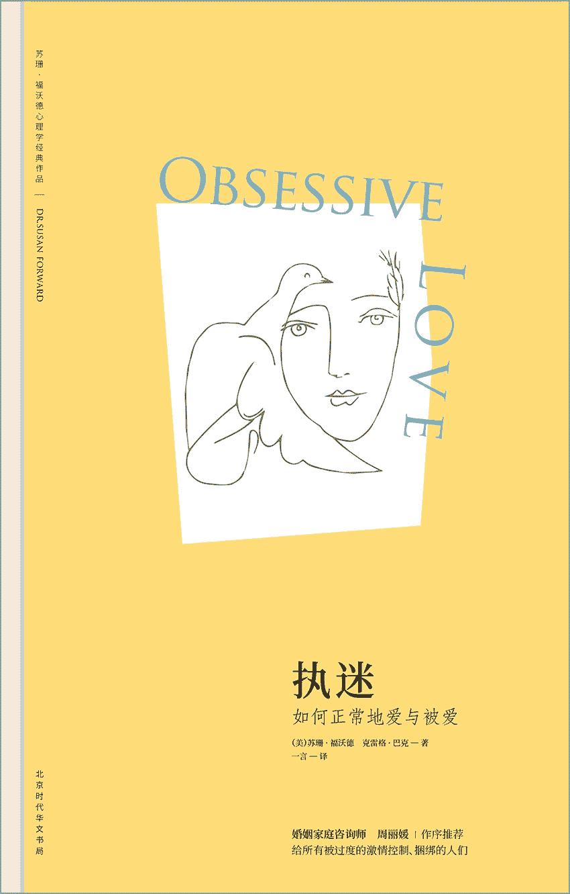

## 执迷：如何正常地爱与被爱

**（美）苏珊·福沃德　（美）克雷格·巴克著
一言译**

北京时代华文书局

## 图书在版编目（CIP）数据

执迷：如何正常地爱与被爱/（美）苏珊·福沃德，（美）克雷格·巴克著；一言译.——北京：北京时代华文书局，2017.12（苏珊·福沃德心理学经典作品）

书名原文：Obsessive Love

ISBN 978-7-5699-1882-3

Ⅰ.①执…　Ⅱ.①苏……②克……③一…　Ⅲ.①爱情-通俗读物　Ⅳ.①C913.1-49

中国版本图书馆 CIP 数据核字（2017）第 263191 号

北京市版权著作权合同登记号图字：01-2017-6647

Obsessive Love. Copyright©1991 by Susan Forward.

This edition arranged with Bantam Books through BIG APPLE AGENCY, INC.，LABUAN, MALAYSIA.

Simplified Chinese edition copyright©2018 by Sunnbook Culture＆Art Co. Ltd.All rights reserved.

**执迷：如何正常地爱与被爱**

* * *

著　　者　（美）苏珊·福沃德克雷格·巴克

译　　者　一言

出版人　王训海

选题策划　阳光博客

责任编辑　陈丽杰　袁思远

责任校对　陈丽杰　袁思远

装帧设计　郑金将

责任印制　刘社涛

营销推广　娟娟　小宇

出版发行时代出版传媒股份有限公司 http：//www.press-mart.com

北京时代华文书局 http：//www.bjsdsj.com.cn

北京市东城区安定门外大街 136 号皇城国际大厦 A 座 8 楼

邮编：100011 电话：010-64267120 64267397

印刷三河市华成印务有限公司电话：0316-3521288

（如发现印装质量问题，请与印刷厂联系调换）

开　　本　710×1000mm 1/16　印张 16 字数 200 千字

版　　次　2018 年 5 月第 1 版　印次 2018 年 5 月第 1 次印刷

书　　号　ISBN 978-7-5699-1882-3

定　　价　56.00 元

* * *

★版权所有　侵权必究★

目录扉页版权信息作者介绍关于本书推荐序 愿我们都不必被爱所伤、被情所困引言 执迷爱恋触痛了每个人的神经第一部分 四种执迷的爱恋者第一章 疯狂追求真爱第二章 情感绑架第三章 得不到就想毁掉第四章 对方越坏我越爱第二部分 被执迷者爱上的三种人第五章 协同执迷者第六章 犹豫不决的“目标”第七章 遭受暴力胁迫的“目标”第三部分 如何挣脱执迷爱恋的牢笼第八章 执迷恋情的根源第九章 制定治愈课程第十章 关闭“执迷系统”第十一章 正确评估恋情第十二章 把执迷斩草除根第十三章 找到真正的爱情

## 作者介绍

**苏珊·福沃德**

国际知名的心理治疗师、演说家和作家，她的著作有《原生家庭：如何修补自己的性格缺陷》《依恋：为什么我们爱得如此卑微》《如何识破男人的谎言》《金钱魔鬼》《情感勒索》等。目前，她的作品已被翻译成 15 种文字，在全球发行。

她经常出现在媒体访谈节目中，曾在美国广播公司主持谈话节目长达 6 年，并在美国加州成立了私人性虐待诊疗中心。

**克雷格·巴克**

影视编剧兼制片人，他曾为全美许多杂志和报纸撰写文章，探讨人类行为问题，现居于美国洛杉矶。他曾与苏珊·福沃德合著过多部作品，如《原生家庭：如何修补自己的性格缺陷》《金钱魔鬼》《对天真的背弃》等。

## 关于本书

本书是苏珊·福沃德博士给处于感情迷茫期、脆弱期的人们开出的一剂良药。

真正的爱情也许并不完美，但决不应发展成充满执迷、威逼、控制，甚至暴力伤害的关系。苏珊·福沃德博士拥有 20 年情感咨询的职业经验，接到过无数痴男怨女的求助。这些人最终都修补了感情的创伤，重新获得了身心自由。

如果你身处类似的情感困境，无论是自己有执迷倾向，还是不幸成为执迷者的目标，这本具有实践指导意义的书都能够宽慰你、帮助你，带你走出心牢，重获幸福。

## 推荐序　愿我们都不必被爱所伤、被情所困

周丽媛（心理咨询师）

在多年的从业经历中，我接待过不少这样的来访者：他们在爱中倾力付出，将追求的对象或伴侣视作比自己的生命还重要的人。他们总是能在与异性的交往中将“浪漫”发挥到极致，被追求的对象一般很难抵挡这样爱意汹涌的攻势。

“迷恋”与“执迷”虽然一字之隔，但相差甚远。两个人在经过爱情最初的迷恋期后，开始面对彼此真实的一面，许多隐藏的问题也会就此显露。被追求者会发觉浪漫仍然以极端的形式在生活的各个方面上演，渐渐感觉疲惫不堪、难以招架。最终，他们发现自己需要付出很多虐心的代价，比如：失去私人空间、失去自由意志、被骚扰、被跟踪，甚至被对方以生命为代价要挟不能分手。最痛苦的是，越是对这样的人表示拒绝或者宣布分手，对方越是拼命死缠烂打，没完没了，在分分合合的故事里来回纠缠。

如果客观地评价，这种特质的来访者本质上都没有恶意，而且往往在恋爱开始的时候体贴、隐忍、善良，像个完美的恋人。听着他们的故事，我的心情就像坐过山车一样起起伏伏，又好像琼瑶电视剧的现场观众，观赏着一幕幕海枯石烂的精彩爱情故事。而那些相杀相虐的爱情故事背后，都是他们内心对爱的极致渴望。就像苏珊博士在这本书中所分析的，这些执迷爱恋者由于童年时期经历过种种创伤，种下了这样一个核心情结：害怕被抛弃。当他们遇到心动之人时，被爱的渴望被唤醒，由于担心自己再度被抛弃，所以处处逢迎。如果对方不接受或者提出分手，必将撕开他们曾经的创伤。对于他们来说就是二次伤害，而这也加剧了他们的极端化。他们会选择性地关注曾经和伴侣海誓山盟的部分，也会合理化恋人向他们提出分手的理由，就是无法去反思自己的行为如何激怒对方，最后让对方关上了心门。他们一直陷入在对爱的极度渴望里，其他一切都不重要，甚至包括自己的生命。

当然，正所谓“一个巴掌拍不响”，苏珊博士在此书中也分析了那些被执迷者盯上的“目标”的共同特征。在看这部分的内容的时候，我总是能想起曾经的好朋友小玉，她情窦初开便总是能遇到对她好得离谱的男孩，他们疯狂而浪漫的追求行为让闺蜜们艳羡不已。我有幸比其他姑娘知道得更多。很多女孩子羡慕追她的男孩手捧鲜花站在楼下等她，暴晒一下午也不离去，却不知前一天那个男孩跟她闹了整个通宵，就因为她跟邻座的男生聊了会儿天。很多年里，我都是她类似爱情故事的见证人，年少的我总是劝她下次要吸取教训，再找男朋友时要睁大眼睛。但往往这样的男孩对她有着致命的魔力，令她在被追求之后就扑通一下跳入了同样的陷阱。苏珊博士在文中对小玉这样的“目标”的心路历程做了详尽的分析，他们往往具有共同的特征：无视自己的需求，力求证明自己与众不同，觉得自己不配得到更健康的爱情。他们被定义为“协同执迷者”，如果没有他们，执迷者也就不复存在。

心理学上将这样的关系称为“施受虐”。同执迷者一样，协同执迷者也有内心的创伤按钮，他们同样对爱怀着极度的渴望，也同样来源于幼年时缺失的爱和安全感。由于小时候对父母“不负责”的行为的印象太深，他们没有能力辨别出健康的爱是什么样子的，在他们眼里猜忌、指责、妒忌和爱是一回事。有些协同执迷者意识到自己的爱情是有问题的，但仍想通过自己的努力去改变对方，这样的人往往是在重复童年时父母的行为：一个善良的母亲千方百计去拯救虐待她的父亲。很耳熟吧？就是圣母与渣男的故事。

苏珊博士在此书中不仅将执迷者和执迷者“目标”的问题详尽分析，将问题的根源层层揭示，还将执迷者的行为、想法和感受之间的转化表述得通俗易懂。更难能可贵的是她善于从几个典型案例入手，从分析症状、根源到最后治疗的过程，有始有终。让读者在阅读的过程中像亲身体会了一次心理咨询一样。如果通篇阅读，相信对我们每个人都有一定的治愈作用。

很多心理学方面的书籍侧重于分析和解释原因，却不太涉及问题的解决方法，也许是考虑到职业机密。苏珊博士无私分享出很多在心理咨询中常用的方法，这些方法安全可靠、简便易行，让人从中受益。比如，在治愈父母关系的环节里苏珊博士建议给父母写信，这在临床实践中非常好用。我们每个人在写信的过程中都会爆发大量的感受，由此带动的情感流动是对积压情绪最有效的疏理。我将其比作“扫垃圾”，这些垃圾可能已经堆在我们的心里几十年了，我们的文化不允许表达，不允许释放，但它们却真真实实存在。一旦投射到亲密关系中去，会让你的亲密爱人为你在原生家庭所遭受的际遇买单，这既不公平也有害于彼此关系的健康。当然，并不是说写信就得把它寄给父母，想必我们的父母也是承受不了的。这在心理问题处理上也不必要。其实，心理治疗处理的是当年那些以孩子的视角看问题而产生的感受，把这些感受处理完，就像把垃圾倒完一样。当你把事情说出来的时候，就不会再被它影响。像这样切实可行且深具治愈作用的方法，苏珊博士分享了十多种。

真心希望这本书能帮助众多身陷执迷爱恋的痴男怨女们，从面对自己的创伤情结开始，选择健康美好的恋爱。我也有一个奢望，希望已经断联多年的朋友小玉能看到这本书，希望我们都不必被爱所伤、被情所困，学会正常地爱与被爱。

## 引言　执迷爱恋触痛了每个人的神经

格洛丽亚感觉怪怪的，穿过编辑部走向办公室的时候，一双双眼睛都盯着她看。她推开办公室的门，浓浓的花香迎面扑来，只见办公桌上小山似的堆满了红玫瑰。恐惧和愤怒像一列火车一样碾过她，又是前任吉姆！为什么吉姆就是不明白，他们已经分手了！

几英里之隔的律师事务所里，吉姆守在电话旁，痴痴地等着格洛丽亚的电话。

分手后的几个月里，他一直拒绝放弃这段感情。而格洛丽亚被吉姆没完没了的“努力”耗尽了耐心，她愈发庆幸做了分手的决定。

等到晚上八点左右，吉姆等不下去了，他必须听到格洛丽亚的声音。所以，他打给了她。一听出是他的声音，格洛丽亚马上就挂断了。

第二天早晨，格洛丽亚醒来，透过玻璃看到吉姆居然坐在自家门前的台阶上。绝望之下，她报了警。警方告诉她，他们可能要几个小时后才能赶来。她被困在了家里，为了避免跟吉姆照面，连早晨的报纸都不敢出去拿。奇怪的是，大约一个小时后，吉姆自行离开了。

格洛丽亚赶紧去公司上班。结果，她赫然发现吉姆正在公司的停车位上等着自己。极度挫败和愤怒之下，她尖叫着让吉姆离开。

吉姆和格洛丽亚的关系是典型的执迷爱恋，吉姆那些令人窒息的行为严重破坏了格洛丽亚的生活。执迷爱恋是一所监狱，囚禁了执迷不悟的人，也囚禁了他们不屈不挠恋慕着的“目标”。

我为什么决定写这本书？

“玫瑰事件”一个月后，吉姆找到了我。他知道应该放弃格洛丽亚了，但就是做不到。吉姆请求我帮帮他。

**吉姆**

是什么让我做出那些疯狂的事？我是一名律师，向来很理智，可一旦遇到格洛丽亚，我就失控了。我觉得自己永远都忘不了她。是不是我的下半生都要纠缠在这段感情中？我不能再这么下去了，这太痛苦了，我该怎么办才好？

除了吉姆，这世上为情所困的人何止千千万？

回想起过去的几年中，我接触过上百位执迷爱恋者，以及很多被追逐得精疲力竭的“目标”们。这些男男女女，因为身陷执迷爱恋中，生活受到极大的影响，甚至面目全非。他们要么热切渴望一个得不到的人，挫败而痛苦；要么是被一个执着的追求者百般纠缠，困窘焦躁；有的人甚至两种角色都体验过。我想要帮助他们学会处理这些情况，摆脱执迷爱恋的困扰。

当我和克雷格着手写作的时候，身边的朋友、同事、做过咨询的客户，甚至是只见过几面的熟人，都希望我把他们的故事写进书里。人数众多，反响热烈！可见执迷爱恋触痛了每个人的神经。

本书引用的故事都是真实的。为了保护当事人的隐私，我们修改了他们的名字、职业等身份特征。但是，尽量还原了他们的真实经历。

什么是执迷爱恋？

在这本书里，我将用“执迷”这个词来形容特定的行为。严格来讲，这并不规范，因为“执迷”一般只能用于思维领域，心理学中则是用“强迫”这个词来形容执迷的行为。但是，简单起见，我统一用“执迷”这个词来指代思维和行为上的特定现象。

基于二十年的职业经验，我总结出四个特征，用来帮助判断一个人是否处于执迷爱恋之中。

●满脑子都是自己的恋人，或想要得到的那个人。

●对执迷的对象有着难以满足的渴望。

●已被对方明确拒绝，或者得不到：要么肉体上得不到，要么精神上得不到。

●被拒绝或者得不到后，自己的行为开始失常。

任何人都有可能成为执迷者。有的执迷者在生活的其他方面表现得完全正常，但有的执迷者出现了很多异常行为，例如酗酒、吸毒、沉迷赌博；还有一些常常被忽略的强迫行为，如工作狂、洁癖等。

同样的，没有什么标准来衡量哪种类型的人更容易成为执迷爱恋者的“目标”。无论男人还是女人，都有可能成为“目标”。一些“目标”最开始可能接受了对方的激情，另一些“目标”则不假思索地拒绝了。一些“目标”后来与他们追求者结了婚，另一些“目标”则最终选择了其他人。对于“目标”们来说，只有一点是相同的：他们都有一个自己并不想要的、不知疲倦的追求者。

电影、电视、广告、流行歌曲、书籍合谋起来说服我们：爱情一定要轰轰烈烈、死去活来，否则就不是真爱。电视连续剧《拿破仑和约瑟芬》里有一个精彩场景，拿破仑向约瑟芬强势表白：“你让我欲罢不能。”一款著名香水用了这句台词，向消费者暗示通往激情和浪漫的捷径。在畅销书《假定无罪》中，主角始终保持着对恋人的狂热追求，即使后来他的恋人已经死去。

在现实世界中，执迷爱恋者们单方面登上了希望的顶峰，拔高了自己的情感。然而，这种不切实际的期待换来的将是失望、空虚甚至绝望。

对于被追逐的“目标”们来说，执迷的爱最开始让人飘飘然，但不可避免地，也会越来越让人感到窒息。一旦进入窒息阶段，生活将跌进情绪化、凌乱、焦虑、无助、恐惧的深渊。很多“目标”几乎被捆绑着不情不愿地奉献自己，变成执迷追求者的人质。

执迷的爱：一种矛盾的存在

执迷爱恋的表现形形色色：执迷的女护士难以抑制地对已婚男医生产生性幻想，导致无法专心工作；多疑的丈夫不分昼夜地跟踪妻子，生怕她背叛自己；一个新婚的倒霉男人，前女友为了挽回他的心，居然大衣里面什么都不穿，赫然闯进他的公寓；一位拉拉，被工作中的女上司强行非礼；一个可怜的妻子，被充满猜忌的丈夫从楼梯上推了下去，导致流产。

健康的爱情需要相互信任、相互关心和相互尊重，执迷的爱恋则恰恰相反。它只不过是一种渴望，渴望一些自己没有的东西。一位执迷者即使身处一段恋情之中，也还是不满足，总是想要更多的爱、更多的关怀、更多的承诺、更多的安全感。执迷爱恋的本性是贪得无厌，对方终究会受不了无休止的索取，选择离开。

你是一个执迷的爱人吗？

当然，我并不是说所有热烈、浪漫的爱情都是执迷爱恋。我自己就是一个很浪漫的人，会被烛光晚餐、唯美的歌剧或者月光下的一支舞打动。爱上一个人的时候，我会非常投入，但这并不意味着执迷。执迷者会永远停留在这个充满激情的阶段，他们会把家庭、朋友和所有重要的事情抛在脑后，心心念念只有那个爱着的人。他们的世界越来越小，他们的感情需求越来越多。直到有一天，对方无法给予他们相应的关注了，执迷者却仍深陷感情的旋涡中无法自拔。当感情宣告结束的时候，他们拒绝接受。他们开始绝望地挣扎，想要抓住对方。这就是执迷爱恋的关键：

被抛弃是执迷爱恋的引爆器。

有的人清楚自己属于执迷爱恋者，还有些人很困惑。为了帮助大家辨别自己是否身陷执迷爱恋中，我列了个清单。

前方预警：接下来的这些问题有可能会触痛你的神经，让你感觉难堪、内疚、伤心或者生气。这种不适感是一个积极的信号，说明有东西触碰了你的内心，你开始认识真实的自己。一旦你意识到了，就可以选择改变。

1.你是否对一个无论是肉体还是精神都不可能得到的人念念不忘？

2.你是否心心念念有一天这个人终会属于你？这是你生命的全部？

3.你是否相信因为自己足够真心，他/她就得爱上你？

4.你是否相信只要穷追不舍（或者方式得当），他/她最终会接受你？

5.当你被拒绝的时候，是否更加想要得到这个人了？

6.如果屡次被拒，你是否会因爱生恨？

7.你是否感觉很受伤，或者认为对方欠你很多，因为对方没能给你你想要的？

8.你是否无时无刻不在想着那个人，吃不下睡不着，或者没法学习或工作？

9.你是否坚信这个人是你的唯一，非他/她不可，他/她是你生命的意义？

10.你是否一有空就频繁地给对方打电话？或者总是在等待着对方的电话？

11.你是否经常招呼都不打就出现在对方的家里或办公室里？

12.你是否总想知道这个人在哪？和谁在一起？你有没有悄悄跟踪过他/她？

13.你是否有报复那个人或自虐的倾向？

以上问题，如果你的答案中有三个或三个以上的“是”，那么你就是一个执迷爱恋者。但别灰心，执迷爱恋并不是娘胎里带出来的疑难杂症，只不过是很多人想要得到或遇见爱情的一种方式。你可以克服执迷爱恋。

（注：如果以上清单中的问题，你的答案从头到尾都是“是”，那么在阅读本书的同时，建议你马上去看心理医生，寻求专业帮助，以免做出伤己伤人的事情。）

你是执迷者的目标吗？

如果你被自己不喜欢的人追求，想弄清楚追求者是不是执迷爱恋者。下面这个清单能够帮你确认。

1.对方的行为是否让你感觉压抑？

2.被你拒绝过的人是否一次又一次试图说服你，说你其实并不清楚自己的感受和需要，其实你是爱他/她的？

3.你的前任是否拒绝相信你们之间已经结束了，尽管你一再拒绝，他/她还是没完没了地纠缠？

4.你是否经常很不情愿地接到这个人的电话、情书、礼物或是来访？

5.这个人的追求是否给你带来了很多烦恼？是否造成了你身体或心情的不适？或是烦得你没法专心工作？

6.你拒绝这个人之后，他/她是否对你追得更紧了？

7.当你拒绝这个人时，他/她有没有烦躁或是愤怒？

8.这个人是否盘查你去哪儿、见了谁？你是否发现他跟踪你？

9.你是否害怕出门，因为担心这个人可能正在等你？

10.在这个人的纠缠之下，你是否感觉自己像个人质？

11.你是否担心这个人可能做出伤害你的事情，或者自虐？

12.这个人是否有暴力倾向或是已经出现暴力行为了？

上述问题，哪怕你的答案只有一个“是”，你也极有可能已经是执迷爱恋者的目标了。对于有些人来说，执迷者的殷勤不过是制造了一些烦恼而已。对另外一些人来说，执迷者的穷追不舍和喜怒无常让他们透不过气来。甚至有一些人，可能已经处于暴力威胁之中。

尽管执迷爱恋者和他们的“目标”各有各的烦恼，但有一点是共同的，他们的生活充满了无助感。通过这本书，我希望能帮助所有的执迷者和“目标”，帮你们逃离过度的激情、痛苦、烦乱、渴望和无力，将你们从执迷爱恋的泥潭中解救出来。

## 第一部分　四种执迷的爱恋者

### 第一章　疯狂追求真爱

真不敢相信，我都做了些什么！一遍一遍地拨电话、驾车跟踪、铺天盖地的情书、暴怒、威胁……这完全不像我了。我用了好长时间才把他放下。他的眼神，他的笑容，他的味道，他的触摸……他让我疯狂。

——玛格丽特

这是玛格丽特在心理辅导疗程的最后一天写下的，她曾深陷一场执迷爱恋中，而这份执迷足足让她痛不欲生了三年，现在她基本解脱了。

玛格丽特身材纤瘦，一头红发，三十四岁，离异，在一家大律师事务所当助理。一年半之前，我刚认识玛格丽特的时候，她整个人都压抑、绝望、喜怒无常。

她找到我，是因为菲尔，一个明确表示不会结婚的情人。他让玛格丽特的生活和工作全都失控了。她对十岁的儿子越来越没耐心，工作也屡屡出错。玛格丽特还疏远了朋友们，因为她全天都在等着菲尔的电话，生怕错过。朋友们无一例外地都对菲尔颇有微词。

一见钟情

玛格丽特遇见菲尔的时候，已经离婚六年了。这段时间里，她也有过很多次约会，但没有遇见真正令她心动的人。漫长的六年过去，玛格丽特有些灰心，开始厌倦酒吧里的那一套调情把戏，朋友们也把能够介绍的单身男性全都引荐过了，上电视相亲节目，也是屡屡败兴而归。

直到玛格丽特在法院里邂逅菲尔。那时她正在协助上司处理一起挪用公款案。菲尔是一名警察，在为一起知名度很高的谋杀案作证。午休时间，他们在自助餐厅第一次相遇。

**玛格丽特**

一个帅气的大个子男人就坐在我的对面，见到他的第一眼，我就丢了魂，已经好多年没有这样了。我们开始聊天，当天晚上他就约了我。那天晚上约会后，回到家时我忍不住手舞足蹈起来。接下来的一个星期，我们几乎每晚都见面，那种感觉简直妙不可言！白天工作的时候，他会打电话过来，一听到他的声音，我的心就怦怦直跳，美翻了天。

这种浓情蜜意，想必你我都经历过。一段恋情开始的时候，执迷爱恋和健康的恋情并没有太大的区别：花儿特别芬芳，音乐悦耳动听，仿佛漫步云端，飘飘欲仙。

浪漫感受、美好憧憬、无限遐想，这些曼妙的体验悄然触动了我们的身体，我们开始心跳加快，满面春光，肾上腺素飙升，体内激素发生变化，大脑释放出内啡肽——一种来自我们身体的天然兴奋剂。所以，爱情滋润的不仅是我们的感受，还有我们的身体。

唯一的完美情人

全心投入新恋情的时候，那令人战栗的激情自然而然地让我们的双眼自带美颜相机，让浪漫的期待和想象来过滤自己的感知。这种对现实的积极过滤我们称之为“理想化”。

**玛格丽特**

两个星期后，他表白了。我欣喜若狂，他是那么的完美，我的生命从此圆满了：有一份自己喜欢的工作，儿子很优秀，又拥有了一个如此完美的男人。菲尔床笫温柔，谈吐不凡，会为我做浪漫晚餐，还帮我修车。在他身边，我感觉很安全，无论是身体还是心理都特别踏实。我想，他就是我想要与之共度余生的男人。

因为菲尔是个好情人，玛格丽特就认定非他不可。但是，仅仅两个星期的激情，能支撑一辈子吗？

在一段感情刚开始的阶段，相爱的人们总是表现出自己最好的一面，努力让自己显得迷人、风趣、善良、魅力无限，对恋人无微不至，极尽所能。这只是男欢女爱的套路，潜藏在我们的本能之中。这些“卖力表现”的行为能够反映出一个人某些方面的品质，但绝对不是全部。我们都有心情不好的时候，也都有一些小心眼、脆弱敏感、固执己见，以及一些不招人待见的习惯，我们当然不愿意刚谈恋爱就让对方发现这些。

在火热的新恋情里，我们让缺点深藏不露，但往往忽略了一个事实：我们的恋人免不了也正在藏藏掖掖。

在健康的恋情里，恋人们相信自己找到了梦中情人，同时也会给自己保留安全的退路，那就是面对现实。他们希望这段感情可以天长地久，同时也承认世事无常。

执迷的恋人们则恰恰相反，他们在浪漫幻想的万仞悬崖上走钢丝，义无反顾，不留退路。飞蛾扑火似的激情中容不下“也许”这类字眼，他们固执地认为：

他/她就是

我此生唯一、完美的情人

从此别无他求

执迷的恋人很天真地相信，只有“唯一完美的情人”能够让他们感觉幸福和满足，解决他们所有的问题，带给他们所能想象到的激情，让他们感受到从没有过的被需要、被爱。对于执迷者而言，所有这些极致的感受使得那个“唯一完美的情人”已经不只是恋人，更像是他们生命的支柱。

执迷者对所谓的“唯一完美的情人”并没有特别的要求。他们不需要博学、睿智、幽默、成功，甚至根本不需要有过人之处。

事实上，有些执迷者爱上的往往是处于困境的人，比如经济无法独立或债务缠身的人、瘾君子、火不起来或者早已过气的小明星。这类执迷者沉迷于一种被需要的错觉之中，他们相信只有自己才能解救对方。

执迷者对恋人的期望和幻想，与对方是什么样的人没多大关系。他们只是一厢情愿，把自己的需求强加给对方，按照自己的期许“量身打造”一个完美情人。天知道为什么一个人会为另一个人神魂颠倒、欲罢不能，但有一点是可以肯定的，执迷与个人需求和欲望是脱不了干系的。

情感雕塑家

在正常的恋爱中，随着两个人的心越走越近，彼此有足够的安全感，便不介意让对方看到自己身上的小缺点。如果双方发现不能接受真实的彼此，可以选择分手。

但对于执迷的恋人，他们才不管现实什么样，想分手简直没门。他们就像是情感世界的雕塑家，需要什么样的感情，就塑造什么样的感情。

我的朋友唐堪称感情雕塑界的罗丹。唐，四十二岁，律师，体型健壮，嗓音温和，略微秃顶，一副圆框眼镜显得书卷气十足。他与一位已婚女人拥有一段长达五年的爱恨纠葛。

**唐**

第一次遇见她，是我在法学院求学的最后一年。那会儿我在一个书店做兼职，她走了进来——她是我有生以来见过的最温柔、最精致、最优雅的女子。我的第一反应是：天哪，我要认识她。碰巧，我和朋友正在聊天，她加入了我们。她有雅致的英国口音，吹弹可破的肌肤，不可言说的眼睛……我们聊了会儿，朋友先行离开，我冲动地问她是否愿意与我共进晚餐。她说：“对不起，我已经结婚了。”正常情况下，一切都应该结束了。但我充耳不闻，追问她能不能跟我喝杯咖啡，只是聊聊天而已。当她答应的时候，我高兴得快要死掉了。

第一次见面，唐就知道辛西娅已婚。按理说这应该会挫败唐的激情，但他无视这个巨大的障碍，开始雕塑属于自己的“现实”。

**唐**

我们开始常常一起午餐，总是有说不完的话，她有着英式的内敛，不愿意放开谈论最积极的感受，但那只会让我更加着迷。后来有一天，我们在海边漫步，阳光流淌在漾漾的海面上，我看着她，然后俯下身去吻了她。那是我生命中最美好的时刻。从那以后，我所有的期待都是拥有她，所有的心思都是关于她。随着我们越来越了解彼此，她最终开始跟我谈论起她的婚姻。

辛西娅十八岁的时候来到美国，在茱莉亚音乐学院学习钢琴。一年后，她遇见了她的丈夫，一个比她大十五岁的医生。他们结婚了，她放弃了学业随丈夫搬到西海岸。

**唐**

她对放弃音乐的事耿耿于怀，但她从来不跟丈夫说这些。她说，她只会在我面前这样敞开心扉，因为从来没有哪个男人像我这样温柔、细心、真诚地对待她。她让我感到，我才是她唯一的男人。我知道，她离开丈夫只不过是时间问题，尽管她从没提起这个。我开始寻租一个大点的公寓，方便她随时搬过来。我还开始打听靠谱的离婚律师，以便在她离婚时可以帮得上忙。

此时此刻，唐只不过是跟辛西娅建立了柏拉图式的友谊。他们俩做过最出格的事也就是海滩一吻。但就是这一个吻，加上一点体己话，唐就确信自己和辛西娅命中注定要在一起了。

唐开始对他俩将来的生活展开无限遐想。首先呢，他要帮助辛西娅离婚，再找一个公寓，一起搬进爱的小窝。他法学院毕业之前，辛西娅继续当她的旅游代理。等他毕业了，就能负担起两人的生活了，辛西娅可以从工作中解脱出来，重新投入音乐的世界。他想象着动人的画面：辛西娅坐在起居室的钢琴前，傍着温暖的壁炉，指尖下流淌出醉人的旋律。他俩一起飞到伦敦去见辛西娅的家人，然后去巴黎，在塞纳河畔品尝美味的博若莱红酒，然后这些幻想的场景最后总是在两人疯狂的缠绵中结束。

辛西娅没有做出任何她会离婚的表示，但这不妨碍唐在梦幻国度里精心雕塑他的唯美爱情。他把辛西娅已婚的事弱化成不值一提的小麻烦。

远距离崇拜

大多数“情感雕塑家”会有一些浪漫的鼓励来激发他们的“才思”，哪怕只是几次约会。但某些极端的例子中，有些“唯一完美的情人”连“雕塑家”姓甚名谁都不知道。

劳丽是一名护士，在一家大医院里工作。有一天早晨，她哭着在我的广播节目里打进电话。她告诉我，她三十岁，两年前结束了一段不堪回首的婚姻，现在疯狂地爱上了同事——一位医生，他们在医院走廊里照过面，但没有过任何直接接触。

**劳丽**

我爱上了一个男人，但他根本不知道我的存在。对他来说，我只是成千上万护士中的一个。但他在我眼中，又帅气又迷人，说话风趣，简直完美。我满脑子都是他，想要为他做烛光晚餐，想偎进他的怀里，和他滚床单……更糟糕的是，他已经结婚了，并且很爱他的妻子。有一回我看到他和妻子一起吃午餐，哭得停不下来。护士长只好让我早点下班回家。我每次和别人出去约会，都不欢而散，因为我的心里只装得下他。但我不能约他出来，喝一杯或者其他什么的，他已经结婚了，这样是不对的。他主宰了我的生活，却毫不知情。我知道自己特别傻，夜夜以泪洗面，瘦了好多。朋友们都很担心我。

我把劳丽这类人称为“遥远的崇拜者”，这类执迷者与他们的“目标”既没有事实上的感情纠葛，也没有身体接触，甚至与他们的“梦中情人”（常常是一些明星或名流）根本没见过面。

这类迷恋听起来很是凄美，但破坏力不容小觑。一旦失控，“遥远的崇拜”难免会升级成“当面的伤害”，极大地影响执迷者和“目标”的生活。

错把性当成了爱

“遥远的崇拜”是例外，并不多见。绝大部分执迷者和他们的“唯一完美的情人”之间，从几次约会，到有过婚姻，都或多或少确实发生了点什么的。但不管是什么样的爱，性爱往往起着重要作用。咨询中常常听到执迷的恋人们诉说他们不可思议的性爱经历。

**玛格丽特**

我们第一次滚床单的时候，我好像直到那一刻才知道真正的做爱是什么滋味。他在床上的时候竟然询问我的感受，我之前从来没有遇到过。一次之后，他就了解了我的一切。他用舌尖爱抚我，我都快爆炸了，我们一直持续了三个小时，而且越来越美妙，我们每次在一起都这样。

玛格丽特持续飞扬的激情、浪漫的幻想以及极致的期待，使得她和菲尔的性爱犹如干柴烈火，欲仙欲死。然后，玛格丽特对菲尔更加迷恋了。

性加剧了理想化，理想化又使得执迷者更加迷醉，一往情深。执迷的恋人将他们火热的性爱看成冥冥之中的某种启示，让他们相信自己和恋人本就是为对方而生的。

**玛格丽特**

他是我的唯一，我的真命天子。当我们缠绵的时候，我感觉我们两个人已融为一体。我是说，也只有在床上，我才能真实地感受到他的爱……但每次我想进一步确认我们之间的关系时，他就沉默了。

玛格丽特以为火辣的性就是火辣的表白，一个男人只有爱极了才会在床上百般温存。就像很多执迷的恋人一样，玛格丽特错把性当成了爱，不可避免地要坠入痛苦的深渊。

从浪漫到被拒绝

每一个人在恋爱伊始，都会一门心思地专注于所爱之人，满脑子幻想。在这个阶段，我们的生活总是偏离正轨，巴不得一天到晚和他/她腻在一起。这种疯狂的小执迷只要是阶段性的、相互的，基本是无害的。

但到了执迷者身上，这个阶段简直没完没了。当最初的激情消退，对方开始厌倦，或是移情别恋，甚至干脆选择退出，被抛弃的迷恋者便会从天堂坠入地狱。

**被拒绝：执迷者的噩梦**

当被拒绝的时候，健康的爱恋和执迷的爱恋之间就出现明显的分水岭了。当健康的恋人被拒绝后，他们会很伤心失去这段感情，然后继续生活。但是执迷的恋人往往走不出痛苦和恐惧的阴影，拼命似的死缠烂打。

拒绝引发执迷

拒绝有时候是直截了当的，有的时候是委婉暗示的；拒绝可以是真实发生的，也可能只是当事人内心揣测的；有的人正在承受被拒的苦痛，有的人隐隐预感将要被拒而忐忑不安；有的恋人分手干脆利落，有的恋人时聚时散、分分合合；有的拒绝来得猝不及防，不留余地，让人彻底死心，有的拒绝拖泥带水，慢慢折磨。无论是哪种类型的拒绝，都能彻底激发痴迷情结。

**被拒焦虑**

没有人情愿被拒绝，这是个伤心事，但每个人至少都经历过一回。当我们全心投入一段恋情之中，都存在着被拒的风险。恋爱中的人，大多都体会过患得患失，担心恋人会离开自己。我将其称为“被拒焦虑”。

在健康的爱情中，随着感情的进展，恋人们越来越信任对方，被拒焦虑也就自然消退了。不幸的是，大多数执迷的恋人，被拒焦虑像挥之不去的噩梦，他们一天到晚疑神疑鬼，生怕“唯一完美的情人”哪天会离开。

尽管情意缠绵，玛格丽特却始终都处于焦虑状态，忧心忡忡地担心菲尔会离开她。三个月后，菲尔终于答应搬过来和她一起住。玛格丽特希望这样可以让自己多一点安全感，但让她失望的是，事情恰恰相反。

**玛格丽特**

有天晚上菲尔打电话来，说他要和朋友们去打牌，晚点回来。他一直玩到凌晨三点才回来。这期间我一直在想，他为什么宁愿和一群狐朋狗友一起，也不愿意跟我待在一起？他是不是不喜欢我了？他是不是开始厌烦我了？我试着平静心绪，但真的很害怕。他每次出门的时候，我都要问他是不是真的喜欢我，我知道这样让他很烦，可我还是忍不住一遍一遍地问——我要听到他说他爱我。我爱他爱到骨子里去了，甚至都不想让他出去上班，我只想每一分每一秒都和他在一起。他不在身边的时候，我就莫名地心慌，担心他不再回来。

玛格丽特的被拒焦虑一天比一天严重，开始没完没了地要求菲尔保证爱她，无论大事小事，她都觉得会导致菲尔离开她。她变得特别黏人，要求越来越高，可这不但没有让她感觉好一点，反倒加重了她的焦虑。她知道这么做只会让菲尔越来越疏远她，尽管如此，她还是停不下来。内心深处的执迷，以被拒焦虑的形态浮现出来，体现在生活的方方面面。

执迷的恋人把牢牢抓住对方的心当成精神支柱，因此对恋人的一举一动都格外敏感——语气跟平时不一样、一次爽约、有了新癖好等，哪怕一星半点的忽略和不周，都能把执迷者推进冰窖，让他们感觉是被抛弃了。

很多执迷的恋人反复揣测对方到底喜欢什么样的人，时刻注意自己的形象，说话谨小慎微，纠结自己在床上的表现，刻意表现得睿智，处处逢迎，只为留住“唯一完美的情人”。

时间也抚不平焦虑

被拒焦虑不只存在于新恋情之中，前来咨询的哈里已经困在被拒焦虑中二十年了。哈里是一位四十二岁的牙医，体格精瘦，棕色的头发有点稀疏，笑起来很亲切。他对妻子的执迷已经危及婚姻。

哈里在婚姻中一直缺少安全感。妻子弗兰是那么的活泼灵动，走到哪儿都自带光环；自己却恰恰相反，害羞又沉默。哈里常常担心弗兰经不住诱惑，被别的男人拐走。当他们唯一的女儿上了中学，弗兰便重返职场，和以前一样当了地产中介。随着弗兰再度进入社会，哈里的被拒焦虑一发不可收拾。

向我倾诉的时候，哈里一直不自在地转着手上的婚戒。

**哈里**

她一出去工作，回来总是提起那些一起工作的男同事。她也常常带着男客户孤男孤女地在空房子里晃荡一整天……我心里就好像有猫爪挠着似的，无法忍受。指不定哪天她就跟别的男人走了，扔下我不管。

哈里没有理由去怀疑弗兰做了什么不检点的事，或是有这个企图。但是，哈里不需要证据，和玛格丽特一样，担忧即证据。惶惶不可终日的结果是，弗兰真的要离开他了。他在家里制造出猜疑和妒忌的气氛，导致夫妻两人矛盾重重。

对于执迷的恋人来说，害怕分手和真的分手，两者带来的伤害是一样的。在被拒焦虑干扰之下，执迷者的所作所为常常激怒他们的恋人，而这让执迷者更加不安了。一而再、再而三的折腾，被拒焦虑终于变成了执迷者的自我诅咒。

分分合合，反复无常

如果分手不是干脆利落的，比如执迷者的“目标”不能确定自己的感觉，常常表现得反复无常。这种反复无常对于执迷的恋人，相当于直接告诉他们：“我、再、也、不、想、见、到、你、了！”

唐在和辛西娅的感情中受尽了分分合合的折磨。自从海边情不自禁的一吻之后，他们的感情迅速升温，每周都要在唐的公寓里见三四次面，整个下午都待在床上。但是唐越来越焦躁，他开始不满于这样隔三差五的约会，想要拥有辛西娅的全部。

**唐**

我苦等了两年，等着她离开她的丈夫，但我可能是太傻了，什么都没发生。我不断告诉自己：好吧，也许我再耐心一点，也许只要我再等等……可她到底还是没有离婚，我痛得无法呼吸，感觉自己快要被撕裂了。这一刻她在我怀里，下一刻她就是别人的；这个星期她对我柔情蜜意，下一个星期她却冷若冰霜，似乎想要离开我。我快要崩溃了。今天她跟我滚床单，明天她又找各种借口不见我。我不知道该怎么办，是去是留？我简直疯了。

辛西娅对唐这样忽冷忽热、若即若离的做法，在专业心理学领域被称为“间歇强化”。辛西娅有可能是想玩点小伎俩，同时占据两个男人，也有可能她是左右摇摆、拿不定主意，还有可能是她想利用唐来挽救自己的婚姻。不论辛西娅的动机是什么，对于唐来说，结果都是一样的，温存的时刻给了唐继续守候的动力，冷漠的时刻加剧了他的被拒焦虑。就这样，唐在这场情事中，苦楚了好几年。

激情一瞬间，伤痛恒久远

对于执迷的恋人来说，几夜的激情就足以让他们相信恋情已经坐实。这个时候，如果对方失去了兴趣，执迷者的反应就像是多年的感情被毁一样，痛不欲生。

诺拉就经历了这样的事情。诺拉，二十九岁，一头漂亮的黑发，绿色的眼睛，独自经营一家高端服装店。诺拉有着稍许复杂的背景，十四岁就怀孕辍学，成了一名单身妈妈，为了养活自己和孩子，她坚持打两份工。整日忙于生计导致她极少与外界接触，后来她辞掉了晚上的工作，上夜校拿到了高中文凭。这些日子里，她虽然偶尔也有约会，但从没往正式的恋人关系上发展。

当诺拉的女儿上了高中，越来越独立，诺拉开始感觉到孤独。她放话给朋友们，她准备正式谈恋爱了。朋友们纷纷向她推荐合适的男性，随后，她遇见了汤姆。

诺拉和汤姆约会了几次，很谈得来。诺拉便告诉为其牵线的朋友，她决定要跟汤姆共度余生了。

**诺拉**

我满脑子只有他，坐在家里一边吃东西一边等着电话。当我们在一起的时候，他让我感觉时光是那么的美妙。第一晚和他一起睡，简直完美，我们的身体仿佛天生就是为彼此而生的。他说他也这么觉得。我们一起出去了好几次，一切看上去发展顺利。可是他忽然不再给我打电话了，消失了，我往他的手机上发了好多短信，但他不回复我。我们在一起时那么好，他怎么能这样对我？

他们的“在一起”，不过是几次约会，几次感觉不错的滚床单，但诺拉就此认定汤姆是她“唯一完美的情人”。当汤姆不再给她打电话，不再回复她的信息，诺拉如同失去了一段重要的感情，痛苦难忍。事实上，诺拉和玛格丽特一样，错把性当成了爱。

八字还没一撇时，执迷的恋人是如何将一棵树当作整片森林，将一滴露珠看作整个宇宙的？这真是叫人吃惊。虽然才约会四次，被拒绝的痛苦对诺拉来说，好像他们已经交往了四年似的。很明显，她感受到的痛苦程度与他们的关系程度不匹配。痛苦之深都源于她的执迷，执迷的爱扭曲了时间，夸大了感受，自导自演了一出悲情剧。

否认不可否认的现实

当一个执迷的恋人遭到拒绝的时候，他/她往往选择装聋作哑。面对拒绝，否认是他们最常用的防御武器。个别极端的例子中，执迷的恋人会全盘否认现实——认为所有的事实都是假的。

1.他们找一些看上去合理的缘由或解释来对现实进行理想化加工。

2.他们试图弱化事情的严重性。

否认事实看上去能够保护我们免于痛苦，但并不能消除痛苦——那只不过是暂时的逃避。你只能骗得了自己一时，事实上，逃避得越久，等到不得不面对现实时你就会越痛苦。

**将拒绝合理化**

如果遭到拒绝，执迷的恋人就会找出各种合理化的缘由，为对方的行为进行解释、开脱。这是执迷者的自我防御机制。

这里有几个常用的合理化借口：

“我知道他跟其他女人勾勾搭搭，不过那都不是认真的，他真正关心的只有我。”

“她总是不接我的电话，但我知道，她只是对我的感觉太强烈了，手足无措而已。”

“他是对我不冷不热，不过他要是能戒了酒，情况就大不一样了。”

“他都有三个星期没音讯了，该忙成什么样了啊！”

“她居然和那个家伙住在一起了！可我知道，她就是想惹我妒忌。”

尽管恋情已经很明显无法挽回，执迷者仍然用合理化来逃避伤痛。诺拉在这方面就很有“创意”。

**诺拉**

说不定有一天，他忽然打电话来说：“我在等着看你要用什么办法把我哄回去。”或者，有一天我拿起电话，他在那边说：“好啦，我们结婚吧！”我知道他心里一直是这么想的，我比他自己更了解他。

诺拉的“合理化创作”让她得以暂时不用直面痛苦、失望和挫败。她不愿面对被汤姆拒绝的事实，执着于一个信念：

他真的很爱我，只是他自己还没发现。

执迷者通常认为，他们最了解对方的真实感受。他们相信，如果付出更多的爱，对方终会被唤醒，捧出一片真心。在合理化的矫饰下，执迷者把对方的离开弱化成小打小闹。

另一种逃避：选择性关注

如果你对一个执迷的恋人说：“我们之间结束了，我不想再看到你了，你也别再联系我了，你是一个好人，只是咱俩不合适。”执迷者通常只能听到“你是一个好人”，他们从一段明显的拒绝中挑选一句肯定，用这么一丁点的肯定来最大限度地弱化负面信息。我把这种逃避的方式称为“选择性关注”——执迷恋人的标配。

**唐**

两年半过去了，她终于离开了她的丈夫，我想：“这下好啦，她很快就要搬到我这儿了。”但她没有，事实上，她看上去不大想见我，找了好多借口不来看我：她很累，工作上出了点问题……而且，她居然没有离婚，只是分居，我简直要疯了！万一她又回去了呢？万一她又找别人了呢？我心灰意冷了一两天，然后我明白了：她只是需要时间去调整自己而已。头一天我都想要跳崖自杀了，第二天我又说服自己，只要我默默地、耐心地等待，她总有一天会投入我的怀抱。毕竟，从来没有哪个男人能像我这样待她，这可是她自己的话。

几句甜言蜜语成了唐的救命稻草，他紧紧抓住辛西娅只言片语的鼓励，用来为她的言行不一开脱。

两个星期后，辛西娅又搬回她丈夫那里了，唐彻底崩溃。但不久之后，辛西娅又和唐约会，吞下“忽视”这枚还魂丹，唐复活了，完全无视辛西娅回到丈夫身边意味着什么。此后，唐和辛西娅又继续交往了两年，在这两年里，唐一直在跟忽视君和绝望君玩跷跷板。当他绝望的时候，辛西娅的婚姻如同横在面前的拦路虎；当他忽视的时候，拦路虎就变成了纸老虎。

玛格丽特则把选择性关注这种神技发挥到极致。

**玛格丽特**

菲尔开始每周都晚归好几次，后来有一天，他搬走了。我不敢相信，他叫来一个朋友，开着货车把他的东西都带走了。他说他只是需要一点空间，这话真伤人，他要跟谁有空间？我呗。还好，至少他每周有一两个晚上来我这里过夜，所以我知道他心里有我。

玛格丽特忽略了一个事实，他们之间只剩下性了。菲尔明显已经对她失去了兴趣，她抓住这一点点温存，以为他们之间还有爱。

在抓住“唯一完美的情人”的艰苦征程中，执迷的恋人搜寻着任何一点破碎的希望，让自己相信还有爱。与此同时，他们拉黑所有与幻想相悖的证据，他们是逃避大师。

执迷者总是怀着神奇的期望，指望着恋人来填补他们生活的空白。神乎其神的性爱和最初的激情支撑着他们的期待。他们执迷于这段恋情，以至于一旦遭到拒绝，就当真以为自己再也不会爱了，再也不完整了。正因如此，这个时候他们才不会轻易放手，对于执迷者来说，已经不只是爱的问题了，那是生存的必需。

### 第二章　情感绑架

我一整晚都在打电话，但是她不接。所以我就不停地打电话，一遍又一遍，像个机器人，重拨，重拨，再重拨，再重拨……我必须跟她说话，要不然我会死。

——罗伯特

无论是谁，被拒绝总是如打开了痛苦之渊的泄洪闸——不愿接受的痛苦，感觉被羞辱的痛苦，失去信心的痛苦，重新揭伤疤的痛苦。

不管是身体的痛还是情感的痛，都是在告诉我们，有些地方需要改变了，这是一种本能，感到痛苦的时候，人自然而然想要做点什么好减轻痛苦。健康的恋人总是以积极的方式去对待被拒的伤痛，尽管这并不容易。他们能够直面自己的痛处，承认自己在这场感情中的失败，尽力放下无法挽留的人。

但是，执迷的恋人可做不到就此放手，他们反复做出一些必定会伤害自己或对方的行为，更多的时候是伤己伤人。他们全力以赴做一些傻事，让行动取代感知，没时间去痛苦。这种用消极行动转移痛苦感受的做法，在我们心理学的领域，叫做“宣泄”。

通过自罚来宣泄

我们在报纸、电影或电视上看到的执迷恋人，大多是强行闯入“目标”的生活，威胁或者伤害他们。但其实很多执迷者在遭受拒绝后，他们的反应是针对自己的，不自觉地做出一些折磨自己精神甚至身体的行为。

举个例子，当汤姆不再打电话给诺拉，诺拉过于痛苦以至于生病了，她的自罚行为只是让事情变得更加糟糕。

**诺拉**

我的胃开始绞痛，难以置信的痛，上帝啊，他为什么不给我电话？我没法去上班，我只能坐在家里，失魂落魄地望着电话，一瓶接一瓶地喝着冰酒……吃垃圾食品，喝酒，吃着，痛着，吃着，醉着……一刻不停地想他。

诺拉疲惫不堪，她反复咀嚼汤姆带给她的痛苦，还用上了失恋者的两大法宝：食物和酒精。自我惩罚的执迷者常常酗酒，暴饮暴食或者绝食、嗑药、赌博，工作上表现得暴躁或心不在焉，嗜睡或者失眠，疏远家人和朋友，甚至选择了自杀。

诺拉的精神压力引发了胃痛，但她继续做那些让病情雪上加霜的事。诺拉想用酒精麻醉自己，用垃圾食品填补内心的空虚，不难想象，这样消极的生活方式让她的身心状况更加糟糕。但对于诺拉而言，胃痛总比心痛来得好。

飞镖效应

我告诉诺拉她正在伤害自己，诺拉感觉难以理解，难道不是汤姆伤害了她吗？谁会自己跟自己过不去呢？我告诉她，有的痛苦看得见摸得着，有的痛苦则深藏在潜意识之中难觅踪迹，这些都需要我们与之抗争。

被拒绝让人有耻辱感，好像被狠狠扇了一巴掌，它打击我们的自尊，击碎我们的美梦。所以，遭到拒绝的时候，我们既伤心又愤怒是在所难免的。诺拉忽然莫名其妙地被抛弃了，怎能不生气？但她自己没意识到这一点，而是把对汤姆的愤怒转嫁到了自己身上。她越是努力地压抑愤怒，越是把自己绕进了胡思乱想和郁郁寡欢的怪圈。

这种现象叫“飞镖效应”，因为当我们不能够很好地表达和处理内心的愤怒时，这些感受就像一枚凌厉的回旋镖，最后伤的是自己，自作自受。愤怒的情绪钻进我们的潜意识深处，伪装得如同敏感的变色龙，变化成各种各样的症状，从头痛到疲惫沮丧。

痛苦是唯一的、绝望的联系

无论是男是女，执迷的恋人往往都很难表达自己的愤怒，这在女性执迷者身上表现得更加明显。因为世俗观念教导女性最好温柔娴静，相反，不管是暴跳如雷还是愤然作色，都有失优雅。和诺拉一样，大部分女性都学会了控制情绪，相比承认自己在生气，她们宁愿选择隐忍。

痛苦在执迷的故事里是一个特殊的角色，对于执迷的恋人来说，痛苦是他们和那段感情之间唯一的联系。品尝痛苦，使得已经离去的恋人又栩栩如生地走进了他们的生命。他们的爱情已经埋葬，但至少痛苦维持着气若游丝的感受。为了握住那最后的余温，执迷者不顾一切，沉迷于痛苦之中，拒绝疗伤。

除了与过去的恋人维持最后一点点联系，痛苦还为执迷的恋人提供了一种奇怪的情绪副产品，诺拉认为承受痛苦让她觉得自己很勇敢。

**诺拉**

尽管我跌入了谷底，但这一切都是为了爱，所以，痛苦是我的勋章。

对于像诺拉一样的执迷者来说，深深的痛苦意味着他们的恋情还没有完全逝去。这让诺拉有安全感，甚至有点骄傲，因为没有谁能像她那样为汤姆伤心。

在热恋阶段，执迷的恋人陶醉在浓情蜜意里，一旦对方执意分手，往日的激情被击碎，爱情走了，他们只好用痛苦去填补这份空虚。至少，痛苦也是一种激烈的情感。

被抛弃的时候，绝大多数执迷者选择了自罚和化愤怒为痛苦，但随后就进入了伤人的阶段，他们往往通过死缠烂打的方式干扰对方的生活。

死缠烂打

执迷者的目的是让对方重拾旧爱，一旦决定这么做了，无一例外的，要么是拿自己发泄，要么是找别人发泄。

追求本身并不一定是执迷的表现。恋爱中的一方偶尔会表现出一点倦怠，原因很多，比如初尝爱情时害怕受到伤害。这种情况下，些许的追求能够鼓励对方放下戒备。不过，追求应该是有度的，如果人家执意要离开——比如移情别恋了，或者跟前任旧情复燃了，或者其他什么原因决定要离开——那么就是时候该放手了，不管有多痛。

但对于执迷者来说，让他放手简直像取他性命一般。看到对方离开，他们唯一会做的就是追回来，追回来，必须追回来！

追求攻略

执迷者挽回爱情的方式往往很过分，甚至是危险的。他们最常用的追求攻略如下：

●送一些礼物、鲜花或情书给对方，尽管对方并不想接受。

●找借口与对方见面。

●不断地电话骚扰。

●经常开车路过对方的家或公司。

●总是不打招呼就跑到对方家里或办公室。

●跟踪对方。

●威胁要自残或伤害对方。

执迷者最挫败的事情就是被抛弃，他们通过各种方式的追求来掩饰自己的无力感，让自己看上去仍然主动。

吉姆以为自己的玫瑰充满了爱意，其实是在用送花的方法强行介入格洛丽亚的生活。格洛丽亚不想与吉姆再有交集，也不想再回忆，但吉姆仍然把自己一厢情愿的爱强加于她。

制造借口

当玛格丽特和菲尔之间只剩下偶尔的性关系，玛格丽特试图让菲尔多来看她。她借助于一种看上去很无害的追求方法：找借口见面。

**玛格丽特**

我常常半夜一点才睡觉，凌晨四点就醒来了，噩梦连连。他离开以后，我瘦了好多，好像渐渐地枯萎了。所以我绞尽脑汁找各种借口让他来看我：我正好多了一张音乐会门票；故意弄坏东西找他来修；有一天晚上我甚至谎称有人入室盗窃，要他过来看一下。他在车站时我打电话，他在家时我打电话，他在他哥哥家时我也打电话，我甚至还打电话到他常去的酒吧，打电话到所有我觉得他可能去的地方。我编造很多借口让他过来，他也有很多理由不过来，我就继续编理由。

通过编造各种笨拙的借口，玛格丽特一厢情愿地试图维持感情，尽管那些奇奇怪怪的借口可能会让菲尔烦恼。玛格丽特因此很受伤，她翻来覆去地对自己的行为感到羞耻，觉得自己在菲尔面前非常卑微。总是她主动，总是她在追逐，总是她在付出。但是，菲尔却没能给她对等的回应。她太想见到菲尔了，可显然菲尔不想见她，不管菲尔多么想一走了之，玛格丽特就是不愿放手。借助各种理由的纠缠，玛格丽特觉得自己好像不再那么无力了，尽管菲尔离她越来越远了。

电话骚扰

对付想要逃跑的恋人，执迷者最常用的工具就是电话。这并不是指偶尔的电话联系，而是那种反反复复、没完没了的电话骚扰。执迷者只剩下电话能听一听那熟悉的嗓音了。

执迷者用电话来抗议对方的漠视，通过电话打听对方在哪儿，以此来消解自己内心的不安，通过电话来判断对方身边是否另有他人。

罗伯特今年三十九岁了，一头金发，脸上有雀斑，相貌平平。他在一家音响店当销售，离过两次婚，有家暴史，两次婚姻都没能维持多久。女友不久前也提出了分手，并且再也不愿见他了，罗伯特愤怒到连他自己都感到害怕。

通过他的描述，我推测罗伯特在两次婚姻中都是执迷爱恋。前来咨询的时候，罗伯特正爱着萨拉。萨拉是一名医学文秘，曾经是罗伯特的顾客，经历了两年起起落落、阴晴不定的爱情，萨拉厌倦了罗伯特的妒忌心，提出了分手。罗伯特简直不敢相信，一个月来，罗伯特不断地给萨拉打电话、守在她门口、写信，但是一点用都没有。

尽管萨拉拒绝见面，罗伯特还是纠缠不休。罗伯特觉得自己一定得做点什么，让萨拉后悔自己的决定，电话成了罗伯特的救命稻草。

**罗伯特**

那天是我的生日，我去了她家，想要给她一个惊喜，但只给了自己一个惊吓。她家里居然还有一个人！我的心都碎了，看得出她很不高兴。我回到家里，开始给她打电话，她不接，我就不停地拨电话。我要和她说话，我要她回来，我要她明白她需要我。这是我的生日啊，她必须跟我在一起，管她情不情愿呢，都不重要！

罗伯特相信，只要萨拉接电话，他一定能说服萨拉相信他们的感情还没有完。事实上，他的电话骚扰（当然不止于电话骚扰）令萨拉非常反感，干扰了萨拉的私生活，烦得萨拉再也不想搭理他了。他忘了一个事实，萨拉有权根据自己的感情做决定，有权支配自己的生活。

意味深长地拨了又挂

诺拉，仅仅跟汤姆见过四面就陷入执迷恋情，她独创了一种奇特的电话骚扰模式。不同于罗伯特只想着逼对方跟他说话，诺拉每次给汤姆打电话，汤姆一接电话，她就马上挂断。

**诺拉**

上个周末，我给他打电话，他接了电话，但是当听到那句熟悉的“你好”，我惊慌失措地挂上了电话。我是觉得，说什么好呢？我知道他不想跟我说话，然后我想，也许我可以再试一次，所以我又拨了他的电话，但这次回应我的是语音留言。我想，肯定是有别的女人在他身边，他才挂断我的电话。于是我反复拨电话、挂电话、拨电话、挂电话，至少重复了二三十遍。从那以后，我每晚都打他的电话，我一句话都不说，我只是想要……我自己也不知道我想要什么，这真的很疯狂，他肯定知道是我干的，但是……我不知道，也许这就是我想要的。

确实，这才是诺拉想要的——让汤姆知道是她打的电话。不管汤姆是接电话还是语音回复，汤姆都能感受到她的出现，这样汤姆就不会忘记她，就不能够轻松自在地去找新欢了。

我认为诺拉这种电话骚扰是一种追求策略，尽管她的“宣泄”行为看上去不仅没能挽回汤姆，反而让汤姆更加疏远她。

在执迷者看来，联系胜过一切，他们使出浑身解数找机会去和对方联系，花样百出。尽管他们的关系只剩下不断的拒绝。旁人看来，执迷者这样不断地骚扰他们的“唯一完美的情人”，根本无益于修补关系，但执迷者自有一套逻辑。

开车蹲守

电话骚扰远远不是执迷者追逐“目标”的终极模式，这只是一个起点。大多数执迷者很快就会发现，电话追踪满足不了他们的需要了，他们急切想要跟对方近一点，再近一点。

电话攻势进行了一个礼拜后，诺拉觉得她和汤姆之间的联系简直没有进展，她有必要追得再紧一些。

**诺拉**

我开始常常开车到他家门口，想要知道他是不是一个人。但我不想让他看见我，所以每次都租不同的车去。我常常半夜两三点起来，开车跑到他家门外，看看停车位上有没有别的车。要知道，过去我在他家过夜时，总是把车停到那里的。他的车库里放着一艘小船，所以客人来访时得把车停在外面。我看到另外一辆车停在他的车旁边，那肯定是他新女友的。每当这时，我的痛苦就加深一层。但一到夜深，我又跑到了他家门口。我知道我像个傻瓜，可我管不住自己。

诺拉这样不嫌麻烦，不计花销地租车掩藏身份，说明她为自己的做法感到尴尬，可就算费心思、花钞票、伤颜面，也阻止不了她夜夜盯梢。

一开始，诺拉只是想知道，汤姆抛弃她是不是因为移情别恋，事实上确实如此。然而这个结论也没能让她对汤姆彻底死心，她继续深夜租车到汤姆家门口去。她已经没必要再收集证据了，只是驾着车去品尝痛苦，执迷于此。

驾车跟踪看上去似乎算不上追逐，因为这种行为之下，执迷者跟“目标”之间并没有直接接触，而且大多数“目标”并没有发现自己被盯梢。事实上开车跟踪同样是一种追逐策略，因为其动机不外乎是想要寻找和对方接触的机会，或者是方便于打探对方的隐私。比如他/她在哪儿？跟谁在一起？最近都在做些什么？

和其他追逐行为一样，开车跟踪也容易上瘾，成为执迷者生活中的一个坏习惯。执迷者常常为自己跑到对方的家门口或办公室感到吃惊和困惑，就好像有某种力量在驱使着他们似的，让他们无法自控。尽管他们知道自己的行为没有任何意义而且自降身份。

这种情况也发生在唐的身上，当辛西娅搬出了她丈夫的房子，却并没有搬来和他一起住，而是和闺蜜住在一起时，唐非常失落，开始提心吊胆，担心辛西娅想要抛弃他。

**唐**

我想，既然她能背叛她丈夫，对她丈夫撒谎，难道就不会这么对我？我在工作时间给她打电话，她常常说正在外面跑业务，我就开车去看她的车是否还在那儿。而且我常常夜晚开车跑到她丈夫家门口，去看她是否在那儿。尽管一次都没撞见她，我还是忍不住总是跑过去。

唐是一名见习律师，可是在这段感情里，他那训练有素的律师思维一点也帮不了他。他和所有向我咨询过的执迷者几乎异口同声：

我无法控制我自己。

有了这个借口，唐干脆破罐子破摔，彻底屈服于执迷，让痛苦主导自己的行为。

对玛格丽特来说，开车蹲守是出于渴望。她没有猜疑和妒忌，只是因为思念。她想要每天都和菲尔在一起，但菲尔不允许，所以她驾车跟踪菲尔，至少这样可以感受到他的存在。

**玛格丽特**

如果我不能跟他在一起，至少我要离他近点，否则我只能干坐在家里痛不欲生。所以我开车到他家，我跟儿子撒谎说要去商店或有其他事，叮嘱他若有紧急情况就打电话向邻居求助，然后留他一个人在家，我到底在做什么啊？！我就像一个陷入迷恋的傻高中生，可惜我已经三十多岁了。我需要看到他的车，或者他家里亮着的灯，有几次我甚至从窗外看到了他的身影。这样让我感到好受一点，知道他就在那儿，我们很近，但随后我常常感觉很糟糕，这样远远不够。

这是多么凄美的爱情啊！玛格丽特孤独地坐在车里，哀伤地望着那座珍藏着她梦想的房子，捧着残碎的梦，忍受着内疚的折磨。

玛格丽特不仅仅要忍受失恋的痛苦，还要承受对儿子越来越沉重的负罪感，毕竟孩子是她的至亲。因为这段执迷的恋情，她对儿子越来越没耐心，甚至还常常对他撒谎，把他一个人留在家里。那些身为父母的执迷者们，当他们意识到自己为了追逐爱情而耗尽时间和精力，忽略了自己的孩子时，常常会自责不已。

不速之客

电话和跟踪使得执迷者越来越渴望直接接触，他们热切地想要见到自己的心上人。常常编造一些理由，在没有提前告知的情况下去见对方，他们常常借口“刚好路过”“我今天多做了些好吃的”“有一件衣服忘在这儿了”“来还一本书”“我新买的衣服看上去怎么样”“电话出问题了，来看看你还好吗”“有一件人生大事来征求意见”“附近开了一家新餐厅，心血来潮请你去吃顿饭”等。在一段健康的爱情里，这些借口都挺让人开心的，但到了执迷者和他们追逐的“目标”之间，只能让对方觉得这是惺惺作态，甚至非常生气，更加不想再见面了。

作为一种新手段，玛格丽特开始了每周“顺路”拜访菲尔，甚至想要约菲尔出去喝几杯。有几次她甚至夜晚跑到菲尔家，说自己“路过”。通常情况下，菲尔在这些“顺便来访”时还能保持基本的礼貌，直到有一次，玛格丽特出现在了一个错误的时间。

**玛格丽特**

一个周六的晚上，菲尔要去参加一个单身派对，但他说等结束后可能会给我电话。我很激动，以为我们能共度良宵，但是他没有给我电话，我一直等到凌晨三点多，才彻底放弃去睡觉了。第二天一早，我打他的电话，但打不通，我打给接线员，才知道话筒没挂上。我想会不会出了什么事，赶紧驱车去他家，一路上我都在演练见到他该怎么说，我知道这么冒冒失失地跑过去，他不会乐意的，但我仍然盘算着，只要他肯让我进去，我就给他做美味的早餐，他会感觉好一点的。可是，当他穿着睡衣打开门，脸色瞬间变了，我就知道自己犯了大错。“我屋里有人，”他说，“我昨晚喝多了，她送我回来的。”呃……我瞬间崩溃。我知道，他不再是那个把我捧在手心的温柔先生了。但是，我觉得要是我给他足够的时间……我是说，我曾经以为这个人是那么的爱我，但是那一刻，他击垮了我。

即使没撞见菲尔的新欢，玛格丽特也应该清楚他们的关系已经走到了尽头。

不幸的是，玛格丽特像很多执迷者一样，自有一套特殊的信息过滤模式。他们会启用否定大法，一切表明对方不再感兴趣的证据都通不过他们神奇的过滤系统。假如执迷者一连吃了五次闭门羹，他们还会去尝试第六次的，他们不会吃一堑长一智，依旧傻傻地盼望着总有一天能敲开对方的心门。

玛格丽特心存侥幸，至少勉强还有一丝现实依据，菲尔对她尽管没了爱意，至少他们偶尔还滚床单。可吉姆的情况就全然不同了，充足的证据表明格洛丽亚不想与他有任何接触了，格洛丽亚告诉吉姆不要再打电话了，拒绝在任何地方见面，所有的情书都原封不动地退还，扔了他的玫瑰，甚至警告他要报警。

**吉姆**

那次街上大闹的两个星期之后，我决定试着找她谈谈。我估计要是人多的场合，她应该不会闹起来。我避开门卫，进了电梯，再穿过阅览室，我紧张得都有点发抖了。当我走到她的办公室门前，想着我要是这么直接推门进去了，万一碰上她在开会，她非得疯了不可，于是我敲了敲门。她打开门看见是我，砰的一声在我眼前关上了门，然后把门反锁了。我想不通她为什么反应这么激烈，我只是想和她说说话而已，我忽然感觉到很丢人，那么多双眼睛都在盯着我。我求她不要这么不讲理，可她直截了当地让我滚，否则她要报警。众目睽睽之下，我恨不得找个地缝钻进去，她怎么能这么对我啊！我只是想说说话而已！不一会儿安保人员就来了，他们呵斥我离开，我不大记得我都做了些什么，只记得我大喊大叫地踢她的门，保安把我拖走了。这是我这辈子头一回彻底失控，我自己也被吓到了。

实际上，早在被格洛丽亚办公楼里的保安拖走之前，吉姆已经失控了，只是他没有意识到。几个月以来，他屡次不请自来地纠缠，让格洛丽亚陷入恐惧和愤怒，痛苦不堪。而吉姆以为自己不过是单纯地想跟前女友叙叙旧而已，并没有过分的企图。当格洛丽亚请保安过来，吉姆觉得她对自己太不公平。被格洛丽亚抛弃的愤怒和挫败感最终浮上水面，他爆发了。和很多执迷者一样，吉姆觉得自己是受害者，尽管事实上正是他们，把“目标”们的生活搅成一场噩梦。

执迷者们通过选择性关注的方式来弱化自己被对方抛弃的事实，到了追逐过程中，又使得执迷者们忽略自己的行为。在这方面，吉姆堪称奇才。吉姆从不觉得自己伤害过格洛丽亚，他意乱情迷，一门心思只想追回格洛丽亚，完全看不到自己的追逐把格洛丽亚的生活搅得一团糟。

吉姆认为自己别无选择，他必须追回格洛丽亚。他做的事情和全天下用情至深的男人一样：攻破她不明智的心理防线，让真情感天动地。说到底，自己是一个可怜的伤心人——他不过是想要跟她说说话，又不是什么大事，她怎么就这么油盐不进呢？

吉姆看不到，正是因为他自己过于强人所难，把格洛丽亚逼到了死胡同，格洛丽亚才慌不择路，只求能保护自己。如果说有谁伤害了吉姆，那只能是他自己。

跟踪

很多执迷者喜欢悄悄尾随他们的“目标”，像谍战片中训练有素的特工一样，悄无声息地尾随，从饭店到酒吧，在对方的家门口或办公室外盯梢。

哈里——我们在上一章提到的牙科医生——他跟踪自己的妻子。他非常害怕妻子会扔下他跟别的男人跑了，因而控制欲越来越强。如果弗兰在聚会上跟异性说话，他就会指责弗兰处处留情。要是弗兰在家里接到男同事的电话，他就会生气。而且他总是不厌其烦地打听弗兰每天的行程。

哈里的疑神疑鬼让弗兰越来越反感，她开始渐渐疏远哈里，不想搭理他。而哈里则认为弗兰的疏远就是出轨的铁证。哈里由压抑滑向愤怒，他的无理取闹已经耗尽了弗兰的感情，所以弗兰在身体上也开始排斥他。过分的执迷中，哈里正在亲手把噩梦变成现实。

等他们的女儿上了大学，弗兰觉得自己终于可以解脱了，她可以选择离开哈里了。但当她告诉哈里她的决定时，情况变得更糟糕，哈里非常惊恐，他发誓愿意为弗兰做任何事，只要弗兰再给他一次机会。弗兰说她想要先分居一阵子，而且除非哈里去寻求专业的心理咨询，否则自己不会原谅他。

尽管是在弗兰的要求下哈里才来向我求助，但其实哈里也意识到了自己行为偏激，几近失去控制。他很焦虑，想做出一些调整。在我们第一阶段的辅导中，哈里对于他的过去支支吾吾，他觉得很尴尬。但他最终敞开心扉，把一步步执迷至此的过程全盘托出。

哈里谈到了他“疯狂的指责”“庭训似的审问”，以及每隔一小时往弗兰办公室打一次电话的事。然而做了这么多，也没能缓解他的猜忌。他妒火中烧，根本无法相信弗兰说的任何一个字。

**哈里**

大约在一个月前，我开始跟踪她。我打电话到她办公室，约她出来共进午餐。可她说不行，她正好有个午餐会议。这听起来有蹊跷，所以我取消了下午的工作，开车到了她的办公室。我把车停在一个不显眼的角落，好让她发现不了，然后等着她出现。大约十二点半吧，我看见她跟她的老板一起走了出来，一边走一边说话，看上去十分亲密，我敢肯定他们绝对不是在谈工作。我悄悄地跟着他们穿过街道，到了一间挺别致的餐馆，然后又去了酒吧的角落，他们看不见我，但我一直看着他们。

我一肚子愤懑地看着他们浓情蜜意地共进午餐，但随后来了两个客户，加入了他们。我顿时感觉自己特别不堪，我脑子里都在瞎想些什么啊？我好像头一次反观到自己真实的内心，我自己都觉得恶心、可怕，我一定得好好反省。但仅仅两个星期之后，我又开始了新一轮的疑神疑鬼……

哈里知道弗兰越来越疏远他了，他对妻子的爱那么真切，他不相信是自己制造的隔阂，肯定是有人插足他们的感情，弗兰的疏离绝对不是因为他有什么不好。结果，哈里的生活里多了一位隐形第三者，像幽灵一样折磨着他。

跟踪者总有一套荒唐的逻辑来替自己的行为开脱，哈里是这样解释的：尽管他也为此感到羞愧和自责，但这样至少能让他稍稍从猜忌的痛苦中挣脱一会儿，让他在执迷、嫉妒的煎熬中得到片刻宁静。但宁静只是暂时的，不管多少次证明弗兰是清白的，哈里的猜忌之心还是会卷土重来，他对未来毫无信心。

执迷的嫉妒

哈里长期妒忌和猜疑，表明他患了“偏执型人格障碍”的心理疾病。当一个执迷者具有偏执型人格的时候，他就可能有暴力倾向。对于这种咨询者，我总是建议他们暂时和爱人或配偶分开一阵子，至少三个月，好好做心理辅导，解决潜在的心理问题。

哈里同意了，非常积极地参加心理辅导疗程。慢慢地，他的猜忌和其他执迷行为都有所减轻。

自杀威胁

当所有的方法都用尽了，一些执迷者会以自杀相威胁。尽管有些人真的实施了，但自杀威胁仍属于追逐策略。执迷者以自杀相逼，无非是想要触发对方的不安和罪恶感，迫使对方回到自己身边。前来咨询的安妮就把这一手段运用得有声有色。

安妮是一位三十八岁的美女，有一头漂亮的金色长发，是一家大型美容院的股东。安妮高中毕业六个月就和学校里的恋人结婚了，这段婚姻维持了两年，她丈夫因为非法持有可卡因而被捕——他一直向她隐瞒自己的毒瘾。离婚后，她特别焦急地想要找到一个靠谱先生共沐爱河，组建家庭。虽然有过几段短暂的恋情，但几任男友似乎对她都缺乏诚意。她以前也进行过心理辅导，但还是没弄明白自己为什么找不到稳定的爱情。

一天晚上，安妮受邀参加一位顾客的四十岁生日派对，寿星是一位女演员。让安妮惊喜的是，派对中最有魅力的那位男士对她很感兴趣。派对结束前，他过来约她周六一起吃晚餐。他叫约翰，是一名成功的制片人，外表精致，举止优雅，而且富有。他们开始频繁约会，接下来的三个月里如漆似胶。

**安妮**

他带我出席各种场合，带我飞往各地，为我做任何事……我们各有住处，但时时刻刻在一起，不是他在我家，就是我在他家。我开始变得非常依赖他，我想嫁给他，想要和他共度余生，永不分离。

六七个月之后，他们的关系开始变味了。约翰陪安妮的时间越来越少，他说安妮的爱让他感到有压力，他知道安妮想要结婚，但对他来说，现在给出承诺还为时尚早。约翰越想撤退，安妮越是紧追。最终，他说自己感到窒息，想要离开安妮一段时间。

安妮开始盘查过往，琢磨自己到底哪儿做错了，她认为约翰决定离开肯定是因为自己哪里做得不好。可能是她不够美，没法让约翰怦然心动，也可能是她的学识配不上他。她决定把自己变成他的理想情人，于是在社区大学里选修了法语和历史课程，还参加了语音课来提升自己的谈吐。实际上，她对这些课程兴味索然。但为了约翰，她觉得自己的努力是值得的。

**安妮**

他说过他非常爱我，他曾为我做了那么多，成了我生命的支柱，可一转眼，他退出了，收回了所有这一切。我崩溃了，我该怎么收拾这段感情？又该怎样面对这样的伤痛？我打爆电话、跟踪、做各种事情，想尽办法去引起他的注意，但都没用，我几近疯狂，想到了自杀。如果我死了，他会来到我的墓前，追悔莫及。我的墓碑上要刻着这句话：约翰害她死于心碎。

安妮想要自杀有两个目的：结束自己的痛苦，惩罚约翰。

一天晚上，安妮情绪低落，打电话给约翰，说自己想要见他，约翰拒绝了，他们在电话里吵了一架。安妮绝望之下第一次大声说出了想要自杀，她威胁约翰，如果他不出来，就死给他看。

**安妮**

那晚我喝了酒，然而酒精只能让我更难受。我记得我好像是大发脾气，又跺脚，又冲着电话大喊大叫。他最终妥协了：“好吧，我来看你，但我不会留宿。”我想：“太好了，只要他肯来，我会留下他的。”

约翰来了，但是只待了几分钟，待安妮冷静下来后，他表明要跟她彻底分手。他说自己仍然关心安妮，但不再爱她了。

**安妮**

他准备离开，我告诉他，只要他走出这个门，我就自杀。他只是无关痛痒地说：“我真的不希望你做任何傻事，我得走了。”然后他就下楼，朝门口走去。我得做点什么，让他知道事情的严重性，于是开始摔东西，找到什么摔什么，到处扔。我砸坏了所有的灯，所有的盘子，砸了所有能砸的东西……我听到邻居喊：“快报警，有抢劫！”但我已经管不了那么多了，只顾着摔东西。过了一会儿，约翰回来了，那时我已经打碎了公寓里所有的灯，屋里黑漆漆的。他点上一支蜡烛，我们就坐在黑暗中，地毯上到处是碎片，我们就这样一直坐到凌晨三四点，然后警察来了。约翰向警察保证这里没事，他们才离开。然后约翰也回去了，留我一个人坐在一堆废墟里。

对安妮来说，把约翰叫过来是一场悲哀的胜利。安妮知道，事情变得更糟了。独自坐在满地碎玻璃的黑漆漆的公寓里，安妮被懊悔和自责吞没，她恨自己居然这么傻。

几乎任何执迷行为都伴随着痛苦的自怨自艾。对少数执迷者来说，极度的自责会将他们逼上绝路。就在安妮扬言要自杀的两周后，她真的自杀了，与死神擦肩后她来到我这里寻求帮助。

以死相逼不可能唤回失去的爱人，即使对方暂时回来，也不过是因为害怕或怜悯，而害怕和怜悯很难成为真爱的基础。

（提示：如果你考虑过自杀，反复幻想过自杀，或者曾以自杀威胁离开过的恋人，那么你必须寻求专业的心理辅导，要知道，这种死法可一点都不浪漫。）

追逐只是徒劳

打爆电话、开车蹲守、不请自来、跟踪，甚至闹着要自杀，尽管手段用尽，执迷的恋人们依然坚信，他们所有的荒唐行为都是因为强烈的、圣洁的、诗意的爱情。沾上了所谓爱的光辉，咄咄逼人、侵犯隐私、骚扰都显得那么堂而皇之。

**安妮**

你得理解，当你想念一个人到了极致，没有什么是过分的，无论你有多疯狂，都是因为想让他回来，都是因为爱。

安妮在不知不觉中犯了一个执迷追逐的大错：

为达目的，不择手段。

执迷者的各种追逐“手段”，创造了一种惩罚性的、愈演愈烈的怪圈，执迷者深陷其中，感到越来越绝望，越来越自卑。他们越是“争取”，就把对方推得越远，他们也就愈加痛苦。

早晚有一天，所有的执迷者都会尝到自作自受的苦果，到那个时候，求而不得的挫败感和屈辱感常常转化成满腔愤怒。大多数执迷恋人的一腔怒火终会变成复仇的火焰，扑向对方。

### 第三章　得不到就想毁掉

我开始变得疯狂，我想要去划他的车胎，我还想要去砸他家的玻璃，有时候我甚至幻想去烧他的房子。

——安妮

大多数执迷的恋人到了最后都要面对现实，深爱的人真的要退出他们的人生了。恼羞成怒之后，他们更加疯狂。

爱恨交织意难平

爱与恨，看似站在情感天平的两端，可遇上执迷的恋情，它们就不可能泾渭分明了。爱与恨在执迷者心中进行着一场艰苦卓绝的战争。玛格丽特就是这样，不断弹跳在爱恨之间，像一只无辜的乒乓球。

玛格丽特发现菲尔有别的女人之后，依然去菲尔家门口蹲守，持续了六个月之久。然后，她知道菲尔和那个女人同居了。

**玛格丽特**

我不明白他怎么能这样对我，我太生气了，真想打烂他那张贱脸！那些天除了气愤，我几乎没法思考。但过了一阵子，我又开始回想我们曾经的美好，他给过我很多美好的感受，他那菲尔式的诱惑，非常性感。但有的时候，我真的恨他，我想让他倒霉，我希望他从此不举。他从来没想过我承受了多少痛苦，我真希望永远不要看见他，因为如果再见……恐怕我还会回到他身边。

我无从知道菲尔为什么选择离开玛格丽特，他也许是个好男人，只是那时还不想发展一段正式的恋情；也许他就是一个花花公子，四处留情却玩玩就算了；也许他厌倦了玛格丽特太黏人、需求太多；也许他移情别恋了；还有可能，他只不过是对玛格丽特没兴趣了。但是不管原因是什么，玛格丽特一口咬定，菲尔是故意伤害她，把她推进痛苦的深渊。她痛恨这种被抛弃、被背叛、被伤害的感觉，可即使这样，也没能熄灭他对菲尔的想念。

玛格丽特做不到一刀两断，内心的愤恨使得她对菲尔的想念和爱意还在沸腾，尽管菲尔早已翻篇了。与执迷的痛苦类似，执迷的愤怒也是一个骗局，愤怒让执迷者以为自己还没有退出对方的生命，他们与过去的恋人还有强烈的情感关联，虽然除此之外的其他关联都已失效。

幻想复仇

大多数执迷者会幻想着伺机复仇。无可厚非，我们每一个人都会时不时冒出一点邪恶的小幻想。但是，执迷者会沉迷于复仇的幻想，一旦没了节制甚至危害他们的心理健康。

约翰提出分手后，安妮开始沉迷于复仇幻想，就像当初她沉迷于爱情幻想一样。那晚约翰留她一个人坐在漆黑的、废墟一样的公寓里哭泣，几天后，她开始想象把自己承受的痛苦分毫不差地奉还给他，她幻想去一把火烧了他心爱的海边别墅——那所他们曾共度良宵的宅子。

**安妮**

我曾经一边给客户梳头发，一边想着到哪去弄到汽油，怎么样泼到他家四周，如何点火。一开始我想把他和他的房子一起烧掉，后来考虑一下，还是留他个活口，让他亲眼看着房子被烧，那才痛快。我常常一想好几个小时，我知道这样很恶毒，但这是我唯一排解痛苦的方法。

安妮的行为是一种对抗沮丧的常见反应。复仇幻想背后的愤怒，能让人感觉自己很强大，充满力量。

**安妮**

我知道，我不可能真的跑去烧了他的房子，但我就是忍不住去想。我反复用意念烧他的房子，好像我才是局面掌控者，我要给他点苦头尝尝，让他知道伤害我是要付出代价的。有那么几天我感觉好了一点，可我越是幻想，越觉得自己愚蠢。

安妮的复仇幻想还只是想要破坏约翰的某些重要物品，而罗伯特就比较严重了，他的幻想比较残暴。

罗伯特是一位音响推销员，他前来咨询的原因是恋人萨拉弃他而去。当萨拉与别的男人同居后，罗伯特怒不可遏，开始了危险的复仇幻想。

**罗伯特**

如果我得不到她，那他也别想！这个混蛋就是想来搅和我的生活，我可不能遂了他的愿。我都打算好了，我要去酒吧找几个小混混，让他们打断那家伙的两条腿。我算了算，这大概得花上一万美元，我才不在乎呢，我就是要他好看。我已经好多次认真考虑这件事了。

罗伯特的复仇幻想直指萨拉的新男友，罗伯特认为是这个男人从自己身边偷走了萨拉。但是随着萨拉一再拒绝罗伯特，罗伯特复仇幻想的目标开始把萨拉也囊括进去。

**罗伯特**

他没有钱，没品位，还是个秃头……“她怎么能让这种人来取代我？！”我无时无刻不在问自己，百思不得其解。我真想杀了他们俩，就像“如果我不能拥有她，那就让她消失吧！”我想让那两个薄情寡义的人从这个世界消失，我翻来覆去地想起德州连环杀人案里的那个杀人狂，还想起那个藏身麦当劳的杀人犯。你不把一个人逼到绝路，就不知道他能干出什么事来，我这都是被他们给逼的。

罗伯特的愤怒是如此强烈，以至于他的报复幻想很残忍。他以为从肉体上消灭萨拉和她的情人，他就能从心理上消灭与日俱增的痛苦。而且他越是沉迷于这种残忍的幻想，他就越靠近危险的临界点，也许一点点刺激，就能让他付诸行动。

复仇行动

复仇是执迷者的末路。复仇，说明执迷者最终放弃了唤回旧爱的艰难征程，开始投身于糊涂的新目标：惩罚那个让自己如此痛苦的人。当执迷者开始了报复行为，爱与怒的心理阵地争夺战宣告结束——愤怒大获全胜。

经过五年的分分合合，唐的情人辛西娅最终选择了离开他。很快，唐的万缕深情被熊熊怒火焚烧殆尽。

**唐**

我永远忘不了我们是怎么结束的。她打电话跟我说：“我实在承受不了这种压力了，我想要维持我的婚姻，我需要平静的生活，我爱你，但这没有意义，我们不是一类人。”我不敢相信，我说：“为什么你总是想要离开我，而不是他？为什么你这么轻易就结束了我们的感情，而迟迟不愿跟他一刀两断？我比他好，我能给你更多，和我在一起你会更幸福，在我看来你选择他一点意义都没有！”但是她只说些诸如“我们之间已经没什么好商量的了”之类的话来打发我。那个贱人怎么能够一通破电话就了结五年的感情！开什么玩笑！拿我当什么？我是小丑吗？我要让她后悔！

唐被彻底击垮了，他白天勉强去上班，晚上回到家里就躺在床上喝酒、发愁。

**唐**

大约一周后的某天，我喝了半瓶酒，忽然决定做点什么。她不是想维持她的婚姻吗？我偏不成全她。我拨通了她丈夫的电话，我说：“嗨，你不知道我是谁，但这不重要，我跟你的妻子有一腿，我们好了五年了，她说她爱我，她还说她跟你在一起很煎熬，只是不知道怎么才能离开。”我说了这么多，他一句话都没有，在电话那头一直沉默着，我有点希望他气得挂了电话，但他只是不说话，所以我接着说：“她还告诉过我，她之前有过好几段艳遇，我不知道我这么做好不好，但你有必要知道自己娶了个什么样的女人。”

接下来电话那头是很长时间的沉默，然后他挂了电话，头一次，我开始同情他，而且我觉得自己挺恶心，从某种角度来看，我和他同病相怜。她同时欺骗和背叛了我们两个男人，我们都是可怜人。

尽管辛西娅斩断了她和唐的情丝，想要全力挽救她的婚姻，但是唐的一通电话彻底毁了这一切，很快她的丈夫就跟她离婚了。不可思议的是，这让唐又燃起了希望的小火苗，在他那个冲动的电话无情地摧毁了辛西娅的生活之后，他居然还想跟辛西娅重归于好。但果不其然，辛西娅对他的电话痛恨至极，再也不搭理他了。

在执迷的恋情里，向对方的配偶或自己的情敌抖出私情是常见的报复手段。通过公布私情，执迷者一石二鸟，不仅打击了那个狠心拒绝自己的情人，也重创了情敌。而且，就像唐那样，当执迷者彻底摧毁了竞争对手，隐藏在愤怒之下的爱意又会重新燃起希望的小火苗，他们又开始奢望和解。

情感暴力

尽管唐没有攻击任何人，也没毁坏任何东西，他的所作所为仍然是一种暴力行为——情感暴力。情感暴力的恶劣程度堪比肢体暴力，它能严重伤害一个人的心理健康，因为它能制造出屈辱、恐惧、无助、挫败甚至愤怒等感受。

很多情感暴力犯都是变本加厉地伤害别人，因为比起肢体暴力，情感暴力没有法律约束。遇到肢体暴力时我们可以报警，可在情感暴力面前，我们难以寻求保护。唐蓄意破坏了辛西娅的婚姻，但他不算犯法。

揭露地下恋情是最常见的报复行为，然而除此之外，还有很多五花八门的情感暴力。我知道有些执迷的恋人，曾在盛怒之下跑到重要的公众场合或者前任的办公室去大闹一番，重创对方的前程。还有的执迷恋人为了破坏前任的公众形象，在共同的朋友或熟人那里搬弄是非，诋毁他人。还有一些执迷者把气撒在对方的钱财上，透支曾经共同的信用卡。我辅导过一个执迷者，她趁着前任携妻子出去旅游，冒充人家妻子，跑去给前任的房子换了屋顶，尽管人家的屋顶本来就没有问题。比起报复，这听上去更像是情景喜剧，她那个可怜的前任旅游回来面对七千美元的屋顶翻修费傻了眼，整整一年时间他都萦绕在法律和财务纠纷中。

情感暴力已经严重扰乱了对方的生活，然而对于有些执迷者来说，这样还不够，他们得找些更有破坏力的事撒撒气。

破坏财物

在执迷者眼中，对方的财物往往可以代表它们的主人。暴怒之后，发现自己竟然毁坏了对方的财物，执迷者往往会感到不可思议，他们原以为自己从来不会对他人造成威胁的。

当执迷者将发泄的眼光锁定对方的某件物品，那这件东西通常是对方日常生活的一部分，或者是对方特别在意的物品，或者这件事物与他们之前的恋情相关。房子、车子、衣服、家具、电器、陶器、玻璃制品、珠宝、艺术品、花园——任何东西都有可能充当替罪羊。

当幻想也不能平息内心的愤怒时，罗伯特就冲着有特殊意义的东西发火。

**罗伯特**

这段时间里，她还时不时跟我联系，给我点小甜头。也许我可以结识其他女孩，可以出去约会，但萨拉打电话给我，说她想离开丹尼，我觉得我又有机会了。她确实给了我机会，只不过是一次午餐的机会，吃完饭她又回到丹尼身边了。她就这样，来来回回哄我上钩，又毫不留情离我而去。有一回她都跟我睡觉了，然后又走了，我简直疯了，我开车直奔那个男人的住处，真想杀人……到了那里，我看到了她的车。天哪！那是我帮她选的车，我帮她还车贷，她怎么能把车停在他的家门口？这差不多算是我们两人共同的车啊！我气得发疯，没什么能阻止我了，我找来一把大铁锤，一通乱砸，挡风玻璃、车灯、车顶、保险杠，全都砸烂了。不敢想象，如果我没有砸那辆车，我会做出点什么来……

对罗伯特来说，萨拉的车不仅仅是一个方便的发泄口，这辆车还是他和萨拉的感情纽带，也是他挽回感情的希望。他当然知道这辆车对萨拉意味着什么，这是她唯一值钱的东西，为了这辆车，她省吃俭用了两年。罗伯特砸碎了那辆车，也砸碎了他和萨拉仅存的一丝感情，他从萨拉的人生中彻底出局了。

萨拉三番五次地引诱罗伯特，暗示自己要跟现任丹尼分手，她暧昧的姿态把罗伯特束缚在紧张和焦虑中。她跟罗伯特滚床单，让罗伯特以为她已经下定决心离开丹尼了，谁知她忽然又回到丹尼身边了，她再次碾碎了罗伯特的期待。当然，我并不认为萨拉这样刺激罗伯特，罗伯特就是无辜的了。但确实，对于执迷的恋人，当断不断很容易触发他们的暴力行为。

报复行为仅仅表达了矛盾的内心，但从不能解决问题，凯伊吃尽了苦头才明白这一点。凯伊找到我寻求帮助，她没法缓解内心的痛苦，而且对自己的报复行为感到非常内疚。

凯伊是一位五十二岁的离异主妇，她的三个儿子都已成年，黑色的头发已经开始染霜，保养得还算不错的脸上也出现了淡淡的笑纹。见到她的时候，她的眼睛又红又肿，肯定是哭了一路。

凯伊告诉我，她结婚已经二十六年了，丈夫刘易斯是一名成功的建筑承包商，到了婚姻的最后阶段，刘易斯开始越来越疏远凯伊，但凯伊以为不过是他们年龄越来越大的缘故。后来他们最小的儿子也结婚搬出去住了，刘易斯告诉凯伊，他已经有很长时间都感觉不到幸福了，忍受了好多年，现在想要离婚。凯伊觉得丈夫背叛了她，抛弃了她，她很恐慌。

**凯伊**

我的心就好像是被一辆坦克碾过，碎得稀巴烂。我把整个人生都奉献给了我的家庭，孩子们一个个离开了我，现在他也要丢下我，连个像样的理由都没有。这就是我为他付出半辈子后得到的？他到底希望我怎么做？我太伤心了。

刘易斯在离婚这件事上还算厚道，他知道凯伊不会赚钱，就给凯伊留了足够的钱，保证她衣食无忧，虽然分开了，他还是常常帮助凯伊，就像一位老朋友，尽量减少对凯伊的伤害。刘易斯每个月都陪凯伊吃两三顿饭，还会在母亲节给她送花，在她生日时送礼物。

不幸的是，凯伊把刘易斯的帮助当成了爱情，她以为刘易斯还爱着她。三年来她一直在等，等刘易斯认识到自己的错，回到她身边。每次朋友们向凯伊介绍其他男性，她都拒绝见面，还跟朋友们说总有一天刘易斯会回到她身边的，尽管她知道刘易斯在和其他女性约会，她仍然相信那不过是为了舒缓中年危机。

尽管凯伊开始尝试做一些志愿者工作，而且还开始练习网球，但她只是为了打发时间等着刘易斯“回心转意”。

在这段日子里，凯伊请刘易斯的姐姐和母亲去劝和，希望他再给自己一次机会。她也总是让孩子们去劝父亲不要破坏家庭。她甚至还打电话给刘易斯的生意伙伴，在电话里哭哭啼啼，求他们帮她传话。她仍然时不时给刘易斯送一些情意绵绵的礼物和卡片，尽管刘易斯不止一次告诉她，这让他很尴尬。凯伊还坚持每天都给刘易斯打电话“随便聊聊”，然而聊来聊去不过是诉苦，说自从他离开，自己有多凄惨。

然而让凯伊意想不到的事情发生了，有一天，刘易斯打电话来，说自己准备再婚了。

**凯伊**

那一刻，我的心跳好像忽然停止了，时间也凝固了。我不敢相信，这段时间我一直坚信他会回来，我很有把握他还爱着我，我整个人都懵了。我不敢面对我的朋友们，我感觉自己特别惨，朋友们看上去都觉得很尴尬，他们似乎不知道该说点什么，生怕触碰我敏感的神经。后来“大喜之日”终于到了，他们出去度蜜月了。那两个人在热带天堂如何的销魂，这个念头犹如噩梦一般萦绕在我脑海挥之不去。为什么受伤的总是我？是他害我落到这般田地，我要发疯了！

真的没法再自欺欺人了，现实摆在眼前。凯伊没法不去想象刘易斯和他的新欢出入成双，自己却形单影只，他们的幸福就是抽在自己脸上响亮的耳光。

凯伊彻底崩溃了，这是没法避免的事情。但是她并没有为失去而伤心，也没有努力开始新生活，她越来越气愤，开始转向复仇。

**凯伊**

我控制不住自己，翻来覆去地想象他们度蜜月回来后如胶似漆的场景：他抱着她进门，然后把她扔在床上，就像当年我们新婚时对我那样，这叫我怎么能忍？我一直想怎样破坏这一时刻，他们的欢乐就像插在我心脏中的刺。我记不起来是怎么开车到他们家的，一路上我脑子一片空白，就像一个机器人，但我清楚地记得自己做了些什么，我都盘算了一个星期了。我绕到他们家后面，打碎一扇窗，翻进他们的房子，进去后我开始用剪刀剪东西，他的西装和衬衣、她的裙子、他们的床单、沙发罩、窗帘，我把能剪的东西全都剪个稀巴烂。

我就是想搅得他们不得安宁，我就是要他们进门的时候美不起来，我就想让他们生气，这样他们才知道他们是怎么伤害我的。

当凯伊驾车回到家里时，她开始害怕了。她从来没有动用过暴力，她不敢相信自己做了这么过分的事，她羞愧到极点了。几天后，刘易斯度蜜月回来，愧疚之下，凯伊打电话道歉。刘易斯告诉凯伊，如果她肯接受专业心理辅导，自己可以不起诉她。

**凯伊**

我的第一反应是指责他太傲慢，背叛我、伤害我之后还说我有病，让我去看心理医生。

但是接下来我愣住了，因为刘易斯在电话那边崩溃了，他哭了，他开始跟我细数这三年来我是怎么一点点把他逼疯的，我也哭了。他描述的仿佛是另外一个人，但那确实是我，我回想自己曾经养大了三个优秀的儿子，打点一栋大房子，活跃在各种慈善组织……但是，我居然潜入他们的卧室，拿着一把剪刀去剪碎他们的床单，而且我……我知道他说的对，我需要心理辅导。

刘易斯历数凯伊的各种执迷行为，凯伊被震撼了，她万万想不到自己竟然如此荒唐，她用自欺构筑的防御体系彻底坍塌了，她开始清醒了，她第一次认识到了，受折磨的不是她一个人。清醒地认识现实，是凯伊摆脱离婚阴云的第一步。

很多执迷的恋人以为，对着东西撒气总比直接冲着人发火好，砸了人家的东西，就算解气了，免得犯下更严重的错。但是，拿东西出气只能暂时缓解一下愤怒的心绪，并不能彻底解开心结，怒火还会再次从心底升起。总之，砸东西不算完事，对着东西施暴并不能减少对人施暴的可能性。

**罗伯特**

如果我砸车那会儿，萨拉从屋子里出来了，我真不知道……我是说，我从来没有打过女人，但是那一刻，我已经不是我自己了，那是个挥着大锤子的疯子，我控制不住他。一想到可能发生什么，我就后怕。

罗伯特的后怕不无道理，当执迷的恋人打开愤怒的泄洪闸，谁都不知道愤怒的洪流会奔向哪里。就算这个执迷者没有暴力前科，也不能保证以后没有，此一时彼一时，对东西撒气可能升级到对人施暴。

身体暴力

执迷之情升温到一定程度时，人们很容易迷失自我，行为失控，做一些自己都不敢相信的事情。针对他人的身体暴力就是其中一种极端的方式。

那些诉诸身体暴力的执迷者，他们被愤怒冲昏了头脑，已经偏离了正常的生活轨道。对于这些执迷者来说，报复行为是他们试图从怒火中挣脱，重新控制自己的尝试。但是，身体暴力注定是得不偿失的办法。执迷者施暴的时候，表面上看来是要伤害别人，其实潜意识里，他们的真正目的是驱逐自己的痛苦，但这种转嫁痛苦的方式不可避免地要以失败告终，因为最初被抛弃、被拒绝带来的痛苦并没有因此而消散，反而更加严重了。

有一些执迷者仅仅失控一次，袭击了对方。还有一些执迷者有严重的人格缺陷，自身具有潜在的暴力倾向。可悲的是，在现实中，哪怕只是一次失控的爆发，就可能结束一条鲜活的生命。（我们将在第七章深入探讨执迷者的暴力袭击问题。）

复仇路上永无胜者

如果你发现自己沉迷于复仇幻想，我强烈建议你去看看心理医生，以免你的复仇幻想变成实际行动。如果你已经越过红线，有过某些形式的“宣泄”，比如破坏对方的财物，那么你必须接受专业的心理辅导，以免暴力升级，伤人害己。

如果你已经施暴于人，哪怕只有一次，你也必须马上接受心理治疗。冲动是魔鬼，让你失去理智，如果你试图靠自己找回失控的自我，那你就太天真了。到了这个阶段，心理治疗对你来说必不可少，不容置疑，这是性命攸关的大事。

复仇，不管什么形式的复仇，都是伤人伤己的双刃剑。复仇让痛苦无限蔓延，将犹疑的恋人推得更远。除了逞一时之快，复仇路上永无胜者。

### 第四章　对方越坏我越爱

每个人都有自己的难处，但是他太惨了。我以为只要拉他一把事情就会好起来。现在看来我就是个傻瓜。

——娜塔莉

执迷者很容易被那些“问题人物”吸引：找不到工作或是不愿工作的人，夜夜宿醉的酒鬼，戒毒所里的常客，骗子，有慢性或严重性功能障碍的人，甚至是虐待狂或者逃窜中的罪犯。

不管情况多么糟糕，这些执迷的人依然相信自己能拯救对方。他们相信只要有足够的付出，就一定能挽救情人于水火之中。我把这种强烈的信念称作“救世主情结”。

“救世主”这个词对很多人来说包含着宗教情怀，对另外一些人来说则意味着力量、崇高、美德、慈悲。世界上的人形形色色，“救世主”这种角色最唯美浪漫。

有“救世主情结”的执迷者的日常生活是处理对方制造的各种问题。他们相信一旦解决了这些问题，“问题人物”就会华丽转身，变成他们的“完美情人”。

你有“救世主情结”吗？

如何确定你是否有“救世主情结”呢？请做下面的小测试。请记住，偶尔帮助伴侣并不是错，你我都有需要援手的时候。但是，如果对方的各种问题已经成为你生活的主题，或者只有你在为这些问题努力，你的伴侣丝毫没有担当，那么，你真的就是一个烂好人。

你觉得你可以改造自己的情人，即使：

1.你总是用撒谎或掩盖事实的方法来保护你的情人，替他/她的行为开脱。

2.你反复帮你的情人解决财务危机。

3.你的情人多次向你借钱，只借不还。

4.你的情人在家庭背景、工作经历和婚姻状况等方面对你进行欺瞒。

5.你的情人多次欺骗你。

6.你的情人酗酒或吸毒。

7.你的情人沉迷赌博。

8.你的情人对你施以言语、情感或是身体上的虐待。

9.你的情人常有法律纠纷。

你经常……

1.试图劝你的情人去进行心理咨询。

2.尝试让你的情人戒酒、戒毒或戒赌。

3.试图让你的情人去找一份工作。

4.帮你的情人克服性障碍。

5.因为没能帮你的情人做更多而心怀愧疚。

6.试图让你的情人看到，如果他/她能够改掉那些坏习惯，生活会有多么美好。

以上描述的状态，就算只有一条与你相符，那么你也很有可能是一位有“救世主情结”的恋人。毫无疑问，你发现自己变成了对方的保护伞，替他/她收拾各种烂摊子——财务问题、生理问题、情绪问题或者各种不良癖好——尽管这些问题不是你能解决的。你将大量的时间和精力投入这个无底洞，换来的只有心力憔悴和一败涂地。

爱上“问题先生”

娜塔莉，四十三岁，历史学家，在洛杉矶的一所公立中学工作。她在一段感情里疲惫不堪，无论是物质还是感情都付出太多。第一天参加心理辅导时，她用平静、温和的倾诉掩饰着内心的焦虑。

**娜塔莉**

我希望他赶紧离开，这男人有毒。借给他的那些钱我也不打算要了，只要他离开，我就会好起来。但我无法狠心抛下他不管，我们早已连为一体了。

两年半前，娜塔莉发现丈夫出轨，于是离婚。之后她和一位已婚同事断断续续维持了两年地下情，因被对方妻子撞破而尴尬收场。大约一个月之后，她遇到了里克。那是一场午后电影，里克坐在她后面，正好他们都是一个人。电影散场后，他们一起出去喝咖啡，就此展开了一段新的恋情。

**娜塔莉**

那几乎是我人生中最潦倒、最灰暗、最绝望、最孤独的一段时间，我真的想有人陪着我。他出现了，漂亮的金发，湛蓝的眼睛，三十五岁，就这么忽然闯入了我的生活。他不在意我大他八岁，这让我感觉很好，想时时刻刻都跟他在一起。

里克的经济有些问题，没有钱付公寓租金。里克告诉娜塔莉，因为他供职的上一家公司倒闭了，没有付最后一个月的工资，所以他才囊中羞涩。现在，他正在争取一份贝弗利山的奔驰经销店的工作。娜塔莉便让里克搬进自己的家，住在另外一间卧室，想暂时帮他渡过难关。不幸的是，娜塔莉很快发现里克的问题太多了，经济问题只是冰山一角。

问题的无底洞

里克和娜塔莉的关系看上去进展得很快，但是里克对她从来没有冲动，这让娜塔莉很疑惑。

**娜塔莉**

第一次约会的时候，我以为他是因为害羞。他从来不主动亲近我，有时候会轻描淡写地一吻，但也仅止于此。这让我很抓狂。当他搬来跟我一起住后，我告诉他想要更亲密一些，但他却更矜持……这让我对他的欲望更强烈了。

尽管热辣的性爱是大部分执迷恋情的核心，但里克无动于衷。这让娜塔莉烦恼，也让她心痒难耐。她一天到晚都在思考里克清心寡欲的原因，想要改变他。

**娜塔莉**

有一天晚上，我们租了《体热》躺在床上看，渐渐地我有些情动，开始解他的衬衫纽扣。他似乎特别不情愿，我终于爆发了，问他到底是怎么回事。他说非常抱歉，现在经济压力太大，焦头烂额没有心情。他在贝克斯菲尔德买了一套公寓作为投资，现在却没钱还分期贷款。他把这个公寓租出去了，打算用租金还贷，结果租户是个混蛋，已经半年没付租金。他想去赶走这个白住房子不给钱的家伙，车却坏了，离合器出了问题，修车要八百美元，他支付不起……我听了之后很心疼，不忍心看他落魄至此，想帮帮他。

里克越是跟娜塔莉诉说他的经济困境，娜塔莉就越可怜他。在同情心的驱使下，娜塔莉不假思索地借钱给他修车，根本没考虑他有没有能力还钱。在娜塔莉看来，里克不过是个倒霉的可怜虫，运气太差了。

娜塔莉认为总有一天，里克会变成她“唯一完美的情人”，只要帮他解决了财务危机——到时候他的性冷淡也就不治而愈了。

性的拯救者

娜塔莉以为借钱给里克后，他们的关系可以升温一点了。但是他们之间依然什么都没发生。她决定主动出击。

**娜塔莉**

我试着勾引他，但结果太令人失望了，他只是瘫在那儿毫无反应。我想：“好吧，他还没真正拥有过一个女人，一个像我这样有经验，这样主动，这样好的女人。既然他还青涩，那就由我来教他吧，我会让他看到，床笫之私是多么美妙的事情！到那个时候，展现在我们面前的将是幸福甜蜜的新生活。”我做了各种尝试——我是说，能想到的方法全用上了，但还是没法调动他的性趣。我又开始感到愧疚，我怕他会因此不自信，这太糟糕了。但是我不会放弃的，相信下一次我会做得更好。

娜塔莉将里克的性功能障碍归咎于他的经济压力。里克到底有多少问题，问题严重性如何？娜塔莉显然还不甚了解。但她毅然承担起帮里克解决困难的任务，视帮里克解决财务困难、唤醒他的“性致”为一项个人挑战。这也是娜塔莉耐着性子忍受这段无性恋情的动力所在。

**娜塔莉**

他从来没有主动过，我们也常常做爱，但我得费老大劲去刺激他，你知道的，让他兴奋起来，用嘴巴。当我们实际上……是当我让他进去的时候，他才会碰碰我。而且为了勃起，他得捏着我的乳头又掐又拧，我不确定，兴许他以为这样能让我兴奋，但是随后他就一声不吭地结束了。我不停地劝自己：“我得由着他这样做，因为这是他唯一想做的，总得有个开始，他感觉怎样好就怎么来吧。”有时候我真的很疼，但只要他喜欢，怎样都行。

娜塔莉像一名殉道者，献上自己的幸福，希望能解决里克的性缺陷。对于她来说，无法获得满足，屈辱感，甚至忍受疼痛都微不足道，只要能换回一个性功能正常的情人，怎样都是值得的。

我问娜塔莉，为什么不劝里克去接受治疗？娜塔莉回答说她担心会惹恼里克，劝他治疗言外之意就是说他有病。再说了，当娜塔莉坚信自己能够拯救里克的时候，他又何苦去求助于医生？

游走在灾难的悬崖上

娜塔莉帮助里克解决性缺陷和经济困境的努力，就像想要拿一把扫帚扫干海水一样，机会渺茫。

**娜塔莉**

事情在里克身上，真是没有最坏，只有更坏。他最终准备卖掉贝克斯菲尔德的公寓，却发现租户把房子糟蹋得面目全非，地毯、窗帘需要重新买，墙面需要重新粉刷，到处都需要维修……电话里我听出来他特别低落。如果不能重新修缮房子，他就没法卖，可他没钱去维修，他已经破产了。我知道这需要一大笔钱，但我还是告诉他，回家吧，我们一起想办法。

娜塔莉像所有有“救世主情结”的执迷恋人一样，因为情人而被卷入麻烦的旋涡。里克是一个典型的渣男，总是游走在灾难的悬崖上，不是离合器坏了，就是刹车出问题。一会儿要维修房子，一会儿又被债主追账。要是他终于出去工作了，过不了多久就跟老板闹矛盾。他一年到头入不敷出。但他不认为这是自己的问题。里克的解决之道就是借助娜塔莉这个保护伞，去躲避整个世界对他的嫌弃，似乎所有人都背叛他、利用他、挫败他。里克根本没有想过，也许他正在背叛娜塔莉，利用她、给她制造各种麻烦。

很难理解是什么在支撑着娜塔莉，她到底在这段感情里得到了什么？

在这段感情里，娜塔莉的情感需求完全被忽略了，无论是里克还是娜塔莉自己，都没把她的感受放在心上。她心里怎么想的，她需要什么，在里克那层出不穷的麻烦面前，都显得微不足道。

娜塔莉忍受着一种特别痛苦的孤独感：身处一段恋情之中，却几乎什么都得不到。所有的执迷者几乎都是如此，爱着的那个人分明就在身边，心却遥不可及。娜塔莉跟里克同住在一个屋檐下，却感觉好像被抛弃了一样，在感情的世界里，她总是得不到爱、支持和欣赏。

一个爱无能的情人，就和关上心门弃你而去是一样的。相互给予，又彼此收获，分享感受、思想、梦想和经历，点点滴滴的交织造就亲密的关系。在健康的爱情中，这种相互交流也会随着每天的压力变化而受到影响，毕竟谁也不可能一天二十四小时都在谈情说爱。但是，对于有“救世主情结”的执迷恋人，得不到爱是生活的常态，而不是例外。

贪得无厌

当里克从贝克斯菲尔德回来，娜塔莉心里着实没谱，这一次又需要多少钱、多少心力才能解决里克的新麻烦？

**娜塔莉**

他需要七千美元去修缮公寓，我说拿不出这么多钱，他就抓狂了，开始嚷嚷着为什么他这么倒霉，生活总是折磨他。他觉得我是唯一一个陪在他身边的人，我是他唯一的指望，可现在连我都不管他，他无依无靠了。他越是抱怨，我越是难受，最后实在是受不了。我发现他一难过我就会内疚，最后我拿信用卡借钱给他。

当里克意识到，娜塔莉的同情心和母性还不足以让她为自己做出巨大的牺牲时，他又放大招了：罪恶感。他让娜塔莉感觉自己有罪，他的惨状是娜塔莉的错，因为在他生命中最灰暗的日子里，娜塔莉弃他不顾。他根本不记得娜塔莉的付出，为他提供栖身之所，帮他度过一次又一次的财务危机，在他低落的时候陪伴他安慰他，忍受痛苦的、根本无法满足的性爱——当真贪得无厌。

对于娜塔莉这样坚定的“救世主”来说，罪恶感是不能承受之痛。娜塔莉逃不出里克的五指山，唯一的办法就是给他钱。帮里克解决层出不穷的难题成为他们的生活模式，一种透支她的经济、情感和性爱的生活模式。

放不下的骗子情人

执迷恋情使娜塔莉困在了里克那些五花八门的麻烦里。而黛布拉则落入骗子的圈套中。

黛布拉在一家广告公司担任业务经理，金发碧眼，聪明又活泼，很招人喜爱。黛布拉在业务上精明能干，可在个人感情方面却轻率糊涂。

黛布拉遇见哈里的时候四十七岁，已经离婚五年了，三个孩子也已经长大成人。那时黛布拉和大学好友戴夫一起在一家码头餐馆聚餐，等位的时候，遇到了戴夫的熟人哈里。用餐过程中黛布拉和哈里挺聊得来，饭后哈里就邀请黛布拉去岸边散步。

**黛布拉**

记得刚认识的时候，他像电影明星一样迷人，很会引我说话。每次问到他的情况，他都能不着痕迹地把话题转到我身上。记得那时我想：“这很有趣，终于有人对我感兴趣，想要了解我了。”那晚在码头，我们聊了一路，高跟鞋磨得我的脚跟很疼，但我心里还是期望这条路再长一点。当我们回到停车场，他跟我玩了个小游戏，不告诉我哪辆车是他的，也不告诉我他从事什么职业。他只是说：“那些都不重要，重要的是我们对彼此的感觉。”我被他打动了，给了他我的电话。等回到家我才意识到，我完全不知道他住哪儿，有没有结婚，有没有孩子……关于他我什么都不知道。他似乎很神秘，但很吸引我。

哈里连最基本的信息都要隐瞒，这是一个危险的信号，但黛布拉已经意乱情迷，丧失了判断力。黛布拉本应该严重怀疑他的人品、诚实度和他的生活状态，但却选择用一些浪漫字眼替他开脱，什么“神秘”“刺激”之类。黛布拉对哈里的外在深深着迷，不允许丝毫的疑虑破坏她心目中的美好形象。“救世主情结”一旦萌发，第一个吞噬的就是判断力，在所有的执迷爱恋中都是如此。

真相大白

第二天哈里打电话约黛布拉去海边，驾车前来接黛布拉。当黛布拉看到他的车时震惊了，那是一辆有十五个年头的雪佛兰，引擎盖锈迹斑斑，保险杠坑坑洼洼，车里面也是破破烂烂。

**黛布拉**

看着那辆都快报废的车，我惊呆了！我是说，他的言谈、穿戴看上去像个成功人士。他肯定是觉察出来我的反应了，先开口说：“这车是借来的，我的玛萨拉蒂被人追尾了，维修得花上一个月。”听着还挺在理，但是送我回家的路上，他让我从储物盒里抽几张面巾纸，我看到这辆车登记的车主是他本人。我感觉有点难过，但我知道他肯定是觉得窘迫，为了给我留下好印象才那么说的。

追求阶段或恋爱伊始，为了给对方留下好印象而稍微夸大其词或是粉饰自己不算过分。但是哈里关于汽车的说法是一个彻头彻尾的谎言，黛布拉应该警醒。

一段感情开始的时候，我们会从一些线索去了解对方的真实人品和性格，可一旦被“救世主情结”左右，所有关于线索的解释都变成了掩饰——不管对方的谎言多么蹩脚。

随着交往的深入，哈里有时会在工作时间去找黛布拉。这让黛布拉很疑惑，这个时间他为什么没有在工作？当她问哈里的时候，他的回答是：他是做房地产投资的，现在有几笔交易在托管，直到其中一个结束之前他都有大把的时间。

**黛布拉**

他从来不花一分钱，约会总是在我家吃饭，我下厨然后滚床单。只要看见他的身体，我就会难以置信地悸动。他真的是很会调情，把香槟倒在我身上，慢慢地舔。有时还会带一些芳香精油，花上几个小时慢慢抚触……那简直是天堂。但私下里我常常疑惑，为什么我们从来不出去呢？一个晚上，我终于提出了疑问，他有点尴尬，解释说自己所有的现金都投进那些估价数百万美元的房产项目里了，一时间收益无法落实。在项目度过延滞期之前，他都得守着巨款却无法开销。雪上加霜的是，他每个月要支付超过两千美元的赡养费给前妻和孩子。这是我第一次听他提起前妻和儿子，但我挺开心：“至少他开始向我敞开心扉了。”

哈里的描述漏洞百出，黛布拉选择相信。像所有有“救世主情结”的执迷者一样，黛布拉对情人的谎言视而不见。在她心目中，建立信任的关系更为重要，她生怕给哈里留下不好的印象：多疑、刻薄、缺少爱和被爱的能力等。

此后，黛布拉多次发现哈里的小伎俩。比如，哈里没打招呼就刷了她的信用卡，事后说自己本来准备说的，但是“一不小心给忘了”。还有一次，她发现电话清单上有一些打往哥斯达黎加的冗长电话，哈里不承认是他打的，尽管他曾经跟她提起过他有一位好友在哥斯达黎加。具体到一件件小事，好像他不过是撒了点小谎，也不是什么无法原谅的大错，但综合起来就叫人不得不警惕了。但是，黛布拉依然相信哈里，接受他所有的道歉。

哈里把前妻描述成一个贪婪、无情、粗俗的女人，自己则是曾经生活在魔爪下的受害者。哈里还说自从离婚后几乎不敢再相信女人了。黛布拉非常同情他，觉得必须抚平哈里的感情创伤，证明不是所有女人都像他前妻一样。

**黛布拉**

他表示很抱歉没钱带我出去消费，我告诉他谁花钱并不重要，几乎都是求着他让我买单。最终我们去了一些地方，他玩得很开心，我觉得很有成就感。我极力向他证明我不在乎钱只在乎他，我不是他前妻那样自私的心机婊。

对于黛布拉来说，哈里是婚姻战场上受伤的战士。她要为他疗伤，然后幸福地生活在一起。带他出去吃饭只是个开始。几个月后，黛布拉让哈里搬进了自己家，这样可以帮哈里省下一笔房租。又过了一个月，她坚持借给哈里六千美元，帮助哈里支付逾期的赡养费和抚育费。

**黛布拉**

哈里的一笔投资遇到问题，需要每个合作伙伴额外拿出两万美元。他当然拿不出来，所以我提出以入股的方式替他支付。他看起来相当不好意思，挣扎良久，但想到我这笔钱并不算借而是一笔投资，是件好事，这才同意了。能为他分忧我感觉很开心，而且我也可以从中盈利。

尽管哈里层出不穷的麻烦令黛布拉的开销越来越大，但她全不在意，因为这些花费都是为了给哈里疗伤。哈里从来不开口向黛布拉要钱，他只需抱怨出了什么麻烦，黛布拉就忙不迭地双手奉上辛苦攒下的血汗钱。

飞蛾扑火

黛布拉眼都不眨地借钱给哈里，觉得一旦哈里随便哪笔生意度过瓶颈，自然就会还钱。哈里是一个活力无限的、成功的、爱她的好男人，只要帮他度过暂时的困境，他就会成为她的“唯一完美的情人”。

但接下来，她将面对的无异于晴天霹雳。

**黛布拉**

我在商场遇见了戴夫，说我现在跟哈里在一起，他一副难以置信的样子。我们出去喝了杯咖啡，我问他认不认识哈里的前妻。他很吃惊地说：“什么前妻？哈里没有结过婚啊。”

我第一反应是：“戴夫你开什么玩笑！”但他发誓说他没开玩笑。我难过极了，觉得心脏病都要发作了，开始大喊大叫：“这怎么可能！哈里每个月要给他前妻和儿子两千美元的赡养费！你都不知道你在说什么！你知道你在说什么吗？你怎么可以开这么残忍的玩笑……”我嚷嚷着再也不想看见他了，哭喊着跑了出去，到现在我都记得戴夫一脸的震惊和迷惑。

戴夫丢下的重磅炸弹几乎摧毁了黛布拉的世界。相信戴夫就等于承认哈里在骗她。但是她“唯一完美的情人”是不可能说谎的。像很多执迷的恋人一样，有“救世主情结”的执迷者拒不承认现实。

黛布拉冲戴夫发火是想转移自己的痛苦，这种痛苦是她难以承受的。如果哈里关于前妻的说辞是谎言，那么他的爱、他的依赖、他的想念有可能全是谎言，包括他的生意也是一个圈套。她不敢细想，这太可怕了！为了不让自己的世界崩塌，她转而向戴夫发火，就像古代的帝王怒杀前来传递坏消息的信使一样。

**黛布拉**

我都快疯了，回到家的时候，哈里正悠闲地躺在泳池边，一副玩世不恭的模样，品着冰镇果汁朗姆酒。我把戴夫的话告诉了他，求他告诉我实情。他恳请我原谅他，并向我坦白：他确实没有前妻和孩子，也没有拖欠赡养费，这么做是为了弟弟。他的弟弟因盗窃被捕入狱，需要六千美元保释，他担心如果我知道这件事就不会帮他了。我告诉他，我很伤心他不够信任我，不告诉我事情真相，我爱他，我们需要重新开始，没有谎言、没有编派、没有欺瞒。

当黛布拉直面哈里的时候，她以为她想要事实真相，但其实她真正想要的是要哈里帮她重拾破碎的信任。所以她愿意接受哈里越来越离谱的解释，她需要哈里带她远离痛苦和恐惧，向她证明他们的爱情完好如初。再一次的，哈里如她所愿。

**黛布拉**

他发誓，从今以后再也不说一句谎言。然后我们抱头痛哭。我没想过赶他走，然而第二天早晨睁开眼，我发现他已经走了。

黛布拉再也没见到哈里，当她仔细查阅她的房地产“投资”时，发现合同上的项目根本就不存在。她确实是掉进了一个精心策划、环环相扣的大骗局里。黛布拉统计了这一段时间花在哈里身上的钱，超过了三万美元。即便这样，比起她付出的感情，金钱不值一提。

一个星期后，我和黛布拉一起吃午餐，彼此分享最近发生的事。在此之前我们见过好几面，我却一点都不知道哈里的事。因为她有意识地对我保密。“救世主”们通常都选择袒护他们的混蛋情人，替他们找借口，替他们遮羞。

黛布拉跟我诉说这段经历时泪如雨下，她哽咽道：“苏珊，我是一个聪明的女人，怎么能让这种事情发生在自己身上呢？”我劝她不要再责怪自己，她不是第一个被欺骗的聪明人，也不是最后一个，是“救世主情结”让她成为骗子眼中的绝佳目标。

最近一次见到黛布拉，她看上去好了很多，能笑着说自己“花钱买教训”了。她开始重新攒钱，但在感情方面她还需要很长时间疗伤。

人渣的诱惑

哈里像一场飓风席卷过黛布拉的生活，来去匆匆只留下凌乱和伤害。他无情地利用黛布拉，被揭穿后立即撤退去搜寻下一个猎物，干净利落。

遗憾的是这个世界还有很多哈里之流。他们有迷人的外表，内里却缺乏或者根本没有良心，从不反省自己给别人造成的伤害，换着花样玩弄他人于股掌之上。临床上称这类人为“反社会病态人格”，俗称人渣。这类人通常都有着一个共同特点：贪财。

反社会者通常具有飘忽不定、迷惑、忧郁、性感以及巧言令色等特点。他们巧舌如簧地说着深情款款的浪漫承诺，听上去每一个字都发自肺腑，但其实一切都是为了骗钱。

反社会者长期撒谎，善于操纵他人。他们在生活中处处制造痛苦，无论是在生意中还是私人情感中，谁信任他们谁就被伤害。他们自己倒是很少难过，缺乏正常的情感机制，无法感知正常的人与人之间的情感。他们更是缺少自我反省的能力，毫无道德约束。正常人在伤害了别人的时候会感到内疚和焦虑，他们视伤害他人为砍瓜切菜，对此无动于衷。

有“救世主情结”的执迷者常常和有“反社会人格”的人渣纠缠在一起，因为“救世主”是给予者，而反社会者正好是掠食者。反社会者们都有一项附加优势，就是非常懂得诱惑的艺术。不幸的是，修炼这门艺术的目的不是为了爱，而是为了钱。

大多数反社会者的行动都非常迅速，以至于受害者对他们尚且一无所知就陷入了爱情。当黛布拉让哈里搬进她家的时候，根本不知道哈里以前住在哪里，做什么工作，有什么背景。黛布拉还没来得及去怀疑哈里那些漏洞百出的故事，就对他怦然心动了。而且一旦陷入了爱情，她也不愿意去怀疑了。

如果你像黛布拉一样，源源不断地把钱借给你的情人（或者是被诱骗，一次为你的情人花了一大笔钱，无论是作为礼物、借款或是投资），那么不要犹豫了，最好是马上找律师或是财产顾问咨询。并不是说只要你的爱人向你借钱，他/她就一定是反社会者。但话说回来，在现实的世界里保护自己的唯一途径就是求助于第三方。因为少了感情的纠缠，旁观者清。第三方的介入可能会触怒你的恋人，或者威胁到你自己心里关于感情美好的构想。但钱是钱，情是情，这是两码事。

执迷于上瘾的恋人

如果遇到有毒瘾或酒瘾的恋人就更惨了。各种瘾症是不可能用爱情克服的！不管爱人多么富有同情心、多么苦口婆心，甚至苦苦哀求，都没法跟毒瘾或酒瘾抗衡。如果执迷者的恋人恰巧有毒瘾或酒瘾，那必然是非常痛苦纠结的感情，柯克的故事就说明了这一点。

柯克三十八岁，在一家大型电脑公司当程序员，正在戒酒。戒酒会的赞助者带柯克来接受咨询，他担心柯克的情人洛丽塔会把柯克再度带回过去的生活方式。洛丽塔有严重的毒瘾和酒瘾，而且完全无心去改变自己糟糕的生活。

洛丽塔跟柯克分分合合两年了，她会搬到柯克家里去住一两个月，然后又搬走，连个招呼都不打。接下来几个月洛丽塔音讯全无，然后忽然有一天她又出现在了柯克的门口，而且必定是惹上了各种麻烦。柯克前来咨询的时候，洛丽塔住进他家不过几个星期，而且已经又闹着要离开他了。

**柯克**

我像住在地狱里一样，她之前说上周六要搬走，但现在已经过去五天了，不知道她是否还要离开，也不知道她会不会留下来。我真的很想她留下来，很想她过上正常的生活。这个女人快把我逼疯了。

十年前，柯克因为酗酒离婚，妻子带着四个孩子搬到遥远的佛罗里达州。遇到洛丽塔之前，他经历了几段蜻蜓点水般的感情。每当对异性动心时，离婚的痛楚就会涌上心头，让他在新恋情面前望而却步。直到有一天遇到了洛丽塔，一切都改变了。洛丽塔当时在他办公室附近工作，是一个档案管理员。

**柯克**

有一天我的车出毛病了，我知道她就住在我家附近，就问她能不能顺路载我回家。到了家，我邀请她进屋喝一杯，她答应了。我浑身脏兮兮的，所以说要先去冲个澡，当说出这句话的时候我忽然有了感觉，于是问她要不要和我一起，她答应了。我们在沐浴时做爱，然后嗑药，更加疯狂地做爱。就这样，我爱上了她。接下来的十天里，除了上班、吃饭、喝酒、嗑药，我们都腻在床上。

柯克和洛丽塔的关系是酒精、毒品和欲望催生出来的，根本不现实。这种关系简直是为执迷恋情量身打造的。

不一样的理想化

大部分执迷者会自我催眠，采用理想化的方式忽视恋人的缺点。可有“救世主情结”的执迷者很清楚对方的缺点或糟糕的生活方式，但依旧义无反顾。

**柯克**

她嗑药又酗酒，但我不也是这样吗？我是说我有什么资格去评判她呢？而且，我知道她其实是一个好女孩，非常多愁善感。记得有一回我拍死了一只蜘蛛，她因为这个很难过。我知道她就是我的完美女孩，长得漂亮，知道怎样让我燃烧起来，我彻底为她着迷了！然而十天之后她消失了，把所有的东西都拿走了。我的心都碎了。

柯克好像长了透视眼，觉得自己可以透过洛丽塔糟糕的外在看到她善良美好的本质。柯克不在乎洛丽塔嗑药酗酒，但是她离开的时候连个招呼都不打，说明她根本不在意柯克的感受。而且，她也不再去工作了。即使她这么显而易见地堕落，也不影响柯克对她的迷恋。

柯克没有把眼前的洛丽塔理想化，但把将来的洛丽塔理想化了。他下定决心去追求洛丽塔，改造洛丽塔。

**柯克**

我从她公司的人事部找到她父母的地址，去了她母亲的家，又去了她父亲的家。他们很早就分居了，但说辞却很统一：“她不在我这儿。”白天我傻傻地守在她爱去的甜甜圈店，夜里不知道痛哭了多少回。我开始嗑药，用酒精麻醉自己，上班总是迟到，或者干脆请病假。很快老板发现了，他告诉我要么去戒酒互助会，要么离职。

柯克认认真真地参与了戒酒互助会，每周参加四次活动。但是，几个月后洛丽塔又回到了他身边。

**柯克**

她出现在我家的门阶上说：“我需要一个住的地方。”我问她都去哪了，她说如果我想当警察盘问她，她就回自己车上去睡。所以我赶紧说：“好吧，来跟我住吧，但是别再嗑药喝酒了。”她说好。

洛丽塔住进了柯克家，当晚就开始喝酒。养了洛丽塔几个月后，柯克劝洛丽塔跟他一起去戒酒互助会，但是洛丽塔拒绝了。

**柯克**

我从戒酒互助会里得知，如果一个人不想改变，别人是帮不了他的。可我没有放弃尝试。

她没有工作，哪里也不去。我试图劝她重新出去工作，但是她无动于衷。我在报纸上圈出招聘启事摊在床上，但这只会触怒她。她大声尖叫，骂我只想要操控她的生活。

柯克以为只要用心照顾洛丽塔，她终会爱上自己。但是洛丽塔把柯克的“帮助”看作是侵犯她的自由。是的，她是依赖柯克，但这种依赖让她憎恨，让她挣扎，柯克对她的照顾正说明了她有多失败。

有“救世主情结”的执迷者和“问题情人”之间的关系是爱恨交织的。“问题情人”索取得越多，“救世主”们越是觉得被依赖。可是如果“救世主”对于伸出援手有所迟疑——就像里克有一回需要一大笔钱，而娜塔莉一时承担不起——“问题情人”就会生气，认为自己被抛弃了。“救世主”若以正常方式伸出援手，“问题情人”也会生气，认为自由受到干涉。“救世主”怎么做都不对。

尽管洛丽塔发了火，柯克还是坚信只要爱她、照顾她，渐渐消除她的抗拒心理，他们终会走到一起，幸福地生活。

**柯克**

我知道应该赶她走，但我这辈子、下辈子、下下辈子永远永远都不会那么做，我是她唯一的机会了。她偶尔会为我下厨，而且在床上非常棒。但是我承担所有的开销，房租、买烟、加油、吃饭、看医生……我还得给她买酒、买毒品，我怕要是不买，她就会离开我。我疯狂地爱着她，但是入不敷出，越来越难以支撑了。而她正缓缓地跳着死亡之舞，喝酒越来越多，嗑药也越来越肆无忌惮。

洛丽塔酗酒、吸毒，柯克没有阻止她，反而买酒、买毒品给她。成年人首先要自立，自己对自己负责，而柯克的帮助却向洛丽塔释放出一种信号：你不用自己努力，我会为你做一切事。柯克允许洛丽塔依附他而生存，正因如此，他实际上是在加快洛丽塔作死的步伐。

柯克眼中只有洛丽塔，而洛丽塔眼中只有酒和兴奋剂。柯克知道自己算不上是洛丽塔的最爱，但他仍然傻傻地相信自己能够打败两大劲敌。很多“救世主”以为一腔爱意终能感天动地，劝得他们的心上人放下毒品或酒瓶，但酒瘾或毒瘾是非常复杂的，而且异常顽固，只有当事者拿出极大的决心和勇气去改变自己才能戒掉。除了自己的决心，谁也帮不了他们。

因为洛丽塔的酒瘾和毒瘾，她和柯克的生活都被搅得一团糟。早晚有一天，“救世主”也会被逼到无路可退，柯克终于忍无可忍爆发了。

**柯克**

我厌倦了没完没了的账单，也厌倦了她喋喋不休的抱怨。我的钱已经花光了，爱已经耗尽了，同情心也已经消磨殆尽了。我们只剩下互相埋怨，互相指责，我受够了！于是我决定启用黄金准则，就是说谁出钱谁说了算。我跟她说：“你看，一直都是我花钱，我再不能拿钱打水漂了，你该走了。”第二天她就收拾好了自己的东西，叫来几个狐朋狗友，把行李往小皮卡上一扔，扬长而去。我以为解脱了，然而心情却好不起来。

柯克显然没有他声称的那样坚强，不对等的爱让他失落伤心。“救世主”总是被利用、被消耗、被榨干，所以也不奇怪很多救世主到最后都选择了放弃。但不幸的是，“放弃”这个正确的决定往往难以执行下去，“救世主”很难全身而退。

救赎的代价

柯克的爱也许可以耗尽，但他依旧执迷。

**柯克**

她离开的第一个夜晚，我觉得非常难熬，睡不着，五分钟就得去一趟洗手间。我胃疼，手心出汗，因为自责而头疼欲裂，不知道她离开我后会遭遇什么。一想到她无依无靠，我就被深深的罪恶感吞噬，开始后悔让她离开。几天后，我去找她，但她早不知到哪去了。我的戒酒帮扶者劝我就此放手，我忍不住冲他发火，让他滚，去他的戒酒互助会。当他找到我的时候，我已经灌下几瓶威士忌，不省人事了。后来，我在醒酒病房里醒来。

柯克跌入了谷底，在他的意识里，是他把洛丽塔丢进了狼窝。他自私、冷漠、残忍。好不容易英明睿智了一回，断绝和“问题情人”的来往，他却付出了高昂的代价：充满罪恶感，深深地自责。这是所有“救世主”的困境：

对自己越好，感觉越难过。

尽管柯克做了对自己来说最好的选择（也许对洛丽塔来说也是最好的选择），但是柯克自己却不这么认为。

慢慢地，柯克又回到了以往的生活节奏，开始适应没有洛丽塔的生活。

**柯克**

接下来的几个月，我反省了自己的行为，又回到了戒酒互助会。我还和一起参加戒酒的女士约会，相处甚欢，开始努力工作，弥补和洛丽塔一起时的损失……但我还是忍不住会想她。很快，她又回来了，向我要一百五十美元，说如果不给毒贩这笔钱，人家就不再提供毒品给她了。我给了她钱，但是我说她简直像个妓女。她当时特别难过，承认有一段时间确实去好莱坞大道拉客，但招来的总是警察。她看上去大不如前，吸食了太多毒品，看上去非常憔悴，让人痛心。她很害怕再回到大街上拉客，所以我又开始养着她。接下来就像我预想的那样，她搬回来住了。但这次我不但养着她，还要养着她的狐朋狗友，给她钱……我除了不再喝酒，还能保持清醒，其他的又回到最开始的状态了。

柯克没有意识到，尽管他试图清除生活中洛丽塔的阴影，但因为他对洛丽塔的执迷之爱，以及他希望自己“被需要”，使他非常容易被影响。柯克以为时间和距离足以让他渐渐忘却洛丽塔，可这不过是痴心妄想。可想而知，只要洛丽塔回来，只要洛丽塔勾一勾手指头，柯克就立刻把他的新生活抛在脑后，甘愿为洛丽塔鞍前马后。

很多执迷恋情，尤其是“救世主”和“问题情人”模式的恋情，都结束过不止一次，而是很多次。分分合合，让人心力交瘁。

如果你是一位“救世主”型的恋人，而你意识到了对恋人的奉献应该有底线，或者你想退出那种不健康的感情，那么非常重要的一点是：千万不要盲目相信自己已经走出来了。尽管理智上认为再也没有回头路了，可大部分“救世主”都没法拒绝“问题情人”再度闯入他们的生活。

力量的失衡

问题情人最擅长玩弄“救世主”的罪恶感、同情心、善意。洛丽塔知道柯克不忍心看她去站街，穷尽所有也要帮助她，她已经抓住柯克的软肋了。哈里利用黛布拉的执迷之爱，将她诱进谎言编织的大网，熟练地操控她的思维，让她主动慷慨解囊。里克靠的是诉苦，只要表现出很低落的样子，娜塔莉就忙不迭地敞开心扉，同时也敞开钱包。

“救世主情结”的悖论就是，“问题情人”们看上去软弱又无助，但实际上他们才是操纵者，他们掌握着感情的主动权。相反，“救世主”貌似是掌控者，但实际是感情的傀儡，慢慢被恋人的需求榨干。

被“救世主情结”操纵心弦的时候，执迷者很难拒绝恋人的需求。但是这种反复营救、无节制付出的模式是可以摆脱的，在本书的第三部分，将告诉大家走出“救世主”角色的方法。

## 第二部分　被执迷者爱上的三种人

### 第五章　协同执迷者

这段感情快把我折磨疯了，我已经分不清是爱还是恨了。

——凯伦

如果恋情出现问题，那么感情的双方都有责任，所谓一个巴掌拍不响。但是对于很多被执迷者盯上的“目标”来说，这样的评判不尽合理。有些人没有意识到对方执迷于自己；有些人根本都不回应执迷者的追逐；更有一些人——他们在恋爱过程中发现对方开始变得执迷——于是他们非常明确、果断地提出结束关系。这些人是非自愿地卷入了执迷恋情，他们不享受执迷恋情，也不想要执迷恋情。

但是有一部分“目标”沉迷于对方的执迷爱恋。他们的行为不仅没有阻止对方的执迷，反而鼓励对方变本加厉。实际上，这些“目标”本身也有一些潜在的执迷情结：追求激情和刺激，害怕被抛弃，内心极度空虚。我将这类人称为“协同执迷者”。

协同执迷的恋情

在协同执迷的恋情里，执迷者和“目标”之间的界限已经模糊，凯伦和雷蒙德为我们提供了一个典型的例子。

凯伦是一名专业的电影电视舞蹈演员，雷蒙德是一位电影摄影师。在一个电影片场，凯伦一下子被雷蒙德酷似明星的长相吸引了。

他们有太多的相似之处：都是三十二岁，都是独生子女，家乡都在芝加哥，目前都单身，都结过婚——雷蒙德曾有过五年婚姻生活，凯伦有过七年婚史——而且都离婚好几年了，没有孩子。

离婚后，雷蒙德经历过几段恋情，但都没能维持几个月。凯伦也是如此，离婚后就没有正式恋爱过，“他们总是看上去越来越不耐烦，然后就离开了”。这个问题在她和雷蒙德之间没有出现。

凯伦和雷蒙德的感情像暴风骤雨般的开始了。除了一致认为深爱对方之外，他们的意见就再也没有统一过，而且争吵似乎成了他们之间的小情调，让他们的性爱更加升温。接下来的两年里，他们一直生活在吵吵闹闹之中，有的时候凯伦厌倦了争吵，提出要跟雷蒙德分手，但是他们已经建立了牢固的感情纽带，雷蒙德总是能劝得凯伦回心转意。

一次闹分手后，凯伦坚持让雷蒙德跟她一起去参加心理辅导，并以此作为和好的条件。凯伦希望专业的心理咨询能够帮助他们走出分分合合的怪圈。当他们来咨询的时候，看上去都非常迫切地想要摆脱之前破碎的关系，建立稳定、健康的爱情。

**凯伦**

我内心很挣扎。因为他干涉我的时候，我感到窒息和压抑，也会因此发火，但是我们又非常爱彼此，我知道遇见他是多么幸运的事情，我需要他，我不能没有他。

凯伦内心的挣扎是所有“协同执迷者”的通病。她的优柔寡断加剧了雷蒙德的不安全感，使得雷蒙德的占有欲更加强烈了。

**雷蒙德**

每一次她说完“分手”就将我踢出家门，过了几个星期又改主意了，这简直快把我折腾疯了。我一直那么爱她……这实在太痛苦了。我们总是吵得天翻地覆，然后再和好，一会儿上天堂，一会儿入地狱，反反复复。我一直想要更多的爱，她一直在后退，就是不给我足够的爱，于是我就更加急切了，我们为此整天吵架。我们的关系就是这样，绝大多数时候都是为爱而斗争，就好像是她的病引发我的病，互相传染。

凯伦和雷蒙德这样分分合合的模式在“协同执迷者”之间很常见，都是在一起日子没法过，离开又简直没法活。这样的关系注定是痛苦的，令人疲惫的，难以白头偕老的。

你是“协同执迷者”吗？

你是一名“协同执迷者”吗？下面的这个清单可以帮你判断。清单里描述了“协同执迷者”们的典型特征。

1.你是否在激情和压抑之间反复摇摆？

2.你有没有对你的恋人一会儿爱慕一会儿厌恶？

3.恋人的强烈感情是否让你既享受又反感？

4.你们关系的刺激和不确定感是否令你感到兴奋？

5.当你想要站出来维护自己在恋情中的权益时，你是否有罪恶感？

以上问题只要你有一个回答“是”，就极有可能是一位“协同执迷者”。身处过山车似的大起大落的感情中很难看清楚自己的行为，无论你是主动的还是被动的，在实际意义上都是鼓励对方的执迷。

当激情遇到压抑

对于“协同执迷者”来说，执迷的激情无异于一把双刃剑，既诱人又危险。执迷恋人张扬的感情和浪漫让他们感到刺激，但执迷恋人的反复无常也让他们倍感压抑。

**凯伦**

他打给我的第一个电话几乎是绝望般的急切，他想要见到我，立刻、马上见到我，每分每秒都要看着我。我的邮箱里每天都有他的情诗，一天要给我打好几通电话，常常送我鲜花。我被他吸引了，在床上感觉也非常好，我喜欢他的热烈……我也知道有点不对头——他的爱太多、太热烈，而我刚刚从一段冷漠的婚姻中走出来。前夫酗酒，漠视我，常常出轨，所以雷蒙德的热情让我很开心。

不幸的婚姻和长时间没有新恋情已经严重打击了凯伦的自信，她像一个受伤的病人急切想要得到治疗。雷蒙德热切的追求恰似一味良药，抚慰了凯伦虚弱的心。雷蒙德满足了凯伦内心深处的需要，让凯伦再次感受到作为女人的美好，雷蒙德热烈的爱足以消除凯伦的不安。

从他们交往开始，凯伦就注意到了雷蒙德个性中让她烦扰的方面。她很喜欢雷蒙德的浪漫追求，但当雷蒙德的热情升级成强烈的妒忌时，就成了两人之间冲突的主要原因。

**凯伦**

在认识雷蒙德之前我有很多异性朋友，有认识六年、七年甚至十年的老朋友，我们是单纯的朋友关系，时不时聚会，一起午餐或者一起处理工作事项。但是自从雷蒙德进入了我的生活，他的妒忌随之而来。他非常妒忌我的男性朋友，如果有电话打进来他就会过来：“谁打的电话？他跟你打过多少次电话了？他为什么给你打电话啊？他想干吗？”他不相信我们只是普通朋友，他想知道我每天都在干什么，跟谁一起，即使我是在工作中。我不能理解他怎么会这样。

**雷蒙德**

谁都知道她喜欢暧昧，这让我非常没有安全感。很多时候我问她：“今天过得怎么样？”她都懒得回答。我问什么她都不回答，真他妈的把我逼疯了——原谅我爆粗口。

**凯伦**

我感到窒息，他总是一副一肚子委屈却说不出来的样子。我觉得应该对他好点，所以就得不停地回答他的各种质疑，事无巨细。这样逼供似的生活每一秒都让我觉得煎熬。

不论在哪种情况下，雷蒙德的“审问”都是不合适的。但在恋爱最初的阶段就这样，也算是比较极端的例子了。雷蒙德的妒忌让凯伦感到非常压抑，这种负面的感觉也影响了他们之间的激情和性爱，并且最终会破坏他们的爱情。凯伦的应对之道就是，有问必答，不管合理不合理。她想安慰雷蒙德，却使得雷蒙德更加确信自己的做法是非常合理有效的。

触犯他人的底线

雷蒙德的“审问”让凯伦感觉非常不舒服，雷蒙德触犯了她的底线——她的感情、思想、欲望、需求和权利。这让她非常愤怒。

**凯伦**

我内心充满了愤怒，但却从来不会发火。我表达愤怒的唯一方式就是疏远。每天早晨我都一头扎进报纸里装作看报，不想跟他说话，常常工作到很晚，散步的时候也不愿牵他的手，只有这样我才觉得自己又是一个独立的人了。

面对雷蒙德的心理侵犯凯伦没有直接反抗，而是选择疏远。她筑起一道情感的墙躲在后面。其他的“协同执迷者”处理类似触犯底线行为的方法多是反抗，他们争论、大吵大闹、互相指责，或者干脆分手（但要不了多久又在一起了），他们相信通过吵闹能够重新夺回自己的独立空间，但是当喧嚣归于平静，他们又走上了控制与反抗控制的老套路。

通过疏远雷蒙德，凯伦觉得自己又找回了自主权。如果是在一段健康的爱情关系中的话，这样做没问题。但是，对执迷的恋人而言，“目标”越是想静一静，越是激起他们的控制欲。

**雷蒙德**

她走进浴室关上了门，她居然那么做，我气疯了。关上门意味着拒绝我啊，这让我很害怕。

我并不是非得要那扇门开着，要看着她在浴室的一举一动。问题是以前她在浴室刷牙、梳头发的时候，都是开着门的，我们彼此分享那段时光。可她现在忽然要关上门，需要单独的浴室时间，我很烦这个。我想：“你就是梳头发而已，至于要这样吗？这让我发狂。”

**凯伦**

我心里在喊：“该死的！别这样！我想要一点自己的空间！”这个男人丝毫没有隐私的观念，在他身边我没有自己的生活，甚至不能单独刷牙。但是我什么也不会说，只是打开了门。谁愿意大清早起来就吵架呢？

凯伦依然迁就着雷蒙德，纵容他从方方面面侵犯自己的隐私，一点一点地丧失了自己心理和情感的底线，这样下去等于默许雷蒙德的执迷行为。

“协同执迷者”的困境

“协同执迷者”往往视自己为受害者，毕竟是执迷者表现出疯狂、妒忌、无理，他们要承担主要责任。但是“协同执迷者”也不是完全无辜的。至少，是他们自己选择继续被虐。

“协同执迷者”深深依恋着他们的执迷恋人，也沉迷于戏剧性的、激情洋溢的爱情，所以很难离开对方，或者为自己保留底线——适当的设限能够指引感情往健康的方向发展。“协同执迷者”就像是陷在了流沙之中无法动弹。他们困惑、犹疑、自责、负罪，最重要的是与执迷恋人有一个共同点：需要用爱情不断填补内心的情感空虚，永不满足。

**凯伦**

所有的朋友都劝我离开雷蒙德，说他是一个心理不健全的人。但是我内心的空虚深不见底，需要有个人来填补，雷蒙德比世界上任何一个人都适合。

凯伦的“空虚”是一种极度深邃的感情空洞，远远超乎大多数普通人对爱和浪漫的渴望。执迷者和“协同执迷者”类似，任何事情——工作、家庭、朋友还是别的什么——都没法填补他们内心的空虚。

当雷蒙德走进凯伦的生活，他填补了凯伦内心的空虚。不幸的是，他带给凯伦的是糟糕的执迷，而不是健康的、滋养人的爱情。凯伦没能分辨出这一点，她对爱的渴望太强烈——那是一种从儿童时期就种下的极度渴求。

凯伦父母的婚姻状况非常糟糕。她到现在也还记得，小时候父亲只要在家就总是冲她和妈妈大吼大叫。父亲常常夜不归宿，母亲整天诚惶诚恐，害怕失去丈夫。最终，他们的婚姻还是走到了尽头，凯伦的母亲陷入极度抑郁，这种情况下，凯伦的幼年时代一直得不到应有的关爱。

**凯伦**

我的父亲跟我在一起从来没有超过十分钟。我的母亲虽然在我身边心却离我很远，好像我不存在似的。她常常不是在睡觉，就是在哭泣。雷蒙德弥补了我心底的缺失，他给了我梦寐以求的爱。

我用“有毒的父母”来指代那些从情感上、身体上虐待或忽略孩子的父母，他们的行为严重损害了孩子的心理发育。尽管凯伦的父母并没有公然虐待她，但是也没有给她应得的情感关照和父爱母爱。

成年之后，凯伦如饥似渴地从其他的男性身上寻求爱和安全感。不幸的是她没有得到正面的引导，也没有机会学到真正的爱是什么。就像很多在糟糕的家庭长大的孩子一样，她嫁给了一个不懂爱的男人，背叛她、抛弃她。失败的婚姻严重伤害了凯伦，让她再一次感到自己不被爱、不值得被爱。所以，她对爱的渴望更加强烈了。

随后，她遇到了雷蒙德。她抓住这份感情就像溺水的人抓住救命稻草。

**凯伦**

我害怕回到过去，害怕曾经的空虚再度抓住我，那么彻底的空虚啊！经历过雷蒙德那样热烈的爱情之后……我再也没法回到过去了。

在凯伦的言谈之中，恐惧溢于言表。她把自己与雷蒙德的感情看作一种非此即彼的状况——要么忍受他纷乱的情绪，要么跌回可怕的空虚中，何其艰难的抉择。

以爱之名的妒忌

从恋爱开始，雷蒙德就表现出强烈的妒忌心，无休止地猜忌和指责。凯伦感到窒息，但是都默默地忍受了，就像很多“协同执迷者”一样，她把妒忌解释为爱的表达。

**凯伦**

我把上衣第一个扣子敞开，他就说露得太多；我要是穿开衩的裙子，他就说能看到内裤。我觉得他想让我从头到脚包起来完全属于他。我恨他这样，但又需要他这样。当他醋意大发的时候，我能感受到我对他有多重要，他是多么爱我，多么害怕失去我。这让我感到很兴奋，同时又很抓狂。

凯伦认为当雷蒙德指责她的穿着时，真正的意思是对凯伦的魅力感到恐惧。所以，凯伦将雷蒙德与日俱增的妒忌视为对她的在乎。如果不是在乎她，他怎么会如此沮丧呢？雷蒙德和凯伦一样，也将他的妒忌心浪漫化了。

**雷蒙德**

争吵的时候从来听不到我需要的回答，这没法消除我的疑心，所以我更急于打探。我知道我的话很过分，甚至愈演愈烈，但她还是没能给我足够的安全感。所以，我开始阻止她出门，拉扯她的手臂，或者挡在门口不让她出去。我知道这样的做法很粗暴、很疯狂，但那是因为我真的很爱她。

沉重的妒忌心和爱情根本无关，反复的讯问、指责和猜疑是恋人内心没有安全感和情绪化的反应。过分的妒忌心只会破坏恋人之间的信任和亲密，而缺少了信任和亲密，真爱无法存身。

左右为难

当凯伦想要通过疏远来重新找回自己的独立灵魂时，雷蒙德就变本加厉了。她开始左右为难，想要留下来，又想要离开。她被自己的犹疑限制住了。当断不断，必受其乱。凯伦没能理清纷乱的思绪，反而陷入进退维艰的泥潭。

**凯伦**

我已经麻木了，想要分手又不愿分手。我以前和他分开过，但是都没用。只要他使劲追求，我肯定会回到他身边。而且，我其实是想回来的，因为心里那个空洞还敞开着。我不知道该做什么，所以干脆什么都不做，就像个傻瓜似的随波逐流。

“协同执迷者”都会这样，犹豫挣扎、止步不前、萎靡不振、心慌意乱，在离开的恐惧和留下的痛苦之间左右为难。接下来，他们要么强行按捺下自己的犹豫挣扎，忍受着难以想象的内心煎熬；要么就选择爆发，反复地站起来为自己争取，然后又每次都妥协。

今天凯伦拒绝了雷蒙德的无理要求，明天她又让步了。这个星期她和雷蒙德分手了，下个星期她又让雷蒙德回来。

在犹豫不决中，大部分“协同执迷者”已经弄不清楚自己真实的感觉，也不知道自己真正想要的是什么。他们失去了对自己直觉和感知的信任，这种麻痹让他们信心不足和虚弱无力，背负上沉重的羞愧和自责。

“协同执迷者”的自责

自责是“协同执迷者”内心永不枯竭的痛苦之源。除了因为无法做决断而自责，“协同执迷者”还痛恨自己面对恋人无理要求时表现出的软弱，有时候还自责于自己明明知道这段感情有问题，还无法自拔。

**凯伦**

当他满嘴胡话，对我横加干涉的时候，我从来没有直截了当地回击他，从来没有说过“雷蒙德，那不关你的事”或者“我不想回答你”这样的话。我觉得很羞愧，因为我没能反抗他，我觉得我比他更差劲，因为我居然还留在他身边，我和他一样讨厌，因为是我自己决定留下来的。

尽管凯伦已经洞察到问题的根源，但她没能做出丝毫改变，相反，她堕入了一个可悲的怪圈，不断地妥协、不停地自责。

●她越是自责，就越是失去信心。

●她越是没有信心，就越感到无力。

●她越是感到无力，就越发被动。

●她越是被动，就越是容忍雷蒙德的无理行为。

●她越是容忍雷蒙德的无理行为，就越是自责。

稍许的自责是有积极意义的，能够鼓舞我们努力做出改变，更好地生活。但是一旦自责变成生活的主旋律——就像凯伦那样——就具有破坏性，消磨“协同执迷者”的自信和自主意识。

“协同执迷者”的负罪感

“协同执迷者”永远都不可能满足执迷恋人的期望和要求，这是执迷者贪得无厌的本性使然。“协同执迷者”一旦给不了他们想要的，那些执迷者——他们只会依靠恋人来找寻自我价值——就感到痛苦不堪。当执迷者因此表达他们的痛苦和失望的时候，“协同执迷者”就会萌发出深深的负罪感，好像那真的是自己的责任。

**凯伦**

跟雷蒙德同居一年后，我觉得自己真的需要一点独处的时间了，于是我告诉他，我周末要出去一趟。雷蒙德纠缠不休，想要跟我一起去，但是我坚持自己走——我只是想自己待一会儿。我到海边城市文图拉去走亲戚，和家人在一起真是很惬意。但是仅仅一个小时后，雷蒙德就赶到了，我简直不敢相信。

**雷蒙德**

我猜着她刚开始肯定会生气，但是我知道看到我她会很高兴的。我是说，海边是多么浪漫的地方啊，没我怎么能行，她一个人怎么能享受美好时光呢？而且我猜对了，她让我留下了。

**凯伦**

他求我让他留下来，尽管我们之前已经就我单独外出的问题好好讨论过，我觉得特别气愤，但是他开始哭了，我觉得挺内疚的，干吗冲他发火啊。我内心的母性被激发出来了——他需要这样，他需要那样，而我居然这么混蛋，就好像是，他对我的爱远胜于我对他的爱，我真是对他不公平。所以最后我答应他留下来，整个周末他反复告诉我，因为他的到来，这个周末才这么美。我真是烦透了。

雷蒙德一难过，凯伦的反应就像是自己犯了罪似的，尽管她没有任何残忍或恶毒之处。再一次，她牺牲自己的感受去迁就雷蒙德，度过了一个郁闷的周末。但是再郁闷凯伦也都忍了，因为这样可以减轻一点她的负罪感。不幸的是，这样没法缓解她的气闷。

“协同执迷者”的醒悟

对于凯伦而言，雷蒙德的食言——说好了“给”她一个属于她自己的周末——成了压垮骆驼的最后一根稻草。当他们返回家，凯伦觉得自己付出的代价太高了，自己已经不能承受了。

**凯伦**

回家的路上，我一直都很焦虑。好像这段感情就是不断地满足他的需要，完全以他为主，但是爱要相互尊重，要照顾双方的期待啊，不能总是一个人说得算。我厌倦了他的妒忌，厌倦了他的争吵，厌倦了他这个人，我累了，总是半夜醒来满腹心事。到家的时候，我真的生气了……他站在那里笑着等我，而我非常非常生气，他却完全没察觉，只是不停地感叹多么美好的周末。好吧，我已经受够了，我彻底爆发了，我告诉他，我希望他离开我的生活。

很多“协同执迷者”从来没能发觉他们感情的破坏性，长期迎合恋人的各种执迷。但也有很多像凯伦这样的“协同执迷者”，他们最终认识到自己的恋情弊大于益。当凯伦决定分手的时候，她有了一个新发现。

**凯伦**

当我赶他出去的时候，他非常吃惊，但还是走了。几个小时后他又回来了。他敲后门我不理，他又绕回去敲前门，我还是不理，他又去敲窗户，我就是不理。我简直气疯了，在自己的家里却像个犯人似的。随后我有了一个不可思议的发现——一个折磨人的发现——我需要一个像雷蒙德那样的人，我需要那种病态关系！简直不敢相信，我是多么需要他的执迷。但这次我不能再退缩了，就声称要报警，他这才离开。

凯伦最终发现了他们的感情多么不健康，她被羞愧和自责淹没了。但是这一次，她没有让内疚束缚自己，而是努力掌控自己的生活。她坚持和雷蒙德一起来寻求专业心理辅导。

“协同执迷者”和执迷者之间的界限其实并不严格，因为他们的动机和需求是彼此相似的，区别在于双方表现出来的程度有所不同。

“协同执迷”是一场激烈的感情拔河，一边是压抑，一边是激情。“协同执迷者”忍受着对方难以想象的控制欲来换取内心渴望的爱情，他们的内心和执迷恋人一样空虚。但是，容忍不合理的行为实际上是无意识地鼓励了恋人的执迷，只会让他们的感情越来越糟糕，越来越不健康，直到他们能够拿出足够的勇气，下决心做出积极的改变。

### 第六章　犹豫不决的“目标”

建立一段感情需要两个人一起努力，结束一段感情也需要两个人都同意，这就是为什么离开执迷恋人会那么难。执迷者是绝对不会轻易放手的，而且他们的“目标”自身也犹豫不决，最后双方把事情弄得越来越复杂。

上一章里，我们介绍了一个犹豫不决的“目标”，她不能确定自己是否真的要结束那段感情。在本章里，我们会介绍几位很明确要分手却不知道怎么去做的“目标”。

通常来说，面对失败的感情，花上一段时间下定要结束的决心，然后再花些时间去结束这段感情，是很常见的步骤。就像开始一段恋情时需要一步一步地深入，结束时也需要一步一步地理清。但是面对一位执迷恋人，分手的最后一步——执行决定——会变得困难重重、拖泥带水，让人心力交瘁。

一些幸运的“目标”很明确自己想要分手，而且他们也结束得干净利落。另外一些“目标”倒是想要分手，但是他们的执迷恋人却不肯接受这个现实，以至于分手之路困难重重。同时，还有一些“目标”被自己的各种感受——同情、负罪，以及身体的欲望——束缚了手脚。

都是感觉出了错

极少有人去故意伤别人的心，但是在剪不断理还乱的人类感情里，恋人之间的伤害在所难免。即使我们没有不善的企图，也没有恶意的行为，在结束一段感情的时候，面对伤心的昔日恋人，我们还是会敏感地体会到一丝残忍。在执迷的恋情中，执迷者那种呼天抢地的悲伤更是会放大这种感受。

埃利奥特是一位三十五岁的大块头，金头发，大胡子，在纽约做纪录片制片人。他在一次聚会上认识了丽莎。丽莎是一位自由职业者，做平面设计工作。在此之前埃利奥特经常跟一名叫作汉娜的女性约会，但没有正式交往。当埃利奥特开始跟丽莎约会的时候，他没瞒着丽莎，丽莎也表示并不介意。她看上去是默许的，因为毕竟她跟埃利奥特才认识不久，离海誓山盟还远得很。但是很快埃利奥特就发现，丽莎接受他有别的情人只是假象，事实是她用各种方式暗示她其实不能够接受汉娜的存在，丽莎表现出越来越强烈的占有欲。

仅仅五个星期，埃利奥特就烦透了，他意识到他不想再看见丽莎了。

**埃利奥特**

我确实想要退出，没有“如果”，也没有“但是”，但是我却太过于小心翼翼，想要尽量委婉一些，尽量不要伤害她，以至于根本没法放手。我真的不想再看见她了，但我不好意思直接说出来，于是我开始模棱两可地暗示她，说需要一点空间。我没有直接说“我们再也不要见面了”，我只是说“以后见面会少一些”。我觉得这样算是比较温柔的做法了，但是她已经崩溃了，她开始抽泣着抱怨我们之间怎么能走到这一步呢？我们的感情发展得多么好啊，我们在一起多快乐啊……我在心里问自己：“她说的是我们吗？听着怎么都不像是我们之间啊。”但是她看上去那么受伤，那么可怜……我感到越来越自责，她是一个成熟、理智的女人，这会儿却成了一个无助、只会哭鼻子的小女孩。我得做点什么帮她平静下来，于是我改口了，我找了一些蹩脚的理由，什么工作的压力太大啊，现在说这些时机不对啊。

跟凯伦不同，埃利奥特明确知道自己想要退出，可不幸的是，他招架不住同情和自责的左右夹击，他的善念动摇了他的决心，以至于他没法清晰明了地分手。

埃利奥特错误地想要“温柔地分手”，他想要把分手这种不愉快的、艰难的事情做得尽量人道一些。尽管他的目的是想要尽量缓和丽莎的痛苦，但从长远看，他的做法只会延长和加剧丽莎的痛苦。

埃利奥特仅仅跟丽莎约会了一个月，还不是正式交往，他都觉得自己应该为丽莎的痛苦负责。可以想象谢莉想要结束两年的婚姻生活，该有多不忍心。

谢莉二十七岁，绿色的眼睛，黑色的头发，她在我的牙医那儿当洗牙师。谢莉遇到了马克，马克是一名高校的辅导员，他们是在教会的慈善义卖活动中认识的，两人都是慈善活动的积极分子。

刚开始约会的时候，马克叮嘱谢莉别再和其他男性来往了，这让谢莉感到很疑虑，但是马克热烈的追求让她放下了戒备，于是她答应了。但后来，马克动辄要谢莉保证怎样，谢莉开始厌倦了。

交往六个月后，马克向谢莉求婚。带着一丝不安，谢莉答应了，她希望婚礼那“神圣的宣誓”能打消马克的恐惧。但她想错了，根本没用。结婚刚满一年，谢莉已经烦透了没完没了、莫名其妙的猜疑和指责，她确信自己和马克的感情已经走不下去了。但是她没法鼓起勇气告诉马克，直到他们第二个结婚纪念日过去几周后，谢莉找我寻求心理辅导。

**谢莉**

我都不知道自己是否真的爱过他，但他是如此爱我，我觉得这也许就是命运。上帝安排给我这段感情，一定有他的目的。马克的很多事情都让我烦恼——他的脾气太可怕了——但是我以为，既然我已经答应他了，就应该接受他、安抚他，让他平静下来，所以我们结婚了。我确实试过去爱他，但是他总是为了一点小事而生气。我把这些告诉了我的牧师，他劝我们携手努力，试着去挽救婚姻……但这不是我想要的，我想要离开他，想要结束我们的婚姻。我只是不知道该怎样跟他开口，他是如此的……我的意思是，我不知道他会做出些什么，他总是说：“我不能没有你，没有你我肯定活不下去……我爱你爱到自己都害怕了……你是我生命的全部……”

谢莉的婚姻一开始就是一场错误。将他们两人引入婚姻的殿堂的仅仅是马克的爱，而不是他们两个人的爱。而且，她低估了自己犯的错——大多数“目标”都是这样——执迷是永远都无法被满足的。谢莉以为结婚能给马克足够的安全感，让他“平静下来”，但事实是，任何承诺都不足以打消马克源自执迷之爱的妒忌和反复无常。谢莉的承诺一开始就是无意义的，而且当她许下了承诺，她就被套牢了，承担起一份错位的责任。

说着“没有你我就活不下去”这样的话，马克清楚地告诉谢莉，他将谢莉看作自己情绪健康的守卫，就好像他打包了自己这辈子的快乐和幸福，交给谢莉去保管。这份责任对于谢莉来说过于沉重了，她很难担负得起。谢莉答应了马克要守护他的快乐，一旦马克不高兴，她就会感到自责。

谢莉想要结束这段不愉快的婚姻，但她难以下定决心，一方面由于她的信仰，认为婚姻是神圣的，另一方面是因为她羞于面对自己跟不喜欢的人结婚这个事实。她发现自己被牢牢困在了同情心和负罪感之中——这种糟糕的感受同样阻挠过埃利奥特。

**谢莉**

他跟我说：“你简直完美，你身上没有一个地方是我不爱的。”而我只想啊啊大叫！没有他在旁边，我就不能去逛街；没有他在旁边，我就不能整理花园；我写信都要他过目；我再也没法去探望任何一位朋友，因为我的朋友全都不喜欢他，而且不管我到哪，他都要跟着，他那么爱我……可这样越来越糟糕。我一直把自己看作一个奉献者、给予者，我是说，自打学会走路，我就常常去教堂。可现在，这个男人没有别的要求，他只想每一分每一秒都爱慕着我，我却在伤害他。我这算是哪一门子的基督徒呢？我难道不应该像接受馈赠一样的去付出吗？

谢莉认为，如果她将自己真实的感受告诉马克，她就是一个坏人——无论在她自己的价值观里，还是在上帝面前。她怎么能让一个男人承受巨大的痛苦呢？何况他只是全心全意地爱着自己。尽管谢莉在婚姻里痛苦不堪，但是她关于善良、道德的信条阻止她采取行动保护自己。

甜蜜性爱的陷阱

甜蜜的性爱是一种诱惑，阻碍“目标”下定决心分手。尽管一些执迷者并不清楚恋人的身体需求，就像他们弄不清楚对方的感情需求一样，但是还有一部分执迷者全身心地关注自己的恋人，极其热切地回应恋人的身体需求，这些执迷者总是能够极大地满足对方。

尽管埃利奥特做了一个“不言而喻”的决定——不想再见到丽莎了——但是他还是渴望丽莎的身体。最初，这种渴望比他想要离开的决心还强烈，但事到如今，和丽莎的性爱让他越来越有负罪感，所以分手失败的几个星期之后，他告诉丽莎：“我只想和你做朋友。”

**埃利奥特**

她告诉我，只要愿意见面，我想要怎样都行。我把见面的次数减少到每周一次，也不再跟她一起睡觉，但是她一直诱惑我，想把我拉回过去，用一些新的按摩技巧、情趣玩具什么的。她还拿出新买的性感内衣试穿给我看，借口说是为别的男人买的，然后她就那样半裸着坐在我的腿上引诱我。还有一个晚上，我们喝了一瓶红酒，她给我按摩双脚，她简直……她按摩的手法，真的让人欲罢不能……然后她就顺着我的小腿一路往上……就那么难以置信的，我又就范了。我在心里问自己：“我这是在干什么啊？”性是我唯一还愿意跟她分享的事情，也是唯一让我违背自己的事情，而且就算拒绝也没用——她还是一天到晚不停地给我打电话，所以我想：“到底要怎样啊！”还没回过神来，我们就又回到了以前，一周见三次。

屈服于甜蜜性爱的诱惑，埃利奥特再一次放弃了分手。他本可以说“不”，他本可以拒绝的，但是他没有。他认为丽莎的诱惑有一种难以抗拒的魔力。一旦丽莎认识到了这一点，无论她是有意识的还是无意识的，那么性就成了她用来控制埃利奥特的有力武器。

在性爱面前屈服不是男人的专利，很多女性“目标”同样也落入了甜蜜性爱的陷阱。

**谢莉**

当我长大，性爱对我来说一直就像是悬在兔子面前的胡萝卜，可望而不可即。我从来没有跟其他男人睡过，所以跟马克发生关系对我来说是一件大事，不仅仅是上帝眼中妻子的本分——尽管这对我来说的确很重要——我自己确实也很享受和马克的性爱，现在也是。离开他，就失去了和他在一起的床笫之欢，想到这个我也很难受，我觉得很难再找到这样一个男人，特别是我不赞成婚前性行为。

谢莉对性爱又向往，又害怕——她的宗教信仰让她拒绝婚外性行为。其实不敢越雷池的大有人在，又何止严格的信徒？现在有很多单身狗要么一想到约会的场景就犯怵，要么害怕各种传染病，比如艾滋病。这些恐惧足以掣肘很多“目标”，无论男女，让他们难以下决心退出执迷关系。

模棱两可，双重信息

当“目标”决定了要分手，却做不到的时候，他们毫无意外地开始变得不坦诚，说着言不由衷的话，做着表里不一的事。他们发出一些模棱两可的信息，这样的做法无异于煽风点火，只会加剧对方的执迷行为。

大部分人以为我们主要是通过语言来表达内心感受的，事实并非如此。心理学研究发现，高达百分之七十五的交流是非言语的，肢体语言、行为、态度传递的信息远高于语言。当我们矛盾挣扎的时候，或者试图掩饰内心的感受时，我们常常言行不一，给出的是模棱两可的双重信息。

言行不一

尽管疑虑重重，埃利奥特还是跟丽莎保持着性关系，他也继续跟汉娜约会，这让丽莎越来越恼火。一天晚上，丽莎终于爆发了，但这次，埃利奥特没有妥协。他很生气地告诉丽莎，这招对他已经没用了，他们完了，他再也不想和她见面了。随后埃利奥特摔门而出，留下丽莎一个人伤心抹泪。

丽莎有两个星期没出现了，埃利奥特以为这一页算是翻过去了，谁知丽莎又出现在他家。

**埃利奥特**

我打开门，是她，一脸妩媚的笑，好像什么都没发生过似的，穿着一件精致的大衣，踩着性感的细高跟。记得那时我还在想，她为什么穿成这样，她解开了大衣，里面居然什么都没穿。我第一反应就是：“哦！别！又来了！”我不想害她难过，但我让她回去，这不是个好主意。我的声音完全不对头，我说的简直是斯瓦西里语。她径直走了进来，我一直在想：“千万不要成为一个傻瓜！她是一个疯狂的女人！你要回到起点前功尽弃吗！”但是她看起来是如此的漂亮，又如此的性感……试想一下，如果一位光着身子的女人站在你的门前，是不是就像美梦成真的感觉？我口中一直在说：“不，不，不要。”但是我的嗓音出卖了我，我一点抵抗力也没有。她抓住了我的软肋，小子你逃不了！

埃利奥特给丽莎一个典型的双重信息。他表面说的是：“我不想跟你在一起了”，但他的非言语的信息却是完全相反的——我是多么迫切地想和你滚床单。省省吧，他根本就毫无招架之力。

当丽莎把大衣敞开的时候，她向埃利奥特敞开的不仅是身体的诱惑，还有情感的渴求。埃利奥特如此艰难地挣扎，因为他无法打败自己的欲望，而且他也不忍心去羞辱她，特别是她已经非常脆弱了。埃利奥特的欲望推他往南走，他的理智却拉他往北走，这种撕扯让他非常痛苦，他甚至不能给丽莎一个明确的感情信号。相反，丽莎得到的信息是，只要自己不断争取，埃利奥特的心中仍然为她留有一席之地。毫无疑问，丽莎是不会放弃的——埃利奥特再一次让丽莎走进自己的房子，也走进自己的生活。

即将显露的真相

当埃利奥特提出来要结束恋情时，丽莎并未当真，但是至少埃利奥特已经开口了。可是，谢莉却做不到，她没法跟马克开口。相反，她说的话背叛了她的心。

**谢莉**

实话实说，我真的是不愿再跟他过下去了，我想我真是犯了大错，我觉得自己很差劲，但是我怎么都说不出口，这也是我来到这儿的原因。但是再怎么掩饰，也做不到滴水不漏，您知道的……比如说，我们一起去教堂，他总是紧贴着我，一会儿抚摸我的头发，一会儿搂着我的肩膀，或者是牵着我的手，他这样让我感觉自己都快要得幽闭恐惧症了，我要被他的热情给挤扁了。我扭开肩膀不让他搂，或者收起手不让他牵，然后他就问：“你没事吧？”我回答：“还好，我没事。”但他还是不放心，接下来一整天他都小心翼翼地围着我转，希望能让我“感觉好一点”。而我只想冲他大喊：“让我喘口气吧！”

当谢莉推开马克的手，她没有直说“我不想让你碰我”，但她用行动“说”出了自己的感受。从马克关切的询问可以看出，马克其实很清楚地接收到了谢莉的肢体语言，尽管谢莉不愿意直抒胸臆，马克还是感觉到了谢莉开始疏远他。但是谢莉宽慰的话使他坚信，他可以做点什么暖热谢莉的心，于是他就更黏人、更关切，也更加刺激谢莉的忍耐力。

当一个“目标”想要结束一段感情的时候，是没有办法去隐藏内心秘密的——你的一举一动都会出卖你的内心。而且一旦执迷恋人感受到了“目标”的疏远，他们无一例外地都会变得更加执迷，分手也就更困难了。

“目标”在想要分手的时候表现得支支吾吾是很常见的，但是他们总会为自己的踟蹰付出感情代价的。我们已经看到，当“目标”说一套做一套的时候，他们自己不会感觉好受的，他们会感到无力、焦虑，还有虚伪，这些感受会加深他们的罪恶感，让他们更难挥剑斩情丝。

如果你是执迷者的“目标”，而且你已经决定要分手，那么请你注意，模棱两可的表达只能让你们的关系剪不断理还乱，给双方添堵，到最后，你只是延长了自己的痛苦，推迟了不可避免的伤害。

很多“目标”意识不到，自己实际上也是这段失败感情的维系者，因为他们的眼睛一直盯着对方，观察恋人现在在做什么，将来会有什么样的反应等等。我的意思并不是说，只要你直截了当提出分手，对方就会乖乖地卷铺盖走人。事实上阻碍你们分手的，不只是你的执迷恋人。除非你能够处理好自己内心的纠结犹豫，纠正自己的矛盾行为，否则你没法坚定、有效地结束恋情。而只有斩钉截铁，你才有可能让他/她离开。

斩钉截铁的“目标”

一般来说，斩钉截铁指的是坦白、诚实、直截了当地表达想法和需求，不左右摇摆。但是把这个词用到执迷恋情里，不免有点讽刺。斩钉截铁的“目标”，不单表现在语言上，还要表现在行动上，他们说得明白，也做得利落。

跟一个执迷恋人分手，说到底是一场力量的对决。“目标”想要离开，执迷恋人想要继续。“目标”想要赢得这场战役，必须深挖战壕，必须明白自己想要的是什么，而且要斩钉截铁、说一不二地表达出来。

谢莉明白她应该斩钉截铁，但是她不知道如何开口，她从小接受的教育不允许她那么做。

**谢莉**

每天我都在想，一定要鼓起勇气告诉马克我的真实想法。但是一看到他进来，我的手心就开始冒汗，我的内心就开始动摇，我就是说不出口。从小接受的教育让我无法拒绝别人，如果我不喜欢，就得忍着。从小到大我都是这样，我对马克也是这样，我知道这样很傻……我是说，我有自己的工作，我认为女人应该自立，这些道理我都明白……但是具体到自己的真实感受，我明白自己想要什么，但我的内心还是个小女孩，从来不知道怎么为自己争取。

谢莉成长在一个相对来说还算正常的家庭，她的父母很爱她，但是也像很多父母一样，认为孩子乖乖听话就可以了，不用有自己的想法。他们不允许谢莉顶嘴，如果谢莉不开心了，她就得回自己房间待着，直到她“小脸重新挂上笑容”。她一直以来被灌输的教育就是：如果没有好话可说，那就什么也别说。

谢莉的妈妈——同时也是她模仿的对象——也秉持着这种教条，在孩子们的面前好像从来就没有不开心的时候，谢莉从来没看到过父母争吵。结果，谢莉以为家庭冲突是极不正常的事情，应该全力避免。她不知道，交流不同意见是人与人关系中正常的一部分，也是解决冲突所必需的。

作为一名成年人，当谢莉想要向马克表达她的不适时，她没有经验可循。谢莉知道，她要是把真实想法说出来，必然会惹马克难过，与其引发争吵，不如把内心隐藏起来还比较好受一点。一直以来，她都是这样避免冲突的。一想到要表达反对意见，她就焦虑不安。要提分手，谢莉就得一反常态地去对待马克，和我们大多数人一样，她极其抵触违背自己天性的事情。

很少有人能在一个宽松的、鼓励表达反对意见的家庭长大，所有的男人和女人都面临这样的事实。虽然一些人努力克服了这种教条，培养了自己自信沟通的技巧，但很多人根本没有尝试过改变。一个人如果不能自信地交流，那么一旦面对专横的恋人，就很难在这段关系中维护自己，而执迷恋人大多都比较专横。

我并不认为谢莉需要加强心理治疗来解决她的感情问题，我倒是认为她应该学着去直截了当地表达想法，避免模棱两可。我建议她参加一些短期危机解决培训班，学习建立自信心的方法。过了几个月，谢莉终于准备好了，她诚实而坚定地告诉马克，她要离婚。马克非常悲伤，他试图说服谢莉回心转意，也泪水涕零地恳求，但谢莉始终坚持离婚，马克终于接受了。

然而，大多数执迷恋人可不像马克这么好说话。

斩钉截铁地表达

如果你没能像谢莉那样成功劝退你的执迷恋人，那么你最好斩钉截铁地表达，让他/她认真对待你的决定。

尽管你的话可能会很难听，但当你想要跟一个不愿倾听的人去交流时，实际上没有迂回和缓冲的余地。关键是，你的表达不能再将你拉回被动姿态，你必须保持主动。

●我们结束了，这没什么好商量的，我不想再讨论了。

●我要挂电话了，你要是再打电话，我就直接挂了。

●我想让你马上离开，你不要再回来了，就算你回来，我也不会让你进来。

●别打电话，别写信，别让我看见你，我不想跟你再有任何联系了。

●你要是再骚扰我，那我就别无选择了，咱们法庭上见。

记住，执迷者相信他们了解你，甚于你了解自己，所以如果你试图去解释自己的立场，那么完了，你不可能解决任何问题。相反，你只需清晰、明确地说出你想要的，以及想好如果对方不愿意，你将怎么做。解释或许能让你感觉自己不那么残忍，但也会把事情搅和得更棘手，过多的解释给了执迷恋人一丝希望，以为你还有商量的余地，只要你还愿意说话，执迷者是不会放弃争取的。

直截了当地告诉对方你的决定，会对执迷恋人产生巨大的冲击，如果你想结束恋情，这是第一步要做的。可是，尽管你说的已经足够清晰、明了、严肃、坚定，很多执迷者还是充耳不闻，这着实令人无语。

**埃利奥特**

当我第一次试着跟丽莎分手，我说：“我觉得我们没必要再见面了。”但后来我又跟她上床了。显然，我错了，所以我跟她说：“我们不要再上床了，我们还是朋友，但只是朋友。”这么说还是不够，所以我的话变成了：“你确实很好，但我们不适合，跟你有任何联系我都会觉得烦扰，我们连做朋友也不适合。”当这样还起不了作用的时候，我只好更加斩钉截铁地说：“我不想再见到你，我也不想接你的电话，我不想跟你有任何关系了。”连这样都不行，我最后只好听到是她的电话就立刻挂断，看见是她就直接摔上门。

埃利奥特艰难地学会了用生硬冰冷的方法对待丽莎，当他想要尽量温和地结束感情时，他的好心和帮助让丽莎误解，以为他还在乎自己。不管他说什么，丽莎根本听不进去，她只是一心寻找挽回感情的突破口。她不愿意接受事实，埃利奥特别无选择，只能选择用自己痛恨的方式去对待她。

**埃利奥特**

我一直认为自己是一个非常敏感、诚实的人，但是她揭开了我内心的阴暗面，我是说，她逼得我猪狗不如。我相信与人交流才能解决问题，我从来没有挂断过任何人的电话，这让我感觉自己特别差劲。

埃利奥特感到非常自责，他的行为颠覆了他对自己的认识。他没有感到自信，反而感觉自己很残忍。但是丽莎把他逼到无路可退，最后停留在一段无法忍受的关系中，他唯一的选择只有“残忍”。

让埃利奥特感到宽慰的是，他和丽莎的关系似乎最终还是结束了，他已经至少两个月没有关于丽莎的消息了。但是丽莎又打电话来了。

**埃利奥特**

她说她参加了心理辅导，她现在知道自己是把与父母之间的冲突转嫁到了我的身上，她想见见我，就吃顿午饭，她只是想跟我尽释前嫌。她说她不想让别人以为她是个疯子。听起来她真的变了，似乎理智多了，毕竟我们结束得十分尴尬……而且只是一顿午餐……如果能帮助我们消除曾经的不愉快，有什么理由拒绝呢？

很多情况下，我们大多会说“为什么不呢？”一笑泯恩仇的想法确实诱人，而且埃利奥特有足够的理由去相信，丽莎已经接受了他们分手的事实，毕竟丽莎都有两个月没再打扰他了，而且她在心理辅导课程里学到的道理听起来有模有样。再说了，她只是要求吃顿午餐——能有多大事呢？

**埃利奥特**

看见她的那一刻，我就知道我错了。她穿得相当暴露，而且一见面就给了我一个大大的拥抱“为了曾经的感情”，我们几乎没法点餐，她一直试图用各种理由约我下次见面，比如她参加了一个中国菜烹饪班，问我愿不愿意试吃，帮她完成作业；还有一位我们共同的朋友要结婚了，问我能不能让她搭便车去参加婚礼，她自己开车去那儿总是迷路。我一直说“不”，直到最后，她终于直截了当地问我为什么要拒绝她，她并没有别的企图。我告诉她，我只是不相信她。她表现得很冷静，娓娓道来她这两个月来的改变，我在她人生中十分困难的时期这么评价她，对她太不公平。当她说了这些，我内心又开始自责，又开始动摇了。但最终我还是拒绝了，我知道一旦我让她一尺，她就会敬我一丈。

当埃利奥特答应跟丽莎共进午餐的时候，他实际上是给了丽莎一丝希望。但就是这一星半点的希望，在执迷者眼中已经难掩光华了。埃利奥特应该知道，丽莎不会那么轻易放弃的。一个“没什么大不了”的午餐很快就变成了另一场诱惑，但这一次丽莎用的不是性感，而是感性。她知道埃利奥特害怕她的反复无常和情绪化，于是她克制自己的那一部分性格，对埃利奥特动之以情晓之以理。她表现得好像自己改变了很多，但是埃利奥特意识到了她所谓的改变只是表面文章，她本质上还是以前的她。

执迷者总是将一点点友谊甚至是对方的好奇心，理解成人家还在矛盾中，有机会争取回来。有些时候，是可以跟前任保存一点友谊关系的，但是因为实在没法预测执迷的前任会怎样理解或者体会你的小善意，所以还是谨慎为好。对大多数“目标”来说，一个残酷的现实是，一旦你决定要脱离这段执迷的恋情，跟前任发生任何形式的接触，都是危险的。

那次午餐后，埃利奥特再次决定要断绝跟丽莎的一切联系，不管她的理由多有说服力，埃利奥特只是不想再被丽莎操纵了。在那之后的两年里，丽莎还是会每几个月给埃利奥特打一次电话，每次打电话来都有巧妙的由头，甚至埃利奥特跟汉娜结婚后，她还会打电话来。但随着时间的推移，丽莎的电话越来越少了，到现在，埃利奥特已经有一年没有接到她的电话了。

采取果断行动

有的时候，斩钉截铁的语言——甚至抛出残忍的话——都不管用。格洛丽亚发现无论她怎么说，她的前男友吉姆都不相信她已经不想再见面。后来，她只好采取了果断行动，叫来保安人员把吉姆从她办公室拖走了。

**格洛丽亚**

我听着他在外面拍打着门喊叫，我告诉自己：“让他见鬼去吧！我烦透了到哪都得看见他！这是我自己的生活！”第一次告诉他我不想再见面的时候，我还感觉到有些犹豫，但接下来六个月的“全场紧逼”让我彻底崩溃，我再也不愿意当个牺牲品了。当我看着保安把他拖走的时候，我以为我会有罪恶感，但并没有，我反倒为自己的决断而感到骄傲。

不同于埃利奥特被负疚感折磨，格洛丽亚在自己的果断行动里找到了新的自信、力量和宽慰。很多“目标”发现，果断行动帮助他们摆脱了被执迷恋人死缠烂打时的无助感。

尽管果断行动能够带来情绪上的满足感，但这不是容易事，果断行动往往给“目标”们的生活造成诸多不便。以下是一些果断行动的例子：

●不接他/她的电话，或者干脆换电话号码。

●把信原封不动地还给他/她。

●把礼物原封不动地退回去。

●告诉你们共同的朋友，不要请你和你的前任参加同一个聚会。

●如果你的前任不请自来，不要给他/她开门。

●打电话叫保安或警察。

●申请限制令。

你不需要专业人士来指导你的行为——你只需要有足够的决心说到做到。开始的时候肯定很艰难，但是如果你的执迷恋人拒绝停止对你的追逐，我向你保证，多加练习之后你的果断行动会变得容易一些。而且迟早有一天，在你坚定而明晰的行动面前，绝大多数执迷者会放弃的。

我知道你们中有些人在不得不果断行动的时候，会感到非常内疚，但是在这类情况下，感到内疚并不是因为你做错了什么，只是因为你在做以前从来没有做过的事情。为了彻底摆脱执迷恋人，重新把握自己的生活，你必须忍受这种内疚。负疚感终究会慢慢离开你的，但是如果你没有果断行动，恐怕你的执迷恋人不会离开你。

失去的不止是一个恋人

有的时候，想要果断地挣脱执迷恋情，需要克服的不仅仅是感情因素，还要考虑现实情况。比如，有些执迷者利用职务权利去追逐他们的“目标”。无论是心理医生追逐自己的实习生，医生追逐自己的接待员，还是大学教授追逐自己的学生，执迷者身处的权力位置使得“目标”很难挣脱。

朗达是南加州一所大学的文学副教授，她有着一头很有特色的精致黑发，超大的玳瑁眼镜让她看起来文绉绉的，有点古怪。一次演讲后，朗达找到我，交谈中我提到自己正在写这本书，她跟我讲了她的故事。

朗达当时正在竞争她们学院的终身教授职位，这个职位的颁发权在一位很有权力的学科主任手上，这位决定性的人物名叫琳恩，是一位年纪稍大的女性。在学术圈，终身教职往往关乎生计，没有它就谈不上职业保障。现在朗达已经四十岁了，她也该为自己的生活争取一点保障了，事实上她已经为这个终身教职奋斗五年了。

朗达是一位拉拉，一年前，她和保持了很长时间恋情的女友分手了。那时，琳恩很是关心和照顾她，抚慰朗达的痛苦，朗达很清楚琳恩喜欢她，但是朗达那时候对琳恩不感兴趣。后来，随着她们相互了解的深入，朗达发现琳恩智慧、善感、温暖，越来越有魅力。琳恩也花了很长时间去发展她与朗达的感情，最后她们上床了，朗达才被“俘获”了。

**朗达**

我知道跟她纠缠是一件危险的事情——她掌握着我的前途——但是她跟我保证，她会把私人感情和工作区别开的。我知道事情没这么简单，但她说我真的是个天才，是她见过最有天赋的同事，我得到终身教授职位是顺理成章的。而且那时，我真的需要一个人来陪伴……她是那么支持我，那么有主意，那么会生活，而且那么充满爱意。她就像一块磁铁一样吸引着我，我被她迷住了。

朗达坚信自己是被琳恩的个人品质所吸引，但就如亨利·基辛格所说：“权力是最好的春药。”毫无疑问，朗达掉进了权力的陷阱。

朗达知道，因为力量不对等，她们之间的关系是有问题的，但是如果不是琳恩开始暴露她的执迷天性，朗达还意识不到问题会如此严重。当琳恩和朗达发展到有了亲密关系，琳恩开始出现各种妒忌幻想，控制欲也越来越强。当朗达去旧金山参加为期两周的研讨会的时候，琳恩飞去了三次去看她，而且一天给朗达打四五通电话，问她有没有跟别人上床。当朗达返回后，琳恩开始带着朗达去见朋友，好像她们已经准备结婚了似的。

**朗达**

我开始觉得自己像是她的私有财产似的，我必须结束这段关系，但恐怕我做不到，她肯定会发疯的，而且估计我也要跟我的终身教职说再见了，五年的努力将付诸东流。她真的是我把套牢了。

朗达陷入了一个进退两难的困境，在以往的感情中，朗达已经习惯了清晰果决地表达自己的感受，但是如果她拿这种方式去对待琳恩，那就是拿自己的职业生涯去冒险了。换个角度，她如果为了工作继续留在这种关系中，那就是出卖自己的感情。

**朗达**

随后有一次，我们和她妹妹一起吃晚餐，琳恩在饭桌上大谈对将来的打算，而这些计划我闻所未闻……我怎么就成了那个要与她共度余生的女人了。我意识到不能再这么下去了，这样对她不公平，对我也不公平，不管要付出什么样的事业代价，我都要退出。当晚我们回到我家的时候，我跟她说了。

因为朗达提出分手，琳恩深深地受伤了，她很生气，就像朗达害怕的那样，琳恩把气撒到了工作上。

**朗达**

三天后我们院系开会，她驳回了我想要修改辅修课程的提议，而且我觉得一些非常好的观点，她出奇的挑剔，在全系同事面前狠狠地羞辱我。我什么都没说，只希望她能快点走出来，但是她似乎走不出心魔。接下来的两个星期，她不放过任何给我使绊子的机会。看上去很明显，她将要成为我通往终身教职路上的拦路虎，所以我决定奋起反抗。我控诉她公报私仇，把个人感情凌驾于工作之上，而且我警告她，如果她再为难我，我就告她性骚扰。这让她最终有所收敛，但是我们之间的关系依然很紧张，我的工作很难展开，有时候我们还会发生冲突，但是，看上去第二年我还是会得到终身教职。

朗达可以选择换个工作，来逃离她的执迷上司，不少“目标”这样做过，但是这个选择常常很难做到，也可以说是不现实。对于朗达来说，重新争取另外一个终身教职是非常困难的，而且就算她能争取得到，她也得再等五年才行。所以朗达宁愿冒着职业风险，也选择了果断拒绝琳恩，这么做也是她在艰难处境中的最佳选择。退一步来讲，她的工作环境还是经常处于紧张和不愉快之中，但是对于朗达来说，这是两害相权取其轻。

和上司恋爱常常是有风险的，假如你的上司恋人恰好又是执迷者，那更是如此。因为一旦你提出分手，执迷者可能会有惩罚或报复倾向。执意分手而丝毫不考虑工作，是很难做到的。

终极情感敲诈

当“目标”想要退出的时候，执迷者绝望之下以死相逼也不少见（就像我们在第二章里提到的安妮），当执迷者宣称没有对方自己就活不下去的时候，给恋人带来了巨大的心理压力，以至于对方不愿继续下去。格洛丽亚第一次跟吉姆提出分手的时候，就是这种情况。

**格洛丽亚**

跟他交往一个月后，我就认为我们不合适，但我又忍了两个月，才终于付诸行动。当我告诉他，我准备离开他的时候，他哭着说他要去跳崖，没有我他就没法活了。我是说，他这么说实在太夸张了，但他是一个极其喜怒无常的人……我真有点担心他会寻短见，所以我安慰他，说可以给他一次机会，前提是他要改一改自己的控制欲，别再这么黏人了。他满口答应，发誓一定改……当然，他一点也改不了。

担心是情理之中的事，如果吉姆真的想不开去寻了短见，格洛丽亚肯定会有罪恶感，她只好向吉姆的情感敲诈屈服了，答应不离开他。可以肯定的是，这次敲诈得逞，下回格洛丽亚想要离开，他还会来这一套。

**格洛丽亚**

经过两周的煎熬，我已经到了极限。所以我决定了，必须强硬地结束这段关系，而且我祈祷他别真的做出不可挽回的傻事。我恳求他去寻求专业的心理辅导，但他根本不听。他后来打电话总是说要自杀，但也从来没见他真的尝试过。

吉姆扬言要自杀，到底是认真的还是说说而已，格洛丽亚无从知晓，谁也不知道会怎样。一些人以死相逼，可从没打算过真的去死；但确实有一些人，说要自杀就真的去自杀了。

如果你像格洛丽亚一样，想和自己的执迷恋人分手，而对方又因此以自杀相威胁，你必须对他的反应重视起来。但并不是说，你要承担起保障他/她生命安全的责任。最具有现实意义的做法是，鼓励对方去寻求专业心理治疗师的帮助，学会处理感情危机。如果有家人或朋友同情你的执迷恋人，那么你可以将对方以死相逼的情况告诉他们，并且声明，你决心要分手，不会改变主意。无论如何，对方的生命应该由他/她自己负责。

我知道也许这让你很难接受，但是如果你的执迷恋人因为你决定离开——无疑是非常英明的决定——而做出不理智的行为，你没有道德义务因此去牺牲自己的幸福。

离开一个执迷恋人是一段让你感觉非常痛苦、凌乱、忧心忡忡的过程。一旦你决心结束恋情，就要做好准备面对巨大的障碍，这些障碍有一部分来自于你的执迷恋人，也有一部分来自于你自己。如果你决心已定，分手是很艰难，但也好过其他任何选择。

### 第七章　遭受暴力胁迫的“目标”

本章涉及的内容很灰暗，详细描述了当执迷发展成暴力，“目标”的生活受到严重干扰的情况。这一章我写得很艰难，这些故事会让读者们感到震惊，我最不想做的事就是吓得想要步入新恋情的人踌躇不前，或是唬得想要结束一段失败感情的人进退两难。但是，从这些悲惨的错误中吸取教训是非常有必要的。

很多“目标”在执迷爱情中遭遇过暴力行为，这是无法回避的丑恶现实。我们都听说过一些传播度极高的公众新闻，一些明星人物在执迷恋情中沦为暴力行为的受害者。但是，这种暴力行为并不局限于富人和名人，很多普通人被伤害甚至被谋杀的新闻也屡见不鲜。

如果你计划结束一段执迷关系，或者是已经结束了一段执迷关系，那么有一件很重要的事情需要注意——不要低估分手给执迷者带来的强烈愤怒。如果你是——或者担心有可能是——有暴力倾向执迷者的“目标”，可以通过几个措施来保护自己。这些方法并不能做到万无一失，但是能够大大减少你被暴力伤害的几率，或者至少能保护你不要再度成为暴力行为的受害者。

蓄意破坏：暴力行为的前奏

沃尔特五十七岁，肩膀宽厚，已经秃顶，有一双蓝色的眼睛，是一名机械师。他经营着一家小型汽修厂，尽管不想，但我的破车让我不得不总去光临他的门店。幸运的是，沃尔特是一个和善且健谈的人，我们每次见面都比想象的更愉快。我和沃尔特认识多年了，所以当他知道我正在写这本书，他很乐意跟我分享自己的一段痛苦经历。

沃尔特的第一个妻子在与癌症抗争多年后，撒手人寰。沃尔特很长一段时间都沉浸在丧妻之痛中，还好他有很多好朋友，还有两个很关心他的儿子，三个可爱的孙子，大家陪伴他帮助他。大约两年后，在家人的不断催促下，沃尔特开始去约会，几个月后他认识了娜恩。

娜恩四十八岁，认识沃尔特的时候，她在一家咖啡店里当服务员。沃尔特和娜恩一见钟情，当晚沃尔特就约娜恩出去喝一杯，同一个星期他们又约会了两次。四次约会之后他们上床了，自从妻子去世，娜恩是沃尔特第一个愿意亲近的女人。

娜恩是一位激情洋溢的情人，跟她在一起的时候，沃尔特感受到了多年未有的刺激和活力。但是娜恩的需求开始越来越多，控制欲也越来越强。四五个月的交往后，娜恩开始催沃尔特跟她结婚，沃尔特告诉她，自己还没准备好结婚，可娜恩催得更紧了。最后，沃尔特告诉她，自己想要分手。

娜恩不相信沃尔特是认真的，她开始不断地打电话、写信，到沃尔特的汽修店去，到沃尔特家里去，希望他能够回心转意。当沃尔特坚持要分手的时候，娜恩开始歇斯底里。有一次，她在沃尔特的厨房拿咖啡杯砸沃尔特；还有一次，她用扳手砸碎了汽修店的窗户。沃尔特越来越烦恼，尽管他拒绝得足够生硬，娜恩还是不肯罢休，这让他很挫败，但他也实在没别的办法了，只能寄希望于娜恩闹够了就会放手。

跟娜恩分手一个月后，沃尔特邂逅了贝蒂，一名保险代理人，他们开始约会，很快坠入爱河。

**沃尔特**

后来我跟贝蒂订婚了，我想这应该能让娜恩彻底放弃了。当娜恩再一次到汽修店来的时候，我告诉了她，她立刻变得面若冰霜，摔门而出，我记得她当时嘟囔了一句“我会让你记着我的”就离开了。我以为事情就这样了，于是继续工作去了。

像很多执迷者的“目标”一样，说出自己订婚的事情时，沃尔特被娜恩表现出来的平静麻痹了，他原以为娜恩会发怒的，但当时娜恩并没有多大反应，沃尔特以为自己重获自由了。但是，我们在这本书里也看到了，执迷的怒火很难抑制，有可能迁怒第三方，也有可能“自产自销”，伤害执迷者自己。最常见的情况是冲着“目标”发泄怒火，执迷升级为暴力。

娜恩给了沃尔特一个相当明显的暗示，她远不止沃尔特看到那样平静。但这没有引起沃尔特的警觉，如果有足够的警惕心，当娜恩嘟囔着“我会让你记着我的”的时候，沃尔特就应该意识到她这是威胁。

那晚，当沃尔特回到家，他发现前门是打开着的，他的第一反应是家里进贼了，但是当他走进屋子，他闻到了烧焦的味道。

**沃尔特**

我肾上腺素飙升，一进卧室就看到自己的衣服被扔得满地都是，就像是龙卷风路过似的，夹克、袜子、衬衫，乱七八糟的到处都是……倒是没有大件，没外套、长裤和内裤。我循着煳味来到了浴室，原来其他的衣服都在这儿……化作了灰烬。她把衣橱里的衣服全都丢进了浴缸，一把火烧了。整个浴室都被熏得黑乎乎，墙上的漆也都烧毁了。我报了警，但是我没法证明是她干的，所以警察也奈何不了她。但是我知道一定是她，因为门是开着的，而除我之外只有她还有钥匙。我知道没换锁是犯傻了，但我从来没想到她会做出这样的事。

与许多执迷恋人的“目标”类似——尤其是男性“目标”——沃尔特对自身的安全太过自信。毕竟，他比娜恩高大得多，也强壮得多，“会被娜恩伤害”这样的想法从来都没在他脑海里闪现过，但是沃尔特知道娜恩有暴力倾向，因为她发怒时会摔东西。而且他知道，娜恩可以很容易进入他家，因为他们约会期间，他曾给过娜恩一把钥匙。换一把锁，这样一个简单的防备措施，就很可能阻止娜恩做出这样的举动。换句话说，有时候即便是一个非常小的障碍，也能够挫败执迷者的一时冲动。

**沃尔特**

真是走运，她没有烧了我的整个房子，而且我必须说，接下来的两个月里，我满脑子都在想这件事，我想该怎样阻止她又回来，她会不会等我们睡着的时候点火？我上过战场，能够保护我自己，但这次我怕了，我是真的怕了，直到现在我还在害怕。我听说她因为嗑药过量住进了医院，但我担心她什么时候还会回来，现在两年过去了，一想起来，我还是心有余悸。

沃尔特，这个自以为天不怕地不怕的汉子，如今两年过去了还在惴惴不安。虽然娜恩只对他的衣服施暴过，但她已经生动地展示了自己暴力报复的能力，沃尔特担心下一次她会将暴力升级到报复他或他的新婚妻子。尽管娜恩再没有回来过，但沃尔特也丝毫没敢放松——相反的，他仍然沉浸在娜恩随时可能回来的恐惧之中。当一个执迷者将暴怒转化成为暴力，那就说不好多久之后还会爆发，还能做出什么出格的事。即使这些暴力行为没有再度升级，它所造成的恐惧会成为一把悬在“目标”头顶的利剑。

性侵害

詹妮现在二十岁，是一个非常漂亮的红发女孩，她是我好友的女儿，我是看着她长大的。两年前，她是一所常春藤盟校的新生，那时她认识了维克托。维克托二十四岁，是工商管理学院的研究生。詹妮对维克托没有男女之情，但是他们都喜欢古典电影，周末常常一起去看电影，但总是和很多朋友一起。詹妮越来越发觉维克托很喜欢她，她就留意从来不单独跟他在一起，而且她也通过自己的方式尽量不去吸引维克托。然而有一天晚上，维克托来到她的宿舍，向她表白了。

**詹妮**

他站在大厅里一脸羞涩，就等着我回答我也爱他。我告诉他，他确实很好，但我不想跟他交往。他说：“别着急下结论，我们等着瞧。”我总觉得整个事情哪里有些古怪，有很多男生追求过我，也只是说说而已，所以我打算忘记这件事。可是，他并没有放过我，我去哪儿他都跟着。我去上课的时候，他就守在教室外面；我去喝咖啡的时候，他会忽然跳出来，然后坐到我旁边来，即使我告诉他不行——

所以我再也不去咖啡店了。即使他没出现，我也觉得他就在某个地方盯着我——特别是当我跟别人一起出去的时候。我觉得很不自在，就推掉了很多约会，以免惹出麻烦。一个朋友知道了这件事，劝我想想办法，所以我去告诉了学校保卫处，他们与维克托进行了一次长谈，维克托保证以后不再这样了。但是他没有就此收手。所以我尽量待在房间里，总好过一出门就感觉有一双混蛋的眼睛在监视我。

尽管没有亲密关系，维克托的执迷还是限制了詹妮的自由。詹妮发现自己陷入了一种令人沮丧的被动状态，很多执迷者的“目标”都遇到类似困境，詹妮没法通过法律途径来对抗维克托，因为维克托既没有对她造成公然威胁，也没有犯法。当詹妮第二次去学校保卫处申诉时，一位保安告诉她：“要是我们把所有追求女孩子的男生都抓起来，我们得召集国民警卫队了。”

**詹妮**

一天晚上我从图书馆出来，意识到他在尾随我，于是我直接面对面告诉他别跟着我，他的回答是：“我太爱你了，亲亲我吧，只是一个吻而已。”我说：“你开什么玩笑！”但他强行要吻我，我使劲挣脱，然后我们开始扭打，整个过程中他一直在说他有多爱我。接下来，他把我拉进树丛，亮出了匕首，威胁我说如果他得不到我就要杀了我。然后他强奸了我。

强暴事件发生后，詹妮变得非常抑郁和自闭，她辍学搬回家里住。她告诉父母自己想要一些时间来克服创伤，但是她拒绝说起强暴的事情，拒绝心理辅导，而且她也拒绝起诉维克托。像很多强奸案受害者一样，詹妮不愿意上法庭，尽管她很害怕维克托再回来对她施暴。

詹妮的这种状态持续了差不多一年，她父母越来越担心。尽管詹妮看上去还在正常生活，但是她的父母注意到了，出事以来詹妮改变了太多：她不愿意返回学校，做着一份毫无前途的工作，而且她也不愿意出去约会；她偶尔会见一见老朋友，每当被问起心情如何，都说还好。

自从詹妮从学校返回家里，我一直试图说服她允许我帮她找一位心理医生，帮助她从心理创伤中走出来，但是她总是拒绝我。詹妮像很多暴力犯罪的受害者一样，一旦身体的创伤恢复了，就急于忘记发生的一切，她选择回避，而不愿面对自己的心理创伤。

对于詹妮的遭遇，我一点忙都帮不上，而且她也拒绝他人的帮助，我感到越来越挫败。维克托一时的暴虐，带给詹妮十几个月的痛苦和折磨，一个年轻无辜的生命那么轻易就毁在暴力执迷者的冲动之下，这让我非常愤慨。

令人欣慰的是，一天晚上詹妮联系了我。第二天我们一起吃了午餐，我很高兴地发现詹妮开始有了倾诉的欲望。

**詹妮**

我看着电视上的烂俗爱情剧，忽然发现自己在流泪。我想了好久，为什么我不能回到正常的生活，再去恋爱？苏珊，我厌倦了这样的消沉，请帮帮我。

尽管向他人求助看上去很简单，但对詹妮来说，这需要很大的勇气和诚意。我向詹妮推荐了我的同事，一位专业帮助性侵犯受害者的心理医生。在心理辅导课程中，詹妮开始变得强大起来，她决定重新起诉维克托。

她起诉时已经耽搁了一年，案子很难取证，而且她不得不去另一个州作证。但是这些困难对她来说根本不重要，她需要迈出这样坚定的一步来证明她自己。就算这个案子一直没法宣判，詹妮知道自己做出了坚决的反击，这一点比任何陪审团的判决都更有助于她找回自信。

奋起反击

一提到强奸案，人们自然会想到是陌生人作案，但是女性被认识的人强暴的发案率高得惊人。任何强奸案对受害人来说都是一种痛苦，但是，如果施暴者是受害人认识、喜欢过，甚至爱过的人，那么受害人恐怕很难克服情感障碍去控告他们。如果施暴者是受害人的丈夫或者男朋友，那么在审讯过程中，受害人很难为自己辩护。尽管这个过程很难，我还是建议受害人坚定地提出控诉，这是抚平痛苦和克服恐惧的正确选择。

当强奸犯是一个执迷者，受害者就更加恐惧了。不同于其他强奸犯，执迷者不是冲动犯罪，他们有选择地将受害者当成目标，很可能再度施暴。

如果没有其他原因的话，被执迷恋人性侵犯的受害者一定要起诉，并且尽最大可能将施暴者绳之以法。就算判决的结果没能把坏人送进监狱，“目标”也向执迷者发出了一个清晰的、强有力的信号，她不会再当受害者了，这样可以震慑执迷者不要再试图铤而走险。

詹妮被迫离开了以前的老师和朋友，因为她知道维克托还留在那所学校里。不过詹妮开始申请新的大学了，她现在也不太害怕夜晚自己出门了，她加强身体锻炼，参加了一个防身术课程，而且随身带着防狼喷雾。她也锻炼自己的心理，每周参加一次性侵受害者小组活动，而且每月两次到强奸危机热线当义务接线员。遭受不幸后，詹妮曾被噩梦萦绕，好在现在她开始慢慢走出阴影，而且通过心理辅导，她也开始走向新生。

身体暴力

暴力是亲密关系中真正的威胁——在美国，至少每十名妇女中就有一名遭遇过来自丈夫或恋人的暴力行为。对于执迷恋人的“目标”来说，即使恋情结束，危险依然还会跟随他们。失去了“唯一完美的情人”，执迷者很可能会试图以暴力夺回所爱，或者是报复对方。

尽管男人也可能成为执迷暴力的受害者，但据统计，绝大多数受害者还是女性。对于“目标”来说，一个暴虐的前夫或前男友是生活中无处不在的威胁，让她们难以正常生活。每一段回忆都是一个提醒，他还在那里。每一次响起的敲门声，每一次走近的脚步，每一个影子，好像都是暴力的幽灵。尽管大多数执迷者面临分手时并没有动用暴力，但是对于那些遭受过暴力的“目标”来说，别人的幸运并不能使她们解脱。

萨曼莎二十七岁，亭亭玉立，浅金色的头发，皮肤细腻得像瓷娃娃一般，她在一家大型购房互助会当出纳员。她和哈里结婚两年半了，哈里三十一岁，是洛杉矶县医院心血管内科的医生。刚结婚不久，哈里就流露出了他的执迷本质——如果他从医院回来的时候萨曼莎不在家，他就会生气扔东西，他需要不断地确认萨曼莎是他一个人的，萨曼莎是绝对忠诚的。

最初，和很多执迷者的“目标”一样，萨曼莎容忍了哈里的喜怒无常，以为随着他们关系的深入，哈里的不安会渐渐消散。但是经过一年的婚姻，萨曼莎开始见识到哈里坏脾气的另一面，她之前没有发现的、具有破坏力的一面。有一次哈里一拳砸坏了壁橱，还有一次他用啤酒瓶砸碎了镜子。这样的暴怒着实让萨曼莎感到害怕，但是她小瞧了这些事情的严重性，以为是工作压力所致，她从来没想到最终哈里会打她。

第二个结婚纪念日过后不久，萨曼莎怀孕了，这使得哈里的妒火越烧越旺——害怕孩子跟自己分享亲密关系对执迷者来说并不奇怪。两个月后，有一次萨曼莎去拜访表姐回家晚了，哈里爆发了，指责她去见别的男人去了，哈里狠狠地打在她脸上，把她打倒在地。

**萨曼莎**

他这一拳不仅仅击倒了我的身体，更击垮了我的心。我曾经多么相信我了解他，我多么肯定他不会做任何伤害我的事情。但那一刻，我心里的某种信念瓦解了，第一次我看到他如此丑恶的嘴脸，我知道我不能再跟他一起生活下去了，我们之间完了。

当晚她搬回了母亲家中，几天后申请离婚，为了防止哈里再度施暴，萨曼莎的律师到法院申请了一个限制令，哈里被禁止直接与萨曼莎接触，或者靠近她三百米之内。

结束一段暴力关系也会感到悲伤

萨曼莎忍受了哈里的暴脾气长达两年，但是她不能容忍哈里对她动手。当哈里越过了这条底线，她明白自己必须离开哈里了，而且她走得干脆利落。但是，她心里却不那么容易放得下。

**萨曼莎**

那阵子我真的很低落，毕竟我肚子里还怀着他的孩子，而且我们有过很美好的时光。我一直以为我们会共度余生的，可是忽然就……要完全放下，真的很难。

很多执迷者的“目标”，和萨曼莎一样，相信他们做了有益于自己的正确选择，相信结束了暴力关系就可以远离感情创伤。但即使萨曼莎怕极了哈里的暴力，她也没能免却心头的哀伤，因为她的感情完了，她畅想过的美好未来被改写了。

绝大多数人都很难理解，暴力执迷者的“目标”好不容易与恐怖的过去告别，为什么还会悲伤。但是不管那段关系糟糕到何等程度，当它画上句号，大部分“目标”还是会感到一些失落，为曾经拥有过的一点美好，为曾经的海誓山盟，为婚礼上宣誓过的“无论今后……”。

为暴力行为开脱

萨曼莎的悲伤之情让她开始心软，理智的判断开始模糊，她放松了对哈里的戒备。像很多暴力执迷者的受害“目标”一样，萨曼莎开始为哈里的暴行开脱。

**萨曼莎**

我知道，我不会跟一个打女人的男人一起过日子，但我还是忍不住回想那天晚上的情景……也许，也有我的不是……我应该提前打电话告诉他我会晚点回家，我知道找不到我的时候他有多疯狂。也许那晚只是一次偶然，我是说，他以前从来没打过我……而且当时他看上去也惊呆了，像我一样吃惊……他看上去那么后悔……我的意思是，他并不是个魔鬼，否则我也不会嫁给他。

在离婚这件事上，萨曼莎毫不迟疑，但是她仍然玩着危险的推理游戏，通过为哈里的暴行开脱、分担责任，萨曼莎放松了警惕。很多受害者都会这样想，这让他们感觉自己当初选这个人也没有傻到家，他们的过去也并非一无是处。

当“目标”放松了警惕

萨曼莎毕竟还怀着哈里的孩子，这使得她对哈里的感情格外矛盾。所以分开一个月后，当哈里打电话想要见她的时候，可以理解的，她动摇了。

**萨曼莎**

我跟他说，他不应该再打电话来，因为限制令，也因为发生的一切。但是他说，我这么做让他太伤心了，我居然认为他还会伤害我。他这么说让我感到有些内疚。他说他只是想跟我说说心里话，他知道一切都晚了，但是他还是想道歉，至少让分手别那么遗憾，就只当看在我们孩子的分上……听起来他是那么的理智，那么的温柔，而且满怀歉意……我居然没法拒绝，所以我告诉他，他可以来看我，但只有十分钟，然后他必须离开。他满口答应。

尽管有限制令，当萨曼莎答应见面，她实际上是给了哈里一个信号：她并不在意那道禁令。实际上，萨曼莎等于是准许了哈里开始重新追求她。确实，面对一个悔悟的、伤心的前任，人们很难做到铁石心肠，但是不管哈里说得多么悔恨，萨曼莎不应该忘了一个基本的事实，哈里还是那个曾经打过她的男人——什么都没有改变。

萨曼莎太大意了，她不该答应跟哈里见面的，而且更不应该单独见面，她那时在她母亲的家里，没有其他人在身边，完全没有安全保障。

**萨曼莎**

我们开始说话的时候还好，他告诉我，发生了这样的事他有多难过、多后悔，他想让我回到他身边，他想和我一起拥有我们的孩子，一个完整的家。我试着温和一点，但我还是告诉他，现在说这些太晚了，我再也没法相信他了，我没有了安全感。他试图说服我，我还是拒绝。这时他越来越烦躁，开始冲我大喊大叫。那时我害怕极了，所以我告诉他十分钟到了，按照约定他该离开了。但是我打开门，他拒绝离开，我就推他出去。当我想要关上门的时候，他发狂了，把我拖进大厅，我吓得尖叫，他把我推下楼梯。醒来时我在救护车上，浑身难以想象的痛。那天晚上我失去了我的孩子。我永远无法原谅我自己的愚蠢。

一瞬间，萨曼莎的生活坠入噩梦。除了流产，她还脑震荡，两根肋骨骨折，内出血差点要了她的命。而且因为孩子的死，她陷入深深的自责。

回想起来，萨曼莎意识到有充分的证据表明，哈里很可能重复他的暴力行为。如果哈里能为了她晚回一会儿这样鸡毛蒜皮的小事火冒三丈，那么面对离婚这样的痛楚岂不是要火山爆发？也许因为哈里之前没有打老婆的前科，萨曼莎放松了警惕，但这一次判断失误让她付出了惨痛的代价。

哈里最终因侵犯萨曼莎和过失致未出生的胎儿死亡，入州监狱服刑。萨曼莎的身体已经恢复，正在进行心理治疗，她准备五年内——哈里出狱之前——搬到另外一个州去生活。

“目标”们需要注意，如果执迷恋人以身体暴力的形式来发泄愤怒，说明他们没有控制自己的能力。这类人——无论是男人还是女人——愤怒时都根本无法运用理性，他们失去调整自己情绪的能力，行动起来不计后果。心情有多坏，行动就有多恶劣，这成了他们的习惯，很少有暴徒只作恶一次。

以爱之名的谋杀

除非“目标”们已经遭受过暴力，从这段惨痛的关系中走了出来，否则他们很难对发生暴力的可能性给予充分的重视，哪怕这种危险确实威胁着他们。

艾丽，三十三岁，在她妹妹惨死的悲剧发生后不久来找我寻求帮助。艾丽一进门就忍不住地流泪，她瘦弱的身形看上去弱不禁风。她告诉我，办完妹妹的葬礼之后，她严重失眠，体重骤降，她觉得妹妹的死责任在她。

艾丽告诉我，她的妹妹瑞秋和一位名叫格兰特的建筑设计师同居了一年多，格兰特英俊聪明，但瑞秋决定结束这段关系。瑞秋告诉艾丽她已经厌倦了格兰特的“喜怒无常”。但是格兰特不愿意放手，瑞秋搬走后格兰特费尽心思想把她追回来。每天给瑞秋送花、糖果和火热的情书，他还在瑞秋车上留字条——尽管她并没有去她常去的地方，这说明格兰特在跟踪她。对于格兰特的追逐，瑞秋的回应是不搭理，而且把他的礼物都扔掉了，她觉得这太烦了，但她认为这样下去总有一天格兰特会放弃，瑞秋觉得自己没理由怕他。

**艾丽**

后来有一天，他到我家来，求我帮帮他。他看上去那么伤心，那么爱瑞秋……而且我一直以为他是一个不错的人，肯定比那几个成天绕着瑞秋转的家伙好得多……而且他只是想要一个跟瑞秋说上话的机会。我跟他说，瑞秋很烦他太黏人。他求我让他跟瑞秋再谈一次，他发誓说要是瑞秋还不愿意，他就死了这条心，再也不来打扰瑞秋了。我想这也没什么坏处啊，所以我邀请瑞秋来吃晚餐，但没告诉她格兰特也在。

要是艾丽知道格兰特执迷到何种程度，她绝不会安排这场饭局的。但是瑞秋从来没有跟家人说过格兰特到底是怎样的人。

很多“目标”拒绝跟家人或朋友透露恋人的执迷程度。有些“目标”从小成长在一个很难得到支持和鼓励的家庭，即使他们跟父母说自己做了什么、感受怎样，也得不到回应。另外一些人和瑞秋一样，不愿让他人知道自己做过傻事，也许他们为自己遇上这样的感情而感到尴尬。瑞秋没能跟姐姐实话实说酿成了大祸。

瑞秋死后，她最好的朋友——也是唯一的知己——告诉艾丽，尽管格兰特从来没有对瑞秋动过手，但他常常在感情上虐待瑞秋。格兰特常常会发火，认为瑞秋没有百分之百关注他，而且他会一连好几天不理瑞秋。好几次他藏起瑞秋的车钥匙，不让瑞秋出去见朋友。还有一次他把瑞秋的一件高档礼服扔了，因为觉得公众场合穿那件衣服太“暴露”。

当瑞秋告诉格兰特自己要离开他时，格兰特恼羞成怒，放话说如果瑞秋离开，就杀了她。但是瑞秋并没把格兰特的威胁当回事，朋友劝瑞秋报警，瑞秋觉得没必要，坚持说格兰特一向就是这么神神道道的，毕竟他从来没有动手打过自己。

**艾丽**

要是她告诉我格兰特这样说，或者他们住在一起时，格兰特做过的一些事情，我绝不会答应帮助格兰特。但是，瑞秋总是跟我说他有多好……所以，当她过来吃晚餐，格兰特也在，我猜她可能会生气，但没想到她火冒三丈，根本就没进门，她说我没权力这么做，然后转身就走了。那是我最后一次看见她。

故事讲到这里，艾丽开始啜泣。她已经不用讲结局了——我在报纸上读过。格兰特追着瑞秋到大街上，他们争吵了几句，格兰特掏出枪对着瑞秋开了三枪，她当场死亡。

艾丽追悔莫及，因为妹妹的惨死跟自己脱不了关系，她深深地自责。但是，艾丽并不知道格兰特竟然执迷到这种程度，才会被他轻易利用。

未雨绸缪

和瑞秋一样，我们大部分人都有充足的理由相信，我们永远不可能爱上一个可能伤害自己的人。我们拒绝面对错爱一个人的可能性，也不愿意承认自己可能被浪漫冲昏了头脑。我们倾向于相信我们的判断是正确的，我们真的了解自己的枕边人。

另外，我们很多人本能地以为暴力离我们很远，很难想象周围的人有一天会攻击我们。瑞秋错误预估了格兰特，把他的威胁解释成“一向神神道道的”。

很难说瑞秋可否做点什么来阻止格兰特行凶，但她可以重视格兰特的威胁，来减少悲剧发生的概率。她应该把格兰特的威胁告诉警方，她还可以把格兰特说的话做的事都告诉家人朋友，请大家帮她避开格兰特。这并不是说瑞秋该为自己的不幸负责，即使她采取了很多坚定的措施来保护自己，也未必就能万无一失。但是，她犯了一个世人常犯的错误，低估了分手带给执迷恋人的痛苦，将自己推向危险的深渊——有时，生死只在一念间。

先知先戒备

我希望自己有一个魔法水晶球，帮你预测你的执迷恋人是否有威胁，可是没有人能清晰地预知别人的每一步行动。但至少，通过了解一个人特定的人格特征、行为习惯以及背景，能够大概预估在遭到拒绝的时候，这个人会不会出现暴力行为。

**暴力前科：**

历史不断地重演，个人的历史也不例外。在恋爱或婚姻中动粗的执迷恋人，在关系破裂的时候，更倾向于用暴力夺回控制权或发泄愤怒。但即使执迷者从来没有打过自己的恋人，也可以通过其他途径来判断他们是否存在暴力潜质，比如他们和别人打过架，或者曾经破坏东西、砸东西，或是生气时会捶墙等等，这类执迷者在心烦意乱时有可能诉诸暴力，遇到被分手这种让他们极端愤怒的情况，他们相当容易失控，进而伤害对方。

**毒品和酒精：**

毒瘾酒瘾跟暴力往往是紧密相连的。毒品、酒精上瘾到底是生理问题还是心理问题，至今还在争论。但不管原因如何，瘾症表明这个人没有控制破坏性冲动的能力，行事不顾后果。

而且，酒精和毒品会扭曲一个上瘾者的判断力和感知力。当这种扭曲激化了上瘾者的愤怒或是弱化了他/她对后果的顾虑时，常常就会引发暴力。某些药物——特别是安非他命、可卡因或可卡因衍生物这类兴奋剂——往往会削弱人的自我约束能力或是强化非理性的嫉妒和猜疑，从而激化暴力冲动。

吸毒或酗酒的人在受伤的时候，会更加沉迷于毒品和酒精，暴力在所难免。

**暴力威胁：**

很多人的威胁只是放空话，但就像我们在本章中看到的，执迷者的威胁常常是说到做到。只要是威胁，都应该严肃对待。

**暴力的家庭背景：**

有两种形式的家庭暴力——虐待伴侣和虐待儿童。无论哪种形式的家庭暴力都在无形中告诉孩子，暴力是获得力量与控制权的有效途径。尽管很多从暴力家庭走出来的人，都发誓永不重演他们的童年噩梦，但他们之中有一些人不知道该怎样处理创伤。在暴力环境中长大的执迷者，遇到问题的时候常常诉诸暴力。

我想强调的是，这些是只是征兆，而不是预言。但是如果你的执迷恋人具有上面任何一种特征，那么当你提出分手的时候，他/她做出暴力行为的可能性会比较大。对风险越警觉，你就越有能力采取措施保护自己。

保护自己

生活在一个充满变数的世界，我们无法化解所有的未知风险，但可以尽自己所能地利用一切保护措施，避免自己沦为暴力执迷者手下的受害者。

在工作中与暴力犯罪受害者打交道这么多年，我太了解我们的法律和执法系统存在的短板和漏洞，法律通常只有被触犯之后才会发生作用，而且很多时候都太晚了，这也就是我说的“他要是杀你，就给我们打电话综合征”。不过这些机构和部门现在也在改善，对于人们在还未受到切实伤害时的报警，反应越来越灵敏了。如果你感觉自己的安全受到了威胁，那么我郑重提醒你，请立即联系当地警方。

无论是谁，当你遇到暴力前任的时候，当地受虐妇女庇护所、你的个人律师以及法律援助办公室是你的重要资源。必要的时候，他们可以帮助你申请到限制令，甚至逮捕你的执迷前任——在一些州，发出暴力威胁就已经触犯法律。

就我所知，在一些极端的状况下，一些“目标”选择换工作、搬家甚至搬到另外一个城市去，来逃离执迷者。这样做虽然痛苦，但这是他们为了保护自己而做的选择。我还看到过很多悲剧，这些“目标”不愿意采取措施，或者拒绝求助于执法机构，只因为害怕自己看上去反应过度或者神经兮兮。请不要羞于向你的家人、朋友或者执法机构表达你的害怕，在被威胁或遭遇暴力的时候，生命安全才是最重要的。

这不是你的错

幸运的是，大多数执迷恋人没有动用暴力，但如果你不幸地遇上了一位暴力执迷者，不要责怪你自己。即使你给出模棱两可的信息助长了对方的执迷，或者你忽略了危险信号，你也没有理由为执迷者的暴力负责。

暴力行为的责任在于行凶者

请不要拿别人的错误来惩罚自己，不要因为别人的犯罪和懦夫行径而自责。

如果你曾是执迷暴力的受害者，创伤可能会在你生活的方方面面留下阴影，会阻碍你敞开心扉去迎接另一段感情。如果你曾遭受过暴力犯罪，我强烈建议你去寻求专业的心理咨询，帮助你重建对他人的信任。

“目标”们需要从执迷恋情中解脱出来，正如执迷者也需要解脱。

## 第三部分　如何挣脱执迷爱恋的牢笼

### 第八章　执迷恋情的根源

如果这都不是爱，那还会是什么？

——罗伯特

是什么神秘的力量支持执迷者，以至于他们一举一动都如此的反常识、反人性？

为什么执迷者永不满足？为什么执迷者那么愤怒、困惑、害怕失去？

要回答这些问题，我们必须从根源开始挖掘，了解执迷行为是如何习得的。

幸福的依恋关系

我们每一个人都是作为纯粹的感情生物来到这个世界的。婴儿时的我们基本需求得不到满足的时候——饿了、困了、冷了、不舒服或者感到疼痛的时候，就会难过和生气。但是当我们安全地躺在妈妈的臂弯里，饱饱地喝上一顿热牛奶，就会达到绝对安全、温暖和满足的状态。我们和妈妈是一体的，对外面的世界一无所知。

无论年龄和性别，我们都无意识地渴望重新感受那种幸福，重新回到那种连成一体的安心状态。当然，我们永远不可能再找到那种幸福的依恋关系了，但那种感情已经扎根于内心深处。

依恋关系的破裂

随着自我意识的发展，我们开始意识到自己和母亲是分别独立的个体，我们开始意识到满足自己需求的资源来自外部，而不是我们自身的一部分，完美而绝对的依恋关系开始破裂。我们以为可以依靠的，却都是不可预知的，就像我们向往岁月静好，却无奈世事难料。当我们需要妈妈，她却不在我们身边的时候，我们第一次体验到了害怕，感受到了最原始的被遗弃的恐惧。

这是我们迈向“分离”的第一步，而且对于我们每一个人来说，都是痛苦的一步。你不可能像医生给婴儿剪脐带那样，咔嚓一下就切断了人生中最幸福的依恋关系。而且尽管随后的过程不一定那么痛苦，但也绝对不是容易的事情。

与母亲分离的过程，是我们渴望独立的天性，与离开幸福安全的依恋关系带来的恐惧之间的斗争，这个过程激烈、压抑、反反复复，贯穿我们的童年和青春期，断断续续地折磨着我们每一个人。对于有些人来说，这个痛苦的过程一直延续到成年。

只有当我们的父母尽可能地以尊重、爱、鼓励以及保护来回应我们的需求，我们才能逐渐建立起对自己以及他人的信任，从容度过这场暴风骤雨似的、不可预知的分离。

当分离走向失控

父母之爱是唯一以分离为最终目标的爱。优秀的父母尽力将孩子培养成自信、自立和自主的人。但是对于一部分父母来说，无论他们多么努力，也挡不住造化弄人，正常的分离过程变得无比艰难。家庭成员生病，新成员的诞生，工作安排造成的父母缺席，父母不幸撒手人寰——以上任何一种状况，即使是在一个很温馨的家庭中，也会干扰孩子走向独立的步伐，让孩子产生被抛弃的感受。而且如果孩子感觉被抛弃了，他们就失去了分离的勇气，就像是失去了安全网的情况下第一次尝试走钢丝。

如果在一个健康和睦的家庭中，分离的过程都如此容易被打搅，可以想象，如果父母吓唬我们、虐待我们或者经常忽略我们，那么分离的过程就被蓄意扰乱了，我们的自信心和对他人的信任都会受到破坏，更难独立起来。如果我们成长在一个不健康的家庭，我们所需要的尊重、爱、鼓励和保护总是被忽略或被践踏，那么分离的过程已经不只是被打搅了，那几乎是脱轨了。

渴望重建依恋关系的连接强迫

不管分离的过程因为什么原因而受挫，我们开始变得表里不一。表面上我们好像越来越独立，但是在内心深处我们会感觉非常害怕，绝望地试图回到那个绝对满足、绝对安全，却永远回不去的港湾。对于执迷恋人来说，重新获取那种最幸福的依恋关系，已经不仅仅是渴望了，那是一种不顾一切的强迫——我称之为“连接强迫”。

为了更好地理解这种强迫的感觉，我们可以想象一个小女孩离开自己温暖的森林小屋，去探索未知的世界。走着走着遇到一个从来没见过的动物，她觉得很害怕，赶紧跑回家。这时，来自健康家庭的小孩会感受到家的温暖和安全，她的父母会好好调查，确定这个动物是安全的，鼓励孩子明天重新出发去探索。

但是来自不健康家庭的小孩发现自己被锁在门外，她疯狂地敲门祈求帮助，好像后面有野兽快要追上她一样。她看到了门后面的灯光，那一丝希望鼓励她更加急切地拍打家门，但是没人来救她。她越是求助，越是绝望。

执迷的恋人还在疯狂地拍打着门，但时过境迁，现在他们拍打的不再是父母的门，而是“目标”的门。他们孤独、绝望，被抛弃，他们深信那扇门后面有唯一的解药。尽管他们理智上清楚，小木屋现在的主人是他们的“目标”，但门后面透出来的一丝希望让他们像小时候一样狂喜——那是再度找回最初幸福的希望。

当执迷者意识到，他们神秘的、难以捉摸的纯粹依恋感近在咫尺时，除此之外的任何事都不重要了。他们终于找到了天意所在，没有什么能够阻止他们去为之奋斗。极度期望激起的原始能量让他们觉得自己比以往更有活力，进一步促使他们不顾一切地追逐幸福的依恋。

拒绝：连接强迫的基石

当感情的救赎触手可及的时候，拒绝就是执迷者的终极噩梦。拒绝就是那扇“啪”的一声关在眼前的门。无论是被直截了当地拒绝了，还是仅仅因为需求太多而无法得到满足，执迷者都会被推向记忆深处的噩梦，儿时的痛苦、恐惧绝望再度袭上心头。

连接强迫不可避免地成为这些童年阴影的反应，这并不是说所有被拒绝过的孩子长大后都变成执迷恋人。人类行为不能够一刀切地下定论，人生不是简简单单的拼图游戏，每一块图片都有其对应的位置。在爱情中，成年人的行为受到很多因素的影响，其中最重要的包括：

●基因决定的人格特征

●体内生化失衡影响情绪和性情

●与兄弟姐妹的关系

●童年时与小伙伴的关系

●青春期的感情经历

以上任何一种因素都能够极大地影响我们成年后的爱情模式。最新研究表明，基因在很大程度上影响我们基本的人格类型；体内生物化学物质的变化可以让人抑郁或喜怒无常；手足关系或童年伙伴关系出现问题会导致我们成年后好斗、善妒或者孤僻；当我们脆弱的时候，青春期的情感挫折难免伤口上撒盐。

但对于我们大多数人来说，父母的行为是我们学习如何与恋人相处的课本，我们从父母身上学到男女之间应该怎样互动。父母如何对待对方，是我们长大后对待恋人的范本，同时我们也希望自己被那样对待。父母对待我们的方式，是我们对爱的理解的基础。

诺拉的故事就是所谓“童年被拒”的典型例证。诺拉在贝弗利山经营一家服装店，仅仅几次约会后她对汤姆爱得无法自拔。诺拉在密西西比州的一个小镇长大，她很小的时候，父亲在一次车祸中丧生，她的母亲很快再婚。

**诺拉**

我妈经常用一条像剃刀一样尖利的皮带抽我，她总说为我感到羞耻，她为我的南方口音感到羞耻，她为我的成绩感到羞耻……我十三岁的时候开始跟男孩厮混，我妈发现后开始防备我，生怕我接近继父。事实上，在家里从来没人拥抱我，我也从来不跟他接触。可就算我在家穿着运动服看电视或请继父帮我戴项链这样的小事，她也会责骂我。十四岁的时候，我怀孕了，我妈用一根电线狠狠地打我，现在我身上还留有伤疤。但我还是老样子成天往外跑，因为至少那样还能找到点温暖。一个男人只需陪我从教堂回家，我就会爱上他，当你在家里找不到爱，你就会到其他任何你能去的地方寻找。

诺拉的情况再清楚不过了，她的童年和青春期就是在得不到关注、得不到爱的氛围中度过的。她妈妈的拒绝是赤裸裸、冷冰冰的。但是更多形式的拒绝并没有这么明目张胆。

**诺拉**

我四岁的时候爸爸去世了，我一直在想：“如果他还爱我，为什么要离开我？”我不理解死亡是什么意思，我只知道他不要我了。

诺拉和大多数有过类似遭遇的孩子一样，把父母去世或离婚视为自己被抛弃。实际上，父母并没有摆明了要抛弃孩子，但很多情况下，孩子一样能体会到被抛弃的感觉。

就算是最贴心的父母，孩子也免不了偶尔会有被抛弃的感受，仅仅是因为让孩子回房间去反省，或者太忙了没注意到他们等。被抛弃是一种高度主观的体验，防止这种主观体验发展成为连接强迫的关键在于安抚孩子，消除他们的疑虑，让他们清楚地知道，爸爸妈妈爱他们，不是故意拒绝他们的。

大部分执迷者成长于不健康的家庭，他们小时候经常感觉自己没人爱、没人要、没人关心，或者被父母抛弃。可想而知，这种反反复复被拒绝的感受势必会让孩子对爱更加渴求。但是在孩子的眼里，爱的来源只有一处——总是冷冰冰的父母。他们越是渴望再度得到父母的爱，就越是被拒绝；他们越是被拒绝，就越是急切。就这样，极度渴求的连接强迫在他们心底生根发芽，一直延续到他们成年。

玛格丽特对菲尔的执迷，很大程度是复制了童年时期对父亲的渴望。玛格丽特小的时候她父母离婚，打那时开始，她就沉浸在对父爱的渴望之中。一次，她不请自来地出现在情人菲尔家里，却撞上菲尔和其他女人在一起。

**玛格丽特**

我七岁的时候，爸爸离开了妈妈，我后来才知道他是为了别的女人离开的。但当时没人告诉我这些，我不能理解他为什么要离开，我想肯定是因为我做错了什么，但怎么也想不出来错在哪儿。我只知道他不再爱我了，上一秒还在我身边，下一秒就离开了。他去了很远的地方，我一年多都没见到他，但是几乎每晚都能梦见他。他离开我的第一年，只给我打过一个电话，在我生日的那天。我记得那天妈妈送给我一辆自行车，但我仍然觉得爸爸的电话是最好的生日礼物，我太想他了。妈妈尽力想让我感觉好受一些，但无论她怎么努力，也缝补不好我内心的伤口。我愿意做任何事，只要能换爸爸回来。

玛格丽特渴望她的父亲，并且因为她深爱的父亲而悲伤，但她父亲在离开之后极少对她表示关爱和在意。如果他还跟玛格丽特保持一点父女之情，他也许能够帮助玛格丽特理解他为什么离开，让她不会感觉自己是被抛弃了。但是，玛格丽特的父亲离开了她的生活，也带走了这些问题的答案，这些问题在多年之后会找上门来，再度折磨玛格丽特。

父亲的离开让玛格丽特感到自责、受伤、没人爱、被抛弃和被羞辱。父亲带给她这么多的痛苦，自然而然，玛格丽特唯一的反应就是生气，但她又害怕“负面”的情绪会把父亲推得更远，因此玛格丽特选择把愤怒深埋在潜意识之中。

玛格丽特深信，只有父亲能够解除她的痛苦，不管父亲的离开带给她多么大的伤害，她还是无法抑制地渴望父亲回来。二十七年后，这种渴望在菲尔身上重演。

玛格丽特感到被抛弃，是因为她小时候确实被父亲抛弃了，但大部分孩子感觉被抛弃的时候，不一定是真的失去了父母。不过，他们的反应和真被抛弃一样的激烈。

比如说安妮，她生长在一个完整的家庭，但是在成长的过程中，她心头的重担和玛格丽特不相上下。安妮是一位发型师，当她的恋人约翰想要分手的时候，她砸碎了家里所有的玻璃，并且威胁要自杀。她第一次到我这里来的时候，跟我描述了她幸福快乐的童年。但随着记忆闸门的打开，她意识到了，小时候她的父母太关注她哥哥，以至于根本没有时间注意她的存在。

**安妮**

我哥哥是一个小神童，他无论做什么事都那么完美，所有人都那么爱他，包括我。但是当我八九岁的时候——他比我大七岁——发生了什么事，忽然间哥哥就跟爸妈频繁冲突，爸妈经常带他去看医生，而且他开始在学校惹麻烦，还到外面滋事引来警察。后来我才知道，他染上了毒品。但对我来说，这意味着我就像是不存在一样，而且我想不通为什么会这样，就好像是我总在喊：“喂！大家瞧我在这儿哦！”但没人看我，爸妈没时间管我。我觉得他们不再爱我了，而且故意忽略我，我恨他们这样。

安妮的父母可能是爱她的，而且并非是有意忽略她的，但是他们一心都扑在儿子身上，感情上亏待了女儿。因哥哥吸毒引起的家庭风暴使安妮感觉自己被抛弃了，她需要关爱、需要鼓励的情感需求很大程度上未得到满足。

当安妮还是个孩子的时候，她不明白是生活中的突发事件搅得父母无暇照顾她，她只知道自己被忽略了，而且她很受伤。安妮得到了一个羞辱的信息，那就是父母觉得她不重要，而且她进一步理解为，自己不被需要。像所有的孩子一样，安妮需要爱和关注，但是有一天，没有任何解释，所有的爱、所有的关注忽然消失了，被抛弃的感觉掏空了她的心，没有什么能够填补。

和玛格丽特一样，安妮也是不可抗拒的家庭危机的受害者。就安妮而言，没人离开也没人死亡，但是被抛弃的感受是一样的痛苦。

还有一种形式的抛弃——有时是公然的，有时不易察觉——我发现特别多的执迷者都有这样的成长背景。这种被抛弃感来自父母的否定，这类父母对孩子持有不切实际的期盼，以至于他们的孩子从来都达不到要求。这些父母无一例外都是高高在上的完美主义者。

罗伯特的父亲就是这样。罗伯特是一名音响推销员，当女友萨拉想要离开他的时候，他一怒之下砸了萨拉的车。罗伯特的父亲是一位特别严苛的警察。

**罗伯特**

我没什么事能让他满意，我从来都达不到他的要求。要是我把书随意丢在桌子上，他会就“一屋不扫，何以扫天下”的问题对我开展一堂讲座；要是我拿回的成绩单不是 A，他会就“少壮不努力，老大徒伤悲”的道理展开深刻教育；要是我打棒球时出现了一点失误，他会就“台上一分钟，台下十年功”的道理念叨个不休。有时候我做得挺出色，他只是冷冷地说一句：“运气而已。”我常常觉得自己就是他人生中的一大败笔，好像他根本不需要我，我不是他想要的孩子。

罗伯特以为他达不到父亲期望的唯一原因是自己太弱太差，他做梦也没想过父亲的标准很可能是不切实际的，所以他不断地尝试，不断地努力，想要让父亲满意。他越是努力尝试，当他不可避免地失败时，他就越感到羞愧和耻辱。

被同伴排斥

几乎所有被父母拒绝过的孩子都会感到羞辱，羞辱感让孩子长期萎靡不振，这种负面的感受不可避免地扭曲孩子的人格，影响孩子的交友能力。罗伯特的例子很好地说明了这一点。

**罗伯特**

我的学生时代很黑暗，我害羞、自卑、敏感，因为同学们常常喊我“耗子”，我恨他们这样，但我从不吭声。每次我看到有人在笑，尤其是女孩儿在笑，我就觉得是在笑话我。每一天我都期待着赶紧放学。

同伴们的排斥对于得不到父亲认可的罗伯特来说，无疑是雪上加霜，进一步破坏了他的自信。结果，罗伯特变得害羞且孤僻。

在家里被忽略的孩子，到了学校或者出去玩的时候被同伴排斥，再常见不过了。他们之中有些孩子害怕跟同伴接触，因为他们总觉得自己会被轻蔑，或者被作弄。还有一些孩子，因为得不到父母的关注变得喜怒无常，很难交到朋友，或者总是哭鼻子，被同伴嘲笑。更有一些孩子，试图通过欺负别人或者做出一些愚蠢的冒险行为来吸引他人的注意力，弥补内心的缺失。

一个本来就缺少父爱母爱的孩子，再被同伴羞辱和排斥，那就是火上浇油，让他们越发急迫地渴望重新得到父母的爱。

童年抗争的延续：寻找父母的影子

孩子对抗被抛弃的方法很多，如果不能够通过语言来表达他们的伤心、恐惧或者愤怒，他们往往转而通过行动来表达这些痛苦。

有些孩子在学业、运动、文化活动甚至家务活上拼命努力，通过严苛要求自己来博取父母的肯定；另外一些孩子，无论是表达挫败感还是试图引起关注，他们选择通过制造麻烦来宣泄他们内心的痛苦，他们吸毒、酗酒、乱交、搞破坏或者打架闹事。这些孩子无论怎样抗争，永远都没有胜利的一天，这让他们更加绝望地挣扎。

作为成年人，执迷恋人遭到“目标”的拒绝时，他们已经没法“就事论事”地对待了：那是揭开了他们童年的伤疤。执迷者发现昨日重现，他们又吹响了抗争的号角，但现在他们长大了，更强、更聪明、更坚强，他们多了一筹胜算，这么多年过去了，他们终于看到了胜利的希望，他们的“目标”在不知不觉中给了他们生命中的第二次机会，这简直不可思议，太令人振奋了。命运跟他们开了个玩笑，执迷者怀着不切实际的乐观，披上金光闪闪的盔甲再次投进了可悲的抗争。

在一些执迷关系中，“目标”一开始就拒绝了他们；但是在那些“目标”至少还爱他们、接纳他们的关系里，执迷者也无意识地自导自演被抛弃的悲情戏。重演童年时代被抛弃的经历是每一个执迷恋人的基本需求——没有抛弃，就没有斗争；没有斗争，就没有机会反败为胜。

但是，执迷者们遇到了一个窘境：想要在反抗被抛弃的斗争中扳回一局，曾经的斗争对象——抛弃他们的父母——却不在了。唯一的解决办法是，让他们的恋人取代最初的斗争对象，成为一个“象征的父母”。

当我跟执迷者们说，他们是把恋人当成“象征的父母”时，他们的反应无一例外都是不相信或者尴尬，好像我在暗示他们想要睡自己的爸爸妈妈似的，但是我向他们保证（尽管弗洛伊德确实有关于恋母/恋父情结的理论）我认为“象征的父母”指的是情感上的代替，无关肉欲。

将恋人看成象征性的父母的过程中，执迷者不是像普通人那样重温童年时代对爸爸和妈妈天真美好的想象，他们是重演童年悲剧。执迷恋情是他们的舞台，过去的故事和悲伤被换上了活力四射的新演员，老调重弹。而且，如此大费周章的唯一目的，就是将这个过去的故事换上一个新结局——一个开心的结局。

熟悉的事情，熟悉的感觉

当玛格丽特第一次跟我讲她父亲忽然离开的故事时，我告诉她，她是把菲尔当作象征性的父亲了，玛格丽特不相信。但随后我指出了这两个男人之间的相同之处：

●她父亲毫无征兆地离开了。

菲尔也是毫无征兆地忽然离开。

●她父亲的离开是因为别的女人。

菲尔的离开也是因为别的女人。

●她父亲偶尔打来电话，让她心存希望。

菲尔时不时地跟她上床，也让她心存希望。

●她父亲离开后，对她漠不关心。

菲尔离开后，对她毫不在意。

菲尔不经意地揭开了玛格丽特内心的旧伤疤，让玛格丽特陷入跟过去一样的绝望和渴望之中，就像父亲当年忽然离开她时一样的悲伤。玛格丽特非常恐惧，她害怕菲尔像父亲一样抛弃她，也同样害怕再回到那样的悲伤之中，所以她拒绝接受菲尔的离开，就像以前拒绝接受父亲的离开一样。

当玛格丽特还是个小女孩的时候，她无法去追回自己的父亲。但现在不同了，对菲尔，她有机会克服往日的无助，她不再像小时候那样甘于被动。面对菲尔想要离开的意图，她奋起抗争，她下意识地相信她能够改变菲尔，她最终能够取得胜利，让自己不被抛弃。当我跟玛格丽特对比了她对父亲的感受和她对菲尔的感受，她越来越清楚其中的相似之处。

不同的事情，熟悉的感受

雷蒙德的情况和玛格丽特不同，雷蒙德现实中的父母和“象征的父母”之间并没有太大的相似性。雷蒙德是我们前面提到的电影摄影师，他对自己的“协同执迷恋人”凯伦有着极强的占有欲，而且他总是缺乏安全感，即使凯伦仅仅是关上浴室的门，他也会感到非常痛苦。

雷蒙德小时候长期被酗酒的母亲忽略，成年以后，当凯伦忽略他的时候，他内心的体验和小时候非常相似。但实质上，现实中他和凯伦的恋爱关系和他内心里的童年阴云并没有明显的相似性。

**雷蒙德**

我妈成天不是对我大喊大叫，就是烂醉如泥，好像她希望我不存在，好像我是她的包袱。我爸爸总是在加班，我也实在无法指责他不愿意留在家里，毕竟我妈那样……可这样，家里就只剩我和我妈，我试着为她做很多事情，好让她知道我有多爱她，但无论我怎么做她都不会满意。

雷蒙德感受到的被抛弃，源于双亲的情感渎职，但主要责任在于他的母亲，雷蒙德的母亲长期对他进行言语虐待和感情虐待。在现实中，母亲并没有真的将他遗弃或是赶出家门，但她让雷蒙德成了精神世界的孤儿。

成年后，雷蒙德回到家从来没有发现凯伦喝醉，凯伦也没有责骂过雷蒙德，更没有情感虐待过他。事实上，她努力当一个好伴侣。但是，凯伦就连在浴室里单独待一会儿这样的小事，也会触发雷蒙德的童年阴影，让他感到害怕和挫败。尽管雷蒙德的童年跟如今凯伦的一举一动毫无雷同之处，但雷蒙德的反应却跟小时候如出一辙。除了蹒跚学步的孩子，还有谁会在父母关上浴室门的时候惊恐万分？除了小孩子，还有谁会因为父母不开那扇门而愤怒？

当凯伦最终提出分手，她让雷蒙德离开——这是一种童年时没有经历过的体验。尽管如此，凯伦的拒绝再一次让雷蒙德感受到小时候的挫败和愤怒，以为自己不够好、没人爱。他要跟同样的失去和被抛弃斗争。小时候得不到妈妈的爱，现在唤不回凯伦的爱，对雷蒙德来说是一样的绝望。

尽管母亲与凯伦之间没有相似之处，雷蒙德还是被小时候经历的抛弃感淹没了。他把凯伦当成了“象征的母亲”，投身反抗抛弃的斗争。

怎么可能把她当成他？

就像把恋人当成“象征的父母”并不需要他们做过相似的事情，两者的性别也不需要一致。尽管许多咨询者的恋人在长相、行为习惯、说话方式或者其他方面跟他们的父母并没有相似之处，但这些外部特征并不起决定作用。

罗伯特的经历就是一个特别偏激——但并不算反常——的例子。

**罗伯特**

我十四岁那年，父亲有了别的女人并且最终离开了我母亲。这太可怕了，我只是觉得他不能离开，不能离开，不能离开……我脑子里一直对他喊着不要离开，我觉得我必须想个方法出来留住他，我觉得我们的整个生活都要崩溃了，我必须找个法子阻止他。我记得有一次，我藏在他的卡车后面，跳出来抓住他和那个女人，他真的是暴跳如雷，但我只是不停地求他跟我回家，他朝我大吼大叫，要我闭嘴，但我还是苦苦哀求。后来他开车走了，留我一个人在那儿。

二十五年过去了，当萨拉拒绝他的时候——尽管他已经风风雨雨历练了多年——小时候被父亲抛弃的痛苦再度占据了他的内心，除此之外，其他感受都不重要了。他拒绝放弃萨拉，就像曾经拒绝放弃父亲。罗伯特的“象征的父亲”是一位女性这个事实已经不重要了，在情感的世界里，他还是那个躲在卡车后面，决定要改变现实的小男孩。再一次，他觉得是因为自己不够好；再一次，他的情感世界遭遇痛失所爱的危机；再一次，他羞愧万分。他重蹈童年覆辙，萨拉触痛了心底的陈年旧伤，他把萨拉当成象征的父亲。

尽管萨拉触痛了罗伯特内心的旧伤疤，罗伯特仍然很难接受他把一个女人当成了象征父亲这个说法。

**罗伯特**

你看，他是他，她是她，我怎么可能把他们混为一谈？我是说，我可能确实是非常困扰，但我还是很清楚父亲和萨拉的区别的。

其实，性别对于选择象征的父母并不重要。男友可能会被当成妈妈的替身，女友也可能被当作爸爸的替身。甚至，有些“目标”在他们的执迷恋人眼中“又当爹来又当娘”。

尽管有些执迷者可以将任何一个伴侣当成象征的父母，但另外一些执迷者看上去只回应他们恋人身上的某些特殊性格，或者共鸣之处。这些特性和共鸣都是极其主观的存在，常常深藏在执迷者的潜意识之中。只有一个方面是所有象征父母共有的：他们都有一种神奇的能力，可以唤醒执迷恋人内心深处强烈的连接强迫。

“救世主情结”的根源

“救世主恋人”在执迷者中属于独一无二的群体，因为他们需要一类特殊的“目标”来共同出演一场执迷大戏。他们需要拯救“问题情人”的情结，可以说是无一例外地发源于童年时期一种特殊的抗争。

“救世主”的父母，通常至少有一方要么酗酒、吸毒、长期患病、严重抑郁，要么身体或者心理不健全。因为自身的问题严重，以至于他们很难有能力去满足孩子的情感需求，他们甚至连自己都照顾不好。结果，他们的孩子长期处于缺爱状态，而且就像我们在这一章里看到的，孩子们情感得不到满足的时候，总以为自己是被抛弃了。

在“救世主恋人”身上，童年时期被拒绝的经历常常混杂着一种令人费解的角色颠倒。孩子为了克服被抛弃的痛苦，主动为父母的疏忽担责，希望能赢得父母的欢心。孩子们实际上是自己扮演起父母的角色。

另外，类似的角色颠倒有时候发生在一些破碎的家庭中，比如父母离婚、父母有一方死亡或者抛弃另一方，这种情况下，留下的一方跟孩子相依为命，很容易把所有的感情都寄托在孩子身上，孩子被当作伴侣的替身。让单亲幸福快乐的重担就落在了孩子稚嫩的肩上，这个任务对大人来说都不轻松，何况一个弱小的孩子。

这些孩子全情投入地扮演好颠倒的角色，照顾父亲和母亲成了他们生存下去的必要条件，也是他们反抗抛弃的途径。

成年之后，他们的抗争还在继续，他们试图解救象征的父母。他们用小时候学到的方式继续去照顾恋人，希望最终能够解救他们，获得他们渴望已久的认可。

娜塔莉从小就知道自己在扮演救赎者的角色。她是一名高校老师，她总是帮恋人里克解决他层出不穷的经济危机。

**娜塔莉**

我父亲是个酒鬼，他清醒的时候风趣又和蔼，是个好得不能再好的父亲，可他要是喝酒了，就会直勾勾地盯着墙，像个僵尸一样一动不动。这真是糟透了！妈妈不得不做两份工作，因为我爸一份工作也干不下去，所以我每天一放学就得赶紧跑回家收拾屋子，准备晚餐。记得那时候我还得踩在凳子上做饭，我的身高还够不着炉子上的锅。每天早晨我做饭的时候，也给爸爸做好一份三明治留着当午餐，祈祷他这一天能吃点什么。可怕的是当我放学回家，看到三明治原封不动地待在冰箱里，爸爸就坐在几步开外，拎着酒瓶，双目无神，我觉得我没照顾好他。晚上我表演一些小节目，想让他清醒起来，但每次都是节目还没演完，他又发呆了，我就觉得是自己不够有趣。我特别爱我的父亲，我只是想让他好一点，振作起来，别再喝酒了，这样他就可以找一份工作，妈妈就不用那么辛苦了，我们就能过上快乐幸福的生活。但是无论我怎么做都没有用，他从来没改变过。

娜塔莉的所作所为已经超越了一个孩子的职责，她想让父亲感觉好一点，但是没人为她做点什么，好让她感觉好一点。繁重的工作使得她妈妈每天在外面忙到很晚，娜塔莉只能在早餐时和周末看到她，而且父亲酗酒的问题已经耗尽了妈妈的感情，筋疲力尽的她无法给娜塔莉足够多的爱了。娜塔莉更不可能从父亲那里得到什么情感支持。

尽管责任感让娜塔莉觉得自己很重要，但同时她也觉得自己很孤独、没人爱。她越是感觉缺少爱，就越是努力地照顾父亲，以此对抗被抛弃的感受。娜塔莉的逻辑是：如果她做得足够好，就能让爸爸好起来，全家人的生活也都会好起来，爸爸就会爱她的。

娜塔莉就好像在玩纸牌游戏的赌徒，拿到了一把烂牌却依然非常渴望赢下这局。她不仅要用稚嫩的肩膀挑起成年人的重担，而且试图去挽救一个破罐子破摔的成年人，这些任务显然远远超出小娜塔莉的能力范围，这个可怜的孩子注定要失败。

不能解决父亲的问题让小娜塔莉深深感到自责，而且，童年的内疚一直伴随着她直到成年。

多年以后，当娜塔莉拿出大笔的钱帮助里克，而里克仍然指责她付出的不够时，一下唤醒了她内心深处的自责感。里克的抱怨让娜塔莉感觉自己似乎被抛弃了，她处理这种感受的方式和小时候一样——拿出更多的钱，付出更多的关心，做出更多的牺牲。

在为娜塔莉进行心理咨询的过程中，我知道了里克并不是娜塔莉遇到的第一个需要拯救的“问题恋人”。娜塔莉的前夫是一个酒鬼，而且她大学期间差点跟一个抑郁症患者结婚。回想起过往的几段恋情，娜塔莉开始意识到，她总是爱上需要救助的男人。

柯克也是这样，总是被“问题恋人”吸引。柯克以前酗酒，现在正在戒酒，他的恋人洛丽塔酗酒又吸毒。洛丽塔一次又一次地离开柯克，只有在需要钱或容身之地的时候才会来找他。柯克和洛丽塔的相处模式完全是他之前恋爱经历的翻版，跟娜塔莉一样，柯克发现自己是重蹈童年覆辙。

**柯克**

即使我那时候还只是个小孩子，我也知道我妈妈谁都不爱。她自言自语，忽然发火扔东西——抓着什么就扔什么——指责有人偷她的东西，她觉得所有人都与她为敌。她频繁进出医院，然而只是浪费医疗费罢了，她的状态还是每况愈下，这真的让人很难接受。我依稀记得，在我很小的时候，妈妈常常唱歌给我听……那时候我们总是欢声笑语。但是我十岁的时候，她好像忽然换了个人。唉，说起来可真伤心，我眼睁睁地看着她的状况越来越差，到了不能自理的地步。所以父亲只好请了个护工，周末的时候，我就是妈妈的护工，父亲得研究他的工作或是忙其他事情。我陪着妈妈，哄她吃饭，我常常把药塞在食物里，因为她认为那是毒药。有时候她把餐盘掀翻，我就得打扫干净。最难的就是让她平静下来，她总是疑神疑鬼，以为敌人来了，不停地让我检查所有的门窗。我向她保证没有人进来，但是十分钟后，她又开始恐慌了。我试了所有能想到的方法安抚她，她的抑郁症还是越来越严重，这真他妈的让人崩溃。

长期照顾严重心理失常的母亲，柯克不仅学会了当一个救助者，而且对混乱和无理的容忍力越来越强。柯克人生中最早接触的爱是混杂着高度焦虑的，他开始把爱与内外交困联系起来。

多年以后，洛丽塔自暴自弃、反复无常的行为把柯克本来就不平稳的生活搅得一团糟，也搅乱了柯克的心，深藏在潜意识之中关于爱的感受浮出水面。再加上洛丽塔看上去麻烦不断，这太吸引柯克了，他无法不去拯救洛丽塔。柯克试图拯救洛丽塔，为过去拯救不了母亲的经历续写一个象征性的胜利结局。

在洛丽塔之前，柯克的爱情之路一直都是这么战斗着走过来的。

**柯克**

洛丽塔算不上是第一个，之前我已经经历过三个女人，或者说三个女人经历过我，得取决于你怎么看了。每次都差不多——彻头彻尾的失败者。我尽力让自己远离是非，我不惹是生非，没有蹲过牢房，也没试图自杀，但我总是管不住自己，总是爱上一个又一个糟糕透顶的人。现在是洛丽塔。我知道无论从哪方面看，她都不适合我，我不该再与她纠缠下去，但我就是放不下。

在潜意识里，柯克相信如果能够解决恋人的问题，他就能克服小时候留不住妈妈的无助感。

像柯克和娜塔莉这样的“救世主恋人”从小就相信，如果父母那些糟糕的问题能够被解决，他们就能得到爱。长大后，为了重演小时候的抗争，他们很容易被“问题情人”吸引，其他正常人反倒满足不了他们的需要，扮演不了他们的问题父母。

但是，尽管他们重演抗争的方式如此奇特，“救世主恋人”的动力还是来自被抛弃的痛苦，就像所有执迷者一样，他们都有“连接强迫”倾向。

高度戏剧化的需要

来自混乱家庭环境的执迷者——他们大部分人确实都来自这样的家庭——耳濡目染中把爱和“高度戏剧化”联系起来。我说的“高度戏剧化”指的是一种混乱的感情状态：压力、烦扰、不可预知、刺激、嫉妒和爱混杂在一起形成的复杂情绪。在这样的环境中长大的执迷者喜欢在成年后的爱情中重演小时候的悲情剧，他们总是重现熟悉的、高度戏剧化的焦虑。

**玛格丽特**

回想我做过的那些疯狂的事情，真的是太夸张了。但是，我妈就是这样对我爸的，他们常常打架，家中气氛很紧张，在我印象中是这样的，他们像演戏一样大吼大叫、大打出手，随后又如胶似漆。而我也是这样对菲尔的，这是保持激情不减的方法。事实上，他开始找别的女人，确实让我很受伤，但这种痛其实很刺激，这是我对他的激情的一部分，时好时坏——要么飘在云端，要么跌入谷底，但是我告诉你，我从不厌倦。

持续追逐菲尔的过程中，玛格丽特感觉自己生活在悬崖的边缘，似乎还是过去那个小女孩。诡秘的午夜盯梢，令人难堪的电话骚扰，充满悬念的忽然造访，偶尔干柴烈火的缠绵，发现对方移情别恋的痛苦——多么狗血的剧情！这才是真爱，还能更火爆一点吗？！

成年后的感情中如果没有了狂热的焦虑，执迷者感觉就像是放了气的轮胎，失去了激情，好像爱情已经黯淡了。

焦虑是高度戏剧化的源泉。尽管焦虑让大多数人感到不舒服，但是对于执迷者来说，那就像一个电荷脉冲通过他们的神经，他们感觉就像坐着情绪的过山车一样惊险刺激。

为什么非他不可？

一门心思地重演儿时悲剧使得执迷者的心理视野都非常狭窄，因为他们将恋人当成象征的父母，而父母是不可取代的，他们看不到其他选择。

玛格丽特相信菲尔是她唯一的精神支柱，自己非他不可。即使后来她屈辱地发现菲尔有了别的女人，也无法放手。

**玛格丽特**

我觉得自己双手抓着悬崖边摇摇欲坠，我怎么能松手？我要么紧紧抓住菲尔，要么粉身碎骨。

同在一个心理辅导小组的同伴问玛格丽特，为什么不去试试跟其他人约会呢？玛格丽特的回答是，她甚至都没考虑过这个可能。我一点都不感到奇怪，毕竟菲尔已经被她当作象征的父母了。二十七年前的她从没想过要换个父亲，现在的她也不可能想象去换个恋人。

如果你把恋人当成了父母的替身，还在延续童年时绝望的抗争，为了得到你一直渴望的理想爱情拼尽全力。那么此时，你已经变成了一个有连接强迫的囚徒。

我向你保证，你可以解放自己。接下来的一章里，我将告诉你怎么做。

### 第九章　制定治愈课程

执迷是可以被治愈的。也许你正在为一段已逝的恋情悲伤不已；也许你还在苦苦纠缠一个不喜欢你的人；也许你明知自己的执迷快要毁了这段恋情，还在笨手笨脚地挽留。尽管治愈之旅并不容易，但痛苦会慢慢减少，你会慢慢地平静下来。

在这个过程中，我将指导你做一些特殊的练习，教给你一些技巧，用来帮助你摆脱执迷，或者能在一定程度上控制自己。当然，这些需要你拿出足够的时间、精力、勇气、决心和耐力。这些练习和技巧帮助了很多的人，相信对你也会有帮助的。

转移你的注意力

大多数前来咨询的执迷恋人都希望我能帮他们挽回恋人。他们希望我能够“修正”他们，让他们更可爱，更令他们的“唯一完美的恋人”喜欢。不幸的是，他们走错了方向，我们的目的不是让你的前任回头，而是让你自己悬崖勒马。

如果你想摆脱执迷的痛苦，那么你必须把注意力从你的恋人身上转移到你自己身上。

直到现在，你一直把自己的感情寄托在恋人身上。如果对方接受你，你就高兴得上了天堂；要是对方拒绝你，你就痛苦得坠入地狱。这种责任的错置对你的恋人是不公平的，对你自己也不公平。将注意力放到自己身上，你就开始对自己的心理健康负责，而且你理应如此。

别介意你会太过于关注自身，为了把注意力转移到自己身上，这是你必须经历的一个阶段。我想要你全力以赴找回错位的尊严、自信、自我价值感以及好好恋爱、享受爱情的能力。

再说一遍，请不要抱着重新追回恋人的目的来做这些练习。如果你做出了改变，恋人重新回到你身边，那再好不过。如果没有，那么你所做出的这些努力能够让你平静下来，以全新的方式迎接新的恋情，或者即使没有恋爱也能好好生活。对于你来说，最大的胜利就是重新发现自己的价值。

放轻松，慢慢来

在治愈课程的前两周，我不会阻止你去见你的恋人，或者禁止你去想他/她。事实上，我甚至不会干预你的任何执迷行为。

我知道对你来说，考虑放下执迷是多么可怕的事情。也许，你害怕如果放弃执迷，爱情也会放弃你。在大多数执迷者看来，执迷和爱是相互依存的，他们很难把两者分开来考虑。欲速则不达，所以我们避免直奔主题，我们循序渐进，采取缓慢、小心而且尽量减少痛苦的方式开展课程。

给自己的执迷记本账

在你着手从执迷的念头、感受和行为中逃脱之前，你应该弄清楚它们是如何影响你的。要弄清楚这些，第一步要做的就是给你的执迷记本账。

船长们总是最清楚航海日志的价值，他们记录潮汐规律、天文现象、罗盘读数、航向变动、气象条件、船员行为，一应俱全。如果他们偏离了航道，航海日志可以帮助他们确定是哪里出了问题。

为了帮助你评估自己的生活“偏离航道”到了何种程度，你需要连续几个星期记录下自己的执迷行为。这些记录能够揭示你是怎样越来越糟糕的。

怎样记日记

日记的形式很简单。你的执迷行为——无论是否涉及你与恋人的接触——都是由你对他/她的强烈情感驱动的，所以每当你满心都是他/她的时候，或者与对方接触的时候，就记录下来。

如果你的恋人只是在你脑海里一闪而过，那就不必记下来了。但是如果你想得不能自已，他/她在你脑海中挥之不去，或者你为之感到焦虑，你就要重点记录下来。

每一条记录将包括日期、时间和以下六个问题的答案：

1.是什么触发这个想法的？

2.我想了些什么？

3.我有什么感受？

4.我想做什么？

5.我做了什么？

6.结果怎样？

你的答案长篇大论也好，寥寥数语也行，长短并不重要，重要的是记录下自己的想法、感受和行为，这样以后你可以清楚地反观自己。

有的人随身带着日记本，走到哪儿写到哪儿。还有一些人每天傍晚拿出半小时，根据回忆或者是白天随手记的便笺来写日记。不管你采用哪种方法，坚持认真记录就好。

对于很多人来说坚持写日记是一项艰巨的任务，尤其是当你满脑子都是你的恋人时，根本没有精力做其他的事。还有一种可能，你的情绪非常低落，很难提起精神来写日记，宁愿蜷缩在床上蒙着脑袋什么都不做。

但是，坚持写日记会让你感觉好一点。为了逃出执迷的魔咒，为了你自己，必须奋起一搏。

理解日记上的问题

每一个问题都涉及执迷的一个方面，以及它对你生活的影响。因为每一个问题涉及的方面彼此之间都是紧密相连的，所以很容易混淆。通过坚持写日记，你能够学会区分执迷的想法、感受和行为。这有助于你着手控制自己的执迷。

回答日记中问题的时候，需要记住：

1.是什么触发这个想法的？

要回答这个问题，你必须知道什么是你的“触发点”——那些特殊的情景、声音、味道、感觉、地点以及那些容易触动你心弦，让你想起他/她的事情。触发点可以是一段情意绵绵的旋律、飘过的香水味、一家中意的饭馆、一天中的某个特别时段、一部浪漫的电影、一张照片、响起的敲门声、日历上的纪念日、欲望的萌动、恋人送给你的礼物……任何让你想起他/她的东西。

2.我想了些什么？

这个问题听起来比实际上更容易，因为当你开始想他/她，你可能一想就好几个小时，关键是你得试着把那些复杂的想法浓缩成几个句子。无论涉及回忆、幻想、希望还是念头，你可以具体点（“我记得他用那个咖啡杯喝香槟”），也可以笼统一些（“好想知道她在做什么”），随你喜欢。

3.我有什么感受？

我们常常用一两个词就能描述自己的感受——“开心”“悲伤”“生气”“自责”“爱慕”“妒忌”“性感”“焦虑”“兴奋”“狂喜”“害怕”“羞愧”，等等。但是感受本身常常并不是这样简单，人们常常百感交集，你可能一时间生出很多感受。回答这个问题的时候，试着提醒自己完整地记录下所有的感受。

4.我想做什么？

当你想起你的恋人，你总会想做点什么。你也许想去见他/她，也许想大醉一场，也许想要报复。不管你想要做什么，都记下来。如果你想做的事情在你看来是无理的或可耻的，那么这个问题也许会让你感到尴尬，但请不要停笔，一定要诚实地记录下你的答案。

5.我做了什么？

回答这个问题的时候，请注意我们讨论的不仅仅是你对恋人的追逐行为，你对恋人所思所感引发的所有行为都包含在内：吃了一大桶冰淇淋，驾车到她/他家门前盯梢，看了一场浪漫电影，埋头工作，或者仅仅是盯着墙发呆。只要是你的执迷想法和感受驱动的行为，都要记录下来。

6.结果怎样？

这个答案不止一个方面。如果你与你的“目标”有任何接触，那么首先这个答案应该包括对方的反应：他/她有没有挂了你的电话？哭了吗？报警了吗？其次还包括所有的现实后果：砸了人家的车、宿醉、无法工作等等。最后，你对自己做的这些事情有什么感受：悲伤、屈辱、安心、愤怒——只要是你真实的感受。任何行为都会带来外在和内在的双重感受，我希望你能兼顾。

一个重要的区别

几乎所有前来咨询的顾客在第一次回答这些问题的时候都会感到困惑，因为他们像我们大多数人一样，有时候很难将想法和感受区别开来。

在我们的意识里，想法和感受紧密地交织在一起，它们之间的界限往往并不清晰。不过，有一个简单的方法可以将两者区分开来。这也许听起来像智力训练，但是——只要看过我其他书的读者都知道——我认为想法和感受之间的关系是改变行为的核心因素。

我们大部分人通常都容易犯同一个错误：在描述想法时，说出来的其实是感受。我们经常说：“我感觉这部电影太长了”，但这不是感受，这是想法，真正的感受是“厌烦、无聊、失望”。

与表达感受的方式不同，我们通常用完整的句子来表达想法。想法通过语言把看法、观念、意见融合并表达出来。为了更清楚地说明这一点，我从一些执迷恋人的话中挑选一些例子供大家参考：

“我觉得我的恋人总是言不由衷。”

想法：我的恋人总是言不由衷。

感受：焦虑、害怕、不安。

“我觉得我们会共度余生。”

想法：我们会共度余生。

感受：希望、激动、快乐、爱。

“我觉得我的恋人爱上别人了。”

想法：我的恋人爱上别人了。

感受：害怕、妒忌、生气、屈辱。

在日常交流中，想法和感受的区别并不算特别重要。但是当你的想法和感受成了执迷的一部分，而且你想重新回到正常的生活轨道，那么把想法和感受弄清楚、区分开就是必需的。

解析自己的行为

如果你发现自己在回答“我做了什么？”这个问题时有困难，那么很可能你的行为是被动的。有些执迷行为很显然是积极主动的——电话骚扰、驾车盯梢、跟踪等等。还有一些执迷行为，虽然不那么张扬，但也属于主动为之——像暴饮暴食、吸毒、酗酒等等。此外，还有被动、消极的执迷行为。

相比主动行为的“坏事”，被动行为显得“误事”，相比你做了些什么，消极行为的特征是你什么都不做。消极的执迷者通常整天躺在床上，不跟朋友们联系，也不工作，忽略自身的需求。这样消极被动的执迷者往往患上了抑郁症。

你也许认为被动的行为根本算不上行为，但我跟你保证它们就是。盯着墙一动不动跟不停地拨电话一样都是执迷行为，两者都是执迷想法和执迷感受的具体反应，一样危害你的心理健康。

如果你是一位有被动行为倾向的执迷者，不要忽略你实际上做了些什么，即使你只是“睡了一天”，也要记录下来。你会发现，随着你对自身被动行为的切实关注，你会越来越清晰地认识自己状态，你的日记也会写得越来越得心应手。

一些日记样本

很多咨询者最开始听到写日记这个建议的时候都被吓住了，特别是写下第一笔之前。诺拉就是一个最好的例子。

**诺拉**

我高中的时候就讨厌写作文，现在也没好到哪里去。我每天工作都很累，实在没有力气再做家庭作业了。我很低落、筋疲力尽，回到家的时候只想瘫倒在床上，哪有力气写这破玩意儿。

像很多人一样，诺拉到我这儿来咨询，是希望我能挥一挥某种神奇的魔杖，让她感觉好受一点。可事实是，没有谁能在每周一两个小时这么短的时间内解决如此重大的个人问题。就算我每天都能见到诺拉，在治疗之外她还有完整的生活。如果诺拉想要改变，那么她必须着手把心理辅导课的内容融入生活中去。

我一点都不奇怪她说太累了没力气去写日记——她把大部分的精力都放在了汤姆身上。但我向她保证，如果她试着开始写日记，我们可以把那些浪费掉的精力转化成正面的人生转变。

我提醒诺拉，她不必事无巨细地把所有想的和做的都记下来。每个人的日记都不一样，在细节和条目上“丰俭由人”。她只需要通过连续几周的日记，尽可能勾勒出自己完整的执迷模式。一番抱怨后，诺拉最终同意试一试。过了一周，诺拉带来了一摞活页纸，这里有一些她的记录：

星期一，上午，8：20

是什么触发这个想法的？电话响了。

我想了些什么？可能是他。

我有什么感受？期待、激动、紧张。

我想做什么？跟他说话。

我做了什么？接了电话。

结果怎样？不是他，是我妈妈——我莫名其妙地冲妈妈发了一通火。

星期一，上午，8：30（距上一次记录十分钟）

是什么触发这个想法的？打电话的不是他。

我想了些什么？我要听到他的声音。

我有什么感受？失望。

我想做什么？跟他说话。

我做了什么？给他打电话。

结果怎样？我知道他会生气，所以他刚刚接电话，我就挂了，我感觉自己是个胆小鬼。

星期一，上午，8：30-11：00

是什么触发这个想法的？一想起他，我就不能自已。

我想了些什么？他知道是我打的电话，他厌恶我的骚扰。

我有什么感受？丢脸、伤心、绝望。

我想做什么？趴在床上痛哭一场。

我做了什么？吃了一份冰激凌当早餐。

结果怎样？整个早晨我都在想他——即使上了班也还在想。

你可以注意一下，诺拉的前两次记录和第三次记录有明显区别。前两次记录提到了具体发生的事情：电话铃响勾起了她的希望，以及她打电话给汤姆的结果。第三次记录则更加笼统，只写了她在一大段时间里沉浸在对前男友的各种想念中，没有具体事件描述。

诺拉说，当她用“我一想到他就不能自已”来回答“是什么触发这个想法”这个问题时，她感觉很不好，因为她觉得这样回答问题不正确。我告诉她——我对所有咨询者都说过——这里没有对错，别因为日记而焦虑，没人会给你的日记打分。

日记的形式不重要

诺拉的日记言简意赅，电影摄影师雷蒙德的日记则洋洋洒洒。尽管雷蒙德的工作很忙，但是他很愿意写日记，因为他期待日记能帮助他战胜执迷倾向，挽回凯伦的爱情。

雷蒙德和凯伦前来咨询的时候，他们已经分居两个星期了。尽管他们想同时参加心理辅导，但我决定让雷蒙德提前接受几个月的单独治疗，因为相对来说，雷蒙德是执迷行为失控的那位。同时，我建议凯伦去参加一个妇女帮扶小组，在那里重点学习设定界限，清晰地沟通和坚定自信的态度。我向他们保证，他们先分头处理好各自的问题，然后再来一起咨询会事半功倍。他们都答应了，并立即行动起来。

雷蒙德非常积极并且很快开始写日记。这里摘取他的一篇日记作为例子：

星期天，早餐时间

是什么触发这个想法的？咖啡的香味总是让我想起凯伦，她做的摩卡独一无二。

我想了些什么？我在想，要是这会儿凯伦在我身边，我该有多开心啊！咖啡会更香醇，我能有人说说话，也许我们还能缠绵一番，我们过去常常一起看报纸。我好想她，好想知道她这会儿在干吗，她不会和别的男人在一起吧？她那么漂亮，是个男人都不会放过这个机会的。要是她跟其他男人在一起，我想拧断那个混蛋的脖子。我希望她在我身边。

我有什么感受？我感觉很孤单，也很挫败，因为我对现状无能为力。我觉得自己快疯了，因为我没法控制自己的猜忌和怒火。我很生她的气，因为她把我赶出家门，我沮丧极了。

我想做什么？我想去她的住处，去看看她，确定她是一个人，然后我们一起热烈地滚床单。

我做了什么？我开车到她家门前，看见她的车不在。

结果怎样？我太低落了，没法像平时那样去健身房，所以我回到家里，悲悲切切地看球赛。

就算是闻到咖啡香味这样生活中的小事，也能点燃雷蒙德心中热切的回忆和期盼，让他跑到凯伦的住处，最终落得一天都郁郁寡欢。

请注意，雷蒙德回答前四个问题的时候，用的是现在进行时，而回答最后两个问题用的是过去时。雷蒙德在早晨喝咖啡的时候记录下他当时的感受，但是当他开车前往凯伦住处的时候，他无暇顾及日记，后来他又补写了剩下的部分。只要能把信息完整记录下来，这样分段写日记的办法也很好。

雷蒙德有时仍然跟凯伦在一起，也就是说，他跟诺拉不同，他是在他跟恋人仍有接触的基础上写日记的。例如下面这篇：

星期四，晚上

是什么触发这个想法的？我们准备一起吃晚餐，从早晨醒来我就开始想这事。

我想了些什么？我很担心到时候她心情怎样，我用了二十分钟挑选衬衫，我挺担心自己在她眼里的形象。

当我们出去的时候，我就一直以为她在看餐厅里的其他人。我东拉西扯地闲聊，其实我真想问的是，晚饭后她愿不愿意跟我回家，但我没说出口，因为我担心这样会给她压力，惹她生气。我不知道怎么做才好，因为我们现在都还在治疗之中，我不确定规则是怎样的。她看上去不大愿意去我那儿，晚饭后她让我送她回去，我无法不去想，她不愿跟我睡觉肯定是因为不爱我了。

我有什么感受？我觉得紧张不安，因为事情在变化，但我不确定是否有好转。我很害怕失去她。我觉得自己像个窝囊废，因为我束手无策。

当她不愿意跟我回家的时候，我觉得自己被拒绝了，我很生气。

我想做什么？我想要劝她跟我回家。

我做了什么？我试着劝她跟我回家。

结果怎样？她发怒了，我觉得自己像个白痴。

你也许注意到了，雷蒙德折腾了一晚上，然后把所有的经历都写进了一篇日记（再一次，从早晨开始写，晚上完成）。诺拉则完全不同，她把一件事情拆成三篇日记来记录。你可以选择自己喜欢的方式，只有两点是必需的：

1.努力区分并识别你的想法、感受和行为；

2.就算感到尴尬，也请鼓起勇气真实地记录下自己的行为。

这个时候，只管写日记，请不要试着去分析或者解释，以后有很多时间去做这些。重要的是，你要心无旁骛地记录，不要想着别人怎么看、怎么说，这样只会让自己不自在。你越是不去分析，就越能客观如实地记录。

这个日记是专门给你自己看的（或者是和你的心理辅导师一起看），所以没理由不实事求是。一开始你可能有所抵触，一旦你克服了抵触心理，你会发现这本日记就是你需要做出改变的蓝图。这个蓝图越精确，后期设计修改起来就越轻松。

### 第十章　关闭“执迷系统”

摆脱执迷之苦只有一条路可走：关闭“执迷系统”。该系统由三个组成部分——执迷的想法、执迷的感受、执迷的行为。这三个部分相互维持、相互供养，就像一台机器上的齿轮，你让一个齿轮停下来，其他齿轮也会不可避免地跟着停下来。

给感情放个假

执迷行为模式就像一场旷日持久的心理风暴，让你迷失自我。如果你想重新获得情感平衡，你就得逃出这场风暴，所以我要你拿出勇气采取行动：放弃你的执迷行为和执迷想法一段时间。这就是我说的“情感假期”，在一段时间内离开你的恋人，停止你的追逐。在这段时间里，你只关注自己，学习一些控制执迷模式的技巧，现实地看待你的处境。

我知道，如果你还处在一段恋情中，让你离开恋人一段时间听起来令人恐惧——这也是为什么我只要求你离开对方两周。我还会给你很多建设性的情感和认知练习，帮你找到暂时离开的勇气，填补这段时间你可能会感受到的空虚。

不要指望短短两周时间你的生活就能从内到外宛若新生。但是通过打断你自我挫败模式的运转，你将开启一系列细微的、正面的变化，最终将会引导你走出执迷恋情的迷宫。

对于咨询者们而言，让他们离开恋人或者放弃追回前任，哪怕只是一小段时间，也是不敢想象的。让他们暂时离开，还不如让他们暂停呼吸。

我想起了多年以前，一个酒鬼找到我寻求帮助，他悲叹自己惨透了：妻子离开了他，孩子们也跟他断绝来往，他丢了工作，花光了所有积蓄，不幸的是肝脏又出了问题。当我告诉他首先要戒酒时，他的回答是：“怎样都行，除了这个！”——做什么都可以，除了最需要做的事。

“怎样都行，除了这个！”这些年来，当我提出给感情放个假的时候，成百上千个执迷恋人都这样回答过我。

玛格丽特一想到要整整两周听不到菲尔的声音，看不到他的面容，不知道他在干什么，她就很恐慌。玛格丽特和恋人菲尔的关系只剩下性了。

**玛格丽特**

我什么都听你的，但是别让我不去看他。我都已经感到他渐行渐远了，我好怕要是我去“度假”，两个星期后他就真的不在了，我承受不了这个。

**苏珊**

我不确定你和菲尔的感情还有没有挽回的余地，但是如果有，那么唯一的机会就是放下你的执迷。要是你们的关系连两周的分离都经受不住，那分手也是早晚的事。这样的话，你就更要放下你的执迷，给自己的情感留条活路，以免到时候承受不了。不管怎样，你没有什么损失，除了损失很多痛苦。

谈话到了最后，玛格丽特的抵触情绪渐渐不像以前那么强烈了。这次“感情休假”将成为她人生中的重要转折点。

“救世主情结”执迷者的两难境地

相比其他执迷者，“救世主”在计划给感情放假的时候还有额外的顾虑，因为他们的恋人非常依赖他们。柯克很担心，如果他扔下洛丽塔两周不管，洛丽塔很可能都活不下去。

**柯克**

要是我回到家发现她已经死了呢？那我会怎么想？我的意思是，要不是我，她早就流落街头了。

**苏珊**

那你就准备好下半辈子一直守着她吧。因为你不是在帮助她，你是在纵容她继续沉沦。你能够得到的资源她也能得到，你能够戒酒戒毒，她也应该做到。除非她自己想要帮自己，否则你帮不了她。你要对自己负责，你也应该放手。让洛丽塔对她自己负责，就这么简单。

**柯克**

可是我做不到。

**苏珊**

除非你这么做，否则我帮不了你。

我最后那句话让柯克感到非常吃惊。像所有有“救世主情结”的执迷者一样，柯克希望我能够让他好受一点，同时准许他继续拯救他的问题恋人——但我可不愿成为他和洛丽塔相爱相杀的帮凶。如果柯克想要感觉好受一点，那么他就必须打破这个让他如此难受的执迷模式，其中最大的问题是，他把自己和洛丽塔的那些问题绑在了一起——这些问题根本不是他有能力解决的。

我说的柯克都能明白，类似的话他在戒酒互助会里也没少听。但在真实的生活里，知易行难是常态。

柯克答应，在找到一种既可以离开洛丽塔一段时间，同时又不放弃对她负责的方法之后，他再开始情感放假。他找到了一种折中的办法，劝洛丽塔回母亲家住一段时间。尽管他不愿放弃守护洛丽塔，这个解决方法至少能给他的感情假期一个开始。而且在我们的治愈课程的开始，他需要这么做。

规划你的情感假期

情感假期的规划应该视情况而定，根据你和恋人或前任之间联系的程度而变化。

如果你和恋人目前住在一起，或者已经结婚了，很显然你离开两个星期会比较困难。但你还是得告诉对方你准备给感情放个假，并且要想办法做到。有些人住进亲戚或朋友家，还有一些人搬进旅馆。你也可以真的给自己放个假，出去旅行，只要你愿意在旅途中抽出时间做我安排给你的练习。如果你的恋人正住在你的房子或公寓里，你可以自己不走，请他/她搬出去两个星期，这取决于你了。但是总而言之，你有责任找个办法和你的恋人分开。

不管你是与恋人住在一起，还是定期见面，抑或只是偶尔见面，你都需要简短但是坚定地向她/他解释三个要点：

1.你认识到你们的感情已经出问题了。

2.你需要两个星期的时间去清醒一下，做出一些决定。

3.让你的恋人明白这件事情对你很重要，请他/她这两个星期不要联系你。

你可以当面告诉对方，也可以打电话，还可以写便签或写信告诉他/她——只要把信息传达给对方，什么样的方式都行。然后，接下来的两个星期你需要进行戒断——不能跟对方有任何形式的联系。

你可能很容易陷入幻想的陷阱：也许自己的忽然离开能重新点燃恋人的兴趣。谨防这种念头，这次的情感假期不是欲擒故纵的游戏。两周情感假期的目的是关注你自身的成长和转变。要是你沉浸在漫无边际的幻想中，假想你的恋人或许因为孤独而想念你，你就不能集中精力做你必须做的练习。

事实上，大部分执迷者的“目标”都会如释重负，有一些“目标”看上去不置可否，还有一些目标（尤其是“救世主恋人”的目标）会激烈反对。但是不管你的恋人如何反应，不要为此动摇你的决心。假如你的恋人试图说服你不要这样做，跟你保证你们两个人可以一起解决你的问题，你必须坚持自己的决定，自己完成这个任务，为你自己而做，靠你自己去做。

有一些情况下，两周的分离简直是不可能的——可能有孩子需要照顾，可能有经济上的局限，还有可能存在医疗难题。如果确实没法考虑分离，我们在本章接下来要做的功课也能起作用，只是这样会很困难，也很耗时。当你和恋人还在接触的时候，你极难解开执迷心结。当你试着把感情腾空的时候，你的“目标”就在身边，一举一动、一颦一笑都在你眼里，你很难自控。

如果你不能离开，那么可以肯定的是，你必须寻求专业的心理辅导，帮助你克服恋人近在眼前的难题。但你要仔细考虑自己的处境，你确定是因为现实条件不允许你离开而不是在找借口？

当然，如果你的“目标”已经告诉你，他/她不想再见到你了，或者“目标”直接一走了之，你就容易多了——你不用费心思去琢磨怎样告诉对方你想要消失两周了。但事实是，虽然你们身体上已经分开了，但心理上你未必离得开。你还是需要一个情感假期来冷却过热的执迷机制。

截停第一个“齿轮”：行为

尽管你按捺不住执迷的想法，但是你可以用意志力截停执迷的行为。由此你可以得到让情感呼吸的空间，在这个空间里练习控制自己的想法和感受。

我坚信要截停执迷系统，首先要从执迷的行为下手，因为行为是外在的、具体的、明显的——三个组成部分中最容易被识别的一个。你也许可以拒绝承认你的很多想法是执迷的，但是当你明明知道对方很恼火，还跑到人家门口去蹲守，或者没完没了地打电话骚扰的时候，你恐怕很难自欺欺人了。

在你能够停止执迷行为之前，你先要明确到底哪些做法属于执迷行为。借助你日记上“我做了什么”的答案来识别执迷行为，把它们列出来，注意其中的追逐策略和报复模式。

在此期间，你将暂停所有这些行为。接下来的两周：

不允许在不提前通知的情况下忽然造访。

不允许打骚扰电话。

不允许打了电话又挂断。

不允许跟踪盯梢。

不允许开车到人家门口蹲守。

不允许写信。

不允许送礼物。

这一切都不允许！

如果你是一个被动执迷者，你也许不认为自己有这类公然的行为需要停止。对你来说，重点是要停止自我惩罚式的行为。如果你通过暴饮暴食、吸毒或者酗酒来减轻被拒绝的痛苦，那么现在是时候去参加一个治疗小组、帮扶小组或者请心理治疗师来帮助你了。

无论你的执迷行为是哪种类型，尽管看上去很难，可一旦你选择了停止，你会发现自己重新充满力量。如果愿意，你可以选择非执迷的行为，这很不容易，而且常常跟你的渴望是针锋相对的，但只要你尽全力去做，你会为自己的强大和冷静感到惊叹的。

执迷者的谬论：我管不住自己

你的执迷行为并非真的超出了你的控制范围，你只是那样感觉罢了。认为自己管不住自己只是一种诱人的逃避方式，在这种借口的掩护下，你以为自己不必为自己的行为负责。但在这个逃避的过程中，你丢弃了自尊、自信、快乐以及发展一段健康感情的可能性。控制执迷行为的关键在于，认识到不是你身上发生了什么，而是你选择了什么。

执迷行为是自己的选择，这个观念对很多执迷者来说难以接受。很多咨询者这样描述他们的执迷行为：

“等我回过神来，才发现自己做了什么。”

“我简直不相信是自己干的。”

“我试着控制自己，但我做不到。”

“我觉得自己被什么控制了。”

“对此我无能为力。”

上面这些说法的基本论调就是，他们没法选择，那都是冲动在作祟，好像他们完全不在状态。但是，大多数执迷的行为并不是冲动。某些人一怒之下不经思考就砸了盘子，那是冲动。一个正在限制饮食的人，条件反射地从甜点盘上抓了一块饼干塞进嘴里，这是冲动。冲动行为是突然发生的，没有或者很少是经过思考的行为。

另一方面，大多数的执迷行为，是深思熟虑之后的产物。开始的冲动在付诸行动之前往往已经在执迷的观念中酝酿良久。这是一个关键的区别，如果你在做一件事之前经过了思考，那就不是冲动行为，你是选择了这种行为。当你思考之后再行动，那么当时至少有两个以上的选项摆在你面前，哪怕你以为自己别无选择。

还记得诺拉说她为了不让汤姆认出自己，租车去汤姆家门口蹲守的事情吗？当我告诉她，是她选择这么做的，她并不相信。

**诺拉**

我什么都没想就去做了，就好像我是个木偶，有谁在牵着我的提线。

**苏珊**

我知道你感觉是这样的，但是让我们来看看你做了些什么。如果你是一时冲动，那你应该立即开车过去，可你没有那么做，你考虑了万一被汤姆认出来会有多难堪，你选择不开自己的车，然后你选择离开自己家，你又选择了去汽车租赁公司，选择了花钱租一辆车，你选择填写租车申请表，你选择开着租来的车去他家门外。而且后来你又多次选择做这样的事情。这些都是你选择去做的，在这个过程中的任何一个时间点，你都可以选择停下来——在冲动行为中你不可能做到。每一次你思考做什么的时候，没有意识到你也可以不做。

诺拉和很多执迷者一样，必须抛弃那种认为自己面对执迷毫无招架之力的谬论，停止为自己的行为找借口。事实上，当意识到自己有各种选择时，她开始越来越倾向于健康的选项。

夺回自己生活的控制权

当你意识到自己有选择，你开始从自己的执迷系统那里夺取行动控制权。为了帮助你推进这一进程，我将教你如何中断你的那些执迷模式。如果你每天运用这些策略，它们就会帮你夺回自己生活的控制权。

给你的行为划出底线

你的行为就像一个调皮捣蛋的熊孩子——你得警告他，不准再没规矩了！而且你得给他划出一条严格的底线，让他清楚地知道到哪儿该停下来。不要害怕对他宣读那些混账的行为，因为你所有的麻烦都是他造成的。我希望你给自己的行为下通牒，就像对付一个不听话的孩子那样，详细说明他给你造成的混乱，给他设定底线，并且说出你对他的期望。

做这个练习，你得拿出一段时间，找个安静的地方，把手机关上一会儿，在你对面摆上一个空凳子。想象你的行为是一个不听话的熊孩子，这会儿正坐在那张椅子上。想象你是这孩子慈爱而坚定的父母，熊孩子到处惹麻烦，你实在忍无可忍了，你准备对孩子说点什么？

我永远也忘不了那天我让安妮做这个练习时的情景。安妮是一个发型师，为了阻止恋人约翰离开，她把自己的公寓砸了个稀巴烂。后来约翰断绝了跟她所有的联系，她吞下了一整瓶止痛药，打电话告诉约翰，希望约翰跑过来救她，但是他只替安妮叫了医生。

当我第一次让安妮对她的行为讲话时，她像很多人一样，很难对一张空椅子认真起来。但是当她打开话匣子，她越来越投入，痛斥“熊孩子”过去对她都做了些什么。讲到她曾经试图自杀的事情时，她站了起来，指着那张凳子控诉，像一个指责犯人的检察官一样。

**安妮**

你知不知道？你差点要了我的命！简直不敢相信。我在医院醒来，都不知道怎么到了这鬼地方……我是进监狱了？被绑架了？……我完全懵了。闺蜜来看我，她说约翰给她打电话了，因为他无论如何也不想再跟我纠缠了。我羞愧得快要死掉了，这都是你的错！但是现在一切都过去了，我不会再让你得逞了，再也不能让你丢我的脸了！现在开始，你得听我的！不准再伤害我了，不准再砸东西了，而且接下来的两个星期，你不准再拿起电话找约翰了，你不准再开我的车去他家门口了，你也不准再给他的朋友打电话打听他在干什么了，你明白吗！

安妮说得那么真切，以至于我都有点期望那把空椅子能开口回答了。我为她的信念鼓掌，而且向她保证，即使她没有自己说的那么勇敢，练习两周后，她也可以开始说到做到。两个星期后她再次来到我这里，告诉我她每天都坐下来跟椅子上的“熊孩子”重复她的原则，她感觉自己比以前强了。

我建议你每天都做这个练习，像安妮那样。它不需要很长的时间，而且它能够强化你对自己的承诺。重要的是让“你的行为”听清楚什么是你不会再容忍的。当你大声地说出来时，你内在世界受到的冲击力要远远大于坐着干想。

化冲动为选择

正如我们看到的那样，仅仅是想一想你打算做的事情，都能将冲动变成一种有意识的选择。事实上，这就像在你的冲动和行为之间装了一个开关。理想状态下，这个开关应该配置一个警铃，每当你冲动之下要做出执迷行为的时候，警铃就会响起。当然现实中没有这个装置，但是你可以用一个看得见的提醒标志来代替警铃的工作。

在我们的文化中，最有力度的一个约束符号就是简单的停车标志。我们大部分人早已训练有素，见到停车标志就停车，我们每天开车的时候都在做这个练习。所以，接下来的两周，我们要好好利用自己的“停车反应”，在你的周围贴上一些微缩的停车标志作为“视觉警铃”，每当你感到要冲动行事的时候，它们都会提醒你停下来。

咨询者们发现这些停车标志在阻止他们的执迷冲动上非常有效。你可以用红色的记号笔或蜡笔在便利贴上画出停车标志，然后把它们贴在任何你可能做出执迷行为的地方。这通常意味着，你要把这些标志贴在你的电话上、方向盘上、冰箱上、枕头上、办公桌上。接下来的两周，每次你看到停车标志，就要提醒自己，你已经做出承诺要停止执迷行为，并且想一想你正在做什么。

这也许听起来非常小儿科，但是大量关于潜意识的研究表明，视觉符号往往比语言对我们更有影响力。这些停车标志将会帮助你将冲动转化成选择，提醒你，你确实有能力终止你的执迷模式。

找一个情感之锚

如果参加戒酒的成员感到需要支持或鼓励，很多倡议十二步治疗计划的戒酒互助会就能够为其指派“帮扶者”。当戒酒互助会的成员感到自己快要败下阵来的时候，他们的帮扶者就是火速前来救援的骑士。在对抗执迷爱恋的战斗中，这样的策略同样非常有效。

如果你有一个非常亲密的朋友或家人，你对这个人足够信任，愿意向他/她详细吐露自己的处境，那么这两个星期，就请他/她伸出援手来当你的“锚”，为你提供一个情感的避风港，避免你漂向麻烦的旋涡。

（注意：如果你正在参加十二步治疗计划，你的帮扶者也许已经担当起你的“锚”了，你也许想问问你的帮扶者，能不能允许你找一个人当你的“情感之锚”，帮你具体解决你的执迷关系。但是多数情况下，帮扶者和“锚”之间有太多的重叠，很难分得开。）

你的“情感之锚”的主要任务是陪你说话，在那些你感觉自己撑不住了，快要做出执迷行动的时刻，找到他/她，不管是当面说还是电话里说。我知道，当你感觉内心的压力已经无法承受时，你不认为还有疏导的可能，这种状态下不准你行动真是太难了。但是，如果你想要打破执迷的怪圈，你必须停止这类伤人伤己的行为。当你的意志力开始下滑的时候，马上联系你的“情感之锚”。

当你把事情说出来，就不大可能做出来了。

也许你不情愿请朋友为你承担这样的义务，这要求看上去太过分了。但是愿意提供支援的亲友出奇的多，他们很乐意当志愿者。毕竟，他们中的大多数人都看到了执迷是怎样的伤害你，他们愿意帮你摆脱困扰。

有时候，男性执迷者很难找到“感情之锚”，因为他们已经社会化了，宁愿把感情的事烂在自己肚里，男人常常认为寻求帮助是懦弱的表现。很多男性咨询者因为缺少一个“感情之锚”，导致治愈之旅半途而废。当然，一个“感情之锚”并不是必须要有，但是，一个亲密朋友或家人的支持能够帮你更加轻松地走出执迷。

“感情之锚”的任务不仅仅是倾听，他/她还要尽最大努力说服你不要做出执迷行为。这就意味着，你必须把你过去的执迷行为模式如实告诉你的“情感之锚”，并且说明自己正在努力通过情感休假来挣脱执迷。你要向你的“情感之锚”解释，你担心自己经不住诱惑，接下来的两周很可能还会重复一些执迷行为，请他/她在必要的时候采取任何合适的措施，帮助你度过脆弱的时刻。

诺拉觉得很不好意思向她最好的朋友阿妮塔求助，因为她刚跟汤姆约会几次就做出这么荒唐的行为，让她觉得特别尴尬。

**诺拉**

起初我并没有对阿妮塔坦诚相待，我知道她会说我太荒唐，所以我很难请她当我的“锚”，但是当我最终鼓起勇气跟她联系时，她并没有很吃惊，我猜对于我刚刚经历的这些，她了解的远超于我的想象。要是没有她，我不知道自己怎么度过这两个星期。我记得第一个星期六的晚上，我一副要死要活的模样，开着车到处找汤姆。我打电话给阿妮塔，她在电话里劝了我一会儿，但似乎效果不大，所以她到我家来陪我看电视，跟我一直聊到半夜。当她准备回家的时候，她问我能不能让她把我的车钥匙带走，但是我真的觉得已经不需要了，谈话已经扑灭了我的心火。

让“感情之锚”陪自己，而不是到处找汤姆，这一夜的经历让诺拉体验到了抵抗冲动的感觉。而且她还发现，在她选择了抵抗之后，冲动真的偃旗息鼓了。在“感情休假”之前，诺拉还坚信抵制对于她的执迷一点用都没有，现在她知道了，她确实是有选择的。

诺拉告诉我，她担心这样依靠朋友的支撑，她无法学会自己控制行为。我跟她保证，在这两个星期的情感度假中寻求朋友帮助是无须担忧的。就好像假如你不小心摔伤了腿，拐杖可以帮助你度过康复疗程的最初阶段。“感情之锚”可以扶着你走过“情感假期”，甚至更久，直到你强大到可以自己解决问题。

走出孤立

执迷是一种孤独而又绝缘的状态，当执迷者眼里只有自己的恋人时，他们常常疏远朋友、家人和同事。执迷者忽略周围的人，让亲朋好友感觉自己不被重视，他们常常爽约，总是找不着人影。很多执迷者跟朋友聊天时，总是三句话不离自己的恋人，或者喋喋不休地诉说失恋的痛苦，让人烦恼不已又无可奈何。

在你的情感假期内，你要扭转这个趋势，邀请老朋友出去聚餐，去听一场音乐会或者看一场电影，拿起电话重新联系旧相识，去看望被你疏远的家人。

如果你的朋友和家人对你的邀请感到为难，那是因为在过去的几周、几个月甚至几年里，你就像一台哼哼唧唧的破留声机一样抱怨个没完。跟他们保证你不会再提你的恋人了——实际上，你正想要避免谈论他/她，你正在试图转移注意力，找回以往的情谊。

找到其他的兴趣

像过去一样，重新参加每周一次的网球赛、瑜伽课、志愿者活动或者桥牌聚会，重新拾起你因执迷而丢弃的生活方式。

这些活动不是暂时的，不要以为你是因为见不到恋人才做这些来打发时间。无论你是在恋爱中还是单身，外出活动和朋友保持联络是维持情感健康的必需。一段健康的感情中，既有两个人的爱情空间，也有你自己的生活空间。只有执迷的恋情才要求把人拘禁在两人世界，摒弃其他生活空间。

如果你的执迷行为主要是被动的，那么很可能你在生活的其他方面也有消极被动的趋势。你想逃避现实世界，你以为像蜗牛一样缩进爱情的壳里比走出去要安逸舒适。但是，与孤独和绝缘状态做斗争的唯一方法就是让自己走出去，花时间和别人在一起。

你可能会惊喜地发现，只要你愿意从执迷的束缚中走出来，即使没有恋人在身边，你也能开心快乐。能让你欢心的事多了去，给自己买束鲜花，去海边走走，给自己买新衣服，跟朋友去打球，参加一个培训班，发展一种爱好——只要你喜欢。趁你的恋情暂时还没接管你的生活，试着重新找回曾经快乐的感觉和回忆吧。

做让你开心的事

当你发现自己满脑子都是执迷的行动时，找一个办法帮你把负面能量引到其他正事上去，对你很有好处。你不妨跟自己定一个契约，当你有驾车盯梢或联系恋人等冲动的时候，你就去做体育锻炼，这样用运动来疏导大部分的执迷冲动，不仅能增强你的体格，也能让你的心情变得明朗起来。

人在运动的时候，大脑会分泌一种叫作内啡肽的化学物质。它是人体内天然镇痛系统的一部分，它像很多止痛药一样有提神的效果，却无副作用，即使效果退去之后也不会导致你低落。

花五分钟把所有你喜欢的运动（或者至少是你能忍受的运动）写下来，各种运动项目都可以，壁球、健身操、慢跑、重量训练都可以（我个人最喜欢踢踏舞）。有很多咨询者和我一样，不喜欢团队运动，他们更愿意去骑行、徒步或者出去跳舞。只要能让你出汗，什么运动都行。

列下你喜欢的运动项目，每天安排一次锻炼。当你感觉自己有执迷冲动的时候，把冲动投入到运动中去。想给恋人打电话？去游泳吧！想去驾车盯梢？去跳绳吧！用每天做运动来代替打电话给你的“感情之锚”，也不必花时间去琢磨那些改变想法的技巧，稍后我将教给你。除了激发你的内啡肽，你还将学习另外一种对抗执迷冲动的方式，这两个星期你将学到很多。

如何控制你的执迷想法

假如你能改变执迷的想法，你就能改变你的生活。你已经着手减少自己的执迷行为，通过放慢执迷系统中行为这个齿轮，你的执迷想法也会相应减少，你也就能够比较轻松地将执迷的想法转化成非执迷的想法。越是转变想法，你就越少感到绝望，你的执迷行为也将越来越少。

避免触碰执迷的扳机

要减少执迷的想法，最简单的办法是尽最大可能避免触碰“执迷的扳机”。回答“是什么触发这个想法的”这个问题时，你已经辨认出哪些是你的“执迷扳机”了。花一点时间回顾你的日记，把这些执迷扳机列下来。然后利用你列出的清单，尽可能躲开或扔掉你的那些“执迷扳机”，可能包括你们俩的合影，恋人送给你的礼物，你们都喜欢的唱片，你想取悦对方的香水——所有与你恋人有关的东西。试着避开你俩曾经去过的餐馆或其他地方，不要去看爱情电影，不要听情意绵绵的音乐，把冰箱里你为恋人准备的东西都清空，尽你所能——在合理范围内——把那些能触动你的“扳机”从你的生活中移除。

到目前为止，我们提到的“扳机”都是外在的，但是有很多“执迷的扳机”是内在于我们自身的。比如，如果你感到伤心，你可能会想你的恋人，想要他/她在身边安慰你；要是你生气，你可能会想找你的恋人撒气；或者你燃起欲望，你想跟恋人滚床单。

不可避免的生活场景也可能成为“扳机”，你跟母亲吵架了，干洗店洗坏了你心爱的衬衫，或是你被老板骂了，都让你想要恋人的拥抱。

你不可能消灭生活中所有的外在“扳机”，同样你也不可能抹除所有的内在“扳机”或是把自己保护起来规避一切生活场景。但不管有多少“在所难免”，它们也只是引起你的一些想法，而且你可以对此做点什么。

识别执迷的想法

在你能够控制自己的执迷想法之前，你得弄清楚它们是什么。再一次，你的日记可以帮助你进行辨别。阅读你日记中“我想了些什么”的答案，试着将你的执迷想法分成三个基本类别：

1.回忆。

2.幻想。

3.内心独白。

回忆是与你的恋人过去有关的想法，回忆有时是痛苦的，有时又是幸福的。从极致欢愉的性爱到极度伤痛的分手，回忆可以是任何形式的。

幻想是你想象在某地、某时（不管是过去、现在还是将来）和恋人在一起的内心画面。执迷的幻想是你经常想象与恋人倾诉内心，想象修改已经发生的事情的结局。它们也许仅仅是爱情小插曲，也有可能是报复的愿景。

内心独白是你自己与自己对话，出声的和不出声的都算。它的内容可能是你希望自己和恋人之间会怎样，也可能是你的自责，可能是关于追逐的，也可能是关于报复的。内心独白常常这样开头：

“但愿他能……”

“为什么（不）……”

“总有一天他会意识到……”

“为什么她看不见……”

“她不知道她真正想要的是……”

“他不能这样对我……”

内心独白常常被误认为是对自己处境的洞悉，但其实只是心理游戏——找借口、辩解，将自己的行为合理化，总之是不愿面对自己的执迷的事实。

另一种形式的内心独白来源于冲动，豁出去了要做什么。这种类型的想法可以从“我想做什么”的答案中找到，它包括这样的想法：

“我得去见她。”

“我要给他打个电话。”

“也许我得开车去她家。”

“我要让他付出代价。”

无论你的执迷想法的实质是什么，如果不想让它们控制你，你就得学会控制它们。停止或扭转执迷想法的技巧不是没有，但也并非灵丹妙药。很多咨询者想要跟自己的执迷想法做殊死搏斗，像个心理斗士那样。但是，如果你愿意循序渐进，停止或扭转执迷的想法并不至于难到让人害怕。接下来我介绍的这些练习，别奢望一试就灵、一劳永逸，但只要你努力去做，你就会看到效果。

给执迷的想法贴上标签

假如医生说冰淇淋可能会导致你动脉栓塞，你再看到一盒冰淇淋的时候很难不去想它潜在的危险。一旦你视冰淇淋为有害的食品，你就在心里给它贴上了有害的标签。你以前大快朵颐，从不思考什么后果，可如今，冰淇淋永远都摘不掉“有害”的帽子了。同样，“贴标签”可以帮助你把执迷想法钉在耻辱柱上。

一旦你识别了自己的执迷想法，每当你冒出那些想法的时候，你脑海里就随之浮现“执迷”这个标签。当你意识到自己在渴望听到恋人的声音，或是在幻想他要是爱上你他会有多幸福时，告诉自己：“这是执迷。”

既然你已经接受了执迷的想法对你不利这个事实，“执迷”这个标签就使得这些想法不再那么吸引你。当你再冒出这类想法的时候，你会同时意识到这是有害的。用“贴标签”这个方法来给你的执迷想法泼冷水，再容易不过了。

设置时限

刚开始跟咨询者们提出要停止执迷想法的时候，他们无一例外地嘟囔道那些想法一旦出现在脑子里，就挥之不去了。当他们知道我没打算让他们这么做的时候，他们常常很吃惊。我向他们提出了“设置时限”这个概念。

“设置时限”是一个非常简单的技巧：特许自己每天一次让执迷的想法放纵一会儿——但只是一会儿，只能在一个特殊时段。

找一个轻松的时间来做这个练习——我常常建议咨询者们把这个练习安排在临睡前。你只需要躺好，让你的执迷想法飞一会儿。确保你身边有个秒表、闹钟或者计时器，你要时刻注意时间，当约定的时间快要结束时，大声告诉你的想法们：“该走了！”大多数客户都为此特意编了“逐客令”，安妮的“逐客令”是这样的：

**安妮**

“好啦，时间到了！你该走了。明天老时间见，我知道你对我没好处，而且我现在不想跟你再浪费时间了。要是你坚持想要回访，你只有等到明天啦，因为今天我不会再纵容你了。”

刚开始设置时限的时候，安妮觉得这是一个可笑又过于简单的练习。她指出，无论她怎样在睡前给执迷想法设定时限，她在白天还是会冒出各种执迷想法。我向她保证，这个练习并不意味着能马上彻底根除执迷想法，但两个星期的练习之后，她的执迷想法延续的时间和出现的频率都会明显减少。

情感假期的第一天，给你的执迷想法十四分钟，第二天十三分钟，第三天十二分钟，以此递减。两周之后，你会惊奇地发现自己有能力控制心里那匹脱缰的野马了。

转移你的想法

就像你做一些运动来取代执迷行为一样，你也可以去做一些需要集中注意力的事情，来取代你的执迷想法。比如花时间去学一门外语，粉刷你的公寓，整理通讯录，或者玩拼字游戏，什么都可以。

当你开始有执迷想法的时候，强迫自己去做需要你集中注意力的事情。要确保你用来转移注意力的这个活动随时都能开始。如果你选择画画，就让画架一直立在那儿；如果你选择玩家庭电子游戏，就让设备保持连接；如果你选择下棋，就邀请朋友来或者下载一个棋类游戏软件。

无论你选择什么活动，只要它能集中你的注意力，就能帮助你把执迷的想法赶出脑海。这个方法很简单，但也很有效。

粉碎你的执迷想法

心理学的某些方面跟新闻学类似，长篇大论不如一幅图片。对于控制执迷想法，我要交给你的最后一个技巧是形象化练习。在这个练习中，你将形象化描绘自己摧毁那些执迷想法的情景。

形象化是让你与执迷拉开心理距离的有效途径，当你的执迷想法切实渐行渐远，你将看清自己的执迷想法。尽管你得承认自己应该对自己的执迷负责，是自己纵容了执迷，但执迷并不是你的本性，执迷的想法也不是你分隔不开的一部分——执迷是你的负担，你的敌人。

做这个练习只需要几分钟就可以了。为了把干扰降到最低，你需要找一个安静的时间和一个舒服的地方，坐下来做几个深呼吸让自己放松，然后闭上眼睛……

在脑海中把你的执迷想法描绘成一个巨大的石头，压在你的肩膀上，压得你弯腰驼背。现在想象你站起身来径直把大石头扔了出去，大石头“哐当”一声砸在地上，摔得碎成几块。伸个懒腰，感受一下忽然放松的惬意，赞叹放下负担的感觉多么美好。

现在，看看地上的巨石，意识到它曾经累得你寸步难行，压得你痛不欲生，怒火中烧。想象你抡起一把巨大的锤子，狠狠地砸向大石头，把它砸个稀巴烂，每砸一下，你都释放一些愤怒。

继续在心中描绘，等你把巨石砸得粉碎之后，你把碎末都装进一个大桶。

你带着这个大桶去了一个热带海岛。你踏着海浪，将执迷想法的碎片扔进大海，看着这些碎片沉入海底，慢慢地分解，最终消失在沙土里。

海浪轻轻拍打着你的脚踝。你沐浴着阳光，闻着略带咸味的海风，听着海鸥的欢歌，享受着胜利的喜悦，放松而自由。你战胜了自己的暴君。

任何时候当你感到执迷的巨石压在了你的肩上，你都可以再用形象化的方法放松自己。形象化的方法用得越多，越能有效地帮你赶走执迷想法。

这种特殊的形象化方法是我多年来一直推荐咨询者使用的方法之一。但这并不意味着你要原封不动地照搬。也许，你喜欢把你的执迷想法从山顶扔下去，或者付诸一炬，又或者把它们深埋地底——你喜欢怎样就怎样。

通过形象化，你可以运用形象的力量深入影响你的想法，无论是有意识的还是无意识的。

本章介绍了这么多方法，总有一些对你来说格外有效。把它们尝试个遍，然后找出最适合你的。不管你是在周围贴满停车标志，还是依靠“感情之锚”，或者变成猜字游戏达人，哪怕你往脖子上挂蒜瓣——只要能扰乱你的执迷系统。一旦你找出行之有效的方法来对抗你的执迷想法和行为，你的执迷模式就会改变，而且你会向自己证明，执迷没有看上去的那么可怕，它们并不是所向披靡的大魔王。

我知道这两周有很多事情需要你去想、去做，但是要攻克执迷就必须有坚定的信念和艰苦的行动。如果你感到力不从心，别着急，把你的情感假期延长一两周，以便更好地掌握那些技巧。要是你偶尔失败，别自责，执迷的力量不容小觑，而且就算你退一步进两步，你仍然是在进步。只要你能撼动自己内心的执迷，哪怕只是一点点，这几个星期的付出都将使你获益匪浅。

### 第十一章　正确评估恋情

我们要做的是在你的情感假期和未来的生活之间架一座桥，为了避免掉进桥下那潭执迷的苦水，你必须诚实看待恋情存在的问题。

我知道这有多么让人恐惧，也知道抓住一星半点的希望对你来说有多么重要。但是希望常常是海市蜃楼，是陷阱，连累你在生活的路上举足不前。

第十四天

情感假期的最后一天是评估日，如果可能的话最好放在非工作日。不要安排任何朋友聚会，把这一天留给你自己。你要好好思考你们感情的实质。

你和绝大多数执迷者一样，不愿意诚实、坦率地看待自己的恋情，因为在内心深处，你明白这段恋情终将不可避免地坠入痛苦的深渊。

你们中很多人已经失恋了，另外一些人的恋情已经注定无法挽留，还有一部分人的恋情还有一丝回旋的余地，前提是他们得停下将恋人越推越远的执迷行为。你已经花了两个星期的时间与你的执迷拉开距离，现在你已经准备好了客观看待自己的真实处境。

核查你的感情处境

为了帮助你洞察自己的感情处境，我设计了下面的感情处境核查单。尽管这两个清单中的有些条目似乎不言而喻，但是我知道大部分执迷者极其善于逃避现实，迹象再明显他们也好像看不见。不要让这样的事情发生在你身上。

如果……那么你们的关系已经结束了。

1.你的恋人切断了和你所有的联系。

如果……那么你们的关系不能再继续了。

1.每次都是你主动联系对方的。

2.你的恋人很少回复你的电话。

3.对你专一了一段时间以后，你的恋人想要重新跟别人约会，或者已经开始跟别人约会了。

4.让你的恋人跟你在一起的唯一方法是令他/她有内疚感。

5.你的妒忌、占有欲、暴力或者追逐行为反复惹怒或者吓到对方。

6.你和你的恋人之间唯一能做或者愿意做的事情就是做爱。

7.你的恋人已经跟别人结婚，而且尽管跟你承诺过他/她会离婚，却没有任何行动。

8.你的恋人没有经济能力，总是依靠你来帮他/她解决财务危机。

9.你的恋人有酒瘾、毒瘾、赌瘾或其他严重问题，而且不愿为自己的问题承担责任。

第一个核查单只有一条内容，一目了然。如果你的回答是肯定的，那么是时候面对现实了，无论这有多痛苦。

第二个核查清单，如果有一条你的回答是肯定的，那么你就必须放弃现有的关系，尽管这意味着你将永远失去这段感情。你获得一段健康感情的唯一可能是：你愿意努力改变自己的执迷行为，而且你的恋人愿意给你时间和机会去做出改变。

如果你发现自己先是回答“是”，又紧跟着说“但是”，那么你是在逃避。比如对“每次都是你主动联系对方的”这一条，你回答“是的，但是我知道他很忙”。如果是这样，你是在逃避痛苦，事实上更有可能的原因是：他不想在你身上花时间。

请不要找理由或者用其他逃避方式继续欺骗自己了，逃避只能是你前进路上的绊脚石。现在，你的两周情感假期已经结束了，你可以比以前更客观地看待你们的关系。

通过你的日记、这两周做的各种练习以及情感处境核查，你应该更加清晰地看出你们感情的实质。

你的感情假期结束了：现在怎样？

两个星期以来，你一直生活在感情休眠状态。你已经人为地把自己与“目标”以及执迷模式隔离开来。这段时间里，你学习了很多方法用来控制执迷想法、执迷感受和执迷行为。很多人在这两个星期里不时地开小差、掉链子，尽管如此你还是进步了。

现在是时候着手祛除执迷的病根了。如果你的恋情已经结束了，我将帮助你处理那个痛苦的事实，继续练习控制你的执迷倾向。如果你正在修补受损的恋情，我将帮助你控制自己在恋人面前的执迷，毕竟你的恋人才是你最难抗拒的执迷“扳机”。

当你的感情已经结束

我知道，有的时候人们分手很久之后又在一起了。但是请不要寄希望于那一丝渺茫的希望，这一点很重要。我见过的已经出局却仍然不肯死心的咨询者真是出奇的多。

寄希望于决然离你而去的恋人再回到你的身边，不过是一厢情愿的执迷，只会延长你的痛苦。

失恋的悲伤

一段恋情的结束是一种死亡，希望、愿景、激情、梦想、爱全都幻灭了。放弃执迷的恋情是一件特别痛苦的事情，即使那段恋情很短暂，或者那段关系让你饱受折磨。但是，就像一个人死去，活着的人们再痛苦也有走出来的一天，感情死去的痛苦也是能够被治愈的。

诺拉发现她很难放弃对汤姆的想念，尽管做情感处境核查的时候，她只需回答第一项就够了。她已经两个多月没有汤姆的消息了，可是她仍然在等着汤姆的电话，等他说想要重新开始。

我和诺拉重新看了一遍她的日记。我指出她关于汤姆的每一条记录都是想而不得的痛苦，听不到他的声音、见不到他的人影。很显然，所谓的感情不过是诺拉基于几晚激情的幻想。

诺拉终于接受了汤姆不会再给她打电话的事实，她痛不欲生。

**诺拉**

我失去了爱情，也失去了汤姆……我好痛苦，我该怎么办？

**苏珊**

看看吧，你们的感情、汤姆、你的痛苦——其中只有痛苦这一件事情是你能够干预的。你不能凭空创造一段恋情……谁都无法这么做。你也无法强迫汤姆在乎你——如果他对你不感兴趣的话。但是你可以做点什么来减少自己的痛苦。

为了帮助诺拉，我让她为自己的恋情举行了一场葬礼，就像千百年来人们接受了失去亲人的事实时所做的那样。

为逝去的感情写一篇悼词

我常常让咨询者为他们的感情以及关于这份感情的所有幻想和美梦写一篇悼词，以这样的方式来排遣他们的悲伤。很多年过去了，我发现这种方法很有用。

如果你像诺拉那样，意识到了自己的爱情已经彻底死去，花一点时间坐下来，拿出纸和笔，怀念这段爱情对你的意义以及它的逝去对你的影响。然后大声读你写出的悼文，想象你的感情已经被埋葬了。

我让诺拉这么做的时候，我们在我的办公室里安排了一场悼念仪式，用一把椅子当讲台。诺拉刚开始站上“椅子讲台”的时候，显得扭捏不安，但当她读完了自己那份简短的悼词之后，她为自己的演讲感到惊叹。下面是摘录：

**诺拉**

曾经我以为汤姆是我一生的期待，但是此时此地，我要把这所有一切都埋葬。安息吧，我所有的爱，我的梦想，我们共同度过的美好时光……它们都离我而去了，我必须接受。我真的以为我们会有未来，但今天，我要把那个所谓的未来亲手埋葬，因为那个混蛋他根本就不在乎。我想是我要得太多、陷得太快，可现在……我再也看不到希望了。我以为这就是爱，但它只是一瞬间的浪漫……它甚至还没来得及开始，就结束了，这伤透了我的心。但是，现在是时候该继续前进了，我得重新开始考虑以后的路。换句话说，我要好好对待我自己。我很坚强，我能够渡过这个难关。我只需要让这段感情安息。

念完的时候，诺拉失声痛哭。她告诉我，仅仅几句话无法让她忘记汤姆，她也没能感觉好一些。我向她保证，那篇悼文的目的已经达到了，这给了她一个机会，让她把构成痛苦的所有因素——伤心、生气以及挫败，全都表达出来。通过象征性的埋葬那些萦绕着她的想法和感受，她更加坚定了要摆脱它们的决心。这不是一个神奇的魔咒，念出来就能药到病除——这是一个目标的宣读。她的悼词不是结束，而是一个开始。

你也许内心怀疑，但请不要低估这类象征性仪式的作用。悲伤的表达对潜意识有非常大的影响，而且诸如此类的仪式是表达悲伤的有力工具。悼词是你的治愈过程中至关重要的一部分。

悲伤没有原则

悲伤没有一定的规则，如何悲伤、要持续多久，都没有成规。过去流行的理论认为“悲伤的过程”通常分为几个特殊阶段，但最近的研究推翻了这一学说。现在的看法是，悲伤的人各有各的悲伤。对于悲伤，唯一的共通之处就是必须承认它，而且用某些直接的方式表达出来，否则它将钻进你的潜意识里，伪装成沮丧、生气、病态或者自残等各种形式，间接地表达自己。

我告诉诺拉，接下来的几个星期，她很可能会泪流成河，但这是有方向、有目的地的悲伤，远胜于把悲伤延展成胃痛、抑郁、暴饮暴食、酗酒等等。诺拉现在所经历的悲伤是能看到尽头的，这是有效的悲伤。

现在，悼词已经开启了诺拉的悲伤旅程，行程要多久取决于诺拉自己。诺拉发现，纾解悲伤的最好方式是对朋友坦诚自己失恋的事实。每次她跟朋友说一遍，她就觉得这个结局更真实一点。

有些人需要倾诉他们的悲伤；另外一些人需要一个可以依靠的肩膀，一直哭到渐渐平静；还有一些人宁愿默默独饮苦水，把悲伤写进日记、揉进艺术或音乐里，或者投入到剧烈的运动中去。有些人能很快地消化悲伤，另外一些人则需要挣扎很久。总之，世上没有永不褪色的悲伤，无论你的悲伤属于哪一种，只要你不逃避。

不要重蹈覆辙，你必须做出改变

我深知你们当中很多人在结束两周情感度假之后，径直回到恋人身边去了，尽管你的那段恋情愁云密布。但是，在回答恋情处境核查单的第二部分时，只要有一个条目你的回答是肯定的，那么你的恋情就需要你必须做出改变。如果你重蹈覆辙，那么你从哪儿出发，又要回到哪儿去了，等待你的还是以前那样执迷、烦恼的恋情。

一旦意识到你的感情不能再将错就错，你就必须担起责任改变它。如果你像大多数执迷恋人那样，也许早就意识到了这段恋情需要改变，但是你的解决之道是试图改变你的恋人。事实上，你无法改变你的恋人，你只能改变自己，在改变自己的过程中，你们的恋情也在改变。到后来，也许你们的关系越来越好，也许你渐渐强大起来，走出这段关系。

重建你们的联系

不管你们是住在一起，还是你每周去看对方两三回，或者偶尔见面，回到恋情中去对你来说都是危险的。长达两周中断了执迷行为——绝大多数情况下——你就像一个节食的人一样快要崩溃了，现在节食期宣布结束，你发现周围布满了诱惑，而且你觉得自己已经足够自律，可以放松警惕。但是就像节食一样，既然开始就要坚持下来，对诱惑保持警惕，以免前功尽弃。

在你以往的执迷模式下，你的恋人难免变成了惊弓之鸟。你已经习惯了用执迷的老套路来回应你的恋人。现在，你回到了原来的恋情中，回到了一个到处都是“情感扳机”的环境中。尽管前两个星期你已经尽力修正自己的行为了，但你的搭档还停留在原地没什么改变。如果他/她之前拒绝你，或者一直对你含糊其辞，再或者对你感情上非常冷漠，恐怕这时也没什么两样。

两个星期的情感度假里，你学习了如何控制执迷行为。这就像学游泳的时候，你先在泳池的浅水区练习。现在，你游进了深海里，你运用之前在浅水区学到的技巧浮在水面上，但大海里波涛汹涌、水流湍急，对你来说是非常严峻的考验。

玛格丽特和菲尔

等到玛格丽特再联系菲尔的时候，她知道自己已经回不去了。感情处境核查单的第二部分，九个条目里，她有五条是肯定的。当她在情感假期结束那天打电话给菲尔时，心境已经完全不同了。

**玛格丽特**

跟往常一样，那天晚上他来的时候已经十一点了，见了面他想做的第一件事就是——跟以前一样——上床。我告诉他，现在我不想做这个。当我这么说的时候，我其实在发抖，我怕极了，怕他就那么走了。但是后来你猜怎么着？我告诉他，我的价值远远不止每个月跟他滚两次床单，如果他不能给我更多，那么我就到此为止了。他呆住了，他做梦都想不到这样的话能从我的嘴巴里说出来。他说让他回去想想，他会给我电话的。

然后他就走了，当门关上的一刹那，我似乎是用尽了所有的力气才没有追出去。我不知道为什么，但是我没有追出去。现在已经过去一个星期了，我仍然没有接到他的电话。我知道一旦打电话找他，我又要坠入过去的深渊，那对我来说太痛苦了，所以我不会那么做的。想起我们刚认识的时候，我真是太伤心了。但是我知道，无论如何我都不能再回去了，重要的是——我真的自己站起来了，我真的做到了。

尽管玛格丽特坚信是她放手了，但其实是菲尔离开了她。从感情的维度来看，很久以前菲尔就离开了。

通过日记和情感处境核查，玛格丽特很清楚自己在菲尔心中的位置，这让她能够鼓起勇气离开这段毫无意义的感情。真正的考验在菲尔离开的那一刻开始了，玛格丽特一度冲动得想要追出去，但是两周情感度假中的锻炼给了她力量，她没有动摇。捱过失去菲尔的痛苦之后，她再也没有回头。

**雷蒙德和凯伦**

和玛格丽特不同，雷蒙德和凯伦分别在各自的心理治疗中努力地学习克服执迷。当雷蒙德回到凯伦身边的时候，他发现自己还是常常跟过去一样，因为类似的小事表现出执迷的反应。当凯伦关上浴室门的时候，他还是感觉自己被拒绝了；听见她的语音信箱里有男性留言的时候，他还是感到妒忌；不知道凯伦在哪儿的时候，他还会感到绝望。

但是雷蒙德已经意识到了这些“情感扳机”对他的影响，而且他采用了新的行为策略来应对。雷蒙德正在缓慢而又坚定地修正自己的执迷之爱。

**雷蒙德**

离开她的那两周，我过得很艰难，但是回到她身边，感觉更难。我以为我已经能控制那恼人的毛病了，但是现在我又见到她了……我必须一天二十四小时对抗自己的感觉，我真的很自觉……我反省自己的每一个想法、每一个行为……至少她现在还跟我在一起。最煎熬的事是不可知，我还是特别想知道她去的每一个地方、做的每一件事情，但我知道这会加深我们之间的隔阂，所以我没有纠缠她。我一遍一遍地告诉自己：“要是这么做，我会失去她的；要是这么做，我会失去她的。”这样看上去还是有用的，虽然没能完全赶走我的焦虑，但至少让我没那么难受了。我知道我还有很长的路要走，但我敢说我在进步，这才是最重要的。

第一次，雷蒙德为自己的执迷行为承担责任。过去他一直把自己的妒忌和占有欲归咎于凯伦，是她让自己没有安全感，是她让自己感到被拒绝。雷蒙德曾经一直觉得自己对凯伦忽然发怒或审讯指责是很有理的，他还觉得自己的所作所为都是正常的反应，因为凯伦在疏远他。但是，通过两个星期坚持写日记、努力反省自己的行为，雷蒙德开始意识到是自己在制造混乱，实际上是自作自受。

雷蒙德的反省让他开始有自觉意识，他第一次开始意识到是什么让他陷入困境的，这真令人振奋。两个星期以来，我们一直试图从外部来控制他的执迷行为，但现在这种控制开始内化为自控。过去，他的执迷想法引发执迷行为；现在，执迷想法触发他实施自我控制。尽管前面的路很长，雷蒙德已经朝着正确的方向前行了。

暴力倾向的执迷恋人

如果你已经越界，对你的恋人实施过暴力，或者破坏过对方的东西，我强烈建议你在任何情况下都不要再联系你的恋人。我知道这样的禁令可能会让你感到气愤和挫败，特别是你已经很努力去控制自己的执迷行为了，但事实是，暴力惯常重复。

我知道有些人用暴力的方式去克服他们内心的恶魔，重新回到恋情当中也没有再犯。但那是例外，而不是常规。你的恋情曾经触发了你的暴力行为，尽管不能说你百分之百会再犯，但你可以通过规避已知风险来减少可能发生的伤害。关于感情，你还有很长很难的路要走，不要背负那些已经让你失控过的“情感扳机”上路。

但是，如果你既要对抗暴力倾向，又要跟执迷做斗争，那么仅仅依靠这本书恐怕是不够的。暴力倾向是非常根深蒂固的，我再三强调，暴力倾向是在你的意识控制范围之外的，世界上所有的愿望、意志力、承诺和决心都奈何不了它。为了你自己，为了你身边的人，也为了将来与你相遇的人们，你应该求助于有疏导暴力经验的心理医生，参加心理治疗，请专业人士来帮你练习行为控制，处理你在童年阶段埋下的愤怒。

“救世主”回归：柯克和洛丽塔

如果你是一个有“救世主情结”的恋人，你不能在一成不变的情况下回到恋人身边，除非你准备好了在接下来的日子里继续营救和照顾你的恋人。如果你坚持继续充当守护者的角色，那么你必须准备好继续忍受挫败感和情感缺失，这是“救世主”恋情的特点。除非你的恋人愿意为自己的问题承担责任，否则你们的感情难以改观。

你必须为对方的行为严格设限。如果你的恋人积极响应这些限制，而且确实在做出改变，你或许还能挽救你们的感情。但是如果你的恋人拒绝接受限制，你的这份感情将会继续伤人伤己。既然如此，为了你自己的情感健康，你必须结束这段感情。

柯克曾经多次劝洛丽塔跟他一起去戒酒互助会，但是洛丽塔总是找各种理由拒绝。参加“十二步疗程”后，柯克已经明确了他不能再替洛丽塔承担责任这个事实，但是直到他在两个星期的情感假期中学到了处理执迷感受的方法，他才下定决心为洛丽塔设定严格的界限。

在戒酒互助会帮扶者和我的共同鼓励下，柯克最终鼓足勇气设定了非常明确的界限。他告诉洛丽塔，他不会再容忍家里有酒或者毒品，而且也不会再容忍洛丽塔彻夜不归，他还坚持让洛丽塔去参加“十二步疗程”或者戒毒小组。柯克告诉洛丽塔，如果她拒绝改变，那么就请她搬出去。

**柯克**

她使出了浑身解数——争吵、哭闹、说好话、诱惑我、装可怜——但这些我都见得太多了，我拒绝被她牵着鼻子走。最后她叫我滚蛋，然后她走了。我得告诉你，我完全没有成就感，实际上，我觉得像是自己被她一脚踢开了。但我知道我不能动摇，因为一旦我们回到过去的样子，我们就再也没有可能在一起了。

柯克知道自己这样对待洛丽塔，是冒着失去她的危险的。当你给一个有着严重生活问题，却不愿自己承担责任的恋人设定严格界限的时候，可能出现以下三种情况（或者三种情况全占了）：

你的恋人很生气。

你的恋人答应改变，当然，说的比唱的好听。

你的恋人答应去寻求帮助。

你必须认识到，如果你的恋人不愿做出正确选择寻求专业辅导，那么你不仅有权利而且有责任拒绝继续营救他/她。这不是什么背弃，这是自我拯救。大多数“救世主”很难接受这个事实，因为他们背负着太多的负罪感。但是我们也看到了，守护和拯救本身就是一种问题，而不是解决之道。如果你被别人的问题压倒了，怎能还有力气去为身陷执迷的自己找到出路？

**娜塔莉和里克**

柯克设定的界限清晰明了。对于总是帮助恋人里克解决财务危机的娜塔莉来说，设定界限就比较复杂了。

娜塔莉很难要求里克停止做梦或者提高经济能力。但是经过两周的情感假期，她坚持让里克定下计划，逐步把钱还给她，她还要求里克开始支付一部分家庭开支。

令娜塔莉惊讶的是，里克积极响应了她定下的新规矩。里克告诉娜塔莉，他厌倦了自己像一个软脓包，他会做出改变的。他只请求娜塔莉给他三十天的宽限，让他好好去找个工作。娜塔莉答应了。

**娜塔莉**

他每天都带着招聘广告出去，但总是没什么进展，不知道是为什么。也许他根本没有好好找，也许他把面试搞砸了。但无论怎样，我努力按捺住替他揽责任的冲动，我拒绝帮他浏览招聘信息，拒绝帮他写求职信，甚至拒绝借车给他去参加面试。一个月过去了，他一无所获，所以我强迫自己告诉他，他得搬出去了。这么做让我难过得要死，因为我真的仍然相信他是有潜力的，但我也知道，我没法让他的潜能释放出来。所以，我再也没能见到他，也没能见到我的钱。但至少我减少了自己的损失，无论是金钱上还是心态上。

娜塔莉发现自己是一个典型的、恋人长期有财务问题的“救世主”：如果她选择结束这段恋情，那么她将损失所有借出去的钱，但是如果不结束恋情，她面临的是绵绵不绝的痛苦和更多的经济损失。

尽管很痛苦，而且需要足够的勇气，娜塔莉还是在她当下的处境中做出了最有益的选择。而且虽然事情已经告一段落，娜塔莉还是感到痛苦和内疚。随着心理治疗的深入，这些感受的深层根源开始明晰起来。

三个月现状核查

如果你正在与执迷恋情做斗争，你对自身恋情的认知也许仍然是云里雾里，尽管你已经开始采取一些新策略来对抗执迷，知道你的恋情必须改变是一回事，但随着时间的推移，你想要的这些变化是否能真的发生，就是另一回事了。

在追逐“目标”的过程中，你习惯了忍受拒绝和屈辱，这使得你很容易做出一些细枝末节的改进，然后继续容忍一份没有未来的、不健康的感情。正因如此，我要你如实地评估自己的恋情，在你付出了这么多的努力去改进之后，是否有发展的可能。

这就是我说的“三个月现状核查”，这很简单：你返回原来的恋情三个月后，重新做一次“情感处境核查单”，如果你的回答中还有“是的”，那么你的恋情还是很糟糕，我建议你最好放手。

没有女巫和水晶球

几乎所有的咨询者在放弃执迷恋情之后，都会跑过来找我寻求安慰，问我是否他们改变执迷行为就能挽回感情。我无法给他们确切答案，每个人的情况都不同。

你的恋人之前拒绝你，也许不仅仅是因为你的行为，或者根本就不是由于你的行为。即使你的执迷行为是对方疏远你的唯一原因，你现在改变恐怕也太晚了，他/她的感觉已经很难挽回了，对方很难再冒险去相信你了，永远不会了。如果你是一个有“救世主情结”的恋人，你的“目标”可能拒绝为他/她自己的问题承担责任。况且，如果你的“目标”真的对你失去了兴趣，你的任何改变都焐不热他/她的心。

重要的是，你不能把所有的鸡蛋都放到一个篮子里，你也最好不要把所有的感情都寄托在你那份问题重重的恋情里。你的幸福太重要了，无论如何也不能把它交到一个曾经拒绝过你的人的手里。

你的恋情在你的感情健康面前，必须退而居其次。如果在你的努力下，你的恋情有了好转，那么继续加油！如果你怎么努力恋情都没有起色，那么你还是得离开你的恋人。你的感觉会越来越好，而且你也会掌握重新建立一段健康感情的技巧。没关系，你总会成功的！

### 第十二章　把执迷斩草除根

被拒绝打开了每一个执迷者内心的潘多拉盒子，释放出一对孪生恶魔，一个冲你喊“没人爱你”，一个冲你喊“你不值得人爱”，它们是你内心深处不自信的化身，搅得你焦虑不堪。被拒绝让你感觉自己非常差劲——要才没才，要貌没貌，不中看也不中用，简直废物一个。

这些负面情绪很大程度上源于童年时期被拒绝的痛苦感受。童年期的心理阴影引发“连接强迫”，当你作为一个成年人被拒绝的时候，蛰伏在你内心深处的童年时代的恐惧和焦虑被激活了，所以你必须同时面对两份拒绝：当下的和过去的。被拒绝的痛苦不仅来自恋人对你的感觉，还来自你对自己的感觉。这是感情上遭受的连环拳，让拒绝看上去难以接受。

到目前为止，你所做的那些艰难而勇敢的尝试，已经很大程度上中止和改变了你的执迷模式。如果你想把这些改变内化成自己的一部分，而不是一种强制，那么就必须将连接强迫的根源斩草除根。

面对被拒绝的童年

人们通常是在职业心理治疗师的帮助下处理童年创伤的，但是很多执迷恋人，尤其是那些童年时并没有遭受过严重虐待的执迷者是可以自己处理的。如果你决定自己处理童年阴影，最好有心理准备，很可能唤起的往日感受会比想象中要强烈得多。最好确保有一个朋友或家人在身边支持你。如果你还是在强烈感受的冲击下失去了平衡，最好去找一个训练有素的治疗师。

有些人坚称自己的父母很慈爱，小时候从来没有被拒绝过。许多情况下，我相信这是真的。但这并不意味着你从来没有经历过童年期拒绝。我们知道，对于孩子而言，即使没有遭受真正的拒绝，他们有时也会感到被拒绝。

安妮当然相信她的父母很爱她，尽管她跟我详谈了因为她哥哥染上毒瘾，父母忙于处理而疏忽了她的事情，她也仍然相信自己的父母是好父母。她没有看到，父母的疏忽或许跟她后来试图自杀的事情有关系。

**安妮**

他们已经尽最大努力了，我没有什么可指责他们的。确实，我感到自己被忽略了，但是他们一直很爱我，那不是拒绝。现在我和父母之间非常亲密，我不想做任何破坏我们之间关系的事情。我本来没有生父母的气，你却好像试图让我生气，我没什么好生气的。

确实，相比很多其他前来咨询的执迷恋人，安妮的童年没什么好抱怨的。她没有被遗弃，也没有遭受过身体的、性的或者言辞上的虐待，而且她的父母既不酗酒也不吸毒。安妮爱她的父母，对她父母可能不称职或冷酷的暗示感到气愤。

**苏珊**

看吧，现在你也许能够理解，是哥哥吸毒的问题使得父母无暇顾及你，但是当时你太小了，很难理解这些。你跟我说过很多次，你感觉到自己有多么被无视，多么被忽略。

**安妮**

但我并没有被拒绝，拒绝是人家不要你了，只有坏父母才拒绝他们的孩子，我爸妈只是太忙了。

我向安妮保证，我没有试图去指责她的父母是坏人或者不合格。但是事实上，安妮曾经描述过自己小时候感到被忽略的经历。感到被“忽略”与感到被“拒绝”只是措辞不同而已，其潜在的感觉没什么不同。

在我们的互动过程中，安妮渐渐明白了，她过去的经历确实属于童年期的拒绝。有了这一层认识，她终于能够看到过去的经历和现在的执迷之间的联系。一旦她认识到了这个联系，她就能采取措施减少执迷对她的影响。

安妮的故事说明了童年期被拒绝的经历可以多么的微妙，对于很多“救世主”来说更是如此，尤其是当他们的父母患有身体或精神疾病，而不是酗酒吸毒的时候，拒绝往往不是有意为之。但是，不管你的创伤是明显的还是隐晦的——如果你想治愈它们，就必须面对他们。

写一封信给曾经拒绝你的父母

经过一段时间的心理治疗，玛格丽特开始理解她之所以这样痛苦，不仅是因为跟菲尔的感情失败，还因为这段感情揭开了她的童年伤疤。玛格丽特的父亲不仅离开了她，而且离开之后也没有再联系她，对于伤心的小玛格丽特来说这是雪上加霜。

我问玛格丽特，有没有采取过什么措施来应对父亲离开带来的伤痛？玛格丽特回答说，她从来没有为自己的创伤做过什么。对玛格丽特而言——和大多数人一样——童年时期的创伤是已经过去的事了，接下来就是试着去忘记。但是这种方法把阴影埋在了内心深处，永远都会隐隐作痛。我告诉玛格丽特，要想一劳永逸地将痛苦斩草除根，她必须停止压抑自己的痛苦。

为了帮助玛格丽特停止压抑自己的痛苦，我让她给抛弃她的父亲写一封信，告诉父亲，当他离开时自己的感受。一旦她把痛苦写在纸上，无论如何都得直面痛苦。她是这样写的：

亲爱的爸爸：

你离开的时候，我的心都碎了，我害怕极了。我能理解你为什么会离开妈妈，很多人都离婚了，可是你为什么还要离开我呢？你为什么不来看看我？你为什么不给我打电话？为什么不给我写信？我一直觉得那是因为你不再爱我了，也可能是我做错了什么事，惹你生气了。当我看到别的孩子跟爸爸在一起的时候，我就更加伤心了。我猜你只是从来不在意我有多么爱你，我永远都无法理解你怎么能那样对我，你就那样走了，头也不回。你不该这样对我，我做的一切都是因为我爱你。

玛格丽特

玛格丽特把这封信带到心理互助小组来的时候，她告诉我们她整整犹豫了四天才下笔。这说明她有多么害怕面对这种未解决的痛苦。她大声给我们读这封信的时候，哽咽难言，不得不停下来好几次。但是，她意识到尽管很不舒服，但并不像担心的那样具有毁灭性。这个发现让她很振奋——她很痛苦，但她能掌控。

我建议你给自己写一封信，它能帮你澄清、识别和关注童年时被拒绝带给你的感受，好让你行动起来，驱逐那些顽固的心魔。用那些最能表述你的处境的话开头，比如：

“当你离开我的时候，我感到……”

“当你忽略我的时候，我感到……”

“当你总是数落我的时候，我感到……”

“当你打我的时候，我感到……”

“当我不得不照顾你，好像我是你的父母，我感到……”

“当你醉酒的时候，我感到……”

试着回忆和表达你的童年感受，不要评判，不要犹豫。不管是什么样的感受，你有权全方位地表达出来。

罗伯特是那个拿锤子砸了女友的车的音响推销员，他找到我是因为担心如果控制不了脾气，他很可能做出伤害别人的事情。罗伯特这样做实属难得，那些把报复幻想付诸行动的人，大多因为缺乏勇气或认识不充分而没有去寻求心理辅导。罗伯特看上去是真的很想控制自己的愤怒。

我让罗伯特给他的父亲写一封信，这样他可以把自己的感情表达出来。当他还是个孩子的时候，他父亲为了另外一个女人离开了他的母亲，他在跟萨拉的恋情中复制了这种感受。接下来的一周，罗伯特给父亲写了一封长达五页的信，以下是这封信的部分内容节选：

爸爸：

那晚你把我一个人留在路上，扬长而去。我感觉自己像一只被人踩在脚下的臭虫，希望有一天我也能那样踩你……

什么样的父亲会把一个荡妇看得比自己的亲生儿子还重要？一个真正的混蛋，他是……

我永远不会原谅你那样对我，我也永远不会原谅你那样对我妈妈，你视我们如粪土，我恨你！

你的儿子

罗伯特

跟玛格丽特比起来，罗伯特在信里表达的感受主要是生气，而不是伤心。但实际上，罗伯特和玛格丽特的感受大同小异。当一个孩子被拒绝的时候，伤心和生气都是难免的。

罗伯特的生气和玛格丽特的伤心反应的是同一种痛苦，只是他们用不同的方式表达了出来。社会文化影响了他们表达痛苦的不同方式，女性更容易表达悲伤，而男性则倾向于发怒。罗伯特无意识地用生气来掩盖“女性化”的悲伤情绪；而玛格丽特则正好相反，无意识地用伤心来代替她的愤怒。

就这封特别的信而言，没有对和错，没有好与坏，其目的是拨开你内心压抑已久的阀门，写下你能触及的感受。

如果你选择做这个练习，那么写信只是任务的一半，你还要大声读出来，不管是对着一个让你完全放心的人读，还是读给自己。只有读出来，你才能充分阐明你长久以来郁结于心的感受。

再读读你写的信，如果愿意的话，就多读几遍。你读得越多就越有效果。实际上，听着你曾经一直否认的话，对你的潜意识有很大的影响。

很多咨询者选择真的把这封信寄给拒绝过他们的父母。如果你决定这样做，那么就去做吧。但有话在先，这样做有可能把你内心最强烈的情绪释放了出来，而且可能会激化你和父母之间的冲突。

这种跟父母的“对质”是一项重大的人生决定，你必须有充分的心理准备才可以尝试。然而，有效的对质能够最大限度抚慰你的创伤，是你能为自己做的最有意义的事情之一。

写出更深层的情感

因为罗伯特有暴力倾向，所以我让罗伯特再给他的父亲写一封信，这一次他得按捺住自己的愤怒，以便发现可能存在的其他情绪。一周后，他带来的第二封信只有半页纸，与第一封信截然不同。

亲爱的爸爸：

当你离开我的时候，我觉得自己就像坨屎一样，我觉得你根本就不爱我，你不在乎我，你不想要我，你不需要我，而且你也不喜欢我。我哭得很惨，哭得停不下来。直到现在，一想起来我还是想哭，有的时候我还是觉得自己就像坨屎一样。

你的儿子

罗伯特

发怒是罗伯特的家常便饭，但是现在他触摸到了隐匿在愤怒之下的其他情绪，比如伤心、无助、屈辱等。每次被女人拒绝，小时候的感受就会再次从罗伯特心底涌起。当罗伯特还是个孩子的时候，他无力反抗只能承受，但是现在作为成年人，他可以通过暴力宣泄内心的感受，暴力瞬间掩盖了他的无助，让他感觉充满力量。

第二封信让罗伯特在相对放松的状态下再度体验了自己“柔弱”的一面，他开始接受“柔弱”是人性中正常的一部分。相应的，罗伯特也不再觉得这种感受是很大的威胁，减少了他以暴力来对抗“柔弱”的需要。通过触摸自己隐藏在愤怒之下的感受，罗伯特从根本上排除了引发暴力最重要的“扳机”之一（尽管绝不止一个扳机）。

随着治疗的推进，罗伯特继续努力练习控制自己的暴力倾向和执迷。经过一段时间之后，他摆脱了对萨拉的执迷，跟另外一位女性相恋，并建立了稳定的关系。现在已经过去一年多了，罗伯特没有再出现暴力行为。

迟来的道歉

我们每个人的内心都活跃着一些来自童年时期的感情和回忆。当执迷者在成人的感情世界里重演儿时的挣扎时，弱小无助的孩子像影子一样跟着他们。通过执迷，“内在小孩”被迫一遍一遍地品尝当年被父母拒绝的痛苦。

诺拉的妈妈曾经拿皮带抽她，还污蔑她勾引继父。我把这个道理解释给诺拉时，她意识到自己一直让“内在小孩”受尽折磨。我问她是否想要向自己的“内在小孩”道歉，她说很乐意这么做。

我让诺拉把自己想象成一个小女孩，然后让这个小女孩坐在她对面的空椅子上。我让她告诉那个小女孩，自己有多抱歉让她承受那么多的痛苦和折磨。诺拉思考了几分钟，然后断断续续地开始了。

**诺拉**

亲爱的，真是很抱歉。我一直亏待你，让你觉得没人爱，让你觉得好像从来没人在乎你受到了多少伤害。更抱歉的是，我居然让你一次又一次、一次又一次地承受这些，只因为我放不下汤姆。但是现在汤姆已经离开了我们的生活，我不会再让这样的事发生了，不管对方是谁——至少我会努力——为了我们两个。

诺拉的道歉不仅减轻了悔恨，还巩固了她的自信。她相信有能力减轻自己的痛苦。

诺拉感到震惊，之前她一直指望别人帮她缓解痛苦。现在她开始相信自己。诺拉为此感到非常激动。

诺拉的“好妈妈”练习

接下来，诺拉迫不及待地告诉我，她设计了一个“好妈妈”练习。每天上班之前，她都要做一遍这个练习。

**诺拉**

我总是想，妈妈从来没对我说过一句好话，要是她能夸夸我，现在我应该是另外一番模样了吧。以前有个老师对我特别好，有时候我想象着，她要是我妈妈该多好。所以我的做法是，想象自己还是一个小女孩，这个老师就是我妈妈，她穿过屋子走向我，脸上挂着温暖的笑容。她挨着我坐下，伸出手臂抱着我，跟我说很多很多我想要妈妈说出来的话，我想象着她把世界上最动听的话都说给我听。

我很想知道诺拉想要妈妈说些什么，所以我让她做这个练习给我看看。

**诺拉**

我真的很爱你，你这么漂亮又这么聪明，我为你骄傲。你无论做什么都很好，你是一个了不起的好孩子，就算给我一个天使，我也不换。好庆幸我能有你这样的孩子，你让我好开心，而且这也是我想为你做的——让你像我一样开心。

诺拉说完的时候，眼睛湿润了，我也快落泪了。她需要一个爱她的妈妈来代替那个虐待她的人，通过这个奇妙的练习，她从自己的内心找到了一个“好妈妈”。这个行之有效的康复练习叫做“重塑父母”，通过练习，她开始摒弃母亲在她潜意识里填塞的负面信息，重新给自己灌输充满爱意的、肯定的信息。她一直渴望，而且本应如此。

诺拉很好地为我们示范了如何举一反三，把你学到的那些形象化、角色扮演的练习转化成属于你自己的新练习方法。当我告诉诺拉，我要把她创造的方法推荐给其他咨询者时，诺拉很高兴。我把“重塑父母”练习纳入我的心理治疗体系之中，多年来帮助了很多咨询者。

你不能指望随便哪个练习就能一劳永逸解决你多年的伤痛，尤其你才练习了一次的时候。有一些练习需要你反复做，就像体能锻炼一样。另外一些练习只需要做一两次，比如，你当然不用每个星期都给拒绝你的父母写信，但是你可以重读你最初写的信，多读几遍。而且你可能也没必要不停地给“内在小孩”道歉，一两次就行了，但是每当你感到害怕不安的时候，你都可以安慰那个小孩。需要做多少次“重塑父母”练习也没有严格标准，这个练习就像感情维生素一样，多点儿少点儿随你需要。

放弃童年的挣扎

当你做这些练习的时候，会感到重新充满力量，重新找到方向。你会发现自己正缓慢而有力地夺回人生控制权。经过给父亲写信以及“好爸爸”练习，玛格丽特感到了多年未有的轻松。但是在她能够完全放弃童年的挣扎之前，她必须揭开悲伤掩盖之下的愤怒，就像罗伯特不得不透过愤怒看到自己的悲伤一样。

为了帮助玛格丽特做到这点，我让她想象自己在演一出戏，由她扮演自己的父亲。玛格丽特要演出，父亲读到女儿写给自己的信后，有什么样的反应。

开始的时候，玛格丽特扮演了一个看上去十分愧疚的父亲，深深感到自责。考虑到她的父亲在现实中是如何对待她的，这个表现是一种非常离谱的幻想。所以我打断了玛格丽特的演出，告诉她现在是让她扮演真实的父亲，而不是扮演自己想要的父亲。这给玛格丽特增加了不少难度。

**玛格丽特**

（扮演她的父亲）

关于这封信，我不知道你想要我说什么，那些事过去太久了，我都没什么印象了。我跟你妈过不下去了所以离婚，你是我想要甩掉的包袱之一。我不打电话是因为我不想打，我对你没什么话好说，我也没兴趣知道你要跟我说什么。以前我不在乎你，现在也一样。

**苏珊**

好吧，就这样。你的恐惧溢于言表，现在感觉怎样？

**玛格丽特**

我不知道，因为这些其实都是我的话，而不是他的，这些话里都是我的恐惧。我不相信他真的会这么对我说。

**苏珊**

可是，玛格丽特……他已经用行动跟你说过这些话了啊。

一瞬间，玛格丽特看上去差点哭了出来。但是真相渐渐明晰，玛格丽特开始生气。

**玛格丽特**

你说得对，那确实是他说的！他就是个混蛋！他不在乎！他压根就不在乎！菲尔也是这副德行！我不能再这样对待自己了，我不能再热脸贴冷屁股地追着那些根本不在意我的人了，我得停下来！

玛格丽特接受了父亲不爱她的事实，父亲的行为反映了她在父亲心中的分量。玛格丽特放弃了导致她的执迷行为的核心信念之一：父亲其实爱着她，她可以找回父亲的爱。发现了自己对父亲所作所为的愤怒，让玛格丽特意识到她对菲尔抛弃自己的行为同样感到愤怒。

除了对父亲和菲尔感到气愤，玛格丽特也生自己的气，气自己居然愿意被这样对待。这帮助她弄明白了自己不应该在感情中委曲求全。最终，她准备好了给恋人设定界限，同时也给自己设限——这是了不起的进步！

玛格丽特还发现了一个消除童年痛苦的最好方法：放弃妄图改写过去的挣扎。

童年期被拒绝与个人责任

你不必为童年时期遭受过的任何形式的拒绝负责。关于这一点，再怎么强调都不过分：

你不必为小时候遭受过的任何形式的拒绝负责！

这是一条基本真理，它在很大程度上影响你对自己的感觉，以及你如何处理与他人的关系。

现在你看到了童年遭遇和执迷爱恋之间的一些关系，也许会试图用这个理由来为自己的执迷行为开脱。

雷蒙德就陷入了这个套路。雷蒙德是那位跟妻子凯伦一起来咨询的电影摄影师。当我们发掘他的童年经历后，雷蒙德开始领会到小时候被酒鬼母亲拒绝的伤痛，他开始怨恨凯伦没有同情他的遭遇。

**雷蒙德**

我确实有一点蛮横，有很多问题需要解决。要是你有一个像我一样糟糕的童年，你也不会长成心理健康的模范好人。为什么她看不到这些？为什么她就不能对我宽容一点？

雷蒙德的强词夺理阻挠了心理疗程的推进。我告诉他这是典型的“我很惨所以我执迷”的借口。凯伦没理由为他小时候的遭遇负责，也没有义务忍受他现在的过分行为。

劝各位不要坠入雷蒙德的套路。如果你对恋人造成了痛苦，就应该由你全面负责，你有义务找出方法来停止伤害。

你不需要为童年的遭遇承担责任，但你不能以此为理由而不积极改变现在的执迷。

去象征化——把恋人与父母的影子剥离开

作为一个执迷者，你总是希望恋人能够弥补现实中父母对你的拒绝。除非你能把恋人与父母的影子剥离开来，把恋人“去象征化”，否则很难把这么多年的挣扎画上句号。

雷蒙德很长一段时间无法把凯伦和自己的母亲区分清楚。为了帮助他停止这种捆绑，我让他带来两张照片，一张他妈妈的照片，一张凯伦的照片。

在接下来的一次治疗中，我让他将两张照片并排摆在一张空椅子上。然后我让他对着凯伦的照片道歉。

**雷蒙德**

很抱歉我把你和我妈妈混为一谈，你们是截然不同的两个人。我错了，没能把你当成单独的个体。

这时我打断了他，让他把两张照片分开，用这样的方法象征性地把两个人分开。他拿起妈妈的照片放到另外一张空椅子上。当他重新开始跟凯伦说话的时候，每次提到妈妈的时候，都要扭头看妈妈的照片。这有助于强化他的练习目标——不能把凯伦当成妈妈来看。

**雷蒙德**

我妈妈快把我逼疯了，我一直试图让她看到我是多么爱她。当我遇到你，我开始做同样的事情，但是我快把你逼疯了，瞧瞧我做了多少蠢事！我妈妈是个酒鬼，而你不是；我妈总是吼我，而你不会这么对我。

从小我就得照顾我妈妈，而你会照顾你自己。照顾我本来应该是我妈妈的责任，而不是你的责任。我妈妈总是让我难过和害怕，和你在一起时我也常常有这样的感觉。但我知道那不是你的错，以后我必须提醒自己。太抱歉了，我过去一直没有把你和妈妈分清楚。

通过做这个练习，雷蒙德不仅理解而且能够感受到母亲和凯伦的不同。他告诉我这个练习对他影响至深。这对雷蒙德来说是一项重要的情感体验，每当他用小时候对待妈妈的反应来对待凯伦的时候，他就会警醒。

通过将凯伦“去象征化”，把凯伦和自己母亲的影子剥离开来，雷蒙德终于放弃了那些不着边际的幻想。

没有恋人能够治疗你童年时被拒绝的创伤。

必须是你，而且只能是你，有能力、有动力、有责任去完成这项挑战。

童年时被拒绝的伤痛不会顷刻间消失得无影无踪，经年累月形成的伤口需要慢慢愈合。但是如果你把这些练习变成生活中的一部分，就会逐渐消除童年阴影，笼罩在你爱情世界上空的阴云也会随之消散。你不再是一个无助的小孩了，你是一个成年人，你有责任也有能力赶走往日的心魔。

### 第十三章　找到真正的爱情

你已经能够直面执迷恋情的根源——童年时期被拒绝的心理阴影。现在只剩下一件事了：巩固这些转变，确保你将来的恋情或者当下已经修正过的恋情能够运行在健康的轨道上。

无论你是准备发展一段新恋情，还是正在恋爱中，都难免会遇到各种形式的拒绝——哪怕只是暂时性的。这没什么大不了的，被拒绝只是正常交往中的一部分，不至于那么悲惨。

如果你正在恋爱，不管你的恋情有多甜蜜，你的恋人也有可能退出；他/她也可能说气话，让你感到自己被嫌弃；一些误会也可能让你感到好像被拒绝；甚至随着时间推移，两个人也可能觉得彼此不合适决定分开。人的感觉起伏不定，没有什么感情是铜墙铁壁的。

如果你正在寻觅一份新感情，那么在找到你的真爱以前，你可能会经历很多拒绝。你的意中人可能对你不感兴趣；他/她可能害怕亲密；也可能时机不对；还有可能家庭因素导致你们走不到一起；甚至可能因为对方不喜欢你的狗……原因千奇百怪，理由五花八门，各种可能性都存在。即使你已经完全控制住了自己的执迷，还有很多你控制不了的原因素。

我的意思并不是说你的感情生活注定要充满波折，不管怎样，提前预防总没坏处。而且无论身处怎样的感情当中，掌握一些应对拒绝的技巧能够让你更有安全感，更加从容。在本章中，我将引导你改变对拒绝的看法，教你一些应对拒绝的好方法，为你找到真爱做好准备。

老问题，新视角

作为一个执迷恋人，你过去常常察觉不到你的执迷行为给你们的关系带来的伤害，你可能觉得恋人没心没肺，自己可怜巴巴很无辜。那么现在，作为一个曾经的执迷恋人，你很可能对之前的盲点变得特别敏感，决心避免重犯过去的错误，于是你走向另一个极端——新恋情中出现任何问题，你都一股脑儿地算到自己头上。

当一个新的恋人拒绝了你并且又不明说是因为什么时，上面说到的这种情况就极易发生。毕竟，人们在结束一段感情时通常很难直截了当、明白无误地说明真实的原因。或许你的恋人就那么走了，也或许没有任何解释就是不跟你联系了。很多人自己也不明白为什么忽然感到厌倦了，他们只知道自己想要退出。当“前执迷者”面临这些莫名其妙的拒绝时，他们通常会假设，也许换个做法就能挽救这段恋情。

并不总是你的错

我们的心理疗程进入尾声的时候，诺拉就陷入了这种不公正的自责。诺拉放弃对汤姆的执迷大约一年后，她结识了另外一个男人。他们约会了几个月，那个男人却忽然提出分手。

**诺拉**

我不敢相信他居然要退出，一切都进展得好好的。我对你发誓，我不再紧张兮兮，也没有天天打电话。他差不多每周约我两次，我感觉还好，真的没有急不可耐。然后他就这样冷不防丢给我一个重磅炸弹，他说他不再爱我了，我不敢相信！我问他我做错了什么，但他就是兜圈子说不出个名堂来，我到底做错了什么？

我告诉诺拉，她没有理由怀疑是自己做错了什么，总是猜来猜去反而会弄巧成拙。如果她铆足了劲地挑自己的毛病，免不了找出个什么差错来自责，但是这改变不了什么。

为了帮助诺拉从比较积极的角度看待自己的处境，我让她在不自责的前提下，尽可能多地想出这个男人有可能拒绝她的理由，然后把这些理由列出来。

以下是诺拉列出的理由清单：

●他没有勇气承诺一段感情。

●他不相信女人。

●他有妻子和十二个娃。

●他决定要当和尚。

●他感情短路了。

●他只有六个月可活了。

●他只喜欢蠢女人。

●他害怕亲密接触。

●他被黑手党追杀。

●他是通缉犯。

●他在躲他的妻子和十二个娃。

●他羞于说他穷得实在谈不起恋爱了。

●他是一个外星人。

诺拉的幽默帮她减少了一些失望，看似胡闹的清单甚至帮她获得了一个重要的认知：恋人离开的理由可以与她无关。

在恋爱关系中有两种极端情形，一种是什么责任都不负，一种是什么责任都负。在这两种极端情形之间还有一个中间地带。当你找到这个地带时就能领悟到，恋爱是两个人的事，两人各有自己的内心冲突和个人动机。

如果你接受了这个事实，就不至于每次遭到拒绝时都把生活弄得颠三倒四。这种全新的视角能够帮助你消除自卑和自责感。抛弃这些负面的情绪，面对和处理新恋情也就更轻松了。

老问题，新对策

我们都知道挫折多么可怕，它让你感到痛苦、屈辱，想不明白也说不清楚。我们总是想出一大堆要说的话，可真到了要说的时候却慌了神，要么没说明白，要么还不如不说。

正因为如此，面对可能遭遇的拒绝我们有必要多备两手。不仅仅是备好，还要保证能用得上。这样才能最大限度地保住你的尊严。下面举例说明。

与菲尔分手大约四个月后，玛格丽特忐忑不安地来到心理互助小组。

**玛格丽特**

我和新认识的男人接触了好几个星期，真的开始喜欢他了。但是我很害怕我们的关系会进展不顺，甚至害怕和他一起出去了。我不知道能不能再承受一次被拒绝的羞辱。和菲尔的事都快把我给刺激神经了。

玛格丽特在控制执迷行为方面已经取得了长足的进展，童年时期被父亲抛弃的心理创伤也在慢慢修复。但是，跟菲尔恋爱失败造成的情感创伤仍然没能愈合，她担心再次被拒绝。那样的话，旧伤就要复发，她免不得又要重蹈覆辙，做出自轻自贱的执迷行为。

尊严的雷区

过去，玛格丽特面对拒绝的反应跟很多执迷者类似，我们称之为“尊严的雷区”。

最常见的尊严雷区有：

●祈求对方再给自己一次机会。

●拒绝接受恋情已经结束的事实。

●威胁要伤害他人或者自虐。

●还没分手就说没有他/她就活不下去。

●为了留住恋人什么事都愿做。

以前，玛格丽特这些贬损尊严的行为让她觉得自己很蠢、很绝望，还很疯狂。为了减轻她的担忧，我建议她针对可能触发执迷行为的“扳机”进行反应模式训练。

尊严庇护所

为了帮助咨询者建立面对拒绝的健康反应模式，我常用的方法之一是在无害的情况下，模拟有可能出现的最坏遭遇。

开始练习之前，我为她做了个示范。我让治疗小组的成员都来模拟跟我分手，让他们每一个人对我说一句拒绝的话。这些小组成员都遭遇过拒绝，每个人都听过刺痛他们的话，各有各的痛处。然后我向玛格丽特演示，对于恋人扣动的“扳机”该如何反应。

我把这些新的反应模式称为“尊严庇护所”。

“扳机”：“我再也不想见到你。”

反应：“听你这么说我真伤心，但我尊重你的决定。”

“扳机”：“我受不了了，你太黏人了！”

反应：“我知道我黏人，但是我正在努力克服，很遗憾你不愿再给时间让我去改变了。”

“扳机”：“我不爱你了。”

反应：“谢谢你的坦诚，很遗憾我们走到了这一步。”

“扳机”：“我对你的身体已经没感觉了，做普通朋友吧。”

反应：“我们对这段感情的期待显然不同，我想分手就要彻底，最好干脆不要见面了。”

“扳机”：“我不想伤害你的感情，但你不是我喜欢的类型。”

反应：“我希望事情不是这样，但我接受这个现实。”

演示后，我把“尊严庇护所”的反应清单给每个成员发了一份。然后我们重新开始练习，这次由玛格丽特扮演被拒绝的角色。当每一个成员对她说出拒绝的话时，她用清单上的反应模式来回答，或者可以根据清单上的模式自由发挥。练习结束后，玛格丽特有了新的感受。

守卫尊严的秘诀是：要确保你的反应不以争论或自我辩护为目的。有了这个方法，你将不会再回到那种祈求别人爱你、说服别人爱你的尴尬境地。

当然，就算你把“尊严庇护所”的准则理解得再透彻不过，当你再度遭遇拒绝的时候，也许还是语无伦次。正因如此，我强烈建议你把这份清单上的应答背下来，记在心里，以备不时之需。你不用非得在心理治疗小组里学习或练习这个，用录音机来练习也一样有效。

做这个练习需要你录下一组拒绝的话，每句话之间留出一段你用于回答的时间。你可以用练习中那些拒绝的话，也可以运用你自己经历过的拒绝。慢慢你会发现几乎所有形式的拒绝，你都可以从容应对。

当你被戳痛旧伤疤的时候，新的应答策略能够保护你免于说出让自己后悔的话，做出让自己后悔的事。这些守护尊严的应答策略就像是你的庇护所，保护你远离感情的雷区。

面对模棱两可的双重信息

避免触发执迷行为还有一种方法，那就是当对方含糊其辞的时候，你要学会弄清楚他/她的真实意图。正如我们所看到的，双重信息能让你心绪失衡，一方面你绝望地抓住对方投射出的一星半点的温暖，感觉似乎他/她还爱你；另一方面温暖背后的冰冷黑暗让你瑟瑟发抖，觉得对方不想要你了。拨开迷雾最简单的办法是拒绝被糊弄。如果你发现你的恋人说一套做一套，不要猜！直截了当地问。

下面是一些例子，你可以这样去问对方：

●“有些事我不明白，你说你爱我，但是你不愿拿出时间跟我待在一起，这难道不自相矛盾吗？”

●“你把我弄糊涂了，我们每周约会三次，但是你仍然跟别人出去，你想要的是哪种关系呢？”

●“你表现得好像想要给我一个真正的承诺，但每次我提起来你就闪躲，我想知道我是不是在浪费时间？”

●“你口头上对我山盟海誓，但丝毫不见行动，你到底是怎样打算的？”

●“我们单独在一起的时候，你待我好像很特别，但是我们出去跟你的朋友们在一起时，你表现得似乎就是和我玩玩而已。这让我感觉你跟我在一起就是为了上床，是这样吗？”

显然，这个清单还可以无限延长，但是核心策略是用提问把隐藏的疑问摆到桌面上来。尽管得到的答案可能不是你想要的，但是知道真相好过整天疑惑、害怕，惶惶不可终日。

执迷过后可有真爱？

如果你已经按照这本书的内容认真做了练习，你对自己的感觉会好得多。纵然如此，邂逅新恋情的时候你还是会感到不安。毕竟你在执迷模式下生活了那么多年，很难不戴执迷的眼镜去看待爱情。

现在你已经装备齐全，拥有了很多工具，这些工具能够让你以更健康、更自信的姿态投入爱河。可是，这并不意味着你已经能够娴熟地运用这些工具。在你能够从容自信地面对另一半之前，得先学会从容自信地对待自己。

学会相信自己

很多前执迷者生怕重复过去的错误，因此在新恋情面前战战兢兢、如履薄冰。他们想要接近对方、了解对方，但是因为太紧张了，在对方看来好像神经兮兮、畏畏缩缩、遮遮掩掩的。

跟约翰分手后安妮遇到了新恋情。她非常担心，怕自己稍稍放松就会失去控制，让执迷卷土重来。

我向安妮保证，如果她能放松下来，允许自己承担一些感情上的风险，随着时间的推移她会越来越自信。退一步来说，即使感情进展得不顺，她也能从挫折中吸取教训。一直保持戒备对你和你的恋人来说都是一种负担。

安妮同意在新男友面前尽量放松一些。到了相恋六个月的时候，她感觉自己不再那么焦虑了，不再害怕跟男友坦诚相待了。

**安妮**

不知道我是更相信他还是更相信自己了，我变得很通达。我不再那么急于下结论，也没那么忧虑了。如果这段感情没有结果，那就没有结果吧，对我来说也不是坏事。以前我总是一门心思想要对方爱我，以至于从没在乎过自己在这段感情中有多惨。现在我知道，如果一段感情让我感到不快乐，就可以离开。我会感到沮丧，但还会活下去。我给予了自己真正的自由，这种感觉妙不可言。

安妮意识到爱情最重要的是要好好享受当下，而不是担心不可知的未来。为了保持这种状态，她重新开始与朋友们联络，参加各种活动。当年因为执迷于约翰，她把生活中那么多美好的事物全抛在了脑后，现在她把爱情当作生活的一部分，而不是生活的全部。

随着时间的推移，安妮发现自己越来越轻松了，不需要非常努力去控制执迷了。她在“情感假期”里学习的执迷系统终止技巧，现在已经成为一种习惯。她学会了更加相信自己，对执迷倾向的恐惧也在消退，她的爱情非常甜蜜。

用一种新的方式去爱

雷蒙德和凯伦仍然在一起，但是彼此的关系日渐不同。雷蒙德正在学会控制住他的执迷行为，凯伦对雷蒙德的行为正在学会划出明确、严格的界限。

雷蒙德的疗程即将结束时，他给凯伦写了一封信，信的内容深刻、切中要害。

亲爱的凯伦：

尽管我们已经认识三年了，但我还是愿意把那一刻作为我们恋爱开始的标志——一年前的今天。是“情感假期”挽救了我们的感情，感谢上帝！

我知道自己内心的愤怒和痛苦实在与你无关，对你的爱每天都在提醒我记住这一点。只要我能从尊重出发、从真爱出发与你相处，我们的爱将会茁壮成长。

我心里清楚这并不容易，我还有很多东西要学，还有很多习惯需要去改变。我爱你，因为你不轻言放弃，我给你带来那么多的痛苦和折磨，可你依然和我坚守在一起；我爱你，因为你再也没有让我离开；我爱你，因为你给了我机会改变自己，换作别人恐怕就要早早放弃了。最重要的一点，我爱你，因为你是你。

（属于我们的）周年快乐，我的宝贝，我爱你！

你的雷

雷蒙德的周年信是一个欢乐的庆祝方式，不光是庆祝他摒弃执迷的行为方式，还庆祝他探索出了一种新的方式，既能释放他的那些恐惧和愤怒，又能好好去爱凯伦。

努力终有收获，雷蒙德现在懂得了他过去的确侵犯了凯伦的边界，也终于接受了这个事实：凯伦是一个独立的个体。这意味着她有权拥有个人的感受、想法和兴趣爱好。他必须尊重这种权利。

化动荡不安为真正的亲密

当一段关系或感情出现时，怎么才能知道它是良性的，怎么才能知道是什么时候对方开始来真格的了？答案是：在最初阶段你无法确切知道。如果一见就开始钟情，一见就敢断定“他/她是来真格的”，你八成就要面临一场情感伤害了。

新的关系或感情充满了未知数，如果你们没有足够多的时间来了解彼此，如果你没有机会去探索爱人内心深处的恐惧和梦想，你就无法确切知道你的爱人是不是在来真格的。建立真正亲密关系的真谛在于：双方要共同探索和发现彼此。

放弃执着并不意味着放弃激情，而是放弃痛苦、焦虑、混乱、屈辱、嫉妒和占有欲。如果你能走出这些羁绊，就能解放自己，发现亲密关系中最深层次的快乐，最终获得一份真正的爱情。