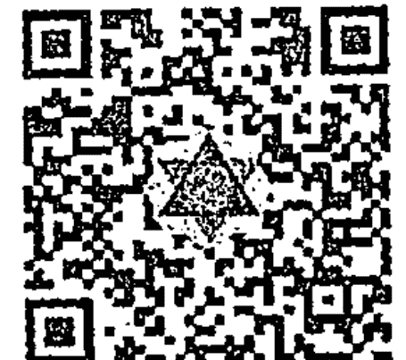

# 相信你的直觉

# TRUST YOUR VIBES

[美]桑妮亚·乔凯特 Sonia Choquette 著

韩凝 译

湖南文艺出版社

## 信任你的直觉力

Trust Your Vibes

[美] 桑妮亚·乔凯特 Sonia Choquette 著

韩凝 译

四季出版社

# 图书在版编目数据

信任你的直觉力 / 桑妮亚·乔凯特 著 - 四季出版有限公司,四季出版社, 2017.11
TRUST YOUR VIBES MS 韩凝 译.
ISBN 978-988-8495-85-6
I. ①信… II. ①桑… III. ①心理—中国

TRUST YOUR VIBES: SECRET TOOLS FOR SIX-SENSORY LIVING By SONIA CHOQUETTE
Copyright: © 2004 BY SONIA CHOQUETTE
This edition arranged with SUSAN SCHULMAN LITERARY AGENCY, INC
Through BIG APPLE AGENCY, INC., LABUAN, MALAYSIA.
Simplified Chinese edition copyright:
2017 Shanghai Agni cultural diffusion co. Ltd
All rights reserved.
No part of this book may be reproduced in any form or by any means, electronic or mechanical, including photocopying, recording, or by any information storage and retrieval system, without permission in writing from the publisher.
本书简体中文译稿由上海明焰文化传播有限公司授权四季出版社出版

## 信任你的直觉力

| 项目 | 内容 |
|---|---|
| 作 者 | 桑妮亚·乔凯特 |
| 译 者 | 韩 凝 |
| 责任编辑 | 刘 钢 |
| 封面设计 | 陈 瑶 |
| 出版发行 | 四季出版有限公司 |
| 地 址 | 香港九龙南昌街宝昌大楼3字楼 |
| 电 话 | 00852-66748311 |
| 印 刷 | 四季出版有限公司 |
| 网 址 | www.hksjiys.com |
| 电子信箱 | 1479603394@qq.com |
| 开 本 | 880mm×1230mm 1/32 |
| 印 张 | 10 |
| 版 次 | 2017年12月第1版 2017年12月第1次印刷 |
| 定 价 | 59.00元 |

版权所有，翻印必究；未经许可，不得转载

# 目录

- 001 引言
- 009 如何使用本书
- 013 测试：你是一个六感存有吗？

## 001 第一部分：基础知识

- 002 秘密1：当“怪诞不经”成为主流
- 011 秘密2：第六感是每个人都具备的感知
- 023 秘密3：植根
- 030 秘密4：倾听你的身体

## 039 第二部分：心灵超越物质

- 040 秘密5：放轻松
- 050 秘密6：安静下来
- 058 秘密7：观照觉察，不要全盘接受

## 069 第三部分：正向振动频率

- 070 秘密8：洋洋盈耳的成功之声
- 078 秘密9：心灵保护
- 089 秘密10：校对频率
- 097 秘密11：顺势而为
- 105 秘密12：放轻松
- 117 秘密13：放下过往的故事

## 121 第四部分：心灵练习

- 122 秘密14：形成文字
- 127 秘密15：祈祷
- 135 秘密16：寻找高频振动

## 145 第五部分：创建第六感支持系统

- 146 秘密17：团队协作
- 155 秘密18：语不离宗
- 162 秘密19：从“伪装成为”达成“真正成为”
- 170 秘密20：洞若观火
- 179 秘密21：回到学校

## 193 第六部分：六感修习的优势所在

- 194 秘密22：期待最好的
- 200 秘密23：爱上这个冒险
- 207 秘密24：山重水尽疑无路，柳暗花明又一村

## 215 第七部分：踏上高我指引的道路

- 216 秘密25：建立直接连接
- 225 秘密26：探寻真相
- 232 秘密27：神性视角

## 241 第八部分：第六感生活的艺术性

- 242 秘密28：大笑的艺术
- 249 秘密29：开启内在的艺术性：拿起蜡笔
- 259 秘密30：获取及时反馈

## 269 第九部分：第六感生活的心

- 270 秘密31：浇灌非洲紫罗兰
- 278 秘密32：分享
- 284 秘密33：慢下来
- 289 后记
- 291 鸣谢
- 293 关于作者

# 引言

作为一个修习长达 32 年之久的专业直觉、灵性导师，我花了很多年的时间帮助人们在直觉层面意识到我们每一个人都是灵性存有，每个人都天生具备六个感官，并非五感。更为重要的是我们都需要使用第六感来完成人生愿景，成为平和喜乐的存在。

我小时候生活在科罗拉多州的丹佛，当我 12 岁在厨房的桌子上接受了一对一的直觉阅读开始，我的灵魂使命就得以显现了。在我师从查理·古德曼（Charlie Goodman）以及特伦顿·塔利博士（Dr. Trenton Tully）这两位灵性直觉大师之后，更为正规的第六感艺术的训练才逐渐开始。除了这个私人化的特殊训练之外，长达 25 年之久我一直在研习宗教、语言、神秘学[包括西方喀巴拉（犹太教神秘主义体系）以及世界其他宗教、西方神秘主义以及塔罗牌]领域以帮助我对于灵魂提升获得更高的见解。

然而让我获得最多真知灼见的方式来自直觉阅读，自从我 12 岁以来这是我每一天都会做的事情。与每一个人面对面的阅读过程给我带来的洞见超过了任何正规的课堂能够提供的一切。能够有幸修习并且观照着我的客户们提升自我让我深刻地意识到我们的第六感——或者我们的“直觉力”是多么重要。我喜欢称之为——成功的生活。所以，通过本书，我会告诉你们真实的案例，我的客户是如何学习接纳自己的第六感的，是如何开始信任自己的直觉力的。同时我也会向你们展示这样做是如何重塑他们的人生的。

通过我所有的修习体验，我全然认知到被我称为“通感”的感知（throwaway sense），以及我们如何将它带回到我们的生活当中。第六感或者通感并不是身体化的感官，并不像其他五感一样——它更倾向于灵性感官，以心为中心，连接了我们的物质身体。就如同我们的身体感官可以帮助我们的身体保持方向感和连通信息一样，第六感的主要职责在于让我们与造物主，我们的灵性引导，以及天使协助相连接，它们可以在我们的道路和愿景之上给予我们引导。

我们的身体感官赋予我们双脚，让我们奔跑于大地之上，而第六感却赋予我们翅膀，教导我们如何翱翔于天际。但是遗憾的是只有极少数人能够意识到我们本身便已具备如此重要的灵性感官，更别说了解如何连接并且聆听它们了。

随着时间的推移，这个世界越来越复杂，作为第六感引领以及导师的我深知我的使命已经迫在眉睫、不容怠慢。我深信学会认知自我的直觉力并且在我们生活的世界当中将之付诸实践已经不再是可有可无的奢侈品了，如果你希望获得意义深远、安定宁静、平衡全然的人生，这就是必须要拥有的。我们必须要停止质疑，停止抗拒更高智慧，接纳现在已经被科学认证的事实——那就是我们本身比我们被教导的或者敢于去表达的层面更具有意识觉知，拥有更多与灵魂层面连接的能力。我们必须要学会信任直觉力——那些我们与生俱来的通感当中迸发的能量脉冲，它们精微地纵观于我们的意识当中，引导我们穿越灵魂的旅程。

忽略自己的直觉力的代价是高昂的：他们将不得不生活在恐惧、不满足、无力感之中。他们会做出不利于自己的决定，将自己带领到不愿意去的地方。他们焦虑、嗜瘾、对自己爱的人挑衅甚至暴力相向，这一切导致了更为疏离的境况。他们徘徊执着于忧虑和猜忌的阴暗角落之中，他们试图抗争生命或者被生命重创、践踏，无法达成自己内心的愿景和灵性目标。他们浪费了自己的人生而不是热爱生命。

我之所以对此知之甚笃的原因在于这么多年来我为无数的人阅读，我已经亲身观摩过无数次了。所有的困惑和压力都不是必须的：我们的人生设计并不是如此，这些都是不切实际的幻象，如此的迷失自我、脆弱不堪并不是我们应有的神性秩序。

身为一个修习第六感的引导者，我可以向你保证聆听自己的心灵感应可以疗愈这所有的恐惧和压力。它将会帮助你建立与造物主、你的灵性引导以及帮助者的直接连接。引导你安全地踏上自己的旅途，将你与正向的关系连接，协助你学习属于你的灵性秘密，引导你从事你应当从事的职业，保证你的安全，免受任何伤害，帮助你意识到如你所是的样子就是被爱的。你的第六感可以支持你的创造力，帮助你疗愈情绪伤痛，平和你的焦虑、安抚你不确定的心。通过你的天使、引导者以及高我的引领，你的直觉力将会引导你获得平静的意识，向你展示如何获得拥有更高振动频率、更和谐的生活方式。

我的第六感是我最伟大的天赋馈赠。它带领我远离了犹豫不决、幻象丛生的生活方式，这曾经让我感受到无比的隔离与孤独。它让我意识到我们所有人都在一同经历这个被称为生命的体验当中。

信任心灵感应的人有几个共同点：他们聆听自己的帮助者、灵性指引以及天使们——这些光的存有有意愿为我们的成长和疗愈倾其所有，他们向我们展示了在这个世界的秩序当中我们应有的位置。在任何时刻我们都会更为关注并且尊重自己的感受，即使这个感受在当下看似毫无意义。我们所有的思考、感受、行为，都是基于直觉力的，没有丝毫的质疑和犹豫。这不同于非第六感修习者，我更喜欢称他们为准第六感修习者。作为直觉的存有，我们与未知世界的同频程度与我们与物质世界的同频程度不相上下（甚至更为强烈）。

六感修习者和奉行五感的人如同两个种族一般。六感修习者更为信任他们的心灵感应能力，并且允许通感能量在每一天当中给予自己指引；总的来说，六感修习者更有创造力，更为灵活多变，同时在各个领域都比奉行五感的人成功。在我的专业生涯当中我亲眼所见不胜枚举的例子，通感的个体比拒绝通感力量的人更了解如何全然享受人生。

拥抱第六感能够给我们带来由内而外的安全感、自信心以及勇气，这些是卡在五感模式化生活当中的人无法获得的。而我们知道灵魂会在死后永生，所以我们不会与生命当中的潮起潮落相对抗。我们不会惧怕死亡，不会卷入生命暗涌当中的焦虑不安。我们会更为感恩，怀抱信心迎风破浪，在生命的浪花当中翩然起舞。因为我们心中知晓幕后的支持，我们知道我们是永生的。总而言之，那些信任直觉力的人能够意识到爱才是给我们插上翅膀的那一味最不可或缺的原料。

另外一个“六感修习者”（那些信任自己直觉力的人）以及“五感存有”（那些不信任的人）之间本质的区别就是他们追随的生活法则。五感存有只能看到实际的物质层面，他们跟随智力层面的认知或者基于小我的法则，而六感修习者能够感知灵性层面，追随灵性法则。这就创造了两个截然不同的实相：寻常的道路和更高的道路。六感存有的振动更为快速、轻盈，更具吸引力，更为流畅，具有疗愈性，能够立即被感知。人们也更容易被更高的振动吸引，因为这会给你带来更好的感受。

这并不是意味着六感修习者优于其他人——任何一个有经验的六感修习者都会这样告诉你，我们都是神谕灵性存有，来自同样的源头，具有同样的价值，由同样的本质——爱而铸就。我建议那些信任自己直觉力的人获得更优越的人生体验，因为他们能够获得更多的信息，能够做出更好的选择，这通常能够给他们带来更好的爱以及感恩这个美好世界的能力。

信任你的直觉力揭示了唤醒第六感的秘密。在书中，我分享了很多的练习方法、工具以及视角可以供六感修习者参考。信任心灵感应的人会以不同的方式关注生命——不同的态度、角度以及方式。我们会寻找不同的线索，相比那些关闭或者对更高智慧与引领不觉醒的人而言更为敏感，更具有觉知。

总而言之，六感修习者勇敢无畏地踏出了跟随感受的这一步，而不是浪费时间苦苦挣扎于对抗之中，我们从未担忧他人是否能够理解自己。我们知道我们的第六感并不是在线性时间与空间当中运作的，所以有时它提供给我们的信息在当下可能是毫无逻辑的，但是最终它必然会证明它的含义所在。

当然我们不可能未卜先知，不会提前知道会发生在我们和他人身上的所有事情，但是我们知道我们是被引导的，我们知道所有最有利于成长、保护自我以及存在的潜在方向都会展示在我们面前。因此，我们从不担忧未来。六感修习者的习惯、行为和决定都是基于他们内在的感受，而不是外在的教导；其结果就是在大部分的时间里我们都能找到内在的平和，并且能够与这个宇宙和平共处。

好消息就是我们每一个人与生俱来都是六感存有；都会被引导进入灵魂整体提升和意愿的层面。有些人（比如我）的灵魂使命就是成为引导者和导师，然而其他人可以在更为私人化的层面使用自己的第六感。但是当面对自己的愿景和自我保护层面的时候我们每个人都有能力成为六感修习者。当我们与内在本然的指引系统失联时，我们就会迷失自我，失去方向。这并不是自然的生活方式，而且生活也并非必须如此。一旦你学会重新激活你的直觉力，你就可以开始削弱所有的困惑，从而成为如我一样的被指引的存在。

作为职业通感师我的使命一直以来都是以导师的身份服务众生，成为引领他人回到内在通感航道的桥梁。这本书也是这个使命的另外一种诠释。以内在修习者的角度向你们展示灵性生活的方方面面，这样，那些准备好进入神性生活，进入更自如、更温和、更心满意足的生活的人可以以此为借鉴。

想要开启内在的通感能量系统，学习信任自己的直觉力是有很多途径的。在本书当中，我会与你们分享我们六感修习者是如何行动的，如何思考的，如何做出决定的，以及我们所拥有的态度和视角。在观摩六感修习者的方式之后，相信你也可以激活内在的直觉力。作为导师，我最为挚爱的事情就是引领人们唤醒他们的第六感，因为缺乏第六感的人生其实毫无意义。我们只是在伤害着彼此，以神之名义相互杀戮，以流行为名义麻痹自我，身处分裂孤立的状态当中，而这个世界也早已超出了应有水平的过度拥挤。

六感觉知能够疗愈以上所提及的一切问题，因为究其根源而言，它帮助我们看到了我们的内在是如此的彼此共生相连。因此“不论我们对我们的兄弟做了什么［都是］我们为自己所做。”如今我们时常发现自己纠缠于私人化的旋转坠落或者全球范畴的自我毁灭之中，而追随你的直觉力可以强而有力地震慑这一切。当我们能够信任直觉力，我们就重新塑造了平衡，体验到了内在——最终这会引导我们获得外在的平和。

# 如何使用本书

对于本书，我的目的就在于帮助你们开启直觉的频道，教导你们如何信任你的直觉力。我会分享专业六感修习者每天体验的练习来帮助你们驶入这个未知的灵性世界。我想要帮助你将你的身份认同由基于小我的认知转变为基于灵魂的认知。帮助你们强化直觉的强度，建立通感感知的信心。通过修习此类练习，你将能够将你的第六感锚定为更为扎根更为实用的形式。

我会逐一介绍第六感的秘密，这样可以让你们感知到如何使用直觉的角度去体验这个世界，之后你们可以逐一尝试以探寻是否这个方法合适你。这样的方式可以训练你们以六感修习者的角度，通过你的心灵感应来体验世界，而不是像五感存有一般仅仅通过你的头脑以及智力解读来体验世界。

这些练习是渐进的，一开始是最为基础的必备条件，需要让你的身体做好准备以感知精微能量，之后统领你的所有觉知调频进入更高的通感振动。这 33 个练习被分为 9 组，或者 9 个部分——牢记于心，当你开始转向认知到你的第六感、通感意识的过程中，每一个部分都是基于之前的一个部分的。换句话说，这有点像音乐欣赏课，首先你会学习六感修习者的生活方式，如同学到了音符，之后学到了心灵感应以编写的旋律，最终，直觉创造力以及支持灵魂提升的生活方式会像一首完整的音乐一般呈现在你的面前。

从头学起如何“高频振动”的生活，你将会每次前进一小步地增加信任直觉力的体验。按照自己的步调去阅读每一个秘密，跟随建议练习尝试几天，看看会发生什么。每一个秘密都源于之前的一步，可以给你建立一个温和的平台，帮助你在此之上更自如、更舒适地发展你私人化的六感体验。有一些秘密可能你早已熟知，也许有一些对你来说耳目一新。开放你的意识，尝试每一个练习，开启属于你的旅程。通过这样的方式你将会学习到，不论面对什么都可以做到信任自己的直觉力。

把这本书视为一个温和的健身计划，以锻炼你的通感肌肉。把我视为你的私人教练；因为作为一个专业的直觉引导师，我已经与成千上万的人共修过，并且观察了他们的学习过程。我知道哪些方式事半功倍而哪些收效甚微，同时我也知道这个中陷阱都位于哪里。微小的进步才是收获——浮夸的宏伟目标有时毫无裨益。

当你信任你的心灵感应，你就改变了运行生活的法则，你就可以开始冒险尝试追随自己的灵性而为，进而提升你的直觉能力。尽管我们每个人都有潜能成为六感存有，都有潜能由高我指引，但是仅仅心存愿望还是不够的。就如同看健身视频不能给你带来强健的腹肌一般，对于直觉浅尝辄止的了解或者仅仅心存渴望也并不能让你成为由直觉引导的人。只有每天不断地训练你的通感肌肉，这样才可以调频进入内在强大的高频振动引导系统。

一开始练习本书当中的秘密可能会感觉有些无所适从，但是只要你持之以恒，一定会带来改变。从头脑转移到心需要花一些时间，需要你改变一些习惯。但是这并不会让你花费过多的时间，只要你能够以轻松玩乐的心态面对，无须将之视为一个挑战，很快你就能够像一个六感修习专家一般与宇宙沟通。很快你就不会再去身外寻找问题的解答了。你的内心会告诉你什么对你来说是正确的，因为你将能够感受到直觉力，清晰地听到高我的引导。

作为灵性存有，我们都具备通感的翅膀，都想要与灵魂共同飞翔。我们想要穿越生命当中的困苦挣扎，以更高频率生活，因为我们的内在无比清晰地知道我们每个人都能够做到。想要与灵魂共同飞翔其实非常容易，只需要你停止抗争，开始聆听即可。它会自然提升你的振动频率。

当我们不信任自己的心灵感应或者忽略自己的灵性时，相信我们都会在某个层面觉得“哪里不太对”。如果你有意愿远离恐惧，想要重建与觉知丢失的连接，只要你准备好做出承诺，你就能够做到。如果你有意愿跟随你的灵性、聆听你的灵性引导，穿越事物的表象看到对于自己和他人来说更为深刻的感悟，你就能够做到。如果你有意愿与过世的至亲交流，想要连接天使力量，或者接入过往时代的天才能量，你也能够做到。

在我的第一本书《通感之旅》(The Psychic Pathway)当中，我向你们介绍了第六感。这本书当中，我将会向你们展示如何发展这个感知进入更强大的引导系统当中。如果你渴望信任心灵感应，渴望过上拥有通感力量引导的人生，这恰好与我想要教授给你们的不谋而合，相信我们的共同努力一定能带领你走向成功。

## 测试：你是一个六感存有吗？

在你开始阅读所有开启六感生活的工具和秘密之前，非常有帮助的方法是，测试一下你是否能够与你的心灵感应共振。完成以下问卷，测试一下结果。

1. 当我与某人在一起时，我很容易感知到他们的感受。
2. 我喜欢运动、喜欢锻炼身体。
3. 我聆听自己的直觉，即使他们在当时可能毫无意义。
4. 我能意识到他人试图对我撒谎或者试图掌控我。
5. 我能够分辨自己是否做错了，并且能够及时改正。
6. 当有人误导我时，我能够感受到。
7. 我倾向于过分卷入他人的问题当中。
8. 即便对于并不明白的问题也能立即得到答案。
9. 如果有不好的预感，我会很轻易地改变计划。
10. 我会分享我所拥有的，不会担心是否足够。
11. 我感觉自己是被保护的，就如同有一个人一直在观照着我一般。
12. 即使有些困难我也有能力说“不”。
13. 我能够表达我的真实感受，即使它是不得人心、不受欢迎的。
14. 我信任自己能够做出最终决定。
15. 对于征求他人的意见我很谨慎。
16. 我喜欢冒险、喜欢尝试新事物。
17. 我细心呵护我的身体。
18. 我会关注其他人，并且在他人发言的时候认真聆听。
19. 我能够在事情发生之前就有所感知。
20. 当我突然想起某人的时候他通常会在当天给我打电话。
21. 我能够感知到某人或者某个情况对我是否有利。
22. 我是一个有创造力的思考者，在有空余时间的时候喜欢涂鸦或者玩耍。
23. 我很有幽默感。
24. 我的生活中有很多巧合的发生。
25. 我深信在彼岸我有很多帮助者，比如指导灵天使。
26. 我爱我的人生。

当你完成问卷调查，回看一下你的答案。按以下评分方式打分。

- 极少 +1 分
- 有时 +2 分
- 经常 +3 分

**25 ~ 39 分**
当下而言你还没有习惯觉察自己的第六感——但是当你开始使用本书当中的技巧和秘密之后会飞速改变的。当你开启内在直觉的自我，冒险精神和活力将会显著增加。

**40 ~ 59 分**
你能够良好地感受到第六感的共振，尽管你可能不会这样称呼它。也许你认为自己“灵敏”或者“幸运”。当你开始练习本书当中的秘密以及六感技巧之后，你将能够体验到飞速激增的安全感、引导以及创造力，你的生活也会变得更加愉悦，更加令你心满意足。

**60 ~ 75 分**
你也许能够意识到自己的第六感异常发达，但是你可能并不能够全然信任他们。当你开始练习本书当中所提及的技巧之后，你将能够对于拥有喜乐的人生，全然觉醒于第六感存在的生活方式发展出强大的信心。你将会学习到如何优雅自如地生活，如何超越生活当中的难题而不是困在其中无法自拔。你将能够唤醒你的灵性，学会飞翔。

所以，现在你已经知道了你已经准备好成为六感存有，开始信任你的直觉力了。让我们开始吧！

# 第一部分

# 由基础开始

## 秘密 1：当“怪诞不经”成为主流

如果你想要开始信任你的直觉力，必须要做到的就是全身心地认识到你的确拥有超自然第六感能够感知到这一切，即使它们现在可能仍旧处于休眠状态。你的第六感就是你与生俱来的内在天赋，即使你现在并不信任它。在宇宙的指引之下成为一个灵性存有是非常正常的事情。六感修习者，通感者都了解这一点。然而非灵性的五感存有却对此知之甚少。所以如果你想要以更高的存在方式生活，当你的直觉试图与你对话的时候停止怀疑，当你感受到第六感的时候不要加以忽略，当你的心灵感应越发活跃的时候，学会接纳、学会感恩。

首先，你必须要改变态度。你可以选择认同五感存有，他们认为六感修习者就是痴人说梦的疯子或者就是无厘头的怪异人群。但是你不可能将第六感完全屏蔽于你的生活之外。即使是我自始至终最为钟爱的六感修习者——达·芬奇 (Leonardo da Vinci) 也被他身边的五感存有当成异教徒。还有托马斯·爱迪生 (Thomas Edison) 以及华特·迪士尼 (Walt Disney) 也是如此。当然，随着世界的变化，他们被重新定义为最有创造力、直觉最为灵敏的天才，但是五感存有仍旧会习惯性地贬低第六感的存在，因为小我总是会尽其所能地掌控一切。所以与其担忧追随自己的心灵感应会让你看起来像一个古怪的人，不如庆祝第六感的存在。这意味着你已经超越了五感惯有的模式，意味着提升。

第二，为了能够拥有六感人生，你需要寻找机会聆听你的直觉。信任直觉的人，比如我，非常了解相信自己的心灵感应在生活当中是如此的必不可少，不但可以帮助你节约时间，还可以有效连接生命当中的节点，甚至能够提升你的亲密关系质量。最棒的是，信任你的心灵感应可以帮助你从担忧当中解脱出来——相信这一切足够让你找到动力开始信任你的第六感。

举个例子来说，我的学生碧 (Bea) 和她的丈夫最近决定卖掉他们位于俄亥俄州代顿的大房子，搬到附近城里小一些的房子居住。这对夫妻的孩子们都长大了，他们希望能够寻找到一个合适的住房给他们带来更多的自由，也可以节省一些不必要的开支。碧对我说：“我最不想做的事情就是不得不带着陌生人参观我的房子，真希望可以一点麻烦都没有，顺顺利利就把房子卖掉。”

在听取了我的意见，并且参考了我是如何使用第六感的例子之后，碧决定将她的难题交托给自己的指导灵，之后将其抛诸脑后。她觉得自己并不愿意跟其他人分享自己的私人生活，但是第二天的早上，碧感到总有什么声音驱使着她将这个消息告诉家里的清洁工罗拉。所以当罗拉来工作的时候碧相信了自己的直觉向罗拉坦诚相告了她和丈夫想要卖掉房子的计划。

“我的老天哪！”罗拉大叫起来，“我简直不敢相信你所说的一切！我的另外一个客户昨天刚刚让我帮忙在附近帮她找房子。我非常了解她的品位，她一定会爱上这里的。”

天时地利人和聚齐。罗拉在当天就介绍他们彼此认识了，这一切简直就是天作之合。他们在电话交流的时候基本就已经敲定了这一桩交易了。通过成为一个优秀的六感修习者，选择信任自己的心灵感应而不是苦苦挣扎于自己的难题当中不能自拔。碧在不到一天的时间就吸引到了问题的解决方案。

碧虽然欣喜若狂但是却一点也不为之感到惊讶。然而她却注意到身为五感存有的罗拉完全没有办法相信所发生的一切。第六感的神速让罗拉困惑不已，因为她习惯了生活必须是更为繁杂纷扰的。所以她的反应是：“这一切发生得简直太怪异了！”

碧完全不觉得这一切的发生有什么奇怪，因为她知道信任你的直觉力 004

她内心的期待就是这样毫无波澜顺风顺水地解决问题。毕竟这就是第六感的演化方式。那天碧只道了一声“谢谢！”然而从那天起，她全然开始了六感修习者的生活方式。

我的另外一个学生，一个内向、不善言辞的46岁的工程师雷蒙德。他近来刚刚开始学习打开自己的直觉，但是总是心存疑虑这样做是否能够真的对他有所帮助。几个月来他一直在跟朋友们打趣，希望能够回避掉他所深恶痛绝的约会过程，他如是说道：“我真希望可以按个按钮就让我的梦想女人从天而降。”

有一天他要去本地一个酒店参加会议，当他按下了酒店的电梯按钮后，门打开的同时出现了雷蒙德这辈子见过的最有魅力的女人。而且这个女人正在前往同一个会议。让他喜出望外的是，他们之间的吸引是相互的。雷蒙德的心灵感应如实反映了他内心的渴望，驱使着他想要与这位女子攀谈（这是第六感会出现的自然反应），但是他的头脑却在担忧着有可能出现的不良结果。所以他撤回到了五感的惯有模式当中，他担心如梦似幻的降临伴随着的是毫无声息的消失。然而她并没有消失，他们现在订了婚，在筹备婚礼了。他还在不断学习的道路上……

好消息就是，现如今我们坚定不移大踏步地进入了新时代，科学已经能够认可到第六感的真实存在性。所以现在最为符合时代脚步，最为聪明的方式就是学习信任你的心灵感应，将它视为天赐的礼物，而不是视为异类。

科学以及灵性律法现在已经能够认知到我们每一个人都是六感存有，宇宙万物的一切都是相生相吸、相互关联的。我们彼此之间无时无刻不在相互影响着，我们当中以更高频率生活的人对此更是了然于胸，并不会质疑它的真实性。正是因为这样的内在连接，所以雷蒙德的内在吸引到了那个正确的女朋友，碧内心的渴望让她顺利吸引到了完美的买家达成了交易。

同频显化并不是侥幸或者碰巧发生的偶然事件——这是我们的直觉在未知世界以完美的秩序运作下产生的意向反应。这就是为什么鱼会逆流而上，鸟儿向南飞，而熊会冬眠的原因。大自然万事万物的成长轨迹都是按照最佳方式运作的，同样我们人类也是如此。唯一的区别在于我们拥有选择权可以选择是否相信自己的直觉。所以如果你希望你的第六感更加明显地演化，就不要再抗拒你的心灵感应了，选择改变你生活的方式吧。我的一个直觉敏锐的朋友曾经对一位非常与时俱进的 85 岁荣格咨询师说道：“我只是担心自己看起来太过出格，在我的朋友当中显得太过‘怪诞不经’。”这位咨询师回复道：“亲爱的，难道你不觉得‘怪诞不经’在当今时代已经变成主流了吗？”

我同意这个观点。我实在是无法想象没有心灵感应引导的生活会是怎样。我已经非常习惯于倾听内在的引导了，完全不知道如果没有它为我指引方向我应该如何行事。如果没有了这一切就如同选择在美好的一天戴上眼罩前行一般——我为什么要选择错失身边这美好的一切啊？那些与自己的第六感失去连接的人就如同缺失了左右手一般，然而我们并不需要如此折磨自己。为什么要主动放弃指南针和地图在黑暗当中踟蹰不前呢？

我需要坦白一件事情：我如此推行此类生活方式的原因并不是完全无私的。不知道你是否有过这样的经历，当你正行驶在高速公路上，突然间一个冒失鬼冲到了你前面，不仅行驶速度远远低于限速，而且来来回回的肆意改变车道只是因为他不敢或者不知道应该怎么走？这不仅制造了巨大的混乱，让所有的人心烦意乱，还打破了应有的和谐。而像我这样的六感修习者生活在充满控制欲强烈的，不知道该往哪儿走的五感存有当中时，就是这样的感觉。它打破了我大步流星向前走的频率，降低了我的速度，这真的会让我们烦恼不已。

我知道这听起来很自私，但是在现实面前，其实并没有那么不顾他人。当你能够体验到融入生命的流动，顺遂地走向你真正向往的地方时，你会了解到那是一种非常美妙的感受，我希望每一个人都可以像我一样体验到这一切。如果我们能够提升成为合一的生活方式共存于这个地球之上，我们就需要穿越普世五感存有的生活规则而带来的恐惧感。唯一能够让这一切成真的方式就是拥抱灵性律法，通过使用我们的第六感与每一个人充满爱的连接。如果我们把这唯一的方法弃之不用的话，带来的结果就是无端地停留在黑暗时代无法前行（Dark Ages）。

你可以继续强制自己遵循五感律法，不断地怀疑、质疑自己的第六感，但是迟早有一天你会发现第六感训练会带领你进入更为美好的未来，而没有信任的你则会被留在原地而无法前行。不需要过多担忧自己会有恐惧的出现，当你踏入未知领域的时候恐惧是很正常的。你在恐惧的同时也可以提升。真正阻碍你的根本就不是恐惧，每个人都有恐惧，任何时候都有——真正阻碍你的是试图隐藏恐惧的行为。掩盖本身会耗尽你所有的能量，让你丧失享受生命的能力。所以与你的恐惧成为朋友吧，放手一搏！

## 六感训练

通往更高频率的生活方式的第一步就是，接纳你本身就是拥有天然直觉力的存在。即使在这个当下你的第六感还没有完全运作到它应有的潜能。只要你相信它的真实性，你就可以成为一个初学的六感修习者，并且从中体验到它所带来的益处。如果你仍旧在心里犹豫不决的话你是没有办法进步的。你需要认知体会自己的每一个感受、每一个想法、每一个灵感、每一次灵光乍现、每一次“啊哈”、每一个聪明的想法以及每一次“我觉得……”这些都是极为重要的第六感体现。而这就是心灵感应的命脉所在。

要学会像一个六感修习者一样思考。你能够轻松舒适地感受自己的心灵感应吗？你能够习以为常地接纳它们吗（这就是灵性律法的运作方式），或者你总是将它们贬低为毫无意义的信息（这是小我律法的运作方式）吗？学会练习面对第六感的时候将它们视为正向的、确凿无误的事实真相，即便一开始你可能还是有些不自然。如果需要的话，你可以假装自己信任第六感，这样做也是非常行之有效的方式。同时要铭记于心的是这一切会变得越来越简单。你只是刚刚开始训练你的觉知跟随更高的频率，所以一开始你可能会觉得这不是“你”的感受。

有一个方式能够让你更为快速地脱离旧有的模式进入心灵感应的频率，那就是拿出一张纸写下你所有浮现在脑中的恐惧、负面思想以及态度，不论它们是来自你个人的经验或者是从他人那里学习、继承而来的。哪些不合时宜的陈旧观念还徘徊在你的头脑当中阻止你运用你通感感知的天赋呢？学会记录可以让你清醒觉知到那些你甚至不知道它们仍旧存在于你头脑当中的观念。

当你重新审视这个列表的时候，问问自己你真的相信这些陈旧的规矩吗？或者它们只是一个习惯而已？你准备好冒个险改变你的态度了吗？如果你的答案是肯定的，就开始行动吧。这就是第一步。想要更高频率的生活不需要你变成一个行走的广告牌，所以你不需要惊慌。在接下来的内容当中，我会教给你如何将你要改变的观念接轨进你的生活当中，但是你必须要下定决心这是你发自内心想做的事情。

接下来，练习你刚刚所建立的态度。觉察那些微弱的、错综复杂的存在于我们每个人之间的内在链接，对它们表达感恩。同时也要留心你身边人的态度。他们是如何面对自己的直觉以及通感体验的呢？他们是五感存有还是六感存有呢？理解这其中的区别能够让你放下对心灵感应的防卫心理。如若有人觉得直觉或者心灵感应都是天方夜谭，你会如何反应呢？你会试图回避所有不愉快的交流还是会仗义执言呢？

每一次当你不小心跌回过去的模式当中的时候，就对自己说：“好吧，没关系。”然后回到正轨当中。而每一次面对恐惧和掌控的控制选择全新的态度，选择追随灵性律法的时候，为自己鼓掌叫好。我是认真的，在通往六感生活的旅程当中你必须要成为自己最贴心的啦啦队员，从现在就开始吧。

> 六感智慧：成为六感修习者简直太棒了！

## 秘密 2：第六感是每个人都具备的感知

首先最为重要的是，你需要知道你的第六感是建立在觉知之上的。所以为了能够更好地觉察你的心灵感应并且学习信任它们，首先你需要开始建立常识性感知。如果你希望你的觉知可以高频运作，你就必须要在你的身体有自然需求的时候及时满足它，这样它才能够拥有更敏锐的觉知。

我们身而为人其实大部分的时间都是身心俱疲的，如果没有得到充分的休息对心灵感应来说简直就是致命一击。当你在字典当中查阅直觉这个词的时候，你会注意到其中的一个解释就是“觉察、留意”，另外一个就是“保持注意力。”当你非常缺乏睡眠的时候想要关注眼皮底下的事情都无比困难。所以很有可能你完全没有办法觉察到正在高速运转又微妙无比的直觉能量。当你疲倦到这个程度的时候，你的小我会像奴役一个奴隶一样奴役你，它完全丧失了感受——只有思考。它感觉不到你是如此的疲倦，所以它会不厌其烦地劝说其实你还好。所以不要听信它的谗言。要知道，当你睡觉的时候你的小我也睡觉了。这恰好解放了直觉的声音。

想要活跃你的第六感最为实际的建议就是当你试图寻求引导的时候带着问题“睡一觉”。我的老师查理·古德曼（Charlie Goodman）有一次向我解释说，当睡觉的时候，你的情绪也得到了休息，这样一来你的灵性就苏醒了。例如几年前，我挣扎于是否要解雇正在帮我照顾孩子的保姆。虽然看起来在照顾我女儿这个事情上她做得完美无缺，但是我的直觉告诉我她身上有些地方不对劲——但是我没有办法完全断言问题究竟出在哪里。然而解雇她又会给我带来非常多生活上的不便，我一直在跟我内心的不安博弈直到我觉得精疲力竭。我非常清楚应该如何处理自己的精疲力竭，所以我决定先睡一觉，明早再重新审视这个问题。

在我的梦中，我看到当我想要跟她聊聊一天发生的事情的时候，她疯狂地，丧失理智般地在绕圈子，试图隐藏住自己的脸，试图回避关注我的孩子们或者我。这个答案对我来说就足够了——我不再纠结于如何做决定了。出于一些我不理解的原因（或者不需要理解的原因）我的直觉、我的心灵感应告诉我她必须要离开。

当我下定决心之后，我计划在她10点钟来到我家时解雇她。9点钟我接到了一通电话，打电话的男人告诉我他是这个保姆的父亲。他询问我是否认识他的女儿；当我告诉他我的确认识他的女儿之后他告诉我，他的女儿5个月前离家出走了。这恰好完美地解释了我直觉上的顾虑。尽管这个女孩非常讨人喜爱，但是她是个离家出走的孩子，她需要回家重振自己的生活，而且很显然她现在已经不得不这样去做了。有趣的是她肯定也感觉到了什么，因为那天早上她并没有出现，之后也再没有出现过。我觉得我们彼此都被引导着去做我们应该完成的事情，然而对我而言得到这个引导的方式就是在晚上好好睡了一觉。

当然睡足觉只是其中的一部分。如果你想要感受到自己的心灵感应，合理的膳食也是必须的。你不可能肆意妄为地吃东西还期待着能够保持灵性觉知——你必须要对于什么食物能够良好地供给你的身体保持警觉，要保证你的身体能够正常运作不至于过度衰弱或者完全停滞。尽管这是不言而喻的道理，但是我总是难以相信有如此多的人在面对合理膳食这个问题上有这么强大的抗拒心理。大部分人不是试图饿死自己就是强制自己选择很有限的食物勉强度日。他们会非常疲倦这必然是不争的事实，相信不用我说你也知道这样的状态肯定不会让你很好地捕捉到自己的心灵感应。

当然想要保持高频振动的生活方式并不需要严格遵守让你习惯不了的饮食状态。你需要保证你吃进肚子里的食物都是对你有益的。所以很明显，过糖的甜甜圈、无限的咖啡、快餐食物或者冷冻食品肯定是帮不了你的。你需要进食能够给你带来滋养的食物，让你的身体保持足够的灵性感知。例如，如果我在早上摄入过多的糖分，没有摄入足够的蛋白质的话，我是没有办法很好地进行通感阅读的。我需要足够的能量让我保持注意力集中，过少的早餐肯定不能给我带来这样的能量补给。所以在我需要工作的日子里，早餐我都会选择燕麦片粥帮助我集中注意力。这样小小的改变就足以改变你的世界。

你并不需要对我的话全盘接受或者试图用第六感来权衡这个问题——单纯地关注一下当你吃东西的时候你的身体感受就可以了。如果你能够很好地将有益的食物和良好的感受连接的话，你将会发现这很容易体会到。并不是说你需要成为一个素食主义者或者只能选择青菜豆腐；你需要的饮食是应当能够给你提供必要的生命能量的，或者尽可能地接近自然力量源泉。换句话说，健康饮食，常识性的健康饮食足矣：足够的水果、蔬菜、保持足够的蛋白质的摄入，选择全麦食品，回避包装类食品以及过度加工食品。这个问题不难解决，真正困难的在于这样做会挑战你的小我律法，这才是最为巧妙的地方。

举一个例子来解释我的观点。我的客户康斯坦斯是一个广告公司的行政人员，非常辛勤工作的人。大部分的日子里她都从早上7点一直工作到午夜时分。所以她每周大部分的时间都吃不到像样的食物。她饮用超量的咖啡，而且她的饮食包含了甜甜圈、外带汉堡或者餐馆外卖。然而康斯坦斯的

## 第一部分：由基础开始

小我不断游说她，让她觉得自己不可以抽出时间好好吃顿让自己身心愉悦的饭，因为有可能会影响到自己的工作。所以尽管她其实内心非常热爱自己的工作，也难怪她会精疲力竭、初显抑郁征兆了。她的饮食不但扼杀了她的心灵感应，也正在摧毁着她的情绪以及身体。

当康斯坦斯拜访我希望我帮助她做直觉阅读的时候，她对我说她已经要求自己的医生给她开一些缓解抑郁的药物了，但是医生觉得还不到吃药的时机。在我的阅读当中，我建议她与其选择药物，不如改变自己的饮食习惯，之后静观其变。然而她完全对我的建议置若罔闻，并且说服了自己的医生，成功地给自己开到了处方药。副作用是非常严重的，所以她绕了一圈又回来找我帮助。我再一次给她建议改变饮食，每周只要好好吃几顿饭就会带来巨大的改变。这一次她听进去了。尽管每天的工作让她疲惫不堪，她还是会在家里做好午餐，下班以后回家再做晚餐。她开始选择蔬菜，放弃了糖，也开始选择摄入更多的全麦食品。

短短一个月的时间，康斯坦斯的抑郁症状就不药而愈了，她的能量充沛了，直觉也回来了。她是如此的充满创意，甚至帮助自己的公司策划了很多极富创造力的活动。当然她也为创意团队赢得了晋升的机会。因为她建立了正确的连接，直觉必然会将她引向成功。

小我无法看到内在的隐藏关联性，但是直觉却总是能够感知到。到今天，康斯坦斯将她所有的提升和灵感都归功于她自己在家亲手做的蔬菜汤和草药茶以及维他命上。我并不是建议选择合理膳食以替代药物——毕竟药物对于需要的人来说就是天赐的馈赠。——然而药物却并不能够取代食物。不论我们从哪个角度看待这个问题，我们都需要合理的膳食以帮助自己达到最佳表现。

## 什么都不做的重要性

为了能够更好地连接你的心灵感应，你需要给自己一些无所事事的缓冲时间。这不仅能够重新唤醒你的身体，也能够给你带来一些内在的空间让你重新为通感引擎添能加油，同时也能够帮助你接收到灵性那细微的声音。然而你充满恐惧的小我会不断鞭策你一定要行动起来不可以荒废自己，只有你的灵性非常了解你需要休息，让宇宙暂时接管一切。我的朋友比尔几年前亲身学到了这一点的重要性。

比尔和女友在巴黎度假。一天他们决定早上开始分开游览，下午5点在酒店隔壁的咖啡馆会面。因为他们选择的酒店是个非常袖珍、古朴雅致的酒店，所以房间钥匙也如同酒店本身一般的别致又不寻常。比尔说由他来保管钥匙，但是他的女朋友坚持自己看管钥匙会比较好，因为她比较负责任，而比尔则不是。尽管如此，他们还是选择按照原始计划行事，规划了之后的约会。

在一天观光和购物之后，比尔疲倦地回到了约定的咖啡馆，准备小憩一会儿。那时已经漫天飞雪，温度也渐渐降了下来。尽管才刚刚4点钟，但是比尔觉得他的一天已经很充实了。所以他坐了下来开始享用他的法式咖啡。当他伸手进口袋寻找钥匙的时候发现，钥匙不见了。他找遍了所有的口袋仍旧一无所获。他的担忧并不仅仅是丢了钥匙（尽管酒店管理员提醒过他千万不要丢了钥匙因为这是没有办法替换的），同时他也担忧在女友面前丧失颜面。比尔已经接近崩溃了，但是他没有选择惊慌失措，他转眼看向了冒着热气的、诱人的咖啡。他决定在这样的时刻最应该做的事情就是坐下来好好放松，享受这杯美味的咖啡。

比尔坐了下来小酌着咖啡开始回顾一天发生的一切，毅然阻止自己进入惊慌失措的情绪当中。45分钟过去了，他觉得有个冲动想要赶紧起身去今天早上第一趟搭乘的地铁。他保持着放松的状态大踏步迈入雪地，此时已漫天飞花，白雪皑皑，地上积起了厚厚的一层雪花。然而就在还有十步之遥迈进地铁入口的地方，他低头看到了安然躺在雪地里的钥匙。肯定已经在这里掉了一天了，而令人惊讶的是居然没有人将它捡走。他完全不敢相信自己的好运气，比尔拾起了钥匙，闲庭信步地踱回了咖啡馆，正好5点准时到达。

正在等待他的女友很开心见到比尔，她满载而归，提了好多购物袋，看起来已经疲惫不堪了。“你怎么样？”她问道。

“好极了！你想喝杯咖啡吗？”

“不要了，我就想赶快回到酒店。钥匙在吗？”

“当然在啦。”比尔说道，举起钥匙晃了晃，满脸挂满了微笑。

比尔还是坚持真正救了他的是当他决定坐下来、好好享受咖啡，什么都不做。我非常同意他的这个观点。

我的老师塔利博士把这个缓冲时间称为“孵化期”(incubator time)。他教导我如果灵感和引导没有出现的话，坐下来，什么都不做，保持这样的状态至少两小时，你的指导自然会显露真身。我已经虔诚地坚持了30年的时间了，它真的非常有效。我在丹佛的时候被指引，去寻找大学的校长帮助我想办法进入索邦神学院（Sorbonne）采用的就是这样的方式；我获得灵感直接向我的丈夫派崔克发起攻势主动约他，而不是等他约我也是采用这样的方法；同时这也是我寻找到当前住所的方法啊；还有我出书的灵感也是这样得到的。这些只是我绝妙的心灵感应当中的几个例子而已，而接收到这些指引，只需要给自己一点空间足矣。

当你能够保持充足睡眠、合理膳食、足够轻松的时候会发生很多令人惊叹的美好事情的。当你的神经能够放松下来，你的灵性、内在的六感觉知部分会被重新激活，开始闪耀光芒照亮你的道路。这就是为什么我们会说某个人闪耀着光芒的原因；这也是为什么当我们表达一个人获得灵感的时候会在他的头顶画一个闪光的灯泡的原因。有一个非常了不起的法国谚语是这样描述专注、笃定的灵性觉知状态的：Je me sens bien dans ma peau，意思就是我对自己的现状非常满意。如果我们能够妥帖适当地照顾好自己的身体的话，我们就为内在的通感系统创造了最为适宜的状态。

在我师从查理·古德曼的那段时间当中，有一件很有意思的事情就是，如果我的身体被忽略、疲惫不堪或者受到了虐待的话，它的能量层面就会是有毒的。你的灵性会沿着被称为“能量脐带 silver cord”（连接太阳神经丛以及金色场域的闪耀的能量连接）而离开。你的通感能量也会因此而关闭。

因为并不愿意被困在这样的境地当中，你的灵性能量会围绕在你的物质身体之外——一旦这样的情况发生，你就会呈现为麻木、平淡、惨白无力的状态。就像无人居住的家一样。在一个灵魂层面而言，你的身体之家无人居住，所以你肯定不会感觉受到启发，充满灵感。这就很好地诠释了这句话“灯火通明，却无人在家。”当我们形容一个人没有很好地照顾好自己，并且对此蒙昧无知、毫无觉察的时候。这句话就是最好的写照。

如果你认为滥用毒品药物、过度酗酒甚至抽烟可以帮助你远离一些烦忧的话，你只是在自欺欺人而已。你的身体没有办法生活在被破坏的能量当中。它会不断提醒你看到真相，比如变得虚弱，或者丧失你的光晕（环绕在你的物质身体外围保护着你的能量场域）。这样的情况会导致负面的能量甚至负面实体侵占进入你的能量场。相信我，当这样的事情发生的时候，你不可能有任何“高频”振动能量。当我在给客户进行能量阅读的时候时常遇到这样的情况：他们可能觉得自己在阅读的过程当中是独立坐在沙发上的个体，但是我看到的是一群灵性侵入者正占领着他们的光晕。这些偷渡者是低频能量振动的，他们是大众思维模式的能量残留，他们携带着全身不适、愤世嫉俗、过度审判、偏执多疑等状态。通常他们都具备彻底搞疯我们的能力。

如果你长时间虐待身体或者忽略你的身体，就如同你生活在被遗弃的家中一般——“能量侵略者”（energy squatters）会占领你的身体将你的能量降低。想要摆脱这些侵略者的方式就是对你的身体开始负责，给予它足够的休息、适当的饮食以及必要的缓冲时间。如果需要的话，盐浴是很好的清理通感能量的方式，可以给你的身体大扫除。因为盐本身可以清理掉能量场当中的擅自闯入者，也可以同时帮助你摆脱不属于你的一切。

忽视通感能量或者能量碎片的模式在我们这个共生的快节奏世界当中像传染病一样肆意蔓延，我们总是渴望更多、更多、再多一点——其演化成的结果就是我们真正需要的一切却得到的越来越少。人们总是不能够意识到灵性是如此精微细腻，它需要在我们的身体当中建立一个安全的、扎根接地的家。他们意识不到封闭自己的灵性所必须付出的高昂代价。我能够看到这一点，就像看到一幅褪色的画一样。你的身体就是灵性的庙宇，好好照顾自己的身体是如此重要。不然你将会流离失所、困惑不已甚至因而产生抑郁情结。

你的心灵感应是无时无刻不在传递着的；要学会聆听，学会感知到它们的存在。然而在我们日常旋风一般连轴转的生活当中，想要感知到它们，你必须要保证足够好的状态和灵性感知，确保你的生活模式是基于正确的常识性运作频率的。不管你的小我律法如何诠释，甚至成为一个六感修习者也并不意味着你可以逃避掉这些最基本的责任。你能够越好地照顾你自己，你的觉察力就会愈加强烈……这是六感生活赖以生存的基本条件。

## 六感修习练习

开始检视你的身体。在照顾身体这方面，你是如何给自己打分的呢？你能够保证充足的睡眠吗？如果你正想要开始早一点上床睡觉，现在就是最好的时机。即使你只能做到每天提前15分钟，也会给你带来巨大的改观。如果你一直以来对自己的饮食都不太上心，现在就开始列出饮食计划。提前决定你要采购什么食材。学会储存食材是一个好习惯，例如囤一些蔬菜类以及谷物类食物，提前将它们烹调好让你可以方便随时进食。炖一大锅汤保证一个礼拜都有汤喝也是个好主意。每天至少计划一餐平衡、新鲜的饮食，自己动手烹调。放下手里的第四杯咖啡和奶油糖吧，试试看用蓝莓替代（我刚刚了解到蓝莓是大自然界最完美的食材之一）。

如果你的睡眠质量不高，可以选择关闭晚间新闻，更换一个更好的枕头，在休息之前泡个温暖又舒适的澡。不要事无巨细地计划好每时每刻需要做什么，时不时地预留一些时间让自己松弛一下，无所事事一会儿。服用维他命，但是不要过量：每天一片就足够了，不需要吃6片那么多。拿出你的计划本在每周规划几次除了放松什么都不做的时间，然后履行自己的承诺。对于身体的需求要保持敏感，与身体和谐共处——例如，当你需要去洗手间的时候就不要一味地推迟到完成工作之后再去。每天保持饮用至少6杯水。我的老师查理曾经告诉过我，我们的通感觉知就像一个需要水作为动力源的电池，它是需要定时充电的。

不要对于你的基本需求置若罔闻、不管不顾，但是也不要矫枉过正，过分极端——多付出一点点的努力就足以将你引入更高振动频率的生活方式。这所有的一切都关乎你的态度：五感存有的态度督促着你不断加速，不断完成更多，然而六感存有的态度则表明照顾好自己的庙宇才是必须的，才是你应当承担的责任。

## 六感智慧：照顾好你自己

（附：如果你有上瘾症，这不仅会毁掉你的第六感，同时也会毁掉你的一切。要时刻铭记如果你想要攀升进入更高振动领域，将你自己拔出泥潭是必须的。在你向前迈进之前，你必须要对自己足够诚实，认识到自己需要帮助。之后开始寻找帮助。现在开始正合适）

## 秘密 3：植根

你必须要足够扎根才能够有能力聆听并且开始信任你的心灵感应。这就意味着你需要连接到你的身体，并且连接到地球的支持当中。当你没有扎根大地的能力时，你没有办法吸引足够的能量帮助你激活更高频率觉知——就如同你是一个没有接通电源的电灯一般，结果就是你的第六感会逐渐封闭；你也会逐渐进入焦虑、担忧以及坐立不安的情绪当中。

当你缺乏植根的时候你会与现实失联，并且可能会伴有以下的状况：过分夸大自己的问题，过度担忧于自己臆想的事情，小题大做；你感到缺乏安全感，秩序紊乱，坐立不安或者毫无效率；不断犯错，自寻烦恼，不断地兜圈子，毫无意义地重复；没有办法聚精会神、专心致志；或者付出了很多的努力却收效甚微。

当你缺乏植根时，你的能量阻塞在你的双脚，不能够顺利进入你的心轮（这是第六感的所在地），导致你不断浪费时间却毫无所获。反过来说当你卡在头脑当中无法感受到心轮能量的时候也会导致你缺乏植根。这会完全将你与直觉切断连接的，就像仓鼠在它的运动轮当中无止尽地循环着一般。你拒绝了接受大地、灵性的高频觉知的支持，这会导致你卡在情绪以及情感的节点当中无法自拔。

植根是连接第六感的必备条件。因为我们的身体是遵循灵性律法的，它们就像自然界当中的万事万物一样需要连接大地母亲才能够正常运转。植根就赋予了你这个连接。你的小我不需要跟任何支持的能量连接，它只连接自己的恐惧——它既没有连接神圣的父亲能量（Divine Father）也没有连接神圣的母亲能量（Divine Mother），所以它会不断试图说服你你的存在也不需要他们。这简直就是疯狂的。就如同花瓶当中的插花，如果失去了跟源头的连接我们都终将会枯萎。

我必须要承认的就是这对我而言是最难学习的功课之一。我很容易困在某些事情当中，无法从头脑当中解脱出来，就如同每个人一样，即使我知道这样做可能是个错误却还是义无反顾。当我缺乏植根的时候，我没有办法听到自己的心灵感应，所以我会非常情绪化、充满抵抗性，暴躁不安。令我最为沮丧的是缺乏植根的情况也会悄悄偷袭我，就像它们会发生在你们身上一样。

我们都知道征兆有哪些。第一阶段：你开始感觉到一丝焦虑不安。第二阶段：你开始暴躁易怒。第三阶段：你开始浪费自己的能量不厌其烦地希望所有人明白你的感受。第四阶段：你完全丧失了风度，变得毫无章法的愤怒，无法集中精力或者就是郁郁寡欢无法自拔。关键点就在于当你陷入其中之前觉察到这些微小的变化。

幸运的是，重新连接植根，重新连接宇宙支持的方式非常简单：就是通过一些简单的身体活动回到你的身体当中。每次当你感觉到自己与这个世界失联，或者当你试图解决某些问题的心理负担让你的直觉封闭时，到户外轻松地散步15到20分钟吧。重新聚焦你的注意力到身体活动上可以将你带回到神圣流动当中，开始给你的身体提供它所必需的一切吧，这可以提升你的振动频率、激活通感频道。

如果你的身体就是一部电脑，缺乏植根就如同死机了一样，然而进行身体活动就相当于能量层面的重启系统。到户外散散步或者任何身体类活动都可以，切断这个能量故障，重启你的能量系统，让所有一切回到正轨当中。这会很快使你平静下来重新植根大地。

身体运动同样能够清理你光晕当中积累的负面信息或者超负荷的能量。就如同闪电会影响大气层一样，适当的运动能够清理通感能力的污染，重新唤醒你的系统，解决你观念当中的混乱点。例如，我的老师查理在每次约见客户进行阅读之前都会习惯性地去户外散步30分钟。这能够很好地清理能量场域，清理一天来累计的负面灵性干扰，同时他的觉知也可以摆脱所有的侵扰。在散步之后，他能够更好地连接进入通感感知，更好地引导自己的客户。（我也师从了他的习惯，会选择散步或者去健身房运动）

植根可以帮助你的能量以同一个方向流动，可以很好地保证你不会陷入习惯模式当中。能够使你内在喋喋不休的声音安静下来，这样你就可以很好地聆听天使以及指导灵精微的声音了，这样他们才能给你面临的挑战提出解决思路。不然的话，他们的声音将无法穿透你的思想。

将你的能量从精神层面转移到身体层面也可以快速激活你的创造力。尤其当你感觉自己卡住的时候。我有一个客户想要成为编剧，但是当她去参加编剧课程或者试图在家创作的时候都写不出任何有价值的东西。但是一旦她开始跑步，整个剧本仿佛从天堂涌入她的大脑一般。每次她在公园跑步的时候总是会发生类似的事情，所以她会竭尽所能地冲回家里将她刚刚获得的灵感付诸纸笔。

我的另外一个客户想要成为曲作者，他告诉我每次他的创作卡壳的时候，都会去附近的基督教青年会打篮球来帮助自己穿越“瓶颈”。打了两三周的篮球之后，新歌的旋律就如同独立日直冲云霄的烟火一般奔涌而出。

与宇宙同频振动并不是要求你必须加入健身房锻炼或者开始保持体形，当然它肯定会带来一定的帮助。我的意思就是如果你想要与你的直觉力时刻保持连接，你需要让你的头脑休息一下，而让你的身体动起来。

我的很多很棒的通感指引都是当我在户外散步或者骑车的时候获得的。我的书《智慧的孩子》(The Wise Child) 是几年前夏日的一个清晨我在芝加哥湖畔骑车锻炼之后接通通感的。在我出门骑车之前我完全对要写什么毫无头绪——但是当我到家时，当我拿起笔，在笔尖触碰纸的那一瞬间，文思泉涌。

我总是认为如果两个人没有办法和平共处的原因就在于至少其中一个人是缺乏植根的。最聪明的、最有效的解决方法就是一起去散个步，让你们两个人的能量都可以回归内心，重建彼此之间的融洽。

我是在一个偶然的机会发现了这个秘密的。当时我的人生处于一个极度压力重重，极度缺乏植根的阶段。但是这让我发现了这个秘密所以还算欣慰。当时我和我的老公派崔克正在大刀阔斧地改造我们的家，但是事情的发展比我们想象的还要复杂太多。我们的压力很快演变成了日常口角，然而这更加恶化了我们之间的问题，逐渐让我们彼此越来越疏离。当时我们租住了一个比较小的房子，因为不希望房东不小心听到我们的争吵，所以我们吵架的时候都是选择去户外。我们持续不断就同样的问题争论不休。然而很快我们又担心邻居们看到我们的闹剧而不得不选择走到更远的地方解决问题。当我们这样做的时候，令人惊讶的事情发生了：我们停止了争吵。派崔克跟我散步越多，我们就变得越发平静，越发回归中心，更能够对彼此敞开心扉。我们本能地感觉到一切都会水到渠成，所有的事情终会回到正轨的。很快我们的散步从争论不休变成了充满创造力的头脑风暴时间。通过更加植根于大地，我们很快汇拢了能量，使用这个能量连接自己的心灵感应而不是将它浪费在挑剔对方身上。挑战还是存在的，但是在这个过程当中，我们之间的关系却更加牢固而坚定了。

物质层面的植根并不仅仅是连接你的心灵感应的必需品，同时它也是治疗困扰和担忧的即时特效药。每当你觉得自己过度担忧或者没有办法停止思考的时候，马上起身去户外散散步。或者更好的方式是出去跑跑步扰乱卡住你的这个对你有害的恍惚状态。我从来没有听说过谁是通过逼迫自己绞尽脑汁而终于得到答案的，但是我却了解到很多人可以在公园闲庭漫步的时候得到平和的洞见和了不起的想法。

## 六感练习

这一周开始锻炼，任何身体类活动都可以，每天至少15分钟。一开始可以选择在家附近的短途散步，之后慢慢将它建立成为一个固定性的习惯。在这段时间，单纯的放松享受，让你的头脑休息一会儿。觉察一下你的负面能量是如何慢慢开始离开你的身体的。当它们一旦离开，你的身体会无比轻松。每一次深沉的呼吸，你都可以释放所有的焦虑和担忧，重建你的健康和活力，通过这样的方式扩大放松的效果。

注意观察身体锻炼是如何影响到你的直觉以及觉察力的。如果你能够选择散散步，而不是待在办公室一整天，你会觉得一切都变得清明了。身体锻炼能够重建你的通感清晰度，甚至在你不曾觉知到的方面。所以要记得运用身体锻炼清理累积的能量。通过这样的方式，你的头脑会更加清晰，你的光晕也会更加透亮清澈，你的注意力也能够保持敏锐。

> 六感智慧：去户外吧。

## 秘密 4：倾听你的身体

连接直觉力的方式可能就是聆听、理解你的物质身体给你的灵性反馈信息。你的直觉力在试图跟你连接的过程当中首先会通过你的物质身体传递。因为头脑是遵循小我律法的，这就意味着它有能力过滤掉或者扭曲一些信息，或者试图游说你相信即使做一些伤害性的事情也是无伤大雅的。你的身体是神性高我（divine self）的一部分，所以它遵循灵性律法。它会非常如实、正确地通过身体信号来反映能量以振动频率的形式给你带来的影响——例如疼痛、痛苦、颤抖、波动、紧张、疲倦，甚至是疾病。出现怎样的信号取决于它想要告诉你什么。

你的身体不仅是一个诚实的六感频道，也是非常直截了当一针见血的。换句话说，如果你正行驶在正确的轨道上，

## 第一部分：由基础开始

服务于你的灵魂使命的话，你会感觉很好，很放松、很平和。你的心跳会很平稳，你的能量也会持续高频，相对来说你会远离疼痛、痛苦、焦虑以及压力的困扰。反过来说，如果你做出了不好的选择，妥协了你的灵性，或者你选择了给你带来威胁或者破坏通感能量的环境，你的身体也会持续地向你传达信息。

如果你能够适时留意到这些信号并且做出必要的调整重建安稳和平衡的话，你的身体会恢复放松，重回安静平和，无压力的状态。然而如果你持续忽略这些信号，或者允许你的小我执掌大权持续破坏自身的平和的话，如果持续时间足够长，你的物质身体会提高音量来提醒你，不断地试图得到你的关注，其结果就是你的紧张会不断加剧，制造更大的身体疼痛，失眠，或者任何身体层面的失衡干扰。如果你完全忽视身体的信号，很有可能你将面临严重的疾病或者抑郁。

幸运的是，身体的信号是非常容易阅读的。大部分的问题都可以推断出来，例如：腿部的问题通常反映了你现在在生命当中所处的位置，或者代表你是否能够站稳自己的立场。性器官以及下腹部的问题通常反映出创造力的阻塞或者缺乏愉悦感以及性欲。肠胃问题通常反映出一种无法承受的感受，比如你没有办法消化生命当中的一切，“咽不下”一些特定的境况。心脏的问题通常与你是否能够自如地付出、接纳爱的能力有关，脖子以及喉咙的问题通常是关于你是否能够表达自己的真相，是否能够带着开放的意识和心去聆听这个世界。眼部的问题通常反映出观点、看法、概念上的问题，大脑的问题通常反映出一些业力上的秘密。

这当然只是一个身体语言的简化版本——当然这并不是让你取代正规的医学诊断——但是它能够向你展示你的通感状态以及物质体验之间的连接。（更多身体是如何反映通感以及情绪平衡的连接可以参阅我的书《真正的平衡》（True Balance）。与此同时，注意留心——你的身体会直接告诉你答案）

尽管我们每个人在通感反馈系统上有很多的相似之处，但是我们每个人都有属于自己的特定信号。当我面对某些可能存在危险或者负面倾向的情况时，我的身体向我表达的方式就是太阳穴的剧烈疼痛。一旦我收到了这个信号，我就知道我要面临一些需要回避的事情，所以我会照做。而我的丈夫接收到的信号就是不同的方式。当他觉得事有蹊跷的时候，他会变得异常坐立不安——他的心灵感应正在催促着他离开。

在我小时候每当我的妈妈感觉到某些事情不太对的时候（或者是“事情不妙”，她喜欢这样表达），她的耳朵会开始嗡嗡作响。我记得有无数次当我们正在对话的过程当中，她会突然让我别出声，因为她的耳朵又开始嗡嗡作响提醒她有些事情需要她的关注。

我具有通感能力的朋友卢安在遇到某些有可能损害她的通感能量或者对她有危险的情况时候会突然变得虚弱无力。她的身体会突然不能动弹。“当这样的事情发生的时候，”她是这样描述的，“不论我的大脑告诉我要怎么做，我的腿就是动不了。”而我的另外一个朋友在接收正向的直觉信号的时候会起鸡皮疙瘩，这就是在告诉她所有的一切都行驶在正确的方向之上，一切都在正规上运转着。

在我为客户阅读的过程当中，我观察到通常疲倦感是一个很强烈的信号，以提醒他们正在面临一个极度不健康的，需要马上摒弃的状况。例如，我的其中一个客户在接受了一个研究工作实验室的工作之后就变得极度疲惫不堪——她每天睡满12小时仍旧会感觉劳累。不仅仅是因为她的工作是如此枯燥乏味，而且在实验室当中还残存有毒物质。然而她的小我总是试图忽略这一切，不断提醒她比起安全来说她更需要挣钱。但是她的身体并不会忽视这些警告信号——终于，她有一天睡过点了，因为迟到了实在太久，她被辞退了，谢天谢地，她终于离开了这个不健康的工作环境。

身体信号以及直觉反馈应该被视为“通感电报”。有些人会突然接收到直觉信息，而有些人则会觉得胸口一紧，有些人会体验到一个心灵感应的多重体验，例如喉咙不舒服以及手臂突然打寒战。我有一个客户是一个非常成功的酒店老板，在每一次他面对不择手段的恶人时都不得不忍受严重的消化系统问题，当然这样的人在经营酒店的过程中肯定屡见不鲜。他说：“我的头脑永远都搞不明白，但是我的直觉总是知道。我觉得我很想要跟这些人共事，因为他们实在是巧舌如簧，但是我的胃就是不肯合作。它简直就像打了个结一样难受不已，直到我摆脱掉这些人才会恢复正常。”

我的另外一位从事销售工作的客户说：“每一次当我感觉到胸口憋闷的时候我就知道我正面对的这个人是不会付钱给我的。我解释不了原因，而且我也没有其他的证据可以证明，但是这样的状况百试不爽，事实证明每一次我的感觉都是正确的。也许要几个月的时间才能够证实，但是当我们签合同的那个瞬间其实我就知道了——至少我的身体知道了。”

一旦你开始关注身体的感应，你将会感恩于它是如此的忠诚，时刻让你了解一切。不仅仅是发生在你身边的一切，也会让你知道身体上正在发生的一切。

倾听身体的信号能够保持你的平衡和安全。毕竟你的保健医生和保健顾问都是正常人，他们也需要你的帮助才能确保你的健康。在这几年当中我曾经多次与不同的医生讨论过这个问题，他们都承认在面对某些病患的问题的时候，他们几乎就是在猜测一个诊断，搜肠刮肚寻找一切能够帮助到的方式试图找到问题所在。当你了解了这一切，你就可以看到完全将你的健康交付给其他人是多么具有限制性，不管他们是多么出色。保持健康更为明智的方式是与你自身本然具备的健康专家建立合作关系。

我的另外一个客户就是一个表明身体信号极其重要的例子。她叫崔西，一位41岁的女士，育有一个6岁的男孩。崔西在试图生育第二个孩子时候屡屡受挫，她尝试了各种方式，人工授精、生育药物，等等。均毫无帮助。她沮丧又消沉，所以寻找我为她阅读试图找到问题的根源所在。医生只能通过猜测找到答案，但是我的阅读却明确显示出崔西完全没有任何生理上的问题——真正的问题在于心态，她抗拒再次怀孕。我感知到了一个灵魂层面。她一直以来她都十分担忧世界人口过量的问题，曾经决定收养一个弃婴来力所能及地帮助解决。在意识层面，她早就将这一切抛诸脑后；但是她的身体显然没有忘记。崔西的身体非常忠诚地信守着自己的诺言，拒绝再次怀孕。

向她分享了我看到的一切之后，我问她：“这一切你觉得似曾相识吗？”

崔西惊讶不已，她说道：“没错，我心里觉得我应该收养一个孩子，甚至在我结婚之前就有这样的想法。但是在我的儿子出生之后，我显然把这些都忘了。我甚至都没有跟我的丈夫讨论过这个问题。他如此全然期待着生育一个属于我们自己的孩子，我甚至都没有提出过自己的想法。但是其实我一直觉得我们的不断努力让我很内疚，因为就在我们生活的城市，就有那么多的孩子期待着能得到一个家，而我能够给他们提供帮助。虽然这一直困扰着我，但是显然我一直忽略了。”

两年的时间我都没有听到崔西的任何消息，两年后她告诉我，她和她的丈夫收养了一个4岁的女孩。六个月之后，她通知我他们又收养了一个男孩。她是这么说的：“我实在不知道是否亲生的孩子能给我带来更多的快乐，但是实话实说，我真的觉得可能不会。”她的身体忠诚于她灵魂的愿望，即使她的意识层面对此毫不知情。

我相信，不管你的身体信号看起来有多么令人百思不得其解，当你能够真的聆听它们并且开始学习它们的语言之后就会理解其中的含义。也许一开始聆听信号以寻求指引和回馈的做法可能会让你觉得有些奇怪，但是要记得，你的身体是连接高我最直接的管道，它绝对不会误导你的。你的身体发出的每一个信号对于你的物质身体健康以及灵性平衡和安全来说都是非常重要的信息，并且一定具有直接的含义。你并不需要神秘家来帮助你阅读、理解你的身体信息——毕竟，这是你的身体。你能够越多地关注它，就能够越精准地理解它正在向你传递的信息，而且会越来越轻松。

你需要谨慎地诠释你的身体信号。如果你每次去上班都会觉得肚子疼的话，也许它正在告诉你不要再去了。如果你晚上无法入睡的话，或许是因为在白天你的身体没有得到你的关注。如果你每次与某个人约会的时候都觉得疲惫不堪，或许是因为这个人正在耗干你的能量。并不需要侦探来帮助你破案——只需要你多给予一些关注。

要记得的是，如果你不能够在直觉力通过身体向你表达信号的时候选择信任，你将永远也无法体验到一个更高频、更平和的生活方式。但是如果你能够做到的话，你将能够以最快的速度连接到内在疗愈系统。这是你需要面对的选择。

## 六感练习

这一周，聆听你的身体。每天早上当你睡醒之后，从头到脚地检视一下你的身体看看你是否能够得到任何信号。你有接收到任何通感电报吗？可能是身体某个部位的疼痛、疾病或者紧张感？如果能接收到的话，它们正在试图告诉你什么呢？认可你的感受，告诉你的身体，“我正在听。”

当你洗澡的时候，跟你的身体聊聊，看看它正在经历什么。询问一下是否有一些重要的信息是你原来没有留意过的，让你的身体知道你正在关注它。如果你总是咒骂你的身体，抗拒它或者评判它，马上停止这样的行为，因为你这样做是在伤害自己。你的身体是你的朋友，停止攻击它，不然它没有办法继续给你提供帮助。不要伤害信使——毕竟你的身体只能表达你赋予它一切，它只是在保护你免受自己或者世界上的其他事物的伤害。

如果你正在面对某些身体上的问题和挑战，询问一下你的身体你可以提供怎样的帮助来减缓问题。不要觉得这是在浪费时间。芝加哥最负盛名的医生大卫·埃德尔伯格曾对我说过，行医35年，他发现保持健康最佳的方式就是首先与身体对话：“身体是最棒的诊断专家。”

不要觉得当你的身体跟你的对话来自你的想象——即便真是如此，你的想象也一定有它的含义。留心关注，大声说出它表达的信息让自己能够真的切身听到你的身体在说什么。有时候当你越能够大声地表达出来，你的身体信息就越能够明显地被感知到。

在一天当中时刻保持对于身体信号的接收。警觉所有的不安、紧张、身体的隆隆声、发痒、片段化感受、不安、疼痛、急速激增或者锐减的能量，以及坐立不安的焦虑感——观察它们是否与你所在的环境有关。你的胸闷是在进入工作环境就开始出现的吗？你突然感觉到的能量激增与你刚认识的新朋友有关系吗？与你刚刚报名的课程有关系吗？觉察你的身体向你传递的通感反馈的红绿灯信号，不要过度审视或者忽略任何一个细枝末节。

能够与身体保持对话就是创造更好的身体以及灵性健康的开端。如果你能够用心倾听，你的第六感会给予你指引。

> 六感智慧：身体知道答案。

## 第二部分：心灵超越物质

### 秘密5：放轻松

如果你想要学会信任你的心灵感应，必须要保持一个平和的、相对镇定的态度。当你处于紧绷、不安或者焦虑的状态当中时，你的能量是纠缠并且阻塞的，无法进入你的内心，而你的心才是传递高我信息以及心灵感应的媒介。

不论身边发生什么都保持镇静其实是一个极富挑战的事情，但是这样做能够释放你的通感感知，也会延长你的生命——毕竟，苦苦挣扎于琐事当中只会让它们更加棘手。生命当中总是充满了戏剧性的挑战，但是你没有必要对每一个都过度反应。你可以选择是否从一个情绪过度负荷的过激反应者成为一个充满好奇心和觉察的观察者。

武术学徒们经常会被教导的就是，最好的自我防卫就是保持头脑的冷静。这样他们能够在出现危险之前就有所意识，及时选择合适的方式回避伤害而不是硬碰硬地迎头直上。如果你能够清醒地观照，你会在危险发生之前就有所觉察，因为具有破坏性的通感能量会比身体能量传递得更为快速。但是你必须要保持轻松自如的状态之下才能够感受到危险的信号。

动物能很好地诠释这个现象。我在伊莲·阿隆（Elaine Aron）的书《高度敏感的人》（The Highly Sensitive Person）当中读到过当羚羊感知到了威胁，它们会在危险真正发生之前的30分钟就开始奔跑，因为那时它们还能够保持平静。我们人类拥有的通感自我防卫系统甚至更为精密，如果我们能够在每次挑战出现的时候不要歇斯底里地发疯，我们总是有能力顺利脱险的。如果我们的行为过于激烈或者被难以抗拒的情绪所压倒时，不需要直觉判断你也会知道这样做会在内在创造更为强烈的骚动，会导致我们误判身边的能量，更别说开放内心接受先兆了。

保持镇静的技巧是从适当的呼吸方式开始的。塔利博士教导我说，深入、均匀的呼吸就是保持冷静的秘诀所在。同时这也是能够帮助我们即刻与更高振动频率建立连接的方法。当我们倍感压力、恐惧无比的时候，我们会倾向于屏住呼吸，这切断了我们跟高我以及直觉感应的连接。塔利博士说想要保持深入的呼吸和保持紧张几乎是生理上不可能同时发生的事情。试试看，你将会发现其中的奥秘。

当你在感到压力过大的时候，保持有意识地呼吸是非常明智的行为。它可以保持你的开放性，等待指引的到来。而不是强迫你屈服于战或逃的意识形态，这样会削弱你的觉察力。有意识地呼吸能够帮助你回归内心，远离头脑，这会将你的振动频率提升到足够接受指引的层面之上，即便你的头脑可能对接下来要如何做毫无头绪。

记得《粉红豹》系列电影吗？当中的主角，克鲁索探长是个笨手笨脚的傻瓜，但是他总是能够做到保持绝对冷静——甚至那些觉得自己比探长要聪明、精明世故得多的人也总是被他的古怪滑稽逼到疯狂。克鲁索总是会完全搞不清楚状况，但是他却总是能够找到解决方案（虽然大部分时候都是凑巧而已）。然而那些丧失风度的人则会全盘皆输。我非常热爱这个系列的电影，因为它很直观地展示出了直觉是如何运作的。换句话说，你并不需要每时每刻都知道自己在做什么——如果你能够保持姿态，保持平静，连接你的灵性，你的直觉，你的心灵感应会指引你的方向。我已经这样生活了44年之久，并且会继续下去，因为它真的是非常有效的。关键就在于保持放松，记得呼吸。

我最为钟爱的呼吸技巧就是首先吸满气，之后在吐气的时候发出“啊……”的声音，这会让我马上恢复平静，回归中心。现在就试试看——你会发现这非常有效。塔利博士要求我每天保持这样的呼吸方式几分钟，一开始呼吸两次就足矣，之后规律性地延长直到成为你的呼吸习惯，成为你的天性。这可能需要你花一些时间练习，然而这样的呼吸方式现在已经成了我的习惯，尤其当我面对压力的时候。

另外一个很棒的呼吸技巧是我的老公教我的，他是一名冥想导师。他教给我一只手放在腹部，一只手放在胸口，通过鼻子吸气，缓慢地通过嘴巴吐气直到我感到平静为止。你可以在每一次感到恐惧或者对自己的行为不确定的时候使用这个释放压力的呼吸方式。它会让你的心灵感应马上开始运作，帮助你进入更高频率振动，在很快的时间内获得方向感。

有很多人习惯性地紧张，这导致他们从来没有办法连通自己的第六感，同时也容易导致他们沉迷于戏剧性情节引发的肾上腺素迸发的感觉。相信不需要我说你也知道，如果习惯性地保持这样的混乱会导致你的直觉频道彻底封闭，不再开启。如果你大量分泌的话，肾上腺素是剧毒并且成瘾的物质。当然你在应激反应（例如在街上被斗牛犬追）时，它是必须的，但是如果你在每一次车位被人抢了或者被人超车了都将肾上腺素注射进入血管来寻求获得更好的感受的话，它会给你带来毁灭性的打击。

除了很难戒除以外，过度的肾上腺素对你的直觉就如同氪石对于超人来说一样是致命的。肾上腺素的骤增会让你有暂时性、强大无比的感觉，但是它最终会耗尽你的能量。如果你总是过度戏剧化，我真的建议你好好考虑一下后果：过量的肾上腺素就是毒药——如果你持续下去的话它真的是致命的。（同时药量也很难消退，如果你不知道的话，我可以告诉你，当你撕心裂肺地吼叫或者神经质般地小题大做就像竞争奥斯卡最佳戏剧表演奖一样的时候，真的是无比可笑。我之所以这么清楚是因为我曾经经历过，我的孩子向我描述了我当时看起来是多么的愚蠢）

肾上腺素兴奋的最好解药就是洗个凉水澡或者出门散散步放松一下。如果你有私密空间，你可以通过吼叫、打枕头、打沙袋的方式给自己解毒。但是要记得你身边的人不是枕头，也不是沙袋，所以如果你把你的紧张情绪全都排解到他人身上的话会对你们双方带来不可想象的毁灭，同时这也创造了恶业。与此同时，一旦你的防卫卸下，他们就会伺机报复——你永远不知道什么时候会发生，这真的是非常不明智的做法。

当你开始训练自己的头脑信任直觉力的过程中，很重要的一点就是觉察到究竟是什么让你偏离轨道。如果有可能的话，从源头铲除它对你的影响。我花了很多年的时间才意识到噪声会迅速破坏掉我的感知，封闭我的直觉频道。就如同我被电击了一般。而我的朋友卢安会因为不合理的最后期限而过度呼吸，从而封闭直觉灵感。我的妹妹苏拉娅会因为过多的承诺而卡住能量，关闭心灵感应。但是我们三个都找到了解决方案。我会尽量控制身边的音量大小，卢安则会提前协商好她的期限时间，我的妹妹学会了说不。为了保证你的平和以及镇定，你的生活当中有什么必须要改变的事情吗？你能够改变吗？你会去做吗？

另外一个可以帮助你保持平和的灵性建议就是尽量克制自己想要掌控身边人的愿望。你的掌控欲越强，你就越可能陷入小我的领域而远离灵性。当然你可能甚至都觉察不到自己的掌控欲。就如同我说的，拥抱灵性是很巧妙的事情，你的小我不可能会合作。因为它知道它马上就要被罢免了。所以有时它会试图蒙蔽你的双眼让你相信有些事情是灵性主导的，但是实际上无非就是乔装打扮的小我模式。

例如，我的客户玛丽认为自己是一个非常灵性的人，但是事实是她几乎从来不听自己的直觉——她总是试图在头脑当中找到所有的答案。她坚持认为她非常爱自己正处于青春期的孩子，为了表达自己的爱，她每天早上会起个大早为孩子准备早饭。这听起来是很有爱的，但是孩子们那时候其实并不饿，而且他们不止一次地告诉她不要这样做了。玛丽坚持让他们无论如何也要吃完，因为她准备早餐非常辛苦。孩子们不断反抗。因此妈妈的愿望逐渐恶化成为每日的权利争斗，因为她是如此的过度掌控。

最终，玛丽放下了事无巨细都要处理的习惯，聆听自己的心灵感应寻找指引。她得到的指引是做好自己的早餐之后在孩子们起床之前去散个步。尽管她的头脑不断告诫她这样很自私，但是只要想到可以这样做她就欣喜不已。后来清晨成了她每天最喜欢的时刻，至于孩子们，谁知道呢？孩子们离开的时候她并不在家。

灵性律法和小我律法的一个区别就在于，灵性律法是非常有趣、并且富有创造力的。而小我律法则是固定的、常规的。当我觉自己掌控欲过于强烈的时候我会采取一点玩乐的方式拉紧掌控欲的刹车。方法就是跟自己玩个小游戏。这样做不仅能够让我意识到我又开始掌控了，同时也可以抽身事外，跟自己内在的控制狂保持一点距离。你甚至可以给她起个名字。我称她为“怒怒”，之所以这么叫她是因为一旦生活不如她所愿的时候她就会呈现这样的状态。我想象中的怒怒总是个不苟言笑一本正经的人，有时候甚至都会让我觉得不舒服。当怒怒出现的时候，我就知道我应该放松一点了，该做几次深呼吸了。因为每次当她现身的时候都是因为我给了自己过多的压力，她开始反击了。尽管她是那么的无趣，但是怒怒其实对我很好。她总是想要照顾我，虽然使用的方式总是那么的可怕——很不幸的是，她从没有将我照顾好过。每当怒怒在身边的时候，事情只会愈演愈烈。

我认为我们每个人都有一个内在的怒怒，她总是想要试图照顾我们，想要为我们做点什么，或者从我们这里得到一些什么——也许是平和、独处的时间或者就是透口气。你内在的怒怒叫什么名字呢，她想要什么呢？你能够对她说“是”吗？毕竟你内在的怒怒也是心灵感应的传递者之一，她试图通过大吵大闹、不通人情来获取你的关注，不惜采用任何能够得到关注的方式。臣服下来，听听这个声音，这样你也能够平静下来。

要记得，你之所以要聆听心灵感应的原因在于只有放轻松，你才能够接收到它。

下掌控，宇宙才可能给你提供帮助。在大部分的情况下，神比你更清楚应该如何去做。所以放松下来，允许一切发生吧。如果你时刻处在愤怒的状态当中，你是没有办法学会信任直觉力的。至少不要把这样的情绪当成习惯性的生活模式。我们都会经历需要发个火，释放内在能量的时刻，但是如果你永远气势汹汹地试图碾平人生道路上所有不顺心的绊脚石的话，这不仅会切断你跟心、跟直觉的连接，同时甚至会让你得心脏病的。换句话说，学会合理运转自己的世界，不仅对于学习如何信任你的直觉力来说至关重要，在人生的方方面面都举足轻重。

## 六感练习

这一周，放轻松，顺势而为。用深呼吸开启你的每一天——首先吸气，之后吐气的时候发出“啊……”的声音，重复这样的方式一到两分钟。当你每一次面对倍感压力的状况时，记得将你的一只手放在腹部，通过鼻子吸气，嘴巴吐气。如果条件允许的话，预约一次放松的按摩；如果实在不行，每天晚上泡泡澡也是好的，一直泡在浴缸里直到你觉得自己放松下来了。

把自己想象成一个很随和的人，即便这对你来说很新鲜。你虽然是个初学者但仍旧有能力保持平和。给自己的这个全新的、进步的个人形象加加油。可以去看几场里面的主角能在压力之下还保持随心平静的电影，例如《粉红豹》系列（The Pink Panther）或者《铁窗喋血》（Cool Hand Luke）之类的，留心记下他们的特色，在生活中模仿起来。如果你不小心卷入愚蠢的争吵当中，试试看后退一步，深呼吸。如果你足够有勇气的话，对他说“你赢了”然后放下。（我知道这个具有挑战性，但是试试看也无妨）这样做非常值得。如果你没有办法完全做到的话，也不需要担心。我们都是走在路上的人，这是提升的过程，并不需要一瞬间就能熟练精通。

给你内在的控制狂起个名字，找到他会出现的原因：是恐惧？不安全感（这通常是最大的元凶）？还是手足无措？去了解你内在的怒怒需要什么，这样你就可以满足她的愿望，然后让她离开了。记得做笔记——因为你可能会忘记她对你说了什么。练习像羚羊一样在空气当中感知张力，然后选择远离而不是迎头直上。

要记得当你这样做的时候保持呼吸。同时，早点上床睡觉，要记得一切都在神的观照之下，不是在你的掌控之下。好好睡觉。

## 释放紧张的练习

练习紧绷你的肌肉：使劲绷住你的肌肉十秒钟，然后放松，让它们重回平静状态。从你的脖子和肩膀，面部肌肉开始：紧绷、保持、放松。然后是胃部、胸口、背部的肌肉：紧绷、保持、放松。然后是臀部肌肉：紧绷、保持、放松。最后，紧绷你的双腿以及双脚：紧绷、保持、放松。当你的身体所有的肌肉都做了这个练习之后，好好地抖一抖，就像你的整个身体就是一碗果冻，放松自然地从腹部发出声音，例如“啊……”或者“哈……哦……”不断重复直到你觉得身体上所有的紧张都释放出去了。觉察一下当你的身体没有紧张情绪的时候你获得了多少觉察力。享受这个过程。

第二部分：心灵超越物质

> 六感智慧：放轻松。

## 秘密 6：安静下来

为了能够更好地信任你的直觉力，首先你必须要做到的就是感知到它们——为了能够做到这一点，你要学会让你的头脑安静下来。你的第六感是非常微妙，非常没有侵略性的，尽管它总是在这个此刻当下，但是它却总是彬彬有礼、温文尔雅的。它绝对不会擅自打断或者干扰你内在的对话。并不是说你的高我沉默寡言或者害羞胆怯；而是因为在你的精神层面没有安静下来之前，你没有办法听到第六感想要告诉你的一切信息。这就如同你试图同时听两个人说话一样困难，如果你的小我喋喋不休地试图获得所有的关注，你必然没有办法感受到你的直觉力。所以，安静下来并不仅仅在灵性层面来讲是个明智之举，同时也会给你带来很多深远的意义。关键就是需要你充满创造力地在这个世界当中寻找宁静。

第二部分：心灵超越物质

例如我的一个客户，金，她是一个制药公司的经销代理。她每两周就得开车40英里去上班。在驾驶的这段时间当中她喜欢关掉收音机，让自己“安静一会儿”。她每次都会照做。在开车的这段时间当中，她经常有灵光乍现一般的心灵感应出现在脑子里，就像发电报一样。有一次，她突然间感觉到有种神秘的力量催促她申请调职三藩市。

很多年来金一直想要调职三藩市，但是不断地有人告诉她这是不可能的，因为那边没有任何职位空缺。但是她的直觉显然对于她被告知的这个信息不管不顾，所以她听从了自己的直觉。“好的，我会这么做的。”她掷地有声地对自己内在的声音回复道。金在那天的下午就申请了调职，那天晚些时候，三藩市那边出乎意料地首次出现了职位空缺。公司只需要调职两个人，而她是第一个申请的。之后金告诉我，“如果不是因为我驾驶的一路保持安静，我敢保证我一定会错失这个机会。就是那片刻的宁静让我听到了高我的声音，并且坚定地信任了它。”

我的姐夫基恩是一位木匠以及手工艺品的大师，最近他突然萌生了对于创造雕塑的热爱。他融合了花岗岩以及铁艺的雕塑简直美轮美奂。有一尊就坐落于我们的花园当中。当我问他如何获得灵感的时候，他说，每当夜深人静，当每个人都进入梦乡，安静得可以听到一根针掉到地上的声音时，他就会突然获得灵感。“突然间，我看到了一尊雕塑，在我的脑子里，还是三维立体的。”他解释起来，“我绕着他走来走去，仔仔细细地研究每一个细节，我几乎都能碰到它了，它是那么清晰地呈现在我面前。我只是重现了我看到的一切而已。但是只有在绝对宁静的情况下我才能够看到这一切。”

几年来，我经常能够在安静的时候收到不期而遇的直觉信息。让我最为记忆犹新的那次是，我来自法国的挚友艾瑞克突然电话通知了我他的爸爸瑟奇突然离世的消息。瑟奇是我非常尊重敬爱的人。多年前我在索邦神学院上学期间，就是他的家庭收留了我。艾瑞克对于爸爸的死讯痛苦不已。恰巧那一周他要来芝加哥出差，所以我邀请他来我的家做客。

距离艾瑞克来我家做客还有一段时间，所以我在客厅的椅子上小憩了20分钟。没有睡去，却也没有醒着，处于半梦半醒的迷离状态中（我把这个称为“阿尔法状态 alpha state”）。我的脑中清晰地出现了一个声音，还重复了两次，“樱桃克拉芙缇”。我知道樱桃克拉芙缇是一种法式甜点，但是除此之外我一无所知。我很不解为什么会听到这样的信息，因为我从未品尝过这一道甜点，也从来没有想过要去尝试。不管怎样，我觉得很有趣。在我醒来之后，我的丈夫派崔克和我们的厨师问我应该准备什么甜点。我毫不犹豫地说道：“樱桃克拉芙缇。”

“那是什么？”他问道。

“我不知道啊，但是听起来很好不是吗？我好像梦见了这个东西。”虽然是个挑战，但是派崔克却很有兴趣，找到了菜谱并且做好了这道甜点。晚餐的时候，艾瑞克非常情绪化，因为他都没有送爸爸最后一程，没有最后一次告诉他，自己是那么的爱他。晚餐过后，我想要宽慰自己的朋友，所以我对他说：“艾瑞克，我知道这可能不能让你开心起来，但是我为你准备了特殊的甜点。我今天受到了上天的指引要为你准备——樱桃克拉芙缇。听起来怎么样？”

艾瑞克兴奋得差点从椅子上跳起来。“我的天哪！”他近乎哭了出来，震惊不已。“樱桃克拉芙缇是我爸爸最爱的甜点，他简直爱死了。”

“他肯定来了，今天下午我休息的时候是他点名要的这个甜品。”我如是对我心碎的朋友说道。就如同瑟奇在以他的方式告诉自己的儿子他一直陪着他一样。这份樱桃克拉芙缇也让艾瑞克在某种程度上得到了某种他不曾得到的安慰。

有很多方式可以帮助你获得宁静，帮助你聆听直觉。然而对于大部分人来说这样的时刻都是随机的：几分钟整理的时间，等车来的空闲，或者去接人的短暂闲暇；忙里偷闲的小憩。但是你的安静时刻不一定非得是这样挤出来的时间。你可以对此有所选择，如果你想要连接到自己的第六感，你需要跟你的头脑合作，合理选择固定的时间。

我的老师教导我，最好的确保自己获得片刻安静的方式就是冥想。我对此也是深信不疑，非常赞同。在我所有的书里我都会鼓励冥想练习。但是我在这些年接触的人当中我观察到，不论外界的信息如何强调冥想的重要性，然而大部分人并不会真的去尝试。冥想能够帮助我们调频进入直觉频道，可以帮助我们减少压力，让我们获得平和，更好地扎根大地，增强我们的耐心和创造力。尽管如此，人们还是很抗拒，不知道应该如何开始，或者并不按照传统的方式进行冥想。传统的方式其实很容易。让自己保持舒适，放松你的头脑，回归中心，聚焦注意力，平稳地呼吸5~20分钟。与此同时，清空我们头脑当中过多的想法和担忧。

不是只有天才才能学会冥想，你只需要有耐心，持之以恒，并且放下不切实际的期待，你也能够做到。如果你能够每天在同样的地点、同样的时间坚持冥想，不出两个礼拜，你的潜意识就会习惯这样的模式，逐渐开始配合你。之后当你再次冥想的时候，你会更容易也更快速地进入你渴望的内在平和的状态。成功的关键在于不要过度期待任何事情的发生，给自己一点安静平和的时间。如果你认为你必须要进入极乐世界才是“真正”的冥想（这只是你的小我的论调）你只会沮丧不已，而且并不会获得成功。

相信不用我说你也知道，如果想要更好的冥想，你需要保持外在的安静以获得内在的安静。这就意味着关掉你的手机和座机电话；关上音乐、电视、电脑，以及任何可能会干扰你的一切。你并不需要必须在家里创造一个圣地才能冥想。我的几位客户都成功地在最不可能的地方找到了最合适冥想的地点。例如，李在午餐休息的时候会造访位于芝加哥城区他办公室附近的主教教堂，在那里他能够获得安静。尽管他并不是一个主教教徒。“安静地坐着，可以让我回归中心。”他说，“通常当我坐在那里的时候，我能够感觉到我的高我正在抚慰我，让我的生活变得更轻松自如。”汤姆在他办公室附近的一个小公园找到了属于自己的平静，他休息的时候会去那里喂鸟，就是安静地坐着。迈克尔则很矛盾，他在非常繁忙的商场里找到了宁静祥和，坐在长椅上看着世界呈现在他的眼前。“当我看着一切，放松地坐着，什么声音我都听不到了——我好像逐渐消失了一样。”她震惊不已地对我这样描述。

安静地坐着以寻求平静可能不适合每个人。有些人就是天生好动，冥想对于他们来说显然太过困难了。如果你恰好也是这个类型，我建议你就不要尝试了，因为注定会让自己体验失败的，虽然你的小我可能非常希望你失败。如果冥想不适合你，不要担忧。灵性律法是非常灵活多变充满创造力的，相信我，在连接第六感这方面，传统的冥想方式并不是唯一的途径——有很多时候甚至我也没有办法成功冥想。解决的方法就是找到适合自己的、非传统的但是充满创造力的方式以寻求相同的结果。试试看让你的手忙起来，做一些安静的事情让自己平静下来。以下的例子可以表明我的观点。

大卫是个坐立不安、停不下来的人。他总是在掰手指，抖腿或者在椅子上动来动去。虽然冥想肯定能给他带来很大的帮助，但是他就是做不到。当我在阅读他的时候，他的指导灵建议他应该找到一个兴趣，可以帮助消耗一些精力，安抚他的思绪的嗜好——所以大卫选择开始制造飞机模型。他从很小的模型开始，之后发现自己在做模型的时候感觉焕然一新，所以这成为他完成工作之后最大的热情。他每天花45分钟的时间来放松自己的大脑，接受各种各样的直觉信息。有一天下午，当他刚刚组装好了飞机的机翼。他突然感觉到哥哥的能量出现在房间当中，尽管他们已经多年未联系了。这个感觉是如此的强烈，这让他意识到他是多么的思念自己的哥哥，所以他决定给哥哥打个电话。正当他准备拿起电话的时候，电话响了——他的哥哥打来的。他打来电话是为了告诉大卫他被确诊患上了前列腺癌症，尽管是良性的，基本可以治愈，但是这让他意识到大卫对他来说有多重要，他很希望可以重新缓和一下彼此的关系。

我相信当你越多地练习安静下来，你就越能够快速感知到你的心灵感应。不管你选择什么样的方法，只要你能够获得安静就可以。选择适合你的方式，例如：当我叠衣服、整理办公室或者去健身房运动的时候我的头脑可以安静下来，而派崔克会选择绘画以及园艺；我的妈妈选择缝纫；而我的爸爸则是选择收拾他的小器具；我的哥哥斯坦芬会选择洗车；我的其中一个邻居热爱打理自己的花园，另外一个邻居会选择遛狗。任何一个能够连接你的灵性的方式都是可取的。

关键就在于要获得片刻的安静，并且珍视这段时间。如果这对你来说足够重要，你一定能够找到时间的。你变得越安静，聆听直觉力的能力就会越强。当你越多地能够听到它们，对于它们你就会变得越来越信任。

## 六感练习

这一周，每天抽出10分钟（如果可能的话，20分钟）让自己安静下来。如果你喜欢冥想，并且冥想对你来说不算困难的话，就选择冥想吧。因为这真的是最好的连接灵性，聆听神圣指引的方式。如果传统的冥想方式不适合你的话，头脑风暴一下找到其他方式让你每天可以安静一会儿的。好好检视一下你的生活，是不是已经有一些合适的机会可以供你选择。比如说你是否会经常开车呢？如果是的话，你能否选择驾驶的时间创造一点安静呢？提前计划好你每天安静的时刻，而不是试图忙里偷闲挤出一点时间出来。觉察一下当你能够拥有更加安静的片刻之后，聆听自己的第六感变得多么的容易，同时回顾一下它能给你的生活带来多少平静。

> 六感智慧：聆听。

## 秘密 7：观照觉察，不要全盘接受

能够连接第六感还远远不够，你肯定希望能够连接到有帮助的信息对吧，为什么呢？因为如果你没有取舍的话，你可能不自主地接收到很多你不想要的信息。通感的电波就如同无线电频率一样，在同时不断地在广播着不同层面的信息。想象来自高我的信号就如同一个古典音乐电台一样在传递着信息——这是一个能够帮助你获得更高频、更多灵性疗愈的频道；与此同时还有一个频道也在广播，我称它为“精神垃圾”——这些都是其他人在传递的频率，其他人的感受、情绪、恐惧、想法、焦虑，甚至是噩梦——这也是在同时传播着的心灵频率。

如果你的直觉频道是开放的，但是你没有调频进入高我的频道，你可能会不小心接收到一些负面的能量，甚至对此毫无觉察。你可能会无意识地进入其他人的焦虑、抑郁或者恐惧当中，自认为这是属于自己的能量并且全盘接受。这可能会导致你的抑郁甚至妄想症。或者你吸收了其他人的焦虑、愤怒，甚至是疾病，会突然间毫无缘由地觉得自己疲惫不堪而且愤怒不已。如同我一个绝望的客户一样，她说：“桑妮亚，我觉得我在地铁上能接通每一个人！当我到了办公室的时候，我觉得我的身体里携带着所有人的痛苦、伤害和担忧。”不管你信不信，她真的是这样的。灵性吸收是真实的、普遍的，并且是极具传染性的。

你有没有跟焦躁不安、焦虑不已的人相处过？你觉得大概需要多长时间你就会发现自己也染上了跟他相似的毛病？即便你在跟他交流之前还感觉良好，也有可能会突然被一阵无以复加的情绪所击垮。为了能够回避这些“精神污染”，你需要保持关注力，捍卫自己的优先排序，明确你的目标所在。你能够越明确地定义你的目标点在哪里，就能够建立越强大的精神界限，这样也能够让你远离这些你并不需要的干扰影响。

想要远离一个流感病人是很容易的，同时你也需要跟携带“负面攻击”（这是我用来形容焦虑的人或者不愉快的振动频率的名词）的人，或者你觉得他能量层面不健康的人保持精神距离。即便这几乎已经是一个常识了，但是我还是得时刻提醒着自己。当我在压力很大的人周围时，大概只需要三分钟的时间，我就开始吸收他们的焦虑。就像感染了精神病毒一样。这样的事情在我每次去当地的邮局时都会发生。就好像那个地方有人带着精神性传染病一样。每当我迈入那个楼，我的整个身体就会封闭起来开始自我保护。整栋建筑本身就很陈旧、阴暗、沉闷、抑郁。在那里工作的人很明显被这个糟糕的频率影响了，他们总是满不在乎、粗鲁又兴趣索然地工作着。这个传染病会沿着排队的人一直传递下去。除非我能够做到封闭自己不去感受这个能量，不然每当我离开的时候我还沉浸在坏情绪当中无法自拔，我甚至会开始啃自己的指甲。

其实我很喜欢去邮局，因为可以给我机会练习我所宣讲的理念。我会提前决定好只保持观照觉察，并不吸收接纳所有，同时对那些被这个“低频振动”所影响的人保持慈悲。有些时候我在那里的感觉会有所改观，但是如果我那天感觉不太好的话我就会选择不去，因为如果一造访，那里就会变成通往灾难的大门。但是当我觉灵性状态良好的时候，我就能够做到保持抽离不受干扰。

你也可以做到抽离，不被感染，这样你就可以在身处多重能量的环境当中保持归于灵性中心。例如当你在机场的时候、在喧闹的餐馆用餐的时候、身处拥挤不堪的剧院的时候，去医院的时候，参加体育比赛的时候，使用公共交通工具的时候，在办公室的时候，还有最困难的——跟你的家人一同旅游的时候。总会有一些事情让你开始接受不属于你的能量，偏离自己的平衡。当你练习的时候，就像念咒语一样在心里默念——“保持观照觉察，不要全盘接受。”——直到它变成一个习惯为止。

当我还在跟随查理老师学习时，他会要求我观察情绪张力巨大的照片或者图画，这些照片包含从初生的婴儿到奔跑于烈火燃烧的建筑物中的人，或者介于这两种截然不同的情绪中间的任何状态。与此同时，我需要做到保持抽离。我的任务就是要在观察这些画面的同时不被其中的情绪所影响。直到我能完全掌握这一技巧之前，总是有可能出现凌驾于我的心灵感应之上混淆我的试听的能量。

因为有一些图片是极度激烈的，所以我花了好几个月的时间学习面对这样的刺激的同时保持中立，而不把我自己的情绪代入其中。每一天，查理都会给我一张恐怖刺激或者光怪陆离的图片，我每次都会被吓到惊呼，“我的老天啊！太可怕了！”他也同意这些图片的确可怕，但是总是会付之一笑说这并不意味着你需要代入自己的情绪啊。

我会很担忧如果我总是毫无情绪波动，这就意味我完全不在乎。但是奇怪是，后续发生的一切与我的预期截然相反：我能够越少地代入自己的情绪或者评判，我就能够越为精准地调入自己的直觉，寻求我所需要的指引，与此同时我也能够感到我对众生的慈悲和爱。然而当我过度代入，反应激烈的时候，我的心灵感应就会封闭，也导致我感受不到爱和慈悲。

当我每每一回想我生命当中的挑战，想到我不断挣扎努力地试图保持中立、保持抽离时，就会想起救援人员，他们如此无私地在需要的时刻深入生命的恐惧当中去帮助受害者，同时能够做到不被自己的情绪所压倒。我臣服于这些了不起的、成熟练达的灵魂——如果没有他们，我们该怎么办啊？这就是查理试图教导我的，这个世界上所有的救援人员都是我学习的楷模。上帝保佑他们。

保持抽离在我的直觉练习当中给我带来了巨大的帮助。现在不论我面对的客户有多么的情绪激动或者心烦意乱，不论状况变得多么紧张棘手，我都能够保持抽离，这样我能够快速找到我需要的答案而不是陷入当下的混乱和困惑当中。

最近我遇到了一位名叫达琳的女士，她极度愤怒于自己有虐待倾向的男友。伴着止不住的泪水，达琳从她的角度向我诉说了她的故事。这个男人会威胁她，拿她的钱，窥探她的私人财产，还经常对她妄加指责。他听起来简直就是一个需要被关进监狱的疯子。

在情绪层面，我希望这个男人可以被逮捕。但是在保持中立的状态之下，我开始使用我的第六感更深入地探寻问题的根源。这一次我看到了不同的情况，与达琳的版本完全不一致。我看到的是，虽然她的男朋友并不是世间珍宝，但是他确实非常爱她，而且一直在试图告诉她她有很严重的成瘾症，对止痛药、酒精成瘾、并且购物无度。除非她能彻底戒掉这些问题，不然他会选择离开。达琳的习惯已经超过控制范围了，他只是在试图帮助她不要毁掉自己的人生。

## 第二部分：心灵超越物质

尽管他已经完全纠缠进了达琳的生活，并且掌控欲极强，但是他还没有到罪不可恕的程度，还没有到达琳描述的那么十恶不赦。我的建议是达琳应该首先治疗自己的成瘾问题，而他需要的是一些心理疏导——达琳突然疯狂起来，对我勃然大怒，就像她仇恨自己的男朋友一样的情绪。她陷入了严重的心理困境，但是并不是她自以为的原因。如果我选择同情她的情绪状态的话，我可能就无法看到问题的根源，并且错失了帮助她的机会。

对于那些天生第六感敏感的人来说学习抽离是一个很困难的事情。因为在感受心灵感应的时候，我们也会倾向于接受所有的一切能量。所以想要回避掉这样的行为需要精力高度集中。很多人会指责我在给他们指导的时候看起来太过冷酷无情。有一件事很重要，需要了解，在强烈的情感能量下保持抽离并不代表我不在乎。然而这样做可以让我更好地打开自己的心，更好地运用我的第六感去看到最佳的回应方式。

带有同情的关怀是一个神话，真正的关怀意味着给予他人空间让他们把自己的事情走上正轨，并且不把自己的情绪掺杂进这已经足够复杂的状况之中。聆听自己心灵感应的同时不要过度掺杂自己的信念体系。如果你总是被干洗店的店员影响情绪，或者是杂货店那个粗鲁的家伙，或者被火车上其他的乘客影响，那就不要经常去这些场所。不论何时，都要让自己远离困扰。完全无可回避的情况之下，学会练习抽离。（在两种情况下，都要保持自己的幽默感）

我最喜欢的抽离技巧就是想象身边发生的一切都是一部美妙的电影，我只需要从中学习，并且享受它。但是我并不是这部电影的主角。就如同我不会过度沉迷于一部电影，恨不得马上从椅子上起身跳到屏幕里面一样，我会控制自己想要吸收身边能量，把他们据为己有的冲动。通过这个技巧，我可以很好地观察发生在我身边的一切，但是带着绝对的抽离。你也可以这样。如果你发现自己卷入了周边负面的能量当中，提醒自己，这是一部电影——而你不是主角。这也会过去。

## 保护自己

当你在面对强烈的情感能量迸发的时候，最好的扎根于自己能量的方式就是手臂交叉遮住你的太阳神经丛（肚脐周围的区域），这其实就是我们习惯性会做的事情。觉察一下，当你处在防御状态的时候，交叉手臂是个多么自然的行为。最近有一次在机场发生的事情让我又想起了这个身体自发的保护机制。当我在等航班的时候，我看到一个小孩子马上就要被他过度紧张的妈妈训斥了，当她劈头盖脸地开始指责这个孩子的时候，他径直地盯着自己的妈妈，但是双手交叉于胸口，气势汹汹充满挑战性的样子，完全屏蔽掉了她的情绪爆发。他如此行之有效地回避掉了她的长篇大论，简直让我忍俊不禁。

就如同这个孩子展示的一样，交叉你的手臂在胸口或者肚脐的位置可以很好地屏蔽负面能量进入你的身体，以免你受到这些能够削弱你的能量的影响。与此同时，尽可能地保持顺畅的呼吸以阻止这些外来能量侵犯你的以太体。越是深沉舒缓的呼吸，越能够帮助你扎根，帮助你保护好自己。

另外一个保护你免受负面能量影响的方式就是转身。如果你身边的人很沮丧，转过身去，不要跟他们面对面，与此同时保持呼吸。能量从我们的肚脐直接进入你的身体，所以当你转身的时候，这些能量就没有办法直接进入。提醒自己这不是你的电影——与此同时保持呼吸，转身，交叉双手保护你的腹部——习惯性地保持这样的方式，不论情况多么恶劣你都可以幸免。

如果你不能够清醒地意识到是否自己在吸收他人的能量，专心地关注自己的心灵感应，询问一下你感受到的能量是否是属于你的。你感受的抑郁和焦虑情绪也许本身并不属于你；也许是因为你吸收了太多周围的能量而已。例如，我有一个客户，晚上需要在监狱工作。不言而喻，她有很严重的抑郁情绪。当她辞掉了那个工作开始任职于教堂之后，她的抑郁问题立即迎刃而解。监狱里的能量实在太难以忍受——在服务社会这个过程中，她在教堂工作能够做得更好。

另外一个帮助你免受他人能量侵扰的方式就是停下手头正在做的一切，然后开始看一看你身边都有什么，如果可能的话把它们大声描述出来，至少这样做五分钟。例如，现在你可能会环顾四周然后说，“我看到一盏黑色的台灯，一个米色的电话，三本杂志，一个白色的花瓶插着一朵红色的康乃馨，三支铅笔，一个棕色的水桶，我的老板正在对一个客户微笑”，等等。持续这样做三到四分钟，直到你完全放松、平静下来，能够保持中立为止。这个练习训练你离开头脑，帮助进入当下的一切，避免过度地被自己或者他人的闹剧所胁迫。

我并没有夸大其词在激烈情绪的状况当中保持抽离的好处。这样做并不会切断你与心轮的连接；它会更好地让你保持开放性。事实上当你能够停止吸收身边的能量时，你才能够更好地保持清晰，更好地扎根，也能更轻松地接通你的创造力以及直觉频道。这样你就拥有了选择权是否运用你从高我接收到的信息。

## 六感练习

这一周，找时间看几部电影，来练习不被卷入其中的观照。选择不同的主题，从爱情故事到动作片，悬疑片甚至是喜剧片。如果你发现自己开始失去重心，交叉你的双手，挡住腹部，保持呼吸；如果你发觉自己被电影引发的情绪振动所干扰的话起身转几圈。

观察一下你与演员创造的能量有多少共鸣。要有耐心，让你的头脑专注在保持中立上，单纯欣赏正在发生的一切。研究一下你对于不同主题的反应，想想看你在哪些部分可以保持中立，哪些部分会失方寸。问问自己是否在真实生活当中也会出现像看电影时那样的反应。

练习保持客观，观察一下当你能够中立的时候你能获得多少直觉的引导。最后，试试看你是否能够以客观状态下的头脑去预测一下电影的结局。这很有趣，也是一个很好的延展你的直觉频道的方式。

> 六感智慧：时刻铭记：“这不是我的电影。”

# 第二部分

# 正向振动频率

## 秘密 8：洋洋盈耳的成功之声

语言是具有强大能量的，一旦这个语言被说出来就能够像魔杖一样在你的生命当中创造出相对应的状况以及环境。你所表达的每一个词都有特定的振动、音调和意愿，能够在物质层面吸引与之相对等的一切。

语言携带着提升你的人生的潜能：他们可以用来播种毁灭的种子，也可以用来培育娇艳欲滴的花朵。你跟自己以及跟他人的对话内容奠定了你人生的根基，如果你想要更高频振动的，由内在灵性指引的，能够顺势而为的生活的话，那么，你就需要开始使用平和、和谐的声音来表达充满爱以及充满创造力的语言。

我的灵性导师在我刚开始做学徒的时候就教导了我语言的重要性。我意识到我们都是神圣存在的，是宇宙的共同创造者，我们生命的根基来自于我们的语言。我们说的所有的话都不是没有意义或者徒劳的，事实上，每一句话都具有超越信仰的强大力量，宇宙会服从我们的话语。对于宇宙而言，我们所说的话就是律法，因为他并不会区分什么是真实的什么是谎言。他就是将我们所说的一切当作真相，努力将它呈现。

你有没有曾经请病假不去上班因为你想要休息一天，但是，在那一天结束之前突然感觉到自己真的开始有些不舒服了？或者你有没有因为不想跟某些人约会而编造了一些借口，结果却是谎言被戳穿，完全搞砸？当然，这样的经历我都有过。当我还是个十几岁的孩子的时候，因为不是很想跟一个男孩约会，所以我跟他说我必须要去帮忙照看孩子。出于内疚心理作祟，我跟他道了很多次歉，并且，重复了很多次我真的很希望能够见到他。我刚放下电话，就跟我的闺蜜一起去闹市区滑冰了。当我滑到第三圈的时候，我发现我撞上了刚刚被我爽约的小伙子。“照看孩子哈？”他在转身离开之前对我咆哮道。我窘迫难当，我不由觉得其实我可能早就知道会发生这样的事情，因为我的确是说了好几次非常希望能够看到他……我猜想，也许宇宙以为我是真的很想见到他吧。

不仅要留心你说出的话，而且，也要留心你说话的方式。因为宇宙是由声音和意图构成的。你的话语越平和，你的意图频率也就越高，你的创造便会越快实现。过多严厉的、刺耳的、愤怒的话语，即便你认为他们是在反应你真实的感受，但他们却给你以及他人带来毁灭性的打击。

对于我的客户珍妮来说，这是一个很难学习的课程。她接受了心理治疗，咨询师建议她找到自己的声音，开始说实话。在这位咨询师的教导之下，珍妮开始向每个人表达自己的真实感受，带着当下情绪的表达。她猛烈的攻击自己的老公，告诉他她恨透了他的发型、他的口气、他衣着的品位还有他的作风。她告诉老公的家人管好自己的事儿。士气勃发的她带着前所未有的诚实骄傲不已，她告诉自己的老板他的想法是如此的陈旧不堪，与此同时，又提出了加薪的要求。她是那么的深信不疑自己现在拥有了充沛的能量，解放了自己，但是，她却惊讶地发现，因为这些举动不仅丢了工作，而且丈夫也离她而去搬了出去，他的儿子也选择了去爷爷奶奶家生活。她已经做到了诚实的表达自我，但是，让她困惑不已的就是为什么她的生活质量并没有得到提升。毕竟，她的咨询师花了两年的时间才说服珍妮诚实是通往快乐的唯一途径。很不幸的是，当她让所有人离她远点儿不要干扰她之后，他们真的照做了，留下她孤身一人。

不仅对于珍妮，对于所有人来说问题的关键在于他们必须要搞清楚真相和观点的本质区别。观点可以是众叛亲离的、可以是出言不逊的。然而，真正的真相，即便令人难以下咽，也绝对不会攻击任何人，它反而会建立彼此之间的理解和彼此之间的尊重。换句话说，真实意味着不伤害自己，也不伤害他人。这样的交流方式是艺术也是准则，它能够带来充满力量的振动频率，连接彼此的心、建立信任、吸引更多的支持，创造更多的疗愈。这样的真实带有奇迹般的效果，因为它允许你表达对于整个存在最深切的渴望。

宇宙总是支持着真实的你，你能够越清晰流畅的与她沟通，她就越能够更好地帮助你。当我们的语言充满了困惑、愤怒、指责以及受害者姿态，这些刺耳的音符、混淆的信息会让宇宙不知所云的团团转，想要帮助你却无能为力。

我的客户玛德琳总是在抱怨她的前夫鲍勃是多么的让人难以忍受。从她的角度来看，这个男人给她带来了无止尽的烦恼，搞得她的生活彻底一团糟。其实，他们已经离婚十年之久了，而且，鲍勃很少给玛德琳打电话，鲍勃再婚之后生活在其他的城市。从精神层面我感受到的是，鲍勃几乎完全不会想到玛德琳。然而，每次他们交流的时候，都不可避免的变成一场争执，因为玛德琳总是没完没了地在挑剔鲍勃，这样，他们两个人都承受了无可复加的愤怒，也都开启了自己的防御模式。尽管鲍勃已经跟自己的妻子开始了新的生活，而玛德琳却仍旧沉浸在跟鲍勃挣扎的痛苦当中无法自拔。

人们对玛德琳避之不及，因为她是如此的祥林嫂，如此的负面。尽管每次跟人聊天的时候她能获得其他人三分钟的同情时间，但是，她从未得到过足以让她开启新生活的自由。她总会不时地提及想要找到一个新的爱人，但是，这些言论就像《马德里和她的前夫》这部狗血家庭剧当中穿插的广告，并不像真实的发自内心的渴望。宇宙只能提供给玛德琳所要求的一切，所以，宇宙给了她更多跟鲍勃相纠缠的难题，从未真的允许另外一个男人进入到她的生命当中。

问问自己，你是如何表达自己的渴望的。如果你的话语是构建生命的砖瓦，那么，你不可能无止尽地使用着负面、贬低的词语，却希望盖出一座泰姬陵。

而且，对于六感存有来说，使用怠慢或者亵渎的语言也会削弱自身的能量，使用粗俗不堪的语言也是一样，尤其是如果你过多使用流行语言替代真实的词语的时候，也会影响到你的灵魂。尽管这样做看起来好像无伤大雅，可以调剂气氛，而且，非常的时髦，但是，使用这样的语言是会侵蚀你的光之身体的，并且，强烈地降低你的振动频率。我并不是说让你变成如飘散的雪花一般不沾尘事、纯洁无瑕。我们都知道，有时候，使用一些充满激情的替代词可以准确无误地表达当时的感受和想法。我想表达的是出于习惯，或者懒惰、粗心，甚至是因为不愿意过多的有效交流，而是用亵渎型语言或者街头俚语取代正常的对话。宇宙与你的协作的方式取决于你提供的信息以及你提供信息的方式，所以，要时刻记得：给出垃圾，得到垃圾。

所有的语言都是充满力量的，充满爱的表达方式是无往不利。他们就像魔法咒语一样可以将你想要的生活吸引到你的身边。例如，曾经我有一个客户大半辈子的时间都苦恼于自己臃肿的身材。尽管她严格的节食，规律的运动，但是，也只能减掉为数不多的体重。她总是将这个过程称为“减掉我这一身肥肉。”虽然她并没有真的减掉多少。突然有一天，她改变了自己的表达方式，她热情四溢的称这个过程为“美丽再生。”这样可以更加有激情地表达自己的目标，改变了方式使她充满动力和热情，在第一周她就轻松地减掉了10磅体重。她非常热爱自己的“美丽工程”，并且轻松愉悦的向她的目标迈进。

对于你使用的语言以及你听到的语言都要有意识并且要具有创造力。要知道语言就是你所吸引一切的根基，所以，如果你听到说长道短的八卦闲聊，请离开；如果有人在使用挑剔性的批评语言，请保持安静。离开负面的交流不仅能够保持你高频振动的能量，同时，也能够保护其他人不至于受到听众的影响而降低自己的振动频率。

保持高频振动最好的方式就是保持你的想法和语言以及你听到的一切都尽可能的充满爱和滋养，这是最为直接的方式，没有任何捷径、旁门左道或者例外存在。当有人问你感觉怎么样的时候，不是喃喃地说一句“挺好”，试试看回答他：“我感觉棒极了！”或者“活着真好！”当向某人问候的时候这样说“今天真是美好的一天，不是吗？”而不是“我真是受够了这个天气”。赞美取代抱怨；表达感恩而不是自怨自艾；欣赏感恩某人而不是批评挑剔，看看会发生什么。你所交流的能量要么就是不断扬升获得爱，要么就是跌落。如果它跌落，你也会错失掉所有的一切。

从细微、可重复的细节开始练习充满爱的交流，直到它成为你的第二天性。你对于你所表达的语言以及它们带来的结果越多的充满正念，你就会越快的感知到你的直觉力正在苏醒。你将会对于自己的表达感到更为轻盈、更为自由，同时，也减少负担。你的胸口会打开，你的肩膀会延展，你的心也会更具有开放性。内在情绪化的声音会慢慢安静下来，取而代之的是一个更为温和、更为甜美的声音来传递你的内在之声，当然，这带来的结果就是更为平和，更具有创造力。

## 六感练习

这一周，关注你所说的话以及你所听到的一切。合理地使用你的语言。不要参与任何煽动性的对话，不管它有多么正义都会让你偏离轨道。要记得，你跟世界上所有的人都是亲密相连的，所以，当你攻击他人的时候，你就是在攻击自己。不论你的小我是否能够理解这一切，这都是不争的事实。

带着自制力的谨言慎语，使用接纳性的、宽恕的、幽默的、充满爱的语言。如果需要的话练习温和的表达方式，尤其是如果你平时不是这样的说话风格尤为需要练习。当面向其他人表达自己这些困难的话，把滋养他人的语言都写下来，通过邮件、传真、情书、备忘录、笔记、便利贴、留言板或者贺卡的形式传达。不要草草了之。学会使用有效率的、和善的语言，即使这并不是你的风格。通过不断的练习，这一定会成为你的第二天性。尤其要关注的是，不要口无遮拦的使用流行的、毁灭性的语言，例如，“死了都值。”；“为了……杀了我都行”；“蠢得要死”；“我实在是受够了”；“我实在无法承受……”以及“我恨透了！”等词来扩展你的词汇量，这样你可以选择更为准确、美妙、有质感、鼓舞人心、启发思考、神秘莫测以及行之有效的词语。买一本每日一词的日历或者字典，学习新单词来更好地描述你的意图。每一天，从你的词典当中学习一个新的、有趣的词语，在这一天当中至少使用三次。每天睡觉之前大声地对自己说五件正向的事情。

> 六感智慧：觉察你的语言。

## 秘密 9：心灵保护

作为六感修习者，在负面能量击垮你之前就保护好自己是非常重要的事情。这个过程有几个步骤，首先要认出能量来源，找到是谁在传递这样的能量，之后尽快驱散能量或者让自己远离。更细致一点就是：第一步，认出坏频率（这是我对于负面能量的称呼），看到它是什么，看到它是如何影响你的。你能否有能力看到负面信息？是否能够认出是什么对你产生了影响？就像及早认出受寒的征兆可以在发展成更为严重的病症之前治疗一样的，在负面能量侵犯到你的能量场之前感受到它们能够免除你受精神层面的痛苦。

当我正处于负面坏频率之中的时候，首先我会注意到我的呼吸开始收紧，我的胸口上部分和喉咙开始紧张。头的后部有很大的压力，或者心里有一种下沉感。如果能量非常强烈，我甚至能够感受到恐慌。这些感受信号告诉我，负面能量正在侵入，就像污染、烟雾甚至是辐射一样，我需要有所防备。

我询问过我的客户们在面对坏频率侵扰的时候会有什么样的反应，珍妮说：“每当我进入坏频率之中的时候，我觉得我整个人好像‘碎’了一样。”约翰告诉我，“一旦我进入坏频率当中，我就会开始暴躁，甚至粗鲁不堪。也许这是我击退他们的方式”。其他人可能有心跳加快、头昏昏沉沉的感觉，或者整个人僵化的感觉。

有能力感受到这些频率是第一步，也是最好的自我防卫的方式，如果你不这样做的话，你就没有办法找到具有创造力的解决途径。我一向认为“否认一切”并不是一个免除自己受到伤害的好办法。

不可否认的是，有一些坏频率很明显，容易觉察也容易处理，例如，你的配偶对你大吼大叫或者某个路怒症的路人在开车超过你的时候用手势羞辱你。然而，更为恶毒的是那些灵性狙击手，或者那些偷偷向你射来负面之箭的人。这些人通常都伪装在甜美又幽默的外在面向之后。这些坏频率在辨认的时候会困难一些，尤其是当你涉世未深或者还不太能够准确无误地信任自己的通感雷达的时候。

比如，有一次我认识了一位女士，她坚持不懈地想要跟我交朋友，但是，她总是能够传递给我一些非常不好的频率。她持之以恒、阿谀奉承，不断地约我，或者毫无征兆地出现在我家门口，还经常给我带礼物。有的时候她是很有趣的一个人，她的方式虽然有些粗鄙不堪的乡土气，但是也，能逗人一笑。除了不断地挑战我的界限她并没有做过任何具有威胁性的事情。但是，每一次我们的相处，我都觉得危机四伏好像被埋伏了一般。

不管看起来是怎样的，我总是觉得这个所谓的“朋友”不善（就如同我妈妈经常说的，“臭鸡蛋就是臭鸡蛋，你把它装饰成复活节彩蛋他还是臭鸡蛋”）。所以，我一直保持着我的警戒，一直刻意的保持着距离。果然没过多长时间，她的狐狸尾巴就暴露了，原来她一直试图偷取一些我的学术成果冒充是自己的，所以，我很快摆脱了她，对于我来说就像治愈了一场大病一样清爽。

心灵狙击手是卑鄙的，防不胜防的，所以，你可能会开始怀疑，或者开始否认自己感觉到的问题。因为你没有任何确凿的证据可以证明你的感受是否真实。不要陷入这个小的圈套，妥协了你的心灵安全。身为一个六感修习者你唯一需要用来验证事情真伪的方式就是你对于坏频率的感知。如果你感受到某些东西失衡，不论验证它有都困难，都要深信不疑地信任自己的感受，立即开启你的保护系统。你可能会因为你的多疑受到一些非议，尤其是来自于五感存有的，那是因为他们否认一切，忽略他们的声音就好。

我的客户贾尼斯在每次与继父韦恩会面的时候都能感觉到极度负面的振动频率。尽管他看起来是最为和风细雨、

## 第三部分：正向振动频率

体贴入微的人了。有一天，贾尼斯出于好奇询问了母亲韦恩过去的事情，但是，她的妈妈是如此的被新婚的幸福感冲昏头脑，所以，对她的好奇心充满了戒备和愤怒，甚至指责贾尼斯是在嫉妒。甚至贾尼斯的兄弟姐妹们都对她的疑心产生了厌恶情绪，妈妈终于找到了合适人不再打扰他们了，使得他们感到轻松不已。

虽然这些努力都失败了，但是，贾尼斯就是觉得不对劲。不管她承受了家人多大的非议，她就是嗅到了危险的味道。就像我之前所说的，不仅你的小我会不断地否认你的第六感，身边人的小我也会不断地游说你。婚礼8个月后的一天，贾尼斯被妈妈一通疯狂的电话吵醒，她告诉贾尼斯，韦恩偷走了她所有的资产，并且已经跑路了。这个人其实是个惯犯，已经结了八次婚了，而且，无一例外地席卷了所有太太的资产。

因为贾尼斯强大的自制力，所以她没有当面揭妈妈的短，但是，她毕竟警告过妈妈关于韦恩这个人。兄弟姐妹们也因此跟她道了歉，不过，他们仍旧需要苦苦挣扎一阵子才能够帮助妈妈重新走上生活的正轨。唯一让贾尼斯心存慰藉的事情就是韦恩最终被其中的一位前妻指控欺诈，锒铛入狱。（干得漂亮，贾尼斯）

第二步，保护自己的第二步就是当你感受到负面能量的那一刻，大声地说出来。这样做会赋予你精神层面的能量，也可以向其他人展示你在任何情况下都是完全戒备、有所觉察的。从简单的方面开始，例如，大声说，“我感觉到了不好的频率。”“不对劲，有些东西不对。”或者“突然间我感觉不太好”。不管多么微弱，在你感觉到负面能量的当下就这样做。有些时候，仅仅让这些负面能量显露出来本身就已经足够阻止他们了，尤其是如果这些负面能量来自于心灵狙击手。

曾经我有一位客户总是能够在她丈夫的秘书身上感到无止尽的负面振动，究竟是出于何种原因她一直不知道（甚至不太想知道）。每一次他们交谈的时候，这个秘书都格外的嚣张蛮横、颐指气使，甚至是故意为之的恶毒，她的行为能够毁掉我这位客户的一整天。几个月的时间里她默默地忍受着心灵虐待，直到有一天她觉得她受够了。她开始向这位秘书表达她的能量是如何影响到自己的，她是这样说的，“哇，就从我们刚刚开始聊天，我就开始觉得不舒服了。这很有趣不是吗？”或者有时候她会这样说，“天，就从跟你聊天开始，我突然间感觉特别不好，我真想知道为什么。”我的这个客户表现的态度是令人愉悦的，没有丝毫指责的意思，她就是单纯的开始表达这个秘书是如何影响到她的。

这个秘书目瞪口呆。一开始她会说，“什么？你还好吗？”但是，之后她开始好奇，“真的吗？我希望不是我影响到了的你。”我的客户简直不要太同意这句话，所以，她会回复道，“我也希望不是你影响到的我。”就这样简简单单的方式，这两个女人之间的负面能量消失了。

我接触过非常多的人，他们都向我表达过，当自己感觉到负面振动的时候，不会去认可这个感觉，也不会向其他人表达。但是，这样其实是在遵循小我法则，小我律法显示：所有非物质化，非实际存在的都不是真实的。但是，灵性律法的观点是：灵性能量与物质能量一样真实不虚，而且，它更易显露。

我的客户玛丽安是一位环境律师，她告诉我，在 2001 年，有一次当她搭乘从华盛顿飞往芝加哥的飞机，在她走向自己位置的时候路过了商务舱的四位男士，她很肯定在那个当下她突然有种毛骨悚然的感觉，但是，她马上开始指责自己对不认识的人竟然有这么冲动的评判。这事儿过去不久，她就看到了新闻，几个类似那样的男人在 9 月 11 日劫持了 4 架飞机。“也许就是我看见的那些人在踩点。”她告诉我。“我一看到新闻马上就想起了他们。”如果她的感觉是真的，我一点也不会觉得意外。

当你感受到坏频率的时候就表达出来，即使你并不知道这个振动频率的始作俑者是什么。这是一个非常有力量的心灵保护工具，当你这样做的时候可以将你全然的与灵性律法连接。灵性律法并不是要求你否认所有的负面能量，它是希望你能够诚实地、不论好坏地面对一切。当你能够将负面能量暴露出来时，它其实就开始萎缩了。因为负面能量的源头是黑暗的、隐蔽的，它承受不了被赤裸裸的暴露在光之下。光会让坏频率萎缩，甚至在很多的情况下，会完全疗愈掉这些负面能量。第三步，学会辨别这些负面能量来自于哪里。

首先检视一下这一切是否来自于你自己。你是否疲惫不堪、饥肠辘辘、过度劳累、太过惊慌，或者有任何形式的不开心、不舒服。如果类似的情况发生，不要太过惊讶，是你在向他人传递着这些坏频率（参阅秘密2，页码）。有时，我们是自己最大的敌人，仅仅是因为忽略了身体上的不适就会让我们觉得整个世界都在跟我们作对。

也许你感受到负面频率的原因是你对于自己过度挑剔。如果是这样的话，立即停止！改变你的注意力开始想一些正向的事情，可以是关于自己的、他人的或者是关于整个世界的。负面能量是传染的，正面能量也是如此。灵性律法告诉我们，你应该带着尽可能多的正向能量寻求更高的层面，以及那些散发正面振动频率的人与你分享。

当你没有办法确认坏频率的来源时，做个通感侦探，去调查一下吧。请求你的直觉给你指引，然后开始发问。你可以从这样的问题开始，“这些是我的坏频率吗？还是来自其他人呢？”从内在向外在探索，问问自己，“这些能量是来自于我的家庭、亲人、邻居、朋友、同事的身上吗？”另外一个能够帮助你找到坏频率来源的方式就是闭上眼睛开始发问，“你是谁？”然后记下第一个出现在你脑子里的人。之后，问问看，“你想要什么？”等待答案出现，去聆听。

有些时候不论我们多么努力地尝试，似乎就是探寻无果，似乎永远找不到负面能量的来源。好消息就是当你越发地练习，这个状况总会有所好转的。越好地训练自己的意识专注，你的通感能力就会变得越为机敏，尤其是在心灵保护的层面。同时，你也需要建立心灵防御来保护自己免受负面能量的侵害。可以采取这样的方式，大声地，发自内心地说“停！”

我的朋友卢安教过我一个方法可以让你更进一步的掌握这个技巧。准备一个带盖子的玻璃罐子，写一张纸条“我冰冻住到目前为止所有向我袭来的、已知的或者未知的负面能量。”将罐子灌满水，加入蓝色的食物着色剂以代表保护，然后，真的把它冻起来。有一次，我雇用了一位总是郁郁寡欢的助理，她不断地向我投射她的负面能量。我想要开除她，却苦于没有自信去行动，所以，我“冰冻”了她。第二天她就辞职了，这对于我们两个人来说都是一种解脱。

这个练习总能给我带来奇迹般地改变，因为它就像一个仪式一样增强了意图的力量。每当你聚焦所有的感知在某一个意图之上时，它就会变得非常强大。因此，这个罐子、食物着色剂、纸条以及冰冻这一切的行为就聚焦了所有的感知。这其中甚至包含了想象力，想象力是我们每个人都具备的最为有力量的实现意图的工具。

你也可以大声地对坏频率的源头说，“把这些拿回去，我没有接收的意愿，这不属于我。”每当我觉得我的后背或者心里被某些能量刺穿时，用这样的方式将这些能量还给来源可以让他们不再与我粘连，同时，也可以让传递这些能量的人感受一下自己的频率，因为只有他们可以将这些频率转换为正面。

第四步，如果你感受到从某人那里传递来的负面能量，灵性律法指引我们的是充满爱地去修复这个问题。负面能量通常来自于误解，如果你能够带着爱和开放的心接近这个人的话通常会很容易消融。坏频率就像有口气一样并不是什么严重的问题，而且，也很容易被治愈。找到这个不愉快的问题，用充满爱的方式沟通清理它。可以这样表达，“我觉得我们之间可能有误解或者有些负面的情绪。我有什么地方侵犯到你了吗？或者你对我有什么需求是我没有意识到的吗？我很希望能够破冰重建我们的关系，我需要你的帮助。”这样的方式可以让你拥有主动性，从而创造了充满爱的空间得以让所有人安全地表达自己没有被满足的需求，进而将这个不好的能量清理。

事实上，最好的防御负面能量的方式就是充满爱和接纳的臣服。这并不意味着你要照单全收所有的负面能量，但是，你能够接纳事实，就是某个人正在等待着爱。而他所传达的坏频率只是渴望爱的一种非常不好的方式而已。原谅、慈悲以及开放的心对于那些心灵初学者，或者自认为是受害者的人来说并不容易。但是，当你接纳了你的第六感时，这些限制就会为那些更有创造力、更全面的观点让路。当你能够在心灵层面足够成熟到放下小我律法，追随灵性律法，你将能够认出你生命当中发生的所有的事情，你的所有的体验，不论好坏与否，都是灵魂成长的邀请。如果你对于如何在充满挑战性的能量当中成长有所疑惑，那么，时刻铭记爱永远是解决所有一切的良方。

最后，提醒自己有时候坏频率仅仅就是一个坏频率而已。也许有些人今天很不愉快（或者一生都荆棘坎坷），你只是不小心进入了他们的能量波动范围。我的建议是你不要觉得这些负面能量是针对你的，即使他们是朝向你来的。坏频率仅仅是缺少爱、理解以及有效沟通的结果。所以，祈祷疗愈的出现，之后迅速离开那个场域。当你这样做的时候，尽可能地带着爱和善意的想法让自己臣服。如果你还有多余的爱和仁慈，将同样充满关爱的想法传递给向你袭来的敌意——因为这正是他们所需要的。

保持距离这个非常简单的行为可以切断你跟负面能量的连接，消除误会，也能够让你更加接地，帮助你放下防御。它可以打开你的心，引导你进入更高的视角观点当中。最好可以带着恩惠的慈悲心、敏感度以及更为周到的辨别能力离开。如果你能够离开充满毒素的环境，尽可能快速地远离。如果负面能量是聚焦在你身上的，你不能够轻松抽身，你可以这样说：“我需要出去走一走想一想。我们可以等彼此都更加接地之后再回来继续讨论。”之后迅速离开。

当你能够保持距离，好好地思量一下你想去哪里，想跟谁同行。如果某个人或者某个地方让你感觉不对劲，信任你的直觉，选择远离它。不要自找麻烦去寻找哪里不对劲，你并不需要事无巨细地搞清楚每一个负面能量也能够知道它对你是有害的。毕竟当牵扯到保护自己这个问题上时，你拥有绝对主动权。没有其他人会比你更好地胜任这件事情。拥有更高频率的生活是需要对你感受到的一切保持觉察的，然后，根据自己的感受做出反馈。当然，这个忠告的前提条件是，你并不是基于小我律法不尊重或者漠视他人，所以才招致了坏频率。如果你这样做是会吸引业力的，也就是“善恶到头终有报。”所以赢得先机主动为之才是保护自己最好的方式，对于众生要尽可能地充满爱和尊重，即使你并不喜欢他们。时刻牢记，灵性律法告诉我们，我们每个人都是相连的，所以，你所面对的一切都是你内在的反射。

## 六感练习

这一周，有意识的创造良性频率以在能量层面保护自己。对自己对他人采用正向的表达方式。学会辨别哪些人、哪些事情让你感觉好。时时刻刻对周围的一切保持关注。要记得，不要觉得任何负面的振动或者能量是针对你的，拒绝他人因为缺乏爱而给你带来的伤害。用正向、爱的能量保护自己，停止所有充满不愉快能量的意图。同时，要记得如果你感受到非常不好的频率，你可以冰冻他们。

> 六感智慧：感受到就要如实表达。

## 秘密 10：校对频率

“我们都是彼此分离的凡夫俗子，都是物质化的存在，局限于物质化的空间与时间。”这样的想法其实只是一个幻想，当你能够开始学习信任你的直觉力，你就可以穿越这些幻想。你将会理解到，不论你的小我是否能够理解，我们所生活的灵性决定了，我们总是在频繁地与他人在能量层面产生交流（这被科学家称为“非定域”），我们会分享思想、感受、想法、信仰，以及各种信息。

同时，我们也通过自己的心轮与这个星球上的所有灵魂保持着连接，这就意味着我们不论是处于明意识还是潜意识，都跟其他人保持着心灵感应层面的合一，不论我们之间的距离有多遥远，我们在共同分享着同样的频道。我的老师塔利博士曾经说过，“我们都同时与至少一千个人保持着心灵合一，当特别强烈的全球性事件发生，足以影响到我们的觉察力的时候，我们能够在同一时间与一百万以上的灵魂合一，即便我们的意识层面毫无觉知。”

心灵合一有一个最普遍的例子就是家庭成员之间的感应。我记得在我的成长过程当中，我的妈妈每次只要走到我们家的前廊，然后“想”一下，就可以召唤所有人回家吃饭。我在很多客户那里也都听到过类似的故事。我觉得这可能是一个非常有共性的普遍体验。我甚至怀疑“妈妈的超能力”是不是人和人之间最强大的心灵合一力量，毕竟，我们都是来自于妈妈。

心灵能量合一之所以成立的愿意在于，我们在精神层面会与我们散发出去的振动频率同频，尤其是会调频与我们所关注或者与我们所关心的能量频率同频。这与吸引力法则的吸引定律相类似：当我们沉迷于恐惧、关注在危险或者伤害之上，感觉自己像个受害者的话，我们就会吸引相似的频率到自己身上。如果我们能够关注在正向的、认可生命的、充满爱的经验之上，我们散发出的能量也会经由他人回到我们的意识场域当中。

我有一个朋友习惯性地保持负面能量，总是执迷于其他人有多么的令人厌恶、粗鄙不堪或者冷漠无情。每一次当他收听电台节目都不可避免地会听到一些丧心病狂的犯罪的新闻。他也不止一次的经历了濒临情绪极端爆发的边缘，例如，有一次一个女人在高速公路上甚至想要故意撞他。还有一次在电影院，当他要求一对情侣不要说话之后，他们甚至差点揍了他。这个人与陌生人发生不愉快的经历比我认识的任何人都要多。更为严重的是这些事情不仅发生在他清醒的时候，甚至在他的梦里他也被这些负面能量折磨着。他甚至每隔一周就会出现有某些模模糊糊的形象试图追杀自己的噩梦。这些能量是如此的强烈，他甚至能够感受到他们充斥着自己的房间。他非常笃定地认为，负面能量已经占领世界了，对于他而言也许是真的。其实真相是，负面能量并没有占据世界，只是占据了他的世界而已。

我的另外一位朋友拒绝接受或者表达任何负面的能量，这几乎是他个人的灵性准则。他保持着平和的思想，并且，在他所出现的任何地方与他人分享。这样做带来的结果是他总是能够时常收到那些与他来往过的人送来的鲜花、感谢信或者小礼物，以及慷慨的、充满爱的、正向的问候。他甚至在最为喜怒无常的人身上也挖掘出了最温暖的回馈。如同他的心灵广播对于每个人的灵性都是悦耳的音乐一般，他也能够吸引到身边所有人最为温暖、最为沁人心脾的欣赏。他不仅很好地保持了自己的能量频率充满力量，也保持了它们高频率的振动，而且，进入他的觉知场域的所有思维都能够呈现为充满创造力的、幽默的、令人欣喜的状态。甚至在他的梦里他都能够不断收到非常深刻的充满爱的表达和美好的音乐。

很不幸的是，在当今世界几乎我们所有人都像我那位悲观的朋友一样：我们倾向于陶醉在黑暗事物当中，甚至到了痴迷的程度。从暴力电影到血腥的电子游戏，甚至是夜间新闻，这些充满死亡与破坏性的事情在全世界范围风靡，甚至被当成消遣。也许这是因为我们当中很大一部分人死气沉沉，与生命失去了连接，这些对于恐怖、暴力甚至邪恶的画面地痴迷填补了他们内在的空洞，甚至以某种不可思议的方式让我们感觉到了自己的生命力。

我并不是说那些相对具有观赏性的恐怖画面或者爆炸画面没有娱乐性，但是，如果持续以这样残酷的养料喂养你的灵魂是非常不明智的。这些画面会创造恐惧，能够引领我们进入疾病、抑郁或者绝望，在某种意义上成为心灵癌症，慢慢侵蚀着我们的灵性。这是最为恶劣的心灵恐怖主义。

很不幸的是，在过去的五十年以来，因为广播、电视以及互联网地不断发展，导致负面振动倍数增长。并不是说生命本身变得更加负面了，而是这个地球从来没有像现在这样充满这如此多的光和爱。然而，这些大众媒体以及互联网的传播却在操控着灵性广播频道，想要不被卷入这个负面暗涌变得格外具有挑战性。然而，你总是会与自己所持有的思维相共振，例如，如果你是个偏执的白人至上主义，认为政府正在控制着这个世界。那么，你将会吸引具有同样观点的白人至上主义者来到身边，不久，你的思维系统将与他们的观点逐渐融合。

世界历史上最为极端的例子就是德国的纳粹主义，在当时甚至理智的人都在心灵层面被影响，在这个过程当中认同了屠杀整个种族的观念。到今天我们看似完全铲除了这一类的行为，但是，我们仍旧不得不面对同样的大众心灵传播，那就是激进穆斯林恐怖主义的毁灭性影响。再一次的，那些看似心智正常的人变成了恐怖的怪兽。就如同精神感化一般，同样的感化也存在于灵性层面，我们要选择根据自己的灵性律法选择生活方式，这是至关重要的，通过不断地向所有人传达爱来对抗这些心灵顽疾。

保护自己免受这些心灵胁迫的其中一个方式就是，保持你的意识关注在你所爱的事物之上。当你越能够关注在你关心的、能够滋养你的灵魂的事物之上，你就越能够在通感频率当中保持相对等的正向振动频率。如果你持续关注在提升的、以心为出发点的、充满爱的能量之上，你将会在灵性层面吸引相应的振动频率进入你的生活当中。

这并不是盲目乐观主义的逃避真实的世界“把头埋在沙子里”的鸵鸟理论，那些沉迷于黑暗和绝望当中的人会有这样的论调。这其实是在反抗那些试图掌控我们臣服于他们负面投射的人。有意识地选择关注在爱之上是一个强有力的武器，可以抵抗心灵霸权者的黑暗压制。比如，穆罕默德·甘地，他通过传递不可撼动的和平观念，用心灵的力量解放了整个印度。他的关注是如此的强有力，他传递给同胞的频率是如此充满爱与非暴力，强大到整个印度都团结一致，没有采取任何武力的方式就取得了他们应有的自由。

我们每个人在每一天当中都会接受各式各样的心灵传感电报，你接纳的都是什么呢？是那些不断传播，不断强化疗愈与光的振动频率；还是像《四眼天鸡》（Chicken Little）那部电影那样，创造和交流臆想以及黑暗的频率呢？你选择的思想频率也是人类共有的集体心灵意识的一部分，也许你不需要承担所有污染的责任，但是，你需要承担你个人玷污的那一部分的责任。

对于你来说，能够疗愈世界最有帮助的方法就是不断地在心灵意识层面传递疗愈与光，与此同时，拒绝接收黑暗与绝望的信息。当你追随你的心，你就会成为他人的灯塔，不断地散发着爱与鼓舞。当你能够越多地向外发散光之频率，你就是在把薪助火，他们将会成倍地增长之后回到你的身上。灵性律法告诉我们，你接受的一切是你给予的十倍。所以，选择将光明、爱的能量传递给这个世界吧，你一定会得到回馈的。你的心越打开，就越能够快速收到这些心灵意识层面的回馈。你的心轮就是物质身体接受以及传递意识信号的所在地，所以，你可以通过不断有意识地传递爱来吸引最为不可思议的环境、机遇，以及与他人相遇的机会。以下是表达我个人观点的一个例子。

无论我走到哪里我的车牌都在无时无刻地传递着正向能量的信息。自从我装上了这个车牌，在芝加哥开车就变成了一种妙不可言的体验。人们会对我点头致意、招手问好，帮我开门，允许我经过，给我提供停车地点等，也会向我传递良性频率。我非常热爱开车，因为对于我而言这是一个立竿见影的提升能量的方式。

心灵感应是第六感最为快捷方便的工具，每个人每时每刻都在精神层面与其他人交流着，每个人都在调频。每一刻，不论你是否能够意识到，你都在心灵交谈室里。如果你能够有意识地关注到进入你头脑当中的一切，你将会理解我的意思。所以，不要让四处流动的负面能量占据你的思维，让自己成为心灵垃圾桶。警醒地保持你的频率在值得花时间、有创造力，并且具有疗愈能量的振动频率之上。负起责任，向外传播这样的能量频率。就如同塔利博士所说的：“如果你想要帮助这个世界，最好的方式就是不要给他添麻烦。”

## 六感练习

这一周，密切地关注出现在你头脑当中的一切。防止自己沉迷在传递负面能量、抑郁、暴力或者毁灭频率的画面之上。这意味着在这一周时间当中关掉电视、广播，放下报纸。无论他们报道什么，只要是能量下降的、能够触发恐惧的，它就不适合你。全然地关注你所说出的话，并且有意识地聆听。学会认出你所传递的信息以及回到你身上的一切之间密切的关联。你习惯性的思维方式是什么？你总是能够接受恐惧的信号吗？你会被负面画面所侵犯吗？你总是在接受能够耗干你的能量，让你感觉不被爱，不值得被爱的嫉妒、愤怒、怜悯、不安全感的信息吗？把自己想象成一个调频广播，不断地接收、传递着高频振动。

阅读祈祷文或者诗词；不要看充满毁灭性能量的图像，开始阅读艺术书籍；听古典音乐以及正向的对话；将你的头脑意识转移至幽默的、有趣的、喜悦的音乐之上。当你有意识地提升你的广播频率的时候，觉察进入你意识流中的思想品质有什么变化。同时，看看这些进入你意识流的思想能否提升你生活的品质。这其实非常简单：如果你想要士气勃发、充满灵感，就使用充满灵感的思维方式；如果你想要疗愈，就带着疗愈思想；如果你想要创造力，就开始具有创造力的思维；如果你想要更高频率振动的生活，就提高思维的振动频率。

## 信任你的直觉力

### 六感智慧：觉察。

## 秘密 11：顺势而为

如果你希望你的第六感可以指引你，那对它的开放性有多大取决于你。想要开放自己的其中一个方式就是保持思想和行动方面具有灵活柔软度，换句话说，顺势而为。当你在每时每刻都由第六感指引时，它会时常建议你放下已定计划，不带有任何怀疑和抗拒地重新调转你的行动方向。灵性律法指出为了能够更高频振动的生活，就不要制定过于僵化的计划，开放地允许你的直觉冲动带领你向前走。我对于这其中原因的理解是，你永远也不知道你的灵性什么时候需要你。

几年前 11 月的一个下午，大雪纷飞的一天，我学到了生动的一课。当时我正在开车去接女儿们放学的路上，还有一条街就到学校了。突然间我感觉到有个冲动在催促着我拐到相反的方向。我很困惑，但是，我相信宇宙一定有他的道理。所以，我调转了方向试图寻找下一个感觉告诉我应该往哪儿走，三条街之后我感觉应该左拐。就在我停车等红灯的时候，一个只穿了尿不湿的孩子突然从我车前面冲过去，继续横穿马路。我环顾四周没有看到成年人陪伴，所以，我赶紧停下车去追那个孩子。感谢上帝，我在她马上要横穿下一个十字路口之前抓到了她。我觉得这就是我之前一定要往学校相反方向走的原因。宇宙需要我来救这个孩子。

我把孩子搂在怀里用大衣裹住，持续地感受自己的第六感，试图寻找她的家。我被一扇开着的门吸引住了，我去按了门铃。一个年轻的姑娘开了门，她看见我抱着这个孩子，大叫起来：“我的天哪！你是谁，宝宝为什么在你这里？”我解释了之前发生的事情，她告诉我，她只是临时在照顾这个孩子。孩子刚刚睡下之后她就开始打电话了，她甚至不知道宝宝失踪了。我把孩子放下之后就去学校接我的女儿们了（然而，我已经迟到了35分钟）。起初她们很愤怒，但是，知道我救了一个孩子之后便转嗔为喜。（那天晚上晚些时候，我回到那家人家，亲自告诉了孩子的母亲发生了什么）

这个故事很好地反映了灵活柔软度的重要性。如果我抗拒自己的冲动没有走到另外一个方向，那么，这个孩子会发生什么谁也不知道。我唯一能够想到的是，感谢老天让我在孩子受伤之前找到了她。因为我愿意灵活多变地追随自己的第六感，那天我成了天使的帮助者。事实上，你越能够灵活，你就越能够成为管道，允许你的通感感知穿过你，通过你来表达。我的老师查理曾经说过，他每次离开房间都会带着一个目的地在哪儿的概念，但是，他永远也不知道是不是真的会去。因为他的灵性也许会把他引导到别的地方。我很敬佩他时刻追随心灵感应的意愿，这也带领他进入每一天都受到祝福与福佑的生活当中。

追随他的脚步，我也开始全然地打开信任自己的第六感，更加灵活多变，尤其当我旅行的时候。当然我会做计划，但是，我总是会保持计划的开放性，以便于被带领到更为美好的地方。这样无条件的信任会让控制狂们发疯的，但是我却觉得非常有趣。就像我在跟宇宙玩游戏一样，它为我打开了数以百计出乎我意料的大门。例如，有一次伦敦之旅，我等到最后一分钟才预订酒店。我打给一个折扣经济，他告诉我，那天晚上有一间房在 100 美元以下就能预定，这个价格对于伦敦来说简直太划算了。每个人都警告我如果不提前预订的话在伦敦想找到一个价格适中又舒适的房间有多么的困难。但是，我完全充耳不闻，因为我信任宇宙一定有他的运作方式。

当我到达酒店的时候，前台接待人员非常有礼貌地接待了我，但是，当他看到我的预定信息的时候突然表现得很为难。他回到后面的房间消失了几分钟，出来之后对我说，“对不起女士，我们的房间预定超额了。我刚刚把最后一个房间给了你之前的人。但是不要担心，我们会送您去我们其他的酒店，那里可以帮您安排住房，价格与这里一致。”

“你能告诉我是哪个酒店吗？” 我问道。

他微笑着说道，“我相信您一定会满意的——酒店是美丽殿华尔道夫酒店，在斯特兰德大街，科芬园附近。那是伦敦最好的位置了。”他们不仅以同样的价格给我提供了五星级酒店的房间，而且，还叫来了出租车送我前往甚至付了车费。我的灵活多变、开放性的计划方式完美地显化，给我带来了意想不到的结果。

作为一个经验丰富的追随直觉的人，我认为，顺势而为是非常舒适的生活方式，然而，如果你是一个习惯了提前制定计划的人，这样盲目的信任可能会让你有点招架不住。所以，我不建议你像我一样如此的坚定果敢，开放性地顺着流走（尽管你说不定会享受这个过程呢）。但是我始终坚信，如果你想要更高频率振动的生活方式，给自己的第六感预留一点空间，允许它时不时地给予你指引是非常有必要的。当第六感真的出现的时候，追随它的脚步吧。

一位客户最近体验了灵活多变带来的可能性，当她突然闲逛到她一般会选择回避的街区，逛了几条街之后，突然间被一个从来没有听说过的古董店所吸引。在那里她找到了一面几个月以来一直苦苦寻觅无果的镜子，甚至连尺寸也跟她想象的一致。而且，价格也是令人咋舌的便宜。她震惊之余又感恩不已；现在她已经养成了每周至少一次跟着直觉的引导四处闲逛来探险寻宝的习惯。

聆听自己心灵感应的一个原因在于你可以允许宇宙引导你进入正确的方向。所以，如果你是一个通感铁皮人，又僵化又不灵活的话，那么，现在是时候打破你的油壶开始放松下来了。成为灵活的意味着放下小我律法，小我要求总会要求你必须事先了解所有一切走向。然而，灵性律法意味着在过程当中保持开放，接受指引去到需要的方向。你越能够打开你的心，态度越松弛，你就越能够成为开放的、可以接受指引的人。

最近，我在作家迪帕克·乔布拉的招待会上认识了一个叫比尔的公关人员，我与他分享了我的观点，那就是灵活的态度对于过上一种被直觉引导的生活是多么的重要。我向他解释了我的观点，保持松弛的状态你才能够允许三五不时的指引出现。他告诉我菲尔·杰克逊，芝加哥公牛队的前教练，洛杉矶湖人的现任教练，非常同意我这个观点。杰克逊是这样对公牛的队员说的：“不要看‘其他人’的头，观察他们的屁股，他们的屁股会跟着球走。只有这样你才能够知道之后会发生什么。”

态度过于僵硬的人会阻挡宇宙指引你的机会。我们所有人都有一部分认为，事情“必须怎样，应该怎样，将要怎样”习惯模式，所以，我们不愿意为宇宙所提供的更好的想法留出空间，这会导致我们错失一些机会。当这样的事情发生时，就是在提醒你追随灵性律法，这可以为你提供更为多样性的机会。然而，小我律法是会将这些机会拒之门外的。所以，当你能够越多的释放“事情应该怎样”的一成不变的固定想法，那么，你的直觉就会更多地显露更优的选择。我现在并不是在建议你不去确立自己的意图，或者不去建立个人目标，这是你必须要做的事情。我也不是在告诉你成为一个无所事事的闲逛者，因为毫无头绪只会让你在自己的圈子里打转。我所建议的是当你决定好自己想要的是什么之后，为你的高我和宇宙的帮助预留足够的灵活空间，让他们帮助你实现目标。

例如，我的客户露西一直以来都在遗憾因为自己的纠结没有与高中同学一起合作。露西的原定目标是在目前的工作上再坚持五年，她就可以申请提前退休。但是，她对自己的工作已经深恶痛绝了。“我全身心的觉得我应该辞职，去我朋友的软件公司就职。”她是这样说的，“我非常喜欢这个想法，我也很享受跟她一起工作，我也喜欢她给我提供的一切工作机会。我的直觉是如此响亮而清晰，但是，我的头脑拒绝信任这一切。虽然我恨透了自己的工作，但是，我对于自己的五年计划却如此过分地执着。所以我拒绝了她。时至今日已经18个月了，她的公司已经上市了，挣了大笔的钞票。而我呢？还是坐在这里，困在我过去的一切当中，仍旧厌恶着自己的人生。我真的错过了这个好机会，虽然她邀请过我不下5次。”

很不幸的是露西错失了良机，就如同大部分不愿意跟随自己直觉的人一样。能够放下已定计划，接受当下的感受对于六感生活来说至关重要。如同我一位非常成功的客户曾经说的那样，“我不思考——我感受。我追随着感受前往它带领我去的任何地方。这就是为什么我会拥有现在成就的原因。”

你对于开放自然的追随直觉有多大的开放性呢？即便这可能意味着要改变原定计划。你是否倾向于古板僵硬的执着于常规性习惯、想法，甚至不允许你的直觉天赋突然出现提出一些建议呢？你是否非常坚定的固守计划不允许你的灵魂为你引导方向呢？如果是这样的话，你就是在履行着小我律法，相信你也知道这样的结果就是不断地在可预知的死胡同里面打转。

灵性律法提醒我们的是，追随自己的心灵感应如同翩翩起舞一样。就算你非常了解舞步，但是，如果你拒绝跟随着音乐摇摆的话也不能成功的舞起来。宇宙有它自己的节奏和韵律，它想要邀你为伴，所以，如果你想与灵性共舞的话，记得让它来领舞。

## 六感练习

这一周，每天睡醒之后柔和地去拉伸你的身体，以此方式练习让自己变得越来越松弛。首先你可以双手举过头顶拉伸，轻柔地旋转你的脖子，上下提升、放下你的肩膀，扭转胯骨，旋转手腕脚腕。缓慢的开始练习，每一天保持拉伸训练。

如同我之前提到过的，将自己训练的更为灵活，有一个很好的方式就是放松自己的臀部。最简单的方法就是打开衣橱找出来已经沉睡了十几年的呼啦圈（或者试试看翻翻孩子的衣橱），然后练习几分钟。如果你找不到的话，想象你的腰部有呼啦圈，模仿那个动作。（还记得怎么做吗）

在练习了身体的柔软度之后开始练习心灵层面的柔软度。邀请你的第六感给你指引，询问你的灵性它想要做什么。如果你想要大声说话，就大声说话；如果你想要保持安静，就保持安静；如果你想要去探险，马上出发吧。对所有直觉的冲动说是，对他们带领你去的地方保持好奇心。选择一条全新的上班路线，改变自己习以为常的穿衣风格，考虑一下不同款式的眼镜，或者换个新发型，所有的一切都是为了探索一个全新的你。保持好奇心，臣服于你的灵魂，让它带领你去不同的餐馆。探索一个隐藏的街区，或者敞开心扉去散步，开着车漫无目的地前行。选择一些激动人心的音乐开始跳舞——动起来、摇摆、旋转、弯曲你的身体，不需要理由，单纯的享受。最好的方式是带上眼罩去跳舞（当然，先移动一下家具）。不要担心，不会有任何危险，只会让你不一样的感受而已。

我其中的一位老师建议说，如果你想要全然地体验第六感给你带来的益处，你就需要成为小绿人冈比一样，它是一个可以随意弯折、随意拉伸的柔软的玩偶。如果你的孩子还不到五岁的话，观察他们几分钟，看看他们是多么的柔软灵活又自发自然。不会因为想要改变计划、想法，或者方向而有半点迟疑。去模仿他们吧。

> 六感智慧：成为柔软灵活的。

## 秘密 12：放轻松

如果你想要拥有第六感的人生，你就必须要清理掉所有阻止你进入高频振动的一切——所有占据你能量或者空间但是又不能给你的生命带来贡献的事情。这包括不再需要，或者没有必要拥有的财产；所有余留的事物；过多的承诺；负面思维、评判、心灵投射；过往的怨恨，以及过往的负面连接。

让我们从你自己的“事物”之上开始。例如，意识垃圾，那些创造毫无生命力、有毒害的能量，让你不断下降的无用的东西。作为一个六感修习者，你必须要时刻警觉保持你的能量场鲜活，充满能量，无论是内在层面还是外在层面。仔细检视你内在以及周围的一切，确认是否有哪些事情能够增加你的意识的稠密度或者让你无法聚焦。你所占据的空间越发清明，你就越能够保持自己生命的通感意识不受能量垃圾的污染，开放性地向更高的转变提升敞开。

就如同你永远都不可能同意在一个有毒物质废弃垃圾场里停留一样，你也不应该同意生活或者工作在一个精神污染的氛围当中。尽管你可能看不到毫无生命气息的能量是什么样，但是，他仍旧能够给你带来负面影响，看似毫无伤害的东西也能够阻挡正向能量进入你的生活当中。

最近发生在我身上的一件事情很好地说明了这个观点。我当时正在试图寻找一件合适的衣服去参加教学活动，当我试穿了一件好多年没有穿过的连衣裙之后，虽然它看起来足够漂亮，但是，我就是觉得哪里不太对劲。这时我 12 岁的女儿塞布丽娜突然走进来，她看着我说：“妈妈，你今天不是想穿这件衣服吧？”

“是啊！”我说道，“为什么不呢？这是一条很漂亮的连衣裙啊。”

“还好吧，但是，看起来不像你。”

她说得非常对，这条裙子让我看起来不像自己。甚至试穿的时候都让我觉得死气沉沉、毫无生机。所以我把它送人了。你肯定认为送走一条连衣裙而已，不会对这个世界产生多大的影响。但是，这却开始了我一系列的清理衣橱的计划，我清理掉了所有“不是我”的衣服。当我收拾完的时候，我从衣橱当中清理出来 12 袋的衣服！当我把它们扔出家门之后，我感觉到从未有过的欢欣鼓舞，我又回到了生命的流动当中。我突然拥有了几个月以来都未曾体验过的充沛能量，甚至终于度过了我好长时间不知如何下笔的写作疲倦期。

清理掉所有死气沉沉的能量可以重新唤醒生命的流动，让所有一切事物朝向更高振动频率前进。中国的风水艺术就是完全基于这样的理念，保持你的能量轻盈和平衡，以带来整个人生的自由流动。现在，你不仅可以“风水”你的办公室或者你的家，你也可以“风水”你的通感能量场。如果你能够做到关注每一个事物，去感受一下它给你带来的感受是什么，它的目的是什么，那么，你就可以舍弃掉一些让你感觉不好，或者不能服务于你的事物。有时可以残忍一些——不论这件物品多么的价值连城，如果他不能够给你带来正向的感受、轻盈的振动频率，或者它阻挡你去感受到当下精微的能量的话，那它就不值得存在于你的生活当中。当你做这些决定的时候，信任你的直觉，而不是你的头脑智慧，放下所有搅浑你通感能量的一切事物。

几年前，我的妹妹送给我和我的丈夫一幅价值连城的萨尔瓦多·达利的画。能够拥有一幅这么精致的艺术品，让我们两个人都非常感动和兴奋，但是，这个却让我不太开心。尽管达利是一位伟大的画家，但是这幅画总是让我很沮丧。尽管如此，十年的时间里我都觉得能够拥有一幅这么精妙绝伦的画作在家里是件非常荣耀的事情。

有一天，我看着这幅画，我觉得我想要尖叫。在那个时候，我知道达利必须要离开我家了，所以，我把它取了下来塞进了衣橱。虽然这已经让我感觉好了很多，但是我觉得还是不够，一想到这幅画还在衣橱里仍旧让我心烦不已，它总是能够不断地吸引我的关注。每一次路过衣橱的时候我都会想到它，就像它是黑暗中的人质一般。我已经受够了不断被干扰的能量，我决定在后院的旧货出售时把它卖了。当我看到它被买走的时候我感觉到如释重负，我甚至不敢相信我保存了它这么长时间。之后，我很忐忑羞愧地向妹妹坦白了我的所作所为。她大笑起来说道：“我不会怪你的，我也讨厌那幅画——这就是为什么我要送给你啊！”

信任你的心灵感应并不仅仅要求你坚持保持一个清爽的空间，同时，也要保持你所处的环境尽可能的简单，这样你的能量就不会被过往的一切堵塞或者被卡住。不要感情用事或者因为“总有一天用得着”就囤积过多的东西。这只会让你陷入困境，让你错失灵性更高频、更轻盈的能量。无情地检查你拥有的所有东西，摆脱掉那些让你感觉不到正面能量的一切。要记得，只要你对事物有所纠缠，他们就会对你有所纠缠。

我有一位客户洛林，非常直观地体验到了这个问题。洛林的朋友吉娜永远都在拿自己与洛林比较，这让洛林觉得她需要对吉娜隐藏自己的成功，淡化自己生命当中美好的一切，以让吉娜能够离她远一点。起初洛拉默默忍受了这一切甚至试图赞美吉娜让她感觉平衡一些。最终，她终于再也无法忍受吉娜的负面能量，远离了这个郁郁寡欢、嫉妒成瘾的女人。

当她们还是朋友的时候，吉娜曾经送给洛拉一个非常漂亮的手绘西南十字架，但是她们断绝交往之后，每一次洛拉看到这个十字架她都能感觉到跟看到吉娜时一样不开心的能量。尽管她非常喜欢这份礼物，洛拉还是决定将它送人，让这个能量也可以离开。她在一个天主教学校的拍卖会上将这个十字架捐了出去，他们非常感谢她的善举。终于从十字架的负担当中解脱出来洛拉觉得如释重负。她甚至再也没有想到起过这个十字架。

我的朋友因为前男友送她的一条昂贵的珊瑚项链也经历了类似的直觉觉醒。他跟这个男人的历史既悲伤又不那么健康，但是，每个人都建议她：“甩掉浑蛋，留下珠宝。”不管怎样，这是他欠她的。但是在意识层面，她却并不这么认为，即便她把项链塞在了抽屉的最深处，这条项链的振动频率还是让我这个朋友感到悲伤、被折磨、郁郁寡欢。有一天，当她打开抽屉看到了这条项链，她的能量又一次被拉低。“太疯狂了！”她大声说道，便顺势将项链从抽屉取了出来，“这个东西简直就是害人精。”她突然意识到这让她感到被耗尽了能量，沮丧不已，不管它是不是价值连城，她已经下定决心将它从自己的生命当中清理出去。她把项链装进了包里，捐给了附近的救世军。

“简直就像卸下了肩膀上的枷锁，”她事后这样对我说。她觉得自己的心瞬间就飞扬了起来，摆脱了项链的枷锁，她甚至开始对这个前男友都出现了友善的想法。

释放旧有的能量，保持一切单纯又轻盈有多么重要是怎么强调都不会过分的。但是，也不必仅仅拘泥于物质层面，我们同样也会被过去的态度、负面的思想以及信仰、沉重又过激的情绪，甚至是过去的亲密关系所负累。这些榨干我们能量的事情影响了你倾听高我的能力。清理你过往的滑稽历史（我82岁的犹太朋友埃塞尔是这样称呼他们的），也许比清理你拥有的东西更为挑战，但是，这也是我们能够做到的。

我已经持续35年每天一对一的服务他人，我可以非常明确地告诉你，只要你没有清理掉过去特定的那部分意识残骸，那么，你的旅程基本上也就到此为止了。换句话说，如果你允许你的小我继续这样执着于你受伤的感受、怨恨、投射、沮丧以及愤怒，如果你不去做任何努力的话，你就不可能更加信任你的直觉力。所以如果需要，诚实的、谦卑地开始寻找专家帮助你完成这个能量层面的清理吧。小我总是狂妄自大的不愿意承认自己需要任何帮助，但是，灵性律法会因为你获得了支持而欢欣鼓舞（甚至耶稣基督在开始自己的布道之前选择了12个帮助者，也许他这是在试图告诉我们什么）。所以，如果你觉得卡住了，寻找帮助，可以是治疗师、老师或者是指导者，或者任何你需要的人。清理自己的过去也许需要整个团队的协助。也许你需要一个12步治疗计划小组，或者若干个12步治疗计划小组，一位治疗师、一个支持团队、一位按摩治疗师、一个悲伤化解小组、教堂、牧师、一位财政顾问、一位教练、一位个人训练教练、一位艺术导师、一位保姆、一个健身搭档以及一个新的理发师。

现在可能大多数人会告诉我，他们负担不起这么高昂的支持。但是，我想说的是如果你的人生都被占据了，你的灵性都在枯萎，你没有能力的负担的是不去寻求帮助。大部分机构都是免费的或者只收取非常合理的费用。例如，12步治疗计划小组是免费的；社区服务提供咨询和支持小组的费用只有区区10美元；按摩学校总是在寻找志愿者；十几岁的照顾孩子的临时保姆总是在寻找工作；至于健身搭档，可以邀请你的朋友。当你足够重视，愿意付出努力的时候这些服务都是可负担的。如果现在比起跟随灵性生活来说，你更加重视的是你的痛苦，那么我不得不悲伤地说，可能我们就得从此别过了，因为任何人或者任何事情，甚至你的直觉，给你提供的帮助都不如你帮助自己的意愿强大。

我并不是在要求你“攻克难关”，尽管这是军事话风格以及一些自封的古鲁大师在游说人们的时候喜爱使用的方式。在如此多年的经验当中，在亲密地陪伴过成千上万脆弱、受伤、不堪重负的人之后，我从没有看到过这些“一目了然”的方法帮助过任何人。那么，究竟什么才是有用的呢？那就是你可以真的方方面面地去体会它，进入问题的内在，穿越问题的表象，从上，从下，从左，至右，从所有的角度，直到你重新学到如何爱自己，如何原谅他人。我始终相信，在我们耐心从“人生体验”的底层挖掘到所有真相之前，任何大吼大叫都是帮不了你的。破釜沉舟地找到真相却能够给你带来帮助。你必须要诚实地重新审视自己。现在我会静下心来等你慢慢理解这一切。

总而言之，如果你想要探寻全新的食物，那你必须首先放下你手头的一切。让我再说得直观一点，放下你衣橱里的、床底下的、头脑当中的和情绪当中所有不再适合你的一切。释放所有不再能够服务于你的灵性的一切枷锁，找到能够帮助你完成这一切的伙伴。你需要解放你的关注力，以倾听第六感，如果你沉迷于痛苦当中，你将会错失这一切。究竟什么东西那么重要，值得你放弃这个呢？我们的地球不再支持那些执迷不悟的在过去的负面频率里打滚的人。我们来到这里是为了享受愉快的人生体验的，并不是为了沉迷于死气沉沉的过去。

## 六感练习

这一周，系统地清理掉你人生当中所有不能提升灵性的一切。首先从清理你的钱包和手提袋开始，之后系统化地开始清理你的书桌、你的汽车、你的办公室、你的衣橱、碗柜、你的后院以及地下室，或者任何一个意识怪兽或者死气沉沉的能量可以栖居的场所。摆脱掉所有让你感觉不到轻盈、正向能量的事物。就像士兵守护着自己的国土一般，严谨冷酷的评估是否你应该保留某件物品。当你决定要摆脱他的时候，速战速决。

## 第三部分：正向振动频率

当你结束了清理所有实际空间之后，我将会向你展示你在意识、情绪甚至是通感层面所囤积的耗干你能量的一切。检视一下你所有被卡住的区域，不要因此而灰心丧气。觉察所有的负面态度、怨恨、悲欢离合的闹剧、古老的仇恨，将它们统统都写下来（这可能会花掉你整个礼拜，甚至更长的时间）。

当你一旦意识到所有你所携带的意识层面的负担之后，向前迈一步，寻求帮助减轻自己的负担。[如果你不知道从何开始，阅读我的书《真正的平衡》(True Balance)。它将会帮助你找到究竟在哪个方面你需要援助，并且，详细地列出了你应该去哪里寻求支持]如果你有成瘾问题，加入你所生活的区域里的 12 步治疗计划小组，总有合适的团体能够给予那些对于酒精依赖、药物依赖、金钱问题甚至性瘾的人提供帮助，甚至那些与成瘾问题保持亲密关系的人也能够提供帮助的团体。

也许你需要治疗师、私人教练，或者优秀的六感指引者的帮助。询问你的医生或者你的朋友给你参考，尝试接受几次专业认识的帮助直到你找到与你灵魂共振的那个人。如果你有所抗拒，要记得你的小我在试图切断你与心的连接，因为它并不想要提升你的生活质量。要知道，当你抗拒接受支持的时候对于灵性来说就是走向毁灭。但是恐惧是另外一回事。向一个陌生人展示自己的脆弱和伤口是令人害怕的，但是，当你来到真正的疗愈者身边的时候，这种感觉会马上消失。聆听你的灵性，向外探索。你并不是软弱或者破碎的，你只是一个人，我们都是如此，你需要支持，就如同我们都需要一样。

对于我而言，寻求给予我灵魂支持的人是我做过最明智的决定。他们提高了我由心生活的能力，让我爱上我的人生，如我所是的喜欢我自己，同时，对于那些还没有开始提升的人充满慈悲。我们都是学生，又都是老师，三人行必有我师。

以小见大的开始，但是，在寻求疗愈的过程当中要虚心好学，充满耐心。我知道清理自己的过去可能有时候会让你觉得庞大无比又无穷无尽，但是，如果师从非常有天赋的疗愈师或者老师，带着全然关注的努力，几次的治疗就可以带来卓有成效的释放。然而，在这个当下，最重要的事情就是决定开始，不要过多地担忧究竟需要多久。疗愈过往的过程被称为因果，在一个灵魂层面而言，也许需要我们一生的时间，甚至两世轮回，所以，不需要心急如焚。你内在的平和不是在你疗愈之后出现，而是在你决定疗愈的当时就出现了。

## 绿色火焰

我最钟爱的六感仪式就是在所有层面打开接受更高频率的渠道，而方法就是使用绿色火焰。绿色火焰清理你的能量场，让它回到原始状态，开启全新的开端。这是一个充满力量的仪式，标志着你能够正式开启你人生的新篇章。（有一些五感存有认为，仪式是异教的是可笑的，我更喜欢把他们看作充满艺术性和创造力的事情，因为他们与我非头脑的层面相连接。仪式贯穿了我的人生，我可以很肯定地向你保证它们是如此的行之有效）

完成一个绿色火焰仪式，你首先需要写下所有你想要清理的意识以及情绪。之后，准备一些锡箔纸、一盒泻盐（Epsom salt）、一瓶外用酒精、一个很深的盆，以及一根火柴。在盆的底部铺上锡箔纸用以保护，放入两勺泻盐至盆中，倒入足够覆盖所有泻盐的酒精。将它放置在你家中主要房间的地板中央，底下放好保护的盘子。远离所有可能引燃的物品。如果你家里有壁炉，可以放在那里。当你点燃这些混合物时，邀请你的高我、天使以及指导灵帮助你释放所有古老的负面的振动频率，清理所有不再需要的能量，让你所在的环境呈现自由以及清爽的状态。

把那些旧有的振动频率写下来，放到火里。火焰燃烧大概需要 10 ~ 15 分钟的时间，全程与它保持同在。每当我燃烧绿色火焰的时候，我喜欢击鼓，赶走旧有能量。如果你有面鼓的话，也许你会需要它哦；如果没有也没关系，你可以再拿一个盆当作鼓来用。当你燃烧火焰的时候，发出一些大的声响可以帮助驱散负面能量，不需要有所顾忌，大声地叫喊、哼叫、吟唱都可以。大笑也是一个清理的手段，这个仪式也的确能够让人们不由得发笑。还有一个能够帮助到我们的方式就是当你燃烧火焰的时候摇响铃铛。你也可以选择在家里对着能量大喊“出去！”这也能够帮助你清理，而且，大吼大叫很有趣不是么。

绿色火焰意识是非常有力量，又行之有效的方式，需要你带着全然的意愿来进行。我每3～4个月就会进行一次，或者每次当我感觉到堵塞的时候，以此方式来清理，重新唤醒我的灵性。这是一个绝妙无比的仪式来完结我们这一周的意识清理。觉察一下当你清理了你的能量场域之后你感觉到多么的轻盈，获得了多少觉知。

信任你的直觉力

116

> 六感智慧：这也会过去。

## 秘密 13：放下过往的故事

我之前提到，六感生活需要我们提升自己的振动频率，连接进入更高频率的能量。毕竟灵性是如此的精微、轻盈，如果我们的能量很低沉，那么，我们就会错失掉灵性的感知。为了能够连接到这个充满爱、可以给予我们指导的力量，需要我们将自己的正念远离所有沉重、缺乏爱、负面、悲惨或者恐惧的能量，因为神性能量不能够穿透这样的思想或情绪。

沉迷于过往可能是我们通往灵性之路最大的障碍了。我们越是过度沉迷于过往，哪怕是经过自己美化的历史，尤其是那些我们所受到的不公平的待遇或者不愉快的经历，就势必会让我们错失在当前神性指引试图传递给我们的精微的连接。我们每个人都有过去，这不置可否，但是很有趣的是，通常我们过去的故事当中有很大一部分并不属于我们自己，而是我们从父母那里遗传来的。

例如，当人们问我是谁的时候，之前我总是会回答，我是大屠杀幸存者的女儿。即便这是真的，这也是非常悲伤、非常有局限性的故事，这让我只能因为妈妈不幸的遭遇而定义我自己，而不是因为我自己的人生经历。当我越多地关注在妈妈的历史之上，我跟真实的自己的连接就越少，我的道路、我的课程、我的目标。尽管她的历史是如此的迷人、勇敢又浪漫，我仍旧需要把他们都放下，开始进入属于我自己的全新篇章。我需要向前迈进，进入我自己的人生，而不是向后退，不断回看她的人生。当我做了这个决定的时候，我就放下了令人难以置信的重担，这不仅仅是我的，也是我妈妈的。这在能量层面让我们两个人都重获自由，让我可以去开启全新的故事，去体验在当下我们是谁，在未来我们会成为谁。

重获自由让我打开了疗愈之心，允许我倾听我的引导，感受到我的天使，更深切地体会到我周围的一切。我之所以与你分享这个故事，并不是要否认或者弱化你的过往历史。我只是想要提醒你，不要让过往的一切控制你、成为诠释你的一切，或者阻挡你走向更加美好的成长。我们的经历，不管是否美妙绝伦、意义深远，它永远无法完全定义我们是谁。的确，它丰富了我们的人格，影响了我们的视角，但是，它们需要的是我们从中学习，在学习过后，就应该放下了。

当你能够真正地放下过去，你当下的真相才会显露出来。无时无刻地携带着你的历史是非常消耗能量的事情，这也会模糊了你与神性的连接。所以，做出选择，充满好奇心地关注在你全新的故事之上，那就是神对于你的当下和你的明天的意愿是什么。之后，要下定决心不要让你的过往再持续的定义你了。无论曾经多么辉煌，放下他们重新起航吧。

如果你不小心丢掉了觉察，发现自己又开始回看过去，这样对自己说：“这是我过去的故事，让我们一起来聊聊全新的我吧。”之后加以行动。看看当你做了这个决定之后，你的振动轻盈了多少，看看倾听你的指导灵、灵性帮助者以及天使们变得多么的轻松。满怀期待的成为真正的你，在这个过程当中去体验爱、支持甚至是奇迹。在连接灵性的过程当中会有很多的事情让你分心；很重要的就是要准确地认出他们，并且练习每次减少一点，直到你的神性引导穿越重重障碍，直到你能够对此有所觉察。

## 六感练习

这一周，全然地关注你过去的历史。你甚至可以尽可能详细、尽可能戏剧化的把它们全部都写下来，然后，与尽可能多的人分享你的故事，不断地复述你的故事。观察一下每一次当你讲故事的时候是如何修饰他们的，去辨认你从听众那里所收到的回馈反应。（如果你找不到具有同情心人的聆听，那就讲给自己听）

敏锐的关注当你不断地回放过去那些戏剧化的历史时你得到的回馈。你为自己感到难过吗？你能感受到勇往直前、无所畏惧或者英勇无比吗？或者你感受到的是渺小、崩溃甚至是成为受害者？觉察你每次讲故事的时候是否诚实。它能够准确无误地反应出你是谁、你想要成为谁吗？你能够感受到光和爱吗？能够感受到被神所祝福，被神所爱着吗？你能够感受到你被灵性帮助者以及天使们引导着吗？

在结束这不断讲故事的一周之后，把它们都放下吧。带着对于你所经历的一切绝对的尊重和感恩，现在下定决心释放过去，迈入当下吧。

信任你的直觉力

120

> 六感智慧：开启全新的故事。

## 第四部分

# 心灵练习

## 秘密 14：形成文字

如果你不信任你的直觉力的话，它就一无是处。我遇到的很多人都想要信任自己的高我，但是，他们不这样去做的原因就是因为恐惧。我不断地听到，“如果我犯错了呢？”“如果我的心灵感应错了呢？”或者“如果因为我的直觉不灵敏而发生什么可怕的事情呢？”

这些都是可能会发生的事情，不置可否，但是，它们发生的概率却并不高。信任你的心灵感应是一个冒险的行为，但是如果你想要成长，想要拥有自己的力量，这是你不得不去面对的冒险。依靠自己的直觉凌然挺立于大地之上是个非常大的决定，当然，也有可能会很恐惧，但是，这并不意味着就会进入混乱的未知。尽管小我总是会试图说服你这样做会导致混乱。学习信任你的直觉就如同你在生活当中学会信任其他一切一样：通过体验来学习。

你的第六感邀请你与高我为伴。就如同所有的伙伴情谊一样，在你们彼此熟悉之后，信任和自信是会自然而然地衍生的。换句话说，你越多地了解你的灵性，你的信任就会自行增长。

开始这段伙伴关系我认为最好的方式就是准备一个小小的你可以随身携带的记事本。每当你有灵感，直觉，“啊哈！”，感知、心灵感应，或者任何你的第六感向你传达的信息时，简略地将它记录在你的小记事本当中。不要允许你的小我开始审视、评判、辨别，或者以任何方式地开始诠释这个信息以及感受。不要担心你的心灵感应是否看起来傻乎乎的、毫无关联性、毫无逻辑或者愚笨；不要担忧你所感应到的是否是天方夜谭的胡思乱想。不管是什么，把它们写下来，形成文字。你的头脑将会慢慢地看到，经过时间的推移，你的每一个心灵感应都是有意义的。

你并不需要信任我；你将会亲眼看到证据。就如同我跟我的学生所说的，如果你能够很虔诚地记录每一个心灵感应三个星期的时间，那么，你的所有怀疑都会开始消融，你会渐渐增加自信，因为你已经收集到了第六感值得信任铁证如山的证据。

很不幸的是，我很多的客户和学生甚至没有办法辨认自己的心灵感应，更别说准确地把所有的直觉感受都写下来，因为他们习惯性的“搞砸他们。”然而，将你的所有心灵感应形成文字恰好可以解决这个问题。例如，我的学生巴里说，“以前我总是习惯性地在我搞清楚我的心灵感应是什么之前就扼杀它们。如果我突然觉得心神不宁，我不会把这个感觉当成一个警示。我会马上做相反的事情，然后，告诉我自己简直疯了才会有那样的感受——因为所有一切风平浪静。”

> “然而，不可避免的，我每一次的心神不宁都是有原因的，然而，因为我忽略了自己的感受，我总是制造出更多的问题。当我开始写下所有直觉上灵光乍现，我能够放松下来了，甚至能够准确地看到我的直觉试图在告诉我什么时。让我很吃惊的是，很大一部分的心灵感应都是有道理的。”

我的客户凯尔对我说，记录自己的心灵感应是一个很好的练习：“我写得越多，我能够觉察到心灵感应就越丰富。当我有所感应的时候它就出现了，以前我总是忽略他们，但是，当我开始写日记之后这一切都有所改善。而且我的感应通常都是正确的。”

我的另一位客户露易丝说道：“我开始觉察自己的心灵感应之后，很快他们开始出现在特定的问题上，例如股市。这已经变成了一个我的兴趣爱好了，但是，我从来不允许自己太过认真。我对于股票的预测已经连续三周准确无误了。虽然我并没有投任何钱进去，我倒是很希望我真的投资了！”

记录你的心灵感应是帮助你的头脑穿越过往基于小我的最为直接的方式，基于五感定律的生活，挺进一个以灵性为主的、六感的现实当中。就像寻宝探险的潜水员一般，每一个来自灵性感知的信息都可以帮助你建立一个更为理性的平台。你将不仅仅是获得了一个感受，你将会确凿无疑地了解到你心灵感应是非常正当的、准确的能够帮助到你生活的指南针。

坚持记日记也是一个很好的方式可以帮助你的潜意识认识到直觉的重要性，相信这会给很多人带来启示。每一次当你写下一些之后，你会最终证明它值得被记录下来，即使在那个当下它没有任何意义。相信过不了多长时间，你的潜意识就会意识到这一点，开始更通力地配合你。

如果你一直以来都习以为常地“训练”自己忽略自己的第六感，那么，记录每一个心灵感知的这个过程可以“逆向训练”，这就意味着你的意图可以重新回到它应该有的重要位置之上，把必要的部分归还给你。好消息就是我们的高频率频道的弹性非常好，能够快速复原，只需要你付出一点努力，它就可以弹回正常状态开始运作，即便你周其一生都在忽略它也没关系。你的直觉是成为灵性存有不可或缺的一部分，与你的心灵感应切断连接，不信任，甚至不去感知它，是非常不自然的生活方式。

坚持记录第六感日记最好的原因其实是因为它非常有趣。当你知道所有的一切背后你是有支持的、有帮助的时候，内在的安心感就出现了。你并不是无中生有单纯为了让自己心里有底，而是真的有更高频率的力量在为了你的利益给你提供服务和帮助，而且，它们做得那么出色。甚至是你的小我都会震惊于第六感日记所记录的无可辩驳的证据。它将会开始因为采用了直觉引领的方式而自豪，你也会得到显著地提升。毕竟你的小我并不是你的敌人，所以，不要完全将它扼杀，你只需要阻止它不要独断专行就好。我们希望的结果是小我可以臣服于你的直觉，因为直觉才是更高频率方式更称职、更聪明的掌舵手。

随着每一次日记的记录，你的第六感雷达会变得越来越敏锐，越来越精准而且有趣。当你回看你所记录的所有一切，当你意识到你的第六感是多么的天赋异禀、聪明绝伦的时候，会让你充满能量的。每一次的记录都像是不断开采出的智慧珍珠一般，它价值连城，只有它能够最好地展示你的灵魂是多么的具有艺术性，多么的精妙入神。

## 六感练习

我认为你最好可以准备两本日记：一本随身携带，一本留在家中。随身携带的日记可以小一点，便携一些，而家里的日记可以记录更多实质性内容。

无论走到哪里都随身携带着小本的日记，记录下每一次第六感传递给你的信息。如果你很讨厌写字，你可以采用更现代化的方式，随身携带一个电子备忘录或者一个小的录音笔。随心的录下一切；不带有任何审视的记录下你感知到的每一个第六感信息。你永远也不知道当下这个毫无头绪的感受是不是在之后会具有更深远的意义。

> 六感智慧：记录下来。

## 秘密 15：祈祷

连接你与高我的最快捷方式就是祈祷，这就是在练习亲密无间的、心与心的与你的造物主交流。当你祈祷的时候，让你的小我回避，向更高的力量臣服你所有的个人能量。对于每一个想要虔诚的追随直觉之声，想要更高频率生活的人来说祈祷是最基础的训练。它不仅能够打开你的心接受更高力量的协助，同时，也能够帮助你释放不得不所有事情都自己解决的压力。对于六感存有来说，其中一个很显著的标志就是担忧事情是否能够妥善解决。而祈祷就是将这些问题都留给神来处理。

祈祷可以迅速提升你的个人振动频率，邀请更多的光进入你的身体，打开你的心轮中心——这是活跃你的第六感，连接你与灵性的中心。研究调查不断表明祈祷对于物质身体和情绪体都具有很好的疗愈效果，能够缓解焦虑、抚慰紧张情绪、清理压力。研究结果已经显示，它能够很好地缓解高血压，消除抑郁，并且疗愈身体疾病。不仅能够疗愈、舒缓、扩展、平衡以及重建秩序，祈祷同样能够吸引来我们甚至不敢设想的解决方案，换句话说，制造奇迹。

祈祷的方式多种多样。因为这是与灵性非常亲密的连接，所以，正确的方式就是你直觉感应到的、你愿意尝试的方式。例如，我知道很多人每天必须在清晨盘珠念诵，他们甚至无法想象没有它会是怎样，而有些人则会选择虔诚地跪地祈祷。我有的朋友祈祷的方式是外出散步，而有的人选择去犹太教堂、清真寺或者教堂。我熟悉的有些朋友会选择非常正式的祈祷方式，而有的人就是在头脑里跟神聊着天。我的邻居甚至会组织非常正规的宗教仪式，就像安息日那样，而有的人亲密的围成圈，击鼓、唱颂、舞蹈，大汗淋漓的享受这个过程。我祈祷的方式了包含了上面提及的所有一切，甚至更多，事实上，从我睁开眼睛的那一瞬间到晚上睡觉之前的每时每刻，我都在祈祷，因为我不喜欢与神切断连接。

有一天，当我试图打开网络连接的时候，我很沮丧地发现我的电脑出了一些问题，我没办法建立网络连接。因为没有办法在我需要的时候进入这个浩瀚无垠又免费的资源库，我非常沮丧。然而，祈祷就非常像连接互联网，甚至比这个更好。当你祈祷的时候，你的灵性就连接了神性智慧，这就是寻求支持与引导最为强大的来源。

信任你的直觉力

128

## 第四部分：心灵练习

我经常会询问别人是否祈祷。基本上所有人都会告诉我他们会。但是，当我问他们祈祷的频率有多少时，通常他们都会告诉我，“偶尔吧，”或者“突发紧急情况的时候。”这些人都有各式各样不祈祷的理由，而有些人甚至就是因为懒惰而已。有些人会说他们不愿意麻烦神，有些人会说他们把祈祷留给重要的时刻，但是，最为常见的理由是，他们会告诉我他们不祈祷的原因是想不起来要这样做。

如果任何能够像我们与高我连接的方式一样，祈祷也是熟能生巧的，所以，每一次想到的时候你都应该祈祷，直到它成为自动自发的习惯。换句话说，早上起床的时候祈祷，洗澡的时候祈祷，当你喝早上第一杯咖啡之前祈祷，当你开车去上班的时候祈祷。祈祷这一天轻松愉快地度过。祈祷你的工作项目能够顺利成功，祈祷当周围发生让你无法忍受的时候获得耐心。祈祷原谅，祈祷一颗开放的心。祈祷更有创造力的灵感，祈祷健康；祈祷能够放下过去不合时宜的历史的意愿，祈祷不断与时俱进的动力；祈祷理解；祈祷信仰；祈祷一个不论发生任何事都能够保持快乐的内心；祈祷拥有最合适的支持，祈祷一切顺利；祈祷一个平和安详的家，一个欣欣向荣的未来。

这只是一些能够帮助开始祈祷的建议。可以给你一些灵感，你可以（你也应该）为你能够想到的所有事情、所有人而祈祷。

当我读五年级的时候，我的老师玛丽贞德修女要求我们每个人记录一本自己最喜欢的祈祷合集。我非常喜爱我自己整理的第一本祈祷合集，从那时起我就开始了这样的习惯。每当我读到或者听到某一个我喜欢的祈祷文，或者有某种意义上与我共鸣的祈祷文，我都会把它记录在我的祈祷合集当中；这其中也包括我自己写的祈祷文。我的祈祷合集已经变成了我的灵性、直觉练习以及支持系统当中极为重要又无比亲密的一部分。它的振动频率是如此的和谐，甚至只要把它握在手里就能带给我深层的平和以及内在的宁静——它很神圣，的确如此。只要祈祷合集在我身边我就能够连接到灵性与保护的伟大源头，所以，无论我走到哪里我都会随身携带。

虽然我已经随身携带个人祈祷合集超过 30 年的时间，但是，我从来没有跟任何人分享过这件事情。然而，近来我觉得有必要向众人分享这个强而有力的工具，这样，每一个人都可以开始收集自己的祈祷文。布鲁斯·威尔金森（Bruce Wilkinson）的书《雅比斯的祈祷文》（The Prayer of Jabez）是如此地大受欢迎，如果你从来不认识的一个人写的祈祷文都可以具有如此强大的力量，想象一下，如果是一个个人化的、熟悉的、私人亲密的、珍贵的祈祷文合集会具有多么不可估量的力量呢？这本合集所携带的意图不仅涵盖了它本身的恩典与力量，同时，也在与你为伴的这些年当中不断积累能量，我可以向你保证，它的振动频率会充满力量到让你难以想象。

我深爱的一些人也有收集祈祷文的习惯。例如，我的朋友卢安还有琼都有收集圣母玛利亚的祈祷文的习惯，而且，我的妈妈也有一本祈祷合集，她通常用来祈祷奇迹的出现——这已经变成了非常行之有效的方式。我的妈妈有一个客户生下了一个脑死亡的孩子，这个女人已经到了濒临崩溃的边缘，整个家庭都绝望不已。我的妈妈拿出了自己的祈祷合集开始为这个孩子祈祷，即便他已经被安顿在了生命保障系统当中，甚至没有人期待他还具备生还的可能。一周之后，医生建议让这个孩子离开生命保障系统，听天由命吧。与此同时，我的妈妈一直在祈祷奇迹的出现，同时，完全不允许自己有任何私心杂念。这个孩子已经被判了死刑；但是他却坚强的活了下来。所有的人都震惊不已，他甚至没有残留任何的脑损伤。一年之后，他成了丹佛日报的研究对象，被称为“奇迹宝宝”。祈祷有用吗？我会毫不怀疑地说是。

每当有人问我我们怎样才能知道祈祷是否能被听到的时候，我通常都会回答，“通过平和的意识。”例如，我已经认识我的客户苏珊十多年了。我看到她作为一个电视节目作家，不断地苦苦挣扎于不断换工作，找工作的痛苦当中，同时，她也挣扎于寻找完美的搭档以及获得和谐的家庭关系当中。不管我多少次地宽慰她一切都会好起来，她从来没有相信过我。

最终，我建议她与其试图掌控所有一切，不如选择祈祷的方式疗愈自己的恐惧以及焦虑。我可以很明显地看到她因为身处于所有人都岌岌可危的好莱坞，所以，她的振动频率一直维持在极度负面的状态当中。她寻找工作的所有动机都是出于恐惧以及寻求生存，这样的方式不断地榨干她的生命能量。通过祈祷，她可以将能量层面提升至更高的频率，并且立即获得解脱。

当我提出这个建议的时候，她的反应是哈哈大笑。当我询问她为什么会有这样的反应时，她回答道：“因为我的妈妈是个虔诚到不可思议的信徒，她总是在强迫我祈祷。我因此开始逆反，从17岁离开家以来就再也没有祈祷过。所以，祈祷对于我来说太怪异了。”

“祈祷帮助过你的妈妈吗？”我询问道。

苏珊安静了一会，之后开口说道：“好吧，我可能会说，帮助过她。在我的成长过程当中，我们经历了很多非常艰辛的阶段，但是，她总是能够顺遂的度过，她总是说祈祷拯救了她。也许她是对的。”

当我们结束交流的时候，苏珊已经觉得自己好了很好。仅仅是开始考虑祈祷这样事情就已经帮助她消除了焦虑，她甚至都还没有开始真的去做。这就是祈祷的强大力量的体现。

当我进行通感阅读之前，祈祷也可以帮助我做好准备。每一次我的祈祷都是一样的：(1) “神父、圣母，使用我作为渠道” (2) “神，请接管这一切” (3) “谢谢”。这三则祈祷让我的生命变得非常得轻松，它允许我开放自己，对于神性指引更具接纳性，同时，接纳了我的感恩，馈赠我于天赋。

我不建议你秉承任何“祈祷规则”，我的建议是任何你想要祈祷的时候就祈祷，任何你想要祈祷的事情都可以祈祷，以任何你想要采取的方式祈祷。不要担心你所做的是不是正确，神比你更清楚你想表达什么，你需要什么。重点并不在于你祈祷了什么，或者以什么方式祈祷。而是在祈祷当中，你允许神性意识进入你的心。祈祷的美就在于，在这个过程当中，神扩展了你的直觉，帮助你成为更具有灵性，被指引，更具有第六感，更为艺术性的存有。如果你的通感信息很大程度上依赖于祈祷，那么，你将很快感受到你的意识在扩展，以及祈祷带来的解脱和平和。

## 六感练习

这一周的每一天，从睡醒的那一刻就开始祈祷。也许，你可以首先开始感谢造物主允许你在这个美丽的星球上拥有了全新的一天；如果你有任何压抑的担忧，祈祷协助与保护，祈祷一整天的福佑。在这一天当中，每当你想到了就去祈祷。为你的家庭、朋友、邻居、同事祈祷，为你的敌人祈祷，为整个世界祈祷，为所有你担忧的事情祈祷，为所有让你心有疑虑的事情祈祷，带着感恩为你所有的福祉祈祷。祈祷要记得时刻祈祷。

## 建立一本属于你的祈祷合集

为什么不建立一本属于你的祈祷合集呢？首先，选择一本吸引人的空白日记本，写下所有你听到的、读到的祈祷，或者写下能够给你带来平和祈祷；能够直接沟通你的心、你的灵魂的祈祷；以及以某种方式提升你的灵性的祈祷。因为对于很多祈祷而言，仪式感都是非常重要的，所以，你可以选择一支特殊的笔来书写所有的祈祷文，选择一支让所有的文字都充满意义又神圣无比的笔。

也许你想要选择与众不同的方式打印你的祈祷，也许你有感而发想要画上一些神圣的图案或者贴上神圣的卡片或者护身符以祈求灵感。这是你的私人合集，所以信任你的直觉，创造能够给你带来最良性沟通的祈祷合集。

我无时无刻都随身携带着我的祈祷合集，尤其是在当我旅行的时候。我建议你们也这样做，甚至可以带到你工作的地方。谁知道呢，也许这就是你最需要这本合集的地方。建立自己的祈祷合集是一个非常美好的方式可以帮助你提升祈祷的技巧，并且，帮助你养成习惯时刻对灵性指引开放内心——这就是六感存有的生活方式。甚至只要随身携带就可以带来疗愈。

> 六感智慧：祈祷。

## 秘密 16：寻找高频振动

更加活跃你的第六感必然会让你更加敏感。你听到的声音音量会增加，你所触碰的所有事物都会给你带来一个更为强烈夸张的感受，你看到的一切都会以一个更为深远的方式影响你，甚至你会发展出超级嗅觉，这一切都是因为你的通感频道提升了你的能量身体的意识，这被称为光晕。

你的光晕就是围绕物质身体的能量场域，通常它能够提升至 12 层的层次。任何专业的直觉引导师都可以证实当你的光晕更为敏感，你的所有感知都会提升一个八度以接受 4 纬度的能量。这就意味着你的视力会扩展进入更高的维度，具有超感官知觉的视力，你的听力也会提升进入更高的维度成为超感听觉，你的触觉感知也会扩展进入更高维度，成为超感知——这三者都是六感修习最基础的频道（你的嗅觉也会更为敏锐，虽然没有一个特定的词来描述它，但是，你甚至可能会“嗅到一切”）。

就如同在房顶搭建一个天线接收器一样，结果就是这样的扩展会让更多的能量通过你的感知进入你的内在，更多的觉知、意识随之进入。有可能在早期的时候会让你有些无法承受。例如，一个女人曾经这样向我描述她的直觉觉醒“就如同核能源突然间接入了烤面包机一样。”她感觉自己被突然冲昏了，尤其是当她处于非常嘈杂非常激烈的环境当中时。

“以前我觉得无关痛痒的事情现在我会非常在意。”我的学生约翰这样说道。

“就如同我刚刚睡醒一样，例如，突然间我就再也受不了酒吧的氛围了。我实在无法承受那样的噪声、烟雾缭绕，还有那里给我带来的感觉。”

我的另外一个学生卡门，她解释道：“我一直以来对声音都特别敏感，在我开始使用第六感之后，我发觉我再也忍受不了办公室里的八卦闲聊了。并不是我站在道德的制高点评判他们，我就是受不了这给我带来的感受。”

当你的第六感更加的开放，你将会对于身边振动频率的品质以及他们所产生的影响格外敏感，这就是拥有通感力量的一部分。选择一个六感修习的人生会要求你选择你所连接的能量，就像看卫星电视一样。换句话说，你可以随意调到某个频道，但是，并不意味着你想要观看这个频道播放的节目。

我的客户唐纳是这样说的，“随着我的第六感更为开放，我就越能够在非常深入的层面感受到哪些是真的，哪些不是。这很难解释，但是我能够辨别，我能够通过它的声音、它在我头脑当中的振动辨别是否别人对我说的是真相。而当他们撒谎的时候，就如同一个可以伤害到我耳朵的刺耳的音符一样。”

我曾经与约翰·约瑟夫 (Bittenbinder) 探长一同共事过，他在芝加哥有一部电视剧名为《艰难的目标》(Tough Target)，在其中他教给人们如何使用自己的第六感自我保护。他把自己的第六感称为“bs 传感器”。换句话说，我们每一个人的内在都有了解真相的通感仪引导我们，一旦这个仪器被激活，他就会如同雷达一样开始接收信号。就像我的客户亚当对我说的，“在我上过你的直觉力课程之后，听到别人撒谎我就会非常烦躁无比，因为我的 bs 传感器会一直响起警报。”我知道他想表达什么。对于你的直觉之耳来说听别人撒谎是非常痛苦的，它给你的内在带来如此嘈杂的噪声，就如同有人在用指甲滑黑板一样。

当你与心灵感应建立连接之后，你可能会对于宁静渴望到无法自拔的地步。因为你无意识地在校准着不断流入你光晕当中的振动频率。你的聚焦也从外在的物质世界以及你的小我之上转移进入内在、进入提升，与你的高我连接。如果你没有足够的内在宁静，你将无法听到内在的声音或者指引。所以，对于宁静的渴望标志着你的自然频道已经开始对灵性指引敞开。这就能很好地解释为什么神秘主义者总是在宁静当中，或者在寻求宁静，因为这是他们与神的连接。

“对于安静我已经到了渴望到疯狂的地步，”我的一个客户这样说道，“有时候我甚至会冲到车库在车里坐上十分钟。当你有三个不到五岁的孩子时，这是我能寻求到的唯一平和的地方了。每天下午我都会迫不及待的这样做。”

当你不断地打开你的第六感，你会发现，自己对于所看到的事物会出现强烈的反应。当你对于振动频率的敏感度不断增加，你对于美的需求也会逐步上升。如果你无法欣赏到这个星球当中美好的事物，你会发现自己在渴求着。我发觉在我不断变得更为敏感的这些年当中，我越发的需要离开城市，回归乡村以舒缓我的神经，将客户的能量从我的光晕当中清理掉。我的一个学生也意识到了类似的对于美的渴望，但是，表达的方式会有所不同，“突然间，我只想画画。”他对我说，“我一直不停地画着水彩画，几小时不停息。当我越多的去画画，我越能够发觉它在滋养着我的灵魂。”

如何建立与美的连接取决于我们每个人不同的天性，但是，当大部分人扩展进入更高意识之后，他们会发觉美是必不可少的。例如，芝加哥警察局的侦探斯蒂文，他每天的工作就是不断地驱散街头帮派，这让他非常迅速地唤醒了他的第六感，他意识到这对他产生的影响绝非微不足道。他说：“我的工作要求我必须有能力嗅到一切危险的发生，所以，最终导致我开始能够嗅到一切。我开始对所有东西产生了第六感，所以，我参加了你的课程以提高自己的第六感。很有趣的事情是，在此之后我最想做的事情就是去博物馆参观，有一些是我完全不曾考虑的地方。我的哥们儿总是笑话我，说我当着他们的面故作高雅。但是，现在有几个伙伴也愿意与我同行了，他们也切身地感受到了我想表达的本意。”

一旦你的直觉敏感性被唤醒，暴露在会影响到灵性的环境当中会变得特别困难，例如，暴力环境、混乱的环境或者甚至是实体化物质太过于繁杂的环境。如果你过度地体会了这样的环境，你会立即开始被更为疗愈的事物或者环境所吸引。小我会麻痹我们的感知，但是，当你的第六感苏醒之后，敏感度也会随之苏醒。我们会意识到我们需要和谐，需要美丽，并且，无法忍受毫无意义的令人作呕的暴力环境，因为这会使我们的灵性偏离和谐。

灵魂对于美的渴望在我的客户当中产生了很多迥然各异的影响。当拉里唤醒了自己的高我之后，他开始对于之前置若罔闻的事情出现反应，例如，他所居住街区的涂鸦。他组织了大规模的社区涂鸦清理活动，因为他无法忍受这些涂鸦传递出的振动频率。

在我的客户琳达唤醒自己的第六感之后，她再也无法忍受充满暴力的电视节目或者电影。她是这样说的，“直到现在，我都认为之前它们对我毫无影响，我很震惊我都意识不到这样的节目对我的影响是如此之大，因为当我看到这样的东西时，我的能量马上就离开了我的身体。我并不能够左右电视节目或者电影；但是，我可以调整我选择观看什么，因为这真的会影响到我。就好像突然间所有的音量都被调大了，现在我能够感觉到一直被各种振动频率所轮番轰炸着。我很谨慎地去选择那些我有能力控制的范畴。”

当你不断地向六感人生前进，你将会越发地意识到你是如此精微如此敏感的灵魂存在。当你提升的越多，你就能够越多地意识到什么可以搅扰你内在的通感平衡。如同露易丝所说，“在我开始倾听我的高我之前，对于穿衣打扮我非常不上心，总是邋邋遢遢，通常就是随便拿一件旧衣服就穿上，完全不介意我看起来怎么样。但是，当我选择了六感修习者的人生，对于穿上身的衣物我变得非常挑剔。这并不关乎于时尚，这是一个能量层面的问题。当我开始在直觉层面感受事物之后，我不愿意再穿类似于聚酯纤维这样的面料，因为它所产生的振动频率让我不舒服。我喜欢天然材质的衣饰，它们给我的皮肤带来了更好的触感，也可以很好地安抚我。”

汤姆是这样说的：“当我开始关注我的心灵感应之后，我就再也带不了领带了。实在是太不适合我了，我完全忍受不了。我必须把它摘下来！谢天谢地我的工作并不需要我每天都穿西装带领带，因为它们所产生的振动频率实在是太过于限制了。”

我的另外一位客户说：“当我开始倾听自己的直觉之后，我再也无法忍受深色的衣服，对于我来说他们太过压抑了。我只选择白色或者柔和的浅色调服饰，这让我感觉好了很多。我觉得这对于我的灵魂而言太有必要了。”

我的一个长期学生鲍勃则有完全相反的观点：“突然间，我发现我渴望穿一些深绿色或者棕色的衣服，完全摒弃了西装。而且我必须要穿毛衣，因为穿上就感觉对了。他们可以很好地使我平静。”

不要担心，唤醒你的直觉中心并不会把你变成一个古怪的人，突然间必须选择合适的鞋、合适的材质或者合适的颜色。它们只会让你更有辨别能力，更有自我觉知。一直以来，你都需要美、自然、清净、平衡以及和谐的声音、画面和质感，但是，现在你能够意识到如果缺失了这一切，你会感到能量的折损。

选择六感人生的确会让你变得更为敏感，这就是为什么拥有通感力量以及直觉力会被成为敏感觉察的人。当你的通感意识越发的觉醒，当你能够虔诚的追随灵性律法，你所做出的选择就会更为尊重，也更为维护你内在的平和，你能够对于你所处的地方、与你为伴的人、你所做的事情或者外界对自己的影响具有更高的觉知。你能够诚实地分辨出是否所发生的一切给你带来了良好的感受，如果没有，你会足够勇敢的离开这个环境，即使这会有些尴尬（五感人也许会认为你又无事生非了）。

在能量层面更为挑剔、更加具有辨别能力也许会造成一些困扰，也许让你看起来像一个古板的“胆小鬼”。我的客户乔希是这样称呼的。然而，我曾经观察过，持续地忽略你的灵性需求是非筋疲力尽的行为，并不会变得勇敢。那么作为一个胆小鬼呢？好吧，也许你真的会成为一个胆小鬼，但是那又怎样呢？与其不断的担忧，不断的试图隐藏内在的胆小鬼，不如改变一下认知将你内在的胆小鬼看过你敏感觉察的灵魂。不要压抑它，而是要对它心怀感恩。作为一个灵性存有，我可以告诉你，你内在的胆小鬼它真正的名字叫作“自爱”。

所以，以自爱之名，聆听你的第六感吧。我的很多学生都曾经证实过这样的事情，当他们在开始倾听自己的心灵感应之前，他们总是会随意对任何人做出承诺，甚至都不去感知一下自己的第六感，但是，当她们的通感直觉更为敏锐之后，他们所重视的事情的排序发生了翻天覆地的变化。所以，如果你感觉到召唤，不要迟疑，追随你的感觉。如果有些事情冒犯了你，保持距离。如果向往大自然，就回到大自然的怀抱。静下心来，回到内在。信任你的心灵感应。

## 六感练习

这一周，聆听你的直觉在告诉你什么，在需求着什么。关注你身边的环境，你所着眼的风景、声音，这其中所包含的感受。如果你感觉到不和谐的能量或者振动频率，或者任何让你感觉到下沉的力量，切断连接、关闭，或者离开。从你的衣着开始，当你开始准备着装，从内衣开始，所有你将要穿上身的衣服，觉察一下它们给你皮肤带来的质感是否让你感觉舒适，或者它们是否能够提升你的振动频率。如果有些衣服穿在身上感觉不舒服的话，马上换掉。

同时，保持你的嗅觉敏锐。如果有些东西让你嗅到了不好的感觉，不要质疑，信任你接受的信息。有意识地觉察气味给你带来的影响。尝试芳香疗法，熏香蜡烛、香水以及香料，感受一下它们是提升还是降低你的振动频率。同时，也有专门选择时间让你所有的感官休息一下。安静地坐在相对黑暗的环境当中让自己休息。之后聆听你接收的指引，关注内在。

> 六感智慧：敏感觉察。

# 第五部分：创建第六感支持系统

## 秘密 17：团队协作

如果你持续隐藏自己心灵感应的话你是没有办法信任它的，所以，你需要与志同道合的人分享以获得更多的自信。我最常从客户那里听到的反馈就是，“我真的希望能够拥有你的天赋，可以像你那样聆听第六感，这会让我的生活轻松得多。”

不可否认的是我的确有天赋，事实上，我有很多天赋。但是，我对于我的灵魂伴侣们是如此的充满感激之情，他们像我一样是六感存有，可以与灵性沟通，能够觉察到生命的其他维度，并且能够倾听自己的第六感。当我身边被这些充满爱和信任的人围绕的时候，比孤身一人更容易走向灵性的道路。

很幸运的是我成长的家庭能够接纳并且鼓励我使用第六感，我被允许去表达、去发展自己的通感觉知，不会被嘲笑，不会被定义为疯狂。同时，拥有一个无与伦比的六感修习的妈妈也给我的家奠定了基调，让我开始探索可以自由地去探索我的通感能力，不需要接受评判，只需要充满创造力的去享受、去体验玩耍。不仅我的妈妈鼓励我学会认出，学会尊重我的直觉心灵感应，同时，当我想要练习如何表达我的第六感的时候，我的兄弟姐妹们也都是很好的听众，可以不带有任何的迟疑和羞愧。

就像其他的孩子在家练习钢琴一样，我的成长过程就是在家庭当中不断地打磨我的第六感技巧。每一天我都分享我的第六感，就像我在计量着自己的通感技巧。有时候我的心灵感应非常敏锐，有时候他们会失灵，但是随着每天不断地练习，他们会越来越精准，越来越具有持续性，并且，越发的值得依赖。我知道家庭的氛围就是我所需要的用来发展第六感最好的孵化器，让它成为今天这样强大无比的指引力量。如果没有在家的不断练习，我永远都不会获得现在的自信，也不会像现在这样倾听、信任我内在的声音成为习惯。与我的家庭成员分享我的第六感提高了我倾听内在声音的能力，直到它越发的趁手，成为我人生当中最主要的指南针。

我的很多客户以及学生都曾经向我分享过他们类似的经历，练习自己的第六感是如此的困难，甚至完全没有办法安全的、被支持地去表达自己的直觉感受。这些故事不断地坚定了我的观点——对于一个六感修习者的人生而言，身处于志同合的人身边是多么的重要。我所熟悉的所有信任直觉的人，都曾经有过一段孤独的时光，直到他们找到了可以分享自己通感经历的人。

## 第五部分：创建第六感支持系统

觉的人身边都有一到两个六感存有，可以自由自在地向感兴趣的、能够接纳的人表达自己的通感感知是打开直觉频道必备的基础。像我一样成长于良性支持的家庭的人对于表达内在通感之声肯定会比身边只有五感存有的人要容易得多。

在这些年里，我听到了不计其数的骇人的故事，关于那些成长于五感世界当中的人，他们不敢开放性地表达或者分享自己的直觉感受，因为害怕被审判、被取笑，或者被当成疯子。如果你所处的环境也是这样的，那么，现在不需要再这样下去了。现在你可以不断增加你的选择，你可以开始创造一个更为安全、更有接受能力的回馈环境，让所有的一切在其中如鱼得水的进行。通过寻找志同道合的人可以给你的第六感插上翅膀。

首先，你必须要认识到你需要一个能够扎根大地并且共享兴趣的六感支持系统与你为伴，你可以安全地在其中分享你的通感直觉。人们很容易进入的误解就是你是“通感界的独行侠”（我最喜欢的一个客户这样称呼它），意思就是如果你想与任何人分享你的天赋的话，他们马上会向你开枪。然而，现在对于美国而言，最挣钱的领域就是被称为“新时代”的产业，他们每年都可以创造成千上亿的产值在书籍、影像制品以及研讨会上，全部都是关于第六感以及灵性诉求的领域。如果你认为你是唯一一个对此心怀兴趣的人，估计是你最近可能没有去过任何书店。

其实，在现实生活当中，已经有成千上万的人都生活在第六感的国度，但是，他们恐于被世人耻笑一直在隐藏。我相信，当新时代每一个人都在某种程度上在隐藏着自己的通感天赋，所以，这片第六感的国度可能已经挨肩并足了。如果你有“出柜”一般的勇气踏出这片大地将你自己的兴趣多展示给其他人一些，或者至少打开灯看看你身边有多少人在默默地追求着灵性和直觉成长，你就会开始在很多不可思议的地方找到志同道合的支持。

当我公开举行工作坊或者进行通感阅读的时候，数以百计的人会参加，有很多人坚持自己是怀疑论者，然而，他们却忍不住提问题或者向我寻求指引。例如，我曾经为卡尔阅读，他说他觉得自己是有第六感的，但是却苦于没有任何灵性支持，尤其是在工作环境当中。“我是个六感强烈的人，很敏感，”他说道，“但是，我却工作在一群麻木又无意识的穴居人之中，这简直太恐怖了。我完全不敢让他们知道我这方面的兴趣，那简直就是自取其辱，会被他们耻笑到没脸再去办公室的。”

我邀请了卡尔参加工作坊，这样他可以结识一些“志同道合的六感存有伙伴”。他震惊地发现参与者里面有几位他的同事，但是我一点也不奇怪。因为我们总是倾向于过度臆测其他人是什么样的，但是，通常我们都会猜测的有失偏颇。最好的方式就是在你寻求心灵层面支持的时候开放你的内心，不要设想任何事。在黑暗时代，六感存有的确需要躲躲藏藏，出于对被误解被攻击的恐惧逼不得已。但是，幸运的是，人们已经随着时间在不断地提升，这已经越发的不是问题了。当然，有些人就是无法了解，但是好消息就是越来越多的人开始逐渐接受这个状态。

如果你觉得你可以在不需要任何支持的情况下就能够做到不断地扩展自己的心灵感应的话，其实你只是在欺骗自己而已。甚至直觉通感的修习者也需要能够给予支持的人提醒我们要忠于自己，尤其是在信任心灵感应这方面。所以，有意识地寻找你的灵魂支持者（其他的六感存有，那些拥抱灵性律法的人），作为打开你的通感频道而言这也是你需要付出的努力。找到那些你可以与他连接的人，那些能够倾听你说话的人，那些能够尊重你的心灵感应、能够帮助你保护他们免受负面评判伤害的人，甚至是来自于你自己的负面评判，换句话说，寻找你的团队。这些人是存在的，你需要跟他们建立连接，尽快地邀请他们进入你的生命当中，对于六感存有而言，最好的生活方式就是集合在一起，孤身奋战并不容易。就像我之前所说的，甚至耶稣基督都选择了12个帮助者。让我们以他为楷模开始寻找你自己的支持团队吧。

在寻求支持的过程当中，不要允许你的小我说服你向那些明显不具有支持能力的人吐露心声，表达你的直觉感受。当你想要分享你的心灵感应或者寻求灵魂支持者的时候，要具有侦辨能力。如果你寻找到了另一个六感修习者，或者至少是一个对于灵性话题感兴趣的人，那是没问题的。但是，如果你对一个完全对于自己的灵魂毫无觉察的人畅所欲言的话，那你就注定会面临失败。

在这个问题上要练习一下侦辨的常识。也许你已经知道五感人通常无法理解，或者当谈论第六感的问题的时候会刻意贬低或者中伤，所以，在你分享之前要学会明察秋毫。例如，当我还是个十几岁的孩子的时候，我有一个非常好的朋友，叫作维奇。她是一个单亲家庭的独生女，她的第六感格外的敏锐，经常能够接收到特别准确的心灵感应。然而，每一次她与她五感的妈妈（而且迷信）分享自己的心灵感应时，她妈妈总是会慌张失措地对她说：“不要说了，维奇！你吓到我了。”妈妈的反应总是让维奇沮丧不已，因为她非常希望妈妈可以听到她的观点，欣赏她的洞察力，而不是总是无端端地打击。

有一次，我们三个人都在车里时，维奇突然说道：“妈妈，慢点，我感觉这附近有警察，你超速了。”一如既往的是，她无可救药的五感妈妈大发雷霆；“维奇，不要这样说，你这样太奇怪了！”而且，她必然也没有减速。

又过了两条街，一个警察突然出现，打信号让维奇的妈妈停下来，并且给了她超速罚单。然而，维奇的妈妈并没有承认自己犯了错，她把这一切都怪在了维奇的头上。我简直不敢相信会是这样，维奇也大失所望，这完全毫无道理。之后，我对维奇说她也许不应该这么无所顾忌地跟她的妈妈分享自己的第六感，因为这个女人是如此的故步自封，被小我的恐惧所控制，她是没有办法理解心灵感应的，而且，永远也不会理解。我建议维奇跟我的家庭分享她的第六感，我们的接纳性会远远高过她的妈妈。

从那天开始，维奇就不再跟她的妈妈分享自己的心灵感应了，她接纳了我的家庭成为她的灵性团队。我们聆听的越多，她就越发地感受到作为六感存有的舒适性，同时，获得了更多的喜悦。当维奇进入大学之后，第六感成了她最主要的雷达探测器，她甚至开始通过直觉阅读的方式指引其他人。我一直相信她之所以能够不断提升自己的六感技巧是因为我们作为她的团队给予了她无限的支持。

跟维奇不一样的是，如果你开始在自己的家庭当中寻找的话，有很大概率你至少能找到一个同盟。这值得你付出努力，因为家庭支持是最好的力量来源。但是，要寻找那些已经对此有兴趣的人，永远不要考虑去试图通过游说他人的方式让他成为你的同盟军。我们觉醒至更高意识的速度都是按照自己的步调前进的，没有人可以强迫他人快速提升。如果一个五感人就是无法理解，放弃努力寻找其他人。你需要的是寻找支持，而不是寻找毁灭。

如果在家里你没有找到任何合适的人的话，试试看在你工作的地方寻找一下是否有人跟你志同道合。你可以通过问同事是否聆听自己的直觉，信任自己的直觉，以此方式试试水。我知道这好像有点恐怖，但是，不要总是做最坏的打算，毕竟在如今直觉对于很多人来说都是一个非常激动人心又让人心驰神往的话题。我知道工作的地方也许不是寻找同盟最好的地方，但是毕竟你每天都要在这里待很久，值得你找找看，因为如果你成功了的话将会给你带来很多便利。

如果在家里、在工作的地方寻找同盟都失败了的话，就试试看有没有朋友或者邻居跟你志同道合吧。漫不经心地提出关于直觉的话题，看看会发生什么。我的经验是这些感兴趣的人就会充满热情并且喜欢分享。所以，想让他们迈出通感衣柜，开始分享并不困难。你可以去那些他们聚集的地方寻找团队伙伴，例如，工作坊、讲座或者是比较具有超前意识的教堂，在这些场所，追随自己的通感意识是被鼓励也是被支持的。

你需要的仅仅是一到两个跟你有共鸣的伙伴，三五不时地可以聊聊天的人。仅此而已。我不是在建议你加入任何异教，或者那些具有排他性的、秘密的或者控制性特别强的团体。这不是支持，这令人毛骨悚然，远离他们。

一旦你找到属于你的六感团队成员们，要经常与他们联络，争取每周都保持几分钟的交流。鼓励你团队的人自由的分享，充满尊重地倾听彼此的感受，不需要做更多，就是聆听，这是每个人可以给以及接受的最好的支持。

最后一个温馨提示：我发现最快速、最有效率地找到团队的方式就是祈祷他们出现。祈求神将你与最适合你的六感伙伴连接，它必然会有求必应的。而你需要做的就是看看终点线上有多少合适的心灵团队成员，然后，选择适合你的。并没有你想得那么困难。当你真的准备好，真的有意愿去接受支持的时候，它就会现身，弹指一挥间，轻松无比。

## 六感练习

这一周，寻找你的团队伙伴。也许你已经找到了几位，如果是这样的话，建立一个你们可以分享彼此的心灵感应的固定时间。如果你不确定你的团队成员是哪些，探寻一下，择优录取。你可以使用本书：把它放在你的咖啡桌或者书桌上，观察他人的反应。如果有人展现出对于直觉以及心灵感应感兴趣的话，更深入地了解一下。想要看出是否你找到了可以给予提供支持的人并不需要花费你太多时间。换句话说，如果某个人没有兴趣的话，不要觉得他是针对你的，他们只是还没有准备好。尽可能温和、婉转地转移话题，悄悄地转移你的目标。

看看报纸或者附近的书店有没有关于第六感的讲座，邀请几位朋友与你同行。如果你找不到合适的伙伴，自己前往也是好的。也许你的团队伙伴已经在那里等候你多时了。与此同时，祈祷支持，开放自己去接纳支持。令人开心的是，提升是个风头正劲的话题，六感存有们也蜂拥而至成群结队地在寻找彼此。所以，在当今如果你真的渴望寻找志同道合的灵性伙伴的话，会越来越容易。

> 六感智慧：加油吧，团队！

## 秘密 18：语不离宗

六感存有的最为常见的一个特征就是公开的认可，并且表达我们的心灵感应，不管与我们交流的是谁。都能够自如地跟他人分享我们的直觉感受和体验，可能就是单纯地聊聊我们的通感支持团队或者纵观全局地聊聊整个世界，没有任何的迟疑可以卓有成效地帮助我们达成灵性生活的目标。

五感人极少谈论自己的心灵感应，因为他们的小我觉得这不真实，或者至少不够真实。这样，他们的直觉被软禁了起来。但是，六感存有热爱毫无顾忌地谈论自己的直觉体验，而且，我们有无数多姿多彩的方式，因为这个世界就是如此幻彩美妙。例如，每当我的朋友茱莉亚感觉到她的直觉轻轻叩打她的肩膀时，她就会说：“我收到行军令了”，或者“我的指导灵说……”而刚刚唤醒直觉力的饭店老板斯考特则会说，“我又感觉到了。”而我会说，“我的心灵感应，或者我的灵性，告诉我……”因为每当我感受到一个振动频率的时候，我知道我的灵性正在与我沟通。

不带有羞愧或者歉意地自由谈论你的第六感可以打开直觉的大门让他们流入你的人生。就像给新生儿命名一样，充满尊重和喜悦地谈论你的第六感会赋予它生命。关键不在于你如何表达直觉的内在世界，而是你能够开始表达，带着自信、带着充满权威感的坚定。

我希望人们可以了解我的第六感，并不是处于乘虚可惊或者寻求认可的目的，而是因为我如此热爱分享让我的生活如此一帆风顺的诀窍。然而，我的客户杰伊却告诉我说，“我不太知道如何开口跟别人分享我的心灵感应，因为在我生活的圈子里，人们是不会讨论这样的话题的。我很想分享直觉是多么的美好，很想让别人知道它给我带来了多大的帮助，但是，我很担心其他人的看法。”

“尽管如此，我的心灵感应还是很激动人心，当我真的敢于谈论他们的时候，我总是会得到良性的反馈。人们会被我的话题深深吸引，即便他们会大笑，但是，那是因为他们不太确定应该怎么做或者如果反应，并不是因为他们在贬低我的话。有些人甚至说希望他们也能像我一样拥有第六感。”

不仅谈论我们的直觉世界可以让我们对它更加坚定，而且，我们六感存有之所以热爱公开谈论这个话题是因为这是一个很有力量的方式，能够建立我们内在无限创造力的灵魂与外在意识世界的桥梁，邀请更多直觉信息由此降临。

比如，曾经有一次我跟我的姐姐分享了一个直觉的梦，我梦到去海边与一大群人一起唱歌、跳舞、疗愈，度过了一段美好的时光。当我在与她说话的当下，我有一个非常强烈的感觉，这是一个预言之梦，我会很快就会实现梦里的一切的，虽然我并不是一个热爱海滩的人。我的姐姐告诉我她也做了相似的梦，就是在夏威夷举办了一个疗愈工作坊。而我们彼此共享、合二为一的梦想引领我们创造出了最为成功的联合工作坊——“纯净透明的你”（Translucent you），每年我们都会在夏威夷举办一次。我们唱歌、跳舞、游玩嬉戏、做直觉阅读，提供疗愈按摩治疗、艺术创作，总之，为所有的参与者提供一个全方位的疗愈灵性伤害的机会，重新连接直觉之声的机会。我们的团队有 13 名疗愈师和导师，我们共同携手创造了无与伦比的体验。如果我们没有分享彼此的梦，如果我没有在我们交谈的同时感觉到洪水般向我袭来的能量感知，我们可能永远不会设计一个这样的疗愈工作坊，我们将会错失给所有参与者带来快乐的机会。

谈论自己的心灵感应可以帮助你检视、帮助你体验究竟你内在的财富宝藏有什么。分享你的直觉感受可以帮助你把宝藏挖掘出来，赋予他们在这个意识世界的生命，引导他们进入正向的使用。你的第六感可能以各种形式出现——符号、画面、关键词、感受、梦境或者隐喻。直觉领域有它自己与众不同的语言，在它表达自己的过程当中，通常你都可以合理诠释，找到它的含义。与此同时，为你的生命提供更为丰富多彩的财富。

当我为我的客户做直觉阅读时，时常能够感受到像是追随着一系列的线索。在我进行的过程当中，想法、感受以及图像会不断地出现在我的脑海当中，直到我脱口而出某句话之前我可能对我要说什么都毫无头绪。通常我提供的建议不仅让我的客户大吃一惊，也让我自己大吃一惊。而当我试图寻找自己的问题的解答时，我也会大声地说出来，即使只有我一个人。大声说话的方式可以邀请我的指引带着我还意识不到的答案在任何时间出现。例如，有一次我在犹豫是否夏天要去法国的芒通旅行时，如果我执意前往，价格可能不菲，也许还会有些不便，最为重要的是可能会与我的工作计划相冲突。当我与丈夫再次提及这个问题，难以决策的时候，我听到我自己说：“我必须要去，我要去拜访20年前我在那里留学的时候住过的酒店，这将会是最后一次机会了。”

这个酒店是我曾经挚爱的地方，至今都让我难以忘怀。所以，它有可能面临着拆迁，这个想法帮助我马上下定了决心。虽然我没有任何证据可以证实我的第六感，我毅然决然地预订了房间，并且，安排好了我生活当中的其他事情以至于不影响我的行程。十天之后我收到来自芒通的一位朋友的来信，他告诉我这个酒店马上就要被改成公寓了，这是它还是酒店的最后一年。我预定好了合适的航班，踏上了与我的伙伴故地重游这片马上就要消失不见的圣地（对于我而言）的旅程。

谈论你直觉的感受有一个很重要的必备因素就是要具有足够的词汇量，可以舒适流畅不带有任何偏爱、限制或者自我贬低的表达。现在，当我谈论自己的灵性感知时，我对于通感这个词非常无所顾忌。我非常喜爱这个词语，但是我肯定是少数人之中的一个。对于很多人而言，这个词还是带着迷信或者负面的内涵。所以，当她们听到这个词的时候甚至都会畏畏缩缩，并且，必然不会在描述自己的时候流畅的使用这个词。

你也是这样的人吗？你会在看到或者听到通感这个词的时候胆怯畏缩吗？不要担心，你怎样称呼你的第六感都可以，只要你能给它起一个名字，可以自由的谈论它就好。试试看使用“我的直觉”“我的本能”“我的雷达”“我的灵感”或者是“我无边无际的智慧。”你甚至可以称呼它“笨蛋”也没关系，只要你可以让你正向的表达自己的第六感，你就可以不断地在人生当中为它预留出空间。就像一个新生的婴儿一般，一旦他来到这个世界上，你就需要给他空间，你不可能把他塞回妈妈的子宫，你也不能让自己退回毫无通感直觉的阶段。一旦你开始谈论，就会停不下来的。

经验丰富的六感修习者对于追随自己的直觉感知充满了热情，甚至对于自己接收到的洞见自豪不已。他们的心灵感应让生活变得更自如，他们热爱这样做。然而，那些卡在五感与六感世界中间的人能够感受到冲动想要分享，想要去推进自己的直觉洞见，但是，他们也倾向于迟疑，或者保持沉默，因为通常他们并不知道如何解释自己的成功。

中立者的措辞通常都是：“我突然有一种奇怪的感觉，”“有些奇怪的事情发生了，”或者“我有种很古怪的感觉”，换句话说，他们会用修饰词来试图冲淡心灵感应的灵性的程度。我会给你们的努力打满分，但是，如果你想要全然地使用你的通感能力的话，你将不得不更好地提升一下表达方式。你的直觉是无价之宝，所以，它理应获得你所有的感恩和欣赏，充满热情的去分享而不是扭捏的修饰。尝试一下这样说，“我刚刚获得了一个非常棒的灵感”，“我突然有种绝妙的感觉，我觉得……”或者“我内在的精灵告诉我……”看看其他人会给你怎样的反馈，看看你的灵性会带给你怎样的反馈。以我的经验来看，当我越能够对于我灵性的声音充满感恩，他就会越多的给我带来更为精妙绝伦的洞见，简直就是一箭双雕。

我并不是在建议你夸大其词，因为这也是一个小我的陷阱，这会招致抵抗性。单纯地带着尊重和欣赏表达你内在的声音，这就能够展示出你对它的重视（我曾经见过很多充满感恩的六感修习者仅仅是通过带着爱描述自己的第六感而唤醒很多五感存有的直觉）。当你能够放缓脚步轻松地从内在的充满创造力的实验室向外在意识世界展示你的直觉，你就能够建立与高我的桥梁，让它在每一天的生活当中给予你指引。

## 六感练习

这一周，大声地表达分享你的心灵感应，从你的团队伙伴开始，之后向外延展到所有人。你会选择怎样的词语来表述你的感受呢？同时，也开始留意其他人是如何描述自己的心灵感应的，例如，你的老板可能会说，“我有种预感，这条路走不通。”或者当你的伴侣说道，“我对这个感觉不太好。”

正向地谈论你的直觉感受，例如，“我有个好主意（或者很有建设性的直觉感应）”而不是“这感觉不太对头。”如果你认为你的灵魂提供给你的是“智慧的明珠”而不是“奇怪的感受，”那么，你就应该优雅、幽默地带着个人风格去描述这些明珠。要具有创造力，使用那些能够认可你的通感感知而不是给你吸引麻烦的辞藻。不过，当你在董事会上谈论你的直觉的时候，也许你需要回避“通感”这样的字眼，但是，如果你说“我的感觉”“我的想法”或者“我的直觉反应”，我可以保证没有人会对此有所怀疑。

决定好你要说什么，你想对谁说。别出心裁的想至少20种方式描述你的六感世界，不带有任何迟疑，例如，我的心灵感应，我的本能，我的直觉，我的感受，一种预感，一个感知，灵光乍现，我的指引，我的雷达，我的天使（哪一种能比其他的得到更多的认可呢）。

你选择使用哪个词语表达无关紧要，只要当你表达自己直觉的想法和感受的时候是正向的、充满感恩的、热情的。带着喜悦分享你的成功，看看它能够给你吸引来哪些通感信息的宝藏。

> 六感智慧：你的表达方式决定了你获得的一切。

## 秘密 19：从“伪装成为”达成“真正成为”

几年前，我的老公和我带着女儿们去了一个户外的购物中心享受夏日的夜晚。一开始我们只是在橱窗外看着里面，之后，我们停下来每人买了一个冰激凌，之后我们闲逛到商场中心，在孩子们游玩的地方坐下来放松一会儿，顺道观看着孩子们愉快的嬉戏玩闹。

当我们坐下开始吃自己的冰激凌时，我们注意到在我们的对面有一对夫妻带着一个大概两岁的男孩。我的大女儿桑妮亚突然间起身（手里还握着自己的冰激凌甜筒），沿着这个游乐场跳了一圈，踢着腿，回到我身边的时候跳着坐了下来。并非出于求胜心态，但是她的妹妹塞布丽娜，在坐下之前也跳了起来，重复了桑妮亚刚刚做的一切。

那个小男孩如痴如醉地看着我的女儿们的每一个动作，

## 第五部分：创建第六感支持系统

全神贯注地看着她们的每一个跳跃。当我的女儿们坐下之后，那个小男孩回头看着自己也拿着冰激凌甜筒的爸爸，命令他把甜筒给自己，尽管爸爸还有点小不情愿。当他拿到甜筒之后，这个小男孩跃跃欲试地想要自己尝试模仿一下刚刚看到的这些动作，差不多跳了五步之后，他失去了平衡，摔倒了，整个左眼埋到了甜筒里面。

这是一个既滑稽又深刻的时刻，再一次地展示出我们总是通过模仿他人而学习。我们的榜样带领我们进入新的体验当中，很不幸的是，在选择六感生活这个领域当中，我们并没有很多正向的榜样可以模仿。更多的情况是，我们被教导六感生活是一种天赋，只有被选择的那些怪异的少数人可以拥有，他们要么躲在阴暗的店铺当中捧着水晶球，要么晚上出现在广告当中去吹捧着自己的通灵热线。任何一种情况，足够进化的人都不会被吸引，也不会想要模仿这些马戏团一般的通感邀请。而我也理解他们并不会有所嗔怪。

商业广告后面的通感者和店铺里面所谓的灵性指引者并不能够代表六感生活，就如同其他的五感存有一般，他们应该被淘汰在黑暗时代。这些边缘人物并不比其他人拥有更多的通感感知，他们只具备掌控和猎食那些教育程度欠佳和迷信的人的能力。事实上，他们并不希望我们任何人提升，因为这样就会导致他们再无生意上门。

现在最为重要的是，当你已经跨过门槛进入一个更具有创造力、充满艺术性的六感人生之后，就是去寻找一个可以在每时每刻都展示出真正六感生活是什么样的，可以激发你灵感的人，他们活在灵性当中，真正展现出由心出发是什么样子，之后，学习他们的方式。如果没有正向又吸引人的楷模向你展示六感人生的全貌，可能会阻挡你去享受本应丰富多彩的人生，而且，这些真正能够积极地诠释出六感人生的人也是能够成为你最为亲密的同盟挚友的。

很多人都是恐惧的初学者，想要迈出直觉生活的第一步，但是，他们并不知道如何优雅的充满个人风格的去做到。找到一个能够激发你灵感的六感存有，步他们的后尘，去模仿他们，这能够帮助练习如何温和的、细微地连接到你的第六感，可以毫无胁迫感的、放松的去达成，而且，不用我说你也知道这是必定会成功的。

几年前在作家茱莉亚·卡梅伦（Julia Cameron）成为我的朋友之前（甚至完全不知道我的时候），她开始出现了持续性的无法解释的通感感受、预感以及灵感。对于她来说这很不容易，她并不想成为街角通灵店铺里的索菲亚女士那样的人，所以，她咨询了精神治疗医师，向他开诚布公地表达了自己因为通感意识的觉醒而产生的焦虑：“我很担心我会变成一个怪人，或者人们会觉得我疯了。”

精神治疗医师听了一会儿茱莉亚的描述，一针见血地说道：“问题并不在于你开始活跃的第六感，茱莉亚。问题在于你没有任何正向的楷模可以教导你如何使用你的第六感，如果将它带入你的日常生活。你是否认识一些同时兼具第六感又非常优雅的人呢？你是否知道那些可以很自如地运用自己的通感感知，又跟你我一样是正常的人呢？那些甚至可以向你展示这个天赋带来益处，帮助你找到这个天赋可以服务于你的方式的人呢？”

精神治疗医师一系列地提问打开了茱莉亚全新的可能性，这也带领她来到了我的身边。我向她展示了我所学到的一切：成为一个六感存有当然可以优雅、有创造力，同时，可以充满乐趣的，并不会怪异无比或者有失身份。就像我一直说的，拥抱你的直觉是一个自然的艺术，你可以通过不断地练习来精化它。

在与茱莉亚的会面之后，我开始回忆我自己的六感楷模。首先是我的妈妈，她是个美丽的、精致的、充满无限创造力的女人，同时，又兼顾了扎根大地的实际生活。还有塔利博士以及查理·古德曼，这两位是优雅的、游历甚广、受过良好教育的同时充满了艺术性的男人，而他们的直觉就是艺术、是高意识的、是导向疗愈以及灵性成长的。还有我的导师，鹿安、格拉兹麦尔以及琼·史密斯都是异常高雅、聪明绝顶、游历世界的女人。她们受过高等教育，并且撰写、教授、顾问，创造了不胜枚举的艺术作品。他们当中没有任何人呈现出大家害怕的奇怪或者“怪诞不经”的样子；事实上，他们每一个人都非常的博学多才、承担责任、友善和爱的。他们都是我的灵感源泉，他们对于通感感知的表达就像音乐一般滋养着我的灵魂。他们就是我的灵性引导以及道德底线，我由此开始了自己第六感修习之路。我在他们的场域玩耍嬉戏直到建立了自己的场域，之后，我开始成为那个不断邀请新朋友来到这里共同享乐的人。

寻找到属于你的六感楷模也许会很困难，因为六感修习者通常都非常的造微入妙，你需要依赖于自己的能力去看到他们。首先，开始留意你身边的人：直觉者虽然不会随身携带着霓虹灯，但是他们确实都是闪耀的。光芒就是他们的光晕和自信，他们真诚的微笑，热情的生活态度。六感修习者通常并不会刻意地吸引关注，但是，其他人总是会不由自主地被他们吸引。直觉修习者并不会一直不断分享自己的心灵感应，但是，他们也不会刻意规避。就如同寻找到聆听音乐的双耳和发现美的双眼一般，六感修习者的天赋就是高频的振动，并且，他们会随着这个高频振动。

你身边是否有那些充满创造力充满勇气又能够追随自己内心的人呢？他们聆听自己的直觉、信任自己的感受、表达自己的真相、能够按照自己的本能行事，没有丝毫的怀疑（或者是内心的情景剧）？如果有的话，你很走运。仔细观察这些人，学习他们，模仿他们。就像一个卡拉OK歌手第一次踏上舞台一样，唱着别人的歌，模仿着原唱的热情，即便这有些不合时宜的古怪。但是，只有在初期会有这样的感受，随着不断地练习，你将会熟能生巧，直到那成为你自己的歌。换句话说，从“伪装成为”达成“真正成为”。最终你将能够听到自己的声音，能够写出你自己灵魂的乐章。

我的学生克丽丝在她还是个小女孩的时候就希望成为一名歌手。完整的旋律总是会奏响在她的脑海中，通常都是在晚上睡觉之前。她知道她正在接通这个音乐，但是，这样的状态却被她的父母禁止了，理由就是他们担心成为一个六感存有是怪异的、不正常的行为。克丽丝不想成为这样的异类，她将自己的这个直觉天赋隔离了起来，将它们视为不受欢迎的。她开始嘲笑那些通感的人，嘲笑那些谈论如何接通能量的人，直到她来到了我的工作坊。在那里她遇到了杰森，杰森是一位非常出色的六感作曲家，他告诉了克丽丝他是如何接通第六感的旋律而发表了许多交响乐的。

杰森对于音乐的爱，他创作的方式以及它对于通感直觉的热情再一次地打开了克丽丝的眼界。他温暖的、慷慨的疗愈灵魂，是如此完美地诠释在他所谱写的旋律当中，这一切打开了克丽丝的心。杰森成为克丽丝的通感楷模（实话实说，我有点失望她没有选择我作为楷模，但是我觉得可能是因为杰森更有魅力）。效仿杰森正是克丽丝找回内在力量的方式。“我现在就是通感卡拉OK歌手，桑妮亚。”她对我说，“我正在演唱着杰森的灵性，我非常热爱这样，因为我想要为我自己歌唱。杰森给了我勇气，教会了我需要的方式。”

如果你想成为一个充满创造力的、自信的、内在引导的六感修习者，去学习，去模仿所有你能够找到具有创造力的直觉者。这就是我们人类学习的方式，这就是我们灵性存有找到自己真实的声音的方式。但是，要甄选你的六感楷模：选择那些充满灵感、创造力、喜悦全然的体验着人生，拥有个人风格、优雅的、真实的人；这些人享受自己通感的能力，愿意分享他们，充满爱的、扎根于大地的去分享。辨别优秀的六感修习楷模的最好方式就是去觉察你身边的人，谁能够快乐的生活、热爱自己的人生，很明显的标志就是他们了解如何运用自己的感知。询问他们的秘密是什么，然后，在自己的生活当中模仿。

成为直觉引导的人是一门艺术，然而，这是我们可以熟练掌握的，就像我们能够熟练掌握任何事情一样，通过成为一名学生，找到合适的好老师。与你的平辈挚友携手共进，与充满灵感的师傅学习的过程中不断地练习你内在的这门艺术。最终你也能够出徒，迈出师傅的领域，寻找自己的一片天地，让生活成为你下一任老师，让你犯下的每一个错误成为你的检测。优雅地、不断地去练习，带着耐心、恒心，持之以恒，你将会完全掌握如何成为你自己。这是六感生命带给我们的更高觉知，全然成为提升的、忠实的自己的，这不仅是你的心之所向，也是神对我们的希冀。

为了能够带你开始，我邀请你考虑选择我作为你第一个六感楷模，与我一道唱起通感卡拉OK，很快，你将会开始歌唱属于你的六感歌曲。

## 六感练习

这一周，睁开你的眼睛，打开你的耳朵，开放你的心去寻找你的直觉楷模。谁是你的通感英雄？谁在唱着你的歌，谁在你渴望的地方肆意玩耍？这些人身上有哪些地方是值得你模仿的？不要限制你自己，尽可能多的去寻找到灵感的源泉，沿着他们的脚步、模仿他们的表达方式，跳起他们的舞蹈，唱起他们的歌曲，以任何方式去模仿他们。这是你想要做的吗？你热爱这一切吗？如果是的，告诉他们。放声高歌直到你可以唱出属于你自己的充满创造力的直觉之声。

> 六感智慧：追随志同道合的人。

## 秘密 20：洞若观火

如同我们可以在物质层面以心灵沟通的方式与彼此连接一样，我们也可以在更高的层面与我们的天使和灵性指引连接。我们随时随地与自己的灵性帮助者（那些在灵性层面给予我们指引的人）保持着非常亲密的连接——我们需要做的就是打开自己的心去接受他们的引导。

如果你想要接收到天使力量的指引，你可以通过祈祷获得连接。除了寻求普遍意义的协助，你也可以在具体的问题寻求特定的天使帮助。例如，如果你是个音乐家，或者你想要开始某个音乐方面的项目，你可以祈祷音乐天使的帮助。如果你是一个作家，你可以寻求交流天使的来临。如果你想要搬个新家或者重新改造你现在的住所，“家之天使”就是你需要的。同样你还可以寻求旅行天使、疗愈天使、家庭保护天使、孩子保护天使来帮助你，以及任何你需要帮助的方面。每一个需求都有天使会应答你，他们非常开心接受你的请求来给你提供指引。

对我个人而言，我会祈祷授课天使、亲子天使以及关系天使的帮助。我到现在都很感激烹饪天使在几年前的一个夏天拯救我于水火。就像我之前所说的，我的老公派崔克是个非常好的厨师，总是会特意花很多时间很精心地烹饪料理，尤其是当家里有客人到来的时候。有一次，派崔克邀请了几位好朋友来家里吃晚餐。他花了一整天的时间准备了猪排来做烤肉，他把猪排放到烤架上之后让我帮忙看几分钟，他去接我们的女儿桑妮亚。

我坐在烤架前面看了5分钟，突然电话响起来了。是我一位6年多没有联系的好朋友打来的电话。不言而喻，我把烤肉给忘了，直到我听见后院的一声惨叫。派崔克大叫起来：“我的老天爷！烤肉着火了！”我马上挂了电话跑去看发生了什么，然后就看到丈夫举着一个巨大的叉子，上面叉着烤肉——熊熊燃烧着（猪排里面的油滴到了火里，引燃了猪排）。

就在派崔克怒火中烧的时候，我们的客人到了。在他不辞辛苦地准备了一整天之后，我甚至都不愿意帮他照看一下，他怒不可遏的同时也很窘迫现在我们没有可以招待朋友的食物了。派崔克一言不发地瞪了我一眼就去开门了。我走投无路了所以祈祷天使来帮助我。

派崔克冲了回来对大家说：“我想告诉你们桑妮亚没有照看好烤肉，所以它着火了，现在我们没东西可吃了。”

“等下，”我说道，一边疯狂地祈祷，“我们还不能确定猪排就不能吃了。”“何必麻烦呢？”派崔克鄙夷地说道，但是我还是坚持把烤肉切开看看。出乎每个人的意料，里面的肉被烤到了恰如其分最完美的状态。那是我们吃过的最美味的烤肉了——甚至连芝加哥最有名的大厨查理·特罗特都无法企及的地步。晚餐一帆风顺，我一次又一次地感谢我的烹饪天使拯救了这一天。

我相信如果你能够请求天使协助的话，所有的事情都会开展得更加容易，更为平稳祥和。毕竟他们都在这个当下，时刻准备着帮助你解决所有领域的问题。在我与他们协作的这些年当中，我从未遇到过让人失望的天使。然而你的灵性团队也不必仅仅局限于天使——圣人甚至神灵同样可以给你提供帮助。如果你是天主教徒，相信你会很熟悉那些在彼岸，愿意给我们提供帮助的圣人。我个人最为挚爱的就是圣约瑟夫，房屋的守护神；寻找物品的守护神；小花，爱之守护神；旅行守护神；处理绝望的守护神；当然还有我最为挚爱的——圣母玛利亚，神的女性面向，她带给世界慈悲和温和。

你请求帮助的神灵是否来自你的宗教信仰体系其实没有关系，寻求更高力量的帮助并没有差别。例如，我的美国朋友安妮特时常会祈祷印度教女神Kali的协助，我的基督教朋友斯蒂文则会请求释迦牟尼的支持。我的犹太教朋友丹则会祈祷圣安东尼以帮助自己处理一些事情，他总是惊叹于他接受到的帮助。我的其中一个天主教的朋友，则会寻求美国原住文化当中的大白鹰以寻求帮助，我则时常请求盖亚，希腊神话的神性之母，来帮助我。

当你寻求神性力量的协助，只需要将你的心关注在你需要帮助的地方或者痛苦的地方，与此同时，对他们说“帮助我”。宇宙将会从它的各个领域给你协助，所以如果你能够在某个特定的领域等待帮助的话，你就是在心灵感应层面向外发出交流的信号，吸引一个与之相共振的回复。如果你能够祈求神灵的灵性协助，这些仁慈的更高力量一定会给你回馈。

有些人担忧请求天使、圣人以及神火女神的帮助是在崇拜虚假神。不要担心——这是你的小我在发言。这个方式没有任何错；事实上，你只是在与神连接，以神之所有面向、所有形势、所有方式在连接。但是如果你对于与不同形式的爱之协助交流感到不舒服的话，你并不是必须要这样做。你可以单纯地请求神，让他／她的协助者给你带来帮助，并不需要搞清楚究竟是谁在帮助你。

你也可以向那些你所了解的，或者你曾经听说过已经进入灵性世界的人寻求帮助。人们会很自然地这样做，有些文化甚至将这样的方式当作每日灵性练习的一部分，祈求祖先智慧的协助。灵性永存，会保持与我们的连接，所以他们当然能够给我们提供这一切。你也可以在心灵层面连接那些生前在某些领域卓有成就的人，在特定的领域给你提供帮助，例如艺术、音乐、医学甚至政府。例如，我有两个非常好的朋友时常会因为自己的音乐作品向已故的作曲家例如理查德·罗杰斯寻求帮助。有一次我了解到一位刚刚崭露头角的年轻艺术家时常会苦于自己的绘画技巧的问题，直到她开始在心灵层面连接米开朗琪罗和拉斐尔来帮助自己掌握各种技巧。我不太确定他们是否应答了他的请求，但是我知道从那以后她就停止了抱怨而开始享受这个过程。

我时常会梦到，我的三位非常重要的灵性指引在教导我——它们是13世纪法国天主教的主教，名为德莱昂，卢塞恩以及莫里克——他们指导了我关于教堂的教义以及更深层次的塔罗信息。这些夜间的课程帮助我接通了意义非常深远的信息，也许是在我作为灵性导师以来接受的最为重要的灵性指引。

要时刻谨记当你寻求指引的时候，你需要保持自己的常识认知。在某个人过世之前你会信任他向你传达的信息吗？如果你当时就不信任，现在也不要信任。有一些通感力量仅仅是能量流浪者，迷失的灵魂，他们渴望搭上你肉身的便车，但是只有在你允许的时候才会发生。我们并不会在过世的当下就进入灵性意识——不论是否拥有肉身，我们都需要不断提升，我们在过世之后会延续着生前的步调继续提升。例如，我的学生艾米莉的丈夫因为酗酒和赌博的问题，59岁就英年早逝了。在他过世后不久，艾米莉就来到我的课堂请求我帮助疗愈她的丧夫之痛。不到一个礼拜的时间，她就开始感觉到亡夫的灵魂在试图与她沟通。这给她带了巨大的慰藉，尽管他犯了错，但是她仍旧无比思念着他。很快，艾米莉就开始梦到他建议自己去赌博。艾米莉相信这是在弥补丈夫在尘世所犯下的错误，她信任了自己的梦，接受了他的建议。不到3个月的时间她就输掉了3000美元。

心烦意乱又困惑无比的艾米莉找到我，“为什么这种事再一次地发生在我身上？”她哭诉道，“他明确地告诉我要花多少钱买哪一匹马，但是每一次我都输。究竟问题出在哪里？”

“哪里都没错。”我说道，“他只是赌博上瘾而已，不管是否拥有肉体——他现在只是在利用你。不要提供给他任何信任，现在马上戒赌。”

那些意外过世的人的灵魂总是会停留在世间一段时间，尤其是当他们对于自己是个灵魂不敏感或者对于进入光有些迟疑的时候。因为他们无家可归又没有什么别的事情可做，所以非常愿意向你提供那些毫无价值的建议，如果你愿意聆听的话。尤其是那些在尘世时被忽略的灵魂最为乐意这样做。如果你关注他们的话，他们会非常开心——然而他们的建议基本上一无是处甚至是具有毁灭性的。所以如果你感觉到有某个灵魂试图在与你连接，但是没有任何建设性意见的话，那么要求他进入光，请求他们的天使来帮助，因为他们只是迷失了方向。

很多刚刚接触六感修习的学生在没有很好地扎根大地的时候，辨别力比较弱，容易被底层的灵魂吸引注意力，并且被胁迫不断地听取他们无休止又毫无意义的胡言乱语。例如，我的邻居曾经被某个灵魂指引，对方告诉她她是个开悟的存有。毫无冒犯的意思，但是这其实就应该成为让她意识到这个灵魂有信用问题的第一个线索。正向的灵性指引从来不会阿谀奉承，告诉你你有多么特殊——毕竟，在灵魂层面我们都是一样的，只是觉醒的层面不同而已。我的邻居相信了他的鬼话，并且开始表现出她需要某种开悟者的特殊关注，甚至期待其他人能够向她表达敬意。当然没有人逢场作戏迎合这个骗局，她的家人和朋友也像面对烫手山芋一样对她避之不及。

她苦恼于无人聆听她的心灵感应，所以来找我寻求建议。我告诉她，分辨一个心灵感应是否可靠的方式就是看它所带来的结果如何：如果他们是来自更高层面，将会带来与他人的亲密和提升。因为她相信了那个无家可归的灵魂的奉承，所以她开始被亲密的人拒绝、怨恨，所有的人都把她当成了疯子。在我帮助她清理了自我的幻想之后告诉她，尽管她很重要并且值得获得他人的爱，但是并没有任何其他特殊的了。我的指导灵建议与其将自己摆放在一个开悟者的位置之上，还不如去做一些真正开悟的行为，帮助他人提升的服务，例如在流动厨房做义工，在那里她的光可以闪耀在他人身上。她接受了我的建议，取下了自己的头巾，戴上了围裙开始在当地的教堂为流浪者午餐计划做义工。

我们都是平等灵性存有，以不同的意识形态在不同的阶段相互交流着。在最深处层面，我们都是共生的同一个身体和灵魂——所以，任何与之相悖的建议都不值得你浪费时间，所以忽略他们。超越身体的存有可能对小我来说很有吸引力，但是如果他们还没有从小我律法提升至灵性律法，他们就会试图与你连接，即使他们身在彼岸也是如此。所以非常重要的就是在接受指引的时候具有辨别能力——你不需要被我称为“通感乌合之众”的声音所感染，或者沉迷于他们的奉承，以及那些毫无实质意义的借助。真正的指引是平衡的、明智的，并且从不会直接告诉你要怎么做。它就是提供支持性的建议，让你来做出决定。他们尊重你选择以及犯错的自由。如果你接收的信息是恐怖的，给你的感觉非常不舒服，或者建议他才是唯一的渠道，立即在意识层面改变频道，因为这一定不是来自更高的源头——只是在浪费你的时间而已。对他说“我送你进入光。离开吧”之后放下（你也可以寻求灵性的保护免受这些迷失灵魂的指引）。

作为一个具有灵性根基的六感存有，你能够与宇宙光之存有的所有等级相连接，从那些刚刚进入光的存有到你的造物主。运用与神性智慧连接的这个能力为自己带来益处。当你感到虚弱无力或者困惑不已的时候，寻求帮助、灵感、保护、方向，之后聆听传递来的信息，之后检视一下它给你带来的感受：如果这个信息来自光，它给你带来的感觉就如同它的来源一般——充满光和能量。

## 六感练习

这一周，觉知你从灵性获得所有协助。要知道你拥有整个通灵支持系统的帮助，无时无刻地准备好给予你支持。如果你感到脆弱，寻求天使的保护。如果你在进行某个特殊项目，寻求这个领域的天使协助你。如果你有任何意愿想要连接某个年代的通感大师，邀请他们来帮助你。如果你思念某一个已经进入彼岸的人，向他／她传达你的爱，如果你愿意你也可以请求他／她的支持。但是要确保你邀请的帮助是充满爱的，是有意义的，来自光和爱，来自那些仁慈的力量。细心地侦辨你接收到的指引的品质，同时感谢神性帮助者带给你的充满爱的协助。

> 六感智慧：请求支援。

## 秘密 21：回到学校

我很早就学习到当我们灵性不断提升，我们的心灵感应也会越来越准确，我们的指导灵协助我们的能力也会更为广阔地打开，我们会发现其实我们拥有非常多且不同类型的指导灵，可以在不同的方面协助我们。我有 33 个指导灵同时与我协作，尤其当我在教授通感课程的时候。当然，我会以老师的形式现身，但是我的灵性指导灵才是真正传授的人。

除了我在本书当中所提及的，我们每个人都有一个非常重要的指导灵团体：我们的灵性导师，他们最为主要的目的就是帮助我们的灵性提升。他们监管着我们个人的灵魂课程，以及我们在进入这一世肉体之前选择好的特殊灵魂课题。这些课程反映了我们每个人的灵魂志向，帮助我们关注在自己的缺陷之上以更好地穿越他们，并且更轻松地拥有爱的能力。换句话说，这是我们这一世最主要的灵魂使命。

我的六感练习的关注点在于帮助人们意识、理解到他们的灵魂课题。我连接进入客户过往的人生里，是看他们一世又一世的灵魂提升，就如同你可以回看一个学生从幼儿园到大学的学习历程一样。我可以看到我的客户的课题分别是什么，以及他们需要学习什么。同时也可以看到他们的盲点以及他们不断失败的指定课题，就是这些课题导致了他们的苦难。我在我的灵性指导老师以及客户的灵性指导老师的帮助下看到这一切——他们共同在心灵层面向我展示客户这一世的目的所在，以及他们必须要关注的部分以更好地提升、找到平和的头脑、令人满足的人生目标。我的指导灵老师非常忙碌地保证我的训练，因为我的灵魂课题就是帮助提升他人的意识以进入神性引导的领域。这就是为什么我在教学的时候会使用自己的直觉力为他人做示范引导的楷模。

与你的指导灵老师建立连接是非常重要的，他们会逐渐影响你获得自我反思的能力，诚实地面对自己的生命和给你带来痛苦的需要提升的领域。他们同时也将向你传递强烈的信息帮助你灵性的提升——他们会将你需要的书籍带入你的视野，或者让你打开需要的电台以及电视节目，指出你相对薄弱的某个领域。如果你能够开放内心地去学习，他们也会将能够在物质层面给你带来指导的人送到你的身边。作为一个灵性老师，我总是会非常惊讶于人们对于学习新事物的抗拒。他们不想知道自己的问题也许来源于错误的选择，信任你的直觉力 180

## 第五部分：创建第六感支持系统

所以其实是可以通过不断地学习而不断减缓甚至彻底解决；然而他们更愿意指责其他的人——甚至是黑暗的恶灵。我们选择进入物质身体投胎为人的目的就是在于不断地学习。唯一能够完结课题的就是死亡，即便如此，你还是会再开始新一世的轮回。所以现在，你的这一世就需要尽你所能地学习更多。

你需要了解指导灵老师总是试图用非常微妙又非常直接的方式给你指导。他们通常在你感觉跌落谷底的时候就会出现，不断地向你展示你所需要的信息以吸引你的注意力——例如广告宣传册、公告或者被某个陌生人邀请去参加讲座或者工作坊；或者他们会建议你打开广播、电视，因为你需要了解的那个人正在被采访。我最喜欢的灵性导师现身的方式就是当你在商店或者图书馆的时候被某本从架子上掉下来的书砸中头顶。比如我的客户凯瑟琳，很多年来她一直想要学习更多通感感知的信息，但是还从未付诸行动。他对我说：“有一天我去了巴诺书店，有一股强烈到无法抑制的冲动让我想寻找一些全新领域的书籍阅读，但是我并不知道我在找什么。所以我就在超自然领域书籍的书架旁随意翻阅，突然你的书从书架最顶端掉下来砸到了我的头上，那本书就是《通感之路》(The Psychic Pathway)。”

“我实在是太吃惊了不由得大笑了起来！阅读你的书把我带到了你的工作坊当中，之后又引导我开始了能量医学的学习之路。现在我正在学习成为一名灵气治疗师，以及直觉管道——我不仅发现了自己疗愈的天赋，而且我的生活也获得了从未有过的喜悦和满足。当人们问我是如何进入这个领域的时候，我说，真的就是天上掉下来的。”

指导灵老师现身的另外一个方式就是通过信使传递信息。那些突然出现在你面前，毫无缘由地建议你学习的人，虽然这样做的时候信使们可能并不会感到很自在。例如，一位指导灵老师肯定是招募了我老公旁边的女士向他传递信息，当时他们在食品店排队，旁边的女士突然回身对他说：“你肯定是个画家或者是个诗人。”

他大笑起来：“不不不，我只是很想成为而已。”
“你画画吗？”
“是的，但是并不是很精湛，也不常画。”
“你会写诗吗？”
“有的时候吧，不过很业余。”
“那你就是个画家，还是个诗人啊。”她补充道，“你只是练习得不够。”

当我的老公告诉我这个对话时，我说这是他的指导灵老师在通过这位女士说话：“她可能都不知道自己为什么会想要说这些话。虽然我已经跟你说这些说了好多年，但是我猜你的指导灵可能认为从陌生人嘴里说出来才能给你带来冲击。”他接收到了这个信息第二天就着手开始画画——很明显这给他带来了巨大的喜悦。

我的客户爱丽丝的灵性指导老师选择了如出一辙的现身方式。她有生之年一直为经济情况所苦恼，不断地在混乱状态当中挣扎无法自拔。她从未想过检视一下自己的人生寻找问题的根源，也没有想过这个状况有可能会改变；所以她一直在一个又一个的危机当中勉强度日。我告诉她她需要学习关于金钱的认知，因为她过往的几世曾是仆人或者奴隶，从未拥有过金钱。她这一世的灵魂使命就是学会挣钱而不是期待其他人供养她。我建议她寻找老师帮助自己学习财务责任的问题，但是她对此毫无兴趣——她觉得嫁给有钱人才是最好的解决方案。我告诉她我并不想戳破她幻想的泡泡，但是我通感看到了她没有这个选择的可能性。

“所以这就是我从来不谈恋爱的原因吗？”她问道，如同脑袋上蹦出了一个灯泡一样的灵光一闪。

“是的，”我回复道，“你这一世已经阻挡了这种可能性的发生，所以你才能够成长。对不起，但是对你来说不会有金主出现负责你的财务问题的。”

虽然良药苦口，但是当人们听到真相，了解到自己想要继续前进必须要做什么的时候总是会在某个层面获得解脱。爱丽丝还没有问我如何学习关于金钱的课题就离开了，所以我也没有提供方法（我在很久之前就学习到，作为一个直觉引导师，如果他人没有意愿更清晰地了解自己的问题我也不会强迫）。

我信任爱丽丝的指导老师会从这里开始接手，他们确实是这样做的。你都不知道她有多么惊讶，当她第二天午餐时又在忖量着关于财务问题的抱怨和挣扎时，她的一个几乎不认识的同事突然出现并对她说：“你听说过负债者互诫协会（Debtors Anonymous）吗？”

大吃一惊的她想起了我之前一天告诉她的话，她说道：“不，我没听说过。那是什么？”

那个人回复道：“我也不太确定，但是我觉得可能是个免费的计划教给人们如何更好地管理金钱吧。”

爱丽丝带着震惊离开了，她意识到这是她的指导灵老师在给她提供成长的机会。所以她回来问道：“我要怎么联系他们？”

“我不知道啊，”她的同事回答道，“试试问讯处吧。”

爱丽丝开车回家的路上，无意间听到广播电台的一个采访，一个著名的演员重建了自己的人生，尤其是解决了自己的赌博问题。尽管爱丽丝不愿意承认，但是她也有轻微的赌博问题，所以她很用心地听，演员说，他改头换面的原因有很多，但是其中一个就是负债者互诫协会（Debtors Anonymous）。加上我给她做的直觉阅读，爱丽丝在24小时的时间里收到了3次相同的信息。很明显，有人想要告诉她点什么。

“好吧，我投降了。”爱丽丝不由自主地大声说道，“我承认了，我需要帮助。”深沉的平和感油然而生，代替了之前3年的持续性焦虑感。她到家之后马上打电话给问讯处找到了当地的负债者互诫协会（Debtors Anonymous）。“这是一个转折点，”之后她告诉我说，“这是我第一次接受财务责任的学习。小组的帮助之下，我改掉了疯狂挥霍的习惯——而且一分钱没花就做到了！我真的非常感激我的指导灵给我的当头棒喝，让我开始接受财务治疗。我一直在否认自己的问题，自己甚至都意识不到。”

甚至是直觉修习者也必须在这一世不断地提升——我们并没有被豁免不需要学习。如果有人以六感修习者自居，认为自己不再需要任何自我检视或者个人成长，对于这样的人需要退避三舍。成为六感修习者意味着成为一个敏感的灵性管道，但是并不是一个无所不知的人。我们都存在于提升的不同阶段，然而我们野心越大，学习的道路也就会越陡峭。不断地向那些有力量的、更闪耀的、在某些领域强于我的人学习是我的一个修习实践的方法。然而很多年前，我的确觉得因为我是一个六感修习者，所以我可以不需要被教导的情况下就了解方方面面的所有一切。这给我带来了巨大的，同时也是不需要的负担。当我开始聆听我的指导灵老师后，我发现他们想让我成为一个永远在学习的学生，也许永远也不会到达学习道路的顶峰。我意识到成为一个学生，对我的通感感知来说是非常重要的过程，而不是一个失败的象征。我能够越多地学习关于我自己的一切，我给其他人进行的直觉阅读也就会相应提升。

几年前，我感觉自己被困住了，有太多的责任压在我身上，却无法找到平衡，我寻求了我的指导灵老师的帮助。她的回复引导我拜访了一个咨询师朋友。我向她说道：“我知道肯定有什么东西我需要学习才能够更好，我还不知道要学什么，你有什么想法吗？”

“我刚刚听说了一个工作坊叫作‘霍夫曼体系’（The Hoffman Process），”他一边说一边递给我一些文字资料，“也许有你需要的——为什么不去看看呢？”

当手册握在手里的时候我就感觉到对了，我知道我必须要去。完全处于直觉和引导的推动下，我将接下来的十天时间空了出来（这并不容易），48小时之后我就踏上了行程。然而这次工作坊确实是我参加过的对我来说意义最为深远的疗愈工作坊。他帮助我清理了我多年来一直无法自拔的自我毁灭模式，帮助我更加打开，接通了更为深刻的直觉频道，更为深刻的疗愈能量。这个工作坊意外地出现在我的生活当中，集齐天时地利人和，它拯救了我。我知道我的指导灵老师给我下达的这个指令就是我灵性提升的一部分。

当人们拒绝接受指导灵的建议，尤其是那些很明显能够提供给他们帮助的建议时，我总是会被逗笑，当然同事也会很沮丧。例如我的客户艾利克斯，是个非常有天赋的表演者，但是他却从没有在这个方面付出过任何努力。他选择成为一名财务顾问，售卖着他自己都不相信的服务。毫无疑问这个人总是无法满足、焦虑不安，没有任何成就感。不需要我这样的直觉引导者也可以看出来问题在哪里。我无数次地向他传达他的指导灵老师的信息，让他尝试冒点险，参加一些即兴表演的课程，但是每一次他都拒绝了我的建议。“我不是个演员。”他总是会这样说，尽管我的第六感告诉我的确是一名演员，但是他却充满了恐惧。3年来我们一次又一次地重复着同样的对话，但是毫无进展。

有一天，艾利克斯突然出现，手里拿着几本芝加哥表演艺术中心的目录，微笑地晃动着手里的资料问道：“你是一直在给我寄这些吗？”

我看了看这些资料之后说道：“不是我啊，但是我希望是我，因为这就是你应该去的地方。”

“连续两周的时间我每天不断地收到相同的目录，”他说，“我觉得这个学校简直就是在跟我说话一样。你觉得是不是有人在试图告诉我些什么呢？”

“我不知道啊，艾利克斯。鉴于之前你做的五次直觉阅读，你觉得呢？”

艾利克斯明白了我的暗示，那天就报名参加了基础即兴表演课程。我最后一次听到他的消息是他非常热爱表演，并且一直在努力追逐着梦想。我不知道他是否有一天会成为专业的演员，但是这并不是重点——他从这堂课当中得到的是表达真实自我的机会。

指导灵老师总是鼓舞人心，会给你带来灵感，但是如果你希望真的从他们的建议当中受益的话，你需要诚实地看一看你是否能够做到继续学习。你必须要同意再一次地成为学生：对于六感修习者的人生而言，最基础的就是你需要一生都有继续学习的意愿，这样才能开启通道让你的灵性指导老师每一天带领你接受更为不可思议的机会，看到你自己不同的面向。

很有趣的是基本上我所处理的每一个直觉引导过程中，他们的指导灵老师都会现身，提供一些需要学习的建议，为客户的灵魂带来更多的福益。尽管知道了这些建议，很多人还是会拒绝指导灵，拒绝成长。他们使用的借口一般都是类似这样的，“我读本书就好了”“我不喜欢群组活动”或者“我没时间”，即使再次成为一个学生可以给他们带来更多全新的工具，更多向前迈进的能力并且能够更好地开放他们以寻找到享受人生的更多途径，他们仍旧选择裹足不前。

我的人生当中在帮助我获得更多的创造力的表达，更为平和的头脑方面那些非常有意义的向前提升的跨越，都来自灵性以及物质层面的老师给我带来的充满爱的协助。例如，我的老师塔利博士和查理·古德曼都曾经以各种方式向我表述过，永远也不要认为自己对于某个人或者某件事情完全了解了，甚至包括我自己，我应该永远保持开放，有意愿地接受，不断地学习新事物。这是非常好的建议。我的导师卢安·格拉兹不断地提醒我，我们投身于这个地球之上就是要尽可能地不断学习关于自己的一切。所以在我自己的灵性修习当中，很重要的一部分就是我要求自己每年至少进入一个全新的课堂，成为学生两次，让自己被老师、导师，以及灵感的源泉所包围。

我非常喜欢成为学生，相信我会一直如此。事实上我最喜欢的一句话，并且经常给那些拒绝打开自己开始学习的学生以及客户说的，来自《易经》：“一个永远选择自学的人，对于很多事物的了解是非常有限的。”

拒绝向他人学习是否限制了你呢？你的小我是否因为以为自己什么都懂而很容易被威吓或者阻挡了你的灵性呢？学习的意愿就开启了六感修习的开端。当你越开放地向你的灵性指导老师打开你的心和意识，你就能够接收到越多的指引带领你进入真实的课堂。你就能够获得更多的帮助成为真实的你，你的生活也就会更为充满爱、平和、喜乐。你的灵性老师和生活层面的老师都是在帮助你找到真实的你，帮助你享受成为真实的你。

带着初学者的意识和心，学生模式可以让我们更具有开放性，更好地接收到来自天堂、来自这个地球所有方向的协助。所以清理掉小我的阻碍，再一次地成为学生吧。把它看作一个机会，可以让你的生活更加轻松自如的机会，而不是一个临时补救的应急措施。练习这样说：“我不知道，但是我愿意学习。”之后允许你的灵性指导老师带领你进入可以学习的地方。

## 六感练习

这一周，练习对于身边的灵性指导老师保持更多觉知。他们并不遥远——事实上，他们是那些第一批来到你身边，试图引起你关注的指引。为了能够更好地开启你的学习模式，为什么不去你社区的学校参加一些新课程呢，至少选择一个。选择一个你一直想要学习但是一直抗拒行动或者无法开始的课程。以小见大的开始就很好，例如报名参加一天的研讨会或者周末工作坊，而不是直接参加整个学期或者一年的课程。如果你不知道从哪里开始，打电话咨询社区大学、灵性中心、成人教育延伸课堂，询问他们的目录或者介绍摘要。

同时，问问自己你的灵性指导老师是否试图在与你建立连接。最近有没有被什么书砸到呢？有没有人最近邀请你去某个演讲或者课程，让你了解到有一个社团所关注的学习领域就是你感兴趣的呢？如果有的话，你能够意识到你的灵性指导老师是如何让这些人成为信使的吗？他们就是你的信使，相信你知道的。如果你想成为一个六感存有，你需要了解的就是，直觉修习者其中一个非常重要的方向就是了解我们如何与灵性沟通以获得成长，成长才是我们人生当中最重要的使命。

辨别你是否想要成为六感存有的一个方式就是问问自己，你是否接受已经向你传递来的灵性指引协助呢？你有动力去寻找新的老师吗？你能够打开自己去阅读有趣的书籍或者参加演讲吗？你是否愿意追随来自彼岸的灵性鼓舞呢，是否愿意给自己一些新鲜事物呢？

六感修习者是非常诚实的，所以现在是时候诚实地面对自己了。你能够轻松地认出自己的局限性，真的能够踏实地成为一个学生不至于感觉自己微不足道或者沧海一粟吗？如果真的是这样，你现在就踏上了六感修习的扩展自己的道路之上。不要把它想得太过复杂——学习一些有趣的事物以开端。看到你所学习到的知识是让你的生活变得更为轻松的事情，而不是让你进入少管所。学习并不是修补破碎的你，而是给你带来更多的力量……这就是修习直觉力的全部意义。

> 六感智慧：不断学习。

# 第六部分

# 六感修习的优势所在

## 秘密 22：期待最好的

也许五感存有和六感修习者的最大区别就在于五感存有担心他们是否会在这个世界上获得成功，而六感修习者总是知道宇宙将会在各个方面给他们提供帮助。换句话说，五感存有追随的是基于小我的律法，而六感修习者追随灵性律法。

我相信成为六感存有最大的好处就在于你终于解脱了，不再需要理解生命的意义。试图掌控这个世界是一个无比消耗又身心俱疲的事情，而且很诚实地说，这是一个无用的诉求。那些真的远离生命，从来不按照自己想要的方式生活的人，恐惧犯错，恐惧丧失掌控权的人——或者是害怕任何小我臆想出来的所谓失败——这一切阻止了更多的五感存有获得最近最为心驰神往的生活。

例如我的客户伊温妮，作为一名旅行社代理她非常痛苦，她一直渴望能够与动物一起工作，但是却不知道如何在这个领域获得一份足够稳定的工作。害怕破产，害怕找工作，害怕失去自己的保险，这些所有的原因，阻碍了她追寻自己的梦想。她忽略了自己强烈的直觉，甚至没有做任何努力去探索一下这其中的可能性。我的鼓励完全撼动不了她强而有力的五感信念，这个信念坚定不移地认为她不可能在自己热爱的领域获得成功——她的小我完全不允许她考虑辞职的可能性，甚至不允许她考虑做一些兼职工作。

正相反的是我的客户凯伦，她同样也对自己的工作不满意并且被动物强烈地吸引着，希望做与动物相关的工作。不像伊温妮，凯伦很愿意信任自己的第六感，追随自己的感觉，即使她并不是很了解将会被引导到哪里。她告诉我：“我知道这是对的，即使我现在没有工作。你觉得如果我信任自己的第六感，一意孤行的话，我能行吗？”

我毫无怀疑——我知道凯伦一定会成功的，因为灵性律法的衍化方式即是如此。我是她最热情的啦啦队，我给她的建议是越快地追随自己的心灵感应越好。她很快开始帮助几位朋友暂时照顾宠物狗以及遛狗。突然有一个下午，她的指导灵在她耳边对她说“狗狗看护中心”。这个这突然出现的灵感让她觉得又聪明又好笑，但是就在那个时刻她决定扩大自己的服务范围，开始一个日间照顾狗狗的护理中心。她在周边的宠物店和报纸上登了广告，为狗主人们提供一个白天寄养宠物狗的地方，可以有专人负责喂养、遛狗，并且陪狗

The request was rejected because it was considered high risk

此她完全错过了可以多跟家人待两天的天赐良机。

然而，成为六感修习者并不仅仅是成为更加乐观的，或者拥有一个更加健康的态度。它意味着信任生活总是会以它自己的方式呈现，它总是会带领你走向真实的道路。六感修习者并不仅仅是看到困难的光彩面，而是能够认出我们面对的阻碍和所要迎接的挑战都是宇宙在激励我们成长的方式（即使它在那个当下让人觉得无可承受）。如果没有这一切，我们可能都会错过人生。五感存有将生命的挑战看待为红灯，看待为负担，然而六感修习者将它们视为一路通行的绿灯以及个人成长。

我的妈妈是我最为钟爱的六感修习者，她教给我生活永远不会停下来阻挡我们——它只是给我们一个理由寻找更好的想法。我们身为直觉引导者非常热爱新的想法，因为我们都知道宇宙给我们提供了满满的支持和协助。当我想到那个曾经差点嫁给他的男人，我曾经想要选择的职业，或者我曾经想要做出的承诺，在宇宙的干涉之下他们都没有发生，但是我非常感恩我因此改变了航向——从我的内心深处我知道，尽管我的人生也会面临阻碍和失望，我总是在驶向最为高频频道，更具有创造力的人生航向。

## 六感练习

这一周，将每一个麻烦、失望、挑战以及沮丧视为一个邀请你走向更高频率的邀请函。拥抱这个机遇，邀请你的高我来指导你看到这其中天赐的馈赠。

重新审视过往的所有困境，找到困境当中所有正向的事情。你在哪里被启发开始获得全新的想法？你什么时候可以避免犯错？你是如何从挑战当中挖掘到礼物的？不论是交通堵塞、一场他人失约的约定，一个被取消的约会，一个拒绝你的客户，或者甚至是生老病死，在那其中，总是有全新的方向、机遇、课程和解决方案。你能够看到他们吗？你想要看到他们吗？你能够不在扮演生命的受害者开始成为生命的创造家吗？不要迎面直上——选择臣服，学会顺流走。要知道每一个难题，都有应对的解决方案。你只是需要学会如何找到它。

> 六感智慧：福兮祸之所伏，祸兮福之所依。

## 第七部分

# 踏上高我指引的道路

### 秘密 25：建立直接连接

现在相信已经非常清晰了，如果追随五感方式、小我为基础的规则就是一条死胡同。即使小我认为它在保护你，所以给你设置了这么多的干扰，其实它没有尽到保护你的职责。获得自由的关键就是避开小我，相信到现在它已经非常恐惧了。

所以现在让我拿出撒手锏吧——现在是时候开始六感修行的世界，让灵性律法接管一切了。不然的话你顽强的小我会让你不断地在原地打转，卡在被我称为“哦是的，但是”的症状当中：“哦是的，但是我如果犯错了呢？哦是的，但是如果我的感觉是错误的呢？哦是的，但是如果人们觉得我总是相信直觉很傻呢？”哦是的，但是……如果你还在继续使用这样的方式，你将永远都没有办法信任如此努力地试图信任你的直觉力。

与你建立连接的——你的灵性。

我最喜欢的能够扫除通往第六感障碍的策略之一就是联通潜意识，潜意识就是追随灵性律法的，将它带入灵性的自由与生命的流动当中。方式不可思议的简单：我就是将我的潜意识引导至来自小我的所有信念，然后将其推翻。换句话说，与其不断地试图瓦解所有小我设置在你面前的不真实的信念，扭曲的情绪或者自我限制的行为，这样相当费时费力又没完没了，我更喜欢激活我的潜意识让它全盘推翻这些阻碍。

有一天当我与我的老公派崔克正处于一场焦灼的争斗之中，我冲出了房间，我很想说：“如果你再不停下来，我就离开你。”但是我真正说出来的是：“我希望你可以停下来，我爱你。”这让我们彼此都非常震惊，瞬间就停止了我们之间的争吵。

将你的潜意识引导进来绕过小我的抗拒会让你的人生变得更加简单自如——尤其如果你的小我强制你下结论，在判断的时候犯错误，忽略你的直觉或者任何自我破坏的把戏时——因为它会让你持续地走在规定的航向当中而忽略你自己。然而跨越切断第六感连接的小我律法，你将能够转变任何自我摧毁的习惯，将你带领到令人惊叹又时而欢愉不已的结果当中。当你要请高我开始接管你的人生，它必然会做到的，即使你的小我有不同的意见。设定你的潜意识让它只倾听你的高我，并且只对高我做出回馈能够让你保持对于心灵感应的忠实度——将你引导至获得你所想要的一切的方向——也许它甚至会采用一些你觉得忍俊不禁的方式。全然地臣服于神性意识，脱离自我，允许神性智慧接管一切。

当我建议我的客户罗丝安娜将自己的潜意识引导至聆听自己的高我时，我的心里就是这样的想法。罗丝安娜的小我总是制造很多的麻烦，她最近面临的让她焦头烂额的担忧就是是否要继续跟那个男人约会。“我实在不知道该拿这个男人怎么办好，”她说，“他是个自由作家，所以他的收入非常不稳定，这让我很恐惧。他之前订过两次婚都毁婚了，这意味着他不愿意做出承诺。他总是打扮得很粗俗，这让我非常丢脸。我不知道该怎么办。我喜欢他，但是却有这么多地方都不对。”

我没有试图缓解她的恐惧，她的恐惧是毫不间断的，而且对于她的小我来说简直就是欢庆的节日，我给她的建议是，让她看到她的小我正在试图摧毁她，她应该做的是连接进入高我的指引，绕过小我设置的干扰。给她其他的建议是徒劳无益的，因为她的小我只会不断地增加困惑的砝码（这就是小我让她卡在原地的作案手段）。处理她的忧虑会让我们原地打转——更为有帮助的方式则是，让她学会擦干净小我不断给她放置的污垢。这能够开启她让她开始信任自己的第六感，而不是总是依赖于我的第六感指引她正确的答案。

当我向她表达了这一切，罗丝安娜睁圆了双眼对我说：“你是说我能自己做到——我不需要你？”

“是的。”
“我能够信任自己？你知道我是个不会信任的人。”
“是的。”
“好吧，我该怎么做？”
“说‘我重建我的潜意识，让它只追随高我，忽略我的头脑’。”
“这就够了？”
“足够了。”

我告诉罗丝安娜在接下来的几周时间内不断地重复这句话，尤其是当她担忧的时候或者试图解决某个问题的时候。我告诉她需要的时候就重复这句话而不是跟朋友煲电话粥苦恼于接下来该怎么办。她很怀疑，但是我向她保证这一定会带来奇迹，指引她看到一直以来在寻找的答案。所以她照做了。一开始，她并没有看到生活有什么变化。直到一天晚上，当罗丝安娜和她的男朋友对于一个问题苦于不知接下来应该怎样，跟往常一样不断地绕圈子浪费时间的时候，她的男朋友辩解道：“告诉我你最想要的到底什么，不论是什么我都会做。”

她想说：“我很想去看场电影。”但是真正脱口而出的却是：“我想跟你结婚，这样我就不用再思考你是不是那个正确的人了。”
他难以置信，问道：“你说什么？”
罗丝安娜的高我接管了一切，她继续说道：“我心里知道你对我来说是最合适的。”她终于认可了这一点：“我不想因为我的恐惧把这一切搞砸了，就像我平时那样。”

她突然的坦诚让他有点仓皇失措，他迟疑了一秒钟之后说道：“那么这就是我们应该做的。”

他们就这样，私奔了。在这之前，罗丝安娜的一生从来没有做过任何一时冲动的事情，更别说信任自己的心或者直觉了，因为她是如此顽固的小我律法的奴隶。然而就在那个当下，她解放了，她是如此享受内在的真相。重新改变规则，重新连接高我解放了她。尽管她时至今日还在跟小我博弈，但是它再也不能阻挡她信任自己的心灵感应。她仍旧学习如何适应灵性律法，但是她对于小我的忠诚已经永久地消失了（我非常开心，6年之后，罗丝安娜和她的丈夫一直幸福着，并且开始准备孕育他们的第一个宝宝）。

引领的潜意识绕过小我并没有听起来那么匪夷所思。当你专注于某件事情，或者几天的时间里不断地一遍又一遍地重复着某件事情的时候你就已经做到了。我们称它为养成习惯。这个习惯进入了你的潜意识，所产生的行为会自动显现。

当一个新生儿降临到世界上，她完全不知道如何照顾自己。然而五到七天的时间他就学会如何吸吮手指或者拇指来安抚自己——设定潜意识创造一个安抚自己的习惯就是如此迅速。而养成一个成年的习惯也只需要同样的时间。所以如果你花七天的时间设定你的潜意识，就能够绕过小我设定的阻碍通感感知的障碍，让你保持对于心灵感应的忠诚。

举个例子，我和派崔克在一个周日晚上从阿尔伯克市的圣露易丝市起飞，准备搭乘飞机回家。当我们到达转机的门口时却被告知我们之前还有 35 个乘客，但是飞机已经满员了，所以我们能够登机的可能性为零。

派崔克认为我们应该订一个酒店，明天再来试试看。确实言之有理，因为毕竟已经很晚了，再在这里等下去也于事无补。但是我的身体却一点也没有想走的意思。他起身准备走了，但是我却稳稳地坐在椅子上不愿离开。身边几个等待的乘客也被告知飞机已经满了。空乘说道：“就这样了，伙计们，明天再来试试看吧。” 所有的乘客都离开了——只有我纹丝不动。“咱们走吧。” 派崔克不耐烦地说道。我跟他说好的，但是我的身体仍旧没有一丝想要离开的迹象，飞机甚至已经开始滑行了。派崔克有点被惹恼了，说道：“你到底走不走啊？”

我说走，但是却依旧坐着不动。我实在很搞不懂我自己究竟怎么了。就在这时，飞机滑行回到起点，空乘人员走了进去，30 秒之后，她带着三名乘客出来了，两个成年人和一个 5 岁的孩子。她对我们说道：“我们犯了个错误——只有两个空位了但是这三个人并不愿意分开。”

看到其他乘客都已经离开了，她说道：“看来今晚你们很走运。” 我们马上登了机，一个小时就回到了芝加哥。那一晚我由衷地感恩于我的高我，因为我当时非常想离开但是它却不允许我这么做。它完全不顾我的意见将我稳在了那张椅子上。几个小时后当我钻进自己舒服的被窝时，我在心里不断地想着：谢谢你！神！

将你的潜意识设定聆听高我智慧，而不是小我的最好的地方就在于它将追随心灵感应变得更为容易，让在五感世界做一个六感修习者变得格外容易。当你邀请你的高我接管你的人生，你就再也不需要担忧犯错或者卡在小我当中，即便你有意识地想要这样做。如果你要求你的高我，它将会跨越所有小我的负面模式，这样进入六感修习的人生就轻松地成了你的第二天性。

很有趣的是，很多人一直以来都在这样做（即使他们自己意识不到）当她们花时间去做那些能够将自己带回到内心的事情上时他们已经做到了。例如我有一个朋友是个创作型歌手。他从来没有接受过任何正规课程的训练，但是他却像个无师自通的大师一般作曲、演唱、弹奏深情的情歌。当他被问到如何获得灵感的时候，他说道：“我真的不知道，我甚至都不去想歌曲的问题——他们自己就现身了。”

在烹饪的方面派崔克也是这样连接自己的高我的。他是个食物天才，但是大部分时间他根本不知道他是如何做到的，或者是什么给他带来了灵感——就那么自动地发生了。“我就是这样那样地感觉着做，甚至也不知道我干什么了，也不知道为什么这样做，但是结果很好吃啊。”他总是这样说。

当你通过天赋表达自我的时候，就是你的高我接管一切的时候。当你要求你的高我开始运转你的人生，你就清理了小我设置的障碍，你就是轻松地跳过了他们。你不需要思考，你就是知道。这就是我做直觉阅读的方式。我，桑妮亚，小我，并没有做到——我允许我的高我进入，让它来完成这个工作，因为这样会更加轻松容易。甚至直到我说出某些话时我都不知道我要说什么，但是我信任我的高我知道它在做什么。所以我就让开了道路让它发生。有时候我甚至记不住我说过什么，但是它对于我的客户来说却是最完美的答案。

也许你的高我也在你人生的某个领域开始这样运作了。如果真的是这样，不论是什么方面，继续下去吧，不需要过多的思考。给予高我掌管的地位最好的地方，就在于它会跨越所有阻止通感感知的障碍让你进入更高频率的生活变得更加容易。你的情绪系统也不用过度疲累，你会消耗更少的能量，却得到更多正向的结果，让你的大脑放个假。我觉得这甚至会让你更加年轻。

能够影响潜意识，能够将你的联盟从小我转移到高我的方式就是不断复述以及坚持不懈。所以不断地重复你的意图吧，直到它实现的那一天。咒语越简单，越有效。我的是：“我的高我掌管一切。”它真的能够做到。你的也可以。

## 六感练习

这一周，不断地重复：“潜意识，我的高我说了算。”将它们写在纸上，贴在家里和办公室的所有角落，让它以视觉化的方式不断地提醒你。

当你发现自己在担忧、挣扎或者疑惑不知道该如何是好时，再一次地重复：“高我，请你接管。”

记录下那些你的高我已经开始接管的领域。在这些方面所有的一切是如何有条不紊地进行着的？你喜欢这样的方式吗？最后，给你的咒语加点音乐，唱给自己听而不仅仅是说给自己。潜意识最喜欢的就是音乐，所以，如果你选择唱出来，它一定能够听到。

> 六感智慧：允许你的高我引导一切。

### 秘密 26：探寻真相

当你开放你的直觉频道之后你能获得的其中最好的一个发现就是超感洞察力（或者“清晰的愿景”）。但是当你接通超感官视角之前，你首先必须要学会的就是看到眼前的一切，而不仅仅是看你想看的一切。大部分五感存有对于自己观察世界的视角总是散漫又粗心——比如他们草草地环顾一下身边的人，他们傲慢的小我迅速又错误百出地下了结论，导致了各种误解，错失了各种机会。

超感洞察力的基础就是学习认知当下的一切，不带有任何投射、扭曲、多愁善感的忧伤情绪或者恐惧。换句话说，究竟这里有什么？这样明晰又客观的视角可以邀请你进入更深层面的观照、更好地去看到。这样可以让你从灵性视角看待世界而不是始终由小我出发。当你越能够精准地看到这个世界，看到身边的人，你的洞见也将越发深远、透彻。

如果你想拥有超感洞察力，就必须首先要观察每一个细节，每一次肌肉的抽动，每一个习惯和行为，将之作为在更深层看透这个人的立足点。你不仅需要将自己的认知调整到精准的频道，同时也需要穿越其他人的保护屏障和自我保护姿态，以看到他们真实的灵性本质。这些需要的都是你最为真诚的灵性，并非来自抵抗性的或者评判性的观点。寻找其他人身上的真相，以你本真最为真实的视角出发。

有偏差的观察结果，或者小我的观察结果，基本都是将我们自身的问题转嫁到其他人的身上。尤其当我们感觉到是受伤或者被他人背叛，感觉他人故意给我们带来了伤害的时候尤为明显。比如我最近与一个客户交流，她非常愤怒于丈夫选择了自己的秘书，而离开了她。她完全无法相信这个男人会这样对她——然而，如果她能够更为客观地，从灵性出发更为精准地看到周围的情况，她就应该能够记得这个男人已经两次因为其他女人而离开自己的婚姻了（我的客户曾经也是这个男人选择逃离婚姻的第三者）。同时她也能够意识到她的老公早已与她缺乏亲密，他时常表达自己深感沮丧，并且他自己也被多种上瘾症所困扰，让她无法坦诚相待。但是很令人惊叹的是，她居然没有看到任何一个婚姻走向灭亡的迹象，尽管我认为她选择不去看难题的到来是因为自己不想看，当问题真的出现的时候，又觉得自己是个受害者。

我的另外一个客户每次看到体重过重的人都会告诉自己，这个人肯定特别懒惰。最终她发现自己极端不喜欢体重较重的人群，这成了工作上的困扰，因为她不得不与几位大尺码的同事同一组。她的投射让她没有办法开放自己看到他们的天赋和贡献，她坚定地认为自己需要单独工作，拒绝所有与同事合作的机会，而这些同事也觉得被忽略而沮丧不已。最终因为无法忍受她的过于掌控，她的团队成员一个接一个地辞职，她最后不得不去做所有的工作。她始终都没有看到问题的关键，直到她的其中一个“懒惰的”同事开了自己的广告公司，在第一年的时间就赢得了两个行业内的杰出大奖。我的客户被迫再次去审视一下这些人。

当我们投射负向面相到其他人身上导致自己看不到真相时会伤害到我们自己，甚至当我们投射并不准确的正向面到其他人身上时也很容易引火烧身。例如我的一个学生运营着一家很繁忙的设计公司。她非常迫切地需要一位私人助理，所以她打给了一个临时机构，他们向她推荐了一位看起来非常合适的女士。我的学生像抓住救命稻草一样抓住她，充满自信地在仔细审查她之前就雇用了她。我的学生给了她家里钥匙，银行存款，甚至是签支票的权利，对她赞不绝口。

就这样一帆风顺地过了3个月，直到有一天我的学生接到了银行的电话，告知她她已经透支了2万美元。她打电话给助理，这个助理承认是自己拿的，并且说道：“你永远也不会找到的，我也永远都不会还钱的。而且，你很快就会忘了的。”

震惊又受伤的她问她：“为什么？我对你那么好。”她回答道：“因为你很富有，并不需要这些钱，但是我却很需要。”之后就挂了电话。她带着怀疑打给了这个临时机构希望找到更多线索来提告，但是她发现这个机构不营业了。她的马虎大意让她学了又昂贵又痛苦的一课。

不仅在生活当中我们会时常把头埋在沙子里，一叶障目地活着，当我们坠入爱河的时候也会这样做。我记得曾经有一次我的女朋友打给我，告诉我她疯狂地爱上了一个人，希望我能够见一见她的这位完美的新男友。当我问到这个人是什么样的时候，她不假思索地说道，他迷人又有性格，最棒的是，长得跟李察基尔一模一样。

而当我与这个男人见面的时候，却发现他异常粗鲁，整个用餐时间一直打着电话大吼大叫，大张着嘴巴吃饭，还用手用餐，并且压倒性地驳斥在场每一位的意见。至于像不像李察基尔的问题……我能看到的最多就是像小人物赫尔曼，还是他发型特别糟糕的一天。好吧，我的朋友和我看这个人必然不是一个视角。

情绪化的障眼法和自我臆设是两个特别不好的习惯，阻碍我们获得看待事物的清晰视角，当我们缺乏准确的认知时，你就有可能会错误地理解其他人，并且做出有偏差的选择。懒惰的，小我的观察视角就是你生活当中难题的根源。如果你能够在自我臆想做出结论或者做出企划之前能够花点时间正确地认识到当下的情况，就能够很好地规避掉很多错误，并且开启更具有智慧的洞见。

我的老师塔利博士告诉我：“永远不要觉得你完全了解一个人。”当你这样做的时候你就投射了自己的想法、猜测以及局限到了他们的身上。当你越多地练习看到每个人的真相，你就越能够更好地了解、理解这个人。你看待世界的方式是一个习惯，所以可能你看待的方式其实有一层非常厚的滤镜。你的信仰、评判、偏向、模式会在你允许的情况之下阻止你看到真相。就像我一再不断重申的，真相能够让你的小我丧失掌控权，然而小我并不愿意放弃自己的绝对优势地位，所以它会不断地给你设置障碍让你看不到真实情况。所以不要给予它许可。外在有很多丑陋的、痛苦的制约，我们的内在也一样，所以通常我们有很多恐惧担心看到的一切自己将无法承受。但是除非我们真的看到，不然无法疗愈。保护自己的否认习惯并不是最佳途径。我从未见过任何一个忽略真相的情况给任何人带来好处的，你见过吗？但是我却一次又一次充满谦卑地看到准确的洞见给人带来的充满力量的疗愈能力。

为了能够更好地激活你超感洞察力的更高感知，你需要深入地看到每个人的内心。认出面具的底层，我们每个人都是脆弱的存在，都活在不安全感当中，需要的就是被爱以及被接纳。当你带着这样的想法，中立又充满好奇心地去觉察人们是如何四处寻找爱和接纳的。带着充满兴趣的心，而非封闭的视角，你将会看到我们每个人都是如此幽默、值得被爱，又是如此相似。换句话说，当你观察这个世界的时候追随灵性律法，而非小我律法。

如果你能够激活清晰的视角，看到生命和他人的时候更加公正、客观，你将能够规避掉生活当中 99% 的问题。为了能够做到这一点你需要理智。正如我的老师查理曾经对我说的；“桑妮亚，你的第六感是个非常敏锐的感知，让你了解所有显而易见的一切。”我同意。当你越多地想要看到真相，你的愿景就会越发深远。超感洞察力会在你准确的观察和理性的认知基础上逐渐发展，所以你越能够客观地观照每一个当下的真相，你就能够越具有直觉力地看到未来的真相。当你能够越具有接纳力地看到一个人的真相时，他们的真相也会慢慢地显现。

想要更加准确地观察其他人，你需要具有对他们本身更高的兴趣，而非仅仅关注在你给他们留下的印象之上。如果你愿意将注意力从自己身上移开，转移到尽可能了解其他的人，你将能够看到你想寻找的一切。想要更深层面地看到其他人的本真，理解他们的关键在于充满爱地、中立地去看，而不要带着评判或者怀疑地去看。在生活当中越多地练习以这样的方式去看，你就能够越好地激活你的更高视角：超感洞察力。

带着超感洞察力，你不仅能够看到物质世界层面的一切，也能够看到能量层面的一切。这就带来了慈悲、理解和爱，这就可以给你显化更具有创造力、正向的结果，很好地避免误解和错误。

## 六感练习

这一周，从最深的层面看待人生。带着开放、客观的意识和充满爱的心去学习其他人。关注你眼前的一切：学习识别面部表情和身体语言。对他人充满兴趣而不是担心自己是否能够给他人留下好印象。要穿越人们的表象，寻找更深层面的清晰和洞见。问问自己是否能够看到他们最大的恐惧、优势、天赋，或者内心深藏的渴望。寻找你之前没有觉察到的细节。尤其对于那些每天都能见到的人练习这一点。你能够看到什么你从未觉察到的呢？

有意愿地放下评判、投射或者自我臆想的关于他人的故事，再去看其他人。成为中立的，就像你在欣赏一幅美丽的风景。观察、学习足以。

> 六感智慧：穿越表象的看到。

## 秘密 27：神性视角

由你的灵魂出发看待这个世界就是从你的神性部分看待世界，这意味着你将通过神的眼睛看世界。你能想象吗？从这个视角看待世界可以清理你的偏向性、投射以及扭曲，因为神可以看穿你和他人设置的障碍和抵抗。这个具有觉知的转移不仅可以允许你准确地看到这个物质世界，同时也能够让你当下就连接到他人更深层面的能量体。当你的灵魂看到他人的灵魂，你将会惊讶于在他人身上看到的无与伦比的美。

潘妮就是这样的，她来找我是因为她受够了马歇尔，她“不劳而获的老公”。他们结婚的 10 年当中，马歇尔从没有稳定工作过，即使潘妮在电脑行业给他找了好多工作机会。她愤慨激昂地说着这个男人是如此的“懒惰、不负责任、幼稚、无法聚焦，就是一个负担”，直到他真的找到安身立命的营生之前，她都无法满足自己最深切的渴望，那就是孕育一个自己的孩子。她简直被愤怒冲昏了头脑，气不过他毫建树的人生，希望我能够帮她“点石成金”。

当我运用我的直觉力看马歇尔的时候，我没有看到任何与潘妮描述相符的地方。我看到的是一个沮丧无比的男人，非常有天赋，擅长艺术又具备疗愈才能，如果合理发挥，便能够显露非凡的价值。他仅仅是没自己的太太在物质层面有那么多追求而已。尽管我能够看到他们能够教导彼此关于人生的感悟，但是如果他们不能够做到欣赏彼此的灵性，这一切都是纸上谈兵。

当我通过神的眼睛看这个男人，就如同我的超感洞察力训练教导我一样，我看到他的双手闪耀着灿灿的金光，就如同黄金打造的一般。当我更深入地探索，我感知到他的天赋是成为按摩师或者雕刻家，这两者都能够接通极大的疗愈频道，并且能够完成他的诉求。我与潘妮分享了我的观察，但是她不屑地说道：“是啊，他也说过同样的话。从事艺术或者成为一个按摩师是他想做的事情，但是，嘿你知道吗，我也想啊！但是这些没办法供养我们自己，付不了房租啊。他需要一个电脑领域的正经工作，或者像我一样卖点什么。”

很不幸的是潘妮的评论显示了她的短视，并不是她老公的。因为她是如此五感，如此的唯物主义金钱至上，对于灵魂如此的无意识，所以她没有办法感知到马歇尔美丽的疗愈以及艺术天赋是如此具有价值。因为从她的眼光看来她看不到马歇尔的天赋，她就错误地决定这一切都不是真的。我建议她问题也许出在她身上，并不是马歇尔的问题，如果她能够真的看到并且尊重真实的他是多么具有价值——即成为艺术家或者疗愈师——并且给予他支持的话，他可以马上开始行动并且给他们创造一个体面的生活，他能够带给潘妮她想要的生活。这是首先需要面对的问题。

“你的意思是让我支持他的痴人说梦？你简直跟他一样不切实际。”她说道。很不幸是的潘妮没有通过神的眼睛看到马歇尔——她仍旧不断地控诉着他是爱做白日梦又不劳而获的人，他们很快就离婚了。5年之后，马歇尔来找我阅读。离婚之后，他去了按摩学校学习，与此同时很真挚地开始雕刻。他与学校认识的一位女士结婚了，她能够看到，能够欣赏，也真诚地爱着马歇尔所有的天赋。带着她的支持，他很快开始在私人会所提供按摩服务，并且找到了经纪人代理他的艺术作品。第一年他就卖掉了六座雕塑作品（从2000美元到7000美元不等），其中有一个作品甚至被加拿大的一个小型博物馆收藏了。我一点也不吃惊——他的天赋一直都在，他只是需要某个能够与他具有同样愿景的人支持自己，就能够寻找到合适的方式，在这个世界绽放异彩。

马歇尔的第二任太太是个六感存有，她充满滋养的视角激活了他的天赋，就像久旱逢甘霖的花园。与其沮丧于在他身上看不到自己想要的一切（就如同潘妮那样），他的第二任太太醉心于看到他未来的可能性，这出于她的神性视角，而这真的就是他日后能够做到的。

从神的眼光看不仅仅能够柔软我们的视角，推动我们看到人们身上的善。也能够开启我们的潜能看透表象直达能量体，它是可以拯救我们的生命的。例如，我的客户贝丝几年前做了一个灵性决定，要通过神的眼睛看这个世界以及这个世界的每个人，她的感知立即就像她显现各种不可思议的事情。有一天在开董事会的时候她的直觉突然闪现了一个图像，一位非常年轻的公司董事，看起来非常健康的小伙子突然心脏病发作。她眨了几次眼试图把这个图像闪掉，但是它却一直出现。她不确定应该怎么做，但是当会议结束之后，她找到机会接近了他，非常谨慎地询问他最近感觉怎么样。

“很好啊。”他回答道，“为什么这么问？”

她迟疑了一下，之后向他分享了她看到的一切，尽管她已经缓和了很多。他还是大笑了起来，并且向她确保自己的健康没有问题，但是他还是加了一句：“我很尊重你给我的意见，我会把这个视为一个预兆很快去做健康检查的。”

三个星期之后，贝丝收到一则备忘要她去董事办公室。当她踏入门口的时候，她就注意到他看起来非常震惊。“因为我很迷信，我觉得你说的话是个预兆，所以我很快去医院做了身体检查。”他开始说道，“似乎我有很严重的心脏堵塞，我之前完全没有意识到。这周我就预约了手术。你觉得你能饶了我，让我心脏病突发或者出现更严重的情况了吗？”

贝丝既惊愕又感恩于自己有勇气向她的老板分享自己看到的一切。他也一样。

以神的眼睛看待世界能够提升你的愿景，邀请你作为一个更高意识存在看待你和他人的真相，不仅是物质层面的真相，还有能量层面的真相。“当我开始从灵魂的眼睛向外看的时候，这个世界马上发生了天翻地覆的变化。”吉姆说道，他是我通感唤醒课程的一个学生。“当我开始转移自己的洞察力之前，我意识到我根本没有看到人们真实的样子。我只不过在一旁偷偷地窥视他人，根据我自己的不安全感和不准确的观察编造了一些疯狂的故事。当我决定以神的视角看待世界之后，就如同你建议我的那样，生活立刻明朗起来，所有的人都变得越发美丽。我并不仅仅只看到物质层面（我也是很享受看到物质层面的）——我开始能够看到他们的眼睛背后，真的看到他们的灵魂。这个认知是如此具有疗愈性，有深远无比，现在不论我看到的是谁，我的心都能肆意地打开。虽然很不好意思承认，但是有时我真的感动到眼泪止不住地流下来。”他这样说道，“现在我不仅能看到每个人的灵魂，而且当我看的时候，我真的能够看到他/她是谁了。这没法用语言形容，但是在天然的层面，我获得了对他们前所未有的理解。”

吉姆的体验就是我们六感修习者所看到的世界的全貌。我们的愿景提升了一个高度，更具有能力接收到身边万事万物的丰盈和错综复杂。我们感知，然后去看，同时在物质身体和能量体之上，还有他们的光晕。

当我的客户米利亚姆决定以灵魂的视角看待世界之后收到了令人兴奋不已的惊喜：“我看到后院的树上放射出异常闪耀的紫色光芒，非常轻柔地闪烁着，充满了能量，其实有点吓到我了。”她说道：“之后我又环顾了一下我的花园，看到一排排类似的光芒在每一朵花朵上也闪耀着。我一向都是个大自然的爱好者，一直深深迷恋于物质世界的美，加之现在洞察力的改变，生命的美震撼得我眼泪充满了眼眶。我怎能错失这一切呢，奇幻生命的美妙，简直太棒了。”

以神的视角看待世界能够让你接受并开始理解到一个超越智力头脑层面的视觉，进入更深层面的深度，因为与你的灵魂之眼共振的是其他的振动频率，你的物质眼睛是无法认出的。同时它也能够邀请你看到世界即将呈现的样子，将创造即将开展的样貌显露在你的眼前，将你的灵魂意图展现在你的眼前。

使用灵魂视角看待世界最有力量的方式之一，是我的写作导师兼朋友茱莉亚·卡梅伦带我领略到信任的眼光。几年前，我心升念头想要写一本关于唤醒第六感的书，但是我非常怀疑自己的写作能力。然而茱莉亚却对我的能力从未有过丝毫的怀疑。接下来的6个月当中，她选择将我看待为一个极富天赋又高产的作家。她坚定地凝视，充满了坚定的信念和信仰，毫无动摇地向我不断涌来，最终，与我内在的视角共振了，我对自己的怀疑也消失不见了。6个月的时间里，我一直沐浴在她信任的眼光当中，我开始写我的第一本书，《通感之路》(The Psychic Pathway)。我非常坚定不移地相信茱莉亚看待我的视角就是我成为作家的原因。如果没有她带领我看到我也想要看到的这一切，我很好奇是否我的梦想是否仍旧只是——一个梦而已。

一个听我讲过这个故事的客户说我是如此的幸运能够得到茱莉亚信任的视角，但是他们却没有这样的好运，所以总是停滞不前。没错，我的确非常幸运，这一点我无的感恩。但是当我接收到了茱莉亚的礼物之后，我也开始学习信任的视角。我发现为了能够更好地吸引他们，你必须首先成为拥有信任视角的人，选择去看到，去相信其他人内心的渴望以及未来能够创造的一切，成为他们信念的捍卫者直到他们也发掘出对自己的信念。

当茱莉亚带着信任的视角将我看待为一个作家的同时，我也带着信任的视角将她看待为一个具有超感洞察力的人。我们彼此灵魂共同的意愿不仅孕育了我的第一部书，也开始了她超感洞察力又通感的人生。所以与看到世界上所有你想看到的不同。你拥有选择权：你可以选择带着无意识的、浮于表面的五感视角看待世界——只关注在缺陷上，通过评判和恐惧接受分离感，不断地给自己增加恐惧；或者使用你的第六感，你可以看到其他人的灵魂，认出每个人身上的美，欣赏每个人身上的美，对一切充满慈悲。

你也可以选择只看到每个人当下所呈现的样子，这就是你的五感会选择的方式，或者你可以选看到每个人身上的灵性以及他们能够提升至的灵魂层面，而这就是第六感的方式。当我初识我的老公时，他住在一个老旧的仓库里，唯一的财产就是一辆破旧的自行车和一对滑雪板。那些熟悉他的人都在提醒我远离这个又古怪又不可能做出承诺的人——但是这并不是我的灵魂看到的。我看到了灵魂伴侣，一个结伴而行的冒险者，一个忠诚又充满创造力的伙伴。我选择了我看到的一切，而不是他表现出来的一切或者其他人嘴里的一切。

21 年过去了，两个孩子的诞生，我可以很开心地说，在灵魂层面看到的一切都是那样准确无误。派崔克就是那样一位忠诚、创意无穷又充满爱的伴侣；一位伟大的父亲；好老师；一位真正的冒险家；也是我最好的朋友。的确我们也曾遇到过困难重重的挑战，当两个人共同努力去开启一段深沉、亲密的关系时这些必不可少。但是我们对于生命分享着相同的视角，在婚姻当中收获到的所有一切都是我生命当中最美的馈赠。

所以要记得从灵魂的视角看待世界时，你就开启了神性视角，而神具有全方位、贯穿天地的远见。

## 六感练习

这一周，从神的眼睛看待世界，尤其是看待那些不如意所愿的事情。这样的改变能够给你带来怎样的不同感知呢？通过你的灵魂之眼你能够看得更加深入、更为准确吗？你发现了什么洞见、怎样的转换，何样的觉察呢？

选择至少一个人用信任的视角看待他，并且他也能够这样对待你的人。开始慢慢映射出你们彼此共同想要成为的样子。之后在与你交往的每一个人身上寻找美好的方面，同时向他们表达——不要阿谀奉承或者曲意逢迎。之后每天早上对自己也这样做。这是一个很容易被忽略的练习，然而当你真的带着真诚地欣赏看待自己的时候，你将能够从小我为基础的评判法则提升至灵性基础的爱之律法。

> 六感智慧：看到万事万物内在的神性。

# 第八部分：第六感生活的艺术性

## 秘密 28：大笑的艺术

你的心越发愉悦，你进入更高频率生活也就越简单。一颗轻盈的心能够提升你的振动到更高频率，自动将你连接至你的第六感。这也能够将你开放，让你接收到疗愈的振动、引导，以及来自高我和灵性帮助者的洞见。

让自己轻盈起来的最好的方式之一就是笑——拊掌大笑——这能即刻提高你的能量，打开你的心，轻松度提升你的振动频率。笑并不仅仅能够将你的意识提升至更为清晰更高频率的振动，还能使能够清理、重建你的光晕，疗愈你的灵性，为你的灵魂充能。当你全身心地大笑，你将忘我地融入神性之中，这能够将你从恐惧的圈套当中解脱出来，将你投入更高的洞察之中，与永恒连接。如果你能一笑了之的话你就解脱所有的一切掌控。

笑为你打开了通往灵魂的大门，让你忘却烦恼，即使只有一个片刻也好；会让你清理所有的负面、困惑以及头脑的障碍。在我数年的学习生涯当中，我认识到“笑可以驱赶魔鬼”——这个魔鬼就是所有的幻觉、扭曲以及困惑，他将你带入怀疑之中，让你恐惧，甚至让你开始质疑你最为本真的价值和神性。

将自己看待得太过严肃是信任第六感的障碍。你的严肃，以及你的头脑智慧，自我，这些都是你的小我的故作姿态，不断地试图拿回掌控权；而当你带着愉悦的内心，更为喜乐的时候你的灵性将能够允许宇宙开始向你展示自己。这并不意味着你的灵魂将自己视为不重要的那一个——它只是不希望你无法分辨深远和严肃的区别。意义深远能够教导、疗愈，能够让你更加慈悲的力量爱自己，爱身边的所有人；而严肃只是你的小我在保护自己不去感受脆弱。对于灵性而言，没有什么那么严肃值得你将轻盈的心封闭起来，甚至死亡也没有发言权。当然你可以有阴雨绵绵的时刻，然而这些都是你灵魂的不同面向，但是你强调自我重要性的时刻则需要你随时充满戒备，这就是你的小我揭竿而起，阻碍你连接灵性的时刻。

这让我想起最近我在纽约的欧米加研究中心开办的六感训练工作坊。参加这个课程的所有人都太过于严肃；所以大部分人并没有有幸连接到自己的第六感。为了能够帮助他们脱离这个堵塞的状态，我鼓励他们想方设法逗笑彼此。一开始他们觉得这个主意简直蠢透了，挑战了他们的自我重要性，但是最终还是卸下心理防线尝试了起来。

一开始都有些生涩，所以并不是非常有趣，但是最终这些参与者还是找到了感觉开始越来越会娱乐自己。有些人开始用腋窝发出声音假装长号，还有一些开始斗鸡眼、做鬼脸。他们模仿动物、跳上跳下，发出各种奇奇怪怪的声音，就像一群玩疯了的幼儿园小朋友一样。他们尝试得越久就变得越发有趣。直到发自内心的欢闹开始出现，这让他们笑得更加肆意。差不多15分钟的时间，每个人都开始无忧无虑地嬉戏玩耍，我差点都拦不住他们了。

我邀请团队的所有人重新尝试自己的通感能力，在彼此身上实验自己的第六感。让他们错愕的是，在这样自由、轻盈无比的状态之下，他们能够开始看到彼此的生命本真，更准确地识别到不曾了解的领域。尽管他们对彼此完全不熟悉，但是却可以描述出彼此的家、工作、内心隐秘的渴望、旅行计划，甚至是内心无比强烈的爱。所有的人都不再被能量堵塞，甚至是最为心思缜密、半心半意的托马斯都吃惊于一点点的幽默感居然可以让所有人更加了解彼此。

大笑可以将你与更大的画面连接，扩展你的视野。这是我的第一个直觉导师查理·古德曼所教导我的。在我求学于查理的那段时间，他教我认识到大笑就是通往第六感的大门，有时他甚至会逗我笑到眼泪止不住地往下淌。他总会强调：“不管你看到了什么，感受到了什么，一定要保持幽默感。”

另外一位伟大的直觉引导者，我的妈妈，完全赞同他的意见。他总是这样说：“也许情况格外具有挑战性，但是绝对不会过于严肃。”我发现当我能够越多地寻找幽默感，就能够越多地感知到神性引导向我伸出了指引又诙谐的手。

如果想要拥有直觉力，我们都需要不断地培养自己的幽默感，在万事万物当中寻找大笑的理由。当我们面对与我们美好灵魂的本质，更深层面的感知失联造成的难题或者自编自导的情景剧时，我们总是那样自我以及严肃——我们从生命当中撤离了，而没有去享受人生。大笑能够将我们带回自己身上，带回到生命当中。

什么能逗你笑呢？找到给你带来快乐的一切，让自己享受其中。如果你深感抑郁感觉自己甚至不想微笑，尝试一下伪装出快乐。不管你是否对此深表怀疑，这都是非常有效的方法。例如，去年的夏天，当我在旧金山教学，一位78岁的老者告诉我他刚刚在福利中心度过了一个星期，在那里他和其他面临严重抑郁问题的人被要求每天躺在地板上，大笑30分钟，即便不想笑的时候也要如此。讲师告诉他们如果并没有笑意也要试图伪装，这是他们被要求必须做的事情。这位老者自己也不知道为什么，但是他离开福利中心之后感觉确实好了很多。那一周结束之后，他放下了15年前离婚造成的抑郁和沉重的心。这并不是什么奇迹——大笑能够驱散生命当中的阴霾，立刻将你的振动频率提升到更高的层面、更全然的状态。伪装之所以有效果的原因就是如果我们做的程度足够强烈，幽默天使最终是会现身的，会开启你真正的大笑（疗愈）能量。

在我个人的直觉力经历当中，我看过太多在灵性修行的道路上过于严肃的人，丧失了自己所有的幽默感，随性和喜乐，因为他们认为这个过程是“神圣的”。比如我的客户布伦达，每天都要冥想好几个小时，只选择有机食物，每天早上都要芽草灌肠，身边总是携带着法器、水晶、能量清理的小物件来保护自己能量场的纯粹。为了追求她所求的“神圣”，她不断地阅读书籍，参加数不胜数的工作坊和讲座，成了一个自封的新时代课题专家（因为她总认为自己知道得比自己的导师要多）。

尽管付出了这么多的努力，但是布伦达仍旧是我认识的人当中最缺乏幽默感，甚至苦涩又没有创造力的人。她的掌控欲是如此强烈以至于她并没有与高我、内心、幽默感，或者任何灵性的连接。我建议了她几次是否可以考虑放下无休止的自我修正和隐秘的自我厌恶，开始轻盈起来。她的努力似乎有些过度，略显愚不可及了，我不断地尝试希望她看到这其中的幽默感。但是她却始终做不到。当我对她说生活这么重要，她应该放下一些严肃开始享受的时候，她感觉到很受侮辱。她怒不可遏地冲出了我的办公室，说我就是在浪费她的时间。也许我的确浪费了她的时间，但是真正浪费她时间的却是她自己啊。

不要重蹈布伦达的覆辙——那就是允许你的小我游说你相信生命就是一个苦苦挣扎的过程，而灵性成长又是这其中最为艰辛的一部分。事实并非如此。更高的维度向我们展示

## 第八部分：第六感生活的艺术性

出生命就是充满喜乐的冒险，即使过程可能会让你胆战心寒，但是你总是能够通过通感感知获得你需要的帮助。

有些人无法辨别小我和第六感的区别。它们的区别如下：你的灵性是放松的、宽容的，充满欢声笑语的，而且当你憨态可掬、滑稽又古怪的时候也会取笑你；而你的小我是具有批判性及掌控性的，通常不会因为任何事情发笑，尤其不会觉得自己的行为有趣。灵魂总是温柔地提出要求，并且信任一切，而小我总是要求、怀疑。灵魂是轻盈又自如的，热爱冒险的；而小我却是严苛又沉重的，总是会深陷泥沼。

当我开始学习开放自己的第六感，3个月的时间当中我被要求每天都要找到充满幽默感的事情。我需要寻找的幽默感不是讽刺，讽刺总是被误解为幽默，但其实它仅仅是伪装的愤怒和愤世嫉俗，这是信任生活的相反面。而我需要寻找的则是甜美的、时而滑稽可笑、发科打趣，是生活的调剂品。这能够打开我的心，帮助我由内在挖掘更多的慈悲、宽容，以及对自己和对众生的爱。

我始终感恩于这样的安排，因为它完全颠覆了我的人生观。现在我会很自发地开始寻找幽默，不论在多么阴暗的状况之下。在这样做的同时，我看到每个人内在的灵性，看到了无处不在的光，我了解到不论情况是怎样的，我都能够顺利地度过并且从中学习。

我的灵性楷模是那些充满笑声的人，慷慨地表达自己笑的人。一行禅师，拉姆·达斯还有我的妈妈都是笑声如潺潺溪流般轻松又悦耳的。当特蕾莎修女在世的时候，她会坚持每天都让那些在她的家中为垂死和贫困的人服务的修女停下手里的一切在下午玩上一个小时。这可以让她的帮助者们保持健康、奉献精神，当服务于垂死之人时充满喜乐与爱。如果特蕾莎修女能够对于生命当中的挑战一笑了之，我们当然也是可以的。笑并不会贬低掉我们生活当中那些真正严肃事件的重要性——而是联通了高层智慧去疗愈一切。

## 六感练习

这一周，放声大笑吧。寻找充满幽默感的事情：洗澡的时候放声歌唱，在浴缸里用洗发水的泡泡在头发上做造型，刷牙的时候做鬼脸，看一些幽默的书籍，租借喜剧片，跟朋友一同去K歌，打电话给小学同学一同追忆过往，跟你的孩子嘻嘻哈哈，跟宠物狗一起追逐嬉闹。换句话说，放下严肃轻松起来吧！如果需要的话就假装快乐，但是要全身心地投入去假装。不要担心你看起来会傻——当你表现得越傻，你就会获得越多的开悟提升。觉察大笑给你的启迪以及开启第六感的力量。准备好接收到更多的直觉力闪现，智慧的想法，不可思议的梦想，和异性以及内在的平和，这些必然都会出现。

> 六感智慧：要记得：情况可能棘手，但绝非严肃。

## 秘密 29：开启内在的艺术性：拿起蜡笔

六感生活是艺术，并非科学，因为它追随的是灵性律法（洞察万物的内心）而非小我律法（你的头脑）。能够将你联通更高频率生活的最为行之有效的方式之一就是去做一些充满艺术性的事情，那些跳脱小我思维模式限制的事情。创造性的事情会带领你进入一个更为灵魂的视角，成为内在直觉力的充电线。

我有很多客户都曾经向我表达过，当他们开始从事一些具有创造力的事情之后可以立刻点亮通感的力量，因为这会让他们暂时停止思考，成为当下的存在。例如，莫林说过有一次晚上她与孙女一起画手指画的故事。一开始她只是为了逗孩子开心，但是莫林很快就迷上了手指画而不可自拔。在她涂涂抹抹弄得一团糟的同时又欢笑不断，她突然想起来她几周来一直在找的文件放到哪里了，晚上就顺利地拿了回来。

当罗恩在他的后院布置景观，很小心地按照脑子里设计好的模式摆放灯泡时。突然他灵光一闪决定开始用花朵摆出迷宫的图样。他把想法画在了图纸上，询问了身边朋友的意见，大家都非常认同。罗恩很快就开始销售这些模型样板，最终这份全新的职业足以让他离开很久之前就觉得索然无味的仓库工作。

作为一个刚刚离婚的单亲妈妈，梅琳达时常觉得非常孤立无援又茕茕孑立。不知道接下来该怎么走下去，她索性报名参加了水彩画课程。在第三节课的时候，她突然有个心灵感应让她联系高中时候最好的朋友，尽管他们已经30年没有交往过了。她相信了自己的直觉找到了这位故友，第二个月他们就一起约见喝咖啡了。知道了梅琳达刚刚重获单身，她的朋友说：“你应该认识一下我的邻居——他也是单身，是个非常好的小伙子。”一次相亲就这样促成了，而且他们彼此也互生好感：不到一年之后，这个男人和梅琳达就结婚了。

很多时候人们会刻意回避艺术形式的表达是因为他们觉得自己不值得进入这个领域。他们害怕探索创意性领域，因为通常在年幼时他们都被禁止自由地表达自己。这些人需要了解的就是艺术和心灵感应是灵魂伴侣，都是神性意识最为自然的表达。

我们每一个人都是充满直觉力以及艺术性的——这是我们天性不可或缺的一部分，尽管之前我们可能被引导到了别的方向。我们每个人都有独一无二的创造力表达方式能够折射出灵魂的性格：有些人画画、有些人写作、有些人唱歌、有些人烹饪、有些人擅长园艺，还有的人非常擅长洗衣服。关键在于成为具有艺术性的而非成为一个艺术家，就像拥有直觉力和成为灵媒之见的区别。改变我们对于这些定义的理解，将它们视为我们直觉力语言表达的一部分，这会带领我们走向艺术性直觉者的道路。

我们每个人的内在都具有艺术的天赋（例如，交流的艺术或者烹饪的艺术甚至写信的艺术），尽管五感存有可能并不会认同这就是艺术性的；但是就如同我们每个人都拥有内在通感直觉力一般，正因为我们都具有灵魂意识，艺术和直觉就是灵魂的翅膀。成为“艺术性的”就像拥有通感意识一般，意味着充满创造力的冒险。想要做到这一点你需要离开头脑，开放你的内心，时不时地弄得一团糟也不是不可以——跳出生活的条条框框，随心而动，可异想天开、坦诚内心，带上勇气，追随灵感出发。当你越具有艺术性，你就会拥有更多的直觉力，反之亦然，当你拥有越多的直觉力也就越有艺术性。它们二者是如此相辅相成。

这让我回忆起去年的巡回签售之旅，十个城市的巡回签售，以推广我的书《真正的平衡》(True Balance)。因为具有艺术性是直觉生活如此必不可少的要素，所以我邀请了我的朋友安妮特·塔克内莉与我同行，帮助受众激活他们艺术性的表达，我的这位朋友就是非常具有洞察力又充满艺术性的人。在我们每一次的现身当中，她都会带领一个小型的艺术项目让每一个人亲身尝试：她将索引卡分发给每个人，然后在地板上摆满蜡笔，邀请每一位来访者找到身边最近的伙伴一同拿起蜡笔在索引卡上画画。很多加入这个练习的人都会心存一丝犹豫，就如同当他们信任自己的通感感知时那样的犹豫不决，但是他们还是非常乐意尝试新鲜事物的。一旦他们跨越了精神层面的抵抗，就会忘却恐惧，尽情享受。

安妮特和我在辛辛那提经历了一群非常不配合的观众——他们沉默不语、充满怀疑，双手抱在胸前，跷着二郎腿僵硬地坐着，嘴唇紧闭，避免跟任何人，包括与我们二人的眼神交流。我讲了很多故事，分享了很多的想法试图平衡这一切能量，甚至包含一些非常具有创造力又有些傻气的建议，但是他们不但不会因为我的笑话而开怀大笑，也不愿意尝试任何练习。我都开始怀疑他们为什么要来这里了。但是经历了数次的巡回签售活动，我很清楚如何不让这样的死气沉沉破坏我的平衡。

然而当我看到安妮特的时候，我能够看到她汗如雨下，觉得受到了很大的挑战。然而她非常忠于自己的灵性，她纵身跃起，开始分发索引卡，把蜡笔扔了一地，充满热情地向在场所有的人介绍我们的艺术项目。但是观众毫无反应，完全没有一点动起来的意思。安妮特再次尝试，鼓励观众从他们的椅子上起来（也从头脑里离开），享受一下游戏的过程。但是仍旧没有任何人配合。

一个毫无表情的女士甚至冷冰冰地说道：“亲爱的，你在辛辛那提，在辛辛那提，我们不画蜡笔画。”就在这时，一个不到两岁的孩子从旁边的过道路过冲向儿童乐园。她的爸爸追在她身后，当她看到一地的蜡笔马上飞奔了进来，一边还喊着：“蜡笔！快看呐！爸爸！蜡笔！”她抓了一大把，简直不能相信自己的好运气，她回头看着这群面无表情的人大喊起来：“蜡笔！快来啊，大家快来！我们画画吧！”

小女孩开始在索引卡上肆意地画了起来，一张接着一张。当她看到没有任何人加入，她再一次对邀请所有人。这次奏效了。他们抓起蜡笔开始画了起来，就在这个当下，所有人都从黑白转变成了彩色。为了能够给他们的热情添砖加瓦，我们播放了一些非常具有活力的非洲鼓音乐，奇迹出现了：辛辛那提画画了！欢声笑语，随心起舞，交换卡片，疯狂地画画，他们的灵性复活了。当每个人都加入之后，小女孩突然跳了起来说道，“再见啦”，然后飞快地跑走了，就如同瞬间消失了一样。

我们又花了一些时间沉浸在艺术当中，安妮特是这样称呼它的——庆祝我们创意天才，展示我们明快的涂色艺术，感受到美好的平衡。之后我们就关掉了音乐，收起了蜡笔，向每个人告了别。我们的任务已经完成了：这一群人都从僵化的头脑监狱当中解放了，重新连接了自己的灵魂。从他们的脸上我们能看到，他们成功地体验到了什么是六感修习。

当我们决定离开的时候，却没有人走。他们享受了这样一段美好的时光并不希望我们离开。

一位后排的女士突然大声说道：“放音乐吧——我们还想要继续狂欢！”

我很温和地坚持现在是离开的时候了，就在这时小女孩儿突然回来了，开始扯我的裙子边，“女士，”她说，满脸写满了心碎，“蜡笔都不见了，它们去哪儿了？”带着我听到过的最让人心碎的声音，她接着说道，“我需要它们！”

她提了个好问题。蜡笔去哪儿了？生命的色彩和乐趣去哪儿了？人们需要艺术，需要随性，因为这能够滋养我们的灵魂，能够激发内在的通感天赋。六感修习者就是艺术家、诗人、画家——以我们自己的方式的创造者和发明家。但是具有艺术性，就如同灵性一般，并不是三五不时零星出现的调剂品。这是我们选择更高频率生活方式的常态。成为“艺术性”意味着带着心、风格和滋味去生活。就像我两岁的小天使一样，六感修习者愿意冒险，愿意将每一个平凡的时刻变成不同凡响的冒险之旅。

现在回看一下自己的人生。你会允许自己享受充满艺术性的时刻吗？你会让你充满创造力的灵性毫无限制地肆意表达自己吗？可以是多种多样的方式：去当地的艺术品供应商店或者工艺品小店让你的灵性自由地驰骋。拿起蜡笔或者任何你渴望尝试的艺术媒介。你的通感天才想要什么呢？探索你表达创意的方式吧。

信任你的直觉力

例如，上一次我去艺术品供应商店，我看到一个大概9岁的小男孩惊讶于有如此多各种各样可以选择的可能性：他想要画画吗？还是马克笔？粉笔？黏土？蛋彩画？他没办法做决定因为他都想要。很不幸的是他妈妈并没有领会他的兴奋感，妈妈希望他可以控制一下。谁知道为什么？但是出于某种原因，很明显的是他已经太久没有接触到自己自由表达创意的那一面了，他将自己的热情关押在了精神的牢笼。

“你不可以什么都买。”她终于不耐烦了，当她因为他热爱的这一切烦躁不已的时候，她说道，“选一个。”小我律法榨干了她（以及她自己的）所有的乐趣，“如果你擅长的话，我会考虑让你尝试更多。不然这就是浪费。”

“不公平！”他义愤填膺地说道，“我要是不先试试我怎么知道我是不是擅长？”（我觉得他言之有理）。

他们继续争吵着，我祈祷着天使可以出现搭救这一切。我的心灵感应告诉我这个妈妈之所这么暴躁是因为她嫉妒了。因为受控于自己的小我律法，仅仅能够允许一丝灵性的闪现，她愿意让她的儿子体验艺术的乐趣，然而她却不允许自己这样做。我对她充满了慈悲，想要帮她的灵性打打气。当我们四目相对的时候，她对我点了点头，像两个居高临下又惺惺相惜的妈妈。“这些孩子啊，”她说道，摇着头，“如果我要是允许了，他能都买下来。”

“我明白你的意思。”我说道，这让她觉得我们是站在同一战线的，“但是如果你真的允许他这么做，你就没有可以玩的了。这是不公平的。他可以买一些工具，你也可以啊。所以你喜欢玩什么呢？”

她很吃惊于我说的话，不知道该如何回答。“来这儿可不是为了我，我可不是艺术家。”她随后说道。

“你当然是啊，谁不是呢？你只要允许自己当个糟糕的艺术家就好了啊。”

她放声大笑起来，她的灵性全然地打开了：“好吧，这个我倒是能做到。”“我相信你，听起来很有趣不是吗？”

带着这样的想法，她不再掌控自己的儿子，开始了寻找自己内在艺术家宝藏的寻宝之旅。你看，让你艺术性付诸实际就像让你的通感天赋复苏活跃一般。都需要你在内在去寻找，表达你的内心，允许一切重获生机、呼吸、舞蹈，因为这都是你的一部分——并不是因为为了满足其他人的标准或者契合其他人的想法。

当我要求我的客户为了自己的直觉力去从事一些艺术性的事情时，总是不可避免地听到他们的小我反击这个想法（因为小我知道这招无比奏效）：“我不会画画。”“我从不涂色。”或者“我艺术天赋糟透了。”他们总会这样说。我告诉他们不必担心。毕竟你有见过任何一个不到4岁的孩子不喜欢创意、不喜欢真实地表达自己或者不信任自己的灵性吗？大概没有吧。因为这是我们本然的一部分，是我们与生俱来的。我们就是将它们驯化，脱离了我们自己而已。“我不是个艺术家。”意味着：“我成为不了其他人口中的艺术家。”

信任你的直觉力

如果你想想看，这个“其他人”大概并不是特别充满直觉，也并不是特别有趣，所以清理这个观念吧。而且，成为一个“糟糕的艺术家”意味着成为一个勇于冒险的人，成为一个开启者。这意味着忠于你的感受、你的灵感，你内心感受到的召唤，不在乎其他人的想法，或者你被教导的一切教条。

当我说你需要充满艺术性地去激活你的第六感，生活在灵魂能量当中，我并不是说你应该去做画廊生意。我是在建议你花更多的时间去充满创造力的享受，非头脑的，就是单纯的艺术追求。其实你由心而发想要做的任何事或者你相信的任何一切都是艺术。

## 六感练习

这一周，去逛逛艺术品商店、唱片店、舞蹈工作室或者任何一种正在召唤你的艺术形式。给自己许可，允许自己成为一个糟糕的艺术家，去冒险享受一些创意无穷的艺术方式。你并不需要花很多钱——一盒蜡笔一叠纸就足够了。甚至是一个小鼓或者卡组笛都会让你乐趣无穷。

每天花几分钟，创作一点糟糕的艺术品：乱涂乱抹、涂色、乱写乱画、随心起舞，创作歌曲，享受这一切。如果你真的想要表达自己的灵性，那就去展示你的创造，可以将你的作品贴在冰箱上，在客厅起舞，吃饭时唱歌，给自己嘉赏，鼓励自己这样做。

带着艺术的光芒去做所有的事情。就如同我的朋友安妮特说的那样，“对于你的创意和通感天赋来说，艺术是美妙的声音。”直觉来自内心，大多数情况直接通过艺术表达。经过足够的练习，我保证这将会开始通过你的灵魂直接表达。

信任你的直觉力

> 六感智慧：愿意成为一个糟糕的艺术家吧。

## 秘密 30：获取及时反馈

当你选择六感人生，你将会发现尽可能地选择更多的工具和技巧练习自己的第六感是非常有帮助又非常行之有效的事情——所以当你觉得有所怀疑，必须做出选择或者想要挖掘某人、某个情况的真相时，大可以不必浪费时间去思考，你只需要直接行动。其中一个方式就是使用人体运动技能学，或者肌肉测试。

人体运动技能学就是建立在测试肌肉对于正面以及负面刺激的反应上的艺术。正向的刺激会触发强烈的肌肉反应；负面的刺激会导致肌肉的大幅度削弱。肌肉测试也可以证实支持生命的情况和消耗生命的情况之见的区别。最有趣的是，可以在任何情况识别虚假当中的真相。

肌肉测试是相当简单的，如果可以正确地进行，也非常易懂：强烈的肌肉反应意味着非常具有支持性，渴望的，或者真实的，而比较虚弱的肌肉反应展示了并不渴望或者假的。结果可以快速又清晰地帮你找到答案，不需要头脑层面的参与也可以直接指引方向，而头脑层面总是会有所偏差和误导的。肌肉测试的前提是源于你的身体是自然的一部分，在能量层面与整体保持连接，所以它可以准确地展示有关于宇宙当中万事万物的自然信息，尤其当你的头脑保持最小化的时候。身体不会说谎；因此它可以很准确地反馈给你所有影响你的一切。

人体运动技能学在全世界范围内被无数科学家和医生研究，甚至被应用为医药之外的其他可选择诊断方式。量子物理学家可能会更加准确地解释为什么它的效果如此精准，但是我们六感修习者并不需要知道为什么他有效果或者为什么要使用这样的方式。我们之所以会选择这样的方式是因为这样更加直观，因为我们知道身体能够作为精准的信息接收器并且指引我们成为自然运作的一部分。

当你能够准确地测试，你可以在任何时刻获得任何方面的即刻通感引导——不论是想要知道你看中的二手车是不是值得购买，还是想要了解你选好的旅游度假地是否会在你出游的那几天晴空万里。使用肌肉测试来检测通感信息的使用范围无比宽泛。

最好的使用这个技巧的方法是两人协作，另外一个人给你提供帮助。很幸运的是，帮助你的这个人并不一定非得是六感修习者，因为寻找到这样的人可能会有点困难（当然如果你能找到六感修习者的协助自然是最好的，因为在肌肉测试的过程当中，两个具有通感直觉力的人能够更好地验证心灵感应）。找到协助者之后，可以帮助你判断是否某件事情对你来说是真实的，或者是有益的。首先，将你的右手放在腹部之上，将左手向侧面伸开，保持不动。要求你的协助者快速地将你的左手手腕向下压，与此同时你要抵抗他的施压。不要强迫自己的手臂一定要放在特定高度——重点在于找到一个最为自然的抵抗力来对抗对方施加的压力，这就是及时反馈的基础信息。当你们准备好，尽可能中立不带有任何情绪化或者偏向地将你的问题或者疑虑带入头脑当中。在测试的过程当中不要微笑、说话、点头或者评论。最好能够取下身上所有的金属物品，尽可能地寻找一个足够安静的环境。

比如说我们想使用肌肉测试的方式来检测一下是否某一款大豆蛋白的产品会对我的健康有益。将这个产品带入我的头脑就像我正在看着它一样，但是我不会介入任何感受在其中——屏蔽不需要的想法，例如我喜欢这个包装，我喜欢这个口味或者我觉得这个产品有点昂贵等，这些所有的想法都是来自情绪而不是直觉。最好就是能够单纯地想着这款大豆蛋白的产品。

一旦我的头脑当中出现了这个产品，就可以伸开我的手臂，然后询问我的身体；“我现在可以提出问题了吗？”之后邀请我的协助者轻轻向下压我的手臂。如果我的手臂仍旧非常有力，能够轻松地抵抗住压力，就意味着答案是肯定的，我的身体同意我向它询问这个问题。如果我的手臂面对压力非常无力，被压了下来，这就意味着我的身体向我展示了我对于这个问题隐藏的抗拒，准确地给出了否定的建议，我还没有准备好接受询问。

如果我得到的答案是肯定的，下一步就是把你想要提出的话题带入头脑当中然后说：“桑妮亚，大豆产品。”之后协助者再一次地向下压我的手臂。如果这个产品能够给我带来活力和支持，我的手臂肌肉会保持强壮有力、轻松的抵抗压力，坚定地保持原始姿态。如果这个产品不能够给我带来能量，我的手臂肌肉则会抵抗不住肌肉压力。我的手臂可能会因此落下即使我想要去抵抗。当然我可以选择不顾这个自然的虚弱无力，强制自己的手臂保持原状，但是这需要刻意施力并且努力去做到。如果出现这样的状况，我就是在抵抗这个练习的目的所在。所以当我们去做肌肉测试的时候需要带着开放、中立以及平衡的专注力，这样身体就能够非常精准地给我们解答任何问题。例如，我就是用肌肉测试的方法给我的家选择了地毯和汽车，并且寻找旅行合适的航班的。

每当我健康食品商店看到他们在售的商品时候，我都觉得应接不暇，不知道该如何选择。我总是会买齐看起来有吸引力的所有维他命和矿物质，但是它们大部分都原封不动地躺在我的橱柜当中。自从发现了肌肉测试，再也不会出

## 第八部分：第六感生活的艺术性

现这样的问题了。如果一个产品对我有吸引力，我就进行肌肉测试看看我是否需要它，它对我来说是否是最佳的产品。这样做大幅度地减少了我选择维他命和矿物质产品的困难程度——我现在减少为只购买几类补给品，而且我感觉非常好。孩子们的维他命选择我也采取了肌肉测试的方式。他们每个人的检测结果都是不一样的（我的大女儿比小女儿需要得更多一些），肌肉测试也卓有成效地帮助我检测出他们所需要的补给营养品。

我的一个六感存有朋友使用肌肉测试的方式成功减重。她使用这个方法发现小麦、芝士以及肉类对她的身体系统并不适合，所以她不再进食这些食物。开始了这样的饮食计划之后，她马上就开始减重，并且重获能量。“因为肌肉测试，我的节食计划噩梦终于一劳永逸地解决了。”她说，“这个问题从我十几岁就开始困扰我了。”

另外一个六感存有的客户使用肌肉测试决定投资项目。她是这样说的：“我觉得我的经纪人也就是提出一些有经验的猜测而已。而且他的猜测也不是绝对可靠没有半点差池。我现在不会忽略或者否定他的建议——我选择肌肉测试的方式。我们两者协作，我觉得万无一失。”

我的女儿桑妮亚明年就要进入高中了，她现在面临的考验就是必须要选择哪个学校对她来说是最合适的。在我苦恼了几周之后我们终于觉得使用肌肉测试的方式来选择。当我们测试之后得出了一个准确的答案，她是如此如释重负。

她告诉我：“这个学校一直以来就是我最感兴趣的，这个结果更加确定了我的心灵感应，让我更容易做决定了。”

我会使用肌肉测试来寻找物品甚至是人，我甚至曾经有一次使用这样的方式来检测是否我失踪的朋友仍旧在世。我的弟弟安东尼有一天晚上联系我，无比心烦意乱，他对我 说了我们共同的好友兰迪的事情。兰迪是个古董收藏家兼商人。他在几周之前从科罗拉多的家出发去底特律参加一个古董博览会，却并没有在计划的日期归来。他是独自一个人开车前往的，现在已经跟我的弟弟失联了数日。

因为他可能带着很多价值连城的古董，安东尼很担心兰迪被打劫或者遭遇事故，在某个医院失去意识、不省人事。雪上加霜的是，兰迪的父亲刚刚过世，所以安东尼没有办法联系任何人得到确切的信息，所以他来请求我的帮助。

我找来了女儿帮助，我们选择了肌肉测试寻找答案。结果显示兰迪不仅毫发无伤，没有任何生命危险，并且很奇怪地显示出他已经回到了科罗拉多的家中，我告诉了安东尼测试结果并且让他随时保持联络。第二天早上，我的弟弟打电话告诉我兰迪确实在前一晚的时候安全地回到了家中（就像我之前预测的一样）。原来我们的这个伙伴决定在路上随性一把——他选择了风景优美的线路，沿途在小镇子里寻找宝贝，当然他也没想要跟任何人通知自己延误行程的计划。尽管对兰迪恼怒不已，但是他终于放下心来，安东尼向我道了谢，至少在兰迪消失的这段时间当中我给了他定心丸让他睡了一个好觉。

我也会使用肌肉测试的方式做旅行计划，例如询问对于酒店的意见，时间的计划，天气信息，甚至应该如何打包。为什么不呢？这个方法不仅很实用还绝对精准。有一次我在打包准备前往阿尔伯克基时，忽略了测试的答案之后，我才发觉肌肉测试是如此准确。我的测试结果告诉我要带一些对付冷空气的衣物，然而新闻却说这个城市正在经历10年来最暖的气候。因为已经到了3月下旬，我相信了报纸，觉得好天气一定会继续下去，所以我为我们所有人打包了各种短袖和T恤衫。

当我们到达了阿尔伯克基机场，温度是75 °F，但是当我们租到汽车之后，温度下降了30 °F。到第二天的早上就开始下雪了，所以我们不得不去沃尔玛买齐各种装备，从毛衫、帽子再到羊毛夹克，等等。我再也不会质疑肌肉测试的建议结果了，在我里三层外三层裹得像结霜的雪人一样的时候，我这样说道。

我的客户乔治林也曾经历过相似的事情，肌肉测试对抗逻辑思维。幸运的是她选择相信了测试结果。乔治林发现左胸内有一个小小的肿块，所以她马上去找医生做了检查。她做了乳房x线测试，但是结果显示一切正常。然而乔治林的肌肉测试结果并不认可这个诊断，它给出的建议是癌变可能。所以她回到了医生那里要求更多检查，然而医生却觉得毫无必要。医生甚至说她异想天开，应该放松一点。乔治林没有办法放松，所以她找了其他医生做了第二次检查。这一次她做了超声波测试和活组织切片检查，检查结果显示她处于早期癌症阶段。她接受了治疗现在正在康复期。我并不是说你要选择肌肉测试来取代医学诊断结果，但是如果你心存怀疑的话作为候补检测也是无伤大雅的。例如乔治林这样的例子当中，如果你选择了这样的后备检测就可以在那些不明朗的状况之下给你引领方向。

换句话说，肌肉测试就是你第六感的另外一个维度而已。我有一个六感修习的朋友，他会采用肌肉测试的方式决定花园里要种哪个种球，要选择哪个技师来修理他的汽车，甚至决定哪天要联系哪个客户。这并不取代理性头脑的地位——它只是取代了怀疑和不安全感。如果结果不是很清晰，你也是需要猜测的，为什么不使用肌肉测试？作为一个六感修习者，你会发现这样的方式并不仅仅接通来宇宙意识帮助你指引方向，还是所有直觉力存有最喜欢的方式。

为了能够让肌肉测试更为精准的关键就是让你的主观意识不要参与其中。不要询问身体的意见，在你的身体上寻找真相。自己尝试一下你就能够明白我的意思。某人曾经跟我说过真正的天赋是化繁为简。而肌肉测试就是六感修习者最为合适、精准到让你不可置信的工具。

## 六感练习

这一周，任何让你有兴趣的问题都可以使用肌肉测试的方式。找到协助者一同进行，不要忘记提前问你的身体，“我可以问这个问题吗？”这可以排除所有潜意识的抗拒给你提供一个最为清晰的频道。一旦你接收到了及时反馈，检视一下是否跟你的心灵感应相符：他们能够共振吗？能够感受到真相吗？感觉是对的吗，即使这不是你想听的答案？获得答案之后要付诸行动。切身地体会一下当你消除了所有的疑虑之后你会获得多少平和。

> 六感智慧：肌肉测试

## 第九部分：第六感生活的心

### | 秘密 31：浇灌非洲紫罗兰 |

当你的第六感显露得更为明显全然，你将能够意识到可以帮助你穿越幻象和恐惧，让你进入更高频率生活的就是爱。爱能够疗愈过往的伤口，明晰你的愿景，帮助你看到他人和你自己内在的真相。爱能够最大化地激活你的第六感——当你从爱出发，你就唤醒了你的高我，向世界表达你真实的自己。爱允许你带着恩典、充满个人风格，自如顺畅地去感受、去聆听、去理解隐藏于世界当中的灵性。

以下是四个最为基础的心轮表达方式，但是只有一种能够将你全然地打开成为充满创造力、直觉力的存在。

1. 第一种就是当你慷慨地爱着其他人时，不接受他人爱的回馈，或者阻挡自己接收到爱。这样的表达方式就像单向行驶的街道一样，向外流动，这被我称为“慢性呼吸模式。”通常卡在这种模式当中的人都被教导付出爱优于接受爱，然而这不但不是正确的，而且对于灵性来说是具有毁灭性的。单向地表达会让你的身体筋疲力尽，导致你的灵性封闭。如果没有爱的滋养，更高中心的觉醒意识无法开发性地充分表达。

你是很容易付出爱但是忽略自己内心的需求的吗？你是第一个给他人提供帮助，但是最后一个请求帮助的吗？如果是的话，不管你是否相信，你还是追随小我律法的。不带有任何内疚和抗拒的接受爱是平衡通感生活的基础。灵性律法要求你带着慈悲和感恩接纳自己的脆弱（你需要被爱）——换言之，不要认为你的灵魂对于爱有需求是负担，我们都是需要爱的凡人而已。

带着恩典接纳爱并非易事，我在几年之前学到了这一课。即使我也很容易被小我所欺骗，需要时刻戒备着不要进入它的陷阱当中。那一天是我的生日，我的丈夫和女儿们给我准备了一场无与伦比的庆祝活动。从下午五点就开始了。我的女儿们带我上了一辆豪华轿车开始了生日寻宝之旅，让我又羞又喜的是，在我们每一站停车的时候都会有一个朋友带着五彩纸屑、饼干和各种礼物等着我。之后，轿车载我们来到了一个美丽的酒店，我的老公派崔克正在等着我们。他护送我们到了顶层公寓，这里可以俯瞰整个城市，风景极佳。我们在这里用了烛光晚餐。

你肯定认为这是我这辈子最开心的生日了。其实并非如此。对我来说简直如坐针毡，得到这么多的爱，这么多关注，赞美和奢华的享受让我局促不安。这么多的呵护简直吓到了我。我知道这就是小我的模式，并不是我的灵魂感受，但是仍旧感到非常困难。我不但没有全然地享受这一切，反而希望这一切赶紧结束。

当我的孩子们给我拿来礼物的时候我的感受（我的恐惧）终于忍不住爆发了。“够了”我说道，“太多了。”我是发自内心的。然而我的女儿塞布丽娜却沮丧不已。“你够了，妈妈，”她说道，“你总是对我们每个人都很好，给我们一次机会不可以吗？不要毁掉我们的快乐。”

当我看到她的表情，感受到她的心，我终于理解了。对于我的家庭来说给我准备这个惊喜让他们无比心满意足。我了解他们的感受，在我自己的人生当中我也无数次地经历了这样的感受。如果我阻挡了他们的付出就像抢夺了他们的快乐一般。所以与其允许我的小我继续掌控，阻挡了他们付出爱，我意识到如果我不接受这一切是多么自私。我选择离开头脑，进入内心……每一分每一秒都让我珍爱不已。

2. 第二种心的表达方式就是你可以自由地接纳他人的爱但是却阻止自己的爱回馈给他人。我的灵性老师曾经说过这样克制爱的方式是一种很严重的心灵虐待。我们的灵魂需要爱就如同身体需要氧气一般，而克制着自己的爱就是精神层面的窒息。当我们阻止自己不去爱别人的时候，我们就扼住了灵性的喉咙，这一种隐形的小我策略，为的就是保持掌控地位，但是这却会给我们的灵性带来毁灭。

我敢保证你肯定体验过与这种心理类型的人相处。也许你会开始越发焦虑，挣扎于想要取悦他／她，让他／她打开自己的心。如果这个克制的人一如既往，你也许会开始恐慌，甚至惶惶不安，怀疑是否自己值得被爱，这对于灵魂来说是莫大的伤害。这个封闭自己心的人可能会有短暂的强大感，但是人类的内心并不是用来克制爱的，这会带来强烈的扭曲和压力。如果长期地封闭自己的爱会带来绝对的压力和心痛，最终会导致灵性的损伤。

只有极少数有意识的灵魂探寻者会克制自己的爱，更多的人更倾向于“过度给予”爱。然而有时我们会以非常微妙的方式克制自己的爱，甚至自己都没有任何觉知。例如我的朋友克劳斯，我是我认识的人当中最有觉知的人，他曾经告诉过我一个故事。他的办公室里养着一些非常美丽的非洲紫罗兰，他十分钟情。有一天，正当他着急离开办公室的时候，他注意到紫罗兰有一点干枯了，他知道这是需要浇水了。他心里决定了一定要记得浇水，但是时间太紧迫他需要马上离开。几天就这么过去了，他看到紫罗兰已经马上就要枯萎，急需水源了。但是再一次地他又是在心里做决定又回去忙自己的公事了。

时间呼啸而过，几天又过去了，可怜的花仍旧没有水的滋养。那周周末的时候，非洲紫罗兰终于死掉了。充满内疚之情的克劳斯意识到是他选择了否认注意到它们的需求，他甚至不知道自己为什么会做这样的事情。他的内心知道紫罗兰需要水，他也相信自己一定会去做，但是却事与愿违。

克制爱就如同不给植物浇水一样，这对于我们的灵性来说都是致命的。当我们与自己的内心失联，卡在头脑当中，我们就再一次地回到了小我律法，我们对于真相的感知力和表达能力都会折损。克劳斯的灵性让他看到了花朵正在慢慢凋零，但是他的心却拒绝去感受。花朵的枯萎成了他打开内心必须要付出的代价。

更高频率的生活就需要意识到爱是这个世界上最为重要的一切——永远都不应该有所保留。六感修习者首要选择的就是爱，其他的紧随其后。就如同克劳斯一样，我们都会因为没有意识到的爱的克制而感到无比内疚。当我们没有跟孩子一起玩耍，忘记遛狗或者忘记喂鱼，忘记及时给植物浇水的时候都会有这样的感受。当我们忘记跟邻居聊聊天，忘记给妈妈打电话或者忘记给生病的朋友表示慰问的时候也是如此。最坏的情况是，当我们对自己这样的时候尤为严重，比如在应该去洗手间的时候压抑自己，饿的时候拒绝进食或者忘记按时锻炼。当我们不知疲倦地工作从来不享受生活的时候也是如此。我们都像非洲紫罗兰一样，能够在没有获得所需的一切时仍旧丰盛繁茂地存活很久，但是一旦我们开始凋零，想要使我们重新苏醒难如登天。

3. 第三种表达方式就是我们既不给予也不接受爱；也就是在心的层面完全没有任何能量交流。在心灵层面这就是冷漠或者心如死灰，这样的人是极端病态的。他们决绝地屈从于小我律法之下，生活在灵魂的阴暗面。很不幸的是心如死灰的人总是选择鼓励自我拒绝接受直接帮助，但是你可以在保持一定距离的情况下给他们爱来温暖他们的内心——这也是你应该做的事情。我们在灵魂层面都是相连接的，当我们当中有一个人受伤，我们每个人都是受伤的。给予你的爱，想象这个人的内心开始温暖，开始共振你的能量。

通常在受到过暴力或者虐待的情况下人们会完全封闭自己，让自己的心冰冷起来。当你在面对封闭内心的人的时候，不要觉得他是在针对你——看在上帝的分上，也不要觉得疗愈他是你一个人的责任，因为也许你也会无能为力。将你的爱传递给他，将希望寄托在爱上，剩下的交托给宇宙，他自会疗愈。

冰冷的内心并不是一个好的感受，当你面对这样的人的时候，要格外对自己保持爱和慈悲，对那个人也是如此。你的灵性蓄电池会很快都耗尽电量，所以要格外小心。封闭内心的人需要耐心，给他们时间，给他们爱，他们的心最终会打开的。

4. 最后一个心的表达方式是最为喜乐的。当你能够平等地给予并且接纳爱，这就是更高频率的生活方式。例如，当我8岁的时候，刚刚经历了圣诞节早上疯狂拆礼物的喜悦之后，我的小妹妹苏拉娅（当时只有2岁）在开完自己的礼物之后跑进了厨房，消失了15分钟。当她回来的时候手里拿着给我们的礼物，兴奋地分给我们每一个人，开心之情不亚于开自己的礼物时一般。她给我们带来的是抹好了黄油的吐司，用心地用纸巾和线包好。这份礼物跟我收到的每一份礼物一样美好无比，我简直羡慕她可以这样给我们分享快乐。我甚至开始思考究竟哪一个更有乐趣，是给予还是接受。当我享用完美味的吐司，开始玩我的新礼物，凯西说话娃娃的时候我决定这两者我都爱。

六感修习者知道爱就是生命之轮的润滑剂。就是给我们赋予能量的万能良药，让我们自如、喜乐、有意识地生活在世间。它将可怕又危险的地方提升为连接的、美好的频道，充满了合一与恩典。

如果你沮丧于生命当中没有足够的爱，你一定会欣喜于有一个这样可以自我衍生的振动频率：你越多地选择与爱连接，你将会创造越多的爱，你也会吸引越多的爱。不带有迟疑和吝啬地去爱所有的人，你将会了解到你能收到什么。这就像磁铁一样，将你带入越来越多的爱和疗愈的临界点。

直觉生活的根基就是爱——所以去给予吧，去接纳吧，吸气呼气之间感受爱，将自己沐浴在爱中。要记得浇灌非洲紫罗兰。

## 六感练习

练习不断交替给予爱、接纳爱。在清晨就让自己在任何情况、任何地点不带有任何迟疑的直接给予爱。通过感恩、赞美、接纳、耐心、仁慈、慷慨，去爱一切。

在下午，打开你的心接纳爱——不论它在任何地点以任何形式现身，学会期待，学会认出爱。如果你收到了赞美，接纳并表示感谢。如果有人询问你是否需要什么，表达肯定，认可需求。练习爱自己：深呼吸，小憩一会儿或者享受几分钟的冥想。接纳自己的开放。每个小时都列出三点你爱自己的地方，学会接纳并且信任他们。

每周对自己做三件充满爱的事情。记录下你的感受。在你的舒适区当中给予爱与接纳爱有什么区别吗？如果有的话，尽量地平衡这些区别，并且记录一下当你这样做的时候，你是否能够开始感受到人生当中的灵性力量了呢？

> 六感智慧：首先爱你自己，然后爱你的邻居。

### | 秘密 32 : 分享 |

当我们越多地使用自己的第六感，就能够越多地感受到神性力量自如顺畅地流经我们的生命。如果我们真的想要与神性层面共振，选择更高频率的生活方式，我们就需要练习跟随着宏大的灵性力量流动。

最为直接的共振灵性能量，接入宇宙流动的方式就是给予，而不是保持恐惧，拒绝分享。当我 32 年前开始与塔利博士学习超自然学，其中一个最先开始的课程就是交互律法——我们在生活当中会得到我们给予的一切。如果我们给予支持，就会得到支持。如果我们对其他人感兴趣，我们也会得到其他人的关注。当我们越多地打开自己的心分享想法、仁慈、热情、爱和感恩，同样的一切也会回到我们身上。就是这样简单。

慷慨的秘诀就在于自由的分享，没有任何附加条件，没有任何秘密约定，没有任何未表的期待，比如“现在你欠我的了”——这就是给予的艺术，真诚的、自愿的，没有任何得到回馈的念想。从心给予，给予一切能够表达你是谁，你在世间拥有的一切，吸引美好、合一、和谐进入你的生命。这样你就创造了与他人平衡的关系，开始建立一个更为温和、更为自如、更为神奇的生活方式。

我觉得我并没有遇到过多少不愿意给予的人。大部分人都愿意很慷慨地付出，只是在行动的过程当中遇到些许阻碍，因为他们担心自己没有足够的留给自己，更别说给予他人。大部分的成因来源于儿时受到的影响。如果他们被父母教导过分享的重要性，通常表达慷慨会格外容易，但是如果他们被教导要有优先顺序地择优照顾，分享就会成为一个挑战。例如我有一个朋友生活在一个贫困又人数众多的家庭，最慷慨的孩子得到的爱最多。这让我的朋友和他的兄姐妹之间开始了竞争，逐渐恶化为争夺爱的比赛，这导致他们每个人都过度给予并且心生怨恨。不言而喻的是，对于我的朋友来说，生命当中最努力去做的就是慷慨之后期待得到爱，然而这个爱却从未得到满足。当我意识到他每次给予其他人什么的时候，都会暗含怨恨，我告诉他不要再给予了，因为我能够理解这其中掺杂的不好的能量。

与此同时，我的另外一个朋友表达了想要慷慨的渴望，但是她似乎却总是关注在接受之上。每次午餐她总是会刻意回避账单。在聚餐派对上，本应每人带一个自己的拿手菜，然而她却总是空手而来。当我们一同旅行的时候，她也从来没有付过出租车的费用或者给过任何小费。我有些受够了这样的索取者，我也是这样称呼她的。她承认自己从来没有付出过她应付的份额，但是她的解释是当她是个小女孩儿的时候，总是会有收债人找上门来要求她的父母偿还他们无法负担的一切。结果就使她产生了恐惧，觉得任何给予都会夺走她的安全感，所以每一次给予都伴有强烈的焦虑。

我的这两个朋友都是追随小我律法的，也就是永远都不足够，这样他们都很恐惧给予。然而这恰好就是他们得到的——不足够。灵性律法表明一切都是足够的，你给予的越多，你得到的就越多。耶稣基督用面包和鱼向我们展示了这个律法：只有五块鱼和两块面包的情况下，他喂养了成千上万的人，因为他不断地给予。

无法给予或者限制自己的慷慨是一个灵性伤害，来自两种情况，一种是孩童时期被忽略了基本需求或者单纯的拒绝长大。能够疗愈此类灵性伤害的方式就是选择关注生命当中你能够从容给予的部分。

比如我的老公，他来自一个为收支平衡而苦苦挣扎的爱尔兰家庭，所以他有一个问题，就是分享钱包里的东西。然而他却是第一个做好了鸡汤送给生病邻居的人，他也会邀请女儿的整个排球队成员来参加比萨派对，或者从花园当中采一束花送给别的街区那些孤独的人。他在这些领域总是能

## 第九部分：第六感生活的心

够感受到内在的丰盛，轻松自如地完成这一切。我有一个客户也是对金钱比较谨慎的人，他总是会在别人搬家的时候出现，将每一个箱子扛上楼梯。他的慷慨来自带着微笑地为他人提供服务。我认识一位女士，恨透了志愿者的工作——她总会竭尽所能地逃避帮助孩子的学校做事，但是她却从未迟疑过写大额支票给他人。这三位都是在自己力所能及的范围内表达自己的慷慨，这就是一个很好的开端。

所以找到那些你可以不困难地表达慷慨的领域然后从那里开始。当你能够越发发自内心地表达慷慨，你就能够越多连接进人永恒丰盛的生命之网。当你能够越发从你的杯中向外分享于他人，你的杯中就会越发丰盈，并不仅仅是物质层面，也涵盖了其他领域。你能够越多地给予就能够越好地激活通感感知，因为慷慨能够开启你的内心，这才是第六感的发源地。

那些能够对于灵性慷慨的人，能够不带有任何迟疑和保留地给予的人是具有正向魅力的，他们就像磁铁一样不断吸引一切来到身边。这些人能够轻松地分享快乐，给予赞美，善于倾听，全然地感恩身边的一切，去注意一下其他人会怎么做——其他人也会对他们做相同的事情。如此的恩宠分文不取，却能带来一切。这来自全然地追随灵性律法，抛弃小我律法。任何人都可以在此方面慷慨。

当你学会成为慷慨的人，包括对自己。任何神行律法都不会要求你给予超过自己力所能及的范畴或者超出意愿的范畴，或者让你拒绝接纳。当你打开你的心，你将会学习到给予并不会比接纳获得更多的精神价值——他们都是爱的平等面向。所以开始练习成为慷慨的人，以小见大的方式开始，逐步扩展。当你决定给予他人之时，打开你的心同时接纳他人的给予。每次当你决定慷慨地对待他人，也要对自己慷慨（我很愿意送我十几岁的女儿去赴约或者远足，同时我也会给予自己时间去健身房锻炼或者骑车出行）。

另外一个平衡的衡量标准就是尽管要慷慨地给予，但是永远不要超过他们有意愿给予自己的程度。例如如果你的朋友正在经历危机，向你寻求支持。你要充满慈悲地倾听，但是不要试图替她解决问题。她必须亲力亲为——因为这是她的危机，并不是你的。如果你替他人解决问题，即使是为了慷慨，另外的问题就会慢慢浮现。

给予是一门艺术能够将你的振动频率提升一个高度。以真诚、慷慨为出发而付出能够提升你的更高觉知，将你提升成为六感存有。它能够打开你的心，将你连接进入高我。然而疗愈能量最强烈的是“全然”的，而非任何方式的有所控制或者有所保留（这意味着，以防万一的有所克制）。对交互律法保持信心，无条件的给予者能够吸引成千上万倍的回馈。你必须信任，你是一个无限永恒的灵魂，总能够得到任何你所需要的一切。

慷慨意味着将关注力从自己的身上移到身边的人之上。如果你无法在内在找到慷慨，最好的方式就是练习感恩。不要去思考你能从中得到什么，而是要看你已经得到了多少（列出所有你得到的一切是非常有帮助的方式）。与其担忧你没有的一切，想想看苏菲大师的房子被烧毁的时候，他说：“太好了。现在我可以欣赏美丽的星空了。”

## 六感练习

关注那些你可以自然而然给予的领域，之后开始行动。去留意当你慷慨后，这给你的身体、情绪和灵性带来了多少影响。觉察那些你无法慷慨的领域，觉察这个特定领域的能量感受。练习在这些领域每次给予一点点：如果你很吝啬金钱，邀请三五好友一同午餐；如果你总是很匆忙，多给你爱的人几分钟的时间；如果你充满评判，多给他人你的欣赏和关注。

练习全然的生活。与其克制自抑的生活，恐惧着你可能会失去的，总是以头脑出发。不如当你与他人相处的时候，真的与他们同在——帮助那些帮助你的人，倾听那些与你分享困扰的人，更多地向他人给予。每一天都找到三件你心存感恩的事情，每一天都找到全新的方式表达感恩。

最后，对自己慷慨。对自己热爱的事情说是，而不是否定，允许每天的生活充满更多的爱、欣赏和快乐。觉察这些选择会如何影响到你的直觉力，你的创造力，以及你的第六感的。写下这一周你收到的所有直觉回馈。

> 六感智慧：慷慨

## 秘密 33：慢下来

六感生活最强烈的一个悖论就是为了能够更好地加快我们的振动频率，我们必须要慢下来。过快的生活速度，无止尽地追逐未来或者是执迷于过去，只能够关闭我们的心灵感应，破坏直觉力的敏感度。这些行为都是生活在头脑的表现——我们与心失去连接，不再信任宇宙的智慧。但是通过放慢速度，关注这个此刻当下，我们将能量重新转移回内心，这让我们重新具有开放性接受引导和启发。

有时候单纯地抽身世外，给自己一点缓冲空间足矣。如同我的老师塔利博士经常所说的：“无为胜有为。”而我谦卑的 44 年的直觉生活的经验教导给我有时即便无为也不代表不会有为。在那些未经预见的领域一切都在有序地发生着，我们只需要给它提供足够的空间。

## 第九部分：第六感生活的心

那些亟待重新登台的神秘原料就是时间。时间这个神圣的元素能够给我们节省大量的肾上腺素，更不要说灵性磨损。给予时间映射了神之智慧，以神之运作方式。当你连接到这个神圣频率，你就连接到被我称为的“神性吸入”。这个神圣的暂停抑或安静的空间能够允许所有的合一重新整合。

几年前我前往芝加哥管线交响乐音乐会，那是一段格外美好又丰富的体验。当管弦乐奏响最后一个篇章，我屏住呼吸，被全然地感动着。最后一个音符的逐步攀升直达高潮，就如同一道闪电略过了礼堂，留下所有听众震撼不已的宁静。余音绕梁，能量回荡在每个角落。音乐虽已停止，然而15秒窒息般的安静让每个人回味着——之后，如同氧气的突然迸发，观众起身爆发出雷鸣般的掌声。

当我回到家之后，我不由得觉得整个夜晚对我来说最为震撼的时刻就是那15秒的绝对宁静。在这15秒当中发生的一切比整个演出都要多。我认为发生的是：不仅我全身的所有细胞都吸收到了整场演出的精髓，而且理解了其中深远的含义。如果过于急切地喝彩，我会错失整个夜晚的核心。而那天，我接收到了神性吸入。

给予时间也是神性的方式再一次地提醒我们，我们的所有创造都有宇宙的协助——我们并不是孤立无援的。尽管我们播种、浇灌、修剪了创造力的种子，但是我们却没有能力使之生长，更不要说按照我们的意愿成长。它的衍生取决于神。神的智慧将会满足我们最深切的愿景，一旦我们将之传递。我们的职责就是创造最完美的条件让宇宙流经我们——就像我们需要在花园创造最完美的条件让百花盛开——这就是我们能做的全部了。神流经我们，按照它的时刻表哺育我们的花园。感谢上帝，因为神比我们更加了解应该如何成长。

因为我是一个非常能量充沛又肆意妄为的人，所以慢下来是我开启更高频率生活方式当中最为困难的功课之一。当我有想要得到的，我会想尽一切办法去创造。然而我现在已经学习到为了能够拥抱梦想有时我必须静静等待。我们的灵魂道路会按照它的步调缓缓展开，有它的时间表，带着属于它独一无二的魔法。

我的客户艾伦也学到了这一课，当她申请旧金山互联网公司的面试时，她认为这是她的理想工作。她认为自己是这份工作最为完美的不二人选，甚至想马上就辞掉现有的工作，在受雇后三周内搬到旧金山去（这是其中的要求）。当她没有马上接到公司的消息之后，她立即开始不断致电为自己竞争这份工作——尽管她无比自信又过度试图游说对方，她仍旧没有得到雇用。

艾伦非常震惊。因为她已经告知所有的人她马上就要换新的工作并且要搬家了，所以现在她不得不面临承认自己失败的窘迫。她感觉自己一败涂地，她停止了找工作、搬家的努力，很不情愿地将所有的能量都聚焦在让自己更开心地活在芝加哥。她搬回了自己的公寓，将自己的工作放在了次要的地位。她将更多的闲暇时间用来画画、阅读、散步、交朋友以及休整自己的家上。

4个月之后，网络产业崩溃了，这个她去面试的公司也一夜之间消失了。艾伦无比感谢上帝她没有被雇用因而事业遭遇搁浅。更妙的是，她重新调整之后的雄心壮志让她能够放慢脚步，不是无止尽地攀登事业的阶梯而是在事业之外找到了自己的生活。

能够平和、耐心地等待宇宙的步调就是你真正进入灵性层面的标志。你能够运用直觉力感知、理解万事万物都有它应有的频率，按照应有的步调驶向应有的方向，为你的灵魂成长提供最佳的开端和时机。宇宙的智慧总是比你自身更大、更好、更聪明、更慷慨、更无限、更有效率的。通过放慢步伐、减缓后退，你能够信任神已介入，所以你可以安心休息了。慢下来是一种艺术，信仰、智慧、臣服的艺术。而等待就是尊重、谦卑地面对宇宙神性力量的呈现，让它们将你美丽的人生编制在一起，在合适的时间按照应有的步调馈赠给你。

当你能够慢下来，打开未知的空间让它慢慢呈现，你将能够真正地慢慢掌握六感人生的意义。但是到了那时你并不需要我来告诉你这一切——你身体每一个细胞都将了悟。

## 六感练习

让所有一切都歇一歇。将你所有的计划、梦想、希望、恐惧和雄心都交托于神和你的指导灵，这周歇一歇吧。离开手机，或者尽可能将使用频率缩减到最低。享受生活：睡到自然醒；看外国电影；橱窗购物；长途休闲散步；或者骑车出行。与其飞跃河流，不如划伤皮艇慢慢游荡！如果能让其他人为你划桨则再美妙不过。信任宇宙会在合时的时机给你带来一切。莫骄莫躁——打开你的心，等待。

> 六感智慧：放松、享受

最后，因为你是如此灵性，记得翱翔天际！

## 后记

我希望通过阅读本书你已经学习到信任你的直觉力是一门艺术（心与灵魂的表达）并非科学（小我以及头脑的表达）；随着不断的练习，能够让你的人生更为平和又奇妙无比。我们这些掌握了六感生活的人都会告诉你如果你希望直觉力得以显化就不要把它当成偶尔为之的事情。而是将之视为一种生活方式，它是由直觉练习为中心，基于通感智慧的，就如同我在本书当中与你分享的一切。

信任你的直觉力是一种生活方式，让你与神同行，每一天与神性共舞。当你练习这些六感秘密之后你将会发现，通过信任你的直觉力，你向神性力量迈进的每一步，都会伴随着他向你接近的步伐——你们彼此将共同创造充满恩典、和谐、单纯、丰盛的人生。这对于五感存有来说可能过于遥远，但是对于六感修习者，这些通感又神性的人们，这只是一个开端。会越来越好。

我邀请你，甚至强烈地鼓励你假如我进入这一场六感人生的提升革命。这是未来的方向，也是在这个地球获得平和以及和谐的必要方式。

我只信仰一位会跳舞的神。
我见到我的魔鬼时，发觉他认真、彻底、深沉、庄重，他是重压之魔——一切万物都由于他而跌到。
人们并非由于愤怒杀人，而是由于欢笑杀人。
来，让我们杀死重压之魔！
我学会了走，然后让我奔跑。我学会了飞，然后我不想先让人推，才向前移动。
现在我一身轻了，现在我腾飞，现在我看到我在我自己的支配之下，现在有一位神在我体内跳舞。

查拉图斯特如是说。
天堂再会！

桑妮亚

## 鸣谢

我想要感谢我的父母，桑妮亚以及保罗·肖凯特：你们向我展示了追随内心、信任直觉力的智慧。对你们致以爱与感恩。

感谢我的丈夫，派崔克·塔利：谢谢你不论多么困难都选择信任我、支持我——感谢你允许我走远，又信任我会回来。

感谢我的大女儿，以及最好的朋友，邱琦：谢谢你成为我最好的拥护者，永远对我充满信任。

感谢我的内兄，巴德：谢谢你毫无质疑地欢迎我和我的孩子们进入你的家，还有你的心。

感谢我亲爱的朋友，我的灵魂姐妹，鹿安、格拉兹麦尔以及琼·史密斯：感谢你们携手与我共行，指引我的人生航向，在我的旅程中成为我真正的灵魂支持者以及挚友。没有你们的指引、鼓舞、引导和亲密无间，我一定会迷失方向。

感谢我的自由撰稿人，琳达·卡恩：感谢你为了如此辛勤的工作，将如山的文字变成一本耐人寻味的书稿，却从未让我心生内疚。

感谢我的文字编辑：布鲁斯·克罗芬尼：感谢你教给我的标点符号，感谢你信任我的工作。

感谢海室出版社的露易丝以及里德·崔西：感谢你们对于这个项目的信任，毫不犹豫地将它呈现给这个世界，尤其感恩你们给它提供了这么完美的家。我由衷地感恩。

感谢吉尔克雷默，吉尔·克莱默，香，克里斯蒂·萨利纳斯，凯蒂·威廉姆斯，以及海室出版社所有幕后的工作人员，带着爱和风险帮助提升这个星球的振动频率：尤其感谢你们信任这个项目，你们都是我心里最为挚爱的人。

感谢我的老师查理古德曼和特伦顿塔利博士，不知疲倦地在彼岸给我引导：感谢你们给我提供的教导，训练我达到我所需要的一切以满足我的使命和内心的渴望——终身地效力于这个世界。你们是我道路上必不可少的组成部分，也是我最大的爱和慰藉的源泉。

最后，感谢我的客户：这么多年来你们都是我最好的老师。能够给你们提供服务是我的荣幸，无比谦卑地感谢每一个人。

## 关于作者

桑妮亚·乔凯特是闻名全球的作家，心灵导师，直觉力培训第一人，愿景显化导师，国际提升领导力委员会成员，全球 100 位心灵影响力人物。她著有 28 本畅销全球的著作，涵盖直觉唤醒，个人成长、创造力提升，以及内在转换型领导力方面。最为人所熟知的就是纽约时报推荐畅销书《答案很简单》(The Answer is Simple)。桑尼亚的作品已经被超过 40 个国家出版，被发行为 37 种语言，让她在这个领域成为最为广为人知的作家。

她的出版商海室出版社不仅将桑尼亚博爱的工作坊带到了非洲，还帮助她建立了与养育艾滋病孤儿机构（NOAH）的合作关系，除此之外，她还在美国各地开展了各项筹款以及慈善活动。

2012年，桑尼亚获得了全球心理协会颁发的杰出人物奖，并获得了印度海德拉巴第一届人类灵性世界大会颁发的杰出服务人类奖。

桑妮亚曾就读于丹佛大学以及巴黎索邦大学，并获得了美国综合神学研究所的哲学博士学位。她拥有自己的每周广播节目——六感人生。现居住在巴黎。

网站：www.soniachoquette.com

## 桑妮亚工作坊信息

### 唤醒直觉主题内容：

- 1. 运用简单 4 步骤法帮助你与直觉调频
- 2. 如何在各个层面进入你人生最壮丽的成功之流
- 3. 按步骤有效引导和释放挫折与失望
- 4. 如何在直觉引导的生活中经验到满足与喜悦

### 顺流显化主题内容：

- 1. 运用直觉力找出你内心真正渴望的东西

有时候我们总是在追求错误的东西，我们真的了解自己内心最渴望的是什么吗？我们是不是经常忽略灵魂发出的尖叫而去追求一些在外界看来很有价值很光鲜，但却不是自己真正想要的东西。

- 2. 运用你的想象力描绘生命的蓝图

当你真正了解自己想要的是什么时，你是不是经常觉得自己不值得拥有这些？如果我们像画画一样给自己画出一个生命的蓝图，你会给自己描绘出一个什么样的画面呢？

- 3. 行动是到达渴望最近的捷径

立刻、马上行动是达到梦想最快的捷径，梦想如果一直存在想象里而不去行动，就永远没办法达到；想想你现在立刻想去做得第一步是什么？马上行动！

- 4. 生命的呼吸开启新的每一天

与其坐着思考，不如起身跳舞。每天只需要3分40秒，随着舞动，解放自己的头脑，让自己纯然的活在此时此刻。当下就可以顺流显化！

### 工作坊主办方

上海明焰文化传播有限公司是一家致力于提升人类心灵品质，和谐社会、传播正能量的文化机构，主要从事中西方文化交流，教育培训，书籍出版，音乐艺术活动。
商务合作联系电话（微信）：13918273838 大为

更多资讯请识别二维码：

