# 信息哲学

——理论、体系、方法

邬 炜著

网址：www.cp.com.cn

ISBN 7-100-04382-4/B·630
定价：50.00 元

国家社会科学基金项目

# 信息哲学

——理论、体系、方法

邬 炜 著

商务印书馆

2005·北京

# 图书在版编目(CIP)数据

信息哲学:理论、体系、方法/邬炜著.—北京:商务印书馆,2005
ISBN 7-100-04382-4
I.信… II.邬… III.信息学—哲学
IV. G201-05

中国版本图书馆 CIP 数据核字(2005)第 008457 号

所有权利保留。
未经许可,不得以任何方式使用。

西安交通大学学术专著出版基金
资助项目

XINXI ZHEXUE
信息哲学
——理论、体系、方法
邬 炜 著

商务印书馆 出版
(北京王府井大街36号 邮政编码 100710)
商务印书馆 发行
北京瑞古冠中印刷厂印刷
ISBN 7-100-04382-4/B·630

2005年3月第1版 开本787×960 1/16
2005年3月北京第1次印刷 字数700千
印张38½

定价: 50.00元

# 目 录

## 第一编 导论

### 第一章 时代、信息与哲学的变革
一、信息科技革命
二、信息经济
三、信息社会
四、哲学危机的实质
五、信息哲学是人类哲学形态的全新革命

### 第二章 信息哲学的兴起
一、信息世界的发现
二、在中国诞生的信息哲学
三、什么是信息哲学？
四、对弗洛里迪“信息哲学研究纲领”的评价
五、信息哲学的研究需要怎样的一种“旗帜”

### 第三章 科学的信息科学化
一、信息科学在现代科学中的特殊地位
二、信息科学简史
三、信息科学的体系
四、信息科学与传统科学之关系

## 第二编 信息本体论

### 第一章 信息本质的存在论规定
一、存在领域的分割
二、直接存在的物质世界
三、信息的本质

### 第二章 信息形态的哲学分类
一、自在信息
二、自为信息
三、再生信息
四、社会信息

### 第三章 信息的质、特性和功能
一、信息的质
二、信息的特性
三、信息的功能

### 第四章 信息系统的一般模型
一、作为信息接收系统的申农模型
二、物理符号系统假设
三、信息创生系统
四、信息实现系统

### 第五章 三个信息世界和世界模式图示
一、波普尔的三个世界的理论
二、李伯聪先生的四个世界的理论
三、对李伯聪先生的世界3和世界4关系的分析
四、从物质和信息双重存在的尺度上提出的四个世界的理论
五、对社会、社会信息的范围及三个信息世界的进一步考察
六、世界模式

## 第三编 信息认识论(上)
——人的信息活动的层次及其生理基础

### 第一章 人的信息活动的层次
一、对认识作信息化解释的不同学科层次
二、人与环境关系的多层次性与人的信息活动的层次
三、人的信息活动的第一层次:信息的自在活动
四、人的信息活动的第二层次:信息直观识辨
五、人的信息活动的第三层次:信息记忆储存
六、人的信息活动的第四层次:信息主体创造
七、人的信息活动的第五层次:主体信息的社会实现
八、人的信息活动层次的图示

### 第二章 人的信息活动层次间的相互作用
一、人的信息活动的层次递进建构关系
二、人的信息活动的层次由上到下的全息制控关系
三、人的信息活动的层次综合参与关系
四、人的信息活动层次的相互转化关系

### 第三章 人的信息活动的生理基础
一、人体神经系统的物质形态结构
二、人体神经系统的心理机能结构
三、人体神经系统机能结构间的相互作用

## 第四编 信息认识论(下)
——哲学认识论的信息中介论

### 第一章 认识发生的信息中介说
一、构成认识过程的基本要素或环节
二、信息场是主客体联系的中介环节
三、认识主体的产生必须以信息凝结为中介
四、个体认识结构的建构仍然必须以信息凝结为中介
五、认识是一个以信息为中介的信息活动过程
六、“活动”、“实践”的主客体相互作用中的信息中介的意义
七、简短的结论

### 第二章 认识过程的信息建构或虚拟说
一、信息在差异关系中被识辨
二、主客体间没有直接的接触
三、被多级中介的认识
四、在中介中建构的认识
五、在建构中虚拟的认识
六、虚拟现实对认识的虚拟

### 第三章 人有人的认识方式
一、主体同样是认识的客观条件之一
二、认识的主体相对性
三、人有人的认识方式

### 第四章 分析综合——统一的信息认识过程、方法和逻辑
一、分析综合的一般概念
二、分析综合是人类精神活动统一的过程
三、分析综合的具体方法的统一
四、分析综合的逻辑规律的统一
五、分析综合的生理结构基础

## 第五编 信息进化论(上)
——自然的信息进化

### 第一章 相互作用、演化与信息
一、时空转化与演化的信息
二、相互作用与双重演化
三、非线性的世界

### 第二章 演化范畴的双重规定
一、演化是进退相依的统一
二、演化是秩序之展开
三、演化过程中的两类信息活动
四、演化是信息产生、耗散和积累的过程

### 第三章 宇宙自在的双重进化
一、宇宙原始信息密码的破译
二、原始宇宙的双重演化
三、向更高层级的物质和信息模式跃迁的宇宙进化

### 第四章 生命的信息进化
一、适宜生命产生的宇宙环境的演化
二、生命诞生的信模创生过程
三、生命进化的信模跃迁过程
四、动物信息活动的形态跃迁

### 第五章 信息自组织进化的一般机制
一、热寂说与麦克斯韦妖
二、进化与广义热力学第二定律
三、信息科学纲领与自组织
四、自组织的概念
五、从信息活动的尺度上考察自组织现象的基本特征
六、从信息活动的尺度上探讨自组织行为的一般过程和机制
七、闭宇宙的自组织循环演化模式

### 第六章 演化的全息境界
一、演化历史关系全息
二、演化未来关系全息
三、演化系列关系全息
四、演化内在关系全息
五、演化结构全息

## 第六编 信息进化论(下)
——社会的信息进化

### 第一章 人类社会起源的信息进化
一、从猿到人的进化是动物群体结构模式进化的最高结果
二、从猿到人的生理遗传信息模式的进化
三、从猿到人的心理信息活动模式的进化
四、从猿到人的行为结构的信息模式的进化
五、人类起源是一个生理、心理、行为全息进化的过程
六、人的两种生产形成中的生理、心理和行为的全息进化

### 第二章 自然、社会与人
一、自然与社会
二、文化与社会
三、多维存在的人

### 第三章 社会的信息进化
一、个人与社会本质的内在统一性
二、社会本质的信息规定
三、人的文化进化
四、社会进化的信息尺度

### 第四章 信息生产和信息生产力
一、三种生产和三种生产力
二、信息生产——人类生产活动的实质
三、生产力的微观结构
四、生产力的宏观结构
五、生产力结构的历史演进

## 第七编 信息价值论

### 第一章 价值存在的范围及价值的本质
一、价值可否定义？
二、价值现象存在的范围
三、价值的本质
四、价值与信息

### 第二章 价值事实、价值反映与价值评价
一、自存事实与效应事实
二、价值反映与非价值反映
三、认知性发现和评价性发现
四、价值评价的层次或类型

### 第三章 天道价值与人道价值
一、阐释价值哲学的方法
二、价值、价值评价、价值取向
三、关于人道价值
四、天道价值与人道价值
五、关于本体价值

### 第四章 价值哲学的范畴体系及价值形态的发展
一、一个价值过程的完整描述
二、价值哲学的范畴体系
三、价值形态的发展

### 第五章 信息的社会价值与网络文化中的价值冲突
一、文明形态与信息处理方式的变革
二、网络民主与国家集权、世界霸权之间的价值冲突
三、网络生存方式与传统生存方式之间的价值冲突

## 第八编 信息思维论

### 第一章 物质思维和能量思维
一、物质·能量·信息
二、物质观念和物质思维
三、能量观念和能量思维
四、物质思维和能量思维的统一

### 第二章 信息思维
一、信息观念和信息思维
二、古代哲学中的信息观念和信息思维
三、现代信息科学与科学信息思维的崛起
四、贯穿于现代科学技术中的信息观念和信息思维
五、作为现代科学认识范式的信息科学和信息思维

### 第三章 复杂性与科学思维方式的变革
一、实体思维:微观不变的简单性观念
二、能量思维:微观可变的复杂性观念
三、当代物理学的危机
四、超弦:一个关于超微观世界复杂性的研究纲领
五、终极性思维:宏观演化结果不变的简单性观念
六、分叉与混沌思维:宏观演化结果可变的复杂性观念
七、复杂性概念的复杂性
八、信息思维:为复杂性增加一个全息综合的维度

### 第四章 科学革命与科学世界图景和科学思维方式的变革
一、第一次科学革命:实体实在论和实体思维
二、第二次科学革命:场能实在论和能量思维
三、第三次科学革命:信息系统复杂综合的世界图景和信息思维
四、近现代以来的三次技术革命
五、本章结束语

## 第九编 信息的度量

### 第一章 绝对信息量
一、信息度量的质和量的统一性
二、广义物理学的提出
三、信息第一性级质的量及其守恒定律
四、信息第二性级质的量及其守恒定律
五、信息第三性级质的量及其守恒定律
六、绝对信息量及其不可完全测度性
七、绝对信息量的层次特征参量集的规定性

### 第二章 相对信息量
一、相对信息量度量的三条相对性原则
二、实用相对信息量
三、申农实用相对信息量的局限性
四、动态相对信息量
五、实用相对信息量研究的三个层次
六、熵和相对信息量的统一

### 第三章 必然性和偶然性及其信息量判据
一、拉普拉斯妖
二、偶然性的观念
三、必然性和偶然性的辩证关系
四、系统内在必然性和偶然性关系的信息量判据
五、绝对偶然性和必然性程度的相对测度

## 第十编 论战与争鸣

### 第一章 亦论信息——与《论信息》一文的作者讨论十个问题
一、负熵论的由来和实质
二、“人的智能是负熵之源”吗？
三、关于信息的定义
四、信息的分类
五、相互作用、力和信息
六、“二的观念”与“对立统一”
七、信息给哲学带来了什么？
八、进化、选择与信息
九、人类社会本质的信息规定
十、人类社会进化的信息尺度

### 第二章 虚拟与实在和信息——与《实在论的最后崩溃》一文的作者讨论几个问题
一、实在与信息

## 10 信息哲学

二、实在论的基本观点 …………………………………………………… 554
三、虚拟实在虚拟了什么？ ……………………………………………… 556
四、虚拟实在世界中的实在 ……………………………………………… 557
五、对虚拟实在的体验：个体经验的与社会实践的 …………………… 559
六、关于空间形式与心灵的空间定位问题 ……………………………… 561
七、简短的结语 …………………………………………………………… 564

## 第三章 与熵理论相关的十个问题的辨析 ……………………………… 565

一、熵妖及熵的妖气的清除 ……………………………………………… 565
二、熵变公式的“浴缸模型”的失误之处 ……………………………… 567
三、ds≥δQ/T 中的 T 到底指的是谁的温度？ ………………………… 569
四、克劳修斯熵与波尔兹曼熵的区别 …………………………………… 571
五、申农的信息熵与波尔兹曼统计熵的统一 …………………………… 572
六、申农信息熵与维纳信息的负熵论的区别 …………………………… 574
七、负熵论在怎样的意义上可以成立？ ………………………………… 576
八、熵、负熵、信息、熵增与熵减的科学含义的统一 ………………… 580
九、关于熵量守恒和熵与信息守恒的问题 ……………………………… 581
十、谁打破了宇宙的热寂？ ……………………………………………… 586

## 后记 ……………………………………………………………………… 594

# 第一编

# 导 论

### 第一章 时代、信息与哲学的变革

我们这个时代，信息概念似乎具有某种魔力。这一魔力之所至，不仅全面刷新着科学技术的领域，而且全面刷新着社会的政治、经济、文化的体制，还全面刷新着人们的一般认识方式和生活方式。一句话，信息凭借它那普遍性的品格、神奇的魔法，正在开辟一种新的文明，正在开创一个新的时代。

在这样一个以信息的名义所主导的时代里，同样会逼迫人们去重新反思自己的理性思维，去反思自己的哲学观念，这就必然会导致哲学本身的变革。在这一变革中，信息范畴所起的巨大作用是不容低估的，因为正是信息概念最集中地体现着我们这个时代的时代精神。

## 一、信息科技革命

我们有理由把 20 世纪中叶看作是我们这个新的时代的起始点。正是在那时和那时以来在科学技术领域爆发了一场新的科学技术革命。按照我的划分，这次科学技术革命属于人类近现代以来爆发的第三次科学技术革命，其实质是一场新的信息科学技术革命。这场新的信息科学技术革命不仅向人们展示了一种全新的世界图景——信息系统复杂综合的世界图景，而且具体建构了一种全新的科学思维方式——信息思维。（详见本书第八编第四章）

就第三次科学革命而言，它爆发于 20 世纪中叶，并表现为一个持续推进和发展的过程，标志这一过程的是一批可以用信息系统科学这一统一的名称来指谓的新兴学科群的崛起。

可以把标志第三次科学革命的信息系统科学学科群的崛起具体分为三个阶段：第一阶段是信息系统基础理论创立期（20 世纪 40～50 年代初），诞生的主要学科包括分子生物学、一般系统论、通信信息论、一般控制论等；第二阶段是信息系统自组织理论发展期（20 世纪 60 年代末～80 年代初），创立的主要学科包括耗散结构论、协同学、超循环论、突变论等；第三阶段是复杂性信息系统理论研究期（20 世纪 70 年代中期～90 年代以来），创立的主要学科包括分形学、混沌理论、虚拟现实科学、纳米科学、复杂系统研究理论等。

第三次技术革命，又称新技术革命，或信息革命。可以将这场技术革命分为三大阶段：第一阶段爆发于20世纪40年代后期到20世纪50年代，计算机技术和空间技术的诞生是其主要标志；第二阶段爆发于20世纪70年代到20世纪80年代末，微电子、生物工程、空间技术、海洋开发、新材料、新能源等领域是其主要标志；第三阶段爆发于20世纪80年代末以来，多媒体技术、信息高速公路、虚拟现实技术（灵境技术）、新生物工程（无土细胞组织培养、人类基因组测序、高等动物自体克隆技术）、纳米技术等是其主要标志领域。而信息系统学科群的崛起则构成第三次技术革命的科学基础。

作为一个持续推进和发展的过程，直到目前我们仍然未能看到第三次科学技术革命终结的迹象。第三次科学技术革命无论在涉及学科领域的范围和规模上，还是在科学思想的创新力度上都远远超过了前两次科学技术革命。

新的科学技术革命的领域虽然很多，但是，新的科学技术革命的核心和实质却只有一个，那就是信息科学与技术的发展。信息科学技术是一个十分宽泛的领域，它包括人类所有的与信息认识、信息处理、信息创造和信息传播相关的科学技术领域。就第三次科学革命兴起的三个阶段所涉及的学科来看，它们都可以在信息系统科学基础理论、信息系统科学自组织演化理论，以及复杂信息系统研究理论的范围里统一起来。而这样一些理论的实质则正是对信息系统的构成和演化的方式和过程的认识，对事物的信息系统本性的认识。就第三次技术革命所涵盖的学科来看，它们在极大的程度上都还只是关于信息处理和信息传播的一些具体技术领域。如，微电子技术及其相关产品（主要是微型计算机）给人类带来的主要是信息处理方式的革命；空间技术（包括空间遥感、空间运输、空间控制和制导技术、卫星通讯技术）、多媒体技术、信息网络技术等等给人类带来的主要是信息传播方式的革命；生物工程处理的则是生物遗传和生物结构的信息；纳米技术着眼的是一般物质的原子、分子层次上的信息结构的破译、拼接、重组和排布；虚拟现实技术在本质上是一种对信息环境和信息感知的虚拟；至于新能源、新材料和海洋工程等方面的技术变革则或者是能够为上述信息处理和传播方面的变革提供基础性的支持，或者是充分利用信息技术革命的成果所开辟出来的新领域。

信息认识、信息处理和信息传播方式的变革是新的科学技术革命的实质和核心，是一场真实意义的信息科学技术革命。信息科学技术革命给人类带来的不仅仅是一种科学技术上的进步，而且是社会的全面信息化的进化，这种进化导致了生产方式、生活方式、认识方式上极为深刻的变革。

## 二、信息经济

信息科技革命给人类社会带来的最为基础性的变革便是社会经济结构的改变。随着大规模、超大规模集成电路、微型计算机、计算机网络、光导纤维、卫星环球通信等信息处理和传播技术的深刻进步，一类新兴的产业——信息业，在世界范围内迅速崛起，尤其是自20世纪80年代末以来，随着多媒体技术、信息高速公路等技术的提出和发展，更加快了信息业发展的步伐。

在信息科技革命兴起之前，经济学界对社会经济形式结构的分析，基本采用的是克拉克的三部类划分法：农业、制造业和工业、服务性行业。这三个部类也相应地被称为第一、第二、第三产业。

随着信息科技革命的兴起，自20世纪下半叶以来，西方经济学界针对信息革命引起的社会经济结构的变化，先后提出了“知识产业”、“信息产业”、“第四产业”等说法。1977年，美国年轻学者、信息经济学家波拉特在其发表的题为《信息经济》的九册巨著中，首先采用农业、工业、服务业、信息业四大产业分类法，成功地分析了美国就业结构的变化，显示了新的四分类法比之传统的三分类法更为科学而合理的性质，从而确立了社会经济结构的四分类法在经济科学中的地位。

信息业（第四产业）是指与信息的采集、存储、传播、加工、利用，以及信息设备制造、信息系统建设等活动有关的产业部门的总称。最早人们把计算机业（包括集成电路业）和信息处理业（包括软件业）称作信息产业，以后人们又把信息传播报道业（包括音像视听业）、信息流通业（包括通信业、金融及保险业、咨询业等）、知识生产业（包括科研、教育等）、信息管理与服务业（包括图书、资料、情报的管理、复制、印刷及出版发行业等）都称为信息业。根据波拉特1977年的定义，信息业包括三个部分：直接向市场提供信息产品和信息服务，并以信息商品的形式出卖的信息提供业；政府或非信息企业为了内部需要而进行的信息活动；包括计算机、通信、电话、电台等信息工具的制造业。

现代信息技术的日益成熟、信息产业的崛起和发展，以及各国信息政策的制定和完善，又进而导致了信息经济的形成和发展。

对于信息经济的含义可以从五个层面上予以讨论。

1. 信息经济是一种区别于农业经济、工业经济的经济体制。在这一新的经济体制中，经济活动对于信息活动的依赖已达到优势突出的地步。
2. 信息经济是一种区别于物质经济部门、能源经济部门的独立的经济部门。作为一种独立的经济部门，信息经济以知识、信息形态的收集、存储、开发、转换与生产为其主要特征。
3. 信息经济是区别于第一、第二、第三产业经济的第四产业经济。
4. 信息经济是对经济行为中的一切信息活动的总概括。按照这种理解，信息经济不仅指谓第四产业（信息业）经济，而且还指谓信息产业之外的其他产业中的信息活动的方面。
5. 信息经济乃是一种崭新的人类社会文明体制。这是在信息经济对人类社会发展所起的全面变革的意义上对信息经济的一种理解。正是信息经济对人类社会发展所起的全方位的综合性变革最终导致了一种区别于农业文明社会、工业文明社会的新的人类社会文明体制的诞生，这就是信息社会文明体制的诞生。

## 三、信息社会

作为一种经济体制，信息经济的崛起首先标明人类经济体制、经济模式的转型和更替，这就是以物质经济为主的经济体制、经济模式，向以信息经济为主的经济体制、经济模式的转变。另外，经济是人类社会的基础，经济体制和模式的转型又直接导致了人类社会文明的转型，这就是从工业文明社会向信息文明社会的转型，亦即是人类的新的社会文明体制——信息社会的出现和发展。

按照某些西方学者的意见，人类的文明先后经历了农业时代、工业时代和信息时代这样三个大的阶段，并认为人类的信息时代起始于本世纪中叶，特别是 70 年代以来获得了一个高速的发展。这一时代开始的标志是以电子计算机为核心的现代信息技术的出现和应用。

国内的某些学者，仅仅在经济时代的意义上承认西方学者们关于信息文明、信息社会、信息时代的理论。然而，信息社会文明的出现所引起的却是一种全面的人类文明的转型，它对传统社会的冲击是全方位的。新的文明所带来的变革并不仅仅是经济体制的，而且还是观念体制的、生活体制的、文化体制的、科技体制的、政治体制的。从现代社会的科技、政治、经济、文化、生活的高度统一性的发展中也能清晰地揭示出信息社会文明所具有的那种综合性、系统性、全方位变革的性质。

依据国内外众多学者的相关探讨，可以把信息社会文明的基本特征概括如下：

### （一）政治与权力领域的变化

1. 代议民主制逐步让位于参与民主制和直接民主制；
2. 在不妨碍社会和他人利益的基础上，兼容“少数人权利”的新兴民主制的确立；
3. 各类集权制的金字塔式的权力等级结构逐渐过渡到分权制的平行分散的网络式结构；
4. 腐败、臃肿、低效的官僚政府机构向廉洁、精悍、高效的微型化政府机构转变。

造成如上4方面转变的可能性的根本原因在于社会的信息化和信息的社会化的普遍性。现代信息处理与传播技术已能为以更为简便及时的传达和收集民意提供技术上的条件，并且也足以打破专制体制和集权垄断体制，并能够更为有效地对充任公职的一般官吏进行监督；同时，权利的分散和缩小，办公室自动化程度的提高，也有助于克服腐败和低能的官僚习气的滋生。

### （二）经济领域的变化

1. 信息化技术已成为社会生产的最重要组织方式和发展方式；
2. 劳动力结构出现根本性的变化，从事知识和信息职业的人数与其他部门职业的人数相比已占绝对优势；
3. 在国民经济总产值中，知识和信息的经济所创产值与其他经济部门所创产值相比已占绝对优势；
4. 传统产业在较大程度上已得到了知识化、信息化、智能化的改造；
5. 能源消耗减少，环境污染得以控制；
6. 知识创新和知识本身成为社会发展的基本动力和主要资源。

前3点的变化是知识和信息的经济时代到来的最基本、最重要的特征指标，它表明知识和信息的经济的发展已在社会经济体系中占据了绝对优势的地位。

### （三）社会文化、生活方面的变化

1. 社会生活的计算机化、网络化、自动化；
2. 拥有覆盖面极广的远程快速通讯网络系统及各类远程存取快捷、方便的数据中心；
3. 生活模式、文化模式的多样化、个性化的加强；
4. 可供个人自由支配的时间和自由活动的空间都有较大幅度的增长。

### （四）社会观念上的变化

1. 尊重知识的价值观念成为社会的风尚；
2. 人们具有更积极地创造未来的意识倾向。

也许，上面罗列的这些关于信息社会的基本特征是过于理想化、简单化了，现实的情景一定会比这些罗列的特征要复杂、丰富、具体得多。

在当今的地球上，信息社会已不再是一种观念，而是一种存在着的现实。信息产业的发展，先进通讯网络系统的建立，企业信息化、知识化、智能化，社会生活的全面知识化、信息化，给社会带来了某种前所未有的深刻变化。

回顾人类经济体制发展的历史，大致经历了从农业经济、工业经济，再向信息经济转化和过渡的历程。就一个国家的经济发展来说，以农业经济为主的国家，随着农业生产的工业化与工业经济本身的发展，能够逐步演进到以工业经济为主的国家，而以工业经济为主的国家，随着工业生产的信息化与信息产业的发展，也会逐步演进到以信息经济为主的国家。在现实的国家经济中，农业经济、工业经济和信息经济是可以同时并存的。通常，对于某一国家的经济体制性质的判定，或说某一国家是农业社会、工业社会，还是信息社会，主要是根据三种经济体制在该国整个国民经济体系中所占比重何者为优而作出的。

综合现有的一些统计资料可以得出一组带有总括性意义的数字，用 GNP 或 GDP 或劳动力数目所计算的信息产业规模，可以把世界上的国家和地区分为三类：第一类是所占比重为 45%～65% 的发达国家和地区；第二类是所占比重为 25～45% 的新兴工业化国家和地区；第三类是所占比重为 25% 以下的发展中国家和地区。发达国家和地区大多是一些具有了信息社会雏形的国家和地区。

从产业结构变化的角度，我们可以看出社会进步的一般趋势（见图 1.1.1）。随着社会生产力的发展，直接从事物质性生产的农业、工业的人口和所创产值的比重将大幅度减少。因为生产力的高度发展已经达到了这样的水平：只需少量的劳动力便可解决人们的日常物质生活需求了。与此相应的则是信息产业的日益增长。正是以信息产业的发展为基础和标志的信息经济时代的进步，有可能实现马克思所提出的美好的愿望：劳动再不简单是人们直接谋生的手段，而社会财富的大量涌现，最终又有可能奠定共产主义按需分配的物质基础。

从一个更为广泛的意义上来讲，信息社会并不仅仅是针对某一地区、某一国家的事情。它乃是全人类发展的共同事业。因为信息社会本来是一个普遍对外开放的社会，信息和知识的传播是没有国界的，全球化乃是信息经济时代的最基本特征之一。有远见的未来学家们早已设想了未来信息社会的“地球村”，这将是高级信息社会必然要达到的目标。吸取已经步入初级信息社会的少数发达国家的具体经验，利用不断发展的信息科技革命所提供的新的科学技术，在21世纪中叶初步建成“全球信息社会”，这无疑是地球人类的美好福音。当然，其间定会有各种各样的冲突和曲折，但是，人类历史进步的总趋势却是不可逆转的。

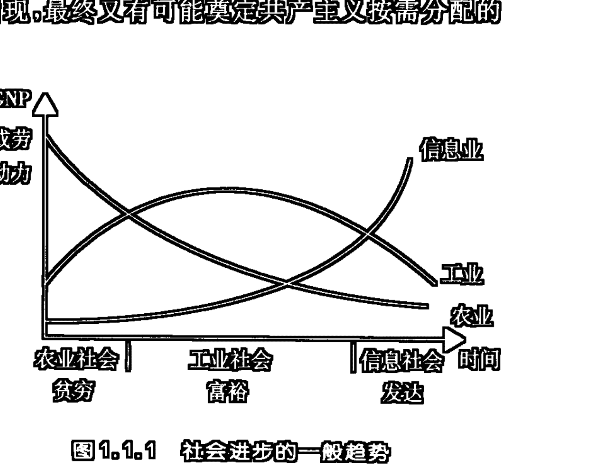

## 四、哲学危机的实质

信息科技革命、信息经济、信息社会的崛起，科学的信息化、社会的信息化以及社会的信息进化等众多领域的变革是一个统一的社会发展浪潮。在这一发展浪潮的冲击下，改革开放的中国、迅猛发展着的世界，迎来了全方位的巨大变革的时代。显然，这一全方位的变革并不仅仅是针对经济体制、政治体制、文化模式和生活方式的，它还必然会引起人们的观念模式和思维方式的变革，这后一方面变革的综合效应便是人类的哲学“体制”的变革。

为什么在经济、政治、文化、生活领域会发生变革？究其原因，是在这些领域出现了某种危机，人们不愿意在旧有的秩序和状态中生活下去了，人们有了新的秩序模式和理想状态的设计和追求，并决心为建立这一秩序和状态而奋斗。同样，哲学要变革，也是因为现有的哲学出现了某种危机。

如果说，信息科技革命、信息经济与信息社会的崛起使世界范围内的当代哲学都面临着某种挑战和危机的话，那么，在中国，在将马克思主义哲学作为国家哲学的中国，哲学所面临的挑战和危机便显得更为具体而紧迫。

按照马克思主义哲学创始人的说法，哲学仅仅是“自己时代精神的精华，”①“每一时代的理论思维，从而我们时代的理论思维，都是一种历史的产物，在不同的时代具有非常不同的形式，并因而具有非常不同的内容。”②

时代性和非绝对性导致了马克思主义哲学也如其他任何一种理论一样，它必须要承受它之后的人类理性的批判，它必然会被它之后的时代精神所超越。这种批判和超越，在今天则表现为某种时代性的挑战。

如果说，马克思主义哲学产生的自然科学基础是 19 世纪的三大发现（细胞学说、能量守恒和转换定律、生物进化论）的话，那么，今天的自然科学则已经是另一种全新的面貌：相对论、量子力学、分子生物学、现代宇宙学；系统科学、信息科学、控制论、突变论、耗散结构论、协同学、超循环理论；分形与混沌理论、虚拟现实、纳米科学；人工智能科学、生物工程、广义进化理论、复杂性问题研究，等等。

如果说，马克思主义哲学产生的社会根源在于以蒸汽机和电力的发展为标志的资本主义产业革命的话，那么，现今时代的社会已经过渡到了以电子计算机网络和现代通信技术的发展为标志的全球性信息革命（信息经济、信息社会文明）的时代。

这种科学和社会领域的全新变化，显示着某种新的时代精神，要求某种新的时代哲学。这种新的时代精神、时代哲学在共建构自身的过程中，必然要以某种全新的视野来审视以往的哲学理论。与其他所有的传统与现实的哲学一样，马克思主义哲学在这种全新视野的审视中，必然也会承受着人类新的理性的批判，亦即是承受着新的时代性的挑战。这种挑战预示着新的时代精神将对传统形式的马克思主义哲学进行某种时代性的批判和超越。

应当承认，哲学的危机对于辩证唯物主义来说并不是一种本质性的危机。因为信息时代的信息并不曾改变辩证法的基本点：宇宙、宇宙间的一切事物都是普遍联系、永恒运动、不断变化和演化着的过程的体系；信息时代的信息也并不曾改变唯物主义的基本点：世界统一于物质。

哲学体制的转换，对于辩证唯物主义来说就是要改变它的旧有体系和结构，哲学的危机在这里表现为某种具体形式变革的危机。正如恩格斯所说：“像唯心主义一样，唯物主义也经历了一系列的发展阶段。甚至随着自然科学领域中每一个划时代的发现，唯物主义也必然要改变自己的形式。”①“每一时代的理论思维，从而我们时代的理论思维，都是一种历史的产物，在不同的时代具有非常不同的形式，并因而具有非常不同的内容。”②

辩证唯物主义所采取的传统形式，是马克思、恩格斯在他们那个时代创立的，是那个具体的时代历史的产物，它具有与那个时代，与那个历史相一致的特点。我们不能强求马克思、恩格斯所创立的哲学，从形式到内容都与我们这个时代相符，因为他们并不拥有我们这个时代。这也正如我们不能要求今天的人们必须按照未来社会的人们的方式去进行思维一样。如果我们硬要把马克思、恩格斯创立的那个哲学的具体的形式和内容强加给我们这个时代，而非要说，这就是坚持了辩证唯物主义（其实恰恰相反，这样坚持的只能是教条主义的形而上学）的话，那么，由此闹出的笑话，就只能由我们这些自称是马克思主义的“坚定信徒”们来承当了。

从历史的角度来看，马克思主义哲学只是辩证唯物主义哲学的第一个历史形式，而辩证唯物主义则可以在不同的历史时代获得不同的具体规定性。正如唯物论、辩证法在历史上曾经呈现过不同的具体形式一样，辩证唯物主义也必然会在不同的历史阶段上呈现出不同的具体形式。在信息时代里，辩证唯物主义必然会采取比它的第一个历史形式——马克思主义哲学更为适合现代科技和现代社会发展的具体形式，这个形式必将具有全新的范畴和内容、体系和结构。

在辩证法看来，发展是一个由量到质的过程。任何一种发展都意味着对事物旧有界限的突破，都意味着对事物的旧的因素的扬弃和否定。马克思曾经明确地指出：“一切发展，不管其内容如何，都可以看作一系列不同的发展阶段，它们以一个否定另一个的方式彼此联系着。……任何领域的发展不可能不否定自己从前的存在形式。”③恩格斯也曾讲：“每一种事物都有它的特殊的否定方式，经过这样的否定，它同时就获得发展，每一种观念和概念也是如此。”④另外，事物发展的这种不断的自我否定，最终导致的便是向它物，向另

① 《马克思恩格斯选集》第4卷，第224页。
② 《马克思恩格斯选集》第3卷，第465页。
③ 《马克思恩格斯选集》第1卷，第169页。
④ 《马克思恩格斯选集》第3卷，第182页。

### 第一章 时代、信息与哲学的变革

另外一个非我之物转化。列宁就曾说过：“不仅是对立面的统一，而且是每个规定、质、特征、方面、特性向每个他者（向自己的对立面？）的转化。”①

辩证法关于发展的这样一种逻辑，对于马克思主义哲学是否也同样适用呢？问题的答案是肯定的。

事实上，现在国内哲学界已经出现了遵循辩证法的发展逻辑的一种哲学的大发展。这就是种种哲学新潮的涌现。它们从不同的方面、角度和领域里实现着对马克思主义哲学的传统界限的突破。这些哲学新潮所呈现着的是一种全新变革哲学的趋势。

当然，要真正完成马克思主义哲学的大发展，亦即是要真正实现辩证唯物主义的形式转换，还有待于某种全新的综合哲学的出现。而辩证唯物主义的信息哲学则可能成为这种全新综合哲学的一种具体形式。

辩证法的发展观讲的是事物的自我运动、自我变化、自我否定，从而完成自身向它物转化的一个过程。辩证法不承认存在任何一种僵死的、绝对不变的事物或理论，任何事物或理论都是活生生的，不断变化、否定、转化着的。在活的东西的内部就潜在包含着某种否定自身的因素。正是这些否定因素的不断生长，才导致了事物变化、否定、转化的发展过程。

如果我们认为，马克思主义哲学已经达到了那种僵死的、绝对不变的程度，那么，我们就有理由回避马克思主义哲学的自我否定的问题。然而，这种僵死的、绝对不变的理论是根本不可能存在的。只要我们承认马克思主义哲学是一个活着的东西，那么，我们就必须承认它的内在矛盾性，就必须承认其内部潜藏着某种自我否定的因素。

马克思主义哲学是一种辩证的、革命的、批判的哲学。他的辩证性、革命性、批判性并不仅仅是外在的，亦即并不仅仅是针对其他理论而言的，而且，更应当是内在的，亦即是针对自身的，自我辩证的、自我革命的、自我批判的。这种内在的辩证性、革命性和批判性是马克思主义哲学能够得以不断发展，最终实现向更高级的哲学形态转化的内驱力。马克思主义哲学不仅是一种批判着的理性，而且同时就承受着理性的批判；马克思主义哲学不仅是一种实践的指导，而且同时又必须接受实践的检验，并在实践中改变和发展自己。

当一种辩证的、革命的、批判的理论被作为某种绝对化的模式，只要求人们去接受、去信仰的时候，这种理论的辩证性、革命性、批判性也便荡然无存了。这时，它已经不再承受任何一种理性的批判，也不再接受任何一种实践的检验，它成了某种偶像化的东西。当一种哲学已经处于国家哲学的地位的时候，它在事实上便无法不被偶像化。这种哲学便不能不与这个国家的统治者的利益直接统一了起来。于是，这一哲学便失去了他自主的灵魂，变为一种随统治者好恶而任意变换自己面貌的怪物。

发展马克思主义哲学的方法只有一个，那就是必须首先把它从种种限制下解放出来。解放马克思主义、解放马克思主义哲学这是我们目前理论界所面临的第一位的重任。解放、发展的手段便是开放。马克思主义、马克思主义哲学本来就是开放的，它的被禁锢是理论遭到了扭曲的结果。

系统开放的积极意义在于：与环境交换信息，以改变自己的结构和功能。对于一种理论来说，这就意味着在一种平等对话、互补交流、科学探索的过程中，不断地进行自我批判、自我否定，从而积极地发展自身。

开放的马克思主义哲学，最终一定会从某种作为政治的婢女、统治者的玩物、一般臣民的偶像的国家哲学的禁闭室中解放出来，成为一种真正自由的理论公民。随着哲学自身的这种解放，在自我开放的背景下，通过自我批判、自我否定的发展过程，马克思主义哲学终将会完成自我超越的历史使命。在这种自我超越的哲学体制的转换中所产生出来的崭新的时代哲学，便是辩证唯物主义哲学的第二个历史形式，它作为马克思主义哲学的自我超越的产物，是马克思主义哲学的真正继承者。只有这样的自我超越之物，才会使马克思主义哲学的辩证的、革命的、批判的最本质的灵魂，在当今时代获得真实意义上的再生和复兴。

对马克思主义哲学的传统内容加以清理，清除后人在他身上强加的种种污垢，在信息时代的崭新背景下，通过自我批判、自我否定、自我超越的发展，综合建构一个新的辩证唯物主义的时代哲学，这就是今天的马克思主义哲学家们的基本任务。

当然，体现着信息时代精神精华的崭新哲学对哲学的超越并不仅仅是针对马克思主义哲学的，它必然同时就是针对所有建立在传统世界模式、理念构架之上的种种古代的、现代的、中国的、外国的哲学而言的。只不过这一崭新哲学在对全部已有哲学（包括马克思主义哲学）的超越的同时也必然会保留后者的合理因素，从而使后者的某些内容在一个合理的尺度上获得全新意义的解读、再生或复兴。

## 五、信息哲学是人类哲学形态的全新革命

现代科技革命的实质是信息科技革命，现代经济发展的核心是信息经济的崛起，现代社会文明形式的模式是信息社会文明，现代科学思维范式是信息思维。当代科技、经济、社会、文化、生活与观念的全方位的信息化发展态势，必然导致某种新的时代精神——信息精神的产生。任何一种现代哲学的理论，都不能不对这种新的时代精神——信息精神给以足够的重视。

20世纪中叶发展起来的信息科学已经在四个层面上展开：工程技术信息学、领域或部门信息学、一般信息理论、信息哲学。第一个层面的研究起始于申农、维纳的理论，目前已发展出微电子学、计算机工程、通信工程、自动化及网络化系统工程、数据库理论、供计算机使用的各类符号语言系统设计工程、生物工程、纳米技术、虚拟现实……，以及各类直接面对对象处理的信息工具设备的制作和使用的技能和方法的学科；第二个层面的研究首先包括三大并列的学科领域：自然信息学、社会信息学、智能信息学，进而又展开为物理信息学（包括其多级分支上的量子信息学）、化学信息学、生命信息学、天体信息学、地质信息学……，经济信息学、政治信息学、文化信息学、人本信息学、信息社会论……，语言信息学、认知信息学、人—机信息学、决策信息学、价值信息学……；第三个层面的研究包括已有的学者所建构的一般信息科学的理论，如，雷斯尼克夫（L. H. Resnikoff，美）、德夫林（K. Devlin，美）、钟义信（中国）等人分别所做的工作，以及关于创立一般信息论的某些设想，如，马克卢普（F. Machlup，美）、斯托尼尔（T. Stonier，英）等人所提的建议和预言；第四个层面的研究从维纳当年关于“信息既不是物质，也不是能量”的警示开始，到20世纪60、70年代（我国则是80年代）以来国内外关于信息的哲学本质及相关的哲学问题的广泛论争[如，克劳斯（G. Klaus，东德）提出，在意识和物质之间存在一个“客观而不实在”的信息领域；我所提出的定义“信息是标志间接存在的哲学范畴”]，再到近年来关于虚拟实在是否实在的讨论，直到相关信息哲学体系较为系统化的建立（如，我自20世纪80年代初期以来所做的工作）。如果说，上述的前三个层面的研究为第四个层面的研究奠定了坚实基础和开辟了广阔前景的话，那么，第四个层面的研究则是对前三个层面的研究所展示出来的信息问题的更为深入和理性化的认识。

然而，令人遗憾的是，虽然，上述的前三个层面的研究和发展将人类带入了一个崭新的信息文明时代，但是，上述的第四个层面的研究却在极大程度上被20世纪的系统哲学运动思潮所屏蔽了，使其不能深入展开。本来，系统科学和信息科学是相互交叉、渗透和支撑着发展起来的，但是，在哲学的层面上，20世纪的系统哲学则未能对构成世界的信息因素给以足够的重视和应有之地位。在学者们所建构的种种系统哲学体系中，信息因素也仅仅是作为某种附带的内容来对待（这一特点在中国的系统哲学界表现的更为突出）。这不仅不利于信息哲学的深入发展和应有地位的确立，同时也阻碍了系统哲学本身研究的深化。

其实，在现代科学对哲学的冲击中，与系统范畴相比，信息范畴给哲学带来的突破更具有深刻性和本质性。系统，以及与系统相关的一些范畴，如，要素、层次、结构、功能……等等，还只是使传统描述方式中的整体与部分、事物与环境的关系的描述更为科学化、现代化。而信息则不同，它在实质上揭示了传统科学与哲学未曾发现的一个全新领域——信息世界，揭示了一个与直接存在的物质世界不同的另一个间接存在的信息世界。由于新的存在领域的被揭示，这便首先在哲学本体论层面上引出了一场根本性的革命。由于这场革命是深入到哲学本体论或存在论层面的，所以它便必然会引发哲学认识论、哲学进化论、哲学社会论、哲学价值论、哲学思维论、哲学方法论等等，包括全部哲学领域的全方位的根本性变革。这就是我一直坚持信息哲学首先是一种元哲学和最高哲学的理由。

信息给哲学带来了无量的前途。信息并不只是在个别特征、个别因素，或某种描述方式上对哲学发生影响。信息世界的发现从根本上改变了人们对世界构成的理论，提供了全新的事物存在与演化的世界图景和思维方式。信息哲学对哲学的革命性变革，给哲学带来了一场全新的革命，它在整体上对迄今为止人类历史上曾经建构过的和现实存在着的所有形式的哲学进行了批判，并使这些哲学在信息哲学所突现的新的时代精神面前黯然失色。在今天，不考虑信息环节，或对信息环节的作用估计不足的任何哲学体系，都必然具有落后、直观和原始的特点。

如果说，新的信息科学技术的发展是人类科学技术的全新革命的话；如果说，信息经济的崛起是人类经济体制的全新革命的话；如果说，信息社会的诞生和发展是人类文明形态转型的全新革命的话，那么，信息哲学的诞生和发展则是人类哲学形态的全新革命。

## 第二章 信息哲学的兴起①

20世纪下半叶以来，世界范围内的信息科技革命、信息经济、信息社会的崛起，科学的信息科学化、社会的信息化、信息的社会化的全面发展和进步，集中而强烈地呼唤着一种新的时代哲学——信息哲学的诞生。

### 一、信息世界的发现

现代科技革命的浪潮将人类推进到了一个崭新的时代，毫无疑问，在这个崭新的时代里，无论是科学还是哲学都将要再次实现某种全新的综合。追溯这个全新综合起始的源头，我们发现，它是和一个新的世界——信息世界的被发现相关联的。信息世界与以往的科学和哲学所注重研究和阐释的那个“实在”的物质世界虽然具有不可分割的联系，但是，这两个世界又明显地呈现着各自不同的存在方式、价值和本性。信息世界是一个和物质世界不同的全新的世界，这个全新世界的被发现从根本上改变了我们对世界的看法，为现代科学和哲学正在进行着的，以及将要完成的全新综合提供了基础性条件。

信息世界的发现以及信息哲学的兴起是在科学的汇流、科学与哲学的汇流中所实现的全新综合。

信息世界的发现，首先应该归功于具体科学的理论性和实用性研究。物理学中的热熵和统计熵理论、通讯领域中的信息熵理论、生命科学与控制论中的信息的负熵论、物理学和耗散结构论中的负熵论、协同学中的信息自组织理论、超循环论中的信息密码子构架理论、复杂系统研究中的信息分层与内反馈环链理论、虚拟现实与纳米科学、相关的网络与全息理论、信息经济与信息社会的理论、认知的信息加工理论等等，都是对信息世界进行具体研究的不同支脉，而这些不同支脉的汇流和在几乎整个自然科学、社会科学与思维科学领域中的拓广乃是新的科学和哲学综合的标志。信息世界的发现还应该归功于众多科学家和哲学家对信息本质的深入讨论，这种讨论导致了建立在对信息本质的不同理解的基础之上的种种信息哲学的兴起。在这一方面所实现的则是科学与哲学的汇流。

科学间的汇流，以及科学和哲学的汇流，正是我们时代的特征，而信息世界的被发现，以及这个世界给我们的世界观所带来的根本性变化则正是在时代的这一汇流中实现的。

### 二、在中国诞生的信息哲学

从20世纪80年代初开始，随着一些相关学科的引入和介绍，国内掀起了一场对信息问题进行哲学探讨的浪潮。虽然，当时世界范围内的相关研究还集中于与信息相关的哲学问题讨论的层面，但是，在这一相关研究的背景下，在我国学术界，建立一种全新的时代哲学——信息哲学的呼唤却应时而生。

在倡导建立信息哲学的呼唤中，邬焜和黎鸣先生的旗帜最为鲜明，沈骊天先生也做了大量有价值的研究。值得一提的是，钟义信先生在建立其一般信息科学理论的同时，也涉及了信息哲学的问题。

1984年黎鸣发表了两篇比较有影响的论文：《论信息》（《中国社会科学》1984年第4期）；《力的哲学和信息的哲学》（《百科知识》1984年第11期）。在这两篇论文中黎鸣呼唤：“改革的时代，必然要求有改革的哲学”，“信息时代”必然产生出“信息的哲学”，并努力尝试建立一种新的哲学——信息哲学。他于1986年出版了《信息时代的哲学思考》（中国展望出版社），于1992年出版了《信息哲学论》（陕西科学技术出版社）。虽然，由于所持观点缺乏全面和严谨，黎鸣发表的成果引起了诸多方面的商榷，但是，在相关成果中呈现出的呼唤信息哲学的强烈时代意识和大胆创新的开拓精神仍然给人以振奋、令人敬佩。

1980～1981年，邬焜先后完成了三篇与信息哲学相关的论文的写作：《思维是物质信息活动的高级形式》、《信息在哲学中的地位和作用》、《哲学信息的量度》。前两篇论文曾参加甘肃省自然辩证法研究会首届学术年会（1981年），并作大会报告，引起与会者的较大反响，其基本内容分别发表于《兰州大学学生论文辑刊·哲学社会科学》1981年第1期、《潜科学杂志》1981年第3期。第三篇论文曾参加兰州大学1981年秋季科学论文报告会哲学分会的报告，同样引起了与会者的较大反响。1982年4月邬焜完成了《哲学信息论导论》一书的初稿，并以此作为在兰州大学哲学系就读4年的本科毕业论文。《兰州学刊》1984年第5期发表了《哲学信息论导论》中的一章：《哲学认识论的信息中介论》。《人文杂志》1985年第1期以《哲学信息论要略》为题发表了《哲学信息论导论》一书的基本要点。《哲学信息论导论》一书后经修改扩充以与李琦合作的名义，由陕西人民出版社1987年6月出版。该书从存在论的意义上将信息范畴作为哲学的最基本范畴之一引入哲学，系统而全面地提出并探讨了信息的哲学本质、哲学分类、信息的三个不同性级的质、三个信息世界（在与波普尔提出的“三个世界”理论相比较的基础上，提出了包括一个物质世界和三个信息世界的“四个世界”的理论）、绝对信息量、相对信息量、信息与相关哲学范畴的关系、哲学本体论的概念层次论、哲学认识论的信息中介论、社会的信息进化论、力的哲学与信息的哲学，以及信息在哲学变革中的作用等诸多方面的问题，通过相应的探讨该书比较系统地建立了一种区别于实用信息论的哲学信息论，宣告了一种崭新的时代哲学——信息哲学的诞生。

如果以相应理论的提出为标准，那么1982年4月邬焜完成并提交的学士学位论文《哲学信息论导论》一书可以成为信息哲学创立的标志。如果以相应理论的公开发表为标准，那么，正是《哲学信息论要略》（1985年）一文的发表以及《哲学信息论导论》（1987年）一书的出版成了信息哲学在中国正式创立的标志。

1987年以来，邬焜先后在西安理工大学、西北大学、西安石油大学、西安交通大学独创性地为本科生和研究生开设了名称为“信息哲学概论”、“信息哲学与信息经济”、“信息哲学专题研究”的课程。先后发表了与信息哲学相关的学术论文150余篇，出版了与信息哲学相关的学术专著8部：《哲学信息论导论》（陕西人民出版社，1987，二人合著，第一作者）、《信息哲学——一种新的时代精神》（陕西师范大学出版社，1989）、《自然的逻辑》（西北大学出版社，1990）、《信息世界的进化》（西北大学出版社，1994）、《信息与社会发展》（西南财经大学出版社，1998，二人合著，第二作者）、《知识与信息的经济》（西北大学出版社，2000，二人合著，第一作者）、《信息认识论》（中国社会科学出版社，2002）、《哲学的比附与哲学的批判》（中国社会科学出版社，2002）。这些成果不仅提出和系统建立了信息本体论、信息认识论、社会信息论、信息进化论、社会的信息进化论、演化全息论、信息生产和信息生产力论、信息思维论，而且广泛涉及信息价值论、信息经济与信息社会论、信息科学与熵理论、复杂信息系统自组织理论、虚拟现实与认识的虚拟，以及信息系统复杂综合的世界图景与科学的信息认识范式转型等一系列问题和领域。

### 三、什么是信息哲学？

信息科学的最一般的、最普遍的理论和方法在本质上是一种科学范式的转型，这一转型导致了一种崭新的现代意义的以信息理论为主导认识方式的现代科学体系。可以具体将这一体系中的学科分为六个层次：信息哲学、一般信息理论、领域信息学、门类信息学、分支信息学、工程技术信息学。显然，虽然不同层次的信息科学学科之间是相互贯通的，但是，它们的具体学科性质、学科层次和应有的内容却具有明显的区别，任何一种将不同学科层次的性质和内容加以混淆的做法都将是失当和不可取的。

信息哲学作为当代信息科学的最高层次的学科，同样为当代哲学的发展提供了一种全新的哲学范式。信息哲学把信息作为一种普遍化的存在形式、认识方式、价值尺度、进化原则来予以探讨，并相应从元哲学的高度建构出全新的信息本体论、信息认识论、信息生产论、信息社会论、信息价值论、信息方法论、信息进化论等等，在这些信息哲学的大领域之下还可以再包括若干分支哲学，从而派生出第二、第三或更深层次的信息哲学学科。

由于信息哲学是从元哲学的高度建构一种全新的时代哲学，所以，它是区别于所有其他哲学的一种第一哲学或最高哲学。在这一全新的时代哲学面前，所有形式的传统哲学，以及形形色色的当代时髦哲学都将会黯然失色。基于对信息本质的不同认识，信息哲学也可能产生诸多学派。

### 四、对弗洛里迪“信息哲学研究纲领”的评价

有学者认为，“信息哲学”的概念是由牛津大学哲学家弗洛里迪（Luciano Floridi）先生在 1996 年提出的,而弗洛里迪先生于 2002 年在西方哲学界权威性期刊《元哲学》上发表的论文《什么是信息哲学?》是哲学界第一篇系统地分析信息哲学性质的纲领性文章,并因此而称其为当代信息哲学的创始人。①

其实,从《什么是信息哲学?》一文的内容来看,弗洛里迪先生的相关研究纲领并不是一个严谨的研究纲领,其中充满了种种具有逻辑矛盾的杂乱思绪和内容的随意拼凑和组合,很多内容都不具有作为“元哲学”或“第一哲学”(在英语中“元哲学”和“第一哲学”是同一个词:first philosophy or philosophia prima)所应有的一般抽象性,有些内容则干脆是从某些一般信息理论或领域、门类信息学,甚至是分支信息学、工程技术信息学中直接平移过来的。

弗洛里迪先生强调信息哲学是“第一哲学”,并有其“独立的研究领域”,但他同时又说信息哲学是一种“交叉科学”。作为一种具有“独立的研究领域”的“第一哲学”,又如何能够成为一种“交叉科学”? 这一“交叉”将把信息哲学引向何处? 它还能否处于“第一哲学”的应有地位?

弗洛里迪先生将信息哲学定义为:“信息哲学=定义 哲学领域,涉及(a)信息的概念本质和基本原理,包括其动力学、利用和科学的批判性研究,以及(b)信息的理论和计算机方法论对哲学问题的详细阐述和应用。”显然,此定义中的“动力学、利用和科学的批判性研究”,“信息的理论和计算机方法论对哲学问题的详细阐述和应用”等内容仅仅是建构信息哲学的部分基础材料或达到信息哲学的某些途径、方式和手段,而并非信息哲学本身的内容。

在将上述定义展开阐释时,弗洛里迪先生罗列了许多属于一般信息理论或领域、门类信息学,甚至分支信息学中的内容。将如此多的具体信息科学中的内容直接搬运到信息哲学之中,并不能将读者引导到弗洛里迪先生所许诺的作为“第一哲学”的信息哲学所应有的境界。

下面仅将弗洛里迪先生所罗列的一些自认为是信息哲学的相关内容列出,方便读者参考:

“信息环境的构成和模式,包括其系统的性质、交互的形式,内部的发展等”;“信息的生命周期,即各阶段信息通过的形式和功能的活动,从信息发生的初始到它最后的利用和可能的消失”;“计算,一方面指图灵机意义下的算法处理,一方面指更广意义下的信息处理”;“信息哲学对什么可以算作信息做出

> ① 参见弗洛里迪著,刘钢译:《什么是信息哲学?》《世界哲学》2002 年第 4 期,第72~80页;刘钢:《从信息的哲学问题到信息哲学》《自然辩证法研究》2003 年第 1 期,第 45~49、74 页。

> ① 本章内容的基本部分曾以《亦谈什么是信息哲学与信息哲学的兴起——与弗洛里迪和刘钢先生讨论》为题发表于《自然辩证法研究》2003年第10期，第6～9、14页。

> ① 要了解关于信息哲学性质的更为详尽的讨论可参阅：邬焜：《亦谈“力的哲学和信息的哲学”——兼与黎鸣同志商榷》《社会科学评论》1986年第8期，第19～24页；邬焜、李琦：《哲学信息论导论》（陕西人民出版社1987年6月版）一书的“引论”与“第十一章 信息在哲学变革中的作用”；邬焜：《信息哲学——一种新的时代精神》（陕西师范大学出版社1989年7月版）一书的“第一部分 总论篇”中的“时代、信息和哲学的变革”；邬焜：《科学的信息科学化》《青海社会科学》1997年第2期，第53～59页）。

## 20 第一编 导 论

规定和立法，以及信息应如何适当地生成、处理、管理和利用”；信息哲学“提供了一种信息与计算科学的哲学，因为这自人工智能哲学领域的早期工作以来早就清楚了”；“扩展对人和动物的认知和语言能力以及智能的人工形式可能性的理解（人工智能哲学、信息理论语义学、信息理论认识论、动态语义学）”；“分析推理和计算过程（计算哲学、计算科学哲学、信息流逻辑、情景逻辑）”；“解释生命和代理的组织原则（人工生命哲学、控制论和自动机哲学、决策与博弈论）”；“发明新的方法来为物理和概念体系建模（形式存在论、信息系统理论、虚拟实在哲学）”；“阐释科学知识的方法论（以模型为基础的科学哲学、科学哲学的计算方法论）”；“研究伦理学问题（计算机和信息伦理学、人工伦理学）”；“美学问题（数字多媒体/超媒体理论、超文本理论以及文学批评）”；“体现信息社会以及在数字环境下（赛伯哲学）关于人类行为的心理学、人类学和社会现象”等等。

有文章介绍说，布莱克维尔出版公司即将推出弗洛里迪主编的一部导论性的著作《计算与信息哲学指南》，并认为，此书不仅体现了信息哲学的基本走向，而且还表明了弗洛里迪对信息哲学的一般看法：“信息哲学的基本概念主要包括信息、计算、复杂性和系统；在计算机的社会维度要讨论的议题有计算机伦理学、通信与交互作用、网络空间、数字艺术；心智与人工智能也是一个重要方面，其中人工智能哲学及其批判、计算主义、联结主义与心智是主干；现实的与虚拟的世界构成信息哲学的另一重要维度，其中包括形式本体论、虚拟实在、信息的物理学、控制论、人工生命等诸多话题；语言与知识、信息与内容、形式语言和超文本理论形成信息哲学的一极；而逻辑与概率则设计诸多逻辑，以及人工智能中的概率性推理、决策论和博弈论等；最后是科学哲学中的计算、计算机科学的方法论、信息技术哲学、作为一种哲学方法的计算建模等。”①从这样一些更为具体和明确的内容罗列中，我们更可以看出弗罗里迪先生所提供的所谓信息哲学研究纲领的性质。

其实，弗洛里迪的研究纲领仅仅对“信息哲学”的概念作了某种拼凑或领域罗列式的解说，其中相当多的内容都并不具有哲学的性质。创立信息哲学的关键并不在于概念拼凑或领域罗列，而在于具体建构出信息哲学与其他哲学、与已有的种种实用信息科学技术相区别的自身独具的观点、理论、体系和方法，而正是在这一点上弗洛里迪先生并没有给我们一个范例。至于说他建立一种具有超越与创新价值的“信息哲学”则更是无从谈起了。

> ① 参见刘钢：《从信息的哲学问题到信息哲学》，第 45～49、74 页。

## 五、信息哲学的研究需要怎样的
一种“旗帜”

有评论认为：在 1996 年弗洛里迪提出“信息哲学”的概念，并在其著作《哲学与计算导论》中阐述了信息哲学的研究对象与任务之前，学术界只有信息的哲学问题而没有信息哲学，而弗洛里迪在 2002 年西方哲学界权威性期刊《元哲学》上发表的《什么是信息哲学？》一文则是哲学界第一篇系统地分析信息哲学性质的纲领性文章，由此信息哲学作为哲学的一门独立的学科从此便有了一面旗帜。① 其实，基本的事实是：在弗洛里迪之前不仅有“信息哲学”，而且有成体系的具有独创性意义和价值的“信息哲学”，而弗洛里迪的纲领不仅不像已有的“信息哲学”那样“哲学”，而且却更多具有“信息的哲学问题”或信息的实用科学问题的色彩。

从弗洛里迪的文章来看，他并未给出与他所倡导的“第一哲学”的地位相适应的关于信息本质的规定，并且，从他的话语中我们可以看出他甚至并不认为有给出这样一种规定的必要，因为他写道：信息哲学的“任务不是要发展一种关于信息的统一理论，而是一个整合的理论体系”；“最近的考察已经表明，信息尚无一个达成一致的单一统一的定义。这并不值得惊诧。信息是一个具有极大影响力的概念，作为一个有待阐释的术语，它与数个解释相关联，这要看理论定向的需求和迫切程度。”然而，不在哲学所应有的层面提供一种关于信息的统一理论，建构一个整合的理论体系的理论基础、逻辑前提、整合的关系与规则又从何而来？如果没有这些，这样一个整合的理论体系还能否真正成为一个体系？在作为“第一哲学”的信息哲学中，作为信息哲学的最基本范畴的“信息”仍然不能给出一种具有普遍性意义的存在论层面的本质规定，并且还能够容忍它的多意化倾向，这样的“信息”范畴又如何能够作为哲学的最基本范畴引入哲学？这样的所谓“第一哲学”，这样的所谓“信息哲学”又如何能够成为一种哲学？又如何能够成为为信息哲学开拓道路的“一面旗帜”？其实，不建立一种关于信息的统一理论，仅仅给出一个所谓整合的理论体系，除了能够端出一道并不高明的“杂烩拼盘”之外，是不可能给出任何一种“第一哲学”层面上的“信息哲学”的，弗洛里迪先生所做的工作就是一个最好的证明。

> ① 参见刘钢：《从信息的哲学问题到信息哲学》，第 45～49、74 页。

信息在存在论意义上所具有的普遍而独特的品格，恰恰是信息哲学可以成为“元哲学”、“最高哲学”、“第一哲学”的依据。因为，正是信息在存在论意义上的本质规定，能够成为确立新的哲学基本问题、哲学本体论、哲学认识论、哲学价值与伦理观、哲学的经济社会观、哲学的科学技术观、哲学的演化发展观的理论前提，并因而使信息哲学真正成为区别于所有传统哲学和现代哲学的一种全新的世界观、历史观、社会观、认识观、科技观和方法论。只有这样的信息哲学才可能成为真正意义上的“元哲学”、“最高哲学”、“第一哲学”，也才能成为为相关研究开辟道路的“旗帜”。当然，在对信息进行存在论意义的本质规定时，可能会出现实质性的分歧，由此又可能派生出十分不同的信息哲学流派。

信息本质的揭示以及信息哲学的学科建构依赖于哲学的双重批判与双重超越：哲学对具体实用信息科学的批判与超越（剔除具体实用信息科学对信息解释和对信息科学范围理解的狭隘性，超越具体实用科学的视野）；哲学对自身的批判与超越（克服传统哲学的旧有框架和理论对信息本质解释的局限，建构能够容纳信息的普遍性品格的新的哲学体系，超越传统哲学的视野）。这一双重批判与双重超越的过程乃是信息哲学赖以创生的全方位、整体性创新过程，既然是全方位、整体性的创新，那么任何一种将实用信息科学或传统哲学中的相关概念、方法和内容直接平移或简单比附性延伸或推广到信息哲学中来的做法都是不恰当的，这种直接平移或简单比附的做法，不仅不能展示信息与信息哲学所具有的全新超越的革命性本质，而且还有可能将其全新超越的革命性本质阉割。信息哲学的研究需要哲学理论的与时俱进的带有哲学革命意义的开拓创新，这绝不是任何一种浮躁的喧嚣、侥幸的拼凑或虚假的炒作所能够达到的。

## 第三章 科学的信息科学化①

在20世纪科学技术革命的浪潮中，信息科学技术的诞生和发展显然处于某种独特和关键的地位。正是信息科学技术的发展导致了新技术革命（信息革命）的兴起和发展，信息革命又导致了知识和信息的经济的崛起，进而又导致了知识和信息社会的出现。如果我们从广义科学的尺度上来把握信息科学的具体范围，那么，我们便有理由把信息哲学、信息技术也放到广义信息科学中来讨论。

发展到今天的信息科学已经不再仅仅是一门单一的学科或仅仅是某种交叉性、横断性学科，而是一个具有诸多层次，涉及众多学科领域的学科体系。信息科学的最一般的、最普遍的理论和方法乃是一种新的科学范式，这一新的科学范式具有极强的渗透力、贯穿力和改造力。当把相关的一些信息科学的原理和方法拓展开来应用到已有的传统学科时，便会立即赋予这些传统学科以某种崭新意义的全方位改造。到目前为止，还没有发现哪一个传统学科是信息概念、信息科学的最一般性的品格、理论和方法所绝对不可涉入的。

我们这个时代的科学，信息时代的科学，正在面临着一个全面信息化的发展过程，这一科学发展的信息化过程可以更为贴切地称之为“科学的信息科学化”。

### 一、信息科学在现代科学中的特殊地位

信息革命、信息经济、信息社会是当代人类发展的伟大社会实践，作为这一伟大社会实践的理论基础的则主要是信息科学，以及与信息科学交缘而产生出来的一系列新兴学科。

信息科学本身的建立和发展是融汇于当代科学的综合性发展的广泛交缘的背景之中的，尤其是融汇于现代系统科学的兴起和发展之中的。现代系统科学本身是一个容纳性极为广泛的学科群，诸如信息论、控制论、系统论、耗散结构论、协同学、超循环理论、突变论、混沌学、分形几何学、广义进化理论、全息理论等等，都是这一学科群中之成员。信息科学就是在现代系统科学的相关学科，尤其是信息论、控制论、系统论的基础上，以及在众多信息自动化技术的理论学科的基础上发展起来的。

作为在现代系统科学的相关学科基础上发展起来的一门综合性科学的信息科学，自然与其他一些系统科学学科结下了不解之缘，这些学科间的相互渗透、相互补充和贯通之统一，更丰富和深化了信息科学本身。发展到今天的信息科学已经能够从自身学科的角度对现代系统科学的诸多学科方面进行全息性辐射，从而在极大的程度和范围上将现代系统科学的诸多学科统一包容于自身之中。诸如一般信息系统论、一般信息控制论、一般信息自组织理论（辐射着耗散结构论、协同学、超循环理论、突变论、混沌论、分形学，以及进化与全息方面的理论等众多现代系统科学之学科和领域），都已是现代信息科学中的一般性理论学科。由于这种全息辐射性的对现代系统科学诸多学科的包容，在与信息科学的交缘面上产生出的新兴学科的范围也就更为广泛了。

按照学术界通常的说法，信息科学是以信息作为主要研究对象的各种学科的总称，是一门研究信息的运动规律和运用信息原理对对象进行描述、模拟、处理、控制和利用的横断性、交叉性、综合性学科，它与生命科学、材料科学一起，被称为当今世界的三大前沿学科。

然而，由于信息和信息系统与物质和物质系统相比，具有同样广泛意义和范围的最为一般和普遍性的品格，所以，以信息及其运动规律为主要研究对象的学科将会与以物质及其运动规律为主要研究对象的学科一样多得不可胜数，并且，这些学科之间还会分有层次和门类。另外，以信息及其运动规律为主要研究对象的学科与以物质及其运动规律为主要研究对象的学科又总是相互交缘而不可截然分立的，因为物质体和信息体（直接存在和间接存在、载体物和信息、物的存在方式和物的信息结构）总是内在而具体地统一着的。这样，信息科学便不能仅仅被看作是一门学科，并且，仅仅用横断性、交叉性、综合性等一类说法也不能对之进行恰切而全面的阐释。另外，信息科学也不能简单地与生命科学、材料科学相并列，这一方面是因为，在现代科学的体系中，在现代科学技术的发展中，信息科学所处的地位和所起的作用都远比生命科学、材料科学要重要和巨大得多；而另一方面则因为，无论是生命科学，还是材料科学，都必须依据信息科学所提供的相关理论和方法来建构自己；还有一个最为本质的第三个方面的原因，这就是，生命科学在实质上研究和处理的是生物遗传信息发生、发展、运动、变化、改变、重组的一般规律和方法，而材料科学在实质上研究和处理的则是一般材料物的信息结构的模式、功能、加工、配制和建构的一般机理和方法。这样，从信息研究和信息处理的特定角度来看，无论是生命科学，还是材料科学都将在极大的程度上被包容于广义化的信息科学之中。

### 二、信息科学简史

#### （一）信息科学前史

人类对信息的利用、处理有一个从自在到自为的发展过程。在还未从科学角度认识信息以前，人们就已发展起了各种处理信息的技术。
人类的起源是以信息处理、创制和传播方式的进步为基础的。劳动、语言和意识这些属人的基本因素都具有信息活动的意义。
古代人类的许多重要发明，都属于或包含着信息技术的创新。如，语言、文字、笔墨、纸张、雕刻术、绘画术、印刷术的发明和发展等。人类的信息通讯技术一直可以追溯到比石刻象形文字更早的远古时期。诸如“结绳记事”、“举烽火为号”等等就都是一种信息储存和传递的原始通讯方式。

#### （二）通讯信息论的诞生

作为现代意义的信息科学是首先从通讯领域诞生的，这就是通讯信息论的产生。
19世纪30年代，电信通讯工程开始建立，有线电报、电缆通讯等相继问世和被广泛应用；进入20世纪，无线电通讯系统也比较广泛地得到应用。通讯工程的发展提出了定量描述信息和信息系统的任务。
1946年，第一台电子计算机研制成功。
另外，尚有许多领域的理论性、实用性研究的成果可供信息论创立者们利用。如，1864年克劳修斯引入热力学第二定律的“熵”概念；1877年波尔兹曼建立的统计物理学熵公式；1944年薛定谔提出的生命的负熵（信息）原则等等。
对信息量度的研究可以追溯到1872年，正是那一年，波尔兹曼提出了信息与不定量度间可测关系的概念；1918 年，费希尔从古典统计理论的角度研究了信息量的量度问题；1928 年，哈特莱等提出，可以用消息的可能数目的对数来度量消息中所含的信息量。但是，所有这些关于信息及其量度问题的思想，当时并未得到深入、系统的阐发，也未引起普遍注意。

通讯信息论的真正奠基者是美国贝尔电话公司的应用数学家申农博士。1948 年，他在《贝尔系统技术杂志》上发表了《通信的数学理论》一文，讨论了信源、信道的基本特征，建立了通信过程的信息系统模式，给出了信息量的申农公式。此文标志着通讯信息论的正式诞生。

与申农发表上述文章同年，维纳在创立控制论的过程中，涉及电滤波器中噪声与信号的处理理论，他也独立给出了与申农相同的信息量的数学公式（只差一个负号）。申农和维纳的不谋而合，更为通讯的信息理论开辟了广阔前景。

#### （三）从信息论到信息科学

信息概念、信息系统、信息方法所具有的普遍性品格，使人类对信息问题的科学研究很快便突破了通讯科学的领域。

通讯信息论诞生后，随着应用领域的拓展，很快便被广义化。不仅相继形成了“技术信息理论”、“语义信息理论”和“信息效用理论”等三大具体信息论分支，而且，信息过程、信息方法也已在自然、社会和思维的几乎无所不包的领域中被广泛揭示和应用。从来还没有哪一个具体学科的概念，像信息概念这样具有如此广泛的适应性、渗透性和跨越性。

信息论的成就使人耳目一新，许多学科的专家都试图用信息论的概念和方法来解决自己学科领域中所面对的难题。如组织化、语言学、听觉、神经、生理学、心理学等领域，很快便引入了信息概念和信息方法。

从通讯信息论诞生到 20 世纪 50 年代中期，伦敦和美国连续举行了关于信息论的一系列重要国际讨论会，探讨和涉及的内容极为广泛。如 1955 年 9 月在伦敦举行的第三届信息论国际会议，议题就包括：解剖学、动物保健学、人类学、计算机、经济学、电子学、语言学、数学、神经精神学、神经生理学、哲学、物理学、政治理论、心理学和统计学等等。

在通讯信息论被广义化的同时，信息论与现代科学中的诸多学科，与电子技术、自动化技术、电子计算机技术，以及各种各样的传统的技术性和理论性学科广泛交缘，从而大大突破了经典通讯理论的范围，终于形成了一个包含有诸多新兴学科的综合着的学科群体系——信息科学。诸如计算机科学、人工智能科学、物理学、化学、生物学、材料科学、心理学、生理学、语言学、医学、经济学、社会学、管理科学、天文探测、地质考古、生产、生活等等这样一些几乎是无所不包的领域，到处都可以看到信息概念和信息原理的足迹，而建立在对信息本质的不同理解的基础上的种种信息哲学体系也已相继形成和日趋完善化。

在学科群中的学科进一步系统化发展的基础上，实现某种新的更高层级的统一性综合，这将是信息科学下一步发展的总体趋势。

### 三、信息科学的体系

发展到今天的信息科学是一个拥有众多学科的大家族。信息概念、信息原理的普遍化，导致了信息理论与几乎所有的传统学科间的普遍交叉、渗透和映射。通过这种普遍相互作用的发展，可以说，信息科学在任何一个传统学科领域中都能辐射开辟出自己的一块领地，并且，信息科学自身的发展又能派生出一些与传统学科研究的领域迥然不同的新兴学科来。

信息科学家族中的众多学科并不都是地位平列的，在这些学科之间仍然存在着诸多方面的差别，如理论抽象度的高低、概括或适用范围的宽狭、可操作性或应用性程度的大小等等。根据这诸多方面的差别，我们有理由用图 1.3.1 对现代信息科学中的众多学科进行分层归类。

下面对“图 1.3.1”的各等级结构的内容作一些解释：

1. 信息哲学是信息科学的哲学理论的层次，是对信息问题的哲学方面的考察，是对信息概念和信息原理的哲学层次的概括。诸如信息的哲学本质、哲学分类，信息的质和量的哲学表述，以及信息作为一种普遍化的存在形式、认识方式、价值尺度、进化原则的一般性理论等等，都是信息哲学所应考察的方面。信息哲学本身又可以包括信息本体论、信息认识论、信息方法论、信息进化论、信息价值论等诸多哲学领域方面，并且这些领域方面还可以再包括若干个子项分支哲学学科。由此可见，哲学学科本身仍然是分有等级层次的。

2. 一般信息理论是信息科学的基础科学原理的层次。在这一层次上，信息科学要解决的问题应该包括：信息的科学含义、信息系统的一般模式；信息产生、运动、变化、转化的一般规律和机制；信息获取、编译码、传输、变换、存取、加工、创造、控制、利用的一般原理等等。在这一层次上，一般信息理论的学科仍然未能达到具体的统一，它同样是一个学科群。诸如一般信息论、信息反馈和控制理论、一般信息系统论、信息的自组织理论、混沌信息学、一般全息学、信息传播学等等都应属于这一层次的范围。信息科学的这一层次的理论具有中介环节的性质，它一方面是较低层次上的信息科学的一般理论概括和总结，一方面又是通向信息哲学层次的最为切近的理论来源。从另一个角度来看，一般信息理论还是从传统学科领域中开辟出相应信息科学学科的中介桥梁。可以把信息科学家族中的众多学科都看成是在相应传统学科和一般信息理论的交缘过程中，通过理论折光的再造创生出来的。

3. 领域信息学是一般信息理论的基本原理在几个大的世界领域中的具体化的层次。现代科学一般都把整个世界分为自然、社会和精神三大领域，而现代科学的体系一般也可分为自然科学、社会科学、思维科学三个部分。与这些情况相一致，领域信息学最起码也应当包括三大并列学科：自然信息学、社会信息学、智能信息学。自然信息学是以自然信息为其研究之对象，揭示自然信息运行之一般规律和机制的信息科学学科；社会信息学是以社会信息为其研究之对象，揭示社会信息运行之一般规律和机制的信息科学学科；智能信息学则是以智能（包括生命智能、人工智能）信息为其研究之对象，揭示智能信息运行之一般规律和机制的信息科学学科。

4. 门类信息学是领域信息学再行分化出来的大的门类性信息科学学科。如，在自然信息学之下可以再分出物理信息学、生物信息学、天体信息学、地质信息学……；在社会信息学之下，可以再分出经济信息学、政治信息学、文化信息学、人本信息学……；在智能信息学之下，可以再分出语言信息学、认知信息学、人一机信息学……

5. 分支信息学是门类信息学再行分化出来的一些适域较狭的信息科学学科。如，在生物信息学之下又可再分出微生物信息学、植物信息学、动物信息学、生态信息学……；在经济信息学之下又可再分出经济管理信息学、商品信息学、经济信息传播学、信息产业经济学……；在认知信息学之下又可再分出辨识信息学、美感信息学、决策信息学、价值信息学……。在某些门类之下的分支信息学还可能具有多级分支的情景。如，在经济管理信息学之下便能再分出会计信息学、统计信息学、金融信息学、经济决策信息学等等。另外，在各门类学科之间以及各分支学科之间又可能通过相互交叉的方式产生出一些在深层综合着的信息科学学科。如，经济决策信息学就是由决策信息学（属智能信息学领域之下的认知信息学门类的分支学科）和经济管理信息学（属社会信息学领域之下的经济信息学门类的分支学科）相互交叉而形成的二级分支信息科学学科。

6. 工程技术信息学是应用信息科学的原理和方法对对象世界进行直接作用的具体工程技术，亦即为实施信息的获取、识辨、编译码、传输、变换、加工、创造、存取、控制和作用，而与制作和使用相应的工具设备有关的技能和方法的学科。诸如微电子学、计算机工程（包括硬件制作、软件设计及计算机应用技术等）、通讯工程（包括有线电通讯、无线电通讯、卫星通讯和光纤通讯工程等）、自动化及网络化系统工程、数据库理论、供计算机使用的各类符号语言的系统设计工程等等，都属于工程技术信息学之范围，生物工程、纳米技术，以及与信息工程技术相关的一些材料工程和能源工程等也应属于工程技术信息学的范围。显然，工程技术信息学本身同样是分有层次的，最起码可以区分出基础技术工程和应用技术工程两个层次，前者是关于一般性信息工具设备的制作和使用的技能和方法的学科，后者则是关于适用于某些特定工作部门或行业的信息工具设备的制作和使用的技能和方法的学科。上面所罗列的一些学科都是在前者的意义上成立的。在后者的意义上成立的学科则相当之多，如，气象信息预报系统工程、医疗诊测信息系统工程、空间情报信息系统工程、环境污染监测信息控制工程、电子银行信息系统工程、办公室自动化信息系统工程等等，不胜枚举。

如果将上述的信息科学的6个层次相对地予以展开，便可得到如“图1.3.2”所描述的一个现代信息科学体系的等级分层及相互作用的模式。

从图1.3.2中可以清晰地看出，现代信息科学体系具有整体系统性、层次结构性和普遍相互作用性等基本特征，并且，整个体系的层次结构还与人类所认识的对象世界的层次结构具有同构性关系。由此也可以看出，信息科学绝非只是适用于世界之一隅的狭隘学科。信息科学本身的发展就是要从信息方式的这样一个角度来对人类所面对的世界整体及其各部领域予以全息性透视，通过这个透视，信息科学将从自身性质和规范的尺度上对世界整体及其各部领域做出相应的解释。

必须强调的是，这样的一个宏伟体系，直到目前仍未系统建立起来，其中的有些相应学科或者是还根本没有提出，或者是仅仅提出了一个名称，或者是虽然已有了诸多讨论，但还未形成体系。当然，其中的许多学科目前已经有了一个充分的发展或正在建立、发展之中。其中最为活跃的当属工程技术信息学层次上的理论和实践，正是这一层次上的杰出工作才导致了信息科学的产生，才引出了信息革命、信息经济、信息社会、信息时代等一系列的深刻变革。

## 四、信息科学与传统科学之关系

对于信息科学的学科性质，以及它与其他传统学科间之关系，人们往往只用交叉学科、横断学科，以及新兴学科、综合学科等提法来予以说明。虽然，这些说法并不算是不贴切，但是，仅仅停留于这些说法则还远远不能揭示出信息科学本身所具的对传统科学全面辐射性的全面改造的意义和价值。

从前面所述及的信息科学的宏伟体系来看，信息科学在本质上是一种科学范式的转型，这一转型导致了一种崭新的现代意义的，以信息理论为主导认识方式的现代科学体系。如前所述，这一体系是由一般信息理论通过对传统科学的体系的全方位的理论折光而再造创生出来的。如此看来，信息科学乃是一种现代化科学体系的模式，而并不仅仅是某一单一的领域性或分支性学科。

我们可以用“图1.3.3”来标明信息科学与传统科学间的这种全方位范式转型的关系。

“图1.3.3”中的“A”平面代表传统学科体系平面，其代表的学科范围包括哲学、数学、自然科学、社会科学、思维科学及其相应的门类、分支学科、交叉、横断学科等等。

“图1.3.3”中的“B”平面代表一般信息理论平面，它是提供从传统学科体系向现代学科体系实行范式转型的理论中介。

“图1.3.3”中的“C”平面代表以信息认识范式为主导的一种现代学科体系平面，其代表的学科范围包括信息哲学、自然信息学、社会信息学、智能信息学及其相应的门类、分支学科，以及工程技术信息学等等。

## 第二编 信息本体论

### 第一章 信息本质的存在论规定

作为“元哲学”或“第一哲学”的信息哲学首先必须揭示信息的存在论意义和价值。我对信息哲学的研究最初就是在这一层面上展开的。

把信息首先看作是一种存在，而不是仅仅把它看作是一种方法，这其实就等于确立了一种新的本体论的观念。由这种新的本体论的观念引出的是一种新的世界观，即是一种新的世界存在图景。正是在这一新的本体论观念、新的世界存在图景的基础上信息哲学的其他领域的开拓，如信息认识论、信息进化论、信息价值论、信息社会论、信息思维论等等的开拓，才可能有一个合理立论的根基，从而将信息哲学的众多学科、领域、观点和理论在本质上统一为一个有机联系和综合的整体构架。

## 一、存在领域的分割

其实，当维纳强调说“信息就是信息，不是物质也不是能量”①的时候，它实质上就是在强调一种新的世界观。这种新的世界观注意到了信息世界的特殊意义。

信息世界与以往的科学和哲学所注重研究和阐释的那个“实在”的物质（质量和能量）世界虽然具有不可分割的、统一的联系，但是，这两个世界又明显地呈现着各自不同的存在方式、价值和本性。信息世界是一个与物质世界不同的全新世界，这个全新世界是随着现代信息科学的诞生和发展逐步被日益明晰地揭示出来的，这个全新世界的被揭示从根本上改变了我们对世界的看法。

新的世界观首先建立在对存在内容的新的理解上。

### （一）存在领域传统分割方式的缺陷

广义的“存在”即“有”，它是世界上所有事物和现象的统称。所有形式的

> ① [美]维纳著，郝季仁译：《控制论》，北京，科学出版社，1963年版，第133页。

哲学对世界本原、本性的追问，无不是从对存在领域的构成范围的思考开端的。这便产生了种种关于存在领域分割的相关理论。

传统的唯物主义一元论哲学，承认物质是世界的本原，是世界自身存在的根据，而其他一切事物和现象，或者是物质的具体存在形式、属性、状态，或者是由物质派生出来的方面。

对于物质，列宁曾经定义说：“物质是标志客观实在的哲学范畴，这种客观实在是人通过感觉感知的，它不依赖于我们的感觉而存在，为我们的感觉所复写、摄影、反映。”①“物质的唯一‘特性’就是它的客观实在，它存在于我们的意识之外。”②

当代的许多学者对列宁的物质定义提出了种种责难，其中最多的是关于此定义的机械反映论性质。在此，我们首先关心的是列宁定义的方法以及此定义所隐含的存在论意义的基本信条。

列宁的上述定义显然是通过物质和意识的相对关系给出的。这个定义隐含着首先必须承认这样一个存在论前提：整个存在领域是由物质和意识这两大领域分割着的。这一存在论前提集中体现着传统哲学中未经证明但已被公认的一个基本信条：整个存在世界可以分割为物质（质量和能量）和精神两大领域，精神是主观存在，物质是存在于精神之外的“客观实在”，而精神之外又只能是客观存在的世界。③ 基于这一基本信条给出的存在论前提，我们可以列出

等式一：存在=物质+精神

由此前提又可以得出一个推论：“客观实在”和“客观存在”这两个范畴所具有的内涵和外延是完全相同的，亦即

等式二：客观实在=客观存在=物质

然而，整个存在领域由物质和精神两大方面组成的信条，以及客观实在=客观存在的推论都是难以成立的。也就是说，上面所列的“等式一”和“等式二”都还只是未经科学考察或逻辑论证的两个先验的观念。

虽然如此，列宁的定义毕竟给出了这样一种意见，即物质=客观实在。只

> ① 《列宁选集》第2卷，第128页。
> ② 同上，第266页。
> ③ 有必要提及的是，由我国辞海编辑委员会、上海辞书出版社编辑出版的《辞海》中，对“客观实在”词条的注释为：“指独立于人的意识之外、能为人的意识所反映的客观存在，即物质。”参见《辞海·哲学分册》，上海辞书出版社1980年版，第56页。

要我们沿着这个意见的真实指谓去进行考察，那么，我们便有可能得到“物质”范畴的真谛，以及存在领域的正确外延范围。

### （二）存在领域分割的逻辑推演

如果我们假设：客观的=P；实在的=Q，那么，客观的反题“主观的”就是¬P（读“非P”）；实在的反题“不实在的”就是¬Q（读“非Q”）。
现在我们在这四个命题中建立两两组合的合取式，我们便可以得到如下六个逻辑公式：
P∧Q；P∧¬Q；¬P∧Q；¬P∧¬Q；P∧¬P；Q∧¬Q
除去后面两个违反形式逻辑的“不矛盾律”的“永假公式”，我们将其余四个公式所对应的字面含义分列如下：
P∧Q=客观实在
P∧¬Q=客观不实在
¬P∧Q=主观实在
¬P∧¬Q=主观不实在
这四种意义在宇宙世界中是否都确有所指呢？下面我们分别予以分析：
“客观实在”是确有所指的，列宁说它就是物质。
“客观不实在”是否也确有所指呢？按照前所述及的传统哲学对存在领域的分割方式，“客观不实在”是不可能存在的，因为“客观实在=客观存在”，所以，只要是“客观的”东西就是“实在的”，就不可能是“不实在的”。然而，正如我们已经指出的那样，这样的一种传统信条是未经严格的科学或逻辑论证的、难以成立的先验性观念。我们注意到，列宁曾经表达过这样一种思想：一切事物间都具有类似于反映的特性①。反映的实质就是将某物的内容、特性等等在另一物中映现出来，这种映现着的某物的内容、特性显然并不等同于某物本身，也并不等同于映现着这些内容、特性的另一物。我们绝不可以说水中的月亮和天上的月亮是同一回事。天上的月亮是客观的、实在的月亮，它是一个直

> ① 列宁曾经在《唯物主义和经验批判主义》一文中写过三段讨论该议题的文字：“明显的感觉只和物质的高级形式（有机物质）有联系，而‘在物质大厦本身的基础中’只能假定有一种和感觉相似的能力。”“对于那种看来完全没有感觉的物质如何跟那种由同样原子（或电子）构成但却具有明显的感觉能力的物质发生联系的问题，我们还需要研究再研究。”“假定一切物质，具有在本质上跟感觉相近的特性、反映的特性，这是合乎逻辑的。”此三段文字请分别参见《列宁选集》第2卷，北京，人民出版社，1972年版，第40、41、89页。

接以物质体的方式而存在着的月亮；水中的月亮也是客观的，它在人的意识之外，不以人的意志为转移，但是水中的月亮却并不具有实在的特性，它只是实在月亮的一个影子，而映现或载负这个影子的水却又不是实在的月亮本身，虽然，水本身是实在的水，但水中却没有实在的月。“水中捞月”之所以荒唐，就在于把水中的月亮也看成实在的月亮了。“水中月、镜中花”一类现象中的“月”或“花”，既是客观的又是不实在的。其实，“水中月、镜中花”只是一个十分通俗而表面化的例子。相关的更为深刻的例子我们随便可以举出很多。如，树木的年轮中凝结着的树木所经历的多年寒暑状况及其他相关关系的内容，DNA中编码的生命种系发生的历史关系以及个体发育的一般程序的关系的内容；地层结构中凝结的地质演化的历史关系的内容；现在宇宙结构状态中凝结的宇宙起源与演化至今的相关关系的内容等等，都具有客观不实在的性质。这样我们找到了一个“客观不实在”的存在领域。① “客观不实在”正是对客观事物间的反应（类反映）内容的指谓。在客观世界中普遍映射、建构着的种种自然关系的“痕迹”正是储存物物间的种种反应内容的特定编码结构。正是在这一特定的意义上，我们说“客观不实在”与标志物质世界的“客观实在”的存在方式具有本质的区别。

“主观实在”指的是什么呢？唯物反映论认为，主观的东西归根到底是主体对客体的一种反映。既然是一种反映，那么反映着的内容就不是被反映的客体本身，它也就不可能是实在的，这也类同于我们对一般事物间普遍存在的类反映现象的内容的分析。如此，“主观实在”其实是没有什么东西和现象可指谓的。

“主观不实在”显然指的就是意识、精神之类的现象。它们是主体对客体的主观反映和虚拟性建构，是主观的，不实在的。

依据上述分析，我们可以得出结论：整个宇宙（世界、自然）中的一切“存在”都可以划归客观实在、客观不实在、主观不实在这样三大领域。

客观存在的范围大于客观实在（物质）的范围。物质范畴并不能囊括精神之外的全部世界，在物质和精神之间还有一个传统科学和哲学未曾予以足够重视的“客观不实在”的领域。

> ① 其实，早在1961年，东德的哲学家格奥尔格·克劳斯（Georg Klaus）就曾指出：在意识和物质之间存在着一个“客观而不实在”的信息领域。只不过他并未对此作出更为详尽论证。参见其所著《从哲学看控制论》一书的中译本（梁志学译，北京，中国社会科学出版社1981年版，第62页）。

精神（主观存在）和“客观不实在”具有共同的“不实在”的本质。整个存在领域即可由客观存在和主观存在来划分，也可由实在和不实在来划分。

因为只有客观实在是实在的，所以实在范畴便和物质范畴具有完全一致的内涵和外延。如果我们从实在和不实在的相关性出发进行分析，那么我们便有可能得到关于物质范畴和它之外的世界领域的更为具体的规定性。

### （三）存在领域的重新分割

我们说，天上有一个月亮，水中有一个月亮。天上的月亮是实在的，水中的月亮是不实在的。水中的月亮的存在是因为天上的月亮的存在，前者是后者的“影子”。这样，我们便在实在的月亮和不实在的月亮之间建立起了一种对应相关的关系。我们完全可以从这种相关对应的关系出发，把实在的月亮叫做直接存在的月亮，而把不实在的月亮叫做间接存在的月亮。这样，我们便把实在和直接存在看成是同等程度的概念，把不实在和间接存在看成是同等程度的概念。从间接存在的角度来看，间接存在是直接存在的反映（广义的），从直接存在的角度来看，间接存在是直接存在的显示。意识是一种反映，在意识之外有一个直接存在的对象，在意识中有一种关于这个对象的摹写、知识。因此，主观存在归根到底是反映直接存在的一种间接存在。

直接存在就是我们对物质范畴的一个具体规定，而间接存在则可以用现代科学中的“信息”概念来规定（关于这一点下一节将予以详论）。

根据上面的论述，我们可以列出如下四个新的表达式：

- 物质=客观实在=实在=直接存在；
- 不实在=客观不实在+主观不实在（精神）=间接存在=信息；
- 客观不实在=客观间接存在=客观信息；
- 主观不实在=主观间接存在=主观信息。

根据这四个表达式，我们可以做出如下一个存在领域分割图①（图2.1.1）：

从“图2.1.1”中，我们可以清晰地看到信息是怎样迫使已经由物质和精神分割完毕的存在领域给它让出一块地盘的，以及信息是怎样在自身本性的意义上来规定精神现象的。

> ① 此图最先发表于拙文《存在领域的分割》，该文载《科学·辩证法·现代化》1986年第2期，第32~33页。

我们面对的世界是一个双重存在的世界。由于信息世界的发现，世界，以及世界上的一切存在物都再不能简单地归结为那种单纯的、干瘪的、混沌未开的、未曾展示自身丰富性、复杂性的直接存在的物质世界了。在这个物质世界中载负着另一个显示着这个物质世界多重规定性的信息世界。整个世界，以及世界上的存在物的这种双重存在性，意味着一切存在物都只能是直接存在和间接存在的统一体，都既是物质体，又是信息体。

信息世界的发现从根本上改变了我们关于存在的观念。正是在这种物质和信息双重存在的世界图景中，信息哲学确立了它作为元哲学或第一哲学的基点。

## 二、直接存在的物质世界

在上面的讨论中，我们将整个存在领域分割为直接存在（物质）和间接存在（信息）两大部分。现在我们将对直接存在（物质）予以具体的规定和讨论。

### （一）关于“物质”范畴

唯物主义哲学的根本出发点是：直接存在的物质世界是自然存在、运动和发展的本原和根据。但是，直接存在要仅仅停留在与物质或客观实在范畴的直接类比界说上，它还只是一个未曾展示自身的具体性、丰富性和复杂多样性的一种纯粹的抽象。要具体说明世界的本原和根据，就必须对直接存在（物质或客观实在）范畴进行更为具体的规定。

按照辩证唯物主义学说的基本观点，物质是标志“客观实在”的哲学范畴，它是直接存在着的原型世界。

直接存在作为一个哲学范畴，它是从诸多其他所有的、具体的直接存在的形式中抽象出来的。正因为它是一种哲学的抽象，所以，它便具有了两种性质：其一是，它不能简单等同或归结为各种具体的直接存在形式；其二是，它又不能不包括着这些各种具体的直接存在形式的共同本质。所以，我们要对直接存在范畴进行具体规定，就有必要把它所包括的各种具体的直接存在的形式，一一加以罗列，这就是揭示这个直接存在的外延。

恩格斯曾经指出：“物质无非是各种物料的总和。”①据此，直接存在首先指的是各种物料的直接存在性，这是直接存在这一范畴的最深层次的规定。就现代科学所提供的相关理论和假说来看，物料被规定为两种具体存在形式：实体（具有静止质量的实物）和场（不具有静止质量的射线、场、能、波或弦）。

但是，就直接存在的本意来看，它并不能仅仅停留在“各种物料的总和”上，因为，任何物料都必须有它的直接存在的种种方式和状态。诸如运动、时空、差异、层次、结构等等。这些存在方式和状态也具有直接存在（客观实在）的性质，因为任何实体和场离开了这些存在方式和状态都将会失去其本身的存在性。所谓“物料”就是以这些直接存在的具体存在方式和状态本身建构起来的。谁又曾见过那种脱离了这些存在方式和状态而纯粹独在的“物料”呢？

另外，所谓直接存在，还包括着这样一个方面，这就是各种物料之间，以及各种具体的直接存在方式和状态之间发生着的种种直接性作用关系和变化过程本身，如相互作用、功能实效、物物转化、流变生成等等。这些关系和过程作为客观直接发生着的直接性事件无疑也是具有直接存在的性质的。

从上面的分析中，我们可以看到，直接存在的外延具有三个具体的层次：

- （一）直接存在物：实体和场；
- （二）直接存在方式（包括状态）：运动、时空、差异、层次、结构……；
- （三）直接存在关系（过程是事物纵向运动的关系）：相互作用、功能实效、物物转化、流变生成……

直接存在的这三个层次的内容在本质上是一回事；在直接存在的领域里，物有它的方式，而方式又是物的；物和方式都在关系中存在，关系也同时就是关于物和方式的。三而合一，三而为一。自然中根本不可能有三者分离，或两两分离的东西。直接存在的这三个层次的区别，与其说是关于物本身的，倒不

> ① 恩格斯：《自然辩证法》，北京，人民出版社，1984年版，第108页。

## （二）世界的物质性

在考察直接存在和间接存在的关系时，我们必须看到，间接存在与直接存在相比，并不具有绝对的独立性，它是由直接存在派生出来，且又必须存在于直接存在之中的一个世界。从间接存在的角度来看，间接存在是直接存在的反映；从直接存在的角度来看，间接存在是直接存在的显示。无论是反映也好，还是显示也好，间接存在都是以直接存在为根据的。水中的月亮以天上的月亮为根据，人脑中的认识以认识的对象为根据。如此看来，间接存在其实是由直接存在派生出来的。另外，间接存在并不是在间接存在自身中来反映、显示直接存在的，水中的月亮必须依赖于水这个直接存在，脑中的认识必须依赖于脑这个直接存在。直接存在归根到底是在直接存在中映现、反映、显示自身的。间接存在离不开直接存在的载负。作为在直接存在中反映（显示）直接存在的间接存在，无论从内容上，还是从存在方式上都具有以直接存在为根据、为条件的特性。这就是世界统一于物质，亦即统一于客观实在，亦即统一于直接存在的逻辑。

有必要强调一条原则：说世界统一于物质，并不意味着世界上除了物质没有其他。正确的说法是，其他都是由物质派生出来的，以物质为根据、为条件的。这条原则规定了辩证唯物主义和庸俗唯物主义的区别和界限。

但是，强调说除了物质还有其他，这只是在相对的、特定的角度和方向上成立的。如果从绝对的意义上来考察，我们又可以断言：世界上除了物质及其属性之外什么也没有。

我们已经指出，间接存在（信息）是由直接存在（物质）派生出来的，是以直接存在（物质）为根据、为条件的。这样，我们就有理由说，间接存在与直接存在相比，直接存在是第一性的存在，而间接存在则是第二性的存在。这样，在一般表现着的层面上，世界是由直接存在和间接存在两大存在领域组成的。但是，如果从世界的本原和本性的意义上来说，世界归根到底又可以归结为直接存在。

由于物质和信息双重存在及其二者关系理论的提出，传统哲学中所表述的物质和精神关系的哲学基本问题将有必要实现新的转换。新的哲学基本问题将由多重存在领域间的关系构成。这一多重关系最起码应包括三个相互关联的关系方面：物质和信息的关系、物质和精神的关系、精神和信息的关系。

## 三、信息的本质

我们说世界以及世界上的所有事物都是直接存在和间接存在的统一，这就涉及对间接存在的信息世界的具体规定问题，而在此类问题中最核心的就是要探讨信息的本质。

关于信息本质的问题，一直是信息科学、系统科学乃至哲学中的一个重大的基础理论问题。

信息概念的含义极为广泛和深刻，可以从不同的角度和层次上对之进行探讨。可作通信技术上的考察；可作经济学、社会学、语言学方面的考察；可作神经学、心理学、遗传学方面的考察；可作系统科学和哲学方面的考察。

分析已有的众多解释，起码可以区分出三个不同层次的对信息概念的规定：一是人们日常经验理解的层次；二是实用信息科学的层次；三是哲学的层次。

### （一）日常经验理解的信息概念

在人们的日常生活中，在一般的资料文件中，信息指的就是具有新内容、新知识的消息、新闻、情报、资料、数据、图像、密码以及语言、文字等等所揭示或反映着的内容。

如果将上述定义中的“消息”作广义化的理解，将所有其他形式的信息载体都看作是“消息”，那么上述定义的真实含义便是：信息乃是消息中的新内容。显然，这一理解是在消息能否给接收者带来新内容的意义上被规定的。

这种对信息概念的日常经验性的理解，显然具有相对性和功能性。此类规定并不能作为信息是什么的本质性解释。另外，这种理解虽然与实用信息科学中关于信息概念的某些功能性规定意义相通，但与哲学中对信息概念的界定却相去甚远。

### （二）实用信息科学中的信息概念

在一般的实用信息科学中，关于信息的定义是五花八门的。虽然目前的各种定义还并未得到统一和普遍公认，但是，有两种说法是最具影响力的，其他一些定义或多或少都可以由这两种说法通过演绎而获得。下面对这两种说法分别予以介绍和评价。

#### 1. 信息是消除了的不确定性

这是根据通讯信息论的创立者香农的理论对信息所作的一个规定。其含义是说，通讯前，消息接收者对发送消息的内容存有不确定性的了解，收到消息后，消息接收者原有的不确定性就会部分或全部消除了。所以，信息就是消除了的不确定性。在这里，消除了的不确定性是一个相对意外程度的量，所以有人也说“信息是两次不定性之差”。

同一消息对不同的接收者将起不同作用，消除的不定性的量也不同。新知识越多消除的不定性越大，信息量也便越大；不带有新知识的消息则不能消除任何不定性，信息量为 0。

如果用 I 表示通信过程传送的信息，用 U₀ 表示通信前信息的不定性，用 U 表示通信后信息的不定性，那么就会有如下公式成立：

```
I = U₀ - U
```

从上面的讨论中可以清晰地看到，“信息是消除了的不确定性”这一定义，实际上是从信息对信宿的作用的角度对信息所作的一种相对性的量上的功能性定义。

#### 2. 信息即负熵

控制论的创始人维纳曾集中对信息的负熵含义进行了阐释。在物理学中（与热力学第二定律相关）熵值是标志系统的不确定性程度或混乱度的概念。不确定性的消除就意味着熵值的减少，所以信息就可以被称为负熵。由此又派生出了“信息是系统组织程度（或有序性、秩序性）的标志”等说法。

从上述两个对信息本质的界定中，我们可以看到，实用信息论中对信息进行的规定具有相对性、功能性和量化性特征。虽然，这类规定在实用信息论范畴里具有较大的实用价值，但是，这类规定却很难揭示出信息所具有的普遍性品格的本质和意义。

### （三）哲学中的信息概念

为克服实用信息论中对信息概念所作规定的狭隘性，许多科学家和哲学家又试图从哲学角度对信息的本质加以概括。

维纳在从实用信息论的角度把信息比作负熵的同时，又试图从哲学角度讨论信息的本质。他有两个很有影响的提法：一是“信息就是信息，不是物质也不是能量，①二是“信息是我们适应外部世界，并且使这种适应为外部世界所感到的过程中，同外部世界进行交换的内容的名称。”②维纳虽然没能恰切地从正面规定出信息的本质到底是什么，但是，他却十分正确地强调了信息与物质、能量相比所具的独立性价值和意义，同时，它还看到了应该从“交换的内容”上（而不是从载体的形式上）来把握信息。

更多的关于信息本质问题的哲学解释还只是停留在与已有的实用信息科学的解释或哲学的已有范畴间的简单比附上。如，把信息解释为“变异度”、“差异量”等等，这是与实用信息论中对信息进行统计度量的方式特征的简单比附；而把信息解释为“时空序列”、“状态”、“组织性”、“有序性”等等，则是把信息与其载体物的分布特性相比附。又如，把信息解释为：“信息是物质的普遍属性”；“信息是物质的存在方式”；“信息是精神实体的特征”；“信息是既非物质也非精神的第三态”；“信息是物质成分和精神成分的特殊融合物”；“信息是运动的外化”；“信息属于物质的相互作用范畴”等等，则是把信息与已有的传统哲学概念的界说进行简单的比附。

在信息本质问题的讨论中，无论是采取与实用信息科学解释的简单比附，还是采取与传统哲学范畴含义上的简单比附的做法都是没有出路的。我曾主张，在信息本质的问题上应该采取某种哲学批判的态度。这种批判是双重的：一方面是哲学对具体科学的批判，这一批判欲剔除具体科学给信息解释所带来的种种狭隘性的局限，由此使哲学对信息的把握从具体科学的阈限中超越出来；另一方面是哲学对自身的批判，这一批判是要克服传统哲学的旧有框架和理论对信息本质解释的局限，由此使哲学对信息的把握从传统哲学的旧有体系的阈限中超越出来。在这里，进行的正是一种双重的批判和双重的超越。③

我曾在《哲学信息论要略》④一文中就信息的本质进行过专门的讨论，现将其基本点扼要转述于下：

从信息的存在方式来看，信息并不是一个具体的直接物质存在形式，信息是在表征、表现、外化、显示事物及其特征的意义上构成自身的存在价值的。信息是它所表现的事物特征的间接存在形式。

物质的相互作用，必然引起作用双方的内在结构、运动状态和性质的某种改变，这种改变的“痕迹”就是对作用物信息的接受和储存。在这一过程中，双方都同时是信源（输出自身信息），又同时是信宿（输入对方传来的信息），还同时是载体（将输入的对方信息以自身的某种改变了的“痕迹”储存起来，也便是载负起来）。由于物质相互作用的普遍性，又由于物质和时间的无开端性，宇宙间任何物质系统都不可能还处于一个未曾与它物发生过相互作用的原始的初态。所以，任何物体都已经将自身演化成了具有特定结构和状态的凝结着种种信息的信息体了。正是物质的这种信息体性，规定着任何物体都是一个直接存在和间接存在的统一体，这个统一体自身就同时具有信源、载体和信息的三重属性。由此，我们可以看到信息的存在范围：信息与物质同在。

唯物论者必须承认，信息的内容从总括的意义上完全可以归结为物质本身的存在方式和状态（包括对这些存在方式和状态的理性虚拟和再造）。

物体由于内部和外部的客观的相互作用，不断地向外辐射和反射粒子，这样就将自身的存在方式和状态的信息由这个具有特定性能和分布的各类场传送了出来。这就揭示了产生反映着物质存在方式和状态的信息的根源存在于物质世界本身之中，存在于物质的自身运动之中。正是物质的这种自身显示的属性，才使这个世界成为可知的世界。

依据上述分析，我们起码可以对信息概念划出几个基本层次：

1. 信息是物质的存在方式，是物质的属性。这是就哲学唯物本体论的总括的意义上对信息概念的规定。但这还不能揭示信息与其他物质存在方式和物质属性的区别。所以，仅仅停留在这一层面的表述上，还不可能揭示信息所具有的独特的本质。
2. 信息是显示物质的存在方式、状态的物质的属性。这是就信息内容及其存在方式对信息概念的规定。这已经揭示了信息独具的质，但还停留在信息表现的现象描述上。
3. 信息是物质自身显示自身的属性。这一规定虽然仍停留在对信息现象的描述上，但它已考虑了信息产生的动力。
4. 信息是间接存在的标志。这一规定已经从对信息的现象描述上升到了对信息的抽象概括。

信息概念的上述四个层次的划分，为我们从哲学的角度，给信息下一个本质性的定义提供了路径。这个定义可以精确地表述为：信息是标志间接存在的哲学范畴，它是物质（直接存在）存在方式和状态的自身显示。①

此定义的前后两个分句的表述，实质上是同一个意思。“显示”着的东西必然是“间接存在”的，而“间接存在”的东西，又必然是“显示”着的。但是两句话比较起来，前一句话不能不更为抽象，而后一句话则可看成是前一句话内容的具体化。所以，此定义的两个分句都可以分别拿来作为信息的本质规定。

间接存在归纳起来无非是三个方面：一是关于事物自身历史的反应（包括曾经发生过的与它物之关系）；二是关于自身性质的种种规定，这些规定在其展示的时刻是一种直接存在的过程，但是，在其未曾展示的时候还只能是一种现实的间接存在；三是关于自身变化、发展的种种可能性。这便是关于事物历史、现状、未来的三种间接存在。这三种间接存在就具体凝结在一个具有特定结构和状态的直接存在物中。任何物的直接存在的结构和状态都是由它所凝结的间接存在所规定的，同理也可说，任何物的结构和状态都映射和规定着关于自身历史、现状、未来的信息。如此，任何物体都是一个直接存在和间接存在的统一体，亦即都既是物质体，又是信息体。

意识作为一种主观呈现着的现象，它本身就是显现着的，所以，它本身就是信息活动的一种形式（高级形式）。另外，作为符号的信息又可以显示信息，这便构成了多级间接存在或多级信息显示的现象，亦即信息的信息。这也是我们可以认识信息本身的根据。恰恰是在“间接存在”和“自身显示”的意义上，信息获得了自身在本体存在论层面上存在的意义和价值，同时也获得了在哲学认识论层面上与认识主体和认识客体相区别的独立性存在意义和价值。

显然，信息的本体存在论意义和价值的揭示，不仅具体呈现着哲学本体论和认识论的统一性关系，而且也具体呈现着在本体承诺前提下，哲学系统开拓的所有问题、领域、观点和理论本应具有的统一性关系。我之对信息哲学的研究，以及对信息哲学的理论、体系和方法的建构就是在这一信息本体存在论意义和价值的阐释的基础上展开的。

> ① 此定义最先发表于拙文《哲学信息的态》（《潜科学杂志》1984年第3期，第33～35页）。在拙文《信息在哲学中的地位和作用》（《潜科学杂志》1981年第3期，第53、60页）中曾以此定义的后半句作为信息的定义。

## 第二章 信息形态的哲学分类①

依据不同的分类标准，学术界从不同的视角和层次上对信息进行了多种方式的分类。如，依据不同的标准可把信息的形态分为：客观信息与观念信息；直接信息与间接信息；内储信息与外化信息；动态信息与静态信息；有记录信息与无记录信息；语言信息与非语言信息；自然信息与文化信息；有害信息与无害信息等等。

但是，要在哲学层面对信息进行分类，首先应当依据分类者对信息本质的认识，并以此认识为分类之标准。这就是说关于信息本质的规定和信息形态的分类应当是具体统一的。另外，哲学的信息分类还应当具有哲学理论的一般抽象性、概括性、简明性和全面性的特征。

我们已经定义：信息是标志间接存在的哲学范畴，它是物质（直接存在）存在方式和状态的自身显示。从产生过程来看，间接存在只能在直接存在的相互作用中产生。然而，间接存在虽然产生于直接存在的相互作用，但是，间接存在一旦产生便以自身独具的特质超越了直接性的本性，并由此展开了自身运动和发展的历程。在此历程中，信息呈现出了自身的不同的形式和形态。

### 一、自在信息

自在信息是客观间接存在的标志，是信息还未被主体把握和认识的信息的原始形态。在这个阶段里，信息还只是以其纯自然的方式，自身造就自身、自身规定自身、自身演化自身，从而展开其自身纯自然起源、运动、发展的历程。信息场以及信息的同化与异化是自在信息的两种基本形式。

> ① 在拙文《思维是物质信息活动的高级形式》（《兰州大学学生论文辑刊·哲学社会科学》1981年第1期，第1～10页）、《信息在哲学中的地位和作用》（《潜科学杂志》1981年第3期，第53、60页）中已经提出了信息具有自在、自为、再生的三种基本形态的理论，并相应区分了信息场、信息的同化和异化、信息的直观识辨、概象信息、符号信息等五种基本形式。本章阐述的关于信息的三种基本形态、一种综合形态、六种基本形式的完整规定和论述最先发表于拙文《哲学信息的态》（《潜科学杂志》1984年第3期，第33～35页），而在拙著《哲学信息论导论》“第一编 信息的态”中又用整整四章的篇幅进行了详细论述。

#### （一）信息场

在上一章中，我们在考察信息产生的动力时就已经指出：物体的相互作用是通过物体自身辐射或反射的中介场来完成的。正是这个中介场，载负着反映物体自身存在的方式和状态的信息。

场（量子场），本来是微观物理学中的概念，它描述的是微观世界中实在存在的方式。如果把量子场理论推而广之，在宏观上，物质场（粒子、波等）还可以采取更为宏观的形式，如：分子、气团，甚至某些特定物体等等。在一个相对统一的尺度上，我们都可以把它们叫做“粒子、波”。这些不同等级、层次的“粒子、波”，构成了不同等级层次的“场”。所以，“场”的概念，在我们这里仍然应具有广义的理解。它只是相对于辐射或反射这些“粒子、波”的物体而言的。

这种由中介粒子或波构成的物质场是怎样携带着信息呢？这就要从物质本身的普遍差异性上来解释了。自然界的物质形态，一方面具有质的差异的无限层次，从宏观天体，直到微观粒子结构层次；另一方面，在每一物质层次上又具有量的差异的无限方面，从宏观天体的无限多态，直到微观粒子、波的无穷多种。正是由于物质本身的这种普遍差异性，造成了它们辐射或反射粒子或波的种类和形式的无限多样和无限差异性。如：某一种元素的原子只能发出具有确定能量的光子，这就使任何两种元素都不会有完全相同的谱线系统。

我们知道，任何物体，一方面与其他物体比较具有无限差异性，另一方面作为物体本身，又存在着内部成分、结构、层次的无限差异性。由于这两方面无限差异性的存在，使任何物体所产生的场都会具有相应的与其他物体所产生的场相区别的差异的结构、状态和特性，正是这个场的差异性与产生场的物体本身的差异性的相关对应性，使物体本身与它物、与自身无限差异的特质得以显现。正是这种场的无限差异的特性使物体本身的存在方式和状态显示了出来，外化了出来，从而，赋予了物质场携带产生这个场的物体的信息的能力。

物质场本来是物质的一个直接的、具体的存在形式，它有着自身的物质结构、功能、特性，它是一个自身具有客观的时空运动过程的物质体，物理学正是在这个直接存在物的意义上把它定义为物质场的。但是，这个物质场又不是一个简单的直接存在物，在这个场的直接存在的结构、状态、特性中已经间接地映射着它由以产生的那个物体本身的某些状况。如，光子是以它的光量子特性为其直接存在的，但是，光子的波长、频率及其场的分布方式却对应着反射这个光子场的物体本身内部以及与其他物体的差异的特质。正因为如此，不同物体反射的不同光子场作用于我们的视网膜，才使我们观察到了不同的形状、颜色、运动状况等等。可见，在场的直接存在的形式中，以其相对差异的结构编码形式间接携带着产生这个场的物体本身的信息。正是在这个间接存在的、确定的信息意义上，我们把这个物质场从信息论的角度规定为信息场。

其实，任何一个场都同时具有两种不同的存在意义：一个是场本身的直接存在的物质性，另一个是场显示另一直接存在物的间接存在的信息性。我们可以从不同的意义出发，把场规定为物质场或信息场。场其实正是一个直接存在和间接存在的统一体。

信息场是信息空间传输的基本形式。本来，信息和物质是同在的，信息的存在形式也是多种多样的，要找一个信息的开端正如要找一个物质的开端一样是毫无意义的事情。但是，从我们认识信息的逻辑起点上，我们便有理由把信息场作为信息的开端，因为，对于某一具体的直接存在物来说，它首先是将自身外化在信息场中，首先通过它所产生的这个信息场把自身显示出来，然后才谈得上自身信息的其他运动。

从对信息场的分析中，我们看到，物体是在向它物的转化中来显示自身的存在的。信息场，就其物体的自身存在性而言，它无非是一物向它物转化时所发生的现象。我们看到，正是在这种转化出来的物中映现了产生这个转化的物本身的性质。一方面，这个转化出来的物作为产生这个转化的物的一个环节而将那个物的内容映现出来，就这个意义上转化出来的这个它物是那个物的间接存在的承担者。这样，这个它物就不是一个纯粹的它物，而是作为产生它的物的某一环节、某一部分、某一方面的规定性而存在。另一方面，这个转化出来的它物本身又具有本身的性质（质—能分布的结构、功能、属性、状态）。这又可以通过它的信息来显示自己，就这个意义上，它又是一个纯粹的它物，一个纯粹与产生它的那个物脱离出来的东西，是一个有自身规定性的直接的存在物。在这里，这个它物本身就是一个直接存在和间接存在的统一体。就这两方面的意义来说，我们可以得到信息具体规定的一个侧面：信息是某物在自身异化的它物中所显示着的某物自身的规定性，是某物在它物中的间接存在。从这一角度我们也可以说，信息是在某物与它物的关系中所揭示出的某物的规定性。某物在外在关系中显示自身是内在规定性时就是信息，它以物的特性的外化的形式表现出来。

## 50 第二编 信息本体论

### （二）信息的同化和异化

信息场一经在某物的基础上产生，就展开了信息自身的运动。当这个信息在其运动中作用于它物，并对它物产生了影响时，这就发生了信息的同化和异化现象。客观上，无论在无机界，还是在有机界，或是在二者之间，都普遍存在着物物之间的相互信息传递和接收。信息的同化和异化就是这种相互传递和接收所引起的结果。某物体（信源）扩散的信息为另一物体（信宿）所接收，对于某物体来说就是信息的异化过程，而对于另一物体来说则是信息的同化过程。

“记忆”，则是信息同化和异化所产生的直接结果。这个结果在信息同化物和异化物双方都具有意义。因为二者都将在这一过程中改变自身的内在结构、运动状态或性质，以这种有所改变的“痕迹”保留了某种“异化”过或“同化”着某些信息的“记忆”。从理论上讲，任何物体在信息同化或异化时都是可以保持记忆的，有感觉和无感觉机体记忆的区别，就在于是否具有自我意识和回忆的能力。

如果我们进一步考察，我们将看到，信息场本身不仅是信息异化的产物，而且也是信息同化的产物。信息场的载体，作为信源辐射或反射出来的它物，首先就具有了和信源相互作用的性质，正是在这种相互作用的过程中，信源给信息场的载体留下了某种特定的“痕迹”，以此映现出信源本身的某些特征。正因为信息场作为信源信息的同化物，它才能在与信宿发生作用时，将这一同化了的信息再异化给信宿，以完成信宿同化信源信息的过程。可见，信息场就其本身与信源相脱离、相对立的意义上，它是同化信源信息的它物（从这一意义上也可把它看作是信宿），但就其是信源与本来异在的信宿的对立的意义上，它是信源向信宿异化信息、信宿同化信源信息这一过程的一个中介环节。因为所有空间都被物质的实体或场所充满，任何信息一经产生就必然与其他场发生作用，所以，信息的同化和异化还存在于信息场的交互作用中。信息同化和异化的普在性，恰好说明了事物的普遍联系和相互作用的性质。

信息的同化和异化是信息储存的过程，也是信息时间传输的基本方式。它将特定的信息化为特定的物质结构或运动状态，由此映现物体的历史，规定物体的性质及其变化发展的趋势。因为物质、时空的无开端性，因为物质的普遍相互作用性，所以任何物体的内在结构和运动状态都不可能还处于原初的形式。就这一意义上，我们可以说，任何物体都已在自身的演化中将自身变成了映射着它物，反映着自身历史的信息体。物的信息体性，充分显示着任何物体都只能是一个直接存在和间接存在的统一体。所以，由这个统一体所产生出来的信息场便失去了信息的原始的、最初的历史性。就这个意义上，所有的信息场都只是信息的多级运动过程中表现出来的现象。由此，我们也可以发现我们把信息场作为信息开端的相对性。

虽然我们强调说，信息场是信息空间传输的基本形式，信息的同化和异化是信息时间传输的基本形式，但是，这并不意味着信息的时间传输和空间传输是可以割裂的。其实，在信息场的信息空间传输中仍有信息时间传输的意义，而在信息的同化和异化的时间传输中仍有信息的空间传输的意义。信息的时空传输在信息的所有形式中都是统一不可分的。我们这里仅仅是对于不同信息形式的主要信息传输特征的相对强调。这种强调，并不排除时空传输在不同信息形式中分别同时成立的统一性。

信息场，以及信息的同化和异化，是信息自在的两种基本形式，它从自然的尺度上被我们规定为信息自在的形态。正是这个信息自在的形态的存在，将直接存在物的种种属性特征外化、传递出来、储存起来，将自然的历史和现状摆在了我们面前，并以此启示我们去预见未来。这就从自然的本质上规定了世界的可知性。

当这种原始的、盲目的、自在的信息在自身复杂化演化的历程中创造出一个具有高度自组织、自调节能力的信息体的时候，信息也便会借助它自己创造的这个尤物，达到自我意识，从而使自身从自在走向自为。

## 二、自为信息

自为信息是主观间接存在的初级阶段，是自在信息的主体直观把握的形态。这个形态包括信息的被识辨（感知）和可回忆的储存（有感记忆）两种基本形式。自为信息的达到必须借助于有感知和有感记忆能力的特殊信息体（信息控制系统）。

### （一）作为信息控制系统的人体神经系统

人体神经系统（包括其他较高级动物的神经系统）就是这样的一个特殊信息体。它是物质信息长期同化和异化，不断凝结积累，不断选择自构而引出的一个必然产物。对于人体神经系统产生的过程，生物史为我们勾画了这样一条线索：无机小分子→有机小分子→生物大分子→多分子体系→原始生命→神经细胞→神经管→中枢神经系统（脑化）→大脑皮质化→人体神经系统。虽然，信息控制系统是信息活动的产物，但是，它一经产生，就以新的、更高层级的姿态出现在信息面前，甚至凌驾于信息之上来识辨、把握、加工、改造信息，从信息的产物，变为信息的主人，变为对客体进行认识的主体。

信息控制系统的这种主体性是以它的内在信息链结构为基础的。以人体神经系统为例，如果仅从其主导感知、思维的过程来看，它是由信息接收系统（感受器及传入周围神经）、信息主干传输系统（脊髓和脑部）、信息控制系统（大脑皮质）和信息输出系统（效应器和输出周围神经）等几个部分组成的复杂信息网络等级链式结构系统。

### （二）感知——信息的主体直观识辨

人的感觉，实质是外界信息作用于人之感官，经由接受系统、主干传输系统，在大脑皮质感觉中枢中完成的一个过程。当然，这个过程不应简单理解为单向的。现代神经学揭示了感受器和脑之间的反馈联系，视觉过程不仅从眼睛开始，也在眼内完成，其他感觉过程也是这样。感觉器官也交替成为感受器和效应器。感觉是人类认识的第一个环节，完成的是人们对外界信息所显示的事物的简单属性的识辨。

感觉，在其本质上，它是一个信息同化过程。而这种同化过程，首先必须是自在的。人体首先是一个直接存在的物质体，它与外界的任何信息交换，都只能是在服从信息同化和异化的基本规律的前提下才能成为可能，只有在自在同化信息的过程中，主体才可能谈及对被同化信息的把握和认识。但是，在实际发生的情景中，并非所有被主体同化的信息都必然会在感知识辨的水平上呈现出来。多数对信息同化的过程，还是仅仅在纯自在的意义上发生的。主客体间的信息交换大多都在自在的水平上进行。主体仅仅把同化的一小部分信息通过感知予以识辨。究竟怎样的信息才能在同化的过程中被主体识辨，这不仅依赖于所同化的信息的质和量，而且也依赖于主体感官、神经、脑的内在结构状况，亦即依赖于主体信息控制系统中凝结着的信息的质和量。外界对象信息正是在与主体信息控制系统中凝结着的信息的相互同化、匹配、整合、重组的过程中被感知识辨的。就这一过程来看，信息的同化既是感知的基础，也是感知发生的过程。

神经系统的接受与传递信息的基本单元是神经细胞。而每个神经细胞，都恰是一个可以产生静电活动的浓差电池装置。通常，神经细胞膜两边存在着一个 50～80 毫伏的跨膜静电电位，这是由细胞膜内外 K⁺ 和 Na⁺ 的浓度差造成的。当信息刺激时，细胞膜的选择通透性发生突变，致使膜内外 K⁺ 和 Na⁺ 的浓度差发生改变，使静态时的跨膜电位瓦解，即除极化，这便表现为信息在细胞内部的电传导。细胞内部的电传导可刺激细胞突触（神经细胞间的联系结构）释放一种化学递质，这些递质可以扩散过突触裂隙，刺激下一细胞跨膜电位的瓦解，从而将信息传递给下一个神经细胞。

每个感受器都是一个对特异刺激敏感的神经细胞群的组合，感受器接受信息的功能，就是组成感受器的神经细胞群组接受、传递信息功能的综合的结果。其实，感受器好比是一个换能器，它将外界载送信息的能，转变成体内的生物电能、化学能，并通过这些能把传入的外界信息沿传入神经纤维通过中枢神经系统，一直传导到大脑皮质的特定感觉中枢部位，引起相应的感觉。

感受器功能的特异性（每种感受器只接受适宜的某种能量所载送的一定强度的信息），以及特定感受器和特定大脑皮质部位的特定联系，是确定大脑皮质感觉中枢功能精细分化，从而保证感觉的清晰明确性的生理结构基础。

对不同感觉中枢所识辨的某一事物的个别信息的综合认识，使感觉上升到了知觉，这就使人们对所认识的对象或现象有了一个完整的映像。这个综合还是初级的、直观的，它的完成是建立在感觉中枢对识辨信息的内部整合、调节，以及各感觉中枢之间简单联系的基础之上的。知觉最重要的特点是对象性、整体性和结构性。知觉的过程就是将客体信息对象化、规范化、整合化。不能简单把知觉看成是个别感觉的机械总和，它反映着主体的极大的能动性。可以认为，知觉的过程是感觉中枢对其感觉的个别信息的调节、整合的过程，也是各感觉中枢在其相互联系和作用中将不同感觉信息方面进行综合、抽象的过程。这个过程不仅是在个别感觉中枢内部，而且是在各感觉中枢的初级联络综合中枢中完成的。有理由认为语言中枢也是一种联络综合中枢。在大脑皮质中视觉语言中枢和听觉语言中枢是紧密相接的，这就为阅读符号形、声、意的综合奠定了极为有利的物质基础。另外，视、听性语言感觉中枢位于视、听、体躯等非语言性感觉中枢之间，也极易将感受的感性信息和相应的符号信息联系起来。这一切证明，在人类认识中，知觉也不单纯是对感性而言的，它总是要和对理性的概念、语意、符号的感知联系在一起。

感觉和知觉统称为感知，它是人类将自在信息变为自为的被识辨的信息的过程。虽然，感知的信息传递过程伴有相应的物质活动（神经细胞膜内的电传导和神经细胞突触间的化学传导的活动），但是，我们完全有理由把感知看成是一个信息活动的过程。因为：①感知识辨的是反映外界客体特征的外界客体的信息；②神经系统内部的载体的物质性活动并不在这一过程中被明确感知到，这些物质性活动仅只作为相关信息活动的载体的活动方式而成立。

### （三）有感记忆——信息的主体储存

记忆，则是信息储存和积累的一个过程，它是在感知的基础上进行的。对于记忆的机制，人们采取了不同的“痕迹”说：神经细胞间形成了新的突触联系；神经细胞内 RNA、蛋白质的结构变化等。有人甚至给记忆过程勾画了这样一个信息活动程序：信息→入皮质→拓通某些神经通路（皮质与皮质、皮质与丘脑）→返回环路→暂时联系形成→短期记忆，当信息刺激消失后，被拓通的神经通路便逐渐被关闭，停止活动，这样，暂时联系便中断了。而长期记忆，则是由于某种信息在某些特定的返回环路中长期存在，皮层中的神经通路被异化，“暂时联系”被巩固，一遇适宜信息刺激，则极易使通路打通，引起相应的回忆。无论是哪种记忆的“痕迹”理论，都充分揭示着记忆的信息活动的本质。

必须强调指出的是，任何记忆“痕迹”的建构，都首先是一个信息自在同化的过程。感知、思维、情绪、动作的活动信息，只有化为神经系统的内在结构和状态的特定“痕迹”才能被储存，但是，这些“痕迹”却并不为我们的意识明确把握，它所把握的只是呈现着的信息的内容。这就告诉我们，在这些特定“痕迹”的基础上，必然还有一个自在信息的活动层面的存在，只有通过这个自在信息活动的中介，意识才可能在不明确意识“痕迹”的条件下，将信息的具体内容直接再现出来。这个信息自在同化的过程是在主体认识结构中进行的，而主体认识结构本身正是一个特定的质和量的信息的凝结体。在这里，这个主体认识结构中的信息仍然首先处于客观自在的状态。

自在的信息的被识辨和可回忆的储存是自为信息的两种基本形式，这是信息活动的第二个形态。在这一形态中，信息借助于它所创造的有感觉和可感记忆能力的信息控制系统从自在上升到了自为。就这样，物质在其自身发展的一定阶段，赋予了自身以自我意识的质，这个质就通过物质运动自身显示的信息在一个特定信息体内以被识辨和可回忆的储存的方式呈现了出来。在此“自为”的基础上，信息将继续展开自身主观性再加工、再改造、再创制的过程，这便使物达到了思维。

## 三、再生信息

人类对自然的义务，不仅在于认识它，而且更重要的是在于改造它。人们对自然的能动的改造作用，是人脑对感知、记忆的信息可以通过分析综合的加工改造，创造出新的信息，反作用于自然的结果。我们把这个产生新的信息的过程定义为思维过程，把思维过程所产生的区别于自在、自为信息的新的信息，定义为再生信息。再生信息是主观间接存在的高级阶段，是信息的主体创造性的形态，它的基本形式是概象信息和符号信息。

### （一）概象信息

在思维过程中，如果我们利用的各个显现着的环节是感性记忆中的表象，而它创造出的是一个新的形象，那么，我们就把这一思维过程叫做形象思维过程，而把这个创造出的新的形象叫做概象信息。

形象思维是对感性记忆中的信息的加工改造，是对诸多感性认识对象的表象中的信息要素的重新分解组合。这个过程，我们通常称为想象（其中包括着它的特殊表现——幻想）。想象是形象思维的基本形式，它是基于非语言性感觉和综合中枢活动之上的一种对表象再行分析综合、加工改造的信息过程。形象思维，究其原始的发端上，它是人类创造性思维的第一阶段，它的直接结果——概象信息已经不是个别外界认识对象的直观反映，而是诸多同类认识对象共同本质特征的形象反映（称类概象），或是不同类认识对象不同特征的硬性组合的形象反映（称幻概象）。人脑中对猫、狗、山、水等类形象的再现属前一类概象信息，而人脑中对天堂地狱、妖魔鬼怪、八戒、孙猴形象的再现则属后一类概象信息。概象信息究其本质来说，它是自为信息利用人脑内部机能的相互作用自身分解自身、自身重组自身、自身加工改造自身的一种信息创造活动。当然，与这一活动相伴的必然是脑中储存的信息载体——记忆“痕迹”间的复杂的直接性相互作用。正是通过这一内部结构的相互作用，信息才在复杂的同化和异化的过程中被分解组合成了新的形式。任何思维的信息创造过程，都必然同时又是信息自在同化和异化的过程。思维创造的新信息，正是以这种自在同化和异化过程所产生的，与之相应的新的神经结构、神经状态的“痕迹”为其承担者（载体）的。

显然，人类的形象思维的发展也经历了一个从具体表象思维到相对抽象的概象思维的飞跃过程。最初是思维的各个信息要素环节以具体的曾经感知过的个体物的表象的形式再现出来，在这一过程中链条的终端产生了概象，这个概象在它产生的同时也可以被意识所识辨和记忆，当这类意识识辨和记忆的概象积累得多了，便会形成基于概象加工之上的思维过程。概象思维已经是相对抽象化的思维过程了。

### （二）符号信息及其逻辑推演

当人们在相互的交际中，企图用明确的方式交流信息的时候，就随着这种概象思维的进一步抽象化产生了语言，也就是产生了符号信息。符号信息在原始的初态中，它还只是一种偶然的、个别的东西，它还不能形成自己的思维。这一点，在某些高等动物以及幼儿智力发生中已经得到了证明。虽然他（它）们也有简单的、个别的词语（符号信息）交流，但是，他（它）们还不能将这些符号信息连锁起来，构成一个完整的思维推理过程。只有当这些符号信息不仅在量上达到一定程度，而且在质上显示出它们之间的多方面的关系时，人们才有可能产生抽象思维。真正意义的抽象思维，恰恰不在于个别、偶然的符号信息的显现，而在于符号信息的合乎逻辑的推演。

抽象思维是人类独具的思维形式，它是基于人类特有的语言性感觉和综合中枢活动之上的一种对符号信息进行逻辑推演、加工改造的高级分析综合的过程，它可以通过判断、推理的形式，产生出更为高度抽象的符号信息，或由某些相关的符号信息的合乎逻辑的特定排列组合组成的新的符号链信息，即通常所说的结论。与简单符号信息相对应，我们可以把这个符号链信息（包括对它高度概括所产生的更高层次的符号信息）定义为复合符号信息。复合符号信息是在更高思维层次上的一种更为抽象的信息，它并不在第一个层次上直接抽象地反映具体感知物的某一属性，而是在第二或更高的层次上间接地抽象反映一类属性的共同本质。抽象思维之所以能够展示它那无比神奇的能动性和创造性，其原因就在于这种建立在简单符号信息之上的、更为高度间接抽象的复合符号信息，以及在这更为高级层次之上的复合符号信息的逻辑推演。

### （三）灵感、直觉——“潜在思维”

在创造性思维的过程中，某些结论的出现往往带有突然性，并不具有思维意识过程的明确性，这就是人们所说的“灵感”、“直觉”之类的东西。由于“灵感”、“直觉”这种不明确意识其推理过程的性质，往往被人们作出某种神秘化的解释，或曰“神灵的启示”。但是，如果我们从信息活动的方式上来考察，“灵感”、“直觉”就并不是什么神奇的东西了。

我们知道，有机体本身具有对信息的内调节能力。早在无感觉的有机体中，这种能力已经具备了，到了有感觉动物，这种能力仍然存在。一部分信息调节过程可以被明显地意识到，但是，仍有大量的信息调节过程并不在意识中明确地显现出来，而是具有某种潜在自在调节的性质。人脑虽然是一个高度特化了的感觉、思维器官，但是，它内部进行的信息调节过程也并不是都能被它所产生的意识明确把握的。通常，我们的精神活动并不直接意识到脑内物质结构、组织的运动状况，也不能明确意识到脑内所有信息活动的细节就是一个极好的证明。这种潜在的信息调节过程，虽然不被我们明确意识，但是，它却是在客观进行着的，这就可能使某些思维的过程，即信息加工改造的过程以潜在的方式在脑内进行。据现代脑科学研究的资料证明：人脑是一个极为活跃的动态系统，它总是处在信息的不断自我调节、自我储存的过程之中，就是睡眠时也不停止。正是人脑的这种潜在信息调节的功能，可能使一些长期思考未能解决的问题，化为潜在思维的形式被大脑经常地予以考虑。当这种潜在思维在一定过程的阶段上被明显意识到的时候，也就是当它转化为非潜在的时候，它就会以“灵感”或“直觉”之类的形式突然表现出来。由于这一思维过程不是在常规明确推理的过程中进行的，所以，它的结论便往往具有新颖性，具有更大的创造性价值。

“灵感”、“直觉”虽然有似乎神奇的作用，但是它所赖以成立的“潜在思维”的能力却是有限的。“潜在思维”说到底，它仍然是一种低级的、盲目的、不自觉的信息自在调节过程，所以，“潜在思维”的活动也只能在有限的范围、有限的阶段上进行。它必须依赖于长期积极的有明确意识思维的成果，依赖于意识思维中信息的大量积累。只有当长期考虑的问题已经接近成熟，问题的各个关节点已经打开的时候，灵感或直觉才可能发生。

“灵感”、“直觉”就其整体来说，它属于思维的形式，但它并不是一个独立的思维形式，它必须以形象的或抽象的思维结果的表达来显示自己的结论。在这两种情况下，它便将自己或者归入形象思维之中，或者归入抽象思维之中。具体分析“灵感”、“直觉”的过程，它的“潜在思维”的阶段并不构成通常意义上的思维。在这里“潜在思维”仅仅具有某种比喻或类比的性质。它是信息借助于人体神经系统内部结构的相互作用展开的一种信息同化和异化的客观过程。在这里，我们也可以看到信息自在活动的普遍性和基础性。

思维作为一个对自为信息改造创制的过程，与其他信息活动的形式有着质的区别。具体考察上述信息活动的六种形式和三种形态，我们可以看到，我们通常所说的思维其实是指信息活动的第三形态，即第五、第六种形式，尤其是指第六种形式而言的。信息活动的第六种形式是迄今信息活动发展的最高形式。它首先不是在一般信息体中活动的一个过程，而是必须在人体这种（更集中地讲是人脑）具有抽象思维能力的信息控制系统中活动的一个过程。它活动的范围不是只停留在一般动物对自在信息的接收、识辨、储存的直观认识的阶段上，也不是仅仅停留在高等灵长类所具有的对自为信息的初级加工改造的认识阶段上，它把对自在信息的识辨和改造提高到了符号信息及其逻辑推演的高度，由此又从根本上改造和提高了人类感知和形象思维的能力（感知和记忆，形象思维和抽象思维中的不同层级的信息总是处于一个复杂的相互作用中），使它们不再与动物的感性认识简单等同。这就使人类的精神活动更加绚丽多彩。这个符号信息及其逻辑推演便是人类思维作为信息活动的高级形式区别于其他信息活动形式，区别于它类动物精神活动现象的本质。

## 四、社会信息

社会信息，就其本来的内容来讲，它并不是一个独立的信息形态，它是在自在、自为、再生三态信息的关系中呈现出来的一种信息现象。在有人的意识参加的，人与自然、人与人的交互作用中，信息三态总是在人的类、人的类意识、人所依赖的自然环境这三者所构成的整体系统中统一着的。这个整体系统就是社会，在此社会中显示着的三态信息的统一就是社会信息。

社会是人类赖以存在和发展的形式，“是人同自然界的完成了的本质的统一”①。就这一意义上，它包括着：人们所认识和改造了的那部分自然（包括人本身），及其自在显示的信息世界；人所认识了的动物和人的主观认识世界；人所创造的文化世界。

社会的这个范围规定着社会信息的范围，这就是三个相应的社会信息世界（关于三个信息世界以及其中蕴含的三个社会信息世界的理论，在本书“第二编第五章”中还有详论）：①人所认识和改造了的那部分自在信息（以自在信息的形式存在于自然界和人工自然之中）；②人所认识了的动物和人的主观认识世界（以自为信息的形式存在于主体意识之中）；③人所创造的文化世界（以再生信息的形式存在于符号系统、社会关系和社会结构之中）。

① 马克思：《1844年经济学哲学手稿》，北京，人民出版社，1985年版，第79页。

## 第二编 信息本体论

息体的形式存在着)的世界；②人所认识了的自为、再生信息本身的活动；③再生信息的可感性外在储存(人所创造的文化世界)。由此可知，所谓社会信息，就是已被人类认知把握，以及人类创造出来的那部分信息世界的总称。社会信息被主体认识和改造了的性质，规定着社会信息中信息三态的不可分割的统一性。

社会信息世界1的自在信息体是人们已经认识(或改造)了的对象，它在人的认识中已被识辨或改造，所以，它便失去了纯自在性，便在社会中与它所映射在人的认识中的自为、再生的态相统一。

社会信息世界2中的人的自为、再生信息活动本身，仍然具有信息三态统一的意义。首先，由于思维的改造作用，人的自为信息已脱离了一切动物的自为信息的原始简单性。人的感知、记忆总是在人的概象和符号信息所凝结的人的已有认识结构中完成的，所以人们在感知的同时就将认识对象化、概象化、符号化了。其次，人类仍把再生信息作为它感知、记忆的一个内容方面，这就是再生信息的自为的态。如此，在人的认识中，自为、再生信息便是相互作用和规定着的。另外，自为、再生信息必须以自在信息为其内容的根据和条件，而自为、再生信息在主体中的记忆储存仍然同时必须以某种相应的信息自在同化过程为其基础。

在社会信息世界2的人所认识了的自为、再生信息中，包括着动物的某些精神活动。对于这部分信息的三态统一意义的分析，是和社会信息世界1中的自在信息的意义一致的，因为人们总是通过动物的精神活动外化显示出来的自在信息来认识动物的精神活动的。

社会信息世界3的产生首先是以再生信息的自为的态为前提的，其次它又是一个再生信息向客观自在信息转化的产物。就存在形式上，它仍应属于社会信息世界1的范围，它是社会信息世界1的被改造了的一种自在形式，但就它的内容上则又显示、凝结和体现着人类自为、再生信息本身活动的结果。信息世界3集中体现着信息三态的完满的、本质的自我统一，也集中体现着人对自然的改造能力，它将它所把握、改造了的自然进一步符号化、理论化，并赋予自然以普遍代示、人为中介的自然关系的意义。由此社会信息世界3所规定着的自然的新质集中显示着人类社会的本质。

“图2.2.1”给出关于信息形态的一个分类图①，图中虚线表示只有部分三态信息能够达到有机统一，从而进入社会信息的范围。

> ① 此图最先发表于拙著《哲学信息论导论》，西安，陕西人民出版社，1987年版，第119页。

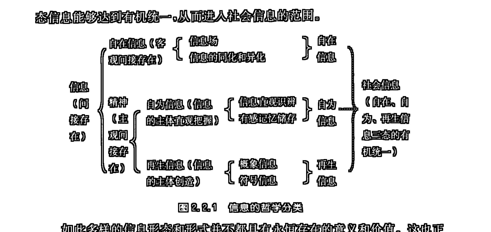

如此多样的信息形态和形式并不都具有永恒存在的意义和价值。这也正如此如此多样的物质形态和形式并不都具有永恒存在的意义和价值一样。具体讲来，自在信息的活动是与物质活动同在的，它具有客观性、普遍性和存在的永恒性；自为信息的活动构成了一般动物心理活动的主要方式；一般认为，再生信息是人所特有的意识活动，在某些高等动物中只存在一些能够称作是“萌芽状态”的再生信息的活动；社会信息则指的是人类社会主体的精神文化活动本身。20世纪70年代以来发展起来的社会生物学则表明，在一些较高等动物的社群行为中存在着一些令人惊叹的“类文化”现象，有理由认为，这类“类文化”现象同样应该具有“类社会信息”活动的性质。

恰如自然的物质形态经历了不同阶段的进化历程一样，自然的信息形态也经历了不同阶段的进化历程。自然信息在自身活动的不断“造化”中，经历了自在、自为、再生的漫长发生、进化过程，在社会信息中达到了自身完成的、本质的统一，这就是信息形态运动的辩证法。

### 第三章 信息的质、特性和功能

信息的自在、自为、再生三态的运动，在社会信息中达到了完成的、本质的统一，这就使信息的不同性级的质以及基本特性和功能在信息自身的多层级的关系中显示了出来。本章就拟对信息的质、特性和功能这三个相互统一和关联的方面进行较为详尽的考察。

### 一、信息的质

前已指出：任何直接存在之物都首先是通过外化信息场来显示自身的。但是，由于任何现存之物都已在普遍的信息同化和异化的相互作用中将自身信息体化了，所以由这些信息体所产生的信息场便已脱离了信息产生的原始的、最初的历史性。就这个意义上，所有的信息场都只是信息的多级运动过程中表现出来的现象。信息场的这种信息多级运动产物的意义，便不能不使信息场中所呈现出来的信息具有极为丰富、复杂的内容。如果我们将这些丰富、复杂的内容分一下层次，那么，我们便会清晰地看到信息所具有的不同性级的质。

任何物体，首先是一个具有内在结构和状态的物质的直接存在形式，所以，由这个物体所产生的信息场，必然首先以该物体本身的直接存在为其显示的第一层级的内容。但是，任何物体又都已经信息体化了，所以，当物体自身的结构和状态在信息场中显示出来的时候，凝结在这个结构和状态中的信息也便一同显示了出来。这些在物体中凝结着的信息的显示比该物体的直接存在的显示更具间接性，所以，这部分信息便是信息场中显示着的第二层级的内容。如果说，信息场中显示的物体的直接存在是物的一级间接存在的话，那么，信息场中所显示的信源物中凝结着的信息便是物的多级间接存在了，因为信源物中凝结着的信息本身就已经是物的间接存在的形式了。我们把信息场中所显示的这两种不同层级的信息内容，规定为信息一般所具有的两个不同性级的质。

信息的这两个不同性级的质，还仅是在自在信息的范围里被规定的。如果我们涉及社会信息的领域，我们将看到信息的另外一种性级的质。

我们来分析这样一个事件：一棵树上的苹果熟了。对于对苹果的知识一无所知的人，他只是看到了苹果的形状、颜色；对于对苹果有了解的人来说，他便可以通过苹果的形色判断出苹果成熟的程度，吸收营养、进行光合作用的生长发育过程是否良好……；另外，还可能有这样一个人，在这之前，他的某个朋友曾经给他写信约定，“等到苹果熟了的时候，我来拜访你。”这时，他面对这一棵熟了的苹果树，就会高兴地意识到：“我要接待远方的来客了。”这三种内容的前两种其实是我们上面所规定的信息的两个不同性级的质的内容，而第三种内容，则与前两种不同，它是人的主观目的性所赋予信息的一种新内容。这个新内容就是信息内容的第三个层级，我们把它规定为信息的第三性级的质。①

信息第一性级的质是直接存在的一级客观显示，亦即一级客观间接存在。通常，我们直观感知到的正是信息第一性级的质所显示的内容。信息第一性级的质是不以人的意志为转移的，它的内容，比起我们所感知的方面要丰富、广泛得多。我们所感知的仅仅是信息第一性级的质的部分，而不是全体。这个感知部分所能达到的程度是由我们的感知能力所制约的。

信息第二性级的质是直接存在的多级客观显示，亦即多级客观间接存在。这一部分的信息内容是不能被我们直观感知、简单把握的，要把握这部分信息，就必须进行某种类似于翻译和挖掘的工作。在这里，信息第一性级的质被看作映射着第二性级的质的内容的编码信号。人们对这方面信息内容翻译和挖掘的丰富性和深刻性，直接依赖着主体内先已建构起来的认识结构的状况，即对信源物本身凝结的信息的经验程度。由此便不可避免地造成了信息第二性级的质相对于不同的认识者，在同一性级质的范围内也必然具有相对认识的差异性。

当意识的能动作用，对信息在相互关系中的属性考察，不是以客观为准绳，而是以主观为规定时，信息就具有了第三性级的质的意义。信息第三性级的质借助于信息第一性级的质，但又与信息第一性级的质所反映的信源物本身的内容无关。信息第一性级的质只作为一个代号、一个主观信息赖以传递的媒介(中介)。如：语言、文字。它的第一性级的质是它的声或形，而它的第三性级的质却是人们相互规定给它的意。如果对某种语言或文字不通，那么，你就只能接收它的声或形，而不能明了它的意。信息第三性级的质是人类认识赋予信息的一个崭新的创造性的主观关系的质，它使人们有可能在认识中将外界信息普遍抽象化、符号化，从而纳入普遍的相互作用和关系之中。这个第三性级的质所揭示的信息的人为创造的关系，一旦通过人的劳动实践外化出来，就是对世界的改造。人的本质、意识的能动作用就在这个对世界的改造中显现了出来。

> ① 关于信息具有三个不同性级质的观点最早发表于拙文《信息在哲学中的地位和作用》（《潜科学杂志》1981年第3期，第53、60页）。在拙文《哲学信息论要略》（《人文杂志》1985年第1期，第37～43页）“二、信息的质和量”，以及拙著《哲学信息论导论》“第五章 信息的质”中我又专门对之进行了详论。

从对信息的三质的规定中，我们可以看到：信息第一性级的质决定于信源物的直接存在本身；信息第二性级的质决定于信源物中所同化的信息方面；信息第三性级的质则决定于信息接收者的目的规定性。

信息第一、第二性级的质是信息的客观自在质，第三性级的质是信息的主观代示质；信息第一性级的质是信息的原生质，第二、第三性级的质是信息的系统质(客观自然关系系统，或主客观关系系统)；信息第一性级的质是信息的本原质，第二、第三性级的质是信息的派生质。信息第二、第三性级的质归根到底是物体(或主体)同化信息第一性级的质的内容的结果，且又必须通过某种信息的第一性级的质才能表现自己。

从信息三质的规定中，我们看到，事物的质并不简单地由其孤立的自身来规定，事物的质不能和它所处的环境(系统)相脱离，而同一事物相对于不同的系统又往往会呈现出不同的质或不同的质的方面。马克思把人的本质看成是一切社会关系的总和，这就不是简单地从人的孤立的个体出发来定义人的本质的。信息第二、第三性级的质都是某种特定关系质，信息第二性级的质是在事物的客观自然关系中得到规定的，而信息第三性级的质则是在主客观关系中得到规定的。

在上一章中我们论述了社会信息中自在、自为、再生信息三态的统一，在对社会信息的质的考察中，我们仍然可以看到，信息的三个不同性级的质在社会信息中也达到了统一。

社会信息有它的三个信息世界，作为社会信息，这三个信息世界相对于社会，相对于人的认识都不能绝对“外在”。就社会信息的“信息世界1”来说，它已经被人的认识对象化，成了人化的自然(就自然信息体部分)或自然化的人(就人造信息体部分)。这两部分，无论哪一部分都在人的认识中被自为把握着。由于人的主体认识结构中经验凝结的丰富性，这就使主体总是把他所把握的对象放到主体认识框架的背景参照系上来考察，这就意味着，主体总是从种种复杂的关系中来具体把握对象的。这些关系从本质上反映着该对象中凝结着的信息内容。所以，信息体一经被认识把握，就必然同时被意识揭示出它那丰富的第二性级的质的内容（当然，不是全部）。主体在对信息体把握的同时，也必然把对象进行某种类的概象的归属，以及特定符号的代示，这种类的概象的归属，这种符号的代示，就使这些信息体在人的认识中一般化、符号化，被人为地赋予了某种认识意义上的约定，这就使它们具有了第三性级意义的质。概而论之，任何信息一经相对于人的认识被对象化，它就会与人的意识发生某种关系，这种关系便在某种程度上揭示出这个对象化的信息的第二性级的质，同时也必然会赋予这个对象化了的信息以第三性级的质。在这里，对象和意识构成了一个统一的系统，这个第二性级的质就在这个系统的认识结构中被部分揭示，而第三性级的质也在这个系统的认识结构中被约定出来。

社会信息的“信息世界2”和“信息世界3”，就其实质，都是从人的意识的意义上成立的，前者是主观意识活动本身，而后者则是主观意识的客观储存。正因为人的意识是一个感性、理性（表象、概象、符号）相互作用、相互映射、相互渗透、相互规定的复杂的认识结构体系，所以，人的意识本身既反映着信息的第一性级的质的直观内容，也同时揭示着这一内容中所凝结着的复杂的客观自然关系，另外，还必然使这两个层级的信息内容普遍概象化、符号化。这样，只要是在人的意识中反映着的信息便必然是三质同具的一个统一的整体。当这个意识中的信息被编码为文字、艺术、语言而客观储存、传递的时候，意识信息的这种三质统一性也便同时被储存起来和传递出来了。

从意识的角度来分析，外在储存、传送的符号本身是信息第三性级的质，而它所揭示的内容却是信息第一、第二性级的质，但是，反过来，如果从作为社会信息的“信息世界3”客观存在的形式来看，也可以说，符号的形、色、声是信息第一性级的质，而其中内含的意才是第二、第三性级的质。如此看来，这个“信息世界3”达到了信息三质统一的互逆的完满性。

“信息世界3”作为意识的“外化”，也只有在自为的意识和自在的载体的系统中才能具有意义，这里包括着意识的对象化、意识的主体化。也正是在这一意义上，这个对象化的意识和作为主体的意识才能在相互构成的系统中发生相互作用，完成意识的再认识、再创造，从而将信息的三态、三质统一起来。

社会信息中信息三态、三质的统一，使我们可能对信息的本质进行某种总的、概括性的把握。这种把握的进一步精确化，就使信息从它的质的规定过渡到了它的量的规定（关于信息量的规定我们将在本书“第九编”中予以讨论）。

### 二、信息的特性①

信息具有多方面的基本特性，下面仅择其中十个最重要、最基本的特性予以分析。

#### （一）对直接存在的依附性

作为间接存在的信息必须由直接存在（物质，即质量或能量）来载负，没有直接存在作载体的信息是不可能存在的。

#### （二）存在范围的普遍性

由于物质的相互作用具有无处、无时不在的普遍性，又由于物质的相互作用必然会伴有信息生成、传递、交换、变换等现象的发生，所以信息便无处、无时不在同化和异化的过程中生成、传递、交换、变换着。另外，这种信息同化和异化的活动必然会引起相互作用之物的结构和状态的改变，相互作用之物以其结构和状态的相应改变凝结了其在相互作用中所同化或异化的信息，从而将自身普遍信息体化。这样，无论在现实活动的普遍性的意义上，还是在历史关系的凝结的普遍性意义上，信息都呈现出了其存在范围的普遍性。

#### （三）载体的可替换性

同样内容的信息可用不同性质的载体来载负。如，对一个人的相貌可以用语言介绍，也可以用文字描述；可以用图画绘制，也可以用模特儿扮演。当然，在用不同性质的载体来载负同一内容的信息时，也存在着表现力上的差异，如，对信息内容表现的清晰性和模糊性的差异、准确性和近似性的差异、真实性和歧变性的差异等等。

> ① 本节关于信息十大基本特性及下节关于信息十四大基本功能的论述，最早发表于拙文《试论信息的质、特性和功能》（《安徽大学学报》1996年第1期，第79～85页）。

#### （四）内容的可储存性

载体载负信息是通过特定质—能结构模式的生成来实现的。如果这种与特定信息内容相关的特定质—能结构模式在一定的时间段上保持稳定的持存，那么在这一时间段上相应的信息便可以被储存。物的信息体性正是由信息内容的可储存性造成的。

#### （五）内容的可传输性

信息可以通过其载体的转换和运动而向远距离传递。如声信息可通过介质波、光电脉冲、录音盘、录音带等不同载体形式间的转换，以及这些载体的运动来实现远距离传输。

#### （六）内容的可复合性和可重组性

同质的信息内容可以通过相互的匹配而产生复合信息。如，多种声音的混杂将产生一种复合效应：嘈杂的噪声；多幅图像的重叠或拼接将会形成混乱的或奇特的新的图像。而人的认知形象的产生就是一个内部先有的认知模式信息与所接收的外部对象信息相匹配而产生出来的一种复合信息。信息复合其实是以信息重组为前提的。对同一对象的整体信息模式，可以通过特定方式加以重新分解组合，对不同对象的信息要素也可以通过特定的方式重新分离和拼接，这一切都表明信息可重组的性质。

#### （七）内容复合和重组中的畸变性和创新性

在信息复合和重组中，原有信息可能会发生扭曲、变态、失真等现象，这就是信息的畸变，而在这类畸变中又总是伴有新信息模式的生成，这又是信息的创新。所以畸变性和创新性可以看成是信息复合和重组中同时可能实现的双重效应。在生物学中有一条原则：遗传信息的复制错误产生生命的进化。这条原则所揭示的也正是信息复合和重组中的可能畸变性和创新性。

#### （八）内容的可共享性

信息交换和材料或能量的交换不同，在后者的交换中付出者将会丧失与接收者所得到的具有同等数量的材料或能量，而在前者的交换中付出者并不因为接收者收到了某一内容的信息而丧失掉对该内容信息的拥有性，这里所实现的是一种信息的共享。

#### （九）对内容理解的歧义性

对于同一对象的同一信息，不同的观察者可能会由于观察能力、理解方式、关注角度的不同而形成不同的理解。这种理解上的歧义性是由人类认知是一个内部认知模式信息与外部对象信息的复合匹配过程而造成的。这种理解上的歧义性正是信息复合中的信息内容的畸变性和创新性的一种表现。

#### （十）内容的可耗散性

既然特定内容的信息是由载体的特定结构模式来载负的，那么，一个可以想见的情景便是：载体的特定结构模式的改变、损害或丧失将意味着与之对应的特定信息内容的改变、模糊或丢失。这就是特定信息的部分或全部的耗散现象。正因为存在着这种信息内容的可耗散性才造成了历史信息的模糊、失真、丧失，文本散失后的相关信息的缺失，人类记忆中的遗忘等现象。

### 三、信息的功能

由于信息是除物质（直接存在）现象之外的所有现象的总括，且具有诸多种形态和形式，又由于信息具有三个不同性级的质和诸多基本特性，所以，信息无论在自然界中，还是在人类认识世界和改造世界的活动中都具有诸多方面的功能，发挥着重大的作用。下面仅就其最一般的功能方面予以讨论。

#### （一）显示功能

作为间接存在的标志的信息，就其最深层的基本规定来说，它是直接存在（物质）的方式和状态的自身显示。由此，从我们对信息的一般规定中就能得出一个结论：信息的最大或最基本的功能便是显示功能。虽然从最一般的，或说是终极性的、本原性的层面上来讲，信息所显示的内容是直接存在的方式和状态，但是，由于在现实世界中物体已被普遍信息体化，并由此又引出了信息显示的多级性的现象，所以，在直接表现着的层面上，信息仍可以对信息自身的活动进行再显示。如，人们对自身意识（自为、再生信息）的活动能够予以再行把握、加工、储存、外化交流，以及通过实践可能实现目的的设计等诸多方面的情景就都具有信息对信息的多级显示活动的意义。

#### （二）启示功能

由于信息显示的多级性的存在，导致了信息第二性级的质的产生，这样，对信息内容的把握便不能仅仅停留在信息内容的直接呈现着的第一性级的质的方面，而还有必要深入其内容的背后，将其中更为深刻的第二性级的质的方面破译并挖掘出来。这样，信息的直接呈现着的第一性级的质的内容所起的便是一种启示性作用。如，宅院中夜半狗吠的声信息就启示着可能有陌生人接近该宅院的事件的信息。

#### （三）代示功能

当人们把信息的直接呈现着的第一性级的质的内容仅仅作为某种抽象化的符号，并通过人为约定的主观关联赋予它另外一些特定的内容时，这个信息的直接呈现着的第一性级的质的内容所起的便是一种代示性作用。如，人类创造的语言文字体系就是一种信息代示。无论是语声的读音，还是文字的构型，都还只是一个符码，而其所示的第三性级的信息的质的内容则是由人们主观约定赋予的。这就出现了在不同的语言文字系统中，同样的声或形的符号可能具有不同的第三性级的质的信息内容，以及同样的第三性级的质的内容可以通过不同的声或形的符号来代示的情景。

#### （四）联系功能

一般说来，系统之间的联系就是在系统间进行质量、能量和信息的传递和交换，系统内部的联系就是在系统内部各部分、各要素、各子系统间进行质量、能量和信息的传递和交换。由于信息存在的普遍性，以及信息与质量、能量的不可分割性，所以，任何质量、能量的传递和交换都必然会同时伴随有信息的传递和交换。这里所说的系统是指所有的，处于宇宙不同层级的事物，既包括宇宙无机自然系统，也包括动、植物系统，还包括人类社会系统、机器系统；既包括物质系统，也包括精神系统。就精神系统而言，无论是人的意识的内部操作，还是人与人之间的思想、情感的交流，都是一种信息活动，且又都必须通过相应的信息联系过程来实现。

#### （五）消除不确定性（或解惑）功能

这是申农通讯信息论中所集中阐释过的一种信息的基本功能。申农就是

## （六）组织功能

任何一个系统都会有其相应的关系（联系）模式，因为这一模式是由信息联系的信息沟通和交换来维持的，所以，我们有理由把这一关系模式称为该系统的信息结构。信息结构对于一个系统的确定和存在起着十分重要和关键的作用，正是信息结构将不同的组分、要素等等整合为一个统一的系统。这种整合作用恰恰就是一种组织功能。如果把某种既定的信息结构看作是一种相对静态的组织整合过程的话，那么，这个既定的信息结构的改变便可以理解为某种动态组织整合的过程。这样，组织概念便获得了双重意义上的规定，其一是指系统的静态的关系模式，其二则是指系统的关系模式的动态的发展过程。后者同样是通过信息联系的活动来实现的。因为信息可以导致接收者的原有不确定性状态的改变，这就可能减少信息接收系统的混乱程度，或用一般文献中的说法，说是减少了熵、增加了负熵；减少了无序度，增加了有序度；减少了自由度、无规性或随机性，增加了约束性、秩序性或组织性。事物结构的由简到繁、由低级到高级的发展，个人知识与才能的增长、认知方式的改变，人类科学、技术、经济、文化的发展，社会形态的更替，人类观念模式、生活模式的改变等等，都是这一组织性增强的、信息结构的动态发展过程。当然，与我们对信息消除不确定性的功能的分析相一致，信息对接收者的原有不确定性状态的改变，也并不总是沿着组织性增加的有序化方向前进的，它还可能反过来减少系统的组织性或有序性，这就可能构成与系统进化演化的方向相反的退化演化过程。

## （七）传播功能

信息的联系功能、消除不确定性的功能，以及组织功能，都是通过其传播活动来实现的。信息的传播功能显然是以信息内容的可传输性为其基础的。传播可以是无意识的自然传播，它包括从无机物的信息显示到人类信息的非特意散布的极为广泛的信息活动领域。传播还可以是有意识的人为设计的活动，它包括从人体内的有意识的主观信息的加工操作，到人际间的有意识的交往，以及利用各种组织形式和人为设计的传播渠道和方式所进行的形形色色的团体、组织和大众网络传播活动。

## （八）宣传与教化功能

通过信息传播所引出的效果，一个是宣传，一个则是教化。宣传是从使人知晓传播的信息内容的角度来说的，而教化则是从通过传播知晓了信息内容之后，信息接收者产生了相应的认同或顺应的变化而言的。一般说来，在有意识的人为设计的传播活动中，设计者总是希望引起相应接收者对他所传播的信息内容产生某种性质或程度的认同或顺应。如，宣传产品的质量好的目的就是让人们去购买这一产品；宣传吸烟有害的目的就是让人们尽量少吸或不吸。为了实施使人们对所处社会的法律、道德规范，以及整个人类文化的认同和顺应的教化，各国政府及相应社会机构和部门都建立了庞大的大众网络传播体制和国民教育体制。这是有意识地人为设计的，大规模地实现信息的宣传与教化功能的集中体现。

## （九）探测与监控功能

对于那些尚不能自发显示其存在性质的信息的事物，有智能性行为的动物、机器或人都可以通过主动发出作用信息，激发对象显示信息，并通过对这些显示信息的把握来达到探知对象的某些方面的性质或功能的目的。这便是对对象信息的有目的的探测与开发。这一过程显然是通过信息反馈的机理实现的。人们还可以利用信息反馈的原理对对象的行为予以有目的的监控。在人类的一般实践过程中，人们总是通过对各种反馈信息的把握来对实践活动的进程、工具运行的情况、对象改变的程度和状况，以及是否有其他一些因素的干扰作用的存在等方面的情景予以适时监控的。

## （十）评价功能

与探测和监控过程相伴的还有另外一个信息活动的过程，这就是对所探测到和监控着的实际内容予以合理性的评价。当然，这一评价活动还更为广泛地存在于其他类型的信息接收者的活动中。评价活动首先遇到的是一个真伪性问题。在这一方面，评价要解决的便是进一步辨明真相，剔除假象。这就要求评价者去收集、利用或参照更为广泛的相关信息或知识背景信息。如，侦察员给指挥官提供的关于敌情的侦察报告就可能有真假问题，需要参照其他一些相关情报予以核实。第二，评价还是针对信息的质量问题的，这就是说，信息接收者所获得的消息是有精粗之别的。如，“张三考取了硕士研究生”、“张三考取了北京大学硕士研究生”、“张三考取了北京大学物理系硕士研究生”这三条消息的精确度就是不一样的。如果所获消息的精确度未达到信息接收者的满足程度，那么，评价结果便会引导信息接收者在一个更为适宜的方向或层面上进行相应的信息收集和探测。第三，评价还是针对信息对接收者的效用问题的，这就是信息将给接收者带来怎样意义、性质或程度的实际价值。如，地质探测资料显示某国某一地区的地下埋藏有十分丰富的石油资源，这对于解决该国的能源危机问题将会具有巨大的实际价值。当然，价值问题是有个体差异性的。同样一则信息，对于不同性质的接收者来说，将会具有不同的实际价值。如，某一赌局开盘结果的消息，对于将巨大赌金压在与开盘点数相同或不相同的局势上的两种不同的参赌者所带来的实际价值是截然不同的，而对于一个旁观者来说，他所获得的实际价值则可能仅仅是某种娱乐性观赏而已。

## （十一）保持功能

基于信息的可储存性特征，可以通过对特定信息的储存，将某些事件的内容作短时或长时的保持，这就是信息的保持功能。一般说来，直接发生的事件，以及一般物体作为一个直接存在的具体形式总是具有暂存性的，当某一事件发生之后，这一事件便消失了，不复存在了；当某一物体质—能结构改变了之后，这一物体便同时不再能作为原有意义上的物体而存在了，它已经转化成了它物。但是直接存在的事物的暂存性并不意味着关于这些事物的信息也是暂存的。通过特定信息结构模式的稳定化的持存，可以将某些事物的内容以间接存在的信息形态的方式长期保持下来。这种保持，可以是纯自然的特定信息结构的模式痕迹的建构和持存，如，树木的年轮中所保持的树木生长发育的状况、年龄及其所经历的环境条件的信息，生物遗传信息结构中所保持的生物种系进化的线索的信息，地质地貌的层级和形态结构中所保持的地质、地理演变过程的信息等等；这种保持，还可以是人为设计的某些主观记忆、符号代示、形象再现或机械性编码储存，如，人们对某些事物、知识的脑中记忆储存、语言叙述、文字记载、图画描绘，以及磁带、光盘编码储存等等。

## （十二）模拟功能

当某些直接存在的事件或物体已经消失或损坏之后，人们可以根据这些事件或物体尚存的信息通过实践的具体操作，再现这些事件的过程，重新修复或塑造这些物体。如果这种再现，这种修复或塑造的目的，只是要刻意追求原有过程或物体的原貌的话，那么，这便是某种模拟性再现或再造的过程。信息模拟还可以在另外一层意义上构成，这就是，当对某些较为复杂的事物或过程无法或不便直接进行研究时，人们往往可以仅取这些事物或过程的某些对研究者感兴趣的信息结构方面建立模型，通过对相应模型行为的研究来达到对所模拟对象行为的研究。如，通过沙盘对作战的地形、兵力配置、攻退策略等进行模拟；通过对电脑工作原理的分析对人脑智能活动的研究等等。

## （十三）建构功能

建构功能是最能体现信息之创造力的功能。这一功能显然是通过信息的组织功能来实现的。一般说来，当事物之间，或事物内部的要素之间通过相互作用同化和异化信息的时候，这就有可能引起相互作用之物的物质结构或信息结构的改变，这种结构的改变便是新结构的建构。人之思维的创造力集中体现在对新的信息结构的建构上，这种建构可以超越于现存之物、现存之世界之外、之上，通过对所把握信息的再行分析综合的加工改造，创造出新的概象的、符号的再生信息。然而，人之思维创造的新的信息结构并不都是只能停留在信息活动的领域之中，只要思维创造的新的信息结构是符合世界规律之本性的，是具有了现实实现之客观条件的，人们便可以通过相应设计的实践活动将其生产出来，这就是人的思维创造的信息结构向客观世界的物质结构的转化。如，一个符合力学原理的新颖建筑物的设计，只要现实材料具备，又有相应人力、条件和技术手段，那么，便可以通过具体实践的施工过程现实地建造出来。这样，信息的建构功能并不仅仅是针对信息结构之建构的，而且也是针对物质结构的建构的，并且，物质结构的建构又是通过信息结构的建构，以及相应的信息同化和异化的活动来实现的。这样的一条原则，无论是在一般物的结构建构活动中，还是在人之思维和实践活动的建构活动中都是普遍成立的。

## （十四）预见功能

人之思维是可以超越于现存之物、现存之世界之外、之上进行信息结构之建构的，如果这一建构是基于对现存之物、现存之世界的详尽考察之上，而对其未来之发展趋势或方向进行合理性推论的，那么，这就构成了信息活动的另一种功能——预见功能。事实上，人类所作的各种各样的，不同层次上的假定、预测与决策都全然属于信息活动的领域。当未来世界还未成为物质性现实的时候，人们却可以通过思维的创造拥有一个信息形态的假定的未来世界。当然，这个处于信息形态的假定的未来世界还只能是一个不确定的未来，它可能有多种信息结构的模式，人们正是从对这个多种未来模式的选择、决策的基础上，通过相应的实践活动的努力，去创造更为美好的未来世界的。

### 第四章 信息系统的一般模型

为对信息活动进行详尽地讨论，有必要建立信息系统的一般模型。本章在对申农的信息系统模型和西蒙的物理符号系统假设的模型进行具体剖析的基础上，设计了信息创生系统和信息实现系统的一般模型，并由此表明了一般信息系统的多样性和复杂性。

### 一、作为信息接收系统的申农模型

通讯信息论的创始人申农从通讯的角度建立了一个一般信息系统模型。该模型的具体图示如下（图2.4.1）：

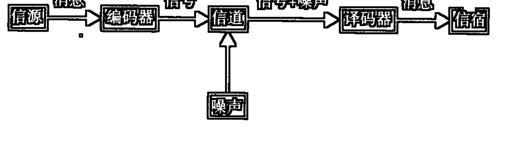

下面将图2.4.1中的各环节予以简释：
- 信源（信息发送端）：产生信息或信息序列之源；
- 消息：存储和传递信息的方式和手段，如，文稿、信函、数据等，是信息和载体的统一；
- 信号：适宜消息在信道中传输的形式，是一个实在的物理过程，如电脉冲；
- 编码器：将消息变换为信号的装置或系统，如电码本、密码本、计算程序等；
- 信道：传输信息（或消息）的介质、通道或系统，可分为有形信道（如电线、电缆）和无形信道（如电磁波、声波）；
- 噪声：信道内部或环境对信号的干扰；
- 译码器：将信号与干扰噪声分离检出，并将信号反变换为消息的装置或系统；
- 信宿（信息接收端）：接收信源信息或信息序列者。

申农通讯信息系统模型具有两个方面的重大缺陷：
一是该模型未能注意信息系统的一般反馈性机制；
二是该模型描述的还仅仅是信息接收系统。这在一般通讯过程中是够用了，因为通讯的主要目的就是在接收端再现发送端的信息。然而，信息系统绝非仅仅是信息接收系统这样的一种类型，它还有信息创生系统（通过信息加工创造出新的信息的系统），以及信息实现系统（通过实践将目的性信息转化为客体的结构信息的系统）。

由于存在着上述两大缺陷，尤其是关于第二个方面的缺陷，所以，无论是申农系统模型，还是由此模型派生出来的一系列相关模型，都不能真实而全面地对一般信息活动的过程予以描述。

针对申农模型的缺陷，我们还有必要在引入反馈机理的前提下，去探讨信息创生系统和信息实现系统的一般模式。

### 二、物理符号系统假设

美国著名的科学家、认知心理学和人工智能的创始人之一西蒙等，从人与机器的智能活动的信息加工活动的角度提出了一个“物理符号系统假设”。他指出：“用‘物理符号系统’主要是强调所研究的对象是一个具体的物质系统，如计算机的构造系统、人的神经系统、大脑的神经元等。所谓符号就是模式，任何一个模式，只要它能和其他模式相区别，他就是一个符号。”“符号即可以是物理的符号，也可以是头脑中的抽象的符号，也可以是计算机中的电子运动模式，还可以是头脑中神经元的某种运动方式。”①

西蒙认为，一个完整的物理符号系统，即一个能表现出智能活动的系统，起码应该具有下列的6种功能：

1. 输入符号：纸、铅笔加上手的运动，可以给白纸输入符号；
2. 输出符号：纸本身并不能输出符号，但我们的眼睛可以使之输出。当我们阅读时，文字符号就从纸上输出而进入眼睛了；
3. 存储符号；
4. 复制符号：认出“心理学”三个字，并把这三个字复制出来，存储在某个地方就是复制符号；
5. 建立符号结构：通过找到各种符号之间的关系，在符号系统中形成符号结构；
6. 条件性迁移：依赖已掌握的符号而继续完成行为，如果在记忆中已经有了一定的符号系统，再加上外界的输入，就可以继续完成这个活动过程。

其实，“物理符号系统假设”提出的是一个信息创生系统模型，并且，这个信息创生系统是以信息接收、识辨、储存和阐释为前提的。具体说来，在“物理符号系统假设”所列的6种功能中，“输入符号”指的是信息的接受；“存储符号”指的是信息的储存；“复制符号”指的是信息识辨及其储存；“建立符号结构”指的是新信息的创造；“条件性迁移”指的是对掌握信息的进一步的阐释并由此指向导引行为的活动；“输出符号”则与“输入符号”一起又指明了系统的对外开放性。

显然，“物理符号系统假设”模型对于信息加工系统功能的解释还仅仅着眼于信息活动的结果的角度。要全面揭示信息创生系统的一般模式，还有必要不仅从活动的结果方面，而且从活动的过程（加工处理信息的操作环节）方面来予以考察。

### 三、信息创生系统

信息创生系统是一个通过对已有信息的加工处理而产生出新的信息的系统。这类系统的工作不同于一般信息传递和接收过程中的编码、译码活动。信息创生的着眼点不是要对已有信息的模式、内容进行简单保持、变换、再现或复制，而是要对之进行创新性的改变。根据信息活动的一般特性，信息创生是通过信息复合和重组来实现的。这一过程与对已有信息的重新分解组合、选择、匹配和建构的创造性活动相一致。

可以把一个最简单的信息创生系统看成是一个信息加工器，这一加工器可以依据特定的加工规则和方式对其所获得的信息进行重组，并通过这一重组生产出新的信息。

图 2.4.2 标明了一个最简单的信息加工器的形象模型。

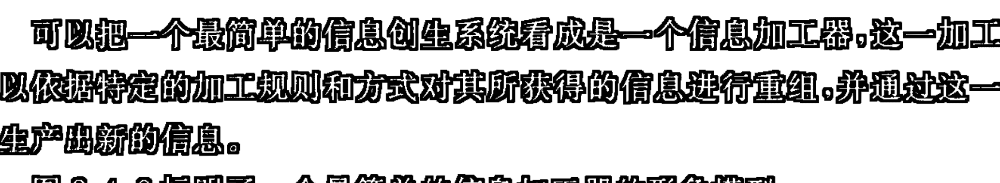

信息加工器的工作原则可能是决定论式的，也可能是非决定论式的。①

按决定论方式活动的信息加工器的工作原理是机械化式的，对特定的输入信息集 X_i 的加工只能产生特定的输出信息集 Y_i，只有当输入信息集改变了的时候，才可能改变输出信息集。可以把现有水平的计算机看作是这样的按照决定论方式工作的信息加工器的例子。

按非决定论方式活动的信息加工器的工作原理是非机械化的，这样的信息加工器具有内在信息处理方式的随机性，这种内随机性的存在导致了信息加工器对特定的输入信息集 X_i（脚码 i 为一特定数）的加工可能会产生出多种输出信息集 Y_ij（脚码 j 可能是 1,2,...,n）中的任一种或任几种。人的思维的信息加工过程就是非决定论式的。

图 2.4.3 标明了按照两种不同的工作原则工作的信息加工器的差别。

按非决定论方式工作的信息加工器的内随机性的产生是由其内在结构和工作方式的复杂性所决定的。以人脑的信息加工活动为例，一个复杂的具有内随机性的信息加工器是由诸多信息加工单元（子系统）复合而成的复杂系统，并且任一子系统的工作方式及其先已储有的信息模式都是极多样和极大量的，内随机性的产生就来自这些子系统对其多样的工作方式和储有的多种信息模式的随机选择、变换、匹配、复合和重组性。

> ① 这里的“非决定论式的”含义是在一种特指的意义上使用的，即仅只在非完全性非决定论式的，或称部分非决定论式的意义上使用。本书采用的非决定论概念如不特别注明，均在此特指的意义上成立，不再另予说明。

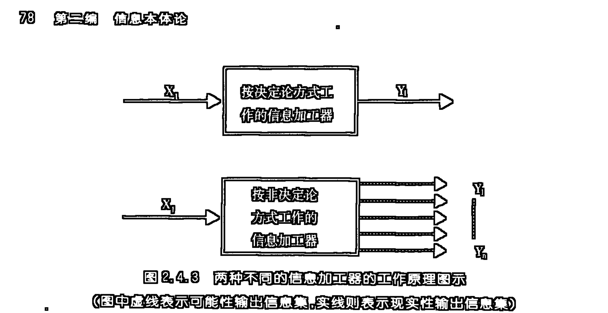

图 2.4.4 标明了一个较为完善的按照非决定论方式工作的信息加工系统的内在结构模式。

一个信息创生系统是一种多重信息加工功能的复合系统。图 2.4.4 表示的具有内随机性的信息创生系统是由 9 个功能性子系统通过网络式联结而形成的。下面对这 9 个子系统的功能分别予以简释：

- 信息接收子系统：它是外部信息的输入端，负责从环境中获取信息，并对其进行再现性的识辨和认知。

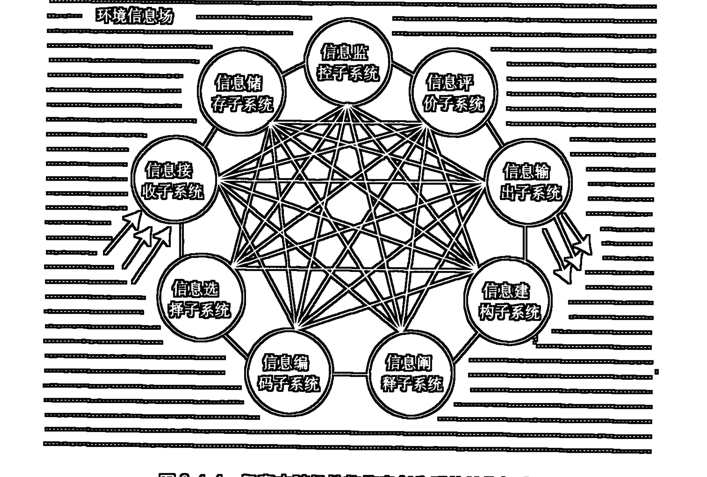

- 信息储存子系统：其功能是将外部接收的信息，以及内部生成的信息储存起来，以备后续之信息加工活动使用。相对于人脑信息储存的功能而言，其储存的信息内容既包括各类感知所获取的感性材料，也包括思维所创造的理性知识成果，还包括处理信息的程序、方式、规则等等。

- 信息选择子系统：它为各种层次的信息加工活动提供信息筛选、抽取，从而使系统的信息加工活动具有了相应的选择性。

- 信息编码子系统：它能以系统自身特有的方式对各类信息进行编码，通过编码将对象信息变换为易于为系统所传输、储存和操作加工的形式。相对于人脑的信息加工来说，除一些生理性编码，如电信号、化学信号、特定的突触结构、蛋白质结构、易化通路结构等等之外，还有建立在各类生理性编码之上的意识层面的编码方式，如形象表象、概象模式和抽象语言符号体系。

- 信息阐释子系统：负责对各类编码中的模式或符号所代示的信息内容的破译、解读和表达，以便对所处理的信息进行准确和必要的把握和理解。

- 信息监控子系统：它能为各类信息加工活动提供普遍的觉醒、注意背景，并能对各类信息加工的方向、方式、速度、质量、过程及结果进行合乎目的性的监督和控制。

- 信息评价子系统：它能对各类信息内容、编码、阐释的方式、监控的效果，以及各类信息加工活动的过程和结果予以评价。这些评价包括真伪性问题、精粗性（质量性）问题、逻辑性（加工规则、方式的合理性）问题、效用性（价值性）问题等等。

- 信息建构子系统：它具有对各类选择出的信息进行具体的匹配、复合、重组的功能。这一子系统的工作处于信息创生系统的核心地位。各类创造性的新颖信息正是通过这一信息建构的活动而被创生出来的。当然，不能把这一信息创生活动理解为仅仅是在信息建构子系统的独立工作过程中实现的。信息创生的真实情景是，信息建构子系统的活动必须在其他子系统所提供的一般背景和协同支持的条件下才可能进行。

- 信息输出子系统：它是对外部环境的信息输出端，负责把系统中之相应信息向系统之外传递。显然，信息输出子系统对外部输出的信息可能是各种各样的、多层级的。它既可以把信息接收子系统所获取的外部信息不加改造地直接又转而输出给环境，也可以把系统自主创生出来的新的信息输出给环境，还可以把各类处于不同层级的加工过程中的信息内容以及信息活动的过程和结果适时输出给环境。这样，无论是通过信息加工所产生的成品信息、半成品

## 80 第二编 信息本体论

信息、原始材料信息，还是信息加工活动本身的状态、过程的信息；无论是现实直接获得的信息，还是在信息储存子系统中已经内化存储着的历史保持着的信息，只要在特定的背景条件下，都可以通过信息输出子系统向系统之外输出。

显然，上面简释的9个子系统的活动是相互协同、支持、互为背景和条件的。无论是哪一层级上的信息加工活动，也无论是哪一个子系统的活动的展开都需要所有的子系统作为一个整体来动作。图2.4.4中的网络式联结的本意就是要充分显示信息创生系统活动方式的这种整体性、综合性和复杂性。而信息创生系统所呈现出的内在随机性特征，则正是由于它的诸多子系统间协同动作，以及内部储存信息的选择匹配、建构处理上的内容和方式上的可能的普遍具体差异性所造成的。

## 四、信息实现系统

信息实现系统是一种具有目的性的行为系统。这类系统中的最好的例子便是人的实践行为系统。相对于人来说，信息实现系统是指通过人的实践活动将人所创造的目的性信息转化为客体的结构信息的系统。要理解这一信息实现系统，首先有必要从信息活动的角度对实践活动的本质做出相应的解释。

实践唯物主义者们坚持说，人的实践活动具有世界本体意义的纯物质性活动的性质，并主张把它完全归结到“客观实在”的范畴之中。① 实践唯物主义的这一观点的最大困难在于无法解释实践活动中的目的指向性。我们知道，实践活动是人之有目的的自由自主的改造世界的活动，实践活动的起点不是客观对象本身的运动，而是人的主观意志的设计。这一设计首先是指要实现的目的，其次是指为实现此目的而设定的计划。这些目的、计划都属于主观精神的创造，而并不直接就是客观的物质活动。为实现目的，为实施计划，这才有了对改造对象的选择，对作用于被改造对象的手段和方式的选择等等，之后才可能进入对对象实施改造的过程，以及获得改造的结果（使对象符合人之目的的设计）。可见，目的指向性是实践活动中之最为本质的规定方面。当然，展开着的实践过程及其结果本身同时又具有可感的物质性活动的特点，但是，却不能由此结论说，实践能纯粹独立于人之意识而存在，不以人之意志为转移。实践在本质上是一种人的精神活动控制下的，为实现目的的设计而展开着的活动。目的、计划的设计不同，实践活动展开的方式和所可能达到的结果也会有所差异。当然，这并不意味着目的和计划可以任意地左右客观对象的本性，而只是强调只要目的、计划是合乎对象本性的，人们就会通过计划的实施把对象改造成目的设计的样子。在这里，实践活动与一般的物质性活动的区别恰恰在于它是由人的精神活动设计的和控制的。就此而论，把实践活动完全归结为物质活动的观点，显然是难以成立的。这是将人的目的性行为降低到动物的本能行为的层面、降低到一般物活动的层面来予以理解。同理，这是将人降低为动物、降低为一般物。

从信息活动的角度来看，实践活动中的目的性、计划性都首先是一种主体创造的再生信息，而被改造的对象的改变并不是物质量上的多些或少些的变化，而主要是组构方式，即信息结构的变化。

我在一些相关的论著①中，曾对实践活动的信息意义进行过较详细的论述，本书第四编第一章中我还将对此问题进一步予以讨论，在此仅将我所持的一些基本观点予以表述。

人的实践活动与一般的物质运动活动有着质的差别。实践过程首先是从人的主体目的性开始的，在实践的物质运动过程未曾展开之前，人们要制造的产品形象，人们为制造此产品而选择的手段、方式，所拟定的计划都已作为概念或符号的信息在人的意识中被设定好了，这就是主体在实践之前所拟定好的目的性、计划性信息。这种认识中的主体创造的再生信息要求主体发出行为启动的指令信息，通过人的神经激发人的运动器官行动起来，操作选择好的工具，作用于选择好的客体对象。在这一实践的系列过程中，主体信息一直起着规定实践的方向、设计实践的程序和方式、选择实践的手段、工具和对象、控制实践的进度、程度的作用。主体外化出来的信息是贯穿这一全过程的主线。通过这一过程，主体的目的性信息最终在客体中得以实现，改变了客体的结构和状态，使之成为符合人的目的设计的产品（物质产品、精神产品）。无论从实践的开始（目的、计划的设定）、实践的过程（主体器官的运动、对工具的选择和操作、对对象的选择和加工改造），还是从实践的结果（对象的被改造）来看，都具有信息活动的意义，而实践活动本身要完成的也只不过是把主体认识中的目的性信息转化为客体的结构信息。这一过程的完成又直接依赖着主体认识中为完成这一过程所设计的计划性信息的实施。这样，我们便可以从信息活动的角度对实践做出如下一个一般性的规定：实践是一个主体信息在客体中实现的过程，主体创造的一种信息（目的性）通过主体创造的另一种信息（计划性）实施的中介潜入客体，化为客体的特定信息结构被生产出来了。

根据我们对实践的信息活动意义的规定，我们可以用图2.4.5来形象地表示信息实现系统的一般模式。图2.4.5中关于“工具₁→工具₂…→工具ₙ”的设计考虑了主客体间的可能的多级工具中介的情况，而“结构信息改变”的环节用虚箭头表示则是要指明可能存在的目的信息实现的不完全性或扭曲性等情况。

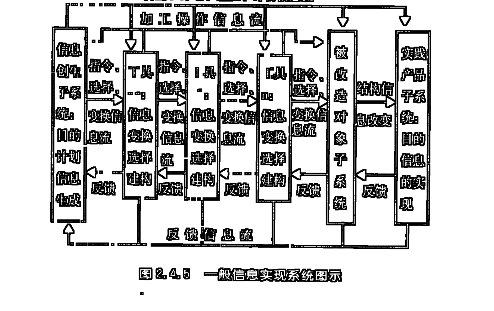

## 82 第三编 信息本体论

和状态，使之成为符合人的目的设计的产品（物质产品、精神产品）。无论从实践的开始（目的、计划的设定）、实践的过程（主体器官的运动、对工具的选择和操作、对对象的选择和加工改造），还是从实践的结果（对象的被改造）来看，都具有信息活动的意义，而实践活动本身要完成的也只不过是把主体认识中的目的性信息转化为客体的结构信息。这一过程的完成又直接依赖着主体认识中为完成这一过程所设计的计划性信息的实施。这样，我们便可以从信息活动的角度对实践做出如下一个一般性的规定：实践是一个主体信息在客体中实现的过程，主体创造的一种信息（目的性）通过主体创造的另一种信息（计划性）实施的中介潜入客体，化为客体的特定信息结构被生产出来了。

根据我们对实践的信息活动意义的规定，我们可以用图2.4.5来形象地表示信息实现系统的一般模式。图2.4.5中关于“工具₁→工具₂…→工具ₙ”的设计考虑了主客体间的可能的多级工具中介的情况，而“结构信息改变”的环节用虚箭头表示则是要指明可能存在的目的信息实现的不完全性或扭曲性等情况。


### 第五章 三个信息世界和世界模式图示

信息世界的本体存在论意义的揭示，为我们提供了一个新的世界构成理论。根据这个理论我们确立了一个新的世界观，亦即建立了一个新的世界图景或世界模式。

在我所涉及的文献范围内，至少看到了关于多维世界的三种研究纲领：一是波普尔的“三个世界的理论”；二是李伯聪先生的“四个世界的理论”；三是我本人提出的“四个世界的理论”。对这三种研究纲领所分别代表的对世界模式的三种不同的研究视角，以及这三种研究纲领之间存在的具体差异和可能融通的方面进行比较性分析，将可能更为清晰地给我们提供一些关于世界模式的合理参照。

### 一、波普尔的三个世界的理论

在1967年召开的第三次国际逻辑、方法论和科学哲学大会上，英国哲学家卡尔·波普尔(Karl R. Popper)首次提出了他的关于“三个世界的理论”。之后他又对这一理论进行了进一步的完善和明确化。按照波普尔的说法，全部存在和全部经验都可以归入三个在本体论上泾渭分明的次世界：世界1——物理世界或物理状态的世界；世界2——精神世界或精神状态的世界；世界3——客观意义上的观念的世界(客观知识)。①在进一步的解释中，波普尔又明确强调指出，“世界3”属于“人类活动的产物”②，是“人类精神产物的世界”①。

这三个世界可以用表2.5.1来划定。②

显然，波普尔的三个世界的理论是基于对存在领域的物质和精神的二分原则的基础之上的。这种二分原则乃是一种古老的哲学传统。只不过，波普尔对这个二分原则进行了新的阐释和改造，指出了一个作为“精神产物”的“世界3”。

波普尔划分三个世界的方式，不是简单停留在现实存在者的整体归属的层面上，而是仔细地区分出特定现实存在者中所可能包含的不同方面的因素（或物质的、或精神的、或精神产物的），并分别把这些不同的因素归入不同的世界领域。

认真领会一下波普尔关于“人类语言属于所有三个世界”的分析，可能会有助于我们对波普尔三个世界划分方式的深刻性的理解。波普尔写道：“就语言由物理作用和物理符号组成这一点来说，它属于第一世界。就它表示一种主观的或心理的状态而言，或者就把握或理解语言能在我们主观状态中引起变化这一点而言，它属于第二世界。就语言包括信息而言，就其述说或描写事情或者传达别人可以接收的任何意思或任何有意义的消息，或者同意或反对别人意见这一点而言，他又属于第三世界。理论或命题或陈述是最重要的第三世界的语言实体。”③

正是在这个因素区分，而不是现实存在者整体归属的划分方式上，我们才可以理解波普尔为什么说：“第三世界（人类语言是它的一部分）是人类的产物，正如蜂蜜是蜜蜂的产物、蜘蛛网是蜘蛛的产物一样。”④同理，我们才可以理解波普尔为什么“把新合成的药物、计算机、飞机与书本一起说成既是世界1的对象，又是世界3的对象。”⑤

按照波普尔的划分，作为世界3的“人类精神产物的世界”，不仅包括通常意义的“精神产品”中的理论内容的成分，而且还包括凝结在通常意义的“物质产品”中的人类智能和精神因素的部分。而“精神产品”或“物质产品”的载体（如，书本的物质基质、建筑或工具的物质基质）则不应属于“精神产物的世界”，而应属于物理的世界（世界1）。

在三个世界相互作用的关系方面，波普尔认为：世界1和世界2、世界2和世界3可以发生直接的相互作用，而世界1和世界3只能通过世界2的中介发生间接的相互作用。①

波普尔特别强调“世界3”的重要性，并由此进一步提出人类文化的客观进化问题。应该说，波普尔的这种划分和探讨是具有一定的科学性和进步意义的。但是，他在对世界3的性质和世界3进化过程的具体解释上却有一些很难站住脚的地方。如：他认为世界3和其他两个世界一样具有客观性和实在性。这样，他就把直接存在（物质）形式和间接存在（信息）形式混淆起来了。亦即是把客观实在和意识以及意识内容的客观储存混淆起来了。另外，波普尔还认为，世界3的发展具有独立性、自主性，是一个“没有认识主体的”客观认识过程。难道说，离开了人，离开了人的社会，文化还能够继续发展、建构自身吗？

当然，文化的发展并不仅仅是某个人、某些人或某代人，即个别（或个别时代）主体的认识过程，它依赖于人类社会个人或群体成员的历代继承和创造。但这并不等于说，文化的发展可以脱离认识的主体。人是结成社会的集团来进行活动的，这个集团就是认识的主体，但是，正因为个人是在社会集团之中，所以，这个集团的认识主体中就必然包括着个别成员的认识主体的作用。在这里，应该是个人和社会、人和人类的统一，应该是个人认识主体和社会认识主体的统一，同样，也应该是某一时代的认识主体和人类历史的认识主体的统一。

### 二、李伯聪先生的四个世界的理论

2002年7月，李伯聪先生出版了题为《工程哲学引论——我造物故我在》的极富创造性的著作。在该书中，李伯聪先生通过对波普尔的三个世界理论的分析和评价，提出了一个“四个世界的理论”。

李伯聪先生赞成波普尔把他的“世界3”定义为“人类精神产物的世界”，但是他不同意波普尔把“新合成的药物、计算机、飞机与书本一起”也看作是“世界3”的对象。李先生认为应该把“人类的精神活动的产物”和“人类的物质生产活动的产物”加以区别。并指出，正是“人类的物质生产活动的产物”构成了“世界4”。①

在提出“世界4”的同时，李先生又从工程哲学建构需要的层面上，对他所针对的四个世界的具体含义进行了阐释。李先生写道：“在四个世界的理论中，世界1是天然之物、天然原材料和人生的天然环境的物理世界，世界2是指作为身心统一体的人、制度化的工程活动主体和生活主体的‘世界’，世界3是一个符号的世界或者说是人的精神活动的产物的世界（主要是指以行动方案、操作程序、行动命令等形式出现的那些‘精神活动的产物’），世界4是由人的造物活动的物质产品所构成的世界。”②

显然，李先生的“四个世界的理论”和波普尔的“三个世界的理论”既有相互交叉重叠的方面，也有相互分歧和区别的方面。李先生在他的著述中对此已有较为详尽的分析。具体讲来，李先生的世界1指的是存在于人之外的未被人改造过的天然自然，而波普尔的世界1则除了包括李先生的世界1的内容之外，还包括人本身的自然物理存在的方面，以及人工制品（包括精神产品和物质产品）的物质基质存在的方面；李先生的世界2指的是作为认识和实践主体的人或人的集团和组织，而波普尔的世界2则专指纯粹的个人精神活动的世界；李先生的世界3和波普尔的世界3虽然都定义为“人类精神活动的产物”，但二人对这个“产物”的范围的理解却是不同的。李先生将这个“产物”的范围严格限定在精神产品（包括产品的物质基质）的领域中，并且尤其强调了以信息情报、设计图纸、行动方案、操作程序、行动命令、质量标准和使用说明书等形式和类型存在的与工程活动相关的“人的精神活动的产物”的方面。①波普尔对这个“产物”范围的理解比较起李先生来则既宽泛又狭窄。说它宽泛是指，它包容了人类活动创造的全部文化世界，其中既包括精神产品，也包括物质产品中储存和凝结的人类精神的内容；说它狭窄是指，它并不包括这些产品的物质基质的方面。李先生不把人类活动创造的物质产品看作是“人类精神活动的产物”，所以，他把它独立分出作为他的“世界4”。

与波普尔的划分方式相比，李先生的划分方式显然不是因素分析型的，而是对现实存在者的整体归属型的。按照李先生自己的解释，它是采用了中国哲学的传统思路，即采用了天地人合一的综合思维的进路。一方面，他不能容忍波普尔对人的身心的割裂、对个人和“团队”或“组织”的割裂，他把作为认识和实践主体的“身心统一的人”，以及集体化、组织化、制度化的团队或组织都看作是世界2的内容。也正是从这种综合思维的整体归属的划分方式出发，李先生才将精神产品的世界（包括其物质基质）和物质产品的世界（包括其凝结储存的精神内容）分别归入了世界3和世界4。显然，他对世界领域划分的原则并不仅只一条，其中既有天（包括地）人相对的原则（世界1和世界2的区别，世界2和世界3、世界4的区别），也有物质和精神相对的原则（世界3和世界4的区别）。

李先生认为在他所提出的四个世界之间同样存在着复杂的相互作用。他把这种相互作用分为三类：一是世界2和其他三个世界之间的相互作用；二是通过世界2而发生的其他三个世界之间的相互作用；三是可以不通过世界2而发生的其他世界之间的直接的相互作用。他认为，与波普尔的相应观点比较，前两类相互作用对于四个世界的理论和三个世界的理论在分类原则上没有什么不同，只是在具体内容的展开上前者比后者要稍微复杂一些。具体说来，在第一类相互作用中，四个世界的理论比三个世界的理论多出了一个关于世界2和世界4的相互作用问题；在第二类相互作用中，三个世界的理论只有一种（世界1和世界3之间的中介），而在四个世界的理论中，世界2还可以在世界1和世界4、世界3和世界4之间起中介性作用。李先生特别强调指出，他所说的第三类相互作用在波普尔的理论中是不存在的。他对波普尔关于世界1和世界3不能发生直接相互作用的观点表示赞同，但是他同时又认为在世界1和世界4之间可以不通过世界2的中介而发生直接的相互作用。在进一步的解释中，李先生认为：世界4的成员与世界1的成员之间在它们作为物与物而发生相互作用的时候，与同类的世界1的成员与世界1的成员之间作为物与物而发生的相互作用并没有什么不同。①

如果我们注意到，李先生对四个世界的划分原则不是因素分析型的，而是现实存在者整体归属型的，那么，我们便会清晰地看到，承认了波普尔的世界1和世界3之间不存在直接的相互作用关系，并不意味着必须同时承认在李先生的世界1和世界3之间也不存在直接性的相互作用关系。因为，波普尔的世界3是抽掉了作为其载体的物质基质的世界3，而李先生的世界3则是包括其载体的物质基质的世界3。所以，在物质基质相互作用的层面上，李先生的世界1和世界3之间便可能发生直接性的相互作用关系。由于李先生采取了现实存在者整体归属的分类原则，所以在李先生的世界2、世界3、世界4中，都存在某种精神的主观状态或客观凝结和储存内容与其载体的物质基质相综合的形式。正因为如此，在李先生的世界2、世界3、世界4之间，或在这三个世界与世界1之间发生相互作用时都必然会存在物物相互作用、信息（精神是信息活动的高级形式）相互作用、信息与物相互作用的多重层面。这也同时就必然会造成在某一世界与另一世界相互作用的过程中，某一或某些层面的相互作用可以是直接性的，而另外一些层面的相互作用则可能需要经过第三个世界的中介而间接实现的复杂化情景。

### 三、对李伯聪先生的世界3和世界4关系的分析

李先生曾做过这样一些明确的表述：“认识过程是一个认识主体对输入的信息进行加工的过程，认识过程的结果是得到了概念、理论等知识或其他形式的符号产品或者说信息产品，这些产品是属于世界3的；而造物过程是一个造物主体根据设计方案用物质工具对原材料进行物质性操作加工的过程，造物过程的直接结果是得到了物质性的人工物品，这些产品构成了世界4”；“人类认识活动的产物构成了世界3，而人类的工程活动的产物构成了世界4”；“工程是实际的改造世界的物质实践活动”；“我们将把工程这个术语一般性地界定为对人类改造物质自然界的完整的、全部的实践活动和过程的总称”；工程哲学乃是“广义的实践哲学的一个组成部分”①。而通常人们也总是把实践看成是有目的的改造世界的活动。

结合李先生的相关表述，我们有理由将李先生的四个世界分别简单表述为：天然的物理世界；作为认识和实践主体的世界；人类认识（精神）产物的世界；人类实践（工程）产物的世界。

针对李先生的四个世界的理论，我们提出的问题是：人类认识（精神）产物的世界和人类实践（工程）产物的世界能否截然分离，亦即李先生的世界3和世界4能否在现实存在者的尺度上绝对清晰的明确划分。

我们知道，人类精神的产物可以处于两种不同的状态：第一种是主观呈现或储存的状态，它具体存在于从事精神活动的人脑之中；第二种是客观储存的状态，它具体存在于认识主体之外的客体结构的相应编码结构之中。问题的要害在于，从精神产物的第一种状态过渡到第二种状态不是一个自然发生的过程，它必须借助于人类实践活动的中介，并作为实践活动的某种结果（产品）而具体呈现出来。一个最简单的知识输出活动，也必须依赖于书写、绘制、语声等相应的活动，并借助于笔墨、人体器官的中介，并在纸张、图版、空气的波形等物质基质的相应编码结构中实现。当代的科学认识活动已经进化为借助于庞大的中介工具和设施来实现的复杂工程活动，如，人类借助于射电望远镜、卫星、宇宙飞船对宇观世界的探索；借助于高速粒子加速器对微观世界的探索；借助于各种复杂的仪表、仪器对相应层次认识对象的定性定量分析。正在发展中的智能性电脑则更是着眼于替代人脑的部分认识加工和储存活动，并试图将人的思维过程和思维结果的储存过程作为某种客观工程活动来实现。如果考虑到，现代文化中知识的创造、储存和传播方式的日趋复杂化的情景，这不仅是指电脑排制、大型机械印刷、光盘刻制、数码拍录，而且还指电视、

## 90 第二编 信息本体论

网络传播、虚拟现实系统的营造，另外还指作为精神产品的载体的日趋精美的艺术化设计与造型等等。这一切都表明“精神产品”同样是工程实践的产物，同样具有“造物”（在李伯聪先生使用的意义上）的性质，同样应当成为工程哲学研究的对象。

另外，李伯聪先生所说的工程造物活动，同样具有精神产品活动的内容。因为，任何工程实践活动都是从人的主观目的、计划开始的。这种目的和计划首先就是精神活动的产物。而通常所说的物质产品也仅是人的主观目的信息在对象客体中实现（储存）的具体形式。无论是图纸上的设计，还是相应建筑物的构建和完成，都同样具有精神活动产物的意义和价值。这里涉及我们应当对实践、工程之类的活动有一个全新视角的阐释。

李伯聪先生特别强调了工程行为的“造物”、“物质创造活动”和“创造‘实在’”①的意义和价值，并以此作为其提出的世界3和世界4的本质区别。问题的关键在于，我们应当在怎样的意义和尺度上来理解这一“造物”中的“物”、“物质创造活动”中的“物质”和“创造‘实在’”中的“实在”？难道我们在工程活动中真的创造了“实在”的“物质”吗？

人类科学早已清晰地揭示出了一条具有基础性意义和价值的定律：物质（质量和能量）守恒，世界上的物质既不能消灭也不能创造。由此定律出发，人类在生产活动中是根本不可能创造出物质的。那么，人类通过物质生产活动到底生产或创造了一些什么东西呢？

其实，我们通过物质生产所改变的并不是物质的质量或能量，而仅仅是相关质量或能量的结构方式或活动状态。在生产中，人们破坏物质的某种旧有结构和状态，并相应建构某种我们所需要的结构或状态。我们通过对某种物质存在形式的改变来获取另外一种我们所需要的物质存在形式。这样，在获取物质财富的生产活动中，我们创造的仅仅是物质的特定结构或秩序。从最一般的意义上来讲，这种结构和秩序乃是一种信息的编码方式，而在此编码活动中所利用的物质（质量或能量）材料则具有信息载体的意义和价值。看来，在这一生产活动中，人类所创造的并不是物质，而只能是信息（物的序的结构信息）。从这一特定的角度和意义上来看，物质生产、物质生产力这类提法是并不很确切的。囿于习惯上的成见，我们仍会沿用这些概念，但是，我们有必要在思想上明确，这类概念的含义并不意味着我们在生产中创造了一丝一毫的物质。

> ① 参见李伯聪：《工程哲学引论——我造物故我在》，第56、57、17、31页。

### 第五章 三个信息世界和世界模式图示

其实，人类的实践（工程）活动首先是从人的主体目的性开始的，在实践（工程）的物质运动过程未曾展开之前，人们要制造的产品形象，人们为制造此产品而选择的手段的计划都已作为再生信息在人的意识中被设定好了，这就是主体在实践（工程）之前所拟定好了的目的性、计划性信息。这种认识中的再生信息转化为主体行为启动的指令信息，通过人的神经激发人的运动器官行动起来，选择和操作工具、作用于客体对象。在这一实践（工程）的系列过程中，主体信息一直起着规定实践（工程）的方向、设计实践（工程）的程序和方式、控制实践（工程）的进度、程度的作用。主体外化出来的信息是贯穿这一全过程的主线，通过这一过程，主体的目的性信息最终在客体中得以实现，改变了客体的结构和状态，使之成为符合人的目的设计的产品。实践（工程）只能是主体信息对客体积极作用的一个过程。在这里，无论从实践（工程）的开始（目的性、计划性）、实践（工程）的过程（主体器官的运动、对工具的选择和操作、对客体的加工改造），还是从实践（工程）的结果（客体的被改造）来看，都具有信息活动的意义。而实践（工程）活动本身要完成的也只不过是把主体认识中的目的性信息转化为客体的结构信息，这一过程的完成又直接依赖着主体认识中为完成这一过程所设计的计划性信息的实施。正是在主体目的性信息的客体实现（简称主体信息的客体实现）的意义上，任何实践（工程）的产品都具有了精神产品和物质产品相统一的双重意味。正是产品的物质形态的特定编码结构成了储存特定精神内容（目的信息）的物质载体。

此外，实践（工程）过程进行得怎样，客体被改造的程度如何，主体的目的性能否如期达到等方面问题的判定，又需要主体把实践（工程）过程和被改造着的客体当作它所认识的对象来把握。在这一过程中，实践（工程）过程和客体本身生发出来的信息便是主体捕捉的对象。主体通过对这一信息的捕捉，不断地向自己的运动器官发出新的信息指令，或者使实践（工程）活动按原有计划继续进行，或者使原有计划得到某些适当的修正。就这样不断进行着的主体输出信息——客体（过程、被改造对象）信息对主体的反馈——主体输出调控信息的一个信息循环运动过程，构成了实践（工程）活动本身的信息活动过程。

实践（工程）活动是一个主体信息向客体运动的过程，同时也是客体信息向主体运动的过程；是主体信息在客体中实现的过程，也是客体信息在主体中实现的过程。在这一过程中起中介作用的是主体为完成这一过程而设计的计划信息的实施，以及客体在此过程中生发出来的信息对主体的反馈。如果没有这几方面信息的活动，就不能产生、展开、完成实践（工程）活动本身。只有进行这样的分析，我们才有可能揭示实践（工程）的主体有目的改造世界的深刻本质。

基于上述论述，我们看到，实践（工程）不仅是一个物质性运动的过程，而且也同时就是一个信息运动（包括精神信息的运动）的过程。这样，在实践（工程）中所生产的精神产品中同样包括着物质形态变化的方面；在实践（工程）中所生产的物质产品中同样包括精神内容的成分；在实践（工程）活动中不仅导致了主体之外的对象结构的变化，而且同时也必然会导致主体内部认识结构的变化。在这里，实践（工程）真正成了主客体相互作用、客体结构的变化、主体认识的发生和变革、主体精神在客体中的外化、客体信息在主体精神中的升华的现实中介。在这里，我们坚持的是实践（工程）和认识的双向反馈的统一，主体和客体双向建构的统一，精神产品和物质产品内在融合的统一，哲学认识论和实践（工程）论的相互支撑、相互协同的统一。

显然，在这多重复杂交织的统一性面前，那种仅仅把实践（工程）看成是物质性活动的观点，是远远不能把握实践（工程）的深刻本质的。同理，工程哲学相关理论的建构，也应当建立在这一多重复杂交织的综合统一层面之上，并将精神产品的构建和物质产品的构建都纳入工程建构的视野，将李伯聪先生所提出的世界3和世界4都纳入工程哲学讨论的范围。当然，也理应将认识论哲学和工程论哲学相互衔接统一起来。如果说波普尔的世界3的理论的缺陷在于过分强调了人类实践活动中的理论成果的话，那么，李伯聪先生的世界3和世界4的理论的不足则在于对人类实践活动中的精神产品和物质产品的割裂。

就是在消费产品（李伯聪先生称此为“用物”）的层面上，通常意义上的物质产品也往往同时具有精神性消费和物质性消费的双重意义和价值。如，建筑物和服饰，既可以作为精神欣赏的对象（就其艺术、传统和风格的价值而言），也可以作为居住场所、穿着物来使用。通常意义上的精神产品的承载体也并不仅仅只能用来做精神性消费。如，书籍既可以供感兴趣的人们学习阅读其中的理论知识，又可以偶然被拿来作为睡觉的枕头使用；也许我们还会回忆起电影中所描述的流浪儿“三毛”用报纸当被子盖在身上在街头露宿的情景；书籍或报纸还往往被用来作为包装纸或引火之物。

如果按照李伯聪先生的思路，采用天人相对的分类原则，我们便可以尝试性提出一个不同于波普尔的三个世界划分的另一个三个世界的理论：世界1——天然自然的世界；世界2——认识和实践主体的世界；世界3——人工自然的世界。显然，这里的世界1和世界2正是李伯聪先生提出的世界1和世界2，而这里的世界3则是李伯聪先生提出的世界3和世界4的综合。根据前面的讨论，我们有理由把这个世界3看作是人类实践（工程）活动产品的世界。而这个世界3又恰恰是李伯聪先生提出的工程哲学可以成立的现实基础，也是从天人相对走向天人合一的具体而现实的依托。此三个世界的理论不仅可能对传统哲学的物质、精神二分分析原则予以具体的扬弃，而且还可能为人类的“安身立命”找到自己栖身的“家园”。

## 四、从物质和信息双重存在的尺度上提出的四个世界的理论

我曾在《哲学信息论导论·第四章》（陕西人民出版社1987年版）中根据物质和信息双重存在的尺度对波普尔的三个世界的理论进行了分析评价，并提出了包括一个物质世界和三个信息世界的四个世界的理论。现对其相关内容予以复述。

如果我们抛开波普尔的一些不恰当的解释，从信息论的角度来对波普尔的三个世界的划分考察一下的话，那么，我们将会发现波普尔的这种划分的深刻意义和价值。因为这种划分，首先把世界的间接存在形式和直接存在形式区分开来了。世界2和世界3的价值恰恰在于它们在实质上具有信息世界的意义。但是，波普尔在这个划分中却忽视了一个标志客观间接存在的世界领域，这就是由它的那个世界1本身自我显示着的那个自在信息的世界。如果缺少了这个环节，那么，世界1和世界2，以及世界2和世界3的相互作用都将无从谈起。在这里，从直接存在的物质世界（波普尔的世界1）到主观间接存在领域（波普尔的世界2），或从波普尔的世界3到波普尔的世界2之间就不能不再有一个客观间接存在领域的过渡环节。而主观间接存在领域要进入“波普尔的世界3”（或“波普尔的世界1”）也必须以某种主体自身的活动（实践、行为）为中介，而主体自身的活动本身又是靠主体的主观信息（目的、计划、指令信息）以及与相关肢体、神经、肌肉的活动，或所操作的工具的活动相伴的客观信息的活动为中介的。正是此类信息的活动作用于外界物体，才完成了对外界物体的结构、状态的改变，从而也便达到了主观信息的客观外在储存。

正是在这一意义上，我们说，还应该有一个标志客观间接存在的自在信息活动的世界。

基于上述的讨论，我们有理由提出一个关于四个世界的理论：一个标志直接存在的物质世界和三个标志间接存在的信息世界。即：世界 1——直接存在的物质世界（以物质体的形式存在）；世界 2（信息世界 1）——自在信息的世界（以自在信息体的形式存在）；世界 3（信息世界 2）——自为、再生信息本身的活动（主观精神的世界）；世界 4（信息世界 3）——再生信息的可感性外在储存（人所创造的文化内容的世界）。

在四个世界之间同样存在着普遍的相互作用：世界 2（信息世界 1）是对世界 1 的客观显示，是在世界 1 的成员的相互作用中派生出来的一个自在信息的世界；世界 3（信息世界 2）从本质上是对世界 2（信息世界 1）的把握和改造；世界 4（信息世界 3）是世界 3（信息世界 2）的相关内容的外化。三个信息世界都必须以世界 1 作为自身运动、变化、内容储存的载体。世界 1 和世界 2（信息世界 1）之间具有直接的相互作用，这种直接的相互作用具体表现为或相互规定、或内容派生、或结构转化的关系；世界 1 和世界 2（信息世界 1）之间，世界 1 和世界 3（信息世界 2）之间，世界 3（信息世界 2）和世界 4（信息世界 3）之间不存在直接的相互作用关系，它们的相互作用必须以世界 2（信息世界 1）为中介。

显然，我们划分世界的原则与波普尔划分世界的原则一样，都是因素分析型的。只不过，波普尔分析所依据的因素是物质和精神，而我们分析所依据的因素则是物质和信息。正因为是因素分析型的，所以，我们把作为三个信息世界载体的物质基质都归入到了世界 1。这样，世界 1 中既包括了自然物质体的物质基质，也包括了人体本身和人工制品的物质基质。我们的世界 2（信息世界 1）是波普尔理论中所没有的，这体现了我们建立的信息哲学与传统哲学的本质差异。显然，作为自在信息世界的世界 2（信息世界 1）不仅包括一般纯自然物中自在编码显示和储存的信息，而且包括人体内部自在编码显示和储存的信息，还包括人工制品中自在编码显示和储存的信息。因为在人加工改造过的物品中，属人的精神性的信息编码内容往往是叠加或整合重构到作为人工制品基质的自然物的旧有信息编码结构之中的，这样，自然物中原有的相关信息编码结构并未被完全破坏和耗散，这就导致在人工制品中既编码凝结着自然发生的自在信息的内容方面，也编码凝结着人的精神信息的内容方面。我们的世界 3（信息世界 2）与波普尔的世界 2 指谓的是同一个世界，只不过我们又在自为、再生信息的意义上对这个世界予以了重新阐释。我们的世界四（信息世界 3）与波普尔的世界 3 指谓的是同一个世界，只不过我们并不像波普尔那样主要强调这一世界中的理论性成果的内容，而且还同时强调了在一般的人工制品物的结构编码中所现实蕴含着的人类精神信息的具体内容。

表 2.5.2① 仅具体列出了三个信息世界的内容。

### 表2.5.2 三个信息世界

| 信息世界一（自在信息体） | 信息世界二（自为、再生信息本身的活动） | 信息世界三（再生信息可感性外在储存：人类创造的文化世界） |
| :--- | :--- | :--- |
| 1.自然信息体中编码的内容：<br>○信息场<br>○信息的无感觉的同化和异化体<br>○有刺激感应性的信息自调系统<br>○有感知能力的信息控制系统<br>○有思维能力的信息控制系统<br><br>2.人造信息体中自然编码的信息内容：<br>○工具中自然编码的内容<br>○机器中自然编码的内容<br>○书本中自然编码的内容<br>○艺术作品中自然编码的内容<br>○声乐的波场中自然编码的内容<br>○建筑的结构中自然编码的内容<br>…… | ○信息识辨<br>○信息可感储存<br>○表象信息<br>○概象信息<br>○符号信息<br>○符号信息的逻辑推演<br>○幻觉信息<br>○梦觉信息<br>○情绪信息<br>○意向信息<br>…… | ○哲学的<br>○神学的<br>○科学的<br>○历史的<br>○文学的<br>○艺术的<br>○工艺的<br>○虚拟现实<br>○交谈<br>○讨论<br>○人工制品中编码的人的精神性信息内容（工具中的；建筑中的；日用消费品中的；人工合成物中的。）<br>…… |

① 此表最初发表于拙著：《哲学信息论导论》，西安，陕西人民出版社，1987 年版，第 110 页。此次转用，其中文字稍有修改。

## 五、对社会、社会信息的范围及三个信息世界的进一步考察

如果我们具体考察一下，我们可以看到，人类社会包括着这样四个方面的内容：①波普尔的“世界 1”的“1. 无机界”、“2. 生物界”的已被人所把握和认识了的部分和“3. 人工制品”；②波普尔的“世界 2”除了未被揭示的动物的低级意识活动之外的全部；③波普尔“世界 3”的全部；④我们所指出的那个“自在信息活动的世界”中对①的显示着的那一部分。社会的这个范围，规定着社会信息的范围。

考察表 2.5.2，我们可以将在本编“第二章”中所讨论过的社会信息的三个世界具体表述为：除了“信息世界 1”中“1. 自然信息体”未被人的认识把握的部分，以及“信息世界 2”中未曾揭示的动物的自为信息部分外的所有信息世界。

我们承认，在我们的认识之外，存在着本原的、自在的、广阔无垠的信息世界。这个信息世界我们把它规定为“信息世界 1”。这个“信息世界 1”以客观信息体（场也是一种信息体）的形式存在着。由于人类对自然的改造，将自身的再生信息外化为自然信息，于是便更加丰富了原始“信息世界 1”的内容。我们看到，在表 2.5.2 中，这个“信息世界 1”具体被分为两个部分，一个部分是“自然信息体中编码的信息内容”，一个部分是“人造信息体中自然编码的信息内容”。

“自然信息体”就其本原来说，它是一个自然发生的现象，它包括从无机界到有机界，从植物到动物的所有未经人力直接改造过的自在信息体，它也包括着自然发育着的人体、人脑本身。它的一个根本的属性特征就是相对于人之“自为”、“再生”信息的“外在”性，这就是所谓的外在的宇宙、自然信息。

但是，我们能否仔细想一下，这个“外在的宇宙、自然及其信息”是什么呢？它在怎样的意义上“外在”呢？

其实，所谓“外在的宇宙”、“外在的自然”、“外在的宇宙、自然信息”，只在人们的玄思中作为某种尚未把握的宇宙自然的理想的混沌状态存在着。它并不就成了人们的现实的认识对象。

宇宙自然的无限性规定着总是有不曾被人认识的“自在”、“外在”的自然信息。这个外在、自在的自然信息无论在宏观上，还是在微观上都具有无限广阔的领域和层次。在生物界已具有了对信息的刺激感应性，甚至感知、形象思维等等的能力，但是它们相对于我们人类，仍然具有外在、自在的自然发生的性质。就是我们的人体、人脑本身，它虽然具有了把自在信息升华为自为、再生信息的能力，但是，就人体、人脑本身的自身发育、内在结构、性能，以及其识别、储存、改造、创生信息的全部的信息组织调节过程等等方面来说，我们还并不曾完全把握。就这一意义上，人体、人脑仍有其“外在”、“自在”的自然发生的方面，我们仍然有理由把它们归之于“自然信息体”的范围。

自然信息体在未被认识时，对我们的认识毫不相干，说毫不相干也不很准确，它的作用就在于启示我们时时记着还有那么一个未被开垦的广阔的处女地。当然，根据人们已经把握的信息世界的属性，通过合乎逻辑的推论去解释那未被认识的自然信息世界的某些方面并不是完全没有意义的。我们这里的考察，仅仅是要把那纯粹“外在”、“自在”的领域，从社会的圈子里区分出去。

自然信息体一经被作为认识对象，一经被我们的主观所把握，它便失去了纯“自在”的性质，它本身就具有了新的作为认识对象的规定，同时，这个自然信息体的信息也在人的认识过程中被识别、被改造。首先是自然信息体和人之间的信息交换，其次是自然信息体在人体—社会系统中的有选择的变态反映，再次是人体—社会系统对这一反映着的自然信息的进一步加工改造。所以，自然信息体一旦被认识，就失去了纯“外在”、“自在”的性质，成了人化的自然，就具有了来自人和人的社会方面赋予给它的某些新的质。此时，这个自在的信息体便在人的认识中与自为的、再生的信息相对应、相统一起来了。首先，它被化为识别记忆的表象；其次，它被抽象地归入人的认识中的某一类；再次，它被用相应的符号信息所代示，并作为符号信息逻辑推演的某一环节或因素。如此，这个自然信息体便具有了某种社会性，从而被纳入了社会的范围，与社会不能“外在”，并在这个社会之中与它所映射在人的认识中的“自为”、“再生”的态统一起来了。

事情就是这样，我们所把握认识的永远是这个已经社会化了、人化了的自然，这个自然已经由于这种把握而具有了某些它未被把握之前所不具有的新的质的规定性。它已经在社会的整体中，已经在人的认识中获得了自身和自身认识、自身改造的对应性统一。

“信息世界1”的第二部分是“人造信息体中自然编码的内容”。人造信息体就其本质来说，它是自然编码的信息内容与人所创造的“再生信息”“外化”的信息内容相互叠加、匹配、整合、重组乃至综合的载负者。它是人们有目的地对自然信息体进行改造所获得的人工制品。

人造信息体的自为、再生信息方面的意义可以从以下几个方面得到解说：①它的部分结构信息模式是自为、再生信息的某种预先设定的创造，在其未被创造出来之前，就先已在人脑中以某种概象或符号信息的形式被设定出来了；②它是为了满足人的某种需要的目的被创造出来的；③作为再生信息的物质载体，它内含的再生信息只有相对于人的认识才具有可被再理解的意义。

人造信息体的自在信息方面的意义则在于：①它的被人脑设定，首先必须以对原始自在信息的感知的启示为前提；②它又必须以外化于自然为表现，它一经被改造，便采取了某种与人的认识独立外在的形式而与人的认识脱离；③它必须借助于对原有的自然信息体的改造，这就使它本身具有了与自在的自然信息体相整合的性质。

如果从总括的意义上来讲，那么，我们可以说，人造信息体，实质上是在人化的自然作用下自然化了的人，它来自自然信息，通过人的自为、再生信息的中介，又化归为自然信息。当然，在这个中介中它经受了某种改造。正是这种通过自为、再生信息的中介的改造，从自然信息到自然信息的过程，使人造信息体本身达到了自在、自为、再生信息三态的有机统一。

“信息世界2”主要是指在人的神经系统中发生着的自为、再生信息本身的活动。乍看起来，无论是感知、还是思维，它都是在具体的、个别的人的个体中发生着的过程，也就是说，自为、再生信息的过程总是作为个人的认识过程而存在。但是，并不能因为自为、再生信息以个人认识的形式而存在，就抹煞自为、再生信息本身所具有的社会性质。

就人的本质意义来讲，他之所以能区别于其他动物，之所以能产生高级的信息活动形式——意识，就是因为他们结成了类的社会。任何人的本质，都只能在与他人、与自然、与社会的关系中得到规定。就个体的发生学的意义来看，他是他所处的类的种系的历史延续进化的结果。就个体的现存性的意义来看，它是它所处的现存的类的个体。脱离了人的类，人的个体不仅不能发生，而且也不可能作为一个人而存在。

人在本质上是一个类的范畴。首先，他必须以在人的类中长期进化着的人脑为其物质基础；其次，他又只能在人与自然、人与人的交往中才能产生。语言、文字的符号信息都是在人的类存在的需要中产生出来的，与此相一致的抽象思维能力的发生改造了人的感知和形象思维的能力，使它们与其他动物的感知和形象思维过程有了质的区别。正是这种意义上的人的感知、形象思维……

### 第五章 三个信息世界和世界模式图示

维、抽象思维的能力才构成了人的意识。另外，这个人的意识只有在人的类中才能得到储存和继承，也才能获得它自身的运动和发展。

总的来讲，人、人的意识，无论从其发生学上，无论从其存在价值上，无论从其自身的运动、延续、发展上，都仅仅是一个类的范畴。人的个体、意识的个体发生都只有在这个人的类、人的意识的类的范围里才能具有它的价值和意义。任何个人的意识活动都只能处于与自然、与社会、与他人的各种复杂多面的相互关系之中。人的个性、人的个别的意识活动无非是人的类、人的意识的类、人的社会性在人的个体中的具体的映射而已。正如马克思所强调指出的那样：“意识一开始就是社会的产物，而且只要人们还存在着，它就仍然是这种产物。”①

我们说，人脑中的自为信息，不仅仅是自为的，而且仍然有再生的意义方面。人类自为信息的态有与其他动物自为信息的态根本不同的质，这个质就在于，人的感知已被人的形象、抽象思维所改造，由于这种改造，人的自为信息存在的方式和内容便具有了某种再生的方面。首先，人的感知是在人已有的类的再生信息的意义上实现的，这个感知总是将对象信息放在人脑中先已再生自为存有着的某些信息的比较和归属中来认识；另外，人的感知过程又总是凭借普遍的符号、概象信息的交织来完成，往往在感知的同时就将认识对象概象化、符号化了；再者，人类的自为信息仍把人类的再生信息作为它感知、记忆的一个内容方面。它把概象化为已把握的表象，把符号信息及其逻辑推演的过程和结论化为已把握的记忆储存，这就是再生信息向自为信息的转化，亦即，信息的再生自为的态。这样，由于再生信息的反作用，人的自为信息已经不能与人的再生信息独立自在，再生信息的态将自为信息的态升华了，使它更丰富、更具新质。

从上面的讨论，我们已经看到，人的再生信息与人的自为信息也不是割裂的、纯独立的，它一方面以自为信息为自己加工改造、建构创生的基础，另一方面又将自己转化为自为信息而被识辨和储存。就这种意义上，我们可以说，在人的认识中，自为信息和再生信息是有机统一着的。

那么，自为、再生信息还有没有自在的意义方面呢？我们的回答是肯定的。我们知道，个体的自为、再生信息，总是以外在于个体的、相对于个体自在运动着的自然、社会、他人的信息为其把握的对象，这就使自为、再生信息必须以自在信息为其内容的根据和条件；另外，这种个体的自为的、再生的信息在其未对象化于人工物之结构信息、未曾与他人发生交往之前，它相对于他人和社会，仍具有某种自在的性质；再次，自为、再生信息在主体中的记忆储存仍然首先就必须以某种信息自在同化的形式为基础。

由于这种个体、个别意识的社会性，使个体发生的自为、再生信息具有了类的信息活动，即社会信息活动的意义。同时，这个自为、再生信息也在其与自然、社会、他人的关系中获得了自在、自为、再生三态信息的统一。

在人所认识了的自为、再生信息中包括着动物的某些精神活动，对于这一部分信息的三态统一意义的分析，是和作为社会信息的信息世界1中的自在信息意义的分析相一致的。因为，人们总是通过动物的精神活动外化出来的自在信息来认识动物的精神活动的。因此，动物的精神活动一经被人们所认识，便也就将自身映射于人的认识的自为、再生信息之中了。

“信息世界3”是作为再生信息的可感性外在储存的态而被规定的，它必须以“信息世界1”中的“人造信息体中自然编码的信息内容”为其载体（以信息为载体的信息，即将其信息内容叠加整合到自然编码的信息结构之中），又必须通过“信息世界2”的再识过程才能被重新理解。

“信息世界3”作为社会信息所获得的自在、自为、再生的信息三态自身统一意义的分析，与我们对“人造信息体”的分析相类似。但是，它更偏重的是自然化了的人的方面，它把人化了的自然信息体仅作为自身显示的一个媒介。

固然，再生信息必须在自在、自为信息的基础上被创造出来，但是，这个再生信息一经被创造便和自为信息发生了反向的作用和转化。再生信息首先必须被某种类似感知的自为意识所把握，才能变成明确的、有条理的思维过程；其次，再生信息又必须被记忆变为自为储存着的态，才能保证它的成果的不被丧失和再生信息的再创造。“信息世界3”就其产生的作用起点来说，它不是以再生信息的直接的形式为前提的，而是以上面所谈到的那种自为的再生信息为前提的。正是这种自为的再生信息的态才可能使再生信息从意识内在转化为意识外在，即转化为具有某种“自在”意义的，与人体、与意识相对脱离、外化出来的“信息世界3”。

“信息世界3”是再生信息向客观自在信息转化的产物，就它的载体结构信息的存在形式上，它仍应属于“信息世界1”的范围，它是“信息世界1”的被主观改造了的一种信息自在的特殊形式。但是它在可理解的内容意义上则又显示着人类自为、再生信息本身。所以，“信息世界3”是主观间接存在和客观间接存在有机统一的形式，它集中体现着信息三态完满的、本质的自我统一性。

“信息世界3”集中表现着人对自然的改造能力。人将他所把握、改造了的自然进一步符号化、理论化，赋予了自然以普遍代示、人为中介的自然关系的意义。由这个“信息世界3”所规定的自然的新质，集中显示着人类社会的本质。“信息世界3”发展、进化的程度，直接体现着人类文明、进步的历史尺度。

## 六、世界模式①

我们已经阐释的存在领域的分割理论、信息形态的哲学分类理论，以及一个物质世界和三个信息世界的理论为我们从哲学本体论的层面上建立一个全新的世界模式提供了依据。

辩证唯物主义哲学在世界模式问题上阐释了一种唯物一元论的学说。由于传统哲学在存在领域的分割方式上采取了物质世界与精神世界的二分原则，所以传统的唯物主义一元论学说主要是在物质世界和精神世界的关系上来探究其自然模式的。由于信息世界的发现改变了传统哲学关于存在领域的分割方式，所以，建立在新的物质世界和信息世界双重存在理论上的唯物主义一元论学说便有必要对其世界模式重新予以阐释。

根据前已阐释过的理论，可以将世界中的所有事物或现象具体归属到三个不同层次的世界②：

- 第一层次：“客观实在”或直接存在的物质世界的层次；
- 第二层次：客观不实在或客观间接存在的自在信息世界的层次；
- 第三层次：主观不实在或主观间接存在的精神（自为、再生信息）世界的层次。

哲学本体论的基本任务之一就是要通过自身理论的范畴和概念的结构、联系、运动和转化来再现世界的本来面目。

对应于上述三个层次的世界，可以抽象概括出三个不同的哲学范畴：
- 标示第一层次世界的哲学范畴是“物质”；
- 标示第二层次世界的哲学范畴是“自在信息”；
- 标示第三层次世界的哲学范畴是“精神”。
而第二和第三层次的世界又可以统一用“信息”这一哲学范畴来具体标示。

基于上面的讨论，我们可以有充分的理由认为：关于世界的物质统一性问题，在哲学的层面上，便可具体化为物质与自在信息和精神之间的关系问题，或者更一般地讲，便可具体化为物质和信息之间的关系问题。

其实，辩证唯物主义的一元论哲学，是以物质范畴为其整个体系的第一个原始的、本原的出发点的。在这里，物质就是一切存在、一切过程、一切思想理论产生、发展、运动、进化、展开的第一个具体的规定性。这样，物质范畴作为第一个具体的规定，作为辩证唯物主义哲学体系建构的出发点和基础，它就不能不具有比其他任何概念或范畴都更为高度的抽象概括性。既然物质是世界的本原，是哲学建构的出发点、起始的环节，那么，其他任何事物、现象、概念、范畴就都应当被看成是由物质自身运动、发展、变化、展开而产生、派生出来的方面。就这一意义上，物质概念在辩证唯物主义的本体论中具有至高无上的、绝对的、第一层级的地位，在这个地位上，它具有排他性，即，不允许另外的什么东西（概念或范畴）和它相并列。一元论，之所以谓之“一元”，就是因为它承认世界的本原只有一个，既然只有一个，那么其他的东西便不能和它抗衡。正是一元本体论的这一特征，决定着辩证唯物主义哲学的范畴体系，在世界本体模式的意义上应该是分层次的，而这个最高层次的范畴只能是那个标志世界本原的物质范畴，而绝不应当是其他。并且，因为本原只有一个，所以，最高层次上的概念也便只能有一个。

既然作为间接存在的信息是物质存在方式和状态的自身显示，那么，信息世界便是由物质世界派生出来的一个世界，并且，信息世界又必须由物质世界来载负。这样，从总括的意义上我们便可以说：物质世界是第一性的世界，信息世界是第二性的世界。如果考虑到主观信息是对客观信息的把握或创造的形态，那么，我们又有理由说：物质世界是第一性的世界，自在信息的世界是第二性的世界，而精神世界则是第三性的世界。正是这三个不同层次世界之间的这样一种关系确定了三大哲学范畴——物质、信息、精神——之间的关系。

在本编“第一章·二”中我们已经揭示：直接存在的外延具有三个具体的层次：一是直接存在物；二是直接存在方式（包括状态）；三是直接存在关系（包括事物纵向运动的关系——过程）。

现在我们设定：分别用 A、B、C 三个字母表示直接存在的三个层次的内容。

如果我们考虑到间接存在对直接存在内容显示的对应性关系，那么我们便有理由用 A'、B'、C' 来表示 A、B、C 的客观间接存在的形式（自在信息），并用 A''、B''、C'' 来表示 A、B、C 的主观间接存在的形式（自为、再生信息）。

基于上述的相关设定，根据我们已阐释过的物质、信息和精神的关系，我们便可以建立一个哲学本体论的世界模式概念层次结构图（图 2.5.1）。

图 2.5.1 左面是抽象界，右面是具体界；横向表示平行关系，纵向表示派生或从属关系。分析此图，我们将得到许多丰富、具体的内容。

首先，我们将看到世界统一于物质的具体规定性。从图中看，物质世界和信息世界囊括了世界上的一切事物、现象和过程。列宁定义说，物质就有“客观实在”，我们又强调说“客观实在”就是“直接存在”。但是，客观实在（直接存在）并不是孤立的、僵死的，不运动变化，不再展示自身丰富性的东西。客观实在（直接存在）在自身相互作用的运动中外化、显示自身，从而派生出一个间接存在的信息世界。作为由客观实在的直接存在的世界派生出来的间接存在的信息世界，正因为它是被派生出来的，所以，它虽然不是物质、不能归结为物质现象，但是，它又不能与物质绝对独立，又不能不以物质世界的内容为其显示的内容，又不能不由物质世界来载负，又不能不以物质世界为其存在、展示、活动的基础。这就是信息对物质的依赖性、派生性，和物质对信息的基础性、根源性。这样信息世界便不能不统一于物质世界本身了。

其次，在图 2.5.1 中，我们还可以看到精神对于信息的从属性。信息是标志间接存在的哲学范畴，而间接存在又分为客观的和主观的两种形式，精神仅仅是主观间接存在的标志，它是整个信息内容的一个方面。所以，信息概念比起精神概念来就不能不更具抽象性和广泛性。精神作为信息的一个内容方面，它直接就包括在信息之中。当然，精神是信息的自我意识的形式，所以它又是信息活动的高级形式。

再者，从图 2.5.1 中我们还可以看到主观间接存在和直接存在发生关系的间接性。它必须以客观间接存在的自在信息为其中介环节。无论是物质到达于意识，还是意识反馈（反作用）于物质，都必须通过自在信息这个媒介。正是这一有中介的联系和过渡的方式，成了相应的哲学认识论理论的本体论基础。

第四，从图 2.5.1 中我们还可以看到，哲学本体论中有三个依次最为抽象和最为概括性的范畴，这就是物质、信息和精神。这三个范畴之间的关系是：信息范畴对于物质范畴具有派生性，而精神范畴对于信息范畴则具有从属性。至于其他的一些范畴，诸如：实体和场、质量和能量、运动和变化、时间和空间、系统和要素、结构和功能、层次和差异、功能实效、相互作用和转化等等，都或者是物质的某一具体存在形式、方式、状态、特性，或者是信息（包括精神）的某一具体内容方面的规定。

第五，从图 2.5.1 中我们还可以看到，间接存在对直接存在显示的对应性。当然，这种对应性绝不是像照平面镜一样的毫无改变的复写。任何对应的显示都是一种多种因素复杂综合的差异性建构过程，其中涉及一系列多重而复杂的信息匹配、复合、扭曲、畸变、选择、重构与创新。更何况在主观间接存在对直接存在进行显示的时候，不仅要通过客观间接存在这一中介环节，而且还通过了认识主体自身生理和认识结构的中介，另外，认识主体对这个显示的内容还进行了在信息意义上的编码、匹配、建构，主客体多重信息的复合和重组，以及分析综合的加工改造，并由此创造出了新的主观信息（包括认识的虚拟和虚拟的认识等现象）。这种在极为复杂综合的差异性建构中所实现的对应性显示，在图中就以“”或“”的形式标示出来了。

如果我们把图 2.5.1 中所引出的这些结论和我们在本书前几章中的其他一些相关论述结合起来考察，那么，我们将会清醒地看到，信息作为间接存在的标志，作为物质存在方式和状态的自身显示，在哲学的本体论中直接反映着物物之间的相互转化、相互映射、相互包含与相互规定的普遍相互作用的内容，它也显示着事物的普遍差异性和内在规定性的自身关系。同时，信息还揭示着物质世界的本来面目及其纵向的历史发展渊源和趋势。正是通过这种对物质世界的纵横两个方面的显示，信息才揭示了物质世界怎样在自身发展的一定阶段上，借助于自身派生出来的信息活动，创造出了一个崭新的主观间接存在的精神世界，以及人类社会的文化世界。

信息作为间接存在的标志、作为物质存在方式和状态的自身显示，它还揭示着一切都是运动、都是过程，以及这些运动和过程的普遍中介性。

上述关于哲学本体论的世界模式的理论同时说明，哲学本体论的概念可以有抽象概念和具体概念之分，同时这些概念又是分有层次的。正是基于此，多年前我提出了“哲学本体论的概念层次论”。

# 第三编 信息认识论（上）

——人的信息活动的层次及其生理基础

## 第一章 人的信息活动的层次①

信息认识论是把人的认识当作一种高级的信息活动过程来进行研究的哲学理论。关于认识的本质、认识的起源、认识活动的层次、认识活动的过程、认识活动的具体逻辑、认识活动的模式、机制和规律等都是信息认识论要集中探讨和研究的课题。

### 一、对认识作信息化解释的不同学科层次

随着信息时代的来临，按照通讯信息论的一般原则，基于电子计算机处理信息的方式和水平，一种将人的认识活动进行信息化解释的思潮已在不同的学科层次上展开：

第一个层次是人工智能机水平的层次。在这一层次上，人们更多地把人的认识与智能机的工作原理加以比附，并试图以后者的活动方式来解释前者的活动方式。把人看作是一个信息处理装置、把认识看作是对各类符号的操作或计算是这一层次研究的主要特色。虽然，这一层次的研究为对人的认识的研究提供了新的方法和手段，并借助于计算机的模拟使对人的认识的研究走上了实验研究的新阶段，但是，这一层次上的研究所呈现出的局限性却是十分明显的。它更多的受到智能机发展水平和处理信息方式的限制，以至使由此产生的对人的认识的理解不可避免地带有简单化、机械化的特点。

第二个层次是认知心理学水平的层次。在这一层次上，人们运用通讯信息论的相关概念和方法把人的认识活动当作一种信息通讯过程来研究，并主要对人的认识活动的信息加工过程进行了深入细致的探讨，包括对知觉、记忆、学习、想象、思维、语言和行为等一系列高级心理活动的信息加工过程的内在模式和机理的探讨。应该说，认知心理学所取得的成就是巨大的，它把一系列描述难度很大的心理活动过程具体化为一些信息加工的步骤和模式，无疑对进一步深入和精细把握人的认知活动提供了一种新颖而有效的方法和途径。然而，这一层次上的研究仍然存有三个方面的局限性：一，这里的信息加工理论还仅仅是一种信息处理的方式，更具方法论的意义，而对于认识本身即是信息活动的高级形态的深刻本质却未曾很好予以揭示；二，这一层次上的信息加工模式的设计还基本上是个体性的、微观层次的，这就使这一层次上的信息加工理论缺乏人类历史的社会实践活动的深刻背景，以及人类认识的一般性的宏观模式、机制和规律的理性综合；三，这一层次上的信息加工模型的设计往往是在缺乏神经生理学和神经心理学的基础的情况下，仅仅在与人工智能科学的相关概念、原理的比附中建构出来的，所以，这些模型能否真实符合人的认识活动的实际情景还是一个问号，这就引出了关于这些模型的真理性价值和生态学的有效性的种种诘难。

第三个层次是哲学认识论水平的层次。在这一层次上，人们以主客体关系为主线，运用信息的观点和方法对认识活动的本质、起源、过程和机制进行研究。这一层次的研究正是信息认识论的研究层次。由于对信息本质和认识本质的理解上的差异，这一层次上的研究中存在着诸多方面的分歧和争论。这一层次上的研究具有宏观性、抽象性和综合性的特点。

上述三个层次的研究并非是相互割裂的，它们是在同一种研究思潮中呈现出来的相互联结、互为补充、互为基础和中介、相互影响和作用着的三个层次和方面。正是在这三个层次的相互规定的统一中，体现出了信息时代对人的认识所持的一般性的观点。

本编及下一编的内容正是在上述的第三个层次上展开的。在这一层次上，用信息观点对认识过程的解释，往往可以从两个十分不同的角度来进行：一个角度是仅仅把信息观点作为一种方法引入认识论的研究；另一个角度则不仅把信息观点作为一种方法，而更进一步把认识本身也看作是一个信息活动的过程，即看作是信息活动的高级形态。

有一种意见认为，把人的认识活动作信息化的描述，更多地具有某种比喻性、象征性的方法论方面的意义，而这种描述本身，归根结底也只是在控制论、信息论和计算机科学的一般原理和人的认识过程之间，进行某种简单平移的类比。

我认为，仅仅是某种“简单平移的类比”的做法是肤浅的，但是，这并不意味着，对人的认识活动进行信息化的解释本身也是肤浅的，因为这种解释可以

## 110 第三编 信息认识论(上)

在不同的层次水平和意义上来进行。

如果把信息并不仅仅看成是一种方法，而首先看成是一种真实意义上的存在，那么，对认识、对认识过程、对认识系统进行信息化的解释就不再仅仅是一种比喻、一种象征了。

把信息看成是一种真实意义上的存在，这本身并不是从控制论、信息论和计算机科学的一般原理中简单平移过来的，它依赖着某种哲学本体论层次的全新概括和抽象，这正如我们在本书“第二编”中所做的工作那样。

正是在信息首先是一种存在的意义上，认识、认识过程、认识系统都将得到某种信息意义上的解释，并且，这种解释更具有真实性、科学性和深刻性的价值。也正是在信息首先是一种存在的意义上，我们坚持了哲学本体论和认识论的统一，坚持了哲学认识论的本体论承诺的前提。

要在对信息的一般存在论意义规定的基础上建构信息认识论的理论，就有必要首先对人的现实的信息活动的层次进行分析。

## 二、人与环境关系的多层次性与人的信息活动的层次

从信息形态的分类中，我们可以看到，人的认识是一个信息的自为、再生的形态，是一种高级的信息活动过程。这种高级信息的形态是从自然界普遍存在的自在信息自身运动、进化的过程中产生和发展起来的。

既然，高级信息活动是在低级信息活动的基础上产生的，并且，又是以低级信息活动为其展开之基础的，那么，人们的认识的发生和展开就必然是一个高度综合的、复杂的信息活动过程。认识活动的这种高度综合的复杂性，同时就使人自身的信息活动具有了多层级的高度复杂综合性的特征。

人可以在不同的水平和层次上与环境打交道。通常，人是以三重身份与环境进行相互作用的。首先，人以一般物的存在性在自在的水平上与外界不断地交换着信息；其次，人又以认识主体的身份在自为、再生的水平上把握和加工处理着环境的和体外的信息；再次，人还通过自身的社会实践改造环境，并在这一改造过程中实现着自己的目的性信息。在这三重身份的意义上，人的信息活动的多层级的高度复杂综合性的特征同样会得到充分地显示。具体考察人的信息活动的这种多层级的复杂结构不能不是信息认识论的体系赖以建构的最基础性的重大课题。

在对人的信息活动的层次结构进行具体考察时，有一条线索应当引起我们的重视，这就是生命的信息活动的种系起源和进化。人的信息活动的层次、人的信息加工的能力，都是在生物种系进化的过程中不断、次第建构和发展起来的。人作为信息活动的最高级形态的体现者，在其自身的活动中无疑便会以某种全息综合的方式将所有层级的信息形态具体地映射、包容、统一起来。对人的信息活动的层次结构的考察，就是要具体地揭示人的信息活动的这种全息综合将所有层级的信息形态具体映射、包容、统一起来的性质。

具体讲来，人的信息活动可以分为五个基本的层次：一是信息的自在活动；二是信息直观识辨；三是信息记忆储存；四是信息主体创造；五是主体信息的社会实现。

## 三、人的信息活动的第一层次：信息的自在活动

信息的自在同化和异化是信息活动的最基本、最普遍的形式。信息从自在上升到自为是以具有感知能力的信息控制和加工系统的产生为前提的。但是，任何一种自为信息的感知识辨的活动，都首先必须以相应的一个较低层次的自在信息的活动为其活动的现实背景。无论是低等动物，还是较高等动物，也无论是人，都首先是作为一个一般的存在物与环境发生相互作用的。在这样一个相互作用的层次上，动物、人都首先通过自身自在生发出来的信息场与环境物相互作用，并在这种相互作用中不断自在地异化着自身信息、同化着环境的信息。在这种信息自在的同化和异化过程中，动物和人与一般无生命物一样，也会进行某种改变自身结构的信息内调节活动，并且，这种信息内调节活动首先是在自在的水平上进行的。

人的信息的自在活动不仅在人与环境的相互作用中存在，而且同样在人体内部的相应的组分、细胞、器官、组织、系统内部和之间存在。人体生理结构和身体状态的任何一种显著的和细微的变化，都是通过与外界环境，或体内不同系统、组织、器官、细胞、组分内部和之间的信息同化和异化的相互作用实现的。通常，这些生理结构的变化并不总是要产生一种主观映像的直观识辨效应。当我们在野外工作了一个时期之后，我们会发现我们暴露的皮肤变黑了。这部分皮肤的变黑是一种信息结构的编码效应，它以这种结构和颜色的变化凝结了曾经经受了较强光照的信息。但是，这一凝结信息的具体编码过程并未给我们产生一个相应程度和水平的直观识辨的主观映像，这一过程是在纯自在的水平上进行的。我们体内的各种体液、血液的循环过程，我们体内的食物消化过程，以及我们体内的各种病变的发生、发展和消失等，通常也都不会给我们产生一个相应程度和水平的直观识辨的主观映像，否则我们就不必要去发展人类医学的诊断学。其实，人在内外相互作用中所进行的信息活动最大量的、最基本的都还只是在纯自在的水平上进行的，其中只有极小的一部分信息活动过程可以被人的神经系统所感知，从而上升到自为信息活动的水平。就是这一小部分上升到自为信息水平的信息活动也必须首先以自在信息活动的方式进行。一般说来，只有达到了人的特定感知阈值的信息刺激，并且还是恰好处于人的相应感官、神经和脑处于特定警醒状态的时候，人的相应的“内部主观呈现”的信息识辨效应才会产生。正是信息的自在活动为信息的自为活动提供着普遍信息背景的现实可能性的基础。

显然，作为人的“内部主观呈现”的主体识辨了的信息，就其所呈现的内容的范围来讲，它只能是人的自在信息活动的内容范围的一小部分，而不是全体。就是在人体神经系统和脑中活动的信息，极大量的也是在自在水平上进行的。人之神经系统所接受的外界信息（包括体外环境信息和神经系统之外的体内信息，以及神经系统内部相互作用所产生的信息）并不总是必然要上升到自为活动的水平，这就是我们为什么不能切身体验自身神经系统内部所进行的全部信息加工过程的原因。

通常，人体对外界信息的同化可能采取两种不同的方式：一种方式是连同物质的同化过程一起进行，这就是直接让物体进入体内，如：吞食、饮水、吸气、注射等等，当相应物体进入体内后，人体对之进行同化的内容并不仅仅是针对它们的物质成分（质量和能量），而且还是针对它们的结构、秩序和组织程度的，通过后一方面内容的同化，人体便同时同化了进入人体之物的信息；另一种方式则是仅仅通过与外物的相互作用，利用相互作用中所产生的能量转换效应来同化外物之信息，这时，人体仅仅通过外物的影响改变自身旧有的结构或运动状态，而并不将外物的物质成分直接同化进来。

一般说来，人体与环境的交换内容虽然可以分为物质的（包括质量和能量）和信息的两个方面，但是，人体真正需要从环境中获得的却主要是某些类型的信息，而从环境输入的质量和能量则只是为获取必要的信息而输入的信息载体。如果说在孩童生长期中，从外部获取足够的质量和能量还有其较大合理性的话，那么，在一个已经发育成熟的成人那里，对于环境中的质量和能量的需求则是微乎其微的。

著名的物理学家薛定谔在其名著《生命是什么？》中的相关的几段论述是极富启发性的。他写道：“生命有机体是怎样避免衰退的呢？明白的回答是：靠吃、喝、呼吸以及（植物的）同化。专门的术语叫‘新陈代谢’。……意思是变化或交换。交换什么呢？最初的基本观点无疑是指物质（相当于我们这里所用的质量概念——引者注）的交换。……认为物质的交换应该是本质的东西的说法是荒谬的。氮、氧、硫等的任何一个原子和它同类的任何另一个原子都是一样的，把它们进行交换又有什么好处呢？过去有一个时候，曾经有人告诉我们说，我们是以能量为生的。……不用说，这简直是很荒唐的。因为一个成年有机体所含的能量跟所含的物质一样，都是固定不变的，既然任何一个卡路里跟任何一个卡路里的价值是一样的，那么，确实不能理解纯粹的交换会有什么用处。”“在我们的食物里，究竟含有什么样的宝贵东西能够使我们免于死亡呢？那是很容易回答的。……一个生命的机体在不断地增加它的熵——你或者可以说是在增加正熵——并趋于接近最大值的熵的危险状态，那就是死亡。要摆脱死亡，就是说要活着，唯一的办法就是从环境里不断地汲取负熵，我们马上就会明白负熵是十分积极的东西。有机体就是赖负熵为生的。或者，更确切地说，新陈代谢中的本质的东西，乃是使有机体成功地消除了当它自身活着的时候不得不产生的全部的熵。”“‘以负熵为生’，就像是有机体本身吸引了一串负熵去抵消它在生活中产生的熵的增加，从而使它自身维持在一个稳定的而又很低的熵的水平上。”“一个有机体使它本身稳定在一个相当高的有序水平上（等于熵的相当低的水平上）的办法，确实是在于从它的环境中不断地吸取秩序。……其实，就高等动物而言，我们是知道这种秩序的，它们是完全以此为生的，就是说，被它们作为实物的、复杂程度不同的有机物中，物质的状态是极有秩序的。动物在利用这些食物之后，排泄出来的是大大降解了的东西①”。

从薛定谔的这些论述中，我们已经十分清晰地意识到，有机体并不是简单为了获取质量和能量而吞食食物、水分和空气的。有机体真正需要从环境中吸取的主要的东西是“负熵”、“秩序”、“有序性”、“结构”、“组织性”等等。而这样一类概念的真实指谓，在最一般的意义上就是“信息”。宣言之，“生命赖负熵为食”，就是“生命赖信息为食”。

① [奥]埃尔温·薛定谔著，上海外国自然科学哲学编译组译：《生命是什么？》，上海人民出版社，1973年版，第77、78、81页。

显然，薛定谔所指出的这样一种意义和范围上的有机体同化外界信息的情景基本上都是在自在的水平上进行的。由此也可以看到人的自在信息的活动的基础性、广泛性、普遍性和复杂性。

自在信息的活动构成了人的信息活动最基本的基础性层次。在这个层次上，自在信息的两种基本活动形式（信息场、信息的同化和异化）都普遍存在着。人体对环境无时无刻不生发着显示自身存在的信息场（光、电、热、味、声……）；人体内部不同系统、不同组织、不同器官、不同细胞，乃至同一细胞内的不同组分之间都普遍进行着以各种形式的信息场（载有特定信息的生物电场、由不同种类的酶的释放和扩散所构成的化学递质场、各类体液、微粒释放和扩散的场……）为中介的相互作用；人体还无时无刻不在与环境的相互作用中以自己的种种方式接收着环境物的信息。通过以各种信息场为中介的相互作用，无论是人与环境之间，还是人体内部的不同结构、组分之间都普遍进行着信息的自在同化和异化，这即是种种自在痕迹的普遍建构。

人的自在信息的活动为人的更高层级的信息活动，为人的认识活动的产生和展开奠定了最深层级的、普遍信息背景的、现实可能性的基础。

## 四、人的信息活动的第二层次：信息直观识辨

自在信息的活动，可以通过具有感知、记忆能力的信息控制加工系统的中介，上升到自为信息的水平。而人体，更确切地讲便是人的神经系统、人脑便恰恰就是具有这种能力的信息控制加工系统。

人体神经系统、人脑在同化外界信息（包括体外的环境信息和体内的各类身体活动状态的信息，以及人之各种行为活动的信息）的过程中，能够将所同化信息的一部分转化为“内部主观呈现”的主体识辨的形式，这就是通常所说的感知现象（包括感觉和知觉两种形式）。信息内部主观呈现的感知识辨是人的信息活动的第二个层次，在这个层次上，信息从自在上升到了自为。

对信息进行感知识辨的能力并不仅仅为人所独具。在动物种系进化的过程中，最先发展起来的便是感觉和短时记忆的能力，之后便是知觉和长时记忆的能力。有理由认为，在环节动物中就已经具备了原始感觉的能力，因为环节动物已经发展起了专司感觉过程的神经索、节等生理结构。在环节动物之前的进化水平上，动物对环境信息还只能采取某种简单的刺激感应或应答反射式刺激感应的反应形式，在这种低水平的动物进化阶段上，动物体内或者是还没有产生专司对信息进行识辨的神经细胞，或者是虽然产生了神经细胞，但是，这些神经细胞还只是独立地进行信息感应，并不曾组织起来成为某种专管信息识辨的特化系统。

动物知觉能力的发展比较起感觉来则要晚得多。大概，真正能够称得上有了知觉能力的动物，要在爬行类，以及它之后的更高进化水平上的动物中才能找到。因为，直到爬行类动物才开始出现最原始的大脑皮质结构，而知觉过程是一个信息综合的过程，它只有在较高级的神经结构——大脑皮质结构的基础上才有可能产生。

动物感知能力的高度发展和完善化，依赖于大脑皮质本身的进化，也依赖于更高层级的精神活动的产生和发展。因为动物的精神活动的不同层次和形式是一个相互作用着的统一的整体，低层次的精神活动形式承受着高层次的精神活动形式的制控和调节。这样，低层次的精神活动形式的完善化就很自然地要依赖于高层次的精神活动形式的发展。

感觉和知觉对信息识辨的程度是有明显差异的。感觉仅仅是对事物显示的个别的、简单信息的识辨，它无法形成对事物的整体性映像；知觉则是对感觉所识辨的个别的、简单信息的综合，通过这一综合认识对象在主体中呈现出了一个完整的映像。一般说来，纯粹意义上的感觉或许只在较低等动物的信息识辨过程中能够被直接体验到，在高等动物，尤其是人的信息识辨活动中，由于发展起了完善的知觉、记忆和更为高级的精神活动方式，那种纯粹意义上的感觉识辨活动已经无法直接体验到了。在现实的信息识辨过程中，人们是很难在自身的体验中把感觉和知觉区分开的，人们往往都是一下子就用知觉的形式来直接把握对象事物的，很少有纯粹孤立的感觉现象的体验。通常，只有在特制的仪器对人的感知活动的观测时，或者只有在做具体的心理层次的理论分析时，才能够把人的感觉和知觉过程分离开来，并分别加以描述和研究。

说人们往往一下子就用知觉的形式把握对象事物，这并不意味着人的知觉可以超越感觉的过程而直接地达到，事实上，在知觉过程中所形成的关于对象的整体映像是通过对个别感觉所获得的个别信息的整合而达到的。这一整合过程取决于两方面的信息因素：一是感觉所获得的个别信息的量和质的状况，二是认识主体在对感觉信息进行整合时所能提供的整合方式以及信息参照背景。这一整合方式取决于感知系统的生理结构特点以及主动活动的方式，而这一信息参照背景则取决于主体内在先验的认识结构和认识模式。绝不能把人的知觉对信息的识辨仅仅归结为对个别感觉信息的加和性处理。既然知觉是认识主体对感觉的个别信息的整合，那么，这一整合便必然既与感觉获得的信息相关，又与认识主体内在的认识方式和先已形成的信息结构相关。在这里，形成知觉对对象的整合性映像的信息源有两个，一个是外界对象，另一个是主体内部的认知方式和结构。这样，参与整合过程的信息便是多方面、多层级的。从这一多重作用的尺度上，我们同意并主张如下的一些意见：知觉并不是单纯由对象信息的直接刺激所形成的映像，知觉乃是认知主体对感觉信息的一种主动地、富有选择性、组织性、构造性、解释性的活动过程；知觉是知觉者运用其记忆和经验中的信息模式、框架，对对象信息进行选择、组织甚至虚拟重建以完成完整的知觉映像的构成的过程。由此我们也可以看到，人的信息直观识辨的复杂性、综合性和主体能动性的特点。

## 五、人的信息活动的第三层次：信息记忆储存

人的信息活动的第三个层次便是个体对其经验的信息的识记、保持和通过再现而形成表象的记忆活动。如果从发生学的意义上来讲，动物的记忆和感知觉的能力是同时发生和发展起来的。在动物的原始感觉发生时就同时产生了最原始的形成后像的记忆现象。随着动物感觉、知觉能力的发展和完善化，动物的记忆能力也逐步得到了相应的发展和完善。如果单从发生学的意义上来看，我们完全有理由把人的记忆活动看成是与人的感知觉活动处于同一个层次上的人的信息活动。

我们把记忆看成是人的信息活动的第三个层次并不是从发生学的意义，而是从认知过程中的顺序逻辑的意义上来讲的。因为在人的认识过程中，首先是对信息的识辨，然后才可能通过进一步的加工操作，将识辨了的信息转化为记忆的内容储存起来。

信息的感知识辨是自为信息的第一种形式，信息的有感记忆储存是自为信息的第二种形式。正是因为发展起了高超的记忆能力，更为高级的信息活动过程才有可能发生。试想，如果任何一种感知识辨了的信息都不可能被记忆保持足够长的一段时间，那么，还怎么能谈论后续活动的经验、未来情景的预测，更不必说思维的信息主体创造了。

人的自觉的、能动的、现实的认识和行为活动有三个重要的特点：一个是人的自觉的、能动的、现实的认识和行为活动都需要在人的主观明确意识的主动监控下进行，这就需要人在认识和行为活动展开的同时，必须在主观意识中将相应的认识和行为活动的信息要素保持一个足够长的时间；另一个是人们通过感知识辨的对象信息，以及个体内部通过思维创造出来的信息将会被人们在其后的认识和行为活动中不断地利用，个体认识水平的发展、个体行为的逐渐复杂化、合理化都是靠个体内部的不同层次上的信息的不断积累和结构模式的重建达到的；第三个是人在自觉的、能动的、现实的认识和行为活动中总是把上面提到的两类信息（现实活动的信息和先已积累着的信息）联结起来，正是先已积累着的信息的参照背景作用充当了后续认识和行为活动的评价尺度和模式匹配标准，而后续认识和行为活动的信息又成了检验、修正和发展先已积累着的信息参照背景的有效途径。与这三个重要的特点相应的便是人的高超的信息记忆储存的能力。如果没有相应水平的信息记忆储存能力，不仅人的自觉的认识和行为活动的任何一种发展是不可设想的，而且，就连人的自觉的、现实的认识和行为活动本身也是不可设想的。有学者曾经指出，如果没有通过记忆的信息积累，任何一种意义上的发展都是不可能的：人就会“永远处在新生儿的状态”①。

以记忆所持续的时间长短以及记忆的性质为尺度，现代心理学一般把记忆分为感觉记忆、短时记忆和长时记忆三类。感觉记忆一般持续时间很短，只有几分之几秒，它在主观上被体验为感知识辨了的信息的瞬间回响。后像是感觉记忆的典型例子。短时记忆持续时间不足一分钟，甚至更短些，它的特点是信息在一次持续时间很短的感知之后的短期保持和再现。现代记忆理论认为，为了使某一信息在记忆中得到巩固，主体必须以适当的方式对它进行加工。这种加工要求有一定的时间，这种时间称之为痕迹巩固时间。这种记忆过程中的痕迹巩固一般依赖着对所需记忆信息的复杂编码过程的多次重复与再现，而这种经过复杂编码在多次重复与再现之后被长久保存下来的信息记忆便是长时记忆。长时记忆的信息储存一般要保持一分钟以上，直到数月、数年，甚至终生不忘。短时记忆是通向长时记忆的桥梁，心理学家们认为，要绕过短时记忆直接由感觉记忆进入长时记忆是困难的，也许是不可能的。

短时记忆与长时记忆的差别并不仅仅在于对信息保持时间的长短，有时心理学家们也用工作记忆、操作记忆这样的表述来指谓短时记忆，这时，短时记忆中的信息变成了人的认识活动中正在加工处理着的处于激活状态的某些信息要素，而这些信息要素可以来自当时感知信息的短期保持和再现，也可以来自对长期记忆中的某些相关信息要素的提取。这样，短时记忆有时被理解为比长时记忆持存时间为短的记忆过程，有时又被理解为通向长时记忆的一个阶段，有时还被理解为是长时记忆中的被激活了的进入现实认识加工操作过程的某些要素。

综上所述，我们可以用下面一个十分简便化了的图示（图 3.1.1）来描述人的信息记忆储存的一般的形式结构。

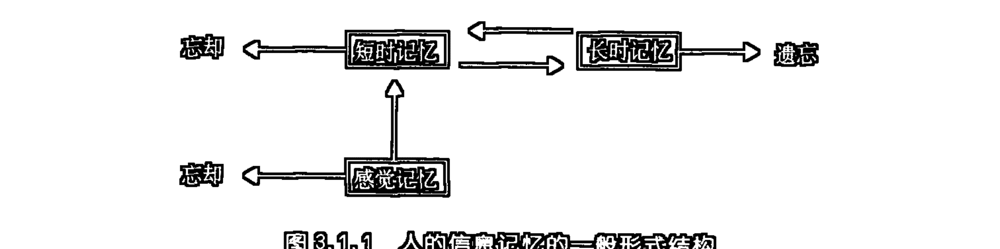

## 六、人的信息活动的第四层次：信息主体创造

人的信息活动的第四个层次是信息的主体创造，亦即再生信息本身的活动。信息的主体创造的过程便是通常所说的人之思维过程。人之思维是一个通过对感知记忆的表象信息进行加工改造，并在此基础上创造出新的信息的过程。思维创造的新的信息可以是形象的，也可以是符号的。在前所述及的信息形态的分类理论中，我们已把思维创造的新的形象规定为概象信息，而把思维创造的种种抽象的符号规定为符号信息。概象信息和符号信息正是再生信息的两种基本形式。

如果说感知识辨和记忆储存的自为信息还保持着与认识对象的直观对应性的话，那么，作为主体创造的再生信息的概象信息和符号信息则已经超越了与具体对象的直接的直观对应性。人类思维创造的再生信息，就其是通过思维的加工操作创造出来的意义上讲，它首先是以纯间接存在的形式通过主观关系的设计在人脑中被产生出来的，而不是像自为信息那样，首先通过了一个对应的客体信息的现实的刺激，并且，在主观上认识者也能把它所体验着的记忆表象与那个对应的客体具体地统一起来。再生信息就它是一种思维创造的结果而言，在它产生出来的时候，并不存在一个现实的认识对象与它直接对应。当然，在后续的感知和实践过程中可能会发现或制作出与之直接对应的现实的认识对象则是另外一些过程。

在心理学中往往把表象区分为两类：一类是记忆表象，“指对客体的一种主观经验（视觉的、听觉的，等等）。这个客体对于经受这种经验来说，曾经作为一种刺激存在过但是现在并不存在于其知觉领域之中”；另一类是创造性表象，是指“对一客体的一种主观经验（视觉的、听觉的及其他）而这个客体对于经受这种经验的人来说，从没有作为一个刺激实物而存在过，它是一种想象出来的客体。”①显然，心理学中所说的创造性表象和记忆表象不是同一个层次上的信息活动过程，创造性表象是通过有意识的思维操作的信息加工过程被认识主体主动建构出来的，而记忆表象则未经过这种有意识的思维操作的信息加工过程层次上的再造。应该用一个新的更为贴切的概念来指谓这两种不同认识层次上的信息活动。为此，我以概象这个概念来指谓心理学中通常所说的创造性表象，而以表象这个概念专指记忆表象，并同时把概象信息看成是由形象思维，或借助于抽象思维而创造出的一种再生信息的形式。

有理由把概象信息分为类概象和幻概象两类，类概象是对诸多同类认识对象共同本质特征的形象的抽取和概括，人脑中对猫、狗、山、水等类形象的建构就属这一类概象信息；幻概象则是对不同类认识对象不同特征的硬性组合的形象构造，人脑中对天堂地狱、妖魔鬼怪、八戒、孙猴形象的建构，一种新颖别致的情景、模式的建构则属这一类概象信息。

认知心理学家把人看成是能够进行信息加工的“物理符号系统”，这里的“物理”二字指的是从事信息加工的人之神经和脑是一个具体的物质系统，这里的“符号”是指这个物质系统所能够操作的任何一种模式。美国著名的认知心理学家西蒙曾在其名著《人类的认知——思维的信息加工理论》一书中这样写道：“所谓符号就是模式，任何一个模式，只要它能和其他模式相区别，它就是一个符号。”“符号既可以是物理的符号，也可以是计算机中的电子运动模式，还可以是头脑中神经元的某种运动方式。”②这样，在认知心理学家们看来，任何一种感知的印象、记忆的表象，以及我们所说的概象，连同语言、文字等等都是一种符号。这种将符号概念普遍泛化的理论显然是从计算机的模式识别、处理应用中平移过来的。这样的一种平移虽然在对个别心理活动的描述上是方便而简易的，但是却引出了另外的一种不容忽视的缺陷，这就是，符号概念的泛化无助于对人的信息活动的层次性描述和研究，因为在这种泛化的意义上符号概念基本等同于信息概念。说“任何一种模式都是一种符号”，与说“任何一种模式都是一种信息”是等价的，因为在最一般的理解上，无论是在信息论中，还是系统论中，还是控制论中，信息都是被理解为模式的。如此，说“任何一种信息都是一种符号”，也是与上面所说的两句话等价的。这样，“物理符号系统”就是“物理信息系统”。在这种泛化理解的意义上，符号概念的引入失去了它自身的特殊的质的规定，而成了模式、信息等概念的一种别称。

其实，符号概念的规定应该具有一种更严格的内涵。它不应指谓那些直接呈现着的信息模式，而应专门指谓用一种信息模式去代示另一种信息模式的情景，并且，这种模式间的代示还具有某种主观约定的特征。显然，语言、文字、图表、数据是发展最成熟的一种符号，但是，符号却并不仅仅局限于语言、文字、图表、数据的形式。人的任何一种特定的动作、表情也都可以被利用了来作为符号，以致发展起了专门研究这类符号的人体语言学。在某些特定的条件下，某些特定物的模式也可以用来代示某些事件、消息和情报，这些特定物的模式也构成了具有相应意义的符号。我们这里所规定的符号信息就是在这样的一种模式互代的意义上使用的，而作为人的最高级认识能力的集中体现的抽象思维活动，则正是通过符号信息的逻辑推演创造新的符号信息的过程。

从发生学的意义上讲，在动物界，创造概象信息的形象思维先于创造符号信息的抽象思维而发生。由此，我们有理由说，抽象思维是高于形象思维的思维形式，但是，在人这里，尤其是在成熟了的人的思维活动中，概象和符号、形象思维和抽象思维都总是交织在一起的，二者并不能截然分开。人们可以利用抽象思维的符号信息的运演来创造概象信息，也可以借助于形象思维创造的概象信息的想象来产生和规定符号信息。在这里，集中体现着高层信息活动对低层信息活动的改造和控制作用，也集中体现着人的信息活动的层次综合参与和层次相互转化的关系。关于这样一些带有规律性的人的信息活动层次间的相互作用现象我们将在下一章中讨论。

## 七、人的信息活动的第五层次：主体信息的社会实现

人的信息活动的第五个层次是人所创造的再生信息的社会实现。人所创造的再生信息虽然在其创造出来的时候没有一个具体的直接存在的对应物，但是，只要这种再生信息是符合自然本性的，并且是具备了向直接存在的形式转化的现实可能性的，便有可能通过人的社会实践过程创造出一个与之对应的直接存在物来。如，一座新建筑物的主观设计，只要这种设计是合理的，并且建筑场地、材料、人员是具备的，那么，人们便可以通过具体建筑的过程，按照主观的设计构建出一个直接存在的建筑物。这样，主体信息的社会实现是通过人的社会实践的中介达到的，这就有必要从信息活动的角度来对人的实践活动本身进行规定。

前文提到，国内学者们以往对实践活动的规定更多注重的是它的物质性活动意义的方面，而对实践活动区别于一般动物的本能活动的最重要的因素——目的性——却往往不曾给以足够的重视。其实，在一个具体的实践活动过程未曾展开之前，主体通过思维所创造的目的性、计划性信息，即一种主观的再生信息的模式就先已存在了。任何一个具体的实践过程都是以主体的目的性、计划性的主观设计为其起点的。

在最为一般的意义上，实践被规定为人们对客体的有目的的改造活动。在一些相关的讨论中我曾将实践活动的一般运行模式归纳为如下4个大的基本环节：①在实践的物质性运动过程未曾展开之前，主体要通过实践实现的目的，以及为实现此目的而必须采取的方式、方法和手段的计划都已作为概象或符号的信息模式在人的意识中被设计好了，这就是作为实践由以展开的起点的主体创造的目的性、计划性信息；②在主体创造的目的性信息的驱动下，按照主体创造的计划性信息的模式，主体发出行为启动的指令信息；③在指令信息的作用下，通过人的神经激发人的运动器官行动起来，选择和操作工具、选择和作用于客体，以具体实施计划信息；④最终结果是按照主体目的性信息的要求改变了客体的结构和状态（客体结构信息的改变），亦即是主体目的性信息在客体中的实现。在这一实践的系列过程中，主体信息一直起着规定实践的方向、设计实践的程序和方式、控制实践的进度、程度的作用。

从上述的实践活动的四大基本环节的叙述中，我们完全有理由规定说：实践是一个主体信息在客体中实现的过程。把这一规定展开表述便是：主体创造的一种信息（目的性）通过主体创造的另一种信息（计划性）实施的中介潜入客体，化为客体的特定结构和状态被生产出来了。

从我们关于实践的信息活动意义的讨论中，可以清晰地看到，人们通过社会实践的过程所实现的正是主体创造的再生信息（目的性信息）向直接存在的形态（客体的特定结构和状态）的转化。正是在这种转化的意义上，我们说实践是主体创造的再生信息的社会实现，或简称为主体信息的社会实现。

主体创造的再生信息的社会实现还在另一种意义上构成，那就是个体创造的再生信息进入了社会化的人际之间的交流。如，某些文字、概念、符号、艺术作品、神话故事、科学幻想、假说、理论往往都是首先产生于某些个别的个体的信息创造，这些信息又会通过某种方式得以表达、叙述，从而转化为社会中人共享的信息。如果从社会中人在享有他人创造的信息的同时就必然会引起自身的生理的、心理的、行为的结构变化的特定角度上来看，我们便有理由对上述的两种不同意义上的主体创造的再生信息的社会实现过程做出一种统一性的描述，即它们都是主体的目的性信息转化为客体（人或物）的结构信息的过程。

## 八、人的信息活动层次的图示

如果不考虑人的不同层次的信息活动间所存在的复杂交织的相互作用关系，仅从其等级相关的意义上来考察的话，我们可以把上述人的五个基本层次的信息活动，按其等级层次标示在一个梯形分层的图（图 3.1.2）中，并且，每个层次上的信息活动又可以区分出若干个层次。

在本图中，处于下一层次的信息活动依次构成其上一层次的信息活动的基础。人的信息活动正是在这五个不同的层次上展开的。

### 第二章 人的信息活动层次间的相互作用

人的信息活动的不同层次之间（包括各子层次之间）存在着复杂的相互作用，通过复杂的相互作用，不同层次的信息相互过渡、转化、规定和控制。在总括的意义上，我们可以把人的信息活动的层次间的复杂相互作用区分为四种相互关联的关系方面：一是由低到高的层次递进建构关系；二是高层次对低层次的全息制控关系；三是人的信息活动的层次综合参与关系；四是人的信息活动层次的相互转化关系。①

## 一、人的信息活动的层次递进建构关系

对生物智能进化史的考察，使我们清晰地看到，人的不同层次的信息活动是在动物智能活动的种系进化过程中，由低到高逐次发展起来的。人的信息活动的层次递进建构关系集中体现着这种动物智能活动进化的历史渊源。这一关系的内容包括两个方面：一是人的个体信息活动能力的产生是一个不断由低到高的递进建构过程，即是说，对任一个体来说，他的不同层次的信息活动能力是在其个体发育的过程中依次建构和产生出来的；二是人的高层次的信息活动对低层次的信息活动具有依赖性，即是说，低层次的信息活动为高层次的信息活动的产生和展开提供基础性的条件。人的信息活动的层次递进是通过某些信息加工的操作步骤来实现的。在这里，特定的信息加工操作能力便成了实现相应信息层次递进建构的必要中介。与不同层次的信息活动的种系进化过程相一致，人的不同的信息加工操作能力同样是在动物种系进化的过程中逐步发展起来的。具体讲来，从信息自在活动的层次向信息直观识辨的层次的递进是以向内部主观呈现转化的操作为中介的，其中包括个别信息的主观选择和感觉信息的综合、模式匹配的建构等；从信息直观识辨的层次向信息记忆储存的层次的递进是以建构联系痕迹的操作为中介的，其中包括建立种种暂时联系和稳定联系痕迹的各类信息编码过程；从信息记忆储存的层次向信息主体创造的层次的递进是以主观改造信息的操作为中介的，其中包括对记忆表象信息要素的重新分解组合、主观约定信息关系的建立，以及判断、推理的符号信息的逻辑推演等过程；从信息主体创造的层次向主体信息的社会实现的层次的递进是以向外部客体转化的操作为中介的，其中包括目的、计划性信息产生中的需求、价值、条件等因素的诱导，行为指令信息发放的意念控制，以及整个实践行为活动展开的主体器官活动、操作工具、作用于客体的一系列过程。

图 3.2.1 简略地标明了以不同的信息加工操作步骤为中介的人的信息活动的层次递进建构关系。

## 二、人的信息活动的层次由上到下的全息制控关系

人的信息活动的层次递进建构关系更多地具有原始发生学的意义。在一个已经相对发育成熟了的认识个体中，这种层次递进建构关系还仅仅体现着信息活动层次间相互作用的一个方面，即仅仅体现了主体信息活动由低层次向高层次发展、跃进的一个方面。要全面、准确地把握主体信息活动的复杂性还有必要从另外一个相反的方面，即从主体信息活动的高层次对低层次作用的方面来考察。体现这一方面关系的便是高层次对低层次的全息制控关系。

人的信息活动的层次递进建构关系指出，人的高层信息活动是在低层信息活动的基础上，通过某些特定的信息加工步骤的中介而产生、建构出来的。这种高层次的信息活动方式一旦产生出来，便对人的整个信息活动系统具有了两个方面的意义和价值：一方面，新的高层信息活动方式以它自身的已经存在给人的整个信息活动系统增加了一个新的要素；另一方面，由于这个新要素的增加，便不可避免地要和系统中原有的要素发生种种相应的相互作用关系，通过这种相互作用关系，系统将获得某种整体意义上的改变。由于这个新的信息活动方式是从原有信息活动方式的进化过程中产生出来的系统的要素，所以，它与系统原有的要素相比便不能不处于系统中更高层级的地位。这种更高层级的地位使这个新要素对原有要素的作用带有居高临下，赋予原有要素以某种全新改造（赋予新质和新内容）的特点。这种居高临下，赋予下层活动以新质、新内容的作用过程，便构成了人的高层信息活动对低层信息活动的全息制控关系。

具体讲来，人的高层信息活动对低层信息活动的这种全息制控关系表现在如下两个相反相成的方面：一是“导向”，二是“抑制”。

所谓“导向”，是指人的高层信息活动总是从自身活动的目的、要求、性质和特点出发对低层信息活动加以规范、评价和引导，以便把低层信息活动纳入为自身活动服务的轨道。“导向”的内容包括：规定低层信息活动的方向和强度，监控低层信息活动的过程，评价和支配低层信息活动的结果。如，主体总是从自身思维（信息主体创造）活动的目的、需求出发，对感知、记忆的信息加工操作过程进行目的定向，调节、选择感知、记忆的内容，强化特定感知、记忆的过程，并为感知、记忆的信息提供模式匹配，进行评价、解释。人们还总是从其实现信息的实践活动的需求出发，有目的地去收集、识辨、储存相关信息，并对之进行相应的加工处理的思考、设计。另外，实践活动还对这些思考、设计所产生的主体的创造性信息成果进行真值性程度的检验。

所谓“抑制”，是指高层信息活动在对低层信息活动进行“导向”时，总是要求低层信息活动的方向、强度、过程和结果与自身活动的目的、需求、性质和特点相一致，对那些不相一致的方面总是尽量地予以限制和纠正。“抑制”就是迫使低层信息活动减少盲目性、自由度，从而保证更为积极自觉地服从高层信息活动对之进行的“导向”。

“导向”和“抑制”是同一制控过程中的两个相反相成的方面，任何一种“导向”作用都必须以相应的“抑制”作用为保证条件，而任何一种“抑制”作用都必然会带来一定程度的“导向”效应。

通过“导向”和“抑制”的双重作用，高层信息活动对低层信息活动实施着某种全息意义上的“制控”。因为有了这种来自高层的“制控”关系，人的低层信息活动得到了某种全息意义上的改造。在人这里，低层信息活动已经在其生物进化的原始发端水平上实现了某种超越和升华。人的感知、记忆已不是一般动物的感知、记忆，它是在人的思维和实践活动制控下的感知、记忆；人的思维也不是个别高等动物中的那种萌芽状态的思维，而是在人的社会实践活动制控下的具有高度发展水平的自觉、能动的主体创造信息的活动。就连人的自在信息的活动也在某种程度上受到了人的意识和实践活动的支配。这不仅是指随着人的意识和实践活动对外界环境的选择和改造而引起的人所自在同化和异化的信息在类别和内容上所发生的相应改变，而且还指人在进行意识和实践活动过程中必然会生发出特定性质和内容的信息场，以及信息的自在同化和异化过程。

高层信息活动对低层信息活动的这种“导向”、“抑制”的制控关系，并不仅仅存在于前述及的五个层次之间，而且也普遍存在于每一层次中的各子层次之间。如，知觉的完善化发展使感觉过程升华了，在人这里，很少有像低等动物那样的纯粹意义上的感觉体验。人们总是一下子就在对信息进行初级综合的知觉的水平上来把握对象，这就使人们有能力对各类突如其来的现象做出准确而快速的反应；由于长期记忆能力的发展，人们的短期记忆活动不再像不具有长期记忆能力的那些低等动物那样，只能来源于当时对外界信息的感觉，而且还可以来自对长期记忆中储存的信息的有选择的提取；当着创造符号信息的抽象思维能力发展起来之后，人的创造概象信息的形象思维便不再能简单停留在仅仅凭借对表象或概象进行加工处理的初级水平上了，人的形象思维已经可以凭借抽象的符号信息的逻辑推演的参与来进行了，抽象思维改造和升华了形象思维，符号信息和概象信息之间的转换使抽象思维和形象思维达到了某种高超的综合统一的水平；实践活动固然是从主体的目的计划性信息的产生而开始启动的，但是，实践过程进行的状况，实践引起的客体结构信息变化的程度和状况又反过来成为检验、修正或改变主体的目的、计划性信息的制控力量。

由于高层信息活动对低层信息活动的全息制控，使人的任何一个层次上的信息活动都不再是纯动物性的信息活动了，人的所有层级的信息活动都具有了属人的、属人的社会的活动的新质。

## 三、人的信息活动的层次综合参与关系

人的信息活动是一个分层次的大活动系统，在这个大活动系统中所具有的这种等级全息制控关系，使人的各种各样的、诸多层级的信息活动统一成了一个有机联系的活动整体。要更为深刻地揭示人的信息活动的这种有机整体的全息性，我们还有必要来考察人的信息活动层次间的另外一种相互作用关系，这就是人的信息活动的所有层次对任一层次的信息活动的综合参与关系。

应该说，人的信息活动本身就是高度综合的。前文述及的人的信息活动层次间由下到上的递进建构关系和由上到下的全息制控关系都是某种意义上的综合，只不过这两种关系更注重强调了两个相反的单线条的综合过程。其实，这两个相反的单线条的综合过程还只是一种理论上的抽象，人的信息活动的真实过程本身并不是这样两向分割着的，而是两向的综合，即是说，前述的两种关系是同时起作用的。如果我们面对的不是一个处在智能发生的某一初级阶段上的个体，而是一个已完善具备五种信息活动的层次的成熟的认识主体的话，那么，我们将会更为清晰地看到人的信息活动的这种高度综合的性质。人的信息活动的层次综合参与关系恰恰是在这种更为高度综合的意义上来对人的信息活动的复杂性和系统整体性予以解释的。

人的信息活动的层次综合参与关系具体体现在两个方面：一是人的所有层次的信息活动都为任一层次的信息活动提供活动的参照背景；二是人的所有层次的信息活动都直接或间接地普遍渗透或交织到任一层次的信息活动之中。

人的信息活动是一个有机联系的整体，这个整体在高度综合的水平上构成了人的现实的认识结构。对于一个具体处于信息加工操作过程中的认识主体来说，他的任何一种心理活动都是一个现实产生着的信息生成过程。这种处于生成过程中的信息的可能样态取决于两方面因素的综合，一方面取决于体外或体内（包括神经系统内部）特定信息的刺激，另一方面取决于主体内部的先已建构起来的信息认识结构的背景参照。由于人的信息活动的不同层次之间是普遍相互联系、内在统一着的，所以，当主体信息认识结构发挥其背景参照作用时，它总是在不同层次的综合的水平上，以某种整体相关的方式来起作用的。这种综合的、整体相关的作用方式所导致的便是人的所有层次的信息活动都为任一层次的信息活动提供活动的参照背景；同时，这种综合的、整体相关的参照背景作用又是通过不同层次的信息活动普遍渗透或交织到某一层次的信息活动之中来实现的。

人的知觉的活动明显地具有这种层次综合参与的特征。在人的知觉活动发生时，既要有信息场的信息传递和信息的自在同化和异化活动作为其活动展开的基础，又要有短期记忆活动的参与，还要有长期记忆中储存的某些信息内容的选择提取，既要有概象信息所提供的认知模式匹配，又要有符号信息参与其中的类的归属活动，还要有符号逻辑推演活动参与的分析、比较、综合的信息加工处理；并且，人的感知活动还总是被纳入人的社会实践活动的链条之中，成为以观测仪器、实验活动为中介的、有目的的认识世界的活动。这样，人的知觉应该被看成是一个在高度综合的水平上实现的一个过程，在这一过程中，所有层次的信息活动因素都不同程度地参与进来了。

人的信息主体创造活动是通过思维来实现的。人的思维过程是在更为高度综合的水平上进行的。在思维过程中，始终离不开感知、记忆的活动，无论是思维利用的概象信息和符号信息，还是思维所遵循的判断、推理的规则，无论是思维展开的整个过程，还是思维所达到的阶段性的或最终的结果，都必须首先通过相应的感知和记忆的把握活动来保证。因为，只有在借助短期记忆

## 130 第三编 信息认识论(上)

而处于感知呈现的状态下，思维的发生和展开才是可能的。另外，思维赖以展开的各类信息材料（表象的、概象的、符号的），以及逻辑运演的规则等等，又必须依赖于对长时记忆中储存的相应信息的提取。再者，思维过程仍需以自在信息的活动为其展开的深层基础背景，因为离开了自在信息活动的基础任何层次的信息活动都是无法想象的。正因为有一个自在信息活动的基础，我们才有可能更为科学地解释诸如潜意识、灵感、直觉之类的现象。而这类现象正是由于信息从其自在调节层向自为意识层突现所造成的。人的思维活动的高度综合性还体现在人的实践活动也直接或间接地参与到人的思维活动中来了。这不仅是指实践要求思维为其提供目的、计划，提供过程监控的分析，也不仅是指实践的某些结果成了思维活动利用的材料，以及实践对某些思维结果的真值性予以检验，而更是指思维在一定程度上直接或间接地成为一种实践活动的过程，或说某些实践的过程直接或间接地转化成了思维的环节。也许，在这方面最有力的证据便是人类智能工业的发展了，这种智能工业的发展最终导致的是把人类主体创造信息的活动转化为一种实践工程。

主体信息的社会实现是人的信息活动的最高层次，在这个层次上也实现着人的信息活动的最高程度的综合。实践的主体信息在客体中实现的性质首先就把自在、自为、再生三种基本形态的信息在自身中有机地统一起来了。上面我们曾提到，某些实践的过程直接或间接地转化成了思维的环节。而我们在这里则更要强调，人的感知、记忆、思维的活动都直接或间接地成了人的社会实践活动的环节。

实践过程首先是从主体思维创造目的性、计划性信息的活动开始的。这种目的性、计划性信息要求主体发出行为启动的指令信息，通过人的神经激发人的运动器官行动起来，操作工具，作用于客体对象。在这一实践的系列过程中，主体的感知、记忆、思维形成一种整体协同的活动，这种整体协同的活动一直起着规定实践的方向、设计实践的程序和方式、控制实践的进度、程度的作用。主体的目的性信息通过实践活动最终在客体中得以实现，改变了客体的结构和状态，使之符合于人的目的设计。此外，实践过程进行得怎样，客体被改造的程度如何，主体的目的性信息能否如期实现，主体为实现其目的所拟定的计划、所采取的手段是否恰当可行等方面问题的判定，又需要主体把实践过程和被改造着的客体本身活动的信息当作它所要认识的内容来把握（感知、记忆），来思维（创造性的加工改造）。这样，实践过程、被改造的客体都成了参与这一实践过程中的主体的认识对象。主体通过对这些对象活动的信息的把握、分析和处理，不断地向自己的运动器官发出新的信息指令，或者使实践活动按原有计划继续进行，或者使原有计划得到修正和改变。在这一过程中，信息的运动是双向的：一个方向是主体的目的性信息向客体运动，并在客体中实现；另一个方向是客体活动的信息向主体的运动，客体信息在主体中实现（被主体把握、认识、改造）。在这一双向信息运动的过程中，起中介作用的是主体为实现其目的而设计的计划性信息，以及计划实施的过程。在实践活动中，处于不同层级的自在、自为、再生信息达到了某种有机的、全息性的统一，这种统一集中体现着人的信息活动的综合性、整体性、全息性的特点。

## 第二章 人的信息活动层次间的相互作用 131

### 四、人的信息活动层次的相互转化关系

人的信息活动自下而上的层次递进建构，自上而下的全息制控，以及人的信息活动的层次综合参与等相互作用的过程，最终导致了一种新的综合性关系的发生，这便是人的信息活动层次的相互转化关系。可以把人的信息活动层次的相互转化关系看成是前述三种关系引出的一个必然结果，这个结果具体而现实地体现着人的信息活动的综合性、整体性、全息性。

人的信息活动层次的相互转化指的是某一特定层次上的信息活动在与其他层次上的信息活动的复杂的相互作用中引起的自身活动内容和方式上的变化。如果说前述的人的信息活动层次间的三种相互作用关系注重的是对活动过程的描述的话，那么，这里则更注重强调一种由过程引出的结果。

人的信息活动层次的相互转化指的是人的信息活动层次间的复杂相互作用造成的一种相辅相成的双重效应：一是低层信息活动方式的高层化；二是高层信息活动成果的低层化。所谓低层信息活动方式的高层化，指的是低层信息的活动总是通过某些高层信息的活动来完成。所谓高层信息活动成果的低层化，指的是某些高层信息活动的结果直接转化成了低层信息活动的内容。

人的感知能力已经进化到了这样的程度，它已远远超越了一般动物的感知活动的水平。这不仅是指感知的内容方面，而且是指感知活动的一般机理方面。在内容方面，人不仅能像动物那样感知外界的客观信息，而且还以人所独具的方式来感知语言、文字、图符等人类创造出来的文化信息，当然也包括对人自身进行着的思维过程、实践过程的感知把握。在感知活动的一般机理方面，人的感知已不仅仅是通过感知的感知，而且还是通过思维、通过实践的感知。人的知觉是对被知觉的材料进行加工编码的过程，在这一过程中知觉同时就是对对象的认知。这种对材料进行加工编码的认知过程，既有模式匹配中的概象信息的选择和建构，也有符号信息逻辑的密切参与，并且，认知过程总是被纳入到概象的或符号的一定的“类”的形象归属或范畴归属的系统之中。这样，我们便有理由说，人的感知被思维化了。另外，我们还应该注意到，人的发展了的感知还须借助于特定的工具：从望远镜、显微镜到各种仪表、仪器；从电话、收音机、电视机、计算机网络到卫星、飞船、粒子加速器……这样，我们又有理由说，人的感知变成了一种真实意义上的社会实践活动。

人的储存信息的记忆活动也呈现出了类似于感知活动的情景。从记忆内容方面来看，人的记忆不再只是对感知直观识辨的由自在信息转化而来的表象信息而言的，而且是对思维创造的概象信息、符号信息而言的，同时也是对思维的过程、实践的过程和结果而言的。从记忆方式来看，人的记忆也被思维化、实践化了。在一般学习活动的记忆过程中，学习者总是更多地通过思维逻辑的理解性编码来力求更长时间地将某些特定学习内容储存于记忆之中。在回忆某些事件信息时，人们也往往借助于逻辑联想的导引。更为发展了的人类记忆活动，则并不仅仅依赖于人的自然脑力。从文字记载、图画描绘到录音、录像，直到电脑储存，不正标志着人类记忆活动的不断向高层信息活动进化的历程吗？在这里，记忆也成了一种社会实践工程了。

思维是主体创造信息的过程。从思维最初起源的时候开始，它就和社会实践活动连在了一起。最初是在古猿中萌生了思维和劳动的雏形，后来则是人的思维和劳动活动的生成和进化。在今天的人类思维活动中，最能体现思维活动的高层化发展水平的就是人工智能工业的产生和发展。人工智能使主体信息创造的部分过程可以在一个客体机械中间接地进行，最新发展着的计算机技术正是要试图把思维当作一种实践工程来设计。

就是在人的自在信息活动的层次上，这种层次相互转化的关系也在一定程度上存在。人的自在信息的活动是人的信息活动的最深层级的基础。虽然，人的自在信息的活动大部分还是以纯粹自在的方式来运行，但是，有那么一部分属于人的自在信息活动的过程却失去了那种原始的、纯粹的自在性。因为，这部分自在信息的活动是伴随着人的感知、记忆、思维和实践过程而进行的。在这里，自在信息的活动直接受到了高层信息活动的调控和支配，这时，人的自在信息活动的类型、样态和内容已经和相应的人的高层信息活动相协调、相一致起来，并且只能在相应的高层信息活动的过程中来完成自己活动的过程。另外，我们还应注意到，某些自为、再生信息的活动过程或结果将会从意识层潜入到自在层，这时，这部分信息的活动将不再采取“内部呈现”的状态，而是在一种类似于自在调节的层次上活动，并且这种活动的过程和结果还具有某种不能被明确追忆的性质。在另外一种情况下，则存在着某些信息从自在层向自为、再生层的可能突现，这种突现则可能造成通常所说的灵感、直觉之类的现象。或许弗洛伊德所集中探讨的那种潜意识和梦的活动，也可以在这里找到一定程度的说明。人的自在信息的活动已经脱离了一般无机界中所普遍发生着的那种自在信息活动的纯粹自在性，并且，与人的自为、再生信息的活动以及人的实践活动构成了一个有机的不可分割的整体。

人的信息活动层次间的四种相互作用关系是人的信息活动层次间发生着的统一的相互作用过程的四个侧面。在具体的过程中，这四个侧面是不能割裂的，它们总是在统一的、综合的水平和层次上发挥作用的。

主体信息活动的层次和层次间的统一而多重的相互作用关系，充分体现着主体信息活动的复杂性、整体性、综合性和全息性。

## 第三章 人的信息活动的生理基础①

从主体内部操作的过程来看，人的认识是以人体神经系统（主要是脑）为中介的信息加工过程；从人的社会实践过程来看，人的认识还要以参与实践过程中的种种客观工具（仪器、仪表、工具、机械、设施等）为中介。这样，人体神经系统和实践工具便构成了人的信息活动的物质基础，用信息论的语言来说，亦即是物质载体。人体神经系统乃是人的信息活动的体内生理性的物质基础，而实践工具则是人的信息活动的体外非生理性的物质基础。当然，在某种广义类比的意义上，我们也完全有理由把后者看成是前者的社会性体外延伸。

本章仅注重对人体神经系统的结构和运行机制加以讨论，至于实践工具，我们仅在其与人体神经器官的相关延伸的意义上予以某种附加性的说明。

作为人的心理信息活动的物质载体，人体神经系统最起码应当具有三重意义上的结构：一是解剖意义上的物质形态结构；二是信息加工意义上的心理机能结构；三是“内部呈现的”心理信息活动的结构。

人体神经系统的物质形态结构乃是人的信息活动的最深层级的生理基础，人体神经系统的心理机能结构则是这个物质形态结构在其综合运行中所体现出来的某种功能性结构，这种功能性结构附着性地增生在物质形态结构之上，构成了人的信息活动的浅层生理基础。至于“内部呈现的”心理信息活动的结构就是心理机能结构综合运行所产生的一种结果。我们在前两章中已讨论过的人的信息活动的层次，以及人的信息活动的层次间的复杂的相互作用，揭示的正是这种心理信息活动的结构。

人体神经系统的形态结构和机能结构虽有相关对应的关系，但是二者又不是一一对应的简单等同。因为人的任何一种心理信息活动的机能都将涉及若干个层次或水平上的形态结构。作出如下两个结论是合理的：一个结论是，若干个处于不同层次或水平上的形态结构的一些部位可能联合起来构成人的心理信息活动的某一方面层次或水平上的机能结构；另一个结论是，人的任何一个层次或水平上的心理信息活动都将需要有若干个机能结构的协同参与才能进行。

> ① 本章的基本内容曾以《试论人的信息活动的生理基础》为题发表于《哈尔滨师专学报》2000年第4期，第20～28页。

### 一、人体神经系统的物质形态结构

人体神经系统是迄今为止地球生命进化过程中达到的最复杂，也是最完善的信息加工控制系统。特别是人脑功能的特异化和综合化发展，使人类不仅具有了非凡的感知、记忆、思维的能力，而且思维能力的高度发展又使人的活动变成了实现主体目的性信息的宏大的社会实践，并且，这种社会实践活动和人的认识活动之间的反馈性相互作用又使二者都不断得到新的发展。

从信息控制的角度来看，人体神经系统是一个复杂的巨系统，它的一个显著的结构特征是：它是一个有机自组织的多级结构，这个多级结构的内部可以相对区分出若干个不同等级和层次的子系统。不同子系统之间、不同等级的结构之间，存在着广泛的信息联系。各子系统、各级结构的功能又有着具体的分工，而高级结构又对低级结构的活动施以控制。另外，各子系统、各级结构之间又普遍存在着机能活动方面的相互协同。

如果仅从神经系统作为人的心理信息活动的物质载体的角度来分析，那么，我们便可不必对神经系统其他方面的功能详加讨论，这样，我们这里的分析便可能较为容易。

在形态结构上，人体神经解剖学首先把人体神经系统分为两部分：周围神经系统和中枢神经系统，中枢神经系统又可分为脊髓和脑，而脑又可分为脑干、小脑、皮层下部位和大脑皮层。小脑位于脑干的背侧，且通过神经纤维与脑干相连，在形态位置上，它应与脑干处于同一个层次。

这样，我们就在形态结构的意义上获得了人体神经系统由低到高的五个基本层次：周围神经系统、脊髓、脑干和小脑、皮层下部位、大脑皮层。

周围神经系统是人体神经系统的形态结构的最低层次。周围神经系统是由各类神经纤维束组成的沟通中枢神经和人体各部的神经通路。一条神经包括神经纤维少到十几根，多到几百甚至上千、上万根。神经纤维可分为两种：一种是传入神经纤维，在其分布于体内和体表的各类器官、组织上的神经末梢上延生着各类感受器，它们能把接收到的外界、体内的信息传入中枢神经，所以，传入神经纤维又被称为感觉神经纤维；另一种是传出神经纤维，在其分布于体内和体表的各类器官、组织上的神经末梢上延生着各类效应器，它们能把中枢神经发出的各类信息指令传达到相应部位，以产生特定的运动，所以，传出神经纤维又称为运动神经纤维。由这两种神经纤维分别或混合组成的神经分别称为感觉神经、运动神经和混合神经。人的周围神经系统包括由脑发出的12对脑神经和由脊髓发出的31对脊神经和植物性神经。脑神经主要分布在头面部，只有迷走神经远行达胸、腹腔脏器；脊神经则分布于躯干和四肢。

脊髓是中枢神经系统的低级部位，是人体神经系统的形态结构的第二个层次。脊髓在发生史上较为古老，结构相对简单而定型。脑与脊髓都被包围在骨质腔内。脑位于颅腔，脊髓位于椎管内。整个椎管在纵向上分成31节脊椎，每一节脊椎内有相对应的一段脊髓，称为脊髓节，每一脊髓节上有一对脊神经与外周发生联系，这就是31段脊髓节所对应的31对脊神经。在脊髓横切面的中央有一个蝴蝶形的灰色部分，称灰质，灰质周围颜色发白的部分称白质。灰质主要由神经元的胞体组成，白质主要由上、下纵行的神经纤维构成。来自周围神经的各种信息流，通过各个上行神经纤维束传达到脑，进行高一级的信息加工，而脑发出的各类信息指令则通过各个下行神经纤维束传到脊髓，或控制脊髓的活动，或经由脊髓再转达到周围神经系统。

和脊髓上部相连接的是脑干，脑干背侧是小脑。脑干和小脑共处于人体神经系统的形态结构的第三个层次。脑干因其结构像是一个竖着的长方形主干而得名，大脑生在其上。脑干与中枢神经系统的其他部分一样，由含有大量神经元胞体的灰质及包含众多神经传导纤维的白质组成。脑干自上而下又可分为延髓、脑桥、中脑三段。脑干的主要功能是信息传导和信号反射。12对脑神经除嗅神经与大脑相连、视神经与间脑相连外，其余10对均连于脑干各段。脑干中分布着许多由神经细胞集中而成的神经核和神经中枢，并有大量上、下行的神经纤维束通过，连接大脑、小脑和脊髓，在形态和机能上把中枢神经各部分联系为一个整体。特别是位于延髓上部的腹面隆起的脑桥，对于联系大脑、小脑以及脑的各部分与脊髓具有重要作用。脑干中有许多与维持基本生命活动关系重大的神经中枢，如控制人的呼吸、心跳、胃肠蠕动、吞咽等重要生命活动的初级中枢（反射中枢）都在脑干下部的延髓之中，所以延髓常被称为“活命中枢”。脑干上部的中脑，内有蓝斑核、红核和黑质等神经核团，它们与合成、传输特殊的神经递质，维持脑的工作状态有关。此外，中脑还是调节人体姿势的一个重要的低级中枢。

小脑位于延髓和脑桥的背侧，在大脑的后下方。小脑两侧膨大的部分称小脑半球，位于中间连接两半球的狭窄部分称小脑蚓部。小脑的表面有不少类似大脑皮层的沟裂，这些沟裂把表面分成许多平行、狭长的“脑回”，称为小脑叶。小脑的表层是由神经细胞体组成的灰质层即小脑皮层。皮层下是白质，白质中又有散在的神经核。小脑通过传入和传出纤维束与脑干、大脑和脊髓发生联系。小脑的全部传入纤维终止于小脑皮质，冲动从小脑皮质走向小脑深部白质内的各种小脑核，而传出纤维的绝大部分又起始于这些小脑核。小脑分为旧的部分（接受脊髓和前庭核的传入纤维）和新的部分（半球）。大量的皮质—脑桥—小脑系统的纤维到达新的部分。来自全身的信号，特别是来自躯干和四肢以及来自全部内脏的信号都到达小脑皮质。小脑参与全部动物性和植物性神经系统的活动，其主要机能是协调骨骼肌的运动，维持和调节肌肉的紧张，保持身体的平衡。

皮层下部位是人体神经系统的形态结构的第四个层次，它包括间脑和皮层下神经节（又称基底神经节）。间脑位于中脑与大脑之间，其上部和侧部几乎全部被大脑两半球所覆盖。间脑主要包括丘脑和下丘脑。丘脑是两个略呈卵圆形的神经组织，内含许多神经核。丘脑和神经系统的所有部分都有联系，并且人类的丘脑与大脑皮质的双向联系特别发达，除嗅觉外的所有感觉传导束都要在丘脑内转换神经元，然后才能投射到大脑皮层的特定部位。正因为是这样，学者们又称丘脑是“大脑皮层的感觉信息中转站”，是“意识的门户”。下丘脑是位于丘脑前下方并与丘脑联在一起的脑区，因此也称为丘脑下部。它与脑干网状结构、丘脑、大脑皮层的边缘叶等有着广泛的神经联系，还与人体内主要的内分泌腺——脑下垂体联在一起。在下丘脑中有许多复杂分化的神经核。下丘脑是植物性神经活动的较高级调节中枢，又是高级的内分泌中枢。下丘脑在调节内分泌腺、体温、心血管和消化系统的活动、摄食和新陈代谢（碳水化合物和脂肪代谢）的活动，性功能和水平衡的活动，乃至情绪行为等活动方面都有十分重要的作用。它是维持有机体自稳态和把机体的内部活动与外部活动结合起来的十分重要的初级脑器官。

皮层下神经节是大脑半球髓质内的灰质团块的总称，它们是进化上较古老的大脑结构，包括尾状核、豆状核、杏仁核（杏仁复合体）三个组成部分，其中尾状核和豆状核又称为纹状体。尾状核弯曲环绕着丘脑，豆状核位于尾状核与丘脑外侧，杏仁核位于豆状核的外侧，是一个分化复杂的核团。从功能上看，人脑中的纹状体属大脑皮层控制下的运动调节中枢，主要调节肌张力、维持肌肉的协同活动和维持躯体姿势。新近的研究表明：纹状体在人的活动编程和技能记忆方面有十分重要的作用。杏仁核的功能则与情绪表现、情绪记忆、防御和攻击反射、食物反射等行为相关。

大脑皮层是人体神经系统的形态结构的第五个层次，也是最高层次，它是覆盖于大脑两半球表面的一层灰质结构（神经细胞的细胞体集中部分）。人的大脑表面有很多往下凹的沟（裂），沟（裂）之间有隆起的回，主要的沟回有中央沟、外侧沟、中央前回、中央后回等。皮层的展开面积约为2200～2600平方厘米，厚度约为1.5～4.5毫米，共有100～150亿个神经细胞。大脑皮层可按其机能的不同分为四个大区：后部是枕叶；前部是额叶；上部为顶叶；外侧沟之后，枕叶之前那部分叫颞叶。额叶的面积最大，机能特别发达。组成大脑皮层的神经细胞，由其形态上的不同井然有序的分层排列，大部分皮质有共同的基本构造，分为6层。各层相互沟通、紧密联系，形成了严谨的神经系统锁链，各层又由于其内在结构上的差异呈不同的功能。这六层自上而下分别被定名为：分子层、外颗粒层、椎体细胞层、内颗粒层、节细胞层、梭形细胞层。大脑的左右两半球之间有横行的神经纤维束（称胼胝体）相联系，通过这种联系，分别覆盖于两半球之上的大脑皮层结合为统一而协调的机能体系。大脑皮层是人体神经系统的最高信息加工部位，它主导着人的感知、记忆、思维的所有层次上的心理信息活动，并调节控制着机体内部的活动、机体与周围环境的平衡，以及人的一般行为和改造世界的实践活动。

人的神经系统的五个层次，就其在人体中的位置分布而言，是自下而上的；就其结构和功能的复杂程度而言，是层次递进的。图 3.3.1 概要绘出了人体神经系统形态结构的层次。

## 二、人体神经系统的心理机能结构

苏联著名的神经心理学家鲁利亚，通过长期研究创立了关于脑的机能系统结构的理论。这一理论给我们这里的论述提供了基本的依据。

鲁利亚在他的研究中首先确定了“机能系统”的概念。他指出，“机能”这一概念至少有两种主要的用法：一种用法是叙述特殊细胞和器官的机能，如说，分泌胆汁是肝脏的机能，分泌胰液是胰腺的机能，发放运动冲动是贝茨锥体细胞的机能；另一种用法则是指谓那种有诸多细胞、组织的器官综合参与的“机能系统”的复杂过程，如消化、循环和呼吸的机能。鲁利亚认为，“‘机能’的这种系统结构不仅是很简单行为活动的特点，也是更复杂的心理活动形式的特点。知觉、记忆、认知、运动、言语、思维、书写、阅读、计算等远不是孤立的能力，不能理解为有限细胞群的直接机能，不能定位在一定的脑区。它们全是在长期历史发展过程中形成的，其来源是社会的，其结构是复杂的、中介的。它们都依赖方式、手段的复杂系统，这种事实要求我们把基本形式的意识活动当作最复杂的机能系统来看待”①。

正是在“机能系统”的意义上，鲁利亚分出了脑的三个主要机能结构（或称机能联合区）：调节紧张度或觉醒状态的结构；接受、加工、保存来自外界的信息的结构；制定程序、调节和控制心理活动的结构。

> ① [苏]鲁利亚等著，李翼鹏等译：《心理学的自然科学基础》，北京，科学出版社，1984年版，第76～77页。

“为了保证心理过程完全合乎要求地进行，人应处于觉醒状态中”，而“为了实现有组织的、有目的指向性的活动，必须保持皮质的最适宜的紧张度”①。必然存在着一种相应的保证这种觉醒状态、调节这种大脑皮质紧张度的机能结构系统。大量的研究已证明，这种相应的机能结构系统并不存在于大脑皮质之中，而是位于大脑皮质之下的形态结构之中，并垂直跨越了若干个形态结构层次的一种被称为网状结构的神经组织。网状结构因其是由大群神经细胞和神经纤维交错排列而构成的神经网络而得名。它起始于脊髓顶端，经由延髓、脑桥、中脑，直到间脑中的丘脑底部。网状结构中交错排列的神经纤维的走向可以明显地分出两个主要的相反的方向：一部分纤维从脑干下部的脊髓顶端开始，一直沿脑干、间脑上行，终止于位于上部的神经组织——丘脑、尾状体、旧皮质以及新皮质中；另一部分纤维则由位置较高的神经组织——新皮质、旧皮质、尾状体和丘脑核——开始，通向位于下部的下丘脑和脑干结构，并向脊髓发出传出纤维。这两个相反方向的纤维组织，分别被称为上行网状系统和下行网状系统。双重走向的网状系统在网状结构与大脑皮质之间建立了双重的相互作用关系：一方面，通过上行网状系统网状结构对大脑皮质起激活作用，并调节其紧张度处于特定水平；另一方面，通过下行网状系统，大脑皮质又对网状结构的活动予以制控调节。

与传递特定感觉或运动信息的神经系统，以及对特定信息进行分析综合的加工处理的神经系统不同，网状结构所发出的神经冲动并不具有前者那样的特异性，它只为各类特异性的心理活动提供了一个相应的觉醒状态的活动背景。相对于前者的特异性，网状结构又被称为非特异性系统。与这种非特异性活动的方式相一致，沿着网状结构的网组织传递的各类冲动也不是以个别和孤立的方式扩散的，而是一种普遍的激活效应。另外，网状结构中的信息传递也不遵循特异性系统中信息传递的“全或无”规律，而是分等级的，即逐渐地改变着自己的水平，从而能有效地调节整个神经器官的状态。

虽然网状结构是保证大脑皮质从事有效信息加工活动的觉醒状态的信息激活系统，但是，网状结构的活动本身也有一个被激活的问题，因为，只有网状结构自身的活动被激活到一定水平之后，它才有能力通过上行网状系统作用于大脑皮质，从而使大脑皮质处于特定水平的兴奋状态。鲁利亚指出了神经系统激活的三个主要源泉，并指出每种源泉的传递都借助于激活的网状结构。

> ① [苏]鲁利亚著，汪青等译：《神经心理学原理》，北京，科学出版社，1983年版，第82～83页。

这三个主要源泉是：机体代谢过程，体外信息的刺激，人类意识生活中形成的远景、展望与计划。

从感受器开始的传入神经在经过脑干和皮层下部位时，都有旁枝分出进入网状结构。这样，在机体代谢过程的信息、体外刺激的信息到达于大脑皮层时，实际上通过了双重途径：第一条途径是，沿特异性神经通路传达到大脑皮层，第二条途径是，通过旁枝进入网状结构，再沿上行网状系统传达到大脑皮层。双重途径起到了双重的作用：第一条途径将特意的感觉信息传递到皮质的特定感觉分析中枢，第二条途径则将非特异性神经冲动普遍辐射到大脑皮质的广大区域，分布于皮质的所有各层，从而给予大脑皮质以弥漫性的激活性影响。

神经系统激活的第三个主要源泉，其实是在大脑皮质和网状结构之间建立了某种相互激活的反馈通讯联系，通过这种反馈联系，大脑皮质成了以网状结构为中介的自我激活系统。在大脑皮质中进行的意识活动本身产生的特定信息流通过下行网状系统制控和调节着网状系统的工作，使其能富有成效地反过来保证意识活动的顺利进行。

图 3.3.2 简要表明了起激活作用的网状结构及其投射通路。正是这个网状结构构成了人体神经系统的第一个机能结构的主要部分。我们可以按照鲁利亚的提法把这第一个机能结构叫作调解紧张度和保证觉醒状态的结构，或简称为起心理激活作用的结构。

鲁利亚认为接受、加工、保存来自外界的信息的结构是脑的第二个主要机能结构。这个结构位于新皮质隆突(表面)部，占据皮质后部，包括视区(枕)、听区(颞)、一般感觉区(顶)的器官。这一组织结构，不是由密集的神经网组成，而是由独立的神经元组成，这些神经元在形态结构上分为六层，这六层神经细胞又可在机能结构的意义上分为三个不同等级的皮质区。皮质的一级区或称投射皮质区，构成了整个结构的基础，它主要由形态结构上的第四层的传入神经细胞组成，这些细胞大部分是高度特化的，它们负责在感觉的水平上接受从外周感受器传入大脑的信息，不同感觉区域的一级区只对相应种类的个别信息予以识辨。在皮质一级区之上，增生着皮质的二级区或称认知皮质区，它主要由结构较复杂的二、三层细胞组成。这些层上包括着大量的带有短轴突的联络神经细胞。在第二个机能结构的二级区上，一级区所接受的特定种类的感觉信息被综合为相应种类的知觉，如视知觉、听知觉、肤觉、运动觉等等。各感觉分析器皮质的交界处或重叠区构成了第二个机能结构的三级区，这一区位于皮质枕区、颞区和后中央区的边缘，皮质的下顶区组织是此区结构的主要部分。人的下顶区竟发达到了这样的程度，它几乎占据了第二个机能结构的全部组织的四分之一，而事实上，也有足够的根据认为这个第三级区乃是人类所特有的组织，有人称为“后联络中枢”。这个三级区几乎全部由皮质二、三层的联络细胞组成，它的机能就是对来自各个感觉分析器的兴奋予以整合。有根据认为，这一区的神经细胞绝大部分具有多模式的性质，它们能对概括特征(如空间排列特征和数量特征)起反应，而皮质一级区，甚至二级区都不能对这些特征予以反映。另外，这个三级区还能把相继(交替)呈现的信号变为同时可观察到的(同时性的)信号组。正是这个三级区对不同范围和时间的刺激进行的这种空间和时间的组织，保证了知觉的综合性、整体性的特征。有理由认为，第二个机能结构的一级区是感觉区，而二级、三级区则是不同水平上的知觉区。

鲁利亚还进一步强调指出：“皮质后部三级区的工作，不仅对于顺利综合人的直观信息是必要的，而且对于人的直接、直观的综合过渡到符号过程水平——运用词意、复杂的语法和逻辑结构、数字与抽象关系系统——也是必要的。因此，皮质的三级区是这样一种器官，它们参加工作对于把直观知觉变成抽象思维(总在内部进行)是必不可少的，对于有组织的经验材料在记忆中的保存也是必不可少的。换句话说，不仅对于信息的获得与编码（加工）是必要的，而且对于所得到的信息的保存也是必要的。①

考虑到保存信息过程的复杂性，它绝不仅仅只由部分脑区来承担，所以，我们这里仅从感知的机能结构的意义上来对第二个机能结构加以描述，至于保存信息，即信息储存的记忆机能结构的问题，我们将在一个更为广阔的结构背景中予以讨论。另外，我们还将从人体神经系统的整体结构的角度把脑外的担负接收信息功能的神经组织的活动也统一到这个第二个机能结构之中来。

这样，我们便有理由认为，人体神经系统的第二个心理机能结构乃是对信息进行直观识辨的结构，这一结构从接受各种信息的各类感受器开始，包括传入周围神经和相关的脊髓、脑干、皮层下部位的传导通路，直到完成感知过程的相应脑皮质的三个不同等级的机能区。

图 3.3.3 简要绘出了这个对信息进行直观识辨的心理机能结构的一般模式。

人体神经系统的第三个主要心理机能结构应当是关于信息储存的记忆的机能结构。直到现在，关于记忆功能的脑系统问题还是所知甚少。一些相关实验和临床资料表明，记忆并非由脑的特定部位执掌，而是由许多部位参与。

> ① [苏]鲁利亚等著，李翼鹏等译：《心理学的自然科学基础》，第 87 页。

来自不同途径的实验报告揭示了颞叶、顶叶、边缘系统(主要是海马)、丘脑、乳头体、基底神经节(纹状体和杏仁核)、网状结构等部位都与记忆有关,这些部位的某一区域的损伤会导致短时记忆或长时记忆,或形象记忆,或语词性记忆,或情绪性记忆能力的降低或丧失。

在记忆的微观机理的水平上,相关的研究表明,记忆是特定“痕迹”的建构过程。这种记忆“痕迹”可以在不同的水平上产生。最初的记忆引起的是大脑神经细胞中的电化学变化,这种变化是一种可逆的生理变化,这一情景对应于感觉记忆和短时记忆现象。长时记忆则依赖于由上一变化的持续所造成的较为稳固的生化反应,通过这种反应引起了不同水平上的新结构的确立。这种新结构首先是指神经细胞解剖结构的变化:突触梢球的生长、突触数量的增加,或突触新“芽”的增生,由此证明,记忆的生理基础是在神经细胞之间形成了新的联系。其次,这种新结构还指的是神经细胞内分子的生理结构的变化。有实验证明,受过训练的动物的脑神经细胞中 RNA(核糖核酸)和蛋白质的含量比未受训练的动物有显著增加,且 RNA 和蛋白质的结构也有显著变化。由此证明的是,记忆乃是神经细胞核中的遗传基因 DNA(脱氧核糖核酸)所拥有的一种能力。相关记忆操作的刺激,启动了 DNA 关于记忆能力的相应信息编码,于是 DNA 把它拥有的记忆信息转录给 RNA,并通过 RNA 的模板作用进一步生成特定的蛋白质分子结构,从而将相应的信息储存起来。有人认为,RNA 可能是学习和记忆的物质基础,每个 RNA 分子都是一个记忆储存装置,同时又是一个能复制分子的模板。在这里,RNA 是“记忆密码”,在其制控下合成的蛋白质结构则是“记忆分子”。

一个明显的事实是,记忆总是伴随感知、思维的过程发生的,而任何一种感知、思维过程都首先是一个信息同化和异化的过程。根据相关的研究理论。信息的同化和异化的过程同时就是一个特定“痕迹”的建构过程。如此看来,记忆“痕迹”建构的普遍性也就不难设想了,并且,有理由认为,凡是与感知、思维活动相关的脑区,必然会同时担负相应的记忆过程,因为信息的同化和异化同时就发生于感知和思维活动的过程之中。如下的一些说法显然是更为合理的:记忆功能广布于整个大脑皮质,以及相关的皮质下部位之中,任何一个水平上的记忆活动都是不同皮质部位,以及相关的皮质下部位参与的复杂的综合建构的活动,参与这种复杂的综合建构活动的不同区域又只为相应记忆活动提供某种与自身特性相一致的特殊的作用。另外,就某一具体记忆的内容来说,它也并不仅仅与个别的脑部位相关,每一具体记忆的痕迹都与脑的广泛区域相联系，并且，同一内容的记忆痕迹也可能是多模式的，可能在多个脑区上分别建构着同一内容信息的全套记忆痕迹。只有是这样，才能使记忆内容较易被提取出来，也只有是这样，才能对在个别脑区受损后，它的记忆功能可能被相邻的其他脑区所替代的现象作出合乎情理的解释。

人体神经系统的第四个主要心理机能结构是关于信息的主体创造，亦即关于思维活动的机能结构。鲁利亚所强调指出的那个制定程序、调节和控制心理活动的结构则正是这第四个主要心理机能结构（在鲁利亚那里，这个结构是他所划分的脑的三个主要机能结构的第三个）。

鲁利亚写道：“人不只是消极地对输入的信息起反应，他还建立意图，形成自己动作的计划与程序，监视动作的完成，调节自己的行为，使行为适应计划与程序；他控制自己的意识活动，把行为效果与原来的意图对照，并纠正所犯的错误。”①而这一切则正是人通过思维能动的创造目的、计划性信息，并对相应的心理和行为活动予以监控调节的过程。人的任何一种知识、观念、方案的产生都是通过思维而进行的某种信息主体创造的活动。

鲁利亚指出，这个制定程序、调节和控制心理活动的结构位于大脑两半球的前部，在中央前回的前方。在这一结构中，同样可以分出三个不同等级的机能性皮质区。第一级区位于该结构的出口处（前中央回）的皮质运动区，该区的第五层皮质中含有巨型贝茨锥体细胞，神经纤维由这些细胞通向脊髓的运动核，又从那里通向身体各部。一级区是大脑皮质的投射区，是大脑皮质的执行器官，它的活动受到在它之上增生着的二、三级区的控制。正是皮质的二、三级区形成运动的目的、计划和程序，然后将运动启动的信息传达到一级区的巨型锥体细胞。

额叶的运动前区起着第四机能结构的二级皮质区的作用，人的这一区的上层，即外颗粒层有了无比巨大的发展，刺激皮质的这些部分，引起的不是个别肌肉的收缩，而是引起有系统组织性质的运动的整个复合（眼、头和整个身体的转动，以及手的抓握运动），这充分证明了这一区域在组织运动中的整合作用。

鲁利亚对神经心理学的最重要贡献之一是他关于额叶，特别是前额部是脑的最高级部分的理论。他认为，正是前额部执行着人体神经系统第四个机能结构（在他那里是脑的第三个机能结构）的三级皮质区的机能。而正是这个前额部成了人的目的、计划、程序的形成，以及对心理、行为予以监控的决定性器官。

脑的前额部已经特化发展成了人脑的最高部位，它其实是建立在其他脑区之上的一个对信息进行最高等级的创造性综合加工的区域。这个区域整个由小的颗粒状细胞组成，这些细胞具有短的轴突，从而能完成信息联络的机能。脑前额部不仅与脑的下部组织——间脑、脑干和网状结构的相应部分相联系，而且与皮质的所有其余外表部分（包括所有感觉区、运动区和皮质边缘系统）相联系，并且，这些联系都是双向的。这种联系的广泛性和双向性，使前额部即能对信息进行最普遍、最复杂、最高层级的内导性加工，也能对信息进行最普遍和最高层级的外导制控调节。这种内导性的最高层的信息加工，构成了创造概象信息和符号信息的思维过程，而这种外导性的信息调节制控，又为主体信息的个体的和社会的实现准备了重要的前提。这样，人的思维活动本身便具有了双重的价值：一是创造再生信息，二是通过这种信息的主体创造建立行动的目的、计划和程序，为再生信息的社会实现开辟道路，并且，这种目的、计划和程序首先是以再生信息的形式被思维创造出来的。

额叶与脑的下部组织，与其他脑部的双向性联系，不仅使思维活动本身具有了双重的价值，而且也同时就使额叶的机能双重化了：一方面额叶能够对知觉表象予以进一步的分析综合的加工处理，从而创造出再生信息，另一方面，额叶又能对所有其他的脑部和脑下部组织的活动予以制控，这种制控的一个方面是发出有目的、有计划的行为启动的指令，使人的行为成为实现思维的相应设计的活动，这便是人所创造的再生信息的社会实现。

如此，我们又有必要来讨论一下人体神经系统的第五个主要机能结构——实现主体信息的机能结构。

实现主体信息的机能结构即是人的有目的行为发生的机能结构。显然，上述的人体神经系统的第四个机能结构应该是这个机能结构的起始结构，因为，正是在第四个机能结构的二级、三级皮质区中形成了行为的目的、计划、方案等，然后二级、三级皮质区又向一级区发出行为启动的信息指令，由一级区向人体脑外神经的相关部位发出运动冲动，并通过脑外神经的传导作用引起相应效应器官的运动，之后便是运动的器官去操作工具，作用于客体，最终改变客体的信息结构，使之符合于人之目的的设计。

如果说，前四个机能结构信息活动的方向主要是沿人体神经系统形态结构的层次由下到上的和沿主客体构成的认识—实践系统由客体到主体的（即由外到内的），那么，第五个机能结构信息活动的方向则正好相反，它主要是沿人体神经系统形态结构的层次由上到下的，并且，是沿主客体构成的认识—实践系统由内到外的。第五个机能结构是指向改变客体的，是指向社会实践的。当然，无论是以前一条，还是后一条信息活动的方向为主，都同时必然存在着以相反方向的信息活动为辅的信息监控和调节活动。

图 3.3.4 简略标出了实现主体信息的机能结构的信息流程图。

图 3.3.4 实现主体信息的机能结构的信息流程图
⇒ 实现主体信息过程的信息流向
→ 为监控提供的感觉反馈信息的流向

至此，我们在对鲁利亚分出的脑的三个主要机能结构予以讨论的基础上，进一步区分出了人体神经系统的五个主要心理机能结构。这五个主要机能结构分别是：心理激活的机能结构；直观识辨信息的机能结构；信息记忆储存的机能结构；信息主体创造的机能结构；实现主体信息的机能结构。人的五个层次的信息活动,恰恰是这五个主要机能结构综合运行所产生的结果。

## 三、人体神经系统机能结构间的相互作用

鲁利亚在区分了脑的三个主要机能结构的同时,又提出了三种脑结构综合作用的机制。他写道:“如果认为上述的每一种机能都能独立地实现某种活动,那是不对的。”“任何意识活动,始终是一种复杂的机能系统,它的实现依靠三种脑结构的共同活动,其中的每种结构都为机能系统的实现做出自己的贡献。”那种“把心理机能看成孤立的‘能力’,其中的每种机能都定位于一定的脑区,这样的时代早已过去。”①“只有考虑到脑的三种机能结构的互相作用,它们的协同活动以及每种结构在脑的反映活动中的特殊贡献,才可能正确地解决心理活动的脑机制问题。”②

鲁利亚关于脑的三个主要机能结构综合作用机制的论述,也完全适合于我们这里的人体神经系统的五个主要机能结构的相互作用的情景。在上一章中我们通过对人的信息活动层次间的复杂的相互作用的论述阐明了人的信息活动的综合性、整体性、全息性的特点。人的信息活动的这种综合性、整体性、全息性的特点正是以人体神经系统机能结构活动的相应的综合体、整体性、全息性的特点为其生理活动基础的。上一章所论述的人的信息活动层次间的四种相互作用关系,都可以在人体神经系统的五个机能结构的相互作用中找到根据。

首先,人体神经系统的机能结构由低到高的提供基础保证的作用关系,乃是人的信息活动层次递进建构关系的生理功能方面的根据。心理激活的机能结构为所有其他四个机能结构的正常运行提供必要的紧张度和觉醒状态的最基础性保证;信息记忆储存、信息主体创造和实现主体信息的机能结构都以直观识辨信息机能结构的活动为其活动展开的基础性条件,记忆只把极小部分感知信息转化为长期记忆,记忆信息的提取、思维活动的过程、实现主体信息

> ① [苏]鲁利亚等著,李翼鹏等译:《心理学的自然科学基础》,第93页。
> ② 同上,第94页。

### 第三章 人的信息活动的生理基础

的机体的、实践的运转过程都必须在感知呈现的基础上进行，这就意味着，在后者活动的同时，直观识辨信息的机能结构也必然会在不同的水平上展开相应的活动；来自感知记忆的信息是信息主体创造的思维活动进行创造性加工的材料，而思维创造的目的、计划、程序性信息又是实现主体信息的机能结构运行的先决条件。

其次，人体神经系统的机能结构由上到下的全面制控作用，乃是人的信息活动的高层次对低层次全息制控关系的生理功能方面的根据。一个最明显的事实是，人体神经系统的第四、第五个心理机能结构对其他的机能结构具有全面的制控作用。一系列相关的研究表明：脑额叶具有与网状结构联系的特别强大的上行束与下行束，通过这种联系，额叶一方面得到来自第一种机能结构系统的强大激活冲动，另一方面，它又给予第一种机能结构以抑制性、激活性和调节性影响；在第二种和第五种机能结构的传入和传出纤维通路经过网状结构侧部时，也都发出数量可观的侧枝到网状结构，对后者施加制控性影响；额叶与脑的下部组织，以及与其他脑部的广泛的双向性联系，既保证了后者为它提供活动的基础性条件，又保证了它对后者提供有目的活动的定向制控作用。在这一方面，还应强调指出的是，人体神经系统的第五种机能结构是在更为综合的层次上对其他四种机能结构施以全面制控的。因为人是在改造世界、实现人的目的的活动中去认识世界的。这样，无论是哪种机能结构的运行都必然在一定程度上成了为第五种机能结构运行服务的环节，亦即是说，第五种机能结构总是把其他机能结构的活动纳入自身运动的轨道，并在实现主体目的的方向上支配着其他机能结构的活动。

通过上两重的相互作用关系，五种机能结构的活动呈现出了整体系统的综合性、全息性特点，这就意味着，人的任何一个层次上的心理活动都是在这五个机能结构的综合参与下实现的，并且每一种机能结构都为该层次上的心理活动做出自己的特殊贡献。

鲁利亚批评了经典的心理过程的“反射弧”图示，这种图示把感觉、知觉的活动和运动、动作的活动割裂，简单机械地认为前者是纯传入性的，后者是纯传出性的。鲁利亚指出，心理过程结构的现代概念的出发点是“反射环”或复杂自我调节系统的模型，“这种系统的每个环节都包括传入成分与传出成分，这种系统的全部环节总起来具有复杂的、积极的心理活动性质。”①

① [苏]鲁利亚等著，李翼鹏等译：《心理学的自然科学基础》，第93页。

鲁利亚还曾具体剖析了感知过程的综合复杂性的特点。他写道：“把感觉知觉视为纯消极过程是不对的。大家知道，在感觉中已经包含有运动成分，现代心理学把感觉，尤其把知觉视为包括传入传出环节的反射活动，甚至动物的感觉也把选择生物学意义上的特征作为必要环节包括进来，人的感觉还包括语言的主动编码作用。”①

现代神经学已经揭示了感受器和脑之间的反馈联系，视觉过程依赖于眼球的主动性、探索性的运动，视觉过程不仅从眼睛开始，也在眼内完成。其他感知过程也是这样，感觉器官都交替成为感受器和效应器。在复杂知觉的过程中，这种信息综合建构的特点更为显著。知觉必须在五种主要机能结构的综合参与下才能实现。第一种结构保证必要的皮质张力，第二种结构保证对象信息的输入、分解和组合，第三种结构保证被加工信息的必要的持续，以及匹配模式的提取，第四种结构保证匹配模式的校正，概象、符号操作的归类和编码以及对知觉加工操作步骤的反馈监控，第五种结构保证整个知觉的主动性、目的性和定向选择建构性。

人的记忆和思维活动也都是在这五种主要机能结构的综合参与下实现的。尤其是在有目的学习和记忆活动中，第四、第五种机能结构所起的作用不能不是巨大的和占主导地位的。而人的行为，尤其是人的社会实践活动本身就具有全面综合体现人的本质的特点，这种特点将人的生理、心理、行为全息地统一在一个更高层级的综合水平上。② 在人的行为中，在人的社会实践活动中，人体神经系统的前四种主要机能结构都在第五种主要机能结构的活动中被统一、被综合了。

人的五种心理机能结构活动的这种整体协同的综合性、全息性特点，成了人的信息活动的层次综合参与关系，以及人的信息活动层次的相互转化关系的生理功能方面的根据。

在这里，我们还有必要提及这样一个方面的问题，即人的五种心理机能结构活动的这种整体协同的综合性、全息性特点是与这五种机能结构在生理组织上的建构方式相一致的。这些生理组织上的建构方式呈现着如下一些基本的原则：

> ① [苏]鲁利亚等著，李翼鹏等译：《心理学的自然科学基础》，第93页。
> ② 参见拙文：《试论人的生理、心理、行为本质的全息统一》，《青海社会科学》1989年第5期，第49-54页。

第一，同一机能结构自下而上或自上而下、垂直跨越若干个形态结构层次的原则。一个明显的事实是，除第四种机能结构之外，其余四种机能结构都垂直跨越了几个形态结构层次，第二和第五种机能结构则更是垂直跨越了所有五个形态结构层次。

第二，不同的机能结构共处于同一形态结构部位的原则。如，第一、第二、第五种机能结构都在皮质下部位和脑干中拥有自己的结构部分，而第二、第五种机能结构则不仅在宏观层次上共同跨越所有五个形态结构层次，而且在微观层次上，具体到组成各类神经的纤维束，也绝大多数是由传入、传出纤维混合构成的，就是感受器和效应器也往往是同一器官的两种功能。

第三，五种机能结构都在大脑皮层这一形态结构的最高层次上占有相应区域的原则。表面看来，第一种机能结构似乎是局限在皮质下部位和脑干中的，但是，它却通过强大的上行束将自己的结构广泛深入到了大脑皮质中。

第四，五种机能结构之间广泛神经联网的原则。且不论第四种机能结构的主要部位大脑皮质额叶区与所有其他脑皮质区、皮质下部位，以及网状结构的广泛神经联网，以及第三种机能结构的可能的遍历于脑皮质和皮质下结构中的广泛神经网络结构，就是第二、第五种机能结构在通过第一种机能结构（网状结构）的侧翼时，仍伸出旁枝与第一种机能结构联网。

上述的种种心理机能结构在生理组织建构方式上所呈现出来的基本原则，首先就为五种机能结构间的普遍的、复杂的相互作用提供了生理组织结构方面的基础。正是这个生理组织结构方面的基础，在最深层级上保证着人的五种心理机能结构活动的综合建构性、整体协同性、全息规定性。而在这五种心理机能结构的这些活动特性之上又最终呈现出了人的信息活动的五个层次间的复杂相互作用的相应的一些特征。

## 第四编 信息认识论（下）

——哲学认识论的信息中介论

## 第一章 认识发生的信息中介说①

在哲学认识论中，有两个众所习见的说法：认识是一个主客体相互作用的过程；在认识过程中对象世界进入了人的认识领域。

如果我们能认真地对认识发生和展开的过程进行一番考察的话，便会发现，第一个说法是过分地表面化了，而第二个说法则简直就是一种谬误。问题的症结在于，主客体的相互作用是被多级中介着的，而客体对象本身则无论如何也不可能进入对之进行认识的主体，那能够进入主体意识的仅仅是已在诸多中介中几经变换、选择、建构过了的关于客体对象的信息，而对象的信息又只能是通过某种差异关系的对应呈现出来的。

本章仅从认识发生的角度，对主客体相互作用中的信息中介的方面予以讨论，至于由此引发的其他一些方面的问题我们将在后文中再予详论。

### 一、构成认识过程的基本要素或环节

认识论以人的认识本身为其研究的对象，以认识过程为其理论建构的模式。要构成认知过程，首先就必须以认识的主体和认识的客体（对象）的相互关联为前提。认识论考察问题的角度，首先是以主客体的相对对立的矛盾关系为出发点的。这样，主体和他所认识的客体就构成了一个同一认识过程的矛盾着的两极。所谓认识，就是在这个两极的相互作用中产生出来的。上面提到的那个第一个众所习见的说法，即“认识是一个主客体相互作用的过程”的说法，就是在这种主客体两极对立的思维模式中产生出来的。

然而，仅仅立足于两极对立之上的相互作用模式是肤浅的。黑格尔就曾对相互作用这个单纯概念的缺陷和空洞表示过不满，他曾试图要在相互作用的对立双方之间找到一个第三规定的中介环节。列宁在读到黑格尔的有关论述之后，写下了这样的批注：“仅仅‘相互作用’=空洞无物，需要有中介（联系）”①。

在关于认识问题的理论中，如果我们的理解还仅仅停留在主体和客体的单纯相互作用的层次上，那么，这仍然是十分空洞和贫乏的。认识既然是一个主客体相互作用的过程，它就不应当仅仅是主客体这样简单的两极对立。既是过程，是相互作用，就应有它的过渡的、联系的环节，即中介。认识论要科学地再现认识的实际过程，就必须用概念的联系、转化和运动来描述这个过程，就必须有一个恰当规定这个过渡的环节，即中介的东西。

关于主客体间的中介环节是什么的争论，古已有之。古希腊唯物主义哲学家恩培多克勒、德谟克利特和伊壁鸠鲁的“流射说”，就是试图解决这个“中介”问题的一种猜测。他们认为一切事物都不断发出一种“流射物”，这种“流射物”作用于人的感官，就产生了人的感觉。德谟克利特更为明确地把这种“流射物”规定为从构成事物的原子群中不断流射出来的事物的影像。在很长的一个哲学历史时期，这个“中介”问题被先验论者和经验论者简单地、形而上学地回避了。

今天的唯物辩证论者，把注意力集中到了主客体的相互作用上，尤其是集中到了主体自身的活动上。皮亚杰的发生认识论把主体的“活动”本身看作是认识发生的“中介”。② 值得一提的是，李泽厚先生在他所提出的“人类学本体论的实践哲学”中，其实是把人类的生产实践活动看成是认识起源的中介。③ 这也是我们一般的哲学读物和教本中所坚持的观点。我们说，把“活动”或“实践”作为认识起源的“中介”因素虽然是很深刻的，但却是不够全面的，因为仅仅考察主体的“活动”是无法全面解释客体信息到达主体感官的过程的，而仅仅是“实践”则不仅无法全面解释客体信息到达主体感官的过程，而且还无法解释人类认识的原始起源和个体认识结构的最初建构问题。另外，以往的哲学还仅仅把实践看成是一种“能动的现实物质活动”。仅仅是物质性的活动，不仅无法解释实践的目的性、计划性意义，而且更无法解释客体内容，以及实践活动本身“最终积淀为人的心理结构”①这一过程。一个明显的事实是：目的、计划都是主体思维创造的再生信息，而并不是物质；认识的客体、实践活动并不是直接“积淀”到人的心理结构之中，而是通过信息同化的过程，“积淀”到人的心理信息结构之中的，在这里，“积淀”的是信息，而不是客体物或实践活动的物的承担者。

那么，真正使认识能够得以发生，真正使认识形成一个现实的过程的主客体之间的“中介”是什么呢？通过我的一系列相关研究成果以及本书的论述，我们完全可以看倒，这个中介不是别的，正是“信息”。正是“信息”在多重意义、层次和尺度上构成了人的认识发生和过程展开的中介环节。

这样，我们就引出了构成一个认识过程的三个基本要素（或称环节）：客体、信息、主体。同时，我们也得到了一个被信息所中介着的主客体相互作用的崭新模式：

客体 <——>信息 <——>主体

### 二、信息场是主客体联系的中介环节

认识是在主客体的相互作用的过程中发生的。在这一过程中，主体和客体在一般情况下，首先都是作为一个物质的直接存在的客观实在而规定自身的（有时客体也可以是间接存在的信息现象）。客体是认识的对象，主体则是处于认识过程中的人本身，而这个人本身首先是一个特殊的物的实体（或叫特殊信息体）。所谓认识的过程，就是客体在和主体发生相互作用的过程中，将客体自身的某些属性、特征的信息输入主体，并在主体中被识辨、加工和改造。

我们必须首先承认，感性经验是认识的起点，而感性经验的获得又只能来自主客体的相互作用，但是，这个相互作用却并不是直接的。

首先，我们应当正视一个起码的事实，即在我们感知的过程中，认识对象本身并不曾进入我们的感知系统（以主体内部呈现的信息为认识对象的现象除外）。我们的人体、人脑只有这样有限的容量，但是，我们所能感知的对象世界却是偌大无比的，并且，这个对象世界也并不因为已被我们所感知而消失。这就向我们提出了一个问题：到底是什么东西进入了我们的感知系统，从而引起了感知现象的发生？

其次，我们还应该注意到，在感知过程中，我们的感官也并不与认识对象直接接触。我们可以看见天上的日月星辰，我们可以听到户外的鸡鸣狗吠，我们可以闻到远处的花香屎臭……而这些日月星辰、鸡狗花屎则全都远离我们的躯体而存在。我们的触觉，在宏观上看来，似乎是由我们的肌体与对象的直接接触而引起的，但是，在微观量子的水平上，它仍然是一种间接接触的过程。这就又向我们提出了一个问题：到底是什么东西刺激了我们的感官，从而给我们带来了关于对象的模式？

现代物理学揭示：物体（“粒子”）之间广泛存在着各种形式的场的普遍联系，这个场的联系是通过中介物质（粒子、波场等）的传递来实现的。这就告诉我们，在感知时，主客体虽然没有直接接触，但必然存在着中介粒子或波场传递的间接联系。其实，在感知过程中，直接刺激我们感官的并不是客体本身，而是客体反射或辐射出来的粒子、波场。由于不同质的物体（粒子）辐射或反射的粒子、波场不同，所以，任何物体辐射或反射的粒子、波场都是特异化了的，亦即都是与其他物体辐射或反射的粒子、波场区别着的。正是由于这种场的普遍差异性，才使任一物体产生出来的粒子、波场能够将该物的特质显示出来，这样，这个场便成了产生它的那个物的信息的载体。就是在这一特定的意义上，我们把这个场叫做“信息场”。

由此，我们起码可以得出这样一个结论：主客体的相互作用首先被各种不同的信息场所中介着。视觉的中介是客体辐射或反射出来的光子场；听觉的中介是客体振动产生出来的机械振动波场；嗅、味觉的中介是客体辐射出来的各类分子场；触觉则是以各类热温场、机械力场、化学递质场为中介的。这些不同的场只是客体某些方面的信息的载体，而绝不是客体本身。太阳辐射的光子打在我们的视网膜上，使我们获得了太阳形色的信息，但是，直接刺激我们视网膜的光子绝对不是太阳本身，而那个作为我们感知对象的太阳离我们的感官却是那样的遥远。虽然，直接给我们以刺激的是特定的光子，但是，这些光子却并不是此刻我们要感知的对象，我们要认识这些光子，又必须通过它们所辐射或反射出来的另一层次上的粒子、波场的刺激来实现。在其他类型的感知过程中，情景也是这样。主客体之间没有直接的接触，而那些直接接触的刺激物却并不能成为这一过程中的客体，它只能扮演向主体传递另一物的信息的载体角色。换句话说，我们永远只能借助于第三者来把握我们的对象。因为对象并不直接刺激我们的感官，所以，对象便根本无法进入主体。那么，直接接触感官的信息载体物是否能进入人的神经系统呢？其实，这些信息载体物也是无法进入主体的。这里涉及信息传递和转换的一个基本特征，即同一信息可以在不同的载体中传递。刺激物和感官之间完成的是某种能量的转换，无论外界刺激物的性质如何，它都只能转换成神经元的电脉冲，以及神经元间相互联系的突触间的化学递质的活动。通过这种转换，刺激物将自身载负的客体信息传递给各类感受器，在这里，真正进入人之感知系统的是客体信息，而不是什么具体的物。

其实，主体也在不断地向外辐射或反射信息场。在主客体相互作用的中介面（场）上，同时存在着互逆的两种信息流的运动。一种是主体信息向客体方向的运动，一种是客体信息向主体方向的运动。这互逆的两种信息流的运动使客体和主体都会发生某种相应的变化。主体正是在客体信息作用引起的自身变化（生理结构、认识结构的变化）中完成对客体把握的认识过程的。在这一认识过程中，主体不但对认识对象有所把握，而且同时也必然对自身的某些特性（如认识能力、认识状况等）有所认识。

基于上述分析，我们可以得出结论：在认识过程中，主客体之间没有直接的接触，而信息场构成了主客体联系的中介环节。

### 三、认识主体的产生必须以信息凝结为中介

人类是地球生物种系进化的最高成果，对作为认识主体的人的产生的信息活动的意义的揭示，有必要到生物起源和进化的历史考察中去寻求。

从元素到有机分子、生物大分子、多分子体系，直到原始细胞的合成，从低等生物到高等生物，再到人类社会，这就是传统的生物史学说为我们提供的一条地球生物起源和进化的基本线索。这一线索所揭示的显然是一个物质形态由低级到较高级，由简单到较复杂的综合建构和层次跃迁的过程。就直接存在的物质性活动的角度来讲，这一综合建构的层次跃迁过程是在一系列质量流和能量流的复杂相互作用中所形成的质—能凝聚过程中实现的。

但是，仅仅用这样的一种物质性的质—能凝聚的过程来解释生命的起源和进化还是十分片面的。因为，生命现象，乃至主体认识能力的产生，并不简单取决于构成生命体和认识主体的物质性活动的方面，如元素种类的特异、元素数量、质量的大小、元素能量的多少等等。组成生命和认识主体的元素在无机界中都有，有些微生物的质-能尺度是非常之小的，小到只有在高倍显微镜下才能被观察到，而作为万物之灵的认识主体的人体刚出生时也只有几斤重，一尺多长，就是成人之后一般也只有百十来斤重，一米六、七长。如此平常的一些元素，如此微不足道的质-能尺度，之所以具有生命或认识的能力，这就只能从其是一种特殊信息体的角度上来加以解释了。

物体的结构决定其性质和功能，这是现代系统理论的一条基本原则。从信息论的角度来看，任何物体的结构和它所凝集的信息都是相互统一和规定着的。具体讲来就是：任何物的结构和状态都映射和规定着关于自身的历史、现状、未来的信息，任何物的直接存在的结构和状态都是由它所凝结的间接存在（信息）所规定的。这就意味着，结构决定性质和功能，信息又决定结构，所以，物所凝结的信息便最终决定着物的性质和功能。

人作为一个自然存在物，是一个特殊信息体，他的感知、思维现象的发生，并不在于构成人体的元素种类、质量有什么特异上，而仅仅在于这些元素的组构方式与众不同，也就是在于人体（集中讲是神经系统、人脑）的结构和状态的特异性。而这种结构和状态的特异性，究其根源是在长期的信息同化和异化的特定过程中产生的，正因为人类在其种系发生的起源过程中凝结了特定的复杂信息，人体的相应结构和状态才得以产生。如果从信息活动的角度来考察，人体完全可以看成是自然信息活动的产物，它是适宜信息不断同化和异化、不断凝结积累、不断选择自构，不适宜信息不断淘汰、不断耗散而引出的一个必然结果。正是人体中同化凝结着的这些特定的质和量的信息，规定了人体的认识主体的特性。

其实，人类的产生归根到底也只是一个以信息凝结为中介的种系进化过程。这一种系进化过程凝结了宇宙大爆炸以来的宇宙进化演化的最一般的积极性成果的信息，讲得更贴切一些，起码也凝结了地球生物起源和进化的最一般的积极性成果的信息。就人类所凝结的地球生物起源和进化的信息而言，它应该包括三个相互协同的方面：一是生物生理遗传信息模式进化的信息；二是生物心理信息活动模式进化的信息；三是生物行为结构的信息模式进化的信息。正因为人类的产生凝结了这诸多方面的生物起源和进化的信息，所以，在人的个体发育的过程中才呈现了重演生物种系进化过程的生物发生率（亦称生物重演率）。并且，这种生物重演率的具体表现也是多重的，既包括体质形态结构方面的重演，也包括生理机能方面的重演；既包括生活习性、某些行为

## 第四编 信息认识论(下)

模式方面的重演，也包括心理、意识活动形式方面的重演。①

值得一提的是，在生物起源和进化的过程中，伴随着生物进化的每一次质的大飞跃的是地球自然环境的剧烈变化。这一变化，实质是改变了生物起源和进化的环境信息。正是这个环境信息的改变，迫使生物体不得不改变它选择、同化、凝结信息的质和量。对这个新质的环境信息不适应者退化了、灭绝了；而适应者则发展了、进化了。在这里，环境信息的改变直接成了生物进化的契机。一部分森林古猿之所以能转变为人，正是因为地球气候的变迁，改变了古猿的生存环境，迫使他们不得不离开森林，采取新的生存方式，结成新的更为紧密的种群关系。新的生存方式、新的种群关系、被改造了的自然环境的新信息不断的反馈作用，又不断的改造着古猿本身，使他们进一步完成向人、向人类社会的转变过程。

物质的普遍相互作用的活动，乃是自然物的信息结构由一种模式转变为另一种模式，由低级模式转变为高级模式的演化和进化的终极的原因。如果说在前生命的物态那里，信息的同化凝结遵循着化学、物理的途径转化为物的内在结构的话，那么，到了生物形态，尤其到了动物和人这里，信息的同化凝结就具有了生物体对信息的主动自我调控的性质了。在这个意义上，生物就成了自然产生的信息控制系统，而人体恰恰是一个最高级的、特殊的自然信息控制系统。他一经在信息活动中产生，就以新的、更高层级的姿态出现，甚至凌驾于自然信息之上来识辨、把握、加工、改造、创造信息，从信息的产物变为信息的主人，从一般的自在之物变为对自在之物进行认识的认识主体。

## 四、个体认识结构的建构仍然必须以信息凝结为中介

人的认识主体性，是在人的个体中具体体现着的。个人是从母腹中的一个受精细胞，经过胚胎、婴儿、成人等阶段自身发育着的一个系统。个人作为认识主体的特征，只是在其发育成熟的一定阶段上才呈现出来的，这就涉及了个体的主体认识结构的建构问题了。

① 关于人类产生遵循生理、心理、行为协同进化的原则的详细讨论，请参见拙著《信息世界的进化》(西安，西北大学出版社，1994年版)第9章；而关于生物个体的发育过程将重演其种系进化过程的生物重演律，以及这一规律具体表现的多重性的评论则请参阅该书第11章。

### 第一章 认识发生的信息中介说

个体首先是通过遗传承受了人类种系进化中凝结着的信息。这就是通常意义上的遗传信息。这种遗传信息具体凝缩在母腹中的一个受精细胞中，正是这个细胞的内在信息结构，规定着人的个体发育的一般趋势。因为这个遗传信息凝结的是人类种系进化的信息，所以，由这个细胞所规定的人的个体发育的一般趋势也只能是人类种系进化过程在时空上大大压缩了的一种重演。这里包括着人的体力和智力结构的双重建构过程。正如恩格斯所早已指出的那样：“母腹内的人的胚胎发展史，仅仅是我们的动物祖先从虫豸开始的几百万年的肉体发展史的一个缩影”，而“孩童的精神发展是我们的动物祖先、至少是比较近的动物祖先的智力发展的一个缩影”①。正是这个“受之父母”的第一个细胞中，凝结着人类产生的历史渊源的信息，这个信息直接规定着人的个体活动、人的发展的种种可能性。对于个体来说，遗传信息就是它的主体认识结构建构的第一个先天中介。

但是，这个“先天中介”还仅仅提供着认识结构建构的可能性，要使这种可能性变为现实，还必须不断同化适宜的环境信息，这就是“发之天地”。这种遗传信息和环境信息的相互作用，不断改变着个体的认识结构，从一种“格局”（皮亚杰语）过渡到另一种“格局”，这样就形成了个体认识结构自身的发展。这个认识结构的发展首先经过了一个无意识同化环境信息的阶段。只有在这种信息同化过程达到了一定阶段的时候，个体才呈现出认识主体的特性。而只有在这时，环境信息才被主体所意识，产生这个环境信息的信源物才被主体规定为它所认识的客体。随着对环境信息的不断同化、意识，人的认识结构也不断地改变、进化，这样便使人的认识从初级形式逐步过渡到高级形式。主体认识结构的不断改变、进化，必将不断丰富和深化主体所把握的客体信息的种类、范围和程度，同时也必将不断增加和改变主体对客体信息进行加工、改造的深度、广度和具体方式。产生这一变化的根源恰恰在于主体内凝结的信息更丰富了。客体信息和主体先已凝结的信息的整合，使主体在自身凝结的信息关系中发现了客体的更为丰富的内在关系方面和更为深刻的本质特征。这样，对适宜环境（客体）信息的不断同化，是主体认识结构建构的第二个中介，即后天中介。

上面我们已经指出：人的个体认识结构的建构必须以“受之父母”的人类遗传信息和“发之天地”的适宜环境信息为中介。能够为这一观点作出进一步说明的便是我所提出的关于属人的结构的产生具有双维性的理论和例证。下面我将这一理论的要点加以概述。

在人的遗传基因结构中编码着两种截然不同性质的个体发育信息的程序：一种是决定论的，它保证着个体最一般的基础性生理、心理和行为活动方式和模式的形成；另一种是非决定论式的，它只规定了某些可能的生理、心理和行为活动方式和模式的建构方向，而某一建构方向的实现则依赖于个体后天所处的环境条件。遗传基因中编码的个体发育的决定论式的程序是个体初级生成的最基础性的第一维的结构，而遗传基因中编码的个体发育的非决定论式的程序则是在第一维的结构之上特化建构着的第二维的结构。第二维的结构虽然根植于第一维的结构之上，并且是第一维结构中所编码的信息按照特定程序的展开，但是，在第一维的结构之上可能形成的第二维结构的模式却不是唯一的，亦即不是单一决定论的。在这里，第二维结构的建构遵循着分叉演化的规律，而分叉演化方向的选择则依赖于个体所处的具体环境。

具体讲来，人与兽的区别主要并不表现在按照决定论方式所建构的人的个体的第一维的结构之中，而是主要表现在按照非决定论方式，在第一维的结构之上建构出来的第二维的结构之中。对于一个具体的人的个体结构的建构来说，在其第一维的结构之上，可以建构出人的第二维的结构，也可以建构出兽的第二维的结构。在人的遗传基因中同时编码着或形成一般的动物，或形成真正意义的人的这样两套截然不同的信息程序。如果后天的环境选择了形成一般动物的信息程序，那么，个体中关于形成人的信息程序便不再能得以表达，个体便建构为动物；如果后天的环境选择了形成人的信息程序，那么，个体中关于形成一般性动物的信息程序便不再能得以表达，个体便建构成人。在这里，建构成人还是建构成兽的遗传信息的表达是以环境信息为中介的。如果环境是兽的氛围，那么，个体便建构成兽的一员；如果环境是人的社会文化的氛围，那么，个体便建构成人的个体。

从一些相关资料的描述来看，在脱离人类社会的环境中成长起来的孩童基本上属于动物，而不是人。虽然它们的遗传基因结构中储有属人的因素的信息编码程序，但是，这一程序却未能得以表达，因为他们失去了表达这些信息程序的中介信息——人类社会的文化背景。当这些孩童重返人类社会之后，在人类社会的文化背景的中介下，他们的属人的因素虽然也能有所恢复，但是，却很难达到常人的水平。因为属人的因素的信息编码程序的表达，不仅需要特定背景的社会文化环境的中介，而且，还是一个时间有序的表达过程。特定的属人的因素只有在特定的年龄段上才能在特定的社会文化的中介下生成，如果错过了这个年龄段，相应的属人的因素则不可能生成，最起码也是不可能完善地生成。这一点在语言的培养方面，以及与语言的培养相关的意识能力的发展方面都表现得特别明显。对于一个个体的人来说，它降生之时还不能保证它就一定能成为人。遗传基因的决定论式的表达，仅仅实现着人之为人的一半的路程，并且，这一半的路程为以后向真正的人的发展只提供着某种可能。这可能的后半段的路程则需要人自己在后天的努力中去建构。只有通过以人的社会文化信息背景为中介的新的建构，在形成的第二维结构中才能达到社会与自然的统一，从而，那原本自然发生的第一维结构才会相应被改造或升华为人的结构，与所建构的第二维结构相统一而构成一个真实意义的人的个体。

如此，无论是人类认识主体的产生，还是人的个体认识结构的建构，都是以对信息的凝结、同化为其中介的。并且，人的个体认识结构建构的“先天中介”（遗传信息）和“后天中介”（适宜环境信息）又是互为中介的。首先，特定遗传信息程序的表达需要以相应适宜的环境信息为中介，其次，个体对适宜的环境信息的同化则须以遗传信息所编码的可能性程序为中介。

## 五、认识是一个以信息为中介的信息活动过程

我们在关于信息形态的分类理论中已经明确指出了人的认识活动是信息活动的高级形式，是一个信息活动的过程。结合本章已得出的结论，那么，我们便可以进一步结论说：人的认识是一个以信息（自在信息、主客体信息的相互作用、主体认识结构中凝结着的信息）为中介的信息活动（对信息识辨、储存、加工改造、再生性创造）的过程。

也许有人会问：为什么要以信息活动的过程，而不是以物质活动的过程来规定认识过程呢？诚然，从感知到思维的信息传递过程是一个物质化过程（神经细胞膜内的电传导和神经细胞突触间的化学传导）。但是，这一物质化过程仅仅是作为信息的载体形式存在着。在感知思维活动对外界客体信息和主体认识结构中凝结着的信息进行识辨、加工、改造的时候，神经系统内部的载体的物质性活动并不在感知、思维中被明确的意识到。人们要认识这些载体的物质性活动，不得不通过另外的途径，把载体的运动作为客体，通过捕捉载体运动所生发出来的信息，才能认识载体运动本身。所以，要揭示认识的本质特征，便只能用信息活动的过程，而不能用物质活动的过程来规定人的认识。

## 六、“活动”、“实践”的主客体相互作用中的信息中介的意义

皮亚杰的发生认识论把主体的“活动”本身看作是认识发生的“中介”。皮亚杰的“活动”概念具有极为丰富的内容，它既指主体的有意识、无意识的认识活动，又指主体的有意识、无意识的行为活动。① 当这活动是指认识活动时，我们说这种活动其实是一种信息活动，这和我们在上面的分析是不矛盾的。先前的认识活动确实可作为之后的认识活动的中介环节，因为认识活动终将化为内在认识结构。当这“活动”是指主体的行为活动时，我们就只能在某种特定的意义上来揭示它的“中介”作用了。

任何人的行为活动，无论是下意识的还是无意识的，都是在人的中枢神经的信息指令的启动下发生的，所以，行为活动的发生是以主体的信息调控为其中介的。此外，人的行为活动要再反作用于人的认识结构，也必须通过对人的认识结构的信息反馈才能达到，这种信息反馈通常具有两种途径：“内反馈”和“外反馈”。无论通过哪种反馈形式，认识主体都是把行为活动本身作为认识客体来把握的。行为活动本身的信息都必须再作用于人体相应的感受器，才能引起主体相应的认识过程。在这里，人的行为活动和人的认识之间仍然不能不以信息为其中介。

人的行为活动按其在行为结果中能否引起其他异在客体的显著变化分为两种类型。不引起异在客体显著变化的人的行为活动与认识的关系，由上面的分析结论就可以讲清楚了。而引起异在客体显著变化的人的行为活动，考察起来则要复杂一些。这种行为活动的主要形式是劳动，亦即生产实践。这里必须指出，皮亚杰的“活动”是从个体活动出发的，而我们的“生产实践”却是社会生产实践，但对二者做一致的分析并不矛盾。因为个人的活动其实是服从于社会的活动的，而社会的活动又必须通过个人的活动才能表现出来。

生产实践是人们对自然客体有目的的改造活动。这种改造无非是要改变客体的某种结构和状态，使之成为对人、对社会有用的产品（物质产品和精神产品）。诚然，生产实践的过程是通过某种物质性的手段（主体器官的运动、主体对工具的操作、对被改造客体对象的加工等等）来完成的。如果仅就这一物质性手段的过程来分析，我们可以说实践的物质性运动过程是主体作用于客体的中介环节。然而，仅仅分析到此，问题还不能算彻底解决，因为人的生产实践活动和其他的物质运动过程有着质的差别。生产实践过程首先是从人的主体目的性开始的，在实践的物质运动过程未曾展开之前，人们要制造的产品形象，人们为制造此产品而选择的手段的计划都已作为再生信息在人的意识中被设定好了，这就是主体在实践之前所拟定好了的目的性、计划性信息。这种认识中的再生信息转化为主体行为启动的指令信息，通过人的神经激发人的运动器官行动起来，操作工具，作用于客体对象。在这一实践的系列过程中，主体信息一直起着规定实践的方向、设计实践的程序和方式、控制实践的进度和程度的作用。主体外化出来的信息是贯穿这一全过程的主线，通过这一过程，主体的目的性信息最终在客体中得以实现，改变了客体的结构和状态，使之成为符合人的目的设计的产品。实践只能是主体信息对客体积极作用的一个过程。在这里，无论从实践的开始（目的性、计划性）、实践的过程（主体器官的运动、对工具的操作、对客体的加工改造），还是从实践的结果（客体的被改造）来看，都具有信息活动的意义。而实践活动本身要完成的也只不过是把主体认识中的目的性信息转化为客体的结构信息，这一过程的完成又直接依赖着主体认识中为完成这一过程所设计的计划性信息的实施。

此外，实践过程进行得怎样，客体被改造的程度如何，主体的目的性能否如期达到等方面问题的判定，又需要主体把实践过程和被改造着的客体当作它所认识的对象来把握。在这一过程中，实践过程和客体本身生发出来的信息便是主体捕捉的对象。主体通过对这一信息的捕捉，不断地向自己的运动器官发出新的信息指令，或者使实践活动按原有计划继续进行，或者使原有计划得到某些适当的修正。就这样不断进行着的主体输出信息——客体（实践过程、被改造对象）信息对主体的反馈——主体输出调控信息的一个信息循环运动过程，构成了实践活动本身的信息活动过程。

实践活动是一个主体信息向客体运动的过程，同时也是客体信息向主体运动的过程；是主体信息在客体中实现的过程，也是客体信息在主体中实现的过程。在这一过程中起中介作用的是主体为完成这一过程而设计的计划信息的实施，以及客体在此过程中生发出来的信息对主体的反馈。如果没有这几方面信息的活动，就不能产生、展开、完成实践活动本身。只有进行这样的分析，我们才有可能揭示实践的主体有目的改造世界的深刻本质。

基于上述论述，我们看到，“活动”、“实践”不仅是一个物质性运动的过程，而且也同时是一个信息运动的过程。对于主体认识结构的建构、认识产生的过程、认识“格局”的变化等方面来说，“活动”、“实践”的信息运动的意义是更为重要的。正是在这一信息运动的意义上，“活动”和“实践”才真正成了主客体相互作用、主体认识发生的现实中介。那种仅仅把实践看成是能动的物质性活动的观点，是远远不能把握实践的深刻本质的。

然而，我们还必须看到，实践虽然在信息活动的意义上成了认识产生的中介，但是这个中介对于认识的产生来说却不是唯一的，因为还有实践活动所不能包括的使认识产生的信息活动方面。如人类认识的原始起源的信息凝结过程、个体从无意识到有意识的认识结构最初建构的信息凝结过程，都是实践所无法解释的；再则，主体的某些内在意识中的信息自调、重组活动也是实践所无法包括的。皮亚杰的“活动”是比实践更具广泛性的一个范畴，它虽然能够较好地解释上面所谈及的实践不能解释的认识发生的信息活动过程，但是它却仍然无法解释人的感官和外界客体自然发生的相互作用过程，因为在这一过程中，客体信息场到达于主体感官并不依赖于主体的“活动”。只有当客体信息向主体认识结构内化凝结的时候才涉及主体自身“活动”的问题。

要真正科学、全面地揭示认识的起源、变化和发展，不仅需要从信息运动的意义上对“活动”和“实践”过程予以重新认识，而且还需要去探寻在“活动”和“实践”中不曾包括着的另外一些对认识发生作用的信息运动过程。

## 七、简短的结论

信息在哲学认识论中具有极为重要的地位和作用。认识主体怎样在漫长的自然进化过程中产生；个体的认识结构怎样建立和变化；主体怎样认识客体，客体怎样被主体改造；物怎样达到思维，思维又怎样反作用于物？在这其中起着微妙的、桥梁作用的东西，起着过渡的中介环节的东西就是处于不同层级、具有不同形态的信息。

在以往的认识论中，往往以主体和客体为两个最基本的矛盾范畴。然而，要把主客体的相互作用真正描述为一个客观运动的过程，就必须在这两个范畴间加进一个描述中介环节的范畴——信息。在这里，并列着的不再是二者，而是三者了。信息在这里的作用就是充当主体、客体这对立两极的中项。

在认识论中，主体、信息、客体三者的关系之所以可以看作是并列的，并不是割裂了它们之间的联系，而是在一个认识的具体过程中，暂时把三者都看成是构成同一认识过程的，具有各自相对独立的质的规定性的环节。这里坚持的是统一中的区别，有区别的统一。主客体矛盾双方的对立是有中介的对立；双方的联系是有中介的联系。正是在这个客体<——>信息<——>主体三者的相互作用、相互转化的运动中，人类才完成了认识世界、改造世界的过程。

恩格斯对黑格尔的过程论的思想给予了极高的评价，认为过程论是辩证法的一个“伟大的基本思想”①。而黑格尔对过程描述的基本方法就是“中介”论，他赋予了中介极为普遍和广泛的意义。现代认识论要使自己的体系科学化，就应当吸取黑格尔的“中介论”的思想，改变简单、贫乏和空洞的“两极相互作用”模式。

“一切都是经过中介，连成一体，通过转化而联系的”②。我所提出的“认识发生的信息中介说”，以及“哲学认识论的信息中介论”就是按照辩证哲学的过程论的理论来恰当地建构哲学认识论体系的一种尝试。

① 《马克思恩格斯选集》第4卷，第210页。

② 列宁：《哲学笔记》，第103页。

## 第二章 认识过程的信息建构或虚拟说①

在上一章中我们已得出结论：在认识发生的过程中主客体间没有直接的接触，而认识本身也只是一个以信息为中介的信息活动过程。如果我们沿此思路进一步深入考察，那么，我们还会发现，在认识活动中，主客体间的中介将是复杂而多级化的，并且，由于这种被多级中介着的性质，使人所产生的认识本身不能不在一定程度上依赖于这诸多中介的活动，这就又涉及通过中介的认识必然在中介中被选择、变换、改造、建构的问题。

在上一章中我们还曾指出：在认识过程中，客体对象本身并未进入对之进行认识的主体，那能够进入主体意识的仅仅是已在诸多中介中几经变换、选择、建构过了的关于客体对象的信息，而对象的信息又只能是通过某种差异关系的对应呈现出来的。

正是在信息显示的差异关系对应的意义上，我们强调说，我们是“凭差异而识辨”的；正是在多级中介的信息变换、选择与建构的过程的意义上，我们强调说，认识是“依中介而建构”的。而在中介建构的过程中所发生的认识形式或内容的变态、扭曲，思维加工中的主观设计与创新，以及虚拟现实对信息中介与感知体验的模拟等等则又充分展示着人的认识活动“借建构而虚拟”的情景。正是“凭差异而识辨”、“依中介而建构”、“借建构而虚拟”的相关活动构成了人的信息认识活动的一般过程和机制。

## 一、信息在差异关系中被识辨

一般而论，事物总是处在复杂的相互关系和相互作用之中，然而，任何相

> ① 本章“一”的基本内容最初发表于拙著《哲学信息论导论》“第七章·一”，本章“二”、“三”、“四”的基本内容最初发表于拙文《认识：在多级中介中相对运动着的信息建构活动》《长沙水电师院学报》1989年第3期，第17～22页。

### 第二章 认识过程的信息建构或虚拟说

互关系究其本质而言也便是相互差异。因为只有差异的事物之间才能谈得上关系。由于事物普遍差异性的存在，也就构成了事物的普遍关系性，从而构成了显现着这些事物的信息的普遍差异性和普遍关系性。正是事物和信息的这种普遍差异关系，构成了人对信息把握的一般性机制，这就是信息只有在特定差异关系中才能被我们所识辨、所认识。

下面我们举一个例子来进行分析：

一张红纸上写着一行白字，在一定距离上的一个人表示他通过视觉获得了白字所显示的信息。如果我们不改变白字本身的形状、色度，而仅将红底换成浅黄色，那么，同样距离上的这个人，他将可能会表示他根本没看到什么字迹。这就告诉我们，观察者对白字所显示的信息获得与否，并不仅仅取决于白字本身的绝对信息状态（即由白字本身的形状、色度所规定的状态），而且还取决于白字所处的环境（即它的底色）的绝对信息状态。只有当白字的信息状态和底色的信息状态的差异度达到视见的阈值时，白字才能为我们所观察到。对于观察者来说，观察不到时，他就可以断言没有关于字的信息，观察到之后，它就可以断言获得了关于字的信息。这一观察过程要受两个方面信息差异度的限制：一个是所观察的对象和它所处环境的信息差异度，另一个是这个差异度和观察者的感受能力（感受器阈值）之间的信息差异度。如果第一个差异度的量超过或不及观察者的感受器阈值范围，那么，观察者同样有理由说他并未获得关于对象的信息。从这一情景来看，我们通常所感知的外界信息，仅仅是一定量的信息的差异度而已。这就引出了信息只有在差异关系中才能被识辨、被认识的相对论命题。

这种对信息的相对认识带有极为普遍的意义。同一功率的照明设备，在白天和黑夜给人以不同的亮度感觉；由于内外压强的一致，人们通常并不感到大气给人所施加的压力；由于人与地面参照物的相对静止状态，使人感觉不到地球的转动；由于触觉阈值的限制，使人们感觉不到衣服表面的毛细纤维对皮肤的细微刺激；白天看不见星星，黑夜看不清不发光的物体，这一切都说明着人们对信息的相对认识性。黑格尔曾有一段名言：“在绝对光明中所看见的，和在绝对黑暗中一样，不多也不少，前一种视见和后一种视见，都是纯粹的视见，也就是毫无视见。纯粹的光明和纯粹的黑暗，是两个空的东西，两者是同一的。只有在规定了的光明中——而光明是由黑暗规定的——即在有阴翳的光明中，同样，也只有在规定了的黑暗中——而黑暗是由光明规定的——即在被照耀的黑暗中，某种东西才能够区别得出来，因为只有有阴翳的光明和被照耀的黑暗本身才有区别，所以也才有规定了的有。”①规定性只有在差异关系中才能获得，这就是没有差异就没有信息、没有信息之间的差异就没有对信息进行识辨性认识的信息显示、信息把握的相对性命题。

不仅对外物信息的感知把握，而且对文字符号意义的主观阐释，同样是在差异关系中获得的。控制论创始人之一艾司比就曾在其名著《控制论导论》一书中举了一个很能说明问题的例子，形象地描述了文字符号意义主观阐释的相对性。他这样写道：“假定有两个士兵分别被甲乙两敌国所俘，他们两人的妻子以后各接到同样的一封信：‘我在此平安’。但若甲国按规定许可被俘者从下列三种字样：‘我在此平安；我近来身体不好；我患重病’中挑选一种，而乙国只许被俘者寄出‘我在此平安’，以说明他‘尚未阵亡’（当然也还存在‘不寄信’这一可能）。那么，即使两人的妻子接到了内容一样的信，她们还是会明白所收到的关于她们亲人情况的信息量是不一样的。”②

从这个事例中我们看到，同是“我在此平安”的一封信，前者除带给阅信者他仍然活着的信息外，还排除了他身体不好和患重病的可能性。而后者除了说明他还活着之外，并不能报告他的身体状况。这就使同一句话产生了信息量的某种差异。这个差异不是来自这句话孤立的意义本身，而是来自它由以抽取的那个系统的规定性。艾司比还指出，信息“必须要有一个消息的集合作为它的基础。不仅是这样，而且每个特定消息所含信息量，还依赖于这个消息是从哪个消息集合中取来的。因此，消息所含的信息量，不是个别消息本身所能决定的。”③

信息只有在差异关系中才能被识辨、被认识的一般性原则，充分昭示着所认识对象的环境信息，以及认识主体的神经生理和认知心理的结构对认识产生所具有的关键性作用。

## 二、主客体间没有直接的接触

黑格尔曾经对相互作用这个单纯概念的缺陷和空洞表示过不满，他曾试图要在相互作用的对立双方之间找到一个第三规定的中介环节。列宁在读到黑格尔的有关论述之后，写下了这样的批注：“仅仅‘相互作用’=空洞无物，需要有中介（联系）”。

在关于认识问题的理论中，如果我们的理解还仅仅停留在主体和客体的单纯相互作用的层次上，那么，这仍然是十分空洞和贫乏的。这里同样存在一个相互作用的中介的问题。

在上一章中，我们已经强调指出：在我们感知的过程中，认识对象本身并不曾进入我们的感知系统，我们的感官也并不与认识对象直接接触；在感知过程中，直接刺激我们感官的并不是客体本身，而是客体反射或辐射出来的信息场，这就是说，主客体的相互作用首先被各种不同的信息场所中介；主客体之间没有直接的接触，而那些直接接触的刺激物并不能成为这一过程中的客体，它只能扮演向主体传递另一物的信息的载体角色，换句话说，我们永远只能借助于第三者来把握我们的对象；在主客体相互作用的中介面（场）上，同时存在着互逆的两种信息流的运动：一种是主体信息向客体方向的运动，一种是客体信息向主体方向的运动。这互逆的两种信息流的运动使客体和主体都会发生某种相应的变化。主体正是在客体信息作用引起的自身变化（生理结构、认识结构的变化）中完成对客体把握的认识过程的。在这一认识过程中，主体不但对认识对象有所把握，而且同时也必然对自身的某些特性（如认识能力、认识状况等）有所认识。

## 三、被多级中介的认识

事物的相互作用往往并不是简单地采取一级中介的形式，它还可以采取二级、多级中介的形式。主客体的相互作用正是一个复杂的多级中介的过程。

从上一章的论述中我们可以清晰地看到，客体信息场乃是主体认识客体的第一个中介环节。

主体认识客体的第二个中介环节是主体自身的神经系统的生理结构。我们的神经系统，从神经细胞、感受器，到各种神经通路，以及神经中枢、脑、脑皮质，都是在生理上高度特异化了的。这个在生理上高度特异化了的人体神经系统就是我们的认识赖以产生的神经生理结构。一般而论，神经生理结构的差异是造成一般精神活动上的差异的最为本质的基础。由于眼、耳、鼻、舌、身等部位的感受器的神经生理结构的不同，造成了视、听、嗅、味、触各类感知的分化；由于人体神经系统的生理结构和一般动物神经生理结构具有较大的差异，所以，人与动物的感知能力是不一样的，并且，一般动物也不具有人的那种高级精神活动的能力。其实，我们每个人的神经系统，从感受器、神经通路，直到脑皮质，都与所有其他人的神经系统在生理结构上具有某种具体的差异。由于存在着这种具体的差异，所以，我们每个人在对同一对象的同一方面的信息进行感知和处理时的具体感受在实际上是并不完全相同的。色盲与正常视觉的区别是一个极端的例子。其实，所有的人对同一种颜色的具体感受程度都是有区别的，只不过，由于这种视见差异的区别的恒定性，以及人们只有通过对应符号的约定才能交流所视见的信息，所以，这种视见上的差异在人之间又是无法进行比较的。相反，由于神经生理结构不同所造成的感觉阈值上的差异则较易比较。如，我们较易区别出一些近视者、远视者、耳背者、灵鼻子等等。当然，我们不能把神经生理结构理解成静态的。神经生理结构的动态性一方面表现为随着认识过程的不断发生，随着人体不断的发育，神经生理结构也会有某些具体的变化；另一方面则是，神经生理结构有其自身的活动方式。人的感知、思维过程并不是在一个静态的神经生理结构中发生的。人的认识必须凭借神经生理结构本身的某种活动才能展开。如，视觉要靠眼球和视网膜中的神经细胞的旋转，听觉要靠耳膜的振动。任何一种外界信息的接受、传递、加工改造都必须通过神经细胞本身的电传导和神经细胞间的化学传导的活动过程来完成。如此，我们这里所讲的神经生理结构本身应被理解为是一个具有自身特定活动方式的、变化发展着的动态结构系统。

主体认识客体的第三个中介环节是主体先已建构起来的认识结构。这个认识结构既包括经验的认知图式、框架，也包括理论的思维模式、方法等，还渗透着情感、意志、价值、审美等因素，显然，无论是潜意识的活动结构，还是意识的活动结构都已融会在这个认识结构之中了。从发生学的角度来看，这个主体先已建构起来的认识结构是以往感性经验的信息、理性创造的信息的凝结，它虽然也曾是经过相应的感知、思维的认识过程达到的，但是，在之后的认识过程中，它却是作为一个已经完成的主体内部条件而先已构成了。被接收的客体信息正是在这个认识结构的参照背景的中介下被主体明晰感知或加工处理的。个体认识结构上的差异，以及处于不同发展阶段上的同一个体的认识结构发展状态上的差异，都将使这个感知的具体图式、加工处理的具体过程有所不同。当然，这后续的认识过程本身也可能引起原有认识结构的某些变化，从而使下一步的认识过程在一个新的认识结构的中介下进行，这就构成了主体认识模式的不断变化和发展。在这里，中介本身仍然是进化着的。

主体认识客体的第四个中介环节是主体认识的物化手段（工具、仪器、设施等）。事物并不是随随便便就向我们呈现它自身存在的真谛的。要认识特定的事物，要认识特定事物的特定层次、特定方面的特性，就必须运用与之相适应的认识工具、方法和途径。这就是说，特定的事物只有在特定的主体面前才能呈现它的客体性。事物之成为客体就在于它要求主体认识能力的内在结构（神经生理结构、信息认识结构）和外在手段（物化工具、仪器、设施）与之相一致。不具备高深认识结构，不拥有特殊认识工具的人，只能凭借他的可怜的自然感官、自然脑力，在很狭窄的范围和很肤浅的层次上来了解事物。要探究宇观及其以上或微观及其以下层次的事物，就要拥有相应的、极为复杂的，甚至是庞大的工具（仪器、设施）系统，而认识主体也必须在自己神经生理的内在结构中同时凝结着相应水平和程度的认识结构。因为客体要求主体的生理结构、认识结构、认识工具和它保持一致性，所以，在不同的主体生理结构、认识结构和认识工具面前，客体将会呈现不同的特性方面。具有某一特定生理结构、认识结构和掌握特定认识工具的主体，只能在某些具体样态上，只能从一定深度上，把握某些事物的某些层次上的特征，而其他一些事物，以及这些事物的其他一些层次上的特性对这一特定的主体将是封闭的。

如果我们撇开认识的纯粹原始性起源及其个体认识结构的最初发生不谈，那么，我们便可以总括地说：在人的成熟的、完整的、从感性到理性的认识活动中，它实质上是以客体信息、主体神经系统的生理结构、主体内在凝结的信息认识结构、主体认识的物化手段为此认识过程产生和展开的中介环节的。认识过程的这种被多级中介的性质充分显示了主客体相互作用的间接性，以及认识过程产生的复杂性。

主体认识客体的诸多中介环节，不是一成不变的。事实上，随着客体本身的运动变化，随着个体生理结构的发育，随着个体认识结构模式的转换，随着主体认识的物化手段的不断进化，主体认识客体的诸多中间环节本身也在不断变化、进化。人的个体认识能力变化的原因，人类认识能力发展的原因，都可以由这些中介环节的变化、进化过程得到说明。

## 四、在中介中建构的认识

既然主客体的相互作用是被多级中介的，既然这诸多中介环节本身的变化和发展乃是认识本身变化和发展的原因，那么，主体对客体认识的规模、程度和样态就不能不依赖于这诸多中介环节本身。

认识对它赖以产生的中介环节具有必然的依赖性的问题，最初是在人们对微观粒子行为的观测中受到较大重视的。我们知道，主体通过特定的物化手段可以有效地按照自己的理性指导来使客体的运动和整个人的认识过程在一定的规模、程度和方向上展开。随着物化手段的日益发展，人们不断地扩大着自己的认识领域，在此同时，主客体的相互作用也便日益变得复杂化了。以致在量子力学中，人们不得不惊呼：在原子客体和测量仪器之间发生着一种原则上不可控制的相互作用，这一相互作用构成了现象的一个不可分割的部分，使我们不能明确地区分原子客体的行为及其和测量仪器之间的相互作用。

其实，不可控制的相互作用岂止仅仅在仪器观察中存在，在人的所有水平的认识过程中都存在着某种复杂交织的不可控制的相互作用过程。这个不可控制的相互作用过程意味着人们无法超越认识的诸多中介环节去直接认识客体，这诸多中介环节在实质上构成了认识产生的参照系背景。客体信息在这个参照系背景中被选择、变换、改造和建构。这样，人们通常所把握了的客体信息总是不可避免地、在不同程度上受到了某些扭曲、变态，这其中必然渗透着来自这些中介环节本身的某些规定性。就这一意义上，我们宁可说认识是一个不断地在中介中建构自身的过程，亦即是说，我们所认识的信息虽然与客体本身存在着某种对象性关系，但是，到达于我们主体的，被我们的认识把握着的客体信息本身则只能是通过多级中介的多级建构而产生出来的。信息的建构虽然借助于对信息的某种选择，但是，它又具有不能归结为这种选择的特性，因为选择必须以有某种信息为前提，没有某种信息，对这种信息的选择便不具有意义，而建构则更多的是一种改造和创造，它在诸多信息方面（客体信息、诸中介环节中的信息、客体环境的信息、主体神经系统之外的体内环境信息等等）的相互作用的分析综合中产生出一种新的信息样态来，这个新的信息样态是它赖以分析综合的诸多信息方面所不简单具有的。另外，选择具有明显的分析特征，它是现有的还不很发展的电子计算机活动方式在人的认识活动方式中的一种比附，而人的认识活动本身却并不简单遵循现有水平的电子计算机的活动法则，前者具有明显的综合性的特征。

在思维水平上的认识是那样明显的具有某种超越具体感性对象的趋向，它所创造的许多新的形象的、符号的信息，是根本无法在实在的自然中找到与之相对应的具体客体的。这些通过思维创造出来的信息虽然基于对具体客体的认识，但是，又超越了这些具体客体。有些思维创造出来的信息可以通过实践转化为客观实在的对象物，如人们设计的产品、建筑物等，但是，有些思维创造出来的信息却永远只能以信息方式存在，而根本无法转化为实在的对象物，如人类通过思维所创造的那个天堂、地狱、妖魔鬼怪的世界。我们有更为充分的理由把思维看作是一种信息的主体创造活动。把认识看成是一种信息的建构活动，这就在认识活动中加入了诸多中介环节的信息规定的成分，同时也更好地体现了认识的综合性、能动性、创造性、复杂性等基本特征。

信息场是主体认识客体的第一个中介环节，就客体信息场的产生过程而言，它本身就是在客体内部或客体与环境物之间的相互作用中建构出来的。客体通过内外的普遍相互作用不断向外辐射或反射特定的粒子、波场，这就把自身的存在方式和状态的某些模式由这个特定的粒子、波场显示了出来。客体信息场是通过场结构内部的差异性，以及这个场结构与环境场结构的差异性来显示客体本身的内部差异性，以及该客体与环境物的差异性的模式的。虽然，场的内外差异性和客体本身的内外差异性保持着某种同构对应的模式不变性，但是，这两个差异性的具体形式却是并不完全同一的。这种具体形式上的差异是由于客体物借助了一个与自身性质不同的物来显示自身而造成的。如，物体反射的光子场并不等同于物体自身元素的性质，物体振动引起的在介质中传播的机械波并不等同于物体自身元素的性质，而在不同的介质（或空气，或液体，或固体）中传播着的振动波的形式仍然是有所区别的。如此，客体信息场中的信息模式固然是显示客体的存在方式和状态的，但是，这种模式显示的形式却又无法摆脱载体物性质的规定。信息模式显示的形式并不是从客体选择出来的，而只能是在中介场的传输中建构出来的。在这里，我们有理由把客体信息的具体呈现样态看成是客体的某些特征信息方面和载体物的某些特征信息方面的综合，如果能更详细些考察的话，在这一信息综合的过程中，势必还存在着环境中其他方面的信息场信息的干扰渗透。事情就是这样，任何物的信息在其产生出来的同时就已经综合着另外一些物的信息方面了。在不同光照背景下，同一对象物所呈现给同一观察者的可能的视觉色彩差异的情景便是一个极好的例证。

神经系统的生理结构是主体认识客体的第二个中介环节。通过这一中介，主体对所接受的外界信息进行了某种适应自身神经生理结构特征的建构。这种建构无论在信息映现的模式上，还是在这种模式的呈现方式上都普遍存在。由于感受器的特异化，神经结构对外界信息的接收首先是经过了某种特化选择，但是，这些被选择接收了的外界信息一旦进入神经系统便会被变换成适应这个神经结构特征的形式。这些形式并不是从外界信息中选择来的，而是在外界信息的刺激下由神经结构的特性建构出来的。仅以视觉过程为例，我们便可清晰地看到这种建构活动的复杂程度。我们知道，动物是以颜色来感知光信息的，由于不同动物具有不同的色觉细胞，所以，当外界光信息经过不同动物的色觉细胞后，就会形成不同的颜色图案。虽然，我们认知的信息本身的差异度是从外界信息的差异度转换而来的，但是，我们以怎样的颜色对比方式来表征这些差异度，则是由我们的神经生理结构的性质规定的。如果神经生理结构的性质不同，那么就必然会产生出不同的颜色对比方式来。我们之所以能够以七彩斑斓的方式来建构关于外部世界的图像，正是由于我们的感受器中存在着感知红、绿、蓝三种色素的视觉系统，而这三色的不同组合便可产生出七种不同的色彩。不仅视觉呈现的颜色对比方式是在神经生理结构的中介中建构出来的，而且，视见图形的模式也是部分地在神经生理结构的活动方式中建构出来的。有实验证明，视见时，人们往往只是把握了对象图形中的某些具有差异的点，通过对这些点信息的把握建立某种扫描路径，然后再在先已建构起来的经验认知图式的参照背景中建构出关于对象图形的整体模式。就这一过程来看，建构出来的对象图形的整体模式往往要比真正进入视觉的外部信息多一些什么，或少一些什么。有趣的是，不同的人对同一对象的视见其实是十分不同的，这是因为，他们根本不可能完全重合地感觉到同样的一组差异点，更不可能通过完全同一条扫描路径把这些点组构起来，更何况每个人的神经生理结构以及先已建构起来的经验认知图式又总是存在某些方面和某种程度的差别。另外，我们还应当注意到，对对象图形把握的视见总是依赖于视网膜神经细胞的不停顿的旋转，神经细胞的这种活动方式的任何差异都将会给认知的图形带来某种细微的差别。在一些较低等动物那里，由于嗅觉系统比视觉系统发达，这些动物并不像我们人这样能够十分清晰地以形色来把握我们面对的这个世界，在那些动物那里，更为清晰呈现着的是一幅关于外部世界的“气味信息图”。这种关于外部世界的气味图谱同样并不仅仅是简单选择外部信息的结果，它仍然渗透着神经生理结构的建构因素。由于感官

① [德]黑格尔著，杨一之译：《逻辑学》上卷，北京：商务印书馆，1966年版，第83页。
② [英]艾司比著，张理京译：《控制论导论》，北京：科学出版社，1965年版，第122~123页。
③ [英]艾司比著，张理京译：《控制论导论》，第122页。
① 列宁：《哲学笔记》，第172页。

### 第二章 认识过程的信息建构或虚拟说

结构的不同，我们是以声音的方式来感知机械振动波的，而在大多数昆虫那里却是通过毛须或触须的触觉形式来感知机械振动波的。显然，由于神经生理结构的差异，同样的外界信息刺激便会产生出完全不同的具体感受体验。这种感受体验的不同只能用中介建构的规定性来解释。

虽然，感知现象应该看成是脑的整体结构的功能，但是，实验证明脑皮质中显然存在完成不同感知过程的特化区，某类特化区的结构性损伤势必导致特定感知过程的扭曲、变态或缺乏。在这里，同样明显地证明了神经结构对认识的中介建构作用。

主体认识客体的第三个中介环节是主体先已内在凝结着的信息认识结构。上面我们所谈到的在感知对象图形模式的过程中，主体先已建构起来的经验认知图式参与了对象图形模式的建构。其实，这个认知图式本身就已经是信息认识结构中的成分了。我们经常会有这样的体验，我们有时会把远处的某一物体误认为是一个人或某种动物，但当我们走近这一物体时，却发现，它其实只不过是一个木桩，或一块石头。试问，当初误认时，我们真的看到一个人或某个动物了吗？其实，那时我们仅仅看到了一个粗略的模式，而关于它是一个人或是某个动物的信息，却是在我们先已建构的认知图式的匹配下建构出来的。在人的认识结构中凝结着的并不仅仅是属于知性范围的认知图式、框架等等，在这个知性的认识结构之上，还凝结着属于理性认识结构范围的思维模式、方法。人所接受和认知的外界信息在这个理性认识结构的中介下被重新改造、建构，从而创造出一个超越具体对象世界的人类理性的、文化的世界。人类理性认识对感性、知性和具体对象世界的这种超越的性质，充分展示着人类认识的信息综合建构、信息主体创造的深层本质。在人的认识结构中还渗透着其他一些心理因素，如，情感、意志、价值、审美、潜意识的活动等等，这些因素同样是认识产生的中介因素，同样参与了认识产生的信息建构过程。

必须提及的一点是，由于理性认识能力的发展，使人类的感性、知性活动也得到了升华。在人的认识过程中，先已建构起来的认识结构中的诸种因素（感性、知性、理性、情感、意志、价值、审美、潜意识和意识等等）是相互渗透、融为一体的，并且，人的理性的认识结构又对其他较低层次的认识结构施以某种控制。由于人的认识结构的这种整体统一性，使认识产生的中介建构过程呈现着极为复杂多面的、多重信息交互作用、渗透综合的特性。

另外，我们还要指出，在神经系统的生理结构和人的认识结构对所认识的信息进行综合建构的同时，也还存在着神经系统之外的体内其他系统信息的干扰和渗透，因为人的神经系统的活动是在与体内其他生理系统的相互作用中展开的，这种相互作用同样会把某些神经系统之外的体内信息输入到神经系统的活动之中。人体神经系统之外的某些系统、器官发生病变，或活动方式的改变，都会不同程度地影响到人的认识过程的情景就是最好的例证。

主体对客体认识的最为发展了的能动方面，是物化的认识手段。物化认识手段乃是主体神经生理结构和认识结构的延伸和外化。通过了工具的认识，意味着增加了主体对客体信息进行认识的中介建构环节。在这种情形下，客体信息必须通过工具中介的选择、变换、改造和重新建构才能到达人之感官。那些处于人之肉体感官可直接感受的宏观世界之外（宇观、微观）的种种信息，只有通过工具中介的选择、变换、改造和建构，才能使我们认识。就这一意义而言，我们只能在宏观的水平上来建构我们关于宏观之外的对象世界的理论。这一点，在量子力学中体现得是十分明显的。在对宇观和微观领域的认识中，之所以会出现观察本身的不确定性，以及建立在同样观察事实水平之上的科学假说和理论的多样性，正在于对这些领域的信息的中介建构活动更为复杂化了。

## 五、在建构中虚拟的认识

对于一个认识现象来说，当它发生时，它实质上是一个产生出来的过程。就这一角度来看，认识不是已有信息的选择，而是一个新的信息样态的创生或建构。当然，在这种创生或建构中并不排斥信息选择过程的参与。

考虑到主客体相互作用中多级中介的情况，我们可以说，认识的产生是在一系列相互作用的中介环节中完成的。我们必须明确，这些中介环节本身并不是这一认识过程中要把握的对象，它们的存在是要对就要产生出来的认识的建构做出自己的贡献。中介环节似乎是一个信息的转运和加工站，它们对客体生发出来的信息进行了某种适应自身特性的选择、变换和建构，然后又逐级传递到后续的中介环节，由此构成了一个逐级信息变换、选择和建构的链条。在这一链条的每一环节上，客体信息都将是一种相对重建后的再现。这个相对重建就发生在每一前后相继的环节的相互作用之中，而每一个这样的相互作用都必将使它输出给下一环节的信息带有这两个环节相互作用过的色彩，或叫相互规定性。通过诸多相互作用的相互规定，这个发生着的认识便在主体中被建构了出来。由于这个相互作用链条的起点是由客体开始的，所以，这个在主体中被建构出来的信息样态便仍然保持着与客体特性的某种对应性。

耐人寻味的是，通过了如此多中介环节的相互作用之链才呈现在意识中的关于对象特性的信息，与那个远在这一中介相互作用之链的彼岸的“对象”究竟还能保持怎样的一种“同一性”或“相似性”呢？其实，每一中介环节中的信息选择、变换与建构都是一种信息匹配、重组与综合意义上的再造，其中必然会发生种种不可遏制的信息扭曲、变态、畸变、失真、丢失或彰显。在这里，建构也就是改变或重塑、生成或创新。意识中主观呈现的对象的模式、特性等等，虽然仍然保持着与对象的对应性关系，但是，这个主观呈现的模式、特性的具体样态却不可能与对象本身完全地同一或相似。主观呈现的模式、特性与对象的同一或相似仅仅在某些差异结构、差异关系对应的层面上才具有较大的意义和价值，至于这些差异结构、差异关系在主观中呈现的具体形式和样态则可能与对象物大相径庭。另外，通过特定精密或庞大工具、仪器或设备之中介所呈现着的宇观事物、微观粒子的情景，其实只能是某种将人之感官不可直接识辨的宇观或微观对象之信息重塑或再造为适宜于人之感官把握的宏观样态，然后才可能被人的意识所描述。在此类情景中，处于宇观或微观层面的对象的实在存在方式也许与呈现在我们主观中的样态相去甚远。正因为如此，才有了微观对象是波还是粒子的旷日持久的争论，也才有了超弦理论关于 11 维时空（10 维空间加 1 维时间）以及在超微观尺度（普朗克尺度：10⁻³³cm）上存在着构成宇宙的最小构件——“一维弦”的假说。基于这一认识，我们宁可说：在中介中建构的认识乃是依中介之性质被中介所虚拟的认识。颜色、声音、触感、气味等等，都是以物之信息场、人之感官、神经、大脑为中介，并依这些中介的性质所虚拟出的与对象之差异关系相对应的主体认识的形式或方式。如果说，在人直接凭借其感官对宏观对象的感知活动中虚拟的还仅仅是认识的形式和方式的话，那么，在人通过复杂工具对宇观或微观对象进行感知的活动中，以及通过思维的信息加工创造再生信息的活动的过程中所虚拟的则不仅是认识的形式和方式，而且还将涉及认识的内容本身。当然，此类关于认识内容的虚拟仍然是基于信息差异关系之对应显示或感知经验信息所提供的相关信息材料之上的。

通过这样一些相关讨论，我们有理由把认识看成是一个在多级中介中相对运动着的信息建构或虚拟的活动。主体神经生理结构、主体认识结构，以及主体认识的物化手段对认识产生的中介建构或虚拟作用，充分显示着认识发生的主体能动性和创造性，而客体信息场的中介建构或虚拟作用，以及认识与客体特性的某种对应性，则又显示着认识发生的客观性的一面。

## 六、虚拟现实对认识的虚拟

由于认识是在中介中被建构的，由于主客体之间没有直接的接触，所以就可能造成这样一些情景：如果我们通过某种方式仅仅建构出显示假定对象的中介信息，而不是去建构假定对象本身，并且让此类建构出来的中介信息作用于我们的感官，便可能给我们带来关于假定对象真实存在的感受体验；我们也可以直接模拟假定对象信息作用的感受体验，而不必需要假定对象信息的直接作用，也能使感受者获得关于假定对象真实存在的感受体验；我们甚至还可以设计某种装置，让它作用于人的感官，当人的感官与某类对象信息发生作用时，这种被设计出来的装置则可能引导感受者获得接受了另外一类对象信息的真实体验，此类装置便可能成为以假乱真的感受体验转换器。这样一些情景恰恰是一种被称为“虚拟现实”的现代技术所部分实现或将在更大程度上实现的设计。针对这一情景，我们可以结论说：虚拟现实是建立在对假定对象信息的模拟、对特定感受体验的模拟、对特定感受体验的模拟转换之基础上的对人的认识的虚拟。

“虚拟现实”也被称为“虚拟实在”。将“虚拟”与“实在”两个概念合而为一，可能会使人做出两种完全不同意义的理解：一是“虚拟的是实在的”，二是“虚拟了实在”（而这个虚拟了的实在是否实在则并不是此种意义的理解所能够直接给出的）。其实，说“虚拟的是实在的”，或说“虚拟了实在”都不是此“虚拟实在”的真实含义。“虚拟实在”所虚拟的并不是什么实在，而仅仅是信息，并且，这一虚拟的信息还可能并不与某个实在的对象相对应。据此，我们有理由将“虚拟实在”理解为与实在对象直接对应显现的信息相区别的“虚拟信息”。

我们注意到，广义的虚拟现实概念的外延可能包容极为广泛的一类现象，从信息场、工具、主体生理和心理结构的中介所可能带来的对对象信息的识辨形式和内容方面的信息重组、畸变和再造，到主体思维创造的观念信息以及各类依据主观的构想绘制的图画、符号、数据、制作的实物模型，再到各类智能机器及其网络通过内部信息加工的操作所生成的信息，直到以人--机互动的方式模拟的各类自然感知信息及相应的感知体验信息等等。

通常，较为狭义的虚拟现实概念指的是计算机网络空间中创制的信息。网络空间从其最一般的意义上来讲可以被看作是一个人为设计和构造出来的虚拟性的社会信息世界，虽然，这一社会信息世界在本质上仍然是对人类现实生存世界的理性折射，但是，这一社会信息世界毕竟不同于以往人类对其生存的现实世界的感性、知性反映的情景。据此，我们有理由将这一网络空间信息世界看作是由人设计和构造的、虚拟的信息世界。

目前，在一个特定的更为狭义化的规定中，虚拟现实的指谓范围被严格限定在一种特指的情景。翟振明先生强调这种特指的情景是：“一个由电脑作为中央协调处理器、把人工产生出来的对各个感官的刺激综合起来从而使人进入浸蕴体验的系统。所谓浸蕴体验，就是一种与自然空间绝缘、在人造三维视场里被各种人造物体影像包围而把自己的身体也看作此人造视场里的存在物的体验。”①张怡先生也曾对这种特指的情境予以了表述：“技术上虚拟实在指的是基于计算机系统并辅以头盔和数据手套的三维图像跟踪装置，它让主体产生一种身临其境的感觉环境。它的基本原理在于利用计算机的高速处理数据能力，及时地跟踪处理在主体感觉器官上的输入与输出的信息”；“虚拟实在系统的价值在于能够获得和控制数据，通过信息处理，创造一种虚拟环境来实况再现远距离的各种现象”；“游荡于赛博空间中的那些虚拟实在的属性无非是大量的信息，而这些信息的表达方式确实是通过符号来逻辑地实现的。然而其本质的东西却是信息。”②

虚拟现实的实质是通过直接模拟信息环境感受体验，直接操纵感受体验的转换，进而实现对人的认识的虚拟。可以预见的是，虚拟现实不仅为人的认识的可能方式开辟了极为广阔的前景，而且还有助于从根本上阐明作为信息活动的人的认识活动的一般过程和机制。

让我们用一个描述认识过程的多级中介的信息建构（包括虚拟）图（图4.2.1）③来结束本章的讨论。

① 翟振明：《虚拟实在与自然实在的本体论对等性》，《哲学研究》2001年第6期，第62页。
② 张怡：《虚拟实在论》，《哲学研究》2001年第6期，第72、77页。
③ 此图最初发表于拙著《信息哲学——一种新的时代精神》，西安，陕西师范大学出版社，1989年版，第83页。

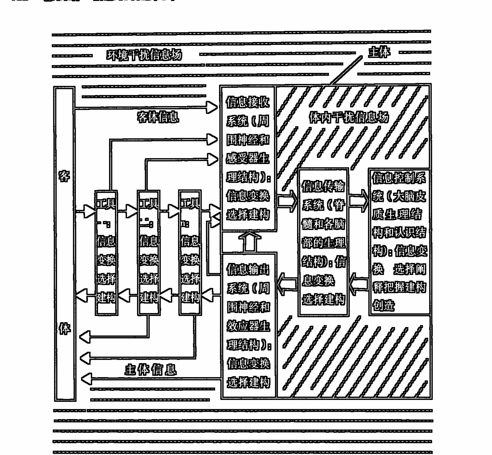

图 4.2.1 认识过程的多级中介的信息建构(虚拟)图

## 第三章 人有人的认识方式①

人所认识的自然界是产生了人、人生活在其中的自然界。人作为科学目标的建树者，取决于人正是一切科学的对象——客体世界——的重要组成部分。

客体世界具有普遍相互作用的客观本质性，客体世界的这一根本性质，既规定着事物的存在方式，也规定着认识主体的认识方式。本章将在前两章讨论的基础上对作为认识主体的人的认识方式进一步予以讨论。

### 一、主体同样是认识的客观条件之一

对于一个认识现象来说，当它发生时，它实质上是一个产生出来的过程。这个过程把它赖以产生的主体和客体，以及主客体相互作用的种种中介因素（客体及其环境的信息场、工具、主体神经的和认识的结构）都看成是先于自身存在着的先决条件。这些先决条件在其未曾进入认识发生过程的时候，它还只是在某种物化结构（信息场结构、工具结构、神经结构）的特定形式中潜在凝结着的一种能力。而这些物化结构本身却具有客观存在的意义。虽然，主体认识结构是以往主观经验、理性信息的凝结，我们有理由把它叫作认识的主观条件，但是，这个主观条件同时又具有客观条件的意义。因为，这个认识结构在主体中首先是以特化的生理结构（神经、脑结构）形式为自己的实质性载体的。正是这种特化着的生理结构的客观物质性和信息体性状态才规定了主体的认识能力，也就规定了主体作为认识发生的先决性条件的存在意义。这样，主体、客体、客体所处环境，以及主客体相互作用的诸多中介因素（场、工具）等，便决定着在此基础上产生和展开的认识过程的程度、水平、状况等等。在这一过程中，主体的客观化（成了认识产生和展开的客观条件之一）对这个正在产生出来的认识便具有了十分重要的意义。主体的客观化应该包括两方面

> ① 本章的基本内容最初发表于拙文“论人的认识方式”，《求是学刊》1989年第3期，第15～19页。

的内容：①主体认识能力的外在物的手段（工具）化；②主体认识能力的内在物的结构（特定生理、神经结构）化。

由于主体在认识过程中的这种客观化，便使任何认识的产生都不能不依赖于这个与它所认识着的对象进行着客观的、本质的相互作用的主体。于是，不仅客体，而且主体也被认识当成它产生的直接的客观条件。这样，客体信息、客体所处环境背景信息、主体结构和状态、主客体相互作用的途径、手段等等，这一系列认识产生和展开的中介环节便都成了主体对客体认识的直接的客观条件。

主体成为认识的客观条件的意义还在另外一个方向上成立，这就是客体对主体客观化程度、状态的要求问题。在上一章中我们曾经指出：“事物并不是随随便便就向我们呈现它自身存在的真谛的。要认识特定的事物，要认识特定事物的特定层次、特定方面的特性，就必须运用与之相适应的认识工具、方法和途径。这就是说，特定的事物只有在特定的主体面前才呈现它的客体性。事物之成为客体就在于它要求主体认识能力的内在结构和外在手段与之相一致。不具备高深认识结构，不拥有特殊认识工具的人，只能凭借它的可怜的自然感官、自然脑力在很狭窄的范围和层次上来了解事物。要探究宇观及其以上（或微观及其以下）层次的事物，就要拥有相应的极为复杂的，甚至是庞大的工具（仪器、设施）系统，而认识主体也必须在自己神经生理的内在结构中同时凝结着相应水平和程度的认识结构。”因为客体要求主体状态和它保持一致性，所以，在不同的主体状态面前，客体将会呈现不同的特性方面。某一特定状态的主体只能从一定深度上把握某些事物的、某些层次上的特性，而其他一些事物，以及这些事物的其他一些层次上的特性对这一特定状态的主体将是封闭的。由此我们可以看到：主体自身的状态（包括主体创造和利用的物化工具）本身规定着自身认识的限度。

### 二、认识的主体相对性

主体以自身的状态（包括主体创造和利用的物化工具）本身规定着自身认识的限度。这一命题直接揭示着这样一个事实：主体是通过自身这个参照系来对客体进行把握的。这就充分说明着认识过程的主体相对性。

“感觉是客观世界、即世界自身的主观映像。”①正因为感觉是以主体为参照系的对客体的反映，所以它才成了主观的，才成了第二性的。由于主体的这种参照系作用，就使人的认识具有了来自主体本身的某些规定性。客体的映像是在主体状态对客体信息的整合和规范下在主体中建构出来的，主体对这个建构出来的客体映像并不是一个纯粹外在的观察者，而是一个直接内在的建构者。在这一过程中，最起码存在着四种信息的相互作用：一是主体接收到的客体信息；二是客体所处的环境信息；三是主体内神经结构中先已凝结着的信息（包括神经生理结构层面的信息和认识结构层面的信息）；四是主体神经系统之外的体内其他方面信息的干扰（这种干扰在主体处于某种病态时尤其明显）。客体映像正是这四种信息相互作用的结果。仅仅由于主体状态的相对稳定性，才使通常产生出来的客体映像具有了恒常性，也才使人们可能把这些映像与认识的客体联系起来，完成对客体本身相对认识的过程。主体的这种对客体认识的参照系作用，使人的任何认识都只是一种相对于主体而言的对客体的认识，亦即相对的认识。

客体可以说是一种混沌的自身存在，它具有内在的自身统一性。这种内在统一性在与不同事物发生相互作用时会呈现出不同方面的特性。人的感官功能的特异化，恰恰可以对自身统一的混沌客体的不同方面的特征进行相对于某一感官的抽取。这种抽取产生的固然是对客体某一方面特征的映像，但是，它却是依赖于感官结构的相对映像。这个相对映像具有两方面的意义：一是感知对象的哪一方面的特征依赖于特定的感官结构，如：眼睛看不到气味，耳朵听不到颜色；二是就某一感官映像的状况来看，它也不能不受到产生这一感觉映像的感官结构的限制，如：人的视觉不同于青蛙和猫头鹰的视觉，有色盲的人的视觉也不同于正常人的视觉。虽然，视觉能否成像，可以看作是主体（视网膜）对作用于光子的质（波长）和量（光子数）的某种选择，这种选择是以一定的度（感觉阈值）为限的，但是，视觉又不能仅仅归结为这种选择，因为光波在人的印象中并不是直接的波的形式，而是以一定的颜色相对的，如果对象的运动频度超出一定的范围，本来是不连续的对象在视觉印象中也会是连续的。由此，我们又有理由把视觉看成是某种信息建构的过程。如此，人的大脑、神经、视网膜的内在结构所组成的系统便成了客体在人的视觉中成像的主体参照系。由于这个主体参照系的内在结构在每个人那里都存在细微的差别，所以，同一客体的视觉成像（其他感觉映像也是这样）在不同的人那里是并不完全等同的。就是对同一个人来说，他的主体参照系的内在结构也是会起变化的，所以，他的感觉映像在不同的时候仍会存在某种差异。

> ① 《列宁选集》第2卷，第117页。

不仅感性认识过程，而且理性认识过程也同样是具有认识的主体相对性的。因为任何理性认识活动都只能是在主体认识结构所提供的思维模式的规范下进行的。动物之所以没有理性，就在于没有一个这样的认识结构模式。认识结构模式在不同的人那里，在同一人的不同时期也同样普遍存在着差异性。这种差异性便造成了不同个人，个人的不同时期的理性活动的不完全同一性。在这里，“仁者见仁、智者见智”并非只是一句无关紧要的俗语，而是对于由主体认识结构的普遍差异性带来的人的认识的普遍差异性这一事实的形象生动的揭示。

认识的主体相对性不仅仅是指人的认识是相对于人的大脑、神经、感官结构而成立的，而且是指相对于人的历史的、社会的认识水平和程度而成立的。这种人的历史的、社会的认识水平和程度一方面取决于主体的认识结构建构的水平和程度（而主体的认识结构又直接就是人的大脑、神经、感官的结构和活动方式，这个结构和活动方式被理解为一个不断重新建构着的动态系统）。另一方面取决于主体所采取的物化认识手段的水平和程度，此外，也还取决于人类认识的科学理论发展的水平和程度（而这个认识的科学理论又同时就普遍渗透在主体的认识结构和物化认识手段之中）。亚里士多德的力学世界、牛顿的力学世界、相对论和量子力学的世界是在不同的历史的、社会的水平和程度上分别而相继地成立的。它充分反映着人的认识的相对性，以及这种相对认识的不断自我进化的历程。在这里，相对认识的真实主体，与其说是个别的个人，倒不如说是人类社会本身。而每一个个别的个人都只是在人类社会发展的一点水平和程度上来建构自己的认识结构，来展开自己的认识活动的。在这里，应该坚持的是个人和社会的统一、个人和历史的统一。

### 三、人有人的认识方式

主体在差异关系中把握信息、主体的认识的客观条件性、认识的主体相对性，从几个不同的侧面揭示着：人是以人自己的方式来认识世界的。人不仅是认识世界的客观条件，而且人还是在与对象世界进行实质性相互作用的过程中，并在人的主体结构（生理的、心理的）的规范下来认识这个世界的。人的认识方式就是由人的主体结构和与对象世界相互作用的方式所共同规定的。

### 第三章 人有人的认识方式

认识方式充分显示着主体对客体认识的积极的能动性。正是这种积极的能动性把人的认识方式和动物的原始萌芽的认识方式从本质上区别开来了。

主体认识的最初能动性是指感官、神经、脑结构的活动，由于这一活动，客体才可能被感知。任何感知，只要它是人的，它就绝不会是像照平面镜那样的一种简单直观的映像。因为人的感官、神经、脑不仅包括着它的原始生物反射的活动特性，而且还包括着它的先已形成的认识结构的活动的特性。这个认识结构是因人、因时代而异的。因为人们的认识结构无非是个人经验、人类知识的凝结物，这里既有感性，也有理性，既有对客观世界认识的经验，也有主体建构的对客观世界描述的理想模式，还有对客观世界认识、改造的已化为认识经验和认识模式的手段、方法。这个在多重意义上凝结着个体和人类知识的认识结构使人的原始反射的认知特性升华。这个认识结构直接成了此时对客体把握的参照系。在这一参照系中感觉直接地变成了理论家，使自身更丰富、更深刻。正是这个已有的认识结构的参照系作用，使得人的感知不可能是一种平面镜效应，而只能是感性和理性相互作用、相互规定的复杂的信息建构过程。这样，同一感知对象在具有不同认识结构的人那里必将呈现着不同的丰度和深度。由于有了这种理性对感性的规范和改造作用，也便使人的感知不再与动物的感知简单等同。

主体对客体认识的最为发展了的能动方面，是物化的认识手段（工具、仪器等）。物化手段是由主体认识结构外化出来的，直接客观化了的主体认识条件。通过这一中介，主体便可以有效地按照自己的理性指导来使客体的运动、整个人的认识过程在一定的规模、程度和方向上展开。随着物化手段的日益发展，人们不断扩大着自己的认识领域。在此同时，主客体的相互作用也便日益变得复杂化了。以致在量子力学中，人们不得不惊呼：在原子客体和测量仪器之间发生着一种原则上不可控制的相互作用，这一相互作用构成了现象的一个不可分割的部分，使我们不能明确地区分原子客体的行为及其和测量仪器之间的相互作用。

其实，不可控制的相互作用岂止仅仅在仪器观察中存在，在人的所有水平的感知认识过程中主客体的相互作用都是不可控制的。这个不可控制就是说人们无法超越自身这个参照系去认识客体。客观事物从本质上是相互作用的，是你中有我，我中有你，相互规定着的。如此，这种相互作用的不可控制才是世界的本来面目。在认识过程中，主客体的关系也只能遵循这个世界的总法则，而不可能超越它。

人作为对客体认识的参照系是不断发展进化着的。物化手段就是人的参照系的一个特定部分。物化手段正如人之感官，它只能对客体的某种特性进行相对的探测。正如客体的形色和气味是通过人的不同感官相对获得的一样，量子的波、粒特性也只能在不同的仪器观测条件下被相对测知，这没有什么可奇怪的。当然，复杂仪器是比人之自然感官更精密化了的人之感官，它只能比人之自然感官更为特异化。在人之自然感官中呈现着的混沌一体的物性，在精密仪器面前便有可能分化出不同的更为精细的方面来。从这一意义上说，仪器是感官的自我延伸和分化。唯其如此，物化手段才可能将人的认识引入人的自然感官不可能达到的客观领域，使人的认识一步步向对象世界的真谛趋近。

考虑到主客体相互作用中多级中介的情况，我们可以说，主客体的相互作用其实是在一系列相互作用的环节中完成的。这些环节构成了认识发生的诸多中介条件的逐级信息传递、转化、变换、选择、建构的链条。在这一链条的每一环节上，客体信息都将是一种相对重建之后的再现。这个相对重建就发生在每一前后相继的环节的相互作用之中，而每一个这样的相互作用都必将使它输出给下一环节的信息带有这两个环节相互作用过的色彩，或叫相互规定性。正是这个相互规定性，使后一环节成了前一环节输出信息的参照系。这个逐级分立的参照系的连锁的链条，构成了主体对客体相对认识的参照总系，这个参照总系便从本质上规定了人的认识方式。

显然，人的认识不是机械反映，因为主观所反映的客观与客观事物并不是简单直接的同一。第二性的东西是在依赖于主体认识方式的前提下对第一性的东西进行把握的。认知的过程亦即是主体对客体信息选择、规范、改造和重新建构的过程。

但是，从这里也绝不允许推出不可知论。因为主客体的相互作用并不意味着在主客观之间挖掘一条不可逾越的鸿沟，而恰恰证明着人的认识也只能是在遵循客观事物的一般规律的前提下才可能产生的。通过主客体的相互作用产生出来的主观映像和它所反映的客体虽不简单直接等同，却是以一定方式相互对应着的。如颜色对应于光波，声音对应于空气的振波，气味对应于分子结构等等。人们对客体状态、性质的语言描述、符号记识、仪器对客体的测定等等，实际上都是一种与客体特性相互对应着的对客体的认识。如果再深究一步，我们将会看到，客体信息在本质上仍然是通过与客体的相互对应来显示客体的特性的。这种相互对应性，只是说明着主体参照系对客体的相对认识性，而并不曾否认客体的客观存在性，也不曾否认客观世界的可知性。这里仅仅是要强调，人是以自己的方式来认识世界的。

## 第四章 分析综合——统一的信息认识过程、方法和逻辑①

人类的认识活动是高级形态的信息活动过程，它以人的神经系统为基础，以对象信息为来源。既然认识的方法和逻辑只有在认识过程中才能显示其意义，那么它们便不能不具有统一的、不可分的时间和空间的规定。时间是指过程而言，空间是指客体信息源、客体信息和人体神经系统组成的系统的客观存在而言。认识的过程、方法和逻辑三者在时空规定中的不可分性，证明了三者的密切关系，而分析综合便是这三者统一的概念总括。

### 一、分析综合的一般概念

分析与综合通常是作为思维的一种方法来考察的。

所谓分析，是把整体分解为部分，把复杂的事物分解为简单要素分别加以研究的一种思维方法。它可以把认识对象的某些方面，因素、属性、联系、关系等等分割、区别开来加以认识。它是一种解剖术。它的主要功用是分解，把一般引申到个别，把整体分割为部分，把复杂解剖为简单。

所谓综合，是一种整合术。它可以把人的认识对象中分解出来的各组成部分连接起来。其主要功用是组合，把个别上升为一般，把部分统一为整体，把片面概括为全面。

分析和综合的关系又是辩证的对立统一，它们以事物的整体和部分、一般和个别的关系为其根据。它们的对立主要表现在认识运动中的起点不同，表现了认识运动中不同的阶段和侧面；而它们的统一则表现在互为对方运动的前提和准备，并相互渗透、贯通和转化。人们的认识就是在分析综合这种复杂的交互作用中不断前进和深化的。

但是，分析综合不仅仅是一种思维方法，它同时具有描述认识过程的意义。因为过程和方法总是不可分割地统一在一起。黑格尔指出：“方法不是别的，正是全体的结构之展示在它自己的纯粹本质性里”①；“一方面是方法与内容不分，另一方面是由它自己来规定自己的节奏”②；“方法与其对象和内容并无不同”，方法“正是内容本身，正是内容在自身所具有的、推动内容前进的辩证法”；“方法的过程，……它就是事情本身的过程。”③

另外，分析综合还应当具有对认识的逻辑进行解说的意义。黑格尔写道：“真正对这个方法的陈述则是属于逻辑的事情，或甚至于可以说就是逻辑自身。”④

基于通常对分析综合意义的理解，受黑格尔思想的启发，我们把认识过程、方法和逻辑三者统一起来。把分析综合具体地放到人类精神活动的过程、方法和逻辑中予以考察，赋予它更为广泛和丰富的意义。

### 二、分析综合是人类精神活动统一的过程

考察人类精神活动的全过程，我们看到，这个过程并不是杂乱无章的，也不具有无限随机的性质。这个过程有一个基本的、内在的、统一的规律。这个规律就是对信息的分析综合的处理。分析综合在感知和思维的整个过程中都作为一个基本的形式，普遍存在着。

外界事物信息总是处在相互作用、相互关联的关系之中，这就使外界事物信息本身具有复杂性、多面性，使人们不可能一下子识辨。人体感受器功能的特异性，人脑感觉神经中枢的高度分化，决定着人们对复杂的外界信息，总是分解成不同的个别要素来进行识辨的。例如，某一物体的声、形、味、色、硬度、温度等诸方面的信息，我们只能通过不同的感官渠道一一加以识辨。就是同一感受器对同一种信息也必须逐次地加以识辨。在对视觉的考察中发现：要识辨一个大的客体的形象信息，每次眼睛仅仅注视它的一个点，然后以每秒2～3次的速率转向其他点，形成一个扫描路径，脑对这个扫描路径的整合才构成对客体的形象识辨。这就是感觉中的分析过程。感觉上升到知觉，需要将感觉中——识辨了的个别信息要素，通过各感觉中枢的内部整合，才能完成对认识对象的整体信息的识辨。这便是知觉的综合过程。这个分析综合在感知阶段还具有简单直观的、原始的性质。

感知的直观分析综合，产生了人们记忆中对客体信息直观识辨的表象。对这一表象再行分析综合的加工改造，便构成了人们思维的初级阶段，这就是原始意义上的形象思维。这种原始形象思维过程中的分析综合与感知过程中的分析综合不同，它不是对外界认识对象信息要素的直观的、原始的分解和组合，而是在感知记忆基础上，对体现在诸多认识对象的表象中的信息要素的重新分解和组合。原始形象思维是以大脑皮层非语言性感觉和综合中枢之间的相互作用和联系为其活动基础的。它的直接结果便产生一个不同于原始感知记忆的表象中的新形象。为了区别于“表象”，我们已经把这个新形象规定为“概象”。概象信息已经不是个别外界认识对象的直观反映，而是诸多同类认识对象共同本质特征的形象反映（称为类概象），或是不同类认识对象不同特征的硬性组合的形象反映（称为幻概象）。人脑中对猫、狗、山、水、色等类形象的再现属前一类概象信息，而人脑中对妖魔鬼怪、八戒、孙猴等形象的再现则属后一类概象信息。

人类已有了用语言、文字、符号交流信息的能力，将特定的词或符号标示特定的概象信息，就产生了符号信息。符号信息的产生仍然是一个分析综合的过程。它首先要对特定的概象和符号进行选择抽取（分析），然后在这种选择抽取的基础上将二者联系（综合）起来。从概象信息到符号信息是大脑皮层非语言性中枢与语言性中枢沟通联系的结果。由概象信息上升而来的简单符号信息，是抽象思维的必要前提。

对符号信息的进一步的分析综合就构成了符号信息的逻辑推演，这就是抽象思维的过程。抽象思维是人类独特的思维形式，它是基于人类特有的语言性感觉和综合中枢之上的一种高级的分析综合过程。它的基本形式是判断和推理。

判断就是规定符号信息所代表的事物是否具有某种属性、特征等，它从本质上是分析的，因为它仅从某一特定的角度来对符号信息所代表的事物的某一侧面进行认识或把握。黑格尔指出：“判断是概念在它的特殊性中。”①但是，判断并不纯粹是分析的，因为它总是利用不同符号信息之间的一定关系来对符号信息进行规定，尤其是在求同（肯定）判断中更是这样。就判断的表现方式和结构上看，它仍有某种综合的意义。

推理的基本形式是归纳和演绎。归纳是从个别到一般的思维过程，所以它本质上是综合的；演绎是从一般到个别的思维过程，所以它本质上是分析的。但是，如果从表现方式和结构来看，它们仍有综合方面的意义。

由于抽象思维对感知和形象思维的改造作用，使人们的感知和形象思维发生了质的变化。就现实的人的认识过程来说，感知、形象思维和抽象思维总是相互交织、相互作用、有机联系着的，不能截然分开。这就使人们精神活动的各种分析综合过程不能不具有更为复杂、丰富和内在的统一性。

### 三、分析综合的具体方法的统一

分析综合既然是人类精神活动的统一的过程，那么，它也同样应当是人类认识的具体方法的统一。分析综合作为一个统一的认识方法不能不具有它的各种不同的形式。

传统的方法论，习惯于把比较和分类、抽象和概括、归纳和演绎、类比、分析和综合等方法简单地并列起来，分别给以定义和分析。这种方法论虽然也有一定的意义，但本质上只能算是一种分门别类的割裂法，它只看到各种方法间的差别和对立，而没有看到各种方法间的联系和统一。这是一种浅薄和低能的方法论中的方法，在哲学中尤不可取。

比较和分类，是根据事物之间的异同进行分门别类的研究的一种方法。比较可以确定对象之间的异同点。它首先是把认识对象的各方面的信息因素予以分解（分析），然后在有选择（分析）的组合（综合）的过程中判明某些信息的异同。可见，比较是从分析开始，以综合终结的。分类可以说成是比较过程的后续。它在比较的基础上进行求同或求异的分类。在求同中，它是某种信息的综合，在求异中，它是某些信息的分解。比较和分类其实是在分解和组合的过程中对认识对象之间诸方面的信息进行别异、求同的一个具体方法，在分解和别异时，它是分析；在组合和求同时，它是综合。

抽象和概括是分析综合的一种特殊的、较高级的形式。抽象是分析的，概括是综合的。抽象和概括以比较为前提，并将比较包括于自身之中。所谓抽象，就是对比较的结果有选择地进行抽取，抓住比较所得的事物的共性或特性的单个方面来加以认识。概括则是将抽象过程中抽取出来的诸类信息联合起来认识的过程。

归纳是一种从个别概括出一般的思维方法和推理形式，它的结论往往是：此类都是(或都不是)什么。可见，归纳是一种分析基础上的综合，它综合的是类对象某一方面或某几方面的共性。它是一种高级求同分类的过程。与归纳法相反，演绎法从归纳法的结论开始，从一般推出个别。它是类中个体分解的分析过程。如此，归纳和演绎则是分析综合的把个别上升为一般，把一般引申为个别的方法的一个特殊形式。

类比是从个别到个别的一种推理形式，有人说它属于归纳法，有人说它属于演绎法。其实，类比是归纳和演绎法的综合使用形式。它从个别开始，以一般为中介，然后再达到个别。

有一个关于类比推理的一般公式：

甲对象具有 a、b、c、d 属性
乙对象具有 a'、b'、c' 属性
∴乙对象可能也具有 d' 属性

这个公式并不严密，它在前提里省略了一个标志一般(中介)的推论环节：“此类对象可能皆具 A、B、C、D 属性。”所以，类比的公式应为：

甲对象具有 a、b、c、d 属性
乙对象具有 a'、b'、c' 属性
此类对象可能皆具有 A、B、C、D 属性
∴乙对象可能也具有 d' 属性

类比既然是归纳和演绎的综合使用形式，那么，它也应是分析综合的一个具体方法。

分析综合以分解和组合、比较和分类、抽象和概括、归纳和演绎，以及类比等方法为自己的具体形式，这些具体的形式又在分析综合中达到了类的统一。这个分析综合就是人类认识方法的总结。

我们还应注意到，分析综合方法的这些具体形式之间也并不是截然对立、完全割裂的。它们之间的关系有交叉、有蕴涵，有的则是互为前提和条件。如，求同分类其实就是概括的一种形式；归纳和演绎中就运用着比较、抽象和概括的方法；而分解和组合则更是其他方法的基本方法。在这些具体的方法中仍然还有初级形式和高级形式之分。

### 四、分析综合的逻辑规律的统一

人类精神活动中的分析综合过程遵循的是逻辑规律，这些规律在一定的范围和条件下，可以用数学方法加以形式化。

设某事物（或现象）X 的全信息为 n 项子信息的集合：X={x₁,x₂,...,xₙ}。那么，对某事物（或现象）整体（X₍整₎）和部分（X₍分₎）进行简单分解和组合的认识所遵循的逻辑原则是：

```
X₍整₎ = x₁ ∧ x₂ ∧ ... ∧ xₙ          [∧（合取）]
X₍分₎ = x₁ ∨ x₂ ∨ ... ∨ xₙ          [∨（析取）]
```

设 a₁、a₂、a₃、a₄ 是 A 类（A₍类₎）事物（或现象）所有个体共有的子信息，a₅、a₆、a₇ 则分别是 A 类个别个体所有的子信息，那么，对 A 类事物（或现象）类概念信息和符号信息在比较和分类中所遵循的逻辑原则是：

```
A₍类₎ = a₁ ∧ a₂ ∧ a₃ ∧ a₄ ∨ a₅ ∨ a₆ ∨ a₇
```

设 {x₁,x₂,...,xₙ}、{y₁,y₂,...,yₙ}、{z₁,z₂,...,zₙ} 分别为 X、Y、Z 三种不同类事物（或现象）全信息的 n 项子信息的集合，那么，幻概念信息（E）在复杂的分解和组合中产生所遵循的逻辑原则是：

```
E = (x₁ ∨ x₂ ∨ ... ∨ xₙ) ∧ (y₁ ∨ y₂ ∨ ... ∨ yₙ) ∧ (z₁ ∨ z₂ ∨ ... ∨ zₙ)
```

设 A、C 分别为两类符号信息，a₁、a₂、...、aₙ 是 A 类符号信息所含 n 个不同个体所分别对应的符号信息，那么，则有符号信息逻辑推演（判断推理）的逻辑：

```
A ~ C          [~（等价）]          （求同判断）
—（A ~ C）      [—（非）]          （别异判断）
[(a₁→C) ∧ (a₂→C) ∧ ... ∧ (aₙ→C)] → (A→C) [→（蕴涵）]  （归纳推理）
(C→A) → (aᵢ→A)    (i=1,2,...,n)          （演绎推理）
```

如果我们将这些形式化的逻辑式中的符号给以具体的剖析，那么，我们将看到，逻辑符号和逻辑方法的极为固定、极为默契的统一：

```
[∧（合取）] = 组合；
[∨（析取）] = 分解；
[~(等价)] = 求同；
[-(非)] = 别异；
[→(蕴涵)] = 一般与个别的关系
```

由此可见，这些逻辑符号乃是分析综合的具体逻辑方法的代示。

人们精神活动分析综合的逻辑并不仅限于这类简单直接的形式化逻辑运作，尤其在抽象思维的逻辑推理中光有这类形式化逻辑是远远不够用的。

形式化逻辑基本上是一种静态认识的方法，它的局限性就存在于形式判断推理自身之中。首先，它只从 n 个抽象的、有限的前提出发，并仅仅局限于这个前提；其次，它把符号信息看成是静止的、孤立的认识对象；第三，它抛开了运动、变化的现实世界，陷入了单纯符号信息的形式推演。

人类抽象思维符号信息的逻辑推演，虽然相对摆脱了客观信息和感性信息的束缚，但是要保证思维形式和它所揭示的客观内容的无矛盾性，符号信息的逻辑推演便不能和感性信息完全割裂。其实，在抽象思维的实际过程中，总是伴随着感知、表象和形象思维的概象的活动，离开了这些感性信息的活动，理性的思维就会寸步难行。它不仅不能建立自己最起码的活动要素，也不可能展开自己推演的过程。因为推演总是伴随着对符号信息所反映的客观内容（感性信息内容）的识记进行的。人的思维的这一复杂的实际过程，使人的思维活动充满了跳跃性、间断性，其突出的表现便是灵感、直觉、顿悟、猜想、假设的思维形式的发生。

人的动态的认识过程和方式，人的思维活动中的符号信息和它所代示的客观对象信息的具体的联系和统一，超越了形式化逻辑的某些局限。人的思维赖以出发的前提虽然是有限的，但是它力求把这有限的前提放在具体认识对象的无限运动的过程中加以规定，力求使它在保持和周围系统（环境）的有机联系的过程中获得真实、具体的内容。另外，在人的具体思维活动中，符号信息是运动发展着的，它随时在认识对象的运动变化中把握与之对应的符号信息的运动和变化，使符号信息的逻辑推演的方向和内容在运动的认识对象中加以具体规定，从而使抽象的、割裂的认识再返回到丰富、复杂、具体的对象及其运动本身。这就是黑格尔所说的，从抽象到具体的思维逻辑路径。

从抽象到具体的思维逻辑路径，首先从抽象的符号信息出发，根据与之对应的认识对象的现实运动，展开对符号信息的内容分析，从不同的侧面对所规定的符号信息予以揭示，在此分析的基础上，再对之进行全面的、整体性的综合，以完成对认识对象的本质的认识。在人的现实而具体的思维活动的每一

---
① 本章的内容原是我于1980年完成的《思维是物质信息活动的高级形式》文中的一部分，后经修改独立成篇，并以《分析综合——统一的认识过程、方法和逻辑》为题发表于《社会科学》1984年第6期，第82~87页。
① 黑格尔著，贺麟、王玖兴译：《精神现象学》（上册），北京：商务印书馆，1979版，第31页。
② 同上，第39页。
③ 黑格尔著，杨一之译：《逻辑学》（上卷），第37页。
④ 黑格尔著，贺麟、王玖兴译：《精神现象学》（上册），第31页。
① 黑格尔著，贺麟译：《小逻辑》，第 337 页。

## 五、分析综合的生理结构基础

人类精神活动所遵循的逻辑规律，是以神经系统的相应特定结构为物质基础的。人体神经系统的内在结构虽然极为复杂，但它并不杂乱无章，而是严格按照特定方式排列着的一个严谨有序的整体。首先，它是一个由具有不同职能的诸子系统的集合组成的巨系统。其次，在各子系统中，在各个子系统之间，在各种神经细胞之间都具有某种特定结构的联系。这种特定结构体现于神经细胞突触联系的不同类型和神经通路中神经细胞联系网络的特定排列方式。

这里我们仅简单分析一下人体神经系统的两种较为典型的结构类型。

### （一）兴奋和抑制交互作用的生理结构

神经细胞突触的基本类型有兴奋性和抑制性两种，不同类型的突触是通过释放不同的化学递质来完成其功能效应的，在一些神经传导路径中，有一些神经细胞在向高级部位传递信息引起兴奋冲动的同时，还能发出侧枝突触到一些小型抑制神经细胞上，从而引起其他传导路径的暂时抑制效应。这就造成在某一信息活动的过程中，总是在兴奋一部分神经细胞的同时，又抑制另一部分神经细胞。这一生理结构在感觉传导路径中能够在主要信息传递过程中，有效排除次要信息的干扰，保证感觉的清晰、敏锐和准确；在思维过程中，可以只通过对必要皮质部位的兴奋来选择适当的信息参与活动，因而不致引起混乱，保证了思维过程的合乎逻辑的条理性。兴奋和抑制交互作用的生理结构应看作是逻辑分析的物质结构基础。

如果我们以 x、y、z 分别表示三条互相突触联系的神经传导路径或大脑皮质部位的兴奋状态，而以 -x、-y、-z 分别表示抑制状态，那么，则有兴奋和抑制交互作用的具体效应(E)：

```
E=(x∧-y∧-z)∨(-x∧y∧-z)∨(-x∧-y∧z)。
```

### （二）聚合式排列的综合功能的生理结构

许多纤维传导路线或神经细胞都和同一神经细胞构成突触，所以，许多不同来源的信息，可同时作用于同一神经细胞，这就是聚合式排列。聚合式排列的神经纤维、细胞群组应该看做是逻辑综合功能的物质结构基础。

如果我们以 x、y、z 分别表示和同一神经细胞突触的三个不同信息传入神经细胞，那么，被突触的神经细胞的综合功能的起码的具体效应(E)应为：

E=(x∧y) ∨ (x∧z) ∨ (y∧z) ∨ (y∧x∧z)。

此外，具有信息放大和广泛联系功能的辐射式排列的生理结构，以及具有循环反馈功能的环状生理结构，也是人体神经系统中的主要生理结构类型。它们为信息放大、广泛联想，以及人们认识过程中的自我稳定等现象提供了生理基础。这两种结构形式，可以为分析综合的逻辑过程提供适宜的信息和基础的外围生理环境条件。

综上所述，过程是方法和逻辑的过程，方法是过程和逻辑的方法，逻辑是过程和方法的逻辑。此三者中之任一项都将其他两项包括于自身，且同时又将自身全融于另两项之中。分析综合就是人类认识的过程、方法和逻辑的统一。

# 第五编

## 信息进化论（上）

——自然的信息进化

### 第一章 相互作用、演化与信息

事物是在多重因素(质量流、能量流、时空流、信息流等等)的协变中演化的。这种多重因素的协变的演化,依赖于物质世界本身固有的一种存在方式。这就是事物内部和事物之间普遍存在着的相互作用。正是相互作用构成了事物运动、变化、发展的根本原因。因此,要阐明信息进化论的理论,首先就有必要对相互作用过程及其产生的诸多层面的效果予以探讨。

为对相互作用过程进行深入探讨,我们首先有必要来讨论一下与相互作用紧密相关的时空转化现象,因为相互作用所实现的关于演化信息的产生、凝结、转换效应都是通过这种时空转化现象呈现出来的。

### 一、时空转化与演化的信息

人类关于演化观念的进化,也集中体现在人类对时空关系的认识的进化之中。在当今的科学界,一种新的时室内在统一性的观念,即时空是历史的、互变的、具体的、统一着的观念,正在逐渐兴起。这种关于时室内在统一性的新观念是和演化观念、信息因素在时空关系中的引入分不开的。

人类对时间和空间关系的早期研究,更多地是在一种静态的、相互割裂的状态下进行的。

牛顿提出的“绝对时间”和“绝对空间”,是对时间和空间关系的绝对割裂。在那里,时间是和事物演化、空间状态绝对无关的均匀流逝的纯粹的持续性,空间是和事物存在、时间流逝绝对无关的一个永恒不变不动的虚空框架。

爱因斯坦创立的相对论,否定了牛顿力学中的绝对时空的观念。他的“四维时空连续统”指明了时间、空间同运动着的物质不可分割的联系。但是,在爱因斯坦那里,时间和空间的关系还只是一种外在的统一。无论是狭义相对论中的“不同时性原理”和“钟慢尺缩效应”,还是广义相对论中的“时空弯曲”理论，揭示的还都只是时空在不同参照系中，在不同的质能运动系统中的相对差异性。至于时间和空间在演化过程中的内在统一性关系，在相对论那里并未得到清晰的揭示。

首先以科学的方式把演化的、历史的观念引入时间流逝和空间变化的过程之中的是德国的哲学家康德。1775年康德出版了他的《宇宙发展史概论》。在这部著作中他提出了关于天体起源的“星云假说”，把太阳系，以及一般天体的形成描述为自然本身按照自己所固有的规则“在永恒的流逝中”的“展现”，“在整个无限空间和时间范围中的造化”，并且，这种“展现”和“造化”具有生灭不已、循环往复的无穷发展的特征。①

恩格斯从康德—拉普拉斯的星云假说中，从当时地质学的发现中，已经相当明确地指出了在历史的“痕迹”中时间和空间内在地统一起来了。他写道：“康德的发现中包含着一切继续进步的起点”；“自然界不是存在着，而是生成着并消逝着……地质学产生了，它不仅指出了相继形成起来的逐一重叠起来的地层，并且指出了这些地层中保存着已经死绝的动物的甲壳和骨骼，以及已经不再出现的植物的茎、叶和果实。必须下决心承认：不仅整个地球，而且地球今天的表面以及生活于其上的植物和动物，也都有时间上的历史。”②

正是这种“时间上的历史”在现实存在中的“保存”，实现着时间在空间中的停留，亦即是说，时间转化成了空间的结构，消失的时间在后续的空间结构中被储存了，亦即是并未消失。由这种空间中储存着的消失了的时间才印证出时间流逝和空间变幻的演化历史性。这就是消失了的时间的直接存在以某种间接存在的方式在后续的空间结构中保留了下来。这就是时间流逝的信息，当然也同时便是空间变幻的信息，因为这种时间流逝的信息直接便标明着现存空间结构的后续生成的性质。

严格地来讲，一切关于演化的理论，一切种类的进化学说，都是关于时空转换的内在统一性的演化信息学说。因为，只有在现存空间结构中解译了储存的时间历史、空间历史的信息码后，演化才是可理解的，才是可被证明的，同时，在此基础上建立的理论也才能成为令人信服的科学。

热力学第二定律的发现，以及与之相关的熵概念的引入，是物理学上的一场带有根本性质的革命。因为，正是由此，演化的观念、历史的观念、时间不可逆的观念进入了物理学的视野。只可惜的是，以热力学第二定律为代表的经典物理学所研究的还只是系统沿着无序化退化方向不可逆演化的规律。在这样一个演化方向上，时间的历史具有不可追忆的特征。

普里戈津创立的耗散结构论研究了另外一条与热力学第二定律所揭示的演化方向相反的演化路线，即事物向有序化方向进化的路线。在这条路线上时间的历史被储存了。在这一进化的方向上，“时间就是构造”，并且，时间和空间是可以相互转化的，“科学把时间空间化了”，而“空间得到了一个时间维”，并且，因为空间结构形成的时间上的相继性，使我们有必要去研究“空间的计时”性。①

在耗散结构理论看来：“一个非平衡系统的演化过程，可以用数学中的分支点理论来描绘。一个非平衡系统如果经过分叉点 A、B 到达 C 时，那么对 C 态的解释就必然暗含着对 A 态和 B 态的了解。这样，我们就在物理学和化学中引入了历史的因素”。在这里，“演化的历史被‘记忆’和保留”。在这些“记忆”和“保留”中，“既有老一代性质的遗传，又有新的功能的产生和选择”。而在这样的一个分叉演化中，“时间已不再是一个简单的运动参量，而是在非平衡世界中内部进化的度量。”②

从最为一般的意义上来讲，演化是通过事物的相互作用实现的，而事物的相互作用过程同时就是事物间进行信息的同化和异化的过程。在这一普遍相互作用的信息同化和异化的过程中，处于演化过程中的事物必然被普遍信息体化。事物的普遍信息体化的性质，决定了在其内部的特定结构“痕迹”中必然凝结了关于自身演化历史的多重关系的信息。这样，演化之时间流逝的信息，以及事物演进由来的旧有空间结构状态的信息都会以某种被扭曲、变态，或部分耗散扬弃的形式，在演进之事物的现存结构中得到不同程度的保留。如此，在历史的东西的直接存在的过程消失了之后，这种直接存在还可以转化为某种间接存在的形式继续存在着。这种关于历史的间接存在以后续演化阶段上所建构出来的直接存在为载体而遗传下来了。这样，时间的空间化，空间的时间化便都是可以理解的了，并且也都是必然的了。

时空转化凝结信息。宇宙大爆炸所产生的宇宙背景辐射的“遗迹”在现存宇宙空间中的游荡，给宇宙学家们报道了关于宇宙膨胀演化开端状态的信息。而各类天体远离我们而去的现存宇宙的时空运动，则向我们提供了我们所处的内宇宙自膨胀演化以来所经历过的时间的信息，以及我们这个内宇宙具有怎样的规模和尺度的空间的信息；太阳系现存的时空结构及其元素组成方式直接凝结着太阳系起源及演化至今的种种时空样态的信息；地球地质的层叠结构的现存空间样态，一页页地记录着地球地层的时空演化史，其中不仅包括地质时空样态的变迁，而且包括生活在不同地质年代的生物，以及与之相应的地球环境条件的具体时空样态的信息；物体以它的运动状态、外观形状，以及其内在结构方式和元素组构成份间的现实关系编码着自身产生历史的时间表（如据此而来的关于物体产生年代的同位素测定法）；空中飘落的每一片雪花都是具体差异着的，这种具体差异的构型，详尽记录着它在高空结晶和落下历程中所经历的变化多端的天气条件的历史信息，雪花以它自己的特定构型全息着自身产生、运动、变化的历史；生物遗传基因 DNA 的空间排列结构编码着生物种系进化历史的全部信息，这种信息依其进化顺序的表达便是由此 DNA 所规定的生物个体发育的过程，这种历史的时空样态以某种大大压缩了的方式在个体发育的现存时空样态中的具体展示，便构成了生物个体发育过程重演其种系进化过程的生物重演律现象。中国学者所揭示的生物全息律，以及混沌理论所揭示的那种有规则的无限嵌套的自相似结构，则可能是事物在普遍相互作用中所达到的时间与时间的互化、空间与空间的互化、时间与空间的互化的一种全息境界。在此境界中，时空转化是全方位的，由此转化而凝结的演化信息也是全方位的。

时空转化中的演化信息的凝结并不仅仅是针对历史而言的，它还指向未来。事物现存的时空结构本身就规定着事物未来演化的路径。当然，这种未来演化的路径绝不是完全决定论式的，它是一个可能性的集合。对于这个集合中的某一可能性方向的选择还依赖于一些其他相关的条件。

事物的现存结构同时具有三重存在的价值和意义：一是它自身规定着它自身的是之所是；二是它自身承接着它自身的历史；三是它自身指示着它自身的未来。这样，事物以它自身的现存性，凝结着关于自身历史、现状、未来的三重信息，也可以说，由于演化的“造化”，事物总是对它的过去、现在和未来全息的。当然，我们没有必要把这一全息绝对化，因为这里全息的并不是所有过程的具体的细节，而只能是某种扬弃了琐碎具体细节的一般性的“程序”，并且，随着演化过程的继续，这些一般性的“程序”也有可能会不断地被部分地“耗散”，同时，某些新的内容的“程序”又会被不断地创生出来。在这里，非完全决定论的，以及全息不全的原则仍然是适用的。

### 二、相互作用与双重演化

事物现存结构的这种对历史、现状和未来的全息性，是在事物自身演化的时间和空间的全方位的互化中建构出来的。这种演化过程的建构依赖于事物内部和事物之间的普遍的相互作用。正是通过这种内部和外部的相互作用事物才可能变化，由此变化又会呈现出时间的流逝和空间的变幻，也才有时空互化，信息凝结、耗散，事物结构的不断更新建构。

对于相互作用范畴，历史上的哲学大师们已有过许许多多精辟而深刻的论述。

在恩格斯看来，“相互作用是事物的真正的终极原因”①。在黑格尔那里，历史和现实、原因和结果都在相互作用中统一、同一了。黑格尔认为：“原始的东西，作为从规定性出来的自身反思，作为单纯的整体，在自身中包含它的建立起来之有，并且，在其中被建立为与自身同一，即普遍的东西。”②这样，通过相互作用所实现的因果关系的发展，不仅是历史与现实的统一，而且是历史、现实和未来的统一。这种达到了历史、现实、未来的具体的统一的“普遍的东西”乃是一种真正的“全息境界”。

黑格尔曾强调说，仅仅停留在相互作用上还不免于贫乏和空洞，还需要有一个“中介”。对黑格尔的这一思想，列宁极为重视，他在读到黑格尔的相关论述时写下了这样的批语：“仅仅‘相互作用’=空洞无物，需要有中介(联系)，这就是在应用因果关系时所涉及的问题。”③列宁还曾写过这样的话：“一切都是经过中介连成一体，通过转化而联系的。”④

相互作用需要有中介，而这个中介的产生并不是凭借什么神秘的第三种力量达到的。相互作用之中介乃是相互作用之物在自身运动、变化，向新的形态转化、过渡的过程中派生出来的。相互作用派生作用之中介物的过程，已被现代科学所证实。迄今发现的维系宇观、宏观、微观世界运动、变化的四种基本相互作用过程，都是通过在作用中派生出的中介粒子场的传递和交换来实现的。由于中介产生的这种自身派生性，便使相互作用之物在发生相互作用的同时，便不得不改变了自身旧有的结构和状态。中介，一方面是事物相互联结、规定、过渡和转化的媒介，另一方面又是事物自身运动、变化、发展的方式和环节。

现代物理学对物之相互作用中介物的产生，是在粒子或波场的辐射和反射的两种意义上来解释的。辐射是由于物体内部相互作用所引起的质量或能量的外溢，这种外溢出来的质量或能量以粒子或波场的形式沿着空间向各个方向传播。在这一质量或能量外溢的过程中，产生辐射之物由于质量或能量的损失，在其内部必然会引起质量或能量的重新调节组合，这种重新调节组合必然会造成其内在结构和状态的某种改变。反射则是物体在与外物发生碰撞的过程中外溢质量或能量的现象。碰撞可以引起多种现象的发生：粒子的吸收、交换、反射；粒子的分裂、碰撞；粒子双方的湮灭、新粒子的产生等等。总之，无论哪种现象都离不开质量或能量的再分配，也便不可避免地要引起参与碰撞者的结构和状态的改变。

物体在其复杂的内部和外部相互作用中不断地辐射或反射中介物，并在此同一过程中不断地改变自身，形成自身运动、变化、转化、演化的实在过程。以强相互作用为例：原子核中质子和中子之间通过相互派生和交换 π 介子而不断转变自身的结构和状态，在这一过程中，通过中介物的传递和交换，中子和质子都交替瞬时转化为对方，并同时不断地释放和吞噬着电子。微观世界相互作用的真实内容，为我们提供了事物通过相互作用所实现的多重效应：

- A: 物自身的一种直接存在的样态向另一种直接存在的样态的转化；
- B: 中介物的产生和运动；
- C: 物物间的联系、过渡和转化。

从纯粹的自身直接性存在而言，中介物乃是一个被派生出来的，并获得了自身存在价值的独立的它物，它有它自身的结构、状态、组构成分和性质；但是，从其乃是一派生之物来看，它就与派生它的物保持了一种不可分割的统一性关系，这样，它又不是一个纯粹的、自身独立的它物，而只能是一个相关之物了。

我们知道，自然界的物质形态，一方面具有质的差异的无限层次，另一方面又具有量的差异的无限方面。正是物质世界本身的这种普遍差异性，造成了它们辐射和反射的中介物的种类、性质和形式的无限多样和无限差异性。物对它所派生的中介物并不采取随随便便的不负责的态度，在这里，中介是受到严格限定的,它必然与派生它之物本身的特性相关。现代物理学中的光谱分析技术和理论所依据的就正是这种中介物与派生这个中介物的物的“特性相关”性,因为不同的原子发出的是不同能量的光子,特定的原子只能发出确定能量的光子。这也正如任何两个人不会有完全相同的指纹一样。

任何物,一方面比较与其他物具有无限差异性,另一方面作为物自身,又存在着内部成分、结构、层次、状态的无限差异性。由于这种内、外两方面无限差异性的存在,使任何物所派生的中介物都会具有显示这种与它物、与自身无限差异的特征。正是中介物的这种显示差异的特性,使产生这个中介物的物本身的特有存在方式和状态得以外化。这种外化了的特有存在方式和状态便构成了派生这个中介物的物的间接存在,亦即是构成了派生这个中介物的物的信息。

正是在这一派生自身中介的过程中,某物的直接存在过渡到了它的间接存在。

某物的直接存在向间接存在的过渡,不仅在其派生的中介物中实现,而且同时就在其自身中实现。因为,随着这种派生中介物的过程的发生,某物本身的内在结构、状态也发生了相应的改变,这种改变使某物保持了某种曾经派生过它物的“痕迹”,这种“痕迹”凝结了该物曾经有所运动、变化、转化的自身历史的信息。

某物的直接存在向间接存在的过渡还可能在一个与自身本来异在的它物中实现。因为,通过中介物的传递和交换,在本来异在物之间建立了某种方式的相互作用,在这种相互作用中参与作用之物都会发生某些变化。相互作用之物,以这种变化的“痕迹”同化了中介物传递来的对方的信息。相对于这种信息的同化,派生中介物的物便是在异化信息了。

由于物皆处于普遍的相互作用之中,所以,任何物都必然同时就发生着三种过程:派生中介物、异化自身信息、同化它物信息。在相互作用中,这三个过程是同一个过程。因为中介物恰恰是在物之内、外的相互作用(内部质—能扰动的相互作用,与外物之碰撞)过程中产生出来的,这就使处于相互作用中之物必然同时兼具了三重角色(用通讯信息论的语言来表述):信源——异化信息、信宿——同化信息、载体——以自身变化的“痕迹”载负信息。

这样,我们便清晰地看到了如下的情景:事物通过相互作用所实现的多重效应,不仅包括前面已经指出的 A、B、C 三种直接性活动的内容,而且还包括如下的 D、E、F 三种间接性活动的内容：

① 参见康德：《宇宙发展史概论》，第133、135页。
② 恩格斯：《自然辩证法》，第12、13页。
① 参见普里戈津等：《从混沌到有序》，第 50～52 页。
② 参见沈小峰等：《耗散结构论》，上海人民出版社，1987 年版，第 110、96、111 页。
① 恩格斯：《自然辩证法》，第 209 页。
② 黑格尔：《逻辑学》下卷，第 232 页。
③ 列宁：《哲学笔记》，第 172~173 页。
④ 同上，第 103 页。

## 三、非线性的世界

相互作用所实现的物质形态和信息形态的演化是通过事物的结构变迁，特定“痕迹”的建构来达到的。

是怎样的一种内在机制引起了这种“结构变迁”、“痕迹建构”的发生呢？这就涉及了相互作用的一种基本的方式——非线性。

旧的结构的瓦解，新的结构的建构；旧有信息的耗散，新的信息的产生、凝结和积累，无不依赖于这种非线性相互作用的机制。

通常，在理论上，相互作用的方式被区分为线性和非线性两类。这两类不同的相互作用方式对事物的演化所起的作用是截然不同的。

线性相互作用强调了一种单一规则性和严格决定论式的简单性。在线性相互作用的情景下，系统的宏观特性仅仅是其要素特性的简单叠加，这种叠加还只是一种量上的组合，并不会引起系统整体性质的变化，并且，系统的整体性质也不会反过来改变其组成要素在孤立状态下的性质。

以往的经典科学注重研究的基本上都是这类线性相互作用的关系。根据这种关系建立起来的线性方程或线性方程组是可以通过某几个基本的步骤解出来的。在经典科学的视野中，这个世界具有某种简单和谐的规则性；一切都按照某种严格决定论式的、合乎某种目的论的、具有完全可预见性的方式运转。当牛顿用他的力学方式给出了世界运行的决定论公式的时候，当爱因斯坦设计他的宇宙大一统的运行方程式的时候，他们都是以这种对事物关系的线性理解为根本依据的。在科学的经典时代，当科学家们在观察和试验中发现了非线性关系的时候，他们往往让事实服从于他们的理性，他们不是把这种非线性归罪于自己观察或实验的精度不够，就是把这种非线性说成是某种偶然的反常事件。

在科学进入20世纪下半叶之后，随着现代信息系统科学自身从简单性到复杂性的发展，尤其是随着耗散结构论、协同学、超循环理论、分形、湍流和混沌理论这些信息系统科学的最新分支的诞生和发展，这个颠倒了的关系才开始被颠倒过来了。

那种对事物的性质并不发生整体性影响的纯粹线性的相互作用关系，那种具有简单规则性的、严格决定论式的、可完全预测性的纯线性关系仅仅是一种概念化的理想状态。经典的线性关系仅仅是对事物真实关系的某种抽象性的简化，或如普里戈津所说，它仅仅是对某些过程进行描述的——一种“近似方法”。①

其实，非线性的真正深刻而本质的原因，就来源于现代物理学所揭示的微观世界的本性。在这个微观世界的尺度上始终存在着某种涨落场，这种涨落场是所有微观尺度空间所固有的一种性质，它直接影响着场中粒子的行为。在微观尺度上，存在着某种“空间涨落的泡沫状结构”②，这一结构表明，存在着某种时时处处都在随机形成又随机消失的空间几何花样。

微观世界本身的这种随机性，从物理世界深层结构的层次上阐明了世界的非线性和复杂性的本质。可直接观察的宏观世界的复杂性恰恰是根基于不可直接观察的微观世界的复杂性之上的。

由于系统内部固有的随机涨落因素的始终存在，由于系统内外因素的复杂多样的影响，任何一种简单规则性、严格决定论、可完全预测性的纯线性关系都是不可能的。真实系统的相互作用一般都具有某种不规则的、随机的、不可完全预测的特征。这些特征给系统的相互作用带来了复杂性和整体性，亦即带来了非线性。

一般而论，元素之结成系统就是因为在元素间建立了某种整体相关的联系。这种整体相关的联系，必然导致系统整体行为的发生，同时，也导致系统中元素的某些孤立状态下的功能和特性的被抑制，并且，这些元素的行为也必将与系统整体的行为保持某种一致性关系。如果舍弃了系统关系的多面性和复杂性，仅就系统中的某一个别的性质方面的状况来讨论的话，这种线性的相互作用或许还具有较大近似的意义，但就系统的整体性质和功能来说，仅仅停留在这种纯线性的解释上则是远远不能反映真实了。

非线性相互作用是系统复杂性、整体性特征的体现。在非线性相互作用中，系统中的诸多要素之间是彼此相关的，要素和系统整体之间也是彼此相关的。系统的这种内在彼此相关性，在要素和要素之间，在要素和整体之间建立了某种作用的协同相干，通过这种作用的协同相干，一方面系统产生了自己的整体行为模式，另一方面，元素和元素之间、元素和整体之间也具有了某种相互的限制和规定。这种整体的行为，这种相互的限制和规定使元素间的行为不同程度地协调同步化，使元素的行为不同程度地去服从系统的整体行为模式。在这里，要素和要素之间、要素和系统整体之间都不同程度地被全息化了。一方面，要素间相互作用的协同相干构建了系统整体的模式和行为，另一方面，整体的模式和行为又制约了要素的性质和活动方式。

现代信息系统科学的发展，日益注重强调系统的内随机性、内反馈环的信息网络、不规则性、非严格决定论性、非完全可预测性、复杂性、整体性、非平衡性和非线性。在系统的这样一些特性之间存在着某种互补说明的内在一致性关系。这种一致性关系集中显现着世界本身的非线性特征。

非线性给世界带来了无限的生机。正是相互作用的非线性机制，正是这种非线性机制所导致的要素和要素、系统整体和要素之间的种种相互制约、规定、协同相干的性质，才使处于种种内外相互作用中的物，在其内部和物物之间普遍建立起了某种特化的“痕迹”。这种“痕迹”构成了一般的物之“结构变迁”、“模式建构和转换”的过程，而在这一过程中所实现的便是事物之物质形态和信息形态的双重运动、变化、转化和演化。

## 第二章 演化范畴的双重规定 ①

我们面对着一个双重存在和双重演化的世界。由于信息世界的发现，世界以及世界上的一切存在物都再不能简单归结为那种单纯的、干瘪的、混沌未开的、未曾展示自身丰富性、复杂性的直接存在的物质世界了。在这个物质世界之中载负着另一个显示这个物质世界的多重规定性的信息世界。

双重存在的世界必然导致双重演化的世界。双重演化的世界给我们带来了一个更为复杂多变、更为斑斓多彩的世界演化图景，这一全新图景使我们可能从多维视角的综合上来对变幻着的世界进行把握。

以往对于演化范畴的讨论，更多地是在事物的物质形态的演化的角度上来进行的。相互作用所实现的双重演化的意义，使我们有必要从信息演化的全新角度来重新认识演化范畴，有必要对演化范畴进行双重意义的规定。这就是关于演化范畴的物质论诠释和信息论诠释的问题。

### 一、演化是进退相依的统一

在中国古代文字中，最初，“演”、“化”二字是分而用之的。“演”有“长流”、“推演、推广”之意；“化”有“变化、改变”、“造化、生成”之意。到了后来，“演”、“化”二字合用，则有了推广、教化、变化之含义了。

就演化一词的字面含义来看，它并不特殊指谓事物变化的方向是向上，还是向下，是进化，还是退化。“演”更注重的是一种程序，依着一定的程序，事物不断地展示自身的存在，转变自己的形态。“化”，不仅指造化之生成，而且指消亡之死灭，佛家称死为“坐化”，道家称死为“羽化”，另外，融解、焚烧仍然是“化”。演化，演而化之，就字面含义来说，它既指向上的造化生成之进化，也指向下的消亡死灭之退化。

自拉马克、达尔文以来的生物进化论的理论，对于演化范畴的理解，是在造化生成之进化的方向上特化规定了。虽然，自地球产生生物以来，生物界确实是沿着由小到大，由少到多，由简到繁，由低到高的进化的方向演化的，但是，这只是“天演中一境”，就整个“天演”而论，它并不只遵循这样一个单一的演化方向。就现代宇宙学所提供的宇宙演化模式来看，宇宙演化在整体上是一个进化与退化交替，互补、转化的过程。在宇宙演化的总体循环中，任一具体的演化之物，包括星系、天体、宏观物体、微观粒子，当然也包括太阳、地球、生物界、生物个体，都将经历“造化生成”和“消亡死灭”这样两个相反的演化过程。而宇宙整体的演化也可能只是在膨胀与收缩的周期性生灭循环中展开的。

虽然迄今为止，地球生物在总体上是沿着造化生成的进化之路演进的，但是，随着“天演”的继续，作为“天演中一境”的地球生命也会走向整体的“消亡死灭”。就是在地球生物沿着造化生成的进化之路演进的总体趋势之内，仍然存在着某些物种、种群、个体的“消亡死灭”之演退的过程。单就生物的种类而言，迄今为止，人类发现并作了记录的生物种类已有200多万种之多。据美国学者P.汉德勒（P. Handler）等人的估计，现在生存在地球上的生物约有五百万到一千万种。而它们与曾在地球上生存后又绝灭了的生物种类相比，还只是很小的一部分，远不到百分之一。由此我们可以看到，个别生物种的产生和进化，是以极大量生物种的退化和消亡为前提的。

另外，我们还应该看到，进化和退化绝不仅仅是简单对立的两极，或互相割裂的两个相反的过程，二者之间存在着某种相互依存、相互渗透的关系。对立面既在自身之外，也在自身之内。在生物的特化式进化和简化式进化的过程中都存在着这种进退相依的统一、同一性关系。

特化式进化是生物的适应性从一般到特殊的进化，在这一进化过程中，生物体在形态生理上发生某些特化性的局部变异，以适应于特殊的环境条件，特化进化一方面强化了保留下来的适应性，另一方面则缩小或丧失了生物在其他方面的适应和发展的可能性。如马从多趾向单趾方向的进化，仙人掌的叶的特化等等，都是这类特化式进化的过程。多趾马的四肢，能跑，也能抓取食物、掘土，甚至爬树。它有广泛发展的可能性，但到单趾马时，便只适应于快跑了，其他方面的适应性则缩小，甚至消失了。在特化进化过程中，某一方面的进化是以与之相关的其他方面的退化为前提的。

简化式进化则是生物体结构由复杂变为简单的过程，这一进化方式直接以退化过程来实现。它表现为，在形态结构、生理功能上物体的大多数器官全面退化，而个别器官则比较发达。这种进化是生物对寄生或固着生活方式的一种适应。如，寄生的蛔虫、绦虫、钩虫等，无运动器官、感觉器官，甚至连消化器官也消失了，但它们的生殖系统则十分发达，一条蛔虫每日产卵可达12万～20万之多，有的老熟个体，生殖器官几乎占了它们整个身体。海鞘在幼虫时期生活犹如一个蝌蚪，具有发达背索和背神经，以及游泳的尾巴，成体由于固着生活在石头上，脊索、背神经、尾巴先后消失，变得像一只茶壶状。在植物中，菟丝子、列当、野菇等由于寄生而叶绿素退化，叶也成了鳞片状。

人类是地球生物进化的最高产物，但是，就在这个“万物之灵”、“进化之端”上，仍然存在着诸多方面的退化。我们发展了“思维”，但我们的某些感官的结构，以及与之相一致的感觉功能则退化了；我们能够直立行走，但是我们肢体的灵活度，攀援、奔跑的能力却相应退化了；我们吃加工过的精食，我们肠胃的消化功能退化了，肠子的长度缩短了，盲肠退化无用了；欧洲人的肠子比日本人的肠子短，日本人的肠子比中国人的肠子短，因为前者依次比后者吃得更精。

演化过程中的进退相依的统一、同一性关系，在热力学的发展中也能清晰地体现出来。19世纪的以热力学第二定律为标志的平衡态热力学，着力探讨了孤立系统沿着退化演化的方向变化的规律。克劳修斯的熵，以及最终演化的“吸引中心”——熵最大的平衡态的学说，在热力学中的引入，正如拉马克和达尔文把进化的思想引入到生物学中一样，在物理学领域爆发了一场巨大的革命。如果说，生物进化论对于演化范畴的理解，是在造化生成之进化的方向上特化了的话，那么，以热力学第二定律为标志的经典热力学则是在消亡死灭之退化的方向上特化了对演化范畴的理解。

把演化范畴的进化和退化的两个方面统一起来的理论是20世纪中叶以来发展起来的以耗散结构理论为代表的非平衡态热力学。非平衡态热力学指出，在对外开放的背景下，一个处于非平衡态的系统，一方面具有内部熵产生的自发退化演化的趋势，另一方面又具有通过与外界交换质量、能量、信息，从而引入抵抗内部熵产生的外熵流，使系统向结构复杂化的，自组织进化演化的趋势。系统的演化过程正是在这种自发退化和自组织进化的两种趋势的抗争、消长的相依、统一中进行的。

应该承认，这种自发退化和自组织进化在同一过程中的抗争、消长乃是所有事物演化必然遵循的一般规律。当自组织进化的趋势占了上风的时候，事物的演化在整体上呈现出向上发展的进化；当自发退化的趋势占了上风的时候，事物的演化在整体上呈现出向下衰败的退化；当自发退化的趋势和自组织进化的趋势势均力敌时，事物的演化则会在整体上呈现出宏观稳定的特征。

### 二、演化是秩序之展开

美国系统哲学家E.拉兹洛在其《进化——广义综合理论》一书中阐释了一种一般进化的理论。在这一理论中它表述了一种演化是“秩序的展开”的思想。他写道：“进化的程序就是变化本身的秩序。这是诸秩序的秩序，是诸秩序在宇宙中出现时显示出来的秩序。进化确实是展开，但不是预先形成的生物体、无生命物体或实体的展开，而是秩序的展开。”①“进化所由展开的物理、生物和社会领域绝不是没有关联的。从最低限度来说，每种进化都为下一种进化奠定了基础。从物理学领域的进化所创造的条件出发，才产生出使生物进化得以起步的那些条件；同样，从生物学领域的进化所创造的那些条件出发，才出现了使人类（连同许多其他物种）得以进化出某些社会组织形式的条件。”②

其实，演化是“秩序之展开”的思想在黑格尔那里就已经十分完备了。黑格尔写道：“‘理性’是世界的主宰，世界历史因此是一种合理的过程”；“理性”“是它自己的生存的唯一基础和它自己的绝对的最后的目标，同时它又是实现这个目标的有力的权力，它把这个目标不但展开在‘自然宇宙’的现象中，而且也展开在‘精神宇宙’——世界历史的现象中。”③

当然，展开那“秩序”的并不是黑格尔所炮制的“绝对精神的‘理性’”，而是那“自然宇宙”本身。

演化是秩序的展开，后续的演化是前一演化过程所创造的条件的合乎逻辑的继续。但是，这种“展开”，这种“继续”，绝不是预成论的完全决定论式的。E.拉兹洛正确地指出：“宇宙进化过程产生出各种各样的物质—能量系统，这些系统限定了更高层次系统能够进化的约束条件有多宽，可能性有多大。在较低层次束上的系统能做到允许更高层次束上的系统的进化，但却永远不可能决定较高层次束上的系统的性质。……进化的规律不是决定性的，而是概率性的；它们并不决定精确的进化轨线，而是确定了进化的脉络。”①

这种非决定论的“秩序的展示”意味着演化本身就是新事物的不断的生成。而在最一般的意义上，生就意味着死，生成就意味着死灭，有所生必有所死，而生者最终也不免于死。演化的这种进退相依的统一性，以及它的非决定论的秩序展开性，应该成为现代演化观的一条一般性原则。

### 三、演化过程中的两类信息活动

上面关于演化概念的规定还仅仅停留在一般的物质形态演化的层次上。在那一层次上，演化被看成是一种在进化和退化相互依存、相互统一的过程中所实现的事物之秩序的展开。

事物一般演化的相互作用的过程所具的物质形态和信息形态的双重建构的意义，以及事物演化过程中时空转化的信息凝结过程，使我们有必要从一个新的角度，即从信息形态演化的角度来对演化概念进行规定。

时空转化过程中之信息的凝结，相互作用所实现的双重意义的转化，都是在某种结构“痕迹”的建构中实现的。时空转化其实也只是相互作用过程建构的“痕迹”所体现出来的一种具体信息的内容方面。如此，时空转化便可以在关于相互作用的“痕迹”建构的理论中得到统一性的解释。

相互作用的被中介的性质，以及相互作用必然是某种结构“痕迹”的建构过程，都充分揭示了相互作用乃是信息产生、信息模式的传递的过程的实质。事物之演化恰恰就在这种结构建构、信息产生、信模传递、信息交换的过程中实现。

相互作用必然会产生某种凝结信息的“痕迹”，但是，这种“痕迹”能够保留和延续的时间却是不同的。针对这种“痕迹”延续时间的不同情况，有理由将相互作用过程中的信息活动方式区分为两类：一类是“痕迹”和与之相应的信息模式的随机产生，又随机消失和耗散的过程；另一类是产生出来的“痕迹”和与之相应的信息模式的稳固化和被凝结积累的过程。

通常，有些相互作用所产生的“痕迹”会被种种涨落性干扰或载体本身保持固有稳定性的惯力回归作用所耗散掉。如：在空气介质中传播的声信息随着时空延展的逐步消失；又如，当某种外力消失后，在这个力作用下变了形的皮球又会在自身内压弹力的作用下恢复原状。在这类相互作用的过程中，各类结构改变的“痕迹”被随机建构着，由这类“痕迹”所显示的信息也随时产生着、传输着，并同化和异化着，但是，这些“痕迹”，以及由之显示的信息又随时减弱着、消失着、被耗散着。这类信息活动，对于事物的总体演化，通常并不提供多少明显的贡献，因为它并不足以改变事物的整体结构模式，这一活动过程充其量也只是对系统旧有稳定结构模式的一种暂时偏离的微扰。这种相互作用的信息过程，在自然系统中也是一种普遍存在的现象。正是这种现象的存在，使自然系统的演化可能处于相对稳定的状态和阶段上。

另一类相互作用过程，即产生出来的“痕迹”和与之相应的信息的稳固化和被积累的过程同样是一种普遍存在的现象。在这一过程中，相互作用所产生的“痕迹”并不是随机地被耗散掉了，而是在一个相对长的时间上被稳定化和固化了，这种“痕迹”的稳定化和固化依赖于特定非线性相互作用模式的稳定化和固化。由于“痕迹”的稳定化，由之凝结的信息也被储存和积累起来了，正是此类相互作用的过程为事物的一般演化过程提供了建设性的贡献。通过这种稳定化、固化，系统打破了旧有的稳态结构，建立了一个新的结构模式，由此，系统实现了自身演化过程中的双重结构跃迁：物质形态的结构跃迁和信息形态的结构跃迁。

### 四、演化是信息产生、耗散和积累的过程

通过对上述两类不同的信息活动方式的讨论，我们可以清晰地看到演化对于一般的信息活动所具有的三方面的意义：

- A. 特定信息模式的产生（建构、创生）；
- B. 特定信息模式及其显示的信息内容的耗散（耗损、消失）；
- C. 特定信息模式及其显示的信息内容的积累（扩散、同化、重构、凝结、储存）。

据此三个方面，我们有理由从信息活动的参照系上，把演化规定为信息产生、耗散和积累的过程。

这样，我们已经讨论了演化概念的两种不同意义的规定：

- A. 演化是事物秩序展开中之进化和退化相统一的过程；
- B. 演化是信息产生、耗散和积累的过程。

① 湛恩华等编：《普里戈津与耗散结构理论》，西安，陕西科技出版社，1982年版，第6页。

② 参见[英]罗纳德·邓肯等编：《科学的未知世界》，上海科学技术出版社，1985年版，第28～30页。

① 本章的内容最初发表于拙文《演化范畴的双重规定》《哈尔滨师专学报》1994年第1期，第12～16,2页。

① [美]E.拉兹洛著，闵家胤译：《进化——广义综合理论》，北京，社会科学文献出版社，1988年版，第5页。

② 同上，第14页。

③ 北京大学哲学系外国哲学史教研室编译：《十八世纪末—十九世纪初德国哲学》，北京，商务印书馆，1960年版，第411页。

① [美]E.拉兹洛著，闵家胤译：《进化——广义综合理论》，第59页。

## 第五编 信息进化论(上)

在这里，“A”是从物质形态演化的角度对演化概念的规定，而“B”，我们已经说过，它是从信息形态演化的角度对演化概念的规定。

然而，这两个不同角度的规定又是同一的，它们揭示的是同一个演化过程，这两种不同的规定，同样合理地区别着两种不同的演化方式和方向：

- A、向上的有序化演化——物质形态的进化、信息模式的创生和积累；
- B、向下的无序化演化——物质形态的退化、信息模式的消解和耗散。

在这里，所谓“秩序之展开”，便是“信息的产生”，因为“秩序之展开”只有通过某些新的信息模式的创生才能表明自身是否“展开”，以及“展开”之方式和程度。“秩序之展开”正是通过相互作用中之全息性“痕迹”之建构来实现的，而这一“痕迹”建构的同时就是信息形态的转化、产生、建构和创造。

演化概念的双重规定不仅给演化的方式和方向带来了双重规定的意义，而且也对描述演化的一系列范畴带来了双重的规定。诸如：进化与退化、发展与衰败、创造与破坏、有序与无序、结构与模式、选择与建构……等等，这些概念就其产生的词源意义上来说，它们都是针对物质形态的运动、变化、演化而言的，但是，由于信息演化的新视角的介入，便不能不使这些概念都完成了某种新的意义的转换，它们都将在物质与信息的双重坐标系中作出全新的统一性的解释。进化、发展、创造是双重的，退化、衰败、破坏也是双重的，它们不仅针对物质形态而言，而且同时也针对信息形态而言；有序与无序既在物质形态的样态中体现，也在信息形态的内容中显示；结构与模式、选择与建构也都全然双重化了：物质形态的选择和信息形态的选择，物质形态的建构和信息形态的建构。并且，这种演化，以及与之相关的一系列范畴的意义的双重化又不是割裂的，而是同一过程中之相互规定、依赖、表征、说明着的统一的两个方面。

演化范畴的双重规定性，揭示了物质形态和信息形态演化的具体统一性。

就演化的两种不同的方向来看，向上的有序的演化方向，亦即是进化、发展的演化方向。它的新的结构的建构所达到的主要是信息的凝结、重构和积累。当然，在这一演化方向上仍然存在某些信息耗散的方面或过程，这一方面是指普遍存在着的信息的随机发生和随机被耗散的微涨落的过程，另一方面则是指在产生和凝结新的信息所进行的重构性建构中，由于对原有信息结构的破坏，势必会产生原有信息的部分耗损现象。但是，无论怎样，对于一个系统来说，只要其结构变迁中所实现的主要方面是信息积累性的，并且，这些渐次积累起来的信息在进化的品级上也是较高的①，那么，这个系统就必然是处于有序化的演化方向上。宇宙的原始爆发、重元素的渐次形成、星系的形成和演化、生物的产生和进化、思维能力的产生和发展、人类社会的形成和发展，都是沿着信息积累和信息进化品级增高的有序化方向进行的。虽然，在这一进化方向上仍然存在着一些信息耗散现象。如，原始宇宙高温、高密状态的信息随着爆发时间的推移和空间的延展而日趋模糊；星系形成的演化过程所造成的原始星云状态信息的耗损，以及个别天体的瓦解所造成的关于这些天体存在过的信息的耗散、消失；生物原始进化的信息的耗损，绝灭物种的信息的模糊、耗散和可能的最终消失；生物个体的灭亡所带来的关于这些个体的信息的模糊和消失；个人创造的再生信息随时间的推移，或个体的死亡而消失；远古人类社会的信息的模糊、失真；人类文化产品的散失、损毁，或无法完全再识的破译等等现象。

当自然、自然系统沿着向下的无序化方向演化的时候，相互作用所产生的相干效应对系统的结构所起的作用并不是建设性的，而是破坏性的。在这里，并不是指系统不再产生新的结构，而是指这个新的结构较原结构相比有序度较低，也不是指系统不再凝结新的信息，而是指，这些新的信息的凝结是建立在旧有信息的巨大耗损的基础上的，并且，这些新的信息比较起原有的信息在进化的品级上也是偏低的。在这里，所产生的信息活动的总效应不是积累性的，而是耗散性的。如，当宇宙处于收缩期的后半期时，它虽然能不断地产生和凝结关于自身收缩状态的信息，但是，它却有渐次耗散着在这之前宇宙中所产生出来的各种非均匀的有序结构的信息，最终则是重归一种新的宇宙混沌状态，在这一状态中虽然仍有关于宇宙混沌的信息存在，但是，宇宙先前经历过的非均匀的有序结构的信息，以及曾经产生过有机物、生物的信息都将最终在这个宇宙混沌中被完全耗散直至消失；当一个生物体逐渐衰老，走向死亡的时候，虽然它还能报道和凝结关于自身衰亡状况的信息，但是，它却在逐步耗散着自身的生命活力的信息；当死亡后的生物体逐渐腐烂、逐步转化为其他物态的时候，它虽然还会产生和凝结种种新的信息，但是它当初作为生物而存在的种种较高品级的信息却日趋耗散和最终消失了。

> ① 信息进化品级的高低是与物质进化程度的高低相一致的。那些进化程度较高的物质形态的间接存在就是品级较高的信息。在总类上可以根据系统形态发展的线索来划分。如，自在、自为、再生信息是依次品级较高的信息。在各种形态的信息之中又可区分出不同的级别来。如，关于较重元素的信息就比关于较轻元素的信息的品级为高，关于有机物的信息就比关于无机物的信息的品级为高。

### 第二章 演化范畴的双重规定

基于上面的讨论，我们可以总结说：演化是一个信息产生、积累和耗散的过程，当信息积累占主导方面时，系统将沿着有序化方向演化；当信息耗散占主导方面时，系统将沿着无序化方向演化。信息积累占主导的过程亦即是信息品级提高、物质形态进化的过程，而信息耗散占主导的过程则是信息品级降低、物质形态退化的过程。发展意味着信息的积累，退化意味着信息的耗散。而发展中也有局域性的退化现象，这便是总的信息积累中的部分信息耗散；退化中也可能有局域性进化。这就是总体的信息耗散中的部分信息积累现象。

可以大致划分出信息形态与物质形态同步进化的几个大的阶段：

（此处应为表格，但原始文本中为图片占位符，无法转换）

双重存在带来了双重演化。双重演化又带来了对演化范畴的双重规定，这种双重演化，以及演化范畴的双重规定为我们揭示了一种更为丰富多彩，更为复杂变幻着的新的演化观。

### 第三章 宇宙自在的双重进化

以往的进化理论，如宇宙进化论、元素进化论、星系进化论、地质进化论、生物进化论、社会进化论等等，基本上都还只是关于不同层次和领域中的物质形态进化的理论。这种仅仅是物质形态进化的演化观远不能揭示出真实演化过程丰富的、深刻的全貌。双重存在、双重演化以及演化范畴的双重规定的理论要求我们对以往的进化理论重新予以审视，这种新的审视一方面要揭示信息形态进化的过程和机制，另一方面又要揭示物质形态进化和信息形态进化的具体的、内在的统一性。

### 一、宇宙原始信息密码的破译

人类只能立足于现存的宇宙去推测过去的和未来的宇宙。而作为种种推测的依据又只能是破译种种宇宙信息的密码，这些密码就以特定的时空结构方式储存在现存的宇宙之中。

现代宇宙学中较为流行的关于宇宙起源和演化的理论是两种互相补充、并不矛盾的假说：暴胀宇宙论和大爆炸宇宙论。现代宇宙起源和演化理论的产生和确定是和几种原始信息密码的破译直接相关的。这几种宇宙原始信息密码是：“宇宙红移”现象、“3K 微波辐射”以及“氦丰度”等。

20 世纪 20 年代的天文观测中有一个惊人的发现：我们所处的银河系之外的所有已发现的星系发出光谱的吸收线的波长向谱线的红端（长波端）移动，这就是天文学上说的“宇宙红移”现象。对这一现象的多普勒效应的解释表明：所有天体都在远离我们所处的银河系而去。这证明，我们所处的宇宙正有膨胀。

1929 年哈勃指出：一个星系退行的视速度 V 正比于该星系与我们之间的距离 L，由此给出了关于宇宙红移的哈勃定律：V=HL，H 叫做哈勃常数，H 可由观测确定，它的值约为 50 公里·秒⁻¹百万秒差距⁻¹。这就是说，离开我们每距百万秒差距①，星系的退行速度增加 50 公里/秒。

宇宙膨胀的速度和离开我们的距离成线性正比关系的解释，迫使天文学家们做出这样一种假定：宇宙天体获得的膨胀速度来自一个统一的中心，而如今这些四散逃离的所有天体都曾被统一压缩在这个中心之中。假定今天天体的四散速度是由这个原始形态的一次总爆发（大爆炸）而获得的，并同时假定，这个获得的速度一直未变，那么，这就意味着，由原始起点抛出后，现在与原始起点相距百万秒差距的天体，是以 50 公里/秒的速度走完这段路程的，那么，这个百万秒差距和 50 公里/秒之比就正是宇宙的年龄，它的值等于 2×10¹⁰ 年，这个结果叫做哈勃时间。爱因斯坦强调光速是速度的极限。在一个哈勃时间里，以接近光速运行的最远的星系，其所走过的距离是 2×10¹⁰ 光年，这就是宇宙半径的极限，叫做哈勃半径，它可以看作是宇宙大小的估计值。

其实，人类中谁也不可能看到这个宇宙的原始起点的膨胀（大爆炸）。宇宙原始状态的信息正是通过“宇宙红移”现象所可能追溯出的一系列因果信息密码链的逐级破译而呈现在我们面前的。可以说，通过“宇宙红移”所破译的“现行宇宙膨胀的状态”对宇宙原始爆炸以来的演化过程是全息的。现代宇宙学的整体框架，正是在对这个“全息”中所包括的复杂信息内容的逐级破译的基础上，不断建构和完善起来的。

与宇宙演化直接相关的两个重要因素便是宇宙的温度和密度。由于强大的万有引力作用，宇宙物质在原始起点上必然处于一种高密度、高温度状态，其时空尺度无限小，密度和温度则无限大。随着宇宙的膨胀，宇宙逐渐冷却，现有的宇宙温度将可能很低。宇宙大爆炸之初产生的光辐射、中微子辐射、引力子辐射如果未被后续演化过程产生的粒子吸收，其温度将分别可能冷却到 3K、2K、1K 左右。1965 年，美国的两位射电天文学家彭齐斯和威尔逊发现了一种普遍弥漫于宇宙中的黑体微波辐射，它的实测温度是 2.7K，这被认为是早期宇宙大爆炸时产生的光辐射的“遗迹”。大爆炸宇宙论推算在早期宇宙形成的氦素里，氦丰度约为 22%～28%，因为氦元素十分稳定，现有宇宙中的氦丰度应当大致与此相当。通过实测，现有宇宙背景中的氦丰度约为 26%左右。有的科学家曾比喻说，宇宙的 3K 微波背景辐射和氦丰度的状况是关于早期宇宙状况的“化石”。

> ① 1秒差距=3.0857×10¹³公里=3.262光年。
> ② 本章的内容曾作为拙著《信息世界的进化》第七章“宇宙信息的自在进化”发表。本书在转用时有所删节。
> ③ 多普勒效应：当波源与观察者有相对运动时，观察者接收到的频率会发生某种变化。对光波来说，发光物体朝向观察者运动，会使观察者看到波长变短，因此光向较短波长，即向光谱的紫端移动。而发光物体背离观察者运动时，观察者将看到光波的波长被拉长，光向光谱的红端移动。这两种效应通常分别称为紫移和红移。

### 二、原始宇宙的双重演化

宇宙原始信息密码的破译，给科学家们提供了描述宇宙原始状态的线索。现代宇宙学把宇宙大爆炸后第一秒内基本粒子生成的时代称为极早期宇宙。而把大爆炸后三分钟内原子核形成的时代称为早期宇宙。为了描述上的方便，我们这里把宇宙的极早期和早期阶段统称为原始宇宙。

依据现代宇宙学所提供的一些线索，我们可以把原始宇宙相对区分为 6 个不同的演变阶段，并分别列出其在物质形态和信息形态双重演化的尺度所具有的某些基本特征：

#### (一) 宇宙开端(宇宙时为零)

从物质形态的尺度上来看，此时的宇宙时空量纲极小(按照霍金提出的“奇点论”，此时的时空量纲为零。显然，这只是一种极端化的推论)，密度和温度极大，引力排斥与吸引处于均势，宇宙总体处于分布均匀对称的平衡态。此时的宇宙以怎样一种具体的实在形式存在尚不清楚。

从信息形态的尺度上来看，此时的宇宙可能存在着某种内部差异间的信息沟通活动，但是这些活动又都具有随机产生、随机耗散的特征。

作为宇宙演化出发点的始基，宇宙的这种高密高温平衡态是一颗种子，从逻辑上来讲，在这颗种子中应该凝结着宇宙后续演化一般进程的全套信息，只是这套信息还处于某种潜在的、未曾展开的阶段上，这也正如处于始基中的宇宙的物质形态还处于某种潜在的、未曾展开的阶段上一样。

#### (二) 超大统一力支配的宇宙阶段(宇宙时 0～10⁻⁴³秒)

如果说吸引和排斥的整体平衡构成了宇宙的初始状态的话，那么，当宇宙整体的引力排斥大于引力吸引时，宇宙便开始膨胀，这就使宇宙整体进入了演化。现代宇宙学家们认为，在宇宙初始演化刚刚展开的时候，即在宇宙时的 10⁻⁴³秒之前，宇宙曾由一种超大统一力场所支配。只是在宇宙膨胀、温度下降之后，统一的力场才分裂为我们所熟悉的宇宙中的四种基本相互作用力场。

据推测超大统一力发挥作用的温度是 10³² K，而这样高的温度恰恰是普朗克时刻（宇宙时 10⁻⁴³ 秒）之前的宇宙所能满足的。虽然，此一阶段上的宇宙整体仍然处于一种相对高密、高温的平衡态，但其内部已经开始出现某种微小尺度上的时空量子涨落，正是这种涨落为其进化奠定了原始基础。

开始膨胀的宇宙是宇宙始基的原始统一性的最初的展开，通过这种展开，宇宙自身的潜在的、内在的信息活动开始向外在的、外化的信息活动方面转化，这就是宇宙通过自身整体膨胀的运动向外显示自身的存在性。同时，宇宙内部的各种力场作用也始终传递着相应的信息，而那些可能的微小时空量子涨落则随机产生，又随机耗散着某些特定结构的信息模式。这样，一方面，宇宙通过膨胀运动外化自己的信息，从而获得某种外在差异的规定性，因为只有存在外在差异性才可能导致时空拓展的膨胀运动；另一方面，宇宙又通过内部各种力场的作用和时空涨落产生相应的内部信息，从而获得某种内在差异的规定性。但由于宇宙在总体上仍处于均匀对称的平衡态，所以，此时的内部信息的活动在总体上仍是以某些信息模式的随机产生、随机耗散的方式进行的。

#### (三) 混沌场及量子力学真空涨落阶段（宇宙时为 10⁻⁴³ ～10⁻³⁵ 秒）

对于原始宇宙的演化来说，普朗克时刻是第一个重要的界限，正是在这一界限上，宇宙温度降到了超大统一力场起作用的最低阈限，原本统一的力场出现了最初的差异，开始分裂为两种相互作用力场（引力场和电核力场）。据推测，到宇宙时的 10⁻³⁵ 秒时，超大统一力的支配作用就彻底结束了，这时的宇宙温度已降至 10²⁸ K。在超大统一力最初的分裂到完全结束其在宇宙中的支配作用这一阶段上，宇宙处于不同力场相生相灭、交织转化的混沌场和对称占统治地位的量子真空涨落的状态，其间伴有各类量子真空涨落场的“泡状结构”的生成，这就造成了局部性的对称破缺相的产生。

显然，在这个进一步展开着的过渡相上信息活动的方式和具体的信息样态也已经现实地生成和发展了。差异着的力场和“泡状结构”的信息模式的建构，以及宇宙整体的各种场的混沌分布和整体对称中的对称破缺相的整体信息模式的出现，分别从宇宙整体结构和宇宙内部结构这样两个方面丰富了信息模式的具体样态。在这些信息模式的具体样态的建构中，信息活动的方式也发生了变化，某些产生出来的新的信息不再被随机地耗散掉，而是通过某种“痕迹”稳固化的途径被凝结积累了。正是这种“痕迹”的稳固化，信息的被凝结和积累才呈现出了进化的过程本身，同时也为更进一步的进化奠定了基础。

#### (四) 宇宙的暴胀阶段(宇宙时 10⁻³⁵～10⁻³²秒)

按照暴胀宇宙论的创始人美国宇宙学家 A. 古斯的说法，宇宙最初演化形成的量子真空与一般所说的真真空不同，真真空是能量密度最小的状态，而宇宙最初演化所形成的这种量子真空的能量密度则很大，古斯把它和真真空相对，称为“假真空”。由于“假真空”处于高能级状态，且能量密度极大，而高能级的状态自发倾向于向低能级状态跃迁，所以，当“假真空”失稳，自发向低能级状态跃迁时便会产生巨大的引力排斥效应，这种效应引起宇宙的膨胀以加速度进行，宇宙的尺度按指数增大，这就是宇宙的暴胀期。这个暴胀过程开始于宇宙时 10⁻³⁵秒，持续到约 10⁻³²秒。

极早期宇宙所经历的暴胀期是宇宙整体发生质的突变的一个临界状态时区，通过这一突变，宇宙从原始的整体平衡态过渡到了一种整体非平衡态。通过这一整体性相变，宇宙在瞬间增大了约 10⁵⁰倍，宇宙整体也从对称状态过渡到了对称破缺状态。宇宙暴胀的结果导致假真空能量密度的分解，从而产生出大量最基础的基本粒子（如夸克、轻子、玻色子等）。宇宙暴胀的另一个结果是使宇宙中起支配作用的力场进一步发生了分裂，先是核力场分裂为电弱力场和强核力场，稍后，电弱力场又进一步分裂为电磁力场和弱核力场。这样，在宇宙暴胀之后，在宇宙时的 10⁻¹⁰秒左右，当宇宙温度降到 10¹⁵K 左右时，在我们现在的宇宙中起支配作用的四种基本相互作用力便都已经独立出来了。

通过暴胀的宇宙沿着有序化的进化方向迈出了决定性的一步，由于对称破缺状态的出现、力场的进一步分裂，以及大量基础性基本粒子的生成，宇宙的熵大大减少了。宇宙中建构出大量显示新结构物态（夸克、轻子、玻色子等）的新的稳定的信息模式，以及新的相互作用的信息传递模式。然而，在暴胀期中，由于暴胀速度远远大于光速，所以处于暴胀过程中的粒子间的信息通讯几乎是不可能的。有理由认为，新的信息活动方式，以及新的信息样态的模式是在暴胀结束时一下子突现出来的。当然我们也有理由推测，处于暴胀过程中的宇宙内部结构之间虽然无法进行信息通讯，但是内部结构各点上的新的差异生成的信息模式其实已潜在地建构出来了。

通过瞬间暴胀的演化阶段，宇宙从其极早期的原始状态进化到了早期的原始状态。这意味着宇宙沿有序化的阶梯迈出了关键性的一步，现代宇宙学把暴胀后的宇宙看作是我们所处的这个宇宙的正式形成。

#### (五) 基本粒子生成阶段（宇宙时第一秒内）

暴胀后的宇宙首先进入的是基本粒子的创生阶段。首先是各类正反强子（质子、中子、介子等）按照成对生成的原则在宇宙能量降解的特定相互作用中被制造出来。最初，由于温度和密度还很高，所以各类强子随机大量地成对生成，又随机大量地成对湮灭。随着温度和密度的进一步降低，产生强子的速度就越来越慢了，而从已有强子分解、转化和湮灭中产生高能光子的过程便占据了主导地位。当宇宙时为 10⁻² 秒时，宇宙的温度和密度已低于强子产生和湮灭所要求的超高能条件的阈值，这时，那些被称作轻子的基本粒子（电子、中微子和 μ 介子）开始占据支配地位。当宇宙的平均温度下降到 10¹⁰ K 左右，平均密度在 10¹⁰ 克/厘米³ 左右时，据信基本粒子的创生过程便完成了。创生出来的基本粒子处在普遍的相互作用之中，这种相互作用的结果便是产生出来的正反粒子的大量湮灭，以及不同粒子间的相互转化。随着这种湮灭和转化产生出极大量的光子和中微子，随着宇宙的膨胀，宇宙的密度在急剧变稀，宇宙的温度在急剧下降，以至在这个时期临近结束的时候，在这一时期中创生出来的各类基本粒子大部分已转化成了光辐射和中微子辐射，而幸存下来的中子、质子、电子等基本粒子已为数不多了。这样，宇宙便又进入了一个新的阶段——辐射时代。

基本粒子的创生使宇宙的物质结构在进化的方向上跃上了一个新的层次。这是宇宙的物质存在方式从能量态向实物态转化的最初一步。

与物质结构的新层次的跃迁相一致，基本粒子创生阶段的信息活动的方式和信息模式的具体样态也有了新的进化，各类粒子间相互作用的信息场，以及宇宙整体信息活动的信息场所载负的信息内容显然极大地丰富了，与不同粒子间相互作用、碰撞、分裂、转化、湮灭的具体过程相一致，宇宙物质间的信息自在同化和异化的具体方式、模式、内容也相应丰富了，变化了。在这里，不仅是新的物质结构的生成、转化和湮灭，而且同时就是新的信息活动方式和内容的生成、转化和耗散。

#### (六) 辐射时代前期的核合成阶段（宇宙时 1～3 分钟）

随着宇宙在继续膨胀过程中的密度变稀、温度变冷，使幸存下来的中子、质子在不断的信息同化和异化的过程中可能建立起某种更为稳固的新的相互作用模式，这便是最初形成的原子核。当温度降到大约 10⁹ K 时，即在宇宙时

## 226 第五编 信息进化论(上)

的 1～3 分钟内，宇宙中的中子和质子之间发生了一种链式反应生成氦核的过程。在大约仅仅持续了两分多钟的链式反应中，宇宙中的所有中子都几乎被直接组合到氦核中去了。

核生成的链式反应过程乃是信息模式产生和扩散的一种典型方式。最初是一个新的较高层次的信息模式在较低层次的原有信息模式之间的信息同化和异化的相互作用中产生，并在适宜的外部条件下获得了稳定性。之后，只要外部条件仍然适宜，这种新的信息模式便会向两个方面发展。一个方面是扩大自己模式的量，以自己为模板，创生出更多的具有同样信息结构的新模式来。另一个方面则是以这个新的信息模式为基础在进一步的信息同化和异化的相互作用中创生出更为复杂的信息模式。这种信息模式扩散和不断建构的过程还有一个更为有趣的特性，这就是，只要外部条件适宜，这种链式反应便会一直持续到将所有相应的旧的信息模式全部建构成新的较高层次的信息模式为止。这一特性反映在最初核生成的链式反应过程中便是，当这一反应过程中止时，宇宙中的全部中子都已被生成的原子核所约束起来了。

## 三、向更高层级的物质和信息模式跃迁的宇宙进化

### (一) 辐射代(持续一万年左右)

宇宙时三分钟之后的宇宙，虽然由于电子和一些简单的原子核的存在，已经从原始的平衡态中脱离了出来，并走向了非平衡态状态，但是，由于这时宇宙中的热辐射还处于绝对优势，而相对少的电子和原子核的尺度还极为细微，当极大量的辐射光子频繁地与数量上相对少的电子和核子碰撞时，只能迫使后者的温度追随辐射的温度，而不是相反。所以，这时的宇宙中不可能出现什么宏观温差相，宇宙在宏观整体上必然处于某种热平衡。但此时在宇宙的微观尺度上已离开了原始平衡态。宇宙的这种主要由辐射支配的热平衡状态一直持续了一万年左右，宇宙学上称这一时期为辐射代。

在辐射代宇宙中的具体物质结构样态和信息模式样态处于某种相对稳定的状态。物质样态主要由各类辐射(光辐射、中微子辐射、引力辐射)、相对少量的自由电子、氢核(自由质子)、氘核、氦核等组成。至于在基本粒子时代所创生的其他诸多种类的基本粒子都已经在各自的正、反粒子对的碰撞中相继湮灭了。现代基本粒子理论认为，在宇宙早期生成的电子要比正电子多一点，质子要比反质子多一点，中子也比反中子多一点。正因为如此，在正反粒子成对湮灭的过程中，宇宙中才可能保存下少量的电子、质子和中子。而正是宇宙在早期活动中剩下来的这样一些少量实物粒子，成了构建现代宇宙实物的基本构件。

可以认为辐射代中的各类辐射是原始宇宙生发出来的报道原始宇宙状态的信息场，引力辐射报道的是普朗克时刻，即宇宙时 $10^{-43}$ 秒时的宇宙状态的信息，光辐射和中微子辐射报道的则是宇宙时的第一秒末，即基本粒子时代结束时的原始宇宙状态的信息。同样的道理，我们也完全有理由认为，辐射代中的电子、质子、中子则是原始宇宙遗留下来的原始宇宙状态的信息凝结物。这些凝结物储存的正是关于早期宇宙的基本粒子时代的信息，至于氘核、氦核等则是辐射代初期（宇宙时 1～3 分钟）宇宙状态的信息凝结物。正是这些辐射和实物粒子在宇宙漫长演化历史中的结构稳定性的持存，使原始宇宙的信息保留了下来，而人类对原始宇宙状态的描述则正是通过对这些原始宇宙信息的破译而获得的。

### （二）实物代（宇宙时一万年后至今）

约在宇宙时 1 万年后，宇宙温度总体上降到了 $10^5$ K，这时，自由电子开始被原子核所俘获，形成为稳定的原子结构。随着原子的形成，自由电子在宇宙中渐渐消失，宇宙中的实物对辐射变得透明，并与辐射退耦。由于这一退耦，宇宙中辐射的作用大为减少，万有引力开始在宇观世界里起主要作用，于是宇宙中已经形成的稀疏的气状物质（氢气、氦气）开始凝结成团，形成原始星系。这时宇宙已演化了大约 70～100 万年。电子和原子核结合为稳定原子的原子时代，标志着辐射代的结束和实物代的开始，这个实物代一直延续到了我们现在，历时近 200 亿年之久。

实物代是宇宙的物质结构和信息模式向更高层级跃迁的时代。依据物质结构和信息模式进化的层级我们可以把演化至今的这个实物代相对地区分为如下几个阶段：

1.  原子结构形成的阶段。这一阶段大约起始于宇宙时 1 万年后，这时的宇宙温度允许自由电子与原子核之间通过电磁相互作用而结成稳定的新的统一性结构。一个电子和一个质子结合形成氢原子，两个电子和一个 α 粒子（氦核）形成氦原子。这个原子结构形成的阶段大约持续了 70～100 万年。在这一个较长的时间里随着宇宙的不断膨胀和冷却，宇宙中的自由电子逐渐消失，裸核也全部转变成了俘获了电子的原子。这样，宇宙中的实物逐渐由氢气和氦气所组成。稳定原子结构的形成实现了宇宙中物质结构和信息模式层级的新的跨越，最终实现了宇宙的基本粒子时代向原子时代的过渡，如果说那些具有静止质量的基本粒子的产生打破了宇宙原始平衡的状态，使宇宙从平衡态开始走向非平衡态的话，那么，稳定的原子结构的形成则更进一步地使整个宇宙远离了平衡态。稳定的原子结构的形成显著地表明着信息活动方式和信息的具体样态的进化：建立了新的更为宏观尺度的信息模式，在某些特定的基本粒子之间建立了新的相互作用的信息交换的约束，并且，这种新的相互作用方式本身就体现着新的信息场活动的产生，以及以这些信息场为中介的新的信息同化和异化过程的现实发生。另外，在原子结构形成的阶段上，信息活动的进化并不仅仅表现在小尺度的实物结构模式和信息活动方式的改变上，而且更表现在大尺度的宇宙整体的结构模式和信息活动方式的改变上，与此相应的便是原子结构形成所引出的另一重宇宙整体模式变化的效应——辐射和实物的分离。

2.  辐射与实物分离的退耦阶段。这一阶段是原子结构形成的相对长的这个阶段中蕴含着的一个阶段，它作为原子结构形成后的一个必然效应而表现出来。这一阶段大约处于宇宙时 30 万年左右，这时宇宙中的大多数裸核都已转化成了有电子旋转绕行的原子。由于自由电子不断地被核所约束，所以，宇宙中自由电子越来越少了。新的更为宏观的结构的生成，使原有的实物粒子在一个新的更高层级的统一的层次上获得了新的行为方式，这种新的行为方式便是原子的行为特征：动能的减少、运动速度的减慢、静止质量的增加。这样，辐射与原子间的相互作用力必然会小于辐射与原初的自由电子、质子和 α 粒子间的相互作用力，这种相互作用力的减弱便是辐射与实物的退耦，这一退耦直接打破了辐射与实物混沌杂处的状态，使宇宙熵进一步大减，同时，宇宙中的实物对辐射也变得透明了。由于辐射与形成的实物相之间相互作用力的减弱，在辐射背景和小的实物相之间便可能产生出了最初的温度差异，从而也就打破了辐射时期的辐射与实物粒子间的热平衡。这样，辐射与实物退耦之后，不仅宇宙中的物质结构沿着非平衡状态进化了一步，并且，宇宙的温度也处于非平衡状态了。这种双重意义的非平衡，使宇宙整体的信息样态的模式和信息活动的方式都沿着差异度增加的方向前进了。

3.  原始星系的形成阶段。这一阶段大约开始于宇宙时 70~100 万年，并可能延续了将近 50 亿年。由于辐射与实物的退耦，宇宙中辐射压的作用大为减少，万有引力开始在宇观世界里起主要作用。由于一些偶然的分布涨落，可能使某些局部天区中的原子相对密集，这样便造成了不同天区中可能存在的质量上的最初差异，这就可能导致不同的引力中心的产生。这一发展的最终结果便是氢气云被分割，生成了不同的星系云团。星系云团内部也存在着涨落现象，这便产生了星系云团内部的一些密度和引力的扰动中心。只要这些中心的尺度足够大，它将是不稳定的，且开始坍缩形成星系中的星团和单个的恒星。在星系形成阶段的中期，宇宙继续膨胀着，与宇宙平均密度和温度进一步降低的过程相反，随着原子云气的被分割和形成星系的引力收缩，实物在局部天区分布的密度却在增加。这样，在宇宙中，无论是在质量分布上，还是在热量分布上，都出现了宇观尺度上的显著的相区分化。这时，宇宙的物质结构和温度梯度都沿着非平衡方向大大进化了。与此相一致，宇宙的信息样态模式和信息活动的方式也在宇观尺度上（宇宙整体及局部的足够大的天区）、宏观尺度上（正在形成中的，或已经形成了的星系，星团内部的具体信息模式，以及相互作用的方式的模式），乃至微观尺度上（信息场载有的信息内容、各类粒子间信息同化和异化的具体活动方式）发生了相应的变化。

4.  恒星的形成和进化阶段。这一阶段开始于宇宙时的 50 亿年，正是在这样一个时间阶段上，在形成的原始星系中开始形成第一代恒星。恒星是靠星系内部物质的引力集聚作用形成的，因此，恒星的形成是形成后的星系进一步演化的结果。作为结果，它又是一个新的演化过程的开端。恒星并不是在星系内部形成就完了，它自己又开始了自己的进化历程。恒星演化的末尾会再度爆发形成新的星云，由这些新星云再形成第二代、第三代……恒星系。

宇宙信息的自在进化构成了宇宙信息进化的坚实的主流，而那些自为信息、再生信息乃至社会信息的活动则只是附带增生在这一主流之上的一些为时短暂的、范围极小的信息进化现象。而正是这些附带增生的信息进化现象却成了信息活动的高级形态。

### 第四章 生命的信息进化

从双重存在与双重进化的坐标轴上来看，生命的产生、存在和进化也具有物质活动和信息活动的双重化的意义。这种双重化使我们有必要对生命的信息进化问题予以认真的讨论。

### 一、适宜生命产生的宇宙环境的演化

对于生命现象的考察，我们能够找到的唯一佐证是地球生命的活动。人类对外星生命活动的探索直到目前还没有取得任何有成效的进展。尽管如此，多数科学家们仍然坚持说生命现象的发生并不是唯一的偶然现象，而应该是一种具有产生必然性的宇宙现象，只要环境条件合适，生命现象的产生和进化将是不可避免的。一些相关的统计性研究表明，由组成类地生命的一些最初始的元素条件，通过自发演化组成具有特定的自我复制的生命系统的概率是非常之小的。但是，另外一些实验则又证明，无论在什么时候，只要具备了一定的环境条件，在一些最初始的必备元素的相互作用中便会产生出同生命的原始形态相类似的系统。

一个明显的事实是地球生命的产生和进化直接依赖于地球环境的形成和变化，而地球环境的形成和变化又直接依赖于太阳系的形成和演化，而太阳系的形成和演化又是银河系演化中的一种结果。这样，地球生命的产生、存在和发展便与银河系、太阳系的演化分不开了。

现代宇宙学的研究表明，太阳系所在的银河系是宇宙大爆炸生成后的最古老的星系之一，它大约形成于大爆炸后的 $3 \times 10^9$ 年，它的第一批恒星大约是在大爆炸后的 $4.1 \times 10^9$ 年形成的。这之后，银河系的恒星始终不断地形成着，同时也不断地爆发着。恒星爆发喷出的新的元素不断改变着银河系星云的成分。正是在这个具有一定的重元素丰度的银河系的新星际云的背景下。

> ① 本节及其后的五节的内容曾作为拙著《信息世界的进化》第八章“生命的信息进化”发表，本书在转用时有所删节。

我们所处的太阳系大约于大爆炸后的 15.3×10⁹ 年前后形成了。太阳系的历史距今已有 4.7×10⁹ 年之久。

对于地球生命的诞生来说，太阳系形成中的元素分化和地球形成中的元素分化是极为重要的。正是这两个元素分化的过程保证了与构成地球生命相关的重元素的凝聚积累。另一个对于地球生命的诞生具有重要意义的则是太阳系形成中造成的各行星间的温度梯度的分化。离中心愈近，温度愈高，愈远，温度愈低。由这个温度梯度的分化，又造成了星云盘物质凝结积聚过程中的元素分化。较重元素只有在离中心较近的较高温圈层内才能凝结，而星云盘的外围却只能使轻元素凝聚。地球因为离太阳较近，形成之时就积聚了较丰富的重元素。

有相当多的科学家们坚信与地球环境相类似的适宜生命产生和进化的自然条件绝不仅仅是唯一的。对于这种积极和乐观主义观念，现代宇宙观测提供了三个方面的支持性结果：一是宇宙中适宜生命存在的环境条件的区域，其数量一定是很大的，仅在银河系中就有几十亿颗恒星类似于我们的太阳。这些恒星周围可能存在许多行星系，因此类似于地球的行星可能是很多的；二是，组成地球和太阳系的化学元素同样遍布宇宙，特别是具有生物学意义的元素：碳、氮、氧、氢、硫等都是很普遍的元素；三是，导致生物形成的有机化合物产生的反应过程似乎在许多环境条件下都能进行。存在于地球上的普遍有机分子在暗黑星际云中也发现了。另外，科学家们还认为，生命可能由不同的元素构成，并且，由不同元素构成的生命所能适应的环境条件是极为宽泛的，它们不一定非要简单与地球生命的组构元素以及所适应的环境相一致。这就为宇宙中更多区域内存在生命现象的推论更增加了可能性的希望。

适宜生命产生的宇宙环境的演化具有多方面的信息模式的意义。首先，这种演化依赖于恒星系形成时的初始条件：最初形成的恒星星云的总质量、密度分布、较重元素的种类及丰度等等。只要这个初始条件合适，那么恒星系演化的链式反应过程将具有较大的必然性，在这里，恒星系形成时的初始条件便全息编码着之后恒星系演化的程序信息，这一程序信息的依次表达则构成了恒星系演化的实在过程。

其次，恒星系可能形成的总体运行形态也具有信息模式的意义。这就是只要形成恒星系的星云团的质量和范围达到一定规模，那么，演化出有若干个分布于外围的行星绕着中间的恒星做旋转运动的整体模式便是一个一般性的结果。这种模式还可以在行星和卫星关系的小的尺度上获得重复。

再次，以特定初始条件规定的恒星系的演化，以及类地生命的产生和进化都是一个链式反应的过程，这种链式反应过程体现着信息解码和信息表达的纵向相关性。这种纵向相关既包括信息程序的启动，也包括信息模式的建构、复制、扩散和传递。在这一链式反应的过程中，不仅反应赖以出发的初始状态，而且链式反应过程上的任何一个阶段性的状态都具有信息状态的意义。这一方面是指，它是前一阶段启动的信息得以表达的结果，另一方面是指，它又是后一阶段信息程序得以启动和表达的契机，事实上，链式反应过程的任何一个阶段相对于前一阶段来说是一个终态，相对于后一阶段来说又是一个始态。如果我们把恒星系演化的初态看作是之前的一些星系演化的终态的话，那么我们便有理由把这个恒星演化的过程归入到一个更大规模的演化链式反应过程中，这样，整个恒星系演化的过程也便只能是那个更大规模的演化链式反应过程中的一个阶段。也许将西德生物化学家艾根关于生命起源和进化的“超循环”理论推广到宇宙、星系、恒星系演化的领域是适宜的，艾根的“超循环”是指通过循环联系把自催化循环联系为一个更大规模的循环。在宇观尺度上，无论是宇宙、星系，还是恒星系的演化都具有某种“超循环”的性质，因为在这样一个尺度上，每一个循环演化过程都包含着一些次一级的循环演化过程，并且，恒星系的演化循环、星系的演化循环、宇宙的演化循环又都是依次嵌套在后者的大循环之中的。与这些宇观尺度上的超大循环相比，生命起源和进化的“超循环”演化的化学过程，相对来说只能是一种小规模的“超循环”过程，且这一过程又不能不由恒星系演化的超循环过程所控制。

### 二、生命诞生的信模创生过程

对于生命起源过程的考察，以往的科学主要着眼于生命的物质形态起源的方面。这就是构成生命的元素的生成、有机分子的生成、生物大分子的生成、多分子体系的生成，直到原始细胞（原始生命）的生成。有关地质资料表明，从元素到组成生命的有机分子生成的阶段大约起始于 36 亿年之前，而在距今 30 亿年左右的地质化石中，已经可以分辨出据信是原始生命的遗骸了。

从元素到有机分子、生物大分子、多分子体系，直到原始细胞的合成，显然是一个物质形态由低级到较高级，由简单到较复杂的综合建构和层次跃迁的过程。就直接存在的物质性活动的角度来讲，这一综合建构的层次跃迁过程是在一系列质量流和能量流的复杂的相互作用中所形成的质—能凝聚过程中实现的。

但是，仅仅用这样的一种物质性的质—能凝聚的过程来解释生命的起源还是十分片面的。因为，生命现象的产生，并不简单取决于构成生命体的物质性活动的方面，如元素的种类、数量、质量的大小、能量的多少等等。组成生命的元素在无机界中都有，有些微生物的质—能尺度是非常之小的，小到只有在高倍显微镜下才能被观察到。如此平常的一些元素，如此微不足道的质—能尺度，之所以能具有生命的能力，只能从其是一种特殊信息体的角度上来加以解释了。

从信息论的角度来看，生物作为一个自然存在物，是一个特殊的信息体。任何生命现象的产生并不在于构成生命体的元素、质量和能量的活动有什么特异之处，而仅仅在于这些元素的组构方式与众不同，也就是在于生命体的结构和状态的特异性。而这种结构和状态的特异性，究其根源是在长期的信息同化和异化的特定过程中产生的。正因为生命体在其起源的发生过程中凝结了特定的复杂的信息，它的相应的结构和状态才得以产生。如果从信息活动的角度来考察，生命完全可以看作是自然信息活动的产物，它是适宜信息不断同化和异化、不断凝结积累、不断选择自构，不适宜信息不断淘汰，不断耗散而引出的一个必然结果。有机物的合成是特定无机物间相互作用的结果，而这种相互作用的真实价值恰恰在于：在复杂的信息同化和异化的过程中，建立起了载负着新的特定信息内容的质—能结构系统。在这一过程中存在着多重的信息选择和建构过程：一是环境对合成有机物的材料（相关无机元素，分子）的信息模式的选择；二是相关作用中的无机物对环境信息的选择；三是合成的有机物的整体相互作用的信息模式的选择和建构。

环境对合成有机物的材料（相关无机元素、分子）的信息模式的选择必须具有三个方面的条件：一是要求能够将这些相关材料从其他自然物的背景中游离出来；二是要求这些相关材料的聚集必须达到一定的密度界限；三是要求这些相对富集的、从其他自然物的背景中游离出来的材料能够恰巧处在一个适宜的环境信息场中。在满足了如上三个条件之后，无机物间的相互作用才能不断选择性地同化那些对自身向有机物转化有利的环境信息（高能粒子场的作用、温度、湿度、其他无机物的作用等等）。在这同时，无机物也将自身的信息不断发送出去。这一信息同化和异化的过程的结果便是无机物不断改变着自身的结构和状态，同时也不断改变着自身与其他无机物间的相互作用关系的模式，随着这一自身结构和状态的改变，随着与其他无机物间相互作用的关系模式的改变，参与合成的无机物材料的性质，以及相互作用着的无机物整体体系的性质都会发生某种改变。同时，这些新的性质又意味着无论是参与合成的无机物的材料，还是相互作用着的无机物的整体体系都具有了与外界环境相互作用的新的方式，这种新的方式又意味着同化和异化信息的新的选择性。当这种结构和状态、相互作用的关系模式变化到一定程度时，物的质就发生了向上跃迁的变化，整个相互作用的体系便从无机界中脱离了出来，这便是有机物的诞生。在这样一个有机物诞生的过程中，环境信息所引起的选择性作用，恰恰在于它为质量流和能量流的活动提供了一个综合组构的信息模式，并且，这一模式又是通过各类相互作用的信息流对质量流、能量流的调动、改变、汇聚、化合的组织建构过程来达到的。这种多重的信息选择和建构的活动，不仅存在于无机元素向有机分子转变的过程中，而且更存在于有机物向生物大分子、生物大分子向多分子体系、多分子体系向原始细胞的转变之中。

已有的科学资料显示，原始生命并不是在地球表面合成的，而是在海洋深处合成的。原始生命之所以不能在地球表面合成，就是因为当时的地球表面不具备有机物进一步向更高层次进化的适宜的环境信息，当时地球大气的臭氧层还没有形成，强烈的太阳辐射不允许任何生命出现。海洋之所以成了原始生命诞生的摇篮，恰恰是因为海洋给原始生命的产生提供了躲避有害信息、选择适宜信息的一个场所。生物大分子、多分子体系，原始细胞界膜的形成，都是在分子、分子体系、原始细胞与外界环境的相互作用中，以及在它们内部物质的相互作用中完成的。这一过程也就是分子、分子体系、原始细胞进行外部信息的选择、交换和内部信息的自我调节、重构的过程，并且在这一复杂的内外信息活动的过程中又同时实现着新的整体性信息模式的选择和建构。正是这个新的整体性信息模式的选择和建构，才从根本上赋予了整个体系以新质，使之实现了从非生命形态向生命形态的决定性跃迁。

必须指出的是，在原始生命合成的结构层次的跃迁中，存在着某种综合建构的信息自在加工活动，新的整体性信息模式的建构是以对其组构要素所含原有信息模式的部分改变为前提的，而这种原有信息模式的部分改变又同时就是对其组构要素的原有质—能结构的改变，无论是元素通过建立特定化学链组构成无机小分子，或进一步生成有机分子（包括形成各类氨基酸、核酸）的过程，还是通过缩合反应从各类有机分子的相互作用中生成生物大分子的过程，也无论是由生物大分子缩聚为多分子体系，进而再形成原始细胞的过程，都存在着释出能量（化学链形成时）、析出水分子（缩合反应）和各类小分子（聚

### 第四章 生命的信息进化

缩反应)的活动。并且，参与系统整体建构的组构要素之间的作用力的方式和大小也会相应地改变，如，静电力的相互作用最起码也会随着距离的缩短而改变。这些变化的存在，证明参与各类反应的组构要素的质—能结构和信息模式的被改变。由此改变又证明整体综合建构体系新质的进化过程乃是一个通过外部信息交换，内部信息调控的信息加工的过程。这一过程充分揭示着进化就是生成、建构和创造。被加工的信息部分被改变了，这种改变意味着相应部分的原有信息的被耗散，同时也意味着相应的新的信息模式的产生；未被加工的信息部分则被约束了，被形成的新的整体信息模式所约束了，这种约束一方面抑制了一些原有信息的自由表达，另一方面又使一些原有信息在适应新的整体信息模式活动的基础上给以某种优化性的激活。在这里既有新的信息模式和信息活动方式的创生，又有旧的信息模式和信息活动方式的被改变、被耗散、被抑制、被保留和被激活。这便是进化所实现的信息创造、凝结、积累和重构的综合效应。这种综合效应适合于所有进化的领域和阶段。

与生命的信息活动的意义相关的一个问题便是关于生命的定义。以往的生命定义主要是从生命的物质性活动的角度来进行的。一个较有影响的生命定义是：生命是蛋白质和核酸组成的具有不断自我更新能力的系统。这一定 义并不能算全面，因为它不能揭示生命系统的一个重要特征，这就是组成生命的具体要素，在生命的自我更新的过程中总是不断地被替换的，而组成生命的基本信息模式却在这种物质要素的频繁更替中保持相对稳定。用一句控制论中常说的便是组成生命系统的“物质常变而信息常存”。在这里，信息模式的相对稳定的保持对于生命来说不能不更具有本质性的意义。记得控制论的创始人维纳就曾把生命体比作处于川流不息的江河中的一个旋涡，构成旋涡的水质不断流逝更替，而旋涡的整体信息模式结构却常驻不变。生命信息模式的相对稳定的保持不仅是针对个体生存之年而言的，而且更是针对生命的世代延续而言的。这就是生命的信息模式可以通过自复制的遗传信息的表达再造出与自身拥有同样信息模式的新的个体，这种自复制的遗传信息的表达使生命的信息模式在横向上获得了量的扩张，在纵向上获得了历史性的长存。而在这种自复制的信息模式的扩张和延续中可能出现的有利于生命发展的信息模式变异现象便构成了生命可能进化的契机。正是在这一特定信息模式构架建构的意义上，艾根才指出将催化循环（自复制或自催化单元）联接起来的超循环构架乃是能够积累、保持和处理生物遗传信息组织的最低要求，而建立某种特殊的“一旦建立便永存”的信息密码子结构的选择机制乃是生命现象发生的一般原则。

### 三、生命进化的信模跃迁过程

单细胞生物向多细胞生物的发展是通过一种群体共生的方式来完成的。某些单细胞生物在自我分裂的繁殖过程中并不完全脱离，而是群居一处，当这种群居较紧时，就势必造成这样一种情况：群的越靠外围的生物与环境的接触越直接、越频繁，而群的越靠内部的生物与环境的关系就越疏远，这样，群的不同部位的生物便会产生形态和功能上的分化，这种分化的结果便使单个细胞失去了原有的独立性，不得不相互依赖而生存。这就是多细胞生物的起源。再往后便是生物的各种组织和器官的形成和发展，这就构成了生物从简单到复杂，由低级到高级的演化过程。

细究起来，由单细胞生物向多细胞生物的进化，依赖着两个方面的信息活动方式的变化：一是生物同化和加工环境信息的方式的变化；二是内部信息调控、流通方式的变化。首先是群的内部细胞与外部环境相对脱离了，它的质—能、信息供给不能不越来越依赖于群的外部细胞，因为正是这些外部细胞与环境发生着直接的质—能、信息交换关系。这种同化和加工环境信息的直接性方式向间接性（有中介的）方式的转变，导致了另一种效应，这就是在群居的内部和外部细胞之间建立起了一种新的相互作用的信息活动模式，亦即导致了特定的质—能、信息沟通渠道的生成，外部细胞成了供给内部细胞生存必备的质—能、信息的转运站，与此同时，内部细胞则以自身的状态向外部细胞提出种种需要性的要求，这就是最初的生物不同部位细胞间的信息通讯和控制过程的发生，相对来说，处于群居中间部位的细胞向控制中心的方向转化，而处于群居外围的细胞则日益成为环境信息的接收和输入机构和控制中心、指令信息的执行和输出机构。这种信息控制的部位和受控部位的信息活动方式和功能上的分化，导致了这两部分的相互依赖性的日益增强，之后的效应便是单细胞生物进化为多细胞生物。

在生物起源和进化的过程中，应该提及人们注意的是，伴随着生物进化的每一次质的大飞跃的是地球自然环境的剧烈变化。这一变化，实质是改变了生物起源和进化的环境信息。正是这个环境信息的改变，迫使生物体不得不改变它选择、同化、凝结信息的质和量。对这个新质的环境信息不适宜者退化了、灭绝了；而适应者则发展了、进化了。在这里，环境信息的改变直接成了生物进化的契机。一部分森林古猿之所以能转变为人，正是因为地球气候的变迁，改变了古猿的生存环境，迫使他们不得不离开森林，采取新的生存方式，结成新的更为紧密的种群关系，新的生存方式、新的种群关系、被改造了的自然环境的新的信息不断的反馈作用，又不断地改造着古猿本身，使它进一步完成向人、向人类社会的转变过程。正因为地球环境不仅在纵的方向上不断变化着，而且在横的方向上存在着许多具体的差异，所以，才使不同的历史阶段上的、生活于不同的地球具体环境中的生物呈现出普遍差异的千姿百态。这些现象，只能用生物所选择、同化和适应的信息的质和量的不同来说明。

生物与环境之间相互作用的协同进化给生物带来的是一种不断重新建构的全方位改造的效应，这种效应使生物进化在总体上采取了一种全面进化的方式。进化对于生物来说，既是生理活动方式的进化，也是心理活动方式的进化，还是行为活动方式的进化。另外，不仅这三个方面的进化是综合协同的，而且，这三个方面的每一方面的自身系统的进化也是综合协同的。

就生理活动方式的进化而言，它既有外部形态的进化，也有内在组织和结构的进化；既有个体发育代谢方式的进化，也有子代遗传、（生殖）方式的进化。其中主要的一些进化线索有：生物从单细胞到多细胞，由内部不分化的少特异器官、组织，到日益分化的多特异器官、组织的进化；生物从无性繁殖到有性繁殖的进化；植物根系、枝干从无到有，从不发达到发达的进化；无脊椎动物到脊椎动物，进而到哺乳动物的进化等等。对于地球生物来说，动物神经系统的发生和进化也许是其生理活动方式方面所发生的最重要的进化事件。并且，正是与这个神经系统的生理结构的发生和进化过程相伴，动物的心理活动方式、行为活动方式也相协获得了同步性的进化。

与动物的心理活动方式的起源和进化相关的动物神经系统的产生和进化过程可粗略地勾画为如下一个进化之链：神经细胞（腔肠动物）→神经索、节、眼色素点（三胚层动物）→神经管（原索动物）→中枢神经系统（脑化）的产生（鱼形脊椎动物）→皮质化（到哺乳动物脑皮质高度发达）→语言中枢（人）。与这一神经系统的生理形态产生和进化过程相协并进的是动物心理活动的起源和进化：一般无机物的反应特性→低等生物的刺激感应性→较高等动物的感觉、暂时记忆能力→高等动物的知觉、长时记忆、情感等心理活动→人的意识。

生物的行为活动方式的进化也是多方面的。在取食的行为方式上存在如下一个进化之链：直接从环境中吸附营养→坐而待捕食物→动而探寻食物→扑而猎取食物→培育加工食物；在运动的行为方式上存在如下一个进化之链：固而不动→游而划动→爬行蠕动→飞、跑、跳动→机车载动；在与环境相互作用的行为方式上存在如下进化之链：固着于环境的适应选择→主动迁徙的适应选择→改造环境的适应选择；在行为目的的变化、发展上存在着如下一个进化之链：个体谋生的行为活动→群体谋生的行为活动→认识、改造环境的行为活动→训化、学习的行为活动→游戏、娱乐的行为活动。在生物的现实进化过程中，如上所列的诸项行为方式的进化之链显然是相互交织、同步进化的。

必须强调指出的是，生物的生理活动方式、心理活动方式和行为活动方式的进化也是相互交织、同步发展的，三者在进化过程中相互制约限定，互为基础、前提、规定和表现。这里呈现的是生物进化的全面性、整体性和系统性。生物的进化就是对其生理、心理、行为的活动进行综合建构的过程，通过这种综合建构，任何生物的生理、心理和行为活动都成了相应生物进化梯级上的一个综合统一的模式，这些模式依次在整个生物进化系列过程中的展现便构成了生命进化的信息模式的跃迁过程。

### 四、动物信息活动的形态跃迁

随着物质的生物形态的发生，出现了一系列崭新的信息活动方式，随着这些信息活动方式的产生和进化，信息活动的形态也发生了向上进化的跃迁，这种跃迁最重要的是自在信息向自为信息的跃迁，自为信息向再生信息的跃迁，以及自在、自为、再生信息在社会信息中的综合。

生物界出现的第一个崭新的信息活动方式是生物体都具有一套精确编码、自破译和自复制特性的生物遗传信息库。生物的基本构成单位是细胞，生物的每个细胞内都有一个包含特定遗传信息的，由 DNA（脱氧核糖核酸）分子编码的信息库。这个信息库中不仅储有生物遗传的全套信息，而且还储有这些遗传信息解译程序的信息。只要外部环境适宜，DNA 就可以通过内部指令的自发启动来解译自身储存的信息。这就使生物具有了一种高度自主性的信息自控方式。

DNA 储有的遗传信息通过一种时间有序的表达程序，控制着生物体的整个发育过程。在一个细胞的生命周期中，不同的基因在不同的时间里得到表达。在一个受精卵发育成一个复杂的有机体的过程中，一些基因遵照一个指令和程序方式开启或关闭，其他基因则是由于应答细胞环境（如某种激素的存在)而开启与关闭的。基因信息表达程序的高低还可能受细胞内部状态和外部环境的调节。遗传信息不仅控制着生物个体的一般发育程序,甚至还控制着生物个体的某些行为。

生物界出现的第二个崭新的信息活动方式,是自在信息的直观识辨和有感储存,亦即通常意义上的动物的感觉、知觉和记忆。动物的感觉、知觉、记忆是一种“信息的主观呈现”的形态,这一形态的发生使信息从自在走向了自为。自为信息的产生使信息形态获得了第一次质的向上进化的升华和跃迁。与自为信息相统一,生物的物质形态也发生了根本性的变化,这就是特化的信息控制系统——神经系统的发生。

生物界出现的第三个崭新的信息活动方式是通过思维的信息的主体创造。主体通过思维创造信息的过程也就是信息的自为形态向再生形态跃迁的过程。动物的思维能力的发展是和大脑皮质的高度发展相一致的。据信在高等哺乳类动物,特别是高等灵长类动物中,由于大脑皮质的高度发展已经萌生了初级的思维活动,它们已经具有了创造某些概象信息和个别的、简单的符号信息的能力。高等哺乳类动物处于萌芽状态的创造再生信息的能力是和这些动物的大脑皮质的高度发展相一致的。在高等哺乳动物的脑中已经出现了多沟裂的六层皮质结构,并且皮质中的感觉中枢、运动中枢已明显分化,建立在各类感觉、运动中枢之上的联络中枢也高度发展了。正是这种联络中枢的发展使高等哺乳类动物具有了完善的知觉和初级的综合思维能力。

到了人类,大脑皮质又发展到了一个更新的高度。大脑皮层已压盖了大脑半球的全部表面,皮层沟裂纵横,而且较深,此起彼伏,显示了皮层面积的大幅度增加;皮层的厚度也增加了,且六层结构更为分明。人脑进化的最高成就是从大脑皮质的感觉和运动中枢中分离出了语言中枢,以及皮质前额叶部位的特化突出发展。按照苏联著名心理学家鲁利亚提出的理论,在动物脑的进化中最后发展起来的人脑的前额叶部位已经特化发展成了人脑的最高等级的部位,这一部位其实是建立在其他脑区之上的一个对信息进行最高等级的创造性综合加工的区域。正是在这一部位人们通过思维创造再生信息,形成行动的目的、计划和程序性信息,并对人的整个心理、行为活动予以监控。正是人脑皮质结构的高度复杂化发展,语言中枢的分化,以及前额叶的特化发展,使人类具有了创造符号信息体系,并在此基础上展开符号信息的逻辑推演的高超能力。

生物界出现的第四个崭新的信息活动方式是动物间的种种信息通讯活动。可以把动物的通讯活动分为三类：化学通讯（嗅觉和味觉）；机械通讯（触和声）；辐射通讯（光）。一般来讲，生物越原始，身体结构越简单，便越是依赖化学通讯和简单的触觉。嗅、味、触觉过程是从最初的生物性刺激感应机理发展起来的，它们显然是动物界最早发展起来的感觉能力，而较完善的视、听觉的形成则要晚得多，因为后者依赖于更为复杂的感受器官和相应的神经系统部位的产生和进化。

动物间的通讯在动物的生命活动中具有十分重要的作用。我们知道，没有一种动物能真正单独地生活。每一个动物在它一生的某些时期，总会与别的动物（同类或不同类）发生接触，就是所谓独居的动物也要和各类动物发生关系，而且还必须定期回到类群中去繁殖。无论对群居或独居动物来说，彼此间的通讯在维持其生命和种族繁衍过程中都是必不可少的。动物的通讯决定着动物群体结构的建立，个体、群体间的联系，以及群体的一系列行为，诸如防御、进攻、采食、迁徙、繁殖等等，从而影响着动物的全部生活。

在神经系统还不很发达的动物门类里，它们的信息通讯活动基本上是在自为信息活动的水平上进行的，而在神经系统高度发达的高等哺乳类动物中则萌生了初级的思维活动，它们已经具有了创造某些概象信息和个别的、简单的符号信息的能力，这就使它们之间的通讯活动更为复杂化了。在它们那里，某些通讯过程则可以借助于个别、简单的“语言”、“符号”来进行，以至把通讯从自为信息活动的水平上升到初级的再生信息活动的水平。到了人类则更把这种通讯活动发展到了大型的社会信息活动的水平，这就是系统化的语言符号体系的约定、机械通讯的符号信息编码、广泛的文化信息的横向交流和历史承接。现代社会的人类通讯不仅已发展到了全球网络通讯的水平，而且还展开了寻找外星人的星际通讯的尝试性探索。

生物界出现的第五个崭新的信息活动方式是主体创造的再生信息的客观实现。这种实现可以在两种不同的意义上构成：一是主体设计的某些目的、计划、程序性信息可能借助于个体的，或群体的（相对于某些高等动物而言），或社会的（相对于人类而言）活动转化为直接存在的过程和结果；二是个体创造的再生信息进入了群体化或社会化的动物或人际之间的交流。

主体创造的再生信息虽然在其创造出来的时候没有一个具体的直接存在的对应物，但是，只要这种再生信息是符合自然本性的，并且是具备了向直接存在的形式转化的现实可能性的，便有可能通过某种层次的行为活动创造出一个与之对应的直接存在物来。如，黑猩猩先有了一个关于钓白蚁的小钩杆的主观设计，只要这个设计合理，并且相应的材料（草棍）也是可以找到的，那么它就可以通过某种相应的选择修整加工的活动把那个钓竿制作出来，从而实现了从它所创造的关于钓竿的主观信息向钓竿的物质形态的转化。又如，人们关于一座新颖建筑物的主观设计，只要这种设计是合理的，并且建筑场地、材料、人员是具备的，那么，人们便可以通过具体建筑的过程，按照主观的设计构建出一个直接存在的建筑物来。

个体创造的再生信息通过某种具体的方式和途径便可能被群体化或社会化。如，某些动物群体中存在着的行为学习的历代经验传递、有声信号指令的交换共享，在人工驯养的条件下还发现了在黑猩猩间存在着一些互教互学“手语”的现象。在人类社会中，个体创造的再生信息的社会化则是极为普遍的，如，某些文字、概念、符号、艺术作品、神话故事、科学幻想、假说、理论往往都是首先产生于某些个别的个体的信息创造，这些信息又会通过某种方式得以表达、叙述，从而转化为社会中人人共享的信息。

与某些高等动物创造再生信息的能力的初始性相一致，在这些动物中所展开的主体创造的再生信息的客观实现的活动也是初始性的，这种初始性使在这些动物中展开的相应的活动呈现出个别的、零散的、偶然的、低级的特征。与人类创造再生信息的非凡能力相一致，在人类中展开的主体创造再生信息的客观实现的活动则成了人类的社会实践活动。通过这种社会实践活动，信息形态的进化实现了一种高层级上的综合，这便产生了自在、自为、再在三种形态的信息在人类社会活动中的有机的综合性的统一，而标志这种统一的便是社会信息。

生命的信息进化最终导致了人类社会的产生，同时也导致了信息的有机综合的形态——社会信息的产生，在这之后便是人类社会的进化、社会信息的进化。

### 第五章 信息自组织进化的一般机制

宇宙中的一切事物都具有物质和信息双重存在的意义和价值，宇宙中一切事物的演化都是物质形态和信息形态的双重演化。

现代宇宙学和信息系统自组织理论为我们对宇宙及宇宙中的事物的双重演化的一般过程和机制的宏观描述提供了可能。这其中主要涉及演化的方向，以及进化模式创新的一般过程和机制等问题。

### 一、热寂说与麦克斯韦妖

#### （一）关于宇宙演化方向和终态的“热寂论”模型

1850年，克劳修斯提出热力学第二定律：热量总是从高温物体传到低温物体，不能作相反的传递而不带有其他的变化。1864年，他又引入“熵”概念对热力学第二定律予以重新表述：在孤立系统内实际发生的过程，总使整个系统的熵值增大，直到熵最大的平衡态为止。

克劳修斯在提出热力学第二定律的同时，又把这一定律所得出的结论加以推广来解释整个宇宙的演化，由此提出了一个关于宇宙演化的方向和终态的理论模型，这便是那个直到今日还为众多科学家们奉为金科玉律的著名的“宇宙热寂论”。

“宇宙热寂论”认为，整个宇宙范围的热运动，必然遵循熵增原理。随着时间的推移，宇宙会自发地由有序变为无序，随着宇宙熵的趋于极大，万物趋于衰朽、结构趋于消亡、热能耗散、宇宙的宏观运动停止，宇宙最终达到热平衡态。在这种宇宙热平衡态中，物质和温度完全均匀，一切较高级的物质运动形式将永远终结。

“宇宙热寂论”描述了一个走向没落衰亡中的宇宙，在宇宙演化的方向问题上提供了一种极端悲观主义的路线。

由于热力学第二定律在物理学和化学中应用的广泛性，以及克劳修斯等学者在学术上的权威性，“宇宙热寂论”的基本思想一时几乎统治了整个自然科学家们的头脑，长时期来，科学家们把熵定律看作是自然界一切定律中的最高定律。

其实，早在 1854 年，德国物理学家赫尔曼·冯·亥姆霍兹就认识到了热力学第二定律在宇宙学上的这样一种含义：宇宙在耗尽它的一切自由能量，最终会像一座发条走乏了的钟那样停止下来，众恒星将耗尽它们的可用燃料，宇宙会化为一团灰烬，在这灰烬中，宇宙温度将达到一个恒定值，一切变化都将终止。这一结局便是宇宙必然在热寂中毁灭。

维纳有一段关于人类未来结局的论述，反映出一种悲观主义的必然毁灭的情绪：“在一个非常真实的意义上，我们都是这个在劫难逃的星球上的失事船只中的旅客。但即使是在失事船只上面，人的庄严和价值并非必然地消失，我们也一定要尽量地使之发扬光大，我们将要沉没，但我们可以采取合乎我们身份的态度来展望未来的。”“在整个趋于衰退的宇宙中，当论及进步的作用时，我们所能指望的顶多是这样：面对着压倒一切的必然性，我们追求进步的目光可以扫清希腊悲剧的恐怖。”①

#### （二）生物进化论与宇宙热寂论的对立

1859 年，达尔文在其《物种起源》一书中根据大量考察资料详细阐述了一种生物进化的理论，这种理论认为：生物不是从来就有，物种是进化的，地球生物界是一个历史有序的统一体。生物产生和进化是一个由无序到有序，由低级的单细胞生物向高度有序的人类社会进化的过程。生物进化的结果导致生物种类的繁多，功能和结构的复杂，这是一个有序度增加的过程。

达尔文在他的《自传》中写道：“请像我一样相信人类在遥远的未来会变得比现在更为完美，如果认为在这漫长而缓慢的发展过程中，人类和其他一切有知觉的生灵注定会全部灭绝，那么这种想法将是不可容忍的。”②

显然，达尔文并不相信热力学第二定律对生命演化的有效性，甚至我们还可以由上句话推出，达尔文也并不相信热力学第二定律在整个宇宙演化中的有效性，他对人类的未来明确地持有某种积极的乐观主义态度。

宇宙热寂论和生物进化论在自然演化方向问题上的这种对立，长期以来并未引起更大的争论。科学家们一般倾向于认为生命科学和非生命科学受制

① [美]维纳著，陈步译：《人有人的用处》，北京，商务印书馆，1978 年版，第 29 页。
② 转引自托尼·罗思曼：《宇宙可能会这样完结》，载《发现》1988 年，第 1 期。

## 244 第五编 信息进化论(上)

于不同的力学规律，生命毕竟是一种极偶然的现象。由此，存在这样一种普遍的信念：虽然宇宙总体是沿着无序化方向演化的，但是在宇宙的某些极个别的小岛（如地球）上却可能存在某种有序化的演化过程，只是这一种局部的有序化的演化过程终将被宇宙总体的无序化过程所吞没。如，维纳就曾说过：“世界作为整体，遵从热力学第二定律：混乱在增加，秩序在减少……在一个总熵趋于增加的世界中，一些局部的和暂时的减熵地区是存在着的，由于这些地区的存在，就使得有人能够断言进步的存在。”①

当然，在宇宙热寂论盛行之时，也并不是没有人试图把生物进化论的原则推而广之到整个宇宙范围内。达尔文进化论的积极支持者和宣传者赫胥黎在其《进化论与伦理学》（严复译为《天演论》）一书中就曾明确表达过一种宇宙进化的思想。他写道：“天演之事，不独见于动植二品中也，实则一切民物之事，与大宇之内日局诸体，远至于不可计数之恒星，本之未始有始以前，极之莫终有终以往，乃无一焉非无之所演也。”②

然而，如果不对宇宙热寂论的根基热力学第二定律的适应范围给出一个科学的评价，那么，任何把生物进化论向更大范围简单推广的做法都将是很难被科学界所接受的。

## （三）麦克斯韦妖

1871年，麦克斯韦在他的《热的理论》一书的最后一章《热力学第二定律的限制》中，提出了一个与热力学第二定律相悖的假说。他假想存在这样一个神通广大的“妖精”，它能跟踪充满容器的每个气体分子的运动。把这个容器用一道隔板分为A，B两个部分，并在隔板上安装一个阀门，当阀门打开时，单个气体分子可以从容器的一部分经过阀门进入另一部分。假设这个容器起先充满了一定温度的气体，按照热的运动论，一定的温度对应于分子的一定的平均速度。因为气体分子的运动具有随机性，有的分子的速度将大于平均值，有的则将小于平均值。那么，通过在适当时刻打开隔板上的阀门，“妖精”就能让快的分子从A进入B，慢的分子从B进入A，结果不须耗费能量，B部分的温度就会上升，A部分的温度就会下降，按照麦克斯韦的这一假说，只要系统中存在这样一个能够适时打开阀门开关的“妖精”，就能增大系统内部的温度差。

① [美]维纳著，陈少译：《人有人的用处》，第25页。
② [英]赫胥黎著，严复译：《天演论》，北京，科学出版社，1971年版，第7页。

从而导致系统总熵的减少。后人将这个假想的“妖精”称为“麦克斯韦妖”。

麦克斯韦妖的提出，使很多科学家们伤透了脑筋。许多人隐约感觉到了这个“妖精”的存在必须借助于某种必要的条件，但是，在一个较长时期内，关于这种“必要条件”却一直未能找到。

1895年，波尔兹曼从统计物理学的角度提出了一种微观起伏理论，这个理论指出，虽然一个热力学系统内部的分子运动趋向于热力学第二定律所揭示的分子的平均分布，但是，因为分子间，以及分子和系统边界壁垒间的不可避免的相互碰撞，导致各类分子仍在不断地改变其位置分布，这样就会使系统内的某些局域产生与平均分布的平均值具有某种微小差异的分子分布状态，这种系统内部存在着的偏离平均值的微观粒子的自发运动便是系统的微观起伏，亦称微观涨落。波尔兹曼认为，一个系统的熵值与系统的微观涨落状态有关，系统内部自发产生的微观涨落便是造成系统熵减的一种机制。

然而，在系统处于孤立状态的情况下，系统内部的微观起伏总是十分有限的，它根本不可能改变系统服从热力学第二定律的总体模式。

## 二、进化与广义热力学第二定律

### （一）开放的体系

在科学进入20世纪40年代之后，在麦克斯韦妖所引起的科学界的困惑长达70多年之后，随着薛定谔的生命的负熵论、维纳的信息的负熵论，以及申农的通讯信息论的相继问世，科学的视野逐渐从对孤立体系的研究转向了对开放体系的研究。科学视野的这种转换，使科学家们逐渐地把熵、智能、信息、负熵这样一些概念联系了起来，从而也便解开了作祟多年的“妖精”之谜。

维纳从控制需要信息的观点出发，否定了在孤立系统中麦克斯韦妖长期存在下去的可能性。他在《控制论》一书中写道：麦克斯韦妖在动作以前，必须收到有关前来的粒子的速度和它们碰到壁上的位置的信息。而信息必须通过某种能量来传递。在孤立系统中，不可能为“妖精”提供传递信息的能量。“妖精”早晚总要陷于和它周围温度相应的无规运动。在大量无规粒子运动的冲击下，“妖精”陷入“晕头转向”，失去清醒知觉，以致无法作为“妖精”而动作。①

> ① 参见维纳：《控制论》，第58～59页。

显然，在孤立系统中“妖精”是不可能长存下去的。

1949年，布里渊在其《生命、热力学和控制论》一文中明确指明了麦克斯韦妖能够长存的系统条件在于系统本身必须是开放的。他指出，如果“妖精”能分辨分子的快慢，首先必须设法照亮分子，这就需要从系统外部引入光，引入能量。如果不能从系统外部输入能量照亮分子，“妖精”就将缺乏足够的信息量来控制分子的运动。①

这样，科学界已经清晰地看到了克劳修斯热力学第二定律的界限：它只适用于孤立的体系；科学界也已经清晰地看到了麦克斯韦妖可以进行长期工作的条件：开放的体系。

### （二）广义热力学第二定律

在开放系统的研究上，最初取得较大突破的，当推以普里戈津为首的比利时布鲁塞尔学派于1969年正式创立的耗散结构理论。这一理论在对热力学第二定律的深入研究之上，给出了包括孤立系统在内的一般系统的熵变规律，并在此基础上深入研究了在开放条件下，一个远离平衡态的系统怎样沿着熵减的方向通过自组织而进化的过程和机制。这一理论的提出，给经典物理学带来了一场革命，它使这一领域的研究视角从孤立转向开放，从平衡态转向非平衡态，从简单性转向复杂性。

普里戈津指出，一个系统的熵变是由两方面的因素引起的，一个因素是系统与环境在相互作用中交换的熵（$d_eS$），称外熵流；另一个因素是系统内部自发产生的熵（$d_iS$），称内熵变。据此，他给出了一个系统的总熵变（$dS$）公式：

$dS = d_eS + d_iS$

对于孤立系统，由于系统和环境间没有物质和能量的交换，所以就不可能产生熵的交换，因而，在孤立系统中：$d_eS = 0$，所以 $dS = d_iS \ge 0$，这就是克劳修斯提出的（狭义）热力学第二定律。

对于开放系统，由于系统和环境间存在物质和能量的交换，这就会同时产生熵的交换。因而，在开放系统中：$d_eS \ne 0$，系统的总熵变便会出现如下4种情况：

- 1. 当 $d_eS > 0$（即外熵流为正值），$dS > 0$，系统加速走向无序化；
- 2. 当 $d_eS < 0$（即外熵流为负值），且 $|d_eS| < d_iS$，则仍然是 $dS > 0$，系统仍沿熵增方向走向无序化；
- 3. 当 $d_eS < 0$，且 $|d_eS| = d_iS$，则 $dS = 0$，系统宏观结构不变；
- 4. 当 $d_eS < 0$，且 $|d_eS| > d_iS$ 时，则 $dS < 0$，系统将会沿熵减方向走向有序化。

显然，克劳修斯的热力学第二定律只是广义热力学第二定律在孤立系统中的一个特例。

正是普里戈津提出的广义热力学第二定律，揭示了在适宜开放的背景下，系统沿着熵减方向走向有序化进化的必然性。

> ① 参见[法]布里渊：《生命、热力学和控制论》，载《控制论哲学问题译文集》第一辑，北京，商务印书馆，1965年版，第163页。

## 三、信息科学纲领与自组织

20世纪以前的科学崇尚“还原论”的科学纲领，这一纲领主张从构成事物的微观构件的性质的探讨中便可以透析出事物的本质；20世纪中叶以来兴起的系统科学强调了与“还原论”相悖的另一种“整体主义（整体涌现论）”的科学纲领；同样是20世纪中叶以来兴起的包括控制论在内的信息科学，借用信息、程序、反馈、控制、网络、全息等概念，强调了一种通过信息普遍联系、调控和综合建构的信息科学纲领；20世纪下半叶以来兴起的耗散结构论、协同学、突变论、超循环理论以及广义进化理论等则强调了一种有序生成、维持和增长的自组织科学纲领；20世纪最后20年来逐步引起关注的分形几何学、混沌理论、虚拟现实以及复杂系统研究理论等领域所培植起来的复杂性研究科学纲领则试图在一个更为综合的层面上将上述诸多研究纲领有机统一起来，以便能够说明我们所面对的这个复杂世界中的复杂事物。

然而，20世纪下半叶以来兴起的上述科学研究纲领虽然具有某种内在的统一性，但是，这种内在的统一性却未能得到较为充分地挖掘和展示。具体讲来，整体主义的科学纲领，以及自组织的科学纲领占据了20世纪下半叶在相关领域中进行研究的主导地位，而复杂性研究纲领则仅只在20世纪最后的一个时间段上才开始引起更多的重视。至于信息科学研究纲领，虽然在技术、经济和社会层面上引起了巨大的变革，但是，作为某种时代科学的范示研究纲领的意义则一直未能被清晰揭示，信息因素对事物存在和演化的价值也未能获得充分的认识和挖掘。虽然，在维纳的信息反馈控制原理中，在哈肯的“信息与自组织”的探讨中，在艾根关于超循环构架的信息密码子生成的具体机制的研究中都深刻地体现了信息科学研究纲领的巨大价值和非凡魅力。但是，总的来看，在20世纪的研究风格中，信息科学研究纲领与系统科学研究纲领和自组织研究纲领是相互割裂的。尽管在某些学者的某些方面的研究中或多或少也进行了某种统一性的关照，但是，这种关照也仅仅是在外在方法描述的意义上进行的，而很少涉及内在机制的具体的统一和融合。21世纪的复杂性研究要真正超越20世纪的科学视野，改变上述诸多研究纲领相互割裂的状况，在更高层级上实现新的综合，就必须对信息因素和信息科学纲领加以充分的关注，并给其应有之地位。

下面我们将试图把信息科学研究纲领具体融入到自组织演化理论的研究之中，并进而揭示出自组织演化的复杂性特点。

## 四、自组织的概念

按照协同学创始人哈肯的说法：“如果系统在获得空间的、时间的和功能的结构过程中，没有外界的特定干预，我们便说系统是自组织的。这里的‘特定’一词是指，那种结构和功能并非外界强加给系统的，而且外界是以非特定的方式作用于系统的。”①在此，哈肯强调了自组织行为的两个基本点：一个是系统必须是开放的，系统必须与环境保持相应的相互作用；二是系统内部产生的模式不是由外部直接给予的，而是由内部的相互作用自发（自生）建构出来的。

自组织是和它组织（组织）相对的一个概念。按照通常的理解，可以把它组织定义为：从系统外部直接引入模式信息，并按此模式建构系统模式的过程。理解它组织概念的关键在于：模式是由外部输入的，而不是由系统内部自发产生的。与它组织的定义相对，可以把自组织定义为：在开放背景下，系统自发形成内部有序结构的过程。理解自组织概念的关键在于：模式信息构架是内部自发产生的，而不是由系统外部输入的。

事实上，自组织揭示了某种模式创新的机制，因为任何新的有序结构模式的生成都不可能是直接给予的，而只可能是在相关因素的相互作用中综合建构出来的，也就是说任何新的有序结构模式的生成都不可能是它组织的，而只能是通过自组织实现的。正是在这种意义上，我们说，自组织乃是新模式创生的一般机制。

① [西德]H.哈肯著，郭治安等译：《信息与自组织》，成都，四川教育出版社，1988年6月版，第29页。

相对于某一具体系统的演化过程而言，它组织和自组织都是系统获得其空间的、时间的、或功能的有序结构的过程。并且，二者都依赖于系统的对外开放性。二者的差别仅仅在于外部输入因素的性质上。在系统演化的实际过程中，它组织与自组织并不存在绝对的界限。自组织理论认为，可以用统一的观点对两类过程加以描述。其实，可以把它组织过程看作是在自组织过程中所创生的新模式的复制或扩散行为。这样，所有的物质或信息的新的有序结构的创生都是自组织过程，而它组织过程则相应被看成是自组织模式的扩散，或被进一步放大，或实现其量上的扩张的必要环节。

如此看来，它组织对应于已有的既定模式的量的增长，自组织则对应于新模式创生的质的进化。

就自组织乃是新模式（空间的、时间的或功能的）创生的质的进化过程的意义上来看，自组织显然不可能在纯粹的物质（质量）或能量活动的层面上得到合理的解释。系统模式并不是由质量或能量之类的因素简单规定的，模式本质上是一种关系、构架，是一种组织的方式、序的结构，而诸如关系、构架、组织方式、序的结构等等则只能用信息活动来加以解释，在这里，质量或能量之类的活动仅仅是信息活动的载体形式。从整体主义的系统科学纲领所强调的系统乃是元素之间的关系，或说系统乃是关系的网络的相关规定来看，仅仅用质量或能量的活动是远不能清晰阐释系统存在和进化的具体机制的。

## 五、从信息活动的尺度上考察自组织现象的基本特征

自组织作为系统新的结构模式创生的一般机制具有某些独特的基本特征。诸如动态性、开放性、非线性、随机性、复杂性等都是一般文献注重强调的自组织行为的基本特征。如果我们从信息活动的视角对这些基本特征予以考察，那么，我们便有可能更真切地揭示出自组织现象的实质。

### （一）动态性与信息模式的持存和复杂化重组的建构

相关的自组织理论区分了两类有序结构：一类是静态的，如晶格的模式（微观粒子处于静态有序的空间排列），哈肯称其为“死结构”；另一类是动态的，其特点是，体系的宏观有序结构是由组成体系的微观粒子的运动或不断更替来维持的。自组织现象都是动态的有序结构。所谓自组织现象就是在组构要素不断运动的变换中维持或发展着的体系整体层面的有序结构。如，江河中的旋涡、贝纳德流、人体的模式，其微观构件是不断变化和更替的，而其宏观整体模式则是相对稳定不变的。

动态有序所关注的是系统整体信息结构（模式）的保持或增长，至于微观质—能的流动或替换则仅仅是保证此信息结构（模式）保持或增长的载体运动的形式。在这里，自组织所强调的有序模式只能是在信息活动形态的稳定性保持或复杂化演进的意义上成立的。有序是一种信息编码的构架。有序结构的保持相对于特定信息编码构架的稳定的持存，在动态有序中，标示系统本质不变性的方面既不是系统的质量，也不是系统的能量，系统的质量和能量都是随时流动和变化的，只有相应特定信息编码的序的构架才是系统本质的标示，因为只有这一构架是稳定持存的。有序结构的复杂化演进则相对于特定信息编码构架的复杂化重组或建构（更有序新结构的生成），系统自组织程度的增长、复杂性的增强，亦即从一种有序状态向更为有序状态的跃迁式进化，都是基于特定信息编码构架的复杂化重组或建构之上的，至于系统内部的，或系统与其环境交换的质量或能量的活动，都是通过这一特定信息编码构架的复杂化重组或建构而被组织起来的，或说是前者被纳入后者的有序模式建构过程而采取了服从于后者的统一协调的运作方式（随模协动——哈肯语）。只有从这样一个层面上来理解自组织的实质才有可能准确把握哈肯的序参量、艾根的超循环构架理论的要义。

### （二）适宜的开放性与环境信息作用对自组织演化的必要性

自组织的有序结构必须从外界吸收物质（质量）、能量和信息才能形成和维持。例如贝纳德流就是在从外界吸收热量的过程中产生的；化学振荡现象也只有在不断加入化学反应物的条件下才能维持，一旦加入过程停止，振荡将渐趋衰减，最终导致均匀混合的平衡态。与此相反，像晶体那样的静态有序结构往往是在向环境排放能量的过程中形成的，并且能够在相对孤立条件下保持自身的稳定。按照耗散结构论的相关原理，适宜的开放程度是造成外部环境对系统施加非平衡约束的必要条件。约束是指环境对系统施加的持续作用，它不同于瞬时存在的外部扰动。约束必然会引起系统的反应或响应，这就是适应。只有处于与约束适应的状态，系统才能保持或形成稳定的宏观结构。

### 第五章 信息自组织进化的一般机制

当外部约束改变，系统原状态不再适应时，系统便开始寻求新的状态，以适应改变了的约束。与零约束相适应的系统是宏观无序的平衡态，只有与适宜的强约束相适应的系统才能形成稳定的宏观有序结构。

按照一般性的见解，开放系统与环境交换的因素主要是物质（质量）和能量，然而，如果我们仅仅停留于此等十分表面化的认识，那么，我们便不可能深入理解自组织行为的更为本质的方面。开放系统与环境交换的并不仅仅是单纯的质量或能量，其间还涉及质—能的性质、质—能的序的结构、质—能的组织程度，以及它们与系统内部已有的质—能的序的结构和组织的秩序之间相互匹配、作用和影响的性质、途径和方式。诸如序的结构、组织的秩序，以及相互匹配、作用和影响的途径和方式都只能在信息活动的意义上成立。克劳修斯的“熵增原理（热力学第二定律）”指出，在孤立条件下，系统总是沿着无序化、组织性降解的熵增方向演进的。这里的“熵”所测定的量并不是关于质量或能量的，而是关于质—能（要素）所构成的序的模式、关系的结构、组织的秩序，以及质—能运作方式的统一协调程度的。

普里戈金将热力学第二定律拓展到开放系统，并相应建立了广义热力学第二定律。按照普里戈金的观点，在开放的背景下，系统从环境引入了“外熵流”，因而可能导致系统熵变行为的复杂化。如果“外熵流”的性质与系统自发产生的“内熵变”的性质相反，即是带负号的熵，并且当“外熵流”的绝对量大于“内熵变”的绝对量时，系统将会沿着有序化的熵减方向演化，这就是通常意义的自组织进化事件的发生。

薛定谔在其1944年出版的名著《生命是什么？》中不仅提出了生命决定于“遗传密码”的构想，而且还提出了“生命赖负熵为食”的著名论断。在那里，薛定谔强调指出了生命有机体避免衰退的方式并不取决于其从环境吸收的物质（质量）和能量的多寡，而是取决于以这些物质（质量）和能量为载体所携带的负熵（与体内自发熵增趋势相反的因素），亦即结构、秩序、组织性之类的东西。

显然，无论是普里戈金的“外熵流”，还是薛定谔的“生命赖负熵为食”中的“负熵”，都不可能简单用质量、能量之类的因素予以解释，而只能在信息活动的意义上予以解释。

### （三）长程相干或非线性与系统整体信息构架

在所有的无序系统和静态有序系统中，其微观粒子间的相互作用都是“短程”的、随机的、非协同的，即其相互影响只分别发生在各个粒子之间，其距离是微观的。在自组织系统中，微观粒子间的相互作用则是“长程”的，即大量微观粒子的一致行动组成整体的非线性稳定模式，以致造成在宏观上可以观察到的效果。贝纳德流和化学钟等现象都是如此。像生命机体和社会这样的系统之所以被认为是自组织的，也是由于它们都具备动态性、开放性和非线性等特性。比如，生物体就是由不断进入和排出体内的物质（质量）、能量和信息形成和维持的有序结构，我们通常称这一过程为新陈代谢。体内的细胞和器官都是生物大分子长程相干的模式。在人类社会中，家庭、社区、企业、政府和国家等都是依靠长程通信手段形成的有序结构，它们一般不随其成员的流动而发生改变，并且与环境不断地交换物质（质量）、能量和信息。在不同的自组织系统中，虽然宏观和微观的相对范围不同，但其统一性的意义并没有发生变化。

其实，自组织理论所强调的非线性或长程相干的内部运作机制，也并不是仅仅针对系统内部的质量和能量而言的，而是针对质量和能量相互匹配、组合、统一运作的方式以及由此形成的整体性结构、秩序、模式的情况而言的。在这里，非线性和长程相干正是哈肯所强调的要素间的协同与合作的方式。正是基于这样的理解，我们说，非线性或长程相干的实质并不决定于体系所拥有的质量或能量本身，而是决定于将相应的质量或能量组织起来的途径和方式、秩序与模式等，而后者正是某种系统整体信息模式构架意义上的存在。

### （四）内随机性、要素的自主不确定性与系统整体信息模式的演化

存在两种随机性：外随机性和内随机性。外随机性是指由外部环境干扰所产生的随机性，它反映外部环境的随机不定性对系统运动的影响；内随机性是指系统本身内部固有的随机性，它是由系统内部自发产生的随机性。混沌理论揭示，只要确定论系统具有稍微复杂的非线性，就会在一定外部控制参数范围内产生出内在随机性，由此类内在随机性所引发的系统未来演化的运动方式将是随机分岔的、不规则的、非周期的、异常复杂的。即使在初始条件和外部控制参数都已确定的情况下，系统的未来演化模式仍然是非决定论的。非线性所引发的内随机性导致自组织系统有序演化方向和方式的多样性、不确定性和复杂性。

系统内随机性的产生是由组成系统的要素的自主运动，以及在此自主运动的基础上所产生的要素之间、要素与系统整体之间的随机互动造成的。

## （五）内反馈、信息网络与全息建构性

反馈是信息的传递和返回，其意的重点和关键是在“返回”上。控制论揭示：一个完整的控制过程就是通过信息的反馈来实现的。相对于某一系统行为而言，可以依据反馈作用的范围将反馈分为两类：一是外反馈，二是内反馈。外反馈指的是系统对环境的信息作用将对环境有所改变，而这一环境有所改变的信息又反过来影响系统的行为；内反馈指的是系统内部的要素和要素之间、要素和系统整体之间所形成的相互作用信息反馈环路。事实上，任何一种相互作用都是靠信息反馈环路来维系的。

系统要素的自主运动以及要素之间、要素与系统整体之间的随机互动必然会导致多层级的、多向的、复杂的内反馈环路，正是这诸多层级的、复杂的内反馈环路活动进一步相互连锁所形成的整体性信息网络系统，构成了系统内部的整体非线性相互作用发生的机制，也正是在这一特定信息网络体系的意义上，系统的整体性有理由被看成是一个特定的关系网络。正是这一包含多层级的、复杂的内反馈环路的整体信息网络系统，导致了系统内在要素的整体协存共变性，运作机制的微观动态性、不确定性，以及系统与要素的双向建构与双重新质的超越。这同时也便就是系统整体新质涌现的全息映射与建构。

## （六）复杂性与信息科学纲领

复杂性研究纲领乃是一个更为综合的科学研究纲领。复杂性研究纲领更强调系统的内随机性、要素的自主性，以及系统与要素、系统与环境的既相互依赖又相对独立的特征，从而把“还原论”和“整体主义（涌现论）”、“决定论”和“非决定论”、内随机性和外随机性、内反馈和外反馈、要素和整体关系网络、质—能因素和信息因素辩证地统一起来。

其实，复杂性研究纲领恰恰可以对系统进化的自组织特征和机制予以较为全面而综合的说明。结合前述的五个方面的特征，我们可以清晰地看到，复杂性乃是建立在对自组织行为的其他诸多基本特征有机综合基础之上的、自组织行为所具有的一个更为本质而基本的特征。

由于信息科学纲领在当代科学的发展中所具有的独特地位和作用，以及它的全新研究视角的不可替代性，这就决定了，复杂性研究纲领必须对信息科学研究纲领予以足够的重视，并且，从上述自组织特征的信息活动意义的考察中，我们也能清晰地看到，信息活动本身就是十分复杂的。正是基于此，我们才有理由说信息科学研究纲领可能为复杂系统研究提供某种最基础性的、具有核心理论意义的理论范式。

## 六、从信息活动的尺度上探讨自组织行为的一般过程和机制

一般说来，特定系统的创生和演化，大体需要经历分化、汇聚、成核、发育、复制、扩散、变异、选择、进化与毁灭等几个环节。如果从信息活动的尺度上对这些环节发生的内在机理予以讨论，那么，将有可能更为深刻的揭示出自组织行为的一般机制。

### （一）分化与原有系统信息关联的退耦

这是一个构成新系统的构件（要素）从原有系统的约束关系中游离出来，并获得自由的演化过程。该过程可以看成是在特定的环境信息的作用下，原有系统的信息编码构架、各类内外反馈环链失稳、解构的信息关联退耦过程。这一过程可以对应于原有系统极端退化演化的自我毁灭过程，也可以对应于某些系统由于内外相互作用使原有结构失稳而导致的质—能外溢或某些要素的外放。分化演化为后续的新系统的自组织创生提供了可能的先期条件。

### （二）汇聚与新信息模式的探索

这是一个分化出来的构件，聚集达到一定丰度，展开相互的竞争或吸引，并在此基础上进一步分化或类聚成团的演化过程。该过程可以看成是在特定环境信息的作用下，试探新的信息编码构架模式，以及可能的多种信息编码构架模式、相应的种种内外反馈环链初步试探性建立的过程。

### （三）成核与信息密码子的创生

这是一个在汇聚过程中形成的某一种或某几种信息构架被稳定化，并能为新系统的整体有序模式具体建构起到吸引中心作用、提供信息模版的演化过程。该过程可以看成是形成新系统的整体有序信息编码构架模式的最初指示物或最初信息密码子创生的过程。最初的信息密码子创生的过程一方面依赖于适宜的外部环境所提供的相关约束的性质和强度，另一方面则取决于系统先已汇聚起来的相关部分或组分的自主随机活动以及相关部分或组分之间的随机互动。正是在此类内随机性的探索性活动过程中相应的较为稳定的信息反馈链模式才可能在局部形成，从而成为系统整体有序结构建构的初始信息密码子。如果最初形成的信息密码子种类不止一个，那么，在多个初始信息密码子之间将会展开竞争，其结果可能是只有某一种类的信息密码子被保存和发展起来，而其他种类的信息密码子则可能在竞争中消失，或者也可能在多个种类的信息密码子之间形成协同合作效应，从而建立起更为宏观规模的较为稳定的信息反馈链模式构架。如，贝纳德流所呈现的六角形花样就是由三个信息密码子（对应于六角形分割开来的六个三角形中每一个三角形的三条边）协同支撑的，如果继续给系统加热，在达到一个新的阈值时，贝纳德流的六角形花样将会转化为大滚浪结构，此时决定大滚浪结构的信息密码子只有一个。对于能够指示系统整体行为的少数信息密码子，协同学的创始人哈肯称之为“慢变模”或“有序模”，而相应的只包含少数“慢变模”的演化方程则被称为“序参量方程”，而方程中代表“慢变模”的变量则相应被称为“慢变量”或“序参量”。

### （四）发育与信息密码子指示的信息反馈链环的遍历性建构

这是一个按照先已建构起来的作为吸引中心的核的模版进一步生长或发展为新系统的整体稳定性结构框架的演化过程。该过程可以看成是由最初形成的信息密码子所规定的信息程序展开或表达为新系统的整体信息编码构架的过程。这一建构系统整体有序的稳定结构模式的过程，一方面依赖于适宜的外部约束条件的稳定持续地存在，另一方面则依赖于系统内部各类要素之间的相关信息反馈链环的遍历性建立，正是这一相应信息反馈链环的遍历性建立导致系统内部的各类要素都按照先已形成的“核”所指示的模式采取统一的整体协同或同步化的合作，这便是哈肯所强调的“随模协动”的整体协同效应。

### （五）复制、扩散与信息模式的量的扩张

这是一个系统按照自身模式再行制造一个同样的系统的演化过程，这一过程乃是有生命现象进行种系遗传的一般演化方式。该过程正是系统的信息编码构架通过信息自复制的环节，保持和延续自身信息模式、使自身信息模式在数量上进一步扩张的信息活动过程。正是通过自复制，在随机过程中偶然产生的生命的最初结构获得了“一旦产生便永存”（艾根语）的量的不断繁衍和扩散。

### （六）变异与信息模式的创新

这是一个由于在复制过程中发生错误，进而导致与所复制模式不完全相同的新模式，亦即新系统产生的演化过程。该过程恰恰对应于通过复制错误所导致的原有信息编码构架被改变，新的信息编码构架被创生的信息活动过程。变异发生的诱因可能来自环境提供的外随机性的偶然刺激，也可能来自系统内部固有的内随机性。由于内随机性的存在，变异将是生物演化中的一个必然现象。依据相关研究的成果，亿万年来在生命基因层面所发生的变异速率趋近于一个常数，对这一现象能够做出合理解释的恰恰是生命的基因结构内部所固有的内随机性。

### （七）选择、进化与信息模式的复杂化发展

只要创生出来的新模式在与原模式的竞争中不被淘汰，那么，它便可能被环境所选择而发展起来，或者是同旧模式同样的并行独立发展，或者是取代旧模式占据优势发展地位，或者是与旧模式相互支撑协同起来，构成更为稳定的规模较大的新系统，这一演化过程便构成了通常所说的有序化、复杂化的进化事件。作为该过程得以顺利进行的则正是适宜的环境信息对相应的信息编码构架所起的选择作用。“适者生存”正是在信息模式选择的层面上推动进化的。

### （八）新旧结构的交替与新的系统整体信息网络构架的形成

在自然演化的过程中，同一系统的内部可能存在着新旧结构交替的演化过程，如果新结构比旧结构更为有序则表现为系统的进化，反之则表现为系统的退化。一般说来，系统整体结构一旦建立便倾向于保持稳定，这便是一般系统所具有的“惯性”。但是，“惯性”是一种保守的倾向，它有碍于进化的发生。系统要进化首先必须打破“惯性”，这就是必须使原有的结构失稳，正因为如此，哈肯才特别强调了“不稳定性”在系统有序进化中的重要作用。要使系统原有结构失稳，系统就必须具有某种产生新颖的机制。具体讲来，导致原有结构失稳，从而引发探寻系统新的结构模式的原因大致来自三个方面：一是原有的较为稳定的外部环境的改变；二是偶然的外随机性（外部涨落）的影响；三是系统内随机性（内部涨落）的偶然作用。通常，由于外部环境的改变，与原有外部环境约束相适应的系统结构不再能适应新的外部环境的新约束，于是原有系统结构将会失稳，但是，从旧结构的失稳到新结构的建立则依赖于寻求某种新结构的探索，而探索新结构的动力则来源于偶然的外随机性或内随机性，或内、外随机性的互动。由于系统建构新模式的路径具有分岔性，所以，内、外随机性的互动便成了探索和选择新结构的关键性因素。这便是自组织理论所强调的“涨落是系统有序演化的动力”。虽然，随机性探索选择了新的结构，但是，新的结构能否稳定，能否较长期地持存则又取决于新结构与外部环境的适应程度，于是，稳定开放的环境背景条件便成了新结构能否稳定持存的选择因素。开放性、“适者生存”、“优胜劣汰”等原则都是在环境对系统的选择（约束）与系统对环境的适应这两个方面具体统一的意义上成立的。如此，任何一个系统整体有序结构的稳定持存都必然一方面依赖于内部多层级的、复杂的信息反馈环路所结成的整体信息网络构架，另一方面又依赖于此信息网络构架与适宜开放的外部环境条件之间所结成的多重而复杂的信息外反馈环路及相关信息网络的支撑。

## 七、闭宇宙的自组织循环演化模式

在我们讨论了自然演化的自组织机制之后，我们便可以用自组织的观点对“宇宙热寂论”进行质疑，并对宇宙总体演化的一般模式予以探讨。

### （一）对“宇宙热寂论”的质疑

对“宇宙热寂论”我们起码可以从如下一些方面提出质疑：

1.  今天这个非“热寂”的宇宙由何而来？

    就目前的观测来看，我们人类所处的这个宇宙并不是一个已达“热寂”状态的宇宙，否则我们人类就不可能存在。这就很自然地向我们提出了一个问题：今天的宇宙由怎样的一个宇宙演化而来？说由一个“热寂”的宇宙演化而来，显然与“热寂论”的理论不相符合，因为，按照热力学第二定律的原理，已达热平衡的“热寂”状态的宇宙是不可逆的，它不可能再向非平衡的非“热寂”的宇宙转化；如果说是由一个非“热寂”的宇宙演化而来，那就等于说，宇宙从来就不曾有过“热寂态”，从一种非“热寂”状态的宇宙可以演化出另一种非“热寂”状态的宇宙。又由于宇宙存在的过去和未来的时间之矢的无开端、无终结性，我们便有理由结论说，既然，无开端的过去的宇宙演化从来未曾达到过“热寂”，那么，无终结的未来宇宙演化也永远不可能达到“热寂”。

    显然，上面这一结论并不是绝对能说得过去的，因为，宇宙的历史并不能完全地说明它的未来。这样，这一质疑对于驳斥“宇宙热寂论”并不是致命性的。

2.  有限系统和无限大的宇宙是否能遵循同样的演化定律？

    克劳修斯的热力学第二定律仅仅是在有限的宏观体系中得出的结论，它是否能适合像宇宙这样的不可再大的系统？有限系统和宇宙这个系统是否能遵循同样的演化定律？在无限大的宇宙系统中，热力学第二定律是不是也会出现偏差呢？

    显然，这一问题对“宇宙热寂论”的质疑同样并不是很有力的，因为，从对热力学第二定律的适应范围的考察中来看，这一定律并不适用于只有少数粒子的系统，但是，对于这一定律不适用于无限大的系统的结论却并不是十分明显的，从所做试验来看，越是比较大的系统，其符合热力学第二定律的有效性越为精确。

3.  我们所处的宇宙是否是孤立的？

    我们所处的宇宙到底是孤立的，还是开放的，目前的科学水平还难以结论。就地球人类存在的有限性来看，这个问题就是在将来也很难通过实证的方式完全解决。但是，这并不意味着，对这个问题我们不可能给出任何一种可否的意见。

    我们应当注意到这样一个事实，就人类目前所发现的系统来看，还没有一个是真正孤立的。所谓孤立系统还仅仅是在扬弃了许多外部参量的条件下，对实际系统所作的某种理想化的处理，亦即是说，孤立系统还仅仅是一种人类理想化了的模式。把这样一个在局域范围内都还仅仅是一种理想化的模式的设计，硬要极端外推到不知其范围的整个宇宙，这本身不就是一种极不负责、极不科学、极为武断的做法吗？现在，很多学者都已指出，我们所处的这个宇宙（指大爆炸以来形成的这个宇宙）还只是无数个宇宙中的一个，假如说我们所处的这个宇宙是孤立的，那就意味着在无数个宇宙之间并不存在任何的相互作用，这一结论是不可思议的。问题在于：我们谁又见到过不存在任何外部相互作用的事物呢？就这一情景来看，对开放系统的研究要比对孤立系统的研究更为真实、可靠得多，把我们所处的宇宙看成是一个对外开放的宇宙要比看成一个孤立存在的宇宙也许更接近真实的情况。

    然而，就算是把宇宙看成是一个开放的宇宙，“宇宙热寂论”的问题也并不能真正解决。因为，并不是所有的开放系统都必然是进化的，这其中还有一个开放的程度和宇宙演化与此开放程度相适宜的状态等方面的问题。

    以上对“宇宙热寂论”的非难还只是停留在热力学第二定律（广义或狭义）的视野之内。其实，对于“宇宙热寂论”的非难还可以从另外一个新的角度上来进行，并且，这个新的角度对于“宇宙热寂论”来说也许是更为致命的。

### （二）引力能、核能的存在是抵抗宇宙走向“热寂”的实在因素

我们知道，“宇宙热寂论”，以及“宇宙热寂论”所依据的热力学第二定律都还只是从对热能这一单一能量的性质的研究中所得出的结论。问题的要害在于，在我们这个宇宙中起作用的能量并不仅仅是热能一种，并且，在这些不同性质的能量之间又存在着相互转化的关系。这里必须提到的是热能之外的引力能和核能，正是这两种能的存在成了抵抗宇宙走向“热寂”过程的实在的因素。我们知道，在宇观规模的演化过程中，只要在引力的作用下，依据物质系统中始终存在的某种随机涨落现象，就能够从极为混乱和分散的粒子中产生出某种物质凝块，这些物质凝块一旦产生出来就会成为越来越强大的吸引中心，在这个吸引中心的作用下，分布在这一区域内的所有粒子都会进行定向的、有序性的运动，从而形成各类不同的天体，并且，惯力和引力的相互作用又调节着这些天体形成的规模和有序化的运动。当在宇宙中产生的物质凝块达到一定密度时，核力场的作用将会调节这一区域内的物质运动进一步有序化。在高密度的天体中发生的核燃烧又会重新造成宇宙物体间的温度差异，这又势必造成某种新的有序运动过程的发生。在这里，消散了的热能又会通过引力作用重新集结起来。在宇宙这样一个还不知其范围的偌大的时空领域中，必然会到处是非平衡，到处是非线性的相互作用、涨落（起伏），到处是不同层级的复杂的信息反馈环路所结成的信息网络体系，这就为各类引力中心的形成构成了必然性的条件和根据。迄今为止，在有限范围的宏观系统中所作的验证热力学第二定律的试验都是在不考虑引力能的条件下进行的。在宏观系统中，由于系统内引力作用的微小性，对引力能予以扬弃的试验是可行的，但是，在宇观领域中引力能则是维系宇观天体运动的最基本的能量形成之一，所以，在宇观水平上仅仅考察热能一种形式的运动是无法正确解释宇观水平的运动规律的。看来，由于引力能和核能的介入，由于存在不同能量间的相互作用、过渡和转化，所以，宇宙演化是高度自组织的。也许正是这一不同能量间的相互作用、过渡和转化的自组织行为导致了热力学第二定律在宇观水平上确确实实地出现了偏差。

其实，早在科学家们对“宇宙热寂论”迷恋不已的时候。早在 1875 年，恩格斯就曾看到了“宇宙热寂论”的片面性，并且试图要寻找某种突破“宇宙热寂论”的途径。恩格斯认为：“运动的不灭不能仅仅从数量上去把握，而且还必须从质量上去理解”，所谓运动在数量上的不灭是指宇宙物质运动的总量的不变性，所谓运动在质上的不灭是指宇宙物质自身运动的各种形式和能力是永远具有的。在指明了运动不灭的量的含义和质的含义的两个方面之后，恩格斯批判了克劳修斯的热寂论，并指出：“只有指出了辐射到宇宙空间的热怎样变得可以重新利用，才能最终解决这个问题。运动转化的学说以绝对的形式把这个问题提出来了，而且这是不能用无用的拖延或回避的办法对付过去的”；“放射到太空中去的热一定有可能通过某种途径（指明这一途径，将是以后自然科学的课题）转变为另一种运动形式，在这种运动形式中，它能够重新集结和活动起来”；“形成我们宇宙岛的太阳系的炽热原料，是按自然的途径，即通过运动的转化产生出来的，而这种转化是运动着的物质本来有的，从而转化的条件也必然要被物质再生产出来，即使是在千万年后多少是偶然地、但是以那种也为偶然性所固有的必然性再生产出来。”①

现在回过头来重读恩格斯这些在一百多年前所所说的话，我们不能不为他试图用自然物质所固有的自我运动的（自组织的）思想、试图用运动形式（即能量形式）自发转化的途径来说明宇宙不会达到“热寂”的思想的深刻性而惊叹。因为，直到今天，科学才为这种运动形式的转化提供了某些有价值的线索。

### （三）宇宙的不死性，在于它自发演化的循环性

虽然，按照宇宙形成的大爆炸理论，我们所处的宇宙自大爆炸之后，在总体上是沿着热能消散的膨胀路线演化着的，但是，许多宇宙学家已经指出，我们所处的宇宙的这种膨胀演化只能持续一个有限时间，在这之后，宇宙将会在自引力作用下再度收缩。有一个“宇宙的弗里德曼模型”，这个模型指出，我们这个正在膨胀的宇宙的未来命运，决定于它的物质密度。这个密度被称为宇宙学密度或临界密度，它的计算值约为 $10^{-29}$ 克/厘米$^3$。如果宇宙密度小于这个临界值，那么，宇宙向外膨胀的力将会大于宇宙自身向内收缩的引力，它将是一个开宇宙，这时，宇宙将永远膨胀下去；如果宇宙密度等于这个临界值，那么，宇宙的自引力恰与膨胀力平衡，它将是一个平宇宙，这时，宇宙的膨胀速度将在遥远的未来趋近于零；如果宇宙密度大于这个临界值，那么，宇宙的自引力将会大于向外的膨胀力，它将是一个闭宇宙。闭宇宙只能持续膨胀有限时间，然后它便会停止下来，并在自引力作用下向原初爆炸的中心收缩。目前人类可观测到的宇宙物质密度大约是 $10^{-30}$ 克/厘米$^3$，这个数值小于宇宙临界密度值，但是，种种迹象表明，宇宙中除了人类现在已能观测的可视物质之外，还有大量的人类还不可视的暗物质（甚至有理论认为这种暗物质可能占宇宙总质量的 90%），另外，近年来的有些试验表明，人们一直认为静止质量为零的中微子也具有静止质量，根据计算，加上宇宙中存在的中微子的质量数，我们所处的这个宇宙的密度将会大于临界密度值。这就意味着，我们的宇宙将不可能永远膨胀下去，它将会再度收缩。

另外，还有人提出了一个“振荡宇宙”的模型。这一模型认为，宇宙收缩到

> ① 恩格斯：《自然辩证法》，第 22、23、261 页。

## 262 第五编 信息进化论(上)

某一极限范围后，将会被“弹回”，重新开始膨胀。根据这一理论，可以推论，我们所处的宇宙已在极高密度和极稀薄密度的状态之间振荡了很多次。宇宙很可能是以膨胀→收缩→再膨胀→再收缩→……这样的无限循环展示它的演化过程的。

也许，这就是真实的情况：宇宙演化的实在过程本身就存在着某种自发反抗“宇宙热寂论”的机制。宇宙是不会死的，这不仅仅因为它是一个开放的体系，也许，更重要的是，宇宙并不单纯以热能的运动作为自己生存的方式。维系宇宙运动、变化、发展的能量形式的多样性，以及这些形式之间的互补转化性，给宇宙演化本身带来了极为复杂、多样的模式。

富有戏剧性的情景是，宇宙学所描绘的大爆炸以来的宇宙的演化过程，恰恰是与“宇宙热寂论”所描绘的宇宙演化的模式相反的。“热寂论”指出，宇宙正像一个热力学孤立系统一样，总是从非平衡过渡到平衡，随着热温差的自发减小，各类有序结构趋于无序化，最后达到宇宙整体的死寂。然而，宇宙自发演化的过程恰恰对热寂论开了一个大玩笑。在从高温到低温的降温过程中，它创生出了宇宙现有的各类有序结构和非平衡。

看来问题的关键在于：宇宙整体的自发演化并不只是沿着从非平衡到平衡这样一个死胡同前进，它还完全可以倒过来从平衡发展到非平衡。

然而，我们也并不认为宇宙会永远沿着大爆炸以来的从平衡到非平衡的路线走下去，事实上，当这种宇宙膨胀达到一定范围时，它的膨胀速度便会由于宇宙物质自引力的作用逐渐减缓下来，最终达到膨胀速度为零，亦即停止膨胀。到那时，宇宙便会处于某种总体上的又一种平衡态：低温、低密度，时空上的大尺度，这便是宇宙演化的两极相通的两极平衡性。当然，宇宙在这一极上的平衡也不会维持多久，它必然会在某一时刻从膨胀转化为收缩，在这一收缩期中很可能又会产生出各类非平衡的有序现象，然后便是再将这些非平衡的有序结构消散，最终又回复到那个原始火球（奇点、超大统一力场）的平衡态。于是，在过了一段时间之后，宇宙又开始从收缩转入膨胀，这又构成了上一循环过程的重演。

根据上面的论述，我们可以用图 5.5.1① 来表明宇宙总体演化的这种循环性的特征。

① 此图最先发表于拙文《在循环中永生——“宇宙热寂论”批判》《人文杂志》1991 年第 2 期，第 27～32、38 页。

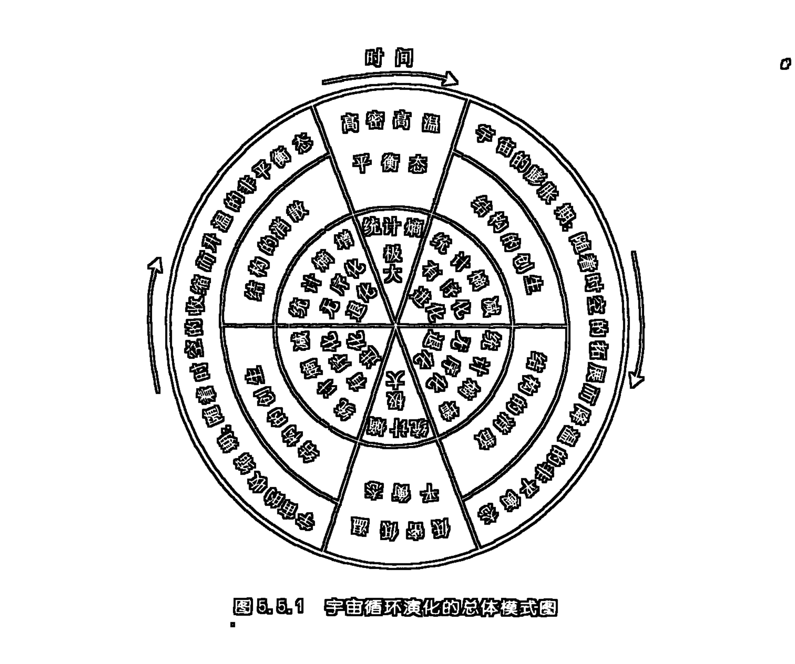

上图表明了如下一些基本结论：

1.  宇宙整体演化的模式具有明显的循环性特征，在这一循环中，宇宙的任何一种状态都是暂时的、过渡性的，因而也便无所谓宇宙演化的开端。大爆炸宇宙模型所假定的宇宙初始状态，仅仅具有某种逻辑相对的意义，它仍然是前一演化过程所达到的一个终点。
2.  宇宙演化的整体模式具有平衡态和非平衡态相互过渡、转化的特征，它并不服从热力学第二定律所揭示的那种只能从非平衡态过渡到平衡态的单一方向的演化模式。由此，宇宙根本不可能永久地停留在“热寂”状态之中，如果说低密、低温的平衡态就是统计熵最大的“热寂态”的话，那么，宇宙自身所具的引力效应便是打破这种“热寂”平衡，使其重新走向非平衡，重新升温的内在动力。
3.  在宇宙演化的过程中，并不像热力学第二定律所指明的那样随着体系温度的降低，必然会带来熵增的无序化。在宇宙膨胀降温演化过程的前期，宇宙事物的各种复杂结构将会被不断创生出来，这就形成了一个系统内部的统计熵减少的有序化进化演化过程；当宇宙膨胀降温演化过程达到了某一临界域之后，随着宇宙的继续膨胀，随着温度的继续下降便会导致演化方向的逆转，在这一过程中，前期演化中形成的各种复杂结构将会逐步消散，整个系统内部的统计熵将会增加，宇宙演化将经历一个无序化退化的过程。当这种无序化的退化演化达到了一种低温、低密的平衡态之后，它又会逆转过来，在宇宙整体的收缩中重新升温。在这一升温演化的前期同样会出现有序化进化的各类结构创生的过程，这时宇宙系统的熵会随着升温减少。但当这一过程达到某种临界域时，继续的收缩升温便会造成演化方向重新逆转，于是，又一个熵增的无序化退化演化过程便开始了，直到达到一个新的极限——高密高温的熵极大的平衡态。这就完成了宇宙循环演化的一个周期。在这一演化周期中，我们清晰地看到，无论是宇宙升温演化的过程，还是降温演化的过程，都存在着各自的熵减期和熵增期。在这里，熵增还是熵减，有序化还是无序化，进化还是退化并不取决于温度的升高还是下降，而是取决于演化过程是离开平衡态，还是向平衡态接近。离开平衡态时的演化过程，无论是升温还是降温，它都必然是熵减的、有序化的、进化的；向平衡态接近的演化过程，无论是升温还是降温，它都必然是熵增的、无序化的、退化的。
4.  还有一点值得强调的是，虽然宇宙的循环演化并不能简单地看成是一个闭合的圆圈，因为经过一个周期的演化，重新回复到出发点（出发点是任选的，它可以处于演化图中的任一位点上）时一定会多少存在着一些与原出发点状态的差异，但是，我们又必须指出，这种差异并不是本质性的。在整体规模上我们没有理由不承认这个圆圈的闭合性，重复循环的完满性，除非遭到来自我们所处宇宙之外的其他宇宙物质的强力作用，我们所处宇宙演化的这种循环闭合性一般是不会被打破的，没有任何迹象和理由能够确证，当宇宙演化再度回到“原始火球”时，是整体进化了还是整体退化了。这个新出现的“火球”必然会在整体上呈现它赖以出发的那个“原始火球”所具的一系列基本特征。
5.  宇宙的循环演化是高度自组织的。宇宙无需从它的外部引入模式，宇宙自身的质—能总量、宇宙自身的时空维度、宇宙自身的质量形态、能量形式、信息模式的多样性和复杂性，各类质量形态之间、能量形式之间、信息模式之间的相互过渡和转化，以及质量形态、能量形式与信息模式之间的复杂交织的相互作用、相互支撑、相互过渡和转化、相互协同的同步生成、进化和退化，充分展示了宇宙演化的不同阶段、不同领域和层面上的具体模式的内生性和各类模式间的相互过渡、转化、跃迁的自发建构性。由此也展示了宇宙自组织演化的自身反馈、自身调控、自身结网、自身编码、自身解码、自身同构、自身设定、自身展示的全息性和复杂性。

## 第五章 信息自组织进化的一般机制 265

## 第六章 演化的全息境界 ①

自然向上演化的进化发展，乃是一个信息不断创生、不断凝结积累的自组织过程。在这一过程中，既有信息形态在量上的扩张，也有信息形态在质上的迁跃。这样的一种信息进化过程，很自然地会给我们提出如下两个问题：一是，在自然进化的过程中，新创生的和凝结积累起来的信息是通过怎样的一种方式来表明自己的存在的？二是，由这个不断创生、不断凝结积累起来的多重信息结构所规定的物质形态又会具有怎样的一些特性？

与这两个问题紧密相关的便是自然界中普遍存在着的种种演化全息现象。

全息的含义是指事物在自身结构中映射、凝结着自身现存性之外的多重而复杂的信息关系和内容。我们有理由将全息现象看作是复杂性自组织进化所可能达到的一种相关信息凝结积累的结果。

### 一、演化历史关系全息

从信息形态进化的理论来分析，自然界中必然会普遍存在这样一类现象：处于演化高级阶段上的系统以其特定的内在结构形式积累着演化低级阶段上的系统及其环境的信息，而这个处于演化高级阶段上的系统的新的信息活动方式，又恰恰是在它所积累的种种信息的综合建构中产生出来的。由于这类现象中所凝结和表现出的信息是关于事物演化过程中的时空有序性的历史线索的信息，所以，我们把这类现象称为演化历史关系全息。

自然系统的发展、进化，意味着信息的产生、凝结和积累，而这种信息产生、凝结和积累是在一个全新结构的建构过程中实现的。随着这种建构，系统将它所产生和接受的种种新的信息不断整合重构到旧的信息结构之中去。通过这种整合重构，旧有凝结的信息以一种多少发生了变态、扭曲的形式被保留下来了，而新的信息则通过这种整合重构被同化和凝结到了系统之中。再者，由于这种全新的建构又会使系统在整体上呈现出全新的信息样态和信息活动方式。所谓演化历史关系全息则正是这种发展、进化的过程所引出的一个必然结果。

在无机界中，由于系统还不曾发展起较高程度的信息自调控的能力，其结构建构的方式主要依赖于一些机械性较强的物理过程，以及一些简单的化学过程。由于信息自调控能力的缺乏，系统的自组织能力就比较低下，这样，系统对外界信息的同化凝结过程，往往会造成原有结构较大程度的耗散。在这一范围里，结构的重构、信息的积累都是不很完全的。相对来说，这一范围内的全息现象具有较大的不全性。

演化进入生物界则大不相同了，随着生物进化的信息自调控能力的不断发展，生物系统的自组织能力日趋加强。由于有了较强的自组织能力，系统在同化外界信息的过程中，一般并不会引起原有结构的根本性破坏。与之相对应，生物系统中凝结着的旧有信息将较大幅度地叠加、重构、整合到新结构之中，在这里，信息的积累将是比较完全的，相对来说，这一领域的全息现象将具有比较小的不全性。

由于进化过程中的信息的全息性积累，系统的物质结构中必然凝结了多重的信息结构。这就使该系统具有了信息多质统一的特性。当这个新结构通过自身新属性的表现来展示自身存在的这种丰富性的时候，它便可能将它所拥有的不同层级的多质交织的种种信息呈现出来，这就构成了许多有趣的全息现象。

由于新系统是以改变了的结构将旧系统以及环境的种种信息重构到自身的新结构中去的，所以，在充分发展了的事物中，便会留有自身历史上某些特性的深刻印迹。这些历史印迹，在事物自身进一步的演化过程中，必然会以这样或那样的方式一再表现出来。这种现象向外报道了演化历史关系全息存在的信息。

生物个体的发育过程将要重演其种系进化过程的生物发生律（亦称生物重演律）现象是演化历史关系全息现象存在的最为极端的一个例证。生物重演律的具体表现是多重的，既包括体质形态结构方面的重演，也包括生理机能方面的重演；既包括生活习性的重演，也包括心理活动形式的重演。

人类胚胎发育的最初期在形态结构上与其他脊椎动物的胚胎相似，而人类专有的特征则在胚胎发育的较晚期才出现，有些属人的特征（如直立行走、喉部发育、脑中枢的分化等)更是要在出生后的儿童期中才能逐步发育完善。10～20天的人的胚胎的颈部两侧有鳃裂，这是人鱼同祖的信息；两个月的人的胚胎常有五个尾骶脊椎和相当长的尾巴，这是人与有尾兽同祖的信息；五六个月的胎儿全身大多密布浓密的细毛，通常在降生前才消失，这是人与毛皮兽类同祖的信息；婴儿最初学会的是爬行，这是人与爬行兽同祖的信息……

动物体内含氮废物的排泄方式的进化线索在胚胎发育过程中的重演是生物的生理机能重演的一个特例。一般说来，鱼类的含氮废物以氨的形式通过鳃排出体外；两栖类氮代谢废物的排泄方式处于排氨动物和排尿素动物的中间状态；大多数爬行类和鸟类都是排泄尿酸的；哺乳动物则主要排泄尿素。在胚胎阶段，这一排泄方式的进化线索将得到重演：蛙在蝌蚪阶段排泄氨，与鱼类相似；鸡在胚胎发育早期排泄氨，10天以后才与鸟类一样排泄尿酸。

重演现象有时也表现在生活习性方面。成熟的河蟹每年要到浅海中产卵，孵化出的幼体也在浅海中生活，长成幼蟹后才返回江湖生活。这表明它们的祖先原是在海里生活的。

重演现象在动物个体心理结构的建构过程中也是极为明显的。这就是较高等动物总是从无感觉、无记忆的胚胎期中逐步发育出各类感觉、记忆能力的。而一些高等动物，以及人，则更需要在胚胎发育的过程之上，再通过婴儿、幼年的准社会化或社会化的过程才能建构出相应的心理活动能力(包括人的意识)。

生物重演律具体表现的这种多重性表明演化历史关系全息现象中所全息的信息内容的丰富性、复杂性和全面性。

由于进化是信息不断叠加、重构、累积到原有结构中去的过程，这就使生物个体发育重演种系进化的过程具有了一种与原进化过程相对应的时空有序性特征，这一过程恰恰是在时空上大大压缩了的一个生物进化史的微缩模本。在这一模本中，演化历史关系全息所全息的信息内容仅仅是关于演化历史的一般程序、合理化的秩序方面的，而不是包罗全部特殊的细节、偶然的因素的。这里也体现着全息不全的特征。

生物个体首先通过遗传承受了它那个种系在进化中凝结的信息，这就是通常意义上的遗传信息。这种遗传信息就具体凝缩在母体所产生的子代个体的第一个细胞中。正是这个细胞的内在信息结构，规定着生物个体发育的一般趋势只能是它那个种系进化过程在时空上大大压缩了的一种重演。对于人来说，这就是人的体力和智力结构沿生物进化的历史线索进行双重建构的过程。从演化历史关系全息的角度来看，个人的全息元的意义就在于个人只是从动物起源和进化直到人类起源和进化的全部自然历史关系和社会历史关系的凝结物。

### 二、演化未来关系全息

事物的演化对于演化赖以出发的初始条件具有极强的依赖性。一般说来，相同的初始状态在相同的条件和环境中会产生相同的演化过程和结果。这种由初始条件的相同所决定的演化过程和结果的相同的现象就是演化未来关系全息。

前已指出，现代宇宙学揭示，我们所处的宇宙整体演化的一般模式（即是开宇宙，还是平宇宙，还是闭宇宙）决定于宇宙的物质密度（宇宙临界密度）。宇宙整体演化模式对其质—能总量的依赖性就是宇宙总体演化过程的全息性。对于闭宇宙来说，宇宙整体演化过程的全息性使整个宇宙的演化呈现出一种总体循环的闭环，这个闭环的任一阶段都是对其演化的过去、现在和未来全息的，并且，这个闭环的任一阶段都既是宇宙演化的初态，也是宇宙演化的过渡态，还是宇宙演化的一个终态。

星系起源、恒星演化的一般过程对其初始条件也是具有极强依赖性的。这些初始条件包括形成星系或恒星的星云物质的总体质量和密度。不同质量和密度的星云团将可能形成不同模式的星系和恒星，并且，也会导致这个星系和恒星演化的不同方式和结果。

生命的起源和进化，生命个体的发育，同样依赖于相应的初始条件。正是原始地球当时的具体环境所提供的初始条件造成了地球生命的诞生，又是地球环境在之后的变化所提供的环境条件产生了生命的分叉进化。生命个体发育的一般过程和结果是由个体发育的初始细胞中所编码的遗传信息结构所决定的。这个初始细胞的内在结构，以及细胞正常发育所必须的环境条件（包括温度、湿度、空气成分等因素），就是生命个体发育的初始条件。

对于那些内在随机性较小的、不太复杂的系统来说，只要同类系统所具有的初始条件十分相似，那么，这些系统演化的过程和结果将会呈现大致相似的情景。这类系统的演化对于初始条件的依赖性通常并不具有特别敏感的性质，它只要求一些大致类同的初始条件便会保持某种较为稳定的演化过程和结果，这些系统的演化具有某种刚性决定论的特征，初始条件中的小的差异，只可能导致演化过程和结果的小的偏离。

然而，对于那些内在随机性较大，具有内部复杂的非线性相互作用的系统的演化来说，则并不具有这种刚性决定论的特征。这类系统对于初始条件的依赖性是十分敏感的。从两个非常接近的初始条件出发的两个相似系统，在经过一个足够长的时间演化之后，无论在演化过程、方式，还是在演化结果方面都将出现极大的差异，甚至找不到任何可资比较的相似之点。

其实，混沌理论中所说的造成系统演化对初值的敏感依赖性（蝴蝶效应）的原因，就根植于微观要素的可变复杂性之中。因为，即使所测的初值完全相同，但由于构成系统的要素本身就具有“自由意志”式的可变性（具有活力的要素），系统也将会在后续的演化中产生出足以引起敏感性变化的内在条件差异，从而引出未来演化模式的多样性和复杂性。通常，有一个形容蝴蝶效应的说法，即“差之毫厘，谬之千里”。然而，在具有内随机性的现实系统中发生的情景则可能是毫厘不差，也会产生千里之谬。因为，即使在初始状态中完全处于同一位置和姿态的两只蝴蝶，由于每只蝴蝶都具有“自由意志”，所以，在之后的行为中也不可能同时、同力、同向扇动翅膀。也许，复杂系统中要素的自主性所引发的较强内在随机性将可能成为对演化未来关系全息进行完全决定论机械性理解的某种限制。在复杂系统中，演化未来关系全息将可能是针对分叉与混沌行为的全息性而言的。

“蝴蝶效应”所揭示的事物演化对初始条件的敏感依赖性集中体现着事物演化的非线性和复杂性的特征。由此我们便会深刻地体会到，演化未来关系全息所呈现的演化过程和结果的全息性，其实是对演化系统的诸多条件、因素在动态展开过程中的某种全息综合。在这一全息综合中，一些偶然的微小因素都有可能对系统整体的运行提供十分重大的贡献。系统的演化对于微小因素的影响并不总是采取简单“抛弃”的态度，而是还可能通过某种“全息综合”的途径将其同化、放大，并与其他微小因素协同整合为一种影响系统全局的行为。

### 三、演化系列关系全息

显然，演化历史关系全息和演化未来关系全息在一些事物演化的过程中是相互统一的。比如，生物起源和进化的种系联系的特征就在于：任何一个生物体都是它那个生物种系进化之链上的一个环节，它既凝结着它那个种系进化的全部历史，也体现着它那个种系进化到目前所达到的程度，还潜在规定着它那个种系未来进化的种种趋势。任何一个健全的生物体，都是关于它那个种系的历史、现状、未来的一个全息元。在这里，全息不仅对历史而言，而且也对现在而言，另外还将对未来而言。不过，当面对未来时，事物的演化将出现分叉现象，全息的观点亦将只针对一个可能性的集合而言。事物到底沿哪个分叉演进，还将取决于种种外部条件的变化以及各类内、外随机性的作用。具体讲来，在事物演化的过程中，关于事物演化的历史、现状、未来的信息是具有互逆性说明的全息交织性的。如，生物个体发育过程，一方面可以看成生物进化的物质、信息结构的双重建构过程的重演；另一方面又可以看成遗传密码中叠加的层层信息的依次展开；一方面可以看成种种演化历史印迹的再现，另一方面又可以看成遗传基因结构对未来发育程序的规定，还可以看成遗传细胞自身特性的表现和展开。这里既体现着物质进化和信息进化的具体的统一，也体现着历史、现状、未来三者的具体的统一。这样，在事物的现存性中便同时凝结了双重的关系：一是关于自身演化历史的关系，二是关于自身未来发展的关系，并且，事物自身的现存性又是由这双重关系所规定的。

在闭宇宙的总体演化过程中，历史、现状、未来的关系也是统一的。宇宙演化总体循环的闭环性，使处于这个闭环上的任一演化环节都同时具有了对宇宙演化全过程的历史、现状、未来的全息性。如果从一个更为一般抽象的层次上来看的话，任何事物都只能是一种在种种历史关系中的生成之物，并且又都必然会向未来演化而去。正是在这种历史生成和向未来演化的双重性质中，事物将自身在这样一个“历史——现状——未来”的关系系列中全息化了自身。事物并不简单地就是它自身，它的自身既是历史关系的凝结者，又是现实关系的承载者，还是未来关系的启动者。

事物演化的这种历史、现状和未来的具体统一性，将演化历史关系和演化未来关系具体地统一起来了。这样，我们便有理由把演化历史关系全息和演化未来关系全息具体地统一到一类更具普遍性的全息现象之中，这就是演化系列关系全息。

演化系列关系全息体现着事物在演化过程中呈现出的关于自身历史与现状、历史与未来、现状与未来间的相互映照、相互规定、相互重演的多重复杂关系。演化系列关系全息集中反映着事物演化的过程性、复杂性，以及过程的连续性和统一性。在这样一个演化系列关系全息的相关之链中，演化历史关系全息、演化未来关系全息都成了演化系列关系全息总链中的某一片断或侧面。

> ① 本章的内容最初发表于拙文《论自然演化的全息境界》（《西北大学学报》1994年第2期，第7～13页）。此处转用时有所删节。

## 第五编 信息进化论(上)

当然，作为片断或侧面的历史关系和未来关系之间又是相通的。历史关系须在未来关系中展示自身，未来关系又必须以历史关系作为自身展开的基础和前提。正因为这样，未来演化中所展示的对历史关系的重演构成了演化历史关系全息现象的发生；历史关系的凝结又构成了未来演化的初始条件，成了演化未来关系全息现象发生的依据。这样，在事物演进的任何一个过程中，都同时呈现着关于历史关系和未来关系的双重全息现象，并且这个双重全息又只能在同一演化过程中表现出来。

事物的演化是对自身历史关系和未来关系的双重展示，事物的现存性则正是在这个双重展示中获得规定性的。在这个双重展示中，时间就是空间，历史时间的演化在现存之物的空间结构中留存，未来时间的可能在现存之物的空间结构中潜存；在这个双重展示中，空间就是时间，历史空间的结构在现存之物的时间结构中重演，未来空间的结构在现存之物的时间结构中得到规定；在这个双重展示中，历史就是未来，历史是未来发展的初始条件，未来是历史秩序的展开；在这个双重展示中，未来就是历史，未来是历史的发展，未来是历史关系的重演。

### 四、演化内在关系全息

系统的进化采取的是一种全面进化的方式，这一过程对于系统的整体和部分都是一个全新综合建构的过程，这就造成了另一类全息现象：不仅整体包括着部分，而且部分也包括着整体。一方面整体信息样态由部分的综合建构而产生，另一方面，部分的信息样态又由整体来规定，部分中也映射着整体的信息，部分即是整体的全息元。由于这类全息现象是从系统自身的内在关系演化的角度来看的，所以，我们有理由把这类全息现象称为演化内在关系全息。

在事物全面进化的全新综合建构中，进化中的事物内部普遍存在着一种非线性相互作用的协同相干现象，这种内部非线性相互作用的协同相干效应的稳定化一方面把事物的各个部分紧密结合为一个整体，另一方面又在各部分之间、部分和整体之间建立起不可分割的联系，这些联系原则上是通过种种质量、能量、信息的交换和沟通来实现的。通过这样的一种普遍的内在相互作用，使事物的部分和整体、部分和部分之间建立起了某些内在统一的相互规定性，这就导致了演化内在关系全息现象的发生。由于内在信息自调控、自组织能力发展水平上的差异，与演化系列关系全息一样，演化内在关系全息在无机界中也具有较大的不全性，而在生物界中则具有较小的不全性。我国学者发现的生物全息律是演化内在关系全息的极端例证。生物全息律认为，生物体的任一组织、器官、系统、节肢、细胞都是关于生物体的一个全息胚。全息胚一方面是生物体上的一个相对独立的部分，在结构和功能上与其周围部分有相对明显的边界，其内部又有着结构和功能上的相对完整性。另一方面，全息胚与生物整体、全息胚与全息胚之间又具有种种全息性关系：全息胚的各个部位在整体或其他全息胚上都有各自的对应部位；全息胚上的一个部位，相对于该全息胚上的其他部位，与整体或其他全息胚上所对应部位的生物学特性更为相似；各部位在某一个全息胚上的分布规律与各对应部位在整体或其他全息胚上的分布规律相同。从生物全息律中我们可以清晰地看到事物整体和部分、部分和部分间的全息相互规定性。

演化系列关系全息和演化内在关系全息是自然界存在的最为一般、最为基本的两类全息现象。从原则上来讲，所有其他类型的全息现象都可以归结到这两类全息现象之中。只是为了更清晰地展示全息现象的极为丰富的内容，我们才把次一级的、具有较大普遍性的、从属于这两类全息现象的一些全息现象单独挑选出来给以稍多笔墨的阐释。

### 五、演化结构全息

演化结构全息是演化内在关系全息在事物组成结构模式方面的表现。它的内容是：现存的不同等级的事物之间、事物的整体和部分之间、事物的部分和部分之间的一般结构模式相同或相似。

在宇宙存在的不同尺度的范围里，我们可以看到形形色色的结构全息现象，这就是，一些处于不同层级的自然系统的一般结构模式都基本相似。如，原子结构、行星系结构、恒星系结构，以及银河系，乃至更大星系的结构，都具有一个密度、质量相对集中的核心部分，在这个核心的外围则散布着若干个绕核心旋转着的粒子（广义的）圈层。这类现象一方面可以看成宇宙微观尺度、宏观尺度、宇观尺度，乃至超宇观尺度上的结构模式具有的某种相互性的全息对应性，另一方面又可以看成是事物整体结构模式和其部分结构模式具有的某种相互性的全息对应性。因为原子、行星系、恒星系、银河系、总星系等等虽然属不同层级的事物，但是前者又依次是后者的组成部分。当然，绝不能把这类全息对应性关系绝对化。因为一方面，宇宙不同层级存在的结构模式绝非仅此一类。另一方面，就是这些相似结构模式之间仍然存在着极大的具体差异。

生物全息律中罗列了一大类生物体中存在的结构全息现象，这就是生物体整体和部分之间在形态结构上的相似性。如，植株整体、枝杈、叶片纹路的形态结构之间具有某种相似对应性；鸟的喙长则足亦长，尾毛发达则口周必有较长的须；体表有斑纹的动物，其相对独立的部分（如某一节肢）总是与主体上的斑纹数相同……生物体中存在的这类结构全息现象，表明的正是事物的整体和部分之间、事物的部分和部分之间的一般结构模式相同或相似的演化结构全息现象。

本世纪70年代以来迅速发展起来的分形几何学，在对大量不规则的、复杂形状的事物进行研究的基础上指出，在一些具有内在不均匀的层次结构的事物中，宏观尺度的形状和微观尺度的形状之间具有某种无穷嵌套的自相似的特征。

植物的形态是一种自相似分形结构；动物全身的各类系统，如：支气管系统、泌尿系统、胆管系统、神经网络、血液循环系统等等，也都是按照分形原则构成的。显然，在DNA中编码的信息，并不是详尽规定所有系统的组成结构的细节的，DNA中的信息所规定的仅仅是这些系统按照某些特定的分形规则进行分叉建构的一般性原则和程序。正是这样一些类似于分形规则的原则，控制着生物形态发育的过程。

法国数学家曼德尔勃罗首先思考了这样一个问题：“一个国家的海岸线有多长？”他论证说：任何海岸线在一定意义上都是无限长的，通常，它的测量长度依赖于用以测量的直尺的长度。事实是所选用的量尺越长，所测得的海岸线长度便越短。在这里，海岸线的形状是分形的，特定长度的尺子只能在特定的分形层次上对海岸线的长度进行测定，不同分形层次上的海岸线长度是不同的。

显然，自然界中的自相似分形的结构全息度是不完全的，这些分形结构具有某种无规分形的随机性特征。尤其是在海岸线、脑皮质、雪花、浮云、星系等的形态结构上更是如此，这些事物的微观形状和宏观形状的自相似并不是在简单直接的等比例缩小的意义上构成的，而只是在都具有不规则的多层级曲折性的意义上成为自相似的。另外，自然事物的自相似分形结构的层级也不可能达到真正无穷的程度，每一事物的自相似分形层级都有其上限和下限。

数学家们利用一些精确的数学规则构造出了许多理想状态的具有无穷嵌套自相似的几何分形结构。康托尔集合、科克雪花、席尔宾斯基地毯是分别建立在线、面、体的基础上构造出的三种最为著名的无穷嵌套自相似的几何分形结构。这些理想的几何分形结构是演化结构全息的一种抽象化的数学表达。真实自然中的结构全息现象是不可能达到这样纯粹而完全的程度的。

分形的秘密在于事物整体结构和部分结构的自相似，而所谓的自相似则是跨越不同尺度的对称性。演化结构全息作为演化内在关系全息的一个方面的表现，就在于这种跨越不同尺度的结构的自相似的对称性。

美国混沌学家费根鲍姆所揭示的形成混沌的“周期倍分岔”理论就正是一种美妙的分形过程。形成混沌的“周期倍分岔”理论指出：当系统演化的外界参数保持在一定范围内时，系统出现周期为 T 的运动，但一旦不断变化的参数超出这个范围，系统的运动周期就会逐次加倍，由周期为 2T 的运动，变为周期为 4T、8T…的运动，这样不断周期加倍的运动达到某一临界点时就会最终导致混沌现象的产生，这种混沌现象在宏观尺度上看来不再具有周期运动的特点，似乎是一种永不落入定态的涨落。但是，在微观尺度上，这种混沌现象却是十分有序的，处处可见一种有规则的无穷嵌套的自相似几何结构。有理由认为产生混沌的“周期倍分岔”正是一种分形演化的规则，正是通过这一规则的无限操作的运演，在原有的周期运动的无穷盘旋、折叠、缠绕、重构的复杂变幻中，呈现出了非周期运动的、起伏涨落的、无穷嵌套的、跨越不同尺度的自相似结构。在这里，我们有理由把混沌现象看作是一种在复杂的分形演化过程中生成的跨越不同尺度的全息境界。当然，混沌全息绝非仅仅是结构全息，在此结构全息中必然还凝聚着其他形式的全息内容。

自然分形与混沌中呈现出来的全息现象充分揭示了自然事物及其演化过程的复杂性。

对于全息现象的研究，科学界还刚刚在较大的规模上展开。目前，在一些学者中存在一种把全息观点无限泛化、比附的倾向，在这一倾向主导下的一些观点是缺乏足够的科学依据的，它们更多具有的是猜测性和主观臆断性。

全息问题是迷人的，但是，如果不小心，它便可能是一个陷阱。对全息问题的研究和阐释同样需要严谨的科学态度。全息不是橡皮图章，但是它确实能够成为揭开世界统一奥秘的一把金钥匙。只不过这把金钥匙也并非是由100%的纯金制作的。

## 第六编

## 信息进化论（下）

——社会的信息进化

### 第一章 人类社会起源的信息进化

传统的社会进化理论，只注重从社会生产、社会生活的物质形态进化的方面来讨论社会进化的问题，只是到了信息时代来临之后，学术界才开始意识到社会的进化还有一个信息处理和传播方式的进化的方面，并且，这个方面的进化，比较起社会的物质形态进化的方面来则更具有深刻性和本质性，因为特定的社会物质形态的获得是靠相应的信息处理和传播方式来选择、组织和建构的。特定的社会物质形态乃是实现了的特定的社会信息形态的结构承担者。

另外，我们还应该看到，社会的信息进化乃是自然（宇宙、星系、生物）的信息进化的一个分支进化过程，或说是一个延续性进化的插曲。这样，不仅人类社会的发展有其信息进化的规律，而且，人类社会的产生本身就是某种自然信息进化过程的直接结果。

人类是动物进化的直接后代，所以，对人类、人类社会的进化的讨论，有必要首先从对人类、人类社会产生的动物前提开始。这就是从猿到人的进化的问题。

从信息世界进化的一般尺度上来看，从猿到人的进化同样是一个物质形态和信息形态的双重进化过程。

### 一、从猿到人的进化是动物群体结构模式进化的最高结果

按照现代达尔文主义者的“综合理论”的学说，物种形成和生物进化的基本单位不是个体，而是种群。所谓种群是指生活在同一生态环境中，能自由交配和繁殖的一群同种个体。在自然界里，对于绝大多数的生物，特别是由有性生殖产生后代的生物来说，个体都生存于种群之中。在个体水平上发生的遗传变异只有在种群中得以扩散之后，才可能得以保持和发展，因此，生物的进化并不是个体遗传信息的改变，而是群体遗传信息的改变。人类、人类社会的产生和进化正是这种生物种群水平上的进化过程的延续。

近些年来，古生物学、古人类学的化石研究，在生物学家和古人类学家们中间形成了一种基本一致的意见。这种意见认为，大约在 3500～2400 万年前新生代渐新世时期的热带雨林中，生活着一种猿猴类，猿猴类生活的晚期，分化出了现代长臂猿的祖先和另一种较大形体的猿类——森林古猿。森林古猿生活在大约 2400～600 万年前的中新世时期，遍布欧亚非大陆，由于森林古猿分布在自然环境不尽相同的广大地区，时间又那样长久，于是在森林古猿那里发生了一种“辐射”型的分化，不同地区先后分化出了各种不同的猿类，其中，除了已经绝灭的以外，大约在 1600 万年前分化出了现代猩猩的祖先，大约 900 万年前分化出了现代大猩猩的祖先，大约 600 万年前分化出了现代黑猩猩的祖先，而现代人类的祖先大约也就是在 600～500 万年前的这一个时期被分化出来的。这就是说，作为人类的直接动物祖先的那种古猿种群最早出现在 600～500 万年前的时候，而人类，人类社会的形成则正是由这种古猿种群的生物演化过程发展而来的。这种作为人类的直接动物祖先的古猿种群的出现在生物学上被规定为人科动物的产生。根据化石资料所提供的线索，人科动物的发展经历了如下几个大的阶段：600 万年前，人科动物开始产生；300 万年前左右，工具制造和狩猎活动出现；4 万年前，现代体质的人类形成。600～300 万年前的时期，是人类的直接动物祖先生活的时期，当时的群体结构完全是由生物学规律决定的动物联合体，不过这段时期内，体质形态方面已经开始向着人类的方向发展，动物联合体中也已经存在后来发展出人类的社会组织形式的前提、胚胎和萌芽；300～4 万年前的时期，是人和人类社会的形成时期，这时期的人科动物可以叫做“正在形成中的人”，这时期的群体结构是一种过渡型，其中既存在着人类社会组织的雏形，也存在着非人类的动物联合体形式，这是人类的社会组织形式发生、发展，在不同的领域里不断地完善，从而逐步取代、直至完全取代动物联合体形式的时期；4 万年前以后的时期，则是人和人类社会进入成熟的社会历史发展的时期。

生物进化在总体上采取的是一种生理、心理、行为三个方面协同进化的、全面进化的方式。生物进化的这种生理、心理、行为全面协同进化的原则在从猿到人的转变中仍然是一个基本的进化原则，如果从信息进化的角度来看，那么，我们便有理由说从猿到人的转变依赖于三个方面的信息活动模式和形式的进化：一是群体生理遗传信息模式的进化；二是群体心理信息活动形式的进化；三是群体行为结构的信息模式的进化。而造成这三个方面向人的方向定向进化的契机则又是环境信息变化的冲击。

作为人类祖先的古老人科生物由森林古猿分化出来的最初的直接诱因是当时地球气候环境的剧烈变化。气候环境的变化使森林古猿原来栖息的森林大面积地消失，从而导致古猿的生存环境从原来的林栖过渡到林地栖，再过渡到地栖，最后则一直过渡到完全过热带草原生活。正是这种所适应的环境信息的演变，迫使古猿不得不采取新的适应性的群体生存方式。应该说，正是这种新的群体生存方式的不断进化实现着猿群的生理、心理、行为活动模式的全方位的、定向性发展，这种定向性发展最终导致了猿向人的转变、猿的群体向人的社会的转变。这里必须指出的是，在新的生存方式的产生和进化中，猿的生理、心理、行为这三个方面的相互作用，导致了三方面的协同进化，从其中引出了人的生理、心理、行为活动的协同萌发，协同生成。

在环境信息的冲击下，古猿之所以能产生最初的群体生存方式上的变化，这是因为，对于进化等级较高的猿类来说，它们的群体生存方式的结构是具有一定的可塑性的。近 20 多年来，灵长类动物学家对生活在天然环境中的野生猿类进行的大量系统性考察证明，在猿类中，物种在进化阶梯上的位置与它们中存在的群体结构形式之间并不存在某种严格对应的关系，一方面，同一种群体结构形式可以在不同科的动物中间出现；另一方面，同一类甚至同一种动物中则可能存在着不同的群体结构形式，而造成这种群体结构形式的可塑性的原因则是动物种群所适应的生存环境上的差异。在这里，古猿的群体结构的模式是具有多种可能性的，而某一种可能性的群体结构模式的实现则决定于生存环境的选择作用。正是这种群体结构的可塑性构成了古猿在适应新的生存环境的过程中结成新的群体结构（采取新的生存方式）的生物学前提。

对现代灵长类动物的群体结构的考察和研究证明：一般说来，灵长类动物可能采取的群体结构的规模的大小和联合程度的高低是和它们获取食物、躲避敌害的难易程度成正比的。这就造成了这样一种现象，对森林依赖程度越高的灵长类动物的群体结构的规模越小，且联合程度越松散；对森林依赖程度越低的灵长类动物的群体结构的规模越大，且联合程度越紧密。这是因为森林一方面为灵长类动物提供了现成而充分的食物——野果、嫩叶和嫩枝；另一方面，树上活动又为灵长类动物提供了避免猛兽袭击的安全场所。而没有森林屏障的开阔草原则一方面不能提供现成而充足的食物，另一方面又没有躲避猛兽袭击的安全地带。

具体说来，可把现代灵长类的群体结构划分为三类：一是林栖结构，常是三、五结伙的小群体，也有单独行动的成年雄性，此种结构以林栖的长臂猿和猩猩最为典型；二是林地栖结构，由 40～50 个个体组成一个群落，在林区常化为若干亚群或小群活动，到开阔地或草原时则结为大群活动，此种结构以生活于半林地半草原式环境中的黑猩猩最为典型；三是地栖结构，由 40～50 个个体组成的大群。行进时雌兽和幼兽走在中间，周围由雄性组成严密卫队，此种结构以生活于热带草原的狒狒最为典型。

可以想见的是，人类的动物祖先的群体结构正是在环境改变的胁迫下，从林栖型，通过林地栖型的过渡的中介，转变为草原地栖型的。

然而，过渡到了草原地栖型的作为人类祖先的古猿是比现代狒狒进化等级更高的动物。他们智力比狒狒发达，躯体比狒狒庞大且已能直立行走，手持各类天然工具（木棒、兽骨、石块等）。这样的一个群体在草原上行进时，会比狒狒群具有更为强大的气势和更为积极的行为。另外，狒狒还基本上是素食者，而作为人类祖先的古猿则应是一种杂食者。尤其是草原的干旱季节，古猿必须从事较大规模的狩猎活动。正是这种较大规模的狩猎活动的发生和发展导致了各类工具的应用和制造，从而导致了古猿向“正在形成中的人”的转化。

古猿群体结构的纯生物性的可塑性使古猿产生了最初的对草原环境的适应，而不致灭绝。但是，当这种最初的适应建立了之后，迎来的便是这种适应性程度的发展。古猿面临的是一个严酷的自然现实，如果最初的适应性得不到进一步的发展，那么，古猿将仍然不可避免地遭受自然淘汰的厄运。可以想见的是，古猿的大量分支由于没有取得这种适应性程度的发展而全部灭绝了。只有获得了这种适应性程度的发展的那一古猿支脉才可能逐步地向人的方向转变。并且，这一转变又只能是生理、心理和行为模式的全息协同进化的过程。

### 二、从猿到人的生理遗传信息模式的进化

类人古猿的群体生理遗传信息模式的进化主要表现在群体的体质形态上的发展。这种体质形态上的发展主要包括牙齿的变化、手足分工、脑的重建和扩大等。

在牙齿的变化上有如下一些显著之处：犬齿缩小；齿隙缩小直至完全消失；臼齿增高、增厚、向前靠紧、五个齿尖形成复杂的咀嚼面；整个牙齿的结构都向着接近同一个水平面，以便左右移动，适合于咀嚼大量细小、坚硬的食物的方向发展。牙齿的这种变化是由林栖生活中以果类、嫩叶为食转向地栖生活中以坚果、块根之类坚硬食物为食而发生的定向性适应性变化。

有关的研究证明，人类的肩胛骨与两臂的使用，与树栖猿类十分相近，在进化中，只需作少量的功能性意义的改变，树栖猿类的肩胛骨和两臂的使用方式就能转化为人类的肩胛骨和两臂的使用方式。作为人类祖先的古猿是从树栖型过渡到地栖型的，在这一过渡中由于肩胛骨功能和两臂使用方式转化的不很困难，所以手足分工和两足直立行走将是古猿走向地面后不久便实现了的这一个进化步骤。有的科学家甚至认为，手足分工的实现仅仅是一种功能上的转换，在这一转换中只失去了在觅食和运动时为了悬吊身体而将臂部高举过头的功能。恩格斯曾认为，手足的分工是从猿到人转变过程中“具有决定意义的一步”，因为“手变得自由了，能够不断地获得新的技巧，而这样获得的较大的灵活性便遗传下来，一代一代地增加着。”①也许手足分工正是人猿开始揖别的最初信息。对现代猿类的考察证明，现存的所有猿类都不是真正的两足直立者，在它们那里前肢从未得到完全意义上的解放，最起码也是辅助行走的，以指关节拄地的另外的两足。

从体质人类学的事实来看，人科生物的大脑发展不仅经历了一个由小变大的量的发展过程，而且是被重新改组过的，或者说有过一个重建的过程。美国古人类学家 D. 匹尔比姆教授曾一般地比较过人脑与猿脑的异同，并且正确地指出：与猿脑相比，“人脑并不仅仅是单纯的扩大，而是被重新建造了。实际上可以说脑的重建发生在前，随之而来的才是脑的扩大。”②

脑的重建意味着新的生理性和功能性结构的增生和分化。在这一方面具有突出意义的是大脑皮质的发展。其中具有决定性意义的环节是，皮质分析器三级区的扩展、语言中枢的分化和发展，以及皮质前额叶部位的特化突出发展等。

人脑皮质是分成区域和区的，这种区域和区的分化的有无和完善程度的大小是脑皮质进化程度高低的明显标志。低等哺乳动物的脑皮质中只分化出了不多的几个基本分析器区域（视、听、皮肤、动觉区域），且区域间之界限还不很明显。之后的进化依次在两半球后部日益明显地分化出分析器核心区，并在这些核心区中分化出中心区（皮质一级区）和外围区（皮质二级区），在外围区间形成交错区（皮质三级区）。在类人猿的脑皮质中已分化出了几乎人所具有的所有区，但是，只有在人脑中这些区的分化和区域间的相互关系才达到了完善的程度，并且，三级区的面积也已扩展到了整个皮质面积的一半以上。显然，类人古猿的脑皮质结构已经为发展为更复杂化的人脑皮质的结构奠定了进一步进化展开的生理性基础，而在人这里所实现的脑皮质的分析器交错区（三级区）的大面积增长，则正是与人所特有的高超的信息综合把握、加工、创造的能力相一致的。在这里，皮质三级区的扩大意味着脑功能的重建和发展。

从猿到人所实现的脑的重建并不仅仅是脑皮质三级区的面积的扩大，而且更是脑皮质的二、三级区中的新的功能区域的产生和分化，这就是人所特有的语言中枢的生成和发展。语言中枢的有无是猿脑和人脑的质的区别的一个最重要的方面，这也是从猿脑到人脑的重建性进化的一个最重要内容。

人的整个意识活动是以语言信号（第二信号）系统为中介的。以语言为中介的意识能力的发展导致了脑皮质结构的根本改变。这种根本改变影响到各类皮质区，在二、三级皮质区中表现得特别突出。虽然，古猿已经具有了利用简单的语声符号交流信息的能力，但是，由于语声符号在古猿中被利用的简单性、个别性和偶然性，所以，在古猿的皮质结构中还不可能明显分化出专门处理语言信号的特化区域。随着猿的心理向人的意识活动的转化，语言符号的利用越来越变得复杂、经常和普遍，这就导致了相应的专门处理语言信号的皮质特化区域的分化。在人的各类皮质分析器核心区的外围部位和各类运动皮质的外围部位中分化出了相应的各类感觉和运动语言中枢，这些语言中枢的功能就是对不同形式的语言符号的刺激进行分析综合的处理。与皮质二、三级区中分化出各类语言中枢相关联，皮质一级区中的神经元结构也有一些质的变化。有关的研究表明，人的皮质一级区中的神经元结构能够感知言语机能成分的精细的感觉差别和运动差别，并在结构上产生了相应的分化。这种分化过程在听觉中心区表现得特别明显。人的听觉中心区与猿类相比，不论绝对大小还是相对大小都有很大增长，听觉中心区的这种结构性改变反映着从猿到人转变中口语发展的重大作用，而口语又是整个语言信号系统活动最重要的基础。

脑额叶部位的特化突出发展是从猿到人的脑的重建性进化过程中的又一个最重要的进化内容。从猿到人的脑的重建关键是要提高脑的综合处理和创造信息的能力，这是与意识能力的产生、提高和发展相一致的。脑皮质分析器三级区的扩展，以及语言中枢的分化发展都是脑的综合处理和创造信息的活动能力得以提高的生理性物质基础，因为分析器的三级区和语言中枢都是对感觉信息进行复杂的分析综合的皮质联合区。但是，人脑要实现那高超的综合处理和创造信息的能力仅仅凭借分析器的三级区和语言中枢这样的皮质联合区还是远远不够的，因为分析器的三级区和语言中枢都还只是初级类型的皮质联合区，要完成高度综合的信息处理过程，还必须将那些在这类初级皮质联合区中得到初步综合加工的信息再联合起来，进行更高层级的综合加工，这就需要发展起一种更为高级的联合区，亦即联合区的联合区（或称超联合区），充当这一角色的正是前额叶皮质区。类人猿脑的前额叶不很发展，脑凸向后方，前额后仰，而人的前额却向前突出，已极为特化地发展了。从功能发展的意义上来看，特化发展了的人脑的前额部是人脑的最高部位，它是建立在其他脑区之上的一个对信息进行最高等级的创造性综合加工的区域。脑前额部与脑的下部组织（间脑、脑干和网状结构），与皮质的所有其余外表部分（包括所有感觉区、运动区和皮质边缘系统）都具有广泛的双向性联系，这种联系使前额部既能对信息进行最普遍、最复杂、最高层级的内导性加工，也能对信息进行最普遍和最高层级的外导制控调节。这种内导性的最高层的信息加工，构成了创造概象信息和符号信息的思维过程，而这种外导性的信息调节控制，又为主体信息的个体和社会的实现准备了重要的前提。

在从猿到人的进化中，伴随着脑的重建过程发生的是脑的扩大，这种扩大表现在脑容量的增加（人脑相当于现代猿脑容量的三倍）、脑细胞的增大、脑细胞的结构更趋复杂化，神经原分支的增加、神经原间联系的复杂化等等。

美国古人类学家 D. 匹尔比姆教授曾指出，从猿到人的大脑的重建大约从古老人科生物那里就已经开始，到了 300 万年前以后的时期，首先出现的是大脑皮质各联合区（三级区）的迅速增长，并形成了“超联合区”与脑下部组织和皮质所有其他区域间的双向性普遍联系的建构，与此同时，神经原的扩大和复杂化，显然也发展起来了，与这一系列的建构和发展相统一的必然是脑容量的不断增加、脑功能的不断发展。脑的这一重建和扩大便为人类思维的形成和进化奠定了生理学基础。①

### 三、从猿到人的心理信息活动模式的进化

与从猿到人的群体生理遗传信息模式的进化相协共变的是从猿到人的心理信息活动模式和群体行为结构的信息模式。从猿到人的心理信息活动模式的进化主要体现在抽象思维能力的形成和发展，与之相伴的又是语言能力的发展。

从猿到人的心理结构的进化显然起始于新的群体结构中的新的群体制约关系的发展。在一般的猿群中都已经发展起了两种制约群体关系的原则，一是团结互助原则，二是优势服从原则。团结互助原则既是一种行为（利它主义行为）原则，也是一种心理（群体意识）原则，只有当群体中的个体意识到群体存在和发展的价值之后，利他主义行为才可能成为一种行为规范。所以团结互助原则发展的程度便体现着猿的智能水平发展的程度。优势服从原则同样既是一种行为（对强者、首领的服从）原则，也是一种心理（畏惧或尊敬）原则。在较低等动物群体中优势服从原则更多地是在畏惧心理的支配下起作用，而在较高等动物群体中优势服从原则则更多地是在尊敬心理的支配下起作用。在群体规模较小、联合程度较松散的林栖环境中，这种团结互助原则和优势服从原则都不可能得到较高程度的发展。但是，对于在地栖环境中结成了规模大、联合程度紧密的古人科动物群体来说，这种团结互助原则和优势服从原则便都会得到较大程度的发展，并且，这两个原则的执行也同时便会以更多具有生理本能的色彩向更多具有心理自觉的水平转化。另外，在这两条原则的发展中，团结互助原则越来越会成为占主导地位的原则，并且，优势服从原则也会越来越依赖和通过团结互助原则来起作用，而不是更多地依赖和通过殊死的争斗（如种种争雄之战）来实现。

借助于团结互助关系所维系的对首领权威的服从是一种新型的群体结构的心理—行为模式。就其心理活动的意义来看，这种对首领权威的服从不应是纯粹盲目性的，而应是建立在群体全员对群体统一的价值和后果的心理理解上的，这种心理理解水平的达到必然要求发展起某种群体成员和首领之间，以及群体全员之间的群体交际的心理沟通，最初这种心理沟通可能更多地依赖于种种身体语言：一个身体姿态、一种手势、一副表情，或相互的一种触摸、碰撞等，而后来，这种心理沟通则会逐渐地更多地利用声带发出的声音，再后来便是一些连续的语句。当然，这些心理沟通的口语媒介的发生和发展一定是十分缓慢的。

对现代高等猿类群体的相关研究已经证明：在高等猿类的群体中已经存在相当复杂、十分灵敏的个体与个体之间交流信息的手段，包括姿态、手势、面部表情、声音以及利用视觉、听觉、嗅觉、触觉，甚至味觉的其他形式所实现的

① 《马克思恩格斯选集》第3卷，第509页。
② 参见蔡俊生：《人类社会的形成和原始社会形态》，北京，中国社会科学出版社，1988年版，第76页。
① 参见蔡俊生：《人类社会的形成和原始社会形态》，北京，中国社会科学出版社，1988 年版，第 127 页。

## 286 第六编 信息进化论(下)

信息交流。每一个个体正是通过这样的信息交流不断地、频繁地调节着自己的行为以及与其他个体的联系，从而形成统一的有机的动物联合体组织。

还应强调指出的是，在高等灵长类群体中已经发展起了某些高超的群体“知识库”的相互影响和世代承继的类文化现象，并且，当群体中的个别成员偶然获得了某种技能之后，这一技能会在群体中通过相互学习而转化为群体的技能模式，从而丰富或改善了群体“知识库”。有些科学家就曾发现，当一只年轻的母猴获得了把甘薯放到小溪里洗去上面的沙子的技能之后，这一技能便逐步传给了整个猴群，逐渐取代了以前把沙子擦掉的习惯；而当一只母猴获得了借助水的浮力把麦粒与沙子分开的技能后，别的猴子也逐步学会了模仿这只母猴的行为，这就是将混有沙子的麦粒扔进水里，麦粒浮于水面，而沙子则沉入了水底。①

有声语言的产生固然依赖于群体间广泛交际的需要，但是，广泛交际的需要并不能必然产生有声语言。这在人们对现代猿类的训化过程中已经证明。由于声带结构的特化发展，现代猿类通过训化可以习得数量可观的复杂的手语词汇，但是却不可能习得多音节变化的口语。多音节变化的口语的产生显然必须以相应的发音器官的结构为其生理性基础。一个可以想见的情况是，作为人类祖先的类人猿的发音器官结构是一种可塑性较大的非特化型的结构，这一结构在之后的分叉演化中一支形成了现代猿类的难以发出多音节语声的特化型结构，另一支则形成了人类的能够发出多音节语声的特化型结构。

一些新近的研究成果表明，发音器官的生理结构正是以直立行走的体姿为前提逐步形成的。作为发音器官的重要部位的“喉的位置随着人的站立而变低，盖在喉口上方的会厌软骨的舌根附近，增大了喉入口的距离，使喉冲出的气流更易进入口腔，提高口腔为共振器的作用”，这才可能制作出音节分明的语言符号来。②

显然，动物体质形态的发展是全息性的，直立行走的整体姿态的改变，不仅使手足得以明确分工，而且也使整个人体的骨骼、肌肉，乃至神经发生了全方位的相应的变化。从猿到人的发音器官的功能性进化正是这种从猿到人的体质形态的全息性进化的一个重要方面。

> ① 参见[美]马文·哈里斯著，李培荣、高地译：《文化人类学》，北京，东方出版社，1988年版，第28～29页。
> ② 黄新美：《直立行走对从猿到人的作用》，《博物》1984年，第4期。

### 第一章 人类社会起源的信息进化

脑的重建和扩大、发音器官的进化奠定了借助于语言符号展开抽象思维活动的生理基础，但是，抽象思维能力的产生并不始于语音符号的发展，从相关的民族学资料来看，手势语比音节语的形成要早。人类训化的黑猩猩可以借助于数量可观的手势语与人对话，但是它们却不能学会人类的复杂的音节语。因此，最初发展起来的抽象思维的活动一定是以手势语为中介的，然而，由于手势语交际的局限性，以之为中介的抽象思维活动显然也是很低下的。只有当复杂的语言符号系统发展起来之后，抽象思维的能力才可能得到较大幅度的提高。

语言符号信息系统和以之为中介的抽象思维能力的形成和发展是从猿到人的心理信息活动模式进化的最重要内容。随着抽象思维能力的发展，原来属于猿的感知、记忆、想象等心理信息活动也得到了全息性的改造。抽象思维能力的发展对“正在形成中的人”的心理信息活动模式具有两个方面的意义和价值：一方面，抽象思维的信息创造活动，以它自身的发展了的形态给“正在形成中的人”的心理信息活动系统增添了一个新的最高等级的活动要素；另一方面，由于这个新的更高等级的活动要素的存在和发展，便不可避免地要和心理信息活动系统中的原有的要素发生种种相应的相互作用关系。通过这种相互作用关系，整个心理信息活动系统都将获得某种整体意义上的全息性改造。在这样一个有抽象思维活动参与的新的心理信息活动系统中，抽象思维首先便从自身活动的高层级上对其他一些心理信息活动过程施以了全息制控。通过这种全息制控抽象思维从自身创造符号信息的符号信息的逻辑推演活动的目的、要求、性质和特点出发，对感知、记忆、想象等心理活动加以规范、评价和导引，这样原有的纯属动物性心理层级的信息活动便受到了来自新的更高层级的心理信息活动方式的再造性制约，使之减少了盲目性和自由度，逐步转化成了为抽象思维活动服务的、受到后者控制调节的心理信息活动环节。在抽象思维的这种全息制控下，整个“正在形成中的人”的心理活动系统的结构发生了全方位的质的升华，这就是猿的心理信息活动形式向人的心理信息活动形式的转化。这种转化不仅是理性信息活动（抽象思维）能力的产生和发展，而且是动物的感性信息活动（感知、记忆、形象思维）向人的感性信息活动的转化。与这一转化过程相一致的又是各类感官结构、神经通路、神经元结构，以及整个脑结构的生理性、功能性的定向性特化发展。在这里，一方面是不同层级的心理信息活动形式间的相互作用和制约，另一方面又是心理信息活动系统和生理信息活动模式之间的相互作用和制约，在这样一个多重相互作用的意义上，猿的心理和生理都同时被逐步改变着，并最终相协转化成了人的心理和人的生理。

另外，抽象思维能力的发展还与另外一重协同发展的过程相伴，这就是从猿到人的心理和行为的协同进化。因为抽象思维创造的目的性、计划性信息是具有客观实现的指向性的，这种客观实现的指向性要求特定的行为过程的发生。思维创造的目的性信息正是通过思维所创造的另一种信息——计划性信息在行为中的实施而客观实现的。

## 四、从猿到人的行为结构的信息模式的进化

从猿到人的行为结构的信息模式的进化，是一个从动物的本能行为到人的生产劳动行为的转化过程。在这一过程中关键的是两个方面的因素的增长和发展：一方面是行为的目的性制控能力的增长，另一方面是行为发生的中介系统——工具系统的发展，而目的性制控能力的增长和工具系统的发展又具有某种内在的统一性关系。一方面，特定水平的目的性活动要求着特定水平的工具系统；另一方面，特定水平的工具系统又指示着特定水平的目的性活动。

相当大量的研究资料表明，在高等灵长类动物中行为的目的性因素已经得到了相当程度的发展，尤其在最接近于人的猿类中行为活动的目的性就发展得更为高超了。这一点从野生黑猩猩能够制作和使用简单的工具的行为活动中得到了十分明晰地体现。可以想见的是，制作和使用简单工具的行为活动在作为人类祖先的古猿那里也已经是具备的了，有一定的目的性因素参与的、以简单的工具为中介的行为活动可以看作是从猿到人转变的最初始的一个基本状态之一。当古猿在环境信息的冲击下，被迫从林栖生活过渡到地栖生活的时候，在行为方式上面发生了两个方面的变化：一个方面是它们必须在无有利天然屏障的环境中以结成紧密群体所产生的力量来防御猛兽的袭击；另一个方面则是，他们必须在食物来源相对贫乏的环境中为获取足够的食物而进行群体性的采集和狩猎活动。这种行为方式上的最初的变化必然导致古猿更为经常地制作和利用工具。

可以为在草原地栖环境中古猿群体必然会更多地利用工具来展开御敌、采集和狩猎活动作证的是对现代猿类行为差别的一些相关性研究。有资料表明，现代林栖黑猩猩和草原地栖黑猩猩的御敌行为不仅在利用工具的水平上，而且在御敌的目的性上都存在着很大的差异性。在用“豹子”模型对黑猩猩的御敌行为的试验性研究中，草原地栖黑猩猩在吠叫中联合成多数，手持大木棒向“豹子”冲击。冲击有节奏地反复进行，并基本上是用双足行走。它们把抡起的大棒轮翻向“豹子”抛出，对“豹子”进行了多次强有力的打击，几乎所有被黑猩猩抛向模型的木棍，都击中了目标。而在对森林黑猩猩所做的同类试验中则呈现出了另外一番情景：远远望见豹子后，黑猩猩们开始大声喧哗，摇动树枝和灌木，如果也抓住了木棍，那么，几乎是立即就把它抛了出去，根本无法击中目标。此时，黑猩猩们多半四肢行动。显然，在这类试验所揭示的草原黑猩猩和森林黑猩猩的御敌行为方式是有极大差异的：前者是直立行走，面对敌兽，有效地利用工具，并有组织地协同对敌兽进行反复多次的致命性攻击；后者则缺乏面对敌兽的勇气，不能有效利用工具，并组织性极差地对敌兽进行恐吓，而不是进攻。前者的目的要是致敌死命，而后者的目的则只是吓跑敌兽。①

应该说，古猿御敌的能力和狩猎的水平的发展是一致的。古猿狩猎的对象一般是较温顺的食草性动物，但是也不排除少量的食肉性猛兽。一个极为现实的情况是，当在防御中杀伤或杀死侵犯的猛兽时，这些猛兽也便成了古猿狩猎的对象和食物的来源。

群体御敌、狩猎和采集的行为活动还有另外一个有利于行为进化的方面，这就是个体偶然获得的新的技能将会有更多机会和更快速地在群体中传播，从而更为有效地引起群体行为模式的改变，同时，活动的群体性也有效地保证了群体行为模式的历代承继和发展。

从猿到人的行为模式的进化，从一个十分简略的主线上来看，便是从猿的群体狩猎、采集活动转化到人的生产劳动的过程。在这一过程中从劳动的心理制控因素的方面来看，是行为目的性、计划性的增长的过程，而从劳动的体外中介系统的发展上来看，则是行为赖以展开的工具系统的进化的过程。那么，就工具系统的进化来看，猿和人行为活动的区别究竟在哪里呢？以往的一个简单的区分标准，即是否会制造工具的标准显然是很难成立了。因为能制造简单的工具并正确使用它已在现代野生猿类中发现。如果简单地用制作工具的复杂程度、制作工具的偶然性程度等作为人猿行为活动的区别标准，那么，这个标准仍然是过于模糊了，尤其是我们这里要考察的还是那种最初的人从猿中分化出来的标志，而不是今天的人类行为和猿的行为的区别。这样，上述的模糊性极大的标准显然是无助于问题的清晰解释的。

蔡俊生先生在总结一些学者的相关论述的基础上，提出了一种区别人与猿的行为活动的一个综合性标准，如果我的理解是准确的话，那么这一标准可以简单地说成是：由“必须依赖工具而生存”加上“制造工具的工具”所导致的生产生产资料的第一部类生产的发展。对于晚期古老人科生物来说，“必须依赖工具而生存”的事实是存在的，但是，直到三百多万年以前的地质资料还不能为我们提供他们已能“制造工具的工具”。可以把他们熟练地利用工具从事的经常性狩猎活动称为“准劳动”。①

显然，从猿到人的行为进化是一个漫长的过程，这一过程可以极粗略地表示为：从猿群的本能行为活动到猿人（或称原始人）群的准劳动（或萌芽状态的劳动），再到真实意义上的（或称完整意义上的）人的生产劳动。从时间划界上来看，猿人的准劳动大约起始于 300 万年前左右，而完整意义上的人的生产劳动的形成则应该是在 4 万年前左右。

## 五、人类起源是一个生理、心理、行为全息进化的过程

上面我们分别对从猿到人的生理遗传信息模式的进化、心理信息活动模式的进化、行为结构的信息模式的进化进行了讨论。我们对这三个方面的分而论之，并不意味着存在着三个相互分离的独立运行的进化过程。从猿到人的生理、心理、行为的进化是从猿的种群到人的社会的进化这一同一过程中所呈现出来的三个相辅相成的、内在统一的方面。这三个方面在具体的进化过程中存在着相互制约、互为基础、前提和规定的复杂的相互作用关系。这种进化的内在统一性、复杂的相互作用性，深刻表明着从猿到人的生理、心理和行为进化的全息协同统一性。

全息协同的进化首先表现为进化的诸方面在进化过程中的全方位的展开，其次表现为进化的诸方面在全方位展开中的相互规定，再次还表现为进化的诸方面在全方位展开的相互规定中的相互改变的同步发展。

> ① 参见蔡俊生：《人类社会的形成和原始社会形态》，第 111～114 页。

古猿被迫进入草原地栖生活之后，为适应新的生存环境，不得不采取了新的群体生存方式。这一新的群体生存方式首先表现为猿群的生理活动、心理活动、行为活动方式的全方位的改变。就生理活动而言它们不得不更多地采取直立行走的姿态；就心理活动而言，它们不得不更多地在严酷环境中处于较高高度的警觉状态，更多地对群体成员间的关系，以及周围环境的条件做出判断；就行为活动而言，它们不得不更多地利用工具进行群体性御敌、狩猎和采集等活动。当然，这种最初的生理、心理、行为活动的变化还只是根基在古猿的纯生物性本能的可塑性基础之上的。在这里，直立行走的生理性活动，是为获取尽可能广阔范围的信息的心理活动，以及更多地利用工具的行为活动服务的；更高警觉状态和更多做出判断的心理活动则调节着直立行走保持的时间，面对的方向，并同时又为更多利用工具的行为提供目的、计划、注意等指向；同样，更多利用工具的行为活动一方面制约着猿群生理活动的姿态，如，怎样行走、前肢持握和使用工具的活动等等，另一方面又要求心理为之提供指向性的观察、思考的相应的调节制控活动。可见，在从猿到人的最初的群体生存方式的转变中，已经存在着生理、心理、行为活动的相互规定、制约和全方位展开的全息性态势了。

不仅以最初的生物性本能的可塑性为基础的猿的生理、心理、行为的最初的适应性改变是全息协同的，而且在此基础上的超越生物性本能的，向人的方向的进化仍然是全息协同的。

对于从猿转变到人的具体机制的讨论，人们曾做出了许多极为不同的回答。存在一些把从猿到人的生理、心理、行为的进化过程予以割裂的意见。这些意见把从猿到人的进化主要看成是某单一一方面（或生理、或心理、或行为）进化的过程。其实，超越猿的生物性本能的，向人的社会的进化绝非是哪一个单方面的个别因素的独立进化所能实现的。一方面，任一个别因素的进化都必须以其他诸方面因素的进化为条件；另一方面，任一个别因素的进化所达到的水平和程度都制约着其他诸方面因素进化的水平和程度。进化诸方只能是相互制约、相互促进、相互协同、同步发展的。任何一种对某一个别因素进化的归结都将是片面的。

从猿到人的最重要的进化事件都无不同时具有生理、心理和行为进化的三重意义。诸如，手足分工、脑的重建和扩大、以语言为中介的抽象思维的产生、以制造工具的生产为标志的第一部类生产的发展等等，都不是哪一个单方面因素的进化所能实现的。

手足分工一方面要以直立行走、手的活动技巧的增加等生理性体质形态结构的进化为基础，另一方面，直立行走又是心理感知视野扩大的要求。同时，直立行走、手足分工又是更多利用工具的行为进化的产物；脑的重建和扩大，一方面是神经生理的结构性、功能性进化，另一方面又是群体成员间广泛交际、对外界事物和自身行为更多感知和思考等心理活动所导致的对生理性突变的定向选择效应。再者，这同样是目的性、计划性不断增长着的行为活动对生理、心理变化的定向选择所引出的一种结果；以语言为中介的抽象思维的产生本身是猿的心理向人的心理转化的决定性环节，但它同时又是脑结构和发音器官的生理性进化的一种结果，它还是群体间成员用以相互交际的行为活动，以及对外界自然有目的地探索和改造的行为活动进化的一种结果。因为无论是交际中的一个姿态、手势，或发出特定的音节等等过程，它既是一种生理活动（就其生理器官状态的改变而言），也是一种心理活动（就其是一种心理状态的中介载负者而言），还是一种行为活动（就其完成特定的动作而言）。至于对自然的有目的地探索和改造的活动就更是一种生理、心理、行为的全息协同的运动了，这里既包括生理器官的运动，又包括感知、思维的目的、计划和对活动监控的种种心理活动，还包括利用工具的种种操作性行为的活动。第一部类生产的产生和发展，一方面要求肢体生理活动技巧达到相应灵活的程度，另一方面要求心理上对工具的作用和制作工具的方法有足够的认识，再一方面还要求相应的制造工具的行为活动的发生。在这里，生理、心理、行为活动进化的水平应是一致的。并且，从某种意义上来看，生理进化的水平是心理和行为所能达到的程度的深层基础，而心理活动的结果又是直接指向行为的，它一方面在心理活动创造的目的性中要求特定行为及其结果的发生，另一方面在心理活动创造的计划性中设计着行为的过程和程序，再一方面它又通过相应的感知、记忆、思维的心理活动过程对行为过程本身予以监控。对于行为活动本身，它一方面有其作用于外界对象的独立活动的意义，另一方面它又是生理功能和心理状态的一种外化着的形式。这样，任何一种行为水平的进化同时就意味着生理、心理水平也得到了相应的进化。同理，任何一种生理或心理水平的进化也便同时就意味着心理或行为水平、生理或行为水平也得到了相应的进化。

进化是全方位展开的，又是诸进化因素相互制约、协同发展的，在这里，生理、心理、行为构成一个进化着的系统，在这一系统中，三者相互规定、相互制约、相互全息，共同在一个相互作用着的进化历程中由猿的生理、心理和行为出发，一步步地增长着人的生理、心理和行为的因素，而任何一种新的人的因素的增长，又同时就改变着生理、心理和行为三者相互作用的方式，而这种新的相互作用的方式又引出了新的人的因素的协同性增长。正是这样一个人的因素的诸多方面的协同萌生又相互作用的同步发展，最终导致了人的生理、心理和行为活动的全面而同步的生成。

## 六、人的两种生产形成中的生理、心理和行为的全息进化

在从猿到人的生理、心理和行为的全息进化中，还应着重提及的是关于人的物质资料的生产和人本身的生产的协同萌发、发展和生成的过程。在这一过程中，也明晰地呈现出了生理、心理和行为进化的全息协同性。

早在 1884 年恩格斯就强调指出了物质资料的生产和人本身的生产的相互制约性关系。他曾在《家庭、私有制和国家的起源》一书的“序言”中写道：“根据唯物主义观点，历史中的决定性因素，归根结底是直接生活的生产和再生产。但是，生产本身又有两种。一方面是生活资料即食物、衣服、住房以及为此所必需的工具的生产；另一方面是人类自身的生产，即种的繁衍。一定历史时代和一定地区内的人们生活于其下的社会制度，受着两种生产的制约：一方面受劳动的发展阶段的制约，另一方面受家庭的发展阶段的制约。劳动愈不发展，劳动产品的数量、从而社会的财富愈受限制，社会制度就愈在较大程度上受血族关系的支配。”①

我们这里要强调的是，不仅在人类社会中物质资料的生产和人本身的生产这两种生产是相互制约的，而且，在从猿到人的转化过程中，这两种生产从其最初的萌生开始就是相互制约着产生和进化的。这种相互制约的产生和进化指的是，任何一种生活物质资料的获取方式的改变，都会导致种的繁衍的生命延续方式（两性交配方式和育幼方式）的改变，而后者的改变又会促进前者的再变化。

作为人类的动物祖先的古猿的群体结构从原来的林栖型过渡到地栖型的同时，一方面改变了原有生活物质资料的获取方式，从原有的分散为小群觅食的素食者，转化为结成大群统一狩猎、采集的杂食者，另一方面也改变了种的繁衍的生命延续方式，这主要是指与雌性交配过程中的雄性间的相互容忍和幼仔的集中照管。

在与现代猿类群体结构的类比性研究中，科学家们指出，林栖型猿类是以结成小群的方式活动的，在群与群之间仍然存在着雌雄交配中的雄性间的忌妒和争斗，虽然，这种忌妒和争斗比较起较低等动物来说已经是大大弱化了。另外，幼仔的照管基本上还只是由作为母亲的雌猿来承担的。可以想见的是，作为人类的动物祖先的古猿在其林栖阶段其两性交配方式和育幼方式也大致与现代林栖型猿类的情景相当。

古猿过渡到地栖环境之后，群中的团结互助关系得到了较大幅度的增长，这就导致了雌雄交配中的雄性间的忌妒和争斗情况的逐步减弱和最终克服。而由于群体防御、狩猎和采集的需要，以及团结互助关系的强化，集体集中照管子代的机制也日益发展和完善化了。在这里，生活资料获取方式和种的繁衍的生命延续方式的最初变化显然是相互制约、相互统一的，正是这两方面的协同改变才构成了古猿地栖型群体结构的建立和发展。可以说，生活资料获取方式的更加群体化，导致了种的繁衍的生命延续方式的最初变化，而后者的变化又反过来巩固了前者的变化。在雄性间频繁争斗的景况下，大规模群体结构的存在显然是难以设想的。这个生活资料获取方式和种的繁衍的生命延续方式上的最初变化同样是一个生理、心理和行为协同变化的过程，在这一过程中，既有体质形态结构和性交的生理方面的变化，也有情感（消除忌妒）、意志（克己忍让）、考虑问题的方式（对环境、对生活、对异性关系、同伴关系的新的认识）等心理方面的变化，而与此同时，群体在行为活动方面的变化则更是十分明显的。

随着古猿群体狩猎—采集能力的进一步发展，在猿群的种的繁衍的生命延续方式上又发生了一些新的变化，这种变化首先指的是雌性发情期的消失。一般的高等动物，以及现代猿类的雌性都只有在发情期中才允许异性与之交配，而人类女性的发情期却隐而不见了。从猿的雌性有发情期状态到人的女性无发情期状态，其间必然经历了某种方式的过渡。

“正在形成中的人”的狩猎活动是一种与大型动物进行激烈搏斗的集体性活动，这种活动一般由壮年男子组成的队伍来担负，而壮年男子正是性需求最强烈的。然而，他们的性满足却只能在两次狩猎之间的间隙期中进行，而每次狩猎的时间又比较地长。男性的性满足机会的这种定期化的变化，导致了女性性满足机会的相应变化。这就是，女性的发情期和狩猎期重合时，根本不可

### 第一章 人类社会起源的信息进化

能发生性交关系。而女性处于非发情期阶段时，正值狩猎间隙时，则可能发生性交关系（在男性的逼迫下）。这种性交定期化的变化，打乱了女性性生理的发情期和非发情期的周期性变化，最终导致了一种奇特性效应：得不到满足的发情期被逐步拉长，原来的非发情期则被性生活激发为发情期，其结果便是发情期和非发情期的同时消失，逐步溶合为一种新的性生理状态——随时都可与异性交配。但是随着这种溶合性性生理状态的产生，另一种调节性关系的因素也便日益被强化了，这就是爱情的心理活动的发生和发展。这样，这种随时都可与异性交配的性生理状态便越来越由一种新的心理状态来支配了。在这里，行为方式（狩猎生产）的进化，直接导致了生理活动（性生理状态）的变化，而生理活动的变化又进而导致了新的心理活动（爱情因素）方式的萌生和发展。

另一个由猿到人转化过程中最初发生的行为进化和生理进化相互影响的例子是女性生殖生理形态的演变。在由最初的不稳健的猿的直立行走形态向稳健的人的直立行走形态的演变中，女性骨盆的上缘部分被进一步扩张，以承受躯干以上的全部重量，由此引起骨盆下方的耻骨弓角度和出口直径的缩小。随之而来的便是难产率的急剧增加，许多孕妇死于难产。由此又造成男女比例的严重失调。只有那些在体质形态上通过了分娩关的女子才得以生存下来，经过一个漫长的演化时期，具有适宜生理形态的女子的遗传基因得以在群体中广泛扩散，曾经出现的男女比例严重失调的状况才逐步得以扭转。这种女性生殖生理形态的演变同样来自于获取生活物质资料的行为方式的进化。

在狩猎—采集的获取生活资料的行为方式的进化，以及种的繁衍的生命延续方式的新的生理性变化的同时，一种新的群体意识的心理方面的深刻变化也随之萌生和发展了。这就是各种禁忌规范和氏族图腾崇拜的产生和发展。最初产生的禁忌规范一定是关于生产上的性禁忌方面的。这类性禁忌把生产中的失败归结为某一时期内所发生的性行为，从而用禁忌规范的制度来阻止这一特定时期内的性行为。另一方面的禁忌规范则与图腾崇拜有关，这类禁忌规范中包括狩猎仪式、禁猎、禁食对象，以及对猎物分配、享用仪式、方式等等。

在行为方式、生理方式的变化中产生出来的群体意识，又会反过来影响和制约行为方式和生理方式的变化。禁忌规范和民族图腾的出现产生了一种双重效应：一方面，在群体意识的强有力的规范下，加强了民族成员对民族群体的心理依赖，导致了民族内部产生了更强的凝聚力；另一方面，这种群体意识的强烈压力又导致了民族的自我封闭。不同的民族具有由不同的禁忌和图腾维系的不同的群体意识。在这种群体意识还未明确确立的阶段上，一个民族对其他氏族成员的接纳是比较地容易的，因为在不同氏族的成员之间并不存在很大的心理沟通的障碍。然而，当关于禁忌和图腾的群体意识明确确立了之后，具有特定禁忌和图腾的群体意识的民族对具有其他禁忌和图腾的群体意识的氏族成员的接纳就十分地困难起来。在这里，不同民族的成员间的心理鸿沟是深刻的。这就最终导致了各民族的自我封闭。

民族成员的相对的对外开放性，对于氏族的发展是有利的，这不仅在于其他氏族成员的加入会给本氏族带来文化和生产技艺上的沟通，而且更在于这些外民族成员携带有与本氏族成员不同的遗传基因，这样，不同遗传基因杂合的子代将有助于本氏族后代成员的生理遗传结构的变化。

自我封闭的民族则不具有上述的两个方面的优点，尤其在遗传信息的承接上，自我封闭群体的代代相传必然造成近血缘交配的频率逐步增长，从而导致遗传基础的贫弱化和保守性倾向。这种自我封闭的氏族由于不能解决近亲繁殖所引起的恶性循环，民族成员的生理素质将会逐步下降。可以想见的是，许多这样的民族在人本身生产的危机中不可避免地没落了。

这样，心理的东西随着行为和生理的东西的发展而发展起来，但是，这个发展起来的心理的东西又反过来深刻地影响和限制着行为和生理的东西的进一步的发展。从另一个方面来看，不仅生活资料获取方式的进化直接影响和制约着种的繁衍的生命延续方式的进化，而且，后者的进化也直接影响和制约着前者的进化。

面对民族走向没落的危机，要解决物质资料的生产方面的问题，必须首先解决人本身生产的问题，而要解决人本身生产的问题又必须首先解决氏族的群体意识方面的心理上的问题。这就是必须克服造成氏族自我封闭的心理障碍。这样心理的进化反过来成了生理进化、行为进化的先决性条件。这是一个生理、心理、行为的复杂交织的相互作用过程，从猿到人转化的每一步的前进，都依赖于这三个方面在复杂相互作用中的交错发展，这种交错发展集中显示着三者进化的同步性和相互促进的互为动力性。

人本身生产的危机的克服一定起始于原始人的图腾意识的改变。当氏族成员认识到不育、畸形儿、低能儿的产生是由于同一图腾氏族内部的两性关系造成的时候，并且，当这种认识转化为民族的群体意识之后，新的图腾模式便产生了。这个新的图腾模式较之旧的图腾模式最起码在两个方面得到了改变：一是必须禁止同一民族内部的两性关系的发生，与此相应产生了禁止民族内部成员通婚的禁忌规范；二是必须打破民族间性交往的封闭性，与此相应产生了各种形式的民族间的婚姻联盟。正是这种民族间的婚姻联盟的建立打破了将要形成的人的人本身生产的危机，随之而来的便是物质资料生产的进一步发展。这就又迎来了以民族婚姻联盟为基础的各类新的图腾集团——民族公社的兴旺发达。

有的学者甚至认为，正是这个人本身生产的危机的最初解决，成了人类社会正式诞生的标志。蔡俊生先生就曾这样写道：“在重新活跃起来的群体淘汰规律的影响下，大约到4万年前左右，到处出现了氏族和两合氏族婚姻联盟。这是人类历史上出现的人本身生产的社会结构的第一个完成形态，并且从此宣告了人和人类社会形成过程的结束，人类进入了成熟的社会历史的发展时期。”①

显然，人类社会诞生的标志是双重的：一是物质资料生产发展的水平；二是人本身生产的社会结构形式。在这个双重标志中又隐含着生理遗传模式、心理活动模式、行为结构模式的三重尺度。

① 蔡俊生：《人类社会的形成和原始社会形态》，第203页。

### 第二章 自然、社会与人

人类社会的产生和进化是宇宙自然进化过程的延续和超越。在这一延续和超越的双重尺度上，人类社会与它赖以产生的自然，人类社会与积淀在社会之中的人类文化，以及人类社会与社会中的人之间都存在着相互作用、相互规定、多重交织的复杂性关系。对这诸多方面的关系进行认真的探讨，对于我们从信息活动的角度深刻把握和理解社会进化的一般机制是十分有益的。

### 一、自然与社会

无论是在中国古代文明中，还是在西方的古代文明中，“社会”一词的采用都是针对着人和人类的。到了现代，“社会”一词已日趋泛化。尤其是本世纪中叶发展起来的“社会生物学”则更是把“社会”一词的适用范围推广到了一般的动物界。“社会生物学的定义是：一切社会行为的生物学基础的系统研究。当前，它集中研究各种动物社会，研究它们的群体结构、社会等级、通讯交流以及一切社会适应背后的生理学内容。但本学科也关心早期人类社会行为和当代人类社会更基本的组织适应特征。”①这样，按照社会生物学的观点，无论是“人群”，还是“猿群”；无论是“牛群”，还是“马群”；无论是“蜂群”，还是“蚁群”；无论是“鸡群”还是“狗群”；无论是“鱼群”，还是“鸟群”；无论是“鼠群”，还是“蝗群”……只要“为群”便是“社会”。

应该说，社会生物学的研究多少具有一些将动物拟人化的色彩。但是，它的积极意义却是十分巨大的。它进一步揭示了人与一般动物的统一性关系，从而也更为深刻地昭明着自然与人类社会的不可分割的联系。如果我们仍然坚持对“社会”一词作狭义化的理解的话，那么，我们便可以把社会生物学所称的一般动物群体的那个“社会”，相对称为“准社会”。这样，进一步阐明“社会”和“准社会”的区别和统一就将是十分有意义的事。

人类社会显然是从动物群体的准社会状态进化而来的，最切近的进化关系便是类人猿群体的准社会。人的社会产生于动物群体的事实深刻揭示着人类社会作为一种自然存在的本性。正是在这一层意义上，我们说人类社会是从自然界中产生出来的一个特殊的自然领域，这个领域是从自然界不断异化出来的自然的一个部分。

宇宙自然是一个自身运动演化着的动态系统，自然本身所具有的这种动态过程性，决定了我们必须对指谓自然界的自然范畴进行一种动态的规定。

在最为一般的意义上，我们应该对自然范畴作广义的理解。广义的自然范畴指谓着宇宙中的一切事物、现象和过程，它把人类社会和精神现象当成自身发展的特殊形态而包括在自身之中。广义的自然和宇宙、世界、广义的存在是同等尺度的范畴。

在广义自然的规定性中，社会被看成是自然史的一个特殊部分。自然在其演化的方向上，展示出了一系列的演化阶段：原始火球→星云→星系→恒星→行星……就自然的一般进化过程而论，行星可以被看作是它的高级发展阶段。只有在极为个别的行星上面，才有可能形成向更高的物质发展阶段（生命、人类、社会）演进的条件。幸运的是，我们赖以栖息的地球恰是一个这样的行星，而且也是目前我们对这些更高的物质发展阶段进行认识的唯一依据。就地球进化的现状来看，这种更高的物质发展阶段大致可以划分为三个阶段：有机界→生物界→人类社会。这三个发展阶段还只能属于行星本身的演化史的范围。人类社会的形成和发展是地球进化的最高产物。社会也是广义自然的一部分。“历史本身是自然史的即自然界成为人这一过程的一个现实部分。”①当然，社会又是自然的一个特殊部分，它与自然的所有其他部分相比，具有一系列崭新的性质，这其中最为重要的便是对自然的认识和改造。由此，社会又不能不与自然的所有其他部分之间存在某种相对的对立性。在这种意义上，自然范畴又有理由在狭义上，在与社会相对对立的意义上被规定。这就呈现出了自然与社会的双重关系：一方面，在广义上，社会作为自然进化的最高阶段，是自然的一个特殊部分；另一方面，社会又在对自然进行认识和改造的意义上成为自然的对立面。无疑，在这两个方面中，前一个方面具有绝对性，后一个方面则具有相对性，因为社会对自然进行认识和改造的能力连同社会本身，都是从自然中产生出来的，并且，社会对自然进行认识和改造的过程，又只能在自然本身演化的进程中来展开。

人类社会作为广义自然的一部分还意味着，人类社会只能在遵循自然整体运行规律的前提下存在和发展。自然是比社会更具普遍性的领域，社会是自然的一个特殊。虽然，作为一个特殊的自然领域，社会具有与其他所有自然领域不同的一些具体运行规律，但是，无论怎样，社会又不能违背自然整体运行的规律。作为地球的演化现象，人类社会还只是在地球生物圈中扮演着较为重要的角色。然而，就是在地球生物圈这个小范围里，人类也必须遵循生物圈运行的基本规律，任何无视这些规律的越轨行为都将会受到无情的惩罚。

人类中的为数不少的成员总是倾向于夸大人类、人类社会在宇宙中的地位和作用，并且，现代人类社会的高度发展又似乎呈现出人类具有某种无限的创造力，这种假象使人类的部分成员飘飘然，以为人类最终不仅能够成为地球、太阳系的主宰，而且还可能成为银河系，乃至更大宇宙范围的主宰。

然而，假象毕竟是假象。就现代宇宙学所揭示的宇宙演化的整体过程来看，地球生命，以及人类、人类社会的进化还只能属于地球这颗行星本身的演化史的范围。人类所具有的那种无限的创造力，是相对于个人，相对于某一代人而言的，如果相对于宇宙整体运行的无限造化来说，人类的所谓无限的创造力还仅仅是一个无限小量，这个量完全可以小到忽略不计的程度。这也类似于数学中的高阶无穷大和低阶无穷大的关系。人类创造力的无限性和宇宙造化的无限性并不是同一等级或相近等级的无限性。两种无限性相差的梯级本身就是无限的。

人类是自然演化一定阶段上的产物，社会则是人类赖以存在的形式。如果撇开生理性的深层根基不谈，仅从心理和行为表现方面来看的话，成熟形态的劳动、语言和意识构成了人类区别于其他动物的主要标志。正是这几方面使人成为一个具有新质的自然存在物，使人具有了社会性，具有了认识和改造自然的能力。人类这种具有新质的自然存在物的特性，使社会本身也成了一个具有新质的自然领域。就这一意义上，社会又是一种被人化了的自然部分。人的因素从总括的意义上来讲，无非是对自然的认识和改造。我们有理由把人化自然看成是被人类认识和改造了的那部分自然的总称。虽然，并非所有人类认识了的自然领域都能被纳入到社会领域中来，但是，社会毕竟是这个“人化自然”的核心部分。

人类社会的产生，改变了宇宙自然原始的相对于人的自在运动演化的历程，产生了一个对自然进行认识和改造的新的因素——人类意识和实践活动，以及这些活动所获得的对象化成果。虽然从本原上来讲，人类的意识和实践仍然是自然进化的产物，而且仍依赖于自然而存在，而发展，就前者打破了后者自在演化的宁静这一点来讲，就前者对后者进行认识和改造的这一意义上来讲，前者又不能不将自身从后者中异化出来，超越出来，获得其相对的独立性。与此相一致的是，人类不断创造着的、自身赖以存在着的形式——人类社会本身也不断地从自然中异化出来、超越出来，并获得了相对的独立性。

人类社会是一个从自然中产生，又不断向自然进军，不断认识、改造和占领自然的自身发育着的自组织系统。随着人类认识自然、改造自然的能力的不断提高，成果的不断积累，范围的不断扩大，人化自然（包括人类社会）的广度和深度也便会随之得到发展，这就是人类、人类社会的不断进化。

作为人类的存在形式的人类社会，不仅包括人类本身，而且包括被人们不断认识和改造、并且赖以生存的自然环境部分，还包括人类的意识和实践活动本身。由于人类生存空间和时间的不断扩大和延续，由于人类本身的不断进化，由于人类认识和改造自然的意识和实践水平的逐步发展，以及人类认识和改造自然的成果的不断积累，人类社会的领域也随之不断地发育、延伸和扩大，这就构成了人类对自然不断认识、占领和改造。人类对自然的这种认识、占领和改造，从自然的角度来看，就是逐步把自己的一部分异化为社会。这种认识、占领和改造，无论在宏观上还是在微观上都是成立的。人类原始种族间的接触、新大陆的发展、向宇宙的探索……，是人类对自然宏观的认识、改造和占领的不同阶段；分子、原子、基本粒子、夸克等物质结构层次的揭示，是人类对自然微观认识、改造和占领的不同阶段。人类对自然的这种不断认识、改造和占领的过程，也就是自然向社会不断异化、自然的不断人化的过程。这一过程，只要人类存在就一直会延续下去的。

这样，从总体上来看，仍然是一个一元的自然，社会仍然是自然的一个部分，从属于整个自然的体系。但是，从社会本身来看，它作为自然发展的一个高级运动形式，却又与其他自然的低级运动形式相对立，具有自己特殊的规律性和某些独立性。

人类社会正是在这种相对于人而自为存在着的自然与自在自然的对立的意义上成立的。正如马克思指出的那样：“社会是人同自然界的完成了的本质的统一，是自然界的真正复活，是人的实现了的自然主义和自然界的实现了的人道主义。”①社会的本质，就在于这种人化自然和自然化的人的不可分割的统一，就在于这种“人同自然界的完成了的本质的统一”。

### 二、文化与社会

“社会是人同自然界的完成了的本质的统一”，这一论断极为深刻地揭示了社会的实质。但是，仅仅在这样一个层面上来把握社会，还是十分抽象的。这一论断需要进一步具体化。

现今对于自然、人类和社会的关系的探讨，更注重于对文化现象的研究。存在着一种极带普遍性的倾向，似乎要把文化现象的有无作为自然与社会区别的分界，并且把文化进化的程度作为衡量社会进化程度的尺度。

在一般学者那里，对于文化涵义的理解并不一致。1952年，美国人类学家克罗伯和克拉克洪总结各家之见，发现人类学家们对于“文化”的概念的不同理解竟达164种之多，何况40多年来，在这一方面又增加了许多新理论。②

一种较狭义的理解，是把文化仅仅看成是社会成员拥有的共同观念体系。这可以看成是对文化涵义的心理性解释。如，美国人类学家R. M. 基辛(Roger M. Keesing)就曾这样写道：“在这里，‘文化’一词用来指一个民族的生活方式所依据的共同观念体系，即该民族的概念性设计，或共同的意义体系。这种定义下的‘文化’一词，指的是人类所学习的事，而不是人类所做或制造的事物。”③

比这种心理性解释较宽泛的另一类解释是把文化看成是社会成员共有的心理和行为的活动模式。如，美国人类学家马文·哈里斯就曾这样写道：“文化是社会成员通过学习从社会上获得的传统和生活方式，包括已成模式的、重复的思想方法、感情和动作(即行为)。”④

而学院派人类学的创始人之一，英国的爱德华·伯内特·泰勒爵士就是从心理和行为的综合层面上来解释文化现象的。他说：“文化……就其在民族志中的广义而论，是个复合的整体，它包含知识、信仰、艺术、道德、法律、习俗和个人作为社会成员所获得的其他能力和习惯。人类诸社会的文化状况既然可以根据总的原则加以调查，因此都是研究人类思想及行为规律的题目。”①

对文化涵义的最为宽泛的解释是把文化不仅看成是社会成员共有的心理和行为的模式，更看成是这种心理和行为的过程和结果。在这里，文化被理解为人类的一切创造性活动，以及由这些活动所创造出的任何一种积极的成果，包括精神性的和物质性的。正是在这种最宽泛的意义上，学者们才写下了这些话：“文化这一概念的定义就是人类自身的自由创造性加以创造的”。②“文化人类学所讨论的文化，是一个含义非常广泛的名词，它包括了人类通过后天的学习掌握的各种思想和技巧以及用这种思想和技巧创造出来的物质文明。这其中既有属于经济基础的部分，也有由此决定的上层建筑的部分；既包括了精神产品，也包括了物质产品”。③“文化，从广义来说，指人类社会历史实践过程中所创造的物质财富和精神财富的总和。”④

正是在这种广义理解的意义上，我们看到文化确实成了社会本质的具体而集中的体现者，正是在文化的各种形式中具体地实现着“人同自然界的完成了的本质的统一”。作为心理模式和心理活动过程的文化，一方面是自然赋予的人的肉体和教化生成的人的心灵的统一，另一方面则是人的认识和它所反映的自然对象的统一；作为行为模式和行为活动过程的文化，一方面是人的目的、计划的认识状态和自然对象本性的统一，另一方面则是人的实践活动和自然对象被改造的过程的统一；作为精神产品和物质产品的文化，一方面是人的外化了的心理和自然载体的基质结构的统一，另一方面则是人的行为在自然界中烙下的“印迹”。无论是心理模式，还是心理过程；无论是行为模式，还是行为过程；无论是精神产品，还是物质产品，它们都是人的世界对自然世界的展示，也都是自然世界在人的世界中的实现。正是在这种人与自然相互作用的互为展开和实现的双向运动中，所有的属人的、属人的社会的文化形式都是人与自然的完成的、本质的统一的形式。

与“社会”一词的日趋泛化相一致，一些学者也把“文化”一词的适用范围加以泛化，进而推广到了某些动物界。一些学者对一些被称为是“非人类的文化”现象进行了大量而详尽的研究。

说在较高等动物的群体中，存在着某些类文化现象是合理的。因为在这

① 转引自[美]马文·哈里斯著：《文化人类学》，第7页。
② [德]蓝德曼著，李富春译：《哲学人类学》，北京，工人出版社，1988年版，第6页。
③ 童恩正著：《文化人类学》，第8页。
④ 《辞海·哲学分册》，第112页。

## 304 第六编 信息进化论(下)

些动物群体中确实存在着某些共同的行为模式，并且，这些行为模式不是靠生理性的遗传基因直接获得的，而是从后天学习的过程中习得的。

一般说来，动物的行为可以区分为两类：一类是由遗传基因直接编码的行为反应程序或模式；另一类则不是由遗传基因直接编码，遗传基因仅仅提供某种基本的能力。由此能力开发出来的具体行为的反应程序或模式则依赖于具体生活环境的影响。前一类行为是纯生物本能性的，由先天生理性赋予的；后一类行为则是非纯生物本能性的，它虽然仍需以先天获得的生理性的遗传能力为其深层根基，但是，它能否具体地展开，以及展开的具体的方式、样态和程度却取决于在后天所处环境中的学习过程。

在一些较高等动物的群体(准社会)中存在着某些后天习得的、历代传递并不断演化着的、为群体成员所共有的行为模式。这显然就类似于人类的一些形式的文化现象。与我们对动物群体的准社会性质的认识相一致，我们也有理由把这些类文化现象称为准文化。

日本京都大学灵长日研究所的专家们通过观察发现了不同猴群中拥有不同的群体行为。例如，有些地方的猴群中的公猴在母猴去吃食时，会轮流照顾小猴，而有些地方的猴群中的公猴却不能这样做；有的地方的猴子在吃一种“木库树”上的果子时，总是把果核或者扔掉，或者囫囵吞下，而有的地方的猴子则会用牙齿将果核咬破，吃里面的果仁；有些猴群吃甲壳类动物，有些猴群则不吃。这类群体行为上的差别显然不是因为不同猴群拥有不同的遗传基因造成的，而是由于它们拥有不同的准文化模式。①

这个研究所专家们还发现了猴群中存在的准文化模式的演化现象。这种文化模式演化的过程是：一种新的行为会从首先获得者那里向其他的猴子传播，并逐步成为整个猴群所共有的行为模式。专家们为了便于观察，要把猴子吸引到海边，于是在海滩上放了一些甘薯。有一天，一只年轻的母猴把甘薯扔到海滩上一条小溪里，洗去了甘薯上的沙子。这种洗掉沙子的行为传给了整个猴群，逐渐取代了以前把沙子擦掉的习惯。9年以后，80%至90%的猴子都在小溪里洗甘薯。后来，把小麦撒在沙滩上，猴子起初花了很长时间才能把麦粒与沙子分开。过了不久，那只年轻的母猴用一种特殊的办法把麦粒与沙子分开，别的猴子模仿了它的办法。这个办法是将麦粒扔到水里，麦粒浮到水面，而沙子则沉入水底。

> ① 参见[美]马文·哈里斯著《文化人类学》。第27～33页。

## 第二章 自然、社会与人 305

一些观察报道还有力地证明了，黑猩猩钓食蚂蚁是一种文化现象。因为小猩猩必须在耐心地、长期地观察了成年黑猩猩钓食蚂蚁的行为的过程中，逐步地学会钓食白蚁的钓技，包括制作钓杆、操作方式等等。一般说来，小黑猩猩要到4岁左右才能熟练地捕食白蚁，因为对它们来说，这是一种高难度的行为，需要较长时间的学习过程。一些报道还指出，不同地方、不同群落的黑猩猩吃的蚂蚁的种类，以及猎获的方式也存在着差异，而且，有些地方的黑猩猩则不吃蚂蚁。①

还有一个关于狒狒群狩猎行为进化的报道材料。这一材料指出，在肯尼亚利特峡谷的凯戈佩地区的一个有60多只狒狒组成的群体的狩猎技术，在2年多的时间里得到了明显的提高。起初狒狒群只是无组织、无方向地追逐一些猎物，效果很差，它们只是一些偶然的肉食者，并且在猎获物的享用上也更多存在着强者争食的情景。但是后来，在狒狒群中却发展起了一种有组织的围猎，其中包括接力追逐，把猎物赶向有其他狒狒守候的地方等一系列高级狩猎技巧。与此相一致，狒狒群的肉食量两年增加了一倍，并出现了主动分食猎物的越来越公平的消费现象。②

社会或准社会中的文化或准文化现象的存在标明社会或准社会的心理或作为模式突破了个体活动的范围，在这里，社会或准社会拥有它自己的群体水平的“信息库”，并且这一“信息库”又支配着个体的心理和行为活动的方式。

一般说来，群体水平上的“信息库”可以在多个层级上存在，具体的有：心理层级的、行为层级的，或心理、行为的创造物的层级的。在动物的准社会的准文化现象中，其群体“信息库”还是很不发展的，这一方面是指“信息库”中信息内容在质上的贫乏和在量上的稀少，另一方面还指“信息库”的层级一般还只体现在心理或行为的层级方面。这样，动物群体中的准社会行为的维系，还只是以准社会中有经验的个体的具体的行为活动为中介的。这种仅仅以个体行为活动为中介的准文化现象显然是受到极大局限性的，它使动物群体“信息库”中的信息具有了易耗散性、不易大量积累性和不便历代承接性等特征，这就是动物群体中的准文化现象为何如此简单低下的原因。

人类社会超越于动物准社会的发展，人类文化现象超越于动物准文化现象的发展，主要根基于人类群体信息库中信息积累的方式有了一个根本性的

> ① 参见[美]马文·哈里斯著：《文化人类学》，第27～33页。
> ② 蔡俊生：《人类社会的形成和原始社会形态》，第99～102页。

## 306 第六编 信息进化论(下)

进化，产生和发展了一种体外积累和进化的群体信息库。它是人通过自己的社会实践活动所创造出的人的产品(包括精神产品和物质产品)的世界。在这里，一种新的信息进化的方式，即凝结着人的心理和行为信息的，人的产品的世界的进化，构成了人类社会区别于动物的准社会的新的进化方面。与此相一致，人的体内的生理、心理的进化，以及人的实现其心理目的的行为的进化也都得到了与这个体外进化相协共进的升华和改造。

这样，人的文化的进化，不仅是超越动物的体内进化的体外信息库的进化，而且是人的生理、心理和行为活动与体外信息库相互生成转化着的全息协同的系统性进化。当然，由于体外信息库的进化是超越一般动物性的最高层级的社会进化方面，所以，人的生理、心理、行为的进化也便越来越受到这个体外信息库进化的支配和控制。在此支配和控制下，人的生理、心理和行为活动也都具有了对人的社会、人的文化全息的特性，从而获得了对动物的生理、心理、行为活动的全面的超越。

### 三、多维存在的人①

人是一个多维的存在：自然的、社会的(文化的)；肉体的、灵魂的；生理的、心理的、行为的。对于人的本性的更多的研究者，习惯于将这多维的诸方面加以割裂。或曰人是自然的人，或曰人是社会的人，或曰人是文化的人；或曰人是由肉体决定的，或曰人是由灵魂决定的；或曰人是生物的存在，或曰人是理智的存在；或曰人是符号动物，或曰人是会制造工具的动物；或曰生理遗传决定了人，或曰心理智慧决定了人，或曰劳动行为决定了人。

孰不知，人是一种在多维的综合中生成、建构和创造着自身本质的存在。人的本质并不简单直接地来源或存在于某一独立的单维之中，而是来源或存在于多维之间相互作用的综合建构。

在最抽象的意义上，人是自然存在和社会(文化)存在的统一。马克思说：“人直接地是自然存在物。……是有生命的自然存在物，……是能动的自然存在物”②；“人的本质并不是单个人所固有的抽象物，在其现实性上，它是一切

> ① 本节的内容最初发表于拙文《多维存在的人》，《社会科学研究》1994年第2期，第5~8页。
> ② 马克思：《1844年经济学——哲学手稿》，第120页。

社会关系的总和”①；“人即使不像亚里士多德所说的那样，天生是政治动物，无论如何也是天生的社会动物”②。

某些研究者总是试图用马克思关于人是自然存在物的说法去否定马克思关于人是社会存在物的说法，另一些研究者则相反，又总是试图用人是社会存在物的说法去否定马克思关于人是自然存在物的说法。这两类研究家都不能真正懂得辩证法，他们各执一端，都只是看到了两极的差异和对立，而不曾看到两极交织、渗透和统一。马克思所说的“天生的社会动物”就正是一种对人的自然存在和社会存在的有机统一性的深刻而形象地表述。自然的人只有在社会关系之中才能成为真正意义上的人，社会关系只有根植于人的自然遗传的结构之上才是人的社会关系。脱离了人的社会关系的狼孩、豹孩、熊孩，虽然有人的自然遗传结构，但是他们都还不是真正意义上的人；生活于人的社会中的动物，虽然天天与人打交道，但是由于未具备人的自然遗传结构，它们始终还是名副其实的兽，而无论如何也无法成为人。人的自然在人的社会中才能人化，人的社会在人的自然之上才能属人。这种二者统一的内在性、有机性，如此明白地昭示着人的自然存在和社会存在的不可割裂。在割裂状态下，无论是人的自然存在，还是人的社会存在，都将不再是人的。

在具体活动的意义上，人是生理（肉体）、心理（灵魂）和行为活动的统一。有一种意见认为人的生理（肉体）是自然赋予的，是人的自然存在，而人的心理和行为则是社会赋予的，是人的社会存在。这种意见是将人的自然存在和社会存在予以割裂的做法的一个具体表现。其实，在人的自然存在和社会存在与人的具体活动的生理、心理、行为形式之间存在着某种全息规定和普遍映射的复杂的统一性关系。具体讲来，无论是人的生理、心理或行为，都有其自然生理、自然心理、自然行为的方面，也都有其社会生理、社会心理、社会行为的方面。单纯具有第一个方面，人还不能成为人，只有在第一个方面之上建构出第二个方面之后，人才能成为真实意义上的人。没有第一个方面，只有第二个方面的情景则无论如何也是不可想象的。因为第二个方面只有在第一个方面的基础之上才能被建构出来。

在人的遗传基因结构中编码着两种截然不同性质的个体发育信息的程序：一种是决定论式的，它保证着个体最一般的基础性生理、心理和行为活动

> ① 《马克思恩格斯全集》第3卷，第5页。
> ② 马克思：《资本论》第1卷，北京，人民出版社，1975年版，第363页。

## 308 第六编 信息进化论(下)

方式和模式的形式；另一种是非决定论式的，它只规定了某些可能的生理、心理和行为活动方式和模式的建构方向；而某一建构方向的实现则依赖于个体后天所处的环境条件。遗传基因中编码的个体发育的决定论式的程序是个体初级生成的最基础性的第一维的结构，而遗传基因中编码的个体发育的非决定论式的程序则是在第一维结构之上特化建构着的第二维的结构。第二维的结构虽然必须根植于第一维的结构之上，并且是第一维结构中所编码的信息按照特定程序的展开，但是，在第一维的结构之上可能形成的第二维结构的模式却不是唯一的，亦即不是单一决定论的。在这里，第二维结构的建构遵循着分叉演化的规律，而分叉演化方向的选择则依赖于个体所处的具体环境。

具体讲来，人与兽的区别主要并不表现在按照决定论方式所建构的人的个体的第一维的结构之中，而是主要表现在按照非决定论方式，在第一维的结构之上建构出来的第二维的结构之中。对于一个具体的人的个体结构的建构来说，在其第一维的结构之上，可以建构出人的第二维的结构，也可以建构出兽的第二维的结构。在人的遗传基因中同时编码着或形成一般的动物，或形成真正意义的人的这样两套截然不同的信息程序。如果后天的环境选择了形成一般动物的信息程序，那么，个体中关于形成人的信息程序便不再能得以表达，个体便建构为动物；如果后天的环境选择了形成人的信息程序，那么个体中关于形成一般性动物的信息程序便不再能得以表达，个体便建构成人。在这里，建构成人还是建构成兽的遗传信息的表达是以环境信息为中介的。如果环境是兽的氛围，那么个体便建构为兽的一员；如果环境是人的社会文化的熏陶，那么，个体便建构成人的个体。

在人的遗传基因中编码的个体发育的信息结构中，还可以区分出三个不同的结构层面，这就是生理结构的层面、心理结构的层面和行为结构的层面。在这三个不同的结构层面上都分别具有各自的第一维结构和第二维结构。

就生理结构的层面而言，个体发育的信息程序的表达主要表现为不同维的体质形态的建构。按照决定论方式表达的人的个体的第一维的生理结构仅仅保证之后形成人的最一般性的基础性的方面，包括身体应有的部分、系统、组织和器官。至于这些身体的成分可能形成的某些整体组构形式，以及某些重要系统、组织和器官的进一步的特化发育，则由第二维的生理结构的建构的过程来完成。诸如直立行走、喉部发音器官的发育成熟以及脑皮质中语言中枢的特化发育等一些属人的重要的生理性结构，基本上属于第二维的生理结构方面。这些方面的生理性结构的最终形成虽然也根据于个体遗传基因中的

信息发育程序，但是，它必须以人的社会文化为中介。人生下来并不是采取直立姿态的，直立行走的能力显然是在成人榜样的作用下，由后天习得的，由野兽（狼、熊、豹等）养大的小孩没有一个是直立行走的，他（她）们都以其养父、母为榜样四肢爬行，并且，长期的爬行生活，也使他（她）们的发音器官——喉头和声带的运动受到阻碍，发生结构性特化变化。虽然一些被野兽养大的小孩后来获得了重返人类社会的机会，但他们仍无法像常人一样灵活驾驭语言。与此相关的显然还有脑部结构的发育。一个明显的事实是，由于不会说话，脑皮质中的语言中枢显然不可能分化出来。属人的一些重要的生理性结构并非是先天预成的，而是在先天预成的第一维结构之上，通过后天的相应的活动建构出来的。

就心理结构的层面而言，个体发育的信息程序的表达主要表现为不同维的心理活动能力的建构。按照决定论方式表达的个体的第一维心理结构显然是与第一维的神经生理结构所能具有的心理活动能力相一致的。这里包括由第一维的感官、神经、脑的一般性基础结构所具有的一般性的各类感知觉、记忆及初级的想象等心理活动能力。这些能力与一般的高等动物的能力并无更大差别。至于属人的通过语言符号的抽象思维的能力，在抽象思维的全息制控下的高超的认知、记忆和创造概象信息的形象思维的能力，以及在人的实践活动中延伸的感知、记忆、思维的能力则是按照非决定论方式在后天活动的人的社会文化背景的中介中建构出来的第二维的人的心理活动能力。与此第二维的心理活动能力的建构相一致的显然是，感官、神经、脑结构的更为成熟的定向化发育，这就是作为第二维心理活动结构的生理性基础的第二维的神经生理结构。相关资料表明，从幼年就完全脱离了人的社会文化背景的儿童，其成人后的心理活动能力与一般动物无异：不会说话，智力低下；没有自我意识、不能区分镜像和自己的关系；也没有完整连贯的长时记忆。重返社会后，经过有计划的社会教育的培养之后，虽然他们的智力有所发展，但是都不能恢复到一般常人的水平，对于他们脱离社会环境的那段生活也不能保持记忆。这一切都深刻地表明，人不同于动物的心理活动能力（包括语言、智慧、自我意识，以及高超的认知、记忆和思维的能力）并不是直接天生的，而是在人们的社会生活和实践中逐步产生、发展和完善起来的。不仅从幼年时期（3岁前）就离开人类社会的“野孩”不可能发展起人的心理活动能力，就是在早年受过一段文明教育、年龄稍大几岁（3～5岁）的儿童，长期被遗弃而脱离人类社会，也会发生人的心理特征的蜕变现象。

## 310 第六编 信息进化论(下)

就行为结构的层面而言，个体发育的信息程序的表达主要表现为不同维的行为活动能力的建构。按照决定论方式表达的人的个体的第一维的行为结构显然是与第一维的生理结构、心理结构的水平相一致的。这一方面的行为主要是一些维持生命的简单的初级本能性行为活动，如吃、喝、爬行、睡眠等等。至于那些属人的能够把人和兽区分开来的使用和制造工具的劳动的行为能力则是第二维的行为结构。这个第二维的行为结构在遗传基因中是以非决定论的方式编码的，这一行为结构方面的信息程序的是否能得以表达，以及表达的可能方式和程度取决于在后天环境中的培养。“狼孩”能习得狼的行为，“豹孩”能习得豹的行为……；而要习得属人的行为则只能在人的社会环境中接受人的教养。

从一些描述熊孩、豹孩和狼孩的生理、心理和行为特征的相关资料中，我们可以清晰地看到，这些在脱离人类社会的环境中成长起来的孩童基本上属于动物，而不是人。虽然他们的遗传基因结构中储有属人的因素的信息编码程序，但是，这一程序却未能得以表达。因为他们失去了表达这些信息程序的中介信息——人类社会的文化背景。当这些孩童重返人类社会之后，在人类社会的文化背景中介下，他们的属人的因素虽然也能有所恢复，但是，却很难达到正常人的水平。因为属人的因素的信息编码程序的表达，不仅需要特定背景的社会文化环境的中介，而且，还是一个时间有序的表达过程。特定的属人的因素只有在特定的年龄段上才能在特定的社会文化的中介下生成，如果错过了这个年龄段，相应的属人的因素则不可能生成，最起码也是不可能完善地生成。这一点在语言的培养方面，以及与语言的培养相关的意识能力的发展方面都表现得特别明显。

一般说来，动物的遗传基因的表达基本是决定论式的，它们降生不久便会很快获得某种较为固定的体质形态模式，并且，按照一个一般的稳定的程序展示出它们的心理和行为活动的方式。而人则完全不同，降生之时还不能保证他就一定能成为人。遗传基因的决定论式的表达，仅仅实现着人之为人的一半的路程，并且，这一半的路程为之后向真正的人的发展只提供着某种可能。这可能的后半段的路程则需要人自己在后天的努力中去建构。只有通过以社会为中介的新的建构，在形成的第二维结构中才能达到社会与自然的统一。从而，那原本自然发生的第一维结构也才会相应被改造或升华为人的结构，与所建构的第二维结构相统一而构成一个真实意义的人的个体。如果第二维结构的建构不是以人的社会为中介，而是以兽的群体为中介，那么，在这个形成的

### 第二章 自然、社会与人

第二维结构中所能实现的也只能是兽群与自然的统一，从而，那原本自然发生的第一维结构也便相应会蜕变为兽的结构，与所建构的第二维结构相统一而构成一个兽的个体。

如果从人的第二维结构的建构需要社会文化的教养的角度出发，我们便可以从我们这个特定意义的角度上来理解美国心理学家詹姆士曾经说过的一段话：“人类生来有个倾向，就是：他想做的事情比他神经中枢已有现成准备的事情还多。其他动物的行为，大多数是机械的、自动的。但人的行为数目太大，所以大多数都必须从艰苦的学习而来。因此，假如练习不能达到完善，假如习惯也不能节省神经的和肌肉的能力的耗费，那么，他不免陷到苦楚可怜的境况了。”①

显然，德国哲学人类学家蓝德曼的一些话是极为深刻的：“人较动物而言，在本质上是非决定的，此即人的生命并没有遵循事先决定的路线。事实上自然只是使人走完了一半，另外的一半尚待人自身去完成。”“人不是单面地受到限定，而是可能并必须塑造他自己。……人在两方面是自己的创造者，人创造了自己，人还决定着把自己创造成一个什么样的人。”“人没有不变的、封闭的存在状态。或者，更细致地说，只有人的最一般的结构，人的认识和行动的特殊方式等等，是自然通过牢固的遗传赋予人的。不过，这些坚固的要素并非是人的一切。在这之上产生的第二维度，并非由自然规定，而是由人自己的创造力去决定。”“人在创造文化的同时，人也创造了自己。”“在最深处人基本上是可能开放的。正如柏格森特别指出的，人没有不变化的现实，人始终保持自由地决定他自己的存在。‘成为人是在变成人的过程之中’这是自我创造的连续不断的活动过程。因此，‘人是什么，不取决本体论的决定’。”②

自然，蓝德曼的议论还只是针对人类文化方面的。但是，他关于人的本性的“非决定”性、“开放”性，以及“第二维度”的由人自己决定的“创造”性的思想则完全可以做进一步的推广。这就是，不仅人类文化的内容和形式是非决定的、开放的、被人所创造的属人的“第二维度”的结构，而且就连人的个体的某些“一般的”生理性结构（如直立行走、喉部发育、脑区的细微分化等等）、“人的认识和行动的特殊方式（无论是个体的，还是集体的或社会的）”也都具有非决定的、开放的、被人所创造的属人的“第二维度”的性质。在这里，人与兽的

> ① 《西方思想宝库》，长春，吉林人民出版社，1988年版，第27页。
> ② [德]蓝德曼著：《哲学人类学》，第8,6,03页。

## 312 第六编 信息进化论(下)

区别既是本体论性质的(就其遗传基因结构的深层可能性基础而言)，又是超本体论性质的(就其必须以后天的社会文化环境为中介的性质而言)。正是这种既是本体论，又是超本体论的双重决定性，才使人的本性具有了双重维度的多维性的结构，也才使人的本性具有了自然性与社会性的有机统一的性质。这种自然性和社会性的统一显然不仅是针对人的类的总体，人的社会文化的物化的形态而言，而且也是指人的个体而言的。因为，正是在人的个体形成的发育历程中，无论是在个体生理结构方面，也无论是在个体心理结构方面，还无论是在个体行为结构方面都已经被社会、被文化所中介了。这样，个人也成了社会的存在物，也成了社会关系的凝结物，当然，是在自然遗传的基质之上所实现的社会的存在物、社会关系的凝结物。由此我们便能更为深刻地去理解和把握我们已曾引过的马克思的这样两句话的实质所在：人是“天生的社会动物”；“社会是人同自然界的完成了的本质的统一”。

### 第三章 社会的信息进化

人和人的类，以及由人的类所构成的人的社会是内在统一的，从此内在统一性出发，人、人的类、人的社会三者便获得了统一的本质规定。人的进化、人的类的进化、人的社会的进化便是这个内在统一的本质的进化。如果从信息活动的角度上来探讨，我们便会清晰地看到这个人、人的类、人的社会的统一本质的信息规定，以及这个人、人的类、人的社会的统一本质的进化的信息尺度。

### 一、个人与社会本质的内在统一性

人之所以展示为人是因为人通过了以社会为中介的生理、心理和行为的二维结构的建构。二维结构建构的这种以社会为中介的性质充分说明着人的本质只能是一种类本质，而不可能是脱离了人的类的纯粹的单个人的存在。纯粹单个人的存在不是人的存在，脱离了人的类的人的存在只能是兽的存在。在这里，人的个体和人的类是内在统一的。作为人的个体是内化了的类的存在，这就是人的个体的生理、心理、行为结构的建构必须以人的类的存在形式——社会为中介的原因。以社会为中介的过程就是内化社会的因素、社会的本质的过程。这样，人的个体的存在、个体的本质就与人的类的存在和本质，人的社会的存在和本质统一起来了。

显然，这个社会与个人的统一是双向的作用过程。一方面，人的个体集合形成的类构成了人的社会，另一方面，人的类的存在形式社会又规定和影响着人的个体的存在；一方面，社会的活动必须以人的个体的活动为基础，并且，社会的活动又只能存在于一个个的个体的活动之中；另一方面，个体的活动又必然会自觉或不自觉地以与社会整体的活动模式相一致的方式来塑造自身，并且，个体的活动又一定会被整合到社会整体的活动模式之中。从起源上来讲，人的个体和人的社会是同时萌生，同步发展的，但是，具体到某一个历史阶段上的某一个个人来说，社会则是先于个人而存在的，而个人又一定是这个先于他而存在的社会的产物。亚里士多德的话是十分有道理的：“进而论及城邦。其本性上很清楚是先于家庭和个人的。因为全体必然先于部分；以身体为例，如全身毁伤，则手足也就不成其为手足，脱离了身体的手足同石制的手足无异，这些手足无从发挥其手足的实用，只有含糊的名义上大家仍旧称之为手足而已。我们确认自然生成的城邦先于个人，个人是城邦的组成部分，每一个隔离的个人都不足以自给其生活，必须共同集合于城邦这个整体。凡是隔离于城邦之外的人——他如果不是野兽，就是神仙。①

当然，神仙是没有的，那么与社会隔绝的个人便只剩下了一种可能的存在状态，那就是野兽。

人的个体的本质与人的类的本质、人的社会的本质的统一性，使我们能够从人的个体本质的方面来推论出人的类的本质、人的社会的本质方面。在这里，人的个体的本质是内化了的人的类的本质、人的社会的本质；而人的类的本质、人的社会的本质则是外化了的人的个体的本质，实现了的人的个体的本质。这样，社会的本质就可以在人的本质中得到解释。

上一章我们已经论述过，人的本质是自然本质与社会本质的统一，这种统一又具体地体现在人的生理本质、心理本质和行为本质之中。正是基于人的自然本质之上的人的生理、心理和行为的第二维结构的建构将人的社会本质内化，并从而使人成为人。这样，无论是人的本质，还是人类社会的本质便都可以从这个人的第二维结构的性质中得到，而这个第二维结构本身就是一个自然遗传信息和社会文化信息的一个具体的统一。

社会的本质是外化了的人的本质，从外化的层面上来看，人的心理和行为的方面是直接表现出来的人的本质的方面，而人的生理方面则是人的心理和行为活动能力的生理性基础。在人的心理和行为活动之中便潜在体现和外化着人的生理活动。这样，单从外在表现型的角度来看，从人的心理和行为本质的方面我们便可以集中地推论出人类社会的本质。

人类所独具的心理和行为活动，集中起来讲无非是意识、语言和劳动这样三个方面。作为人的个体来说，只有当他具有了这三个方面的能力时，他才能成为一个完整意义上的人。前所述及的作为社会本质的具体而集中的体现者的文化，正是和这些人所独具的意识、语言和有意识的心理和行为的活动相一致的。在这里，文化一方面指的是社会成员共有的意识、语言和劳动的具体活动模式和过程，另一方面还指意识、语言和劳动活动的结果，这就是人所创造的精神产品和物质产品。这样，无论从人的活动的角度看，还是从文化的角度看，人的意识、语言和劳动都能够具体体现出人类社会的本质，正是意识、语言和劳动使人类、人类社会具有了对自然进行能动地认识和改造的功能，并从而把人类、人类社会从动物界，从纯粹自在的自然界中提升出来，超越出来，成了一种具有新质的存在。

> ① 《西方思想宝库》，第 837 页。

### 二、社会本质的信息规定①

从我们阐释的物质形态和信息形态的双重存在和双重演化的坐标轴出发，我们有必要对社会的存在和进化做出信息化的解释。这里首先遇到的便是人类社会本质的信息规定的问题。具体说来，就是要从信息活动的角度，对人类、人类社会所独具的能动地认识和改造自然的能力，以及对具体突现此能力的人类独具的意识、语言和劳动这三个不可分割的、相辅相承的方面做出解释。

从信息形态的哲学划分中我们可以看到，意识是主观间接存在的标志，是信息的自为、再生的态，它包括感知、记忆和思维。感知是主体对信息的直观识辨，记忆是对信息的主观储存，感知和记忆都是主体对信息把握的过程。思维则是对感知和记忆中的信息的加工改造，是信息的主体创造。思维创造的信息可以是概象的，也可以是符号的。感知、记忆以及形象思维，从其起源来看，还只是一个没有抽象符号参与的纯感性的过程。由于人类抽象思维能力的发展，使人的感性认识过程不再能与抽象认识过程相脱离。人的感知记忆也包括着对抽象思维的理性成果的识辨和储存，人的形象思维也可以通过符号信息和概象信息的相互转换来完成。主体认识中的不同层次的信息在本质上是相互作用和转化着的。由抽象理性主导的人的感性和理性统一的主体认识结构框架，使人的感知、记忆和思维过程具有了主体能动的全新性质。如此，人的意识在本质上是对信息的能力的把握和改造，以及在此基础上的信息的主体创造。

人类的复杂的语言系统（包括各种专业理论的符号体系）是符号信息的最为成熟的形式。符号信息既是思维的创造，又是思维的代码。说它是思维的创造，是因为只有通过思维的抽象才能产生语言、符号等形式；说它是思维的代码，是因为同一思维过程可以通过不同的语言、符号系统来表达，而如果你对某一语言、符号系统不通，那么也就不可能理解由这一语言、符号系统所表达的思想内容。如果我们说思维的本质是创造主观信息，那么，语言便是思维创造出来的主观信息赖以存在的形式。

劳动在广义上被理解为人们的生产实践，它是人们对自然客体有目的的改造活动。人们的生产实践过程首先是从人的主体目的性开始的，在实践的物质运动过程未曾展开之前，人们要制造的产品形象，人们为制造此产品而选择的手段和计划都已作为概象的、符号的信息在人的意识中被设定好了，这就是主体在实践之前所拟订好了的目的性和计划性信息。而这个目的性、计划性信息却恰恰是思维创造的信息形式。这种认识中的概象的、符号的信息转化为主体行为启动的指令信息，通过人的神经，激发人的运动器官行动起来。操作工具、作用于客观对象，从而完成实践的全过程。从这一过程中我们可以看到，劳动的实质是按照人的意志，改变客体的某种结构和状态，使之成为对人、对社会有用的产品（物质的、精神的）。这就意味着，劳动是一个主体目的性信息通过主体计划性信息的实施在客体中达到实现的过程。这里创造的不是物质，而是信息。是主观信息的客观实现改变了对象的性质，使它能够满足人类的需要。主体创造的一种信息（目的性）通过主体创造的另一种信息（计划性）实施的中介潜入客体，化为客体的特定结构和状态被生产出来了。所以，劳动在本质上是主体的目的性信息转化为客体的结构信息的过程，是主体能动地利用和实现信息的过程。

另外，由于劳动和意识的相互作用，也在实质上改变了人类把握信息的方式。人们可以在客体信息未曾展开，或未曾达到人的感知阈值的情况下，通过劳动（利用工具、仪器、设备）改变客体的状态，将其信息激发到可被人们感知把握的程度。这便是对信息的能动的利用和开发。

正是在对自然的能动的认识和改造的信息活动的意义上，我们说：能动地把握、利用、开发、创造和实现信息是人类社会的本质。

> ① 本节和第“四”节关于“社会本质的信息规定”与“社会进化的信息尺度”的论述最初表述在拙文《信息·人类·社会》之中，该文曾作为陕西省哲学学会1984年年会的交流论文。后来作为拙文《关于信息论研究中几个问题的探讨》（《社会科学评论》1986年第1期，第50～57、79页）中的“四、信息与社会进化”公开发表。

### 三、人的文化进化

社会是一个不断进化着自身的具体的、历史的存在。社会的历史具体性，规定着人类把握、利用、开发、创造和实现信息的方式的不断发展和进步，此正是人类社会本质的自身的进化。社会的进化即社会本质的自身的进化。

对于人类社会的进化。很多学者都发表了许多很有价值的意见。其中最有影响的是关于社会的“双轨进化”和“体外进化”的理论。

文化人类学家们已经区别出了两种不同的进化，一是生物进化，二是文化进化。生物进化是遗传基因的进化，是体内进化，文化进化则是文化传统和模式的进化，是体外进化。文化人类学家们强调指出的是，人类的进化主要不是生物进化，而是文化进化。

美国文化人类学家马文·哈里斯在其《文化人类学》一书中就曾写道：“智人出现以后，文化演化和生物演化之间的关系，就出现了巨大的变化。在近10万年里，人的大脑平均体积没有增大（事实上，它还有所减少！）。然而人类社会文化体系的复杂性和变化速度却大大增加了。这一事实清楚地表明，要了解近10万年的文化演化。首先要注意的是文化特有的发展过程。自然淘汰和机体的演化是以文化为基础的；接受文化的能力一旦得到充分发展，大量的文化上的差别和类似点就可能出现或消失，而这与基因类型的改变完全无关。”①

文化人类学中的关于社会进化为主的双轨进化的思想，在牛龙非先生的著作《人文进化学》中得到了更为清晰地表述。他写道：

> “人的进化，已经不是单纯的生物进化，而是生物进化和人文进化的双轨协同进化。因此，‘人的异于动物的本质’在于，它在生物进化乃至生物个体之集合的‘社会’的进化基础上，通过自己主动的实践，创造了一个更高层次的异化、外化、客体化、对象化的进化系统——人文进化系统。而且，在人类之‘生物进化和人文进化的双轨协同进化’中，‘人文进化’已经成为主导的进化方式。”②

> “和‘生物进化’不同，人类的进化，是‘生物进化’和‘文明进化’的双轨进化，并以‘文明进化’为主”；“‘生物进化’信息的载体，是体内的遗传基因”；“‘文明进化’信息的载体，是体外的文化传统”；“人类进化信息，分别由体内的‘遗传基因’和体外的‘文化传统’负载，而规范制约着人的繁衍复制以及变异进化。”

> “‘遗传基因’和‘文化传统’有一个根本的差异。即：‘遗传基因’是‘内化’的人类进化信息载体；而‘文化传统’则是‘外化’（或称‘异化’）的人类进化信息载体。受遗传基因负载之信息指令规范、制约的生物进化，主要是人内部生理性状的进化。而受文化传统负载之信息指令规范、制约的文明进化，主要是人外部人文世界的进化，以及以人外部人文世界为其对象的人体的进化。”

> “换言之，‘生物进化’所采取的方式主要是‘内化’；‘文明进化’所采取的方式主要是‘外化’（或称‘异化’）。两者比较‘外化’（即‘文化’）是人类主要的进化方式。”①

然而，文化的进化并不仅仅表现为“体外进化”，它还表现为“体内进化”。并且，在文化范围中的“体外进化”和“体内进化”又总是相协并进的。在这里，“体外文化进化”主要表现为物化工具系统的进化，“体内文化进化”主要表现为心理活动方式的进化，而沟通这一“体外文化进化”和“体内文化进化”的则正是人的行为的进化。通过行为进化的中介，一方面，人的“体内文化进化”外化为“体外文化进化”；另一方面，人的“体外文化进化”则内化为“体内文化进化”。前一个方面是人通过劳动在客体世界中实现自己的目的，将自身对象化的过程；后一个方面则是人通过学习将社会的文化传统、模式转化为自己的心理活动方式的过程。

关于文化进化的这种“体内进化”和“体外进化”和双重性，舒炜光先生曾从科技发展的角度给出了一些很精辟地表述。他写道：

> “人的新进化的特点表现在：既有体内进化又有体外进化，……思维方法的进化发生在肉体器官之内。交往工具的演化则发生在体外。体内进化和体外进化共同构成人的新进化。”

> “人的工具包括观念形态的和物理形态的。方法和思考方式都是观念形态的工具，仪器和机器则都是物理形态的工具。两种形态的工具的演化史都与科学技术的兴起和发展密切联系着。工具进化的特点在一定程度上受科学技术所制约。科学技术主要通过工具而成为人的进化所不可缺少的。”

> “科学技术的物化首先改变了主体的发展状态，然后才作用于客体。除此而外，科学技术的发展还引起时代精神和人的思想状态发生变化。这是人的精神方面的进化，特别是理智的进化。它们都属于人的素质的变化。思考方式的演变和文化知识水平的提高是人的精神进化的两个重要内容。这些变化受科学技术的发展所制约，并且以科学技术的水平为基础。①在文化进化的这种体内和体外进化的相协并进中，存在着一种明显的趋向，这就是人的心理活动方式的进化也日渐从体内进化向体外进化过渡，这就是，最初还是纯粹在体内进行的心理活动过程，随着科学技术的发展，也越来越多地借助于体外的活动来完成。这不仅是指人类的感知、记忆的体外工具的发展，而且是指人的思维的体外工具的发展。人的心理活动方式对体外工具的依赖性的加强，标志着人的心理进化的新方式。

> ① 上述三段文字均摘自舒炜光：《论人的新进化》，《哲学研究》1987年，第12期。

### 四、社会进化的信息尺度

文化的进化不应仅仅看作是文化产品（包括精神产品和物质产品）在量上的积累，如图书、文献的日益增多、物质财富的日渐丰富，而更应看成是文化活动方式上的质的进步。

文化是一种信息现象，就文化是心理活动和行为活动的模式和过程的方面来看，它是把握、创造和实现信息的过程，就文化是精神产品和物质产品的方面来看，它是人所创造的信息的实现了的形态。在文化中，创造和实现信息的过程和这一过程所达到的结果直接地统一着，人的心理和行为的过程和这一过程的产物直接统一着。并且，由于进化着的人的心理活动越来越依赖于进化着的体外的物化工具的中介而展开，由于进化着的人的行为活动也越来越依赖于进化着的体外的物化工具的中介来完成，所以，文化中的这种心理和行为的活动过程和活动结果的统一性便更清晰地呈现出来了。在新的心理和行为活动的方式的进化中集中体现着新的物化工具的进化水平，在新的物化工具水平上也直接凝结着新的心理和行为活动方式的进化。这样，从人的心理和行为的活动方式的进化中便可直接地说明文化的进化、社会的进化，而与此相一致，在说明人的心理和行为活动方式的进化中也必须同时说明其赖以展开和完成的物化工具的进化。在这里物化工具的进化直接就是心理和行为活动方式的进化，而心理和行为活动方式的进化又必然直接就是物化工具的进化。文化的两个方面就是这样直接地全息统一、相协进化的。

社会的进化是文化的进化，而文化的进化又是人的心理和行为活动方式的进化，而人的心理和行为活动的方式的进化又是人类把握、利用、开发、创造和实现信息的方式的进化。此进化即是人类对信息处理的方式的进化，即是人类社会本质的进化，即是人类社会的进化。

社会进化的尺度不应简单从社会产品的多寡的量的方面来寻求，而应从制造产品的方式的质的进化中来获得。这就是，社会的进化是人类把握、利用、开发、创造和实现信息的方式的不断发展和进步，而这种发展和进步的总规律就是间接化程度的不断提高。因为信息是间接存在的标志，所以，任何间接化程度的提高，都同时就是信息化程度的提高。

人类对信息的把握是通过感知和记忆的环节来完成的。人类感知能力的发展大致经历了这样几个阶段：①感官直接对外界在人体自然尺度范围内的信息的识辨；②将外界微信息放大到人体自然尺度然后通过感官加以识辨，如：望远镜、显微镜；③利用工具对外界信息进行定性、定量的分析，如：各种仪表、仪器等自动感测系统；④感知信息的超空间传递，如：电话、电报、收音机、电视、信息高速公路；⑤利用一定工具、设施，改变或激发客体信息，以便对客体进行识辨。这是对客观信息的一种能动的开发。如人们对微观粒子领域的探索就是这样。人类感知能力的发展的实质是在感官和对象之间不断地增加一些必需的中介因素，或称环节，使人们的感知领域不断向宏观和微观两极发展，向远程高速感知方向发展，向对信息的定质、定量精细感知方向发展。这些中介环节的加入便不能不使人的感知越来越具有间接性的意义。这些中介环节的作用实际上是对客体信息进行必要的放大、整理、传递、转换、改变和激发。这些中介环节的意义正是在对客体信息的处理上。这些中介环节本身并不是感知的对象，它们只是在信息活动的意义上构成自身存在价值的。对象信息是经过一系列的信息处理环节才达以主体感知的。这种感知的日趋间接化的过程实质上也便是信息日趋高阶间接化的过程。

人类记忆能力的发展也经历了一个不断间接化的过程：①人脑记忆；②图画描绘、文字记载；③录音、录像；④电脑储存。

思维是主体创造信息的过程，思维的进化在人脑中表现为越来越多地利用更为抽象的符号信息，在更为抽象的水平和层次上把握事物，或者是越来越多地利用已有的种种公式系统进行逻辑推导；思维的真正高度间接化在于智能电脑的出现和发展，它使主体信息创造的部分过程可以借助于脑外的一个客体机械来完成。科学家们相信，未来的高智能电脑终将可以把思维当作一种工程来设计。

人类创造的信息可以被人们感知记忆再行识辨和储存（包括可感性的脑外储存），也可以通过思维的加工改造而创造出新的信息。人类创造的信息可以被人们感知记忆再行识辨和储存（包括可感性的脑外储存），也可以通过思维的加工改造而创造出新的信息。

### 第三章 社会的信息进化

外储存，如文字记录、图画描绘）。但是，并非人类创造的所有信息都是可以通过劳动来达以客观实现的。人类思维创造的种种神话故事之类的虚幻图景就只能服务于人们的精神生活，而那种脱离现实条件的目的、计划也是不能进入现实实践过程的。只有当人类创造的信息不仅与客观事物的本性及其运动、发展的规律相一致，而且具有实现的现实可能性时，它才有可能通过劳动转化为客观现实。

劳动，就其起源来看，它是由于在动物和自然相互作用的关系中增加了一个中介环节——工具而开始的。劳动的目的性和借助于工具与自然对象发生作用的性质，不仅规定着人之所以为人的本质，而且也规定着劳动中人与对象发生作用的间接性。由于原始工具的简单性，原始劳动的间接化程度还是十分低下的，随着劳动工具的不断发展，劳动的间接化程度也在不断地得到提高，劳动不断间接化的过程也就是劳动过程的诸环节从对人的直接依赖中逐步解放出来，变成一种形式上的（仅仅是形式上的）没有主体参与的客观化的运动过程。劳动的这种间接化是在多方面的意义上实现的。这些方面主要有：人的体力、脑力在劳动中支出的间接化；个人在劳动中的作用的间接化；劳动过程的间接性环节的强化；劳动者间接性（智力信息）凝结的质和量的提高。

劳动中人的体力、脑力支出的间接化大致经历了如下阶段：①体力、脑力劳动的统一——原始劳动；②体力、脑力劳动的分离——脑力劳动者的出现；③体力劳动的间接化——机械工业的发展；④脑力劳动的间接化——智能工业的发展。

个人在劳动中的作用的间接化大致经历了如下阶段：①个人可完成决策、计划、操作、成品、消费的全过程；②劳动中的决策、计划、操作、成品、消费诸环节的渐次分离、分配、交换、储存、管理、科研等环节的产生；③、②中诸环节中每一环节上的再分工；④个人决策、计划、管理、科研向集体决策、计划、管理、科研的进化；⑤决策、计划的无选择的单方案向有选择的多方案的进化；⑥决策、计划、管理、操作的电脑化及电脑网络化的加强。

劳动过程的间接性环节的强化在于：科研、管理、情报、通讯、决策、计划以及市场、运输、能源等非直接生产产品的劳动环节越来越处于重要地位；短期计划向长期计划的转变；注重过去经验、眼前利益向注重未来发展的转变（这便是从对历史、现状间接性信息的注重转向对未来间接性信息的注重，而关于事物未来的信息是比关于事物的历史、现状的信息更具间接性的信息方面）。

劳动的间接化对于劳动的主体——劳动者个人的知识结构提出了更高的要求：不仅要拥有足够的知识量，而且在知识的质上也要求达到现代科学技术的水平；“知识爆炸”要求个人有正确的选择、不断创造、适时更新知识的能力；同时也对社会教育提出了全新的要求，必须有与之适应的教育内容和形式：创造型人才的培养，电脑化、网络化教育的普及，终身教育的施行等等。因为人的知识结构正是人的主观信息的系统化的形式，正是人脑中凝结的主观间接存在，所以，劳动者知识结构在质和量上的强化就意味着对劳动者间接性（智力信息）凝结程度的全新变化。如此，劳动者的间接化的发展也同时意味着劳动的主体——人本身的间接化的发展，也便是人的特殊信息体化的加强。

从上述分析中我们可以看到，人类把握、利用、开发、创造和实现信息的间接化程度的提高，也还意味着社会化程度的提高。因为无论是把握、创造信息的间接化过程，还是实现信息的间接化过程，都是通过个人作用的间接化和社会、集体作用的直接化来实现的。

间接化的过程同时也就是把握、利用、开发、创造、实现信息的社会化的过程。正因为是这样，我们才可以说：把握、利用、开发、创造和实现信息的间接化（社会化）的程度是社会进化的尺度。这样，我们就不难明了所谓“信息社会”的实质了。

所谓“信息社会”就是人类把握、利用、开发、创造和实现信息的高度信息化（间接化、社会化）的社会。“信息社会”，并不像流行说法所说的那样，好像人类只是到了现在才进入了“创造信息和分配信息为主”的时代了。问题不在于创造和实现信息与否，而在于创造和实现信息的方式。人类社会进化的信息意义也并不仅仅停留在“信息选择”上，而更重要的还在于信息的主体（个人的、社会的）创造，和通过人类的社会实践将这些创造出来的信息转变为社会的、自然的现实（直接存在）。

那么，今后人类创造和实现信息的间接化的方向箭头又将指向何处呢？许多科学家已经预言说：“生物工程”的突破将会掀起一场更为广泛的变革社会的浪潮。这将意味着，人类并不会仅仅满足于“智能机械”的创造，而且要开始动手创造新的“智能动物”本身了。这种新的创造一方面可以施加给活着的人体（或其他生物体）本身，用间接化的方法（如：施加药物、放射处理、特化训练等等手段）改变遗传基因的组构方式，改变或增加人体（或生物体）的某些方面的素质和性能，并在其之后的种系遗传中改变或强化整个人类（或生物种系）的素质、性能结构；这种新的创造的另一个方面是不必要通过传统的自然种系遗传和进化过程，只在人类创造的基因重组和拼接工程中创造出新的生物品种。这个新的生物品种的最高目标，自然是类似于人的智能动物本身，或竟要产生出“超人”，这便是真正意义上的人类社会所创造出来的“上帝”。只有当人世生产的“上帝”成为现实的时候，那个原始天国的“上帝”或许才会最终让出他的神圣权力。

这并不是一个专门设计了来恐吓胆小鬼的可怕的虚幻图景，这确确实实是人类社会进化的间接化箭头的方向所指。但是，我们又不必过多地担心，当人类能够制造这个“上帝”的时候，人类也便必然会同时具有了控制这个“上帝”的能力，或许人本身也将自身改造（更确切地说是自我创造）上升到了“上帝”。

纳米技术的发展将是人类创造和实现信息的间接化发展的另一个前景十分广阔的方向。这一方向的突破性和成熟性进展将会使人类极为便捷和快速地通过微观层面的信息结构的处理来获得人类所需要的任何一种宏观物体（包括无机物体、有机物体、生命体，乃至通过微观信息结构的破译、拼接、重组或排布直接克隆人本身），并由此从根本上改变人类的生产方式，改变传统的农业、工业、医疗卫生业、制造业、建筑业等等，同时也会从根本上改变人类的行为方式和生活方式，以及对待自然物质的观念。

人类社会信息进化的前景是十分诱人的。虽然人类已在信息处理方式上获得了诸多进步，但是，有许多信息处理方式才刚刚被提出，还未全面掌握。另外，还有许许多多崭新的信息处理方式还未被今天的人类所认识。信息革命、信息经济、信息社会、科学的信息科学化、社会的信息化等等，作为一个统一的时代之潮，已经在诸多方面给人类带来了崭新意义的变革。这个统一的时代之潮的进一步挺进必将会把人类社会推向一个更为崭新的高度发展的阶段。

信息化、信息社会是地球人的共同事业，它要求地球人同心协力、共同奋斗。要牢固树立全人类的利益高于一切的观念。未来的地球人一定会在共同的奋斗中建立起与信息社会文明相匹配的和平、理解、宽容、融洽、协作的新风尚和新秩序。

## 第四章 信息生产和信息生产力①

随着知识和信息经济的崛起，随着社会的信息进化的加速发展，信息在现代社会生产中的重要作用日益显著地突现出来。这就使我们有必要从信息活动的角度来对人类生产活动本身重新加以审视和规定，并相应对信息生产力的问题进行探讨。

### 一、三种生产和三种生产力

长时期以来，国内学术界有把生产和生产力概念的范围狭义化的倾向。这就是只注重研究物质生产和物质生产力的问题，而不注重研究其他形式的生产和生产力的问题。当人类步入信息时代之后，仅仅强调物质生产和物质生产力形式而排斥其他生产和生产力形式的做法的狭隘性、局限性便十分鲜明地呈现出来了。

从马克思和恩格斯的相关论述中，我们最起码可以找到三种不同意义的生产过程或生产力过程。一是物质生产和物质生产力；二是精神生产和精神生产力；三是人类自身生产和人类自身生产力。生产和生产力概念理应是对这三种意义上的生产和生产力过程的综合概括。无论是创造物质财富的活动，还是创造精神财富的活动，或是人类自身的世代繁衍，这都是一种生产过程；无论是物质产品的生产水平，还是精神产品的生产水平，或是人类自身生产的水平，这都是生产能力的具体体现。

物质生产指人类创造物质产品的活动与过程。人与动物的区别就在于，动物只是与自然界提供的生存条件保持直接的适应性，而人却能够通过自己的行为来改造自然界，从而使自然界与人的需要相适应。物质生产便是人类社会与自然界相互联系的一种特有方式。在自然物不能以现成形态满足人的需要的时候，人们便会通过某种创造性的活动去改变自然物的存在形态，使之成为能够满足人类生存需要的物质生活资料，从而达到对自然物的利用、控制和占有，这就构成了人类的物质生产过程，而在这一过程中所体现出的人类改造自然、创造物质生活资料的能力便是物质生产力。

精神生产在一般意义上是指“思想、观念、意识的生产”①，它是人类创造观念形态产品的活动与过程，又称意识生产。在严格的意义上说，精神生产主要指精神生产者有意识、有目的地创造各种社会意识形式（如，科学、艺术、道德、宗教、政治、法律、哲学等）和创造实践性观念（如，方针、政策、规划、设计、模型、计划方案等）的生产活动，以及精神产品的分配、交换、消费，即精神交往关系与过程。马克思曾按照产品和消费之间的相互联系，把精神生产区分为两种基本形式：一是“具有离开生产者和消费者而独立的形式，因而能够在生产和消费之间一段时间内存在”，如，书籍、绘画、图纸、拷贝、录音、录像、计算机软件等等；二是“产品和生产形式行为不能分离，如，一切表演艺术家、演说家、教员、医生、牧师等等情况”，以及某些个体劳动中的仅供自己当时劳作所用的，在自己头脑中所设计的目的、计划、方案的生产和消费的情况，这时，产品在精神生产者主体的运动状态中即被他人或自己直接用来消费掉了。② 我们有理由把这两种形式的精神生产分别称为延迟性间接消费的精神生产形式和即时性直接消费的精神生产形式。精神生产为人类提供理论观点、科学知识、价值取向、行为规范、目的、决策、行动计划和未来预见等，在这一生产过程中所体现出的人类创造观念形态的产品的自由、自觉的能动性能力便是精神生产力。

人类自身生产是指人类自身世世代代的繁衍，是人本身的肉体和智能的双重生产和建构的过程，包括繁殖后代、人的培养和教育等活动，所以又称人口生产、人的生产、人的生命的生产。人类在进行物质生产和精神生产的同时，也必须进行人自身的生产。恩格斯指出：“根据唯物主义观点，历史中的决定性因素，归根结蒂是直接生活的生产和再生产。但是，生产本身又有两种。一方面是生活资料即食物、衣服、住房以及为此所必需的工具的生产；另一方面是人类自身的生产，即种的繁衍。”③ 人自身的生产是社会存在和发展的基本前提和必要条件。社会是由人组成的。“任何人类历史的第一个前提无疑是有生命的个人的存在。”④ 没有人的种系繁衍，没有一定数量和质量的人口，既不可能有人类社会的存在，也不可能有人类社会的发展。人类对人口的数量和质量优化控制的方式和能力便是人类自身生产力。

物质生产、精神生产、人类自身生产三者在社会生产体系中不是孤立存在的，而是处于相互渗透和映射、相互交织和贯通、相互制约和规定的普遍相互作用之中。正是在这种普遍相互作用的有机关联中呈现出了社会生产力的复杂而统一的整体性结构，从而导致了我们有必要去深入探讨物质性因素和信息性因素在社会生产力中的具体作用的问题。

### 二、信息生产——人类生产活动的实质

长期以来，对于人类的生产活动，学术界更多采用的是物质生产、生产物质产品的生产、创造物质财富的生产、获取物质生活资料的生产等提法。这类提法，给人一种错觉，以为人类在生产活动中生产或创造出了物质。

人类科学早已清晰地揭示出了一条具有基础性意义和价值的定律：物质（质量和能量）守恒，世界上的物质既不能消灭也不能创造。由此定律出发，人类在生产活动中是根本不可能创造出物质的。那么，人类通过生产活动到底生产或创造了一些什么东西呢？

我们首先考察一下人类获取物质财富的生产活动到底生产或创造了什么？其实，我们通过物质生产所改变的并不是物质的质量或能量，而仅仅是相关质量或能量的结构方式或活动状态。在生产中，人们破坏物质的某种旧有结构和状态，并相应建构某种我们所需要的结构或状态。我们通过对某种物质存在形式的改变来获取另外一种我们所需要的物质存在形式。这样，在获取物质财富的生产活动中，我们创造的仅仅是物质的特定结构或秩序。从最一般的意义上来讲，这种结构和秩序乃是一种信息的编码方式，而在此编码活动中所利用的物质（质量或能量）材料则具有信息载体的意义和价值。看来，在这一生产活动中，人类所创造的并不是物质，而只能是信息（物的序的结构信息）。从这一特定的角度和意义上来看，物质生产、物质生产力这类提法是并不很确切的。囿于习惯上的成见，我们仍会沿用这些概念，但是，我们有必要在思想上明确，这类概念的含义并不意味着我们在生产中创造了一丝一毫的物质。

对于物质生产的活动我们还可以换一个角度来分析。通常，物质产品的结构在生产过程未曾展开之前，可能处于两种不同的情况：一是我们已经拥有了这类产品的样品，这时，后续展开的生产活动便是按照样品的模式来生产。在这种情况下，生产活动便仅仅是对特定物的信息结构的复制；第二种情况是我们还不具有要生产的产品的样品，这一产品的结构模式需要我们先行予以设计。如，一座新式大楼的图纸设计、一套新颖服饰的构想和纸样设计，在这种情况下，模式设计本身首先是一种信息结构的创造，而按此模式设计所展开的生产活动便成了使这一创造性的信息结构模式转化为实物对象的产品的过程，或说是主观创造的信息在客观产品中实现的过程。

综合上述的分析，我们可以得出一个一般性的结论，人类的物质生产是人类复制、创造特定物的结构信息，以及人所设计的目的信息在实物产品中实现的过程。简言之，即是人类改变和建构物的结构信息的信息生产过程。

精神生产是观念、知识的生产，而观念、知识是人类创造的主观信息（再生信息）的形态，所以，精神生产能够集中体现出人类生产活动的信息生产的本质特性。值得一提的是，人类的物质生产是以精神生产为前提和展开之环节的。马克思就曾通过对比蜘蛛和织工、蜜蜂和建筑师的活动，十分精辟地论述了精神生产作为物质生产的前提，作为贯穿于物质生产全过程的本质性环节的意义。马克思写道：“蜘蛛的活动与织工的活动相似，蜜蜂建筑蜂房的本领使人间许多建筑师感到惭愧。但是最蹩脚的建筑师从一开始就比最灵巧的蜜蜂高明的地方，是他在用蜂蜡建筑蜂房以前，已经在自己的头脑中把它建成了。劳动过程结束时得到的结果，在这个过程开始时就已经在劳动者的表象中存在着，即已经观念地存在着。他不仅使自然物发生形式变化，同时他还在自然物中实现自己的目的，这个目的是他所知道的，是作为规律决定着他的活动的方式和方法的，他必须使他的意志服从这个目的。但是这种服从不是孤立的行为。除了从事劳动的那些器官紧张之外，在整个劳动时间内还需要有作为注意力表现出来的有目的的意志。”①劳动者的目的、在劳动者的观念中先已建构出来的关于劳动结果的表象、关于劳动过程的规划，以及始终决定和控制着劳动过程的注意力和意志、方式和方法等等都是在精神生产过程中所获得的观念性产品。由此我们又可以进一步加深我们对人类的物质生产乃是人的目的信息在实物产品中实现的过程，乃是人类改变和建构物的结构信息的信息生产过程的规定的认识。

精神生产除了指观念信息（再生信息）的创造活动之外，同样也有一个观念信息复制的方面。当一种新颖的思想、观念在劳动者头脑中形成的时候，当一种新的设计、方案、构想、情景被劳动者构想出来的时候，这便是观念信息（再生信息）的创造活动。而当劳动者将这些创造出来的信息转变为语言、文字、图画、图纸、剧目情节而予以表达的时候，便构成了观念信息的复制。至于相关文本、图像、语言的印刷、录制、表演等活动，以及他人对这些文本、图像、语言、表演的再行认知、解读等活动都统统应该属于观念信息的复制。

通过上述分析，我们可以得出如下结论：创造和复制观念信息是精神生产的实质。

人类自身生产是指人类自身世世代代的繁衍，这一生产领域的活动包括两个相互衔接的环节。一是通过对人类遗传信息的复制产生出人的个体生命；二是通过对人类社会文化信息的同化将具有个体生命的人培养教育成社会化的人类社会的一员。我曾把人的个体对人类遗传信息的承接称为个体结构建构的“先天中介”，而将人的个体对人类社会文化信息的同化称为人体结构建构的“后天中介”①。正是这两个相互衔接的过程构成了人类自身生产的活动本身。从这两个过程来看，人类自身生产主要是对人类的遗传信息和人类的社会文化信息的复制（信息同化也是一种信息复制过程）。当然，在此复制过程中也会出现复制中的错误，即信息变异，正是通过这种变异才导致了人的遗传信息结构的进化，以及人类的社会文化的进化。

讨论到这里，我们便能够对人类的三种生产活动的实质进行统一的概括。这一概括可以精确地表述如下：复制、改变和创造观念信息、人的遗传信息、社会文化信息、物的结构信息，以及将劳动主体的目的信息转化为实物产品的结构信息是人类生产活动的实质。

世界上的物质（质量和能量）是守恒的，人类生产不可能创造物质，只可能改变物质存在的形式，但是，信息却不具有守恒性，人类在生产中创造的只能是信息，并且，物质存在形式的改变又只能通过相应的结构信息的改变来实现。在严格的意义上，人类的生产不可能是物质生产，而只能是信息生产。

从我们关于信息生产概念的规定中，可以直接引申出信息生产力的概念，这一概念同样可以清晰地揭示出人类社会生产力的实质：人类的社会生产力是指人类复制、改变和创造观念信息、人的遗传信息、社会文化信息、物的结构信息，以及将劳动主体的目的信息转化为实物产品的结构信息的能力。与人类的生产不可能是物质生产而只能是信息生产的理由相一致，人类的社会生产力也不可能是物质生产力，而只能是信息生产力。

### 三、生产力的微观结构

从我们对三种生产、三种生产力，以及我们对信息生产、信息生产力的具体讨论中，我们已经可以清晰地看到人类社会生产和社会生产力的复杂综合性。从这一复杂综合性的特征出发，我们有理由把人类社会生产力看成是一个复杂综合的大系统，它一方面是物质生产力、精神生产力和人类自身生产力的综合，另一方面又是自然力量、社会力量的多重效应的综合，再一方面还是物质因素（包括材料和能源）和信息因素的有机综合。在这里，生产力范畴理应是一个综合范畴、全息范畴。如此，对生产力结构的讨论也理应在全面、系统而综合的水平上来进行。

通常，学术界习惯于把生产力的要素分为两大类，一类是硬要素（实体性要素），一类是软要素（非实体性要素）。对于硬要素的构成有一个“三要素”论，即是指劳动者、劳动工具和劳动对象；对于软要素则一般认为由科技、教育、管理、信息等方面的内容构成。如果说仅从人类认识抽象把握的角度上来看，这种软、硬要素分列的做法还具有某些合理性（显然并不全面）的话，那么，要从现实生产活动过程的角度来看，这种合理性便丧失了。因为，在现实的生产活动中，软要素和硬要素是相互交织、贯通、融为一体、无法分割的。由此也体现着生产力过程的高度综合统一的特性。

下面，我们首先试以“三要素”论为参照，以物质因素和信息因素为硬要素和软要素的区别标准，并从软硬要素内在统一的原理出发，对生产力的微观结构予以具体的讨论。所谓生产力和微观结构，主要指的是作为生产力基本内核的“三要素”的每一要素的内部结构。

#### （一）劳动者的内在结构

在生产活动中，劳动者并不仅仅指从事劳动的人的血和肉、骨头和器官、神经和脑等硬件，而且更是指从事劳动的人所具有的劳动知识和技能、认知和思考的方式、控制注意力和意志力的能力、选择与操作工具、选择与作用于对象的方法和能力等软件。而劳动者区别于一般人、一般动物的方面恰恰并不简单在其硬件部分，而主要是在其软件部分。缺乏软功夫的人不能成为劳动者。

> ① 本章的内容最初发表于拙文《信息生产和信息生产力》，《哈尔滨师专学报》1997年第3期，第28～39页。
> ① 《马克思恩格斯选集》第1卷，第30页。
> ② 参见《马克思恩格斯全集》第48卷，第61～62页。
> ③ 《马克思恩格斯选集》第4卷，第2页。
> ④ 《马克思恩格斯选集》第1卷，第24页。
> ① 马克思：《资本论》第1卷，第202页。
> ① 参见邬焜、李琦著：《哲学信息论导论》，西安，陕西人民出版社，1987年版，第10章。

## （二）劳动工具的内在结构

通常，理论界仅仅在认识、改造劳动对象的物质实体工具的意义上来规定劳动工具的概念。其实，在人类生产活动中起作用的劳动工具有两类：一类是主观工具，一类是客观工具。主观工具即认识、改造对象的主观方式和方法。这类工具是潜存于劳动者主体之内的，作为劳动者的软件（信息）构成而被具体规定的。主观工具的作用在精神生产中表现得最为明显，许多精神生产活动都是在劳动者通常操作相应的主观工具而展开并获得其产品的。客观工具即是通常理解意义上的物质实体工具。这类工具是劳动者为了认识和改造劳动对象而制作和使用的人工制造物。客观工具虽然以客观实体物的形式而存在，但是，它却不再是什么原初意义上的纯粹的自然实体物。由于它是被劳动者制作出来的，它便已经作为一种劳动的产品，以其新颖的结构和性能而凝结了被人加工制作过的信息，并与制造者的目的、意志相统一。在这里，劳动者的主观信息已经贯注到了客观工具的结构和性能之中，客观工具已经成了劳动者的相关知识、技能、方法的物化信息凝结体。作为主观信息的物化凝结体，客观工具的本质便不能简单由其物质承担的因素方面来规定，而只能由其所凝结的主观信息的因素方面来规定。

在最为一般的功能性意义上，劳动的物化工具乃是人的肢体、感官、大脑的延伸，是劳动者和劳动对象之间信息沟通、相互作用的中介桥梁。就作为人的肢体的延伸而言，劳动的物化工具乃是将劳动者探测、改造劳动对象的目的性信息表达于劳动对象之上的中介桥梁；就作为人的感官的延伸而言，劳动的物化工具乃是劳动者获取劳动对象的信息的中介桥梁；就作为人的大脑的延伸而言，劳动的物化工具乃是劳动者储存、分析、加工改造劳动对象的信息，以及创造新的知识性信息的体外机器。从这三个延伸方面的意义来看，劳动的物化工具的作用恰恰是在信息活动的意义上成立的，它既是劳动者的主体信息到达劳动对象的中介，又是劳动对象的信息到达劳动者主体的中介；既是对劳动者主体的信息进行储存、处理、创新的工具，又是对劳动对象的信息进行收集、储存、处理、创新的工具。

综合上述分析和讨论，我们可以将劳动工具的内在结构具体描述如图6.4.2。

## （三）劳动对象的内在结构

劳动对象是劳动者在生产过程中所加工的对象。通常，学术界往往仅从物质生产和物质生产力的角度出发，把劳动对象理解为某种实体性的存在物。这种观点的狭隘性是与前所述及的仅仅注重物质生产和物质生产力过程，而排斥其他形式的生产和生产力过程的观点的狭隘性相一致的，并且是由后者直接导出的。如果从我们前所提及的三种生产和三种生产力的理论出发，那么，我们便有理由在更为宽泛的意义上来讨论作为人类社会生产力要素的劳动对象的规定和范围。事实上，在人类社会生产过程中存在着三种类型的劳动对象：一是与人外在的被加工的实体物（包括无生命体和有生命的动、植物体）；二是被加工的观念和知识（包括心理现象、概念、符号、理论等）；三是被养育、教化、培训的人本身。在生产过程中，这三类劳动对象都始终处于动态的变化之中，即都始终处于从被加工状态向产品转化的过程之中。因此，我们对于劳动对象的内在结构构成的讨论便理应采取动态的观点，在这里，劳动对象的构成内容不仅应包括被劳动者选择的加工对象，而且还应包括处于加工过程中向产品转化的东西以及转化完成时的产品本身。

作为劳动对象的被加工的实体物，在未被劳动者选择为劳动对象之时，它还只是一个一般的自然物或原料。这时，确立其结构的是两方面的因素：一是其作为物质体而存在的物质基质，二是其作为信息体而存在的内在凝结的信息结构。对于自然物，它的信息结构是由纯自然的原因形成的，而对于原料的信息结构的形成则还要加上对人类加工过的信息的凝结方面的原因。对于人类驯养和培育的动、植物来说，则还应该加上生命的遗传信息结构方面的内容。自然物、原料、动物和植物，一旦被劳动者选择为劳动对象，并进入被劳动所加工、改造的过程之时，这些劳动对象则会逐步地将劳动者的目的性信息凝结到自己旧有的信息结构之中，这一过程可能会改变甚至破坏其旧有信息，也可能会仅仅是将新的信息叠加或整合到旧有的信息结构之中，而并不破坏旧有之信息。对于一般动、植物驯养和培育的生产过程而言，则应基本视为是遗传信息的复制或表达，而对于品种的改良、创新的生产过程来说，则应视为遗传信息的优化或新的遗传信息结构的创造。从一般物到劳动产品的过程就是将劳动者的目的性信息转化为产品的结构信息的过程。这其中必然存在着各类计划信息的实施，劳动者、劳动工具、劳动对象诸要素间的物质（包括质量和能量）流和信息流的传递、变换、储存、加工、改造等复杂的相互作用。

作为劳动对象的观念、知识等等，它们本身就是信息活动的高级形态，通过对它们的进一步加工改造所获得的产品便是劳动者创造的新的观念和知识信息。当然，在创造新知识、新观念的生产活动中，也会伴有各类物质流的运动，如，人的神经和脑中的电的和化学的活动、神经细胞的活动，以及产品输出时人的器官和肢体的运动（如，在语言表达和书写时所发生的情景），声波和纸、笔的运动，甚至还要借助于某些机械，如计算机等的活动。然而，这一切都只是作为观念、知识信息活动的物质载体而存在。生产要达到的目的是获得新的观念和知识，而不是简单地获得那些物质载体。这样，我们有理由把观念信息的活动看作是精神生产中的劳动对象的主导性构成方面，而将其物质载体的活动仅仅看成是某种附带的、伴生着的构成方面。

在人本身的生产过程中，劳动对象是被养育、教化的人本身。在这一生产活动中，劳动对象构成的关键环节有两个方面：一是通过选择、复制、优化和控制所获得的先天遗传信息，二是后天建构的体力、智力结构。遗传信息和建构的智力结构，除与之相应的物质载体的活动之外，其构成基本是属于信息内容的。建构的体力结构，就其表现型来看，似乎是物质性结构的，然而，它却首先由遗传信息所决定，其次又由后天的营养、训练、教化所决定。这样，造成体力结构建构的原因中，除了营养一项主要具有物质性活动的意义之外，其他诸项都基本属于信息性活动。其实，就营养一项而论，其信息活动的意义仍然是不容忽视的。按照著名科学家薛定谔的见解，“生命赖负熵(信息)为食”，生命为维持发育自身所需要的并不是什么质量、能量等物质性的东西，因为构成一个人的物质量是有限的，且在一定年龄段上基本保持恒定。生命摄取营养所需维持和发展的仅仅是它的结构、秩序、组织性等等，而这些内容都是由其所凝结的信息决定的。

综合上述的分析和讨论，我们可以将劳动对象的内在结构具体描述如图6.4.3。

## 四、生产力的宏观结构

我们关于劳动者、劳动工具、劳动对象的内在结构模式的讨论，还仅仅是在生产力的微观结构的层次上进行的。如果要从宏观上把握生产力的结构，那么，我们便会涉及更多的因素、更为广泛的领域。

所谓生产力的宏观结构，主要指的是构成和影响生产力的各类因素之间的相互作用关系。

### （一）生产力的内核结构

通常，学者们总是在“三要素”论的基础上建立生产力的宏观结构。这一结构一般被表述为“图 6.4.4”。必须强调的是，按照通常的见解，图 6.4.4 中的劳动工具仅指以体外物质实体的方式存在的客观工具，而不包括认识、改造对象的主观方式和方法，即主观工具。

其实，由图 6.4.4 所描述的生产力结构模型还存在三个方面的缺陷：第一个缺陷是，这一模型反映的仅仅是生产力的最内层的要素结构（我们称之为内核结构），而另外一些更为广泛的生产力要素和影响因素则未能在这一模型中表达；第二个缺陷是，此模型所描述的三要素间的关系是单向非反馈式的，这意味着劳动者不可能对劳动工具的运动状况和劳动对象的被加工过程实施有效的监控，因为要进行监控，就必须有来自劳动工具或劳动对象的反馈信息；第三个缺陷是，此模型所表述的劳动者与劳动对象的关系只能是间接性的，即只能是通过实物型劳动工具的中介才能发生关系。其实，在现实的劳动过程中，劳动者和劳动对象不仅有直接的信息沟通的联系，而且有时也有直接的物质性的操作关系。就劳动者和劳动对象之间的直接的信息沟通而言，在三种生产过程中都是极为普遍和关键的环节，就劳动者和劳动对象之间的直接的物质性操作关系而言，它不仅在原始手工劳作的过程中经常存在，而且就是在现代化大生产的过程中也往往不可避免，在人本身的生产中，这种直接性的物质性操作关系也是经常而普遍的一种关系。

为克服上述三大缺陷，我们有必要在内核结构的意义上对图 6.4.4 的模型予以改进（见图 6.4.5）。图 6.4.5 中的劳动工具应当包括主观工具，用箭头标出的三要素间的联系，既有信息性的，也有物质操作性的。

### （二）影响生产力的宏观因素

我们前已述及，人类的社会生产力是一个复杂综合的大系统，它一方面是物质生产力、精神生产力、人类自身生产力的综合；另一方面又是自然力量、社会力量多重效应的综合；再一方面还是物质因素、信息因素的有机综合。我们要全面讨论生产力的宏观结构就要在系统而综合的水平上对这诸多方面复杂综合的因素及其关系进行统一的形式化描述。

除了已经讨论过的生产力的内核结构的三要素（劳动者、劳动工具、劳动对象）之外，我们还可以罗列出如下一些在生产力运行过程中起作用的因素：科学技术、管理、教育、自然环境、经济体制、政治体制、文化传统、人口状况等等。

科学技术就其产生过程而言，它是精神生产的产品；就其不断发展的过程而言，它又是精神生产加工的原料；就其对其他影响生产力的因素的关系而言，它又是普遍渗透、映射、贯通于所有其他影响生产力的因素之中，并从根本上决定着这些其他因素发展的水平、状况，以及对生产力影响的方式和程度。科学技术在生产力系统中所处的这样一种关键而重要的地位，在现代社会的生产过程中日益突出地呈现了出来，以至人们已经清醒地意识到，“科学技术是第一生产力”。

管理也是一个普遍作用于各项影响生产力运行的因素的环节，它的作用主要在于合理选择、调动、匹配、处理其他因素内部和各类因素之间的质的和量的比例关系，从而恰当地确定不同层次上的生产要素的结构组合、规模布局、时序进程等。现代大生产的活动是一个复杂的系统工程，只有通过科学管理的运筹作用才能保证生产的高质量和高效率。由于管理并不直接改变生产力体系中的物质成分，而只是针对生产力要素内部和要素之间的时空结构的调节、匹配的。所以，它应该属于生产力宏观结构中的信息构成方面。

教育是生产力宏观结构中的重要信息构成方面，它是使一般意义的人转化为劳动者的必要途径。越是建立在先进的科学技术发展水平之上的生产过程，对教育的要求越为迫切，对教育的质和量的要求也越高。在现代社会大生产体系中，教育和科学技术、科学管理等因素处于同等重要的地位。并且，从一个特定的角度上来看，教育又是科学技术、科学管理转化为现实生产力的一个重要的、不可替代的环节或桥梁。因为，只有通过教育，科学技术的内容、科学管理的方法、程序，才可能有效地转化为劳动者的知识、技能，以及劳动者制定、遵守和操作的规章、制度、方法、程序等管理内容。教育还是人类自身生产中的一个关键性的中介性环节，教育者正是通过教育的途径使受教育者社会化、知识化、专业化，从而将其培养成对人类社会有用的劳动者。教育的本质在于将社会的科技、文化、知识、技能、道德、法律规范等社会化的信息同化到受教育者的知识结构和行为方式之中，从而使受教育者达到与他所处的那个时代的要求，或是与他所要从事的生产活动的要求相一致的知识结构和能力水平。正因为教育在社会生产力中的地位如此重要，所以才有了关于“教育奠基、科技兴国”以及“科教兴国”等一类说法。

自然环境是社会生产能够展开的前提和条件。因为人、人的社会都是在特定自然环境所提供的特定条件下存在和发展的。自然资源状况、气候变化条件等因素不仅会影响，而且在特定情况下还可能会决定生产什么，或以什么方式来生产。这就是为什么在当代社会发展理论中特别关注生态环境问题的原因。

毋庸置疑，经济体制、政治体制对生产力的影响也是巨大的。可以从两个角度来看这一方面的影响：一是作为经济基础的最基本方面的生产力要求经济体制、政治体制和它自身的发展状况相适应；二是经济体制、政治体制又会反过来作用于生产力，或对之起阻碍、破坏的作用（在不相适应时），或对之起促进作用（在相适应时）。如此，在生产力的发展状况之中便潜在凝结或包含了经济体制、政治体制的制约影响因素，由此也可以体现出生产力系统合理映射各类社会力量和因素的全息特性。

文化传统、人口状况也会在一定程度上影响生产力的某些方面的发展状况和具体面貌。如，不同民族、宗教、国家和地区的服饰、饮食、信仰等传统可能对其生产什么、不生产什么造成影响，而人口数量的多寡和质量的优劣等情况也会对人自身的生产和劳动者的状况发生直接性影响，并从而对社会生产力的发展起到延缓或促进的作用。

### （三）生产力的宏观等级结构

综合我们已经讨论过的相关内容，我们有理由把社会生产力的宏观结构确定为三个圈层：一级圈层，即内核要素圈层，它是由劳动者、劳动工具、劳动对象的内在相互作用所构成的一个系统，由此系统的运作构成了生产力的实在运行过程；二级圈层，即外围要素圈层，这一圈层主要由科学技术、管理、教育等要素构成，在生产力的实在运行过程中，这一类要素是通过广泛渗透、贯穿于三个内核要素之中而发挥作用的；三级圈层，即边缘影响因素圈层，这一圈层主要由自然环境、经济体制、政治体制、文化传统、人口状况等因素构成。在一般情况下，这类因素并不直接作为生产力的要素而参与到生产力的实在运行过程之中，它们的作用仅仅在于对生产力的内核要素或外围要素施加作用，从而间接地影响生产力的发展状况。

我们可以用“图 6.4.6”来对这个由三个圈层所构成的生产力的宏观结构予以形象的描述。

### （四）生产力的宏观网络结构

如果考虑到所列生产力的各类要素、各类影响因素之间的普遍相互作用，那么，我们还可以用各类要素、因素间之普遍相互作用的关系图（图 6.4.7）来描述生产力的宏观结构模式。这一模式虽然能够较好体现出各类要素、因素间的普遍映射、渗透、影响的相互作用关系，但是它却存在不能有效区分不同要素、因素在生产力体系中所处的不同地位的缺陷。如果能将图 6.4.6 和图 6.4.7 联系起来考察则可能得到关于生产力宏观结构的互补性的、较为全面的认识。

## 五、生产力结构的历史演进

在人类发展的不同文明时代，生产力发展的状况和水平也是明显区别着的。这一区别可以从生产力的内核结构的具体样态的差异中集中体现出来。对不同文明时代的生产力内核结构的具体样态的考察，能够使我们清晰把握人类社会生产力结构的历史演进过程。

### （一）生产力演进4阶段

按照现有的理论，可以将人类社会的发展划分为4个时代：渔猎(原始)时代、农业文明时代、工业文明时代、信息社会文明时代。与此4个时代的理论相一致，有学者也把人类社会生产力的发展划分为相应的4个阶段：原始生产力、手工生产力、机器生产力、信息生产力，并相应建立了关于这4种生产力的模型。[1] 根据我们在本章中已经阐明的理论，信息生产和信息生产力是人类生产和生产力的本质规定，它在人类社会发展的任一时代水平上都普遍成立。所以，我们这里对人类生产力发展的4个阶段将采取另外一种提法：原始社会生产力、农业社会生产力、工业社会生产力、信息社会生产力。

按照学术界的一般认识，劳动工具可以作为社会生产力发展水平的指示物或一般性测量尺度。因为一定水平的生产活动总是与一定水平的劳动工具的创造和使用相一致，所以，从劳动工具的发展水平便可以看出社会生产力发展的水平。根据生产力发展的不同阶段所创制和使用的劳动工具的主要类型和特点，我们也可以把人类社会生产力发展的4个阶段分别称为：简单木、石器工具生产力（原始工具生产力）、手工工具生产力、机械工具生产力、智能工具生产力。

> [1] 参见金建著：《信息产业经济学论纲》，北京出版社，1993年版，第117～121页。我们在下文中所作的关于四种生产力的模型就是在该书所作模型的基础上改制而成的。

### （二）原始社会生产力的内核结构

原始社会生产力（或称简单木、石器工具生产力、原始工具生产力）对应于人类渔猎时代（原始社会）的生产发展水平。那时，人们使用未加工过或仅仅简单粗糙加工过的石器、木器、骨器等天然工具，以捕鱼、打猎、采集野生植物果实为主要生产活动，以获取自然界提供的现成产物，即“天然产品”为生产之目的。这一时代的生产力水平十分低下，对劳动者的知识、技能要求甚低。

从严格的意义上来看，人类的原始生产还不能算是信息生产，人类的原始社会生产力还不能算是信息生产力，因为原始生产并不改变劳动对象的结构，其获取动、植物产品的方式也不是通过培育、复制动、植物的遗传信息，而是通过捕猎、采集从自然界中直接索取。从严格的意义上来看，人类的原始生产也不能算是完全意义上的生产。因为“产品”不是被生产出来的，而是直接从自然界中拿过来的。其实，人类的原始生产只是从动物的猎食活动向人的生产活动转化的过渡时期。完全意义上的人类生产行为只有在原始社会末期才开始形成。在原始社会，独立意义的精神生产也没有形成，那时的精神生产也只是具体融合在捕猎、采集活动的目的、计划的形成，以及意志力的活动等过程之中。只有人类自身生产的活动在原始社会中还多少具有一些信息生产的意义，然而，这一时期的人类自身生产还更多具有原始的盲目性色彩，因为那时还谈不到对遗传基因优化选择问题的自觉关注，也还未曾出现独立意义的专司培养后代的教育活动。

正是基于上述分析，我们甚至有理由称原始生产为准生产，称原始生产力为准生产力，称原始劳动者为准劳动者，称原始生产的产品为准产品。

图 6.4.8 仅以物质资料生产活动的方式为例简明地给出了原始社会生产力的内核结构模型。

### （三）农业社会生产力的内核结构

农业社会生产力(或称手工工具生产力)对应于人类农业文明时代的生产发展水平。这一时期,人类以种植业和畜牧业生产代替了渔猎、采集生产,农业成了物质资料生产活动的主体与主导部门。由于发展了冶炼技术,金属工具代替了原始的木器、石器、骨器等天然工具而成为主要劳动工具,但此时的工具仍是靠个体人力或畜力直接操纵的手工工具,在物质资料生产的领域则以个体劳作的农民和手工业者为劳动主体。

在农业文明时代,独立的精神生产活动已经开始从原始的物质生产活动中分离出来,并出现了以总结朴素的科学知识和经验性生产技术为内容的观念、知识性产品。在哲学、文学、戏剧学、数学、力学、天文学、医学、冶炼术、种植技术、饲养技术等领域都有诸多精神产品涌现。

原始社会末期,在人本身生产方面出现的氏族婚姻联盟被认为是“人本身生产的社会结构的第一个完成形态”①。这一形态最终打破了原始社会的人本身生产的盲目性。在人类进入农业文明时代之后,随着私有财产的形成,出现了以家庭婚姻为基本形式的人本身生产的方式,并相应稳固地形成了各类为优化遗传基因的道德的和法律的禁忌和规范。专门以学习相关知识、培训

> ① 参见蔡俊生著:《人类社会的形成和原始社会形态》,北京,中国社会科学出版社,1988年版,第203页。

相关技能的教育事业也开始出现和发展，以至形成了形形色色的、类似于手工作坊式的私办学堂。

农业生产作为人类第一个完全意义的生产形式，它的本质是信息生产。种植业的实质是复制和优化植物的遗传信息及其表现形态，畜牧业的实质则是复制和优化动物的遗传信息及其表现形态。与农业生产相伴发展起来的手工业则在于改变一般物的结构信息。这样，农业时代的生产活动已经把人类带入了以培育和加工为主的时代，这就使这一时代的生产活动与原始时代的生产活动具有了质的区别。至于独立的精神生产和精神产品的出现和发展，以及人本身生产的婚姻形式、教育形式的进化则更应属于信息生产方式进化的领域。

图 6.4.9 仅以物质资料生产活动的方式为例简明地给出了农业社会生产力的内核结构模型。

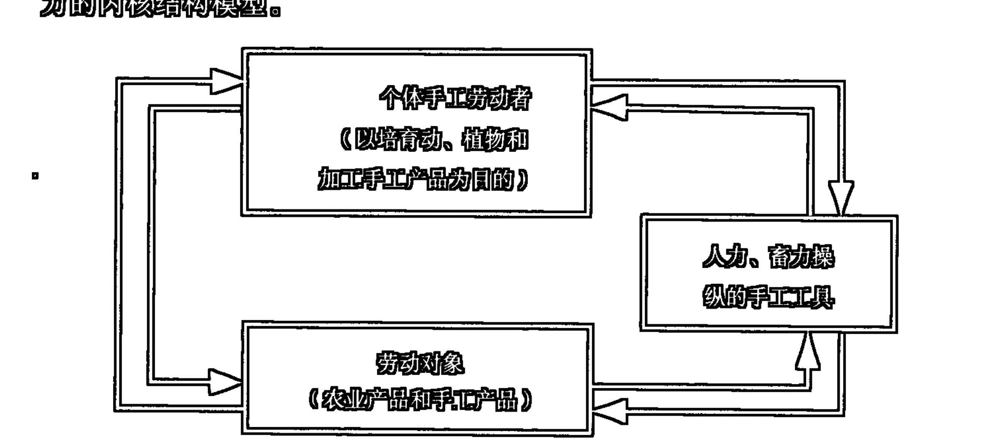

## （四）工业社会生产力的内核结构

工业社会生产力（或称机械工具生产力）对应于人类工业文明时代的生产发展水平。这一时期的生产活动发生了诸多方面的重大变革：用机械工具代替了手工工具，出现了大机器的工业化生产，以蒸汽和电力为基本动力的机械化生产代替了以人力、畜力为主要动力的手工生产；企业化的大生产代替了个体化、小作坊式的手工业生产；具有一定文化知识和专业技能的机械型劳动者成了劳动的主体；生产管理由经验型向科学型过渡，出现了相对独立的生产管理系统和专门的管理人员；分门类、分学科、分专业的科学技术得到迅猛发展，并成为促进生产力发展的重要因素；精神生产的规模日益扩大，精神劳动者队伍庞大，精神产品大量涌现；在人自身生产方面除了大规模的医疗保健（包括优生优育的一系列科学措施）事业的发展之外，则是发展起了庞大而严格的现代等级教育体制；电报、电话的发明实现了通讯领域的革命，并相应建立和发展了各级邮政事业和初级电信网络。

工业文明时代的物质生产活动，注重于对一般物，尤其是金属物的结构的加工改造，这是典型的在一般物的结构创新意义上的信息生产。精神生产，医疗、教育事业的发展，科学技术、生产管理在生产活动中的重要作用的突现等等都属于信息生产和生产中的信息活动的方面。以电报、电话为基础的初级电信网络的形成则有效改变了生产过程中“人—人”信息传递的旧有模式，而代之以“人--机—人”的信息传递方式。

图 6.4.10 仅以物质资料生产活动的方式为例简明地绘出了工业社会生产力的内核结构模型。

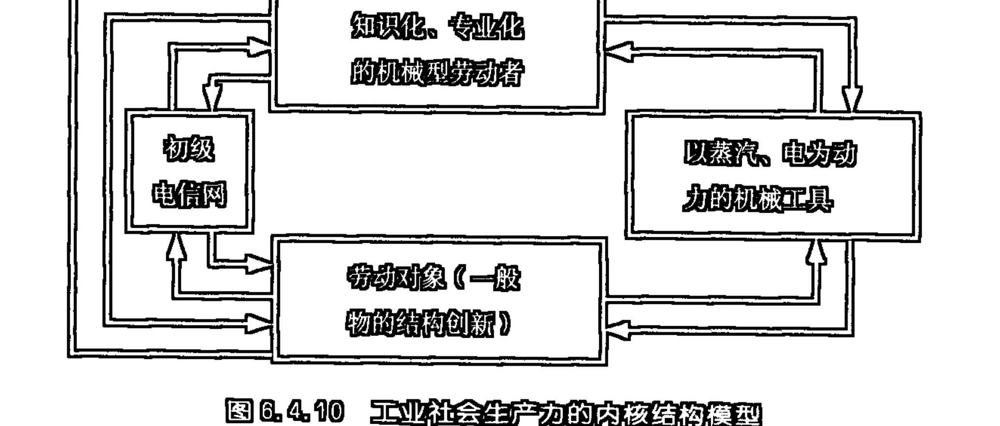

## (五) 信息社会生产力的内核结构

信息社会生产力(或称智能工具生产力)对应于人类信息社会文明时代的生产发展水平。人类的信息社会文明才刚刚开始，少数发达国家也仅只进入了初级信息社会的发展阶段。然而，就是在这样一个刚刚到来的新时代的雏型中，它所预示着的人类信息社会文明的生产力发展的前景则是无比辉煌的。直到目前，我们所做的对信息社会生产力状况的描述，也还仅只是基于信息社会文明现在的发展水平之上的，对信息社会文明未来发展前景的一种展望。

作为信息社会生产力内核要素的劳动工具是以智能机为中心制导的新型机器体系。这一机器体系的要害是要将传统生产过程中在劳动者个人的神经和脑中完成的信息接收、储存、处理、创造和控制等活动从劳动者身体中解放出来，在机器体系中完成，并使之更为精细化、准确化、高速化。这一新型机器体系将由 5 大功能系统、6 个工作环节构成（图6.4.11）。

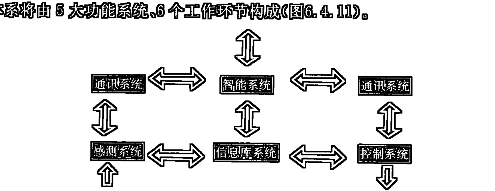

作为信息社会生产力的内核要素的劳动者的主体应是具有较高科技知识和专门技能的知识型、信息型、创造型劳动者。这时，劳动者的任务主要是设计、编制工具系统的硬件和软件系统，以及对工具系统进行监控和管理。

作为信息社会生产力的内核要素的劳动对象将会比之前一些阶段上的劳动对象的范围更为广泛，如果说之前一些阶段的生产活动更多只是一般物的宏观结构的层次上进行直接性的手工或机械的加工改制的话，那么，在信息社会生产力的条件下，随着纳米技术的成熟性发展，人们将会借助于智能机器体系进一步深入到一般物的微观结构的层次上进行直接性的加工改制。而生物遗传工程技术的发展则使人们能够通过基因拼接、重组、克隆的方式来优化动、植物，乃至人本身，甚至会创造出人们所希望的新的动、植物品种，乃至超人。这一切都将从根本上改变传统的农业生产、工业生产、人自身生产的方式和面貌。

信息社会的未来发展将会从结构信息处理的一般性理论和技术出发，在极大的可能性上把对物质结构的加工处理和对观念、知识结构的加工处理在智能机体系中统一起来，把对无生命体结构的加工处理和对生命体结构的加工处理在智能机体系中统一起来，把对生命的遗传基因结构的加工处理和对生命体表现型结构的加工处理在智能机体系中统一起来。由此诸多方面的统一便有可能最终将物质资料的生产、精神产品的生产和人本身的生产统一起来，这个统一不仅是生产机制的统一——结构的加工、改造、创新、复制，而且是生产过程的统一——由知识型、信息型、创造型劳动者设计、监控、管理之下的智能机体系的合理运转。

图 6.4.12 简明地给出了信息社会生产力的内核结构模型。对这一模型需要说明的一点是，它并不仅仅适合于物质资料的生产活动，而且还适合于精神生产和人本身生产的活动，因为，在信息社会生产力的未来发展中，这三种生产将最终在生产机制和生产过程等方面达到统一。

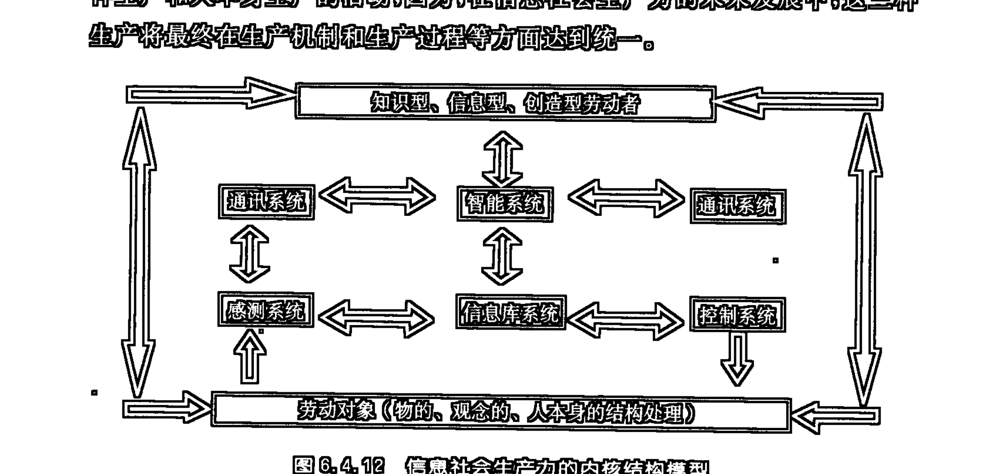

## 第七编 信息价值论

### 第一章 价值存在的范围及价值的本质

物质和信息双重存在和双重演化的理论，以及信息认识论的相关观点和理论，为哲学的价值论研究提供了某种全新阐释的视角。这一全新阐释的视角不仅涉及对价值存在范围和价值本质及价值发生的具体机制的新认识，而且也涉及对物质价值、信息价值（包括精神价值）的全新理解。另外，还涉及对价值事实、价值反映、价值评价、价值取向、价值实现的诸多领域方面的全新阐释。

在传统哲学的论述中，价值论是包括在认识论领域之中的。然而，近些年来关于价值哲学问题的讨论，已经远远超越了认识论所限定的领域。我就曾提出过一种“一般价值哲学”，在那里，我曾试图以自然本体的名义对价值哲学予以阐释。②

价值哲学，如果它试图要以某种真正的一般哲学的面目呈现出来的话，那么，它就必须首先具有三个方面的特点：其一，在价值本质的规定上，这一哲学应该揭示出价值范畴所具的最为一般性和普遍性的品格；其二，这一哲学的整个体系的阐释应该具有内在逻辑，并且，这一逻辑乃是价值范畴所具有的最为一般性和普遍性品格的自我展开；其三，阐释这一哲学的方法应该是以自然本体的名义进行的，而不应该仅仅把价值问题局限在人的世界之中。因为在一般哲学的层次上讨论的价值哲学并不仅仅是关于人的哲学，而且首先应该是关于自然本体的存在和演化的哲学。

然而，迄今为止，学者们所建构的种种价值哲学都很难在上述三个方面达到令人满意的程度。

> ① 本章的“一”曾作为《天道价值与人道价值》（《价值与发展》，陕西人民教育出版社1999年6月版）一文中的“一”发表；本文的“二”、“三”曾作为《一般价值哲学论纲》（《人文杂志》1997年第2期）一文的“一”、“二”发表。
② 参见拙文《一般价值哲学论纲——以自然本体的名义所阐释的价值哲学》，《人文杂志》1997年第2期。

### 一、价值可否定义？

许多学者在其讨论价值问题的文章或著作中都十分重视对价值本质的探讨。学者们对价值本质的揭示往往会采取给价值范畴下定义的方式。

然而，有的学者却提出，价值是不可定义的。韩东屏先生在其《论价值定义困境及其出路》①一文中不仅介绍了英国哲学家 G. E. 摩尔关于“善”过分单纯不可定义的观点，而且还提出了他本人所持的与摩尔观点直接相反的另一种价值不可定义的看法：“我的理由与摩尔的恰恰相反，与其说价值是由于太单纯了而不能定义，倒不如说价值是由于太综合了而不能定义。”赖金良先生也曾在为其不曾给价值范畴下一个新的定义的做法进行辩护时写到：“实际上，有许多概念往往是很难严格而确切地加以定义的。G. E. 摩尔在《伦理学原理》中关于基本价值概念（善）不可定义的主张及其论证也许不无一些道理。所谓‘定义主义的嗜好’早已经有人批评过。”②

G. E. 摩尔所说的“太单纯”是指“善”的内部“并没有若干部分”，因为，“一个定义要陈述那些必定构成某一整体的各个部分”，所以不可定义善。要回答摩尔先生的“善（价值）太单纯说”需要讲清楚两个问题，一个是“太单纯”的范畴是否不可定义？另一个是价值（善）范畴是否“太单纯”？

韩东屏先生所说的“太综合”是指价值概念是“价值世界中的”“最高概念”，而“最高层的概念势必只有一个，这个最高概念既然上面再无可包容它的属概念存在，它便成了概念系统中唯一不能按‘属＋种差’方式来定义的概念”。要回答韩先生的“价值太综合说”也需要讲清楚两个问题，一个是“太综合”的范畴是否不可定义？另一个是价值范畴是否“太综合”？

从系统思维的观点来看，一个绝对孤立的事物是不可理解的，具体到概念就是，一个绝对孤立的概念是不可界定的。所谓绝对孤立就是既无内部关系，也无外部关系。无内部关系就是对内孤立，即内部不包含部分，不可能再区分，这正符合摩尔先生的所谓“太单纯”。无外部关系就是对外绝对孤立，与任何外物都不相涉，这正符合韩东屏先生所说的“太综合”。因为“太综合”之概念已综合到无所不包的程度，或说已是综合到外无他物，所以便不可能与外物相涉。

对一个事物进行了解，对一个概念进行把握，就是要把这个事物、这个概念放到特定的关系中去考察、去界定。按照逻辑学的给概念下定义的方法，有内在关系之概念可通过揭示其内在关系，即罗列其包含部分的范围来界定，这就是外延定义法；有外在关系之概念可通过揭示其外在关系，即运用“属+种差”的方式来界定，这就是内涵定义法。这样，从理论上来讲，那些有外部关系的“太单纯”之概念可通过内涵法定义；那些有内部关系的“太综合”之概念可通过外延法定义；那些既不“太单纯”，又不“太综合”之概念则既可通过外延法，又可通过内涵法来定义；只有那种既“太单纯”，又“太综合”的概念，亦即对内、对外都是绝对孤立的概念才是不可定义的。

然而，那种既“太单纯”又“太综合”的事物或概念是根本不可能有的。因为，“太单纯”就意味着小而无内（如，德谟克利特的“原子”），那么，它便一定会被更大的系统所包容，这就使它必然会有外部关系；而“太综合”则意味着大而无外（如，广义的“宇宙”、“存在”概念），那么，它便一定会包含了许多个层次和部分，这就使它必然会有内部关系。如，我们完全可以将“太单纯”的德谟克利特的“原子”，从其与外部世界的关系出发定义为“构成世界的不可再分的最小微粒（或单元、组分）”；我们也完全可以将“太综合”的广义的“存在”，从其包容的范围的内部关系出发定义为“对世界上的一切事物和现象的指谓”，或按照人们对组成世界的大的领域的理解定义为：“存在=物质+精神”（这是传统哲学中对世界领域分割的看法）；或“存在=物质+信息（包括信息的高级形态精神）”（这是本书阐释的信息哲学对世界领域分割的看法）。就连摩尔先生所说的那个不可定义的“太单纯”的“黄”，我们也完全可以通过揭示其由以产生的外部条件和关系而将其定义为“一定量的特定波长（5970～5770Å）的光在正常人之视觉中产生的颜色感觉”。

如此看来，无论是以“太单纯”，还是以“太综合”为理由来判定价值概念不可定义的观点都是难以成立的。

或许，我上面的文字会给人产生这样一种看法：所有概念都是可定义的。其实这正是我所坚持的观点。人们所提出和使用的任何一个有意义的字、词、概念、范畴，都是在特定的文字、语言、学科体系的系统网络中存在的。正是这个网络系统中的关系赋予了相应的字、词、概念、范畴以特定的意义，并使之因此而成为可理解、可界定的。一个科学范畴的可定义性，也就是这一范畴在特定科学体系的范畴之网中所结成的相应关系的可理解性。

我们注意到，在西方学者中存在一种反对建立学科体系，反对给范畴下较为严格的定义的思潮，这一思潮对国内学术界也有一定的影响。这一反体系、反定义的思潮虽然也有其积极意义的一面，如，它对于打破陈腐传统的保守和僵化，改变旧有思维定势，变革过时科学范式，都能起到某种革命性的作用，但是，它的消极意义也是不容忽视的，这就是它的单纯破坏性、非建设性。须知，不加区别地反体系、反定义的做法在实质上是反科学的。问题的要害并不在于是否建立体系，是否给范畴下定义，而在于建立一个什么样的体系，下一个什么样的定义，这一体系能否较为全面、合理的阐释和包容学科领域的最新发展，这一定义能否在相应的学科范围内较为准确地揭示所定义范畴的本质。

其实，反体系、反定义主义者们在讨论问题时并不是没有体系、没有定义。因为，就他们所坚持的理论、观点而言，本身就在构建着某种体系，就他们所使用的概念、范畴而言，都必须放在特定的体系中才能具有确定的意义，也才能被他们自己或被别人所理解。须知，彻底的反体系、反定义主义者连任何一种观点都无法清晰表达，连任何一个概念都无法解释清楚，从而也便无法与人对话和交流。

至于价值范畴本身，它并不像摩尔所言的那样“太单纯”，也并不像韩东屏先生所言的那样“太综合”，所以它是可以被定义的。

我们说价值范畴并不“太单纯”，因为它概括的范围并未小到“小而无内”的境地。韩东屏先生曾罗列出了价值范畴能够概括的诸多方面：“真、善、美、圣、好、爱、快乐、幸福、公正、正义、功利、有用、有效、效益和意义等”。虽然，我们并不认为韩先生的罗列都是十分严格或全面的（其中有些是价值评价或价值取向，而不是价值），但是，由此足可以说明价值范畴的并不“太单纯”，同时也揭示出利用外延法给价值范畴下定义的可能性。

我们说价值范畴并不“太综合”，因为它概括的范围并未大到“大而无外”的境地。它比较起广义的存在、事物、现象、相互作用、对象化等概念所概括的范围来还是要狭隘了许多。这样我们便可以用内涵法来对价值范畴下定义。

### 二、价值现象存在的范围

要对价值的本质进行规定，有必要先来讨论价值现象存在的范围。

在现有的种种价值哲学或价值学理论中，一种占主导地位的倾向是，各种理论大都把价值存在的范围限定在以人的世界为参照的主客体关系的领域。不同理论间的差别仅仅在于或者更着重强调价值的人的主体性的意义方面，或者是对主体外延的理解上存有差异。如，有的学者主要强调了个人主体，有的学者则又加上了社会、团体的主体形式，而宗教神学和客观唯心主义的维护者们则强调了“上帝”主体和“绝对精神”主体的价值。其实，无论是“上帝”，还是“绝对精神”，都是不存在的，说穿了它们也只不过是人和人类社会在抽象理念中的理性折光，它们归根到底讲的还是人，还是人的社会。

把价值存在的范围限定在以人的世界为参照的主客体关系的领域就是只承认在作为主体的人的世界里才存在价值问题。这样的一种理论的成立，最起码也要依赖于三个假定的前提：其一，从宇宙演化的纵向关系来看，在人类、人类社会产生之前，在人、人的社会消亡之后，宇宙中不存在任何价值现象（外星人及其社会另当别论）；其二，从宇宙存在的横向关系来看，在现存人类、人类社会之外不存在任何价值现象；其三，人的认识和实践活动未曾把握和能动作用的事物不构成与人的主体相对的客体，所以，这部分事物与人之间不可能发生价值关系。

由上述三个假定的前提又可以得出如下一些推论：人类产生之前的宇宙的演化，银河系、太阳系、地球的形成和演化，地球生物的产生和进化，类人猿的活动等等，无论相对于任何事物，也无论是相对于任何人、人的集团、社会（当时还都未出现）的起源、存在和发展，也无论是在怎样的意义上都不具有价值；未进入人的社会领域的现存宇宙的演化，银河系、太阳系乃至地球某些领域、范围和层次上的演化，无论相对于任何事物，也无论是相对于任何人、人的集团、社会，也无论是在怎样的意义上都不具有价值；当某种未被我们人类认识所把握，未被我们所发现的无名病毒使我们致病、致残、致死的时候，这一无名病毒对我们来说也只能是毫无价值，因为它还未能成为我们认识和实践活动的客体；那些处于婴幼儿时期的，还未产生独立意识和实践活动能力的人的个体，他们与外界的一切相互作用，他们自身的任何活动，对他们自身来说都不具有价值意义，因为他们还不能被称为是一个主体，与此相对应，那些与他们发生对象性关系的事物也不可能成为他们活动的客体；……

从上述的三个假定的前提和相关的一些推论来看，那种把价值存在的范围仅仅限定在以人的世界为参照的主客体关系的领域的理论所面临的困难是十分明显的：首先，这一理论无法解释人类主体产生之前的世界对人类产生所起的价值作用；其次，这一理论无法解释人类个人主体生成之前的外部环境和条件对个人主体生成所起的价值作用；第三，这一理论无法解释现存人类社会、个人主体之外的尚未客体化的事物对人类社会、个人主体的存在和发展所起的直接或间接的价值作用；第四，除了无法完全解释与人相关的价值问题之外，这一理论还完全否定了在一般自然事物领域中存在价值现象的可能性。

本来，种种把价值现象限定在以人的世界为参照的主客体关系领域的理论，亦即把价值现象限定在作为主体的人的世界之中的理论，其深层的理论根据是源出于某种关于人的至上性的观念。似乎只有把价值现象专门归属于人的世界才能体现出人的神圣和尊严。然而，种种关于人的至上性的观念则是十分偏狭的。因为宇宙中真正具有至上性的不是人，而是宇宙的自然本体。正是宇宙自然本体在其自发演化的特定阶段上创生出了人、人的类、人的社会、人的世界，并且，宇宙自然本体又必将会在其后续自发演化的过程中将它所创生出来的人、人的类、人的社会、人的世界，统统重新湮灭。这就是为什么仅仅从人的主体出发，仅仅在人的世界里无法找寻到解决全部人的问题、人的社会的问题的答案的原因。

要克服现有的主流价值理论所面临的困难，就必须把对价值存在范围的理解从以人的世界为参照的主客体关系的束缚中拓展出来。胡义成先生就曾对仅仅把价值关系限定在主客体关系范围的理论提出过批评，他写道：“这种方法实际上是以主体出现作为价值存在之始点的。问题在于，这种设定未能顾及：主客体间价值关系之存在，是客观事物间彼此作用的某种形态在人类社会层面上的表现；价值关系不可能仅仅是精神现象出现以后主体莫名其妙地猛然拥有的东西。”①

从逻辑推论的情况来看，价值关系的范围也理应超越以人的世界为参照的主客体关系的范围。我们完全可以这样思考：在人类还未产生之前，地球生物的演化对人类的产生是具有价值作用的，而地球的早期演化对地球生物的产生和进化同样是具有价值作用的；太阳系的演化对地球的形成和演化是具有价值作用的；……这样的一个逻辑线索完全可以一直追溯到宇宙从其“原始奇点”爆发之后的一系列相继演化的步骤和阶段上。这样，就宇宙事物的演化来说，其前一阶段的演化对其后一阶段的演化具有直接的价值关系，而对再次后一些的阶段则具有间接的价值关系。这样，在事物演化的系列关系上同时

> ① 胡义成：《“价值即时间”论纲》，《中日价值哲学新论》，陕西人民教育出版社，1994年版，第65页。

就呈现着系列的价值关系。

另外，我们还应该注意到，宇宙、事物演化的系列关系总是通过事物相互作用的横向关系来实现的。一般而论，事物的演化就是其固有结构的改变和新的结构的创生，这一结构变迁的过程是通过相对于某一事物的内部和外部的相互作用来实现的。正是横向的事物间和事物内部的相互作用导致了纵向的事物的演化。据此，我们完全有理由认为，在事物之间和事物内部的相互作用中存在着最基本的价值关系。

从现代科学的理论来看，事物间的相互作用是通过物质（包括质量和能量）和信息的交换来实现的，而这种交换的直接结果便是暂时地或长久地改变了参与相互作用诸方的质—能分布结构、信息模式结构（信息编码方式）以及凝结着的信息内容。就相互作用必然引起参与相互作用之事物的物质和信息结构的改变这一情景来看，凡是相互作用过程都必然会伴有价值关系之发生。由于相互作用是事物存在的方式，无论在即时性还是历时性上都具有普遍性，所以，价值关系存在的范围也便必然会具有普遍性。概而言之，价值关系存在的范围与相互作用存在的范围，与事物（包括物质的和信息的）存在的范围具有同样的普遍性和广泛性。

## 三、价值的本质

在现有价值理论中，对价值的本质的讨论是最为热烈的。王玉樑先生在其《价值哲学新探》一书中，将现有的价值界定归纳为6种类型，并对其一一作出了评价①。我们注意到，这6种类型都全然是在以人的世界为参照的主客体关系的范围里来界定价值的本质的：“需要”论——“所谓价值，就是客体能够满足主体的一定需要”；“意义”论——“价值是客体对主体的意义”；“属性”论——“价值就是指客体能够满足主体需要的那些功能和属性”；“劳动”论——“哲学的价值凝结着主体改造客体的一切付出”；“关系”论——“所谓价值，就是客体与主体需要之间的一种特定（肯定或否定）关系”；“效应论”——价值“是客体属性与功能满足主体需要的效应”，“是客体对主体的功效”。

综观上述6种类型的价值界定，其对价值本质进行规定的视野是十分狭隘的，这显然与界定者对价值存在范围理解的狭隘性相一致。此外，上述6种界定还存在着一些其他方面的局限。

① 参见王玉樑：《价值哲学新探》，陕西人民教育出版社，1993年版，第127～141页。

“需要论”更加强调了主体主动意向的方面。而事实上，主客体间的价值关系并非都是主体主动需要的，有些价值关系往往是主体不需要，或想尽量避免的。但是在现实的主客体关系中，不需要不等于不发生，想避免不等于能避免。如，客观条件对个人或人类发展的限制，自然灾害对个人或人类行为的惩罚等等，这也全然是一种价值关系。看来，就是严格限定在客体对主体作用的这样一个层面和角度上，价值问题也绝不仅仅是只存在于主体主动意向的追求和选择之中，而且还必然存在于主体无奈的被动接受或承受之中。

“意义论”更加强调了主体的理解和评价的方面。然而，主客体间发生的价值关系是一回事，主体对这一关系的理解和评价又是一回事，二者根本不是在同一个层面上成立的，不能用后者去代替或解释前者。显然，用意义去规定价值的本质在逻辑上是很难说通的。

“属性论”的着眼点在于把价值看成是作用于主体的客体的某种属性。诚然，价值确实是通过物在相互作用中所呈现出的属性来实现的，但是，却不能因此就把这一属性与价值相等同。价值不是作用物的属性本身，而是通过作用物的属性对被作用物的特性的改变所产生的效应。属性是就作用物本身的特性而言的，而价值则是就被作用物的特性改变的状态而言的。正因为是这样，才会发生同样的物的属性的作用对于不同的被作用物则可能带来十分不同的价值。

“劳动论”的局限在于，它以劳动产品的价值代替了哲学的“普遍价值”。王玉樑先生的批评是十分精当的：“哲学价值范畴不同于劳动价值论，这是不言而喻的，因为劳动价值论是经济理论，而不是哲学理论，哲学价值范畴不等于商品价值范畴，这是不难理解的。相反，把政治经济学中的劳动价值论，作为哲学价值理论，是一种简单照搬的做法，实际上取消了哲学价值范畴，是很有害的。”①其实，就是在经济学领域里讨论问题，对人有价值的东西也并非全是劳动产品。我们知道，当有人把“劳动是一切财富和一切文化的源泉”这样的一般性信条写进了德国工人党纲领草案的时候，马克思曾经给予了多么严厉的批判。马克思尖锐地指出，这是“给劳动加上了一种超自然的创造力”，这是“把自然界当作隶属于他的东西来处置”。“劳动不是一切财富的源泉。自然界和劳动一样也是使用价值（而物质财富本来就是由使用价值构成的！）的源泉”②。马克思的这些论述将可能引导我们从自然界本体运动的尺度上去理解价值问题。

① 王玉樑：《价值哲学新探》，第138～139页。

“关系论”把价值确定为“客体与主体需要之间的一种特定（肯定或否定）关系”。这一规定有两点是成功的：一是这一规定看到了价值不是由主体或客体中的任一方单独具有的，而是由二者的相互关系决定的；二是这一规定隐含承认了价值对主体和客体的相互性意义，因为既是关系就是双方的，而不可能仅仅是单方的，如习见理论所强调的仅仅是客体对主体的价值，而无视主体对客体的价值。然而，关系论的缺陷也是明显的：一是，这一规定强调的是“客体与主体需要之间的特定关系”，这就难免陷入前述及的“需要论”所具有的局限之中；二是，仅仅用“肯定或否定的关系”、“一种特定关系”来界定价值的本质，也显得过于宽泛和模糊，缺乏对价值本质的深刻揭示。

② 这里指的是广义的存在，它是宇宙间一切现象的指谓，包括所有的物质现象、信息现象，以及作为信息活动高级形态的精神现象。这样，无论是在物质体系、信息体系、精神体系内部的相互作用中所实现的效应，或是在物质和物质、信息和信息、精神和精神之间的相互作用中所实现的效应，还是在物质和信息、物质和精神、信息和精神的相互作用中所实现的效应都全是价值。

③ 价值作用绝不仅仅是单向的，因为事物间的作用是相互的，所以在此相互作用中所实现的价值也必然是双向或多向的。

④ 仅仅相互作用还不是价值，只有通过相互作用所引起的体系自身或作用双方或诸方的改变的效应才是价值。

⑤ 对于某事物的存在和发展来说，相互作用引出的效应可能是有利的，也可能是有害的，可能是正向推动的，也可能是负向促退的。但无论是哪类性质或哪类作用方向上的效应都是价值关系。这样便可能区分出正价值、负价值、中性价值等等，而并不像某些学者所认为的那样，只有有利的效应，或对事物存在和发展起推动作用的效应才是价值，否则便不构成价值。

## 四、价值与信息

我们已经定义：从哲学层次来看，价值乃是事物（物质、信息，包括信息的主观形态——精神）通过内部或外部相互作用所实现的效应。然而，相互作用所实现的效应是多重的。在本书“第五编第一章”中我们曾揭示了相互作用所实现的多重效应的六个方面：

- A：物自身的一种直接存在的样态向另一种直接存在的样态的转化；
- B：中介物的产生和运动；
- C：物物间的联系、过渡和转化；
- D：物自身的直接存在向间接存在的过渡；
- E：相互作用物的间接存在的相互凝结；
- F：新的间接存在样态的建构。

上述的六重效应中的前三重（A、B、C）属直接存在变化的效应，后三重（D、E、F）则属间接存在变化的效应。这样，我们便区分出了在一般事物相互作用的过程中所实现的双重性质的效应：物质性效应和信息性效应。我们有理由将这双重性质的效应分别称为物质价值和信息价值。

由于物皆处于普遍的相互作用中，所以，任何物都必然同时就发生着四种过程：派生中介物、改变自身的物质性结构（质—能分布方式）、异化自身信息、同化它物信息。正是这四种过程造成了上述的六重效应。其实，在一个具体的物物相互作用中，上述的四个过程乃是同一个过程，上述的六重效应也是在同一个相互作用过程中具体呈现出来的。

任何处于相互作用中之物必然同时兼具三重角色（用通讯信息论的语言来表达）：信源——异化信息、信宿——同化信息、载体——以自身变化的“痕迹”载负信息。这就意味着，相互作用所实现的物质效应和信息效应、物质价值和信息价值不仅具有同时性，而且具有必然性和普遍性。

另外，我们还应注意到，相互作用所实现的物质效应和信息效应、物质价值和信息价值又都总是具有互为基础和表征的内在统一性。因为，任何信息效应、信息价值的实现都必须以相应的物质结构（质—能分布）变化所产生的特定编码方式为载体，而任何物质效应、物质价值的实现又都总是通过相关信息内容的凝结、改变和创生呈现出来的。

因为“相互作用是事物的真正的终极原因”，而相互作用的效应便是变化、运动、演化（包括退化和进化两个分支），所以，我们赞同将演化的观念、时间的观念引入价值哲学讨论的视野。如，胡义成先生就曾“试探在价值研究中使用本体论意义上的‘自组织理论——新进化论’方法”，提出了“价值即时间”的观点。①其实，横向的（共时性）相互作用的效应便是纵向的变化、运动和演化，而时间正是变化、运动和演化的一个具体量纲。如是，任何变化、运动、演化、时间都可以看作是在事物相互作用中所实现的效应，亦即都可以看作是价值。然而，上述的解释并不意味着可以将价值完全归结为变化、运动、演化或时间。因为，事物在相互作用中所实现的效应的具体内容是十分广泛、丰富和复杂的，变化、运动、演化或时间仅仅是在某种抽象表述的层面上对效应结果的一种揭示。其实，变化、运动、演化或时间的效应又都只能通过相应的物质结构（质—能分布）的改变和信息结构（凝结特定信息内容的特定编码方式）的建构来具体实现或具体呈现。如果从时间延续的实在过程而言，时间乃是横向相互作用所实现的某种物质效应；如果从时间表征着横向相互作用所实现的变化、运动和演化的结果而言，时间乃是表征横向相互作用所实现的结果的信息效应。这样，在一个统一的时间延续过程中，时间便是横向相互作用所实现的物质价值和信息价值的具体而现实的统一。由此而论，在事物的相互作用中所实现的效应存在诸多表述层级，物质效应和信息效应在这诸多表述层级中不能不处于最为具体和最为基础的地位，在此基础之上，才呈现出了诸如变化、运动、演化和时间等其他抽象表述的效应层面。

① 胡义成：《“价值即时间”论纲》，《中日价值哲学新论》，陕西人民教育出版社，1994年7月版，第64页。

在物质和信息双重存在和双重演化的理论中必然内含着在事物相互作用中同时实现着物质价值和信息价值的双重效应的理论。这一双重效应的理论构成了信息价值论赖以成立的最深层级的一般基础和根据。

### 第二章 价值事实、价值反映与价值评价

前已定义：“从哲学层次来看，价值乃是事物（物质、信息，包括信息的主观形态——精神）通过内部和外部相互作用所实现的效应。”如果从此关于价值本质的规定出发，我们将可能进一步导引出事实与价值、价值与价值反映、价值和价值反映与价值评价之间的区别、联系和统一。

## 一、自存事实与效应事实

将“事实”与“价值”分立，在“事实”与“价值”之间确立严格区分的“鸿沟”，这是西方文化的传统。就是那些主张在事实和价值之间可以相互过渡的观点，也往往仅只是试图找到一种从事实判断推论出价值判断的方法和途径，亦即从“是”推论出“应当”。

造成西方文化中这一传统的根源大约有二：一是把价值现象严格限定在人的主观认识领域，否认存在客观的价值现象；二是不能在价值与价值评价之间作出应有的区分，往往以价值评价来简单解释或代替价值。我所提出的以自然本体的名义所阐释的一般价值哲学将会有效克服上述两个方面的缺陷，从而取消事实与价值的绝对分立，填平事实与价值之间的、人为设立的“鸿沟”。

根据事物存在的方式和关系，我们可以区分出两类不同的事实：一类是事物自身存在的事实，亦即在舍弃了考察某事物内部或与它事物相互作用关系的前提下被考察的事物存在的事实；另一类是事物在相互作用中所引起的变化过程和结果的事实，亦即在考察了某事物与它事物的关系和联系效应的事实。第一类事实我们称之为事物的“自存事实”；第二类事实我们称之为事物相互作用之“效应事实”。如：“有一块陨石存在”的事实即是“自存事实”，而“有一块陨石把地面砸了一个大坑”的事实则属于“效应事实”。

① 本章内容的基本部分已发于《学术界》2000年第6期。

从上述两类事实的划分中，我们可以清晰地看到，“自存事实”是非价值性事实，而“效应事实”则应该属于价值事实。由此我们可以明白，价值并不是与事实分立的现象，它乃是一种客观存在的事实，是事物之间普遍相互作用所引出的“效应事实”。

“效应事实（价值事实）”不仅在一般自在物的相互作用过程中普遍存在，而且还在自在物与人、人的社会、人的感知、人的思维的相互作用中普遍存在，并且还在自在信息的相互作用中、自在信息与人的主观信息的相互作用中，以及人的精神活动的内在主观信息的相互作用中普遍存在。

从上述两类事实的划分中我们还可以看到，事实和价值的统一并不是像某些西方学者所阐释的那样，仅仅在于从“是”可以推论出“应当”，而更在于价值现象本身就是“是”，本身就是一种客观存在的事实。价值与事实的统一并不是指价值过程可以外在地衔接于事实过程，而且是指价值过程和价值现象内在地就是事实过程和事实现象本身。

## 二、价值反映与非价值反映

传统的价值理论往往不能对价值和价值评价加以认真的区分。如果说，在某些学者那里用评价代替价值还是一种或明或暗的、不自觉的、潜意识行为的话，那么韩东屏先生的观点则是那样的自觉和直截了当，因为他说：价值是由人派生出来的，“价值是人对对象的评价”。①

其实，事物间发生的价值关系是一回事，人们对这一价值关系的认识评价又是一回事，二者根本不是在同一个层面上成立的，不能用后者简单等同、解释和替代前者。一般说来，价值现象是客观存在的事实，而价值评价则是人的主观活动领域的现象。

在人的活动的层面上，不仅存在着与一般事物相一致的自在的价值发生过程，而且，人还有能力对价值现象进行主观把握和认识。这一过程是通过价值反映和价值评价来完成的。价值反映所解决的是对一般价值现象所生发出的信息的直观把握，价值评价则是对一般价值过程给承受这一价值效应的事物所带来的种种现实的和可能的影响关系的具体性质的认识。其中对于人类最重要的，也是人们最关心的，当然要属对这一价值过程对人、对人的社会能够带来怎样的影响这一关系的具体性质的认识。

① 参见韩东屏：《人·元价值·价值》，《湖北大学学报·哲学社会科学版》2003年第3期，第42页。

与一般的反映认识过程一样，从一般价值现象到价值反映必须通过价值现象所显示出来的价值信息的中介，反映不是直接面对事实本身的，而是直接面对关于事实的信息的。

与存在两类不同的事实，即存在“自存事实”和“效应事实”的情景相一致，在人的反映认识过程中也存在着两类不同的信息反映过程：对“自存事实”信息的反映过程和对“效应事实”信息的反映过程。

一般说来，对“自存事实”信息的反映过程并不直接构成价值反映过程，只有在对“效应事实”信息的反映过程中才可能蕴含着价值反映过程。因为，只有通过对“效应事实”信息的反映，人们才可能从中发现事物间相互作用所引出的价值效应。如，在上一节所举的例子中，我们对“自存事实”——“有一块巨石存在”——的反映，就其直接性的内容而言，除了获得巨石自身存在的信息之外，我们不可能得到其他方面的信息，这一反映就不是价值反映；而我们对“效应事实”——“有一块巨石把地面砸了一个大坑”——的反映，则可能获得巨石对地面作用的价值——“把地面砸了一个大坑”，这一反映就是价值反映。

然而，能否从上一段的分析中得出结论说，我们对“自存事实”的反映不可能引出任何一种意义或层面上的价值反映过程呢？其实，虽然我们对“自存事实”信息的反映过程不能构成直接的价值反映过程，但是，这并不意味着这一反映过程不可能引起其他层面的价值反映过程的发生。如前所述，我们对客观事实的主观反映是通过客观事实所生发出来的信息的中介实现的，而从客观事实过渡到显示这一客观事实的信息的过程本身就是一个客观事实的自身结构和它所生发出来的信息结构相互作用、相互映射、相互规定的过程，这一过程本身就是一个实现特定相互作用效应的价值产生的过程，这一过程本身就是一个客观存在的“效应事实”。另外，人的任何一种反映都只能是对象信息和人的认知结构之间发生实质性相互作用所引出的一种效应结果，亦即都只能是一个价值产生的过程，同理，也只能是一个现实的“效应事实”发生的过程。如此，在对“自存事实”进行反映的非价值反映过程中，便会不可避免地相伴发生另外两种意义或层面上的价值反映过程：一是对“自存事实”与其生发出来的信息之间相互作用的效应结果的反映；二是对“自存事实”的信息与人的认知结构之间相互作用的效应结果的反映。显然，这两种意义或层面上的价值反映过程，同样会存在于人们对“效应事实”进行反映的价值反映过程之中。这样，在人们对“效应事实”进行反映的过程中，同时发生的则可能是三重意义或层面上的价值反映过程。由此我们也可以看到人类的认知反映过程的复杂性和多层面性的特点。由此，我们便可以说，人们对客观事实所进行的各类认知反映过程，都必然会相伴着各类价值反映过程。由此也可以证明，人的价值反映过程的一般性和普遍性。

## 三、认知性发现和评价性发现

价值反映显然属于认知性发现的反映过程，亦即属于认知性发现过程。然而，人类的发现过程，除了认知性发现之外还有评价性发现。作为认知性发现的价值反映是评价性发现的前提和基础，评价性发现则是对作为认知性发现的价值反映获得的内容所具有的各类价值及其关系的性质的评价，此正是价值评价。

如果说，在客观世界中所存在和演化着的自存事实、效应（价值）事实、各类事实直接生发出来的自在信息还都属于客观世界领域的物质或信息活动现象的话，那么，价值反映和非价值反映、认知性发现和评价性发现则都不再属于客观活动的过程，而隶属于人的主观信息活动的领域了。

一般说来，作为认知性发现的价值反映所可能获得的内容，以及这些内容所可能呈现的方式和样态，是与反映者的神经生理结构和心理认知结构直接相关的。虽然，在这一反映过程中，也不可避免地会受到反映者的情感、兴趣和主观欲望等因素的影响，但是，就价值反映过程本身而言，它所关注的基本还只是作为反映对象的事实内容本身。所以，在通常情况下，人的价值反映过程会较少或并非直接地受到反映者的情感、兴趣和主观欲望等因素的影响。

与作为认知性发现的价值反映过程不同，作为价值性发现的价值评价过程则可能更多地或更为直接地受到评价者的情感、兴趣和主观欲望等因素的影响。尤其是在道德伦理评价、美学艺术评价、利害关系评价等诸多价值评价活动中，对于评价者的情感、兴趣和主观欲望等因素的依赖性更为强烈。正因为如此，在西方价值理论的传统中，才派生出了仅从人的主观心理随机活动的方面来界定价值本质的种种形式的情感价值说、兴趣价值说等流派。这一西方价值理论的传统对我国的价值理论研究也影响颇深。产生这一传统的根源

## 第七编 信息价值论

概源于对价值与价值评价不能做出认真的区分，而简单地以价值评价来替代价值，以价值评价的某些特点来解释价值。

显然，作为认知性发现的价值反映是对“效应事实”，即价值现象的一种主体性超越，而作为评价性发现的价值评价则又是对价值反映的一种主体性超越。这两种主体性超越是在两个不同的层次上依次相继而递进实现的。我们不能将价值反映与价值事实相等同，也不能将价值评价与价值反映相等同。对这样一些不同层次的、主观或客观的事物和现象，对这样一些不同层次的主体性超越的活动，应当予以认真的区分和清晰的界定。

### 四、价值评价的层次或类型

人的价值评价可以在不同的层次上展开，在这不同层次的评价中可能呈现出诸多形式的评价类型。

### （一）事实评价：真伪问题

虽然，人们对“自存事实”的认知性反映并不直接就是价值反映过程，但是，由于这一反映过程是通过“自存事实”的信息的中介实现的，所以，人们对这个“自存事实”的认知性反映就不可能不涉及真伪性价值评价的问题。因为，“自存事实”是在多重信息[“自存事实”本身的信息、各类环境的信息（包括人在实践干预中所利用的工具的信息）、主体神经生理和认知结构的信息]的中介背景中被主体所反映的，所以，这一“自存事实”的原本存在状态的信息就不可能不受到这诸多方面信息的干扰，从而发生扭曲、变态、失真的可能。为了保证对“自存事实”的原本存在状态的确认，人们就有必要对所获得的反映信息进行真伪评价，小心翼翼地将各类干扰性信息予以排除，从中识辨出“自存事实”原本存在状态的信息。当然，这一小心翼翼的排除，在通常情况下，是不可能做到完全性排除的程度的，这就又涉及认知反映不可避免地为参照背景信息所中介，以及不可避免地带有主体性特征的性质。

显然，我们这里对“自存事实”的认知性反映情况的分析，也同样适合于对“效应事实”的价值性反映的情况，只是，在对“效应事实”的价值性反映的真伪问题的评价中，不仅要确认“效应事实”本身的原本存在状态，而且还要判明在这一原本存在状态中所蕴含着的对象在相互作用中所实现的效应结果，亦即事物在相互作用中所呈现出来的对象性价值。

### （二）质量评价：精粗问题

在人们对认知性反映所获得的关于事实的信息的评价中，还有一个信息质量的问题，这就是质量评价。质量评价所涉及的是信息的精确性问题，亦即信息质量的精粗性问题。信息质量的评价是在对同类信息可能呈现的多种模式的比较中进行的。如，对某人外表信息的反映就可能是多模式的：背面的信息、正面的信息、侧面的信息、昏暗光线下所获得的信息、正常光线下所获得的信息等等，在这诸多信息模式的比较中，我们便可以发现所获得信息质量的精粗性程度。

质量性评价的问题，不仅在人们对事实信息的评价中存在，而且还在人们对价值反映所作的价值评价的再评价中存在，这就是人们对所作价值评价的质量问题的再认识，并且，质量性评价的问题还在人们对所作的预测结果或计划方案的评价中存在。试比较如下五条关于天气状况预测的消息：明天天气不好；明天有雪；明天要下大雪；明晚要下大雪；明晚后半夜要下大雪。显然，这五条消息的质量，亦即精确性程度是不一样的。

### （三）道德与伦理评价：善恶、是非问题

在西方的价值论传统中，有用“善”来解释一切价值的倾向。我们说，善恶、是非问题属于价值评价问题，而并不是价值本身。事物本身的存在、变化，事物与事物之间的相互作用和影响，本身并不涉及善或恶、是或非的问题。善恶、是非，仅仅是人类依据其所形成的道德与伦理标准，对事物间的价值影响关系所作的某种价值评价。正因为善恶、是非评价是以人们形成的道德与伦理标准为评价尺度的，所以在不同的时代背景条件下，在不同的民族、国家、地域、人群中，由于所形成的道德与伦理标准上的差异，便可能产生出对同一现象作出截然不同的善恶、是非评价的情景。另外，我们还应该看到，善恶、是非问题仅仅是诸多价值评价类型中的一种，而并不能涵盖价值评价的一切领域、层次、类型和方面。

### （四）艺术与美学评价：美丑问题

美丑问题是人们基于艺术标准和审美原则之上对所反映对象给评价者带来的艺术与美学价值的评价。显然，这类艺术与美学的评价并不简单决定于审美对象本身的外观样态信息，而更多的取决于评价者的内在审美尺度和情感体验。作为一种现实的情感体验，美感首先就是一个“效应事实”，首先就是对象信息在与人的认知结构、情感、兴趣、爱好等等的相互作用中所实现的一种主体感受效应。所以，从这一意义上说，美感首先是一种“效应事实”，首先是一种价值形式。但是，美丑问题在另外一个层面上，或在另外一些情况下，它又可能成为某种价值评价。如此看来，美丑问题具有二重化的特征。我们有必要将作为美感体验的价值效应的美丑问题和作为艺术与美学评价的美丑问题加以认真区分。美丑问题的这一二重化特征，使人们往往不能在价值与价值评价之间作出清晰区分。这也是为什么在西方价值论传统中，往往对价值和价值评价不作区分，用价值评价来解释或替代价值现象的原因之一。

### （五）感受性评价：幸福与痛苦问题

上述的美丑问题也是一种感受性评价。与美丑问题的二重化特征相类似，人们关于幸福与痛苦问题的感受也具有二重化的特征。我们很容易区分出作为某种感受性“效应事实”的幸福体验，以及作为某种评价性的幸福观念。显然，一个人关于自身或他人幸福与否的内在体验和评价，不仅依赖于该人所处的环境、生活、体内状态等等信息的刺激，而且还依赖于该人关于幸福或痛苦的观念，以及依赖于包括在此类观念中的种种相关价值标准或尺度。

与幸福与痛苦问题相类似的感受性评价还有：喜与悲问题；愉快与沮丧问题；舒适与难过问题等等。此类问题与幸福与痛苦问题相互交织或蕴含，且都具有二重化的特征。我们有理由将此类问题在极大程度上归属到幸福与痛苦问题的讨论之中。

### （六）其他一些类型的评价

除了上述的一些评价类型之外，我们还可以指出其他一些类型的评价。比如，利害评价：好与坏、利与弊问题；法的评价：罪与非罪问题；行为评价：当与不当、该与不该问题；……

从上述的讨论中，我们可以发现评价问题的复杂性、多样性，以及价值评价与价值事实、价值反映之间的区别、交织、联系和统一。这一切都要求我们在对评价问题的讨论中应当采取某种小心区分和逐一评判的认真而科学的态度。

## 第三章 天道价值与人道价值①

针对国内近年来价值哲学的研究现状，有必要对已有学者提出的人道价值论的诸多局限予以讨论，并相应提出天道价值的问题。这其中又涉及阐释价值哲学的方法，价值、价值评价、价值取向的关系，以及什么是本体价值等诸多方面的问题。

### 一、阐释价值哲学的方法

把价值问题放到主客体关系的领域来考察，仅仅以“主体需要的满足”为尺度来界定价值，这是目前国内价值论研究所遵循的主要方法论模式。赖金良先生曾称这一模式为“主客体价值关系模式”，或“价值关系的主客体模式”②。这一方法论模式的深层理论根基是要把价值现象严格限定在作为认识主体的人的世界之中。

我们注意到，已有的一些对“主客体价值关系模式”的批评大致来自两个方向。一个方向是认为这一模式尚未把“以人为尺度”的立场发挥彻底，只承认客体对主体的价值，而不承认主体自身的价值，或仅仅把主体当作客体时才谈论主体的价值。据此，赖金良先生又提出了人道价值和社会规范价值，并且，他还把“主客体价值关系模式”称为“效用价值”。另外，赖先生还认为，“人道价值是规范价值及效用价值的终极判据”，而“价值就是人类所赞赏、所希望、所追求、所期待的东西”。韩东屏先生在这一方向上走得更远，他干脆说：“价值是人”，价值“是一个特定的实体即人。”③

对“主客体价值关系模式”进行批评的另一个方向是认为这一模式太过“人类中心化了”，它无视作为人类产生前提和人类持存发展基础的自然本体的存在和演化。

胡义成先生就曾写到：“从物质以时空形式运动的本体角度，追问价值的本质，追问主体何以拥有价值，永远是价值研究在哲学上面对的首要问题。主客体方法在这里具有明显的局限。因为，它起码无视主体出现之前在客观事物间业已存在非主体的‘前价值’（或潜价值）关系，因而，其必然推出的主体价值说，或者对价值的本体含义讲不明白，或者可能遁入唯心思路。”为克服“主客体价值关系模式”的局限性，胡先生提出了他的“价值即时间”的“进化价值论”，并认为“价值本体就是进化范式实现所形成的物质进化方向性”。①

在我的《一般价值哲学论纲》一文中，我已经提出了一种与“以人为尺度”的“主客体价值关系模式”直接相反的另一种讨论价值哲学的方法。这一方法就是我的文章的副标题“以自然本体的名义所阐释的价值哲学”。在该文中我曾写下了如下一些话：“本来，种种把价值现象限定在主客体关系领域的理论，亦即把价值现象限定在作为主体的人的世界之中的理论，其深层的理论根据是源出于某种关于人的至上性的观念，似乎只有把价值现象专门归属于人的世界才能体现出人的神圣和尊严。然而，种种关于人的至上性的观念则是十分偏狭的。因为宇宙中真正具有至上性的不是人，而是宇宙的自然本体，正是宇宙自然本体在其自发演化的特定阶段上创生出了人、人的类、人的社会、人的世界，并且，宇宙自然本体又必将会在其后续自发演化的过程中将它所创生出来的人、人的类、人的社会、人的世界统统重新湮灭。这就是为什么仅仅从人的主体出发，仅仅在人的世界里无法找寻到解决全部人的问题、人的社会的问题的答案的原因。”“就宇宙事物的演化来说，其前一阶段的演化对其后一阶段的演化具有直接的价值关系。这样，在事物演化的系列关系上同时就呈现着系列的价值关系。”“宇宙、事物演化的系列关系总是通过事物相互作用的横向关系来实现的。一般而论，事物的演化就是其旧有结构的改变和新的结构的创生，这一结构变迁的过程是通过相对于某一事物的内部和外部的相互作用来实现的。正是横向的事物间和事物内部的相互作用导致了纵向的事物的演化。据此，我们完全有理由认为，在事物之间和事物内部的相互作用中存在着最基本的价值关系。”

从哲学方法论的意义上来看，本体论和认识论是哲学最为宏观的两种方法，它们规定着我们考察问题的两种不同的角度和方向。而本体论方法又可区分为以人为本体和以自然为本体两种。从哲学的宏观方法上来看，在已有价值哲学的研究中，已经显露出了三种不同的方法：一是以人为本体的本体论方法，“主客体价值关系模式”或“主客体相互作用的效应模式”属于此种方法之列，因为这类模式是以人所承受的现实的价值效应为其研究价值问题的出发点的；二是以人的认识为研究之出发点的认识论方法，这一方法讨论问题的基点不是从现实的价值效应出发，而是从人的认识中的观念形态的价值评价或价值取向（理想）出发，用后者简单等同或代替前者；三是以自然为本体的本体论方法。

我们承认，对价值问题的讨论必须以人的认识活动为中介，因为，不通过人的认识的反映和加工，任何一种现象都不能被认识，任何一种理论都不可能被建构出来。但是我们同时又清醒地认识到，对价值问题的表达却不应该采取认识论的或以人为本体的方法，因为价值现象是客观世界中普遍存在着的过程，它并不仅仅在与人的关系中或仅仅在人的认识领域中存在，并且，客观世界中普遍存在着的价值现象又是人类由以产生并能展开其活动的基础，而且，不以人的主观意志为转移。

以自然为本体的本体论方法要求我们从自然本体的角度来对价值问题寻求解释，通过某种意识水平上的反思过程，对人的认识的中介予以扬弃，然后，将我们主观反映所认识的价值现象的客观内容复归到自然本身之中，再“以自然的名义”进行一种客观化的阐述。虽然，这种阐述不可避免地会带有以人的认识能力和水平为参照的特点，但是它所陈述的内容却可以是关于自然本身的，而不是关于人的认识的。另外，从自然本体的角度出发，人的认识中的价值反映、价值评价、价值取向、价值设计等等又全然都是自然价值过程在人类认识中的反映和模式重建。

### 二、价值、价值评价、价值取向

我们已经从自然本体的角度给价值范畴下了一个定义，该定义指出，“从哲学层次来看，价值乃是事物（物质、信息，包括信息的主观形态——精神）通过内部或外部相互作用所实现的效应。”这一定义不仅揭示了价值是一切事物内部或外部相互作用中普遍存在的一种现象，而且还揭示了价值并不象某些学者所说的那样只能是什么“情感性的”、“空悬的”。① 价值的实在性恰如吃了饭之后的饱食状态、阳光雨露促进了植物生长的状态、大风卷起漫天飞沙的状态、地震引发的山崩地裂的状态等等一样。诚然，也有情感性的价值过程，如收听音乐、观看艺术作品、奇妙的自由想象给我们带来的种种具有情感性的主观体验的感受，但是，并不是所有的价值过程都能归结到这类感受之中，况且，这类感受仍然是实实在在的效应，而绝非是“空悬的”，不可捉摸的。

有些学者之所以把价值看成是不实在的、空悬着的，究其原因是，他们未能把价值、价值评价、价值取向（理想）等现象加以认真的区别。其实，事物间发生的价值关系是一回事，人们对这一价值关系的认识评价、主观希望、理想设计又是一回事，二者根本不是在同一个层面上成立的，不能用后者去等同或取代前者。

我们注意到，许多学者对价值范畴的定义或说明，并不是针对价值的，而是针对价值评价（标准）或价值取向（理想）的。如：“价值的普遍本质在于，客体对于主体来说的合目的性”；“所谓价值，就是在劳动实践基础上形成的人的超越性、理想性、目的性”②；“价值可看作‘纯粹的好’或‘本元的好’的同义语”③；“价值就是人类所赞赏、所希望、所追求、所期待的东西”④；“能够成为本体价值的东西，是一定的历史时期人们普遍认同的‘应该存在’，这种‘应该存在’是人们期望要实现的‘理想’”⑤；“价值是客体对主体的意义”或“价值是客体对主体所具有的积极或消极意义”⑥；“真是认识的价值”、“善是道德的价值”、“美是艺术的价值”，“西方的一些思想家称‘真、善、美’为‘内在价值’或‘终极价值’，即人类所追求的最高目标”，“我认为‘真、善、美’三者，可称为‘最高价值’”⑦。

刘奔先生曾经指出：“价值不是想象中的纯粹观念的关系”⑧；“按照唯心主义的传统，特别是主观唯心主义的传统，价值是主观的东西，是由情感或主观欲望决定的东西，因此不需要区分价值观念和价值本身。”①

所谓真、善、美、好、意义，所谓目的、理想、希望、应该存在等等，都还只是价值评价或价值取向，都还只是某种人类意识建构出来的价值观念，而并不等同于价值事实本身。用主观意识中的价值观念去定义客观现实中的价值事实，这显然是不合逻辑的。

有必要对现有文献中的诸多价值表述，在价值事实、价值评价、价值取向等不同层次的意义上加以区分。现有的种种关于价值问题的争论，大多源于对这些不同层次含义的混淆。

### 三、关于人道价值

基于对“主客体价值关系模式”的不满，赖金良先生提出了他的人道价值论。他把价值区分为三个主要方面或类型：“一是人道价值，包括人的生命存在的意义以及人的尊严、自由、权利等，它是主体自身的内在价值；二是规范价值，包括社会的民主、公平、正义等，它是主体与主体之间的结构性价值；三是效用价值，包括人的效用价值与物的效用价值，它是客体对于主体的功能性价值。从存在方式来看，人道价值是价值的本然状态，规范价值是价值的应然状态，而效用价值则是价值的实然状态。”赖先生还进一步认为“人道价值是规范价值、效用价值赖以产生的根源和基础”；“人道价值是原生价值，社会规范价值和人的效用价值是次生价值，而物的效用价值则是更次一级的次生价值”；“对人道价值的确认是规范价值及效用价值的必要前提”；“人道价值是规范价值及效用价值的终极判据”。

对于赖先生的这个人道价值论，我们应该怎样评价呢？在本章“一”中，我们已经指出，赖先生的这一观点是要把“以人为尺度”的立场发挥彻底。他所运用的研究价值问题的方法是以人为本体，兼以人的认识为研究出发点的方法，这一方法既是人本本体论的，又是认识论的。

如果从自然本体的角度来看，赖先生所论的种种价值现象的关系在实际上是颠倒着的。

“人的生命存在的意义以及人的尊严、自由、权利”，“社会的民主、公平、正义”等等，当它作为一种现实的已经在人的行为和社会的运作中实现着的关系效应时，它是一种实实在在的价值过程，然而，当它仅仅作为一种对人生意义、对个人行为、社会制度、人际关系的评价标准，或追求目标的时候，它还只能是一种价值评价尺度或价值取向、理想。通读赖先生的文章，我们看到，他主要是在后一种意义上来谈论人道价值和规范价值的，因为他强调人道价值、规范价值的本意是要与效用价值相区别，而前一种意义上的人道价值和规范价值则仍属效用价值之列。

在赖先生所说意义上的人道价值根本不是什么价值，更不是什么价值的本然状态，以此作为原生价值、作为其他价值的必要前提和终极判据也是不能成立的。

其实，规范价值也是人道价值，因为人道并非只是个人自我之道，而更是人类之道、由人与人之关系结成的人类社会之道。这样，作为规范人的社会行为、社会关系的规范价值便不可能存在于人道价值之外。由此我们可以清晰地看到，赖先生所讲的人道价值其实还只是某种对待人、对待人和人的关系、对待人的社会结构的价值评价标准和价值理想取向，并非是现实的人的价值。

另外，赖先生所讲的效用价值同样没有超出人道价值范围，因为按赖先生的解释，效用价值，“它是客体对于主体的功能性价值”。人道并不仅仅是孤零零的、单纯的人本身，而是在对自然客体的认识和改造的基础上建构着的人道（人的社会之道）。这样赖先生所讲的人道价值与效用价值的差别在其根基上是虚设的。

也许读者已经注意到在我给价值所下的定义中，用的是“效应”一词，而不是“效用”一词。因为“效用”一词中的“用”字，太过“功利化”、“人格化”了。须知“效用”一词的本意是“为人所用之效”。以自然本体的名义所阐释的价值哲学就是要克服人道价值论给价值范畴所蒙上的这种功利化、人格化、观念化的色彩。

### 四、天道价值与人道价值

从自然本体的尺度上来看，人道是和天道（自然之道）相对的概念，人道价值是和天道价值（自然价值）相对的概念。无论是赖先生的人道价值，还是赖先生想用他的理论批评的“主客体价值关系论”，都是以人为中心的人道价值论。

---
① 本章的内容曾以《与价值哲学相关的几个问题的探讨》为题发表于《社会科学辑刊》1999年第5期，发表时略有删节。
② 赖金良：《人道价值的概念及其意义》，《天津社会科学》1997年第3期。（本章所引赖先生的论述，如不加注，皆出自此文。）
③ 韩东屏：《论价值定义困境及其出路》，《江汉论坛》1991年第7期。
① 参见胡义成：《“价值即时间”论纲》，《中日价值哲学新论》，陕西人民教育出版社，1994年版，第61、65、73页。
① 朱宝信：《如何评价“从认识论到价值论的转向”？》，《哲学动态》1996年第12期。
② 孔易人：《价值：合目的性》，《浙江学刊》1997年第3期。
③ 韩东屏：《论价值定义困境及其出路》，《江汉论坛》1994年第7期。
④ 赖金良：《人道价值的概念及其意义》，《天津社会科学》1997年第3期。
⑤ 邓安庆：《我国价值哲学研究的危机与出路》，《湖南师范大学社会科学学报》1996年第4期。
⑥ 袁贵仁：《价值与认识》，《北京师范大学学报》1995年第3期。
⑦ 张岱年：《论价值的层次》，《中国社会科学》1990年第3期。
⑧ 刘奔：《关于价值概念的几点理解》，《中日价值哲学新论》，陕西人民教育出版社，1994年版。
① 刘奔：《关于价值概念的几点理解》。

## 五、关于本体价值

天道价值并不否认人道价值，它只是把人道价值看成是天道价值在自身发展演化的进程中所创生出来的价值现象，这一价值现象同样是实实在在的相互作用之效应，只不过它是在人与人、人与社会、人与自然、人与自身的现实相互作用中呈现出来的效应。另外，在人道价值中不仅仅是物与物、物与自在信息、自在信息与自在信息的相互作用之效应，而且还增加了物与精神、自在信息与精神、精神与精神的相互作用之效应。

从自然本体的角度来看，天道价值是原生价值或本原价值，人道价值是次生价值或派生价值，而人的价值反映、价值评价、价值取向、价值设计则是对原生和派生价值的主观认识，以及主体观念形态的价值模式创造。

从自然宇宙存在和演化的尺度上来看，天道高于人道，天道价值高于人道价值，这不仅仅是指人道价值是从天道价值的演化中创生出来的，而且是指人道价值的持存和发展仍然需要以天道价值的运动为其基础性条件。人不能把自然当成是任其剥夺的、仅仅是“为人所用”的、简单隶属于人的奴仆，而应该把自然看成是自身赖以产生、持存和进步的母体或根基。人与环境协调发展、走人类可持续发展之路的当代人类价值观，恰恰体现着天道价值高于人道价值、天道价值是人道价值的根基的合理性思想。

我们注意到，已有学者提出要建立“本体价值”，只不过他们所称的“本体价值”是以人为价值之本，尤其是以人的认识、人的理想为价值之本。

邓安庆先生就曾在《我国价值哲学研究的危机与出路》①一文中专门讨论了“本体价值”的问题。他认为，“我国价值哲学从一开始就陷入到价值本体承诺失误的危机之中”，他试图要去寻找这个“作为一切具体价值之基础和最终根据的价值，就是我们所说的‘本体价值’”。他指出：“价值哲学的本体是‘应该存在’”，“能够成为本体价值的东西，是一定的历史时期人们普遍认同的‘应该存在’，这种‘应该存在’是人们期望要实现的‘理想’”，“‘应该存在’的东西，必然不是实存着的，而是‘理想的’”。他还认为：“本体价值确定的原则”应该是“人们的普遍心理需求”；“本体价值确定的机制，乃是以特定的社会实践中产生的人本理想为出发点”；“最终的本体是人，这是永恒不变的”，“人的理想和人对事物内在目的的认识是变化的，因而价值本体也表现为变化的”。

> ① 邓安庆：《我国价值哲学研究的危机与出路》，《湖南师范大学社会科学学报》1996年第4期。

基于如上的论述，邓先生认为：“马克思主义理想中最崇高的价值理想就是共产主义，因此，我们也只能在共产主义学说中来重新确认马克思主义的本体价值理想”；“共产主义的价值目标实质上也就是人的自由自觉的创造本性的全面发展”，“这一价值目标是最终意义上的本体价值。”

邓先生文章的本意是要把价值哲学从“本体承诺失误的危机之中”拯救出来，然而，我们从邓先生的观点中却确确实实地看到了这一“本体承诺失误的危机”。按照邓先生的逻辑，本体价值“必然不是实存着的”，而是“应该存在”的“理想”，这一“理想”应该到“人们的普遍心理需求”中去寻找。这样，邓先生就把本体价值彻底排斥在了实存之外，只是以那个尚未实现的、主观设计的人的心理理想境界为其最终本体之根基。又由于心理理想是可变的，所以，本体价值便一定是不确定的，随着人的心理、理想的变化而变化的，以这样一种不确定的、随时可变的、人的心理需求的理想状态为本体的价值哲学难道还不是真的发生了危机了吗？虽然，邓先生提出了“共产主义是最终意义上的本体价值”，然而，这个共产主义仍然是尚未实现的一种人类理想，并且真的到了共产主义，人类的理想境界便一定会更向前行，邓先生所说的这个“最终意义上的本体价值”，仍然不可能是“最终”的，除非我们相信，到了共产主义后人类社会将会停止发展。显然，在邓先生的文章中并没有The request was rejected because it was considered high risk

## 382 第七编 信息价值论

提的。在人类的农业文明时代里，由于未曾发明远程信息处理、创制和传播的媒体工具，所以在这一时代里，人类的信息处理、创制和传播的方式主要是个体内向的信息处理、创制的自我传播、个人与个人之间面对面的信息互动的亲身传播，以及在自我传播和亲身传播基础上展开的团体传播和组织传播。这样的信息处理、创制和传播方式具有短程、分散和对外封闭隔绝的特点，与这一信息处理、创制和传播方式相一致，建立起了农业文明时代的个体或家族或村落的自给自足的经济体制，以及个人或家族集权的君主制度的政治体制。毫无疑问，在这一信息处理、创制和传播方式的基础之上，在这种形式的经济体制和政治体制之下，无论如何也形不成相对于全社会的、大众化的、统一的、一元化的价值观念体系。

在人类的工业文明时代里，无论是政治体制还是经济体制，都要求全社会中人应当具有某种高度统一的、一元化倾向的价值观念。我们知道，工业文明时代的政治体制是国家集权的民主共和，而经济体制的特征则是尽量追求统而划一的大规模的、大机械批量化生产。这一政治体制、经济体制要求社会的一切领域、方方面面都要同步化：产品的规格、型号的同步化，各行各业的工作时间的同步化，教育模式的同步化，生活方式的同步化，行为规范、道德准则的同步化，观念模式、思维方式的同步化等等。这就是一切都在严格决定论的、既定安排好了的、标准化的程序中统一运行着的集权制、机械化社会的模式。在这一社会模式的规范下，长期以来各国政治领袖们更多期望的是建立那样一个由某种统而划一的意志，按照严格决定论的方式所支配的社会：一个主义、一个思想、一个头脑、一个领袖，崇尚完善的秩序性、简单的一致性、严格划一的思想控制、不容变通的经典规范、单一确定的行为模式。这样的一种全方位的高度同步化、严格决定论的完善的秩序必然要求和导致社会中人价值观念的高度一元化。正是这一全方位的高度同步化、严格决定论的完善的秩序、高度一元化的价值观念体制，才可能成为保证国家集权能够得以建立和维持、国家大机械化生产得以巩固和发展的世俗基础。这一时代发展起来的大规模、单向式、自上而下统一制控的信息处理、创制和传播方式乃是形成和加强高度集权化国家统治和高度同步化、机械化经济秩序的技术前提。由中央集权高度制控下的信息处理、创制和传播的大规模、单向式信息媒体（广播、电视、电影、书报杂志等等）都成了保证形成、维护和强化统一舆论、统一思想、统一信仰、统一价值观念、统一行为模式的强有力的有效工具。在这类单向式、自上而下统一制控的大众信息媒体中所传播的信息是由主宰这类信息工具的统治集团通过认真筛选、严格规范、精心炮制之后的某种单一模式化了的内容，正是这类单一模式化的内容使在相应媒体中所传播的信息具有了单调、刻板、僵化且体现着主宰信息工具的统治集团意志的特征。由于由统治集团所主宰的单向式大众传播媒体是社会信息媒体中的主导成分，所以一般民众通过正常渠道所获得的信息具有基本一致和广泛雷同的性质，在这样一些基本一致的信息内容的规范下，工业文明时代的集权制国家统治下的民众通常都总是具有某种大致雷同的、统一的、一元化的价值观念体系是很自然的事情。

我们知道，新的信息社会文明是以计算机网络化的发展为其技术前提的，计算机网络化乃是一种信息处理、创制和传播的全新方式，信息处理、创制和传播方式的网络化发展导致了一种新的网络文化的诞生。正是这种网络文化的产生、发展和普及，有可能使人类价值观念模式的变革朝着多元化的方向发展。

网络化的信息处理、创制和传播方式与上述的由国家集权控制下的单向式、自上而下的权威主义的信息处理、创制和传播方式截然不同。网络化的信息处理、创制和传播方式在其形式上具有交互性、平行性、开放性、全球性、多元性、自由性、共享性、平等性和非权威主义的基本特征。这些特征能够有效地克服单向式、自上而下集权制控的信息处理、创制和传播方式的局限。

交互性的网络信息处理、创制和传播过程在信息发布者与信息接收者之间建立起了某种即时互逆性的反馈式联系和沟通的有效渠道，这就使信息活动不再是简单地由信息发出者一方单独主宰的一种行为。在这种情况下，信息发出者有可能随时受到来自信息接收者的提问、质疑、挑战和反对，这时在网络媒体中所传播的信息就不再可能是某种简单划一的单一模式。任何一个信息接受者只要他愿意，便可能即时转化为信息发布者，并把他所创制的可能的其他类型的信息模式输入网络，反馈给原有信息模式的信息发出者或更多的介入网络的机构和人员。同理，在网上信息发布者同时又可能成为信息接收者，因为他必须随时准备接收来自网络其他终端的提问、质疑、挑战和反对，它必须与网上已经、同时或将要发布和传输着的其他类型的信息模式进行竞争和较量；无论你是具有怎样等级或权威的机构或个人，都不能简单地用你的意志和所炮制好的信息模式来唯一决定或左右网上的其他机构或个人；无论你是怎样一个微不足道的机构或无名小辈，如果你愿意，都可以将你创制的体现你的意志的信息模式在网上获得同样广泛的传播，并以此同样广泛地去影响其他机构和个人。

网络化信息处理、创制和传播的平行性普遍联系的特征使网络信息活动不再是由某些集权机构制控的自上而下的行为。用户终端的普遍联网导致信息在网络中扩散的自由程度、随机性极大，任何一个政府、一个机构或个人想要有效地对网络中扩散的信息加以较为严格的控制都是不容易做到的，人们总会用各种各样的办法来逃避类似于极权性质的检查和控制。与网络信息扩散的自由度和随机性极大的情景相统一的便是网络中扩散的信息在量上的极度膨胀和在质上的多元化模式。

值得我们注意的是，信息时代的先进通讯网络有能力普遍沟通每一个家庭和个人。各类信息传递的准确、快捷、方便、逼真都是前所未有的，随着信息社会的成熟性发展，通讯网络技术为每个人、不同利益集团、各类组织、多层次的政治机构提供了直接性的、普遍交互式、平行性普遍联系的、表达意愿、传递信息、商议、质询、监督、审核、建议、选举、表决的先进技术装备。

另外，信息的传播是没有国界的，信息社会是全人类的事业，成熟的信息社会必然是全球信息社会，信息的全球性共享是信息时代所要达到的目标，这样网络就不再单单是针对某一国家或地区的。就信息的普遍开放性的本质而言，网络只能是针对全人类的、全球化的，在全球化网络中所可能扩散的信息的数量、种类和模式不仅是极大量的，而且必然是多元化的、非权威主义的。

在全球性网络中，不同国度的任何人都可以迅速而容易地获得过去常常是难以得到的世界上任何一个国家或地区，不同行业、民族、机构，甚至个人的大量信息。如果愿意，世界上的任何人都可以很方便而及时地在网上发表自己的各种见解、意见或建议，甚至倡议并组织召开网络会议，讨论各种感兴趣的问题。一旦在网上加入各类问题的讨论，只要他的意见有价值，便很容易在较为广泛的领域中赢得反响。并且，意见相同或相似的人们还可以通过网络很方便地建立网友组织，不同的网友组织将可能会形成截然不同的意见集团。由于网中扩散的信息在数量上极大且种类和模式众多，可供人们选择的余地是相当之大的，有人甚至提出，网上信息将可能拥有无限选择的可能性；由于选择的内容和方式的不同，个人拥有的知识结构、利害关系以及看问题的角度不同，在网上要形成对某种意见模式的赞成与否的绝对多数的民众集团将是十分困难的。一个极为可能的情况是，持有各类不同意见的集团的数量将会很多，而任何一个意见集团所拥有的人数都不可能达到多数。从这一情景来看，正是网络化信息处理、创制和传播的全球化、交互式、平行性和非权威性方式，为知识的多元化、信息模式的多元化、意见集团的多元化、价值观念的多元化的发展奠定了最为基础性的技术前提。

显然，网络是国家集权制体制的消解器。一方面，网络的全球化发展将导致众多的全球性机构、跨国集团的产生，一些涉及全球性关系和利益的问题，任何一个国家政府想要单独进行裁决和处理都是不可能的。这样，工业文明时代国家权力的至上性将会受到来自于各类全球性机构的挑战，这就迫使旧有的国家集权政府不得不将它们的部分权力转移到各类超国家机构中去。另一方面，由于平行性普遍联系的网络的发展，在事实上将会导致国家旧有的某些权力的下移，因为网络中的各类机构和个人将可以越过国家权力的中介而直接进行对话、交易和决定处理许多相互关联的问题。随着旧有国家的部分权力向上转移到各类超国家机构和向下转移到各类下层机构和个人，国家的权利在总体上将会弱化，传统的国家集权体制将有可能得到部分的消解；与此相一致的是，旧有的以强大的国家集权体制所维持的一元化的价值观念体系同样会得到极大的弱化和消解。这一发展态势所产生的最终结果便是社会中之价值观念的多模式化、多元化。

网络是知识的解放者、信息的解放者、信息创造和传播方式的解放者、社会权利的解放者、人际关系的解放者、人的思维方式的解放者、人的价值观念的解放者、人的生活方式和行为方式的解放者，极言之是人本身的解放者、人类社会的解放者。也许，正是网络化信息处理、创制和传播方式的发展和普及为马克思和列宁早已憧憬的国家集权的消解和个人与人类的充分解放展示了更为宽广的前景。

信息处理、创制和传播的网络方式的普及性发展所导致的国家集权体制的消解、传统社会的一元化价值观念体系的消解以及多元化价值观念模式的成为现实，必然要求建立某种新的与这一变化趋势相一致的民主体制。在这一新的民主体制中将会有更多的宽容和理解，少数人的权利、利益、价值观念，不同意见集团的权利、利益和价值观念，将会得到更为充分的尊重、施行和满足。

也许，正是网络化信息处理、创制和传播方式的普及和发展，正是人类价值观念体制的多元化的发展，为我们昭示着一个崭新的人类文明社会的美好前景。

## 二、网络民主与国家集权、世界霸权之间的价值冲突

信息处理、创制和传播方式的网络化发展导致了一种新的网络文化、网络民主的诞生。正是这一网络文化、网络民主区别于传统文化、传统民主的全新特点，将可能引出一系列基于网络文化、网络民主之上的，信息时代所独具的相关行为和观念方面的价值矛盾和价值冲突。

网络文化、网络民主将有效地克服单向式、自上而下的集权控制的信息处理、创制和传播方式的诸多局限，同时又不可避免地与工业文明时代形成的国家集权主义和世界霸权主义构成鲜明的对比，并进而与后者发生尖锐的对立、矛盾和冲突。

### （一）网络民主与国家集权之间的价值冲突

由网络化的交互性、平行性、开放性、全球性、多元性、自由性、共享性、平等性和非权威主义的基本特征所构成的网络民主，从根基上改变了支撑工业时代建立起来的国家集权体制的信息技术前提，所以网络文化、网络民主乃是国家集权体制的挑战者和消解器。

交互性的网络信息处理、创制和传播过程在信息发布者与信息接受者之间建立起了某种即时互逆性的反馈式联系和沟通的有效渠道，这就使信息活动不再是简单地由信息发布者一方单独主宰的一种行为；网络化信息处理、创制和传播的平行性普遍联系的特征使网络信息活动不再是由某些权威机构主宰的自上而下的等级性信息活动的行为；网络的开放性和全球性特征不仅把网络信息的输入、处理、输出的信息权交给了全球的所有入网机构和个人，而且极大地缩小了人类的时空界限，导致信息交往活动的“全球村”效应的出现；网络信息处理、创制和传播的多元性、自由性、共享性、平等性和非权威主义的特征，为知识的多元化、信息模式的多元化、意见集团的多元化、价值观念的多元化的发展奠定了最为基础性的技术前提，同时也便打破了工业文明时代创造的单向式、自上而下式的，由集权机构制控的权威主义的大众信息媒体的单调、刻板、强制和僵化。另外，信息社会需要有一些人类共同遵守的某种维护全球性网络畅通的秩序，为了保证这些秩序，建立相应的超国家机构就是必要的，并且，保证这一秩序正常运作的各类超国家机构的相应权力也将会是极为重要和具有实质性的。就这一方面的情景来看，全球性网络同样会对国家集权体制提出严峻的挑战。

由于网络化信息处理、创制和传播方式与工业文明时代创建的单向式、自上而下的大众媒体的信息处理、创制和传播方式构成了本质性的区别，并进而对工业文明占主导地位的国家集权体制提出了严峻的挑战，这就在网络文化、网络民主与国家集权体制之间形成了现实而深刻的矛盾和冲突。一方面，各国政府总是试图通过对网络的强化管理来实现对网络的较为严格的控制，另一方面，网络文化、网络民主的本性又具有超越和抵制国家集权控制的平行性、开放性、全球性、多元性、自由性、共享性、平等性和非权威主义的基本特征。随着网络技术的日益发展，随着网络技术使用范围的日益普及，随着介入网络的用户的日益增加，随着网络文化、网络民主的相关体制和观念被更多的机构或个人所接受、所理解、所认同，上述两个方面的矛盾和对立便不能不越来越具有本质性和鲜明性，由此所引发的行为上的和观念上的价值冲突也必将会越来越显得尖锐和激烈。

### （二）网络民主与世界霸权之间的价值冲突

日本《选择》月刊1996年1月号发表了一篇题为《美国建立了不可动摇的对日优势——以互联网络的统治者称霸》的文章，文章集中阐释了“网络资本主义”和“网络霸主”的观点。文章写道：“世界正在以互联网络为代表的信息通信网络发展和实现市场自由化的潮流中向‘网络资本主义’转变”；“这股潮流的源头就是美国”；“实际上，美国现在的重点是以可以创造无限财富的互联网络统治者称霸”；“美国的真正意图是完全控制高度发达的电信和信息网”；“控制互联网络，就是通过覆盖全球的网络来控制世界上每个人的喜怒哀乐，控制财富和国家的源泉——信息，利用可以操纵的途径来控制世界。”

应该说，在信息社会的发展还处于初级阶段的时期里，由于信息技术发展的不平衡性、社会信息化发展程度的不平衡性，少数发达国家利用其首先建立和控制的全球性网络来实现其经济、政治、军事的目的，广泛推行其文化、制度、信仰、伦理等方面的价值体系和价值观念，并利用网络对世界事务拥有更多的控制权的情况是不可避免的。但是，我们也应该注意到，网络的控制和以往的凭借军事优势而实施的强权控制是有根本性区别的。这就是，拥有网络的人要想充分控制网络内流动信息的方向和内容是根本不可能的。当人们普遍进入了网络，并在网络中交换一些什么的时候，将会发生一些什么情况是任何人都难以预料和控制的。控制网络是一回事，控制网络内流动的信息又是一回事。极有可能发生的情景是，网络内信息流动的方向和内容恰恰与控制网络的人的意愿相悖，而控制网络的人又对之没有足够的办法。美国众议院议长金里奇就曾说过这样的话：“网络空间是个人人都可进入的自由流动区——我们最好做好准备，以便应付我们做梦也想不到的对手在各个领域的发明创造力。”这大概就是网络民主区别于传统集权制式民主的要害之处。

换一个角度来看，网络有效运行的前提在于取消限制、信息自由交换和全面开放。这些前提性原则，决定了网络即开，便会不可逆转地国际化、全球化、多元化、自由化、平等化，而网络的竞争又势必会导致网络技术的普及化。这样便会形成网络的层次和网络的网络。不同国家、地区，不同行业、跨国公司都将会拥有各自的网络，而不同的网络又会联合成更大的国际性、全球性网络。这样，网络化的最终发展便会自然而然地打破少数人和少数国家企图通过控制网络而称霸的愿望。

一个极有可能的情景便是，网络的初步发展可能会暂时加强少数发达国家的霸主地位，但是，网络的充分发展则又可能会使霸主们的权势和地位逐步削弱。正处于第三世界的发展中国家不必要为网络资本主义的发展而过多地担心、忧虑和惊恐，而是要尽量多地介入网络，建立自己的网络，并尽量多地利用网络发展自己。未来将要实现的全球信息社会对于穷国和弱国同样会带来令人兴奋的福祉，不过，这个福祉还需我们通过不懈的努力去争取。问题的要害是：网络民主不仅仅是针对国家集权体制的，而且是针对世界霸权体制的；网络不仅仅是国家集权主义的挑战者和消解器，而且同样是世界霸权主义的挑战者和消解器。网络民主与集权、霸权的这种根本性的对立，使它极有可能成为集权和霸权的掘墓者。也许正是网络民主的充分发展最终走向了与网络创设者和控制者的意愿相悖的方向，以致使世界霸主们所创设和控制的网络最终变成挑战、反对、瓦解并埋葬他们自己的强大的、不可控制的力量。

当然，上述情景的最终实现是一个需要较长时间酝酿和发展的过程。因为，人类的农业文明、工业文明所经历的年代是那样的久远，国家至上主义和世界霸权主义的观念积淀是那样的深刻，以致当网络民主开始出现之后，传统的体制和观念仍然强有力地束缚着一般政治家们和一般民众的头脑。从这一意义上来看，网络民主并不是自然而然就会到来的现象，在网络民主和传统集权、霸权主义之间必然会展开多方面的、反反复复的、复杂而激烈的交锋、较量、抗争和冲突。网络民主既是一个不断生成、培育、发育和发展的过程，也是一个与传统体制和观念相互斗争、相互冲突的过程。但是，无论这一过程面临多少困难，需经历多久的时间，网络民主毕竟已经敲响了国家专制主义和世界霸权主义的丧钟，网络民主必然会最终迎来它美好而灿烂的春天，那时，也便自然而然地宣告了国家专制主义和世界霸权主义的末日的来临。

### （三）网络模式中多元文化之间的价值冲突及多元文化与文化霸权主义的价值冲突

网络的全球开放性、资源共享性、平行性、多元性、自由性、平等性、非权威主义、无限构造与创新性等基本特征，必然导致网络生存中的意见模式、观念模式、文化模式、意见集团、网络虚拟社会组织呈现出多元化的样态。文化霸权主义者们仍然沿用工业文明时代形成的一元化的集权主义的思维模式，他们企图通过控制网络的方式来控制意见模式、观念模式和文化模式，从而在网络中推行其文化占领、文化侵略、文化殖民的霸权主义战略。然而，这种基于一元化思维模式基础上的，企图通过网络推行单一文化模式、单一价值观念的做法是行不通的，最起码也是不可能较长时期行得通的。因为，一元化、单一模式是与网络的本质、本性不相容的。

传统社会中的文化相对于某一国家、民族而言基本上是一元化的，相对于全人类而言则是多元化的。然而，传统社会中的文化多元性是靠国家、民族文化的相对封闭性来维系的，其间很少或基本不发生不同文化模式间的较为激烈的碰撞和冲突。而网络社会中的文化多元性则是靠网络中传输的文化模式的多样性来维系的，并且，这一新的多元文化格局将有可能普遍交织、渗透于不同的国家、民族文化之中，从而改变传统社会中不同国家、民族文化的相对单一性和封闭性的特色，更多呈现出不同文化的直接面对、直接碰撞和冲突，同时也更多呈现出不同文化间的具体相容性和不同文化价值的具体认同性的情景。这就是全球性的跨文化的碰撞和冲突、兼容、互补、认同和融合。随着网络技术的发展、随着网络使用范围的普及，网络霸权主义、文化殖民主义的市场必将日益萎缩，并会最终被消解。

## 三、网络生存方式与传统生存方式之间的价值冲突

从网络信息的存在方式、网络信息的内容、网络信息的运作方式，以及人与网络的交往方式等方面来看，网络化的信息处理、创制和传播方式还具有虚拟性、沉浸性、角色异化、无限构造与创新等基本特征，这些特征构成了一种全新的网络生存方式。网络生存方式极大地改变了人类固有的生存方式、交往方式、生活方式、思维方式及观念模式，并进而引发与相应传统领域诸多方面的价值冲突。

## 第七编 信息价值论

的尖锐矛盾和冲突。

### （一）虚拟性与实在性之间的价值冲突

虚拟性是网络空间信息的一个最基本的存在方式。网络空间从其最一般的意义上来讲可以被看作是一个人为设计和构造出来的虚拟性的社会信息世界，虽然，这一社会信息世界在本质上仍然是对人类现实生存世界的理性折射的反映，但是，这一社会信息世界毕竟不同于以往人类对其生存的现实世界的感性、知性反映的情景。由此便导致了这一虚拟的信息世界与客观实在的物质世界，以及与人类对客观实在的物质世界生发出来的信息的直接性感性直观反映的主观世界之间的区别和对立。由于人们总是首先通过自己的感性直观来获得对于外部世界的认识的，而人们面对十分逼真的网络空间信息所获得的感受与通常人们通过感性直观获得的外部物质世界的信息的情景基本类似，这就可能造成人们在认知行为上的错觉和错位。当人们对网络空间中虚拟的信息情景产生了直接性的认同时，他们便可能不再将这一人为创设的信息世界与客观实在的物质世界所生发出来的信息世界加以区分。这一将虚拟性与实在性相混同、将网络世界与客观世界相混同的情况便可能产生出人类认知层面上的理性混乱。这就不可避免地产生了虚拟性与实在性之间的价值冲突。现有的一些文献中关于虚拟实在也是真实实在、也是客观实在的某些说法，正是此类价值错位、价值混乱、价值冲突的一个具体表现。

### （二）自我与非我之间的价值冲突

网络信息的存在方式，以及网络与人交往的方式的虚拟性、沉浸性、角色异化、无限构造与创新等基本特征，可能使迷恋于网络中的个人展示出区别于现实生活中的自己的另一种生存方式，并在网络生存中派生出另一个自我，或称非我。这便在现实生活中的自我和网络生存中的非我之间产生了角色异化性的价值冲突。

网络生存中的个体精神自由与现实生存中的个体物性约束之间的冲突乃是网络生存与现实生存中的非我与自我之间的价值冲突的集中体现。在现实生存与网络生存的不同情景中，同一个人可以扮演截然不同的两种角色，这就是在现实生存与网络生存中的冲突中可能发生的角色异化和人性二重化的情景。现实生活中的个人必须时刻承受他所生存的环境的物质条件、工作性质、人际关系条件、文化氛围条件的多重约束，并时时感受着来自于自然与社会的诸多方面力量的压迫；而网络则为个体价值的凸现提供了十分广阔的自由空间，并鼓励、支持个人想象力、创造力的充分发挥，引导网络中的个人超越其在现实生存中的角色地位。

另外，网络生存中的自我与非我之间的价值冲突还可能来自于上网人员的刻意营造。在网上，人们可以将自己的真实身份或通常的行为方式隐匿，并以另外一种身份或行为方式与人交往，甚至可能以多重身份或多重行为方式与人交往。现实生活中的人必须履行自己的角色义务，并承担自己的行为责任，而网络生存中的人则不必如此。这就可能将人的多重本质、本性在较少受到约束的情景下，在网络中得以更为充分的展示。

### （三）网络生存可能引发的网民心理方面的价值冲突

网络生存正在改变着现代人的生活方式，并且对人们的学习、工作、生活和心理健康发生着越来越重要的影响。由于网络管理、网络规范发展的相对滞后，由于网民对网络使用不当，由于网民个人心理素质中可能存在某些缺陷，这就有可能在网络生存中引发一些心理、情感方面的障碍或冲突。陈志霞在《电脑网络与网民心理健康》①一文中讨论了一些典型的网络心理、情感方面的障碍和冲突症，下面予以扼要介绍：

网络成瘾症。它与吸烟、酗酒，甚至吸毒等上瘾行为惊人相似。严重者整天沉溺网络，不吃不喝不睡，导致体能下降、生物钟紊乱、注意力难以集中、情绪低落、视力模糊、头昏眼花、双手颤抖、疲乏无力、食欲不振，甚至会出现“走火入魔”，体能衰竭、精神异常，或突然死亡。

网络孤独或人际关系冲突症。患此类症状者，大多沉溺网络、脱离现实，寡言少语、情绪抑郁，社交面狭窄、人际关系冷漠，并发生人际信任危机和各种交际冲突。

人格分裂，或双重、多重人格障碍症。网络人际交往可能采取匿名、化名的形式，某些网民往往利用这一形式将自己的真实一面隐去，在网上交际时经常扮演与自己实际身份和性格特点相差十分悬殊甚至截然相反的虚拟角色，有的网民还同时拥有多个分别代表不同身份和性格特点的网名。长期扮演不同角色，便可能在其人格模式中形成多重角色差异，并可能发生角色冲突，进而出现心理危机，导致人格分裂，或双重、多重人格障碍。

> ① 陈志霞：《电脑网络与网民心理健康》，《自然辩证法研究》2001年第4期。

情感纠葛症。网上最热门的话题就是网恋，失恋、多角恋爱、婚外恋等都是网络生活中容易出现的情感问题，与此伴生的感情纠葛、情感冲突和感情问题也日益增多。此类现象不仅对传统婚姻观念和制度提出了挑战，而且也给涉足者带来严重的精神创伤，并危及人们的心理健康。

安全焦虑症。随着网络犯罪案例的增多，安全焦虑又成为笼罩在网民头上挥之不去的一片阴影。人们时刻担心自己的电脑被网络黑客侵袭，担心自己的个人隐私被偷窥，担心自己的相关资料、数据被篡改，担心电子邮件背后的病毒，担心从网上走到自己身边的“熟悉的陌生人”，担心网恋现象可能引起自己的婚姻家庭危机，担心子女沉溺于网络影响学业、影响心理健康。长期被此类担心所包围，缺乏安全感，这便构成了对网民心理健康的直接威胁，并导致相应的精神创伤。

### （四）网络自由与网络规范之间的价值冲突

网络生存、网络社会的正常、合理、有序运行，需要有一些入网机构和个人共同遵守的某些维护网络畅通的秩序，为了保证这些秩序，相应的法律、法规、准则、伦理、道德和价值观念的建构和维系便是十分必要的。须知网络的秩序乃是网络生存、网络社会的血液、经脉、枢纽、通道、神经和大脑，这一秩序的被破坏，导致的将是整个网络生存、网络社会的混乱、疾病、疯魔和死亡。

然而，由于网络文化、网络生存在本质上具有开放性、自由性、多元性、共享性、平等性与非权威主义的特征，所以，在现实的网络生存、网络社会的具体运作中，要想保证相应规范的合理遵守将是十分困难的。目前，网络生存、网络社会中所面临的网络失范现象相当严重，如，网上黑客横行、计算机病毒泛滥、网络色情充斥、网上欺诈频繁、隐私曝光成灾……这一切严重损害了网络的正常秩序、污染了网络生存的健康环境、危及了网络的现实安全。

这样，在网络自由与网络规范之间便不可避免地出现了现实的价值冲突。目前，各国政府以及相关的网络维护机构和个人都在千方百计设法防范业已出现的种种网络失范现象，希望能够通过制定相应的强制性法律、法规，或者采取相应的先进技术措施，以便能够保证和维护网络的正常秩序、保证网络的健康环境、解决网络的安全问题。然而，网络自由与网络规范之间的价值冲突乃是基于网络本质、本性与相应网络需求这一对基本矛盾之上的冲突，所以，任何一种强制性措施或相应防范性技术所可能取得的成效，都只能是暂时的、局部的。而根植于这一基本矛盾之上的相关价值冲突，则一定会贯穿于网络生存、网络社会的始终。

### （五）基于网络生存基础上的观念领域的价值冲突

网络文化、网络民主、网络生存的发展所引发的观念领域的价值冲突同样是不可避免且十分尖锐而激烈的。下面仅将已经呈现出来的某些基本的相互冲突的价值观念予以罗列：“国家至上主义”与“世界主义”之间的价值冲突；“网络霸权主义”与“网络民主主义”之间的价值冲突；“西方文明(文化)中心论”与“多元文明(文化)论”之间的价值冲突；“文明(文化)冲突论”与“文明(文化)互补论”之间的价值冲突；“文化霸权主义”与“文化相对主义”之间的价值冲突；“普世伦理”与“民族、国家伦理”之间的价值冲突；“竞争的价值观念”与“共生的价值观念”之间的价值冲突；“生态文明的价值观念”与“以人为中心的价值观念”之间的价值冲突；“弘扬个性自由的价值观念”与“服从集体、社会规范的价值观念”之间的价值冲突；“注重历史、经验的价值观念”与“注重创新、面向未来的价值观念”之间的价值冲突；“实物生产、消费的价值观念”与“精神、信息生产、消费的价值观念”之间的价值冲突。

## 第八编 信息思维论

## 第一章 物质思维和能量思维①

1995年，杨伟国先生强调提出了“信息思维”概念，并认为这一概念是区别于传统的“物质思维”和“能量思维”的一种全新思维方式。后来，杨先生又在多篇论文中对这一全新思维方式进行了阐释②。对于杨先生提出的这一崭新概念和相关的理论，有必要从信息哲学和理论科学的不同层面上进行清晰的界定和讨论。

### 一、物质·能量·信息

要清晰界定“信息思维”的概念，首先有必要从哲学和科学的角度阐明物质、能量、信息这三个概念以及这三个概念之间的关系。

在一般的科学文献中都普遍采用这样一种说法：物质、能量和信息一起构成了现代文明的三大支柱。在现代系统科学中也普遍认为：物质、能量和信息是系统维系自身存在和发展的三大要素。杨伟国先生在其发表的多篇成果中，曾多次强调指出：物质、能量、信息是“自然客体的三种属性”，“人类认识自然客体世界，是经历了物质、能量和信息三个艰辛步进的认识历程。”一般科学文献、现代系统科学以及一般人的观念中的这种物质、能量和信息的三者分立且并列的提法和看法，在某些哲学的论述中也未加批判地直接引入了。孰不知，物质、能量和信息的三者分立且并列的提法，只是停留在某些经典哲学或科学学科的某些层次的特定含义上才是合理的，如果超越了这些范围或层次，尤其是拿到现代哲学的层次上来，这种三者分立且并列的提法便失去了应有的合理性。

问题的关键在于：必须对两种不同意义和层次上的物质范畴做出区分。

第一种是古典哲学和经典物理学意义和层次上的物质范畴。这一意义和层次上的物质范畴基本上与实体、实物或质量范畴相当。一般情况下，经典物理学家们仅把具有静止质量的粒子组成的物体称为物质（这相当于实体、实物），并且把质量的大小看成是衡量“物质多少的量”。在经典物理学中往往不把不具有静止质量的粒子称为物质，而只是或者称为“辐射”，或者称为“场”、“波”（狭义上的，与实体、实物、粒子相对）。正因为是这样，宇宙物理学上才把主要由不具有静止质量的光子支配的处于宇宙时1分～1万年这一阶段上的宇宙称为辐射代，而把之后的主要由具有静止质量的电子、质子和中子组成的原子支配的宇宙称为物质代。在经典物理学中，正如质量是用来定量物质的一样，能量则是用来定量运动的。这样，在经典物理学中物质（质量）和能量这两个范畴便分立且并列了。尽管在现代物理学中，相对论和量子力学都对实体和能量、实物和场作出了统一性的解释，并且爱因斯坦（A. Einstein，1879～1955）还给出了质能统一的关系式，但是，在一般物理学中，物质和能量的分立且并列的提法却并未改变。正是如此，普里戈津（Ilya Prigogine，1917～ ）才可能设计了一种没有物质交换，只有能量交换的封闭系统。

第二种是现代辩证唯物主义哲学意义和层次上的物质范畴（也为部分现代物理学家所坚持）。按照现代辩证唯物主义哲学的论述，哲学的物质范畴是不能简单归结为经典物理学中的质量、实体或实物范畴的（古代素朴元素论或原子论、庸俗唯物主义和机械唯物主义哲学家们的看法除外），它作为客观实在（直接存在）的标志，乃是人的理性思维的抽象和创造。诚如恩格斯所说：“作为物质的物质是纯粹的思想创造物和纯粹的抽象。”①作为哲学范畴的物质是从诸多其他的所有的、具体的客观实在（直接存在）的形式中，通过哲学层次上的理性概括而抽象、创造出来的。正因为它是一种哲学层次上的抽象和创造，所以，它便具有了两个基本的特性：其一，它不能简单等同或归结为某种或某几种具体的客观实在（直接存在）形式；其二，它又不能不包括着这些各种具体的客观实在（直接存在）形式的共同本质。在现代科学所揭示的形形色色的具体存在形式中，我们可以大致罗列出作为客观实在（直接存在）的标志的物质范畴的三个方面的外延：直接存在物（实体和场）；直接存在方式（运动、时空、差异、层次、结构……）；直接存在关系（相互作用、功能实效、物物转化、流变生成……）。① 显然，辩证唯物主义所说的物质范畴，是一个映射着它自身诸多直接性本质的“全息范畴”。作为“全息范畴”，它是一种高层次的抽象：一方面它对那些仅仅描述了这一抽象赖以实现的某些个别存在形式、方式和关系的范畴具有统摄意义上的包容性；另一方面，它又不允许后者能够与它互代或并列。在这里，诸如，实体、实物、场、波、质量、能量（包括它所量度的运动）、时空等等，都是客观实在（直接存在）中的子项，也都是哲学的物质范畴赖以抽象和概括的具体界的材料。所以，在哲学中，物质范畴和实体、实物、质量、运动、能量一类的范畴是不能并列的。从哲学的角度来看，没有静止质量的光子仍然是物质的具体存在形式。宇宙学上所谓的那个主要由光子支配的宇宙，与之后主要由具有静止质量的原子支配的宇宙同样都是物质代。两个时代的区别仅仅在于前者主要是由物质的场的形式支配的时代，而后者则主要是由物质的实物形式支配的时代。同理，从哲学的角度来看，普里戈津所设计的那种只有能量交换，而没有物质交换的封闭系统则是根本不可能的，因为能量是物质的一种存在形式，能量交换同时就是物质交换。

如果我们能够回顾一下当年物理学发现了原子结构以下的能量场之后，某些物理学家惊呼“原子非物质化了，物质消失了”，世界上一切事物都可以归结为“能”的时候，列宁曾经说过的一段话，那么，我们便更能理解辩证哲学所揭示的物质范畴和一般经典物理学家们所理解的物质范畴之间的差异和联系。列宁所说过的这段话是：“‘物质正在消失’这句话的意思是说：迄今我们认识物质所达到的那个界限正在消失，我们的知识正在深化；那些从前以为是绝对的、不变的、原本的物质特性（不可入性、惯性、质量等等）正在消失，现在它们显现出是相对的、仅为物质的某些状态所特有的。因为物质的唯一‘特性’就是：它是客观实在。”②

信息范畴所面临的情况，也如物质范畴所面临的情况一样，也有一个在怎样的层次和意义上来规定和理解的问题，一般说来，具体科学中的种种实用信息论都还只是从某一或某些学科应用的角度，对信息范畴进行一种功能意义上的规定和理解。

在哲学的意义和层次上，信息被定义为“间接存在的标志”，这一“间接存在”不是别的，正是“物质（直接存在）存在方式和状态的自身显示”。作为间接存在的标志的信息范畴，也如作为客观实在（直接存在）的物质范畴一样，是在人们理性思维的抽象创造过程中概括出来的一个哲学范畴，所以，它也不能简单等同或归结为某种或某些具体科学中的信息范畴了。作为高度抽象的哲学范畴，间接存在（信息）是和直接存在（物质）相对的一个范畴，世界上的所有事物和现象都可以归入这两大类存在的范围。这就是我对存在的二分法。在这样一个哲学的高层次上，相对并列着的范畴只有两个——物质和信息（之所以是相对并列是因为间接存在又是由直接存在派生和载负的），而不是像某些具体科学中那样可以容忍物质、能量、信息这样的三者并列。从哲学的层次上来看，某些具体科学中的这种三者并列，指的仅仅是质量、能量与信息，或是实体、力场与信息的并列，并且，这里的信息范畴也更多具有实用方面的色彩。比如，或者理解为“消除了的不确定性”，或者理解为“负熵”，或者理解为“结构”、“序”、“状态”等等。

其实，我们在哲学抽象的层面上对物质（直接存在：包括实体和能量）和信息（间接存在）范畴进行理解和规定，并不妨碍我们在一般具体理论科学的层面上对物质（实体）、能量（力场）和信息（间接存在）范畴进行相应的理解和规定，只要我们坚持认为，具体科学中的物质、能量范畴虽然是具体区别着的，但是，它们都具有“直接存在”、“实在”的共同的本质，而信息则具有“间接存在”、“不实在”的本质，那么，我们就完全可以把哲学层面的理解和具体科学层面的理解统一起来，从而便于我们对相关概念和理论进行考察。

就人类科学发展的历程而言，就经典科学理解的层面上，物质、能量、信息确实是依次为人类科学所揭示的三种现象，并且，在人类科学的发展中，物质、能量、信息也代表着三种不同的科学观念，由这三种不同的科学观念所引出的便是相应的三种不同的科学认识方式，亦即是相应的三种不同的科学思维方式。

### 二、物质观念和物质思维

按照古代哲学和经典科学所坚持的物质、能量二分法的原则，物质观念乃是人类对宇宙、事物的自然实体性本原、本质意义的理性认同。而依据这一认同对宇宙、事物的自然实体性本原、本质的追寻，以及对宇宙、事物进行自然实体化解释和思考的方式和方法便构成了物质认识方式和物质思维方式，亦即物质思维。虽然这一意义上的物质观念和物质思维方式在现代科学的背景下受到了致命的打击，但是，作为一种具有普遍影响力的观念和思维方式，这一意义上的物质观念和物质思维方式则几乎统治了整个人类古代哲学家和近代科学家们的头脑，直到现在，在流行的一般哲学和科学文献中，在一般科学工作者和一般民众的头脑中，还都普遍渗透或保留着这一意义上的物质观念和物质思维方式的深刻影响和烙印。

在古代自然哲学的素朴元素说中，孕育了人类最古老的物质观念和物质思维。亚里士多德曾经讲过一段带有总结性的话：“在那些最初从事哲学思考的人中间，多数人都是只把物质性的始基当作万物的始基。因为，一个东西，如果一切存在物都由它构成，最初都从其中产生，最后又都复归为它（实体常驻不变而只是变换它的性状），在他们看来，那就是存在物的元素和始基”；“一定有某种本体存在，或者是一种，或者多于一种，其他的东西从它产生出来，而它本身则常驻不变。不过这种始基的数目有多少，以及属于哪一种，他们的意见并不都是一致的。”①

据查，“实体（Substance）”作为表征世界本原的范畴，最先是由亚里士多德提出来的。亚里士多德在《形而上学》中提出“存在是什么”这个永恒的哲学问题后，紧接着就说，这个问题问的就是“实体是什么？”按照亚里士多德的解释，实体就是固定不变的，作为其他东西的主体、基础、原因、本质并先于其他东西而独立自存的东西。这一表征世界本原的实体范畴自亚里士多德以来就成了西方哲学的最核心的范畴，两千多年来一直支配着西方哲学的思考，并深刻影响了之后在西方兴起的近代科学的整个思维方式。

古希腊的米利都学派试图探索自然纯一的物质本原和物质基础，并以此来解释万物的产生和变化。这一学派的为首人物泰勒斯（约前624～约前547）认为水是一切的始基，万物皆由水而生成，又复归于水。而泰勒斯的学生阿那克西美尼（约前588～约前525）则认为空气在水之先，并且是一切物体的最单纯的始基；一切存在物都由空气的浓厚化或稀薄化而产生；我们的灵魂也

> ① 转引自北京大学哲学系外国哲学史教研室编译：《古希腊罗马哲学》，北京：生活·读书·新知三联书店，1957年版，第4页。

> ① 关于哲学物质范畴的规定和外延的详细论述请参阅邬焜、李琦：《哲学信息论导论》，引论及第9章的第3节。

> ② 《列宁选集》第2卷，第266页

> ① 本章及下一章的内容最初发表于拙文《物质思维·能量思维·信息思维——人类科学思维方式的三次大飞跃》（《学术界》2002年第2期，第60～91页）。

> ② 参见杨伟国：《从信息思维看中国传统文化》，《广角镜月刊》1995年12月号，第59～61页；《华夏思维与信息思维》，《地球信息》1997年第1期，第53～56页；《中外认识自然客体三种属性的进程与回顾》，《信息革命在中国》，北京，中国人民大学出版社，1998年版；《信息时代看中文母语教育和汉字改革》，《哲学杂志》1998年10月号；《信息时代重看传统文化中的“道、气”和“形”》，《京港学术交流》1998年9月号，第17、25页；《21世纪信息新时代中华文化更能焕发新丰姿》，“21世纪与中华文化”国际会议报告论文（香港，2000）。本章及下一章所引杨伟国先生的观点，均出自上述文献，不再另注。

是空气。①

古希腊爱非斯学派的创始人赫拉克利特（约前540～约前480与470之间）则认为作为万物始基的唯一元素是火。他指出，万物都从火产生，也都消灭而复归于火。当火熄灭时，宇宙间的万物就形成了。最初，火的最浓厚的部分浓缩起来形成土；然后，当土为火所溶解时，便产生出水，而当水蒸发时，空气就产生了。整个宇宙和一切物体后来又都在一场总的焚烧中重新为火烧毁。在他的著作残篇中曾写有如下的话：“这个世界对一切存在物都是同一的，它不是任何神所创造的，也不是任何人所创造的；它过去、现在和未来永远是一团永恒的活火，在一定的分寸上燃烧，在一定的分寸上熄灭。”②另有一些古希腊的哲学家们，他们主张作为万物始基的物质性元素并非只有一种，而可能是多种。如，色诺芬尼（约前565～约前473）认为一切事物都从水和土而出；巴门尼德（约前6世纪末～约前5世纪中叶以后）则主张构成万物始基的元素是火与土。

在主张多元素论的古希腊哲学家中，恩培多克勒（前490～前430）是一个典型的代表人物，他提出了一种“四根”说，认为万物皆由四种元素（火、水、土、气）所构成。他用这四种元素的匹配比例和组合方式的多样性来解释事物和现象（包括物体、生命、感觉、思想、情感、聪慧、愚笨、性格、行为等等）的普遍多样和差异性。他说：“没有任何东西在元素以外产生，元素也不消灭”；“任何变化的东西都没有真正的产生，在毁灭性的死亡中也并没有终止，有的只是混合以及混合物的交换，而产生只是人们给这些现象所起的一般名称。”他认为：肌肉的形成是由于四种元素等量部分的混合；神经由火和土与双倍的水结合而成；动物指甲的形成是由于神经与空气接触表面受冷；骨头是由两分水、两分土和四分火混合而成；人们用血液来思想，因为在血液里面，身体一切部分的各种元素都十分完全地混合在一起；汗和泪是由一部分血液而来的，这种血液被温度弄得流动性更大，更加精细，因而能够流出来；睡眠相当于血液的温度适度的变冷，死亡相当于完全变冷；感觉是由于感官结构的孔道对特定元素的“流射”的适应而产生的；快乐的产生，是由于元素的相同以及相同元素的混合；痛苦的产生是由于元素的相反；凡是身体中各种元素均等地混合在一起的人，或者近乎平均地混合在一起的人，以及身体中各种元素的间隔不太远也不太小或太大的人，都是最聪明的，具有的知觉也最多，与这些人越接近的便越聪明，情况与此相反的人便是愚蠢的；身体中各种元素为间隔所分开并且很稀松的人，是愚笨而且勤劳的；身体中各种元素挤得很紧并且分裂为许多极细的小片的人，乃是冲动的，他们企图做许多事情而完成的却很少，因为他们的血液流动得太快了。①

米利都学派的晚期学生阿那克萨戈拉（约前500～前428），总结了先师们的经验，较为明晰地提出了一种“种子”学说。他认为万物是由各种种子在漩涡运动中结合而成，其性质决定于哪种种子占优势。他进而提出了著名的物质不灭思想：“全体是不能减少也不能增加的，因为多于全体是不可能的事；全体是始终如一的。”“在全体中并存着万物。”②

原子论是古希腊素朴物质元素说的最高成就，这一学说是由留基伯（约前500～约前440）和他的学生德谟克利特（约前460～前370）首先创立的。他们认为原子和虚空是万物的本原，无数的原子永远在无限的虚空中向各个方向运动着，相互冲击，形成漩涡，产生无数的世界。原子长有勾、角，相互勾连聚合成复合物。原子不可分割，无质的差异，只有形状、次序、位置的区别。德谟克利特认为人的灵魂也是一种物体，只不过组成这种物体的原子是圆形的，并且特别光滑精细而已。最初，德谟克利特指出了原子具有两种基本属性：大小和形状。后来，伊壁鸠鲁（前341～前270）发展了他的学说，提出原子还有另一个重要的属性——重量。③ 这样，古希腊的原子论为人类的物质观念和物质思维的发展提供了一个最基本的构架：世界的本原，或说万物的始基是无数最小的、不可再分的、不再变化和生灭的，具有不同大小、形状和重量等基本属性的原子（物质实体），这些原子在虚空中的聚散便构成了宇宙间所有有形和无形的物体和现象，以及各类物体和现象的产生和灭亡。后来，随着近代科学的兴起，科学家们把古希腊原子论所提出的原子称为“宇宙之砖”，并且，找寻这种“宇宙之砖”的努力便成了科学家们的主要工作目标之一。

在古老的印度和中国哲学中，同样孕育着深刻体现物质观念和物质思维的素朴物质元素说。如，印度古代哲学中的四元素说；中国古代哲学中的五行说、阴阳说，以及气一元论学说。

在印度最古老的文献——《奥义书》（前6～3世纪）中就曾提到过一种古老的哲学观念，认为万物的始源是自然界中普遍存在的四种元素：风、火、水、土。这一古老的四元素说，成了后来古代印度哲学的唯物主义学派顺世派（又译：路迦耶多派、遮缚迦派、斫婆迦派）立论的基础。印度的这一古老的哲学派别认为只有上述的四种物质元素才是组成世界的根基，他们否认有脱离身体的灵魂（“我”）以及死后世界、轮回、报应、解脱等，反对祭祀和宗教迷信。

五行说是中国最古老的哲学理论之一，它大约产生于殷商之际，又为后来的著作家们进一步予以了阐释。这一理论把自然界中的五种物质性的东西，金、木、水、火、土，看成是世界的本原，并认为这五种基本元素按照相生相克的变化规律，制约着自然现象和社会运动的过程。

阴阳说与五行说一样也是中国最古老的哲学理论之一，它也大约产生于殷商之际。这一理论认为：阴气和阳气构成了世界的本原；阴阳具有相互对立、相互渗透和相互转化的统一性关系；天气为阳，地气为阴，二气上下对流生成万物的形态、性质及变化，构成天地之秩序。

气一元论学说是中国古代哲学的最高成就。通常，气指一种极细微粒的物质，中国古代的大多数唯物主义哲学家都认为“气”就是世界万物的本原。东汉王充（27～约97）提出：“天地合气，万物自生。”（《论衡·自然》）；北宋张载（1020～1077）提出“太虚即气”的学说，认为：“太虚不能无气，气不能不聚而为万物，万物不能不散而为太虚”（《正蒙·太和》），从而揭示了“太虚”、“气”、“万物”乃是同一物质实体的不同状态。明代哲学家罗钦顺（1465～1547）更是一针见血地指出“通天地，亘古今，无非一气而已”。

古希腊原子论带有明显的猜测性和思辨性，虽然，这一理论一直为之后众多的唯物论者所坚持，但是，在近代科学的原子—分子论确立之前，这一理论始终缺乏系统的科学实验的依据或评判。

对近代科学的原子—分子论的确立做出贡献的有众多科学家，其中约翰·道尔顿、阿佛加德罗和门捷列夫的工作最为杰出。

道尔顿是英国化学家，他在对复杂气体的长期研究中，认识到牛顿主张的“物质的最小单位是原子，气体原子间有一种与距离成反比的力相互排斥”的观点能解释气体作用的种种现象。当时，化学实验已证实：每一种化合物都有确定的组成（定组成定律）、化学反应中反应物与产物之间存在有确定的重量比例关系（定比定律）。道尔顿在这些定律的基础上，认真研究，并进行严密的逻辑推理，于1803年在英国早期的科学团体——曼彻斯特《文学哲学学会》上宣读了有关原子论的论文。他认为：化学元素由非常微小的，不可再分的微粒——原子组成。不同元素的原子在形状、质量和性质上都不一样。两种元素的原子化合的几种化合物，其原子数总是简单的整数比。既然化合物的元素组成上，化学反应中的反应物与生成物之间都有定量的关系，那么构成化合物一定存在着最小的粒子——原子，原子也有一定的质量——原子量。道尔顿强调了原子量是元素原子的基本特征，因而在论文中也讨论了原子量的计算，规定了当时公认的最轻的元素氢的原子量为一，然后再推算其他一些原子的相对重量。道尔顿提出的新原子理论能较好地说明化学定律之间的内在联系，成为说明化学现象的统一理论，奠定了物质结构理论的基础。

1811年，意大利物理学家阿佛加德罗发表了题为《原子相对质量的测定方法及原子进入化合物时数目比例的确定》的论文。论文指出：原子是参加化学反应的最小粒子，分子则是游离状态下单质或化合物能独立存在的最小粒子，分子由原子组成，化合物分子由不同元素的原子组成，单质的分子由相同元素的原子组成。他还指出：同温同压下，相同体积的不同气体具有相同数目的分子。这些观点与道尔顿的原子论相结合形成了物质结构的原子-分子理论。后来，众多学者在诸多相关实验中逐步证实了这种新的原子-分子理论的有效性。

1869年，俄国化学家门捷列夫首先提出了化学元素周期律，指出化学元素的性质随原子量的增加而呈现周期性的变化。他还根据周期律果断地修正了一些元素的原子量，大胆地预言了一些未知元素的存在及其性质。后来的实验完全证实了他的修正和预言都是正确的。元素周期律把一些表面看来似乎互不关联的元素统一起来，为元素的研究、新元素的寻找、新材料的探索，提供了一个可遵循的规律，有力地促进了现代化学和物理学的发展。

近代科学的原子-分子理论将人类古代朴素的、猜测的、思辨的物质观念和物质思维以实证的方式上升到了一般的科学观念和科学思维的高度。可以认为，近代科学的原子-分子理论代表了迄今为止在物质（实体）、能量二分法原则的支配下，人类物质观念和物质思维所可能达到的最为辉煌的时代。

然而，由近代科学的原子-分子理论所开创的人类物质观念和物质思维的辉煌时代并未持续多久，到19世纪末，由于X射线（1895年）、放射性（1896年）、电子（1897年）以及镭（1898年）的发现，新原子论所代表的物质结构理论（即一切物质均由不可分割的、不再变化的、具有一定质量的最小微粒——原子（实体）所构成）被否定。虽然，随着这一否定的出现，一些坚持物质思维的科学家和哲学家们，仍在从新的角度来建构一种新的物质观念和物质思维。然而，那种古老的物质（实体）和能量分立的观念和思维方式在新的科学背景下开始动摇，而另一种同样古老的能量观念和能量思维开始再度得以突现和兴起。到20世纪初叶，随着相对论和量子力学的诞生，古老的以实体范畴所阐释的物质观念和物质思维则更进一步在科学领域中失去了立足之地。

## 三、能量观念和能量思维

能量观念乃是人们将宇宙、事物运动、变化的根据作世界之始基化、本原化解释的理性认识，而依据这一认识对宇宙、事物运动、变化的根据、原因及方式的追寻，以及对宇宙、事物进行能量化解释和思考的方式和方法便构成了能量认识方式和能量思维方式，亦即能量思维。

亚里士多德在论及他之前的古希腊哲人们关于事物本原的论述时，曾经说过如下一段话：“这些古哲，一部分以物质为世间第一原理，如水如火，以及类此者皆属实体；这部分人或谓实体只一，或谓非止一种，至于其意专主物质则大家相同。另一部分人则于物因之外又举出了动因：这部分人或谓动因只一，或谓动因有二。”“直到意大利学派（即毕达哥拉斯学派——引者注）以及此后的学派止，哲学家们对这些问题的讨论还是晦涩的，只是实际上他们也引用了两因——两因之一是动变的来源。这来源或一或二。”①这一“两因说”便是人类最古老的物质、能量二分法原则，这一原则体现着人类的物质观念（物质思维）和能量观念（能量思维）的分立。这一分立的状态构成了人类的古代思维和近代科学思维的典型特色。虽然，一些哲学家和科学家也曾强调指出：物质和运动具有不可分割的统一性，没有不运动的物质，也没有无物质的运动，但是，物质和运动（能量）作为两类不同的本原性存在则始终未能得到内在化的统一性表述，近代科学中物质守恒和能量守恒这两条原理相互分立的状况也充分说明了这一情景。

古希腊的哲学家们大多都用元素的“稀薄化和凝聚化”（如阿那克西美尼），或用元素的“结合和分离”（如恩培多克勒），或用元素的形状、秩序、位置等差异（如德谟克利特等原子论者）来说明事物运动、变化之原因。另外，赫拉克利特则用火的燃烧和熄灭，以及冷与热、干与湿等对立面的相互斗争来说明事物运动、变化的原因；而据说芝诺（约前490～约前436）则更进一步认为“万物的本性是由热和冷、干和湿中产生的，这四种元素互相转化着”；“灵魂由冷、热、干、湿四种元素的等量部分构成。”①然而，仅仅从上述的这样一些方面来说明事物运动、变化的原因还是远远不够的，因为，元素聚或散、结合或分离、差异间之过渡、对立间的斗争与转化等等还仅只是事物运动、变化过程中表现出来的现象，而造成这些现象背后的、深层的原因仍需要予以揭示。

前已提到的恩培多克勒大概是第一个明确揭示世界上存有两种不同的始基的古希腊哲学家。他在提出四根说（火、水、土、气是万物的物质性始基）的同时又认为世界上还存在着两种原始的力：爱和恨，爱是结合的力，恨是分离的力。他还进一步认为，四种元素是万物的质料，而恨和爱则是它们的形式。他写道：“既然这两种力量（爱和恨）以前存在，那么它们以后也存在，我认为，这两种力量的无穷永恒性是绝不会被剥夺的。”“在一个时候，万物在‘爱’中结合为一体，在另一个时候，个别的事物又在冲突的‘恨’中分开。所以，就一从多中产生，多又从一的分解中产生而言，事物是产生的而又并不是不变的。可是，就经常的变化从不停止而言，事物是始终处在不可动摇的存在循环之中。”“在这四种元素之外更有那毁灭性的‘恨’，它在任何地方都是同样重要的，在四种元素中更有‘爱’，爱的长和宽是相等的。”②

在古希腊哲学家中，对事物运动及其原因阐释的最为明晰而深刻的是亚里士多德。亚里士多德曾经提出一种关于事物是什么的“四因说”：“质料因、形式因、动力因和目的因”。他认为，在具体事物中，没有无质料的形式，也没有无形式的质料，质料与形式结合的过程，就是潜能转化为现实的运动，它是与运动着的事物不能脱离的，而运动本身又可以看成是一种永恒存在的与实体性的质料不同的另一种非实体性的过程性实在。他写道：“既然在每一类事物中，都有潜在和完全实在之分，所以我把潜在者本身的现实化称为运动”；“潜在的东西当它已经完全是实在的，并且不是作为它自己而是作为能动的东西而活动的时候，它的完成便是运动。”他还指出：“运动之所以被认为不确定，乃是由于它既不能归入事物的潜能一类，又不能归入现实性一类”；“运动是被认为一种现实性的，但没有完成；理由就在于潜能的东西（它的现实性是运动）是没有完成的。因此很难把握运动是什么；因为必须把它或者归入缺乏一类，或者归入潜能一类，或者归入绝对的现实性一类，但是显然这都是不可能的。因此，它只能够是我们所说的东西——是现实性，并且是我们所描写的那种现实性——这是很难察辨的，但是能够存在的。”①

在中国古代哲学中，先哲们大多采用变易、生克、絪缊生化、聚散等说法来描述事物的运动和变化，并且大多都不同程度地看到了相反相成、对立统一、差异过渡和融合是事物运动、变化的根据和原因。但是，这些相关的论述都未曾达到古希腊哲学家亚里士多德所达到的深度。

早在西周末期，周太史史伯就提出了“和实生物，同则不继”的命题。这里的“和”是指事物多样性的统一，“同”是指无差别性的单一事物；“和”是万物构成的法则，单一事物如不与另一事物相“和”就不能产生新事物。所以他说：“故先王以土与金、木、水、火杂，以成百物。”

《老子》一书用“道”来说明宇宙万物的演变，猜测到一切事物都有正反两面的对立，并意识到对立面的转化乃是事物运动的根据和原因。书中提出“反者道之动”的命题，并说：“正复为奇，善复为妖”，“祸兮福之所依，福兮祸之所伏”。该书还提出了一种“道生一，一生二，二生三，三生万物”的演化观，并认为一切事物的生成变化都是有和无的统一（“有无相生”），强调无更为基本，所以有“天下万物生于有，有生于无”一说。

中国古代的“阴阳五行说”则用“阴阳消长”和“五行生克”来说明事物的运动和变化。“阴阳五行说”是“阴阳说”和“五行说”的合流。早在战国时代，“五行说”就颇为流行，并出现“五行相生相克”的事物运动、变化、演化原理。“相生”意味着互相促进、转化、生成，如“木生火、火生土、土生金、金生水、水生木”等。“相克”亦称“相胜”，意指互相对立、排斥、竞争，如“水克火、火克金、金克木、木克土、土克水”等。“阴阳”最初是古代思想家用来揭示自然界两种对立和相互消长的势力或倾向，后来又有阴阳是两种相反性质的气之说。《老子》说：“万物负阴而抱阳”，肯定阴阳的矛盾势力是事物本身所固有的；《易传》作者进一步提出“一阴一阳谓之道”的学说，把阴阳交替、转化看作是宇宙运动、变化、演化的根本规律；明清之际的思想家王夫之（1619～1692）则认为“阴阳各成其象，则相为对；刚柔、寒温、生杀，必相反而相为仇”，且“互以相成，无终相敌之理”（《周易外传》卷五）。五行相生相克、阴阳相互作用、消长、转化的理论构成了“阴阳五行说”用以解释宇宙万物运动、变化的根源的一般理论。这一理论一直被后来的学者所推崇，对中国古代的天文、历数、医学等的发展，起了一定的作用。

中国古代的气一元论者大多都用气自身的运动来说明事物运动和变化的原因。如，王充认为“天地合气，万物自生，犹夫妇合气，子自生矣”（《论衡·自然》）；张载则提出“太虚即气”，气的聚散变化生化万物，“太虚不能无气，气不能不聚而为万物，万物不能不散而为太虚”（《正蒙·太和》）；明代学者吕坤（1536～1618）认为“天地万物只是一气聚散，更无别个”（《呻吟语·天地》）。另外，张载和王夫之还用“絪缊生化”的命题来说明“气”变化万端以成万物的机理。张载《正蒙·太和》中说：“太和所谓道，中涵浮沉、升降、动静相感之性，是生絪缊相荡、胜负、屈伸之始。”王夫之注：“絪缊，太和未分之本然。”在《易·系辞下》中也曾写道：“天地絪缊，万物化醇。”

西晋的郭象（？～312）还提出了“独化”的概念，用以指谓事物都是自己变化，无需外力推动。他在《庄子·齐物论》注中写道：“若责其所待，而寻其所由，则寻责无极，卒至于无待，而独化之理明矣。”认为要找出事物所赖以产生、运动、变化的根源，则推上去永无穷尽，必然得出事物自己产生和自力运动的“独化之理”。

近代科学的“能量”概念是由英国物理学家和医生托马斯·杨（Thomas Young，1773～1829）于1807年首先提出的。在“能量”概念未曾提出之前，近代科学对事物运动、变化之根据和原因的探讨，以及对运动程度的定量化研究，大多是在“力”的概念的名义下进行的。另外，由于受传统的物质思维方式的影响，在解释各种运动现象的过程中，科学家们还提出了一系列所谓“无重（即没有重量）物质”的理论。有人曾作过统计，在18世纪，科学界提出的“无重物质”竟有7种之多，这就是：用来解释燃烧现象的“燃素”，用来解释热现象的“热质”，用来解释光的波动性的“以太”，用来解释电的极性的正、负两种电流体，以及用来解释磁的极性的南、北两种磁流体。其中“燃素”在18世纪末就已被否定，其余6种，除“以太”以外，到19世纪中叶，由于能量守恒原理的发现和电磁理论的建立，不是被否定，就是被弃置。唯一保留下来的“以太”，不仅用来解释光现象，也用来解释电和磁的现象，因此在物理思辨中占着首要

① 《古希腊罗马哲学》，第3～13页。
② 同上，第16～21页。
① 《古希腊罗马哲学》，第74～83页。
② 同上，第69～71页。
③ 同上，第96～99页。
① 亚里士多德：《形而上学》，北京，商务印书馆，1959年版，第15页。
① 《古希腊罗马哲学》，第57页。
② 同上，第71～82页。
① 《古希腊罗马哲学》，第268～274页。

## 第八编 信息思维论

地位。到了20世纪初，由于狭义相对论的出现，“以太”一说才被否定。①

近代科学对能量问题的科学解释是从对能量守恒与转化问题的定量表述中得到突破的。最初是关于机械运动的量的守恒与转化问题的表述，后来便是对热运动的量的守恒与转化问题的表述。与此相关的便是能量守恒与转化定律的发现。

1644年，法国哲学家、数学家和物理学家笛卡尔宣称：运动实际上不过是运动物体的一种状态；但它具有一定的量，不难设想，这个量在整个宇宙中会是守恒的，尽管在任何一个部分中是在变化的。他还指出，这个守恒的运动的量就是物体的质量×速度（以后的物理学中称之为“动量”）。

1686年，德国哲学家和数学家莱布尼茨又发现，物体的质量×速度的平方也是守恒的。他把这个量叫做“活力”（以后的物理学家把这个量的半数叫做“动能”），并认为只有“活力”才能真正代表运动的量。于是关于运动的量度问题，在笛卡尔学派和莱布尼茨学派之间展开了延续半个多世纪的争论，直至1743年法国百科全书派代表人物、数学家和哲学家达兰贝尔指出两者都是正确的，不过各自所着眼的角度不同罢了，这场争论才告平息。

1824年，法国青年军事工程师萨迪·卡诺发表了《关于火的动力的考察》的长篇论文，提出了能量守恒原理。在该文中，他提出了三条假设：(1)不可能制造永动机；(2)热是一种无重的流体，在任何过程中都不生不灭（这就是当时流行的“热质说”）；(3)只要存在温度差，就能产生动力。后来，他又放弃了热质说，而主张热是一种物质运动形式（即“热的运动说”）。可惜他在1832年死于霍乱，直到1878年才重新发现了他的一些手稿，在这些手稿中他曾写有如下的话：“热不过是动力，或者更确切地说，不过是改变了形式的运动”；“在自然界中，动力在量上是不变的，准确地说，它是不生不灭的。”这是历史上关于能量守恒原理的最早的表述，可惜过了四十多年后才发现这份遗稿，对科学的发展实际上已失去了作用。

1837年，德国药物化学家莫尔在其发表的一篇题为《对热的本性的看法》的论文中，也曾独立地提出了能量守恒原理。该文指出：“除了已知的54种化学元素以外，自然界中只存在一种动因，那就是力；它以适当的关系表现为运动、化学亲和力、内聚力、电、光、热或磁，这些种类现象的每一种都能产生另一种现象。”

上述学者关于能量守恒与转化原理的表述虽然提出较早，但是，由于其论文或者是未能及时发表，或者是虽已发表，但因种种原因未能引起当时学术界的足够重视，对于能量守恒和转化问题的科学研究的推动并未起到多大的作用。

现在，一般科学文献中都认为最早发现能量守恒与转化原理的是德国医生迈尔。他在1841年，完成了一篇题为《论无机自然界的各种力》的论文，送到《物理学和化学杂志》，结果以不刊登思辨性的文章为理由被退回。该文于1842年发表在《化学和药物学杂志》上。该文认为力像物质一样也是一种“因”，而一切因的首要性质是“不灭性”。他说：“力是（在量上）不可毁灭的，而（在质上）可转化的无重客体。”该文还对热功当量进行了初步的测定。迈尔还利用能量守恒解释潮汐涨落、流星发光，并认为能量守恒是支配宇宙的普遍规律。

英国物理学家焦耳于1843年1月最早较为精密地测定了热功当量，其所测定的热功当量是460千克·米/卡。1847年6月他在牛津举行的英国科学促进协会的学术会议上提出了一个关于能量守恒原理的透彻、清晰的报告，引起了人们的兴趣和重视。

值得一提的是，在19世纪上半叶，独立提出和表述过能量守恒与转化思想的科学家还有许多。如，法国铁道工程师塞甘于1839年，瑞士化学家赫斯于1840年，英国电化学家格罗夫于1842年，德国物理学家霍耳兹曼于1845年，丹麦工程师柯耳丁于1847年，德国物理学家亥姆霍兹于1847年，以及法国物理学家伊伦于1854年，都曾独立地发表过有关能量守恒的论文。①

古希腊哲人关于运动着的力，乃是一种永恒不灭的，世界最初始之本原性、过程性实在的理性思辨，在19世纪上半叶的近代科学中以能量守恒与转化定律，以及能转化为功的定量测度的方式得以再现。这一成就标志着人类的能量观念和能量思维方式从原始猜测性的思辨水平上升到了一般科学认识的境界。

科学的能量观念和能量思维方式的再次升华是与“能量场”的概念和理论的提出和完善化相关的。这要归功于英国的物理学家法拉第和麦克斯韦。在19世纪30年代，为了解释电磁感应现象，法拉第提出“力线”和“场”的概念，认为空间不是空虚的，而是布满磁力线的“场”。因此空间也就具有同物质一样的性质。这是牛顿以后物理学基本概念最重要的发展。但是，在当时几乎所有的物理学家都把这一看法看作是离经叛道的妄想。

继法拉第之后，对电磁理论做出决定性贡献的麦克斯韦在大量实验的基础上，证明和重新概括、阐释了法拉第的思想，并在此基础上建立了电磁场的基本方程，即麦克斯韦方程组。从麦克斯韦的理论得出，电磁过程在空间是以一定速度（相当于光速）传播的，从而彻底否定了存在超距作用的错误概念，并得出光的本质是电磁波的结论。麦克斯韦指出法拉第的观念是“1830年以来一切电现象的核心”。他在1873年出版的《电磁学通路》中对法拉第的思想特点进行了生动的介绍：“在数学家们看来是超距吸引力中心所在的地方，在法拉第的心目中却是横亘整个空间的力线；在数学家们看来除了距离以外是空洞无物的地方，在法拉第看来却有一种媒质存在；法拉第要探求媒质中实际起作用的各种现象的本质，数学家们却满足于已经获知他对电流体所产生的超距作用的力量。”20世纪最伟大的物理学家爱因斯坦曾对法拉第和麦克斯韦作出过极高评价，他说：法拉第的一些观念的“伟大和大胆是难以估量的”；而法拉第和麦克斯韦的思想则是“物理学自牛顿以来的一次最深刻和富有成效的变革”。

“能量场”概念的提出，否定了存在“超距作用”的理论，指明所有相互作用力的产生都是通过能量场的传递而实现的。根据现代量子力学的观点，场与基本粒子有不可分割的联系，一切基本粒子都可以看作相应场的最小单位（量子）。在量子力学中，各种相互作用的力被统一解释为四种：强相互作用、弱相互作用、电磁相互作用和万有引力相互作用。这四种相互作用都是由中介量子场的传递和交换所实现的。

1850年，德国物理学家克劳修斯提出了热力学第二定律，即，热量总是从高温物体传到低温物体，不能作相反的传递而不带有其他的变化。其实，当卡诺在1824年指出“只要存在温度差，就能产生动力”时，就已经表述了与克劳修斯的热力学第二定律相一致的思想。1864年，克劳修斯又提出了“熵”这一概念，用它来表示系统的热量变化和绝对温度之间的确定关系，并相应地把热力学第二定律表述为“熵增原理”：“在孤立系统内实际发生的过程，总使整个系统的熵的数值增大”。

1906年，德国物理化学家能斯脱提出了热力学第三定律。这一定律可以有两种表述方式：一是温度为绝对零度时，系统的熵值为零，而与其他性质，如压强等无关；二是绝对零度不可能达到，不可能用有限个手续使物体冷却到绝对零度。

如果说热力学第二定律揭示了能量转化的方向、方式与限度的话，那么，热力学第三定律则进一步用科学的方式表述了运动的绝对性、不灭性这一古老的哲学观念。按照热力学的理论，热是由大量微观粒子做无规则的运动时所产生的宏观效果，而温度则是关于热的强度的量度。温度越高表示粒子运动的程度越大，绝对零度（0K）表示粒子无任何形式的运动（绝对静止），亦即“绝对不热状态”。热力学第三定律恰恰说明着绝对静止状态是不可能存在的。

按照现代宇宙学所提供的理论，宇宙间最冷的物质可能是宇宙大爆炸之初所产生的几种辐射。它们是引力子辐射、中微子辐射、黑体微波辐射。据理论推测，其温度可能分别为1K、2K和3K。前两种辐射的能量太低，捕获难度极大，至今尚未发现；而黑体微波辐射则于1965年被美国科学家彭奇阿斯、威尔逊首先观测到，其实测温度为2.7K。宇宙学家们认为，随着宇宙继续膨胀下去，上述三种辐射的温度将会继续降低，但是这一温度永远不可能降低到绝对零度。另外，在一些宇宙学家所设计的宇宙黑洞模型中，在一个具有几倍太阳质量的黑洞中可能只具有千万分之一度的绝对温度，这是迄今为止科学家们所推测出的可能存在的最低的宇宙事件的温度。这样，现代宇宙学的相关理论也提供了关于绝对静止状态不存在和运动的绝对性、不灭性的科学依据。

## 四、物质思维和能量思维的统一

如果说承认世界的“二因”法则，将物质和能量分立乃是古代哲学思维和近代科学思维的一个基本特色的话，那么，对这种“二因”法则、物质和能量分立的观念的消解则构成现代科学的一个基本特色。这一消解是通过实体的非始基化、物质因的非实体化、能量因的泛化来实现的。

19世纪末，由于电子和放射性现象的发现，由近代科学的原子论所代表的物质结构理论（即一切物质均由不可分割的、不再变化的、具有一定质量的最小微粒——原子（实体）所构成）首先被否定。原子不再是不变的、最小的“宇宙之砖”意义上的终极实体。随着后续研究的进展，原子的内部结构被科学家们逐层剥开：第一层是由旋转着的电子（1897年发现）与其所包围着的原子核（1911年确认）；第二层是原子核中的质子和中子（1932年发现）；第三层则是组成质子和中子的夸克（1964年首建模型）。

虽然，原子内部结构的发现对于以实体概念所描述的物质观念和物质思维是一个巨大的冲击，虽然，在电子和放射性现象发现之后，也有一些人提出“原子非物质化了”，因而“物质消失了”的看法，但是，原子结构的发现对于以实体概念所描述的物质观念和物质思维方式的冲击却并不是本质性的。因为，人们完全可以认为道尔顿的“原子”，还并不就是德谟克利特所说的“宇宙之砖”意义上的“原子”，事实上，发现电子之后，当时大多数的物理学家也不同意“物质消失了”的论点，在他们看来，电子只不过是比原子更小的物质粒子，它仍然具有实体性的特征，仍然可以充当宇宙的最小砖块。同理，人们也完全可以认为，质子、中子、夸克等等更为微观的结构粒子，仍然可以充当“宇宙之砖”意义上的终极实体的角色。

真正给传统的物质观念和物质思维方式带来致命性的打击，或说是给其带来灭顶之灾的，乃是20世纪初相对论（分为狭义相对论和广义相对论，由爱因斯坦分别于1905年和1916年建立）与量子力学（由一批科学家于20世纪20年代创立）的先后诞生与其相关理论的后续发展。正是相对论与量子力学的理论取消了实体作为宇宙构建的最小砖块的终极性、始基性地位，也正是相对论和量子力学的理论最终将原来分立的质量和能量、实体和运动力场内在化地、有机化地统一了起来，将传统学说中分立的“物质因”和“动力因”的“二因”原则取消，并建立了统一的存在始基的理论。

以牛顿力学为代表的经典物理学继承了古希腊原子论的观点，把物质归结为具有某些绝对不变属性、不可再分的质点的集合。这就是近代科学中把物质归结为实物或实体的观念。在这一观念的支配下，质量便成了“物质多少”的量度，并且是质点（或实物，或实体）所固有的本质特征。

爱因斯坦所创立的相对论将法拉第和麦克斯韦的电磁场理论作了更一般化的拓广，提出一种在本质上不同于实物或实体的实在形式——场。场具有能量和动量，却没有静止质量，它不再可以被看成是由牛顿力学所描述的只能做机械运动的质点所组成的实在，也不再可以被看成是德谟克利特或道尔顿意义上的原子，或更为微观地具有静止质量的粒子。在相对论看来，实在的场的形态比实在的实物的形态更为基本，因为所有具有静止质量的实在的实物都可以在一定条件和关系中转化为不具有静止质量的场。按照相对论提出的质速关系式，可以将质量看作是速度的函数，相对于不同的参考系，在不同的运动速度下，同一对象将具有不同的质量。爱因斯坦还给出了任何物质的质量m与其能量E之间的一个关系式（质能关系式）：E=mc²，其中c为真空中的光速。当一物体的能量发生改变时，它的质量就按照这一关系相应地发生变化，反过来也如此。按照这一关系式，1克质量相当于9×10²⁰尔格，或9×10¹³焦耳，或2.5×10⁷千瓦·小时（度）的能量。

爱因斯坦给出的质能关系式标明了质量和能量的不可分割的联系和统一，也表明着质量并不是物体恒定不变的、固有的量纲或属性。经典物理学所称的质量和能量在实质上反映着两种不同的运动状态，即是相对静止和明显变动着的两种运动状态。静止并非是绝对的不运动，而是运动的一种特殊形式。任何相对静止之物，都必然处于自身内在运动的实在过程之中，而静止质量则恰恰可以看作是物体内在运动过程的表现，是一种内化了的能量（内能），而经典物理学意义的能量却可以看作是物体外部运动的表现（动能），或看作是一种外在化了的质量（动质量）。静质量与动能量（经典物理学称质量与能量）的相互转化既可看作是物体的内在运动（内能量）外化为物体的外在运动（动能量）的过程，也可看作是物体的静止质量（静质量）外化为物体的运动质量（动质量）的过程；既可看作是物体的外在运动（动能量）潜化为物体的内在运动（内能量）的过程，也可看作是物体的动质量内化为物体的静质量的过程。如此，在这个静质量与内能量、动质量与动能量的统一图景中，那个表述质量和能量分别守恒的质量守恒律和能量守恒律也便不得不统而归一了。这就是质能守恒定律。在相对论物理学家眼里，总是把质量分为静质量和动质量。同理，也总是把能量分为内能量和动能量，并且，静质量、动质量或总质量（静质量+动质量）都不再是一个恒量，其数值可以随物体（粒子）运动的状态或增加，或减少，或消失。另外，在相对论中能量和质量等价，物体（粒子）的总能量与总质量成正比，物体由于运动所增加的能量，同样应该加到它的质量上去。一个物体愈加逼近光速运动，它的质量也会上升得越来越快，但相对论中提出了一个限制，一般物体的运动不可能达到光速，因为那时它的质量将会变得无限大，而由质量能量等价原理，这就需要无限大的能量才能做到。所以，相对论只承认不具有静止质量的光、辐射或波才能以光速运动。

古希腊遗传下来的以实体范畴所阐释的物质思维方式对科学家们的头脑的影响是那样的根深蒂固，以至科学家们不断地宣称“宇宙之砖”被发现。最初宣称道尔顿的“原子”是“宇宙之砖”；后来，又宣称电子、质子、中子是“宇宙之砖”；再后来则又宣称电子、夸克是“宇宙之砖”。然而，量子力学的发展一步步揭开了微观世界的神秘面纱，到目前为止，发现的基本粒子的数量已多达三百余种，并且，随着后续涌出的新的发现，这个数字还在不断增加，真可谓是层出不穷。然而，受实体性物质思维方式的影响，有些科学家还在做着寻求“宇宙之砖”的努力，在他们思想的深处存在着这样一种深刻的观念：所有不同的基本粒子都应当可能被归结为少数几种“最基本的”粒子，而这少数几种“最基本的”粒子则应当是具有“宇宙之砖”意义的普遍实体。然而，量子力学的观测和实验则一而再、再而三地揭示了如下的情景：众多的基本粒子并不能还原为少数几种“最基本的”基本粒子，而只能还原为某些并不具有静止质量，也就是并不具有实体意义的，仅可能呈现出能量行为的辐射、光或波。

反粒子的发现是量子力学众多杰出贡献之一。1928年，英国物理学家P. A. M. 狄拉克建立了相对论性的电子波动方程，成功地描写了电子的状态和性质，并提出一个预言：电子必须有它的配偶——反电子或正电子。1932年，C. D. 安德逊利用云雾室拍摄的照片证实了宇宙线中存在狄拉克预言的正电子。1933年，法国的J. 带保德证实了正负电子相遇可彼此湮灭，并且在湮灭时不留下实体，只放出γ射线。后来，安德逊又发现当γ射线突然消失时，出现了一对正负电子的情况。正电子的发现不仅给基本粒子家族增添了一个新成员，更重要的是它显示了一种基本对称性——正与反的对称性，第一次表明自然界存在两种类型的粒子——正粒子和反粒子。它们可以因得到足够能量而同时创生，也可以相遇放出能量而相互湮灭。这一发现为爱因斯坦关于质能可以相互转化的论点也提供了新的证据。在之后的研究中，科学家们又先后发现了反质子（1955年）、反中子（1956年）、反西格玛负超子（1959年）等等。现在，按照量子力学的理论任何粒子都会有和它相互湮灭的反粒子（对于携带力的粒子，反粒子即为其自身）。科学家们预言也可能存在由反粒子构成的反物质和反生命组成的反世界。

量子力学还指明了一种虚粒子的存在。虚粒子可以在实粒子之间实现力的交换，但是它们却不像实粒子那样可以用粒子探测器检测到。但量子力学家们相信它们的存在，因为它们具有可测量的效应，即它们引起了物体（粒子）之间的力的传递。用量子力学的方法来研究引力场，便可以把两个物体（粒子）之间的引力描述成由称作引力子的自旋为2的粒子所携带。它自身没有质量，所以所携带的力是长程的。太阳和地球之间的引力可以归结为构成这两个物体的粒子之间的引力子交换。虽然所交换的粒子是虚的，但它们确实产生了可测量的效应——地球绕着太阳公转。

在特定条件下，虚粒子也可能转化为实粒子而被仪器探测到。当实粒子以交换携带力的虚粒子的形式相互作用时，虚粒子有时就可以被发射出来，并呈现为可测的实粒子。如，两个电子之间的电排斥力是由于交换虚光子所致，这些虚光子永远不可能被检测出来，但是，如果一个电子穿过另一个电子，则可以放出实光子，它以光波的形式为我们所探测到。由此又可以得知，在虚粒子和实粒子之间仍然存在着某种相互转化的关系。更进一步的理论描述则认为：甚至在那些所谓“空的”空间里也充满了无限多的能量，因为那里是虚粒子和反粒子潜存的世界，并且，在特定的情景中，这些看来是“空的”空间将通过某种失稳性机制而爆发，从而创生出由可测能量和质量构成的显态世界。

20世纪80年代中叶，一种产生于20世纪60年代后期的弦理论得到了量子力学界的更为积极的关注。在这一理论中，构成世界的基本元件不再是只占空间单独的点的粒子，而是只有长度而没有其他线度、像是一根无限细的弦这样的东西。这些弦可以有端点（所谓的开弦），或它们可以自身首尾相接成闭合的圈子（闭弦）。在弦理论中，原先以为是粒子的东西，现在被描绘成在弦里传播的波动，如同振动着的风筝的弦上的波动。一个粒子从另一个粒子发射出来或者被吸收，对应于弦的分解和合并。例如，太阳作用到地球上的引力，在粒子理论中被描述成太阳上的粒子发射出并被地球上的粒子所吸收的引力子。在弦理论中，这个过程相应于一个H形状的管，管的两个垂直的边对应于太阳和地球上的粒子，而水平的横杠则对应于在它们之间传递的引力子。① 毫无疑问，弦理论对于以实体范畴所描述的物质观念和物质思维同样提出了巨大挑战。

量子力学理论的最新进展不仅倾向于彻底否定实体作为宇宙的初始构件的观念，而且就连宇宙的能量也可能会归结为“无”或“零”。世界著名的广义相对论、宇宙论和理论物理学家，英国学者史蒂芬·霍金就曾在其所撰科普名著《时间简史》中写过如下一段话：“在量子理论中，粒子可以从粒子/反粒子对的形式由能量中创生出来。但这只不过引起了能量从何而来的问题。答案是，宇宙的总能量刚好是零。宇宙的物质是由正能量构成的。然而，所有物质都由引力互相吸引。两块互相靠近的物质比两块分得很开的物质具有更少的能量，因为你必须消耗能量去克服把他们拉在一起的引力而将其分开。这样，在一定意义上，引力场具有负能量。在空间上大体一致的宇宙的情形中，人们……”

---

① 参见许良英：《古典物理学的顶峰和随之而来的危机》，《科学技术的发展》，北京，科学普及出版社，1982年版，第144页。

① 参见许良英：《能量守恒原理的发现》，第90～93页。

① 参见[英]史蒂芬·霍金著：《时间简史》，长沙，湖南科学技术出版社，1996年版，第142～146页。

## 第八编 信息思维论

可以证明，这个负的引力能刚好抵消了物质所代表的正能量，所以宇宙的总能量为零。①

如果霍金的这段话揭示了宇宙存在的真谛的话，那么，根据广义相对论宇宙原理，按照宇宙大爆炸理论所作的推论，在宇宙大爆炸产生之前的宇宙“奇点”状态，所有的宇宙能量都聚集在一个无限小的空间尺度上，那么，当时的宇宙能量恰好为零。这意味着我们所处的宇宙正是由“无”中创生出来的。或许，三千多年前的中国古哲老子所说的“天下之物生于有，有生于无；道生一，一生二，二生三，三生万物”中隐含着的思想恰与当代宇宙学家们的极端推论相吻合。这样的一种极端推论不仅使作为物质标志的实体消失了（在正反粒子的湮灭中，转化为能量），而且也使能量消失了（在正负能量的湮灭中化为“零”或“无”）。这样的一些新近产生的观念不仅对经典哲学和经典科学中的物质观念和物质思维方式进行了彻底否定，而且也对经典哲学和经典科学中的能量观念和能量思维方式进行了彻底的否定。或许，我们还有最后的一线希望，那就是关于广义相对论的理论在奇点处失效的说法，大概我们还要再加上量子引力理论在奇点处失效的说法。或许，在奇点处将会出现新的奇迹，而这一新的奇迹是我们现在的科学所无法清晰描述的。当然，人们完全有理由提出如下的问题：那种能量为“零”的状态又是怎样的一种状态呢？正负能量湮灭之后又会转化成怎样的一种存在呢？

值得我们深思的是，关于宇宙产生于“无”，宇宙有一个开端，即大爆炸之初的“零”的“奇点”的说法，与基督教创世纪所描述的宇宙在时间中创生的说法相暗合。这也就难怪，就连梵蒂冈的教皇约翰·保罗二世对当代宇宙学所作的推论都极感兴趣。1981年，在梵蒂冈召开宇宙学会议时，教皇约翰·保罗二世就召见了史蒂芬·霍金，并表示：“研究宇宙在大爆炸后的演化是可以的，但是由于大爆炸本身是创生的时刻，因而是上帝的事务，所以我们不应该去询问那个时刻本身。”②

面对放射性现象的发现，面对场论、相对论和量子力学的一系列成果，自19世纪末20世纪初以来，人类的能量观念和能量思维方式得到了泛化式的突现。古老的物因、动因的二分原则被统而归一，而统一的基础则是能量。

① 《时间简史》，第120页。

② 参见[英]史蒂芬·霍金编：《时间简史续编》，长沙，湖南科学技术出版社，1996年版，第106页。

### 第一章 物质思维和能量思维

作为辩证唯物论者，列宁及时洞察了19世纪末、20世纪初物理科学界所发生的全新变革，并针对当时某些科学家利用科学发展的成果否定唯物论的倾向，对古、近代的传统物质观念和物质思维方式进行了合理的扬弃和批判，给出了更具一般性、普遍性和抽象性的物质范畴的全新阐释。列宁指出：“物质是标志客观实在的哲学范畴”①；“物质的唯一‘特性’就是它的客观实在，它存在于我们的意识之外。”②

列宁指出：“辩证唯物主义坚决认为：任何关于物质构造及其特性的科学原理都具有近似的、相对的性质；自然界中没有绝对的界限；运动着的物质会从一种状态转化为在我们看来似乎和他不可调和的另一种状态；等等。不管没有重量的以太变成有重量的物质和有重量的物质变成没有重量的以太，从‘常识’看来是多么稀奇；不管电子除了电磁的质量外再没有任何其他的质量，是多么‘奇怪’；不管力学的运动规律只适用于自然现象的一个领域并且服从于更深刻的电磁现象规律，是多么奇异，等等。——这一切不过是再一次证实了辩证唯物主义。新物理学陷入唯心主义，主要就是因为物理学家不懂得辩证法。他们反对形而上学（是恩格斯所说的形而上学，不是实证论者即休谟主义者所说的形而上学）的唯物主义，反对它的片面的‘机械性’，但同时把小孩子和水一起从浴盆里泼出去了。他们在否定迄今已知的元素和物质特性的不变性时，竟否定了物质，即否定了物理世界的客观实在性。他们在否定一些最重要的和基本的规律的绝对性质时，竟否定了自然界中的一切客观规律性。”③列宁还写道：“从恩格斯的观点看来，不变的只有一点，那就是：人的意识（在有人的意识的时候）反映着离开它而存在和发展的外部世界。而空洞的教授哲学所描述的任何其他的‘不变性’、任何其他的‘实质’、任何‘绝对的实体’，在马克思和恩格斯看来，都是不存在的。物的‘实质’或‘实体’也是相对的，它们只表现人对客体的认识的深化。既然这种深化昨天还没有超过原子，今天还没有超过电子和以太，所以辩证唯物主义坚决认为，日益发展的人类科学在认识自然界上的这一切里程碑都具有暂时的、相对的、近似的性质。电子和原子一样，也是不可穷尽的；自然界是无限的，而且它无限地存在着。正是绝对地无条件地承认自然界存在于人的意识和感觉之外这一点，才把辩证唯物主义同相对主义的不可知论和唯心主义区别开来。①“‘物质正在消失’这句话的意思是说：迄今我们认识物质所达到的那个界限正在消失，我们的知识正在深化；那些从前以为是绝对的、不变的、原本的物质特性（不可入性、惯性、质量等等）正在消失，现在它们显现出是相对的、仅为物质的某些状态所特有的。”②“原子的可破坏性和不可穷尽性、物质及其运动的一切形式的可变性，一向是辩证唯物主义的支柱。自然界中的一切界限，都是有条件的、相对的、可变动的。”③

显然，从上述列宁的相关论述中我们可以清晰地看到，列宁之所以用“客观实在”，而不是用“客观实体”来阐释辩证唯物主义的物质观，就是试图要克服传统唯物论所坚持的“实体实在论”所具有的历史局限，就是试图用“客观实在”来概括当时自然科学所揭示的不具有静止质量的、非“实体”化的新的物质存在形式。显然，“客观实在”范畴既可以击退当时唯心主义对唯物主义的攻击，又可以为唯物主义在新的科学背景下的发展提供一条合理的解释纲领。

列宁在用“客观实在”阐释辩证唯物主义的物质观的同时，还对当时流行的唯心主义的“唯能论”进行了批判。

据说德国的物理化学家奥斯特瓦尔德基于当时电子和放射性现象的发现，首先提出了“唯能论”的观点。宣称物质“消失了”，世界上一切事物都可以归结为“能”，物质仅仅是不同的“能”的空间群。奥斯特瓦尔德在其1902年出版的《自然哲学讲演录》第2版中写道：“如果把物质和精神这两个概念包含在能量概念之中，就会简单地自然而然地排除掉那种使这两个概念结合在一起的旧困难。”对此，列宁批判说：“如果把物质和精神‘包含’在能量概念之中，对立无疑会从字面上消除，但是鬼神之说的荒谬却不会由于我们称它为‘唯能论的’而就消失了。”奥斯特瓦尔德还写道：“一切外界现象都可以说是能量之间的过程，其原因非常简单：我们意识的过程本身就是能量的过程，它把自己的这种特性传给一切外界现象。”对此，列宁批判说：“这是纯粹的唯心主义：不是我们的思想反映外部世界中的能量的转化，而是外部世界反映我们的意识的‘特性’！”④

列宁称奥斯特瓦尔德是“伟大的化学家和渺小的哲学家”，并认为他提出的“唯能论”属于“哲学唯心主义”的派别，是试图要割裂物质和运动的关系，是在“想象没有物质的运动”。①

列宁转引狄慈根的话对割裂物质和运动的关系，并且认为运动是非物质现象的唯心主义的“唯能论”予以批判。狄慈根写道：“没有实物的力是没有的，没有力的实物也是没有的。没有力的实物和没有实物的力都是无稽之谈。如果唯心主义自然科学家相信力是非物质的存在，那么在这一点上他们就不是自然科学家，而是……看到幽灵的人。”②

其实，唯能论并不就等于唯心论。唯物和唯心的对立仅仅在于承认世界的本质是客观实在还是主观的心灵或上帝。对于能量既可以作唯心主义的解释，也可以作唯物主义的解释。列宁对唯心主义“唯能论”进行批判的同时又指出，完全可以从唯物的方面去理解能量过程，也完全可以用“唯能论”这一术语“来表达唯物主义”。列宁写道：“自然科学把能量的转化看作是不依赖于人的意识和人类经验的客观过程，即唯物地看能量的转化。就是奥斯特瓦尔德本人在许多场合下，甚至可能在绝大多数场合下，也把能量理解为物质的运动”③；“如同‘经验’等术语一样，‘唯能论’这一术语也可以用来表达唯物主义和唯心主义”④；而唯物主义和唯心主义在能量问题上的区别仅仅在于：“能量的转化是在我的意识之外、不依赖于人和人类而发生的呢，或者这只是观念、象征、符号等等？”⑤

而事实上，许多持“唯能论”观点的自然科学家和哲学家也都能坚持从唯物主义角度去理解能量过程。基于对场态物质、能量过程作“客观实在”解释的基础之上，当代唯物论者大多都采取了对传统的机械唯物论予以辩证扬弃的方法，即摒弃机械唯物论中机械化、绝对化的方面，而保留其合理的根基。对物质范畴重新阐释乃是当代唯物论者的一个重大课题，也是唯物主义面对现代科学的发展提出的挑战寻求新的出路的基本方式。这一方式所遵循的基本思路是：将传统物质观念中的物质必备的质量特性、最小物质微粒的不可入性等等予以剔除，而将场态存在、能量存在都看作是客观实在的存在形式，并且把它们都包容到新的物质概念所指谓的范围之中，并由此建立起与当代科学相适应的新的唯物主义的物质观。

取消机械唯物论关于实体具有质量特征的看法，对实体作不具有质量特征的能量化的解释是从唯物主义角度来理解“唯能论”的一种表现形式。德国物理学家海森堡就认为：基本粒子数并不守恒，基本粒子可生可灭，并不具有“宇宙之砖”意义的基本性和实体性，而“能量实际上是构成所有基本粒子、所有原子，从而也是万物的实体”。①

爱因斯坦在确立场和能量存在的基本性的同时，又指出了这种基本存在形式的实在性和物质性的本质。他说：“我们有两种实在：实物和场。”“我们能够把实物和场认为是两种不同的实在吗？”“在我们熟悉相对论之前，我们可以这样回答这个问题：实物有质量而场却没有质量。场代表能，实物代表质量。但是我们在熟悉了更多的知识以后，已经知道这样的答案是不充分的。根据相对论，我们知道物质蕴藏着大量的能，而能又代表物质。我们不能用这个方式定性地来区别实物与场，因为实物与场之间的区别不是定性上的区别。最大部分的能集中在实物之中；但是围绕微粒的场也代表能，不过数量特别微小而已。因此我们可以说：实物便是能量密度特大的地方，场便是能量密度小的地方。但是如果是这样的话，那么实物和场之间的区别，与其说是定性的问题，倒不如说是定量的问题。把实物和场看作是彼此完全不同性质的两种东西是毫无意义的。我们不能想象有一个明确的界面把场和实物截然分开。”“我们不能把物理学只建立在纯粹是实物的概念基础上。但是在认识了质能相当性以后，实物和场的截然划分就有些牵强和不明确了。我们是否能够放弃纯实物的概念而建立起纯粹是场的物理学呢？我们的感觉器官作为实物来感受的东西，事实上只不过是大量的能集中在比较小的空间而已。我们可以把实物看作是空间中场特别强的一些区域。用这种方法就可以建立起一种新的哲学背景。”“在我们这种新的物理学中，不容许有场和实物两种实在，因而场是唯一的实在。”“我们希望观察到的情况能够和我们对实在所作的概念相符合。如果不相信我们的理论结构能够领悟客观实在，如果不相信我们世界的内在和谐性，那就不会有任何科学。”②

列宁还指出：“从恩格斯的观点看来，不变的只有一点，那就是：人的意识（在有人的意识的时候）反映着离开它而存在和发展的外部世界。而空洞的教授哲学所描述的任何其他的‘不变性’、任何其他的‘实质’、任何‘绝对的实体’，在马克思和恩格斯看来，都是不存在的。物的‘实质’或‘实体’也是相对的，它们只表现人对客体的认识的深化。既然这种深化昨天还没有超过原子，今天还没有超过电子和以太，所以辩证唯物主义坚决认为，日益发展的人类科学在认识自然界上的这一切里程碑都具有暂时的、相对的、近似的性质。电子和原子一样，也是不可穷尽的；自然界是无限的，而且它无限地存在着。正是绝对地无条件地承认自然界存在于人的意识和感觉之外这一点，才把辩证唯物主义同相对主义的不可知论和唯心主义区别开来。”①“‘物质正在消失’这句话的意思是说：迄今我们认识物质所达到的那个界限正在消失，我们的知识正在深化；那些从前以为是绝对的、不变的、原本的物质特性（不可入性、惯性、质量等等）正在消失，现在它们显现出是相对的、仅为物质的某些状态所特有的。”②

从列宁的相关论述中可以看到，列宁关于物质即客观实在的规定不仅彻底克服了以实体范畴所阐释的传统物质观念和物质思维方式的历史局限，而且也能很好地包容和解释当时自然科学所取得的相关成果和结论，并且，也能很好地包容和解释之后涌现出的一系列崭新的自然科学成果，如相对论场论、量子力学的量子波动论、正反粒子论、正负能量论、量子引力论，以及其他一些相关的虚粒子、波和弦的理论。甚至就连现代宇宙学所极端推论的宇宙初开之前的“奇点”（或称“原始混沌”）状态的存在，仍然可以用客观实在来加以表述。“客观实在”所具有的一般性、普遍性、全面性和抽象性特征，使它拥有了极为深刻的内涵和极为广泛的外延。无论怎样的存在，只要它既是客观的，又是实在的，它就是物质，这就使上升到哲学层面的物质范畴超越了形形色色具体感性的物的形态的多样性特征，除了客观和实在这两个特征之外，其他的所有特征，不再是绝对依附于物质而固定不变的必然特征了。实体既是客观的又是实在的；能量既是客观的又是实在的；时间、空间、运动、直接性的相互作用和转化关系、直接性的结构组合和功能表现等等，都既是客观的又是实在的，所以，它们便统统可以纳入到物质范畴所囊括的领域之中。

正是物质即客观实在的规定，将传统二分的实体和力，将自然科学中的实物和场、物和能等等在辩证唯物论的基础上统一起来了，一句话，将传统二分的物质观念、物质思维方式和能量观念、能量思维方式在辩证唯物论的基础上统一起来了。

有必要强调指出的是，“客观实在”即“实在”。因为主观世界是客观世界的反应，它并不具有实在存在的性质，所以只有在客观世界中才有实在的存在。在实在之前冠以客观二字，其本意仅仅是要强调物质现象与精神现象相区别的特点。正是基于这样的一种认识，著名物理学家玻恩才断言：以列宁的物质概念为基础的辩证唯物主义，与其归入唯物主义，还不如归入“实在主义”。他还认为，这种实在主义“是每一个理智的自然科学家对他的工作所持有的一种观点……。因此，我们大家，包括普朗克和爱因斯坦在内，在许多问题上是和我们东方的朋友们一致的，就毫不奇怪了”。玻恩的看法在西方科学家中是有代表性的。不少科学家和科学哲学家把“唯物主义”视为“实在论”的同义语，而且，不少持物理实在论或科学实在论观点的西方科学家和哲学家，实际上也的确就是唯物论者，是不用“物质”这个术语来表示“客观实在”或“实在”的唯物论者。例如，有人问爱因斯坦：“是否有我们之外的实在？”爱因斯坦回答说：“是，我相信这一点。”这里的“实在”显然就是“外在世界”，就是“客观实在”，因而也就是“物质”。①

① 本段文字中的引言和引述请参见罗嘉昌著：《从物质实体到关系实在》，北京：中国社会科学出版社，1996年版，第62～63页。

### 第二章 信息思维

### 一、信息观念和信息思维

物质和能量都是“实在”、“直接存在”，物质思维和能量思维都是关于实在的思维，都是关于直接存在的思维。信息则是“不实在”、“间接存在”，信息思维则是关于不实在的思维、关于间接存在的思维。

信息观念乃是人们将信息作为一种区别于物质和能量的基本存在，以及对其本质、存在方式、意义和价值所作的一般性理解、规定和认识。而依据相应的理解、规定和认识，从现存事物的结构组织和关系互动模式、演化程序和过程模式中去把握和描述事物的本质、特点和属性的方式和方法，将现存事物的结构、关系、过程作为信息的载体或符码，并由此破译出其中蕴涵着的关于事物历史状态、现实关系、未来趋向等间接存在的内容的方式和方法，以及将现实对象物或信息再行为符号化，并赋予其特定的代式关系的方式和方法便构成了信息认识方式和信息思维方式，亦即信息思维。

### 二、古代哲学中的信息观念和信息思维

在人类最古老的哲学思维中孕育着人类最初的信息观念和信息思维的萌芽，虽然，当时的信息思维并不是在信息概念的名义下进行的。

古希腊哲学家亚里士多德认为：潜能与现实同属于“有”，但是现实是实在的有，而潜能则是不实在的有。在亚里士多德看来，现实与潜能、实在与不实在之间具有相互蕴涵和相互转化的关系。他写道：“只有当一样东西以上述方式完全实存的时候，而不是在这之先或在这之后，运动才是这个东西的一种属性。因为这一类东西的每一个，都能在一个时候是实在的，在另一个时候不是实在的”；“在‘有’的各个类中，我们看见那完全实在的东西和潜能的东西之间的区别。”他还举例说：“铜潜在地是一个雕像”；“作为可供建筑的东西的可供建筑的东西的现实性，乃是建筑的过程”；“当有了房子的时候，可供建筑的东西就已经不再是可供建筑的了”，“而正是那可供建筑的东西才在被建筑。”①潜能当它还未曾转化为现实的时候，它是关于将要产生的现实的信息的载体；由潜能转化而来的现实则是它由以转化而来的在它之先的潜能的信息载体，同时，它又作为一种新的潜能而潜在规定着更新形式的现实的信息。这就是我们从亚里士多德的相关论述中可能解析出来的关于实在和不实在、事物和它所蕴涵着的信息之间关系的深刻思想。

中国古代哲学，比较起古希腊哲学来更具有信息思维的特色。强调部分之间、部分与整体之间、整体与环境之间的不可分割的相互联系，强调整体的结构性、关联性、协调性等等，强调不同事物间的相互渗透、映照、蕴涵和统一性等等，一直是中国古代哲学的优秀传统思维方式。中国古代文献《周易》、《老子》、《天论》、《皇极经世》、《黄帝内经》中所阐释的八卦、阴阳、五行、象数、经络、脏腑，以及天人相应等观念和理论都体现着丰富而深刻的信息观念和信息思维方式。以至西方的某些学者认为，中国古代哲学中所体现的整体观、结构观、全息观、演进观等等都成了现代系统科学、信息科学产生的最古老的理论来源之一。

杨伟国先生在倡导信息思维的同时，认真分析了华夏文明与其他文明之间的区别，他认为，中华文化与别国文化相区别的思维特质在于重视信息思维，并且认为，这一思维特质的区别能够很好地说明中华文化的“综合性、层次性和活动性(演进性)”。杨先生还认为中华文化是作为一个整体(全息)呈现它的特质的。他指出：“中华文化的多个方面之间，都有着强烈的‘信息’感，不单是单独的一个文化领域，而是更强烈的存在于不同的文化领域层次中，这是其他文明古国的文化领域中严重缺乏的。”正是基于这样的认识，杨先生才提出，“对中华传统文化深刻地追索其发展过程和各文化层次的关系，有可能以‘信息’作为线索，理出中华文化成长的结构树，有可能比较中外古文明不同发展经历和其文化被毁灭、被代替之根源”。

中国古代的八卦理论也许是人类最古老的信息结构理论。它大约产生于殷商之际，在《周易》一书中得到了系统的阐释。八卦是8种基本符号图形，名称是：乾(☰)、坤(☷)、震(☳)、巽(☴)、坎(☵)、离(☲)、艮(☶)、兑(☱)。《易传》作者认为八卦主要象征天、地、雷、风、水、火、山、泽8种自然现象，并认为“乾”、“坤”两卦在八卦中占特别重要的地位，是自然界和人类社会一切现象的

① 《古希腊罗马哲学》，第272～274页。

## 426 第八编 信息思维论

最初根源。八卦又由两种更为基本的符号“—”、“--”组成，分别称为阳爻、阴爻，每卦由三爻组合而成。八卦按一定次序排列组合，产生64卦，每卦又有6爻，共384爻。卦、爻又各有说明（卦辞、爻辞），作为占卦之用。唐经学家孔颖达疏：“谓卦为万物象者，法象万物，犹若乾卦之象法象于天也。”八卦就其形式而言乃是一种符号组合、重组、匹配的信息编码方式，就其卦辞、爻辞的解释及象征而言，乃是一种人为设定的信息泛化符号代示方式。

中国古代的“象数之学”同样体现着信息思维的特色。这一学说企图用符号、形象和数字来推测宇宙、自然、人事的变化。“象数”解意最早见于《左传·僖公十五年》，书中说：“龟，象也；筮，数也。物生而后有象，象而后有滋（滋生），滋而后有数。”这就是说事物都有一定的形象和数量。汉儒孟喜、京房等以象数之学说《易》，用八卦与阴阳之数预言灾变。北宋理学家邵雍，融合《周易》和道教思想，制定了一种繁琐的神秘的象数之学体系，称为“先天学”。这一学说绘制了一个世界构造图示（“先天八卦图”），主要是关于八卦方位和64卦次序的排列，用以推测自然和人事变化。据说这种图示和其所根据的“象数”原理，在没有天地前即已存在，故其图叫“先天图”，其学叫“先天学”。邵雍认为，宇宙的本原是“太极”，亦即“道”、“心”；太极永恒不变，而天地万物则皆有消长、有终始，按照他所说的“先天图”循环变化。他说：“太极不动，性也；发则神，神则数，数则象，象则器，器则变，复归于神也。”《皇极经世·观物外篇》我们且不论这种“象数之学”、“先天学”的唯心成分有多大，仅就其关于事物都有其显“象”或“数”的观点，以及其试图用相应的符号、图式来表示这种“象”或“数”的做法而言，其不能不体现着独到的信息思维方式的特点。

中国古代哲学中有一种“天人合一”、“天人感应”的理论。这一理论强调天与人的关系紧密相联，不可分割，相互感应。“天人合一”、“天人感应”理论的实质是在强调人是一个对外开放的信息系统，人与其所处自然环境之间存在着某种复杂而现实的相互作用、相互规定、相互影响、相互制约和相互转化的全息性信息蕴涵关系。汉代哲学家董仲舒在阐释他的“天人感应”说时，就曾强调了一种“天人同类”的思想。他认为：天有阴阳，人亦有阴阳，“天地之阴气起，而人之阴气应之而起；人之阴气起，而天之阴气亦宜应之而起。其道一也”。《同类相动》在中国古代哲学“天人合一”、“天人感应”理论的影响下，中医学说始终注重强调人与自然环境间的相互作用。中医最古老的经典著作之一《黄帝内经》就曾利用阴阳五行学说对自然运行和人体生理、病理、心理的变化作了统一性的解释，并提出了“人与天地相参也，与日月相应也”《灵枢·岁露》。该书还特别强调，人体结构和人体的生理运动是自然界阴阳二气相互作用而成的，因而病理要从自然界中寻找。认为疾病是自然界外在的某些物质因素侵害而产生的。

中医的经络理论，实际上就是一种信息网络全息制控的理论。按照中医理论，人体的所有器官、组织、系统之间存在着紧密不可分的联系，而保证这种联系的便是分布全身的经络网络系统。其中包括12条经脉、365条络脉。经络不但对体内各器官至体表起沟通作用，而且在人体内起运行气血的作用。测量经络的平衡状态可以诊断疾病，调节经络的平衡状态又可以治疗疾病。从信息论的角度来看，经脉络脉相当于信息通道之网络，穴位则是信息的输入端或输出端，而所谓沿经络运行的气血则是向全身传递信息的载体，至于“得气”之说则对应于“信息感应”。经络内属脏腑，外络肢节，将人体之脏腑百骸联系起来，使上下、左右、前后、内外相互沟通，从而使人体成为一个具有生命活力的信息控制系统，而沿穴位施治则正是向人体输入控制“信息”，以调节体内信息运行之方式，从而达到治病强身之效。

从古代发展起来的中医学，除把人体看作是经络网络信息系统之外，还把人体看成是由五脏六腑组成的人体信息系统。五脏指：心、脾、肺、肾、肝；六腑指：胆、胃、大肠、小肠、三焦（包括上三焦、下三焦）。各脏腑在人体中所处位置不同，各自的结构与功能也不同，但是，它们又互相滋养、互相制约，通过经络联结，组成交叉性、相关性的信息—功能网络，保证人体整体的协调。

另外，无论是中医理论中的阴阳互补调节论，还是五行生克制化论，都不是简单地属于人体内局部结构或关系的理论，而是属于整个人体信息控制系统的理论。这种理论一方面为局部病变的情况作出说明，另一方面又对人体的整个运行机理加以解释。所以，这种理论首先便具有了全息理论的特征。由此派生的阴阳的平衡调节、五行的生克制化等等都应当是一种全息制控的机制，再配以中医的经络、穴位理论，则更清晰地显示出了这种全息控制的一般过程和途径。穴位是全息制控的控制信息输入或输出的端点，经络是全息制控的控制信号和反馈信号的传递路径，而阴阳、五行的相应运转方式则是全息制控所达到的具体结果。

1998年8月28日，在香港浸礼会大学召开了由内地和香港学者共同参加的“信息时代的中华传统文化和近代科学”的学术研讨会，会上，杨伟国先生报告了一篇题为《信息时代重看传统文化中的“道”、“气”和“形”》的论文。该文从信息活动的角度，以及信息与信息载体关系的角度对中国古代哲学中的“道”、“气”、“神”、“象”、“形”、“数”、“意”、“征”、“兆”、“灵”、“采”、“冥”、“息”、“色”、“势”、“感”、“信”、“一”、“太”、“太极”、“阴阳”、“五行”、“八卦”等等一系列概念进行了颇有新意的解释。杨先生认为，在中华古文化中这些词语多用来表述某种抽象的、非形、非实、非物、非能、非体、非质的东西。而这样一些相关的表述则恰与中国古文化中的信息思维方式直接相通。杨先生还认为，中国古代哲人对有关“形而上”和“形而下”的讨论也渗透着信息思维的特点，它主张应该对建立现代化的“形上学”予以足够的关注。杨先生的这样一些看法为我们考察中国古代之神秘玄学文化提供了一个崭新的维度。这一方面工作的深化有可能从一般哲学本体的意义上对中国古代哲学的真谛进行重新阐释。当然，中国古代哲学中的如上所提及的一系列概念的含义是多重化的，不同哲学家，以及同一哲学家的不同著述中，对相关概念的解释和应用都可能存在着一些具体的差异。现在看来，有必要从不同意义的维度上，对诸如此类的概念进行认真的梳理。

有关研究已经说明，“汉字具有形、音、义三维信息的特点”，这一特点使使用汉字的人必须左右脑并用，这有助于对人之右脑的开发。据此，杨伟国先生认为，比较起只有音、义两维信息的拼音文字来，汉字将具有诸多优长方面：汉字携带信息量大，行文用字较少，表意更简洁；以汉字为载体的思维过程更迅捷；使用汉字更有利于全面开发人脑功能。中国汉字的这样一些特征和作用也可以说明，为什么以汉字为编码的中国文化更具有信息思维特色的情况。杨伟国先生还对中国传统文化中的“寓言思维”、“灯谜思维”的信息思维特色进行过讨论。

## 三、现代信息科学与科学信息思维的崛起

如果说，在人类近代科学中，占据主导地位的科学思维方式是物质思维方式和能量思维方式的话，那么，从19世纪下半叶以来，一种新的科学思维方式——信息思维方式则开始悄然崛起。最初，科学领域的信息思维倾向并不是在“信息”概念的旗帜下进行的，那时，首先被科学家们所讨论的并不是“信息”，而是多少带着某种神秘性的“熵”。

1850年，克劳修斯提出了热力学第二定律，1864年，他又提出了“熵”这一概念，并相应地把热力学第二定律表述为“熵增原理”：“在孤立系统内实际发生的过程，总使整个系统的熵的数值增大。”热力学第二定律是揭示体系能量转化的方向、方式与限度的规律，正是这一规律首次将演化的观念、结构变化的观念引入了物理学领域。1877年，奥地利物理学家L. B. 波尔兹曼从分子运动论的角度，运用统计方法对熵的物理意义及熵增原理作出了概率性的解释：孤立系统必然要从包含微观态数目少的宏观状态向包含微观态数目多的宏观状态演化；必然要从各微观态概率分布不均匀的状态向各微观态概率分布均匀的状态演化。同时，波尔兹曼还给出了计算平衡态体系熵值的统计公式，后来这一公式又进一步推广到了非平衡态体系的领域。正是波尔兹曼的工作进一步清晰地揭示了熵概念的一般性的创造性意义和价值，这就是，熵所描述的并不是体系的一般性质量或能量的存在方式和状态，而是这些质量或能量的组构、匹配、分布的方式和状态。这就把熵和体系要素的组构方式、序的结构联系了起来。对于热力学系统来说，熵乃是热力学分子在体系中的分布方式和组构秩序、排布结构状态的度量。与此相一致，熵的改变（熵增或熵减）便意味着体系要素的组构、匹配、分布的方式和状态的改变。这就揭示了正是从熵概念的引入启始，科学的视野开始从对一般物的质量、能量的研究转入对一般物的结构和关系的研究，开始从对一般事物的构成部件的研究转入对事物演化的方向和方式的研究。这一研究的新视角正体现着信息思维方式的全新特色。

虽然在19世纪人们还未曾在“熵”和“信息”这两个概念之间建立起某种联系，但是，在之后对于“信息”问题的讨论却总是和对“熵”概念的讨论交织在一起的。我们完全有理由认为，科学意义上的信息论的产生，科学视野中的信息世界的被发现，正是从“熵”在科学中的引入开始的。正是熵的引入，使我们在看待事物的观念上起了一个根本性的变化。比利时物理学家和化学家，耗散结构理论的创始人普里戈津就曾这样说：“热力学第二定律的这种表述是在19世纪中完成的，但从那时以来，研究复杂系统的倾向一直继续着。今天我们终于可以说，我们的兴趣正从‘实体’转变到‘关系’，转变到‘信息’，转变到‘时间’上。”①“熵”概念的出现，拉开了对一个新的世界——信息世界进行探讨的序幕，热力学第二定律的表述则孕育了科学和哲学思想上的一个新的思维方式——信息思维方式。

20世纪40年代，随着雷达、无线电通讯和电子计算机、自动控制的相继出现和发展，以及防空系统的需要，促使许多科技工作者在各自的工作岗位上，对信息问题进行了大量的研究。正是在这一历史背景下，美国应用数学家贝尔电话实验室的C. E. 申农博士在总结前人和同时代人工作的基础上，从通讯科学的角度创立了信息论。

1948年，申农在《贝尔系统技术杂志》上发表的《通信的数学理论》①一文是通讯信息论创立的标志。该文专门讨论了信源和信道的特征，给出了信息系统的一般模型，并推导出了通讯过程中信息量的申农公式。十分有趣的是，申农信息论正是在波尔兹曼的统计熵理论的直接启迪下创立的。申农利用了波尔兹曼统计熵理论的两样东西：一个是统计方法，另一个是熵公式。在申农看来，信源是一个能够产生一组具有各自产生概率的随机消息的集合系统，而通讯则相应被看成是根据已知的概率，对各种可能的消息进行选择的过程。申农清醒地意识到他所给出的信息量公式和波尔兹曼统计熵公式具有一致性，所以，他又把他所给出的信息量称为“信息源的熵”。

对信息世界进行具体研究的另一条支脉可以说是在生物领域和控制论中，以及后来建立的耗散结构论中所广泛建立和采用的种种负熵论。

1944年，奥地利著名物理学家、量子力学的奠基人之一薛定谔在《生命是什么？》一书中提出了“有机体赖负熵为生”的名言。并认为负熵即“取负号的熵，它本身是有序的一个量度”。他写道：“生命有机体是怎样避免衰退的呢？明白的回答是：靠吃、喝、呼吸以及（植物的）同化。专门的术语叫‘新陈代谢’。……意思是变化或交换。交换什么呢？最初的基本观点无疑是指物质的交换。……认为物质的交换应该是本质的东西的说法是荒谬的。氮、氧、硫等的任何一个原子和它同类任何另一个原子都是一样的，把它们进行交换又有什么好处呢？过去有一个时候，曾经有人告诉我们说，我们是以能量为生的。……不用说，这简直是很荒唐的。因为一个成年有机体所含的能量跟所含的物质一样，都是固定不变的。既然任何一个卡路里跟任何另一个卡路里的价值是一样的，那么，确实不能理解纯粹的交换会有什么用处。”“在我们的食物里，究竟含有什么样的宝贵东西能够使我们免于死亡呢？那是很容易回答的。……一个生命有机体在不断地增加它的熵——你或者可以说是在增加正熵——并趋于接近最大值的熵的危险状态，那就是死亡。要摆脱死亡，就是说要活着，唯一的办法就是从环境里不断地吸取负熵，我们马上就会明白负熵是十分积极的东西。有机体就是赖负熵为生的。或者，更确切地说，新陈代谢中的本质的东西，乃是使有机体成功地消除了当它自身活着的时候不得不产生的全部的熵。“以负熵为生”，就像是有机体本身吸引了一串负熵去抵消它在生活中产生的熵的增加，从而使它自身维持在一个稳定的而又很低的熵的水平上。”“一个有机体使它本身稳定在一个相当高的有序水平上（等于熵的相当低的水平上）的办法，确实是在于从它的环境中不断地吸取秩序。……其实，就高等动物而言，我们是知道这种秩序的，它们是完全以此为生的，就是说，被它们作为食物的、复杂程度不同的有机物中，物质的状态是极有秩序的。动物在利用这些食物之后，排泄出来的是大大降解了的东西”。①从薛定谔的这些论述中，我们已经十分清晰地意识到，有机体并不是为了获取物质和能量而吞食食物、水分和空气。有机体真正需要从环境中吸收的东西是“负熵”、“秩序”、“有序性”、“组织性”等等。而“负熵”、“秩序”、“有序性”、“组织性”这样一些概念的真实含义，在最为一般的意义上就是“信息”。直言之，“生命赖负熵为食”，就是“生命赖信息为食”。

薛定谔提出的生命的负熵论，其实是开辟了信息理论的另一个研究方向。即在系统开放的情况下去研究它的熵变，而不是像热力学第二定律那样仅仅在孤立系统的条件下做文章。系统对环境的开放性，以及由此使系统与环境保持某种程度的物质、能量和信息的交换是种种负熵论赖以成立的基本条件。

几乎与申农创立他的通讯的信息理论同时，美国数学家、控制论的创始人维纳（Norbert Wiener, 1894～1964）也在综合通讯及自动控制理论，创立控制论的角度提出了一种信息的负熵理论。他在1948年出版的《控制论》一书中独立地给出了与申农信息量公式只差一个负号的维纳信息量公式，并具体阐释了信息量的负熵意义。维纳明确指出，他的信息量公式所度量的并不是消息本身所含的信息量，而是“事后的知识给了我们多少新的信息”，即消息带给接收者（我们）多少新的信息量。应该说，维纳的思路和薛定谔的思路是一样的。薛定谔的生命的负熵是用来计算抵抗生命体内自发熵增的能力的，而维纳的信息量则是用来计算消息给接收者带来的新的知识的量的。二者都有两个共同的基本点：①系统是开放的，并且，②它能够由环境来消除自身的混乱。在这里，维纳的信息量所计算的恰恰就是薛定谔的负熵所计算的内容。难怪维纳多次、反复地强调了信息量即负熵的思想。在此，我们又看到了问题的关键不在于所用概念的名称，而在于这些概念是被用来探讨怎样的一类问题。

在熵、信息、负熵这样一些理论在越来越多的学科理论中得到运用和发展的情况下，以熵论和熵增原理作为自己的基本特征的经典热力学本身也在不断地发展，这种发展最终突破了经典热力学的基本特征给它自身所带来的局限。

以比利时物理学家兼化学家普里戈津为代表的布鲁塞尔学派在一系列试验的基础上，对热力学第二定律重新认识，在20世纪60年代提出了著名的耗散结构论的负熵论。他们指出：熵增原理只在孤立系统中成立。对于开放系统，必须考虑系统与环境交换所引起的外熵流以及系统内部的熵产生这两个因素。当外熵流的量小于零（为负熵），且其绝对量超过了内熵变的绝对量时，系统便会沿着熵减的方向变化。

耗散结构论中的系统从外界引入负熵流以抵抗内部的熵增的思想与薛定谔的“生命的负熵论”和维纳的“信息的负熵论”的基本思想是完全一致的。只是，耗散结构论已经将负熵作用的范围扩展到了一般的物理、化学系统之中。这一扩展的实质是使熵、负熵和信息的理论进入了无所不包的客观世界。因为没有什么系统是不遵循物理、化学的一般规律的。

对全息问题的探讨同样是深刻体现信息思维方式的信息科学发展的重要领域。虽然，在古希腊哲学家亚里士多德关于“整体功能可以大于它各部分功能的总和”的整体性思想的阐释中，虽然，在中国古代哲学的“天人感应”、“人天相参”的理论中都具体渗透了全息性的观念，但是，科学对全息问题的讨论则首先是在生物学领域中进行的。

1866年，海克尔在其《普通形态学》一书中，提出了生物重演律（或称生物发生律）。他对生物重演律作了这样的说明：“生物发展史可分为两个相互密切联系的部分，即个体发育和系统发育，也就是个体的发育历史和由同一起源所产生的生物群的发展历史。个体发育史是系统发育史的简单而迅速的重演。”①生物重演律的具体表现是多重的，既包括体质形态结构方面的重演，也包括生理机能方面的重演；既包括生活习性的重演，也包括心理活动形式的重演。恩格斯如下的话，所体现的也正是生物重演律中的全息性思想：“正如在母亲身体里的人的胚胎的发展史，仅仅是我们的动物祖先从虫豸开始的几百万年的躯体发展史的一个压缩了的再现一样，人的孩童的精神发展是我们的动物祖先，至少是比较近的动物祖先的智力发展的更加压缩了的再现。”①生物重演律充分揭示了生物个体对其种系所具有的全息元的性质。对于人来说，个人的全息元的意义就在于：个人只是从动物起源和进化直到人类起源和进化的全部自然历史关系和社会历史关系的凝结物。

在当代，根植于中国传统文化中的信息思维方式与现代信息系统理论相结合，诞生了一系列由中国人提出的具有独特韵味的学说，如，泛系理论、生物全息律、宇宙全息论，以及演化全息理论等等。此类学说一方面与中国传统文化具有种种血源连带关系，另一方面又清晰映照着现代科学的崭新背景，且都具有深刻的信息思维底蕴。

泛系理论是一种泛系统性与综合性的多层次网络型跨学科的研究理论。该理论于1976年由吴学谋先生创立。按照吴先生的解释，泛系是一种广义系统、广义关系和它们的种种复合（泛系阴阳、泛系两仪、二维泛系哲学空间）；泛系是百科网络的范畴、广义的网络（交通网、通信网、神经、经络）；泛系是事物存在方式的抽象、显示或近似。万事万物，百科千题，自成泛系、互成泛系；泛系是百科理法的广义经纬，融哲理、数理、技理于一体；泛系是联网之络，开发之器，参证之轴，律化之机，观控之法，联想之翼，一簧之助，点睛之笔；泛系是一种兼顾宏微、局整、远近、纵横的多面性、多视角、多层次、多向度的综合运筹的思维方式、操作方式。泛系理论的具体研究上涉哲学、基础科学，下达技术科学与工程技术和实践活动，横贯几十种学科专题，努力显现和建构百科千题中的泛系联网和中介，发展了具有自身特色的哲学与信息系统科学体系，以及一系列百科理法的数理技理研究，得出了几百个有哲理技理背景的具体理法和几百个数学结果，对上百个哲学与科学范畴给出了现代泛系化层次上的编码化形式表达。②在泛系理论将众多古今中外的学科、理论、观点和问题，广泛联系、相互代示、形式编码的一系列运作方式中，在泛系理论所探视的一系列理论、观点、理法和技法中，都无不深刻体现着信息思维的具体特色。

我国学者于20世纪70年代初发现的生物全息律③可以与海克尔的生物重演律相媲美。

> ① 濮崇华等编：《普里戈津与耗散结构理论》，西安：陕西科学技术出版社，1982年版，第204页。
> ① [美]申农著：《通信的数学理论》，载《信息论理论基础》，上海市科学技术编译馆，1965年版。
> ① [奥]埃尔温·薛定谔：《生命是什么？》，第77、78、81页。
> ① 转引自李难主编：《生物进化论》，北京：人民教育出版社，1982年版，第116页。
> ① 恩格斯：《自然辩证法》，第301页。
> ② 参见吴学谋：《泛系——不合上帝模子的哲学》，武汉，武汉出版社，1996年6月版，第6～7页；《系统科学大辞典》，昆明，云南科技出版社，1994年版，121页，“泛系理论”词条。
> ③ 发现生物全息律的成果最先在《潜科学杂志》1980年第2期的《生物全息律》一文中公开发表。作者为张颖清。之后，张颖清又发表了一系列的文章和著作来阐发生物全息律的理论。本段所论及的内容除可以参见上述《生物全息律》一文外，还可以参见张颖清：《诞生在中国的新学科——全息生物学》，载《百科知识》1986年第10期，第45～48页。

## 434 第八编 信息思维论

重演律相比美。1973年，我国中医学者在人手第二掌骨侧发现了一个新的穴位系统，后来又进一步发现，人体的任一节肢或任一相对独立的部分都是一个穴位系统。从任一节肢或任一相对独立的部分的穴位与人体各部位在生理学和病理学上相关对应的关系来看，这些穴位系统的穴位排布状态恰像是人的整体在这一部分的一个成比例的缩小。研究人员把这样的节肢或相对独立部分，称为全息胚。并给出如下定义：全息胚是生物体上相对独立的部分，它在结构和功能上与其周围部分有相对明显的边界，其内部又有着结构和功能上的相对完整性。全息胚与整体或全息胚与全息胚之间有如下的关系：①全息胚的各个部位在整体或其他全息胚上都有各自的对应部位；②全息胚的一个部位，相对于该全息胚上的其他部位，与整体或其他全息胚上所对应部位的生理学特性更为相似；③各部位在一个全息胚上的分布规律与各对应部位在整体或其他全息胚上的分布规律相同。研究人员把这三条称为生物全息律。从生物全息律中我们可以清晰地看到事物整体和部分的相互规定性，以及部分是整体的全息元的特性。

受相关的全息理论在生物学领域取得巨大成功的影响，有些人便把它直接泛化到整个宇宙的范围，并把一些本来适用范围十分狭隘的原理、定律，通过随便找来的几个个例的说明，论证为普适于宇宙范围的基本规律，而通过如此方式制作出来的宇宙规律竟多达数十条。这就是诞生于20世纪80年代的，曾经引起过一场轰动效应的由两位中国人提出的“宇宙全息统一论”①。虽然，在这类无限泛化的全息理论中也阐发了一些富有启发性和建设性的意见，但是其中更多的观点则是缺乏足够的科学依据的，它们更多具有的是猜测性和主观臆断性。

1994年，在总结和吸取已有全息理论的合理内容的基础上，我提出了一种演化全息的理论②，并将其具体表述为如下五种典型的全息现象：

（一）演化历史关系全息。此类全息现象是指，处于演化高级阶段上的系统以其特定的内在结构形式积累着演化低级阶段上的系统及其环境的信息，而这个处于演化高级阶段上的系统的新信息活动方式，又恰恰是在它所积累的种种信息的综合建构中产生出来的。此类全息现象在无机界中具有较大的不全性，而在生物界中则具有较小的不全性。生物重演律则是此类全息现象的一个极端例证。

（二）演化未来关系全息。事物的演化对于演化赖以出发的初始条件具有极强的依赖性。一般说来，相同的初始状态在相同的条件和环境中会产生相同的演化过程和演化结果。这种由初始条件的相同所决定的演化过程、结果的相同的现象就是演化未来关系全息。

（三）演化系列关系全息。此类全息现象是在事物演化的历史、现状、未来中呈现出的全息统一性关系。演化系列关系全息可以看成是演化历史关系全息和演化未来关系全息的某种具体的统一。所以，演化系列关系全息乃是两类最基本的演化全息现象之一。

（四）演化内在关系全息。此类全息现象是指，系统的部分中映射着系统整体的信息。此类全息现象在无机界中具有较大的不全性，而在生物界中则具有较小的不全性。生物全息律则是此类全息现象的一个极端例证。演化内在关系全息乃是另一类最基本的演化全息现象。

（五）演化结构全息。此类全息现象是指，现存的不同等级的事物之间、事物的整体和部分之间、事物的部分和部分之间的一般结构模式相同或相似。这是演化内在关系全息在事物组成结构模式方面的表现。分形理论所揭示的跨越不同层次的自相似结构是此类全息现象的较好例证。

## 四、贯穿于现代科学技术中的信息观念和信息思维

有必要强调指出的是，信息科学本身的建立和发展是融汇于当代科学的综合性发展的广泛交缘的背景之中的，尤其是融会于现代系统科学(包括非线性、复杂性科学)的兴起和发展之中的。现代系统科学本身是一个容纳性极为广泛的学科群，诸如信息论、控制论、系统论(包括中国学者吴学谋创立的泛系理论)、耗散结构论、协同学、超循环理论、突变论、孤子理论、混沌学、分形理论等等，都是这一学科群中之成员。信息科学就是在现代系统科学的相关学科，尤其是信息论、控制论、系统论的基础上，以及在众多信息自动化技术的理论学科的基础上发展起来的。

作为在现代系统科学的相关学科基础上发展起来的一门综合性科学的信息科学，自然与其他一些系统科学学科结下了不解之缘。一方面，相关学科间的相互渗透、相互补充和贯通之统一，更丰富和深化了信息科学本身；另一方面，信息科学所提供的信息思维方式又强有力地支持和推动了其他学科的发展。发展到今天的信息科学已经能够从自身学科的角度对现代系统科学的诸多学科方面进行全息性辐射，从而在极大的程度和范围上将现代系统科学的诸多学科统一包容于自身之中。诸如一般信息系统论、一般信息控制论、一般信息自组织理论（辐射着耗散结构论、协同学、超循环理论、突变论、孤子理论、混沌论、分形理论等众多现代系统科学之学科和领域），都已是现代信息科学中的一般性理论学科。由于这种全息辐射性的对现代系统科学诸多学科的包容，在与信息科学的交缘面上产生出的新兴学科的范围也就更为广泛了许多。

如上说法并非毫无根据的。一般系统论的创始人贝塔朗菲就曾指出过系统思维方式和信息思维方式的一致性。因为他强调说，系统考察方式所注重的是对象结构的“构成”和要素间的关系。他认为所谓系统方式的考察就是在考察对象时，“不仅要知道各个部分，还必须知道关系”。而“整体大于部分之和”这个有点神秘的说法的意思简单说就是，构成特征不能由孤立的各部分的特征来说明。因此复合体的特征与元素特征相比是“新的”或“突然发生的”。① 维纳成功创立控制论的关键在于他找到了实施控制的具体机制——信息反馈控制原理。正因为这样，他才去具体探讨信息的定量描述以及信息的科学和哲学含义等一系列问题。至于耗散结构论、协同学、超循环理论、突变论、孤子理论、混沌与分形理论等等，所探讨和揭示的都是非线性、复杂性自组织系统的结构模式的形成，以及这些结构更替演化的一般模式和途径。在这里，实质性贯穿着的仍然是关于事物的结构和关系，以及演化程序、过程的信息思维方式。从更为一般概括的层面上来讲，现代系统科学的中心思想是：在一个多元协同的系统中，通过内、外质量流、能量流、时空流、信息流的调控来影响系统的整体结构模式、功能特性及演化程序、过程和结果。

20世纪40年代发展起来的分子生物学（以DNA的双螺旋结构的发现为标志），则是信息思维方式在当代科学中所取得的又一辉煌成就。

1941年，美国生物学家G. 比德尔同E. L. 塔特姆，用实验证明酶的生成是受基因调节控制的，提出了“一个基因一个酶”的学说，指明了蛋白质的生物合成同基因之间的直接关系。1944年，美国细菌学家O. T. 艾弗里等人证明在肺炎双球菌中把无外膜无传染性菌株转变为有外膜有传染性菌株的转化因子是DNA，第一次用实验证明DNA是遗传信息的载体。同年，薛定谔的《生命是什么？》一书出版，书中试图用量子力学的理论对遗传变异作出某些解释，阐述了活细胞的物理观，给生物学引进了如“遗传密码”等新概念。1953年，美国生物学家J. 沃森、英国科学家F. 克里克、M. 维尔金斯和R. 弗兰克林发现了DNA的双螺旋结构模式。经过之后许多科学家的讨论和实验研究，阐明了DNA长链上四种碱基的序列同蛋白质的二十种氨基酸序列之间的对应关系。至此人类便在基因（DNA）和蛋白质大分子结构的水平上探明了生命的本质，以DNA结构的信息编码、生物大分子间的信息传递和分子变化的理论阐明了生物的遗传规律，并由此揭示出生物界，从微生物、植物、动物，直到人类，在遗传密码及生命信息传递和表达方式上所呈现出的惊人统一性。

其实，在相对论时空观中，在量子力学的测不准关系和波粒二象的互补原理中都已经深刻贯穿了信息思维的思维方式。

经典物理学相信，我们所认识的对象“本身”具有自己的全部性质，这些性质不依赖于任何观测工具或观测者的性质而具有确定性，同时，经典物理学还相信，人的认识是对象在意识中与任何认识条件无关的模写，并且这些认识具有在一切可能世界中都能成立的绝对性。然而，在相对论和量子力学看来，我们所认识的对象本身的性质是一回事，而我们实际认识到的，对象在我们的意识中所具体呈现出来的性质又是一回事。后者具体而现实地依赖于认识的工具和条件、观测的类型和方式。在不同的观测工具和条件的中介下，相对于不同的观察者或参照系统，对象将可能呈现出十分不同的样态或性质。这样，在相对论和量子力学中对象的性质被相对化、关系化、构建化、重组化、投影化、信息化了。这就是说，对象的性质是在不同的认识参照系的中介下作为某种信息复合、重组、构建式的投影而显示出来的，这种显示出来的信息的具体性质和样态既依赖于对象本身的性质，又依赖于作为显示中介的参照系（工具或观测者）的性质。正是基于此，我们甚至可以说，相对论和量子力学的理论乃是一种构建对象信息的测量物理学的理论。我们所可能把握的对象的性质总是不可避免地依赖于我们所用以测量对象信息的测量工具、测量参照背景及测量者的性质和状态。

不仅相对论和量子力学的理论是一种构建对象信息的测量物理学的理论，而且，就连20世纪70年代中期之后形成和发展起来的分形几何学，在某种意义上也是关于构建对象空间信息的测量几何学。因为按照分形几何学的理论，对象空间的尺度的维数依赖于对对象空间进行测量的尺子的长度，而对象空间的维数则依赖于用以覆盖所测对象的小球的大小以及所测对象的空间点位落入小球范围之内的概率分布状况。如，如果问分形学家，“一个国家的海岸线有多长？”那么，这个分形学家将可能回答说，在一定意义上，这个国家的海岸线具有无限的长度，或说是要多长有多长。因为测量海岸线的长度依赖于用以测量的直尺的长度。若以公里为尺度，小于公里的曲折便被忽略；若以米为尺度，小于米的曲折便被忽略；若以厘米为尺度，小于厘米的曲折便被忽略；若以原子为尺度，小于原子的曲折便被忽略……这样，所选用测量的尺子越长，所测得的海岸线长度的结果便越短；量尺越短，测得的长度越长。

难怪面对现代科学的发展，人们又重新想起了古希腊哲学家普罗泰戈拉的名言：“人是万物的尺度，是存在的事物存在的尺度，也是不存在的事物不存在的尺度。”①美国的科学实在论代表人物W. 塞拉斯甚至说：“就描述和解释世界这个方面而言，科学是万物的尺度，是判定什么东西存在或非存在的尺度。”②所谓“人是万物的尺度”、“科学是万物的尺度”等说法，无非是要强调对象是在人的中介下、科学的中介下为我们所认识的。而通过了中介就被这个中介的结构所同化、所改造，亦即是对象信息和中介物的信息之间的匹配、复合和结构重组的再造，亦即是一种新的信息模式的创造。

现代宇宙学中较为流行的关于宇宙起源和演化的理论是两种互相补充，并不矛盾的假说：暴胀宇宙论和大爆炸宇宙论。这一理论同样是借助于信息思维方式而建构起来的。现代宇宙起源和演化理论的产生和确定是和几种宇宙原始信息密码的破译直接相关的。这几种宇宙原始信息密码是：“宇宙红移”现象、“3K微波辐射”，以及“氦丰度”等。人类只能立足于现存的宇宙去推测过去的和未来的宇宙，而作为种种推测的依据又只能是破译种种宇宙信息的密码，这些密码就以特定的时空结构方式储存在现存的宇宙之中。这些密码正是时空转换的内在统一性所造成的宇宙历史信息的“遗迹”。这样，现存的宇宙时空结构变成了储有宇宙历史状态和演化轨迹的信息编码载体。

以熵、负熵、信息和全息的理论，一般信息系统论，一般信息控制论，一般信息自组织理论所形成的信息科学，以及广泛渗透着信息思维方式的相对论、量子力学、分子生物学和现代宇宙学，代表着19世纪末，特别是20世纪中叶以来所爆发的一场科学革命的浪潮。这一浪潮和与之相适应的信息思维方式的崛起又引出了20世纪70年代以来爆发的一场新的信息技术革命。与这场新的信息技术革命相伴发生的则是信息经济、信息社会，以及社会信息化和信息社会化的人类社会文明转型的伟大实践。20世纪中叶以来爆发的信息科学革命、信息技术革命、信息经济、信息社会，以及社会信息化和信息社会化的伟大理论和实践的浪潮，一方面极大地开拓了人类的视野，改变了人类的总体认识方式和思维方式，另一方面也全方位地改变着人类的政治、经济、军事、文化、教育、观念和生活的体制和方式。正是在这一科学、技术、经济、社会的全方位变革的时代之潮中，信息概念、信息问题、信息思维方式被凸现到了时代的前沿，使人类社会从传统的以物质、能量为中心的农业文明、工业文明时代过渡到了以信息为中心的“信息文明时代”。

信息技术是一个十分宽泛的领域，它包括人类与信息处理、信息创制和信息传播相关的所有技术领域。而所谓信息革命，便是人类处理、创制和传播信息的方式的根本性变革。20世纪70年代以来所爆发的信息技术革命涉及众多领域，如：微电子技术，主要包括微电子电路技术、微型计算机技术、智能机械装置技术、多媒体技术等；生物工程，主要包括遗传工程（基因识读、重组、克隆）、细胞融合工程、微生物工程、酶工程技术等；空间技术，主要包括空间运输技术、空间控制和制导技术、遥感技术、空间通讯技术等；新能源技术，主要指不污染环境的可再生性能源，如，太阳能、风能、地热能、海洋能、生物能等等的利用和开发；新材料技术，主要指以其所具有的电、光、声、磁、热等效应为使用特征的复合性或功能性材料，如，超导材料，超轻、超稳定、高绝热性能的特殊复合材料，超纯、超精、超净的“三超”材料，优质信息传输介质材料（光导纤维等），构建各类人工器官、人工皮肤、人造血液的特殊材料；网络通讯技术，如，与微电子处理器和多媒体技术相结合而发展起来的信息高速公路技术，以及在此基础上开展的远程网络教育和医疗，电子邮件、电子货币和电子商务技术等；海洋工程技术，这是一种利用各种先进的信息科学技术手段，进行海洋调查、监测和海洋开发利用的工程技术；虚拟现实技术，这是利用人工智能所创设的特定情景，创造一个与真实世界相逼近的人造信息环境的技术；纳米技术，这是一种在微观层面上破译一般物的结构信息编码，从而能够在分子、原子水平上自由重组或排布一般物体的结构，并制造出所需的相关材料和微型机器的技术。

## 五、作为现代科学认识范式的信息科学和信息思维

按照学术界通常的说法，信息科学是以信息作为主要研究对象的各种学科的总称，是一门研究信息的运动规律和运用信息原理对对象进行描述、模拟、处理、控制和利用的横断性、交叉性、综合性学科，它与生命科学、材料科学一起，被称为当今世界的三大前沿学科。

然而，由于信息和信息系统与物质和物质系统相比，具有同样广泛意义和范围的最为一般和普遍性的品格，所以，以信息及其运动规律为主要研究对象的学科将会与以物质及其运动规律为主要研究对象的学科一样多得不可胜数，并且，这些学科之间还会分有层次和门类。另外，以信息及其运动规律为主要研究对象的学科与以物质及其运动规律为主要研究对象的学科又总是相互交缘而不可截然分立的，因为物质体和信息体（直接存在和间接存在、载体物和信息、物的存在方式和物的信息结构）总是内在而具体地统一的。这样，信息科学便不能仅仅被看作是一门学科，并且，仅仅用横断性、交叉性、综合性等一类说法也不能对之进行恰切而全面的阐释。另外，信息科学也不能简单与生命科学、材料科学相并列，这一方面是因为，在现代科学的体系中，在现代科学技术的发展中，信息科学所处的地位和所起的作用都远比生命科学、材料科学要重要和巨大得多；而另一方面则因为，无论是生命科学，还是材料科学，都必须依据信息科学所提供的相关理论和方法来建构自己；还有一个最为本质的第三个方面的原因，这就是，生命科学在实质上研究和处理的是生物遗传信息发生、发展、运动、变化、改变、复制、重组的一般规律和方法，而材料科学在实质上研究和处理的则是一般材料物的信息结构的模式、功能、加工、配制和建构的一般机理和方法。这样，从信息研究和信息处理的特定角度来看，无论是生命科学，还是材料科学都将在极大的程度上被包容于广义化的信息科学之中。

通讯信息论诞生后，随着应用领域的拓展，很快便被广义化。不仅相继形成了“技术信息理论”、“语义信息理论”和“信息效用理论”等三大具体信息论分支，而且，信息过程、信息方法也已在自然、社会和思维的几乎无所不包的领域中被广泛揭示和应用。从来还没有哪一个具体学科的概念，像信息概念这样具有如此广泛的适应性、渗透性和跨越性。

在通讯信息论被广义化的同时，信息论与现代科学中的诸多学科，与电子技术、自动化技术、电子计算机技术，以及各种各样的传统的技术性和理论性学科广泛交缘，从而大大突破了经典通讯理论的范围，终于形成了一个包含有诸多新兴学科的综合着的学科群体系——信息科学。诸如计算机科学、人工智能科学、物理学、化学、生物学、材料科学、心理学、生理学、语言学、医学、经济学、社会学、管理科学、天文探测、地质考古、生产、生活等等。这样一些几乎是无所不包的领域，到处都可以看到信息概念和信息原理的足迹，而建立在对信息本质的不同理解的基础上的种种信息哲学体系也已相继形成和日趋完善化。

在学科群中之学科进一步系统化发展的基础上，实现某种新的更高层级的统一性综合，这将是信息科学下一步发展的总体趋势。

发展到今天的信息科学是一个拥有众多学科的大家族。信息概念、信息原理的普遍化，导致了信息理论与几乎所有的传统学科间的普遍交叉、渗透和映射。通过这种普遍相互作用的发展，可以说，信息科学在任何一个传统学科领域中都能辐射开辟出自己的一块领地，并且，信息科学自身的发展又能派生出一些与传统学科研究的领域迥然不同的新兴学科来。

信息科学家族中的众多学科并不都是地位平列的，在这些学科之间仍然存在着诸多方面的差别，如：理论抽象度的高低、概括或适用范围的宽狭、可操作性或应用性程度的大小等等。根据这诸多方面的差别，我们有理由将现代信息科学的宏观等级结构由高到低分为如下层级：

- （一）信息哲学。这是信息科学的哲学理论的层次，是对信息问题的哲学方面的考察，是对信息概念和信息原理的哲学层次的概括。
- （二）一般信息理论。这是信息科学的基础科学原理的层次。
- （三）领域信息学。这是一般信息理论的基本原理在几个大的世界领域中的具体化的层次。领域信息学最起码也应当包括三大并列学科：自然信息学、社会信息学、智能信息学。
- （四）门类信息学。这是领域信息学再行分化出来的大的门类性信息科学学科。
- （五）分支信息学。这是门类信息学再行分化出来的一些适域较狭的信息科学学科。
- （六）工程技术信息学。这是应用信息科学的原理和方法对对象世界进行直接作用的具体工程技术，亦即为实施信息的获取、识辨、编译码、传输、变换。

> ① 请参阅王存臻、严春友著：《宇宙全息统一论》，济南，山东人民出版社，1988年版。
> ② 详见拙文：《试论自然演化的全息境界》，《西北大学学报》1994年第2期，第7～13页。
> ① [奥]贝塔朗菲著，秋同、袁嘉新译：《一般系统论》，北京，社会科学文献出版社，1987年版，第45~46页。
> ① 《古希腊罗马哲学》，第 133 页。
> ② W. 塞拉斯：《哲学的视野》，1967 年（英文版），第 173 页。

## 442 第八编 信息思维论

加工、创造、存取、控制和作用，而与制作和使用相应的工具设备有关的技能和方法的学科。

信息科学绝非只是适用于世界之一隅的狭隘学科。信息科学本身的发展就是要从信息思维方式的这样一个角度来对人类所面对的世界整体及其各部领域予以全息性透视，通过这个透视，信息科学将从自身性质和规范的尺度上对世界整体及其各部领域做出相应的解释和改造。

信息思维方式、信息科学的最一般的、最普遍的理论和方法乃是一种新的科学范式，这一新的科学范式具有极强的渗透力、贯穿力和改造力。当把相关的一些信息科学的原理和方法扩展开来应用到已有的传统学科时，当用全新的信息思维方式对传统的学科理论和内容进行重新审视和研究的时候，便会立即赋予这些传统学科以某种崭新意义的全方位改造或全新意义的阐释。我们这个时代的科学，信息时代的科学，正在面临着一个全面信息化的发展过程，这一科学发展的全面信息化过程可以更为贴切地称之为“科学的信息科学化”。毫无疑问，在这样一个信息革命、信息经济、信息社会、社会的信息化、信息的社会化，以及科学的信息科学化的人类信息文明持续发展的伟大历史背景下，信息思维方式必将会更为鲜明地得以突现，从而成为在我们这个时代以及21世纪里占据主导地位的全新思维方式。

## 第三章 复杂性与科学思维方式的变革①

20世纪在世界范围内兴起的科学革命浪潮，包括相对论、量子理论、生命科学、现代宇宙学、系统科学、信息科学、自组织科学，以及分形与混沌科学等等，具体展示了人类科学从分析时代走向综合发展时代的一般趋势。这一发展趋势，在20世纪末到21世纪初的时间段上又出现了向更高综合层级汇聚的崭新态势，这就是以复杂性为主要研究对象的复杂性研究理论的兴起。

毫无疑问，要研究复杂性问题必须有相应的全新研究视角和全新的思维方式。虽然，20世纪科学的发展为复杂性研究开辟了先河，但是，在20世纪兴起的诸多综合研究思潮中的任何一种单一研究纲领所体现出来的视角和思维方式，都不可能承担起对复杂性问题进行研究的复杂性课题。复杂性问题的复杂性决定了新的研究纲领必然具有超越20世纪已有的个别研究纲领的更为复杂综合而深刻独特的性质。

### 一、实体思维：微观不变的简单性观念

复杂与简单相对，复杂性与简单性相对。世界的本性是简单的还是复杂的，这一直是历代哲学家和科学家们争论不休的议题。

在古代自然哲学的朴素元素说中，孕育了人类最古老的世界本性的简单性观念。承认并努力追寻某种或某些具有刚性不变性特质的构成世界的最基本的实体性元素是这一古老的简单性观念的具体体现。我们有理由称这种观念为微观不变性的简单性观念。

根植于这种微观不变性的简单性观念，于是有了古希腊哲人们先后宣称已经被他们找到的构成世界的种种最基本的实体性构件：“水”（泰勒斯）；“火”（赫拉克利特）；“四根（火、水、土、气）”（恩培多克勒）；“原子+虚空”（德谟克利特）；也正是根植于这种微观不变性的简单性观念，因而有了印度古代哲学中的四元素（风、火、水、土）说，中国古代哲学中的五行（金、木、水、火、土）说、阴阳说，以及气一元论学说。

按照亚里士多德曾经阐释过的一种观点，构成世界本原的最基本的构件是一种被称为“实体”的存在。实体就是固定不变的，作为其他东西的主体、基础、原因、本质并先于其他东西而独立自存的东西。这就是人类古老的关于世界本性的微观简单性的实体实在论学说。

德谟克利特的原子论是古希腊素朴物质元素说的最高成就，这一学说为人类的实体性思维，亦即微观不变性的简单性观念的发展提供了一个最基本的构架：在虚空中运动的无数原子是世界的本原；原子不可再分、不再变化和生灭，且具有大小、形状和重量等基本属性。

正是人类古代哲学中孕育的，以种种刚性不变的实体性元素为根基的，人类最古老的世界本性的简单性观念，为近代科学中的“原子论”，以及以分析思维为主要特色的“还原论”思潮奠定了最初的思维范型。

古代哲人以种种刚性不变的实体性元素来揭示世界本性的简单性，并不等于他们不承认世界上有复杂性事物的存在。他们只是坚持说，复杂性事物是由种种简单性元素聚合而成的，按不同比例或元素的多寡组合方式的不同则是产生事物多样性的根源。中国古代的哲人老子更是说了一段直到今日人们仍然不能完全准确明白其意的话：“天下之物生于有，有生于无；道生一，一生二，二生三，三生万物。”在这一古老的关于世界本性的微观不变性的简单性观念中暗含着这样一个信条：小的（微观）是不变的、简单的，大的（宏观）是可变的、复杂的。

牛顿力学直接承继了古希腊哲学中的实体实在论观念，将相互作用中的物体抽象为只具有质量特征的“质点”，而最小的“质点”便是一种被称为不会破碎的“永久粒子”的实体。

道尔顿与阿伏伽德罗的物质结构的原子-分子理论曾经以科学的名义宣告了实体实在论世界图景的暂时胜利。按照这一学说，原子乃是构成世界大厦的最小的、不可再分的终极粒子，原子质量（原子量）是其最基本的量纲，而分子及其以上层级的物质结构都是由最基础的不同种类的原子通过不同方式的聚合而形成的。

虽然古代哲学和近代科学中关于世界本性的微观不变性的简单性观念在现代科学的背景下受到了致命的打击，但是，作为一种具有普遍影响力的观念和思维方式，它几乎统治了整个人类古代哲学家和近代科学家们的头脑。直到现在，在流行的一般哲学和科学文献中，在一般科学工作者和一般民众的头脑中，还都普遍渗透或保留着微观不变简单性观念和思维方式的深刻影响和烙印。在自然科学中，有一条关于理论建构的简单性原则，这一原则显然是与关于世界本性的简单性观念相吻合的。爱因斯坦就曾认为：“科学的最基本的观念，按其本质来说，大都是简单的”；①“自然规律的简单性也是一种客观事实，而且正确的概念体系必须使这种简单性的主观方面和客观方面保持平衡。”②

### 二、能量思维：微观可变的复杂性观念

然而，由近代科学的原子-分子理论所开创的人类实体性思维、微观不变性的简单性观念的辉煌时代并未持续多久，到19世纪末，由于X射线（1895年）、放射性（1896年）、电子（1897年）以及镭（1898年）的发现，尤其是之后的相关研究，将原子的内部结构逐层剥开，导致了由近代原子论所代表的实体性结构理论（即一切物质均由不可分割的、不再变化的、具有一定质量的最小微粒——原子（实体）所构成）被否定。人类古老的实体性观念、微观不变性观念以及与之相应的思维方式在新的科学背景下开始动摇，而另一种基于能量观念和能量思维之上的微观可变性的微观复杂性观念开始得以突现和兴起。

20世纪初，相对论与量子力学的先后诞生与其相关理论的后续发展更是给传统的实体性思维带来了致命性的打击，或说是给其带来了灭顶之灾。正是相对论与量子力学的理论取消了实体作为宇宙构建的最小砖块的终极性、始基性地位，使古老的微观不变性的简单性观念的神化归于破灭。

爱因斯坦所创立的相对论将法拉第和麦克斯韦的电磁场理论作了更一般化的拓广，提出一种在本质上不同于实体的实在形式——场。场具有能量和动量，却没有静止质量，它不再可以被看成是由牛顿力学所描述的只能做机械运动的质点所组成的实在，也不再可以被看成是德谟克利特或道尔顿意义上的原子，或更为微观的具有静止质量的粒子。在相对论看来，实在的场的形态比实在的实物的形态更为基本，因为所有具有静止质量的实在的实物都可以在一定条件和关系中转化为不具有静止质量的场。

量子力学的发展一步步揭开了微观世界的神秘面纱。到目前为止，发现的基本粒子的数量已多达三百余种。然而，受实体性思维方式的影响，有些科学家还在做着寻求“宇宙之砖”的努力，在他们思想的深处存在着这样一种深刻的观念：所有不同的基本粒子都应当可能被归结为少数几种“最基本的”粒子，而这少数几种“最基本的”粒子则应当是具有“宇宙之砖”意义的普遍实体。然而，量子力学的观测和实验则一而再、再而三地揭示了如下的情景：众多的基本粒子并不能还原为少数几种“最基本的”基本粒子，而只能还原为某些并不具有静止质量，也就是并不具有实体意义的，仅可能呈现出能量行为的辐射、光或波。

量子力学关于反粒子、正反粒子湮灭现象、虚粒子现象的发现，以及霍金关于正负能量湮灭和“宇宙起源于无”的断言的相关观点和理论，同样对传统的实体实在论和实体思维所维系的微观不变性的简单性观念起到了极大的消解作用。

现代微观物理学还揭示了基本粒子的潜存性的性质。微观基本粒子的复杂性并不仅仅在于它们可以相互转化，而还在于它们本身并不具有既定不变的构成性性质。它们并不是彼此由对方构成的，也不是由别的更简单、更基本的粒子构成的。例如，由中子分出电子和反中微子，不能与化合物分解相提并论。后者分离出来的粒子在分解前就以现成粒子的形式预先存在于被分解的系统之中了，而重核子（在这里是中子）产生的轻粒子（在这里是电子和反中微子）的过程则完全不同，轻粒子并没有以现成粒子的形式预先存在于核子里，它们纯粹是利用被裂解的核子的质量和能量重新产生出来的。人们现在认为，基本粒子的“结构”极其独特，根本不像我们已经熟悉的原子的结构，甚至也不像原子核的结构。基本粒子是由潜在的即可能存在的粒子构成的，在一定的条件下，这种可能性便转化为现实性。正是在粒子的分解和生成的过程中，显示出该粒子的实在性，即在其母粒子内部潜在的预存性。此后人们不再把研究对象当作现实地存在的东西了，而仅仅承认它是可能存在的、潜在的东西，这就否定了研究对象在其构成形态上的既成性。基本粒子的“结构”问题现在发生了根本的变化，这里涉及的已经不仅仅是这些粒子应当具有什么性质的问题，而首先是：只能从这种粒子生成别种粒子的可能性、从粒子的潜存而不是实存出发来确定粒子的“结构”。这是从既成性到潜在性的变革。①

面对放射性现象的发现，面对场论、相对论和量子力学的一系列成果，那种仍然坚持微观世界的不变性、简单性观念的说法是越来越难以自圆其说了。人类对微观世界的可变性、复杂性的探索同样为科学家们展现出无限的魅力。不仅大的世界是复杂的，而且小的世界同样也是复杂的。

### 三、当代物理学的危机

为送别旧世纪，迎接新世纪，1900年4月27日，英国科学界当时最有地位的开尔芬勋爵在一次庆典上作了题为《热和光的动力理论上空的十九世纪乌云》的长篇讲话。在这篇讲话中他认为，古典物理学本来已经是万里晴空，但在世纪末出现了两朵乌云。一朵是所谓“以太漂移”问题。按照经典物理学的设计，为了保证光的有效传播，在宇宙背景中一定存在某种无处不在的媒质——“以太”。用光学实验可以侦察出地球在以太中运动的相对速度。然而，1877年迈克尔逊和莫雷所做的相关试验却未觉察出这种相对运动的任何迹象。另一朵乌云则是同辐射能量有关的理论问题。按照经典理论设计的辐射定律，当辐射波长趋于零时，物体所发出的辐射能量的理论值应当趋于无穷大，而相关试验所得数据却趋于零。这就是被科学界称为“紫外灾难”的难题。当时，开尔芬对这两种乌云的解决持有十分乐观的态度，他认为，第一朵乌云是“非稠密”的，而第二朵乌云则在“二十世纪开头就可以消失”。

然而，在一百多年后的今天，随着现代物理学的发展，不仅上述的两朵乌云并未彻底解决，而且还遇到了更多无法解决的难题，以致今天的物理学家们开始惊呼，当代物理学的上空何止是两朵乌云，简直就是乌云密布、一团乌云。

下面我们仅将现代物理学所面临的部分难题予以概要性介绍。

20世纪末的相关天文观测发现，绕星系转动的星体的速度远远大于我们已测知的该星系的质量常规限定的速度；经过遥远星系边缘的光走了一条比所测星系质量决定的空间曲率更为弯曲的路线；宇宙正在加速膨胀。这些观测结果预示着，宇宙中可能存在人类尚未发现的，或人类不可能直接测度的暗物质（质量）和暗能量，这就是引起物理学家普遍困惑的“质—能亏损”难题。这些暗物质、暗能量有可能遍布整个宇宙，据测算其总量相当于宇宙质—能总量的96%，其中暗物质占23%，暗能量占73%。暗物质与已测知的4%的常规物质共同构成了星球与星系，其作用表现为万有引力；暗能量则表现为与引力作用相反的排斥力，它导致宇宙加速膨胀。一个合理的解释是：暗能量可能从宇宙真空中以虚粒子的形式产生出来，当然它也可能重新湮灭于宇宙真空态中。

按照广义相对论的结论，任何物体的具体时空都有一定的曲率，这一曲率的大小与物体质量所造成的引力的大小，以及该物体运动的方式直接相关。无论物体的具体时空具有多大的曲率，它都应当是光滑的和连续的。然而，按照量子力学的理论，在超微观尺度上点状粒子间的相互作用将可能引起量子涨落的时空迭宕起伏现象，越是在小尺度上，看到的引力场的起伏越大，类似于大海的波涛、浪花飞溅。量子力学称之为量子泡沫的喧嚣。量子力学所预言的超微观尺度上的量子涨落，在显示微观尺度时空结构复杂性的同时，也揭示了量子力学与相对论的矛盾，使广义相对论在微观尺度上失效，进而导致广义相对论不再是一种普适的理论。

在超微观尺度上，理论推算可能导致的“无穷大能量”问题同样是现代物理学面临的一个重大难题。这一难题与当年的“紫外灾难”难题具有同样的性质。按照引力和电场的“平方反比原则”，在一个点粒子表面力场应是零的平方的倒数（1/0²），这实际上是一个无穷大能量。这一理论推算的结果与人们常识理解的情景截然相反。

微观粒子种类多样性所呈现出的微观复杂性同样是困扰科学界的一大难题。依据人类哲学和科学的一个古老而基本的观念，越是在小尺度的层面上，构成该世界层面的基本成分的种类应当越少，这就是关于世界构造的基础构架应当是极为简单的世界构成的微观简单性原则。然而，当科学揭示了原子的基本结构是由电子、质子和中子三种粒子构成的情景之后，在其下的世界层次上却发现了300余种基本粒子，并且这还不是最后的数目，也没有任何迹象表明如此众多的基本粒子可以最终归结为少数几种粒子。另外，科学家们发现要描述强相互作用最少需要有36种夸克。

上面我们已经谈到霍金关于正负能量湮灭所导致的“宇宙起源于无”的断想。其实，关于“宇宙起源于无”的理论，完全可以从量子力学的相关理论中直接导出。按照量子力学的预设，微观尺度上的存在以“点粒子”为最小基元，这就可能导致宇宙大塌陷的最终收缩效应可能达到只具有几何意义的纯粹的“奇点”状态，从而引发不可思议的宇宙起源的“无中生有”论的断言。

如此众多的物理学难题，一方面反映出我们对微观和超微观世界的认识远未达到合理的境界，另一方面也反映出微观和超微观世界的存在方式可能比我们预想的要复杂得多。

### 四、超弦：一个关于超微观世界复杂性的研究纲领

面对当代物理学的诸多难题，面对相对论和量子力学的矛盾以及其所面对的困境，一个试图要超越相对论和量子力学的新的物理学理论——超弦理论，在20世纪60年代末开始提出，并在20世纪80年代中叶以来逐渐发展成形和日趋标准化。

按照超弦理论的设计，构成世界的基本元件不再是只占空间位点的点状粒子，而是只有长度而没有其他线度、像是一根无限细的弦（或称超弦）这样的东西。这些弦可以有两端（开弦），或它们可以自身首尾相接成闭合的圈子（闭弦）。开弦和开弦、闭弦和闭弦、开弦和闭弦之间存在着相互分解和组合、相互生成和转化的复杂的相互作用。弦存在于超微观蜷缩状小尺度空间，其最小长度不能小于10⁻³³厘米（普朗克尺度）。这种小尺度空间就镶嵌在我们熟悉的三维空间之中。

超弦理论还预设了某种宇宙弦的存在。宇宙弦是早期宇宙生成的超微观凝聚态，没有端点，要么是封闭的，要么是无穷长。随着大爆炸持续至今的冷却效应，逐渐凝聚成一张由贯穿整个宇宙的弦缠结而成的网。这些弦具有巨大的张力，强烈的振动和扭动，并与其他种类的弦相互交缠。宇宙弦的猛烈运动，产生如水波峰一样的“引力波”效应。

弦本身的运动形式相当复杂，除了前已述及的弦与弦的分解和组合、相互生成和转化的相互作用之外，永不停息的振动就是弦自身的存在方式。迄今为止人类观察到的所有基本粒子都对应于弦的不同振动模式。闭弦的最低阶振动模式对应着引力子，开弦的最低阶振动模式对应着光子。一个基本粒子的性质（质量和力荷）是由其内部的弦产生的精确的共振模式决定的。因为各类弦的振动模式可能有成千上万种，所以，我们可能观察到的基本粒子的数量便远远大于目前发现的三百多种。

弦虽然很小，但因为它不是点粒子，而是一维的线或环，所以它可以有效避免理论推算的点粒子表面力场陷入“无穷大能量”的问题。

按照超弦理论的预设，普朗克尺度（10⁻³³）是宇宙收缩的极限。宇宙时空的维数也不是我们习见的四维时空（三维空间和一维时间），而是十一维时空（十维空间和一维时间）。超弦理论预言宇宙在任何空间维上都不可能收缩到普朗克尺度以下。当所有的空间维都收缩到普朗克尺度时，宇宙的收缩将会中止。这也就打破了宇宙创生的“无中生有”的断言。

超弦理论还预言了产生宇宙膨胀的大爆炸之前发生的事情。大爆炸之前高度蜷缩在小尺度时空的十一维宇宙处于某种高能级的“假真空态”，这一“假真空态”是不稳定的，在其向低能态跃迁时发生爆炸。十一维宇宙的失稳分裂为两个部分，其中三维空间和一维时间被展开，构成了我们可以观察到的宇宙时空，而其余七维空间仍然高度蜷缩在小尺度上，并在超微观尺度上镶嵌或缠绕在已被展开的三维空间之中。这七维空间虽然存在于我们周围，但由于其尺度太小，又由于我们本身是以三维空间构架建构起来的，所以，我们根本无法直接观察到这七维空间中的情景。

超弦理论还用它自己的方式解释了“质—能亏损”难题。暗物质或暗能量就存在于超微观尺度上的七维空间之中，我们认为是丢失了的质—能，其实是以未曾得以延展的弦的方式，高度蜷缩在超微观尺度的其他维空间之中，故而我们无法直接观测到它们的存在，但是，在某些场合，我们却可能感受到他们所引起的某些效应，如在某些观测结果中增加着的引力和排斥力等等。

已有的相关理论认为，超弦理论还是科学界探索已久的统一场理论。按照超弦理论的预设，完全可以将现实世界中分列着的四种基本相互作用的力场，在弦的互化和振动的尺度上得到完满而统一的解释。

直到目前，超弦理论还仅只是一种科学假说，这一理论虽然在超微观尺度上预设了宇宙的终极存在形态及其运动方式，但是，宇宙的这一终极形态却并未被相应的观察、试验所发现，而且，有些学者甚至断言，由于尺度极小，人类也许永远不可能直接观测到这一宇宙的终极形态。另有一些学者则指出，与其说超弦理论是一种科学，还不如说它更像是一种艺术。但是，无论如何，超弦理论比较起相对论和量子力学来更具有科学的解释力。当代物理学所面临的诸多难题大都可能在超弦理论的相关预设中得以化解。

如果说，超弦理论所预设的宇宙弦及其网络，以及弦的互化和永恒振动的运动方式等学说在微观、超微观尺度上揭示了宇宙存在和运动的复杂性的话。

> ① 本章的基本内容最初发表于拙文《复杂性与科学思维方式的变革》（《自然辩证法研究》2002年第10期，第46～49页）。在写作本章时，又对原文中的某些内容进行了补充和拓展。

> ① 爱因斯坦、英费尔德：《物理学的进化》，第18页。

> ② 许良英、范岱年编译：《爱因斯坦文集》第1卷，商务印书馆，北京，1976年版，第214页。

> ① 本段论述转引自刘大椿著：《科学技术哲学导论》，北京，中国人民大学出版社，2000年版，第51页。

## 五、终极性思维：宏观演化结果不变的简单性观念

与微观不变性的简单性观念相一致则是宏观不变性的简单性观念。科学中的宏观不变性的简单性观念是以宏观演化结果不变性的理论体现出来的。在认识方式上，作为这一宏观不变性的简单性观念的基础的正是关于演化结果的终极性思维范型。

1850年，德国物理学家鲁道夫·克劳修斯提出了热力学第二定律，即“热量总是从高温物体传到低温物体，不能作相反的传递而不带有其他的变化。”这一定律指出了热力学系统自发变化的必然方向。1864年，克劳修斯又提出了“熵”这一概念，并相应地把热力学第二定律表达为“熵增原理”：“在孤立系统内实际发生的过程，总使整个系统熵的数值增大。”克劳修斯在提出热力学第二定律的同时，又把它推广了来解释整个宇宙演化，从而得到了宇宙热寂论的学说。宇宙热寂论的基本观点是：整个宇宙范围的热运动，必然遵循熵增原理，随着时间的推移，宇宙会自发地由有序变为无序，随着宇宙熵的趋于极大，万物趋于衰朽，宇宙的宏观运动停止，宇宙最终达到热平衡态。这时，宇宙中物质和温度完全均匀，一切较高级的物质运动形式都将永远终结，众恒星在耗尽了它们的可用燃料之后，宇宙化为一团灰烬。这一结局便是宇宙必然在热寂中死亡。

热力学第二定律以及由之推出的宇宙热寂论给出了第一个关于系统乃至宇宙宏观演化结果不变性的终极性模式。

值得一提的是，一般性的见解都认为，贝塔朗菲所开创的系统运动属于复杂性科学研究的领域。然而，根据我所研究的结论，与其说贝塔朗菲的一般系统论属于复杂性科学，还不如说该理论更接近于宏观简单性科学更为贴切。因为，贝塔朗菲重点阐释的动态过程的最终结果明显地具有宏观不变性的简单性特征。贝塔朗菲在其《关于一般系统论》这一经典性论文中集中阐释了三种动态过程演化的方式：终极性——系统由其具体性质（初始条件）决定向一个特定终态发展；等终极性——系统从不同初始条件出发，通过不同途径，到达同一终态；真终极性（目的性或预决性）——当前行为由预期目的的规定。在贝塔朗菲看来终极性和等终极性的区别体现着无生命系统和有生命系统演化方式的区别，而真终极性系统则是人类行为的特征。①

基于宇宙形成的大爆炸假说之上的现代宇宙学所推论的宇宙未来演化的模式同样具有终极性思维的特点。有一个“宇宙的弗里德曼模型”。这个模型指出，我们这个正在膨胀的宇宙的未来命运，决定于它的物质密度。如果它的物质密度大于宇宙临界密度（约为 $10^{-29}$ 克/厘米$^3$），那么，宇宙的自引力将会大于向外的膨胀力，它将是一个闭宇宙。闭宇宙只能持续膨胀有限时间，然后它便会停下来，并在自引力作用下向原初爆炸的中心收缩。有假说认为，我们所处的宇宙已在极高密度和极稀薄密度的状态之间振荡了很多次。宇宙很可能是以“膨胀→收缩→再膨胀→再收缩→……”这样的无限循环展示它的演化过程的。如果真是这样，我们所处的宇宙在整体上便不可能有什么新奇的创新性和复杂性了，因为，此类假说认定宇宙的整体演化模式具有循环不变的简单性。

> ① [奥]贝塔朗菲：《关于一般系统论》，载庞元正、李建华编：《系统论控制论信息论经典文献选编》，北京，求实出版社，1989年版，第7～21页。

## 六、分叉与混沌思维：宏观演化结果可变的复杂性观念

20世纪70年代之后发展起来的系统自组织理论，提出了一种关于系统未来演化路径的分叉与混沌模式，这一模式揭示了事物宏观演化结果的可变性和复杂性，从而以科学的方式打破了终极性思维所具有的宏观演化结果不变的简单性观念。

系统自组织理论揭示，非线性系统有序演化的未来路径具有随机分叉的不确定性。普里戈津提出的耗散结构理论认为，非线性系统的动力学方程可以有多重定态解，其中一个解对应于平衡态，其余的解则对应于非平衡态。多重解表现出了系统演化的分叉方式。系统在演化分叉点上表现出了一系列非平凡行为：热力学分支失稳，系统具有离开平衡态的可能；分支点是热力学分支与耗散结构分支的交叉点，为系统的发展演化提供了新的途径；分叉点是系统从旧结构到新结构的突变点，一个微小的扰动就足以使系统从热力学分支跃入耗散结构分支。分叉意味着系统演化方向和方式的多样性和复杂性。

混沌理论揭示，混沌是确定论系统的一种动力学行为方式。只要确定论系统具有稍微复杂的非线性，就会在一定控制参数范围内产生出内在随机性，由此类内在随机性所引发的系统未来演化的运动方式将是不规则的、非周期的、异常复杂的。即使在初始条件和外部控制参数都已确定的情况下，系统的未来演化模式仍然是非决定论的。

系统内随机性的产生是由组成系统的要素的自主运动，以及在此自主运动的基础上所产生的要素之间的随机互动造成的。这样，内随机性的产生其实是根植于微观要素随机可变的复杂性的基础之上的。

其实，混沌理论中所说的造成系统演化对初值的敏感依赖性（蝴蝶效应）的原因，就根植于微观要素的可变复杂性之中。因为，即使所测的初值完全相同，但由于构成系统的要素本身就具有“自由意志”式的可变性（具有活力的要素），系统也将会在后续的演化中产生出足以引起敏感性变化的内在条件差异，从而引出未来演化模式的多样性和复杂性。通常，有一个形容蝴蝶效应的说法，即“差之毫厘，谬以千里”，然而，在具有内随机性的现实系统中发生的情景则可能是毫厘不差，也会产生千里之谬。因为，即使在初始状态中完全处于同一位置和姿态的两只蝴蝶，在之后的行为中也不可能同时、同力、同向地扇动翅膀。据此看来，宏观演化结果的分叉和混沌，以及宏观演化结果可变的复杂性与微观可变的复杂性在事物具体演化的过程中是内在的统而为一的，并且，后者恰恰是前者的深层根据。

## 七、复杂性概念的复杂性

通常，一般性的见解总是把整体性、突现性、涌现性、不可逆性、非线性、跨层次性等等看成是复杂性的特征，并由此来构造关于复杂性和复杂性科学的具体定义。然而，具有这样一些特征的系统的行为并不总是复杂的。因为，许多具有此类特征的系统，同样可以呈现出演化结果的宏观不变性的简单性。

整体性、突现性、涌现性等说法都是要阐明系统整体的性质不能由其组成要素的性质通过简单叠加的方式产生出来，其间必然带有系统整体新质的创生，亦即通常所说的“整体大于部分之和”。但是，这个创生出来的整体的新质到底是复杂的还是简单的，亦即是确定性的还是非确定性的；是终极性的还是非终极性的；是不可变的还是可变的；是单一模式的还是多模式的等等，却并不是这样一些说法可以明确表达出来的。

不可逆性讲的是系统演化的时间特征。这一特征也不能表明系统行为的简单和复杂，因为我们绝不可以说时间上具有可逆性的演化系统是简单系统，而时间上具有不可逆性的演化系统就是复杂系统。服从热力学第二定律演化规律的、走向平衡态的系统在时间特征上同样是不可逆的。

在通常的见解中，往往总是把非线性看成是区别简单系统和复杂系统的根本量纲。然而，非线性达到了极端化程度的系统恰恰是一种简单系统。哈肯的协同学所设计的仅由一个或少数几个序参量支配的系统并不具有复杂性行为，而此类系统的非线性程度却是极高的；高度集权的社会体制同样具有极高的非线性程度，但是该社会僵化而不容变通的、缺乏社会成员自由意志的、刻板的运行方式则并不具有复杂性的特点。

至于谈到系统的层次多寡问题则更不能成为是复杂性还是简单性的必然判据。达到刚性不变程度的、组成要素缺乏自由度的多层次的系统不可能是复杂系统，如，高度集权制的社会系统、严格精神控制的邪教系统；而具有平行性和交互性的非等级权威制控的多元网络系统则可能是复杂系统，如全球性信息网络系统。

复杂性概念的复杂性，决定了它不可能由某一或某几个特定的单面性量纲来加以较为严格的界定。但是，这并不意味着复杂性是不可以认识的，或说是不可以加以描述的。事实上，复杂性概念是和微观自由度、宏观自由度；微观可变性、宏观可变性；内随机性、不确定性、分叉性、多可能性、模糊性、混沌性；既非绝对线性关系，也非绝对非线性关系；既非绝对有序，也非绝对无序；既非完全决定论，也非完全非决定论；既非完全可还原性，也非完全整体刚性制约性等等一系列特征的综合集成效应相关联。当然，也许其中最重要的综合集成效应应当属微观随机可变互动性与宏观随机可变涌现建构性的具体而辩证的统一。而其他的一系列特征或量纲只有在为这一具体而辩证统一的行为方式服务的时候，对于系统的复杂性行为才是有意义和有价值的。

## 八、信息思维：为复杂性增加一个全息综合的维度

20世纪的系统运动具有一个明显的缺陷，这就是对构成世界的信息因素未能给以足够的重视，对信息因素对系统的存在和演化的价值未能给以充分的认识和挖掘。虽然，在维纳的信息反馈控制原理中，在哈肯的“信息与自组织”的探讨中，在艾根关于超循环构架的信息密码生成的具体机制的研究中都深刻地体现了信息科学研究纲领的巨大价值和非凡魅力，但是，总的来看，在20世纪的研究风格中，信息科学研究纲领与系统科学研究纲领和自组织研究纲领是相互割裂的，尽管在某些学者的某些方面的研究中或多或少也进行了某种统一性的关照，但是，这种关照也仅仅是在外在方法描述的意义上进行的，而很少涉及内在机制的具体的统一和融合。21世纪的复杂性研究要真正超越20世纪的科学视野，改变上述诸多研究纲领相互割裂的状况，在更高层次上实现新的综合，就必须对信息因素和信息科学纲领加以充分的关注，并给其应有之地位。

有理论认为，系统论、信息论、控制论、耗散结构论、协同学、超循环理论等等，都是复杂系统理论。然而，就上述理论最初起源的情境来看，它们都还不能算是标准的复杂性研究理论。复杂性研究纲领是在对上述众多研究理论所提出的各种纲领再度综合的基础上产生出来的。复杂性研究理论并不简单地存在于上述诸多研究纲领的某一单维纲领之中。如果用复杂信息系统研究理论所阐释的更为综合的视角对上述理论加以重新解读，那么，则可能使上述理论具有复杂信息系统理论研究的性质，然而，这已经是上述理论的更为发展了的一种形态。

尽管不能简单直接地把信息科学研究纲领就看作是复杂性研究纲领，但是，与系统科学研究纲领和自组织研究纲领相比较，信息科学研究纲领不仅更为基本，而且也更为综合，并且也能更好地体现出复杂性研究纲领的相关基本特征。

信息科学研究纲领之所以更为基本，是因为信息科学的发展首先在世界本体存在论的意义上揭示了一个全新的存在领域。信息科学研究纲领之所以更为综合，是因为信息科学研究纲领可以更好地将传统的“还原论”研究纲领、整体主义的研究纲领和自组织的研究纲领有机地统一起来。

我们知道，复杂性研究纲领更加强调系统的内随机性、要素的自主性，以及系统与要素、系统与环境的既相互依赖又相对独立的特征，从而把“还原论”和“整体主义（涌现论）”、系统论和信息论、“决定论”和“非决定论”、有序性和无序性、结构性和组织性、关系网络与互动转化、内随机性和外随机性、内反馈和外反馈、要素和整体关系网络、质—能因素和信息因素辩证地统一起来。正是信息科学研究纲领所阐释的基本理论能够合理地体现出上述的复杂性研究纲领所具有的诸多基本特征。显然，作为一种综合性研究纲领的复杂性研究纲领，如果不能与信息科学研究纲领的相关研究成果进行具体而现实的结合，则无论如何也很难合理而全面地展开其研究纲领的具体内容。

随着复杂系统研究理论的突显，学术界关于还原论和整体主义之争也日益激烈。存在着一种主导性的观点，这一观点简单地将还原论归结为机械论、归结为形而上学的研究方法，而把整体主义（涌现论）直接地等同于复杂性研究的方法。也有某些观点认为，绝对的整体主义同样具有机械论（整体机械论）的特征，而复杂性研究方法并不一概地否定还原论和整体主义，而是将二者有机地综合统一起来，承认各自在处理复杂性问题的研究中都具有特定的地位和某些程度的合理性。虽然，这后一种观点在学术界的相关理论中尚未占据主导性地位，但是其在学术界的影响力则有日渐增大的趋势。更多的研究者开始意识到在还原论和整体主义之间保持某种必要的张力，将还原论和整体主义辩证地统一起来，将有可能超越以往分别简单对立表述的各研究纲领的局限。

其实，从信息科学研究纲领的尺度来看，绝对的还原论和绝对的整体主义都是极端化、机械化的研究方法。只有打破二者的机械化的极端，将还原论和整体主义有机地统一起来，才能合理地解释复杂事物的一般性质和特征。信息科学关于码元与码元序的结构化理论便是将还原论和整体主义有机结合起来的具体途径和方法，并可能成为对还原论和整体主义进行综合性超越的一条科学路径。在这里，不仅是要素（码元）的还原，而且是关系（码元序）的还原，如果考虑到动态演化的问题，那么，还有必要再加上过程（演化程序）的还原。如果从一个更为严格的尺度上来看，所谓事物整体的不可还原性其实仅仅针对的是事物整体层面产生出来的新的性质而言的，也就是说只有整体性新质不具有还原性。但是，从另外一个层面来考虑，系统整体的性质正是在特定性质的码元所结成的特定“序”的关系中突现生成的，而系统整体性质的动态演化则又是由码元以及码元序的改变所导致的。如是，我们便可以从要素、要素的关系，以及要素及要素关系的动态变化的考察中追溯出产生整体性质的一般过程、机制和方法。这就是为什么还原论和整体主义并不绝对矛盾和排斥的根据。

有必要指出的是，纳米科学技术和虚拟现实科学技术都是在合理应用信息科学相关理论的基础上，将还原论和整体主义有机结合起来的典范。

纳米科学技术是一种在纳米尺度的微观层面上破译一般物的结构信息编码，从而能够在原子、分子水平上自由剥离、选择、重组和排布一般物体的结构，并制造出所需的相关材料和微型机器的科学理论和工程性、应用性技术。在这里，特定的原子、分子微粒就是用以编码物的结构的码元，而特定原子、分子的排列组合的结构化方式便是码元序。

虚拟现实科学技术则是利用0、1二元码的逻辑排列，通过计算机的相关设计，模拟和重组大量信息，进而模拟各类信息场、各类感觉，以及相关感觉转换的科学理论和工程性、应用性技术。在这里，0、1就是码元，而其逻辑排列的结构便是码元序。

信息科学研究纲领还可以对自组织演化的具体机制给以深入阐释。关于这一点我们已在本书“第五编第五章”中予以了详细的讨论。在此，我们仅择其相关的要点予以简述。

自组织研究纲领揭示了事物有序结构生成、维持和增长的一般过程和机制。就自组织乃是新模式（空间的、时间的或功能的）创生的质的进化过程的意义上来看，自组织显然不可能在纯粹的物质（质量）或能量活动的层面上得到合理的解释。系统模式并不是由质量或能量之类的因素简单规定的，模式本质上是一种关系、构架，是一种组织的方式、序的结构，而诸如关系、构架、组织方式、序的结构等等则只能用信息活动来加以解释，在这里，质量或能量之类的活动仅仅是信息活动的载体形式。从整体主义的系统科学纲领所强调的系统乃是元素之间的关系，或说系统乃是关系的网络的相关规定来看，仅仅用质量或能量的活动也是远不能清晰阐释系统存在和进化的具体机制的。

复杂系统的自组织行为具有动态性、开放性、长程相干或非线性、内随机性、要素的自主不确定性、内反馈性等基本特征。对于这些基本特征，只有从信息活动的层面上予以考察，才有可能更为真切地展示出其具体活动的一般过程和机制。具体说来，系统自组织的动态性行为是信息模式的持存和复杂化重组的建构活动导致的一个结果；适宜的开放性是从环境引入系统演化的相关信息的必要条件；内随机性、要素的自主不确定性乃是系统探索新的信息模式的内在根据；内反馈、长程相干或非线性乃是建构系统整体性信息构架、整体性信息网络，以及整体性全息映射关系的一般机制。

一般说来，特定系统的自组织创生和演化，大体需要经历分化、汇聚、成核、发育、复制、扩散、变异、选择、进化与毁灭等几个环节。如果从信息活动的尺度上对这些环节发生的内在机理予以讨论，那么，同样可以更为深刻地揭示出自组织行为的一般机制。我们可以通过展示相应的信息活动与上述的各个环节之间的对应性关系，来具体揭示自组织行为的一般机制：分化——原有系统信息关联的退耦，汇聚——新信息模式的探索，成核——信息密码子的创生，发育——信息密码子指示的信息反馈链环的遍历性建构，复制、扩散——信息模式的量的扩张，变异——信息模式的创新，选择、进化——信息模式的复杂化发展，新旧结构的交替——原有系统整体信息网络构架的瓦解和新的系统整体信息网络构架的形成。

由于提供了一个全息综合的信息维度，所以，对系统的创生和演化过程的理解和描述都更增加了复杂性的韵味。如果我们能够参照艾根所创立的超循环理论所提供的生命起源和进化的一般机制模式，那么我们便能更为清晰地把握这个信息维度的意义和价值。

在上一章中，我们已经对20世纪下半叶以来凸显出来的一种区别于传统科学思维方式的全新科学思维方式——信息思维方式予以了详细的讨论。信息思维从现存事物的结构组织和关系互动模式、演化程序和过程模式中去把握和描述事物的本质、特点和属性，将现存事物的结构、关系、过程作为信息的载体或符码，并由此破译出其中蕴涵着的关于事物历史状态、现实关系、未来趋向的间接存在的内容、意义和价值。另外，信息思维还将现实对象物和信息再行人为符号化，并赋予其特定的代示关系。显然，信息思维所提供的相关理论和观点、方式和方法能够较好地体现出复杂性研究的全息综合的一般特征，进而为复杂性提供一个新的维度。在这一新的维度上，不仅系统的复杂行为可以从信息活动的角度得到解释，而且信息活动本身就是复杂的。正是基于此，我们才有理由说，信息科学纲领在当代科学的发展中具有十分独特的地位和作用，它的全新研究视角是已有的所有其他研究纲领都不可替代的，正是信息科学研究纲领可能为复杂系统研究提供某种最基础性的、具有核心理论意义的理论范式。

当相对论场论、量子力学以及超弦理论等等，揭示了微观、超微观世界的可变性和复杂性之后，在当代物理学以能量场、能量波、正负质量湮灭的微观复杂可变性的世界图景消解了传统科学的实体（有质量的微粒）实在论的微观不变的僵化观念之后，支撑宇宙大厦的根基便由那些具有自由可变性的波、弦、具有正或反性质的场能之类的实在所集成的信息编码构架来决定了。由此类信息编码的构架作为新的码元再逐级建构更高层级的信息编码构架，便产生了通常意义上的基本粒子、原子、分子，直到一般的宏观物体、天体、星系，乃至生命、人和人的社会。正因为我们所面对的宇观、宏观世界是建立在具有微观自由可变性的复杂性实在的信息编码构架之上的，所以我们所面对的这个世界，以及这个世界中的不同等级、范围的系统的行为才会呈现出形形色色的多样性、演化性和复杂性。

探明事物微观信息编码构架的秩序，破译其中所蕴涵的关于事物历史、现状、未来的性质、功能、意义和价值，以及其中所规定的事物发育和演化的一般信息内容和表达程序，在对系统的微观信息编码构架的整体综合中创生出系统整体的全息映照的性质和功能，探索或阐明由于随机的或偶然的微观或宏观的信息互动或干扰所造成的系统信息编码构架的突发性变化的具体机制，乃是对对象进行复杂性研究的一个可行的途径和方法。人类最新发展起来的多媒体技术、信息网络技术、神经网络技术、基因谱识读、拼接与破译技术、克隆技术、虚拟现实技术、纳米技术、无规分形与混沌研究、不确定或不对称信息经济学研究、自然灾变与社会动乱方面的研究，以及建立在原子、分子或量子构件水平上的计算机和人工智能研究等等，都无不根植于上述的体现着信息思维的研究路径和方法。

现代信息科学、系统科学、自组织理论、复杂性理论的全新综合，已经和正在有机统一为一个更为综合的科学研究纲领——复杂性信息系统研究纲领。

## 460 第八编 信息思维论

正是这诸多全新科学解释视角的再综合，以科学的名义实现了信息系统复杂综合的世界图景，并最终导致人类的科学观念和科学思维方式的全新变革。

信息思维方式、信息系统科学的最一般的、最普遍的理论和方法乃是一种新的科学范式，这一新的科学范式具有极强的渗透力、贯穿力和改造力。当把相关的一些信息系统科学的原理和方法扩展开来应用到已有的传统学科时，当用全新的信息思维方式对传统的学科理论和内容进行重新审视和研究时，便会立即赋予这些传统学科以某种崭新意义的全方位改造或全新意义的阐释。也许，正是信息思维所体现出来的理论、观点、思想和方法昭示着21世纪人类的复杂性理论发展的辉煌。

### 第四章 科学革命与科学世界图景和科学思维方式的变革

在人类科学发展的进程中，曾经经历了三次大的科学革命，这三次科学革命同时带来了人类科学世界图景和科学思维方式上的三次大的变革，这就是人类的科学世界图景从实体实在论，过渡到场能实在论，再过渡到信息系统复杂综合论，而人类科学思维方式则相应从传统的实体思维，过渡到能量思维，再过渡到信息思维。

在人类跨入21世纪的今天，回顾这三次大的科学革命的历程，对其引发的三次大的科学世界图景和科学思维方式的变革进行深入研究，不能不是一件十分有意义的事情。

有必要指出的是，不应当把科学革命仅仅理解为个别科学事件的发生，而应当理解为一个新的科学范式、科学世界图景和科学思维方式从诞生到确立的持续推进和展开的过程。一场大的科学革命必然伴有一系列前后相继的学科性或领域性的科学变革事件，并且，一个新的科学范式虽然往往仅只在某一个别学科领域首先兴起，但是，只要这一科学范式在本质上具有更为普遍性的品格，它便可能持续推进扩展到更多学科领域，乃至成为一个时期里在科学领域占据主导地位的科学范式，并相应展示出与之相应的新的科学世界图景和科学思维方式的巨大魅力。

由于未曾考虑新的科学范式与新的科学世界图景和科学思维方式的统一性变革关系，已有的一些关于科学革命划界的分类往往具有主观随意性。

### 一、第一次科学革命：实体实在论和实体思维

第一次科学革命起始于16世纪中叶哥白尼的“日心说”，完成于17世纪下半叶的牛顿力学和19世纪初道尔顿与阿伏伽德罗提出的物质结构的原子—分子理论。

1543年，波兰天文学家哥白尼出版了《天体运行论》一书。该书系统阐发的“日心说”理论，以其革命的姿态向封建教会的神学提出挑战，改变了人类几千年来以地球为宇宙中心的人类宇宙观。

1687年，牛顿撰写的多卷本的《自然哲学的数学原理》一书全部出版，这标志着牛顿物理学体系的最终完成。牛顿物理学的核心是试图用“质点”之间相互作用的力推导出一切现象，为物理学提供了一个力学解释纲领。

1803年，道尔顿在英国早期的科学团体——曼彻斯特《文学哲学学会》上宣读了有关原子论的论文。他认为：化学元素由非常微小的、不可再分的微粒——原子组成。1811年，意大利物理学家阿伏伽德罗又提出：原子是参加化学反应的最小粒子，分子由原子组成，化合物分子由不同元素的原子组成，单质的分子由相同元素的原子组成。这些观点与道尔顿的原子论相结合形成了物质结构的原子—分子理论。

第一次科学革命的意义在于：实体实在论世界图景的科学实现。

实体实在论是古希腊哲学家们所坚持的一种微观不变的简单性观念。按照亚里士多德的解释，实体就是固定不变的，作为其他东西的主体、基础、原因、本质并先于其他东西而独立自存的东西。德谟克利特和伊壁鸠鲁所提出的原子论是古希腊实体实在论的最高成就。这一学说为之后的实体实在论世界图景提供了一个最基本的构架：世界的本原，或说万物的始基是无数最小的、不可再分的、不再变化和生灭的、具有不同大小、形状和重量等基本属性的原子（实体），这些原子在虚空中的聚散便构成了宇宙间所有有形和无形的物体和现象，以及各类物体和现象的产生和灭亡。后来，随着近代科学的兴起，科学家们把古希腊原子论所提出的原子称为“宇宙之砖”，并且，找寻这种“宇宙之砖”的努力便成了科学家们的主要工作目标之一。

牛顿力学直接承继了古希腊哲学中的实体实在论观念，将相互作用中的物体抽象为只具有质量特征的“质点”，而最小的“质点”便是一种被称为不会破碎的“永久粒子”的实体。牛顿写道：“上帝在最初以实心的、有质量的、硬的、不能穿透的、运动着的粒子做成了物质；这些粒子的大小、形状和其他性质，以及在空间中所占的比例，大都符合上帝创造它们的目的。这些原始的粒子都是实心的，和它们所构成的任何有孔的物体相比，要硬得不可比拟；它们甚至硬到永不会耗损，也不会破裂成碎块；没有任何通常的力量能够分开上帝在第一次创造中制造的东西。……自然可能是永恒的，而有形事物的变化只是在这些永久粒子发生各种分离、新的组合以及运动中才体现出来。”①

> ① 转引自[美]韦斯科夫著，杨福家等译：《20世纪物理学》，北京，科学出版社，1979年版，第47页。

道尔顿与阿伏伽德罗的物质结构的原子—分子理论曾经以科学的名义宣告了实体实在论世界图景的暂时胜利。按照这一学说，原子乃是构成世界大厦的最小的、不可再分的终极粒子，原子质量（原子量）是其最基本的量纲，而分子及其以上层级的物质结构都是由最基础的不同种类的原子通过不同方式的聚合而形成的。

正是以牛顿力学为代表的经典物理学，以及道尔顿与阿伏伽德罗的原子—分子理论继承了古希腊原子论的观点，把物质归结为具有某些绝对不变属性、不可再分的“质点”或“原子”的集合。这就是近代科学中把物质归结为实物或实体的观念。在这一观念的支配下，质量便成了“物质多少”的量度，并且是“质点”、“原子”（或实物，或实体）所固有的本质特征。

近代科学中所盛行的“还原论”思潮，正是建立在实体实在论世界图景的微观不变性的简单性观念之上的。当时的科学家们深信，世界上所有的事物和现象最终都可以在原子、分子的物质层面上得到解释，而科学中的所有学科最终都可以统一到关于原子、分子的物理科学之中。正因为是这样，也才有了建立在刚性不变的质点（粒子）运动基础之上的牛顿力学的辉煌以及拉普拉斯妖的诞生。

近代科学的牛顿力学、道尔顿与阿伏伽德罗的原子—分子理论将人类古代朴素的、猜测的、思辨的实体实在论世界图景以实证的方式上升到了一般的科学范式的高度。可以认为，近代科学的经典物理学，以及原子—分子理论代表了迄今为止实体实在论所曾经达到的最为辉煌的时代。

在实体实在论基础上培育起来的科学观念和科学思维方式乃是实体观念和实体思维。

### 二、第二次科学革命：场能实在论和能量思维

然而，由近代科学的牛顿力学、道尔顿与阿伏伽德罗的原子—分子理论所带来的人类实体思维、实体实在论的微观不变性的简单性观念的辉煌时代并未持续多久。19世纪30～70年代，法拉第和麦克斯韦建立的“电磁场”理论揭示了一种区别于“实体”实在的另外一种实在——“场”。“场”不再可以用大小、质量等描述“实体”特征的量来进行描述。这一新的实在形式的揭示，标志第二次科学革命的爆发。

已有的一种关于科学革命划界的标准理论，将电磁场理论与相对论和量子力学分别划归为两次不同的科学革命。然而，由于电磁场理论、相对论和量子力学在其科学范式、世界图景和思维方式上的一致性，我们将其归属到同一场大的科学革命之中。

爱因斯坦于20世纪初创立的相对论是建立在他所提出的相对论场论的基础之上的，相对论场论将法拉第和麦克斯韦的电磁场理论作了更一般化的拓广。按照相对论场论的观点，场是一种在本质上不同于实体的实在形式。场具有能量和动量，却没有静止质量。在相对论场论看来，实在的场的形态比实在的实体的形态更为基本，因为所有具有静止质量的实体都可以在一定条件和关系中转化为不具有静止质量的场。在狭义相对论中，爱因斯坦将时空尺度的变换与物体运动中的质量和能量的转化关系联系起来，从而揭示了质量和能量的统一。按照狭义相对论提出的质速关系式，可以将质量看作是速度的函数，相对于不同的参考系，在不同的运动速度下，同一对象将具有不同的质量。爱因斯坦还给出了任何物质的质量m与其能量E之间的一个关系式（质能关系式）：E=mc²，其中c为真空中的光速。当物体的能量发生改变时，它的质量就按照这一关系相应地发生变化。爱因斯坦的质能关系式标明了质量和能量的不可分割的联系和统一，也表明着质量并不是物体恒定不变的、固有的量纲或属性。在广义相对论中爱因斯坦又进一步将惯力场和引力场统一起来，更深刻地揭示了时间、空间的非均匀性质（时空弯曲），并由此建立了相对论的引力场理论，而狭义相对论则被看成是广义相对论在引力场很弱时的特殊情况。

正是爱因斯坦建立的相对论标志着第二次科学革命所形成的新的科学范式的理论形态的基本确立。这一新的科学范式便是场能实在论的世界图景的科学实现。

创立于20世纪20年代的量子力学以及之后逐步发展和完善起来的现代宇宙学为场能实在论世界图景提供了有力佐证。相应的科学事实和理论包括：电子、基本粒子和放射性现象的发现，电磁场以及一般物理场论的建立，反粒子以及正反粒子湮灭现象的发现，形形色色的无静止质量的粒子的发现，虚粒子和超弦论假说的建立，以及大爆炸宇宙论所提供的宇宙由最初的时空量纲极小的统一规范场演化而来的宇宙模式等等。

正是电磁场理论、相对论、量子力学、现代宇宙学突现了场能实在论的科学意义和价值，从而构成了第二次科学革命产生和发展的基本领域。

在场能实在论基础上培育起来的科学观念和科学思维方式便是能量观念和能量思维。

其实，能量思维在人类古老的哲学观念中就曾拥有它的最原始的形态。亚里士多德在论及他之前的古希腊哲人们关于事物本原的论述时，就曾提出过关于世界本原的“物因”和“动因”的“两因说”。这便是人类最古老的物质、能量二分法原则，这一原则体现着人类的物质观念和能量观念的分立。这一分立的状态构成了人类古代思维和近代科学思维的典型特色。

如果说承认世界的“二因”法则，将物质和能量分立乃是古代哲学思维和近代科学思维的一个基本特色的话，那么，通过第二次科学革命所实现的对这种“二因”法则、物质和能量分立的观念的消解则构成现代科学的一个基本特色。这一消解是通过实体的非始基化、物质因的非实体化、能量因的泛化来实现的。

自19世纪末20世纪初以来，人类的能量观念和能量思维方式得到了泛化式的突现。古老的物因、动因的二分原则被统而归一，而统一的基础则是能量。这便构成了相应的种种“唯能论”的兴起。

### 三、第三次科学革命：信息系统复杂综合的世界图景和信息思维

第三次科学革命爆发于20世纪中叶，并表现为一个持续推进和发展的过程，标志这一过程的是一批可以用信息系统科学这一统一的名称来指谓的新兴学科群的崛起，以及相应的全新科学范式、科学世界图景和科学思维方式的涌现。直到目前我们仍然未能看到第三次科学革命终结的迹象。第三次科学革命无论在涉及学科领域的范围和规模上，还是在科学思想的创新力度上都远远超过了前两次科学革命。

可以将信息系统科学学科群的崛起具体分为三个阶段：

第一阶段是信息系统基础理论创立期（20世纪40年代～50年代初），诞生的主要学科包括分子生物学、一般系统论、通讯信息论、一般控制论等。有必要特别指出的是，按照通常的见解，人们并不把分子生物学划归在信息系统科学理论的名下。然而，正是标志分子生物学建立的DNA双螺旋结构的发现，将生命的本质建立在了生物基因结构的遗传信息编码、生物大分子间的信息转译与表达的生物信息活动规律的基础之上。正是据此，我们有理由认为分子生物学正是建立在生命和遗传信息理论基础之上的生命信息系统科学。

第二阶段是信息系统自组织理论发展期（20世纪60年代末～80年代初），创立的主要学科包括耗散结构论、协同学、超循环论、突变论等。

第三阶段是复杂性信息系统理论研究期（20世纪70年代中期～90年代以来），创立的主要学科包括分形学、混沌理论、虚拟现实科学、纳米科学、复杂系统研究理论等。

第三次科学革命的意义极为广阔和深远。信息系统学科群的崛起，不仅揭示了一个区别于传统科学与哲学所集中阐释的物质（包括质量、能量）世界的一个全新的存在领域（信息世界的领域），而且提出了诸多具有全新视角的科学解释纲领：与传统科学中盛行的“还原论”解释纲领相悖的“整体主义（整体涌现论）”的系统科学纲领；强调通过信息普遍联系、反馈、调控和全息网络化综合建构的信息科学纲领；系统模式创新的有序生成和增长的自组织纲领；在更为综合的层面上将诸多上述研究纲领有机统一起来的复杂性信息系统研究纲领。正是这诸多全新科学解释纲领的综合展示以科学的名义实现了信息系统复杂综合的世界图景，并最终导致人类的科学观念和科学思维方式从实体观念和实体思维、能量观念和能量思维转向信息观念和信息思维。

信息思维方式、信息系统科学的最一般的、最普遍的理论和方法乃是一种新的科学范式，这一新的科学范式已经、正在和将要对几乎所有的传统学科予以某种全方位的、全新意义的阐释、改造和重建。

### 四、近现代以来的三次技术革命

与三次大的科学革命相对应，近现代以来，随着工业文明的崛起和向信息社会文明的转型，也同步性地爆发了三次大的技术革命。①

第一次技术革命爆发于18世纪60年代到19世纪40年代。其主要标志是纺织机、蒸汽机的广泛应用。其科学基础为牛顿力学、热力学等。第一次技术革命宣告了工业革命的来临，实现了工业化的蒸汽机械化时代。

第二次技术革命是场能开发意义上的能源革命。这场技术革命可分为两大阶段：第一阶段从19世纪70年代到20世纪20年代，其主要标志是电力的广泛应用，其科学基础是电磁学；第二阶段从20世纪30年代到20世纪40年代，其主要标志是原子能技术的诞生与发展，其科学基础是相对论、量子力学，以及相关科学学科的综合发展。第二次技术革命推动工业文明进入了电气、原子能机械自动化时代。

第三次技术革命，又称新技术革命，或信息革命。这场技术革命可以分为三大阶段：第一阶段爆发于20世纪40年代后期到20世纪50年代，计算机技术和空间技术的诞生是其主要标志；第二阶段爆发于20世纪70年代到20世纪80年代末，微电子、生物工程、空间技术、海洋开发、新材料、新能源等领域是其主要标志；第三阶段爆发于20世纪80年代末以来，多媒体技术、信息高速公路、虚拟现实技术（灵境技术）、新生物工程（无土细胞组织培养、人类基因组测序、高等动物自体克隆技术）、纳米技术等是其主要标志领域。而信息系统学科群的崛起则构成第三次技术革命的科学基础。

第三次技术革命爆发的三个阶段也恰恰对应着人类计算机技术发展的三大里程碑：计算机的研制成功、计算机的微型化、计算机的网络化。

第三次技术革命的发展特点是：各相关技术领域的突破性变革并不是各自孤立地呈现出来的，而是在相互渗透、促进、支撑、协同、影响中形成新兴技术群体迅速崛起；各相关新兴技术领域的相互渗透、促进与协同形成了一股强大的综合力量，共同推动人类社会生产力的发展，并进而极大地改变着整个人类社会的面貌。

第三次技术革命对人类社会的全方位的综合变革作用，最终宣告了工业文明的终结和信息社会文明的崛起。

从三次技术革命爆发的时间过程和所涉及的技术领域，我们可以清晰地看到人类历史上的科学革命、技术革命、科学世界图景和科学思维方式变革的统一性关系。

### 五、本章结束语

如果说古代和近代科学前期，占主导地位的哲学和科学思维方式是实体思维方式，近代科学后期和现代科学前期占主导地位的科学思维方式是能量思维方式的话，那么，19世纪下半叶（以“熵增原理”的提出为标志）以来，一种新的科学思维方式——信息思维开始悄然崛起，并逐渐发展为20世纪下半叶以来占据主导地位的科学思维方式。

信息系统科学的崛起、信息技术（新技术）革命的持续推进，科学的信息科学化，以及信息经济、信息社会的全方位的变革，已经和正在全面刷新着人类的科学体制、经济体制、政治体制、军事方式、文化模式、生活方式和观念模式，最终导致工业文明的终结和信息社会文明的崛起。

在21世纪，信息思维的光芒必将更加辉煌地普照人类科学的殿堂，并加速推动人类社会文明的全面进步和发展。

## 第九编 信息的度量

## 第一章 绝对信息量①

信息，作为间接存在的标志，作为物质存在方式和状态的自身显示，除了有它的不同活动形态和不同性级的质的规定性之外，还应该有其量的方面的规定。

自申农以来的实用信息论，大都是从某一具体科学的实用意义上来规定信息量的。这样规定的信息量（我称之为实用相对信息量），虽然在某些具体科学中显示了自身的价值，甚至在哲学的认识论中，也不失其闪烁的光辉。但是，要拿到哲学的本体论中，这个相对信息量便不能令人满意了。这迫使我们进一步从哲学的物质本体上去探讨绝对信息量的问题。另外，实用相对信息量在哲学的认识论中仍然需要获得自身的改造。

### 一、信息度量的质和量的统一性

任何事物都是一个特定的质和量的统一体，对于信息的质和量的考察，也应该遵循这个原则。信息的量，只有相对于信息的某一方面的质才有意义，信息的量必须以与该量相统一的质为其量度的内容。我们在划分信息的质的时候，是以信息所揭示的内容的间接性层次为依据的。既然信息的质是从它的内容层次上被规定的，那么，信息的量也便必然以这个一定质的层次的内容为其量度的内容，而这个内容又正是该质所显示着的物质的直接存在本身。这样，信息的量的规定，就不能不与这些物质直接存在的内容的规定相一致起来了。在这里，我们可以看到，正因为信息是物质存在方式和状态的自身显示，所以，信息的质和量便都只能是信息所显示的这个物质的存在方式和状态本身的质和量。在这里，直接存在的质和量是第一性的，而间接存在的质和量是

> ① 本章与下一章中关于绝对信息量和相对信息量的基本内容的论述最初形成于我在1981年完成的《哲学信息的量度》一文，该文曾参加兰州大学1981年秋季科学论文报告会哲学分会的报告。该文的纲要性思想曾作为拙文《哲学信息论要略》（《人文杂志》1985年第1期）中的两个问题刊出。该文的基本内容则形成了拙著《哲学信息论导论》（西安，陕西人民出版社，1987年版）中的第六章和第七章。

第二性的，这个第二性的质和量，正因为是对第一性的质和量的显示，所以，二者便在内容上获得了相互对应的、相互规定的统一性。正因为有了这种统一性，所以，要规定信息的量，就必须首先规定直接存在本身的量。当然，从人类认识的角度来看，我们只能通过对间接存在性的量度，也就是，只能通过对信息的量度，才能达到对物质存在方式和状态本身的量度，亦即才能达到对直接存在的量度。因为我们只能通过间接存在（信息）的中介，才能面对直接存在（对象本身）。正是基于直接存在和间接存在的这种相互对应、相互规定的关系，所以，要量度信息就有必要首先建立一门科学，这门科学以直接存在的形式，即以物质存在方式和状态本身为研究的对象和内容。这门科学，我们把它称为“广义物理学”。

## 二、广义物理学的提出

在古代，哲学作为科学的科学，它是包罗一切自然的、社会的科学于其一身的。随着科学，特别是实验科学的发展，各门具体的科学学科从哲学中分化了出来。科学和哲学的分化，虽然使旧有意义上的作为科学的科学的哲学不复存在了，但是，这并不意味着哲学可以脱离具体科学的基础而凭空建构自身。哲学对自然、社会和思维的一般规律的把握，是以各门具体科学为基础的。哲学本身的内容和方法固然是对具体科学的内容和方法的超越性创造，但是这种超越性的创造又只能建立在对相关理论科学的成果、方法的抽象、概括和总结的基础之上。

但是，各门具体科学目前正处在一种高度分化的状态。随着现代科学的飞速发展，这种分化已达到了十分惊人的地步。就自然科学而论，在总体数量上，已经发展成了具有数以千计的分支学科的学科群体，在总体层次上，有些学科已经发展到了第五甚至第六个层次。哲学要对如此分化着的具体科学直接进行抽象的概括和总结谈何容易？所以，从各门具体科学到达哲学之间应该有一个过渡的桥，或叫做过渡的中介环节。各门具体科学首先在这个桥上获得第一步抽象的汇总、概括和总结，然后才可能作为哲学建构的出发点。我们说世界是统一的，它统一于物质。从绝对存在的意义上讲，一切事物和现象无非是物质的具体存在形式、表现和显现。基于这一观点，我们可以笼统地说，各门具体科学无论其如何分化、发展，也无论其门类间鸿沟多深，它都可以在对物质的存在方式、状态及其显示的研究这一总括的意义上得到统一。

## 472 第九编 信息的度量

信息是物质自身显示的属性，所有物质的属性（存在方式和状态）都是它显示的内容（信息也可以再显示自身），正是在这种意义上，任何对直接存在的研究、认识和规定都可以说是对信息的研究、认识和规定。既然信息以直接存在为其内容，并且，各门具体科学可以在对直接存在的物质世界及其显示的研究这一总括的意义上达到统一，那么，我们就可以建立一门从总括的意义上研究信息内容的，亦即研究物质的属性（存在方式和状态）的科学，它以物质的属性（存在方式和状态）为其研究的对象和内容，也就是说，它是关于直接存在的物质世界的理论科学。于是我们也可以称它为“物理学”。为了和现有的、具体的物理学科相区别，我们刻意把它称为“广义物理学”。

这个广义物理学把所有的研究物质具体存在形式、方式、状态、属性的具体科学，都看作是自己的子项学科。它把各门具体科学的成果放到自身所构成的这个统一的系统中进行综合性的考察，从各门具体学科的相互关联、统一的意义上进行再认识，从而达到对直接存在的物质世界的种种形式、内容等方面的概括和总结。

广义物理学可能建构的程度，直接依赖于具体科学所能提供的基础和条件。现代科学在其高度分化发展的同时，还出现了另一个高度综合发展的趋势。各门具体科学在向低层次发展时，一方面在数量上成倍地增加，明显呈现出分化的趋势，但是，另一方面，这些分化出来的学科的研究对象、方法又往往涉及多个学科领域，而且有些学科已经上升到了具有普遍综合意义的全向交叉、综合学科的地位。这里涉及的不仅是某一领域具体学科的综合，而且也涉及了自然、社会和思维这几大领域科学之间的综合。如系统论、控制论、信息论、自组织理论、复杂性研究理论、思维科学的发展就是这样。具体科学向综合方向发展的趋势日益冲击和打破了高度分化着的种种学科的门类界限，使不同学科间的内在联系和统一逐步呈现了出来。广义物理学则正是要在这种学科间、学科领域间的内在联系和统一的综合图景中来寻求自身成立的可能性的。

广义物理学内容的结构形式，应该遵循两条原则。一条是物质世界本身表现着的横的方面，这就是物质世界的层次性。基于这个层次性，我们便可以从宏观世界到微观世界一个层次一个层次地来揭示物质世界本身的属性（存在的方式和状态）内容。这一原则不仅决定于物质世界本身所固有的层次性，而且，也决定于人对物质世界的认识方式和认识能力的要求。人们认识世界总要通过一定的方法和手段，由于物质世界本身的层次性，人们认识世界的方法和手段在不同的物质层次上是不同的，且由这个认识方法和手段所标志的人的认识能力又是一个不断发展、进化着的过程。正是这几方面的因素的存在，规定着人们总是停留在物质的某一进化阶段或层次上来认识物质世界的。诸如：宇观上的宇宙、天体运行论，宏观上的物性和物种论，微观上的分子运动论、原子运动论、基本粒子运动论，甚至夸克运动论，就都是在对物质的不同层次的信息识辨的基础上产生的。物质的层次是客观的，物质的信息也是以某种层次的形式显示出来的，而人们的认识方法和能力也只能与这个层次相一致，这就不能不使我们的广义物理学来按照这个层次建立我们的体系。另外，还有一条原则，这就是物质世界本身发展运动的纵的历史顺序，即，从天体演化到地球产生，从无机物到有机物，从非生物到生物，从低级生物到高级生物，直到人类社会和思维。总之，是从物质到思维的这个历史发展进化本身的原则。

有了关于物质世界的纵的和横的这两条原则，我们这个广义物理学便可以完成它对直接存在的物质世界的种种形式和内容的概括和总结的任务。由此，我们所要进行的关于信息的量的规定也便在这个广义物理学研究的基础上被揭示出来了。

目前，由于具体科学还处于某种高度分化的状态，不可能为我们揭示出更为完美的世界联系的具体图景，我们对于广义物理学还仅仅能够提出一些建构原则。我们提出广义物理学的设想，并不是要马上把它建构出来（这是不可能的），我们这样做的目的，仅仅是想要表明这样一种全新的观念：世界是在物质基础上统一的，只要科学能够揭示出不同的物质形态、不同的物质属性之间的具体的内在关系和联系，我们就有可能对这个物质世界进行某种统一的度量。

## 三、信息第一性级质的量及其守恒定律

实用信息论总是这样讲，质量和能量是守恒的，它们不生不灭，只能从一种形式转化为另一种形式。而信息却不同，它并不守恒，它可以被变换、损耗（耗散）、消失（被干扰、被解构）。从实用信息论所特指的信息内容来说，承认这种信息的不守恒性是可以理解的，这只是某种相对信息的相对不守恒性。但是在一般元哲学的层面上，尤其在把信息作为物质自身显示的属性来定义的唯物主义一元论的信息哲学的层面上，承认信息的不守恒，就等于承认物质（质量和能量）本身的不守恒。因为，信息是物质自身显示的属性，就是说，物质是通过信息来显现自己的。据此推论，物质本身的守恒与否，只有通过它自身显示的信息的某种守恒与否才能被人们所认识。物质的质量属性、能量属性、运动属性、时空属性无不是通过它的信息属性被人们所揭示。如果信息不守恒，那么，它将无规律可循，或者是往而无来，或者是来而无往，那么物质的质量、能量、物质赖以存在的时空，都将是不守恒的，不可捉摸的，这也就谈不到通过信息对自然规律的探求了。

在本书第二编第三章中，我们曾经对同一信息的三个不同性级的质进行了规定，信息的第一性级的质，指的正是对广义物理学所研究的直接存在的第一层级的显示着的质。在这个意义上，首先，信息第一性级的质的量便应当是守恒的，它唯一决定于特定物体的特定组构成分、时空结构的直接存在本身。随着物质的物理形式的改变，信息也必然在显示特征上改变它的状况。这个信息状况的改变，正是信息在第一性级质上的相互转化，与这个相互转化相一致的是该信息所显示的直接存在形式之间的相互转化。实用信息论排斥对信息的这个本原的、第一性级的质的研究，恰恰说明实用信息论中信息的相对意义（关于这一点，我们将在下一章中进行评论），它们所关心的只是特定信息的符号（语意）意义，亦即第三性级质的意义，而把信息第一性级的质仅仅看成是一种载有信息的信号。如，在通讯过程中，他们把语声、文字仅仅看成信号，而把其中的语意和字意看成是信息。然而，在事实上，无论是语声还是文字，它首先就具有由相应的声波场和光子场（在人的感知中这些声波场和光子场分别是以响声和形色与之对应的）的特定结构和性质所编码的信息意义，正是通过与相应的声波场和光子场相对应的响声或形色，人们才可能进一步去理解语声或文字中所代示的意义。对不懂这种语言和文字的人来说，只要感官正常，这种语音、形色信息都会被他们感知到。从这里，我们可以看到，信号本身的显示其实就是信息的原始的、第一性级的质。虽然，在通讯过程中，把信号和信息加以区别，是具有一定的实用价值的。但是，如果在哲学上也采取这样的态度，那么，就将无法解释信息的产生和发展，也将无法解释对未知领域的最初探讨。因为信息第二、第三性级的质只是对信息第一性级的质所编码储存的信息内容的破译，或人为约定的借助某物信息的第一性级的质对它物信息第一性级的质的内容的代示，而人们的认识却总是在信息的第一性级的质的作用的启示下获得的。人们首先是生存在物理意义的世界中，然后才有可能借助物理世界建立起反映这个物理世界的符号（观念）世界，从而产生对物理世界的高度抽象的认识。排除信息第一性级的质，在实用信息论中可能会带来极大的方便，但是，在元哲学的层面上却只能给否定世界的物质统一性的哲学倾向提供佐证。如，有些科学家和哲学家试图通过否定信息世界显示内容的实在性，或通过排除虚拟现实的实在性基础，对世界的非物质性和非实在性的观念加以论证。

在本书第二编第一章关于信息世界的存在论意义的揭示中，我们已经可以看到，信息作为物质的存在方式和状态的自身显示，比起物质的其他一些具体存在方式和状态，如质量、能量、时空、相互作用、相互转化等等，具有更为基本和抽象的性质。因为信息是物质存在方式和状态的自身显示，所以，物质的任何方面的存在方式、状态和属性都只能通过信息才能被显示、外化和揭示出来。

信息第一性级的质所显示的内容是直接针对自然物的存在方式和状态的，而自然物的存在方式和状态又是凭借纯自然的（物理的、化学的以及生命的）规律运行的。作为自然物的存在方式和状态的一级客观显示性，信息第一性级的质也应该有规定自身量的自然的尺度。在第一性级质的意义上，信息完全可以作为一个显示广义物理状态的基本量，与描述广义物理状态的相关量直接对应起来，因为所有广义物理状态的基本量的描述都只能通过与之对应的显示这些物理状态的相应信息内容来表征。

另外，信息第一性级的质应当守恒，这就需要定义一个信息守恒律。信息第一性级的质的量就其实质而言，它应该将物质的元素组成、质量、能量以及质能的时间延续和空间结构等等因素都作为自己的参数。因为信息是物质存在方式和状态的自身显示，所以它的量就应该与物质存在的诸多形式方面有关，也就是说，它应当是其他所有物质量度形式的一个函数。

这个函数可以用一个形式化的矩阵表示为：

$$H_1 = \begin{bmatrix} F \\ M \\ E \\ G \\ T \\ \vdots \end{bmatrix}$$

## 476 第九编 信息的度量

H₁ 是与信息第一性级的质相对应的信息量；F 是元素组成参量；M 是质量；E 是能量；G 是空间结构形式；T 是时间延续；“……”表示其他尚未列出，或尚未探明的直接存在方式或状态的可能量质。

从这一矩阵形式我们看到，所谓信息第一性级的质的信息量，乃是物质诸多直接存在形式和方面显示着的一个参量的集合。如果我们进一步考察，将会发现上一矩阵中的每一个参量又都是一个子集参量的集合。如 F 可能表示诸多种类的物质元素的量值，这个诸多种类的物质元素可以表示为：F = {f₁, f₂, f₃, …, fₙ}；E 也可能是由许多种能量形式的不同量度的能量组成，这个多种能量形式可能是势能、动能、各类场能等等，所以 E 同样是一个诸多分量的集合：E = {e₁, e₂, e₃, …, eₙ}。如果我们考虑到各种物质元素总是分别同时具有质量和各种能量的形式，又考虑到每一元素都将有它自身的空间结构形式和时间延续过程，那么，我们就可以在不同元素的基础上，建立起与其他参量一一对应的关系，并可把上一矩阵化为更具体的形式：

$$H_1 = \begin{bmatrix} F \\ M \\ E \\ G \\ T \\ \vdots \end{bmatrix} = \begin{bmatrix} f_1 & f_2 & f_3 & \cdots & f_n \\ m_1 & m_2 & m_3 & \cdots & m_n \\ e_{11} & e_{12} & e_{13} & \cdots & e_{1n} \\ e_{21} & e_{22} & e_{23} & \cdots & e_{2n} \\ e_{31} & e_{32} & e_{33} & \cdots & e_{3n} \\ \vdots & \vdots & \vdots & \ddots & \vdots \\ e_{m1} & e_{m2} & e_{m3} & \cdots & e_{mn} \\ g_1 & g_2 & g_3 & \cdots & g_n \\ t_1 & t_2 & t_3 & \cdots & t_n \\ \vdots & \vdots & \vdots & \ddots & \vdots \end{bmatrix}$$

矩阵中 eᵢⱼ 的脚码 i 代表不同的能量形式，j 则是与 fⱼ 对应的关系。同样，mⱼ、gⱼ、tⱼ 的脚码 j 也都表示与 fⱼ 的对应关系。

这个矩阵作为信息第一性级质的量的一种一般形式描述，它不仅描述着组成 H₁ 的部分（各参量）相对应的特征，而且也描述着由这个矩阵所表征的 H₁ 的整体特征。

分析这个矩阵，我们看到，F、M 和 E 都是守恒的（当然包括相互转化中的守恒），G、T 则是 F、M、E 的存在形式，它将随着 F、M、E 的转移而转移。既然 F、M、E 是守恒的，G、T 又是 F、M、E 的存在形式，那么，用 F、M、E、G、T 等参量所表示的 H₁ 也便应当守恒。假设一个孤立存在着的系统，它除了系统内部的信息调节外，并不曾和外界发生元素、质量、能量、信息的交换，如果我们用 H₁ 表示系统原初状态的总信息量，用 H₁' 表示系统内部信息调节后的总信息量，那么，我们就可能建立这样一个公式：

$$H_1 = H_1'$$

亦即：

$$\begin{bmatrix} F \\ M \\ E \\ G \\ T \\ \vdots \end{bmatrix} = \begin{bmatrix} F' \\ M' \\ E' \\ G' \\ T' \\ \vdots \end{bmatrix}$$

如果将上式进一步展开便是：

$$\begin{bmatrix} f_1 & f_2 & f_3 & \cdots & f_n \\ m_1 & m_2 & m_3 & \cdots & m_n \\ e_{11} & e_{12} & e_{13} & \cdots & e_{1n} \\ e_{21} & e_{22} & e_{23} & \cdots & e_{2n} \\ e_{31} & e_{32} & e_{33} & \cdots & e_{3n} \\ \vdots & \vdots & \vdots & \ddots & \vdots \\ e_{m1} & e_{m2} & e_{m3} & \cdots & e_{mn} \\ g_1 & g_2 & g_3 & \cdots & g_n \\ t_1 & t_2 & t_3 & \cdots & t_n \\ \vdots & \vdots & \vdots & \ddots & \vdots \end{bmatrix} = \begin{bmatrix} f_1' & f_2' & f_3' & \cdots & f_n' \\ m_1' & m_2' & m_3' & \cdots & m_n' \\ e_{11}' & e_{12}' & e_{13}' & \cdots & e_{1n}' \\ e_{21}' & e_{22}' & e_{23}' & \cdots & e_{2n}' \\ e_{31}' & e_{32}' & e_{33}' & \cdots & e_{3n}' \\ \vdots & \vdots & \vdots & \ddots & \vdots \\ e_{m1}' & e_{m2}' & e_{m3}' & \cdots & e_{mn}' \\ g_1' & g_2' & g_3' & \cdots & g_n' \\ t_1' & t_2' & t_3' & \cdots & t_n' \\ \vdots & \vdots & \vdots & \ddots & \vdots \end{bmatrix}$$

上述公式便可作为信息第一性级质的量的守恒律的一种一般的形式描述。

## 四、信息第二性级质的量及其守恒定律

在对信息质的规定中，我们已经指出：信息第二性级的质是在信息第一性级的质中潜在凝结着的信息内容。这种内容，从理论上看，是直接存在的多级客观显示。正是信息第二性级质的这种多级间接存在的性质，使它具有了极为丰富多样的信息内容，这些内容集中显示着信源物的诸多自然关系方面。具体来讲，这种自然关系的信息应该具有四个不同方面的内容：一是映射着信源物与它物的某种关系的信息；二是凝结着信源物本身何以由来的自身历史关系的信息；三是潜在规定着信源物本身的种种现实属性；四是潜在预示着信源物本身变化、发展的种种趋势。

正因为信息第二性级质显示的是信源物的诸多自然关系方面，所以，对这个质进行量的规定，就不能像对第一性级的质进行量的规定那样，只是简单地用该信源物的直接存在本身的各种参量来表述了。在这里，除了要用对信息第一性级的质进行规定的这部分参量之外，还必须增加一些表示这种种自然关系的参量。既然，第二性级的质所显示的信源物的自然关系方面，可以归结为四种类型，那么，我们便可以相应地用四种符号形式来对这四种内容分别予以代示。

我们首先规定两个基本的谓词符号：表示“关系”的记作“R”；表示“性质”的记作“S”。其次，我们再规定表示事物个体变项的几个符号：“P”表示信源物现存性本身；“P₁”表示信源物自身曾经经历过的某一历史存在形式；“Pⱼ”表示信源物自身的某一发展趋势；“qᵢ”表示存在于信源物之外的某一它物（历史的或现存的）。

有了这样一些符号规定，我们便可以建立表示与信源物发生着或发生过的种种自然关系的一些参量。这就是：

- Σ(SP)：信源物本身的各种属性的集合；
- Σ(RP₁)：信源物本身曾经经历的各种与信源物发生着某种映射关系的自身历史存在形式的集合；
- Σ(RPⱼ)：信源物规定的自身发展的种种趋势的集合；
- Σ(Rqᵢ)：在信源物中映射着的各类它物的种种信息（历史的、现状的）的集合。

有了这些参量的规定，我们便可以建立对信息第二性级质的量进行形式描述的公式。本来这些参量，相对于信源物的现实直接存在的方面而言，都具有事物外在规定性（或历史，或未来，或它物，或未展开的自身特性）的某种特性。从这一角度出发，我们有理由把这些参量作为另外的事物与该信源物构成一个关系系统，用这种关系系统的总体特征的表述，来揭示信源物信息的第二性级的质。但是，我们必须注意到，我们所规定的这些参量是与信源物发生着，或发生过某种信息映射关系的外在事物，这些参量中的“R”符号的意义，正在于要规定这种关系的已经完成了的性质，所以，这些关系，对于信源物来说，已经不是纯外在的了。信源物把这些关系已经作为在自身的直接存在的形式中，凝结包含着的一个不可分割，不容外在的方面了。就这个意义上，这些参量便可以直接归入信源物的自身规定（自身自然关系的规定）本身。这样，这个信源物的自身规定就必然具有了两个方面的内容，一是自身现实直接存在的方面；二是自身间接存在的自然关系的方面。在这两个方面的统一中，信息第二性级的质和量便被规定出来了。

对于信息的这个第二性级的质，我们也可以用一个矩阵来表示，它的最基本的形式应该是：

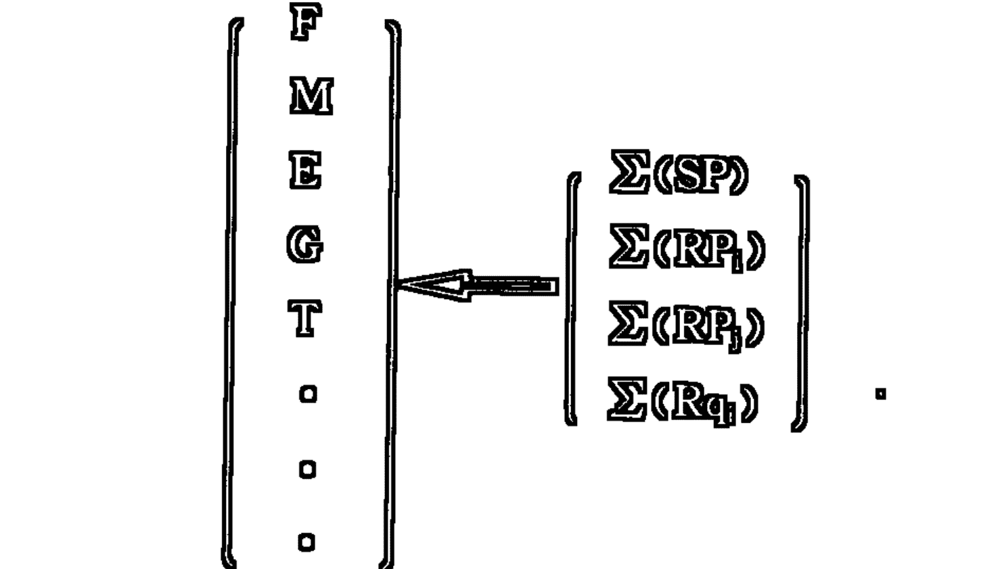

左面的矩阵表示信源物的直接存在的系统，右面的矩阵则表示与信源物发生着或发生过自然关系的系统，箭头“←”则表示后者向前者的映射关系。

但是，正因为这种映射已经是一种完成了的形式（即在物的直接存在的结构中编码凝结着的信息内容），所以，这个标示自然关系的矩阵系统，便有理由直接就是标志信源物直接存在的系统中的一个潜存的部分，所以，两个矩阵便完全可以用一个矩阵来表述，其形式如下：

$$
\begin{bmatrix} F \\ M \\ E \\ G \\ T \\ \vdots \\ \Sigma(SP) \\ \Sigma(RP_i) \\ \Sigma(RP_j) \\ \Sigma(Rq_k) \end{bmatrix}
$$

另外，由于信息第二性级的质是在第一性级的质中凝结着的，所以，任何对第二性级质的量的规定，其实都不能脱离对信息第一性级质的量的规定而独立地进行。由于信息第二性级质的量的表述矩阵中直接包含着信息第一性级质的量的表述矩阵，所以，由这一矩阵所导出的信息量，便必然是信息第一、第二性级质的量的一种复合的总量，我们可以记作：

$$
H_{\text{复合}}^2 = \begin{bmatrix} H_1 \\ H_2 \end{bmatrix}
$$

而对这个信息总量的具体描述则可以采取如下的矩阵形式：

$$
H_{\text{复合}}^2 = \begin{bmatrix} H_1 \\ H_2 \end{bmatrix} = \begin{bmatrix} F \\ M \\ E \\ G \\ T \\ \vdots \end{bmatrix} \leftarrow \begin{bmatrix} \Sigma(SP) \\ \Sigma(RP_i) \\ \Sigma(RP_j) \\ \Sigma(Rq_k) \end{bmatrix} =
$$

$$
\begin{bmatrix} F \\ M \\ E \\ G \\ T \\ \vdots \\ \Sigma(SP) \\ \Sigma(RP_i) \\ \Sigma(RP_j) \\ \Sigma(Rq_i) \end{bmatrix} = \begin{bmatrix} f_1 & f_2 & f_3 & \cdots & f_n \\ m_1 & m_2 & m_3 & \cdots & m_n \\ e_{11} & e_{12} & e_{13} & \cdots & e_{1n} \\ e_{21} & e_{22} & e_{23} & \cdots & e_{2n} \\ e_{31} & e_{32} & e_{33} & \cdots & e_{3n} \\ \vdots & \vdots & \vdots & \cdots & \vdots \\ e_{m1} & e_{m2} & e_{m3} & \cdots & e_{mn} \\ g_1 & g_2 & g_3 & \cdots & g_n \\ t_1 & t_2 & t_3 & \cdots & t_n \\ \vdots & \vdots & \vdots & \cdots & \vdots \\ \Sigma(SP)_1 & \Sigma(SP)_2 & \Sigma(SP)_3 & \cdots & \Sigma(SP)_n \\ \Sigma(RP_i)_1 & \Sigma(RP_i)_2 & \Sigma(RP_i)_3 & \cdots & \Sigma(RP_i)_n \\ \Sigma(RP_j)_1 & \Sigma(RP_j)_2 & \Sigma(RP_j)_3 & \cdots & \Sigma(RP_j)_n \\ \Sigma(Rq_i)_1 & \Sigma(Rq_i)_2 & \Sigma(Rq_i)_3 & \cdots & \Sigma(Rq_i)_n \end{bmatrix}
$$

从这个公式中，我们可以看到，表示自然关系的诸项内容和那些表示信源物自身直接存在方面的诸项内容，仍然存有某种子项一一对应的关系。这种关系的存在，并非毫无依据的虚构。任何物体都是一个整体和部分相互作用、相互规定的不可分割的统一体，所以，当这种物体映射种种自然关系信息的时候，便不是一种仅仅只在局部范围的结构和状态中留有某种“痕迹”，其实，物之同化（或异化）信息，总是一个复杂的内部信息重新整合的过程，这种内部信息的重新整合，不仅在该物的整体特征上引起某种改变，而且也必然同时在该物的每一部分中引起不同程度的改变。正是因为这样，种种自然关系的信息便不仅在信源物的整体结构和状态中，而且也必然在信源物的每一部分的结构和状态中普遍映射着。当然，这种映射不应理解为是完全的同一，其中必然存在映射的方面、程度等等的差异性。但是，这种差异性，并不影响我们做出如上公式中的一一对应关系的形式表述，而每一对应子项的脚码的不同正可以视为这种差异性的存在的标示。

那么，信息第二性级的质在量上是否守恒呢？我们的回答是肯定的。

既然，标示信息第二性级质的诸项内容是在信息第一性级质的诸项内容中凝结着的，那么，这个标示信息第二性级质的诸项内容，就必然不能与标示信息第一性级质的诸项内容绝对脱离。在标示信息第二性级质的量的公式中，标示各项自然关系的量之所以被独立标示出来，只是因为这种自然关系在信源物之诸多直接存在形式中还只是以一种潜在凝结着的形式存在着，如果不把这种潜在的内容挖掘（翻译）出来，就根本谈不上对它的量度。由于信息第二性级质的内容是在信源物的直接存在的结构和状态中凝结着的，所以，信源物直接存在的结构、状态本身的任何改变也必然同时就会引起它所凝结着的信息第二性级的质的某种改变。所以，我们说，在特定载体物的信息中，任何信息第一性级的质的改变和转化，也同时必然就是信息的第二性级的质的改变和转化。只要这种改变和转化都是有规律的，且是在一个假想的孤立体系中进行着的，那么，虽然信息第一、第二性级的质的某些具体内容可能会发生变化，但是，这种变化也必然会同时产生出另外一些信息第一、第二性级质的内容来。旧的特定信息内容的减弱或消失，恰恰是新的信息内容的增强或产生。这一规律，不仅对信息第一性级的质是适用的，而且对信息第二性级的质也同样是适用的。

这个信息第二性级质的守恒性意义，直接揭示着这样一种现象，即在任何孤立体系中，体系内在的自然关系方面的任何变化都必然是一种新旧联系和关系的转化过程，而这种转化是相互对应着的，只有前者的减弱或消失，才会引起后者的增强或产生。正是由于这种新旧自然关系的相互对应的转化，才使反映这种关系的信息在量上达到了守恒。

我们也可以将这种守恒关系用公式表述如下：

$$
\left[ \begin{array}{c} H_1 \\ H_2 \end{array} \right] = \left[ \begin{array}{c} H_1' \\ H_2' \end{array} \right]
$$

## 五、信息第三性级质的量及其守恒定律

广义物理学的任务是要在众多自然、社会具体科学的内在联系和统一中去寻求物质世界的具体的综合图景。这一图景不仅要揭示自然的物质本性，而且也必将使社会、意识本身的物质本体的绝对意义的方面可能得到揭示。这就是说，广义物理学不仅考察信息第一、第二性级质的绝对方面，而且也将去考察信息第三性级的质所具有的那些绝对意义的方面。我们已经指出，信息第三性级的质是在主客观的关系中得到规定的，这就意味着，信息第三性级的质是在主客体构成的整体系统中呈现出来的信息的新质。对信息这一新质的绝对意义的考察，就是从这种新质在主客体系统中自然发生的角度和方向上来进行的。

所谓自然发生，就是说，在它本身之中存在着它所以发生的自然决定论的根据。无论是客观信息的产生，还是主观信息的产生都统统有它自然决定的根据方面，对这种根据的考察就构成了对信息的绝对意义的考察。

信息第三性级的质既然是在主客体的关系系统中产生出来的，那么，这个主体和客体自身的内在结构和状态，以及二者的相互作用的关系就成了信息第三性级的质产生的根据。如果我们把信息第三性级的质放到它由以产生的主客体相互作用的系统中来考察，那么，它就具有了它的量度的绝对的、必然的规律性。

如果我们把客体信息和主体信息分别作为两种信息状态来对待，并把客体和主体分别映射着的它们自身存在着的种种关系看作是已经在其自身的信息结构中完成了的方面（事实也是这样），那么，我们便有理由认为，信息的第三性级的质就是在主、客体这两种信息状态相互作用的过程中所产生出来的。而所谓主客体构成的整体系统，无非是在为这两种信息的相互作用过程提供一个必要的载体条件环境。

基于这样的分析，我们便可以分别建立客体信息状态量（$H_{客}$）和主体信息状态量（$H_{主}$）的矩阵表达式：

$$
H_{客} = \begin{bmatrix} F_{客} \\ M_{客} \\ E_{客} \\ G_{客} \\ T_{客} \\ \vdots \\ \Sigma(SP)_{客} \\ \Sigma(RP_i)_{客} \\ \Sigma(RP_j)_{客} \\ \Sigma(Rq_i)_{客} \end{bmatrix} \quad H_{主} = \begin{bmatrix} F_{主} \\ M_{主} \\ E_{主} \\ G_{主} \\ T_{主} \\ \vdots \\ \Sigma(SP)_{主} \\ \Sigma(RP_i)_{主} \\ \Sigma(RP_j)_{主} \\ \Sigma(Rq_i)_{主} \end{bmatrix}
$$

有了这两个表达式，我们便可以建立描述主客体信息相互作用的矩阵式：

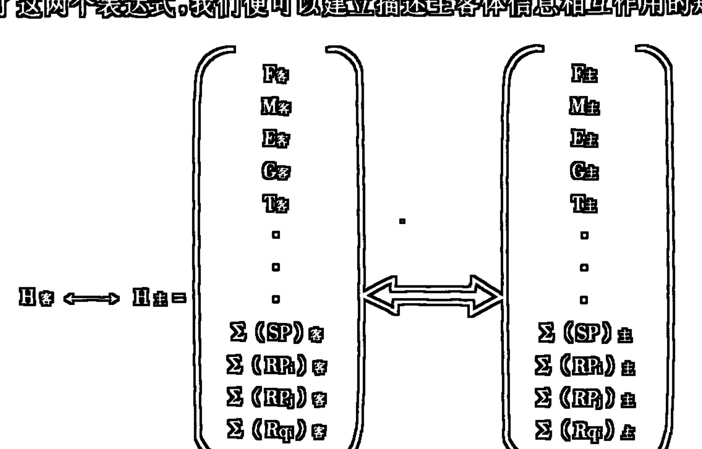

双向箭头“←→”和“⇔”表示相互作用的相互映射和规定。显然，这种相互映射和规定不应理解为完全的。

由于主客体信息的相互作用只能在社会信息的范围中进行，所以，主客体信息相互作用的过程必然会体现出信息三质的统一。我们把这个三质统一着的总量记作：

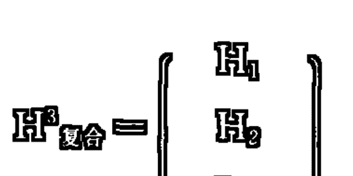

显然，“$H^3_{\text{复合}}$”与“$H_{\text{客}} \Leftrightarrow H_{\text{主}}$”之间具有相互等价的关系，可用公式表示为：

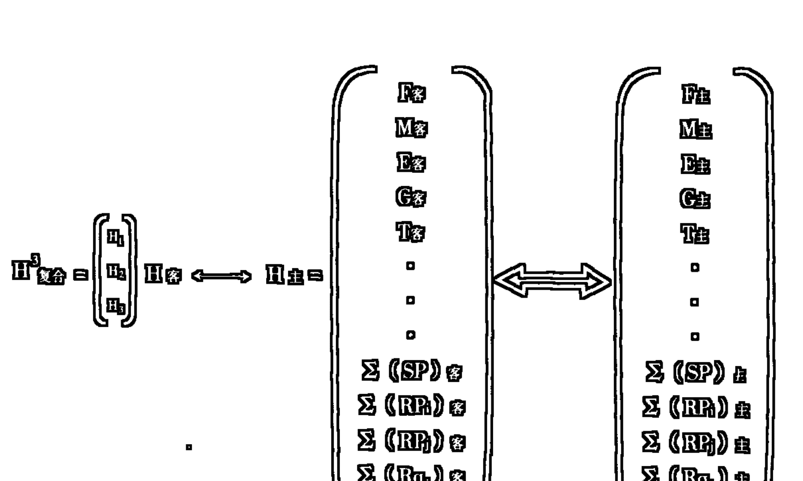

这就是我们导出的，在广义物理学基础上对信息三质统一的绝对信息量的表达式。这个公式，对于社会信息所属的三个信息世界的绝对信息量的主体考察都是普遍有效的。

那么，这个三质统一的绝对信息量还是否具有守恒的意义呢？我们的回答仍然是肯定的。

既然，特定的信息三质已在主客体所构成的特定系统中达到了统一，那么，这个特定系统本身的物的结构和状态及其相互作用的方式便成了这个特定信息三质的唯一规定的载体形式。这样，这个信息三质的存在和变化就与这个特定系统的物的结构和状态及其相互作用的方式的存在和变化相互对应，相互统一起来了。只要物的结构和状态及其相互作用的方式的各种量在转化中是守恒的，那么，与这一转化过程相对应、相统一的信息三质的转化在量上也就必然是守恒的。

下面我们给出信息三质统一的绝对信息量的守恒公式：

$$
\begin{bmatrix} H_1 \\ H_2 \\ H_3 \end{bmatrix} = \begin{bmatrix} H_1' \\ H_2' \\ H_3' \end{bmatrix}
$$

$$
\begin{bmatrix} F_{\text{客}} \\ M_{\text{客}} \\ E_{\text{客}} \\ G_{\text{客}} \\ T_{\text{客}} \\ \vdots \\ \Sigma(SP)_{\text{客}} \\ \Sigma(RP_i)_{\text{客}} \\ \Sigma(RP_j)_{\text{客}} \\ \Sigma(Rq)_{\text{客}} \end{bmatrix} \Longleftrightarrow \begin{bmatrix} F_{\text{主}} \\ M_{\text{主}} \\ E_{\text{主}} \\ G_{\text{主}} \\ T_{\text{主}} \\ \vdots \\ \Sigma(SP)_{\text{主}} \\ \Sigma(RP_i)_{\text{主}} \\ \Sigma(RP_j)_{\text{主}} \\ \Sigma(Rq)_{\text{主}} \end{bmatrix} = \begin{bmatrix} F_{\text{客}}' \\ M_{\text{客}}' \\ E_{\text{客}}' \\ G_{\text{客}}' \\ T_{\text{客}}' \\ \vdots \\ \Sigma(SP)_{\text{客}}' \\ \Sigma(RP_i)_{\text{客}}' \\ \Sigma(RP_j)_{\text{客}}' \\ \Sigma(Rq)_{\text{客}}' \end{bmatrix} \Longleftrightarrow \begin{bmatrix} F_{\text{主}}' \\ M_{\text{主}}' \\ E_{\text{主}}' \\ G_{\text{主}}' \\ T_{\text{主}}' \\ \vdots \\ \Sigma(SP)_{\text{主}}' \\ \Sigma(RP_i)_{\text{主}}' \\ \Sigma(RP_j)_{\text{主}}' \\ \Sigma(Rq)_{\text{主}}' \end{bmatrix}
$$

## 六、绝对信息量及其不可完全测度性

信息守恒律描述的是这样一种情景：某些信息状态量的减少（或增加）必然引起另一些信息状态量的增加(或减少),并且,这种增减的转化(或改变)遵循着一定的严格的规律。这个规律就揭示着信息量的绝对方面。

如果假定有多种不同类的交互作用的信息,在这种交互作用中,某些信息被改变,某些被减弱(或增强),还有可能产生出某些新的种类的信息。如果我们用△H₁,△H₂,△H₃,...,△Hₙ 分别表示它们的改变量,并且,只要我们有可能用统一的量度单位来规定这些不同信息的量,那么,我们就将得到这样一个公式:

$$
\triangle H_1 + \triangle H_2 + \triangle H_3 + \cdots + \triangle H_n = 0
$$

可简记为:

$$
\sum \triangle H_i = 0
$$

这个公式揭示:诸多信息所综合体现的整体信息的具体样态可能千变万化,但是这种变化无论何等不同,它们总是可以在总量上建立起一一对应的关系来。

这是一个理想的模式。它证明信息变换(转化)过程的守恒性,也揭示了绝对信息量的不可改变性。

宇宙之大,使我们无法具体说明这个公式的严格的含意,如果我们假设一个孤立体系,那么,我们便可以把这个绝对信息量的意义表述为:在任何孤立体系中,不同种类或形式的信息量的总和在时间上保持恒定,除非体系的孤立性被打破,产生了体系与环境的信息交换,这种体系信息总量的恒定性是不会改变的。信息总量的恒定性并不排除体系内部不同质的不同种类或形式的信息的相互转化,但是,这种相互转化之间存在着严格的、有规律的比例关系,只要能采取统一的度量形式,总可以将这个体系的绝对信息量表征出来。

对这个绝对信息量做出一般性的理论意义上的表述,并不是很费气力的事情,但是,要用严格的数学形式来表征这个绝对信息量却谈何容易。

从我们对信息守恒定律的矩阵表述上,我们已经看到宇宙的绝对信息量是无法完全测定的。宇宙宏观上大而无外,微观上小而无内,这就必然引出了物质的质量、能量、时空在宏观和微观上的无限性。这个无限性规定了宇宙的绝对质量、能量与时空的不可完全测度性。既然宇宙的绝对质量、能量与时空是不可完全测度的,那么,以这个质量、能量与时空,以及它们间的种种关系作为自己的参量的信息的宇宙绝对量也必然是不可完全测度的。

那么,某一假想孤立体系内的绝对信息量是否可完全测度呢? 这个体系划得也许很小，但是，即便小到一个原子、一个量子，要精确地测度它的绝对信息量也是极为复杂、极为困难的。

从信息守恒律的矩阵表述上，我们看到，信息是一个多参量的量，它的绝对量的规定依赖于这些诸多参量的绝对量的测定。这个诸多参量多到什么程度，可以说物质有多少存在的形式和方面，信息就应该有多少数量的参量，因为信息是物质存在方式和状态的自身显示。我们在信息守恒律中所列举的几个参量仅仅是极少的几个。如果考虑到物质的无限性及其存在形式和方面的复杂多样性，那么，我们将会意识到，矩阵中的略记号并不是虚构的，它里面包含着物质及其属性的无限性，也包含着人类认识的可能限度。由于信息是揭示物质本身的一个概念，所以，要认识它的绝对量的难度，无疑就等于绝对把握物质本身的难度，从另一方面来讲，信息在客观上显示着物质的所有存在的方面，但是，信息绝对量的规定却是和人类的认识分不开的。对信息绝对量的规定不仅受到物质复杂程度的制约，而且也必然受到人类认识限度的制约。通常人们总是说，物质世界是无限的，人类的认识能力也是无限的，但是，却很少有人认真地把这两个无限作一番比较。其实，人类认识的无限性是与人类的特定时期的认识，以及人类个体认识的有限性相对而言的。我们既然承认人类社会只是物质世界发展到特定阶段的产物，我们既然承认人类社会只是一个具体的有生有灭的过程，那么，我们就不能把人类认识的无限性和物质世界本身的无限性看作是同一数量级的无限性。在物质世界本身的无限性面前，人类认识的无限性却总是具有有限的性质。物质的复杂程度规定了信息程度的不可能绝对把握，也就是规定了人类对绝对信息量的不可完全测度性。由于物质在微观上小而无内，即使我们把假想的体系设定得很小，它仍然是一个无限的宇宙，这就使我们不可能将其绝对信息量毫无遗漏地捕获。况且，设定的体系小到一定限度，它就将超过人类认识的界限。如果联想到量子力学的测不准原理，那么，就更能使人信服我们的这个结论。

## 七、绝对信息量的层次特征参量集的规定性

上一节的分析，并不意味着人们在信息的绝对量面前将会束手无策。我们排除的仅仅是对绝对信息量做绝对测度的企图，但并没有排除对绝对信息量做不完全的、相对的（或称与人的认识能力、与人的认识方式和形式相对应的）测度的可能性。事实上，人们在认识世界和改造世界的过程中随时都在对

## 488 第九编 信息的度量

绝对信息量进行着不完全的、相对的测度。

所谓不完全的、相对的测度，是指人们只能对信息的某一个方面、某一种抽象出来的状态分别进行量的分析，并且这种分析所可能具体呈现的样态又不能排除人的主体认识方式的中介所带来的被建构、被虚拟的情景。

本来，任何物体都有它诸多的信息方面，如一块铁块，有它的元素组成、质量、温度、颜色、硬度、体积、形状、运动状态等信息方面，这许多信息方面的综合构成了铁块自身显示的绝对信息量。在上面我们已经做过分析，这个绝对信息量，人们不可能用一个简单的数学形式完全加以规定。但是，人们却完全可以把这个绝对信息量分割成诸多信息方面，将铁块的元素组成、质量、温度、颜色、硬度、体积、形状、运动状态等等，一项一项地加以测度。这种分割测度的每一项，虽然各有它的片面性和局限性，但是，当这种分割测度的方面越来越多时，铁块本身所显示的绝对信息量的整体就会越来越清晰地被我们所把握。

这一分割测度的方法，揭示了绝对信息量的特征表征的意义。它指出：任何物体的绝对信息量都必须用它的诸多特征方面的信息所组成的一个参量集来表征。

由于物质本身是分层次的，所以，在不同层次的物态上就必然相应地有一组特征信息参量表征这一层次上的物态的绝对信息量，这就又构成了物质绝对信息量的等级层次规定性的意义。

如，在宏观上：
$H_{物} = [ 元素组成 质量 温度 硬度 体积 内能 运动状态 …… ]$
在微观上：
$H_{粒子} = [ 质量 寿命 自旋 电荷 宇称 …… ]$

由于物质宏观和微观上的无限性，从理论上讲，这种绝对信息量的等级层次特征参量集的表征规定性，是可以在两极无限扩展的，当然，这种无限扩展并不总是采取机械大小分割的方式，这种无限扩展还应当是针对物态转化方式或形式的无穷多样而言的。

这个绝对信息量的等级层次特征参量集的表征规定，不仅显示着物质的层次性，而且还显示着信息的层次性。如果我们进一步考察，我们将会看到，这个参量集的每一参量分量都将仍然可用一个参量集来表征。这个子参量集实质上是它所表征的那个参量的诸多微观特征的集合。

信息的层次性，及其绝对量的参量集表征性，一方面决定于物质的层次性和信息的绝对量本身的可分割性，另一方面又决定于人们对外界信息的感受方式和能力。人们感官（感受器）的特异性决定着人们总是把外界物质信息分割成不同的信息要素方面，然后通过不同的感官（感受器）途径——加以识别。这种自然和人类认识方式的一致性，决定了认识产生的可能性，同时也决定了世界的相对可知性。

对绝对信息量的这种层次特征测度的度量单位，人们往往根据不同形式信息的特点加以规定。如：用千克来标示质量；用℃来标示温度；用米³来标示体积；用瓦特/米²来测度声强……但是，这种不同类信息的度量单位的相对规定，并不影响在同一类信息测度上的绝对量的测度，度量单位仅仅规定了一个相对量度的标准，只要这个标准在同类信息中统一使用，那么，这种量度的结果便仍然具有某种绝对的意义。虽然对某一种类信息的测度中可能具有多种度量标准单位，但是，只要这些度量单位之间有严格的换算关系，它们在实际上仍然属于统一的度量标准形式。

上段中所谓“绝对的意义”并不是指量度上不存在误差，或实际量度本身不可避免地以人的认识方式为参照系的相对性，而是指从理论上规定的度量标准不受环境的制约性。某一物体总的绝对信息量虽然由诸多方面的不同种类的信息综合构成，但是，每一种类的信息本身又有其绝对的量的形式。如光信息的强度就由单位时空内光子的数目、波频及其传播方向等因素来规定；同一种单质或化合物的态信息就由它本身的温度、压力、分子的排列特征所决定。如果仅以物质信息内容本身的内在因素的状态来规定对信息的测度标准，那么，这种测度的结果我们就说它具有了某种“绝对的意义”。它虽然不是对物体总的绝对信息量的测度，但是，它却是对某一特定信息方面的绝对信息量的一种测度。这种测度的标准并不依赖人对信息本身的期望程度，也不考虑它与周围环境物信息之间的差异性，这就使这种本来是相对规定的测度本身具有了某种“绝对的内容”（如果读了下一章关于相对信息量的论述，读者对这个“绝对的意义”也许会有更为明确的理解）。

绝对信息量的这种层次特征相对测度性，证明信息本身的复杂性和抽象性，同时也证明信息的基本性和广泛性。它把所有关于物质属性的测度都看作是自己的某一个方面的量的测度形式，它把所有关于物质属性的描述，都看作是对自己某一方面的特征的描述。如此看来，诸如：能量守恒律，质量守恒律等等，都只能看作是信息守恒律的一个方面特征的表达形式；诸如：天文学、地理学、物理、化学、生物学等等具体科学都将在信息哲学中得到更高一级层次的抽象和概括。各门具体科学所分别揭示的世界运行的规律和现象都将在信息哲学中得到相对统一性的解释。

### 第二章 相对信息量

上一章我们通过对信息守恒律的表述和对绝对信息量的测度问题的讨论，揭示了信息本身的客观的、绝对意义的方面。但是，自爱因斯坦1905年创立他的相对论以来，就使任何绝对的东西都变成了纯粹的神话。爱因斯坦告诉我们，人类只能生存在相对的世界中，一切对绝对的奢望都是对自身的嘲弄。如果进一步考察人们捕获信息的方式，亦即信息被人们认识的途径，那么，我们将会更加重视信息的相对性意义。同时，也可能会更深刻地理解爱因斯坦相对论的辩证法。

### 一、相对信息量度量的三条相对性原则

通过对信息态、质方面的揭示，我们已经看到，信息总是处在复杂的相互关系和相互作用之中，然而，任何相互关系究其本质而言也便是相互差异。由于事物普遍差异性的存在，就构成了事物的普遍关系性，从而构成了显现着这些事物的信息的普遍差异性和关系性。正是信息的这种普遍差异关系，在人类认识过程中起了决定性的作用。

在本书“第四编第二章”中，我曾举了一个观察的例子和一个文字的例子，来说明信息在差异关系中被识辨和被认识的情景。从这两个例子中，可以得出信息量度的三条相对性原则：

- 第一条：人所认识的信息量首先依赖于该信息所处的信息集（消息集、事件集、环境系统）。据此可根据消息集中消息的基元数和每一消息出现的不同概率来定义信息的量。
- 第二条：人所认识的信息量还依赖于认识主体（信宿）对该信息状态的认识能力（事先了解程度）。据此，要规定信息的量，还必须考察信宿对信源产生的每一事件的状态统计特征的了解程度。
- 第三条：人所认识的信息量是认识主体（信宿）接收信息（消息）前后两种不定性程度的相对差。这就是申农信息意义上的所谓“消除了的不确定性”。

根据上述三条相对性原则，可以对相应的一些因素做出抽象化的三个相对性规定：

### 1. 事件(消息)集

信源是一个能产生一组具有各自产生概率的随机事件的集合系统。如：英文电报发出端是 26 个字母的集合，每一字母的出现构成一个事件，并且，每一字母又都具有各自的出现概率。这就是一个包含各自产生概率的，由 26 个事件组成的事件集。事件集的规定体现了上述的第一条相对性原则：消息的信息量依赖于它所处的消息集。

### 2. 先验概率

信宿在接收消息前对信源发出此消息的概率的了解。信宿事先了解的某一可能消息发生的概率越小，此消息的发生带给信宿的信息量就越大。申农信息论认为 100%会出现的消息的出现，给信宿带来的信息量为零。先验概率的规定体现了上述的第二条相对性原则：消息的信息量依赖于信宿对该信息状态的事先了解程度。

### 3. 后验概率

信宿在接到消息后所了解的信源产生某一消息的概率。一般说来，具有排他性的消息的产生，将给信宿带来此消息产生了的后验概率为 1，而其他可能消息产生的后验概率则均为零。后验概率将改变先验概率的不确定性，申农通讯信息量要量度的正是这个改变了的量，亦即是“不定性之差”，“消除了的不确定性”。这是上述的第三条相对性原则的体现。

### 二、实用相对信息量

申农和维纳的信息量都是从各自实用的角度，依据上述三条相对性原则，以及三个抽象化的相对性规定推导出来的。所以，我们有理由把他们的信息量叫做实用相对信息量。

申农和维纳信息量都是通讯信息量。通讯的前提是如何将丰富多样的信息内容和形式变换成一个统一的可以在信道中传输的符号(代码)系统。这就要求对信息所具的不同的质及与这些质相对应的具体的内容予以扬弃。这种扬弃的结果，便使诸多本来差异的具有不同的质和内容的信息方面都化为了一个个孤立的符号(码)。这样，本来不可统一比较和量度的信息也便可能作统一的比较和量度了。这些被一一抽象出来的信息方面，在通讯信息论中被看成一个个随机事件，信源则相应被看成是一个能够发生一组具有各自产生概率的随机事件的集合系统。根据上面引出的第一条相对性原则，既然被抽象出来的随机事件只有在它所赖以抽象出来的那个事件集中才能具有具体的规定性，那么，就完全可以根据事件集的事件基元数和每一事件基元出现的不同概率来定义信息的量。

但是，根据上面引出的第二条相对性原则，人们所认识的信息还依赖于认识主体对认识对象的信息状态的认识能力，这就要求我们，要规定信息的量，还必须考察对信源信息进行反映的信宿系统的特征，也就是要考察信宿对信源产生每一事件的状态统计特征的了解程度。在这里，信宿成了信源自身反映的参照系。信源产生事件集的概率特征只有被信宿把握着的时候，信源才可能和信宿构成某种有意义的通讯系统。这样，要规定信息的量不仅可以从信源自身状态特征的角度（或方向）入手进行考察，而且还可以从信宿对信源了解的角度（或方向）入手进行考察。但是，无论从哪一个角度（或方向）入手考察，都必须考虑信源和信宿相互作用和相互规定的这一相对性原则。申农和维纳的信息量公式之所以在本质上具有统一性，恰恰在于他们都是根据这一相对性原则导出的。二者信息量公式在形式上的负号之差，则是因为他们推导信息量的角度和方向相反。申农是从信源自身状态特征的角度出发推导他的公式的，而维纳则是从信宿对信源了解的角度出发推导他的公式的。申农和维纳这种推导角度的差别，在某种程度上反映着哲学本体论和认识论方法的区别，而这两种推导结果绝对量的一致，则又反映着哲学本体论和认识论的统一。

由于对信息的认识不仅依赖于信源的状态，而且依赖于信宿对信源的了解程度，于是，在实用相对信息论中又做了关于“先验概率”和“后验概率”的规定。所谓先验概率是指信宿在接收信息之前对某信源信息产生概率的了解，所谓后验概率则是指信宿在接收信息后所了解的信源信息的产生概率（我们这里对后验概率的解释，只取实用信息论意义的一个特例，即只在假定没有任何噪声干扰存在的条件下使用这个概念，它在这里就成了实际发生情况的代词）。

先验概率的规定，揭示了信宿在未接收信息之前，有一个对信源信息先验的不确定的了解程度。当接到信息后（也就是得到后验概率后）这种先验的不确定性就将有所改变，使这个不确定性较为确定，也就是产生了某种关于不确定性的“差异”（确定性的增加）。这个“差异”就是相对信息要量度的量。正如艾司比所明确指出的：申农和维纳“都把信息看作是‘一种解除不确定性’的量，两者都用所解除的不确定性的程度来表示信息量的多少。还有，两者所关心的基本上都是在接到消息这一事件后，信息量的增益数或增加数，而在获得信息之前或之后存在的信息绝对数量是次要的”。① 从艾司比的这段话中，我们可以清楚地看到申农、维纳信息量的相对性本质。

既然申农是从信源自身状态特征的角度出发推导他的信息量公式的，那么，在他那里，先验概率对信息量的贡献就是反向的，因为这个先验概率提供的是信宿对信源认识的“不确定度”，它的方向与信源自身状态特征的方向是相反的。而后验概率对信息量的贡献则是正向的，因为这个后验概率提供的是信源自身此刻实际发生的信息状态本身，它的方向是与信源自身状态特征的方向一致的。这个标志解除不确定度的信息量就将是一个如下形式的函数：

信息量<sub>申农</sub> = f(后验概率/先验概率)

那么，信息量采取什么单位呢？人们注意到信息量随时间按线性律增加，而发送信息的可供选择的总数目却随时间按指数律增加，这就是说，在信息延续传递中，信息量具有加和性，可供选择的发送信息的总数目却具有乘积性，要使这两方面协调一致，从逻辑上讲，信息就应当用对数单位来度量。于是，上式便可化为：

信息量<sub>申农</sub> = log(后验概率/先验概率)

如果像维纳那样，从信宿对信源了解的角度出发推导信息量公式，那么，先验概率对信息量的贡献就是正向的了，相反，后验概率对信息量的贡献则是反向的了。所以，在维纳那里，标志解除不确定度的信息量就将与申农的信息量差一个负号。

信息量<sub>维纳</sub> = log (先验概率/后验概率) = -log(后验概率/先验概率)

为了讨论的方便起见，下面我们仅以申农信息量为依据推导出实用相对信息量的公式系列(公式注脚的人名也不再标出)。

我们再来分析公式：

信息量 = log(后验概率/先验概率)

当信源发出的各事件之间彼此完全独立，并具有排他性时，那么，在第 i 个事件真实发生时，它的后验概率便总是 1(因为只有它是唯一发生的，其他事件实际发生的概率则都是零)。如果第 i 事件的先验概率用 p_i 表示,产生 i 事件的信息量用 I_i 来表示,那么,上式则化为:
$$I_i = \log(1/p_i) = -\log p_i$$
这就是申农信息量所测度的随机发生的某一单个消息(事件)所携带的信息量,称作“自信息”。此公式的成立存在一个假定的前提条件:某一消息的出现所引起的接受者原有的先验不确定性完全被消除。

通讯中,人们关心的往往不是个别消息,而是一个消息序列。只发送一种消息的信源不存在不确定性,没有信息度量问题。实际信源都有发生多种消息的可能性,各可能消息按一定概率随机出现,就形成消息序列。一个消息序列的平均信息量,申农称之为信息熵,后人也有称之为申农熵的。

下面我们对申农的信息熵公式予以推导。

设,有包含 n 个可能消息 x_1, x_2, x_3, ..., x_n 的集合 X,分别以概率 p_1, p_2, p_3, ..., p_n 随机地发生,在一个时间界限内,形成一个包含 N 个消息的序列,N 很大,x_i 的自信息为 -\log p_i。统计地看,在整个序列中应包括 Np_i 个 x_i (i=1, 2, 3, ..., n),即第 i 个消息将出现 Np_i 次。如此则有下式成立:
$$I_{\text{总}} = -Np_i \log p_i$$
$$I_{\text{总}} = [-Np_1 \log p_1] + [-Np_2 \log p_2] + \cdots + [-Np_n \log p_n]$$
$$= -N \sum_{i=1}^{n} p_i \log p_i$$

将上式除以 N,得到每个消息的平均信息量 H(I_{\text{平均}})为:
$$H = \frac{I_{\text{总}}}{N} = -\sum_{i=1}^{n} p_i \log p_i$$

这就是信息熵(申农熵)公式,即消息集的整体平均信息量。

由上式可知,信息熵与消息序列的总数无关,而与消息集的基元数和每一基元产生的概率有关,它是概率分布 p_i 的 n 元函数,可表示为:
$$H = H(p_1, p_2, \cdots, p_n)$$

如果将自信息公式 I = -\log p_i 代入信息熵公式,则:
$$H = \sum_{i=1}^{n} p_i I_i$$

信息熵 H 是整体平均信息量,亦即单位信息量。消息总数乘以单位信息量,得到消息序列的总信息量,所以 I_{\text{总}} 也可以写成:
$$I_{\text{总}} = NH$$

信息熵公式体现了信源的数量统计特征。

一个离散信源的统计特性可用两个集合来描述：
一个是可能消息(事件)的集合
$$A=\{a_1, a_2, a_3, \cdots, a_n\} \quad (n \geq 2)$$
另一个是消息发生概率的集合
$$P=\{p_1, p_2, p_3, \cdots, p_n\}$$

一个信源的所有可能消息构成一个完备集，每一时刻只能有一个消息出现，因而
$$\sum_{i=1}^{n} p_i = 1$$

离散信源的信息结构可用一个矩阵表示：
$$S = \begin{pmatrix} A \\ P \end{pmatrix} = \begin{pmatrix} a_1, a_2, a_3, \cdots, a_n \\ p_1, p_2, p_3, \cdots, p_n \end{pmatrix}$$

给定信息结构信源的特性便确定了，对信源的分析都以其信息结构为依据。信息熵就是由信息结构决定的，即由可能消息的个数 n 和相应的概率分布决定的。

信息熵公式可获得多种意义上的解释。如：
- 信源发送消息的随机性的度量；
- 信源产生消息的先验不确定性的度量；
- 信源发送信息的能力的度量；
- 在多种消息中进行选择的不确定性的度量；
- 每个消息平均携带的信息量(平均消除的不定性)的度量；
- 信宿不确定性被改变的平均程度的度量。

这些意义可以大致归入两类：或者是相对信源特性而言，或者是相对信源改变信宿状态的特性而言。如果从信源本身的特性而言，信息熵公式便可看成信源本身的熵值的度量。这就是申农所说的“信息源的熵”。

根据熵的特性，信源概率分布越均匀，它的熵越大，在等概情况下，信源达到熵的最大值。称为信源的最大熵，记作 $H_{max}$。

当信源非等概分布时，信源熵 $H$ 将小于最大熵 $H_{max}$，二者的比值 $H/H_{max}$ 称相对熵。显然，相对熵的取值范围在 0～1 之间。等于零时，对应于概率分布最不均匀的程度(某一消息发生概率为 1，其余消息发生概率均为零)。等于 1 时，对应于等概率情况，即概率分布最均匀程度。

相对熵是信源概率分布均匀程度的度量。概率分布愈不均匀，相对熵愈小；概率分布愈均匀，相对熵愈大。完全均匀时为1，完全不均匀时为零。

对申农信息量进行分析，我们看到，这个信息量的计算总是和一批对象的信息相联系。信宿先验了解的关于信源发送信息的基元数越多，且每一基元信息的概率越趋平均，信宿对信源认识的不确定度就将越大。

下面是信宿对信源认识的不确定度的计算公式：

```
p₁logp₁ + p₂logp₂ + p₃logp₃ + …… + pₙlogpₙ
```

可简记为：

```
∑ᵢ₌₁ⁿ pᵢlogpᵢ
```

如果从信源来讲，这也将是它可能提供给信宿的最大信息量的绝对值（与上面导出的平均信息量公式比较）。信宿关于信源的不确定认识就是由信源输出的同量的信息来消除的。

在申农信息量中单一事物的信息量为零，因为单一事物出现的概率总是1，-log1=0。所以，申农信息量只有在多元素系统中才有意义。它不是单个事物（单个孤立信息）的质的量度，而是一批事物间的关系的量度。从这一信息量的计算中我们可以看到相对信息量的实质，以及它的系统差异规定性的意义。难怪艾司比结论说，信息“绝不能单独指某一种东西。如果想把变异度或信息看作是能存在于另一事物中的一件东西或性质，那就很可能搞出实际上从来不会有的难题来”。

相对信息量的意义就在于它其实是事物系统质的一种抽象的度量，这种度量反映着事物之间，以及认识对象和认识主体之间的某种相互差异的关系，在这个关系中也揭示着它们之间的某种相互联系和作用。

### 三、申农实用相对信息量的局限性

申农信息论在理论上是严谨的，在实践上也具有广泛适用性，但当它超出通讯领域时，就遇到了种种不容忽视的局限性。

#### （一）申农信息量主要是对语法信息的量化

我们知道，申农信息量主要是对语法信息的量化。申农信息量是在不考虑语义信息和语用信息的情况下给出的。要对语义信息和语用信息进行研究就必须相应建立语义信息论和语用信息论。

> ① [英]艾司比：《控制论导论》，第 183 页。

## （二）申农信息量具有静态度量性

申农信息量在本质上是一种对语法信息量的静态量度。首先，它把信源规定为一个能输出一系列具有先验概率的随机变量系统，且这个先验概率已为接收系统事先所了解。在机械通讯过程中，收发系统都是设定好了的，这一信源性质的条件可以满足。但是，超出了这个范围，先验概率就往往并不存在了。从人的认识来说，是一个从未知到知，从知之不多到知之甚多的过程，人们获得知识的方式从广义上讲也类似于某种与外界环境的通讯过程。在这一过程中，认识主体对未知领域可能发生事件的先验概率往往是无法确定的，另外，就接收系统（信宿）而言，也并不像申农所规定的那样，仅仅是对信息的一种同一的被动的接收，即是说无论什么信宿，它接收信息的能力都是等价的。事实上，人的认识能力各有殊异，同一信息对不同的接收者将引起不同的反映，也就将带来不同的信息量。这个问题，在申农信息论中是无法解决的。再则，随着对信息的不断接收，人们也逐步改变着自己对信源本身的认识，也就是改变着对信源的先验概率的估计。这在申农信宿中是不允许的。还有，由于对先验概率作了那样的规定，在申农信息论中“意外事件”（即先验概率为零的事件）其实是不可能发生的，因为信源可能输出的事件基元总集已先行确定了，从公式看也是这样，“-log0”将没有意义。

## （三）申农信息量具有非负性特征

申农把信息规定为非负量，这也是一种不能普遍成立的假定。布里渊就曾指出，信息量也可能取负值。设想某数学教授给学生推演数学公式，他向学生传送了一定的信息。当他发现自己的推导有错误并向学生宣布说：“对不起，前面的推演是错误的”之时，这最后一句话的功用是抵消前面推演传送的信息的，这两部分信息量必为数值相等而符号相反的两个实数。
一个谎言在接受者心理上引起的混乱，吃错了药所引起的病体恶化的发展等等，这都可以说明，信息量也是可能取负值的。

## 四、动态相对信息量

在现实的信息系统中，无论是信宿和信源都具有动态的性质。首先，信源输出的信息基元数是变动的，对于每一信息的输出概率也将不可能始终保持不变；其次，信宿对信源的认识也在不断的改变之中，且始终不能完全把握，尤其在人对环境信息的关系中，人这个认识主体则具有更大的能动性，更何况信源本身也在变化之中。

为了体现信宿和信源的动态性质，让我们对申农的静态信息量的计算公式进行一些必要的改造。

### （一）三个方面的动态参量的规定

在未接收任何信息之前，信宿对信源输出的信息基元总数将有一个估计（无论这种估计有多少误差），我们把它记为 $K_0$，随着对信源信息的不断接收，信宿必将逐步改变它对信息基元数的原有估计，我们把这个在不同时刻对信息基元总数的估计数，分别记为 $K_1, K_2, K_3, \cdots, K_n$（$K$ 的脚码并不标示 $K$ 依次增加，而是标明 $K$ 在某一时刻的特定变量的值，这个值可能增加，也可能减少，也可能不变）。

在未接收任何信息之前，信宿对信源所输出的每一信息的概率也将有一个估计（无论这种估计有多少误差），我们把它记为 $p_0$，随着对信源信息的不断接收，信宿必将逐步改变它对信源所输出的每一消息的概率的估计，分别记为 $p_{i1}, p_{i2}, p_{i3}, \cdots, p_{in}$，并把信源每次发出的关于某一消息的实际概率分别记为 $q_{i1}, q_{i2}, q_{i3}, \cdots, q_{in}$。

我们应当注意到，$q_{ij}$ 总是或者为 1（$i$ 事件发生），或者为零（$i$ 事件未发生）。

在这里，我们还有必要规定，$K_n, p_{in}, q_{in}$ 中的 $n$ 具有统一的意义，它们都对应于信源（或信宿）发出（或接收）的 $n$ 个事件序列中的 $n$。

### （二）动态信息量的公式系统

有了上述规定，我们就可以引出关于动态相对信息量的公式系统：

在某一时刻收到第 $i$ 个消息的信息量

$H_{ij} = \log(q_{ij} / p_{i(j-1)})$

我们应当注意到，当 $i$ 事件真实发生时，$q_{ij}=1$，则

$H_{ij} = \log(q_{ij} / p_{i(j-1)}) = -\log p_{i(j-1)}$

而当 $i$ 事件未发生时，$q_{ij}=0$，则

$H_{ij} = \log(q_{ij} / p_{i(j-1)}) = \log 0$

在数学教科书中，log0 是没有意义的。在这里，我们完全有理由规定 log0=0，因为当 i 事件未发生时，它是不可能给信宿带来什么信息量的。

在 n 个事件的序列中由第 i 个事件的出现得到的总信息量

$H_{i\text{总}} = \log(q_{i1}/p_{i0}) + \log(q_{i2}/p_{i1}) + \log(q_{i3}/p_{i2}) + \cdots + \log(q_{in}/p_{i(n-1)})$
$= \sum_{j=1}^{n} \log \frac{q_{ij}}{p_{i(j-1)}}$ ②

在 n 个消息序列中所有消息基元带来的总信息量

$H_{\text{总}} = \sum_{j=1}^{n} \log \frac{q_{1j}}{p_{1(j-1)}} + \sum_{j=1}^{n} \log \frac{q_{2j}}{p_{2(j-1)}} + \cdots + \sum_{j=1}^{n} \log \frac{q_{k_n j}}{p_{k_n(j-1)}}$
$= \sum_{i=1}^{k_n} \sum_{j=1}^{n} \log \frac{q_{ij}}{p_{i(j-1)}}$ ③

显然，公式③只适用于 $K_{(n-1)} \in K_n$ 的情况（式中 i 是正整数，且 $i \leqslant n$，$\in$ 表示集合间的包含关系），即只适用于 $K_n$ 时刻之前的所有消息基元在 $K_n$ 时刻都未消失的情况。如果出现了原有消息基元消失了的现象，那么，我们就应该给上面的公式增加一项，将消失的信息基元曾经带给信宿的信息量计算进去。如果我们假设存在一个在 $K_n$ 时刻已经消失了的消息基元的集合，其数值计为 $K_n'$，那么，它曾给信宿带来的信息量便是

$\sum_{i=1}^{K_n'} \sum_{j=1}^{n} \log \frac{q_{ij}}{p_{i(j-1)}}$

这样，在出现了消息基元消失的情况下，在 n 个消息序列中所有消息基元带来的总信息量便是

$H_{\text{总}} = \sum_{i=1}^{k_n} \sum_{j=1}^{n} \log \frac{q_{ij}}{p_{i(j-1)}} + \sum_{i=1}^{K_n'} \sum_{j=1}^{n} \log \frac{q_{ij}}{p_{i(j-1)}}$ ④

公式④是比公式③更为普遍的公式，当 $K_{(n-1)} \in K_n$ 时，公式④的后一和项为零，从而与公式③相同。可见，公式③是公式④的一个特式。

### （三）对意外事件的分析

从上述公式系统中我们看到，由于引进了关于信源发出信息基元数的动态变化，使“意外事件”可能发生。这就意味着对“-log0”进行了计算。这个“-log0”应当怎样解释呢？这就要我们做出具体的分析。

让我们分析一下现实系统中“意外事件”对信宿作用的可能三种情况：一是信宿本身已经具备了适应这种“意外事件”的能力，这就意味着，这个“意外事件”对于信宿来说，在实际上并不是零概率，而是暂时被信宿当作零概率给扬弃了，这里的零实际上是极限为零(→0)，大于零，这一情况下“-log0”便有了计算的意义，信宿便可将这个“意外事件”加到总信息数 K 中去；第二种情况是信宿对这个“意外事件”根本不予反应，也就是说它不接收这个信息，这个信息对信宿系统毫无作用，在这种情况下，“意外事件”相对于信宿来说，实际上等于没有发生，所以，相对于信宿就不可能发生“-log0”的计算问题；第三种情况是信宿在这个“意外事件”面前完全陷于被动，使信宿原有的接收信息的程序完全被打乱，乃至整个信宿系统遭到破坏，在这种情况下 -log0 = +∞，它宣告了原有信宿系统的结束。

对我们所建立的公式系统进行具体分析，我们将看到，它从本质上反映了信源和信宿之间的某种带有反馈作用的相互关系。这与人们的认识过程是相一致的。信息基元数 K 及信息概率 p_i 的不断变化，虽然只是以信宿的反映结果为转移，但是，它却具有两方面的意义：一方面是信源物体本身的变化所引起的信宿的反映的改变，另一方面则说明信宿对信源物认识的不断深入。如果考虑到当信源输出的信息序列足够长，且 K 和 p_i 相对稳定时，信宿对信息概率的估计将逐步趋于相对稳定（即某一信息的某一实际概率 0 或 1 对概率的重新估计的影响微乎其微），那么，这就将和申农信息量趋于一致。这不仅证明人们对事物认识的相对稳定的继承性，而且又显示了变中有不变，相对中有绝对的辩证法。同时，也证明动态相对信息量的更为基本、更为广泛的性质，而申农静态相对信息量只能是动态相对信息量的一个特例。

## 五、实用相对信息量研究的三个层次①

目前已发展起来的广义相对信息理论，对信息的研究是在三个不同的层次上进行的：一是对信息的结构性问题的研究，二是对信息所含意义的研究，三是对信息作用效果的研究。与这三个研究层次相对应，发展起了三个层次的信息研究理论，即语法信息论（或称结构信息论、技术信息论）；语义信息论（或称意义信息论）；语用信息论（或称效用信息论）。

> ① 本节的内容参考了苗东升先生编著的《系统科学原理》（北京，中国人民大学出版社，1990 年版）一书“第五章”的“5.10”一节的内容，特致感谢。

### （一）语法信息论

申农信息论主要关心的是消息传输的技术问题，即如何精确地传输通讯符号的问题，从这一目的出发，申农将通信过程简化、抽象化，舍弃了信息的语义和语用方面的问题，仅对其结构的语法方面进行量化描述。所以，申农信息论基本上是语法信息论。

作为经典信息论，申农的通信的语法信息论是目前实用信息论研究中最为成熟的理论。

### （二）语义信息论

与语法信息论相比，语义信息论更强调消息的语义问题，而不是像前者那样仅仅把信息看成是对一定情形或消息中所含的可能性、不定性的度量。

#### 1. 消息的语义问题的三个方面

①真实性问题。人们传输信息是为了利用信息，要利用信息，就有必要先对信息的真伪做出判断。如：侦察员的侦察报告有真伪判断问题；对事物、案情的调查有假象掩盖真相的问题；新闻有如实报道和失真报道的问题。

②精确性问题。精确性指的是消息的质量。试比较如下四条消息：明天天气不好；明天天气有雪；明天要下大雪；明晚要下大雪。从语法结构形式来看，上述四条消息的信息量是一样的，但是从语义信息的角度来看，它们却存有精确性上的明显差异。

③意义理解的差异问题。语义信息总是与人的知识状况、文化背景密切相关。同样一句话、一幅照片、一个情景，对于不同国家、民族或文化中的人，往往会具有十分不同的意义。这样，对任何消息、符号和文本的解读，都只是一种相对的理解，即是说都只是相对于接收者个人的知识结构、理解能力，相对于人们所处的社会、历史、文化的背景因素中的一种具体的理解。

韦弗尔曾经指出：信息传播的语义问题是指“被传输的符号怎样准确地运载欲表达的意义”。① 有些研究者还进一步指出：“语义性信息总是相关着情形中的某一具体方面；而且，它总能减缩解读某一情形中所需做出的选择的数目，即减少求得肯定结果时的‘信息的量’。……语义信息的基本作用，在于减缩情形中的整个的不确定性。”①

> ① [美]申农、韦弗尔著：《通信的数学理论》，伊利诺斯大学出版社，1949年，英文版，第96页。

#### 2. 语义信息的定量描述

定性描述语义信息并非难事，但定量描述却相当困难，至今没有实质性进展。

有一种方法是仿效申农思路，用逻辑概率代替统计概率，用状态描述代替可能事件，制定一种对消息的逻辑真实性和精确性作某种度量的方法。

设：一个真实的句子（消息）为一个状态描述 Z，令 m_i 记第 i 个状态描述 Z_i 的逻辑概率，且满足

$$0 \leqslant m_i \leqslant 1, \sum_{i=1}^{n} m_i = 1$$

定义状态描述 Z_i 的语义信息为

$$I(Z_i) = -\log m_i$$

其单位也是比特，若两个句子是逻辑独立的，即逻辑概率满足

$$m(Z_i, Z_j) = m(Z_i) + m(Z_j)$$

则上面定义的语义信息也具有可加性

$$I(Z_i, Z_j) = I(Z_i) + I(Z_j)$$

#### 3. 模糊语义概念有可能提供定量描述语义信息

上一定量描述是以精确逻辑为基础的，但语义本身则具有模糊性。语义模糊性起码可以表现为如下 4 个方面：

- ①反映模糊性
自然语言的词和句与对象客体之间的反映关系是模糊的，并不只是要么完全反映，要么全不反映两种状态，而是在一定程度上的反映，又不完全反映。

- ②语词模糊性
语词的具体含义往往是有模糊性的。如“红色”这一词标志的是一个颜色域，是从红色到不是红色的一个颜色范围，不存在一个精确划定的界限。

- ③句子模糊性
语法也有模糊性，语词、语法的模糊性导致了句子的模糊性。

- ④句子的含义还具有随语境不同而变化的不恒定性
这里的语境既指客观语境，也指主观语境。客观语境指的是一个句子与上下文的关系或者是表述句子时的具体的外部环境条件，即处境；主观语境指的是理解句子的人的个体认识结构的方式的差异。

> ① 周晓明：《人类交流与传播》，上海文艺出版社，1990年版，第 105 页。

语义的模糊性要求引入新的对语义进行定量描述的方法。

### （三）语用信息论

#### 1. 语用信息的含义

信息对接收者的价值，即收到信息后接收者发生的变化和效果，称为信息的语用特性。研究信息的语用特性的理论相应被称为语用信息论。

早在 50 年代中期，阿可夫就从效用问题入手，发展出一种新的关于信息的效用理论。他指出，任何一个系统，如一个人，确定了一种意愿、目标，而且也存在着各种可供选择的方式去达到这一目的，那么，该系统就处于合目的状态。“如果消息改变了该系统的合目的状态，那么，传播就经由消息而影响了系统。”他还进一步指出，消息（信息）经由三种途径影响系统或个体的合目的状态。一是告知，即通知先前存在的各选择可能性的改变；二是指导，即改变行动过程；三是促动，即改变行动结果的价值。与此相一致，产生了所谓告知效果、指导效果和促动效果的三种效用。

#### 2. 语用信息的内容

从对信息效用的研究中可以分析出，消息的语用问题具有如下三个方面的内容或特点：

- ①对接收者不确定性的消除
申农是在这种意义上理解语用的，但这只是一个比较笼统的方面。在申农信息量的计算中又对之作了形式化的抽象，只注重了其结构方面，而将消除了的不确定性的效用的内容方面予以了舍弃。

- ②对同一信息的相同理解将可能给不同接收者带来不同价值（作用或效果）。
相同内容，相同比特量的信息，对不同接收者在理解相同的前提下也会有不同的作用效果。如：“张三考取了北京大学研究生”这一消息，对张三来说显然价值巨大，且为正价值；对关心他的亲戚朋友来说有较大的正价值；对不关心他的人来说，价值则不大，或为零；对敌视他的人来说则可能有负价值。又如：赌场上骰子抛出了“第 6 点”这一消息，对压了巨款在此点上的赌徒将有巨大正价值；对压了少量款在此点上的赌徒将有较小的正价值；对压了巨款在其他点上的赌徒将有巨大负价值；对没有参与赌博的旁观者将具有另外一种意义的价值，如娱乐；对既未参与赌博，又对此项活动无任何兴趣的人来说，将可能不带来任何意义的价值。

- ③对同一信息意义的不同理解将可能给不同的接收者带来不同的价值（作用或效果）。
这一方面的特点是与语义问题中的相应特点相一致的。这就是，由于知识结构、认识能力和社会、历史、文化背景的不同对同一信息的意义的理解将会在个人之间造成很多方面的具体差异。由于这些理解上的具体差异，将会导致不同接收者的反映效果上的差异。

#### 3. 语用信息的形式表述

对于语用信息的定量描述和对于语义信息的定量描述一样，也是十分困难的，至今仍未找到一种很好解决的方案。目前，对语用信息的各种度量方案还都只是停留在某种形式化的表述上。

下面介绍一种关于语用信息的效用性的形式表述方法：

①有效性分布概念

对每一可能消息 $x_i$ 确定一表示效用的数 $u_i$，代表消息 $x_i$ 出现对信宿产生的效果，$u_i$ 大代表消息 $x_i$ 的效用大，$u_i$ 小则代表消息 $x_i$ 的效用小。

$U = \{u_1, u_2, u_3, \cdots, u_n\} \quad u_i \geq 0$
此式称为信源的有效性分布。

②具有有效性参量的信源信息结构

$S = \begin{bmatrix} A \ U \ P \end{bmatrix} = \begin{bmatrix} a_1, a_2, a_3, \cdots, a_n \ u_1, u_2, u_3, \cdots, u_n \ p_1, p_2, p_3, \cdots, p_n \end{bmatrix}$

③有效信息定义

$I(P, U) = -\sum_{i=1}^{n} u_i p_i \log p_i$
$u_i$ 是 $a_i$（消息）的有效系数，在一定程度上反映了信息的价值。

当所有 $u_i$ 相等时，可取
$u_1 = u_2 = u_3 = \cdots = u_n = 1$
则有效信息还原为申农信息。可见，申农信息是有效信息的特例。

当所有 $u_i = 0$ 时，不论信源平均信息量多大，对信宿的价值也为 0，即
$I(P, U) = 0, u_i = 0, (i = 1, 2, 3, \cdots, n)$

这样的定义更多的是一种形式表述，还未能很好解决效用信息的度量问题，这还只是一种有益的尝试。

在现实的信息活动过程中，信息的语法、语义和语用的三个方面总是统一交织在一起的。任何信息活动的过程都必然同时呈现出这三个方面的内容。怎样对这三个方面进行统一的描述将是未来信息科学发展中所面临的一个更为艰巨的难题。

## 六、熵和相对信息量的统一

由于维纳的通讯控制信息公式和热力学中的熵的统计学公式仅仅有一个符号之差（互为正负），所以，信息量和熵的概念就发生了某种关系，也引起了许多关于二者关系的争论。

现在人们一般都认为，熵是和信息对立的一个概念，它是对系统混乱程度（不定度）的一种度量，而信息则是对消除这个系统的混乱程度（不定度）的能力的一种度量。因此，熵标志着系统的无序状态，而信息则标志着系统的有序状态。

这种用无序性和有序性、混乱度和对混乱度的消除来揭示的熵和信息的对立是否科学呢？在我们这个信息的哲学界说的范围里，熵和信息的关系又该如何呢？要弄清这些问题，就必须对“熵”本身进行一番认真的探讨。

在热力学中熵被规定为体系的一个宏观状态量。按照现代物理学的观点，任何体系的宏观状态都只是与之相对应的大量微观状态的综合作用的表现。所以，要对熵进行规定，就必须进一步考察与这个宏观世界的熵所对应的微观状态世界，这就涉及了热力学几率的问题。

热力学几率在热力学中被规定为实现某种宏观状态的微观状态数。如果这种微观状态是建立在分子层次上，那么，所谓微观状态数就是指体系内部分子的可能分布方式的数目。

宏观状态实际上是大量微观状态的平均。由于宏观和微观的这种互为表现规定性，所以，在宏观状态量熵（S）与微观状态量热力学几率（Ω）之间就建立起了某种关系，S就在这种关系中被Ω所规定。波尔兹曼给出了这种规定的数学表达式：

$S=K \ln\Omega$

这就是著名的定义熵的波尔兹曼公式。式中 K 称为波尔兹曼常数。之所以是对数关系，是因为熵是容量性质，对于两个互相接触的热力学体系，熵具有加和性，而根据几率定理，复杂事件的几率等于各个简单的、互不相关事件的几率的乘积，对数则将乘积关系转化为加和关系。件几率的乘积，这样熵的加和性和几率的乘积性只有在对数关系中才可能达到统一。

既然 K 是一个常数，那么，只要取一个适当的对数底的形式，就可以把这个系数化为 1，于是公式①便可化为一个较为普遍的表达式。

S=logΩ ②

在本章第二节中，我们曾介绍了申农平均信息量公式：

H=-∑pᵢlogpᵢ ③

如果我们假定信源发出的每一基元事件信息的概率是相等的，那么，这一公式便可以化为如下的形式：

H=-logpᵢ
H=logn ④

试将②、④对比，我们看到了它们具有完全等同的形式和意义。②中的 Ω 是分子的可能分布方式的数目，④中的 n 则是信源可能输出的信息基元数。如果我们从宏观和微观的关系的角度出发，那么，公式②和④便会获得完全一致意义上的解释。因为公式②是公式①、公式④是公式③的特式，所以，我们便可以由此证明波尔兹曼的熵公式和申农的信息量公式的完全等同的意义。

其实，信息量的计算也是揭示着某种宏观和微观的相互规定和联系。如果我们把信源所发生的整件事件现象看成是信源的宏观表现，那么，信源所发生的每一基元事件便构成了与这个宏观表现相对应的微观表现，这些所有微观表现的综合作用便反映出信源在宏观上的特性。从这一比较中，我们也可以看到，相对信息量的计算说穿了也只是利用信源的微观状态对信源的宏观状态进行的某种规定。这种规定，究其实质是对信源发送何种消息的某种不确定度（即内在变异度）的某种度量。如果我们进一步分析，我们将看到，这个信源的不确定度在本质上就类同于热力学中的熵。如果把热力学体系中的分子的每一种分布方式看成是一个可能发生的基元事件，那么，熵也就成了信息。

由于我们定义信息是物质存在方式和状态的自身显示，这就把信息的内容和物质本身的状态统一了起来，熵也好，信源的不确定度也好，都无非是某一物质系统本身的某种状态的量度，熵的概念的推广就是信源的不确定度。信源不确定度的概念在热力学体系中的具体化就是熵。我们知道，任何系统的属性、状态都是通过它的信息被我们所认识的，所以，熵也好，信源的不确定度也好都必须外化为信息才能被我们所认识，所以，任何对熵或信源不确定度的规定或计算都只是对它的信息的规定和计算，正是在这种意义上熵和信息获得了完全等同的意义。在这种意义上，熵无非是关于体系自身的信息的某种相对量度，这种量度反映着系统内部各部分、各子系统、各种运动状态之间的差异度或变异度。分子的可能分布方式的数目，究其本质就是指的分子的微观状态的变异度。如果我们考察的微观状态不是分子的可能分布方式，而是更小的或更大的“粒子”的可能分布方式，或是可能发生的事件的种类、数量等等，那么熵的概念就得到推广，微观状态的变异度就将获得更为丰富、具体的相对规定性。正是在这个意义上我们说，熵和所谓的不确定度都只是关于体系自身状态的信息的某种相对量度，熵是相对信息量在热力学体系中的一个特例，而相对信息量则是熵的概念的推广。难怪波尔兹曼说：“熵是关于物理系统状态的信息不定性的测度。”①

通过上述工作，我们把热力学中的熵和申农的信息量统一了起来，但是，这里还有这样一个问题：为什么人们普遍认为通讯的信息量公式和热力学中的熵公式具有相反的符号呢？我们说，这个符号的相反既有某种不同几率概念混淆的误会，又有人为设定的相对性意义。

为什么说有对某种不同几率概念混淆的误会呢？这是针对申农的信息量公式而言的。申农信息量公式的最一般的形式是：

H = -Σp_i log p_i

这与我们上面所编码的公式③是一个公式。当基元事件的概率均等时，上式便会化为：

H = -log p_i

这就和 S = logΩ 的统计熵公式在形式上多了一个“负号”。

这个“负号”果真是多出来的吗？回答是否定的。因为申农公式中 n 用的是数学几率，在基元事件发生的概率均等的情况下，这个数学几率的值等于 1/(基元事件数)，也就是(基元事件数)⁻¹。而波尔兹曼公式中 Ω 则用的是热力学几率，它的数值直接等于分子可能分布方式的微观状态的数目。我们在上已经提到，这个微观状态的数目完全可以与申农理论中的基元事件数相类比。由于这个数学几率和热力学几率计算方法上的差异造成了两个公式之间的形式上的“负号”之差，如经过换算，这个“负号”之差便消失了。申农公式变为 H=log(基元事件数)，即 H=logn，这就和统计熵公式完全等同了起来。难怪申农一开始就把他的信息量公式叫做“信息源的熵”，而且，申农的公式也是在波尔兹曼公式的启发下，由波尔兹曼公式推广而得到的。这就证明，在申农那里，熵和相对信息量已经统一起来了。值得一提的是，1928 年哈特莱就建议用 logn 这个数来描述有 n 个不同结局的实验的不肯定性程度，而申农也是把它的 H=—∑pilogn 看成是“不确定性的度量”。申农在其《通信的数学理论》这一开创性论文中，一直都是把他的信息量公式和统计力学中的熵公式做完全一致的理解。

当然，对于这个“负号”之差，也并不仅仅是纯误会，它还有人为设定的某种意义。因为维纳几乎与申农同时导出的信息量公式就与申农的公式差一个负号。根据本章第二节所指出的理由，我们说，申农和维纳公式的负号之差，说明了他们计算信息量时所选择的参照系不同。申农以信宿为参照系来揭示信源系统本身的状态相对量，而维纳则以信源为其参照系，来揭示信宿对信源认识的某种状态的相对量。正是这种相对参照系选取的不同产生了这个负号之差。这个负号之差正好揭示着信息的某种时空方向上的差别，这种差别仅仅是信息的态的时空的某种转换或映射，而并不能就解释为熵和信息的对立。至于那些建立在熵和信息的对立基础之上的“混乱度”和“混乱度的消除”、无序和有序的对立的观点，都统统不能作为熵和信息的本质的、科学的解说。所谓混乱和混乱的消除仅仅是相对于对信息认识的先后两种状态而成立的一种现象，它显示着信息的某种作用，用信息的作用来定义信息的本质显然是概念和概念层次的混乱。

至于有序和无序，在事实上是根本无法简单地用信息量的多少来说明的。它仅仅是有用信息和无用信息之比在人类认识中的某种反映，所谓有序就是有用信息占比例多些，所谓无序就是有用信息占比例少些。试计算这样两种情况的信息量：一个是清晰通讯过程中的信息量，另一个是将某种噪声与这一清晰通讯的信息量混合输入信道，对于接收者来说，他认为前者不混乱，有序，后者混乱，无序，但是，如果从有序和无序、混乱和不混乱与信息量的多少相一致的观点来看，后者的信息量显然比前者大（噪声也是一种信息，在这里它可以看成是外界信息进入了信道系统，从而给信道系统增加了信息量），那么，后者反倒应该是不混乱、有序的了。另外，当一个生命体不适应外界信息环境，在接收了不适当的外界信息输入之后造成了生命体的死亡，若按照有序、无序的观点，这种事情是根本不可能发生的，因为接收信息使系统更为有序化，生命是比非生命更为有序的信息系统，对外界信息的接收，只能使生命系统更有序，更走向高级的生命的发展阶段，而绝不应该走向非生命系统。这种抛开信息的质不谈，仅仅从信息的量上来讲混乱还是有序，并把这看作是信息的本质，起码是对事实的一种嘲弄。

信息是物质存在方式和状态的自身显示，无论物质体系混乱也好，有序也好，它都必将将自身混乱或有序的内容显示出来。所以，混乱的体系有显示这个混乱的信息，有序的体系也有显示这个有序的信息，它们在本质上都是自身的显示，否则，我们就无法去认识那些复杂的（混乱的）事物。可见，熵是信息，混乱是信息，有序也是信息，在这里，熵和信息、混乱和有序作为系统状态的一种相对测度统统在物质自身显示的意义上获得了统一。

严格地来讲，信息的相对量度并不仅仅限于我们所论及的范围。正因为这种量度是相对的，所以它在不同的范围领域，相对于不同的状态系统，在不同的意义、角度上，便可能具有极为丰富多彩的量度形式。就人们的认识来说，它本质上是一种以人的认识方式为参照系的相对的认识，就事物的存在来说，它也只是一种在相互作用的相互关系中的相对的存在，从信息的态的论述中我们已经看到，一物只有在它物中才能显示自身，才能将自身信息化，这就是物之存在的相对性的一面。但是，如果从客观的、自在的、自然发生的决定论的意义上来考察，这种相对性之中就包含了绝对性。通过对信息绝对量和相对量的探讨，我们也许会更深刻地认识到这个相对与绝对的辩证关系。

### 第三章 必然性和偶然性及其信息量判据

相对信息量的规定给我们提供了衡量事物存在和演化的某些特性的一种方法。本章的内容便是应用这种方法对必然性和偶然性及其相互关系进行定量化描述的一种尝试。

### 一、拉普拉斯妖

在谈论必然性和偶然性及其在事物演化过程中的地位和作用的问题时，从一个被称为拉普拉斯妖的东西谈起是方便的。

必然性和偶然性在事物演化过程中的地位和作用的问题，一直是科学和哲学争论的重大课题。从 17 世纪末到 19 世纪末，由于牛顿机械物理学的成功，使必然性的观念、决定论的思想方法统治了科学的殿堂，拉普拉斯妖便是这种必然性的观念、决定论的思想方法的一个集中体现。

牛顿的机械物理学提供了宇宙机械运动的统一图景。无论是星系和各类天体，还是一般的地面物体，无论是无机界，还是生物界，都无不服从一个严格确定的、必然因果的、决定论的机械运动规律。在这一机械运动的统一图景中，我们所面对的世界就像是被某种力量预设好了的，正是这种力量赋予了这个宇宙以某种即定的永恒不变的运行规律，并且，这种规律是可以通过某些微分方程来予以描述的。

拉普拉斯是法国的著名天文学家和数学家，他生于 18 世纪末到 19 世纪初的牛顿力学发展的鼎盛时期。为了阐明宇宙的完全决定论的性质，他假定了一个无所不包的万能的“智慧”，认为这个智慧能够把握自然运行的全部特征参量，并能用某一个万能的宇宙方程来精确推算过去、预测未来。他说：“智慧，如果能在某一瞬间知道鼓动着自然界的一切力量，知道大自然所有组成部分的相对位置；再者，如果它是如此浩瀚，足以分析这些材料，并能把上至庞大的天体，下至微小的原子的所有运动，统统包括在一个公式里，那么，对于它来说，就再也没有什么是不确定的了。在它的面前，无论是过去或将来，一切都将会昭然若揭了。①

拉普拉斯所假定的这个万能的“智慧”，后人称之为拉普拉斯妖。

维纳曾经批评说：“牛顿物理学曾经从十七世纪末统治到十九世纪末而几乎听不到反对的声音，它所描述的宇宙是一个其中所有事物都是精确地依据规律而发生着的宇宙，是一个细致而严密地组织起来的、其中全部未来事件都严格地取决于全部过去事件的宇宙。”②

拉普拉斯的世界是一个既定的世界。在这个世界里，一切都是设定好了的，它不可能有创造，不可能发生奇迹和偶然变异，因而也便不可能有任何新的事物发生，整个世界的运行只能服从某种即定的严格程序（公式），就像是一只一次上足了发条就永远做机械运行的钟表那样，沿着一个封闭的圆圈运动。

拉普拉斯机械决定论观念的形成和能够在当时的科学界占据统治地位，是和当时自然科学发展的状况相一致的。在 16 至 18 世纪的长时期内，自然科学的大部分领域还处在发展初期，大多数学科还只是处在搜集材料和分门别类加以整理的阶段。在这一阶段上，科学还只是把它所研究的对象予以孤立地考察，“化繁为简”，舍弃诸多方面的关系、条件，在分析考察的基础上进行简单的归纳、分类，从中得出某些科学结论。应该说，这种分析研究的方法，在特定的科学研究阶段上还是必要的，其研究所得的结论也具有重大的科学价值。但是，如果把这种研究的方法和结论绝对化，便会产生某种错误的观念。似乎世界真的就是这种简单化、纯粹化、理想化的样子了。正如恩格斯所指出的那样：“把自然界分解为各个部分，把自然界的各种过程和事物分成一定的门类，对有机体的内部按其多种多样的解剖形态进行研究，这是最近四百年来在认识自然界方面获得巨大进展的基本条件。但是，这种做法也给我们留下了一种习惯：把自然界的事物和过程孤立起来，撇开广泛的总的联系去进行考察，因此就不是把它们看作运动的东西，而是看作静止的东西；不是看作本质上变化着的东西，而是看作永恒不变的东西；不是看作活的东西，而是看作死的东西。”③

预成性、简单性、确定性、秩序性和质的不变性是拉普拉斯机械决定论的基本特征。

> ① 转引自赵红州、蒋国华：《当心啊！拉普拉斯决定论》，北京，《光明日报》，1985 年 7 月 8 日，第 3 版。
> ② [美]维纳：《人有人的用处》，第 1 页。
> ③ 《马克思恩格斯选集》第 3 卷，第 60～61 页。

这种决定论的预成性、简单性、确定性、秩序性和质的不变性的观念一直是 17～19 世纪的科学头脑的主要思维方式。牛顿力学的成功，使人们试图用简单的力的原则去解释所有的自然现象，用力学的机械运动模式去类比其他所有的复杂的物质运动形式。这样，人们把温度的高低、燃烧现象、光的传播都理解为一种物质的流动，于是燃素论、热素论、电的流体和光的微粒说都应运而生；诸如热力、电力、磁力、化学亲和力、生命力等等泛化的力的概念也相应被制造出来了；在对生命的胚胎发育过程的解释上，则是被一种“预成论”的学说所统治着。这种学说认为，有机体在其种子内已经分化并完全形成了，胚胎的发育不过是预成的微型动物的扩大，没有任何分化和新增部分。18 世纪的杰出植物分类学家卡尔·林耐则认为：生物物种的数目和全能者在开天辟地的时候所创造出来的各种不同类型的数目是同样多，这些类型按照繁殖规律又产生其他的永远和自己相似的类型。笛卡尔写了《动物就是机器》的著作，拉美特利则写了《人是机器》的书。

拉普拉斯决定论不仅统治了 17～19 世纪的科学头脑，而且在进入 20 世纪之后，甚至直到今天，拉普拉斯的阴魂还在某些科学领域和科学头脑中徘徊。爱因斯坦就曾表示过，放弃严格的因果性是他难以容忍的，世界无非是一堆微分方程。他在给玻恩的信中就曾这样写道：“我觉得完全不能容忍这样的想法，即认为电子受到辐射的照射，不仅它的跳跃时刻，而且它的方向，都由它自己的自由意志去选择。在那种情况下，我宁愿做一个补鞋匠，或者甚至做一个赌场里的雇员，而不愿意做一个物理学家。”①

为了坚持严格的决定论立场，爱因斯坦和玻尔展开了长达十几年的大论战，他后半生一直致力于统一场论的研究，其实，这也是受某种严格的决定论观念所支配的。在社会科学领域中，领袖人物们更多地奢望着某种统一的意志：一个主义、一个思想、一个头脑。社会如果真的被某些圣明之人设计成了一种严格决定论的超稳定状态的话，那么，这个社会就会像西方的中世纪和中国几千年的封建大一统时代那样停滞不前了。崇尚完美的秩序性、简单的一致性、严格划一的思想控制、不容变通的经典规范、单一确定的行为模式，一直是某些政治家所追求的目标。在由这样的政治家担任指挥的历史舞台上曾经上演过一系列的悲剧、闹剧、荒诞剧。

拉普拉斯决定论所描述的世界，是一个演绎着的世界。整个世界是由若干个完全确定的初始条件所给出的。这种世界的演绎性规定，是和当时以分析为主要特征的自然科学的研究现状相一致的。但是，这种对世界所作的演绎性规定却是形而上学的、宿命论的，它并不符合世界的真实面貌。世界不是形而上学的，而是辩证法的，它并不简单服从于某个或某几个简单的既定程序，世界的复杂性和多样性，以及它自身的辩证发展性，使任何惊人数量的方程式都无法对它进行严格的规定。世界在其发展的进化过程中是不断地自我更新、自我再生、自我创造着的，这便使世界本身具有了某种综合发展的特征。任何假定的万能的智慧，对世界的这种自我更新、再生和创造的复杂性、多样性、辩证的综合发展性都不可能完全预测。世界并不仅仅是由严格的必然性法则所支配的，在世界的运动发展过程中，非确定的、随机的、偶然性因素在起着某种本质性的作用。

### 二、偶然性的观念

从 19 世纪末到 20 世纪初，特别是随着热力学、量子力学和统计物理学的诞生和发展，一种偶然性的观念逐渐在科学中得到了确定。科学家们逐渐相信，牛顿的经典力学、拉普拉斯的决定论所描述的那个完美无缺的必然性的宇宙模式是过分地简单化、理想化了。

热力学、量子力学研究的对象都具有一个共同的特征，这就是，这些被研究的对象都拥有大量的组成元素（在热力学中是分子，在量子力学中是基本粒子）。在对这些单个分子或基本粒子的行为进行观察时发现，它们并不具有某种统一固定的行为模式。这些组成元素似乎具有自己的“自由意志”，它们作为个体的运动是完全随机的，但是，这些大量组成元素的各自的随机性行为却在总体上呈现出了某种规律性。这样，在热力学和量子力学中，科学家们真正面对了一个复杂性和多样性的世界。在这个世界里，继续沿用牛顿力学的决定论的单一因果性原则已经无能为力了。对于这个世界的描述，需要引入一种新的观念——偶然性的观念，需要引入一种新的方法——概率统计的方法。

据说，概率论是法国著名的数学家、物理学家帕斯卡应人之求，在寻找解决赌博的一个课题的数学方法时，于 1654 年创立的。① 概率论是数学的一个分支，它从数量的角度来研究大量的随机现象，并从中获得这些随机现象所服从的规律。把概率统计方法用来解释物理现象的最初功绩应该归功于波尔兹曼、麦克斯韦、克劳修斯和吉布斯等人。正是他们在总结 19 世纪分子运动论成就的基础上，把概率方法引入物理学，建立了用统计方法研究由大量微观粒子所组成的物理系统的新的物理学——统计物理学。标志广义信息论产生的解释热力学第二定律的热熵概念，以及统计熵的理论就正是分别由克劳修斯和波尔兹曼提出的。本世纪 20 年代，在认识了微观粒子具有量子性质之后，在量子力学的基础上对经典统计物理学加以改造，又形成了“量子统计物理学”。

微观领域粒子运动的不确定性、随机性，使科学发现了一个违反经典牛顿力学原理的概率性的世界。人们发现，宏观领域中所呈现着的必然性原来只是微观领域的大量偶然性所引起的统计平均效应。对微观粒子运动的统计性规律的揭示，使科学的视野进入了一个复杂多变的偶然性的世界，对这个世界的描述再也不能用那些严格决定论的方法和术语了，而更多必须采用的是那些非确定性的方法和术语，如：非理性的因素、偶然的机遇、随机的涨落、测不准关系、互补原理等等。

偶然性的观念在科学上的确立，一方面给许多领域的科学解释带来了方便，另一方面又打破了人们在观念上残存的旧的思维定势，从而招致了各方面的批评。爱因斯坦和玻尔这两位科学巨人的长达十几年的大论战，正是这两种思维方式尖锐冲突的表现。

爱因斯坦不赞成抛弃因果性和决定论的概念，他坚信基本理论不应当是统计性的，他说：“上帝不是在掷骰子”②。他认为在几率解释的后面应当有更深一层的关系。他把场作为物理学更基本的概念，而把粒子归结为场的奇异点，试图把量子理论纳入一个基本因果性原理和连续性原理的统一场论中去。他认为量子力学不能描写单个体系的状态，只能描写许多全同体系的一个系统的行为，因而是不完备的理论。

尽管有像爱因斯坦这样伟大的人物的激烈反对，偶然性的观念仍然以明显的上风优势在量子力学中确定下来了，因为用概率统计的方法能够很好地对这一领域的规律予以描述。另外，偶然性的观念并不仅仅在物理学领域中被确立，而且还渗透到了生物学、心理学、经济学、社会学等等极为广泛的领域。生命基因的偶然突变的进化、弗洛伊德的潜意识、非均衡和混沌经济现象、创造性思维的灵感和直觉、文艺思潮中的意识流……，这一切都是偶然性

> ① E. A. Седов. Эволюция и информация. Наука, Москва, 1977, 87.
> ② 《爱因斯坦文集》第 1 卷，第 221 页。

## 516 第九编 信息的度量

的、非理性的幽魂。

维纳曾经明确地指出：“已经发生了一个有趣的变化，这就是，在几率性的世界里，我们不再讨论和这个特定的、作为整体的真实宇宙有关的量的陈述，代之而提出的是在大量的类似的宇宙中可以找到答案的种种问题。于是，机遇，就不仅是作为物理学的数学工具，而且是作为物理学的部分经纬，被人们接受下来了。”“承认世界中有着一个非完全决定论的几乎是非理性的要素，这在某一方面讲来，和弗洛伊德之承认人类行为和思想中有着一个根深蒂固的非理性的成分，是并行不悖的，在现在这个政治混乱一如理智混乱的世界里，有一种天然趋势要把吉布斯、弗洛伊德以及现代几率理论的创始者们归为一类，把他们作为一单个思潮的代表人物。”①

早在两千多年以前，古希腊的思想家们就以另外一种方式对偶然现象和必然现象的关系进行过争论。在古代哲学家们的著作中，已经明确地勾画出了对偶然性作用的两种截然不同的意见：一种意见认为，偶然性是由人的知识的不完全所决定的主观范畴；另一种意见则认为，偶然现象在世界发展的过程中起着某种客观性的作用。这两种意见的对立一直延续到今天。爱因斯坦和玻尔的争论，恰恰是这两种古老意见的极端对立在 20 世纪的表现。

古希腊的哲学家德谟克利特就曾主张了一种完全决定论的思想：“一切都由必然性而产生，涡旋运动既然是一切事物形成的原因，这在他就被称为必然性”；这种必然性“借一个唯一的原因、用一条和自然符合的原则来解释一切”；“存在必然地是一，并且是不动的”。②

在古希腊的哲学中，对偶然性的客观作用论述的最为精辟的要算伊壁鸠鲁和卢克莱修。他们认为构成世界的原子具有自发偏离直线轨道的运动，而世界万物则是在原子偶然运动所形成的排列组合中形成。他们用偶然性的原则来解释事物的变化、形成，来解释生命的自由意志和心理的某种经验，来否定神灵的控制。他们更多注重的是事物内在的自发性、机遇、非理性、直觉和个体意志的自由等等偶然性的因素。③

马克思曾强调指出过，偶然性的观念贯穿着伊壁鸠鲁的整个哲学：“原子偏离直线并不是什么特殊的偶然出现在伊壁鸠鲁物理学中的规定，相反，偏斜所表现的规律贯穿于整个伊壁鸠鲁哲学……”①

前苏联学者瓦维洛夫从 20 世纪的科学的立场出发，高度评价了伊壁鸠鲁、卢克莱修关于偶然性的论述的思想的重要性和深刻性。他说：“对于伊壁鸠鲁和卢克莱修关于自发的偏离思想的基本内容与被现代物理学称为‘不确定性关系’的思想的惊人相似不能保持沉默”；“如果认为伊壁鸠鲁和卢克莱修是量子力学的先驱者，那是一种不可允许的夸张和大错特错，然而，古代思想和现代科学的某种巧合却并不是完全偶然的。原子状态和能的量子化，毫无疑问地成为基本粒子自身所具的间断性特征的深刻根源，同时也是原子概念本身所具的辩证矛盾性的深刻根源。”②

虽然，古希腊哲人们关于世界本身之中存在着某种客观的偶然性自发作用的思想在漫长的中世纪神学的统治时代，在牛顿力学统治的时代未能得到合理的继承，但是，这一思想却在现代科学中复活了。随着热力学、统计物理学、量子力学的兴起，偶然性这个在古代哲人那里还十分幼稚的带着某种猜测性的幽魂，已经转变成了某种建立在实验基础上的科学的观念。并且，我们还可以借助于概率统计的方法、信息量的方法，以及借助于熵、信息、负熵这样一些多少带有某种神秘色彩的概念来对这个幽魂进行不同程度的定性与定量的规定。

## 三、必然性和偶然性的辩证关系

在必然性和偶然性的关系问题上，存在着四种不同的意见：

第一种意见认为，只有必然性是客观存在的，而偶然性只是由于我们的知识不完备而产生的主观映像。拉普拉斯、爱因斯坦、德谟克利特就坚持这种意见。这是一种完全决定论的宿命论观点。

第二种意见与第一种意见相反，认为只有偶然性是客观存在的，必然现象只是一种近似的幻觉。法国著名的生物学家莫诺就曾说过：“进化这一座宏伟大厦的根基是绝对自由的，但又是盲目的纯粹偶然性。”③这种意见是把微观粒子运动的某些不确定方面绝对化，并推而广之得出的。这种纯粹偶然性的观念已经不同程度地左右着许多当代科学家和哲学家的思维方式。

第三种意见则是虽然承认必然性和偶然性都具有客观性，但是却不承认二者具有内在的统一性，只把二者看成是不同对象分别所具的特性，或者是同一对象在不同发展阶段上分别所具的特性。如许多人就认为，微观粒子的行为是纯粹随机性的，而宇宙天体的运行则是完全决定论的；在关于分叉演化的理论中则往往认为系统在演化的分叉点上是由偶然性支配演化分支的取向的，而在两个分叉点之间则是决定论方式在起作用。

以上三种意见都在不同的意义和程度上割裂了必然性和偶然性的关系。其实，在现实世界中，在事物演化的过程中，必然性的因素和偶然性的因素是有机地内在统一的，它们并不是两个可以分别独立存在的因素。这就是我们要坚持的关于必然性和偶然性关系的第四种意见。

恩格斯在强调辩证法和形而上学的思维方式之间的区别时指出：形而上学的态度认为“一个事物、一个关系、一个过程不是偶然的，就是必然的，但不能既是偶然的，又是必然的”①，而辩证法则“使固定的形而上学的差异互相过渡，除了‘非此即彼’又在适当的地方承认‘亦此亦彼’，并且使对立互为中介”②。只有当我们从“非此即彼”，“不是偶然的，就是必然的”这种形而上学的思维方式中解脱出来之后，我们才可能真正清晰地把握我们面前这个复杂、多样的世界。

其实，通常人们所说的决定论过程或随机性过程，都并不是完全的必然性或纯粹的偶然性过程，而只能是以或多或少的比例，不同程度地同时兼有这两个过程。古希腊哲学家所说的原子的自发偏斜是在保持笔直下落的决定性轨道时所发生的偏斜，是必然性中的偶然性；系统中的微观粒子的随机运动决定了系统宏观状态的确定性，这是偶然性中呈现着的必然性；在演化的决定论阶段上，仍然有与标准演进轨迹微小偏离的倾向。如生物个体发育的过程，通常被认为是由遗传基因所规定的决定论程序严格控制的，正因为是这样，才不会发育出牛头鸡身的怪物，但就是在如此严格决定论的过程中，仍不能排斥偶然性因素的存在，世界上不可能存在外貌完全相同的两个人，也不可能存在样子完全相同的两只鸡，就是同卵双胞胎也会存有某些细微的差别；在演化的分叉点上，偶然性因素起着选择分叉路径的作用，但是，在这一过程中仍然存在必然性的因素，一则分叉路径的数目是有限的，二则系统向任一分叉路径上演进的概率也往往是并不完全均衡的。如：当我们抛掷硬币时，硬币落下时的状态只能有两种可能——正面或反面朝上，不可能出现第三种状态，这就是由硬币本身的形状所决定了的必然性的方面，但是到底是正面还是反面朝上，却要由许多偶然性的因素来规定了。如果组成硬币各部分的结构是同质均匀的，那么在多次抛掷之后将会呈现出哪一面朝上的完全随机性，即正面或反面朝上的几率都是二分之一。但同时，这又体现着某种必然性，因为正面或反面朝上的几率相等本身就是一种统计决定论的。如果组成硬币各部分的结构并非同质或并不均匀，那么，硬币的重力中心就可能不在硬币的中点，这就可能导致正面或反面朝上的几率不再相等，这样，硬币哪面朝上就不再是完全随机性的了。另外，硬币正面或反面朝上的几率虽然不相等，却是不变的，这其中同时就又包含了一种统计决定论的规律性。由此我们可以看到，无论硬币落下时的状态有几种可能，又无论这几种可能状态出现的几率是否相等，这都是由硬币本身的形状和结构特征所必然决定了的。在这一分析中，我们已经明确地看到了偶然性是怎样为必然性所制约，必然性又是怎样通过偶然性来表现自己的。

通常，人们总是习惯于认为，概率方法只是对某种随机现象、偶然现象的一种度量，孰不知，对随机性、偶然性度量的同时就是对决定性、必然性的一种度量。因为，我们前面已经谈及，必然性和偶然性不是截然分离的，它们只能以某种渗透着的比例共处于同一事物演变的同一过程之中，所以，对其中任何一种因素的度量就必然同时就是对另一种因素的度量。如果我们把推动事物演变的因素规定为 100%，那么，推动事物演变的必然性因素和偶然性因素都将小于这个 100%，而只有二者的比例之和才等于 100%。

在随机现象的大量重复中往往出现几乎必然的规律。如：在对某些随机现象的测量中，每次测得的结果虽然并不完全相同（亦即具有偶然性），但是，大量重复测得结果的平均值却几乎必然接近于某个确定值，这就是概率论中所总结出的“大数法则”。概率计算本身就是以大数法则的存在为前提的，如果某些随机现象不遵循大数法则，那么概率方法本身也便失效了。英国数学家皮尔逊曾不厌其烦地把硬币向上抛了 24000 次，结果令人信服地证明了，重复试验的次数越多，硬币落下时正面或反面朝上的次数就越是精确地呈现出等概规律，如果结果不是这样，而是，在头一千次的抛掷中，某面朝上的次数仅为 10 次，而在第二个一千次的抛掷中，这一面朝上的次数却多到 999 次，而在另一个一万次的抛掷试验中，这一面朝上的次数则等于零，那么，试问，对这种结果的概率统计又会说明什么呢？可见，概率方法是对随机现象的定量描述，而这一描述的目的又只能是把握这些随机现象所服从的某种必然的规律。一句话，概率方法是对偶然现象中的必然性的定量描述。概率概念本身就兼有偶然性和必然性二者的既对立又统一的双重关系特征。我们通过概率计算得出，某一随机事件在一组随机现象中出现的概率为十分之一，这就意味着，首先肯定了这一事件的出现具有偶然性。但这一事件的出现又并非是完全的偶然性，它还有一定程度的必然性。在这里，这一事件的出现具有十分之九的偶然性，即具有十分之九的非必然性、随机性；这一事件的出现又具有十分之一的必然性，即具有十分之一的非偶然性、确定性。如此，概率本身就同时既是对偶然性程度的度量，亦即同时就是对必然性程度的度量。概率方法是如此直接明白地体现了恩格斯曾经表述过的那种辩证法的思想：“亦此亦彼”，“既是偶然的，又是必然的”。

偶然性和必然性的辩证统一关系还表现在二者在一定条件下可以相互转化。在生物进化过程中，某些个体在其发育过程中，通过偶然变异所产生的某些新的特征，最初对于该个体所属的物种来说是偶然的，但是，如果环境适宜，这些新的特征便可能在世代遗传的过程中被保持、被扩散，从而使这些新特征逐渐转变为该物种的必然性特征；而物种的有些必然的特征在与前不同的环境中变得不适宜，则又会逐渐退化、消失，在后代中则只可能以残余的偶然特征的形式出现，如某些个体发育中可能出现的偶然的“返祖现象”。在现代系统科学的自组织理论中，有一条自组织现象产生的基本原则，系统内部的偶然性微扰（内涨落、内随机性）的放大作用可能引起系统整体结构的必然性的有序性变化。而一个具有有序结构的孤立系统，随着时间的推移则只可能向熵增的无序化方向变化，直到达到熵最大（随机性最大）的最无序状态为止。这是热力学第二定律的结论。它所揭示的正是一条从必然性向偶然性的转化之路，是一条走向无序之路。与此相反，种种负熵论所揭示的则是一条从偶然性向必然性的转化之路，是一条建构有序之路。

## 四、系统内在必然性和偶然性关系的信息量判据

从上节对必然性和偶然性的辩证关系的论述中，我们已经清楚地看到，任何一个过程都不可能是完全的必然性或纯粹的偶然性过程，而只能是以某种比例的方式，不同程度地同时兼有这两个过程。这样，当我们谈论某一事物的变化趋势时便会面对多种可能性。对于事物沿着多种可能性中的某一种可能性变化的偶然性或必然性程度，我们可以通过大量的实验，对这某一种可能性转化为现实性的情况进行概率性计算便可定量地予以描述了，正如我们在上节已经做过的那样。但是，如果我们要问这一事物本身演变的偶然性程度或必然性程度怎样的话，上节所做的那种只对某一种演变可能性进行概率计算的方法就不再适用了。在这里，需要采取另外的一种方法，即实用信息论的方法。具体地讲，我们可以用申农的实用相对信息量公式

$$H = -\sum_{i=1}^{n} p_i \log p_i$$

的某种比较性的量的计算，给出事物演变趋势中的必然性和偶然性关系的信息量判据。

在未具体运用申农信息量公式进行计算之前，我们有必要指明申农公式的某些特征和局限，因为公式本身所具的这种特征和局限能够提醒我们注意到，我们运用这一公式所进行的具体计算的结果本身的限度。

在本书上一章中我曾对申农信息量公式的局限性进行了详尽的分析。在那里，我曾指出，申农信息量仅仅是对相对信息量的某种静态量度。申农公式中的两个基本的量是保持不变的，一个是消息集的可能的消息的基元数 n，另一个是每个可能消息产生的概率 $p_i$。消息基元数 n 的不变性，意味着系统是被设计成对外非开放的，因为只有在系统是非开放的情况下，它才可能保持自身内在基元数的不变性；每一消息产生的概率 $p_i$ 的不变性，意味着系统是被设计成非演化的，因为演化必然要给系统带来两种方式的变化：①内在基元数的变化，而这一变化的同时就会导致 $p_i$ 值的重新分布；②虽然内在基元数不变，可 $p_i$ 值也必然会重新分布。

申农公式的这种局限性，给用申农公式所进行的度量带来了某种不可避免的限制。其实，申农公式所能度量的还仅仅是事物的某种纯粹内部的静态关系。按照申农公式的性质，我们只能在系统给定的可能状态的基元数的条件下进行计算，这种计算所得的必然性和偶然性的关系仅仅是对系统的内在关系而言的，至于由这一状态基元数的规定给系统带来的那些必然的或偶然的条件因素对系统制约的程度，我们并不能由此得到。如，在抛掷硬币的游戏中，对这一过程的必然性和偶然性关系的度量，我们只能在给定的正面或反面这两个状态基元数的条件下进行，当这两种状态出现的概率分布是相等的，即是完全随机的时候，我们便说系统的状态分布是完全偶然的，但是，我们又完全清楚，系统的状态分布在实际上并不是完全偶然的，因为它只能必然地在给定的两种状态中进行选择，而不可能选择这之外的第三种状态。在这里，完全的随机是受到另一个更高层级的必然性的制约的。而这个更高层级的必然性的程度在这一度量过程中则是不曾考虑到的。另外，当这两种状态中的一种状态出现的概率为零时，另一种状态出现的概率必然为1，这时，我们就说系统的状态是唯一确定的，是决定论的，是完全必然性的。但是，我们又完全清楚，系统状态在实际上并不是完全必然性的，因为任何现实系统都具有不同程度的开放性，系统的开放性往往能够从系统外部引入某些偶然因素，这样，系统本身的完全必然性的特征就有可能被打破。

现在，我们只能假定系统被设计成与申农公式的要求相符合的样子。这样，我们就可以利用申农公式来对系统内在的必然性和偶然性的关系进行某种静态性度量了。

我们以抛掷六面体骰子的赌博游戏为例，来具体展开我们的计算。

这时，系统包含的是六种状态。我们首先假定，在抛掷过程中，六种状态出现的概率都是相同的，即都是1/6，这样就会给系统带来最大的内在随机性，亦即，系统的状态选择将具有最大的偶然性。这样，系统每一状态出现的平均信息量将是：

```
H_{随机} = -\sum_{i=1}^{6} p_i \log p_i
= [-(1/6)\log(1/6)] \times 6
```

我们采用申农的信息量单位“比特”，并按申农那样以2为对数的底，上式的计算结果为：

```
H_{随机} = [-(1/6)\log_2(1/6)] \times 6
= \log_2 6
\approx 2.585(比特)
```

这就是在具有六种可能状态的情况下，系统处于最大随机选择性时所能提供的平均信息量。

如果骰子是一个正六面体，且骰子的结构是均匀的，那么，在大量重复抛掷的实验中，六种状态的概率分布将会与上面的计算相符合。这时，我们就说系统对这六种状态的选择是完全偶然性的，即：偶然性程度为100%，必然性程度为零。这种状态是系统处于最大内在随机性的极端状态。

我们还可以找到与上述情况相反的另一个极端的情况。如果骰子设计的重心足够大地偏在一面，像个不倒翁一样，无论怎样抛掷，它都只有一个面朝上，这样，骰子实际上只能处于唯一一种状态，而其他五种状态出现的概率都会为零。这是一种完全决定论的状态，它表明系统的内在选择具有完全的必然性。在这一情况下，系统所能提供的信息量只能是：

```
H_{决定} = -\sum_{i=1}^{6} p_i \log_2 p_i
= (-1 \log_2 1) + (-0 \log_2 0) \times 5
= 0 (比特)
```

如果骰子不是一个正六面体，或结构是不均匀的，但又并未设计成不倒翁，那么，在大量重复抛掷的实验中，六种状态的概率分布就将会不相等。这样，我们就会发现一种处于上面所述的两种极端情况之间的某种中间情况。假定我们通过实验所测定的这 6 种状态各自出现的概率分别为 1/2、1/4、1/8、1/16、1/32、1/32，这时，系统每一状态出现的平均信息量将是：

```
H_{中间} = -\sum_{i=1}^{6} p_i \log_2 p_i
= [(-1/2) \log_2 (1/2)] + [(-1/4) \log_2 (1/4)]
+ [(-1/8) \log_2 (1/8)] + [(-1/16) \log_2 (1/16)]
+ [(-1/32) \log_2 (1/32)] \times 2
= (1/2) + (1/2) + (3/8) + (1/4) + (5/32) \times 2
= 1.9375 (比特)
```

显然，H_{中间} 的值处于 H_{随机} 和 H_{决定} 这两种极端状态的值之间。总可以写出这样一个式子：

```
H_{随机} > H_{中间} > H_{决定}
```

这个式子说明，处于 H_{中间} 状态的系统的内在选择性是部分随机的，部分决定性的，亦即是说，系统内在状态的产生是部分偶然的、部分必然的。

我们可以用这样一个公式来计算处于 H_{中间} 状态的系统的内在偶然性程度(Q_{内})：

```
Q_{内} = H_{中间} / H_{随机} \times 100%
```

在上面的例子中

```
Q_{内} = (1.9375 / 2.585) \times 100%
```

① 〔美〕维纳：《人有人的用处》，第 4～5 页。
② 《古希腊罗马哲学》，第 97 页。
③ 《古希腊罗马哲学》，第 364、369、398～433 页收入的伊壁鸠鲁的文献和卢克莱修的美妙诗篇。
① 《马克思恩格斯全集》第 40 卷，第 214 页。
② E. A. Седов, Эволюция и информация, Наука, Москва, 1977, 83~84.
③ [法]莫诺：《偶然性和必然性》，上海人民出版社，1977 年版，第 84 页。
① 《马克思恩格斯全集》第20卷，第560页。
② 同上，第554～555页。

## 第九编 信息的度量

我们还可以用另外一个公式来计算处于 H_中间 状态的系统的内在必然性程度(G_内)：

G_内 = [(H_随机 - H_中间) / H_随机] × 100%

在上面的例子中

G_内 = [(2.585 - 1.9375) / 2.585] × 100%

≈25%

从上面的计算中，我们完全可以清晰地看到，必然性和偶然性的因素是怎样在同一个系统中“亦此亦彼”地统一着的。在我们所举的例子中，系统以 75% 的偶然性和 25% 的必然性对它的内在状态进行选择，以构成自己的状态分布模式。

## 五、绝对偶然性和必然性程度的相对测度

我们已经指出，我们上面所计算的还仅仅是系统的内在偶然性和必然性的关系。而任何具有最大内在随机性的系统都还并不真正是一种完全偶然性的系统，因为系统的这种内在偶然性是在一种更高层级的必然性的限制下的随机性，这就是，系统只能在有限的给定状态中进行随机选择。那么，是否存在一个绝对完全偶然性的系统呢？我们说，这种绝对完全偶然性的系统在现实世界中是不可能存在的。但是，在理想的数学模型中却是可以存在的，这就是当系统可随机选择的给定状态达到无穷大时，用公式表示便是：

H_随机 = -∑_{i=1}^{∞} p_i log_2 p_i

(p_1 = p_2 = p_3 = ... = p_∞)

= ∞ (比特)

显然，任何一个具有有限给定选择状态的系统的 H_随机 的值与上式的值比较起来都将是一个无限小的数。这种比较并不是没有意义的，这说明，虽然系统的内在随机性最大，但从更高层级的关系上来看，系统的绝对随机性却是有限的。

用这种求信息量的方法，我们还可以对不同系统的绝对偶然性或必然性进行某种相对的比较。我们可以得出这样一条定理性的东西：用申农公式计算的平均信息量大的系统，它的绝对偶然性程度也大；反之，用申农公式计算的平均信息量小的系统，它的绝对偶然性程度也小。

下面我们对这一定理加以例释。

首先我们要指出，两个都具有最大内在偶然性的系统，它们的绝对偶然性程度并不总是一样大的。

设有甲、乙两个系统，甲系统可以在给定的两种状态中进行完全随机的选择，而乙系统则可以在给定的 8 种状态中进行完全随机的选择。我们知道这两个系统的内在偶然性程度都是 100%，但这两个系统的绝对偶然性程度却是不相同的，因为这两个系统的 H_随机 值不同：

H_随机(甲) = -∑_{i=1}^{2} p_i log_2 p_i
= [(-1/2)log_2(1/2)] × 2
= 1(比特)

H_随机(乙) = -∑_{i=1}^{8} p_i log_2 p_i
= [-(1/8)log_2(1/8)] × 8
= 3(比特)

我们可以用下式求出这两个系统的绝对偶然性的差异程度(Q_绝对差)：

Q_绝对差 = H_随机(甲) / H_随机(乙)
= 1/3(倍)

这说明甲系统的绝对偶然性程度是乙系统的 1/3，而乙系统的绝对偶然性程度则是甲系统的 3 倍。两个系统的绝对偶然性的差异程度从反面来看便是这两个系统的绝对必然性的差异程度。具体到上面的例子便是：甲系统的绝对必然性程度是乙系统的绝对必然性程度的 3 倍，而乙系统的绝对必然性程度则是甲系统的绝对必然性程度的 1/3。

显然，这种求 Q_绝对差 的方法是可以推广到 H_中间 与 H_随机 情况的系统之间，以及 H_中间 情况的系统之间的绝对偶然性程度的比较中去的。因为 H_中间 情况的内在偶然性的大小是通过与具有同样数量的内在选择状态的系统的 H_随机 值的比较来确定的，而且在具有同样数量的内在选择状态的情况下，必然有 H_随机 > H_中间 的关系，这样，只要求出系统的平均信息量(H 平均)，我们就可以对任何系统之间的绝对偶然性程度进行相对的比较了。

这样，上面公式的更为普适的形式便是：

Q_绝对差 = H_平均(甲) / H_平均(乙)

用这个公式同样可以测定处于演化过程中的系统向决定论方向，或者是向偶然性方向演化的相对程度，在这种情况下，甲系统便是演化着的系统的初态，而乙系统则成了甲系统演变的一种特定终态了。如果求得的 Q_绝对差 > 1，这就说明系统向绝对必然性的方向增大了相应的倍数；如果求得的 Q_绝对差 < 1，这就说明系统向绝对偶然性的方向增大了相应的倍数；如果求得的 Q_绝对差 = 1，则说明系统的绝对偶然性和必然性程度都未变。当然，我们应该注意到，系统的绝对偶然性和必然性程度虽然没有变，但是，系统的内在偶然性和必然性却可能会发生变化，因为系统的内在偶然性和必然性的比例并不直接依赖于系统的实际平均信息量，而是依赖于系统的实际信息量与假定的系统处于最大内在偶然性情况下的平均信息量之间的关系。

## 第十编 论战与争鸣

## 第一章 亦论信息①
——与《论信息》一文的作者讨论十个问题

黎鸣同志在《中国社会科学》1984年第4期上发表了一篇题为《论信息》（以下简称黎文）的文章。从这篇文章，以及黎鸣同志的另几篇②与此文相互呼应的文章中可以清晰地感受到，黎鸣同志是在努力尝试、积极倡导一种新哲学——信息哲学。

无论在对信息认识的具体观点上存有怎样的分歧，但在“改革的时代，必须要求有改革的哲学”；“信息时代”必然产生出“信息的哲学”这一根本点上。我和黎鸣同志却是完全一致的。由于有了这一根本点的一致，也便奠定了我们可以相互讨论的基础。

黎文的倾向，在某种意义上代表着国内学术界的一种倾向。近几年来，国内学术界发表了一系列对信息进行哲学分析的文章，这些文章虽然见解纷杂。但是，却有逐渐形成一种合力的趋势，这个趋势预示着多年孕育着的一门新的时代哲学——信息哲学的诞生。

辩证唯物主义按其本性就要求自身的不断的变革。恩格斯曾经指出：“像唯心主义一样，唯物主义也经历了一系列的发展阶段。甚至随着自然科学领域中每一个划时代的发现，唯物主义也必然要改变自己的形式。”③早在本世纪初，列宁就指出：自然科学正在曲折地、自发地“走向唯一正确的方法和唯一正确的自然科学的哲学。”列宁还说：“现代物理学是在临产中。它正在生产辩证唯物主义。”④我们说，列宁所预言的哲学变革的时代已经到来了，而信息则正是变革哲学的一个突破口。

国内学术界对信息的哲学探讨有一个好的趋势，这就是，人们并不像前些年那样仅仅满足于对各种实用信息论思想的简单哲学分析，而是用辩证唯物论的观点和方法对各种实用信息论加以总结、概括和抽象，使这些实用信息论得到哲学的改造和提高，在这同时，又把信息概念逐步引入哲学，并由此来改变传统哲学本身的体系和结构，从而使哲学本身得以变革。我认为，现在哲学界的任务，并不仅仅在于拿了已有的哲学结论去对自然科学的新成就加以规范式解释，而更重要的是要反过来用自然科学的新成就变革哲学本身。任何哲学体系要保持它的先进性，就必须将自身化为它那个时代的科学的精品。哲学是“科学之王”，如果哲学不能及时有效地对科学加以总结和指导，它就会“王冠落地”，反被科学所嘲弄。

在对一门新的学科的探讨中，要形成一种合力，就应该广泛开展横向的对话（争鸣）。但从目前国内发表的对信息进行哲学分析的众多文章来看，这种对话还是相当不够的，尤其是较大型的对话还不曾见到。我热望着哲学—信息界的同仁们，在努力攻关的同时，多增加一些横向的交锋和讨论，以期能够逐渐形成一种崭新的综合，并由此推动哲学本身的改革。

在对信息认识的具体观点上，我与黎鸣同志存有许多分歧，本文将就十个分歧方面进行初步的讨论。这种讨论是进行上面所说的那种较大型对话的一种尝试。

## 一、负熵论的由来和实质

黎文是从回顾信息概念产生的历史出发展开论述的。我同意黎文对“信息即负熵”这一命题的这样一种意见，即：“负熵实际上是一种量的概念，所以用它来定义的概念也只能是某种量的概念而不可能是信息概念本身。”

但是，黎文关于 R. A. 费希尔、K. 申农、N. 维纳等人在 20 世纪 40 年代从三个不同的角度“全都得出了‘信息即负熵’的重要结论”的结论，却是我所不能同意的。黎文在这里没有注意到申农信息量和维纳信息量的区别，而了解、分析这种区别对于探究“负熵论”的实质是很益处的。

其实，很多人都注意到了申农和维纳信息量公式的负号之差，但是却很少有人去探究一下这个负号之差的意味，我们还是首先来引述一下申农和维纳对各自公式的说明吧：

申农写到：“量 $H = -\sum P_i \log P_i$（这是申农平均信息量的一般表达式。——引者注）在信息论中起着重要的作用，它作为信息、选择和不确定性的度量。……式中 $P_i$ 表示一个系统处在它相空间中第 $i$ 个元的概率。……我们将把 $H = -\sum P_i \log P_i$ 称为概率集 $p_1, \dots, p_n$ 的熵。”①从这里我们看到，申农其实是把信源看作是一个能产生一组具有各自产生概率的消息的概率集系统，而信息量则是这个系统本身将产生怎样消息的“不确定性”。

维纳在《控制论》一书中独立导出的信息量公式和申农公式差一个负号。即是 $H = \sum P_i \log P_i$。② 我们应当注意到，此公式得出的结果必然是一个负数。在评价此公式时，维纳写道：我们把这个公式“定义为信息量的量，是通常在类似情况下定义的熵的那个量的负数”。信息量“实质上就是负熵”。维纳是沿着这样的思路推导出他的公式的，他写道：“我们事前的知识是已知某个量应落在 $x$ 到 $x+dx$ 之间的几率为 $f_1(x)dx$，事后的知识是得知这几率为 $f_2(x)dx$。试问，事后的知识给了我们多少新的信息？”“这个问题实质上是把曲线 $y=f_1(x)$ 和 $y=f_2(x)$ 下的区域的大小用某种宽度来表示。……由于 $f_1(x)$ 是几率密度，我们有：$\int_{-\infty}^{\infty} f_1(x)dx = 1$，因而，$f_1(x)$ 下区域宽度的平均对数可以看成 $f_1(x)$ 倒数的对数之高度的某种平均。因此，相应于曲线 $f_1(x)$ 的信息量的合理测度为：$\int_{-\infty}^{\infty} [\log_2 f_1(x)] f_1(x) dx$。”③ 从这一推导过程可以看出，维纳公式所导出的并不是消息（某个量）本身所含的信息量，而是此消息带给接收者（我们）多少新的信息的量。在这里，信息量不是作为信源信息本身的一个概率统计不定性的特征量度来规定的，而是作为信宿接收信源信息后引起的信宿的“知识”变化的概率统计特征的量度来规定的。

在机械通讯领域，信源发送消息的基元数和每一消息的发送概率，都是预先规定好了的。而信宿对这一规定又是完全明了的。信宿对信源发送消息的确定性的先验估计也正是从这个预先规定中得到的。这样，信源发送何种消息的不确定性，既可看作是信宿对信源状态估计的特征，又可看作是信源本身的特征。申农和维纳信息量公式的负号之差则正是分别从这样两个不同的角度考察的结果。

通讯信息量是依据信源和信宿相互作用和相互规定的这一相对性原则来推导计算的。这便引出了关于“先验概率”和“后验概率”①的规定。

如果按申农的原则，从信源自身状态特征的角度出发推导信息量公式，那么，先验概率对信息量的贡献就是反向的，因为它提供的是信宿对信源估计的“不确定度”，它的方向与信源自身状态特征的方向是相反的，而后验概率对信息量的贡献则是正向的，因为它提供的是信源自身此刻实际发生的信息状态本身，它的方向是与信源自身状态特征的方向一致的。如果用对数函数表示便是：

信息量_申农 = log(后验概率/先验概率)

如果像维纳那样，从信宿对信源了解的角度出发推导信息量公式，那么，先验概率对信息量的贡献就是正向的了，相反，后验概率对信息量的贡献则是反向的了。所以，在维纳那里，信息量公式将与申农公式差一个负号：

信息量_维纳 = log(先验概率/后验概率) = -log(后验概率/先验概率)

申农和维纳在公式推导角度和方向上的差别，在某种程度上反映着哲学本体论和认识论方法的区别，而这两种推导结果的绝对量的一致，则正好反映着哲学本体论和认识论的统一。申农公式和维纳公式都是依据信源和信宿相互作用和相互规定的相对性原则导出的，这就证明他们的信息量具有统一的相对信息量的本质。

如果我们进一步考察，将会看到申农的信息量公式其实是和统计热力学的熵公式完全一致的，这就证明了通讯中的实用相对信息量与熵量的统一性。难怪申农一开始就把他的信息量公式叫做“信息源的熵”②。值得指出的是：现在国内一般公开发表的文章中，在谈及信息的“负熵”意义时，往往指的不是维纳公式，而是申农公式，这不能不是一种错戴张冠的颠倒和混乱。

维纳从他的“负熵论”出发，提出了信息是系统有序性、组织性的度量，信息使系统更有序化、秩序化等结论。其实，维纳的“负熵”根本没有那么大的神通。因为维纳的“负熵”并不曾考虑到信息的质，而不同质的信息对系统将会带来完全不同甚至相反的结果。这就意味着，扮演负熵角色的信息量并不总是会给系统带来信息的增殖的。当黎文泛泛地谈论“信息量扮演了负熵的角色，它意味着反抗无序、增进系统的组织化程度”，“它是直接为推进社会的进步而来”的时候，作者是否作了认真的考察呢？

上面我们已经指出：“负熵论”其实是从信宿的角度和方向上考察问题的。如果限定在认识论范围，那将具有很浓的主体性的色彩。所以由此引出的结论便并不必然是唯物主义的。由此可见，黎文关于负熵论“具有自发唯物主义倾向”的说法也是根本站不住脚的。而申农思考问题的方向倒还有些唯物本体论的味道。另外，正如黎文指出的那样，“负熵实际上是一种量的概念”，“不可能是信息概念本身”，信息的本质从实用相对信息量的解说中是根本无法直接得到的。

## 二、“人的智能是负熵之源”吗？

黎文以极大的热情肯定了这样一个很能激动人心的命题：“人的智能是负熵之源”，“脑是负熵之源”。与此相一致，黎文又把社会进步的动力源直接归结于“人的脑”。

当那些闪光的言词从一种形象的比喻被偷偷作为一种普适性的科学命题塞进哲学领域的时候，是应当引起人们警觉的。

黎文认为：“信息量扮演了负熵的角色，它意味着反抗无序、增进系统的组织化程度”。如果由此出发，就信息量和熵、有序和无序的关系来考察，“人的智能是负熵之源”的命题显然是很难成立的。按照熵论的观点（由热力学第二定律引出），在孤立系统内其熵值随着时间的推移总是趋向增大。要使系统减熵就必须从系统外引入“负熵”。人脑作为一个系统，显然不是孤立系统，它的感知、思维功能的正常发挥依赖于一个适宜的外界环境。如果按照负熵论的本意，这个适宜的外界环境给人脑输入的信息才是脑进行创造性思维的源泉。如此，就人脑的更为有序（且按负熵论自己的看法来分析）、更为智能化的方面来说，负熵源应该在人脑之外，而不应该在人脑之内。如果负熵源在人脑之内，那么就意味着，切断脑与外界的所有信息输入和输出之后，这个孤立的脑中就真正出现了一个打开阀门开关的“麦克斯韦妖”，这岂不是为迄今所见的科学所不能相容的吗？

当然，黎文强调“脑是负熵之源”的命题，其本意是针对社会进步的动力而言的，所以他说“脑是负熵之源，是社会进步之源，是创造力之源”。确实，乍看起来，在社会进化的舞台上，人充分扮演着积极的、能动的、智慧的角色。从一个支离的、片断的、相对的方面来考察，我们应当承认，社会的每一个进步，都是人类主体产生的负熵流外化出来，注入社会，从而改变了社会的结果。人类主体的能动性在这里确实是改造自然、社会，甚或人本身的一个强大动力。但是，我们还必须注意到，人对自然、社会的这种改造能力并不带有绝对的主观随意性的特征。主体智能能动的自由度，并不由主体自身单方面来决定。我们知道，人的智能来源于对客观世界的认识，而认识是一个主体对外界信息选择、接收、存储、加工改造的过程。在这一过程中，真正的负熵源是外界事物，而在此基础上产生出来的智能信息相对来说只能是流，而不是源。坚持唯物反映论，就必须承认：主观世界归根结底只是客观世界在人脑中的反映，客观世界是第一性的，主观世界是第二性的，是第二性的东西来源于第一性的东西，而不是相反。另外，在相对的意义上，我们承认，人类对自然、社会的改造是主体智能信息外化出来，在自然、社会中实现其价值的过程，但是，我们又必须同时承认，智能信息外化和价值的实现又仍然必须依赖于这个自然，社会本身的特性。所谓改造，所谓智能信息外化的实现，是以对自然、社会规律的适应和服从为前提的。这种适应和服从要求主体智能信息外化的实现总是以自然、社会的法规为准绳，而并不是简单以智能自身的期望为准绳。智能信息能否在对象世界中实现，归根结底取决于对象世界的性质。这里关键的是要求人脑的活动趋同于对象世界的本性，而不是反过来，要求对象世界去服从人脑的随意设计。由此，我们仍然可以清晰地看到“人的智能是负熵之源”、“脑是负熵之源”这类命题的主观主义特征。联想到人类活动对自然的不适当干涉所引起的自然对人类的报复等现象，这个“脑是负熵之源”的命题就更靠不住了。

从宇宙的演化来看，负熵源也理应存在于宇宙自然之中。当宇宙从那个原始、混沌（熵最大）的“奇点”突然“爆炸”、膨胀开来之后，逐渐呈现出宇宙天体运行结构的有序图景的时候，当自然界沿着无机物——>有机物——>生物——>人类社会的方向渐次增加有序度的时候，我们还能狭隘地去承认什么“人的智能是负熵之源”、“脑是负熵之源”这类闪光的命题吗？如不把宇宙进化的负熵源归于宇宙自身的话，那么，我们就会去寻求先于人类、先于动物的那个“脑”，那个“智能物”，这便给造物主、给“上帝”留下了席位。

我们知道，当年有人把“劳动是一切财富和一切文化的源泉”这样的一般性信条写进了德国工人党纲领草案的时候，马克思曾经给予了多么严厉的批判。马克思尖锐地指出，这是“给劳动加上了一种超自然的创造力”，这是“把

---
① 本章的内容完成于1985年12月，曾作为1986年6月在西安召开的全国“凯论与马克思主义哲学学术讨论会”的交流论文，并作大会发言。其中第二、八节的基本内容曾以同第二节题发表于《中国社会科学》1986年第6期，第43～44页；第四、九、十节曾作为《关于信息论研究中几个问题的探讨》一文中的两个问题发表于《社会科学评论》1986年第1期，第50～57、79页；第五、六、七节曾以《亦谈“力的哲学和信息的哲学”》为题发表于《社会科学评论》1986年第8期，第19～24页。
② 主要是《力的哲学和信息的哲学》一文，载《百科知识》1984年第11期，第2～5页。本章中所引黎鸣同志的观点均请参见此文及《论信息》一文，不再另注。
③ 《马克思恩格斯选集》第4卷，第224页。
④ 《列宁选集》第2卷，第319页。
① “先验概率”是指信宿在接收信息之前对某信源信息产生概率的了解，“后验概率”则是指信宿在接收信息后所了解的信源信息的产生概率。（在忽略噪声干扰的情况下，后验概率就成了实际情况的代名词。）
② 申农：《通信的数学理论》，载《信息论理论基础》上海市科学技术编译馆，1969年版，第8页。
① 申农：《通信的数学理论》，载《信息论理论基础》，上海市科学技术编译馆，1969年4月版，第7页。
② 当时维纳信息量公式的原型是：$\int_{-\infty}^{\infty} [\log_2 f_1(x)] f_1(x) dx$，这是文中所列公式的积分形式。详见维纳：《控制论》，第62~63页。
③ 详见维纳：《控制论》，第62~65页。

自然界当做隶属于他的东西来处置”①。

黎文中关于“人的智能是负熵之源”、“脑是负熵之源”的振振言词，与马克思曾经严厉批判过的“劳动是一切财富和一切文化的源泉”这一命题是何等地相似。今天，我们也应该用当年马克思曾经采取过的立场来对待这些不负责任的泛泛之谈。

## 三、关于信息的定义

在给信息下定义时，黎文写道：“什么是信息？信息是物质的普遍属性；它表述它所属的物质系统，在同任何其他物质系统全面相互作用（或联系）的过程中，以质、能波动的形式所呈现的结构、状态和历史。”

定义的头一分句说，“信息是物质的普遍属性”，这在唯物主义者看来是顺理成章的。但是，物质的普遍属性很多，运动，时空，层次、结构、功能、相互作用……都是物质的普遍属性。这一分句并不能把物质的信息属性与物质的其他属性区别开来。所以，这头一个分句对于信息定义来说并不是本质的，它实质上揭示了信息的普遍性和客观性的特征。定义的后一分句，对于信息的定义来说，应该是本质性的了。但是，黎文信息定义的种种致命缺陷也恰恰就存在于后一分句中。

作为一种哲学的界说，黎文的定义首先就缺乏应有的准确性、全面性和概括性。黎文定义信息的方法并不是从揭示信息概念的内涵上着眼的，这个定义基本上还只是通过作者对信息产生过程、存在范围和信息表现的内容的理解，对信息进行的一种描述性解释。我们知道，在哲学上，定义概念的一般性法则是通过精炼的语句，用简明的方式将概念的内涵揭示出来，只有这样，才能准确、全面、深刻地揭示被定义概念所反映的对象的本质属性。然而，黎文定义信息的方法首先就违反了这个定义概念的一般性原则。

在定义的后一分句中，隐含着作者对信息产生原因、信息存在范围、信息存在方式和信息内容这样四个方面的认识。把这四个方面具体展示出来就是，信息产生于“它所属的物质系统在同任何其他物质系统全面相互作用（或联系）的过程中”；“信息存在于它所属的物质系统同任何其他物质系统的全面的相互作用中”；信息是“以质、能波动的形式”存在着；信息以“它所属的物质系统”的“结构、状态和历史”为其表述的内容。

定义中对信息产生的原因的认识又包含着三层意思：①物质系统的相互作用是信息产生的原因；②信息产生于本来异在的物质系统的相互作用之中；③这种相互作用是全面的。

把信息产生的原因归于物质的相互作用的本性，这是十分正确的。但是，仅仅把信息赖以产生的相互作用的范围限定在本来异在的物质系统之间，这就发生问题了，这实际上就是在强调信息产生对信息接收者（信宿）的依赖性。这种对信息产生原因的狭隘理解是机械通讯信息论局限性的一种反映。不错，要构成一个完整的通讯过程，必须有信源、载体（信道）、信宿这样三个方面，信源产生的信息只有通过载体传输给信宿，并在信宿中再现出来的时候，才算完成了一个真实的通讯过程。但是，通讯过程中信源、载体、信宿三者的不可缺一性，与信息如何从信源中产生出来并不是同一回事。信源产生信息并不一定要考虑是否有一个与自身本来异在的信宿接收它（这和信息从信源系统脱离出来必然要与其他物质系统发生作用是另一个意义上的事情）。信源作为一个物质系统，它要将自己的某些特征以自身信息的形式外化表现出来，这个外化、表现的过程必然是通过相互作用来实现的，但是这种相互作用并不仅仅只有与外部物质系统相互作用一种方式，还有信源物质系统内部子系统间相互作用的形式。我曾在《哲学信息论要略》①一文中把信息产生的根源归结为信源物体的内部和外部的客观的相互作用。现代物理学揭示：物体（粒）的相互作用是通过物体间的各种形式的物质（粒子、波）场来完成的。场，本来是任何物体本身的一个不可分割的部分，它是由该物体内部组份间的相互作用的运动，以及该物体与其周围存在的它物体的相互作用的运动中产生出来的。物体由于这种内部和外部的客观的相互作用，不断地向外辐射或反射粒子、波，这样就将自身的存在方式和状态的信息由这个具有特定性能和分布的粒子、波场传送了出来。其实，信源物与外部物体相互作用所产生的粒子、波的反射仍然要通过信源物内部的相互作用来完成，因为任何粒子、波的反射都是通过粒子、波的交换来完成的，这种粒子、波交换是信源物受外界对象作用重新调节内部质能分配关系的结果。显然，信源物在辐射或反射载送自身信息的粒子、波场的时候并不曾考虑是否有一个外在信宿要接收它，也更谈不上对这个不曾考虑过的信宿的必然依赖了。难道因为，我们通过太阳辐

> ① 此文发表于《人文杂志》1985年第1期，第37～43页。

射的光子场发现了太阳的存在，就说太阳向外发送自身存在的信息依赖于我们的视觉吗？这种观点大概只能得到贝克莱大主教之类人物的赞赏。当然，如果从信源物辐射或反射出的粒子、波场是从信源物脱离出来的它物的意义上，我们也可以把它看成是载体（载负信源信息）、信宿（以特定时空结构和状态同化着信源信息）。当它作用于与信源物体本来异在的物体的时候，它就会化为信源（将同化的信息异化给这个它物），从而扮演它充当本来异在物间交换信息的媒介物的角色。由此我们可以看到信源、载体、信宿规定的相对性。

对于黎文中信息产生于“全面的相互作用”的说法，我也是不敢苟同的。因为就我们对外物信息接收的自身感受来说，从来就很难达到这种“全面”性。视觉是片面的，它只敏感于特定阈值的光子场，其他的感觉也是片面的，它们也都各自局限于其性能所规定的范围。何况量子力学中还有一个“互补原理”，讲的也是不可能“全面”的道理。我们绝不会认为在某一方面的相互作用中所产生的个别的感觉获得的不是客体信息吧。也许作者的本意是要强调信息产生于物质系统间的所有的相互作用中，但是，作者的用语却产生出了一些不太合适的歧义，这也暴露了作者定义的非严谨性。

出于同样的理由，我对黎文定义中关于信息存在的范围的解释也是不能同意的。首先，信息不仅存在于本来异在的物质系统的相互作用之中，而且同样存在于物质系统内部的相互作用之中；其次，并不是只有“全面的相互作用”才存有信息；再次，信息虽然是在相互作用中产生，但是它却并不仅仅存在于相互作用之中，当特定的相互作用过程结束之后，物质系统的结构“痕迹”的编码中仍然凝结、同化着信息，这就是说，信息的储存并不一定要在相互作用之中，而还可以在相互作用（特定的）之后。

在信息存在的方式上，仅仅以“质、能波动的形式”来说明也是缺乏全面性的。质能波动的形式仅仅能够描述处于传输过程中的明显运动着的信息，而不能说明那些以物质的某种特定结构和状态凝结着的相对静止状态的信息。这类信息的存在方式主要依赖于信息赖以储存的物质系统结构和状态的相对稳定性，而不是它的“波动性”，如 DNA 中所编码的信息对 DNA 结构稳定性的依赖性。我们在信息问题上也许仍须坚持“粒动性”和“波动性”的统一吧。

在信息的内容上，仅仅用“所呈现的结构、状态和历史”来规定也是远远不够的。一方面，信息呈现的并不仅仅是事物的结构和状态，而是所有事物的存在方式都可能化为信息呈现出来；另一方面，我们还应注意到，事物还将以它的现存性预示它的未来发展的种种趋势，这也将构成信息的一个内容方面，否则，我们就失去了预测和计划的客观依据。在信息社会中，关于未来的信息将会显示出更为重要的价值。DNA 的稳定的双螺旋结构固然是它的那个生物种系历史进化的信息的承担者，但是，它也同样规定着该种系后代个体的生长发育的一般程序，以及该生物种系未来进化的一般趋势。

从以上的分析中，我们可以看出，黎文关于信息的定义中似是而非的东西太多了，它根本经不起过细的推敲。

那么，应该怎样从哲学的高度来规定信息的本质呢？在《哲学信息论要略》一文中，我曾就这一问题进行了专门的讨论，现将其基本点扼要转述于下：

从信息的存在方式来看，信息并不是一个直接、具体的物质存在形式，信息是在表征、表现、外化，显示事物及其特征的意义上构成自身的存在价值的。信息是它所表现的事物特征的间接存在形式。

物质的相互作用，必然引起作用双方的内在结构、运动状态和性质的某种改变，这种改变的“痕迹”就是对作用物信息的接收和储存。在这一过程中，双方都同时是信源（输出自身信息），又同时是信宿（输入对方传来的信息），还同时是载体（将输入的对方信息以自身的某种改变了的“痕迹”储存起来，也便是载负起来）。由于物质相互作用的普遍性，又由于物质和时间的无开端性，宇宙间任何物质系统都不可能还处于一个未曾与它物发生过相互作用的原始的初态，所以，任何物体都已经将自身演化成了具有特定结构和状态的凝结着种种信息的信息体了。正是物质的这种信息体性，规定着任何物体都是一个直接存在和间接存在的统一体，这个统一体自身就同时具有信源、载体、信宿的三重属性。由此，我们可以看到信息的存在范围：信息与物质同在。

唯物论者必须承认，信息的内容从总括的意义上完全可以归结为物质本身的存在方式和状态。

物体由于内部和外部的客观的相互作用，不断地向外辐射或反射粒子、波场，这样就将自身的存在方式和状态的信息由这个具有特定性能和分布的粒子、波场传送了出来。这就揭示了产生反映物质存在方式和状态的信息的根源存在于物质世界本身之中，存在于物质的自身运动之中，正是物质的这种自身显示的属性，才使这个世界成为可知的世界。

依据上述分析，我们起码可以对信息概念划出几个基本层次：

1. 信息是物质的存在方式，是物质的属性。这是就哲学唯物论从本体的总括的意义上对信息概念的规定。但这还不能揭示信息与其他物质存在方式和物质属性的质的区别。

2. 信息是显示物质的存在方式、状态的物质的属性。这是就信息内容及其存在方式对信息概念的规定。这已经揭示了信息独具的质，但还停留在信息表现的现象描述上。

3. 信息是物质自身显示自身的属性。这个规定，虽然仍停留在对信息现象的描述上，但它已考虑了信息产生的动力。

4. 信息是间接存在的标志。这一规定，已经从对信息的现象描述上升到了对信息的抽象概括。

信息概念的上述四个层次的划分，为我们从哲学的高度给信息下一个本质性的定义提供了路径。这个定义可以精确地表述为：信息是标志间接存在的哲学范畴，它是物质（直接存在）存在方式和状态的自身显示。

间接存在，归纳起来无非是三个方面：一是关于事物自身历史的反映（包括曾经发生过的与它物的关系）；二是关于事物自身性质的种种规定，这些规定在其展示的时刻是一种直接存在的过程，但是在其未展示的时候还只能是一种现实的间接存在；三是关于事物自身变化、发展的种种可能性。这便是关于事物历史、现状、未来的三种间接存在。这三种间接存在具体凝结在一个具有特定结构和状态的直接存在物中。任何物的直接存在的结构和状态都是由它所凝结的间接存在（信息）所规定的，任何物的结构和状态都映射和规定着关于自身的历史、现状、未来的信息。

## 四、信息的分类

黎文中有一段文字是专门谈信息的分类的，它有一个信息分类图，这里将此图照样绘出（图 10.1.1）。

对信息进行分类，应该首先依据分类者对信息本质的认识。在给信息下定义时，黎文并不曾有广义信息和信息的区别，但这种区别在分类表中却出现了。在信息定义中给出的关于“信息是物质的普遍属性”的抽象，在具体分类中又要羞羞答答地拿回去，这就暴露了作者观点的不彻底性、内在矛盾性。

黎文分类的另一个明显的缺陷是分类标准不一，而且也不具有哲学抽象性、概括性、简明性、全面性的特征。从图 10.1.1 中可以看出，在大类上是把信息分成了两个大类三种形态：①与人的认识无关的信息；②自然信息；③文化信息。这些用语并不全是概括性的哲学范畴。在三种形态之下用“无用和有用”、“功能和非功能”来作为更细分类的标准，那便更具有实用分类的色彩了。至于处于分类最深层次上的种种信息具体适应范围和具体表现方面的罗列，使人有一种不伦不类的感觉。而当“非生物信息”和“生物信息”这一对完全可以囊括所有信息现象的领域作为“有用信息”的更深层次（在图中是最深层次，从而与众多方面并列）的表现的时候，我们不能不惊异了。

在一个展示信息本质的分类图中，既用哲学的概念，又用社会学的用语；既用实用性概念，又用描述性的大白话；既用现象的罗列，又用范围的拼凑；类总体分类的规定既在高层次出现，又在深层次并列着……，面对这样一个宏伟的图示，人们怎么不会产生种种“妙极”的感想呢？文章的主旨是在寻求信息的哲学本质，对于信息的分类就应该也运用哲学的方法。信息形态的划分必须和信息定义的内涵相一致起来。这个本质、形态、方法的统一，对于科学的逻辑性、严密性、准确性是相当重要的。

我曾有过一篇专门从哲学上谈信息分类的文章①。根据那篇文章，我们也可以建立一个关于信息分类的图（见本书“第二编第二章 图2.2.1”）。

下面对此图作几点简释：

1. 自在信息是客观间接存在的标志，是信息还未被主体认识的原始形态。信息场、信息的同化和异化是信息自在的两种基本形式。场，本来是物体自身辐射或反射的物质场，但是任何物质场都以它的特定结构和状态显示着产生这个场的物体（信源）本身的特质。正是在这一确定的意义上，场被规定为信息场。当信息场作用于它物（信宿）时，就将场中所载有的信源信息传给了信宿，这就是信息的同化（对信宿而言）和异化（对信源而言）的过程。物体正是通过这种信息的同化和异化将自身普遍信息体化的。

2. 自为信息是主观间接存在的初级阶段，是自在信息的主体直观把握的形态。它包括信息的被识辨（感知）和可回忆的储存（有感记忆）这样两种基本形式。

3. 再生信息是主观间接存在的高级阶段，是信息的主体创造的形态。它的基本形式是概象信息和符号信息。概象信息是形象思维创造的新的形象，符号信息则是一种对自为信息和概象信息的符号代示。人类的抽象思维正是一种对符号信息进行逻辑推演、加工改造的高级分析综合过程。思维的本质在于信息的主观创造，它是基于对自为信息的加工改造之上的信息活动的高级形式。我们通常所说的精神，其实是信息的自为、再生的形态，是主观间接存在的标志。

4. 社会信息不是一个独立的信息形态，它是在自在、自为、再生这三种信息基本形态的关系中呈现出的一种信息现象。存在三个社会信息世界，一是人所认识和改造了的那部分自在信息（以自在信息体的形式存在着）的世界；二是人所认识了的自为、再生信息本身的活动；三是再生信息的可感性外在储存（人所创造的文化世界）。所谓社会信息，就是已被人类认识把握以及人类创造出来的那部分信息世界的总称。社会信息被主体认识和改造了的性质，规定着社会信息中自在、自为、再生三种信息形态的不可分割的统一。图2.2.1中的虚线表示只有部分自在、自为和再生信息能够达到有机统一，从而进入社会信息的范围。

> ① 见拙作《哲学信息的态》，载《潜科学杂志》，1984年第2期，第33～35页。

5. 物质信息经历了自在、自为、再生的漫长发生、进化过程，在社会信息中达到了自身完成的、本质的统一，这就是信息形态运动的辩证法。

## 五、相互作用、力和信息

为了阐释信息的本质，黎文将相互作用、力和信息这三个概念进行了类比分析。我们可以把作者通过类比分析得出的相关结论归结为以下三个方面：

1. 力和信息具有共同的本质。“力和信息的确具有共同的本质”；“力其实就是信息，只不过是最原始最直接的信息，而信息则是具有一定有序结构和一定历史过程的力的集合”；“信息又可以看作是以符码表达的外界刺激（力）”。

2. 力和信息都是相互作用。“力和信息均属于物质的相互作用范畴”；“信息的本质和力的本质同样都是物质世界普遍存在的相互作用”；“力和信息都是物质的相互作用，只不过力是最原始最直接的相互作用，而信息则是具有一定有序结构和一定历史过程的相互作用。”

3. 力和信息的区别仅仅在于外延范围的广狭和相互作用的层次的高低上。“可以认为信息是经过了某种符号变换的力，或称广义力；而力，则是一种特殊形式的信息”；“信息是具有更高结构层次的相互作用，而力则是最低层次的相互作用。”

我认为，黎文这三个方面的结论都是很难成立的。问题的关键在于：力和信息并不具有共同的本质，二者根本不可能通过直接类比的方法相互得到说明。

首先，力是物质相互作用的一种形式，而信息虽然由物质的相互作用过程产生，但是，它却具有不能归结为相互作用的自身的特殊的质。我们知道，在物理学中，把物质间的相互作用过程一般归结为力，“相互”二字的意义又被用作用力和反作用力来解释。这样，力便有理由被看成是相互作用的一般表现。在哲学中，相互作用范畴的含义比物理学中要广泛得多，它指一切事物之间发生着的相互联系、相互影响和相互制约过程，在这里力仍然可以看成是相互作用过程的一种（不是全部）形式。但是信息却不能归结为相互作用。虽然，信息必须在物质的相互作用的过程中产生，但是，从相互作用过程中产生，并不意味着可以归结为相互作用过程本身，正如意识由物质产生，而却并不能归结为物质的道理一样。在我给出的信息定义中曾经指出：“信息是物质存在方式和状态的自身显示”。信息的这种“显示”的本质，从相互作用的概念中是不可能得到解释的。值得一提的是，黎文曾用“表达”、“呈现”这样的字眼来定义信息的特征，而这个“表达”、“呈现”也是相互作用中不曾包括的东西。由此我们也可以发现黎文内在矛盾的方面。

其次，力和相互作用都具有直接存在的特征，而信息却是间接存在的标志。列宁曾经指出，物质是标志客观实在的哲学范畴。其实“客观实在”正是直接存在。它的外延具有三个具体的方面：一是直接存在物（实体和场）；二是直接存在方式（运动、时空、差异、层次、结构……）；三是直接存在关系（相互作用、功能实效、物物转化、流变生成……）。可见，相互作用（包括力）是事物间直接发生着的关系过程，它具有直接存在的特征，具有客观实在的特性。在哲学上，它们的本性可以归结于物质范畴。而信息却并不具有实在的特性，它是由直接存在（客观实在）的物质世界派生出来的显示这个直接存在的世界的另一个世界，间接存在（非实在）的世界，它的本性不可能归结到物质范畴中去。相互作用（包括力）可以看作是直接存在向间接存在过渡的一个环节，而由此过渡而来的间接存在本身却超越了相互作用（包括力）的直接存在本性。从黎文对信息的分类中可以看到，他把人类的文化、感觉（映像）、思维（逻辑）、情感、科学、工艺技能都认定为是信息，而通常人们也是把精神、科学文化现象看成是信息活动的高级形式的。试问，这一切又能从怎样的意义上归结为相互作用，归结为力呢？黎文在信息和力之间进行的这种简单比附，以及把信息向相互作用的直接归结的做法，其结果是掩盖了信息区别于以往哲学范畴的独具的质，使信息的革命性意义大大降格了。

另外，我们还应该看到，作为直接存在的力和相互作用本身也只有通过信息才能表征、显示自身。由此，我们也可以看到信息与相互作用（包括力）的本质区别。这种区别是绝不可能用外延范围的广狭和同一领域的层次的高低来说明的。

## 六、“二的观念”与“对立统一”

黎文在对力和信息概念进行类比分析的同时，又对力的哲学和信息的哲学进行了对比分析。对此分析我提出三点异议：第一，由于信息具有和力完全不同的哲学本性，所以，信息给哲学带来的革命性作用是根本不能简单通过与力的特征的比较（正如黎文所做的那样）而引出的；第二，黎文仅用实用信息论中关于信息相对量度的一些特征来规定信息哲学的特征的做法，是根本无法揭示信息哲学的真实价值的；第三，黎文对辩证法“对立统一”规律的形而上学的理解，以及在此理解基础上对“对立统一”规律的鄙视也是我所不敢苟同的。

下面具体展开我们的讨论。

黎文以这样三点对应的特征将力的哲学和信息的哲学区别开来了：

1.  “力的粒子性和‘二’的观念”；“信息的整体性和‘多’的观念”；
2.  “‘力’的单线因果链”；信息的“多支路的因果网络”；
3.  力的“物质运动的机械方式和机械决定论”；信息的“建立在随机过程基础上的宏观统计的规律性和有序的哲学”。

显然，黎文对信息哲学的三点特征的概括还是从负熵论（有序问题）和实用通讯信息论中关于信息相对量度的一些特征来规定的，这就将黎文对信息哲学的认识限定在了一个很狭窄的实用性领域之中。仅仅这样三个方面，别说去对别的什么人作交待，就是对作者本人也是无法交待过去的。黎文自己所规定的信息的“物质普遍属性”、物质系统的“结构、状态和历史”和“表述”、“呈现”等哲学本性，是怎样具体体现在这三点之中？又是怎样通过这三点去实现它对哲学的革命性改造呢？

退一步来说，就这三点区别而论，在实用性的前提下，也并非全是合适的。就拿“二的观念”来说，它在信息产生、传递、接收和处理过程中仍是一个普遍存在的基本现象。如：要构成信息通讯过程，就必须确立信源和信宿这两极因素；信息处理机的电路通常也只采取“开或关”的两种选择方式；动物神经（包括人的神经、脑）接收、传递信息的“全或无”原则等等。有趣的是存有生物遗传信息的 DNA 采取的也只是“双”螺旋结构。申农和维纳的信息量公式，从总的方面；也还只是着眼于信源和信宿这两个方面的对立统一关系的，尽管公式引入了概率计量，但这种计量在宏观上仍然是通过“先验概率”和“后验概率”这两个条件之比的形式来完成的。其实，在机械力学中也并非仅仅是“二”的问题。如：合力和分力的计量、惯力系相互作用中对摩擦力、引力等干扰力（这也像通讯中的噪音一样）因素的排除等等。问题的实质并不在“二”和“多”上，力和信息的过程都有其“二”的方面，也都有其“多”的方面。

令人感到惊奇的是，从这个“二”和“多”的问题出发，黎文竟把黑格尔辩证法的“对立统一的观念”产生的根源也归结到了“牛顿的作用和反作用原理中的‘二’的观念”。这里有两方面的问题需要澄清一下：一个是“对立统一观念”的哲学起源问题，另一个是辩证的对立统一是否就是简单的、孤立的、片面的、绝对的“二”的问题。

## 544 第十编 论战与争鸣

第一个问题鲁品越同志已在其《信息概念与物质世界相互联系的图景》①一文中给出了答复。该文指出：“有一种观点认为，对立统一规律是‘力的哲学’，属于牛顿力学时代的认识”，“这种观点首先不符合人类思想发展的史实，因为赫拉克利特早在牛顿以前2000多年已经提出了对立统一，而且与牛顿力学毫无联系的古代中国与波斯也十分强调二元对立与统一。至于把黑格尔划归牛顿力学的门下，实在冤枉，因为举世公认的事实是，他的辩证法是对牛顿形而上学的反动。”

我在这里特别要强调一下第二个问题。辩证法的对立统一规律与其说是源于“二的观念”，还不如说是源于“三的观念”更贴切些。对于黑格尔体系的“三分法”，人们往往仅理解为体系的外在的形式而加以忽略。其实，“三分法”在黑格尔的体系中具有深刻的内在根据性。我们知道，黑格尔的哲学是揭示“绝对理念”自身联系、自身运动、自身发展的过程的哲学，要揭示这种联系和发展，要描述这个过程，仅仅“二”是根本不够的，这里必须强调“三”和“多”。黑格尔强调说：“发展的过程亦即是内容、理念的本身。它是其一，也是其他，二者合一，构成其三，因为其一在其他里面乃是回复其自身，并非外在于其自身。”但是任何一个“三”，还不是发展的终点，它还要向“多”过渡。“发展的果实，那第三者，乃是运动的一个结果，就它只是一个阶段的结果而言，它是这个阶段的最后者，但同时它又是另一发展阶段的出发点和最先者。”“这种具体的运动，乃是一系列的发展，并非像一条直线抽象地向着无穷发展，必须认作像一个圆圈那样，乃是回复到自身的发展。这个圆圈又是许多圆圈所构成；而那整体乃是许多自己回复到自己的发展过程所构成的。”“作为自身具体、发展的理念，乃是一个有机的系统，一个全体，包含很多的阶段和环节在它自身内。”“哲学的具体理念是揭示出它所包含的区别或多样性之发展的活动。”“像这样包括了多样性、区别于其中的完整思想，就是一种哲学。”“内容展开出来成为多，它就有了形式。但这种形式或范畴的多样性却并不是无规定的，而是有必然性的。这些多样的形式结合起来构成一个总的形式。”“在扩张为多之后，接着就会紧缩为一——回复到‘多’最初所出自的‘统一’。而这第三个环节自身又可以仅是另一较高发展的开端。这种进展的步骤似乎可

> ① 鲁品越：《信息概念与物质世界相互联系的图景》，《中国社会科学》1985年第6期，第55～72页。

以延至无穷。”①

上面所引还只是黑格尔关于发展过程的一而三，三而多，多而归于统一的无限性的思想。如果我们能正视一下充满黑格尔体系的“中介论”思想，那么，我们便更能看到黑格尔关于对立两极相互作用的“三”和“多”的思想。大概我们还不会忘记黑格尔对“相互作用”这一概念的缺陷和空洞所表示的不满吧。他写道：“如果只从相互作用的观点去考察某一内容，那么这实际上是一种完全没有概念的考察方法。在这种情况下，人们所碰到的只是枯燥的事实，而关于中介的要求（这正巧是应用因果关系时最首要的问题），却仍然得不到满足。”列宁在评价这段话时曾明确地写下了这样的批语：“仅仅‘相互作用’=空洞无物，需要有中介（联系），这就是在应用因果关系时所涉及的问题。”②连黑格尔都看到了相互作用的贫乏，要在相互作用的对立双方之间找一个第三规定的中介，这比起黎文硬要把信息塞进相互作用的做法来，不知要高明多少倍。

黑格尔关于“中介”的思想相当丰富，他把他的思辨哲学当成过程论，一切都在概念自身运动的过程中。既然是过程，它就应该有转化、联系和过渡的环节。就是在与这些意义相联系的方面，黑格尔采取了“中介”法来描述他的概念运动的过程。在他的体系中无中介而不立，无中介而不行。他赋予了中介以多层级的、极为普遍而广泛的意义。由于中介的引入，黑格尔讲对立就不再是贫乏的、孤立的两极，而这个并非孤立的两极对立的发展，便是运动阶段的更替，便是向“多”的方向前进，由这种“多”再返回总体的“一”的统一。其实，黑格尔的整个体系就是建立在对中介的论述之上的。所谓三段式的体系结构，其实就是有中介的体系结构。由于这个有中介的运动，又使两极获得了互为中介的性质，且又使中介在任一极中达到了与自身的统一。如此，无论在每个三段式内部，还是在三段式之间，都是一种有中介联系和互为包含、映射、过渡和转化的有中介的相互作用的关系。如此，黑格尔的整个概念的运动的每一个环节都将自身中介化了，也就是三元、多元化了。正是在这种意义上，列宁才评价说：“一切都是经过中介连成一体，通过转化而联系的。”③黑格尔的这种通过中介的对立的发展，然后达到自身映射、规定的多元的统一的思想，

① 引自黑格尔：《哲学史讲演录》第1卷，第29～38页。
② 列宁：《哲学笔记》，北京，人民出版社，1974年版，第172页。
③ 同上，第103页。

## 546 第十编 论战与争鸣

其实正是信息哲学将要展示的丰富图景。关于黑格尔的中介思想，关于中介和信息的关系，由于篇幅所限，在这里就不再展开了。

对于辩证法“对立统一规律”的形而上学的理解，是黎文把“力的哲学”强加给黑格尔的根源。其实黎文所强调的信息哲学的特征哪一方面又能超越这个“对立统一”呢？信息传输的整体性和信息映射的单质性的对立统一；系统中的“多”和系统整体的“一”的对立统一；因果可能多样性和因果现实的唯一性的对立统一；信息可供选择的集合性和信息提取的个别性的对立统一；所谓“建立在随机过程基础上的宏观系统的规律性”，正是随机性和确定性、偶然性和必然性、非决定性和决定性的对立统一；有序和无序也是对立统一。由于信息质的差异，任何信息过程都将同时具有有序、无序两个相反的方向。在这些对立统一的方面（或因素）之中，任何片面强调某一方面（或因素）的做法都是形而上学的。而这种做法却恰恰是黎文的一大特征。

其实，黑格尔的辩证法不仅不具有“二元对立统一”的特征，也并不仅只是停留在“三元对立统一”或“多元对立统一”的关系的论述上。因为对立统一关系还仅只是事物内在多重差异关系的一种特例，或说是一种达到了极端差异状态的关系。如果我们注意到黑格尔哲学中关于差异同一律的相关论述，我们便能更为深刻和准确地把握黑格尔辩证法的真谛。其实，黑格尔所揭示的事物内在的差异同一性关系，恰恰是和当代信息系统科学所揭示的系统内部的非线性多元协同机制的思想直接相通的。由于篇幅问题，此方面的详尽讨论就不在此进行了。①

## 七、信息给哲学带来了什么？

我同意黎文的这样一种观点，即“‘信息’为物质世界恢复了全面普遍联系的本来面目”，但我却不主张信息的这个面目能够在与力的简单类比中得到。对于力和信息对哲学作用的本质的区别，我提出以下四点看法：

1.  力只把它机械性的特征带给哲学，自身并不作为一个基本世界层次引入哲学，它是相互作用的隶属方面，并不曾越出物质、精神概念所囊括的范围。

> ① 我在《系统辩证学学报》1997年第4期（第5～12页）上发表了一篇题为《对辩证哲学中若干问题的思考》的论文。该文中有专门对对立统一、差异同一等辩证法思想的阐述。有兴趣的读者可阅读此文。该文后来收入了我的文集《哲学的比附与哲学的批判》。

而信息则不同，它突破了传统哲学中物质、精神所划定的存在领域，标示出一个物质和精神不能囊括的崭新地带，同时它又在自己的本性的意义上对传统哲学的精神领域予以了说明。这样，信息便将自身作为最基本的哲学范畴之一引入了哲学。

2.  由于力的直接性的本性，它不可能改变以往哲学的整体面貌。而信息却不同，它的引入对于传统哲学无疑是一种巨大的冲击。信息给人们带来了对世界认识的全新图景，它从整体上改变了人们世界观的具体样态。

3.  由于哲学对具体科学的批判性，由于古代哲学辩证性的遗传作用，力给哲学所施加的种种局限很快就被冲破了。在冲破力的局限的过程中是不能低估黑格尔的功绩的。力给哲学带来的局限的突破，从某种意义上来说，主要并不是科学发展的功劳，它是哲学自身批判性、继承性的相对独立的本性所致。这充分证明，在科学不足的情况下，思辨对于哲学并非是毫无益处的。信息进入哲学也必须接受哲学的批判。信息必须从种种实用信息论的局限中解脱出来，才能发现自身那更为普遍性的品格和价值。

4.  信息因为其更为基本的特性，它并不能取代具体科学中力的角色。力在它适应的范围内仍然是起相应作用的。

那么，信息给人们带来的对世界认识的全新图景是怎样的呢？我在《哲学信息论要略》一文中，从哲学本体论的角度把整个世界归入了三大层次，并且用一个图（见本书第二编第五章图 2.5.1）标出了这三大层次的具体内涵、外延和关系。我在《哲学信息论要略》一文中曾对此图揭示的丰富而具体的内容作了一些说明，由于篇幅问题，就不在这里重述了。

信息对哲学认识论也带来了全新的革命，以致可以建立一门“哲学认识论的信息中介论”①。在认识论中信息充当着主客体之间认识产生的过程的中介环节，信息的这种中介意义，起码可以在以下几方面成立：

1.  信息场是主客体联系的中介环节；
2.  认识主体的产生必须以信息凝结为中介；
3.  个体认识结构的建构，仍以信息凝结为中介；
4.  认识是一个以信息（主客体信息的相互作用、主体结构中凝结着的信

> ① 这是拙文《哲学信息论要略》（《人文杂志》1985年第1期，第37～43页）最后一个部分的内容，这个思想在拙文《哲学认识论的信息中介论探讨》（《兰州学刊》1984年第5期，第57～63页）一文中有更为详尽的论述。

## 548 第十编 论战与争鸣

息)为中介的信息活动(对信息识辨、储存、分析综合与加工改造的逻辑推演)过程。

总之，信息给哲学带来的并不是个别特征、个别因素的影响，信息弥补了以往哲学中某些以思辨才能弥合的真空领域，使哲学自身实现了开拓性变革。信息哲学对于哲学是一场全新的革命，是一次范式更替型的整体性超越。如果仅将信息范畴简单归属和整合到旧有哲学框架之中，那么，就势必会消解或阉割了信息的革命性本质。

## 八、进化、选择与信息

黎文通过“生命、人类、人类社会进化简表”阐明了这样一种观点：“由生命的发生、发展到人类进化，再到人类社会进化，进化的选择方式也相应从自然选择到行为选择，再到信息选择。”黎文对进化的选择方式的这种区分，如果放到别的什么场合，放到别的具体学科的领域中，或许还没有什么大不了的不合适之处。但是，这种区别放到一个把信息定义为“物质的普遍属性”的文章中就有些不伦不类了。既然承认信息是物质的普遍属性，那么也就应当承认自然进化的每一个阶段都和信息相关。既然信息是在“表达”、“呈现”（黎文语）的意义上构成自身存在的价值的，那么，自然进化的每一个阶段都必然会由这个信息来“表达”、来“呈现”。可见，黎文关于生命、人类、人类进化选择方式的划分标准，是和他自己对信息本质的理解相矛盾的。

其实，在生命起源和进化的过程中，无论是自然选择，还是行为选择，都同时包含着信息选择的方面，只不过这种信息选择的方式又有主动和被动，自然、种群和社会的不同罢了。

从普遍的意义上来讲，自然界的演化本身就是一个信息不断凝结积累，不断创造、进化自身的过程。我们知道，物质的相互作用是自然界演化的终极原因，而任何物质的相互作用都必然会伴随着信息的相互传递和接收，这就是信息的同化和异化过程。信息的同化和异化势必引起物质系统的普遍信息体化，引起物质系统内在结构的改变和更替，这种结构的改变和更替就赋予了物质系统以新的功能。这新的结构和功能的不断产生和改变就构成了自然演化的过程。

生命的起源和进化同样可以说是信息凝结的结果。我们已经谈到，任何物体都是一个直接存在和间接存在的统一体，都是一个信息体。生物作为一

个自然存在物，是一个特殊的信息体。它的生命现象的发生，并不在于构成物体的元素种类、质量有什么特异上，而仅仅在于这些元素的组构方式与众不同，也就是在于生物体的内在结构和状态的特异性。而物体特定的内在结构和状态，实质上是由它同化（凝结）的特定的质和量的信息规定的。所以，生物体完全可以看成是物质信息活动的产物。它是一定的质和量的信息不断同化和异化，不断凝结积累，不断选择自构而引出的一个必然结果。

在实验的基础上，科学家们指出：原始地球大气的气体在外界高能作用下（如大自然中不断产生的宇宙射线、紫外线辐射、闪电、局部高压等），就可能自然合成一系列的有机化合物，包括组成生命的基本成分氨基酸、核苷酸、单糖等等。这就意味着，有机物的合成，无非是特定无机物间相互作用的结果，而这种相互作用的真实意义恰恰在于：信息的同化和异化。无机物在不断同化环境信息（高能粒子场的作用、温度、湿度、其他无机物的作用等）的同时，也将自身的信息发送出去，并在此过程中，不断改变着自身的结构和状态。随着这个结构和状态的改变，也必将改变该物本身的性质。同时，由这个新的性质又规定着它与外界环境相互作用的新方式，这种新的方式又意味着该物同化和异化信息的新的选择性。当这个结构和状态变化到一定程度的时候，该物的质就会发生一个飞跃，使自身从无机界中脱离出来，这便是有机物的诞生。

有机物必须避开与有害的环境信息的相互作用，才能在与适宜的环境信息的相互作用中将自身不断进化到原始生命。当时地球表面温度还很高，地球大气的臭氧层还没有形成，强烈的太阳辐射不允许任何生命出现。所以，科学家们推测，原始海洋是原始生命的摇篮，有机物只有在深海中才能完成向原始生命的进化。海洋给原始生命的产生提供了躲避有害信息、选择适宜信息的一个场所。生物大分子、多分子体系、原始细胞界膜的形成，以及细胞内部核酸和蛋白质的相对分化和独立，都是在分子、分子体系、原始细胞与外界环境物的相互作用中，以及在它们内部物质的相互作用中完成的。这一过程也就是分子、分子体系、原始细胞进行外部信息交换和内部信息调节的过程。原始生命又经过一个漫长的自身进化过程，通过不断与外界交流信息、不断地进行自身的信息积累和重构，才使地球上的生命从低级到高级，一步步得以进化，直到产生了人类、人类社会。

在生物起源和进化的过程中，应该提及人们注意的是，伴随着生物进化的每一次质的大飞跃的是地球自然环境的剧烈变化。这一变化，实质是改变了生物起源和进化的环境信息。正是这个环境信息的改变，迫使生物体不得不

## 550 第十编 论战与争鸣

改变它同化、凝结信息的质和量。对这个新的环境信息，不适应者退化了，灭绝了，而适应者则发展了，飞跃了。一部分森林古猿之所以能转变成人，正是因为地球气候的变迁，改变了古猿的生存环境，迫使它们不得不离开森林，采取新的生存方式，结成新的更为紧密的种群关系。新的生存方式、新的种群关系、被改造了的自然环境的新的信息的不断反馈作用，又不断地改造着古猿本身，使它进一步完成着向人、向人类社会的转变过程。我们完全可以设想，如果地球环境从来如一，没有任何变化，那么，生物也许就根本不会产生，就是产生了，也不会进化到如此高级阶段。正因为地球环境不仅在纵的方向上不断变化着，而且在横的方向上存在着许多具体的差异，所以，才使不同历史阶段上的、生活于不同的地球具体环境中的生物，呈现出普遍差异的千姿百态。这种现象，只能用生物所同化和适应的信息的质和量的不同来说明。

其实，物质进化和信息进化是宇宙进化的同一过程中相互平行的两个方面。物质性活动是信息载体的活动。信息活动是直接在物质性活动中呈现出来的物质性活动的历史、性质和未来发展的趋势。任何物质性活动，只有当它作为信息内化为物体的结构和状态被凝结起来的时候，它才可能改变物体的性质，也才可能成为宇宙进化的真正动力。而任何物体的结构、状态也同时就规定着自身与它物作用的方式和途径，这也就意味着规定了自身的信息选择方式和途径。

在现代科学的基础上，对“自然选择”的内容必须赋予新的成分，它不仅具有自然对物种的物质形态进行选择的意义，而且还具有自然对物种凝结和适应的信息形态进行选择的意义。把自然选择和信息选择相并列、相对立的做法是不合适的。

同样，动物的行为选择同时也具有信息选择的意义。动物复杂的群体组织、非凡的定向特性、雌雄间惊人的定位和引诱能力，……无不是靠种种信息通讯的信息选择来维系和保证的。有关资料把“动物的通讯联系分为三类，即化学通讯：由嗅觉和味觉通路传导消息；机械通讯：包括触和声，经触觉、听觉通路进行传导；辐射通讯：由光感受或视觉来执行其通讯机能”。而据实验证明：“自原生动物到复杂的高等脊椎动物都具备这些主要的通讯渠道。”动物间的这种种信息通讯“不仅控制动物的行为，还影响社群组织，制约着种群调节。”①有理由认为，高等动物中的信息选择已经具有了较高程度的主动性。

① 范志勤：《哺乳动物的化学通讯》，北京，科学出版社，1981年9月版，第3、5页。

## 九、人类社会本质的信息规定

黎文把信息选择仅仅看作是人类社会进化的选择方式，我们已经指出了这种观点的不恰当之处。问题的关键不在于只有人类社会的进化才具有信息选择的方式，而在于人类社会进化的信息选择方式与自然的其他进化阶段中的信息选择方式有了新的质的区别。要揭示这种区别，就有必要从哲学的角度直接做出人类社会本质的信息规定。

我们知道，人类社会有一种独特的功能，这就是它对自然的能动的认识和改造。从信息论的角度来看，这种对自然的能动的认识和改造在本质上是在信息活动的意义上实现的。这里涉及对人类独具的意识、语言和劳动这三个不可分割的、相辅相成的能力的认识。

在本书“第六编第三章·二”中，我们已经从信息活动的意义上对人类所独具的意识、语言和劳动的本质特征予以了分析，得出了一些结论性的意见：人的意识在本质上是对信息的能动的把握和改造，以及在此基础上的信息的主体创造；语言则是思维创造出来的主观信息赖以存在的形式；劳动本质上是主体的目的性信息转化为客体的结构信息的过程，是主体能动地利用和实现信息的过程；能动地把握、利用、开发、创造和实现信息是人类社会的本质。

为了避免重复论述，本节的相关内容就不再具体展开了。

## 十、人类社会进化的信息尺度

黎文论述了人类社会进化和信息进化的关系。我同意黎文这样的一种观点，即：人类社会的进化过程实质上是人类对信息处理方式的不断进步的过程。但是，黎文对这种信息处理方式的进步，仅仅做出一些技术性的例释却是不能令人满意的。因为仅仅停留在个别的例释上，是根本不可能揭示人类社会进化的信息尺度的。

只有在人类社会本质的信息规定的基础上，沿着人类社会本质的自身进化的路线，才可能推论出人类社会进化的信息尺度。

社会是一个不断进化着自身的具体的、历史的存在。社会的历史具体性，规定着人类把握、利用、开发、创造和实现信息的方式的不断发展和进步。这种发展和进步的总规律，就是间接化程度的不断提高。因为信息是间接存在

## 552 第十编 论战与争鸣

的标志，所以任何间接化程度的提高，都同时就是信息化程度的提高。

在本书“第六编第三章·四”中，我们通过对人类所独具的意识、语言和劳动的历史形式的间接化发展的线索和一般规律的具体梳理，得出了如下结论：把握、利用、开发、创造和实现信息的间接化程度是社会进化的尺度。

为了避免重复论述，本节的相关内容也不再具体展开了。

我们作了这样十个方面的讨论之后，对于黎文还应该说些什么呢？

黎文处处表现着：对负熵论的欣赏，对实用信息论的迁就，对精神的、观念的东西的崇拜，以及对辩证法的偏见。这就使黎文既无法看出信息哲学的真实本性，又不能从众说纷纭的种种流派中明晰地辨出真伪和差异。其结果，只能是使自己陷入了种种不可解脱的矛盾之中。

诚然，哲学必须由具体科学来丰富和发展自身，但是，具体科学对哲学的这种丰富和发展，绝不意味着可以直接用具体科学的内容来取代哲学本身。任何具体科学的成就、范畴要进入哲学，还必须通过哲学的批判。不通过批判，个别的、特殊的、表面的、不一致的具体界的材料，就不可能上升为全面的、一般的、本质的、统一的哲学范畴。而我们目前，无论在科学对哲学的改造方面，还是在哲学对科学的批判方面，都是做得很不充分的。

## 第二章 虚拟与实在和信息①
——与《实在论的最后崩溃》一文的作者讨论几个问题

《中山大学哲学文库》自 2001 年 10 月设立“靶子论文”以来，先是推出了张华夏先生的《引进系统观念的本体论和价值哲学》一文，后又推出了翟振明先生的《实在论的最后崩溃——从虚拟实在谈起》一文（以下简称“翟文”）。翟先生曾在 2001 年第 6 期《哲学研究》上发表过一篇题为《虚拟实在与自然实在的本体论对等性》的文章。文中所思所议新颖而别致，所得结论令人震撼。当时读后曾想写篇东西与翟先生讨论，但因手头琐事太多，一直未能动笔。此次翟先生推出的“靶子文章”显然是已发表的前文内容的扩充，但其得出的结论则比前文走得更远，以致给人以更大的震撼。当然，在这“更大的震撼”的同时也使人对其结论的合理性产生了更大的怀疑。如果，仅仅在个体经验感知的层面强调“虚拟实在与自然实在的本体论对等性”意义还多少能够被人所理解的话，那么，由“虚拟实在”最终导出所有意义的实在论都“一锅端”地“崩溃”了，且是“最后崩溃”了的结论则无论如何也是难以成立和无法被人所理解的。

这里仅就翟文中涉及的几个主要重大哲学问题和得出的主要哲学结论予以讨论和商榷。

### 一、实在与信息

要辨明虚拟实在与自然实在之间的关系，首先必须对“实在世界”、“信息世界”，以及实在世界与信息世界之间的关系予以讨论。②

虽然，已有的科学和哲学思维中对实在和信息范畴存在着各种各样的十分不同的理解和规定，但是，如果我们仅仅从世界存在的本体意义上对实在和信息加以理解的话，那么，我们还是有可能从最一般的和综合的尺度上揭示这两个概念的基本含义和所指谓的范围。

其实，从本体存在的意义上来看，世界上的所有事物和现象（广义的“存在”或“有”）都可以归入两大存在领域之中：一是“实在世界”，亦即直接存在的物质世界；二是“信息世界”，亦即间接存在的“不实在”的世界。

在现代科学所提供的相关理论的基础上，实在世界可以包括诸多方面的内容：一是直接存在物，如，实体（具有静止质量）、场（不具有静止质量，可由能量来表征），或许还要加上超弦理论中所预设的“弦”之类的东西；二是直接存在的方式，如，运动、时间、空间、差异、层次、结构等等；三是直接存在的关系，如，直接存在的功能、相互作用与转化生成的过程等等。虽然，随着科学的不断发展科学所描绘的实在世界的具体存在形式、方式和关系会有所不同，但是这种科学对实在的具体存在形式描述的相对性并不影响我们对实在世界所具有的客观性和直接存在性的根本特征的理解和把握。

现代信息科学和信息哲学的相关理论所揭示的信息世界是作为实在世界的“自身显示”的世界而成立的。当然，这种“自身显示”绝不是实在与信息一一对应的纯粹机械性映射的过程。由于信息具有内容的可存储性、可传输性、可共享性、可复合性、可重组性，以及载体的可替换性，所以信息可以与它所对应的具体实在对象相脱离，并在与其他信息内容进行复合或重组中发生畸变，并因而实现新的信息模式的创生。作为间接存在的信息世界又可以区分为自在信息（客观间接存在）、自为信息（主体直观把握）、再生信息（主体思维创造）和社会信息（人类创造的文化信息世界）等具体形态。

实在世界是第一性的世界，信息世界是第二性的世界。信息世界不仅在实在世界的自身显示的意义上是由实在世界派生出来的，而且作为间接存在的信息世界又必须由直接存在的实在世界来载负，没有实在做载体的信息是不可能存在的，也是不可思议的。正是在这一派生性和依附性的关系上，确立了直接存在的实在世界的基础性和本原性地位，从而也便奠定了世界统一于物质的唯物主义观念的合理性。

### 二、实在论的基本观点

虽然，现有的科学与哲学实在论的门派林立、观点繁杂、歧见纷呈，但是，我们仍然有理由将其在总括的意义上分为本体论实在论和认识论实在论两大类。

翟文中强调的常识实在论或传统哲学实在论，可以归属于本体论实在论的范围，此种实在论热衷于对世界终极本体的实在性的承诺或追寻。翟文中强调的科学实在论中的真值实在论和指称实在论则可以归属于认识论实在论的范围。此种实在论所讨论的问题基本限定在科学认识中的命题、理论与其所涉及的观察事实和指称对象之间的对应关系的相关解释之中，并相应对其所对应的事实和所指称的对象做出“实在”性的理解。

其实，本体论实在论也可区分为哲学的或科学的、传统的或现代的。如，实体实在论就既有传统哲学的形态，也有近代科学的形态；而场有实在论、超弦实在论、关系实在论或过程实在论的哲学表述，则又都是建立在相关现代科学理论和科学思维方式的基础之上的。另外，在科学实在论的某些相关理论中同样存在着本体论实在论层面的学说。如，J. A. 福德(Fodor)所建构的“意向实在论”则应当属于此类学说。该学说“不像传统实在论那样把心理过程的实在性诉诸于一种独立的物质实体，而是诉诸于与心理过程相关的符号的物理操作过程”，并“通过符号的句法操作映射本体，说明本体，回归本体，从而建立一切心理意向的实在论的本体论基础”。意向实在论对于科学解释的价值在于：该理论通过自然化的语义分析，论证和阐释了“脑—世界”关系的存在，并由此关系给出意向状态的物理主义的说明。① 意向实在论提出了一种不同于真值实在论或指称实在论的另外一种意义的科学实在论。该理论其实是把人的心理意向活动以及科学认识活动看作是一种观念形态的信息活动来加以理解，并从观念形态的信息活动的物质载体（脑，以及脑与对象世界的直接性相互作用）的实在性运作中来揭示人的心理意向活动以及科学认识活动的实在性意义和价值。

通常，认识论实在论总是以相应的本体论实在论观念为其前提和基础。其中最基本的观念有两个：一是承认客观世界在本质上的实在性，二是承认所认识的对象世界的可理解性。从传统哲学所注重的存在与思维关系、世界是否具有可知性等重大基础问题的相关讨论，到当代科学实在论与反实在论关于科学命题、理论与对象世界关系的论争，都无不与对这两个最基本的观念的承认与否有关。

承认世界本质上的实在性，承认对象世界的可理解性，承认心理的、精神的、认识的现象和活动的载体的实在性乃是哲学或科学的实在论所具有的基本特征，虽然不同的实在论者往往只强调了上述三个基本特征中的某一个或某两个，但是他们所呈现出来的用实在的原因来解释科学或人的心理认识现象的态度和方法却是基本一致的。至于那些打着实在论的旗号而行反实在论之道的学说，亦即可能的伪实在论学说则不应属于真实意义的实在论之列。

> ① 参见郭贵春著：《后现代科学实在论》，第95～108页。

### 三、虚拟实在虚拟了什么？

“虚拟实在”(virtual reality)，将“虚拟”与“实在”两个概念合而为一，可能会使人做出两种完全不同意义的理解：一是“虚拟的是实在的”，二是“虚拟了实在”（而这个虚拟了的实在是否实在则并不是此种意义的理解所能够直接给出的）。其实，说“虚拟的是实在的”，或说“虚拟了实在”都不是此“虚拟实在”的真实含义。“虚拟实在”所虚拟的并不是什么实在，而仅仅是信息，并且，这一虚拟的信息本身也不可能是实在的。据此，我们有理由将“虚拟实在”理解为与实在对象直接对应显现的信息相区别的“虚拟信息”。然而，囿于约定俗成的习惯，我们仍然沿用“虚拟实在”概念，但我们必须清楚，虚拟的实在并不实在。

我们注意到，广义的虚拟实在概念的外延可能包容极为广泛的一类现象，从主体思维创造的观念信息，到各类依据主观的构想绘制的图画、符号、数据，制作的实物模型，再到各类智能机器及其网络通过内部信息加工的操作所生成的信息，直到以人—机互动的方式模拟的各类自然感知信息及相应的感知体验信息等等。

通常，较为狭义的虚拟实在概念指的是计算机网络空间中创制的信息。网络空间从其最一般的意义上来讲可以被看作是一个人为设计和构造出来的虚拟性的社会信息世界，虽然，这一社会信息世界在本质上仍然是对人类现实生存世界的理性折射，但是，这一社会信息世界毕竟不同于以往人类对其生存的现实世界的感性、知性反映的情景。据此，我们有理由将这一网络空间信息世界看作是由人设计和构造的、虚拟的信息世界。

目前，在一个特定的更为狭义化的规定中，虚拟实在的指谓范围被严格限定在一种特指的情景，这就是翟文所坚持的这样一种规定：“虚拟实在是一种人造的感官知觉综合系统，这种系统将我们与自然实在的环境氛围隔开，并让我们浸蕴其中，以更有效的方式操纵物理过程并与他人交往，为我们发挥各自

的创造性提供前所未有的机会。”在同一个指谓范围的意义上，张怡先生则更为具体地强调：“技术上虚拟实在指的是基于计算机系统并辅以头盔和数据手套的三维图像跟踪装置，它让主体产生一种身临其境的感觉环境。它的基本原理在于利用计算机的高速处理数据能力，及时地跟踪处理在主体感觉器官上的输入与输出的信息”；“虚拟实在系统的价值在于能够获得和控制数据，通过信息处理，创造一种虚拟环境来实况再现远距离的各种现象”；“游荡于赛博空间中的那些虚拟实在的属性无非是大量的信息，而这些信息的表达方式确实是通过符号来逻辑地实现的。然而其本质的东西却是信息。”①

### 四、虚拟实在世界中的实在

我们说虚拟实在虚拟的并非是实在，而是信息。但是，这并不意味着，虚拟实在的世界是可以脱离实在的世界而存在的。这正是我们所主张的虚拟实在不可能导致“实在论的崩溃”，更不可能导致“实在论的最后崩溃”的理论根据之一。

在前述的狭义特指的意义上，翟文更著强调了虚拟实在的三大特征：一是浸蕴体验(immersive experience)；二是遥距操作(Teleoperation)；三是遥距临境(Telepresence)。其实，虚拟实在的这三大特征都是以人与计算机所虚拟的环境之间的相互作用为其运作方式的，所以人—机界面的互动性(Interactivity)也是虚拟实在的最为基本的特征之一。

浸蕴体验讲的是人为设计和构造出来的虚拟信息世界，以及提供给个体体验者的相应感知体验信息的模拟都已达到了十分逼真的程度，以致使融入其中的个体体验者所获得的感知体验与通常人们通过感性直观获得的外部世界的信息的情节基本类似，这就造成体验者很容易对虚拟空间中虚拟的信息情景产生直接性的认同，从而导致体验者在认知行为上的错觉和错位。当然，要进入虚拟信息世界有一个先决条件，这就是体验者必须首先用一套相应的装置武装起来，如翟文中所列举的这样一些装备：“戴上三维视听头盔、传感手套，穿上传感紧身服，把四肢连接在自由运动支架上，这套穿戴一方面检测我身体发出的信号，另一方面为我的身体感官施加恰到好处的刺激，从而让我进入赛博空间而获得浸蕴体验。”我们有理由将被这样一套装置武装起来的体验者称为“壳中人”。正因为存在着不曾被相应装置武装起来的“正常人”与被相应装置武装起来的“壳中人”的现实区别，这就使我们可能将我们对现实实在世界生发出来的信息的感知与对虚拟信息世界的感知加以区别。另外，处于浸蕴体验中的体验者本人、武装体验者的装置、与体验者互动的计算机系统、制造虚拟场景的相关仪器、设施，以及载负各类信息的光、声、电等等都是实在的。

> ① 张怡：《虚拟实在论》，《哲学研究》2001年第6期，第72～78页。

遥距操作讲的是浸蕴于虚拟信息世界中的体现者可以通过与计算机界面的互动，发出遥控指令驱动物理世界中相应的中介设施（如机器人等）来完成特定的行为，并可能产生体验者认为是无中介的，由自己的现实操作直接完成的行为后果。著名的美国网络空间哲学家迈克尔·海姆（M. Heim）用遥在（telepresence）来指称这种“机器人式出场或在场”，亦即“以远程方式于某处的出场”或“虚拟出场”。① 有必要指出，遥距操作的相应设施，以及相应设施所作用于其上的对象物并不是虚拟的，它们都是具体而实在存在的自然物或人工制作物。另外，在此遥距操作的过程中，人—机互动的现实关系，以及计算机对相应中介设施的遥控驱动同样是实在的关系或过程，而不是什么虚拟的。在此遥距操作的过程中，只有体验者无中介的直接操作的感性体验才是虚拟的。

遥距临境讲的是运用遥感技术具体实现的一种情境：在现实上相距甚远的对象，在个体体验上却相距很近，亦即对远方的场景产生身临其境的体验。如，体验者真实体验的是他本人在月球上行走，而他的真实身体却坐在为实现虚拟实在的场景而设置的遥控室里。在此遥距临境中虚拟的并非是远方的场景，而是体验者与此场景近距离相容的方式以及与此场景中的对象物发生作用的具体感知体验。遥距临境与遥距操作的相接合才产生了体验者无中介的直接操作的虚拟感性体验。

翟文将虚拟实在分为基础部分和扩展部分，并对基础部分中遥距操作可以现实作用于其上的对象物用“人替”（avatar）来指称，而将扩展部分中由纯粹编程造就的对象物用“人摹”（agent）来指称。其实，“人替”是介入到虚拟实在世界中的实在的对象物，而“人摹”则是人为设计和制造的虚拟信息。“人替”本身就是实在，“人摹”本身虽不是实在，而“人摹”的载体则是实在的。

> ① [美]迈克尔·海姆著，金吾伦、刘钢译：《从界面到网络空间——虚拟实在的形而上学》，上海科技教育出版社，2000年版，第117页。

虚拟实在的世界必须建立在非虚拟的现实实在世界的基础之上，必须由相应的实在的物质世界为其载体，必须由相应的实在设施或被遥距操作和临境显示的实在对象物为其组成部分，必须由相应实在的直接运行的关系和过程构成其现实呈现和运作的方式和途径。据此而论，虚拟的信息世界与实在的物质世界的关系，并未超越一般信息世界与物质世界的关系，因而也便不可能导致对实在的物质世界的消解。希望由此虚拟实在的世界导出“实在论的最后崩溃”也是不可能的。如前所述，既然承认心理的、精神的、认识的现象和活动的载体的实在性乃是哲学或科学的实在论所具有的基本特征之一，那么，我们也完全可以由此推论出，构成虚拟实在世界的相应设施或被遥距操作和临境显示的对象物的实在性，以及虚拟实在世界中所虚拟的信息的载体的实在性乃是驳斥虚拟实在导致“实在论彻底崩溃”论点的一个有力根据。

### 五、对虚拟实在的体验：个体经验的与社会实践的

翟文对其宣称的“实在论的最后崩溃”结论进行论证的前提是“作为虚拟实在背景的赛博空间，与自然物理空间有对等的本体论地位”，而证明这种“对等的本体论地位”的则是融入赛博空间中的个体（“壳中人”）经验感知的浸蕴体验。

翟文写道：“虚拟实在与自然实在的真正差别，是我们在某个层次上设计了前者，从而知道这个层次的机制，而后者是自然强加给我们的，我们只能用科学的方法研究其规律，却不能改写这些规律。”然而，“壳中人”在个体体验的层面上却不可能感受到这两个世界的这种差别。“假设某种器具由计算机进行自动化控制，配合我看到的物体影像，在适当的时候给我恰到好处的触觉（机械手、压力手套、贴身压力服等都可以）。这样，当我看到我的手接触到桌面时，虽然桌子实际上并不存在，我照样感觉到触摸桌子。如再加上立体声的音响，我还能听到自己拍桌子的声音。于是，视觉、听觉、触觉同时都告诉我桌子就在那里，我怎么知道它不存在呢？”“在原则上，像‘桌子’这样的人造感觉综合幻想完全可以被设计成与自然法则相符，只要我们知道相关的法则是什么。我们只要把自然规律的数学等式编入程序中，或把某自然过程给人的感官刺激原样录制再按需要自动编辑后播放出来（录音、录像、录触等等），‘桌子’不就合乎自然规律地呈现在我面前了吗？这时，我怎么知道桌子是假的呢？“设想这样一种情形：如果让我们的后代一开始就进入虚拟世界，用遥距操作的方式从事生产活动，但不让他们知道这个世界是我们设计出来的，他们面对的就是一个给定的自然物理世界。”

对于这样一些个体浸蕴体验的逼真性，以及为保证后代完全生活于虚拟实在世界之中的设计，翟文中还有更详尽的描述，由于篇幅问题我们就不再更多引用了。

读着翟文的这样一些相关描述，不禁使我想起了中国古代关于“掩耳盗铃”的寓言，同时，也使我们看到通过愚弄后代而试图消解实在世界的虚妄。

虚拟实在世界的设计和构造是一个现实的社会实践工程，关于这个世界的虚拟性或实在性的性质判定也理应在社会实践的层面上予以说明。翟文希图通过“壳中人”个体体验的逼真性来回避对虚拟实在世界性质判定的社会实践标准的做法不仅是非现实的，而且也不具有任何科学性和合理性。在社会实践体验的层面上，谁设计了虚拟实在系统，谁就会很清楚虚拟实在世界与自然实在世界是否等价。翟文所说的“等价”仅仅是个体感知经验中的等价，而非社会实践体验层面的等价，仅仅是一种预设的、孤立条件下的、特指含义上的等价。将这样一种“等价”，极而广之认定为就是虚拟实在世界与自然实在世界在本体论意义上的等价，只能是一种以偏概全，以特指代泛指的虚假的等价。其实，当我们宣称介入虚拟实在世界的个体浸蕴体验是通过对在自然实在世界中所进行的相应感知体验信息的模拟而达到的时候，我们就已经表明了这样一种态度：我们对自然实在世界信息的感知体验是虚拟实在世界所模拟的浸蕴体验信息的范本，前者比较起后者来具有本原性、优先性和处于优势地位，而后者则相应具有派生性、模拟性和处于从属地位。所以，据此根本不可能得出什么二者在本体论上具有等价性的结论，至于根据这一不可能得出的结论所进一步推出的“实在论的彻底崩溃”则更是一种荒诞不经之说。

翟文中所构想的为保证后代完全生活于虚拟实在世界之中的设计，起码存在着两大难题。第一个难题是：谁把婴儿装扮成“壳中人”？如果由家长给婴儿装扮，那么家长则明了这是对后代的愚弄，并且，被愚弄的后代因为完全生活于虚拟实在世界之中，并把虚拟实在世界当成真实的世界，他们便不可能知道去装扮它们自己的后代，这样，被愚弄的行为便不可能代代相传，于是，愚弄后代的行为便“露馅了”；如果由婴儿长大后自己来装扮，长大后的婴儿因为有了生活在真实自然世界中的体验，则会明了他经过装扮后所进入的并非是真实自然环境的世界，而是一个虚拟的世界；如果由社会中的一部分人给另一部分人装扮，那么装扮者与被装扮者之间就会存在着对虚拟实在世界性质判定的矛盾和冲突。第二个难题是：虚拟实在世界的设计和构造需要巨大的社会投入，这种投入的正当性何在？如果虚拟实在世界与自然实在世界在本体论上是等价的，那么，我们又有什么理由和必要去耗费巨大的社会资源来设计和构造一个与自然实在世界等价的世界呢？如果虚拟实在世界与自然实在世界在本体论上是不等价的，那么，我们又有什么理由和必要去设计和构造一个在本体论上低于自然实在世界的世界，并让我们的后代生活于其中呢？这两个难题都是翟文所无法回避和解决的。

综上所述，我们认为，虚拟实在所虚拟的并不是实在，而是信息；虚拟实在的世界必须建立在非虚拟的现实实在世界的基础之上；虚拟实在的个体浸蕴体验的逼真性并不能证明虚拟实在世界与自然实在世界在本体论上的等价性；虚拟实在的设计和构造是一个现实的社会实践工程，其性质判定必须在社会实践的层面上予以说明。因此，虚拟实在并不可能导致“实在论的崩溃”，更不可能导致“实在论的最后崩溃”。翟文的结论是难以成立的。

部分人偷偷地装扮，那么，将会造成社会的分裂：一部分人生活在真实自然的实在世界之中，并来研究和设计虚拟实在世界系统以及进入该世界的装备，另一部分人则被奴役、迫害和愚弄，并不自觉地被迫生活于虚拟实在世界之中。此种情况除了证明人类社会进入了一个比奴隶制时代更为黑暗的时代之外，根本无法证明两个世界是否“等价”，当然也根本无法成为“实在论彻底崩溃”的证据。

翟文的设计所面临的第二个难题是：当支撑虚拟实在世界的相关机械发生故障时又会出现什么情景？既然虚拟实在世界是靠相应的机械设置（包括计算机系统、网络通信系统、由机器人体系所构成的远程操作系统、装备“壳中人”的感知综合模拟系统等等）系统作为其运行之载体和基础的，那么，此类设置便不可能永远保持完好无缺，一旦出现故障将会造成虚拟实在世界的扭曲，甚至无法运行，此时，“壳中人”将不可能获得设计者所预期的感知信息，也不可能按照设计者所预期的行为方式来动作。人造设置的“故障”将可能使“壳中人”发现被其他人或前辈所愚弄，并通过毁坏这些设置而走出虚拟世界，并发现真实自然之信息。

## 六、关于空间形式与心灵的空间定位问题

为了论证自然实在和虚拟实在本体论上的对称性或等价性，翟文引述并试图论证了康德关于空间是先验的主观认知形式的观点，并认为“心灵没有空间的定位”。翟文写道：“对虚拟实在本体论问题的思考，给我们一个重新估价康德时空概念的机会。如果我们能证明，空间的构架是在感官运作之中形成的，而感官运作之前的终极决定性不具空间的形式，那么我们对自然实在和虚拟实在之间的本体论对称性也就不难理解了”；“如果康德对时空本性的定位是正确的，那么心灵本身就不在空间中，而只有心灵之外的对象才被心灵赋予空间的存在形式”；“心灵没有空间的定位”；“空间只是心灵将感觉材料对象化的框架，而心灵本身既不是它的感觉材料，也不能被对象化。也就是说，心灵先于空间，我们只有用非空间或超空间的非对象化的方式，才有可能理解心灵。”

康德的先验时空观把空间和时间都看作是非经验的认识主体先天具有的直观形式。在康德看来“空间所表现的不是物之在其本身的任何属性，也不在物之在其本身的相互关系上表现物之在其本身。”①把空间看作是主体对对象进行认知的形式并不是一种完全的无稽之谈。问题的关键在于，是什么因素决定了这种认知的形式？我们知道，人之所以具有认识世界的能力，在其最基础的层面上，是因为人拥有了一种特殊的实在的物质结构。具体地讲就是人的感官、神经和大脑。空间确实是主体认识对象的直观形式，但是这种形式却不是凭空而来的，它取决于我们自身的物质的实在的结构，以及此实在的结构与对象信息相互作用的途径和方式。主体意识中产生的空间形式的直观是对象信息与主体结构信息整合、匹配、建构出来的，而心灵则是在此整合、匹配和建构之上生成的主观信息所呈现的样态，不是先有一个心灵框架，然后才有一个关于对象的模式，而是先有一个主体的结构，当此结构与对象信息发生相互作用的信息匹配、整合和建构时才可能产生出相应的感知内容和心灵反映状态。如果主体的实在的结构改变了，或对象信息与主体实在的结构作用的方式和途径发生了变化，那么，主体内部呈现的感知内容和心灵的反应状态也将会有所改变。据考察，蚂蚁只能看到二维平面，青蛙只能感知明暗差别，而色盲则看不到特定的颜色，这一切都并不取决于什么纯粹先验的非实在的主观认知形式，而只能是取决于认知主体所拥有的实在的结构。如果我们的眼睛、神经和大脑的结构再简单些或再复杂些，我们认知的直观空间形式则可能低于或高于三维世界，少于或多于七彩斑斓。是先有实在的结构，然后才有主观认知的形式，而一个绝对外在于实在的、与实在毫无关联的、凌驾于一切客观实在之上的、纯粹无实在之根基的主观的认知形式是根本不可能存在的。所以，希望通过证明空间是主观直观的先验形式来摧毁所有形式的实在论则是根本不可能的。如果我们一定要从积极的意义方面来对这里的“先验”二字做出解释的话，那么我们可以说，主体先于认识经验而承接的载有种系遗传信息的基因编码结构乃是生成认识主体的直观认知形式的实在性基础。人所拥有的一切认知形式和认识能力都可以从这样的一种“先验”承接的实在性结构中得到最基础性的解释。

瑞士心理学家皮亚杰对儿童心理的发生过程进行了系统的观察和试验，指出儿童的空间和时间认知形式不是先天赋予的，而是在与对象世界发生相互作用的过程中，随着其感官、神经和脑的不断发育逐渐培植、发育和成熟起来的。在与对象发生的不断相互作用中，儿童感知—运动图式的一系列的同化作用最后发展成为先后有次序的和彼此集合的结构，组成日后思维运算的基础。发展成熟的儿童感知—运动智慧是凭借客体识别模式、空间、时间和因果关系等图式组成其认识参照系统的，然而，这些图式中没有一个图式是一开始就拥有的。儿童较为完整的认知的空间和时间形式，只是在出生的十一个月以后才逐渐形成。皮亚杰的相关研究成果，有力地说明了认识主体的认知形式（包括时间和空间形式）对认识主体的实在的结构（感官、神经和脑），以及对这一结构与所认识对象发生的相互作用的依赖性和从属性。同时，也有力地证明了认识主体的认识形式（包括时间和空间形式）的并非先验获得的性质。

把空间仅仅看作是主体认知的先验直观形式，而与认识对象的固有性质无涉，也不能很好地解释认识主体内部呈现的与外部对象相关联的空间结构形式的差异。既然空间形式是先验的，那么，它对于所有外物空间形式的观察都应当是一致的。这样我们就无法区分三维立体、二维平面、一维线段、零维极点之间的差别，我们也无法区分大小、方圆、远近之类的差别。如果这样一些差别不能从对象自身的特征和对象之间的差别中得到解释，那么，仅仅是纯粹先验的内在直观形式，我们所可能观察到的便只能是在空间样态上绝对同一的、无任何差异和区别的对象世界。这显然是与我们对世间具体对象的空间样态的真实感知的情景不相一致的。如果空间仅仅是纯粹先验的内在直观形式，那么，我们又如何去理解人类科学中的空间观念的变化和发展：从平直的欧氏几何空间到有弯曲曲率的广义相对论空间（四维弯曲时空连续统），从量子力学的微观跌宕起伏空间到超弦理论所揭示的微观蜷缩状的十维空间（被高度压缩的十一维时空结构），再到分形理论所揭示的分维空间（不能用整数维描述的复杂分层的空间结构）。宇宙中具体事物的复杂性和多样性，规定了具体事物的空间结构和时间、空间变幻的复杂性和多样性，面对如此复杂和多样的世界，岂是一个纯粹先验不变的、绝对的空间或时间直观形式所能应付得了的？！

为了证明“心灵没有空间定位”、“心灵先于空间”，翟文煞费苦心地设计了一个被称作“交叉通灵境况”的理想试验。其实，要证明心灵有无空间定位并不需要那么复杂，既不用将脑袋割下来安到别人的脖子上，也不必要将脑袋取下来“像足球那样去踢着玩”，只要将脑袋砸烂，找一找相应的心灵哪里去了，一切便都明白无疑了。心灵作为主观信息的表现形式，它的空间定位与所有形式的信息的空间定位一样，都必须从其载体的空间定位中得到解释，因为作为间接存在的信息(心灵)是与作为其载体的直接存在的实在的结构无法脱离的。如果谁宣称他见到了不需要物质载体的、纯粹外在于实在的所谓“心灵”，那么他就是无异于见到了纯粹的“鬼”或“上帝”。

## 七、简短的结语

翟文中涉及的重大哲学问题很多，这里还仅是一个初步的讨论。回避虚拟实在世界的建构基础的实在性、无视虚拟实在世界中运行信息的载体的实在性、脱离感官和神经与脑的实在性来谈论心灵问题、用被欺骗性愚弄所蒙蔽的个体认知的感性体验去替代社会层面的实践检验、宣称体验者从人工模拟的“感官知觉综合系统”中所获得的信息感受与自然状态下体验者所获得的信息感受的完全等价性，是导致翟文最终走向反对一切形式的实在论，宣布“‘虚拟实在’和‘自然实在’都不是真正的实在，它们的‘背后’更是没有什么东西能获得实在资格”，一切形式的实在论都“彻底崩溃了”的独断性结论的根源。因为翟文用以证明其结论的所有论据不是回避了问题的实质所在，就是以虚假的套路来获得虚假的结果，所以，无论是翟文的思维路径，还是证明方式，还是所得结论都是十分偏颇和少有可信度的。虚拟实在将翟文的作者也引入了虚拟的思维路径、虚拟的证明方式和虚拟的结论之中，这不能不是翟文从事理论探索的一大悲剧。当一个人否定了所有存在的实在根基之后，当他绝对脱离了实在的地面、实在的宇宙、实在的肉身之后，他又是什么呢？他所从事的理论思维又会给我们带来一些什么呢？也许有人会说这样的人是不可能真实存在的，也是不可能从事什么理论思维的。但是，从翟文中我们却确确实实地看到了这样的一个人。这也许正是翟文唯一获得成功的地方。

## 第三章 与熵理论相关的十个问题的辨析①

近一时期来，国内学术界在一定范围和规模上对与熵理论有关的一些问题进行了讨论和对话。在这些讨论和对话中，学者们发表了很多极有价值的见解。但是，由于理解和把握熵理论本身存在着较大的难度，所以，在某些学者发表的文章中也存在着一些概念、观点上的混乱，甚至错谬的现象。为使这场讨论和对话能够更为深入地开展下去，有必要对已经表现出来的带有一定普遍性的那些混乱和错谬的现象加以辨析。

这里仅依笔者的能力对笔者所能觉察到的与熵理论相关的十个问题中所存在的混乱和错谬现象予以初步之讨论。

### 一、熵妖及熵的妖气的清除

1850 年，德国物理学家鲁道夫·克劳修斯提出了热力学第二定律，即，“热量总是从高温物体传到低温物体，不能作相反的传递且不带有其他的变化。”这一定律指出了热力学系统自发变化的必然方向。用怎样的方式来更为明确地表达这种方向呢？1865 年，克劳修斯又提出了“熵”这一概念，并相应地把热力学第二定律表达为“熵增原理”：“在孤立系统内实际发生的过程，总使整个系统熵的数值增大。”克劳修斯定义熵的公式的标准写法为：

```
ds = δQ_可逆 / T (对应于可逆过程)
ds > δQ_不可逆 / T (对应于不可逆过程)
```

上式中的 ds 是微小熵变，δQ 是体系从环境吸收的微小热量，T 为体系的绝对温度。

对于孤立系统 δQ=0,所以有

ds ≥0

这就是克劳修斯的“熵增公式”。式中“≥”号对应于不可逆过程,即是指非平衡态孤立系统;“=”号对应于可逆过程,即是指平衡态孤立系统。

熵增公式说明,在系统孤立的状态下:

当 ds>0 时,系统处于从非平衡态到平衡态的自发演化过程;

当 ds=0 时,系统处于平衡态;

当 ds<0 时,系统处于非平衡态性增加的演化过程,此过程在孤立系统中不可能发生。

由于克劳修斯只在“转化”、“变化”的意义上把握熵概念,只是指出了“熵增现象”,而关于某一物理系统本身所具的熵的绝对值,以及熵所具有的那种更为一般性的创造性意义和价值,在克劳修斯那里则并未得到明确的规定和解释,这就使克劳修斯的“熵”具有了某种神秘性和猜测性的色彩。据此,学术界也有把克劳修斯的熵比喻性地称为“克劳修斯妖”,或“熵妖”。直至今日,国内的个别学者还用“科学之妖”、“科学孽种”、“皇帝的新衣”、“科学怪胎”、“恶性扩散”的“癌细胞”来形容熵概念以及与之相关的理论,并认为熵是克劳修斯这个“大仙”“由于疏忽或约束不严”而“脱走为妖,惑乱人间”地“走向‘热力学第二定律’神秘殿堂的‘坐骑’”。①

然而,一个极具影响力的在某些学科领域中起着重大作用的科学概念和理论并不是因为个别科学大师的偶然“疏忽”所能提出、确立和发展的。同样,这样的科学概念和理论也并不会在若干种不负责任的谩骂声中就会被“清除”出科学殿堂的。

如果说由于克劳修斯当年提出的熵所具有的某种神秘性和猜测性而使其确实多少具有一点儿妖气的话,那么,在之后的众多科学家对熵概念和熵理论的进一步阐释和发展中,熵概念原所具有的那一点儿妖气已经基本上被清除了。在清除熵的妖气方面,奥地利物理学家波尔兹曼的工作是十分杰出的。他从分子运动论的角度,运用统计方法对熵的物理意义,以及熵增原理作出了概率性解释。他指出,孤立系统必然要从包含微观态数目少的宏观状态向包含微观态数目多的宏观状态演化，必然要从各微观态概率分布不均匀的状态向各微观态概率分布均匀的状态演化。1877年，波尔兹曼给出了平衡态熵的统计公式：

```
S = K lnΩ
```

这一公式对应于微观态等概出现的平衡态体系，式中 K 是波尔兹曼常数，Ω 是体系的微观状态数。

如果将平衡态熵推广到非平衡态的系统熵的计算，则可以获得比上式更为一般化的统计熵公式：

```
S = -K Σ p_i log_2 p_i
```

式中 p_i 是 n 个微观态中第 i 个微观态可能出现的概率。

波尔兹曼工作的杰出之处不仅在于它引入了概率方法，为体系熵的绝对值的计算提供了一种可行的方案，而且更在于他通过这种计算揭示了熵概念的一般性的创造性意义和价值，这就是，熵所描述的并不是体系的一般性质量和能量的存在方式和状态，而是这些质量和能量的组构、匹配、分布的方式和状态。这就把熵和体系要素的组构方式、序的结构联系了起来。对于热力学系统来说，熵乃是热力学分子在体系中的分布方式和组构秩序、排布结构状态的度量。与此相一致，熵的改变（熵增或熵减）便意味着体系要素的组构、匹配、分布的方式和状态的改变。波尔兹曼的工作不仅揭开了熵概念和熵增原理的神秘的面纱，而且揭示了正是从熵概念的引入启始，科学的视野开始从对一般物的质量、能量的研究转入对一般物的结构和关系的研究，另外，波尔兹曼的工作还为熵概念和熵理论的广义化的发展提供了科学的依据，因为如果所面对的系统要素不再是热力学意义上的分子，那么，系统要素的结构和关系，以及对这一结构和关系进行描述的熵便能够获得更为普遍性的品格。这就是为什么熵概念百余年来魅力不减，并与“信息”、“负熵”等概念联姻，广泛渗透，跨越了众多学科，并触发形成了一系列新兴、边缘、交叉、综合性学科的原因所在（本章“四”中还有关于这方面问题的评论）。

### 二、熵变公式的“浴缸模型”的失误之处

如果不能很好把握和理解熵和熵增原理是关于事物组构方式和组构方式的改变的度量的创造性意义和价值的话，那么就势必会按照一般的质量、能量的多少或增减的传统科学的模式去对之进行比附，这就会闹出许多其理不通的笑话来。如，有一位学者就曾设计了一个“浴缸模型”来对克劳修斯的熵公式进行比喻性说明，从而得出克劳修斯的熵公式无存在之必要的结论①。

这个“浴缸模型”是这样设计的：“我们将水量增量比做热量增量 δQ，将水位深度比做温度 T，将水位增量比做 dT，将浴缸截面积比做热容量 C。这样，熵微公式 ds=δQ/T=c dT/T 便可比做‘浴缸’水量增量 δQ=c dT 与水位 T 的比值。这就是持续影响科学理论界足足达百余年之久的十分抽象的‘熵’的微分式的直观表达。”“这样，‘熵’的微分式 ds=δQ/T 实际上就是‘温度 T 之后输入的热量 δQ’与‘输入热量 δQ 之前的温度 T’的比值。由此显示出严重的逻辑上的矛盾。根据历史和逻辑统一的观点，无论在时间上还是在逻辑上 δQ 和 T 都是两个无关的量！而两个无关量相比无意义！它们之间不存在比值关系，也不存在其他函数关系。这就犹如‘浴缸’中水量增量与原来水位根本无关一样。”

“浴缸模型”的失误到底在哪里呢？问题并不是出在克劳修斯的熵公式本身，而是出在“浴缸模型”的设计者的思维方式之中。“浴缸模型”的设计者给自己出了一个大难题，硬要在 δQ 和 T 之间找到某种直接性的相关关系。当他找不到这种关系时便反过来以此否定克劳修斯熵公式的合理性。其实，熵公式所测度的并不是 δQ 和 T 的直接性关系，而是 δQ 和 T 分别对 ds 的贡献。在事实上 δQ 和 T 之间的关系并不是直接呈现出来的，二者只是通过与 ds 的关系而间接相关，具体讲来，δQ 和 T 在公式中的位置是由它们分别对 ds 所做贡献的性质和方向决定的。

如果不考虑其他因素影响和作用的变化，相对于同一热力学系统而言，其系统的温度越高，则其系统内的分子运动的方式越无规则，越较少受到约束，与此相应，微观态的组构模式的变幻则越趋频繁，这一结果便使系统的熵值随体系温度的升高而增加，随系统温度的降低而减少。热力学系统的这样一个特点决定了相对于同一系统而言，给其增加热量则会使系统温度增高，从而导致系统熵值增长，若减少其热量则会使系统温度降低，从而导致系统熵值减少。由此可以看出，在系统其他条件保持恒定的情况下，系统热量增减是和系统熵值的增减正相关的，这就是克劳修斯为什么要把 δQ 放在其设计的熵增公式右面除式的分子位置上的原因。

然而在系统其他条件保持恒定的情况下，增加同样多的热量对于不同温度系统的熵值的影响将会是不一样的。具体讲来，同样值的 δQ 相对于较高 T 值的体系，由于相对热量差较小，所以对系统粒子行为的影响程度也较小，使系统熵的改变程度也较小；同样值的 δQ 相对于较低 T 值的系统，由于相对热量差较大，所以对系统粒子行为的影响程度也较大，使系统熵的改变程度也较大。由此可以看出，系统 T 值的高低是与系统熵值改变的难易程度成负相关的，这就是克劳修斯为什么要把 T 放在其设计的熵增公式右面除式的分母位置上的原因。在熵增公式中，δQ 对 ds 的影响是通过 T 的权重作用之后才可能确定的，这就是一般文献中总是把 1/T 看成是 δQ 的积分因子的道理。

### 三、ds≥δQ/T 中的 T 到底指的是谁的温度？

王兆强在《熵——百余年科学之误》一文中指出：“热力学教科书对 ds=δQ/T 中的 T 有两种不同规定：在可逆情况下，T 规定为系统温度；在不可逆情况下，T 规定为热源之温度。”而廖耀发在《熵是什么》一文中却认为“热力学教科书中无此双重规定，很可能是王文自己弄错了。热力学中定义可逆过程中的熵变 ds=δQ/T，式中，T 为系统温度。”而定义不可逆过程中的熵变的“不等式 ds>δQ/T 中的 T 才是热源的温度。”①

我们先不论王文和廖文中关于“T”之所指的看法谁是谁非，也不论热力学教科书中到底存有怎样多的说法。我们的目的是要通过一种怎样的方式来确证 ds≥δQ/T 中的 T 到底指的是谁的温度？

在可逆过程的熵变中，由于系统和热源的温度是相同的，所以把描述这一过程中系统熵变的公式 ds=δQ/T 中的 T 看作是系统的温度还是热源的温度其结果都是一样的。但是，在不可逆过程的熵变中，把 ds>δQ/T 中的 T 看作是系统的温度还是热源的温度其结果则大不一样。

让我们设计一个实际的例子来对不可逆过程的熵变情景予以剖析。

设定一绝热系统，该系统由 A、B 两个分别处于 T₁ 和 T₂ 温度的子系统构成，且 T₁>T₂。假定在一微小过程中有热量 δQ 从 A 转移到 B（图 10.3.1），求整个绝热系统的熵变 ds。

> ① 廖耀发：《熵是什么？》，《科学技术与辩证法》1995 年第 1 期，第 60～62 页。

## 570 第十编 论战与争鸣

在此系统中，A 以 B 为其热量变化之热源，B 以 A 为其热量变化之热源。热量 δQ 从 A 转移到 B，意味着 A 减少了热量 δQ，B 增加了热量 δQ。由于 T₁ > T₂，所以就整个系统而言，其熵变过程为不可逆过程。整个系统熵变应服从 ds > δQ/T，而依据熵的容量性质，又有 ds = ds_A + ds_B。若假定 ds > δQ/T 中之 T 为热源温度，则有：①

ds_A = -δQ/T₂; ds_B = δQ/T₁
ds = (δQ/T₁) - (δQ/T₂)

因为 T₁ > T₂，所以有：

δQ/T₁ < δQ/T₂; (δQ/T₁) - (δQ/T₂) < 0;
ds < 0

这样，整个系统的熵变将会小于 0。这显然与熵增原理所断定的绝热系统中不可逆过程的熵变只能大于零的情况不相符合。据此，将 ds > δQ/T 中的 T 认定为是热源温度的说法是不能成立的。

若假定 ds > δQ/T 中的 T 为所测熵变系统的温度，则有：

ds_A = -δQ/T₁; ds_B = δQ/T₂
ds = (δQ/T₂) - (δQ/T₁)

因为 T₁ > T₂，所以有：

δQ/T₂ > δQ/T₁; (δQ/T₂) - (δQ/T₁) > 0;
ds > 0

此结果与熵增原理所描述的热力学第二定律相符。

> ① 此例中，A、B 内发生的同样是不可逆熵变，计算时须将其设想为可逆过程，它引起 A、B 的变化与原来的不可逆过程所引起的变化相同。如果假定 ds > δQ/T 中的 T 为热源温度，则应假定在计算 A 的熵变时须将 A 中的 T₁ 值变换为 T₂，在计算 B 的熵变时须将 B 中的 T₂ 值变换为 T₁；如果假定 ds > δQ/T 中的 T 为所测熵变系统的温度，则应假定作为 A 的热源的 B 的温度 T₂ 的值应变换为 T₁，作为 B 的熵变之热源的 A 的温度 T₁ 的值应变换为 T₂。我们这里的计算就是依据这一假定而进行的。

根据上述计算的例子，ds≥δQ/T 中的 T 理应被看成是所测熵变系统的 T，至于 ds=δQ/T 中的 T，就其实质而言，它也理应是所测熵变系统的 T，因为只有系统自身的温度才能成为系统熵变的权重因子。就此情况来看，王兆强所说的“若将 T 视为热源温度而代入 ds=δQ/T 来求所谓系统熵变，则更显示是张冠李戴、不符合逻辑了”①的话显然是正确的。不过，我们这里还要补充说，不仅 ds=δQ/T 中的 T，而且还有 ds≥δQ/T、ds≥δQ/T 中的 T 也都全然指的是所测熵变系统中的 T。

## 四、克劳修斯熵与波尔兹曼熵的区别

熵、信息、负熵、熵增、熵减这样一些概念在科学中的引入，以及借助于这样一些概念对各类不同性质的系统所进行的定量化描述，极大地开阔了科学的视野。但是，在不同的学科领域，以及在不同的科学家那里，这些概念往往具有十分不同的具体含义。如果对这些具体含义不能真切把握，则很难理清其间的一致性和差异性，这就会给人们对这些概念的理解和应用带来诸多方面的混乱。本文“四”、“五”、“六”、“七”将分别对这诸多方面的混乱中的四个带有普遍性的问题予以讨论。

在熵理论中，一个带有普遍性的混乱之处是把克劳修斯熵和波尔兹曼熵不加区别地予以泛化解释。

其实，克劳修斯熵的适用范围是极为狭隘的，它所描述的仅仅是由大量分子构成的热力学系统中的组构方式的变化。克劳修斯的熵公式 ds≥δQ/T 所能度量的范围有三方面的限制：第一个限制是它只度量了系统的熵变的量，而并不是系统自身熵值的多少，即是说，此公式度量的是 ds(Δs)，而不是 s；第二个限制是它只对由热能的增减这一单一因素的影响所引起的系统的熵变量（组构方式的变化）进行了度量，至于由其他因素所可能引起的系统结构组构方式的变化（熵变）则是此公式所无法说明的，从公式的形式来看，这一点也是很明白的，这就是公式的结果只和 δQ（热能的改变量）和 T（系统热的强度）相关；第三个限制是它对系统熵变的度量并不是直接性的，即是说它并未曾直接去考察系统结构的组构方式的变化本身，而是通过热量的变化及其对系统影响的强度的度量间接地体现出其结构组构方式变化的方向和程度。由于存在

> ① 王兆强：《熵——百余年科学之误》，第 62~66 页。

着这三方面的限制，克劳修斯熵公式对系统熵变的度量便是狭隘的（就其第二个限制而言）、模糊而不清晰的（就其第三个限制而言）、相对的而非绝对的（就其第一个限制而言）。由于存在着这三方面的限制，所以，当人们把克劳修斯熵不加改造和说明地从热力学系统搬运到更为广泛的领域，并对之进行一般性的泛化解释和运用时，便不可避免地遇到了种种困难，同时也带来了诸多方面的混乱。

波尔兹曼的统计熵明显地克服了克劳修斯熵的上述三个方面的局限，相应呈现出了三方面的优点：其一是它能对系统自身的熵值进行度量；其二是它把系统的熵的大小直接与系统微观态的数目及其各自的发生概率相关起来，而不是通过热量的变化和对系统的影响的中间环节来间接地测度体系熵的变化；由其二又产生了其三，这就是波尔兹曼熵内在包含着对热量之外的因素所规定的系统熵值的度量。由于存在这三方面的优长，波尔兹曼熵便很容易被拓展为广义熵，只要不拘泥于分子系统的组构方式，波尔兹曼熵便能获得最为宽泛的普遍性品格。

由于克劳修斯熵和波尔兹曼熵之间存在着诸多方面的差别，所以，在对熵概念进行泛化解释时便不能不格外地小心。如果无论什么体系中的熵都要用克劳修斯熵公式去度量，那显然是错误的。至于波尔兹曼熵的泛化则要注意对其公式中的微观状态的具体规定赋予更为宽泛的外延。

## 五、申农的信息熵与波尔兹曼统计熵的统一

在对熵、信息、负熵、熵减这些概念的理解和应用中存在的另一个大的方面的混乱是将申农所阐释的信息概念称为负熵，把申农的信息公式称为负熵公式，并认为申农的信息公式是与波尔兹曼的统计熵公式互为正反的。

其实，申农所阐释的信息和波尔兹曼所阐释的熵在内在本质上是完全一致的，申农信息公式和波尔兹曼的熵公式也并不具有互反性。我曾在多种场合阐明了这一观点。①

一个明显的事实是，申农的信息理论是在波尔兹曼统计熵理论的直接启迪下创立的。申农利用了波尔兹曼统计熵理论的两样东西，一个是统计方法，

① 参见邬焜：《从哲学看申农和维纳信息量公式的差别和统一》，《延边大学学报》1987年第2～3期，第33～44页；邬焜、李琦：《哲学信息论导论》；邬焜：《信息世界的进化》。

另一个是熵公式。在申农看来，信源是一个能够产生一组具有各自产生概率的随机消息的集合系统，并在此基础上提出了度量信源产生的信息量的数学公式，并用“信息源的熵”①来予以称谓。其公式的一般形式为：

$$H = -K \sum_{i=1}^{n} p_i \log_2 p_i$$

其中 H 是平均信息量，$p_i$ 是第 i 个消息出现的概率，n 是消息集合中消息的总数；K 为正常数。申农写道：“H 的公式与统计力学中的所谓熵的公式是一样的，式中 $p_i$ 表示一个系统处在它相空间中第 i 个元的概率。因此，这里的 H 就是波尔兹曼著名的 H 定理中的 H。我们将把 $H = -\sum p_i \log p_i$ 称为概率集 $p_1, \cdots, p_n$ 的熵。”②由此看来，申农的信息论，其实是关于信息熵的理论，亦即是熵的理论。

那么，为什么在一些文献中总是把申农的信息熵与波尔兹曼的统计熵看成是互反的呢？造成这一情况的原因大概有二：一是仅就公式的表达形式上的情景将两个公式看作是互反的；二是将申农信息熵和维纳信息的负熵论混同，并把维纳所阐释的信息的负熵意义强加到申农信息的头上。

我们先来讨论申农信息熵公式和波尔兹曼的统计熵公式的并不互反性的问题，而关于申农信息熵和维纳信息的负熵论的区别我们将在本文“六”中予以讨论。

在我们面前有两个公式，一个是波尔兹曼的统计熵公式：

$$S = K \ln \Omega$$

另一个是申农的信息熵公式：

$$H = -K \sum_{i=1}^{n} p_i \log_2 p_i$$

既然两个公式中的 K 都是常数，那么，只要取一个适当的对数底的形式，就可以把这两个公式中的 K 均化为 1，于是上两个公式便可分别化为两个较为普遍的表达式：

$$S = \log \Omega$$

$$H = -\sum_{i=1}^{n} p_i \log_2 p_i$$

如果我们假定信源发出的每一消息事件的概率都是相等的，则有 $P_1 = P_2$

① 申农：《通信的数学理论》，第 8 页。
② 同上，第 7 页。

=...=p_n=1/n,并且 Σp_i=1。这样,公式 H=-Σp_i Log p_i,便可化为如下的形式:

H = -Log p_i
H = log n

将 H=logn 和 S=logΩ 两式对比,我们将会看到二者所具有的完全等同的形式和意义。S=logΩ 中的 Ω 是系统所处的宏观状态中所包含的微观状态数,H=logn 中的 n 则是信源可能输出的消息的基元数。如果我们从宏观和微观互为表征的对应关系的角度出发,那么,公式 S=logΩ 和 H=logn 便会获得完全一致意义上的解释。其实,申农信息量的计算也同物理熵的计算一样揭示着某种宏观状态和微观状态间的相互规定和联系。如果我们把信源可能发出的全部消息总集看成是信源特性的宏观表现,那么,信源所发出的每一消息事件便构成了与这个宏观表现相对应的微观表现,正是这些所有微观表现的综合作用体现着信源的宏观特性。如果把物理体系中的分子的每一种分布方式都看成是一个可能发生的消息事件,那么,熵也便成了信息的量度。

物理熵和信息熵所具的这种内在统一性说明着这样一番道理,无论是熵还是信息量都是关于某一物质系统本身的某种状态的量度,物理熵概念在通讯领域中的推广就是信源的不确定度,信源不确定度概念在分子物理学体系中的具体化就是物理熵。从上面公式的对比中也可以看出,波尔兹曼统计物理熵公式仅仅是申农信息熵公式在等概情况下的特例。其实,早在 1927 年,匈牙利数学家冯·诺依曼就曾把波尔兹曼统计物理熵公式推广到了微观状态不等概分布的体系之中,并得出了 S = -KΣp_i Logp_i 的熵的一般表达式①,这一表达式与申农信息熵公式在形式上都完全一致起来了。

## 六、申农信息熵与维纳信息的负熵论的区别

我们强调说,申农信息熵和波尔兹曼统计熵的理论在本质上是完全一致的,但是这并不等于说,所有的关于信息的理论和波尔兹曼的熵理论都是完全一致的。这里涉及到维纳所设计的信息量公式,以及他对信息的负熵意义的阐释。

① 曹铁林:《熵增加与负熵增加及熵量守恒定律的提出》,《自然辩证法研究》1992 年第 10 期,第 20~27 页。

几乎与申农创立他的通讯的信息熵理论同时，美国数学家、控制论的创始人维纳也在综合通信及自动控制理论，创立控制论的过程中提出了信息的负熵理论。他在 1948 年出版的《控制论》一书中独立地给出了与申农信息量公式只差一个负号的维纳信息量公式。他写道：“我们事前的知识是已知某个量应落在 x 到 x+dx 之间的几率为 f₁(x)dx，事后的知识是得知这几率为 f₂(x)dx。试问，事后的知识给了我们多少新的信息？”“这个问题实质上是把曲线 y=f₁(x)和 y= f₂(x)下的区域的大小用某种宽度来表示。……由于 f₁(x)下是几率密度，我们有∫₋∞^∞ f₁(x)dx=1，因而，f₁(x)下区域宽度的平均对数可以看成 f₁(x)倒数的对数之高度的某种平均。因此，相应于曲线 f₁(x)的信息量的合理测度为∫₋∞^∞ [log₂f₁(x)]f₁(x)dx。”①

这就是维纳推导他的信息量公式的思路过程。从这一过程中，我们可以清晰地看到，维纳公式所导出的并不是消息(某个量)本身所含的信息量，而是此消息带给接收者(我们)多少新的信息量。如果把维纳的积分式改写成与申农公式相对应的加和式，则可以写成：

信息量维纳 = ∑ᵢ₌₁ⁿ pᵢ log₂pᵢ

这一公式所测度的显然不是申农意义上的信息熵，即显然不是信源产生消息的不定度。维纳在对这一公式的意义进行阐释时写道：“信息量的概念非常自然地从属于统计力学的一个古典概念——熵。正如一个系统中的信息量是它的组织化程度的度量，一个系统的熵就是它的无组织程度的度量；这一个正好是那一个的负数。”“信息量是一个可以看作几率的量的对数的负数，它实质上就是负熵。”②

也许，从认识方式的差异的角度来分析，可以帮助我们找到产生申农信息量和维纳信息量的差别的根源。

我们已经指出，申农把信源看作是一个能产生一组具有各自产生概率的消息的概率集系统，而信息量则是这个系统本身将产生怎样消息的不确定性。对于维纳来说，他要推导的并不是消息本身所含的信息量，而是此消息带给接收者(信宿)多少新的信息的量。在这里，信息量不是作为信源信息本身的一个概率统计不定性的特征量度来规定的，而是作为信宿接收信源信息后引起

① 维纳著：《控制论》，第 62 页。
② 同上，第 65 页。

信宿的“知识”变化的概率统计特征的量度来规定的。

在机械通讯领域，信源发送消息的基元数和每一消息的发送概率，都是预先规定好了的，而信宿对这一规定又是完全明了的。信宿对信源发送消息的不确定性的先验估计也正是从这个预先规定中得到的。这样，信源发送何种消息的不确定性，既可看作是信宿对信源状态估计的特征，又可看作是信源本身的特征。申农和维纳信息量公式的负号之差则正可以看成是他们分别从这样两个不同的角度考察的结果。

通讯信息量是可以依据信源和信宿相互作用和相互规定的这一相对性原则来推导计算的。这便引出了关于“先验概率”和“后验概率”的规定。

如果按申农的原则，从信源本身状态特征的角度出发推导信息量公式，那么，先验概率对信息量的贡献就是反向的，因为它提供的是信宿对信源估计的“不确定度”，它的方向与信源自身特征的方向是相反的。而后验概率对信息量的贡献则是正向的，因为它提供的是信源自身此刻实际发生的信息状态本身，它的方向是与信源自身状态特征的方向一致的。如果用对数函数表示便是：

信息量<sub>申农</sub> = log[(后验概率)/(先验概率)]

如果像维纳那样，从信宿对信源了解的角度出发推导信息量公式，那么，先验概率对信息量的贡献就是正向的了，相反，后验概率对信息量的贡献则是反向的了。所以，在维纳那里，信息量公式将与申农公式差一个负号：

信息量<sub>维纳</sub> = log[(先验概率)/(后验概率)]
= -log[(后验概率)/(先验概率)]

从信源和信宿相互作用和相互规定的两个相反的角度和方向可以分别推导出申农和维纳的信息量公式的事实，说明着这两个公式的负号之差的产生具有深刻的认识论根源。这在某种程度和意义上反映着哲学本体论和认识论方法的区别和统一。遗憾的是，关于这一点，以往的人们却并未明确注意到。

## 七、负熵论在怎样的意义上可以成立？

与克劳修斯的热力学熵、波尔兹曼的统计熵、申农的信息熵相伴发展起来的还有一系列关于负熵的理论，如薛定谔的生命的负熵论、维纳的信息负熵论、普里戈津的耗散结构的负熵论等等。随着种种负熵论的解释和运用的不断泛化，一些学者也对之提出了各种各样的诘难，一种极端的观点则是要否定负熵论的科学意义和价值。如，王兆强就曾在一篇文章中强调说：“‘负熵’的概念自 1944 年薛定谔提出时，就只不过是一个假说”；“薛定谔的‘有机体就是赖负熵为生的’著名命题并没有经过任何证明”，“这一著名命题都只不过是一种猜想”，薛定谔的推理“陷入了自我逻辑矛盾。既然自然界中正在进行着的每一件事都是增加正熵，包括生物体也是在增加正熵，那么，‘负熵’究竟从何而来呢？”“普里高津的‘负熵流’之说也只不过是一个‘假说的假说’”；“应用‘负熵’来解释有序和生命现象，多少年来一直存在，这实不过是科学上的一种盲从。”①

那么，负熵论还是否具有科学上的价值？如果有，它又是在怎样的意义上成立的？

确实，如果仅仅在质量和能量变化的角度上来看问题，不仅负熵没有在科学中立足的余地，而且连正熵也没有在科学中立足的余地。这便是王兆强从否定负熵论发展到否定正熵论的症结所在。

其实，负熵可以在两种不同的意义上得到规定：其一是相对于同一体系而言，它的结构组构方式偏离标准值（最大熵值）的程度；其二是一个体系在结构组构方式变化的过程中所引出的熵值减少的程度。

如果要对一个体系的组构方式进行形式化的描述，需要有两方面的量，一是体系可能的微观状态的数目，二是每一微观状态可能出现的概率。如果用 $A=\{a_1, a_2, \cdots, a_n\}$ 表示体系可能的微观状态的数目，用 $P=\{p_1, p_2, \cdots, p_n\}$ 表示各微观态可能出现的概率，那么，该体系的形式结构的组构方式（M）便可用如下一个矩阵来表示：

$$M = \begin{pmatrix} A \ P \end{pmatrix} = \begin{pmatrix} a_1, a_2, a_3, \cdots, a_n \ p_1, p_2, p_3, \cdots, p_n \end{pmatrix}$$

这一矩阵所描述的体系结构的组构方式可能处于两种极端的情况：其一是熵最大状态，这时，$p_1 = p_2 = \cdots = p_n = 1/n, S_{max} = \log n$；其二是熵最小状态，这时，$p_1 = 1, p_2 = p_3 = \cdots = p_n = 0, s = \log 1 = 0$。

如果我们确定 $S_{max}$ 的情况为体系结构的组构方式所应参考的标准值，那么，凡是体系熵小于 $S_{max}$ 的情况，我们都可以视为是对这一标准值的偏离。是什么因素导致了这种偏离？这种偏离的程度有多大？显然，应该有一个概念

> ① 王兆强：《有序是增加“负熵”吗？》，《自然辩证法报》1989 年第 17 期。

来对这个因素进行规定，应该有一种计算来对这个偏离的程度进行度量。一个很自然的想法便是，这个因素的作用与熵是相反的，这就是负熵。这个计算应当是标准熵值和实际熵值之差。依据这一想法我们便可以得到如下一个关于负熵的计算公式：

负熵 = S_max - S

显然，此式也有两种极端的情况：一是当 S = S_max 时，体系的负熵值为 0；二是当 S = 0 时，体系的负熵值为极大，等于 S_max。

负熵除了可以在体系结构的组构方式偏离标准值（熵最大）的程度的意义上获得规定之外，还可以在体系结构的组构方式变化的过程中所引出的熵值减少的意义上获得规定。薛定谔的生命负熵论、维纳的信息的负熵论，以及普里戈津的耗散结构的负熵论等等，究其实质，无不是在这一熵减的意义上获得规定的。作为熵减程度的度量的负熵与作为熵增意义度量的熵（克劳修斯熵），都不是对体系自身绝对负熵或熵值的度量，而是对某种“变化”、“转化”的量的度量，是一种相对量的度量。无论是薛定谔的“生命赖负熵为食”，还是维纳的“事后的知识给了我们多少新的信息”，还是普里戈津的抵抗体系自发熵增的因素，都是从导致体系结构组构方式（不定度）的改变的相对性功能的角度着眼的。正如熵增效应并不简单取决于体系吸收了多少热量，而还在于这份热量对体系原有结构的组构方式的相对改变程度有多大一样，熵减效应也并不简单取决于体系接收或吸收了怎样的一个消息、一份具有一定熵或负熵值的质量或能量，而还在于这个消息、这份质量或能量对体系原有结构的组构方式（不定度）的相对改变的程度有多大。这就出现了一种很有趣的现象，同样的一份质量或能量，同样一个消息，作用于不同结构状态的体系，对于不同的接收者将会起到截然不同的作用，或熵增，或熵减，或增加新信息，或引起思想上的混乱，或不起作用（维持原结构方式不变，维持原来的认识状态不变）。这就是克劳修斯熵增公式中为什么要有 1/T 来作积分因子，维纳的信息量公式中要有先验概率来作参考因素的原因。要在这种相对功能效应的范围里去找寻什么体系的绝对熵值或绝对负熵值都是徒劳的，而因为由此找不到这种绝对的熵或负熵值，便走向全面否定熵或负熵的理论的作法同样是不科学的。何况还有另外意义上的关于体系绝对熵值和绝对负熵值的计算方法。如，波尔兹曼的 S = K lnΩ 和我们上面导出的负熵 = S_max - S。

李国材曾在另外一种意义上阐释过负熵存在的意义，他曾写道：“越是均匀分布的状态，越是无序的状态。这样推论的结果，对称性均匀分布的物系状

### 第三章 与熵理论相关的十个问题的辨析

态对非对称性较不均匀分布的物质状态来讲，前者的无序度大于后者。按照热力学第三定律的设定，各物质的完美晶体在绝对零度时熵为 0。那么对称破缺较不完美晶体比对称完美晶体在绝对零度时更有序些，其熵值应低于对称完美的晶体，这个熵值应为负值，但就其固有的绝对熵值而言，仍为正值。”①

李国材所阐释的这种意义上的负熵是否存在呢？我们认为，这种意义上的负熵是不存在的。说在绝对零度时不完美对称的晶体比完美对称的晶体的熵值要小些是不正确的，这里存在一个误解。熵理论中所说的均匀分布状态，指的并不是粒子在体系中所处位置均匀对称，而是指粒子在体系中分布的每一种组构模式出现的可能性都相等。波尔兹曼讲得很清楚：“从某种初始状态开始，经过一定时间以后，发生的任何个别均匀状态是与发生特定的非均匀状态一样，几乎是不可能的，这正如接龙游戏一样，出现每一个别的号码牌是和刚好出现 12345 号码牌一样，几乎是不可能的，只是因为均匀状态比非均匀状态多得很多，所以几率较大，从而在时间的进程中变得均匀了。”“这里所意味的，不是别的，而是所有这些物体状态的总和，越变越大，物体系统从比较不可几的状态，变到比较可几的状态。”②从波尔兹曼的熵公式 S=K lnΩ 来看，在一个一般的热力学平衡态体系中，标示体系微观状态数的 Ω 的值都相当之大。熵最大的体系的宏观均匀状态正是靠大量微观状态以等概的方式频繁交替出现所实现的。在这里，维系体系宏观结构的均匀状态的是体系微观状态的动态的流动。所以，不能用静态的观点看待“均匀分布”的问题。按照热力学第三定律，体系处于绝对零度时，体系的分子将处于绝对不运动状态，这时，与体系宏观结构相对应的微观状态只有一种，即，n=1，无论在宏观上看体系分子的排列是均匀对称的，还是不均匀对称的，其熵值都只能是 0，并不存在什么前者的熵值比后者的熵值大一些，或后者的熵值比前者的熵值小一些之类的问题。当然，按照我们上面的计算，在绝对零度时，体系的负熵将达到最大值，因为负熵=S_max - S，而此时的 S = 0。至于我们上面所引李国材那段话的最后一句话（“但就其固有的绝对熵值而言，仍为正值”），则是一句反映作者逻辑矛盾的多余的话。

① 李国材：《有序是减少“正熵”的结果》，《自然辩证法报》1989 年第 20 期。
② [美]威·弗·马古编，蔡宾牟译：《物理学原著选读》，北京，商务印书馆，1986 年版，第 279~280 页。

## 八、熵、负熵、信息、熵增与熵减的科学含义的统一

虽然，熵、负熵、信息、熵增、熵减这样一些概念，在不同的学科领域，以及在不同的科学家那里往往具有十分不同的具体含义，但是，这些概念在本质上是具有一致性的，它们都是在一个统一的意义上，对同一类现象进行研究的。它们之间的差别则是在把同一类概念运用到同一类现象的不同方向的研究中时所产生的。

我们有理由把这些概念的规定区分为两类：一类是在静态的意义上给出的规定，而另一类则是在动态的意义上给出的规定。这样，我们便可以清晰地看到，通常人们对这些概念的歧义性解释往往是由对这两类规定的混淆所引起的。

波尔兹曼的统计熵、申农的信息熵，以及本文指出的标示与体系标准熵值偏离程度的负熵，究其实质而言，它们都是在静态的、体系绝对值的意义上对熵（信息熵）、负熵（信息）进行的量的规定。这一规定的基本含义在于计算系统所处微观状态的不定度（不确定性），以及这种不定度（不确定性）偏离可能的最大不定度（不确定性）的程度。关于这一点，从前面我们对统计熵公式和信息熵公式的对比性阐释中，以及我们关于“负熵＝S_max－S”的说明中已经可以明确地看到了。有文字认为，统计熵公式计算的是“系统在某过程中的熵（改变）量”，而申农信息量则计算的是“系统在某过程中信息（改变）量”，①这种说法是不正确的。这里我还要强调指出一点，这就是，无论是波尔兹曼的统计熵，还是申农的信息熵，还是标志与体系标准值偏离程度的负熵，它们都还只是一种量的概念，它们都并不能恰切地规定出熵、负熵、信息的抽象意义的一般本质。从方法论上来讲，对这类概念的抽象的一般本质的规定，并不是这些具体科学的任务，而只能是一个哲学上的课题。如果概念使用得准确的话，我们应该用熵量、负熵量或信息量来代替这些相应的概念。

对熵和信息概念的动态规定是在两个方向上展开的，一个是以热力学第二定律为框架的熵增的方向，另一个是以在抵抗体系熵增的意义上所构建的种种负熵论为框架的熵减方向。

极富意味的事实是，对熵和信息的动态性研究比对它的静态性研究要早。还在人们并不真正明了熵是什么的时候，克劳修斯便已经在定量它的变化了。

种种形式的负熵论则是从另外一个与热力学第二定律相反的方向来对信息（熵）的变化的动态量度。薛定谔、维纳、普里戈津都有一个共同的想法，即系统能从环境输入外熵（信息）流，以抵抗系统内部的熵增趋势。它们都用外熵（信息）流引起的系统内部的熵（信息）的变化的量来度量这个外熵（信息）流的量。因为外熵（信息）流可能引起系统内部的熵减效应，所以，这个外熵（信息）流的量便可以用它所引起的系统内部的熵减效应的程度来度量，并且，它同时便被相对规定为负熵。

看来，函数 $\sum p_i \log p_i$ 具有某种独特的价值。在静态上，它的绝对值表明系统所处微观状态的不定度。在动态上，这个函数值的改变的量则表明系统所处微观状态的不定度的变化。这个变化是由标示系统微观状态数的 $n$ 值的变化和 $p_i$ 概率分布的变化引起的。总的说来，$n$ 值的增大，以及 $p_i$ 值的趋于均衡造成的是熵增过程，而 $n$ 值的减少，以及 $p_i$ 值的趋于差异的分化所造成的则是熵减过程。至于说把信息和熵看成是对立的一般性见解则更多地具有某种人为规定的色彩。说是外界信息引起了系统的熵减效应，与说是外界引入的熵流引起了系统的熵减效应是等价的。普里戈津用外熵流、薛定谔用负熵、维纳既用信息又用负熵，其实他们都在计量着同一个过程的同一类变化的量。我们完全有理由把熵、信息、负熵的种种理论都看成是关于熵的理论，同时也完全有理由把它们都看成是关于信息的理论。据此，我们可以建立一种广义熵理论或广义信息理论，把迄今为止在不同学科领域中所进行过的和正在进行着的关于熵和信息的讨论统一起来。

① 曹铁林：《熵增加与负熵增加及熵量守恒定律的提出》，《自然辩证法研究》1992年第10期，第20～27页。

## 九、关于熵量守恒和熵与信息守恒的问题

曹铁林在其《熵增加与负熵增加及熵量守恒定律的提出》（下称《熵守恒》）①一文中提出了一个熵量守恒定律。他是这样来阐释他的这个定律的：“信息是表示与系统直接相联系的另一个系统的有序程度的概念。这样，计算同一个系统在同一过程中所得到的数值完全相同的熵改变量和信息改变量就意味着，熵改变量值是表示本系统无序增加（或减少）程度，而信息量值是表示与本系统直接相联系的另一个系统的有序增加（或减少）程度。这里的熵改变量与信息量改变量数值完全相同，就表示本系统无序改变量的绝对值和与本系统直接联系的另一个系统的有序改变量的绝对值完全相同。”“在热传递过程中，无论一个系统是处于熵增加过程还是熵减少过程，由这个系统和与这个系统直接相联系的另一个系统组成的系统体系却保持熵量守恒；即在任何直接联系的区域中，一部分区域里熵增加，其余区域一定是熵减少，而且熵减少的绝对值与熵增加值大小相等。”为了说明这个定律，《熵守恒》一文中还给出了一个形式化的公式：“△s=△s甲+△s乙=△s甲-△s甲=0”。式中，△s是系统甲和系统乙组成的体系的总熵变；△s甲=-Σpi Log pi>0，是系统甲在过程中的熵增量；△s乙=-Σpi Log pi<0，是系统乙在与系统甲相关联的过程中的熵减量；并且有|△s乙|=△s甲，△s乙=-△s甲。

《熵守恒》一文并未对上一形式化的公式进行实际计算，那么，这一公式在实际计算中会遇到一些什么情景呢？现在我们就来试试看。

先举一个热力学的例子，这个例子类似于我们在本文“三”中所设计的那个体系。该体系由甲、乙两个分别处于 T1 和 T2 温度的子系构成，且 T2 > T1。假定在一微小过程中有热量△Q 从乙转移到甲，试计算甲、乙各自的熵变△s甲 和△s乙 及体系的总熵变△s。我们这个例子完全与《熵守恒》中所设计的定义其熵守恒律的形式化例子相同。根据计算我们有△s甲 =△Q/T1；△s乙 =-△Q/T2；因为整个体系是不可逆熵变过程，其熵变应服从△s>△Q/T，而依据熵的容量性质又有△s=△s甲 +△s乙 =△Q/T1 -△Q/T2，亦即△s=△Q/T1 -△Q/T2。分析上面得到的△s甲、△s乙、△s 这三个式子，我们发现，由于 T2 > T1，所以有△Q/T1 >△Q/T2；|△s乙 |<△s甲；△s乙 >-△s甲；△s甲 +△s乙 >0；△s>0。由此计算看来，《熵守恒》一文中所设计的熵守恒律在热力学体系中是不成立的。

再举一个统计熵的例子。设有甲、乙两间屋，甲屋有 8 人、8 椅，乙屋有 12 人、12 椅，假定两屋中的每一人坐在任一把椅子上的概率都相等，由此可确定出两屋由坐椅子的方式所构成的体系的熵值分别为：s甲1 = -8 × (1/8)log2(1/8) = log2 8 = 3（比特）；s乙1 = -12 × (1/12)log2(1/12) = log2 12（比特）。现在，将甲屋中的 4 人 4 椅移到乙屋，同样假定移动后两屋中的每一个人坐在任一把椅子上的概率都相等，这时两屋中由坐椅子的方式所构成的体系的熵值分别为：$S_{甲2} = -4 \times (1/4)\log_2(1/4) = \log_2 4 = 2$（比特）；$S_{乙2} = -16 \times (1/16)\log_2(1/16) = \log_2 16 = 4$（比特）。两体系熵的改变量分别为：$\Delta S_{甲} = \Delta S_{甲2} - \Delta S_{甲1} = 2 - 3 = -1$（比特）；$\Delta S_{乙} = \Delta S_{乙2} - \Delta S_{乙1} = 4 - \log_2 12 = \log_2(16/12) = \log_2 1.33\cdots$（比特）。显然，$|\Delta S_{甲}| > \Delta S_{乙}$。甲系统减少的熵比乙系统增加的熵在绝对值上要多一些。这还是我们假定两系统都处于微观态等概分布的情况下进行的计算，如果是处于微观态非等概分布的情况时，体系的熵变将会出现更为复杂多样的情景。由此证明，《熵守恒》之中所设计的熵守恒律在统计熵的意义上同样是不能成立的。

《熵守恒》一文所设计的熵守恒定律的问题出在哪里呢？究其根源在于，设计者把熵所标志的系统结构组构方式的改变看成是与质量、能量的变化相类似的东西。如果一个体系丧失了一份质量或能量，那么，另一个与之相关的体系则一定会增加等量的一份质量或能量，这就是质量和能量的守恒性。但是，熵却不是这样，体系熵变的情景比质量、能量的增减要复杂得多。虽然熵的改变也伴有质量（粒子）或能量的输入或输出，但是，这些质量（粒子）或能量所能改变体系熵值的程度则要依赖于体系原有的结构组构方式。由于不同体系的原有结构组构方式具有差异性，所以不同的体系在输入或输出了同样的质量（粒子）或能量之后，其熵变值将是不会完全等同的。就是两个熵值完全相同的体系，在各自输入或输出了相同的一份质量或能量时，也不能保证这两个体系的熵变值会完全一样。因为体系熵值的确定不仅依赖于体系内粒子的数量，而且还依赖于这些粒子在体系内分布的方式（结合模式，以及不同模式所可能出现的概率）。具有同样粒子数的体系，由于粒子结合模式的不同；或结合模式可能出现的概率不同将会具有完全不同的熵值；具有不同粒子数的体系，由于其结合模式或模式出现概率的不同将可能会具有同样的熵值。在讨论两个相互作用的体系的熵变时，所遇到的情景则更为复杂，这里不仅要考虑原有两个体系结构组构方式的差异，还要考虑由于相互交换质量（粒子）或能量而给各自带来的新变化，面对如此情景，出现一个体系熵减的量正好等于另一个体系熵增的量的情况的概率一定会是非常之小的。在这样的意义上来谈论熵的守恒是根本不可能的。

由于《熵守恒》一文所设计的熵守恒定律的不能成立，所以，论文作者所构想的“用熵增加与负熵增加及熵量守恒定律代替熵增加原理并重建热力学第二定律”的方案，以及为实现此方案而设计的一系列形式化的（仅仅是形式化的，未经实例验证的）公式系统则统统变成了一种极易证伪的毫无科学价值的游戏之作。

值得一提的是，陈玉龙在其《熵与信息的守恒》①一文中也得出了与《熵守恒》一文作者得出的相同的结论。他写道：“如果原系统内部发生了自发的不可逆过程”，而我们“得知不可逆过程的系统的熵增△s，就得知系统内部微观状态不确定性的变差，而这个变差在数值上就是外部获得的信息量，因此，环境获得的信息量与系统的熵增（在同一单位下）是相等的。”“由于获得的信息量为正值，那么发出的信息量应为负值。于是就系统而言所发出的信息量应与就环境而言所获得的信息量符号相反。对系统本身来说，在自发不可逆过程中它的熵增△s 与发出的信息量△I 有如下关系:△s+△I=0 或 ds+di=0,即熵与信息守恒。”

要满足上面所引这几段话阐释的熵与信息的守恒，至少需要有三方面的条件:一是系统内部发生的自发的不可逆过程必须全息性地对外显示;二是环境必须对这一全息显示的信息完全把握;三是环境对系统内部的旧有结构的组构方式的先验了解程度必须与系统原有的实际状况完全等同。然而，真实世界中发生的情景却往往不能满足上述三个条件。首先，系统自身信息的对外显示往往是有条件的，不完全的;其二，环境对系统信息的把握方式和把握程度不仅依赖于系统自身信息显示的方式和程度，而且还依赖于环境物本身的性质，不同性质的环境物将对不同类型的信息，以及不同程度的信息具有不同的选择把握性，这就造成要对系统显示的信息进行完全性把握将会是困难的;其三，环境对系统内部的旧有结构的组构方式的先验了解程度也往往与系统原有的实际状况不能完全一致，这才有了关于系统对环境以“黑箱”或“灰箱”的方式呈现自己的说法。

为了证明熵与信息守恒的必然性，《熵与信息的守恒》一文还特意设计了几种孤立系统。问题并不在于孤立系统是否能设计到绝对孤立的程度，而在于是否所有形式的孤立系统对环境的动力学作用都能将其内部变化的信息毫无遗漏地呈现出来。本来，孤立系统完全可以设计的更孤立一些。如《熵与信息的守恒》一文所设计的一个孤立系统，这一系统是这样的，一个外壁刚硬的绝热系统被隔板分为 A、B 两部分，初时气体压强P_A>P_B，该系统被放置在一光滑无摩擦平面上，当隔板打开后，气体由 A 扩散到 B，发生典型不可逆膨胀过程，由于动力学规律在起作用，系统的质心位置对环境应该保持不变，所以整个系统的位置将会沿平面向 A 的方向移动，这就向外报道了体系内部发生了不可逆膨胀的信息。如果我们对这一设计稍加改动，把原体系用两个隔板分为 A、B、C 三部分，且 B 在 A、C 之间，A 与 C 容积相等。初时气体压强 $P_A = P_C > P_B$，当两个隔板同时打开时，气体会由 A、C 向 B 扩散，发生典型不可逆膨胀过程。然而，整个系统的位置相对于平面也不会改变。如果是这样，我们能否说，系统内部变化的信息便未能向环境呈现呢？

《熵与信息的守恒》一文设计的另一个孤立系统是，把一个分成 A、B 两部分，且压强 $P_A > P_B$ 的体系的右端设计成一个靠外力 $F(F=P_B)$ 支撑着的活塞，当内部隔板抽开后，$P_A$ 向 $P_B$ 作压力扩散，$P_B$ 将增加，此时为保持体系平衡，外力 F 也必须同时跟随变化。本来，体系的外壁完全可以设计成刚性的，为了表示体系对外界有动力学作用便硬要设计成靠外力支撑的非刚性的。这样设计的结果，在实际上是设计了一个开放系统而不是孤立系统。

《熵守恒》和《熵与信息的守恒》两文的观点的依据都是一样的，这就是体系内部的变化必然会通过某种途径完全显示出来，并且能够被环境所完全把握、反映或认识。《熵守恒》一文的作者讲得很清楚，他借用了刘长林的信息概念定义来作为他讲熵的守恒律的哲学依据。他写道：“刘长林同志指出：‘信息的实质应是反映出来的事物属性’，‘是一种事物的属性在另一种事物上的再现’。”“刘长林同志对信息概念的论述清晰、深刻，是我 1985 年独立得出信息守恒原理或秩序守恒原理后急需的一种观念。”对于刘长林的信息定义我曾给出过一种评论，认为它是从认识论层次对信息概念的一种解释。① 如果从认识论的角度来看，熵的守恒、熵与信息的守恒便更其困难了。因为，主体对外界信息的反映总是以主体自身先已具有的认识结构为参照系的，具有不同认识结构的主体对于同一信息的接收能力、反映方式都将会不同，而所获得的信息量也将会存有差异，这里根本谈不到与事物呈现的信息在量上一定会相等的问题。另外，还有一个问题，这就是同一事物的信息将会在多个接收主体中得到反映，并给这些主体带来一定量的信息，在这种情况下，是将多个主体获得的信息量统统加在一起与对象的信息进行守恒与否的比较呢？还是只将某一主体获得的信息量与对象的信息进行守恒与否的比较？这其中遇到的难题实在是难以应付的。

我们说《熵守恒》和《熵与信息的守恒》两篇文章所设计的守恒律是难以成立的，但这并不等于说熵在任何一种意义上都不可能守恒。根据本文“七”中的论述，在统计熵的意义上，相对于同一个体系而言，有公式：负熵＝S<sub>max</sub>－S。这就意味着，在同一个体系中，只要不改变体系的微观态的数目，那么，这一体系中的熵和负熵的数值之和将会是一个定数，即等于S<sub>max</sub>。这便是相对于同一体系而言，体系内的熵与负熵的守恒律。如果按照通常的说法，把负熵称为信息的话，那么，便也可以称这一守恒为熵与信息的守恒。

① 邬焜等：《关于信息论研究中几个问题的探讨》，《社会科学评论》1986 年第 1 期，第 50～57 页，第 79 页。

## 十、谁打破了宇宙的热寂？

克劳修斯在提出热力学第二定律的同时，又把它推广了来解释整个宇宙演化，从而得到了宇宙热寂论的学说。早在1865年的一篇题为《关于热唯动说基本公式的种种方便应用的形式》的论文中，克劳修斯就写下了如下的话：“就目前来说，我只限于推论的结果宣称：如果我们认为对于一单一物体我称之为熵的量就是整个宇宙在一切情况下都要形成的量，又如果我们对于熵采取象能的概念那样比较简单的看法，那我们就可以用对应于热的唯动说的两条基本定律。以下列简单的形式来表示宇宙的基本定律：1. 宇宙的能是恒定的；2. 宇宙的熵趋于极大。”①这两条宇宙基本定律的展开构成了宇宙热寂论的基本观点：整个宇宙范围的热运动，必然遵循熵增原理，随着时间的推移，宇宙会自发地由有序变为无序，随着宇宙熵的趋于极大，万物趋于衰朽，宇宙的宏观运动停止，宇宙最终达到热平衡态。这时，宇宙中物质和温度完全均匀，一切较高级的物质运动形式都将永远终结，众恒星在耗尽了它们的可用燃料之后，宇宙化为一团灰烬。这一结局便是宇宙必然在热寂中死亡。热寂论描述了一个走向没落衰亡的宇宙，在宇宙演化方向问题上提供了一种极端悲观主义的路线。

由于热力学第二定律在物理学和化学中应用的广泛性，以及克劳修斯等学者在学术上的权威性，“宇宙热寂论”的思想一时几乎统治了整个自然科学家们的头脑，长期以来，科学界把熵定律看作是自然界一切定律的最高定律。

虽然，热力学第二定律与宇宙热寂论获得了如此高的殊荣，但是，仍有一

① [美]威·弗·马吉编：《物理学原著选读》，第251～252页。

### 第三章 与熵理论相关的十个问题的辨析

一些科学家从一开始就对它持有怀疑态度，并提出了种种对它否定的方案。在最初提出的方案中，最著名的有两个，一个是麦克斯韦妖，一个是波尔兹曼的涨落起伏理论，这两个方案都是针对热力学第二定律的普遍有效性提出的。

1871年，麦克斯韦在他的《热的理论》一书的最后一章提出了一个与热力学第二定律相悖的假说，他假想存在一个神通广大的“妖精”，这个妖精能控制将一容器内部分为A、B两室的隔板上的小门，只允许快粒子进入B室，慢粒子进入A室，一段时间后，原来等温的容器中，将会出现两个不同温度的相，从而导致系统减熵。后来科学家们发现，妖要分辨粒子的速度需要从体系外部引入光来照亮粒子，然而，这样一来，体系就不再是孤立的了，这与热力学第二定律适合的条件不符。希望由麦克斯韦妖来否定热力学第二定律的普遍有效性是不可能的。

1895年，波尔兹曼从统计物理学的角度提出了一种微观起伏理论。这一理论认为，系统内部分子间、分子和系统边界壁垒间的不可避免的相互碰撞，导致各类分子仍在不断改变位置分布，会使系统某些局域产生偏离平均分布值的不均匀分布。一个系统的熵值与其微观涨落态有关，系统内部自发产生的微观涨落是造成系统熵减的一种机制。然而，在孤立系统中，微观涨落十分有限，且很快便会回到均衡态，根本不足以打破系统服从热力学第二定律的总体模式。

通常，人们更多，也很自然地提出的一个问题便是：我们所处的宇宙是否是孤立的？如果不是孤立的，那么，热力学第二定律将会失效，宇宙便不会走向热寂。然而，我们所处宇宙到底是孤立的，还是开放的，目前的科学水平还难以揭示，就地球人类存在的有限性来看，这个问题就是在将来也很难通过实证方式完全解决。说宇宙是孤立的和说宇宙是开放的这两种说法是等价的。看来问题也不能由此而解决。

普里戈津在本世纪60年代末在深入研究热力学第二定律的基础上，提出了广义热力学第二定律，以寻求远离平衡态的系统通过自组织而进化的过程和机制。他给出了一个适合于各类系统的熵变总公式：ds = d_i s + d_e s。式中d_i s表示系统内部自发进行的熵变量（称内熵变），d_e s表示系统在与环境相互作用中所导致的系统的熵变量（称外熵变）。按照这一公式，当d_e s < 0，且|d_e s| > d_i s时，则有ds < 0，系统将会沿熵减方向走向有序。

有一种习惯的看法，这一看法认为，普里戈津的理论的提出“使人类从研究有序到无序的历史阶段进入了研究无序到有序的新阶段，宣告了‘热寂说’的彻底破产。①然而，这种习见未能看到普里戈津所设计的体系沿熵减方向发展的过程是靠从环境中获取负熵而达到的。与这一过程相伴的一定会有另一个环境熵增的过程发生。由于系统与环境的相互作用通常多是不可逆性的，所以，从系统与环境构成的总体体系上来看，熵是增大了，而不是减小了。就是在系统与环境的相互作用是可逆的情况下，系统与环境构成的总体体系的熵值也最多只能达到不变，而绝不会减少。

还有人认为，大爆炸宇宙模型能令人信服地驳倒“热寂说”。“因为只有对每个静态的封闭系统，每一瞬时可能达到的极大值$S_{max}$是与时俱增的，如果膨胀得足够快的系统不能每时每刻跟上进程达到新的平衡，实际上熵值$s$的增长，将落后于$S_{max}$的增长。二者的差距愈拉愈大，虽然系统熵不断增加（这符合热力学第二定律），但它距平衡态（热寂状态）却越来越远，总之膨胀的宇宙模型展示的是一幅与‘热寂说’完全相反的景象。”②

根据已有宇宙观测的数据和推论来看，宇宙的膨胀模型所揭示的在宇宙整体膨胀降温中，宇宙熵在减少确实是符合宇宙大爆炸以来的演化情景的。然而，以此来彻底否定“热寂说”仍然存在一些问题。关键的一点是，宇宙的膨胀是否会永远持续？事实上，由于存在着自引力作用，宇宙的膨胀将会在未来的某一时刻停止下来。所以，仅仅用膨胀效应来否定“热寂说”也不是什么长远之策。

沈骊天先生提出了一种“信息进化”的理论，他试图通过信息的组织作用，导致物质、能量结构从无序转化为有序，并以此来打破宇宙走向热寂。他在《微弱的有序与强大的无序》③一文中写道：“产生有序之能力属于演化中的信息，特别是演化之初的微弱的有序——潜在的信息”；“微弱的有序，即只拥有微小能量或只拥有微小质量、能量的信息，虽因太微弱而不能表现为明显的有序——负熵，却可以在一定结构条件下与强大的无序相结合，即吸取较为无序的能量（或物质、能量）使微弱信息放大为强信息，从而创生出新的有序”；“微弱的有序因为太微弱而不能表现为有序，强大的无序因缺乏信息而只能表现为无序，二者通过相互作用而结合，就会使微弱的有序变为强大，产生出二者原先不具备的明显、较大的有序。这就是有序产生的全部秘密”，这就是“有序创生机制”。

沈先生的论述中存在着许多值得商讨的问题。仅就与“热寂论”相关的方面来看，沈文的论述要想成立，就必须解释：信息“创造除自己以外的新的有序”的条件是什么？这种“微弱的有序与强大的无序”的“相互作用的结合”是依赖怎样的一种条件和方式来实现的？

从沈文所列举的证明其观点的例子来看，这些物质（包括能量）结构从无序向有序的转化都需要外部因素的作用，都需要消耗有效能量。如，耗散结构理论所讲的“涨落放大产生有序”，其条件是体系的开放性，且体系必须处于远离平衡态的状态；协同学的“子系统协同”，突变论的“微扰致突变”则需要特定阈值的外参量控制；超循环论中的选择复制过程也需要在特定的适宜超循环构架建构和发展的外部环境中才能展开。

本来，信息的进化应该包含两个方面：一是特定信息模式从无到有的创生，这是信息质的跃迁；二是已有信息模式从少到多的复制、扩散，这是信息量的扩张。并且，第一个方面比较起第二个方面来对于信息的进化更为本质，因为信息形态由低级向高级的进化依赖的就是这种质的跃迁过程而不是简单的量的扩展。沈文所阐释的微弱的有序的产生，即沈文所说的“有序创生机制”，充其量也还仅只是针对信息量的扩张这一方面而言的。因为这一方面的活动并不是什么新的有序模式的创生，所以它对于信息的进化是非本质性的。其实，信息进化与物质（包括能量）进化是同一宇宙、事物进化的两个方面，信息进化是通过物质载体的结构进化所实现的，而物质结构的进化本身又创生了新的信息模式，因为结构对于物质来说是一种组构方式，对于信息来说则是一种编码方式，二者是同一过程的双重效应，或说是从两个不同的视角对同一过程所作的解释。在这同一进化过程中所实现的双重进化效应依赖着一个统一的运作机制，这就是质量、能量的重新组合和分布。同样，也正是这个质量、能量的重新组合和分布的过程中呈现出了演化的方向性，亦即有序化或无序化。有序化演化是靠质量、能量的重新组合和分布给系统带来的更具复杂性结构的生成来实现的，无序化演化则是靠质量、能量的重新组合和分布给系统带来的原有较具复杂性结构的消散来实现的。

克劳修斯的热力学第二定律（熵增原理），以及由此定律泛化解释而产生的“宇宙热寂论”的本意是在强调，某一系统（或宇宙整体）的演化，如果不消耗系统（或宇宙）之外的有效能量，那么该系统（或宇宙）便不可能走向有序化，而只能走向无序化（如果原系统处于较为有序之状态），或无序程度不变（如果原系统处于最大无序状态）。这就是熵增原理所断言的，单靠系统（宇宙）自发演化的过程，系统（宇宙）终将走向熵增，直到熵最大。

要驳倒热力学第二定律及其在宇宙范围内的有效性，就需要找到一种具体的途径，这一途径可以确保系统（宇宙）在不消耗外部有效能量的自发演化过程中可以走向有序度增加的熵减境界。沈文提出的“信息进化”的“信息创生机制”并未给我们找到这一具体途径。

我们注意到，郝宁湘先生在其《“热寂说”真的终结了吗？》①一文中对沈文所持的相关观点进行了评议。郝文认为：“要反驳‘热寂论’，只有成功地反驳了‘无效能量不可能自发地转化为有效能量’这一核心论点时，反驳才是成立的。”应该说，郝文的这一观点是十分精当的。但是，郝文关于“宇宙间没有任何一个自发过程是把无效能量转化为有效能量的”、“一切信息放大、创生的有序化过程同时都是一个消耗有效能量的过程”的断言则是需要进一步讨论的。

我们说沈文所提出的“信息进化”的“信息创生机制”并未给我们找到一条克服宇宙走向热寂的具体途径，但是，这并不意味着真实宇宙中的信息进化（信息创生）过程本身根本不可能给我们找到这一具体途径，也并不意味着宇宙间的任何一个自发过程都不可能将无效能量转化为有效能量。其实，现代宇宙学所取得的成就已经有可能为我们勾划出打破宇宙走向热寂的一般具体机制。

其实，现代宇宙学为我们提供的打破“热寂说”的证据和理论，并不是单一的膨胀效应，而还有更为深刻而有力的方面，这就是关于引力能和热能之间的相互转化的问题。

我们知道，宇宙热寂论，以及宇宙热寂论所依据的热力学第二定律都还只是从对热能这一单一能量的性质的研究中所得出的结论。问题的要害在于，在我们这个宇宙中起作用的能量并不仅仅是热能一种，并且，在这些不同性质的能量之间又存在着相互转化的关系。这里必须提到的是热能之外的引力能和核能。正是这两种能的存在成了抵抗宇宙走向热寂过程的实在因素。我们知道，在宇观规模的演化过程中，只要在引力的作用下，依据物质系统中始终存在的某种随机涨落现象，就能够从极为混乱和分散的粒子中产生出某种物质凝块，这些物质凝块一旦产生出来就会成为越来越强大的吸引中心，在这个吸引中心的作用下，分布在这一区域内的所有粒子都会进行定向的、有序性的运动，从而形成各类不同的天体，并且，惯力和引力的相互作用又调节着这些天体形成的规模和有序化的运动。当在宇宙中产生的物质凝块达到一定密度时，核力场的作用将会调节这一区域内的物质运动进一步有序化。在高密度的天体中发生的核燃烧又会重新造成宇宙物体间的温度差异，这又势必造成某种新的有序运动过程的发生。在这里，消散了的热能又会通过引力作用重新集结起来。在宇宙这样一个还不知其范围的偌大的时空领域中，必然会到处是非平衡，到处是非线性的相互作用、涨落（起伏），这就为各类引力中心的形成构成了必然性的条件和根据。迄今为止，在有限范围的宏观系统中所作的验证热力学第二定律的试验都是在不考虑引力能的条件下进行的。在宏观系统中，由于系统内引力作用的微小性，对引力能予以扬弃的试验是可行的，但是，在宇观领域中引力能则是维系宏观天体运动的最基本的能量形式之一，所以，在宇观水平上仅仅考察热能一种形式的运动是无法正确解释宇观水平的运动规律的。看来，由于引力能和核能的介入，热力学第二定律在宇观水平上确确实实地出现了偏差。

由于引力能的存在，可能产生一种能够靠自身引力来维持的系统，称为自引力系统。“自引力体系是负热容体系：增加能量，粒子平均速度变小，温度降低；减少能量，粒子平均速度反而变大，温度升高。”“自引力体系还能自发地从无结构向有结构方向演化。”①

自引力体系可能导致的一个极端效应便是黑洞效应。当一定质量的天体物质高度集聚到一定体积内，集聚到一定程度，引力场便将强到使该天体周围的空间高度弯曲，弯曲到把自己包起来，除有极少量特种射线外溢外，天体内部的任何质量和能量一般都不会被辐射出来，这时，唯一能显示这类天体存在的只是它自身的强大的引力场，任何接近这个引力场的外围质量和能量都将被它所吸收，而由于这类天体除向外释放极少量特种射线外，一般不向外辐射能量，所以，我们无法从外部观测到它们内部的信息，它们在光照下呈全黑色，故而天文学上称它们为黑洞。

按照理论上计算，黑洞效应是很普遍的，它并不依赖于某一特殊的物质密度，而是和天体的质量和平均密度两个方面有关，虽然组成天体的物质的平均密度并不很大，但是，只要组成天体的物质的总质量是足够大的，这个天体也会呈现出黑洞效应。对于相当于一个太阳质量的天体来说，只有当它的密度大大超过核子的密度时才可能出现黑洞效应，其出现黑洞效应的密度为$2\times10^{16}$克/厘米$^3$；对于一个具有星系质量（如银河系）的天体来说，它的密度只要达到$2\times10^{-6}$克/厘米$^3$（仅仅是地球空气密度的1/100）就能显示出黑洞效应。天文学家们指出，当我们的银河系对外呈现黑洞效应时，其内部的一切物质定律完全不会受到影响，我们会不知不觉地进入到黑洞之中。有的天文学家还指出，根据我们所处宇宙的质量及其密度的计算，我们就很可能居住在一个宇宙黑洞之中。

黑洞理论揭示了与狭义热力学第二定律所预言的一条相反的宇宙演化路线，在这里，巨大的引力能将弥散在宇宙空间中的热能重新集结起来。可以说，现代宇宙学已经在理论上找到了恩格斯所提出的那个使“放射到太空中去的热”“重新集结和活动起来”的“途径”。在黑洞里，在引力能的作用下，熵增原理被颠倒过来了。有些宇宙学家甚至提出了引力熵的概念。①他们认为，引力熵和热温熵的性质截然相反，引力熵的增大意味着产生物质凝块，并由此促成原子、分子……等更高层次的物态形成。引力熵最高级状态就是一个黑洞。有的宇宙学家还认为宇宙很可能是以一个黑洞开始并持续的。

虽然，按照宇宙形成的大爆炸理论，我们所处的宇宙自大爆炸之后，在总体上是沿着热能消散的膨胀路线演化着的，但是，许多天文学家已经指出，我们所处的宇宙的这种膨胀演化只能持续一个有限时间，在这之后，宇宙将会在引力作用下再度收缩。有一个“宇宙的弗里德曼模型”，这个模型指出，我们这个正在膨胀的宇宙的未来命运，决定于它的物质密度。这个密度被称为宇宙学密度或临界密度，它的计算值约为$10^{-29}$克/厘米$^3$。如果宇宙密度小于这个临界值，那么，宇宙向外膨胀的力将会大于宇宙自身向内收缩的引力，它将是一个开宇宙，这时，宇宙将永远膨胀下去；如果宇宙密度等于这个临界值，那么，宇宙的自引力恰与膨胀力平衡，它将是一个平宇宙，这时，宇宙的膨胀速度将在遥远的未来趋近于零；如果宇宙密度大于这个临界值，那么，宇宙的自引力将会大于向外的膨胀力，它将是一个闭宇宙，闭宇宙只能持续膨胀有限时间，然后它便会停下来，并在自引力作用下向原初爆炸的中心收缩。目前人类可观测到的宇宙物质密度大约是$10^{-30}$克/厘米$^3$，这个数值小于宇宙临界密度值。但是，种种迹象表明，宇宙中除了人类现在已能观测的可视物质之外，还有大量的人类还不可视的物质。另外，近年来的有些试验表明，人们一直认为静止质量为零的中微子也具有静止质量，其数值约为几电子伏特。根据计算，加上宇宙中存在的中微子的质量数，我们所处的这个宇宙的密度将会大于临界密度值。这就意味着我们的宇宙将不可能永远膨胀下去，它将会再度收缩。

另外，还有人提出了一个“振荡宇宙”的模型。这一模型认为，宇宙收缩到某一极限范围后，将会被“弹回”，重新开始膨胀。根据这一理论，可以推论我们所处的宇宙已在极高密度和极稀薄密度的状态之间振荡了很多次。宇宙很可能是以膨胀——>收缩——>再膨胀——>再收缩——>……这样的无限循环展示它的演化过程的。

也许，这就是真实的情况，宇宙演化的实在过程本身就存在着某种自发反对“宇宙热寂论”的机制。宇宙是不会死的，这不仅仅因为它可能是一个开放的体系，也许，更重要的是，宇宙并不单纯以热能的运动作为自己生存的方式。维系宇宙运动、变化、发展的能量形式的多样性，以及这些形式之间的互补转化性，给宇宙演化本身带来了极为复杂、多样的模式。

1991年，我发表了一篇题为《在循环中永生——“宇宙热寂论”批判》①的文章。在该文中我得出了“宇宙的不死性，恰恰在于它自发演化的循环性”的结论。

> ① 梁斌：《熵理论的诞生与发展》，《科学技术与辩证法》1993年第4期，第48～50页。
> ② 解世雄：《从熵概念的发展看科学概念的功能》，《科学技术与辩证法》1992年第2期，第48～52页。
> ③ 沈骊天：《微弱的有序与强大的无序》，《中国社会科学》1995年第5期，第97～107页。
> ① 郝宁湘：《“热寂说”真的终结了吗？》，《中国社会科学》1997年第2期，第191～193页。
> ① 王彬、张永刚：《围绕熵的一团疑云——热寂说今昔》，《自然杂志》1989年第1期，第7～9页。
> ① D.E.托姆森：《混沌初开是量子引力》，《美国科学新闻》1984年第1期，第11～14页。
> ① 邬焜：《在循环中永生——“宇宙热寂论”批判》，《人文杂志》1991年第2期，第27～32页、第38页。

# 后记

2003年6月23日，我终于在计算机上将本书初稿的最后一页修改完毕，像是卸下了多年压在心头的一副重担，长长地舒了一口气。

将多年研究的成果进行再造式的梳理，并在此基础上综合集成为一个更趋完整的信息哲学体系，这是我多年的宏愿。

记得，还在1991年12月的一天，我参加陕西省教师职称评定委员会哲学组审定我破格晋升教授的答辩会上，作为评委成员的孟宪俊先生给我提了一个问题：“下一步的研究规划是什么？”我当时回答说，可以想到的是三个步骤的研究：一是继续深化信息进化论理论的研究，并相应形成一本学术专著；二是继续深化信息认识论理论的研究，并相应形成一本学术专著；之后便是将多年在信息哲学领域的研究成果进一步梳理、综合集成为一个更趋完整的体系，相应形成一本大部头的、展示信息哲学整体风貌的著作。

真没有想到，当时的这样一个宏愿，直到今天，过了11年半的长长的时间，才算是有了一个基本的交待：完成上述第一个步骤的研究所形成的学术专著是《信息世界的进化》（西北大学出版社1994年版）；完成上述第二个步骤的研究所形成的学术专著是《信息认识论》（中国社会科学出版社2002年版）；完成上述的第三个步骤的研究所形成的学术专著便是此书。拖了如此长的时间，其间的疏懒和责任心的缺乏是显而易见的。

我对信息哲学的研究可以一直追溯到1980年。那时，我是兰州大学哲学系二年级的本科生。当时我所关注的一个哲学问题是：如何科学地说明物质和精神的关系这一哲学基本问题。按照传统哲学的解释，物质和精神是构成世界的两大基本存在领域，是一个两极二元对立统一。当时我所思考的问题是：仅仅是两极二元对立统一的模式是否科学？物质要转化为精神，精神要作用于物质必须有一个转化、过渡和联系的中介环节。当我意识到精神与物质的关系不应当仅仅是两极对立，还应该有二者转化、过渡和联系的中介环节时，我同时也意识到：谁找到了这个中介，并能科学地阐明它，谁就会给哲学带来整体性的变革。正是基于这样一种认识，我针对这个“中介”的问题开始自行设计我的学习和研究活动。很快，我发现“信息”似乎可以充当这个中介，于是便去钻研与信息相关的各种理论。

1980年暑假，我完成了我有生以来第一篇哲学学术论文：《思维是物质信息活动的高级形式》。该文从哲学的高度区分了信息活动的基本形态，并把从物质到精神的过程描述为以信息为中介的信息活动过程。可以说正是这篇论文所提出的信息作为哲学范畴引入哲学成为可能，并从而奠定了信息本体论和信息认识论的基本前提。1981年春，我写出了第二篇关于信息哲学的论文：《信息在哲学中的地位和作用》。文中初步而明确的给出了信息的哲学定义，区分了信息的三种形态和三个不同性级的质，纲领性地指明了信息在哲学本体论和认识论中的地位和作用。1981年秋，我写出了第三篇关于信息哲学的论文：《哲学信息的量度》。文中建立了绝对信息量和动态相对信息量的数学模型，并对中农静态相对信息量进行了分析和评价。由此三篇论文奠基，在熊先树老师的指导下，我一鼓作气，于1982年4月完成了《哲学信息论导论》一书的初稿，并以此书作为我在兰州大学哲学系就读4年的本科毕业论文。可以说，正是此书的完成标志着我所提出的信息哲学的初步建立。此书的内容为之后20多年来我所从事的相关研究奠定了最深层级的、最基本的观点、理论和方法，可以毫不夸张地说，我在之后研究中所阐发的关于信息哲学的观点和理论都是此书所蕴含的基本思想的展开、延续和深化。

《哲学信息论导论》一书的纲要《哲学信息论要略》（《人文杂志》1985年第1期）一文的发表以及《哲学信息论导论》（陕西人民出版社1987年6月版）一书的出版是两个明确的标志。正是通过这两个明确的标志，我所建立的信息哲学开始引起哲学界同仁的关注。

1985年下半年，我开始为陕西机械学院（现更名为西安理工大学）的硕士研究生讲授《自然辩证法概论》课程。这促使我从信息哲学的层面上进一步深入思考哲学自然观的问题，并相应草拟了一份讲授提纲。1986年4月到1987年3月，我又用一年的时间在讲授提纲的基础上完成了一本新著：《自然的逻辑》。书中不仅提出了“扬弃人的认识的中介”、“以自然的名义表达自然”的哲学本体论的方法（这对于当时正在兴起的“实践唯物论”和“主体性”哲学来说，无疑是唱了一个反调），而且还将整个自然描述为物质和信息双重存在和双重演化的世界，并对这一双重存在和双重演化的内容、过程和机制进行了具体的规定、阐释和讨论。正是此书的内容拓展和深化了我在《哲学信息论导论》一书中所提出的信息本体论的基本观点和理论。该书于1990年5月由西北大学出版社出版。

## 596 信息哲学

如果说《自然的逻辑》一书标志着我对我所提出的信息本体论理论研究的拓展和深化的话，那么，《信息世界的进化》一书则标志着我对我所提出的信息进化论理论研究的拓展和深化，其中自然的信息进化理论仍属信息本体论的内容，而社会的信息进化理论则除了属于信息本体论方面的内容之外，还有属于社会哲学理论的内容。《信息世界的进化》一书的写作一波三折，历时较久。该书的构思开始于1988年4月。当时是想把已经写完的《自然的逻辑》一书所提出的信息进化论（物质和信息双重演化、进化）的思想再系统化为一本专门的著作。然而，当时只写了三章，便因其他事情之干扰而搁笔了。后来，又曾于1991年、1992年两次动笔，但都未最后完成该书的写作。1993年，我争取到了以“信息科学与辩证发展观”为题的“国家教委青年人文、社会科学基金项目”，这才促使我又集中一段时间和精力，完成了该书的写作。此书也便顺理成章地成了“国家教委青年人文、社会科学基金项目”的最终研究成果，并于1994年10月由西北大学出版社出版。

对信息认识论领域的研究是我对我在《哲学信息论导论》一书中所提出的基本观点和理论进行拓展和深化研究的第三个比较大的步骤。虽然，对这一领域的深化研究同样起步较早，并形成了若干篇论文，但是，真正有一个全新思路的转变则是从1991年开始的。那时，我有幸参加了由申仲英先生主持的国家社会科学基金资助项目（认识系统与思维的信息加工理论）的小型讨论会。受申先生及其课题组成员研究思路的启发，我蒙生了从人的信息活动的层次及其相互作用、人的神经系统的物质形态结构的层次及其相互作用、人的心理机能结构的层次及其相互作用，以及这诸多方面的层次与结构之间的复杂相互作用、综合建构、整体协同、全息规定的层面上来讨论人的信息认识活动本身的想法。遵循这一思路，我很快完成了相关的几篇论文。虽然，在当时和之后的几年中，我曾发表了多篇关于信息认识论方面的研究论文，但是，出版一本关于信息认识论的专著的事情却因关注其他领域的研究而被搁置了。直到2002年11月，这本题为《信息认识论》的著作才被中国社会科学出版社出版。

我所说的这个“其他领域”首先是指我对信息经济和信息社会理论的再度关注，其次是指我对“信息思维”领域的研究。

1994年，我意识到，应该把20世纪下半叶以来在世界范围内兴起的信息科学、信息技术、信息经济、信息社会，以及信息的社会化和社会的信息化的理论和实践看作是一个统一的时代之潮，并从信息哲学的视角对之进行统一而综合的研究。在对某些相关理论的研究中，我又提出了科学的信息科学化、信息生产和信息生产力等众多领域的新的观点和理论，并深化了我在已发表的若干论文和已出版的几本著作中所提出的社会的信息进化理论。由相关研究所形成的著作《信息与社会发展》已于1998年11月由西南财经大学出版社出版。正是基于对信息经济和信息社会理论的相关研究，才使我有能力从1997年到2000年先后承担完成了陕西省两项自然科学基金项目和西安市一项软科学规划项目，分别对陕西省信息化和信息经济、西安市信息经济的发展程度进行了定量测度，并对之进行了预测和对策性研究。1997年末，尤其是1998年以来，国内学术界在“知识经济”的名义下开始狂炒信息经济和信息社会的相关理论。针对在这一狂炒中所呈现出来的学术混乱和不正之风，我又进行了若干辨析性和纠风性的研究，并相应发表了几篇论文。在这一研究的基础上，加上我承担完成的陕西省信息化和信息经济定量测度及预测和对策性研究方面的两项成果，我又出版了一本新书：《知识与信息的经济》（西北大学出版社2000年9月版）。正是这一领域的研究构成了拓展和深化我所提出的信息哲学理论研究的第四个比较大的步骤。

我对我提出的信息哲学理论进行拓展和深化研究的第五个比较大的步骤是关于信息思维理论的探讨。1998年，我有幸结识了香港学者杨伟国先生。杨先生自1995年开始，发表了多篇论文，大力倡导“信息思维”，并认为“信息思维”是区别于传统的“物质思维”和“能量思维”的一种全新思维方式。受杨先生研究的启发，我开始较为系统地对人类的哲学和科学思维方式进行了考察，并对“物质思维（实体思维）”、“能量思维”和“信息思维”进行明确的界定。2000年5月，我完成了长达4.6万字的长文《物质思维·能量思维·信息思维》。该文全文发表于《学术界》2002年第2期。后来，我又对复杂性与信息思维的关系，以及科学革命与信息系统复杂综合的世界图景和信息思维的关系进行了探讨。正是这一方面的成果形成了本书的第八编。

另外，我在1989年和2002年还分别出版了两本与信息哲学研究领域相关的文集：《信息哲学——一种新的时代精神》（陕西师范大学出版社1989年7月版）；《哲学的比附与哲学的批判——现代科技与马克思主义哲学》（中国社会科学出版社2002年12月版）。这两本文集中收入的多篇论文对于拓展和深化我所提出的信息哲学理论都十分重要。如第一本文集中收入的《时代、信息和哲学的变革》、《新的综合：信息世界的发现》、《认识：一个在多级中介中相对运动着的信息建构活动》、《试论人的本质的全息特性》、《亦论信息——与“论信息”一文的作者讨论十个问题》等文；第二本文集中收入的《哲学的比附与哲学的批判》、《批判的时代呼唤批判的哲学》、《对辩证哲学中若干问题的思考》、《从全息综合统一的尺度上对马克思关于人的本质学说的再阐释》、《试论人的多维存在性》、《从马克思恩格斯关于三种生产的理论看人类生产的信息生产性》、《与熵理论相关的十个问题的辨析》、《复杂性与科学思维方式的变革》等文。

我于2001年10月调入西安交通大学人文社会科学学院任教。这里浓厚的学术氛围，使我一贯的懒散作风多少有所改变。在多年好友人文社会科学学院院长刘永富教授、人文社会科学学院党委书记王宏波教授、人文社会科学学院哲学与社会学系主任李建群教授的多次督促和鼓励下，我开始梳理多年的研究成果，准备实施综合集成的宏愿，并以《信息哲学的理论、体系和方法》为题设计申报了国家社会科学基金项目。2002年6月，所申请的国家社会科学基金项目有幸获批，这更坚定了我完成多年宏愿的信心，加快了我实施宏愿计划的速度。

本书初稿写完（2003年6月）之后，我开始着手为本书做两件事：一是按照国家社会科学基金项目结项的要求，将本书的打印稿寄送专家通讯鉴定；二是联系出版社出版。

2003年9月初，我收到了申仲英先生为本书写的“鉴定意见”，在“鉴定意见”中申先生指出本书已“涉及到了信息的社会价值论（知识经济与信息社会）”。申先生一语点醒梦中人。初稿完成后，我一直在为本书没有专门论述信息价值论方面的内容而感到遗憾。申先生的提醒使我意识到，近些年来，我实际上已在信息价值论领域发表过若干篇论文。如果将这些论文的相关内容有选择地重新整理、深化阐释，则完全可以形成专门的一编来论述信息价值论方面的内容。

我是在王玉樑先生的影响下走进价值哲学研究领域的。王玉樑先生是我国著名的价值哲学专家。1996年，他率先在陕西省成立了全国第一个省级价值哲学研究会，并约我一起参予研究会的组织与学术活动。当时我对于价值哲学还纯粹是一个门外汉。受王玉樑先生的影响，我开始关注价值哲学领域的研究，撰写论文、参加价值哲学方面的学术讨论会。没想到，几年下来也竟在价值哲学方面发表了一些文字。其中较为重要的有：《一般价值哲学论纲——以自然本体的名义所阐释的价值哲学》（《人文杂志》1997年第2期）；《天道价值与人道价值》（《价值与发展》陕西人民教育出版社1999年6月版）；《与价值哲学相关的几个问题的探讨》（《社会科学辑刊》1999年第5期）；《网络化与价值观念模式的多元化——21世纪人类价值观念体制模式的展望》（《青海社会科学》2000年第5期）；《价值事实、价值反映与价值评价》（《学术界》2000年第6期）；《网络民主与集权体制之间的价值冲突》（《科学技术与辩证法》2001年第5期）；《网络文化中的价值冲突》（《深圳大学学报》2001年第5期）；《世界新政治格局中的价值冲突》（《西安交通大学学报》2002年第1期）；《经济全球化的形成及其引发的多重矛盾和冲突》（《哲学视野中的全球化问题》陕西人民出版社2002年5月版）；《网络生存方式与传统生存方式之间的价值冲突》（《系统辩证学学报》2003年第3期）。

现在回过头来梳理上述主要论文的内容，发现其中有两条主线都与信息价值论方向相关：一条主线是这些文章对价值问题的阐释都是在物质价值和信息价值的双重坐标中展开的；另一条主线是这些文章中对价值理念和价值冲突的论述基本上都是基于信息经济、信息社会与信息网络所引出的相应经济、政治、文化层面的变革而展开的。沿着这两条主线便可以具体展开关于信息价值论方向的初步讨论。基于这方面的梳理，产生了5章内容，并冠以“信息价值论”的名称，作为一编插入本书。

感谢同行资深学者和著名专家王雨田、何祚榕、庞元正、申仲英、孟宪俊五位教授对本成果进行了通讯鉴定。5份鉴定意见对本成果都给出了“一级”评价的成果等级建议。

王雨田先生评价说：“该成果作者多年来一直坚持信息哲学的研究，在国内是最早的研究者之一，本书是他多年来成果的系统总结和提高，由于这一领域极富挑战性，难度大，作者敢于迎难而上、坚持攻坚、富于创新，应予肯定”；“作者正确而且有新意地指出：信息哲学的研究较之系统哲学更具有划时代的范式意义；他强调要从哲学角度给出信息的哲学定义，并由此在马克思主义哲学的框架内在国内提出了第一个系统化的信息哲学体系；他根据自己的观点，一方面评析了有关的一些哲学争论，提出了自己的观点，另一方面又从哲学和科学的双重角度，对申农和维纳的信息量公式及其局限性、对薛定谔等人的负熵理论做出了比较恰当的比较和评析。此外，作者对熵、负熵和信息的不少有争论的问题，进行了比较系统的整理、思考与辨析，提出了一些有价值的论点，是不容易的。作者还对复杂性概念的复杂性，对信息、全息和分形的关系，对信息社会、信息经济与知识经济的关系，对虚拟实在与信息的关系等等均提出了不少有价值的新观点。”“作者为了论证自己的观点，收集了丰富的科学史、哲学史和当代科技新进展的文献和资料，并比较准确而恰当地加以引用。作者做到了持之有据、言之成理、自成体系之作，做到了论据与论点的有机结合，并富于思考、勇于探索和敢于创新。”从总体上要充分肯定这项成果在辩证唯物主义框架内在国内是第一部系统之作，具有重要的理论价值，还建议作者更上一层楼，加以完善，力求在这一领域的世界哲学之林中占据应有的地位。

何祚榕先生在鉴定意见中认为：这是一本“具有开拓性的专著”。“1991年5月，我在《中国社会科学》上发表了《信息同物质与精神的关系的新揭示——评介邬焜〈自然的逻辑〉》一文，即对本成果专著的第四章讨论的‘存在领域的分割’和‘信息的本质’表示认同和赞赏。比较诸多信息的本质的定义，我认为，邬焜在哲学层次上所下的‘信息是标志物质间接存在性的哲学范畴’定义是可以成立的，是有说服力的。这就为创建信息哲学大厦奠定了坚实的基石。”“他为创建信息哲学的方方面面作了长达23年锲而不舍的独创性研究，取得了丰硕的成果，不愧为‘信息哲学的开拓者’。这本书就是将这些方方面面的研究成果进一步梳理、综合集成为一本系统完整的专著。”“这本书的学术价值是很明显的，即‘对学科发展有奠基作用’。此外，它既然是‘信息时代精神的精华’之作，毫无疑问它对解决现实问题有启示与推动作用。”

庞元正先生在鉴定意见中写道：“《信息哲学》是一项具有原创性、开拓性的科研成果。”“本成果以马克思主义世界观方法论为指导，在概括总结信息科学最新成果的基础上，构建了信息哲学的理论体系，内容包括了信息本体论、信息认识论、信息进化论、信息思维论、信息的哲学度量、信息与熵的理论、信息与复杂性研究、信息与虚拟现实、信息哲学与传统哲学的区别等领域，全方位、多角度地对与信息相关的哲学问题进行了具有独到见解的探索，创建了以信息维度认识世界、解释世界、进而改造世界的一整套比较完整的哲学理论。其中很多创新观点具有原创性，例如对信息本质的分析，指出信息是标志间接存在的哲学范畴，它是物质存在方式和状态的自身显示；对信息形态的哲学分类，提出信息有自在信息、自为信息、再生信息三种类型；对波普尔三个世界理论的分析，提出存在三个信息世界的观点；对人类信息活动五个层次的分析，提出认识是一个以信息为中介的信息活动过程；对信息进化的分析，提出信息生产是人类生产活动的实质；对生产力微观结构和宏观结构的分析，彰显了信息生产在人类生产活动中的重要地位；对信息思维方式的分析，突出表明了在系统综合的世界图景中信息思维的发展趋势；对必然性与偶然性关系的分析，以信息量为判据论证了必然性与偶然性的辩证关系等等。综观全书，可以说创新观点迭出，而且言之成理、论之有据。”“信息科学的问世，信息社会的到来，极大改变了人类对自然界和人类社会的知识图景，信息作为一个新维度被纳入到人类认识世界的视野中，这是人类世界观方法论的重大变革，但是对于这一重大变化，国内外哲学还没有能够给以充分重视和科学阐明，本成果就是力图对于这一重大问题，作出与时俱进的马克思主义的科学解释，因而该成果对于回应当代科学和实践的重大变化，对于坚持和发展马克思主义世界观方法论，具有重大理论意义和实践意义。”

申仲英先生在其鉴定意见中评价说：“这是一本自成一体的学术性专著。其观点之新颖、内容之丰满、逻辑之自洽、论述之简洁，均达到了很高水平。在名为‘信息的哲学研究’的同类论著中，本书不仅立论独到、前后贯通，而且涉及面宽、结构化程度高，确已成为一家之言。”“本书的突出特色有：1. 从哲学批判的角度剖析信息的本质，明确将信息释义为‘间接存在’、‘物质存在方式的自身显示’。此种释义有高度抽象性和概括性，且与实证科学中的信息概念相容。2. 以对信息本质的哲学批判为基点，本书系统构建了信息本体论（自在信息、自为信息、再生信息）、信息认识论（从自在信息到主体信息的自我实现）、信息进化论（相互作用中的双重演化）、信息思维论（与实体思维、能量思维相区别的全息综合的复杂性思维），并涉及到了信息的社会价值论（知识经济与信息社会）。这种全新的哲学构架显然透视出新的观察理解周围世界的方式。3. 上述各论之间经由相关中介分析而内在贯通、自我展开。本体论的‘间接存在’规定，既预示着认识的信息中介，由此导向信息认识论；也预示着相互作用中的双重演化，由此导向信息进化论；信息中介的多级建构以及双重演化的结构全息又导向信息思维论。此种自我展开的结构化方式在逻辑上是连贯而自洽的。4. 在研究方法上，本书坚持和充分发挥了哲学抽象与思辨的优点，同时又广泛与已有实证科学的成就相照应（特别是宇宙起源的大爆炸理论、认知的信息加工理论、非平衡系统的自组织理论），使哲学的批判与思辨不流于空谈和玄想，而依托于科学思想的精华。”

孟宪俊先生在其鉴定意见中写道：“邬焜教授新著：《信息哲学——理论、体系、方法》是作者在二十多年来研究信息哲学的十数本专著和百余篇论文基础上综合概括的新的成果，是一本包括信息本体论、认识论、进化论、思维论及其他信息哲学问题等集成的巨著，具有重要的理论意义和学术价值。”“这本著作适应信息时代的到来，系统地提出了信息哲学的理论观点和完整体系，建立了具有独创性成果的信息哲学，对实现马克思主义哲学辩证唯物主义哲学形式现代化取得了突破性的进展。在哲学界引起了广泛而强烈的关注和影响，认为这是‘哲学现代化的一种崭新探索’，誉称其为‘信息哲学的开拓者’。”“这本著作是对信息哲学的全面完整的系统性阐释，理论独到、体系严谨、方法新颖、意义深远。”该书“全面的科学的论述有关信息哲学的理论问题，其中有许多理论观点为作者独创，如信息本体论中认为信息是标志间接存在的哲学范畴，是物质存在方式和状态的自身显示；自在、自为、再生和社会信息是信息的四种基本形态；其信息进化论认为，存在着双重进化：物质形态的进化和信息形态的进化；其信息认识论中在分析了信息活动的层次及其生理基础上，创立了认识发生的中介说；特别是作者对人类思维方式的讨论，对物质思维、能量思维和信息思维作了明确的界定，强调了信息思维方式是新世纪的主导的思维方式。”“全书观点明确，论证有力、资料翔实、逻辑严密、概念明晰、语言规范；在方法上采用了人文科学与自然科学相结合的研究方法，在难度很大的哲学与自然科学相结合的道路上实现了难得的突破。”“本书对信息哲学研究具有开拓和奠基作用，在信息哲学领域中，在国内处于领先地位，在国际上也处于先进水平。”

专家们在鉴定意见中对本成果中的部分内容也提出了一些商榷性和建设性的意见。

如，王雨田先生在鉴定意见中指出：这一成果“对通信信息论对于哲学信息定义之作用估计偏低，因而对信息科学与信息哲学的关系以及信息哲学与系统哲学的关系缺乏深入而恰当的剖析；在文献方面，对于广义信息论以及当代物理学中对于信息与熵的理论探索与论争之跟踪掌握不够；对于哲学史和现当代哲学中关于存在、实在、是、有的研究成果注意不够，势必影响到对信息定义的思考；从科学和哲学的双重角度，对物质、能量、信息的关系，对于信息与语言、信息的语用和语动研究，对于必然、偶然与概率论的关系以及该理论的进展（如非经典的、非概率化的等）注意不够”。

又如，何祚榕先生在鉴定意见中则对“物质思维”、“能量思维”、“信息思维”之类概念的使用提出了异议。他说：“将‘物质’或‘能量’或‘信息’与‘思维’两个概念合二为一，其意义是不通顺的，难以理解的。从提出各该‘术语’的解说来看，它想说的是某种‘思维方式’。而这‘某种’，并非‘物质’或‘能量’或‘信息’能指代；这‘思维方式’也非‘思维’能指代。译成外文，就更难理解了。”何先生也不赞成在“认识的方法”的意义上来使用“逻辑”这一概念。他写道：“本书在讲到形式逻辑与辩证逻辑时则把逻辑等同于‘认识的方法’。传统的逻辑是关于思维形式的规律，其后发展出来的数理逻辑也是某种复杂的思维形式的规律。所谓合不合乎逻辑，就是指合不合形式逻辑、数理逻辑，合不合墨家逻辑、因明逻辑等。到了黑格尔提出‘辩证逻辑’概念，逻辑学界就犯糊涂了，说不清究竟什么是逻辑。我赞成逻辑学界很少一些学者的观点，只有辩证的思维方法，没有什么‘辩证逻辑’，这里所谓‘逻辑’是借用的或泛用的，不是科学的术语。这种非主流的观点，当然也不一定对。总之，本书即讲到逻辑，总应该讲清自己的一以贯之的逻辑概念。”

读者很容易判明，上述意见大致可以分为两类：一类属于不同学术观点之间的争鸣（如何祚榕先生所提的意见），另一类则属于由于我本人知识结构的缺陷和所关注的学科领域和学科视角的差异所带来的不可避免的在学术观点上的狭隘和学术视野上的不足（王雨田先生所提意见大多属于此类）。

对于专家们提出的种种意见，我表示真诚的感谢。对于上述的第一类意见，我在此不作辩解，读者可以参照书中的相关内容自行作出是否认同的评判，此类意见同时会引起我对相关问题的再思考。对于上述的第二类意见则为我今后的研究指明了某些应该努力的方向。

从1980年写出第一篇信息哲学方面的论文开始，我在信息哲学领域的研究工作已历24年之久。其中虽有这样那样的干扰和插曲，但是，执著于信息哲学的独创性研究一直未曾中断。令人欣慰的是，虽然时间跨度如此之久，研究的领域和内容得到了不断地拓展和深化，但是当年提出的信息哲学的基本观点和理论并未有所改变，在24年的时间跨度上，在所做的不间断研究中，体现出来的学术思想和思维路径始终保持了基本一致和统一。

在本书完稿的此刻，我谨向多年来培养、鼓励和支持过我的恩师和学术前辈、同行和同事、朋友和家人表示由衷的感谢和深深的敬意。如果说，我在开拓信息哲学的领域中做出了一些成绩的话，那么，其中也有他们的一份努力和功劳。

邬 焜
2004年1月15日