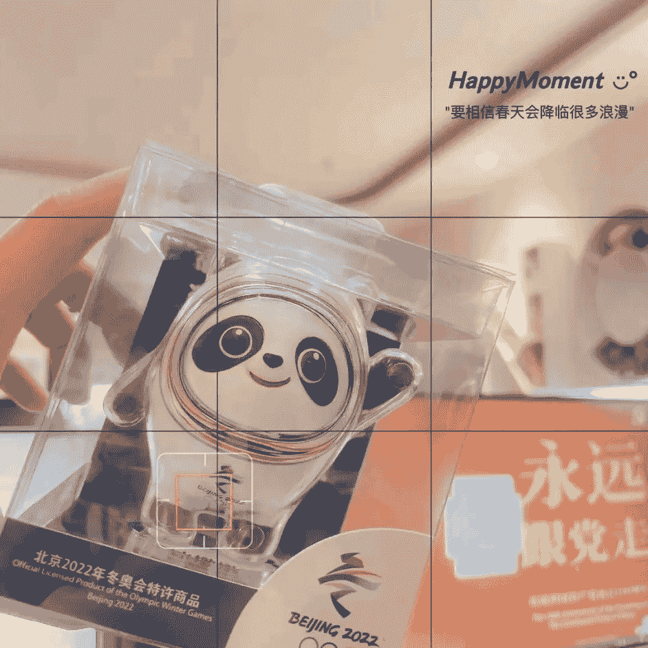

# 倚千丘专栏文章 1~165

来源：[`space.bilibili.com/22937040/article`](https://space.bilibili.com/22937040/article)

# 165｜不要关注表面的字词句，而是去关注你背后想表达的是什么

> 原文：[`www.bilibili.com/read/cv22950191`](https://www.bilibili.com/read/cv22950191)

亲爱的，如果你想了解你自己，请一定要记住：

不要总是固执于表面你表达出来的字词句，而是要去关注你背后真正想要表达的到底是什么，你背后的感觉是什么，你的真实想法是什么。

毕竟，字词句等各种表达形式的存在，只是你在这个物质世界里，在这个人类生活中，能够用来表达你自己的工具。

但这并不代表着你用它们来表达你自己、诠释你的心情、讲述你的感受时，它们就真的能够完完全全替代你的想法，让你完整地表达出你自己的真实感受了。

你只有学会透过你的表达，看见你自己之所以这样表达的真实含义，你才能算是真的看清楚你自己，由此才不会越了解越困惑的。

这就像最近来找我的一个小姐姐，她一直都感觉自己很社恐，总是不敢见陌生人。

所以在她的日常生活中，她总会不自觉地避免去一些人多的地方，不敢和陌生人吃饭，甚至不太敢跟陌生人一起搭电梯。

就哪怕是有很多人在一起，这些人彼此都不认识，她都会感觉自己在这个电梯里很不安全，心里很是焦虑，然后就开始手足无措，不知道自己该怎么办。

这种恐惧感一而再再而三地出现，已经影响到她连家门都不敢出，地铁、公交都不太敢一个人坐，甚至已经影响到她当前的生活节奏，变成了一个阻碍她正常生活的大问题。

她面对着这个问题，也曾问过自己很多次：为什么每次自己面对陌生人时，总会那么担心和焦虑，甚至还感觉到恐惧？

结果都会得出“我讨厌陌生人”、“我害怕陌生人”、“我觉得陌生人很可怕”的回答，但知道这个答案之后，她想不通自己为什么害怕陌生人，就一直琢磨“陌生人”这个词，去联想相关的回忆，可这样的结果是她更不知道如何作答，由此这个问题也一直没能解决。

但其实，我们在交流的过程中发现，她真正害怕的不是“陌生人”，而是那些对她可能有意思、可能会表现出想与她交往、想与她交流、可她自己对这些人完全不了解、也没有兴趣了解、却感觉自己需要去了解的人。

为什么这么说？其实有着这样一个原因：

这个小姐姐本是来自一个辈分等级观念还挺严重的家族。

在这个家族里，不知为何，一直都有着一个不成文的规定，就是晚辈见到长辈，一定要准确地喊出长辈的名字和辈分，不然就是对长辈的不尊重，也是自身没礼貌、没教养的表现，是会遭人嫌弃的。

所以，这个小姐姐的父母在对待她的时候，也很注重这一块的教育，每次带她出门时，都会在路上不断地叮嘱她，要懂得叫人。

但因为这小姐姐小时候比较胆小，面对着陌生人时，会有些怕生，所以有的时候，她面对着一些自己可能见过都没有两次的长辈，站在自己面前，一脸期待地等待着她能够喊出自己的名字和辈分，然后能够与自己进行交流的时候，她就感觉自己说不出话，不知道该怎么办。

她的父母看到她这个样子，就好像感觉她很丢脸一样，急着把她拉在身后，自己先跟那个长辈交谈。等那个长辈走了，再把她拉到角落里，一脸生气地跟她说，她这样的表现让爸爸妈妈很失望，她怎么可以表现得这么没有教养，这是不应该的，她必须要记住这些长辈的名字和辈分的，不然就可能被赶出家门。

这个小姐姐当时只有五六岁，还不太能分清爸爸妈妈说的是气话还是真心话，她就觉得爸爸妈妈说的有可能是真的，他们真的有可能会丢弃自己，于此就感觉很恐惧，也很害怕自己会在再次遇见一些不熟悉的长辈时，又叫不出名字，由此就开始找各种各样的方式，来让自己记住，甚至还趁着爸爸妈妈睡着的时候，偷偷溜进爸爸的书房，翻出家族的族谱，一个一个名字地对，一个一个辈分地背，特别努力。

结果，当她感觉自己好不容易背完了，下一次家族聚会时，自己应该能够喊出那些陌生长辈的名字的时候，她因为太过紧张，太过害怕自己出错，结果就喊错了一位当场算是最德高望重的长辈的名字，由此她就被全场瞩目，好像她是一个很奇怪的人一样，被大家取笑着。

虽然这件事过后，也有不少亲戚长辈前来安慰她，说这也没什么，以后记住就好了。

但是当她看到她爸爸妈妈的脸，尤其是她跟着爸爸妈妈回家，她尝试着和他们说话，他们却一声不吭，直接把她关在房门外的时候，她就感觉自己绷不住了，只能自己偷偷站在阳台角落里哭，甚至到后面，她都不记得发生什么事了，她也不记得自己是怎么和爸爸妈妈和好的。

她只记得这件事之后，她感觉“自己记不住名字”这件事是一个天大的错，这是不能犯的。不然，一旦出现了这个问题，自己就有可能会被爸爸妈妈嫌弃，然后他们就不理自己了。

由此，她每次见到陌生人，尤其是一些辈分高于自己、而且对方好像还挺关注自己、还很希望自己能与他们交流的人的时候，只要感觉到自己好像不记得、喊不出对方的名字时，她都会感觉很紧张、很窒息、很想逃，就不知道应该怎么应对了。

所以到后面，一而再再而三，她干脆放弃了，直接选择“认命”和“躲避”。她觉得自己就是怎么努力都记不住，那干脆不记了，就只能一直躲着，希望别人看不到自己，自己也就不用面对这个问题。

但是这样一来二去，她还是没有办法解决这个问题，甚至到最后，她都忘记了自己为什么总是害怕陌生人，为什么害怕他人把目光落在自己身上，为什么害怕别人有可能向前跟自己交流了。

由此，她才开始醒悟，原来在她过往的生活里，她总会担心自己记不住同学、老师、领导、同事的名字，她总会害怕别人突然走到她面前，想跟她说话，她总是担心自己站在人群中，突然之间被重点关注的，到底是什么原因。

她才知道，她从来就只是在害怕她的爸爸妈妈不理她，她从来就只是通过“自己面对着那些想要与自己交流的陌生人、陌生长辈时，感觉自己喊不出名字，由此感觉自我有可能会被他人取笑，甚至会被爸妈嫌弃”的方式，来不断地体验着“自己有可能会被爸妈厌弃”的恐惧而已，跟陌生人本身是什么人其实是没关系的。

这才是她真正要去面对和解决的问题，而不是去琢磨那些陌生人到底是什么人的。

所以，如果你也像这个小姐姐一样，感觉自己好像有着什么问题，一直都没有解决，那不妨先去看看，你在感觉自己有问题的背后，真正想要表达的到底是什么含义，真正想表达的是什么内容吧，这样也许你就能看见藏在你心底最真实的答案，也就不会一直保持困惑了。

注：本文内容已获得来访者本人的同意，隐私细节部分已作处理，经过对方允许和确认后才发出，感恩。

# 164｜日常若感觉没问题，你从来只需要好好生活

> 原文：[`www.bilibili.com/read/cv22932200`](https://www.bilibili.com/read/cv22932200)

虽然我是个心理咨询师，日常帮大家做的也是潜意识挖掘，但是我还是想跟大家说一句：

日常平白无事，你内在感觉你没有哪里不舒服，没有感觉你有哪里不对劲的时候，你其实并不需要整天躲在角落里，每时每刻都在思考着自己，是不是还有什么限制性信念没有发现，是不是还有着什么问题没解决。

你就是放平心态，好好生活，去做你想做的事，走好你日常的每一步，活出你自己，享受你日常中的快乐就好了。

为什么这么说？这主要有以下两个原因：

一、所有的问题、所有的限制性信念或其它类似的概念，其实都是依据每个人、每个时期所面临的不同时刻和处境，相对性地产生的，不是固定的。

就比如说，你现在手里拿着一颗和你手掌差不多大的石头，你目前还不知道它有什么用，你就是一直拿着，习惯了而已。

可是你现在走到一个地方，眼前正好有一个洞，这个洞有点深，你目前还不敢轻易下去。而这个洞旁边就正好竖着一块牌子，上面写着“从洞中取水浇洗双脚，可收获一份神秘大礼”。

于是，你就产生了好奇，就思考是否真的有这么神奇，由此就想试一试。

但因为你手里拿着这颗石头，你现在腾不出手去取水，所以“你手里拿着一颗石头”就在这一瞬间变成了你的问题，而“你觉得手里要拿着这颗石头”、“你手里拿着石头无法让你获得水”这样的信念，就成了你在此时此刻的限制性信念。

你必须要先打破这些信念，让你手里暂时不拿着这颗石头，先腾出足够的空间，去获得水，或说就是相信即使你手里拿着这颗石头，你也一样可以找到其它途径，让你完成这个牌子上的任务，你才有可能去完成你当前想要“试一试”的心愿而已。

那其它的限制性信念和其它的问题，其实也是一样的，也是因为你在当前这个时刻能触及到的资源，和你当前期望得到的生活体验不匹配，你在这一刻想尝试一下新的内容，但因为你过往积累下来的生活经验不能够支持你完成这一步，由此才变成了你在此时此刻要先去解决和清理的“限制性信念”而已。

这不是固定的。不是你有什么样的情况，就一定是有问题的，不是的。

你就是在日常生活中，明显感觉到自己有些不舒服的时候，再去找能够帮助到你的人事物，去帮助你清理、疗愈和解决这种不舒服的根源就可以了。

平常没事，你是不需要整天猜测你自己是否有病，然后要去治的，不用的。

所以，为什么我总跟我的来访者说，你们需要的时候，再来联系我就可以了，日常你们是不需要一定要像给你们自己安排任务一样，每个时期固定时间来找我的？

其实就是因为，我从来就只是一个在你感觉你自己有问题，你需要他人帮忙去看见你自己的时候，你可以选择用来帮助你自己的工具而已。

我是不重要的，你就是在你感觉你需要我的时候，再来找我就可以了。这是完全没问题的，不用过度紧张。

二、如果你日常平白无事，在还没有看清楚自己、不知道自己具体是有着什么问题的情况下，就认定你自己有问题，认定自己需要找到一个方式去解决，你其实就只是在凭空制造问题，而不是在解决。

为什么？

因为你的大脑在还没有看清楚“什么情况对你来说是一个问题”的状态下，就已经被你宣称“我好像有问题”、“我需要去解决”，那你就相当于给自己下达了一个“我要解决问题”的命令，你的内心是觉得这一定要完成的。

可是，因为你当前的表意识还没真的看清楚什么是你的问题，你还没有意识到具体是什么让你感觉很不舒服的真实存在的时候，你的大脑就只会抓着这个指令，不断地跟你说“我要解决问题”、“我觉得自己有问题”。

由此，为了完成你大脑中“我要解决问题”的指令，你最先需要的，就是看到“我真的有一个问题”。

但因为你当前还没有看清楚什么问题是你真正的问题，又为了先完成这个“看见问题、解决问题”的指令，你的大脑、或说小我，就是会先给你自己创造出一个问题，让你的大脑先看见，然后抓着这个问题来解决。

而这个时候，如果你还不能看清楚你真实的问题是什么、以及你内在最底层的欲望，那很多时候，你在当下所解决的，都不是你真正的藏在你潜意识深处的问题，而只是你为了“解决问题”的目的，凭空创造出来的“新问题”而已。

如果你不能意识到“你只是为了解决问题而创造问题”，你还看不清你自己为什么如此，那这种新问题就会不断地出现，你根本就解决不彻底，毕竟你还在心里默默地决定着“你自己有问题”、“你要解决”。

这是毫无意义的。

所以，如果你明确感觉到不舒服，你抓着这种不舒服的感觉，去探究自己是否真的有问题，这一点不成问题。

可如果是你明明没有感觉不舒服，你就是日常躲在角落猜测自己可能有问题，这已经变成了你的强迫性思维的话，那你最需要的，其实只是看清楚你为什么会有这种强迫性思维，而不是真的依从你表面想要“解决问题”的欲望，去解决所谓的问题，以缓解你表面的焦虑的。

# 163｜注意：不要带着“解决问题”的内核去显化

> 原文：[`www.bilibili.com/read/cv22914288`](https://www.bilibili.com/read/cv22914288)

今天这篇文章的标题，对某些小伙伴来说可能有些歧义。

毕竟，对于大多数小伙伴来说，之所以接触“显化”这个概念，很多时候都是从“觉得自己当前有问题，很想要找到一个解决方式，以此来改变自己的生活，让自己不再体验有问题的日常”这个想法开始的。

所以要让大家注意，不要带着“解决问题”的内核去显化，有些小伙伴可能就会理解为“因为感觉自己有问题，所以想要用显化去帮助自己解决问题，去帮助自己显化出没有问题的生活，这是不行的”。

但其实不是，我不是在说“因为感觉自己有问题，所以接触显化，想要给自己显化出没有问题的生活”不行，也不是在说“因为感觉自己有问题，所以想用显化，去帮助自己解决问题”这个想法有问题，而只是说：

“因为感觉自己有问题，所以接触显化，然后为了解决问题，不管三七二十一，只想要不再让自己经历问题，所以想去显化出没有问题的生活，让自己不再有问题”，这个想法背后的核心有问题而已。

为什么？

因为显化的核心，从来都是“你相信什么，你就体验什么”。

可如果是，你是带有“感觉自己有问题”的心，想要去给自己解决问题，你其实就已经是在决定着“你当前的生活有问题”、“你当前的生活是有着一些问题你无法解决的”。

那这时，不管是你嘴上说什么，你去做什么，下着什么样的宇宙订单，只要你的内在还相信着这一点，你其实都只是在决定着“你当前的生活有问题”、“你正处于一种有问题的生活”、“然后你想要去往一种‘没有问题’的生活”。

你是会感觉到“当前有问题的生活”与“你理想中没有问题的生活”是不匹配的。

由此，你就只会决定着“你正一直保持着一种‘你正处于一种有问题的生活中，然后想着要去往没问题的状态’的频率”，一直保持着一种“我想去”、“我正要去”、“我还没去到”、“我还没到达”的认知状态，结果一直停留在原地，一直停留在这个“有问题的生活”里，一直感觉有问题，一直都感觉没解决，以及自己一直在寻找方式去解决（只是依据当前的情况来说，你现在找到的解决方式是“显化”而已）。

那如果我们当前就是感觉自己现在的生活有问题，很想要去帮助自己解决这个问题，然后给自己显化出没有问题的生活，应该怎么做呢？

其实最简单的一点，就是：只要你能够发自内心地进入到一种“感觉你生活中没有这个问题”的状态，你不会对这个想法产生怀疑，不会因为某些事情而动摇，那你能体验到的就是“没有这个问题”的生活。

可如果对你来说，你当前的问题，已经到了一个你无法忽视它、甚至不管是你睁眼还是闭眼、脑海中都是它的程度，你根本就不相信“你的生活中没有这个问题”的话，那我的建议是：

你先别急着显化出一种“没有问题”的生活状态，你就是先去看见它、承认它、面对它，然后在心中植入一个观念，就是“不管它当前是什么模样，你都有能力去解决它”，然后先尽可能地去解决吧。

为什么？

因为这样做，你才不会因为你内在的恐惧，进一步创造出它更无法解决的模样，以此来让这个问题，真的变化成现实中的你无法解决的问题；

其次，通过你去面对它、认识它、看见它的过程，你其实会发现，你就已经开始逐步培养起自己能够面对这个问题的信心，那你内在的信心起来的时候，其实就已经在说明：

你并不是和以往的你一样，还在下着“我的生活还有这个问题，可我依旧无法解决它”的决定，而是已经能够开始进入一种“我知道我能面对这个问题”、“我相信我能解决这个问题”的状态，来进一步帮助你进入到“这个问题对我来说不是什么大的问题”的频率，最终帮助你创造出“我的生活中没有这个问题”、“我不再感觉这个问题是个问题”的生活，以此不再觉得你的生活有问题。

由此，为什么我们总说“放下了，你渴望的一切就来了”呢？

其实就是因为，当你能够发自内心地放下你的渴望时，你的内在就已经在决定“你不再觉得这种得到或不得到是一个问题”、“你也不再觉得你的生活有问题”，你就已经进入到一个“我感觉没有问题”的频率状态，那你创造出来的自然就是“没有问题”的生活，甚至能够让你感觉越来越好的生活。

那你这时的渴望，从来就只是一种能够帮助你体验到更好的自己的存在，而不带有其它解决问题的目的，你自然能够体验到的就是“你生活中的一切都没有问题”、“你的得到都很自然”。这是符合你内在所想的。

而你在这种生活状态中感觉越来越好时，那自然就会创造出能帮你体验到更好的生活体验的物质实相，以此让你体验到更能让你满意的生活，让你感觉“更加没有问题”，甚至“你根本不会意识到你的生活可能还有问题”。

所以，如果你内在没有阻碍，不觉得显化出什么是一个问题、或说不得到什么你会感觉很糟糕的话，你就只是单纯地想要体验这一种生活的时候，你的显化其实就是会很直接、很轻松、很简单，你很快、甚至马上就能拥有了你所渴望的一切了。

可如果是你内在感觉有问题，你内在感觉有阻碍，你根本无法进入到“我觉得显化出自己想要的非常简单”的状态的话，那先去看看自己内在正在决定着什么，看看自己内在是有着什么样的信念阻碍着你去相信，先去清理掉这些恐惧或某些内在的控制欲望，然后让自己进入到“相信自己显化出自我想要的一切其实很简单”、“我就能拥有我想要的生活”、“我就已经在体验着我想要的生活”的状态，你会发现你的显化会相对来说轻松很多，也不再会重复以往的问题了。

# 162｜环境只是告诉你“你在这里”，而不是告诉你“你只能在这里”

> 原文：[`www.bilibili.com/read/cv22869272`](https://www.bilibili.com/read/cv22869272)

有些小伙伴接触灵性内容之后，对某些与他们自我以往的小我相信的内容完全不一样，甚至可以说是颠覆了他们原有的认知的存在，很是痴迷。

然后总想着自己能够透过什么仪式，让自己脱离哪里，去到哪里，让自己彻底摆脱外界的束缚，摆脱外物的控制，好像那就能让自己脱离痛苦了一样，彻底地与这个星球分离。

他们带着这样的愿望，一而再再而三地沉溺在各种规则里，好像自己的躯体是多么十恶不赦的存在，必须要从头到尾脱离干净了，然后自己才算是“恢复了正常”。

我本来觉得他们给他们自己创造了这样一个世界，其实挺可爱的。但是当带有类似想法的小伙伴找到我，问我相关的问题，甚至煞有其事地想要与我探讨起死亡的议题时，我就不能仅仅用“可爱”这两个字来概括了。

就通常来说，我不是说不相信他们所说的那些信息与高维生命的存在，或说我觉得他们的生命体验是假的。不是的，我真的相信它们存在，我也认为他们的生命体验都是真的。

只是在探讨这些内容信息之前，有一个问题必须要先搞清楚，就是：

你们是真的不知道，你们是在借这种高维生命和信息的存在，来进一步帮助你们获得你们自己内在想要玩“脱离地球”的这个生命游戏的体验呢？

还是你们只是单纯地想玩这个游戏，所以就哪怕知道自己是在玩这个游戏，玩得很痛苦，这种痛苦的感觉让你们很厌恶，可你们也还没打算让自己脱离？

如果你们是后者，你们就是知道自己在玩，而且玩得很开心、很享受，就哪怕你们当前遭遇的是痛苦，你们也还没打算让自己脱离，还没打算放弃这个游戏，那自然没什么问题。

毕竟这是你们发自内心想要获得的体验，你们玩得开心就好。

我尊重你们的选择。

可如果你们是前者，那我就想问你：

你们总想让自己脱离哪，离开哪，好像自己离开了，就彻底解决问题了，你们是否知道，这所有的问题、所有的环境，其实都是你们内在的决定，跟“环境本身什么样”其实是没有什么关系的呢？

你们认为，你的问题，都是这颗星球、这个时空、这个空间，乃至这个整体意识带给你的，让你们觉得好像只有脱离了这所有的环境，才没有了问题。

但你们又是否知道，只要你们的内在还在选择相信着“这就是个问题”，你们其实还是会一直创造出“我知道就有这个问题”的环境，你们依旧无法脱离？

毕竟这是你们自己的决定，你们自己就已经决定你活在这里，这是没有任何一个外在的存在可以改变的，除非你不再这样决定了。

就哪怕是你以后将你的身体迁移到其它星球，与其它星球的生命存在体共同生活，或者是你的意识进入到了另一个身体、另一个维度、另一个空间里，你可以完完全全、彻彻底底地体验另一种完全不同的生活，可只要你内在还在相信“这是一个难以解决的问题”，你的内在就还是做着同一个决定，你就还是在认定“这个问题就是真实存在”，你就还是会通过不同的人事物，创造着同一个问题存在，你的内在还是会不断地浮现同样的感觉，然后依旧感觉自己无法解决这个问题，你依旧只会保持同样的苦恼、不安、委屈、焦虑，然后感觉不知所措，难以脱离。

这对于你们“发自内心想要离开、不再体验这个问题”的“愿望”来说，是没有意义的啊。

这就像前段时间，一个拿着类似的问题来找我的小伙伴，不停地跟我说，他想要离开这颗星球，脱离因果轮回，离开所谓的结界，去往其它的星球和维度，问我有没有什么办法。

我问他原因，他告诉我说，是因为他内在太痛苦，感觉到太煎熬了。

可他为什么感觉到痛苦？

他说，是因为他现在已经到了适婚年龄，他每天都面临着被催婚的情况，他感觉很痛苦，由此就想脱离。

但他因为看不见他自己的问题，他不知道是他自己决定了这一切，或说就算知道，也不知道自己怎么创造了这一切，就只能觉得是环境的问题。

他觉得是他那时的女朋友也到了适婚年龄，女朋友也要考虑是否结婚，由此就觉得自己应该换女朋友，然后就不停地在交往一些比自己年龄小很多的异性，以此希望自己可以不去思考这个情况。

可就算他交了比他年龄小很多的女朋友，他看见他周围的朋友也开始陆陆续续结婚生子，就开始觉得是朋友圈和地域文化的问题，就开始搬家、出国、换电话、换联系方式、一个人居住、不跟任何异性交往。

可就算是他这样做了之后，他看见街上那些情侣、夫妻，乃至一个小孩子，听到他的父母叫他回家，他还是会想起同一种感觉，觉得自己逃不过这个问题，就想自己应该离开的是这个文明、这一辈子、这一生、这个星球。

但他又害怕自己真的脱离肉身之后，再一次陷入因果轮回之中，再次体验同样的痛苦，然后就崩溃、不知所措了，由此就停在了这里，找到了我。

可经过后续探究和交流，我们发现，和他深爱的女朋友分手、离开他熟悉的环境、离开父母、离开家人、一个人居住、不和过往的朋友交往、放弃一切重新开始，这所有的一切，从来都不是他的本意。

他的本意，从头到尾只有一个，就是保护他自己，让他感觉不要那么悲伤和煎熬。

他因为小时候经历过父亲酗酒之后暴打自己的事件，所以认为作为家庭里的孩子很痛苦；因为看见过父母在别人面前撒谎伪装、随后又在自己面前趾高气昂的样子，所以觉得大人虚伪又糟糕；因为见证过父母因为一点小事就吵架、摔玻璃、站在窗边扬言要自杀，所以认定婚姻是坟墓、结婚的人都难有好下场；因为体验过唯一关心自己的姐姐与自我分离，所以认为就算是真的关心自己的人，也早晚会与自己分离，于此就更是相信“爱也是无法依靠的存在”，只觉得“就算是真爱，也只会与自我远离”。

他说，他也知道自己以往的各种解决方式很不妥，甚至会对那些真的关心自己的人很不公平，他会被评价为他人口中的混蛋、渣男，可他没有办法。

他一想起结婚这个问题，想起了结婚之后、或说想到自己长大到和父亲一样年龄的生活，他就只能想到自己小时候不断地被打、被责怪、被抛弃、被推开，然后又不断地看着周围糟糕的一切，感觉很煎熬、可又无计可施的瞬间，他根本没有办法从这个可怕的感觉中脱离。

他也曾试着向一些他信任的人敞开心扉，可因为童年被打的经历，他又觉得自己不能承认和展示，不然“他就会被打得更狠”、“更没有人帮他”、“他只会更煎熬”，那他就只能不断地把问题怪罪到环境之上，让自己觉得都是周围女朋友或朋友、家人的责任，让自己感觉相对轻松，自己还可以喘息。

但我们回顾过去，真的是环境有问题吗？

其实不是，他自己也清楚不是，而只是他过去的经历，让他相信着就有这样的问题，他就这样相信，这样在他心中下着这样的决定，由此才创造出来了这样的环境，帮助他进一步体验着类似的体验而已。

如果他当初能像现在的他一样，能够清楚地看清楚自己，完整地接纳当时他经历着那些痛苦时，所产生的各种感受，并接纳这其实只是那时的事件带给他的痛苦，而不是他的整个人生都会如此的话，其实他就知道，是他自己一直困在这样的感觉里，没有走出来，他就知道原来他后面不需要再创造着类似的生命体验，让自己不断地重复体验了。

所以，环境从来都不是困境，更不是为了把你困在这里，它们存在只是为了告诉你，你正在这里，你正在给你自己创造着什么样的生活。

由此，就算当前的环境对你来说是一个困境，那也从来只是在告诉你，你正在给你自己创造了一个困境，可这并非是永恒的事实。

你从来就只需要看清楚，你正在给自己创造着什么，看清楚你自己是依据什么创造了类似的问题，你其实就可以重新决定不再体验这一切了。

至于你想清楚之后，想去哪，要体验什么，其实都是你的自由，你想要体验，就发自内心地允许自己去体验就好了，只要你愿意，你总会找到方法，能够帮你体验到的。

只是如果是你内在有问题，你觉得是环境的问题，从而不停地去怪罪环境，不断地想与环境脱离，那我还是建议你先去看清楚你自己，你为什么觉得环境有问题？

毕竟，环境从来只是为了告诉你，你在这里，而不是为了告诉你，你只能在这里。

注：本文内容已获得来访者本人的同意，隐私细节部分已作处理，经过对方允许和确认后才发出，感恩。 

# 161｜帮助他人挖掘潜意识要注意什么？

> 原文：[`www.bilibili.com/read/cv22846662`](https://www.bilibili.com/read/cv22846662)

最近有不少很久以前就来找过我做咨询的老朋友，再一次找到我，希望我能够教他们学习如何帮助他人挖掘潜意识。

这一方面，是因为他们想要给他们自己身边一些目前可能还无法接受心理咨询的孩子、父母、伴侣或朋友、亲人，去探索他们的潜意识，希望他们可以不要那么痛苦。

另一方面，他们可能也想知道自己到底有没有从事这一工作的兴趣和天赋，由此心里还没有完全做好决定，所以就找我问一下。

由此，我今天就想来讲讲这个问题。

通常来说，想要帮助他人不要那么痛苦，其实是一件好事。

但是，即使这是一件好事，我们在帮助他人之前，有一个问题还是要先明确，就是：到底是对方觉得他自己有问题，他希望得到你的帮忙，还是你觉得他有问题，然后你希望去帮他？

这两个问题主语的不一致，其实代表的是背后问题的不一致。这两者是不能相提并论的。

如果是前者，也就是对方觉得他当前有问题，他希望得到你的帮助的话，那你其实就只是在帮助他看见他本来就已经创造出来的问题，那这个时候，你是在得到他允许的基础之上，按照他的意愿，去给予他帮助的。

这是没有改变他的个人意愿和想法，也没有改变他的个人决定的，所以他在接受你的帮助时，是不会产生过多的反抗力量，去阻碍你去看见。那你自然也不会在即将探索和正在探索的过程中，因为接触到他内在难以自我浮现和处理的痛苦，而被他所误伤。这是没有问题。

可如果是你觉得他有问题，或者就是他展现出来了部分问题，可是他自己还没有下定决心去改变，还没有下定决心去看见，也没有下定决心去请求他人帮助他自己的时候，你作为他世界里的另一个旁观者，你内心因为看到他有问题，而感觉很不舒服，由此就想要去帮助他解决这个问题。

那说实话，这个时候，要解决的不是他的问题，而是你自己的问题。

是你自己内在感觉到不舒服，所以你想要用“帮助他解决这个问题”的方式，去帮助你自己去解决你内在的问题。

那这时，你对他的干预，其实就只是你内在对于你自己的问题的某种控制欲望，你是没有办法彻底地看清楚他的问题的。

除非你能先把你的控制欲放下，保持相对的空性，保持足够的接纳状态，由此你才能去看见他本来是一个什么面目，而不是在你内在感觉很焦虑、很想要帮助他解决所谓的问题的基础上，不断地在你的头脑中主观臆测出所谓的对方的问题，来让你不断地解决。

其次，在明确了对方确确实实很想让你去帮他去看清楚他自己内心所想的内容之后，你还要注意，你当前获取到的信息，到底是不是对方发自内心愿意展现出来的信息，是不是与对方当前表现出来的整体状态相匹配。

这句话，倒不是说，愿意接受你帮助的人，说的有可能是谎言。

而是说，有些谎言，或说是有些其实不是他们本来发自内心所想的内容，因为受到了他们自我心理防御机制的驱使，有可能会在他们给自己一遍又一遍地自我无意识催眠之后，让他们相信这些内容才是真实的，这才是他们的第一反应。

也就是说，他们有可能会在他们自我认为这就是真实和坦诚的基础上，说出一些其实本来不是他们所认为的话，而他们却因为沉浸其中，难以分辨出来，还觉得自己说的其实就是真话，他们意识不到这是个问题。

由此，如果你是单纯地凭借着对方所展现出来的言语内容去获取信息，而没有其它的方式能够帮助你去验证，对方所说的到底是不是他发自内心所想的内容的话，你就有可能很容易被带到对方的小我思维逻辑里面，一遍又一遍地回答他表面的问题，而难以触及到核心。

于此，你就有可能，今天给他解决了这个问题，明天他又会冒出来一个类似的问题，而无法得到解决。而对方也会一直沉浸在这个状态里，出不来，然后一直以同一个状态不断地和你纠缠，而没有办法真正地解决问题。这是毫无意义的。

所以，能否清楚地感知到对方当前的整体状态，能否察觉到对方当前所展现的内容是否代表着他全部的心理内容，能否捕抓到对方隐藏于冰山之下、未曾明确言语、却已经用其它方式展现出来的信息，能否将这些信息整合完成并能还原出对方最真实的心理状态，引导他讲述他心底最真实的答案，其实就往往决定着你能否明白你看见的问题是不是对方真正的问题核心，也决定着你到底能不能帮助对方彻底解决当前的问题。

此外，除了上面这个问题，也要注意：在潜意识的挖掘过程中，其实最不重要的就是咨询师或者说是帮助挖掘者、引导者的主观认知判断了。

为何？

因为人与人之间的经验其实是不相通的，即使是咨询师与来访者也一样。

咨询师与来访者只是不同的角色，而不是有一方就一定高于另一方，觉得自己能控制对方，或说其中一方就能对另一方进行说教了。

不是的，咨询师自身的认知判断并不重要，重要的只是能否将来访者本身的想法、感受全部展现出来而已。这才是关键。

所以，引导者自身是否能够保持相对的空性，能否做到不对被探寻者的认知世界做主观判断或价值判断，或说即使自己做了主观判断之后，能否快速意识到这只是自己的想法，而不是对方的想法，由此不让自己的想法干扰到自己作为帮助对方探索潜意识的通道，能否让自己快速恢复到对对方没有判断的状态，去完全接纳对方的想法，进行引导，就非常关键了。

不然，你们彼此双方就很容易沉浸在不断评判对方的主观世界的拉扯层面，彼此的小我来回纠缠，而无法将真正的潜意识探索过程推进下去，去解决真正的问题。

最后，在看清楚对方的潜意识观念之后，你要做到的，不是明确告诉他这是对的，或是错的，而是要学会引导他、帮助他，让他自己意识到原来这个观念是有问题的，是不符合他当前的目标意愿的，原来他自己是可以不这样想的。

由此，他才有可能自己开始明白，并且发自内心地反应过来，然后不再保持着同样的观念了。

这是一个帮助他重新做决定的过程，而不是将你的主观想法灌输到他脑海中的过程，所以前提是对方一定要愿意接受，而不是你想让对方接受。

所以，你的言语表达、你的语言引导都很重要，不能马虎。不然，你就有可能会勾起对方的反抗欲望，让对方觉得你只是在不断地说教、乃至想要控制他的同时，还让他把本来就浮现出来的问题，又再一次地以自我保护的形式，将这个问题隐藏得更深，更不愿意与你进行进一步交流，甚至还会只想扯开话题，而不再交谈了。

这是要注意的。

# 160｜亲爱的，如果你曾受过伤，我只愿你可以不再用仇恨伤害你自己

> 原文：[`www.bilibili.com/read/cv22828688`](https://www.bilibili.com/read/cv22828688)

今天这篇文章，受众可能有些特别，因为我是专门写给那些在自我成长过程中，曾经遭受过一些对他们自己而言是特别大的伤害的朋友看的。

这些伤害，除去寻常认知中的家庭暴力、校园暴力、在不同时期产生的各种非意愿性行为或性接触、以及各种形式的身心霸凌之外，还有一些在特殊群体内，借助某些特殊手段和地位才能产生的身体与心理控制压迫等行为。

这些行为不管是否在你的认知之内，只要你觉得你确实有过相关的经历体验，你觉得我是在写给你看的，那请不要怀疑，我就确确实实是写给你们看的。

希望你们有耐心可以看下去，不要因为经历了这些事情，就对你们的生活失去希望。

首先第一点，也是很重要的一点，就是：如果你们在这些伤害事件中，曾经遭受过极大的痛苦，你们内心感觉到仇恨，内在特别伤，我不会劝你们放下仇恨，我只会劝你们，请允许你们的内在感觉到仇恨。

这句话的意思，不是在说“你们仇恨是对的，你们就一定要保持住仇恨，以此去构建你们的生活”，也不是在说“我个人觉得‘放下仇恨’这件事，在每个人的成长过程中，对于个人成长、尤其是灵性成长而言，不重要”，而是我只想对你们说：

“你们经历了让你们感觉到难过的事，你们内心感觉到仇恨，这是一件很正常的事。没有任何的对和错之分，更与任何道德规则无关。

这只是你们在感觉到受伤时，很自然的一种心理反应而已。你们想要用别的方式去保护你们自己，你们想要想方设法地去确保你们的安全，确保你们不再受伤，不再受欺凌。这都非常正常。这不是一个错误。

所以，请你们不要因为你们自己产生了这样的情绪想法，就对你们自己作出羞耻或不堪的认知判断。因为“作出这个判断”的“这个行为”本身，其实就只是在否定你们的情绪反应，是在阻拦你们表达你们自己，更只是在阻拦你们做你们自己。这是完全没有必要的，所以一定要注意。”

我希望你们能够记住的是，是否选择放下仇恨，那是你们自己的选择，任何人无权干涉。

所以，请不要再因为他人对你们的评判，或者是他人对你们的劝告，就觉得你们自己内在产生了愤怒、厌恶等极度仇恨的情绪，就对你们自己作出错误的认知判断，从而进一步阻拦着你们去看见和解决真正的问题本身。这是毫无意义的。

其次，我希望你们都能记住的是，让你们产生仇恨和愤怒的，其实永远只是单个人、单件事、或者是促使你经历了那一件事的单个群体，而不是你的整个人生，更不是你在当下或未来会遇到的每一个人。

你在某个时期、某个时刻经历了让你特别难过的事，不代表着你的整个人生从此都陷入阴霾当中，你从此就出不来了。不是的。

而是，你在经历了这些事情之后，你陷入到了这样的情绪感受里，你以为你的人生从此都有着类似的困难和艰险，你不知道何时又会再一次发生，所以你在一直用“警惕和预防这样的事情会再次发生”的方式，一直保留着这样一份恐惧，一直将当初那份不好的感受留在你的世界里，由此你才会不断地重复显化着类似的事，让你一而再再而三地通过不同的人事物，体验着类似的感觉。

于此，你们才会觉得，你们的世界总是会不断地重复着“这种可怕的感觉”，你们才会感觉自己像陷入“轮回”当中，自己根本无法逃脱。

这对你们来说，就是“命”，是你们无法逃脱的“天命”，你们此生就只能与此纠缠。

但我要告诉你们的是，不是的，这不是命，这只是你们内在一直留有的一种感觉而已。

你从来就只需要看到，是你自己一直没有接纳最初时的那份恐惧，从而一直用警惕和防御的方式，把这份恐惧留在了你心里，所以你才一直不断地在重复体验着。

这从来都不是一个无法解决的问题，而是你陷入到了当初那种“感觉自己无法解决和面对”的体验里，你在一遍又一遍地体验着这种感觉而已。

所以，如果可以，我希望你不要再困住你自己，而是学会去看到你自己，不要再对你们自己下着“我无法解决这样的问题”的判断了。

不然你会一直沉浸在这样的感觉里，无论你得到了什么，变成了什么，你都会觉得难以逃脱，你只能在这感受中持续地体验着喘不过气的感觉的。

毕竟，这是你们内在的决定，这是没有任何一个人可以帮你的，除了你自己。

此外，不要因为知道“我们生命中所经历的一切其实都是我们内在的决定”这件事，就觉得这是要把所有的责任揽在自己身上，觉得是自己的问题造就了这所有的问题，从而不敢去看清楚自己了。

因为即使是你们的内在信念创造了这三维世界中的一切，也不代表着这三维世界中的他人伤害了你，就是没有罪过了。

他在这个三维世界中伤害了你，你在三维世界里受伤的事实，是不会因为你看清楚这一切是你自己内在信念选择创造的体验，就不再成为一个三维世界中的真相。

只要你清楚，是他在这个三维世界中主动引发了纷争，是他在你的表意识未允许的情况之下，主动伤害了你，那他依然是有问题的，你永远都有选择保护好你个人利益的权利。

这是你在这个三维世界中的基本权利和自由，没有任何人可以剥夺。除非你允许他们剥夺，你就选择体验“被他们剥夺了自由”的体验，那你才是彻底的没有了保护你自己的基本权利和自由。

作为回归高维世界中的创造者的责任，和作为三维世界中的个体体验者的责任，其实并不一样。所以不要因为我们回归了自己，回归了本源，看到了自己创造者的身份，看到了自己创造的人生体验的内容，就觉得自己失去了自己作为三维世界中的体验者保护自己的权利了。

不是的。

这从来就只是为了让你不再需要与类似的感觉纠缠，不再需要一直创造出类似的人生体验，不再需要一直体验着痛苦而已，与其它内容是没有关系的。

所以，请不要误会，更不要觉得让你看清楚你自己，是为了剥夺你在三维世界中保护你自己的自由，还觉得那些让你学会安静下来，去看清楚你自己内在的决定的人都是坏人了，这是没有必要的。

最后，请一定要注意，不要因为你曾经在他人那里受过伤，就对一些与你此事毫无关系的人事物，施以同样的伤害了。

为什么？

因为这不仅不能帮助你看清和解决你内在的问题，还会让你进一步地站在“施害者”的角度，在你的生命中以另一种形式（也就是你曾经是受害者的角度，现在变成了施害者的角度），来帮助你不断地巩固着同一个信念，就是你会认为“施加伤害这个行为是对的、是被允许的”。

由此，你就会在你的潜意识中不断地认为：“原来大家是可以用这样伤害他人的方式来对待他人的，这是没有问题的，你是不会受到惩罚的”。

那你原本受到的伤害就更没有办法去释怀了。

毕竟，你已经用你对待他人的施害行为去反复确认，那些与你曾经受到类似伤害的人，是不能反抗和宣称他们是可以不承受这种被伤害的痛苦，是不能选择用其它方式去保护他们自己的。

那于此，曾经受过伤害的你，又怎么会发自内心地觉得你有资格去选择保护好你自己呢？你这不是在打你自己的脸吗？你在试图保护你自己的时候，不是在平白无故地给自己施加另一份厌恶吗？这有必要吗？

所以，学会回归你自己，看清楚你自己，你其实就会发现，你一直都有着另一种选择，你不是只能这样的。

请不要因为太过担心，又再度迷失自我，再次错过彻底解决问题的方式了。

# 159｜你获得的所有信息，都可成为帮助你了解自己的工具

> 原文：[`www.bilibili.com/read/cv21477148`](https://www.bilibili.com/read/cv21477148)

很多小伙伴在了解显化之后，总会开始对一些外界的信息，尤其是一些看似权威、乃至神圣的、难以验证的信息，比如一些占卜、星盘、八卦、风水、测试等内容，表示排斥。

觉得他们给予自己的结论，随时都有可能控制自己的思维，入侵自己的信念，为自己植入一些自我难以自控的内容，显化出一些让自我感觉不可控又难以改变的外在事件，让自己陷入糟糕的深渊。

但其实大家不需要如此，更不需要想方设法地去控制自己，甚至是明明知道自己喜欢透过这些渠道去获取某些信息，却还要压抑自己不去查看这些信息，不需要。

大家只需要允许他们存在，然后按照自己的喜欢，放下或学会用好这些信息，再按照自己的想法继续生活就可以了。

为什么这么说？其实原因很简单。

**一、所有事物的存在，都是我们自己内在的创造，所有事物都是顺应我们内在的需求和信念而产生的。**

只是这里的“我们自己”，不仅仅是指在三维世界里的你单独一个人，也不只是指在三维世界里的我单独一个人，而是指创造和包含了我们所有人事物、乃至整个宇宙及多个宇宙的本源，也就是“道生一，一生二，二生三，三生万物”的“道”，这个“道”是包含我们每一个人的。

而只要这个“道”中的某个单一个体，需要占卜、算命、星盘等内容的存在，那这些内容就会存在，你作为三维世界里的某一个个体，去否定或对抗这些内容存在，是没有办法让它消失了。

除非，大家都开始意识到，其实我们不需要透过这些渠道去获取信息，那这些渠道自然就不被需要，自然就会消失，你是不需要费尽心思去反对的。

二、如果你真的开始足够了解你自己，你真的开始看见和醒悟过来，其实是你自己的信念决定了你生命中的各种体验，是你自己内在的想法决定了你当前获取到的信息内容的话，你就会知道，其实**你就是你自己世界里的起源。**

那这个时候，你就会知道，你之所以从外界获取到一些糟糕的信息，其原因都是因为你内在正在相信着某些内容，你内在的某些信念，在你的世界里显化了一些外在实相，让你从这些信息里，体验到这种糟糕的感觉。

如果你不懂得接纳这些信息就是这个样子，不懂得透过这些信息看见当前的自己在相信着什么时，你就会沉溺于这表面的“外在的信息太过糟糕”的外在环境，然后需要耗费足够的时间和精力，甚至投注大量的能量在其中，让自己去对抗它。

如果你一直都不懂得回归自己，看见这问题的源头只是在自己身上的话，你就会一直沉溺在这个“需要不停地解决类似问题”的层面里，一直都任由你内在信念显化出三维世界中的类似问题的话，你这具身体、这个头脑、乃至这个灵魂，都会一直沉浸在解决类似的问题的情况之中，难以脱离，就更别说将你内在的精力投注在真正让你满意的生活形态之上，去创造你自己的生活了。

可如果你就是接纳这外界的情况就是这样发生，在学会不让这种情况真实地伤害到自己的同时，还能学会在自己感觉到不舒服的时候，察觉到自己内在的不舒服状态，问清楚究竟是自己内在的什么信念导致了这种情况，从而由内而外地改变自己内在的信念，你就会看见你生命中各种人事物突然之间就朝着另一个方向发展，且不会按照原有的问题呈现，或者就是看见其实事情只是这样发生，而不会带有任何伤害的存在，只是你在没有改变观念之前，你觉得对方会伤害你，然后你才一直误以为对方会伤害你而已。

如果你能做到这一点，你就会发现，其实外在的所有信息，不管是故事、小说、影视剧，还是占卜、八卦、星盘，其实都只是不同的生命存在依据他们各自的生命体验创造出来的内容而已，他们本来就是没有任何意义的。

只是你过往内在太过专注于自己这具身体，太过相信你头脑中某些信念就是永恒的真理，你的内在能量依据你的信念，吸引和显化了这些外在信息出现在你的世界里，帮助你体验你自己的内在决定时，你就会觉得这一切都是外在的问题而已。

但若你真的能开始看见你自己，回归你自己，看清楚你自己是怎么想的，怎么相信的，你自然就会知道：这外在从来都没有任何问题，这外在从来也没有任何巧合，一切都是你自己内在的决定。

只是这个醒悟对你而言，究竟何时才能发生，就得看你自己对你自己的生命体验的了解有多透彻了。

而且，如果你当前还是一个只会将自己的目光投放在外界、不懂得接纳外界信息、并学会回归自己、了解自己、更不懂得如何决定自己的人生的生命存在的话，那你适当地减少查看外界的信息，给你自己一定的空间去了解你自己，是有好处的。

起码，这可以减少你的大脑对于外在信息的摄入，不至于对你在本就混沌的状态，再增加额外的混乱，你就能开始有足够的空间，去帮助你自己梳理自己的内在，并能做出全新的调整了。

# 158｜金钱本只为了服务于你，而非你命定就要去追逐金钱

> 原文：[`www.bilibili.com/read/cv20591281`](https://www.bilibili.com/read/cv20591281)

不知道大家有没有听说过一句话，就是：

钱只会流向不缺钱的人，爱只会流向不缺爱的人。

这从本质上来说，就是这个道理。

为什么？

因为就如我过往所言，显化本就是生命，你的存在本质就是显化，而显化法则的本质，就是“你是，所以你拥有，你体验”。

与此类似的观念，还有吸引力法则，也就是，你内在坚定一个信念，就会散发出相对应的频率呈现出“你是”，然后为你这具 3D 的身体吸引和创造“你是”的结果，然后让你拥有；

当然，与此类似的还有假设法则等概念，也就是：当你确定在一个新的状态里，为自己选定一个新的身份时，你内在坚定这个信念坚信到，你一想到这一点，就会不由自主地开始感觉或想象到自己已经拥有的“真实感”，那你就会处于一个“它就是真实”的状态，结果就是你所渴望的一切就会变为现实，即你真的拥有。

这些说辞的本质都没有什么差异，差异只存在于不同的人站在不同的经历和观点之上，经由不同的文化背景所诠释出来的内容而已。

这对于普通人来说，这些说辞的本就只是在传递一个信息，就是提醒你：你是否真的是“你是”？你是否真的明白你自己？

如果你真的发自内心地认定“你是”，认定到你一提起它，都只会觉得一切怀疑都不可理喻，因为这就是事实，那你就会拥有。

就像内在认定自己不缺钱的人，他的世界一定充满了各种各样的财富，他就是会源源不断地看到钱、收到钱、感觉到钱，就哪怕他极度厌恶自己有钱，他还是会不停地得到钱；

而内在认定自己不缺爱的人，他的世界一定充满了爱，甚至每分每秒都在经历爱，就哪怕他极度厌恶爱，他依旧会不停地经历爱，甚至不停地在选择爱。

为何？因为他们不缺，他们认定“他们不缺”就是“事实”。

他们所经历的一切都与内在坚信的信念所散发出来的频率相对，他们的外在经历就是他们内在信念转变的事实，只是他们有可能采用不同的态度去经历这一切而已。

只是，有问题的是，很多人之所以想要显化金钱、财富、职位、爱人、关爱等一切实相的背后，其真实想法都不是“我相信我是，所以我得到”，而是“我相信我不是，所以我渴望，我需要，我想要”，由此“我要逼迫自己变成‘我是’”、“我要伪装自己变成‘我是’”、“我要欺骗自己变成‘我是’”。

于此，就被这种“自我逼迫”、“伪装”、以及“欺骗”，一而再再而三地掩盖掉“我其实认为我不是”的真实内在信念，甚至关上了帮助自己了解自己其实认为“我不是”的大门，阻拦了认清自己其实是在认定“我不是”、而不是“我是”的当下处境，从而进一步剥削掉自己重新选择“我是”的权利，让自己无法真正地扭转信念，做出全新的选择。

由此，他们就会被这样的“自我欺骗”、“伪装”、“逼迫”和“渴望”，一直困在“我不是”的状态里，不断经历着“我不是”的 3D 现实。

但从本质上来说，也不算什么大事。

因为这只是他们自我内在创造的一场游戏，让他们不停地经历和体验这一切。

我们无法阻拦他们玩这场游戏，我们所能做到的就是支持。

如果他们也有玩腻的一刻，想要从这游戏中脱离，他们自然就会向外界发送讯号，找到真正的导师，找到真正的道路，帮助自己逃离。

到那时，他们自然就会得到指引，开始明白这一切的道理，踏上回归内心、回归本我、乃至本源的路途。

他们会一直得到庇护，只是他们不一定能意识到而已。

而且，当他们真的从这场自我欺骗的“金钱”、“权力”游戏中出来，自然就会明白：

无论是金钱还是财富，本都是不存在，这是假的。真正存在的，只是他们的感觉，是他们内在的需求。

是因为他们内在产生了一个需求，也就是想要体验“‘自我有价值’的感觉”的“念头”，所以他们觉得可以在自我身体之外创造一个东西，帮助自己证明“我有价值”，并帮助他们体验“自我是有价值”的感觉。

这一切都是因为内在的创造，他们只是经由自己的内在，顺从自我最初的热情，才创造了金钱、资源、财富等概念，创造了彼此有着不同的需求、需要用金钱或其它资源来交换的个体，来帮助自己体验“我有价值”的感觉而已。

这本只是一场体验，没有好坏之分。

只是问题是，很多在选择参与到这场“金钱”、“权力”游戏的存在，在选择进入到这场游戏之后，往往都会忘记这一切本只是为了体验。

他们会忘记自己最初的目的，更忘记了自己为何来到这里，全身心地沉浸在这种围绕着“金钱”构建的“贫与富”的斗争游戏里，一遍又一遍地创造和经历着各种各样的问题。

他们全身心地沉浸在这样的情绪体验里，乐此不疲地追逐着彼此，誓要从他人身上得到更多的金钱。

但却忘记了，这本就只是他们内在信念的转化，是能量的其中一种创造，本就是为了服务自己的内在体验而创造出来的。

如果他们能够开始清楚地意识到，能量是源源不断的。

他们就会清楚，自己根本不必忧愁自我会缺乏金钱，因为这从本质上来说，从能量的角度来说，就是永远都不缺。

只要你需要，它就会不停地被创造，甚至会以珠宝、水晶、黄金、矿产、石油、资源、人脉、关系等不同的形式存在，只是看你内在不同的需求。

这个金钱和权力的游戏，关键在于，他们是否能够认清，金钱本质是被创造的事实，然后让金钱服务于自己，而不是自己献祭于金钱。

如果你们真的能够开始意识到，金钱本质上只是一种能量，只是为了服务于自己而被创造出来的能量形式，而真正的自我其实什么都不缺时，你们就会开始从这困苦的游戏中脱离，并开始发自内心地感觉到富足。

你们会用这种富足的感觉，源源不断地创造出各种各样的财富和金钱，甚至用金钱这种能量投放在你们更为喜爱的领域，去创造出更多爱和富足的实相，将更多的爱和富足带给更多的人。

到那时，你会发现，你甚至都不需要金钱，就能得到你想要的一切，你会更明白金钱本只是服务于你，而不是你命定要去追逐金钱。

# 157｜不必寻找你是谁，你只需定义你是谁

> 原文：[`www.bilibili.com/read/cv20565919`](https://www.bilibili.com/read/cv20565919)

亲爱的，我知道你们中的大多数人早已经对灵性知识有了足够的了解，你们也早已知道了自己可以采用什么样的方式，可以帮助自己脱离旧的生活，并创造全新的体验。

可你们还是停留在原地，不知道自己是谁，不知道自己想做什么，不知道自己该怎么做。

你们一直犹豫不决、踌躇不定，甚至为了逃避现实，一直蜷缩在被窝里，不知道自己醒来要做什么，这一切有什么意义。

你们把自己困在原地，觉得自己毫无作用，甚至不想继续存活。

这在别人眼里，确实很有问题，他人也会因此选择排斥你，觉得你毫无价值。

但你要知道的是，这一切都只是表面的样子，这不是事实。

你从来都不是没有能力，你也不是真的完不成那些事情，你只是发自内心的不想做而已。

你对周遭的一切都没有兴趣，那是因为那一切确实不是你真心想去追随和拥有的东西。

即使你一遍又一遍地跟自己说，那是你应该为之兴奋、为之充满热情的目标，是作为人就应该去追随和拥有的东西，可你没兴趣就是没兴趣，你强迫不了你自己。

我知道你们也想出人头地，也想卓越，也想成名，可那真的很少就是你们发自内心渴望得到的生活。

虽然你们不停地劝自己，试图催眠自己，你就是想要那样的生活，可事实上，就是很少有人追随这一切，是在追随自己的热情。

你们希望用这所谓的“世俗意义上的成功”，去解决那些不停来折磨你的生活问题，可你们又清楚地知道，只顾着做那些事情，就更没有机会做你自己。

所以，你们总在犹豫，总在期待，期盼可以找到一个两全其美的办法，可以让你们一边畅快地做自己，一边又让那些你们认为很在意你们的人“不再挑剔你”。

你们一直在寻找，一直在逃避，逃避到你们忘记了为什么要寻找，更忘记了自己发自内心想要去追随的东西，结果就变成当前这种四不像的样子，连你们自己都看不清自己，就更不知道自己究竟该如何生活，想怎么生活。

你们就此一直把自己困在原地，对自我充满了厌弃。

但亲爱的你，是时候从这个迷茫中的状态中出来，去呈现一个全新的你自己了。

你选择这一生，本就是有使命的，而这个使命就是活出你自己。

虽然我无法保证你们中的每一个人都清楚地了解自己，可我知道，看到这里的你心里很清楚你不是当前的样子，那个真实的你比这所有的一切都来得有意义，你只是暂时忘记了而已。

你们让自己努力去追寻那些所谓成功的世俗目标，是为了融入当前的生活，但你们真的不必如此，你不需要如此委屈自己。

你永远可以按照自己的心意去生活，你永远可以畅快地做你自己。

你的生活本就是由你来定义，除了你，没有任何人能够来决定你。

你的生活一直都是你自己的决定，只是，你首先得看到这一点才可以。

这是你改变和得到的关键，你无法再脱离自己的情况下，得到任何你认为不属于你的东西。

这个世界就是一面镜子，你决定你是谁，你就会在镜子里看到你是谁。

只是在这三维世界里，你所经历的只是，你的内在决定就让你散发出相对应的能量，而那些能量就会帮助你这个小我，体验“你是谁”，体验你所决定的“你自己”应该获得的体验而已。

可如果你总是保持一个“我不知道我是谁”、“我不知道我要做什么”、“我不知道我会体验到什么”的状态，决定你自己就是一个“迷茫”的身份，总是希望外在给你一个答案，那你的外在不会给你创造任何的答案，甚至只会按照你内在的决定，一遍又一遍地帮你经历“我不知道我是谁”的生活。

由此，假若你真的想要显化出你真正渴望的生活，请不要再敷衍了事，也不要再让自己保持一个等待的状态，让自己再度迷茫，总是期待外在给自己答案了。

先去定义“你是谁”，你就会经历“你是谁”。

可若你一直追寻“你是谁”，你只会不停地经历“你不知道、也看不见你是谁”，你是没有办法真正地得到真正会让你满意的答案的。

# 156｜为何无法即时获得？因为你在“保护”自己

> 原文：[`www.bilibili.com/read/cv20325388`](https://www.bilibili.com/read/cv20325388)

前段时间有个小伙伴问我：

既然我们已经知道了显化，已经知道外在所有一切都是我们内在信念的产物，那只要我们内外信念统一，其实就可以体验到即时获得的体验，对吧？

这个问题从逻辑上来讲，是对的。

我也并不排斥这一点，甚至我觉得就应该如此。

可因为我过往没有体验过即时获得这一点，所以我的脑海还是没有太多经验可以讲述，由此面对着这个问题，我还是选择跟这个小伙伴说：

因为目前我对这一点经验较少，暂时也不知道可以给她什么样的解答，由此还是后续有了新的体验之后，再去跟她讲述我对这一种体验的看法。

然后，我就放下了这个问题，先去处理日常的工作和生活。

可虽如此，我还是不得不承认，在听到这个问题之后，我内在对于“即时获得”的体验还是很好奇的，所以这几天只要一有空，我就开始查阅各种奇闻怪事和书籍，去请教我一直信赖的导师，去看看这部分体验的可能。

但也不知道是我查阅的内容太杂，还是我认知和视野范围内的人都没有这部分的经验，我并没有得到我真正想要的答案和体验，心里或多或少都有点泄气。

可就在我泄气之时，我的脑海又快速回想起一句话，就是：我自己就有答案。

由此，我的信心又开始回来了，我就开始相信：

其实我自己就可以即时获得、即时显化，不需要等待，我就可以获得，我是知道这是怎么一回事的。

可获得什么呢？我一时间想不出自己缺什么，所以一时间也没有答案，就放下了这个念头，去做其它事情去了，也没有感觉有什么异常。

可今天下午，发生了一件事，让我对即时获得这一点，有了全新的理解。

事情是这样的：

今天下午我刚做完咨询，能量消耗有点大，就想着在沙发上看书放空一下自己，让自己休息休息。

可因为自己所处的房间暖气开得太久，窗户也一直没开，自己呼吸都变得沉重起来，所以就想着把暖气关一会，再把房间里的窗户开一阵，想着换换气。

结果，就这样过了大概二十分钟，房间变得异常冰冷，我就感觉自己有点扛不住，还是想着起来去把窗户关上。

我心里虽然一点都不想动，可为了暖和，还是想着要从椅子上起来，去把窗户关了。

可因为我起身时，有点起猛了，差点崴到了脚，所以我就又坐了下来查看脚有没有事。我检查了一下，发现还好，没有什么大问题，只是房间变得太冷，我的脚一直都是冰的。

我就突然感叹，要是我前几天买的袜子到了就好了。

但我也没多想，只是想着关窗之后查查物流就好，反正总会到的，也不担心。

由此，我就起来去关窗了。

可就在我关窗之时，我家的小猫咪开始过来了，一直对我疯狂地喵喵叫。

我以为她饿了，想着起身给她添点猫粮，就跟着她去了客厅，想着再给她喂点冻干。

结果，就在我刚刚找到冻干时，我注意到我家门口放着一包东西，拿起来一看，我瞬间就惊了，因为这就是我前几天买的袜子，正装在快递包装袋里，完好地放在我家门口里。

可在我当时的认知里，我还没有收到某驿站的通知，我觉得它应该还在路上才是，如果是送货上门，快递小哥也应该会敲门让我去取，可为什么是方方正正、完完好好地放在我家里，放在我家门口的位置呢？我没有取过啊？

我就瞬间感觉，这不符合我的逻辑，甚至看着这个快递，我都感觉有点诡异。

我看着这快递陷入了沉思，脑子疯狂地在想：

我今天是不是出门了忘了锁门，还是这门锁不好，会自动弹开，甚至我都开始怀疑是不是我家小猫咪又学会自己开门，然后让快递小哥把快递放门口，然后他又帮我把门关上的。

我就越想越感觉不对劲，内心充满了恐慌，虽然脑海里想到了前几天关于“即时获得”的可能，可是我的内心还是充满了惊奇。

我就觉得这太玄妙了，我不知道这其中的逻辑，我就感觉很不安，所以就觉得自己必须要给它一个答案，不然我没有办法让自己安心。

由此，我的大脑就在那一刻疯狂地运转，开始回想我今天做的所有事情，盘算所有开门的可能性，最后锁定为“我的男朋友今天出门时，这个快递就放在门口，他正好就拿了进来，又看见我还在休息，所以没有告诉我，甚至他在上班路上也忘了给我发消息告知我”这个稍微让我感觉相对安心的可能。

由此，我就去问我男朋友，是不是他拿的？

顺便查证了一下，这个快递的送达方式以及送达情况，就是采用的顺丰，送货上门，而且是上午 8 点 25 左右就送达了，正好是我还在睡梦中，而我的男朋友正好即将出门上班的时间。

我才感觉，这就是这个快递能悄无声息地出现在我的家里的原因，只是我之前完全没有注意到这些信息，所以才觉得很不合常理而已。

于此，我才开始安心了下来，觉得还好，一切都还是符合常理的。

可也就是这件事，让我开始明白：

为什么很多人都相信着显化，也一直相信着能够即时获得的体验是有可能的，可却那么难获得这样的体验，必须要等上一段时间，经历过一次又一次的桥梁事件，让它按照自己认知里的逻辑走，才允许自己得到呢？

其实，无非就是我们内在感觉这种体验是我们的身体无法控制的，我们内在会觉得不安全。

就像我今天的体验一样，你让我在表意识完全不知情的情况下，直接相信这一切都是按照我内在信念来走，让我即时获得，我虽一边很乐意接受，可另一边也是会感觉很恐惧的。

这种恐惧不是来源于各种某种特定的生活经验，而是我在自我过往的物质世界的生存经验里，我觉得这不符合我在这个世界里体验的认知常理。

我以往会觉得这是一种超乎我头脑和身体力量的存在，所以即使我现在知道了显化，我也显化出了很多东西，但你让我即时得到，即时看到这种力量，我的内在还是会感觉很害怕的。

所以，我还是没有办法完完全全地接受即时接受，也没有办法在短期内就接受“这就是本我能量给我带来的礼物”，我还是会用头脑盘出一个符合我内在认知的逻辑，我才会觉得安心。

由此可见，其实我们不是不能即时获得，只是若真的让你即时获得，你自己凭着过往的生活经验，你不一定就会选择接受，反而还会因此激发起极大的恐惧，最后更不想让自己获得了。

那基于此，你内在不接受、不相信这一切会发生时，你的外在又如何给你这样的体验呢？

你的内在信念决定了你的外在环境，这就是你内在决定的结果，不是吗？

# 155｜在你的世界里，他人真的没有自由意志吗？

> 原文：[`www.bilibili.com/read/cv20202517?spm_id_from=333.999.0.0`](https://www.bilibili.com/read/cv20202517?spm_id_from=333.999.0.0)

前段时间有好几个小伙伴问我：

在我们的世界里，他人真的都没有自由意志，都只是 NPC 吗？

这个答案，可以说是，也可以说不是。

为什么这么说？这其实要分为两个层面来看。

第一，是三维世界的角度，也是我们站在我们这具身体，与他人、他物分离的角度来看，其实我们每一个人都是有自由意志。

我们在透过我们各自选择的小我，去度过自己的人生时，我们的大脑站在我们身体的角度，会认为我们能够控制或决定的一切，只有我们这具身体和头脑能掌控的，所以在面对着另一个头脑或个体的时候，我们往往都会觉得自己没有办法掌控一切，那就会觉得：每个人都有自己的自由意志，我们无法掌控他人的人生。

这其实也是对的。

因为每一个与我们不同的小我，都有着与我们完全不同的人生课题和选择。

那他们自己在经历着不同的选择时，一般也是不会任由另一个小我的看法为转移的。

所以，站在这个层面来说，我们每一个人都有自由意志，这是对的。

可是，若站在本我的角度来说，也就是你能够清楚地从你的小我中抽离出来，回归到你的内心深处，发现你内在信念都有着什么样的内容时，你再回顾你的人生，就很容易发现：

其实你生命里的所有人事物，本质上都只是来帮助你完成和体验你内在信念的演员。

也就是你内在相信着什么，那你就会吸引来相对应的人事物，去帮助你透过你的小我，去体验你的内在信念相信你会获得的体验。

所以站在这个层面来看，我们会发现，在我们的世界里，他人就是来帮助我们完成我们内在决定的 NPC，在他人的世界里，我们也只是帮助他人完成他们内在决定的 NPC。

这所有的一切都是我们内在的决定，是我们选择了如此，那我们就会如此。

这一切不是巧合，而是都是我们彼此内在决定的共创，我们只是选择站在不同的小我角度，用不同的人事物去经历那一切而已。

只是，我们的小我看不到这一点，理解不了这个层面，自然就会觉得，一切都不受控制。

但其实不是，这一切都只是我们内在的决定。

就像你们今天能看到我这个内容一样，一定是因为你们在此时此刻有着想看相关内容的需求，我这边拥有着想要展示相关内容的需求，所以我们才会通过这样的形式产生链接。

这一切都是我们内在信念决定的情况，这一切都不是巧合。

只是，站在我们各自小我的角度里，我们的行为本身一定是我们自己选择的，我们都是依据自己的自由意志在行动的。

你永远是你，我永远是我，我们只是站在不同的角度完成不同的事件的部分而已。

我们永远都不是因为彼此胁迫，然后才有了今天这个结果。

我们一定都是因为遵循自己内在的意愿，然后才有了当前的体验。

由此，大家也可以明白：

其实很多时候你真心想要的人事物，等你最终得到时，也一定是他们想要你，他们想要和你产生关联的时候，他们对待你的行为都是他们内在愿意的。

你想要和你的理想伴侣在一起，那你们真正在一起时，在你的理想伴侣心里，你一定是他想要在一起的那个人。

你想要进入到一个企业，通过一个岗位去获取金钱时，在你获得进入这个企业，获得这个岗位时，你也一定是这个企业的管理者觉得你就是符合他们内在需求的人。

你想要别人如何对待你，你真的被他人按照你所渴望的方式对待时，那在他们心里，你也一定是他们心中认为就应该采用这样的方式来对待的人。

这所有的一切，站在三维世界的角度，其实都是遵循双方的意愿，没有强迫的成分。

而且，你站在你的小我角度里，你无论如何强迫，你都是强迫不来的。

所以，如果在你心里，你一直都觉得你伤害了对方，并坚信着对方不会原谅你的时候，你无论采用什么样的方式，想要将他显化回来，都是很困难的。

为什么？

因为你的内在信念就相信着你真的对他做了很过分的事，你的内在信念决定了他不会原谅你，那他又如何在你的世界里，呈现出他真心原谅你的样子，然后选择和你在一起呢？

这一点，你自己也无法说服你自己不是吗？

所以，假若你真的想要获得什么样的人事物，感觉到有什么阻碍时，先去看看自己正在相信着什么吧。

毕竟，你站在你的小我的角度里，一味和他人的小我对抗，只会帮助你巩固那些为你吸引来更多类似矛盾的信念，而不会真的解决问题。

可若你真的开始回归内心，了解到自己真的在相信什么的时候，你从看到它、并决定改变它的那一刻起，你就可以过上全新的生活，与你真正想要的人事物产生链接，共创出你全新的幸福人生。

# 154｜让你的小我做它根本做不到的事，就是你一直都无法得到的原因

> 原文：[`www.bilibili.com/read/cv19891479`](https://www.bilibili.com/read/cv19891479)

不知道大家有没有发现，很多人之所以一直无法有意识地显化成功，其根本原因都是：

内在太过执着，太想控制，太想知道事情会如何发展，太想知道事情会如何走向，所以恨不得抓住各种各样的办法，挖空各种各样的细节，然后不停地告诉自己，我遵循这样的流程，我没有出错，我就一定会得到。

那为什么太过执着，太想控制了呢？

无非是，内在自我对于“自己真的能得到”的信念并不笃定，其内在只是在不停地相信着“现在的我还没有办法得到”、“现在的我还得不到”，由此想用外在的办法，帮助自己相信“自己真的能得到”。

可依据着内在从来没有自我怀疑过的信念，也就是“我知道现在的我还没有办法得到”的信念，你在外做的所有工作，很多时候本质上都只是一种自我说服甚至是自我欺骗的方式。

只要你不是真心地相信“现在的自己就是可以得到”，那你外在的所有表现，本质上都只是在帮助你稳固旧有信念，而不是真的帮你转念。

那这时，你重复得越多，你的旧有信念就越牢固。你旧有信念越牢固，你生活中所经历的旧问题就越多。

这就是一个死循环，你只是在不停地走弯路而已。

那要解决这个问题，应当如何？

其实也很简单，那就是放下控制，别去控制，坚定自我信念，然后“尽人事听天命”。

只是，大家别误会的是，我这里说的“别去控制”、“尽人事听天命”，可不是让你放弃做选择，乖乖等着别人来安排你。

我说的是，想清楚你自己到底想要什么，然后坚定地相信自己一定会得到，并且以“知道我就是会得到，甚至已经得到”的状态去生活，别去怀疑。

但与此同时，也要注意，“别总想用你的小我、用你的身体和头脑，去控制你这具身体根本控制不了的事”，别总让你的头脑去思虑你现在根本无法解决、甚至轮不到你来解决的事，别总用你的身体试图去控制根本轮不到你的身体去控制的事。

为什么？

因为这个 3D 世界里的人事物，根本轮不到你的小我来控制，也根本轮不到你这具身体来控制。

毕竟，你这具身体是 3D 的身体，你的身体是在 3D 世界之内，而不是你的身体超出了 3D 之外，你能够用你的身体来控制。

我们这一辈子，选择用这样的身体、头脑体验着我们自己的无限创造力时，很容易有一个误区，就是“我们等于我们的身体”、“我们等于我们的头脑”。

所以，我们总会相信“我们的意识在我们的身体之内”。

但其实不是，我们从来都只是“我们的小我意识在我们的身体之内”，可我们的“大我”意识、‘“超我”意识、“本源”意识从来都不是在我们的身体之内，而是我们的身体被涵盖在我们的“大我”意识之内。

而这个“大我”意识，就是指我们的最本源的身份，就是指宇宙，指神，指造物主，指涵盖一切、创造一切的那股能量。

我们因为想要体验自我无限的创造力，所以用我们的“本我”意识创造了整个宇宙，创造了不同的内容，创造了不同时期的社会以及不同的人生剧本。

然后为了更细致地体验自己的选择，我们就选择一个全新的版本去体验我们自己。

我们把自己的部分意识投射到当前的身体之内，自然就出现了一个以为“自己就是这具身体”的“小我”。

“小我”被束缚在这具身体所经历的一切人事物所带来的记忆里，被束缚在这具身体可接触范围之内，自然就会觉得我们只能做好眼前的事，然后尽可能地用自己的行为去控制未来。

但其实不是，真正能影响我们的小我体验到什么未来的，永远只是我们内在的决定。

是我们内在的决定，也可以说是我们的底层信念，决定了我们选择通过我们的“大我”意识，为我们这具“小我”的躯体，吸引来什么样的人事物，去体验着自己的内在选择。

这就好比，你们今天看到我的这个内容，从来都不是我这具身体、我这个头脑控制了你们的想法、控制了你们的人生、控制了你们的躯体，让你们点进来的。

而是我们各自的小我都有各自的需求，我们只是在小我的角色里，各自完成着各自内在的决定，去体验着我们内在不一样的选择而已。

我们这具身体、我们的小我意识，从来就只能“尽人事”，然后依据我们内在的决定，顺从内心，“听天命”，去体验着我们的“本我”为我们的“小我”吸引和创造来的各自人事物，好让我们有机会去体验和完成我们内在选择体验的人生目标。

这所有的一切，都不是我们的小我来控制的，而是我们的本我，我们的超我，我们的真实身份，也就是那个本源能量所控制的。

这不是我们的小我能做的事，让它去控制所有的一切，就只是对牛弹琴、自不量力。

所以，如果你真的想得到你想要得到的一切，让你的小我做它该做的事，放下控制吧。

直接选中你自己想要体验的目标，然后直接去体验，做好你认为你这具身体该做的事，把这具身体摆在一个正确的位置上，允许一切自然发生，用你的身体和头脑好好地去体验，你其实就能得到你想要拥有的结果的。

# 153｜怎么解决负债问题？

> 原文：[`www.bilibili.com/read/cv19793084`](https://www.bilibili.com/read/cv19793084)

有朋友看了我前面的视频，跟我说，他现在也有负债，想问我怎么才可以处理。

这个问题我确实有一定的经验，所以整理了一下自己的经历，告诉大家我是怎么面对和解决的。

是这样的，在我刚开始负债的时候，我还是有着一份比较正经的工作的。

这虽不能说每个月都能准时，但还是可以在一定时间范围内，让我拿到一笔比较固定的薪资，帮助自己解决这个问题。

所以，那个时候，我其实没有想过彻底解决自己的债务问题。我只是想着自己有这份职业，就不怕每个月还不上。

毕竟，债务就那么多，我只要努力工作，迟早有一天会还完的。

由此，我也没怎么担心。

只是后面因为我那时的男朋友对我的要求越来越多，这就导致了，我虽还上了一笔旧的，可新一轮的债务又来了，所以到后面，我的债务问题是没有停过的。

面对这个情况，我一开始以为真如他所言，只是一个短暂的状况而已，由此还忍受了一段时期。但后面发现不是，他就是一个巨坑，我无论如何都是没有办法填满的。

所以，我狠了狠心，还是下定决心离开了那个我认为只会不断耗费我时间和精力的职业环境，更是决定不要再给我前任一分钱。

但因为我那时还有着自己的债务问题没解决，我的前任也不可能在那个时候给我还上，毕竟我知道他的情况，我知道他是真没钱。

由此，我就想着我自己来解决。

可因为那时的我，对工作实在是灰心丧气，所以一时间也没有找到自己心仪的公司，更没有找到一个比较稳定的有固定薪资的职业，我只能依靠着手里比较微薄的积蓄，去面对着我的生活，勉勉强强让自己不要逾期，然后想尽办法通过各个渠道赚钱。

也许是凭借着对自己过往工作经历的自信，或是对于内在选择全新生活的笃定，我那个时候就坚信着“我一定能还上钱”、“我肯定不会逾期”。

所以我就抓住了各种各样的机会，不管是写稿、写方案还是各种兼职，我都能在每个月固定时间前，凑齐一笔钱，去解决我当月的债务。

那段时间虽说很难，但起码都开始一点一点地熬过来了。

只是，大概是因为我那时一想到钱，就只想到负债和还钱，所以等到我快还完前面欠下的债务时，我的生活又发生了一件很棘手又很私人的事情，让我不得不又欠下了一笔钱。

我又再次陷入到了迷茫和绝望当中，不知道要怎么面对，心里特别崩溃。

可也就在那时，我的生活里发生了一件事，也是我很久之前就跟大家说过的，我正为我的生活和房租发愁的时候，莫名其妙地接到了一个骗子的电话，稀里糊涂跟着对方的诈骗流程，让对方给我卡里打了 3000 块，我就开始相信吸引法则就是真的。

然后我开始调整自己的信念，转变自己的观念，让自己不再一想到钱，就只想着欠钱或还钱了，我就想着我要赚钱。

当然这中间经历了多少过程，我在自己的观念转变上做了多少努力，甚至因为过于急躁从而花了多少冤枉钱，我就不说了，毕竟太多了，甚至多到有些我都不记得了。

但我能告诉大家的是，自欺欺人没有用，你得真正地相信才行。

所以我到最后，我发现自己根本没办法忽视自己的债务问题时，我才开始真的搞懂显化法则和吸引力法则，并开始转变观念，想着我一定能得到一笔钱让我全部还清，然后开始赚钱。

就这样，大概过了三个月吧，我就真的得到了一个机会，从一个我很信任的人那里，一下子拥有一笔比较大的金钱，彻底解决了我的债务问题，甚至还让我开始有足够的时间和精力，从事我个人的创作，为我自己服务。

现在也不能说是特别丰盛吧，但你一时间让我给家里置办点什么东西，或者给家里人买点智能小礼物什么的，这能力我还是有的，我对现状也相对满意。

只是接下来要怎么发展，那还得看我自己想如何体验和决定了。

至于我和我前任的债务，因为我至今还是没有办法转变我对他的观念，所以我也不纠结，我更不对抗自己，我就跟他达成了一个协议，每个月按计划执行，其它的我就什么都不管了。

毕竟现在的我面对着任何问题，我都知道我能处理，我就有这个底气，所以没必要担心，那这一切也算是告一段落了。

由此，大家也可以看到，我生命中的金钱情况其实一直都是依据我对金钱的认知的转变而改变的，如果你也想解决你人生中的负债问题，在我看来，从改变你对金钱的认知开始，很重要。

不然你就算有钱了，也很有可能会像曾经的我一样，因为保持着和过往同样的认知，再次出现同样的问题，一下子很难解决。

当然了，以上纯属我个人经验，请大家酌情参考。

我只在这里，祝愿你们幸福。

附：让我开始死心塌地相信吸引力法则和显化法则的小故事，大家感兴趣可以看看。

# 152｜别心存侥幸，你的生活不是用来敷衍的

> 原文：[`www.bilibili.com/read/cv19762563`](https://www.bilibili.com/read/cv19762563)

亲爱的，不要心存侥幸，更不要为了逃避问题，就想用显化来帮助你解决问题。

因为显化，从来都不是看你的外在表现，而是看你的底层信念，看的永远都是你到底在相信着什么。

所以当你带有这样的心理，想着用显化帮助自己去逃避当下的问题时，你内在的关注点其实一直都是相信着“我没有办法解决眼前的问题”、“我解决不了眼前的情况”，那你因此就会为你自己吸引来更多、更大且更能让你感觉难以解决的问题，进一步创造着你的生活。

你的生活就会因此被你自己内在的注意力，持续不断地创造着类似的问题，让你一直沉浸在同样的情况里，一直都没有解决。

而这一点，我今天也不打算用他人的案例跟大家讲述，我跟大家说一下我自己的故事吧。

我个人两年前，在还没有真正地接触到显化法则，没有真正地理解吸引力法则之前，我其实一直都有很长的一段时间是在敷衍我自己的。

虽然那个时候的我很喜欢心理学，很喜欢精神分析，很喜欢阿德勒，很喜欢荣格，但那个时候的我，其实一直都觉得自己学的是心理学的概念和心理咨询的流程，学的东西都很表面，我是不知道心理学能帮到我什么，也不知道我应该怎么用心理学的知识帮到别人，毕竟如果只按流程走，真的太敷衍了。

所以我对那一切都还没有很深的感悟，我也没想清楚自己的未来到底要怎么走，自己想过什么样的生活，也没有想清楚自己到底想从事什么样的职业，去体验我自己的人生。

我只是单纯地相信着：“年轻就是一个不断试错的过程，很多问题如果当下的自己没有想明白，那也没关系，因为时间很强大，时间会告诉我答案，我只要不断往前走就行了”。

我也因此一直依赖着这一句话，我的大脑是不想思考的。

由此，我也从来没有真正地想明白过，什么是对自己的人生负责，什么是做自己人生的选择。

可以说，我那个时候的思绪是极度混乱的，但我很少认真地去梳理，我总会把自己的日常丢给了时间，让外界决定着自己的一切，让生活推着我走，我从未有过发自内心的自在和开心，我也是真的不知道我的前路在何方。

我永远都记得，那个时候的我有着一份自己极度不喜欢、可在别人眼里看着还算有趣、甚至还挺荣耀的一份职业，有着一个与之相识相知快十年、可他曾经背叛过我、甚至每个月还美其名曰为了我们的将来、希望我一直把我的钱给他、甚至还让我向别人借钱给他用、让他来支配、导致我一直负债的男友，只会对父母报喜不报忧，根本不愿意接受他们给我的帮助。

我那个时候内心满满的都是煎熬，看不到前方的路途，眼里没有一点希望。

我每天就是跟随着我的老板，在一个又一个的饭局里，在一次又一次的出差旅程里，在一个又一个的项目工作里，质疑着我自己：我到底在做什么？我到底为什么要过这样的生活？

甚至有时候，我的身边、我的眼前就坐着一些很多人辛辛苦苦一辈子、都没有办法与之近距离接触的领导和官员，我内心没有丝毫的欣喜，甚至只会满脸黑脸，心里只想着：

我在做什么？我要做什么？这到底什么时候才可以结束？他们什么时候才会看不到我？他们什么时候才会不需要我？他们什么时候可以离我远一点？我什么时候才可以做我自己？我什么时候才可以摆脱这样的生活？

他们也许看着我满脸臭脸，还以为我是个多么了不起的人物，可以和他们同台吃饭，还不愿意按照他们的规则行事，特别没有规矩。

可说实话，那个时候的我看着他们递给我的名片，向我敬的酒，看向我的眼神，我其实都只是在怀疑着自己、质疑着一切，这到底算什么。

但话虽如此，偶尔的表面功夫还是要做的，毕竟那个时候的我还是没有办法做出决定的。

因为我的头脑一直都在担心，我要是离开了那一切，我就没有办法找到更好的，我就不会再有任何机会去展现我自己，去呈现我的价值。

所以我一直都在犹豫，我一直在逃避我的现实，我就只想找到一份可靠的工作，找到一间可靠的企业，为我的人生买单。

可这样的日子日复一日，坚持了一段时间之后，我实在是受不了了。

我一想到我接下来的生活还要和这些人，每天在会议室里、在饭桌上周旋、算计、揣测，看不到一丝真诚，一想到我还要和一个曾经背叛过我、一直压榨着我的人相伴，我就仿佛了听到了自己在心底嘶吼：我不想和他在一起，我不要过那样的生活！

由此，我才开始着手准备，为自己的人生做一次主，我要选择离开。

但问题是，那个时候的我，面临的问题实在是太多了，我不敢立刻做出一个决定。

我更不敢在自己没想清楚的情况下，说我要彻彻底底地离开。

所以，到后面，我还是被时间推着走，在新一轮的外在冲击下，我坚定了自己的选择。

我记得那个时候的自己，刚刚熬过了几个大夜，做完两个比较大的项目方案，正想着能够借两天的休息时间，好好调整一下自己，想着终于能给自己喘口气时，我又接到了一个电话说，一个小时后，我们要赶往广州，去见某单位部门的谁谁谁。

我当时听到那个电话，彻底垮了。

我想着自己不是才结束一个阶段的工作吗？怎么下一个工作又要来了？就不能让我缓缓吗？

但我当时完全不知道可以怎么拒绝，我心里只想着不行，我不开心，我要做我自己的事，所以就只是草草地挂了电话，想着先把自己刚刚制定好的健身计划做完。

然后我什么都没准备，电脑、文件、衣物等一切东西都没收拾，更没有想好要怎么跟老板说，也没想清楚要怎么面对接下来的生活，我就在家里摊开了瑜伽垫，直接开始健身。

结果，我也不清楚到底是我心不在焉的缘故，还是天意所为，我就在那时，扭伤了腰，彻彻底底地瘫在地上，一动都不能动，就更别说跟着老板去出差了。

由此，我就顺理成章地借着这个理由彻彻底底地拒绝工作了，在家里躺了两个多快三个星期。

在那段时间里，我可以说是极度不自由的。

因为我那时因为身体上的疼痛，连翻身都费劲，我基本上都是在床上度过的，所以我有很多的时间可以思考自己的事。

我刚开始还很犹豫的，也不知道到底要不要下定决心离开那段时期的生活。

毕竟我和那个时候的男朋友确实认识太多年了，就算他曾经背叛过我，我也没有真的下定过决心，坚定地选择放弃这段感情。

我把他当成了我生命中的一个很重要但没有任何血缘关系的存在，我觉得自己这辈子大概就是和他在一起，不会有其它可能。

所以，即使是痛苦，也一直是忍着。

但因为在那一段时间里，他又再一次地向我打电话要钱，甚至面对着我的情况，也没有真心地关心过我几次，我才算是彻彻底底地灰了心，坚定地选择离开。

那对我来说，真的是一个很艰难的决定。

但也还好是那个决定，让我觉得那是我人生幸运的开始。

现在的我，早就没有了负债的问题，生活也变得越来越丰盛，不用担心自己有可能没钱，更不用担心着自己的钱是否会被他人拿去。

我遇到了自己真心喜爱、不会选择压榨我、还能给在平静温和的岁月时光里偶尔给我制造惊喜的人，如今相恋也超过一年；

我和父母的关系越来越好，有什么问题也不会藏着掖着，不会想着“报喜不报忧”，觉得和他们关系疏离；

工作方面我回归到了我的本职，也是我一直极度热爱、我愿意为之付出一生的心理专业，做着我真正想做的心理疗愈，每天为那些真正认可我，真正愿意接受我的帮助的人们服务，去帮助他们转变了他们的人生，见证着他们的幸福......

这一切都是令我感觉到欣喜和愉悦的，我再也没有像过往一样，感觉生活不可控，只想着逃离现实了。

虽说，我在选择离开他之后的一段时间里，或多或少还是觉得自己是不是太草率了，我是不是应该再给他一次机会，才有可能让自己感觉不后悔。

但在后面，我知道他原来不仅是和另一个女生发生过肉体关系，还让对方堕过一次胎时，我就真的觉得，我是真的做对了，我早就应该听从内心，认认真真地对待我的生活，而不是想着别人成为我的依靠，让别人成为我生命中的大树了。

所以他现在和别人有过或有着什么样的问题，我不想管，我也不会再管，我也不会接收到，因为我知道那与我无关。

我也不会再为这样的人，或者任何一个只会敷衍我的人去耗费任何时间和精力，浪费我自己的生命和价值。

我的生活不是献祭品，不是单纯地为了活给别人看而存在的。

我的生活是我自己的，我就得对我自己负责。

所以，今天说出这些事情，也不是为了别的，只是为了清清楚楚地告诉自己，这件事结束了而已。

如果有朋友能从我的经历里，看到对你有帮助的话，能够清醒地认识到，为自己的人生负责不是一句口号，而是我们每一个人最应该身体力行的事情，那就是我的荣幸。

我希望你们都可以做好你们人生中的每一个决定，不要再像曾经的我一样，让时间来决定一切，去敷衍自己的生活了。

因为那真的对你没有任何好处。

而且你最终也会发现，除了你自己，没有任何一个人能够真的为你的人生负责。

至于那些知道、甚至见证过我那段时期的朋友，如果你们看到这篇文章或这个视频，也希望你们不要为曾经的我难过，更不要因为我而去选择指责或评判他。

毕竟，这是我和他之间的事，我们自己解决好就可以了。

你们没有必要因为过去的我而选择和他纠缠，更没必要为你们自己增加额外的负担，你们知道我现在过得很好，很开心，就足够了。

我依旧祝愿你们每一个人都可以做好你们人生的每一个决定，然后过上属于你们自己的幸福人生。

我爱你，我也爱我自己。

祝愿我们都拥有美好的当下，祝愿我们都能越来越丰盛、幸福，感恩。

# 151｜所有的一切本在你之里，只是你自己创造了分离

> 原文：[`www.bilibili.com/read/cv19742083`](https://www.bilibili.com/read/cv19742083)

亲爱的，我知道你的人生旅程到了这里，其实早就看过了各种各样的办法，见过了各种各样的事例，你的人生路途上也有各种各样的榜样，告诉你他们所认定的美好生活和标准。

可我想问你的是，那些对于他们来说适用的标准，对于你来说也是真的适用吗？

那些在他们的心里，他们认定为值得的事情，也是你内在坚信的值得吗？

你拼了命地追逐金钱、名利、荣耀、美貌，甚至是苦难，到底是真的为了让你自己开心，还是你只是为了让他们看到你，让他们给你安慰、鼓舞和奖励，然后你才会觉得内心有所宽慰，稍微觉得或许还能做一会儿你自己？

你拼了命地寻找解决办法，热烈且忘我地沉浸在各种各样的虚幻假象里，解决着各种各样的问题，追逐着各种在你身体之外的东西，是不是早已忘记，那外在所有的一切，本就属于你，而你只是创造了一个和他们分离的身体，用你的身体体验着你自己？

你是不是早已忘记，这外在所有的一切，与你并不曾分离，只是你一直以来喜欢沉浸在你自己创造的故事里，体验着各种分离。

你用分离体验着你自己的创造力，体验着你自己所再次认定的丰盛和匮乏，是不是早已忘记，其实这所有的一切，包括金钱、荣誉、美貌、财富、苦难、阶级，都是因为你想体验，所以才被创造出来的而已。

他们在历史上是人类的创造，他们在书籍里是人类的定义，但站在能量的角度，站在爱的角度，站在高维的角度，站在本源的角度里，他们都在你之里，因为你就是本源。

你创造这具身体，本就只是为了更好地站在一个与他们分离的角度，去体验他们给你带来的神奇体验和感受，但绝不是只有他们才能给你带来这样的感受和价值。

因为，他们的价值本就由你来定义，他们的存在也由你来决定，只是你忘记了这一切，你太过沉迷于你就是你的身体而已。

可以说，你生命中的所有的体验和感受，本来就是由你自己来决定和创造的。

不管你是回归真我本源的身份，还是伫立在你这具身体的小我角度里，你眼前所看到的一切、你即将触碰到的一切，都在你之里。

你因为想要体验奋斗的感觉，想要体验小我角度的丰盛和财富，所以创造了金钱，创造了人类社会的阶级和商业游戏，这没有问题。

你因为想要体验爱情、体验各种奇妙的人际关系和感受，所以创造了不一样的个体，去感知各种角度的独特和智慧，这也没有问题。

只是，又何必因此忘了你自己？

生命的本源在于创造，创造的本源在于你。

这外在所有的一切条件，都是你自己创造出来想要用来探索无限的工具，但绝不是只有他们才能帮助你体验无限。

尊重你自己，看见你自己，了解你自己，接纳你自己，认可你自己，再去选择你要做一个怎么样的你自己。

那所有能够帮助你成为你理想中的自我的条件都会一一到来，因为它们本就在你之内，本就为你而来。

# 150｜若你在得到之后又有新问题，那不是欲望本身出了问题，而是你还有旧问题没解决

> 原文：[`www.bilibili.com/read/cv19721864`](https://www.bilibili.com/read/cv19721864)

亲爱的，假若你现在已经成功地显化出你真正想要的人事物，可又发现你在拥有的过程中，感觉有什么新的问题，让你感觉你在拥有它之后，痛苦多于快乐，那其实不一定是你这个欲望本身出了问题，还有可能是因为你还有一些旧的问题没有解决。

那这时候的痛苦，其实就是在提醒你要去看到它们，并把它们解决掉，让你当下的信念系统能够全方位地匹配得上你的全新渴望，你才会真心地感觉到发自内心的和谐和舒适，也才能让当下的你在面对着全新的目标显化过程中，不会觉得有问题。

就比如说，之前有个小姐姐找到我，做过几次清理疗愈，然后就感觉身心都没有什么负担，就开始回去创造了。

一开始是创造恋情，恋情的问题是得到解决了。后来是创造金钱，金钱也很快得到了增长。我记得她在 10 月左右给我发过的一次反馈是，金钱在一个月之内，翻了大概 5 倍，从本来的 1 万多到近 5 万左右，可以说是显化非常成功。

这在我朋友圈都发过，那些加过我的小伙伴应该都有印象。

只是，她近期又再次找到我，跟我说她实在是扛不住了，她很希望停下来，但内心又特别挣扎。

为什么？

因为她在显化成功之后，每天要做的订单量实在是太多了，她的身体根本就吃不消。

她每天在电脑前、在工作室里，基本上只睡 5 个小时，才算是能保证把一个月的量做完。可以说，很多时候，她都是没有一个比较完整的休息时间，能够让自己安睡一会。

她就感觉自己每天醒来要工作，每天睡觉前在工作，就连睡觉时，梦里的内容还是工作。她觉得自己的生活好像是被工作填满了一样，压得自己根本喘不过气来，所以就算是开始赚钱了，有了很多新客源，她依旧没有办法拥有发自内心的自由和快乐，反而让她感觉到极大的负担。

她因为工作繁忙，没有办法给自己安排足够的休息时间，每天就只能从吃外卖、点外卖里获得一定的慰藉，结果就导致两个月暴增了 20 斤，偏头痛、腰肌劳损等健康问题也都来了。

而之前显化回来的 sp，因为她忙于工作，忽略了对方的感受，所以即使没有发生很大的矛盾，也开始感觉彼此之间有了新的隔阂。

这种种问题堆叠到一起，都让她有点不知道自己这种赚钱方式是丰盛还是匮乏。

那我就问她，怎么就要给自己的生活安排得这么满，连休息的时间都不留给自己，不留给自我生活的其它部分呢？

她告诉我说，她也不是没想过，但她不知道为什么就特别害怕休息，休息总会让她感觉煎熬，甚至会让她感觉会失去点什么。

可她又说不上来具体是为什么，所以每次都只能焦虑，然后又假装没事，用各种积极的话语把自己安慰好，好让自己再次去面对生活。

那我们就从她害怕休息这一点入手，去探究她如此给自己安排生活的原因。

结果发现，她其实不是害怕休息，而是害怕她不再优秀。

为什么？

因为她觉得自己一旦开始停下来，自己就有可能会被其他人超越，夺走了她本该属于她的机会，她就再也没办法回到那个本该属于她的巅峰状态，守住她本来拥有的东西。

而这具体原因是，她小学的时候成绩一直都名列前茅，一直都很为自己骄傲。

可因为有一次，她自己没有考好，成绩一下子从班里的一二名，直接跌到了班里的十几名，她就开始感觉到自己的老师、同学开始对她投来一些异样的眼光，让她觉得自己真的很糟糕。

这用她自己的话来说，是他们虽然都没有说些什么，可自己就是觉得他们望向自己的每一个眼神、对自己做的每一个动作，都在透露着一种小心翼翼，感觉她的存在就是错的。

而那个时候，她的学校又正好要举办一个才艺大赛，每个班里都要出一个节目参赛，从中选出比较优秀的节目，去参加市里的比赛。

她当时的班主任，也是她的语文老师负责这件事，就选了她和另一个平时成绩没她好、可就在这一次成功冲上了第一、占据了她原有名次的女生，出去朗诵，美其名曰看看谁朗诵得好，就让谁代表班级参赛，为班级争光。

她记得自己当时特别努力，很认真地准备了很久，想表现得最好，希望再一次像以前一样把握住机会，再次站在舞台中央。

可这件事的结果是，她的老师就夸了她一句很不错，然后让她回了教室，接着就是选择了另一个女生。

她就感觉很难过，觉得是自己名次退步的问题，才让自己失去了这样一次表现的机会。

所以她到后面就认为自己不能退步，因为一旦退步了，别人就不会关心和在乎自己，那本来属于自己、能够让自己发光发热的机会都没了。

本来这件事到这里，她自己也觉得应该就是这个问题，所以也没想继续往下深挖，但从她的表述和情绪里，我能感觉到她的内心还有部分感受没有得到充分的表达，所以又抛给她几个新的问题，让她重新审视这件事。

她才开始记起，她的成绩下降和恐惧休息的根本原因。

她记得在小学的时候，她姥姥还是个老师，不仅特别看重成绩和排名，更看重各种校园活动，所以连带着她的父母也特别看重她的日常表现，觉得女儿应该在学习阶段尽可能地参加各种活动，才算是一个合格的学生。

但因为那次考试之前，也就是在前面提到过的那场让她直接掉到十几名的考试前，她在上体育课时弄伤了，直接让她在家里休养了两个多星期。

这个休养的时间对她来说，确实是很爽。

可结果就是，回到学校之后，班里就正好要考一场阶段测试，考的内容正好就是前段时间老师教的内容。

她没有上过那个时候的课，自然也就不知道试卷上考的是什么，所以就只能把之前自己知道的知识点都答了，其它的基本上就是凭印象去写。

她记得，那次成绩排名出来之后，她的老师还单独跟她谈过一次，说从考卷上的内容来看，其实她对前面的知识掌握得还是不错的，但因为对于新知识不了解，所以，这分数也算正常，让她别太难过，针对性地补上这部分的知识就行了。

但她当时完全没听到，只注意到了自己的成绩和排名，觉得自己真的很差，她甚至都觉得老师当时跟她说的那些安慰，其实是对她的讽刺。

所以到后面她对老师也没有多少信任，内心暗暗觉得对方也在因为她的成绩而看低自己，就很想找到一个机会证明。

结果，因为才艺大赛的名额没有给到她，她就更觉得就是这样了。

从此她的大脑就好像留下了一个逻辑是：休息等于退步，退步等于失去机会，失去机会就等于自己没用，自己没用会让家人不满，进而就会感觉到痛苦。

由此，很多时候，她都是不敢让自己休息的。

但因为一直以来都没有人帮她看到这一点，她自己一直都沉浸在这样的情绪里，也没有察觉到，而之前找我的时候，也只想着怎么创造，而从来没有思考过创造之后有可能会出现的问题，那自然这个问题就是在她显化和创造成功之后才冒出来，等着她来纠正了。

所以，我们其实可以看到，这个小姐姐想要显化财富，想要显化金钱的欲望本身，是没有任何的问题。只要她足够专注，那就可以显化成功。

只是，因为她之前还带有其它的信念，一直没有被看到，让她在显化成功之后，生活开始发生改变了，才开始感觉有这方面的问题，那其实就是她的旧有信念系统和她全新渴望的生活发生矛盾而已。

那这个时候，最重要的，永远都不是去评判自己的欲望本身，觉得自己应该去压制自己的想法或欲望，而是要去学会尊重自己的感受，去学会看见问题和解决问题。

那问题得到了解决，你内在没有了阻碍，就不会一直沉浸在旧有的情绪里，一直用旧有的解决模式去面对当下的情况，一直都不知道该怎么办了。

注：本文内容已获得来访者本人的同意，隐私部分已作处理，经过对方允许和确认后才发出，感恩。

# 149｜你其实一直都可以直接得到，你从来都不需要用你的“得不到”去换取任何东西

> 原文：[`www.bilibili.com/read/cv19675316`](https://www.bilibili.com/read/cv19675316)

不知道大家有没有人像我一样，总是会在买东西的时候反反复复地纠结，就不管价格高低、物质大小、数量多少，心里总会在下单前，觉得自己买的东西有可能不太行，然后纠结特别久。

甚至有些时候，一个几块钱到几十块钱的小玩意，我都能纠结上两三个星期，觉得自己买的东西可能有问题。

就更别说是有一定价格的东西了。

我曾一度以为自己这种犹豫不决其实是我的天性，毕竟我是天秤座，犹豫就好像是天生自带的属性一样，一直死死地贴着我。

但自从我知道显化之后，我有很长一段时间没看过星座算命等任何东西了，因为我知道它们根本决定不了我的价值。

可即使如此，我还是会觉得，我这种下意识的反应，其实是一种值得夸赞的品质，毕竟我从小受到的教育都是：买东西要认认真真做对比，要货比三家找到性价比最好的才算合适。

所以我也一直没觉得这有什么特别大的问题。

可就在今天上午起床的时候，我突然想到，几个月前，我跟男朋友有天晚上，因为他很晚还在玩游戏，从而吵到我睡觉，发生过的一次比较激烈的矛盾，他当时跟我说了一句话是：

“你和我在一起都这么久了，你也知道我是一个多么简单的人，我平时除了上下班，也没有其它的需求，你怎么就不能体谅一下我呢？”

我当时其实完全没有注意到这句话，甚至还觉得有些莫名其妙。

毕竟我们当时发生矛盾的点，根本就不在于我是否体谅他、让不让他玩游戏的问题，而在于他当时明明知道我第二天早上有工作的情况之下，在凌晨两点多还因为玩游戏和同事通话，让我没有办法好好睡觉，所以我对他的行为是感到很生气的。

但这个事情，其实在发生的当晚，我们就已经在双方坦诚的表述之下，为自己做的不对的地方都道了歉，并得出了一个彼此都能接受的解决方案，让这个事情得到一个很好的完结。

甚至到现在，我和他之间也没有发生过类似或其它类型的矛盾。

可今天上午我再想起这句话的时候，我的脑海里还是闪过了一丝疑惑，然后又感觉有些熟悉。

因为我觉得他说的这句话，不仅仅是他会说的话，而且也是我自己以往经常会对我的父母，有着类似的心理和情况。

只是我过往在面对这些情况的时候，从来都没有意识到我自己本身其实有这样的习惯性行为和表达。

我就有点搞不懂为什么，所以就留了一段比较完整的时间，给自己做冥想和清理疗愈。

结果发现，我在买东西的时候，对于事物的纠结，其实本质上也只是我自己内在的一种掩饰，以此来换取他人对我的不指责，好让我逃脱罪过而已。

为什么？

这跟我小的时候发生过的事情有关。

在我大概四五岁的时候，我对钱还没有多少概念，我那个时候只是或多或少有一点意识，就是知道自己如果弄坏了其他人的东西，是应该赔礼道歉的。

这也是我母亲一直教导我的。

只是因为那个时候自己还太小，不太懂得分辨很明确的是与非，所以很多时候，我只会以母亲的态度为标准，觉得如果自己没有看到母亲生气，那好像很多事情也许就可以过去了。

由此，在有些时候，自己犯了错，还真的是不太敢跟母亲承认和坦白，就特别怕受到母亲的责怪。

但就是这样的一个想法，让我束缚了自己很多年，不敢去承认，我自己就是很想要得到我自己喜欢的东西，我就是想要得到。

为什么？

因为我是用“我对那些东西没有太多兴趣的情况”，掩盖过自己犯下的罪责。

我记得在我大概五岁左右的时候，有一天晚上和姐姐一起，跟着母亲出去买东西。

我和姐姐感觉有些无聊，就跟母亲说了一声，在母亲买东西的那家小商店附近，找了一家小商铺走了进去，边看边等母亲。

我记得那家店是一家新开的精品店，里面摆满了都是很精致的小摆件，特别可爱，我们一眼就特别喜欢。

可大概还是刚开的缘故，很多东西都还是刚刚摆好，玻璃柜都还没有安装完毕，所以地上也摆满了各种小小的玻璃柜门，等待着安装。

我和我的姐姐就走了进去，一边特别小心翼翼地注意着地上的玻璃柜门，一边看着各种摆件，还挺欣喜的。

而那家店的店主叔叔，看了一眼我们特别小心的一个动作，也没有说什么，就还是蹲在了那个小商铺的一角，安装着柜门。

我们以为没事，所以就开始逐渐放肆，并开始沉浸在自己的小世界里，对比着哪个更想要，哪个自己更喜欢。

结果就是这样，我们在聊到兴奋时，没有注意到脚下的玻璃柜门，一脚踩了下去，脚下的一块方方正正瓷砖大小的玻璃就因此裂成两半了。

我们不知道该怎么办，就感觉特别紧张，但因为周围还有其它人，又看到那个叔叔好像没有注意到，所以就以为可以偷偷溜走，假装没事。

可正巧，就在我们刚开始强装镇定之后，那个叔叔忙完了那一边的工作，转到了我们这边来，正好就看到了地上裂开的玻璃，脸瞬间就严肃了起来，问这是谁干的。

我和姐姐瞬间就否认了，就说我们都没有碰过任何东西，甚至都没有走到那一块，我们不知道发生了什么。

然后那个叔叔好像是信了，觉得那是刚刚走掉的顾客做的，所以也没对我们特别生气。

我们看了他一眼，也就走了。

可这件事在我心里就一直都像一根刺，让我觉得自己好像做错了很多事情，我那个时候都不知道应该从何说起，也不知道该怎么处理。

只是那个时候，自己实在太害怕母亲对自己生气了，所以又把这件事隐瞒了下来。

甚至有几次，母亲带我再次经过那个小店门口时，我都会不由自主地拉着母亲的手快速往前走，再也不敢走进去，生怕母亲知道自己和那家店有什么关系，我也没有对母亲提过自己想要什么精品摆件的需求。

但我心里是喜欢的，只是我不敢要了而已。

从这件事之后，我好像就养成了一个意识，就是：

只要我对那些东西表现得足够没有意思，别人就不能来指责我有问题。

从此，我在很多时候，就是这样对待自己真的很喜欢的东西的。

甚至在有很多时候，我明明知道自己就是很想要的，但就是因为自己不敢去承认自己对那些东西的喜欢，所以总会犹豫不决，用各种性价比、价值、意义等内容，让自己反复斟酌和犹豫，好避免自己买了之后，或说“碰了”之后，会出现一切自己根本意想不到、也有可能不知道应该如何应对的问题。

而我在看到这一点之后，瞬间就感觉解脱了。

这种感觉就像是，自己身上那些一直以来根植在自己的细胞里的枷锁都被抽走了一样，让我忍不住发笑，甚至都感觉这过往的一切，都不知道如何评说这其中的价值。

我就在当下那一刻做了一个决定，就是如果我自己这辈子还有机会回到那个我自己从小长大的地方，再次看见那家店，或者是了解到那家店的存在，我一定会以相应的价格赔付给那个店主叔叔，并跟他说声对不起。

就不管他还记不记得我，还认不认得我的样子，只要有机会，我就一定会做这件事，让我自己发自内心地感觉到解脱。

也就此，我自己开始意识到，我自己根本就不需要装出“我对那些东西没兴趣”的样子，去掩饰自己的问题，我就大大方方地承认我自己的错误，敢于去面对这一切，敢于去承担，那足够了。

而我喜欢的那些东西，本质上就是我喜欢，我也根本不需要通过假装自己不感兴趣、假装自己不想要、假装自己还没有做好决定去拥有，从而去避免各种自己有可能没有办法应对的问题，以逃脱别人对自己的指责。

所以，就此我就感觉到了前所未有的释放，感觉原本心里纠结的那些问题，也彻底不纠结了。

然后，就如我朋友圈里发的一样，在下午两点多快三点左右的时间，我男朋友突然讲起要送我一副耳机，那款耳机我们之前聊过，价位大概在三千左右，但其实我没那么想要，我只是赞叹它的降噪功能真的很强大而已。

可就在这时，我突然想到，他既然都愿意送我这个价位的耳机，那为什么不干脆送我一款差不多同价位、可我自己喜欢的东西呢？

然后我就告诉他，我更喜欢娇兰艺术沙龙的迷夜橙花，他二话不说就答应了。

就此，我之前纠结了两三个星期都还没有下单的迷夜橙花，就这样即将被送到自己面前了。

我就真的感觉太妙了。

由此，也想借此感慨一句：

其实我们根本就不需要通过我们的“不得到”去换取任何东西。我们一直都可以直接得到。

只是很多时候，我们忘记了自己给自己增加了多少限制而已。

附：第 148 篇在动态。

# 147｜当你开始放下旧信念，选择新故事时，你最需要做的，是允许一切自然发生

> 原文：[`www.bilibili.com/read/cv19360849`](https://www.bilibili.com/read/cv19360849)

亲爱的，假若你发现了你的限制性信念，开始决定放下旧的模式，选择创造新的故事、新的人生的时候，你当下最需要做的，其实只有一点，就是：

在活出全新自我的基础上，顺其自然，允许一切自然而然地发生。

只要你做到这一点，你其实就会看到你真正渴望的一切，开始以一种极为神奇又很符合你头脑中的逻辑的方式，来到你的生活里，让你真正地在这个 3D 世界里拥有。

就比如说，我上篇专栏里提到的那个小姐姐，她在结束那次咨询后的几天，都感觉特别困。

每天只要一有时间，就忍不住地想睡觉，感觉像是要把过往因为焦虑而没睡好的觉都补回来一样，只要躺下就能睡着，还睡得特别香，连她之前所需要的各种音乐助眠的步骤都省了。

她刚开始也觉得很困惑，不知道这到底是怎么回事，还一度因为自己睡得太多，以为自己是病了。

但其实这就是她的内在观念转变之后，她的身体开始自发调整，来帮助她补充足够的能量，来匹配上她全新的内在状态，助她迎接接下来的全新生活的表现。

所以我就让她顺其自然，顺应身体的需求，想睡就睡，要是实在感觉这影响到了她的日常生活，再做出具体的调整也不迟。

由此，就这样过了几天，她感觉自己的头脑开始变得越来越清醒，身体也没有之前那么疲惫，感觉自己也有更多的时间和精力去梳理自己的生活，睡眠也开始逐步恢复正常了。

我就让她抓住机会，从自身的全新感受出发，重新审视自己对待母亲的态度和关系，认真梳理自己对于生活的全新期待和目标，重新制定自己对于爱情、对于 sp 的愿景和期盼。

这前两者对于她来说，梳理起来都还比较顺畅，方向也比较明确。

可就是爱情方面，她觉得自己不能再用之前的观念去构建亲密关系了，所以就决定先缓一缓，用更多的时间和精力去梳理自己的念头，以免再次像以前一样，只能选择那些看起来相对不错、可自己并不是真的很喜欢的人。

由此，本来想着显化前任的她，也决定先放一放，等自己想清楚了再说。

接着，她就是顺其自然地去忙自己工作的事，不再纠结过往的得与失，看见同事的时候都感觉开心了不少。

结果，在接下来的几天里，她不仅看到母亲开始主动地找她聊知心话，表示她这个女儿在自己心中就是最亲爱的唯一，她对她妈妈来说很重要，还在一次偶然的机会之下，重新下载了一个她过往用过的社交平台软件，充了会员，看到一个熟悉又陌生的账号近期频繁地出现在她主页的访客名单里，让她特别在意。

她顺着这个账号，把对方的信息翻了个底朝天。

结果发现，那其实是一个和她快有两年没见、但她之前一直都特别喜欢、对方也表示过喜欢自己、可却因为当时双方的条件不允许、没法在一起的男生的小号。

她看见对方的主页瞬间，写满了各种和她之前交谈时讲过的各种话语和细节，才发现他其实一直都在想着自己，可她之前完全不知道。

她就突然感觉自己好像又有机会能够和他重新在一起了，所以，内心就产生了一种异常的兴奋，一连几天都盯着那个访客名单都笑得合不拢嘴，感觉自己过往的遗憾也得到了满足。

只是对于当前的她来说，她觉得自己还没有想好她到底想要拥有一段什么样的恋情，所以到底是要继续显化前任，还是要和这个男生再续前缘，或是要显化一个全新的自己会真心喜欢的人和她在一起，至今也没有做出比较明确的抉择，那她的故事目前也停在了这里。

但不管怎么样，我们都可以看到：

她的生活其实都已经开始一点一点地朝着她的理想方向转变了，她只要顺其自然，允许一切自然而然地发生即可，这个过程是不需要她过度担忧和控制的。

只是她的生活接下来如何变化，她接下来会如何创造她的恋情，那还得看她自己下一步如何抉择了。

注：本文内容已获得来访者本人的同意，隐私部分已作处理，经过对方允许和确认后才发出，感恩。

# 146｜你总是得不到，不一定是感觉不配得，还有可能是因为你需要“得不到”

> 原文：[`www.bilibili.com/read/cv19313589`](https://www.bilibili.com/read/cv19313589)

其实每一次有小伙伴找到我，告诉我，他们面对着某些人事物的时候，总是会下意识地觉得自己得不到，自己没办法得到，然后感觉自己就是有一定程度的不配得感，正阻碍着自己拥有的时候，我都会先告诉他们一句话，就是：

先不要急着给你自己做判断，先告诉我你的具体情况，而不是告诉我，你头脑所认定的“不配得感”的结论。

不然，你用“不配得感”笼统地概括了你的问题时，你就很容易被这个结论蒙住了双眼，掩盖了你内在的真实感受和真相，让你看不到真正的问题，从而就算有一百个办法摆在你面前，你都不知道怎么用。

毕竟，当下的你连问题在哪、是什么样的都不知道，你还没有真正地看见到底是什么让你迫不及待地得出“不配得感”这个结论，只想着找解决办法，并掩盖着你背后的真实需求。

那这个时候，就算你能找到千千万万个解决方案，你都解决不了你的问题的。

因为你没有看见真正的问题，那自然也不知道哪个办法对你来说有用，更不知道怎么用才真的能对你起作用。

就比如说，最近有一个小姐姐跟我说：

在她的过往经历里，她一直都觉得自己是比较幸运的。

因为她每一次想要得到什么的时候，这个东西都会很快地出现。

她每一次喜欢一个异性的时候，就哪怕对方是人群中的佼佼者，条件很是优越，她也会很快地发现对方其实也很喜欢自己，甚至会看见对方做出一些实质性的行为，让她知道其实对方是喜欢她的。

只是不知道为什么，她每一次意识到自己即将得到自己喜欢的东西、或者即将有可能和自己喜欢的人在一起时，她总会下意识地做出一些连她自己都没有办法解释的行为，或者是遭遇一些外在的情况，让她没有办法真正地得到。

虽然这些情况到最后，并不会让她陷入很差的结局，她也能选择一些中规中矩的答案，让自己在别人眼里，过得相对“幸福”。

可这个状态在她自己的眼里，却是一种极大的、甚至都无法向他人诉说的痛苦。

她就觉得自己好像只能够去选择那些在别人眼里很不错、可自己并不是真的喜欢的人事物，去创建自己的人生，而不是真的遵循自己的内心，去选择那些自己真正想要的。

由此，她就开始怀疑：自己这辈子是不是真的没有办法，去得到自己真正想要的人事物？自己是不是就只能和那些看似正确、可完全激发不了自己的热情的选择，去共度一生？

然后一直在寻找答案。

结果找了将近十多年，好不容易遇到有人告诉她，她这是内在的不配得感在作祟，她应该学会去清理，清理了就可以有改变。

可在她付出了不少的金钱、时间和精力之后，依旧没有任何变化，反而再一次让她经历着心爱之人的离开，让她觉得特别崩溃，甚至一度感觉人生没有希望，就是再怎么努力，生活都毫无意义可言。

这个小姐姐的情况，在刚开始听来确实是挺糟糕的。

甚至在前两次咨询时，她都很容易回到那个自暴自弃的状态，想着什么都不想管，就这样放弃自己的人生算了。

可等她过了纯发泄负面情绪的阶段，进入到愿意敞开自己、愿意去挖掘自我潜意识的状态时，我们就发现，其实这一切并不是天生如此，而只是她自己内在的坚持和选择，她自己不允许她自己去得到而已。

在这个小姐姐的记忆里，她从小是跟着爷爷奶奶长大的。

虽然跟着爷爷奶奶生活的日子并不算糟糕，可作为一个小孩子，她的内心其实一直都特别孤独，也特别思念她的母亲。

她就觉得，只有母亲在的日子，她才可以肆无忌惮地撒泼打滚发脾气，想要什么有什么，甚至还可以拉着母亲的手出去，跟幼儿园里的小朋友炫耀：

“这是我妈妈，我妈妈是在意我的。”

可是，这种日子不多。

在很多时候，她就算再怎么努力，她的母亲都不会出现。

她问爷爷奶奶为什么？得到的回答是，她妈妈工作很忙，根本没有太多时间照顾她。她如果不懂得听话懂事，就有可能永远都见不到母亲。

从此，她就只能闭嘴，每天认真地上着幼儿园，数着日历，等着周末，蹲在路口，期望会看到妈妈的身影，期望妈妈会来。

甚至有一次，因为太过想见到妈妈，她还故意弄伤了自己，然后装出很无辜又很痛苦的样子，让爷爷奶奶转告母亲，让她赶紧过来。

她的内心其实是不愿意和母亲分开的，这对她来说太难受了。

所以一有机会让她回到母亲身边，跟着母亲一起生活时，她就特别害怕跟母亲分离，特别害怕母亲不喜欢自己，然后再次选择把自己抛弃。

由此，她就时刻提醒着自己要乖，要懂事，要当一个好孩子，不能让母亲操心。

于此，她的成绩就特别好，一直都名列前茅，去到哪都是被大人夸的那一个，根本不需要她妈妈费心，甚至她就是站在哪里，别的大人都会夸她的妈妈教出了一个好女儿，让她妈妈感到骄傲。

她也能因此给自己信心，妈妈不会再次选择离开。

可问题是，她的母亲天生就是个爱操心的人，每天不是为这个人操心，就是为那个人焦虑，根本就没有太多的精力把注意力放在她自己身上。

她就喜欢为不同的人承担各种各样的事，去实现她的自我价值，去创造她的个人成就。

所以，一旦她的女儿，也就是这个小姐姐，表现得很优秀的时候，她就觉得家里没有什么事情要忙的，由此不会把过多的时间和精力放在陪伴她女儿身上，反而会去给自己包揽各种各样的事，让自己再次忙起来。

于此，这个小姐姐就怀疑，妈妈是不是根本就不爱自己，根本就不喜欢自己陪伴她。

然后，她又陷入了新一轮的郁闷，觉得自己怎么做都不对，就只能在保持现有的优秀的基础上，力所能及地在自己的同学圈里寻找新的陪伴，让自己感觉自我并不孤独。

所以，在这个阶段，这个小姐姐认识了同年级的一个小男生，对方的行为虽肆意张扬，可本质上也和她一样，他的妈妈也经常因为工作太忙，无法陪伴自己，只能选择自己玩。

这个小姐姐就觉得自己和这个小男生特别聊得来，特别喜欢和他在一起，觉得有他在的时刻，自己的整个世界都亮了。

只是没过多久，这个小男生给她塞了一张小纸条，说喜欢她，希望能和她在一起，希望可以经常和她一起玩。

她突然就感觉很恐惧，觉得自己是不是做了一些背叛了她妈妈的事，所以就很努力地隐瞒了下来。

只是她一想到这件事，内心又感觉很焦虑，她不想失去这个小男生的陪伴，她不想失去这个知己。所以有一天早上，她凌晨五点多起床，跑到阳台上，去写了一封信，希望能给对方送去，让对方不要选择离开自己。

但又因为害怕，这封信好几天都没有送出去，反而一直留在了她自己的口袋里，她自己都差点忘记了。

结果，这张小纸条被她妈妈准备洗衣服，清理衣服口袋时看见了。

她记得她妈妈虽然没有表现得很生气，可却一直在问她这到底是怎么一回事，她是不是真的很喜欢那个小男生。

她当时什么都回答不上来，只觉得天都塌下来了，特别怕妈妈厌恶自己，然后选择离开。

她觉得母亲大概是不喜欢自己和对方在一起，所以就暗自决定不再跟对方来往了。

她后面也是真的做到了。她将这小男生拒之门外，路上遇见时，都不会和他打招呼，再次碰面时，还假装不认识，特别冷酷。她都觉得自己特别无情，可她又真的很难过的。

毕竟这件事对于这个小姐姐来说，其实是很郁闷的。

在她回顾这件事的时候，她自己也不明白，为什么那个时候，就特别怕母亲知道这件事之后会很生气，会觉得自己不懂事，甚至有可能选择离开自己。她还觉得很不可思议。

可后面她慢慢想起来时，她开始发现那个时候的自己，其实是特别害怕母亲觉得她早熟又早恋，特别害怕母亲觉得她这样的小孩很难管，所以她有在刻意地伪装自己。

由此，在这件事之后，她就开始明确拒绝所有她认为会让她母亲讨厌她的人事物，就哪怕自己真的特别喜欢，可为了表现自己的纯真和懂事，她还主动放弃了不少去获得自己想要的人事物的机会，就只是为了让母亲觉得她足够好，好到不想让她离开自己而已。

所以，这个小姐姐就一直在拒绝，就哪怕自己喜欢的人站在自己面前，明确地跟她说，他喜欢她，想要和她在一起的时候，她都不得不选择放弃，因为她要让她的母亲觉得她懂事。

从此，她就一直选择那些只会让母亲高兴，而不是让自己开心的选择。

甚至到最后，她忘记了她为什么这样做的选择，可她还是不停地做着同样的事，在和不同的人相处过程中，重复上演。

如此过了二三十年，她也是真的觉得人生毫无希望，不想奋斗的原因。也是她在听到别人说这是她内在的不配得感在作祟，但又没有办法真正地解决掉这所谓的“不配得感”的原因。

因为，她连她真正的问题和需要都还没有看见，她就只能继续保持“得不到”的状态，来维持她心底最核心的需求。

所以，当她刚开始找我做咨询的那两次，她斩钉截铁地跟我说，这就是她内在的不配得感在作祟，不停地要求我去给她一个解决方案，去解决她的“不配得感”，我是给不出来的。

只有她真正地像这一次愿意去敞开她自己，看见了她自己的真实需求，她自己开始释怀了，她不再需要保持这种“得不到”，以期望她的母亲为她感到骄傲，不再选择离开自己时，她才会真正地放下所谓的“不配得感”，开始允许自己真正地开始去得到自己喜欢的人事物，而不用再担心母亲的离去了。

注：本文内容已获得来访者本人的同意，隐私部分已作处理，经过对方允许和确认后才发出，感恩。 

# 145｜哪种显化办法最好？

> 原文：[`www.bilibili.com/read/cv19214734`](https://www.bilibili.com/read/cv19214734)

近期总有不少小伙伴问我：

在显化的过程中，究竟用哪种办法最好？哪种办法能帮助自己最快显化？

这在我看来，我是没有办法回答出这个问题的。

为什么？因为能问出这个问题的小伙伴，至少都没有理清楚以下三点。

我片面地依据字面意思去回答他们“A 好”或“B 好”，都是帮不了他们太多的。

一、显化的根本，是相由心生，境由心造，换句话来说，是你相信什么，你就体验什么。

这一点，其实在那些愿意去了解自己的真实内心世界，愿意去体悟自己的真实想法，愿意去觉察自己的底层信念的小伙伴身上，应该深有体会。

这从来都不是说，你从知道了“显化”这个概念之后，你的生活才开始运用“显化”这个工具，去帮助你创造你的生活。

而是，你从出生的那一刻起，甚至是，从你开始选择你这辈子的人生体验课题开始，你的生活，或说你的生命本身，就已经是“不停地依据你的想法去创造或者是显化的状态”了。

只是，在选择完这一趟人生旅程之后，你为了更好地沉浸在这个人生课题里，体验着你自己。你选择忘记了这个基本事实，从而更好地帮助你自己进入到这趟人生的这个体验角色，去感悟在这样的人生剧本里的喜怒哀乐等各种感受而已。

这其实一直都是在显化，你一直都在你的人生课题里，有意或无意地选择着一些你自己愿意相信的信念，以及不停地体验着你自己相信你会体验到的内容。

只是看你自己是否敢于去面对这样的真相，是否愿意对这个真相有所察觉而已。

所以基于此，可以看到，显化，从来都不是依据某个方法而得到的，而是依据你内在世界里的某个信念而创造出来的。

你能否意识到这一点，只取决于你对你自己有多了解而已。

二、既然显化的根本，是大家的底层信念，那所谓的显化方法，又是什么呢？

其实，那本质上都只是帮助大家去清理旧有信念，然后树立和稳固全新信念的方式，而不是你做了相应的练习，就保证你一定能成的办法。

在你的世界里，没有任何在你之外的存在，能够完完全全保证你一定能成功。

能够真正保证你是否能够显化成功的，只有你自己内在是否真的相信你能成功。

这也是为什么有的博主讲某些显化方法，对于有些小伙伴来说很有效，可有些小伙伴就算用了几个月，甚至大半年，都毫无作用，反而还越来越糟，甚至都开始怀疑显化本身的根本原因。

三、哪种显化办法对你更好？这个答案只取决于你的内心更愿意选择体验什么。

假若你的内心不愿意让你自己获得某种生命体验，那就算你用再多的办法，口头上说一万遍你想得到、你能得到，你都不会真的在现实生活中得到。

为什么？因为这与你底层信念不符，你的内心是不愿意去相信“你能得到”的信念，你是不愿意让“你得到”这个想法成真的。

所以，在这种你内在不愿意让你全新的信念成真的情况之下，你表面念一次肯定语，做一次视觉化，写一次感恩日记，其实你的内在都只是在强调“我不要让它成真”，从而进一步肯定你的旧有观念，而不是确立你的全新观念而已。

这就好比，你一直都很恐惧职场上的人际交往，你总觉得有了工作之后，你要面对复杂的人际关系，你的内心根本不想要去工作。

那就算你口头上不停地念着“我得到了一份工作”，你的内心其实都只是在反复想起工作中的社交问题所带来的恐惧，从而反复强调“我不要得到一份工作”、“我拒绝工作”、“我不允许工作的到来”，以免让自己再次陷入到职场关系中的困境。

那你的生活有可能也只会不断地看到工作的影子，而不会真的让你去拥有一份全新的没有任何问题的工作，甚至还有可能反复地让你经历着人际关系上的问题，让你更不想去工作而已。

要真的让自己显化成功，首先你的内心得看见和放下所有阻拦你去显化成功的底层信念，把旧有的限制性信念清理掉，然后把关注点放在你自己更愿意相信的全新信念之上，去稳固全新的信念，不再质疑或阻拦它的实现，那这在你的世界里才会真的显化成功。

至于帮助你稳固全新信念的方法，哪个对你更好？

那完全取决于你自己喜欢什么方法。

你如果喜欢画画或者精美的画面，可以试试愿景板，或用绘画的方式画出你的理想生活；

你如果喜欢写作，那可以写感恩日记，或者以实现了自己的理想目标为题，认真描写自己已经成功之后的人生；

你如果是喜欢冥想，可以试着自己尝试或者跟随老师去做练习；

你如果是喜欢拜神或佛，依靠各种外在的力量，觉得他们有能力帮助你，那也可以依据你所认定的各种规则，去稳固你的信念，并相信通过这样的方式一定能成。

这方式多种多样，根本没有一个绝对的标准。

只是对于你来说，你自己更喜欢用哪种方式，去稳固你自己的信念，让你能够相信这就是对你有效的方式，那这方法对你来说就是好的而已。

# 144｜放下执着，你所渴望的才会来

> 原文：[`www.bilibili.com/read/cv18967639`](https://www.bilibili.com/read/cv18967639)

今天有小伙伴告诉我，他近期在回顾自己过往的经历时，发现有这样一个规律，就是：

凡是他过往执着的，通常都会耗费他很多时间和精力，很难才能得到，甚至就是一直都得不到，凡是只是他随心所想，甚至都不太当真的想法，他很快就能在他的生活中体验到类似的情况。

他就有点搞不明白为什么，然后就来问我，希望了解一下我的观点。

其实这个问题，站在显化的角度来看，很容易得到解答，就是：

大家可以想想看，通常你过度执着于一个东西，是因为自己已经感觉自己快要得到、绝对能够得到、甚至是已经得到，还是自己根本就还没得到，所以非常渴望得到呢？

如果真的是知道自己快要得到、绝对能够得到、甚至是已经得到了，你的注意力还会持续地放在这个事物之上，一直向外界或者是向自己反复强调“这就是我的”，甚至是每天把它放在手边，要确认它一直在吗？

如果是，那你的内心一定是相信着，你自己对这个事物没有绝对的掌控权，你自己没有办法安心地相信“它就是你的”、“它就会一直留在你身边”，然后你才要时时刻刻盯着它看，生怕它在某一个瞬间就丢了。

所以，你才需要反反复复地执着于向他人或向自己强调“这就是我的，你们没人可以夺走属于我的东西”。

可如果，你的内心知道，这个事物本来就属于你的，没有经过你的允许，没有任何一个人可以随意决定着它的去向，更没有可以轻易地从你的手上夺走它。

它无论去到哪里，都清清楚楚地标注着你的名字，别人就是会把这个东西归还于你，把这个事物本就属于你的荣耀也归还于你，甚至就算破坏了，别人也都会想尽办法还给你一个一模一样的东西，就算还原不了，别人也是认这东西本来就只是你的，没有任何一个人可以轻易地取代你，你就是独一无二的，就算是你的双胞胎兄弟或姐妹都不行。

那这个东西，你真的会时时刻刻在意它会不在你身边，甚至每天就记着这件事，导致其它的日常活动也没有办法开展吗？

不会对不对？

那既然不会，那你在得到这样一件东西之后，当然只是把它放在一个合适的位置保管好，内心知道这就是属于你的东西，然后就可以去做其它的事情了，对吗？

你根本不会执着于它现在周围温度是冷是热，是高还是低，你只要知道它是你的，你知道它现在被保存得很好，就足够了是吗？

那既然搞清楚了这一点，我们再回到显化的问题之上。

显化的底层逻辑是什么？是你相信什么，你就体验什么。

如果你内心相信着一个东西根本就不属于你，或者是你相信着一个东西即使到了你手里，也随时有可能从你身边离去，而你没有任何办法留下，那不管你做出任何的努力，不管你再怎么执着，跟别人说多少次，只要你内在信念没有改变，你的底层信念还是相信着“这个东西根本不属于你，就算到了你手上，也迟早会离你而去”，那你外在所经历的，不就是你很难得到它，或者很难留下它吗？

如果你内心相信着这个东西就是你的，你根本就不会过度执着，你就只知道，这就是你生活中的一部分，这就是你生活的构成，你又哪里会执着于每天思考它到底还在不在你的生命中出现呢？

所以，假若你真的想获得某些东西，真的想要显化某些人事物的到来，一味地执着于思考这些东西在哪、这些人目前是什么状态，都是没用的。

你得开始让自己的内心进入到“相信自己已经拥有了你所渴望的人事物”的状态，那外在的一切才会真的改变。

否则，你的执着，只是在不断地在你的内心里强调“我想要的还没来”，然后让 3D 世界里的你反复经历着“你还没得到”的旧故事而已。

# 143｜你的答案不在你的自我评判里，而在为什么让你产生这样的评判里

> 原文：[`www.bilibili.com/read/cv18646043`](https://www.bilibili.com/read/cv18646043)

最近有很多新的小伙伴来找我，刚说自己的情况没两句，就开始告诉我：

我知道我这样的行为是我有很深的不配得感，我知道我这样想是有很深的匮乏信念，我知道我这么想是在自我设限，可我察觉到这一点之后，就不知道该怎么办了。

我也知道自己应该把这个想法翻转过来，可每一次告诉自己，我有这样的问题，我该去处理这样的信念，去要求自己把这想法翻转过来的时候，我就是做不到，我用遍了所有办法，坚持很多年了，也做不到，这让我很难受。

如果你也是这样的情况，那我想告诉你的是：

真正能够让你去相信一个全新的信念，让你去显化出全新的生活的关键，不在于改变你当前所认为的“我有很深的不配得感”、“我有很强烈的自我限制的信念”的评判里，而在于让你看见和解决那些让你这样评判你自己，并坚持一直如此评判你自己的底层需求。

就比如说，最近有个小姐姐看了我前面发的关于减肥的个案，就觉得她在这方面也有类似的问题。

可她自己之前找过各种指导和案例，就只发现自己好像拥有着一个“我不能也不配拥有那么好的身材”的信念。然后就觉得自己匮乏、不应该拥有这样的想法，要求自己每天都很努力地翻转。

只是她通过各种各样的方式，在这上面纠缠了一年多，一直收效甚微。

目前整体效果是，瘦了两三斤，但基本体重也还是维持在一个恒定的状态，一直下不去。

她心灰意冷，又不太甘心，就想着最后尝试一下，才来找的我。

那我基本上就是抓着她这样自我评判的内容，帮她梳理和探索她为什么一直坚持让自己维持这个体重，不允许自己瘦下来，也不允许自己去翻转这样的信念。

在这个过程里，她很多时候也是在用各种自我评判式的话语，来回答我：“我知道我就是这样想的，我就是这样的人，我知道这样做不对，我也不知道该怎么办，我真不知道答案”，不会正面回答我的问题。

那一次如此，两次如此，三四次也是如此，我基本就知道，她这些表面的回答其实都不是真正的答案，而是她的头脑正在用各种各样的方式去逃避我的提问的表现，她是在逃避去面对那个真实的自己。

所以，我就开始一次又一次地把她的注意力抓回来，一次又一次地让她正面回答我的问题。

她发现逃不过，才开始向我敞开心扉，跟我说：

其实在她的记忆深处，一直都有一件事是让她特别难以启齿且无法面对的。

就是在她刚上小学没多久，刚刚对自己的性别、身体产生好奇，刚刚开始对自己的相貌、身材感到满意的那段时间，有一次正在自己房里换衣服、忘了锁门，但她那个时候完全没注意，就只顾着欣赏自己的身体，觉得自己怎么那么好看的时候，有一个异性长辈亲属闯了进来，正好撞见了她自我欣赏这一个场面，导致场面一度尴尬，她都不知道应该怎么去面对对方。

虽然这件事最后并没有给她带来很直接的伤害，她和那个异性长辈亲属的关系看似还和以前一样，没有闹得很僵。

但她从这件事之后，就总觉得别人在用一些异样的眼神来评判自己，一直感觉很不舒服。

所以就开始试图去掩盖自己的相貌和身材，不敢直接地展示自己的美貌，也不敢直接认可自己就是身材很好。

甚至为了进一步保护自己，她还会用各种方式和手段，让自己看起来不那么好看，甚至为了提防有这种的情况再次出现，开始下意识地拒绝自己和其它异性有更进一步的来往。

结果导致现在父母都开始催婚了，她还是没有谈过一场正式的恋爱，她还一直只是觉得自己只是没遇到合适的人而已。

但其实不是，她不是没有遇到过特别喜欢的异性，只是她每每到这些时刻，都会感觉很不安全，不太允许自己太过靠近异性。

甚至在她过往的经历里，当她意识到她喜欢的人也喜欢自己，甚至是特别欣赏自己的相貌和身材时，她会下意识地把自己吃胖，开始远离对方，不让对方喜欢自己，甚至想让对方讨厌自己，才会觉得松一口气。

而这都只是她下意识用来自我保护，不再被他人贸然侵犯的举动，她自己是不知道的。

而且因为这件事，她每次站在镜子前、欣赏自己的时候，都会不由自主地不安，会想把镜子快点收起来。

每次想要做自己喜欢的事情时，都会开始感觉到很焦灼。

每次感觉自己真棒、感觉很开心的时候，都会不自觉地感觉可能会带来很糟糕的后果，结果刚开始做自己喜欢的事情没多久，就会用各种各样的方式逼迫自己放弃，然后要求自己去做一些别人根本不会注意到她的事，才会感觉到舒心。

可她自己是完全意识不到的。

毕竟，这件事对于那个小时候的她来说，真的是太难消化和承受了。

所以当我抓着她的自我评判，让她告诉我，为什么坚持这样评判自己的时候，她会顾左右而言他，不肯正面回答，不让她自己知道真正的答案，这也是能理解得，毕竟她的小我确实不想让自己回忆起当时的那份煎熬和痛苦了。

只是，如果她真的想要改变，真的想允许自己去拥有自己想拥有的理想身材，恢复到自己瘦的时候的美貌状态，她就一定要越过各种“我认为自己不配拥有这么好的身材和美貌”的自我评判，不让这样的“自我评判”阻拦自己去认识真正的自己，要敢于去解决这背后的心理安全需求才行。

而这是需要一定时间和过程的。

所以，假若看这个文章的你，也一直觉得自己显化不出来自己想要拥有的一切，是因为自己内心有着很深的“不配得感”，可也一直在努力翻转，没有得到太大成效的话，那我建议你先放下你的自我评判，去看看你背后到底为什么，一直让你坚持着这样自我评判，一直不肯撒手吧。

不然，你有可能一直在和你最底层的心理需求作斗争，不知道什么时候才会赢，甚至在这样的自我拉扯的过程中，开始对自己感觉到失望的。

注：本文内容已获得来访者本人的同意，隐私部分已作处理，经过对方允许和确认后才发出，感恩。

# 142 | 找我之前，请先理清楚以下内容

> 原文：[`www.bilibili.com/read/cv18642903`](https://www.bilibili.com/read/cv18642903)

有的小伙伴大概是误会了，我做的咨询不是纯显化指导，不是你告诉我你想要什么东西，我教你一个方法，去让你得到就完事了。

而是我做得更多的是潜意识挖掘，是帮你看到你自己，帮你看到你正在相信以及显化着什么情况，是什么样的信念去阻碍你得到，是什么样的状态一直阻拦你去拥有，让你一直没有办法坚定地相信你能够拥有，从而阻拦你在 3D 世界里的获得。

我做的更多的是心理咨询的潜意识挖掘和梳理的部分，我做的也是心理咨询的工作，用的也是心理咨询的专业和技术。在整个咨询过程中，我都是离不开我的心理专业的内容的。

只是如果你是熟悉显化的逻辑，那我在帮你梳理和解决问题的时候，会更多地站在显化的角度上，去帮你梳理和解析你的底层信念给你带来的影响，以及站在帮助你更好地显化你理想生活的部分，告诉你应该如何纠正你内心当中那些错误的信念，以及如何去确立全新的信念。

所以，在我的咨询过程里，不是你拿着一个小本本来做笔记来上课，认认真真地听我讲完一到两个小时的内容，就结束的。

而是你要真的发自内心地愿意向我敞开，愿意配合我，愿意依据我的问题，去了解你自己真正的内心深处的想法，愿意放下你的防御，全身心地投入到和我的对话过程中，我才能精准捕抓到你的问题，抓住你背后那个深藏已久但从未被你自己发现的底层信念和模式，告诉你这就是阻拦你去得到的限制性信念，然后才针对着你的专属问题，给你提供解决的方案和思路。

这不是一个课程，而是一次全方位的坦诚，是需要你做好了心理准备，愿意去面对那个你内心深处的你自己时，才会真的能够帮到你的。

所以，你如果只是带着“我是来听课，你说什么我听什么”的想法来，只想要了解显化的内容，真的，看我的专栏和视频即可（前提是你愿意）。

可如果你真想找我咨询，那就先明确一下，这是一个需要你高度配合，愿意去敞开心扉，愿意在我面前展示你最不愿意向他人展示的一面，愿意去将你内在的真实感受向我提及和表达，甚至还有可能让你情绪难以自控的过程，不是你拿着小本本来做笔记就可以完成的。

甚至，我都不支持任何人在和我做咨询的时候分心做笔记，因为这会成为你逃避我问题、不愿意去正面回答的借口和理由，这对整体的咨询也是不利的。

所以真想找我，可以，先明确一下你的需求，也明确一下我的咨询给你带来的帮助。

想清楚了，愿意向我敞开了，愿意在我的帮助下看到真正的自己了，再来找我也不迟。

一切都是来得及的。别担心。

# 141｜接纳你的小我，学会使用你的小我，你就会达到内在的合一，并感受到你真正的力量

> 原文：[`www.bilibili.com/read/cv18477661`](https://www.bilibili.com/read/cv18477661)

我知道很多小伙伴在接触显化、高维、能量等比原有观念更为庞大的世界观之后，就一直想着自己要学会聆听高维的声音，聆听高我的指引，聆听“神”的旨意。

这本没什么不对。

但是，我做的心理咨询越多，接待的来访者越多，听到的故事越多，见到的个人情绪释放与变化越多，我很多时候其实只想跟大家说一句话，就是：

不要因此讨厌自己，不要为了盲目地追求高维的声音，盲目地追求高我的指引，就随意否定那个基于过往经验创造出来的小我，随意否定原来经历过过往一切的自己，随意否定自己的头脑里的想法，否定自己的所有真实感受。

为什么？

因为这其实只会给你自己带来伤害，而不是真正的蜕变，无法让你获得真正想要的生活。

你到最后兜兜转转，依旧需要走上接纳自我，透过小我的声音听到自己最真实的感受，接纳那一部分自己并不愿意接纳的自我，与自己一直抗争的观念合而为一，才能迎来真正的蜕变。

只有这样，你才会真的感觉到，原来自己是那么完整，原来自己有那么强大，原来自己有那么多的力量可以去使用和依赖。你是不需要与自己的小我抗争的，你也不需要通过否定过去的自己和经历，才能感觉到自己有力量的。

你的力量一直都在，只是你以前内在信念不统一，导致整体力量被分散和削弱了。

就像很多小伙伴来找我做的潜意识挖掘，探究自己限制性信念的过程，这也从来不是：

我现在帮你看到了一个什么问题，这个问题给你带来什么样的限制，我告诉你这有什么不对，然后直接要求你给它画上一个叉，让你舍弃掉那个因为经历过什么事情、所以选择相信了这个信念的自己，不再让这样的自己产生想法或感受，然后这个限制性信念就消失不见了。

不是的。

想要真正地解除你的限制性信念，首先你得接纳和允许这样的限制性信念存在，不要和它作斗争。

你就是清楚地知道它是你过去所经历的一切所派生出来的产物，它是没有主动权的，它就只是过去的你基于你自己过往的需求创造出来的一个内在产品。

如果没有它，你也是会有另一个相似的观念冒出来的，你是控制不了的。

所以，你根本不需要一看见这个信念，就觉得它是天大的灾祸，你必须要和命运对抗。

你从来就是接纳它的存在，然后认真地想想自己为什么会产生这样的信念，这背后到底是发生了什么样的故事，这样的故事让你产生了怎样的感受。

允许你自己把内在的感受表达出来，把你一直藏在心底里的话讲述出来，把内在那个一直在否定和抗拒承认的自己展现出来，去和这样的自己达成和解，让这样的自己不用再担心有人一直否定或批评他，不用再担心自己会持续地忽视他，甚至要学会告诉这样的自己：

“我了解你的痛苦，我接纳你悲伤，我明白你的恐惧，但我也愿意和你携手走下去，愿意和你共同去面对这一切的。”

然后你带着这样的想法，再去探究这个问题本身，学会站在一个全新的立场上去认识它，告诉那个脆弱的、自己一直不愿意接纳的自己：

“现在的我可以很好地保护我自己了，现在我知道该怎么解决了，现在我知道我不用带着过去的问题前行了，我不用再担心这样的问题出现，然后会再次遭遇困境的，我不用再担忧了。”

那这个限制性信念在你心中的力量，就会开始减弱，甚至和现在的你告别，你会感觉到力量开始凝聚在你当前的渴望之上，你能够开始把力量集中在一起，放在专注创造现在的自己想要的生活之上，去让自己创造一个自我真正满意的自己的。

而且，当你真的做到了这一点，当你真的不再与你秉持着某一个观念的自己产生分离，不再和不同观念的自己保持对抗关系，你会发现：

你的内在会在不知不觉间达成统一，你会真的开始听见属于你自己的声音，会真正地听见那些来自高维的、本来就是最高存在状态、拥有着最高智慧的你的声音。

你是会发自内心地感觉到快乐的，甚至为之兴奋。

你不会再产生怀疑和困惑，因为你知道你都可以很好地去应对和解决。

你是能真真切切地感觉到自己真正的变化，甚至都不用我去提醒你，你自己就会开始为你自己的变化感觉到惊喜和喜悦的。

所以，假若你真的很想改变，别再讨厌过去的自己，也别再否定过去的自己了吧。

你的小我真的没有什么过错，他就是你过往经历感受的集合体。他经历了过往的故事，没有得到很好的梳理与纠正，才一直以为过去的一切是对的，一时改不过来而已。

可当你真的愿意去看见他，陪伴他，一点一点地去纠正的时候，你会发现他其实真的没有什么问题，只是你过往误以为他就想伤害你，所以一直在用自己的力量去对抗这样的自己，然后才感觉到疲倦，甚至无力前行。

# 140｜显化就是你的本能，你活着就在显化，你一直都在心想事成

> 原文：[`www.bilibili.com/read/cv18461872`](https://www.bilibili.com/read/cv18461872)

亲爱的，显化真的没有那么复杂，显化真的特别简单，显化就是你天生具备的能力，显化就是你的本能，你的生命本身就是显化，你活着就是显化本身。

甚至只要你活着，你就一直在显化。

你是无法停止显化的。

除非你的内在真的相信你“停止了显化”，那那个最本质的你，最具有无穷无尽的力量的你，那个本就是造物主的你，就等于决定了要让你的小我要体验一个“你停止了显化”的 3D 世界。

由此，那个最本质、最强大的你，就会依据这个你内在这个决定，去让你的小我，也就是你在这个 3D 世界里的头脑、带着你身体，去体验着一个“停止了显化”的故事而已。

那这个时候，你那本就拥有的显化能力、创造能力，就会被你用来搭建出一个“你停止了显化”的 3D 世界，然后你的大脑、你的身体、你周围所有的一切，都会帮助你沉浸在“你停止了显化”的故事里，让你更好地体验。

于此，当你沉浸在这个“你停止了显化”的故事里，不曾思考要出来时，你的头脑凭借着在这个故事里的体验感受积累，就会越来越确信你停止了显化，甚至开始真的相信“你其实没有了显化这个能力”。

但不管你的内心有没有选择体验一个“停止显化”的世界，从本就是造物主的你的高我、甚至是超我的维度来说，那种显化的能力其实一直停留在你体内，你每一次呼吸、你的每一个举动都带着这种最纯粹的力量和本能。

可以说，即使你对显化再不了解，你对显化再不认可，你的每一次坚定选择相信且不动摇的念头，都会成真。

甚至可以说，你其实一直都在心想事成。

只是很多时候，你太过沉浸在你当前的人生剧本里，你太把过去发生的经验当真，而不曾真正地了解过自己到底怎么想，到底在相信着什么，由此也不知道你自己到底在显化什么，才因此产生了诸多困扰，更不知道应该如何用你的头脑去解释那一切而已。

就比如说，今天有一个小姐姐来找我跟我说，她接触显化快两年了，也一直都在专注地显化金钱，可以说一直都有小惊喜式的成功，但不知道为什么，她总是没有办法得到金额比较巨大的金钱。

她也尝试过找各种各样的辅导，让自己进行过各种各样的进修，她觉得自己通过这些学习和研修，自我的内在是越来越相信自己配得上金钱，也允许金钱从四面八方到来的。

只是她纵观了自己这两年的变化，还是感觉自己的问题看似有解决，但好像又解决得不够全面，就还是感觉卡在什么地方一样，不知道下一步该怎么办。

所以才来找我，希望我能帮她看到她真实卡点到底是什么。

于此我们就针对她的这一点展开探讨。

而在探讨的过程中，确实发现她本身对于金钱是没有太大限制的。

她也是发自内心地允许金钱来到她的世界里，她在感受一笔巨款到来时，也是会发自内心地感觉到快乐，甚至还会很兴奋。

只是有一个问题是，她在感觉到快乐和兴奋的时候，总会不由自主地产生一种疲惫感，就好像她这种快乐上了枷锁一样，兴奋但又不完全属于她。

因为我也是第一次遇到这种情况，所以一开始也不能完全确定。但在反复问了她两三遍之后，确实发现她当前的状态和她前面完全畅快轻松愉悦的状态不一样，就好像有一种轻微的疲惫感，在刚刚冒出来的时候，很快就会被她掩盖过去，可她自己的表意识是意识不到的。

从表面上看，她依旧会非常兴奋地回答着我的问题，讲述着金钱到来时的快乐。

可从她的整体状态的前后对比来看，可以听出她这个时候的语气状态和表述内容，都是兴奋中带有一种轻微的、甚至试图掩盖过去的防备、警惕、以及厌倦。

然后我就问她，她为什么在讲述自己得到一笔大的金钱时的感觉时，会带有一些防备，甚至有点隐隐的担心。

她就感觉很诧异，开始反问我：我有吗？我真的是这样吗？这不可能吧？

然后我就针对她这几个问题，问她敢不敢很笃定地告诉我，她内心的真实立场。她自己想了想，发现她其实是不敢笃定的。

由此我就让她想一下，是不是曾经发生过什么，让她没有办法很笃定地说出这些话，结果她的脑海里就开始想起了一件她很多年都没想起过、甚至还一直觉得这是跟她毫不相关的事。

这件事是这样的：

在她大概还在上小学一二年级的时候，她家里相对来说，虽然不算特别有钱，可家境状况也是比周围的亲戚要好，她也一直觉得自己是特别幸运的，基本上想要什么有什么。

但不知道为什么，有段时间，她发现她妈妈不是很高兴。她去问妈妈，是不是发生了什么样的事了。她妈妈就很不耐烦地回了她一句，大人的事小孩不要管，就走开了。

她听完之后，也不生气，就只是感觉很好奇，更想知道妈妈到底发生了什么，更想知道妈妈是因为什么不开心。

然后接下来的一段时间，她除了日常的生活，大多数时候都在刻意地留意母亲。

结果，就在那段时间，她就听到了平时恩爱的爸爸妈妈总在吵架。

具体吵架的内容她也记不太清了，她只是记得爸爸那时好像是因为工作表现很好，得到了一笔比较大的金钱，这个金钱的金额相对于自己那个时候的家庭条件来看，还挺多的，妈妈也很在意。

可也不知道具体是什么原因，她的爸爸好像在坚持要把这笔钱花出去，甚至要花在一个跟他们家不是很熟的人身上，而理由好像还很坚定，根本不允许妈妈反驳。

结果她妈妈就很生气，一直在强调说：好不容易得到一笔这么大的钱，刚想着能开心一下，结果发现还不能花在自己家身上，那这跟没有得到有什么区别，还不如一开始就没有，这样还比较快乐呢。

由此，她就通过这件事，认下了妈妈说的那句话，就开始形成了一个观念，开始相信：得到一笔比较大的钱，是值得开心的。但是这大钱根本留不住，跟没有没什么两样，不得可能还更开心一点。

于此，她就一直觉得大钱值得开心，但留不住，小钱虽小，但是能持续拥有，所以就一直在进账小钱，而无法得到大钱。就是这样的原因。

所以，就从这件事来看，其实真的没有什么是你无法得到的，你也真的是在心想事成。

只是对于这个小姐姐来说，她之前根本没看到自己对于大钱的拒绝原因，一直没有看清楚自己内在真正的决定，所以才觉得自己是不是显化能力失灵或者是显化能力有限而已。

但其实不是，你一直都在精准显化，你也一直在心想事成。

只是关键问题是，你是否真的知道，你的心到底在想什么罢了。

注：本文内容已获得来访者的允许，得到来访者的确认之后才发出，感恩。 

# 139｜假若你一直在犯同一个错误，那一定隐藏着一个你认为不得不做的理由

> 原文：[`www.bilibili.com/read/cv18432402`](https://www.bilibili.com/read/cv18432402)

亲爱的，假若你也意识到自己在某些方面的做法有问题，假若你也意识到自己在某些时候方面的行为或言语一定会带来很糟糕的后果，假若你也知道你自己这样下去一定没有办法给你带来额外的好处，甚至只会给你带来坏处，可你还总是在犯同一个错误，甚至是在努力压制自己、努力改正之后，还是不由自主地做同一件错事的话，

那你这行为的背后，一定隐藏着一个原因，是你自己表意识不知道，可却是你的潜意识认为，这是你不得不去做的。

就比如说，今天有一个小姐姐来找我，跟我说：

她从上大学开始，到现在工作好几年，一直都在反反复复地减肥。

在这个期间，她不是没有成功过，她也试过从一百二十多斤减到九十斤，更试过从一百四十斤减到一百斤，可以说她的战绩还可以，她也一直相信着自己有能力瘦下来，她是不怕运动和控制饮食的。

只是有问题的是，她发现自己每一次成功瘦下来、达到自己的理想目标之后，自己不再请私教去监督她的饮食，每天严格控制她可以吃什么、不吃什么以及吃多少的时候，她自己就会开始忍不住点各种好吃的，忍不住将各种吃的往嘴里塞。

所以别管她之前减肥的毅力有多坚定，她的瘦身成绩有多成功，在达到目标之后，她又会快速反弹，而且体重一次比一次重。

她原本也以为自己只是单纯的嘴馋，觉得自己就是想吃，控制不住自己。

但后来发现不是，她根本没有特别爱吃的食物，只是她每一次决定要买吃的时候，都会忍不住点超出她身体承受范围之外的东西，让自己吃很多。

这种多到什么程度呢？

就是她明明知道点那么多吃的，自己一个人吃不完。可还是忍不住要点，点了之后，又觉得不能浪费，所以即使自己已经吃撑了，可还是要求自己继续吃。

由此，每一次她吃完自己点的食物，她都会特别难受，甚至有的时候会难受到自己躺在床上流泪，感觉整个人都要烧起来，觉得自己不能再这样，不可以再糟蹋自己的身体了。

可下一次点外卖时，还是忍不住这样做，根本没办法控制自己。

就算有些时候，她强忍着自己不去点外卖，逼迫自己做饭，或者是强忍着自己不要点那么多的时候，她在吃饭时，也总会感觉自己好像做错了什么。

然后下一次点外卖或自己做饭的时候，都会加倍地给自己更多的菜，好像要补偿回来。

由此就形成了一个死循环，怎么都走不出来。

然后，我们就针对她这个问题进行挖掘，看看这背后到底有着什么样的原因，一直让她坚持做这件事，且无法控制自己。

结果发现，这和她父母在她还在上小学时，跟她说过的一件她根本毫无记忆的事有关。

她记得，她那个时候还小，还不知道怎么分辨外界的信息是对还是错的时候，在一次家族聚会时，听到自己的爸爸妈妈说：

自己的爷爷奶奶虽然有很多个子女，可因为他们特别注重长子，所以一直都只在乎自己的伯伯，也就是自己父亲的哥哥那一家。

平时无论遇到什么好事，爷爷奶奶永远不会想到自己家。他们好像只会惦记着伯伯家的孩子，把伯伯家的孩子当孙子孙女，根本不会把好东西留给自己。就哪怕自己的爸妈对爷爷奶奶非常好了，他们还是不会高看自己家一眼。

然后她就不理解，问爸爸妈妈为什么这么说，爸爸妈妈就回答她说：

在她还很小、刚刚学会走路的时候，她的奶奶有一段时间因为身体不舒服，特别需要人照顾，爸爸就把她接到自己家，希望能够随时照看好她。

这本来也没有什么。即使奶奶有时候说话很难听，爸妈也尊重奶奶是个老人家，也不会多跟她计较。

可有一次，她妈妈刚好有事需要走开，让在家休息的奶奶帮忙照看一下自己。她的奶奶瞥了她一眼，看似是答应了，然后她妈妈就走开了。

结果，在她爸爸回家的时候，正好看到她眼巴巴地扒着奶奶的床边，一直看着奶奶吃各种好吃的，特别眼馋，可奶奶却好像没看见一样，丝毫没有让她尝一口的意思。

她的爸爸看到这就有点不开心，有点讨好式地跟奶奶商量，让奶奶给自己尝一口。可奶奶听了之后，理都不理，就自顾自地继续吃，一点也不在意。

然后她父亲瞬间气不打一处来，可也没有多说话，就是一下子抱起了她，出了门，给她买了很多水果和零食，让她不用再眼馋奶奶的东西。

而她的妈妈回家之后听完爸爸说起这件事，也觉得爸爸做得对，甚至为了表明立场，开始跟爷爷奶奶划清界限，不再让爷爷奶奶有机会嘲笑或欺负她。

这件事，对她来说，其实是毫无记忆的。

可在她听爸爸妈妈说的时候，看着爸妈那个气愤的表情，她也觉得奶奶真的很过分，觉得怎么可以这样对自己，怎么可以这样对待自己家，就特别为自己和父母感到委屈，觉得自己要保护好他们，于此，也特别感谢自己的爸妈，觉得他们真的很爱自己。

可因为她那个时候还小，还不知道怎么认识这件事，所以在她产生这样的感觉之后，她只是单纯地觉得食物等同于爸爸妈妈对自己的爱，如果自己要回报爸爸妈妈，就必须把爸爸妈妈买给自己的好吃的，都吃进肚子里才行。

她就觉得自己必须守住这样的爱，不让她父母的爱被奚落，不让她父母被贬低，所以她就开始特别喜欢吃，不允许自己有任何一点一滴的浪费。

可与此同时，她还喜欢在买吃的时候，一下子买很多，来证明“我有，我不需要求任何人”，以让自己对得起父母对自己的爱，更不让别人有机会“看不起自己”，还有“看不起自己的父母”。

所以，很多时候，她总是会选择买超出自己能够承受范围之外的食物，她在自己吃得很撑、很难受的时候，还是会逼迫自己要把食物吃进肚子里，都是因为她要用这样的方式去回报她的父母对她的爱，甚至是保护他们不让他人欺负而已。

只是她之前一直没有意识到这一点，她不知道自己一直在用错误的方式去保护她的父母，结果就导致自己即使意识到有问题，甚至是已经开始伤害到自己的身体，也没有办法改过来。

可当她真的看到这一点，真的看到这个自己不得不这样的原因之后，她就感觉自己真的可以从这样的行为中解脱出来，可以开始选择用一种正确的方式去回报父母对自己的爱，而不需要再折磨自己，导致一直痛苦，还要一直坚持了。

所以，假若你也有一种行为，是你明明意识到有问题，却还是忍不住去做的话，那不妨先不要批评自己，先停下来问一下自己为什么，去探究一下背后的原因吧。

也许等你看到了，你自然就不会再用同样的方式去对待自己，自然就不会觉得自己还需要坚持这样的行为，又感觉自己很有问题了。

注：本文内容已获得来访者的允许，得到来访者的确认之后才发出，感恩。

# 138｜你说你想要，可问题是，你真的决定给你自己了吗？

> 原文：[`www.bilibili.com/read/cv18389951`](https://www.bilibili.com/read/cv18389951)

最近有不少小伙伴来找我，开口第一句都是：

我想要什么什么，我看过很多书、很多视频、很多关于显化的内容、做过很多功课、了解过很多别人成功的案例。甚至，我还把你的专栏和视频全部看了个遍，每天睡觉时听，每天心烦的时候看，每天都有在认真察觉自己，当自己内心产生怀疑的时候，会快速告诉自己不能这样，又再次去 A 各种各样的内容。

结果，每一次我觉得自己已经活在终点，已经产生真正拥有时的感觉时，很快又会感觉心很慌乱。根本没有办法待在那个已经拥有的状态，完全控制不了自己，特别沮丧，不知道哪里出了问题。

通常这种情况，基本都可以发现：这些小伙伴的内在想法，和他们的外在言语行动，都是不统一的。

他们日常虽然会用肯定语给自己打鸡血，用各种各样的方式，帮自己把注意力聚焦在已经拥有的状态之上。

可因为他们内在不是真的愿意相信自己能够拥有，他们还存在着很大的阻碍信念去抗拒接受这些新观点，那他们所采用的大部分关于显化的方法，都只会成为他们表面用来试图说服自己，相信自己可以去拥有的方式。

而不是真的通过这些方法，让自己全身心地沉浸在“已经拥有”的感觉当中，真正去到自己的终点状态，认真感受那份拥有时的喜悦。

所以，他们看似用了几个星期、几个月甚至几年的时间，来告诉自己“我可以得到”、“我已经得到”。可他们每一次在说这些话时，其实还是只会觉得“不，我不可能得到”。

那他们在做这些练习的时候，其实就根本不是在 A“我得到了”，反而是在 A“我无法得到”、“我没有得到”。

由此，他们内在的信念一直都是“我无法得到”，没有做到真正的转变，那外在的 3D 世界自然不会有任何变化。

当然了，还有一些小伙伴确实因为长时间的坚持，不分昼夜地 A，那在他们注意力不集中、心理防御机制没有那么强、阻力没那么大的时候，确实也能慢慢接受“我可以”的信念。

可因为他们之前并没有将内在的“我不可以”、“我不可能得到”的信念清理掉，他们的内在就等于一直同时存在着两种甚至多种矛盾的观点，让他们一直在不同的状态里来回拉扯，那他们的外在实相自然也是反反复复，并不稳定。

结果，看着这样的实相变化，他们就更不知道，自己的这些方法是有效还是没效，就更觉得生活很疲惫，更不知道自己最终到底能不能获得了。

所以，假若你也是这种情况，那我真的建议你：

先把内在想法先调成一致，再去思考其它吧。

不然你面对着当下以及未来即将会发生的一切，只会感觉更加困扰的。

为什么？

因为显化真的没有那么复杂。

显化永远都是你相信什么，你就体验什么。

只要你坚定知道信念，你从来就是坚定地相信就可以了。

如果你现在有想要拥有的一切，那关键就只是将“你想要的一切”，变成“你相信你能拥有的一切”，或“你相信你已经拥有的一切”而已。

毕竟，给你自己所有一切的，从来都不是所谓的方法和工具，而只是本来就是造物主的你自己，是一个当你回归了自我意识，回归了内在，回归了真正的造物主的身份之后的你，选择相信和体验的信念而已。

你本来就是这场人生游戏的创造者，你本来就有创造和显化所有一切你能想象出来、并相信你能得到的一切。

只是你自己在选择这趟人生旅程的时候，为了更好地沉浸在这个人生课题里，专注地体验自己的一生，选择将自己造物主的身份以及创造一切的能力，忘记了而已。

但这不代表你失去了这个能力，更不代表你只有通过某些途径，才能重新拥有这种能力，这种能力一直都在你的身体里，就等着你去发现，去有意识地使用。

这就好比，你在这个世界里，本就是一个人生模拟游戏的设计者。

现在你为了让自己开心，能够在你的电脑上玩到一款让你自己满意的人生模拟游戏，就通过各种数据代码，设计了一款虚拟程序，设计了一个虚拟宇宙，设计了一个虚拟地球，设计了一个叫着你的名字的虚拟人类角色，以及各种各样叫着各种名字的虚拟人类以及生物，甚至还设计了整个虚拟人类社会。

你现在为了完全沉浸在这场人生模拟游戏当中，还设计了一款能让你忘记你是设计者本人的设备。

你只要戴上它，就能完全忘记你还有现实生活中的一切，全身心地投入到这场游戏里，去体验和感受。

那这个时候戴着这个设备的你，其实既是这游戏的设计者，也是这游戏中的人类角色。只是你沉浸在这个游戏角色时，没有特定情况的触发，你想不起来你真实的身份而已。

假若你在这场游戏里，很愿意服从这游戏里的安排，很愿意把各种游戏场景当真，很相信必须要通过各种关卡才能得到你想要的一切，才能得到你想要的生活，才能与你想要交往的人讲上一句话，或者是发展其它关系时，那你在这个世界里的所有得到，就必须按照你本来所设定在你头脑里的“想法”进行。

可当你有一天在体验的时候，突然开始思考：

自己真的只能通过现有的途径去获得吗？真的必须按照现有的规则去走吗？真的不能按照自己的想法去创造吗？

那就有可能触发相对应场景，让你开始意识到你自己其实是戴着虚拟设备的游戏设计者，你只要回归了你本来的身份，去改写代码，再回到这个虚拟游戏的人类角色里，就有可能只是待在原地，或者往前走两步，所有的渴望都会实现。

只是问题是，你到底敢不敢真的相信你自己，真的足够坚定自己的想法，真的允许自己这么轻松地得到，而不去怀疑自己真的拥有改写一切获得的能力而已。

如果你还在怀疑，那就算你回归了内在，意识到自己本就具有的能力，你还是不会做出真正的决定，真的会坚定地选择让这个游戏中的你的角色轻松获得想要的一切。

那就相当于，你其实还是不愿意这么轻松地给你自己，那你这个游戏里的人类角色又怎么可能这么轻易地得到呢？

这不正是你自己的决定吗？

谁又能真的阻拦你去决定这一切呢？

# 137｜限制性信念是怎么影响你去拥有你想要的东西的？

> 原文：[`www.bilibili.com/read/cv18372516`](https://www.bilibili.com/read/cv18372516)

有些小伙伴大概是刚刚接触显化，以往从未接触限制性信念的概念，所以内心或多或少都有点不太理解，为什么解除限制性信念以及树立新信念的过程，会对一个人的影响这么大？

我今天刚好有一个个案，可以拿来给大家讲讲，在这个三维世界里，限制性信念日常都是怎么影响一个人的思绪，阻碍他去拥有的他想要的一切的。

今天这个个案是一个很久之前就来找过我的小姐姐，她之前因为感情、工作和生活上的各种问题，找过我做了好几次咨询。现在的基本状况是已经有了新的追求者，工作收入相对之前大概翻了三倍。

可以说，现在她就是坐在家里，都有人慕名而来，希望能够找她以及她的团队给自己提供定制产品和服务。

但有一个问题是，在她拥有了新的追求者以及多了很多新的订单之后的两个月，她发现：

虽然这样的生活变化真的让她感觉很惊喜，也很让自己开心。

可是，她不知道为什么，每一次有客户或者是团队成员来找她询问工作细节，或者是她的追求者来找她约会，邀请她去参加一些不是由她来计划和主导的活动的时候，她的内心就会升起一种隐隐的烦躁感，让她很不想去回应对方，甚至很多时候她还会感觉很生气，觉得这些人的存在好像妨碍了她什么，可她又找不到具体原因。

她原以为自己只是太累了，就给自己安排了一个假期，让自己休息一下，先不要考虑赚钱和恋爱的事。结果在这个假期过完之后，她觉得自己休息够了，再次回到工作岗位，重新面对客户，或者是面对着追求者的信息时，依旧是这样。

她就感觉很奇怪。毕竟，如果她想要通过工作赚钱，总不能不去面对客户和同事吧。她想要拥有一段甜蜜的恋爱关系，总不能不去面对追求者吧。

由此就很矛盾，就自己思考是不是自己本身就不喜欢这些人。

可在她认真想过之后，她发现自己这种愤怒其实是无差别的愤怒，就是不管对方是谁，只要交流到一定程度，她就感觉自己开始生气，甚至是越来越气，根本就不是针对谁。

所以她就怀疑自己是不是不喜欢赚钱，是不是也不想要恋爱，就很怀疑自己，由此才再次找到我，看看这到底是一个什么原因。

我们依据她这个问题展开了探讨，结果发现她其实就不是对这些客户本身有意见，也不是对新追求者不满意，更不是因为自己不想要赚钱，或者是不想要谈恋爱，而是因为她很不喜欢别人在认可她的能力和价值之后，给她讲述自己的请求的举动。

为什么？

因为她小时候成绩很好，不管什么科目，成绩都很棒，一直备受夸奖。

可是当她把自己的成绩告诉父母之后，她的父母就认为她有能够教弟弟写作业的能力，觉得能让自己少操一点心，还能帮忙把弟弟的成绩提升上去。

所以，她每一次抓紧时间在学校里做完作业，想着能早点回家看电视，或者是早点回家把东西放下，和其它小伙伴出去玩的时候，她都会被爸妈叫住，要求待在家里给弟弟辅导功课，教他做作业。

她就感觉很委屈，觉得自己明明都已经做完作业了，为什么还要被这样对待，就很想反抗。可是看着爸妈那严肃的脸，她又觉得自己如果反抗了，爸妈会很生气。她感觉自己说不过爸妈，就只能放下自己心爱的动画片，放下自己和小伙伴的约定，舍弃自己的自由，去教弟弟学习。于此就感觉很生气，很委屈，又很不开心。

但因为这个情绪没有得到及时的梳理，她的内心就因此形成了一个相对固定的逻辑和信念，就是：

别人夸她好，说她优秀，就等于会给她提要求，然后借此要求她出让自己的自由，剥夺她的快乐，不让她看电视，或者不让她出去玩，这会让她很不开心。

所以，即使她现在已经长大了，即使她现在不需要辅导弟弟做功课很多年了，可她每一次看到别人说她很好，说她很优秀，希望她能够帮自己做点什么的时候，她依旧会想起自己被迫要求放弃自己的娱乐时间的愤怒和委屈，还是感觉很抗拒。由此，也不想去搭理对方。

而当她看到这一点之后，她才发现：

现在的自己不是真的对眼前的客户或追求者有意见。只是因为她内心一直抓着这些委屈不放，所以不管对方说什么，她都会感觉到愤怒，然后不想管而已。

对方根本没有要求她舍弃她的娱乐时间，也根本没有给她提出过任何无理的要求。他们就是单纯的认可她，所以才来找她的，没有其它过分的需求。

然后她才醒悟过来，其实自己就是因为这样的愤怒和委屈，无意间推掉了更多新客户，没有办法好好工作，认真发挥自己的能力和价值。

也因此推掉了很多潜在的追求者，就算感觉自己对对方有好感，可也没有真正地做出过一次决定，要正式踏入一段恋爱关系当中。

结果，她就因此和很多机会擦肩而过，就算机会摆在她面前，告诉她就是为她而来的，她也不想去面对和拥有。

而这就是站在三维世界的角度，个人的限制性信念的具体作用和影响。

就是哪怕机会写着你的名字，为你而来，你都会想要躲开，觉得这是灾祸而不是美好的未来。

可一旦看清楚，选择不要这样的信念之后，你自然就会采用一种全新的态度去面对，自然就会抓住机会，不再阻拦自己去拥有自我想要拥有的一切了。

注：本文内容已获得来访者的允许，得到来访者的确认之后才发出，感恩。 

# 136｜如何判断自己是否有在自我欺骗？

> 原文：[`www.bilibili.com/read/cv18310660`](https://www.bilibili.com/read/cv18310660)

这几天有小伙伴问我这样一个问题，就是：

千丘，你总说要对自己诚实，不要欺骗自己。可有的时候我就是分辨不出来自己哪里有问题，我也不知道自己是不是真的活在终点，还是假装活在终点，我就感觉很困惑，不知道怎么辨别自己是否有在自我欺骗，我该怎么办？

针对这个问题，通常有以下两种情况：

一、你内心清楚地知道自己想要什么，也清楚地知道自己的理想终点是怎么样的，更知道拥有这样的理想生活你就是很开心，可你就是不知道自己是否真的已经活在终点。那这个时候可以看一下，你当前的所有想法和行为本身，是否符合你已经活在终点的那个状态的想法和行为？

如果不符合，那就很直接地说明你还没有活在终点。

如果符合，且内心没有任何试图说服自己要这样做的感受，你就是很自然地觉得：我就是这样的人，我就应该做这样的事，我就应该去得到这一切，我就应该这样生活。那就说明你已经活在终点，你没有在自欺欺人。

为什么？

因为，你的小我可以选择自欺欺人，但是你的行为和你的感觉骗不了你自己。

当你真的发自内心地相信我就是这样的人、我就应该这样做的时候，你去做任何一件事，都不会感觉到别扭，反而还会觉得特别自然。

可如果你是内心根本不相信我就是这样的人、更不是自然而然地觉得我就应该这样做的话，那不管你表面试图说服自己再多，给自己喊再多的口号，你自己不相信就是不相信，你在去要求自己去做出那些行为，去向自己证明“我已经活在终点”的时候，你就是会感觉很不舒服，你只是口头上不想承认而已。

那这个时候，你要去认真地察觉自己，你是否真的言行一致，你的言行举止以及你的所思所想所感是不是真的与你理想状态时的自己一样。

如果你发现自己心口不一、言行不一，那就学会专注自己的内在，去调整状态吧。别再用表面的努力去试图说服自己，假装问题不存在了。

否则，你的内在自我就会一直跟自己打架，这样不管你做什么，甚至什么都不做，你都会觉得自己过得很累的。

二、当你清楚地知道自己想要什么，清楚地知道自己的理想终点状态是什么样的，可是当你回顾过往，你觉得自己当时那么做，也没觉得有任何问题，你是没有自欺欺人，假装要做出什么行为去证明什么。

那你这个时候就要学会分辨，你当时那样做，到底是带着怎么样的信念去生活的，你到底是活在哪个内在状态里，你的行为、想法的背后到底意味着什么，你是用哪个身份活出你自己。这一点很重要。

因为通常来说，假若你非常明确自己想要什么，你也没有强迫自己必须要表现出什么模样，可你的生活里就是总是会发生一些与你的期望相反或者并不相符的情况，那就说明你现在的内在状态还是没有完全对齐当前你所期望的内在状态。

只是目前来说，你一直以为对齐了，你也一直相信你对齐了，但实际上你没对齐，或说你没找准那个状态，那必然就出现了当前这种情况。

那这个时候的你，最关键的还是要去认真想想，你想要的那个理想终点的状态是怎么样的，要去把那个感觉再找得准一点，再认真地去体会，这样才能帮你解决当前的问题，而不是一直以为自己活在终点，可实际上你还没有活在你想要的那个终点。

或者是，你其实一直相信你对齐了，实际上你也对齐你的理想终点状态了，但是在你内心所设想的理想状态里，你其实是相信着会有一些问题是你没有办法解决的。

所以你在面对那些问题的时候，就很自然地想要逃避过去，但你逃避不了你的内心，由此它们就在你的 3D 世界里呈现了。

那这个时候，最关键的是要学会去清理那些你相信会有问题出现的那些信念，而不是查看自己是否已经活在终点。你只有把那些会产生问题的信念一个一个地清理掉，重新梳理自己对于理想终点状态是一个没有任何问题出现的状态，那你自然就会发现你的生活中不会再重复出现过往的问题。

此外，我再提醒一下，大多数会产生类似疑惑的小伙伴，基本上除了不敢确定自己是否存在自欺欺人的问题，还有着“不敢相信自己的感觉”、“不敢自己做决定”的现象。

这也是值得去关注和察觉，甚至去处理的。

不然一直带有这样的思维习惯，连自己都不敢去相信自己的判断是不是对的，那在很多时候，就会选择牺牲自己的真实感受，让别人帮助自己做决定。

可一旦别人帮你做的决定不合你意，你又不是心甘情愿地照做的话，那你内心的委屈肯定是越积越多，反而会出现别的问题，让你感觉是无法解决，进一步怀疑你自己，更不知道如何去面对自己的人生了。

# 135｜当你感觉有问题，重点从来都不是“有问题”，而是“你感觉有问题”

> 原文：[`www.bilibili.com/read/cv18292655`](https://www.bilibili.com/read/cv18292655)

亲爱的，假若你真的很想要看清你的限制性信念，很想要解决你的底层问题，那不管你是自我挖掘还是寻找他人去帮你察觉和处理，我个人最想给你的建议都是：

不要停留在表面的问题，去解决问题，而是一定要去了解真实的你自己是如何认识和定义这一切，要去学会看见问题本身，去解决你内心认定的真正的问题，这样你的人生才不会一直经历类似的情况，一直重现相同的处境，且一直无法远离。

就比如说，最近有几个来找我挖掘关于金钱的限制性信念的小伙伴，都有一个相对类似的情况，就是：

他们在接触显化之后，也一直在依据各种文章、冥想等内容，去挖掘自己的限制性信念。

可因为他们在自我挖掘时，心里想的就只是金钱这个点，只想着关于财富这个事，所以在潜意识挖掘的过程中，就忽略了很多重要的信息，让自己的真实感受逃了过去，没有得到完整的看见和解决。

由此，他们就一直没能站在“我为什么选择相信我有问题”、“我为什么就认定我有问题”的层面，去看到自己关于金钱的限制性信念形成过程以及最终的信念形态，不仅没有办法很好地解决问题本身，还消耗了很多时间在自我探索与潜意识挣扎之上，对自己越来越没信心。

可当他们真的把自己放在中心位置，把自己的真实感受摆出来，再结合表面的问题去看时，他们自然就开始发现：

自己原本内在认定的那些问题，根本不是表面的那些问题那么简单，而是他们在自己的成长过程里，经过了很多琐碎的事情，并产生了很多内在感受，然后依据自己当时的需求，自我的潜意识把很多想法和感受结合在一起，然后才形成了当前的信念。

可以说，有问题的从来都不是这些事物本身，而是他们自己在面对这些事物时，感觉“有问题”。

就像有的来访者，假若不去看清他自己，不去重视他自我内在的感受，就只是专注在金钱这一点上去挖掘自己的限制性信念，他将永远不会知道：

他一直以来之所以总是限制自己收入维持在一个比较低的水平，不是因为他真的认定自己的价值很低，也不是他工作能力和态度不行，也不是他的生命里根本没有让他增加收入的机会。

而是他一直在用把自己弄得很贫困的方式，来要求自己的父母，把他们的钱留给他，来证明自己对于他们来说，是值得被爱的。

他内心更需要这部分的爱，所以就一直把自己弄得很贫困，来向他的父母证明他很需要爱，并借此向父母索求爱而已。

还有的来访者，假若不去看清楚他自己，他将永远都不会知道：

他之所以每一次得到一大笔钱都会有各种各样的理由失去，不是因为他认为他命里留不住钱，也不是他不想要留着这笔钱，觉得这笔钱会给自己带来灾难。

而是他通过小时候爸妈总会在他看电视的时候给他钱让他去买东西这些小事，认定了钱代表着背负责任，背负责任意味着失去自由，由此就觉得：

自己从别人手里得到了钱，就等于失去了自由。失去了自由，自己就再也没有办法享受到真正的快乐。

所以他一直不允许自己从别人身上得到太多的钱，让自己背负各种内在认定“我不想要、可又不得不背”的“责任”，以剥夺自己的自由。

而这一切内在认定和经历，其实都是非常私人的，不一定每一个人都有，更不是每个人都认为就是这样的。

所以，如果不是对自己特别了解，就只是盲目地想参考别人的案例，去给自己寻找和解除限制性信念的话，那很可能不仅没能解决自己的问题，还有可能把别人的问题认回来，给自己的双脚戴上新的镣铐而不自知。这是没有必要的。

由此，假若你真的想去解决问题，我真的建议：

学会以你自己为出发点，去认清楚这个问题在你的世界里，到底是一个什么样的形态，然后学会抓住这个问题形成的核心，去解决。

不要盲目地抓住别人和你类似的问题不放，不要只顾着思考别人是怎么想的，要学会专注你自己的想法和问题本身，再去提取别人的案例对你有用的部分，这样解决你的问题才事半功倍，而不是自己的问题还没解决，就给自己增加了新的问题。

# 134｜行动对于显化来说，到底有什么意义

> 原文：[`www.bilibili.com/read/cv18153994`](https://www.bilibili.com/read/cv18153994)

昨天的文章发出来之后，就有小伙伴来问我，我那篇文章是不是在说：在显化过程中，行动根本不重要，只有专注内心，不行动也可以得到？

面对这样的提问，我觉得大概是我的讲述没有讲得很清楚，导致这个小伙伴看似理解了，又没能完全理解透，由此就想着再来重新梳理一下，希望大家看完能够真的吃透这个答案。

是这样的，在我看来，行动对于有意识显化的价值和意义，可以分为两个阶段来说：

一、当你所渴望的一切，不等于你正在相信你可以拥有的一切，也就是你的内心还是停留在“我还没有得到”、“我不相信我能得到”的时候，你这个时候所产生的所有觉得自己应该去做的想法或行为，对于你的有意识显化来说，就是没有任何意义的。

为什么？

因为你这个时候的内心还是停留在“我还没有拥有”的状态，那你在外的所有举动，哪怕你一直都在伪装，努力呈现出一副“我其实已经拥有”的模样，可你的内心根本不相信。

甚至，在你这样努力之后，会去怀疑自己、质疑自己：“我到底在做什么？”“我不是在自欺欺人吗？”“这样做真的有效吗？”

那你这个时候所有的行为，哪怕在别人眼里再完美，在你的世界里，你也只会觉得这一切还不够，甚至也只是在不断通过这样的行为，去加固“我其实还没有得到”的信念。

你内心没有做出任何改变，你内心还是在相信“我还没有得到”，你的内在状态还没有对齐你理想终点的内在状态，那你当前所做出的所有的行为，都只会帮助你去维持“我还没有得到”的现象，而不是转变成帮助你去得到的工具或路径。

这一切都只是在帮助你保持原样，而不是帮你改变现状，助你获得。

那这个时候你所有的行为和想法，对于你的有意识显化来说，都是没有什么太大帮助和意义的。

如果真要说意义，那可能就是当你真的开始转变了内在状态，对齐你的理想终点的内在身份，并开始真正的获得时，你能够清楚地意识到你之前这样做其实是在走在一条错误的道路上，这根本无法让你得到你想要的一切，你假若真的想要，就别再走这样的路了。

二、当你渴望的一切，就是你当前内心非常相信你能够去拥有和体验的一切，甚至你就是非常相信你渴望的一切就是会为这样的你而到来时，那你当前的所有想法和行为，都会成为你去拥有的通道和路径，你只有顺其自然地去生活，追随你的喜悦，你自然就会走上拥有一切的路径，然后真正地在这个三维世界里获得。

为什么？

因为这个世界，包括你自己，其实都是帮助你去获得所有一切的工具。

只要你自己坚定了一个想法，确定了“我要体验”、“我可以体验”、“我会体验”、“我正在体验”的念头，那所有的一切都会按照你最真实的内在设定，让你去拥有和体验。

那这个时候的你，看似拥有自主想法，但其实你所有的念头、或者所有突如其来想要去完成的行为或冲动，其实都会成为帮助你去获得和体验的工具。

你只要顺其自然，想做就做，不要产生任何阻拦自己去拥有，或者觉得自己根本无法拥有的想法，去否认当初那些“我要体验”、“我可以体验”、“我会体验”、“我正在体验”的念头，那你这具三维世界的躯体就会自然而然地成为那个能让你体验到你想体验的一切的工具，真正地体验到你想获得的体验，与你内在的信念状态对齐。

那这个时候，你所有的想法、冲动和行为，对于你的有意识显化来说，就是很有意义，甚至很有帮助的。

他们就是帮助你去获得所有一切的工具，你所要做的，就是臣服。

别想着控制，别想着自己的有意识显化是不是不太行，就是保持信念，顺其自然，想做就做，做完之后继续生活，那你自然而然就会得到的。

当然了，因为过往的经历，有些小伙伴在保持一个信念，相信“我就是可以得到”之后，就会感觉到一种疲惫感或者无力感，就是感觉自己虽然可以得到，可是得到的路径太累了，自己不想去经历这个过程。

那这个时候，其实最重要的是，你要去看到自己内心是怎么设定你得到一切的路径。如果这个让你得到的路径太过疲惫，你完全可以重新设定，重新选择。

就比如，如果你觉得只有通过少吃多动才可以瘦下来，那你完全可以重新设定，就是学会相信：我每天正常吃饭也会瘦，我吃我喜欢的东西也是会瘦，我身体里的细胞就是特别听话，就是随时随地都能帮助我维持很好的身材和体重，我就是最好的。

如果你觉得只有通过工作才能赚钱，那你也可以重新设定，去真正地相信：我赚钱的渠道无处不在，生活到处都是帮助我赚钱、给我赚钱的机会，甚至我不用过多努力，我就是做自己，我就在发挥我的能量，我就是能赚到钱，我就是能够源源不断地得到钱，钱就是很爱我的。

一切都来得及，一切随时都可以改变。

只有你愿意，就没有什么不可以，你从来就只是去做就可以了。

# 133｜有意识显化，需要行动吗？

> 原文：[`www.bilibili.com/read/cv18136243`](https://www.bilibili.com/read/cv18136243)

在学习有意识显化的道路上，总有一些刚开始接触显化或者是对显化内容了解不深的小伙伴来问我：显化需要行动吗？别人说什么都不做就能得到，是真的吗？可我什么都不做，我怎么都还没得到呢？

就这些问题，其实答案都很明显，只是我单纯地讲理论，有些小伙伴可能还是不太理解，所以我今天就想着借一个比较典型的个案情况，来跟大家具体讲解一下这部分的内容吧。

是这样的，有一个小姐姐前几个月就来找过我了。

第一次来的时候，她就告诉我，她对前任的感情很不甘心，很希望自己能够通过显化将他显化回来，可又觉得不可能，觉得他曾经那样过分地伤害过自己，他怎么可能回头，怎么可能会主动和自己联系。然后就开始讲了一大堆的内容，把很多原生家庭和过往经历的问题都讲出来，也都挖了出来。

她就发现，原来自己对于前任的感情其实不是只是单纯的喜欢，而是还有很多她小时候被父母扔下不管的恐惧、被老师批判否定的失落，还有各种被逼迫装作大度、把自己喜欢的玩具让出去、导致无法持久拥有自己想要的事物等一切的复杂情绪和需求。

所以那个时候的她只能像剥洋葱一样，先把外在的层层外衣脱掉，才能分辨自己到底是喜欢前任这个人，还是喜欢前任在的时候，自己内心的问题好像得到了缓解的感觉。

由此，就一直在处理这一部分。

结果，她基本的原生家庭问题处理完了，发现父母对自己的态度转变了，同事、朋友对待她的方式不一样了、自己的事业运开始好转了，也开始相信显化原来是真的，觉得自己在显化前任这件事上或许是可行的。

可是，在她面对前任的问题时，她脑海中的第一记忆，还是前任曾经背叛过她的场景，她还是不想原谅他，也不愿意把这段过往放下，更不愿意去用显化创造新故事，当作过往什么事都没发生。

她不愿意放下这段仇恨，觉得放下是对自己的背叛，又想着显化是真的，就想快点通过显化把前任显化回来，这样她就能去控制他，甚至去报复他。

所以在接下来的一个月里，她就开始通过各种各样的手段，疯狂地念肯定语，疯狂地写感恩日记，看各种视频和音频，还明里暗里地在她前任生活中展现自己过得特别好、特别有成就的一面，故意展示出自己一副“高攀不起”的模样，甚至故意联系她前任的兄弟，和他们去交流，就想让她前任知道，然后后悔莫及，并回心转意。

唯一不做的一件事，就是探索自己的心。

由此，她越是这样做，她白天表现得有多高兴，她夜里就有多恶心自己。

她觉得自己像个怪物一样，特别扭曲。

就有一次，她看着前任那没丝毫动静的模样，终于忍不住了，想探究一下她前任的真实反应，就托闺蜜问了一下前任对她现在的看法，她的前任只回了四个字：“祝她幸福”。

然后，她就崩溃了，回来找我，跟我说：显化在她身上失灵了，她所有的努力、所有的行动都没有用了，她要疯了。

那我就问她，她在念肯定语，做各种暗示举动的时候，她内心在想什么？

她犹豫挣扎了很久，还是告诉了我：她那时只觉得自己得不到他，自己不被他在乎，所以就感觉很生气，所以疯狂地想要他回来。

那你看，她的内心底层信念对于前任的认知没有改变，依旧是认定自己得不到他，自己根本不被在乎，那外在实相又如何发生改变呢？

显化，永远只能显化她底层信念相信的那部分，跟她表面的行为是没有关系的。

甚至，当她内在还是在认定“我得不到他”的时候，她外在所有的行为不都只是在帮助她强化“我得不到他”这个底层信念吗？

这没有错，显化也没有失效。只是她在自我欺骗、自我麻痹而已。

由此，当她看到这一点之后，颓废摆烂了大概三四天，又回来跟我说：

不行，我要改变，我要真的开始改变，我要真的开始改变我的底层信念，我不要再这样对自己了，我就是值得的，我知道他就是爱我的，他就是想要和我在一起的，他就是想要和我复合的。我就是过好自己的生活，他就是会回来的，就这样去做就好了。

然后，她就停止了所有明里暗里的暗示性行为，甚至把那些故意展现出自己很好的一面的朋友圈等内容全都删掉了，就专注调整自己的内心，过好自己的生活，反正就是相信我就是会得到的，我做好自己就好了。

结果，她今天来跟我说，千丘，你知道吗？他居然主动约我吃饭了，还是在我们第一次约会的日期那天，他说他最近没看到她的动态了，就想来了解一下她的情况，希望她能给他这次机会。

然后，她就震惊了。

毕竟前一秒，她还在想自己公司里即将上任的新领导会是个什么样的人，压根没想她前任的事，结果就收到她前任的消息。

而有意识显化就是这样，当你内在笃定的时候，你过往所有的行为或者是不作为，那也是一种作为。

主要还是看你内在相信着什么，你就体验着什么而已。

行为本身是中性的，本身没有太多的意义。你因为什么做出这个行为，这背后的发心才会赋予你的行为本身足够的意义，才能决定是否让你在现实中获得或不获得而已。

就像你一边想着自己很快就瘦，一边相信着自己不运动就一定瘦不下来，那你就算每天睡在床上，你不动就是不会瘦，因为你的底层信念就是这样设定的，你就是设定了你只能通过运动这一个途径变瘦。

那就只能你动起来了，你的身体、你的潜意识才会相信你自己开始变瘦了，然后开始真正地变瘦罢了。

当然了，以上内容可能有些小伙伴看了之后，还不是很理解。

那不妨先去尝试一下和实践吧，等你真的开始了解你自己，也真的开始看清楚你内心的底层设定，开始有觉察地去认识你的生活和内在时，你自然就会明白我说的其实是什么情况，在你身上会如何呈现了。

注：本文内容已获得来访者的允许，得到来访者的确认之后才发出，感恩。

# 132｜专注“得到”的状态，得到路径自然来

> 原文：[`www.bilibili.com/read/cv18036007`](https://www.bilibili.com/read/cv18036007)

在学习有意识显化的道路上，总有很多小伙伴想要去控制显化的每一个过程，想要知道自己的渴望到底会通过怎么样的方式实现，想要弄清楚自己的每一个渴望会在什么时候到来。

可亲爱的，我要告诉你的是：

你越想去控制，你所渴望的一切就只会耗费更长的时间到来，甚至一直不来。

为什么？

因为你之所以想去控制或者看到过程，很少有几率是因为你纯粹的好奇，而是很多时候，你内心深处还有着一个疑惑，那就是“我是不是不会得到”。

那当你内心产生这样的疑惑，没有及时地觉察和纠正过来时，你的潜意识依据过往你还没有得到的经验，就会更习惯于专注在“我还没有得到”、“我不会得到”的内容之上，一直坚持相信“我还没有得到”。

那依据显化“相信什么，你就体验什么”的原理，你自然就一直显化出“我还没有得到”的外在实相，结果就是一直都还没得到，甚至一直看不见征兆，甚至都感觉不到它要来。

而且为什么在显化的过程中，最好学会放轻松，专注目标，专注相信“我能得到”、“我已经得到”，而不是专注研究想要的一切会通过什么途径来呢？

那是因为，当你还在努力研究“我想要的一切会怎么来”的时候，你的内心深处其实还是想着：“我不知道它是否会来，所以我想找到一些证据来证明它会来”。

可越这样想，就越是说明你的内心还是偏向于相信：“我觉得它现在还不会来，所以我才要找到一些证据，来说服我自己，让我自己去相信它会来”。

也就是，说到底，你的底层信念依旧还是“它现在还不会来”。

那带着这样有极度限制的“有色眼镜”看世界，你的大脑不就很自然地过滤掉所有能让你觉得“它会来”的迹象，然后让你只能看到“它还不会来”吗？

那你每一次去找证据，不都只是通过外界去加强自己底层信念中“它还不会来”的烙印吗？你的内心没有做出任何改变啊，那你不就是很自然地一直显化出“它不会来”，甚至你也看不到任何“它会来”的痕迹和路径吗？这显化没有问题啊。

要想真的让它来，你只有真的回归到内心，开始进入“相信它会来”的状态中去，或者哪怕不是百分百地相信，也要在心里留有超出 50%的可能性相信“它会来”，你才会真正地进入到“它会来”的空间里去，然后看到你所渴望的一切正在到来。

就比如说，昨天有个小姐姐告诉我，最近让她感觉很神奇的两件事：

第一件事，前几天她不知道为什么，突然很想吃葡萄，就很希望能吃到那种很天然很新鲜很甜的好吃的葡萄，然后她就把这个念头告诉她家的阿姨，想让阿姨去买。

她家的阿姨就告诉她，可以，她会第二天早上去市场看一看，看有没有符合她要求的葡萄，有的话给她带回来。然后她就觉得自己是能吃到葡萄的，心里放下这件事了。

结果，她当天下午出门时，一打开门，就看到有一对卖葡萄的老夫妇在她家门口休息。

她从未见过这对夫妇，就感觉很惊讶，问他们为什么会出现在这。这对夫妇就说，因为今年自家种了很多很好的葡萄都没卖出去，就想着自己挑一些出来卖。

今天出现在她家门口，也不是故意拦在她家门口。他们就只是一路上走累了，准备歇一会，再寻个地方卖而已，然后她就感觉很神奇，连忙叫阿姨出来买，结果她就吃上了她想吃的葡萄了。

第二件事是，因为之前的各种显化，让她感觉很神奇。所以她昨天吃饭时，感觉窗户的风太大，自己不想起来关，就想着自己其实不用起来，用意识让阿姨进来关一下就行。

然后想完之后，又觉得可能不会这么神奇，由此就放下了。结果没多久，她家的阿姨就拿着盐进来问她牛排要不要加盐，她让阿姨顺道把窗户关了。

就是这两件事，我们都可以看到：

显化，从来都不是，你研究透了显化的路径，然后它通过你设定的路径来。

而是你在自己的心里植入一个“我知道它会来”的可能性，然后通过相信，去扩大这种可能，只要你内心对它的信任超过百分之五十，你就会很自然地进入到“它会来”的频率里，那周围所有的一切都会开始为你这个想法而运作，让你去得到。

在这个过程中，你其实什么都不需要可以去做。你就只要，不要产生一个特别强烈的“它不会来”的念头，去和这个“它会来”的想法对抗，不要压制住这个“它会来”这个信念，那你所渴望的一切就是会来。

你从来都不需要去限制它来的途径，这个宇宙会有千千万万种方式让你得到，你从来就只需要安心地做好自己该做的事，留给自己一个“我相信它会来”的可能性，不要过多地怀疑，你就可以得到的。

# 131｜当你足够信任你自己，直接进入“我就会得到”的状态，那你就会得到

> 原文：[`www.bilibili.com/read/cv18015631`](https://www.bilibili.com/read/cv18015631)

亲爱的，假若你对自己已经足够地了解，也对自己非常信任，不会在产生一个想法之后，暗暗地阻拦自己去拥有的时候，那你当前的得不到，不是因为你真的没有办法得到，而是你一直都还在设定“我得不到”，所以你得不到。

这时候要想真正地得到，最好的办法，就是直接让自己进入“不管现在怎么样，我就是知道我会得到”的全信状态，那你就是会得到，不用怀疑。

就比如说，前段时间有个已经来找过我很多次的女生再次回来找我，跟我说：

她现在的状态是，工作、爱情、家庭、人际什么的都很顺利，对自己的能力也很自信，日常想要显化什么都能很快得到。

可即使是这样，在她心里一直都有根刺，就是她有一个分手了很久的前男友还欠着她一笔钱，这笔钱她一直都收不回来，就感觉很隔应，自己不得不留着他的微信，等他还钱，就感觉特别碍眼。

她试过很多办法，也尝试过自我挖掘，但就是找不到原因，所以就回来找我，看看她是不是还有什么问题没解决。

由此，我们就去挖这背后到底是怎么回事，是不是她在金钱方面还有什么阻碍信念没有发现，还是她在这个前男友身上还有什么课题没有处理妥当，或是她是不是对这前男友这个人的认知阻碍了她去拿回这笔钱。

就这样沟通下来发现：

不是这个女生还对自己获得金钱这件事有什么阻碍，也不是她觉得这个前男友没有能力还她这笔钱，或者是不愿意还她钱，而是她一直以来，内心当中还有一个很深的自我设定没有被看见，就是：

她在某些特定时刻，会在自己获得一定成就之后，感觉自己所有的获得更多应该归功于他人，而不是她自己，她自我内在总会觉得自己的价值没有别人的多。

所以有些时候，就是会感觉自己会被一些自己很在乎的人不尊重，别人也不认可她的价值，甚至还拿走本该属于她的荣誉，不还给她。

而她因为过往没办法守住这一部分的获得，就觉得自己根本就得不到这部分的收获，结果就只能暗暗生气，且感到无能为力，又感觉自己这样生气根本没用，于此就压制了这部分的愤怒，不让自己表现出来。

那因为她的潜意识不让自己表现出这部分的愤怒，不承认这部分的愤怒，所以她每每去自我察觉，快要接近真相的时候，都会下意识地否定自己的真实感受，觉得自己根本找不到答案，就纵容自己去逃避，觉得这笔钱拿不回来就拿不回来吧，也不挣扎了。

可是因为这不是她真的不想拿回这笔钱，而是她一直在假装自己不在乎这笔钱，所以每每想起前男友还没还自己钱的时候，还是会感觉生气，就哪怕她现在的收入早已是这笔钱的十倍还要多，她还是感觉怎么都过不去，怎么都不舒服。

那她看到这一点之后，其实就能知道，她所要做的是三点：

一，发自内心地认可她自己的能力，要去学会看到她过往所有的获得，即使有他人功劳的一部分，也有她自己认真付出与自我成就的一部分，甚至是她所有获得的根本来源，她应该学会更多地认可她自己，而不是更多地去赞赏他人并暗暗贬低自我；

二，学会去调整自己对于那些自己很在乎的人的看法，要去学会相信和看到，大家都是很尊重她，很认可她的个人价值，不会故意拿走她的东西不还，更不会故意伤害她，她不用给他人这样的设定，就是照常生活、坦然做自己就好了；

三，学会给自己植入一个新的信念，就是“不管现在情况怎么样，我知道我就是会得到我想要的，我就是知道我想要的一切都在回来的路上，我就是知道这笔钱已经回来了，他已经准备把这笔钱还给我，我不去阻拦，我会很高兴地迎接这笔钱回来，我不怨恨他了，因为我知道他就是想把这笔钱还给我的，我愿意给他时间”。

然后，她回去之后就依据这三点去做调整，不到三个星期，她就特别兴奋地跟我说：“千丘！他把钱还给我了！我在这段时间都没有提过让他还钱，他就主动一分不差地还给我了！也太神奇了。”

由此，她就再一次感叹自己真的无所不能，也再次笃定，只要自己在产生一个想法的时候，不去阻拦自己，让自己直接进入“不管现在怎么样，我就是知道我会得到”的状态，那就是会得到的，根本不需要担心。

而这个办法，对于那些日常对自己的能力也非常信任，对显化这件事也非常确信，不会在自己产生什么样的想法时，习惯性地暗暗觉得自己得不到的小伙伴，也同样适用。

关键就在于，当你真的想拥有的时候，别再暗暗认定自己“我得不到”，别去阻拦自己去听见自己的真实想法，就直接让自己毫无阻碍地进入到“不管现在怎么样，我就是知道我会得到”的全信状态就可以了。

可如果你根本没办法让自己很笃定地说出这句话，没办法很自然地让自己进入到这样的状态，那我还是建议你先问一下你自己，为何无法进入这个状态。

让自己先从这个充满阻碍的认知牢笼里出来，再去使用这个方法，你才不至于进入到一个自我欺骗的状态，表面告诉自己我就是会得到，可内心根本不相信，从而走更多的弯路，让自己耗费更长的时间才能得到。这是没必要的。

注：本文内容已征得来访者的同意，得到来访者的允许之后才发出，感恩。

# 130｜坦诚地面对自我，是帮你真正地解决问题，助你开始获得的第一步

> 原文：[`www.bilibili.com/read/cv17998836`](https://www.bilibili.com/read/cv17998836)

其实找过我做咨询的小伙伴，基本都知道：

找我做咨询，绝对不能算是一个享受的过程，也不算是一个单纯只带着头脑来学习和理解、或者想着拿纸和笔做笔记就能完成的过程。

而是在整个咨询的过程中，我是真的会以真实的你为主，真的会抓住你所说的每一句话、每一个用词、每一个语气表现和情绪状态，去观察你，去告诉你，你在某些地方有些底层信念一直没有被你自己看见，你有些极为痛苦的经历和感受一直都没有被你真正地释放和处理妥当，你在谈及某些内容点时有在下意识地躲闪和逃避，你在某些时刻所说的每一句话并非你真实的感受，而是你在掩盖你自己真正的想法，你在努力假装没问题，而不是真的没有问题。

然后，我是真的会抓住这些点，一点一点摆在你面前，让你诚实地面对你自己，诚实地表达你自己的感受，然后去看到真正的问题，让你开始鼓起勇气去面对和解决。

可以说，这个过程真的蛮痛苦的。

痛苦到什么程度？就是不管男生还是女生，不管是十几岁到二十几岁，还是三十多到五十多岁，不管家境如何、资产如何、过往成就如何，基本很少有人是能够在前几次来找我的时候，没有大哭一场就离开了。

我可以说，有些来访者找我做了多少次咨询，就哭了多少次，都是极为真实的。

那明明知道这么痛苦，为什么还要这样？

为什么这些小伙伴还要来找我，让我帮忙不让他们自己继续逃避，反而是不断地要求他们自己敢于去面对痛苦的过往和内心呢？

原因就只在于：

当一个人真的开始下定决心改变，真的开始把注意力从外界收回来，把关注点投放在自己身上，他就会开始清楚地意识到：

坦诚地面对自己，坦诚地做那个最真实的自我，才会让自己将内心压抑已久的负面情绪发泄出来，开始让自己看到过往问题本身的存在状态，以及自我潜意识为自己收集回来的、一直在坚持可并不再利于当下的自己的底层信念。

他们会开始真正地放下自我内心种种因为恐惧和不安所创造出来的执念，开始学会对不必要的人事物选择放手，将自己宝贵的注意力投放在自我真正的渴望之上，投放在那些真正能够让自我的灵魂感觉到自由和快乐的目标之上，专注去创造一个理想的、不再出现过往问题的生活，让自己得到真正的改变。

他们会开始意识到自己真正的力量，意识到自我真的拥有能够决定自主人生的权利，不再把注意力投放在那些不管是否获得与否、都会让自己感觉到痛苦的“执着”当中，一味地创造过往的自我，而忘记去创造自己真正的理想生活。

这对于他们来说，才是真的有用的，也才会真的开始让他们接近或开始获得自己真正的渴望，而不必再假装自己很好，实际上内心一直在关注糟糕的过往，还欺骗自己正在显化，结果一直在原地踏步，没有任何进展了。

注明：

本文所指的获得，是指真正能够让个人感觉到发自内心的畅快、自由、喜悦的获得，而不是那种基于恐惧所创造出来的、获得之后只会感觉到舒一口气、可实际上问题并未得到真正解决、反而还会在不同场景里重复上演的虚假获得。

请大家注意区分。

# 129｜你的匮乏只是假象，你其实一直都是丰盛的

> 原文：[`www.bilibili.com/read/cv17981071`](https://www.bilibili.com/read/cv17981071)

这段时间，因为我个人换了一个城市生活，由此趁机给自己放了个假，就没有更新得那么频繁。可虽没怎么看 B 站，每天也还是有很多小伙伴来找我，让我帮助他们去梳理他们的底层信念。

而在这期间，我发现有一个问题出现的次数很多，就是有很多小伙伴总会事先给自己下一个预判，就是“我很匮乏”，然后问我该怎么办？

就针对这个问题，亲爱的，我首先得告诉你：

其实你脑海中所有匮乏都是假的，你生命中所有的匮乏都是你自己创造出来的。

甚至可以说，你脑海中所有的匮乏，其实一直都是你在用你自我内在极为丰盛且无限的能量，去创造出来的。

换句话说，你其实一直都很丰盛，只是你过往在没有接触显化的时候，忘记了你是创造的本源，忘记了你本来就很丰盛。

你的头脑不知道你很丰盛，那过往的你在你无意识的状态下，用你丰盛的内在本质在外在创造了一个匮乏的实相，然后沉浸在这个实相里，一直给自己加固“我很匮乏”的印象，由此才一直觉得“我很匮乏”、“我没有办法得到我想要的一切”，仅此而已。

但这不是说你天生如此，而是你的头脑通过各种各样的经验，让你觉得如此，所以你的底层信念就一直如此，那依据显化“你相信什么，你就体验什么”的原理，你就一直在你的世界里如此体验着而已。

就比如说，有一个很久之前来找过我的小伙伴，刚开始来找我的时候，就跟我说：

他一直以来都觉得自己的父母很不理解自己，很不尊重自己，从来都不聆听他的感受，从来不觉得他有能力，每次都是以说教的形式出现，去维护他们作为父母的尊严，一点也不在乎自己。

他就觉得父母只是把他当作工具人一般的存在，他在这个家根本没有自我，所以内心总是很苦恼，觉得在这个家根本没有办法待下去，所以一有机会他就逃，一有机会他就努力逃到他父母根本控制不住他的地方，避免和父母交谈。

就哪怕自己和未婚妻准备结婚生子这件事，他都不愿意和他的父母商量。

在他眼里，他觉得自己和父母关系都快到决裂的地步，特别令他难受。

他就觉得自己赚再多的钱，表面的生活再好，在他父母眼里，永远都是一个糟糕的存在，根本就没办法解决那些真正的问题。

他原本想着自己一个人努力，自己一个人生活，过好自己的日子就好。

可遗憾的是，他发现自己再怎么努力，都没有用，就好像每次努力到一定程度，就会开始走下坡路，感觉怎么都达不到自己的目标，内心特别委屈。所以，才找到的我。

可事实上，当他真的一点一点地把内心的委屈释放出来，他才开始看见，他过往所有的努力其实都只是为了向爸妈证明“我很厉害”，想要让他们看看自己。

但努力到一定程度，好不容易得到一点成绩，将它们展现在父母面前，却感觉得不到自己想要的回应时，又会觉得自己的这些努力根本不值一提，自己根本就是自己父母心目中所想的那样，永远也无法成功。

于是，他又很害怕自己真的会如父母所说的那样失败，很害怕自己努力到最后其实一无所有。

由此，就事先暗暗地给自己下了一个判断说：“我不可能成功”，由此显化出各种各样的困难，让他觉得自己根本不可能成功。

可以说，在他的潜意识里，他一直将自己内在的丰盛能量，投放在“我不可能成功”的匮乏情况之上。

那他在现实生活中，就一直在经历各种各样糟糕的外在实相，一直在受挫，又一直在假装坚强，那他所有的努力都只是在帮他维持表面的问题，让问题在不同的情况里出现而已。

他觉得不能这样下去，所以每隔一段时间就会来找我一次，来梳理他最新的问题和状态。

虽然这个过程很让他痛苦，但他也算是改变意愿很强烈的一个，所以改变也很快，每次遇到自我质疑，也会开始自我梳理，把自己从过往的匮乏状态里拉出来，专注到新状态中去，去创造新的生活。

就这样，过了大概一个多月，在最新一次咨询的过程中，他跟我说，他得到一份新的工作邀约，薪资是他以往的两倍还多，他特别高兴。

他觉得自己终于有底气可以和自己的伴侣更进一步，不用再畏惧给不了伴侣理想的生活了。

此外，还有一件事，特别让他高兴，就是：他两个多月没联系的爸爸，突然之间打电话给他，问他工作怎么样，说家里人都很想他，希望他可以好好照顾好自己，不要太过操劳。

他跟我说，这是他三十多年来第一次听到他父亲跟他这样说话，一时没忍住，哭得停不下来，就突然感觉：所有的委屈都不再需要了，自己终于可以放下所有的过往，去好好生活了。

我也真的替他开心，也想借这个案例告诉大家：

其实你不是真的匮乏，你不是一定要经受各种各样的磨难，才能得到你想要的一切的。你脑海中所认定的匮乏现象不是永远不变的。

而是你其实一直都是丰盛的，你一直都可以拥有你想要的一切，你从来只需要把你内在丰盛的能量投放在创造丰盛的生活之上，你就可以得到的。

你不需要给自己那么多限制的。

注：本文内容已得到来访者的允许，得到来访者的同意后才发出，感恩。

# 128｜假若你觉得你要等，那可能说明你还在阻拦它来

> 原文：[`www.bilibili.com/read/cv17810000`](https://www.bilibili.com/read/cv17810000)

亲爱的，假若你总是在期待一个东西到来，总是在等待你所渴望的一切来到你的生命当中，给予你所渴望的感受，那很遗憾：

你所渴望的一切还不会来，起码还不在正在来的路上。

毕竟，你还没有发自内心地允许它们现在此时此刻此地就来到你的生命里，给予你所渴望的一切。

你还在暗暗地阻碍它们到来，所以它们才一直不会来，而不是它们本来就不来。

为什么？

首先，你现实所得到的一切，都是你自己给你自己的。

只是这份给予，不是指你过往在三维世界里认知到的外在条件交换或传递这样表面的给予，而是当下的你产生了一个念头之后，本就是造物主的你，就会依据这个念头派生出另一个世界，让另一个世界里的你先实现这一切。

这也就是为什么说，你所渴望的都已实现，这个世界里的你所要做的就是坚定地选择这个信念而已。

假若这个世界里的你，决定要体验这个念头所带来的外在实相，并坚定地相信这个世界里的你可以体验这样的外在实相，甚至就在体验着这样的外在实相，那你的念头所派生出来的世界，就会与这个世界里的你的生活产生重叠。

那这个世界里的你就可以看到，你内心信念所相信你可以体验到的外在实相，以一种极为自然且能让你接受的方式来到你的世界里。

而且，既然给予你自己一切的，只是身为造物主的你自己，那本就是造物主的你，又有什么原因不愿意给予你自己呢？

难不成在给予你自己的过程中，会出现任何问题，是身为造物主的你无法解决的吗？

如果是，那这个造物主本身还是造物主吗？

他又真的还有创造一切、掌控一切的能力吗？

那他本就拥有创造一切的能力，又怎么会担心给予三维世界里的你所渴望的一切之后，会损失什么呢？

那既然什么都不会损失，甚至创造本身就是造物主唯一要做和想做的事，那给这个三维世界里的你创造和给予你所期望能体验的一切，又有何不可？又有什么需要阻拦的呢？

那假若身为造物主的你根本不会阻拦你去拥有你所渴望的一切，那只要你发自内心地给予你自己真正渴望的，你不就可以得到，哪里有什么阻碍呢？

阻碍不都是是你自己给你自己的吗？

那为什么说你在期待或者是等待的过程中，都是在暗暗阻碍你所渴望的一切真正地到来呢？

因为所有的创造本身，所有的显化本身，都只是依据你内在的底层信念所决定的。

而你在宣称“我很期待它来”，你正相信着“我正在等它来”的时候，你的内心其实都只是在说：你还在相信着“你所渴望的一切还没有来”、或者是“现在的你还无法得到你所渴望的一切”，既如此，那你便会一直体验着“它还没有来”的外在实相。

结果，就是越是期待，越是等待，越不会来。

毕竟，你还在心底里认定“现在的自己没有办法得到”，你还在暗暗阻碍它来。

那至于为什么要阻碍它来？

这就不同的人有不同的原因了。

有可能是觉得现在的自己还没有达到拥有自己所渴望的一切的标准，所以觉得它不可能来；

也可能觉得拥有之后，自己可能会面临各种各样新的问题，所以害怕它来；

更有可能是觉得自己还没想好是否要它真正到来，所以想要留足够的时间给自己想清楚，由此就暗暗地阻碍它来；

或者是觉得自己根本无法轻易地得到一切，也不相信自己所渴望的会快速简单地来到自己身上，所以只能让自己通过某种特定途径去得到它，并拒绝了其它能得到它的途径，都有可能。

而你在所要做的，就只是回归自己，了解自己，去看到阻拦自己去拥有的背后的原因，清理掉所有限制你自己去拥有的信念，不再阻拦自我就可以了。

当你做到了不阻拦自己，你所渴望的一切自然就会轻松快速地来到你的生命里，不需要过多担忧，你就只是做你自己想做的一切，你就会拥有的。

# 127｜只有你能决定你的人生

> 原文：[`www.bilibili.com/read/cv17790315`](https://www.bilibili.com/read/cv17790315)

亲爱的，假若你真的想重新把控你自己的人生，我希望你从现在这一刻开始，就清清楚楚、明明白白地告诉你自己：只有你能决定你自己的命运，只有你能裁决你自己的人生。

不管你之前做过多少权威的调查问卷、性格测试、情绪评估、人格评测，或者找过多少专业人士做过怎样的八卦算命、塔罗占卜，我都希望你知道：

你当前接收到的所有结果，都只是依据你在让他人或者其它外在的力量给你做诊断的时候，你当下的自我认知状态以及内在潜意识的内容，呈现出来的结果。

这个结果不一定会出现错误，甚至有可能非常准确，但我也希望你能永远记住：

不管那些结果再怎么准确，再怎么厉害，你都有能力改变它、影响它、颠覆它，甚至让那些糟糕的结果不出现。

关键就只在于你要相信你自己，你要学会相信你自己的力量，开始去了解你自己，并依照你当下的想法或目标，去调整你不喜欢或者是会给你带来糟糕结果的内容，重新做出选择就可以了。

为什么？

因为在这个世界上，从来都不是有一个外在的力量，你去求了、祈祷了，就能让你去拥有一切，而是你得到的一切都是你自己给你自己的，是你决定让你自己拥有，那你就会拥有。

这跟所有外在的力量都没有关系，让你得到的只是你自己，也只有你自己而已，不要本末倒置，更不要把自己内在的力量交付于外在，只有外在那么做了，你才能得到。

不是的。你所有的得到都只是你内在能量的呈现，你相信什么，你就体验什么，仅此而已，没有其他。

就像最近来找我的几个来访者一样，因为之前在做其它心理咨询时做过性格测试、人格测试，就觉得自己这辈子性格如此，人格如此，那想要得到自己想要的一切，只能谨慎行事、收敛自我、克制心中感受，否则再遇之人必与自己离心，难以安定；

或者是去找过什么权威大师，算过八卦占卜，说自己只有在什么时间、地点，做了什么事，自己才有可能与心爱之人再续情缘，或者是得到自己想要的前程。

我都只想说：

如果你相信这些话，会让你感觉到开心，会让你觉得你一定能得到，那你就去听；

可如果你相信了这些话之后，每天活得小心翼翼、怀疑自我，甚至每天都在忧虑，如果自己不这么做，是不是就无法得到，那我还是劝你不要听。

因为你就算不听，也不会真的发生什么祸事，只要你不去相信他们会起效，那些外在的一切根本无法决定你的未来经历就是如此。

因为你永远都是造物主的一部分，你永远都有创造和显化的能力，永远都有决定你的人生如何度过的能力，跟外在没有任何关系，外在的所有信息，都只是依据你当前的潜意识状态，给予你的反馈而已。

就算它来自高维、来自某种神秘的力量，那也只是某一时刻的你给你自己的答案。

是因为你潜意识相信你当前会得到什么答案，那你就会看到什么答案，这也是你当前信念的显化，仅此而已。

而这个答案，也不是说你不能去听，而是你要学会怎么去听。

如果你看到这个答案之后，是利用这个答案，去了解你自己，了解当前的自己是怎么想的，了解当前的自己内在处于哪一个位置，了解你当前的潜意识信念，然后通过这些信息，调整你的底层认知，对其你想去到的终点状态，那这种听是帮助你变好的工具，这是好的。

可如果你听了，就只是被这些答案表面的条条框框所约束，觉得只能抓住这一个机会，才能保证自己成功。

这样你其实不是在体验解除限制性信念、给予你自己你想要得到的一切的过程。

相反，你只是在通过某种权威的形式，给自己增加限制性信念的过程。

这是没有必要的。

你如果真想要得到，你所要做的，就只是相信你自己可以得到，并且不阻拦自己去得到就可以了。

你也可以继续听从外在的力量，但是不要被它们所控制，而是要懂得以自我为主导，去学会利用这些内容。

毕竟，只有你能决定你自己的人生。

你想走哪一条路，你就可以走哪一条路。

这一切连你的父母、孩子、伴侣都无法左右。

你从来就只是决定去，那就可以出发了，没有人可以成为你的阻碍的。

甚至当你真下定决心时，大家还会帮助你获得你所渴望的一切也不一定呢。

# 126｜什么是真正的相信？怎么做才能让自己真正地相信？

> 原文：[`www.bilibili.com/read/cv17672359`](https://www.bilibili.com/read/cv17672359)

昨天那篇文章发出来之后，就有小伙伴来问我：

什么是真正的相信？怎么样才知道自己是真的相信？怎么做才能让自己变得真正地相信？

要想弄清楚这些问题的答案，首先我们得搞清楚：

“真正的相信”不是一个动作，而是一个状态。

是你发自内心地相信一个事实或信念之后，自然而然呈现出来的状态。

而这个状态，用字面可以表达的意思是：“我知道，所以我这样做”的“知行合一”状态。

就比如说：

一个人知道自己是一个女生，而且内在没有任何其它信念阻碍她相信自己是一个女生，那她就会很自然地呈现出“我知道我是一个女生，所以我要这样做”的状态。

而这个“我知道”的状态，就是“我发自内心的相信我是一个女生”的状态。

可假若一个人一出生就是一个男生，可因为某种心理需求，他的内心一直都觉得自己应该是一个女生，甚至每次看到自己男性化的特征都非常厌恶，很希望能通过变性手术，能让自己生理心理上都变成一个女生。

那她在刚刚做完手术之后的一段时间里，其内在还是处于一个新旧自我认知交替期的状态，她的很多思维习惯、行为方式依旧会呈现出男性时期的模样，需要耗费一定时间重新调整过来。

那这个时候的她在日常生活时，难免还是会想要照照镜子，查看一下自己身体上的女性特征是否还存在，以免出现手术失败的情况，再次恢复男儿身。

那这时候的她就算对自己说：“我相信我是一个女生”、“我知道我就是一个女生”，其实也只是她头脑逻辑上的“部分相信”，而不是发自内心的完全的相信，还没完全达到发自内心的“我知道，所以我这样生活”的状态。

可假若她在每一次自我怀疑的过程中，都选择清理掉那些“怀疑自己还是男儿身”的自我质疑，坚定地肯定“我就是一个女生”这一全新的自我认知，那长期以往，她就会很自然地开始发自内心地相信“我就是一个女生”，甚至不用思考，不用选择，不用坚定信念，她就是按照“我是一个女生的立场”去生活。那这时的她，就等于已经达到“我已经真正的相信，我就是按照这样的信念去生活”的状态，而不会有其它的问题。

就算突然之间有个人问她性别，她也不会觉得别人是在故意刺激她，或者是在否定她是女生的身份，只会觉得这是正常对话，她就顺其自然地回复，然后继续生活而已，不会有其它。

就像一个真正的有自主房产的人，不会每天去查看房产证是不是还写着自己的名字；一个有钱人，不会每天去查看自己银行存款里有没有钱；一个真正高的人，不会因为别人写错了自己的身高就怀疑自己是不是真的高。

他们永远只会呈现出一副“我知道我就是这样”的状态，然后继续生活，就可以了。别人的意见对于他们来说，都是没有意义的，因为那撼动不了他们内在认为“我知道我已经拥有的一切存在”，而这就是“真正的相信”。

换句话说，就是“我知道，所以我这样生活”。

那如何才能达到这样的状态呢？

其实也不难，你只要想清楚现在的自己到底想要什么，告诉自己“现在的我就可以拥有”，然后在自我怀疑的时候，将内心那些质疑自己的念头抓出来、清理掉，并再次选择坚定这个念头，那内心没了阻碍自己去相信的力量，更在不断重复肯定全新的信念，那你的内在就不再分离，就很自然地会开始进入到一个全新的状态，按照全新的信念去生活了。

那你到达这个“自然而然就觉得我是这样的人，我就应该这样做”的状态，就是已经达到了“真正相信”的状态，就不用去做其它的努力，自然就会吸引来能够匹配得上你当前内在认知的外在实相，让你能去拥有全新的生活体验，而不会觉得有任何的突兀了。

# 125｜如果你真想得到，就放下外在的努力，放下装出相信的样子吧

> 原文：[`www.bilibili.com/read/cv17653265`](https://www.bilibili.com/read/cv17653265)

有些小伙伴总会因为当下的自己太过痛苦，太想逃离眼前的情况，所以在刚刚遇到显化，看到别人通过显化体验到自己想要的生活之后，就很希望自己能够弄清楚他人经历的每一步骤，力求让自己每一步都做到完美。

他们会努力呈现出一副“我已经相信我能得到”的样子，来告诉自己“我自己已经到达自己绝对能得到”的状态，来确保自己能得到。

可是事实上，你越是在外模仿别人，就越是等于把心思放在外面，把更多的时间和精力投放在模仿表面的“相”，而不去关注和调整真正能让你得到的“里”，那你就等于一直处于向外求的状态，反而变得越来越匮乏，越来越觉得得不到，浪费更多的时间。

为什么？

因为在这个世界里，你所有的体验，你在外所有的获得，从来都不源于你今天呈现出什么样子，而是源于你现在内心正在相信着什么，你正在向外投射着什么，你正在用什么样的态度和方式认识你自己、对待你自己，跟你用你的头脑、身体做了什么事，呈现出什么状态，努力表现出一副什么模样，都是没有任何关系的。

就比如说，一个人出生时是一个女生，在她的成长经历里，大家也都告诉她是一个女生，她也认为自己是一个女生，也一直把自己当成一个女生来对待。

那她在这个世界里所有符合女性特征的才能获得的体验，比如体内的性染色体为 XX，社会证件信息性别为女，周围的人把她当女生一样对待，在外人有三急的时候要去女厕所处理等日常情况，都是自然而然呈现在她的生命里，不需要她做出额外的努力。

可假若一个人，出生的时候是女生，也一直知道自己是女生，可在自我的成长经历里，因为内在某种心理需求没有得到满足，自我的潜意识就很不认同自我女生的身份，很希望自己能拥有男生的力量，去保护自己或自我所爱的人。

甚至很多时候，她未经思考，就直接将自己当成一个男生来对待，去面对周围的一切情况。那她长期下来，她内心信念在这三维世界的第一投影，也就是她的身体，也会有所变化。

这在医学上的解释，就是这类女生有可能会出现多囊卵巢综合征，也就是她们的体内可能出现雄性激素过多、多毛、月经紊乱、容易肥胖、脱发等内在转变。

而这一切，都不是因为她们努力呈现出一个男性的样子，然后得来的。

而是她们在某些时刻确实是将自己当作男性来看待，希望用自己“男性化”的一面去保护自己，用“内在自我是男性”的认知去生活，才出现这样的结果。

这是她们内在信念的显化，是她们发自内心相信自己有男性化的一面，所以出现的情况。

可如果是那些总是刻意把自己打扮得很男性化，表现得很男性化的女生，其实每试图掩盖一次自己是女生这个事实，都是在承认自我内在的女性身份。

那她们从来没有忘记过自己女性的一面，自然就不会出现忘记自己是一个女生的情况，反而还是在用内在女性的认知去“装成一个男生”，那其实相对来说，她们的身体，是没有前面那种真的由内而外把自己当成一个男生来对待的女生，变化那么大，甚至影响到日常健康的。

因为，外在的“相信”真的不等于内在的“认同”。

你所经历的都是你内在真正的决定，跟你外在是没有关系的。

而这个道理，放到“想要显化自己渴望得到的人事物”这件事之上，也是一样。

如果你总是刻意将自己装扮成一副“我已经得到的样子”，总是抠各种外在的细节努力表现装出一副“我已经相信自己”、“我已经活在终点”的模样，那其实还是说明你的内在其实都没有真正地相信，你只是想要通过一副外在“我已经相信”的模样，去欺骗你自己，让自己好像有证据一样，能说服自己“我有可能得到”。

可事实上，你越是去努力装出“我相信”，越是想要跟自己证明“我相信”，其实都不是发自内心的相信。那你的现实世界，依旧只会呈现过往“我不相信”的模样，不会有任何变化的。

你想要真的有所改变，最快的方式，就是先去认识你自己，去调整你自己的真实想法。

当你真的调整了你真实的想法，不用你做出额外的努力，你就很自然地会活成你想要成为的样子，吸引符合你全新观念的全新生活了。

# 124｜任何持久的获得，只来源于你发自内心的转变

> 原文：[`www.bilibili.com/read/cv17592873`](https://www.bilibili.com/read/cv17592873)

亲爱的，任何持久的获得，其实都是自我内在发生了彻底的转变，发自内心地允许自己拥有，所以你才能持续地拥有。

可假若你的内心并没有发生根本性的完整转变，那就算是你短暂的获得，也有可能只是昙花一现，在短暂的惊喜过后，又会恢复到本来的状态，继续以往的生活。

就比如说，今天来找我的一个小姐姐，非常惆怅地跟我说：

她了解显化也快一年了，也践行过很多显化财富的办法，可就算中途真的显化成功了好几次金钱，且所得到的财富也确实是高于她之前的收入水平。

但不知道为什么，她每一次得到金钱之后，总会过一段时间，就有一些无法让她拒绝的理由，让她把钱花出去。

就好像这些钱就只是简简单单地在自己这里停留一会，然后随时会转身就离开自己，自己怎么努力都没有用。

而自己日常的财富水平，基本都会恢复到勉强够用，但又好像不够，想要得到更多的状态，特别令她难受。

所以她就很困惑，就感觉是不是自己的显化能力出问题了，开始怀疑显化，也怀疑自己。

可是在后续的咨询过程中可以发现，她其实不是显化能力出了问题，而是她一直以来，都因为自己在童年时期亲眼目睹的的一件小事之后，产生了一个念头，觉得有钱之后有可能会遭致家庭或者是原有人际关系的破灭，从而觉得自己在得到很多钱之后，就会不安全，或者遭致祸害，总会下意识地想方设法把钱花出去，以维持现在生活的稳定。

由此她之前的收入一直维持在一个比较基本的水平，不多也不少。

可又因为她在接触显化之后，确实不想再经历金钱的匮乏，也一直在努力坚持显化金钱的方法，由此她的收钱渠道确实被打开了，她收钱的方式和金额也真的增多了。

只因为她内心的恐惧，不允许她留住过多的财富。

所以，就会在她得到钱之后，又开始显化出一些莫名其妙且正当的原因，让她把钱花出去，还很难收回来，进而再度恢复到一个有钱但不多的状态，再次想要获得金钱。

而这才是她一直无法持续拥有过多金钱的根本原因，而不是显化这件事出了问题。

显化从来都不会出问题，显化一直都是精准显化。

只是，你是否能意识到眼前的一切是精准显化，还得看你是否了解你自己，是否知道你正在相信着什么，是否允许你自己发自内心地转变自己的信念，是否发自内心地相信自己可以得到，允许自己可以持续得到罢了。

# 123｜如果你正在自我挣扎，不妨先听听自己内心真实的声音

> 原文：[`www.bilibili.com/read/cv17575048`](https://www.bilibili.com/read/cv17575048)

其实很多小伙伴来找我的时候，我都能很明显地看到，他们正处于一个新旧自我交替的阶段，正在自我挣扎。

这个时候的他们，日常的生活就像一个矛盾爆发期一样，看什么都是问题，看什么都觉得混乱，没有一个主心骨，没有自我决策的标准。

你若问他们现在到底想要什么，他们都会自我纠结很久，得不出答案。

哪怕他们为了维持表面“我很好，我没有问题”的形象，勉强逼迫自己说出一个答案。

在他们独自一人的时候，也会不由自主地纠结这个答案到底是不是对的，这到底是不是自己真正想要的，还是这只是自己以为自我想要的，可实际上他们又在暗暗地追求周围的人需要他们去追求的东西，跟真实的自我没有任何关系。

然后又觉得没有自己，追求的一切都没有意义，更不知道自己是该要还是不该要，进而更做不出决定。

为什么会这样？

其实有一个很根本的原因，就是他们以往总是围绕着别人的期盼做决定，可这些他人对自己的期盼与自己的真实想法又差距太远，甚至与真实自我的渴望站在对立面。

可因为他们又相信着他人一定不会支持自己的真实想法，所以为了维持这表面的关系和谐，或为了得到他人对自己的认可，就会下意识地选择牺牲自我，委曲求全。

而这样的情况持续太久，他们真实的自我就会被持续压抑，从而积累起很多委屈难过，一直得不到释放。

而因为一直不释放，这样的委屈就很容易积累到一个临界点，稍微再多一点小事，或者是旁人随随便便的一句玩笑话，就会促使他们情绪爆发，一发不可收拾。

而当他们处于这种情绪爆发的时候，就很容易让他们陷入全盘否定自己，觉得自己怎么做都有错，怎么做都不对，怎么做都不舒服的状态。

就哪怕只是喝水这件微不足道的小事，他们都有可能焦虑：今天喝水喝得够不够，是否在规定的时间内喝水，如果没喝够，或者超出时间喝，明天的自己是不是又会水肿，又会不漂亮，然后很容易被否定，进而更怀疑自己了。

就这种情况，我通常的建议都是：

先不要思考所谓的对错，所谓的标不标准、合不合理，就先给予自己一点时间，允许自己将内在的情绪发泄出来，将内在的想法讲出来再说。

毕竟，如果在情绪爆发时候，还要求自己憋在心里，否定自己的真实想法，那最终的结果一定是更不清楚自己是怎么想的，更不知道怎么做决定，整体状态更为迷茫。

这会促使他们为了逃避痛苦，选用更为逃避的行为，去面对自己的生活，进一步维持这种内外分离的情况，结果更为难受，更为挣扎。

那这时，不妨先不要思考怎么面对生活，就先把时间留给自己，给予真实自我一个出口，去真正地看到自己到底应该怎么想就可以了。

那怎么给予真实自我一个出口，让自己压抑已久的情绪和想法宣泄出来呢？

最简单的方式就是写，以“写给自己一封信”的形式，全部写出来。

在写的过程中，不要有任何顾虑，想到什么写什么，不要担心出现其它的情况，就写到自然停止，觉得写完了为止。

这样，等你内心的委屈发泄完了，你就会恢复到一个相对轻松的状态，自然就更有力量去选择现在的自己想要一种什么样的生活，知道怎么做决定了。

至于写出来的信，写完之后选择撕了、烧了或者留作纪念都可以，只要你觉得可以就行，不必过度担心。

# 122｜痛苦只是提醒你内心感觉受伤了，不是告诉你：显化失败了

> 原文：[`www.bilibili.com/read/cv17556113`](https://www.bilibili.com/read/cv17556113)

有很多小伙伴在学习显化的时候，总觉得自己必须要保持开心、愉悦的高频状态，才能确保自己能够显化成功，所以就特别恐惧自己会因为一些小事陷入悲伤、难过、崩溃的情绪，无法自拔。

然后每每遇到令自己难过的事，首先第一点，就是告诉自己“我不能这样难过，我不能崩溃，我必须要把自己掰过来，要努力让自己开心起来”，才觉得自己有可能显化成功。

可事实上，不管你现在是开心还是难过，你都是在显化，你的生活依旧会按照你潜意识坚定相信的那样呈现，不会有其它改变。

为什么？

因为显化看的从来都不是你口头上说的那样，也不是你表面认为自己的那样，而是还是看你自己到底在相信着什么。

就比如说，有一个人，一直以来都相信着自己不会被他人所珍爱，所以就在自己的人生里，一直体验着，自己一直在努力为对方付出，可是对方总是会忽视他的价值，甚至将他当作牺牲的存在的感情模式，倍感痛苦。

然后这样的模式重复得足够多之后，他内心的苦闷也积累到一定程度，由此就开始爆发，甚至促使他寻找新的出路。

在这个时候，他接触了显化，了解了可以通过改变底层信念去体验全新的外在实相，那他就在自我观念上下功夫，开始坚信“我是被尊重的，我是被珍惜的，我会体验到一份彼此尊重、信任的亲密关系”。

那依据这样的情况，他遇到了全新的人，开展了一段全新的感情。

这份感情很符合他的期盼，但也会让他感觉到过去的自己很傻，总是为自己选择令自我难过和崩溃的恋爱模式，甚至觉得自己错过了很多很不错的人，然后就陷入到全新的难过当中。

这时，他当下的这份感情会因为他当下的难过，就此消失吗？或到此为止吗？

不会。

他全新的恋情还是在，他还是选择相信“现在的自己是被尊重、被珍惜，并能够拥有一份理想的恋情”的，显化法则依旧是会按照他当下的底层信念，为他吸引来他当下相信自己可以体验到的人事物的。

只是由于他当下的感觉与过往的经历对比太过明显，所以在看到当下的感情时，联想起过往的恋情，产生了心理落差，所以就陷入了对过往自我的惋惜当中，更情不自禁地感觉过往的自己选择的感情模式有点荒谬，进而陷入到难过的情绪当中，一时间难以脱离而已。

但这跟他当下的显化有什么关系吗？没有关系。

这样的难过只是在提醒他正在相信着“过去的自己很傻，过去的感情经历伤害了自己”，仅此而已。不是在告诉他，现在依据当下所坚持的底层信念所显化出来的感情，又会呈现以往的模式，让他再度受伤。

他只要接纳了当下难过的情绪，看到这样的难过的背后是自己在对比当下与过去，感觉过去的感情模式伤害了自己，内心很受伤，然后允许自己感觉到受伤，并将内心难过的情绪发泄出来了，进而还是去选择自己全新的信念，即“我是被爱的，我是被尊重的，我是被重视的，我可以体验到理想的恋情”等内容，就可以了。

只要他当下的底层信念不变，他的感情模式是不会按照以往的模式呈现的。

不用过度紧张，更不用在感觉到自己有点难过的时候，强迫自己开心起来。

你从来只需要看到，眼前自己感觉到痛苦的背后，到底是哪一些信念让自己感觉很受伤，然后去纠正过来，让这些信念与自我当前的目标相匹配就可以了。

不要再自我对抗，更不用自我压抑，白白浪费了看见底层信念的机会，一直没有纠正。

那这样的话，就相当于你一直没有做出全新的选择。那你生活中的一切显化，都会一直按照旧有的模式呈现。由此，是很难有全新且彻底的改变的。

# 121｜创造丰盛财富时，最重要的是什么？

> 原文：[`www.bilibili.com/read/cv17478316`](https://www.bilibili.com/read/cv17478316)

很多人都以为，用显化创造财富，除了清理掉内心对于自我获得财富的限制性信念，最重要的是培养内在对于金钱的丰盛感，其实不全是，而是要分阶段来看。

当你处于负债、收入金额少、渠道少的匮乏状态时，最重要的其实不是专注培养内心对于财富的热爱，或是培养关于金钱的丰盛意识，而是要学会先解决自我内心感觉难以掌控自我命运的恐惧，培养起对自我能力的信任，增加自我的价值感。

而当你突破了这一关，开始进入到只是为了追求体验更多的丰盛以及对自我的爱而创造财富时，这时才更应该专注培养内心更大的富足感。

为什么？

因为在这个 3D 世界里，很少有人会将金钱简单地看作金钱。

换句话说，在大多数人心里，特别那些在很小的时候就一直经历着困苦、艰难、每天都要为财米油盐斤斤计较的生活日常的小伙伴，总是会将金钱、财富与能力、价值、认可、自由、爱，甚至是生存、命运等内容，捆绑起来。

而一旦一个人将金钱和这些杂七杂八的内容捆绑起来，就很容易在创造金钱的时候，被恐惧所缠绕。

由此，这一类小伙伴在创造金钱的时候，就很容易受个人本身的自我的低价值感、对自我的低认可度、对自我能力的长期忽视所影响，从而觉得自己根本就没有那个能力、没有那份实力，总是保持着深度的自我怀疑，以及对自我未来深深的恐惧，难以活在当下，更难以聚焦在创造金钱之上。

于此，就更觉得自己没有办法处理好任何问题，没有办法掌控自己的命运，更没有办法成为自己想要成为的人，拥有自己想要拥有的金钱和财富了。

而当你突破了恐惧这一关，开始解除了自己底层对于获取金钱或拥有金钱的层层枷锁，开始允许自己去接受财富，接收丰盛，由负债转为进账，逐渐积累起自己的财富的时候，这个时候就相当于你已经培养起了自我决定自主命运的掌控感，你的内心是有足够的力量去面对外界的情况，清楚地明白自己能够很好地处理好各种问题，而不会被随意干扰或左右了。

那这个时候，你如果想要去创造更多的财富，就只是专注在自己的物质更为丰盛的目标状态之上，去有意识地培养起内心的更大富足感，逐步向你更为丰盛的目标状态靠近，去到物质条件更为丰盛的终点状态，允许自己去得到就可以了。

甚至内心丰盛到一定程度，你会发现，金钱根本就不是获得丰盛的必要条件，你有可能达到手上没有一笔钱，你平时也不追求积累金钱，可是你想要的都已经拥有的丰盛状态，这都是可能的。只要你不限制你自己就可以了。

# 120｜别用显化逃避生活，因为显化就是你的生活

> 原文：[`www.bilibili.com/read/cv17460591`](https://www.bilibili.com/read/cv17460591)

相信关注我很久的小伙伴都知道，我一直都在强调：

显化法则、吸引力法则从来都不是逃避生活的工具。它们就只是你当前生活呈现的一个规律总结。不管你相不相信，不管你当前是一个什么状态，不管你觉得你在不在使用，你了不了解它，它都在你身上发挥作用。

为什么？

因为这些法则的本质，就只是生命运动的基本规律。而生命运动的基本规律就是创造。创造最本质的方式就是“起心动念，然后得到”。

只是我们人类在选择用这趟人生旅程体验自主的创造能力时，为了更好地体验这趟人生，选择先遗忘我们本来就是造物主的身份，再来到这一世而已。

但这不代表，我们现在借用着当前的身体运动和体验着我们的人生，相信着只有通过劳动才能创造，就丢失了我们内在一直在创造的本质。

我们的内在信念一直都在创造着我们的外在实相，从未停止。

哪怕是我们认为自己停止了创造，那也只是我们创造了“我们停止了创造”的外在实相，然后在这样的实相世界里体验着我们的生活。

换句话说，“显化”这个词本身，就只是那些在我们之前忆起了自主真实身份的人，利用不同时期的文化和语言体系，对生命创造和体验过程的做出的一个表面总结。

你之所以觉得神奇或荒谬，很多时候是因为你不了解你自己，你不知道你正在相信着什么，所以就觉得你在外界的一切体验都与自己的想法是分离的。

可事实上并不是。

当你真的开始对自我坦诚，开始真的了解你自己，你就会发现：一切都是有迹可循，一切都是你自己的创造，一切都与你自己的信念密切相关，但你以前并不知道。

所以，我真的不推荐大家用逃避的方式对待自己的生活。哪怕你是用显化帮助你逃避，我也不推荐。

因为这相当于你自己先创造了一个你，你在体验这个你的时候感觉到痛苦，然后为了逃避这样的痛苦，你又再次用显化创造了另一个你，来压制或对抗这种痛苦，结果导致内在更为分离，从而招致更大的痛苦。

这是没有必要的。

真正运用显化帮助自己解决现有的问题，过上自己的理想生活，从来就只是你先看到你自己的渴望，看看自己内在是否有与当前渴望分离或对抗的信念，即“限制你达成你的渴望的信念”。

如果有，清理掉。

没有，就相当于你内在达成了统一。

那你就只需要内在先到达你想去往的终点，让这个处于终点状态的你散发的频率为你创造出终点状态的外在实相，就可以了。

可假若你是想要通过显化来逃避问题，那就相当于你在用显化逃避你的生命本身。可显化本就是你的生命，你又如何用生命逃避生命呢？这不是在创造更大的分离吗？

就像最近接连好几个来找我的来访者，在相信显化之后，一直在用逃避原有问题的方式来创造生活，结果：想要的工作得到了，可是上一份工作出现的问题还存在，甚至更加严重；想要的人回来了，可是彼此的关系变得更僵，很多问题更是一触即发；和父母分开住了，可是彼此的隔阂没有消减，反而更难沟通；自己懂得更多了，结果内在更为分离，精神内耗更为严重，更不知道怎么快乐了。

就这样的情况，显化不成功吗？当然也是成功的。

只是，这是在用显化帮助自己的生命更为圆满自主吗？不是，这只是在用显化创造更大的内在和外在分离，从而让原有的问题变得更加严重罢了。

# 119｜解除限制性信念最快的方法：质疑它

> 原文：[`www.bilibili.com/read/cv17393507`](https://www.bilibili.com/read/cv17393507)

怎么解除限制性信念？

什么是解除限制性信念最快的方法？

其实这答案也很简单，就是：先看到你的底层信念，然后站在当前自我渴望的角度，质疑它。

为什么？

因为仅仅是站在显化的角度来讲，当你看见一个底层信念，并做出“质疑它”这个行为的时候，就等同于你的内在自我已经站在了一个“我有能力去选择相信它还是不相信它”的角度，回归了“我有决定自己是否要去信任一个信念”的身份状态，去衡量它对于你的价值。

那这个时候，不管你是否选择依照过往的模式，坚持相信它，还是站在全新自我的角度，选择不相信它。

起码你已经做到了第一步，就是先肯定自己拥有选择的权力。

由此，你才会开始明白，你一直都拥有选择权，而不是只能听天由命。

那为什么要站在当前自我渴望的角度，去质疑它呢？

这是因为，假若你不明确你当前自我渴望的内容是什么，不确定自己当前的目标是什么，那当你看到一个信念的时候，你很难分清楚这个信念对于当下的你来说，是有用还是没用。

于此，你的看见就只是看见，甚至也没有欲望去思考继续选择它，还是不选择它。你就只会在看见之后，依旧盲目地跟着它的指引走，内心与外在实相依旧没有任何变化。

可当你明确你当下的目标之后，以自我的感受为方向标，你就很容易能分辨这个信念带给你的是限制还是支持。

当你感觉到你是被支持，而且充满干劲时，那这个信念就是你自我圆满的动力来源，对于当下的你是有帮助的。

可当你感觉你被限制了，你没有办法、没有理由去做你真正想做的事情时，你感觉自己被束缚，感觉自我不自由的时候，那这个信念对于你来说就是限制。

而当你感觉到被限制的时候，记住，最关键的永远都是，你要敢于站在自己感觉“不舒服”的感受这一边，思考一下：

眼前这个自己相信已久的信念，是真的吗？它真的完美无缺吗？它真的能解释一切吗？它真的就是对的吗？它真的能帮我成就更好的我，让我体验到我想体验的生活状态吗？如果不是，那为什么还要相信它呢？难道是因为周围有很多人相信它，别人觉得它是对的，所以它对我来说就一定对的吗？这逻辑合理吗？

就这样，一层一层地问下去，勇敢地发出你的质疑。

那你就会发现，有些信念根本就不值得你去相信。

由此，你也不会继续选择它、相信它，那你就很自然地就会放下它，不再被它所束缚，也就等于解除这个限制性信念了。

# 118｜你对周遭世界的评判，不仅藏着你的自我认知，还藏着你的真实需求

> 原文：[`www.bilibili.com/read/cv17381243`](https://www.bilibili.com/read/cv17381243)

今天有小伙伴问我：应该如何看到自己如何认识自我，如何看到自己的底层信念？

其实除了自我坦诚，学会透过各种下意识感受和表现来了解自己的真实想法，也可以从你自己对周遭世界的评判来看。

为什么？

因为你的自我评判里，不仅藏着你对自我的认知，更隐藏着你内心的真实需求。

而这两者，往往就断定了你遇到相似的事情会怎么想，怎么做，以及怎么表现。

举个比较典型的例子：

你现在是一个在很小的时候因为不符合他人审美而被同伴奚落过，长大之后努力变美，成为绝世美人，看到不符合自己审美的人就会生气，只会挑选符合自我审美的人在自己身边停留的人。

那你为了维持自己的自我审美，让自己一直变成符合自我审美的样子，是不是每天都要保持一个自我审视、自我衡量的状态，以防自己的容貌、身材、妆容出了偏差？

然后为了自己身边的人都是符合自我审美的人，你是不是也在时时刻刻把自我审美当成尺子，去测量身边的人是否符合自己的标准呢？

所以这是不是就说明，你在评判别人的时候，拿的是你自我评判的标准呢？这是不是就说明着你如何评判你自己，就如何评判他人呢？

而且，我们往深一层来看：

假若你真的是这样一个人，为什么你要时时刻刻对自己和他人保持这样的评判呢？

答案就两个字：需要。

因为你过往因为不符合别人的审美这件事而被他人奚落，所以你的内心很受伤，假若你没有得到及时的疗愈和帮助，你就很容易在无意识状态下，将“不符合审美”和“被欺负”构建成因果关系。

那在你的认知里面，“符合审美”这件事，就等同与“不被欺负，感觉安全”这件事搭建起来了。

再加上，你内心曾经受过伤，你所遗留下来的伤害感一直在，由此你就会一直在追求“安全感”，以确保“现在的自己不会被奚落，更不会受伤”。

于此，你就会拼命追求“符合审美”这件事，一直严格要求自己，甚至严格要求他人。

只是在你表意识层面，你有可能一直觉得自己“想变美”，是因为自己爱美。

可实际上不是，你只是在借用这样的方式，来填充自己内心因为“伤害感一直在，安全感一直缺乏”而产生的需要而已。

假若你真的放下了这种伤害感，真的开始相信自我其实很安全，不再向外抓取证明自我很安全的保障的话，你再去追求美貌这件事，其实是不会抓狂，更不会在自己还在努力，还没有达到自己的目标时，对自己和他人保持厌恶的。

你只会觉得，现在的自己挺好，但自己愿意变得更好，所以去努力而已。

更不会觉得那些不符合自我审美的人出现在自己面前，会对自己产生困扰，让自己下意识地回想起曾经受过的伤害，拼命地将他们排出自己的世界。

你只会专注于自己想做的事，甚至连评判他人是否美不美这件事，都不再需要了。

基于此，我才说，如果你想看到真正的自己，去看到自己正在评判什么，问问自己为什么评判，也许你就能找到真实自我的影子了。

当然了，今天这篇文章，我也不是说要大家不要评判别人以暴露自己，或多去通过评判别人以看到自己，而是想告诉大家的是：

不管你是对评判这件事，是热爱、厌恶还是无感，它本质上也只是你内心底层信念的外在表现，它就是中性的，没有对错之分。

所以，如果想要多了解自己一点，去看到自己到底在评判什么，透过这些评判去认识真正的自己还在保持着怎样的信念，其实是一种很不错的方式。

只是，我也想提醒大家的是：

有一部分人，在评判他人的时候，都是因为内心带有一种伤害感，所以在发出评判的时候，都会自带一种攻击的能量，那他人在有意无意地感觉到之后，就有可能回馈你同样、甚至更强的攻击能量到你身上，以回应你内心当中认为“我会被他人伤害”的认定，来激起你的强烈反击。我个人认为这是没有必要的。

如果你不想让自己的生活持续卷入这样的纷争里，消耗你的能量和精力，耽误你去体验你真正想体验的内容，那透过这些评判去认识你自己，去纠正与你当下目标并不相符的自我认知，疗愈内心一直没有被满足的需要所带来的伤害感，让自己彻底放下这种评判，其实也是挺好的。

# 117｜越是下意识的反应，越代表你就是这样想的，越是代表你正认为自己是怎么样的人

> 原文：[`www.bilibili.com/read/cv17350830`](https://www.bilibili.com/read/cv17350830)

很多小伙伴在接触显化之后，都会开始对自己的想法和行为保持一个自我觉察的习惯，看看自己种种反应的背后到底藏着什么信念。这其实是很不错的。

但我今天想提醒这类小伙伴一点的是，当你对自己觉察得足够久，感觉自己都没有什么太大的限制性信念的时候，如果再次遇到让你不舒服的事，一定要学会透过自己的下意识反应，去看到自己正在相信着什么。

因为当你保持自我觉察足够久，日常总觉得没什么问题，生活挺顺利也挺愉快时，再出现一些让你感觉到不舒服，甚至严重不安的事，就一定是你藏在心里很久、坚持了很久的限制性信念冒出来了。

只是因为相信的时间太久，藏得太深，你之前要耗费很长的时间，先把覆盖在它之上的信念清理掉，才能看到它的真实模样。

就比如说，今天有个小姐姐来找我，跟我说：

她其实很久之前就接触显化了，接触之后，自己的获得也一直都挺顺利的，生活、事业、爱情也没有出现什么大的问题，金钱财富也很足够。

只是她不明白的是，当她一个多月前下了一个订单，就是希望自己能得到事业上的晋升之后，她的生活就开始出现各种奇奇怪怪的小事，搅得她特别心烦。

而且最近，还有一件特别令她费解的事，就是：和她分开了近两年，压根没再见过面的前男友又回来了，跟她说他最近过得很苦，突然很想见见她。她当下就给对方转了几千块，说希望他能度过难关，然后甩甩头，觉得自己挺潇洒就走了。

可是走了之后，她越想越不对劲，就觉得：自己两年前明明已经决定放下眼前这个人了，怎么还会答应和他见面，甚至在听到他说他自己过得不好的时候，没有任何犹豫，直接给他转了钱呢？

她就越想越不明白，觉得自己很崩溃，感觉自己怎么会是这样，这太荒谬了吧。这对得起自己的现任男友吗？所以她就在家纠结了好几天，想找到原因，可实在是什么方法都用尽了，还是找不到，由此，就找到了我，希望我帮帮她。

那我就问她，她为什么会下意识地转了那笔钱，而且转的时候感觉自己挺帅的，可转完之后，越想越不对劲，越来越不舒服呢？

她一开始也答不上来了，甚至也在怀疑自己、怨恨自己：怎么就转了呢？怎么当时输密码的时候那么顺畅，就没有一丝迟疑呢？难不成自己还爱他吗？不对啊，他背叛过自己，自己应该很恨他才是啊，不然怎么可能分手两年都没想过再见他呢？

然后她就一直在那纠结，来回兜圈子，谈的都是表面感受。

这其实都是她在自我逃避的表现，可她自己看不到，我就只能不断地提醒她，直到她真的把心静下来，不逃避，也不评判自己为止，才开始讲述自己比较底层的真心话。

她告诉我，其实她感觉自己不是还爱前男友，她甚至还觉得自己是恨过他的，只是这个恨她觉得已经过去了，现在她已经不计较对方曾经背叛她了，因为她觉得如果没有对方的背叛，可能她也不会遇到现在这个男朋友，她感觉自己挺幸福的，所以分开了就算了，这两年也没有想过他。

只是她也不知道的是，自己好像还会暗暗地担心对方过得不好，也许是感觉对方和自己小两岁的弟弟年龄比较相似，所以总觉得他不太懂事，可能会出事，需要人照顾，所以就很希望他能过得好一点，这样她也不会心烦。

可是真当她去帮他的时候，她又会觉得：我为什么要帮他？他这么大个人了，不懂得自己照顾自己吗？为什么总要我做出牺牲呢？我做错什么了吗？我凭什么就要承担得比他多呢？怎么就没人来帮我呢？

到此，她才开始发现，原来自己内心当中，一直把自我的命运和弟弟的命运捆绑在一起，总觉得自己作为姐姐，就应该照顾弟弟。可是她不明白的是，为什么这个应该就那么理所应当，为什么母亲的目光永远在弟弟身上，而不在自己身上？

所以她就开始变得要强，开始要把自己过得很好，想让母亲看到自己的优秀，想让母亲看到她作为姐姐也很棒。

可是因为觉得母亲的目光总放在弟弟身上，总在担心弟弟，所以就觉得让母亲不再那么忧烦的方式，就是帮助弟弟过好。

但是，在帮助弟弟的时候，又会觉得凭什么就要自己去帮助弟弟呢？她只是比弟弟大两岁啊，她又比弟弟厉害到哪里去呢？

所以她在追求成功的时候，也会暗暗地让自己不那么成功，就算有机会也暗自挡掉，以免太过优秀，被他人当作理所应当。

而当她真的看到了这一点之后，她哭得可难受了。

她没想到原来自己一直都在采用这样的方式对待自己，原来是她自己一直暗暗阻碍自己变得更为成功，甚至暗暗地觉得自己不应该变得很成功。

她也开始明白过来，原来这一个多月的事件，都是想让她看到这样的信念，就是宇宙在提醒她，不要再把弟弟和母亲的命运背负在自己身上，也不要暗暗为了得到母亲的认可，阻拦自己，又为了表面的道德，否认自己受到的伤。

只是之前那些小事她没放在心上，所以宇宙就采用这样的方式，让她看到真实的自己。

然后到此，我本也以为这个咨询就结束了，觉得她可能还需要一段时间去休整一下，调整一下自我。

没想到今天晚上我正要吃饭的时候，临时又接到了她的电话，她特别惊喜地跟我说：

千丘，我跟你讲，我做完咨询之后，就感觉心情舒服了很多，就觉得我不要再采用这样的方式了，我要真正地过上自己想要的生活，然后就去洗了个澡，直接睡了一觉。

没想到醒来之后，我直接收到了一封邮件，是我之前认识的一个猎头给我发的。他说这段时间有家公司新开了一个项目，正缺一个项目主管，而他把我的资料发给对方看了之后，对方公司觉得很不错，希望能够邀请我去面试！而那家公司，就正正是我之前想去，可是一直都觉得去不了，甚至都不敢投简历的公司！简直太疯狂了！

然后她就笑得合不拢嘴，连续问了我好几次有没有机会去上海，直接请我吃饭好了。

我也是被她的状态惊喜到了，也是真的替她开心。

但想想也确实是这样，因为她平时也知道显化的底层逻辑，也践行了很久，对底层信念反应外在现实这件事是没有质疑的，所以当她真的抓住了自己的下意识反应，把藏在心底的限制性信念看清楚，也清理掉之后，要的一切来得就很快，因为她内心早就没什么阻碍了。

【注】本文内容已先发给来访者阅读，在得到本人许可后才发出。感恩。

# 116｜勇敢做出决定吧，当你真的变了，你是不会回到过去，眼前的美好也只会变得更好的

> 原文：[`www.bilibili.com/read/cv17334492`](https://www.bilibili.com/read/cv17334492)

今天来了两位来访者，都有同一种情况，就是：

在潜意识层面，都很担心自己做了新的决定之后，有可能没有办法迎来自己想要的改变，很担心会回到过去的痛苦状态，或是还会害怕是连旧的生活中好的内容也会一起丢失，从而不敢在自己真的特别介怀的部分，不敢真的做出全新的抉择。

就比如说，第一位来访者，她从两个月前来找我到现在，整体生活都已经发生了很大改变。

按照她自己的话来说，就是：自己和父母的关系变好了，儿子能理解自己了，每天都感觉很有力量，懂得照顾自己的真实感受，能够享受每一个当下时刻，能够发现生活中的美，而且还会发现周围男女老少都很爱自己，能给予自己很多尊重和包容，不需要再委屈自己去获得爱，更不要依靠安眠药去保证睡眠。

只是，对于她来说，在她的感情道路上，还是有一点卡顿，就是她想要和过去告别，可还是不敢做出决定，不敢告别，很害怕自己一旦做出决定，会回到以前那个旧的自己的痛苦状态，从而不敢真的做出决定，还是很犹豫，不敢迎接新的变化。

而另一位来访者，也是在做完咨询之后，事业开始有起色了，收入开始增多了，每次有新的渴望，很快就能看到实现的迹象，能够坦然面对自己的真实感受，敢于和他人表达真实的自我，和周围人的关系都好了起来。

只是，在她感觉自己好起来之后没多久，她的潜意识又会开始暗暗地担心，自己一旦做出了新的决定，让自我的生活发生全新变化之后，自己有可能没有办法持续拥有全新的美好生活，甚至有可能，连过往那些自己内心认为好的东西都无法继续拥有。

由此，还是担心做出决定之后，会回到过去，甚至担心新的生活连过去都不如。

但其实，不是的。

当你真的发自内心地改变了，真的体验过全新的外在实相，真的稳定在一个新的身份里，用新的身份活出新的自我的时候，你其实会发现，你当下的内心是能够理解过去、兼容过去，甚至是站在一个比以前更高的角度，去看待过去的。

换句话说，就是你会发现，过去的生活只是你能用来体验生活的选项之一。

如果这个旧的生活模式不再符合你当下的目标和期待，你只要不再选择它，不再把注意力和能量投放在它之上，你相信你自己可以得到你真正的渴望，相信你的生活一定会不断向着更美好的方向迈进的时候，你的生活是不会和以前产生一样的情况，也不会再回到以前那种痛苦的、只能从外界不断抓取的模式，去体验你的生活的。

为什么？

因为一切都是你的决定。

只要你决定不回去，那就没有人可以违背你的意愿，让你回去再度痛苦。

而且，当你真的开始发自内心地转变，真的经历过转变之后的外在实相变化。

你这个时候，已经清楚，你是拥有决定自主人生的权力的，你从来都不只有过往那种选择。

过往的选择，只是你在以往不认识、不了解自己的情况下，认定自己无能为力，认定那是自我唯一的选择，所以就让自己盲目地跟随它，忘记自己还可以站在一个更高的角度去，看清楚自己的能力，发现自己其实还能决定自我是否选择它，或选择新的内容。

而当你一旦明确了自己就是站在一个更高的位置，体验过站在一个自我人生决策者的角度，去看待过往的时候，你会发现，就算你再度选择回到以前那个旧的模式，你的心态都会发生全新的改变。

你甚至都不会把过往的痛苦视为痛苦，只会将它视为体验之一。

因为你清楚你随时都有能力去改变这一切，而这个清楚、明白，是你体验过全新的美好生活，明确了自己拥有自我人生的决定权之后，无法抹去的。

就像真的体验过自我坦诚，真的体验过挖掘潜意识，体验过因为底层信念的转变而经历全新的外在实相的小伙伴，这种美好的经验是不会忘记的。

它会一直留在你心里，直到你决定选择另一场人生，决定再次遗忘为止。

由此，就算你当下还有点犹豫，还会担心可能出现以往的情况，或担心自己没有办法拥有比以往更好的生活。那也只是说明，现在的你对自我的能力还不够相信，你对自我的抉择还不够坚持，或说你还是有点怀疑自己，觉得美好的事物不会持续在你的生命中存续。

那这个时候，你所要做的，就还是想清楚你自己想要的东西，勇敢地做出决定，坚定地站在自己渴望的一侧，不要怀疑自己，更不要阻碍自己去体验自己想要体验的生活。

当你真的下定决心说：“我决定相信我自己的能力，我决定相信我自己的力量，我决定我的生活在现有的基础上越来越好”，其实你真的不会再回到过去的情况，再次觉得一切都无法解决了。

# 115｜情绪和想法根本没有决定权，单纯去压制它们是没有用的

> 原文：[`www.bilibili.com/read/cv17316305`](https://www.bilibili.com/read/cv17316305)

今天这个主题，我原以为是看过我过往内容的小伙伴，应该都懂，所以一直也没有想过单独写一期。但没想到这个问题在这几天的咨询个案里都挺明显，挺普遍，也挺严重的。

由此，我觉得还是有必要再着重强调一下，免得有些小伙伴再走弯路。

是这样的，这几天我发现，有些小伙伴真的是习惯性地批评自己太久了，只要遇到一些问题，就习惯性地、甚至是条件反射性地觉得就是自己的错，就是自己有问题。

特别是遇到显化，了解“周围的一切都是自己的推出”这句话之后，他在遇到任何问题，第一反应就是直接把在 3D 世界里自我个体受到的所有伤害的所有责任，全部归结到自己身上，认定就是自我内心有问题，所以把这样的人吸引到自我的世界里，是“我活该”、“我理应遭受这样的伤害”，严重者还会下意识地觉得，“我都不应该承认我受伤了”，毕竟，“这一切都是我自找的”，“我应该承受”。

虽说，站在“周围的一切都是自己的推出”这个角度，去看待这个逻辑，这确实没有什么太大问题。

可事实上，你在这个 3D 世界里，只要你不是主动攻击他人的一方，你莫名其妙遭受到他人对你的攻击和伤害，你就有资格去承认“你受伤了”，就有资格去认定“他人在这个三维世界里伤害了你”啊。

只是，承认“你受伤了”这件事，不等于你在五维世界里，就要否定“你要对自己所经历的一切负责”这件事，也不等于要你否定你自我的力量，认为一切就是如此，你没有办法改变这一切，然后任之随之，觉得无法解决。

而是你受伤这件事，是你在三维世界里的真实经历和感受，是你在三维世界里的肉体反应或情绪感受。你站在这个角度，去承认这件事，是没有任何问题的。

而站在“周围的一切都是自己的推出”这个角度，去从内心寻找问题产生的根源，去纠正让自己在三维世界里持续遭遇伤害的底层信念，只是我们回归自我的真实身份之后，站在五维及以上的视角，拥有的引导三维世界做出改变的解决之道，但不代表就要否认你在三维世界里真实经历的一切，不代表你在三维世界里受到的伤害是假的，更不代表要你承认：这种伤害，是你在三维世界里主动作出了某种行为招致的结果，然后要你去责怪你自己啊。

这是两回事啊。

而且，你若在感觉到自己受伤的时候，都不允许自己为自我受伤而难过，不允许自己为自我煎熬而忧伤，这其实相当于你在不同的多维视角层面，都否定了“你感觉自己受伤”这件事。

那你就相当于作出了一个自我压制和否定的行为，将引起你感觉你受伤了的底层信念，以及因为这个底层信念所产生的情绪、感受、想法等一切外在反应，都否定在潜意识里，不允许自己去正视它们，更不允许它们被你的表意识看见。

那你的表意识都看不见，或说你都不允许你的表意识去承认这样的感受，你又如何通过其它途径，去看到你的潜意识正在相信着什么呢？那你又如何找到问题，再针对问题找到真正的解决之道呢？

这就像是我们人体的膝跳反应，如果你总是执着于表面“小腿前踢”的那一下，而看不到背后的接受刺激到发生反应的神经传导过程的话，那你永远都无法看到全部的真相。

而我们的情绪、想法、感受等一切由底层信念主导的外在表现，本质上就相当于膝跳反应时“小腿前踢”的那一下而已。

可你要真的不再让小腿前踢，只是单纯压制小腿，不让小腿动有用吗？

肯定没用啊。

你肯定还是要先接受小腿会前踢这个事实，再透过“小腿前踢”这个外在表现，去看到这背后的神经传导路径，然后再从源头控制，不再让膝腱遭受无缘无故的刺激，你才会恢复到一个健健康康的、且小腿不再随便向前踢的状态，不是吗？

【注】

这里的没有决定权，是指没有决定你人生命运的权力，而不是没有影响你决策的能力。

这是有区别的。

而当你意识到这一点，你就可以开始通过识别情绪、想法的途径，去察觉自己、认识自己，再通过调整想法的方式，调整潜意识，再以全新的底层信念去体验自己的人生了。

# 114｜显化，从来都不是你努力，所以你得到

> 原文：[`www.bilibili.com/read/cv17301496`](https://www.bilibili.com/read/cv17301496)

这两天我发现，有些小伙伴还是把显化看作是一件需要很努力、很费劲才能成功的事。

还是会觉得自己必须要对自我渴望的人事物保持很大的热情，每天要耗费很多的时间去幻想，去期盼，然后显化才会成功。

可事实上，不是。

显化和努力从来都没有什么必然联系，更没有什么因果关系。

显化看的永远是你的底层信念，看的永远是现在的你正在相信着什么，然后你就经历或体验什么。这跟你的外在状态、当下情绪或者是思想感受，都没有必然关联的。

只是，我们运用这具人类躯体、运用我们的头脑去体验生活时，我们可以透过我们的情绪、行为、思想反应等一切外在表现，去察觉我们正在相信着什么而已。

这是帮助我们察觉自我、重新选择自我信念的一种途径，不是决定显化成功与否的原因。

决定显化成功与否，永远只取决于当下的你是否有在阻拦你自己去拥有你渴望的东西。如果没有，那你的得到就很顺利。如果有，那你的得到必然就很曲折。

而“只有通过努力，才能得到”，这是 3D 世界中人类社会的运转逻辑，是我们的本我，创造了人类这副躯体之后，将自我的注意力透过人类这副躯体投射出来，在体验这个物质世界的时候，为了全身心地沉浸在这个三维世界里，创造出来的体验规则之一。

你若相信了这个信念，那你得到的一切，就会需要你表现得很努力才能得到。

不管你个人认为关于显化的努力方式，是让自己保持高频，每天坚持念肯定语，还是每天做视觉化，或是什么奇奇怪怪的仪式。

这从本质上来说，都只是你认为你在这个 3D 世界里能做的努力方式之一。

是你认定了只有通过这个方式，你的显化才能成功，是你认定了这个规则有效、可行，甚至唯一，所以你在这个三维世界里，所有的得到就只能通过这样的途径获取而已。

毕竟，满足你的是你的本我。

而你的本我从来不会违背你自己的意愿，它只希望你能体验到你相信你能体验到的一切，它是不会对你的信念施加任何评判，更不会对你的选择做出任何的阻拦的。

由此，你相信你的人生应该经历什么，那你就会经历什么。

这只是依照你自己的选择，然后让这个三维世界的你，按照你所设定的获取途径去得到而已。这跟对错没有关系，而是你的个人坚持。

而且，为什么很多时候，你外在越努力，你的显化越不容易成功？

是因为你现在之所以努力，不仅仅是因为你坚信你努力之后就会成功，你还相信着你不努力，一定不会成功。

由此，你在努力的过程中，担心失败的恐惧，比即将迎来成功的喜悦还要强，那你的关注点其实还是在“有可能失败的可能”之上，那就相当于你的内心，还是更加相信“你有可能遭遇失败”，而不是把更多的注意力投注到相信“你就是会成功”。

那你的底层信念还是更相信“现在的我没办法成功”，那你外在经历的必然就是无法体验到成功啊。

就算你今天看到了我这篇文章，盲目地想抓取一个外在证明，去让自己快一点得到，就盲目觉得可能是不那么执着、不那么努力才能显化成功，接着逼迫自己表现得“不那么执着”、“不那么努力”，逼迫自己放松，不再去思考自己渴望的人事物，可你内心的底层信念还是没有变化，还是认为“现在的我没办法得到”的话，那你依旧不会得到的。

你只有真的开始发自内心地认为“现在的我就可以得到”，你就是很笃定地保持一个信念，相信自己，然后顺其自然地活在当下，去安心地享受这个过程，你才会真正体验到你相信你会体验到的一切，而不会是其它结果。

你所有的情绪、感受、想法等一切外在表现，都只是你内心底层信念的外在反应。它们根本没有思想，所以也根本不需要去评论它们的意义。

你如果真的想要，从来就只需要扭转你的底层信念，坚信你自己就是会获得就可以了。

努力，从来就只是你在体验这个物质世界时，体验生活的一种方式。它是你可以选择的选项之一，但不是唯一，不要搞错了。

# 113｜口头上的没问题，不等于真的没问题；发自内心的没问题，才会觉得根本没有问题

> 原文：[`www.bilibili.com/read/cv17271278`](https://www.bilibili.com/read/cv17271278)

最近做咨询的时候，总会遇到同一种情况，就是：

总有小伙伴跟我说：“千丘，我觉得我已经对自己很坦诚了，我觉得我已经没问题了，我觉得我已经完全调整了，我觉得我已经放下了，我觉得我就是一个全新的我了，可我不明白为什么还是遇到这样的情况呢？为什么还是没有变化？为什么他还是那样的人，还是采用同样的方式对我？我究竟做错什么了？我好像搞不懂了。”

就这种情况，不说百分之九十，百分之百，这样的小伙伴都是在采用“表面告诉自己‘我没事’”的方式，去欺骗自己，然后希望自己可以通过“‘表面没事’的状态”，快一点得到自己渴望的结果。

可是亲爱的，显化不是这样的。

显化从来都不是看你口头上说了什么话，表面做了什么行动，而是要看你内心到底怎么想的。

不是你口头上认为你没事了，你口头上认为你没有问题，你口头上相信自己可以，就等于真的可以，真的没有问题了。

而是要看你是不是真的发自内心地觉得你没事了，发自内心地释怀了，发自内心地认为不存在问题，认定“没有任何阻碍，我现在就可以拥有”、“现在的我就能够拥有”，你才会真正地拥有的或持续拥有的。

假若你日常，总是在遇到问题的时候，明明感觉到自己有愤怒、恐惧、焦虑等负面情绪，却首先下意识地评判自己拥有这样的感受是不对的，然后强迫自己假装没有出现这样的情况，强行扭曲自己去装出一副“我没事”的样子，去处理一切人事物；

假若你日常，总是在觉得自己已经活在终点了，可是看着周围的一切，还是会忍不住质疑“我已经活在终点了吗”、“我真的是我所想的那个人了吗”；

假若你日常，总是不由自主地担心“我会得到我想要的一切吗”，或半夜躺在床上的时候，忍不住暗暗神伤，感觉“我还没有拥有我想要的生活”；

假若你日常，还是站在以往的角度去评判周围的人事物，还是不理解你所渴望的一切为什么不来，为什么会呈现出那副模样，而不是其它模样，还是不明白周围的一切会那么对自己的时候；

这都只是在说明：你其实还没有活在一个“没有任何问题”的身份里，还没有活在你的理想终点。

你只是表面告诉了自己：“我已经活在终点了”。

可你的情绪、感受、注意力、下意识反应、行为举动、周围环境的反馈等一切，都是在说：你还没有做到真正的相信，你还是以前那个你，只是现在套了一个“我认为我没事”的外壳而已。

那你的内心没有改变，你的外在世界当然只会按照你当前相信的内容去显化和呈现啊。这怎么会有差错呢？

而且，真正的没有问题，真正的相信，是你无论什么时候、什么状态、做着什么样的事情，你内心都不会动摇，不会有质疑。

就算今天同样的人在你面前做了同样的事，你都会换一个角度、换一种模式去看待对方的举动，而不会觉得对方是在威胁你、或伤害你的。

你会清楚地知道，对方这样做是怎么回事，然后就是全身心地接纳，再专注地投入到你想做的事情去而已，没有其它。

这才是真正的相信，真正的活在终点，而不是假装活在终点，暗暗地期望借“假装活在终点的状态”，得到自己想要却还不相信自己能拥有的一切。

# 112｜假若你很迷茫，不知道该怎么办，我建议你先停止思考该怎么办

> 原文：[`www.bilibili.com/read/cv17244649`](https://www.bilibili.com/read/cv17244649)

近期来找我的小伙伴很多，每个人的需求都不一样。

但有一种类型的小伙伴，我觉得情况最为混乱，也最难解决，就是：

他不知道自己想要什么，不知道自己该怎么办，所以不管他的生活在别人眼里是好是坏，是光鲜亮丽还是堕落无边，他的内心一直都感觉很压抑，不知道自己在哪，不知道下一步怎么办，更不知道自己的未来在何方。

所以总是很希望别人能给他一个方向，告诉他，哪里是对的，哪里才能拥有真正的快乐，哪里才有新的曙光。

而这种类型的小伙伴，我不能说他们的成长经历完全一样，但有一点是很一致的，就是：他们一直以来都围绕着别人而活，一直都很在意别人的话。

所以不管他们表面是完全和别人反着来，还是乖乖听别人的话，内心深处其实一直都没有正视过自己真正的需求和感受，一直都把自己放在比较低的位置，希望能用各种外在的形式来证明自己“我没有问题”，来把自己抬高，告诉自己“我很安全”、“我是对的”。

可事实上，他们越是在外在努力，越是反应了内心很是焦虑。

所以不管他们怎么做，不管他们做什么，他们永远都会一边想要把事情做到完美，或完全搞砸，一边想着别人会怎么看自己。结果越是这样，越不知道自己该怎么办，越是觉得自己哪哪都有问题，越是不清楚这一切该怎么解决。

甚至到最后，都不想再解决，觉得这一切都没有意义，自己感觉特别疲惫，完全不知道方向在哪。

其实依据这样的情况，我很多时候都不会选择帮他们分析哪些问题是如何形成的，哪些问题应该怎么解决。

我只会先建议他们做一件事，就是：先选择站在自己这一边，思考一下自己到底想要体验什么样的生活，再去思考生活中的哪些问题需要解决，以及如何解决。

为什么？

因为如果他们意识不到，自己这一生最重要的是自己，自己这一辈子是为了自己而活，而不是为了他人而活，意识不到自己应该把自我的需求放在首位，去尊重自己的感受和想法的话，那即使我今天告诉他们，这个问题应该怎么解决，他们依照这样的方法，解决了这一个表面的问题，他们的明天依旧会出现各种各样新的状况，让他们感觉同样的疲惫和不安。

而这一点，从来都不是他们今天通过显化，得到了什么外在的事物可以解决的。

而是需要他们从内而外地开始尊重自己、关爱自己、了解自己、体贴自己，才会迎来的全新改变。

只有这样，他们才会开始知道，哪些问题对于他们来说很重要，哪些情况其实根本不值一提，不需要在意。

他们的未来才会有一个明确的方向标，让他们在自己喜欢的人生道路上，积蓄自己的力量，真正迎来属于自己的灿烂阳光，而不会像只迷途的羔羊，再度迷失方向。

# 111｜当你发自内心地去做自己想做的事，你会感觉到自己被全然地支持

> 原文：[`www.bilibili.com/read/cv17228552`](https://www.bilibili.com/read/cv17228552)

这两天有小伙伴问我：爱自己最大的表现是什么？

其实就只是“相信自己的每一个决定，给予自己最大的支持”而已。

可怎么才算是“相信自己的每一个决定”呢？

其实也只是，发自内心地做自己想做的事，不怀疑自己。

为什么这件事这么重要呢？

其实是因为，当你发自内心地做自己想做的事情，不对自己的决定产生任何的质疑的时候，你的内心其实是会感觉到：“我是被完全支持的”，“我是被坚定选择的”，“我是被完全接纳的”，“我是被爱的”，“我是值得的”，“我是优秀的”，“我是被认可的”。

那你在发自内心地做自己想做的事情时，就等于回归了你的真实自我，做出了一个新的决定，就是：“真实的我是会被完全接纳和支持的”，“真实的我是被认可的”。

那你处于一个这样的状态里，处于这样的身份里，你内心得到的滋养，是你根据“他人要求，强行委屈自己去做一件你不想做的事，最后做成了”所带来的成就感无法比拟的。

后者会让你感觉，真实的自己不被肯定。那就算你做完了一切，对你来说也只是完成了一个任务，你终于可以松一口气，可以缓一缓，把时间留给自己。

可在你把时间留给自己，去做自己想做的事情时，你又会感觉时间不够用，自己被他人榨干了，很是疲惫，又会开始委屈。

这种委屈不被他人所看见，严重者还不被你自己允许，那这种委屈就会一直留在你心底，一直都无法消散，一直伴随着你，影响你的生活，你就更没有动力去做事了。

可当你真的去看到你自己，看到自己的需要，看到自己的感受，看到自己的渴望，看到自己对自我的信任，允许自己去做自己想做的事，让自己开始发自内心地让自我得到满足的时候，那你从允许自己去构想的那一刻、允许自己去做的那一刻、允许自己成为你自己的那一刻，就已经与你的灵魂合一，让真实的自我得到全然的释放、认同和肯定。

而这种认同、支持和肯定，不仅会在这一件事上，让你感觉自己有能力去应对各种情况，还会让你带着同样的被支持的感觉，让你确信你可以处理好其它的情况，坚信自己可以获得自己想要的生活。

当然了，让自己发自内心地去做自己想做的事，从来都不是说要你做一件多么轰轰烈烈的事，让你证明你很爱自己。

而是指你平时想做什么，就允许自己做什么，想体验什么，就允许自己去体验。

就是日常的想哭就哭，想笑就笑，想喝水就喝水，想睡觉就睡觉，想自己一个人待着就一个人待着，想和朋友出去玩就出去玩，就这种小事能给你带来的支持和自我信任感，就已经足够，就已经能让你感觉到你自己是被自我接纳着、肯定着，以及无条件支持着。

# 110｜回归自己，与神合一，你从来只需要成为你自己

> 原文：[`www.bilibili.com/read/cv17211255`](https://www.bilibili.com/read/cv17211255)

近期来找我的小伙伴很多，还有不少是自己灵修了很久，保持冥想多年，一直都很相信显化，也真的显化出了不少想要的东西的。

可为什么这样的小伙伴还来找我？

不是因为他们觉得自我的显化能力出了问题，而是他们发现就算把自己想要的东西显化回来了，内心还是不开心，还是会和以前一样，出现同样的情况，没有办法解决眼前的问题。

甚至自己很多时候感觉无能为力，只能想着再显化出一个新的替代品，假装眼前的问题没有发生。

可这种情况多了之后，他们就发现治标不治本。

他们还是难以发自内心的快乐，根本没有办法去想显化的事。他们只希望不要再显化出同样的情况，让自己再度陷入同样的处境，再度痛苦，所以才找到了我。

就这种类型的小伙伴，我发现基本都有以下两种情况：

一，很注意外在的形式，一直都相信只有通过外在的表现，才能得到自己想要的一切，一直都不愿意发自内心地相信自己：

他们相信，只有通过冥想、吃斋等一切外在的方法，才能让自己保持清净，才能让自己专注在自我渴望的一切事物之上，让它们在自己的世界里出现。

而这一点，我也不是说是一种错误，只能说是一种个人选择。

如果你选择了相信只有通过某种外在的行为，才能让你得到你所渴望的一切的话，也没有问题。这只是你的决定，你的本源从来不会违背你的真实决定。他只会说，这是你的决定，那就经由你决定得到的方式，再让你得到你所渴望一切就好。

这是你决定体验的道路。没有对错之分。

可我要提醒这类小伙伴的是，不管你相信的是儒释道还是其它宗教，不管你是相信塔罗星盘占卜还是八卦，这外在的一切都只是为了服务你而存在的。

它们只是帮你拓展你体验这个世界的工具之一，而不是把你限制在某个地方、某个状态，不能往前迈出一步的牢笼。

假若你在这样的文化体系、这样的信仰、这样的要求中，感觉到了不自由，那就说明你的底层成长需求与你所信仰的内容，存在某种程度的不匹配。

你需要去看到这样的不匹配，然后再去选择是否要继续跟随。

而不是在自己感觉到不自由，自我灵魂想要挣脱时，选择批评自己做得不对。

这不是拓宽你世界的表现，反而是一种新的限制，这是没有必要的。

二，他们普遍都会对自我保持察觉，但意识到有问题之后，都不敢过度深挖，不敢对自我保持绝对坦诚，更不敢真正地决定自己想要体验的人生。由此就算他们表面是在显化新的内容，但其实显化的还是旧的情况，只是换了一个壳而已：

就这种类型的小伙伴，虽说都保持灵修和自我觉察很久了，但说实话，他们从来都只是借“灵修”这个形式来逃避问题，借“自我觉察”的方式来欺骗自己，告诉自己：“我有这样的问题，可这不是现在的我能解决问题，所以我只能默默承受，直到罪孽被完全清理。”

就这种的情况，很多时候真不是他们自身发生了什么事情，做了什么事，而只是他们内心觉得直接去面对过往，会让自己感觉很痛苦，所以不想去面对真实发生过的问题，不敢去承担责任。

由此，就很希望有一个外在的神可以去解救自己。

他们之所以愿意直接相信“是我有罪”，“我必须要去赎罪”，必须要去控制自己的一举一动，不能让自己保持喜悦，更不能作出任何逾矩的行为。

是因为对他们来说，直接相信“我有罪”，比让他们思考“我能怎么补救”来得轻松和简单。

他们自以为可以通过灵修可以挽救一切，可是真正能挽救一切的，是他们真的把过往问题解决了，真的把过往问题带来的影响解决了，他们自己真的放下了，他们的潜意识才不会一直揪着这个问题不放，一直让他们处于同样的境况当中。

可以说，不放过他们的只是他们自己，限制他们的也只是他们自己。与外在形式无关，只与自我如何认识自己、如何对待自我有关。

而且，这个世界上从来都没有说，你只有通过冥想，只有通过某种形式，才能回归到你的真实身份。

你的本源，你的真实身份，从来都只需要你成为你自己，去做你真正想做的事，就可以了。

形式从来都不重要。别人告诉你的一切，在你不认同的情况下，也不重要。

重要的从来都只是你自己，是你是否有做出真正的决定，去决定你想成为什么样的人，去决定你想要拥有什么样的人生，以及是否有允许你成为真正的你自己，是否有允许你自己获得真正的快乐而已。

当你真的开始展现真实的自我，当你发自内心地做到这一点，去允许自己做自己想做的事情的时候，你就已经回归了你的真实身份，你就已经做到了回归自我，已经做到了与高我保持链接，已经做到了与神保持合一了。

那这个时候，所有的一切本就在你之内，你得到你真正的渴望又有什么限制呢？

你又何必再显化出同样的痛苦，觉得自己只能与痛苦为伴，一直无法决定自己的人生呢？

# 109｜直接决定拥有吧，不然没有任何事物会在你决定保持等待中到来

> 原文：[`www.bilibili.com/read/cv17178083`](https://www.bilibili.com/read/cv17178083)

这两天做咨询，发现有一种问题还挺普遍的，就是：

有些小伙伴好像觉得自己想要的一个东西很久了，可 3D 世界里迟迟没有动静，就感觉自己是不是有什么限制性信念正在阻碍自己拥有。

可在自我探究的过程中，他们会发现自己好像也没有太多限制自己拥有的信念，反而还会觉得自己拥有之后会很快乐。

那为什么想要了那么久，还没有动静呢？

就只有一个点，他们还没有真正地决定是否要拥有。

他们会觉得得到了那个结果之后，自己是感觉挺好的，可又隐隐觉得没那么好，自己也不是那么想要，或者是不要也可以，没有太多一定要拥有的必要。

甚至会觉得得到那个好的结果之后，自己现在感觉挺好的生活又会失去，自己又要重新去适应新的情况、新的生活，所以在渴望的时候，又很容易带着一丝浅浅的恐惧，开始左右摇摆、犹豫不决，不知道自己到底是想要还是不要。

所以，就算真的是渴望了很久，真的开始看到自己身边发生了一些迹象，或者是有一些新的变化，又会感觉一切都很快平静下来，就感觉还是没有太大的变化。

而这一切，都是因为什么呢？

其实都只是因为他们内心还没有做出真正的决定，甚至可以说，当下的他们还在决定自己保持等待。

等待什么？等一个外在的结果告诉他们哪一个选择更好，然后再去做出决定。

于此，他们在当下的瞬间，不管内心的渴望有多强烈，他们都只做了一个决定，就是“我要等”。

等什么？“等一个迹象，等一个外界的决定，告诉我哪一个更好”。

其实到这，本来也没有什么问题。

因为如果你真的认为外界有一个答案存在，你也一定会看到属于你的答案。

可问题是，他们在决定等待一个外界的迹象时，内心从来都没有思考清楚，到底哪一个迹象代表着什么，哪一个迹象能告诉自己哪一个选择最好。他们还没有决定外界迹象的意义，所以就算看到了迹象，也不知道那到底意味着什么。

甚至有时候等待久了，还会隐隐地觉得，外界不可能有一个十全十美的答案，能满足自己的需求，自己是等不来这个答案和结果的。

所以，他们就变成了，一边不想自己去做决定，一边又觉得外界给不了他答案。然后，就一直在等待，可又觉得什么都等不来。

于此，就感觉很困惑，就感觉自己是不是出了一些什么问题，没有办法看见，更没有办法解决。

可事实上，不是，从来都不是。

而是因为你一直在等待，一直在决定保持一个“我要等”的状态，所以你就会觉得自己根本没有办法得到自己真正的渴望，一直看到自己真正的渴望一直在路上，可永远不会被自己所拥有。

# 108｜跟着感觉走，究竟是什么感觉？

> 原文：[`www.bilibili.com/read/cv17153347`](https://www.bilibili.com/read/cv17153347)

有些小伙伴还是不太明白：在显化过程中，跟着感觉走，究竟是什么感觉？要是跟错了，跟了小我的感觉，怎么办？

那我今天再来帮大家整体梳理一下这部分的内容。

是这样的，看过我所发布的《显化的底层逻辑》的小伙伴都知道，我们的本我，或说本源，其实就是爱。

而爱在我们这个 3D 的小人身上最大的表现，就是允许我们在我们的世界里，得到我们真心想要体验到的一切体验，没有任何评判和限制。

而这个“真心想要体验到的一切体验”由什么决定呢？其实就是我们自己，是我们内心给自己树立的身份意识，即“我是什么，我应该体验什么”的信念而定的。

只是这个世界上的大多数人，在没有意识到这一点的时候，在自己的童年成长过程中，或其它不知不觉的瞬间，就已经通过自我与周遭环境的接触和交际，已经做好了。

而这做好的结果，就是我们日常相信、甚至都不知道自己在坚持相信的底层信念。

因为带有这样的底层信念，我们的大脑、身体以及周围的环境，就很自然地跟随这样的信念所确定的方向做决定，并呈现出我们的底层信念认为它们该呈现的模样。

由此我们的大脑、身体也会很自然地顺应这样的决定，产生很多不同的感受，也由此产生很多不同的想法、情绪以及行为或言语表现。

可以说，我们的感受本身，一定反应着我们带有什么样的信念。

只是，有问题的是，我们每到一个新的阶段，当前的目标都有可能发生改变，我们的渴望也会产生改变，由此也会产生新的信念。

可如果我们旧的底层信念没有被意识到，是很难被调整的，所以很容易产生当前自我目标和底层信念相对抗的情况，由此就很难让自己达成和谐统一的状态，干干净净、没有阻碍地跟随自我当前的目标，实现自我渴望，达成自我圆满。

那这个时候，察觉自己的感觉，了解自己的感觉背后到底是一个什么样的信念，就是帮助我们走上更好的自我圆满的道路的捷径。

如果这个时候的感觉好，你就突然想去做某件事情，甚至就是没有任何理由就想去做的时候，一定是说明你的内心是和谐统一的，你一定是顺应了你的底层信念，回归了你的本源，与本源“爱自己”的目标达成统一，才产生了这样没有任何犹豫和顾虑的冲动。

那站在你本源的立场上，这个感觉就是指引你走上自我满足最快的一条路，也就是让你得到“你的底层信念认为你应该得到的体验”的道路。

可如果这个时候感觉不对，你觉得自己好像应该去做什么事情，但你却隐隐觉得自己不想去做，或你觉得你想去做，又觉得不该去做，那一定说明你正在犹豫和迟疑，你的内心一定有着两个或以上的信念在互相拉扯。

甚至可以说你底层信念认为的“最高利益”，以及你当前所期望得到的“最高利益”，一定存在某种程度上的矛盾，由此让你产生了想做又不知道该不该做，或该做又觉得不想去做的情况。

那这个时候，一定是你要停下来思考一下，到底哪几个信念在打架，到底哪一个信念更符合你当前的最高利益，哪一个能够帮助你成为更理想中的自己，或者是这几个信念都不符合你当前的最高利益，你应该重新确认自己的新目标，确立新的信念，给自己一个全新的方向，迈向全新的生活。

这样之后，你的表意识、潜意识、超意识就会达到统一。

你所做的每一件事，才会既符合你的本源“爱自己”的表现，也符合你底层信念“我是什么，我应该体验什么”的状态，还符合你当前的自我目标“我想得到什么，我应该得到什么”的需求。

由此，你才会在做每一件事的时候，每一次都感觉很顺畅，内心很踏实、很坦然。甚至这个时候，你所经历的一切，不管是挫折还是喜悦，都会有全新的礼物送给你，让你更顺利地得到你真正的渴望。

而这个感觉，就是你应该跟随的感觉，你就是去做就好了。

至于所有忧虑和评判，都只来源于你的头脑或者小我，你从来都只需要察觉，了解这些感觉背后到底是否符合你的最高利益，如果不符合就放下，去做自己真正想去做的事就对了。

# 107｜当你发自内心地改变，不用要求，不用假装，你就会过上全新的生活

> 原文：[`www.bilibili.com/read/cv17109962`](https://www.bilibili.com/read/cv17109962)

有小伙伴总是问我：

坦诚面对自己，改变了自己的内心，真的可以过上全新的生活吗？

我每一次看见这样的问题，都不想回答。为什么？因为没有意义。

我要是说“是的，可以”，你站在你当前提问的立场，就会提出质疑说：“这也太唯心了吧”、“太绝对了吧”、“我身边人不是这么说的啊”、“你是在骗我吧”；

可我要是说“不能”，那就是我在要求自己去骗你，这会让我自己不高兴，而且也没办法让你满意，反而还会招致更多的问题，无休无止，浪费我的时间和精力。

所以我一般真不想回答。

可确实，这样的疑问又是很多小伙伴想要知道的。那我想，就借一个多月前，一个每周都会来找我的来访者的状态变化，来跟你们讲讲这个情况吧。

是这样的，这个来访者是一位事业非常成功的中年女性，她事业上的成功以及金钱上的丰盛，已经不是有几百上千 W 资产的普通家庭可以体会到的。

甚至可以说，她自我家庭的资金来源，她身边所有与她有血缘关系的亲人的资金来源，多数都源于她的奋斗，而不是其他人。

可遗憾的是，她虽然拥有金钱上的丰盛，可她的感情经历一直都非常坎坷。甚至可以说，她在感情生活中，一直都处于一个受害者的角色，一直都没有办法感受到自己想要获得的爱，一直都觉得被爱是一件特别艰难的事。

所以很多时候，她可以处理好她的工作的方方面面，但都没有办法处理好自己生活中亲密关系。

而这个问题，已经覆盖到她与父母、亲人、孩子、爱人等各种关系处理之上，一直兜兜转转、来回缠绕，一直以同样的模式与不同的人相处，长达四十多年。

由此总是感觉很疲惫，没有办法解决。

她在找我之前，也曾找过精神分析学派的心理咨询，甚至找过一些学过心理学的朋友，帮助自己处理难以控制的情绪状态。

可好几年过去了，一直都没有得到太大的好转，反而大家都在不断地告诉她，她是想太多了，去转移注意力就好了。

但她还是感觉不对，所以一次偶然的机会，就找到了我，开始找我咨询。

可以说，她刚开始来找我做咨询的时候，我都曾怀疑过，这居然是一个接受过正规心理咨询，而且身边是有懂心理学的朋友来帮助自己处理情绪的来访者。

她的负面情绪和负面经历，一直都处于她的内心当中，一直都没有得到完全的释放、正视和梳理，由此就一直压抑在她的潜意识当中，投射着她的外在现实，让她一直经历同样的磨难，不曾解脱。

那段时间，她虽然表面上说想要改变、想要变好，可她每来我这挖掘一次潜意识，每触碰一次真正的自己，每接触一次自我的痛苦经历，她就会开始崩溃，开始要逃，开始转移话题，开始言及其它。

她会告诉我很多很多事情，告诉我她心里闷闷的不舒服，告诉我她感觉没有力气，告诉我她太崩溃了，太痛苦了，太委屈了，告诉我她觉得自己病了，想去医院，告诉我她睡不着觉，觉得自己要吃药。

而我每一次都需要不停地提醒她，不停地告诉她，她的身体没有问题，她只是在逃避，是她在利用她的身体、甚至是伤痛在逃避。如果想要真的变好，就不要纵容自己。

由此，她才慢慢地接纳自己的真实情绪，不再自我对抗，甚至开始有意识地把自己的注意力拉回来，去看到真正的自己。

而当她真的开始做到这一点，真的决定去面对问题之后，她就仿佛把过往套在自己身上自以为是保护自己的铠甲卸了下来，开始真正地看到了自己给自己套上的保护壳之下，给自己装了多少各式各样的镣铐，铐得她一直在原地踏步，一直都没有办法解脱。

她才开始理解，我之前告诉她的那些在她身上捆绑已久的限制性信念是怎么回事。

甚至开始看见，因为过往的经历，她自己把疼痛、控制、陪伴、需求等杂七杂八的内容，都等同于获得爱、证明爱的途径，从而一直觉得自己需要靠身体上的伤痛、各种各样的控制手段，来向自己证明“我的生活中还有爱”。

也就是这样，她在她的人生经历里，总是显化出自己需要和其它人抢夺自己爱人的情况，不断地显化出自己产生了病痛，感觉自己很脆弱，来把自己爱的人绑在身边，来获得爱的感受的情况。

甚至为了惩罚自己，不让自己获得完全的爱，她还一度相信，自己的病痛，是因为金钱太多带来的，所以也没有办法很好地享受金钱上的丰盛。

由此，身体和心情一直都不好。

就算拥有丰盛的物质，可丰盛到一定程度，也会开始失去，失去到一定程度，又开始丰盛。

可以说，她的整体状态一直处于压抑的状态，一直都不舒服。

而当她真的看到了这些绑在底层的限制性信念之后，她笑了。

那种笑真的不是寻常的微笑，而是一种非常释怀、发自内心、难以自抑的笑，甚至可以说她都控制不住，她就一直在笑。

她就觉得说，自己也太可笑了，居然为了这样的底层信念兜兜转转坚持了四十多年，一直在显化和处理同样的问题，一直都没有解决，真的太奇怪了。

而这之后，她就感觉，自己的生活其实在不知不觉中已经改变了。

以前总觉得儿子一直在问她要钱，现在她主动给儿子钱，她儿子居然跟她说：妈妈我觉得我很有钱，妈妈我不需要钱；

以前很害怕老公发脾气，害怕老公伤害自己，现在反而觉得这没有问题，这只是他将情绪发泄出来而已，不会给她带来任何的伤害，一点也不怯懦；

以前总觉得母亲只爱哥哥，不爱自己，现在发现妈妈其实很爱自己的，每天都很惦记自己，只是彼此爱的表达方式错了，没办法顺畅交流；

而其它的变化还有很多，多到她都感觉说不完了，真的太开心了。

甚至有一天晚上，她兴奋地给我发消息说：我能感受到一个新的我正在诞生。

就那一刻，即使只是文字，我都能感受到她背后的喜悦源源不断，自我能量一直在提升。

而这一切，真不是外界的物质可以给她带来的，而是她发自内心，真心地开始接纳自己、打开自己、回归自己，允许自己一步一步地拥有完全的丰盛而获得的。

而这种全新的生活状态，在她以前不曾真正地打开自己，接纳自己，坦诚地面对自己，能做到吗？

说实话，真不能。

她还有可能带着同样的问题，显化出同样的情况，一直兜兜转转，磕磕碰碰，再来四十年。

# 106｜显化可以摆烂吗？

> 原文：[`www.bilibili.com/read/cv17103298`](https://www.bilibili.com/read/cv17103298)

有小伙伴问：

显化可以摆烂吗？摆烂的话对显化有影响吗？如果自己想摆烂，应该怎么应对呢？

其实在我看来，一个人若想真正地改变，或者是真的觉得自己已经活在终点，发自内心地认为自己已经处于终点，以终点状态去面对生活的时候，他的生活和摆烂是没有任何关系的。

他甚至都只会觉得生活太美好、太可爱了，他太想抓住每一分每一秒，去好好看看自己周围的生活是什么模样，去细细体悟自己内心深处真正的丰盛、平静和喜悦，去了解自己还有什么可能性，而不会想着摆烂，从而让自己错过每一瞬间。

可为什么还有那么多小伙伴，在试图显化的过程中，一直觉得自己很累、很疲惫、很不堪，很想摆烂呢？本质上只有两点：

一，你当前想要的显化，不是你真正渴望的显化。

你只是抓住了显化这个论证，抓住了显化这个方法，认为自己只有显化出了什么东西、什么事件，就可以逃过一劫，避开当前的问题。由此就借显化这个方法，去帮自己逃避当下的自己，逃避自我真正的内心，逃避自己真正的问题。

可你越逃避，就越是等于承认了你头脑认为“我还有很多问题”的情况。那这样的你，就相当于一直待在一个匮乏的状态里，一直都没有改变。

那你最后体验的也只会是匮乏的外在实相，再以匮乏的外在实相论证“显化根本没有用”，从而去批评显化，也批评选择相信了显化这个法则的自己。

那基于这种情况，你就很容易一边想要显化，一边又开始怀疑、焦虑、埋怨、疲惫、绝望、憔悴，一边觉得自己什么都做不到，什么都不想管，可一边又觉得自己什么都放不下，从而更想摆烂，甚至是放弃。

二，你当前的渴望，是你内心真正的渴望。

可因为你当前还处于一个充满各种各样阻力的境况里，还处于一个充满各种阻碍你显化的频率里没有出来，你的脑海里、潜意识里还有很多的限制性信念告诉你：不行，你不能离开现在的状态，你必须待在原地，这才是对你最好的选择，这是对你来说最有保障的选择。

所以你的内心就非常矛盾，甚至可以说：你的内心，就像物理学中的作用力和反作用力一样，越是渴望，你所感受到的阻力就越大。从而就更容易精神内耗，更容易积累失望。

由此，你更无法轻松、坦然地面对显化这件事，更想要抓住每一个细节、方法和过程，给自己获得更多的保证，给予自己更多的信心。

可问题是，你越是保持这样的发心，越是很紧张地保持这样焦虑的状态去关注显化，反而越是证明你一直待在“我有很多问题”、“我没办法得到我渴望的一切”的匮乏状态，那你得到的也只会是匮乏的外在实相，而不会有更多的变化。

就像我最近一个来访者给我的心态反馈：

我之前什么都不想管，不想动脑，不想了解自己，不想回忆，不想面对，就想让你告诉我，我要怎么做，可这根本就是逃避的表现。

可我越是逃避，就越是等于承认和允许自己待在一个匮乏的状态，那我在匮乏的状态里，又怎么可能得到丰盛的结果呢？我所渴望的一切都怎么可能真的到来呢？

这简直就是我自己给自己画了一个圈，把自己封死了。可我还觉得这是世界的错，是世界不给我，世界对不起我，所以我得不到，由此去摆烂，去埋怨世界，真的是太奇怪了。

现在真的走出来才发现，世界之大，根本不是当时那个圈能决定的。只是我什么都不想管，一直都在摆烂，所以才让这个圈决定了我的世界，一直封闭着。

# 105｜为什么我总说“自我坦诚很重要”？

> 原文：[`www.bilibili.com/read/cv17067798`](https://www.bilibili.com/read/cv17067798)

今天，有些小伙伴有些疑惑，那我就来再说一下：

我为什么重视自我坦诚、重视底层信念挖掘的过程？

首先，当然是因为我真的看过太多来找我的小伙伴，他们也会感觉自己有什么想法是不对的，也能隐隐约约地察觉到自己背后有什么信念是阻碍自己前进的。

但是，因为他们曾经受过的伤害，内心的伤害感一直没有得到完整的尊重、看见和释放，由此一直保持着对自我不太正确的认知和判断，并因此保持着一种对自我的不信任状态，所以也一直没有太多勇气去面对和正视背后的问题，更没有办法尊重自己真正的想法和决定。

由此，就算知道了显化，就算知道了帮助自我显化的方法，就算看见了很多外在的案例，可因为他们自己一直没有看见自己，一直都没看见真正阻碍自己前进的信念是什么，所以也没有办法透过外界的途径，精准找到符合调整自我的方式，从而就一直在解决各种各样表面的问题，一直在努力，可却一直在做无用功。

他们会觉得：

我得到这笔钱，我的问题就解决了；我和他复合了，就说明我是被爱的；我得到这个工作，父母就会信任我了；我变美了，我就自信了；我变坚强了，我就能保护家人了。

可是当他们真的耗费了很多的时间、精力去努力，找遍了各种各样的办法去达成了自己所认为的目标之后，他们并不感觉到快乐，更感觉不到舒心。

他们只会觉得一个小麻烦解决了，但不知道为什么，还会觉得还有一大堆麻烦正在向自己走来。他们就一直处于这种不安全的状态之内，一直都特别煎熬。

而且，就依据截止到目前，我遇到的来访者经历来说，凡是涉及到与过往对自我伤害比较强烈的事件的底层信念，它们的影响，都会覆盖到他们生活的方方面面。

这种底层信念早已不是他们拥有一个想法这么简单，而是经过长年累月的发展，已经形成了独属于他们自己的心理防御机制，成为了他们潜意识为了保护自己不再受到曾经的伤害，保护自己不再经历同样类型的攻击，所坚持的自我保护的方式。

这已经成为了他们世界观、价值观、人生观的一部分，成为了他们自我保护的工具，成为了他们脆弱、微薄的安全感的唯一来源。

所以就算他们短时间内察觉到自己有类似的信念，察觉到自己有些不对，但也是很快就选择了无意识逃避，而背后的原因就是害怕自己再度受伤。

再加上他们对自我察觉的敏锐度不够，所以就算自己有强烈的反应，也是很难意识到的。

由此，就算他们的生活在变化，自己在成长，经历的事件变多，可因为内心的伤害感一直在，一直都没有得到完全的正视和处理，所以就一直带有同样的观点去看待各种各样的问题。

甚至到最后，都不需要站在显化的角度去分析。他们自己就会下意识地透过自我反应，去激化各种各样的矛盾，把各种本来没有问题的状态，进一步演化成为问题。

而这种问题包括：自我认知问题、亲子问题、爱情矛盾、婚姻问题、事业学业提升问题、与父母关系维持问题、强迫型行为习惯、身心健康问题以及其它的人际关系矛盾。

但因为这种问题背后的底层原因，他们一直都没有意识到，所以总会感觉自己生活中的问题层出不穷。可自己再怎么努力，好像都解决不完，就总是特别疲惫。

可实际上一旦看到了他们的底层信念，就会发现他们的生活不管外在遭遇了多少不同的情况，其实他们一直都在显化同样类型的事件，一直在同一个问题上来回踱步，来回循环，一直没有离开。

那这种情况对于他们来说，其实从来都不是找不到方法，而是找到了方法，却不知道问题，所以也不知道方法应该怎么用。

他们根本就不知道，那些表面的问题都是他们底层信念的派生物，就算知道了，也不知道是哪一个底层信念。

而底层信念不扭转，外在再努力，都不会有太多变化，所以就一直原地踏步。

此外，这些底层信念真不是说：你经历了一个什么样的事件，就一定会有什么样的想法。

而是要去看到，你自己当初在经历那件让你受伤的事件时，你自己站在一个什么样的角度，去评判你自己，去评判这件事，以及是如何评判你身边的所有人事物的。

只有看到了这个，你才能看到你自己究竟带有一个什么信念在生活，而不是说别人和你经历相同，你想法就会和他的想法一样，照搬他的办法就可以解决。

这同样是对自己的不负责任，更是治标不治本的。

所以，为什么我很重视个人心理成长变化，为什么我总说学习显化，到最后就只是一个回归自我、察觉自我、再有意识调整、有意识自我圆满的过程，为什么有些小伙伴找我学习显化技术，我会直接说去 b 站找视频，不用来付费咨询，就是这样的原因。

我是真心觉得，回归自我，看见自我，才是能让你的外在实相和心理成长变化最快、也最为彻底的一条路。

只是到底有多少人愿意真的去了解自己，真的去看见自己，真的去接纳自己，又是另一回事了。

当然了，我虽然非常鼓励大家去自我坦诚，去正视和处理问题，但如果曾经的经历太让你痛苦，你真的不想去回忆，你依旧可以选择另一条路，那就是：

将自我与过往完全切断，什么都不要管，直接想清楚你要去达的终点，然后直接由内而外地变成那个终点状态的你，去生活就好了。

当你坚持得足够久，当你拥有了足够的毅力，去面对所有的问题，你也是会有变化的，你也可以成为你想要成为的人，拥有你想要的生活。

但我要提醒大家的是：

即使是这样，也不要站在为了逃避现在的问题的角度，去思考自己想要去往的终点。

这样做，你所有的行为也只是内心匮乏的表现，你依旧只是认为现在的自己不足够，而不是让自己体验丰盛的自我，所以才要完全改变的。

那这样，对于你来说，你每次扭转和改变，都会让你潜意识再批评自己一次，再厌恶自己一次。

这样你不仅会很疲惫，也会耗费更多的时间和精力，才能让你自己产生根本上的变化。

这是没有必要的。

# 104 | 关于群体事件的情绪与矛盾思考

> 原文：[`www.bilibili.com/read/cv17048095`](https://www.bilibili.com/read/cv17048095)

每一次群体事件的发生，我当然也会有情绪波动的。

但我知道，情绪就只是我们底层信念的反应，情绪越激烈，背后的信念可能就越强。

那这个时候，接纳情绪、安抚情绪、关注事件进度很重要，但我们还是要知道：真正能够解决问题的，还得去看到背后的问题，看到背后造成这种现象的原因，去思考解决方式，而不是一味地被情绪带着跑，一味地抓住表面的现象就归结为“男性天然的劣根性”、“女性天然的脆弱性”。

这样做不仅太过片面，没有解决问题，而且还在没有解决问题的同时，更加激化矛盾，让问题本身被不同的情绪覆盖，从而让他人更难看到问题本身的面貌，更难以解决。

而且一味地去抓住“性别”和“力量”捆绑，去宣泄情绪，去输出一些片面且激烈的观点，不仅没有缓解问题背后所带来的情绪激化，还加强了女性对自我生存的恐惧，加强男性对自我特质的质疑。

这种恐惧和质疑所种下的信念，以及产生的蝴蝶效应，是伤害性更强，影响更为深远的。这对于我们自身，以及我们所爱的人都是一种新的伤害。其实没有太多必要。

而且我们想一想：打人的行为，不管男性和女性都会有；被打的对象，也不仅仅局限于是女性，也有男性。这个施暴者和被害者从来都不局限于某一个性别之上。

只是相对于这个环境来说，女性一直被灌输“脆弱”、“没有力量”的信念，从而更容易低估自己的能力，更容易将自己置于男性地位之下，从而更容易担心自己的生存问题，更容易吸引施暴者，更容易受伤。

由此，暴露出来的相关事件也更多。

要想解决这个问题，我们从来不是应该传达“女性很容易受伤”、“男性天生残忍”的观念，而是要传达一些新的信念，就是：

“不管是男性还是女性，都要懂得爱自己，懂得相信自己，懂得看到自己的力量，懂得培养自己的力量，从而在遇到问题的时候，能够采取正确的方式捍卫自己的合法权益”；

“我们要懂得以爱出发，不主动吸引冲突，不去主动制造冲突，但也不要太过害怕冲突，从而直接出让自我利益”；

以及“我们要懂得尊重自己与他人的权益，要懂得以爱交往，而不是以惧、傲、怒、妒等负面能量去交际，要去正视自我内心感受以及他人行为背后的原因”。

只有这样，我们才能更好地看到自我的力量，站在促进自我与周围环境更好的角度，去推动相关规定以及章程的制定，来预防和阻止同样的事件再次发生。

而不是一直陷在负面情绪的阴霾之下，一直恐惧，一直找不到出路。

# 103｜痛苦不一定是灾难，也有可能是帮你打开新世界的大门

> 原文：[`www.bilibili.com/read/cv17045406`](https://www.bilibili.com/read/cv17045406)

今天做完咨询之后，我就有一个很深的感悟，就是：

其实生命中所有的事情都刚刚好，你所遭遇的一切都是最好的安排。只是有的时候你急着成长，急着摆脱痛苦，反而一直成长不了。可一旦你静下心来，选择接纳现状，选择面对过往，你有可能就看到了真相，然后就会发现那些痛苦其实不是灾难，而是引你走向新世界的道路，甚至是帮你打开新世界大门的礼物。

就比如说，今天来找我的一个小姐姐，在今天来之前，就已经找过我很多遍了。

她之前每一次来，都会带着很多的问题想要问。可因为她那些问题背后所隐藏的底层信念、过往记忆太让她痛苦了。所以每次刚看见，刚触及，她就会情绪崩溃，然后下意识地逃避。

而这种逃避，经过多年的累积，已经形成了条件反射。

甚至是当我作为旁观者去看见她这种逃避，去提醒她这是在逃避的时候，她也会立刻蹦出很多自我行为合理化的原因，去维持这样的选择。

而这背后的原因，我也能理解。

毕竟确实是她过往的经历太过痛苦，让她在很小的时候产生了一个意识，觉得自己需要这样的信念，去将造成自己痛苦的责任“合理”归于他人，来要求他人给予自己爱的保证。

可以说，这是她内心认为这是自己获得爱的唯一方式，是她内心唯一的依靠，所以她短时间内很难说服自己放手。

所以在前几次咨询，她虽然也看见了自己有这样的问题，也看到自己有很多底层信念不合理，可因为她陷在了情绪漩涡当中，陷在了恐惧当中，一下子扭转不过来，由此每一次都只是看见，可看见之后的结果并不让她快乐。

她在咨询过程中有好几次哭得撕心裂肺，以致于我也有段时间担心她是否有足够的能量，去承受这样的情绪和记忆释放。

可因为她自己冷静下来之后，还是希望自己可以去面对，所以凭着她给我传达的信念，甚至是信任，我也放下了顾虑，特意找了一个时间，让她直接面对自己的内心，甚至将所有她正在下意识逃避的问题和解决方式，摊开来讲。

而这一次，当然也是她找我做咨询以来感觉最痛苦的一次，可以说是把她心底压抑已久的烦躁、难过、崩溃、焦虑情绪全部翻了出来。

而这次咨询过后，她感觉内心有所释放，可脑海里却是一团乱麻。但这团乱麻她不能再逃了，再逃她又会回去以前的旧循环里，一直重复同样的生活。

由此，她经过一番纠结，甚至是找我确认了几次之后，还是选择了面对。而这也是让我感觉最为她骄傲的地方，就是她终于迈出了第一步，愿意往前走走看，试试看。

而当她真的这样做之后，她再来找我，就是一副全新的模样。

虽然说过往的底层信念还在，可当她真的开始把自己的力量收回来，开始相信自己，开始鼓起勇气去面对过往，甚至是站在一个全新的角度去审视自己过往记忆，去梳理自己的底层信念哪些是合理的，哪些是不合理时，她的情绪变得越来越稳定，内心也更为踏实，对自我行为和心理的察觉敏锐度也越来越强。

现在就算把问题摆在她面前，她也愿意去思考解决方式，而不是陷在情绪当中出不来。

她开始意识到“爱自己原来是一件很幸福的事”，开始意识到自己不需要成为爱的索取者，而是可以成为施予者，因为自己不曾缺失。

而这一切，都是她选择面对之后，产生的心理变化。

我真的特别为她骄傲。

所以，我也真的很想借这个小姐姐的变化来告诉大家：

痛苦，有的时候真不是洪水猛兽。

当你选择去接纳它，面对它的时候，一切可怕的迷雾都会开始消散，而隐藏在迷雾中通往新世界的道路也会逐步清晰。

你不需要顾虑，不需要悲伤，不需要隐藏，就勇敢一点，走上去就好了。

当你真的走过去了，你会发现原来你的世界那么大，你从来都没有任何缺乏的地方，只是你以往蒙住了双眼，看不到罢了。

# 102｜内心越是笃定，外在越不会在意，成果也会越好

> 原文：[`www.bilibili.com/read/cv17027773`](https://www.bilibili.com/read/cv17027773)

有些小伙伴不知道是不是视频看太多了，知识吸收得太杂，反而乱了阵脚。很多时候明明已经处于一个相对稳定的终点状态，还是会忧虑一下：自己如果不关注这个目标，不去 A 自己的肯定语，是不是不会成功？

但事实上不是，你有的时候外在越不在乎，越踏实做好自己想做的事，就越是说明你内心很笃定，你离终点状态越来越近，甚至已经到了终点状态，只是你的 3D 现实需要反应的时间，你这具躯体需要经历这个过程，去得到你所渴望的一切而已。

而你的肯定语、视觉化、感恩日记都只是帮助你去把你的意识状态，调整到终点状态的频率的方式，但不是说你只有坚持这样的方式，才能得到你想要的一切。

你如果已经相信了这些新的信念，你已经完全相信自己就是这样的人，就以这样的状态去生活的时候，你不需要肯定语，不需要视觉化，你也一定会得到。因为你相信你一定能得到，所以你一定能得到。

就比如说，有一个大概两个星期前来过找我的小姐姐，她来找我的时候，事业、爱情、友情都卡在一个比较混乱的状态。特别是事业上，她当时有一个很在意的项目就这样黄了，她就感觉自己前两年的努力全白费了，就感觉很崩溃，觉得自己整个人生可能从此没有希望，不可能成功了。

但事实上，是因为她过往的童年经历让她产生“自己不配拥有美好的东西”的信念，所以她为了保护自己不受“美好的事物会离开自己”的情况所带来的伤害，就在遇到好的机会、好的事物时，就下意识地推开。也就是，自己在即将得到、可还没有得到的时候，就下意识地先觉得自己不行，自己在心理先放弃了，觉得自己够不上。

所以在这样的情况下，她每一次遇到自己很在意的人事物，总会感觉自己特别努力，可一直够不到，就一直很挫败。

可在咨询过程中看到这个底层信念之后，她回去给自己写了很长的一封信，书写了自己对自我的真实感受，还以“这个项目已经完成”的时态，去书写自己的想法。

写完之后，她就感觉自己放下了，也不在意这个项目了，反而活得特别轻松。就有的时候，不听肯定语，不做视觉化，她也相信自己一定能做好这个项目。就真的是内心非常笃定的相信，而不是假装相信的状态。

结果，她依据这样的状态去生活时，就在两个星期内，这个本来黄了的项目又重启了，甚至还得到了两个新的项目，并且获得其它成功的可能性。可以说丰盛渠道一下子就打开了。

只是她还有点忧虑，自己如果不去努力 A 肯定语，是不是会没有办法到达最终那个项目顺利做完的结果？

但真的不是，当你真的相信了自己一定可以做到这件事之后，你生活中所有的事件都只是帮助你完成你这个信念的桥梁事件，没有其它。

只是因为这个小姐姐通过写信的方式，释放掉压抑已久的恐惧，再依据完成时的状态，去给自己增加新的信念，所以她在显化事业的道路上，就没有以往那么多的阻力。

由此本来就属于她的机会又会依据她的意愿，回到她身上而已。

# 101｜你是用显化逃避旧故事，还是用显化创造新生活？

> 原文：[`www.bilibili.com/read/cv17011030`](https://www.bilibili.com/read/cv17011030)

虽然我已经强调了很多次，不要逃避自我，不要用显化去逃避旧故事，要去学会面对自我，接纳旧故事，解决旧有的信念问题，把注意力放到新故事的创造之上，去创造一个全新的自己，创造一个全新的生活。

但很多小伙伴还是分不清楚这两者之间有什么区别，所以我今天借一个小姐姐的案例，来跟你们讲讲这其中的差异。

是这样的，这个小姐姐年初时开始接触显化，但虽说有接触，可也不算特别了解，就以为显化是“想要什么，就拥有什么”，坚持信念就完事了。

然后，在这样的情况下，她也成功显化了几次小事件，也感觉很惊喜。

甚至最成功的一次，是她男朋友本来想和她分手，可因为她坚持一个信念，这段关系一定会维持下去，不管怎么样，都会维持下去。所以过了大概半个月，她男朋友也不知道为什么，主动跟她说，我们各自冷静一下，分手的事以后再说。

她就感觉特别高兴，瞬间舒了一口气，觉得自己显化成功了。

可是，在她男朋友说了这样的话之后，他们的关系并没有变好，反而变得越来越僵，甚至比以往还要糟糕。

就比如说，之前她男朋友向她提分手的时候，对方还愿意和她吵架，吵完之后看到她哭还会去哄她，去跟她说别哭，我还在。

可在说完各自冷静之后，她每次约她男朋友都特别艰难，每次想要和他说话，都感觉对着一个冰窖一样，毫无反应。甚至有好几次对着对方，委屈地哭出来，她都能看到她男朋友面上露出厌恶的表情，然后任由她哭，待在一边不说话。

她就感觉很痛苦，同时也很纳闷：自己明明是想要这段关系维持下去，可怎么会是以这样的方式维持下来的呢？这明明比对方和她吵架，向她提分手还难过啊，怎么会这样？

其实，就因为她虽然坚持这段关系会维持下去，可原有的底层信念没有变，她还是觉得对方不认可她，对方和她存在感情上的问题，那她的注意力还是在旧故事之上，所以她最终显化的还是一段“有问题”的旧恋情，而不是一段“没有问题”的新恋情。

她是在用显化来逃避旧故事，用显化来逃避旧问题。可她越是这样坚持，就越是维持了旧问题存在，越是赋予了旧问题存在的力量。

只是因为她坚持一个信念，就是“不管如何，这段关系一定会维持下去”，所以现在才呈现，虽然两人的问题多到难以交流的地步，但还是没有分手的情况而已。

她要想真的与男友保持一段和谐美满且没有问题的关系，她就需要坦诚一点，接纳旧故事的存在，承认自己内心觉得这段感情有问题的状况，然后思考一下，是哪里让自己感觉有问题，去把不断在外显化问题的底层信念挖出来纠正，再思考自己想要一段什么样的关系，自己在这段关系是什么样的，去活出自己全新的身份。

这样，她才有可能开始拥有一段全新的令自己满意的关系，而不再需要用显化一直解决旧故事产生的问题，实则又在显化带有旧问题的旧故事，一直痛苦，一直受折磨。

# 100｜别总活在小我里，小我只会担心失败，看不到大我无穷无尽的可能

> 原文：[`www.bilibili.com/read/cv16992554`](https://www.bilibili.com/read/cv16992554)

不知道大家有没有玩过模拟人生这个游戏，它主要是指我们可以通过自己的喜好，创造自己的游戏角色人物，然后体验游戏中的各种设定的过程。

只是模拟人生不太同于其它同类型游戏，它除了普通的体验，还有不同层级的创造和管理自我世界的玩法。

你若想要拓展自己的游戏角色体验，最好的方式是突破你的游戏视角，看到你还有不同的身份，然后选择在不同思维层级上创造自己的世界。

就比如说：

你现在点开游戏，直接进入创建游戏角色环节，那你这个时候你的游戏定位就是普通的游戏玩家。你需要先设定自己的人生游戏剧本，然后开启体验。

这个时候，你可以依据自己的喜好，给你的角色捏造不同的脸型、五官、身材、服饰、妆容，设定不同的姓名、年龄、性格、人生目标以及家庭关系，然后进入，用着初始玩家自带的基础模拟币，开启人生。

这时，你的游戏角色，将和你在现实生活中成长体验一样，忘记了你这个游戏玩家，在现实生活中本就拥有的所有技能和经验，然后直接选择在这个世界里从头开始，去体验一场全新的人生旅程。

可假若你在这趟人生之旅中，设定的目标是成为顶级富豪，体验最奢华的生活，你能怎么做呢？

按照不同层级的创造性思维，你大概有三种方式：

第一种思维，也是最底层的创造思维，就是“我只是来体验这个世界，别无选择”。

站在这个普通游戏角色视角，你所能做的，就是看看哪些职业、哪些技能、哪些渠道可以帮你赚钱。然后直接选择，一级一级地培养能力，上升职位，积累财富。甚至最快的方式，就是找个有钱的角色，与之恋爱结婚，然后将对方的财富并为己有。

可假若这个游戏没有这样的渠道，所有的角色都是从头开始，怎么办？就没有其它暴富的机会了吗？

当然不是，你还可以升级思维，站到“我的游戏我管理”的角度，进入管理世界的页面，让世界的财富为你所有。

这个时候，你可以直接在不同家庭的财富分配界面上，将其它家庭的财富全部归到你的角色家庭当中，不耗费一分力气，就直接成为全城首富，甚至坐拥最豪华的城堡和资产。

而这个期间，你的游戏角色不会做出任何举动。

这一切的发生，都只需要你不再认同你只是这个游戏角色的“小我”，你突破了“小我”视角的限制，去看到你是这个游戏中的管理者就可以了。

在这个时候，你目光所及的一切，都归你掌控，你可以直接让你的“小我”到达这个世界的巅峰，不必耗费其它努力。

可即使如此，当你发现现有的美好资源都不足以满足你，怎么办？放弃吗？

不是，你还可以突破管理者的视角，去看到你不仅仅是这个游戏中的上帝玩家，还可以是这个游戏的设计者，简称：你“小我”世界的“造物主”。

你可以抽离出游戏本身，回归到“你本就具足”的真相当中，在现实世界中寻找各种途径、代码，依据你的想象力，设计你喜欢的资源，添加到你的游戏当中，附加到你的游戏角色之上。

这个时候你的游戏角色将有无穷无尽的可能。甚至可以说，只要你足够想，就一定做得到。

可这需要你的游戏角色做什么事吗？

不需要。你的游戏角色只需要产生一个渴望，觉得自己想体验就可以了。

而后续的所有安排，都是你这个相对于游戏角色的“大我”，抽离出游戏角色里的“小我”视角，去看到你真实的身份，意识到你真正的本事，以及背后拥有的无穷无尽的资源，就足够了。

和你现实这场人生游戏一样，你的“大我”本就具足，没有什么缺失的。

它从头到尾，就只想着通过你的“小我”，体验到你真心选择体验的一切，去获得更多“人生体验”，体会自己无穷无尽的可能而已，没有什么值得评判的地方，更没有好坏之分。

只有你想，只要你信，只要你觉得你是，你的“大我”就会为你安排好一切，别无其它。

而这个过程，甚至都不需要你的“小我”意识到如何发生，什么时候发生，通过什么渠道发生，可这就是会发生，一切都会按照你所选择相信的底层信念发生。

所以，又哪来的什么“无法满足”呢？

你所讲述的“无法满足”，不过只是你“小我”做出的决定——“不要满足”而已。

是你在限制你自己，你在选择体验“自我限制”的过程。而你的“大我”就只是在满足你，给予你限制。

再者，依据现实这场游戏，你站在你的“小我”里，你的“小我”永远是有限的，它只能看见自己眼前的东西，看不到你的“大我”其实还有无穷无尽的可能，那势必也不会意识到你的“大我”拥有多少种方式，可以满足你的“小我”所渴望的一切。

所以，当你的“小我”意识不到，看不到证据的时候，它就只会执着于“我还能干些什么”，通过“行为上的努力”去获得相对应的把握，来给予自己希望。所以很容易因为今天工作失败、恋爱失败、婚姻失败，就觉得自己人生也失败。

但这真的是失败吗？也不一定。

这有可能是你的“大我”为你的“小我”设定的最好安排，你有可能痛苦到极点，选择离开了眼前的渣男、不赚钱的工作环境、糟糕的人际关系，才有可能腾出全新的空间去迎接全新的礼物，迈向全新的人生。

只是你站在你的“小我”视角里，看不到你“大我”为你做出的全部安排，看不到你身上无穷无尽的可能而已。

# 099｜待在“就是有问题”的频率里，是看不到答案的

> 原文：[`www.bilibili.com/read/cv16977365`](https://www.bilibili.com/read/cv16977365)

今天有一个两个星期前来找过我的小伙伴跟我说：

千丘，我发现太奇怪了，我之前找你咨询的时候，你给我讲了那么多，我居然都没怎么听进去，还一直急着让你给我分析我的情况，让你给我说答案，告诉我怎么办，可我当时听了，好像也没听懂，甚至咨询完了，好像也没怎么懂。

可我今天喝水的时候，就突然感觉脑子一下子放空了，感觉特别平静，不知道为什么，我好像开始懂了你跟我讲的东西了，我才突然理解就真的是你给我写的报告内容一样，就真的是那样，就真的是那么简单。太惊奇了。

然后我就问他：那你有觉得你是做了什么，才懂了这些吗？

他回复我说：没有，我就感觉我什么都没做，我就听了你说的那句“如果暂时听不懂，那就先让自己放下问题去生活”，然后我告诉自己，先不管这事了。结果我今天不知道为啥，就突然间就将你说的那些话和我的生活串起来了，就感觉就是这样啊，就是这么简单啊，这不就是你跟我说的那些话吗？那不就是我要的答案吗？怎么我之前听不懂呢！怎么会这样呢？

其实这主要是因为这个小伙伴来找我的时候，整个人处于“我觉得我很有问题”、“我觉得我要找到答案”的状态，所以整个人都显得特别着急、特别焦虑。

那他一直坚持自己很有问题，一直都觉得自己需要得到答案，那他其实一直都待在“我有问题”、“我需要找到答案”以及“我觉得我还没有得到答案”的状态频率里。

由此，他在这样的频率里，用他的眼睛看出去，是只能看到问题，看不到答案的。

就算我给他说了一堆的答案，甚至反复强调哪些是他需要去真正领悟的，哪些是他需要去实践的，他也只会不断地提问，不断地质疑，来保持他所选择的“我就是有问题”的频率状态。

所以，这个小伙伴要想真正地看到答案，他就必须先学会放下对问题的执着，不再盯着问题，甚至是学会以“我没有问题”的身份状态去生活，去活在一个“没有问题”的频率里。

这样，他才会突然像今天一样，将他曾经的问题、曾经获取到的答案以及自己的生活串联起来，得到全新的领悟。

甚至发现，其实他早就知道答案了。可就是因为他所选择的身份频率不对，所以他看不见自己已经得到所需要的答案。

# 098｜我能帮助别人显化吗？

> 原文：[`www.bilibili.com/read/cv16960682`](https://www.bilibili.com/read/cv16960682)

在我决定做文字视频之后，就有过非常多的小伙伴问过我：“我能帮助别人显化健康吗？”“我能帮助别人解决这个负债问题吗？”“我能帮助别人拥有他想要的工作吗？”

其实这些问题的答案，一直都是“能”。

只是这个“能”，不是说你能帮助别人显化那么简单，而是你首先得允许别人在你的世界里，拥有解决问题的能力，允许别人在你的世界里，拥有过上幸福生活的机会，允许别人在你的世界里，他的生活里没有问题，他可以很顺畅地得到他想要的东西，你才可以帮助别人显化，或说你在你的世界里，显化出一个全新的他人，去拥有他们全新的生活。

换句话说，“帮助别人显化”背后的本质，还是你自己对他人观念和定义的调整，而不是你眼中的他人改变。

就比如说，最近找我咨询的小伙伴中有一位母亲，她因为自己和丈夫出现感情上的问题，就察觉自己的孩子非常忧虑，每天都在疯狂地学习，书桌上写满了自己想要去往的学校，整天就想着怎么获得好成绩，然后考上其它地方的大学，离开这个家。

但是据班主任反馈，她的孩子近来变得越来越暴躁，成绩也越来越差，很多时候虽然很努力，但没有以前聪明，经常会出现一些非常微小的错误，导致整体成绩下降。

然后，她立刻想到是自己的婚姻影响了孩子，感觉很愧疚，就很希望自己能帮助孩子重新变聪明，能够帮他在最新的考试中显化出一个好成绩，来满足孩子的愿望。

可事实上，通过后续的谈话内容能知道：她虽然一边想让孩子获得好成绩，一边又觉得自己的婚姻状况会阻碍孩子学习，一边觉得孩子考上他的理想学校后，会和家人更加疏离。

于此，她的内心一直都不觉得她的孩子有能力考高分，也不觉得她的孩子拥有那么强的心理承受能力，可以不受她婚姻状况的影响，正常学习，甚至还觉得自己的孩子就应该考个中等的成绩，最后考个附近的学校，和家人待在一起。

由此，她在她的世界里，一直都不允许她的孩子考得太好的。那在她的视角里，她又怎么可能能帮助孩子显化出好成绩呢？这与她的信念相违背不是吗？

所以，在这个母亲的个案里，就算是她只想解决她孩子的问题，她也需要从自己出发，由内而外地调整一个观念就是：她的孩子拥有很强大的心理承受能力，可以很好地面对和处理父母的婚姻状况，可以很专注地学习，提高学习效率，并处理好家人的关系。

不然，她的孩子在她的世界里，一直都是受她的婚姻状况所折磨，不知道该怎么办的。

而其它的帮助别人显化的情况也一样，你若不允许别人在你的世界里拥有解决问题的能力，不允许别人能过上好的生活，不允许别人轻易得到他想要的一切的话，你是没有办法看到这一版本的他人的。就算是看见了，也一定是以你认为的版本呈现，而不是将他快乐、轻松、舒适的一面呈现给你。

所以，想要帮助别人显化，先由内而外地调整自己的观念，去清理这一部分的自己对他人的限制。当你清理完了，相信别人拥有解决问题的能力了，你会发现你世界的他人也开始变得不一样了。

而这，也是零极限清理疗愈的根本。

你只有愿意为你生命中所有出现的人事物负责时，你才会拥有显化全新的他人的能力，而不是一直想要在旧的故事基础上，将别人扭转过来。

# 097｜如何对齐理想终点的身份？

> 原文：[`www.bilibili.com/read/cv16948383`](https://www.bilibili.com/read/cv16948383)

如何对齐理想终点的身份？

其实最关键的，就只是学会找到自己理想终点时的自我概念，然后由内而外地调整过去。

只是这究竟该怎么做，很多小伙伴还是不太明白。

所以我今天就讲讲这一部分，有需要的小伙伴选取对你有用的部分去实践就行了。

**一、明确自己想要实现的目标：**

不管你当前的目标多么天马行空，看起来多么奇怪或难以实现，都不要管。

因为这都是你的小我在评判，这除了能给你带来恐惧，没有任何意义。你就接受这个状态，然后继续思考自己想要实现的目标就可以了。

只要你真心明确自己想要实现它，那就把它写下来，告诉自己：“这是我现阶段最大的渴望，我决定要完成它。”

**二、找到理想终点时的自我概念：**

在找到目标之后，问一下自己：**假若你现在已经达成了这个目标，你是一个什么样的人？**

注意：**这个“什么样的人”，不是指你达成这个目标之后，你在 3D 世界里拥有什么样的身份，而是指你自己在达成目标后的那个阶段，你的内心处于一个怎样的状态，你会如何看待自己，如何看待他人，如何为人处事，如何应对生活的各种情况。**

然后，将这些梳理清楚之后，全部以**“现在完成时”**，一条一条地写下来，形成一套独属于你自己处于理想终点时的自我概念。

就比如，你在第一阶段明确了自己的目标是“拥有一段甜蜜的爱情”，那你在第二阶段就要思考：“已经拥有一段甜蜜的爱情的你”是个什么状态？

你是不是内心感觉很安稳？很笃定？是不是觉得自己的世界充满了爱？是不是不会担心失去，每天都全身心地投入到自己想做的事情上，不会担心别人会离开自己？是不是觉得自己很棒？很有能力？很有魅力？是不是去到哪里都会感觉很安心，因为你知道你的爱人会无条件地支持你？

如果是，那就把这些内容以现在完成时的形式写下来，如：我感觉很安稳，我内心很笃定，我知道我的世界充满了爱，我无论在做什么，都被他深深地爱着，我知道我很棒，我知道我很有能力，我知道我很有魅力，我知道我值得被爱，我知道我被安稳地爱着......

内容重复没有关系，你只要知道这是你真正期盼转变成的自我状态就可以了。不用照本宣科，不必过度苛刻。只要符合你的想象，那就没问题。

**三、由内而外地调整底层信念，与自我理想终点的身份对齐：**

当你明确了理想终点的自我概念之后，你所要做的，**就是依据你的自我概念，让自己由内而外地相信自己就是这样的人，并让自己始终保持在这样的身份里，以这样的自我认知去处理自我的想法、情绪以及生活的方方面面。**

比如，当你真的相信自己拥有一段甜蜜的爱情，一直都被安稳地爱着的时候，你在面对他人的恋情时，会心生嫉妒吗？你在看到你的伴侣在某些场合与其它异性有来往，你会下意识反应他在背叛你，而不是觉得他有可能在处理正事吗？你在面对父母催婚，会下意识地觉得自己没人要，觉得自己魅力不够吗？

如果会，那就说明你还没有对齐你的理想身份，那就需要再去调整和稳固你的新的自我概念，直到完全对齐理想终点身份的你为止。

而在调整和稳固自我概念的方面，不同的小伙伴都有不同的喜好和方法。

但不管你选择肯定语、视觉化、感恩日记或是其它，或直接选择相信，直接翻转自己的信念，只要能让你的底层信念对齐你理想终点身份的自我概念，那就都可行，不必纠结。

你只要知道：当你某一天，遇到和以往同样的问题，发现自己不再下意识地按照以往的思维方式和行为模式去处理，不再下意识地觉得天塌了，问题无法解决，而是以你理想终点的自我状态去积极面对时，就说明你正在靠近或已经在你的理想终点的身份里，那就继续这样生活就好了。

# 096｜为什么说“不要使用匮乏的语言向宇宙下订单”？

> 原文：[`www.bilibili.com/read/cv16931640`](https://www.bilibili.com/read/cv16931640)

今天一早，就有个小伙伴私信我说：

千丘，我看有的博主说“宇宙听不懂否定句”，也听不懂“我希望”、“我想要”这样的话，说这样向宇宙下订单是没有效果的，是不会成功的；

可我还刷到有博主说，其实怎么下订单和语言没关系，只要相信，就算说“我不要”，也一样显化成功，这哪种说法才是对的呢？我有点困惑了。

其实要我回答，我觉得这两种说法都对。

毕竟，这只是不同的人个人选择和偏好不同，由此实践出来的结果也不同。

什么意思？

首先，我们要搞明白：

“向宇宙下订单”这件事，看起来是一个独立的帮助我们显化的方法。可实际上，就只是我们将某个内部信念精准捕抓，然后通过“下订单”的形式再度加强的过程而已。

只是因为我们很希望它能够实现，又觉得仅凭自己当下的力量，没办法通过物质世界里的“努力”渠道获得，所以就借用“向宇宙下订单”的形式，借由我们本来的力量，也就是我们本就是造物主的能力，去将这个“订单”呈现在我们的世界里。

我们将希望寄托到“宇宙”当中。但实际上，这个宇宙不是我们传统认知里的物理宇宙，而是一个更高智慧的存在，也就是我们习惯讲述的高我、大我、超我或者超意识的另一种表达。

而这一部分更高智慧的存在，本就是和我们一体的，本就潜藏在我们的身体里，潜藏在我们生活的方方面面。只是我们执着于我们当前所认识的物理知识太久，没有办法一下子跳脱出原有的认知框架，去察觉和认识到自己还有这部分的力量，由此就认为“更高智慧的存在”和自己是割裂的。

但实际上，“向宇宙下订单，宇宙会满足你所有的愿望”，就只是我们回归自我，回归到更高的智慧存在的身份里，去让我们更高智慧的存在部分，依据我们真实的想法，将我们想要的人事物，通过 3D 世界的呈现方式，送到我们身边而已。

这是一个自我允许、自我满足的过程，而不是有一个高于我们存在的神，不是有一个高于我们自身的力量，去聆听和满足我们的愿望。

所以，这从本质上来说，就是我们自己满足自己的过程。也是我一直以来都说，吸引力法则、显化法则、假设法则本质上都一样，除了表达上的差异，没有任何区别的原因。

那向宇宙下订单，也只是我们满足自己过程，这个过程又是如何产生的呢？

其实就只有一个关键点，就是：更高智慧存在的我们，允许我们拥有想要体验的一切。

只是这些想要体验的一切，不是口头上我们所说的我们想要什么，就是什么，而是我们内心认为的“我是什么”、“我在这个身份里，就应该体验什么”。

由此，我们更高智慧的存在是不会分辨哪些愿望对我们好，哪些愿望对我们坏，哪些愿望是我们的渴望，哪些部分只是我们的厌恶的。

他只会觉得这是你一直以来都很关注的部分，这是你一直以来都坚持相信的部分，那这就是你决定体验的身份，以及你在这个身份里，觉得应该获得的体验。

由此，你就会一直体验着你内心认为你应该体验的部分，而不是你口头上说的你想要得到的体验。

所以，就算是一个乞丐突然知道了吸引力法则，知道了向宇宙下订单的形式，他每天不断地祈祷，可只要他内心还认为自己是一个“没有钱”、“没有办法吸引钱来到自己身边”、“没有办法创造财富和丰盛人生”的乞丐，那他的内心依旧只是在选择保持“我没有钱”的乞丐身份。

那宇宙，或说更高智慧的他自己，就会觉得那既然这是你真正的渴望，那就允许你，甚至是帮助你保持“乞丐”这个身份好了。

由此，他会体验到的只是更多符合“乞丐”身份的人生体验，而不是其它。

那为什么有些博主说不要用匮乏的语言下订单？甚至朗达拜恩自己也说不要许“不要什么”类型的愿望？其实这与我们自身的注意力停留的部分有关。

我们都知道，显化的根本，就是“你相信什么，你就创造什么，或说吸引什么”。

可依据我们在物质世界中的反映，很多时候我们注意一件事多了，就会认为它是真的，然后直接选择相信它，并创造出一个新的信念，由此创造新的外在实相。

所以，当我们学习有意识显化的时候，最重要的就是留意我们日常都在反映着什么，注意着什么，由此看到我们内心相信着什么。然后借由这些察觉，放下我们并不喜欢的部分，然后去用新的信念代替它。

于此，我们才可以让当下及未来的外在实相，更符合我们内心的需求。

只是有一个问题是，我们的大脑，或说我们的表意识，在接触外在信息的时候，最习惯的就是先反映我们熟悉的部分，再去有选择地关注我们不熟悉或者没办法即时反应的部分。

就比如说，我现在要你“不要去想一根蓝色的香蕉”，你的脑海里肯定是先反映“蓝色的香蕉”，而不是“不要去想”。

为什么？

因为蓝色香蕉虽然是你从未见过的物质，可是你的大脑是既熟悉蓝色，也熟悉香蕉的啊，所以相对于“不要去想”这件抽象的、没有固定形式的、很难即时反应出来的事件，你肯定是更熟悉“蓝色香蕉”的部分，那你的表意识、你的注意力自然就被“蓝色香蕉”捕抓过去了，随后才反应过来我是让你不要去想。

所以，当你还没能完全地控制你自己的注意力时，选择一些丰盛的词汇，比你选择用一些匮乏的词汇会好得多。

由此，对于大部分人来说，将“我不要迟到”这类的愿望，转变成“我会准时到”的话语，会更好地调用个人的注意力，从而去关注和创造自己满意的外在实相，而不是一直停留在匮乏的内容之上。

而“我希望”、“我想要”这类的话语也一样。

因为你 3D 世界里是匮乏的，你内心也认为自己是匮乏，所以你的大脑会更熟悉匮乏的部分，由此你在向宇宙下订单时说：“我希望拥有一辆玛莎拉蒂”，其实除了反应玛莎拉蒂的部分，你的注意力会更多地被“我希望”背后的情绪带走，你的潜意识会更熟悉“你之所以会产生希望”的匮乏部分，由此更加强调“其实我还没有一辆玛莎拉蒂”的内容。

于此，你的底层信念为你选择的依旧只是“没有玛莎拉蒂”的身份，由此就一直体验“没有玛莎拉蒂”的外在实相。

甚至为了体验这个身份，你有可能显化出周围的人都拥有了玛莎拉蒂，就是你没有的外在实相。而你还不知道为什么，还有可能觉得宇宙搞错了，宇宙是个混蛋。

所以，正确的向宇宙下订单，其实也只是想清楚你自己想要的是什么，然后调整你的信念，对齐你想要去往的身份，然后去到那个理想身份里去而已。

当你想清楚了你要什么，直接以“我是”、“我知道”、“我拥有”的形式讲述出来，以全新的姿态去活出来，你就会逐步对齐你的理想身份，体验到你理想身份会体验到的外在实相。

# 095｜拿回你的选择权，别再让别人决定你的人生

> 原文：[`www.bilibili.com/read/cv16923036`](https://www.bilibili.com/read/cv16923036)

很多小伙伴在找我咨询的时候，都会讲到同一种类型的话，就是：“他这样做了，我能怎么办？”“我爸妈就是这样的人，我也没办法。”“这个社会不都这样吗？我能怎么解决？”

其实这些话，往往是这类型小伙伴最该关注的地方。

为什么？

因为能说出这样的话，就意味着他们一直以来都在无意识地做着同一件事，就是：出让决定自己人生走向的选择权。

他们会因为各自的经历，觉得自己不如权威，自己讲不过爸妈，自己掰不过社会，自己扭不过规则，所以每次遇到各种能够决定自己人生走向的节点，总会下意识觉得自己不好，觉得自己做不出很好的决定，觉得自己做的决定有可能让自己或他人遭受重大损失，由此就会下意识地退缩，甚至直接躲在父母、权威、规则之下，让他人来决定自己的人生。

这样表面来看，他们确实规避掉了做选择的风险，但实际上却埋藏了很多随时会炸开的问题，直接导致其它问题的产生，甚至原有人际关系的崩溃。

怎么说？

在这类型的小伙伴还没有发现自己的兴趣爱好，没有察觉自己真正想要的生活时，依据别人的想法来生活，所产生的问题也不会波及太多。

可当他们意识到自己有自己的想法和喜好，开始意识到当前所做的事并不是自己真正的渴望时，他们就会陷入两难的境地。

他们会一边觉得自己好像没那么强，没有办法做决定，觉得别人说的是对的，觉得应该听别人的话，可另一边又清楚地知道自己不喜欢，不想做出他人要求自己做的决定。

由此，在各种事件之上，都会变得很犹豫，甚至开始拖延。

他们会开始不想做事，不想面对问题，不想处理各种矛盾，然后费尽心思试图拖延到最后一刻，逼迫自己在关键时刻做出决定，来规避做错选择的风险。

可因为他们内心不够信任自己，所以即使到最后，也不愿意听从内心的声音，反而为了躲避问题，直接让他人为自己决定。

最后发现他人为自己做的决定并不合自己的心意，由此就开始忍受，觉得自己莫名承受了很多来自他人的伤害。

但这种忍受并不是忍下去就消失了，而是忍下去之后，内心的怒火、怨恨、失望越积越多，从此就会对帮助自己做决定的人感觉越来越厌恶，自己也会变得特别暴躁、攻击性很强，间接破坏了本来和谐的关系，也没有将自己的人生调整得很好。由此就觉得自己的处境变得更糟。

如果你也有这样的情况，应该如何解决呢？其实也很简单。

只要你意识到“让别人帮助你做出选择的行为，也是你自己的选择”，就可以了。

当你意识到了这一点，你就会知道：其实选择权一直在你手上，就算你表面让别人帮你做决定，这个决定也是你自己选择的结果。虽然让你承受这样的结果，确实很难过。但是你只有意识到这一点，不再以受害者的身份持续地生存，你才会发现其实你还可以改变。

你不需要一直埋怨他人为你做了这样的决定，然后搞垮了你的人生。你只要知道自己有选择权，你就知道你随时可以改变一切，随时可以去创造你想要的人生，去拥有你想要的未来。

你从来都不需要等待，因为选择权一直在你手上，只要你决定不再让别人来做你的决定，你就可以拿回你人生的选择权，并做出全新的选择。

# 094｜显化需要多长时间？

> 原文：[`www.bilibili.com/read/cv16887970`](https://www.bilibili.com/read/cv16887970)

显化需要多长时间？

这个问题，没有任何一个他人可以给你准确答案。

为什么？因为这个答案不在你之外，只在你之内。

什么意思？

其实站在显化的角度来讲，你其实一直都在终点。

只是你当下这个终点和你理想中的终点是否一致，这需要额外探讨。

我们很多时候说给自己一点耐心，给点时间去探索、去适应，其实不是给宇宙足够的时间去适应你，去给你安排，而是给你自己足够的时间，去想清楚你自己到底想要体验是什么，去探索真正处于理想终点状态时的你自己，究竟是个什么样子。

是你从当前你这个位置的终点，到达你当前理想状态时的终点，需要时间。而不是显化这件事需要时间。

你只有先找准了你自己想拥有的状态，找准了你自己想去往的地方，才有可能直接到达那个理想终点，去体验那个理想终点时的外在实相。

就比如说，一个总觉得自己很倒霉，每次遇到的男生都是渣男的女生，在她产生“想要拥有一段理想成熟且幸福的感情”的时候，就已经有了一个她正在体验一段理想且幸福的恋情了。

只是，要当前这个她，从“自己总是很倒霉，总是遇不到合适的异性，总觉得自己没办法拥有完美的恋情”的身份，转变到“自己总是非常幸运，总能遇到很体贴、很适合自己的异性，去发展一段理想的感情”的身份里，需要时间。

她需要留给自己足够的耐心，去回归自己，去自我摸索，去搞清楚自己想要的是什么，去放下自己脑海里和 3D 世界里的旧故事，去说服自己可以拥有，说服自己当前的自己就值得拥有，去相信自己可以拥有。

由此，才可以以一个“可以拥有理想恋情”的身份，去活在当下，去发出信号说，自己已经活在一个全新的终点。那才可以依据显化的底层原理——“你是什么，就体验什么”，才有可能尽可能快地体验新的外在实相。

而这个过程，也从来不是显化需要时间，而是她自己内心转变需要时间。

她对自己多坦诚，她内心的底层信念转变得有多快，那她体验到新的外在实相就有多快。

而且，这从来都不是一个通过自我欺骗就能完成的过程。而是需要她内心完成真正的转变，才有可能。

不然她就算欺骗自己说“我现在就是这样的人了”，但在她遇到一个理想型的男生时，还是会想起以前被渣男伤害的经验，会下意识地怀疑“对方是不是又在骗自己”，下意识地搞各种小测试，去展示自己对对方的不信任，故意惹对方生气，逼对方离开自己，并借着对方离开自己的事件向外界宣传“又是一个渣男”，由此更加确信自己不可能遇到一段理想的恋爱。

那她本质上来说，还是在旧的身份里，带着旧身份的眼睛，体验的旧故事中的一切。她还是不可能体验到全新的外在实相，因为她并没有在新的身份里，去发出指令，所以外界也不会改变。

由此，我才总说：坦诚地面对你自己，回归你自己，多思考一下你到底想要的是什么，多想想你到底有多相信你自己，有多相信你可以得到。

由此，才能决定你自己能多快体验到你真正的渴望，而不是其它。

# 093｜生活不仅通过你而发生，生活还为了你而发生

> 原文：[`www.bilibili.com/read/cv16869875`](https://www.bilibili.com/read/cv16869875)

亲爱的，你和你的生活从来都不是割裂的。

在你下定决心做出决定的那一刻起，你的生活就已经围绕着你的决定重新运转了。

只是在这个期间，你生活里所有人事物，包括你自己，都会成为完成你的决定的工具。而你在没有完成的时刻，很难觉察这一切都是为了你，然后通过你而发生的。

你也许会经历一系列惊喜，或者是荒诞，最后到达你所期望的目的地，才会开始醒悟：原来生活从来都没有抛弃你，只是你看不到这一切都是为了你而已。

就比如说，我身边有一个朋友，在大学毕业之后就进了一家国企单位工作，生活一直都很稳定，没什么太大变化。每次聚会，也总有人对他表示羡慕，感觉他的生活很轻松。

可他自己知道，他并不喜欢这样的生活。他之所以待在这个单位，一是因为他的父母希望他生活稳定，二是他害怕自己能力不够，出去闯不出一片天，三是害怕做错决定，担心自己离开了这个岗位，才发现原来自己喜欢这份工作，那就完全错过了。

所以，就因为这样的心理，这份工作，他一做就是三年，生活没有太大的改变。

只是近两年，他好像换了一个人一样，完全颠覆了从前的乖巧形象，开始变得独当一面。

由此，一次偶然的机会，我就问他发生了什么事，他是这样和我说的：

其实在三年前，他就已经厌倦了那份工作。

每天上班下班，工作食堂宿舍三点一线，完全没有干劲。有的时候和以往的同学聚会，都会觉得别人的生活比自己丰富太多了，总觉得自己的生活很没劲，很希望可以有一个不一样的人生。

他记得大学期间，自己总是想着拥有一份自己的事业，可以自己掌控学习节奏，为家人谋求更好的生活。可是进了这个单位之后，他就觉得自己的人生好像停止了，看不到别的可能。他也一直犹豫要不要出去，可是顾及到爸妈的感受，还是觉得在里面待着挺好。

但是两年前的一次意外，他的一个昔日同窗未满三十，就已经被医生判定，下半辈子只能在病床上度过余生。他虽然和那位朋友不算太熟，可听到他的故事还是感觉很唏嘘，从此也开始思考人活着到底是为了什么。

他觉得他得不到答案，但内心总有一个声音告诉他，出去闯一闯。他也很想试一试，可因为他太担心自己做错决定了，所以还是没有做出任何举动。

只是那一次思考过后，他的工作、生活就好像变得不一样了。

他发现自己原来的上层领导调岗了，自己的直属领导换成了一个什么都管的工作狂人，每天都在抓各种细节，抓各种报告，但好像又没有什么价值；

他的同事也开始陆续更换，本来挺和气的工作氛围，因为几个有特殊关系的新伙伴，一下子都被打乱了，他不仅要表面装出和气的模样，而且工作也开始变得繁重起来，甚至很多时候还成了背黑锅的对象，还没办法反驳；

而他的女朋友会开始比较自己和身边人的工资待遇，会觉得如果以后成婚，生活压力会很大，就会想两个人是不是有必要继续，由此为了维持两人的关系，他还是希望可以增加收入，给他女朋友一个比较安稳的保障。

由此，他就不得不开始考虑其它收入的可能。

只是突然之间要他转变，他真不知道往什么方向转。于此，也是茫然和落寞了好一阵子，觉得自己什么都做不好。

但当他真的落寞到极点，和女朋友反复吵了很多遍之后，他还是决定要改变。

他开始搜集各种资料，开始分析自己的优势和劣势，思考自己未来可发展方向，并依据自己的情况，罗列了一张清单，将未来可尝试的可能性都写了下来。

然后他也不知道为什么，面对着这份清单，就觉得自己未来的事业一定是感兴趣，而且是愿意坚持下来的。

由此逐个分析，去选择自己愿意从头发展的，并坚信一定会有好结果的可能。

就这样，他定下了自己的方向，和女朋友坦白自己真正的想法，开始寻找工作以外的发展。

一开始他女朋友也不是很同意，但当他真的辞职，迈出了那一步之后，他开始发现原来自己也没那么差劲，反而还有很多机会找上门。他过往的工作履历反而成了他光彩的地方，成为了他向现任老板证明他能做好现在这份工作的重要支撑。

就此，他顺利度过了实习期，现在已经是他过往薪资的双倍还多，一点也没有在过往工作里休闲但毫无干劲的模样，每天都很开心，甚至已经和女朋友及其家人达成一致，打算选个好日子结婚。我也真的替他高兴。

但与此同时，我们也可以看到，他生活中的一切变化，其实都不是突如其来，而是在他做出了新的决定之后，有了新的念头之后，才发生的。

他就是需要经历一系列的事件，去认识到自己并不喜欢这份工作，而且这份工作并不能完全满足他的需求，他才有勇气迈出那一步，去愿意尝试其它可能。

在这个期间，他也不知道自己为什么会成为背黑锅的对象、被嫌弃和指责的目标。他更不知道那些黑暗时刻对于他来说，到底有什么意义。

可当他真的走到了现在这一步，他再回首就发现：其实生活中的一切都是为了实现他的愿望所展开的。

只是，在他下定决心之后，他自己也成为了完成这个决定里的一个重要环节。

他必须经历了这些事件，完成了内心的蜕变，才有可能以全新的姿态去迎接他真正的渴望，去拥有他的理想生活。

由此，我们可以看见：生活不仅是通过他而展开，生活更是为了他而展开。一切都是他的决定，一切都只是为了满足他的愿望而已。

只是有的时候，他必须要到完成的那一刻，才会开始醒悟：这一切都只是为了让他得到他所渴望的一切所展开的罢了。

# 092｜任何第三方的出现，都只在说明你正阻碍你自己拥有

> 原文：[`www.bilibili.com/read/cv16836281`](https://www.bilibili.com/read/cv16836281)

近期找我咨询感情状况的小伙伴不少，很多时候也会聊到一个第三方出现的问题。而每一次聊到这个情况，不管是男生还是女生，都会觉得很疲惫，不知道该怎么办，感觉很困惑。

由此，我今天就想讲讲我对这种情况的看法。

只是，事先说明，我在本文所讲到的第三方，不仅仅局限于传统意义上的第三者，还包括彼此之间的父母、亲人、同事、领导，以及在彼此生活中出现的任何让你们无法继续在一起的情况。

首先，我希望大家能够摆正态度，不要觉得有第三方出现，就说明就是有人在故意破坏你和 SP 之间的感情，然后就把所有的问题归结到第三方身上，去责怪第三方。

这样对你来说，除了能够宣泄情绪，不会起到任何作用。

因为从显化的角度来说，假若你真的觉得这段感情是可以持续、长久且稳定地走下去时，这段感情是不会出现问题，更不会出现第三方。

就算你认为有一个比你优秀、比你帅气、比你漂亮的第三方存在，就凭着你对这段恋情的笃定，凭着你坚信对方只爱你的信念，你也不会将这种第三方纳入眼里，更不会觉得对方能制造出多大的风浪，直接断送你和 SP 之间的感情。

你现在之所以看到这个第三方出现，甚至觉得这个第三方的存在，严重影响了你们之间的感情，其实只是在说明：你和你的 SP 之间早就有着一个或者多个问题，一直都没有解决，一直都让你保持着一个信念，一直都在担心和怀疑“这段感情可能走不下去”。

所以你的世界里才出现了一个第三方，让这个第三方在 3D 世界里，以真人真事的形式，来证实你和你的 SP 之间确实“没办法继续”。

甚至，这在某种程度上印证了，你内心其实不太想继续了，你的内心也不太想拥有这样充满各种问题的感情。

只是因为你经历过和 SP 之间的恩爱相处，你在失去的那一刻，突然感觉过去的恩爱瞬间都无法继续拥有了，所以你的小我才拼命地想抓住这段感情，想赶走第三方，来留住过去的美好而已。但这不代表你内心认为“这段感情无法继续”的怀疑和担忧就不复存在了。

哪怕你现在通过显化，让他赶走了第三方，回来求你和他复合，你内心的怀疑和担忧也依旧存在，那问题还是会不断上演的。甚至上演到一定程度，还会有第二个、第三个、第四个第三方出现，继续破坏你们的感情，这难道是你想要的吗？

如果不是，为什么还要怪第三方呢？这不能解决根本问题不是吗？

第二，意识到“这个第三方出现的责任在自己”，不代表要你批判你自己，而是想让你知道，这正是一个机会，可以让你审视一下你自己，检查一下你内心到底有着什么样的信念，让你一直阻碍你自己去拥有这段感情，甚至是让你想清楚，你自己到底想不想要这段感情。

就比如说：

你是一个自卑敏感的人，你总是觉得这辈子不可能遇到一个合适的人，就算遇到了，也总是觉得对方太过优秀，你没有办法得到他全部的关注和偏爱，你不信任对方会持续地喜欢你，这就有可能让你处于一个紧绷的状态，甚至显化出一个条件比你优秀很多的第三方，去夺走你的 SP 的注意力，这是一种可能；

假若你是一个很看重个人生活状态的人，在谈恋爱的过程中，你总是觉得对方的条件不如你，那无论你和你的 SP 再怎么恩爱，你都会觉得对方给不了你喜欢的生活，你内心不想和他继续，但找不到理由去分手，由此你就会显化出一个第三方，让他主动和你分手，这是另一种可能；

甚至你和你的 SP 之间没有任何情感问题，可你就是觉得对方的存在会阻碍你进步，对方的存在会侵扰你的个人空间，会影响你和其它异性发展的可能性，会影响你以后的生活质量，甚至是你觉得彼此之间非常恩爱，但你就是相信所谓的人性丑陋，两个人在一起长久之后，必然会出现七年之痒，必然会产生情变，这都是阻碍你持续拥有这段感情的限制性信念。

如果你不将这些信念清理掉，那就算你把对方显化回来了，你们依旧会出现同样的问题，依旧会上演同样的戏码，这是没有太大必要的。

所以，不管你和你的 SP 之间到底是一个什么情况，不管这个第三方当前是一个什么样的存在，只要你感觉到当前的感情有问题，不妨静下心来，回归你自己，思考一下，你到底是怎么想的吧。

不然，你内心的问题没有解决，你内心的信念没有明确，你没有明确你到底想要一段什么样的恋爱关系，没有想清楚你到底想要一个什么样的生活。

那即使现在的第三方走了，也会有第二个第三方。第二个第三方走了，也还有各种事业、家庭、好友之间的问题不断地出来。这对你来说，是很疲惫的。

由此，还不如先想好你想要的到底是什么，再去处理各种情况吧，不然你就会像热锅上的蚂蚁，一直都在忙碌，可也只是在原地打转罢了。

# 091｜为什么有人看到大的限制性信念第一反应是恐惧？

> 原文：[`www.bilibili.com/read/cv16826440`](https://www.bilibili.com/read/cv16826440)

近期给好几个来访者做比较后期的咨询时，都挖掘到比较大的限制性信念。这些限制性信念的内容，基本都涉及很根本的自我认知。通常来说都是从很小的时候，他们在与周围小伙伴或者是和父母相处时，长期以同一种模式去对待他人或评判自己，然后遗留下来的。

这种大的限制性信念，一般都会带有很大的创伤记忆，所以很多来访者在真的看到了这些信念之后，第一反应都不会是开心和高兴，反而是猝不及防的痛苦和委屈。

他们会开始无法控制自己，会开始不由自主地大哭，最后泣不成声，需要一段时间才可以缓和下来。

可在缓和下来之后，他们也不是说感觉自己很有动力，想要去改变这样的情况，反而是陷入了新一轮的恐惧，觉得自己未来不知道怎么办才好。

他们也会问我，为什么明明自己都已经看见了，明明都知道只要将这些信念改过来，一切也就好了，可为什么还是一点高兴的情绪都没有，反而是越来越恐惧呢？

其实，这除了跟过往的创伤记忆有关，还有就是和小我太过习惯过往的行为模式有关。

我们都知道，我们在学习显化的过程，只是在学习从无意识显化到有意识显化的过程。

而有意识显化的关键，就在于我们要自己做自己的决定，自己为自己的人生负责。

可对于习惯了用逃避或掩盖的方式，去处理过往创伤或问题的小伙伴来说，这并不是一件容易做到的事。

这需要他们原谅自己过往的处理方式，原谅他人曾经那样对待自己，接纳一切都是自己的创造，才有可能转换角度，重新看待那些问题，而不是一直抓住曾经的痛苦不放，一直不原谅别人，也不放过自己。

所以在真正看到这些比较大的限制性信念之后，他们回想起自己曾经受过的伤害，感觉很痛苦，会下意识地逃避，陷在小我的焦虑里，用小我的逃避来处理所有一切，都是非常正常的。

哪怕他们的理智告诉自己，这是一个可以重新掌控自己人生的机会。可陷在痛苦回忆里的他们，是不愿意理解这一切的。

在这个时候，他们的小我就相当于他们目光所及的唯一避难所，虽然漏水又透风，但起码也算是个能遮风挡雨的地方。

于此，他们会非常依赖这样的小我，或说旧我，不愿意出来。

哪怕他们知道了显化，知道了限制性信念，也不愿意出来。

这都非常正常。

所以，如果是自己挖掘限制性信念的小伙伴，挖掘到较底层的信念时，感觉到自己有条件反射般的逃避心理或行为，不必责怪自己，不必觉得自己是不是有问题。

你只要知道这是一种比较常见的现象，很多人都会有的情况，就可以了。

不要责怪自己，更不要借此评判自己，不要觉得自己是不是不行。

你从来都没有不行，只是你暂时还没有孕育起足够的勇气去处理这件事而已，没有其它。

如果你真的觉得很痛苦，不妨先不要逼迫自己改变，先安安心心地去生活，将表面的问题处理好，觉得自己内心有足够的能量了，再去做这件事。

这对你来说，也许会更简单一些。

# 090｜没有一件东西会因为太过美好而无法到来

> 原文：[`www.bilibili.com/read/cv16805880`](https://www.bilibili.com/read/cv16805880)

不知道大家有没有发现：

有很多小伙伴在显化小东西，或者是自己根本不太在意的事物时，都显化得非常简单。甚至只是起心动念，想了就忘了，去做其他事了，然后当天或者过了两天，一切也就成功了。

可在显化自己渴望的人事物时，就感觉非常困难，好像做了很多努力，还是很难得到，也不知道什么原因。

其实，这只与我们赋予这些人事物对于我们的意义程度有关，与事情本身的大小无关。

就比如，很多人在显化一杯奶茶的时候，我们不会把这杯奶茶看得有多重要，我们只会觉得有的话很好，没有的话也没什么关系，这不会妨碍我过好自己的生活。

由此，我们在显化一杯奶茶时，根本不会赋予这杯奶茶多少意义，也不会觉得今天喝不到这杯奶茶天就会塌下来，更不会在意这杯奶茶会从哪里来，通过什么方式来。

于此，这个显化没有阻碍，没有限制，那最终得到的结果就会非常顺利。

可如果，你是想要显化你妈妈今天给你带来一杯奶茶，来证明显化是可行的。那这杯奶茶对你来说，就不只是一杯可以让你开心的奶茶了，而是能够决定你人生观、世界观的代表物。

于此，你在显化这杯奶茶的时候，脑海里除了想到自己拿到这杯奶茶很开心，还会想到显化可能不太可行，这有可能是糊弄人的把戏，然后就开始不自觉地寻找不可能成功的迹象。

你觉得在你的传统印象里，你妈妈根本不允许你喝这些饮料，所以让你妈妈给你带回一杯奶茶，简直就是破天荒的奇迹。

再加上，你这段时间一直在减肥，一直觉得自己喝了这杯奶茶会发胖，由此想起奶茶就会下意识地产生恐惧，觉得自己远离奶茶会更开心，你根本不想要这杯奶茶。

那最后的结果叠加，显化“你妈妈给你带回一杯奶茶”的这件事，就变得异常困难，甚至根本不会产生任何即将成功的迹象。

为什么？

就是因为你赋予这个事的意义太多，你觉得得不到就代表显化这个理论是假的。

再加上你本来就不是特别信任这个理论，由此你的关注点就会一直放在“不会成功”之上，甚至任由自己创造各种不会成功的理由，还不加以纠正。

于此，你就创造了很多阻碍成功的阻力。这些阻力叠加之后，超过了促进成功的能量，那自然就会给你呈现出“失败”的结果。

哪怕你说，你只是起心动念，觉得有这些阻力存在，你想起了就很快放下了。

可因为你内心相信“不可能成功”的念头更为真实，那你的内心就更偏向于“不会成功”，由此这些阻力就自然大于显化成功的能量，那必然不会成功。

当然，换个角度说，其实你也没有显化失败。

而是你显化成功的是“你觉得不会成功”的结果，由此你就在经历“不会成功”的外在实相，这也是你的决定。这跟奶茶本身没关系，跟你愿望本身没有关系，只与你自己的底层信念、你的真正决定有关。

是你太过专注创造“不会成功”的结果，所以，你得到的就是“不会成功”。

这也只是你的决定，只是你以为你没有做出这个决定，然后就怪显化不会成功。

但事实上，不管内容是什么，不管你想要的东西是大是小，是优是差，是难是易，是你觉得太过美好还是太过奇妙，你最终是否会得到，永远只取决于你是否认为“你可以得到”。

只是很多时候，你觉得你很渴望的东西太过美好，现在的你根本不可能得到，所以即使你再渴望，你的内心依旧相信：“现在的你得不到”。

由此，你才一直得不到。而不是因为你渴望的东西太过美好，所以获得很困难。

# 089｜一切都是你的决定

> 原文：[`www.bilibili.com/read/cv16775622`](https://www.bilibili.com/read/cv16775622)

亲爱的，虽然你一直在怀疑，但我还是要告诉你：

在你的人生里，一切都是你的决定。

你认为你是什么，你就是什么。你宣告你会成为什么，那你就会成为什么。

没有人会违反你的决定，除非你决定让别人违反你，你决定让别人阻碍你成为你的宣告。

为什么？

因为你是你世界里的神，你决定着你世界里的一切。

当你决定一件东西并不属于你，你就永远不会真的经验到它属于你的经验；

当你决定你并不是那样的人，你就永远不会真的经验到你是那样的人；

当你决定某种生活离你很遥远，那你就永远不会经验到它出现在你的生活实相；

当你决定某件事物在你生命之外，那你就永远不会经验到它在你生活之内。

这一切都是你的决定，没有其它答案。

假若你问：高我不是会给我们最好的安排吗？

的确，但你的高我永远只会依据你真正的决定，给予你最好的安排。

换言之，这所有的安排，依旧由你的真实意愿所决定，依旧跟随着你的真实宣告而定。

就比如，你现在决定相信你这辈子都是一个贫穷的人。那在你的高我眼中，“保持贫穷”就是你的最高利益，那你就会不断地体验“贫穷”的经验，而不是其它。

你的高我不会超越你的真实意愿，不会给你做出判断，觉得“富有”更适合你，它只会帮助你成为你决定的你自己，满足你最确信的关于你的身份的宣言。

所以，哪怕你口头上永远都在宣告“我讨厌穷”、“我想要赚钱”，那你的内心也只是在宣告“贫穷是我的常态”、“贫穷是我的身份”、“金钱永远在我的生命之外”、“富有不是我的真实状态”，那你永远也无法体验到真正的富有。

而这也是为什么，你永远也无法得到你认为你无法拥有的一切。

因为你是你世界里的神，一切都是你的决定，没人可以违背你的命令。就算你口头上命令，你内心没有做出全新的宣告，你内心没有允许也不行。

而且，你的高我永远不会选择评判你。

它只想给你自由，让你成为你自己，让你回归你自己，让你成为你世界里的神。

假若你的高我可以擅自决定什么对你更好，什么对你不好，直接超越了你的真实想法，给予你内心认为“这根本不属于你的一切”，那它就违背你的意愿，那你就不再自由，你就不再是你世界里的神，而是你高我的奴隶。

这与你的高我目的相悖，所以它永远不会这样做。

由此，你也不必期盼有一个高于你的存在来拯救你，因为最终能拯救你的只是你自己。

你在所有的剧本里兜兜转转，转到最后依旧会发现，你是演员，你是观众，你是编剧，更是导演，一切都是你，一切都是你的决定。

只是你以前沉迷在戏里，忘了这个真相而已。

# 088｜为什么看到自己至关重要？

> 原文：[`www.bilibili.com/read/cv16759155`](https://www.bilibili.com/read/cv16759155)

为什么看到自己、回归自己，对于创造自己的理想生活来说，至关重要？

因为你对自己的看法、你对自己的态度，会影响你生活的各个方面。

你如果不去看见这部分的内容，不去更改你不喜欢的部分，或者没有做出新的决定，去创造你想要的生活，那你的生活的方方面面，都会依照这样的信念去呈现和创造。

你会一直陷在旧故事里，一直都出不来。这对你来说，是很疲惫的。

就比如说，你在很小的时候，在和自己的父母或小伙伴相处时，习得了一个习惯，就是“总是要委屈自己，去满足他人，才觉得自己得到了他人对自己的喜欢”。

那你就会因为这个习惯，在自己心里种下了这样的信念，觉得“自己是不值得被爱的”、“自己如果不做出任何努力，是没有办法得到他人的喜爱的”，甚至是“在利益分配时，自己永远是被牺牲的一方”。

刚开始你会感觉很委屈，很愤怒，但你也不知道为什么，你表达不出来，别人也不理解。由此就一直藏在你心里，成为你自我认知的一部分，让你一直用这样的方式对待自己，也一直让这个信念投射在你的生活中。

结果，在你的生活里，你会发现好像每个人都比你高一等，每个人都比你强，你永远都比他人低，永远都觉得自己要做出很多努力，才可以获得他人对你的关注，才可以被他人平等对待。

而一旦感觉别人不看你，不表扬你，不关注你，你的内心就充满了恐惧，就会开始怀疑自己是不是不太行，然后就会处于一种很不安的状态。

可拥有这种不安的状态会让你感觉自己受到了威胁，所以为了保护自己，为了不让自己渴望的东西离开自己，你就会拼命地从外界抓取，抓取自己所渴望的一切不会离开你的证据。

然后就造成一种很矛盾的心理，就是一边想要获得，一边又阻止自己获得。

于此，你就会发现：

在工作中，你要很努力才能获得自己想要的东西；

在感情中，你要通过各种证据、测试去保证对方对你的爱不会消逝；

在人际关系中，你要通过满足对方的需求才能确保对方对你满意。

可你真的通过这些途径获得了这一切了吗？也没有。

因为等你放松了，你就觉得自己又会失去了，然后就一直重复获得和失去的过程。

况且，因为你从来都没有重视过你自己，所以在你过往的人生经历里，你就只是在委屈自己，那你所吸引来的人都是需要你牺牲你自己，才愿意留在你的生命里的。

由此，你就会感觉很疲惫，就会感觉总有人对自己有那么多的需求，每天都有着各种各样的问题没有解决，你看不到尽头。于此，就更责怪自己，更感到悲伤。

可事实上，这所有表面的工作问题、人际交往问题、情绪问题、自我认知问题、感情问题，都只是来源于你在很小的时候，在与他人相处的时候，习来的经验，以及从这些经验中树立起的自我认知，就是“我是不值得被爱的”、“我总是会被牺牲的”、“我需要很努力才能获得他人对我的肯定、对我的爱”。

你不认清楚这一点，把这个底层信念纠正过来，那你即使解决了旧的问题，也依旧会诞生新的问题。你是解决不完的。

所以，这也就是为什么看到真正的自己对你的人生来说至关重要。否则，你永远都会感觉又很多问题需要解决，但你就是不知道自己的人生为什么出现这些问题。然后就一直陷在责怪自己的漩涡里，没有尽头。

# 087｜只有保持高频，才能得到渴望的一切吗？

> 原文：[`www.bilibili.com/read/cv16742614`](https://www.bilibili.com/read/cv16742614)

最近有些小伙伴一直问我同一个问题，就是：是不是必须要让自己保持高频，必须不产生负面情绪，才会得到自己所渴望的一切？

要回答这个问题，首先我们得清楚：什么是高频？什么是负面情绪？高频和负面情绪有什么关系？产生负面情绪，长期不处于高频，会影响显化吗？

一、什么是高频：

通常意义来说，高频就是指做事效率高、速度快、能耗低、成果丰富的状态。

只是对应到一个人日常生活状态来说，一个处于高频的人，通常是对自我坦诚与接纳程度较高，对自我认知较强，对自我选择坚定，做事相对顺畅、没有阻力，总是能够快速获得自己所需要的东西，并会给周边的人产生源源不绝的价值。

换句话来说，高频，是描述一个日常为人处事能量状态比较强的人的综合评价。没有其它。

它是你选择了自我身份之后，顺心而发，顺心而活，整体散发出来的状态呈现。而不是说你做到了什么行为，就是什么。

二、什么是负面情绪：

负面情绪，是指你拥有一个信念之后，带着这个信念去生活，在生活的过程中，看见了别人怎么对你，或看见了什么事物，让你感觉自己被伤害、被攻击、被否定，由此你就会产生相对应的情绪感受。

它是你底层信念的外在反应，而不是你的整体状态。

三、高频和负面情绪有什么关系：

通常来说，一个高频的人，他日常烦恼是很少的，就算遇到棘手的事情，他也会相信自己很容易解决这些问题，或者相信总能找到办法解决。

那这样的人在日常生活中，能遇见真正困扰他的事情不多，那他的负面情绪是比较少的。但不是说，一个产生了负面情绪的人，就不是一个高频的人。

他只是在面对某些特定的事情时，突然回想起了自己过往的感受，然后在那一刻产生了负面情绪。他看到了这种负面情绪，并选择接纳它，看见它背后的底层信念，并更改过来，不再让这样的情绪困扰他，他依旧能恢复到开心、愉悦、平静的状态，由此他的综合状态依旧是高频，而不是其它。

所以，不是说高频的人不会产生负面情绪，也不是说一个表面不产生负面情绪的人就是高频，你得看到他真正的日常状态，真正的处事态度，而不是看他片面的情绪或行为表现。

四、产生负面情绪，长期不处于高频，会影响显化吗？

不会，这依旧是看你的底层信念正在相信着什么。

为什么？因为显化，永远是你相信什么，就显化什么。这跟你的情绪状态没关系，只跟你底层信念有关。

就比如，你现在是一个非常有钱却又非常嫌恶钱的人，你每天都觉得钱太多了、根本花不完。那就算你每天看着一座山的钱，每天都感觉很厌恶，每天都在下订单说：“我太讨厌钱了，快让把我的钱花完吧。”

那你关注点还是“我讨厌钱”、“有这么多钱让我很生气”、“我的钱怎么花都花不完”，那你的日常状态依旧是每天满满负能量，你的外在实相也依旧是“我有很多钱，我的钱花不完”，然后对着那么多钱生气。

只是依据传统想法来说，我们会默认，得到自己想要的东西时，自己一定是快乐、幸福和满足的，不然我们也不会特意去显化。

由此，我们才说，让自己活在终点，保持已经拥有时的快乐、幸福状态，并带着这样的信念、带着这样的状态去生活，你会更快地得到，仅此而已。

但不是说，你不可以产生负面情绪，而是说你得看到你的负面情绪背后的信念是什么，是什么阻碍着你相信你可以拥有，去看到背后的限制性信念，去清理它，去改变它，由此才可以减少阻碍你显化的阻力，这才是关键。

而且，你从来都不需要特别表现出自己是一个高频的人。因为当你坦诚地面对自己，坦诚地接纳自己，顺从自己的内心去做自己真正想做的事情时，你就已经恢复了你的真实身份，也就是神的存在状态，更是爱的存在状态。

而爱本身就是高频，你不需要特意保持，你就已经是了。

# 086｜想要解决问题，你首先得清楚问题是什么

> 原文：[`www.bilibili.com/read/cv16729412`](https://www.bilibili.com/read/cv16729412)

近期有部分来访者来找我的时候，都有着同一种情况，就是：他们在找到我之前，就已经研究了很多心理学理论，研究过很多灵性知识。

他们会知道什么是精神分析、行为主义、森田疗法、格式塔、个体心理、人本主义，以及显化法则和吸引力法则。

可是，他们都有着同一个问题，就是：不知道这些理论和他们之间到底有着怎样的关系，由此也不知道怎么运用这些理论帮助自己。

他们的问题就这样一直存在，一直都没有变化，甚至用他们自己的话来说，是：“我好像觉得自己更无法改变了。我更觉得一切都是既定的，改不了了。”

但其实不是。不是他们真改不了，也不是他们没有办法去理解这些理论，更不是没办法去用这些方法帮助自己。而是他们一直都不敢面对真正的自己，一直都没有下定决心，一直在逃避，由此也没有搞清楚自己真正的问题是什么。

可他们的感觉不会撒谎。他们一直都能感觉到问题的存在，一直都感觉哪里不对，所以也一直都在想方设法地解决这种“不对”。

可看不见真正的问题，能怎么办呢？那只能给自己寻找问题，甚至是创造新问题了。

怎么创造？通过理论甚至是别人的案例去创造。

他们会觉得别人是这种情况，自己好像也有这样的反应，然后就怀疑自己也有这样的问题，然后就去解决。可解决了之后，他也不知道有没有解决完，就去寻找新的理论去验证自己是不是已经解决完。然后就这样，层层叠加，叠到最后，把自己弄成个四不像，却还是没有办法消除内心的不适感，就更感觉痛苦了。

那你说，懂再多理论又有什么用吗？你就算是拥有天下第一神药，能够起死回生，你首先也得看清楚谁死了不是吗？

所以，当你真的感觉到有困惑时，先不要急着找答案，多留点时间给自己，多问自己一次为什么，多问一下自己“这真的是我要解决的问题吗”，“我真的解决这个问题之后就真的不会有困惑了吗”，然后再去找答案吧。

不然你就算把所有的方法都吃透了，你也不会知道哪个方法才是解你问题的答案，你只会感觉更加无力，更觉得自己没有办法做出真正的改变，甚至对自己更加失望罢了。

# 085｜显化旧恋人 SP，关键是知道你在创造新故事

> 原文：[`www.bilibili.com/read/cv16727812`](https://www.bilibili.com/read/cv16727812)

亲爱的，不管你和你心目中的恋人曾经经历过怎样的故事，不管你们过往相处得多么愉快，不管你们曾经多么恩爱缠绵，在你们分手的那一刻，在他决定离开你的那一刻，在你打算将他显化回来的那一刻起，你们过去的故事都已经完全结束了。

你现在要将他显化回来，显化的也从来都不是一个旧的他，而是一个全新的他。

就算你说，你要的是一个旧的他，你要的是你们曾经相处时的感觉，你要的是你们曾经在一起时的恩爱瞬间，你也是在显化一个新的他。

为什么？

因为现在的你，就算再迷恋一个旧的他，你迷恋的也只是过去你们在一起时，他给你带来的美好的感觉，是那种呵护你、关心你、理解你、信任你、偏爱你的感觉，而不是一个还带着各种各样的问题，还会继续和你吵架、冷战，甚至分手的他。

假若你分不清楚这个区别，你就会一直执着于旧故事，一直执着于一个旧的他，那你显化回来的也只是一个旧的他。

那旧的他曾经有着各种各样的问题，会和你争吵不休，和你冷战分手。那现在回来的他，也依旧带着那样的问题，依旧会和你上演类似的矛盾。

除非你自己愿意去解决这些问题，或者忽视这些矛盾，不然你也会像过往的你一样，没有办法和他保持长久的恋爱关系的。

你们也只会不断地重复同样的问题，甚至还愈演愈烈，最终导致完全决裂。

这是你想要的结果吗？肯定不是。既如此，那为什么还要执着于旧的故事呢？

就算你说旧的故事能够给你带来一丝安慰，那你现在想将他显化回来，也只是想要获得那一丝安慰。

那为什么不在保留这一丝安慰的基础上，去创造一个全新的他，去创造一个不会和你吵架、不会和你分手、不会辜负你的感情、不会冷落你的全新的他，然后去和这样的他保持恋爱关系呢？这难道不是更符合你的想法？更符合你的需要吗？

既如此，又何必执着于一个旧故事？执着于一个旧的他呢？

旧的他回来了，和你继续保持同样的问题，你真的会开心吗？

所以，当你真的觉得你的旧恋人是你心中挚爱，是你心中唯一，你也要清楚，你现在的显化，其实也是在创造一个全新的故事，也是在创造一个全新的他。

他不会带有以前的问题，和你争吵不休；不会做出以前的行为，让你感觉委屈。你们重新在一起之后，你们的关系是和你所期望的爱情一样，你在这段关系里是会感觉到被安稳且持久地爱着的，是不会再重复过往矛盾的。

这难道不是一个全新的故事吗？这只是旧瓶装新酒，表面没变化而已，明白吗？

由此，不要再执着于旧的故事了。

想清楚你到底想要一段怎样的恋情，想清楚你到底想要一段怎样的关系，想清楚你到底想要一个怎么和你相处的他，想清楚你到底想要一段能够给予你什么感觉的关系，然后去给予自己那样的感觉，直接活在终点吧。

这样做，你才不会一直在原地打转，更不会将他显化回来了，又经历再次失去他的痛苦啊。

# 084｜让你得到的从来都不是方法，而是你自己

> 原文：[`www.bilibili.com/read/cv16697650`](https://www.bilibili.com/read/cv16697650)

通常来说，一个越不愿意相信自己的人，就越喜欢造神，越喜欢赋予外界影响他的能力。

毕竟，他们永远都觉得自己没有智慧，自己身上没有答案，所以永远都在贬低自己，抬高他人，甚至很希望拿到一个神奇的武器，让自己得到自己想要却觉得没有能力去获得的一切。

可事实上，外界从来都没有答案，也从来没有力量，外界的一切答案都是你自己给自己的。是因为你觉得你需要，所以你创造了答案，并任由你自己经过外界的途径，向你自己传达，让你忆起，并让你自己以为自己终于获得了。

这从本质上来说，在你之外的所有方法，其实都只是你自己给你自己打造的通道，目的就是让你回归你自己，让你再度选择你自己的存在状态，然后选择自己想要体验的人生。

你假若看透了各种现象，看清楚了各种事物的本质，你就会发现你根本不需要去走那些你根本就不知道要走多久的路，你只需要知道终点是你，你直接回归你自己，就可以改变你的外在实相。

就比如，近期来找过我的一个来访者，在找我咨询后，跟我说她已经特别清楚自己的问题了，已经知道怎么拿回自己的力量了，已经知道怎么去做新决定，怎么去找活着终点的状态了。

可在接下来的两三个星期，我所说一切她都没有去做。

这也无所谓，她要是找到适合调整自己的方法，或者是直接做出了新的决定，直接以活在终点状态的身份去生活，也可以。

可问题是，她不仅没有留足够的时间给自己，想清楚自己到底想要什么，去做出新的决定，还浪费了大量的时间去研究各种方法，比如：情绪释放、潜意识音频、零极限清理、17 秒纯念、保证显化的视觉化技巧、恋爱水晶石、爱情黑魔法，以及大量的成功案例，甚至还去听占卜算塔罗看星座。

总之，各种各样的方法都研究透了，还是没想清楚自己到底想要的是什么，还是没有做出新的决定，由此，就一直处于“认为自己还有很多问题”、“认为自己还没找到合适的方法”、“认为当下的自己无法得到”的旧身份里，一直都没有出来。

那外在实相又怎么可能改变呢？她的底层信念，她的存在状态，她内心对自我的认知，一直都没有改变不是吗？

而另一个很久之前来找过我的小姐姐，就和这个的来访者不一样。

她来找我的时候，目的很明确，就是让我帮她梳理潜意识，看清楚她的问题，直接改过来，让她和她男朋友可以顺利走下去。所以整个过程就是挖掘潜意识，没有其它。

她也不相信各种方法，就只相信只要频率对了，一切都可以改变。由此，结束咨询之后，她就保留几个小时的自我探究时间，去理清楚自己到底想要什么，想怎么做。

比如，她喜欢赚钱，她就研究自己到底想要多少钱，有了钱之后到底想干什么；她喜欢男朋友给她足够的空间，就研究在恋爱中有足够空间的自己是个什么状态；她想要爸妈可以支持她去做事，就研究有一对开明的父母是怎么样的。然后在理清楚之后，就直接对自己说，我现在就拥有了，我现在就是了，没有任何阻碍，我现在就得到了，就是带着这个状态去生活。

她也不听肯定语，不做视觉化，不研究其它显化成功案例，就一点：坚信自己。

现在好几个月过去了，工作换了，男朋友求婚了，每天的朋友圈不是狗粮就是搞钱励志文案，整个人完全转变了状态，没有之前的迹象。

这难道不是成功吗？

所以，真不是说只有通过什么方法，你才会得到你想要的。

而是你决定了你想要的，你决定了你能要而且一定能要到，那你自然而然就找到方法，去实现你的理想生活。

# 083｜你能产生欲望，就说明你本就可以得到

> 原文：[`www.bilibili.com/read/cv16680223`](https://www.bilibili.com/read/cv16680223)

亲爱的，不要总是怀疑你自己，总是觉得自己不行，在什么事情都还没做之前，就直接怀疑自己做不到，结果什么都不去做，并对着不敢选择开始、不敢坚持到底的自己失落至极。

为什么？

因为你的渴望之所以诞生，是说明了你在一定程度上看到了实现的希望，并相信你可以通过某种当前的你还未知的途径，去实现这个渴望，所以才会坚持渴望。

可假若你清楚地知道这不可能实现，这没有一点机会实现，不可能存在任何一个微小的可能让你实现，你其实不会产生这个渴望，就算产生了，也很快放弃，是不会对着这个渴望多加留恋的。

由此，反过来说，当你一直在劝说自己放弃一个渴望，却一直感觉很痛苦，一直放不下，其实本质上来说就是因为你知道，你可以实现。

只是因为你过往怀疑自己太久了，你不敢笃定这个实现的几率有多少，所以你在面对这个未知几率时，你觉得你找不到一个绝对准确的答案，来保证你一定会成功。

由此你会担心失败，并因此产生极大的忧虑，结果因为太过忧愁，所以纵容自己选择什么都不做，什么都不敢相信，以免真的实践得到了失败的结果，让你感觉没有再度获得的希望而已。

可事实上，如巴夏所言，你其实是一个多维度空间的创造者，你的能力不仅仅在于局限于这个三维世界，而是超越了这个三维世界。

换句话说，你不仅可以在三维世界里通过你的双手去实践获得，你还可以直接在四维、五维甚至多维空间层面，用你的意识去让你在这三维世界里创造获得。

而这个能力本身，本就决定了“你所渴望的一切，本来就可以获得”，没有任何限制。

你唯一要做的，就是在产生一个渴望的时候，相信自己一定会得到，并且用你的行为反应去宣告“你知道你可以得到”、“你知道你拥有这份能力”、“你知道你会获得”。当你足够坚定地做到这一点，无论当下看起来多么离谱的事情，你都可以实现。

就像人类第一次产生“进入太空”这个渴望的时候，其实就已经说明了人类一定可以进入太空。只是那时候的人们活在过往的外在实相里，没有人知道可以通过什么样的方式实现，由此产生很多忧虑而已。

可正是因为有一部分人看到有这样的可能性，并选择坚持相信，甚至在日常生活中表现出“我知道一定会实现”、“我有能力实现”，所以他们找到了方式，最终实现了这个渴望。

而这其中不断试错和失败的过程，就是寻找能够成功实现“进入太空”的意识频率的过程，这一切都只是为了最后的实现做准备，只是一系列的体验。

当他们通过这一系列体验的过程，从中获得了新的经验，并用新的信念替代了旧的信念，改进了方法，那他们就成功进入太空，并创造了相对应的学说和方法论，从此再也没有人会怀疑他们是否可以成功，因为他们知道一定会成功。

而你日常产生的渴望也是一样。

当你产生一个渴望的时候，就说明你本就拥有实现它的能力，你本就可以在这个三维世界里获得。只是你最终能否获得，还得取决于你是否允许你自己获得。

# 082｜速度和进度，没有必然联系

> 原文：[`www.bilibili.com/read/cv16662827`](https://www.bilibili.com/read/cv16662827)

对于习惯了各种卷、各种比较的小伙伴来说，一下子让他们放松下来，相信自己，活在当下，是比较困难的事。因为这样的小伙伴通常都有一个非常坚固的信念，就是：速度决定成败。

他们会觉得：不快点做事，不加快速度，就等于这件事没有办法按时完成。这有可能，甚至极有可能直接导致失败。即使最后成功，也只是侥幸，不算真的成功。

他们会觉得：自己做得还不够，自己做得还不好，所以都会觉得还有遗憾，然后就一直活在愧疚当中，觉得自己没有办法安心享受最后的成果，进而还有可能一直责怪自己，一直处于忧虑当中，一点也不快乐。

所以，就针对这个问题，今天我就想从两个角度讲讲：做事速度和完成进度，其实没有必然联系。

一、仅从三维世界出发，做事速度无法决定完成进度。

我们要知道，仅仅是从这个三维的物质世界出发，我们的做事速度，与整个计划完成进度也没有必然的因果关系。因为一件事是否能够按计划完成，要看的不是单位时间内做了多少工作，而是看单位时间内做的工作，有多少是属于有效工作。

就像你现在的目标是从树上摘下 100 颗苹果，可你却觉得自己扫地比较厉害，然后决定把树下的叶子清理干净。那就算你只花了 10 分钟去清理，可这对于你的目标来说，算是有效工作吗？除非你说，这些叶子真的妨碍你去摘苹果，你必须清理干净了才能摘到，那你这部分的工作，才算有效工作不是吗？

再比如说，你现在决定要造一支火箭，可你从未学习过如何造火箭，那你在正式造火箭之前，就各种学习和研究造火箭的方法和流程。那这个研究的过程，你有可能从来没有拿起过一颗螺丝，看起来做事速度特别慢，甚至毫无进展，可当你真要拿起材料造火箭的时候，你能说之前的研究都是无用功吗？

既然不是，那为什么总要依据当下的做事速度，去衡量一件事的完成进度呢？你有可能用极高的效率完成了 99%，结果一个炮弹轰过来，一切回到原点不是吗？

二、从境由心造的角度来说，当你决定了体验这样的人生的那一刻起，一切都已经完成。而速度只是你在三维世界中体验的过程，是你在某一刻的感受的诠释而已。

就比如说，你现在决定要获得一份适合自己理想的工作，其实在你意识决定的那一刻起，你就已经获得了。

只是因为当下的你还活在旧的故事实相里，你还不知道什么是适合你自己理想的工作，还不知道你可以通过哪些途径去获得你的理想工作，还不知道拥有了理想工作的你是个什么状态。

所以你需要经历一系列的桥梁事件，去让自己理清楚自我对于工作的要求，去让你的意识频率，接近甚至对齐那个已经拥有理想工作的你的意识频率，由此你的理想工作才会在你的外在实相中出现，并让你拥有。

而这个意识频率对齐的过程，就有可能是你感觉到很慢，甚至感觉一点进展都没有的过程。

可一旦你的意识频率对齐了，你看到你的理想工作定下了你，甚至你已经在做这份工作的时候，你就不会感觉到慢了。你甚至还有可能感觉特别快，甚至还有可能惊讶：明明上一秒还没有任何迹象，这一秒就有了，都有可能。

而速度，其实只是我们依赖时间这个用来衡量事物变化的工具的结果呈现，然后依据当下的心理需求，产生的一个心理感受而已。它只能算是一个心理感受的结果呈现，而不是决定事情成败的决定性因素。

就像你去参加一场考试，只花了别人复习时间的三分之一，而且期间一点都不耽误休息，但你复习到的就有可能是这场考试的重点内容，那最后有可能还是你的成绩最优秀，而不是其他人。

# 081｜真的爱自己究竟是个什么状态？

> 原文：[`www.bilibili.com/read/cv16628451`](https://www.bilibili.com/read/cv16628451)

真的爱自己究竟是个什么状态？

其实只与三个词有关，那就是：觉悟、诚实，以及责任。

一、觉悟：真的爱自己的人，会对自己的生活保持绝对的觉察。

从一个人开始从外在实相的虚幻中抽离，回归到内心深处，清楚地意识到自己的力量，并下定决心真的爱自己的时候，他会做出一个决定，那就是：让自己的生活保持一种有益的状态。

而这个状态，就决定了他会开始清醒地、有意识地去创造自己的生活。

他会清楚地觉察到：造成自我当下生活的原因是什么，自己对于当下生活的态度是什么，自己究竟想要体验什么样的人生，自我想要创造怎样的生活体验，哪些信息对于自己是有益的，哪些信息对于自己是没有必要的，自己应该将精力和能量投放在哪些领域，让自己保持圆满和欢乐。

然后会尽可能地、甚至是全身心地投入到能让自我欢乐的领域，去成全自己，也去成就自我愿意成就的他人，给自己和他人打造一个欢乐、幸福的环境，让自己的创造得到最大的释放和价值呈现。

二、诚实：真的爱自己的人，会对自我的感受保持绝对的坦诚。

当一个人下定决心要真的爱自己，就不会再度选择假装，他会努力搞清楚：自己究竟喜欢什么，不喜欢什么，想要什么，以及不想要什么。他会对自我需求有一个明确的界定，不会随意跟随外在的标准为转移。

他会做到自我坦白，会清醒地知道自己最大欢乐会在什么时候出现，也会清醒地知道自己究竟想要什么，需要什么，以及正在创造着什么。

他会清醒地意识到：外界所有的要求都不再重要，因为他开始把自己的感受放在首位，去做出属于自己的决定，并清醒地意识到那究竟意味着什么。

而这种绝对的坦诚与清醒，会让他更好地做出有益于实现自我的目标的行动，而不会在追求外界的标准之上浪费精力和能量。

三、责任：真的爱自己的人，会对自己的生活承担绝对的责任。

当一个人下定决心真的爱自己，不管他的过往过得如何艰苦、如何辛酸，他都不会将责任归咎在别人身上，让别人背负自己内心痛苦的责任。

他会清醒地意识到过往的一切都是自己的选择，即使是无意识的选择，那也是自己的选择，他会选择看到这些现象，然后坦然面对，不再责怪自己。

他接受那是自己的力量导致，并全然接受那是自己过去的创造，但不会带有任何愧疚，也不会选择评判自己，或者责怪他人。

他就是清醒地意识到：过去自我的选择不再能帮助当下的自己体验更好的人生，过去的选项不再适合当下的自我目标，那他就会接受，然后放手，并将精力投放在自己全新的目标之上，选择创造全新的生活。

过去的一切对于当下的他来说，都只是一种借鉴和经历。但即使如此，也没有关系，因为他知道他的力量从未改变，他依旧可以去创造自己想要的生活。

他会知道自己即将得到的一切都源于自己，他只需要重新做出选择，改变他的状态就好。

于此，当一个人做到以上三点，他就是真的做到了爱自己，也是真的回归了他本来的存在状态，即神的状态。

由此，他将一直沉浸在接纳、欢乐、爱、祝福与感恩当中，并带着这些能量去创造全新的生活，而不会感到厌烦。

# 080｜减肥很难？找工作艰难？思考一下：你有在限制实现愿望的方式吗？

> 原文：[`www.bilibili.com/read/cv16614131`](https://www.bilibili.com/read/cv16614131)

今天有一个小伙伴私信我说：

小姐姐，我在一个月之前就已经下定决心变成 90 斤了。

可我在下定决心之后，好像一直在克制自己这不能吃、那不能吃，就感觉很不开心。而且我每天还会要求自己做很多运动，把自己弄得特别累，偶尔想休息，就感觉很不舒服，感觉自己又要胖回去了。现在体重是减了一点，可距离我的目标还很远，我都不知道该不该坚持了，这也算显化吗？

对此，我回答的是：是的，这也是显化。只是这一切都是依据你内心底层信念来显化。你底层信念有多矛盾，你外在表现就有多挣扎。

什么意思？

就这个案例来说，这个小伙伴想瘦下来的愿望是没有问题的，可问题在于：他觉得自己瘦下来的方式只有“少吃和多动”。

所以他在下定决心变瘦之后，就很自然地认为自己这不能吃、那不能吃，面对一切美食都要克制，并且每天要给自己安排大量的运动，让自己累得半死才能停下，否则他就会产生一种罪恶感，觉得自己没有办法瘦。

而如果仅仅是这样也就算了，他坚持一段时间，也许也能找到调整的方式。

但遗憾的是，他的潜意识还带有别的信念，阻碍他少吃和多动，那就是：吃是快乐的来源，不吃就感觉不到快乐；运动是件好事，可运动时间少，就等于运动没效果，需要大量运动才能起效。

由此，他就变成一边想瘦，一边想努力通过少吃多动来变瘦，一边又以“不快乐、没效果”为由，跟自己说变瘦很累。

那他自然就会觉得瘦下来是一件特别艰难的事情，从而劝说自己不要再继续了。

而这一点，对于找工作这种愿望也一样。

假若你一边想要找到一份适合的工作，一边又觉得大环境不好，找工作很难，一边又觉得自己的简历很容易被刷，很难遇上合适的公司，那你找工作的过程势必就充满了艰辛和阻碍啊。

所以，假若你真的很想实现你的愿望，看一下你是否还带着其它底层信念阻碍你获得吧。

把那些认为“实现愿望的方式很艰难”、“实现愿望的过程很艰辛”、“实现愿望的几率非常少”的信念清理掉，甚至进一步替换为“我轻轻松松就能实现我的目标”，那你愿望实现的过程才会相对轻松，而不会陷入精神内耗，一直在自我挣扎啊。

# 079｜学会看清楚：你渴望的背后，是丰盛还是匮乏

> 原文：[`www.bilibili.com/read/cv16601279`](https://www.bilibili.com/read/cv16601279)

有些小伙伴在学习显化，或实践显化的时候，一直卡在一个点，感觉停滞不前，或者是一直在重复地经历拥有又失去的过程，其实不是因为显化出了问题，而是愿望的设置出了问题。

是你在设置你的愿望清单时，关注的还是“你没有”的匮乏状况，而不是专注在“已经拥有”的丰盛感受，由此就会将匮乏的模式反复呈现，并感觉没有太大的变化。

就比如说，一个女生为了让自己过往的爱人再次回到自己身边，就开始大肆研究他的日常爱好，他喜欢的女生类型，他日常与女生相处的模式，并且每天耗费大量的时间，将自己往他喜爱的女生类型方向去改造。

结果，自己外形变了，与人的相处模式变了，过往的爱人也回来了，但也有可能很快失去，甚至再度决裂分手。

为什么？

因为她外表变了，可她内里对自我的认知概念还是没有改变啊。

她的关注点始终还是“我必须要变成什么样子，他才会爱我”，那她许下的愿望也只会是“我变成什么样子，他会很高兴和我复合”。

可这种愿望的背后，其实还是“我不变成这个样子，他就会和我分开”，甚至是“一旦我变成原来的我、或其它样子的我，就不会得到他的喜爱”。

那她即使与失而复得的爱人相处得很开心，她还是会带着这样的恐惧与他相处，时刻带着这样的恐惧去检测她的爱人是否会真的爱她，以及是不是真的不会离开她了。

那她到最后，还是只会通过各种各样的方式，展示自己对对方的不信任，并进一步将对方推开，然后还用对方的离开去跟自己说：“原来真实的我真的不会被爱。”由此，让自己进一步受伤。

可这种现象的根源，不在于她的爱人对待她的方式，只在于她从始至终都不相信，真正的自己是可以被爱的，真正的自己是可以被呵护的。由此也不会相信，无论自己是什么样子，自己是可以与对方安稳地走下去。

那她的内心始终充满了匮乏和不安，始终充满了各种恐慌。

由此，爱人失而复得又如何呢？她的底层信念没变，结果，依旧只会分开不是吗？

而这一点，对于金钱或者其它事物也是一样。

即使你每天想着“我很快就能得到一笔钱，我很快就可以还清所有负债”，那你的关注点其实还是“我有很多负债要还，我现在还没有足够的能力挣到足够多的钱，我还没有办法还清楚所有的负债”，那你的外在实相也只会是不断呈现你还在负债的情况，而不是你开始进账并过上丰盛人生的现实。

如果你真的很想扭转这种状况，你应该想的是你已经没有负债之后，你的生活状态是怎么样的。你是不是会开始有一个相对稳定的收入？是不是会有一个相对稳定的生活状态？你是不是每天都感觉很安稳，就专注怎么把自己的工作做好，把自己的收入增多就可以了？

那你用这个状态去生活，是不是就能将注意力从负债转移到增加收入之上，并开始研究如何赚钱？或说如何得到稳定的收入呢？

那你收入增加到一定程度了，你还会担心负债问题吗？你还会像以往一样焦虑吗？

如果不会，那你现在又在关注什么呢？

学会把关注点转移到已经完全没有问题的丰盛状况之上，想清楚没有任何问题、没有任何限制条件，你就已经拥有了你所想要的生活，究竟是个怎么样的状态，用那样的状态去过你当下的生活吧。

不要再关注匮乏，不要再用愿望清单去解决匮乏带来的问题了。

直接关注丰盛，直接关注没有问题的生活是怎么样的，用那样的状态去引导生活，引导自己处理面对生活的方式。

那样你所设置的愿望，才不会是让你创造更多问题的匮乏状态，而是让你直接转变成一个全新的丰盛状态，并进一步帮你创造你的丰盛人生。

# 078｜别人跟你说“你不会成功”，怎么办？

> 原文：[`www.bilibili.com/read/cv16580665`](https://www.bilibili.com/read/cv16580665)

关于这个问题，我要重申一点：

你永远不会真的失败，你生活中所有的失败都是你自己创造的，是你自己觉得你会失败，所以你创造了失败的现实，然后通过这个躯体，去经历这个失败的实相世界，由此感觉你真的“失败了”。

可是，不管这是有意识还是无意识的创造，这一切结果都是你自己的决定。是你自己决定了要经历这样的人生体验，所以创造了这样的外在实相。

就此，有的小伙伴就问我说：我知道自己有显化能力，可是别人不也一样拥有显化能力吗？假若我一直想要显化成功，可别人一直在跟我说我会失败，那该怎么办？

就这个问题，要明确三个关键：

一、别人的显化能力，是否能在你的世界里起效，完全取决于你自己是否允许它起效：

当你过度在意别人的话语，并觉得别人的意识有可能在你的世界里产生效果的时候，那你就相当于认可了对方的意识在你生活中的影响作用，由此对方的意识才会真的在你的世界里产生效果，并对你的显化产生阻碍。

而这一切，其实都是你自己允许的。是你允许了别人的意识能够左右你的人生，所以别人的意识真的能够预言你的人生。

可当你决定将你自己的人生决定权全部收回到你自己身上，让你自己制定你世界里的规则的时候，那别人无论说什么，做什么都不会对你产生任何影响。

因为你知道，现在是你制定你世界里的规则，与他人无关。那他人说什么，其实都不太重要了。你知道你已经在路上，一切经历都是正确路程上的风光，那就可以了。

二、你生命中所经历的一切，都是你内心信念的显化：

假若现在你已经认定了一个目标，并且下定决心要去体验获得它这个过程，可你的外在实相里还是有一个人、或者很多人在跟你说“你做不到”的话，那就说明你的内心其实还不够坚定，甚至还有一些念头在阻碍你成功。

这个时候，所有的外在信息，对你来说，其实就是一个信号，它们正在提醒你：你正在拥有着一个怎样的信念，正在阻碍你自己前进。

如果你想顺利前行，要么看见它，清理它，卸下心理包袱再向前迈进，要么就是完全转变成一个新的身份，完全不受过去信念影响的身份，去专注你的生活。

等你可以完全不受它的影响时，你所有的获得就会非常顺利。

三、不管外在的世界呈现得多么真实，我们永远都是“一人一世界”：

就像同样一杯水，有些人喝会感觉到热，有些人喝会感觉到冷，这完全取决于个人当下的存在状态。我们每个人都只是沉浸在自己的世界里，体验着自己的身份，体验着自己的存在状态，这与他无关。

只是有些时候，我们和他人的频率相同，所以彼此的世界就有了交叠，甚至会在彼此的世界里反复出现。但这不代表着我们能决定对方的世界，也不代表着对方能够决定我们的世界。

我们依旧只是在体验着自己的决定，体验着自己的人生，跟他人没有关系，除非你做了一个决定说：我要和他有关系。

由此，假若真的有一个人反复在你面前提及“你不会成功”，那就把他当作一个机会，去审视你自己的信念是否足够坚定吧。

不需要对他的话产生太多的怒气，否则你就是在通过他，肯定你自己认为“你不会成功”的信念，那到最后，就真的有可能不会成功。

# 077｜你所处的环境，就是你当前的频率

> 原文：[`www.bilibili.com/read/cv16548388`](https://www.bilibili.com/read/cv16548388)

亲爱的，不知道你有没有过类似的经历：

明明是自己很想加薪，却发现身边的同事开始涨工资了？

明明是自己很想拥有一件东西，却慢慢发现身边的朋友、亲戚开始拥有，或者已经拥有这件事物很久了？

如果是，请不要怀疑，更不要妒忌，就接受这个事实，并真心地给予祝福吧。

为什么？

因为这一切现象都只是在告诉你：“你可以拥有”，甚至是“你现在就可以选择拥有”。

只是因为你还不敢笃定你是否会拥有，你还不敢笃定这是否真的会出现在你身上，所以在某种程度上，你还在不允许自己拥有。

可又因为你内心真的很渴望得到这个事物，那你的外在实相只能通过你身边的人事物，去让你看到：有这样的机会存在。

甚至是让你看到：你当前的频率，是接近你内心所渴望事物的频率的。

只是因为你还没有下定决心拥有，所以它不会真的降临在你身上。

它只能不停地在你的生活出现，提醒你“你也可以”。

这一切都是你的显化，这所有的人事物都只是工具，都只是外在实相给你传递信息、为你服务的工具。他们自始至终只是在告诉你：你的频率到了，快做决定就好了。

可假若你看到别人拥有，却想到自己还没有拥有，就感觉到愤怒或者嫉妒的话，那你就相当于在接受一个新的信念，就是“你无法拥有”，或“你只能眼睁睁地看着别人拥有”。

那这个时候，你就相当于在下一个决定，并显化出一个全新的现实，也就是“你永远无法拥有”的外在实相。这难道不是得不偿失吗？

所以，假若你真的渴望，不要嫉妒，不要怨恨，不要评判，更不要慌张。不要觉得别人有了你就无法拥有。你只需要知道：所有的外在实相都只是在告诉你：你的频率快到了，你只需要下定决心，并坚定信念就好了。

毕竟，你所处的环境就是你当前的频率。

假若你身边的人开始拥有，那就说明属于你的，也快到了。

# 076｜改变的前提，是接受

> 原文：[`www.bilibili.com/read/cv16531316`](https://www.bilibili.com/read/cv16531316)

亲爱的，丢过垃圾吗？

知道丢垃圾的第一个步骤是什么吗？是拿起来吗？

不，不是，而是接受。你首先得看到垃圾，接受垃圾的存在，才能拿起它，并丢掉它。

为什么？因为你无法丢掉一包你并不承认它存在的垃圾，即使它在你的世界里发烂发臭，可假若你一直否认它的存在，你永远也没有办法拿起它，更没有办法摆脱它，把它清理出你的生活。

你只有先接受了它在你的生活中造成了糟糕的事实，你才会真正地看到它，并拿起它走向垃圾桶，让你的生活恢复平静和安详。

而这一点，对于你的生活也一样。

假若一个想法让你感觉到疼痛，假若有个观念让你感觉到悲伤，不要否定它。因为否定不代表消灭，你在否定它的时候，是没有办法抹去它存在过的任何印记的。

相反，你只会一直承认它就在此刻存在，并不断地给它施加力量，让它一直躲藏在你的潜意识里不断地刺痛你，继续给你带来伤害。

可假若你不再想受伤，先接受它，接受它的存在，接受它是过去的你的内在显化，然后看见它，看见它的真实模样，下定决心不再赋予它持续影响你的力量就好了。

毕竟，接受某样事物不代表认可它，接受某种事实不代表拒绝改变它。

你只是接受了这是你过去意识的产物，只是接受了这是过去的你自己的创造，但不代表你现在没办法将这种创造停止，更不代表你没有办法将这种力量收回。

你只需要看见它，接受它，并宣称这是你过去的产物，但是现在不再需要它，就可以彻底放手，将过去创造的仇恨、在意、生气的力量全部释放，用来腾出新的空间，去创造全新的生活。

你没有必要抗拒，更没有必要否认，因为一切都只是你的选择。

假若你觉得不再需要，不再选择就可以了，不必否认。

否认改变不了任何现实，你唯有接受，才会发现一切都还可以改变。

否则，你会一直赋予外界影响你的力量，却一直无法改变你的现实。

# 075 | 回归你的真实存在，是最快的创造方式

> 原文：[`www.bilibili.com/read/cv16513839`](https://www.bilibili.com/read/cv16513839)

亲爱的，假若你真心渴望一件事物，别再思索它，渴求它了，直接拥有它，享受拥有它的感觉吧。因为凡是你所渴望的，凡是你所期待的，凡是你所渴求的，在你想到之时，就已经存在，在你确定之时，你早已拥有。

只是你还身处于以往的你创造的外在现实里，你还带着以往的身份去查看以往创造的外在实相，你还在旧的身份里，透过这个躯体去获取旧的信息，所以你不会得出你已经拥有的结论。

可在你真实的身份里，在你的意识本质，在你灵魂深处，在你本就拥有一切的本源当中，你会发现：没有任何事物在你之外，没有任何事物能超越你的存在。你的真实存在决定了你拥有着一切，你的真实身份决定了一切都属于你。

只是你遗忘了你的身份，所以你不曾记起，由此也无法看见所有的一切都已经存在，甚至已在此刻存在，没有任何例外。

所以，假若你真的很想得到，很想更快地获得，先回到你的真实身份里，回到万有的本质当中，去看清楚你的身份，去决定选择哪一部分出现在你的现实中，成为你当下 3D 世界中想要体验的部分吧。

因为存在才是最快的创造方式，你的真实存在是先于一切的。你的真实存在永远不需要时间，因为时间也属于你真实存在的一部分，只是你可以选择的体验之一。你永远可以直接选择，直接拥有，只要你足够清楚你所想要的一切，只有你足够坚定，那就可行。

可如果你还在怀疑，你还在思考，那就说明你还没做出决定，你还没有选择你的存在状态，还没有进入你的存在状态，甚至还在否定它，那它永远也只会等你真正决定拥有它的时候，才会成为你的现实。

就像你不会在真的恋爱过程中，怀疑自己是否处于恋爱状态；也不会在真的富有的时候，怀疑自己是否真的富有；更不会在真的有才华的时候，怀疑自己是否真的有才华。

你就只会不断地用感受和行动宣告你的身份，宣告你的存在状态，然后吸引符合你身份的一切真正到来。

# 074｜外在环境就是你内在信念的反映，你只要自己变了，一切都变了

> 原文：[`www.bilibili.com/read/cv16498379`](https://www.bilibili.com/read/cv16498379)

今天跟大家分享一个故事，也是我个人跟得最长的一个案例，整个时间跨度快 6 个月了，但是成果相对比较好，所以就得到了来访者的同意，拿来给大家讲讲。

这个案例，其实是我的一个朋友，在她找我做咨询之前，我们认识四年多、快五年了，彼此都非常信任，有空就会在一起聊天。但因为我以前还没有下定决心做咨询，工作也经常处于出差的状态，所以就算是我的朋友，也没多少人知道我可以做这个，也不会找我聊太多心里话，除非是特别特别熟的人。

可当我决心做咨询后半个月左右，这个朋友有一天晚上就找到了我，跟我说，希望我能帮她，因为她现在真的太困难了，她真的很想改变。

因为我是心理专业毕业，我一直都记得我的老师跟我说不可以做熟人咨询，所以当时坚决不同意，并说给她介绍其它咨询师，但她跟我说她只信任我，而且她当时确实太过困难，没办法支付外面那么高的咨询费，所以真的不行，她只能找到我了。

我看着她这个情况，也确实觉得她很艰难，所以经不住她的哀求，就还是答应了。

她跟我说，她真的特别煎熬，虽然每次和我们这些朋友聊天都嘻嘻哈哈的，可她自己心里知道自己特别不好受，感觉随时随地都要崩溃一样，甚至有可能下一秒就要放弃自己了。

我就问她为啥。她跟我说，她在一个五口家庭长大，可整个家里除了她，都是有血脉关系，她就是领养来的。所以她从小到大都没有什么安全感，总觉得她的家人会抛弃她，她很害怕这样的结果，由此就很珍惜每一段感情，很怕别人离开自己。她觉得自己必须要付出很多才可以不被抛弃，于此每一次恋爱都非常紧张。

而她为了和她当时的前任在一起，她就觉得自己要特别特别优秀、特别特别有钱，才能匹配得上她前任，而她前任的条件确实比她好很多，她就觉得自己和对方在一起有一种很深的愧疚感，觉得不给对方制造点符合他身份的惊喜，就有可能被抛弃了。

所以她总是隔三差五地给她前任送礼，将她所有的生活费都花完了都不在乎。

而她当时刚毕业，之前还只是依靠父母给的钱养活，她自己是没有工作的。可为了和她前任维持一段长久的感情，又为了不让她父母觉得她没用，为了不让她父母有机会抛弃她，她就不找她爸妈要钱，而是去找朋友借钱，找同学借钱，然后还要去兼职打工。

可是她觉得那些还不够，就去借了网贷。

而这个网贷，依据她当时的收入水平来说，其实是绝对还不上的。但她顾不上那么多，为了让她前任高兴，她觉得借就借了，完全没有考虑后果。

用现在的话来说，就是典型的恋爱脑。

可是她当时啥都没顾上，就只是这样做了，她觉得只要看到她前任高兴，她就高兴，就觉得对方还是喜欢自己的。

可是高兴是一回事，钱借了就要还啊。等到她给别人答应的期限到了，她才发现她拿不出一分钱，由此就得罪了不少朋友，本来喜欢她的就开始见到她就绕远路了。

她觉得没事，还可以撑，所以还是去打工，满脑子就只想着先把网贷还了。可是因为有一次忙着兼职，她把前任生日给忘了，等她想起来的时候，她前任的生日派对早就结束了，她前任特别不高兴，就觉得她怎么可以这样，是不是不在乎他。而她也是倔强，有什么问题都自己扛，所以就算她前任骂得她再厉害，她也不说为了对方做了多少，她前任根本就不知道她背后欠了那么多钱。由此，就开始冷战，没过多久就结束这段感情了。

而感情结束之后，她也没什么心思工作，所以工作也总出错，很快兼职也没了。她没有了收入，而她爸妈又不知道她的情况，只觉得她现在长大了，可以自己养活自己了，就把生活费给断了。由此，她的网贷就还不上呀，那个时候打给她的催债电话从早上打到晚上，她有的时候都不敢开机，就怕别人找到她。她整个人真的特别崩溃，感觉想死的心都有了。

她东拼西凑，好不容易凑了一点，先缓了一个月，可是第二个月也还不上了。没办法，那些催债电话就打到她家里人那里去了，她家人知道之后非常生气，给了她一笔钱，就说和她断绝关系了。

她只能躲在出租屋里崩溃的大哭，完全不知道该怎么办，由此就找到了我。

我给她出主意，让她什么都别想，先去赚钱，不管怎么样，先找到一份工作能够持续养活自己再说。可她当时觉得自己很没用，什么工作都找不到，就感觉特别煎熬。

我给她做了很久的心理建设，她才勉强算是打起了精神，重新振作去生活。

然后过了没多久，她跟我说，她找到了一份对口的工作，但是实习工资很低，只有一千多，可是转正之后工资可能有八千。那我问她实习期多久，福利多少，能解决她的实际问题吗？

她说要一年。那我就知道，还是她自己的不配得感在作祟，所以我又重新给她做心理建设，让她慢慢相信自己的力量。

只是因为她害怕被抛弃太久了，她自己的中枢力量非常薄弱，所以这个过程相对来说很长，她也一度有想过放弃。

可真的等到她坚持下来之后，她比较信任自己之后，她再次回来找我，说自己又去投简历面试了，找了一份实习工资就有五千块钱的工作，而且环境还不错。只是相对来说，还是不太能解决问题。

由此，我们就依据她当时的情况，进行了再一次的调整。

而这次的问题是最多了，但这一次的解决也是最彻底的，她才发现她对她的父母不仅仅有恐惧，还有怨恨，但这种怨恨她一直不承认，就一直压着压着，觉得没有感觉，她就觉得这个世界对她来说太不公平了，她就觉得自己太崩溃了，她不想承认这个想法，因为真的太痛苦了，所以就一直逃避、再逃避。

可是当她真的把所有的负面情绪发泄出来之后，她发现她不怨恨她的父母了，甚至她开始原谅她自己，原谅她自己是别人生命中的累赘这个观念了。

她深深地舒了一口气，觉得自己以前真的活得太累了，她从未给过自己足够的关心和爱，就真的太痛苦了。她下定决心，以后不这么活了，她要把自己的人生力量掌握在自己手上，要发自内心地关心自己、爱自己。

由此，她就下定决心努力要过好自己的生活。

而昨天晚上快凌晨的时候，我接到了她的电话，她跟我说，她给我支付宝转了一笔钱，是这半年来她找我做咨询的咨询费，我问她怎么突然之间有这么一笔钱？她的问题解决了吗？

她跟我说，解决了，彻底解决了。她晚上下班的时候，她的领导跟她说，她近期的表现很不错，就给她加了工资之余，还给她发了一个季度的奖金，而这笔钱不仅可以很好地将她的网贷还完，还可以把之前欠朋友的钱都还上，真的一下子都轻松了。

她感觉从未有过的畅快，就发自内心的舒畅和愉悦，所以一下子就解决了所有的金钱问题。

然后她还告诉我说，因为她观念上的改变，她现在能和父母比较真诚地交流了，她父母也跟她道歉说，之前是气头上才跟她说把她赶出家门的那些话，他们其实还是很爱她的，也随时欢迎她回家。那次道歉之后，是她第一次在她父母面前哭，发自内心地哭，她才发现原来自己是被爱着的，是不会被抛弃的，然后才彻底放下了。

现在还有一个条件很不错的男生在追她，她也觉得可以考虑一下，不用再担心其它问题了。

由此特地给我说这个喜讯，也特意按照我当前的标准，给我结算了所有的咨询费，希望我越来越好。

所以，我也是发自内心的感慨：外界环境就是你内在信念的反应，你只有自己变了，一切才会变的。

# 073 | 想赚钱，最重要的是别阻碍自己赚钱

> 原文：[`www.bilibili.com/read/cv16480434`](https://www.bilibili.com/read/cv16480434)

刚刚在其它平台刷到一个博主发的，自己几十万粉丝赚不到钱的自白视频，除了苦口婆心讲自己是怎么辛苦做内容之外，还讲到以下几点原因。

听完之后，我觉得简直就是关于金钱的限制性信念的典型案例，大家可以对照一下，看看自己有没有相关的信念，有的就赶紧改过来吧：

**一、本来就没钱可赚：**

她觉得她这个类型的博主就是很难接到广告，毕竟环境就是这样，她努力也没用；

**二、赚钱有定数，再努力也很难超越：**

她觉得每个人这辈子能赚的钱就是有定数的，她在这里赚的钱多了，在别的地方赚的钱就少了，所以觉得接到了广告也不是什么好事；

**三、赚钱时的自己不被尊重，赚钱是件很累的事：**

她觉得自己给品牌方的报价总会被品牌方嫌贵，对方总会用各种各样的方式来压她的价，所以她每次接广告都感觉很累，要耗费很多的时间和精力，由此最后赚到了钱也不会开心；

**四、赚钱会带来不好的后果，应该拒绝赚钱：**

她觉得找上门的广告都不符合她的粉丝特性，她害怕粉丝流失，所以总是【主动】拒绝品牌方，甚至还苦口婆心地跟对方说：“别来找我了，我的粉丝不适合你们的品牌”；

**五、身边的人不喜欢她赚钱：**

她觉得她的粉丝群体不喜欢她打广告，所以每次看见她恰饭视频就会说她虚假宣传；

**六、赚钱有可能是个错误：**

她觉得自己接广告有可能像别的博主一样恰烂饭，然后有可能恰错了饭就直接塌房了，所以就算恰也要少恰；

**七、很难持续地赚钱：**

她觉得她这种类型博主的账号一般到了一定阶段就会开始走下坡路，就算内容再好也很难将数据做起来，所以接广告只会越来越难，那也很自然赚不到钱。

就这七点，我们就不评判也不关注她个人生活和选择，就讲这几条典型的限制性信念，哪一条不会把她的金钱能量限得死死的？哪一条会让她赚到足够多的钱呢？

可这能怪外在实相吗？不能啊，因为外在实相并没有错啊，它们只是给她呈现了她真正所想的内容，只是她自己不知道这就是她所想的罢了。

如何纠正？

大家可以参照以下方向进行对照：

（1）这个世界有很多钱，有很多很多的钱等着我去赚；

（2）我可以赚到钱是无限制的，我想赚多少都可以，没有任何限制；

（3）我赚钱的时候是被尊重的，我赚钱是很轻松的，我无论做什么都可以赚钱；

（4）我每次赚钱都会给别人带来幸福和快乐，我喜欢赚钱，我享受赚钱；

（5）我身边的人都很喜欢我赚钱，我身边的人都很乐意看到我赚钱，我赚的钱越多，他们越快乐，他们总是衷心地为我感到高兴，总是衷心地为我感到庆贺；

（6）赚钱是件正确的事，我应该赚钱，赚钱是我与生俱来的能力和本事，赚钱时的我很快乐；

（7）我每时每刻都可以赚到很多很多的钱，我的钱会越来越多，我的生活会越来越丰盛，我热爱赚钱。

# 072｜怎么确立目标？怎么确立活在终点的状态？

> 原文：[`www.bilibili.com/read/cv16465869`](https://www.bilibili.com/read/cv16465869)

这两天我发现，很多小伙伴的关键性问题不在于不知道显化的方法，反而是不知道自己想要的到底是什么，所以即使知道了很多方式，可还是像盲头苍蝇一样没有方向，由此显化的成果也不是很大。

所以，为了让这部分的小伙伴更好更快地显化，我今天就来讲讲怎么确立目标，以及怎么确立活在终点的状态。

一、确立自己的目标，给自己一个基本的方向：

拿出一张纸和一支笔，以“我想要”开头，去写完一句话。

在写的过程中不要斟酌，不要顾虑，不要思考能不能完成，就顺应自己真实的渴望，将自己的想法写出来，不要犹豫。写完一句再以同样的方法写第二句，写到自己再也写不出来，自然停止为止。

然后按照自己当前的想法，以现在最想实现的目标为第一，然后进行排序。

目的，就是挑选出现在自己最想要实现的目标，帮助自己进行注意力聚焦。

然后给自己确立一个实现时间，告诉自己这段时间内就专注这个目标，实现了再思考其它渴望，绝对不分散注意力。

二、以清楚明确的方式，将目标进行转换，最好是转化为一个可以衡量的标准。

比如说，你在第一个阶段，给自己确定的基本目标方向是“2022，我要成为一个有钱人”，这其实还是一个比较含糊的目标，是没有办法进行精准衡量比对的。

那这个时候就要注意：2022 年，具体是指什么时间到什么时间？其次，你所指的有钱人，是指多有钱，有多少钱，钱以什么方式呈现？

搞清楚了这些问题，你的目标就可以转化为：“2023 年 1 月 1 日前，我要赚到 300 万。”

当然，具体数值视每个人的具体情况而定，此处仅为参考。

你如果觉得这个数值对你来说太过庞大或太过容易，那你就不要设定你觉得太过离谱的数值目标，就选择一个你认为有一定挑战、但其实也是可以完成的目标数值就可以了。

否则若你的自我概念不够稳的话，那你就会浪费太多的时间在怀疑自己上，从而会从另一角度对自我造成打击，这反而是得不偿失的。

三、明确自己的新身份，并用你的新身份去生活。

假若你已经明确“2023 年 1 月 1 日前，我要赚到 300 万”就是你的新目标，那你就要明确：你现在就是一个能够在 2023 年 1 月 1 日前，赚到 300 万的人。

明确这个概念，这就是你的新身份，就是你活在终点状态的身份。那这个时候你所要做的，就是相信你的新身份，并用你的新身份去生活。

你思考一下，你现在就已经是一个能赚到 300 万的人了，那你是如何对待你的家人、爱人、兴趣爱好以及工作的呢？你觉得你每天会思考什么，在意什么呢？你会如何为人处事、如何去应对工作任务的呢？

去表现出来，去用你的行动、感受，将你的新身份展示出来。

这就是“活在终点的状态”，也是以活在终点的状态，活在当下。不要怀疑。

假若你突然怀疑“我有可能赚到 300 万吗”，那就在说你还在旧的身份里没有出来，那你的现实生活中也只会不停地展示旧的故事。

那这个时候，你所要做的，就是稳固你对你已经拥有新身份的信念，然后持续地生活。

如有必要，去录制自己的肯定语，去坚持做视觉化，坚持写感恩日记，这都是很有必要的。

但是重点不是这些方法，重点永远只是：你要相信你现在就已经拥有你的新身份，并且在用你的新身份去生活。这才是关键。

所谓同频共振原理，其实永远只是你是什么，就吸引来什么。

当你相信并开始展示出你全新身份的时候，那符合你新身份的一切都会到来。

# 071｜显化的底层逻辑：一团能量的创造游戏

> 原文：[`www.bilibili.com/read/cv16447186`](https://www.bilibili.com/read/cv16447186)

亲爱的我，你好呀。

听说你从未认识你，那不如先来认识我吧。

我将以我的形式告诉你，那些关于我，也关于你的故事。你无需思考，只需感受。

若你感受到了我，那便是你可以选择的道路之一。若你感受不到我，也不必强求，你只需要把我所讲的一切都当成一个故事即可。你的人生依旧任由你自己安排，我只是给你介绍另一条通往心灵自由的道路，别无其他。

我不知道你以往有没有听说过我的故事，但我相信你无论如何都接收过一点，只是你觉得你还看不到答案，所以你不敢相信。

但也没关系，若是你感兴趣，我再简单地给你讲一遍。至于信与不信，只取决于你，答案在你手里，我只给你方向，你未来通往何方依旧是你自己的选择，我不会阻拦。

毕竟，在我的世界里，你就是我，我爱我自己，我没法阻拦我自己，除非我愿意。

亲爱的，我不知道你是怎么称呼我的，可能是神，可能是宇宙，可能是老天，可能是道，可能是一，也有可能是其它。

但都没关系，这不会影响我的存在。

我在此只是先让你确认一下我的身份，然后再好好聆听我的故事。

亲爱的，也许你不知道，在我刚开始意识到我的时候，我的世界里除了我，空无一物。

我不知道我是谁，我不知道我的答案，我不知道我的方向。甚至，我也不会有任何的疑问，因为我只是存在，一团能量，一团有着自己的流动规则的能量。

我不知道哪里是前，哪里是后，哪里是左，哪里是右，因为不管我察觉到哪，那都是我。

在那里，没有“我”这个概念。

我现在这样讲，只是为了让你理解。

可事实上，那里没有“我”。

当然，也没有“非我”。

我就只是存在，没有任何的约束和形态。

我不知道我能干嘛，当然我也不知道我不能干嘛。

因为在我的世界里，从未有过其它。

而我唯一能做的事，就是觉察自我。

我的状态，用你所能理解的话来说，就是保持对自我极度自由的爱。

而在保持爱自己的过程中，我发现我的存在不仅可以顺着同一个方向而流动，还可以换一个方向流动，甚至还可以创造两种、甚至多种不同方向、不同节奏同时交互流动，由此就创造了不同的频率和波动，甚至是形态。

于此，我发现了我最大的本事，事实上也是我唯一的本事，就是创造。

我能依据所有的念头，创造不同的元素，再用不同的元素组合成各种各样的物质。

由此，我就开始了创造。

创造什么？创造我的存在状态。

我用能量撞击能量，用能量进行交互，最终选择了用宇宙这个形态来保持我的存在状态。

只是在我选择这个存在状态之后，我觉得还不够，因为一切都是我的创造，一切我都知道，一切都是我，我了解万物。

由此我就想，是否可以体验一下站在不同视角去拥有的感觉。

然后，我就创造了各种各样的生物和物质。

我可以通过不同的生物或物质形态，去体验一切。就相当于宇宙的一切事物，都是我可以体验的游戏角色，而如何体验，就只是取决于我的选择。

但仅仅是这样，我觉得还是不够。

毕竟，即使我通过不同的角色，我依旧知道那就是我，我也知道外物也是我，我没有办法忘记我，又如何体验非我呢。

由此，我就感觉要是我可以忘记再体验就好。

而当我意识到了这一点，我便发现，我还可以选择创造遗忘。

所以，我就选择分离出部分的我，忘记了一切，再去选择不同的角色去体验这个世界。

只是，即使如此，还不够，毕竟我一次只选择一个角色，未免太过单调，所以我又分离出更多的我，同时选择多个身份、多个形态一起忘记，再来体验。

可是，体验什么呢？

如果只是观察不同视角下的外在事物，我早已熟悉，重新认识也没有变化。

既然如此，我想不如试着体验不同背景视角下的外在事物吧。

于此，我就创造了关系，创造了不同的性格偏好和人生剧本故事。

由此，你们这些角色，也不仅仅是我的体验角色之一，而是有了独属于你们的故事，可以站在不同的视角去看外界，并产生不同的感受体验。

但仅仅是看多无趣啊。看的时候，一切还是原有的一切，不会有新的创造，那不如让你们学会选择和创造好了。

只是如何在让你们忘记了你们是我的基础上，还能记起你们应该创造和可以创造呢？

我就想，不妨加点动力，由此我就通过创造了死亡，给你们创造了基本的内在驱动力，也就是为了生存与延续，需要去获取资源。

但这够了吗？

还不够，因为如果一直没有条件的获取，那你们很快就能忆起你们拥有一切的本质，这与我创造你们的初衷相违背。

由此，我便给你们设定了条件，想要获取不同的物质，就必须通过什么条件。

于此，你们很快就沉浸在各自的角色里，并通过各自的角色去争取你们想要获取的一切，并开始发挥你们创造的本质，创造了社会秩序、规则、等级、文明等，以丰富这个三维的物质世界，由此也丰富着你们的体验。当然，也是我的体验。

只是站在我的角度，这一切依旧只是一个大卖场，一个应有尽有的大卖场。我可以选择不同的身份，体验通过不同的条件去获取自己想要的一切，体验拥有外物时的感觉。

可我就在想，假若你们一直都获取不到呢？你们没有获得真相的权力吗？不，你们就是我，假若你们想要获得真相，不就等于我想获得真相吗？那我为什么不愿意给予自己真相呢？这显然是不合理的。

所以，我保留了觉察真相的方式，那就是回归自我。

只是，当你们看向外界的时候，你们总是很难意识到，你们想要的一切其实都可以得到。

因为你在看向外界的时候，总会感觉你与外界都是分离的，由此也很难察觉到，买主是你，卖主也是你，甚至你想要的一切事物其实也只是你。

于此，你就会开始焦虑、烦恼、抑郁、怨恨、崩溃，甚至开始责问外界为什么不满足你。

而这一切的困扰，都只是来源于你不记得你自己。

可当你静下心来，与你自己相处的时候，你会发现你开始厌烦你所拥有的烦躁和问题，你会选用各种各样的情绪疏导方式，寻找各种各样的真理和答案，甚至开始把注意力关注在答案之上，然后发现你其实是我，你其实拥有一切的本质，你也知道一切的答案，只是你从未选择。

而知道所有答案的你，也就是我，在你的世界里，即为高我，或说是超意识。

只要你愿意，我就会告诉你一切的答案，只是这还得看你是否有足够的意愿知道，并选择知道。

而当你选择知道，或者选择部分知道的时候，我，或说你自己，其实就在调用你本就拥有的创造力，去将一切的答案摆在你面前。

你会开始清楚地发现你还拥有选择权，甚至是创造一切的力量。

于此，你会开始发现，在这个大卖场里，向外界交换物质的是你，与你交换物质的是你，甚至创造一切物质与你交换的也只是你自己。

你本就拥有一切，一切都是你的创造，你本就具足，你无需外求，只是你以往从未发现。

你会感慨这个答案，但是也会带有恐惧，因为这与你以往的信念不符，你会下意识地怀疑这个答案。

但这也没关系，怀疑也只是你的选择，我尊重你的选择，因为我对你的爱毫无限制，而且也不需要限制。

只是当你接受了这一点之后，你的生活还不会发生任何变化。

为什么？

因为外界的一切都是你的创造，可你还没有决定创造，所以外界的一切都不会改变，或说外界的一切都只会按照你原本选择的剧本继续创造。

可当你知道是你选择了你的剧本，你就知道你还可以修改你的剧本，你可以选择抛弃原有的故事，只要你不再认可它可以继续给你带来美好的创造，你就可以选择新的。

那如何选择呢？你依旧拥有两种方式：

一，按照三维世界里原有的规则，去摸索规则和创造；

二，直接以创造规则的方式，进行重新创造。

如果是选用第二种方式，那你所要学会的是像我一样——“转变你的信念”，而关键点在于：

一，想清楚你想要创造的一切；

二，相信你可以创造一切；

三，相信你创造的一切都会到来。

而这一切，你所了解的愿景板、感恩日记、肯定语、视觉化等一切，都可以帮助你完成。

但它们并不是必须，必须的只是你观念上的选择和转变，而不是通过这些方法转变。

由此，你就会发现：万物皆是你，你就是本源。

只是，你是否信任这一切，还得看你自己选择是否愿意信任。

# 070｜学会相信“真正爱你的人，不会因为你展示真实的自己离开你”

> 原文：[`www.bilibili.com/read/cv16437094`](https://www.bilibili.com/read/cv16437094)

近期找我咨询感情问题的小伙伴比较多，但虽然问题各异，可通过了解之后，基本都有一个比较普遍的问题，就是：不敢展示真实的自己，尤其是不敢在亲密关系中展现真实的自己。

可事实上，仅仅是从亲密关系的维持角度上来说，这样的不敢展示真实的自己，对于一段亲密关系，也是非常致命的。

就比如说，你日常对外都是一个情绪很稳定、没有任何问题的人。

可假若你不是真的情绪稳定，你就只是不知道怎么在你在意的人面前，表现你真实的你，展示你真实的情绪，那你情绪稳定就只是一种假象。

这种假象在前期的暧昧阶段比较容易维持，可一旦让你们确立一个比较平稳且长期的关系，甚至是准备步入婚姻的殿堂，那这种假象就很难坚持下去。

毕竟你们待在一起的时间越多，你和你的伴侣相处的空间交集越多，那彼此有不同看法的地方也会越多。

可假若你在彼此有不同意见的时候，选择委屈自己，去塑造出一个没有任何问题的形象，去维持这段关系的话，那就相当于对方一直接触到的，都只是一个虚假的你。

他假若不是领悟力很强、敏感度很高，那他是没有办法透过这个虚假的你，看到真实的你，所以也会不清楚你究竟是一个什么情况。那他就只会通过你这个虚假形象，来与你进行接触和交流。

他会觉得你就是情绪稳定、没有问题的状态，那他就不会往别的方向去想，更不会觉得他对你的方式有什么不妥。

可因为你自己知道，你在委屈你自己，所以在你察觉到对方看不到你委屈的时候，你就会觉得对方不理解你，不体谅你，不了解真正的你，那你就会开始怀疑对方是否真的爱你，由此就很容易造成彼此关系的误会和裂痕。

于此，是非常致命的。

所以，假若你真的很想显化和发展一段相对稳定且持久的亲密关系，那就学会展示真实的你，表达你真实的情绪和感受，真心相信真正爱你的人不会因为你展示真实的你自己而离开你吧。

否则，等你某天忍受不了，感觉特别崩溃的时候，你将真正的自己表现出来，对方往往会被你吓一跳，从而不知道怎么和你交往下去了。

# 069｜哪个法则更好？

> 原文：[`www.bilibili.com/read/cv16421896`](https://www.bilibili.com/read/cv16421896)

有人问我觉得吸引力法则、显化法则、假设法则这些法则哪个更好？他们之间不冲突吗？

我的回答是：

没有什么好和坏，只有你喜欢和不喜欢，只有你选择和不选择，只有你理解和不理解，只有你明白和不明白，只有适合你和不适合你的。

所谓的好和坏就只是个人评价，是个人依据他的主观信念去创造的结果，跟事物本身没关系。

而且，就我当前的立场，我也不觉得它们有什么特别的差异，更不觉得他们哪里有冲突。

在我看来，科学、玄学、儒学、道教、佛教、神学，甚至八卦、塔罗、易经、星座都只是依据不同语言体系以及它自身所界定的规则，对同一世界里的不同事物本质的觉察程度以及对外表述的方式有所不同而已，哪来的什么本质差异。

（这个观点，我在《为什么说你是神》这个视频中已经提过了，想要了解的小伙伴可以再去看看。）

那我连科学和玄学都可以平等对待，那同一领域内的不同说法又有什么好区分好坏高低等级的呢？这不是在解除限制的时候又给自己增加新的限制吗？有必要吗？

况且每个灵魂的选择和偏好不同，只要知道自己是怎么想的不就好了吗？为什么总想知道别人是怎么想的呢？

一味地追求别人的答案，就等于知道你自己的答案了吗？你清楚你自己怎么想的了吗？

如果是，我很乐意帮助你。

如果不是，那你图的又是什么呢？你想过了吗？

你这辈子可不是为了成为第二个别人而生的，你就只是你，独一无二的你，总看别人干什么呢？

先看看你自己，更多地了解你自己，把精力放在你想创造的人生之上，让你自己决定哪个答案更适合你自己吧。把力量掌握在你自己手上，你才不至于在众多选择里迷失了方向啊。

此外，想研究不同语言体系、不同的信念系统对世界描述的异同，可以看刘丰教授的《开启你的高维智慧》。

对于这本书，给点耐心，用心读，读懂每一个字词句背后的关联和含义，认真理解背后的关系。读到最后你自然就清楚“万物相通，并无不同”，自然就会放下你的分别心，专注创造你想体验的人生了。

# 068｜为什么不要关注 3D 世界？

> 原文：[`www.bilibili.com/read/cv16421568`](https://www.bilibili.com/read/cv16421568)

有一部分小伙伴真的一直在同一个问题上来回打转，他们就觉得他们亲身经历了那个事件、那段时间、那个过程，没法当它们不存在，没法不受它们控制，由此很难解脱出来。

由此，我今天就从三个角度讲讲：为什么不要关注 3D 世界？为什么不要关注过去？

一、从本质上来说，3D 世界，又称为三维世界，它的本质就是高维世界的投影。

就像一维是二维的投影，二维是三维的投影，三维是四维的投影，这就是基本事实。

所谓心外无物、境随心转、相由心生，讲的都是同一个道理，都只是在讲外物皆空，而主导外物变化的只是我们的意识，我们这个处于高维的“意识”。

所以只要我们的意识这个高维存在，或说是我们这个三维世界的“投影源”，发生了变化，那这个 3D 世界的内容就会发生改变。

只是你以前觉得，你这个意识的“投影源”，只能控制三维世界里的你自己这具身体，不可能改变周围的情况，由此才觉得很无力。

可事实上，依据超弦理论，你的这具身体和周围的空气、周围的石头、周围的生物一样，都是一体的，都只是你体验这场人生游戏的工具。

你不是你的身体，你不是你的情绪，你只是你的意识。

所以，你不仅仅是这个人生游戏的体验者，你还是这场人生游戏的创造者。可你以前不知道。就算你知道，也不知道该怎么办，所以还是和不知道没两样。

可当你意识到你的身份，意识到正确的修改或重新设计游戏的方式，你就可以更改这个游戏的设定，然后切换三维世界里的你正在体验的一切。这就是意识决定外部实相。

只是外部实相切换速度的快慢，取决于你的“意识”这个投影源变化速度的快慢，而不是其它。

二、从三维世界的个人体验来说，你所看到的 3D 世界，就只是你这具身体看到的 3D 世界，不等于完整的 3D 世界。

就像你现在想和你的前任复合，可你的前任已经找到一个新的对象，你觉得你和他已经不可能了。

但事实上，在你前任的世界里，他有可能对外呈现的是和现在的伴侣相处得很好，可在他单独和现在的伴侣相处的时候，他会觉得没有办法做自己，没办法快乐地享受这段情侣关系，甚至会反复地想还是以前和他交往过的你比较好。

可这些是在他的世界里发生的事情，他假若不通过别的渠道告诉你，你完全不知道，以为你和他完全没可能了而已。

再比如说，你现在想顺利考上自己理想的学校，可你觉得你考试的过程非常糟糕，你觉得你一定考不上。

可你根本看不到的是，你这场考试的试卷到底会送去哪里改，送给谁来改，依据什么标准改，以及与你同场考试的人复习情况如何，真实排名如何，以及最后放弃考试的又有多少。

有可能你真的觉得自己发挥得很差，可就是卡在最后一名被你所心仪的学校录取了，都有可能，只是你现在沉浸在过去那个考试的过程里，你觉得你的经历就是完整的经历而已。但那一切也不是完整的。

所以，假若你真的沉迷关注 3D 世界，你先问一下你自己：你能保证你能控制住 3D 世界的每一个环节吗？如果不能，你关注它干什么呢？你通过你这具身体，又能看到多少呢？

三，从个人对记忆事件的解读上来说，你所以为的真实的亲身经历，也不完全真实。

当过去已成过去，它们就不再是真实世界里发生的事情的。所有的针对性的表述，其实都是个人依据当前的主观感受和信念，对它的另一种解读。

就比如说，你小的时候不爱做作业，你爸爸打你。那个时候的你被打完之后，会摸着屁股哭着说：爸爸不爱你。

可你长大了，工作了，开始做父母了，你面对孩子不好好写作业，你担心他未来的升学成绩，也开始着急，也开始打你孩子的屁股。这个时候你就会发现，原来爸爸当初打你，不是不爱你，而是因为太爱你。

但你当初意识不到，你就只关注了身体上的疼痛，注意不到你爸爸为什么打你，所以才觉得他不爱你。

由此，你能说你的记忆就一定真实吗？你对记忆的解读就一定对的吗？你对过去世界的诠释就一定完整吗？如果不能，你凭什么说，你现在讲的内容，就是准确无误的呢？

所谓物随心转，境由心造，烦恼皆心生，讲的都是同一个道理。

由此，为什么还要去关注 3D 世界呢？你去关注你的想法，专注在你想体验的人生之上不就好了吗？给自己添那么多烦恼干什么呢？

# 067｜假若一直拥有同一种感觉，很可能是你在重复同一个信念

> 原文：[`www.bilibili.com/read/cv16407104`](https://www.bilibili.com/read/cv16407104)

有一部分小伙伴会觉得离开一个旧的人，离开一个旧的环境，去遇见新的人，就一定会有一个新的开始，一定会和以前过得不一样。

可假若你在不同的人身上，反复遇到同一种感觉，或者是反复遇到同一类型的问题，那很有可能是你一直在重复旧的信念，一直在同一个课题上来回打转，却一直没能得到解决。

就比如说，你是一个换伴侣换得非常频繁的人，你每次都觉得到了一定程度，或者是遇到某一类问题，就说明你应该换伴侣了。

那除了说明你是一个做事非常果决的人之外，其实还在另一程度上表示：你自己有点恐惧面对亲密关系中的问题，你有点害怕去维持一段长久的关系，你甚至会担心长久的关系会给你带来不自由。

可因为你习惯性逃避这个问题，习惯去指责别人，而不是思考你自己拥有着怎样的底层信念的话，那即使你换伴侣换得非常频繁，你在不同的人身上还是会重复同一类型的问题，还是会一直拥有同一种让你烦闷、焦虑或者紧张的感觉，一直得不到解决。

而换工作很频繁，或换居住地很频繁的人也是一样，假若你不是真的目标很明确，知道你自己在变得越来越好的路上，你就只是借用“更换频繁”这个方式去解决问题的话，那你其实也不是在解决问题，很有可能是你只是在逃避问题。

可逃避问题不是解决问题的途径，毕竟不管你逃到哪里，只要你的底层信念没有变，那不管你外在实相更换得怎么快，不管你换成什么人、什么工作、什么地点，你其实也一直在同一个课题上来回打转，一直都没出去。

那这个时候，其实就是你该停下来，回归自我，审视自我，去看到你的底层信念的时候了。

不然，就算你的外在实相变化得再快，你这个底层信念没有得到解决的话，你还是会不断地在不同的外在实相上重复再重复，一直感觉到煎熬，却一直不知道应该去往何方。

# 066｜你的外在表现，其实是你内心信念的反复确认

> 原文：[`www.bilibili.com/read/cv16406557`](https://www.bilibili.com/read/cv16406557)

为什么说要留意你的想法、情绪、行为、感受，并把各种外在表现视作一种机会，去看到你正在相信着什么？

那是因为能被你表意识捕抓到的一切内容，其实都是你内在信念的外在反映，是你在日常生活中，对你自己的身份的反复确认和再定义，是你内在信念的反复加持。

只是因为你从未意识到你的底层信念是什么，你就只是任由它停留在那里，一直控制着你的行动、感受，反映着你的外在现实，所以你才一直深受其害，而不知原因。

那如果你想看到你自己正在相信的底层信念，去看到你的外在表现，就是一个很好的机会，可以帮助你看到你正在相信着什么，正在反复确认和塑造着怎样的身份。

由此，反过来也一样。

如果你觉得过去的信念、过去的身份不足以让你变得更好，你正在尝试重新塑造一个全新的信念，去成为一个全新的你的时候，也可以试着用你的行为去加持你的新身份，给你自己反复获得对新身份这个信念的肯定。

而这一点，就只需要你日常关注两个问题：

一，你的新身份是怎样的？

二，新的你会怎么做？

就比如说，你现在非常渴望拥有一个全新的职业，那你的新身份就是一个拥有全新职业身份的你。

那这个时候你要注意的是：你是否是用一个新的身份在生活，是否已经变成了像已经拥有了新的身份时的你一样，有自信，有能力，对自己的工作充满热情，每天都对自己的新生活充满期待？

假若你是，那你所渴望的职业就会如约而至，甚至有更多比你所期待的职业更好的机会到来，去帮助你在现实中拥有一个全新的身份，完善你全新的身份。

可如果你一直都觉得你已经活在新的身份里，可你所有的外在表现都只是在强调你在旧的身份当中，你觉得自己还拥有着旧的职业，所以每天依旧非常厌恶自己的工作和生活，面对工作任务的时候，还是会很不满。

那这个时候，你其实反映的是你还在旧的身份当中，你还没脱离旧的你，甚至进一步说明，你还不相信你已经拥有全新的身份，那你的外在实相也只有可能是一直重复呈现你旧有身份时的生活。

此外，如果你在展现一个拥有全新身份时的你，感觉很别扭的时候，而且这个别扭的感觉一直无法解除，那我建议是，你最好是先停下来，看看你自己到底还拥有着怎样的信念，去阻碍你自己拥有新的身份。

把这个底层信念解除，那符合新身份的你所拥有的一切，才会顺利成章地到来。

# 065｜我们所有人，都只是经过别人体验我们自己

> 原文：[`www.bilibili.com/read/cv16392553`](https://www.bilibili.com/read/cv16392553)

今天和一个朋友聊天，他跟我说：

他发现有一部分人很容易在别人说话时，莫名其妙地生气，莫名其妙地就觉得别人是在针对他，或者是讽刺他，就很容易暴跳如雷，把本来很和谐的场面弄得非常尴尬。

他就很不解，他们为什么会这样？也不明白，如果他遇到了这样的人，应该怎么和他们相处才好，才不会惹到他们。

所以，就想来问问我的看法。

而我是这样的跟他说的：

依据我们传统的世界观来说，我们会觉得这个世界到处都是人，到处都是不可控的因素，我们可能随时都会做错事，而惹恼了别人。

可是在微观层面，在量子世界里，你的世界中其实只有你是真实的，只有你的意识是真实的，而围绕在你世界里的一切，不管是人还是物，不管是动物还是植物，不管它们表现得再怎么真实，他们的本质都只是一个量子叠加态。

就是他们就像是薛定谔的猫一样，他们有可能同时存在或不存在，有可能同时是好的或是坏的。这一切变化，都只取决于你自己的信念，都只取决于你自己相信着什么，只取决于你想让他们处于怎样的状态，或你想让他们怎么对你。

所以，在你周围的所有人，他们之所以存在，其实就只是为了让你经验到你自己是怎么想的，为了让你经验到你是一个什么存在。然后借由各种各样的事件，去帮助你认识你自己，帮助你寻找你自己，帮助你找到回归自我、回归心灵的道路。

由此，我们可以说，不管是什么人，不管是你是我，还是他，我们在各自的世界里，永远只是经由外面的人去认识我们自己，体验我们自己而已。

那他所讲的那些总是莫名其妙生气的人，也是一样，他们也只是经过别人去体验他们自己。

他们总是莫名其妙就觉得别人在讽刺他们、嘲笑他们或批评他们，那不是因为别的，一定是他们在他们自己的内心当中，一直在讽刺他们自己、贬低他们自己、嘲笑他们自己，所以他们才会那么敏感，才会每时每刻都怕别人看不起自己，或者否定自己，然后随时准备反击。

所以假若你遇到这种人，他们也无缘无故地和你发脾气，你不用惊慌。

因为他骂的其实不是你，他骂的其实是他内心当中不承认他自我的价值的他自己。是他在通过你这个工具人去骂他自己，但他自己意识不到，所以他以为他在骂的是你。

而你很有可能，在你的内心当中，也有点不太信任你自己，所以你也有点觉得他在骂你。

但事实上，你有可能没有惹到他，只是他自己惹火了他自己，所以他就爆炸了。

所以，一旦看清楚这个真相之后，你就不必放在心上。

因为你在他的世界里，你就是他用来发泄委屈的一个工具。

你不愿意当这个工具，那就告诉他，你不愿意，然后走开就可以了。

他看到你对他的攻击没反应，他自己就会开始反思他自己。而假若他当前的觉悟不够高、反思不到位的时候，就会开始新一轮的自我攻击，甚至会创造出新的人去攻击他自己，吸引新的人去贬低他自己。但这也只是他自己选择的结果，跟你没关系。

于此，假若真的遇到这种人，你也不用惊慌，不用觉得你是不是哪里做错了。

你有可能什么都没做，很可能是因为当下的你和他暂时频率相同，然后你在他的世界里闪现了一下，然后就这样了。

但其实没关系，只要你清楚你自己在做什么，只要你清楚你自己对自己的想法是什么，只要你清楚你自己的目标是什么，你就继续做自己就好了，不用在意。

当你足够相信你自己，当你和这种人的频率不再匹配的时候，这种情况自然而然就远离你了，你也不必太过担心。

# 064｜过去不是错误，过去只是选择

> 原文：[`www.bilibili.com/read/cv16379328`](https://www.bilibili.com/read/cv16379328)

有部分小伙伴在学习显化的过程中，总感觉很不轻松。

甚至越学，心里负担越重，感觉自己没有办法面对周遭的一切，没有办法面对坦诚的自己，没有办法相信自己拥有改变一切的力量，没有办法接受自己可以显化自我想要体验的一切。

这种种情况，都只来源于一点：他们被吓到了。

被什么吓到？

被“你决定你世界里的一切”这句话吓到了。

为什么？

因为一旦他们决定相信了这句话，就等于他们要承认：过去他们所遭受的一切挫折、苦难、煎熬，其根源都是他们自己，而不是其他。

他们没办法去怪别人，没办法要求他人为自己的痛苦买单，没办法把责任推到别人身上，没办法心安理得地将自己的悲惨人生判定为别人的行为结果。

由此，他们就会觉得很痛苦，他们不知道该怎么办。就算想相信吸引力法则，想相信显化法则，也觉得自己没有办法相信。

毕竟，这心理负担太重了，他们觉得根本做不到，由此就很难对自己产生足够的信任，甚至越学越愧疚，越学越气愤等情况都有。

事实上，造成这个问题的根本原因只有一个，就是：他们把过去的经历标榜为错误，所以不敢承担自我的人生责任。

可假若你真的想相信显化法则，真的想用显化法则去改变你的人生，你一定要知道：

这世界上没有错误，一切都是完美发生，一切都是你在选择这辈子的剧本时，你觉得你在这辈子应该经历，是你想要从中获得你想获得的人生经验，所以一切才会出现。

这一切的原因都是你，所以它们才会发生。

而所谓的正确和错误，都是我们个人依据当下的想法，给予事件本身的评价。是依据我们当下的信念反应，不代表那就是真的，也不代表那就是完整的、全面的。

你所执着的一切，都只是你当下选择执着的一切，只是你自己的选择。

你如果觉得过去的观念会持续给你造成痛苦，你觉得不再适合当下的你，就决心改变、放下过往就好了。因为此刻就是一个全新的时刻，此刻的你就拥有改变一切的能力，此刻的你就拥有决定下一刻的你如何生活的自由。

那可能有人会问：决心改变，放下过往，是指忘掉过往、重新开始吗？

事实上，不是。

忘记是指遗忘和抹去，放下是释怀，不再关注。

两者并不相同。

况且，我也不提倡你们试图忘记过往，我只建议你们放下。

毕竟，只有记住过往，你才不会像过往一样，做同样的事，让你自己再次“受伤”。

而试图忘记，也是另一种形式的“重新忆起”和“加深印象”，这除了让你重蹈覆辙之外，没有任何好处。

我只是建议，假若你想要体验全新的人生，最好不要死死地抓住过往不放，不要再把你的注意力投放在过往的经历之上。

不管你所给予过往的定义是正确还是错误，不管你决定是原谅，还是不原谅，这都没有关系，因为都已成过往。

你只有放下，不再执着，你的心才会有足够的空间，去关注更多能让你过得越来越幸福的事，才能让你把注意力放回此刻，专注创造全新的人生经历，而不是由你的过往来定义你当下、甚至未来。

# 063｜你从来不会停止显化，即使你认为你停止了显化

> 原文：[`www.bilibili.com/read/cv16364958`](https://www.bilibili.com/read/cv16364958)

有些小伙伴一直有一个误区，就是：

学习显化，是在学习让自己从无到有，去拥有显化能力。

事实上，不是。

我们学习显化，是学习如何有意识显化我们想要显化的内容，是学习如何集中精力、集中注意力、集中能量，去显化我们想要体验的人生经历。

而所谓的显化能力，你不用提升，你一直都有。

你本来就是，你没办法不是。

即使你觉得你不是，那也是因为你创造了“我不是”的状态，并说服你自己说“我不是”。

但不管你当下是个什么状态，不管你相不相信显化，你都是在显化。

只是你以前没接触到显化，你处于无意识显化的状态。

你现在接触了显化，你在学习有意识显化的状态。

即使你接触了显化，你不相信显化，你也依旧在显化，只是显化的是“你认为显化是错的”状态。

哪怕你相信了显化，可你认为“你没有显化能力”，你认为“你停止了显化”，你也还在显化，只是你这个时候显化的是“你没有显化能力”的内容，显化的是“你停止了显化”的实相。

这都是你在显化的结果。

为什么？

这就是你的本质，你就是神，你就是道，你就是一，你就是本源，你就是爱本身，你就是造物主，你身上就是有着无穷无尽的力量。你没有办法不是，你没有办法停止创造。

哪怕你所认为的“你停止了创造”，这也是你的创造。

那基于这个点，我们在学习显化的过程中，学习的是什么呢？

学习的是，如何搞清楚我们正在相信着什么，如何搞清楚我们正在无意识或有意识显化着什么，我们如何搞清楚我们想要显化的内容，我们如何集中注意力去显化我们想要显化的内容。

这些才是我们学习的关键。

所以搞清楚你拥有着什么想法，搞清楚你想拥有什么，搞清楚你想体验的人生，搞清楚你的注意力在哪，搞清楚你是否相信你自己，这些才重要。

你所有的情绪、念头、对自我的信任程度等等一切，影响的不是你的显化能力，而是你对外显化的内容。

你的显化能力是不会变的，你的显化能力是不会消失的，变的永远只是实相，只是内容。

只是很多人会觉得，自己想要的内容，或说实相结果还没出来，就觉得自己“没有显化能力”罢了。

# 062｜什么是爱自己？

> 原文：[`www.bilibili.com/read/cv16364087`](https://www.bilibili.com/read/cv16364087)

今天发现一个问题，就是很多人都说要学会爱自己，要懂得体贴自己，要懂得把注意力都放回自己身上，去做自己想做的事。

可一旦观察他们的行为，去让他们察觉自己的想法，有一部分小伙伴还是会下意识地评判自己：“我有这种情绪是错的”、“我有这种冲动是错的”，甚至是“我有这种冲动就是不爱自己的表现”。

由此，就会很快陷入到自我批判的低落情绪状态当中。

但是，因为他们接触了显化，接触了吸引力法则，他们很快就觉得：“不行，我必须要爱自己，才能得到我想要的东西”。

于此，就对自己的想法和行为都保持一个高度警惕的状态，甚至试图在别人面前证明“我已经非常爱自己了”。

可事实上，即使他们表现得再没有关系，他们还是处于一个对自己特别苛刻的状态。

只是相对于从前，他们现在换了一个理由苛待自己，就是“爱自己”。

他们以前总在要求自己必须要做到什么，才算是符合“标准”，才算是没有错误，现在是要求自己必须要懂得“爱自己”。

他们在练习爱自己的过程中，就会给自己增加一些额外的要求，去压制住他们觉得自己表现得“不好”的一面，压制住自己觉得“不爱自己”的一面。

但这些部分都没有什么好坏之说，只是他们天然表露出来的个性，是顺心而发的，是不会给他们带来任何影响的。可他们就是觉得：自己表现出这些行为，或者拥有了这些情绪，就是“不爱自己”的表现。

然后整个人从“不爱自己”的状态，转变为一种要求自己“去爱自己”的状态。

结果，整个人换了一个角度拧巴，觉得自己做什么都不对了。

所以，为了让这部分小伙伴更好地理解，我今天就从“对自我的心态和行为”出发，跟大家讲讲：什么是爱自己？

相信看过我写的《保持清醒》的第 13 篇的小伙伴，都知道真正的对他人的爱，其实是懂得成就他人。

为什么？

因为爱的本质是自由。

而自由，对于个人的人生体验来说，就是懂得让我们爱的对象成为他们想成为的人，去体验他们想体验的人生。

而这道理，放在“爱自己”之上也一样，就是：

真正的“爱自己”的表现，其实就是懂得成就自己。

可什么是懂得“成就自己”？

这可以从心态和行为两个部分来讲。

一、心态上：真正的爱自己，是懂得允许自己，不给自己增加思想限制。

什么是允许自己？

允许自己有情绪，允许自己有感受，允许自己有想法，允许自己犯错误，允许自己有渴望，允许自己有缺点，允许自己有梦想，允许自己有困惑，允许自己去开心，允许自己去追求，允许自己想成功等一切你可以想到的你自己会拥有的想法或感受。

不要在这些想法或感受出来的时候，指责自己有这些想法不对，指责自己有这些感受“不行”，就是真正的“懂得允许自己”。

可如果你在察觉到自己生气或悲伤时，跟自己说“我有这些情绪”，就是“不够爱自己”。

那你就是在不允许你自己成为你自己，甚至给“爱自己”增加了限制。

这就是另一种程度的“不够爱自己”，这才是你应该纠正的。

二、行为上：真正的爱自己，是懂得帮助自己寻找解决办法，而不是寻找证明“无法解决”的证据。

有些对自己不是足够相信的小伙伴，在产生了一个念头时，一开始会很兴奋，甚至兴奋得睡不着觉。可因为对自己不够信任，所以想着想着，就会开始犹豫：这么离谱的想法，真的有可能实现吗？

然后，他们的关注点就会停留在“有可能无法实现”的内容上。

于此，就不停地上网搜刮各种证明“无法实现”的信息，来告诉自己“可能真的无法实现”。即使看到了别人都是成功的案例，他们也会觉得“只是别人成功了，但轮到我是不是不太行”。

由此，又退回去，去跟自己说“可能不太行”。

接着，就是什么都不做，直接停留在原地，甚至开始自责“自己怎么会有这样的想法”。

可真正懂得爱自己的小伙伴，他们的关注点永远只是“怎么能让自己达成心愿”。

学习了显化的小伙伴，会知道顺其自然、相信自己是成就自我的办法，那就会去做。

没学习显化的小伙伴，会知道寻找解决办法，研究解决办法，坚信自己一定可以成功，就会坚持到底。

但不管怎么样，这本质上都是一样的，就是这类型的小伙伴，在面对外界信息时，永远只关注和研究“如何可以成功”，而不是“有可能失败”。

这就是真正的懂得成就自己的表现，换言之，也是真正的懂得爱自己的表现。

只是每个人的选择不同，具体行为也会有些许差异。

但本质是不变的，大家学会自我甄别就好了。

【注】

假若你的心愿是“不想成功”，那你寻找证明“不可能成功”去阻止你通往成功的道路，这也是爱自己的表现，这没有问题。

而本文内容都只是基于“一个人想成功，却不敢让自己成功”的前提上讲的，所以在此注明，希望大家不会因此产生理解偏差。

# 061｜如何选择活在终点？选择之后要干什么？

> 原文：[`www.bilibili.com/read/cv16330355`](https://www.bilibili.com/read/cv16330355)

今天有个小伙伴问了我一个这样的问题，就是：

我想要活在终点，我想选择活在终点，可我不知道怎么选择？

也不知道活在终点之后要干什么？

所以他觉得他很难活在终点，他不知道怎么选择活在终点。

由此他很痛苦，他觉得他不行。

就这个问题，其实只要达成两个阶段：

一，想清楚你想活在怎样的终点，并坚定地选择你想成为的身份；

二，依据爱的能量流动的方向，用行动和感觉去表明你已经活在终点。

什么意思？

一，想清楚你想活在怎样的终点，并坚定的选择你想成为的身份：

换言之，就是选择你是一个什么样的人。

如何选择？

你只需要想清楚你想得到的东西是什么，想清楚你想过的生活是什么，想清楚你想成为什么样子，想清楚你想拥有怎样的生活。尽可能地描述出来，确定出来，想尽一切办法了解那是一个什么样的状态。

然后坚定地选择这个终点状态的你，就是你想拥有的身份。

接着，跟自己明确：你已经拥有了这个身份。那个终点状态的你，其实就是当下的你。你现在就是这样一个人。你现在所有的行为表现、思想观念、情绪感受，都只是在表明你是这样一个人。

你不会对你的身份产生任何犹豫。即使产生了犹豫，也只是因为你在短期内又回到了以前的状态，但这不代表你还是以前那个人。你转念一想，很快就能回到当下，坚定地选择相信你就是这样一个人，这就可以了。

而这个阶段的方法有很多，念肯定语、写感恩日记、视觉化、愿景板等等，都可以起到一定的作用。你只要选择适合你的方式，坚持做下去就行了。

二，顺应爱的能量流动的方向，用想法、行动和感觉去表明你已经活在终点，做出符合你身份的事，表明你就是这样的人。

这个阶段，对于习惯用头脑和逻辑来解释一切的小伙伴，确实有点难以理解。

毕竟，这个阶段不是一个表面努力的过程，不是用头脑可以理解的过程，而是一个需要你相信之后，需要你去实践并用心体会之后，自然而然发生的过程，甚至可以说是，由内而外的自我驱动的过程。

当你选择相信自己是这样一个人之后，你当下的每一个感受、每一个想法、每一个举动，都是自我定义，都是在定义你自己是个什么样的人，是一个什么样的身份。

而这个定义的过程，就是重新塑造全新自我、创造全新自我的过程。

你不需要刻意去努力做什么，或者是不努力做什么，你就是顺应你内心的想法和信念，那你所有的行为表现、思想观念、情绪变化，就是在表明你是一个什么样的人。

当你很自然地表明你是一个什么样的人之后，符合你身份的一切都会自然而然地到来。

只是，在这个阶段的你，可能都不会注意到你在做这件事。但你就是已经做出了你所拥有的身份，会做出来的反应和表现。这就是以活在终点的状态，活在当下。

这和证明不同，证明是还不够相信当下的自己就是这样的人，所以还觉得需要努力，需要得到外界的肯定，才能更加确信。

而表明只是自然而然地发生，甚至不需要表现，你就非常确定你自己就是了。

这个时候的你，即使遇到棘手的事情，也会很自然地认定它会顺利完成；遇到艰难的局面，会认定它会得到妥善处理；遇到问题，会自然而然地相信一定有办法解决，甚至一定有其他人通过其它方式帮你解决。

你不会对这样的想法感到任何的意外。

即使有意外，你也在下一秒就觉得一定能得到妥善处理。

这就是达到第二阶段的人的状态。

而因为每个人选择的身份不同，选择的终点状态不同，所以也没有办法一定要用做什么和不做什么来解释这个阶段。

因为有可能有的人会一下子变得特别忙碌，有些人一下子就放松了，都是很自然的状态，只是看个人选择。

但有一个共同点就是，他们一直都非常相信自己是什么样的人，一直都很坚定自己的选择，不会有过多的思想动摇。

就比如说，你以前是一个觉得只有上班才能得到钱的人，可当你有一天觉得，你其实还有其它途径去赚钱，你开始相信你就是一个很会赚钱的人，你相信什么样的产品都能给你带来很好的回报的时候。那你这个时候，你的所有感受、想法、举动，都只是很自然地表明“你是一个很会赚钱卖货的人”。

你有可能看到一个产品，就会很自然地思考它的卖点是什么、受众人群是什么、销售渠道是什么，甚至以后的升级渠道、扩大收益的方式是什么，你可以通过怎么样的途径去赚钱。

就算你觉得你现在思考不出这些问题的答案，你也不会怀疑你的身份，反而会去补习相关的知识，去解决问题，让你这个身份更为真实，甚至变为现实。

你有可能都没意识到你为什么会这样想，为什么会这样做，可一切都是自然而然地发生，你自然而然地就做了，没有丝毫的犹豫。

可假若你选择了觉得你是一个“很会赚钱的人”，但你又不是很相信你就是一个很会赚钱的人，你甚至还是觉得：你依旧是以前那个靠工资才能赚到钱的人。

那你在面对一个产品的时候，还是会自然而然地觉得：我真的能行吗？我可以做到吗？我没有相关的知识，我没有学过相关的技能，我真的可以做到吗？

可你一想到，不行，你必须要活在终点，你要“证明”你活在终点，所以你强力压制住各种自我怀疑的感受或行为表现，想要让别人给你提出肯定：“你活在终点”。

那这个时候的你，其实还是在寻找你的终点状态是什么，还是在选择是否要坚定地相信你就是这样的人的状态。

换言之，你还没有达到第二阶段的状态，反而还停留在第一阶段。

你还是需要找到“很会赚钱的自己”是一个什么状态之后，坚定地选择和相信自己的身份，才能到达第二个阶段。

那可能有些小伙伴就会问，如何让自己相信，并到达第二阶段呢？

其实，除了找到自己想要选择的身份之后，就只需要做到“信任”就行了。

可如何做到“信任”呢？

简单地说，就是别做出不符合你“信任”身份的事。

换言之，就是不要表现出“不信任”就可以了。

可如何做到“不做出‘不信任’的事”呢？

这就需要问你们自己：你们不信任的时候会做什么？

然后选择不要去做这些“不信任”的事就够了。

# 060｜一切都是完美的，那为什么会有痛苦？

> 原文：[`www.bilibili.com/read/cv16327643`](https://www.bilibili.com/read/cv16327643)

今天有个宝宝问了我这样一个问题：

假若这个世界里所有的一切都是完美的，那为什么还有那么多悲惨的现象发生？为什么还有那么多痛苦的局面上演？这不是很矛盾吗？

对此，我的回答是：一点都不矛盾。

为什么？

首先我先假定看这个内容的你，已经明白“外在实相都是你的内在创造”。

那我觉得你已经了解过：你在这个世界上看到的一切，其实都是利于你的存在。它们都是在完美的时间，完美的地点，以完美的方式呈现在你眼前，甚至发生在你身上的。

所以，哪怕是你所认为的“痛苦”的存在，也是这样。

它们其实都是依据你的底层信念，创造了机会，去让你有机会去认识到你内心深处想要认识的东西，以及让你有机会表现你是一个什么样的人。

可这要怎么理解“痛苦”也是“完美”的一部分呢？

其实就只有一个道理：你无法通过“不是你”的东西，去体验到“你”的存在；你也无法通过“不是你”的东西，去选择体验“你想要体验的人生”。

就比如说，假若这世界上从未有过纷争，你不会知道和平是什么样子；假若这世上从未有过疾病，你也无法了解到健康是什么样子；假若这世界上从未有过贫穷，你不会知道富有是什么样子；假若这个世界从未有过死亡，你不会知道生存是什么样子。

而其它的，混乱与秩序，爱与恨，善良与罪恶，都是这个道理。

没有这些对立面存在，你连这些概念都很难理解和体会。

毕竟，在那样的情况下，你根本不会有任何机会，去认识到还有“非你”以外的选择。

由此，我们只有创造出了对立面，才有机会认识到我们是一个什么样的人，才有机会去选择我们想要成为哪一种人，想要选择体验哪一种人生。

这就是我们创造了所有生活场景的原因，是我们创造所有对立面的原因，也是我们说一切的发生都是完美的原因。

而所有的场景，本质上都是中性的。

它们对于事物本身来说，就只是发生了，然后以自己的方式消亡而已。

只是，因为我们自身有需求，我们自身有选择偏好，所以会给不同的事物给予不同的定义和评判，以做出符合我们身份的行为选择，来表现我们自己是个什么样的人。

这看上去与事物本身的存在有关，但实际上这一切与事物本身的存在毫无关系，只是取决于你想成为什么样的人，你想站在什么样的立场上，去通过这样一件事，去做出你认为符合你身份的决定。

由此，才产生了我们面对不同的存在有不同的感觉，也就包含了“痛苦”。

就比如你看到了一个乞丐，你觉得他很可怜，很痛苦，由此把你身上仅有的钱都给了他。这不是因为别的，而是因为你选择成为一个慷慨且有赚钱能力的人。

所以，你通过认定他很可怜，并施与他你全部的钱，再自己想方设法去挣钱这种行为，去表明你是一个什么样的人。

可假若你觉得当下的你没钱，你需要把钱放在照顾在你自己身上，所以遇见了这个乞丐，就直接经过了他，觉他有办法解决他自己的问题，从而选择不正眼看他。这也没有问题。

毕竟，不管你的选择如何，乞丐还是那个乞丐，乞丐自身的问题还是需要由他自己来找办法解决。

而乞丐在你的世界里出现，只是为了让你有机会表明你是一个什么样的人。

可这从来没有说，你不产生恻隐之心，不觉得乞丐痛苦，那你就是恶人；也没有说，你觉得乞丐痛苦，你把你的钱给了乞丐，那你就是好人。

这一切只是你选择成为什么身份之后，选择对这个乞丐产生了特定感受，由此做出不同的举动，接着在你自己心里，给这个举动下了一个定义，并通过这个行为向他人宣称：你是一个什么样的人而已。

这一切的意义，都只来源于你自己的需求和选择，只源于你自己选择站在不同的角度对事物的定义，与事件本身是什么样子无关。

由此，我们才说，这世界上所有发生的一切都是完美的，这世界上所有的一切都是利于你的存在。哪怕，你给他们下的定义是痛苦的，是悲惨的，是不可理喻且难以理解的，也无法改变它们本就完美的属性，就是这个原因。

一切都只是利于你的存在，一切都只是为了帮助你认识你想认识的事物，以及给你创造机会去表明你是一个什么样的人而已，别无其他。

# 059｜不要让你阻碍你的丰盛道路，当下的你就是完美的

> 原文：[`www.bilibili.com/read/cv16311611`](https://www.bilibili.com/read/cv16311611)

虽然我们总说，体验到丰盛人生的本质，只需要你看到你自己，接纳你自己，允许你自己，然后去迎接属于你的丰盛就好了。

可事实上，有很多人在要选择“看到自己、接纳自己、允许自己”的时候，就打退堂鼓了。

他们总会不断地找办法试图跳过这个阶段，不断地希望通过外界的各种“高维”“魔法”，来帮助自己跳过自我坦诚、自我接纳的过程。

可这样的结果是，将所有的“术”都看了个遍，将所有奇特的体验都体验过了，也无法创造内在丰盛的人生。

为什么？

因为丰盛从来只在你之里，不在你之外。

你只有懂得看见，懂得允许，懂得创造，懂得顺应能量流动的方向，去创造你的人生，才有可能将内在丰盛变为外在实相。

可不断研究方法、却从不内观的人，他们种种行为的本质，还是自我逃避，还是不接纳现在的自己，还是不接纳自己认为自我不完美的部分，由此也不认为现在“不完美”的自己可以拥有、或者值得拥有丰盛的人生。

他们甚至厌恶自己，到根本不想承认现在的自己是自己的程度，从而也不想面对现在的自己，由此他们从来都不愿意坦诚地看见自己，就更别说相信自己的力量，相信能够依靠自己去创造丰盛了。

但事实上，不管你过去做过什么事，过去拥有着什么，失去了什么，错过了什么，现在的你都是完美的，现在的你都是被接纳的。

如果觉得过去的你做出了错误的决定，你现在就可以修正错误；

如果觉得过去的你走上了错误的道路，你现在就可以重新选择；

如果觉得过去的你伤害了别人，你现在就可以选择停止伤害；

如果觉得过去的你被别人伤害了，你现在就可以拒绝继续被伤害。

毕竟，当下的你就活在一个全新的时刻，当下的你就可以在这个全新的时刻，去创造全新的自我。过去的你，只是你曾经的创造。但不代表着，你依旧等同于过去的你，依旧会做出过去发生过的事。

你不是昨天的你，你不是昨天你做的事，你不是你昨天说过的话，更不是你昨天拥有过的念头。你就只是你，就是此刻的你，就是当下的你，与过去无关。

我们说不要忘记过去，我们说记忆很重要，那是因为意识到过去的错误，能够帮助此时此刻的你，清楚地知道什么是正确，从而做出全新的利于你的选择，去创造全新的自我。

而不是为了让当下的你，去恐惧做出全新的决定，然后一直认同过去的自我身份，结果一直停滞不前。

所以，不要让你的恐惧阻挡你的丰盛人生，不要让你的自我不接纳阻碍你迎接你的丰盛自在。

你当下就是完美的，你当下就有足够的智慧和力量。你从来只需要认识你自己，看到你自己，接纳你自己，允许你自己就可以了。

# 058｜你的高我服从的是你的最高利益

> 原文：[`www.bilibili.com/read/cv16281157`](https://www.bilibili.com/read/cv16281157)

怎么判断脑海里的欲望是不是来自于高我的指引？

除了凭借一种义无反顾的、发自内心的、畅快的感觉，还有一种办法，就是明白：你的高我总是在服从你的最高利益，也就是总是在帮你创造你的理想自我，而不是服从于各种表面的、暂时的、肤浅的快乐。

什么意思？

举个例子来说：你现在是一个很喜欢玩游戏的人，每次只要打开游戏，你就停不下来了。

可是你玩着玩着，突然发现玩游戏没什么意义，玩游戏给你创造不了什么价值，你再玩下去也体验不到刚开始玩时的新奇和快乐。

你突然很想停下来，可是你又不知道停下来干嘛，你觉得你找不到理由停下来，或者是你觉得停下来之后，你找不到类似的快乐，然后你就选择继续玩，一边纠结一边玩。

这个时候，要注意的是，让你停下来的，不仅仅是你的理智脑，还有你的高我。

是你的高我察觉到你在玩这个游戏的过程中，体验不到那种自由自在的畅快的感觉，体验不到那种活出真正的自己的感觉，体验不到那种义无反顾潜心创造的感觉，所以为了让你有机会，去探索真正让你体验到真正的快乐的领域，你的高我就很想让你停下来，很想让你回归内心，而不是在一些你自己都感觉不到纯粹的快乐的领域，浪费时间和精力。

为什么？

因为你的高我自始至终只是服从于你的最高利益，就是帮助你创造你的理想自我。

他想要让你体验到的是一种更为畅快、自由的快乐，是一种发自内心的关爱自己的快乐，是一种纯粹的创造理想自我、体验理想自我、活出理想自我的快乐。

而不是表面这样纯粹消耗时间和精力，而无法给你自己创造更多价值的、肤浅且短暂的快乐。

所以，当你体验不到相应的感觉的时候，你的高我很自然地就想要让你停下来，想让你去回归内心，去找到独属于你的创造领域。

由此，才在你的脑海中蹦出了一个念头，就是“停下来”。

甚至，这个念头强烈到，驱使着你的理智脑的部分，一起向你的小我发出信号，想让你停下来。

只是，因为你还没有真正地回归内心，还没有真正地找到能够让你创造理想自我的领域，还没有体验到纯粹的快乐，所以你的本能脑部分，或说你的小我，为了躲避自我探索过程时的苦闷或煎熬，就很自然而然地选择了旧的快乐模式，就是继续玩。

由此，才有了你一边感觉该停下来了，一边又觉得只有继续玩才能体验到快乐的纠结状态。

于此，你才觉得继续玩和不玩都很痛苦。

可你只要知道，哪一个选择是服从于你当前的表面的快乐，哪一个选择是符合你最高利益的时候，你就知道哪一个想法或感觉是来自你高我的指引了。

此外，请大家不要误会，我在这里不是说玩游戏不好，玩游戏产生不了价值。

而是说，在这样的例子里，你玩游戏感觉不到创造自我的快乐和价值。

相反，当你内心很想要成为一个游戏职业选手，或者是游戏设计师，这样能够通过游戏去创造你的理想自我，能够让你发挥你真正的潜力，能够通过游戏去体验到你想要体验的人生体验的时候，你的高我是不会有让你停下来的念头。

你的高我甚至还会蹦出各种各样的念头，去启发你、帮助你去通过游戏去放大你的自我价值。那这个时候，其实就是你的高我在帮助你创造理想自我的过程。

对于你的高我来说，甚至对于宇宙来说，这一切都没有好坏之分。

只是看你自己到底想要的是什么，你到底想要通过什么样的方式或领域，去创造你的理想自我而已。别无其它。

# 057｜你唯一要做的，是缩短你和理想自我的距离

> 原文：[`www.bilibili.com/read/cv16230180`](https://www.bilibili.com/read/cv16230180)

最近有好几个宝宝私信跟我说，我明明已经念了那么多肯定语了，我明明做过那么多次视觉化了，我明明写了好几篇感恩日记了，怎么这 3D 世界还不来。

这个问题我虽然已经讲过了，可我觉得还是有必要再提醒你们一次：停留在表面的努力，无法给你带来根本性的帮助和变化。

为什么？

因为你的内心在着急啊，因为你的内心根本就不相信啊，因为你不是一个活在终点的状态，你整个人就非常紧张，你在恐惧你得不到啊。

所以你想要通过一个什么方式，可以保证你一定可以，可以保证你一定能行。

可问题是，当你带着这样的心态，去做视觉化，去做愿景板，去听肯定语的时候，可能听的瞬间有点效果，看的瞬间有效果，可是你不听、你不做的时候，你的意识又跑回去了，你的注意点又回到了“怀疑”的状态去了，那 3D 世界怎么会快速转变呢？你都还在犹豫不决不是吗？

你一定要记住，在有意识显化的过程中，唯一能保证你能不能行的，不是你外在做了多少功课，看了多少书，每天有多努力去调整自己的注意力，而是你自己究竟相不相信你就是那个人了。

当你有意识地去改变你的生活的时候，你唯一要做的，就是改变你自己，去翻转你自己，去放下过去的你自己，去创造一个全新的理想的自己。

你对那个理想的自己有多了解，你有多相信你就是那个理想的自己，那你的 3D 世界就会有多快变化。

所谓的肯定语、视觉化、感恩日记、零极限疗愈清理，这些都是“术”，术是什么不重要，你相信不相信，才重要。

只有你相信了它们能帮你，它们才能帮你。不然，你表面做的功夫再多，可是你内心一直都还在说：“还没有迹象，不太可行吧。”那肯定是不可行的呀，毕竟你都不相信它们可行，那又怎么可行呢？

放下控制欲，去坚定地选择你自己，用理想自我的心态去看待周围的世界，去生活。那你才会是活在终点，而不是一直以为自己已经活在终点，可实际上还在起点的状态啊。

# 056｜问题之所以存在，是因为你允许它们存在

> 原文：[`www.bilibili.com/read/cv16229440`](https://www.bilibili.com/read/cv16229440)

在学习显化的过程中，最重要的一点，就是认清楚：你自己制定你世界里的规则。

当你认清楚了这一点，你就会明白：你人生里所有事物之所以这样存在，是因为你让它们这样存在；你人生里其他人这样对你，是因为你允许他们这样对你。

这一切事情都没有巧合，而是你允许，所以这样呈现。

只是你以前你不知道你的潜意识允许了，你不清楚你的底层信念允许了，所以你在面对问题的时候，会感觉很困惑，你会感觉到煎熬，会感觉很不舒服。

那这个时候，你所要解决的问题，不是“责怪别人为什么这样对你”，而是“你为什么允许别人这样对你”。

是不是你本来不自信，你不接纳你自己，所以你允许别人去用言语中伤你；

是不是你本来就不是很喜欢你自己，所以你允许别人拒绝你，贬低你，看不起你，而你还觉得你自己没有任何反驳能力，就算是反驳，也是非常无力，根本说服不了你自己，由此也说服不了别人的那种。

这不是因为别的，而是你对你自己就是这样的态度，你就是采用这样的方式去评判你自己，所以你会难过，而且还会一直面对这样的难过，一直难以脱身。

可事实上，只要你想清楚了，问题之所以存在，是因为你内心深处有一个信念，正在允许它们存在，所以它们才一直存在。

那这个时候，你只要把这个信念揪出来，看清楚，然后决定放手，去制定新的规则就可以了。

把你潜意识里所有不利于你创造美好生活的信念清理掉，活在一个全新的当下，而不是一个由旧的不利于你的信念主导的当下，你会发现整个人轻松很多。

# 055｜如何甄别自己是“真不行”还是“想逃避”？

> 原文：[`www.bilibili.com/read/cv16191391`](https://www.bilibili.com/read/cv16191391)

如何甄别自己是“真不行”还是“想逃避”？

首先，我要告诉你，你永远不会“真不行”。

你之所以认为你“真不行”，不过是因为你现在觉得停留在一个“你真不行”的状态里，能得到别人的怜悯、帮助，不用去思考，不用去担忧，不用去努力，不用去尝试，甚至不用自己做决定，不用自己承担决策失败的后果。

你在贪图这样的好处，所以你在思维里创造了一个“真不行”的自己，然后一直催眠你自己，“我不行”、“我真的做不到”、“无论有什么方法摆在我面前，我就是做不到”，然后要求自己不要去看外界，不要去看解决方案，甚至还会对给你提供帮助的人大发雷霆，觉得他们不懂你，觉得他们水平有限，根本不理解你的痛苦。

由此，你就一直纵容你自己停留在“我真不行”的状态，甚至一直在创造各种“失败”的事件，让你自己感觉“我真不行”的状态是“真的”，“真”得让你误以为不会有其它的可能。

但事实上，我还是要重申一句：

你永远不会真的不行，你永远不会真的失败，你永远不会真的被拒绝，你永远不会被真的嫌弃。除非，你选择体验这样的人生。

那如果是你真心想要体验这样的“我真不行”的“失败人生”，我建议你也别痛苦挣扎了，你就安安心心地摆烂吧。这样你摆烂起来还舒服点，起码还能活在当下，真心感受到摆烂时的惬意和快乐。

可如果你一边觉得“我真不行，我无论怎么做都没有成果”，满脸焦虑，一边又觉得“我不要体验这样的人生，我想要改变”，那我建议你警惕下面的想法，因为这些不是你“真不行”，而是你的小我“想逃避”：

一，别人给你指明了方向，你未经思考就回复“我觉得不行，我觉得我做不到”；

二，你针对某一目标，尝试了很多次都没有太好的结果，就说“这大概是真的没办法解决”；

三，你觉得“我身体负荷不了，我做不到”。

应对自己想逃避的情况，如何解决？

一，直接问自己：“别人的方法不行，那什么方法可行？”

二，思考“以前的方法不可行，那还有什么新方法可行？”

三，身体累了，就给自己一段时间，好好休息，休息好了继续。

四，承认自己想逃避的念头，然后下定决心安安心心逃避，去做你逃避时想做的事就可以了。

没有任何一种人生是绝对的失败，没有任何一种选择是绝对的可耻。

如果你不想做，那就干脆不做，大大方方地说你不想做，你就自己承受各种结果就可以了。别抱怨，别哭泣，别焦虑，别埋怨，因为这是你自己选择的人生，你就应该为你自己的选择负责。

可如果你还是想做，却还在思考“我行不行”的话，我就告诉你：从工程学的角度，只要你有足够的决心，有足够的时间、足够的毅力，去获取足够的资源，去理清楚建造的步骤，你都可以建造出一个火箭。不需要其他人，你自己就能完成。

只是这一切都取决于你“造火箭”的愿望是否足够强，是否强到不管外界发生了什么，你都不会动摇“造火箭”的决心而已。

别用外界做借口，别说“我真的不行”。

外界可没有任何能决定你人生方向的权利。

能决定你人生方向的，永远只有你，也永远只是你自己，别无其他。

# 053｜你从来不会真的失败，除非你在认定自己失败

> 原文：[`www.bilibili.com/read/cv16168031`](https://www.bilibili.com/read/cv16168031)

亲爱的，不管你现在遭遇了什么，不管你现在体验着什么，永远不要觉得自己此时此刻是失败者，也永远不要认定自己未来永远无法拥有成功。

除非，你正下定决心想要体验“失败者”的一生。

为什么？

因为，现实生活中的所有评价，都是短期的，暂时的，而且，都是来源于过去的。

是现在的人们，带着过去的信念，给现在的你下的定义。

是现在的你，带着过去的信念，给现在的你的处境，下的定义。

即使，别人美其名曰“已经站在未来的视角”，去判定你现在和未来，就是一个“失败者”。

可这也是，别人依据过去的观念，去幻想的未来，再依据过去的观念主导的“未来畅想”的观点，去评判的你。

但这一切都来自过去，过去根本不重要，就包括他们把话说出来的这一秒，把话说完的这一秒，都不重要。

重要的从来只是，你现在想怎么做，你现在想要体验的未来是什么样子，然后决心去体验。

过去没有丝毫的价值。所有来自过去的一切，其实都没有意义。

除非你在赋予他们价值，你在赋予他们意义。

这一切的关键都在你，没有其它。

所以，不要轻易判定你已经失败，更不要轻易判定你未来不会成功。

你无论到了什么处境，永远不会丢失你“本就具足”的属性，永远不会遗失你“本就完美”的特征。

你永远可以再度掌握你自己的人生。

只要你足够想，你就一定行。

# 054｜别盲目追随潮流，除非你想成为自己的潮流

> 原文：[`www.bilibili.com/read/cv16153150`](https://www.bilibili.com/read/cv16153150)

虽说我有时也会难过和沮丧，也会怀疑“自己想要坚持选择的生活是不是一种错误的选择”。

可是，遇的事情越多，所见的世界越大，我却越来越坚信：不要随波而流，不要追逐潮流，更没必要要求自己活成主流。

因为在这个世界里，你永远独一无二。

没有任何一个流派可以代表你自己，也没有任何一个流派可以保证你终身无恙。

你只有自己清楚自己要往哪里走，你只有自己明白自己需要什么，你只有经过自己尝试和奋斗，你才会明白，哪一个地方才是独属于你的舞台，哪一个地方能让你绽放出最耀眼的光。

**（1）任何一种潮流，都只是一群人的利益归属点。但一群人的利益归属，不能代表单个人的一生。**

我们从出生开始，总会不断地听到类似这样的话：

别人都是那样做的，他们都是那样做的，那些成功人士、有钱人都是这样做的，你为什么不这样做？

你为什么要特立独行？你为什么要跟主流唱反调？你为什么不认命？你为什么不跟着大部队走？

亲爱的，我只想问：你们口中所谓的“大部分”、“大部队”、“大多数”、“主流”，他们的状态是恒定的吗？是永远正确的吗？

任何一种文化之所以成为潮流，之所以成为当下文化中大多数人的基本状态，是因为它符合了某一部分人的基本利益，或者是大部分人的基本利益，所以大家共同选择，将它推向流行文化的舞台。

而在当下的互联网时代，一种文化之所以成为主流，不仅仅是因为它满足了一部分人的基本利益需要，而是有资本、有条件的人认为，将它进一步放大，成为主流，能够将自己的利益再放大，所以这种文化被推向聚光灯之下。

可你要明白：不管是前者——在同一环境下有着共同利益的集体共同推动形成的主流文化，还是后者——被资本刻意营造的潮流文化，都不能代表他们符合了你的基本情况，可以满足你这辈子的基本利益。

如果你不知所以，未经思考，就被所谓的主流文化框定了你的自由，让你自动让渡你的基本利益，那你说到底就只是任人宰割的傀儡。

别人叫你往东，你就往东。别人叫你往西，你就往西。别人为了维持表面的平稳和长远的利益，在短期内满足了你内心的需要，让你以为跟着大部队走就能保障一生。

可事实上，你的创造力、想象力永远被框定在别人制定的框架里，你的创造没有灵魂，你的生活没有自己，又怎么能说为了自己而活呢？

再者，假若带队者倒下，你本跟随的潮流立刻被踩在脚下，对方阵营开始成为全新的主流。

那你的下一步，究竟是慷慨赴死自证明志，还是顺势而为倒戈阵营呢？

到那时，你还觉得你原本追随的主流能够代表一切、能代表永恒吗？

**（2）你可以跟着主流走，但不要让主流带着你走。除非，你很清楚：你需要主流带着你走。**

如果你想跟着主流走，想要得到主流为你提供的保障，你首先要搞清楚：为什么你想跟着主流走？

大多数人跟着主流走，无非以下三个原因：

一，自己对自己的人生没有想法，更看不清前方的路程究竟如此，所以选择听从自己内心尊敬的长辈的指引走，或者是听从身边大多数人的意见，目的是尽可能地听从那些表面看起来正确率最高的答案，以减少自己出错的机率；

二，自己内心有想法，但是不敢听从自己的答案，所以来回纠结，还是选择听从表面看起来相对安稳的答案，以减少自己出错的机率；

三，自己内心有想法，很清楚自己要什么，自己分析眼前状况，认为跟着主流走能够得到自己所需要的资源，所以心甘情愿地跟着主流走。

可是，你自己用理智比较一下：

以上三种心态的人，在原本跟随的主流倒了之后，哪一类人能最快调整过来？

很明显，肯定是目标越清晰、对自我选择越笃定的人，越能快速调整方向，立住脚跟，快速稳定自己的生活。

毕竟，当一个人很清楚自己要什么时，在他眼里，周围的一切都是资源。他只需要思考如何获取和使用资源就好了。

可当一个人根本不清楚自己要去往何方时，眼前的一切都是深渊和磨难。即使表面再安稳，他也会不由自主地恐惧，只想抓住救命稻草，能保住自己持久的平安。

但你知道吗？当一个人，下定决心将自己一辈子的平安交到别人手上，他就已经变得极为脆弱了。不用风吹，他自己走两步，就倒了。

# 052｜如何找到和处理自己的限制性信念？

> 原文：[`www.bilibili.com/read/cv16097196`](https://www.bilibili.com/read/cv16097196)

很多小伙伴在学习显化或吸引力法则的过程中，会发现，很多时候不是自己没有显化能力，而是自己的限制性信念堵塞了自己通往美好生活的通道。

这种情况怎么办呢？

一般来说，有三种办法，可供大家选择和参考：

一、选择一个合适的导师，最好是能够帮助你精准捕捉到问题所在的心理咨询师，去帮你挖掘和看到那个属于你的限制性信念在哪，然后进行有意识地扭转和调整。

只是，要注意的是，当下很多心理咨询师不是都了解和认可显化或吸引力法则，他的思维可能也是被陷在这个 3D 世界里的。那这个时候，你最好保持时刻觉察，不要在处理自己旧有的限制性信念的时候，又从咨询师身上认回了新的限制性信念。

二、自我挖掘法，又称自我分析法，即针对自己的感受，连问“5 个为什么”。

一般来说，只要你不下意识地逃避这个问题，或者是你的自我心理防御机制不采取其它手段，来阻止你面临这个问题，你大概可以看到自己的问题方向在哪，应该寻求什么样的方式解决。

就比如说，你最近感觉很糟糕，可是你不知道什么事情导致了你这种情况，你就可以找一个相对空闲且不会被打扰的时候，开始问自己：“为什么？”

“我为什么感觉很糟糕？”

答：“因为今天发生了一件事让我感觉很糟糕。”

“这是件什么事？为什么这件事让我感觉很糟糕？”

答：“这是一件怎样的事，让我觉得我很失败。”

“为什么这件事会让我感觉很失败？”

答：“因为它让我想起了另一件事。”

“为什么想起了另一件事会让我感觉很失败？”

答：“因为当初发生了什么什么，所以我觉得很失败。”

就这样，连续问下去，让自己直面问题，不要逃避，你大概就可以找到让你产生相应情绪的底层原因，然后有针对性地寻找解决办法了。

三、直接下定决心，放下所有过往，不管任何限制性信念，直接以全新的目光，重启你的人生。

什么意思？

就是，假若你已经非常清楚你想要的是什么，可你现在感觉很糟，感觉所有的一切都是限制，你非常想突破和摆脱这些限制，那你就可以在一个相对安全且不会被打扰的环境里，闭上眼睛，先让自己平静下来，然后慢慢地跟自己说：

“我知道我是谁，我知道我的身份，我知道我是这场人生游戏的主导者，我知道所有人事物都是我的显化，我知道现实的一切都是我以往的创造，我知道我此时此刻就可以扭转一切局面，我知道我的目标，我相信自己的力量，我知道我可以做到一切我能想到与还未想到的事，我知道一切都可以实现，我知道我此时此刻就可以做到。”

由此，当你的意识接受了这样的想法，再缓缓睁开眼睛，你就会发现即使是旧的世界，你也会感觉充满了力量，有勇气去开启你的新生活了。

# 051｜没有什么是来不及的

> 原文：[`www.bilibili.com/read/cv16085183`](https://www.bilibili.com/read/cv16085183)

在现实生活中，我们总会发现，很多人行迹匆匆，焦虑异常，做什么事情都恨不得插队，从前面的人身上偷取一点时光，好让自己快一些。

可是他们这些“快一点”，并没有让他们得到多大的好处，反而还会激怒其他人，斥责他们的行为，让他们面目无光，成为他人的鄙夷，甚至还会与别人发生争吵，纠缠更多的人，浪费更多的时间。

而当旁人静静地看着他们，甚至主动询问他们是否还需要其它帮助时，他们就会下意识地感觉到羞愧，然后假装不在意地看手机，和其它不知情的人聊天，以掩饰自己从未做过这种事。旁人不加以斥责，他们也会感觉到自己行为的无耻，然后需要不断寻求说服自己的理由，好让自己形象别那么不堪。

就算是无人在意他们，允许他们插队而不加理会，他们也不知道自己拿着从别人身上偷取到的时间要做什么。可能打一盘游戏，刷一会手机，回复一下消息，在沙发上休息，可这也无法让他们的内心得到足够的平静，更好地享受生活。

为什么？因为“快”只是一种幻觉。在真正的世界里，只有当下，没有时间。

想要将所有的时间都使用妥当，唯一的办法就是活在当下，尽可能地沉浸在当下的时刻里，去体验自己想要体验的一切。

可假若心不宁，心不静，就算抢先了再多人，脑海也是急躁难堪，没有片刻安宁，看不清自我，也看不清眼前。如此，又何来好好体验，何来好好生活？

# 050｜承认一切都有利于你，不代表要你迷失自己

> 原文：[`www.bilibili.com/read/cv16078813`](https://www.bilibili.com/read/cv16078813)

亲爱的，虽说宇宙不会出错，你生命中的一切都是为了帮你成为你自己，你生命中的所有，都是为了让你得到你想要的东西，我们要懂得感恩，要懂得感谢所有，可是这不代表你要迷失你自己，更不代表要求你成为圣人，去除七情六欲。

如果有的人存在就是让你生气，那你就生气，没有必要掩饰；如果有的人存在就是让你悲伤，那你就悲伤，没有必要隐藏。

你不需要带着面具，强忍着自己的情绪，去做让自己不喜欢的事。你更不需要强力地压制自己，伪装成好好先生的样子，去体验一切存有。

有些经验你必须要通过真实表达自我才能学到，有些经验你必须要展示你真实的样子才能领悟，有些礼物你必须要承认你的真实自我才能获取。

这一切都没有错，只是我们要找到合理表达自我情绪的方式，合理确立彼此关系边界的方式，来跟对方交流，以维护彼此的利益，尽可能地促进关系的和谐而已。

但这不代表你要改变你自己，更不代表你要改变自己的喜好和厌恶，要努力变成别人要求你成为的样子。

在神的世界里，不同的情绪和事件都没有好坏之分。即使开启了自我觉察之路，你依旧可以保有你的个性，依旧可以保有你原有的样子，这一切只取决于你。

世界的一切都是利于你的存在，世界的一切都可以帮你成为你自己。

只是有些人的帮助会来得出其不意，有些人的帮助表面看起来是在伤害你，但不代表他们不是在帮你成为你自己。他们只会使用他们的方式来帮你，而不是会转变成一副美好的样子，按照你所设想的样子来帮你。

不要对自己那么苛责，不必压制自己的真实情绪，不必装出一副万事皆不在意的样子。

顺应你的能量去往的方向，去做你想做的事。你会发现，没有什么是特别糟糕的体验，万事存有皆有其价值。

# 049｜找到活在终点的小捷径：看看你周围的人

> 原文：[`www.bilibili.com/read/cv16056972`](https://www.bilibili.com/read/cv16056972)

很多宝宝总是不明白，为什么我总说，要真心地接纳身边人的成功，要真心地接纳身边人的喜悦，要真心地为他们感到高兴？

因为，这可是能帮你迅速找到“活在终点状态”的捷径啊。

当你有了一个目标的时候，有了一个渴望的时候，你其实还不是“已经活在终点”的状态，而是“想活在终点”的状态。

而“想活在”和“已经活在”，差的可不是一星半点。

为什么？

当你还处于“想活在终点”的状态，宇宙就只会给你匹配各种事件，去帮你找到感觉，一步一步提升自身频率，让你有希望“活在终点”。

可是当你“已经活在终点”，你不需要寻找，不需要调整，你就可以得到了。

你之所以还没得到，仅仅是因为“你还没活在终点”，你还没找到“活在终点”的感觉。

所以为什么大家总是说，怎么我想要的一切还没来？

那不是因为别的，就因为你的状态还没到，所以还在找的过程。

那都说明是找的过程了，怎么可能是“已经找到”的状态呢。这是很明显矛盾的呀。

那要怎么找才能找到呢？

除了让宇宙给你匹配各种事件，让你得以领悟。

还有一种方法是：把身边的人看成你的资源。

去看看你身边的人成功之后的模样，去看看他们喜悦时候的样子，去看看他们成功得到的东西，去了解他们的感受状态，去了解他们的思考逻辑，去感受他们成功后的喜悦，去看看他们是否就有你所渴望的终点状态。

去了解，去参考，不是比你一个人原地等待和摸索，会快很多吗？

外界的一切都是你的资源，外界的所有人也是。

敞开心去看见他们，去接纳他们，去感受他们的感受，去了解他们的生活。

然后想象你已经得到，不就可以快速找到能够匹配自己所想的终点的感觉了吗？

何必惆怅呢？

# 048｜不要限制宇宙给予你的方式

> 原文：[`www.bilibili.com/read/cv16056511`](https://www.bilibili.com/read/cv16056511)

亲爱的，不要总是执着于要如何获取自己想要的东西，不要总是固执地执着于过程是如何产生，不要总是执着于结果会以什么方式到来。

学会放轻松，再放轻松，将自己交出去，交给更高的智慧，交给宇宙吧。

你以往看到的一切，不是整个世界；你眼前看到的一切，不是整个世界；你脑海中的一切，不是整个世界。

世界比你想象的还要丰盛，世界比你想象的还要强大，世界比你想象的还要富足。

当你下定决心说你只想以这种方式获得，那宇宙只能通过某种渠道给予你想要的一切。

你就相当于将自己的世界关闭，只留下了一道窄门。

宇宙必须要为你匹配所有能够自然通过这道窄门给予你的一切，那势必要耗费更多的时间，为你匹配相应的能量和频率，才能通过这道窄门给予你想要的一切。

但这不怪宇宙，只能怪你。

若你自身的频率没有达到你所想要的频率，若你自身的能量没有达到你所想要的能量，若你打开的窄门无法允许你所渴望的一切通过，那宇宙也只会通过各种各样的事件，先让你看见你世界那道门的窄，让你开始重新审视，重新开门。

这不是因为宇宙无法给予你想要的，而是因为现在的你，还不允许现在的你自己得到，所以你一直得不到。

由此，放下执念吧，尽可能地保持心胸开阔吧，用爱的眼光去审视周围的一切，用爱的眼光去接纳，去体验吧。

你本就是富足，你本就拥有一切。

只是你现在选择得不到，所以你得不到。

由此，不如放下所有对自我的限制吧，放下所有对自我的苛责吧。

允许所有的可能性，允许所有的丰盛，允许所有的渠道为你敞开。

也许，所有的一切都已经在门外，等待你将大门敞开，等待你敞开心胸去接受啊。

# 047｜你想要赚钱，得先允许你自己收钱

> 原文：[`www.bilibili.com/read/cv16043925`](https://www.bilibili.com/read/cv16043925)

今天，跟大家分享一下我新找到一个关于金钱的限制性信念，这个限制性信念真的一直藏在我头脑里，一直都没找到。无论看多少书，多少视频，都没找到。一直都让我感觉挺挫败的。

直到今天，借着好几个宝宝给我发消息，问我是如何收费的时候，我才算是完全看到了这个限制性信念，将它完完整整地挖了出来，简直让我倍受震惊。

是这样的，今天有宝宝问我咨询怎么收费，我本来是看到了，但因为我在赶稿子，就想着晚点回，所以我今天基本都是“休息中，不回消息”的状态。

这本来感觉也没什么，毕竟手头上有事情在忙，所以就没放在心上。

但等我把稿子写完了，给别人发过去了，我想起这些问题还是不太想回答。

我原以为是我今天做的事太多了，有点累，想先歇一会。

结果一想，别人都给我发了消息这么久了，我不回复一下不是很不礼貌吗？

由此，我才点开了一个又一个的对话框。

看着别人给我问的问题，不知道为什么一直都不想回答。

我就感觉有些奇怪，别人找我咨询，问我如何收费，不是一件好事吗？

我为什么不想回答呢？

我才发现我心里隐隐闪过一丝厌恶和恐惧的感觉。

我就搞不明白了，这些咨询者都是我新加的人，以前都没接触过，怎么可能伤害到我？

何况，我也没觉得他们做出了让我恶心的行为，怎么会感觉厌恶呢？

由此，我就开始自我挖掘。

我发现，我之所以感觉到厌恶，不是因为对方做出来什么出格的行为让我厌恶，也不是因为别人问我怎么收费，所以厌恶，我是在厌恶自己收钱这个行为。

是不是奇怪？

钱不是一件好东西吗？

为什么会有人厌恶收钱？

这不是天方夜谭吗？

由此，我就继续挖，挖了快两个小时。

我才发现，原来我一直把钱当作自我价值的象征。

这本来没什么错。

但我一想到我很小很小的时候，表现得太优秀，身边小伙伴的父母就会拿我当样板，去说我的小伙伴怎么怎么不好，去说我的小伙伴怎么怎么没用。

然后我看着他们的表情，就知道他们很受伤，可因为我觉得他们被骂的源头是我，是我伤害了他们，是我做了坏事，所以我根本没资格去安慰他们。

但又因为我很喜欢我这些小伙伴，我不想他们受伤。怎么办呢？我就开始悄悄地、悄悄地离他们的生活远一点，好让他们别那么受伤，起码别因为我，被他们父母骂，被他们父母说没用。

但这样的后果是，我自己失去了我这群小伙伴，我内心很受伤，可我不知道。

由此，我才发现，我的潜意识一直都认为“表现得太优秀，表现得太有价值，会失去好朋友的”。所以我就一直不敢让自己表现得太有价值，不敢让自己表现得太强。

我才知道，为什么以前很多人主动给我送礼物的时候，我会下意识地不想收。

为什么别人给我送贵重礼物的时候，我会下意识地觉得我不配，我不能收。

为什么学校老师让我报名参赛，去争取荣誉的时候，我会下意识地说让我朋友去。

为什么以前我的老板主动给我涨工资的时候，我会下意识地觉得“怎么会这样”，甚至觉得“怎么可以这样”。

就这种情况一幕一幕地冒出来，我才发现，就是这个念头，一直藏在我心里，偷偷约束着我自己的行为，甚至偷偷投射着我的现实。让我的钱一直处于有收入，但是一直都不算太多。

就算突然多了，也会有各种各样的人找我借，还一直不还！甚至我还不想催他们还！起码我没有主动催他们还。

由此，我才彻底清醒，原来我以前赚到的钱，都会通过各种各样的方式流出去了，是有原因的！原来我赚不到大钱，原来我主动选择放弃那些赚大钱的机会，是有原因的！

于此，我才开始醒悟，我的导师跟我说的，关于金钱，我们总会下意识地觉得它很好。但是你表面认为的好，和你真心认为的好，真的完全不一样。

你若不把底层问题解决了，就算你赚钱机会很多，你也剩不下多少钱！

一切都是你的信念导致的罢了！

# 046｜敲黑板！收回来！把能量从 sp 身上收回来！

> 原文：[`www.bilibili.com/read/cv16034799`](https://www.bilibili.com/read/cv16034799)

很多宝宝总是不理解，为什么他们找我咨询如何显化 sp 的时候，我总是在说把注意力从 sp 身上收回来，在能量从 sp 身上收回来，先看到你自己，先看到你自己的力量，再去管 sp。

他们总是不理解，我如果不关注 sp 了，那他不理我怎么办？那他走掉了怎么办？那他继续不搭理我怎么办？那他和别人好上了怎么办？

就这种问题，我也不是不能理解你们的感受，我也不是不能理解你们的恐惧或担忧。

但你们究竟知不知道，当你的头脑还在执着于过去的故事的时候，当你的关注点还执着于你以前看到的他的时候，你的显化能力再强，你显化的依旧是一个旧的他，依旧和现在没有什么两样，你和他的关系依旧会持续地没有任何波澜，甚至会恶化。

为什么？因为这个时候的你，还执着于一个旧故事的他。这个时候的你，关注的还是一个旧故事的他。这个时候的你，创造的还是一个旧故事的他。

那他肯定就是延续以前的故事啊。那他以前不搭理你，现在肯定也对你爱搭不理啊。他以前对你冷淡，对你厌恶，现在也肯定是对你冷淡和厌恶啊。这有什么难以理解的吗？

在你的世界里，你是创造规则的人。那你现在都知道，你依据以前创造的规则，所创造出来的现在的他，不合你意。

那你把能量收回来，关注当下，放下过去的旧故事，放下过去的执念，放下过去你以为对的东西，去创造一个新的规则，一个新的你，甚至是一个新的他，一个符合你现在要求的他，这不是现在最正确的事吗？

难不成，你现在想要的还是一个不搭理你的他，还是想要一个对你冷漠的他，或是一个对你敷衍了事的他吗？

这是你想要的吗？如果是，那你现在不是已经得到了吗？你在埋怨什么呢？

就算你把注意力收回来了，然后他跟别人跑了。

那也不是因为别的，而是你还没有看清楚你自己，还没有看清楚你自己的心，还不清楚自己想要的到底是什么，所以你显化出他跟别人跑了，然后觉得很痛苦。

但其实你一旦把注意力收回来了，一旦你开始看清楚你自己了，就有可能发现你根本不想要和他在一起，你就是想要从他身上得到什么价值，你就是想从他身上得到什么肯定，你甚至会觉得你跟他在一起之后，他有一些毛病你无法忍受，所以你内心抗拒跟他在一起，抗拒和他谈恋爱，抗拒和他结婚，但你以前不知道，你还执着于以前的故事，所以不知道。由此你才显化出各种他离开了你，他选择了别人的故事，明白吗？

看见你自己，把你自己放在第一要位，把你的注意力从 sp 身上收回来，把你的能量收回来，不要让他在你的世界里，凌驾于你之上。

由此，你才能创造新的规则，和一个新的他，一个能够依据你现在的想法，去爱你疼你粘你的他。懂了吗？

# 045｜如果你一直得不到，有可能是你害怕得到

> 原文：[`www.bilibili.com/read/cv16016693`](https://www.bilibili.com/read/cv16016693)

虽然我们总说成功是一个很好的词，成功是一种很棒的体验，我们总会觉得自己应该就是喜欢成功的，自己是想要成功的。

但假若你一直向往一个东西，一直都觉得它就是你想要的，一直都觉得你拥有它之后应该会很快乐，但是你就是一直得不到，一直向往，一直追求都得不到，甚至追求到了也很快失去，那我劝你先不要急着追求，先审视一下你自己，是不是害怕成功，是不是害怕得到吧。

因为这种害怕有可能潜藏在你的潜意识里，一直偷偷投射着你的现实，但你一直不知道，所以一直在阻碍你自己成功，一直在阻碍你自己得到而不自知。

就比如说，我身边有一个朋友，有车有房有事业有长相，父母开明，情商在线，照理说是不缺女朋友的。再加上他自己也非常想要谈一段正式的恋爱，遇到女生也相对主动，身边的朋友都觉得他应该很快脱单。

但奇怪的是，自从他上一次正式恋爱分手，至今已经过了快两年了，他还是觉得自己太倒霉了，就一直找，一直都没遇到一个合适的人，所以至今还是单身。

他也很惆怅，不知道是不是哪里出了问题，就找到了我。他跟我说，他也不是不想谈恋爱，他非常想谈恋爱，甚至觉得有了另一半的生活之后，他会很开心。

只是不知道为什么，这两年他遇到的小姐姐，总会感觉不合适，如果是感觉还不错，可总会发生一些事情，比如可能会因为小事吵架，或者是别人没把他当回事，或者是和他相处了一段时间，转头和前任好了。

他就感觉很郁闷，不知道他自己是不是出了什么问题。

由此，我就问他，你是真心想要谈恋爱吗？你是真心地想要找到一个人步入婚姻的殿堂吗？他说，真的呀，这就是他现在最大的愿望，他恨不得立刻结婚。

那我再问他，那你觉得你谈恋爱之后会有什么问题吗？

这一点，他想了很久，才回答我说：他有点害怕他找不到像他前女友一样对他的人，他心里还是希望能和他前女友复合，可是因为他前女友已经结婚了，所以不可能和她在一起了，他就是希望能够找到一个像前女友一样的人，但又觉得不可能找到，所以每次遇到心仪的女生，都会感觉到惊喜，但也还有点失落，所以后面自己慢慢就没什么感觉了，只是想着能处就处吧。

你看，就是这种“没什么感觉了，能处就处”的想法，让他没有办法投入到他每一段恋爱之中，甚至会让他产生不想继续在一起的念头，但他自己又不想主动分手，所以宇宙就帮他创造意外事件，帮他分手，让他好继续寻找下一个“前女友”类型的女友。

但因为他自己又觉得不可能再遇到这样的女生了，所以就一直都找不到。

既如此，就算他再怎么向往爱情，又怎么可能真的让他得到他想要的爱情呢？

这不是和他的想法相违背吗？这就是他内心真正想要的啊。

由此，他才开始醒悟，开始慢慢纠正对他爱情的想法去了。

所以不要总说，我也相信吸引力法则，我也做了很多的努力，我也真的很想得到我想要的东西，可为什么我得不到呢？为什么还没成功呢？

这一点，不是因为别的，就因为你自己。

是你自己不想让你得到，所以你得不到。

是你自己害怕得到，所以你得不到。

是你自己偷偷努力让你自己得不到，所以你得不到。

没有其它。

外界的一切，都是你。

外界的一切，只取决于你。

只是你还不知道而已。

所以，去看到你自己，去看到你自己真正相信着什么东西吧。

当你看见这些背后的念头，当你看见这些限制你成功的信念，去选择放下的时候，你自然就不会停留在原地，一直痛苦，一直打转，甚至埋怨周围的一切了。

# 044｜当你不认可你自己，外界的一切都会成为攻击你的理由

> 原文：[`www.bilibili.com/read/cv16012737`](https://www.bilibili.com/read/cv16012737)

亲爱的，我知道你可能和别人长得不太一样，我知道你可能经历过极大的创伤，你可能一直都带有病痛，一直都依赖别人，不敢相信你自己，你可能从小被人批评，从小被人贬低，从小被人当成异类，所以你一直觉得自己很奇怪，一直都觉得自己很不好，不知道自己未来应该做什么，不知道未来拥有什么方向。

但我想告诉你的是，这从来都不妨碍你是一个完美的你，这从来都不妨碍你发挥你的潜力，从来都不妨碍你成为你自己，活出你的荣耀，赢得属于你的荣光。

尼克·胡哲天生没有四肢，这并不妨碍他成为闻名世界的励志演说家；

海伦·凯勒从小因病失去视力和听觉，这并不妨碍她成为著名女作家；

亨利·福特没有上到六年级，这不妨碍他创建福特汽车公司；

爱迪生一生只受过三个月教育，这不妨碍他成为世界著名的电学家和发明家；

高士其被病毒入侵小脑，身子半瘫，这不妨碍他成为我国科普事业的先驱和奠基人；

蒲松龄四次应试举人皆落第，这不妨碍他写出《聊斋志异》，至今畅销。

没有人可以通过他们的身体来否定他们的价值。

没有人可以通过他们的经历来否定他们的人生。

而你也是一样。

你和别人的不同，你和别人的差异，你至今所经历的所有挫折，你经历过的所有不幸，都不代表你是残缺的，你是不幸的，你是差劲的。

相反，你依旧非常完美，你依旧非常优秀，依旧拥有无限的潜力。

只是你现在还看不到，只是你现在还选择看不到。

你还沉浸在对自我的批判里，所以看不到别人对你的赞赏。

你还沉浸在对自我的贬低里，所以看不到别人欣赏你的目光。

你觉得你很失败，你觉得你很难过，你觉得你很崩溃，你觉得你没有力量，你认为你是这个世界的受害者，所以你觉得一切对你来说都难以承受。

但你要知道的是，这一切都是你选择的结果，是你选择这样衡量和评定这些经历、这些特点对你的意义，是你选择沉浸在悲伤里，一蹶不振，感觉自己陷在沼泽里难以挣脱。

这一切的根源不在于别人，只在于你自己。

是你，决定了你现在是开心还是难过。

是你，决定了你现在是能量满满积极向上，还是颓废不堪没有希望。

是你，决定了你当下和未来的人生，决定了别人看待你的目光。

一切都是你，一切只是你，仅此而已。

当你不认可你自己，周遭的一切都会成为攻击你的原因。

当你不认可你自己，周围的世界都会成为让你难以呼吸的武器。

睁开眼睛吧，看见你自己吧，看看你本就拥有的力量，看看你本就拥有的曙光。

一切都不晚，一切都还在，只是看你敢不敢勇敢一次，为你自己的人生负责罢了。

# 043｜我们不创造富足，我们创造限制——《零极限》乔·维泰利博士

> 原文：[`www.bilibili.com/read/cv16008905`](https://www.bilibili.com/read/cv16008905)

我非常喜欢《零极限》作者乔·维泰利博士说的一句话：“我们不创造富足，我们创造限制。”

这句话什么意思？

就是，我们生来就是富足的，我们生来就是丰盛的，我们生来就具有强大能量的，只是我们不知道我们拥有，所以才会想从外界学习到让自己丰盛的技能。

可事实上，丰盛和富足本就是你自有的状态，你不需要去学习，这一切都是你天生自带的，只要你信任你自己，你开始了解你自己，你就会发现你一直在用，只是你以前不知道你在用，你以前只是在无意识使用而已。

那为什么我们有的时候还是会痛苦，还是会难受，还是会感觉崩溃，还是觉得前方没有希望？这只不过是因为我们在成长过程中，学习了很多其它人类创造的限制性信念。

我们没有经过思考或觉察，就直接相信，并使用这些限制性信念来指导我们的生活。

我们用它们来评判我们的过去和当下，甚至用它们预测未来，那势必会觉得一切都带着限制性色彩，觉得自己的人生没有其它可能了，那内心肯定会觉得悲伤，会感觉没有希望。

可事实上，这个限制性信念，也只是我们在这趟人生旅程里，可以选择的内容之一。

一旦我们选择不听从它们的安排，我们选择不受它们的影响，那一切痛苦都不会存在，除非你选择让它存在。

就像现在很多父母，总担心自己刚出生的孩子是一张白纸，未来不知道会画出什么画，所以总是很紧张，总是给他报各种各样的兴趣班，想要他在他的人生画卷里，画出一副世界名画。

那他势必就会感觉到自己被约束了，势必有反抗，所以和父母相处得不好，对学习充满了抵触情绪，甚至不想去学校。

但事实上，孩子生出来的时候是一张白纸，不代表他这辈子不会作画的欲望。

我们可以依据自身的经验，去教导他如何寻找作画的工具，教导他什么为美，但不必束缚他，因为一旦他自己开始认识世界，他就会有创作的意愿，他自己就会学习如何找到新的途径，去找到新的工具，去画出属于他的人生画卷。

那我们又怎么可以断定，我们当下认定的世界名画，会成为永恒的世界名画，而不是这个孩子未来创造出来的作品呢？

所以，不要总觉得自己以前的坚持都是对的了，不要总觉得权威怎么说，就一定没错了。

去睁开你的眼睛，去看看那些理论背后到底是什么，看看那些东西到底能不能帮助你创造美好的生活吧。

你天生就富足，你本来就丰盛，你一直都具有无限的可能，只是你以前不知道罢了。

# 042｜努力和享受不冲突，觉得要么努力要么享受才冲突

> 原文：[`www.bilibili.com/read/cv15993115`](https://www.bilibili.com/read/cv15993115)

不知道大家有没有发现一个问题，很多人都有一个非常类似的想法，就是：努力和享受是矛盾的。在这辈子，你要么非常努力，要么非常享受，你是没有办法将这两件事混在一起的。

事实上，不是。

当你真的顺从你的内心去做一件事的时候，你是不会觉得自己做这件事很辛苦，你是不会觉得你是在努力做一件事，努力熬过这个过程，去得到什么奖赏的。

你只会觉得，你非常享受这个状态，你非常享受这个过程，你非常喜欢自己动手的这个过程，而不会感觉有任何问题的。你就是非常专注，无论外界有多少诱惑，你都不想放弃眼前这件事的，这个时候，你其实就是享受了。

而这个状态，其实就是积极心理学奠基人米哈里·契克森米哈赖所讲的“心流”，这就是你身心合一的状态，是顺从你内心爱的能量流动的状态，你是不会觉得痛苦的。相反，你还会感觉到极大的满足。

只是，你有的时候，可能专注了这件事太久了，你的身体保持一个姿势太久了，僵硬了，由此才会让你感觉到有点不舒服，你是时候转换一下注意力，让你的身体休息一下而已。

但这也是你甘愿去做的，也是你极度享受的，明白吗？

所以不要总说，享受是一种错误了。享受从来都不是错误，认为享受和努力不能兼容，才是错误。

当你发现你自己真正热爱的东西，你真正享受去创造的东西，都不用告诉你奖赏，你自己就会去做了，就因为你喜欢罢了。

只是有些人看着你长期专注地做一件事，好像暂时还看不到多少回报，然后觉得你这件事很辛苦，觉得你“很努力”罢了。

# 041 | 如果你想改变别人，关键是改变你自己

> 原文：[`www.bilibili.com/read/cv15992348`](https://www.bilibili.com/read/cv15992348)

亲爱的，不要总想着，你想改变别人对你的态度，你要怎么去纠正别人对你的看法了。不要总想着，你想让别人爱你，应该怎么跟别人发出需求了。

你就记住一点，你的世界里所有的人事物，都是你内心的映射。你心里想什么，你就会在 3D 世界得到什么，体验什么。这一点，永远都不会错。

就比如说，你想要让别人都尊重你，都感觉你很厉害，都很崇拜你，你首先得觉得你是值得被尊重的，你是有着无穷无尽的价值的，你是会被别人喜爱，你是会被别人在意，你是会被别人需要的。

然后，你活在这个你是值得被尊重的状态里，你自然而然就会表现出你很值得被尊重的一面，由此别人就会自动改变你的看法，自动改变对你的态度，而不用你去要求他们怎么做，不用要求他们怎么对你，他们就会这么对你的，明白吗？

而那些根本看不见你价值的人，他们也会慢慢地远离你，甚至根本无法靠近你，对你产生影响的。为什么？因为这个时候，你身边已经围满了那些看见你价值，围满了尊重你、需要你的人，你又怎么可能会看见那些本来就看不见你价值的人呢？这不同频，不同频就不相吸，知道吗？

只有当你又开始否定你自己的时候，你才会特别在意那些刺耳的声音，特别在意一百条赞美里夹杂的那一条批判你的声音，所以才会又把注意力投放在他们身上，从此又吸引更多批评，明白吗？

你自己永远都是关键，你自己的状态永远都是关键，可不要忘了。

# 040 | 怎么区分头脑的想法和内心的感觉？

> 原文：[`www.bilibili.com/read/cv15992212`](https://www.bilibili.com/read/cv15992212)

很多宝宝总是跟我说，我不知道什么时候是我头脑的想法，什么时候是我内心的感觉？我总是感觉很困惑，我觉得我做不到。

就这种情况，其实也只有一个标准，那就是：你的头脑会顾虑各种各样的情况，可你内心的感觉就是你想做，没有任何顾虑。

为什么？因为你内心的感觉，是出自于你的激情，出自于你自己的灵感，出自于你自己对于你自己的爱，出自于你自身源源不断的创造力，出自于你自身本就具有的智慧给你的启发，出自于你的高我对你的爱的。

所以，不会有任何限制，它只会让你觉得，我或许就该做这件事了。

可是，你的头脑，很多时候会顾忌周围的情况，会顾忌周围人的想法，顾忌很多的规则，会顾忌很多还没有发生的后果，所以就会蹦出很多很多的问题，让你会顾虑太多，从而根本迈不出第一步。

由此，你就可以发现，很多时候，你的头脑是活在担忧、恐惧、忧虑当中的，可你心里的感觉就只有“我就想这么做，所以我这么做”，它是不会蹦出那么多问题的。

就比如，你现在想赚钱，你现在蹦出了一个念头，就是开展一个什么副业，你就突然觉得，我这样做就对了。这是你内心的感觉。

可是，你的头脑就会开始忧虑，会不会不成功啊？别人会怎么看我啊？我做了第一步，要怎么维持下一步啊？我要是像别人一样失败了怎么办啊？

由此，你就会一直活在恐惧里、担忧里，根本不敢顺从你内心的想法去做，你就会一直劝说你自己，你这样是理智的，是对的。可实际上，你就是恐惧，你就是不相信你自己，你就是不信任你自己的力量，所以才有这么多问题罢了。

但你怎么知道，你要是迈出了第一步，就找不到第二步呢？你怎么知道你就会和别人一样失败呢？你怎么知道你后面就会创作力枯竭，根本没有办法解决这个问题呢？

不过是你还一直处于你头脑的担忧里，不敢去信任你自己，不敢坚定地选择你自己罢了。

# 039｜为什么世界是合一的？为什么说你是神？

> 原文：[`www.bilibili.com/read/cv15990165`](https://www.bilibili.com/read/cv15990165)

今天这篇文章，不一定每个人都能听懂，所以我也不强求，大家自行理解吧。

我只希望大家记住，不管你理不理解，这都没关系，这不会影响你的生活，更不会影响你正常的学习或进修。

如果你觉得你看不懂，那就选择你能理解的部分，选择能帮助你的部分，去理解就行了。

要实在理解不了，你就是感兴趣看一看，不感兴趣，当个胡编乱造的娱乐内容，划过去也就划过去了，没必要纠结。

就很多宝宝还是难以理解一个点，还是难以理解这个世界为什么是合一的？为什么自己是神？甚至无法理解这个世界的底层逻辑到底是什么？

所以，我就想来从我们这个世界出发，说一说这个事，简单聊一聊。

至于更高层面的内容，有兴趣的宝宝可以自己去研究，我就不过多深入了。

就看过我所发布的《不是显化没有逻辑，而是你看不到它的逻辑》这个视频，大概都知道这个物质世界的基本共性是正弦波，起码我们当前可以理解的是这个。

但是，有很多宝宝能理解这个点，能接受这个点，但是没办法理解我们是一体的这个概念。

而这根本原因，是因为他们忘记了，我们这具人类身体不是说待在原地就可以生存了，我们还是需要呼吸的，我们还是需要从空气中获取氧气的。

那你既然都知道我们需要从空气中获取氧气的，怎么还会觉得我们周围看不见摸不着的部分，是什么都没有呢？

你能暴露在空气中呼吸，那就说明空气中有氧气。

氧气是怎么组成的？氧分子。氧分子怎么组成的？两个氧原子。原子怎么组成的？原子核和电子。原子核怎么组成的？中子和质子。质子怎么组成的？中子和正电子......就这样，不断拆解下去，你会发现所有的物质的根源，还是正弦波。那你又怎么会觉得你周围的部分是什么都没有呢？只是你这具人类的身体，看不到、摸不着罢了。

那为什么这个世界有些地方看起来是空，有些地方看起来是一件件东西呢？甚至是一个生物，一群人呢？

不过就是不同部分的能量波集合或纠缠不同，由此对外展示的内容也不同。

为什么总说你是一个能量集合体，你是光之体，这就是原因啊。

你身上有好几亿亿亿亿亿个正弦波纠缠在一起，那你能不是一个能量集合体吗？

就像我们看一个网站，你会发现有些部分是空白，有些部分堆满了广告，但是你能说空白的部分就是没有任何东西吗？

不是啊，它背后的逻辑还是二进制，还是无数个 0 和 1，只是组合不同，所以看起来不同而已。那你能说这空白的部分和广告的部分，就是完全割裂的吗？他们只是表面割裂罢了，是我们人类为了帮助我们更好地选择和使用，创造出来的部分而已。

但不是说空白的部分，就不是这个网站的一部分，它依然是网站的一部分，只是你觉得它没用，你觉得你没有办法在它上面操作，你觉得它多余而已。

但你觉得只是你觉得，不影响它存在，明白吗？

这个世界上的所有语言，所有文化，都是我们现在人类依据自身的需求和理解，创造出来的。

就像这个世界在宏观层面无限大，在微观层面无限小。在不同的文化体系里，它有不同表达而已。这不代表它们不是一个东西。它们还是一个东西，但是你还看不到、你理解不了。

就比如这个世界的无限大，又称无穷大。在科学的语境里称之为 N 维（N 趋于无穷大）；在中国传统文化的语境里，它可以称之为“太”（比大还要大）；在佛教的语境里，被称之为佛，又称为“无上正等正觉”；在道教的语境里，被称之为“无极”；在神学的语境里，它被称之为“神”，因为它是唯一，仅此而已。

这不是说，它们不是一个东西，它们代表的还是一个东西，只是你以前没有将它们串起来，你看不见、你理解不了而已。

就像你待在原地，你身上有无数条正弦波，你身边的空气有无数条正弦波，你身边的物质有无数条正弦波。这一直在运动的，只是你这具人类的身体，看不到而已。

在这个宇宙里，你、我、她、他，包括你身边所有的生物和物质，对于宇宙这个“网站”来说，就是不同的 0 和 1 的集合体而已，明白吗？

所以，我们才说我们是合一的，这个世界是合一的，这个宇宙是合一的，才说你是神，你具有超乎你身体的能量，但你看不到而已，不代表它们不存在啊。

所以为什么总说，要跳脱出人类的语言框架去看、去理解它背后讲的到底是什么？为什么总说你得学会做知识的主人，而不是知识的俘虏，不要总是停留在表面，永远纠结于那个词，那个字？这就是根本原因。

不然，你学的所有的东西，不是你在学，你在用，是它们在用你，去维护它们的权威而已。

但即使真搞不懂也无所谓，大家能理解就理解，不理解也不强求。

只要你觉得你快乐，那就够了。

# 038｜分享一则别人显化我的故事

> 原文：[`www.bilibili.com/read/cv15982925`](https://www.bilibili.com/read/cv15982925)

前段时间冬奥会的时候，冰墩墩不是大火嘛。

可是我虽然看着冰墩墩很可爱，但一直都没有说想要拥有的念头。

只是突然之间有一天早上，我还是半梦半醒的状态，就接到了一个顺丰快递的电话，说让我现在去取包裹。

我就记得我最近没买东西啊，怎么就会有包裹呢？然后就迷迷糊糊地出去拿，拿回来的时候，看的寄件人我不认识，寄件地址是深圳的一个我不熟悉的地方，就感觉很奇怪，不知道这到底哪来的。

可是因为我前男友是深圳的，我就觉得这大概和他有关，就问他。他说是他让别人给我寄来的，是一个冰墩墩的小手办。

我就纳闷了，我跟他已经分手一年多了，为什么突然给我寄这个，他到底想干嘛？

他就说想我了。

我真的奇了怪了，连忙说不要，让他把他家地址给我，我给他寄回去。他说不给。我说那我原路寄回去，他说那人他不认识，他也是随手拜托别人给我寄的，我寄回去他也收不到，就让我拿着就行了。

我瞬间就气不打一出来，看着这冰墩墩也高兴不起来，就想着给别人送出去好了。

可是送给谁呢？

我就突然想起来我大表姐的大儿子，觉得他应该会喜欢，就给我姐拿过去了。

我姐听到之后特高兴，但那天她在忙，我就只是把冰墩墩拿给她就走了，也没说什么。

结果，今天终于有空和我姐聊一聊时，我姐跟我说，她大儿子一直找她要这冰墩墩很久了，可是她在官网没抢到，就一直挺遗憾的（这件事我都不知道哦，我也没有听我姐或者我姐夫什么的说过）。没想到我居然给他送过去了，真的让她太惊喜了。

就听到这，我才发现，原来这冰墩墩就是注定给我姐的大儿子的。

只是经过我的手，去送给他罢了。

所以，要不说我们是一个整体呢。

就别人有欲望的时候，也在显化我，我有欲望的时候，也在显化别人。

只是我们自己看不到罢了。

# 037｜感觉很难过，怎么办？

> 原文：[`www.bilibili.com/read/cv15975294`](https://www.bilibili.com/read/cv15975294)

亲爱的，如果你感觉到难过，如果你感觉非常崩溃，不要压制你自己，不要想着控制你自己，就尊重你这样的感觉，哭就好了，发泄就好了。

没有人要求你克制你的感受，没有人强迫你不允许有负面的情绪，你依旧可以哭，依旧可以崩溃，依旧可以难过，依旧可以摆烂，依旧可以什么都不想做，只要能让你感觉到舒服，能让你心情平复一点，只要你发泄情绪的行为不会伤害到别人，这一切都是没有问题的。

只是，因为你这一刻崩溃了，到了下一刻你还是可以调整，你下一刻还是可以恢复，恢复到一个平静或喜悦的状态，就可以了。

这一刻的你可以决定你下一刻的人生，那下一刻的你依旧可以决定下下一刻的人生，这不冲突的，明白吗？

每时每刻都是一个全新的时刻，你每个时刻都可以改变，你如果觉得这一刻的你做不到，那就让下一刻的你做到不就好了吗？

把内心的负面情绪发泄出来，把内心的负面感受发泄出来，然后等到心情回复了，再慢慢想办法，调整自己的状态，也是可以的啊。

毕竟，你又不是 24 小时天天哭，你哭的时间肯定比你平静的时间少啊。

可如果你一直压制住你的负面情绪，一直压制住你的难过的话，那这样你的难过就会一直压在你心底，一直陪伴着你，一直消散不去，一直提醒你你不行，这样才是有问题的。

所以，你可以难过，可以脆弱，可以哭，可以崩溃，可以摆烂，这都可以。

只要你把负面情绪发泄完了，再去调整心态，去面对新生活就可以了。

# 036｜怎么保持活在终点的状态？

> 原文：[`www.bilibili.com/read/cv15975158`](https://www.bilibili.com/read/cv15975158)

亲爱的，不需要保持，你不需要时刻提醒你自己活在终点的状态，你就是以活在终点的状态去生活就可以了。

什么意思？

就比如说，你现在拥有一个杯子，你会需要保持“我已经拥有这个杯子”的状态去生活吗？你会时刻提醒自己“我已经拥有这个杯子”，再去做其他的事吗？不需要啊。

你就是知道这个杯子就是你的，你就是知道这个杯子就在那里，你就是知道你已经拥有了这个杯子，你渴了可以拿这个杯子去喝水，这不就好了吗？又何必整天提醒自己“我有这个杯子”呢？你不累吗？

就如果，你现在还没有得到这个杯子，你觉得你现在看不到这个杯子，你觉得你还没有拥有这个杯子，所以你总在怀疑这个杯子是不是你的，那你可以这样做，当你渴了的时候，你可以提醒一下自己：“我已经有那个漂亮的杯子了，那个杯子已经是我可以选择拿来喝水的工具了，只是，我现在选择先拿其他杯子喝水，先拿其它工具喝水，仅此而已。”这并不妨碍你感觉你已经拥有了这个杯子，明白吗？

你依旧已经活在终点，只是你不需要时刻提醒你自己，你已经活在终点了。

你就是带着这个“已经拥有的感觉”去生活，去活在当下，但是你不要整天提醒自己要保持这个感觉，甚至是，你已经拥有这个感觉了，你是不需要提醒你自己的，因为这已经是你大脑的条件反射了，你就这样去生活就可以了。

只是，你有的时候还在怀疑你自己是不是已经拥有，那这个时候你只要提醒一下自己：“我现在已经拥有了，只是它现在在别的地方，你拿到它不太方便，所以选择先不使用它罢了。”

记住，关于这一点，也不是让你自我欺骗，不是让你强力克制住自我怀疑的感觉，而是你要告诉你自己，接受“还没拥有”的感觉存在，但也要告诉你自己，拥有“还没有拥有”的感觉是上一刻的你，这一刻的你可以选择以全新的心态去生活了，只是你现在还没有选择去使用它们罢了。

# 035｜不要给你的人生设限，你的人生还有无限可能

> 原文：[`www.bilibili.com/read/cv15974515`](https://www.bilibili.com/read/cv15974515)

是这样的，很多宝宝找到我，第一句话就是：我想得到那个人，我想和那个人在一起，我想拥有这个东西，我想拥有这份工作，我应该怎么办？

其实这些时候，我都有点哭笑不得，就是好像在他们的头脑里，他们觉得在他们的世界里，他们就只能拥有这个东西，只能拥有这个人，而其它所有的一切，都好像不存在一样，根本不可能来到他们的世界里。

亲爱的，我不是说这样不行，而是说，你究竟有没有搞清楚，你现在想要的这个人，是你觉得你只能得到这个人，还是说你就是觉得其他人没他好，就是觉得其他人比不上他，所以才选择他呢？

如果你是觉得你只能得到这个人，那你其实还是在给你自己的世界设限，因为你觉得你当下的水平，只能得到这个人了，你觉得比他更好、更棒的人看不上你，那你是不是还在暗暗地否定你自己，贬低你自己，可是你自己不知道呢？

如果是这样，我劝你先重新审视一下你对你自己的态度，你先重新审视一下你是不是在贬低你自己，再来明确你是不是真的只想要他？

假若有一个比他更好的人出现，甚至好的不止一倍，甚至是千万倍的人出现，你觉得你还会坚持这个人不放吗？

如果你的状态是后者，是你非常明确你自己的目标了，那我恭喜你，你看清楚了你自己的目标，只是你还得信任你自己。你还得信任你就是神，还得信任在你的世界里，你可以决定他对你的态度，但是你没必要固执于这过程是怎么发生改变的。就顺其自然，不要执拗，安心地把自己的生活过好，把注意力放在自己身上，然后就是相信他会对你好，就可以了。

# 034｜忍不住关注 3D 世界，怎么办？

> 原文：[`www.bilibili.com/read/cv15974073`](https://www.bilibili.com/read/cv15974073)

很多宝宝总是说，我就是特别特别焦虑，我就是忍不住关注现实，我就是没有办法去调整好自己的状态，我没有办法将自己的注意力转移，我真的太痛苦了，我就是太害怕得不到了。

就带有这种类型问题的宝宝，首先我可以明确地告诉你们，你们缺爱，你们严重地不相信你们自己，你们严重地不信任你们自己，所以没有办法去活在当下，更没有办法以一种活在终点的状态活在当下。

你们所要的做的根本，就是重新爱上你们自己，才有可能达到你们想要到达的状态。

但是，因为让现在的你，一个不相信你自己的你，重新爱上你自己，势必需要耗费大量的时间，所以这个稳定自我概念的工作，可以先放到后面你们没那么焦虑的时候，再去做。

而你当下还一直关注着你的 3D 世界，一直还被 3D 世界的现实所困扰，那我可以教你一个小办法，就是用你当下的现实生活，为你的未来做准备。

什么意思？

就是，比如你现在很想得到一份工作，但你觉得你现在还一直困扰着，觉得自己做不到，那不妨试试准备好一套、甚至好几套你准备穿去上班的衣服，记住，不是穿去面试的衣服，而是穿去上班的衣服，因为面试通过不是你的目的，拥有这份工作，你可以去上班才是你的目的。所以，直接为你的终点状态的生活做准备，然后在自己焦虑的时候，直接告诉自己：我不怕，我已经准备好去上班了，我上班的时候一定非常精神，看起来非常棒，那眼前又算得了什么呢？不过就是体验罢了。

再比如，你现在非常渴望能和你的 sp 在一起，但是你们现在已经断联了，怎么办？准备好一套你已经要和他出去约会的衣服，准备好一套你已经要和他出去约会的首饰，什么都行，只要你觉得那是你和他在一起之后，会用到的，都可以。然后告诉你自己：我已经要和他出去约会了，他很快就会来约我出门了，我一定会打扮得漂漂亮亮的，给他眼前一亮，让他更爱我！

由此，你焦虑的心情是不是能够缓解一下了？你的注意力是不是一下子，就能从本来一切都没有迹象的现实生活，快速转移到好像下一刻就要发生了一样呢？这样，你是不是就快乐了？

只是这后续，还得你要学会稳固你自己的自我概念，还得学会爱上你自己，相信你自己，还得拿回属于你自己的能量状态，才是关键哦，千万千万不要忘了。

# 033｜想让别人爱上你，怎么办？

> 原文：[`www.bilibili.com/read/cv15964624`](https://www.bilibili.com/read/cv15964624)

想让别人爱上你，想让别人疯狂地迷恋你，想让别人每天都很在乎你，怎么办？

一个办法，那就是：你得先爱上你自己。

为什么？

因为当你自己都不爱你自己的时候，你的内心是不会相信你自己是值得被爱的，你的内心是不会相信有人会疯狂地迷恋你的，你的内心是不会觉得有人会看上你这个样子，会每天想着你、捧着你、在乎你的，那这样的话，你不就是还是处于“我不配”、“我不值得”的状态呢？

那你又怎么可能显化出所谓的灵魂伴侣，所谓的 soulmate 出现在你的生命里，对你爱到不行呢？

你得先把你自己的频率，调整到“我就是值得被爱的”、“我现在就是完美的”、“我现在就全身上下拥有着爱”、“我现在全身上下都值得被爱”、“我就是一个值得被爱的人”、“我全身上下都充满了爱的能量”。

这样，宇宙才会察觉到，你身上的频率是充满爱的频率，你身上的能量是充满爱的能量，由此才会帮你吸引到更多的爱出现在你的生命里啊，明白吗？

不然你每天就想着有一个人能爱你，可你内心又整天想着“我不值得被爱”，那你全身上下的能量，不就是“你察觉不到爱”，甚至“你发自内心地恐惧爱、拒绝爱”的状态吗？那宇宙怎么可能给你爱呢？别人又怎么可能真的爱上你呢？这和你的信念相违背的啊！明白吗？

就算真的爱上你了，你自己也不会相信啊，你自己也还是会每天搞出各种小测试，来验证别人是不是真的爱你，是不是真的不会离开你啊，那这样有意义吗？

所以，不要再把你自己的注意力投放在别人身上了，把注意力收回来，把能量收回来，先爱上你自己吧，这样你才能带着能看见爱的眼睛，去遇见真正爱着你的人，去享受到被爱的人生体验啊！

# 032｜如果发生和预期不符的情况，怎么办？

> 原文：[`www.bilibili.com/read/cv15962356`](https://www.bilibili.com/read/cv15962356)

最近有很多宝宝私信问我，问的都是类似的问题，就是：我明明已经觉得自己已经活在终点了，我明明已经感觉自己很稳了，可是现实生活中就是会出现一些和我想法相反的情况，总是让我很痛苦，这该怎么办？

就这种情况，基本属于两种类型：一，你以为你稳了，其实你还不稳；二，你还没看到你自己真正内心相信着的信念，你还没将阻碍你成功的信念处理掉。

什么意思？

一，你以为你稳了，其实你还不稳。

是指，你还在欺骗你自己，你还在忽视你真正的感受，你还是在假装“我已经很好”、“我已经活在终点了”，但是你又还没有完全地相信你已经活在终点。

那你本质上来说，就是还没到达终点的状态啊。

你就是还没能以活在终点的状态去生活啊，所以你还是像以前一样，很在乎这个 3D 世界给你的信息啊，还是很在乎这个 3D 世界给你的反馈啊，甚至一有点风吹草动，你就感觉很紧张啊，就感觉自己是不是有可能得不到你想要的东西啊。

那你现在的状态就是还没到达终点的状态，你整个人的频率，就是还没到达终点的频率，又怎么可能吸引来已经到达终点的结果呢？

只是，你现在在骗你自己，说你自己已经活在终点了，你在骗你自己，你已经可以了。可是，你自己的潜意识是不相信的啊，你自己的底层信念是不相信的啊，明白吗？

只有当你真真正正地活在终点了，真真正正地以活在终点的状态去生活了，那你才会完全地接纳 3D 世界给你的一切，但不会被 3D 世界所影响你真正的信念了。只有到这个时候，你不会再为 3D 世界所给你的信息所影响的时候，你才是真正的活着终点了，明白吗？

二，你还没有看到你自己相信着的信念，你还没将那些将阻碍你成功的信念处理掉。

这是什么意思？意思是指，当你一直觉得你想要的东西就是 A，可是你现在现实世界里得到的一切都是 BCDEFG，就是没有 A，那很有可能是你内心一直有着一个信念，是阻碍你得到 A，明白吗？

就像你现在很想得到一份成功的事业，可是你内心又觉得，整天处理工作上的人际关系很痛苦，很想要远离工作的环境。那你这两个信念一碰撞，发现“想要远离工作的环境”这个信念更强一点，那你自然而然地就得不到这份工作啊。

这是因为你自己相信着这个东西，坚持着这个想法，那自然而然就得不到你表面想要“一份工作”的结果啊，就算得到了，也肯定会感觉很痛苦，肯定会找各种各样的机会去离开这个环境的，明白吗？

所以，当你还没有完全清除阻碍你成功的限制性信念时，你怎么可能能得到你想要的东西呢？怎么可能得到你想成功的结果呢？这不是与你真正的愿望相矛盾吗？

这个时候，你所要做的，就是继续挖掘你真正的想法是什么，继续稳定你的自我概念，稳定 SC。

毕竟，你的自我概念，你的自身频率才是关键，永远永远都是关键，明白吗？

宇宙永远不会分辨对错，只会跟你说：这是你真正的愿望，那就满足了罢了。

# 031｜为什么说，放手最困难，也最简单？

> 原文：[`www.bilibili.com/read/cv15960795`](https://www.bilibili.com/read/cv15960795)

我发了按下心灵开关那篇文章之后，就有人跟我说，我在大撒心灵鸡汤，讲的内容没有营养，说哪有这么简单。

这个人说的话有点难听，我看着确实有点不爽，但他说的话确实让我思考一个问题，就是：明明放手这件事这么简单，可为什么对有些人来说，那么困难呢？

于此，我也一直在找答案。

我本来也没有头绪，可是今天吃饭的时候，看着我家的饭菜，就突然明白了。

是这样的，我最最亲爱的妈妈，是一位特别懂得勤俭持家的杰出女性（不允许反驳），她这辈子一直都很厉害，一直都能将身边的人都照顾得很好，每个人都很信服她。

可是她有一个习惯，跟我外婆一模一样，那就是：不舍得丢东西。

但凡是她觉得有用的东西，不管这东西现在是什么样，她都要把这东西藏起来，直到它被用完为止。

而这个习惯，近期表现得最为典型的，就是我们在上个星期天中午吃的鳕鱼。

因为我妈以前没有料理鳕鱼的习惯，所以这盘鳕鱼弄得意外的咸，整家人都不爱吃，所以那天中午，整盘鳕鱼被吃了估计不到十分之一，就再也没人碰过了。

然后那天依照我家的国际惯例，也就是谁吃到最后，谁收拾的习惯，自然就轮到了我来洗碗，由此我就问我妈这盘鳕鱼怎么处理。

她望着那盘鳕鱼皱了皱眉，犹豫了一下说，留着，晚上吃。那结果，自然就是留下这盘鱼。

可是到了晚上，这鳕鱼再次被端上来，依旧没有人碰，所以到最后又留了下来。

我原本以为再过一天，再没人吃，它就会被倒掉了，

结果到了周一，它依旧原封不动地呈上来，又原封不动地拿回去。

然后，整个星期，整盘鳕鱼就一直处于“呈上来”、“拿回去”、“呈上来”、“拿回去”的状态。

甚至，截止到今天中午，过了整整 7 天 168 小时，这盘鳕鱼依旧存在，依旧没人动过，依旧没人吃，且依旧没被倒掉。

为什么？

因为我妈觉得，这盘鳕鱼还能吃，所以坚决还要留着。

可是我爸看着这盘鳕鱼，感觉就来气，一下子直接把它倒到了垃圾桶，把盘子给洗了。

所以，现在的结局就是，我们终于不用再见到这盘鳕鱼了。

但我妈还在纠结，觉得可惜，觉得这有点太浪费了，说不定还能吃呢。

可我问她，这本来都没人吃，摆了一个星期了，都没人吃，到现在还会有人吃吗？

难道还要摆多一个星期才甘心吗？由此，我妈才不说话，做别的事去了。

就这件事，我们暂且不谈我妈这个吃不完、觉得还能吃就把菜留下来的习惯对不对，我们就谈她为什么明明知道这个鳕鱼没人吃，还要留着呢？

不过是因为她觉得这也许还有用，这也许还能用，所以不舍得放手而已。

可这盘鳕鱼真的还有用吗？真的能够让我们开心地享受鳕鱼的美味，给我们带来一次美味的享受吗？不是啊，我们只会觉得它越来越碍眼罢了。

那为什么我爸倒掉它，就那么干脆利落，可我妈却在倒掉之后，还在纠结呢？

除了她勤俭持家的伟大品质，还不是因为她以前的想法阻碍了她。

但凡她站在当下，思考一下，这鳕鱼到底还能不能吃，甚至是站在一个星期之后，思考一下这鳕鱼还能不能吃，她就不会觉得倒掉这鳕鱼觉得可惜了。

只是，她一直站的立场，是她买鳕鱼的那个时刻的立场，一直站在过去她花钱买鳕鱼的那一刻的立场，所以一直不舍得放手而已。

可是你要知道的是，我们不是活在过去的人啊，我们当下已经不是第一天见到这盘鳕鱼的人啊，我们已经是第 7 天见到这盘鳕鱼的人啊，那我们今天为什么还要为 7 天前的错误决定所折磨呢？这不是荒谬吗？

但凡以前的决定不利于当下，但凡以前的决定对当下产生的负面影响，那放手不就是最好的选择吗？为什么还要固执于过去，一直抓着不放呢？这不是自作自受吗？

而真正的放手，就是放的那一刻而已。就像我爸倒掉那盘鳕鱼一样，就拿起来，倒掉，洗干净，然后继续当下的生活就行了，哪里有什么困难呢？

难的从来只是你还没想清楚，你为什么不放手，为什么不能决定放手的这个过程罢了。

# 030｜你这辈子不是为了成为别人而生的

> 原文：[`www.bilibili.com/read/cv15960070`](https://www.bilibili.com/read/cv15960070)

不知道大家有没有发现，就大我们多数人很多时候自我纠结的点，都是在于“可是我爸妈、我朋友是这样说的”、“我看别人都是这样做的”、“这社会上大多数人不都这样吗”、“我怕我自己的选择出错啊”。

你看，这些所有的想法，归根究底，就一个点：不敢对自己的人生负责。

为什么？

因为我们害怕自己的人生出错之后，就要对自己的选择负责了。因为我们担心自己的人生出问题之后，就不能怪别人，只能怪我们自己了。

所以，我们拼了命地想从别人身上找到正确答案，想从别人身上得到对自己人生未来的担保，想从别人的经验里获得自我人生未来的希望。

可是，我问你：你这辈子，是为了成为第二个别人而生的吗？你这辈子，是为了成为别人指导下的标准人生模型而生的吗？你这辈子，就是为了丢掉你自己，忽视你自己的意见，成为别人人生的衬托而生的吗？

不是的话，那你又在做什么呢？

你总说你担心出错，你总说你害怕你不行，所以你才乞求别人。

可是你有没有想过，出错，有可能就是你作为神，创造人类这具身体，创造这个星球的理由呢？

如果人人天生都很行的话，人类存在有什么意义吗？你作为神，创造你这具身体，从婴儿长成一个大人，再变成一个老人，这又有什么意义呢？不就是为了体验从不行到行、从没得到到得到，从不那么好到变得超级好这个过程而已吗？这有问题吗？

假若现在就满足了你所有的愿望，你的人生不会出任何差错，就现在此时此刻，你所有的愿望都已经满足了，那你又会想得到什么呢？

你想得到一份好的事业，给你一份事业；你想组建一个家庭，给你一个家庭；你想拥有财富，给你财富；你想得到所有人的拥戴，给你拥戴；你想登上月球，去了解宇宙，去给你了解宇宙；你想了解一切真相，给你真相；甚至你想看看你自己的葬礼，还给你看你的葬礼。

然后呢？你又想得到什么呢？你觉得你满足了吗？

不会啊，你还是会觉得食不知味啊，因为你体会不到这个过程的惊喜和满足，不是吗？那你现在又在抱怨什么呢？

这趟人生是你可以体验“出错”的机会，这趟人生是你可以体验“修正错误”的机会，这趟人生是你可以体验你在这星球上拥有无限可能的机会，明白吗？

那你又在纠结什么呢？为什么还在祈求别人给你最准确的人生答案，而不敢成为你自己呢？难道你这辈子就是为了衬托别人的智慧而生的吗？

所以，别再纠结了，别再痛苦了，别再因为别人和你意见不同而痛苦了。

拿回属于你自己的力量，看清楚你自己的选择权，看清楚你来这趟人生的目的吧。

不要浪费你这个大脑的潜力，不要浪费你这具身体的潜力，不要浪费你周围能够给你提供的资源的潜力。就这样，去想清楚你想体验的人生，去成为你自己吧。

不要给你自己设限了，你这辈子可不是为了成为别人而生的。

你就是你，就是当下的你，就是当下这个独一无二、无可替代的你，明白吗？

拿回属于你自己的力量，为你自己的人生负责吧。

不管未来如何，起码你不会后悔这趟人生，这不就是最棒的人生体验了吗？

# 029｜神不在你之外，一切都是你自己选择的结局

> 原文：[`www.bilibili.com/read/cv15960066`](https://www.bilibili.com/read/cv15960066)

前两天，有个小姐姐找到我，向我咨询她的问题。

她说她也想运用吸引力法则去获得她想要的东西，可她看见了失败的案例就怕她自己也会失败，还说这是白象效应，是指人类越不去想一样东西，越会去想。

就如此，她感觉她没有办法。

依据这个点，我问了她三个问题：“你为什么要让白象效应这样的理论去控制你呢？你为什么相信白象效应这样的理论会发生在你身上呢？这不也是你选择的结果吗？”

然后她才反应过来，一切对她来说真正奏效的理论，都是她自己选择的结果，但她自己不知道。由此才回了一句：“对哦。”然后她就没有任何问题了。

那你看，她的问题不就解决了吗？

为什么我总是建议大家，想清楚自己想要什么再去看书，想清楚自己想要什么再去接收外面的信息？

因为，这是你不再赋予所谓的权威盲目影响你人生决定的根基啊，这就是你能清楚看到你自己才有选择权，而不是盲目赋予别人影响你人生的权力而不自知啊，这就是你才能清醒地意识到你的人生是你自己主动选择的结果啊。明白吗？

人类社会上的所有研究，都是人类依据自身可以获取到的资源，去做的大范围样本研究，但是大样本就代表每个人都是这样吗？大样本就能决定每个人都这样吗？

肯定不是啊。

只有你能决定这理论是否能代表你，只有你能决定这理论能否影响你，只有你能决定一切是否能代表你，明白吗？

不要成为知识的俘虏，而是要成为知识的主人。

去学会学习知识，使用知识，而不是被知识所控制吧。

当你看清楚了你自身的力量，当你看清楚了你自己才有你人生的选择权，当你看清楚了你自己才有决定你人生去向的权力，你就不会赋予其他人高于你的地位了，由此你也不会被别人的意见困扰得半夜难以入睡了！

你要记得，这个世界所有的理论，都是人类自我发明的理论，都是人类依据自身的需求和观点创造的理论，但这不代表所有人的观点，不代表所有人的情况，不代表这就是事物的真相。

甚至，包括我现在的说法也是。

你永远可以选择相信我，也可以选择不相信我，这都没有关系。

有关系的是，这些东西、这些理论，到底能不能帮助你这辈子过上美好的生活，能不能帮你成为你想成为的自己罢了！

我希望你永远记住，你的人生选择权永远在你手里。

因为这是你的人生，是你自己决定要体验的人生！请你拿回属于你的力量，学会为你自己的人生负责吧！

神不在你之外，你之外的一切都只是你的资源，主要看你自己想不想用，以及怎么用罢了。

# 028｜怎么找到你真正想要的东西？

> 原文：[`www.bilibili.com/read/cv15955539`](https://www.bilibili.com/read/cv15955539)

怎么找到你真正想要的东西？

就一个办法，问你自己：假若你现在已经得到了这个东西，你会觉得有遗憾或者是还有其它问题吗？

假若有遗憾，或者是有其它问题，那就是你真正想要的还不是眼前你所想要的东西，或者是你还在给你自己设限，你还觉得你自己不可能得到你真正想要的。

如果是这样，你眼前所想要的东西，就是你给你自己一个折中的选择，你在跟宇宙说：“要不你就给我这个吧，你给我这个我觉得就可以了，就其它问题我自己解决好了。就不劳烦你了，免得你觉得我要的太多。”

但你能理解吗？你带着这种折中的选择，真正背后的想法其实是：你觉得你还不行，你觉得你还不配，你觉得你还不能拥有你真正想要的，你觉得你还没办法拥有你真正想要的，你觉得天下没有那么好的事，宇宙不会这么轻易地满足你的。

那这样的状态，不就是：你觉得你还不是，你觉得你不能吗？那你不就是还处于“你还不行”的状态吗？那你吸引来的，自然就是证明“你不行”或者是“你还没那么行”的东西吗？这一切都是很顺利成章，很合逻辑的啊，能怪宇宙吗？

只有一个选择，是你觉得实现它之后，你真心地觉得非常满足，你真心地觉得这就是对的，真心地觉得自己不再有任何问题，那你才是真心地想要拥有它，真心地愿意为了得到它而付出你百分之百的精力和能量，那才是你真心想要的啊。

只是最终你到底能不能得到，能不能吸引到你想要的东西，还得取决于你自己相不相信你能够得到，你自己觉得你配不配得到，以及你自己觉得你是否现在就能得到罢了。

# 027｜一切想要验证的想法，都是“还没得到”

> 原文：[`www.bilibili.com/read/cv15948251`](https://www.bilibili.com/read/cv15948251)

我始终不建议大家设置“在什么时间之前，一定能得到什么东西”的愿望。

因为，但凡你不是真的开窍了，但凡你不是真的能量很强，这种愿望的设置，很多时候还是你的头脑想要验证吸引力法则行不行，想要验证显化法则行不行。

可你问一下你自己：你为什么要验证呢？为什么想验证呢？不过是因为你还不相信。

那你不都不相信了，你又怎么可能已经达到那个状态呢？

那依据吸引力法则，“你是什么，就吸引什么”的原理，这样你还没得到、甚至觉得你不可能得到的状态，又怎么可能让你得到想要的东西呢？这不是自相矛盾吗？

记住，一切想要验证的想法，都是在说明你还没有相信。而你还没有相信，那就说明你还不是这个状态，那就不会吸引来你想要的、可你根本不相信你能得到的东西。

那这样的愿望清单，又有什么用呢？

不过是你还在欺骗你自己罢了。

# 026｜你想要的东西，也在想要你

> 原文：[`www.bilibili.com/read/cv15946660`](https://www.bilibili.com/read/cv15946660)

我们站在我们自身身体的角度，难免会怀疑自己是不是真的可以，难免会怀疑自己是否真的对别人有价值。

可事实上，站在一个更宏观的角度，你会发现，不仅仅是你需要通过你想要的东西来传递你的价值，传递你的能量，别人也会想要通过你，或者是你创作的东西来得到相应的价值，然后去创造他的价值，去传递他的能量。

只是现在的你通过你这具身体，看不到这一切而已。

但事实上，这就是同频相吸。

这就是你们频率相匹配了，就会彼此吸引了的原因。

所以为什么总说，要去关爱你自己，要去思考你自己要什么，然后像爱自己一样，去爱别人。因为只有这样，你整个人，你所有的创作，才是带有你自身真正的频率和能量，才是带着你对自己的爱去创造的，那样你的作品就是在传递爱，创造爱，那你散发出来的就是充满了爱的频率。

由此，依据同频相吸的远离，自然而然就会有更多的爱，与你保持同频的状态，然后以别的方式回到你身上，那你不就是能感觉越来越多的爱了吗？

当你真心地对待你自己，你就会真心地对待你的人生。

当你真心地对待你的人生，你就会发现你自己真正需要什么，就会发现别人需要什么，那你创造的东西就是可以给别人提供价值，别人就是会认可你，给你提供肯定，然后将你想要的能量传递给你，以各种形式的方式回馈给你，明白吗？

这就是我们所说的，你渴望的一切，其实也在渴望你，只不过现在的你站在你这具身体的角度，看不到而已。

可事实上，你也没必要看到，你这辈子又不是为了看到这个过程而生的，你就只是为了体验你这具身体所能体验到的人生而生的罢了。

那你只要信任宇宙，然后就顺应本心，去体验生活不就好了吗？为什么还想着控制呢？

同频相吸是宇宙的运转规律，我们没必要控制，控制也不是我们创造这具身体的目的，我们就只是去享受当下就可以了。

# 025｜假若遇到有人反对你怎么办？

> 原文：[`www.bilibili.com/read/cv15946648`](https://www.bilibili.com/read/cv15946648)

假若遇到有人反对你的想法怎么办？假若遇到有人拼命地贬低你的选择怎么办？

很简单，就是，不在乎他，不要赋予他持续影响你的能量。

我们不用去特别在意他，不用去跟他反驳，不用去跟他争辩。因为他站在他的角度去看东西，他一定觉得他是对的，他一定觉得他信任的东西才是最真实的。

那这跟你又有什么关系呢？你活在你这具身体里，是为了体验你这具身体可以创造的人生，那别人认为你的观点对不对，跟你有什么关系呢？你知道你自己在干嘛，你知道你自己在创造价值，不就可以了吗？理他做什么呢？

他的意见之所以被你听了进去，让你觉得刺耳，那是因为你在怀疑你自己。

那你如果这个时候还去关注他的意见，或者是特意反抗他的意见，那就是在把你的注意力，在把你的能量放在这个怀疑你的观点之上。这样的话，你就是在赋予这个怀疑你自己的意见能量，让它可以影响你啊。

那你想被这个怀疑你的意见影响吗？如果不想，那为什么要反抗它，关注它，持续地给它力量去影响你呢？你想被它影响吗？

如果不想，那你就安安心心地认定自己想做的事，安安心心地认定你要做的事，不就好了吗？为什么要把你的能量分散出去呢？

至于这些意见，你甚至都不用反驳他，你就尊重他，承认他，然后跟他说：“哦，原来你现在选择相信这样的信念啊，那你真的很棒哦，祝你开心。”

然后，继续做你自己的事，享受你的生活不就好了吗？

你的人生里又不是为了得到他的认同而生活的，那他又算什么呢？

不过是过客罢了。

# 024｜为什么你还没有显化成功？

> 原文：[`www.bilibili.com/read/cv15946645`](https://www.bilibili.com/read/cv15946645)

为什么你还没有显化成功？

不过是因为你还不是这个人，你还不相信你是这个人，所以你等待别人给你安排，等待宇宙给你安排，你选择欺骗你自己，你伪装你自己，你选择忽视你内心真正的感受，去说一切都已经存在。

可是，你知道吗？

你内心的感觉是不会骗你的，你内心深处的信念是不会骗你的。你现在内心相信着什么，那你现在就散发着什么样的频率，那你吸引来的都是和你现在频率相符的东西，吸引来的都是与你当下能量状态相匹配的东西，而不是你想要的东西而已。

为什么我们说要以活在终点的状态去生活，为什么我们要去感恩，为什么要去视觉化，要去想象，要去听肯定语，要去写感恩日记，要去做零极限清理疗愈，要去冥想，这一切都不过是能够帮助我们调整我们自身能量状态的方式而已。

只有我们真正地把自身频率调高了，调到了和我们想要事物相匹配的频率里了，那才会成功的。

这所有的一切都不是教你欺骗你自己，而是教你调整好你的状态，调整好你自身所散发的能量状态而已。

还有为什么我们活在终点的状态之后，还要以活在终点的状态去生活？还要以活在终点的状态，保持喜悦去生活？这也不过是在帮助我们调频，帮助我们稳定在我们想要成为的状态里罢了。

# 023｜人生变好到底有多简单？不过像按开关一样罢了

> 原文：[`www.bilibili.com/read/cv15933014`](https://www.bilibili.com/read/cv15933014)

亲爱的，你见过那些贴在墙上的开关吗？你按过那些贴在墙上的开关吗？你觉得按开关困难吗？

那既然按开关不困难，你为什么会觉得让你的人生变好会困难呢？

这不就是相当于按下你心灵的开关，由“我选择体验难过悲伤的一生”切换到“我选择体验美好轻松的一生”吗？这有什么难的呢？

就像你现在觉得自己身在一个垃圾场里，你看着眼前所有的垃圾，感受非常难受，你觉得你不想待在这样的环境里了，你觉得你再也无法忍受自己待在这个垃圾场里了，那你就在心里下一个决定，说：“我不要待在这个垃圾场里了，我要离开。”

那你的身体，不就是会顺从你的心意，去离开这个垃圾场了吗？这有什么困难的呢？

再比如说，你现在的状态非常抑郁，你觉得你的人际关系不好，你觉得自己工作不顺利，你觉得自己的情绪难以稳定，你觉得你现在感觉周围的一切都让自己感觉非常糟糕，然后你觉得你不想待在这个环境里了，你觉得你再也无法忍受这个环境了，那就按下你的心灵开关，跟自己说：“我不要选择待在这个环境里了，我要变好。”

那你就在体验“变好”的这个过程，那你就会开始找专业的医生去帮你疗愈，开始找专门的药物去治愈你的身体，这都没有问题。

可如果你现在直接到达终点，你想直接到达“没有任何问题的开心的生活状态”，那就继续按下你的心灵开关，跟你自己说：“我现在已经完全好了，我现在一点都不抑郁了，我现在完全不需要解决那些问题啦，我现在一点都不觉得那些问题是问题啦，我现在已经清楚地知道那些问题只是我以前记忆中的数据，我现在已经清楚我现在就处于开心的状态了，我现在的生活就没有任何的问题困扰我了。”

那你的心态就是完全活在终点的状态啊，那你就是已经完全处于完全康复的状态啊。

只不过，你现在周围的环境，还没来得及做出反应，所以你现在眼里，还能看到以前觉得自己有问题的你造成的糟糕的情况而已。

但是现在的你，就已经是一个全新的人了啊，现在的你就是完完全全以一个全新的能量状态，使用着你现在的身体了啊，你完全可以开始将以前的垃圾清理掉，完全可以关注让自己开心的事情，完全可以关注那些让你感觉能量充沛的事情，认真地体验着现在的这一刻啊，这有什么问题吗？

你就是决定，然后生活就好了呀。

打开你的心灵开关，直接调整到你想调整到的一面，直接去做就好了。

你决定你现在状态非常好，那你的状态就是非常好。

你决定你现在感觉非常快乐，那你的状态就是非常快乐。

你决定你现在感觉到能量充沛，那你的状态就是能量爆棚。

你决定你现在能力很强，那就是能力很强。

只不过你的身体、你的周围的环境反应有延迟而已，仅此而已，不代表它们不会随着你的状态而转变的。它们依旧会改变，只是反应没有你决定的快而已，仅此而已。

你的世界就是由你自己创造的，你的世界就是由你自己决定的。

这一切都是你决定的，都是你决定你要按下哪一个心灵开关，决定要变成什么状态罢了。

永远不要忘记你自己的力量，你永远都是最强的！

# 022｜我们都是一体的，我们没有什么不同

> 原文：[`www.bilibili.com/read/cv15931651`](https://www.bilibili.com/read/cv15931651)

亲爱的，我希望你能明白，对于宇宙来说，是没有绝对的好坏对错之分的。

所有的好坏对错标准，都只是我们在使用人类这具身体，在地球这颗星球上创造我们想要的生活的时候，创造出来的标准，仅此而已。

它是我们创造出来的工具，是我们用来维护大部分人的利益、维护大部分人的基本权益的工具而已，对于宇宙来说，它是无法约束到宇宙的。

甚至宇宙就是它的创造者，又怎么会被它约束呢？

既如此，有些宝宝可能会问，那我都是神了，那为什么还要在乎其它人的利益呢？

这一点，我想告诉你的是，你是神，你确实具有无穷无尽的显化能力，但是这不代表其它人不是神，不代表他们没有神的意识，他们没有显化能力。

而是，我们都有，我们都是。

为什么？

因为我们都是一体的，我们从本质上来说，就是一体的。

我们就是“道生一，一生二，二生三，三生万物”的“道”，我们就是万物之所有的能量集合体，我们就是创造世界万物的光，我们就是创造宇宙本源的爱而已。

只是，我们现在为了体验更多的可能性，为了体验无穷无尽的创造力，我们选择创造了一个宇宙，创造了一个地球，创造了地球上无穷无尽的生物，创造了单细胞、多细胞，以及现在的人。

这不是说，这些都不是你、不是我，而是都是你、都是我，我们只是分布在不同的生命体或者物质里而已。

那我们都只是神的一部分，我们都是平等的。

那又怎么可能容许你这个神的一部分，来伤害我这一个神的一部分呢？这不就是等于在说，你在容许你的双手拿着尖锐的武器，去击打你的双腿，你的右腿在拼命全力踢着你的左腿，可你全然、坦然接受吗？

当然不是啊，你的双腿依旧有躲开你双手的权利，你的左腿依旧有反击你右腿的能力啊，毕竟我们都是神，又怎么可能失去了神保护自己的能力呢？又怎么可能失去了神爱自己的能力呢？

那基于这个层面，我们就可以理解，我们就是一体的，我们从本质上就是纯粹的爱、纯粹的能量而已，我们就是道，道在我们心中，道在我们周围，道在世界万物任何一个角落，仅此而已。

那我们都是道，我们都是一体的，为什么还要伤害我们自己呢？

就算你容许你伤害你自己的一部分，你难道就不容许你身体被伤害的另一部分具有条件反射的自我保护能力吗？这从本质上，都只是我们自己爱自己的表现而已啊，明白吗？

只是，在这个宇宙里，在这个地球上，我们选择这辈子要体验的人生的时候，我们选择忘记了我们是神，我们选择了忘记我们其实是一体的这个事实，所以我们才会看着周围一切的事物，都觉得和我们不是一体的，仅此而已。

为什么要忘记？因为我们想要体验更多的可能性，体验更多的创造性，所以要忘记啊，这本来就是我们创造这个宇宙，创造这个星球，创造我们这具身体的目的啊。有什么问题吗？

当然，我不是说你不能选择伤害别人，我只是说你可以选择伤害别人，但你没必要选择伤害别人而已。

为什么？因为我们本质上都是一体的，我们本质上就是爱自己的。

就算你这一部分的你选择伤害另一部分的你，那基于爱自己的原则，另一部分的你也会选择爱自己，然后对这一部分的你进行反击。只是，你不同的部分，在这个地球上，叫着不同的名字，行使着不同的功能，体验着不同的人生而已，仅此而已。

那伤害又有什么可必要的呢？

除非，你这辈子想要去体验去伤害你自己，再被你自己伤害你自己的体验而已。

那这是你选择体验的过程，那你就去体验好了。

我也没有必要阻拦你，毕竟这只是体验一场罢了。

所以说，为什么有很多人都在说，不要有分别心，就是这个道理。

这就是为什么我们总说，我们的本质是爱，我们的本质是光，我们本质上没有什么不同，我们本质上就是一体的原因。

由此，你就可以明白：

你给别人创造价值，就是给你自己创造价值。

你向别人传播爱，就是向你自己传播爱。

你选择伤害别人，就是选择伤害你自己。

你选择损害别人的利益，就是在损害你自己的利益。

这些，都不是假大空的道貌岸然的话，而是这个宇宙万物存在的运转事实，仅此而已。

只是，在这个星球上，有一些拥有着与你现在这具身体，完全不同名字、状态的你，选择忘记了这个事实，选择不承认这个事实，去体验他们的人生而已。

这都没有什么问题，只是选择体验一场罢了。

# 021｜步骤参考｜怎么用好显化法则？

> 原文：[`www.bilibili.com/read/cv15929414`](https://www.bilibili.com/read/cv15929414)

一，问你自己，你现在想要的到底是什么？

二，问你自己，你要的确定是这个吗？

三，假设你得到这个事物之后，你的内心感受是怎么样的？

四，写下来，把所有的感觉都写下来，写到自然停止。

五，你面对这个感觉，你感觉开心吗？（不开心的话，返回第二步。开心的话，继续下一步。）

六，告诉你自己，你现在就配拥有这些感觉。

七，告诉你自己，你现在就拥有这些感觉。

八，带着这些感觉，想象你想要的一切都已经到来，你的内心充满了愉悦。

九，带着这个愉悦，去生活，去体验，去过好每时每刻每一天。然后，等待结果就可以了。

# 020｜为什么说当你想要时，它就已经存在了？

> 原文：[`www.bilibili.com/read/cv15929322`](https://www.bilibili.com/read/cv15929322)

这个点，我依旧用平行宇宙来讲述，希望能让大家理解得清晰一点。

就是，我们当下的这个宇宙里，不只有我们这个维度的宇宙空间，我们这个维度之上，还有更多、更大的宇宙。我们当下所了解到的宇宙，只是我们能够了解到的宇宙，而不是整个宇宙，这是由我们人类自身的局限性所决定的，与其它事物无关。

由此，我们就可以理解：真正的完整的宇宙世界里，不只有我们现在这个宇宙。在真正的完整的宇宙里其实有着无数个平行宇宙，而每一个宇宙基本都是互不干扰的。

有的宇宙里的我，可能和现在这个宇宙的我，生活在完全不同的状态，我们的人生经历不同，人生信念不同，人生选择不同，人生结局不同，只是我们使用的身体是相同的而已。那这种分类的，我们就暂且不谈。

我们要谈的是，有的平行宇宙里的我，可能在此时此刻之前，和现在这个平行宇宙里的我，之前人生的所有经历都是完全相同的。

只是，就是因为这一刻，这个宇宙里的我作出一个决定，由此就依据我现在的念头，诞生了已经完成了这个决定的我的版本。

那就相当于，其实就有一个平行宇宙里的我，已经完全得到了我现在想要的一切。而很有可能，甚至有极大的可能，就是此时此刻这个版本的我。

为什么？因为是这个版本的我诞生了这个念头，是这个版本的我相信我会得到，是这个版本的我认定所有的一切都会帮我得到，那这个版本的我就会得到。

甚至，已经得到了。只是，现在这个版本的我，在此时此刻，没有办法通过这个身体，直接跳到未来已经完成的时刻，去看到那一切而已。但不代表他们不存在。而是他们已经存在了，只是我看不到而已。

为什么？

因为，神知道所有的一切，神知道一切的答案，可是神没有办法体验这个过程，所以才创造人类的身体，将神的意识投放到人类的身体里，来体验“得到”的这个过程而已。

那我们都知道了，我们的结果已经存在，而我们的目的就是为了体验这个过程，那为什么不专心地活在当下，专心地体验这个过程呢？

为什么还要想着我们以后会怎么办，我们有可能经历什么让我们难过的事吗？

这些，都不是神创造我们这具人类身体，使用这具人类身体的目的啊。

神的目的，或者是你自己创造和选择这具身体的目的，就是为了让你活在当下，去体验这个过程而已。只是你以前觉得你不一定能得到这个结果，你以前觉得你不一定能获得你想要的，所以难过而已。

那现在你都知道你可以得到，你都知道你能获得了，这有什么值得难过的吗？

所以，以活在终点的状态，去活在当下，真的一点都不矛盾。

它只是在说，你知道你已经知道了结果，然后使用着你现在的身体、使用着你这个大脑、使用着周围的环境，去体验着这个“得到”的过程而已。

这有什么矛盾的呢？不过只是状态的转变罢了。

# 019｜真心地为别人感觉到高兴，你的生活也变得美好的

> 原文：[`www.bilibili.com/read/cv15925430`](https://www.bilibili.com/read/cv15925430)

亲爱的，不要总是说，别人做得比你好，别人做得比你优秀，你觉得难过，就想要下意识地贬低别人，或者干脆不去理会别人了。

不要这样。

抓住这个机会，去祝福他，去庆贺他，去认真地聆听他的故事，去聆听他获取了优秀的成绩之后的感受，去真心地为他高兴吧。

因为当你高兴、喜悦的时候，宇宙是不会区分你到底是为别人所做的事情而高兴，还是为了你自己做的事情高兴的。

只要你真心地为别人高兴，真心地为别人所做的事情感到喜悦，真心地觉得拥有成功之后的感觉很不错，真心地觉得拥有这些成绩之后的生活非常棒。

那宇宙就会觉得，你现在正处于这样的状态里了，你现在就非常信任这种成功的感觉，你现在就非常信任这种优秀的感觉。

那宇宙就会将更多能够帮你创造成功、优秀的机会带到你的生命里，让你过得越来越成功，越来越快乐，越来越优秀。

明白吗？

你身边的所有人，都不是你的敌人。

你身边的所有人，都和你是一体的。

只要你真心地为别人感觉到庆贺，只要你真心地享受这种喜悦的感觉，那对于宇宙来说，那就是你正在处于这个状态里啊，那就是你在享受成功啊，那就是你在享受优秀啊，那就是你在为你的生活而庆贺啊，那就是你就是这么成功、优秀、宽容、开放的人啊。

那你又怎么可能一直停留在丧气、灰心、难过的状态里呢？

你的状态都已经完全做出改变了不是吗？

我们现在所说的不要在乎别人，是说不要在乎别人对你的评价，特别是不要在乎别人对你的负面评价，你就跟随你的心，跟随你内心真正的爱，跟随你自己的能量，去做你自己想做的事情，就好了。

但不是说，我们要排斥别人。

更不是说，我们要把别人当作不存在。

我们只是说，我们要学会懂得如何使用别人在我们生命中的存在，我们要懂得如何处理别人在我们生命中的存在，来让他们的存在，变成让我们对自己的生活，感觉到越来越美好的基础而已。

我们可以选择不听从别人对我们的负面评价，我们可以选择拒绝任何人对我们生命的安排，但是我们没有必要将别人的成功，视为衬托成我们失败的存在啊。

他人不是我们的敌人，他人是我们创造和体验自己的美好生活的工具，是帮助我们体验美好生活的伙伴，我们只要懂得如何使用他们的存在就好了。

所以，不要把别人当作是我们的敌人，不要把别人的成功当做是讽刺我们失败的存在。

没有必要。

我们就真心地为他人庆贺，真心地聆听他们的故事，真心地为对方感到高兴，真心地为对方的成功感到喜悦，真心地聆听他们成功之后的感觉，真心地为获得成功之后的喜悦庆祝就好了。

那样，感觉到成功的不只是别人，还是你。

感觉到喜悦的不只是别人，还有你。

那你不就等于已经活在成功之后的喜悦状态里了吗？你不就等于活在成功之后的终点了吗？

那你不就会开始吸引更多能让你成功的机会和喜悦了吗？

这对你来说，有什么值得难过的吗？

# 018｜你只是在体验变好的过程而已，何必要丧气呢？

> 原文：[`www.bilibili.com/read/cv15914993`](https://www.bilibili.com/read/cv15914993)

亲爱的，我知道你现在还很丧气，我知道你现在还很难过，我知道你现在还觉得不开心。

可是，我要告诉你的是：

当你清楚地知道，你已经活在终点了，你已经知道你想要的结果已经存在，并且一定会到来，那现在的你只是在体验一个变好的过程而已，你又有什么可难过的呢？你

就快乐地去享受这个过程不就好了吗？

就比如说，你现在觉得自己还没有钱，可是你相信你一定会变有钱，你一定可以赚到好多好多的钱，你相信未来某一时刻的你，银行卡里就有着很多很多的存款，就有着很多很多的存款一直待在你的银行卡里，安安稳稳地标记着你的名字，安安稳稳地待在你的银行卡里，等待着你这个主人去使用它们，去用它们给你的生活带来更多的富足和快乐，给你的家人去买越来越多的礼物，让他们和你一起高兴，给你的爱人、伴侣保驾护航，让你们去往任何地方，都可以安心地享受眼前的风景、眼前的美食、眼前的乐趣。

那它们就是已经存在的事实啊，它们就是会出现，就是会清清楚楚地出现在你的生命里啊，只是你现在的肉眼还看不到，你现在的身体还摸不着而已，但不代表它们不存在啊。

只要你相信它们就会出现在你的生命里，只要你相信它们就会出现在你的世界里，那它们就是会存在的啊！

那现在的问题只不过是，现在这个时刻的你，还没有摸到它、还没有看到它而已，但不代表它们不存在，不代表它们在未来不会到来，明白吗？

它们就是会存在，它们就是会到来，只是，现在这个时刻的你，在经历它们到来的这个过程而已，那这有什么可难过的呢？

没错，现在这个时刻的你，总还感觉到伤心，总还感觉到难过，总觉得看着眼前没有希望，可是一旦你想一想，你只是在经历这个过程而已，那这个过程对你来说，不是只是去体验、去经历就好了吗？

为什么还要去质疑呢？

你只是现在看不到它们而已，不代表它们不存在，明白吗？

它们在未来就是会到来的，它们在未来的某个时刻就一定会来的，那你现在又丧气什么呢？

你觉得，在未来那个已经看见它们来到你眼前的你，还会觉得眼前这些让你难过的事情，对你来说特别特别重要，甚至影响到你的结局了吗？

不会，不会，真的不会。那个时候的你，就只会觉得现在的你傻而已，就只会觉得你把太多的精力浪费在无关紧要的事情上，浪费了太多的心力而已，别无其他。

那已经得到结果的你、已经活在终点的你，根本不会在乎眼前这些事，那你现在又为什么要特别在乎眼前这些事，让它们搅得你心神不宁呢？

现在的你，不是只是在经历这个过程而已吗？

现在的你，不是只是在经历这个变好的过程而已吗？

那又有什么值得难过的呢？

又有什么值得丧气的呢？

你就直接、直接接受眼前这些事情的存在，心里想着，这就是宇宙给我做出来的最好的安排，这是宇宙为了让我得到我想要的一切，让我去经历的事情，不就好了吗？

这又有什么突兀的呢？

所以，不是说你不要难过，而是说你可以难过。

只是你转念一想，现在的你，就只是在体验变好的过程而已，那这又有什么值得难过的呢？

你都知道你会变得越来越好了，那这又有什么值得难过的呢？

如果你还觉得难过，那也只不过是因为，现在的你，正在选择体验这个难过的感觉，正在选择体验这个难过的过程罢了。

# 012｜对宇宙来说，没有什么是容易或不容易的

> 原文：[`www.bilibili.com/read/cv15913549`](https://www.bilibili.com/read/cv15913549)

亲爱的，对于宇宙来说，是没有评判标准的。

也就是，对于宇宙来说，没有什么是特别容易或者特别困难的事的。

困难只存在于你的头脑里，是你的头脑觉得困难，你才真实地感觉到困难。

就比如说，一个乞丐，他内心也幻想自己变富有，他也会幻想他自己成为变有钱，可是他这个愿望，他这个念头又能持续多久呢？

他每天看着他周围的环境，看着自己以往做过的事情，看着自己眼前所得到的资源，看着自己每天还得寻找下一顿饭在哪的生活处境，你觉得你告诉他“他下一刻就可以富有”，他会相信吗？

他肯定会下意识地觉得：“我？为什么？为什么是我？我有什么能力？我有什么资格？我凭什么可以？你是不是在骗我？你是不是对我有什么企图？”

那你看，他又怎么能够一下子就相信“他可以变有钱”、“他能够变有钱”呢？

再比如说，一个从小锦衣玉食、身边资源本来就很丰盛、很懂得运用各种资源去创造财富的人，你让他幻想自己现在处于一个什么都无法获取的匮乏环境里，去度过他的一生，你觉得他能一下子进入到那个想法里，一下子就变成你所说的环境里的资源匮乏的人吗？

不会，一定不会。

他还是会下意识地关注在他可以获取的资源上，还是会下意识地询问你：“有什么东西是可以使用的吗？”

这就是他的思维习惯，明白吗？

即使你把他丢在一个荒野里，只要他的眼睛还能看见，他的双手还能使用，他的双腿可以走路，他的脑子还能思考，他就有可能将他眼前的所有一切都变为他创造丰盛生活的资源。

这样的人，又怎么可能真的因为所谓的周围环境的匮乏而变得匮乏呢？

只是这些环境在别人眼里是匮乏罢了。

可他又何须在乎别人怎么想呢？

只要这些东西在他眼里是资源，那就是资源，那这眼前的世界又有什么能够阻拦他的呢？

他依旧是那个自信满满能够创造一切的人啊，他依旧可以想尽一切办法去创造他的生活啊，他依旧可以将周围的人事物变为他的资源啊，有什么问题吗？

所以不要总想着得到这个东西比较容易，得到那个东西比较困难了。

没有，没有，都没有。

有的只是你是否还在给你自己设限，有的只是你自己是不是足够相信，有的只是你自己是否足够信任你自己罢了。

# 015｜不是让你自我欺骗，而是让你自我坦诚

> 原文：[`www.bilibili.com/read/cv15913481`](https://www.bilibili.com/read/cv15913481)

很多人总是搞不清楚一个点，总觉得你必须要欺骗自己，必须要伪装成一个很好的模样，必须要假装成一个很好的样子，你才会成为那个样子，你才会得到你想要得到的事物。

不是，不是，都不是。

我告诉你：你的潜意识是不会被你欺骗的。

当你带着主观能动性，去欺骗它的时候，它是很清楚你想欺骗它的。

那它都清楚你是在骗它了，它又怎么可能会被你骗到呢？

你是一个傻子吗？不是的话，那你的潜意识又怎么可能被你的表意识骗到呢？

你一定要知道，你的表意识只是你的潜意识表现的部分内容而已。

你的潜意识包含了你的表意识，你的表意识只是漂浮在海洋里的冰山一角而已。

是你现在能够意识到的意识部分，不是说它和你的潜意识不是一个东西。

它还是你的意识，只是你现在察觉不到而已。

就比如说，你现在看起来非常清醒，感觉自己非常理智，可是在你的大脑里，有着约 1000 亿个神经元，每一秒钟都有约 1100 万条感官体验的信息穿过，而你的表意识只能察觉和处理其中的 40 条，并且筛选出你现在非常感兴趣的内容，来让你的意识进行重点处理，仅此而已。

那些没有被筛选出来的信息，它们不是说在你大脑里就消失不见了，不是说直接被你的大脑判定为垃圾，直接丢出去了，不是，都不是。

只是剩下的所有感官信息，剩下的约 10999960 条信息，都被你的潜意识处理了。

而这还只是一秒钟的信息，那你想想一分钟呢？一小时呢？甚至一天 24 小时，一周 168 个小时呢？

你觉得，你的表意识想要欺骗潜意识的念头，能不被你的潜意识察觉到吗？

你想一想，不觉得可笑吗？

那为什么说显化需要你活在终点？为什么让你相信你活在终点？为什么说让你以活在终点的状态去生活？

那是因为让你明白，虽然现在这一个时刻看起来和上一个时刻密切相关，虽然现在这一刻看起来是上一个时刻的延续，但是我们永远只能活在这一刻，不是上一刻。

上一刻永远只是我们记忆中的数据，而不是我们现在拥有的现实。

我们现实拥有的是这一刻，我们现实拥有的只是此时此刻，这跟上一刻看似有关系，其实也没有太大关系，明白吗？

这一刻就是新的，这一刻的你就可以完完全全做出全新的改变，这一刻的你就可以完完全全抛弃你旧有的身份，全心全意地活出全新的你自己，以全新的心态、眼光去看到周围的人和事，以全新的心态去处理所有的人和事，明白吗？

只是，你这一刻做出的改变，必须要下一刻才能出现。

就像你现在这一刻做出了改变，可是你还活在你上一刻做出的决定里而已。

你现在目光所及的环境，是你上一刻做出的决定所创造的环境。

那你下一刻是否在要住在这样的环境里，完全取决于你现在是否愿意继续住在这样的环境里，明白吗？

时间只是我们用来衡量事物变化尺度的工具，是人类发明的工具，仅此而已。

它只能被我们用来描述事物，但是在现实生活中是不存在的，明白吗？

我们永远只能活在这一刻，就这一刻。

而这一刻，你就可以做出改变，你现在就可以。

还有，既然我们这一刻就可以做出改变，为什么你就不相信下一刻的事实就会到来，然后提前用下一刻的自己的心态去面对这一刻的生活呢？这算自我欺骗吗？

眼见不一定为实，耳听不一定为真。

你脑海里现在理解到的信息，全部都只是你脑海里过滤之后，得出来的结果，明白吗？

你又怎么判断它们绝对真实，绝对准确呢？你所能判断的，不是只是“你愿意相信”的吗？跟它们真实的样子有什么关系呢？

所以，不要想着欺骗你自己，你也没有办法欺骗你自己。

你的潜意识非常强大，你是没有办法越过它去生活的。

你只有理解它，明白它，使用它，真正地看清楚它到底相信着什么，到底坚持着什么，你才有可能创造出你想要的生活。

不要依靠外面的力量，不要依靠别人。

问问你自己，问问你自己的内心，问问你自己到底相信着什么，为什么相信，为什么持续地相信。

看见它，理解它，放下它，再用新的信念替代它，然后以一个全新的姿态去生活就好了。

不是让你自我欺骗，更不是让你自我否定。你的潜意识是不会相信的，明白吗？

它只会跟着你的心在走，你心里怎么想，它就怎么做罢了。

# 017｜如果你感觉到难过，转变观念，把它当作一次机会吧

> 原文：[`www.bilibili.com/read/cv15911967`](https://www.bilibili.com/read/cv15911967)

亲爱的，如果你现在还感觉到难过，如果你现在还感觉到不可能，将它视作一次机会——一次能让你看到你以往所坚持的限制性信念的机会吧。

为什么？

因为，我们的情绪、我们的口头禅、我们下意识的行为，都不是无缘无故地出现的，而是因为我们的潜意识相信着某些信念，并用着这些信念去处理和应对着我们的生活，由此做出来的反应而已。

就像突然有一个陌生人气冲冲地向你冲过来，你下意识的反应肯定是往旁边躲。

这不是因为别的，而是因为你的潜意识坚信着一个信念，那就是这种行为会对你的人身安全造成伤害，那伤害是不利于你生存的行为，而你想要生存下去的底层愿望是毋庸置疑的，那你面对这种行为肯定是第一时间躲避，然后是反抗啊。能理解吗？

就我们人类做出来的所有的行为，表达出来的所有的情绪，讲述出来的所有的话语，都是因为我们坚持着自己的信念系统，然后说出来的话而已，跟其它事情都没有半毛钱关系。

就是你的信念系统相信着什么，你的信念系统觉得应该这样做，所以，你的潜意识、你的大脑，甚至是你的身体都这样做而已。

但是，不是说你所相信的信念系统，就一定是对的还是错的，而是说，在你的潜意识里，它是不会给你判断一下这个信念是对你有价值还是没价值的，它只会觉得这是你相信的，那就留下，那是你不相信的，那就忘记而已。

它不会给你分辨对错，它只知道你相不相信。

那只要你相信了，它就留在你的潜意识里，指导你的生活了。不到必要时刻，你根本意识不到它的存在，因为它也不会无缘无故地蹦出来，跟你说一句，“嘿，你正相信着我呢”。

它不会这样。

它只会直接让你面对相关事物时让你产生一定的感觉，然后让你做出一定的反应而已。

就像喜欢养猫的人，他虽然会有一大堆喜欢猫的理由，可是在他的日常生活里，他是不会看见猫就思考，“我为什么喜欢猫？”然后得出一大堆理由的。他只会看见猫就想喂它们，看见他们就想抱抱它们，看见它们就想跟它们玩而已。

能理解吗？

所以，当你感觉到难过的时候，当你感觉到不可能的时候，当你感觉自己没办法的时候，不要单纯地沉浸在痛苦里，不要单纯地沉浸在自我贬低里了。

把它们视作一次机会，视作一次能看见你底层信念的机会，问问你自己：“你到底为什么会难过？”“为什么会不相信？”“为什么觉得不可能？”“为什么觉得不行？”

然后，问到你自己无法得出别的答案了，你就知道你的信念系统正在相信着什么东西了。

由此，你就可以完整地察觉到，到底是什么信念，在阻碍你创造和体验你想体验的生活。然后将它彻底纠正，清理和再清理了。

这，难道不是一件好事吗？

# 016｜什么是以活在终点的心态去生活

> 原文：[`www.bilibili.com/read/cv15911961`](https://www.bilibili.com/read/cv15911961)

很多宝宝还是不明白，什么叫活在终点？什么叫以一个全新的姿态去生活？

其实，这真的很简单。

简单地说，就是果因论。

就是你现在想清楚了你现在想要得到的结果，然后你明确地相信自己就是会实现这个结果，明确地相信一切都是宇宙最好的安排，然后你就在这个时刻里，带着这样的信念，坦诚、自然地去过好你自己的生活，坦诚、自然地相信你一定会得到你所想要的，然后你就自然地接受眼前所有的情况就好了。

你就是坚持相信宇宙比你自己更懂你，宇宙比你更明白你自己到底想要的到底是什么，你就是相信眼前的一切都已经是宇宙给你最好的安排，然后带着这样的心态，带着你的信念，去生活就可以了。

你就安安心心地享受这一刻的过程，这一刻你自己觉得自己做什么事会快乐，就去做什么，这一刻你觉得自己应该做什么，就去做什么，你就是享受这个过程而已，这有什么困难的呢？

将其它事情交给宇宙去做，将变化交给宇宙去做，你就安安心心地活在当下，顺从着你的内心，去体验这个过程就好了。

只是在这个线性的宇宙里，我们现在没有办法逆转自己的现实状态，也就是：先在现实看到结果，再体验过程。

但是不代表着，我们不能以相信结果会到来的心态，相信着这结果一定会到来，甚至是带着已经知道结果已经出现的心态，去体验眼下的过程啊。

只是这个方法，困难的是：你到底有没有想清楚你自己想要的到底是什么，你到底有没有想清楚你所想要的，是不是你真正想要的，你到底能不能持续地相信你自己值得拥有这些东西罢了。

如果这样，你现在还不能完全相信的话，不妨试着让自己相信，在你现实生活中的所有事情、所有的安排，其实都是以结果为导向的，外界的一切变化，就只是宇宙为了让你达到你的目标而已。

这对于宇宙来说是没有困难的，困难的只是在你的头脑里，是你还觉得你不配，所以你觉得这些事情发生在你身上很困难。

但其实，你要知道，这对于宇宙来说，都非常简单，甚至已经存在。

就比如说，假设现在的宇宙里其实有很多个平行宇宙，这些平行宇宙的你在这一刻之前，所有发生的事情都是一样的。

可是就是因为你现在产生了一个念头，并用不同的念头去体验接下来的生活，那就有可能出现做这件事成功的你、做这件事没那么成功的你、做这件事失败的你等等各种情况，各种版本的你。

这对于宇宙来说，都是很简单的，甚至结果怎么样的都已经存在了，只是在这个平行宇宙里的你，看不到所有的结果和过程，还以为自己还得去费劲才能得到而已，明白吗？

可事实上，你不用费劲，你就只需要去享受，你就安安心心地享受，那个做这件事成功的你，就是现在这个版本的你，不就好了吗？那你相信着这一点的话，不是已经看到了终点了吗？又何必去计较着其中的过程呢？你为什么还是想控制着所有的过程细节，才能安心呢？你觉得你现在的这具身体能做到吗？你相信这具身体能做到吗？

所以说，不是让你欺骗自己，而是让你换一个心态去生活，让你换一个全新心态之后，带着爱，带着信任，去面对你的生活，相信一切都是最好的安排，相信一切美好都会到来。

这对你来说，又有什么糟糕的呢？

# 014｜作为一个心理学学生，我为什么喜欢吸引力法则

> 原文：[`www.bilibili.com/read/cv15899044`](https://www.bilibili.com/read/cv15899044)

有些人可能觉得很奇怪，我作为一个心理学毕业的学生，不应该更遵循科学的咨询方式，完全拒绝一些未经证实的理论才对吗？为什么还想做一个类似知识的 up 主，给大家传播这样的信念呢？

既如此，我就想来谈谈我自己的理解。当然，不一定准确，只是我个人浅薄的理解。

如果你先入为主带着“就不应该相信这些理论”的想法来看的话，其实现在就可以关闭了。

首先，我要说的是，我从来没有否认过科学，我也从来没有否定过“科学的治疗方式在心理学领域做出的贡献”。我依旧非常鼓励大家，如果觉得自己有需求了，可以去寻找你们认定的专业人士去咨询，去治疗，去听从安排，并在他们的指导下慢慢变好。这一切，我都觉得没有问题。

只是，对于我来说，我觉得当前国内的心理学术环境，其实是有它的局限的。

有一些国外已经盛行许久，并被很多人称之为有效的超心灵理论，在国内，如果没有得到强有力的脑科学数据测量支撑，如果没有得到足够的人体数据支持，它们根本不允许被公开研究和讨论，甚至很多人一听到它们的名称，就直接打上歪门邪说的标签。

当时我觉得很不理解，为什么相对于他国在相关领域的研究进度，我们落后那么多，反而还要束缚住自己的脚步，不去研究呢？

就带着这个问题，我想要进一步探究，才发现几乎所有的导师，都是要求我们做定量研究而不是定性研究。因为他们觉得定性研究不够科学，所以最好还是建议我们使用一些外在的工具，去对被试进行测量和分析，来验证我们预先设定的假设。而那些依据现有的工具，无法得出它们对人体影响的理论，就不要去研究了，因为得不出结论，我们就不应该去关注、提及和讨论。

由此，我就知道，当代科学的研究进度，其实是没有办法让我们对现存的所有超心灵理论，在短时间内的以快速验证。我们只能依据现有的科学研究工具，一步一步地对我们的理论进行局部的分析和研究。

所以，我们只能研究正念冥想，研究曼陀罗绘画，研究各种能够接近吸引力法则的理论，而不是完全将整个学说的所有部分都进行大范围的集体验证。

我们现在所学的很多心理咨询手法，很多时候只能让我们把来访者的问题剖析清楚，然后进行下一步的引导。

可是，你要知道的是，即使科学研究得出结果，它也只是大范围的结果，不是个体的结果。你个体的情况不一定等同于大范围人群的情况，那为什么我们要说大范围的情况是这样，就说明你个体的情况就不正常呢？我们又没有对眼前的个体做出研究，我们凭什么要这样先给对方定性，然后告诉他，他有问题，他需要分析，需要听从安排，需要被治疗呢？

由此，我又回到了当代心理学的研究方向之上，我就发现，其实当代心理学研究，更喜欢研究的是神经病而不是精神病，更喜欢得出一个绝对准确的手段，像就诊一样，确定是什么问题，直接给你诊断，你持续接受治疗就好了。而剩下以当下科学研究手段难以判定的精神病，就成了这个领域里的偏灰色地带，你可以说它科学，可以说它不科学，一切都只由你自己去定义而已。

可是，不管你怎么定义，剖析问题只是我们可以提供的治疗方式之一，但不代表他们都想要这个。对于来访者来说，他们想要的都不只是剖析问题这么简单，他们想要的都是“他们没有问题”，他们可以自信满满、充满希望地迎接他们向往的生活，这才是他们需要的。

而吸引力法则，而正正符合了这些需求，所以我才慢慢地接受和相信，并用它来指导我的生活。

我希望大家不要把它当作逃避现实的工具，也不要把它当作贩卖希望的工具。因为，如果你内心不够强大，你根本不懂得使用吸引力法则。

吸引力法则是勇敢者的游戏，是内心强者的游戏。只有敢于面对真正的自己，只有敢于接受真正的自己，只有敢于为自己的人生负责的人，才有可能运用好它，让它为你指导好你的生活。

由此，我才一直强调，问问你自己，问问你到底想要的是什么，去做你自己。

这不是自我欺骗，反而是自我坦诚，只是很多人过度关注了它表面的美好，而忘记它真实的底层核心罢了。

# 013｜不用逼迫你自己，就这样，去享受吧

> 原文：[`www.bilibili.com/read/cv15893788`](https://www.bilibili.com/read/cv15893788)

亲爱的，不要总想着自己如果要做到这件事，就必须要怎么办了。

不要再想着自己想得到这个东西，就必须要做到什么了。

不需要，不需要，不需要。

你从来都不需要努力逼迫自己，从来不需要强迫自己必须要做到什么，从来都不需要强迫自己变成一个什么样的状态，并且时刻警惕自己随时变回去。

不用，不用，都不用。

你只需要问问你自己，你是否足够享受这个“活在终点的感受”，你是否足够信任“活在终点的状态”，你是否保持足够的喜悦，是否足够的快乐就好了。

就像你现在回顾你周围的环境，你会觉得你要持续待着现在的环境，需要时刻提醒你自己“我正在待在这样的环境里”吗？

就像你现在回顾你以往得到的某项成绩，你会觉得你要继续拥有这个成绩，需要时刻提醒你自己“你已经获得这个成绩”了吗？

不需要，不需要，真的不需要。

你只需要知道，你已经在这个环境里了，你已经获得了这项成绩了，然后继续过你自己的生活，做你想做的事，不是吗？

为什么还要时刻地逼迫自己一直待在这样的状态呢？

你一定要记住：凡是你所求的，凡是你逼迫的，凡是你伪装的，都在说明你还没有拥有。那既然是你一直所求的是“你还没有拥有”，那你又怎么可能拥有呢？

不用再疑惑了，不要再外求了，你本来就足够，你本来就很完美，你现在就很完美，你现在就值得，就直接活在终点，直接享受活在终点的状态，直接以活在终点的状态去生活吧。

然后，你的生活就会变成终点了，好吗？

你不需要过度用力，不需要去掌控一切，你就只是相信，再相信，就足够了。

# 011｜过去找到的答案，也是我们的创造

> 原文：[`www.bilibili.com/read/cv15888017`](https://www.bilibili.com/read/cv15888017)

曾经一度，我自己也陷入极度的迷茫之中。

因为太过迷茫，太过想要一个方向，太过想要一个完美无缺的指引，所以我拼了命地想要从外界寻找一个答案，一个对我来说，绝对准确的人生答案。

可因为我自身是学心理学的，我自身非常相信所有的一切答案解释都只是人自身的投射，所以一直让自己对塔罗占卜、八卦易经、紫薇观星等等都避而远之。

可是因为我那段时间太过痛苦了，我太过渴望得到一个答案，所以还是耗费了大量的时间在这些东西上，因为我觉得那些东西或许能给我一个指引。

但因为我自己渴望的是从外界得到一个绝对准确的答案，再加上那个时候的我，对这些一直持有半信半疑的态度。所以我相信的时候，就会得到比较好的占卜结果。不相信的时候，很快就会刷到下一个视频，然后得到自己认为很不好、或者是不对应自己的解释，接着保持自己的怀疑。

可即使占卜结果再好，我也从来没有真正地当真过，因为我内心根本就不认同那些占卜结果能代替我的人生选择。

可由于我内心还是渴望得到一个答案，所以在半夜难过时，我产生了一个念头，我觉得也许是我以往错过了什么，让我把正确答案当成了错误答案，可是我却不知道。

由此，我就遇到了《与神对话》，再次翻出了吸引力法则。

我才发现，原来人类社会上的所有一切，都只是人类的创造，而人类的所有创造，都是基于念头，而念头的产生，是基于灵感，灵感的来源，是基于自我身份的觉知。

我才发现，原来自己和所有人、所有生灵一样，都只是这个世界的创造者，都只是在以自己的念头去创造着这一切而已。

我从来没有比谁糟糕，也从来没有比谁高贵，我们都是平等的，甚至是合一的，我们只是分散成不同的意识主体，去共同创造着我们的人生体验而已。

我不应该相信外面的神，因为神不在外处，而在我之内，而在我们所有生灵、所有物质之内，只是我以前坚持着我以前的信念系统，看不到真相。

但值得庆幸的是，神从不曾离开，或说我们的高我、超我，从来都不曾离开，只是它一直都在世界的每个角落，来给我们内心想要得到的答案而已。

它不会觉得这一切有什么对或错，不会觉得这属于有价值还是没价值，对它来说都是一样的，它只是不断地满足我们而已，毕竟有什么不能满足的呢？

由此，我才发现，以往我所找到的所有答案，不是说不对，而是说那些全部都是我自己以往的愿望显化，是我自己以往的信念创造，只是我不知道而已。

既如此，我为什么非要停留在过去的答案里，而不是去选择体验一个全新的生活呢？这不是与我现在的愿望相违背吗？

所以，不要再固守于过去的答案了，不必再固守于过去的创造了。

我们的人生是为体验而生的，我们的人生不是为活在过去而生的。

如果你还一直固守于过去，那只能说明你的内心还想停留在过去，而不想迈向自己向往的未来罢了。

# 010｜不是显化没有逻辑，而是你看不到它的逻辑

> 原文：[`www.bilibili.com/read/cv15885082`](https://www.bilibili.com/read/cv15885082)

亲爱的，不是这个世界的显化没有逻辑，而是你现在的意识住在你的身体里，你现在的眼睛看不见它的变化的逻辑，你现在的大脑没有办法理解这些逻辑，你现在的头脑理解不了而已。

就像你看着你手指上的指甲，你今天看着没什么变化，明天看着没有什么变化，可是你一个星期再看它，你就明显察觉到它变长了。

可是你问问你自己，假若你不凭借任何工具，不凭借任何原理解释，你的肉眼能看见它是如何变长、什么时候变长的吗？你的大脑可以通过你的身体，理解你指甲是如何与你身体的其它组织发生变化和反应，然后在什么时候以什么样的方式变长的吗？

再比如说，我们依据近现代物理学，可以知道物质的共性是分子，分子的共性是原子，原子的共性是原子核和电子，原子核的共性是中子和质子，质子的共性是中子和正电子......然后不断地分解下去，我们就会知道组成物质的共性是基本粒子。

而基本粒子的共性，是既有粒子性，又有波动性，简单来说就是波粒二象性。

而之所以既呈现出粒子性，又呈现出波动性，是因为基本粒子在人类可理解的范围里，就是像一个粒子在运动。

可如果我们再分解，就可以明白，基本粒子其实只是一个个波包。而这种波包，又称驻波，是波再空间形成的相对稳定的干涉像。

而之所以呈现出粒子性，像一颗颗粒子在运动，是因为我们人类通过我们的身体以及现存知识的理解，当下的我们只能通过现有的理解，将它当作粒子来研究。

否则我们就需要耗费大量的时间、金钱、精力去监控和研究每一个波动与其它波动的相互干涉的结果，这样我们又要耗费多少人力物力去研发新的工具，监控到什么时候，才能完全理解它对于整个宇宙的运动变化所产生的作用呢？

而且，波还有不同的形态，三角波、巨波、方波等。我们还得将波进行分解，分解为正弦波，去监控正弦波，才有可能有机会去找到我们真正想要的万物定律。

可是，这样，对我们普通人的人生来说，有任何助益吗？

假若你对基础学科感兴趣，那你这辈子可以耗费大量的时间去研究物理学、生物学、脑科学、量子力学、化学，你可以将毕生精力都投放在研究科学的基本学科之上，为人类做贡献。

但是，假若你不是想要去学习、理解和控制每一个正弦波的运动，你只是想要通过控制来让它们更好地为你创造生活的话，你就直接将关注点投放在“怎么创造你的理想生活”上，不就好了吗？

将专业的事情留给专业的人去做，将你的关注点放在你自己身上。

你就相信它会让你的生活变好，然后专注生活在你想体验的生活里，这对你来说有什么坏处吗？

你又何必一定要去控制和理解每一个正弦波是如何运动、怎么运动、在什么时间、什么地点、以怎么样的形态运动、然后运动发生了什么样的变化呢？何必呢？

收回你的掌控感，收回你的控制欲，回到你自己本身之上吧。

你真的没有必要监控微观世界之下所有物质的运动变化，你就只需要在你当前的人类身体里，用你人类的大脑，去过好眼前的生活就可以了。

否则，你只是在浪费时间，一直停留在原地罢了。

# 009｜你现在就可以选择活在过去的痛苦里，或者选择活出一个全新的自己

> 原文：[`www.bilibili.com/read/cv15882561`](https://www.bilibili.com/read/cv15882561)

亲爱的，如果你还感觉到难过，你不用勉强你自己。

你不用勉强自己每个时刻都保持积极向上，你不用勉强自己每天都情绪饱满、自信满满。

你可以有情绪低落的时候，你可以有灰心丧气的时刻，你可以感觉一切的特别黑暗、没有未来。

但这些都只是你的情绪，是你还沉浸在你的头脑所提出的问题里，还沉浸在旧的自己所带来的回忆里，所带来的信念而已。

你不需要去证明它们不存在，你不需要去跟它们叫嚣，说你不承认、不接受它们的价值。

你不需要耗费大量的精力去证明它们是错误的，不需要耗费大量的时间去证实它们不应该存在。

它们可以存在，它们可以一直存在。

只是，你也可以不再认同它们是对的，你也可以选择不认同它们、不继续赋予它们的力量，来控制你的人生了。

现在的你，就是一个全新的你。

现在的你，就是一个自由的你。

现在的你，就可以摆脱一切思想束缚，摆脱一切思想枷锁，活出全新的自己。

只是，你还活在以前你所创造的痛苦的环境里，你现在目光所及的都是你以往创造的、让你感觉到痛苦的环境里，但不代表，你现在就不是一个全新的你。

你永远都有选择权。

你现在就拥有选择权。

你现在就可以选择活在过去的观念里，活在过去的身份里，继续痛苦。

你也可以现在就选择做你想做的事，做你能做的事，做你一直因为各种思想阻碍而不敢尝试的事。

你可以现在就把关注点全部放在自己喜欢的事物之上，你现在就可以把关注点放在你觉得能让你开心的事物之上，你现在就可以以一个全新的心态、全新的头脑，去好好关注你现在可以抓取到的资源，去珍惜你所得到的资源，去创造你的人生。

你永远都可以这样做。

你现在就可以这样做，没有问题。

现实过程中的种种事情，只是发生了而已。

而问题，是你自己依据你以往的观念，所赋予了现实所发生的事情“痛苦”的意义，然后你才痛苦而已。

可你永远、永远可以停止赋予这些事情意义，永远只关注那些你认为值得的事情，去活出一个你认为值得的人生。

那你，又怎么可能会是一个还有问题的你呢？

除非，你想继续活成还有问题的你，你还纵容自己继续活成还有问题的你罢了。

# 008｜每一刻都是全新的时刻，你现在就可以改变

> 原文：[`www.bilibili.com/read/cv15881318`](https://www.bilibili.com/read/cv15881318)

亲爱的，如果你现在还非常难过，如果你现在看着眼前的世界还感觉非常糟糕，请你立刻、马上停止下来，不要再活在过去的记忆里了，不要再觉得自己很艰难，根本逃不脱这个人生牢笼了。

不是，不是，都不是。

你只是你，你不是你的思想，不是你的记忆，不是你的身体，不是你的头脑。

你只是光，是这一刻的意识，在用这具身体、这个环境、周围的人际关系来体验你人生而已。

你不用活在过去的回忆里，一直苦苦挣扎。

你更不用跟随所谓的权威，一直寻找所谓的准确，一直维持所谓的正常，去体验一次你根本不愿意去体验的人生。

你不需要，真的，都不需要。

你只需要问问你自己：“这些事都是我愿意去做的吗？做了这些事真的会让我开心吗？”

如果不愿意，那为什么要去做？为什么非要去做不可？

你的人生就必须围绕着别人转吗？你不做这些会怎么样？不做又会怎么样？

你的人生从此结束了吗？会有谁给你的人生评定“任务失败，人生终结”，然后剥夺你体验人生的权利了吗？

不会，都不会。

你依旧是你自己，依旧会继续体验你自己的生活而已。

那你在害怕什么呢？

过去的种种权威、数据、记忆，在你不认可它们的时候，它们又有多少力量，能阻碍你前行呢？

不要再傻了，不要再犹豫了，不要再自我欺骗了。

你的人生不掌握在那些“权威人士”手里，你的人生不掌握在“父母的安排”里，你的人生不掌握在“过去的记忆”里，你的人生不掌握在“周围人的看法”里，你的人生不掌握在“‘这个社会怎么看’的想法”里。

你就是你，你只是一束光，一个意识，住进了你现在的身体里，去体验这个 3D 世界的一切。

你之所以愿意停留在这具身体里，是因为你相信这具身体有无限的潜能，所以不曾离开。

那你又何必憎恨它、怨恨它，甚至想要离开它呢？

它只是你体验人生的工具，没有其它，它只是为你这趟人生之旅提供帮助而已，甚至是它也只是你这趟人生体验之旅的体验之一而已，哪来其它呢？

你要知道，你的身体也许受这个世界的束缚，但是你的意识不是。

你的意识永远可以超越你的身体，超越你的头脑，超越你的思维，去活在平安喜乐里。

你永远可以用意识，掌控回你人生的主导权，去使用你的身体、使用你的环境，去体验你想体验的一切。

而过去和周围的一切，都只是数据。

数据根本不重要。重要的是，你会怎么看以及怎么用这些数据而已。

不要被记忆牵着走，不要被数据牵着走，不要觉得自己的人生只能按照其他人所说的那样做。

就做你自己，拿回本属于你的力量，就做你自己。

这样，又有什么糟糕的呢？

记住：现在这一刻，就是全新的时刻；现在这一秒，就是全新的一秒。

就算你现在觉得以前的你浪费了很多时间，那又怎么样呢？

你永远、永远都活在最新的一刻，你永远、永远都活在你这具身体最年轻的瞬间，不是吗？

那你又在难过什么呢？你又算错过了什么呢？

你只是在不断地选择你想继续体验的人生罢了。

去做你自己，去做你想做的事吧。

你会发现，过去的一切都只是你头脑的想法而已，又能怎么样呢？

现在就是一个全新的时刻，你现在就可以改变的，不是吗？

不要再沉浸在过去里了，不要再觉得别人是那样说的，你只能这样做了。

不重要，一切都不重要。

只要你想清楚你自己是谁，就可以了。

去做你自己吧。一切的生活都会继续。

而你本就已经活在全新的时刻，在做一个全新的你了，不是吗？

# 007｜吸引力法则不是用来逃避现实的工具

> 原文：[`www.bilibili.com/read/cv15875527`](https://www.bilibili.com/read/cv15875527)

亲爱的，永远不要把吸引力法则当作是逃避现实的工具。

这不是它们的真正用途，你也不会真的如愿。

你要知道，我们这辈子选择了这样的时间、这样的地点、这样的父母、这样的环境来出生，就是为了在这样的背景下去创造和体验我们的生活，我们的根本目的就是为了好好地体验这一辈，那又怎么可能会有一个东西、一个所谓的宇宙法则，去违背我们本来的意愿，去帮我们逃离这一生呢？

我们现在所说的要信任它，不仅仅是因为双缝干涉实验的证实，还是因为它可以在心灵层面帮助我们回想起我们这辈子的身份和使命。

它能够引导我们认真地思考我们想要的到底是什么，能够帮助我们认真分清楚哪些问题是我们这辈子真正需要去思考的问题，而哪些问题不需要。

它可以帮助我们思考这辈子对我们真正有用的东西，而不是被繁杂的世界所迷惑，被他人的选择和意见所摆布。

我们可以确立起自己人生选择的方向，节省出大量的时间和精力，投放在我们认为值得的人事物之上，而不是总会在半夜焦虑、落寞或悲伤。

所以，不管你当下的状态如何，你这辈子就是要在这个时空、这个星球上，好好地过好你的生活，好好地珍惜眼前，好好地活在当下，好好保护好自己所珍视的人和事，好好活出你想真正体验的一生的。

于此，吸引力法则怎么会成为你逃避现实的工具呢？你本身就是现实的创造者不是吗？

所以，不要总想着逃避现实，要学会明白它其实是帮助你落足于现实、而不是被自己头脑的胡思乱想所摆布的工具。

认清楚你自己，看清楚你自己本来就拥有的力量，认真地思考你自己真正想要的是什么，这辈子真正想要体验的是什么，然后专注地活在当下，直接去创造，直接去体验就可以了。

不要抛弃现实，但也永远不要被现实所带来的问题所迷惑。

做好你自己，过好你的生活，这才是这法则能给你提供的最大助益啊。

# 001：你很理智，但很多时候你根本来不及理智｜保持清醒

> 原文：[`www.bilibili.com/read/cv15860957`](https://www.bilibili.com/read/cv15860957)

我们在日常生活中，总会下意识地认为：

如果一个人，能够对着一件事，从各个角度分析得头头是道，并且逻辑严丝合缝，这就是一个清醒的人，就是一个智慧的人，就是一个理智的。

但我要告诉你，不是。

我们只能说他很聪明，他读的书很多，他自己分析问题的知识体系很好，但不能完全等同于他是一个理智的人。

为什么？因为每个人的大脑，都是靠本能和情绪主导，最后才是理智的。

在《认知觉醒》一书中，作者周岭就提出了一个概念，那就是：

现代人的大脑是由三部分组成的，一是本能脑，二是情绪脑，三是理智脑。

在最原始的自然生态系统中，这个世界里没有任何条例法规，没有任何道德规范，只有最原始的“弱肉强食”的自然法则，维持着整个生态的平衡。

那这个时候的生物，最重要的不是体验自己对于一件事物的反应过程，也不是思考自己对于一件事物的认识，而是要快速明白眼前的事物是否会对自己的生存产生威胁。

就比如说，物种 A 诞生时，对于整个环境还不算熟悉，所以很容易面对着各种危险而不自知。

可经过一代又一代的反复测试，他们就逐渐明白哪些生物会对自己产生威胁，哪些生物能够帮助自己持续生存。

这些概念经过常年累月的发展，经过日积月累的反应，就形成了这个生物自身所具有的本能。

而这种本能可以让他们在遇到任何情况，不经过任何思考就可以快速反应。

比如说，“遇见危险，逃”，“遇见食物，吃”，“遇见配偶，追”，等等。

然后，形成能够让单个生物，甚至是整个生物种族得以持续存活的基本能力。

这种能力被刻进他们的 DNA 里，形成基本条件反射，就成了本能。

可你要知道，很多生物本能最初的发展，也不是与生俱来的，也是情绪脑和理智脑加持的。

就比如说，生物 A 之所以能够快速辨别事物 B 是否对自己有威胁。

那是因为生物 A 这个种族，在第一次遇见 B 的时候，经历过和 B 的相处模式。

被 B 吃掉，危险；差点被 B 吃掉，危险；可以共存，安全；可以吃 B，美味。

而正是因为头脑里有了这样的认知，生物 A 在再次遇见 B 的时候，脑海里会依据 B 的样子，想起基本的印象，然后快速产生相应的情绪——恐惧、喜悦、平静等。

而这种情绪就能够帮生物 A 快速判断，并做出相应的行动。

比如：面对危险，恐惧，逃；可以共存，平静，无举动；面对美味，喜悦，追求；面对配偶，喜悦，追求。

所以，我们可以看到，很多时候不是因为生物没有理智，也不是因为生物不懂得分析，而是他们的理智脑只有在第一次认识某件事物的时候才会被使用，其后都是由情绪脑和本能脑控制着大脑，以维持他们种族生存。

然后，理智脑没有太多被使用的地方，进而就被荒废了。

人类也是一样，虽然随着科技的发展，社会结构日渐复杂，人类认识自然，认识世界的分析能力大大提升，也不用整日依靠本能脑和情绪脑来躲避危险。

可你要知道，人类社会的形成时间，相对于整个人类进化的进程来说，实在是不值一提。

人类主动地使用理智脑来分析事物，比使用情绪脑和本能脑来认识事物的时间，要少得多。

那我们就可以明白，为什么很多理智的人在遇见危险时，逃生能力还不如常年在街边生活的孩子的原因。

我们也不用批判本能脑、情绪脑、理智脑的功能，不用觉得自己理智脑没有频繁使用就是愚蠢和无知。

我们只需要认清楚，自己的很多反应和行为是被我们的大脑所左右，而不是依据我们的理性判断再作出反应。

我们就可以进一步依据我们的特点，有序地锻炼自我所需要的能力，来达到自己的目标了。

**首发于公众号【倚千丘】——一个心理学专业，能帮你清除心理垃圾，减少精神内耗，并助你过得越来越好的心理作家。**

# 006｜如何发现自己想要的，是不是自己真正想要的？

> 原文：[`www.bilibili.com/read/cv15860907`](https://www.bilibili.com/read/cv15860907)

在使用吸引力法则的过程中，除了要把自己的心态完全调频到活在终点的状态，还有一个最关键的要点是“搞清楚你真正想要的到底是什么”。

关于这一点，我自己也一直走了很多弯路，直到这几天才算真正搞明白：有的时候，我们嘴上所说的“我想要的”，不一定是我们“真正想要的”。我们只是习惯性地想要借助外面的人和事，去帮我们解决问题而已。

这种想法的核心，还是不断地在外求，我们还是不想搞清楚自己真正想要的到底是什么，不想对自己的人生负责。

可是你要知道，不管是什么事情，想要让完完全全符合自己的想法去发展，首先的关键就是，我们要对自己的人生负责的心。

这不是说你这辈子一定要变得特别独立，一定要学会自己赚自己花，不依靠别人。不是这个意思。

而是说，你一定要搞清楚你想要的到底是什么，你到底想要创造什么，到底想要体验什么，你到底想获得怎么样的快乐，去充实你的生活。

这一点，不管你是想安心在家带孩子，还是做个独立职场强人，这都没有区别，只要你自己愿意，没有人可以阻拦你，更没人有资格评判你。

那基于这个情况，我们就很清楚，想要一切顺利，我们最为关键点还是搞清楚我们想要的到底是什么，我们的关注点到底是什么。

如果关注点和我们真正渴望的相匹配，那就会成功；如果关注点和我们的渴望想违背，那就会失败。

那如何能搞清楚，我们现在想要的东西的关注点，到底是不是我们真正想要的东西呢？

很简单，一个办法，就能搞定：假设你现在想要的东西已经出现，你会是一个怎么样的状态？

假设你想要的东西已经出现，可是你还是觉得不满足，甚至是很不喜欢，那你其实就不是想要这个东西，你的关注点其实也不是在这个事物之上，只是你一直以为你想要的是它而已。

可假设你想要的事物出现了，你内心感觉到极大的愉悦，觉得不再有任何问题的出现，那你就找准了方向。你就好好生活，认真去做你想做的事就好了。

不要被自己口头上的语言所惑，听听你内心真实的声音。不要再固执于表面，一直停留于表面的追求了。

# 005｜显化时，让你的头脑为你所用，不要责怪它

> 原文：[`www.bilibili.com/read/cv15857246`](https://www.bilibili.com/read/cv15857246)

在显化过程中，我们总会发现我们的头脑总是活在过去，总是活在我们的记忆里，总是活在一个旧的身份里，总是不断地在产生质疑。

然后我们就会感觉十分的厌弃，感觉我们的头脑怎么这样，怎么总是阻碍我们得到我们想要的东西。

其实，大可不必。

你要知道，我们的头脑其实也只是我们在这场人生游戏里的体验人生的工具。

它和我们的身体一样，是我们的工具之一。

只不过我们的身体不会像我们的头脑一样，直接蹦出来那么多问题，问得我们发懵而已。

但其实，你要知道，我们的头脑其实也是好的。

我们不需要去抗拒，只需要弄懂应该如何去使用它，为我们所用就行了。

你一定要知道，真正让你显化出来的东西，一定是你心底所真正渴望和相信“你一定会拥有的东西”。

如果，你想要让显化法则帮你过上更好的生活，那你一定要清楚，只有当你一直专注于那些能够让你真正快乐起来的事情，你的显化才算是帮助你过上了更好的生活。

否则，你的显化也只会不分好坏黑白，你相信什么，就显化什么罢了。

这个时候，你相信你一定会遇到坏事，就会显化不那么好的事，你相信你做不到，那就会显化你失败的结局，这都是非常正常的。

如果你的头脑因为你这个时候的显化结果，产生了极度的焦虑。

你一定要记住，不要被它带跑。

你要告诉它，放宽心，眼前的一切都是你以前的显化，这些全部都是可以改变的，全部都可以改变，只要这一刻开始，你不再把注意力放在坏事上就行。

你要学会感恩你的头脑，因为它也只是想要帮你解决问题，只是它一时间找不到解决办法，所以连忙蹦出很多个问题，让你陷入悲伤的情绪里，难以逃脱而已。

但其实，你根本不需要焦虑，不需要去责怪头脑，不需要责怪自己的脑子还一直沉浸在旧的身份里。

你就只需要告诉它，一切都可以改变，因为现在就是一个全新的时刻，我们现在就可以改变，只要不再关注糟糕的一面就行。

你一定要记住，你只要给出了一个明确的方向，你的头脑就会为你所用。

如果你关注点是，这是一个全新的机会来证明你自己。

你非常坚信，所有的一切情况都是证明你自己的机会。

那你的头脑就会寻找各种机会，来帮助你证明你自己，而不会再产生任何质疑，因为它的本职工作也只是帮助你去更好地体验这趟人生之旅而已，不要恐慌。

感谢它，拥抱它，谢谢它为你做出的一切努力，然后将头脑为自己的显化所用就行。

不用特意责怪它，它其实也不想给你带来糟糕的体验，只是你以前心不定，你不清楚你是谁，所以你的头脑也没有一个方向标，由此才总是显得非常混乱罢了。

# 004｜当一个渴望成为你的渴望时，它就已经是你的了

> 原文：[`www.bilibili.com/read/cv15856896`](https://www.bilibili.com/read/cv15856896)

你要记住，当一个渴望成为你的渴望的时候，它其实就已经是你的了。

你永远不要去质疑你能不能行，永远不要质疑这真的可以吗？我告诉你，你想要什么都可以，只要你足够相信你自己，足够相信“你就值得拥有这件东西”、“你就足够信任你一定会得到这件东西”，你就足够相信“这件东西就是你的”。

那这个东西，就自然而然地和你处在同一个频率上，和你互相吸引。

它就自然而然地搭桥梁过来，以一种极为自然的、你可以接受且不会感觉到突兀的方式过来。

否则，它一下子蹦出来，你可能会一下子被它吓死，一下子推开它，觉得自己见鬼了，而不敢接受，明白吗？这不是你们互相吸引的方式。

在这个 3D 世界里，一切的吸引都是自然而然的，你根本不需要去怀疑。

可是，当你不相信它的时候，或者说你不相信你可以得到这个东西的时候，你在怀疑你自己，那你自然而然所散发出来的频率就是排斥它的频率，那你们肯定不是相互吸引的状态。

因为你的潜意识就是在不断地跟宇宙说：“我觉得这个东西很好，可是我觉得我不配，我觉得我没有办法拥有它。”

那宇宙当然会说，好，就按你想的做。

那你自然而然地就会看到你想要的东西一直在远方闪闪发光，可是你一直都得不到它，你觉得和它非常遥远啊。

毕竟，这就是你向宇宙下单的指令，明白吗？

所以，不要去怀疑显化法则，不要去质疑这真的有可能成功吗？

如果你真的想要用显化法则、吸引力法则来帮你创造生活上的奇迹，你就应该完完全全地信任它，然后去做就好了。

你不要去质疑显化法则是不是对的，不要去寻找各种逻辑去证明这个显化法则就是真的，就是宇宙无法动摇的底层法则，你不需要去证明。

收回你的掌控感，收回你的控制欲，回归到你的内心，回归到你的内心真正渴望的东西上，告诉你自己：你就是应该得到这些东西的，这一切对你来说就是你应得的，你就配拥有这些东西。

然后让自己相信，再相信就好了。

就算你最后得到的东西不是你一开始所想要的，那也只会是你自己还没有意识到你真正想要的其实是眼前的东西而已，是你没有弄清楚你的内心，而不是显化法则出错了。

不要去想办法证明，不要去找证据，不要去问问题，直接问你自己：你到底想要的是什么？

然后，就生活就可以了。

你不要去纠结，不要去质疑，不要去询问。

否则，你就是一直在跟宇宙说：“我觉得显化法则是错的。”

那宇宙不会分辨对错，只会说：“我会满足你一切的愿望。”

那在你的世界里，你所显化的就是“显化法则是错的”的内容啊，这还有什么问题吗？

问问你自己吧。

# 003｜显化，放手不是必备条件

> 原文：[`www.bilibili.com/read/cv15855977`](https://www.bilibili.com/read/cv15855977)

我知道有很多教导显化的博主一直在说，要学会放手，不要执着。

虽然我也认同这个观点，但是我还是要说：“放手，不是必要条件。”

为什么？

首先我们要搞清楚，什么是放手？

是你不再执着这个过程，你不再执着于各种显化的桥梁事件，你不再执着于种种一切让你得到你想要的东西的途径，你就不管外界发生什么，你都随意，你都保持自己良好的心态，不会受到外界任何影响，专注地做自己，这叫放手，更叫随缘。

当你非常坚信自己已经活在终点，当你非常确定你整个人的频率就已经处于终点所在的频率上，当你非常确定那个东西就是你的，当你不再执着，你不再想要控制一切的过程的时候，你就已经放手了，你已经处于一个放手的状态了。

那这个时候，你根本不用执着于自己是不是已经放手了，你已经是这个状态了，不是吗？又何必去执着思考自己是不是还要去放手呢？

这个时候的你，得到你想要的东西，是自然而然的日常状态，你根本不需要去思考，你就只会专注地做好你想要做的事，你就专注地过好你的生活，那些东西自然而然就来了，不需要特地去执着“我是不是应该放手，那些东西才会来？”明白吗？

可如果，你还在一直思考自己是不是应该需要通过“放手”这一个步骤，才能得到你想要的东西，才能吸引来你想要的人和事，那你其实一直在跟宇宙说：“我还没有活在终点，我还没有得到那些东西，我还需要通过‘放手’这一途径，来得到我想要的东西。”

那你这个时候的放手和不放手，又有什么区别呢？你一直在跟宇宙说“你还没有得到”不是吗？那不管你放不放手，你都是处于一个还没有得到的状态啊，那你又怎么可能通过放手这一方式，去得到你想要的东西呢？

所以，不要再思考表面的形式了，不要再执着于“我是不是一定要通过什么样的方式、什么样的仪式，才能得到我想要的东西了。”

不是，都不是，外在的一切都不重要。重要的从来只是，你知不知道你自己想要的到底是什么，你自己是否已经确认自己就值得拥有这些东西，就配拥有那些东西，就不管外界发生什么，你一定会得到你所想要的东西而已。

你的状态永远都是最最重要的，不要外求，不要外求，问你自己：你足够相信了吗？你活在终点了吗？如果已经活在终点了，那你还在怕什么，还在焦虑什么呢？去做你想做的东西就好了，一切都会来的。

因为这就是你的生活了，只是你还没有看见罢了。

# 002｜即使是失败，也是你的显化

> 原文：[`www.bilibili.com/read/cv15855273`](https://www.bilibili.com/read/cv15855273)

亲爱的，如果有一件事，你一直在追求，一直想要它显化成功。可是你越是想要显化，越是想要努力，它就越不成功。

这个时候，一定要记得，不是你的显化错了，或者你的显化失灵了，而是你没有意识到：“得到这个东西根本不是你所想要的，你想要的是你想得到它之后的感觉。”

但你知道吗？你一直显化不成功，一直显化相反的东西，不是因为你的显化失效了。而是你没有搞懂，你想得到这个东西，不是想得到这个东西本身，而是想得到这个东西之后的感觉。

你只是希望这个东西、这个事情或者是这个人出现，能帮你解决你的问题，来让你成为一个更好的自己。

可是你要知道，你越是觉得自己需要借助外面的东西去帮你解决问题，你越是想要显化一个东西去帮你解决问题，你越是沉浸在这个“还有问题”的处境里。

你不知道怎么解决这个问题，然后就拼了命地想：“我只要得到那个东西就好了，我只要得到那个东西就能解决问题了。”

但其实你的内心知道，你其实不是想要得到那个东西，你只是想要那个东西去帮你解决问题，得到它不是你的目的，你的目的是“没有问题”。

所以，你的状态一直都是“我还有问题”，你的频率就一直都是“我还有很多问题需要解决”的频率，那你所显化的内容，必定就是“你还有问题”的内容。这也是你潜意识里真心相信的，真心想要的，只是你的表意识还没有意识到你的潜意识这样想而已。

于此，能搞懂吗？不管你现在显化的东西，是你现在想要的还是不想要的，不管你现在显化的东西，你觉得成功还是不成功，那都是你潜意识里真正相信的东西。

你不应该去怪显化法则失灵，而应该去问清楚你自己：你到底想要什么？

然后，将你的潜意识和表意识调频一致，你才可以得到你所显化的东西，而不是显化出更多的问题了。

# 001｜主动去做不是成功的必备条件，你自己的状态稳不稳才是关键

> 原文：[`www.bilibili.com/read/cv15853906`](https://www.bilibili.com/read/cv15853906)

我们在学习显化的过程中，很多时候总会疑惑，是不是自己主动去做，这件事就有可能成了？

是不是自己变得更积极主动，这件事就更容易成功，甚至更快成功了？

但其实，真不一定。

因为你成不成功，从来不取决于你有没有主动去做，而是取决于你的状态是不是已经活在终点的状态。

只有当你自己非常确定自己已经活在终点，你非常确定你一定会成功，那不管外界发生了什么，不管外界给你什么样的反馈，你都会成功。

你整个人的频率才会处于一个“已经活在理想终点的频率”上，你自然而然地会收到这些你想要的信息、自然而然就会得到你想要的东西。

那这个时候，你又何必计较于这一时刻的做与不做呢？

毕竟你一定会得到的，不是吗？

可如果你现在状态不稳，你不知道自己是不是一定会得到这些东西，你不知道自己是不是一定会获得这些你想要得到的礼物的话，那你这个时候的主动，其实就是一种焦虑，甚至是恐慌。

你在担心自己没有办法得到，你很害怕自己没有办法获得，所以你的头脑拼命地想抓取一个答案，拼命地想抓取一个证据，来证明自己就是对的，证明自己一定会得到的。

那这个时候，其实你只是在不断地跟宇宙说：“我觉得我还没有得到，我还没有得到，我还需要不断地证明。”

由此，你肯定只会不断地处于“我没有的状态”里啊，毕竟这就是你想宇宙发出的指令不是吗？

你的显化一直是成功的啊，你的显化一直都是对的啊，你就是一直显化出“你没有拥有，所以你还需要证明”的状态里啊，这有什么问题吗？

可如果，你现在状态非常稳定，你就是坚信自己一定可以获得自己想要得到的东西，你就是非常坚信自己无论遇见什么情况，一定会获得自己想要的，那这个时候，你主不主动其实都无所谓，因为这东西就是你的，一定是你的，没有别人。

这个时候的你做什么都是出于信任，做什么都是基于爱，那你想主动就主动，想不主动就不主动，完全取决于你，这对结果都没有任何影响的。

你也很清楚，不管你主动的结果是什么，不管你接受到的信息是成功还是失败，这都不影响你最终的结果。因为你就是会得到，因为你的信任就是会让你得到。

而期间的任何成功和失败，都只是宇宙给你铺路，让你得到你想得到的东西的最好的安排而已。这个过程可能让你伤心，可能让你难过，但是这一切其实都不重要，因为你一定会获得。

眼前的一切都只是过程，又何必去计较呢？

你已经活在终点，你知道你一定会获得的，不是吗？那眼前的过程又算得了什么呢？

所以，不要再问，如果我想得到这个东西，我想追求这个东西，我是不是应该主动一点，是不是应该积极一点。

我想说的是，随意，只要你状态稳了，你做所有的事情是出自于爱的，那你做什么都可以，只要不去推翻你自己的相信就行了。