# 花草物语：催情植物传奇
### L'HERBIER ÉROTIQUE
### Histoires et légendes des plantes aphrodisiaques

[法] 贝尔纳·贝尔特朗 (Bernard Bertrand) 著
袁俊生 译
重庆大学出版社

### 图书在版编目（CIP）数据

花草物语：催情植物传奇 / (法) 贝尔特朗著；袁俊生译． — 重庆：重庆大学出版社，2015.1
ISBN 978-7-5624-8732-6

Ⅰ. ①花… Ⅱ. ①贝… ②袁… Ⅲ. ①香料植物—普及读物 Ⅳ. ①Q949.97-49
中国版本图书馆CIP数据核字（2014）第280780号

---

**官方微博**：楚尘文化
**公众号微信**：ccbooks
**北京楚尘文化传媒有限公司 出品**

**花草物语：催情植物传奇 (huacao wuyu: cuiqing zhiwu chuanqi)**
[法] 贝尔纳·贝尔特朗 著
袁俊生 译

- **责任编辑**：高雅洁
- **装帧设计**：颜 禾
- **出版发行**：重庆大学出版社
- **出版人**：邓晓益
- **社址**：(401331) 重庆市沙坪坝区大学城西路 21 号
- **网址**：http://www.cqup.com.cn
- **印刷**：北京利丰雅高长城印刷有限公司
- **开本**：889 × 1194 1/16
- **印张**：13.25
- **字数**：224 千
- **版次**：2015年1月第1版 2015年1月第1次印刷
- **ISBN**：978-7-5624-8732-6
- **定价**：78.00 元

本书如有印刷、装订等质量问题，本社负责调换。版权所有，请勿擅自翻印和用本书制作各类出版物及配套用书，违者必究。

---

### 目录

- 009 前言：催情植物，是世间忽悠人的产物，还是古人的见识呢？
- 013 第一部分：人类与催情植物，悠久的历史
    - 014 情欲与催情：为谁，为什么？
    - 016 生殖崇拜：植物、性及文明
    - 018 爱情传说：天神的轻喜剧
    - 022 性与秘术：植物的神力？
    - 024 植物帮手：辛热植物和暗示原理
    - 026 科学也想入非非：花朵，植物性别
    - 030 论刺激性欲的有效手段：香料、调味品及香辛作料
    - 032 论刺激性欲的有效手段：精油和按摩
    - 034 诱惑、爱情、健康：花的爱语
- 041 第二部分：植物众生相
    - 042 苦艾：销魂夺魄
    - 044 欧蓍草（多叶蓍）：止血良方
    - 046 大蒜：诸神附身
    - 048 当归：神圣芳香
    - 050 茴芹：激发欲望
    - 052 朝鲜蓟：层层苞片
    - 054 海芋：灼热疯狂
    - 056 芦笋：雄性欲望
    - 058 香车叶草：唤醒感觉
    - 060 山楂树：婚礼鲜花
    - 062 罗勒：恶毒植物？
    - 064 牛防风：欧洲人参
    - 066 玻璃苣：胆大心雄
    - 068 泻根：沉闷压抑
    - 070 肉桂树和桂皮：爱情春药
    - 072 旱金莲：灼热辛辣
    - 074 小豆蔻：作料王后
    - 076 胡萝卜：隐晦暗示
    - 078 葛缕子：保护男人
    - 080 芹菜或野香芹：植物阴茎
    - 082 大麻：神圣药草
    - 084 野生菊苣：肉感多疑
    - 086 古柯树和古柯：用法暧昧
    - 088 芫荽：阿拉伯香芹
    - 090 南瓜：玩世不恭
    - 092 曼陀罗：魔鬼药草
    - 094 犬蔷薇和玫瑰：处女贞洁
    - 096 茴香：沁人心脾
    - 098 胡芦巴：慷慨奉献
    - 100 阿魏：算命巫婆
    - 102 无花果树和无花果：生育之神
    - 104 高良姜：强心药剂
    - 106 牡荆：并非贞洁
    - 108 黄龙胆：活力长寿
    - 110 生姜：雄健有力
    - 112 人参：神祇礼物
    - 114 石榴树和石榴：爱情苹果
    - 116 木槿：女性之花
    - 118 啤酒花：双刃利剑
    - 120 牵牛花：忧愁伤感
    - 122 天仙子：心醉神迷
    - 124 莴苣：阉人药草
    - 126 白百合花：纯洁无瑕
    - 128 欧当归：爱情之茎
    - 130 莲花：阴柔之美
    - 132 曼德拉草：人形魔草
    - 134 雏菊：爱情神谕
    - 136 薄荷：热辣香气
    - 138 芥菜：绝交信使
    - 140 肉豆蔻树及肉豆蔻：迷人诱惑
    - 142 香桃木：丘比特木
    - 144 葱头：喜悦之泪
    - 146 宽叶红门兰：植物睾丸
    - 148 荨麻：刺激蜇人
    - 150 罂粟：萦绕心头
    - 152 三色堇：童贞少女
    - 154 辣椒：灼热欲望
    - 156 胡椒树和黑胡椒：天堂种子
    - 158 甘草：女士最爱
    - 160 迷迭香：青春妙药
    - 162 芝麻菜：富含硫苷
    - 164 臭芸香：堕胎药草？
    - 166 藏红花：激发诱因
    - 168 风轮菜：林神帮凶
    - 170 莲座鼠尾草：南欧丹参
    - 172 景天属植物：白景天草
    - 174 芝麻：盆满钵盈
    - 176 香子兰：多产豆荚
    - 178 马鞭草：如愿以偿
    - 180 葡萄树和葡萄：欣悦欢愉
- 183 第三部分：其他催情植物
- 203 附录

---

### 前言
## 催情植物，是世间忽悠人的产物，还是古人的见识呢？

LES PLANTES APHRODISIAQUES, mystification planétaire ou bon sens des Anciens?

#### 引诱之需

当地球上同类物种出现性别差异时，吸引异性也就成为不可抵御之需，这是实现受孕的前奏，从而最终达到生育的目的，使物种得以繁衍。这就是生命！

用各种手法去吸引异性并不是某一种物种所独有的特性，世间所有的生物，不管是植物，还是动物，只要是有性繁殖的，都会采用不同的方式去吸引异性……

然而，就人类而言，吸引异性则依赖于一系列复杂的行动，要去调动情欲（情欲、刺激性欲，这些词汇源自希腊语的“erôs”，用来描绘和爱情相关的事物）。

但是，就人本身而言，爱情是多种多样的，它可以是爱国的，（神学中）神秘的、家庭的，朋友间的，善意的，等等。纵观这方方面面的爱，似乎唯独缺少了情欲，而情欲宛如神奇的炼丹术，将异性猛然迸发出的相互吸引激情融合在一起，这正是情欲的典型特征。

异性萌生相互吸引的情感时，情欲也就随着呼之欲出，与此同时，情欲还可以将这欲火、这刺激保持下去，而欲火与刺激正是新激情的典型表现。

一个物件、一种态度、一幅图画、一句甜言、一件作品、一缕思念，还有其他许多东西都可以激发情欲！实际上，情欲无所不在，但人往往体验不到……只有当人处于敏感状态或易于感受时，情欲似乎才会冒出来，不管这种感受是身体的，还是心理的，或是视觉的。

人类对此早就心领神会，从那时起，便不断地去刺激这种状态，因为任何情感都远远不如性爱那样给人带来肉体的快感和心醉神迷的体验，而这正是生命赋予人类最美妙的礼物之一。

因此，为了满足自己的欲望，人类精心地捣鼓出一整套刺激性欲的工具，通常采用“催情”一词来统称这套工具。在 1981 年出版的《小罗伯特词典》里，“催情”一词的释义为：“催情：源自希腊爱神阿弗洛狄忒的名字。适于（据说如此）刺激性欲，易于性交……”

### 催情植物究竟是万能的，还是故弄玄虚？

在所有的催情工具里，春药始终占据着相当重要的地位……刺激性欲，易于性交，许多催情植物恰好拥有这样的特性。让人的某一机体¹保持完美的状态，或恢复到这一状态，进而在过性生活时持续昂奋，这就是催情植物的特性。在人的性器官患梅毒的情况下，人们还要求这类植物能够诊治病人的放纵行为，并改善性器官的功能，假如这一功能有障碍的话。

催情植物应该有助于机体去感受各种不同的诱惑，从性欲层面上讲，让机体能够发挥作用。单从这方面看，植物是可以做到的，而且做得非常好，但人们往往对植物抱着过高的期望！人们希望植物能够刺激性欲，而且要做到“召之即来”，越快越猛烈越好。于是，人们便毫不犹豫地赋予它各种能力，其实它根本不具备这样的能力！

这正是误解的根源，在有些人看来，催情植物是“有史以来最能忽悠人的草药之一”！催情植物就这样被钉在神圣有理科学的耻辱柱上。在被推上危险的神坛之后，催情植物猛然间失去所有的魔力，在那座神坛上，传说与现实往往过多地纠缠在一起，剪不断，理还乱。

这些植物也许只是其自身的幽灵，是某种诱惑，根本无法去刺激情感，哪怕只是刺激阵阵骚动的激情。这正是当下我们所面临的局面，由此萌生一种念头，要把所有将催情植物、刺激性欲以及性事等糅合在一起的认知，不管是传统的，还是现代的，一一厘清。

其实，大大小小有关催情植物的传说可以追溯到人类创世纪的时代。对于基督徒来说，夏娃、亚当、蛇和苹果就是传说中的主要角色。我们当今无法再现历史那“美妙”的一幕，只能从字面上去理解古人的教诲，人们忽略了这些教诲往往具有象征意义，是形象化的比喻，是以道德说教的箴言为基础编织而成，其目的难以确定，不过其中的一个目标就是在真实地反映现实之前，先去表现人的精神面貌。实际上，人可以很好地调动自身的能量，让自己充满活力，只要让他有机会去幻想……

那时，我们的祖先发现了催情植物的特性，并将其真实的潜力吹得天花乱坠。而且在情感和性事方面，民众对催情植物表现出某种神奇的感受能力，从而使植物的催情功效变得更加神乎其神。

不过，我们还是要阐明一点，所有的性学家也确认过这一点，能让男性迅速勃起，让女性性欲猛增的催情植物是不存在的！但是这种权威的见解是否也应从字面上去理解，就像我们理解古人的见解那样呢？

过去的江湖郎中以及驱邪治病的巫师，为了让人相信自己，总是故意夸大草药的功效，而当今给人看病的医生真的与他们截然不同吗？

鉴于我们并不是给人治病的医生，为了回答上述问题，我们将民间有关性欲的知识以及催情植物之公认的特性做了对比，并用最常见的工具来衡量，这个工具就是理性，我们的目的就是着重指出它们的共同点及其各自所起作用的相似性，以此去探究各种治疗手段的功效。

---
¹ 作者在本书中以“机体”一词来指代性器官，下同。——译者注

#### 刺激、滋补，有时激发性欲

### 当性欲低下时……

不管是有意识的，还是无意识的，古人早已明白，为了根治阳痿不举，单靠诱发勃起是不够的，要给机体提供各种手段，使其能够一展雄风。然而滑稽可笑的是，这和正统医学所建议的疗法截然不同。近年来，现代化的实验室发明出一种蓝色小药片，据说长久卧床不起的病秧子也能凭此挺起金枪来……这东西似乎还真管用。尽管如此，在这款刺激性欲的药片投放市场之后的几周里，已有患者投诉，声称服用该药引起并发症。

有关这方面的新研究成果刚刚公布出来。研究表明，37%的服药者并未出现性兴奋的状态，从而无法恢复往日的雄风；18.5%的服药者害怕出现副作用；11%的服药者出现和其他药物冲突的状况；接近 8%的服药者感觉对此药产生依赖性；5%的服药者再也体验不到性爱的诱惑。满意率仅有区区 15%，因此单从满意率上看，此药的成果微不足道，对于一款所谓革命性的治标剂而言，这样的结果太可怜了！实际上，天然药物的性能要比此药片优越许多，其成果也远远超过该药片的成功率，况且不良副作用也低很多（当然毒品不属此列）。

不管怎么说，即使真有忽悠人的事，人们自然也可以扪心自问，这是不是和有些人的做法有关，他们试图人为地为患者带来瞬间的幻觉，使其处于勃起的状态，但他们并不关注患者的体能和心理，正是良好的体能和健康的心理才能让患者去实施性爱。

这一切之所以发生，似乎是因为当代人忘记了爱情和性是不可分割的，仿佛单靠性活动就可以实现情感的平衡，其实我们所有人在追求这种平衡……我们为观察所下的结论似乎令人感到不安，其实大可不必。总而言之，自古以来，在和性相关的领域里，诸多下流的思辨不都是从那里引发出来的吗？

### 对他人的感受力及自身的潜力

在勃起所需的短暂时间里，让神奇的催情植物达到合成药物的效果是不现实的，况且这样的植物也不存在，这是明确无误的事实。尽管如此，只要患者愿意尝试纯天然的魔力，而不愿意追随唯利是图的商业行为，那么催情植物的前景还是十分美好的。有鉴于此，在这部《花草物语》里，您会发现许多能够提升人的满足感并赋予更多活力的植物。

您还会看到大大小小有关这类植物的故事，过去古人曾用此植物去治疗性病，有些好施诡计的人凭此植物去勾引女人；而有些迷人的植物则可增强情欲，撩拨人的感受，美化人的想象，甚至让人萌发出幻觉……

所有这些植物都“适于刺激性欲，易于性交”，这完全吻合当代词典为“催情”一词所下的定义。不过，它们还有另外一种能力，能让人置身于易于感受他人并挖掘自身潜力的双重状态……爱情还有另外一个定义，它提醒我们，刺激性欲最猛的药方就是男女双方要真诚地相爱！

## 第一部分：人类与催情植物，悠久的历史
**Hommes et plantes érotiques**
**UNE LONGUE HISTOIRE...**

### 情欲与催情：为谁，为什么?

一个身体健康的人，即使情感生活十分和谐，也总是需要性欲刺激，这应该算是老生常谈了吧。在二人世界里，除了将夫妻双方紧密联系在一起的真诚爱情，性欲刺激的确是双方和谐生活的“助燃剂”。

夫妻的和谐生活依赖于双方具有相同的价值观，相同的情感，甚至相同的人生哲学。双方愿意牵手，一起走过漫长的路程，这是和谐的基础，接受对方的差别是维护和谐的重要手法。接受对方与自己不同的差异（或者说宽容）确实是一种了不起的方法，让双方都能从对方的支持中变得更加充实（人不是常常说对方是自己的另一半吗），因为和谐不仅靠把双方联系在一起的情感，而且还要靠双方优势互补。

和谐并非仅限于情侣之间，任何一种关系或关联的总体和谐要靠种种平衡来维护，而平衡则恰好决定着关系或关联的本质。家庭需要和谐，工作也需要和谐；无论是消遣娱乐，还是选择什么样的日常生活；无论是和他人相处，还是涉及钱财，或是维护社会形象等等，都需要和谐。在所有这些关联因素当中，有一个因素千万不可忘记，它就是性和谐。这正是我们在此极为关注的话题。

#### 由激情到情色生活

刚萌生的爱情是惬意的，没有什么可以抵御这爱情，它比世间任何事物都强大。爱情促使人萌发保持长久关系的欲望，紧接着便是两人共同生活，随之又衍生出不和谐的因素：生活变得单调乏味，心理分析家们对此阶段可没少浪费笔墨，而民间的彻悟也和这个阶段密切相关，因为夫妻双方的激情已不再那么强烈。要想战胜自身所经历的磨难，克服这众所周知又难以避免的几年之痛，夫妻双方应该在情欲方面花上一点时间和精力。不管是刻意为之，还是无心插柳，这都没有关系！不过爱情关系的好坏则取决于情色刺激的强度。

无论是探讨对方喜欢，还是用魅力去吸引对方，这是爱恋的双方和睦相处的基本作料，同样，朋友之间亦可照此办理。假如没有情感和激情，那么人之间的关系也就变得毫无意义了。在双方关系亲密无间时，情色以及春药就应当担当起维持激情强度的角色，换句话说，就是维持爱的欲火。情色及春药的另外一个作用就是促进夫妻……诱惑可以是内心油然而生的，也可以是人为撩拨起来的，在后一种状态下，诱惑可被认作是一种名副其实的艺术，因此在某些人看来（不论男女），诱惑真是一件乐事，甚至比肌肤之亲还快乐……欲望则是一种微妙的状态，而且往往不受控制，或多或少让人下意识地欲火中烧。随着年龄的增长，阅历日益丰富，人可以控制自己的欲望，要是没有一定的意志力，是做不到这一点的。

当然，不管是诱惑，还是撩拨对方的欲望，这只是扎实地迈向爱情之路不可或缺的首个阶段。在这个阶段顺利完成之后，对双方来说，紧接下来就是水到渠成，去行交欢之事，当然柏拉图精神恋爱式的爱情除外。

> 散发诱人香气的夜来香，象征感官享乐，而鲜艳的黄水仙则呼唤欲望，它们能为分享同一乐趣融合在一起吗？

### 催情植物来救驾

要确保男欢女爱之事得以顺利进行，人保持最佳状态是必不可少的，只有这样才能在让自己欢愉的同时，也能让对方体验到欲仙欲死的感觉。然而，人在日常生活当中会碰到各种障碍，既有身体方面的（体虚、劳累、生病），也有精神方面的（心理压力、怄气、情绪波动、抵触情绪），于是医学界便让性学家去探究这些障碍。

令人感到欣慰的是，催情植物是对付这些苦恼的有效药方。针对每一种平衡失调的现象，总有一种或几种催情植物能够缓解障碍，帮助个人或双方去战胜磨难。尽管如此，这个领域和其他方面一样，绝对的灵丹妙药是不存在的。

在作出诊断之后，唯有草药疗法能够用其特有的手段来改善患者的状态。有关性医学的内容不在本书的论述范围之内，本书只想就有关民族植物学知识的话题谈谈看法，其实这些话题不外乎是老生常谈。尽管如此，读者还是能找到许多线索，从给我们带来诸多好处的草药里汲取有益的东西，经常服用这些草药，有时就足以撩拨起性欲，去满足欢愉之需。

虽然有这样美好的前景，但人们不应该忽略理性，毫无节制的性生活最终会葬送性能力，这是世人皆知的常识！倘若不循序渐进，只想一蹴而就，到头来恐怕会把自己想登天的翅膀都烧掉了。此外，不要把性刺激物和滋补品混淆在一起，性刺激物促使人产生性欲，而滋补品则使人变得强壮，增加阳具的硬度，延长欢愉时间。生姜属于刺激物，而人参、龙胆则是壮阳的滋补品。当然，这里并无规律可言，每一个人，每一对夫妻都有能力找到让他们满足的平衡点，只需要牢记这一点：要是过于强求大自然的话，那么大自然就会给你吃尽苦头……

### 限度

倘若催情植物对我们的身体确能产生有益的疗效，那也就意味着这些植物里含有丰富的活性物质，并发挥出应有的功效。不过这些活性物质并非是无害的，过量使用会引起与愿望相悖的效果，这的确极为遗憾！因此在不惜代价地使用春药之前，一定要先确定好自己的需求和限度。同样还应牢记，一种药方或刺激物，不管是什么类型的，只是在人准备接受它时，它才是有效的。

有鉴于此，到大自然奉献给我们的催情植物药库里，去选择最能满足自己性欲的春药，应该不会有任何问题。

> 自古以来，在世界各地，人类认识了春药，而且一直在使用。针对每一种平衡失调的现象，总有一种或几种催情植物能够缓解障碍，帮助个人或双方去战胜磨难。

### 生殖崇拜

#### 植物、性及文明

> 许多原始带有寓意的活动，是用植物做媒介，它是各种活动的重点元素，用来表达各种意愿，虽然如今早已被人淡忘，但民间的传统依然带有遗风……

纵观各种文明的生殖崇拜，人们不难发现性发挥着极其重要的作用，不仅在欧洲，在东方同样也是这种局面，只是当基督教及伊斯兰教问世时，相关的教义及教育才发生根本性的转变。在西方，正是基督教会将性从其教义中清除出去，将亚当和夏娃赶出伊甸园，以《圣经》所描述的这段插曲为基准，“色情”这个词也就变成罪恶的同义词了。

不过，否认性的作用也就意味着否认明证，即否认生命本身！因此，西方社会在改变异教传统的过程中，逐渐找到某种平衡，因为在异教社会里，性依然很活跃。

人类早期的艺术品，除了描绘当时的各种动物之外，许多都是展现女性的身体，尤其是女性的外阴。将生殖提升到崇拜的地位是一种远古的做法，几乎所有的民族都经历过这一阶段。表现这种远古做法的艺术品在法国并不多见（只有雷斯普格的维纳斯和肖韦地区的岩画），但在北美、非洲以及大洋洲却能发现许多表现远古做法的遗迹，而且很有代表性，相对于西方而言，那里的原始文化更能抵御时光的侵蚀。

#### 生殖能力与多产

它满足了人类繁殖及传宗接代的需要；它被视为一种神圣之举，进而与其他氏族社会进行沟通。生殖能力与多产是生殖崇拜的延伸，在相当长的时间里，人们始终认为这种延伸只和女人相关，因为女人要怀孕生子，以确保整个氏族子嗣延续。

#### 性神话

在古代生殖神话里，性的普遍性和重要性表述得非常清楚，人们可以从诸多要素的两个方面去理解。在这种带有浓厚寓意色彩的习俗里，所有植物都被忽略掉了，其实在生殖崇拜演变的过程中，植物发挥着极其重要的作用，甚至成为表达情感的手段。

就像阿弗洛狄忒有一条神奇的宝腰带，里面蕴藏着各种春药一样，其他文明的神也有各自独特的辅助手段，可以使人的情色关系得到升华，让情色成为一种文化及宗教行为。植物（包括蘑菇）单凭一己之力就能使人达到这种极度兴奋的状态，进而实现与神的交流，许多植物的果实都具有兴奋作用，这是不争的事实，这些果实就是最重要的辅助手段，让人的性爱得以升华，超越以往的感受。

在所有的文明当中，人们都能找到让性爱升华的植物痕迹，这些植物总是被拿来做生殖崇拜之用，用于供奉各种神明。印度有一种罗勒植物，名叫“杜尔茜”，即圣罗勒（Ocimum sanctum），民众视其为神草，将其供奉在印度教大神吡湿奴及神妃吉祥天女拉克史米的神坛上。据说每天食用一片圣罗勒叶，可以保护人的生殖能力，确保性生活美满，永无烦恼。

对于古埃及人及印度人来说，莲花或白睡莲就是“神花”。据说古埃及的太阳神拉是在莲花中孕育的，莲花可谓是绝妙的孕床。这种象征性的神力在亚洲可以说是屡见不鲜，莲花寓意着女性的子宫，纵观亚洲地区的神话和传说，人们会发现，许多神都是从莲花里诞生出来的。印度教中的创造之神大梵天就诞生于一朵莲花……“玉茎”和“莲花”结合在一起，代表着创世之初异性的神圣结合。

### 植物的药性

和生殖神话有关的植物往往还有其他特殊的效用，其中有些是香料，但有些却是最出名的麻醉品。人类很早就能够从这些植物里提取某种物质，用来激活人与天神的联系，而人在平时是无法和天神沟通的。幻觉、幻象以及情色就构成与天神沟通的媒介。

地球上每个大陆都有适用于这种仪式之需的草药，在亚洲，罂粟和大麻可以提炼出多种多样的烈性物质，并由此衍生出许多产品（鸦片、大麻等）。如今在欧洲声名狼藉的大麻过去也曾被视为神草，用在重要仪式及宗教圣事等场合里。

在印度，人们将大麻供奉给湿婆，这种“治病”的草药被当作春药来使用，这一点是明确无误的。根据印度密教经典记载，大麻是供奉给人类守护神的，它可以激发女性的潜能，这种潜能蕴藏在每个女人的身体里。曼陀罗则是一种雄性植物，供奉给湿婆，象征着男性的阳刚之气。

在公元前 2500 年的亚述人看来，罂粟是一种“欢愉的植物”。古埃及人对罂粟也是喜爱有加。对于古代先民来说，由罂粟提炼的鸦片可以使人进入一种神秘的心醉神迷状态，似乎触及到创世的秘密，进而发现深藏不露的生命密钥。

古希腊人和古罗马人后来也接受了罂粟，与此同时，他们还崇拜另外一种植物，即葡萄以及葡萄的副产品：葡萄酒及蒸馏后的烈性烧酒。耶稣后来以其特有的方式，将对酒神狄俄尼索斯的崇拜拿来为己所用，在面对基督徒时，他宣称：“这（指红葡萄酒）就是我的血！”这往往会使人忘记，过量饮用烈性烧酒，就像过量使用毒品一样，将给人的身体健康带来不良后果。

### 滥用催情植物

有些刺激性欲的药物能使人的机体自然而然地恢复平衡，但对人的心理发挥作用的毒品却恰恰以此相反，毒品促使人摒弃社会禁忌，而社会禁忌往往抑制人的强烈快感。于是，具有强烈欣快潜能的致幻植物就成为淫荡之物，使人进入不同寻常的性意识状态。

然而，有过这样经历的人在用药之后并不会毫发无损，其中的风险真是太大了，它给人的身体造成结构性的损伤，让人感到体力衰退，力不从心，在性事方面很快就暴露出灾难性的后果。虽然这类植物有一定的催情功效，而且其中大部分已深深地扎根于我们的文化之中，但鉴于其后果严重，我们是否应该将这些具有欣快潜能的植物都摒弃掉呢？当然不是，况且无论是大麻，还是罂粟，无论是古柯，还是葡萄，它们都不应为人类的“邪恶”负责。

### 爱情传说

#### 天神的轻喜剧

每一种神话都有各自不同的故事背景，各路天神在神话里也会面临性的困扰。我们应当承认，这样的故事背景在古希腊及拉丁神话里要远比北欧及塞尔特神话多许多，所有这些神话相互借鉴，或多或少为奠定西方当代社会的基础做出了一定的贡献。

在古希腊和拉丁文化里，挖掘出性与催情植物有关联的痕迹，并不令人感到惊奇，因为那些痕迹毕竟还是很明显的。不过，和催情植物有关联的古代仪式活动却很少有文字记载，即使有，大部分也已失传，然而用催情植物做供奉诸神的媒介还是很有可能的。不管怎么样，种种痕迹已经表明，这类仪式活动确实是存在的。

#### 放荡不羁的爱情

神话不过是一场接一场放荡不羁的爱情，在这史诗般的历史场景里，神话当中的主角个个粉墨登场。古希腊奥林匹斯的众神之王宙斯和天后赫拉总是不停地争吵，为后来众神之间所发生的悲剧埋下祸根，甚至为半神（神人和女神）和凡人之间种下不和的种子……宙斯无所畏惧，不害怕任何人，而赫拉也是什么都不怕，还总带着满腔怒火，这一股股怒火变成无情的仇恨，她憎恨丈夫的情人，仇恨他们非法结合生出的孩子。

性事在神话中占据如此重要的位置并非出于偶然。我们前面说过，古人非常重视种族的繁衍，神话与此密切相关也是十分自然的事情。因此，把神的性事冠冕堂皇地写入神话，甚至大大方方地描写诸神卷入性事的场景并不是不光彩的事，更不要说描写诱惑、繁殖、生育的场面了。

#### 神话中的主角

撰写这个话题的目的并不是把奥林匹斯的天神都详述一遍，而只是简单介绍和我们这个主题有关联的人物：主题就是性和催情植物。这样做的目的是找到理解种种隐喻的钥匙，因为人们总是习惯于用神话中的人物来隐喻催情植物。

天神是永恒不变的，不管发生什么事，他们始终保持自己的特性，即使犯了错，他们的地位也丝毫不会受影响……为了在天神和人间建立起联系，古希腊诗人想象出神人和女神，神人和女神只是半神，而且不享有天神不灭的特权。他们往往是天神之间格斗的牺牲品，不过他们的牺牲并不是徒劳无益的，实际上，他们享有另外一种形式的永恒，即轮回转世。对于他们来说，死亡似乎只是转成另外一种状态的途径。死亡仅仅是一种变形，转世变为生命的另一种形式，即以植物的面目重新来到这个世界上，同时还继承了他们的名字。

> 不论是希腊的，还是罗马的，神话其实不过是一场接一场放荡不羁的爱情，在这史诗般的历史场景里，神话当中的主角个个粉墨登场。人们从中不难发现性与植物世界密切相关的明显痕迹。

#### 植物诸神

- **阿弗洛狄忒**：希腊神话中爱与美的女神，在古罗马神话里是维纳斯。她有一条宝腰带，里面装着施展诱惑及神奇魅力的工具。她赐给凡人一整套爱情工具和春药，其中包含为数众多的催情植物。
- **狄奥尼索斯**：肉欲的象征，他鼓动众人饮酒娱乐，骄奢淫逸，同时又给那些纵欲过度的人提供药品。周身缠满常春藤是他的形象，象征着友谊及爱慕之情。
- **阿波罗**：男性阳刚之美的象征，同时还是预言神（堕入情网的帅哥们常常求阿波罗助一臂之力）、音乐神和保护神。
- **阿尔忒弥斯**：对应古罗马神话中的狄安娜，是月亮与狩猎女神，贞洁处女神。艾蒿（Artemisia）的名字就源于她，是缓解女性疾苦的良药。
- **克洛里斯**：对应古罗马神话中的佛洛拉，是植物的化身。从词源学上看，“阴蒂”一词就源于克洛里斯。纪念她的节日活动通常是放肆且充满活力的。
- **喀耳刻**：女巫，曾试图用魔法诱惑奥德修斯。欧洲水珠草（Circaea lutetiana L.）因她得名，别名巫师草。
- **德墨忒尔**：植物与丰饶女神，对应古罗马神话的克瑞斯，是谷物与丰收女神。
- **厄洛斯**：对应古罗马神话里的丘比特。他被视为爱情的象征，经常玩弄恶作剧，让天神和人堕入情网。
- **赫利俄斯**：希腊太阳神。许多植物的名称都和他有关，如向日葵、日光菊、半日花及天芥菜等。
- **赫拉**：宙斯的妻子，天后。嫉妒心强，生性残酷。
- **宙斯**：对应古罗马神话里的朱庇特，奥林匹斯的统治者。他风流成性，爱欲永无止境，常变换身份诱惑女神。

### 神人和女神

- **阿喀琉斯**：卓越的斗士。他在特洛伊战争中用草药疗伤，这草药后来以他命名：即多叶蓍（Achillea millefolium L.）。
- **阿多尼斯**：美男子，深受阿弗洛狄忒和阿尔忒弥斯喜爱。他死后，鲜血化为侧金盏花（Adonis flammea Jacq.），阿弗洛狄忒的泪水则化为虞美人（Papaver rhoeas L.）。
- **阿娜莫尼**：克洛里斯的女仆。因与花神丈夫私通，被克洛里斯变成了银莲花。据说银莲花只在微风（仄费罗斯）吹拂时才绽放。
- **阿特洛波斯**：命运三女神之一，负责剪断命运之线。有毒植物颠茄（Atropa belladonna L.）的名字就源自于她。
- **克洛卡斯**：因失恋而变成番红花的年轻英雄。
- **达芙妮**：为了摆脱阿波罗的追求，她把自己变成了一棵月桂树。

> 阿波罗无法抑制他对达芙妮的爱情，于是便不停地纠缠她，而她没法摆脱他，只好把自己变成一棵月桂树。

> 那耳喀索斯是一个俊美却又十分自负的青年，相信自己绝不会坠入爱河，但却爱上自己的倒影，溺水而亡。

她，只好把自己变成一棵月桂树（Laurus nobilis L.）。当地的其他一些植物也借用了她的名字，比如桂叶瑞香（Daphne laureola L.）、欧亚瑞香（Daphne mezereum L.）等。这些植物都是贞洁的象征。

雅辛托斯曾是牧羊人，是阿波罗所钟爱的好朋友，在一次投掷铁饼练习中被阿波罗误伤致死，有传言说是泽费罗斯暗中作梗，吹偏了铁饼，因为泽费罗斯非常嫉妒阿波罗和年轻人之间的友情。在雅辛托斯倒下的血泊里，长出了一种美丽的花，以他的名字命名，叫做风信子。风信子的香气可以长久不散，这源于另外一个故事，朱庇特让他所喜爱的牧羊人永久地沉睡下去。

女神曼茜爱上了冥王哈德斯，并想赢得他的真爱，但哈德斯却娶珀耳塞福涅为妻。为斩断冥王与女神之间的恋情，珀耳塞福涅将曼茜变成薄荷。曼茜的挚爱让哈德斯极为感动，为怀念她的爱意，冥王改称她为明塔，并赐予薄荷一种难以抵御的香气（即所谓的“地狱”香气），以缓解他的痛苦，那股香气可以撩拨起爱的欲火。尽管如此，他那冷酷无情，且嫉妒心极强的妻子连这香气都不让他闻！

那耳喀索斯是一个俊美却又十分自负的青年，相信自己绝不会堕入爱河。众多女子确实为他的美貌所倾倒，进而去追求他，可他却依然无动于衷。直到有一天，在靠近一池清水时， he 爱上了自己的倒影，溺水而亡，在他死去的地方，长出了水仙。

睡莲——这个名字取自仙女或水泽神女，她们都生活在靠近湖泊的地方。仙女们性情温柔、心地善良，乐于助人，为人减轻了许多痛苦。睡莲（Nymphaea）的拉丁写法和“仙女”一词相似，这可能是一种内含极大能量的植物。

风轮菜的名字源于森林之神，这些半人半羊的怪物，都是好色之徒。在描述风轮菜时，有人说它能给人带来好色的本能！

风轮菜——这个植物的名字源于森林之神（Satureja），从词源学上看，林神和罗马的农牧神源于同一词根。它们是半人半羊的怪物，个个都是好色之徒，耽于淫乐。因此在描述风轮菜时，有人说它给人带来好色的本能。

### 百合花的雌蕊

古希腊曾流传这么一个传说：爱与美的女神阿弗洛狄忒嫉妒心极强，在醋意大发、失去理智的情况下，竟然给百合花配上一个驴的阳具。据说百合花问世时，恰好一滴奶水从赫拉的乳房落下，落在百合花吐芽的地上。阿弗洛狄忒感到极为恼火，这样一朵花竟然也来和她媲美，可她找不到别的办法，只想弄个下流的东西，栽在这花身上，让它也出出丑，于是便把那花蕊弄成阳具的模样，这样她就高兴了。于是百合花蕊与人或动物的阳具的相似度是很明显的，不过，古希腊人恐怕不知道，其实那是一株雌蕊！在很长一段时间里，这个话题一直是个忌讳，一方面植物学家对此话题羞于启齿，另一方面自然写实主义又要如实地描述，在写实主义看来，性和繁殖是生命的必经之路。然而，雌蕊本身并不携带具有繁殖力的种子，但它可以接受这些种子。具有繁殖力的种子由雄蕊所生，雄蕊的花丝多得数不清，花丝和花药又极为娇嫩，微风或昆虫将花药传递给雌蕊，雌蕊只满足于将授过粉的种子传送到子房里，最终从子房里生出果实。

### 和维纳斯有关的植物

欧蓍草又称维纳斯之眉，是一种药草，深得女士们喜爱，因为此药草能治月经不调。风铃草（Campanula sp.），又称“维纳斯之镜”，女神可以凭此欣赏“维纳斯之脐”，这是另一种植物的名字，它长得肉乎乎的，非常迷人，是一种根茎植物，植物学家称其为“脐景天”（Umbilicus rupestris），它的外观极为华丽。至于说女神的鞋子，它长得很像杓兰（Cypripedium calceolus L.），又称“维纳斯之鞋”，这个名字起得好，不过此词很少用，据说它生长的地方，女神或许恰好从那儿走过。

### 性与秘术

### 植物的神力?

在性学领域，房中秘术的源头可以追溯到很久远的年代，在过去若干个世纪内，人们在许多处境下都会借助于房中秘术，这是不争的事实……正规的治疗手段对不孕症、阳痿或性冷淡无能为力，可总得想法子掩盖这种窘境吧；把自己打扮得漂漂亮亮的，和郎君共度良宵；给心爱的人增加点情趣，以撩拨起他的欲望；让假正经者们盲目地轻信。

> 从草药到患者……远古的药剂师最初只是稍懂医术的草药商，他们会采药、提炼、配剂量，并将各种草药搭配使用，或要患者直接服用，或口中念念有词，对草药大念咒语。

在中世纪的黑暗年代里，民众特别容易盲从。于是有些人便著书立说，试图另辟蹊径。若从这个角度看，圣希尔德加德的著作最具典型意义。她可以说是女医生的先驱，并把泰奥弗拉斯托斯、狄奥斯科里迪斯、盖伦等先驱的学识加以更新修改。然而，尽管她学富五车，可她的某些妙方还是把经验之谈和现代特色掺杂在一起，既有配药的各种处方，也有在如今看来似乎是“法术”的那类玩意。比如把鹤或秃鹫的喙、燕子的干血、蛇毒等都按照细致的程序仪式准备好，算是药引子，然后和草药搀在一起，调出神奇的药方。为了抚慰心灵的创伤，她给失恋的人开了一剂药方，把鹤喙碾成粉，再掺上肉豆蔻核仁……她不遗余力地鼓吹马鞭草的种种好处，而这卑贱的马鞭草确实弥足珍贵，它往往用于各类祭祀仪式和法术，据说它在两方面发挥重要作用：一是可以增强爱情的魅力；二是能够辟邪，将巫婆挡在屋外。

艾尔伯图斯·麦格努斯，又称大阿尔伯特，他选择了和圣希尔德加德同样的道路。他既是伟大的哲学家，又是经验丰富的自然主义医生，几乎继承了圣希尔德加德的衣钵。他学识渊博，被人视为可怕的魔术师。他也许并不否认那些以他的名字公布的药方，但我们今天还是得承认，那些被奉为大阿尔伯特专著的魔法其实与这位神学家的著作根本毫不相关。实际上，这些大师久负盛名，况且他们的研究又卓有成效，有些江湖郎中深受启发，东拼西凑弄出一些所谓的偏方大全，推荐给公众，而公众总想去挖掘古老的深奥秘方。

#### 爱情魔法

尽管那些东拼西凑的东西被吹得神乎其神，但民众对此还是极为信服。当事人显然是过于天真了，不过这也说明巫术在民俗文化里的根基很深。现代人种学家提供了许多惊人的例子，那个时代确实有人实施爱情魔法，而草药则在其中扮演着重要角色。这种秘术或巫术需要复杂的传授仪式，只有掌握魔法艺术的人才能主导这样的仪式，比如巫师、魔法师或幻术师等。

要想接受这种术的点拨，普通民众没有其他选择，只有把自己的忧虑倾诉给巫师听，而那些没有受过点拨的人很快就组织起他们自己的小圈子，在这个缺乏理性的小圈子里，迷信、占卜以及盲目崇拜取代了巫术。从那时起，每个人都可以运用自己那套“玩意儿”，去解答最紧迫的小问题。就这样人们口耳传诵，在几个世纪内形成谚语、警句、格言、成语等丰富的文化遗产，这些格言警句同样向后人传递着有益的知识。

至于说性欲，有人之所以提出这个问题，或对前景感到极不乐观，那是因为他内心需要排解所有人最害怕的东西，即感情上出现了困惑！我们小时候每个人都曾有过这样的习惯：吹蒲公英的绒球头、摘去雏菊的花瓣。但假如这些习惯对于孩子来说只是游戏，那么对于青年及成年人来讲，就是另一码事，因为在很多情况下，他们在社会上担当的角色起着决定性的作用。

因此系统地制定各种规则也成为必然，古人在这方面做了很多工作，甚至创建了花语，本书将在另一章节里详细叙述。

既卑贱又珍贵的马鞭草是各类祭祀仪式和法术的不二选择。

### 辛热植物和暗示原理

在有关催情植物的专题著作里，你们常常能见到“辛热植物”这样的习语。这个习语究竟是什么意思呢？它的出处源自哪里呢？常识告诉我们：辛热植物能给机体带来发热的感觉，使其变得发热，给它带来活力。这倒是十分接近事实真相了，事实上，这个习语源自古代医生。

#### 希波克拉底或四体液学说

在古人看来，万物是由四个基本元素组成的，即气、水、火、土，与其相对应的是干、湿、热、冷概念。这些元素及其对应物就存在于我们的身体当中，其表现形式就是“体液”，即血液、黏液、黄胆汁和黑胆汁，每一种体液都有各自的特征。

和血液对应的是湿热；和黏液对应的是湿冷；和黑胆汁相对的是干冷；和黄胆汁相对的是干热。身体状况的好坏取决于这四种体液是否平衡，或取决于四体液的相互关联作用，而生病或者说“体液紊乱”正是失衡的表现，因此必须要用再平衡的元素去扶正。比如，黑胆汁过多，则干冷，要用湿热元素来扶正，湿热元素里也包括血液。此学说后来又被称为“对立学说”（与暗示原理相对立，暗示原理又称相似理论）。

从古代一直到中世纪，调整体液一直依赖于草药，包括“辛热”草药，这类草药被当作刺激性药物使用，当然有时也会借助动物及矿物的某些成分。在这方面，不管是肉类还是谷物类，食物也发挥着极其重要的作用，不过相对于药用植物而言，食物还是次要的。其实古人早已明白，人正是“用牙齿自掘坟墓”，这句格言今天仍然十分流行，因为草药和食物的特性并没有任何改变。

#### 体液的度量

为了改善体液原理的效率，并增强各体液之间的关联性，医生们将体液原理做了适当的调整，为不同的草药设定合适的剂量，并用数值最小的计量单位去标定剂量。因此，“三级干热”的大蒜在治疗与黑胆汁相关的疾病时要比“一级”干热的辣薄荷更有效。

诚然，确定这种等级要依赖于医生的直觉及其丰富的治疗经验，人们不难想象，由此而产生多少争论和论战。尽管有这样或那样的分歧，即使在今天看来有些过时，这种方法还是有益的。另一方面，我们不应忘记，在谈到某人的气质时，我们依然用“血性”、“优柔寡断”、“多愁善感”，或者说是“好心情”、“坏情绪”等。

我们再来看历史延续下来和性有关的说法：当谈到一个喜欢追逐女人的花花公子时，人们不是说，这家伙像兔子似的那么“热”？因为民众认为兔肉会刺激人的性欲；说起朝三暮四的女人时，人们不是听到这样的说法：这女人“欲火中烧”？其实，这些表达方式及习语只不过是希波克拉底留给后人的四体液学说之遗风罢了。

> 是帕拉塞尔苏斯首先明确提出所谓的暗示原理，萨勒诺医学系的教师们当时曾热忱地去推广这项原理。

#### 辛热食物

为了保持体液的平衡，夫妻双方要尽量适应对方的食物，于是某个和他们沾亲带故的人便会承担起这项任务。受骗的妻子或担心丈夫有外遇的主妇则尽量不让他吃辛热食物。生姜、辣根菜和芝麻菜都是辛热型植物，不仅味道辛辣，而且易于刺激人的活力，不过即使食用也不会吃很多，只要能撩拨起夫妻的性欲即可……

著名的体液学说在中世纪时还十分流行，那时候，圣希尔德加德为此学说的推广奠定了坚实的基础，她从中起的作用无人比肩。这位日耳曼修女对人体的认识极为全面，对药物治疗的见识颇有天赋，她琢磨出一整套药方，而且对症下药，让我们的药物研究人员自愧弗如……

#### 暗示原理

心病得用心药医（Similia similibus curantur），这个新原理最基本的原则就体现在这句格言当中。事实上，远在古代，医学确实取得很大的进步，但此后一直到 11 世纪，医学界的视野才缓慢地打开。

位于那不勒斯附近的萨勒诺城创办了医学校，萨勒诺学校的问世可以说是医学界开始变革的决定性阶段，它标志着第一个有组织的医学教育开始走向正轨。这所著名学校成果斐然，其中最有创新性的成果是将医学知识系统地传授给学生，这种教学法绝对是现代化的；还将拉丁语作为通用语言在医学界推广使用（不再使用希腊语），便于医生相互交流。这所学校的影响力持续了五个多世纪，在此期间该校一直在不断地推动医学改革。

#### 连接万物

古代人极为珍视的体验概念并未因此而消失，不过在疾病打乱体内平衡之后，如何扶正的方式却变得截然不同。新理论不再立足于对立的体系（冷热、干湿），而是将重点放在相似性或暗示上，这将把世间万物有机地连接起来。

相似原理其实并非是新理论，它可以说是普遍性的，在世界各大洲的所有文化及文明当中，都能看到它的痕迹，只不过它并不是这样提出来的。

是帕拉塞尔苏斯 (1493—1541) 首先明确提出这个新原理。作为这位著名瑞士医生的同代人，萨勒诺医学院的教师们热忱地去推广这项原理，从那时起，此原理就改称为暗示原理。植物 (外观、局部的形状以及增生物) 和人体解剖学或疾病症状有相似性，该原理就是以其相似性为基础，来确定其中有可能存在的医学联系。实际上，暗示被认为是以打开了人的眼界，认清植物的功效，因此它是神圣超凡的，这是毫无疑问的。

某一种植物的叶子形似心形，那它可能对治疗心脏病有益……尽管如此，并非所有叶子似心形的植物都能治疗心脏病。那么古代人是如何筛选的呢？这个问题很难回答，显然那时有一整套方法，去指导医生们行医，这套方法是在经历过多少次失败之后才总结出来的，当然医生的直觉和想象力也是功不可没。

显然，这意味着竭力去推广这种思考方式的医生们并非幼稚可笑，当然他们也不会落入过于简单化的俗套里。奇妙的暗示会让人去想象。不论是医生、药剂师、女巫，还是老太婆、修女，他们都可以去挑毛病，分析各种结果，在病人服过药之后，观察病人的状况，总之要由他们自己去评判这药方是否管用。诚然，并非所有的暗示都是成功的典范，也曾有过惨痛的失败，不过那时各种医学知识已开始大量地积累下来，经过核实，失败的例子并不很多。

> 根据暗示原理，红门兰象征睾丸，而海芋则等同于性器官；槲子意味着“被包皮遮盖的龟头”。而亚当则让人联想起阴部……——奥斯瓦尔德·克劳柳斯：《暗示论》（约编著于 17 世纪）

### 科学也想入非非……

#### 花朵：植物性别

植物的花器官极为复杂，它是植物生命周期走向成熟的标志，也是所谓“高等”植物（被子植物或开花植物）的必经阶段，由此进行繁殖。在繁殖以及性这方面，大自然的手法可谓种类繁多。在动物身上，人们常常说它们的性器官都被遮掩起来，其实这不过是自然女神那种人同形的演绎罢了。依我们的拙见，更准确的说法应该是“动物的性器官被保护起来”，差别虽微乎其微，但却至关重要！

植物的自然繁殖过程会截然不同。让一株雄性植物与同类的雌性植物相会，并设法去引诱它，或者让一株雌性植物去勾引雄性植物，这是完全不可能的。在这种情况下，有一个事实非常简单，被子植物之法则是具有普遍性的：花朵将繁殖器官合在一起，也就是说把雌雄两体融合在一起。这一恒定不变的法则既不妨碍植物那丰富的多样性，也不会排斥外部媒介前来授粉，以确保胚珠受精。某种需求也许正是这种变化的开端，从那时起，若将植物的繁殖器官遮掩起来，这无异于要了结植物的生命！因此，保护植物的繁殖器官已变得不那么重要了，或者说不管怎么样，所谓保护要从另一个角度去理解。

#### 多重诱惑

确保花朵繁殖的手段或将雌雄两体聚拢在一起的方式多种多样：有些花是单性花，或雌或雄，也称作雌雄异株；有些则是雌雄同株。雌雄同株的花朵可以长在同一枝条或不同枝条上，有些物种的枝条（或秧苗）结的花今年是雄花，明年就可能变成雌花。花朵可以自行授粉或通过媒介授粉，不过千万别以为所有的雌雄同株的花都可以自行授粉，要是这样的话，那就太简单了，有些植物的雌花和雄花并非同时绽放。

这体现了物种的复杂性，而花正是这复杂性的具体表现：有些花呈伞形花序，另一些花长在花托上，还有些花构成穗状花序，而茕茕孑立、形影相吊甚至就是某些花的命运。和繁殖器官对比来看，授粉的过程同样复杂。微风、昆虫、重力，有时甚至包括细雨或其他不着边的媒介都在授粉过程中扮演着情人的角色。

基于数目繁多的雄蕊、雌蕊的特性以及它们各自相对的位置，林奈依照植物生殖系统分类的方法可以分辨出 24 种纲目，其中既有单一雄蕊植物，也有隐花植物。

花朵需要吸引授粉的媒介，这一需要同样引发出种种想象：有形的诱惑甚至惊艳得令人叫绝。花朵以最繁杂的形式呈现出来，既有最简单的花（荨麻科植物无花瓣的花），也有最复杂的花（羊耳蒜属兰花的花冠长成雌昆虫的模样）。植物似乎知道各种颜色的含义，知道该如何去影响潜在的媒介，于是便给花冠穿上最怪诞的衣裾，如有必要，它可以乔装打扮、改头换面；要真是必须的话，它甚至不惜使用性诱惑（有形的或化学的），有时竟然会吞掉那个前来授粉的倒霉蛋，因为后者要从它的蛋白质里汲取能量和热量，以确保自己的繁殖。

#### 害羞的花

古人似乎并未注意到这种复杂自然现象的细微之处，不过他们对花朵的本质还是有所认识，在他们看来，花朵极不庄重，甚至是厚颜无耻。其实，主要问题是古人并不了解花的结构，人们用了很长时间才接受植物雌雄同株的概念，植物繁殖系统之雌雄性别区分也一直含糊不清。其中最大的误会是，由于雌蕊外形颇像阳具，从而诱导人们将其属性归纳于阳性，而雄蕊却被认作是雌蕊，这种认知与事实截然相反！还有其他类似的误会，比如百合花就是典型的例子，百合花的雌蕊高高耸起，古人竟将其比作驴根。

> 曼德拉草的根茎“藏”在地下，因此被认为具有神奇的功效，甚至具有魔鬼般的效能。既然它藏在地下，它的花也就不可能有“纯洁”的特性。

实际上，除了此前列举的例子之外，大家稍加留意就会注意到，大多数民众很少会把花朵和性欲联系起来。花朵只是一个种女性化的元素，代表着美感或诱惑，民众之所以这样看待花朵，主要还是因为它那纯洁、质朴的外观。相反，作为植物爱情结晶的果实往往给人更粗俗的类比和感受。它们那千奇百怪的外形引发诸多联想，其中有像阴茎的（辣椒、香子兰），有像肥臀的（椰子果），还有像大肚皮的（蒜头或苹果），这极大地丰富了植物果实所寓意的象征。而人类的神明也来败坏它们的形象，于是这些果实就变成地道的色情作料。有的果实能产出大量的种子，因此这类果实常常代表男性多产，女性多育，而这正是人类一代代繁衍的象征，这当中最典型的植物就是虞美人和罂粟，它们的外壳里包裹着成百上千的籽。

在欧洲，这风花雪月之事受犹太—基督教文化的支配，而犹太—基督教文化把性看得很邪恶，即使性只是生命的表现形式。绝非偶然，某些刺激性欲的草药是长在地下的根茎，就因为长在地下，见不得阳光，却又有神奇的功效，它们被指控为魔鬼的帮凶，这显然缺乏理性。曼德拉草、泻根，甚至连最无害的胡萝卜都被划入这类植物的行列。在与异教习俗决裂之后，基督教使花失去了灵魂，甚至失去了生存于世的理由。

#### 科学的性观念

直到 16 世纪及 17 世纪，人们的观念才有所转变，社会精英的思想开始与官方的观念唱反调。植物的交配不再被视为洪水猛兽，科学院也开始公开探讨植物的繁殖科学，对此所做的描述也越来越准确。英国博物学家格鲁在 1682 年所发表的著作中提出革命性的论点，拿植物的性与动物的来作对比，目的是为了创立新的分类方法。同过去相比，他的论点取得实质性的进步，但他并未修正以往的错误，依然坚持认为雌蕊是花朵的雄性器官，“它有点类似于阴茎，外面还包裹着一层膜，就和包皮一样……花粉以及其他落在瓣片或阴茎上的细小颗粒物就是植物的精子。当阴茎勃起时，花粉就会落在子宫上，并将授粉的功效传给子宫。”

> 直到 16 世纪及 17 世纪，人们的观念才有所转变，植物的交配不再被视为洪水猛兽，植物学界开始接受花的性别……

将近一个世纪过后，现代植物学的领军人物卡尔·冯·林奈（1707—1778）将这一对比提升到更高的水平，使其变得更高雅：“……花药相当于睾丸，花粉等同于精液；在雌性花朵上，柱头代表外阴，花柱代表阴道……果皮等同于卵巢，籽粒就是卵子。”（摘自《植物标志》）以对植物细微的观察为基础，这位植物学家兼医生设想出一整套分类法，即著名的双名命名法，这一动植物分类命名法一直沿用至今。他之前的大部分植物学家都依赖于形态学准则，但这种准则极不稳定，无法确保具有广泛意义的分类（比如叶子、根茎、环境等），而林奈则立足于植物的生殖器官结构，尤其是雄蕊的结构以及雌蕊的花柱。

### 非法的组合

### 植物的放荡

在《自然系统》这部著作里，林奈详细地描述了他的研究，这本小册子于 1735 年一经出版，立刻引起轩然大波。倒不是因为此文突出强调了植物的性别，而是因为一直致力于推广新分类理论的作者将花朵比作“家”，在这里，雄性生殖器就是“丈夫”，而雌性生殖器就是“妻子”。为了能让自己的描述得到公众的理解，他把人类社会描绘自身的手法赋予植物，甚至毫无顾忌地去书写植物的习性，而植物的这些习性若放在当时人类社会是遭谴责的，因为在植物世界里，没有哪一种组合是犯了天条。他不再使用雌蕊或雄蕊这样的术语，而是更倾向于采用 andria（意为“雄”，源于希腊语的“aner”）和 gynia（意为“雌”，借用希腊语的“gyne”），以此来确定他所建议的新分类法。

林奈的分类系统很快就饱受指责，被人视为是“淫荡的”，而出言谨慎的人则认为他的系统过于幼稚。那些诽谤他的人毫不客气地说，这是令人作呕的“卖淫”，是罄竹难书的“放荡”。尽管有关这一话题的论战此起彼伏，但林奈的“组合”体系是如此有效，他的分类方法是如此实用，自 1740 年起，整个欧洲都采用他的体系！不过，争论并未因此而消停下来，依然有恶意中伤者出言不逊，半个世纪过后，有人竟然声称，瑞典人的暗示堪比“最下流的黄色小说”！（《大英百科全书》最初几卷的作者威廉·斯梅利于 1790 年所发表的评论）。

> 瑞典博物学家卡尔·冯·林奈（1707—1778）是现代植物分类学之父。这种分类法如今仍在使用，不过此分类法在 1735 年刚发表时被视为是“淫荡的”。

尽管他思想开放，但在这个系统性的分类里，作者依然照搬了人类社会难以回避的怪癖。男性的优势地位一览无余，雄性生殖器在植物纲中起决定作用，而雌性生殖器结构只能分享目（或亚纲）的排列。因此，有一株雄蕊的花属于单雄蕊纲（单人）；有两株雄蕊的划归双雄蕊纲（双人）……依次类推，一直排列到拥有 20 株雄蕊的花，对于雄蕊超过这个数目的花，作者则设立具有多雄蕊的纲（多人）。

然而，林奈的弟子们并未放弃斗争，他们意识到，植物分类学开山鼻祖所带来的进步有目共睹，于是为了向更广的领域推广这一方法，他们对新分类方法做了梳理，把有可能暗示堕落习俗的糟粕清除出去。

纲又划分成目，这里面就涉及花柱了。有一株花柱的植物属于单雌目，而有两个花柱的植物属于双雌目，依次类推。具体来说，一棵拥有单花柱和六株雄蕊的植物（如百合花）就属于六雄蕊纲单雌目，换句话说，这意味着一个女子在床上拥有六个情人！而龙胆则拥有五株雄蕊和一株双花柱，也就意味着五个情人去“分享”一对闺蜜的床（五雄蕊纲双雌目）！在这方面，林奈毫不拐弯抹角，而是直奔主题，把性事最卑劣的想法转嫁给植物，把最放肆的意境、最无耻的骄奢淫逸描述出来。

借助的方法推广得非常顺利，以至于后来很少有人知道这段令人难忘的插曲，这段插曲或许能为许多轻喜剧带来灵感。

其实更为真实的是，植物的生殖系统根本无法和人类的生殖系统作对比。植物世界和人类社会几乎没有任何可比性。不过从另一方面看，冥思和诗歌使花卉的寓意得以升华，其中某些相似性竟是如此惊人，人们很难对此无动于衷。植物科学可能会令人感到厌倦，对这门科学来说，一首诗却是有百利而无一害。不管我们用什么样的词句去形容花卉，花的生命不会有任何变化，花一如既往大胆地向世界展现它们的生殖器官、根本不拿我们贪淫好色或者遮遮掩掩的欲望当回事。对于花的想象是无止境的，其目的并不是谈论花的生殖系统，看它们是不是淫秽的，而是要了解植物在什么样的条件下能够繁殖，了解新物种的拓展渠道，这真实地反映出植物生存的欲望，这欲望既正当又难以抵挡。

> 林奈致力于推广新的分类理论，在《自然系统》里， he 将花朵比作“家”，在这里，雄性生殖器就是“丈夫”，而雌性生殖器就是“妻子”。出于赢得公众理解的考虑，他把人类社会描绘自身的手法赋予植物……

> 1753 年，林奈发表了《植物种志》，开始正式使用植物双名命名法，但争论并未因此而平息下去……

### 被子植物的花

### ————形态结构

从外向内，人们会看到：苞片或变态的叶子，花萼或萼片群，花冠或花瓣群，这三个“花冠”将花包裹起来，加以保护……

在这个花苞里有生殖器官：首先是雄蕊，或称雄性生殖器，其次在花的中心是雌蕊，或称雌性生殖器。

由子房、花柱和柱头组成。子房：雌性生殖器，位于花的中心。子房是心皮突出的部分，是维持机体生命必不可少的。子房内有一空洞，包裹着一个或几个胚珠。花柱：是雌蕊的延长部分，将子房和柱头衔接起来。柱头：位于雌蕊的顶端，形似肉乎乎的托台，去接受花粉。胚珠授粉之后，就发育成种子，而子房则长成果实。

这种组合是不变的，即使在雄性花里也一样，只是雌性器官萎缩了，而在雌性花里，雄性器官要么不育，要么萎缩了；在雌雄同株的花里，雌雄的功能性器官具有同等的活力。

### ————花的雌性生殖器或称雌蕊

雌蕊：雌性生殖器，由一个或几个心皮构成。心皮：维生素、矿物质痕量元素及多元不饱和脂肪酸。它们不仅用于提升食品的口味，让食物变得更好吃，而且还能刺激食欲，让人的消化系统分泌更多的消化液……

“啊！不！作料和香料并不仅仅是味觉盛宴的道具，也不是精细料理之多余的陪衬。对于身体健康的人来说，它们非常有益；而对于染上厌食症的患者或消化能力差的人而言，采用作料和香料则显得非常重要。”莱昂 · 比内曾这样告诫我们。

实际上，这些提升食品口味的调料是生活中不可或缺的。况且，这些调料老少皆宜，价格适中，要比人工合成的调味品强许多。近几年来，食品工业及保健品行业推出许多颗粒状或胶囊型调味品，想以此来取代天然调味品，但人工合成调味品的价格太昂贵了……

### ————花的雄性生殖器或称雄蕊群

雄蕊：由呈丝状的部分组成，亦称花丝，药隔将花丝延长，药隔的顶端是花药。花药由两个花粉囊组成，两个花粉囊合并在一起，花粉成熟时，花粉囊自行开裂，散发出花粉或可授胎的雄性籽粒。有的雄蕊在根部有蜜腺囊，产生花蜜，以吸引传粉媒介，于是媒介身上就沾满了花粉。雌雄同株的花是将雌雄两性生殖结构，即雄蕊和雌蕊聚集在同一花托上。花粉可以直接落在柱头上，从而实现自我授粉。但为了避免出现这种现象，雌雄同株花的雄性生殖系统和雌性生殖系统并非在同一时间成熟。这样就应采用交叉授粉，将邻近已成熟的花粉授给另一个胚珠。

### 自己动手调制几款暖和身体的香辛作料

> 像鲜姜这样的香辛作料究竟好在哪里呢？它们大部分能给人一种香辛、刺激，甚至灼热的滋味，能让寒性体质、虚弱体质的人在食用之后感觉热乎乎的。

### ———调味香料

取一枝干百里香，三四片鲜香芹叶，一片鲜月桂树叶及几片大葱叶，裹在一起，用细绳（或用麻纤维布）捆扎起来。也可根据自己的口味喜好来制作，如用芹菜、欧当归、有机柠檬皮、桂皮、丁香、辣椒、大蒜等，前三种植物非常适合调制鱼汤，而后几种调料适合为肉类菜肴做调味浇汁。

### ———辣椒调料

用香菜籽、孜然、大蒜、丁香、盐、胡椒及辣椒调和而成，辣椒调料适用于烹制肉类菜肴，调出的卤汁有“拉美”风味，此调料将最著名的几种刺激性欲的香辛作料融合在一起。此调料也适合用来烹制鱼类菜肴。

### ———哈里萨辣椒酱

将辣椒、大蒜、香菜籽、茴香籽、柠檬皮放入橄榄油中浸渍，然后捞出，放入食品搅拌机粉碎，取出后用微火煮成合适的稠度。可根据个人口味增减辣椒的量。适用于面食、猪肉及鸡肉菜肴。

### ———番茄沙司

带芳香味的甜口沙司，主料用番茄和野玫瑰果浆，可根据个人口味添加一些香辛作料，家庭自制番茄沙司当别有风味。

### ———亚洲七香作料

将等量的陈皮、芝麻、罂粟籽、大麻籽、干海带以及减半量的黑胡椒（或白胡椒）和辣椒（按个人口味添加）调在一起。用于烹制亚洲口味的汤，也适用于面食或蔬菜类菜肴。

### ———印度酸辣酱

将水果或果实类蔬菜，如西红柿、茄子、甜椒、辣椒准备好待用，用醋加蜂蜜调成酸甜口味的汁，将果蔬浸渍在汁里。浸渍一个月后取出，放入食品搅拌器粉碎，再根据个人口味添加香辛作料。如有必要，可加一点凝胶（如玉米花或海带提取物），将辣酱调成稠糊状。

### ———阿弗洛狄忒油

这是作者本人调制的作料，是受本书主题的启发而制作的。
将当归种子、茴香籽、葛缕子、姜黄、芫荽放入橄榄油中浸渍三个月。再添入研碎的人参、丁香、辣椒、顿加香豆。可用于烹制蔬菜饼、披萨、浇汁肉类菜肴、烧鱼或蔬菜。

> 香辛作料极为珍稀，自从被发现之后，身价倍增，甚至成为阿拉伯商人与欧洲实行易货贸易的硬通货。

## 论刺激性欲的有效手段

## 精油和按摩

> 依照传统方式，香精通过熏蒸法来释放，或点燃含芳香气味的植物，或从芳香植物中提炼出浓缩浸剂。

桑拿、土耳其浴、欧式温泉……有什么比精油浴更能强身健体呢？有什么比放松按摩更性感呢？坦率地说，还真没有！大家也许还记得，情色也是要靠氛围来烘托的，既然如此，我们就应当承认，按摩和洗浴亦可划入情色的范畴。

### ———“纯洁”的按摩配方

虽然人类在温泉洗浴方面有过堕落的行为，但就按摩和洗浴本身而言，它却是纯洁的，我们应当客观地评价按摩和洗浴，它什么也不是，只是工具而已。我们一定要用典雅的手法去使用它。然而，这些工具具备多种多样神奇的能力，并随时准备去施展各自的秘诀。精油、香粉、香水、乳液、洗液都可以变成兴奋药、抚慰剂、强身液、提神物，令人陶醉不已。只要你会营造合适的氛围，那么它们就更容易提升人的性欲。

### ———放肆的洗浴

按摩房和公共浴池很久以前就被列入公共活动的范畴，而温泉的种种好处也让人趋之若鹜，不过久而久之，温泉洗浴的声誉一度成为人们讽刺的对象，从那时起，凡是与此类温泉沾点边的浴池都会引起众人的猜疑。尽管如此，这仍然是很体面的活动，因为它毕竟给人类带来实实在在的好处。

所有这些配方都可划入所谓“引诱”阶段的范畴，不过也可用来为情爱的前戏作铺垫。它能使人进入感受力最佳的状态，而且对激情的反弹也有好处。

只不过，温泉浴池往往也是反映社会放荡的最佳场所，常常来往的浴客……

### 自己动手制作精油

### ———既刺激又有情调的泡泡浴

取 25 毫升医用甘油及 120 毫升无香型洗手液，加 35 滴柚子精油、15 滴生姜精油和 15 滴当归精油，用力摇匀后放入 150 毫升容量的瓶子里，并将瓶口密封好。在给浴缸放洗澡水时，取一或两汤匙液体（视浴缸容量而定），放在水龙头下冲入浴缸。

### ———“性感”浴

取两汤匙全脂牛奶，放入杯中，再加 4 滴迷迭香精油、4 滴香樟精油、2 滴麝香玫瑰精油及 2 滴鼠尾草精油，搅拌均匀后，放入浴缸，即可使用。

### ———精油

> 到了中世纪，在公共浴池里，裸浴及男女混浴为情色活动提供了便利条件，不过浴池的情色氛围依然靠催情植物的熏蒸来营造。

精油大多被视为是有催情功效的，既可单独使用，也可放入浴缸内，做洗浴伴侣，这类精油主要有：当归、罗勒、玫瑰木、香樟木、刺柏、生姜、茉莉、橙花、柚子、广藿香、迷迭香、玫瑰、鼠尾草、香根草、伊兰，还有其他精油，就不再一一列举了，况且许多精油并非属于催情类，却有强身健体、刺激味觉之功效。乳香、春白菊、茴香、薰衣草、蜜蜂花、没药等精油都被视为有改善女性性欲的功效（加强子宫动力，调理月经）。

- 芳香刺激型精油：薰衣草、迷迭香、薄荷、麝香玫瑰、柚子。
- 放松型精油：橙花、春白菊、金丝桃、柠檬、橙树、玫瑰木。

### ———兴奋型洗剂

准备 15 毫升金缕梅蒸馏水以及 15 厘升玫瑰蒸馏水，将一咖啡勺植物甘油，以及干香白菊、干金盏花、干玫瑰花各一咖啡勺放蒸馏水内浸泡两周。将花草过滤之后即可使用，用纱布团涂抹身上。

### ———植物型洗剂

准备 25 毫升金缕梅蒸馏水，将两汤匙干蓍草（茎梢花球及叶子）、一汤匙薄荷叶、一汤匙聚合草叶放入蒸馏水中浸泡，并将瓶口密封好。两周后，滤去干花草，将液体灌入密封瓶中保存。可将液体涂抹

## ——柏拉图式的爱

金合欢树长着锋利的刺，以保护树上的花朵，就像贞操保护着少女一样。在美洲印第安人看来，献上一束金合欢花，就是在向对方表示尊敬和爱意。

## ——真诚的爱

石竹花香气醉人，因其浓郁的香气，当初这花就奉献给了朱庇特。在爱情的感情当中，它象征着真诚，即使有时这爱情是短暂的，甚至是时断时续的。

## ——自爱

那耳喀索斯（水仙花）曾发誓不会爱上任何人，可却爱上了自己投映在水中的影子，结果溺水而亡。这个神话故事谁会忘记呢？

## ——活力

斑叶海芋花的佛焰花序在开花时会发热（真的有热度呀），并呈现出紫色斑点。

## ——美感

玫瑰肯定独占鳌头，任何人对此都不会感到意外！

## ——持久的美

紫罗兰的花期很长，会让我们的小花园变得赏心悦目。要是还记得童年的往事，一定还记得外婆家的花园里也种着紫罗兰！

## ——短暂的美

虞美人要是采撷下来扎成花束，几分钟后，花就凋谢了。

## ——爱抚

牵牛花相互亲密地缠绕在一起，难免让人想起情人最温柔的拥抱。

## ——悲伤

似乎只有金盏花在诉说难以摆脱的悲伤。在为玫瑰做陪衬时，它好像刻意显示出一种内心的伤痛，一种无法抚平的伤痛。

## ——心热

辣薄荷既会让人变得格外兴奋，也会让人平息下来，因为它所传递的激情格外强烈。

## ——朝三暮四

玻璃苣的星状花朵最能体现这一特性。玻璃苣花苞初露时呈红色，但完全绽开时又变成蔚蓝色，变幻不定的颜色让它成为这种情感的代言人，这种情感有时会遭到谴责。

## ——妩媚

匙叶草（阔叶星辰花）象征着妩媚，那花开出来确实非常美，堪与薰衣草花相媲美。

## ——迷人的妩媚

它的花朵是如此美丽，它的气味是如此芳香，人们真想把它扎成一束花。不过要是在封闭的房间里呼吸一宿它散发的气味，那可是会致命的……人们称它为“带刺的苹果”或曼陀罗。

## ——销魂的妩媚

这正是欧洲水珠草的寓意，它的名字源于一位希腊女神（喀耳刻）。作为女巫，她把奥德修斯的船员都变成猪。

## ——贞洁

橙花是结婚用花，新娘们都拿橙花妆扮自己。在东方，白色的橙花象征着贞洁。

## ——慰藉

迷迭香可以修复岁月的摧残，据说它在一款著名的“匈牙利皇后水”里发挥功效。虞美人则起舒缓（镇静）作用，它象征着慰藉和忘却，过去人们一直以为，能催眠的虞美人会“消除悲伤”。

玫瑰寓意美感，任何人对此都不会感到意外。不过如果它身上“有刺”，则会带来不信任感（如果是黄颜色的，则表示不忠）。不带刺的玫瑰则代表快感……

> 橙花是结婚用花，新娘们都拿橙花妆扮自己，在东方，白色的橙花象征着贞洁。

## ——妖艳

牵牛花和紫茉莉是如此妖艳，它们不会随时随地绽开花朵。

## ——爱情宣言

要想大胆地宣示爱情，就用郁金香吧，其花型优雅、色彩鲜艳，表达着这样的花语：“我把最美好、最珍贵的献给你。”

## ——轻蔑

要是一个没有教养的人送给你一束黄石竹花，你肯定会被激怒。对这种轻蔑的表示，用一记耳光来回击也不为过。

## ——欲望

“我只想让你归我一个人”，黄水仙的这一寓意是再清楚不过了。

## ——温顺

灯芯草是那么柔软，好像会随时屈从于我们的欲望。

## ——激动

红豆草所表达的是浪漫邂逅的激动心情。

## ——诱惑

要想准备一剂效果极佳的春药，马鞭草可是最好的选择。这种神奇的草药如果在圣约翰节狂欢夜采撷，任何人也抵御不住它的魔力。

## ——爱情陶醉

天芥菜既迷人又有害，这种美丽的紫草科植物竟有这样的特性，它的花跟随太阳转动，因为它爱上了太阳神。

## ——肉欲

长满长柔毛和短腺毛的柳叶菜花。

属于爱情的不单单只有花卉，椰枣树上长的棕榈叶仿佛在讲述柏拉图式的深情……

s'aiment & ne se touchent point.

## ——拥抱

马兜铃会把自己周边的杂草植物统统缠住，而且会把昆虫吸引到瓮形花朵里，一旦吸进来就绝不会再放出去，因此有人说它是（假性）食肉植物！

## ——轻薄

要是把红缬草（又称红鹿子草）挂在窗户上，就意味着房子里的女主人很轻佻。

## ——爱情之火

据说在暴风雨发作时，白鲜能散发出一种遇火即燃的气体，但瞬间即逝，就像爱情之火那么短暂。

## ——忠诚

婆婆纳开花繁多，整齐划一，果实呈心形，这个特征是不会骗人的。

## ——狡黠

花开得很美丽，但却极有害，这就是乌头花！

## ——轻浮

凌风草似乎总是晃动不停；而鱼鳔槐则是地中海地区灌木植物，人们常故意拍打它的果实，让其爆裂开来。有时在漫步或闲逛时，闲来无事，拿爆裂它的果实找乐子。

## ——冷漠

要是用牡荆（又称穗花牡荆）当垫子，浑身就别想热乎！为了不受色欲的引诱，在克瑞斯节期间，希腊女子要卧在用牡荆编成的垫子上睡觉。

## ——纯美的爱情

柠檬树的白色花朵。

Il n'est point vieux pour moy.

常春藤缠住支持它的藤蔓，从此永不离别，象征着忠诚的友谊和依恋之情。

### 焦虑

凤仙花的蒴果轻轻一碰就会裂开，是表示急切心态的最佳植物。

### 背叛

黄玫瑰。玫瑰花象征爱情，但黄色却寓意背叛。

### 贞洁

雏菊优雅、腼腆、谦卑的个性为它赢得一个优势：在花语里寓意纯洁和清白。

### 诗意

如果没有爱情，诗是什么呢？要是没有诗，爱情又是什么呢？人们真是无法想象，于是我们往头上缠一圈当归枝叶，就去寻找灵感！拉普兰人是大量使用当归的民族，是他们发现这种淳朴的植物是灵感的源泉，因为当归是诗神的好朋友。

### 爱情关系

金银花淡淡的香气令人陶醉，而它的藤枝则紧紧地缠往支撑它的树木，就像女人缠往自己的情人，想从他那里得到可靠的保护一样。

### 爱情表白

作为奥林匹斯众神的信使，鸢尾花携带者女主人朱诺天后的爱情口信。返回的时候，它只把可爱的书信带回来，把所有可能伤害朱庇特妻子自尊的信都扣下了。为了感谢鸢尾花，同时让它成为不死的神，朱诺将她的信使变成彩虹。

### 魔鬼附身

红天竺葵的颜色妖艳迷人，让人感觉好像中了魔似的。

### 爱情神谕

蒲公英随时准备预告最浪漫的邂逅，要想预知自己的爱情未来，有什么手法能比吹拂蒲公英的花絮更好呢？咱们不妨摸摸雏菊吧！

### 萦绕心头的思念

要向对方表达朝思暮想的思念之心，就献给他（她）一枝三色堇，它所表达的意思清晰明确：思念！

### 偏爱

当你在众多追求者里做出最终选择时，可以真心地献给他（她）一枝玫瑰色的天竺葵，他（她）会非常兴奋地向你求婚！

### 害羞

只要外界轻轻地碰触，含羞草的叶片就会闭合。

### 和解

榛树既柔顺又宽容。阿波罗有一支用榛木做的手杖，可以让仇敌化解仇恨。当一对夫妻好像闹矛盾时，人们可以让他们去“采摘榛子”，这也许是让失和的夫妻和好如初的最佳手段。

### 性感

性感的名声非香气醉人的茉莉花莫属。

### 爱情思念

美男子阿多尼斯去世后，维纳斯伤心欲绝，失声痛哭，在她落泪的地方长出一朵花，它就是侧金盏花。三色堇同样寓意思念。

### 欺骗

美丽的艾菊有一股味道，这股味道有点冲，有些人觉得这味道实在难闻。

### 生硬的结合

寄生型草本植物列当强迫寄生载体接受它。

### 快感

芳香浓郁的双色玫瑰，最好是不带刺的那个品种，最能代表这种欢愉幸福的感觉。散发着迷人香气的晚香玉也寓意快感。

这是平和、纯洁、新生、“至爱”的象征，所有的一切体现在这个花环里，花环环绕着圣婴、圣母以及东方三王。

献上一束鲜花这一传统依然根深蒂固，人们可以根据花卉上的鲜花来创造花语。

#### 用植物及鲜花编织的花环

本书后面的文字会常常提到花环，花环的使用可以追溯到远古时代，是古代花语的重要组成部分，而且一直延续到中世纪。从那以后，这一传统的影响逐渐变得淡薄了。这种异教徒的传统做法如今已所剩无几：为逝去的亲友送上花环，以寄托对死者的思念；为迎接新年在门上挂一束花环，在花环下书写新年的愿望；举办婚礼那天，为新娘戴上一只花冠，奉上最好的祝福。

古人想通过花环去“揭露”诸神和神话中英雄的怪癖和嗜好。因此，花环也就成为一个象征性的标志，于是凡人便拿来为自己所用。厄洛斯（丘比特）在展现自己的形象时，头上往往戴着一束玫瑰花环；园艺及生育力之神普里阿普斯也戴着花环。在婚礼上，玫瑰花环（不带刺的白玫瑰花）庄重地戴着新娘头上……狄俄尼索斯总戴着用常春藤编织的花环，那些为敬酒神而喝得酩酊大醉的人想清除烧酒的恶果，也会戴上一束常春藤花环，有时为了增加效果，还会在花环里插上堇菜和玫瑰花。

在结婚那一天，人们用山楂花、百合、香桃木、小雏菊和雏菊编成花环戴在新娘和伴娘头上。用茴香做的花环会给情人带来很大的力量，在古罗马时代，人们用这一花环来奖赏最棒的角斗士。那些想禁欲的人则戴上用抑制性欲植物（穗花牡荆、啤酒花）编成的花环。

## 花束

然而，给自己最爱的人献上一束鲜花这一传统依然根深蒂固。不过旧时的传统也有所改变，而在“黑夜”里向爱人献花束的做法已彻底消失了，这个习俗和表达爱意的语言有关，它透露出的信息是直接沟通真是太难为情了。生性腼腆的人不好意思直接开口，于是便趁着黑夜把一束花放在心上人的窗前，以此来表达自己的爱意。我们的母亲还记得男孩子们把用榛树枝编成的花环放在她和姐妹们的窗前，以邀请她们一起出去跳舞……过去，花环所表达的意思直率清晰，甚至完全可以承担起求婚的职能（玫瑰花环或山楂花环）、绝交的使命（黑刺李花束）。榛树枝柔韧性极强，其中的典故尽人皆知，带花的榛树枝寓意和解，这再明显不过了。这些旧时常用花环的象征和花环所用鲜花的象征极为相似，因此人们可以很快创立一份花束爱语的汇编。

## 圣瓦伦丁，情人节

香堇菜象征谦恭，因为它把淡淡的香气遮掩在茂密的叶片当中。它那淡紫的颜色寓意殷勤和优雅。它的花朵在圣瓦伦丁的二月绽放、后来也就成为恋人转达美好愿望之花：“愿我们的爱情日久天长”。于是在 19 世纪末贸易繁荣时期，香堇菜摇身成为炙手可热的商品……过去圣瓦伦丁节是异教徒的节日，后被基督教同化。

在古罗马，每年的 2 月 15 日是牧神节，这一节日是为了祭祀牧神卢波库斯，牧神是保护羊群和牧人的“狼”。在杀羊做祭祀供品之后，牧师便从羊皮上割下一条条长带，交给侍从，侍从们便光着身子，在祭祀殿堂跑来跑去，拿这简陋的鞭子，抽打他们碰到的女人，以增强她们的生育能力。在祭祀典礼上，城里的年轻人把姑娘们的名字写在纸条上，然后抓阄，抓到哪位姑娘，她就是来年的游戏伙伴。在成对组合好之后，年轻人就可以体验他们的初夜，后来牧神节就演变成祈求多产的祭礼、为恋人们祝福的仪式。

公元 496 年，教皇基拉西乌斯一世谴责古代遗留下来的做法，并下敕令禁止。但牧神节的活动深受民众喜爱，教皇不得不恢复这一异教风俗，并赐给它一副新面孔。教皇认为圣瓦伦丁是替代古罗马牧神卢波库斯的最佳人选。年轻的瓦伦丁得到了天主的真福，敢于反抗罗马克劳狄乌斯二世皇帝颁发的敕令，这个暴君皇帝禁止结婚，声称结婚会阻碍男人成为英勇的斗士。瓦伦丁不顾禁令，私下里依然为年轻人主持婚礼。公元 270 年 2 月 14 日，因抗拒皇帝敕令，瓦伦丁惨遭斩首，后来他成为恋人的保护神。

圣瓦伦丁节有过荣耀的时光，也遭遇过坎坷的岁月，往事不堪回首，但作为繁荣贸易的重要商品，香堇菜确实给这个节日带来一丝新意。

## 第二部分
## 植物众生相
### PORTRAITS de PLANTES ÉROTIQUES

疏散丛生灌木，高约 50-60 厘米。叶片纤细，呈淡灰色，长在直立根茎上。黄绿色花朵，开在根茎顶端，花型呈离散状。在花园里广泛种植，在法国南方干旱多石地区也有种植。

### 苦艾
### 销魂夺魄

### 开胃酒
将 25 克干苦艾浸渍在二升优质红葡萄酒中，浸渍 5 天以上，然后滤掉苦艾。取 125 克蜂蜜，放少量香型葡萄酒，加温稀释，然后倒入红葡萄酒里，密封放置一段时间，品尝口味合适后，即可作为饭前开胃酒饮用。

苦艾其貌不扬，却名声在外，据说能给诗人带来灵感，还能给疲劳的情侣送去翅膀。然而不幸的是，苦艾也让人感到沮丧，这和有人过量服用此植物的精油有关。虽然精油有毒，但植物本身却是无毒的。此外这种提取物还和烈性酒掺在一起，而且往往是和假酒掺在一起，传奇般史诗的所有材料应有尽有，从而最终导致苦艾信誉扫地。魏尔伦、兰波、劳特雷蒙等大名鼎鼎的人物都和苦艾酒息息相关，甚至在很大范围内传播了它的坏名声。

虽然有这么一段不太光彩的历史，但在此之前，甚至在古代的时候，苦艾就一直被人当作灵丹妙药。苦艾在古代时名叫圣草，这足以证明它的名气，而且还是古代文献引用最多的药草。如今在科学家的帮助下，历史学家将强加在苦艾头上的不实之词统统推翻，为它正名，但有些传说依然根深蒂固，“绿妖精”就是其中之一，不信任感依然在延续。

其实，将苦艾制成汤剂或调味品服用，就可以发挥药草的有益功效。苦艾含某种活性成分，因此苦艾也就成为最苦的一种药草。它又是天然药草里功效最强的一种，可以增强胃的消化功能、胆囊的生理功能。苦艾有益于唾液及胃液的分泌，同样对胆汁的分泌也有好处，因此它可以改善消化，促进机体的强身作用。患贫血症的人、感觉浑身乏力以及处于康复期的病人可以服用苦艾。另外，苦艾还有抗抑郁症的功效，定时服用会有好处，尤其是在过度疲劳或劳累时服用，效果更佳。

### 失神
苦艾象征失神；掺了假酒的苦艾酒曾给人带来心理障碍，这一象征也许是为了铭刻那种痛苦的经历。

### 苦涩的奶水
孕妇不宜饮用苦艾泡制的冲剂（有轻微堕胎功效）；处于哺乳期的产妇也不宜饮用（母乳可能会有苦味，引起婴儿哭闹）。这些副作用可能和苦艾所含的侧柏酮有关，不过苦艾毕竟经历过一段冷落期，现在虽渐渐回暖，但涉及其药物成分的研究依然十分欠缺，这植物当中还有许多秘密有待披露。

既然有这么多的功效，那么在健康人看来，苦艾被当做刺激性欲的春药也就不足为奇了。老普林尼（Pliny the Elder）曾直言不讳地说过：“据说把艾蒿放在枕头下面有刺激性欲之功效，此物对于驱除引起阳痿的恶魔颇为有效。”此外，苦艾还有通经的功效。艾蒿（苦艾）的学名为 Artemisia，将此名奉献给贞洁处女神阿尔忒弥斯绝非出于偶然。

### 通俗名称
- 大苦艾
- 诗韵草
- 圣草
- 苦蒿子

<苦艾花序

Artemisia Absinthium L.
E. Bourgeau.—Pl. des Alpes maritimes 1861.
Ravins à la Madone delle finestre
13 Août.

细矮草本植物 (25-30 厘米高)，气味微香。叶片狭窄，呈纤细锯齿状，故名多叶蓍。花白色或淡粉红色，人工栽培品种开黄花，伞形花序，花朵密集。产于欧洲、北非及北美。

### 欧蓍草（多叶蓍）
### 止血良方

士兵草、木匠草、伤口草……透过这些民间通俗的名称，你根本看不出欧蓍草可用于催情。不过有些不太常用的名称足以引起人们的猜疑，比如维纳斯之眉、圣母草、新娘草、鲜血草等。不管是哪种名称，人们对欧蓍草特性的认识是共同的：它具有止血功效。明确地说，这意味着不管是哪种类型的出血症状，比如伤口、新娘处女膜破裂、妇女经血过多等，都可用此植物来止血。

### 调理型茶汤
内服：将一咖啡勺欧蓍草放入一杯开水里，浸泡 10 分钟，每天喝三杯。外用：取 60 克欧蓍草，入药锅，放一升水，微火煎熬 2~3 分钟，然后浸泡 10 分钟，用纱布蘸煎汁涂抹脸部或私处。

早在围攻特洛伊城时，阿喀琉斯就“发现”欧蓍草具有愈合伤口的功效。它能以多种方式作用于机体。首先，它是一种微苦涩的滋补品，可以刺激胃液及胆汁分泌，改善滞胀的消化系统。它的芳香成分对心脏和神经系统都有益处。其次，它的收敛作用有助于收缩身体的各类组织，因此也具备通经之功效。最后，它还是一剂优良的净化药，可以改善血管组织，促进血液循环。面对这么多好处，我们怎能忽略这剂灵丹妙药呢？

### 预言
过去在英国，姑娘们在一起玩打鼻子游戏 (法国也有同样的游戏)：她们把欧蓍草的叶子塞进鼻孔里，然后相互打对方的鼻子，边打边说：“多叶蓍，情侣若爱我，快让鼻子流出血！”一般情况下，会有姑娘的鼻子被打出血，但有多叶蓍草的保护，即便有出血的苗头，也不用担心，血即刻就能止住！

以上都是古人总结的特点，看来颇有道理。古人还赋予它保护家庭的能力，因为它象征着夫妻间的爱情，象征着子女对父母的爱。用晾干的欧蓍草扎成花环，挂在床头上方，能给人带来七年的幸福，绝不会少于七年！用干欧蓍草做香囊挂在项上，可让挂香囊者超越自我，使自己变得更有魅力。将整棵植物晾干碾碎后，放入烟斗当烟草抽，据说可让人想入非非，思春意淫。在海地，欧蓍草、迷迭香、达米阿那、罗勒都被用来供奉当地的爱情女神埃尔祖莉。在北美洲，纳瓦霍族印第安人极为崇拜蓍草，因为在做爱之前一两个小时，他们先咀嚼蓍草根茎，或饮用蓍草汤剂。多叶蓍草的特性和优势在世界各国得到广泛的认可，不管它生长在哪个地区，都被当地人看作是一种朴实的植物，虽不会引起炽烈的激情，却让家人在平淡的生活里过得有滋有味。

### 有用的常识
欧蓍草不仅可以调理经血过多，还能让因遭受情感打击、体虚及严重贫血而停经的女子正常回经。此外这种功效还有其他好处：如果因不慎怀孕而造成停经，欧蓍草则不会产生任何效果。孕妇如果在乡下家中分娩的话，欧蓍草是必备良药，它可以把大出血的风险降到最低限度。

< 欧蓍草花序

| 字段 | 内容 |
| :--- | :--- |
| HERBIER de (植物标本集) | |
| Famille de la plante (科名) | Composées - Tubul.-Corymb. (菊科) |
| Nom scientifique (学名) | Achillea millefolium (西洋蓍草) |
| Id. vulgaire (俗名) | Achillée millefeuille |
| Port (株态) | |
| Propriétés et usages (属性与用途) | |
| Station (生境) | |
| Localité (采集地) | |
| Date de la récolte (采集日期) | |
| Nom du collecteur (采集人) | |

人工栽培大蒜：鳞茎或白皮多瓣小鳞茎。单子叶植物，鳞茎繁殖，多年生。单株10-12片扁平叶，高约50-60厘米。伞形花序，淡紫色。野生大蒜：花序更松散。

### 大蒜

### 诸神附身

### 野生大蒜黄油

将50克野生大蒜叶子洗净、捣碎。在常温下搅拌250克黄油，待软化时，放入野生蒜叶末，再挤入半只柠檬汁，放入黄油罐。可以抹面包，亦可加热融化浇在蔬菜或烤鱼上。

### 大蒜调味汁

取10瓣大蒜，剥皮后放入研钵内并放少许粗盐捣碎。加两个鸡蛋黄，用打蛋器打匀，接着放入250毫升橄榄油、半只柠檬汁以及少许胡椒。这是喜欢吃大蒜的人最常用的调味汁。

依照古希腊作家希罗多德的说法，参与修埃及金字塔的工人要吃很多大蒜和葱头。他甚至还说，这些调味品也曾拿来当工钱支付给工人。在希腊作家看来，这也许就是工人能尽快恢复体力，以完成这项非凡工程的秘诀。不过，在古希腊并非所有人都认为大蒜是滋补品，相反，许多人以为大蒜可以保护女人的贞洁。因此，对于那些要去阿弗洛狄忒庙拜谒爱情女神的女子，人们不让她们吃大蒜。尽管如此，大蒜催情的话题往往是一种忌讳，因为历史学家告诉我们，阿弗洛狄忒本人亲手制作的春药里就有大蒜，而且大蒜还是这剂春药最基本的配料。

各种复杂的研究以及前后矛盾的信息（至少表面如此）丝毫不会影响这种百合科植物的名望，大蒜至今依然被世界各国看作是一剂良药。在全球各个地方，大蒜被视为“干热”体液的养料，当作性滋补品来使用。很久以来，亚洲人一直这样使用大蒜；在地理上距离法国最近的古罗马，大蒜一直被当作多产的植物。作为奉献给谷神克瑞斯的植物，大蒜被用来制作春药，要是加上芫荽效果更佳。用母系小鳞茎即可繁衍出后代，大蒜就是这样一种植物，所有征象都表明，这样的植物有益于多产。于是，大蒜便堂而皇之地登上各个狂欢节的台面，成为鼓动人们狂欢作乐的良药。

这样的壮举让修士们感到不安，他们试图诋毁大蒜的声誉，声称过多食用大蒜会让身体上火，从而“使精子变得干涸”。几乎在同一时期，神甫和印度贤士都开始诅咒大蒜，指控大蒜过多地刺激人们下流的本能！不管是哪种责备，无形中都在抬举大蒜！这绝不会给它的名气带来任何损害，况且那些加冕为王的大人物一直对大蒜赞不绝口。查理大帝将其写入皇帝的敕令，而亨利四世则大量食用大蒜，据说在他出生的时候，就曾品尝过大蒜的味道，他毫不隐瞒自己的意图，就是要用大蒜来确保自己的阳刚之气不受任何外来因素的侵害。虽然曾是帝王的药方，大蒜却也是民众最喜爱的调料，尤其是干重体力活的劳工，这剂“穷人的妙药”能缓解他们的劳苦。

### 哎呀，哎呀，满嘴臭气呀！

大蒜作为滋补品，可以让人恢复元气。不过吃过大蒜的人口中都有一股难闻的气味。大蒜的优点很快就变成令人难以接受的缺陷，处于热恋中的情侣就更觉尴尬。有一个妙方可以既遮掩窘态，又对身体有利：将浸渍在醋中的姜片含在嘴里咀嚼，不但蒜味消失了，还能让你尽享生姜的好处。

### 大蒜和《爱经》

在这部婆罗门神学著名的情爱教典里，有许多情爱妙药，而药方里最基本的原料之一就是大蒜，再配上其他一些植物，如托斯卡纳茉莉、甘草等，做成糖浆，这剂春药能让男人“享尽天下美女”。

Herbier J. B. RENAUD 3715
*Allium sativum* L.
Hérault: Béziers
cimetière...
16 Juil 1922
Legit J. B. Renaud

多年生草本植物。高约1.2~1.5米。人工栽培或半野生，大片绿叶，叶面光滑，叶边羽状全裂，叶柄肉厚。复伞形花序，花白色，宜采蜜。

## 当归

## 神圣芳香

作为诗意及爱情灵感的象征，当归的一切都透着性感，首先是它的名字，其次是它那甘美醉人的香气，还有那浓香的气味以及优雅的身姿。它的名字是同义叠用，且带有挑逗意味：献给大天使的天使，不管是加百列，还是米迦勒，只不过是宗教传统不同罢了，不过没关系。

### 鸳鸯浴

将当归种子、干薰衣草叶、百里香叶、迷啬香叶、墨角兰叶以及薄荷叶各两汤匙掺在一起。放在两升水中浸泡12小时。然后将其倒入温水浴缸里，具有兴奋作用的鸳鸯浴水就准备好了。

它的芳香气是最浓郁的那一种，人既然知道如何提炼精华，对它的芳香气也就等于是慧眼识珠吧，而整个提炼过程也是一种升华，就像魔术师手中的魔杖，稍微一挥，就变成糖浆、香脂以及其他可爱的妙物。不过，这项工作做起来并不轻松，因为当归既不产诱人的果实，其花冠也不秘藏芳香。尽管如此，它本身的秘密并不能保守得太久，早就有了几位敏锐的炼丹术士把它所有的特性都暴露出来。从古代起，这些炼丹术士就盯上了当归，植物的各个部位都拿来提炼，包括根须、种子等，当然还有植物最好的物质，即内在的精华。

### 民间俗称

- 药用当归、波希米亚当归、大天使、天使草、圣灵草、仙女草、栽培当归。

### 活性根茎

精油（可达 1%）、苦涩物质、戊酸、当归素……当归根含动情激素，因此作为药材，当归根对于刺激性欲有明显的效果。

当归的味道为“热”型，很冲，有刺激性；它是微苦的滋补品，效果佳，为世人所知，因此拿一小段根须放在嘴里咀嚼，可让人兴奋得难以入睡。至于说它的习性，它不愧是体现女性优雅的最佳代表。它谨小慎微，许多人即使走在它旁边，也不会去关注它。它复杂多变，尽量在山凹处保护自己的幼苗，就像把幼仔拢在自己膝下一样。它品相极为雅致，却难以预测，甚至变幻莫测，只在它感觉舒适的地方生长。其实，它也很大方，对于能赢得它芳心的人，它会慷慨地给予。

### 中国当归，药效显著

拐芹和当归是产自中国的植物。它们一直被看作地道的催情植物，能刺激宫缩，提升快感，延长欢愉时间，增强高潮感。另外还有曲柄当归和紫花前胡，将这两种植物和蜈蚣提取物掺在一起，小剂量使用，可以刺激子宫，让子宫有节奏地强力收缩。但因该提取物有抑制作用，如大剂量使用，可让子宫停止收缩。”雅克·鲁瓦这样解释道。

当然还有它特有的生存方式、花朵绽开的方式……当归在其茂密的枝叶下结下花果，然后不断地向花果送去营养，花果成熟后便会绽开，红色的外皮微微地向外翻开。诚然，当归是无性繁殖的植物，它的花朵亦属于雌雄同体类。不过，人们不是说天使的性别没什么好争论的吗！

最终，要是有一天能迷恋上像诸神信使那样优雅的圣物该多好呀！这样的美梦谁没做过呢？哪天你在田野里散步时，要是隐约间看到这既漂亮又撩拨人的女子——神圣的当归，你的美梦就会成真了。

< 当归根

## Archangelica officinalis

一年生伞形科草本植物，高不超过50厘米，系人工栽培品种。叶片近似香芹叶，上部叶裂片较狭，小叶片有锯齿，伞形花序，花白色。茴芹果将呈褐色。整株植物散发一种典型的茴芹香气。

### 茴芹

## 激发欲望

历史上曾有一段时期，香辛作料和香料在欧洲是紧俏商品，甚至能与黄金同价，茴芹（又称茴芹属植物）也因此身价倍增，成就了最辉煌的时刻。与此同时，它能刺激性欲的名声很快就传播开来，而它的药用功效也得到民众交口称赞。古希腊人和古罗马人对茴芹的特性了解得很透彻。狄奥斯科里迪斯直言不讳地声称，此植物“刺激人去交媾”，这无疑是在恭维这种身价不菲的植物，从此以后，催情的名声倒和这植物紧密地联系在一起了。而普林尼·塞孔都斯的评判倒显得平淡得多，认为它“具有催眠和美颜之功效”，并说它可预防疾病，将病魔挡在身外，这确实很不错！

古希腊人和古罗马人把茴芹的功效夸得神乎其神，于是便毫无节制地食用茴芹，况且这植物很容易种植。拌生菜时放上几片柔嫩的绿叶，可使生菜变得芳香四溢；烹制肉菜或烧鱼时放几片茴芹叶可以提味；在做煎饼、烤面包，甚至调制饮料时，都可使用茴芹籽。从那时起，茴芹的用法几乎没有改变过。在任何情况下，茴芹都不会被丢掉。路易一世国王鼓励民众种植茴芹，并将此植物列入国王颁布的敕令之中。后来，查理大帝也效仿路易一世颁布了类似的敕令。在法国的阿尔萨斯、都兰、阿尔比热瓦、安茹、波尔多等地，人们纷纷尝试播种茴芹，并取得成功，但还是地中海地区（西班牙、马耳他）种植的茴芹最受欢迎。

茴芹通常用来做滋补品，对于身体疲惫，尤其是精神疲劳有很好的缓解作用，因为茴芹不但可以镇定神经，还可以振奋机体，这两种作用看似相互抵触，但千万别把它当作矛盾体看。在刺激消化、消除肠胃胀气、缓解肠胃各种不适方面，茴芹的效果非常好。此外，它还可以促进血液循环，调理月经不调；它还是效果极佳的催乳剂，并将其香气传给母乳。它还能减少口腔异味，或清除口臭。正是基于这些功能，以苦涩植物为酿酒基料的开胃酒或助消化酒里都用了茴芹。恐怕正是出于这样的原因，才有了流行甚广的民间俗语，仍然食用茴芹的老头子“还是那么喜欢追逐女孩子！”

### 茶汤

四种温热型植物种子泡出炙热茶汤：取芹菜籽、茴芹籽、葛缕子籽、茴香籽各20克，浸入一升开水里，浸泡15分钟。可以无节制畅饮，最好是饭后饮用。

### 超强浓缩物

茴芹之所以清香又具药物疗效，皆因它的精油含量高，且品质极佳。然而这精油却引起激烈的争论，有人声称，正是这精油引起苦艾中毒症。在经过蒸馏之后，人们在苦艾的成分里提取出的精油。勒西厄经研究证明，人们对它的指责是毫无根据的，不过像所有伞形科植物的精油一样，茴芹精油在使用时要格外谨慎，因为它一直被看作地道的麻醉剂。倘若茴芹精油是靠蒸馏法提取，那么它可能会引起不良反应，比如肌肉松弛、痛感缺失、嗜睡、抽搐、醉意、迟钝、痉挛、颅内充血、肺部充血等。

### 茴芹籽：雌激素

最新的研究证明，芳香型伞形科植物的种子（如当归、茴芹、葛缕子、胡萝卜、芫荽、孜然、茴香等）有“雌激素”作用，这也证明古人认为它有刺激性欲的功效是正确的。

< 茴芹“种子”(半蒴果) >

HERB. V. LE JOLIS.
*Pimpinella anisum* L.
Cult. e sem. Hort. bot. Valognensis
Aug. 1874

### 朝鲜蓟

## 层层苞片

多年生高茎蔬菜(1.5~2米)；叶片宽大，叶边羽状深裂，呈暗绿色。主茎分叉开花，可开出6~10朵花序，花盛开时呈蓝色。

> 科兰嘴里吃着朝鲜蓟，
> 对媳妇说：宝贝儿，
> 尝尝，这可是新摘的，
> 的确是纯正的好品种。
> 美娘子柔声细气地说：
> 你吃吧，我的心肝儿，
> 其实我吃了也没甚好处，
> 你吃了我才感觉更幸福。

### 爱情预言

假如在三个追求者当中，你为选择哪一位而犹豫不决，不妨取三枚朝鲜蓟，分别写上三个人的名字，然后放在床底下。哪一枚最先裂开，那就是你应该选的人。

这是 1740 年出版的《法国行吟诗歌集》里的一首歌，歌词无疑是在吹捧植物的催情功效。实际上，朝鲜蓟是一种花菜类的蔬菜，但要把花瓣一一剥去，只食用花蕾部分。有些放浪形骸的人甚至说，吃朝鲜蓟就像欣赏一个漂亮姑娘，把她的衣服一件件地慢慢脱掉。看来，美食亦如爱情，要学会忍耐……凡事一定要有恒心，才能最终得到自己想要的，这也算是至理名言吧，当然你想得到朝鲜蓟的苞心，它就静静地卧在层层苞片当中，而苞片颇像女孩子穿的衬裙。说实在的，爱情游戏还真有点像在饭桌上品尝美味佳肴……在 17 世纪，议论起常吃朝鲜蓟的人时，人们不是说他们血热吗？于是巴黎菜农在推销自种的朝鲜蓟时，便这样吆喝：“朝鲜蓟！朝鲜蓟！给先生和太太啊！既暖身子又暖心！屁股也能热烘烘！”

民间还传说朝鲜蓟能刺激女性的性欲，其功效优于刺激男性的。因此，常食用朝鲜蓟的女性往往被人看作堕落女子。于是诸多习语便从这一坏名声里衍生出来，比如当人们形容一个朝三暮四的女人时，便说她“有一颗朝鲜蓟花苞似的心”，这样的女子可以同时倾心于好几个情人，也许是给每个情人保留一枚苞片吧！这一习语还用来形容那些露水夫妻。

### 多重花朵

当人们食用朝鲜蓟头部时，都说是在吃它的花苞，其实这种说法是不确切的。这种菊科植物在其花托上汇集几百朵花，当花蕾被摘掉拿去食用时，其他花朵尚未长起来。其实人们吃的只是花苞的底部，而花托即朝鲜蓟的核心部分，只不过是一棵巨大的人工栽培蓟。

### 重新新生

古罗马人曾种植过朝鲜蓟，因为种植朝鲜蓟是很赚钱的。然而到了公元3世纪，在西方菜农留下的文字里却再也看不到它的影子。不过在地中海沿岸地区依然有人种植，尤其是在北非及西班牙南部的安达卢西亚地区，只是在过了很久之后，种植范围才逐渐扩展到欧洲北部地区。

不单普通民众喜欢朝鲜蓟，贵族对它也喜爱有加，而且要利用这植物的好名声。有人说朝鲜蓟的直立茎形似阴茎，便认为它能刺激女性的性欲。杜巴利伯爵夫人曾吹嘘让她那位大名鼎鼎的情人路易十五吃了不少朝鲜蓟和芦笋，还要配上香辛作料，最终目的就是为了把他拢住。这样看来，法兰西的历史倒是和我们的蔬菜史紧密相连呢……

< 朝鲜蓟的“种子”（果实）

HERBIER JORRÉ
*Cirsium heterophyllum* L.
(atticum?)
Villard-de-Lans
juillet 1907
21

绿叶光亮...似涂上彩釉一般；叶片呈心形或枪尖形。花序奇特：雌蕊先出，雄蕊随后，由下至上长在同一株茎上，顶端呈紫色，称为“佛焰花序”。整个花序由一个绿白色半透明的花衣包裹住，名为“佛焰苞”。

### 海芋

## 灼热疯狂

### 火热

海芋象征火热的恋爱关系，年轻姑娘窗外挂一枚海芋花，意味着这姑娘在表达疯狂、灼热的爱意。如果不小心咬一口叶片，它会给人火辣辣的感觉，这一象征恐怕是由此演变而来的。当佛焰花序授粉时，会释放出热量，它的象征或许也和这个现象有关。

提起海芋这个名字，恐怕知道的人并不多，可要是一说起蛇草（滴水观音），人们就知道是在说哪种植物。民间流传一种说法，如今在法国乡下依然能听到，说当海芋长出漂亮的橘红色佛焰苞时，蛇就会赶来藏匿在海芋的根茎处。其实，民间的传说还是过于简单化，这植物遮掩的并不是游蛇或毒蛇，而是爬行动物所代表的雄性象征！正是毒蛇将夏娃引上歧途，并唆使她吃下了禁果，从那天起，种种恶毒的诽谤便纷纷砸向这个可怜的爬行动物。在意大利的阿布鲁佐地区，人们甚至以为这动物能和女人交媾。

假如在许多民族的文化里，只要一提起蛇，人们便会联想起淫欲，那么为蛇提供庇护所的植物自然逃脱不了相同的命运。因此，海芋被人当作春药也就不足为奇了，况且它的佛焰苞垂直挺立、粗壮，根茎的形状十分厚实，它的隐斑叶片颇像蛇皮，根据暗示原理，人们还用海芋来治疗被蚊虫叮咬后的伤口。由此我们不难看出，植物与动物是不可分割的。民俗文化从民众的智慧中汲取了许多养料，同时也汲取了不少混乱的概念，因此海芋会让人感到害怕，同时它还撩拨起某种秘密的企图。

不过，还没有哪个花园不欢迎海芋，不管是野生的，还是人工栽培的（马蹄莲）……面对神秘的、不可明言的幻觉时，人本身那种来自远古的恐惧心理好像一扫光！

海芋在另一个领域里也是大展神威，它有一种朝气蓬勃的活力和难以抵挡的诱惑……用海芋根蒸馏过的水可作化妆水，其主要优势就是可以消除皱纹。鉴于海芋整株植物都有毒，尤其是它的果实和叶片，如今这个配方已不再流行，这也许就是配方失势的原因吧。

尽管如此，海芋的根茎富含淀粉，过去人们也拿来食用。如何料理根茎，如何处理根茎所包含的刺激性、弱腐蚀性的汁液，这秘诀早已失传，真是太可惜了，如今我们很难再去品尝这种“禁果”了，除非有人甘冒被即刻送往医院的风险！

< 海芋种子

### 花之爱意

海芋的花茎释放出热量，以吸引授粉的昆虫，昆虫一直钻到佛焰苞里，不料却被细纤维网套住，于是便拼命挣扎，以逃出这个可怕的陷阱。这样，它浑身便沾满了花粉，在挣扎的过程中将花粉传授给雌蕊。

### 根茎有毒？

普林尼曾注意到有人吃海芋根茎，如今专家已不建议这种食法。尽管它苦涩辛辣，但古人还是将根茎煮熟，配上芥末、菜油、醋和海鲜调味料食用。在经碾碎、漂洗过后，从根茎里提取出淀粉；它是波特兰葛粉的主料。依照保罗·富尼耶的说法，这是一种清淡、滋补、易消化的食物，它的俗称为“淀粉根”和“面包草”，这也证明古人确实食用海芋。

### 好心情

> “谁要是心情忧郁、黯然伤神，不妨喝一杯用海芋根茎泡制的葡萄酒，可以缓解悲伤。”（圣希尔德加德语）

Arum Maculatum

人工栽培或引引种多年生植物，地下根茎极为发达，缠绕在一起，形成爪状根。嫩苗或包鳞嫩枝可食用；其他部位有微毒，可入药。根部可同时长出许多嫩苗。芦笋叶子簇生，呈针状。开花不明显，花后结黄色或红色浆果，因品种而异。

### 芦笋

### 雄性欲望

### 坚实或鲜嫩

新摘的芦笋再配上酸醋沙司，会让这道菜肴极受欢迎。这种做法可以让芦笋保持原味和鲜嫩。至于说烹饪的程度，则是仁者见仁，智者见智，我们就不好干预了。有人喜欢煮得火小点，让芦笋看上去很坚实；有人喜欢煮得火大些，好让它卸掉它的傲慢劲，让它在盘子里变得轻巧服帖。

如果芦笋能刺激性欲的话，主要还是它那根鞭或者说幼苗的形状赢得这样的名声。它像方尖碑那样傲然挺拔，坚硬直立，就像一个……大写字母 I。芦笋呈粉红色，显得如此柔嫩，给人肉乎乎的感觉、笋尖略显肿胀，中间稍微鼓起，略带微微的淡紫色和绛红色。这个象征可谓一目了然，从古代起，它就成为男性生殖崇拜的形象，人们很快就将催情的特性赋予它。尽管如此，狄奥斯科里迪斯却声称它能让男人丧失生育能力，就像有些女人患不育症一样，不过他的理论并未成功，因为后来和他一脉相承的学者们都不支持这一论点。普林尼后来将它称为“母腹的奇迹”，普林尼的当代人后来吃了不少野生及人工种植的芦笋，不管哪种芦笋，都得到民众的喜爱，因为“欢愉”的概念已在他们脑海里深深扎下根来。

然而，怂恿淫荡的癖好并非符合所有人的口味，因此在很长一段时间内，这一癖好竟然销声匿迹，不见踪影，这种局面一直持续到中世纪。后来这一嗜好又重现江湖，人们很快就发现芦笋具有很多奇妙的功效。帕拉塞尔苏斯在其《暗示论》中着重指出，芦笋含有“丰富的成分”，并建议大胆食用，以便增强男人的性欲望。芦笋的利尿功效已世人皆知，因为古人早就发现它把植物的香气传到尿液里。

再次吊起公众胃口的芦笋显露出种种优点，人们喜爱有加，不过物以稀为贵，它此时已身价倍增，成为少数贵族独享的蔬菜。即使在社交场合，也有人不顾吃相，下手去抓芦笋；鲜嫩的幼苗成了大人物餐桌上的必备菜肴，而芦笋的种种功效也成为大家议论的热门话题。是亨利三世给芦笋树立起名望，因为他曾让自己的“宠儿”们吃了大量的芦笋。还有一些大人物也曾颂扬过这一植物：卡特琳娜·美第奇非常喜欢吃芦笋，杜巴利伯爵夫人让厨师为路易十五烹制御膳时，专门采摘芦笋的嫩尖，拿来为烧鹿肉和白葡萄酒煨野鸡做配菜。难道是它刺激性欲的名声让我们的祖先们去喝芦笋籽茶汤以代替咖啡吗？也许是吧！不管怎么说，即使到了一战时期，依然有人在喝芦笋籽茶。

最终当民众也能吃上这款美食的时候，芦笋的象征也融入俚语的词汇里。在巴黎红灯区，“去捡酸模”对嫖客来说就意味着去拿钱；“去找芦笋”在妓女听来就是应该去拉客了……

### 口中玩物

Asparagus officinalis
Commune dans les bois...

一年生草本匍匐植物，在平原树林及山地灌木丛中生长，喜清新湿润的环境。叶片呈玫瑰花形，沿藤蔓草茎生长。开星状小白花，形成伞房花序。

### 香车叶草

### 唤醒感觉

### 斯坦尼斯瓦夫茶汤

波兰国王斯坦尼斯瓦夫在 80 岁高龄时，身体依然十分健壮，有人问他保持青春活力的秘诀，他说这要归功于香车叶草，因为他每天都拿它当茶喝。将一汤匙干香车叶草放入水壶，加一升水，用文火煮，在水烧开前，将水壶从火上拿开。水壶盖上盖子，焖 15 分钟。每天喝两杯，早晚各一杯，连续喝三周，可以调整内心压力，它既没有坏处，也不会产生副作用。

香车叶草又被称作夫人铃兰、小铃兰、女巫、林中王后或森林之母，这些名字都是在暗喻它的功绩……说它是铃兰，皆因为它那醉人的芳香能让无数人感到心悦神怡，也许正是这个原因让它赢得女巫的名声，况且这个名字还有双重含义：食用晾干的香车叶草，我们的感觉或许麻木了，从而消除我们的怀疑；但食用新鲜的香车叶草时，它把森林之母的特性完全透露出来，把最安静的人内心里狂热之情撩拨起来，进而激发起他们的热情。在乡村里，大家对它的特性了解得很清楚，因此人们晚上尽量不给孩子们服用香车叶草茶汤，据说在喝过茶汤之后，天真的孩子们会做过于甜蜜的美梦，反而影响他们的休息。

它的这种特性与植物所含的成分有很大关系，尤其是其中的香豆素，这是香车叶草晾干后芳香气味的主要来源。它富含维生素 C，自然也就具有滋补功效，还能激发人的活力；而给它带来芳香气的香豆素则具有安神作用。由于香豆素只是在香车叶草晾干后才能释放出来，因此上面提到的双重功效也就不难理解了。

它既是开胃品，也是助消化的良药，对肝脏也颇有好处，利尿功效也不错。除了滋补功效外，它还能发挥很强的解痉作用。玛丽-安托瓦妮特·缪洛一直把香车叶草当作她的吉祥物，在谈到此植物时说它“对人的神经系统所发挥的作用不容置疑，而且非常了不起”。因此，它能缓解神经紧张的名声绝非窃取来的。它是天然镇静剂，可以让人恢复平静，恢复心理平衡；它不但能让忧虑重重的人和恐慌不安的人静下心来，还能让那些好斗分子变得平和，让他们安稳入睡，去调节他们失衡的心理……大学生在考试前，最好喝上一杯香车叶草茶汤，以便保持良好的心态。要想去寻找此植物真正的诱惑能力，也许它的安神作用正是诱惑力的源泉。亨利·勒克莱尔无视传统的做法，建议给好动的孩子们服用香车叶草。实际上，它能发挥作用的范围极广，根本不必考虑一种貌似矛盾的作用。它的花朵很像白色的繁星，覆盖着树林中的灌木丛，从远处望去，好似一条植物构成的银河。这种幻觉足以将我们引入梦神的怀抱，我们当中谁不想成为梦神的情人呢？

### 成分复杂

香车叶草含香豆素，并在干燥过程中逐渐释放出来。此外，它还含一种苦涩物质——天冬氨酸以及葡萄糖甙和车叶草甙。

### 五月葡萄酒，恋人葡萄酒

日耳曼人的传统做法：取一升优质白葡萄酒，将 60 克凋谢的花冠（最好是微干的，新鲜的花冠往往没有香气，个别除外）浸入葡萄酒里，再放 60 克糖，每天搅拌一下。浸渍结束后，将花冠过滤掉，把葡萄酒灌入瓶中，瓶口密封。过一段时间，五月葡萄酒就会冒气泡，酒喝进嘴里时，会唤醒人的感觉，当然是所有的感觉。

Asperula odorata. Linn.
Nancy. W. Hudson.

### 山楂树

### 婚礼鲜花

落叶小乔木，枝密生，有细刺，高约两米，甚至更高。叶片呈三角状卵形，边缘有羽状浅裂片。无论是做树篱笆，还是在树林中，其形态特征都是一样的。花白色，五月开花时，景色很壮观。果实为山楂果，果实较小，果肉薄，表面是棕色或棕红色，秋季成熟，可食用。花园中的品种系赏花植物，与玫瑰花同时开放。

### 抗红斑洗液

山楂可作美容用，尤其用于消除面部红斑。取 20 克山楂花， 20 克山楂果，放半升水，沸水煮 3 分钟，然后浸泡 30 分钟。用棉球蘸水，涂于面部。

有关山楂树的闲言碎语风靡了好一阵子，它曾是民间药典的象征性植物之一，在经过几百年漫长的等待之后，它的功效最终才得到医学界的认可。但山楂树对所谓的正名根本不屑一顾，古人所赋予它的神奇能力足以让它在很长时间内深受民众喜爱。它是名副其实的慷慨付出型的植物，因为它不知疲倦地保护着夫妻，保护着全家人。

在古希腊，在婚礼仪式上，新郎新娘手里各拿着一枝山楂树枝，希望得到幸福、健康和财富。在古罗马，新婚洞房的门上挂满盛开的山楂花，而新郎要手拿一枝白色山楂花，一直陪伴在新娘身边。小孩出生时，要用一束山楂花来装饰摇篮，这会给婴儿带来好运，同时也是为了把鬼神挡在摇篮之外。在德鲁伊教祭司看来，山楂树是一种迷人的植物，它为整个教区的人带来幸福，从而赢得人们的尊重，用山楂树枝捆扎成火把，来照亮新婚洞房的传统也许正是从他们那里传来的，这一传统一直持续了好几个世纪。如今，要是在五月份举办婚礼的话，每台餐桌都用山楂花来装饰。山楂花所担当的角色都和结婚习俗密切相关，因为白色的山楂花正是新娘贞洁的象征。

婚礼虽然结束了，但山楂树带给新婚夫妇的好处并未因此而消失。它可以增加受孕的机会，还能缓解早泄的苦楚。既然有这么多好处，那就把一束山楂花摆在床尾吧，山楂花散发出平和的气味能舒缓小两口紧张的心绪。要是双方在甜蜜时总是不合拍，可以抓一把干山楂花，放进枕头里……如果夫妻俩亲热时恰逢下弦月，山楂花肯定可以缓解他们的压力。

这些都是民间的传统习俗，那么正规渠道所认可的山楂花功效又是什么呢？前不久，山楂花才把自己的秘密泄露给科学家，人们发现山楂花有强心功效，它能调节血压，对心血管系统产生惊人的镇静作用。科学最终开始关注最受民众喜爱的草药，应该还不算晚，不过对于山楂花来说，早在好几百年前，我们内心的问题就已经不是什么秘密了！

### 婚嫁的果实

拥有爱情功效的可不仅仅是山楂花，山楂果同样被用来占卜爱情。山楂果俗称“神梨”，要是哪个久待闺阁的姑娘想把自己嫁出去，就摘几枚山楂果，星期天带去教堂做弥撒，当弥撒仪式进行到高举圣体时，便将一枚山楂果投在自己脚下，到第九场弥撒时，一个年轻会向她递过圣水，而他就是那个幸福的情郎。

### 该遭惩处的丈夫

为了让脾气暴躁的丈夫改改自己的坏毛病，北非卡比尔女人向山楂树祈祷：“男儿都叫你山楂树，我管你叫长官。请你使出魔力，让男人别再打我，把他变成一头驴，我好让他去驮稻草。”

### 爱语

向对方献一束山楂花，就是要他（她）耐心等待。因此山楂花便是希望与忠诚的象征。

Crataegus oxyacantha L.
Herbier Andrea
Chatillon (Rhone)

一年生草本植物，植株矮，高约 25~40 厘米，叶片宽大、厚实、闪亮，叶色翠绿。总状花序顶生于茎、枝上，花冠呈淡紫色。在法国气候环境下生长的均为人工栽培的品种。

### 罗勒

### 恶毒植物?

罗勒是一种危险的毒草吗？谁也想象不到吧！然而其貌不扬的罗勒竟是我们花园里最温热型的植物之一。首先它是一种很好的通经药草，可以调理月经，很少有植物具备这样的功效（只有苦艾和茴芹能和罗勒相媲美）。其次，它还是刺激夫妻双方性欲的药草，甚至被视为最有效的春药。

### 爱情春药

将罗勒嫩芽、芹菜根、蛇根浸在酒里，浸渍多长时间都可以。待结识女友时，可以给她喝几口。

### 芳香按摩

用新鲜罗勒按摩身体最敏感的部位，好为春宵做准备。在床上放一包罗勒香囊，会让情侣情不自禁拥抱在一起……

全球共有 400 多种罗勒，原产地为南亚和南欧，不管是哪种罗勒，它们无一例外都是有名的调味品。其中有一种在印度名叫“杜尔茜”（即圣罗勒），被民众当作圣草，种植在庙宇外，并供奉在印度教大神毗湿奴及神妃吉祥天女拉克史米的神坛上。每天吃一片罗勒叶可以自我保护，将鬼神挡在体外，确保身体健康无恙，还能让人保持良好的生育力。印度人都知道，若对罗勒顶礼膜拜并敬奉供品来尊崇它，那么杜尔茜就能让你的性生活欢愉美满，以此来回报你。

面对杜尔茜如此强大的功效，我们本土出产的罗勒也不甘示弱，其实它早已赢得纯正春药的名声。虽然它在这方面的名气并不大，但人们还是把它当作每餐必用的作料，起码沾点爱情女神的灵气。应当说罗勒是耐阴性植物，和鼠尾草、薄荷、风轮菜、百里香等属于同一科，要是不给它们遮阴的话，它们相互在刺激性欲方面都是可怕的竞争对手。实际上，所有这些唇形科植物都富含醉人的精油，这也证明它有强身滋补作用。不过和其他同类芳香型植物相比，罗勒还有另外一个优势，就是含丰富的维生素 C，生吃罗勒可以最大限度地获取维生素 C，人们要想把罗勒绝妙的香气散发到菜肴里，只需将罗勒切成细丝，撒到烹熟的菜肴上即可，这菜吃起来爽口，略带果味，还有些微辣。这种味道还能安抚伤痛的心，因为在古罗马时代，人们会给经常吵架的夫妻送上一碗罗勒汤，以便让他们和好如初。不过这传说并未明确指出，在喝过罗勒汤多长时间之后，夫妻俩才能和解。

### 护身符

罗勒的嫩茎已成为许多爱情护身符的必选材料。谁想找到梦中情人，可用罗勒汁液涂抹胸口，或点燃罗勒叶子，呼吸叶子燃烧散发的烟气，这么做是为了燃起自己的激情。哪位贵族小姐爱上一个情郎，想了解他的情感，可在他手里放一片新鲜罗勒叶子，如果叶子很快就变干了，那就趁早忘掉他，此人不过是风流成性的花花公子。

### 多重特性

罗勒可健胃、祛风、助消化、缓解周身压力（安神），还是很好的抗感染药。

### 口耳相传

罗勒是治疗不孕症的灵丹妙药，还能缓解分娩时的疼痛。

Ocymum...
Basilicum

多年生草本，茎直立，上部开展分枝，高约 1.5-2 米。叶片宽大，有叶柄，形似熊掌，因此民间亦称熊掌草。长柄单伞花序，复伞形花序顶生和侧生，主伞幅直径可达 20 厘米。整株有香味。高加索牛防风植株高大（3 米多高），汁液有刺激感。

### 牛防风

### 欧洲人参

在有关催情植物的书籍里，你找不到任何牛防风的痕迹，不过在斯堪的纳维亚半岛以及中欧地区，民众都把牛防风当作欧洲人参。它有一个很古老的科学名称：Panax heracleum（人参属），从中不难看出它和最著名的春药——人参有类似的功效。从植物学角度看，这两种植物毫无任何相同之处。牛防风是伞形科植物，而人参则是五加科植物，这类植物在欧洲很少见，欧洲最有代表性的五加科植物是常春藤。

### 刺激型饮品

将新鲜种子浸泡在烈性酒里，做成老酒浸剂。准备 200 毫升糖浆（100 克糖加 100 毫升水），在糖浆中加入 10 克老酒浸剂和 30 克荷兰柑桂酒。每天服用 1-3 汤匙（由亨利·勒克莱尔提供）。这一配方可用来缓解女性阴冷。

牛防风在法国很少有人使用，也没有人了解它的兴奋功效。斯托夫人更熟悉这种植物，也给我们带来诸多食用方法：煲汤、酿啤酒、制烧酒、烤糕点……有一款很出名的俄式酸饮料就是用牛防风叶和种子熬制，然后再发酵制成的，如今这款饮料已不再流行。还有一种穷苦人喝的浓汤，也是用牛防风做的。

不过牛防风的种种优势足以证明它的功效，它富含活性成分，其中有些成分对皮肤有刺激性。它还含有丰富的精油，尤其是它的种子精油含量很高，这是不可否认的。这就是为什么在许多能量型饮料里都能看到牛防风种子的身影。现代植物疗法之父亨利·勒克莱尔已意识到这种植物的潜力，于是便亲自动手检验它的催情功效。这位曾在第一世界大战期间担任军医的著名学者对研究做出肯定的结论，实验结果表明，用一两克植物提取液制成药物服用，对于生育能力弱的患者能产生好的疗效。“牛防风的味道和紫锥菊提取物的非常相似，这让我感到极为吃惊，这味道让人联想起蚂蚁被碾死的气味，紫锥菊提取物是美国人制成的一种合成物，是一种很有效的春药，于是我便研究这个植物，看它是否具备同样的功效。在纵欲过度及劳累过度，或神经系统功能产生紊乱之后，有些人患上了生育能力低下症，但在用过牛防风提取物之后，他们的病症有了很大改善，在药物治疗的帮助下，他们不必像蒙田所说的那样去禁欲，因为这种症状只不过是偶发的虚弱而已，恋人们对此一定会感到极为意外！”

<牛防风的种子（半蒴果）>

### 民间俗称

- 熊掌草（叶片形似）
- 假老鸦伞、野老鸦伞花
- 熊戟草
- 狼爪草
- 野生芹菜萝卜（即根茎可食用）
- 腐鬼草
- 山羊角……

### 公认特性

- 降压
- 利尿
- 助消化
- 滋补
- 催情
- 通经（对月经稀少有刺激作用）

### 食用牛防风

嫩苗最好吃。剥掉外皮后，将苗心放入生菜沙拉里生吃，有点柑橘的味道。

Heracleum Sphondylium L.

二年生草本植物，根部和叶片先形成莲座叶丛，后生出主茎，再分出枝杈，整株植物由粗疏刺毛包裹。花朵小，蔚蓝色，花萼五裂，星星形。果实或瘦果含四颗黑褐色坚果仁。生长于花园、荒地、斜坡上，易种植。

### 玻璃苣

### 胆大心雄

> “将玻璃苣叶片和花朵放入葡萄酒中，这酒能给人带来幸福和快乐，驱走悲伤和忧愁。”（约翰·杰拉德语）

这就是玻璃苣的美名。有些知名人物还说，服用玻璃苣做成的茶汤，可以让人忘却父母突然离世所造成的痛苦。这种说法也许有些夸张，但主要目的还是突出这样一个事实：不管是“快乐植物”，还是“欢乐草”，玻璃苣不愧是我们药典当中最好的补药之一。有人推测玻璃苣一词源于凯尔特语的“barrach”，意为“勇敢者”，基于这一推测，植物疗法专家给那些没有勇气的人开出的药方就是玻璃苣。因此，假如要为恋爱约会提前做准备的话，不妨考虑做一次玻璃苣护理。在法国德龙省，有些女孩子害怕和闺密去抢男朋友，于是有人建议她们摸一摸玻璃苣，这样就有勇气去对抗情敌，夺回男友。

然而这并不是人们大脑中的想法，我们今天知道，玻璃苣之所以能给人带来自信心，是它对肾上腺发挥积极作用的结果，肾上腺会因此产生更多的脱氢异雄酮（DHEA），现代科学的最新研究结果表明，这是一种使人恢复青春活力的激素。新鲜的玻璃苣和精油能把此植物的种种益处发挥到极致。玻璃苣不但可以调节神经激素系统，还可以激发人的免疫能力。实际上，“花园中的这颗蓝星”能增强人的自信心，让人清醒地意识到自己的能力，从此不再去贬低自己。当然它还有其他功效，比如对呼吸道发挥作用，缓解痛经，治疗湿疹等。从这一点我们可以看到，玻璃苣的镇痛及再生功效相得益彰，因此人们拿玻璃苣精油做皮肤护理，以发挥其保湿和抗皱的功效。从玻璃苣种子里提炼的精油所含亚麻酸高达 24%，亚麻酸是一种重要的抗氧化物质。植物的其他部分还包含维生素原 A，比如 100 克玻璃苣叶所含维生素原 A 可高达 42 国际单位（IU），在阻碍自由基发挥作用的同时，维生素原 A 还可以减缓细胞的退化过程。

玻璃苣可以调整女性月经周期，能让人容颜更美，青春永驻，健康自信。在阿弗洛狄忒的花园里，玻璃苣绝对应该奉为珍贵的植物。

### 快活鲜汤

摘 250 克嫩叶，洗净，轻轻搓揉，使嫩叶变软。将葱头切碎，和嫩叶放锅内一起煸炒。再放入土豆丁（三个土豆），加水，微火煮 30 分钟。出锅搅拌均匀后，即可配蒜蓉面包丁食用。

### 类似甜菜

玻璃苣的叶子和甜菜叶子一样可以食用，尽管叶片比甜菜的更小，所需料理时间更长，但西班牙北部地区的人还是喜欢拿它当蔬菜吃。

### 皮肤护理

取 60 克新鲜玻璃苣，放热水中浸泡 15 分钟，然后将玻璃苣滤掉，用浸剂作脸部护理液。浸剂可在冰箱存放三天。

### 肺病患者

过去在普瓦图，有人要小姑娘相信，要是她们不喜欢吃玻璃苣，将来长大了会嫁给一个肺病患者。

### 象征

玻璃苣象征力量与勇气。“菜园不种玻璃苣，就像男人没勇气。”（民谚）

*Borrago officinalis*
*du Jardin de la Reine*
*le 18 mai 1857*

多年生草本攀援植物，雌雄异株。花白色。果实红色发亮，大小似葡萄，呈松散伞状。茎顶端生长卷须，以利于攀援。叶为五裂片，散发出恶心气味。生长于篱笆、瓦砾、斜坡及道路两旁。

### 泻根

### 沉闷压抑

### 温和的泻药

如今即使温和的泻药，也早已没有人使用了。然而泻药也曾有过辉煌的日子，正是泻药能让人体内实行自我清洗。保罗·富尼耶曾推荐泻根作温和泻药，并明确指出它没有危险：“取鲜泻根的根茎，上面挖一个洞，灌满糖，12小时过后，泻根渗出糖浆，可做温和泻药，每天喝两汤匙。”

泻根是一种有毒植物，使用起来要格外谨慎，人们已将它从家庭药典中清除出去。狄奥斯科里迪斯声称泻根的幼苗可拿来作芦笋食用，但他马上补充说它会“引起大小便的排泄”。实际上，大量食用泻根会引起剧烈的呕吐，随后会昏厥，直至死亡。好在这种植物本身吃起来苦涩，它的根茎会让人恶心，因此不可能有人去尝试食用泻根。在传统医学方面，泻根在很长时间内都被用来治疗肠道寄生虫，包括可怕的绦虫。卡赞在其研究报告中指出，在农村地区，哺乳期的妇女如何用泻根来洗肠，让奶水枯竭，以便给婴儿断奶，卡赞并未低估泻根的毒性，但还是对其因“不可思议的偏见”而在乡下遭到冷落感到遗憾。

和常春藤一样，泻根也寓意过度的依恋，寓意专情的爱，这种爱意有时会让对方感到窒息。泻根是藤本植物，能长得很茂盛，它的名字源于希腊语的 bryô，意为茁壮成长。我们也许从中能看到某种征象，正是这征象引导民众相信，泻根的根茎可以增强男人的生育能力，同时还能增加他们的坐骑的繁殖能力。

泻根是有性别的植物，雄花和雌花分别长在不同的根茎上（植物学家称之为“雌雄异株”），民间传统的做法是把雄根茎给女人用，把雌根茎给男人用。这样女人就能克服不孕症，而男人则会提高生育能力。尽管如此，有一种药剂男女双方都可以用，如果他们想做春梦，就去服用泻根精油，将泻根种子捣碎后可提取精油。不过传说并未明确指出此药剂是否对骏马也管用。

泻根的根茎和曼德拉草的根茎长得很像，因此在很长时间里，人们将这两种植物的特性及使用方法混淆在一起。泻根在我们这一地域长得更加茂盛，因此在中世纪时，它竟被用来冒充那著名的“魔鬼之手”！

<泻根切片>

### 民间俗称

- 魔鬼大头菜
- 魔鬼萝卜
- 圣约翰胡萝卜
- 风流大头菜
- 火草
- 烈火

这些俗称突出显示泻根的神奇能力，它的根茎外形往往又与能引起性欲的人体部位相似（胳膊、腿、男女性器官），暗示它有催情能力。

### 致命植物

泻根有毒，能引起幻觉，内服能引发排泄、呕吐、排虫，外用可消肿、使皮肤发红，甚至可以发疱。在家中使用泻根要格外谨慎，而且最好不用。对于儿童来说，15颗浆果足以致命。它能麻痹人的神经系统。

### 象征

泻根象征依恋，直至让人窒息，喘不过气来。

---

*Flora exsiccata de C. BILLOT,*
*continué par V. BAVOUX, A. et P. GUICHARD et J. PAILLOT.*
*3729 bis. BRYONIA DIOICA Jacq.*
*Juillet 1867.*
*Haies au Vigan (Gard),*
*Rec. par D. Tuckiewicz*

---

常绿乔木，枝叶茂密，根部可修剪，便于萌生新芽。叶互生，嫩叶往往呈红色，后变成鲜绿色，有光泽。花白色或黄色，果实似橡子，毫无价值。整棵树有芳香气。

### 肉桂树和桂皮

### 爱情春药

作为世界知名的调味作料，桂皮富含芳香型精油，可以温暖身子。要是没有桂皮，哪来的温热型葡萄酒呢？那酒也就没有什么吹嘘的资本了！

### 滋补型芳香

桂皮用途广泛，除了可用于酿造温热型葡萄酒外，还可用来做苹果泥、鸭梨泥、米粉糕。在东欧，桂皮用于烹饪咸味菜肴，比如浓汤、炖肉等。桂皮还用于制作熏鸭、煨火腿。印度人用桂皮为米饭提香，用桂皮液汁制作甜点。

桂皮或者说肉桂树皮（传入法国时就是这个模样）并不需要通过葡萄酒来展现自己的长处，它是最古老的调味作料之一，记录人类文明的所有文本都曾提到桂皮，其中包括最古老的埃及纸莎草文字、旧约律法和《圣经》。桂皮的好处其实就是它的两大特性：第一能抗病毒；第二起兴奋作用。在患上流行性感冒或出现发热症状时，人们会充分利用它的第一种特性；我们在此更关注第二种特性，在身体着凉或浑身虚弱、缺少活力时，人们更喜欢服用桂皮。服下桂皮冲剂后，人立刻就会觉得身体发热，浑身也感觉有了活力。辛香作料的这种快速作用为它赢得“热型”植物的名声。因此，中医在治疗阳痿不举及女性不孕时都会把桂皮列入药方之中。

在印度，人们会冲制一种催情茶，将红茶、桂皮、生姜、小豆蔻、丁香、肉豆蔻、胡椒、藏红花及蜂蜜掺在一起。这真是一种重口味的混合茶，将世界所知最有效的催情辛香作料融合在一起，先挑起人的欲望，再增强快感，此茶对男女都有效。在东方，人们将黑胡椒、月桂籽、春白菊、槟榔籽、藜芦、血红酸模¹、乳香、硼砂等和桂皮掺在一起，服用之后，很容易产生欲醉欲仙的感觉。为了强化桂皮的作用，有人甚至建议将桂皮精油直接涂在性器官上，然后轻轻按摩，男女双方均可使用。

### 其他品种

都说斯里兰卡桂皮是最正宗的，但其他几个桂皮品种同样也有滋补特性，比如中国肉桂和天竺桂。

### 清新

注意：最好买桂皮，等使用之前再研磨成粉。因为实际上，一旦研磨成粉之后，桂皮的香气和特性很快就会消失。

在西方，在文艺复兴之前，色情的狂热已蔓延到上流社会，药剂师们便发明了“闺房用糖片”，其实就是将各种辛香作料掺杂在一起的混合物，但却价值连城，桂皮在这混合物里起主导作用。正是爱情春药让特里斯坦和伊索尔德结合在一起，而春药里就包含桂皮，人们对此不会感到吃惊。

### 美容

精油可从肉桂树皮及树叶中提取。树叶既可用于香水制造业，也可用来制作软膏和药用精油。

¹ 该名称也用来命名龙血树或红脉酸模。——原注

---

*HERB. SALZMANN.*
*Paepal. Coriaceum L.*
*fl. de Bahia.*
*1831*

---

一年生或多年生草本植物。爬蔓，亦伏地而生。叶片绿黄色，质柔软，形如盾状。花黄色或红色，形态美观，似头盔。果实饱满，圆形，大小似豌豆。

## 早金莲

### 灼热辛辣

### 辛辣花蕾酱

采摘鲜嫩的果实或花蕾，用清水冲洗，放入大口瓶中，再放入大蒜和鲜龙蒿，倒入优质醋，可以随时采摘新鲜花蕾，放入瓶里，直至瓶满。浸渍一个月后即可食用。

### 叶片做混合菜配料

采摘早金莲嫩叶，放入生菜沙拉，和其他蔬菜配合食用。

早金莲形态美丽，是花园里的知名花卉，但它又是可食用植物，法国是最近才发现它的长处。它并非本地出产的物种，因此找不到任何和它有关联的传说。民间称呼它的名字大多指明其原产地，比如秘鲁水田芥、墨西哥水田芥等，水田芥这个名字是要大家去正视它，去联想那种辛辣口味的生菜。实际上，不单早金莲的花蕾可以食用，它的嫩果就像刺山柑花蕾一样，可以摘下来生吃，而且它的嫩叶也可食用，叶子有一股微辣的味道，但很好吃……

要是古人能品尝到早金莲，他们会毫不犹豫地将其列入热型植物行列，列入能够让尴尬的机体重振雄风的行列。早金莲还有一个相当率直的名字：“爱情之花”，此名似乎向我们揭示出它的特性，也算是名副其实吧。要想充分利用这份爱情，根本不需要什么复杂的菜谱，只要用它巧妙地装饰菜肴即可，别让您请的客人对它置之不理；再不然明确告诉他（她），在这场游戏里，他（她）可别把晚宴给搞砸了。让菜肴能勾起人的食欲是早金莲的首要作用，早金莲的法文名字就是受此植物风帽形状的启发，而拉丁名称 Tropaeolum 就源于希腊文的 tropaïon，即“战利品”（从战场上带回的敌人头盔通常被看作战利品）；它的次要作用就是让菜肴易消化，便于食物在肠内蠕动。要是不想煽情的话，那么在调情格调的晚餐上，大家不必去谈这个话题，不过您不妨继续留意这个小风帽，用胭脂红或金色来衬托它，缓慢地把它的叶片摘去，不要猛然间把它吞下去。仔细品尝它的滋味，尽力去咂摸它那微辣的味道给嘴巴带来的种种感觉，把花瓣一只只切开，将最后一只花瓣献给爱人，这调情的过程真是够刺激！

早金莲有发热、辛辣的味道，这是由于它所含的硫化物精华和芥末的精华很相似，只要嚼到它，这精华就会释放出来。此外，它还富含维生素和矿物质，从而证明它具有滋补功效，这种特性也和它的精油有关。具有滋补功效是肯定的，不过还能让人胃口大开！

### 原产地秘鲁

当年征服南美的西班牙人在带回财富的同时，也把早金莲从秘鲁带入欧洲。它最早的名字是西印度水田芥，哥伦布最初以为中南美地区是印度。

### 净化作用

早金莲可净化血液，防治坏血病，还能防腐、抗菌。然而这并非它的全部优点：有人说它能止咳，刺激毛发生长。它对性事的直接作用是无可置疑的，因为它具有通经和催情作用。

### 富含硫苷

> 法国医学院院士莱昂·比内对早金莲情有独钟：“我们要特别指出它的催情功效。由于富含硫苷，它被列入抗衰老药的范畴。那些想长寿的人不妨食用早金莲。”

在 100 克叶片、茎杆和花朵里，硫苷含量分别为 0.17 克、0.06 克和 0.07 克。此外，它还富含磷酸。

---

*Begonia ... sponte*

---

### 小豆蔻

### 作料王后

多年生草本植物，根茎发达、粗壮。茎杆粗，高约 2~5 米。叶片两列互生，呈狭长披针状，散发桂皮味。花白色，呈串状。果实长卵圆形，果皮质韧，内含黑色芳香种子。

### 乳状咖啡

将两咖啡勺小豆蔻碾碎，掺入同等量的咖啡粉。像平时那样将咖啡粉加热过滤，再加一点牛奶和蜂蜜。对于不喜欢牛奶咖啡的人来说，这一饮品可以让小豆蔻的精油即刻溶解，正是出于这个原因，我们的香茶往往也做成乳状。

< 小豆蔻种子

小豆蔻和生姜属于同一类植物，人称“作料王后”（“作料之王”的桂冠被胡椒夺去），而且同肉豆蔻和藏红花一样，享有提升欢愉能力的名声。它是最昂贵的辛香作料之一，仅排在藏红花和香子兰之后。不论是梦想的领奖台，还是尽享天福的光荣榜，都能看到小豆蔻的名字。

说到小豆蔻时，人们主要是说它的种子。种子采集之后，先要加工，然后才拿到市场上去卖。在小豆蔻草爬蔓的枝杈上开出一串串白色花朵，花谢之后长出果实，果实经加工后便形成这种长约一厘米的小蒴果。每一颗蒴果里包含 10~20 粒芳香种子。蒴果一般都在秋季采摘，最好在完全成熟之前采摘，以避免果实熟透开裂、种子散落，然后要精心烘干。

简单烘干后的小豆蔻外表呈绿色，蒴果内的黑色种子略微有些黏，这是上等佳品。出于美观的考虑，其他小豆蔻要经过处理，这会改变它的味道。白色的小豆蔻是用二氧化硫（SO₂）做过脱色处理，黄色的小豆蔻则是在阳光下暴晒得太久了。

小豆蔻原产于印度，如今在世界其他地区都有种植，只要气候条件合适即可，如危地马拉、坦桑尼亚、越南等。原始出产地喀拉拉无疑是最佳产区，这是印度西南山区的一个邦。咖喱、东方或印度口味的糕点、普通的蛋糕、谷类食品、肉类食品以及各种饮料（包括欧洲的热型葡萄酒），没有任何一种食品是不能用小豆蔻来调味的。

小豆蔻给所有人带来一种微微辛香的感觉，既可为甜点提味，亦可用咸味菜肴搭配。在印度，人们用萎叶、槟榔以及小豆蔻做成一种提神物，放在嘴里咀嚼，印度人一天到晚总是在咀嚼这种刺激物。作为典型的滋补药物，小豆蔻还是公认的春药，能赢得这样的名望与其特性密不可分：它的精油含量竟占种子总重量的 8%。

在小豆蔻的原产地，它的名望可以追溯到古代，但自从神秘的骆驼商队将其引入西方之后，它在西方也赢得很高的名望，并将辛香作料之路的诸多传说一直流传下去……

### 挑选小豆蔻

要是把小豆蔻外壳的粉末一下子都清除掉，它很快就会变质了。要选绿颜色的，尽量选外壳没有裂开的。要是外壳开裂了，一定要选香气浓郁、好闻、沁人心脾的那种。放到嘴里咬一下，它应散发出樟脑气味，略带柠檬香味，微辛辣，有非常轻微的苦涩味，但不会影响它的香气。

### 强化作用

小豆蔻能祛风、健胃、利尿、刺激性欲、激活神经系统。它是遮掩大蒜美味的最好调味品。在阿育吠陀养生疗法里，小豆蔻有助于乳汁分泌、调理月经，而且还是强精催情药的配料之一。

---

*No. 3*
*Communic. ex Herb. Hort. Bot. Bog.*
*Amomum cardamomum L.*
*Koppe*
*Archipel. Ind.*
*Java*
*Sumatra*
*Leg. Cult. in Hort. Bog.*

---

### 胡萝卜

### 隐晦暗示

二年生草本植物，第一年长成莲座叶丛，叶细，羽状全裂；第二年长出直立花序梗，白色复伞形花序，有时花序中央顶一朵红花；第一年根茎小，肉厚，软嫩，第二年变硬，中心形成木质体。

### 胡萝卜籽茶汤

野生胡萝卜籽是欧洲四小温热型种子（与四大温热型种子相对应，即茴芹、葛缕子、芫荽和茴香）之一；取30~50克野生胡萝卜籽，用一升开水浸泡15~20分钟。每天饭后喝一杯，可祛风、滋补。

胡萝卜的色情特征不会被人轻易忽略的，因为人们常拿胡萝卜的外形和男根做类比，尤其是有些长出分叉的胡萝卜。这一类比显得很粗俗，但实际情况似乎并非如此。当胡萝卜刚长成白色，接着变黄或变紫时，它就已经长得丰满、鲜嫩、多汁了，而且已赢得这样的名声：它能让人的大腿和臀部变得更结实。16世纪时开始出现橙色胡萝卜，据说从那时起，它能让人的大腿和臀部变成粉红色。胡萝卜的新变种往往富含胡萝卜素，民间流传的说法也印证了这一事实：“吃吧！你的大腿能变成粉红色！”这可是家长央求孩子们吃菜说的话！也许向他们这样解释会更好：吃胡萝卜最终会让人变得多情。其实这才是流传最广的说法。

民间还有一种说法：如果孕妇喝过多的胡萝卜汁，那么她肚中的孩子将来会获得很大的好处，不过，“要是生下来的是个红棕色头发的孩子，他的本性会很好呢！”这种本性将来会促使他走上淫荡之路。

尽管胡萝卜有营养，又有激发活力的特性，但这并不是和催情作用密切相关的因素。其实它的实际功效蕴藏在胡萝卜籽里，确切地说，是蕴藏在野生胡萝卜籽里。野生的胡萝卜籽有芳香味，精油含量比人工种植的高，有的竟高达 13%，此外它还富含果胶和植物树脂。普林尼早已证明，在法国南方生长的野生欧防风确实比在花坛里种植的好很多，他甚至明确指出：“最好的野生欧防风全部产自多石地，它们有助于受胎。”萨奇声称“和女人同居的人靠它（胡萝卜）则更有力量”，普雷特鲁斯把胡萝卜放入药方当中，和欧防风、生姜、胡椒及肉豆蔻一起配合使用，因为这些根茎能“激起情欲，但也会引起肠胃胀气……”

胡萝卜虽有这样一身名气，但还是往往被当作花瓶摆上丰盛的宴席。在情色浓浓的酒宴上，胡萝卜常被请来作菜肴的装饰，不管这酒宴多么奢华，最终主客总会以暧昧的情事来收场。这样的处境对于胡萝卜来说是无法忍受的，它最终会低声呻吟“我彻底完蛋了！”

<胡萝卜花序>

### 良莠不辨

您要不是老练的植物学家，最好别去挖野生胡萝卜嫩茎，因为它和伞形花科的其他植物长得差不多，很容易混淆，比如致命的毒芹菜根茎。不过采集花蕾和种子则没有危险，因为这时胡萝卜已经很好辨认了。

### 民谚

> “它给女孩好肤色；给男孩好想法。”

### 金枪不倒油

“将一份胡萝卜油，一份小红萝卜油，1/4份芥末油掺在一起。把半份活的黄蚂蚁放进油里，在太阳底下晒 4-7 天。在房事两三个小时之前，将此油

---

*A. Deflers. — Flora orientalis exsiccata*
*No 121 Daucus Carota L.*
*Aegypte - Confins de the Palestine*
*Wadi el Arisch.*
*31 Mars 1891.*

---

### 葛缕子

### 保护男人

多年生草本植物，高不超过 50-60 厘米。根茎形，味近似胡萝卜。叶片轮廓长圆状披针形，羽状分裂，主茎多枝，有明显沟痕或条纹。小伞形花序，白色或浅粉色；5-7 月开花。果实有麝香及茴香气味。

这种芳香型矮小植物是本地产的最佳调味品之一。无论是在牧场，还是在乡间小路旁，或是在野草覆盖的斜坡上，都能看到它的身影，在有些地方它长得如此茂盛，草料都被染上芳香气，吃过草料的牲畜所产的奶都带着牧草的香味。要是提它的另外一个名字，您对它就不会感到陌生了：孜然、草地孜然、山岭孜然、假茴香、孚日茴香、杂交茴香等。后三个名称提醒人们它们和茴芹有着密切的亲缘关系，不仅如此，它和芫荽及野芹菜属于同类植物，古代的草药经营者将这四种植物的种子当作“热型”草药，茴香通常也会跻身此行列之中。

人们在史前人类遗址上发现了葛缕子的种子，因此猜测远古就有人在使用葛缕子，但这一植物在古代并不被人熟知，只是到了中世纪，它才重新出现在花园里，不过它作为调味品，似乎从古代起一直没有中断过。除了官方记录的习俗及风尚之外，只有当民间知识不断时，才能让植物免遭被遗忘的厄运。葛缕子的催情特性体现在兴奋、助消化、祛风、催乳、通经等方面。

民间传说已将其升华到保护家庭的高度，确切地说是提升了它的雄性要素，它能保护男人免遭女人邪恶行为的侵害，免受女人的骚扰。据说在德国东北部的吕根岛上住着大地女神，当她在豪华的宫殿里感到厌烦时，就走出宫殿去找情人，要是哪个倒霉蛋被选中，就别想活着回来，除非被掠去的男人身上带着葛缕子籽……

这个传说流传甚广，在荷兰，大家都说是葛缕子花在保护男人，能防止妻子给丈夫戴绿帽子。要是在家里摆上一束葛缕子，能阻碍女主人产生非分的幻想……倘若女主人不管不顾，一定要去幽会，葛缕子此刻就会枯萎，并朝女主人出走的那个方向垂下头，以揭露她的行踪。当然还有另外一种方式能保护夫妻不受非分之想的干扰：在面包、甜点、奶酪或面食里放点葛缕子籽，也许会让潜在的危险关系适时刹车，最终夭折。

### 茴香酒

茴香酒起源于俄罗斯，酒名后被日耳曼人采用。此酒在阿尔萨斯地区以及德国深受民众喜爱。葛缕子在德国种植广泛，其挥发油用于工业化酿造茴香酒。不过民众还是喜欢手工酿造的酒，自家酿造的酒不但好吃，而且制作简单。取 70 克葛缕子籽， 50 克茴香籽，半咖啡匙桂皮粉和 250 克冰糖，放入一升果酒里，浸渍 15 天，滤去香料渣，即可饮用。

### 多重用途

和香芹一样，葛缕子的新鲜嫩叶和幼苗可拿来做各种菜肴的调味品。块茎可做成蔬菜酱或煲汤，但也可以做成油炸食品（有一原产山地的品种，现已在平原地区种植，其块茎味道鲜美）。果实及种子是用途最广的香料和调味品，颗粒和粉末均可用来为肉食、鱼类、海鲜、生菜、奶酪、饮品（茶）等增加香气。葛缕子的挥发油不仅用于美食、酿酒，还用于制作香水、香皂和清洁用品（牙膏）。

### 奶酪香气

葛缕子还用于制作奶酪，吉洛姆干酪（Géromé，孚日省特产）的茴香味就来自葛缕子，荷兰哥达奶酪以及法国门斯特奶酪都用葛缕子来增加香气。

### 独有特征

千万别把葛缕子和毒芹搞混淆了。毒芹被认为是猛烈的毒药。有一个方法可以准确无误地辨别葛缕子：从茎梗上新长出的每一片叶子都有两个“小耳朵”（实际上是两个苞片），这是它所独有的特征。复伞形花序的其他植物都没有此特征。

## 芹菜或野香芹

### 植物界的阴茎

二年生草本植物，高约 40-60 厘米。叶片有叶柄，基座叶丛，叶面光滑，裂片宽深，边缘呈锯齿状。花小，白色，伞形花序，花与花又形成复伞形花序。果实为分果，内含两颗种子。整株植物有芳香味，属温热型，可做香料。

### 芹菜酒

将芹菜头放入食品搅拌器切碎，然后放入一升白葡萄酒里，浸渍两天。榨出芹菜头内的汁液，将残渣滤掉，再加上和芹菜头等量的糖。每天饭前或饭后喝两杯，第三天就能见效果。

野生芹菜又叫野香芹，而人工种植的名叫旱芹菜，旱芹菜有三个不同品种，即矮生芹、绿芹和黄芹，矮生芹也许是人工种植的首选品种，它的叶柄是有名的调味品，叶柄和叶子均可食用。法国的野生芹后来成为蔬菜，它的根茎长得粗大，芹菜头也就变得汁多肉厚。

旱芹最初是当作草药来种植，后来才变成调味品。古人一直很喜欢用芹菜，即使在 16 世纪长叶柄栽培品种问世后，人们对它的热度依然不减。长叶柄芹菜由意大利传入法国，而芹菜头则产自德国。新品种逐渐取代了它们的祖先，不过原始品种作为香料依然在许多花园里保留着一席之地。

“家有野香芹，病痛不挨身”；“常吃旱芹菜，男人精气旺”；“男人要是知道芹菜的价值，肯定把它种在自家园子里”；“女人若知芹菜对男人的好处，到罗马去找也心甘情愿”……我们还能找到许多颂扬野生及家种芹菜的谚语，因为在催情功能方面，大家对芹菜更是不吝赞美之辞，它在这方面的名望如此厚重，有人竟声称它是欧洲植物系中最棒的，甚至将其比作“植物界的阴茎”。这个名声也许让人感到不快，但很少有女性会拒绝它，并高声呼喊：“上帝保佑，我男人可不需要这个！”

实际上，在古人看来，野香芹籽是四种著名温热型种子之一，而且还是增进食欲的“五个根茎”之一，另外四种是：芦笋、茴香、香芹和假叶树。人们将这五种根茎掺在一起，做一款糖浆饮料。皮埃尔·德·克雷桑斯（13 世纪）发现野香芹竟有消除忧郁的功效，后来它被称作“欢乐香芹”。重要的是，大家聚在一起吃芹菜的时候，要彻底忘却烦恼，忘记这著名的芹菜已被切成碎末，融入蛋黄酱里。不过食堂里的蛋黄酱会让人们怀疑这种蔬菜，其实它只想给人类带来好处！

### 正名

芥末蛋黄酱是一款营养丰富、滋补型沙司，比一般食堂做的沙司要好得多。单看蛋黄酱的用料就知道它可以增强人的欲望和激情，其中有芥末、蒜蓉、酸黄瓜、刺山柑花蕾、细香葱、鳀鱼，如此多的配料使法国南方的这款蛋黄酱具有催情功效。

### 青春活力

芹菜可祛风、开胃、助消化，还有兴奋作用及催情功效，因此有人说，它能唤醒人的青春活力。芹菜叶有安神特性，而芹菜的纤维则有助于肠胃蠕动。

### 女性生菜

用芹菜心制作的生菜沙拉都有响当当的名字，比如：
- “漂亮轻佻女子”（配野苣和红菜头）
- “幼稚少女”（配苹果、格吕耶尔乳酪和鸡胸肉）
- “拉歇尔”（配鲜鸭肉、芦笋和松露）

*Apium graveolens. le 14 juin 1866.*

---

### 大麻

### 神圣药草

一年生直立草本植物，高达两米，雌雄异株。掌状复叶，有5~7片小叶。花无花瓣，绿色。果实小，圆形，黑色，名大麻籽，可轧制大麻油。

#### 神奇大麻饮品

25升饮品配方：
- 取100克大麻叶、5个橙子皮、一小把菊苣籽，放两升水，煮半个小时。
- 滤去杂质，加1.5公斤糖和少许酒石酸，再掺入23升水。
- 取少许酵母，用30度温开水化开，倒入水中。
- 密封后发酵1周，然后装入香槟酒瓶里，用软木塞封口，铁丝卡紧。

对于亚洲的诸多文明而言，大麻是一种神圣的药草，在宗教仪式及各种典礼上被当作圣草供奉，而西方的基督教则把这个角色赋予葡萄酒：“这是我的鲜血！”耶稣曾经这样说。印度教的教义告诉我们，大麻“引自喜马拉雅山，为给人带来快乐和启迪”。在印度，大麻是供奉给人类守护神的，并明确注明这是一种“治病的草药”，被拿来当作春药使用。在基督教文明里，性交被视为一种罪恶，而东方文明却将其看作一种神奇的升华行为。在整个印度次大陆（印度、巴基斯坦、尼泊尔、孟加拉等国），大麻及其衍生品名气颇大，因为它们有助于延长性交时间，而且还被用来做祭祀等仪式活动的供品。在古代中国，道教鼓励人们使用大麻，并将大麻当作长生不老药及春药的主要基料之一。在波斯，《天方夜谭》的故事对大麻的情色功效赞不绝口，声称它“有一种激发爱意的神奇能力”。在俄罗斯，人们拿它做调情的敷品；而在日本，人们将它放到婚礼上，好让“新郎新娘亲密地结合在一起”。在朝鲜，对于夫妻来说，它代表着欢愉及幸福的源泉。

面对如此众多的例子，难道人们还会怀疑这些奇闻的真实性吗？这也正是专家们提的问题，21世纪初，在经过实验之后，旧金山海特-阿什伯里免费医疗诊所的一个医疗小组写出报告：

> “……多次实验结果一致表明，大麻的主要作用是给人带来欢愉的快感、性满足感以及内心的激动，这正是大麻的特性所使然。”

这与大麻那“夸大性需求”的作用几乎相差无几，这种作用正是我们既古老又规矩的法国所认可的。

作为媒体关注的对象，大麻无疑是 21 世纪的植物明星。大麻还有许多栽培品种，这是不争的事实，但其作用却有天壤之别，这和雌株内大麻酚含量的多寡密切相关。欧洲最初耕种大麻是为纺织用，后来又用于纺织工业，这一植物虽然也叫大麻，但大麻酚的含量极低。不过欧洲大麻既可做药材，也可食用，还能纺织成麻布。随着域外大麻尤其是印度大麻引入法国，我们与此植物的关系便发生翻天覆地的变化，它竟从无害植物变成人民公敌！

#### 奇特的混合物

干毒蝇鹅膏菌、曼陀罗叶、印度大麻花是传统吸食物的主要配料。这三种原料都是致幻物和春药，但每种原料也有自己的特性。鹅膏菌能增强人的意识，给人更大的动力；曼陀罗能强化人的感受力和敏感性；大麻能让人变得更敏感、更有想象力。尽管如此，这三种植物均是毒品，对人体有副作用，甚至有害。

#### 合法应用

就在不久以前，谁要是想服用大麻，得去专卖鸟食的商铺，或者去专营渔具的店铺里买。他在那儿（均可自由买卖）能买到大麻籽，在许多东方国家，甚至在俄罗斯，民众自古就有服用大麻籽的习惯。从营养学角度看，大麻籽是营养最均衡的食物之一。如今，人们能在均衡营养店，或绿色食品店以及调味品店里买到大麻籽（不含大麻酚）。大麻籽可用于制作糕点、香料面包和棍面包。

*Chanvre De l'ethiopie Anno 17

一年生蔓生草本，叶片大，圆卵形，有五角浅裂。花单性，雌雄同株。花黄色，可食用。果实多形态，亦可食用或入药（瓜子），也可拿来做装饰用。人工栽培品种的果实形态众多。

## 南瓜

### 玩世不恭

### 糖炒南瓜子

最好选用戈黛娃夫人、熊宝宝或蒙戈戈品种的南瓜。前一种瓜子皮表面光滑，后两种瓜子皮很薄（若用其他品种，则要给瓜子皮剪口）。平底锅放少许油，取两三把瓜子放入锅中，不停搅动；瓜子开始变成棕色时，放少许水，再撒些白糖，继续不停搅动，直至瓜子皮沾上糖浆。倒入大口陶罐里，配姜味龙胆酒，做开胃小食。

南瓜种类繁多，笋瓜、蒲瓜、小南瓜以及各类大南瓜都属于南瓜类，要是把它们一一区分开，还真是不容易。之所以各种名称都混淆在一起，是因为民众对这类瓜的认识本身就十分模糊。

我们不妨拿灰姑娘的故事作例子，变成马车的可不是番瓜（西葫芦），而是大南瓜！您大概会说，这对故事本身不会带来任何变化，不过就是两种不同的南瓜，都可以用来做马车呀。也许是吧，但如果从象征意义层面上看，这种混淆是绝对不允许的。大南瓜外形妖娆，那圆乎乎的模样暗示肥臀和孕妇的肚子，是典型的女性象征。而真正的番瓜（如图雷纳瓜）的外形倒像男根。这个差别并非微不足道，最好要用全新的眼光去重新审视古典童话故事。

实际上，我们旧时的传统很少认真关注植物，只根据南瓜的外形来确定它的象征。因此，有人说长得圆墩墩的南瓜肯定有抑制性欲的作用，它的瓜子可以用来削弱花心丈夫的激情。相反，那种颇像男根的（非洲）瓠子、西葫芦以及（美洲）南瓜倒更适合于刺激性欲。植物的象征意义在各个大陆基本相似。不过，在非洲、亚洲及中美洲，南瓜的象征意义在当地得到广泛的认可，许多著名的春药配方里都选用了南瓜子，但康宁汉姆却告诉我们，对于基督徒来说，南瓜“会将魔鬼引进身体里”。

虽然基督徒热衷于生育，但他们还是鼓励未婚女子去食用南瓜子，只不过要让这些未来的母亲先去领受各种宗教仪式的洗礼，这样才能把有可能侵入身体内的小鬼驱逐出去。在瑞士的洛桑，有些女人被迫在大教堂的钟楼上荡秋千，而且在排成队列迎接诸神时，有人要求她们随身只许带着南瓜子……不过，有一个共同点她们最终聚集在一起：南瓜能产那么多瓜子，因此不愧是多产的象征。

<南瓜子>

### 理性之路

至于说南瓜的催情潜力，现代科学提出了令人信服的论据，证明南瓜子富含维生素E，同时确认它对生育力有促进作用，大家对此没有疑义。在印证南瓜子对防治前列腺疾病有好处的过程中，现代科学证明：中老年男士用手剥南瓜子并不是无益的举动。

### 分享

在亚洲，依照阿育吠陀养生疗法，南瓜子是催情的必备品。恩爱的小两口要在爱情礼仪活动中分享南瓜子；在印度，当女方感觉可以接受向她献殷勤的男人时，便开始嗑南瓜子，以表示接纳之意。还是在亚洲，南瓜子和鸦片配合使用，以增强催情作用。

### 习语

“它（她）还长在南瓜地里呢！”这是在说仍未出嫁的老姑娘。

---

# INSTITUT DE BOTANIQUE DE MONTPELLIER
# Cucurbita Pepo L.
ap. DC. Prodr. III. p. 317. n. 1.
V. Davious

---

草本或半灌木植物：高大，美观；叶片暗绿色，叶面无光泽，叶柄贯穿全叶。花通常为白色或淡紫色，偶尔也有黄色，花冠呈深漏斗状；果实似青苹果，表面有坚硬针刺，实为蒴果，内有瓣膜，含大量黑色颗粒种子。品种繁多，包括做装饰用的人工栽培品种。

### 曼陀罗

#### 魔鬼药草

在尼泊尔的一条道边上，耸立着一株巨大的男根雕像，一朵曼陀罗花在男根雕塑上被晒干了。这个男根雕塑常常会收到过往的朝圣者奉献的供品，朝圣者希望能得到神的恩典，能保持美满的性生活。根据印度密教经典记载，大麻是供奉给人类守护神的，它可以激发女性的潜能，这种潜能蕴藏在每个女人的身体里，而曼陀罗则是一种雄性植物，供奉给湿婆，象征着男性的阳刚之气。这两种植物结合在一起，以确保宇宙间两性的和谐统一。许多和生殖崇拜有关的仪式都会拿这两种植物做供品。

在曼陀罗的故乡美洲大陆，人们也会发现，在许多生殖崇拜仪式上都少不了曼陀罗的身影，美洲曼陀罗如今已侵入到我们的乡村。在尤卡坦半岛，玛雅人用曼陀罗来提升爱情魅力，为增加性欲而吸食曼陀罗。此植物还有许多其他药用功效，对增加性欲颇有益处。印第安雅基族女人在临盆前喝曼陀罗茶，以减轻分娩时的痛苦。曼陀罗还有麻醉功效，美洲印第安人在做搜骨手术时，就用曼陀罗给患者麻醉。由于曼陀罗是一种麻醉剂，如何使用曼陀罗需要某种专业知识，萨满巫师将这一知识口头传交给治病者。印第安人非常害怕曼陀罗那神奇的能力，认为要是自己去采撷曼陀罗，非吓得丢魂落魄不可。这种恐惧心理可以保护民众不去滥用麻醉品。

当然有些人使用曼陀罗的意图并不值得称赞，各大洲也流传过许多有关土匪的故事，他们拿曼陀罗当毒品吸食，然后打家劫舍，甚至滥杀无辜。曼陀罗的麻醉能力很强，有些人便利用这一功效，在对方处于恍惚状态时，强行发生性关系。17 世纪一位无……

153. Datura stramonium
Datura stramonium L.

---

### 犬蔷薇和玫瑰

### 处女贞洁

多年生落叶灌木，枝杆细长，有钩刺。叶子有叶柄，多片小叶，边缘有尖锐锯齿。花朵重瓣或单瓣，有香味，或无香味，因栽培品种不同，有多种颜色。花期5–6月。果实卵形，橙色，秋季成熟。

世间有哪种植物能像花卉王后那样象征贴心的爱意呢？说实在的，还真没有，唯独玫瑰可以享有这一美誉！

从古代时起，它就经历两种命运，既躲不开葬礼，又和婚庆联姻。在古埃及、古希腊及古罗马文明时期，凡遇重大的典礼仪式，人们都将玫瑰花瓣撒在地上。在新婚的那一天，玫瑰花始终陪伴着新婚夫妇，从庙宇一直陪到洞房。在古罗马，宾客在出席盛宴时头顶上都戴着玫瑰花环，据说这样可以避免喝醉。玫瑰还是妓女的标志……

### 情侣蜜饯

用800克糖和一升水熬成糖浆待用；取500克玫瑰花瓣，20克新鲜桂皮，50克生姜。将原料放在糖浆中浸渍12小时，滤去原料，糖浆烧沸后在微火上再熬5分钟，再把原料放回糖浆中，浸渍12小时。此过程再重复两次，然后将蜜饯倒入密封罐里。

基督教教义很快就将玫瑰和圣母玛利亚结合在一起，然而街头妓女依然喜欢把玫瑰戴在身上，不加掩饰地去炫耀美艳的花朵。在中世纪，单亲母亲被世人认为是堕落女子，被迫在身上戴一朵玫瑰花。不过这种魔鬼附身的特性渐渐变得模糊起来。欧洲文艺复兴则将玫瑰变成贴心爱情的象征。

不管是象征，还是魔法，它的角色逐渐退化为预示未来的情感。在英国，在圣约翰节那天采撷的玫瑰花，包在洁白的纸里，若能一直完好无损地保持到圣诞节，这一征兆意味着此人的爱情生活将会很平静。在法国，年轻姑娘为了挑选未来的郎君，圣诞节那天要在项下戴一朵玫瑰花（身穿高领或低领衣服），而被玫瑰花魅力迷倒的第一个男人就是她的选择。玫瑰花还象征着贞洁，“先生，您不会等到我的玫瑰！”这句话对任何一位情圣来说都是严厉刻薄的回绝。

唯一和催情有关联的就是犬蔷薇，在圆月的夜晚，带上你的伴侣，精心去采集这种野玫瑰的树皮、花朵和汁液，然后浸泡到烈性酒里，这些作料构成一剂很强的春药。在西方，配制这样的春药被视为恶魔一行，人们将不太好听的名字赐予野生玫瑰的幼树，称它们为令人作呕的玫瑰、肮脏的玫瑰、疯狂的玫瑰、不忠的玫瑰……不过犬蔷薇听到其他称谓也许会感到欣慰，对爱情感到麻木不仁的人称呼它为玛利亚玫瑰、犬蔷薇花、彩虹玫瑰等等，它被看作是我们植物志里最宝贵的爱情吉祥物。

<犬蔷薇的浆果>

### 挠屁股（犬蔷薇果实）

尽管玫瑰花象征浪漫的爱情，但它的果实就不那么贞洁了。从果实的名字（“挠屁股”）即可略见一斑。这和它的驱虫及发痒特性有关，但它同时也是一种强滋补品，具有兴奋作用。它富含维生素C，并具有多种药用功效。

### 风流艳花

在古罗马，玫瑰是献给爱神维纳斯的花朵，但又是罗马交际花的象征。4月23日是女神节，那一天，整座城市布满了玫瑰花，就连情人幽会的场所里也摆上玫瑰花。

### 花语含义

- 玫瑰象征爱情：始终象征爱情。
- 重瓣香玫瑰：性感。
- 黄玫瑰：不贞。
- 粉红玫瑰：爱情。
- 白玫瑰：贞洁、天真。
- 红玫瑰：激情。

---

Rosa ...
98-17
1845

---

一年或二年生草本植物。高可达2米，直根。茎直立，中空，多分枝。叶互生，叶柄部分成鞘状，羽状全裂，线形裂片。花黄色，顶生复伞形花序。果实为双悬果，长4毫米，内含两颗种子，有茴香香气。整株植物有芳香味。

### 茴香

### 沁人心脾

### 茴香酒

滋补酒：取 70 克茴香籽和一汤匙姜丝，放在一升优质红葡萄酒里浸泡 8~10 天，滤去杂质，每天饭后喝一杯。

催情酒：取 50 克当归籽和 50 克茴香籽，放在一升波尔图甜葡萄酒里浸泡，每天搅动一下，连续浸泡三周，然后滤去杂质。让酒至少再陈放一个月。每天饭后喝一杯。

> “妻子若知茴香对丈夫的好处，甘愿从罗马跑到巴黎去找。”

民谚一语道破这种芳香植物的潜在功效，而花园里往往也会种上一垄茴香。面对人工栽培的茴香，野生茴香根本不必感觉相形见绌，恰恰相反，倒是人工栽培的应该自愧弗如。它的精油含 50%~60% 的茴香醛，还含大量的酮，几乎和樟脑的含酮量不相上下，因此它的功效非常强。野生茴香微甜，其芳香气沁人心脾，八角的味道非常浓厚，在法国几乎各地都有种植，无论是在沟渠旁，还是在斜坡上，都能看到茴香的身影，根本不必到亚平宁半岛去寻找，据说它的原产地就在亚平宁半岛。

不过对茴香的赞誉之词大多数还是来自意大利，从古代起它就在意大利赢得滋补植物的名望。在古罗马，斗士们在进入角斗场之前，要大量食用茴香，在竞技场上胜出的勇士将获得用茴香制作的花环。后来，由于民众喜食茴香，从而催生新的品种，著名的意大利茴香应运而生，这种茴香的叶基非常发达，最终长成球茎状，其肉质肥厚，汁多微甜，味美爽口，给人带来味觉享受。

实际上，茴香整棵植物都有刺激功效，但还是它的种子功效最强，是催情作用的策源地，茴香是我们药典里最佳温热型植物之一。用茴香籽酿制的甜酒“可以唤醒老年人的激情”，这一优点世人皆知。尽管如此，千万不要以为茴香只对男人有好处，殷勤的家庭主妇当然不会错过任何机会让自己的男人食用茴香，而且，她们也能从中得到诸多益处。茴香籽既有通经作用，还催乳功效。处于哺乳期的母亲要是食用一点茴香，可以给宝宝提供更多的奶汁，而且奶汁更加甜香，婴儿会更加喜欢。茴香的味觉功效非常棒，母亲吃过某些食物后，自己的奶汁也会受到影响，假如她想遮盖其他食物的异味，可以用茴香籽泡一杯茶，比如圆白菜就是易生异味的蔬菜。情侣们可能也会炒点圆白菜吃，不过在烹饪时，可以放一点茴香籽，因为在吃过圆白菜后，人体肠胃很容易排气，茴香籽可以替人遮丑，从而让夫妻在云雨时免遭尴尬。

### 温热型调味品

野生茴香的挥发油有兴奋作用，形成给火力量的动力。挥发油主要集中在茴香籽里，而茴香籽是一直被当作刺激性欲的调味品。新鲜的茴香根叶可刺激消化功能，其他部位也有助于消化。为了达到这一效果，可在生菜沙拉里放一点嫩叶，但要经常吃才行。

### 调情秘诀

要是和女友共进晚餐的话，取同等量的芫荽籽、茴香籽、葛缕子籽和茴香籽，撒在生菜沙拉及其他菜肴里。面对如此生猛的作料，任何人也抵挡不住。法国南方人都这样说。

---

anethum graveolens
Ann. p. 377. syst. n. 216.

anethum feniculun
L
fenouil

---

一年生草本植物，高约 50 厘米。三出复叶互生。花白色，唇瓣开展，1~2 朵，腋生无梗。果实为细长扁圆筒状荚果，内有棕黄色种子 10~20 粒。整株植物有香气，类似于香子兰的气味。

## 葫芦巴

### 慷慨奉献

### 强身芽苗

葫芦巴籽生出的芽苗富含矿物质和维生素，尤其是维生素 E，而维生素 E 对人的性能力是至关重要的。取一个广口玻璃瓶，放入葫芦巴籽，在瓶底堆成 1~2 厘米高度，放入两倍的水，用滤布盖住瓶口，橡皮筋勒紧。浸泡 12 小时，然后翻一下瓶子，别揭开滤布，放掉过多的水。让瓶口朝下放置，每天用清水冲一下，连续冲三天。

整个蝶形花科里只有一款可以用来做香料，它就是葫芦巴。

在古代，葫芦巴是一种很有名的植物，如今它已淡出公众的视线。然而它的营养价值潜力却非常大，因此植物营养学家们试图去挖掘它的潜能，以便于推广。葫芦巴有许多优点，尤其是它的叶子和种子，它的种子富含植物蛋白。很久以来人们就知道，植物蛋白可增强体质，有益于身体健康。它原产于地中海沿岸地区，属于自生性植物，但很快就转为人工栽培。古埃及象形文字常常提到它，称其为治病草药，古希腊人和古罗马人也这样认为，并将其写入多种文本中。

葫芦巴生长期短，很快就可成熟，在埃及或突尼斯，只要三个月即可成熟，但在法国起码需要四个月。正是这种生长期短的特性决定了它的最终用途。保罗·富尼耶对它赞不绝口：“葫芦巴籽是一种滋补品，具有增强体质、恢复元气的功效……建议结核病患者及需增强体质者在治疗及疗养过程中服用葫芦巴。”疗养会给身体虚弱的康复患者带来很多好处，但葫芦巴的功效并不仅局限于此……

还是要提醒大家，评判人身材美的标准并非是一成不变的，在近东和中东地区，身材丰满的女子反而更受青睐。在西方中世纪时期，只有丰腴的女性才能算得上是美女，如今人们谈论起丰腴的女子时，依然很自然地说她“身体真棒”，以怀念那段时光，那时丰腴的身材象征着舒适安逸的生活。

葫芦巴还有其他用途。它有助于孕妇顺产，对妇科疾病也有一定疗效（子宫或阴道炎症）。有关葫芦巴的最新研究结果表明，它不但能缓解某些癌症（肝癌）造成的痛苦，还有助于宫缩。至于说勇士们呢，他们喜欢葫芦巴，因为即使在感觉疲劳时，葫芦巴籽也能让他们一展雄风。

听到这么多赞美之词之后，也许我们应该再回过头来看看葫芦巴，有人说，我们对它仅抱着淡淡的爱意，没想到它竟以百倍来回报。

< 葫芦巴籽

### 丰满的美

突尼斯姑娘增加体重的疗法：“将半碗葫芦巴粗粉，三汤匙橄榄油，两汤匙糖掺在一起，每天早晨空腹吃三汤匙，随后逐渐增加用量，直到一次将半碗粗粉全部吃掉。”（保罗·富尼耶的食谱）

### 诱人的气味

东方人喜欢葫芦巴籽那股诱人的味道，但这股味道却让西方人难以接受。有很多方法可以避免这种现象，让种子发芽是其中的一个方法，这和给酒加热以提升稳定性一样，这种方法不会影响植物的药用特性。

### 抗高烧

圣希尔德加德认为“葫芦巴应当是清凉型植物，而非温热型植物”，因为它能让高烧退下来。

---

# Trigonella foenum-graecum L.
Montpellier, au Mas de Comté, champs cult.
23 Juin 1875
note: Cette plante conserve toujours son odeur persistante en herbier. A. B.

---

多年生草本植物；是地中海地区的典型植物。茎单一，粗壮，2-3 米高，有明显的棱槽。叶片深裂为披针形小裂片，夏季疏松，秋季浓密。叶子有短柄，柄基部呈鞘状。基生叶较小，基部稍呈卵状披针形，半抱茎。小伞形花序形成复伞形花序，花黄色。果实椭圆形，背腹扁平，个体较大 (1.5 厘米)。

### 阿魏

### 算命巫婆

阿魏的名字和名声都和旧时代老师惩戒学生的戒尺有关。一代代的小学生非常害怕老师手里的戒尺，老师正是靠这戒尺来维持课堂铁打的纪律。戒尺还有其他称谓，比如学究的权杖、戒尺拐棍、打手板子等。

在很长时间内，它一直都是体罚的象征，因此人们希望能找到它用于性事的蛛丝马迹（比如施虐淫或受虐淫），但竟然找不到任何痕迹，不过性事和它并非不沾边。在许多文明里都有洗礼仪式，领受洗礼的少年从此步入成年人行列，而包皮环切术则要严格依照仪式规则去做，这个手术将会体验到阿魏的好处。在阿尔及利亚的卡比利，实施环切术的医生取一只犀牛角，里面放几枚烧红的木炭，然后往木炭上撒安息香、百里香、臭烘烘的阿魏以及刺芹。接着，他把冒着烟的牛角拿到创口处，要把疼痛从孩子身体内赶走，做过手术的孩子正扑在母亲的怀抱里。

阿拉伯传统里有多种多样的仪式，尤其是北非那一带的神奇传统仪式更是丰富多彩，在这些仪式里总少不了阿魏，使用阿魏的目的依然是惩戒。阿魏还有一个十分古老的拉丁名字：“阴柔阿魏”，它被用来惩戒丈夫，甚至出于嫉妒，用来惩戒那位不忠的情人。

阿魏极为苦涩，就像被欺骗的女人一样，而女人一旦发现丈夫有外遇，便去找巫婆诉苦。于是巫婆就用阿魏来施魔法，以阻断丈夫和第三者的关系。实际上，巫婆借助“惩戒戒尺（阿魏）”去摧毁那对野鸳鸯，诅咒背叛妻子的丈夫难展雄风。假如某人出于难以启齿的原因，要让那对野夫妻不生孩子，或者想让出轨的丈夫回到家中，就会找巫婆施魔法。如果是后一种情况，魔法就需要像外科手术那样精准，它能让男人在情妇床上风流时雄风不展，但和妻子共眠时，却又能威风不减。这种滑稽处境的一种风险就是这位风流丈夫最终会以为自己遭受厄运的愚弄。但夫妻间的爱情能否经受得住考验，即使魔法也保证不了。也许还有另外一种风险：假如这魔法……

要是失败的话，那可怜的丈夫恐怕就永远也威风不起来了，不管躺在谁的床上。要真是这样的话，阿魏也无能为力呀！

### 火炬

阿魏的茎梗长得很粗壮、硬实，甚至可以拿来做简单的家具。阿魏过去曾用来传递火种。在希腊，有人声称奥林匹克最早就是用阿魏做火炬传递。

阿魏的古蓬香胶（从根茎提取的阿魏）

### 易于分娩

为了便于分娩，以免出现难产，普林尼建议：“将古蓬香胶（从阿魏根茎里提取）涂在嘎根草上，放在孕妇身下，可刺激胎儿娩出。”

### 骨头响声

为了检查骨头是否破裂，古希腊人让病人咬阿魏花茎或阿魏茎。如果头骨真有裂缝，病人一咬这坚硬的茎梗，肯定会‘发出响声’。

### 刺激型树脂

藏医认为阿魏是‘最佳春药’，它的树脂和树胶富含挥发油，是刺激性冲动的绝佳物质。古人一直认为它有治疗神经的功效，似乎是身心效应吧，主要还是和阿魏的臭味有关。

Cineraria foetida hort. Parisiensis 1796.

地中海落叶乔木，枝繁叶茂，形态优雅，树枝易折；树内含白色乳胶，叶互生，厚纸质，形态多样；有广卵圆形、掌状形，通常为五裂；叶柄处深缩。花朵肉质，榕果内含种子。雌雄异株，雄株（或野无花果）果实总也不能成熟，而雌株（或栽培无花果）的果实则可以成熟。

### 无花果树和无花果

### 生育之神

从象征意义上看，无花果树和无花果代表阳刚之气。无花果其实只是一种果实，因为它并不是果实，而是一朵花！但这朵花的形态暗示着阴囊，里面装的都是种子，难免使人联想起男性的特征。要是不出意外的话，这个特征如用正确的术语说就是睾丸，而且应该是成对的。由此看来，它的象征意义是自然而然产生的：它代表着男性多产的能力。

在古希腊，生育之神普里阿普斯的雕像就是用无花果软木雕刻的。无花果木还用来为宙斯的使者赫尔墨斯以及天后赫拉制作雕像。虽说赫拉嫉妒心特强，但还是已婚女性的保护神，已婚女性往往通过无花果木小雕像，向她祈祷，恳求她暗中去保佑她们。

晾干的无花果代表干枯的睾丸，那些决心过清贫日子的苦行者们就拿这晾干的无花果当粮食，而那些想从无花果里汲取力量和能量的田径运动员也拿它来补充体能。尽管如此，不管是苦行者，还是运动员，都不应过多地食用无花果，这果实被认为是淫荡之物，会让贪食者怠惰，反而得不到从中汲取力量的效果。有人甚至说，吃过多的无花果会让人心猿意马，想去抚摸女人。即便如此，你再怎么抚摸也难以让极度兴奋的女伴心满意足。

因此，在中东地区，女人总想延长这种如醉如仙的美妙时刻，于是她们便拿起无花果木制作的阳具……如果那位女子想怀孕的话，就在阳具上面涂些用黄瓜和椰枣熬制的软膏。据说这是治疗不孕症及其相关抑郁症的妙方。

怀孕之后，就要考虑婴儿的未来。无论是嫩枝，还是叶子，或是果皮，要是用刀割的话，它们会流出白色乳汁，这让人联想起母乳，从而足以证明它的催乳能力。某些传统习俗鼓励年轻的母亲将胎盘埋在无花果树下，这样就能保证她们奶水充足。

古罗马人称此植物为“奶牛无花果”，暗喻奶牛的乳房。不过，无花果树的汁液极为苦涩，用它制作的发红药剂则用来治疗扁平疣。因此，在有新生婴儿的家里，主人不会在客厅壁炉里烧无花果木，它有可能会让母乳变味，或妨碍乳房分泌乳汁。

### 快乐混合沙拉

将芝麻菜、菊苣、马齿苋、旱金莲叶及其他野生或人工栽培生菜混在一起，放入切碎的野芹菜或芹菜叶。用芥末酱、橄榄油、苹果酒醋做成调味汁，浇在生菜上，搅拌。再放一点核桃仁、山羊奶酪（略微加热）和无花果（横切成片）；放几朵玻璃苣花做装饰。

Flora Caucasi. Ex. 21522
Ficus Carica L.
Prov. Batum. In rupestribus subapertis ad littore maris prope fortalit. Gonijskij ~ 100'.
30.V. 1902. leg. Alexeenko et Woronow.
12.VI. det.

### 无花果的多种名称

教皇的睾丸，萨拉戈萨的处女，天使，圆脸胖女人，苏丹的后妃，小姐，淫妇，黑人的乳房，捕虫堇：这些名称使人联想起无花果繁杂的品种。

### 表达方式

虽然无花果让人一下子就联想到睾丸，但它往往也用来暗示干瘪的乳房。随着年龄的增长和哺乳，乳房会逐渐变得干瘪。“去奉承无花果吧”，这意味着去抚摸乳房。“她是一个无花果屁股”，在马赛地区，这是在说一个老姑娘，正绝望地寻觅假想的丈夫。况且人们建议那些想找到梦中情人的姑娘千万别从无花果树下经过，这会拖延邂逅白马王子的机会。

多年生草本植物，粗壮，株高1~2米。根茎延长；圆柱形，约2厘米粗。叶片线形，革质，两面无毛，叶舌披针状线形；花浅绿色，有红色条纹；形成圆锥花序。果实为蒴果，有三裂瓣。

### 高良姜

### 强心药剂

#### 滋补型烈酒
取90克桂皮、60克小豆蔻、60克高良姜，15克丁香，12克辣椒，8克肉豆蔻，0.2克龙涎香，0.2克麝香，放入一升90度烈性酒里，浸泡一个月。每天搅动一下，滤去浸泡物，每天喝一汤匙。

#### 圣希尔德加德的茶汤
取一汤匙高良姜，两汤匙牛至，两汤匙芹菜籽，一咖啡匙白胡椒，将白胡椒籽碾碎，混在一起，再放蜂蜜，然后放蒸汽锅上，熬成糊状。可每天不限量食用。

高良姜原产地为亚洲，它被编入我们的药典已是很晚的事了，当年是阿拉伯医生将它引入法国。直到12世纪，人们才在欧洲发现它的身影。著名的犹太—阿拉伯医生摩西·玛依莫尼德建议将荜拔、高良姜嫩根、桂皮、茴芹、肉豆蔻假种皮以及肉豆蔻核混在一起，调制成药剂，用来预防阳痿。

此后不久，圣希尔德加德则认为它是最好的强心药，她建议每个人都应随身携带高良姜。她开出的这个药方将当时最有效的春药成分聚合在一起，不过这位圣女对于药剂的副作用却缄口不语，而且她还建议大家放心使用，到底出于何种原因就更说不清了。鉴于著名的女医生学识渊博，要说她不了解这植物的真实作用，似乎不大可能，但她依然对高良姜推崇有加。

后来人们发现在许多古药方里都有高良姜的痕迹，而高良姜的特性与生姜的极为相似，那些古药方包括普通药剂、解毒糖剂、软糖药剂、菲奥拉万蒂香膏，这种香膏的特性就是壮阳，它能让男人不惧疲劳，重振雄风。

实际上，高良姜是生姜的近亲，生姜催情的名望是没什么可说的。高良姜的功效堪与生姜的相媲美。阿拉伯医生伊本·贝塔尔曾直言不讳地说，它能刺激性欲。欧洲人很快就知道它被拿来做春药，不过欧洲人只利用它的根茎和种子。它那淡香、微涩、灼热、辛辣的味道与它的近亲颇为相似，只是不像生姜的那么强烈罢了。16世纪，在谈到高良姜时，马蒂奥勒说“它能撩拨起极大的性欲”。而在德国，民间习俗鼓励男人使用高良姜，有人甚至将其做成软膏，直接抹在阴茎上，去完美地履行丈夫的职责，能连续进行12次……

人们可用各种各样的方法来料理高良姜，生姜的所有食用方法几乎都可用在高良姜上。不过人们主要还是拿高良姜的根茎来做调味品，正是根茎给我们带来温热感，有时当我们感觉手脚冰冷，还真希望能用什么东西来增加体内热量。正如马蒂奥勒所说的那样，高良姜“还能助消化、减轻肚胀、使口中清香、增加性欲”。

### 草药家族

大高良姜是高良姜的近亲，但口味略差。高良姜有抗菌、刺激消化系统、消炎（牙龈炎）、抗风湿病（减轻关节疼痛）等功效，还能防止溃疡扩散，有兴奋作用。

### 预防晕船

高良姜和生姜一样，也用来预防晕船。取一咖啡匙高良姜根，切成细丝，放水杯里，浸泡5分钟，然后慢慢喝下去。

| Field | Content |
| :--- | :--- |
| **HERB. L. PIERRE** | |
| **N°** | Alpinia galanga |
| **Hab** | |
| **Coll** | |

小灌木，高不超过 2 米；掌状叶片，通常为 5 片小叶片；花淡紫色，圆锥状花序；果实黑色，形似胡椒粒；整株植物有香气。

### 牡荆

### 并非贞洁

#### 安神茶汤
取 100 克牡荆，放一升开水浸泡，当茶水喝。

#### 滋补种子
饭前嚼 3~4 粒新鲜牡荆种子，或用于牡荆种子泡茶喝。

不管是穗花牡荆，还是牡荆果，此植物的基调早已经定了下来。牡荆是出了名的抑制性欲植物，那些想禁欲的人，不论男女都会大量使用牡荆。“取牡荆浆果，做成糖汁、蒸馏水、贞洁水，然后分发到修道院，以减弱人的性欲。”卡赞曾这样写道。这位作者还列举了一位牧羊人的例子，牧羊人用牡荆籽制成药水，分发给他周围的人，牡荆的主要作用就是“抑制维纳斯的激情”。

地中海地区的这种灌木丛能抑制性欲的名望可以追溯到古代。古希腊人和古罗马人建造了许多宗教庙宇，骄奢淫逸的享乐在庙宇里是绝对禁止的。而在庙宇里负责传播阿波罗神谕的女祭司们就睡在用牡荆叶子铺就的垫子上，以便在宣示神谕仪式前保持洁身如玉，并远离肉欲的诱惑。古人还用荆条来编织各种篮子或筐子，也许是专为那些贞洁的女性编织的。

牡荆的贞洁之路似乎已铺就，单单它的名字就是贞操的缩影¹。牡荆果配得上它那一本正经的名望吗？答案似乎是否定的。牡荆果里的种子有滋味、微辣，还有开胃、提神、发热等特性。这样的话，问题就来了……此外，它的种子还有催乳功效，只不过很少有哪个修女可以享用这一功效，牡荆的天然才能也就无法自由地表达了。

这植物也许将自己的作用掩藏得太深，从而愚弄了一代代假正经的教士们。恐怕这既是真的，又不那么可信，因为牡荆不仅具有镇静特性，而且还有轻微的麻醉作用，这大概也证明人们当时对它确实有误解，这一误解一直延续到 13 世纪，那时候，要是身上佩戴一把牡荆做刀柄的腰刀，足以抵挡奸淫幽灵近身。

幸好大自然培育出种种矛盾体，这也正是它的财富，尽管此说会让浅薄的笛卡儿主义不高兴，因为笛卡儿主义要把生活束缚在凶险的狭隘空间里，但植物的特性可不受理性的控制。

Clematis sylvestris latifolia...
florent... (syriacus?)

### 疼痛的词源

羔羊一词源于“agnos”，意为“纯洁”；贞洁一词源于“castus”，意为“放弃肉体快感”。后一个词又衍生出动词“castrare”，去掉字母 s，并在字母 a 上加长音符，形成“阉割”一词。阉割是一种野蛮的举措，就是割去睾丸或卵巢，单单提起这个话题就让人不寒而栗。

### 辛辣的同义词

荆条，土柴胡，纯洁的羔羊，修士的胡椒，小胡椒，假胡椒树，胡椒草，野生胡椒。

¹ 牡荆的法文名 (agneau-chaste) 直译为“纯洁的羔羊”，牡荆果的法文名 (Poivre de moine) 直译为“修士的胡椒”，作者正是以字面意思为切入点，演绎出此篇文字。——译者注

多年生直立草本植物，在山区或半山区生长。茎显叶片大，呈卵形，有纵向平行叶脉，叶面翠绿，光亮。每株植物在7~8年后生出单株花葶，7月开出美丽的星状黄花。蒴果干燥后自然开裂，内含几百颗种子。根茎多年生，地上部分年景不好时会枯死。

### 黄龙胆

### 活力长寿

要说起来，黄龙胆这个名字和伊利里亚国王格恩蒂乌斯有关，据说当年伊利里亚王国鼠疫肆虐，国王颁布敕令，大力推广使用黄龙胆。狄奥斯科里迪斯在其著作里引述了这段逸事，这段逸事后来到中世纪仍在流传。

黄龙胆有滋补作用，能刺激神经系统 and 肌肉组织，不愧是维持性欲并改善性功能的最佳植物之一。人因疲劳、精神压力过大或消化系统出现问题时，性欲会减退，但黄龙胆可以改善人的这种状态。此外它还被称为称作是穷人的金鸡纳霜。

自古以来人们就知道黄龙胆苦涩，有兴奋作用，还有开胃、助消化等特性。它的主要功效以及那种特殊的味道都和这苦涩成分有关。采用黄龙胆鲜（干）根茎制作的保健饮品大多具有开胃功能，不但懂行的人喜欢喝，而且也博得大众的喜爱。饮品可用浸渍方法制作，如中央高原地区的做法；亦可用蒸馏法制作，如汝拉山区那一带的特产。在制作过程中添加其他植物成分可以改变发酵饮品的苦味，又能增强黄龙胆的滋补特性。要是拿它做春药用，最好和茴香、甘草和当归搭配起来使用。

现代科学研究证明黄龙胆确实具备这些功效，尤其是滋补功效，而且还证明恰当使用黄龙胆还可防治疟疾，而疟疾如今仍然是危害人类健康的顽疾之一。它的活性成分弥足珍贵，因为它能刺激人的免疫系统，有助于增加血液中的白血球含量，进而提高人自身的防病能力。长期从事脑力劳动及重体力劳动者，应该服用黄龙胆，而那些经常出远门旅行的人、康复病人、老年人以及贫血患者也应适当服用黄龙胆。

出门远足或爬山的人感觉疲劳时，拿一小段黄龙胆放在嘴里含一会儿，很快就会恢复活力。如果它对爬山远足者有好处，那么在类似的情形下肯定也会发挥有益的作用，不管怎么说，那些巫师似乎也是这么想的，他们把黄龙胆当作一种神奇的植物。

### 滋补开胃酒

将50克干黄龙胆根放入广口瓶中，倒入350毫升烧酒，酒要没过龙胆，浸泡15天。滤去龙胆根，将药酒倒入玻璃罐里，加150克糖，750毫升白葡萄酒，一满匙甘草，半咖啡匙姜粉，再浸泡15天。滤去所有的添加物，再酿30天，即可享用。

### 恐惧与崇敬

每到龙胆的收获季节，季节工就为草药商和酒精制造商去采集龙胆，为此，他们做了一种两齿长柄叉子，又称“魔鬼叉子”。也就是说，这种灵丹妙药给人带来一种崇敬和恐惧心理，因为它的根茎可长达几米，要从地下深处，即从地狱里挖出来。

### 爱情香氛

将鲜龙胆根捣碎，浸泡在热水浴缸里，这对男性有很强的刺激作用。为了销魂一夜，最好能提前制造一种香氛：取一份干黄龙胆根，10份安息香，再加10片红玫瑰叶子，放小香炉里点燃。

### 长寿的象征

龙胆根茎最长能活60年，因此用龙胆酿制的饮品被认为具有延年益寿功效。

gentiana lutea
pistilles longent
la corolle de...
1770

多年生宿根草本植物，根茎呈不规则块状，指状分枝；每一分枝可萌生嫩芽。草本茎梗高约1.5米。叶片互生，呈条状披针形。穗状花序密集，花漂亮，微香，色彩多（黄色和淡紫色，带棕色小斑点）。蒴果长圆形，内含种子。

### 生姜

### 雄健有力

#### 爱情妙药
取200克生姜，切成碎末，放入广口瓶，倒入一升香槟酒，封好瓶口，浸泡12小时。滤去姜末，将香槟酒倒入另一玻璃瓶中。在皓月当空之夜，放在月光下，这剂春药就随时可用了。一满瓶酒可以保存一年。不过，别把那些滤掉的姜末扔掉，浸泡着酒味的姜末也是一剂春药。

单单生姜花散发出的香气就足以让人去尽情享受，这生姜花是如此珍贵，人们一定要等花朵凋谢之后再去收获根茎。它的根茎是著名的调味品，其名气之大，可谓盖世无双。有人说，不管是以生食，还是熟吃，生姜都会给身体带来热量，增加男子的性欲。

生姜可谓享誉世界，生姜粉在大部分饮品、合剂、春药、壮阳秘方里都是必不可少的基料，在世界各地大显神威。各种不同口味的香茶里都含生姜，东方风味的糕点里也会添加生姜粉，混合调料更是少不了生姜，最著名的当属咖喱粉。情侣们只要有意，即使不便坦言承认，也会使出浑身解数，去营造一种情色气氛……一杯加糖咖啡，再配上几片生姜蜜饯，这是众所周知的调情前奏，以此去撩拨对方的性欲，就像古罗马人在温泉泡汤时使用茶汤和香脂一样。

上述所有说法都以生姜活性成分的主要作用为参照值，因为这些活性成分具有活血功效，人吃下生姜时，立刻感觉浑身发热，好似热血在血管里涌动，随之而来的就是强烈的性欲……

尽管如此，催情功效并不是生姜的主要优点，有人甚至说它是存活至今的伊甸园植物。它的辛辣成分及高含量精油是其神奇效果的主要来源。人们常常把它当作治疗诸多疾病的灵丹妙药。首先它是刺激消化系统极为有效的药方，还可以防止呕吐（如晨呕或晕车），可以杀菌（当年也曾用来治疗瘟疫），可以抗炎症。

至于说它使人浑身发热的特性，公共医学并未忽略它，当人性欲减退时，公共医学的医生也会给患者开一些生姜合剂，而且承认生姜具有提升血压、发汗的作用，有助于促进神经末梢的血液流通。它的血管扩张作用也得到认可，不过以此为依据就说生姜是催情性药，恐怕公共医学将面临廉耻观念的难关，这些难关甚至难以逾越。

### 鲜姜或干姜

根据生病的状况，来看是服用鲜姜还是干姜。如果肌肉疼痛，着凉并伴有轻微发烧及头痛等症状，可以用服用鲜姜；如果是内寒，比如血液流通不畅，服用干姜效果更好。禁忌：胃溃疡患者不要服用生姜，另外因妊娠引起呕吐的孕妇不要用生姜来治呕吐。

### 抗疼痛

中国人喜食生姜，因此他们很少有人患风湿病。

No. 6
Communic. ex Herb. Hort. Bot. Bog.
Zingiber officinale L.
Archipel. Ind.
Leg. [Handwritten]

多年生草本植物，根状茎短，茎单生或分叉，直立；叶为掌状复叶，小叶片呈椭圆形；伞形花序顶生，花绿白色或白色。浆果成熟时呈鲜红色，内含两三粒种子。

### 人参

### 神祗礼物

人参是神祗赐予人类的礼物，以便让人类保持健康的体魄。这株“神草”的字面意义就是“人形草根”，能让食用者长生不老。人参本身似乎注定会永生，它的寿命竟长达几百年。中国最古老的药典《神农本草经》说人参“主补五脏，安精神，定魂魄，止惊悸，除邪气，明目，开心益智。久服，轻身延年”。

人参的根茎长得似人形或男根形，其延年益寿的作用也是最有效的，它本身充满了性感和情色意味。在食用人参的国家和地区，人参会给男人带来快感，恰如当归给女人带来的快感一样。当归往往是用来治疗性冷淡，而人参则是用来治疗阳痿；在当归使子宫兴奋时Aralia quinquefolia Thunb. herb. Sin. s. J. J. Siebold

### 石榴树和石榴

落叶灌木或小乔木，叶茂盛，高约 7~8 米。叶对生或簇生，呈长披针形。花朵大，呈钟状形，鲜红色。果实圆形，外皮坚硬，红色；果肉分成若干果肉状内室，室内有许多籽粒。石榴原产地为东南亚。

### 爱情苹果

最早是腓尼基人大规模种植石榴树，并将其引种到地中海沿岸地区，而那一带风调雨顺的气候倒非常适合石榴树生长。它很快就成为神话植物志里最有象征意义的物种。“我的果粒像她的牙齿，我的果实像她的乳房”，在古埃及莎草纸的文本上能看到这样描述石榴的文字。这古文本在描述一座“快乐园”，在这所园子里，象征性爱的石榴树被人当作一位女神。

### 乖巧糖浆

取 4~5 只石榴，用滤网榨出汁，称重后加入同等量的冰糖，用微火熬。石榴汁熬到浓稠时，把火关掉。可以让孩子们喝这糖浆，这糖浆里可没有任何催情的成分，只是酸甜可口的饮品。

于是这一象征意义便和石榴树永久地融合在一起。古希腊人将其奉献给阿弗洛狄忒。石榴果也是爱情女神的象征之一，她和德墨忒尔一起分享肉欲的快乐。石榴里包含大量的果粒，证明它具备很高的繁殖能力，从而成为繁殖力的极佳象征，同时还象征着慷慨和丰盛。繁殖能力既涉及女性也涉及男性，因为古罗马人将其奉献给狄俄尼索斯。正是植物神及酒神将生产浆果的能力赐予石榴树，这果浆足以让人去酿酒，酿出催情的美酒。希罗多德撰文叙说，大流士一世国王相信每一颗开裂的石榴果都代表着一种他想得到的东西。还有一次，有人奉献给奥托一世国王一枚石榴果，声称果实里有多少果粒，他将来就能活多少年。在古罗马，新娘在结婚那天会在头发上戴几朵石榴花，鲜红的石榴花象征着热烈的爱情。

### 滚烫的坐浴

“如果哪个女人想让阴道变窄，可以用角豆树荚果皮和石榴皮煮水，然后尽量用热水去坐浴。水凉之后，可再加热使用。这个过程可重复几次。”（摘自谢赫·奈夫瓦奇于 1500 年所著《东方爱的艺术》）

### 欲望丸药

在西藏，有人将石榴、锦葵、桂皮、当归、芦笋、小豆蔻、胡椒等混在一起，做成丸药，以刺激性欲。这剂药名为“塞卜鲁 11”，“塞卜鲁”意为丸药的主料——石榴，而 11 则意味着这剂药用了 11 种原料。

> “它是典型的植物物种，又是男根的象征”，安琪罗·德·库贝纳蒂斯在介绍石榴树时开篇写下这样的文字，并称不管在世界上什么地方，石榴都能确保家庭幸福。在土耳其，人们让新娘亲手将石榴摔在地上，然后数一数摔出多少果粒，果粒越多，怀孕的可能性就越大……在北非，石榴果浆用来治疗不孕症，而且会增强夫妻的生殖能力。在中国，人们向新人祝福时会送上一枚石榴，预示着他们将来会多子多福。而印度则流传这样一个传说：有一位王子为赢得某位公主的芳心，不经意闯进一个封闭的花园，偷偷摘走三颗珍贵的石榴，这正是天堂里的爱情苹果，可偏偏有人说它们是爱情原罪的果实！

### 疼痛之血

石榴果里所含的果汁是花痴林神阿格狄斯提斯被阉割时流的血。狄俄尼索斯对这位林神的堕落行为感到震惊，于是便把林神饮用的泉水变成酒，让他昏睡过去。就在他沉睡时，狄俄尼索斯把一根细线系在他的阴茎上。林神猛然醒过来时，就把自己给阉割了。在他流血的地方长出第一棵石榴树。

< 石榴花序

**Herb. A. Guillon.**
*Genista purgans*, L.
*Var. de Perpignan*
24 juin 1870
Pyr.-Orientales

## 木槿

落叶灌木（有些品种为常绿灌木）。叶片有叶柄，菱形至三角状卵形，分裂深浅不同，边缘有不整齐齿缺。花朵大，色彩鲜艳，五瓣单花。蒴果卵圆形，内含种子。人工栽培品种繁多。

### 女性之花

木槿属植物种类繁多，锦葵、蜀葵及蜀葵玫瑰都是木槿的近亲，而且有些种类很别致，可以拿来做观赏用，或拿来食用、入药，甚至做化妆品。木槿气质温顺，很容易适应移植地的环境和气候。在欧洲的气候环境下，它也可以种植，但要防冻，最好置于温室里、阳台上或房间里，法国许多家庭都在室内种植木槿。种植木槿的家庭也许不会料到，他们把海外爱情植物最美的象征请到家里来了。

### 提神茶汤

取 25 克薄荷叶，50 克木槿花瓣，50 克草莓叶，25 克金盏花瓣，25 克春白菊叶以及 25 克矢车菊花。将这些原料掺在一起，放入盒子密封起来。准备泡茶汤时，取两咖啡匙原料，倒入半升水，浸泡 10 分钟。

### 木槿滋补品

取 2 咖啡匙干木槿花瓣，一只丁香花苞，半只香子兰荚果，半片桂皮，50 克粗红糖，放入锅里，加半升水，微火煮 15 分钟，再浸泡 15 分钟，滤去所有作料，放凉之后，倒入大凉杯里，再放入一朵鲜木槿花。

大部分木槿都发源于亚洲热带地区，有些品种来自非洲或太平洋岛国。塔希提女子习惯于在头上戴一朵木槿花，在这宛如人间天堂的地区，人们常常会看到这种田园诗般的场景，给人一种生活惬意、温柔、性感的感觉。欧洲人对与木槿有关的文化及忌讳孤陋寡闻，因此在欧洲人看来，头顶上戴一朵艳丽的木槿花有点轻佻的感觉。

木槿的象征意义早已深入人心，因为在种植木槿的国家和地区里，它不但奉献给爱情，还用来激发情感。木槿花本身显得颇为轻佻：如绸缎般纤薄的花瓣，茂盛、挺拔的雌雄蕊，让人为之怦然心动。在许多礼仪活动中，人们都喜欢用木槿花来捧场，最著名的礼仪活动当属茶道。将鲜红的木槿花瓣放在沏好的茶水上，可以叫聚在一起领略茶道的人萌生爱欲。正是出于这个原因，古埃及不允许茶馆泡制木槿花茶。这种歧视性的政令毫无任何意义，因为阿拉伯妇女依旧会用其他方式来享受木槿的好处：她们用干花蕾做熏香，去营造情爱的气氛。木槿花蕾被编成项链，婚礼那天要戴在新人的脖颈上，除此之外，花蕾还是珍贵的护身符，人们将花蕾放入香囊，戴在脖子上，可以确保夫妻的性生活美满幸福。

在太平洋岛国，巫师在水罐上放上几片木槿花瓣，当有恋人前来求签时，巫师便向水罐发问，征得上天的密语之后，再向恋人道出他们的前景。不过，这种被中国人称作“任性女子”（木槿属芙蓉花的民间称呼）的花在预示人的情感方面很少出错。

### 大众口味

所有的木槿花均可食用，若和男友幽会的话，它会给你意想不到的效果。某些品种还有特殊的好处，需要用传统方法来料理。非洲木槿（埃及木槿和塞内加尔木槿）的法文名字是“玫瑰茄”，其肉质花朵有浓郁的芳香气，其口味很像醋栗。黄秋葵的叶子可当蔬菜吃，味道似菠菜，其荚果富含黏胶，用来调制浓汁或浓汤。黄葵的叶子也富含黏胶，可食用，亦可入药。其种子有一股浓郁的麝香味，因此黄葵的种子也被用来制作香水。

### 同甘共苦

魅力与诱惑：对于少女来说，木槿花是一件华丽的装饰。有这朵花陪伴，完全可以不用胭脂。向某人献上一朵木槿花，就是清楚地告诉对方：想和她（他）携手同甘共苦。

木槿种子及花序

# Hibiscus esculentus
Mg.

### 啤酒花

多年生攀援木本植物，枝蔓最长可达 6 米。叶卵形或宽卵形，互生，不裂或 3~5 深裂。雌雄异株。雌花淡黄色，亦称球果或卵形果，2~3 厘米粗，呈松散下垂穗状。可在院外、林边、河岸及斜坡种植。

### 双刃利剑

啤酒花的双重个性让人感到吃惊。这种藤本植物既是地道的滋补品，又是出名的抑制性欲植物。它能刺激食欲，增强“器质性器官”的活力，增进消化功能；但它又是极强的镇静剂，能让人身体放松，舒缓人的心理压力。除此之外，它还具有发汗、净化、驱虫、消散等功效。真是一连串有益的功效，这和啤酒花的苦涩成分密不可分，这再次证明植物的苦涩成分对人身体是有好处的。

啤酒花还有催眠作用，因此它常用来治疗许多疾病，如风湿病、肺炎、梅毒等。把啤酒花雌花序装在枕头里，放在失眠症患者的头下，可以改善患者的症状。雌花序释放出具有舒缓功效的挥发油。雌花序的挥发油里含蛇麻素，正是蛇麻素使啤酒花具备抑制性欲的功效。采摘雌花或球果的女工们常常感觉身体不适，长久在啤酒花烘干车间工作的女工们也有此感觉，在研究这些病例之后，医生们得出的结论确认了民间的说法。工人们并不了解啤酒花，但知道长期吸入啤酒花会刺激鼻腔黏膜，感觉头痛，甚至引发神经障碍，性功能障碍（闭经、性欲不振、性欲减退），不正常嗜睡等。

不过，值得欣慰的是，雌花序的挥发油只要按合理剂量、有分寸地使用，就能发挥许多作用。里伯格在 1937 年确认此挥发油有缓解性冲动的作用，这一发现得到亨利·勒克莱尔的证实。两位作者搜集了许多证据，并确认啤酒花在治疗泌尿生殖系统障碍方面所起的作用，比如阴茎异常勃起、手淫、遗精、生殖系统机能亢进、痛经、生殖系统障碍所引发的失眠症等。后来在谈到啤酒花时，勒克莱尔说它是一把双刃剑，“既可以缓解痉挛症状，又能克服张力缺乏症状”。作为军医，勒克莱尔在一战期间将自己高超的医术用在拯救士兵的生命上。他把啤酒花当作“再平衡神经系统的良药，神经系统因恐慌战争而引起紊乱……”这个貌似平凡的“北方秧子”竟然还是奇妙的利器呢！

### 啤酒花饮品

用啤酒花雌花和橙树叶掺在一起做茶汤，既有浓郁的香气，又好喝。取 5 汤匙啤酒花、15 片橙树叶、一杯醋（最好用葡萄酒醋）、一公斤糖和 30 升水。将作料浸泡三天，要不时搅动一下。滤去浸泡物，将水灌入瓶中，封好瓶口。此饮品可供一人饮用 15 天。

< 啤酒花

### 调理月经

在啤酒花种植园，采摘雌花的女工们会告诉新招来的女工，不管她们以前哪一天来月经，到这儿来上班第三天肯定还会来例假。研究人员发现，100 克啤酒花球果含 2~3 毫克雌激素衍生物，类似于女性荷尔蒙。这一物质可以通过人的表皮进入人体内。

### 婚礼

在中欧地区，人们为新娘新郎献上用啤酒花制作的花环，为新人祝福。赶来庆贺的宾客则喝用啤酒花种子浸泡过的烈性酒，让酒赶走人的烦恼。

6 7ber 35
ete jud 2 81 [?]
*Humulus lupulus*
68.

### 牵牛花

一年生草本旋花科植物。叶呈心形。花朵像口喇叭形，多重色彩，有白色、粉红色和淡紫色。南美热带雨林的典型品种。

### 忧愁伤感

所谓藤蔓是指一种缠绕在支撑物上的攀援植物，紧贴着支撑物生长，宛如一对情人紧紧地搂抱在一起。牵牛花既象征爱抚，又激发爱欲，呈现出女性化的特征，它那蔓延的长臂曲线柔美，它那肉感的花朵好似一只深深的水瓮，而花朵的颜色使人联想起各种细微差别的肤色。谈起这张开的花朵，有人说盛开的花冠好似一袭百褶裙，里面藏着令人惬意的秘密，似乎正在召唤勇敢的情人和“她”结合，而这情人随时准备进入美人的内心顺处，即使被永远吞没也在所不惜。

在欧洲，古代人并不认识牵牛花，它和其他诸多珍品一样都是从美洲热带地区引种的。森林是牵牛花的胜地，它在那儿可以更好地表达自己的忧愁情感。因此，牵牛花也是献给女人的植物。牵牛花可以减轻女人的忧虑，缓解女人生理期的烦躁；它还可以修复女人的创伤，减轻她的痛苦……女人生孩子时，牵牛花的种子还拿来当麻醉剂用，美洲原始居民还用它治疗多种妇科病。阿兹特克人则用牵牛花的种子做阴道清洗剂，并以此治疗可怕的性病。身体健康的妇女为了乐趣也愿意拿来一用，服用两三粒种子有助于宫缩，并激发快感。尽管如此，服用牵牛花种子时一定要谨慎，因为它有致幻作用。相反，牵牛花的另一个近亲番薯则可多食，但吃得过多会引起强烈的性冲动。研究人员最终明白，番薯里所包含的物质和女性荷尔蒙的作用相类似，但他们无法解释那些“不识字的巫师”是如何发现植物这种神秘能力的。

### 药用牵牛花

法国本地土生土长的牵牛花，则是番薯属，是一种优质药草，但却被许多人忽略了。牵牛花不含引起幻觉的物质，且品性独特，从而成为法国药典里最好的泻药和利胆剂。牵牛花的特性近似于司各蒙旋花，其实牵牛花一点也不比司各蒙旋花差。司各蒙旋花有刺激肠胃的副作用，但牵牛花却没有这样的副作用。

牵牛花不但是最常见的旋花属（Convolvulus sp.）的近亲，而且还是番薯（Ipomea batatas Lam）的近亲呢！旋花属的某些品种作为观赏花被引种到花园里，有时候，这些植物长得很茂盛，而且生命力极强，就像在它的原产地一样。

### 致幻番薯属

许多番薯属品种都划归到“墨西哥神奇番薯属”的名下，其中有牵牛花、甘薯、药喇叭、印度旋花、原生喇叭花等。这些植物的特性都一样，其种子富含生物碱。直到 19 世纪中叶，这些种子一直被拿来当泻药用。如今，这种药物疗法已被弃置不用，因为其成分近似于麦角酸二乙基酰胺，易让人产生幻觉。

### 花季少女

有关牵牛花还有一个传说：有一位少女被丘比特用箭射中，但这箭其实并不是射向她的，从而被维纳斯变成牵牛花。她的情人非常伤心，想和自己的心上人一起殉情。于是爱情女神满足了他的心愿，将他变成藏红花。

<牵牛花的种子和花序>

= Calonyction speciosum
Ipomoea Bona nox
var. grandiflora alba
in Vilmorin (Fleurs de pleine terre)
Cultivé au Jardin des Plantes
Montpellier octobre 1932

### 天仙子

一年或二年生草本植物，植株高大，最高可达 2 米。叶片长卵形，呈不整齐的羽状浅裂，基生叶大，叶柄扁宽而短；茎生叶无柄，交互互生。花浅黄色，具紫色网状脉纹，花萼筒状钟形，外边浅裂，顶尖穗状。蒴果黑色。整株植物散发出恶臭味。

### 心醉神迷

天仙子早在古代就已经声名鹊起，在古罗马人看来，它是神草，收获时要依照一定的仪式程序进行，“当月亮位于宝瓶座或双鱼座，而太阳尚未升起时，把这种草从地里拔出一部分，但不能伤到神草的根须”，亚历山大·德·特拉勒斯在其《医药十二书》中这样写道。

对那些有毒的植物通常会采取这类谨慎的举措，目的是不让外行人去接触它，以免发生中毒死亡事件。古希腊人和古罗马人认为天仙子会使正常人发疯，并将其归入“第三类寒性”植物中。不过他们了解天仙子的麻醉功效，而且还发现它可以缓解牙痛、关节痛，具有镇静神经作用。

实际上，古人既知道它的好处，也了解它的弊病。他们在浴室里烘烤天仙子的种子，种子便散发出雾气，让那些常客萌生情色的感受，这就是所谓的好处吧；不过他们也以此来强迫良家妇女和姑娘去接受这种色情撩拨，甚至强迫她们从事色情服务，这就是弊病。

它的毒性作用往往也被利用来制作兽药，天仙子是为马治病的良药。面对一匹老马时，它几岁了，你就喂它几颗天仙子种子，吃过种子之后，它的力气变得非常大，你根本就拉不住它，这是过去牲口贩子们常说的话，天仙子又被称为“马料草”。有些黑心的牲口贩子甚至把一小段天仙子根茎绑在马屁股上，好让这匹老马看上去仍然步履矫健。“既然对牲口管用，那对人也一定管用”，在乡下有人这样说过。从老马的良药到巫师的秘诀，可谓云泥之别呀。在中世纪时期，大阿尔伯特曾申明“天仙子会使人萌生爱意，而且用于调情。谁想博得女人的芳心，不妨随时携带一点天仙子。”

在澳大利亚，人们习惯于咀嚼天仙子叶，以求进入欢愉状态。由于天仙子富含生物碱，而生物碱会调和人的欣悦感，如果过多服用的话，还能把身体最强壮的那一位送进医院。

### 醒酒

圣希尔德加德建议：“要让一个喝醉的人醒过来，可将天仙子放入凉水里，然后用天仙子搓他的额头、太阳穴和脖子，这样他很快就会好起来”。

### 巫婆草

巫师（婆）都知道天仙子不但有兴奋作用，还有致幻能力；巫师所用神奇香脂的主要成分就是天仙子（还有颠茄和曼陀罗）；使用这香脂之后，让人有飘飘欲仙的感觉。它的催情功效也在发挥作用。“如果让家禽整天昏睡，长得肥壮，以求卖出好价钱，大家不会说什么。不过有些劫道的土匪也看中了天仙子或曼陀罗的特性，他们将人麻翻后，洗劫人的财物，天仙子从此就沾上了‘下毒者的罂粟’之恶名。”

### 热水浴

在中世纪，进入公共浴池的洗浴者都光着身子，此外还有男女混浴；这都刺激人们去从事色情活动；为营造情色气氛，人们用知名催情植物做熏蒸，天仙子种子是最常用的材料之一。

### 不好的征兆

“要是哪个女人拿天仙子花往自己额头上甩，第一下就发出啪啪响声，这意味着她老公有外遇了。”法国德龙地区的人都这么说。

天仙子的种子和花序

Syzygium ...
coll. ...
21 mai 1897

一年生草本植物，最高可超过1.5米。基生莲座叶丛，叶片长卵形，边缘波状或有细锯齿。单株开花，茎枝顶端分叉，花小，黄色，细窄圆锥花序。果实为淡灰色瘦果，有冠毛。可在空地、荒地及沙丘种植。

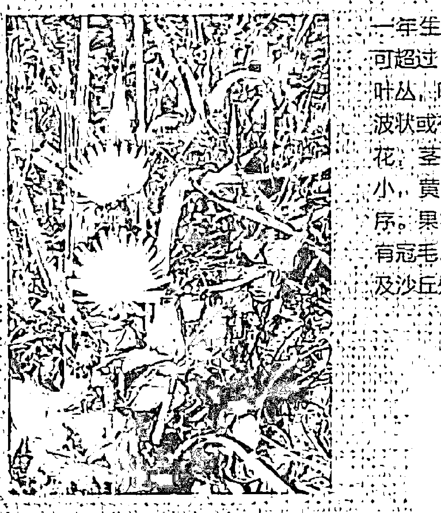

### 莴苣
### 阉人药草

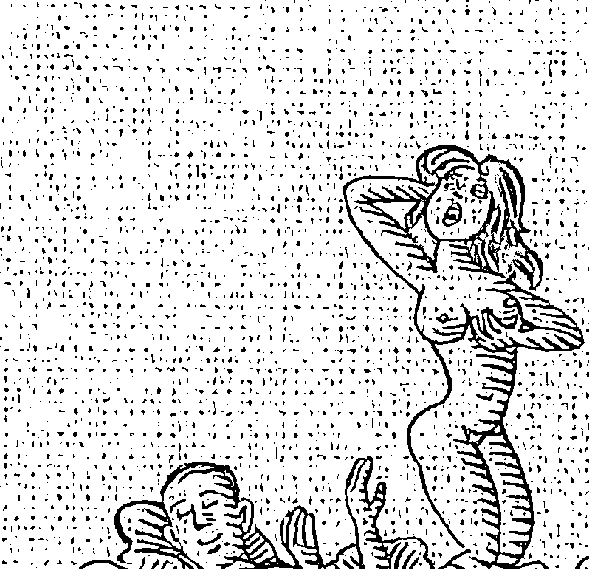

人们把莴苣称为“阉人药草”，其实乍一看，那些倒霉的阉人根本不需要莴苣的服务。野生莴苣的镇静功效及抑制性欲的作用早在古代就已被人所熟知。野生莴苣转为人工栽培的历史并不长久，无论在梵文还是在希伯来文的文献里，都看不到有关莴苣的记录。古希腊人和古罗马人是最早记录莴苣转为人工栽培的。在古代，人工栽培的莴苣也许更像乡下的野生生菜，而不像球茎莴苣。

## 吸食莴苣叶

现在人们只知道莴苣可以生吃，不过莴苣过去还有许多其他用途，其中包括可当烟叶来吸食。莴苣叶富含莴苣素，具有安神特性。在鸦片馆里可以吸食莴苣叶。莴苣的汁液里含催眠和镇静药性，但没有鸦片那种副作用（消化系统紊乱、颅内充血风险）。勒克莱尔明确指出莴苣素的种种好处，特别是在治疗生精障碍方面的好处，从而破除了民间的某些迷信说法。

不过，这都没关系，不管长成什么样子，莴苣的能力依然不会改变。它的种子和汁液是神经系统的镇静剂，它可以阻止梦遗，缓解性饥渴的压力。普林尼后来也曾引用狄奥斯科里迪斯的论述，推荐病人服用莴苣汁液，再加上一点蜂蜜，以阻止睾丸下垂，或将莴苣种子捣碎后服用，以减少梦遗。

## 英俊的船夫

有一个名叫法昂的年轻人是个船夫，他生性腼腆，在米蒂利尼岛和大陆之间驾船摆渡。一天，阿弗洛狄忒乘坐他的渡船，为感谢他，送给他一瓶香水。法昂吸了一下香水散发的香气，第二天就感觉浑身生出难以名状的力量，而且自己的身体也变了样。阿弗洛狄忒的香水将船夫变成一位美男子，其性欲之强，堪与最强壮的林神相媲美。生活依旧，一切顺利，直到有一天，女诗人萨福被他的魅力迷住，爱上了他，但法昂却看不上女诗人，回绝了她的好意。而萨福却爱得死去活来，最终她绝望了，跳海溺水身亡。阿弗洛狄忒明白是她的香水让船夫失去了理智，决定马上去惩罚他，将他变成莴苣，并赋予它平息爱情烈火的能力。

在中世纪，圣希尔德加德建议男人及女人“将莴苣放在阳光下晒干，用手搓成碎末，置于温葡萄酒中，常饮会抑制性欲而不会损害身体。”传统习俗有时会夸大莴苣的作用。其实莴苣只有镇静功效，但人们却把它描述成一种能让人变成阳痿或不孕的植物。孕妇不能吃太多的莴苣，否则她将来生出的孩子就是傻子。这种忠告似乎并不科学。

尽管如此，莴苣的汁液还是引起研究人员的注意，研究结果并未排除其可能引发的副作用。如今我们知道莴苣的特性和一种生物碱有关，即莨菪碱；另外还和一种苦涩的物质有关，即山莴苣素，莴苣的汁液里就含这种物质，少量服用会有兴奋作用。不过这两种生物碱有弱毒性，大量食用会中毒，但吃一棵生菜绝对不会引起中毒。相反，在氯仿麻醉剂尚未问世前，提纯的莴苣汁液或山莴苣膏和天仙子及毒芹配合使用，则发挥重要作用，可为重大外科手术作麻醉剂用。或许应该到此用途里去挖掘，看它是和“阉人药草”之名有关联。

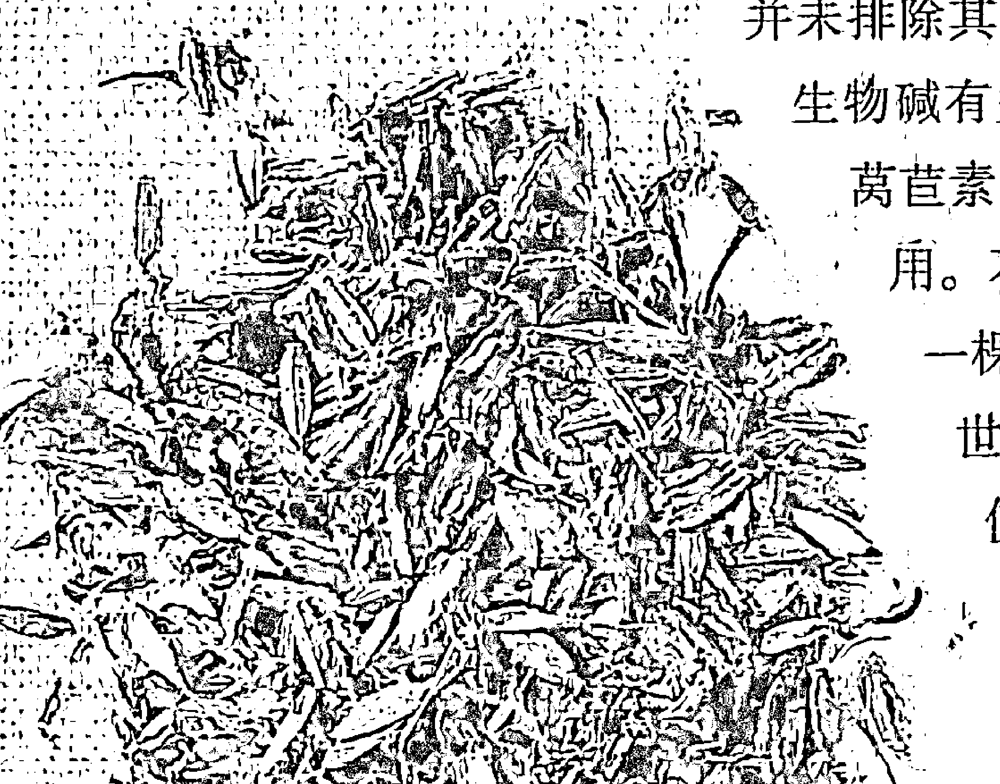

## 适合结婚？

有一种迷信的说法，其出处不详：要是哪个单身汉在拌生菜时，将生菜叶撒出去，那他就不适合结婚。传说归传说，这种说法依然十分流行，有些喜欢开暧昧玩笑的人，还会以此来调侃尚未结婚的人。

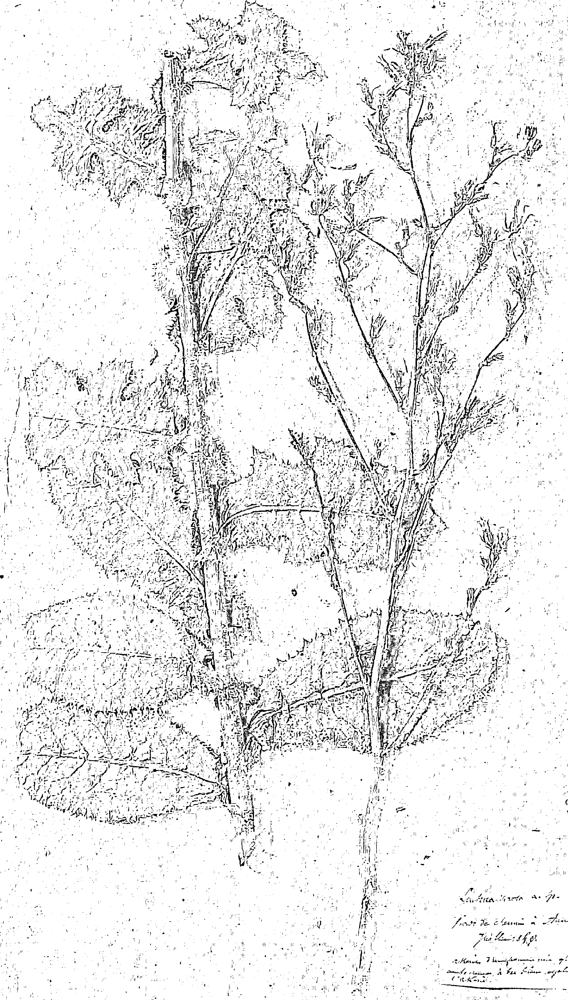

Lactuca serriola L.
Bords de chemins à Annonay.
Juillet 1891.
M. Maria, Hieracium minus glabrum
ou le même à les feuilles entières
(A. F. G.)

多年生鳞茎植物，茎短，叶在茎上呈螺旋状排列。地上部分冬季枯萎，花茎直立，挂多朵纯白色花，花呈松散串状，果实为蒴果，风干后自然开裂，散出种子。人工栽培品种多为装饰用。

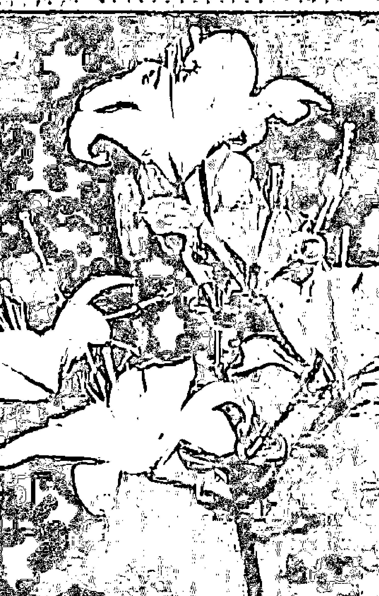

### 白百合花
### 纯洁无瑕

花中之花、百花王后、圣母百合……这些都是白百合花的名称，百合花还是纯洁与童贞的象征。许多信仰和迷信都和它密切相关，而且其中诸多迷信都和性事有关联。古希腊人会把百合花献给新娘新郎，祝愿他们幸福美满，早得贵子。如今白百合花依然用来装饰婚宴酒席。

古希腊人将百合花献给赫拉，而古罗马人则将其敬奉给朱诺。赫拉正在给赫拉克勒斯喂奶时，几滴奶水落到地上，百合花由此而生。阿弗洛狄忒因未被选中给宙斯的儿子喂奶而萌生妒意，于是便让百合花的雌蕊变得格外长，以此来报复赫拉，有些居心不良的人竟将这雌蕊比作驴根。从那时起，百合花便成为色情狂的标志，这些人竟将百合花做成花环戴在头顶上。

基督教并不掩盖它的象征，而且把百合花奉献给圣母玛利亚，同时也献给婚姻的保护神圣安托万。从那时起，百合花便显示出双重个性：既寓意纯洁和贞洁，又象征受孕和生育。

其实，白百合花本身所展现的是性感多于单纯，要是把它看作最有魅力的花卉，这绝不是在冒犯它。除了典雅的形态之外，白百合花还将醇甜浓郁的清香赏赐给我们。在干燥之后，白百合花虽然香气已散，但如果浸泡到烧酒里，酒还是很容易染上它的香气。在公元前五世纪左右，古埃及人就已经掌握了提取香料的技法，因此在古浮雕图像上，我们不但能看到种植百合的场景，而且还能看见收获百合及提取香料的场面。百合花所散发出的香气是新兴的神奇艺术——香薰的主要成分，而提取香料的目的就是为了增加魅力。

因此，在诸多神奇的仪式上总能看到白百合花的靓影，也就不足为奇了，而这些仪式往往是为了赢得得意中人的爱情。

要是真的这样的话，只需要把百合球茎从地里挖出来，随身携带好，就能确信对方的爱意是否真诚。不过要当心，动手去拔百合会引来霉运，谁要是亵渎这圣物，他身边的女人就会突然变得极为放纵……如果您真的拔了百合，那就赶紧再把它种回去，别再做美梦了！

### 百合酒

百合酒的配方非常古老，有许多种植百合花的家庭，将花瓣摘下后，浸泡在烈性酒里，以治疗撞伤、挫伤、烫伤。选用优质烈性酒，将开过的百合花随时放进酒里浸泡，将浸泡过的花瓣捣成糊状，直接敷在伤口处。也有人将花瓣放在橄榄油里浸泡，然后拿来做按摩用，以消除疲劳感。

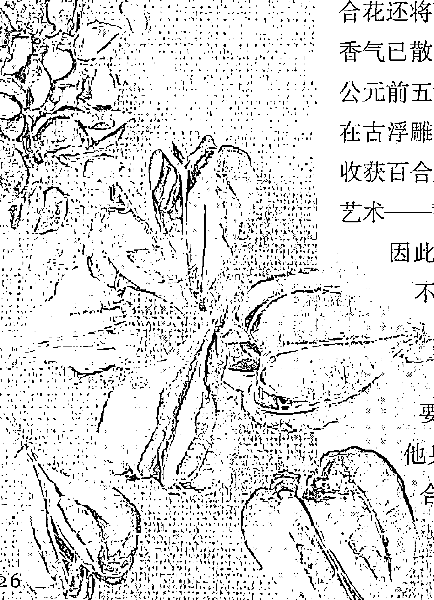
< 百合的花序和种子

### 月亮百合

为了破除爱情魔法，当月亮和金星重合、月亮为下弦月时，要从地下挖出百合的鳞茎，然后把鳞茎放入白布缝制的香囊里，挂在脖子上。

### 小便泄密

你爱上一位姑娘，

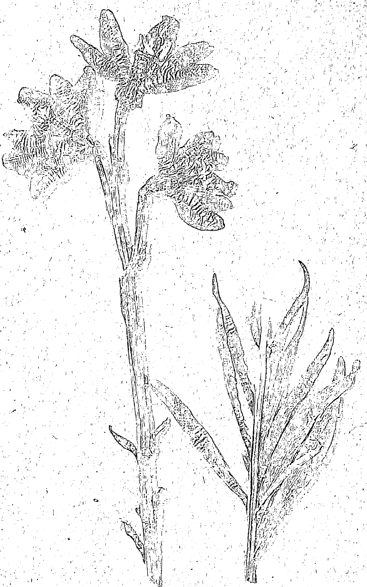

Lilium candidum
folio variegato
24
de Moffeau (?)
0.55

### 欧当归
### 爱情之茎

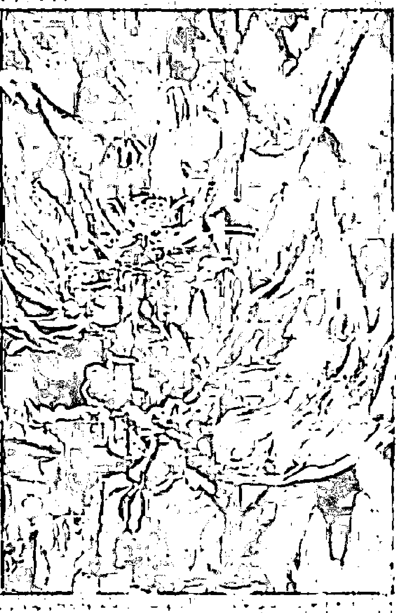

多年生草本植物，高大，最高可达 2 米。叶面光滑，微灰色，有长柄；叶柄基部膨大成长圆形；小叶片深裂。花黄色，形成复伞形花序。果实椭圆形，长 5~7 厘米，有香味。全株有香气。

没有人知道欧当归是从什么地方、什么时候引入欧洲的。尽管欧当归在阿尔卑斯山或比利牛斯山都曾大面积种植过，但没有人知道它们的野生祖先。记录它生长于欧洲地区的文献仅能追溯到中世纪，这也是唯一可信的证据，而在此之前的文字（狄奥斯科里迪斯及普林尼的论述）是如此含糊不清，不知作者究竟在说欧当归，还是在说类似于欧当归的草本属植物。也许他们是在说一个近似的植物群，其特性和用法也完全一样。

而法王路易一世的《城镇敕令》（795 年）以及查理大帝的《财产清册》则更加清晰明确，准确地描述了欧当归，并且证实那时花园里就种植欧当归。

欧当归当时已成为一种常用药，因为欧当归具有助产、助消化、通经、净化、兴奋等功效。从中世纪起，欧当归被拿来作美容洗剂。它那甘美的香气是独一二的，这香气里各种细微的差别使人联想起当归的麝香味以及芹菜的茴香味，因此它具有诱人的魅力。德国人将其称为“爱情之茎”，英国人则称其为“情侣的作料”。

在这些国家里，欧当归被拿来当蔬菜、作料或调味品使用，同时也被视为一种能增加诱惑力的植物。诸多民间习俗似乎也印证了它的功绩。向情人献上一瓶欧当归汁液做的化妆水是在表示忠贞不渝的爱情；拿欧当归做充填物缝制一个布娃娃献给恋人，可以确保博得对方的爱意。在送人衣物之前，要先在衣柜里放一束欧当归，并将衣物在衣柜里晾几天。要想博得暗恋对象的芳心，不妨在她（他）失恋时送上一瓶欧当归合剂，使其忘却失恋的悲伤，她（他）会抛掉沮丧的心情，移情于你。为了维持这一爱情火焰，或者确切地说，重新撩拨起对方的爱欲，你和心上人在一起用餐时，要经常往菜肴里放些当归粉。那时候欧当归还有另外一个名字：“麦吉草”，这可不是巫师用的那种神草，而是指一款浓汤，这款浓汤因香气十足而驰名，这馥郁的香气就来自情侣之草——欧当归。

### 少女烧酒

取 75 克刺柏，20 克欧当归籽，3枚丁香花苞，10 克当归籽，半咖啡匙桂皮粉，放入粗陶土罐里，倒入 2 升 60 度烧酒。浸泡 3 个月，过一段时间搅动一次，滤去浸泡物，再加入 1 升糖浆（糖浆用半升水及 500 克糖熬成）。

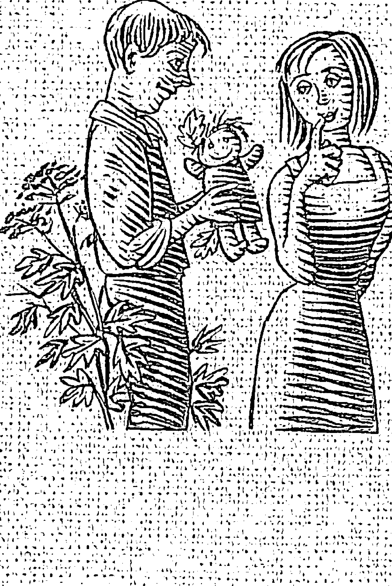

### 美味佳肴

- **根茎：**作为蔬菜，它的味道很冲，并非所有人都能接受。不过用根茎做的食物催情效果最佳；
- **叶柄和叶子：**用来做调味品，不过要当心，它们的味道太冲，会把要提味的食品盖过去。
- **种子：**可做调味作料。
- **挥发油：**是食品工业以及香水制造业所采用的香料。

### 用途广泛

健胃、祛风、净化、通经、疗伤，还可促进血液流通。用 10~15 克欧当归根，配 1 升水，做茶汤；或用 1~2 克欧当归籽，配一杯白葡萄酒。烧开后做药酒，用于通经。用 5 克欧当归籽做茶汤饮用，可祛风、助消化。

< 欧当归花序

# FLORE DES ALPES
Levisticum vulgare
H. Alpes - Le Lauzet (Briançon)
jardin ...
alt. 1700 m.
17/VIII 1898
Fl. BRACHET

睡莲：叶片巨大，呈圆形或近圆形，浮于水面。花白色、黄色或蓝色。略高于浮在水面的叶片。荷花：即尼罗河神圣莲花，和睡莲有明显的区别：一是叶片不同；二是花梗更长，高出水面75厘米左右。多年生水生草本，根状茎横生，肥厚。花朵大，直径约20厘米，粉红色。果实形似盐罐，内含种子。

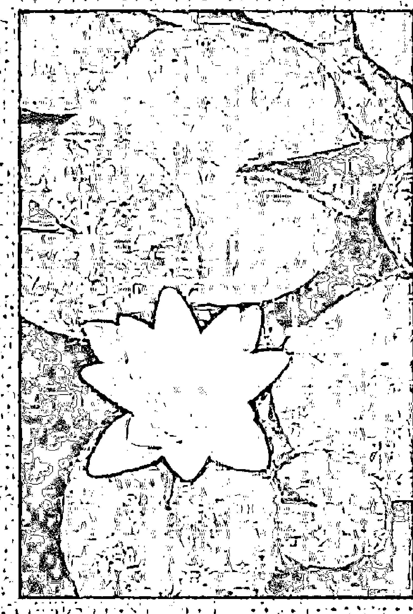

### 莲花
### 阴柔之美

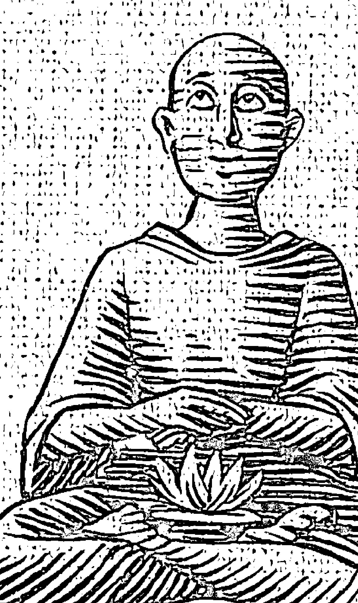

莲花或白睡莲是典型的圣花。古埃及人告诉我们太阳神拉就是从莲花萼片中诞生的。在法老的臣民看来，莲花掩藏着诸神的秘密。当他们为尼罗河神奉献一位女子做床妾时，他们选中了水泽神女。实际上，尼罗河之所以被古埃及人奉若神明，是因为每当尼罗河水泛滥之后，便给冲积平原蒙上一层厚厚的绿毯，于是人们就将莲花献祭给尼罗河神。生命的循环往复永无止境：死亡之后必有新生！当成千上万立方米的洪水淹没尼罗河平原时，就象征着死亡；而每年洪水带来的淤泥使土地变得更加肥沃，从而促进粮食作物的生长，也就意味着新生。

### 睡莲糖浆

取75克睡莲根或花瓣，放入一升开水里，浸渍6小时。滤去浸渍物之后，放入1.8公斤糖，用微火熬，直到熬成微黏稠的糖浆。放入瓶中密封保存。

早先是古希腊人，接着是古罗马人一直和神祇保持着密切的联系。不过，水泽仙女从唯一的母亲女神变为诸多次等女神的化身，这些仙女个个都长得十分漂亮，透出迷人的诱惑力，令人难以抵御。她们出于森林里，游荡在河流及水塘边，不但迷惑神祇，也引诱神人。她们象征着性感，又是神话中女神争风吃醋的根源，甚至是冲突的导火索。她们的行为有时过于极端化，刻意去追求异性，且性欲难以满足。

### 混淆

从植物学角度看，人们不会把睡莲和莲花混淆在一起，因为它们的归属和亚科均不同，然而历史学家和民族植物学家则把这些植物完全混淆在一起，并赋予它们相同的象征。而植物疗法医生也未加分辨，将它们混同在一起，将莲花的类似特性归于睡莲。

### 治疗阴茎异常勃起

取50克白睡莲根，50克啤酒花根及柳树根，放入开水里，浸泡20分钟。每天早晨空腹喝一杯，晚上再喝一杯。可治疗阴茎异常勃起和遗精。

这种象征性的神力在亚洲可以说是屡见不鲜，莲花寓意女性的子宫，印度教中的创造之神大梵天就诞生于一朵莲花……“玉茎”（男根）和“莲花”（女阴）结合在一起，代表着创世之初异性的神圣结合。

### 扼杀爱情

在谈到睡莲根茎时，普林尼说：“那些连续12天喝睡莲根茶汤的人，将无法做爱，而且精子不足。”在新婚之夜，人们不会让新郎新娘喝睡莲茶汤，因为睡莲有节制性欲功效。于是有些爱嚼舌头的人就把睡莲称为“和尚草”，还说它“扼杀爱情”、“摧毁快乐”。

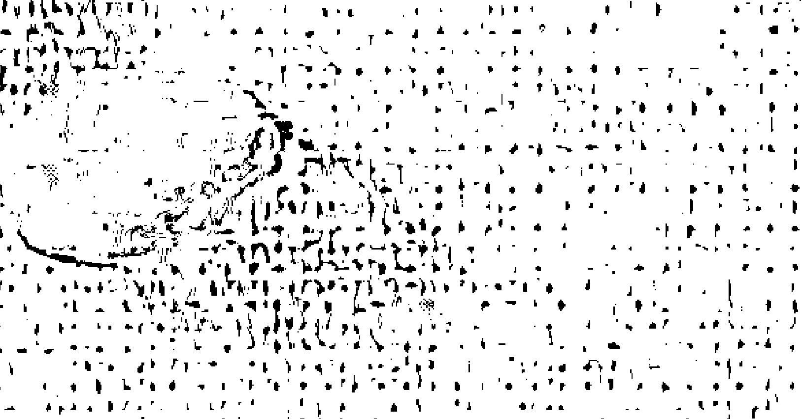

虽然是一种象征物，但莲花全身的一切都表明它是保护生育女性的最佳植物，莲花煎剂外用可滋养女性外阴，内服可确保乳汁分泌。不过在莲花的所有特性里，安眠作用是最出名的，它也证明有能力“减少繁殖力”。我们的一神教文化很快就把仙女们（莲花）丢在脑后，在把玫瑰花奉献给玛利亚之后，就用玫瑰替代了莲花。尽管如此，莲花并未遭到遗弃，基督教的苦行者仍然饮用莲花茶，以缓解身体的压力。而且，对那些热衷于追逐女性的公子哥，人们有时依然会说：“我给你泡一杯莲花茶，好让你冷静下来！”这公子哥要真是悬崖勒马也还来得及。

### 吉祥物

尽管莲花是知名的制欲植物，但它又是绝佳的爱情吉祥物，身上带一片莲花会得到上帝的恩典。将莲花放在显眼的地方，可以增强爱欲的活力。

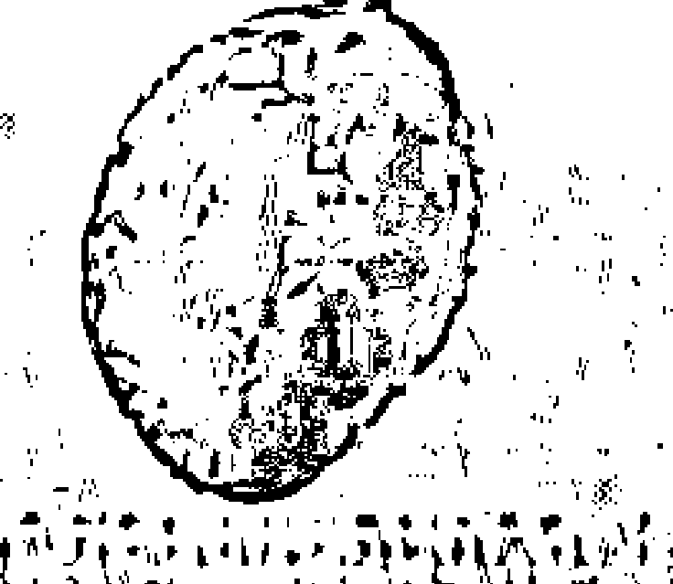

Nelumbium luteum
No. 70. 1. Aug 1840.

茄科植物。露出地面的部分很小（约 50~60 厘米）。叶子多为椭圆形，似莲花叶丛。花从莲花叶丛中心开，形状似铃铛，浅黄绿色。果实为黄色或红色小浆果。

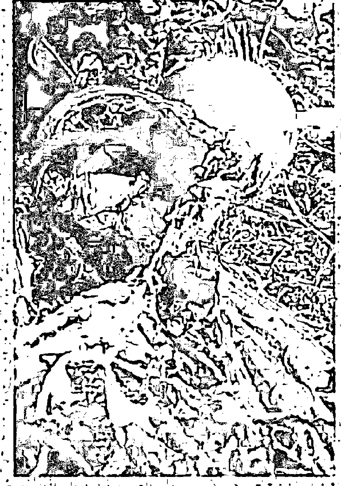

### 曼德拉草
### 人形魔草

1690 年，一株曼德拉草根的价值相当于一位工匠一年的薪水，这说明曼德拉草极为珍贵，而且它的能力非常神奇。因此，有人直言不讳地说，曼德拉草可以让女人有更强的生育能力。

有关曼德拉草的描述，如它的生息地、收获时节的仪式、应急举措的药方及祭献品等，所有这一切都是纯粹的寓意形式。曼德拉草的地面部分很不起眼（它的浆果除外），而它的根茎却长得极为茂盛，并长成人形，有的甚至暗示男女生殖器。“魔鬼之手”的偏爱之地就是地中海地区，不过人们却在到处寻找它。从中世纪时起，有传闻说被绞死的人落下精液，滋养着曼德拉草，因此绞刑架下的曼德拉草长得最茂盛，药效也最高。绞刑架早就从法国和纳瓦尔王国消失了，可这曼德拉草却留了下来，其实那种说法不过是人类的想象罢了，从而使大家认清这种最神秘幻觉的真相。

采集曼德拉草根是一件很棘手的事情，谁要是试图去拔它的根茎，有可能听到曼德拉草发出可怕的尖叫声，会被吓死。于是人们便让聋子去采集根茎，而且还要采取许多预防措施：首先要先给曼德拉草浇些尿液和血液，好让它平静下来。紧接着，为了不和这魔鬼直接接触，要用头发丝把莲座叶丛绑在一只饥饿的黑狗尾巴上，然后拉开一定距离，拿诱惑物（羊后腿）去逗这只黑狗，狗猛然扑过来，就把根茎拔出来了。曼德拉草的尖叫声要是致命的话，这黑狗也就因此而毙命，采摘者既未损失羊腿，又得到了曼德拉草根茎。这种人形根茎是爱情诱惑及礼仪的绝妙作料。人们拿它做护身符，戴在身上；再不然就依照“梦中情人”的模样做成小雕像。接下来就是对着小雕像念咒或耍些小把戏，目的是为了扭转厄运，或者为爱恋者送上爱情，或者去夺人所爱。

不论在行的人心情怎么样，也不论他们是否有能力操控某一植物的神奇力量，情感绝不会受此影响，只要精心培育，定能修成正果。至于说那种神奇的植物，其实它并不十分奇特，只不过它仍然拒绝将自己全部秘密透露给人类。

### 公认的特性

除了可以治疗许多病痛之外（炎症、溃疡、关节炎），曼德拉草尤其可用来调经、助分娩、抗不育；它对牲畜也有一定疗效；它富含生物碱，有些生物碱有致幻作用。

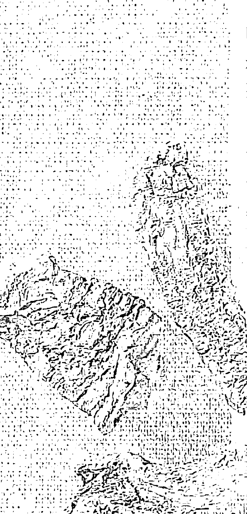
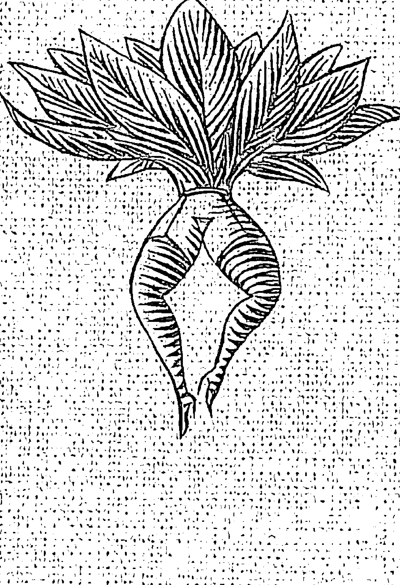

### 植物弥撒

在法国佩里格地区，有人说要想得到美人的青睐，“应该来搞曼德拉草，趁人不注意，将其放在福音书下面，让她去唱弥撒。”

### 以假乱真

曼德拉草是稀有物种，生长在高温干燥地区，很难种植。因此，曼德拉草的各种调制品完全有可能是靠非法买卖运过来的。在所有药物里，曼德拉草根极有可能是假货，因为它是珍稀昂贵的药材。泻根和菊苣根就是很常见的替代品。

### 象征

它象征爱的激情，象征难以抵御、强烈的激情。

Atropa mandragora
Quind.
San Roque in Baia
Alt po
Mandragora

多年生草本植物，密集矮生。叶片翠绿，匙形，边缘有齿。从叶间抽出花葶，葶顶头状花序，直径可达5厘米。生长于草地、田野、荒地、休耕地、大路两旁及斜坡上。

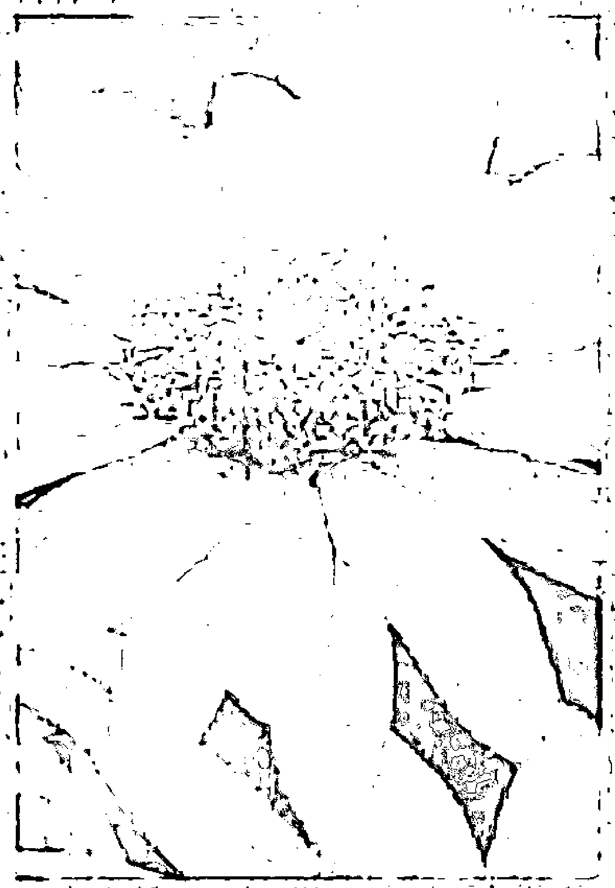

### 雏菊
### 爱情神谕

当雏菊盛开时，这花中王后就像草地上的珍珠，高傲的形态和漂亮的仪容使它在野花丛中独领风骚。尽管如此，它绝对称不上是催情植物，甚至更像那类乖巧、贞洁的植物，未出阁的姑娘们更愿意用雏菊来做奢华的花环，以象征贞洁和处女身份。

要想探究雏菊和性的关联，恐怕就要另辟蹊径了。在被冠以草地群花王后之前，雏菊是预测爱情最灵验的植物。只要一提起雏菊，人们嘴里即刻就会念叨“我爱你、有点爱、很爱、狂爱、爱得发疯、一点不爱！”人们一边念叨，一边摘去雏菊的白色叶舌，只剩下光秃秃的黄色花蕊，对于雏菊来说，这种占卜爱情的游戏真是太残酷了。其实对于想求得神谕的女子（或男人）而言，这种手法又何尝不残酷呢？因为在摘掉最后一片花瓣时，她将道出自己爱情的本质：有点爱、很爱……一点不爱。

在爱情占卜方面，你怎么要求雏菊都不过分，它绝不会缄口不语，至少只要它还能开出花朵来。每种类型的提问都有固定模式，若想知道自己未来的身份：“草地王后，告诉我，我将来依然是姑娘，还是为人之妻；是守寡，还是削发为尼？”若到谈婚论嫁的年龄：“草地王后，我的那一位是年轻的，上年纪的，还是鳏夫？是有钱人，还是穷光蛋？”我们的结合会幸福吗：“草地王后，他会爱我吗？他会骗我吗？我会有很多孩子吗？几个孩子，一个，两个，三个？”每提一个问题，就会摘掉一片花瓣，并得到初步的答复，以排解内心涌动的疑虑，这疑虑让人寝食难安，雏菊给出的初步答复会缓解这种感受。

既然您相信雏菊、相信被传统习俗称之为“女人预言”的花朵，先生，那您可得记住了，要是女人在春天里急着去采撷初开的雏菊，她也许就是一个变化无常的女人（或者说是一个不安于现状的女人），您很难满足她的所有要求。如果她早晚去找别的男人做这类爱情占卜游戏，您可千万别感到吃惊呀……

### 清炒花蕾

摘一碗雏菊花蕾，炒锅放少许油，翻炒几分钟，出锅。撒一点盐，配生菜沙拉，或和肉菜浇汁搭配食用。

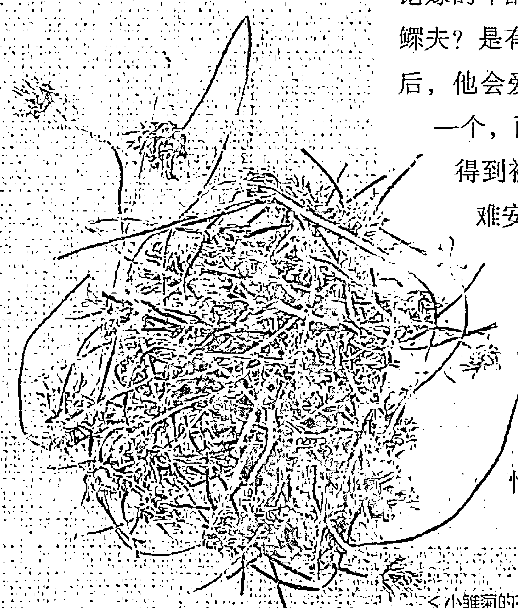
< 小雏菊的花序

### 诱人的花朵

作为雏菊的姐妹，小雏菊在小草坪上盛开，它在俚语里代表女人的阴部。抚摸小雏菊；去Leucanthemum vulgare Lamk.
Cl. pr. 6. p. 24
Sect. 1. achaines dimorphes.

Cette grande variété à larges fleurs développée par la richesse du sol, la lumière et dans une partie humide, a pris le pas sur l'ensemble des formes de C. vulgare (1893). Il est vrai, les écailles de l'involucre sont plus brunes dans le L. vulgare et blanches chez le L. maximum. Enfin il semble être un terme intermédiaire entre L. maximum, L. vulgare et L. sibiricum.

多年生草本多形态植物。叶片对生，绿色，有皱纹。花冠淡紫色，呈成密穗状。果实为小坚果，黑色。全株有香气，散发出著名的薄荷香味。

### 薄荷

### 热辣香气

“薄荷刺激爱欲，会挫掉人的勇气！”这是古希腊的一句谚语，那里恐怕正是因此而不允许士兵吃薄荷。这个谚语使人联想起明塔，薄荷又被称作明塔，以纪念一位追求爱情的仙女，是冥王哈得斯之妻珀耳塞福涅将其变成这种植物。冥王对明塔的挚爱非常感动，便赐予它一种能撩拨起爱欲的香气。诸神在惩罚他人时变得非常可怕，阴险毒辣的惩治并未结束，珀耳塞福涅的母亲德墨忒尔则罚它永世不结籽。

这是对薄荷特性的最佳解释：它既能催情，又能节育¹。这两种特性在薄荷身上还是相对稳定的，据说薄荷有两百多个品种，因此在谈起薄荷时，一定要用复数。不管是什么品种，薄荷都散发出一种沁人心脾的气味，依照专家们的说法，人们正是凭借这些气味来分辨不同品种的。

薄荷富含挥发油，即薄荷油，从而使薄荷有一股浓郁的香气，薄荷油成分的差异是形成不同香味的主要因素。因此，人们能看到有香芹酮类的薄荷，比如做口香糖用的薄荷（摩洛哥薄荷）；有薄荷醇类的薄荷，比如做糖果用的薄荷、做牙膏用的薄荷（辣薄荷）；以及沉香醇类的薄荷，此类薄荷散发出一种细微的柑橘味（香柠檬薄荷）。不管在哪一类薄荷，它们的功效得到世人的认可：刺激消化、滋补强心、清凉解热、强身健体，总之薄荷能让人更幸福。

在所有类型的薄荷味里，含薄荷醇的那类薄荷香味最浓烈，因此也是最佳催情植物之一。而沉香醇类的薄荷更多是被用来献媚或诱惑他人。香芹酮类的薄荷是用途最广的，它可以吊起人的胃口，给人带来神一般的气息。

不过民间的知识似乎从未关注过各种薄荷的独特性，把各种相似的特性全都划归给薄荷，有时甚至会张冠李戴，闹出笑话来。我们不妨想象：您本来想睡个安稳觉，弄个安眠植物可能会睡得更香，于是依照传统做法，在圆月那天晚上摘些薄荷，放在枕头底下。如果您摘的是绿薄荷（摩洛哥或其他地区的），一切都会很顺利。如果您摘的是辛辣型的薄荷，估计那天晚上辣味会呛得您辗转难眠。民间不是说，薄荷有刺激性，吃过薄荷的公牛会辣得发疯吗？

#### 爱情茶汤

这个配方极其简单，只采用法国本地的滋补植物（一份的量为半咖啡匙烘干植物）：取两份薄荷，两份冰八角，两份迷迭香，一份风轮菜，一份牛防风，一份金丝桃，放入两升水里浸泡，供一对情人一天饮用，即每人一升。

< 薄荷的枝叶

#### 避孕

谈到薄荷的催情及避孕用法时，普林尼声称在同房之前使用薄荷会阻止受孕，奥利巴苏斯说得更明确：“夫妻在同房之前，若不想怀孕，可将薄荷汁液涂在阴茎上。”

#### 姑娘们之间的悄悄话

“薄荷折磨他，罗勒把他唤来，百合让他离去！”这是过去姑娘们议论她们的情人时说的话。

#### 背叛

对于基督教来说，薄荷象征背叛和欺骗，因为当圣母玛利亚和圣婴耶稣准备逃往埃及时，薄荷向追捕者透露了他们的行踪。鼠尾草恰好在一旁，对追捕者说：“别听薄荷的，它只开花，但不结果（言外之意是它的话不可信）。”宗教裁判所的法官们最终放弃了追捕。

¹ 作者在此用了 *stérilisante* 一词，从前一句话引出的因果关系看，译成“节育”不错，可实际上，薄荷并不具备此功效，而取该词的“杀菌”之意则更准确。——译者注

---

Herbier J. B. RENAUD
№ 3190
Mentha aquatica L.
subsp. piperita Huds
var. citrata Ehrh
Hérault: Béziers, dans le ruisseau de Quarante-Heures au pont de Valras (L. H.)
5 Sept 1912 Legit J. B. Renaud

---

一年生草本植物，植株高大（高1.5米或更高）。大叶片，长叶柄，有小裂片。幼茎及叶具刺毛。基生叶宽卵形至倒卵形，茎上部叶窄披针形。花黄色，四花瓣。果实为长角果，线形，串状，内含4~6颗圆形种子。

### 芥菜

### 绝交信使

人们又称它为田芥菜或黑芥菜，在民间一直被当作“增加食欲的利器”或“开胃的金钥匙”。这两句箴言足以证明芥菜之温热特性的潜力。这潜力是如此之大，以至于某姑娘晚上将一束芥菜挂在窗外，用意是要告诉整个社区，本小姐准备名正言顺地嫁人了，可背地里也许还会跟几个情郎偷情幽会……

当然，不是所有人都能从中得到好处。芥菜常用来表示断绝恋爱关系，给恋人送上一束芥菜花，那意思是以告诉他（她）“我们之间的一切都结束了”！切葱头的时候人会流眼泪，碾芥菜籽的时候人也会流眼泪，这让芥菜成为承载某种口信的信使：“我流泪、我痛苦都是因为你，你走吧，我再也不想见到你！”

假如你并未完全博得心上人的芳心，那小两口就得齐心努力了，尤其是与婆家的关系更要格外小心。在瓦朗斯地区流传这样一种说法，要是刚娶进门的新媳妇经常去摆弄野芥菜的话，她将来会跟婆婆闹翻了。鉴于本文开篇讲过的箴言，婆婆也许会以为儿媳是一个招蜂引蝶的女人。幸好，并非所有接触田芥菜的女人都是“生活腐化的女子”。结婚之后，年轻的媳妇们都想生个孩子，因此会和婆家和睦相处的。芥菜在家里还是很受欢迎的，因为它产量很高（一株芥菜可结 25000 颗种子），所以被当作改善夫妻生育能力的护符。在印度，人们就将芥菜视为生育的象征，想生小孩的女子都愿意吃芥菜。尽管如此，食用芥菜还是要注意小心，医生建议那些尿道发炎及胃溃疡患者尽量不要食用芥菜，而患消化不良症的病人绝对不能吃芥末。

研究人员试图验证黑芥菜的所有功效，但没有成功。除了辛辣、灼热的口味之外，研究人员并未发现可以印证它那名气的任何元素，而这名气曾燃起一代代恋人的激情。虽然对某些人来说，芥末可能会呛鼻子，但他们照样可以用芥菜文雅地表达自己内心的怨恨，这怨恨有时把他们折磨得死去活来。

#### 自制芥末酱

芥末酱是最基本的调味品，将一份芥菜籽浸渍在用醋、盐和水（两份）调成的渍汁里，浸渍40分钟，然后将浸渍物绞碎、过滤，以滤去芥菜籽外壳。这个基料准备好之后，您即可按照自己的口味调成自制的芥末酱，可加上大蒜、葱头、分葱、青椒、胡椒、辣椒等，厨师的秘诀就是糖，以掩盖芥末酱的酸味。

#### 灼热葡萄酒

芥菜是欧洲最早人工栽培的植物之一，它过去的旧名为“Sénevé”，源于拉丁语“Sinapi”。最原始的调味品是将芥菜籽碾成碎末，再掺入未发酵的葡萄酒，目的是不让芥菜籽发酵。古罗马的这个配方就是如今“芥末酱”一词的出处，原意为“灼热葡萄酒”。

#### 多种口味

尽管野生芥菜有明显的长处，但还是逐渐被人工栽培的芥菜所淘汰。人们在很长时间内一直种植黑芥菜，用它的种子制作黑芥末酱。白芥菜比黑芥菜口味要温和一些，用它的种子做成膏药，贴在身上，以缓解胸闷的病症，人们对此植物的生热特性赞不绝口。褐芥菜又称印度芥菜，它的块茎可食用，叶子可做蔬菜。

< 芥菜的长角和种子

---

P. SINTENIS:
Iter transcaspico - persicum 1900 - 1901.
№ 1496.
Sinapis arvensis L.
Persia borealis; prov. Asterabad: Bender Ges: in ruderatis.
5. IV. 1901.
determ. J. Freyn.

---

常绿乔木，高 6~15 米。叶互生，椭圆形，边缘无凹凸状。雌雄异株。花小，果实为浅黄色浆果，约 6 厘米大小，有肉状外皮（假种皮）和种子（核仁）。整树有香气。

### 肉豆蔻树及肉豆蔻

### 迷人诱惑

我们熟知肉豆蔻，但对肉豆蔻树却知之甚少。肉豆蔻树是一种散发出香气的常绿乔木，树高可达 15 米。它的果实是果肉状的浆果，每棵果实里有一粒种子，种子有辛辣的香气、辣涩的滋味。果实的外皮烘干之后就得到肉豆蔻的假种皮，而包裹种子的那层皮也可制成假种皮。假种皮也是一种名贵香料，其滋味类似于桂皮和胡椒。

#### 肉豆蔻酒

假种皮及核仁都是著名的优良春药。正是肉豆蔻醚（挥发油）使它具备兴奋及催情的特性，这一特性在刺激欲望过程中发挥重要作用。作为刺激的辅助手段，肉豆蔻也可用来消除肌肉疲劳，缓解力不从心的尴尬处境。

取 10 克肉豆蔻，5 克（肉豆蔻）假种皮，250 克糖，放入一升 40 度的烧酒里，浸渍三天，每天搅动一次。滤去浸渍物，将烧酒装瓶，密封，再陈放两个月，即可饮用。

因此，在印度，人们用肉豆蔻核仁及假种皮，再配上其他香料，调制成春药。在欧洲，人们用它来制作恋人媚药。在比利时，当年轻的姑娘感觉自己被男朋友甩掉时，先悄悄拔下男朋友一根头发，接着把两人的名字刻在肉豆蔻核上，然后将肉豆蔻核和头发一起埋在杉树底下。保罗·塞比尤曾对此描述道：“（果核）汁液越是能让种子冒出芽来，准备甩掉姑娘的男友就会越感爱她；不过要是这姑娘也不爱他了，那种子很快就干死了。”斯科特汉姆则更喜欢另一种驱邪物：将肉豆蔻核切成四块，第一块埋在橡树底下；第二块碾成碎末，从悬崖上扔下去；第三块扔火里烧掉；第四块做成煎剂。你只要把这煎剂喝下去，围着你情人转的那帮家伙就会放弃阴险的手法。

#### 温热用途

肉豆蔻的核仁和假种皮具有健胃、滋补、兴奋功效；且对人的全身及局部有刺激作用，还可用来为各种菜肴、甜点提味，亦可酿造“温热型”葡萄酒、甜烧酒及制作奶制品。

#### 魔鬼精油

肉豆蔻精油又称肉豆蔻醚，是知名的“嗅觉催情物”。和所有类型的精油一样，肉豆蔻精油使用起来有一定的风险，它有麻醉和致痉挛作用。

由于肉豆蔻树只生长在世界上极少数地区（马鲁古群岛），在很长时间里，欧洲人不知道它产自哪里。肉豆蔻大约在 8 世纪引入中国，直到 15 世纪才被引入欧洲。虽然在埃及的墓穴里也发现了肉豆蔻的痕迹，但它确实太珍贵了，很少有人认识这种植物。

#### 神奇饮品

随着贸易的发展，肉豆蔻的名气越来越大。18 世纪时，荷兰人占领马鲁古群岛之后，试图牢牢把握肉豆蔻的独家经营权，从而禁止将种子和植物销往群岛之外的地方。有一个名叫皮埃尔·普瓦夫尔的法国人使用计谋将肉豆蔻树带出马鲁古群岛，并将其种在法兰西岛（毛里求斯岛）上，而他正是从法兰西岛启程去征服世界的。

加鲁斯是 18 世纪的“江湖”药剂师，他在巴黎黎桥附近大张旗鼓地为患者抓药、治病。他根据帕拉塞尔苏斯的一剂药方，捣鼓出自己的万能药，在这剂灵丹妙药里就有肉豆蔻。在这剂药方里，他还加入芦荟、没药、藏红花、丁香和肉豆蔻。这剂灵丹妙药的配方经常更换。

< 肉豆蔻核以及用假种皮制成的药膏

---

### 香桃木

### 丘比特木

常绿灌木，热带植物，2~3米高。叶片椭圆形或倒卵形，先端圆或钝，有时稍尖，叶面初时有毛，后变无毛，发亮。花白色，五花瓣，应用雄蕊极多。小浆果，圆形或椭圆形，黑色或深蓝色。全株散发芳香气。

#### 天使清水

这个配方名气极大，希腊、意大利以及许多国家的妇女很难舍弃它，即用香桃木的叶子和花朵蒸馏出清水……如今此配方已失传，不过您可用25克香桃木叶子，浸泡在一升水里，浸渍20分钟，每天喝两杯。

#### 香桃木开胃酒

抓一把浆果，放入一升45度烧酒里，再放3~4枚丁香花苞和半根香子兰荚果，浸泡三周。然后滤去浸渍物，加入糖浆（用一公斤糖和一升水熬制），灌入瓶内，密封，再陈放2~3个月，即可饮用。

有人说香桃木那芳香甜蜜的香气撩人心弦。香桃木最初只被视为一种护佑型的植物，古罗马人将其拥在腰间，以预防某些疾病（如疝气）。在预防疾病方面，巫术所起的作用和药方同样重要。因此，不管用于何种目的，一小段香桃木或一根香桃木树枝既不能碰到铁器，也不能沾上灰土。

于是，香桃木就成为一种神圣植物，在房子附近种上一棵香桃木，可以让全家都能享受它的神圣气氛。不过为了让这一神圣气氛更灵验，香桃木要由一位女子种植，最好在房子大门两边各种一棵。香桃木的长势能反映出这家香火旺不旺。要是香桃木的根茎日渐枯萎，那么这一家人就要担心是不是会遇上麻烦，于是就会更加精心地照料这棵植物。后来至少在法国，这种基督教的护佑植物被黄杨树或月桂树所取代。

然而，香桃木的保护能力却很快扩展至夫妻及家庭里。在古希腊人看来，它象征着性能力，倘若有人从香桃木旁经过却不屑看上它一眼，表明此人或是阳痿患者。古罗马人则把香桃木奉献给爱情女神维纳斯。神话还告诉我们：丘比特正是拿香桃木来做弓和箭，唯独这箭可以射穿最铁石心肠人的心，让他们去体验爱情的乐趣；正是一簇香桃木将裸身洗浴的维纳斯遮挡住，以防那帮色迷迷的林神偷窥她出浴。

在古罗马，香桃木还是婚礼用植物，新郎新娘头顶上要戴一束香桃木花环，这一做法后来传播开来，甚至传播到整个北欧地区。在英国、德国以及北欧的许多国家里，香桃木依然是婚礼用花。

希伯来人也把香桃木当作夫妻幸福的象征，而且认为它有很强的生殖功效。他们送给新婚夫妇一枝香桃木树枝，叮嘱他们一定要保留到准备怀孕生子那一天。

#### 被遗忘的植物

在古代，香桃木与月桂和油橄榄树齐名，但究竟出于什么原因，香桃木失宠，人们不得而知。波斯人、埃及人、希腊人以及罗马人都曾先后将香桃木奉为神树，但它却在公元纪年初期神秘地从药典里消失了。直到16世纪，在方兴未艾的植物疗法推动下，它才再次在南欧出现。马蒂奥利于1554年首次将它和假叶树及欧洲越橘区分开。此前人们往往把香桃木和这两种植物混淆在一起。从民众给这些植物起的名字看，也许正是冒牌货让香桃木信誉扫地。

#### 药用精华

健胃、杀菌、消毒、提神……虽然它的催情作用并未得到确认，但它刺激消化系统及滋补的特性却得到人们的认可。至于说杀菌和消毒特性，妇科方面的应用证实了它的效果，也让它声名鹊起。香桃木的特性都和它的挥发油有关，但用量过大，似乎有一定的毒性。

< 香桃木的浆果和种子

---

Année 1880.
Plantes de la Corse.
E. Reverchon. — № 295 —
Myrtus communis L.
Les maquis, 3 juillet. Bonifacio.

---

一年生或二年生蔬菜类植物，鳞茎粗大，茎梗短，外皮薄，内皮肉厚。叶圆筒状，中空，绿色。花葶中空圆筒状，在中部以下膨大；花小，淡紫色，呈球状伞形花序。

### 葱头

### 喜悦之泪

#### 冰糖小葱头

取若干个小葱头，锅内放少许油，放入葱头，撒些砂糖，再加半杯水，微火将糖浆熬稠，冰糖小葱头就做好了。

葱头和大蒜属于同一科（百合科）、同一属（葱属）类植物。它们确实在很多方面都有共同点，最重要的是它们富含微量元素。葱头含维生素 A、维生素 B 和维生素 C 以及硅、磷、钾、硒、碘等元素。和大蒜一样，葱头也含有丰富的挥发硫活性成分（大概有 60 多种）。大蒜素是葱头挥发油的基本要素。在吃过大蒜后，口中会留有臭味，这就是大蒜素在起作用，然而在切葱头时，大蒜素会让人流眼泪。这两种不同的作用恰好是由复杂的化学反应引发的。葱头之所以让人流眼泪，是因为葱头切开时会释放出一种酶，叫做蒜胺酸酶。这种酶和葱头中的氨基酸发生反应之后，转化成一种催泪物质，即硫代丙醛-S-氧化物。尽管如此，葱头的象征并不是忧伤，而是快乐和强身滋补……慢慢理解好了！

葱头中的大蒜素及其它元素有助于改善血液流动性、促进血管扩张、降低胆固醇、防治动脉硬化、清除体内病毒和细菌，这些病毒和细菌每天都在侵蚀我们的肌体。总之，葱头仿佛就是灵丹妙药，其合理性也被世人所认可。最近有学者对其药性重新作了评估，在抗氧化方面，它排在第三位，位列青椒和荨麻之后。

此排行榜让人推测它具有多种能力。由于具有滋补功效，葱头很快就被认定具有催情作用，再加上民间丰富的想象，它的象征性给色情文学带来许多灵感，小葱头被称作小铃铛，代表睾丸。葱头还是男性同性恋的象征物之一。“给葱头打洞”这个俚语展现出这样一个场景：伙伴用他的“大葱”，另一个则用近似于铃铛的葱属植物。大葱的男根形象很好理解，但用葱头来隐喻肛门却很难理解。因此，还是各顾各的为好，凭自己的想象去理解这句俚语吧。

< 葱头的花序及种子

#### 爱情预言

在英国，将一枚葱头放在姑娘的枕头底下，她会梦见自己的白马王子。在其他地方，假如一个姑娘有好几个追求者，而她又不知到底选哪个好，于是便在圣诞节前平安夜里，在壁炉附近放几只葱头，有几位追求者就放几只，在每只葱头上都标上名字，然后耐心等待：第一只出芽的葱头所标注的名字将是她的最佳选择。倘若只有两个追求者，姑娘不妨将一只葱头切成两半，这种方式也许不太公平，因为一只葱头只能有一个胚芽，其中的一半肯定不会有结果。

#### 嫉妒与巫术

为了惩罚不忠的情人，有些女子就往葱头上扎 13 根大头针，在蜡烛上也扎 13 根大头针，然后放在壁炉台上。随着蜡烛燃尽，葱头干枯，那个负心的情人也会遭受同样的命运。假如这场巫术能一直持续不断，直到结束，那个倒霉蛋的健康和生命就会毁于这场巫术。

Allium cepa
oignon.

多年生草本植物，地下块茎成对生。叶通常为披针形，基部呈筒状鞘。茎直立，顶生花朵，花型丰富多样，色彩斑斓。不易开花，需精心呵护，不要采摘花朵。人工栽培几乎不可能，因为其共生菌无法人工培育。

## 宽叶红门兰
### 植物睾丸
### 口袋吉祥物

要想得到别人的爱，只要挖一棵“头巾百合”（红门兰的俗称）的块茎，将它切成两半，一半放进自己衣兜里，另一半放进爱慕者的衣兜里即可。

希腊植物学家提奥夫拉斯图将红门兰命名为“Orchis”（睾丸），因为红门兰块茎的外形与睾丸十分相似，块茎成对地生长在直立茎梗的底部。在古人看来，神授的暗示似乎更明显。暗示原理将植物某一器官的形态、外观等与人相对对应器官的疾病联系在一起。比如某一植物的叶片形似肝脏，那么它就是出名的“肝脏”（苔藓）植物；再比如某一植物叶片上长着斑点，颇像肺病患者肺上的斑点，于是它就被命名为“疗肺草”。时间和经验负责在种种暗示里作筛选，剔除差的，留下好的。

在被剔除的暗示里，最典型的例子就是红门兰。不管是整棵植物，还是它的一部分，哪怕两只块茎长得再像“蛋蛋”（民间对睾丸的俗称），它对男根也不起任何作用。然而，有些名声在外的东西很难摆脱掉。直到近代，依然有人采撷红门兰块茎（盔红门兰、雄红门兰、斑叶红门兰），或者拿来做成护身符，或者碾成碎末，制成春药。认为将某种红门兰的块茎拿来制成煎剂，可让男人重振雄风。盔红门兰一直被当作是古人的催情植物。不管是神话中的植物，还是饮酒纵乐时想象的产物，这种植物可以让任何一个男人产生一种可怕的性能力，凡是服用此物的男人都会成为一个名副其实的色情狂，那个勃起的家伙一直傲然挺立，难以控制……

红门兰得到的赞誉并不仅仅局限于欧洲，在中国，它象征着生育力，又是春节的吉祥物。在印度，药草养生疗法建议患者使用红门兰，以增加精子数量，红门兰在印度还是性活力的代名词。

如今，人们知道这些可怜的小块茎其实不过是植物的自然储备，以对付恶劣的生长环境。块茎的主要成分是淀粉（一种无害的物质），但还是含有微量的有毒生物碱。过去人们曾认为红门兰是极其具有骑士风度的植物，但研究结果证明这种说法是不准确的，人们没有发现任何能佐证此说法的证据。留给人们的恐怕只有想象了。

### 民间俗称
蛋蛋，圆蛋蛋，狗蛋蛋，色鬼的家伙。

### 性别选择
古希腊药物学家狄奥斯科里迪斯最先提出这样的论述：男人吃红门兰的大块茎能生男孩；而女人吃小块茎就能生女孩。

### 毁灭
在中东地区，沙列布粉（从红门兰块茎里提炼出的凝胶物质）被拿来当春药用，或用来做茶汤，这种食法风靡一时，以至于几百万株野生红门兰的块茎遭到毁灭性采掘。

### 绝妙
> “像红门兰这样绝妙的植物真是太少了。它的叶子像大葱，茎梗像棕榈树那么高，花紫红色，一对块茎形似睾丸，其中大的那一只泡水之后食用能激起人的性欲；而小的那一只泡牛奶后食用能减轻性欲。”（普林尼语）

## Orchis morio
Thionville
30 mai 1831

多年生草本植物，根状茎强壮，浅根，黄色。地上茎梗粗壮，叶有柄，绿色，边缘有不整齐牙齿状锯齿。雌雄异株。花无花瓣，绿色，花小，几乎无梗，集中在一株花葶上。种子繁多，浅黑色。整株植物覆盖着能引起荨麻疹的绒毛，但并非所有绒毛都能引起荨麻疹。

### 荨麻
#### 刺激蜇人

单从激发角度看，假如有什么植物能在本地植物志里赢得催情的桂冠，此桂冠非荨麻莫属。它那种热辣辣的蜇人感难免让人浮想联翩，古人称它为“极度温热植物”是有道理的。

对荨麻引起的灼痛感的药物疗法有很多种，其中最有名的一种疗法具有抗风湿的疗效。然而，在另一个领域里，民间风俗对荨麻也是赞叹不已，因为它是撩拨情色的高手。民间的传统做法早已消失得无影无踪，不过用荨麻刺激性器官（男女均适用）确实能撩拨起人的性欲。实际上，这一现象和荨麻引起的灼痛感有关，荨麻会即刻引起血管扩张。

民间也用类似的做法去刺激种马或种牛，以便于

Urtica dioica L
Bords du Canal du Midi
à Béziers (Hérault)
11 Juin 1931
St. Allem...

一年生草本植物，茎直立，高一米。叶暗绿色，边缘具不规则粗齿。花顶生，花朵大，粉红色、淡紫色或白色。果实为球形蒴果，似小缸盅。种子小，黑色或深灰色，数量繁多，聚集在蒴果里。

### 罂粟
### 萦绕心头

罂粟，单单这个名字就让人胆战心惊！“这可是毒药哦！”对罂粟烹饪不懂行的人会这样惊叹。其实，它不是毒药，证据呢？您肯定知道罂粟籽面包。吃了这面包，您不会有任何危险，况且罂粟籽还有益于健康。此外，在法国，人们一直在种植罂粟，就是为了收获它的油籽，从中提炼出珍贵的罂粟油。那么它那可怕的名声是从哪儿来的呢？

事实的真相是，当罂粟蒴果尚未成熟时，人们便将蒴果割开，收集乳汁，而乳汁富含鸦片，因此它确实是名副其实的毒品。罂粟有两副面孔：罂粟叶、罂粟花和罂粟籽具有催眠作用，而罂粟鲜蒴果及其凝固后的乳汁含鸦片，因此具有麻醉和刺激功效。

罂粟是一种遍及世界各地的植物，而且是人类最早种植的植物之一，鸦片为世界各地的文明所熟知。如今人们种植罂粟或是为了收获可食用的种子，或是为了提炼药品，它的麻醉及止痛功效过去一直是医学界的法宝，现在依然是法宝。如今人们不知道这两种用途当中哪一种更有优势。

在公元前 2500 年左右，亚述人将罂粟视为一种“快乐的植物”。古埃及人非常喜爱罂粟，据说利奥帕特拉酒就是将鸦片和颠茄掺在一起的混合物。古希腊人和古罗马人也很喜爱罂粟。在古希腊人看来，这是大地母亲女神德墨忒尔赐给人类的礼物，正是她向人类揭示出罂粟的好处。人们一下子就喜欢上这植物了，即使我们的祖先对这两重性已是心知肚明。此外，罂粟不仅献给爱情女神阿弗洛狄忒、睡神修普诺斯和梦神摩耳甫斯，而且还献给死神塔纳托斯。通过这些神话人物，我们对罂粟的各种功效也就有了更全面的了解。

那么，对于罂粟把我们引到骄奢淫逸情色地带的能力又怎么看呢？要是拿色情文学所提供的传统秘诀来衡量的话，它并不像文字所描述的那么优秀。实际上，它要和其他植物配合使用，而这些植物的作用就是“增强鸦片的催情功效”。其实，倒是罂粟乳汁在发挥介质作用，当人面对诱惑时，它能增强人的感受力。罂粟还可以让人去感觉那种难以察觉的情绪，要是没有它，人们几乎感受不到这种情绪，不过，虽然是催情性药，但罂粟的催眠特性似乎很难让人快乐起来。

### 印度生育学
(13世纪的配方)

将下列植物各一份掺在一起：南欧派利春草、生姜、胡椒、粗糠柴、辣椒、肉豆蔻、丁香花苞、檀香，另外再加入四份鸦片。我们不难发现，鸦片是绝妙的陪衬，这个混合物应该是名副其实的。

### 奇怪的科属
罂粟属于罂粟科，在这个科属里有虞美人、加利福尼亚罂粟、白屈菜、角罂粟花。在所有这些植物里，只有虞美人这种古老的植物全株没有毒，可以当蔬菜吃，有开发潜力。加利福尼亚罂粟可入药，可少量食用。除此之外，其他罂粟都有毒，包括用来做装饰的大朵虞美人花，此花又称鬼罂粟。

### 安眠药
狄奥斯科里迪斯声称：“要是喝过用罂粟叶和罂粟花沏成的茶汤，再往头上洒一点茶汤，这将是最棒的安眠药。”这个配方值得考虑。

### 象征
罂粟能产很多种子，对于新婚夫妇来说，它象征繁殖力。罂粟还是典型的忘却之花，因为它能赶走内心的痛苦。

# HERBIER J. B. RENAUD CAT. CAMUS
N° 146

*Papaver somniferum*

Synonymie: —
Nom vulgaire: —
Habitat: Draveil-Vigneux (S. et O.)
Stations: Décombres
Date de la récolte: Juin-Juill
Terrain: sablonneux
Altitude: —
Legit: J. B. Renaud

矮小草本植物。基座叶丛，叶片长卵形，羽状深裂，柔和绿色。五花瓣，展开，三色为主色调，上方两只花瓣深紫色，侧方花瓣白色，带黑色脉纹，下方花瓣黄色、白色，亦有脉纹，品种不同，色彩各异。成熟的果实为黑色，常被蚂蚁咬食。

### 三色堇
### 童贞少女
### 净化

三色堇是一剂优质的净化药，用来清除体内壅塞。取 50 克干三色堇，放入一升开水里，浸泡 10 分钟。滤去三色堇，饭间饮用。

野生三色堇的花朵颇像一个受到惊吓的童贞少女的脸庞，于是人们便认为它是“无辜的”。如果近距离仔细观察，人们很快就发现，这天真少女的模样不过是一种表象，其背后隐藏着一种轻佻的个性。它那两片肉乎乎、似丰满面颊的花瓣，就是在肆无忌惮地勾引情人，勾引得越多越好。在收缩到花萼里的蒴壶入口处，有两行细细的绒毛，这个毛被的作用就是接受花粉，小昆虫一只接一只地飞到花心里去授粉。出出进进的求爱者足以让花朵具备繁殖能力。

民众是否在观察到三色堇这一伎俩之后，才凭自己的想象赋予三色堇一种色情意义呢？人们不得而知，但这一象征意义一直没有变。因此，年轻姑娘要想马上得到情郎的青睐，只需在衣领饰孔上别一朵三色堇，或者从花园里摘三朵蝴蝶花，一朵淡紫色、一朵白色、一朵黑色，并将其戴在胸前。姑娘的魅力会变得难以抵御，小伙子们不会不知道其中的寓意：“谁来摘取，我的心就给谁。”他们很快就会展开攻势，去碰碰运气。

还有一种做法，其挑逗意味不那么明显，姑娘手里拿一朵三色堇，在手指间摇来摇去，一边摇，一边说：“你可想好了！你在哪儿停下来，我的情人就在那儿！”她就这样在一群小伙子里选择自己的伴侣。

三色堇还是思念的象征（“我们已分别很久，我一直想你，绝不会忘记你”）。这朵小花也用来警告，如果哪位姑娘在未婚夫参军或上战场后，依然穿梭于各个舞场之间，社区知道后，就会趁天黑时在她窗外放一束三色堇，提醒她要履行自己的义务……而美国的园艺工人则在花坛上用三色堇摆出一颗心的图案。据说在美国，园艺工的性欲取决于三色堇是否长得茂盛。真是难为这微不足道的小花，其实像许多漂亮的花朵一样，它所能付出的，只有和谐与美感。

### 慰藉
三色堇的象征意义（“慰藉失恋”）源于一个古老的传说，一对失散多年的兄妹，在相遇之后，相爱了，并走向婚姻的殿堂，可他们并不知道相互间的血缘关系。他们在一起幸福地生活着，直到有一天，通过某位亲属之口，他们才得知自己是亲兄妹。于是只好分手，但内心却感到极为悲伤，上帝为了安慰他们，将他们变成三色堇。东欧国家的民间俗称，如小兄弟、约翰和玛丽、兄妹等让人联想起俄罗斯的这个传说。

### 浅薄
法国的民间俗称则体现出三色堇的既贞洁又浅薄的矛盾性，其中有心灵草、心上草、思念心、双面女，热火、耐心草（或无耐性草）。

Viola tricolor
varietas montana
herb. Bauhin

在原产地为小灌木，人工栽培一年生。枝叶茂盛似荆棘，形态繁杂，茎木质化，多分枝。叶互生，枝顶端节呈双生或簇生状。花形匀称，五花瓣，白色或淡紫色。果实红色、黄色或黑色，朝天或下垂，内含许多种子。

### 辣椒
### 灼热欲望
### 浓缩春药

- 要想做一份好的哈里萨辣椒酱，可按个人口味选用辣的或不太辣的辣椒，浸渍在优质橄榄油里，再配上葱头、大蒜、芫荽籽、葛缕子和盐。
- 浸渍一个月之后，将混合物捣成辣酱，用玉米粉调稠，挤入 1~2 只柠檬汁。放冰箱保存。

只要看看这位急性子美食家的面孔，就明白他被辣椒给辣翻了。他按照自己的习惯下意识地去“蘸”调味汁吃。他刚把它放到嘴边，未等吃下第一口，他的脸色就变得通红。他张开大嘴，好像在即兴模仿喷火表演，这个倒霉鬼其实是想掩盖自己的尴尬处境。他嘴里并未冒出任何火焰，但那火焰似乎就在他嘴里，既猛烈又刺激。最终，这个不幸的家伙还不忘说一句：“太辣了！”至少他没说：“没法吃呀！”要真是这样，那可就成为这道菜的致命缺陷了！

与此同时，这只浸渍在调味汁里的小红辣椒却在悄悄地嘲笑他。人们给它起了很多名字：如鸟舌草、艾斯伯莱特、绿辣子、疯子、小红辣椒，而它家族的名字就是辣椒。卡宴胡椒真是一个爱捉弄人的家伙，它总是忘记问：“您是要辣的，还是不辣的？”

不过辣椒也有众多的爱好者，除了给人火辣辣的感觉之外，它还能带来许多好处。它能再次撩拨起人的性欲，让“玉茎”、“琼门”变得更兴奋。在其原产地南美洲，辣椒一直是放荡聚会上不可或缺的配角，也是爱情游戏里不可替代的作料，有时还会让魔法赶来助兴。应当说它那小

Herbier E. J. Neyraut
Capsicum frutescens Mill.
Cultivé dans le jardin botanique d'Oullins - Reçu le 9 Août 1938

木质攀援藤本植物，藤长8~10米。枝节长出次生根（攀援茎），以抓住支撑物。叶阔卵形，互生，有叶柄。花序呈长穗状，茎顶生。花朵小，繁多，无花被，有两苞片保护。果实为肉质浆果，呈串状（每穗20~50颗），先为绿色，后变为黑色。每一浆果里含一粒种子。

### 胡椒树和黑胡椒
### 天堂种子

野生胡椒树生长在印度、马来西亚和前印度支那地区。尽管胡椒树的果实早已被人所熟知，但直到公元 6 世纪，一个名叫科马斯·安迪科普勒斯特的欧洲人才在原始森林里发现它，此时距离亚洲人开始食用胡椒已经过去 2000 多年了。

### 甜胡椒

胡椒通常用来为咸味菜肴提味，不过为甜点提味不但让人感到惊喜，而且还能将其刺激作用发挥到极致。美食家阿皮基乌斯那个时代的罗马人正是这样做的。取 10 个苹果，削皮，切成四块，加一杯水放入锅中煮，再加糖和几颗胡椒粒。苹果煮透后即可关火，吃的时候再加一点肉豆蔻。

从古代时起，胡椒就极为珍稀，人们拿它作为钱币使用，用来支付各种赋税，包括海关关税，甚至赎金等。普林尼曾说，它的价值等同于黄金。连年不断的战争及冲突切断了欧洲的贸易渠道，欧洲人想买也买不到了。在十字军东征时，有人说胡椒是来自天外的东西，这不过是投机商人在为囤积居奇造声势罢了……不论在亚洲，还是在远东；不论在非洲，还是在欧洲或美洲，这黑色的果实竟然成为险恶较量及幕后交易的筹码，较量往往酿成流血冲突。

它的药用功效很早就得到人们的赏识，因此变得极为珍贵，然而它最大被看重的还是防腐能力。除了防腐、抗菌（也用来防治生殖泌尿系统疾病）的功效之外，它还有助消化、强身健体、刺激食欲等作用。它的催情功效为世人所熟知，而它确实不枉此名。

恐怕正是出于这个原因，威尼斯人将胡椒称为“天堂的种子”，马可·波罗及其后继者先后踏上寻找香料的遥远征途……只是当葡萄牙人开辟绕过好望角的海上香料贸易之路后，胡椒的应用才普及开来，因为葡萄牙人从海外运来大量的胡椒，卸在他们的港口上，此时已是 16 世纪了。从此，法国及其他欧洲国家也可以享受这一香料了。民众发现胡椒有许多好处，但没有人敢公开谈论它的催情作用，只是在诬陷它时才会说起这一作用。幸好民间俗语提醒我们，不妨先探究它所暗喻的神奇能力：“吞下胡椒的母鸡只想着公鸡。”这句话语真是不乏睿智，尤其是大家都知道，在高卢的语义里，公鸡象征着男人，他妻子自然就是母鸡了！

### 绿、黑、白

- **绿胡椒**：在胡椒尚未完全成熟时采摘下来，然后放入盐水或醋中浸泡（和刺山柑花蕾腌制法一样）。
- **黑胡椒**：果实完全成熟之前采摘下来，自然晾干。
- **白胡椒**：将采摘下的果实放水中浸泡 2~3 天，然后搓去果实的外皮而成。

### 真真假假

有十几种植物俗称都叫胡椒，因为它们都有辛辣的香气，若论刺激口味，它们都可以列入本书。其中最著名的当属四川花椒、几内亚胡椒（木瓣和天堂椒）、卡宴椒（红辣椒）等。还有一些地道的胡椒虽属辣椒科，但亦是极受民众喜爱的调料，其中有西非胡椒、长胡椒、荜澄茄和萎叶。

Piper nigrum L. Pers
Planta piperis nigri

### 甘草

半灌木，1~2米高。叶由 8~14 枚小叶组成，对生。花朵小，呈松散串状，花冠淡紫色。果实为小荚果，内含种子。当下只有人工栽培品种。

### 女士最爱

甘草的根茎早已为世人所熟知，不过却很少有人知道，它在很长时间里一直是最受欢迎的地产芳香型草药。无论是园艺工人，还是老祖母，他们都在自家的花园里种植上甘草。虽然甘草的荣耀史可以追溯到很久远的年代，但它广为种植的时间并不算太久。当年进入西班牙的阿拉伯人将甘草引入欧洲，而直到 10 世纪才在西班牙种植（13 世纪在意大利种植，15 世纪在德国种植）。

### 妙方

甘草不应和其他作料一起煮，因为煎剂会溶解它的养分，进而破坏它的味道。当煎剂做好之后，再把甘草根外皮剥开，用榔头敲碎后，放入煎剂浸泡即可。

甘草确实浑身是宝，它那微甜的味道可以使菜肴变得甜爽可口，减少苦涩药物的苦味，要是没有甘草，这些药真是难以下咽。它的甘甜味道极为特殊，甘草的很多名字都和这甜味有关。它的拉丁名字由希腊语的两个词根组成：“glykys”意为甘、甜；“rhiza”意为“根”，在对双词根单词作出修改之后，形成拉丁字“liquiritia”，此词后来演化成古法语词“licorece”，进而衍生出“甜烧酒”及“恢复元气”这两个词。假如科学家们无法证实甘草根里含植物荷尔蒙，那么单单甘草的甜味就足以证明它是名副其实的女性催情草药。

### 秀色可餐

卡比利女侯莱拉·法塔玛将甘草、丁香花苞、安息香、肉豆蔻、苋菜籽捣碎后掺在一起，再放一点糖。这些都是有益健康的催情植物。而且甘草和糖的作用就是让姑娘变得更甜蜜，也就是说变得秀色可餐。内吉玛·普朗塔德这样写道，他还明确指出在卡比利地区，做爱的隐晦说法就是“吃”。

甘草具有开胃及助消化的特性，除此之外，它还能清凉解渴，舒缓情绪，还是轻泻药。它在催情前戏方面可以发挥重要作用。甘草以自己的象征意义，给温顺及易满足的女子带来柔情和伤感……人们发现东方著名的快乐丸里就含甘草，这确实不值得大惊小怪。此外，它似乎对鸦片及印度大麻还有解毒功效。在西方，人们满足于戴上一枚甘草根，以吸引众多爱慕者，同时也为自己增加爱欲。圣希尔德加德建议心脏病人服用甘草，最新的医学研究也印证了这一点，并着重说明它有提升血压的作用。

### 消除苦涩

给甘草根及其衍生物带来甜味的物质名为“甘草甜素”。正是它将滋补草药中的苦涩味道掩盖掉。卡赞声称有些药物很难让儿童下咽，比如（鲸）鱼肝油，但借用甘草的话，这个难题就解决了。

不过在法国和在东方一样，如果拿甘草和其他滋补植物一起配合使用，会让它的特性发挥得淋漓尽致。巴黎曾流行过一种名为“可可”（甘草柠檬露）的著名饮料，这款保健饮料的秘诀就是将甘草根和芫荽、茴芹、茴香浸渍在一起。对于情场老手而言，再去详细介绍这后三种配料纯属浪费时间！

### 禁忌

鉴于甘草有提升血压的特性，因此过量服用甘草会引起心律紊乱。

甘草荚果及种子：
**Glycyrrhiza glabra L.**
- Moravia
- Török-Szent-Miklós
- Juli 1900 - B. Müller

---

### 迷迭香

地中海灌木，喜温暖型气候。枝叶茂密，叶常绿丛生。叶片线形，革质。花期错开：初冬时开花，花萼卵状钟形，花冠蓝紫色。全株散发浓郁的芳香香味，在法国南部及科西嘉岛广为种植。

### 青春妙药

古人对迷迭香的种种好处理解得十分透彻。“花环草”在各种典礼上发挥着重要作用，无论是在公共聚会场合，还是在亲朋好友的聚会上，迷迭香是最受欢迎的一种植物。作为爱情和婚姻的象征，牧羊人将迷迭香和牛至叶绑在一起，为女主人做成芳香花环。迷迭香还陪伴逝者到另外一个世界去，以缓解他们离世的悲伤。

### 皇后化妆水

匈牙利皇后用过多款化妆水；这里推荐其中的一个配方：取 500 毫升 90 度酒精溶液（药用），加入 6 滴迷迭香精油、3 克柠檬精油、3 克蜜蜂花精油、2 克薄荷精油、50 毫升玫瑰挥发剂，再加入 50cc 柑橘花水。将此化妆水均匀地涂抹在身体的外露部分。

迷迭香对肝脏、肾脏，尤其是对卵巢（刺激女性荷尔蒙）有良好的作用，从而给它那传奇命运奠定了牢固的基础，使它成为名扬四海的植物。迷迭香堪称一剂青春妙药，著名的“匈牙利皇后水”的主要成分就是迷迭香，这款返老还童水是由 14 世纪匈牙利皇后伊莎贝拉主推的。年近七旬的老皇后在用过这款神水保养之后，又让自己的肌体恢复得似青春美女一般。波兰国王对她的美貌也动了心，于是向她求婚，不过诚实的皇后还是婉言拒绝了国王的求婚。据说，这种神奇的妙方是一位无名的隐修教士奉献给皇后的。

塞维涅夫人认为匈牙利皇后水和烟草具有同样的功效，并声称：“（烟草）是神奇的，我每天都陶醉其中。我觉得它是抗击忧愁的一剂良药。我对它真是着迷了，它能缓解所有的悲伤。”

### 植物金子

炼金师可饮用的金子，要比普通金子强许多，是典型的灵丹妙药；万能的长生不老药，可以治疗各种疾病。江湖医生、炼金师、暗示原理的推崇者掌握着它的秘诀。其实它是从 100 多种植物里提炼出来的，其中就有迷迭香，而且巧合的是，还包括本书介绍的几乎所有植物。

这些趣闻逸事更为迷迭香蒙上一层神奇的色彩，使它在好几个世纪内一直都是受人追捧的植物。路易十四用迷迭香成功地治好了风湿病，风湿病折磨得他整个胳膊和肩膀都动不了。人们将他采用的药方列入“金泉”秘诀之中，这是一款神奇的炼丹术式的饮料。

正统医学确认了迷迭香的所有特性，迷迭香是药物疗法里最值得信赖的草药之一。富尼耶认为它是一种颇有功效的刺激物，具有利胆、驱虫、解痉等作用。勒克莱尔认为它是无可争辩的提神药草，并建议那些总感觉疲惫不堪的人（不管是脑力劳动，还是重体力劳动）服用迷迭香茶汤。瓦尔内认为迷迭香的本质是一种通用型的刺激物，至于说其他作用，比如治疗痛经及阳痿等，都是不切实际的。此外，有些专家还解释了为什么要让迷迭香出现在那些所谓的“催情”浴的配方里。

### 催情浴

（根据瓦尔内的配方改编）在足够多的开水里（最少 5-6 升）放入迷迭香、鼠尾草、牛至、薄荷各 500 克，再加入 50 克肉豆蔻、50 克刺柏浸剂及 50 克丁香。要是洗鸳鸯浴，效果更佳。

迷迭香的细枝：**Marrubium officinale** (Page fragment notes: montée de la ... provenant de l'herbe ...)

---

### 芝麻菜

一年生草本植物，叶厚，羽状深度分裂，味道浓郁。花白色，四花瓣，有紫色脉纹。长角果实，长约 1~3 厘米，角果内有两行种子。在菜园内人工栽培，但在法国南方某些地区，也有自然生长的品种。

### 富含硫苷

### 普罗旺斯混合生菜

普罗旺斯著名的混合生菜的主料选用芝麻菜，再配上野生马齿苋、车前草、荷兰莴苣、红菊苣叶等。混合生菜的做法非常简单：将这些蔬菜拌在一起，再根据个人口味，加入一小把葡萄干、核桃仁和干无花果（切成细丁）。普罗旺斯之旅也就搞定了！

芝麻菜味道微辣，可让周身发热，精神振奋，因此有人便说它是催情植物。和十字花科的同类植物一样，它富含硫苷，这是保持脑健康不可缺少的物质。圆白菜是和它十分相近的蔬菜，虽部分品种也含硫苷，但其料理方式却和芝麻菜的截然不同。过去教会禁止教士和修女种植芝麻菜，因为食用此菜会引起性冲动，不过对于教士和修女而言，幸好世间还有这么一种蔬菜。其实，即使没有这些噱头，它照样也能激起民众的想象，这一想象足以认定它的功效，而卑微的芝麻菜却对此浑然不知。

古罗马人很早就认识了黄芝麻菜（细叶二行芥），它是生命力很强的物种，已在四处繁殖开来，其功效也与芝麻菜的相类似。奥维德、科鲁迈拉、狄奥斯科里迪斯等人以其滋补能力为依据，认为它具有明显的催情功效，并将其列入催情药剂的药单里。普林尼则显得更循规蹈矩，建议和生菜一起食用，因为生菜可以缓解人的激情：“芝麻菜能抗寒，其本质与生菜截然不同，因此它是催情植物。”

它在几百年里一直保持很高的人气，而且从未经历过低潮。英国草药商约翰·杰拉德在 16 世纪称它为“优雅芝麻菜”，并给出一条奇怪的建议：“要是在受鞭子抽打之前服用芝麻菜籽，会让自己的肌体变得麻木，从而能够忍受折磨。”也许这是施虐受虐狂们的做法吧，有人显然已经迈出这一步，不过没有任何证据能确认这一建议的可靠性。

虽然对芝麻菜的评价几乎异口同声都是赞誉，但还是有人给它泼点冷水。1902年，德·梅利在其《吉拉尼兹》一书里直言不讳地声称芝麻菜鼓动道德行为，鼓励恪守贞洁……“教士们食用芝麻菜、芸香、牡荆，以保持纯洁的肌体，因为芝麻菜可以遏制性的欲火，不会引发人去做亲密的举动，更不会让人勃起或梦遗……”实际上，写过这段话之后，此书作者的语气反而缓和了许多，他在后文断定教士们之所以能食用芝麻菜，并非因为芝麻菜灭绝情欲，恰恰相反，而是因为这菜及其种子是如此令人发热，它把精子都烧干了。这个结论的后果就是，他反倒给芝麻菜正了名，让它成为众所周知的催情植物。

### 富含维生素

芝麻菜可防治坏血病，因为它富含维生素 C，此外它还有助消化及全身滋补功效。

### 叶、花、种子

芝麻菜有点辣味，微苦，但不难吃。若拿芝麻菜作陪衬，生菜就显得太没味道了。芝麻菜的嫩叶味道最浓。芝麻菜开花时，叶子就太老，不好吃了。此时，芝麻菜花的味道却很鲜美。芝麻菜亦可煮熟食用，芝麻菜籽的料理方法和芥末籽一样，有些刚入道的厨师在料理野味时，会把芝麻菜籽和芥菜籽混在一起。

植物志信息：
**Société dauphinoise, 1879.**
No 1974. **Eruca sativa** Lamk, Fl. fr. II. 406, var. *stenocarpa* Coss. (ex ipso). — *E. stenocarpa* Boiss. et Reut. Pugill., 8 (Vidit Cosson, 1879).
Constantine (Algérie) : décombres.
Mai 1878. Dr V. Reboud.

---

### 臭芸香

多年生草本植物，自生于地中海沿岸，其他地区为人工栽培。羽状复叶，互生，味道冲、难闻。花暗黄，成簇，四花瓣，四萼片。果实内含种子。

### 堕胎药草?

芸香将我们带入一个医学与巫术紧密相连的世界。尽管芸香被某些人看作温热型植物，可以刺激爱欲，但芸香也能使人性欲减退：“芸香不管是食用还是饮用，都会损伤精子。”狄奥斯科里迪斯说道。普卢塔克后来补充道：“芸香会让精子凝固，而其热量会让精子干枯，它的学名正是由这一特性衍生而来。”吕菲·戴菲斯则从另一角度解释这种现象：“作为温热型植物，芸香会让精液变得黏稠，这是不争的事实，因此它可用来治疗遗精及弱精症，其实应从植物的实质，而非从其个性去看待它在这方面的好处。”

### 刺激作用

“按药剂量使用（即 2~5 克），芸香具有解痉、通经、止血、驱虫、诱导、净创口、杀虫等功效。”（保罗·富尼耶语）。至于说它导致月经提前的特性，亨利·勒克莱尔指出：“它并未导致月经提前，只不过是‘刺激来月经’；它的驱虫功效得到卡赞的确认。”

芸香可能会引发某些副作用，其中最不被人熟知的是它会引起阳痿。古代的医生早已明确告诉他们的同代人，不要过量食用温热型“药物”，因为它会对机体产生不良后果。至于说用多少量才是合适的，这完全要凭经验而定，有些需谨慎服用的草药曾引发意外事故，而芸香恰好属于这类草药。它能引起孕妇流产，从而使它成为众所周知的植物。在乡下，民间称它为堕胎芸香、死神草、儿媳草……在现代避孕药具问世之前，有人往往刻意利用芸香的特性，以中止妊娠。

### 盗窃植物

过去在很长时间内，芸香一直被禁止在自家花园里种植，每株芸香都是财富，因此有人便设法把它搞到手。于是，巴黎植物园就“在芸香植株旁围起铁栅栏，以防止那些不小心怀孕的姑娘们来盗挖”（欧仁·罗兰语）。

因此，它被看作地道的巫师草药，只有极少数入道的人才知道巫术的准确实施法，这些人既是接生婆，又是行医治病者。芸香给人带来极大的恐惧感，由此引发许多迷信的说法，声称只要孕妇从芸香上面迈过去，或者她的长裙碰到芸香，她就会流产。

### 中毒堕胎

尽管有这样或那样的恐惧，但女人还是可以拿它做其他用途，将鲜芸香扔到木炭上，呼吸烧烤的烟气，可以调节月经。假如婴儿已经长大，母亲决定给孩子断奶，就可以求助于芸香：将芸香放在腋窝下两天两夜，或将碾碎的鲜芸香放在乳房上，这样三天以后，乳汁就会消失，母亲即可恢复哺乳前的生活。

芸香的堕胎特性遭到滥用。实际上，流产是服用芸香后中毒的结果，但并不是服用芸香后一定会引起流产。因此医生们批评用芸香来流产的做法，而且他们不知道用什么方法去解毒，借助芸香来流产的女子在拿自己的身体健康冒险。幸好，这一时代早已一去不复返了。

芸香的果实：**Ruta graveolens. L.**
Les Coteaux d'Herbès. Noirs et dans nos Voisins :
(À la page 140 du Catalogue plantarum horti Botanici Monspeliensis; Sous le tit: R. graveolens nullibi in gallia sylvestris reperitur. Il doit y avoir eu une faute d'impression. M. de Candolle voulait sans doute parler du R. Chalepensis.)

---

### 藏红花

多年生草本，地下鳞茎球状，春季或夏季开花。叶片窄长线形，10-15厘米长，莲座叶丛；线形叶中心顶生独朵花，花瓣蓝色或胭脂红色，和花筒连在一起，花筒中心生出柱头；柱头干燥后即成作料；与调味花卉同名。

### 激发诱因

古人将藏红花称为“人心”，对于这种不起眼的植物而言，这真是一种绝妙的称谓，因为它确实是最好的强心滋补品。民间有句俗语，形容某人流露出幸福的模样时，说他“睡在藏红花的袋子里”！

藏红花的种植已有十分悠久的历史，许多地方都把它当作崇拜对象。在公元前 2600 年的古代中国，它就已被看作刺激性欲的神草，此后在印度以及诸多阿拉伯国家，它以同样面目出现在公众视野里。它经由古希腊和古埃及传入法国，在古埃及它被当作名贵香料。古希腊人认为藏红花可以刺激女性性欲，增强男子的性冲动。荷马在其《伊利亚特》里声称，天后朱诺和众神之王朱庇特在人间下榻的床铺由诸多植物编织而成，其中就有藏红花。

在古罗马，藏红花是献给谷物与丰收女神克瑞斯的植物。食用藏红花雄蕊可治疗月经不调，增加子宫的厚度。普林尼确认这植物的种种长处，但提醒人们如果食用过多，藏红花则会产生催眠作用。藏红花的这一舒缓作用后来被拿来做解酒药用，因此古罗马人在举行盛宴时，先把藏红花撒在宴席大厅的地上。狄奥斯科里迪斯和普林尼认为藏红花有“利尿功效”并“激发性欲”。根据体液学说，藏红花属于“干热”型植物，它的春药名气一直保持到文艺复兴时期。那时，它在意大利始终被看作最好的催情药，在所有调情药的配方里都能看到藏红花的痕迹，因为添加藏红花效果会更佳。

在藏红花的原产地古波斯，孕妇将藏红花的鳞茎系在带子上，让其垂到胃部，据说可以保证顺产。然而在欧洲，人们不许女人采集它的柱头，因为这会让藏红花的香料品质变得很差。这种传统在今天的藏红花栽培者看来太幼稚了。

在英国，有一本写于 17 世纪的未署名小册子，声称如果没有藏红花，任何人也做不出美味佳肴来，作者接着补充说：“它让大家心情愉快，精神倍爽，又能开胃，胜过所有滋补药品。”

### 藏红花酒

取 25 克藏红花粉，放入半升温和型葡萄酒中，浸泡 5 天。滤去藏红花，加入 600 克糖，放蒸锅里微火加热，直至糖全部融化。将葡萄酒灌入酒瓶里，仔细封严。催情葡萄酒就做成了，留待最佳时机出现时饮用。

### 香囊护身符

将藏红花柱头放入红色皮质香囊里，每天戴在身上。这个护身符很管用，保你找到情投意合的人。

### 镇痛糖浆

您大概知道“德拉巴尔”糖浆，人们用此来为牙痛的孩子们按摩牙龈。糖浆的主要原料就是藏红花。给您推荐一个配方，它也能起镇痛作用：取 25 克藏红花柱头，碾碎后放入 250 毫升 80 度医用酒精里，浸泡 10-12 天，每天摇一摇。滤去藏红花后，放入小药瓶里。孩子们新长牙时感到牙龈痛，可用此来按摩牙龈，缓解疼痛。

藏红花的柱头：
**Crocus officinalis.**
Smith flora angl. 1. pg. 39.
**C. sativus Linn.**
habitat in oriente, ad usum colitur in hortis.

多年生半灌木，枝叶茂密，高约 15~30 厘米。叶片小，革质，光滑，披针形，先端锐尖，花朵小，白色，亦有淡粉红色，有香气，花冠比花萼大许多。主要生长在地中海沿岸山岗上。有一近似品种为人工栽培，即夏雪草。

## 风轮菜

#### 林神帮凶

风轮菜是献给林神的植物，从词源学角度看，风轮菜的名字与希腊语的“林神”一词为同一词根。这个田野之神总和繁殖神“潘”联系在一起，后来被基督教转变成小鬼。林神是半人半兽神，他的上半身、穿戴以及思维都与人无异，却将山羊的特征融入自身：羊犄角、山羊胡、毛茸茸的双腿、羊蹄以及硕大的阳具……他最喜欢做的事情就是追逐仙女，追逐在树林里迷路的姑娘，进而去调戏她们，他不讲究任何调情手法

## Verbena officinalis, L.

SAINT-REMY (HAUTE-SAÔNE)
Verbenaceae
Verbena officinalis L.

多年生藤本植物，藤蔓最长可达20米。绿叶，五浅裂或深裂。花小，黄绿色。果实呈串状，先为绿色，成熟后变为紫色或浅绿色（白葡萄）。所有品种均为人工栽培，枝蔓往往被剪短或搭成葡萄棚，使人联想起最原始的葡萄藤。

## 葡萄树和葡萄
欣悦欢愉

### 酸浆葡萄酒
取十几只酸浆，碾碎，加入五汤匙白糖，洒上一杯烧酒，再加入一升干白葡萄酒，浸渍五天。滤去浸渍物，将酒装瓶，再陈放一段时间，即可饮用。

奥林匹斯诸神有一种神奇饮料，即神圣饮品，它能给人带来飘飘欲仙的醉意及长生不老的能力。没有任何人能破解这种圣饮品究竟是何物。倒是酒神狄俄尼索斯送给人类一种植物，它能使人产生欣悦、欢愉的感觉，这植物就是葡萄树。但长生不老的能力呢？人们根本连影子都看不到，更糟糕的是，凡人为达到这种如醉如痴的境界所采用的方法，非但不会使人长寿，还有可能让人折寿呢。

古人了解葡萄酒的特性。每到葡萄收获季节，人们便纵情欢乐：不管是采摘葡萄，还是劳作后一起吃饭，好像到处都是放荡的节奏。在乡下，无论是采摘、压榨葡萄汁，还是大碗吃肉，到处都洋溢着群居生活的气息，也就是在这个时候，人们完全可以“放松一下”。实际上，没有人会怀疑这种神圣饮品的真实能力。爱比克泰德用非常巧妙的暗喻对它作了概述：“葡萄藤上挂着三串葡萄，第一串将人引向快乐；第二串引向醉态；第三串引向罪恶……”尽管如此，对于基督教而言，葡萄酒一直被看作是耶稣的血液。因此，在某些传统祈福或占卜仪式上，葡萄酒常被奉为神品。再来看看和生活有关的，据说葡萄酒酿好之后，让酒桶流出的第一滴红酒从结婚戒指上流过去，可以让自己那口子将来不吃醋。

实际上，古人总是无节制地痛饮，也想了许多办法来减轻豪饮所引起的不良后果，比如在葡萄酒里浸泡一些其他植物。作为酒神狄俄尼索斯的标志物，常春藤就曾发挥这样的作用。此外，像百里香、迷迭香、苦艾、海索草、香桃木、刺柏、大麻等也都是葡萄酒中常见的添加物，有时人们也会把诸如欧洲夹竹桃、颠茄、嚏根草、乌头、罂粟及曼德拉草等具有特殊功效的植物浸渍到葡萄酒里。

葡萄酒单凭一己之力是无法让人进入心醉神迷状态的，而这些添加物恰好可以“中和”葡萄酒，让那些在酒神狂欢节上豪饮的人欲醉欲仙。但这种神奇饮品究竟给人带来多么强烈的感受，带来多少无法弥补的损失，人们不得而知。不管怎么说，这些饮品后来被其他类型的酒所取代，如今有些微辣的热酒算是这类酒的后代吧。要说催情酒是什么样子，这些微辣的热酒就是最佳代表作，当然前提条件是绝不能豪饮！

### 小知识
过去酒窖一直不允许女人进入：那时候，人们以为女人进入酒窖会让葡萄酒变质。

### 悠着点
对那些追逐女性的人，人们会说：“少吃点葡萄，就没有那么多女人了。”言外之意是，你要好好照顾她们啊。

### 夫妻葡萄园
在法国的有些地方，人们将那些收益差的葡萄园称为“我要早知道就好了！”每年葡萄收获之后，对婚姻生活不满的人就会跑到这葡萄园里，捶胸顿足，高喊：“我要早知道就好了！”相反，当人们谈论起婚姻幸福的人时，则说他把主教的葡萄园赢到手。那时候，肥沃的土地都掌握在神职人员手里。

### 甜蜜的吻
在葡萄收获季节，最漂亮的姑娘（或最后到来的姑娘）是小伙子们追捧的对象，哪个小伙子第一个把葡萄甩到姑娘脸上，就可以去吻她。这个游戏可不是给单身汉准备的。

## 144 Vitis vinifera L.
Vigne de Malaga
J. Marc 1819
J. S.

## 第三部分 其他催情植物
### D'AUTRES PLANTES ÉROTIQUES

### 金虎尾
欣悦不已

金虎尾有 800 多个品种，大多为小灌木，生长于热带地区，尤其是亚马逊热带雨林地区。这种植物结出鲜红的果实，果实越鲜红，品种越优良，其中有亚马逊樱桃、卡宴樱桃、巴巴多斯樱桃。

金虎尾富含维生素 C，其含量要比柠檬高 40～100 倍。这种植物的浆果给人一种欣悦的感受，让人神安镇静，消除烦躁，解乏，提升性能力。它是一种优质的适应原植物。

### 酸浆
爱情囚笼

看见这样的名字，有人以为它将毫无保留地将人们引向爱情之路，其实不然，爱情之所以被关入囚笼，那是因为它难以企及。作为番茄科植物，它富含维生素 C，但似乎不足以滋补强身，去撩拨低迷的情欲。事与愿违，花语所传达的是错误信息。

它的象征意义或许与其生果的苦涩味有关，它的果实包裹在网状的笼子里，不想让那些寻觅爱情和蜜意的姑娘小伙接近它。要想品尝它的美味，不妨把它做成蜜饯，此时再去领会它那引诱人的名字，各种想法会油然而生。在酸浆蜜饯上面浇上巧克力酱，对情侣来说，这无疑是乐趣的美妙源泉。作为一种本地产品种，酸浆种在花园里可做观赏植物，果实可拿来做甜蜜的果酱，其实它的原产地是中南美洲。此植物的绿色部分有毒，包括未成熟的果实。

#### 减轻痛苦
酸浆利尿效果显著，能解决肾结石、尿潴留等问题，并缓解因排尿不畅引起的痛苦。

### 小茴香
占卜预言

在古人看来，小茴香属于次等温热型植物，即使它并不能同其他四五种温热型植物相提并论。许多植物学家一致认为，小茴香的特性和茴芹、野芹菜、葛缕子、芫荽以及茴香相类似。小茴香的嫩苗和果实都可以吃，嫩苗当作料，果实当香料。整株植物有香气，发出浓郁的茴香气味，它有辛香辣味，给人热感，近似于茴香的味道。

> “有哪位女子想知道自己能怀孕吗？那就把小茴香籽碾得粉碎，泡成茶汤，喝下去，然后去睡觉。睡觉时如果感觉肚脐周边发痒，就能怀孕，否则就怀不上。”普林尼说道。而圣希尔德加德则说：“如果男人想熄灭自己内心的欲火，就需采集一份小茴香，两份水薄荷，少许干金子和鸢尾草根，将其浸泡在醋里，做成调味品，经常搭配主食吃。”

### 香肠树
#### 传承神力

香肠树原产非洲热带草原，因其果实形似香肠，树名由此而来。香肠树果又称丰丽果，它的外形令人浮想联翩，当地人很快就将它和色情联系在一起，把这些形似男根的果实当作春药。实际上，香肠树可以给男性带来异乎寻常的能力。在患者的要求下，非洲巫师实施一种令人震惊的仪式：他把自己认为未得到大自然垂顾的男人带到香肠树下，在果实上划一个切口，在这男人的阴茎根处划一个切口。当患者认为果实已长到自己

### 山药

### 多产多育

为了治疗不孕症，增加女性受孕的机会，医生往往建议食用山药。耶鲁大学和贝宁大学的研究人员发现尼日利亚约鲁巴人的生育率很高（在约鲁巴族人当中，平均每 1000 个新生婴儿当中有 41.6 对双胞胎。——原注），并认为这个现象和食用山药有关联，因为山药里含有一种刺激卵巢的物质。约鲁巴族女人喜欢吃山药，在月经周期内会排出好几颗卵子。奇怪的是，野生山药内富含皂素（其分子结构与人类荷尔蒙的近似），最早的避孕药里就含皂素。这也说明有效成分的摄入量十分重要。

### 山药泥

将山药放水里煮，放上一点盐，待外皮可剥下时，从水中捞出，捣成泥状。如果山药泥过于黏稠，可添加杏仁汁或椰子汁。

### 黄水仙和水仙花

#### 迷惑自恋

由于黄水仙的颜色用来特指在爱情上遭遇背叛的人，因此它成为戴绿帽子者的象征。你可千万要当心，别给你的心上人送上这样一束花，他（她）可能会因此而起疑心。“当上黄水仙”这一说法，就是指某人遭到背叛。幸好孩子们并不知道为人处世的微妙性，仍然可以把象征着春天的黄水仙送给母亲，他们的妈妈是不会生气的。

至于说水仙花，它的象征意义为世人所熟知：自私、自恋，除此之外别无其他念想。要是给自己一生当中珍爱的女人送上一束水仙花，无疑是在冒很大的风险，她很有可能忘记你，因为她只关注她自己。

### 长生草

#### 媒妁角色

在洛林地区，民谚说奶牛吃了长生草，就会堕入情网。对牲畜有益的东西，对人也同样有效，况且在性事方面，我们的先辈善于比喻，堪称比喻大师。在上布列塔尼地区，男人在衣兜里放一束长生草，拿出来让姑娘闻一下之后，就能让她追着他跑。

长生草可用来治疗男性不育症：把长生草摘来之后，放入锅内，再倒入山羊奶，让羊奶没过长生草，煮的时候，再放上鸡蛋。熬成黏稠状时，就可以吃了。隔上 3~5 天，再做一次，这个药方能赋予精子更多的活力。与此相反，圣希尔德加德认为，长生草并不能治疗女性不孕症，她甚至以为长生草只会给女人带来肉欲。

长生草最出名的用法是防雷击，但从上面讲的内容看，人们可以断定，它无论如何也防不住爱情的雷击（一见钟情）。

### 卡瓦胡椒

#### 令人陶醉

卡瓦胡椒原产于南太平洋诸岛，许多传统食品都用卡瓦胡椒作调料。卡瓦胡椒是一种低矮的小灌木，其有效成分是从它的根茎里提取出来的。在新喀里多尼亚，人们用卡瓦胡椒制作一种饮品，味道苦涩，但具有抗焦虑和抑郁、舒缓神经等作用。将卡瓦胡椒研成粉末，放水中溶化，其药效即可发挥出来，这款饮品刺激效果明显而蜚声海内外。实际上，卡瓦胡椒是通用型刺激药物，而其他类型的胡椒只刺激神经中枢。

在大洋洲，卡瓦胡椒可以让男女双方的爱情生活更加和谐，因为它能让人的肌肉处于放松状态，甜蜜的愉悦感对于完美的性生活是极为有利的。

在过去一段时间里，卡瓦胡椒制成胶囊后也在欧洲市场上出售，主要用来做抗焦虑症的药，后来所有以卡瓦胡椒为原料的特产都撤出市场，因为人们发现卡瓦胡椒会产生一定的副作用。卡瓦胡椒一直被当作麻醉和安眠药使用，但它不会引起致幻反应，这是不争的事实。

### 薰衣草

### 保护众生

古罗马时代的烟花女子就用薰衣草精油涂抹身体，这样做有两个好处：首先能让美人身体散发芳香气，从而变得更吸引人；其次能保护她们不生病，因为薰衣草的精油具有灭菌和抗菌能力。我们接着讲古罗马的旧事，过去古罗马立法不允许女子饮酒，但有些女人无视禁令的约束，在喝过酒之后，抓一把薰衣草，放在嘴里咀嚼，以掩盖自己的罪过，薰衣草的味道就会“盖过”酒精味。丈夫也会原谅她们这种冒失的举动，因为她们显得比平常更兴奋。

薰衣草和迷迭香搭配使用，可以促使人守身如玉，因此那些过于调皮的姑娘就被家长送进乌苏林修道院，修女们让她们斋戒，只吃薰衣草和迷迭香。

### 万能水

取 300 克薰衣草花梢，放入一升杜松子酒里浸泡三周（如果没有杜松子酒，可用其他果酒来代替）。滤去浸渍物之后，放入深色玻璃瓶里，密封好，置于阴凉处。此制作法极为简单，是已知最古老的处理薰衣草的配方。

### 常春藤

### 滋补强身

在化妆品领域，常春藤是知名的消除脂肪堆积的药材。将常春藤制成煎剂后，涂抹在脂肪堆积部位即可。常春藤有毒，不宜内服，不过在古罗马时代，人们在畅饮之后，会喝上一点常春藤汤剂，据说常春藤的叶子可以解酒。还有人说，常春藤会给人增添很大的力量，而德鲁伊教的灵丹妙药之所以管用，就因为药方里含有常春藤。

在讲述亚瑟王传说的凯尔特人史诗里，大家知道当伊索尔德追随特里斯坦死去时，在他们的殉情处，生出一株葡萄和一棵常春藤，两株植物紧密地缠绕在一起。从那天起，常春藤就象征爱的拥抱，同时也象征友谊。常春藤的箴言是：“不相拥，毋宁死！”这句箴言就是受亚瑟王的传说和常春藤特性的启发杜撰出来的。

### 飞鸿传情

姑娘若闭眼采摘一片常春藤叶，并放在胸口处，那么在梦中就能见到自己未来的情人。倘若给自己的情人寄去一片常春藤叶，则表明自己一定要找到他（常春藤叶始终是绿的）。不过，她也有可能过早地失去他，因为常春藤也可以是不祥之兆！

### 锦葵

#### 为爱所生

“色诺克拉底声称锦葵就是为爱情所生，在治疗妇科疾病时，给女性撒点单萼锦葵所产的种子，可以增加她们的欲望，将三颗锦葵根放在阴部同样可以增加性欲。”（普林尼《博物志》）将锦葵的叶子放在待产女子的身下，有助于顺产。依照普林尼的说法，锦葵在促产方面极为有效，婴儿一旦产出，要马上把锦葵叶子拿掉，否则子宫就会随之脱落。

在拉维埃纳，当人们想让男孩爱上一个女孩，或让他们相互产生爱意，就给他们送上一束锦葵，花束中间再放几枝铃兰。锦葵科所有植物的特性十分相近，它们的象征在各大洲也基本相同。

### 龙葵花和欧白英

#### 排解忧伤

民间流传一种说法，在枕头底下放几朵龙葵花可以排解因失恋引起的忧伤。龙葵花确有安神功效，这一点似乎已经得到证明，因此也让它赢得制欲良药的名声。在 16 世纪，马蒂奥勒建议“若需清热、祛湿及降火时，应当服用龙葵花……”龙葵花属于那个可怕的家族，其中有曼德拉草和颠茄，还有欧白英。

从古代起龙葵花一直为人工栽培，并被当作蔬菜食用，但直到中世纪，人们并不知道究竟是哪一类龙葵花可以吃，因为直到 16 世纪，人们才把龙葵花和欧白英彻底分辨清楚。如今在地中海沿岸地区（希腊、克里特岛），欧白英的嫩苗依然摆放在当地的蔬菜售架上。欧白英可以食用，其嫩苗只含有微量的生物碱，这说明古人拿此植物当蔬菜也是有一定的道理的。缪洛认为它和龙葵花一样也可以当作制欲剂，只不过效果不如龙葵花的明显罢了。

在花语里，欧白英象征真相。即使隐藏在情感之墙后面，无论是温柔顺从，还是矫揉造作，它也总会显示出自己。不过它还象征怀疑，因为接触到欧白英的女人往往会怀孕，要是往哪个姑娘窗外挂一束欧白英，就是想提醒她，她的男朋友是个蠢货，是个虚情假意的家伙。是嫉妒，还是怀疑？还是相信自己的情感吧！人们不是常说大自然是完美的吗？大自然能生出毒药，那解毒药也就很快找到了。欧白英就是这句谚语的明证，因为它能给人带来安慰。

要是在枕头底下放一枝龙葵花，就可以排遣因失恋引起的忧伤，让失恋者平静下来，安然入睡。龙葵花往往还被用来警告一个姑娘，她的男朋友是个爱拈花惹草的情种，即使结婚了，他也不会变得规矩起来，除非这女子有心计、有手段，让她去喝龙葵花茶汤，改变他的秉性……

### 勿忘草

#### 忠贞不渝

勿忘草最通俗的名称就是“勿忘我”，它是忠诚的象征，勿忘草那半含半露的花朵往往用来取悦异性。为了让心仪的对方爱上自己，要在弥撒开始之前，悄悄地将一枝勿忘草放进对方的祈祷经本里，不过千万别忘了再把它拿回来。要是对方发现了咒符，这咒符马上就会被扯掉。在卢森堡流传这样一种说法：为了很快找到自己的真爱，就要到所谓的“仙女浴”泉附近去采撷一枝勿忘草。而你要是不小心踩上一枝开花的勿忘草，很有可能会被自己所珍重的亲友忘却。

在法国南特雷地区有这样的说法：“姑娘来月经时，从一株勿忘草上反复走来走去，直至一滴血落在草上，这样她肯定能找到如意郎君。”（罗曼语）要想知道自己是否能找到真爱，姑娘可以将一束勿忘草放到花瓶里，耐心地等着。如果爱她的人情深意笃，勿忘草的花期就会变得很长。

小窍门：可以往花瓶里放些盐、木炭和几片常春藤叶子，这样可以延长勿忘草的花期。

勿忘草的近亲紫草又被称作“情种”，同样象征持久的爱情，因为它的小种子会慢慢变成珍贵的珠子，它还常常用来治疗不孕症。

### 榛树和榛子

#### 放荡之树

榛子在人灵活的手指里转来转去，作名词单数使用时，在俚语里表示“阴蒂”，而作名词复数使用时，它意为“睾丸”……“去摘榛子”表示一对恋人独自相处，去相爱。榛子树的象征在各地几乎都是一样的：它代表多产，而且是放荡、淫荡的代名词。这和它出产大量果实且果实形似睾丸不无关系。占星师和巫师手里拿的那根点石成金的就是榛子树枝，他们用这小木棍能让男人“不育”或给他们巨大的“力量”。而魔术师手里拿的魔棍也是用榛子木做的。

取榛子花蕾，加上小山羊肝，再配上芸香酒一起服用，可让不育的男人重新恢复生育能力。趁着黑夜，将一束榛子树枝放在姑娘窗外，则意味着有人想她，很快就会邀请她去跳舞。在布列塔尼，榛子丰产那一年预示着当年结婚的男人很快就能当上爸爸。在其他地方，有人说那将是女儿年。在匈牙利，这表示将会有更多的女人投身烟花巷。茨冈人用刀刻一颗心形护身符，然后镶上一粒榛子，并用一根马尾毛系好。可以将这护身符送给一个孕妇，倘若榛子不掉的话，就能知道孕妇会平安产下婴儿。

核桃的象征与榛子的几乎完全一样，但核桃树的象征却与榛子树的截然不同。人们将核桃称为“蛋蛋”，“你给我碾碎了！”这句话俗语所暗示的正是睾丸。

### 石竹花

#### 变幻莫测

在巴黎，卖石竹花的花商吆喝着：“石竹盆花真壮实啊，为情侣们做花束啦！”石竹花是订婚的象征（橙子、百合和山楂的白花是婚礼的象征），在婚前献上石竹花表示忠诚的意思，正是忠诚将一对新人领向婚姻的殿堂。

石竹花还是任性的象征，这是在暗喻狄安娜对牧羊人的态度，女神对牧羊人的纠缠非常气恼，一怒之下，挖出他的眼睛，但在怒火退去、心情平静下来之后，才觉得他的眼睛真漂亮，于是将其托付给大地，从那以后，美丽的石竹花便来到人间……

石竹花品种不同，其象征意义也不同：
- 须苞石竹象征精美、细腻
- 常夏石竹象征孩童的天真
- 瞿麦（石竹属的一种）象征子女的爱

颜色不同其象征意义也略有不同：
- 白色象征忠贞不渝的爱
- 黄色象征轻蔑
- 红色象征精力
- 绛红象征拒绝爱情

此外，万寿菊又名印度石竹，是菊科属植物，虽不是石竹花，但有时也被用来做婚礼花环。万寿菊还用来制作春药。

### 柑橘

#### 多产庄重

不管本书选中什么样的植物，都应给柑橘保留一席之地。因为柑橘品种繁多，即使它们没有真正的催情能力，但至少也是爱情的象征。柑橘树的花和果实似乎具备各种条件，足以代表这个个性十足的家族，也算是实至名归吧。在所有掌握柑橘栽培技术的文明当中，柑橘树是奉献给爱神、生育及智慧女神的植物。它的花果则奉献给维纳斯，也是婚礼上常用的装饰物。在亚洲的一些地区，人们会向新婚夫妇赠送柑橘，表示祝福。

不管是哪一种文明，柑橘那散发香气的白花在婚礼过程中一直陪伴着新婚夫妇，它是新娘贞洁的象征，和寒冷地区山楂花所起的作用一样。而它那能激起情欲的香气可以让一对新人的情感变得更加牢固。

不过在这幅纯朴美妙的场景里有一点不和谐之音：“橘皮纹”是女士们不愿意看到的结果，所谓“橘皮纹”就是皮下疏松结缔组织，它不但难看，还让人感到烦恼。小姑娘们倒更乐意抓两枚圆圆的柑橘，放在胸前，以突显出自己刚刚发育的乳房。

### 月见草

#### 永葆青春

这种美丽的黄花原产于美洲，它是抗氧化物的重要来源。它对表皮细胞新陈代谢的促进作用毋庸置疑，而且在调节及平衡荷尔蒙系统方面亦发挥重要作用。因此它被视为永葆青春的植物，被广泛应用于化妆品行业。

月见草根的另一个名字为“园艺工的火腿”。月见草根在煮熟后呈粉紫色，近似于火腿的颜色，因此而得名。月见草根虽然吃起来略微有点苦涩，但过去人们一直拿它当蔬菜食用，并用来做蔬菜浓汤。有人说，吃过 1 斤月见草根的人浑身是劲，甚至比吃过 100 斤牛肉的人还有劲。那么此人在那方面的能力也就可想而知了。

它是变化无常的象征，因为它极不专一，毫无缘由地在花园里冒出来之后，又悄然无息地消失了……

## 牛至
### 或野生墨角兰：诱惑迷人

过去有人说，一束牛至相当于给未出阁小姐下的聘金。5 月 1 日那天，有人会在可爱漂亮的姑娘窗前放上一束牛至。作为牛至的近亲，人工栽培的墨角兰也具有同样的能力。

古人很早就认识了牛至，并将其视为珍贵的草药，奉献给阿弗洛狄忒，许多爱情魔法也采用牛至。在中世纪就流行这样一款爱情魔法：“取优质野生墨角兰，再加入马鞭草、香桃木叶、三片核桃叶、三枚茴香根，最好在圣约翰节前一天、天亮之前将所有植物采摘好、碾碎之后，用丝网过滤。待心仪的女孩从身边走过时，就朝她走过的方向吹这碎末，好让她闻到这香气……”

依照大阿尔伯特的说法，这样就可以让那些身穿薄衣的姑娘们跳起舞来，接下来她们就会投入你的怀抱。要是在大厅里点燃用野兔或山羊油脂炼制的灯油，那爱情魔法的效果会更好，大阿尔伯特一直在吹嘘这种意境的神奇功效。倘若这爱情魔法并未达到预期的效果，或许只是被施魔法对象对此不习惯了。为保险起见，可以在食物里添加牛至，并在征得对方同意的情况下，使用一些香脂。

### 诱惑者的香脂

可以给女朋友送上一款自制的按摩香脂。取 100 克鲜牛至，放入半升纯橄榄油里，让油没过牛至，然后放蒸锅蒸 30 分钟。滤去牛至，再加入几滴薰衣草精油。取香脂轻轻为她按摩，要是她对此依然无动于衷，那才让人感到震惊呢。

### 没药

#### 使人振作

没药往往会与香桃木混淆在一起，因为这两个词的念法几乎一样。没药是奉献给阿弗洛狄忒的植物。它的树脂用来做催情迷香。人们还拿它来做药物及芳香剂，以确保其良好的滋补功效。

在法国，香叶芹的名字也叫香没药，这是一种多年生草本植物，可用来做调料，具有滋补、助兴奋等功效。

### 西瓜

#### 丰满合意

我们看待西瓜就像印度洋岛民看待复椰子一样（至少花纹有点相似），它象征魅力和丰满。民间俚语在借用西瓜来表达时，显得有些粗野，在谈到鸡奸时，有人会说“让人把西瓜给捅破了”……

西瓜的原产地在非洲（卡拉哈里沙漠），早在法老时代，古埃及人就开始栽培西瓜了，西瓜因产子多，而成为多产的象征。在越南，人们给新郎新娘送上西瓜子……接下来该让他们把种子种下去。

### 香芹

### 滋补提神

香芹叶曾是珍贵的调味品，不过如今它只用来为菜肴做装饰。人们忘记了它曾在补充营养方面发挥过重要作用：除了含有丰富的维生素 A 和维生素 C 之外，它还富含铁、磷及钙。它的挥发油里含芹菜脑，因此香芹挥发油的滋补功效极佳，有人甚至认为，倘若情人短时体虚的话，他可以从香芹里汲取力量。

还有人说，香芹若在男人的花园里长得好，这男人一定是知道疼爱女人的情郎，不过在这家里可不能出现第三者（言外之意是第三者可能会让香芹枯萎）。

英国有一句谚语：播种香芹，就是在养育宝宝，想要孩子的人应多吃香芹。产妇食用香芹有助于乳汁分泌。要想知道将要出生的是男孩还是女孩，可在香芹地里栽一根柳枝，如果柳枝长得结实，而且一直呈绿色，那将是男孩；如果柳枝枯萎了，那就是女孩。

“去寻香芹”的意思就是去寻花问柳。香芹暗喻女性的阴毛。

### 催情茶汤

取四杯切碎的香芹，泡入一升开水里，浸泡一小时，滤去香芹。茶汤晾温后，加点蜂蜜，在欢爱之前每人喝半升（至少 20 分钟之前）。

### 长春花

#### 妖婆巫术

长春花的名字源于它的颜色，起码不会是颜色源于名字，因为它那淡紫色的花朵是与生俱来的。长春花的叶子是药材。它的新鲜叶子富含维生素 C 和有机酸，此外它还含一种名为长春胺的生物碱。它具有滋补、抑制乳汁分泌以及止血等特性，这些特性如今已被人所熟知，也间接印证了民间对它的种种描述。

过去人们建议孕妇把长春花藤编成吊袜带，戴在身上，以防止流产。过去在弗朗德勒地区，人们在年轻夫妇常走的小路上铺满长春花，好让他们长久地结合在一起。它那常绿的叶子是持久爱情的象征。巫婆和乡村郎中则用长春花做一种春药，他们将长春花叶碾成碎末，再掺上蚯蚓。夫妻二人要是能接受这春药，说明他们的口味有共同之处。夫人，要是哪天有人不直接向您求婚，而是向您献上七朵长春花，您可得小心点，这人是个巫师。不过，这也许是件很有趣的事！

尽管如此，小心谨慎总没有坏处：倘若事先未向长春花致意，并请它拿出善意时，最好不要采摘长春花。

### 仙人球

#### 引起幻觉

仙人球系仙人掌属植物，植株矮小，无刺，原产于墨西哥，是中美洲最出名的致幻药之一。它的汁液（少量服用）是很棒的春药。仙人球里含有一种致幻的生物碱——麦司卡林，仙人球的特性也由此而来。月世界也是仙人掌属植物，它的特性能让运动员极度兴奋，也能让恋人久战不衰。虽然这两种仙人球名声极佳，但它的汁液会降低性欲。因此在墨西哥，在让姑娘们出去跳舞之前，要先让她们喝上一杯仙人球茶汤。

### 地榆

#### 血红花苞

依照普拉蒂纳·德·克雷莫的说法，地榆不但可以健胃，还能给人带来快感。地榆这个词源于茴芹（Pimpinella），而茴芹一词又是从胡椒（piper）一词衍生出来的，胡椒的温热特性是众所周知的。

当年地榆是最有名的地产香料，而且它极易辨认，不会和其他植物混淆，不过如今它已被人所淡忘。它的拉丁学名为 Sanguisorba，是由两个拉丁词组合而成，即 sanguis（血液）和 sorbere（吸收），由此不难看出它具有止血功效，在过去很长时间里，它一直被当作对女性有益的植物，但这一特性并未得到现代科学研究的认可。地榆的学名是由莱昂哈特·富克斯于 1542 年颁布的，他当时从地榆那血红的花苞里看到明显的暗示意义。

### 韭葱

甚至还列举出假冒的药品！

#### 盖乌斯·普林尼·塞孔都斯
又称老普林尼 (23—79)

维苏威火山喷发，他不幸成为遇难者。他编撰了 37 卷本的《博物志》，将 2000 多部著作汇编在一起，这些著作的内容并不十分准确，有些甚至显得很粗俗，因此在有些人看来，他既不是学者，也不是医生。

### 普卢塔克 (48 或 50—138 或 140)

古希腊传记作家、伦理学家，他撰写了多篇有关道德、政治、历史等方面的专著，人们将这些专著统称为《道德论集》。

#### 皮埃尔·普瓦夫尔 (18 世纪)

留尼旺岛和毛里求斯岛总督，他不顾荷兰东印度公司的禁令，将肉豆蔻树和丁香树种从原产地“劫持”到毛里求斯岛。他还在该岛修建了壮丽的柚树园，并将丁香、肉豆蔻、胡椒、肉桂、荔枝、芒果、八角茴香、倒捻子、可可等都引种到柚树园里。

#### 欧仁·罗兰 (19 世纪)

对口头传承或记录在册的传统非常感兴趣，19 世纪末叶，在诸多合作者的鼎力协助下，他把民间流传的各种知识汇编成册，这些知识和动植物世界密切相关，比如那些乡土名称、谚语、格言、警句、箴言、小故事、传说、迷信说法等。他的主要著作有《民间动物志》和《民间植物志》。《民间动物志》全书共 13 卷，于 1897—1915 年间出版；《民间植物志》全书共 11 卷，于 1896—1913 年出版，其中部分卷本是在他去世后才出版的。

#### 萨勒诺医学校 (从 13 世纪起)

意大利著名的医学校，它对现代医学的影响空前绝后，其影响力持续了好几个世纪，尤其是它所创建的模式堪称真正的医学教育体系。拿破仑一世于 1811 年 11 月 29 日颁布法令，宣布取消这所学校，其实那时这所学校也只是徒有虚名罢了，拿破仑的法令给了它致命一击。

#### 保罗·塞比尤 (1843—1918)

法国布列塔尼人，作家、画家、风景画家、人种学家，热衷于挖掘法国民间传说。1881 年，他开始编撰民间文学文集，搜集各民族的民间文学题材，并提出“口头文学”的概念，后来这一概念往往用来指代民间传说，包括故事、歌谣、谜语、谚语等。毫无疑问，他的最伟大的著作就是《法国的民间传说》。

#### 奥利维耶·德·赛赫 (1539—1619)

法国农学家，对提高农业生产率做出很大贡献，制定土地轮作制度。他将啤酒花 (用于酿制啤酒)、茜草 (用于印染) 和桑树 (用于养蚕) 引入法国。

#### 约翰·冯·舒迪 (1818—1889)

瑞士外交家、探险家、博物学家，他发表了多篇有关人种志、地理学、气象学及医学方面的专著。

#### 让·瓦尔内 (20 世纪)

医生、现代植物疗法医师，他和莫里斯·梅塞盖一样，是 20 世纪西方最伟大的植物疗法推广者之一。

#### 色诺克拉底 (1 世纪)

古希腊医生，他曾撰写过一篇论著，讲述动物的药用功效，可惜我们从未见过这篇论著。

#### 部分参考书目

- 马里-皮埃尔·阿维和弗朗索瓦·加卢安：《辛香作料、香料及调味品》，贝林出版社，2003年（Arvy Marie-Pierre, Gallouin François, Épices, aromates et condiments, Belin 2003）。
- 贝尔纳·贝尔特朗：《荨麻的秘密》、《鼠尾草之国》、《薄荷的香气》、《神圣当归》、《常春藤的神秘王国》、《菜园之星：玻璃苣》，泰朗出版社，1995—2002年（Bertrand Bernard, Les secrets de l'Ortie, Au pays des Sauges, Parfum de Menthe, Divine Angélique, Au royaume secret du Lierre, La Bourrache, une étoile au jardin, Éd. de Terran, de 1995 à 2002）。
- 安琪罗·德·库贝纳蒂斯：《植物的神话》，CME-SNHF出版社，1996年（De Gubernatis Angelo, La Mythologie des plantes, CME-SNHF, 1996）。
- 多米尼克·加缪：《掷骰子者和破解迷惑者》，弗拉玛里翁出版社，1999年（Camus Dominique, Jeteurs de sorts et désenvoûteurs, Flammarion, 1999）。
- 让-吕克·卡拉多：《神奇催情植物》，未知物出版社，1992年（Caradeau Jean-Luc, Les plantes magiques pour l'amour, Lib. de l'Inconnu, 1992）。
- F.-J. 卡赞：《本地产草药简明实用手册》，P. 阿斯林出版社，1868年（Cazin F.-J., Traité pratique et raisonné des plantes médicinales indigènes, P. Asselin, 1868）。
- 亚瑟·科特雷尔：《神话百科》，塞利夫出版社，1996年（Cotterell Arthur, Encyclopédie de la Mythologie, Celiv, 1996）。
- 斯科特·康宁汉姆：《神草百科》，桑德出版社，1986年（Cunningham Scott, Encyclopédie des herbes magiques, Sand, 1986）。
- 热拉尔·德比涅：《草药词典》，拉罗斯出版社，1972年（Debuigne Gérard, Dictionnaires des plantes qui guérissent, Librairie Larousse, 1972）。
- 拉谢尔·德·拉罗克和奥利维埃·德·拉罗克：《阿弗洛狄忒花园的草药》，美第奇出版社，1999年（De la Roque Rachel et Olivier, Les plantes médicinales du jardin d’Aphrodyte, Librairie de Médicis, 1999）。
- 居依·迪库蒂雅尔：《古代植物志与占星术》，贝林出版社，2003年（Ducourthial Guy, Flore et astrologique de l’Antiquité, Belin, 2003）。
- 埃莱娜·迪布瓦-奥班：《花之精气》，测量出版社，2002年（Dubois-Aubin Hélène, L’esprit des fleurs, Cheminements, 2002）。
- G. 迪加斯东：《花语》，阿尔班·米歇尔出版社，1936年（Dugaston G., Le langage des fleurs, Albin Michel, 1936）。
- 保罗·富尼耶：《法国草药》，保罗·勒舍瓦利耶出版社，1947年（Fournier Paul, Le livre des plantes médicinales de France, Paul Lechevalier, 1947）。
- 拉谢尔·弗雷利：《30种令人惬意的植物》，海豚星座出版社，2003年（Frely Rachel, 30 plantes pour se plaire et séduire, Éd. du Dauphin, 2003）。
- 罗伯特·吉罗：《隐语动物志及植物志》，业余爱好者出版社，1993年（Giraud Robert, Faune et flore argotique, Le Dillettante, 1993）。
- 让-吕克·埃尼克：《果蔬文学及情色词典》，阿尔班·米歇尔出版社，1994年（Hennig Jean-Luc, Dictionnaire littéraire et érotique des fruits et légumes, Albin Michel, 1994）。
- 弗朗克·利普：《植物及其秘密》，阿尔班·米歇尔出版社，1996年（J. Lipp Frank, Les plantes et leurs secrets, Albin Michel, 1996）。
- 若利韦-加斯特罗：《炼金术医学》，天体演化出版社，1997年（Jolivet-Castelot, La médecine spagyrique, Éd. du Cosmogone, 1997）。
- 朱朗维尔小姐：《花之声》，拉罗斯出版社，20世纪初（Juranville Mlle C., La voix des fleurs, Larousse, début du XXe siècle）。
- 亨利·勒克莱尔：《简明植物疗法》，马松出版社，1976年（Leclerc Henri, Précis de phytothérapie, Masson, 1976）。
- 卡特琳·莫尼耶：《草药：功效与传统》，普里瓦出版社，2002年（Monnier Catherine, Les plantes médicinales, vertus et traditions, Privat, 2002）。
- 埃洛伊塞·莫扎尼：《迷信之书》，罗伯特·拉封出版社，1995年（Mozzani Éloïse, Le livre des superstitions, Robert Laffont, 1995）。
- 玛丽-安托瓦妮特·缪洛：《草药商的秘诀》，海豚星座出版社，2002年（Mulot Marie-Antoinette, Secrets d'une herboriste, Éd. du Dauphin, 2002）。
- 罗丝琳·帕谢：《北非植物的神话与象征》，AMEHS出版社，1998年（Pachet Roselyne, Les plantes, mythes et symboles en Afrique du Nord, AMEHS, 1998）。
- 米歇尔·皮特拉和克洛德·富里：《蔬菜的故事》，INRA出版社，2003年（Pitrat Michel et Foury Claude, Histoires de légumes, INRA éditions, 2003）。
- 内吉玛·普朗塔德：《阿尔及利亚女人的争斗：魔法与爱情》，科尔莱出版社，1988年（Plantade Nedjima, La guerre des femmes, magie et amour en Algérie, Imp. Corlet, 1988）。
- 克里斯蒂安·拉驰：《催情植物》，蝎虎星座出版社，2001年（Rätsch Christian, Les plantes de l'amour, Éd. du Lézard, 2001）。
- 雅克·鲁瓦：《中草药论》，保罗·勒舍瓦利耶出版社，1955年（Roi Jacques, Traité des plantes médicinales chinoises, Paul Lechevalier, 1955）。
- 保罗·塞比尤：《法国民俗：动物志与植物志》，伊玛格出版社，1985年（Sébillot Paul, Le folklore de France, Faune et Flore, Imago, 1985）。
- 让·塞尔维耶：《柏柏尔人的传统与文明》，岩石出版社，1985年（Servier Jean, Tradition et civilisation berbères, Éd. Du Rocher, 1985）。
- 伊文思·舒尔特和阿尔伯特·霍夫曼：《诸神的植物》，蝎虎星座出版社，2000年（Schultes Evans, Hofmann Albert, Les plantes des dieux, Éd. du Lézard, 2000）。
- 玛格洛娜·图桑-萨马：《植物的功效》，拉姆塞出版社，“形象”丛书，1980年（Toussaint-Samat Maguelonne, Les vertus des plantes, Ramsay «image», 1980）。
- 让·瓦尔内：《香薰疗法》，马卢瓦讷出版社，1990年（Valnet Jean, Aromathérapie, Malloine, 1990）。
- 集体编著：《拉罗斯草药词典》，拉罗斯出版社，2001年（Collectif, Larousse des Plantes médicinales, Larousse, 2001）。

#### 版权页信息

*L'herbier érotique : Histoires et légendes des plantes aphrodisiaques*
by Bernard Bertrand

Copyright ©2005, Éditions Plume de Carotte (France)
Current Chinese translation rights arranged through Divas International.
巴黎迪法国际版权代理 www.divas-books.com
Chinese simplified translation copyright © 2014 by Chu Chen Books

ALL RIGHTS RESERVED