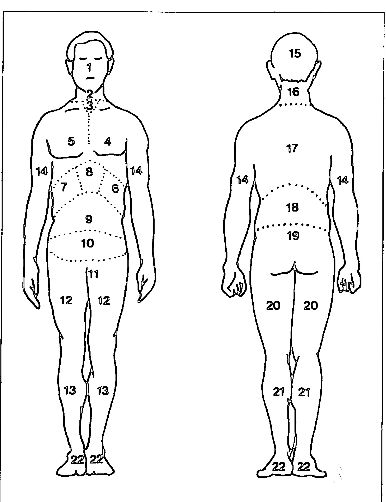
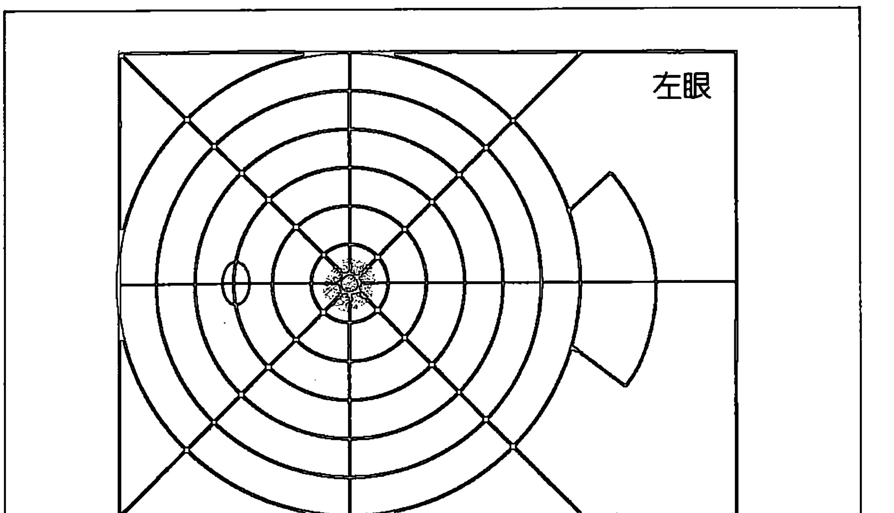
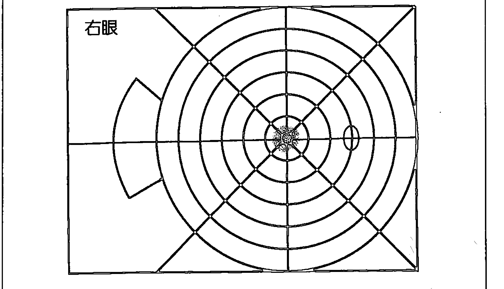
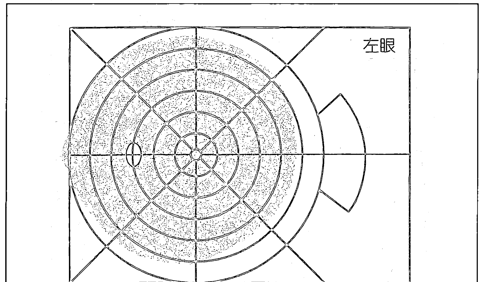
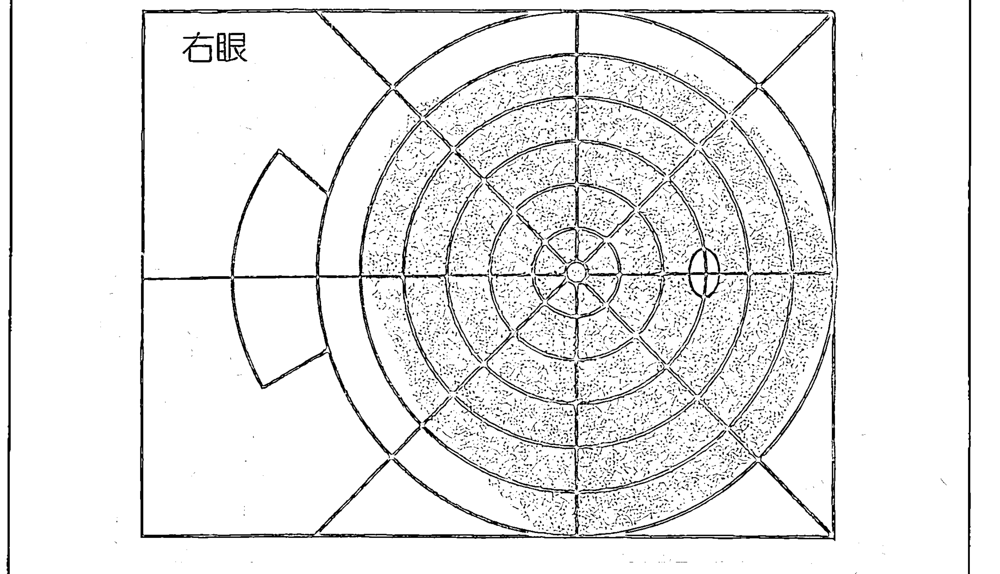
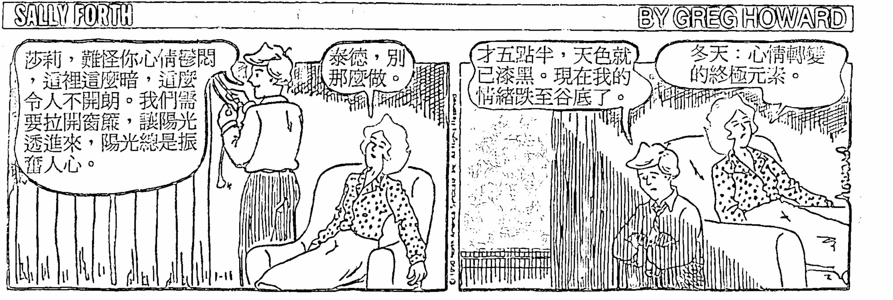
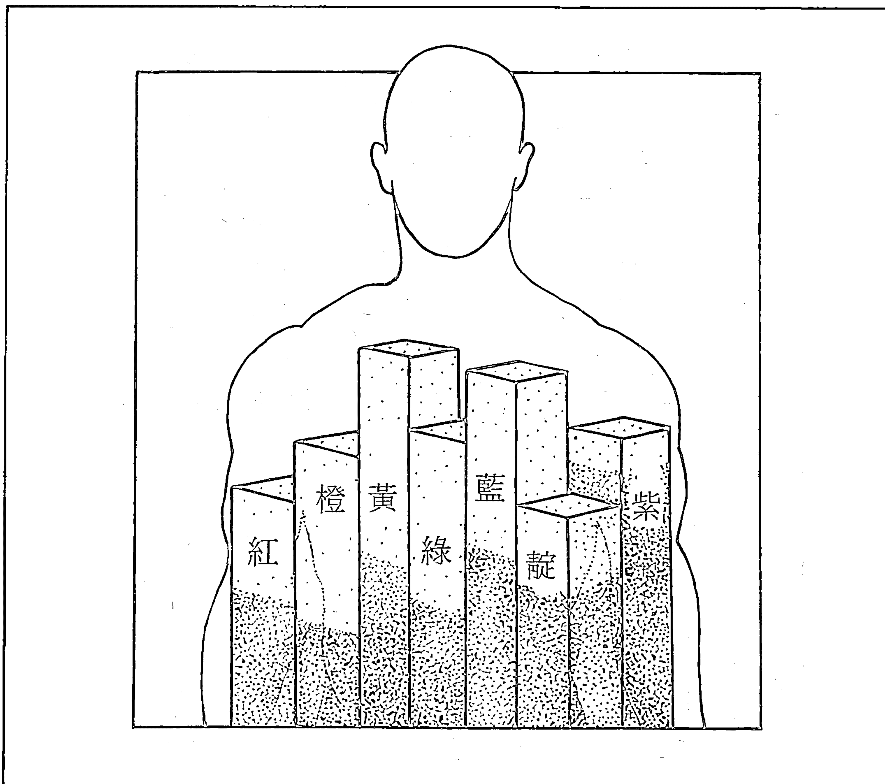

# 光

# 未來的醫學

Light: Medicine of the Future

光學治療權威
將光線、色彩運用於身心整合的創始者
賈寇柏．賴勃曼博士 / 著
(Dr. Jacob Liberman)
胡雅沛 / 總審訂
黃淑貞 / 譯

你可能不知道光是如何
影響我們的身體與心靈
本書裡將一一為你解開
光與人類間的古老謎題

《光—未來的醫學》，挑戰當今陽光危害人體的迷思，指出科技的產物，如日光燈、太陽眼鏡、防曬乳液，以及室內生活形態，對我們或許弊多於利。整合科學研究、臨床經驗，以及個人的見解，賈寇柏．賴勃曼博士已有效地治療超過三萬名患者，包括有學習障礙、生理／精神傷害，以及商界總裁、奧林匹克運動選手。本書討論運用光線治療多種癌症、抑鬱壓力、視覺問題、月經前疼痛徵候群、性功能障礙、學習困難，以及人體免疫系統。

> 「賴勃曼博士的書清楚地呈現光能影響治療過程的深遠性，以及視覺構造為何不只是對光有反應的視覺器官。」

~迪佩克．查柏拉
《量子治療：探索身/心醫學先鋒》的作者

> 「賈寇柏．賴勃曼博士身居文明科技的前端，融合物理學與形上學的基礎，並將之發揮得淋漓盡致；他是該領域的罕見人才，以其深奧智慧、見解與研究，提供所有『長眼睛』的人革命性『創新』的認知。」

~丹．威爾曼
《和平戰士的希望》的作者

新時代系列 B3

# 光——未來的醫學

原著／賈寇柏．賴勃曼
總審訂／胡雅沛
譯者／黃淑貞
主編／沈鴻雁
編輯／黃敏華、羅煥耿、賴如雅
美術編輯／林逸敏、鍾愛蕾
發行人／簡玉芬
負責人／簡泰雄
出版者／世茂出版社
登記證／局版臺省業字第564號
地址／台北縣新店市民生路19號5樓
電話／（02）218-3277（代表）
業務傳真／（02）218-3239
編輯傳真／（02）218-7539
郵撥帳號／07503007 世茂出版社帳戶
電腦排版／龍虎電腦排版公司
製版廠／長紅印製企業有限公司
印刷廠／長紅印製企業有限公司
裝訂廠／立昌裝訂股份有限公司

合法授權。侵害必究

出版日期／1997年12月第一版

定價／270元

原書名／Light: Medicine of the Future.
“Copyright © 1991 by Jacob Liberman, O. D. Ph. D. Chinese language edition arranged with Bear Books through Big Apple Tuttle-Mori Agency, Inc. All Rights Reserved”

。本書如有破損、缺頁、裝訂錯誤，請寄回本社更換。

Printed in Taiwan

# 光——
未來的醫學

Light : Medicine of the Future

賈寇柏．賴勃曼／著
胡雅沛／總審訂
黃淑貞／譯

# 出版序

人類文明的演進至二十世紀末到達了物質追求與發展的高峰，隨著寶瓶世紀的來臨，地球所處的宇宙時空中，正醞釀著另一種新文明的誕生；這股改變的浪潮，將帶領全體人類轉向精神領域的探索和提昇。過去的教育、心理學、哲學、神秘學乃至科學、宗教等，無一不是在探求生命的真相與原貌，在眾多分歧、百家爭鳴的表象下，統合萬物的真理逐漸在各個領域悄然浮現，心物一元或是身心靈的結合與昇華，成為當代世人所共同追求的理想與遠景。

於是新時代之光同時在世界上每個角落點燃，而所謂的「新時代運動」是以歐美國家為最早發端，逐漸地發展與演進，目前已成為一股強大的思想潮流，世界各地相關之集會活動、教學課程、藝文出版、音樂創作，乃至科學、醫學的新生命觀、愛護地球的環保運動等，皆屬於此新思潮的展現，它們共同的目的皆在於提昇人類的意識，回歸生命光與愛的本質，進而邁向天人合一、宇宙和平與世界大同的未來。

在台灣，新時代運動的起步較晚，然而近幾年來由於有許多先進及熱心人士用心地投入與推動，並引進各種不同的觀念活動課程，已奠定了良好的基礎。本社在此風雲際會、新時代來臨之際，自覺亦應肩負起出版者的使命，希望能將新時代的全貌完整且如實地介紹給讀者而規劃出一系列的新時代叢書；新時代的領域包含甚廣，大致可分為十二大類：包括新時代思想類、星際資訊類、光能靈療類、心靈潛能類、水晶礦石類、古文明與神秘學類、星象研究類、創造與生涯類、養生保健類、傳統心靈哲學類、兩性關係類、心靈童書類等等。針對如此浩瀚的領域，本社將有計劃地網羅各類別的好書，在此系列問世的第一、二年間，先推出其中七大類，共約四十本以饗讀者。

- A、新時代思想類：此類叢書首重闡釋新時代的生命觀、哲學觀以及意識架構，啟發我們以另一種多元整體的觀點來省察生命的真理與意涵。
- B、光能靈療類：介紹能量與光的本質，以及如何將光能運用在身心靈的治療上。
- C、心靈潛能類：透過冥想、能量的操作乃至各類心靈技巧的演練，把人類天賦的潛能予以開發。
- D、創造與生涯類：應用新時代生命觀來創造更美好與豐富的物質世界，真正將心物一元的理想落實在生活中。
- E、水晶礦石類：介紹各類礦石水晶，以及它們與身心靈的提昇及治療的關係和實
- F、養生保健類：以自然而符合生命的原始法則之養生方式來增進生活品質，以健康和樂的生活作為心靈提昇的基石。
- G、星際資訊類：了解來自其他星系和文明的心靈訊息，喚醒我們內在的宇宙記憶和知識，重建天人合一的連結。

隨後數年將逐漸發展到其餘類別，希望以階段性的方式將這十二類國內外新時代的相關著作予以完整的介紹，並計劃於適當時機，與國內相關的團體、工作坊結合，舉辦各種活動及讀書會，或邀請國內外作家、專業人士舉辦座談會或相關課程，作為書籍出版之後續服務，及對讀者的回饋。

當然要圓滿達成這樣的一個書香遠景，是需要長時間的投入及努力，與各方的奧援及支持。我們願善盡出版者的責任，希望能以好書陪伴這急遽變動中的世界，邁向另一階段的躍昇，更期待新時代中的光與愛能普照全體人類和十方宇宙，讓眾生萬物都回歸到真實而喜悅的生命中。

# 總審訂
簡介

胡雅沛畢業於台大政治系，於學生時代即開始探索新時代的訊息與能量研究，曾接受歐林、光的課程，和知見心理學等新時代專業課程的訓練，目前致力於星象能量和行星意識的研究，並擔任宇宙靈氣授證教師。此外，經常擔任新時代各類課程現場口譯，以及光能冥想教學和個人諮商治療。

# 導讀

親愛的朋友們，你是否曾經早起來享受清晨的陽光呢？也許，你會感到奇怪為什麼問如此平常的問題。太陽——原就是我們習以為常，甚至把它當作一位理所當然的朋友。如果你真的這麼想，那麼，讓我邀請你帶著一份好奇與耐心，來重新認識宇宙光能的奧妙，細細品味這一本將會改善你的健康、開展你的未來的「光的學問書」。

光——未來的醫學。事實上，光存在於過去、現在、未來，它一直是人類所賴以生存的最重要的生命元素之一。除了古埃及與希臘之外，四千六百多年前在中國古代的醫學典籍中就有記載著「陽氣者，若天與日，失其行，獨壽不章，故天運當以日光明，是故陽因上而衛外者也。」我們的地球在太陽系中依靠唯一的陽光能量而孕育萬物，使自然界的的生命得以生生不息。近百年來，人類不斷地遭遇各種像癌症這類的疑難雜症，世界各地的醫師與醫學研究者皆努力在找尋解除病痛的答案，甚至預防醫學也愈加受到我們的重視；在這漫長的探索未知的過程中，我們其實可以現在就開始輕鬆地使用這隨手可得的寶貝——太陽光能，來治療及預防我們身心靈的痛苦，讓這古老的醫學智慧能再顯現它療癒的光芒。

可是對忙碌的現代人類而言，若要求他每天依著古籍所提醒：「日光明，月安眠。」一來起居生活，亦就是要日出而作，日落而息，大概反對的聲音可以組成一首最巨大的合唱曲了！因此，在這本以醫學為經，科學為緯的專書裏，它對光與健康做了專業而深入的分析，更提供許多你可以在生活裏輕易即可運用的方法，材料和來源，以及取用色彩來做治療與保養的方便法門，教導你如何使身心獲得光能的吸收，並且帶給你的身心靈一個全方位的養生之道。

筆者從小是帶著藥罐子長大的人，由於不懂得如何妥善照顧自己，這幾年來旅居美國，歷經艱苦的求學與就業生活後，在長期的體力透支與缺乏保養的情況下，身體可說是無處不病！此時，才恍然必須正視健康的問題。所幸遇到一位仁醫給予病理、藥理的雙管治療，終於能過著身康心安的生活。在療程中一主要藥方竟是日常可得的——太陽光能。醫生囑咐我，每天在曙光乍現的清晨時分，到戶外散散步、動動筋骨，如此做來，當天的精神與體力自然產生了更強的能量，亦即提昇了真氣的質與量，再配合中藥來內外調理，成為真正還我健康的妙法。一段時間的嘗試之後，不僅身體健康狀況大為改善，因久病而帶來的沮喪也隨之轉化。寶貝健康的的朋友們！為了愛護你的生命，何不試試在黎明即起之時，走向戶外，迎接太陽第一道的溫暖光能量，給自己享受一餐最新鮮的「光的饗宴」？最後，別忘了，要持之以恆才有效果哦！

一位曾接受光能療法而深蒙其惠的旅美華人
桑萊於加州，一九九七

# 目錄

出版序 / 3

導讀 / 7

書評 / 19

前言：由約翰．歐特博士所撰 / 22

序言 / 25

導論 / 30

# 第一部 上帝說：「要有光」

## 第一章 人體光電池 / 37

- 白天與黑夜 / 40
- 生命的旋律 / 41
- 太陽：原始的治療師 / 42
- 現代科學認定光的價值 / 43

## 第二章 眼睛是靈魂之窗 / 47

- 眼睛透露的訊息 / 48
- 眼睛和人類福祉 / 50
- 神經語言程式學（NLP）/ 53
- 光：身體的能源食物 / 55
- 保持身體平衡的系統 / 58

## 第三章 松果腺：靈魂之席 / 65

- 人體的光尺 / 66
- 第三隻眼 / 68
- 調節器 / 69

## 第四章 色彩：生命的彩虹 / 75

- 季節變化 / 77
- 色彩、情感、反應 / 78
- 色彩偏好 / 80
- 色彩精神病理效應 / 83
- 藍光治療黃膽 / 85
- 藍光治療關節炎 / 86
- 紅光抑止偏頭痛 / 87
- 讓囚犯置身於粉紅色中，而運動員置身於紅色中 / 88

## 第五章 光能失調：這是事實或是假想？ / 93

- 光線和細胞變化 / 89
- 生活環境中的光線 / 94
- 光線和人體運作 / 95

## 第二部 光：嶄新的醫學

- 全譜光源：約翰．歐特的研究／97
- 全譜光線對人類的效用／98
- 全譜光對膽固醇的效用／100
- 全譜光和不完全光線／100
- 運用光線使食物和水恢復生機／103

## 第六章 啟蒙的拓荒者／107

- 陽光和維他命 D ／111
- 分光色彩系統／113
- 西多尼整合法／117

## 第七章 視覺專家的新視野／120

- 綜觀地看世界，而非「管中窺月」／123

## 第八章 光線、色彩與學習 / 145

- 伍爾法的學校研究 / 145
- 維特的發現 / 147
- 艾爾蘭的彩色鏡片 / 149
- 治療病因或結果呢？ / 150

## 第九章 癌症新曙光 / 153

- 光源與壽命 / 153
- 癌症的致命射線：光機能治療 / 155
- 光源：血液清潔劑 / 160

## 第十章 光：大自然神奇的醫藥

- 能調整的雷射光 / 161
- 季節性情緒失調的病症 / 165
- 以光治療悲傷 / 166
- 用光來治療性功能障礙 / 173
- 重新設定身體內部生理時鐘 / 175
- 光線與牙科 / 176
- 光針 / 177
- 顏色：身體生命的能量 / 177
- 用顏色來消除緊張 / 178
- 緩和經前疼痛徵候羣（PMS） / 180
- 和生命週期接觸 / 182

## 第十一章 問題所在：要不要紫外線／187

- 紫外線放射的種類／188
- 太陽與紫外線治療／188
- 紫外線光的好處／190
- 然而，紫外線到底有益或有害呢？／193
- 室內照明的問題／195
- 紫外線研究帶來恐懼的浪潮／197
- 是否我們造成自己的盲目？／198
- 現今對皮膚癌的觀念／200
- 扭轉對皮膚癌的觀念／201
- 建議／203
- 科學犯錯了嗎？／206

## 第三部份 光明前景

## 第十一章 彩虹餐感覺會更好 / 208

- 生物氧化 / 208
- 凍結的光 / 210

## 第十二章 健康與治療的新典範 / 217

- 醫生，請治療你自己 / 220
- 生物感受性：身體的雷達 / 225
- 感受性的降低 / 229
- 人類的同類療法：大自然如何治癒我們 / 231

## 第十四章 光的啟明 / 236

- 我所受的教導 / 236
- 西多尼療法的功效 / 237
- 探索未曾開發的 / 238
- 冰山一隅 / 239
- 色彩的感受度 / 240
- 發展新方法 / 241
- 色彩接納性與氣輪 / 243
- 南西的案例 / 244
- 凱的神奇故事 / 252

## 第十五章 光能：最後未知的領域 / 260

- 引進光能 / 261
- 從來沒有人涉足的領域 / 263

# 書評

> 《光——未來的醫學》……開先鋒的研究，賴勃曼博士道出即將來臨的改革，血淋淋穿透式的醫學方法將臣服於更有效率的溫和治療。他所蒐集的臨床經驗提供了最佳的證明，一經實行，改革並非無根據的承諾。
——克里斯多夫．勃德（Christopher Bird）
《植物的神秘生命》一書作者之一

> 賈寇柏．賴勃曼博士的創先思想，藉由與深入的健全智慧及靈魂了解的融合，將光的神奇與光學治療帶至一個嶄新境界。感謝他帶來令人振奮的新資訊，這是很棒的一本書。
——加百列．古森博士（Gabriel Cousens, M.D.）
《心靈養分與彩虹餐》的作者

賈寇柏．賴勃曼博士的書探討光和顏色頻率對人類能源系統的不同效應，在這浩瀚無涯的學海中，遲來地檢閱人類細胞。《光——未來的醫學》，將激起治療專業領域的興趣；然而，更重要的是，對於在這星球上處於演化巔峰狀態的我們，將來動向為何？已有條明確的道路。透過光，確實更能促進人類彼此的互愛與關懷。

> ——克里斯多夫．希爾博士（Christopher Hills, Ph.D.）
《核子進化：彩虹身體的發現》一書的作者

從古老智慧及科學對光的了解切入，賈寇柏．賴勃曼博士統整了生化、精神生理和光的靈魂特質。這本書榮耀地啟蒙了光能值得注意的治療特質，最終並教導讀者如何以深切的治療態度來運用這獨一無二的強大能源。

> ——唐娜．奧門（Dana Ullman）
Utne Reader的書評家

賴勃曼結合了現今科學對這新穎、發展迅速的光學治療所僅有的有限資料，與多年來個人和患者的親身經驗，成就相當驚人。

光是影響全身健康最重要的環境因素之一，的確，「眼睛是靈魂之窗」，本書有助於開啟這扇窗。

> ——約翰．歐特（John Ott, Sc.D.（Hon.））
《健康與光；光，放射與你》一書的作者

> ——諾曼．雪利博士（Norman Shealy, M.D.）
美國全相醫學協會的創立主席

賴勃曼博士的書對於光透過眼睛的治療效果有劃時代的意義。

> ——費茲．荷維博士（Fritz Holwich, M.D.）
《眼睛接受光線對人類及動物新陳代謝的影響》的作者

賴勃曼博士開啟我們對大自然全相整體治療的全新視野以及全新的健康進化課程。

> ——博納德．強森博士（Bernard Jensen, D.C., Ph.D.）
作家及演講家，擅長「長壽」領域

# 前言

我第一次認識賈寇柏．賴勃曼是在一九七五年，當時我正在邁阿密作一場關於視力檢定會議的演講，他也參加了。自從那時起，我們的友誼發展成一種規律性、互相交流意見、分享彼此發現的關係，都為光源和其對所有生物的神奇功效感到興奮。他像是接力賽跑的隊員之一，我把棒子交到他手上，他就很迅速地衝刺，同時傳給其他人。

讀他的書，《光——未來的醫學》，完全為其個人的故事與專業知識著迷。他彙整現今此項嶄新、發展迅速的光學治療科學，並將之轉變成容易了解的一般常識。除此之外，基於個人經驗及案例研究，亦指出一些科學界常常忽略的重點。

近代的研究人員必須了解，對既存科學文獻某個主題的檢討，並非實際經驗的替代，重要的發現往往被視為瘋狂，或只是軼聞趣事，只因它們尚未列入當時的科學記載。難道我們完全不信任自己眼看、耳聽及感覺每一件事物的能力？而只相信對現實觀點和我們相異的人的發現？舉例來說，麥哲倫發現地球是圓的，只因親身體驗圍繞著它航行一圈，不管當時盛傳地球是平的，船若開太遠，靠近邊緣地帶就會掉落的說法。

即使是今日，新發現通常亦被視為荒誕不經，除非符合「冷而硬性」的科學原則。近來，一位健康相關的新聞編輯寄了封信給約紐市首屈一指的癌症研究中心，請求以支票付費的方式來參考他們的研究資料，以協助他對該領域的了解。同時附上一份有關紫外線益處的完整報導，這是在出刊之前，諮詢過我意見的一篇文章。令人驚訝的是，他立刻收到退回的支票及一封表明拒絕寄來任何資料的回函，因為在他報導上的研究已不受全球醫生的支持。這實在令人難以置信，一九九○年的科學家只基於論點不同，即拒絕和感興趣的人分享他們的知識。

地球上的生物在自然的陽光下進化，而且生活在陽光所包含的全譜光線中相當長的一段時間了。許多史前部落，甚至整個文化，崇拜太陽治療的能力，運用它的全譜光來治療身體及精神上的問題，以一種所謂的「日光浴療法」。然而現代的科學、醫學研究指稱太陽光危害人類的健康，於是市面上充斥著各式各樣特殊的眼鏡及防曬乳液提供全面的保護。商業利益掛帥之下，有時混淆了事實。

不幸的是，過去自然的日光浴療法已為許多人人工方式所取代，比如化學療法。似乎現今很多治療法在某方面有神奇的效果，它們消除徵候或有效地麻木知覺，使得問題不再受重視。

如同本書第十二章所討論的，汽車的引擎需要燃料、氧氣，以及火星塞來產生內部的燃燒，使車子得以發動、行駛。人體亦需燃料（以食物的形式）、氧氣及火星塞（以光能的形式），引燃新陳代謝的過程。如果汽車點燃系統運作不順暢，添加燃料並不能解決問題。人體也是相同情況，維他命無法解決完整新陳代謝所需光能不足所造成的問題。在我的感覺，光譜上肉眼可見及其他特殊部份，尤其是紫外線，如同所有人體生理機能的引燃系統，這是無庸置疑的。

綜合他多年來的個人、臨床經驗及患者令人驚訝的治療效果，賴勃曼博士為全新的醫學典範發展出基本的模型。身為這崛起領域的一份子，觀察它的成長及持續演化，我為像賈寇柏．賴勃曼這種人的努力喝采讚許，他能一直秉持信念領導向前，和我一樣地相信光是未來的醫學。

約翰．歐特（John Ott, Sc.D. (Hon.)）
一九九〇年六月，於佛羅里達州的沙羅索達

> ※約翰博士是光學生物學領域的領導先鋒，同時也是《健康與光；光，放射與你》和《我的象牙塔》等書的作者。

## 序言

我接觸光的密切關係是從一九七四年開始，因為一件驚人的經歷而奠定了未來方向。一位七歲大的女孩——愛琳，父母親帶她來我辦公室要求做視力檢驗。對這年幼的女孩的測量及倦怠眼睛狀況的可能治療已事先了解，矯正前視力較好的一隻眼睛是20/20，而視力較差的一隻眼睛矯正後也只有20/200。雖然當時我從事視力檢驗尚未滿一年，個人的興趣是在視力改善，而非僅局限於驗光配眼鏡，但讓我經驗了使用新穎的技術——光，來治療她特殊的病況。這項技術包括照亮一光源至視力較好的一隻眼睛，讓它能在大腦中游走，最後刺激另一隻眼睛。既然在精神邏輯上，兩個眼球互相連接著，我發現能夠運用視力較好的一隻去訓練另一隻，使它能夠看得更清楚。透過這項方法，在短短三十分鐘內，我能夠有效改善愛琳較弱眼睛的程度，約提昇至20/25。儘管起初的進步並未持久，在五次課程之後，她視力較差的一隻眼睛依舊是20/20，且一直維持如此。她現年已二十二歲，兩眼依然只有20/20。同樣那一年，我有另一個振奮的經驗。在一場宴會中，我把我的手用創新的方式拍照，所謂的克里安照相（Kirlian photography）。這項技術顯現出一些身體的放射能源。這經驗不只告訴我人體釋放光能，尚有藉由改變心智，我們能夠確實地增加、減低，以及（或者）引導身體能源的流向。

一九七五年，我開始發展視力改善的方法，稱之為「開放焦點」。我很快地了解到，這方式不單只對視力有效，這技術是基於我多年來觀察人類行為的特殊面而建立的（也就是習慣於熟悉的處事方式，以及必然的學習）；我發現大部份人終其一生，總是不斷地追求特別的事物，而在這過程當中，錯過每一件不想尋找的事物。既然這顯現出大部份生命的啟示發生在不被刻意追求的時候，我開始了解到我們大部份人在尋找當中，只是讓自己去「看」，然後再嘗試，構成一個「不完整」的事實。

基於這項覺醒，我假設如果不看任何東西或許就能看見一切。我在個人生命中實驗了這項推測，得到驚人的結果。除了拓寬我的視力範圍之外，還降低近視程度，改善視力，減輕疼痛，並且扭轉我的觀念，讓我看清前所未見的，即使針對存在已久的事物。

第一項發現就是改變偶爾能看到人體周圍氣場的方法，然後注意到這種氣場並非如以往所想像肉眼看不見的，事實上，可見能源能夠藉由分子和波的形式察覺。這些發現讓我了解到人都是天生被動的，並不主動地去觀察，而我們的眼睛天生就有這種能力，如果我們讓它得以發揮的話。換句話說，視覺觀察並不費力，我們需要學習如同欣賞電影的態度來觀看人生——絲毫不費吹灰之力。會覺得吃力不討好是因為妨礙了其流暢、效用、舒適及表現。很遺憾的是，大部份人習慣很用力地看事情，然而卻未曾看出許多大自然及生命中可見的奇蹟。

有這些洞察的結果之後，決定不再戴眼鏡，開始主動地嘗試以心智運作；我主要的經驗在於心智和眼睛的整合，尤其是對於人們事實上如何看，及為何如此看的興趣。在這幾年當中深究這些疑問，得到數個有力的觀察，其中最重要的一個是如果我們讓眼睛得以發揮功用，它們將帶領我們的注意力至周遭任何不恰當、或是不按牌理出牌的事物。

舉藝術家工作方式的例子來說明。當創作一幅畫時，他或她經常往後退，全然地凝視每一個細節，去感受它是如何創作的。儘管藝術家並不特別地看任何東西，他或她的眼睛似乎引導他們到任何顯然不完美的地方。這不只有助於相信眼睛如何運作，似乎也指出，或許我們所有的感官系統，以及全部的身體系統，也是如此地運作。

很快的，我了解到在這觀看的過程有極大的目的，而且任何直覺注意的事物，都是重要且需進一步留意。我開始運用這個試驗性的前提於生活中，發現了一些驚人的事情。舉例來說，當談論一件案例時，我會無心地用一種「開放焦點」的態度，凝視該位病患。起初沒注意到有什麼，但在幾次隨意地凝視之後，了解到我的眼睛刻意帶我看病人身上特殊的部位。當我注視這些身體部位時，留意到有什麼卡在那裡，而且身體能量顯然繞經鄰近地區傳送。起初我並不了解原因，但問過病人之後，開始了解他們身心劇烈的疼痛似乎（而非偶然）就是身體那些部位。

身體的智慧愈顯清楚了，很快的，開始精確地相信我所看到以及詢問病人關於我發現的問題。他們的反應通常很驚訝，問道：「你是怎麼曉得的？」大部份時候我並不完全了解所接收、或者為何接收的資訊，除非在我所看見及患者所表露之間存在著明確的關連。這項新知的基礎已被建立。

然後，在一九七七年時，一位好友告訴我他接受一種所謂西多尼（Syntonics）特殊光學治療的經驗；發展於一九二○年代的西多尼整合療法運用可見光譜不同的部份，透過眼睛（身體狀況的陳列）來治療。我參加了西多尼整合療法視力檢驗學院整年課程，並購買設備，然後開始自己生命中的研究。

我的第一位病人是我母親，當時因視力神經疾病而左眼失明，令人害怕的是二十五年前右眼亦因相同情況喪失了部份視力，而我外婆則因此疾病導致完全失明。為這希望渺茫的未來所恐懼，所以她順從地接受邁阿密以及巴斯卡聖地眼睛協會（Bascom Palmer Eye Institute）數位頂尖眼科醫師長達半年的醫學治療。在那時，她只看得見貼在眼前手指的模糊影像，完全失去周遭視覺能力。

我的研究告訴我藍綠色有抗激動的效用，於是要求母親注視我設備之一特定的藍綠光，每天二十分鐘。四天後，診斷出她視力有改善。到了第十一天，她心情愉快，感覺舒服許多，而且開始「看得見」身旁的東西。在第二十天的治療，她能讀出距離二十英呎遠，四英吋高的字母——很大的進步——左眼亦恢復百分之八十周圍視覺的能力。她同時注意到已損害達二十五年的右眼明顯的改善。由這些奇蹟展開我的生命，及本書呈現的研究。

重要的並不是我們運用知識及工具來成為一個更好的「修理者」，更甚者，我們有自我「進化」的絕對必要，統合零散的每一件東西為完整，使之更具關連性，且關心社會群體。我們的任務就是引進光，善用之，使其能和真實的自我與命運結合，進而助長對星球的治療。當我們化零為整、合而為一時，釋放出的光——由內散發出——未來受自身精神、肉體障礙負擔的阻擾。未來的醫學就是光，我們正是利用本身的精髓來自我治療。

## 導論

繫緊你的安全帶，馬上就要開始旅行——一段令你驚奇萬分，並能教導你興奮心智、鉤心奪魂的旅程——展開以人類宇宙中最古老的朋友「光」的治療之旅。

本書介紹古老的事蹟，也是新興的科學：光的科學；這項科學搭起了科學知識、直覺、健康及個人進化之間的橋樑，宛如治療新典範的基礎，它帶領我們進入醫學的新紀元。光，一種非穿透式、能力強大的工具，位處新醫學的核心：能量醫學。在一九九○年代，顯而易見的，光是所有生命起源、發展、治療、演化的基本原件，無論過去或現在，古聖先賢及形上學文獻皆有記載。然而，我們就要親眼目睹一項結合——「直覺」和「理性」科學——一項由光促成的結合。

並沒有所謂將人體當成分離「零件」的集合體來治療，壞了就修理的道理。人體是光的化身，我們的困難與疾病都根源自運用光的能力不足，無法將之當成治療及演化的發射台一般。就個人經驗，見過數以千計的此類案例。而奇蹟一再地出現也讓我深信，未來科學是針對內在，而非外在空間的探討。

第一部份是基礎概論，描述身體為一活生生的電磁波，受射進靈魂之窗的眼睛的光線刺激與調節。眼睛就是光線的進入點，由此對人類生心理的和諧、情緒運作，及意識的發展產生重大的效用。這一部份檢驗了松果腺體（身體的光尺）所扮演的角色，以及它是如何協助我們和大自然、宇宙的步調一致；探討色彩的世界，與如何運用顏色來治療；介紹光是一種食物的觀念——催化體內的生物氧化，如同催化植物的光合作用一樣。

由於人類隨隨便便過日子的態度，已經讓自己染上了慢性的「光能失調」（mal-illumination），就像營養不良的盛行，造成人體運作的嚴重脫序。近代科技的進步，如大多數的日光燈、太陽眼鏡、防曬乳液，以及一般室內生活形態，實際上對我們的傷害可能多過幫助。

第二部份介紹一些早期開路先鋒的研究（通常視為可笑、瘋狂），是如此地遙遙領先，只有現代科學腳步才跟得上。五十年前的提議和治療，現在才著手調查並臨床應用。今日，居領導地位、德高望重的內科醫師和科學正進行光的醫療運用、最先進的研究，同時應用於許多實地臨床。這些現代的應用包括治療各種癌症、沮喪、緊張、視力問題、經前痛徵候羣、性官能失常及生理時差所引發的問題。第二部份也展現了光是如何有效地改善學習能力、減少學習不良、強化免疫系統，甚至延長壽命。

你最近或許聽過、讀過有關太陽光的傷害，尤其是紫外線光。這些在第二部份亦有探討，並呈現淺顯易懂的觀點。你將發現，事實上紫外線是電磁光譜上最具生物活動力、最重要的部份。另外還提出許多不同的科學研究，證實或否定我們最強而有力的盟友：光。

光和顏色包含了人類藉由食物、維他命所攝取的精華；而且，事實上，它們在人體內像是吸收的催化劑，善用這些營養素。儘管在醫學及非醫學領域，廣泛研究光並運用於治療上，光最強大功能或許在於其開啟心智，使之暢通的能力了。

第三部份展現一項新醫學——治療生理、情緒、靈魂的全相方法（holistic approach），因而賦予「精神神經免疫學」（心智／身體治療的連結）全新的意義。我的工作是同時治療身體和心智，藉由潛意識浮現至意識面的直接效用，進而轉化早期記憶為嶄新、光明的經驗。

這一部份說明了為何人對生命的某些方面張開雙臂迎接？為何對另外方面，部份或完全封閉？或者「過敏」呢？以及人類彼此互為治療藥物的方法——我稱其為「人類同種療法」。顏色，特別是那些最讓我們不舒服的色調，能變成最強大的盟友，用以引發早期未解決的情緒創傷，將之帶至意識層面，由此可把所謂「疾病」的雜草連根拔除。光是未來的醫學，將把人類推向光明的世紀。

## 第一部

### 上帝說：「要有光」

## 第一章 人體光電池

你是否曾經懷疑，為什麼我們稱人類進化的過程為「啟蒙」嗎？或者為何稱我們所處銀河系的這部分為「太陽系」呢？「太陽系」這個名詞不就意謂著人類來自，或者可追溯至太陽？為什麼人們常說「點亮」或「你照耀了我的生命」之類的話語呢？生活在亮光中與體驗靈魂的黑夜有何不同？真如知名的物理學家大衛。鮑所指，「萬物皆為凍結的光」，有可能嗎？難道說，就某方面而言，人類的進化，和其在精神層面運用光的能力，是否如同在有形層面或有關連呢？這許許多多的問題被歸納為科學類，而非只是形上學或靈魂學。以往具有深知卓見的哲人，或許和現代的科學家見識相去不遠。而我們正身處於一個科學探索邃變的時代，科學與「直覺」之間的鴻溝也逐漸搭起橋樑。

自盤古開天地以來，光是萬物生命所不可或缺的，這已是不爭的事實。陽光，維繫光明、溫暖和能量的主要來源，不單對地球上的所有生物，亦包含地球本身。它不僅供給植物行光合作用所需的能源，還是許多人類透過雙眼發覺知識的來源。

太陽光是由多種能源所組成，以電磁波的形式傳送至地球，而只有一小部份的光波確實到達地球表面。在所有光波中，僅百分之一可由肉眼接收到。這些可見光包含彩虹的七色，從最短波長的紫色到最長波長的紅色，此為人類運作、演化的最重要關鍵。我們的生命、健康與福祉實實在在地仰賴著太陽。

### 白天與黑夜

在古代，當人們一早睜開雙眼，即意識到晨曦帶來嶄新的開始。歷史的每一頁，無不將這好的開始與靈感、高昂的生理活動力、卓越的能量及行動聯想在一起。每一次的朝陽，都是由夜晚的休息狀態，到白晝精力充沛的一個轉變，為生活注入新鮮事物（見彩圖一～四）。花朵綻放，萬物甦醒，到處充滿了生氣，一天就此揭開序幕。白天可想像是以太陽的「黃」、天空的「藍」及地球的「綠」為代表。在一天當中，環境的顏色隨著與周遭生物的相互影響而不同。白天將盡時，先是紅橙色的夕陽，接著是暗藍色夜幕低垂，緩和了所有生物的活動，終至一切歸於寂靜，然後又是活力充沛的一天，如此交替循環（見彩圖五～八）。這種晝夜色彩戲劇性的轉換，說明了萬物內在變化的發生。當自然界逐漸地由光譜的一端（白天的紅橙色）移至另一端（黑夜的暗藍色），我們的身體同樣地從工作的運作模式轉為另一休息的狀態。

就像汽車的換檔需經過空檔，自然界也是如此。在白天的光亮轉變成夜晚的黑暗之前，常常有「綠色的閃光」出現。綠色，位於可見色譜的中間，有所謂「零區」或「必經的旅程」之稱，意即萬物在展開一新運作狀態或新生命之前，必先通過它。由人類自古老的晨曦，到目前的夕陽之種種體驗看來，將仍為光所散發出的力與美、對生命的創造及維持的能力，敬畏不已。在光出現的時候，我們的生理及心理核心，都藉著光和自然同步化。由此，人類確實可喻為自然之子。

### ◇ 生命的旋律

基於體認到白天環境顏色的變化與人體日間節奏的改變密切相關，人們也了解到四季色彩的更替同樣反應了萬物中生態的交流。舉例來說，古老的中國針灸療者明白這些生理的交換，隨著四季迭替，給予不同療法。

因此，四季及其主要顏色的變化，已成為色彩對周遭環境所扮演不同角色的普遍反應。（見彩圖九～十二）

比方說，農夫知道在什麼季節播種、耕作、收割，曉得四季更替及日照強度控制了發芽、生長、蟄伏。而很明顯的，動物與植物一直深受太陽的影響。舉凡冬眠、遷徙、繁殖，皆隨著季節而有所不同。由此很清楚可見，和所處環境的光線息息相關著。

就人類而言，多接觸太陽光對身心功能都有很大的助益。尤其以繁殖力與情緒最為顯著，這在許多北歐國家有不少印證。如：挪威、芬蘭，每年有數以月計的時間終日不見太陽，日曬的減少，對易怒、疲勞、疾病、失眠、沮喪、酗酒及自殺，有相對提高的影響。有趣的是，在芬蘭已有研究證明，多數的小孩在六、七月白天長達二十小時的月份裡受孕而出生，遠較冬季的注意力來得集中。

### ◇ 太陽：原始的治療師

從聖經上的記載『要有光』到『啟蒙』的說法，光已在萬物中扮演著永恆的角色。

古埃及、羅馬、希臘，及其他主要文明都利用光來治病。雖然埃及科學家是最早使用色彩來治療，實際上卻是希臘人首先有文件記載太陽療法的理論及相關實驗。希臘的日之都——希利歐波利斯，正是因其會治病的神殿而聞名。在神殿中，太陽光分析出紅橙黃綠藍靛紫七色，而每一分色針對不同的問題。日光浴治療法（一種曝曬在陽光下的醫療法）之父希羅多德寫道：

對健康有待改進及想增重的人來說，日光浴是必要的。在春、秋、冬時，患者應讓陽光曝曬整個身體；但在夏天，因為格外熾熱，所以這方式不適用於虛弱的患者。

光線透過色彩來展現歷史文化中，具有醫療及神賜的意義。

### ◇ 現代科學認定光的價值

幾千年以來，諸多的文明已曉得使用光線來治病。那，沒有光會如何呢？關於陽光與人類成長的科學文獻，最早的記載可能是一七九六年由富弗藍德（Hufeland）所著的《長命百歲》一書。當中提到：「缺乏光，將變得蒼白、虛弱、冷漠，最後全身精力盡失。正如許多不幸的例子，人們長年待在黑暗的地牢即為鐵證。」你能想像每天都是陰霾不見陽光的感覺嗎？或者生活在一年有好幾個月暗無天日的國家？若長期被關在屋內又是何滋味呢？事實上，這不就是大部份人從孩童時期常做，且視為平常的事嗎？而這會是長時間室內工作者肥胖、虛弱、缺乏生氣的原因嗎？經由我們的生活方式，是否把自己「判刑」了？像囚犯般生活在現代螢光地牢？如湯姆。漢克斯在電影「跳火山的人」中的話：「日光燈吸走了我的精力！」

諾貝爾醫學獎得主，亦是維他命C的發現者亞伯特（Albert Szent-Gyorgyi）認為定光及色彩影響我們極為深遠。從他的研究所得的結論是，「所有我們吸收到體內的能量都是取自太陽」。藉由光合作用可了解到，太陽的能源儲存於植物，再被動物及人類食用、消化、吸收、分解、轉換、儲存、運用這來自光的能量。

亞伯特發現，在能量的處理過程中，伴隨著許多有顏色、且對陽光有反應的酵素及荷爾蒙。事實上，當它們為陽光的特定顏色所刺激時，酵素及荷爾蒙通常經歷分子的變化，因此改變了原來的色彩。而這些趨光的變化深深地影響了它們在人體內製造動力反應的能力。這亦說明了某物最顯目的顏色可能是其分子結構的指標。亞伯特認為日光浴能夠有效地改善製造人體能量來源的基本生物機能。又假使光線及色彩對我們助益良多，那一股光線和太陽光為何相去甚遠呢？這就好像開著輛加了便宜的普通油料的汽車，與加了特製的、高級辛烷汽油的差別。

一九七九年馬丁尼克和奧瑞辛也得到類似的結論。他們發現，就酵素如何有效地調節體內的生物活動力上，光線和色彩扮演著舉足輕重的角色。特別是發現：(1) 有些光線的顏色能夠刺激特定的酵素，效果高達五倍；(2) 有些顏色能夠促進酵素反應、提高或抑制某些酵素，而且影響包圍細胞薄膜的物質之活動。這些發現似乎將光視為體內生物機能的調節者，給予崇高的評價。

色彩可以是人生舞台或意識狀態的徵候。我個人相信光線不只影響我們，而且我們的意識狀態也決定了我們會如何使用光。想像一下當生病時，是如何的血色全失、黯然無光；陷入窘況時，又是如何的面紅耳赤。或許這些人的心智反應已改變了他們接收、運用及散發光的能力。

人體的成長是直接來自太陽光的刺激，或間接地來自食物、飲料的攝取，或吸收空氣——來自陽光能量的活力。此光除能影響我們生理活動力及情緒外，近年來光已被證實可在人體內產生類似運動所帶來的效益，以及健康的改善。札尼。金（Zane Kime）博士在他的著作《陽光》一書中指出，連續曝曬太陽將有助於減輕心臟負荷、降低血壓、緩和呼吸、控制血糖、調節乳酸，且提振精神、增加力氣、持續耐力，增加對壓力的承受力，及強化心肺功能。

總而言之，這些發現，及諸多倍受推崇的科學家及物理學家，不約而同地認為人體活脫就是一個光電池——能源來自於太陽光的人類營養物。而既然光對萬物無比重要，且我們對光的認知是透過雙眼而得，由此可知，靈魂之窗的作用不只是「看」而已。

## 第二章 眼睛是靈魂之窗

眼睛是探索與了解宇宙的絕妙工具，亦是社交活動及自我表達的主要資源。你可曾注意過，當第一次見面時，人們的雙眼如何地揭露他們的內心想法？無論悲傷或歡樂，只要瞬息一現，眼睛都將明白地昭示。當一個人的眼睛和別人的在同一時間裡微妙地互動，已然成為溝通的語言。這不單指對話中傳達訊息的言辭交換，還包括兩雙眼睛彼此間只可意會的感情交流。

> ——莎士比亞

莎士比亞指稱：「眼睛是靈魂之窗」。

## 第二章

現已證實眼睛確是身心健康的映射，作為身體狀況黃皮書報告，眼睛精確地反應身心的變化，它們的檢驗報告了大約三○○○種關於健康的機能狀況，以及精確顯示心智狀態和個體運作的形態。

### ◇ 眼睛透露的訊息

眼睛就像身體及意識發展的伴隨效果，及所有運作功能的主要進入點，光對眼睛的關係早在古代已有記錄，包含偉大的希波克拉底（Hippocrates）在內的大部份治療家都視眼睛為人體的一扇窗，由此獲得必要的檢查，以協助病人恢復健康。聖經記載：「你眼睛就是身上的燈，你的眼睛若瞭亮，全身就光明。眼睛若昏花，全身就黑暗。」（路加福音第十一章三十四節）。在一八五六年，慕尼黑盲人學校的一位眼科醫師魏莫（Wimmer）的臨床經驗發現，「如果能夠成功地藉由移除白內障，或再造新的瞳孔，來使眼睛重新感受光線的話，年輕的盲胞將有全新的生命。」

十九世紀匈牙利內科醫師艾格那滋。馮。佩斯禮（Ignatz von Peczely）將眼睛當作身體的微視圖，發展出近代眼球虹膜學（iridology）臨床科學的基礎。他發現眼球的虹膜不折不扣正是身體的小張地圖。現今的虹膜學家可用虹膜分析來顯示異常組織的狀態、發炎的情形，或中毒的器官、組織，他們並未報稱可以診斷疾病，而是藉此評量疾病前兆的身體組織之完整性。一九八九年十二月，蘇俄生活雜誌有篇標題為「無所遁形的雙眸」的文章，報導了蘇俄科學家利用非常敏感的照像機，針對一百五十位受試者施測發現，新研究的虹膜診斷技術與實際生理狀況有百分之百的相關。雖然許多人仍認為虹膜學並非科學，但自佩斯禮公爵之後，虹膜學已向前邁進一大步，且在預防醫學的競爭方面，被視為可能的診斷工具，而持續研發著。

根據歷史的事實，可明顯得知光、眼睛、健康及心智間的強烈關連，為了了解視覺在生活中所扮演的角色，以下將討論眼睛及其主要功能。

### ◇ 眼睛和人類福祉

眼睛是腦部的延伸，至今為止，沒有任何人造系統比它的構造更為錯綜複雜，可以具五百二十萬個零件的哥倫比亞太空梭為比喻，它只相當於單隻眼睛，但眼睛包含一億三千七百萬個視覺接收器，且整體由超過十億個零件所組成。

雖然眼睛及大腦只佔身體重量的百分之二，它們卻佔營養吸收量的百分之二十五，單單眼睛就需心臟的氧氣，四肢活動時關節膜所需維他命C的十至二十倍，比任何其他器官都需智能元素——鋅，眼睛負責身體百分之七十知覺的接收，且是我們終其一生所學知識百分之九十的主要依靠（除了藉其他感官來接收資訊的盲胞以外）。

事實上，每秒鐘三十億個傳送至大腦的訊息有二十億是眼睛發出的，另外眼睛亦是儲存記憶及我們智能的大腦所用為視覺的部份。現代科學逐漸視眼睛為心智可能的通路，有些研究人員深信眼睛的色彩變化與行為有一定的關連存在，認為眼睛不同的顏色影響著大腦不同區域，進而影響個性舉止，若此為真，是否不同的色彩亦將影響我們的大腦呢？

另一群科學家發現視覺與心智疾病間重大的關連，指出在百分之九患有視覺問題的一般民眾當中，百分之六十六是因憂鬱、壓力、精神分裂、酒精中毒等所引起。

然而，當一個人有了視覺問題時，所代表的真正意思為何呢？是眼睛或心智方面的毛病呢？就我個人治療了數以千計病患的經驗，發現心智的「視覺之窗」與實際眼睛有重大的關連。從事視力驗光的十六年當中，持續地見到特異的精神模式和眼睛機能之間明顯的關係；同時視覺治療對眼睛和心智二者間的「模式修正」是非常成功的。這似乎證實了使用眼睛，特別是視覺模式的治療價值，是其為診斷和治療身體及精神的方法之一。

### ◇ 神經語言程式學（NLP）

近年來一項新穎的臨床科學，浮現眼球運動和認知過程之間關係的面貌，尤其是研究人們如何運用、儲存資訊，以及處置過程如何呈現在行為上。這項新興的科學，神經語言程式學，乃源自於臨床發現眼球運動就像是開放特定形式知覺記憶的機關，若我們相信心智記憶如同由形形色色存放不同種經驗類別的圖書館相互參照所組成，則科學家所注意的眼睛，宛如是為取用所需特定資訊、開啟圖書館大門的鑰匙，眼睛獨特的掃描模式揭露了一個人取用資訊內在策略的來龍去脈。

圖八說明了慣用右手「正常構造」的人為了取得特定形態的資訊時，眼球將會移動的方向（慣用左手者，方向相反）。心智描繪嶄新的視覺心像時，眼球往右上方移動，當取用聽覺記憶資訊時（眼球轉向左邊），及聽覺建構資訊（眼球常轉向右邊）時，也會有類似情況產生。至於取用肌肉運動知覺，包括聞和嚐，眼球通常看向右下方。這或許說明當人們試圖回答問題時，經常看著特定方向。因此，欲獲得何種資訊將決定眼睛注視哪一方向。

試著詢問慣用右手的朋友以下幾個問題，並注意他們回答之前眼睛的轉動：(1) 你的腳踏車是什麼顏色？（視覺記憶）(2) 你媽媽如果染了紫色頭髮會是什麼模樣？（視覺建構）(3)你最喜歡的流行歌曲是哪一首？（聽覺記憶）(4)兔毛摸起來像什麼？（肌肉運動知覺）

現在了解了控制眼球運動的神經就像知覺的過濾網，和大腦中控制意識的區域密切相關。基於這項資訊，發展出傳達的模式，亦即如何利用眼睛的運動來治療輸入腦部重要的資訊及取用已儲存的資訊。這項技術現已被用為治療物理疾病的附屬，以及教導傳達藝術、情緒過程的支援。

### ◇ 光：身體的能源食物

現在我們已見識眼睛與健康、福祉的關連，再看看是如何使用其基本營養食物——光。既然視覺真是我們的導航系統，每天單位時間得自外界的資訊遠較其他感官來得多，檢視眼睛如何利用光來達成任務將是非常有用的。

誠如前面所提，單隻眼睛就有一億三千七百萬個視覺接收器，其中約有一億三千萬個稱為視桿細胞（rods），另外七百萬個稱為視錐狀細胞（cones）。主要在白天運作的視錐狀細胞關係到高明亮度時視覺的敏銳及色彩的辨別力；而主要在黎明或黃昏微暗光線作用的視桿細胞，大都和無色彩視覺及在低亮度中的活動相關。這些影像接收器轉換光線成為電子脈衝（electrical impulses），再以時速約二百三十四哩的速度將之送至大腦，這些脈衝旅行了數個纏繞整個大腦的路程。當有的至視床下部，有些至建立影像的視覺皮質，如此牽動著我們重要的運作。

儘管視覺是我們最生動的功能，隨著心智狀態而產生變化。但大部份人，包括科學家和開業醫師，都以為眼睛只有一項功能——「看」，很多人不明白「看」只是「視覺」的一小部份而已。對於身為光源進入人體主要路徑的眼睛，能精確地反應我們身心健康，以及我們的思考模式。這自古以來就非常的重要，但近來發現，連結眼睛和腦運作核心宛如連結我們和大自然。

在十八世紀末已假設這項神經上的關連，且在一九二〇～一九五〇年實驗發現。然而一直到一九七〇年早期科學界才能清楚地證實光線進入眼睛不只是為了視覺，亦要將之送至大腦最重要的部位——視床下部。因此，確立了光線進入眼睛，提供視覺與非視覺雙重功能。這項發現科學地證實了早期人們已知的光，也就是說，它進入人體的路徑，以及對調節中心主要的影響與功能。這些古老文明是否靠直覺了解光的能力呢？抑或它們的科技遠超乎我們？

想想古埃及，雖然他們的科技與成就對現代邏輯觀而言仍是個謎，但他們同時也是運用精巧建造的光之廟宇來治病的那羣人。至於希臘人不只相信光的療效，更認為透過眼睛效果會更棒！他們相信眼睛是到內部器官最便捷的路徑。然而，對這些科技仍令現今科學家困惑的是，古文明沒想到這層神經關連？或許未來將揭露眼睛的第三項功能：導入意識之光的能力。

當我們談及健康、平衡與生理調節時，重點是指向人體主要健康保持者的功能：神經系統與內分泌系統。這些控制中心直接受光的刺激與調節，遠超乎近代科學，直到現今才被欣然接納。

### ◇ 保持身體平衡的系統

中樞神經系統調節、變化活動非常迅速，比如像骨骼運動、平滑肌收縮及許多腺體的分泌；中樞神經控制、調節人體內部運作的這部份，稱為自律神經系統（ANS），它刺激所有平滑肌組織、心臟，以及腺體。

自律神經系統調節人體內部網路，以維持或快速恢復平衡；其透過二個主要子系統來達成，一是交感神經系統，一是副交感神經系統。當肢體運動時，前者支撐著人體；而在重建、恢復精神時就靠後者協助。亦可將副交感神經比擬成系統的引擎，交感神經則為加速器與煞車系統。

一般而言，多數內部器官都受正副交感神經系統的影響，如果正交感神經準備要刺激某器官，副交感神經相反地會去抑止它。因此，正副交感神經系統在人體的控制系統中，扮演著如同檢查和平衡的全盤系統。

有些器官持續接收來自正副交感神經系統的刺激，由這二個相對影響的支配以決定網路的效能。例如，持續的正交感脈動（如劇烈的運動、害怕的經驗等等）傾向於加速心跳，而持續的副交感脈動（如冥想、休憩等等）則緩和之。實際的心跳取決於由哪一影響所支配。另一方面，在冷靜、滿足、放鬆，以及當壓力解除的狀態下，副交感神經系統作用強過正交感神經系統。

儘管人體的平衡狀態不斷地由自律神經系統來調節，自律神經系統全盤地執行了腦中重要部份（也就是視床下部）的命令。視床下部透過眼睛獲取光的能源，統合並調節大部份人類賴以為生的運作，並且指導面對壓力的反應與調適。宛如一位總執行長官，傳遞來自腦部（指揮部）的命令至身體其他部份（屬下），並且監督他們執行命令。

視床下部是由二個主要區域所組成，一控制正交感神經系統，並刺激荷爾蒙製造，另一則控制副交感神經系統，並抑止荷爾蒙製造。人體主要的資訊收集中心和其福祉息息相關，正交感神經接收所有由感官得來外界的資訊，及所有來自自律神經系統與心靈的內部訊息。它的功能就像大城市中的火車站中心，接納進站的火車及其各種物品，並依居民、城市的需求再駛向目的地。視床下部主要的功能包括自律神經系統的控制、能量的平衡、分泌液的平衡、體溫的調節、活動與睡眠、循環與呼吸、生長與成熟、繁殖、情緒平衡。因此，視床下部或許是腦部一個最重要、高高在上、維繫身體調和的單元。

視床下部所接收的資訊亦用來控制腦下垂體的分泌，因而深深影響人體其他主要的控制系統，如內分泌系統。一般來說，內分泌系統調節了所有維繫生命新陳代謝的物理及化學過程，以及體內每一細胞化學反應的變化速率。它分泌了所謂荷爾蒙的化學信差，直接注入血液當中，一旦進入血液，這些化學信差循環至全身各處，並影響那些有辦法解讀訊息的細胞。

內分泌系統包含以下腺體：腦下垂體、松果腺、甲狀腺、副甲狀腺、胸腺、腎上腺、胰臟及生殖腺。而主要的腺素為腦下垂體，稱之為「首要腺體」，因為它控制人體大部份荷爾蒙的分泌，調節其數量，並視身體的需求不斷地再調整。腦下垂體可區分成二個不同部份：前腦下垂體影響甲狀腺、腎臟皮質、味覺、卵巢、乳房，及長骨、肌肉、體內器官的成長；後腦下垂體則影響乳腺與腎臟。儘管腦下垂體在內分泌系統的運作扮演關鍵角色，但當身體有需求時，它無法自己決定何種荷爾蒙，或必要的程度，這些腦下垂體分泌的高階層決定幾乎全由視床下部來進行，再經由一直接構造關連，便利地送至腦下垂體。

現在，關於光線、眼睛、視床下部、自律神經系統及內分泌系統間的構造連結已確立，明白其功用、目的是很重要的。莎士比亞曾將眼睛比喻為靈魂之窗，現在來看看這些視窗是從何引導我們。

## 第三章 松果腺：靈魂之席

所有的生命都根源於兩性關係，起始於受孕，二個個體結合的過程孕育了第三個，在子宮內持續進化、發展和母體的連結，分娩時母親即成為孩子與外界關連的基礎，這種母子間心連心的結合，正是人類和大自然及宇宙關係的縮影。

直覺地被古代人類所認定，卻為現代科學所低估的松果腺，提供支援、連結我們與宇宙的服務。雖然它有著多種不同的比擬，如西元前四世紀海洛維勒士（Herophilus）形容為「思想的括約肌」，十七世紀笛卡兒（Rene, Descartes）喻為「靈魂之席」（seat of the soul），印度神秘學家及瑜伽修行者則稱之為「第三隻眼睛」。松果腺功能的重要，卻為科學界所質疑，在二十世紀初期，視其為退化的結構，相當於腦中的盲腸，並不具實際的作用。然而在近代已有豐富的科學文獻指出，事實上，除腦下垂體之外，松果腺亦扮演著主要腺體的角色，因此先前對腦有所懷疑的部份極可能是科學中最新的寶藏。

> ——笛卡兒

### ◇ 人體的光尺

松果腺正如其名，形狀就像松果，位於一個腦半球中心深處，在腦下垂體的後上方，就人類而言，它的位置大約就位於分別用左右食指頂著耳後，一直貫穿腦部（如果可能的話）所得到的交接點。雖然它的大小如豌豆，但功能可是非常強大，宛如人體的光尺，透過視床下部，接收來自眼睛的放射光資訊，然後送出對身體、心智幫助很大的荷爾蒙。它的活動由大環境光的變化以及地球磁場來調節，配合白晝的長短傳遞資訊至體內。既然白晝長短乃因季節變化之故，松果腺傳遞消息通知身體的每部份現在是白天或黑夜？白天增長或縮短？又現在是何季節？因此我們的身體和大自然緊密關連，所以得以做出適當的生理機能判斷，因應即將面臨的環境變化。在其他動物王國中類似判斷的例子，如為過渡冬天而增厚皮毛，動物的身體顯然沒有辦法等到初雪降臨才想到該披上外套。

對光產生反應的眼睛是非常重要的，正如動物在其自然環境中依四季的不同成長，因此牠們的身體緊密地和大自然行同步的運作。然而，同步的規模直接與其生存環境有關。舉例來說，處於或靠近赤道的動物所經歷的季節變化比起高緯度動物來得少，後者在天候艱困與食物的短缺之下，迫使其與環境、季節有較緊密的關連。如果動物與所處環境最基本的協調都缺乏，例如可能耽誤繁殖後代等等，而這將釀成大災難。

適時的生理機能活動對健康及物種繁殖影響重大，既然松果腺體調節整個生理機能與外界環境，那松果腺體實體的尺寸似乎取決於該動物生存何處，因為赤道附近的動物松果腺體相對的小些，而愈往北方和南方的松果腺體成比例增加。

在特殊物種，如象豹（elephant seal）出生時，松果腺體即佔腦部的百分之五十，如果松果腺體的大小直接和生物所處緯度有關的話，人類如豌豆般大的松果腺體是否指出我們意識的狀態？若意識增強，可能使我們和大自然更密合，進而增大松果腺嗎？姑且不論這些問題的答案，尊重大自然對所有生物而言，不只是必需的道德，更是絕對影響生活壽命和品質。

### 第三隻眼

有些生物如鳥類、蜥蜴、魚類，光線直接貫穿腦部刺激松果腺體。在許多爬蟲類中，松果腺體有眼睛影像視覺接收器元素的特色，因此它被稱為第三隻眼。因為就許多生物而言，它代表眼睛的構造與其活動，然而，在人類及所有毛髮生物，光只有透過眼睛來刺激松果腺，因此松果腺成了視覺系統重要的一部份，松果腺的學名是 epiphysis cerebri，字義為「腦的頂端」，個人相信人類原本接收光的刺激也是經由頭部最上方，這在許多形上學及古老靈學記載中都有明白的記述。由此指出人類進化的一點，或許在腦球體發展之前，松果腺已位於人腦的最上層。

### ◇ 調節器

雖然當我們年輕時，松果腺體在體內活躍的運作，並負責預防青春期與性功能發展的過度早熟，其放射光資訊主要協調個人體的運作，以及和外界的一致變化。它藉由運用來自人體視床下部生理時鐘的光源相關訊息，以決定何時釋出功能強大的荷爾蒙褪黑激素（Melatonin）。

褪黑激素的分泌帶來每日的規律（在黑暗，就是夜裡的最高，以及白天最低能量的的時候被釋出），在凌晨二至三點的尖峯釋放時段，它的能量上升十倍。一旦釋出，不但藉由注入血液以直接影響生理時鐘，還有更深廣的影響。因此松果腺功用宛如腺體，能分泌荷爾蒙注入血液；亦如器官，作為松果腺與腦的直接連結。黑暗時分泌的褪黑激素，在人體內處處可見，且影響全身的運作。一般認為對於低於一千五百至二千勒克斯（一勒克斯（lux）照明度的光亮，約相當於一支蠟燭的光）褪黑激素不會有所變化。然而，最近澳洲科學家伊安。麥克依塔發現，如果物體持續暴露在微亮的光度下（二百～六百勒克斯）一個小時以上，褪黑激素的強度還是會改變。這顯示出身體內無一細胞能避掉眼睛所接收到的光，松果腺有能力判定此刻外面是明或暗，以此告知身體何時工作，何時休息，讓我們的生理規律順暢。嗯！我們確定是「光體」。

至今，大約有一百個身體運作確定有「日出而作，日落而息」的規律，儘管這些規律是設計來完成一天二十四小時的循環，其時程的精確及與其他身體運作步調的一致，在在需要仰賴日夜週期。除去這項因素的話（很多身體功能）就像一支交響樂團沒有指揮一樣。這個例子可見於百分之十五的盲胞，他們沒法感受光亮，無法接受環境指引松果腺的線索，結果導致褪黑激素分泌不正常，而其生理週期不規律，無數的新陳代謝失常及荷爾蒙失調。因此，太陽正如太陽系的指揮家，維持人體和諧運作。

一九七九年費茲。荷維（Fritz Hollwich）博士的著作或許是光線對人體影響最深遠的。他是一位國際權威、聞名四海的研究人員、作家同時是西德穆斯特大學眼科科學退休教授。他是第一位推斷證實光對人體的刺激及規律的作用是透過眼睛發生的。

盲胞及白內障患者治療前後的研究中，荷維博士得到結論是，無論對光的感受力缺乏、或一時受干擾、或能力減弱，都將造成身心平穩相當程度的混亂。

今日，松果腺認定在人體每一部份都有著重要的影響，其身分就像「規律調節器」。除了對生殖能力、成長、體溫、血壓、運動神經的活動、睡眠、腫瘤的生長、心情及免疫系統已證實的效用外，似乎也是長壽的因素。

近來瑞士科學家華特。皮爾鮑利及喬治。馬斯東尼的研究顯示，在老鼠的夜間飲水中添加松果腺的褪黑激素荷爾蒙，能使老鼠的表現有了戲劇性的改善，牠們的表現明顯的延緩，或扭轉老化的症候（衰弱、疾病、化妝品副效果），延長了百分之二十的壽命。給予褪黑激素的老鼠，平均活了九百三十一天；而無褪黑激素活動的老鼠則體重減輕且活了平均七百五十五天。研究人員發現，老化不只從松果腺開始，相關的症狀可能引起褪黑激素組織的退化，皮爾鮑利及馬斯東尼建議，褪黑激素可以減輕壓力，並抑止壓力相關疾病。

在東方醫學，個體每天的活動和其健康息息相關，不平衡導因於特殊的作息、時節及身心問題。生命過程的和諧和我們身體的環境共享層次有關，我們能夠體驗自身心智、身體、情緒的流暢整合，而無需和大自然有同等和諧的關係，或根本相反呢？我們內部的整合不就是所有生命（人類、動物、自然、工作等等）整合的縮影嗎？就字面上而言，壽命或許是我們和地球及太陽能源整合、一致的能力有關。松果腺及和身體其他相互依賴的部份，握有我們老化及長生不老的關鍵。

總之，光線進入眼睛，不只是提供視覺服務，更直接影響視床下部的生理時鐘。視床下部控制了神經系統與內分泌系統，此二系統調節了整個人類生理功能。此外，視床下部控制人體多數的調節功能，藉由監控光源相關資訊，並送其至松果腺，松果腺再運用這些資訊，來警告其他器官目前外界光的情況。換言之，視床下部就像傀儡的主人，不出聲而且看不見，掌握大部份的運作以維持身體的平衡。

身體所有的系統都是以視床下部為中心，持續不斷地彼此相連。身為心智和身體介面的視床下部統合兩者，影響我們的意識，進而控制預備的持續狀態。身體協調的維繫是靠人體主要功能和環境條件的一致性所影響的，或者如人們所言：「成為宇宙的一份子」。

## 第四章 色彩：生命的彩虹

有天傍晚，我和我的兒子艾立克坐在戶外，而他有了項偉大的發現，指著天空的閃光說：「哇！你沒辦法看到亮光，除非它碰擊了什麼東西」。當我思考這問題時，赫然想到，我們沒法看到東西，除非光線打在它身上。易言之，光給予它所接觸的物體生命，使之看起來先有色彩再有形狀。不只是所有東西色彩繽紛，連我們的視覺感受和認識能力也都是先有顏色，然後才是形狀。色彩似乎是用來描繪生命本身，喚起內在感情、記憶及反應，它有其自身的能力及語言，當被用來做精神力傳遞時，可以使人興奮、沉靜、平衡、刺激、啟發靈感、提昇學習，甚至誘使我們買些不需要的物品。它很貼切地描述了一些情況，如：火紅（red hot）、感覺憂鬱（feeling blue）、精神好（in the pink）、臉色極差（white as a ghost）、樂觀地看事物（looking at the world through rose-colored glasses），以上種種的發現，讓我相信光不只是為生命而存在，生活本身也就是光亮，確實是多彩多姿！

顏色，由光衍伸得來的一種放射光，像X光、紫外線、微波之間的差別在於有色光波長（或能量）的放射是看得見的，而其他則否。可見光的波長大約在四百至七百微米（nanometer，相當於十億分之一公尺，為測量波長的標準單位），當光的波長逐漸從四百升至七百微米時，人類所感受到的顏色變化，從紫、靛、藍、綠、黃、橙到紅色，雖然我們受很多其它波長放射的影響，但是肉眼並看不見，這可能因為人類演化是在太陽光底下進行，而太陽光抵達地球時，最長的波長即為四百至七百微米，這顯示自有人類以來和可見光的相互作用與反應進化緩慢，且現在則根深蒂固地在我們神經系統中。

雖然科學界承認X光、紫外線、微波對人體的效用，但至於光譜中可見光對人體是否有負面影響仍爭論著。可見光和X光的不同只在於波長，因此能夠說，光譜中由我們所射出且特別能調合的彩色光，不會對我們有巨大的影響嗎？光譜中肉眼看不見的部份通常對人體健康有害，那難道不可能說自一開始就賦予我們生命和健康的可見彩虹，對我們有助益嗎？

看看周遭的世界，留意大自然中顏色提供基本的協調，它整合、區分、摻雜所有動物、礦物和人類，因此日夜得以有別，並隨著季節氣候的改變而易容，使得宇宙中大大小小的東西都看起來不同，色彩就像面鏡子，協助整個自然居住者在其他生物生命變化過程中看清自己，且讓彼此得以學習。

### ◇ 季節變化

看看這個例子，季節的色彩以及和萬物成長發展的關連。
春天來臨時，萬物甦醒，並驕傲地展示青春特色的翠綠；綠，位居可見光譜的中心，代表健康、平衡、生意盎然。在生命的第二季夏天時，大自然已經暖和了，且披上更充滿活力的彩虹顏色，萬物移動的步調更快，有時還不免碰得瘀傷，然而在這加速演化的華麗時期，顯示在其諸多的色彩，每一顏色的改變，可比喻為對萬物進入生命中不同階段時，不同程度的注意。而當大自然誇耀其五彩繽紛色彩的同時，也在為下一步演化的奇妙變化暖身，準備展現其智慧。舉例來說，葉子特別地具耐性，知道時間到時自己將掉落，在特定的地方準備重生。接著是僵硬而寒冷的冬天，清晰地展現大自然純粹黑、白的光景，而且在這步調和休憩時變得內斂，吸收儲蓄精力以繼續下一回合的循環。

這和人類的生活大不相同嗎？我們誕生於調和、光輝生命的第一個階段，「造形年」是我們體形成長甚於內在的時刻。下一步呢？因為青春期仍是「乳臭未乾」，所以經歷了很多挫折，正如古諺所言：「不勞則無獲」。接著進入生命的中點，開始前所未有的急速的進化成長，正如葉子的改變顏色，顯示對生命變化的感受力，我們通常主要是經歷對生命的覺醒及「啟蒙」的新階層，開始體驗耐性，了解生命的謎，且生活的更充實，對生命中的種種奇蹟充滿感謝。最後，人生的冬季就是內省的時刻，在我們為未來的成長和進化打下基礎時，將發現美無所不在，而四季色彩的改變反映了人生的過程，開始發覺色彩似乎連結我們和大自然，並讓我們更認識自身的美。

### ◇ 色彩、情感、反應

顏色影響我們生活的理論是一八四○年由知名哲學家兼詩人的歌德所發展的，直到二十世紀初期，他色彩理論的著作——《Farbenlehre》才被視為該學科領域的重要作品。一九二一年，魯道夫。史坦那（Rudolph Steiner），一位對歌德有研究的學者，而且是色彩學科的權威，在他的筆記本中有以下敘述：

> 生活在色彩中
> 從有機體唯一展現的顏色
> 由色彩、感情的代表
> 從對色彩興致的感受和描繪

史坦那清楚地道出顏色可以亢奮情感，進而影響行動，色彩總是將我們編入形形色色生活的線，且所有色彩皆是光，而生命本身即是光。

色彩對生命巨大的效用可能首先由人類確定的，當我們了解到自身的存在乃受二項超乎我們控制的元素所命令著：日與夜，或者說光與暗；所有生物在白天鮮紅、豔麗的天色下活力充沛，而在夜晚的藍、靛、紫色下沈靜，養精蓄銳，蓄勢待發（恢復精神）。

這項發現可能是首次了解到光譜的紅色端代表生氣，而藍色端代表恢復。活用這項知識，埃及治療師開的藥方是穿戴特定的顏色來治癒身心的煩悶。著名的希臘哲學家畢達哥拉斯（所發明的定理成為建築的基礎）在基督誕生前五百年即使用色彩療法。

如前所提，光線進入眼睛提供了視覺和非視覺的功用，非視覺功能由眼睛到腦的中心部位：視床下部、腦下垂體和松果腺；這些功能強大、感光的腦中心可能代表了腦的心臟。它們的刺激立即地反應在我們的身體、情緒及心智情況上，完全取決於個體的表現，對色彩的知覺在腦中心二個不同部份呈現。對色彩的確認、區分、命名及審美，主要是文化發展及正規教育的結果，通常呈現於腦部較有形式訓練的區域，稱為皮質；而主要影響全身機能運作，對顏色、直覺的反應主要發生在原始的中腦，這意謂著對顏色的反應深深地嵌入，且與生命過程整體發展的包圍纏繞。

既然光線在刺激和調和人體生理機能過程扮演舉足輕重的角色，而且色彩是我們對光波長僅有的認知，那是否推論出不同的顏色創造不同的生理機能，並影響我們？當我們望著彩虹時，這問題的答案顯而易見，了解了大自然的奇蹟，如何影響我們的情緒，這肯定顏色的重要性，特別是光譜上那些人類感受得到的部份。

### ◇ 色彩偏好

馬克斯．拉修（Max Luscher）博士對顏色偏好有很深的研究，他發現一個人對一顏色特別的中意，對另一不喜歡有其一定的意義，反應現在心智的狀態、或腺體的平衡、或二者皆有；他相信人類對顏色的反應是其獨特、早期最原始的記憶的一部份，來自內心深處的資訊。

希爾（Hill）及瑪莉（Mary）在一九六三年的研究，部份證實了這項假設，運用光的數種顏色來重複刺激兔子腦部的特定部分，這部份是傳輸光線由眼睛到松果腺體路徑不可或缺的部份，他們發現兔子對不同顏色有不同的反應。

### 氣輪的梵文名稱

圖十六 氣輪，個性特質與內分泌之間的關連

隨著更複雜的診斷科技發展，科學和醫學持續發現，腦部不只是對光，實際上對不同波長有不同的反應。現在相信，放射光不同的顏色（波長）至內分泌系統，對於刺激或抑制荷爾蒙製造，彼此相異地作用著。

當進入一九九〇年代時，我們只是用科學證實早在古代就已直覺認定的知識，這不是很有趣嗎？光線原本就被視為從頭部進入人體，接著被認為從眼睛（靈魂之窗）到松果腺（靈魂之席），這純粹是巧合嗎？多數古代梵文著作將身體描述為有七項主要能量中心（稱為氣輪）的系列體，這些氣輪位於主要內分泌腺體的部份，對應了特定的意識狀態與人格特質，都由一顏色所負責或引燃，這項古老的本能知識和近代科學發現相去不遠，或許是我們了解直覺促進科學探究的時候了。事實上，我們不正是運用科學方法來證明已知的事物嗎？色彩效用的知識或許說明只是冰山一隅而已。

一九四二年一位蘇聯科學家克拉可夫（S.V. Krakov）開始檢驗色彩視覺與自律神經系統的關連。至一九五一年，他發現紅色刺激交感神經系統，而藍色刺激副交感神經系統，這項發現稍候於一九五八年由羅勃·杰勒德（Robert Gerard）證實。

### ◇ 色彩精神病理效應

一九五八年，杰勒德在他的心理學博士論文中探討，最廣為研究之一的課題，關於評量有色光線在精神病理學上的差別效應。

他的研究，欲調查及解答下列問題：

1. 看到顏色，如紅色或藍色，會有不同的感覺、情緒嗎？
2. 若上述成立，自律神經系統、皮質活動及主觀反應是否有相關的變化？

在杰勒德的研究中，於二十四位正常成年男性面前分別投射相同亮度的藍、紅、白光於螢幕上各約十分鐘，紅光透過掌上型電導測試發現，受試者的血壓上升、呼吸加速、眨眼頻率上升，這些現象在藍、白光時則降低，在紅、藍光的刺激，心跳未有多大差別，每一顏色都意義深遠的引出受試者不同的情感，藍色的刺激提昇放鬆感並減輕焦慮和敵意；而紅色則增加緊張和興奮，在紅色的刺激當中，焦慮的程度明顯地和生理機能催化及主觀不安的提昇息息相關。總結杰勒德的研究，自律神經系統和視覺皮質（腦中處理視覺的部份）受到藍色、白色光的刺激反應不及受紅色光來得強。

同年（一九五八），哈利。伍爾法（Harry Wohlfarth）博士也用自律神經系統當成反應的指標來說明特定的顏色對人類具有恰當且可預測的效用。根據伍爾法無數的實驗研究，血壓、脈搏、呼吸速度在黃色刺激時增加最迅速，橙色中等，紅色增加最慢，而在黑色時下降最快，藍色中等，綠色最緩，他的發現可以上頁圖示為最佳說明。

圖十七 對不同顏色，血壓、脈搏、呼吸的變化

一九七一年，艾倫森（B.S. Aaronson）和普雷克（J.J. Black）和希克（I. Schick）也發現和杰勒德、伍爾法相同的現象，特定的顏色影響心情、呼吸速度、脈搏和血壓。

### ◇ 藍光治療黃膽

如今在醫學及非醫學的應用，已廣泛地使用色彩為治療工具，多數大醫院的婦產科使用藍光（四百五十微米）來治療小兒黃膽，百分之六十以上的新生兒有些症狀主要是一種稱之為膽紅素的黃色化學元素累積在皮膚及身體組織，終至皮膚泛黃。儘管對一新生兒來說，要自己清除這有毒的元素是困難的，但是利用光來分解，讓身體輕而易舉地就消滅毒素是易如反掌的。有關陽光和小兒黃膽間的關連，最初是在一九五○年代受到矚目，而一九六八年由佛蒙特州立大學的傑洛德。盧西（Jerrold Lucey）博士臨床證實。他發現將患有黃膽的嬰兒曝露於全譜光或藍光八天後，他們的膽紅素即降至安全範國內。在光療法之前的治療是有風險性的「交換輸血」（exchange transfusion），如今，雖然強烈藍光是最普遍的治療，太陽光或全譜光（接近人工儀器）同樣證實有效，且就個人觀點而言，更加安全與自然。

有些醫學研究人員認為，小兒黃疸乃因嬰兒器官的不成熟所致。例如，肝臟尚未發展到足以自人體排除毒素。另外有人認為是現在的人為因素引起，無窗戶的看護場所缺乏足夠的陽光。既然肝臟去毒的能力因不同光線而不同，所以小兒黃疸是否因未成熟的肝，或者新生兒未接觸陽光的直接肇因是值得質疑的。至於新生兒父母的生活形態習慣亦需注意，在一九○○年，超過百分之七十五的美國人口在戶外工作，而一九七○年時不足百分之十的人從事戶外工作，在過去二十年內這比例降的何其多？檢視陽光在日常生活的重要，我們或許正製造著一種流行慢性病。

### ◇ 藍光治療關節炎

成功地開發應用在治療小兒黃疸的相同藍光對減輕關節炎亦十分有效，一九八二年，雪倫·麥德羅（Sharon McDonald）博士在聖地牙哥州立大學看護所對六十位患有關節炎的中年婦女進行一項研究，其目的為找出患者疼痛和環境中接觸的可見光之間的關連。使用一個簡單構造的箱子及一般的白熾光，照過藍濾鏡網，或指示受試者將二手穿過特殊設計的開口，放進箱中，再用藍光照射她們的手，每一次時間都不同，至多十五分鐘，雖然接觸的時間短暫，但大多受試者都深深感受到疼痛減輕。基於這項結果，雪倫博士推論疼痛的減輕和藍光及接觸的時間有直接關連，曝露的時間愈長，疼痛程度降愈多。我個人贊同她的發現，因為當以類似方法治療我母親時，亦有相似的結果。

### ◇ 紅光抑止偏頭痛

位於光譜另一端的紅光，近來在治療偏頭痛有相當的效果，在約翰。安德森博士（Dr. John Anderson）最近的研究，二年來監視七位偏頭痛患者，評估紅光照射對其嚴重病況的效應；戴上護目鏡，在他們眼前以不同速度間隔閃爍紅光，開始治療後一小時，百分之七十二的患者表示嚴重的偏頭痛已停止，其餘的百分之二十八（就是疼痛未停止）中，百分之九十三感覺好多了。安德森相信這些病人成功的案例，乃因他們對光線的速度、亮度的自我調節能力達到平順的階段，大多數患者認為快速的閃爍及高強度的光是最舒服的。在有人長期深受偏頭痛之苦時，安德森的研究結果實在令人振奮。

### ◇ 讓囚犯置身於粉紅色中，而運動員置身於紅色中

近來另一項新發現已在美國監獄廣為採用，就是使用名為Baker-Miller pink的粉紅色小房間使囚犯平靜。當這些特別漆有粉紅色小牢房，在監獄、少年感化院及其他矯正所試用時，效果驚人，有些反應犯人肌肉長度在二點七秒中即收縮。這種粉紅色在生理的表現上較心理好，而且已被證實，能在數分鐘之內，平靜最衝動的緊張。對過去只能用強制力和鎮靜劑來處理問題的地方，小粉紅色房間對偶發的粗暴或侵略行為能顯著地降溫，最先是由華盛頓州塔科瑪的臨床心理醫師亞歷山大。夏斯領先提倡，現在這種粉紅色已遍及全世界數百個矯正機構。

隨著使用藍色光治療新生兒、紅光緩和偏頭痛、粉紅色牆安撫犯人，紅光和藍光也能用於改善運動員的表現。最近德克薩斯州立大學有項研究，注視紅色光比其他顏色的光能提昇百分之十三點七的力量及增加臂肌百分之五點八的活動力。該項研究顯示，注視紅色光可協助需快速爆發力的運動表現，而注視藍光能平衡能量的輸出。這些研究在證實特定顏色的光不只影響心情和行為，還包含生理功能，如果說我們的情緒和主要功能都受色彩左右，那細胞層會有何反應？

### ◇ 光線和細胞變化

色彩作用於有機體上最著名且顯而易見的效果，在由約翰。歐特博士自導自演的影片「探索光譜」中呈現；利用顯微鏡觀察水蘊草細胞內葉綠粒（其細胞成分包含葉綠素）的活動模式，歐特博士發現，在自然的陽光下，所有葉綠粒都按照典型的水流模式，在細胞內有秩序圍繞著移動（見圖十八）。然而，若將光線過濾掉紫外線（用一般玻璃或一般的白熾微光），許多葉綠粒即失去原有流向，而在細胞內一隅呈現行動遲鈍的一團葉綠粒（見圖十九）。

用紅色濾鏡照射葉綠粒（也就是說只讓波長較長的光通過），結果有些葉綠粒保持原來的流動模式，有些則否，還有些開始縮小活動模式。如果使用藍光（也就是說只讓較短波長的光通過），有些葉綠粒回復原本的秩序，有些依舊紊亂，而原先走捷徑的葉綠粒則改變了本來位置。同時他也發現，當在微波光源中加入長波紫外線，使其更接近太陽光，所有的葉綠粒都恢復正常模式。

一天正常地結束之後，葉綠粒就像人類一樣，逐漸緩和下來，終至歇止，然後在夜晚時刻保持不動（見圖二十），這段休息的時間讓他們再次對光能產生反應，並在隔天重新正常的活動模式。這說明了藉由改變光源以影響光合作用的一般過程，以及細胞化學作用的結果來改變植物的細胞機能。

在西德弗雷堡大學，這些細胞效應再次獲得證實，在研究中明顯地看出不正確的光將殘害植物，而正確的光有助於正常地生長。

歐特博士進一步的研究中是採用兔子視網膜的上皮細胞色素，發現過濾掉正常陽光也會造成細胞功能失常。當使用藍光，細胞呈現各種扭曲，而使用紅光，細胞壁明顯地虛弱，接著遭破壞，而終致細胞死亡。能夠說細胞的扭曲和人類的異常舉止，如過動（過度好動）及焦慮，在微觀上是相同的嗎？細胞壁的變弱和人體免疫系統的破壞有什麼關連嗎？

圖十八 自然全光太阳光底下的叶绿粒

图十九 在缺乏红外线光源底下的叶绿粒

圖二十 靜止的葉綠粒

相關性嗎？歐特博士的發現證實了光的特定波長對動植物細胞，帶來改變生命的影響。

在歐特博士的研究，大自然中細胞的改變似乎和人類的行為模式相近，能夠說人類行為會讓有些人習慣處於某特定模式，有些則放棄這個模式，而有些簡化對所生存的環境、或對光譜特殊部份的生物接納能力的模式嗎？隨著人類花費大多數時間在人造燈光下，缺少陽光的均衡滋養，使得有些行為和生理機能產生差異，而事實上這是人類和其照明環境部份的影響結果。舉例來說，習慣性戴太陽眼鏡可能導致我們不曾警覺過的嚴重問題；有關人工照明及其對生理機能和言行的影響明顯地需要加以評量；身處人造光線中過久容易缺少陽光照射，如同吃不均衡的飲食容易營養不良。

## 第五章 光能失調：這是事實或是假想？

大多數的我們傾向於相信生命和學習是困難的，而除非有堅定的意志，否則目標將無法達成。相信困難的事物需要辛苦去追求，因此通常視之為難解、複雜、遙不可及，很多人將時間花費在追求精神幻想，而非開發生命的實質，常常為誤會不存在的原因發動想像式的戰爭，卻忽略眼前的事實。在追求特殊事物的同時，經常錯過視線內的重要東西，然而我們發現，生活中這些平時不注意的事物，往往是最令人振奮的。

最容易忽略的，就是生命中最重要的基本元素：光、空氣、食物和水。為何這麼顯眼的東西卻如此地被漠視？有愈來愈多的證據顯示，人類心理的煩悶和不重視這四元素對我們生命及健康的重要性有直接關係。近年來，我們已開始注意到長期呼吸受污染的空氣、攝取加工的食物及飲用不乾淨的水，卻依然忽略最顯易、滋養的光。

如何處理空氣污染、水污染及營養失調已成為社會的熱門話題，那至於「光能失調」（由約翰·歐特博士所創的名詞，malillumination）？正如不當的飲食可能造成營養失調，相同的，不當的「光飲食」亦可能導致「光能失調」，同時危害健康。若光是生命中主要的能源，那劣質或不完全的光，將嚴重影響人體的每一部份，光能失調是事實，抑或假想呢？

考慮光在影響健康所扮演的角色，重新再看看陽光及我們日常生活所接觸的人工光線的成分是有必要的。光線乃由放射能源波所組成，以波長為計量單位，波長即為連續波峯間的距離，如前所述，可見的波長範圍約在四百至七百微米，伽瑪射線、X光及紫外線波長較四百微米短；而紅外線、微波、無線電波的波長則較七百微米長；包含所有不同波長的太陽光，提供星球萬物全部的電磁波光譜。

一直到一八七九年愛迪生發明電燈之前，人類大部份的時間還是在戶外，吸收適當量、自然、全光譜的陽光。雖然愛迪生的發明是科技的一大貢獻，但同時產生了一種情況——人們對大自然日夜循環失去尊重，且開始「蠟燭兩頭燒」，隨著電燈的便利，生活大多變成「室內式」，徹底減少曝曬全光譜光線的時間。

### ◇ 生活環境中的光線

使用人照光源的三種基本類型為；白熾、螢光和HID高亮度光線。

白熾燈泡（類似愛迪生發明的）常為梨狀，旋入燈座中使用，在現代居家中最普遍的，它的放射來源是鎢絲，雖然它放射了幾乎完全的可見光，但缺少光譜端的藍光，也就是相當於不含紫外線，另外釋放大量諸如黃、紅色的光，並射出其如紅外線放射（熱）的能量。

日光燈是學校、公司和機關流行的照明，不似燈泡，日光燈是靠不燙構造來產生可見光，其所能製造不同種的光線，端賴所含螢光體（螢光物質）而定。然而，一般它們製造出來的光，著實為扭曲的光線，當中僅包含所有光譜的有限部份。最常使用的白色日光燈嚴重缺少紅、藍和紫色光，而這是陽光中最強烈的部份。聲稱能製造最接近太陽光的全光譜日光燈，此一商業用光或許是現代光學科技的一個藝術境界。

HID燈，製造出極強烈的橙或藍光，主要使用於戶外，用途為街燈及在高犯罪地區的安全探照燈。

### ◇ 光線和人體運作

既然多數人從事室內工作，減少了陽光的曝曬，討論室內環境和我們的健康、生產力及福祉的關連是刻不容緩的。或許哈蒙博士（Darell Boyd Harmon）研究光（及其他要素）對人體運作發展影響的先鋒工作，最易理解的「綜合教室」，卻最罕為人知。

他的研究始於一九三八年，當德州公共衛生局從事一項兒童發展長期性且範圍廣的研究，這項以研究為基礎的計畫是由學校為保護及促進學童健康所提供服務的部份。

在計畫初步階段，學童身心可能的問題全盤列出，教室中可能和他們的困難點相關、或有幫助的因素亦全數調查。在頭三年中，觀測了十六萬位以上學童的健康及教育問題，在他們當中，評估了超過四千間教室的硬體。這項資料的初步分析顯示，在學童自國小畢業時，已有一半以上對二種顯著、卻可預防的缺陷得出一平均值，關連這些缺陷與當眼睛受光刺激時的身體活動，一九四六年，綜合所有研究發現，為了用最少的花費，裝設適當的照明，安排座位及裝飾，來達到學校最大的效用，而以之為高等研究中心計畫的基礎。開始由一所學校著手應有的改變，為期六個月的實驗計畫就此展開，所挑出健康的問題顯露於初期六個月，當研究的最後再次評量，如下表列，有些孩童的問題已大幅降低。

| 問題領域 | 降低的百分比 |
| :--- | :--- |
| 視覺困難 | 六十五 |
| 營養攝取問題 | 四十七。八 |
| 慢性傳染病 | 四十三。三 |
| 心境問題 | 二十五。六 |
| 長期操勞 | 五十五。六 |

除了物理方面明顯的改善之外，學院中亦有相當成就，儘管任何中心未曾企圖去研究，或增加課程、教育心理學或方法論。哈蒙博士研究之所以偉大在其重視學習環境中常被忽略的器官需求。大多數的研究將課程需求排在主要，哈蒙博士的研究具體地證實了教室環境對學習能力與健康的影響，雖說其研究的重心在於光源分配甚於光分配的品質。

### ◇ 全譜光源：約翰·歐特的研究

當提及光的品質及對萬物的重要性時，約翰·歐特博士在這領域的貢獻遠遠超乎其任何人。職業為銀行家的歐特，將縮時攝影的畢生嗜好轉換成全神投入光線生態的調查，他創先研究不同光線對動植物及人類的影響，可能為本世紀數項最重要的發現之一。

當他為華特迪斯奈從事縮時攝影時，發現南瓜種子在日光燈下發芽，將不會完全成熟，但若加入紫外線，則顯得生氣蓬勃。接下來幾年，將不同光線照射植物所得到效果的研究，改轉移注意力於動物身上。在一九五○、一九六○年早期研究中，有些是關於實驗動物在不同日光燈下、和在完全自然陽光下，生物壽命的比較，他小心翼翼地設計，掌控實驗，同時在數個頂尖醫學院及研究醫院進行，結果一致顯示實驗動物性命明顯的差距。舉例來說，老鼠生活在粉紅色日光燈下，平均活了七點五個月，在陽光色日光燈下活了八點二個月，而在自然的太陽光下則較為健康，平均壽命為十六點一個月。

基於研究結果，歐特的結論是，自然光對動物的生命健康和對植物一樣的重要。接著他向杜羅測試公司建議修改日光燈管，使之更接近全譜光的自然陽光，藉由加裝磷光體的方式，使其在陽光下曝曬時，能產生三種波長相同的紫外線。透過歐特的調查、建議及發明，杜羅測試公司成功地開發出第一支全譜光日光燈管。

### ◇ 全譜光線對人類的效用

發展出全譜人造光是正確途徑上意義重大的一步，激勵歐特針對不適當光線對人類健康及行為可能負面影響做進一步的調查。一九七三年，歐特和光與環境健康研究協會對佛羅里達州沙羅索達四間一年級教室進行一項研究，將全譜光、有放射保護的日光燈裝設在二間無窗戶的教室，另外二間無窗戶的教室則裝上一般白熾的日光燈。四間教室皆有監視器觀察著，利用隱藏的縮時攝影機隨機拍攝教室內老師及學生的動態。雖然老師們曉得該項計劃，但和學生一樣，當拍攝時全都毫不知情。結果得到的資訊意義重大，在普通日光燈下，有些學生顯得過於好動、易疲倦、易發怒，且注意力不集中；然而在全譜光照明的教室，和所有學院的研究結果一致，在這些燈安裝一個月之內，即有明顯之改善，更甚之，幾位極度好動、有學習障礙的兒童，在全譜光的教室中奇蹟似地安靜下來，並克服了一些學習與閱讀的困難。

這項研究還另外證實了在全譜光教室的學童所患蛀牙的比例是處於一般日光燈教室學童的三分之一倍，雪倫（Sharon）、費勒（Feller）、伯尼（Burney）也有類似蛀牙的研究。在普通日光燈下同時期大小且飲食相同金鼠的五倍，甚而普通日光燈下老鼠衰弱的嚴重程度是處於全譜光的十倍之多。這些發現並不稀奇，在一九三○年代一項就大批兒童所做研究得到的結論是：一年四季中，春冬二季蛀牙發生的機率遠多過於夏季，同時蛀牙的罹患也和兒童居住地區太陽光攝取量有直接關連。換句話說，多一點陽光，少一點蛀牙。

### ◇ 全譜光對膽固醇的效用

近來家禽業已密切關注於全譜光下飼養雞隻的效果，初步報告指出，這些雞隻遠比在其他人造燈光下飼養的雞來得健康良好，壽命延長了一倍，能下更多的蛋，比較冷靜、溫馴，且所下的蛋大約減少百分之二十五的膽固醇含量。這項事實並非如此地非比尋常，反觀人類在太陽光影影響下，膽固醇含量亦下降，那人類因為膽固醇含量所引發的問題能否藉由將關在現今典型農場、「從未見天日」的食用動物，改飼養在陽光普照的戶外，而得到明顯的減少呢？

如果我們在室外待久一點，室內使用全譜光線的話，將對膽固醇及健康有何影響呢？現在已經知道，適度的曝曬陽光有助於膽固醇的新陳代謝，而且血液中膽固醇含量將大幅降低。這項資訊是十分重要的，尤其是在國內（美國）約一半的死亡起因為過多膽固醇造成的心臟血管疾病。

### ◇ 全譜光和不完全光線

一九八〇年費茲·荷維博士研究比較坐在強烈人造光下（非全譜光）及模擬陽光（全譜光）強烈人工照明下的效果差異，藉由內分泌系統的變化來評量，發現在一般日光燈下的ACTH及皮質醇（壓力荷爾蒙）有緊張的傾向，這些變化在模擬陽光的受試者身上全然未發生，而當檢驗ACTH及皮質醇功能時，荷維的發現就顯得非常重要，這二個新陳代謝的荷爾蒙在人體運作有重要的地位，且和壓力的反應關係更是密切。既然他們在壓力下活動增強，亦扮演抑止成長的角色，這或許說明持續性壓力阻礙兒童身體成長的發現。荷維的發現闡明並證明了歐特及其他的研究，關於兒童花一整天的時間，待在學校人工照明的環境，其興奮的生理行為、疲倦及心智能力的降低。他的結論是，生物紊亂的程度與行為適應不良的結果，都和人造光線以及自然光光譜成分的差異有直接的關連。既然，一般日光燈缺少光譜中紅色及藍、紫色光，這或許能夠解釋為何自古以來的色彩治療師使用紅及藍、紫光的合成，當作情緒的穩定劑。荷維的研究不僅確定全譜光的重要性，也藉由評量缺乏特殊光線對日常生活的影響來再次肯定其重要性。基於荷維和其他人的研究，在德國冷白日光燈已被法定禁止使用於醫院及醫療機構。

優良研究結果是令人印象深刻的，然而，不會有因個人經驗而轉移注意力的。我最近得到一項此類經驗的敘述，如下：

在七○年代中期，因石油短缺，而引發能源危機的時期，我正任職於州立就業部門，如同就業諮詢，州會議廳指示所有的經理，藉由輪流關閉天花板上的幾排日光燈來節約電力。起初微暗的光線感覺挺消沈的，但我注意到，似乎音量也隨即跟著降低，所有人都輕聲細語，用較柔和的音量交談。至於坐著等待面試的人士，不論為了失業保險金的資格或就業的機會，輪到他們辦理時，似乎較不敵視我們，而且等待室的吵雜聲也降低了，一整天下來，覺得沒那麼累。記得和同事們聊過，他們也感覺有所不同，除了反對「灰暗光線」外。我向經理提及這項受歡迎的改變，並建議在較不刺眼光線下工作更具效率，甚至請他向州會議廳報告，但我得到回應是不要企圖改變現狀。一旦危機解除，光線就回復，吵雜聲以及工作半天就覺得疲勞的現象也一併回復。

最近時日，發現工作場所使用全譜光能有效減低神經系統的緊繃，遠比標準冷白日光燈來好，且降低生病的缺席人數，這些發現道出全譜光或許如自然陽光般對免疫系統有益處。

### ◇ 運用光線使食物和水恢復生機

如果全譜光對人體有如此正面的效應，那作用在其他生命基本元素，如水、食物上會有何效果呢？新墨西哥州阿布奎基的歐里·貝奇許對此已質疑多年，他發展一項很有趣的產品，KIVA燈，使用修正過的全譜光來使食物和水重現生機。他將KIVA燈懸放於水面上，能重新組織水的結構，產生和人體健康細胞薄膜間的水相同的構造。他指出在癌細胞或其他不健康細胞的水結構並不相同，而結構的過程不只平衡水中礦物的酸鹼值（PH值），亦改變它冰凍及沸騰的特性，明顯改善它的味道以及烹飪出來食物的口味。他建議所有食物應受KIVA光照射過，這些光能使食物有生氣、均衡的顯著效用，並轉換至食用者的身上。如果KIVA光真能有利地組織水，使之類似健康細胞中的水的話，那些長期處在和陽光大不相同的光源下，體內水的結構又是如何呢？這會為害健康嗎？雖然我未親自使用過KIVA光，但個人對全譜光與食物的經驗有相似的結果。

若因光中某項成分缺乏或失調而有害心理、情緒及智能的話，這些光的元素必定在所有有機生物的生理機能運作扮演整合的角色，隨著繼續開發與了解光在日常生活中扮演的角色，益加清楚它乃身兼治療與預防的工具，治療的症狀包含癌症、沮喪及性命的延長，將普遍地運用。自古以來，諸多的研究與科學證據顯示，光賦予健康的特質已經從植物得到證實，以及對人類最高神經中心的刺激與協調效果，可知光已是生命中的主角，接下來便進入「嶄新醫學」的年代。

## 第二部 光：嶄新的醫學

## 第六章 啟蒙的拓荒者

要說誰是光學治療領域的開路先鋒是挺難的，是起源於偉大創始者上帝的一句話：「要有光」呢？或是耶穌運用上帝的光來治癒人群？自有人類以來，光就一直伴隨著我們，且被所有主要古文明用於醫療領域，並深深打動那些懂得欣賞它特質的人的心，許多影響歷史的知名人士已描述光的物理屬性、科學特質、醫療運用，及關係所有生物的運作。光最早期的醫學提倡者有希羅多德（Herodotus，日光浴治療法之父）、奧里流斯（Aurelius Celsus，元世紀內科醫生及醫學作家）、克羅迪阿士（Claudius Galen，希臘物理學家）及阿維森納（Avicenna，阿拉伯哲學家、內科醫生），這些直覺治療師將太陽（光）當神一樣尊崇，並從自身經歷中，確定光賦予、維持及恢復生命的能力。

早期光學拓荒者有些建立其醫療可信度，另外有些分析光的物理屬性，開發某科學特質。舉例來說，亞里斯多德相信光以波的形式移動，而歐幾里德則主張是依直線行進。二世紀亞歷山卓天文學家克勞帝斯·佩勒密（Claudius Ptolemy），注意到光在二個不相似的自然交接邊緣彎曲，因而發現折射的現象。一六七二年，牛頓使用三棱鏡，是第一位發現光含有彩虹的七色（可見光譜），然後一六七六年，歐爾·羅莫是第一位測量光速的人。

當這些早期內科醫生、天文學家、物理學家研究光科學的同時，另一批人，如希波克拉底（古希臘醫生，有醫藥之父之稱，Hippocrates）、柏拉圖、馮·佩斯禮（Von Peczely）、莎士比亞、笛卡兒等人，不單看見光的重要性，更形容眼睛為上帝之光和人類靈魂間的橋樑，清楚地體認到眼睛啟蒙了身體、心智及靈魂，是通往人體全身的一道門。

然而，一直到一八○○年（十九世紀）全球的醫生才留意到光的治療特質，此時，聲稱光可治癒的症狀從單純的發炎、麻痺、癱瘓到結核病，接著一八七○年代在幾項重大研究突破的帶領下，原先直接使用陽光來治療的人們，開始注意光的顏色及彩虹光的效果。

普雷若頓（General Augustus J. Pleasanton）一八七六年出版著作《藍色和陽光》當中宣稱葡萄若在特別設計的溫室中生長的話，無論品質、產量、顆粒都將大幅改良，也提到藍光對動物及人類有治療的效用；在動物方面，藍光能治癒某些疾病，提高生殖力、加速生理成長；在人類方面發現藍光治療疾病十分有效，特別是為疼痛所苦的病。關於他研究專利核准，普雷若頓寫道：

> 經由實驗，我也發現使用太陽的熱光和電子藍光組合來刺激人體的腺體，一般為神經系統和分泌器官，有特殊且特別的效能。因此，光成了治療疾病的主要元素，尤其是對已轉變成慢性病或因分泌系統、腺體機能失調引發的症狀，光可使之重現生機，回復秩序，並強迫保持不為害健康的流動。

在一百年前普雷若頓所寫的評論中，提到使用陽光或人工照明的藍光刺激人類及動物的腺體、神經系統、分泌器官有其功效。同時也談到人體就像由大自然的治療師——太陽，持續保持其平衡，一個活生生的能量系統（如東方醫學所描述）。儘管，因缺乏科學證實而引來爭論與嘲笑，他的發現對後世追隨者有重大的影響。

一八七七年不只是太陽光（尤其是光譜的紫色端）能非常有效地消滅病菌的這項發現暢行，還有塞斯·潘寇斯特博士（Dr. Seth Pancoast）領先出版的新書名為《藍色與紅色光》，他是位極傑出的內科醫生，利用陽光透過紅或藍色濾鏡來加速或放鬆神經系統，藉此維持體內均衡。

一八七八年，艾德恩·巴比特博士（Dr. Edwin Babbitt）出版其經典名作：《光線及色彩的原理》，令醫學專家大大地吃驚；在當時，這本書是從事光與色彩最可信、最傑出的研究，他和前輩不同的地方在於，不單只是利用太陽光透過有色玻璃來治療患者，還設計幾種不同裝置來組合自然與人工彩色光，他發明之一的色彩碟片能裝上特殊的濾鏡，照射在身體欲治療的部位，亦藉由陽光照射在水面上，再用特殊的色鏡過濾光，而發現不同凡響的陽光特效藥。據巴比特的說法，這一「潛力無窮」的水保有在濾光過程中重要元素的能源，且有驚人的療效。在今日陽光的顏色仍為許多色彩治療師所製造與使用，不同於潘寇斯特（主要使用光譜紅、藍部份來治療患者），巴比合併諸多不同顏色，以擴展治療能力，經常成功地治癒最頑固的疾病。因此，很多人視他奇蹟的展現者（miracle worker）。

雖然巴比特的貢獻，和普雷若頓及潘寇斯特一樣，並未全盤被接受，但他們的的確確激起了對光和色彩一項新的興趣，直到今日亦然。

在一八八〇～一八九〇年間，發現許多特殊的病菌懼怕紫外線光，這項發現引來廣泛地使用紫外線，在醫學和非醫學方面殺菌的用途，也用在消毒醫院和手術房，至於治療傷口、燙傷、燒傷及呼吸傳染病等，自不在話下。

### ◇ 陽光和維他命 D

一八九○年代最重要的發現正是利用太陽光來治癒佝僂病，這是一種孩童成長中骨骼的廢廢，雖然陽光有效的原因未必立即分曉。後來發現，陽光照射在皮膚上會產生體內一連串的反應，並製造維他命 D，這是為吸收食物中的鈣質和其他礦物質的一項必要成分，如果缺乏維他命 D，人體將無法吸收成長與骨骼發育所需的鈣質，這將導致孩童的佝僂病及成年人的軟骨病（一種虛弱、易浸透，形狀不正常的骨骼），而要有健康的骨骼，其發展和維持端賴身體吸收鈣與磷的能力而定。

人體因有陽光的刺激，所製造出維他命 D 稱為維他命 D₃，這並非真正的維他命，而是一種稱為 cholecalciferol 的荷爾蒙，它是由身體對紫外線照射的反應所製造出的，它和日常商業產品 D₃ 及多數維他命丸與營養食品中的 D₂（ergocalciferol）不同。自然生產的 D₃ 對身體助益較大且無毒，食用 D₂ 服用量高時可能有毒。太陽光是目前公認激發人體製造無毒維他命 D 能源的催化劑。

一八九○年代光學治療的主要提倡者是丹麥的奈爾斯·菲森（Niels Finsen），他

## 第六章

注意到瘤狀皮膚病（tubercular skin lesions）在挪威冬天非常普遍，然而夏天卻很罕見。他假設缺乏陽光是這疾病的主因，於是一八九二年起，開始使用碳弧（carbon-arc）光源來治療狼瘡皮膚病（瘤狀皮膚的症狀），最後用紅光來預防天花所遺留的疤痕。數年後，他寫下太陽光的光化學特質，並建立治療結核病的光學機構。他的研究是如此的創新與卓越，所以一九○三年因首位用紫外線成功治療結核病而獲得諾貝爾獎的殊榮。在他多年研究太陽光與紫外線當中，奇蹟地治癒數以千計的患者，被喻為「光生物學之父」。

十九世紀隨著X光的發現而告結束。在此之前，經由諸多前人智慧、經驗累積，耕耘、灌溉的結果，開始在對近代光線療法基礎發展有助益的二位人士內心萌芽。這二位正是丁沙和史皮特勒博士，分別創立分光色彩學（Spectro-Chrome）和西多尼整合法（Syntonics）。在讀過普雷若頓、潘寇斯特及巴比特的研究之後，他們倆人展開評量前人的理論和應用的正確性。丁沙有物理、化學、數學、電子學豐富的學識背景，焦點著重於發展精確的科學方法於顏色在人體的應用上。史皮特勒是一位訓練有素的醫師，從人類對光的生理反應著手，由此發展出包羅萬象、易理解，且獨特的臨床應用，適用於不同人體類別。當丁沙的分光色彩系統直接提供人體色彩的同時，史皮特勒的西多尼方法是透過眼睛來治療，亦即使用到腦中心最短、最直接的路徑。

丁沙（Dinshah P. Ghadiali）一八七三年出生於印度，第一次評量前輩們的色彩理論是在一八九七年；之後的二十三年，完全投入治療系統基礎的研究，一九二○年隨著作研究的完成，他出資建立分光色彩機構，開始訓練醫學和非醫學的實習生，並於一九三三年出版三冊巨著：《分光色彩測量法百科》。

丁沙認為治療科學不應使用碰運氣的方法，而應是數學的精確與可重複性。基於這項前提，他從組成生物的基本化學元素著手，正如巴比特，當觀測分光鏡時，留意到在興奮狀態下所釋放的每一化學元素，一組特別的彩帶，稱為光譜放射線，這些一般所知的夫朗和斐（Fraunhofer）線所放射的特性，就是利用特殊元素來辨識指紋，除此之外，如果活性元素曝露於白色光，它將自光吸取回先前釋放的頻率。換言之，所有活性元素一接觸到光時，都將從那吸收回本身發散出的。也可以說光成了這些元素的營養品。

丁沙說明一旦元素處於活性狀態，釋出光源，並從光源獲得能量，由此可理解活生生的人體，運用很多這些元素，散發光源，同時也吸收光源。基於這原因，他研究夫朗和斐光譜，了解體內每一元素決定自己佔優勢的顏色，再以其已知的生理機能和其他元素的主色搭配，創立出以下理論：一元素所釋出的主色和其在體內運作有關；因此，當使用光療法，該顏色能協助元素在體內的活動。

綜合他廣泛的研究及正確的直覺，丁沙發展了一套十二個顏色調合、數學精確的濾鏡，搭配分光色彩系統治療。這十二個濾鏡（紅、橙、黃、黃綠、綠、藍綠、藍、靛、藍紫、紫、紫紅、深紅）包圍著放射體，直接在身體想要的部份發光。如圖二十一所示。他使用這個字「色調」來表示「一種分光色彩在人體發光的顏色」。

累積多年的臨床經驗，丁沙確定一些基礎模式能幫助治療師決定在某些特定情況下選用何種顏色。他留意到綠色宛如天然的平衡者，建議將之（綠或黃綠、藍綠）納入多數色調；黃綠（一半黃，一半綠）如同是「慢性交替」，適合所有頑固的疾病；而藍綠（一半綠，一半藍）為「急性交替」，適用所有劇烈病症；紫色用於過動的情況，深紅則是過靜，而紫紅為均衡；針對所有中風、癱瘓的案例，建議使用綠及橙（一半紅，一半黃）的組合；紅用於失去知覺的治療，靛則用於所有疼痛、流血、潰瘡的時候。

圖二十一 丁沙的色調圖

丁沙的理論尚未有科學的證實，然而，他方法的成功已獲得所有使用過的人的肯定。其中最有利的聲援者之一是凱特。鮑德溫博士，她是一位在費城婦女醫院已有二十三年經驗的資深外科醫師，結合分光色彩系統於醫院及私人經驗，她在一九二六年於賓州醫療協會所舉辦的醫學會議中指出分光色彩系統的醫學價值。以下選自她發表的摘要：

大約有六年的時間我十分關切色彩在恢復身體機能方面的效應，而且我也很誠實地說，在近乎三十七年於醫院及私人醫學及手術的經驗，我能夠運用色彩得到比其他任何方法更快速、更有效的治療，而且對病患較少傷害。有許多案例是傳統治療所不能，而色彩成功地做到了。當然，手術在某些情況是必需的，但如果在手術前後能使用色彩的話，效果將更迅速、更良好。扭傷、瘀傷及各種外傷只對色彩治療有反應，不考慮特別器官，敗血的情況也改善，心臟病、哮喘、花粉熱、肺炎、眼睛發炎、角膜炎、青光眼、白內障都可從這療法得到緩和。

雖然丁沙未受醫學正規訓練，當他的著作：《分光色彩測量法百科》出版時，至少榮獲四項榮譽醫學學位。

### ◇ 西多尼整合法

在丁沙發展分光色彩系統的同時，史皮特勒博士（Harry Riley Spitler）正為一項能對醫學大事改革的觀念而集思廣義，全心投入。在一九○九年，獲得四項博士學位，研讀了巴比特以及其它人的作品，他開始研究並臨床使用光療法於所領導的隔離病房，接續使用光療技術至一九一九年為止。接著，這些臨床的發現引領他思考如何透過眼睛來運用這些技術。由於這項應用有相當正面的結果，他決定更進一步探討光源在活生生人體上的效用。

在一九二三～一九二四年之間，史皮特勒展開一系列實驗，評量生活在不同照明環境下兔子的反應，這些兔子生活環境的光線顏色藉由在籠子前擺設濾光鏡所製造出。至於其他的變數（如住所、營養……等等），每一羣兔子都維持相同。研究開始的三至八個月之間，有些明顯令人驚訝的結果產生，兔子們開始出現不正常的現象，例如：掉毛（有些全部，有些部份）、中毒的症狀、體重不正常、消化出問題、不孕、骨骼發育不正常以及白內障，這些症狀一定和牠們生活在不同顏色的光線下有關。

確認了這些兔子有自律神經系統和內分泌系統發展不正常以及失調的問題，史皮特勒進一步探討光是如何影響這些系統。他的研究使他深信自律神經系統和內分泌系統都和這些眼睛有最直接、便捷以及腦中最精簡構造的神經路徑。他的推論是，儘管遺傳、環境和營養在生命中扮演主要角色，但光在影響運作功能、言行舉止及生理反應有更舉足輕重的地位；換言之，只要光線的顏色進入眼睛，就能干擾或恢復自律神經系統的平衡，進而影響運作。

在一九二七年，史皮特勒開始發展第一部視覺應用的光線分配儀器，兼備視力驗光與醫學學位的他，認為透過眼睛進行光線治療，將加強腦控制中心，來調節所有身體機能。既然眼睛運作是直接由神經系統所決定與調節，這種治療將直接影響視覺系統，史皮特勒已經發現能夠開啟全新治療方法之門的重要鑰匙了。從他十七年來持續研究的發現，他相信一項新的科學原理，稱之為西多尼整合法。

西多尼整合法源自「syntony」一字（導入平衡），意指生理機能方面神經系統的均衡和整合。史皮特勒的治療系統比前人更易於理解，不只是他透過眼睛來應用光，還依據患者身心狀態及體質的不同來加以治療。因了解到人類基本的組成深切地影響到他們的運作，所以基於不是所有個體適用相同光療的前提之下，創造出一系統。他並不關切使用的光是什麼顏色，而主要關心是由特殊濾鏡所傳遞能量元素、或能量組成的頻率，很多顏色相近的光頻率不同。因此，史皮特勒為濾鏡組合中的每一成員用希臘字母命名來加以區別，雖然在他的治療法中有大約三十一個不同的濾鏡組合，只有二十個是經常用到的。

在廣泛研究與臨床實驗證實以西多尼整合法為治療工具的效果之後，史皮特勒在一九三三年建立西多尼學院，作為研究與教學中心。一九四一年完成他的理論——西多尼原理，之後成為這項新科學必備的教材。在學院，將西多尼整合法歸納為視覺科學的分支，負責可見光譜特定的部份。當透過雙眼應用這方法時，西多尼整合法反射性地影響身體主要輔助功能，引導他們和環境的協調，因而改善視力。一個博士後教育驗光機構在五十八年來，於該學院每年召開研討會，商議視力影像治療持續發展領域。

一位超越他們生存年代一百年的研究者，史皮特勒的發現，用科學證明了眼睛的確是靈魂之窗，並為視覺專家打開通往「視野」之門。

## 第七章 視覺專家的新視野

巴比特（Babbitt）、菲森（Finsen）、丁沙（Dinshah）與史皮特勒（Spitler）的貢獻，建立了非常強大、不容侵犯的光線治療科學得以展現的基礎。然而至一九三○年代末，當西多尼驗光學院才剛成功地出發，一些事情的變化使得光線治療退居幕後多年。傑拉爾德。唐馬克（Gerhard Domagk），一位德國生化學家，因成功地用磺胺（sulfanilamide）治療細菌感染而贏得諾貝爾獎，在醫學上這項嶄新「銀色子彈」的發現，帶入一個藥物支配的年代，而對過去數百年不容侵犯的偉大成就絲毫無半點敬意。一度被大眾視為奇蹟的光線治療開始被認定為巫術，光療法因新興特效藥磺胺類藥劑（sulfa）而蒙上陰影，幾乎完全作廢，而暫時隱藏起來。

很可恥的，我們未能了解我們的生活形態、甚至於病菌，主要是大部分疾病的肇因。既然大多數細菌在人體內正常、和諧地生存著，只有我們自身不協調時而生病時，才會作怪，所以和病菌作戰，就等於和自己作戰一樣。舉例來說，在正常情況下，大約有十五種不同細菌生活在眼睛淚膜翳（tear film）中，它們對我們一切沒問題，除非這個淚膜翳本身失調。

換另外一個角度來看，去了解我們注意賦予生命的任何事物，不管這注意是正面或負面都不重要，任何一種注意都帶給該事物生命，使其成長，而且基本上來說，就像肥料所帶給植物的，假使一個惡霸揍一個比他體型小的人，遲早被欺負的人會變得更強壯而開始反擊。

細菌就像人類一樣，會有同樣的反應，為對付抗生素，他們變得更強悍，逐漸趨於頑固，終至發展出我們無法辨認，更甭談對抗的新品種。唐馬克在一九三九年的發現，對所有頑強的細菌品種及高度發展的病毒，已強而有力地描述了這項觀點。或許，再次的，為了生命疾病的肇因，我們需要檢視自身內部多於外部。

為了讓光線治療的領域得以延存，很明顯的，需要更多的證據來進一步證實光線治療的效果。一九三六年，柏巴克博士（H.A. Brombach），一位知名的視力研究人員，展現一項全新的發現，終於在西多尼法領域成為主要診斷與預診的工具。他的研究指出，百分之六十九診斷有閱讀障礙的兒童中，在眼睛後面視神經的部位有明顯擴大的現象，這情形，通常和病理學聯想在一起，可說是「盲點」擴大，因為視神經部位的作用，就不是一個用來「看」的區域。雖然柏巴克不相信這樣的情況是異常的，認為將有失去完全視覺感官的可能性，並因此失去閱讀能力。

對柏巴克的研究的進一步證實來自伊米斯博士（Thomas Eames）發行三本著作的結論，他是波士頓大學的內科醫生。伊米斯發現：

- 1. 在研究中百分之九的學童有視野緊縮的現象，而且當中的百分之八十三一科以上的學科不及格。
- 2. 視野的緊縮明顯地限制了視覺感受的速度，而且
- 3. 學習能力有困難的兒童比其他無學習障礙一定有較窄的視野。

柏巴克和伊米斯的這些發現，和現在所知視野的限制通常和盲點的擴大息息相關。今日這二種現象經常和眼、腦和頭部外傷、高燒、中毒或心理紊亂的病理學連結。因此，很明顯的，在柏巴克和伊米斯這些案例中，這些眼睛情況被視為運作方面的問題，而非疾病。伊米斯的發現可能是較廣泛的生理緊縮的視覺表現，很難斷言這是否為學童所承受的功課壓力導致視野的收縮，或者反之亦然。在個人臨床經驗中，發現處於壓力之下，人類有種傾向會收縮生理、情緒、知覺及功能運作。除此之外，舒普曼（Virginia L. Shipman）在給東方心理學協會的信中表示，在壓力下，個體的知覺能力收縮，導致他們「視若無睹，看不見、記不得、學不來，通常變得較無效率」。

### ◇ 綜觀地看世界，而非「管中窺月」

為全然了解這些發現的關連，必須立即清楚視野在日常生活中的地位，一個人視覺的範圍是他或她看著正前方時，同時接收周遭事物的能力。球狀視力範圍的擴大——左、右、上、下及正前方——就是視覺的範圍。傳統而言，視覺功能的周遭領域對接收移動比詳細的訊息來得好，且在注視著現在物體時，動態地預測眼睛將如何轉動來接收下一個感興趣目標。

不只是我們的視野代表我們腦部視覺地接收了這個世界多少，更特別的是，就我而言，它們表示腦部事實上運作得如何。視野就像樹的根部，正如樹根的延伸直接關係到樹木的穩固，所以我們視野擴展就像輔助我們心境、情緒及生理在世界上的平穩，如果樹根逐漸修剪，愈來愈靠近樹頭，那物理的穩定將逐漸降低，終至全倒。人類的運作即有相似的行為，當我們的視野因為身心壓力而逐漸收縮，所接收的就愈來愈少，最後只透過一個局部「孔」來看世界，而非「全面」地觀察。

近來，壓力對視覺的影響已由馬克。安德森（Mark Anderson）和珍。威廉（Jean William）一系列的研究確定，前者是貝勒特學院博士，後者是亞利桑那州立大學的博士，他倆的研究發現，壓力直接影響視力的周遭範圍，因而減少我們所見。並發現當需要「看」的時候，壓力上升，個體視野範圍也有縮減的可能性，他們推測模仿的能力、休息及飲食，如果失調，將使問題更惡化。

大多數的視力需求及具壓力的任務通常為學校功課，特別是閱讀。舉例來說，在美國，視力不良是很普遍的，視力的惡化通常從進入學校後開始，而當高等教育（閱讀）不具壓力時較罕見。一九七五年時，百分之八十八的所有美國研究所學生及大約百分之四十五全國總人口都有近視！

這是柏巴克和伊米斯所報告，具閱讀與一般學校問題的學童，他們視野範圍失調的原因嗎？或許壓力縮小了視野，造成資訊運作的減低，結果學習能力下降。一九三一年「每月流行科學」文章有篇標題「噪音危害眼睛」，進一步強調壓力對視力問題及視野縮小的關連。

城市的居民因街道噪音的關係，視力或許不如他們鄉下親戚好，近日由雷沙瑞夫（P.P. Lazarev）教授和柯柏（L. Kuper）博士在蘇俄所做的一項調查顯示，吵雜的聲音將縮小許多人的視力範圍。這似乎點出一個原因，為何都市中當趕上班或回家途中，在開動的地下鐵及高架鐵上有許多人戴著眼鏡閱讀。

### 哈利用的案例

為了解視力範圍的變小是如何限制學習能力，讓我們看看哈利用（Harry）的案例。十四歲的哈利用，有一半是關於我要評斷他差勁的視力是否造成學習的不良。他有近視加散光，已被斷定不戴眼鏡的話幾乎是看不見（20／200），且有二次突發疱疹的傷害。我初期的診斷，在處方上並無明顯的健康問題和特別的變化，但確實揭露了一特別極端的視野收縮。

如圖二十五的測試，指示患者從記錄圖中心的定點看透視野圖表儀器，測量時一次一隻眼睛，當患者注視著定點目標時，他或她被要求說出當白色或彩色點從旁邊往中間移動時，視野第一個注意到的點。記下二個眼睛第一次接收到各方位（左、右、上、下、斜的）的點。

圖二十五 治療前哈利的視野範圍圖

為更清楚地了解，自己嘗試看看。當注視正前方約二十吋遠的目標時，閉上一隻眼，手臂往身體兩側平直伸出，拇指朝上，現在緩慢向前移動雙臂，直到你注意到拇指的出現，你會發現張開眼這一方的拇指將首先被瞧見，而二隻拇指間的距離角度相當於被測量眼睛視野的水平延展。你現在可以重複垂直及斜的測試，以得到眼睛完全視野的參數。重複整個測試，閉上另一隻眼，給二眼完全的檢視。

假如哈利自己做過這個測試，他很難同時留意到他的兩個拇指，除非他們彼此僅相距四至六吋。你的視力範圍和哈利相較如何呢？你能想像有人用像哈利的眼睛來感受這個世界，還要感覺與反應每天的工作，如聽、讀及駕車嗎？

為了了解我們身處何處，就必須知道曾到過哪裡。清楚了身在何方才是動身前往他處的基礎。透過小小的視覺範圍來察覺世界，對於我們到過哪裡及欲往何處都只得到很有限的視野，結果會有一種在空間迷失的感覺，人會變得退縮、內斂，因此感受的更少，學習的更少，記憶的更少，且通常行動帶有極大的惶恐。這描繪了典型診斷有學習障礙的學童，或任何害怕、處於情緒緊張的人們；你個人有這些情況嗎？我們視覺範圍的大小和特定時刻的狀態，動態地相關著，視野自由地伸展及收縮和我們的神智及呼吸的品質相關。

圖二十六 治療後哈利的視野範圍圖

進一步用標準的教育測驗來評量，顯示哈利記憶所看見、所聽到的能力低於一個三歲小孩。我建議哈利每個禮拜五次，連續四週接受西多尼治療（透過眼睛的光線治療方法），每天二十分鐘，持續注視黃綠光十分鐘，再來是鮮紅色光十分鐘。展開治療的一個月後，哈利看起來和行動上完全像換個人似的，從他視力範圍戲劇性的改善，近視降低了百分之三十三，視力恢復到20／40（不戴眼鏡的話），他的聽力記憶顯現了十一 年的進步（改善一個人的聽力記憶，從相當於九歲孩童到相當於二十歲成人的記憶），且他的視覺記憶在十一歲孩子之上。

### ◇ 新的視力治療

柏巴克、伊米斯及其他人的發現，決定性地改變視力檢定專家採用西多尼的醫學臨床方針，這些檢測師開始使用視野的大小當成診斷和預診主要的工具，來評量治療視力問題，影響學習與一般表現有多少。當累積了臨床經驗，注意到西多尼大大的擴展了視野範圍，且在治療機能視覺問題時十分有效，並時常改善未直接治療的病理症狀。

儘管來自有機藥物對抗的提升，光能眼睛治療視力檢定學院（the College of Syn-tonic Optometry）持續成長，接著一九六一年史皮特勒博士的去世給學院帶來突然中止的威脅，因為沒有人能夠立即繼承他的衣缽。然而，他的一些追隨者，包括詹金斯博士（Dr. J.O. Jenkins），史皮特勒一九三三年首批學生之一、貝克瑞福博士（Dr. Lo-well Becraft）和巴特斯博士（Dr. Charles Butts），決定繼續維持學院與教學。這些人是臨床醫生，而非科學家，因此開始解開很多關於史皮特勒的神秘、曾對他們說過的話，以及發展相當實用的臨床應用。

巴特斯博士負責改寫史皮特勒原著，並創立成為今日西多尼整合法基礎的課程，他成為學院的名譽院長；詹金斯博士，現年八十九歲，持續為西多尼整合法應用製造器具。

一九七〇年代出現一批具高度直覺洞察的新生代執業人員，這些人，更正確的說是視力治療師，而非一般驗光師，非常徹底地研討西多尼整合法，且每一位都加入自己的智慧。有些對研究與技術面較感興趣，而有些著重在臨床應用，克卜蘭博士（Robert Michael Kaplan）是這一羣當中第一位出版著作的，他再次確認光能眼睛治療（西多尼整合法）的價值。

## 第七章

尼法）能大大擴展有學習障礙兒童的視野範圍。唐因博士（John Downing）是歷史上的一位發明家，發展新的使用儀器，結合傳統西多尼法應用與新的光源（在不同速度時會閃爍），使得治療過程神經有節奏。我身為這群的一員，而且在這領域已做了相當的臨床工作，很快地注意到西多尼法對人類比我同事所敘述及文獻記載來得更佳，雖然這工作的從事者已注意到隨著治療能改善學習能力，學習提昇已受肯定，至於治療眼睛疾病則幾乎從未提過。

### 突破學習障礙：西多尼法的效用

一九八二年，我開始記錄所有我年輕患者由他們父母及老師報告的改變，從這些變化，伴隨著治療，可以更加了解我的病患（從視力檢驗的角度）。在數個非正式的臨床調查之後，我決定對西多尼（有色光）療法，就視野範圍、記憶及眼球移動的速度和精確，有個別效用的控制研究。研究設計需要一位受過訓練的協助者來執行之前與之後的測試以及治療，這可降低因為我個人的成見而影響結果的機率。這研究與有學校方面困難的受試者（特別是閱讀上的），配合上受限制。

實驗羣注視光的設定頻率二十分鐘長的時間，每個星期四次，持續四週，控制羣並未接受任何色彩光線的治療，而每一羣中也沒有任何參與者私底下同時接受其他治療，比如，配眼鏡、視力治療、訓練或心理諮商。為期六個禮拜的實驗結束時，兩羣人都再接受下列結果的測試：

1. 實驗羣的視覺範圍比控制羣提升了二百零八倍。
2. 實驗羣的視覺注意擴展比控制羣提升了四倍。
3. 實驗羣的視覺記憶比控制羣提升了七倍。
4. 實驗羣的聽覺記憶比控制羣提升了一點六倍。（雖然這項統計不甚具意義）
5. 實驗羣的眼球轉變速度及精確無明顯變化。

或許這項研究所揭露的最主要資訊是注意一開始未考量而且是從父母和老師發現得來。舉例而言，那些原本視野寬闊的人比起視野狹小的人有更顯著的改善，這項發現的重要在於展現西多尼法對有學習困難的人能夠有效地改進，而不管他們原來的視野大小。在實驗羣孩童的家長與老師每天的日誌中，最常發現的就是退縮的孩子敢走出來，而過動的變安靜了，一般來說，所有的兒童都較活潑外向，較不多愁善感。此外，百分之七十五的受試者學校成績有進步，百分之四十由他們寫字顯示了視覺的改善，且唯一兩位接受藥物治療的參與者也完全免除每日服用用來安靜過動兒的ritalin。

### ◇ 西多尼法的個案討論

在經過數千次課程及了解西多尼法在治療視力和學習功能缺陷的效用之後，我決定看看西多尼法對疾病可能的應用。在個人早期生涯，親身體驗將之運用於治療母親眼睛的疾病，效果令人稱奇。現在準備更進一步觀察以相同方法能得到的最佳治療機率，既然是在當時治療眼睛疾病對視力驗光師而言並不普遍，故決定和已有醫生診斷且知曉何種醫學治療較恰當的病患合作。對於治療，我並未事先透露，而儘可能地和病患的醫生合作，結果常常在很短的嘗試時間內，研究即達到它的效果。從事的愈多，愈對結果感到驚訝，以下用一些案例來描述研究經過。（為保護病人的隱私，在此使用假名）

### 案例一

幾年前，我的一位好朋友羅伯特（Robert）來到我的辦公室，尋求可能的協助，因為他的一隻眼睛出問題，經診斷可能會喪失視力。三十七歲的羅伯特，五年前即患有青光眼，這是一種眼睛的疾病，眼內壓力增加，若無藥物或手術治療來適時調節，將造成眼睛敏感組織無法修復的損害，嚴重將導致失明。通常來說，此種過度的壓力會使視力範圍產生變化。更甚的是，這些變化是無法完全恢復，而且嚴重地影響視覺功能。我朋友羅伯特就是青光眼的嚴重症狀，他的左眼已喪失相當大的視野範圍，見圖二十七（治療前的視力範圍圖）。

當時我開車送他回家，並給他一副有藍、綠色濾鏡的面具，囑咐每天要帶著面具坐在戶外陽光底下三十分鐘。我沒把握這是否有效，但既然這是幫助過我母親相同的濾鏡組合，就決定試它一試。我請羅伯特三個禮拜後過來做個檢查，令我吃驚的是，當他再來時，他的眼內壓已下降，而且視覺有一定的改進。由於這些發現的鼓舞，我們歡欣地決定繼續相同的療法，維持更久一點的時間。四個月後，羅伯特眼內壓已下降相當多，而且眼睛能夠開啟到讓人覺得依他的情況根本不可能達到的範圍（見圖二十七，治療後的視力範圍圖）。

### 案例二

一九八六年，一位同事打電話到我辦公室，問我能否對一位受撞擊，而無法言語、行動的老人做個視力檢查。他告訴我，他的家人會很樂意用救護車送他來我辦公室。因爲了解到在這種情況下將會產生的恐懼，所以我決定在他家裡進行評量，讓老人待在自己溫暖又熟悉的「安全港」。

一進入他家，即受到他太太的歡迎，介紹他的護士並帶我到她先生的房間。沿途中，護士告訴我當她照顧這位病人超過半年而無絲毫起色，物理治療師對他已全然放棄。當我踏進這房間，第一個映入眼廉的東西是一個金屬、看起來像「A」架構的設備，和那些用來移除車子引擎的裝置類似。這樣東西很顯然是協助病人上下床用的。

當我被介紹給安東尼（Anthony）認識時，他頂多轉轉眼珠回應。八十四歲身穿醫院的袍子、包著尿布，他就像在集中營待了很久，剛被釋放出來一樣。他的軀體僵硬、扭曲，眼球凸出且半閉，體重明顯地過輕。

一開始不確定該從何開始，我先將右手放在他的胸膛，貼著心臟的部位；只是盯著他的眼睛瞧，幾秒鐘後，他的表情改變了，彷彿訴說著：「這裡有個人」。我完全憑著直覺，決定建議每天兩次二十分鐘的西多尼法治療，為期三個禮拜，而且白天時間要坐在室外，曬曬陽光，呼吸新鮮空氣。基於客觀的處理，同時建議戴眼鏡看電視，另外我將儀器交給護士，告知正確的使用操作，然後就前往西海岸，進行為時兩個禮拜的巡迴演講。當我返回時，安東尼的太太告訴我他嘗試著要說話，進食的狀況改善，而且看起來比較像他原來的樣子。

三個星期結束時，我去為安東尼的改變作檢查，迫切地想要滿足我對他太太所述一切的好奇心。當抵達時，看見安東尼坐在輪椅上，在房內移動，看著報紙，能夠自己翻頁，很明顯地，他認得我，因為他向我打招呼，說：「很高興見到你」，抓著我的手，用力地搖，並且微笑。我感覺飄飄然的，他的氣色完全不同，眼睛明亮，腦筋清晰，他太太告訴我這是八個月以來，安東尼第一次發出聲音，偶爾講單字，進食正常，活動量增加，要求他的需求能得到滿足，甚至帶給太太特別的熱情。當進一步了解時，她說了安東尼的健康病歷。他除了患有心臟病、糖尿病、皮膚癌，及先前時期的局部癱瘓，多年來至少經歷十四次的撞擊，安東尼的太太英文並不流利，所以我請他女兒寫封信給我，詳細敘述她所注意到因光療法所帶來的任何變化。大約三個月後，我收到一封長達七頁的信，以下是部份摘錄。

> 親愛的賴勃曼醫師：
在二月初我兄弟建議我連絡您，看看您覺得父親能否使用不同的眼鏡，讓他閱讀、看電視能更舒適。您很好心地來到我家檢查父親的眼睛，並建議他看電視時應帶上眼鏡，而且進行有關光的治療。
坦白告訴您，剛開始對您的建議，我非常懷疑，但是看到父母心理上獲得了安慰。第一個星期的治療加強了我當初的質疑，只有很微小的改變，此外，治療過程中，母親還得協助父親保持姿勢（她將手放在他頭巾內，確定他眼睛是睜開的，而當閉上時，她會扳開它們，並保持如此）。
然後，開始有變化了。父親維持清醒的時間更久了，能夠更常發出聲音（母親對於他有愈來愈多的怨言而高興萬分），父親的笑容改變了，現在他說著：「嗨，你好嗎？我坐在這沒法做任何事，所以開始尋找樂趣」。他的幽默感出現了。第一次喊他名字時，他開始去聆聽及反應；當躺在床上時，再度把左臂放在頭上（父親獨特的怪癖）而且能保持清醒更久，對環境有愈來愈多的反應，特別是食物，當要多一點或少一點、喜歡或不喜歡時，他能明確地表達「是」或「不是」。現在當問他問題，父親會表現出原本他所擁有的表情，會把手放在前額，舔著唇說，「哦……」，整個反應就是如此流暢，而且是獨一無二的他，所以當「哦……」之後就沒了，我會多給他一點。
在治療進行的第三週，母親不停地說：「Antonio casi me hablo」（父親以前經常對我說的話），它成為每日例行工作。在一次機會，很少有時間注意儀容的媽媽穿了件破了洞的裙子，當她推著父親四處走時，他伸出左手一根指頭，指著破洞，揚起眉毛，彷彿說：「換掉它」。他開始更常如此，展開一場對話，但總是相同地——伸出手指發出抱怨。
我感覺最大的改變是我丈夫保羅。一天傍晚他去看我父母，要幫忙做輪椅的移動梯，當他從我父母房子回來，進門後詫異地看著我說：「我無法相信你爸的樣子」，我心裡已做最壞的打算，結果得到的是父親明顯改善的說明，一遍又一遍地。當保羅進門時，父親已經認出他來，伸出左手和保羅握手，保羅跟我一樣，瞧這流暢的動作，於是期待對他的招呼的反應，可是想當然耳，並沒有。父親用力地握手，不顯虛弱，他的行為反應是保羅原先以為父親再也無法做到的。
父親的飲食進步了，保持清醒的時間也增長，現在看報紙時，能夠自己翻頁，而不是等著我幫忙，會黏在電視前看棒球，甚至試著想和我三歲的小孩玩耍。
他緩慢，但是確實的，回復他所遺失的，我希望他能保持清醒、更持久，然後努力學習如何活動右半邊身體。或許在下一步驟會有所發展，特別是現在會吃較大塊的食物而不會噎著，這表示吞食器官在學習進步中，那身體的其他部份也同樣有希望。
反觀父親在光治療（這是我們家人的用語）之後的改善，我看到一件事物導引至另一件。換言之，一旦特定區域被破壞或開啟一扇門時，進步從未有靜止的時刻，而是建立在自身，且愈來愈明顯。忽略藥物的影響，以及為何光治療能幫助父親，然而，我可以肯定地說，接近生命終點時，他所做的治療有直接的助益。

### 案例三

這例子是有關一位四十七歲的奧地利婦女，當她在美國遊覽時，打電話詢問眼睛可能的治療，關於一隻在二十歲時已診斷為網膜炎的眼睛；她的情況，可能是遺傳性且通常年紀輕輕時就呈現。這漸漸地影響兩眼的影像感應元素（視桿細胞），夜晚視力不佳，視覺範圍狹隘，視力模糊（中年）通常還會全盲，同時，尚未有特殊效用的治療。

她告訴我，第一次注意到是二十歲時晚上開車有困難，而現在她無法晚上一個人在外面走動。我感覺她的情況像是長期情緒因素所引起，於是問了有關她童年的事。她是由祖母帶大的，因為只有她一個小孩，所以童年並不快樂，而且很少見到父母在家。

先前（一九八四）眼科的評量報告顯示，她的視力領域非常狹隘，只有八度的範圍，而且幸運的話在五十五或六十歲以後還有恢復視力的機會。我的測量則為十度視野，證實之前的診斷。既然她住在距我辦公室約一百哩遠，而且計劃兩個禮拜後回奧地利，我建議為期十四天在家的自我療法。兩週後，她的視野已擴大到右眼三十三度，左眼四十二度，她還提到閱讀時較順暢，偶爾夜裡還能獨自在外走動，而且大體上感覺良好，她先生熱切地認同。

### 總結

以上案例並非用來證明光療法對於所有青光眼、撞擊或網膜炎都有效，但為了讓全部的人都了解，「天空就是極限」一直到證實不是，這是很重要的。曉得若不拓展我們的信念，關於什麼病症可醫治，及哪種治療有效的話，或許還有很多人幼稚地迎接生命終點的到來，結果產生一種態度，就是「沒有什麼對我們有效」。

若光療法在視覺功能問題、學習不足，及特定的眼睛疾病有其療效，還有哪些它可治療的？既然大部份的學習都靠視力，又眼睛是光進入人體的主要途徑，那改變學校中的照明及環境顏色會有何效益呢？

## 第八章 光線、色彩與學習

前幾章提到幾位研究人員的發現，清楚地顯示目前大部份教室所使用的冷白日光燈會帶來生活壓力，因而干擾學習能力，研究同時指出，愈接近陽光（全譜光日光燈）的照明，比較沒有或完全沒有壓力，並改善行為及學校成績。除此之外，由杰勒德、伍爾法及其他人的研究指出，特定的顏色對人類有一種可測量、可預知的效用。

### ◇ 伍爾法的學校研究

基於諸多的發現，伍爾法博士決定安排一系列實驗來評量光線及色彩在特定生理、行為及學校變數下的效果。一九八一年他和同事山姆（Catherine Sam）在艾佛斯紀念兒童發展中心（位於加拿大亞伯達省威明頓的一所殘障學校）帶領一項研究。

他們評量選定顏色及全譜光對行為嚴重偏差的盲童，以及眼睛但重度殘障兒童在行為及生理方面的綜合影響，在安置全譜光及教室牆壁都漆成選定的柔和色系之前、後的生理狀態、行為反應皆有監控與測量。重漆牆壁的決定是基於艾爾特（Ertl）的研究，他發現使用明亮的柔和顏色，如黃、橙，有助於提昇學童的智商及成績表現。結果相當的明顯，在最近重漆並裝上全譜光的教室內，每位兒童的收縮壓平均下降二十點，行為也有戲劇性的改善，尤其是侵犯的降低。然而，當換回原來的日光燈時，孩子們的血壓又上升，而且再次失去秩序。另一項有趣的發現是眼盲受試者也有同樣的結果。

雖然這項研究肯定了光線及顏色對精神病理、生理及行為的效用，但顏色的效果還無法從光線中區分出來。為了要辨別清楚，伍爾法設計新的、廣泛的研究，比先前同時評量更多的變數。在一九八二至一九八三年學期中，於加拿大亞伯達省威塔斯奇文四所性質相近的小學同時進行幾個不同的研究，將牆壁顏色由原來的橙、白、灰褐、棕色換成亮黃及亮藍色，日光燈換成全譜光燈，實驗的目的在於測量不同環境照明與顏色對血壓、心情狀態、生病的缺席率、懲戒情況、教室噪音的程度、I Q測驗分數及全學年成績表現的影響，不同學校設定的相異變數如下：

1. 學校一當成控制點，所以完全保持原狀
2. 學校二照明及牆壁顏色都改變
3. 學校三只有燈光照明改變
4. 學校四只有牆壁顏色改變

實驗結果相當驚人，在所有評量項目中（除懲戒外），表現最佳的是學校二，也就是照明及牆壁顏色都改變的學校。表現最差的依舊是學校一，燈光、壁色都維持原貌未變的學校。在學校二，學生較不緊繃、較安靜，較不會喜怒無常，在功課及IQ測驗都有最大的進步，而生病缺席率只有學校一的三分之一，至於懲戒的發生在只有牆壁改變的學校四是最少，因為這些變化是一整個學年的記錄，所以大幅減少誤差。面對如此驚人的實驗結果，與伍爾法博士乃居世界顏色研究者的領導地位的事實，有人會納悶為何學童的教室不全部都設計成此類柔和色系，並裝上全譜光照明。

### ◇ 維特的發現

雖然教育的一般領域尚未見到伍爾法等人點亮的「曙光」，許多老師長久以來已直覺地了解光線與顏色強大的影響力；知名教育家，同時也是文學家與作家的維特（Barbara Meister Vitale），作品有《真實的獨角獸：右腦學習法》、《自由飛翔：歌頌右腦》等，從一九七○年已在書中提及顏色的功用。回憶她與其他共事老師們寫了以下的信給我：

1. 把小塊顏色合適的毛氈放在兒童看得見的地方，通常會減低他們過度的好動，提升注意範圍，對於交待事情完成的速度及正確性亦改善。大體而言，紅色似乎對降低活動最有效果。
2. 兒童行為的改變似乎當他們穿著不同顏色衣服時。
3. 藉由多種顏色的記號，或在不同顏色紙上寫字，會讓兒童與大人閱讀起來較流暢，發音也較少錯誤，同時提高理解力。而且使用他們最喜愛的顏色做備註時，有助於日後的回憶。
4. 無論兒童、大人，在藍光底下看書或工作，反應都非常良好。
5. 兒童、成人對顛倒的字母與單字皆感困難，尤其是排得很密，而且（或者）頁面太滿版時；如果閱讀的材質上擺有特殊色彩透明片的話，反應十分良好。
6. 對於無法閱讀的人時，要求他們選出自己最中意的顏色，通常都能夠從接觸的指示開始讀。
7. 色彩價值似乎各有不同，大致上來說，效用最大的顏色莫過於自己最喜愛或最厭惡的顏色。

### ◇ 艾爾蘭的彩色鏡片

如果光線和顏色能很有效地改善一般兒童與成人的學習或行為，那對於有學習困難的人，其效果又如何呢？加州心理學家海倫。艾爾蘭（Helen Irlen）研究的結果，使得顏色在學習能力的效用眾所皆知。她於一九八八年五月十五日在電視「六十分鐘」的專題報導「藉由顏色閱讀」節目上做了全球發表，數以百萬的人們親眼觀賞她神奇的表演，將無法閱讀、有學習障礙的人轉換為流利的讀者。她闡述最新的發現是「視覺閱讀困難症」——「暗點感光症候」（scotopic Sensitivity Syndrome）。她解釋這現象是由陽光引起，當眼睛接收太陽光線時，所見到的東西將被扭曲，為此病症所苦的人對特定陽光的波長無法適應，因而感到壓迫，幾乎和過敏沒兩樣。而艾爾蘭的技術基本上包括使用有顏色的透視鏡來修正進入眼睛的光，因此降低視覺扭曲，顧客主觀地中意某副彩色鏡片時，使用嘗試錯誤法則來挑選，使之達到最佳的效果。雖然不清楚確切的行為過程（exact mechanism of action），但艾爾蘭感覺所建議的有色鏡片（約有一百四十種選擇）能夠減少或消除眼睛無法操縱的波長為可控制的波長。然而，雖然艾爾蘭的技術是一種嶄新的呈現方式，但其基礎並不陌生。在過去五十八年，西多尼視力檢驗學院已經藉由特定光的頻率來治療學習障礙及其他眼睛所引發的問題，更進一步的，理查。富蘭克博士（Dr. Richard Frenkel），紐約史卡斯多的一位內科醫生，多年來，已使用有色鏡片來治療精神失常，類似艾爾蘭用來治療學習問題的一套系統。

關鍵仍然不在艾爾蘭鏡片上——並非因它們的效用如何，而是當單獨使用時會怎樣？這系統有很多的問題，如果每日使用的話，這特殊治療將維持多久的效果？當人體完全被限制接受某一一種光，只有光譜上特定部分獲准進入眼睛時，會如何呢？長期配戴的效果又如何呢？近來由「皇家醫學協會雜誌」所發表的研究發現，沒有眼睛疾病而配戴有色眼鏡將比沒配戴的更易造成精神錯亂。

### ◇ 治療病因或結果呢？

任何治療應長遠地考慮它的目標在於問題的起因？或者問題的結果？若身為一個患有學習障礙所有病狀、無法閱讀、過動的兒童，我將滿懷感激治療所帶來的奇蹟，一瞬間就能夠看書了。然而，真正的問題是什麼造成兒童學習的部份能力失效呢？為什麼大部份的兒童都不喜歡上學？是否我們的教學方式、或者讓孩子們早點學習閱讀是太高的要求？這和他們的學習問題有關嗎？我曾研究過數千位有學習障礙的兒童及大人，有愈來愈多的證據顯示，他們在害怕。那，是學習困難導致害怕呢？或者害怕阻礙了學習？若是後者，哪裡來的恐懼呢？

多年來我們一直對有困難、可是我們無法理解的兒童分類、再分類，持續不斷的測量與教導，只發現他們大都非常聰明，但有些超乎理解的原因，使得他們在傳統學習環境下無法達到預期的表現。雖然對這些兒童的稱呼從愚蠢、笨蛋、懶惰，到閱讀困難症、腦功能失常、學習受阻，這些還是傷害了他們一生。愛因斯坦、貝多芬、愛迪生也曾被視為無可救藥、愚笨、反應慢，有多少所謂學習障礙的人將證明，其實我們所想像的學習問題，正是他們某方面天賦異稟的表徵呢？同時，有許多真正聰明的人，其表現一直低於他們的資質，因為他們害怕，而且受限於校園環境。

我們開始發覺，有各種不同的聰明，或許最多的一種就是教育系統要求的那一種，何時我們才會了解，其實我們所認為的問題和真正的問題根本不相干呢？更具殺傷力的是，所謂為有學習問題或極端暴力人格的兒童被如此稱呼，或者為發掘他們到出了什麼毛病而持續檢查時的感受？難道這些往往為日後成功大人物的兒童果真有學習困難嗎？抑或我們的文化在看待事情上出了問題？我個人相信是後者的因素。

## 第九章 癌症新曙光

研究持續顯現，模擬陽光的人工照明有助於人體仰賴光的官能運作，和其他人造光比較起來，能降低身體的壓力，改善健康、情緒、行為與學習，基於這些資訊，還需要擴展有關光能作用的概念。光不再只是用來照明環境的進步科技，而是隨心所欲，最具潛能、最有效的疾病預防工具之一。

### ◇ 光源與壽命

約翰·歐特博士創先的研究顯示光影響健康的能力，一九六四年歐特帶領的實驗得知，老鼠在粉紅日光燈下比較容易罹患癌症及生殖問題。為證實歐特的發現，研究人員在「環境健康科學國家協會」就一特殊品種，專門飼養來做腫瘤研究的老鼠進行廣泛的研究。把牠們分成三羣，分別居住於相異的環境，並以不同的日光燈照射，一是如同歐特實驗所用的粉紅光，二是冷白日光燈，三則是模擬太陽光的全譜光。

結果生活在粉紅日光燈下的老鼠是最先罹患腫瘤的（四十二週後），正如歐特所報告的。冷白日光燈及全譜光下的老鼠分別於四十七及五十一週患病，五百七十三天後，每一羣老鼠似乎都發展出對付癌症不同程度的抵抗力。至於許多致命的癌症，實際上粉紅羣（四十二週）與全譜光羣（五十一週）間腫瘤的潛伏期還真的不一樣，這可能暗示著人類得到癌症或許還有一段壽命的延長。史皮特勒博士亦發現生活在不同彩色光下，兔子所患的疾病。因此，很明顯的，照明環境影響發展、健康以及壽命。

為進一步解釋這點，看看瓊·史密斯·桑納奔博士（Dr. Joan Smith-Sonneborn）的研究，她是懷俄明州立大學動物學及生理學教授，曾就癌症預防與細胞老化傷害的改進研究。基於先前的研究，她指出細胞變為致癌之前，它一定先對其遺傳藍圖染色體造成傷害。她注意到癌症的罹患與年紀成正比，愈老的人，體內愈容易累積致癌的染色體。藉由草履蟲這種單細胞生物來證實老化細胞的確有染色體受損的累積。

她下一步的調查針對這種受損是否得以修復及預防，在和羅·哈特博士（Dr. Ron Hart）交談過後（他表示魚因紫外線放射而致癌的情形是可避免的，如果紫外線傷害可以恢復的話），史密斯博士著手對這說法作進一步的調查。將草履蟲曝露在遠紫外線放射下（UV—C，一種殺菌的光），這光會造成染色體受損並且縮短細胞壽命。希望看看是否修復損害確實能扭轉因曝曬的加速老化。因此，再把受損的細胞曝露於近紫外線（UV—A）放射下，發現細胞不只自行恢復還變年輕了。

這實在太不可思議了，但接下來的不只是奇蹟而已！在以UV—A放射修復先前受損的細胞之後，史密斯博士想要看看如果再把它們置於UV—A放射下會是什麼情況？結果發現，第二次的曝曬可延長細胞的壽命，比起控制羣的細胞至多達百分之五十。她的發現顯示，特定的光不只具有協助細胞自行修復染色體的能力，還能刺激染色體內生命延長潛在的能力。

史密斯博士的發現對人類科學疾病的預防及壽命有何意義呢？尤其是如果人體細胞亦有相同能力的話。很顯然的，光源對促進健康及預防疾病是不可或缺的，它也能用來治療因生活緊張而帶來的疾病。

### ◇ 癌症的致命射線：光機能治療

一九○○年代早期，科學家首次注意到某些物質，例如紅墨水中的顏料——曙紅（一種鮮紅色的酸性色素，用於細胞質的染色等），暴露於有色光時，對活組織會造成傷害，但在黑暗中無害。他們發現有些微小有機體（舉例來說）如果接觸特殊的色素再碰到光的話會被殺死。就在同時，法國人運用這早期的發現來治療人體皮膚的瘤。

後來發現，許多對光有反應的化學元素族羣特徵的混合稱為紫質。雖然紫質對地球上所有的生物都是不可或缺的，而且和一些重要的運作錯綜複雜、息息相關著，如葉綠素、血紅素的製造。這些賦予生機的化學元素如果過多的話，會變為生命的威脅。這種先天性疾病的一個例子是紫質病，因體內有過量建造紫質的元素所引起。這種病的症狀是曬到太陽光時會產生劇烈疼痛，以及對人體組織相當程度的傷害。這接觸光的結果對身體有如此大的殺傷力，而且病患只能在夜晚外出活動，順便一提的是，這病症所引起身體外表的變化和中古世紀有關狼人的傳述相似。

一九四二年，研究人員注意到在特殊情況下，腫瘤在紫質已補給進入人體之後，在光照下會發光，這項發現給醫學帶來新的意義。當梅佑診所的科學家發現，紫質也在癌細胞內累積著；換言之，癌細胞不只選擇性地吸收紫質，而且經紫外線觸動時，會發出耀眼的紅色光，藉此可得知它們的藏身處。

綜合以上發現，得到一個在過去二十年中，最有潛能之一的發展，它是一項新技術（所謂的光機能治療PDT），是湯瑪斯·道格提博士（Thomas Dougherty）在紐約水牛城羅斯威爾公園紀念協會（Roswell Park Memorial Institute）創新研究的成果。光機能治療是可能的，當靜脈注射某種感光的化學元素，不只積聚於癌細胞，還在紫外線照射下挑選確認這些細胞，然後當為紅光引動時，再額外加以消滅。換句話說，這項技術可用於診斷及治療。如果已取出感光化學元素的細胞，在紫外線下散發出獨特紅光的話，他們就被斷定為患有癌症，沒有光就表示沒有癌症，特別選用紅光是因為它有較長的波長，這讓它得以比較短波長的藍色光更能貫穿組織。

道格提在一九七三年使用一種叫HPD的感光化學元素，以及透過一般幻燈片投影機放射的紅光，成功地徹底根除病人身上的腫瘤。雖然在他原始研究中大部分都使用HPD，但今日所用，也是FDA（美國食品藥物管理局）唯一認可，供人類使用的感光化學元素稱為DHE及感光基，它是提煉自HPD，不但用來消滅癌細胞，有時候，在消滅之前還可確切地指出感染組織的位置，在這過程當中給病人靜脈注射適量的感光基，然後照顧病人免於直接日曬及其他強光的照射，此時感光基將循環人體全身。雖然感光基起初只是累積在致癌組織內，如今發現它亦能在特定正常組織內聚集，包括腎、肝、脾及胰臟組織，基於這原因，在進行光療法之前會有二十四至七十二小時的等待，就是給感光基在正常組織中撤出的時間。

在過程中所用的光是一種波長六百三十微米的紅色光。這種紅色光是取自於一種釋放氫的雷射，藉由髮絲細的纖維光學管子直接用於治療部位，纖維光學技術的採用乃因其有效的導光特性。此外，方便將纖維光學管插入微小的人體通口，如尿道（膀胱空時，可使微小的管子通過），可以深入至不易到達的部位。

在數小時光治療中，癌細胞開始滅亡，留下大部份未受損傷的正常組織，即使組織內只有部份受感染，只有該部份組織會被消滅。既然特殊顏料是由高感度雷射光所融合，治療法是極精密的。這些感光顏料可比喻成靠光引爆、相當敏感的手榴彈；或者，癌細胞可比擬為紅色汽球。在一個代表正常組織的白色汽球內，紅色雷射光瞄準中間的紅色汽球（癌組織）並炸掉它，而中間、旁邊及外圍的白汽球（正常組織）則不受影響。迄今，全球已超過三千人有各種不同惡性腫瘤，以這技術實驗性的治療皆有相當程度的效能及相對的安全性。雖然他們先前採用過手術、化學療法、放射線治療、免疫治療或以上的綜合，腫瘤對光學治療有百分之七十至百分之八十的正面反應。

光機能治療是相當簡單、無痛，而且對於已知所在位置的癌細胞有較傳統治療為高的成功率。然而，它主要的限制在於有些腫瘤因其深度及範圍，是光無法到達的。一旦這點能夠克服的話，治療幾乎百分之百有效，只有一項會令人不愉快的副作用：既然靠光催化的感光基會暫時集中在皮膚上，病人經常對太陽光非常敏感，而且在治療後第一個四至六週時間，可能會感受到皮膚嚴重的刺激。然而，這些次要的限制現在已經提出，未來幾年內很可能就可以解決。據調查，新的感光化學元素不會造成長期感光的問題，且將吸收較長波長的光，因而更能深透組織。

光機能療法已使用一段時間，並建立了信譽。然而，現在全世界的內科醫師及醫藥研究人員都全神貫注於疾病的治療，同時這項技術在全球大約七十個不同中心進行評估，其中五個在美國及加拿大。根據創始者，也就是加拿大的道格提博士，將在一九九○年通過許可獲准使用光機能治療，而美國會在一九九一年底。當這技術的效果和傳統治療食道癌、肺癌、膀胱癌的方法相對照，光機能療法還能用於婦科、結直腸、轉移的乳癌，以及皮膚感染、腦、眼睛、手及頸。顯示出這是早期檢查更有希望的工具，而且是非穿透式的治療。

對於以光機能治療其他許多健康情況正在調查中，現已是傳染病的性病疣將用感光基及非雷射紅光的療法做局部的治療。我認為這療法或許真能消滅體內的性病疣病毒，假若不是遍布全身的話。另外一項未來研究希望濃厚的部份是運用光機能療法來治療動脈硬化，這些硬塊是由脂肪（膽固醇）於動脈壁內逐漸堆積而成，使得血管變窄，進而降低輸送至各主要器官的血液量。如果脂肪沉澱體積過大，將完全阻塞血液流經動脈，可能造成心臟病突發、中風，甚至死亡。近來以動物為研究的結果顯示，感光基集中在動脈硬化塊，當由少量光觸發時，能完全溶解這些硬塊。如果人體亦能產生類似結果，則這治療可以有效降低心臟病、中風的突發，甚至減少某些情況心臟冠狀側管手術的必要。

### ◇ 光源：血液清潔劑

撇開用光治療癌症不談，它對血庫及愛滋病研究的潛力是很有希望的。在過去幾年間，科學家在拜勒（Baylor）大學醫學中心已利用光來消滅造成愛滋病及其他傳染病的病毒。在藍斯特·馬修博士（Dr. Lester Matthews）的領導下（他是拜勒研究基金會的董事）發展嶄新的技術，希望能夠淨化輸血血液，減少因輸血而感染如疱疹或愛滋病病毒，和湯瑪斯·道格提使用相同的感光元素（感光基）及紅色光。藍斯特·馬修與其它研究人員已能百分之百消滅疱疹單純的類型1（輕微的潰爛）病毒、麻疹、愛滋病及其他疾病，而對正常血液元素沒有任何傷害的顯示。這群研究人員相信，光機能療法對濾過性病毒都有效，包括肝炎、愛滋病及一些白血病症。這技術最振奮人心的部份在於有選擇性的殺滅病毒及其他受感染的部份，而不傷害血液，這是血液淨化技術最進步的地方。現行的血液過篩技術不是百分之百有效，因為在罕見案例中，有些病毒無法檢查到，即使它們就在眼前。

### ◇ 能調整的雷射光

儘管馬修原本的研究，包含殺死愛滋病病毒是以一種調合、非雷射光源來進行，進一步的研究可能會採用美國政府戰略防禦率先計劃科學家研究用的特殊調合雷射光。我能預見這點，在不久的將來，光機能療法，無論單獨或和其它傳統技術結合使用，都能更成功地來治療多數（即使非全部）癌症與其它威脅生命的疾病。這項技術將可能變得如同膝蓋傷害的小手術般的普遍。想像有位罹患巨大腫瘤的病人，於靜脈注射適量感光劑之後，在腫瘤部位附近劃一小刀，並同時插入二根纖維探針，一根連接著映像照相機，讓外科醫師能立刻見到患部，而另一根接著調和雷射光，用以發送需要的光波直接至目標點，一旦腫瘤的位置已由組織的螢光所決定，即能運用適當光的波長來治療感染部位，進而消滅癌細胞。

進一步可能是完全非侵入式的治療方法，這應該包含一個能精確計算腫瘤準確位置的裝置，以及從皮膚到體內患部的距離。應該也包含一個不只能調整適當波長的雷射，還能貫穿準確的深度，以達患部。這聽起來有點像「星際大戰」中麥克考依博士（Dr. McCoy）的三度空間掃描器，但這類的裝置在不久的將來將會問世。

另一個可能的情況是一年一次的光浴及每人每年的身體檢查，想像注射感光化學元素只會聚集在癌細胞中，而不因感光特性而帶來任何問題。診斷或許不是必需，當接受治療光浴能消除體內任何致癌組織時，而不管它還在發展的階段。或許，不再需要打針，而光源自己提供重新協調的需求來回復健康。光療法也能同時指出生理及情緒疾病的元素，我將在第三部份討論這些可能性。

## 第十章 光：大自然神奇的醫藥

從古老歷史記載迄今，人們已確定週期性、節奏性的模式是整個機能系統運作的一個絕對必要部份。開始最早的階段可能在我們的宇宙之外，這些循環影響了整個宇宙內的機能系統。在一種階梯式及骨牌式的行為，井然有序的週期影響我們的宇宙，而宇宙影響太陽系，太陽系影響地球，接著影響地球的氣候、季節、整個生物居住者，一直到最小原子內的質點。既然整個東西都依此關連，彼此相互影響，無一能逃脫這過程。

以上介紹的目的是為建立對人類生命週期和環境週期有進一步的了解。例如：季節代表什麼？不同的季節是如何影響我們生活呢？如果我們真是宇宙的一份子，我們生活形態不應和大自然同步嗎？這經驗會是怎樣？如果和影響我們的宇宙步調不一又會如何呢？

從希波克拉底的年代，已知人類和動物一樣，有特定的日夜季節性的週期，事實上，希波克拉底個人認為這相當重要，故建議想要學醫的人應該首先了解季節變換和人類、動物體內一致性的改變，藉由了解季節更迭，學生更能知曉相關的生活及心理變化。舉例來說，某種心理和物理失調在秋季較為普遍，而人類繁殖力在夏季達高峯。個人深信這宇宙性的變化：整個生物、動植物在一年的春季甦醒，在夏季生長、成熟，秋季時緩慢下來，而在冬季休憩，我相信人類也是要對季節有相同態度的反應；看看我們的反應：我們想要藉由春季大掃除而有一個新的開始；當我們依循程序，無阻礙的成長及延伸的機會，經歷純真夏令營般的心智；我們漫步閒逛，就像體驗秋天的美；而在此死氣沉沉的冬天感到寒冷與寂靜。

季節傳遞重要訊息給我們。春天總是恢復生機的時刻，夏天是充實的時候，秋季明顯地是成熟且瀕臨衰退，而冬季是大自然脫去老化、再創新機基礎的方法。春天和夏天詮釋、創造客觀成長、遷移、結果的時刻，而秋季、冬季鼓吹主觀，逐步地減速，是內省和休息的時機。

冬季是一年中特別的時段，當我們在家中走動，以及我們的靈魂，大自然設定內心深處情感應該抒發，而家庭的再連結，接著是成熟的表現和解決，這真是深切自省與撫平心靈大自然時刻。宛如大自然對我們有一份計劃，要花部份生命探索外在的環境，及部份生命探索內在環境。不幸的是，一年一次的冬季，一度是藉由大自然協助我們進入內在，點亮靈魂，以協助內在成長，現卻已成為許多人沮喪、悲傷的時刻。

### ◇ 季節性情緒失調的病症

數千年來，冬季已和緩慢、心情，與熱誠的低潮相連結。雖然大部份人面對寒冷、白天縮短的冬天，感覺內在有許多的變化，許多人感受變得非常易於衰弱、沮喪，面臨一些情況時會起自殺的念頭。在過去十年中，國家心智健康協會的科學家描述一種情緒失調，特徵是強烈的心情不定及沮喪，於冬天發作、春天來臨時又痊癒。不像大部份人因沮喪而受苦，患有這種失調的人（女性是男性的四倍），並不會失眠或缺乏胃口。甚至他們吃得更多（尤其是碳水化合物）、睡得更多，缺乏性慾，體重上升，通常變得退縮，而且人格經歷變化，彷彿他們正處於冬眠狀態，或暫時窩在繭內。有些患者指出，覺得自己像熊一樣。雖然科學證實這只是短時間，估計美國約有二千五百萬人覺得受這失調的影響，現在稱之為「季節性情緒失調」，或簡稱SAD。怎麼可能有這麼多人蒙受這症狀之苦，而只在短短十年之間就受到醫學界的重視呢？羅森索（Norman E. Rosenthal）博士在一九八一年首位確定這失調的症狀，且為之命名為SAD。他認為因為這情形如此普遍，它的症狀被視為正常般地接受。

### 以光治療悲傷

目前已有發現有這種失調的人們實際上是渴望陽光。如果能讓一點點光線進入他們的生活，將有很大的幫助。一八五一年高文（G. Gauvin）寫道：

> 光線對人的士氣影響非常大的。醫生會把太陽當成處方開給悲傷及虛弱的人。經過適當的運動，將能重拾失去的勇氣。英國與德國的有錢人到法國和義大利南部治療暴躁、沮喪等脾氣的毛病；或至少遠離單調不變的季節。

為協助說明這種症狀及其治療法下的一些生理機制，將重述松果腺體的功用。它位於腦核心深處，對於人體重要運作的調節，扮演著不可或缺的角色。雖然，許多科學文獻指出人類的松果腺和其他的動物作用不同，我個人相信它的存在對大部份動物都是同等重要。如果說它在人體和其他動物身上有何不同的話，就是人類體內的松果腺體，接受大量人工照明的刺激，以及大多數人是如何和所處環境脫節。另外，松果腺調節青春期的衝動，誘導睡眠及影響我們的心智。基於以上，它就像是身體光的測量儀表及定時計，指揮內部運作的和諧，以及和外界大自然環境步調的一致。既然松果腺主要靠環境光線變化來調節，大部份時間我們卻在室內及室外大量使用人工照明，人為操縱降低了它功能的感光性。

松果腺另一項很重要的功能，就是藉由日夜循環，分泌褪黑激素荷爾蒙（在夜晚達到顛峯，白天則為處於最低點），調節生理及心智。褪黑激素調節日夜循環的重要性一直到一九八○年才完全體認到，因李維博士（Alfred Lewy）及威爾博士（Thomas Wehr）發現亮光能抑制正常夜間褪黑激素的分泌。他們的發現不僅說明了褪黑激素的自然循環，還證實了白天的光亮在壓抑褪黑激素分泌，而夜晚的黑暗促進其分泌。基於這項以及其他醫學研究人員的發現，和一些最初創先研究的正面結果，基本的假設已成立。李維及威爾建議用人工照明來延長冬天的白晝，瞞天過海，讓大腦誤以為現在是春天，因此可減輕冬季白天過短所產生的沮喪，這項假設是建立在褪黑激素的分泌能調節動物適應季節循環的基礎上，而視床下部（一個光源從眼睛進來的部位），負責控制許多因沮喪而擾亂的運作功能。

基於需要確認沮喪症狀的存在性及所提治療的效用，威爾及羅森索博士開始尋求有特殊季節症候羣的人。在經驗過數千個案例之後，了解到這些人描述的症狀和最初的研究完全相同，故這是個更易於理解的研究。

當初的研究設計兩羣季節性沮喪的患者，每一羣都治療兩個星期，一天六個小時，使用明亮全譜光或微暗昏黃的燈光。接著兩週，這兩羣再暴露於未曾接受治療的光源。這研究設計成雙盲，所以除了主要人員外，沒有科學家知道病患所接收光學治療的順序。除此以外，病患也不清楚哪一種光是具療效的。

實驗結果相當驚人，所有患者在明亮全譜光治療的照射下有長足的改善，而在昏黃燈光下沒有任何起色的跡象，雖然說這顏色接近陽光的顏色。有些病人在全譜光下，形容自己就像從冬眠甦醒過來一般，有些表示感覺棒極了，活力充沛，能夠重新開始正常活動。

這項初期的研究結果不只建立季節性、情緒失調的存在及其治療效果，還開創超越精神病學領域的一種全新治療方法。迄今，亮光治療法的抗抑鬱效果已由全球許多不同研究做了科學的證實，確實是治療季節性情緒失調的一個選擇。基於種種現有研究，有些發表可當成季節性情緒失調和明亮光線治療的關連：

悲傷是一種情緒失調，特徵為戲劇性的情緒變化，欠缺活力、沮喪憂鬱，而且發生在每年相同時候，冬季來臨時就犯，春季到了就消失。住在愈北方的人，愈可能有冬季的悲傷。季抑鬱症。舉例來說，只有百分之八點九佛羅里達州沙羅索達的居民患有季節性情緒失調，而住在新罕布夏州麥舒厄有超過百分之三十的人罹患。雖然，這情形主要發生於二十至四十歲的成年人身上，在孩童身上亦有此狀況發生，這對他們而言，煩躁、疲勞和悲傷通常會造成注意力不集中，及學校表現受影響。

這種情況在女性身上比男性多（四比一），通常伴隨著飲食過度、睡眠過量、體重增加、性慾降低，而且有時免疫力衰弱。

認為季節性情緒失調部份是因褪黑激素的高能量所引起，因為冬季白天的縮短且較缺乏陽光。

雖然確切活動方式還未知，但透過眼睛進行明亮光線治療，在超過百分之八十的季節性情緒失調或冬季憂鬱症（季節性情緒失調較輕的症狀）患者已有明顯抗抑鬱的效果。

用於治療的明亮光線份量是非常重要的。文獻記載在特定程度的照明有其生理效果。

a）在明亮光線照射下，能迅速地降低血液中褪黑激素的含量，原本的含量在一天當中的特定時候或許相當高。

b）治療的時候將促進、或減緩身體的生理時鐘，因而影響每日的循環週期，如睡眠、體溫、荷爾蒙分泌等等。這些在人體生理運作時間安排的變換，或許是光學治療效果的基礎。

治療季節性情緒失調最廣泛接納的光源，是利用六根四十瓦的全暗日光燈，發出相當二千五百燭光的亮度（大約是炎炎夏日白天的十四分之一亮度）。就科技方面而言，這種亮度相當於二千五百勒克斯，一勒克斯約為一根蠟燭光。新的光學治療裝置已可製造約一萬勒克斯的光，因此得以減少每天一個半鐘頭的治療時間。在不久的未來，可攜帶式裝置將會問世，屆時即可像護面一樣戴在頭上，讓病人在接受治療時也有活動的機會。最近有關季節性情緒失調治療的發展是電腦化設備，模擬晨曦冉冉升起，以及夕陽低垂的夜幕景象。由特爾曼（Michael Terman）博士和同事發展。這項新裝置可用於病人就寢時，如此可佔用較少忙碌的工作時間。迄今，它提供最接近大自然光線變化的模擬。

雖然治療適宜的時段和持續期間因病人而異，但早上的照射比傍晚的效果來得好。而每天一個半至四個鐘頭的治療有效與否，端視患者所處環境、氣候、季節。為了讓療效更強，當周圍環境光線的強度對病人不夠時，必須在這段時間提供充足的照明。

圖三十 奎格。哈維德所繪的卡通

有些人在初期治療感受到正面的效果，就大部份人而言，需時二至四天的時間，療效才會顯著。換言之，約二天時間不接受治療的話，多數的症狀又將重回。

病人接受治療的情況大致良好，雖然有短暫的副作用，如眼睛疲勞、頭痛、急躁，及偶爾睡覺有困難。至今，未發現長時間的副作用。

有些精神病學家亦表示，用有色眼鏡來治療所謂「季節性精神症候羣」（冬季沮喪和夏季興奮）有好的效果。發現紅色眼鏡似乎較適用於治療秋冬沮喪，藍色偏光眼鏡則適用於治療春夏的興奮。

姑且不論以亮光治療季節性情緒失調臨床的優異成果，數個其他強光應用的部份正在觀察中。

## 第十章

一羣以丹尼爾．克萊普博士（Daniel Kripke）為首的加州研究人員，在最近一項非季節性沮喪的研究中發現，傍晚（晚上）持續三個小時強光治療的成效雖小，但沮喪已有相當程度的降低。對於某些飲食失常的病人而言，如因季節性而引起貪食症狀，亦可考慮亮光療法的可行性。新的證據指出，酒精和藥物中毒用強光來處理也是很容易的。澳洲一組神經病學和精神病學家測試二十位患有嚴重退縮症狀的酒精中毒者，發現用亮光治療二天後，顯示心智集中能力及記憶方面的改善，而且只需百分之十至二十抗焦慮藥物治療。雖然在這領域的研究稀疏可數，但顯現了退縮症狀，在某些實例是可以減輕的。

儘管光用來治療酒精中毒是相當新鮮的嘗試，但光和這些症狀的關係則否。一九七一年七月三十日，科學雜誌出刊，艾爾文．蓋勒博士（Irving Geller）發表了一些相當重要的發現，但結果有點偶然的實驗。當嘗試去評量各種不同壓力，在酒精中毒老鼠身上的效果為何時，蓋勒博士注意到該星期中老鼠清楚地選擇純水，但不知何緣故，過了週末後，牠們全都「飲酒狂歡」。經過一些調查之後發現，調節實驗室燈光開關的自動定時器故障，結果這些老鼠渡過一個黑暗的週末。

為了解是有其他壓力、或者黑暗就是造成老鼠選擇酒精，蓋勒博士著手另一項實驗，結果非常的重要。他發現，老鼠待在完全黑暗的環境，不另給其他的壓力，一段時間之後，牠們由原來喝摻有酒精的水，一直到喝純水。為了進一步確認這項發現，蓋勒博士進行另一實驗。

確定松果腺體在黑暗會製造褪黑激素，蓋勒博士決定測量老鼠處於規律亮、暗循環，且無其他壓力的情況下，褪黑激素分泌量的效應。這次他發現到，雖然老鼠待在規律的明、暗環境，褪黑激素的分泌只讓老鼠取摻有酒的水，而棄純水。蓋勒博士實驗的結果，清楚地顯示在光線變暗和犯酒癮之間重要的關連。同樣的關係可能對其他相關化學元素亦成立。

### ◇ 用光來治療性功能障礙

另一項近來進行的醫學應用調查，乃使用光機能來治療性功能障礙。動物生活在牠們的自然環境，依季節來繁殖、養育，而且牠們接觸光線的多寡即決定其生殖情況，此一說法已廣為被接受。事實上，每一物種對光線有特定的需求藉以維持性功能。既然松果腺體（身體光的測量儀表），靠分泌褪黑激素來暗示其他器官有關外界環境光線的明暗。很顯然的，褪黑激素對性生理機能有意義深遠的效用。這在各種不同動物以及人類身上都是一樣的重要。

## 第十章

現在已知人類的性生理機能是由松果腺體所影響，高能量褪黑激素（通常和較短的白天有關連）的結果抑制了性生理機能（降低性荷爾蒙能量，減緩性成熟速度），而低能量褪黑激素（通常和較長的白天相關連）有相反的效果。這或許說明了為何在高度開發國家（如北美、西歐、日本）的孩童較早經歷青春期，因這些地區大量使用人工照明。在女性正常的週期中，褪黑激素夜晚最低點是在排卵期，而在月經期間達最高峰。婦女從未有過月經，是因為閉經的情況發生。此時表示褪黑激素不正常高峯的延長期，褪黑激素不僅抑制女性的排卵，還有男性精蟲的製造。既然光能抑制褪黑激素的合成，光機能或許是調整男女性生理機能的不正常情況之一項非常簡單、非穿透式的方法。我個人能為它在這方面的價值作證。在我治療許多女性視覺問題時，她們接受檢查之際，恰巧是月經週期正常的時候，或是經期停止數月之後再次正常的循環。

另一項關於褪黑激素非常有趣的發現是它抑制人類或動物身上某些腫瘤的成長。如女性胸部有腫瘤時，褪黑激素在夜間份量非常低。相同的，每天給予長有腫瘤的動物褪黑激素，結果腫瘤通常小多了。如果腫瘤可直接受光影響的褪黑激素抑制的話，那我們應該能用光來控制腫瘤的發展。儘管光在生殖生理機能和腫瘤發展所扮演的角色只是開始要被了解而已，它未來的應用是非常廣大的。

### ◇ 重新設定身體內部生理時鐘

輪班的工人、難睡的人及生理時差的受苦者，在不久的將來或許即有閃亮的驚喜。

新的研究指出人體的生理時鐘（就是告訴我們何時該睡覺，何時該起床），對光及黑暗特別地敏感。就臨床而言，這意味著人類暴露在精確計時的光線下，透過眼睛，或許有希望重設體內主要的內部時鐘，因而矯正睡眠失調，協助輪班工人適應新的排班時刻，並幫助旅客減輕因生理時差所帶來的不便症狀。光的另一項應用已評量用於矯正睡眠失調，這通常在一種稱作阿默茲海馬疾病的早老性痴呆症患者身上發生。這些老年人，平均只有他們健康同伴曝曬陽光的一半時間，因睡覺／起床週期的破壞而苦惱，這可能由於少了陽光照耀的緣故。目前光療法已被視為可行的治療，如果這些病人有辦法夜晚睡的好一點，或許白天的認知能力會有進步。正如義大利古諺所言：「太陽不出現，醫生就到來」。想像一下這種嶄新的技術用於現代化噴射客機及機場中，或許在某次飛行中你將被要求打開窗簾，讓機艙能有時間整個為陽光照耀。或有些班機在你座位附近打開窗簾，這很能減輕生理時差的痛苦。或者機場設有大型房間，提供旅行前後的治療服務，如此生理時差將成過去的名詞。雖然這項技術還是數年後的事，研究人員對今日的長時間旅行者有些建議，如果遵行的話，利用每天的光線和黑暗，可以調整內部時鐘，至多每天調快三小時。

- 無論往東或西旅行，避免接觸早晨的光線（直到早上十點鐘），這只有在出發之前、飛行中及到達後。雖然推薦密合的護目鏡，顏色很深的太陽眼鏡也符合需求。戴上你的眼鏡並拉上窗簾，至少等到十點，避免突來的白天光線。
- 在同樣幾天中，盡量接觸下午和黃昏的光線，建議靠窗邊的座位，以便在飛行中能得到明亮光線的照射。
- 在下午飛行期間，不要拉上窗簾或觀賞電影。

### ◇ 光線與牙科

最新穎之一，且被喻為藝術的補牙科技，運用光療法來混合物質，使之非常接近牙齒的自然顏色，因這項新技術持續進步，用銀質填充（很多人認為有毒）的方法似乎在減少中。

今日看牙醫比起過去，真是更輕鬆、更迅速。在典型補牙的案例中，一旦蛀牙的部份取出後，利用手握式「填隙槍」之類的設備，把混合的填充物質灌入欲修補的部份。牙醫師或助理再對感染的部位照射可見光束，它可以保存用光觸動的混合物質，完成一項非常官能，且視覺美觀的填補。

### ◇ 光針

一項未來用光治療的方法可以在針灸領域見到。這項已有數千年歷史的科學，主要只用一根針來刺激針灸點。近幾年運用脈搏電流、超音波刺激、高頻率聲音及最近的雷射光來達成類似的結果。雖然針仍為大多數針灸療者所使用，但雷射針灸漸受歡迎，由蘇聯所發展，這項技術包含了以低能量雷射光束來刺激針灸點，雖然這項技術還在早期階段，初步的臨床結果認為雷射針灸或許比傳統針灸方式效果更好。

### ◇ 顏色：身體生命的能量

我在研讀過許多著名人士的研究，證實光源和顏色對健康的價值之後，對那些自己的生命就是工作活鮮鮮實例的研究學家、醫師最為印象深刻。像這樣一個人，巴塞爾博士（Hazel Parcells），擁有哲學、手療法（按摩脊椎來治療病痛的方法）、自然療法（不服藥物，而以自然食物等方式讓身體恢復健康）三個博士學位。她現年已超過一百歲，健康情況十分良好，並在新墨西哥州的阿布奎基持續生動的私人實驗。

## 第十章

幾乎四十年來，巴塞爾博士在她全部的實驗中加入色彩，且一直有好結果出現。對於中風的病人，發現在很多案例中，顏色都能成功地消除癱瘓，而且完全恢復正常運作。在生產過程中，她對母親與新生兒都用顏色療法，以減少休克、出血及復原的時間。除此之外，她表示這些小孩比那些出生時未接受此治療的小孩健康問題來得少。巴塞爾博士認為，顏色是身體的生命能量，她發現當生病或精疲力竭時，人體器官的顏色較不鮮豔，除非恢復健康。她說，顏色改變身體的任一功能。

### ◇ 用顏色來消除緊張

來自紐約史卡斯多的精神病醫師弗蘭克博士（Richard Frenkel）發展出一項非常創新，光在精神療法上的運用。從六十年代初期起，他已進行調查並實地使用顏色來治療人們的緊張；二十五年來的臨床經驗，弗蘭克博士假設緊張在心智面也有專屬顏色。

既然生命中萬物皆是彩色的，他認為所有我們的經驗，以及對它們的反應，都融入他所謂的經驗複合體中，並在心中以特殊的顏色編碼。對弗蘭克博士而言，心智就像是電腦化彩色資料庫，當中儲存了許多經驗，有壓迫的和非壓迫的，各有其顏色。

使用一種他稱之為「色彩折射」的技術，來決定病人對不同顏色（紅、橙、黃、綠、藍、紫、白、棕、灰）的反應。他主要的興趣在於哪些顏色最能勾起以往因為緊張的痛苦回憶？一旦認定哪些顏色能激起這些緊張的反應，然後再讓病人透過適當的有色眼鏡注視自己，藉此消除緊張。戴上這些眼鏡一天之內，能讓這些製造緊張的顏色變無效，因而減輕或除去病患的焦慮。他還使用一項有專利的儀器，稱為「影像鏡」，及一種他稱之為「影像分析」的技術，來連接緊張情緒與特定的顏色，接下來降低病人對這些易造成緊張顏色的感光性。

弗蘭克博士的技術有點像這樣：當病人把焦點放在鏡子上的影像，四周再圍繞著不同顏色的燈泡，他們被要求描述任何記得的情感或回憶。弗蘭克博士報告說年代久遠、痛苦的記憶在過程中逐漸從病人的心智湧出，通常伴隨著身體特徵，和原始經驗相連結。身為一位外科醫師，他相信從心理去除緊張不只減少疾病，還能放任創意。弗蘭克博士在控制焦慮、沮喪、恐懼症、偏頭痛、自殺、電腦倦怠、肥胖及濫用藥物、酒精諸方面已相當成功。他的研究已在聯合國展示，且將由紐約Richardson & Steirman股份有限公司出版發行。他即將問世的書本，暫時定名為《克服緊張》。

## 第十章

### ◇ 緩和經前疼痛徵候羣（PMS）

另一項非常普遍的失調症狀，似乎對亮光治療有相當好反應的是經前疼痛徵候羣（PMS）。大約在月經開始一週前會有體重上升、沮喪、社交退縮、嗜醣類食物、疲勞、易怒的現象，這些可能嚴重到讓許多婦女崩潰。然而最近加州聖地牙哥的芭芭拉。派瑞博士（Dr. Barbara Parry）表示，婦女在晚上進行二個小時的強光治療，會扭轉經前疼痛徵候羣症狀。這有必要做進一步研究，但初期結果指出，強光治療或許是藥物之外一項非常有效的經前疼痛徵候羣治療方法。

以下是一位婦女對月經的感覺：

> 月經來臨時，我有種「整個跌入谷底」或「被硬拉下來」的感覺，彷彿被拉進它內部的洞穴——反映出我是如何處理目前生活。此時此刻，聆聽體內深沈的寧靜，這是我一段學習過程，隨著情緒的覺醒，滿心喜悅，柔軟易感、敏感、原始新鮮。當我忙於不適當的活動而使月經不順時，會感覺易怒、脾氣暴躁、愛挑剔、流失所有活力，這是個暗示，告訴我正在浪費女性能力與機會去好好地體驗、分享「泉源」（或者任一種稱呼～）的良機。對我而言，每一次的月事都是給女人特別的禮物——子宮的禮物，及生命的潛在。「無中生有」無論是我個人和「宇宙泉源」共同的創作、和丈夫的、或一項和他人的生產計劃。

每當滋養、聽那些內在呼喚，感受祥和及被賜予能量。並非每次都能關連且集中，有時相當空虛、飄渺，不知體內到底怎麼了，該做什麼或該往哪去？至少當我尊重這些莫名的感覺，試著與之相處時，有種沈穩、信賴感。

當冬天來到時，常常會有經前疼痛產生。覺得活動的節奏變緩，對所做的事、既有成就、身處何地都覺有評估的必要。當月經真正開始時，通常就像冬眠狀態，在這段期間，所作的夢大都清晰有力因做了很多白日夢而顯得呆滯。有時又覺得精力旺盛，雖不是步調迅速的那種，比較像主動與被動的能量，清楚地意識到現實是巨大、慢動作的形態。而月經結束時，彷彿重生般置身於春季——一個嶄新的開始——再度活力充沛，直到意識了「月事」的預兆。女人週期會是季節全貌的縮影？

有些美洲原住民的文化把女性的「月事」視為能力最強大的時候，透過「月事」能預知他人的下一個動作，或她們所想知道的。她們的週期恰巧和新月符合，基於此，認定是女性週期的開始。我對新月的感覺很虛無，就像偶爾月經期間的感覺；對滿月則像月經結束一般，全身再度充滿活力。是否原住民女性的週期真和月亮週期一致？難道月經的確較合適稱呼為「月事」？顯現月亮在女性月經循環的啓明作用，類似太陽對季節的照耀。

### ◇ 和生命週期接觸

在以強光治療或考慮以強光治療的特殊情況，例如季節性情緒失調、性功能障礙及生理時差，有些問題需要考慮：

1. 這些情況中有哪一項真是醫學上的失調，而非超乎我們所知範圍更深奧的症狀？
2. 在治療輪班工作人員與生理時差患者，操控其生理時鐘真能有所幫助嗎？或者更促使「精力耗竭」呢？
3. 許多規律性的失調都是暗示我們的身體與大自然未接觸嗎？
4. 可能有更多男性感染季節性情緒失調徵候羣嗎？或者若非長久以來習慣表露情緒，會有經前疼痛徵候羣的陽性版本嗎？
5. 總是開心或不愉快時，是否我們自我評斷過？外界又評斷過？我們是真的沮喪，或只是感受情緒呢？動物在冬季也會抑鬱寡歡嗎？

我發現到目前很多光療法的醫學應用，仍著重治療症狀，而非病症起因。即使是所謂的心智健康診療師，仍將多數心理困難歸入為化學失調。人類身體化學現象及健康，無庸置疑地受心智狀態所左右，但視化學失調為多數病狀的起因（而非結果）是危險的診斷，宛如讓病人身陷受害與無助之境，而非賦予能力治療。這現象只證實了外傷、傳染、或細菌侵入所造成的身體傷害、失調、疾病，但不包含情緒因素的肉體疼痛。不只將光源視為另一項藥物，診療師需要時間、憑經驗，來確認更廣泛的應用，包括整個人的心智、肉體、情緒、精神，以期有更多更有效的佳音。

敏感的人總會留意到季節變換和所引發相對應的情感。實際上，這些變化不只是季節性的，在我們生命中不同層面，大大小小都有冬季及月經周期的轉變，確實意味著洗滌靈魂。若不藉淨化的機會，將許多情緒隨灰塵一併掃掉，得待下一次機會來臨。當未表露的情緒不斷地清出時，最後身心崩潰是不可避免的。甚言之，因為慢性壓抑，一天、一個月、或四季中幾次（例如夜晚時間、月經週期、冬季），將容易再次觸及這些情感，引來焦慮、沮喪與困惱。

我會詳細討論這些觀念，因為隨著現代技術的來臨，尤其是光療法的發展，人類從大自然之母獲取好處而渺視她的律法。至於照明，一開始只是藉由光線，以爭取多一些時間，「東借西還」演進成重要的開發。帶領我們從照明的世紀進入一個我們一直關心的問題——光何時開始會永遠地熄滅？起初，我們未和大自然及其目標有連繫，然後是周遭環境，最後是和自己。一段時間後，這種現象將產生內部失調，如生活恐懼症；外部失調，如環境破壞，或許我們應該考慮自我反省來尋求答案，而非一味當成奇怪、新興疾病受害者一般治療。

## 第十章

所有大大小小的事物間確實彼此關連。或許這說明了因緣的概念，或描述「該來的，總是會來」的表現。彷彿我們是一幅經常改變的圖畫上的一小部份——由不可更換的變化所操控著。變化的法則及其和生命的相關性，歷史上最古老、最有價值的書籍，《易經》中有非常豐富的記敘。常為孔夫子所查閱的《易經》，描繪生命和成長是持續變化的相反，還有互補的力量：陰／陽、柔媚／陽剛、收縮／擴張、衰／盛等等，了解了變化的原則，強調所有事物都協助我們對生命的體認，從參與者／發現者，而非受害者的角度。

這就是智慧
勇敢地去愛
接納命運
或上天所給予的
提振情感的低潮
當因盈滿而喜悅時
擁有它，把握它
時候到了，就放手
——作者佚名

麥克卡羅（Tolbert McCarroll）在他的書《生之頌札記》，總結我對季節的感情：
樹木知道在大自然巨輪裡自己置身何處，無論何地方——萌芽、茂盛、結果——都是成為一棵樹的所有部份。

生命中有四季，不要妄想避開哪一季，揠苗助長是不會有結果的。聆聽大自然天籟之音，每一年就是一個循環，有活動、安靜的時候，開始、結束的時候，有遷徙的季節、更生的時令。沈靜地學習，觀看大自然吐露的故事，看鳥，看樹，學習人和鳥之間的共通性，讓樹幫助你找到自己的定位。

## 第十章

觀察白晝，一天當中即融合了四季變化。晨曦如春天，中午即夏天，下午是秋天，冬天在夜晚。每天注定都有這些循環，除去牆壁的蔽護，和日夜節奏一同活動，明天又是一個週期，大自然巨輪的另一回合。

每一次呼吸都是生命的循環，吸入春天甜美的氣息，肺部充滿夏天的循環，並體驗釋出秋天的喜悅，然後呼吸狀態處於空寂、沈靜的冬天，再一次吸氣，所以總會有新的開始與結束。

這將是你所做過最重要的呼吸，也將是所渡過最重要的一天或一年。

生命中每一個時候都是全新的開始，此刻亦立即結束。瞬間是嶄新的開始，若真跳入「此刻」，將煥然一新。

生命如同海洋，由許多波濤構成，充斥在每個階段、每天、每年、每個生命，若渴望完善，請和波浪和諧共處吧。

## 第十一章 問題所在：要不要紫外線

數百萬年以來，地球上的生物在大自然太陽光持續影響下進化。人類一直感受、確認和光的連結。對古代文化而言，光有如此深切、顯著的效果，故尊崇太陽為神明。當我們發明如何製造人工燈光以來，逐漸失去和自然陽光的接觸，一度被視如神明的太陽，近來發現是無數罪惡的元兇，而將之列入危險的來源之一，並武裝自己。且在公共場所張貼標示：「注意，別讓陽光進入眼睛，並請隨時保護自己」。

那太陽光的真實面貌是什麼呢？為什麼一提到紫外線人們馬上聯想到癌症、白內障、老化及皺紋呢？有一半以上的美國人民戴著能擋掉大多數紫外線的太陽眼鏡；最新型的塑膠鏡片，所謂的UV四百，能擋掉所有的紫外線；甚至連眼藥水都已臨床評量可擋掉九十八%的紫外線；防曬乳液當中，防曬係數（SPF）六、十，甚至十五，也不認為有抵擋紫外線適當效果，而建議SPF二十五～三十為完全防曬。阻擋紫外線或許嚴重減弱人體的抵抗力，至於光學生物學家約翰．歐特博士，強烈指出紫外線進入眼睛能刺激免疫系統，大量的紫外線也是無害的。然而，在大自然陽光含量追蹤方面，它就像是「維持生命的營養劑」，有相當的效益，難道是科學走偏了嗎？這或許是近五十年來科學界犯最大的錯誤之一。

### ◇ 紫外線放射的種類

在許多不同光波所成的太陽光含有大量的紫外線放射。根據其波長，紫外線可分類為近—紫外線（near—UV, UV—A）、中—紫外線（mid—UV, UV—B）、遠—紫外線（far—UV, UV—C）。近—紫外線（三百二十至三百八十微米）直接鄰接可見光譜的紫藍色端，會曬黑皮膚。中—紫外線（二百九十至三百二十微米）引發維他命 D 和鈣質吸收的合成。遠—紫外線（一百至二百九十微米）大多被地球臭氧層過濾掉，有殺菌的功能，能消滅細菌、病毒和其他傳染物質。今日，似乎所有紫外線的接觸都對人體有害，舉例來說，美國食品藥物管理局放射分局研究實驗室內的所有日光燈都用特殊塑膠套護著，用以吸收紫外線，有關當局不要所屬的人員為這致命光所操控。

### ◇ 太陽與紫外線治療

在太陽系中最滋養的陽光怎麼也會變得如此危險呢？十九世紀末至一九三〇年代，歐洲非常流行陽光療法，稱之為日光浴療法，以希臘太陽神海力歐（Helios）命名。陽光療法知名的經驗人士之一是羅里爾（Auguste Rollier）醫生，他是瑞士阿爾卑斯山雷茵城鎮的陽光治療診所的所長，把太陽的治療效用歸功於肉眼看不見的紫外線。他喜歡高山，所以診所位於海拔五千呎高的地方，空氣稀薄，陽光未經大氣層的吸收，很容易就可穿透。他認為病人的最佳療效來自於接收最大量的紫外線，所以在此得到十分有力的佐證，並出版了一本關於這方法的書籍：《陽光療法》（La Cure de Soleil）。肺結核是以陽光來治療的主要疾病之一，而且很多患者完全康復。然而，有醫生發現，當病人戴著太陽眼鏡，阻隔了紫外線，陽光就失去療效。另外陽光療法有助益的病狀包括：大腸炎、貧血、痛風、膀胱炎、動脈硬化、風濕關節炎、濕疹、瘤、疱疹、狼瘡、坐骨神經痛、氣喘、腎問題，以及灼傷。

就在同時期，辛辛納提大學的喬治．史柏提（George Sperti）教授從事對「調和」紫外線放射的質疑研究，他是當時世界上研究紫外線的權威之一，所發展的技術能分別不同地調整紫外線光，如為了在牛奶中加入維他命D、曬褐膚色、殺菌，或其他任何應用。直至一九三〇年代中期，日光浴與紫外線療法已是許多傳染病最有效的治療。

然而，一九三八年發現盤尼西林，科學界馬上轉向配／製藥領域，藥品成為主要議題，陽光療法遂遭失寵，除了少數人，已為大眾所遺忘。

### ◇ 紫外線光的好處

然而，有另外一種關於以光治療的說法，但從未完整，大部份人都不知紫外線有許多多多的好處，如下：

- 1. 紫外線觸發了維他命D的合成，而維他命D是從食物中吸收鈣和其他礦物質的先決條件。尼爾（Robert Neer）和協會主導了一項研究，受試對象為一羣年長茹素者，想了解額外的陽光是否提升吸收食物中鈣的能力，所有人每天約吃進二百IU的維他命D，一羣受試者住在全譜光照射環境（含紫外線），另一羣則待在一般照明的室內（不含紫外線）。結果顯示，未接觸紫外線的這羣對鈣的吸收下降百分之二十五，而另一羣則增加百分之十五。換言之，接受紫外線照射能比未接觸紫外線的人，從飲食中多吸收百分之四十的鈣。

- 2. 紫外線能降低血壓。

二十世紀開始注意到紫外線放射能降低血壓，不論是對正常或有高血壓的人。事實上，有項研究顯示，只接受紫外線治療對降低血壓有戲劇性的變化，這效果均持續五至

- 3. 紫外線能增強心臟。

在圖蘭醫學學校（Tulane School of Medicine），雷蒙．強森博士（Raymond Johnson）讓二十位受試者接觸紫外線，當中十六位的心跳輸出平均提升百分之三十九！換句話說，他們的心臟變得更強壯，能輸出更多的血液。

- 4. 對動脈硬化的人們，紫外線能有助於心電圖的閱讀及血液的側寫。

在蘇俄有項研究，對一百六十九位腦部動脈硬化患者施以紫外線治療，一年後顯示，所有人的情況皆有改善，能重回工作崗位，並表示感覺好多了，其他的研究也得到類似結果。

- 5. 紫外線降低膽固醇。

在一項實驗中，讓高血壓循環問題的病人接觸紫外線光，第一次曝曬後的二個鐘頭，百分之九十七的病人血液中膽固醇含量至多下降了百分之十三，在這些人中，百分之八十六持續這種改善達二十四小時。另外也留意到紫外線照射的曝曬下，其他和心臟病（單／雙／三脂肪酸）有關連的脂肪，亦下降了，這可能因為人體接收紫外線光，有助於分解膽固醇。

- 6. 紫外線協助減輕體重。

生活在戶外的農場動物並不像室內動物那樣容易變胖，也有研究肯定是接觸紫外線能使體重減輕。因為紫外線刺激甲狀腺，促進新陳代謝，燃燒卡路里所致；一九三〇年代，瑞士陽光療者發現病患雖數個月未運動，亦有良好的肌肉發展，且產生非常少量的脂肪。類似的結論在札尼．金博士《陽光》一書中亦提及。

- 7. 紫外線對乾癬有好的療效。

來自國家乾癬基金會的報告指出，在接觸紫外線照射後，百分之八十的患者情況有改善。

- 8. 對許多其他疾病紫外線是項好治療。

紫外線對消滅傳染性細菌非常有效，包括多型的肺結核菌。一九三三年，克勞森（F.H. Krudsen）在他的書《光線治療》中列出約一百六十五種光所治癒的不同疾病。蘇俄與德國持續使用光來和挖礦工人的黑肺病奮鬥（蘇俄醫生相信紫外線有助從工人肺部血液中清出灰塵），以及學校、工作場所傳染性疾病戰鬥。其他的研究也顯示，患有嚴重氣喘的病人經過紫外線治療後，已能順暢地呼吸。

- 9. 紫外線增加性荷爾蒙數。

在波士頓州立醫院，米爾森（Abraham Myerson）博士的一項研究發現，紫外線能提昇男性荷爾蒙數達百分之一百二十，同時也提昇女性荷爾蒙數。另一醫學實驗室亦發現，在許多人聲稱是危險且不必要的紫外線範圍（二百九十微米）內吸收紫外線，能使雌激素陡升至頂點，然而這項發現指出，雌激素是女性接觸紫外線時反應最好的。

- 10. 紫外線活化重要的皮膚荷爾蒙。

北卡羅來納大學的研究人員結合固形激素（solitrol，皮膚的一種荷爾蒙）和松果腺荷爾蒙及褪黑激素，來控制身體對陽光與黑暗的反應。固形激素（相信是維他命D₃的一種）和褪黑激素互相抵制，以產生心情，以及二十四小時為週期的季節性繁殖的變化。經由紫外線照射而生，固形激素影響許多人體的調節中心及免疫系統，這些發現或許有助於解釋陽光和人體健康的關連性。

### ◇ 然而，紫外線到底有益或有害呢？

雖然只是數百個醫學研究中的少數認為紫外線對健康有益處，現行醫學持續相信，紫外線對健康有害。數百萬年以來，人類已在陽光（包含紫外線放射）底下演化成長。而今，科學界認定上帝可能犯錯了，且所有紫外線光都是危險的。很難相信時代改變了，本世紀初還有不少報告論及紫外線從窗戶射進，對健康很有幫助。一九九○年的報告卻是談論如何阻擋紫外線光。

歐特博士是首位認同過多的紫外線有害，但是他說：「我們需要一定的基本量來維持生命及健康的免疫系統。」另加以補充提道：「陽光中的所有光線都是有益的。」他的推論是，當分娩時，給予太多氧氣將導致嬰兒失明。然而他認為，若因此而下結論，認定氧有害的話，就太愚蠢了。這正是對紫外線結論的寫照。若把手放在火爐上將被灼燒。但這不意味著得完全避開熱，需讓你的房子處於絕對低溫！

大家需要了解光線就像維他命、礦物質般的營養劑。追蹤注意紫外線射量對人類而言，就像和追蹤營養劑用量一樣重要。過去人們嘲笑化學藥品或滋養品百萬分之一個單位即對健康有益的觀念，他們認為如此小的量根本無足輕重。現在了解到，十億分之一、甚至百萬兆分之一都能影響我們。光也是相同的情形，當在你的「光飲食」中缺少特定量的光，對健康將有重大的影響。

這的確是許多大部份時間都置身於人工照明環境的人們之問題。

### ◇ 室內照明的問題

既然太陽光（含紫外線）對人類如此有益，那麼生活及工作在全部是人工照明的環境必然有一定的壞處。在這項分析中二樣重要變數是明亮程度及光譜特徵。典型的室內照明約為六百至七百勒克斯，而夏季白天的明亮度是十萬勒克斯，而且陽光的光譜成分和一般人工照明（於所有家庭、工廠、辦公室內可見）大不相同。一般室內白熾燈管並不釋出紫外線，有些公司甚至遮住玻璃窗，不讓一點點紫外線射入。一家外國公司銷售「自然」燈管，他們驕傲地廣為宣傳這是不含紫外線放射。同時，大部份燈管發散扭曲光線，射出強烈的黃、紅及紅外線能源，這是相當不自然的，也是為什麼大多數住家感覺昏黃、微暗的原因。歐特博士發現，光波長在橙—粉紅—紅範圍內（和燈管波長相去不遠）會造成實驗動物毛髮脫落，心臟需要更多的鈣補充，而且腫瘤成長速度快、形狀大。除此之外，當動物細胞接觸光譜紅色和紅外線部份時，細胞壁破裂，細胞核的間接分裂停止。

太陽光含有相當均衡顏色的光譜，在肉眼可見的藍、綠部份，太陽光的能量緩緩達至高峯，有趣的是，藍色是大部份白熾燈管缺乏的。雖然各式各樣日光燈釋放紫外線光，可是量非常的少，通常為裝置的擴散器所吸收。另外所有日光燈的一個問題是發散出水銀蒸氣，這會產生光線的曲折。歐特博士覺得大眾已被誤導，因為他相信實際上水銀的量是顯示在光表上的一百倍。更認為這些燈管應貼上警告標籤，說明水銀蒸氣會造成嚴重的食物過敏。

歐特博士還發表聲明，所有日光燈陰極端會射出少量的X光。當把天葵放在燈管的二端附近，植物枯萎了。當在燈管中間附近，它們長的很茂盛。在用鉛箔將燈管二端包住，吸收可能的X光之後，再提天葵置於兩旁，反應正常。歐特博士用豆類植物也得到類似的結果，表示所有的放射波都是日光燈所釋出。從收音機聽到的不同聲音是由日光燈所發射出的無線電波；但當收音機擺在燈的附近，調到特定頻道，測試接收情形頗穩定，從這發現中，歐特博士認為所有日光燈裝置都應該適當地遮蔽及上底色，以吸收X光與減少無線電波的釋放。

在討論室內人工照明的同時，歐特博士認為華麗、白熾的日光燈，其頂端和光譜粉紅範圍非常接近，而冷白日光燈缺少藍、紫藍的部分，應該完全受抵制。再次重覆，紫紅外線是營養的，如同維他命、礦物質一樣，應該像維他命C那樣，建議每天服用定量紫紅外線。然而，陽光和紫外線放射如何變得如此聲名狼籍呢？社會大眾已被逼入面對紫紅外線就歇斯底里的地步，具專業知識的科學家怎能再製造這恐懼的風潮呢？

### ◇ 紫外線研究帶來恐懼的浪潮

一九八一年，里乞蒙維吉尼亞醫學中心有一項研究的結論一直是個困擾我的問題。先安撫猴子，再用眼皮夾子把牠的眼皮翻開來檢查，當牠們瞳孔完全擴大時，再用二千五百瓦的氙燈照射進牠們的眼睛達十六分鐘之久。這密集的光包含高程度的紫外線放射，這不是一種凌虐嗎？儘管研究結果顯示會有些視網膜的傷害，但我很難想像還能得到其他任何結論？他們讓這些猴子接觸現實生活中根本不會發生、相當不正常的紫外線光；在現實生活中，猴子的瞳孔和眼皮為保護眼睛，會自然反應、調整，就像人類一樣。

一九八二年，另一項科學界提出反對紫外線光的論點是它會導致白內障。在實驗動物身上相同的研究顯示紫外線光對視網膜造成傷害，也通常用來表示紫外線光造成白內障。當然在這些研究中眼睛都受到傷害，他們期望視力會改善嗎？類似的研究，對動物的皮膚持續為高強度紫外線光灼燒的結果，也用來「證明」紫外線致癌。為什麼這些科學家認為紫外線放射致癌及造成白內障呢？他們的研究通常都是不人道的，且得出不只一個結論：實驗中虐待動物，使得牠們致癌失明與死亡！

事實上，這個實驗有幾個先天上的問題，其實本世紀中大部份以動物為實驗對象都如此。首先，把有感情的生物用來做實驗，並貼上標籤，稱之為「試驗用動物」，為了除去牠們的「本性」，彷彿牠們生存的唯一目的就是接受不人道的實驗，而終至遭屠殺。人類對這些動物所從事實驗的殘忍，並不亞於集中營裡的程度。更進一步來說，這些實驗根本不可能達成任何明確的科學推論。因為實驗是在極端不自然、現實中根本不可能發生的情況下進行的，而且若用在人身上，還會被認為非常的殘暴。同時，若實驗結果成集出書，研究人員寫道：「我們的研究指出，在動物身上……」這和人類有何關連？難道我們的知識真只靠著實驗發展？是否歷史上某時某地有條法律規定，或者上帝告訴人類可以如此對待其他動物？實際的問題是，我們真需要用其他生物來做實驗、傷害牠們，就為了知道什麼對人類有益或有害？身為地球上的萬物之靈，難道我們不應該已經了解了嗎？

### ◇ 是否我們造成自己的盲目？

在本世紀，隨著配戴UV四百（阻擋紫外線）太陽眼鏡的流行宣傳，我們可能慢慢導致失明及眼睛疾病而不自知。至於有些研究指出紫外線的負面影響乃基於錯誤的前提。近一篇標題為「光線和老花眼」的文章，倫敦大學的約翰．馬歇爾（John Marshall）教授指出人體是由兩個相異的細胞系統所組成，其中一個系統的細胞藉由進行細胞分裂（例如：眼角膜、皮膚等等）來持續更新；另一系統是非分裂的細胞（例如：腦部、視網膜等等），我們可以說由分裂細胞所組成的器官會持續再生，而由非分裂細胞組成的組織，終其人的一生都是維持相同的細胞。

就非分裂細胞系統的一個例子，馬歇爾博士特別提到光覺接收器（桿狀細胞和錐狀細胞）以及視網膜上皮細胞色素，他認為眼睛退化的疾病可能（他所想像）是這些無法補充的細胞吸收了過量的放射線（尤其是紫外線）所致。

然而，既然光對人體生理機能有如此大的效益，它也必然對體內每個細胞的運作有相當的益處，眼睛並不只是光源進入大腦的一扇窗而已，眼睛的成分（舉例來說）眼角膜和視網膜必須利用光線移接能量來刺激與調節其細胞的運作。

事實上，二十五年前，約翰．歐特博士和費城意志眼睛醫院（Wills Eye Hospital）的研究部門合作，進行一系列縮時顯微攝影，凸顯先前未發現的現象。當透過色調對比顯微鏡所用不同顏色的濾鏡來研究兔子眼睛的上皮細胞色素，結果用來照射細胞的多種濾鏡顏色確實對細胞本身內的生理反應影響很大，更進一步來說，這些細胞只在少量紫外線放線的照射下才分裂。

因此清楚地顯示了細胞的上皮細胞色素在正常情況下才分裂——亦即需紫外線照射——如此馬歇爾論述前提就不正確了。這或許因絕大多數的顯微鏡光源中並不包含紫外線放射，大部份實驗的一般照明也不會有。這更進一步地顯現典型美國室內生活形態，以及太陽眼鏡使用過於頻繁，或許阻擋了正常細胞分裂所需的紫外線放射，因而導致某些眼睛退化的疾病，例如：痣的惡化；與其怕紫外線造成某些疾病，而缺乏紫外線的話，或許也會有同樣的結果。這和物種因物競天擇而遭淘汰有何不同？我們不正在造成自己的盲目嗎？

### ◇ 現今對皮膚癌的觀念

今日，大部分人都在皮膚癌和紫外線之間劃上等號，彼此互為同義字，有些關連紫外線放射和癌症已知的事實如下：

- 皮膚癌大多發生在最常接觸陽光的身體部位：臉、頸、手臂、手。
- 淺膚色人種，特別是室外工作者，有較高的皮膚癌罹患率。
- 以動物做實驗，用比平常還多一點的紫外線，短時間照射，結果造成皮膚癌。
- 一般認為，長期過度曝曬紫外線而併發的日照灼傷，是百分之九十皮膚癌形成的因素。
- 一旦皮膚被灼燒，生成的游離基不只關係傷害程度有多嚴重，尚有皮膚的老化，倘若失去控制，這些游離基會造成染色體傷害，進而導致皮膚癌，應該注意游離基正常地為酵素、維他命、礦物質所掌控。
- 皮膚疾病在熱帶及副熱帶低緯度地區較為普遍。

### ◇ 扭轉對皮膚癌的觀念

一九八二年八月七日，英國醫學期刊「刺胳針」發表了一篇文章，內容全盤推翻時下科學就皮膚癌與太陽之間關係的論調。在英國倫敦衛生學、熱帶醫學學校與澳洲雪梨醫院，雪梨的邁拉瑪醫學大學的一項共同研究中發現，室內工作者罹患惡性黑色腫瘤的機率比接觸陽光的戶外工作者來得高。

其中一位主要研究人員海倫博士（Helen Shaw）發現罹患皮膚癌風險最小的就是那些把日光浴當成主要戶外活動的人！而長期在日光燈下辦公的人員有加倍罹患黑色腫瘤的機率。海倫博士的另一項研究顯現辦公室的日光燈會造成培植動物細胞的改變。她的結論是：「在澳洲及英國，專業、辦公室人員患有黑色腫瘤的比率高過室外工作者。」更進一步地，在紐約醫學大學的兩項精心控制的研究結果證實了以上二者的論點，F．亞倫．安德森博士是美國食品藥物管理局的一位生物物理學家，認為未加防護罩的日光燈可能是人們每週接收約百分之五放射的元凶，對於較敏感的人，這含量或許足以造成皮膚癌。

綜合以上，唯一清楚的一件事是，過度曝曬陽光是導致某些皮膚癌的主因，解決之道顯而易見，關鍵就在於「中庸之道」。溫和適當的接觸太陽光不只安全，還是必要的。全球的人類有住在高海拔、或赤道地區，接受高能量的紫外線，但他們並未患有任何一種皮膚癌，所以很顯然的，有太多其他因素（如營養、生活形態等等）需要加以考量。

對紫外線的爭論在人們不願為自己的健康與福祉負責之下而過度誇大。一些古老的說詞，比如在頭部挖洞、生病時流血、割掉盲腸或扁桃腺，已經轉變為現代心理戰爭時刻。我們要和癌症、糖尿病、心臟病、愛滋病、藥物等等作戰，人類似乎也相信狀況是外界邪惡勢力（例如另一個國家的間諜，或從外太空來的最新發現的病毒）所秘密培植的。我們正為德國麻疹、香港流行性感冒、南美洲的藥物、非洲染有愛滋的猴子及太陽「引起」的白內障與皮膚癌所侵犯，這些失調現象難道是源自外界環境嗎？亦或源自人類自身呢？是否有任何人聽說過紐約市「髒空氣炎症」、或全國盛行的「垃圾食物癌」？孩童時期所謂的「優秀成績焦慮症」呢？我們已經發現諸多孩子的失調症狀來自大人眼中的「出類拔萃徵候群」，不幸地，亦導致心臟病、情緒障礙及常見的頭痛。我們正處於一個受害者充斥的社會，這些人一味地和外界無辜的能源作戰，而成了導致自身受苦罪惡的共犯。

何時我們才會為自己的生命負責？確認每一項動作的息息相關性？我們長期缺乏耐心不也造成今日許多問題？必須要有速食、開快車、加速地讓皮膚成為古銅色及迅速地證實「科學」理論；再一次的為尋求解答，需要深切內省，而不是一味地指著某物說：「就是那個」。

### 1. 太陽光

> ◇ 建議

不論天候如何，每天一點時間（至少一個鐘頭），在戶外走走，即使是在陰暗處或者玄關都好。任何能在室外完成的事都不應該在室內做。花點時間在外悠閒地散散步，

## 第十一章

同時呼吸自然的氣息及欣賞它的美。除非是格外的豔陽高照，感覺太刺眼，否則不要戴太陽眼鏡、視力矯正眼鏡、隱形眼鏡，或塗抹防曬乳液；摘下眼鏡及隱形眼鏡不只讓你接受自然太陽光的好處，還能改善視力，只要你能放輕鬆地四處看看，而非看清某物。可以在太陽底下待超過一個小時，不過應該適可而止，別太超過了，且避開早上十點至下午二點之間的時段。還有千萬別直視太陽，這會傷害你的眼睛。若你正服用對光有反應的藥物，在外出前先請教醫生。在室內時，儘量坐在靠打開的窗戶旁邊，或至少未遮蓋的關閉窗戶。這將提供全部光線的可見光譜（如果窗戶打開的話將包含紫外線），以提供外界景色的眺望——同時紓解眼睛及心智。

### 2. 太陽眼鏡

如果必須配戴太陽眼鏡，考慮中性灰色的鏡片。中灰色以比其他色彩較平衡的方式減低陽光強度。不建議粉紅、藍、紅等時髦色系。

### 3. 眼鏡

假使必須配戴視力矯正眼鏡，詢問有關紫外線可穿透性的鏡片，它們必須另外訂製，不過在切除白內障後，不建議配戴。若還有其他眼睛疾病，請諮詢你的醫生。

### 4. 隱形眼鏡

彩色的隱形眼鏡會帶來和太陽眼鏡同樣多的問題，尤其是近來形形色色為搭配用的隱形眼鏡，它們或許看起來不錯，但你的眼睛接收相當不均衡的光線。棕色和粉紅色是最糟糕的顏色，雖然眼鏡與隱形鏡片製造廠商都表示沒問題，但他們對光和健康相關知識很有限。大多數的鏡片完全阻隔了紫外線光譜的B部，有些彩色鏡片、眼鏡和太陽眼鏡配戴者因為鏡片阻擋了近紫外線及光譜上的其他光而變得對光敏感。

### 5. 紫外線可穿透的塑膠窗戶

考慮家中換裝這類型的窗戶，它是由樹脂玻璃（plexiglass）或acroyte所製成。這二種塑膠都能透入UVA（紫外線吸收性）及UVT（紫外線穿透性）。個人建議UVT，樹脂玻璃是由Rohm & Hass塑膠公司所生產，acroyte是American Cyana-mid所製造。

### 6. 防曬乳液——警告

近一項美國食品藥物管理局的報告指出，十七種防曬乳液中有十四種含PABA，這是一種在太陽光底下會致癌的物質。許多防曬乳液使用PABA以阻擋紫外線放射。研究指出，PABA會造成皮膚染色基因的傷害。《陽光》一書的作者札尼。金博士堅決相信大部份的防曬乳液在太陽底下使用時，會刺激癌細胞的形成。他表示，乳液中所含的油脂是問題的關鍵。我個人對日光浴的建議是逐漸增長曝曬的時間，若你的膚色微深，不需要防曬措施；如果需要在大太陽下超過半個鐘頭，或有較淺膚色的人，建議使用不含PABA的乳液。

### ◇ 科學犯錯了嗎？

大自然對這一切有何反應呢？研究報告似乎並未提出人類在太陽光底下進化的事實，是否因科學不了解自然的高超智慧，而使人類想要摒棄五百萬年的演化？在現今時代，突然地，紫外線光變成具危險性，而且不計一切代價地要阻擋掉，置身於無紫外線光的室內，離開屋子之際，隨時戴上眼鏡、隱形眼鏡、太陽眼鏡，以擋掉大多數的紫外線。所開的車玻璃也是防紫外線，整天在辦公室內忙碌，也未接觸紫外線，到了晚上，點亮光線扭曲的人照燈——仍然無紫外線。

好不容易休息一會來到陽光底下時，我們又做了什麼？戴上太陽眼鏡及塗抹防曬乳液——只為確定未接觸有害的光線。現在有很多人如果沒有一些保護措施而待在陽光下的話，會嚇壞了。這是否有一種可能性——只是或許——我們太誇張了？是否科學犯錯了？

「陽光中最能促進生物活動的部份是紫外線光，它對健康有絕對的重要性」——札尼。金博士

## 第十二章 彩虹感覺會更好

在前幾章中已提到光是人體的營養劑，而眼睛是主要的進入點，由此光得以深入影響我們。除了神經系統、內分泌系統透過視覺接受光線所產生的效用之外，光還能促使血液流往眼睛的循環。經由計算得知，心臟送出血液至眼睛此一循環約二小時一次。眼睛是人體唯一能讓光藉由一系列透明的生理窗戶來進入人體，這些窗戶——眼角膜、水狀液、水晶體、玻璃狀液——讓光的能量直接刺激眼睛及血液，進而間接刺激所有身體其他機能運作。那運送身體大部份養分的血液是如何直接為光刺激所影響的呢？

### ◇ 生物氧化

為回答這個問題，首先需了解，身體是一個運作的引擎，就像車子的一樣，汽車引擎需要均衡燃料和氧氣的混合，火星塞才能點燃。身體的引擎則需均衡燃料（營養）與氧氣，靠光來點燃。就汽車而言，這些成分均衡的混合產生內部氧化，使得車子跑得更順暢。就人體而言，成分的類似均衡混合結果產生生物氧化，讓我們有能量去運用得更有效率、維持健康的身心。

我們知道每一項為身體攝取的物質（維他命、礦物質、化學藥品等等），如同食物有一最大波長吸收特性。換句話說，任何攝取的物質為了全然被身體運用，需經歷一系列由電磁波光譜特殊部份催化（點燃）的化學反應。正如藍色光對體內膽紅素適當的損壞及排泄是必要的；而紫外線光對維他命D的完全綜合是不可或缺的。任何由身體消耗的物質，為能充分新陳代謝，皆需電磁波光譜上特殊部份的相互作用。若無光譜上特定部份（某種光），物質就無法充分地被利用，結果有些生理機能就無法發揮作用。

人類似乎和植物為製造食物一樣有相同的構造，我們被教導說只有植物才行光合作用——意味著它們能利用太陽直接來製造碳水化合物，歐特博士相信「人類亦行光合作用」，透過皮膚和眼睛，我們和植物一樣直接地吸收光能。歐特表示，有許多太陽能源細胞遍布全身肌膚及身體，藉以協助製造碳水化合物、蛋白質及染色體。他認為這些太陽能源細胞就是近三十年前韓國研究人員所發現的「朋罕血球」，它和胰臟的蘭氏小島細胞非常相近，太陽能源細胞是人體行光合作用的場所，就個人觀點，植物行光合作用，也就是光源傳達過程，和人體新陳代謝是相同的。

雖然有些趨光的反應藉由皮膚發生，但大部份都透過眼睛。光線進入眼睛直接影響血液中的營養素，讓它們如同有用的食物般為身體全盤吸收。如果缺乏均衡光譜的環境，我們可能因歐特博士所稱的光能失調所苦，這種情況可能比我們所能相信的還要普遍，且造成身體某部份養分補充不足，而產生慢性疾病。

### ◇ 凍結的光

光能是人類營養主要元素之一，不只直接影響我們身體，也藉由吃進的食物間接地影響我們。大部份食物的光能是一種固定的形式，食物中光能的效力或營養價值直接和食物本身的能源有關。我們愈攝取食物鏈中較低階級的食物（也就是說我們的食物愈接近由光直接製造），我們愈能接收光全部能源；攝取食物鏈較高階的食物（動物產品）或消費很多垃圾、速食、冷凍、照射或經過層層加工的食物，深深地降低且（或）完全消除食物中的營養價值。舉一個營養差別的例子，一粒新鮮翠綠的蘋果，和一顆加工過的綠色糖果之間的不同。光能最豐富的食物可能是藍、綠色藻類，及有機蔬果，食物經過加工處理、照射等等過程，已失去光的能源，逐漸失去生命力，而變得死寂。吃進這些無營養死寂的食物，我們的身體、精神、靈魂最後會衰竭，運作機能減弱，引來感冒、慢性疾病，終至死亡。

既然光譜的顏色各別不同地影響著我們，形形色色的有色食物亦然，我們首先為食物視覺上的迷惑而攝取之，當見到一樣食物時，它的顏色就扮演了主要的角色，關於我們對它的感覺及我們身體如何地反應，這觀念並不新潮。既然顏色是任何生物健康的指標，一食物的顏色揭露了其新鮮和營養成分。舉例來說，想想當我們看到某些食物時，流口水的反應，雖然尚未聞聞或嚐嚐它們。色彩不只具有審美作用，還傳達了一樣訊息。《心靈養分與彩虹餐》一書的作者加百列。古森（Gabriel Cousens）博士認為食物的顏色就是它的標示，彷彿大自然對所有食物都編上色彩，讓人能直覺地了解它們特殊的用途。

先前已提到氣輪，身體的主要能量中心，大約位於主要內分泌腺體的部位，每一個氣輪皆由特定的頻率能量（其肉眼可見的同義語即為顏色）所喚醒、調節及診療，在古森博士的臨床經驗中發現，一食物的顏色有很重要的心理、生理機能，運用所謂「脈管自律訊號」（VAS）的技術發現，不同食物滋養身體不同部份，而食物顏色直接和相對應同樣顏色的氣輪直接關連，因而特殊食物為相對應的氣輪及腺體、器官及相連的神經中心貫注精力、調節及診療。換言之，每一樣食物（依其顏色而定）和人體內特定的能量中心（氣輪）相類似。

為進一步了解這個模型，請參考第四章的氣輪圖表，熟悉每一個氣輪的剖面位置、相對應的腺體、個性類別，以及顏色，一邊列出所有氣輪的梵文名稱及一般位置，另一邊則寫出其對應的腺體與個性形態（通常認為和某種生理機能、人格特徵與意識層面相關結合）。一般來說，頭三個氣輪（對應到紅、橙、黃三色）和生存的物理與情緒部份相關，而第四至第七個氣輪（對應至綠、藍、靛和紫藍色）則代表心胸的開闊及較高層中心滋養精神意識面。

基於他的研究和臨床經驗，古森博士推薦一套「彩虹餐」，生動鮮豔、五顏六色、全光譜的食物，為能滋養全身，他特別建議早餐為紅、橙、黃色系列的素食，中餐吃黃、綠、藍色食物，而晚餐是藍、靛、紫藍及金黃色的食物。他把金黃色食物也算在內，乃因第七個氣輪（亦稱為氣輪之王）常和紫、紫藍及金色關連。白色食物（花椰菜和豆腐，白糖並非白色）三餐都可食用，因為它們是全光譜的。既然大自然在一天中的顏色變化由朝陽的紅、橙、黃，到落日的藍、靛、紫藍，這項營養的指標結合了每日氣輪跟隨大自然的甦醒。

這食譜的一份菜單範例為：早餐吃水果（橙黃的香蕉、鮮紅的草莓、蘋果等等），中餐主要是綠色沙拉，晚餐為蔬菜（茄子、紫色包心菜、甜菜），金黃類（麥、稻、栗）及豆莢（紫色扁豆）。為了對古森博士哲理與營養的推薦有更廣泛深入的了解，建議閱讀他的大作。

經過許多年以光來治療各種不同的失調症狀，我逐漸了解到光最強大的功能之一即為疾病的預防與良好健康的維持，正如我們需要營養全光譜光能的助益，亦需要營養全光譜食物來滋養我們的心智、身體、靈魂。

# 第三部份

## 光明前景

## 第十三章 健康與治療的新典範

我們一向認為疾病是因細菌、病毒等等四處亂跑的蟲子入侵所致，並和這些入侵的「敵人」（細菌、病毒）對抗。然而，忽略了這些所謂的敵人就寄生在人體內，消滅它們的同時，也傷害了自己。

事實上，微生物並不造成疾病——是我們一手造成的。它們只不過是世上另一類族群的生物，試著要和我們和諧共處。而之所以促成疾病只因我們讓它們有機可趁。正如螞蟻不會進入居家，除非那裡留有食物；細菌不會進入人體，除非有扇門敞開，因壓力而開啟的那扇門，握有預防疾病的鑰匙，我們毋須消滅微生物，只要針對自己的心態、情緒、生理環境作改變。改變我們的意識、飲食、生活形態和環境，將改變我們身體的化學性質，使感染者無法生存，進而被迫離開。人類的關係是非常單純的，終其一生成長與轉變之際，有些人脫離關係的環節，而另外有人加入。對於不願在生活中有某號人物的出現，也沒有「殺」了對方的必要。取而代之，清楚地溝通得以表現我們的情感和希望，如此對工作通常掌握得較好。因此意識思想和行為模式的轉變帶來強大的效果。

如果想要有健康的生活，請尊重自己的感覺、身體及生命，如此我們在精神、生理、環境諸多不同的歷練都將有正面的迴響。不是創造易生病的環境，而是發展更強壯的免疫系統，促進健康。

我生活的興趣即在於探索致病的根源，藉由光源喚醒駐留在潛意識的創傷，將之提升至意識層面，以一種更深入、更有效的方法處理——改變生活的方法。然而，很多我參與的治療工作，即使是所謂的全相療法，亦類似對癌腫瘤的聲援，最好的情況也只能暫時治療。類似的，很多醫學技術只針對問題的效果作彌補，而很少道出問題的根本。甚至很多全相療法只是一時地平穩了病患的系統，直到他們再次因生活將之逼入失調的境界。

如果治療師不運用工具進行深層的改變，則他們只是每年給病患一隻堅固的拐杖罷了。這在眼睛治療的領域時有所見，患者到典型的眼睛診療師那兒尋求視力檢測，大部分得到的建議都是配戴矯治眼鏡，一年後再回來複診。一年後，當他們的眼睛已惡化（一般情況），卻被告知逐漸進步當中（如近視的情形），而缺乏真正有助益的。過去六年中已接觸過數千位病人，所以了解大多數人都會遭遇的情況，單純的因為視力問題的病根本未受正視，除非他們的診療醫生具預防觀念，否則通常診斷病症為遺傳性，有關於病症經過的預測在治療過程未有任何幫助。有些夠勇敢的患者對自己特殊的問題請教醫生更詳細的內容，卻常常弄得自認問這種問題真愚蠢。

在許多案例中，醫生病人的關係會侵擾到病人。很多醫生視患者如同有不對勁，進而認為或者希望他們應該接受治療。同樣的，人們也往往覺得自己有毛病，應該看醫生。這隨處可見的觀念讓大多數患者對個人的健康感到絕望，而讓醫生視大部份人為病患。我並非建議醫生隱瞞病情！然而，如果醫生能設身處地地看一看、想一想，自己和病患生活中的相似處，即能了解，患者所要的就是醫生能以個人經驗為出發點，來為他們的病情設想。如此能安撫病人，讓他們認為一切都會沒有，由此，無論是心理或藥物治療，在病人對於輕鬆、平靜、接納更深層次治療的同時，將更為有效。事實上，倘若醫師能了解這方法的管用，許多情況根本毋須開藥方，因為他們感受到在治療過程中愛與關懷及人際關係的力量。許多醫師與診療師，自行和患者的病況畫上一道界線，當成免除經歷類似痛楚的方法。舉例來說，醫生或許建議病人服用鎮靜劑，然而實際上，醫生的不察或許造成病人處理自我情緒時的壓抑。如果病人的恐懼未浮現，醫生的也就不會。顯然地，某些時候藥物治療是較合適的。然而，當藥物只是維持麻木不仁的狀態，那就沒有真正的進行治療了。

### ◇ 醫生，請治療你自己

身為醫術高明的醫生需有個人經歷、學識、了解、成長與轉變的治療基礎。為有效了解對方的恐懼、憤怒、悲傷、身體疼痛、表現欠佳、學習問題、視力不好等等，醫生必須以自身為出發點來感受問題，光靠優良技術是不夠的。例如，協助人們進行視力改善，首先需要明白視力如何惡化的精神物理層面，如此，好的技術將永遠跟隨著治療過程，而非居於主導地位。

我個人的經歷亦是了解人們如何學習、成長、演化的一個基礎。我出生於古巴哈瓦那（Havana），七歲之前都是說西班牙語。一九五五年隨同雙親遷移至佛羅里達的邁阿密，在此我經歷了文化的衝擊。我進入一所英語學校就讀，在那裡，大家交談的話，半句也聽不懂。而儘管在很短的時間內學會說英文，學校成績表現仍是條遍布荊棘的道路，閱讀對我而言頗吃力，所以在學校覺得難以適應，這或許是我十九歲半才從高中畢業的主要原因！我是名優秀的運動員，贏過無數競賽獎項、冠軍，然而自覺愚笨，閱讀與理解力的不足是為證明。一九六七年進入大學，只因這是該做的事，對所研讀的科目並無實際概念。而在兩年後和一位入學口試官說服性的面試後，申請並獲准進入視力測定學校就讀（通常唸完四年大學是必需的條件），我申請這所學校的唯一理由是我想當個醫生，任何一科的醫生，享有聲望且讓人覺得聰明。頭兩年生涯辛苦地渡過，而開始研究的臨床部份之際，我每學期都名列前茅，直到畢業維持如此。一九七三年開始私人診療，因對視力改良、學習障礙及其他行為改善的創新觀念，而在短時間內聲名大噪。

一九七八年初，經歷一項意想不到的創傷：我太太和我分居，一年半後兩人協議離婚。接下來六年相當難熬的時間，每天都是滿懷焦慮、沮喪不振及生理、情緒的痛苦。在這段掙扎的期間，動了兩次膝蓋手術，雖然曾因打橄欖球而使膝蓋受傷的經驗，我確認，在當時無意識的一部份決定要隨手術而去，為的就是讓我曾進門的女人因離開我而產生罪惡感。記得一再地告訴自己：「若我罹患癌症，她一定會覺難過。」

基於這次經歷的慘痛教訓，我假設大部份疾病都由心而生，人們通常把對自己的傷害當成是他們內心感受換取注意力的一種手段，特別是在極端情緒痛苦之際。這些年就像生命中的「恐懼」時間，現在了解到這既是自我治療的開端，亦是了解人類原動力的基礎。至一九八四年中，我已經從黑暗期走出，我的生活扶搖直上，在癌症方面有最好的研究，自己深感滿意。一九八六年因光學療法醫學發現的成就，而獲頒第二個博士學位。儘管如此，三十八歲的我，有著兩項博士學位及四項博士後研究機會，自身的一部份仍覺「愚蠹」。該年稍晚，因為不想當個「修理病人的醫生」，而是位「協助治療別人的人」，故出售驗光經驗，並決定撰寫有關光學治療醫學臨床實證的書籍。接下來的幾個月內，每天抽點時間寫作，正當覺得有所進步、在寫下第四十五頁之際，剎時靈感盡失，再也無從下筆，於是關掉電腦，繼續生活。

一九八八年十一月，天降靈感般地決定搬移到科羅拉多州的阿斯奔（Aspen），這種感覺就像回家一樣，但這並不合邏輯——我的小孩、親朋好友、家庭全在邁阿密。漸漸地，我知道自己將面臨另一個崩潰。在遠離邁阿密的頭十五個鐘頭的旅程中，前六年的痛及其他情緒似乎鮮明活現、歷歷在目。當開車的同時，我的身體大肆吶喊、嘶吼，彷彿辛酸從心底泉湧而上，自己也搞不懂到底怎麼了，過去十年已充滿了肉體的傷痛、情緒的混亂，與些許的歡樂；但離開邁阿密對我而言，極端地痛苦，宛如和子宮脫離——在一分鐘前還是母親的一部份，一分鐘後則是獨自一個人。

繼情緒創傷之後，接踵而至的是肉體疼痛。在一九八九年初，因有背部嚴重受傷而有三個月臥病在床。在這段不活動的期間，產生許多強而有力的觀察及覺醒，包括對自己出生全盤地重新體驗，並了解缺乏對自己的關愛，藉著讓自己深切地感觸所有事物，對我的治療有莫大的幫助，得以從這些生理、心理的傷害中，更堅毅、強壯地站起來，懷著對目標強大的感覺。這次經歷真是我生命中主要的轉捩點，現在了解到為何在我專業生涯中，大多著重於治療有學習困難的孩童、協助運動員使之有更上層樓的表現、幫助別人渡過生命中的巨大變故，他們的每一個故事我都親身經歷過。

一旦背部治療得差不多時，我決定翻翻三年前所寫的東西。當開始閱讀時，震驚不已，自問：為何寫書？為誰寫書？有任何能了解嗎？

起初設定讀者羣為醫生及科學家，期望是光學治療課程的必備教科書。然而，當再次研讀之際，我困惑了，彷彿是用外國語文寫作一般，而且嘗試著描述所欲表達的同時，總會屏住氣息。

這經驗喚起我過去閱讀其他科學文獻的痛苦與憎惡感，內容太過艱深難以理解。原本我的感覺是，這些複雜的文章乃專門寫給科學家閱讀的，雖然了解到科學家發表這些報告給其他科學家，但就個人觀點，作者似乎打啞謎般和讀者玩捉迷藏而不自知。偶爾，有些文件（通常意指「研究」）太過深奧難懂，連聰明的讀者亦覺作者處理不當。

感覺真奇怪，我是怎麼一頭栽入的？終其一生我都自認不聰明，如今要在所謂聰明人面前展現誰才是真正的智者？如果能編寫「不錯的教科書」，就夠格稱得上是聰明人，正如認為當醫生就能心想事成一般。

接著和之前寫好的稿件奮鬥了六個月，不斷質疑一些原先認為重要的資訊，當初認為是文章必備的「肌肉」，現在卻覺得是多餘的「脂肪」。未了解自己直觀洞察力與智慧的價值，花費大半輩子努力地欲表現聰明的一面，把一些不必要的事情填塞至腦袋，卻忘記真正的知識是「由心而發」（帶著感情），這是我想在書中反映的。

每天我都痛苦地剖析一度認為重要的資訊，然而，鼓起勇氣將不再相關的部份刪除，扔進麥金塔電腦中的資源回收筒。數個月後，原本四十五頁的內容逐漸減少為十二頁，也就是本書開頭的部份。

簽下出書的合約之後，每週工作七天不休息，每天從早上八點至夜晚十二點，只為寫書。這項工作真是精神上的痛苦與肉體上的折磨。每一天都跟昨天一樣，我的心一再提醒自己一些已耳熟能詳或身同感受的論調：「你看看，實在有夠蠢的，你什麼時候才開始學習？早就應該如此做了。大家都是對的：你實在不怎麼樣——你是失敗的。」

再度面臨過去生命中的痛處，且一成不變的日子讓我失去安全感。然而奇蹟出現了，我注意到當我和痛苦處得夠久時，總會克服；轉移精力，而智慧的結晶隨即而生，古老說法「一切都會過去的」開始對我有意義。待在書桌前愈久，靈感愈豐富，就像再一次就學一樣，只是這一次我是老師兼學生。開始了解到學習到底是怎麼一回事，我寫的愈多，愈有成就感，了解到智慧並非由學歷或文憑所賦予，而是與生俱來。不幸的是，我們真正的智慧經常隱藏起來，被自己無法完成某事、無法成功的感覺所朦蔽。真正的智者會汲汲營營、努力不懈——只是需要很長的時間，只要愈有耐性，不計結果地付出，就愈顯智慧——自尊自重光輝。

### ◇ 生物感受性：身體的雷達

以自身進化的過程及多年來和人共事經驗的累積，了解到生命中經歷的每件事物——生理機能、聲音、視覺、說話、聽力等等，包含各種不同持續進化能源的頻率。舉例來說，EMGs 與 EEGs 各別處理、記錄心臟、大腦能量的頻率與形式，身體彷彿是個活生生的雷達螢幕，包含不同的接收、記錄、傳遞能源的感應器。有些專門用來反應整體刺激，比如被鐵鎚敲到，或被爆竹炸到；其他可能顯現極細微的刺激，如輕微的顫抖或呢喃。最後一羣感應器稱為「超知覺感應器」，從事一些正常情況下人類既聽不到也看不到的刺激，這些超知覺感應器通常負責非常敏感、大多見於孩童身上的精神能力，但當他們長大成人時又消失這種能力。這些模擬各式各樣能量的記錄集合就是所謂的經驗。

## 第十三章

已討論過對光能的攝取，及其對有機體後繼的效益，現在想檢驗能源的一種特殊形態：由身體傳遞能量，就像光一樣。已有許多文獻顯示，所有生物都吸收並發射光能。有些靈媒聲稱是以身體靈氣的形式來接收光能。科學亦有記載此現象的文件，費滋．亞伯特．帕普（Fritz-Albert Popp），一位西德化學、物理學家，發現活動的細胞會散發光能。這些「光命光子」，亦即身體射出的光粒子，範圍從電磁光譜的紫外線到紅外線部份，其強度的變化似乎取決於特定生化反應的發生，而在細胞生長時最為激烈。

賀伯特．帕爾（Herbert Pohl）也提出類似發現的報告，關於人類、動物、植物和細菌放射出微弱輻射訊號。他和帕普同樣發現，這些輻射訊號在細胞分裂時特別強烈。有趣的是，像羅芬實驗（Rolfing）曾嘗試過深入人體的研究報告，通常是當身體運作時，釋放封閉的能量，他們確實看到心智一或多種顏色的爆炸。這點醒了我，當體內封閉的深層能量得以釋放時，體內相對應的封閉光能亦同時釋出。

印度科學家和醫生發現，包圍著生物的電磁場就像指紋般，能用來辨認某種生理或情緒的失調。在為一千多人指尖環繞的氣流拍照之後，印度馬德拉斯政府醫院的內科醫生在腦腫瘤乃至於精神分裂症的病患身上找出了一打以上可確認的模式。雖然靈媒例行性地靠觀察人們的氣場來預測或診斷病情，且儘管我們才剛開始承認此現象的科學性，丁沙（第六章中提到的創始者之一）在一九二○年代已指出，生理上的疾病明顯的表現在人類的氣場中。

所有的能量，不管是以光、聲音、氣味、食物、感覺等等形式，都處於流動的狀態。唯一持續的就是變幻無窮，能量透過攝取、消化、吸收、排泄來和人體互動。如果能量遭受阻礙或終止，將影響身體健康的維繫，造成慘不忍睹的結果，想像一條河流，只要不斷地流動，河水即維持乾淨；然而，一旦水流受阻，將停滯，逐漸地污染堆積，有朝一日將毀滅所有河流中的生物。

我們每天經歷的情感亦是相同。常處歡樂愉快之際，似乎所有事物都「流通」順暢。我們的精力是如此不受限地湧出，不因自我設限的控制。所以常說：「快樂的時光飛逝」這種流動的生理現象，代表著健康正如運作順暢的引擎。

再想像一下正和某人談話，而他或她說了些令你震撼的事，注意發生了什麼事：你有情緒反應——可能是生氣、悲傷、恐懼或憎恨；你的身體開始緊繃，開始大吃或感覺心痛、胃痛等等，彷彿情緒上沒有辦法消化、吸收的部份反應在內部器官。舉例來說，你沒有辦法實地去「消化」你的食物——或者你的遭遇。

就能量的層面而言，當面臨害怕或威脅，整個系統將關閉緊縮，消化吸收這類經驗是有害的，我們的能源突然地停止且動彈不得，同時，我們會屏息以待，而生命被迫不准流動。如果遭遇極端地恐懼，身心將完全地按捺住它們的能量不放，這是為了以後不要再去感覺這份恐懼，並重新體驗這些不愉快。佛洛依德也認為壓力深深影響我們呼吸，他說：「當父母斥責時，我們連氣都不敢喘一下」。

就生理層面而言，體內幾個部份的能量流逐漸慢下來或停止，將於相關的器官或肌肉累積毒素，緊跟著是生理機能失常、抵抗力弱，終至病倒。疾病是人體生理某些部份缺乏能量流通的結果。

就精神層面而言，那些載著創傷的部份可能會封鎖，為保護我們免於二次經歷同樣的痛苦以及這些特殊巧合的相關記憶。既然知覺回憶是由特殊地眼球運動所引發（第二章所討論的），恐懼感將會產生視覺補償的凝視模型，如同保護的機器，限制某種眼球方位轉動，取而代之是頭部搜尋（晃動頭部以取代眼睛），一段時日後，這種限制眼球凝視某方位轉動的結果出現所謂的亂視（散光）。雖然大多數眼科醫生都說散光通常是因為眼角膜（眼球的前面部份）彎曲度差異所致，個人臨床經驗告訴我，這些彎曲的改變，事實上並非造成大部份散光的原因，而是眼睛使用過度的一種生理變化結果。很顯然的，情緒對生命的反應，影響實際上所看見的。

### 感受性的降低

有三項因素阻礙了生物感受性：第一、長時間處於缺乏足夠波長的人工照明環境，妨礙了身體特定感應器的刺激，進而失去了部份的功能（你不運用的就將失效，如同退化一般）。第二、長期配戴太陽眼鏡，阻隔了光譜上某些部份進入眼睛。第三、創傷（心靈或身體）或許造成某些感應器關閉，如此將無法接收特定的光波（動搖頻率），即使這些波長就在光源之前。

對於一個早起的人（喜愛光亮），和一個夜貓族（比較不喜歡光線）有何別具意義的事？可能是這些不同類型的人對早晨的光（光譜的紅色端）或夜晚的光（光譜的藍色端）「過敏」嗎？長期配戴太陽眼鏡的人又如何呢？有些鏡片（黃色、粉紅色系）會讓東西亮起來（刺激），有些（藍色、棕色）則顯得暗化，又有些如中灰色（介於純黑和純白之間），以較調和的方式減緩光波的量，是否可能是這些長期配戴的人，心智上有種無意識的傾向要「避開」人類所無法接受的光譜部份？（然而傾向再度接觸未曾解決的事？）

近來庫柏（Dhavid Cooper）博士注意到眼睛或許選擇性地吸收、反射特定的光波。這個每個人都有明顯的不同。在一篇名為「光的物理」中提到：

> 我太太是自願的受試者，我架起儀器，直接測量她的瞳孔，當測到光源組合時，清楚地了解哪些波長會「射進」她的眼睛，至於測量她眼睛反射出來的東西十分有趣，只有二或三個非常窄的波頻從她的眼睛反射回來。一個是可見光譜上黃、綠色部份，另一個是紅色端。接下來我在自己身上做實驗，發現有類似的結果，除了只有一狹窄波頻（光譜的紅色端）從我眼睛反射出。當時賈寇柏．賴勃曼湊巧在鎮上，於是重覆測試他的眼睛，所得結果和我或我太太就有非常大的不同，他的眼睛反射出幾乎所有可見光譜波長的分布，就像全光譜的光源。

人體宛如過濾器，允許能源（光能）流進。若對某些頻率不安的經驗感受性降低的話，過濾器就會阻塞，妨礙能量流通至全身，以及自身原始因應本能的甦醒。藉由以全光譜來治療受阻的身體，未受刺激的感應器再次甦醒，阻塞的能源鬆懈了被帶至表層，終至消散，很類似從潛水者水肺釋出的氣泡，這些泡泡一直處於擠壓的狀態，當被釋出獲准升至水面的同時，一碰到水面隨即消散。

精神狀態決定能量的吸收，一段時間後，改變大腦運作模式，最後決定了健康的情況。色彩治療能重新調節體內震盪的旋律。

我們經驗的每一小部份都是由能量所組成，早期的情緒創傷讓我們對於這些經歷中某個能量層面，在情緒和生理上接受性變差或更為敏感。當不完全吸收能量時，有些生理、心理、情感的運作依然停擺。我們當然能從引發問題的過敏原（情況、人物、食物等等）跳脫開來——至少在某些程度。然而，只有在我們對先前那些困擾的經驗能心平氣和之際，深層治療才得以發揮。如此我們將不再為之敏感，或許「啟蒙」意謂著把光亮帶入原處於黑暗的區域，重要的課題是，真實的治療如何發生？

### ◇ 人類的同類療法：大自然如何治癒我們

人類基因解碼工程的重要性之一為具治療自身的能力，這是個良好的現象。其實所有大自然中的生物均如此，在這過程當中，大自然是如何協助我們的呢？

生命中未解決的創痛，似乎通常又以不同形式出現，彷彿為了學習、成長、治療而持續置身這些情況。假設童年時間受到父母親凌虐的事件，如果這陰霾從未解決或治療，當他長大成人後，對同伴也會有凌暴的傾向，任何現有的治療或相關的文件都有很詳盡的描述。就能量層次而言，人際關係的動力藉由「蔓延」這個字而有清楚的定義。我們獨特的情緒在被身旁的人給挑起，舉例來說，當嬰兒哭啼時，絕大多數的近親都會想去抱抱他，或希望有人能哄哄他——或者他們是如此想的。然而，真正發生的是，當嬰兒哭泣時，有部份人也會產生想哭的衝動，因再度意識到並憶起自身未表露的害怕及痛苦。既然我們被教導為擁有及表達自己的情感是不合宜、不禮貌，所以通常抱起嬰兒，並給他個奶嘴以抑制其情緒，我們所不理解的是，這麼做是為了自己，而非嬰兒。會表達、釋放自己痛苦情感的人似乎會引來周遭不愉快的反應，理由通常都是潛伏的。在旁者有必要關懷情緒化的人，舒坦、安撫他們，讓他們相信一切都會雲消霧散。「關懷者」所不了解的是，他們唯一真正想做的，是壓抑別人的痛苦，如此他們就毋須自我舒坦。如果換個角度來看，支持情緒化的人表達、宣洩自己天生自然的情感時，每個人的成長、發展，將向前邁進。當別人的情緒喚醒我們自身未解決的情感之際，給予機會正視需要治療的這些問題，偶爾藉由這些痛苦經驗的機會，得以拓展知覺，正如肥料幫助植物生長。至於自我情感表達能力的不足，乃源自曾被教導無論對自己或別人應如何表達而非如何傾聽。舉例來說，有多少次和別人談話，在對方尚未說完時，即發表自己意見呢？又有多少次是真正用心去感受對方的話而做出反應呢？如果確實所見、所聞、所感覺的，偽裝全然不知的話，那身體內負責處理這資訊的部份將開始邁入運作不良之列。或許這是為什麼我們視力不好、聽力不佳、多愁善感的原因。

大自然提供我們成長與發展過程所需的一切，有句拉丁古諺：「Similia similibus curentur」，意思是：「Let likes be treated by likes.」換句話說，生命中我們未接納的部份或許正是需要攝取的藥物，用以協助治療未接觸情況的反應，這樣的良藥將延展我們的知覺。治療的宇宙定律，如希波克拉底及帕拉基爾蘇斯（Paracelsus）的相似定律，成為現代同類療法科學的基礎。由德國內科醫生兼藥劑師的哈內曼（Samuel Hahnemann）在一八一○年所創立，同類療法不單治療疾病，更針對整個人。他的論點是，身體疾病的根源在於身體主要能量的混亂。亨瑞（Hering）提出同類療法另一個很重要的觀念是，治療始於體內最深處——情感精神層面——再向外擴展至肉體層面。同種療法視「病症」為組織反抗與自我治療的效果，這療法的一個基本前提為最適合金病人的治療是和其病狀相當的頻率（vibration）。更深入來說，治療愈淡，效果愈好——亦即，少一點，好一點。

許多同類療法的基本原則都是依據大自然治療的手法，這些原則確定我個人的臨床醫學發現，如下所述：

1. 心智與身體是相互連結的，因此產生了彼此互相持續影響的一個循環。所以同時對身心發展和失調的治療有助益。
2. 雖然許多行為、人格、表現都試著學習和環境共處，並協助治療，許多方面仍深深地根植於我們本質形態上，因而面臨各種情況將自動產生反射性應對。
3. 為治療基本的功能失常或疾病，我們必須施以一套在能量頻率上吻合所有病情的治療，其他有類似或互補的人事物將引發我們所欲治療的特殊身心事件，這是人類演進的方式之一。
4. 治療愈溫和，效果愈佳。
5. 在治療過程中，深層的情緒問題通常首先浮現，接著伴隨著身體的不適。

如同自然醫學治療的同類療法效益指出，或許實際上我們就是別人的同類治療，彼此相處愈和善，療效就愈好。我所要表明的是，生命中最能令我們產生共鳴的事，往往觸動內心深處最需治療、極敏感、受創傷、而深藏不欲人知的部份；把潛意識資訊浮現至意識層面，是一種自然的方法，得以讓我們有效地治療。當大自然提供了我們自其他人或事引發我們敏感情緒中成長的機會，大多數的人因文化的緣故，限制表露真實的情感，反而表現出另一添加的模式，之前例子中的嬰兒企圖表達自己的情緒，但有人就會塞奶瓶、奶嘴到他嘴巴裡，嬰兒所接收到的訊息是：當情緒來時，恰當的處理方式就是放東西到口中。以大人而言，這現象就是暴飲暴食、抽菸、吸毒、酗酒等等，換句話說，我們沒辦法表明的，就壓抑。

> 「精神神經病一向是合法悲痛的代名詞」——卡爾．容格（Carl Jung）
> 「哀傷是一種療癒的情感」——約翰．布拉德蕭（John Bradshaw）
> 「收穫就是和痛苦取得和諧」（古時候的流行諺語）——出自猶太法典，Ethics of the Fathers，第五章，二十六節

## 第十四章 光的啟明

> 「我們所擁有的重大問題是無法以當初創造出問題時的思考層次來解決的。」
> ——亞伯特·愛因斯坦

截至目前為止，我形容光為治療不同機能、病理問題的工具。然而，光亦是拓展情緒意識及心理模式，使能創造一個活力充沛、精神奕奕的內在環境。

### ◇ 我所受的教導

我所修的光學治療學（稱為西多尼療法）是以亨利．瑞雷．史皮特勒博士（Dr. Harry Riley Spitler）的研究為依據，課程內容更為詳盡。然而，當我開始接觸時，已改編成簡單，幾乎類似食譜條例式的內容。史皮特勒依體型將人分門別類，創造出大約二十種不同的色彩濾鏡組合供治療用。現在西多尼療法的實習生並不使用體型分類，而常用的色彩濾鏡亦減少至約只有五個。西多尼療法的主要前提是，大多數運作功能失常都是自律神經系統、交感神經和副交感神經之間失去平衡所致。就濾鏡對自律神經系統效用，可區分成三類：第一，刺激交感神經系統；第二，刺激副交感神經系統；第三，具生理、心理平衡作用。

比方說，黃、綠濾鏡如同生理調節器，適用於各種長期失調或慢性疾病。例如：多年來的頭部創傷。藍、綠亦是生理的調節器，但適用於急性病或新傷，如發高燒、發炎。紫紅（紅和紫的混合色）有調節心理的功能，適用於情緒起伏不定的狀況。

史皮特勒建立的初步模型是以一九二○年的醫學理論為基礎，把官能失常與疾病視為主要是身體生理機能失調或受創傷所造成的。至於心理因素或許優先於許多生理不平衡的觀念並未受到重視。在當時，人的問題自然而然嚴重地被歸為心理問題，較不起眼的情緒問題，通常在一般的情況下，未能浮現即遭掩蓋。

### ◇ 西多尼療法的功效

就個人經驗，西多尼療法在某些方面的臨床應用似乎過於簡單，然而療效卻出奇的好，時常在短時間內即產生奇蹟，這可見第七章中的討論。雖然這些特殊的案例，或許過於聾人聽聞，但我通常都能很快就成功，尤其針對小孩子，他們遠比成人容易接受改變。

身為視力檢定醫師，我運用西多尼療法來治療所有的視力問題（斜視、近視、視力不舒服，……等等），以及視覺相關的學習問題。然而，有個疑問一直在我心中盤旋，到底是什麼原因造成這些功能運作不正常呢？以這些結果為出發點，尋求臨床上的證據，逐漸了解到並非所有的斜視或近視都是遺傳來的；事實上，我發現大部分並非遺傳，也不是如大眾所認為，學習障礙較神經生物機能失常不重要。另一些常困擾我的問題有：一個特殊的濾鏡組合，如紫紅（情緒調節器）是如何相同地影響每個人呢？難道任何一項東西都能以同樣的方式影響全部、或大部份人類？須了解造成病人心理失常的原因，就真的能治好他們的情緒問題？我自己又是如何處理、解決生命中心頭創傷呢？有必要再進一步地深省自己。

### ◇ 探索未曾開發的

當接觸愈來愈多的病患之際，開始了解到有關不同濾鏡功效所謂的「規則」只在特殊情況有用。舉例來說，當紫紅色確實安撫許多患者的同時，可能擾亂了其他人情緒。這和人類雖然攝取相同的食物，但營養吸收程度、價值卻不同的道理類似。或者當面臨特殊情況或人物時每個人所產生不同的反應。難道我們都吞下一模一樣的維他命丸，就能獲得相同的益處嗎？

很快地我就了解到，任何治療的效果都特別和生理吸收力相關，而精神治療所謂的絕對規則，並非對每個人都如此。同時了解任何治療的重要性就是其目的，是否企圖減輕問題（不須治療就能使之較緩和）、理解問題（比如建議近視的患者配戴眼鏡）、重新調衡病人（短暫的解決方式），或對問題核心一針見血？從個人及病患的經驗了解到，眼前問題的根源往往躲避不掉過去精神方面沈痛的創傷。修剪掉雜草的末梢只會讓它們生長得更迅速，將之連根拔除才是不二法門。展露、坦誠心中深處的秘密，並不是件容易的事，這些事通常都深深地烙印、層層地受到保護的掩飾。

### ◆ 冰山一隅

想像正身處於海洋航行的船艦上，當眺望遠方之際，留意到有一大塊冰山，雖然自認為所看到的是冰山，實際上只是它的頂端罷了。水面下的冰山將造成船身的損毀，這正是「眼見不一定為憑」的最好寫照。冰山乃意識面和潛意識面關連的自然例子。估計其露出水面的部份僅有總體積的百分之十至十二，有趣的是，意識層面亦占整個心智相同的比例，大部份人都在比這還低的水平下生活。

我們的任務就是要將潛意識面提昇至意識面。如果能翻出在深層操控我們的事物，才能夠更了解自己，溫和地處理這些事，終至能和平共處。彷彿慢慢撥掉朝鮮薊（一種花頭可做蔬菜的植物）的葉子，逐漸接近花頭——該棵植物的核心。既然所有外在表現都和心相關連，溫和地再次與之相連，將影響全身的機能運作和身體健康。

### ◇ 色彩的感受度

累積一些實習經驗之後，我開始著手發展主觀的顏色偏好技術。結果發現，如果讓病患在兩個對比顏色（例如紅、藍）之間做選擇時，他們總是直覺喜歡某一色甚於另一色。當我開始每一個課程時，向患者解釋將會喊出數對顏色，其中若有令他們最感到舒服的，將立即反應在心智面——既然他們的身體曉得我想要的，將不加思索地作出回應。

當使用這些顏色配對（紅、藍，黃、紫，石灰色、青綠色）之際，我注意到一些有趣的反應，比較病人的主觀喜好和我直覺認為他們需要的，結果大多是相對的。舉例來說，若他們喜歡藍色而捨棄紅色，大部份案例中我認為紅色乃是他們深入治療所需的。

### ◇ 發展新方法

彷彿他們最感舒服顏色的相對色，似乎正是我認為他們需要的。這讓我想到一件事，生活中大多數人都藉由逃避困擾的事物來讓自己好過一些。

了解每一個人對顏色的認知不同，我決定讓受試者直接注視不同顏色的光線，並以此來反應。經由數百位病患的合作，我留意到人們接納或不接納特定顏色有極大的差距。有些顏色令某些人心醉神迷，而另一些人則立即刺激焦慮的衝擊，且出現生理徵兆。

舉例來說，頭痛的病人或許發現某種顏色能減輕、甚至完全消除疼痛，而另一色則惡化病情。我質疑的是，用他們所能接受的顏色（感覺舒服）和不能接受的顏色（感覺不舒服）來治療所得到的差異。我比較關心會干擾病人的色彩多過於使人舒服的色彩。這些干擾色似乎和病人生命中的痛有某些方面相關連，無論這經驗是最近或很久以前。

決心要以有效的方式運用顏色來治療，讓我再一次重新驗證同類療法的基本意義——對患者最為合適的治療就是和他們程度相當的動搖不安。換句話說，惡化問題的顏色或許正是治療的著眼！同時我也注意到，至一九四○年代，一位科學啟蒙者萊富

## 第十四章

Royal R. Rife 所發展的顯微鏡能精確地用來決定特殊病毒或傳染性微生物相關的「顏色」。他發現用微生物本身釋出相同顏色的光線來照射就能很快地消滅它。

基於這觀點，我留意到有積習個性患者的行為，會變得更耽溺與否端視他們所注視的顏色而定。舉例來說，一個犯有酒癮的人在看一個他能接受的顏色（感覺舒服）就會沒事；若看一種不太能接受的顏色，或許會令他有股衝動想喝果汁或蘇打；若換成根本不能接受的顏色，則讓他想喝酒。現在我愈來愈了解，當生命中的情況引發恐懼或疾病，而我們未有能力去面對與處理時，將藉由逃避、麻木，讓情況變為另一種行為模式，藉以自我保護。

既然每一位病人對各種顏色的接納程度不同，我最後決定安排從不是最無法接受（不會最不感舒服）到最無法接受（最不舒服）之間的顏色用作治療。開始使用偏中間不舒服的顏色，讓病人在能力上逐漸發展踏實的安全感，以便完成整個過程，然後將轉移他們應付生命中壓迫的能力。此外，我想和病人建立互信的關係，讓他們很放心地接受我的治療，尤其是當比較深入、比較痛苦的事件開始浮顯時，心理的問題無法用手術刀來解決，必須靠愛與關懷。

在我第一次使用這種方法時，得到一些病人有趣的反應。當既往痛苦的回憶如真實的夢境，清楚地重現在眼前時，有些開始感到悲傷。有位年輕小姐，在第十一次治療課程中，再次體驗被強暴的經驗，儘管傷害非常的大，她最後還是接受事實，同時了解到這項重大打擊，將在生命中阻礙她和男生發展親密關係。

許多同事認為我的方法實在瘋狂，他們對於任何可能造成病人困擾的治療感到害怕。儘管如此，個人內心深處的成長過程——特別是從別人身上感受到自己的痛——正是持續進行這方法的原動力。現在開始了解治療的過程，雖然光學療法本身技術非常強大，其真正能力的綻放，只有在受其刺激的覺醒能以愛與關懷呈現時。換句話說，病人和治療師之間的互動是最主要的！

從生命早期開始，大部份人都想和能讓我們當個真正自己的人為伍，而非只是條件性的愛我們的人——也就是說，只當我們伶俐、聰明、富有時。我發現利用他們不能接受的顏色，透過靈魂之窗的眼睛來治療病人會有特殊結果發生，似乎他們曾遭遇生理官能障礙之初期、未解決的心理因素覺醒了。

### ◇ 色彩接納性與氣輪

在我最重要的臨床發現之一是，人們所無法接受的顏色總是百分之百和身體相對應的部份關連（見第四章氣輪表），那些遮掩壓力、滋生疾病或自我傷害的部份，比方說，假使一個人對藍色感到不舒服，可以發現到他有長期性喉痛，尤其是牙齒問題，有語言表達的困難（喉嚨、嘴巴的功能），且已動過手術切除扁桃腺。除此之外，一旦病人能解決因顏色帶來精神上的痛苦之後，再來看這些原本不舒服的顏色時，會有歡愉、陶醉感。

### ◇ 南西的案例

南西是一位四十七歲的婦女，在她四十五歲那年精神崩潰。在這之前四年，她的雙親與公公過世，接著和兄弟姊妹的關係變得棘手，早期未曾表露的憎恨開始浮現，相繼而起的是強烈的爭鬥、錯誤的責難及污穢的言語。這些終歸造成南西和手足之間溝通困難及無限的痛苦。她為壓倒性的憤怒與激烈的自我憎恨之內在冷酷無情對話所支配，陷入沮喪的深淵。

南西一開始尋求精神科醫師的協助，醫生欲使用藥物治療，但她拒絕服用任何抗抑鬱劑，認為這只是另一種痲痺問題的方法。醫生希望她能和那些會感到傷痛的人保持距離，暫不聯繫。南西覺得這並不是她所要的解決方式，所以換了位專門治療問題發生的心理因素的精神科醫師。相同的，她認為這對於解決所感受強烈的怨恨沒有幫助。在這段期間，她有關節炎的徵狀——手臂、腳、臀部疼痛——宛如不規則的月經週期。

她看遍各類專家，包括一般開業醫師、婦科醫生、關節炎專家、萊姆氏壁蝨疾病專家、針灸療者、脊椎按摩治療師及整形外科醫師。診斷出包括子宮癌、腎上腺問題、萊姆氏壁蝨疾病、風濕關節炎、肘發炎、沮喪、更年期的荷爾蒙失調，最後則判定「全是你腦子所想」。她進行了無數次測試、組織切片檢查、X光照射以及驗血，結果都無效，疼痛依然持續著。似乎沒人能夠幫她。

南西開始閱讀自我幫助書籍，準備到附近的修道院隱居，並從事寫作。然而她依舊為身體的疼痛與心情的沮喪感到無力。就在此刻，她參加了我的一場演講，儘管心有疑惑，還是為我的方法吸引而展開初步的治療。

我診斷她身體的毛病主要乃因心中未解決的問題所造成，所以要求她希望康復的話心裡的問題需要全盤說出；同時介紹她一位本地的內科醫師，其全相療法將有助她的治療。他建議她應改變飲食，並消除可能惡化病情的食物。

在南西和我第一次晤談時，說出了一些其他的病歷。她的視力差，不戴眼鏡的話，右眼20／300，左眼20／300。抱怨眼睛一直不舒服，無法長時間閱讀，調整雙重焦點時有困難。還曾經動過三次眼睛肌肉手術，試著矯正從年輕時候起即往外的眼球。很明顯地，這些手術並不成功，因為她一隻眼睛不斷地向外及向旁邊移動。她完全依賴眼鏡，即使是短暫地摘下它們，都能使她很恐慌、很生氣。在初次會面當中，我發現南西凝視某些顏色時身體的疼痛加劇，而看其他顏色時，情況改善。另外她視野範圍比正常來得窄，特別是左眼，那往外的眼睛。

南西住的地方距離我的辦公室約四十分鐘車程，所以與其讓她每天往返，還不如規劃一週一次。同時建議每天在家用我借她的設備進行光學自我治療。在她第一次的晤談時，她說：「我的手肘部份好像用止血帶綁得死死的感覺」，日夜不斷作痛，南西懷疑是否還有希望。我告訴她在情況好轉之前可能會更糟，因為治療意謂著進入問題的核心。當時她並不了解我的意思，但還是決定照我建議試試。

我們開始用黃、綠、紅、黃，這些讓她益覺痛苦的顏色組合光線來治療，曉得我們已碰觸敏感的部份了。我必須不斷地提醒她，為了看清隧道那端的光，一開始必須走過隧道。我的治療方法並非設計來讓她「感覺舒服」，而是將她身體疼痛的真正原因，生命中未解決的事情浮現。我確信這是她所不願「正視」的，而在揭露之前，只是時間的問題罷了。我唯一質疑的問題是，她是否願意走出這過程而已。

我們一直進行，直到這些顏色不再刺激她，再以青綠、靛色組合的光，一天兩次，每次十分鐘的治療。雖然青綠色對她而言不會非常不舒服，而靛色引發強烈的反應，接著有重大的改變。她一開始的反應包括較先前的顏色更為暴躁、憤怒的情緒，時常失去控制、大哭（不見得和任何事有特別的關連），以及偶爾驚慌過度的衝擊。南西熟悉這些感覺，彷彿喚起那段崩潰記憶。早期焦慮的夢囈開始浮現，同時對於為何治療並改善情況而憤怒。其中一個惡夢是有關剝碎一位兄弟姊妹，她再次為恐懼而麻痺，不認為自己有辦法再次渡過這些情緒。此時南西開始和我討論小時候所受的性虐待，以及當時表達需要協助的困難，她無法告訴父親說他的父親已性虐待她多年。現在我了解了為何她患有近視的原因了。很明顯地，她無法承受看清狀況。如果這件事能夠從秘密中揭露，並公開地看待，或許麻痺她部份視力的精神桎梏得以解放。而這怎麼關係到她的視力呢？

雖然近來眼睛檢驗的結果建議了比南西現行更為強烈的療法，我推薦她配第二副眼鏡，一副度數較她現有輕微百分之二十的眼鏡，並且要她時常戴著。除此之外，還推薦一些視力治療改善同時運用雙眼看東西的能力，在學習轉動的過程中，突然在一個瞬間可以不戴眼鏡而看得清楚，這立刻讓她在接下來的四十五分鐘有強烈的焦慮及衰弱。她的恐懼是如此地激烈，以致終於跌坐在地上顫抖。我拿件夾克給她披上，一起坐著渡過剩餘的課程時間，在她感覺痛苦及表達情緒時，給予精神支持。雖然這經驗讓她很害怕，我告訴她很多個人類似的遭遇，讓她覺得好過一些，而能釋出情感，擁有自己一定能渡過的信念。她明白自己並不孤單。儘管南西在一開始適應新眼鏡非常困難，兩個星期內，她已能完全適應且長時間戴著，而且眼睛感覺較舒服，即使開著車時。

一天早晨在家中做完二十分鐘靛色治療之後，她開始嘶喊、哭泣，感覺完全崩潰，約有十四分鐘的時間她無法忍受碰觸、嚐、聽、聞或看任何東西的感覺。她覺得自己為意識所淹沒。此時她丈夫趕緊打電話給我，非常關心她是否應該繼續接受治療。我因為已見過太多類似的反應（尤其是自己），了解到只要她的情況持續惡化，就是對症下藥。想康復的主要關鍵在於能對生命中不愉快的部份坦然地接受之。南西愈進行靛色光治療，愈注意到經驗和眺望的轉移。連續三個星期歇斯底里的早晨，她在日誌中記載了以下：

我無法相信，但最後是從歡樂與陶醉的淚水中甦醒，伴隨一股難以置信的寧靜感，帶入一天當中……，靛色光似乎就是我自己的光——一種在體內耐心等待的光——只是在喘息或輕彈之間——無法穿透如此多的黑暗之際，有一道光線燃燒得愈明亮，開始熔化我的心……充滿了愛與感激。

南西覺得像重生一般，她的態度從「我應該或必須渡過這個過程」轉變為「我想要——我喜歡——我能夠做到」。她也說：

身體的疼痛盡全力地竄起，似乎不再想、也不需要再和我為伍，但一方面，痛苦並不明確地知道該如何離開，我的意思是，畢竟我給了它一個很好的住處，並在門上加了道鎖。我的疼痛已確實減輕……有百分之八十五之多。

她亦注意到當痛苦再度出現時，經常是在感受到壓力的時候。她慢慢地改變態度來正視自身的疼痛，並接納它，而不再忽略、害怕，或視之為洪水猛獸。

在大約三個月的治療之後，南西不戴眼鏡看東西的能力已由原先的20／200進步到20／40了。基於這點，我再次建議減輕她眼鏡的度數——這一次較她原本那副減輕百分之五十（鏡片度數的降低通常和視力改善的程度並無直接關連）。經過約兩個禮拜和這副眼鏡的奮戰，發現到可以看得比之前那副還清楚。此時，她丟掉老舊的遠視近視兩用眼鏡，並且完全不戴眼鏡就能看書。之前不適應的感覺、聽力困難，以及不戴眼鏡時的驚慌，現在已完全消失。她覺得一生當中從未如此感到開心與活力充沛：

我在這簡短的時間內學習了歡愉與快樂，甚至是意外地收穫，並不只有快速、短暫的時刻——而是長久、持續的。我知道，因為它就發生在我身上。再想想兩年半前，我完全為無法承受的沮喪所擊敗，而到頭來，這是趟心靈旅程，一個擴大善意的體驗，一個良心的體驗——而非精神的。

南西和我持續合作，並有很好的收穫，再次斷言她能擁抱恐懼、痛苦，與之為友是由下列的建議，引導主體是巴托羅繆（Bartholomew）的書：《我如同兄弟般到來》（*Come As A Brother*）：

當意識到內在疼痛的感覺之際，告訴自己：「我喜歡這種感覺，竭誠歡迎，它不需要到其他地方或做任何改變，它就是我的一部份，我接納這份感覺。」然後溫暖一直存在，往這塊「岩石」靠近，開始柔化它、包圍它、讓它有浸透性。所以出自於對「岩石」愛的力量，「它」將接受這份力量，進而為愛所充滿！愛注入了這「不可愛」的情緒，包容它、揚起它，於是乎變得「可愛」了。然後你會發現自己有辦法掌握兩樣東西：愛與痛苦、煩惱。愛是如此寬大，以致沒有任何東西它無法包容，而寬容的愛正是你必須學習的。沒有悲傷足以讓你無法掌控，而且同時握有愛浩瀚的力量。毋須選擇，你能有全部的苦惱、疾病、悲傷、懊悔與罪惡，而不須擔心，因為心中的愛是如此地寬容，足以接納任何東西。這些情緒就像你的小孩，它們就是你的小孩！它們所要的就是你的愛。你創造了它們，卻視它們如洪水猛獸。是你創造了它們！當透過愛、透過包容來溫暖這些情緒時，「變質」和「變形」這些字眼成真了。一旦認為自己心胸夠寬闊，能接納任何事物時，將無所畏懼——因為已學習到這世上沒有一樣東西是無法掌握的。沒有痛苦的煩惱、可怕的事件是不能接納的，安撫、溫暖它，迎向它、愛它。那些一開始有創傷的人們，別逃跑，試著去愛它們，請別嘗試愛人，要愛這些情緒。

在南西的案例中，她最不能接受的顏色是紅、橙及藍、靛色。紅、橙色是與掌管生存和性慾的氣輪有關，而藍、靛是與表達和生理的視覺的氣輪有關（喉嚨及腦下垂體）。她眼睛早期的創傷（三次眼部手術）以及所遭遇無法正視的性虐待（眼睛的功能），造成身體該部份的關閉。在治療中，這些特殊的顏色確實勾起相關不愉快的回憶，然而她在這些方面身體的治療效果好極了。

### ◇ 凱的神奇故事

一九八九年，一位有急診醫學背景的治療師來到我的辦公室尋求光學治療，她的名字叫凱，四十歲，想要制止視力的持續惡化。她戴著遠視近視兩用眼鏡，沒有戴眼鏡時，只看得清楚眼前幾英吋的東西而已。

雖然凱是來尋求視力改善，但從她個人和病歷記錄看來，很明顯地她是出生於相當不健全的家庭，她生命的大部分時間都在情緒和身體的崩潰中渡過。

凱的母親是位有天賦的藝術家，多年來為每日的生計，經歷了差別極大、易變的情緒動盪，接著是一連串的深沈沮喪。她的病情最後被診斷為偏執狂精神分裂症。除此之外，她患有嚴重的風濕性心臟病達三十三年之久，有害怕、易怒、神經質及暴力攻擊的傾向，她經常告訴凱：「多麼遺憾把你生為女兒」。她母親在小時候曾嚴重地遭受虐待、忽略、遺棄，嫁給一個憎恨女人的男人，當凱七歲那年，曾將她扔出屋外，兩年後凱母親自殺。

凱的父親因必須照顧五個年幼的兄弟姊妹以及十分年輕母親的情緒需求，所以發展出憎恨女人及小孩的個性。這股憎恨，以及部隊軍官生涯的訓練，讓他待凱如同奴隸一般，時常告訴凱：「所有的女人都是出來好吃懶做，沒一個好東西。」所以在他的屋子裡，不允許不誠實以及白吃不做，曾強迫她用牙刷清洗牆壁、地板，屋子的每個角落。她記得：「每一次和他的互動關係就是貶低身分及侮辱，我並未做錯任何事，除了被生下來。」

當她母親自殺時，父親告訴她：「我要你規矩一點，聽到了沒有？我不要聽你發出半點聲音，如果你再提到那人的名字，最好給我小心一點！」當治療時回想起這件事，她說：「不被允許哭，所以開始了氣喘和嚴重的過敏……我沒能解救我母親，當時她所要求我的就是從父親那兒救出她，我覺得自己拋棄了她。」

在接受我的治療前五年，因有免疫系統衰弱，持續每兩個星期看一次醫生，每個禮拜三至四次接受脾臟抽出物的注射，攝取大量的維他命、imipramine hydrochloride（一種抗抑鬱劑）及同類療法。她不能服用抗生素，因為今生中已服用太多，以致效果很小或根本無效。她有長期靜脈穴感染，嚴重的支氣管及氣喘。二十四歲那年，做了子宮切除術，隨後很快地發展了子宮內膜異位炎（一種子宮分泌黏液薄膜的感染）以及胸部肌肉風濕疾病；自從一九八二年，她的肺已因肺炎而受損；在一九八八年夏天，她被告知必須切除左右兩邊的乳房。最近才為多年來造成劇烈疼痛的退化平面疾病動了重要的下背部手術。科羅拉多州將她歸類為殘障人士。

在凱接受光能治療期間，早期的記憶時常浮現，特定的顏色，尤其是紅和黃，引起劇烈的焦慮及身體的徵症，如頭痛、反胃、氣喘，都和恐懼的過去相關連。她同時體驗人生中所有的遭遇，一些幾乎已完全遺忘或只記得片段的事情。例如，她記得且再次經歷的一件事，當她八歲時，被母親從廚房油氈地板給踢進火爐裡：

從這有利的位置往下看母親用木製湯匙的把柄傷害我的景象是種很奇怪的感覺。接著回想到母親看著我的身體，不斷地搖頭，彷彿要清醒一般，並丟下我一個人，昏迷、流血，只被蒼蠅覆蓋。然後又想到被壓至粉紅色浴缸底下，只聽到：「如果你膽敢告訴任何人，我一定宰了你！」現在了解到為何只要屋裡有蒼蠅嗡嗡飛著，我總是驚惶失措。我已和整個事件完全阻隔，但它卻和恐怖、困惑、戰慄以及羞愧感融合，且跟著我過了大半輩子。

凱亦記得童年時眼睛惡化周圍發生的事。在學校，她對數學、閱讀、拼字感到困難，坐在第一排還是看不清楚黑板。她確實記得被告知為遲緩、懶惰，而且「只要你努力一點，就不會永遠看起來這麼笨」，由這些經驗，她變得易怒。

我的心智已停止運作，開始變像母親一樣地瘋狂、無價值嗎？我不曉得這是怎麼搞的，只知道我無法相信自己的心、或自己的眼睛能正常地運作，所以活該被母親、父親及老師和同學們羞辱、處罰。

現在了解到母親和數學老師私情的秘密影響我有多深，在家中我不准和任何人分擔我的困惑，這件事就只是這麼的不為人知。我不敢想像見到發生什麼，所以突然地就看不見了。不想知道發生了什麼事，於是乎沒辦法閱讀或清楚地思考。雙親制定了規則，就得遵守，他們所作所為都是對的，都是好的……所以我下意識地認為，因為我感覺這廢壞，一定是壞小孩一個……吸收學習了母親的行為；必須為情緒不好而受罰，並且質疑母親的說法。

在另一項光線治療中，再次體驗正騎著單車，那是個炎熱的天氣，頭髮綁著馬尾……當我回到家時，迅速地跑進屋裡換衣服準備家裡的雜務。可是在把襯衫拉過頭時，感覺而且聽到一隻黃蜂生氣地嗡嗡聲，我害怕地尖叫，但為時已晚，脊椎下方已被叮了八次。母親跑了下來，怒髮衝冠，把我打得跪在地上，嘴裡罵著：「你敢叫成那個樣子？誰讓你這樣嚇我一大跳？我要好好地教訓你，讓你永生難忘。」所以她用拳頭打我的頭和肩膀，當我想躲靠至床邊時，用腳踢我。我沒法呼吸，發出氣喘的聲音，她打得更兇，要我閉嘴別再發出可怕的噪音，她用雙手掐住我的喉嚨，讓我窒息無聲……然後氣憤地離開屋子，留下我在臥室地板上氣喘著，而且幾乎昏迷過去。

凱十多歲時，變成一個十分負責、能力很好的人，為的就是贏得父親的愛。她嚴厲地自我要求，儘管識字困難，還是成為國家榮譽協會的公費生。十九歲結婚，和丈夫的關係是另一項不適應，終於在兩年後離婚。她的兒子於是成了她生命的全部與歡樂，直到當他和小狗玩耍時，被一片糖製蘋果噎著而窒息死亡。接下來的一年，她為悲傷而麻木不仁，藉由瘋狂地工作來繼續阻隔傷痛復發。

終於，我耗盡精力，我的健康垮了……當我知道只剩四天可活時，和一位朋友談話，決定不要死在任何父親有機會碰觸我的地方。我覺得很虛弱、很容易受傷害，已經瀕臨死亡的邊緣了，於是讓醫事人員用可攜帶氧氣，偷偷地將我送出醫院，移至高山上的一個小屋內。我獨自在那生活了六年，唯一的聯繫就是和當地修道院的院長。他讓我盡情地說話，而不加以批評，訓練我感受自己的憤怒與傷害，教我要公平地作戰，不該再自憐自艾，以及如何肯定自己。給我書讀，並堅持我該為清醒的每一分鐘寫日誌。而我當時身體太衰弱，以致無法下床，但逐漸地，開始好轉了。

進入光學治療的三個月時，凱的視力改善了，到能夠戴十七歲配的眼鏡來開車，不戴眼鏡也能看清楚十至十二英呎遠的東西。她精神上的健康亦迅速地進步——不再覺得是遭遺棄的受害者。她的靜脈穴、支氣管以及氣喘毛病消失了，作肺部X光照射顯示已完全康復。既然當時不需再看醫生，停止藥物治療與注射，如她所言：「壯的像條牛似的」，儘管使用紅色和黃色光線組合的治療一開始引起嚴重的焦慮、恐懼，以及惡化許多身體的病情，為完整地治療，注視這些相同顏色能誘出興奮和歡悅的感情。

凱現在是全職的治療師，以及學院認知心理學的指導。在她治療後給我的一封信中提到：

我的眼睛再度有用處，我覺得治療使我及視力得以康復，能夠處理以前的傷痛正如發生在別人身上的故事一樣，不再和這事有關連，也不再是無助的小孩，我完全地走出了！現在我學習一個人過生活。

我已經幾乎完全從母親的陰影中走出，而，就在上個禮拜，在我有生以來第一次，父親能夠說出：「我愛你」三個字，眼神中充滿關懷與愛。我很感激有受傷、掙扎的機會，讓我得以更堅強地處理困難的情況，且能全身而退。既然我做得到，任何人都可以。此刻深深地了解與憐憫，沒有大學課程可以如此教導我。

現在我不會告訴我的病患：「我不了解你的感覺，因為我從未有過」。我有過！處於協助治療別人的最佳位置，治療一個不可能的生命，現在我了解所有事情都是可能的。我深信有色光治療在未來一定會成為「選擇的藥物」！它解放了孩子為了在不健全家庭中維繫平衡所築起的精神障礙。療法溫和，效用卻無窮。

凱的治癒確是一項奇蹟，很顯然的，在安全環境下使用這種光線治療，提供機會去感覺、呈現及釋放他們的恐懼、痛苦、憤怒等等，當這些情緒揭露時，通常造成非常深層的細胞變形。早期的痛苦記憶浮現至身體及心智，因此我們說病因已連根拔除。藉由增強對早期痛苦經歷的意識，這些經驗正是長期讓我們失調內部信仰系統的基礎，我們身體將自動恢復平衡與自我治療，正如先天賦予的功能。

## 第十五章 光能。最後未知的領域

生命基本上是一種能量的體驗。所有人類的互動，以及生理機能運作，在大自然中震盪。太陽的能量是維繫生命最重要的元素，在我們直接的「宇宙」，就是所稱太陽系當中。很清楚易見的，這能量的不同部份，或頻率，對我們的心情、行為及主要功能的各種好處。然而，器官對這些不同頻率的生物接受性，決定了本身功能和意識的哪些層面將受刺激與滋養。每一個頻率，或是光譜上的顏色，都有營養價值，是人類特定部份初期發展及持續進化的食物。這些頻率結成均衡營養的彩虹，連結所有器官的重要功能，並和宇宙的自然年表同步化。

這是個人的經驗，我們意識持續的改變狀態決定了我們情感和生物接受性的程度。這交互地決定光譜的那一部份能調和（我們振動的經驗），因此那一個我們最能接受的。我們全部的發展取決於我們接收宇宙光能的質與特定的部份。光源是超地球的自然能量，在它底下，生物萌芽與成長。

### ◇ 引進光能

藉著帶進光能有助於改善自身的生物接受性。想像一個如同身體般大小的透明長條圖，有七條不同顏色的縱列，自左至右，依序為紅、橙、黃、綠、藍、靛、紫。現在想像正照著鏡子，透明的長條圖就在鏡子的表面，相當於身體的疊影。

現在閉上眼睛，在心裡想像由頭頂帶進一道白色光線，注意在你的頭部光線分色成七種彩虹色彩，每一種開始分別填入長條圖中接收它的縱列，如同液狀的繪畫。等到這些縱列自然地填到某一程度，注意每一種顏色的量。看看哪一營養色是滿的，而哪一不足？你有何感覺？

這些含量較低的顏色正如你所缺乏且需要的營養補給。用心想像一下同時將這些顏色都帶進身體，彷彿你正由頭頂將它們吸入體內，直到每一縱列被填滿。現在又感覺如何呢？

無論何時你感到身體不舒服、心情煩亂，或只是疲倦，考慮讓自己來一趟意象之旅。留意什麼顏色是你欠缺的，加滿它，將感覺舒服點。在每天緊張的時段至少做一次，或只是偶爾檢查自己吸收陽光的程度。

圖三十一 色彩接收性的長條圖

### 從來沒有人涉足的領域

本書是有關把光能引入身體的日誌。這項記錄開始於啟蒙前輩的發現與直覺，基於他們的描述，似乎展現了光的奇蹟，他們的智慧為許多近代科學發現打下基礎。太陽一度被用為幾乎能治療一切的滋補物。今日，運用光能和其組成顏色於科學與醫學大部份領域。一度認為只有強大、具穿透性的藥物及技術才有治療效果的內科醫師們，現在也開始感激非侵入式光能的力量，其他所謂治療的「領先科技」或許很快就如同「星際大戰」中麥克考依博士所說的：「蠻荒」。當進入光能世紀之際，侵入性的醫藥治療方法將不合乎潮流，雷射光會取代手術刀，光學療法取代化學療法，而醫生開的處方是顏色處方，而非藥物，針灸用的針為光針所替代，不再有眼鏡，而都是健康明亮的雙眼，癌症將成為疾痛的過去式名詞，健康和長壽則是未來的基準。

教學環境將從原來無窗戶、無色彩、不恰當的照明教室，改變為五顏六色、歡樂有趣、生動活潑的教室，充滿新鮮空氣與陽光。如此，我們的下一代無論身心都將更健康，對學習更具創意、更感興奮。

工作環境將成為治療的場所，工商業界將習得快樂，快樂的人生生產力高。傳統的日光燈將為仿陽光燈所取代。太陽光賦予健康的特質再受肯定，每天建議的曝曬會排入工作時程中。現今對精神治療的方法，比如傳統的分析、諮詢及藥物治療，都設計成「驅逐疼痛」，這些將遭到淘汰。取而代之的，設計來凸顯未解決的情緒事件的光能治療，將帶來健康的感覺，及自長期的疼痛中釋放，導向一個自尊自重、更具創造力、更健康的關係，以及身體嶄新的層面。心智和肉體不再被當成兩個分離的個體，治療技術將視它們為一個完整的運作系統，而這項整合將人類推向一個更具整體、和諧和共同目標的境界。

一九九○年是一個所有人類進化層面都加速覺醒的年代，一個重要的時刻，有關環境、人類和動物的權利、健康的考量以及世界和平問題，迫使人們打開眼睛、心胸和智慧。是停止破壞地球及互相殘害的時候了，亦是了解我們同乘著一條船、彼此生死攸關的時候。砍伐森林、殘殺動物、看待人體就好像可更換零件的機器，這些是將不再被接受的行為。大家必須互相扶持，這比任何私事都來得重要，終就我們是群居的動物，有著整體、健康、關懷和愛的人類，每一個人在治療地球中都扮演舉足輕重的重要角色。

未來「真正」的醫學會確認心智、身體、靈魂之間的關連，以及將其合而為一來治療，科技將直接和身體核心部份交談，所以它所擁有的智慧，即是治療根基。這項新醫學並不治療疾病——它治療人類。它不只針對局部——而是整體。與其引導眼睛向外觀看，尋覓外界而造成內在的不協調，毋寧內省生命中一直不願碰觸、讓人停歇、不悅的部份。新的醫學不是侵入、穿透性的，它能挑戰身體和心智，更活躍地喚醒它們，喚醒沈睡已久的部份，如此一來，也傳授了身體治療所需的工具。

光能研究證實了萬物息息相關。它是內在和外在之間和諧的典範，而且和細胞的生理機能或者人類的關係並無太大的差異。對待一項既看得見、又看不見的能量來源，同時聯想到生命的兩面——我們看得見以及看不見的——都對我們的發展、成長及進化相等地重要。生命中真正發生的事，通常只有靠著非邏輯的觀察才得以了解。

許多的痛苦和歡笑，洗刷我生命中的創傷，也明亮了我的雙眼。我們已進入一個必須從「無」的角度來看事物，而非只從自身觀點的年代。多年來個人的經歷讓我有此體驗。

> 眼睛是用來看世界的
> 給它們個機會
> 隨它們去
> 讓它們看。讓自己活下來
> 讓光進來！