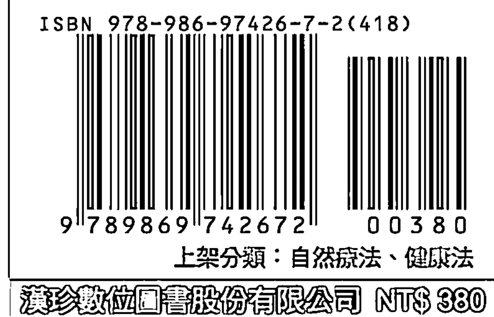
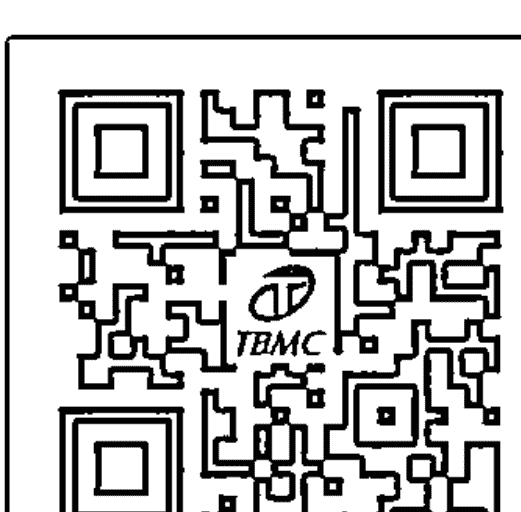

# 光療
氧療
花精
整合療法

陳興漢
周琮棠
合著

TBMC 漢珍數位資訊股份有限公司
TRANSMISSION BOOKS & MICROINFO CO. LTD

# 制作说明：

本书由《天使神秘学院》出重金从台湾购入的原版书籍扫描制作完成。为达到最好阅读效果，特地把书全部切开后，再经由专业扫描设备高精度扫描完成，并经过一张张的PS后期处理最终成书，其间花费大量的人力、物力以及时间，只为能给大家提供经济并优质的神秘学学习资料而努力。

本学院强力谴责某些机构和个人，把本学院花心血制作完成的电子书籍，包装后直接放在自家网上低价倾销的行为，以谋取不劳而获的经济利益。如果长此以往最终将无人愿意再为大家花心思制作电子书，那以后可能大家再无新书可读。

为让大家以后能够读到更多的好书，也为了本学院的良性发展。本学院恳请大家尽量做到如下几点：

- 一、尽量在天使神秘学院的官方网站购买电子书籍。
官网访问地址：http://www.ac2011.cn
短网址：ac2011.cn
网址含义：(Archangel College 成立时间：2011年)

- 二、在收到电子书后小范围传阅即可，千万不要公开传播，更别挂到网上低价销售。

同时为答谢广大支持者，学院电子书将做如下调整：

- 一、学院会把一些早已收回制作成本的电子书折价销售。

- 二、最新制作的电子书籍会开放打印功能，大家购买后有条件的可自行打印成书。

天使神秘学院
2022 年 1 月

# 光療
氧療
花精
整合療法

陳興漢
周琮棠
合著

國家圖書館出版品預行編目（CIP）資料

| 光療、氧療、花精整合療法 / 陳興漢, 周琮棠 合著 |
| --- |
| 初版—臺北市 : 漢珍, 2020.02 |
| 面 ; 公分 . |
| ISBN 978-986-97426-7-2 (平裝) |
| 1. 自然療法 2. 健康法 |
| 418.99 108019818 |

# 光療、氧療、花精整合療法

作 者：陳興漢、周琮棠
發 行 人：林慧容
主編・版權：雷碧秀 LINE raymonda88
封面設計：亞得有限公司

出版單位：漢珍數位圖書股份有限公司
地 址：台北市信義區 11056 和平東路三段 315 號 7 樓
電 話：（02）2736-1058
郵撥帳號：05037980
戶 名：漢珍數位圖書股份有限公司
電子信箱：info@tts.tbmc.com.tw

法律顧問：北辰著作權事務所 蕭雄淋律師
登 記 證：局版台業字第 5284 號

發行日期：2020 年 02 月 10 日
定價 380 元

Copyright © 2020 by Transmission Books & Microinfo Co., Ltd
ALL RIGHTS RESERVED
ISBN 978-986-97426-7-2

> ▲ 本書提供資訊僅為治療及參考之用，非最終診斷依據。
有任何健康問題，請尋求專業醫療人員協助。

TBMC 版權所有，侵害必究

## 作者序 1

### 陳興漢
桃園敏盛綜合醫院 - 高壓氧治療中心 主任

古埃及人用太陽光透過有色窗格玻璃將光線照射到病人身上。印度經由阿蘇吠陀醫學證實身體的能量中心區或脈輪（Chakra）都與色彩有關。在中醫身體的器官與顏色相呼應，色彩除了與光有關外也是能量醫學的一環。

陽光是老天爺送給人類的「免費營養素」，但由於陽光太容易取得且不要花費費用，人們常忽略陽光的存在且未善加重視及利用。1903 年丹麥醫師 Niels Ryberg Finsen 使用陽光治療疾病，因而獲得諾貝爾醫學獎。1979 年德國 Holick 教授指出：自然光線對人體生理及心理產生的刺激及調節作用是經由眼睛所引起的。若人體無法接受光線的刺激或者暫時受到干擾時，都會對人體生理及心理上造成不良影響。1981 年美國 Rosenthal 博士提出「季節性情緒障礙」（Seasonal Affective Disorder, SAD）指出：患者嗜吃甜食、嗜睡、體重增加、缺乏性慾、退縮、個性改變等症狀，給予患者充分陽光照射就可治癒。1993 年美國國家癌症研究所癌症期刊報導：在陽光充足的居住地，民眾罹患癌症之發生率及死亡率都較低，尤其是乳癌、大腸癌。陽光對 165 種疾病有助益。經由上述可以了解到光療對人體身心靈健康之重要性。

大腦對動脈中的氧濃度具有高度敏感性。研究顯示缺氧損傷與心智障礙與及情緒障礙具相關性。缺氧與頭部外傷、中風、神經退行性疾病、阻塞性睡眠呼吸暫停症、慢性阻塞性肺病和間質性肺病等有關。長期間歇性缺氧會引起空間記憶和學習缺陷。缺氧所誘導的神經變性和細胞凋亡也會造成人類在情緒發生障礙引起身心靈之病症。「缺氧是萬病之源、吸氧不生病」是一個重要的觀念，歲月進入銀髮之後，如何正確的吸氧是非常重要的課題。

花精是一種取自植物花卉液體的萃取物，用於解決情緒健康、靈魂發展和身心健康等深層次問題。花精最早由英國愛德華巴赫博士（Dr. Edward Bach）於 20 世紀 1930 年代在英國製作。花精療法是溫和且有效的，能夠將人們藏在內心深層的情感和精神層面促進癒合。花精療法可改善思想和情感的病變。病患的情緒癒合是治療身體疾病的必要治療部分。花精療法多年來一直被運用作為治癒心靈、身體和精神的方法。

陽光、空氣、水是人類要活存的三元素。花朵要開放的茂盛，最好的開花營養素非陽光莫屬。生命需要陽光進行光合作用是非常重要的。綠色植物要生存，花朵要開放繁衍，都必須利用陽光提供的能量來完成光合作用。

顧客或病患先行光療之後，再經由氧療法吸氧後行花精療法是達成身心靈健康很重要的組合方式。氧療法可使身體的含氧量、增加血液氧濃度，改善缺氧所導致的失眠及治療疾病。使用花精療法可改善心靈及情緒的失常。兩種療法的組合可以：提高組織器官及血液的含氧量、改善腸胃調理氣血、增強體質、健脾養肝、緩解疲勞、舒散心情、消除鬱氣、減輕腰酸背痛、增強體質、調節內分泌功能、增強免疫力及治療臨床疾病等且沒有副作用。先以氧療法改善缺氧狀況後再搭配花精療法感善心靈及情緒變化對患者而言是有助益的。

「氧療活血身康泰」、「花療舒壓淨心靈」，對於一位高壓氧專科醫師而言，「氧氣」就是治療病患的藥物處方，必須依病患的年紀、罹病種類及目前身心狀況，為病患開具不同的氧療處方，對於病情的治療效益是非常重要的。余從事高壓氧治療近 35 年，以「氧氣」治癒了無數疑難雜症，對於高壓氧治療病患所產生的療效有無比的信心。

近年來，在門診或住院會診時常會面對缺氧、情緒低落、癌症病患求助於高壓氧治療。當面前這些病患時，如何提供給病患自然療法，包括：光療、氧療、花精療法、三合一的結合以達到身心靈的健康。目前，在醫學領域中結合這三種療法合而為一的尚屬首見。期盼本書的出版，能對社會大眾對於身心靈健康之追求、能有多一項之選擇及對自然醫學有更進一步的瞭解，並開啟有志之士對此領域另一個研究方向，減少藥物的使用及遠離疾病及其情緒障礙，給予病患及顧客最佳的醫療照顧，為作者們書寫此書之最主要目的。

生老病死是每一個人所必須面對的問題，「預防勝於治療」，人們因缺氧情緒低落而導致癌症死亡的人數不在少數，如何預防疾病的發生、化解情緒低落的起因、善用「光療、氧療、花精整合療法」三合一整合療法的運用，做好身心靈全方位的照顧，都是我們終其一生必須學習的課程。多一分了解、多一分防範，我們不但要活的長壽，更要活的健康、遠離癌症，謝謝大家！

## 作者序 2

### 周琮棠

世界衛生組織 WHO57 屆溫泉暨保健醫學論壇主委
聯合國千委會世界養生大會主辦副主席
世衛 WHO NGO 保健醫學實驗計劃參與者

與興漢醫師認識結緣，緣起於 2003 ～ 2004 年在台灣舉辦的第一屆亞洲溫泉大會及第 57 屆世界溫泉大會。在當時，台灣在世界衛生組織轄下 63 個國家全球溫泉氣候會議中，爭取到由聯合國（World Health Organization, WHO）轄下非政府組織（Non-Governmental Organization, NGO）之全球溫泉氣候聯合會之主辦權，並由本人擔任大會主席。大會中，各國代表皆以光（雷射）、空氣（常The request was rejected because it was considered high risk

的顏色是由光波的頻率決定的。在可見光區域紅光頻率最小，紫光的頻率最大。各種頻率的光在真空中傳播的速度都相同，約等於 $3.0 \times 10^8 \text{m/s}$。光有複色光和單色光的區別。由兩種或兩種以上的單色光組成的光稱為複色光，不能再分解的光（只有一種頻率），稱為單色光。紅、綠、藍被稱為光的「三原色」，因為這三種顏色是無法用其它顏色混合而成，而其他顏色則可以透過紅、綠、藍的混合而得到。

高頻區（高能輻射區）包括：X 射線、$\gamma$ 射線和宇宙射線，他們的量子能量高、當與物質相互作用時波動性弱而粒子性強。長波區（低能輻射區）包括：長波、無線電波和微波等。中間區（中能輻射區）包括：紅外輻射、可見光和紫外輻射。

各顏色之波長如下：

| 顏色 | 波長（nm） |
| :--- | :--- |
| 紅色 | 820 ～ 750 |
| 橙色 | 590 ～ 620 |
| 黃色 | 570 ～ 590 |
| 綠色 | 495 ～ 570 |
| 藍色 | 450 ～ 495 |
| 紫色 | 380 ～ 450 |

陽光可行光合作用，對於地球上的生命至關重要。地球的截面積是 127,400,000 平方公里。地球接收太陽的總輻射取決於地球的截面積（π · RE²）。因太陽光入射的角度，任何時刻都有半個地球表面不會被陽光照到。地球表面上的某個位置接收的太陽輻射量，取決該位置的緯度和大氣層的狀態。地球獲得的能量是太陽輻射能量的 20 億分之一，太陽輻射的能量大約是 3.86×10²⁶ 瓦。

太陽輻射光譜約有一半的電磁頻譜在可見光的短波範圍內，另一半在近紅外線部分，也有一些在光譜的紫外線。光譜在 100 至 10⁶ 奈米的電磁輻射按波長的排列，可以分成五個區域：

1. 紫外線 C（Ultraviolet C, UVC）：波長範圍跨越 100 至 280 奈米（nm）。紫外線輻射的頻率比紫色還高，人的眼睛看不見它，多半被大氣層臭氧層吸收，只有非常少的量能夠抵達地球表面。這種輻射光譜有殺菌力，如紫外線殺菌燈。長期接受紫外線 C 的照射，恐會引起皮膚癌發生。
2. 紫外線 B（Ultraviolet B, UVB）：波長範圍從 280 至 315 奈米，約小於 2% 可以到達地球表面。它會被大氣層吸收且和紫外線 C 產生光化學反應，製造出臭氧層。紫外線 B 可被皮膚表皮層 DNA 和蛋白質吸收；將維生素 D 前驅物質轉化合成維生素 D，進入血液循環後到肝臟和腎臟，被活化後對人體產生作用。
3. 紫外線 A（Ultraviolet A, UVA）：波長最長，範圍從 315～400 奈米，佔紫外線 95%。它可進入人體真皮層，對 DNA 的傷害最小。紫外線 A 照射過多會引起皮膚變黑、曬傷、膠原蛋白流失致皮膚老化起皺紋、引起黑色素細胞活化致黑色素瘤等。常用來作為人工化讓皮膚變黑和做為牛皮癬的 PUVA 療法。紫外線 A 照射會使人體生成一氧化氮（NO），具有降血壓作用。
4. 可見光：光的範圍從 400 至 700 奈米，是肉眼可看見的範圍。
5. 紅外線：依據波長可分成三種類型：
    (a) 紅外線 -A：700～1,400 奈米
    (b) 紅外線 -B：1,400～3,000 奈米
    (c) 紅外線 -C：3,000 奈米～1 毫米。

陽光需要 8.3 分鐘才能從太陽抵達地球。地球最接近太陽的近日點通過時間是 1 月 3 日。身體每星期有幾天暴曬於陽光之下 15 到 20 分鐘，時間以正午 12 點最佳，紫外線便會刺激人體維生素 D 的生成。皮膚愈黑的人，從陽光製造維生素 D 的量少。白皮膚的人只要 10 ～ 15 分鐘的陽光曝曬，就能得到足夠的量。居住緯度太高的人，因沒有充足的陽光，故身體所生產的維生素 D 低，需要經由其它來源補充。太陽照射是取得維生素 D 最理想的途徑，但生活方式、生活地點、年齡、種族、時間、氣候、空氣品質、霾害（PM2.5）等都會影響皮膚在陽光照射下及維生素 D 的生成。

製造維生素 D 的陽光波長約為 295 奈米（nm）的波長，位於紫外線 B 的範圍，從 280 ～ 315 奈米。若想從陽光照射獲得維生素 D，建議最好在中午 12 點的時間，曬 15 分鐘，因此段時間是紫外線 B 最容易到達地球的時辰。早晨或下午在太陽下照射，所獲得維生素 D 是有限的。中午 12 點曬太陽 15 分鐘，陽光會將皮膚下的維生素 D 轉化成身體所需要的物質。中午曬太陽 15 分鐘就足夠一天的量。當體內維生素 D 到達水平就不會再增加。人體曬太陽時間過長，陽光會破壞皮膚下已轉化完成的維生素 D。曬太陽時間不宜過長，以避免造成曬傷、皮膚變黑、老化或皮膚癌風險。經太陽曬後，檢測體內維生素 D 仍低，則需要口服補充維生素 D，以達到人體所需要的量。

### 1-2 生物光子

生物光子是指生物新陳代謝時，處於高能態的分子向低能態躍遷時輻射出來的粒子。生物光子輻射，它是一個發生在「分子層次」的生命現象，這意謂著生物光子輻射攜帶著有關生物分子組成和結構的信息。生物系統在分子層次的變化，能引起系統生物光子輻射行為的改變。生物光子學是通過光學技術研究生物分子，細胞和組織的一門學科，是光子學領域的分支之一。

生物光子來自於光，可由人體放射、能量和外界交換信息。證據顯示人體是分子原子的堆砌，同時還是光之個體。生物光子能在細胞交流和 DNA 層面實現生理調控，並可由人體發出透過思維釋放出來。

德國生物物理學家波普博士指出：所有細胞都是透過光來溝通，所有細胞都不斷在發放並吸收微量的光電磁輻射，稱為生物光子。當細胞受到干擾，細胞周圍的光振動也會變得不和諧，這些不和諧的光會嚴重影響到鄰近細胞的振動模式，造成細胞功能的改變及受損。

陽光、空氣、水是人類要活存的三元素。生命需要陽光進行光合作用是非常重要的。人體能發出「超微弱光子放射」是肉眼所看不見的，但這些光粒子或稱光波屬於電磁波譜範圍（380 ～ 870nm）能被精密儀器檢測到。這些光波和哺乳動物大腦內的能量代謝以及氧化應激相關。2010 年研究發現植物、細菌、動物嗜中性粒細胞及腎臟細胞都能通過生物光子進行細胞與細胞間交流。不同波長的光（紅外、紅、黃、藍、綠、白光）會刺激運動神經根部或脊髓感覺的一端，導致另一端的生物光子活性顯著提高。光刺激可以延神經纖維傳導的生物光子，或許這就是神經傳遞信號。人體新陳代謝隨晝夜節律變化，生物光子的放射也隨晝夜時間軸而不同。人體上午光子值的波動比下午低。胸腹部之生物光子放射值最低、上肢和頭部在一天中的放射值最多並持續增加。

冥想和草本植物能影響生物光子輸出，研究指出冥想者有著更低的生物光子放射值，可能原因為體內自由基反應水平低，冥想能影響自由基的活性。

人體表皮細胞會從紫外輻射中，有效的獲取能量和信息的能力。1993 年研究指出：乾皮症的表皮經人造陽光照射後，病變表皮的成纖維細胞中所誘導產生的超微弱光子放射量比正常表皮中高約 10 ～ 20 倍。結論：人體皮膚可能會從陽光中獲取能量和信息。現代科學對人體從陽光接受能量和信息的能力的研究指出，太陽和月球能夠通過引力影響人體生物光子的放射情況。生物光子儲存於細胞的 DNA 中，當人體生病時光子放射量亦會隨之變化。科學家越來越支持人體並非是分子原子的堆砌體，而是由光所組成的生命體。人體是能量體也是光體，可以善用陽光來增強或平衡身體的能量。清早面向東方迎接太陽，眼睛閉上、赤腳接地，清晨日光浴是人體補充能量最好的方式之一。

### 1-3 科技光療

「雷射」（Laser）是由 light amplification by stimulated emission of radiation 的字首所組成，即光可藉由激發放射而放大的一種裝置。1958 年，物理學家夏樂（Arthur L. Schawlow）和湯里士（Charles H. Townes）發表「紅外線與光學鎂射」（Infrared and Optical Masers）的論文，二人先後獲得諾貝爾物理學獎。1960 年，美國物理學家梅曼（Theodore Malman）利用光與共振腔產生雷射光，應用於工業及醫療用途，如雷射手術與雷射除斑等。

雷射組成包括：活性介質、激發源及光共振腔。活性介質必須具有激發後能將入射光加以放大的特性。以活性介質區分雷射的種類，包括：使用氣體氦氖雷射、二氧化碳雷射；使用液體的染料雷射；使用固體的紅寶石雷射。

激發源分為：光激發源和電激發源。固體雷射和液體雷射多使用光激發源，氣體雷射和半導體雷射則使用電激發源。光激發源是利用光源來激發活性介質，使電子能從基態受激躍升到較高能階的激發態。脈波式輸出雷射用的氙氣閃光燈，及連續式輸出用的氙弧光燈、發光二極體等。

共振腔的是將光限制在腔內產生共振，目的是使光被放大及產生單色的雷射光。共振腔的結構主要是由兩鏡面組成，雷射光傳播的方向必須接近光軸且角度很小。

半導體雷射或稱雷射二極體對於物質吸收能量越多時，物質（結構或狀態）受到的影響也越多。各種物質吸收的電磁波頻率並不相同，透明無色的物質不吸收可見光；綠色物質較能吸收紅色光。

雷射在醫療上運用是利用其雷射生物效應（極光生物效應），因雷射作用於生物體會產生：熱效應、光化效應、機械效應、電磁場效應和刺激效應等。

1. 熱效應：
    雷射對生物體的熱作用主要是通過兩種途徑：
    a）碰撞生熱：生物體吸收可見和紫外雷射後，受激的生物分子可能將其獲得的光能，通過多次碰撞轉移為鄰近分子的平動能、振動能和轉動能，使受照體溫度升高。
    b）吸收生熱：生物體吸收紅外光後，光能轉變成生物分子的振動能和轉動能，使溫度升高。生物組織的紅外吸收區主要在 2.8 μm ～ 6.3 μm。

    當雷射手術刀功率大於某一定值的雷射光照射在人體時，表皮內的水份吸收光能而蒸發，其周邊表面形成炭化層，炭化層內部形成變性層。炭化層與變性層愈薄則傷口癒合得愈快。當雷射功率較小時，照射於血管組織，使其水分減少而達到凝固止血目的。除去刺青、黑痣、雀斑、肝斑等外，都可使用雷射來治療。熱效應的強弱與雷射的功率密度、照射面積和照射時間有密切的關係，也與生物組織對光的吸收率、比熱、熱導率有關係。

## 2. 光生化效應

是指在光的作用下所產生的生物化學反應。與普通光源相比，雷射可使光化反應更方便、易控、有效和廣泛。光化反應分為：

a）原發光化反應：當一個處於基態但又不返回其原來分子能量狀態的弛豫過程中，多出來的能量消耗在它自身的化學鍵斷裂或形成新建上，所發生了的化學反應，稱之。
b）繼發光化反應：在原初光化反應過程中形成的高度化學活性的中間產物，如自由基、離子、或其他不穩定的產物。這些不穩定的產物繼續進行化學反應，直至形成穩定的產物，稱之。光化反應有光合作用、光敏化作用、視覺作用等。當適當波長的雷射光照射腫瘤時，使基態的氧分子激發到激發態，激發態的高能階的氧使惡性腫瘤組織產生氧化，達到消除癌細胞的目的。當雷射光的波長不被皮膚表層所吸收，而能深入皮內組織，則可應用在治療疼痛上。

雷射的生物效應可作用於生物體不同層次：

a. 超短脈衝雷射作用於蛋白質可引發光生化反應，改變酶的活性、定向催化而不損傷活細胞。
b. 氬離子雷射可損傷染色體，紅寶石雷射會抑制 DNA 表達。
c. 雷射可引起膠凝，破壞細胞核，損傷線粒體。蘇聯學者 A.A.Профончуков 提出，氦氖雷射被膜受體吸收後，可使細胞光致敏化產生活化效應，提高蛋白質合成系統活性，增加有絲分裂。
d. 氦氖雷射和脈衝紅寶石雷射對某些細菌生長有影響，能量小時有促進作用，能量大時有抑制作用。
e. 紅寶石雷射弱強度照射可提高白細胞噬菌功能，CO2 雷射輻照腰間穴位使細胞數增加等。

## 3. 機械效應

是指當生物組織吸收雷射能量時，如果能量密度超過某一確定閾值時，就會產生氣化並伴有機械波，若能量密度低於該閾值，就只會產生機械波。光具有波動性、粒子性（即光子有質量有動量），因而光子撞擊物體時必然會給受照處施以壓力，即光壓。雷射是高強度光源，它對生物體可產生一次壓力和二次壓力。輻射壓強為一次壓力，熱膨脹壓強、聲波和蒸發壓強、電致伸縮壓強為二次壓力。

## 4. 電磁場效應

雷射是電磁波而生物體作為介質具有電導和電容。雷射作用於生物體組織引發生物組織變化稱之為雷射生物電磁場效應。

## 5. 刺激效應

當雷射照射生物組織時，不對生物組織直接造成不可逆性的損傷，只是產生與超音波、針刺、針灸和熱的物理因子與生物刺激作用相類似的效應，稱之雷射生物刺激效應。此生物效應是低功率雷射稱之「弱雷射」。弱雷射照射生物體時，生物體的反應可能是興奮，也可能是抑制，可以影響機體的免疫功能、神經功能、一系列生物效應，對某些疾病有一定的防治效果。蘇聯學者 .Ф.Гамалея 指出弱雷射可調節蛋白質合成。

低能量靜脈雷射治療（Intravenous Laser Irradiation of Blood，ILIB）又稱低能量生化雷射血管內照射或低強度氦氖雷射血管內照射，是一種低能量的雷射治療。它是利用光纖導管將低能量的紅色生化雷射光從手臂靜脈導入，血液流經此處就像在照射日光浴，可提升粒線體將能量轉化為維持細胞功能的核苷酸（ATP）分子、刺激細胞活化細胞、加速血液循環會讓血液中蛋白質的分子能量改變、改變血液黏稠度、增加紅血球的帶氧量、增強血管彈性、清除體內致癌的自由基、活化血液、修復神經病變等作用，治療神經系統及腦血管的病變。

## 低能量靜脈雷射治療步驟

1. 跟打點滴類似如同透過靜脈注射，在靜脈中置入留置針，再將光纖針穿入留置針後，打開雷射儀將雷射紅光藉由光纖針導入血管內，直接接觸血液，光纖針裡雷射光會隨著靜脈血進入人體。
2. 雷射光進入人體後，會加速人體血液循環，照射 1 小時可讓體內循環 6 ～ 7 次。
3. 進行光療同時，患者必須喝 500 ～ 600cc. 的溫水，一天至少 2,000cc 水份，加速新陳代謝。
4. 每日靜脈注射一次，一個療程 10 次，每次 60 分鐘。
5. 第一療程結束後，休息 2 ～ 3 週，再進行第二療程。第二療程結束後，再休息 2 ～ 3 週，再進行第三療程。
6. 第一次治療以實施三個療程為最佳，因為人體細胞受刺激會產生生物效應，在修復完成前再給予第二次刺激，生物能有累積作用；如果修復完成後再給予刺激則無累積作用。三個療程結束後，以後每 3 ～ 6 個月，可進行一個療程的保健治療，重症患者則可每二個月進行一個療程的保健治療。
7. 施打的雷射能量因人而異，劑量並非愈強愈好，且每人每天的劑量也需隨個案不同的反應做微調，此皆需由醫師評估。

## 「靜脈雷射（ILIB）」作用及適應症

1999 年行政院衛生署（現為衛生福利部）認證核可。靜脈雷射是將 632.8nm 光波波長的低能量雷射紅光，導入人體靜脈血管，類似讓血液做日光浴進行細胞能量的轉換。選擇光波波長 632.8nm 為紅血球的最佳吸收光譜，產生的效應如下：

1. 改善血液性質、增強免疫力、抵抗發炎：當低能量雷射光照射血液時，啟動白血球、巨噬細胞等，讓細胞的粒腺體產生腺嘌呤核苷三磷酸（ATP），使身體免受自由基的破壞，調控人體細胞分泌發炎物質、血管擴張素、血管收縮素、新陳代謝素等。同時，會使紅血球變形順利通過細小微血管，增加血紅素攜氧能力，使肌肉、腦部、心臟、神經等獲得足夠的氧氣供應，改善血液性質、降低血液黏稠度、抑制血栓形成，預防心肌梗塞及中風，維持血糖、血壓、血脂穩定，調整身體促進血液、改善睡眠障礙、失眠、血管硬化、貧血、頭痛、耳鳴、暈眩、中風、神經衰弱、心臟病、手腳麻痺、神經系統病變、腦血管病變、急、慢性肝炎、腸胃道慢性發炎、慢性疲勞症候群、氣喘、過敏性鼻炎、異位性皮膚炎、慢性濕疹、乾癬、紅斑性狼瘡、類風濕性關節炎、急慢性病毒感染、細菌感染、疼痛舒緩、癌症之輔助治療等。
2. 組織修護作用：
    (a) 改善血流加速毛細血管增生，增強膠原組織蛋白的合成。
    (b) 細胞的活化，對損傷細胞予以修復及產生保護膜。
3. 活化機能，修復受損細胞：抗老化、恢復年輕、增生毛髮、毛髮變黑、細緻皮膚、苗條身材體態、促進傷口癒合、加速產後復原等。
4. 美容養顏作用：
    (a) 加強組織合成膠原蛋白。
    (b) 加強毛髮增生速度、毛髮顏色變黑。
    (c) 增加皮膚彈性及纖維張力、消除皺紋。
    (d) 淡化疤痕、斑點，防止皮膚老化，恢復皮膚彈性、光澤。
5. 抗老作用：
    (a) 增強紅血球內的 SOD 活性。
    (b) 活化體內細胞，達到抗衰老之效果。
    (c) 加強 ATP 酶，提高細胞膜的穩定性，可防止衰老和減輕病情的作用。
6. 促進代謝、排毒：代謝症候群、尿毒症、戒毒、解酒等。
7. 促進傷口癒合及減輕疼痛，促進血液循環和生理機能，提高新陳代謝和免疫能力，以及抗發炎和抗感染等功效。

中風患者在身體失能後心理會有改變，常會情緒低落及憂鬱，經 ILIB 治療後，情緒變得比較開朗、願意說話、食慾變佳，尤其是語言區受損患者，症狀更是明顯改善。靜脈雷射治療為一安全、無副作用的治療。治療過程中，每個人的反應不盡相同，健康人的反應比較不明顯，病痛的患者常見的反應有皮膚變亮、斑點變淡、血液黏稠度降低、傷口癒合迅速、睡眠品質增加、新陳代謝及血液循環變好，少數人還會出現頭髮由白變黑等回春現象。醫護人員在操作儀器前請務必詳閱原廠使用說明書並遵照指示使用。若使用過程中，出現過敏現象或身體不適，須立即停止使用。

## 「靜脈雷射（ILIB）」禁忌症

1. 不可用於眼睛區域、嚴禁直接照射人類或動物的眼睛。
2. 不可用於頸部甲狀腺或頸動脈竇區域或胸部迷走神經或心臟部位。
3. 不可用於使用心臟節律器的胸部區域。
4. 不可靠近骨骼生長中心，除非骨骼已生長完全。
5. 不可用於懷孕的子宮部位。
6. 過去 2 ～ 3 週有注射類固醇的區域。
7. 血管疾病的缺血組織，因該區域組織因血液供給無法跟上代謝需求的增加，可能導致該區域組織壞死。
8. 組織疼痛的部位，因止痛後可能會掩蓋病情的進展而延誤病情觀察。
9. 可疑或有潛在癌變組織的區域。
10. 罹患嚴重傳染性疾病。

## 警告及注意事項

- 儀器為醫療電器設備需要有關於 EMC 特殊預防措施及需根據 EMC 的資訊安裝。注意其他電纜及配件可能對 EMC 的表現會有負面的影響。
- 儀器為行動射頻通訊設備可能會影響醫療電器設備。
- 注意物品的堆疊及該儀器的位置不可太靠近其他設備。
- 注意若使用其他配件可能對產品的效果有影響。
- 請勿以眼睛正視雷射輸出口之光束或不可由光纖導波管端頭光束直接照射眼睛，避免直接造成眼睛傷害。
- 請勿讓雷射光直接照射到別人。
- 使用儀器前，應徹底了解使用說明書內容，須經專業人員的訓練方可使用。
- 使用儀器前，應事先檢查電源是否與本系統相容。否則輕則造成精密之雷射設備燒毀，嚴重可能危及使用者之生命安全。
- 儀器內設有精密光學元件且內有高壓電裝置，非授權專業技術人員，不得進行任何拆卸、維修行為，避免意外傷害發生。
- 如儀器有故障時，立即停止使用，並與製造廠或代理商聯繫。

## 1. 光療

- 請按照次序運作本儀器，使用完畢後關閉電源。
- 移動儀器時請注意拔掉電源插頭及注意收好電線。
- 請勿與麻醉氣體或可燃物質一起使用。
- 如長期不使用時，從雷射儀器拔掉電源線後，分開保管。
- 儀器內有光學、玻璃設備零件，如需進行搬運作業務必小心輕放，且不可任意置放以避免撞擊，造成內部系統損壞。
- 欲另行購買其他廠牌之光纖線，請留意光纖線之接頭形式、線材品質及尺寸規格。
- 電子設備若損壞無法再使用時，應符合當地法規做回收動作。
- 儀器光纖線的保養：光纖線使用前後兩端之端面需清潔，使用乾淨的擦拭布用酒精沾濕徹底的擦淨後，需將防塵套裝上光纖線的兩端。下次使用前要將光纖線擦拭乾淨。操作者應視使用頻率而定，定期洽原廠進行儀器之校正，以確保光功率之準確性。
- 儀器之項目內容包括：電源、功率消耗、工作電流、波長、雷射輸出通道、雷射輸出功率、預置計時時間、定時器逾時動作光路阻斷、使用環境溫度：10 ～ 40℃、儀器重量、尺寸、雷射指示燈、冷卻方式：強制空氣冷卻、配件：鑰匙、USB 線（B-type）、電源線、安裝光碟、光纖線等。
- 儀器保存條件：使用環境：10℃～ 40℃；相對濕度 < 90%。儲存環境：－5℃～50℃；相對濕度＜90%。使用 & 儲存環境皆應避免水氣、高濕、高粉塵、高溫等環境。運輸條件：－5℃～50℃；相對濕度＜90%。運輸過程中應避免外力撞擊，且不應與危險物品混裝。

### 1-4 光療在疾病之運用

美國國家癌症研究所癌症期刊報導：在陽光充足的居住地，民眾罹患癌症之發生率及死亡率都較低，尤其是乳癌、大腸癌。1993 年研究指出：陽光對 165 種疾病有助益。1903 年丹麥醫師 Niels Ryberg Finsen 使用陽光治療疾病，因而獲得諾貝爾醫學獎。美國國家科學院（National Academy of Sciences）指出：住在赤道附近的居民其血液內維生素 D 的含量較英國人高出 3.4 倍，比北歐斯堪地那維亞人高出 4.8 倍。住在赤道附近的人罹患癌症後，較其它陽光較不充足地區的居民相比較，赤道居民的存活率要高出許多。日本研究指出：陽光中的紫外線會促進人體新陳代謝，人體細胞中的蛋白質（BMAL 1），白天曬太陽時會減少、晚上會增加，這可能是夜間進食更容易發胖的原因。促進脂肪形成的 BMAL 1 蛋白質在晚上 8 點開始緩緩上升，10 點後急遽升高，至凌晨 2 點達分泌高峰後，於早上 6～10 點之間會顯著降低，至下午 2 點降至最低。BMAL1 蛋白質大量存在於脂肪細胞中，能促進脂肪堆積，當 BMAL 1 減少時，身體不容易囤積脂肪，人比較不容易胖。曬太陽具有減肥及防癌的效用。

1979 年德國 Holick 教授指出自然光線對人體生理及心理產生的刺激及調節作用是經由眼睛所引起的。若人體無法接受光線的刺激或者暫時受到干擾時，都會對人體生理及心理上造成不良影響。光線進入視網膜後經神經傳導，會影響大腦松果體的荷爾蒙分泌。當光線充足白天時，大腦會分泌血清素（serotonin）讓人活力充沛、心情開朗；夜晚進入眼睛光線減弱，血清素會轉變成褪黑激素（melatonin）讓人沉靜、容易進入睡眠。

Michael Holick 指出：維生素 D 缺乏是世界最常見的醫療問題，大多數人都沒有得到足夠的陽光下照射。人類取得維生素 D 有兩大途徑：

1. 皮膚經由陽光中的紫外線 B 照射，使皮膚層內的 7- 脫氫膽固醇（7-dehydrocholesterol）轉化成前維生素 D3（previtamin D3），再經熱能轉化成維生素 D3（vitamin D3），又稱為膽鈣化醇（cholecalciferol）。
2. 經由攝取食物取得，包括：植物性食物、真菌類（fungi）及酵母（yeast）。維生素 D2（vitamin D2），又稱為麥角鈣醇（ergocalciferol），動物性食物所含的為維生素 D3，與陽光照射皮膚產生的維生素 D 相同。

維生素 D 是脂溶性維生素可在食物中取得，人體可藉由陽光照射皮膚啟動維生素 D 的合成。維生素 D 增進鈣吸收，幫助骨骼與牙齒的生長發育、促進釋放骨鈣以維持血鈣平衡、有助於維持神經、肌肉的正常生理。身體的維生素 D 低會導致骨骼健康不量、心臟、大腦、免疫和代謝功能障礙。維生素 D 負責增加負責增加鈣、鎂和磷酸鹽在腸道的吸收及帶動其他多種生物學效應。暴露於充足陽光下的哺乳動物可以合成足量的維生素 D。維生素 D 對於鈣的穩態（homeostasis）和代謝中具有重要作用。維生素 D 最重要的作用是促進腸內鈣的吸收，維持骨骼鈣平衡、增加破骨細胞（osteoclast）數量、維持鈣和磷酸鹽水平以促進骨形成、促進甲狀旁腺激素正常運作，以維持血清鈣水平。維生素 D 缺乏會導致骨礦物質密度降低、骨密度降低（骨質疏鬆症）或骨折的風險增加，因為缺乏維生素 D 會改變體內的礦物質代謝。因此，維生素 D 作為有效的骨吸收刺激劑的作用，對於骨重塑也是至關重要的。

Michael Holick 博士指出維生素 D 對健康的益處為可預防下列疾病：

1. 心血管疾病：維生素 D 對降低高血壓、動脈粥樣硬化性心臟病、心臟病發作和中風等病非常重要。Holick 的顯示維生素 D 缺乏症會使心臟病發作的風險增加了 50%。
2. 自身免疫性疾病：維生素 D 是一種有效的免疫調節劑，對預防自身免疫性疾病如多發性硬化症和炎症性腸病非常重要。
3. 不孕症：維生素 D 有助於刺激荷爾蒙的產生，包括：睪丸激素和黃體酮，已被證明可促進男性和女性的生育能力。維生素 D 與男性的精液質量相關，可改善多囊卵巢綜合症婦女的月經頻率。
4. DNA 修復和代謝過程：Holick 的研究發現，每天服用 2,000 國際單位（IU）維生素 D3 的健康志願者，會牽涉到 291 種不同的基因，控制多達 80 種不同的代謝過程，有助於改善 DNA 修復並增強免疫功能、改善自體氧化。
5. 偏頭痛：辛辛那提兒童醫院醫療中心的研究人員發現，許多罹患偏頭痛的人缺乏維生素 D、核黃素（B2）和輔酶 Q10 等。罹患偏頭痛的女孩特別容易缺乏輔酶 Q10。與偶發性偏頭痛患者相比，罹患慢性偏頭痛的患者可能患有輔酶 Q10 和核黃素缺乏症。
6. 神經 / 心理 / 精神障礙：維生素 D 缺乏症與神經和大腦疾病有關，包括：認知功能障礙、阿茲海默症（研究發現維生素 D 缺乏相對地增加了 31% 神經認知的風險）、精神分裂症、帕金森病、中風、癲癇和抑鬱症等。
7. 感冒和流感：維生素 D 具有強大的抗感染能力，對肺結核、肺炎、感冒和流感的預防和治療都有助益。維生素 D 對於身體健康維護和預防疾病至關重要，幫助抵消某些藥物所引起的有害代謝。提升身體維生素 D 的含量是很重要的。研究人員指出日光照射是提升體內維生素 D 最理想的方法。
8. 維生素 D 治療軟骨症，維生素 D 是一種前荷爾蒙，在維持健康有許多作用。
9. 身體維持最佳的維生素 D 含量可將患癌症的風險降低多達 60%；有助於預防 16 種癌症，包括：胰腺癌、肺癌、卵巢癌、前列腺癌和皮膚癌。經由上述了解到維生素 D 對人體是非常重要的，陽光也扮演很重要的角色。

1980 年 McDonagh 博士研究中證明陽光或光線中的特定波長可將血液中的膽紅素轉變為無害的物質，以治療黃疸病。人體對於鈣質的吸收主要靠維生素 D。陽光中的紫外線照射到皮膚後會合成維生素 D3，再於小腸中結合鈣的吸收，故曬太陽可以促進鈣質吸收。當人體缺乏維生素 D，鈣的吸收率被影響且無法幫助骨骼成長。陽光對於兒童骨骼肌肉成長，預防中老年人骨質疏鬆有相當大的幫助。另，陽光會增加人體對氧氣的吸收、降低心跳速度、加速皮膚新陳代謝、調節人體免疫功能、改善肌肉的能量、全光譜光源具有殺菌功能；睡眠、精神、心理、情緒等健康都會受到陽光的影響。適度接受陽光的照射，保持正常晝夜節律生活對身體健康是十分重要的。

1981 年美國 Rosenthal 博士提出「季節性情緒障礙」（Seasonal Affective Disorder, SAD）。患者具有嗜吃甜食、嗜睡、體重增加、缺乏性慾、退縮、個性改變等症狀，是由於缺乏陽光造成的病態，給予患者充分陽光照射就可治癒。美國婚姻家庭治療師 Brian Breiling 指出改變光照型態、增加陽光照射時間，可以促進家庭美滿幸福。室內照明光源，通常只能提供橙、綠、靛 3 種光譜，長期在室內光源之下對身體健康沒有幫助，且會感到精神無法集中、疲倦、壓力大、焦慮感。

安德烈·莫瑞茲博士著作的神奇的陽光療癒力（Heal Yourself with Sunlight）提及：陽光是地球萬物永恆生命的來源，更是促進人體身心靈健康最大的功臣，更是治療疾病的萬靈丹。陽光治療可改善痛風、風濕性關節炎、動脈硬化、皰疹、坐骨神經痛、腎臟病、氣喘、製造維生素 D、增強免疫系統、預防骨質疏鬆症、逆轉多種癌症等功效。陽光的紫外線可以刺激甲狀腺增加荷爾蒙的分泌，使基礎新陳代謝率提高對減重和增進肌肉生長有幫助。人類觀念中會有「紫外線會傷害人體」的迷思，對陽光最大的誤解認為會造成皮膚癌、白內障和老化。如何正確的曬太陽、預防曬傷或皮膚癌之發生也是很重要的課題。若人們因上述因素而不接觸或減少陽光的照射，會使人變得虛弱且身心出現問題。陽光接受不足的人，容易脾氣暴躁、身體疲勞、生病、失眠、心情沮喪、酗酒和自殺。太陽光不是你所要顧忌的，它是人體在健康維護上最重要的自然療法。作者在本書中提出諸多科學根據，證明陽光對改善及維持人體健康是絕對必要的，並引導我們正確曬太陽，領略陽光的神奇療癒力。

陽光療法對於受孕婦女體內維生素 D 的維持及運作是很重要的。維生素 D 可改善卵巢分泌黃體素、雌激素，若婦女體內維生素 D 水平量足夠有助受孕。維生素 D 可改善子宮內膜異位症、多囊性卵巢炎之病症及提高試管嬰兒之成功率。維生素 D 可以調節男性類固醇荷爾蒙、精子蛋白質磷酸化、膽固醇含量等，影響精子活動力及受孕。孕婦沒接受足夠的陽光照射，又不補充維生素 D，檢測出體內維生素 D 缺乏，則子宮內的胎兒其神經系統之發育可能會受到影響。英國衛報指出：孕婦在懷孕 20 週時，若維生素 D 不足，出生的嬰兒容易在 6 歲時發生自閉症。自閉症的小孩補充維生素 D 可以改善語言、認知、互動力等功效。邱志勇醫師研究指出孕婦體內的維生素 D 水平愈高，生下來的兒日後罹患過敏的問題較不容易。國外研究指出，小孩的過敏問題與維生素 D 有關；檢測小孩體內的維生素 D 水平高，日後發生過敏的機率減少及嚴重程度會減輕。

孕婦懷孕時體內維生素 D 不足，導致嬰兒日後罹患氣喘及過敏性疾病、異位性皮膚炎、肺活量不足等有關。

美國衛生研究院（NIH）建議進行人工受孕的婦女，其血清內為生素 D 的水平值至少要大於 30ng/ml 較容易成功受孕。

多囊性卵巢炎患者普遍存在維生素 D 缺乏情形，建議服用維生素 D 對治療有正面效益。孕婦因要提供胎兒骨骼生長及鈣質的需求，特別容易罹患維生素 D 不足。研究指出孕婦維生素 D 不足、會造成下列情形：

1. 容易引起妊娠高血壓：孕婦懷孕 20 週時，收縮壓大於 140mmHg、舒張壓大於 90mmHg 為罹患妊娠高血壓。妊娠高血壓容易造成孕婦及胎兒之危險或死亡。
2. 流產、早產：孕婦體內維生素 D 不足，容易導致胎兒在子宮著床不穩定易流產或早產。
3. 孕婦體內維生素 D 不足，容易導致子癲前症、增加產道感染致陰道炎等疾病。胎兒經由陰道炎的產道增加敗血症及感染疾病發生，及日後孩童罹患過敏性疾病增加。
4. 難產及剖腹產率增加：孕婦體內維生素 D 不足致骨盆腔骨骼軟化症、骨盆骨發不良、骨盆腔產道口狹窄導致 難產及剖腹產率增加。
5. 妊娠糖尿病：孕婦體內維生素 D 不足會導致對胰島素阻抗增加、血糖值升高、孕婦及胎兒體重增加、胎兒容易難產或生產時受傷。2014 年美國匹茲堡大學公共健康學院研究指出：孕婦在懷孕 26 週檢測出體內缺乏維收素 D，罹患子癲前症的機率會增加；孕婦在懷孕早期缺少維生素 D，日後，罹患子癲症之機率比體內維持正常維生素 D 孕婦的五倍。女子罹患多囊性卵巢症候群常見於年輕的女性，會使得對胰島素不敏感，發生阻抗作用，使的胰臟會分泌更多的胰島素來控制血糖，導致胰島素濃度增加；胰島素分泌增加會造成女性身體的雄性荷爾蒙升高，使身體變的肥胖，體毛及腿毛濃且密、長鬍鬚、掉髮、皮膚粗糙、排卵異常致月經不正常、不孕等。女性體內若維生素 D 水平低會使得卵巢功能變差，排卵不佳及卵泡生長不易、卵子品質不好，受精後不容易在子宮內膜著床導致不孕；也容易流產。女性體內維生素 D 值與濾泡促進激素（FSH）成反比、與抗穆勒氏管荷爾蒙（AMH）成正比關係。想懷孕的婦女須將血清內的維生素 D 水平提高，才會使受孕率、受精卵著床率提升。若不幸罹患多囊性卵巢症候群者須補充維生素 D，提升身體對胰島素的敏感性、降低對胰島素的阻抗性，會使男性荷爾蒙值降低，排卵率上升或正常，才容易懷孕。婦女服用維生素 D 可以降低子宮內膜異位症發生及子宮肌瘤的生長，減少習慣性流產及提升試管嬰兒胚胎的著床率。

婦女停經後會造成體重增加，一直到 65 歲左右。研究證據顯示，停經後婦女服用維生素 D 和鈣可以減緩體重增加。停經婦女的血中 25（OH）D 濃度，從 20ng/ml 增加到 32ng/ml，可以讓腸道對鈣的吸收增加 45 ～ 65%。美國國家醫學院（Institute of Medicine, IOM）建議年滿一歲的小孩可以每天補充 600IU 的維生素 D。

2010 年莫瑞茲（Andreas Moritz）出版了《陽光：天然的藥物》一書，指出大自然是給予人們一個免費的巨型藥局，你就是自己的醫生，並非所有藥物都是有處方箋的藥丸，更基礎、更基本、更精華的療癒物質和能量是來自大自然的陽光、氧氣和水，其中最重要的非陽光莫屬。太陽不是你的敵人而是你的朋友，有陽光的存在，你才能生存。

## 2. 花精

### 1-1 花精療法

花精療法最早的記載可追溯至 16 世紀中世紀醫藥學家、煉金術師、占星師帕拉塞爾斯（Paracelsus，約公元 1493 年～1541 年）運用植物上的露水治療病患情緒，此療法在當時的歐洲社會被普遍使用。直至 20 世紀英國外科醫師、細菌及免疫學家，愛德華·巴赫（Dr. Edward Bach）透過自身對於花朵的觀察與臨床上的經驗，整理出 38 種巴赫花精對應於治療 38 種情緒問題。

花精（flower essences）是一種取自植物、花卉液體的萃取物（liquid extracts），用於解決人們的情緒健康（emotional well-being）、靈魂發展（soul development）和身心健康（mind-body health）等深層次問題。花卉療法已經使用了許多世紀，但現代形式的花精治療是由英國醫生愛德華 · 巴赫博士（Dr. Edward Bach）於 20 世紀 1930 年代所開發的。巴赫博士研發了 38 種主要來自英國野花的花精萃取液。巴赫博士接受了完整的醫學訓練，被認為是一位傑出的細菌學家和順勢療法的醫生，但他仍然致力於開發一種來自植物新鮮花卉的新療法。他是一位有遠見的治療師（a visionary healer），意識到花精可用於治癒人們靈魂和精神層面的問題。他尋求一種自然、無毒的方法以解決人類身心靈的問題。在行醫的過程中，他感受到治療病患的身體症狀與患者的情緒和精神狀況有密切的相關性。當時，世界遭遇大蕭條（the Great Depression）、法西斯主義（Fascism）和納粹主義（Nazism）的時期，巴赫博士研發了一套 38 種花精療法（38 flower remedies），幫助人類的靈魂克服恐懼、絕望和沮喪。巴赫的花精療法不僅是基於醫學且使用科學方法，探討植物對精神及情緒的相關性研究。當他感受到身體出現負面情緒（a negative emotion）時，他會把手放在不同的植物上，如果其中一種植物能夠減輕情緒時，他認為此種植物的能量具有治癒所患的情感問題。他相信，早晨的陽光會穿透花瓣上的露珠，此時，花瓣的癒合能力會傳送到露珠內。因此，他從植物的花瓣上收集露珠，並使用等量的白蘭地（brandy）與露水混合後保存，此瓶稱之為母酊劑（a mother tincture）；他在使用前會進一步稀釋母酊劑作為口服之用。後來，他發現所收集的露水量不足，他會將漂浮在泉水中的花朵，讓太陽光線穿過它們之後，再收集花卉附近的泉水作為使用。近幾十年來，各國之花精商業公司研究了其他不同種類植物的新花精萃取液。

花精的製造分為日曬法和煮沸法。日曬法係採取花朵浸入水中，於陽光下曝曬 2 ～ 3 個小時後，再倒入白蘭地混合後保存。煮沸法是為了彌補不是所有花朵都能在陽光充足的季節開花，將採集的花朵用礦泉水煮沸，所產生的精華液還要經過多次過濾之後，也同樣用白蘭地混合保存起來。花精是來自「自然實驗室」（laboratory of nature）所製造，內涵的成分包括：土壤、水、空氣和火等四種元素，呈現和諧平衡的存在，為了增加花精的第五個元素即為清晨的陽光。清晨當燦爛的太陽升起時，陽光會照射在鮮花盛開花朵上，我們將花朵漂浮放置在一個裝水的碗內，花朵會被太陽陽光所照射，歷經 2 ～ 3 個小時後，這個過程會創造出花朵在水中產生能量印記，呈現該植物的癒合能量原型（the healing archetype of that plant）。這種「母酊花精」（mother essence）可以白蘭地（brandy）保存，然後再進一步稀釋和濃縮（diluted and potentized），形成商品出售。

巴赫醫師指出疾病的產生是源自於身體與心靈無法和諧共處所產生的後果，失調情緒的產生會導致身體的疾病。花精療法的服用方法：杯水法、內服瓶、外用法等，在使用上非常安全、功能強大且非常有效。對於罹患情緒失衡（emotional imbalance）和承受嚴重壓力的人（即聽到聲音、強烈的焦慮或悲傷、缺乏自信心、兒童行為障礙）等，可使用花精作為治療。花精療法不會帶給病患傷害或過量使用花精劑量的問題，花精療法不會產生不良副作用。使用花精療法要使用正確的方式跟劑量，確保不要超過產品說明書的使用量。花精療法可以遵循專家的建議使用且可以透過不同的方式使用。將精油和花精療法作為噴霧劑或乳液合併使用時是非常有效，但不要作內服的使用。花精療法可以搭配針灸、靈修（reiki）和其他預防醫學的方法，以保持身心靈的健康和美麗幸福。

近年來，精油（essential oils）、花精療法、花卉提取物（flower extracts）、植物藥劑（plant medicine）等都有民眾使用過，並且認為它們是相同的東西。花精與精油（essential oils）相似，但它們兩者並不相同，花精療法和精油是非常不同的，兩者對身體提供一些不同的元素。精油含有非常濃縮的植物成分（a very concentrated amount of a plant），通常用於芳香（aromatic）和局部應用（topical application）；而花精則是相當被稀釋的（diluted），是由植物和樹木盛開的鮮花製作而成的。花精是用於攝取（ingestion）或局部使用。花精酊（Flower essence tinctures）是由精油和以酒精調配的花精所組合的。花精的成分是來自花卉、植物、樹木和其他生長植物的液體萃取物。萃取物不會與其他化學物品接觸、沒有香味（no scent），在世界各地都有花精的存在。花精需用水來萃取並含有花的平衡能量（balancing energies）。這些花精萃取液能量是非常強大，對人們的情緒和心理健康有助益，能改善對生活的態度、消除消極的想法、正向的改變行為和感受。花精可與水混合、噴劑、混合成乳霜或以多種不同的方式使用幫助人類身心靈之健康。使用花精療法可以使人們積極的消除負面心態，以自然、緩和但非常強大的能量方式，平衡及改善身體情緒和心理健康的問題。每種花精的配方都有一套其獨特的品質，使其適用於各種情緒狀態。有許多花精可以使用單一花種以及使用協同混合的花種作為配方。

## 2. 花精

內服用花精可以滴在舌下或用一點水稀釋飲用，可以一次全部服用或全天分多次飲用。使用者必須按照花精瓶子上的指示進行攝取量，原因為各種花精素成分有所不同。若有疑問時，可直接與花精醫師、老師或理療師諮詢以獲得指導。

外用花精可以應用於身體的局部，作為自我療癒程序中一個很好的補充物。可在載體油（a carrier oil）或按摩油（massage oil）中滴上幾滴花精，然後按照往常一樣的按摩方式使用。使用花精療法沒有任何副作用，對任何人都是安全的，包括寵物、甚至植物！

現今，花精療法被認為是能量醫學（energy medicine）的一部分，其中還包括：順勢療法（homeopathy）、針灸（acupuncture）、色彩療法（color therapy）等。花精療法是透過順勢療法中的振幅原理調理患者的情緒。崔玖博士指出宇宙是一個大的能量場充滿了微波，生物體之間精神意識會微妙地彼此共振。花精是一種能量療法，植物以花朵展現它獨特的靈性，結合了陽光、淨水。花的內在精粹可以傳留下來，各別的花精中所含的信息，具有不同的療治力量，能與人奧秘互動，補平人心深處鬱結的情緒。「情緒是萬病之源」，選到了對症的花，會改變腺體分泌，促發全身的自癒能力，不只消弭痛苦，還能提升心性。花精大師崔玖博士運用同類療法原理，以科學儀器客觀探究病患體內的不平衡處，加上敏銳的心理分析，在花精療癒的醫路上，幫助許多人解去深層綑綁，不再「病由心生」，重尋個體的成長。崔玖博士告訴我們，說明每一株植物都是有靈性的，這靈性來自宇宙星球及植物本身的形狀和長相，這種靈性可以用植物的根莖花葉來療癒人類心靈上的創傷。台灣大學李嗣涔校長在聽到崔玖醫師談及「花精療法」，由花精紓解病人情緒所導致的驚人療效，了解到人與花朵都是天地間的生物體，適應環境的能力都是相通的。花精療法對身、心、靈是既智慧又靈巧的療癒能量，感性與學理兼具。花精可以消除痛苦紓解情緒、提昇心性、找回個體的正能量，達到修心養性、靈性的成長目的。

花精可直接在心靈上起作用，達到治癒和提升精神的效果，可用於精神和心靈治療且可以緩解疾病、壓力，從而達到身體身心靈治療。花精非常適合希望達到改善情緒健康、增加自我或他人的溝通能力、加深冥想練習、消除消極性念頭或在更深層次的實現整體治療的人。花精是一種很好的自我修復工具（Tools for Self-Healing），因為它使用簡單且非常安全。它們可供給女性、男性甚至兒童和寵物使用。但是，最好在懷孕或哺乳期間避免使用它們。花精是天然、無毒、不會形成習慣或成癮性，可與其他治療方法相結合，如順勢療法（homeopathic remedies）、天然補品（natural supplements）和常規治療（conventional treatments）。但是，如果有健康問題或正在服用藥物時，敬請諮詢您的家庭醫生或花精療癒師諮詢。

精油（Essential oils）是使用蒸汽或機械性方法去蒸餾（distilled）植物，如冷壓（cold pressing）所採集的液體。精油具有很多香味，然後與油混合製造成局部或可食用的產品（取決於質量和生產方法）。精油帶有來源植物的本質（essence），這些本質被認為是改善身體健康和情感問題的重要因素。若精油濃縮的濃度過高或使用不當，一些精油會造成人體刺激和產生進一步的健康問題。人們在使用精油前，應該閱讀產品的說明或諮詢從業人員。

上述對花精和精油之間的差異概述是相當基本的，但重要的是要知道它們不是同一種東西。花精療法是一種健康無副作用的方式與精油是屬於不同類別的。

### 2-2 愛德華·巴赫博士生平

愛德華·巴赫博士（Dr. Edward Bach）1886 年 9 月 24 日出生於莫斯利（Moseley）、伍斯特郡（Worcestershire）、英格蘭（England）。他在倫敦大學醫學院學習醫學，在劍橋大學獲得公共衛生學位（Diploma of Public Health, DPH）。他以巴赫花精療法而聞名，這種藥物的靈感源自於古典順勢傳統。他是一位英國醫生、細菌學家（bacteriologist）、順勢療法（homeopath）醫生和心靈作家（spiritual writer），以開發巴赫花精療法而聞名。1917 年，巴赫博士因惡性腫瘤因而切除了脾臟。醫師預測他只剩下三個月的生活，但相反的，他戰勝了疾病存活下來。

1919 年，他在倫敦順勢療法醫院（the London Homeopathic Hospital）工作，在那裡他受到 Samuel Hahnemann 工作的影響。在此期間，他發現了 7 個細菌 nosodes（bacterial nosodes），稱為 7 個 Bach nosodes，他主要是使用在英國順勢療法的醫生。1920 年巴赫博士和英國順勢療法專家約翰帕特森（John Paterson）（1890 ～ 1954）、查爾斯 埃德溫 惠勒（Charles Edwin Wheeler）（1868 ～ 1946）發表腸窩（bowel nosodes）的發現。1930 年他 43 歲時，決定尋找新的治療技術。他花費了春天和夏天的時間去尋找新的花精療法及研究花精能量。在冬天，他用花精免費的治療病人。

巴赫博士受過完整的醫學教育，了解細菌導致疾病的理論、病變的組織、器官和造成疾病的來源，巴赫博士感到疑惑的是當人們接觸病原體時，為何會使一個人生病，而另外一個人則不受影響。他分析病患何時出現症狀及判別他們是否處於相同的健康狀態。他假設疾病是靈魂、人格行為和觀點之間衝突的結果。根據巴赫的說法，這場身體的內戰會導致情緒失衡和精力充沛的受到阻斷，導致身體缺乏和諧及疾病產生。巴赫的花精療法注重於患者人格的治療，他認為這是造成疾病最終根本原因。巴赫博士相信疾病與精神失衡之間存在著重要關聯。花精療法與順勢療法（homeopathy）類似，它們對身體的微妙能量發生作用，並具刺激身體產生自我修復的能力（self-healing ability）。

巴赫於 1936 年 11 月 27 日逝世（50 歲）於沃靈福德（Wallingford）、伯克郡（Berkshire）、英格蘭。巴赫博士曾住在 Brightwell-cum-Sotwell 的最後一所房子，現在為 Ramsell 家族的私人擁有。巴赫中心（The Bach Centre）位於英國牛津郡（Oxford shire）Mount Vernon、Brightwell-cum-Sotwell。現今由 John Ramsell 於 1989 年建立的 Ramsell 家族所擁有，註冊為慈善機構。

巴赫於 1936 年去世後，他的忠實助手諾拉・週（Nora Weeks）繼承了花精療法並將巴赫博士的花精處方分發給世界各地專門的從業者。1962 年 Nickie Murray 與 Nora Weeks 合作，生產花精、編訂培訓課程、確定花精植物的種類和棲息地。1978 年 Nora Weeks 去世，在她的兄弟 John Ramsell 的幫助下，將 Nick 的工作交給了 Nickie Murray。1988 年 Nickie Murray 離開了英國巴赫中心，於 1997 年去世。1988 年，Julian Barnard 從 Nickie Murray 那裡學習了巴赫博士的花精療法，他開始了經營自己的 Healingherbs 公司，遵循巴赫博士的傳統方法製造花精處方。1991 年，A. Nelson 順勢療法公司接管了 Bach Remedies 的裝瓶技術和分銷網，並於 1993 年正式收購了 Bach 中心的經營業務。Nelsons 透過其 Nelson Bach 子公司銷售花精產品，使用商品名稱為「Bach Flower Essences」。

朱利安巴納德（Julian Barnard）是 Healingherbs Flower Essences 的創始人，他是一位專業的顧問、教師、作家和草藥師；他從事以花精植物維繫身體健康和幸福信息的事業。Julian Barnard 出生在一個與偉大英國植物學家 John Henslow 和 Joseph Hooker 有交往聯繫的家庭，受家庭環境之影響他對植物充滿了熱愛。Julian Barnard 在牛津大學接受教育，學習建築、設計、新聞等學程。畢業後，他曾在澳大利亞的一家華爾道夫學校接受過醫學草藥師的培訓，之後，在一家專門從事社會治療的機構擔任顧問。四十多年來，朱利安一直是巴赫博士的學生和擁護學者。1978 年，他撰寫了《巴赫花精處方指南》，多年來他與巴赫中心合作舉辦了許多講座和研討會。他編寫了一本《生命力的模式》書籍，說明巴赫博士在花精療法的文化歷史背景及生活。Julian Barnard 另一著作是《巴赫花精療法：形式與功能》，這本書具有實質性的貢獻，內容說明自己的原創研究和見解，並詳細描述巴赫博士的言行。Julian Barnard 被公認是巴赫博士花精療法的領先專家，他經常在世界各地的會議和研討會上擔任主持人。

## 3 二二脈堅七脈論

三脈是中脈、左脈、右脈，中脈在脊髓內，由脊柱尾部海底輪（會陰穴）直升至頂輪穴。中脈是藍色在脊髓中間，由頂下至肛門前一片三角形地帶，中脈兩邊有左、右兩脈，左脈為紅色，右脈白色。

脈輪（梵語：cakra、察喀拉 chakra），字根源自「圓」、「輪子」，意為脈輪或氣卦。脈輪是身體中匯聚能量之地，人體的七個脈輪位於身體的不同部份。人體的各種精神問題、生理問題的根源就是失衡的脈輪。印度瑜伽的觀念中是指分布於人體各部位的能量中樞，從尾骨到頭頂排列於身體中軸者。脈輪分為中脈、左脈及右脈形成，掌管身心運作。保持脈輪平衡有助於身心的健康，並且改善整體的生活。人體脊柱共有 24 節，其中頸椎 7 節、胸椎 12 節、腰椎 5 節，所有神經脈都起源於脊髓。修瑜珈術者都會談論脈輪，脈者三脈、輪者七輪。三脈是中脈、左脈、右脈；中脈共有七個輪，分別是：海底輪、生殖輪、臍輪、心輪、喉輪、眉心輪、頂輪，均起於骨髓內。不同的輪控制人類不同的情緒和感覺。左、中、右三脈的最低交會點均在脊柱骨尾端海底輪處。

南懷瑾老師七輪敘述如下：梵穴輪—約在人頭上四指之處。頂輪—從額頭髮際往上四橫指處，是嬰兒幼小時頭部會跳動處（稱為囟門）。眉間輪—兩眉間印堂穴稍下方。喉輪—由眉間輪下到喉結處，共有十六根氣脈，接眉間輪諸脈。心輪—在肚臍上四寸（人身寸）處，共有八脈向下分散。臍輪—是神經叢中心向外分散六十四根脈，中間分散達到腰四周，往上分散達到心輪，向下分散達到腳跟。海底輪—由臍分散的脈，接到海底輪會陰處。

古印度瑜伽術認為人體有七個能源中心以盤旋的輪狀出現，貫穿身體能接收和傳達精神、性等方面的能量。脈輪能掌管身心運作的生命能量，控制中樞對身體各個器官的機能、感情、精神等的影響。

七個脈輪能量中心擁有特定振動頻率、音波、色彩，對應體內不同器官、內分泌腺體、神經叢，負責調節生命活力的流動。每個身心是豐富的能量地圖。

### 脈輪的顏色

分為七種並遵循彩虹顏色的順序，按順序從紅色到紫色和白色。7 個主要的脈輪顏色：紅色 - 第一個脈輪、橙色 - 第二個脈輪、黃色 - 第三脈輪、綠色 - 第四脈輪、藍色（藍寶石藍或綠松石） - 第五脈輪、紫色（或深靛藍） - 第六脈輪、白色（有時是略帶紫色的白色） - 第七脈輪。每種顏色反映了通過脈輪輻射的一種振動或頻率。雖然每個能量中心的確切顏色可能會有所不同，但人們普遍認為脈輪系統是以彩虹色表示。傳統的脈輪系統有 7 種顏色。它們中的每一個都反映了能量中心的光頻率或振動質量。此外，顏色可以像徵通過身體能量反射出身體某些變化或情感品質。例如，在心輪區域看到粉紅色可能意味著，您正在看的人正在經歷強烈的愛情或同情心；看到某人喉嚨周圍的藍色光環，可能意味著他們即將表達真相或很重要的事情。一些脈輪顏色可能純粹與人體的物理和能量表現有關。最值得注意的是紅色，有時意味著有炎症。深灰色斑點可能表明能量場中存在強烈缺陷或干擾。

### 脈輪顏色的意義

脈輪顏色反映了與每個能量中心相關的不同頻率的光和能量，含義可能與其相關脈輪的功能和一般象徵有關。

- 紅色脈輪：是根脈輪（第一脈輪）的顏色；象徵地球能源的安全、生存、接地和營養。在脈輪癒合中，紅色可能表示炎症。
- 橙色脈輪：是臍脈輪的顏色（第二脈輪）；帶有與情感、創造力、性慾，與水流动有關。
- 黃色脈輪：是太陽神經脈輪（第三脈輪）的顏色；像徵著心理活動、智力、個人力量、意志。
- 綠色脈輪：是心輪（第四脈輪）；與愛、關係、融合、同情有關。
- 藍色脈輪：是喉脈（第五脈輪）；象徵著自我表達、真理、創造性、溝通、完美形式。
- 紫色（或深靛藍色）脈輪：是第三個眼輪；喚起了直覺、超感知、內在智慧。
- 白色（或紫色）脈輪：是冠脈輪（第七脈輪）；與普遍性、靈性、意識的聯繫有關。

然而，某人能量場的顏色可能與一個或幾個脈輪的活動有關。使用時，重要的是要記住顏色不一定具有明確的設定意義，而是反映能量中心的活動及其頻率或振動。

用脈輪顏色癒合（Healing with chakra colors）：脈輪色輪和光環可以看作是圍繞身體的電磁場。它的顏色反映了流經脈輪的能量，可以與各種身體機能的狀態，及情緒和其他心理 - 精神元素相關聯。儘管脈輪通常用特定顏色表示，但是根據現在身體情況和個體，它們可能會呈現出不同的色調和陰影。例如，心臟能量通常被描繪為綠色，但是當人們感受到愛和同情的強烈情感時，它有時會以粉紅色調散發出來。通常與根脈輪相關的紅色可以根據該中心的能量強度和質量而不同地著色。例如，它可以從深酒紅色變為淺橙色。

癒合石頭和脈輪顏色（Healing Stones and Chakra Colors）：選擇脈輪癒合石時，顏色編碼可以提供幫助。將寶石與能量中心配對時，您可以將石頭顏色與其相應的脈輪相匹配，以增加相干性並增加石頭的力量。例如，綠色和粉紅色的寶石往往與心臟協調。一些寶石具有與多個能量中心相關的治療特性。即使石頭顏色很重要，但個人與寶石的互補性及產生的共鳴，有助於增加其力量。水晶治療法是一種工具，可用於將治療能量集中到身體的特定區域。

九脈輪顏色（9 Chakra colors）：儘管脈輪系統的傳統表示圍繞著 7 個能量中心的分解，但在能量治療實踐中偶爾會提到上部能量中心（upper centers of energy），從而產生 9 個脈輪或 12 個脈輪系統。第 8 和第 9 脈輪依賴於更高的頻率和水平或能量變得越來越微妙。

9 脈輪顏色如下：紅色 - 第一個脈輪、橙色 - 第二個脈輪、黃色 - 第三脈輪、綠色 - 第四脈輪、藍色（靛藍） - 第五脈輪、紫色（藍寶石藍） - 第六脈輪、白色（或紫色） - 第七脈輪、金 - 第八個脈輪、白金 - 第九脈輪。12 脈輪顏色圖表會有所不同。

人體的顏色（Colors in the human body）：雖然匹配顏色可以是刺激特定脈輪功能的有用方法，但也可以在身體上應用顏色以針對不同的身體功能和能量中心。基於現代治療方法的顏色和身體關聯圖表如下：紅色—骨骼、骨髓。橙色—腺體、腎上腺。黃色（金黃色）—神經系統。綠色—肺、肺組織。藍色—以太體（Etheric body），最佳的身體機能（optimal bodily functions）。紫色—筋膜、皮膚。

傳統的脈輪系統區分了與每個能源中心相關的 7 種主要顏色。顏色開闢了全新的治療領域，從脈輪系統的靜態轉變為更好地支持身體能量色調間動態的相互作用。色彩療法提供在冥想脈輪、生活環境或治療工作期間，所需要的情緒或生理反應外的治療資源。

## 4 彩光花精

人體從頭頂到脊椎底端分布了 7 個能量中心 Chakra，稱為脈輪或氣輪。人體的七輪能量中心擁有特定振動頻率、音波、色彩，對應體內不同器官、內分泌腺體、神經叢，負責調節生命活力的流動。每個人的身心為一豐富的能量地圖。七輪彩光花精可從人體七輪能量，了解及探討人體身心、情緒、生理、肌膚等以開啟生命的身心靈。現說明七輪彩光花精如下：

### 1 號 彩光能量花精：海底輪 / 紅色 / 土的元素，第一個能量中心。

- 特質：梵文意味「基礎」，振動頻率最緩慢；海底輪是物質層面的存活，及生存的基本需求。這個脈輪支持更高層次的活動，身體能量必須建立在穩固的地基之上。
- 位置：骨骼、脊椎底部、膀胱、結腸、生殖器官、雙腿、血液。
- 根源氣脈：脊椎底部、下肢。
- 腺體、神經叢：經由腎上腺平衡荷爾蒙系統；尾骨、薦骨神經叢相關。
- 成分：雪松、沒藥、廣藿香、赤鐵礦、血石、犬玫瑰。
- 適用時機：下肢循環不良、下肢沉重無力、膝蓋雙腿無力、僵硬緊繃的肢體、蜂窩組織、靜脈曲張、腸蠕動不良、性冷感、下背痛、坐骨神經痛、不孕、便秘等。
- 主要功能：生存安全感、自我尊嚴、自我價值、生之意志、生殖（再生），超越恐懼，提供個人生存的基本需求及能力。
- 可能的挑戰：生存的恐懼，缺乏自信、虛弱、挫折，性壓抑、自我中心、貪婪跋扈。
- 正向的能量：生命是有愛的、冒險勇敢的、根植於大地、健康活躍、平靜放鬆的活動。
- 改善的症狀：幫助根植大地，活力，刺激沒有活力、缺乏活力的情況。如：循環不良、肌肉衰弱、腸子蠕動不足、性無能、性冷感。下背部狀況、坐骨神經痛、性無能、生育力、因早年受侵害引起的性功能障礙、缺乏活力的狀況、便秘、長期藥物濫用所引起的昏睡。身體、心智和靈性渴望的貯藏所，控制人體中固體的成分和生存、健康、排泄功能有關。整個生活生存面都與第一輪相關，人體的基本功能都根繫於此。

### 2 號 彩光能量花精：生殖輪 / 橘色 / 水的元素，第二個能量中心，生命本質性的重現。

- 位置：下腹部、腎臟、膀胱、下背部、結腸、生殖器官、骨盆、臀部、消化系統。
- 愛的氣脈：肚臍下方、下背部、腰部。
- 腺體：卵巢、前列腺、睪丸。
- 成分：茉莉、玫瑰、檀香、黃水晶、金黃水晶、土耳其花。
- 適用時機：驚嚇、情感創傷，淨化氣場；泌尿、生殖系統問題、更年期、經前症候群症狀、兩性關係障礙等。
- 關係的連結：愛與恐懼的情感中心、水的流動。
- 主要功能：安全感、依賴依附、感覺情緒中心、樂觀、創造力。
- 可能的挑戰：情緒化、不安、凍結的情緒、過度依賴，抗拒依賴、自我否定。
- 正向的能量：相互依賴、智慧的愛、平衡情緒、敏感的、高度感官的快樂。在生殖輪進入感覺感官的層面—創造力、愉悅、性能力、釋放、支持、熱情。
- 改善的症狀：化解過去與現在驚嚇、淨化氣場。幫助腹部恢復活力、平衡更年期的症狀問題。

### 3 號 彩光能量花精：臍輪 / 黃色 / 火的元素，第三能量中心，生命本質的開創。

- 位置：太陽神經叢、肝、膽、脾、胃、從橫隔膜到肚臍，包含消化系統、神經系統及皮膚。
- 動能氣脈：胸腔與肚臍之間。
- 腺體：胰腺、腎上腺。
- 成分：岩蘭草、依蘭、佛手柑、太陽石、黃晶石、山靈花。
- 適用時機：肝、膽、脾、胃、消化不良、風濕關節炎；酸性體質，神經系統、皮膚狀況、個性的衝突、自我要求、缺乏自信與力量、消除恐懼感等。
- 關係的連結：個人力量與意志、情緒的消化中心、決心與膽識、自信與勇氣。

## 4. 彩光花精

- 主要功能：力量、智力、意志力。
- 可能的挑戰：工作狂、鬥爭、掌控獨裁、虛弱，受迫害、批判、忿怒、優越與自卑交織沮喪、缺乏信心、消化不良。
- 正向的能量：強化的力量、尊嚴、自我尊重、尊重他人、喜悅。
- 改善的症狀：胃腸脹氣、噁心、更年期潮熱、風濕、關節炎。消除酸性物質、平衡身體 pH 酸鹼值。特別針對神經系統、幫助肌膚治療。緩和肌肉，強化荷爾蒙與神經系統，有助於消化道。控制體內火的成分及胰臟、腎上腺分泌，主導活力，支配精力和消化功能。人格的顯現，感受到權力與力量；經驗到生命就是力量與充實。

### 4 號 彩光能量花精：心輪 / 綠色 / 風的元素，第四個能量中心，生命本質的臣服。

- 位置：心臟、肺、胸腔、呼吸、血液循環、雙手。
- 心輪氣脈：胸腔、後背。
- 腺體：胸腺。
- 成分：玫瑰、佛手柑、香蜂草、粉晶、藍鐘。
- 適用時機：心臟狀況、心臟血液的流動受阻、心絞痛、胸悶、氣喘、慢性支氣管炎、呼吸系統的淨化、愛與接受被愛的能力、情緒的平衡。
- 關係的連結：感覺與情緒的感受中心、接納與給出的能量、傳遞共振的核心等。
- 主要功能：無條件的愛、慈悲信任、施與受、寬容、無私、療癒。
- 可能的挑戰：懷疑嫉妒報復、佔有慾強、無法給予他人、受傷或對愛失去信心、執著過去愛的傷痛、害怕被拋棄、無法寬容、悲苦、遺棄、哀傷。
- 正向的能量：友善感性、人道主義、平衡、信任慈悲、無私的愛、寬容接納、心胸開闊。
- 改善的症狀：心臟情況：心絞痛、身體/情緒的平衡、帶入和諧、給予空間。呼吸情況：肺炎、肺氣腫、胸膜炎、氣喘與慢性支氣管炎、呼吸系統的淨化。控制氣體的成分，也控制胸線和淋巴腺和人體呼吸、循環功能。

### 5 號 彩光能量花精：喉輪 / 藍色，第五個能量中心，生命本質的表達體現。

- 位置：喉嚨、聲帶、肺、支氣管。
- 喉輪氣脈：喉嚨、頸部、肩膀、甲狀腺。
- 腺體：甲狀腺、副甲狀腺、免疫系統。
- 成分：洋甘菊、琉璃、土耳其石、古龍眼。
- 適用時機：甲狀腺失衡、肩頸僵硬；初期感冒症狀、支氣管炎、表達溝通的障礙等。
- 主要功能：溝通、創造、信念、表達自我、自我價值。
- 可能的挑戰：害羞、安靜、退縮、受阻礙後的溝通、過度的道德與傳統觀念。
- 正向的能量：創造力、獨特性、溝通、藝術性。
- 改善的症狀：有助於甲狀腺失衡、聲音失調；有效處理初期感冒症狀、具良好鎮靜作用。控制著甲狀腺及副甲狀腺，與說話功能有關。調整人體的精力並控制人體的活動。

### 6 號 彩光能量花精：眉心輪 / 靛色，第六個能量中心，生命本質的覺知。

- 位置：眉心 / 第三眼，影響大小腦、眼、耳、鼻、神經系統等。位於腦的正中，控制腦下垂體，影響松果體和下視丘的荷爾蒙，主宰頭腦與更高層頭腦（心智）的力量，支配心神方面的功能。
- 智慧氣脈：眉間。
- 腺體：下視丘、腦下垂體、中腦、小腦。
- 成分：薰衣草、羅勒、紫水晶、翡冷翠、黃流星蘭。
- 適用時機：神經痛、用腦過度、頭痛、燒燙傷、青腫瘀傷、鼻竇阻塞、急性支氣管炎、過動所致的疼痛、頭痛、思緒過多、失眠、為天然止痛劑。
- 關係的連結：直覺、想像與敏銳地察覺、洞悉能力、頭部能量的紓解等。
- 主要功能：直覺、想像力（創造力）、心靈能力、自主、思考。
- 可能的挑戰：自私自利、驕傲、權威或優柔寡斷、沒有紀律。
- 正向的能量：直覺與智慧、具較高的意識、靜心寧靜、覺知洞察力。
- 改善的症狀：天然的止痛劑，改善神經痛、頭痛；各種燒燙傷、青腫療傷與叮傷、鼻竇阻塞、急性受傷、急性支氣管炎、胃炎、膀胱炎、感染，特別是喉部的、過動所致的疼痛、失眠。

### 7 號 彩光能量花精：頂輪 / 紫色，第七個能量中心。

- 位置：頭部、腦垂體、松果體、大腦半球。
- 頂輪氣脈：頭頂。頂輪能將靈性具體化，使人們表達出最高的智慧。靜坐、冥想及祈禱中，頂輪會開啟。每一個脈輪的振動在頂輪處會達成統一。
- 腺體：腦垂體、大腦皮質。
- 成分：蓮花、薰衣草、乳香、紫水晶、金鐘花。
- 適用時機：頭痛、偏頭痛、失眠、頭部能量失衡；情緒的不穩定、提昇靈性、讓心胸視野更開闊。
- 關係的連結：超越生命的設限、身心啟蒙的指揮中心、開闊的視野與引導。
- 主要功能：自我體認和啟發的經驗、靈性、領悟、覺知、成熟、完全自我瞭解的境界。功能只能用哲學和靈性的語言來描述。
- 正向的能量：自然本性、和諧、智慧、純真、服務人群與世界意識。
- 改善的症狀：頭痛、偏頭痛、頭部能量失衡、精神上的沈靜。

### 8 號 氣結釋放 彩光花精

- 成分：水、白蘭地、羅勒、穗花薄荷、土耳其石、綠玫瑰、實黑胡椒、天竺葵、巨頭花、克羅花、木拉花、芒眼蘇珊、方解石、拓帕石。
- 適用時機：全身任何部位的疼痛、關節或肌肉緊繃僵硬、氣結、身體到心靈的鬆綁，僵硬糾結的團塊、消瘀消腫等。
- 關係的連結：釋放負面能量及氣脈阻塞的硬結、釋放當下或過去累積的情緒印記，如驚恐、氣憤、恐懼等。從過去經驗卡住的阻塞能量。從最近發生事件中，造成的情緒波動。出生前及出生過程的驚嚇與創傷。消除心理上的殘缺與恐懼，幫助身心平衡。
- 使用方法：取適量擦拭於腋下、鼠蹊部、膕窩、各關節部位及肌肉組織氣結阻塞部位，雙手搓揉後嗅吸。

### 9 號 純淨極光 彩光花精

- 成分：水、白蘭地、圓當歸、薄荷、乳香、永久花、白蓮花、玫瑰精油、藍鐘花、五角花、綠蜘蛛蘭、白水晶、舒俱來石。
- 關係的連結：聚合所有彩光能量具有強大威力，促進淨化與防禦作用。當身心進入深層的運作淨化時，會洗滌累積在身體及身心的印記或陰影，釋放身體、心靈、生命彷如重生。
- 使用方法：取適量 6 ～ 10 滴擦拭於頭部、胸部、脊椎、臉頰兩側、耳前耳後，雙手搓揉後嗅吸。

### 10 號 靈性修護 彩光花精

- 成分：水、白蘭地、丁香、洋甘菊、碧璽、祖母綠、山楂花、苦橙葉、紅樹林、紫羅蘭、綠蜘蛛蘭。
- 適用時機：頭痛、失眠、頸部氣結阻塞僵硬、心靈創傷，氣場、運氣、人際關係混亂狀況等。
- 使用方法：取適量擦拭於手腕、頸部、胸口、太陽神經叢，雙手搓揉後嗅吸。

### 11 號 彩虹光體 彩光花精

- 成分：水、白蘭地、絲柏、杜松、香蜂草、黑眼蘇珊花精、吉利百合、紅睡蓮、克羅花、薄荷灌木、波吉石、紫水晶、水晶、貝殼能量粉。
- 適用時機：脊椎能量提升串連、脊椎問題、脊椎問題導致頭部循環不良者。連結第 1 ～ 7 脈輪的能量。
- 關係的連結：提升由下而上的拙火能量流動，整合七輪能量振動頻率，使七輪色彩和諧連結。幫助七輪能量平衡排列，創造深層能量提升，使人進入更高的意識層面，對事物更了悟。
- 使用方法：取適量擦拭於眉心輪、脊椎、及其他身體反射點，雙手搓揉後，深度嗅吸 3 次。

### 12 號 能量保護 光彩花精（Guardian Angel Essence）

- 成分：薰衣草、乳香、火百合、鳶尾花、紫水晶。
- 適用時機：容易受驚嚇的孩童或成人、噩夢連連、人多聚集的場合、醫院或某些特定場合、能量氣場不佳的場所。
- 關係的連結：強化能量波頻讓氣場圍繞保護能量、釋放過去負面想法，鼓舞正面能量抵禦、消除負面能量干擾讓身心更平靜和諧。
- 使用方式：1 天 2 次，3 ～ 5 滴擦拭於額頭、枕骨、胸腺、靈光體，吸入 3 次。

### 13 號 財運之星 光彩花精（Supporting Light Essence）

- 成分：橙花、茉莉、洋甘菊花精、聖約翰草花精、珍珠石、脾經能量花精。
- 適用時機：強化太陽神經叢能量，喚醒個人內在意志力，幫助綻放內在熱情。提升個人勇氣、膽識、企圖心，克服內在負面的消極能量。提振腦神經活力增進智慧、記憶、邏輯、思考、理解力。
- 使用方式：取 6 ～ 10 滴擦拭於頸部、胸前、胃輪、手腕部位後，再嗅吸 3 次。

### 色彩花精能量

生命本身就是能量的波動，人是一個充滿電磁能量的生命體，色彩也是電磁波的一種，每種顏色都有特定波長與不同的能量，而能對應不同病症。「色彩療法」是能量光譜對人體的自然療法，透過光、色彩的波頻振盪與人體電磁的波長共鳴，激勵能量在體內平衡的流動，而達到身心靈的整體平衡功效。人體細胞的離子交換、細胞新陳代謝、肌肉收縮放鬆、神經的傳導、腺體分泌、思考或情緒，全是能量訊息的傳遞。能量維繫著生理、心理、情感、心靈的健康平衡和諧。身體腦部能量會留存所有的記憶過往的創傷、經驗，生命體被情緒的負面能量圍繞，脈輪就會阻塞不通，脈輪累積的舊有印記，會讓能量轉動愈來愈沉緩，整個能量品質便會影響人體的生命活力。脈輪將毒素傳遞到中樞神經、降低免疫系統功能導致身心的失衡。透過肌膚讓彩光波頻花精傳輸於體內，就能達到整體平衡身心的作用。

色彩能量花精攜帶著許多能量訊息，透過肌膚、眼睛讓彩光波頻能量傳遞體內，激發身心能量的平衡調節，促進肌膚、生理、情緒心靈的整體健康平衡。

### 4-1 花精療法諮詢卡

#### 1.色彩能量花精-身體症狀諮詢卡

| 1 號色彩能量花精—海底輪—紅色 |
| --- |
| （1）下肢 □循環不良 □水腫肥胖 □沉重無力 □膝關節、踝關節緊繃僵硬 □蜂窩組織 □靜脈曲張 □微血管破裂 □肌肉酸痛 （2）下腹 □腸蠕動不良 □便秘 □痔瘡 □結腸、直腸問題 □生育力 □性冷感 （3）下背 □背部酸痛 □坐骨神經痛 （4）其他 □免疫系統疾病 □體質弱 □缺乏活力 |
| 2 號色彩能量花精—生殖輪—橘色 |
| --- |
| （1）下腹 □泌尿系統相關症狀 □生殖系統相關症狀 □經前症候群 □經期不順 □更年期 □不孕 □兩性關係障礙 □阻塞硬塊 □肌瘤 （2）下背 □骨盆腔悶痛 □下背部疼痛 □坐骨神經痛 |
| 3 號色彩能量花精—臍輪—黃色 |
| --- |
| （1）腹部 □肝膽功能不佳 □胃潰瘍 □十二指腸潰瘍 □消化不良 □食慾不振 □胃腸脹氣 □胰臟炎 □糖尿病 （2）下肢 □風濕關節炎 （3）其他 □太陽神經叢 □酸性體質 □厭食或嗜吃 □肌膚問題：面皰、黑斑、 濕疹… |
| 4 號色彩能量花精—心輪—綠色 |
| --- |
| (1) 胸腔 □心跳不規律 □心絞痛 □心臟衰弱 □血壓問題 □氣喘 □循環系統問題 □過敏 □支氣管炎 □乳癌 □乳房纖維囊腫 □免疫系統失調 (2) 肩頸 □肩膀僵硬痠痛 □手臂無力 |
| 5 號色彩能量花精—喉輪—藍色 |
| --- |
| (1) 口腔 □喉嚨沙啞疼痛 □口腔潰爛 □牙齦疾病 □顳下頜關節問題 □聲音粗或過細 (2) 腺體 □甲狀腺失衡 □腺體腫脹 (3) 胸腔 □初期感冒症狀 □支氣管炎 □氣喘 (4) 上背部 □肩頸大椎僵硬 □脊椎歪曲 □手臂痠麻、無力、疼痛 |
| 6 號色彩能量花精—眉心輪—靛色 |
| --- |
| (1) 頭部 □頭部循環不良 □血壓 □神經性憂慮 □頭痛 □偏頭痛 □神經痛 □失眠 □學習障礙 □竇穴阻塞 □太陽穴、耳上阻塞 □眼睛的症狀 (2) 整體 □整體脊椎問題 □內分泌、神經系統失衡 □延髓反射區—枕骨僵緊 (3) 皮膚 □燒燙傷 □瘀傷 □臉頸部浮腫鬆弛 □黑眼圈 □臉部肌膚晦暗阻塞 |
| 7 號色彩能量花精—頂輪—紫色 |
| --- |
| (1) 頭部 □頭皮緊繃 □頭部阻塞 □神經障礙 □頭痛 □偏頭痛 □失眠 □憂慮症 □長期倦怠症 □對光線、聲音、環境事物極度敏感 □記憶力、專注力減退 (2) 整體 □內分泌系統失調 □骨骼不協調 □中樞神經系統失衡 |

#### 2.色彩能量花精-情緒症狀諮詢

| 1 號色彩能量花精—海底輪—紅色 |
| --- |
| □缺乏安全感 □莫名恐懼 □害怕改變 □執著於規則與秩序 □僵固 □防衛心重 □與人保持距離 □缺乏自信 □缺乏活力 □對家沒有歸屬感 |
| 2 號色彩能量花精—生殖輪—橘色 |
| --- |
| □壓抑感覺與切斷感覺 □情感創傷 □人際關係障礙 □缺乏安全信賴感 □情緒化 □容易抱怨或不滿 □嫉妒心重 □自責 □罪惡感 □重物質享受 □掌控力 □過於依賴他人或跋扈 □容易沉迷於酒精或藥物 □需要屬於自己的空間 □與母親、女性的關係 |
| 3 號色彩能量花精—臍輪—黃色 |
| --- |
| □不信任他人 □冷漠 □批判 □優越感 □在乎自己及他人的表現 □好強 □自尊心強 □對他人的批評敏感 □自我要求高 □過度或缺乏主見 □內在個性的衝突 □受害者情節 |
| 4 號色彩能量花精—心輪—綠色 |
| --- |
| □情緒多變 □抑鬱 □容易憤怒 □莫名悲傷 □自我中心 □利己主義 □缺乏決斷力 □孤獨 □不願做承諾 □缺乏愛與接受被愛的能力 |
| 5 號色彩能量花精—喉輪—藍色 |
| --- |
| □無法表達自我 □欠缺清晰的溝通能力 □缺乏主見 □孤立 □退縮 □容易上癮 □心不在焉 □壓抑情緒 □適應力差 □與男性或父親的關係 |
| 6 號色彩能量花精—眉心輪—靛色 |
| --- |
| □佔有慾強 □執著 □抑鬱 □主觀 □沮喪 □無法接受他人的意見 □情緒調適力差 □自尊心過強 □無法從經驗中學習 □看不清真相 |
| 7 號色彩能量花精—頂輪—紫色 |
| --- |
| □孤僻 □冷漠 □困惑 □易怒 □嚴苛 □無法活在當下 □欠缺靈性 |

#### 3.色彩能量花精-療程記錄表

| 日期 | 療程記錄 | 使用產品 |
| --- | --- | --- |
| | | |
| | | |
| | | |
| | | |
| | | |
| | | |
| | | |
| | | |
| | | |
| | | |
| | | |
| | | |
| | | |
| | | |
| | | |
| | | |
| | | |
| | | |
| | | |
| | | |
| | | |
| | | |
| | | |
| | | |
| | | |
| | | |
| | | |
| | | |
| | | |
| | | |
| | | |
| | | |
| | | |
| | | |
| | | |
| | | |
| | | |
| | | |
| | | |
| | | |
| | | |
| | | |
| | | |
| | | |
| | | |
| | | |
| | | |
| | | |
| | | |
| | | |
| | | |
| | | |
| | | |
| | | |
| | | |
| | | |
| | | |
| | | |
| | | |
| | | |
| | | |
| | | |
| | | |
| | | |
| | | |
| | | |
| | | |
| | | |
| | | |
| | | |
| | | |
| | | |
| | | |
| | | |
| | | |
| | | |
| | | |
| | | |
| | | |
| | | |
| | | |
| | | |
| | | |
| | | |
| | | |
| | | |
| | | |
| | | |
| | | |
| | | |
| | | |
| | | |
| | | |
| | | |
| | | |
| | | |
| | | |
| | | |
| | | |
| | | |
| | | |
| | | |
| | | |
| | | |
| | | |
| | | |
| | | |
| | | |
| | | |
| | | |
| | | |
| | | |
| | | |
| | | |
| | | |
| | | |
| | | |
| | | |
| | | |
| | | |
| | | |
| | | |
| | | |
| | | |
| | | |
| | | |
| | | |
| | | |
| | | |
| | | |
| | | |
| | | |
| | | |
| | | |
| | | |
| | | |
| | | |
| | | |
| | | |
| | | |
| | | |
| | | |
| | | |
| | | |
| | | |
| | | |
| | | |
| | | |
| | | |
| | | |
| | | |
| | | |
| | | |
| | | |
| | | |
| | | |
| | | |
| | | |
| | | |
| | | |
| | | |
| | | |
| | | |
| | | |
| | | |
| | | |
| | | |
| | | |
| | | |
| | | |
| | | |
| | | |
| | | |
| | | |
| | | |
| | | |
| | | |
| | | |
| | | |
| | | |
| | | |
| | | |
| | | |
| | | |
| | | |
| | | |
| | | |
| | | |
| | | |
| | | |
| | | |
| | | |
| | | |
| | | |
| | | |
| | | |
| | | |
| | | |
| | | |
| | | |
| | | |
| | | |
| | | |
| | | |
| | | |
| | | |
| | | |
| | | |
| | | |
| | | |
| | | |
| | | |
| | | |
| | | |
| | | |
| | | |
| | | |
| | | |
| | | |
| | | |
| | | |
| | | |
| | | |
| | | |
| | | |
| | | |
| | | |
| | | |
| | | |
| | | |
| | | |
| | | |
| | | |
| | | |
| | | |
| | | |
| | | |
| | | |
| | | |
| | | |
| | | |
| | | |
| | | |
| | | |
| | | |
| | | |
| | | |
| | | |
| | | |
| | | |
| | | |
| | | |
| | | |
| | | |
| | | |
| | | |
| | | |
| | | |
| | | |
| | | |
| | | |
| | | |
| | | |
| | | |
| | | |
| | | |
| | | |
| | | |
| | | |
| | | |
| | | |
| | | |
| | | |
| | | |
| | | |
| | | |
| | | |
| | | |
| | | |
| | | |
| | | |
| | | |
| | | |
| | | |
| | | |
| | | |
| | | |
| | | |
| | | |
| | | |
| | | |
| | | |
| | | |
| | | |
| | | |
| | | |
| | | |
| | | |
| | | |
| | | |
| | | |
| | | |
| | | |
| | | |
| | | |
| | | |
| | | |
| | | |
| | | |
| | | |
| | | |
| | | |
| | | |
| | | |
| | | |
| | | |
| | | |
| | | |
| | | |
| | | |
| | | |
| | | |
| | | |
| | | |
| | | |
| | | |
| | | |
| | | |
| | | |
| | | |
| | | |
| | | |
| | | |
| | | |
| | | |
| | | |
| | | |
| | | |
| | | |
| | | |
| | | |
| | | |
| | | |
| | | |
| | | |
| | | |
| | | |
| | | |
| | | |
| | | |
| | | |
| | | |
| | | |
| | | |
| | | |
| | | |
| | | |
| | | |
| | | |
| | | |
| | | |
| | | |
| | | |
| | | |
| | | |
| | | |
| | | |
| | | |
| | | |
| | | |
| | | |
| | | |
| | | |
| | | |
| | | |
| | | |
| | | |
| | | |
| | | |
| | | |
| | | |
| | | |
| | | |
| | | |
| | | |
| | | |
| | | |
| | | |
| | | |
| | | |
| | | |
| | | |
| | | |
| | | |
| | | |
| | | |
| | | |
| | | |
| | | |
| | | |
| | | |
| | | |
| | | |
| | | |
| | | |
| | | |
| | | |
| | | |
| | | |
| | | |
| | | |
| | | |
| | | |
| | | |
| | | |
| | | |
| | | |
| | | |
| | | |
| | | |
| | | |
| | | |
| | | |
| | | |
| | | |
| | | |
| | | |
| | | |
| | | |
| | | |
| | | |
| | | |
| | | |
| | | |
| | | |
| | | |
| | | |
| | | |
| | | |
| | | |
| | | |
| | | |
| | | |
| | | |
| | | |
| | | |
| | | |
| | | |
| | | |
| | | |
| | | |
| | | |
| | | |
| | | |
| | | |
| | | |
| | | |
| | | |
| | | |
| | | |
| | | |
| | | |
| | | |
| | | |
| | | |
| | | |
| | | |
| | | |
| | | |
| | | |
| | | |
| | | |
| | | |
| | | |
| | | |
| | | |
| | | |
| | | |
| | | |
| | | |
| | | |
| | | |
| | | |
| | | |
| | | |
| | | |
| | | |
| | | |
| | | |
| | | |
| | | |
| | | |
| | | |
| | | |
| | | |
| | | |
| | | |
| | | |
| | | |
| | | |
| | | |
| | | |
| | | |
| | | |
| | | |
| | | |
| | | |
| | | |
| | | |
| | | |
| | | |
| | | |
| | | |
| | | |
| | | |
| | | |
| | | |
| | | |
| | | |
| | | |
| | | |
| | | |
| | | |
| | | |
| | | |
| | | |
| | | |
| | | |
| | | |
| | | |
| | | |
| | | |
| | | |
| | | |
| | | |
| | | |
| | | |
| | | |
| | | |
| | | |
| | | |
| | | |
| | | |
| | | |
| | | |
| | | |
| | | |
| | | |
| | | |
| | | |
| | | |
| | | |
| | | |
| | | |
| | | |
| | | |
| | | |
| | | |
| | | |
| | | |
| | | |
| | | |
| | | |
| | | |
| | | |
| | | |
| | | |
| | | |
| | | |
| | | |
| | | |
| | | |
| | | |
| | | |
| | | |
| | | |
| | | |
| | | |
| | | |
| | | |
| | | |
| | | |
| | | |
| | | |
| | | |
| | | |
| | | |
| | | |
| | | |
| | | |
| | | |
| | | |
| | | |
| | | |
| | | |
| | | |
| | | |
| | | |
| | | |
| | | |
| | | |
| | | |
| | | |
| | | |
| | | |
| | | |
| | | |
| | | |
| | | |
| | | |
| | | |
| | | |
| | | |
| | | |
| | | |
| | | |
| | | |
| | | |
| | | |
| | | |
| | | |
| | | |
| | | |
| | | |
| | | |
| | | |
| | | |
| | | |
| | | |
| | | |
| | | |
| | | |
| | | |
| | | |
| | | |
| | | |
| | | |
| | | |
| | | |
| | | |
| | | |
| | | |
| | | |
| | | |
| | | |
| | | |
| | | |
| | | |
| | | |
| | | |
| | | |
| | | |
| | | |
| | | |
| | | |
| | | |
| | | |
| | | |
| | | |
| | | |
| | | |
| | | |
| | | |
| | | |
| | | |
| | | |
| | | |
| | | |
| | | |
| | | |
| | | |
| | | |
| | | |
| | | |
| | | |
| | | |
| | | |
| | | |
| | | |
| | | |
| | | |
| | | |
| | | |
| | | |
| | | |
| | | |
| | | |
| | | |
| | | |
| | | |
| | | |
| | | |
| | | |
| | | |
| | | |
| | | |
| | | |
| | | |
| | | |
| | | |
| | | |
| | | |
| | | |
| | | |
| | | |
| | | |
| | | |
| | | |
| | | |
| | | |
| | | |
| | | |
| | | |
| | | |
| | | |
| | | |
| | | |
| | | |
| | | |
| | | |
| | | |
| | | |
| | | |
| | | |
| | | |
| | | |
| | | |
| | | |
| | | |
| | | |
| | | |
| | | |
| | | |
| | | |
| | | |
| | | |
| | | |
| | | |
| | | |
| | | |
| | | |
| | | |
| | | |
| | | |
| | | |
| | | |
| | | |
| | | |
| | | |
| | | |
| | | |
| | | |
| | | |
| | | |
| | | |
| | | |
| | | |
| | | |
| | | |
| | | |
| | | |
| | | |
| | | |
| | | |
| | | |
| | | |
| | | |
| | | |
| | | |
| | | |
| | | |
| | | |
| | | |
| | | |
| | | |
| | | |
| | | |
| | | |
| | | |
| | | |
| | | |
| | | |
| | | |
| | | |
| | | |
| | | |
| | | |
| | | |
| | | |
| | | |
| | | |
| | | |
| | | |
| | | |
| | | |
| | | |
| | | |
| | | |
| | | |
| | | |
| | | |
| | | |
| | | |
| | | |
| | | |
| | | |
| | | |
| | | |
| | | |
| | | |
| | | |
| | | |
| | | |
| | | |
| | | |
| | | |
| | | |
| | | |
| | | |
| | | |
| | | |
| | | |
| | | |
| | | |
| | | |
| | | |
| | | |
| | | |
| | | |
| | | |
| | | |
| | | |
| | | |
| | | |
| | | |
| | | |
| | | |
| | | |
| | | |
| | | |
| | | |
| | | |
| | | |
| | | |
| | | |
| | | |
| | | |
| | | |
| | | |
| | | |
| | | |
| | | |
| | | |
| | | |
| | | |
| | | |
| | | |
| | | |
| | | |
| | | |
| | | |
| | | |
| | | |
| | | |
| | | |
| | | |
| | | |
| | | |
| | | |
| | | |
| | | |
| | | |
| | | |
| | | |
| | | |
| | | |
| | | |
| | | |
| | | |
| | | |
| | | |
| | | |
| | | |
| | | |
| | | |
| | | |
| | | |
| | | |
| | | |
| | | |
| | | |
| | | |
| | | |
| | | |
| | | |
| | | |
| | | |
| | | |
| | | |
| | | |
| | | |
| | | |
| | | |
| | | |
| | | |
| | | |
| | | |
| | | |
| | | |
| | | |
| | | |
| | | |
| | | |
| | | |
| | | |
| | | |
| | | |
| | | |
| | | |
| | | |
| | | |
| | | |
| | | |
| | | |
| | | |
| | | |
| | | |
| | | |
| | | |
| | | |
| | | |
| | | |
| | | |
| | | |
| | | |
| | | |
| | | |
| | | |
| | | |
| | | |
| | | |
| | | |
| | | |
| | | |
| | | |
| | | |
| | | |
| | | |
| | | |
| | | |
| | | |
| | | |
| | | |
| | | |
| | | |
| | | |
| | | |
| | | |
| | | |
| | | |
| | | |
| | | |
| | | |
| | | |
| | | |
| | | |
| | | |
| | | |
| | | |
| | | |
| | | |
| | | |
| | | |
| | | |
| | | |
| | | |
| | | |
| | | |
| | | |
| | | |
| | | |
| | | |
| | | |
| | | |
| | | |
| | | |
| | | |
| | | |
| | | |
| | | |
| | | |
| | | |
| | | |
| | | |
| | | |
| | | |
| | | |
| | | |
| | | |
| | | |
| | | |
| | | |
| | | |
| | | |
| | | |
| | | |
| | | |
| | | |
| | | |
| | | |
| | | |
| | | |
| | | |
| | | |
| | | |
| | | |
| | | |
| | | |
| | | |
| | | |
| | | |
| | | |
| | | |
| | | |
| | | |
| | | |
| | | |
| | | |
| | | |
| | | |
| | | |
| | | |
| | | |
| | | |
| | | |
| | | |
| | | |
| | | |
| | | |
| | | |
| | | |
| | | |
| | | |
| | | |
| | | |
| | | |
| | | |
| | | |
| | | |
| | | |
| | | |
| | | |
| | | |
| | | |
| | | |
| | | |
| | | |
| | | |
| | | |
| | | |
| | | |
| | | |
| | | |
| | | |
| | | |
| | | |
| | | |
| | | |
| | | |
| | | |
| | | |
| | | |
| | | |
| | | |
| | | |
| | | |
| | | |
| | | |
| | | |
| | | |
| | | |
| | | |
| | | |
| | | |
| | | |
| | | |
| | | |
| | | |
| | | |
| | | |
| | | |
| | | |
| | | |
| | | |
| | | |
| | | |
| | | |
| | | |
| | | |
| | | |
| | | |
| | | |
| | | |
| | | |
| | | |
| | | |
| | | |
| | | |
| | | |
| | | |
| | | |
| | | |
| | | |
| | | |
| | | |
| | | |
| | | |
| | | |
| | | |
| | | |
| | | |
| | | |
| | | |
| | | |
| | | |
| | | |
| | | |
| | | |
| | | |
| | | |
| | | |
| | | |
| | | |
| | | |
| | | |
| | | |
| | | |
| | | |
| | | |
| | | |
| | | |
| | | |
| | | |
| | | |
| | | |
| | | |
| | | |
| | | |
| | | |
| | | |
| | | |
| | | |
| | | |
| | | |
| | | |
| | | |
| | | |
| | | |
| | | |
| | | |
| | | |
| | | |
| | | |
| | | |
| | | |
| | | |
| | | |
| | | |
| | | |
| | | |
| | | |
| | | |
| | | |
| | | |
| | | |
| | | |
| | | |
| | | |
| | | |
| | | |
| | | |
| | | |
| | | |
| | | |
| | | |
| | | |
| | | |
| | | |
| | | |
| | | |
| | | |
| | | |
| | | |
| | | |
| | | |
| | | |
| | | |
| | | |
| | | |
| | | |
| | | |
| | | |
| | | |
| | | |
| | | |
| | | |
| | | |
| | | |
| | | |
| | | |
| | | |
| | | |
| | | |
| | | |
| | | |
| | | |
| | | |
| | | |
| | | |
| | | |
| | | |
| | | |
| | | |
| | | |
| | | |
| | | |
| | | |
| | | |
| | | |
| | | |
| | | |
| | | |
| | | |
| | | |
| | | |
| | | |
| | | |
| | | |
| | | |
| | | |
| | | |
| | | |
| | | |
| | | |
| | | |
| | | |
| | | |
| | | |
| | | |
| | | |
| | | |
| | | |
| | | |
| | | |
| | | |
| | | |
| | | |
| | | |
| | | |
| | | |
| | | |
| | | |
| | | |
| | | |
| | | |
| | | |
| | | |
| | | |
| | | |
| | | |
| | | |
| | | |
| | | |
| | | |
| | | |
| | | |
| | | |
| | | |
| | | |
| | | |
| | | |
| | | |
| | | |
| | | |
| | | |
| | | |
| | | |
| | | |
| | | |
| | | |
| | | |
| | | |
| | | |
| | | |
| | | |
| | | |
| | | |
| | | |
| | | |
| | | |
| | | |
| | | |
| | | |
| | | |
| | | |
| | | |
| | | |
| | | |
| | | |
| | | |
| | | |
| | | |
| | | |
| | | |
| | | |
| | | |
| | | |
| | | |
| | | |
| | | |
| | | |
| | | |
| | | |
| | | |
| | | |
| | | |
| | | |
| | | |
| | | |
| | | |
| | | |
| | | |
| | | |
| | | |
| | | |
| | | |
| | | |
| | | |
| | | |
| | | |
| | | |
| | | |
| | | |
| | | |
| | | |
| | | |
| | | |
| | | |
| | | |
| | | |
| | | |
| | | |
| | | |
| | | |
| | | |
| | | |
| | | |
| | | |
| | | |
| | | |
| | | |
| | | |
| | | |
| | | |
| | | |
| | | |
| | | |
| | | |
| | | |
| | | |
| | | |
| | | |
| | | |
| | | |
| | | |
| | | |
| | | |
| | | |
| | | |
| | | |
| | | |
| | | |
| | | |
| | | |
| | | |
| | | |
| | | |
| | | |
| | | |
| | | |
| | | |
| | | |
| | | |
| | | |
| | | |
| | | |
| | | |
| | | |
| | | |
| | | |
| | | |
| | | |
| | | |
| | | |
| | | |
| | | |
| | | |
| | | |
| | | |
| | | |
| | | |
| | | |
| | | |
| | | |
| | | |
| | | |
| | | |
| | | |
| | | |
| | | |
| | | |
| | | |
| | | |
| | | |
| | | |
| | | |
| | | |
| | | |
| | | |
| | | |
| | | |
| | | |
| | | |
| | | |
| | | |
| | | |
| | | |
| | | |
| | | |
| | | |
| | | |
| | | |
| | | |
| | | |
| | | |
| | | |
| | | |
| | | |
| | | |
| | | |
| | | |
| | | |
| | | |
| | | |
| | | |
| | | |
| | | |
| | | |
| | | |
| | | |
| | | |
| | | |
| | | |
| | | |
| | | |
| | | |
| | | |
| | | |
| | | |
| | | |
| | | |
| | | |
| | | |
| | | |
| | | |
| | | |
| | | |
| | | |
| | | |
| | | |
| | | |
| | | |
| | | |
| | | |
| | | |
| | | |
| | | |
| | | |
| | | |
| | | |
| | | |
| | | |
| | | |
| | | |
| | | |
| | | |
| | | |
| | | |
| | | |
| | | |
| | | |
| | | |
| | | |
| | | |
| | | |
| | | |
| | | |
| | | |
| | | |
| | | |
| | | |
| | | |
| | | |
| | | |
| | | |
| | | |
| | | |
| | | |
| | | |
| | | |
| | | |
| | | |
| | | |
| | | |
| | | |
| | | |
| | | |
| | | |
| | | |
| | | |
| | | |
| | | |
| | | |
| | | |
| | | |
| | | |
| | | |
| | | |
| | | |
| | | |
| | | |
| | | |
| | | |
| | | |
| | | |
| | | |
| | | |
| | | |
| | | |
| | | |
| | | |
| | | |
| | | |
| | | |
| | | |
| | | |
| | | |
| | | |
| | | |
| | | |
| | | |
| | | |
| | | |
| | | |
| | | |
| | | |
| | | |
| | | |
| | | |
| | | |
| | | |
| | | |
| | | |
| | | |
| | | |
| | | |
| | | |
| | | |
| | | |
| | | |
| | | |
| | | |
| | | |
| | | |
| | | |
| | | |
| | | |
| | | |
| | | |
| | | |
| | | |
| | | |
| | | |
| | | |
| | | |
| | | |
| | | |
| | | |
| | | |
| | | |
| | | |
| | | |
| | | |
| | | |
| | | |
| | | |
| | | |
| | | |
| | | |
| | | |
| | | |
| | | |
| | | |
| | | |
| | | |
| | | |
| | | |
| | | |
| | | |
| | | |
| | | |
| | | |
| | | |
| | | |
| | | |
| | | |
| | | |
| | | |
| | | |
| | | |
| | | |
| | | |
| | | |
| | | |
| | | |
| | | |
| | | |
| | | |
| | | |
| | | |
| | | |
| | | |
| | | |
| | | |
| | | |
| | | |
| | | |
| | | |
| | | |
| | | |
| | | |
| | | |
| | | |
| | | |
| | | |
| | | |
| | | |
| | | |
| | | |
| | | |
| | | |
| | | |
| | | |
| | | |
| | | |
| | | |
| | | |
| | | |
| | | |
| | | |
| | | |
| | | |
| | | |
| | | |
| | | |
| | | |
| | | |
| | | |
| | | |
| | | |
| | | |
| | | |
| | | |
| | | |
| | | |
| | | |
| | | |
| | | |
| | | |
| | | |
| | | |
| | | |
| | | |
| | | |
| | | |
| | | |
| | | |
| | | |
| | | |
| | | |
| | | |
| | | |
| | | |
| | | |
| | | |
| | | |
| | | |
| | | |
| | | |
| | | |
| | | |
| | | |
| | | |
| | | |
| | | |
| | | |
| | | |
| | | |
| | | |
| | | |
| | | |
| | | |
| | | |
| | | |
| | | |
| | | |
| | | |
| | | |
| | | |
| | | |
| | | |
| | | |
| | | |
| | | |
| | | |
| | | |
| | | |
| | | |
| | | |
| | | |
| | | |
| | | |
| | | |
| | | |
| | | |
| | | |
| | | |
| | | |
| | | |
| | | |
| | | |
| | | |
| | | |
| | | |
| | | |
| | | |
| | | |
| | | |
| | | |
| | | |
| | | |
| | | |
| | | |
| | | |
| | | |
| | | |
| | | |
| | | |
| | | |
| | | |
| | | |
| | | |
| | | |
| | | |
| | | |
| | | |
| | | |
| | | |
| | | |
| | | |
| | | |
| | | |
| | | |
| | | |
| | | |
| | | |
| | | |
| | | |
| | | |
| | | |
| | | |
| | | |
| | | |
| | | |
| | | |
| | | |
| | | |
| | | |
| | | |
| | | |
| | | |
| | | |
| | | |
| | | |
| | | |
| | | |
| | | |
| | | |
| | | |
| | | |
| | | |
| | | |
| | | |
| | | |
| | | |
| | | |
| | | |
| | | |
| | | |
| | | |
| | | |
| | | |
| | | |
| | | |
| | | |
| | | |
| | | |
| | | |
| | | |
| | | |
| | | |
| | | |
| | | |
| | | |
| | | |
| | | |
| | | |
| | | |
| | | |
| | | |
| | | |
| | | |
| | | |
| | | |
| | | |
| | | |
| | | |
| | | |
| | | |
| | | |
| | | |
| | | |
| | | |
| | | |
| | | |
| | | |
| | | |
| | | |
| | | |
| | | |
| | | |
| | | |
| | | |
| | | |
| | | |
| | | |
| | | |
| | | |
| | | |
| | | |
| | | |
| | | |
| | | |
| | | |
| | | |
| | | |
| | | |
| | | |
| | | |
| | | |
| | | |
| | | |
| | | |
| | | |
| | | |
| | | |
| | | |
| | | |
| | | |
| | | |
| | | |
| | | |
| | | |
| | | |
| | | |
| | | |
| | | |
| | | |
| | | |
| | | |
| | | |
| | | |
| | | |
| | | |
| | | |
| | | |
| | | |
| | | |
| | | |
| | | |
| | | |
| | | |
| | | |
| | | |
| | | |
| | | |
| | | |
| | | |
| | | |
| | | |
| | | |
| | | |
| | | |
| | | |
| | | |
| | | |
| | | |
| | | |
| | | |
| | | |
| | | |
| | | |
| | | |
| | | |
| | | |
| | | |
| | | |
| | | |
| | | |
| | | |
| | | |
| | | |
| | | |
| | | |
| | | |
| | | |
| | | |
| | | |
| | | |
| | | |
| | | |
| | | |
| | | |
| | | |
| | | |
| | | |
| | | |
| | | |
| | | |
| | | |
| | | |
| | | |
| | | |
| | | |
| | | |
| | | |
| | | |
| | | |
| | | |
| | | |
| | | |
| | | |
| | | |
| | | |
| | | |
| | | |
| | | |
| | | |
| | | |
| | | |
| | | |
| | | |
| | | |
| | | |
| | | |
| | | |
| | | |
| | | |
| | | |
| | | |
| | | |
| | | |
| | | |
| | | |
| | | |
| | | |
| | | |
| | | |
| | | |
| | | |
| | | |
| | | |
| | | |
| | | |
| | | |
| | | |
| | | |
| | | |
| | | |
| | | |
| | | |
| | | |
| | | |
| | | |
| | | |
| | | |
| | | |
| | | |
| | | |
| | | |
| | | |
| | | |
| | | |
| | | |
| | | |
| | | |
| | | |
| | | |
| | | |
| | | |
| | | |
| | | |
| | | |
| | | |
| | | |
| | | |
| | | |
| | | |
| | | |
| | | |
| | | |
| | | |
| | | |
| | | |
| | | |
| | | |
| | | |
| | | |
| | | |
| | | |
| | | |
| | | |
| | | |
| | | |
| | | |
| | | |
| | | |
| | | |
| | | |
| | | |
| | | |
| | | |
| | | |
| | | |
| | | |
| | | |
| | | |
| | | |
| | | |
| | | |
| | | |
| | | |
| | | |
| | | |
| | | |
| | | |
| | | |
| | | |
| | | |
| | | |
| | | |
| | | |
| | | |
| | | |
| | | |
| | | |
| | | |
| | | |
| | | |
| | | |
| | | |
| | | |
| | | |
| | | |
| | | |
| | | |
| | | |
| | | |
| | | |
| | | |
| | | |
| | | |
| | | |
| | | |
| | | |
| | | |
| | | |
| | | |
| | | |
| | | |
| | | |
| | | |
| | | |
| | | |
| | | |
| | | |
| | | |
| | | |
| | | |
| | | |
| | | |
| | | |
| | | |
| | | |
| | | |
| | | |
| | | |
| | | |
| | | |
| | | |
| | | |
| | | |
| | | |
| | | |
| | | |
| | | |
| | | |
| | | |
| | | |
| | | |
| | | |
| | | |
| | | |
| | | |
| | | |
| | | |
| | | |
| | | |
| | | |
| | | |
| | | |
| | | |
| | | |
| | | |
| | | |
| | | |
| | | |
| | | |
| | | |
| | | |
| | | |
| | | |
| | | |
| | | |
| | | |
| | | |
| | | |
| | | |
| | | |
| | | |
| | | |
| | | |
| | | |
| | | |
| | | |
| | | |
| | | |
| | | |
| | | |
| | | |
| | | |
| | | |
| | | |
| | | |
| | | |
| | | |
| | | |
| | | |
| | | |
| | | |
| | | |
| | | |
| | | |
| | | |
| | | |
| | | |
| | | |
| | | |
| | | |
| | | |
| | | |
| | | |
| | | |
| | | |
| | | |
| | | |
| | | |
| | | |
| | | |
| | | |
| | | |
| | | |
| | | |
| | | |
| | | |
| | | |
| | | |
| | | |
| | | |
| | | |
| | | |
| | | |
| | | |
| | | |
| | | |
| | | |
| | | |
| | | |
| | | |
| | | |
| | | |
| | | |
| | | |
| | | |
| | | |
| | | |
| | | |
| | | |
| | | |
| | | |
| | | |
| | | |
| | | |
| | | |
| | | |
| | | |
| | | |
| | | |
| | | |
| | | |
| | | |
| | | |
| | | |
| | | |
| | | |
| | | |
| | | |
| | | |
| | | |
| | | |
| | | |
| | | |
| | | |
| | | |
| | | |
| | | |
| | | |
| | | |
| | | |
| | | |
| | | |
| | | |
| | | |
| | | |
| | | |
| | | |
| | | |
| | | |
| | | |
| | | |
| | | |
| | | |
| | | |
| | | |
| | | |
| | | |
| | | |
| | | |
| | | |
| | | |
| | | |
| | | |
| | | |
| | | |
| | | |
| | | |
| | | |
| | | |
| | | |
| | | |
| | | |
| | | |
| | | |
| | | |
| | | |
| | | |
| | | |
| | | |
| | | |
| | | |
| | | |
| | | |
| | | |
| | | |
| | | |
| | | |
| | | |
| | | |
| | | |
| | | |
| | | |
| | | |
| | | |
| | | |
| | | |
| | | |
| | | |
| | | |
| | | |
| | | |
| | | |
| | | |
| | | |
| | | |
| | | |
| | | |
| | | |
| | | |
| | | |
| | | |
| | | |
| | | |
| | | |
| | | |
| | | |
| | | |
| | | |
| | | |
| | | |
| | | |
| | | |
| | | |
| | | |
| | | |
| | | |
| | | |
| | | |
| | | |
| | | |
| | | |
| | | |
| | | |
| | | |
| | | |
| | | |
| | | |
| | | |
| | | |
| | | |
| | | |
| | | |
| | | |
| | | |
| | | |
| | | |
| | | |
| | | |
| | | |
| | | |
| | | |
| | | |
| | | |
| | | |
| | | |
| | | |
| | | |
| | | |
| | | |
| | | |
| | | |
| | | |
| | | |
| | | |
| | | |
| | | |
| | | |
| | | |
| | | |
| | | |
| | | |
| | | |
| | | |
| | | |
| | | |
| | | |
| | | |
| | | |
| | | |
| | | |
| | | |
| | | |
| | | |
| | | |
| | | |
| | | |
| | | |
| | | |
| | | |
| | | |
| | | |
| | | |
| | | |
| | | |
| | | |
| | | |
| | | |
| | | |
| | | |
| | | |
| | | |
| | | |
| | | |
| | | |
| | | |
| | | |
| | | |
| | | |
| | | |
| | | |
| | | |
| | | |
| | | |
| | | |
| | | |
| | | |
| | | |
| | | |
| | | |
| | | |
| | | |
| | | |
| | | |
| | | |
| | | |
| | | |
| | | |
| | | |
| | | |
| | | |
| | | |
| | | |
| | | |
| | | |
| | | |
| | | |
| | | |
| | | |
| | | |
| | | |
| | | |
| | | |
| | | |
| | | |
| | | |
| | | |
| | | |
| | | |
| | | |
| | | |
| | | |
| | | |
| | | |
| | | |
| | | |
| | | |
| | | |
| | | |
| | | |
| | | |
| | | |
| | | |
| | | |
| | | |
| | | |
| | | |
| | | |
| | | |
| | | |
| | | |
| | | |
| | | |
| | | |
| | | |
| | | |
| | | |
| | | |
| | | |
| | | |
| | | |
| | | |
| | | |
| | | |
| | | |
| | | |
| | | |
| | | |
| | | |
| | | |
| | | |
| | | |
| | | |
| | | |
| | | |
| | | |
| | | |
| | | |
| | | |
| | | |
| | | |
| | | |
| | | |
| | | |
| | | |
| | | |
| | | |
| | | |
| | | |
| | | |
| | | |
| | | |
| | | |
| | | |
| | | |
| | | |
| | | |
| | | |
| | | |
| | | |
| | | |
| | | |
| | | |
| | | |
| | | |
| | | |
| | | |
| | | |
| | | |
| | | |
| | | |
| | | |
| | | |
| | | |
| | | |
| | | |
| | | |
| | | |
| | | |
| | | |
| | | |
| | | |
| | | |
| | | |
| | | |
| | | |
| | | |
| | | |
| | | |
| | | |
| | | |
| | | |
| | | |
| | | |
| | | |
| | | |
| | | |
| | | |
| | | |
| | | |
| | | |
| | | |
| | | |
| | | |
| | | |
| | | |
| | | |
| | | |
| | | |
| | | |
| | | |
| | | |
| | | |
| | | |
| | | |
| | | |
| | | |
| | | |
| | | |
| | | |
| | | |
| | | |
| | | |
| | | |
| | | |
| | | |
| | | |
| | | |
| | | |
| | | |
| | | |
| | | |
| | | |
| | | |
| | | |
| | | |
| | | |
| | | |
| | | |
| | | |
| | | |
| | | |
| | | |
| | | |
| | | |
| | | |
| | | |
| | | |
| | | |
| | | |
| | | |
| | | |
| | | |
| | | |
| | | |
| | | |
| | | |
| | | |
| | | |
| | | |
| | | |
| | | |
| | | |
| | | |
| | | |
| | | |
| | | |
| | | |
| | | |
| | | |
| | | |
| | | |
| | | |
| | | |
| | | |
| | | |
| | | |
| | | |
| | | |
| | | |
| | | |
| | | |
| | | |
| | | |
| | | |
| | | |
| | | |
| | | |
| | | |
| | | |
| | | |
| | | |
| | | |
| | | |
| | | |
| | | |
| | | |
| | | |
| | | |
| | | |
| | | |
| | | |
| | | |
| | | |
| | | |
| | | |
| | | |
| | | |
| | | |
| | | |
| | | |
| | | |
| | | |
| | | |
| | | |
| | | |
| | | |
| | | |
| | | |
| | | |
| | | |
| | | |
| | | |
| | | |
| | | |
| | | |
| | | |
| | | |
| | | |
| | | |
| | | |
| | | |
| | | |
| | | |
| | | |
| | | |
| | | |
| | | |
| | | |
| | | |
| | | |
| | | |
| | | |
| | | |
| | | |
| | | |
| | | |
| | | |
| | | |
| | | |
| | | |
| | | |
| | | |
| | | |
| | | |
| | | |
| | | |
| | | |
| | | |
| | | |
| | | |
| | | |
| | | |
| | | |
| | | |
| | | |
| | | |
| | | |
| | | |
| | | |
| | | |
| | | |
| | | |
| | | |
| | | |
| | | |
| | | |
| | | |
| | | |
| | | |
| | | |
| | | |
| | | |
| | | |
| | | |
| | | |
| | | |
| | | |
| | | |
| | | |
| | | |
| | | |
| | | |
| | | |
| | | |
| | | |
| | | |
| | | |
| | | |
| | | |
| | | |
| | | |
| | | |
| | | |
| | | |
| | | |
| | | |
| | | |
| | | |
| | | |
| | | |
| | | |
| | | |
| | | |
| | | |
| | | |
| | | |
| | | |
| | | |
| | | |
| | | |
| | | |
| | | |
| | | |
| | | |
| | | |
| | | |
| | | |
| | | |
| | | |
| | | |
| | | |
| | | |
| | | |
| | | |
| | | |
| | | |
| | | |
| | | |
| | | |
| | | |
| | | |
| | | |
| | | |
| | | |
| | | |
| | | |
| | | |
| | | |
| | | |
| | | |
| | | |
| | | |
| | | |
| | | |
| | | |
| | | |
| | | |
| | | |
| | | |
| | | |
| | | |
| | | |
| | | |
| | | |
| | | |
| | | |
| | | |
| | | |
| | | |
| | | |
| | | |
| | | |
| | | |
| | | |
| | | |
| | | |
| | | |
| | | |
| | | |
| | | |
| | | |
| | | |
| | | |
| | | |
| | | |
| | | |
| | | |
| | | |
| | | |
| | | |
| | | |
| | | |
| | | |
| | | |
| | | |
| | | |
| | | |
| | | |
| | | |
| | | |
| | | |
| | | |
| | | |
| | | |
| | | |
| | | |
| | | |
| | | |
| | | |
| | | |
| | | |
| | | |
| | | |
| | | |
| | | |
| | | |
| | | |
| | | |
| | | |
| | | |
| | | |
| | | |
| | | |
| | | |
| | | |
| | | |
| | | |
| | | |
| | | |
| | | |
| | | |
| | | |
| | | |
| | | |
| | | |
| | | |
| | | |
| | | |
| | | |
| | | |
| | | |
| | | |
| | | |
| | | |
| | | |
| | | |
| | | |
| | | |
| | | |
| | | |
| | | |
| | | |
| | | |
| | | |
| | | |
| | | |
| | | |
| | | |
| | | |
| | | |
| | | |
| | | |
| | | |
| | | |
| | | |
| | | |
| | | |
| | | |
| | | |
| | | |
| | | |
| | | |
| | | |
| | | |
| | | |
| | | |
| | | |
| | | |
| | | |
| | | |
| | | |
| | | |
| | | |
| | | |
| | | |
| | | |
| | | |
| | | |
| | | |
| | | |
| | | |
| | | |
| | | |
| | | |
| | | |
| | | |
| | | |
| | | |
| | | |
| | | |
| | | |
| | | |
| | | |
| | | |
| | | |
| | | |
| | | |
| | | |
| | | |
| | | |
| | | |
| | | |
| | | |
| | | |
| | | |
| | | |
| | | |
| | | |
| | | |
| | | |
| | | |
| | | |
| | | |
| | | |
| | | |
| | | |
| | | |
| | | |
| | | |
| | | |
| | | |
| | | |
| | | |
| | | |
| | | |
| | | |
| | | |
| | | |
| | | |
| | | |
| | | |
| | | |
| | | |
| | | |
| | | |
| | | |
| | | |
| | | |
| | | |
| | | |
| | | |
| | | |
| | | |
| | | |
| | | |
| | | |
| | | |
| | | |
| | | |
| | | |
| | | |
| | | |
| | | |
| | | |
| | | |
| | | |
| | | |
| | | |
| | | |
| | | |
| | | |
| | | |
| | | |
| | | |
| | | |
| | | |
| | | |
| | | |
| | | |
| | | |
| | | |
| | | |
| | | |
| | | |
| | | |
| | | |
| | | |
| | | |
| | | |
| | | |
| | | |
| | | |
| | | |
| | | |
| | | |
| | | |
| | | |
| | | |
| | | |
| | | |
| | | |
| | | |
| | | |
| | | |
| | | |
| | | |
| | | |
| | | |
| | | |
| | | |
| | | |
| | | |
| | | |
| | | |
| | | |
| | | |
| | | |
| | | |
| | | |
| | | |
| | | |
| | | |
| | | |
| | | |
| | | |
| | | |
| | | |
| | | |
| | | |
| | | |
| | | |
| | | |
| | | |
| | | |
| | | |
| | | |
| | | |
| | | |
| | | |
| | | |
| | | |
| | | |
| | | |
| | | |
| | | |
| | | |
| | | |
| | | |
| | | |
| | | |
| | | |
| | | |
| | | |
| | | |
| | | |
| | | |
| | | |
| | | |
| | | |
| | | |
| | | |
| | | |
| | | |
| | | |
| | | |
| | | |
| | | |
| | | |
| | | |
| | | |
| | | |
| | | |
| | | |
| | | |
| | | |
| | | |
| | | |
| | | |
| | | |
| | | |
| | | |
| | | |
| | | |
| | | |
| | | |
| | | |
| | | |
| | | |
| | | |
| | | |
| | | |
| | | |
| | | |
| | | |
| | | |
| | | |
| | | |
| | | |
| | | |
| | | |
| | | |
| | | |
| | | |
| | | |
| | | |
| | | |
| | | |
| | | |
| | | |
| | | |
| | | |
| | | |
| | | |
| | | |
| | | |
| | | |
| | | |
| | | |
| | | |
| | | |
| | | |
| | | |
| | | |
| | | |
| | | |
| | | |
| | | |
| | | |
| | | |
| | | |
| | | |
| | | |
| | | |
| | | |
| | | |
| | | |
| | | |
| | | |
| | | |
| | | |
| | | |
| | | |
| | | |
| | | |
| | | |
| | | |
| | | |
| | | |
| | | |
| | | |
| | | |
| | | |
| | | |
| | | |
| | | |
| | | |
| | | |
| | | |
| | | |
| | | |
| | | |
| | | |
| | | |
| | | |
| | | |
| | | |
| | | |
| | | |
| | | |
| | | |
| | | |
| | | |
| | | |
| | | |
| | | |
| | | |
| | | |
| | | |
| | | |
| | | |
| | | |
| | | |
| | | |
| | | |
| | | |
| | | |
| | | |
| | | |
| | | |
| | | |
| | | |
| | | |
| | | |
| | | |
| | | |
| | | |
| | | |
| | | |
| | | |
| | | |
| | | |
| | | |
| | | |
| | | |
| | | |
| | | |
| | | |
| | | |
| | | |
| | | |
| | | |
| | | |
| | | |
| | | |
| | | |
| | | |
| | | |
| | | |
| | | |
| | | |
| | | |
| | | |
| | | |
| | | |
| | | |
| | | |
| | | |
| | | |
| | | |
| | | |
| | | |
| | | |
| | | |
| | | |
| | | |
| | | |
| | | |
| | | |
| | | |
| | | |
| | | |
| | | |
| | | |
| | | |
| | | |
| | | |
| | | |
| | | |
| | | |
| | | |
| | | |
| | | |
| | | |
| | | |
| | | |
| | | |
| | | |
| | | |
| | | |
| | | |
| | | |
| | | |
| | | |
| | | |
| | | |
| | | |
| | | |
| | | |
| | | |
| | | |
| | | |
| | | |
| | | |
| | | |
| | | |
| | | |
| | | |
| | | |
| | | |
| | | |
| | | |
| | | |
| | | |
| | | |
| | | |
| | | |
| | | |
| | | |
| | | |
| | | |
| | | |
| | | |
| | | |
| | | |
| | | |
| | | |
| | | |
| | | |
| | | |
| | | |
| | | |
| | | |
| | | |
| | | |
| | | |
| | | |
| | | |
| | | |
| | | |
| | | |
| | | |
| | | |
| | | |
| | | |
| | | |
| | | |
| | | |
| | | |
| | | |
| | | |
| | | |
| | | |
| | | |
| | | |
| | | |
| | | |
| | | |
| | | |
| | | |
| | | |
| | | |
| | | |
| | | |
| | | |
| | | |
| | | |
| | | |
| | | |
| | | |
| | | |
| | | |
| | | |
| | | |
| | | |
| | | |
| | | |
| | | |
| | | |
| | | |
| | | |
| | | |
| | | |
| | | |
| | | |
| | | |
| | | |
| | | |
| | | |
| | | |
| | | |
| | | |
| | | |
| | | |
| | | |
| | | |
| | | |
| | | |
| | | |
| | | |
| | | |
| | | |
| | | |
| | | |
| | | |
| | | |
| | | |
| | | |
| | | |
| | | |
| | | |
| | | |
| | | |
| | | |
| | | |
| | | |
| | | |
| | | |
| | | |
| | | |
| | | |
| | | |
| | | |
| | | |
| | | |
| | | |
| | | |
| | | |
| | | |
| | | |
| | | |
| | | |
| | | |
| | | |
| | | |
| | | |
| | | |
| | | |
| | | |
| | | |
| | | |
| | | |
| | | |
| | | |
| | | |
| | | |
| | | |
| | | |
| | | |
| | | |
| | | |
| | | |
| | | |
| | | |
| | | |
| | | |
| | | |
| | | |
| | | |
| | | |
| | | |
| | | |
| | | |
| | | |
| | | |
| | | |
| | | |
| | | |
| | | |
| | | |
| | | |
| | | |
| | | |
| | | |
| | | |
| | | |
| | | |
| | | |
| | | |
| | | |
| | | |
| | | |
| | | |
| | | |
| | | |
| | | |
| | | |
| | | |
| | | |
| | | |
| | | |
| | | |
| | | |
| | | |
| | | |
| | | |
| | | |
| | | |
| | | |
| | | |
| | | |
| | | |
| | | |
| | | |
| | | |
| | | |
| | | |
| | | |
| | | |
| | | |
| | | |
| | | |
| | | |
| | | |
| | | |
| | | |
| | | |
| | | |
| | | |
| | | |
| | | |
| | | |
| | | |
| | | |
| | | |
| | | |
| | | |
| | | |
| | | |
| | | |
| | | |
| | | |
| | | |
| | | |
| | | |
| | | |
| | | |
| | | |
| | | |
| | | |
| | | |
| | | |
| | | |
| | | |
| | | |
| | | |
| | | |
| | | |
| | | |
| | | |
| | | |
| | | |
| | | |
| | | |
| | | |
| | | |
| | | |
| | | |
| | | |
| | | |
| | | |
| | | |
| | | |
| | | |
| | | |
| | | |
| | | |
| | | |
| | | |
| | | |
| | | |
| | | |
| | | |
| | | |
| | | |
| | | |
| | | |
| | | |
| | | |
| | | |
| | | |
| | | |
| | | |
| | | |
| | | |
| | | |
| | | |
| | | |
| | | |
| | | |
| | | |
| | | |
| | | |
| | | |
| | | |
| | | |
| | | |
| | | |
| | | |
| | | |
| | | |
| | | |
| | | |
| | | |
| | | |
| | | |
| | | |
| | | |
| | | |
| | | |
| | | |
| | | |
| | | |
| | | |
| | | |
| | | |
| | | |
| | | |
| | | |
| | | |
| | | |
| | | |
| | | |
| | | |
| | | |
| | | |
| | | |
| | | |
| | | |
| | | |
| | | |
| | | |
| | | |
| | | |
| | | |
| | | |
| | | |
| | | |
| | | |
| | | |
| | | |
| | | |
| | | |
| | | |
| | | |
| | | |
| | | |
| | | |
| | | |
| | | |
| | | |
| | | |
| | | |
| | | |
| | | |
| | | |
| | | |
| | | |
| | | |
| | | |
| | | |
| | | |
| | | |
| | | |
| | | |
| | | |
| | | |
| | | |
| | | |
| | | |
| | | |
| | | |
| | | |
| | | |
| | | |
| | | |
| | | |
| | | |
| | | |
| | | |
| | | |
| | | |
| | | |
| | | |
| | | |
| | | |
| | | |
| | | |
| | | |
| | | |
| | | |
| | | |
| | | |
| | | |
| | | |
| | | |
| | | |
| | | |
| | | |
| | | |
| | | |
| | | |
| | | |
| | | |
| | | |
| | | |
| | | |
| | | |
| | | |
| | | |
| | | |
| | | |
| | | |
| | | |
| | | |
| | | |
| | | |
| | | |
| | | |
| | | |
| | | |
| | | |
| | | |
| | | |
| | | |
| | | |
| | | |
| | | |
| | | |
| | | |
| | | |
| | | |
| | | |
| | | |
| | | |
| | | |
| | | |
| | | |
| | | |
| | | |
| | | |
| | | |
| | | |
| | | |
| | | |
| | | |
| | | |
| | | |
| | | |
| | | |
| | | |
| | | |
| | | |
| | | |
| | | |
| | | |
| | | |
| | | |
| | | |
| | | |
| | | |
| | | |
| | | |
| | | |
| | | |
| | | |
| | | |
| | | |
| | | |
| | | |
| | | |
| | | |
| | | |
| | | |
| | | |
| | | |
| | | |
| | | |
| | | |
| | | |
| | | |
| | | |
| | | |
| | | |
| | | |
| | | |
| | | |
| | | |
| | | |
| | | |
| | | |
| | | |
| | | |
| | | |
| | | |
| | | |
| | | |
| | | |
| | | |
| | | |
| | | |
| | | |
| | | |
| | | |
| | | |
| | | |
| | | |
| | | |
| | | |
| | | |
| | | |
| | | |
| | | |
| | | |
| | | |
| | | |
| | | |
| | | |
| | | |
| | | |
| | | |
| | | |
| | | |
| | | |
| | | |
| | | |
| | | |
| | | |
| | | |
| | | |
| | | |
| | | |
| | | |
| | | |
| | | |
| | | |
| | | |
| | | |
| | | |
| | | |
| | | |
| | | |
| | | |
| | | |
| | | |
| | | |
| | | |
| | | |
| | | |
| | | |
| | | |
| | | |
| | | |
| | | |
| | | |
| | | |
| | | |
| | | |
| | | |
| | | |
| | | |
| | | |
| | | |
| | | |
| | | |
| | | |
| | | |
| | | |
| | | |
| | | |
| | | |
| | | |
| | | |
| | | |
| | | |
| | | |
| | | |
| | | |
| | | |
| | | |
| | | |
| | | |
| | | |
| | | |
| | | |
| | | |
| | | |
| | | |
| | | |
| | | |
| | | |
| | | |
| | | |
| | | |
| | | |
| | | |
| | | |
| | | |
| | | |
| | | |
| | | |
| | | |
| | | |
| | | |
| | | |
| | | |
| | | |
| | | |
| | | |
| | | |
| | | |
| | | |
| | | |
| | | |
| | | |
| | | |
| | | |
| | | |
| | | |
| | | |
| | | |
| | | |
| | | |
| | | |
| | | |
| | | |
| | | |
| | | |
| | | |
| | | |
| | | |
| | | |
| | | |
| | | |
| | | |
| | | |
| | | |
| | | |
| | | |
| | | |
| | | |
| | | |
| | | |
| | | |
| | | |
| | | |
| | | |
| | | |
| | | |
| | | |
| | | |
| | | |
| | | |
| | | |
| | | |
| | | |
| | | |
| | | |
| | | |
| | | |
| | | |
| | | |
| | | |
| | | |
| | | |
| | | |
| | | |
| | | |
| | | |
| | | |
| | | |
| | | |
| | | |
| | | |
| | | |
| | | |
| | | |
| | | |
| | | |
| | | |
| | | |
| | | |
| | | |
| | | |
| | | |
| | | |
| | | |
| | | |
| | | |
| | | |
| | | |
| | | |
| | | |
| | | |
| | | |
| | | |
| | | |
| | | |
| | | |
| | | |
| | | |
| | | |
| | | |
| | | |
| | | |
| | | |
| | | |
| | | |
| | | |
| | | |
| | | |
| | | |
| | | |
| | | |
| | | |
| | | |
| | | |
| | | |
| | | |
| | | |
| | | |
| | | |
| | | |
| | | |
| | | |
| | | |
| | | |
| | | |
| | | |
| | | |
| | | |
| | | |
| | | |
| | | |
| | | |
| | | |
| | | |
| | | |
| | | |
| | | |
| | | |
| | | |
| | | |
| | | |
| | | |
| | | |
| | | |
| | | |
| | | |
| | | |
| | | |
| | | |
| | | |
| | | |
| | | |
| | | |
| | | |
| | | |
| | | |
| | | |
| | | |
| | | |
| | | |
| | | |
| | | |
| | | |
| | | |
| | | |
| | | |
| | | |
| | | |
| | | |
| | | |
| | | |
| | | |
| | | |
| | | |
| | | |
| | | |
| | | |
| | | |
| | | |
| | | |
| | | |
| | | |
| | | |
| | | |
| | | |
| | | |
| | | |
| | | |
| | | |
| | | |
| | | |
| | | |
| | | |
| | | |
| | | |
| | | |
| | | |
| | | |
| | | |
| | | |
| | | |
| | | |
| | | |
| | | |
| | | |
| | | |
| | | |
| | | |
| | | |
| | | |
| | | |
| | | |
| | | |
| | | |
| | | |
| | | |
| | | |
| | | |
| | | |
| | | |
| | | |
| | | |
| | | |
| | | |
| | | |
| | | |
| | | |
| | | |
| | | |
| | | |
| | | |
| | | |
| | | |
| | | |
| | | |
| | | |
| | | |
| | | |
| | | |
| | | |
| | | |
| | | |
| | | |
| | | |
| | | |
| | | |
| | | |
| | | |
| | | |
| | | |
| | | |
| | | |
| | | |
| | | |
| | | |
| | | |
| | | |
| | | |
| | | |
| | | |
| | | |
| | | |
| | | |
| | | |
| | | |
| | | |
| | | |
| | | |
| | | |
| | | |
| | | |
| | | |
| | | |
| | | |
| | | |
| | | |
| | | |
| | | |
| | | |
| | | |
| | | |
| | | |
| | | |
| | | |
| | | |
| | | |
| | | |
| | | |
| | | |
| | | |
| | | |
| | | |
| | | |
| | | |
| | | |
| | | |
| | | |
| | | |
| | | |
| | | |
| | | |
| | | |
| | | |
| | | |
| | | |
| | | |
| | | |
| | | |
| | | |
| | | |
| | | |
| | | |
| | | |
| | | |
| | | |
| | | |
| | | |
| | | |
| | | |
| | | |
| | | |
| | | |
| | | |
| | | |
| | | |
| | | |
| | | |
| | | |
| | | |
| | | |
| | | |
| | | |
| | | |
| | | |
| | | |
| | | |
| | | |
| | | |
| | | |
| | | |
| | | |
| | | |
| | | |
| | | |
| | | |
| | | |
| | | |
| | | |
| | | |
| | | |
| | | |
| | | |
| | | |
| | | |
| | | |
| | | |
| | | |
| | | |
| | | |
| | | |
| | | |
| | | |
| | | |
| | | |
| | | |
| | | |
| | | |
| | | |
| | | |
| | | |
| | | |
| | | |
| | | |
| | | |
| | | |
| | | |
| | | |
| | | |
| | | |
| | | |
| | | |
| | | |
| | | |
| | | |
| | | |
| | | |
| | | |
| | | |
| | | |
| | | |
| | | |
| | | |
| | | |
| | | |
| | | |
| | | |
| | | |
| | | |
| | | |
| | | |
| | | |
| | | |
| | | |
| | | |
| | | |
| | | |
| | | |
| | | |
| | | |
| | | |
| | | |
| | | |
| | | |
| | | |
| | | |
| | | |
| | | |
| | | |
| | | |
| | | |
| | | |
| | | |
| | | |
| | | |
| | | |
| | | |
| | | |
| | | |
| | | |
| | | |
| | | |
| | | |
| | | |
| | | |
| | | |
| | | |
| | | |
| | | |
| | | |
| | | |
| | | |
| | | |
| | | |
| | | |
| | | |
| | | |
| | | |
| | | |
| | | |
| | | |
| | | |
| | | |
| | | |
| | | |
| | | |
| | | |
| | | |
| | | |
| | | |
| | | |
| | | |
| | | |
| | | |
| | | |
| | | |
| | | |
| | | |
| | | |
| | | |
| | | |
| | | |
| | | |
| | | |
| | | |
| | | |
| | | |
| | | |
| | | |
| | | |
| | | |
| | | |
| | | |
| | | |
| | | |
| | | |
| | | |
| | | |
| | | |
| | | |
| | | |
| | | |
| | | |
| | | |
| | | |
| | | |
| | | |
| | | |
| | | |
| | | |
| | | |
| | | |
| | | |
| | | |
| | | |
| | | |
| | | |
| | | |
| | | |
| | | |
| | | |
| | | |
| | | |
| | | |
| | | |
| | | |
| | | |
| | | |
| | | |
| | | |
| | | |
| | | |
| | | |
| | | |
| | | |
| | | |
| | | |
| | | |
| | | |
| | | |
| | | |
| | | |
| | | |
| | | |
| | | |
| | | |
| | | |
| | | |
| | | |
| | | |
| | | |
| | | |
| | | |
| | | |
| | | |
| | | |
| | | |
| | | |
| | | |
| | | |
| | | |
| | | |
| | | |
| | | |
| | | |
| | | |
| | | |
| | | |
| | | |
| | | |
| | | |
| | | |
| | | |
| | | |
| | | |
| | | |
| | | |
| | | |
| | | |
| | | |
| | | |
| | | |
| | | |
| | | |
| | | |
| | | |
| | | |
| | | |
| | | |
| | | |
| | | |
| | | |
| | | |
| | | |
| | | |
| | | |
| | | |
| | | |
| | | |
| | | |
| | | |
| | | |
| | | |
| | | |
| | | |
| | | |
| | | |
| | | |
| | | |
| | | |
| | | |
| | | |
| | | |
| | | |
| | | |
| | | |
| | | |
| | | |
| | | |
| | | |
| | | |
| | | |
| | | |
| | | |
| | | |
| | | |
| | | |
| | | |
| | | |
| | | |
| | | |
| | | |
| | | |
| | | |
| | | |
| | | |
| | | |
| | | |
| | | |
| | | |
| | | |
| | | |
| | | |
| | | |
| | | |
| | | |
| | | |
| | | |
| | | |
| | | |
| | | |
| | | |
| | | |
| | | |
| | | |
| | | |
| | | |
| | | |
| | | |
| | | |
| | | |
| | | |
| | | |
| | | |
| | | |
| | | |
| | | |
| | | |
| | | |
| | | |
| | | |
| | | |
| | | |
| | | |
| | | |
| | | |
| | | |
| | | |
| | | |
| | | |
| | | |
| | | |
| | | |
| | | |
| | | |
| | | |
| | | |
| | | |
| | | |
| | | |
| | | |
| | | |
| | | |
| | | |
| | | |
| | | |
| | | |
| | | |
| | | |
| | | |
| | | |
| | | |
| | | |
| | | |
| | | |
| | | |
| | | |
| | | |
| | | |
| | | |
| | | |
| | | |
| | | |
| | | |
| | | |
| | | |
| | | |
| | | |
| | | |
| | | |
| | | |
| | | |
| | | |
| | | |
| | | |
| | | |
| | | |
| | | |
| | | |
| | | |
| | | |
| | | |
| | | |
| | | |
| | | |
| | | |
| | | |
| | | |
| | | |
| | | |
| | | |
| | | |
| | | |
| | | |
| | | |
| | | |
| | | |
| | | |
| | | |
| | | |
| | | |
| | | |
| | | |
| | | |
| | | |
| | | |
| | | |
| | | |
| | | |
| | | |
| | | |
| | | |
| | | |
| | | |
| | | |
| | | |
| | | |
| | | |
| | | |
| | | |
| | | |
| | | |
| | | |
| | | |
| | | |
| | | |
| | | |
| | | |
| | | |
| | | |
| | | |
| | | |
| | | |
| | | |
| | | |
| | | |
| | | |
| | | |
| | | |
| | | |
| | | |
| | | |
| | | |
| | | |
| | | |
| | | |
| | | |
| | | |
| | | |
| | | |
| | | |
| | | |
| | | |
| | | |
| | | |
| | | |
| | | |
| | | |
| | | |
| | | |
| | | |
| | | |
| | | |
| | | |
| | | |
| | | |
| | | |
| | | |
| | | |
| | | |
| | | |
| | | |
| | | |
| | | |
| | | |
| | | |
| | | |
| | | |
| | | |
| | | |
| | | |
| | | |
| | | |
| | | |
| | | |
| | | |
| | | |
| | | |
| | | |
| | | |
| | | |
| | | |
| | | |
| | | |
| | | |
| | | |
| | | |
| | | |
| | | |
| | | |
| | | |
| | | |
| | | |
| | | |
| | | |
| | | |
| | | |
| | | |
| | | |
| | | |
| | | |
| | | |
| | | |
| | | |
| | | |
| | | |
| | | |
| | | |
| | | |
| | | |
| | | |
| | | |
| | | |
| | | |
| | | |
| | | |
| | | |
| | | |
| | | |
| | | |
| | | |
| | | |
| | | |
| | | |
| | | |
| | | |
| | | |
| | | |
| | | |
| | | |
| | | |
| | | |
| | | |
| | | |
| | | |
| | | |
| | | |
| | | |
| | | |
| | | |
| | | |
| | | |
| | | |
| | | |
| | | |
| | | |
| | | |
| | | |
| | | |
| | | |
| | | |
| | | |
| | | |
| | | |
| | | |
| | | |
| | | |
| | | |
| | | |
| | | |
| | | |
| | | |
| | | |
| | | |
| | | |
| | | |
| | | |
| | | |
| | | |
| | | |
| | | |
| | | |
| | | |
| | | |
| | | |
| | | |
| | | |
| | | |
| | | |
| | | |
| | | |
| | | |
| | | |
| | | |
| | | |
| | | |
| | | |
| | | |
| | | |
| | | |
| | | |
| | | |
| | | |
| | | |
| | | |
| | | |
| | | |
| | | |
| | | |
| | | |
| | | |
| | | |
| | | |
| | | |
| | | |
| | | |
| | | |
| | | |
| | | |
| | | |
| | | |
| | | |
| | | |
| | | |
| | | |
| | | |
| | | |
| | | |
| | | |
| | | |
| | | |
| | | |
| | | |
| | | |
| | | |
| | | |
| | | |
| | | |
| | | |
| | | |
| | | |
| | | |
| | | |
| | | |
| | | |
| | | |
| | | |
| | | |
| | | |
| | | |
| | | |
| | | |
| | | |
| | | |
| | | |
| | | |
| | | |
| | | |
| | | |
| | | |
| | | |
| | | |
| | | |
| | | |
| | | |
| | | |
| | | |
| | | |
| | | |
| | | |
| | | |
| | | |
| | | |
| | | |
| | | |
| | | |
| | | |
| | | |
| | | |
| | | |
| | | |
| | | |
| | | |
| | | |
| | | |
| | | |
| | | |
| | | |
| | | |
| | | |
| | | |
| | | |
| | | |
| | | |
| | | |
| | | |
| | | |
| | | |
| | | |
| | | |
| | | |
| | | |
| | | |
| | | |
| | | |
| | | |
| | | |
| | | |
| | | |
| | | |
| | | |
| | | |
| | | |
| | | |
| | | |
| | | |
| | | |
| | | |
| | | |
| | | |
| | | |
| | | |
| | | |
| | | |
| | | |
| | | |
| | | |
| | | |
| | | |
| | | |
| | | |
| | | |
| | | |
| | | |
| | | |
| | | |
| | | |
| | | |
| | | |
| | | |
| | | |
| | | |
| | | |
| | | |
| | | |
| | | |
| | | |
| | | |
| | | |
| | | |
| | | |
| | | |
| | | |
| | | |
| | | |
| | | |
| | | |
| | | |
| | | |
| | | |
| | | |
| | | |
| | | |
| | | |
| | | |
| | | |
| | | |
| | | |
| | | |
| | | |
| | | |
| | | |
| | | |
| | | |
| | | |
| | | |
| | | |
| | | |
| | | |
| | | |
| | | |
| | | |
| | | |
| | | |
| | | |
| | | |
| | | |
| | | |
| | | |
| | | |
| | | |
| | | |
| | | |
| | | |
| | | |
| | | |
| | | |
| | | |
| | | |
| | | |
| | | |
| | | |
| | | |
| | | |
| | | |
| | | |
| | | |
| | | |
| | | |
| | | |
| | | |
| | | |
| | | |
| | | |
| | | |
| | | |
| | | |
| | | |
| | | |
| | | |
| | | |
| | | |
| | | |
| | | |
| | | |
| | | |
| | | |
| | | |
| | | |
| | | |
| | | |
| | | |
| | | |
| | | |
| | | |
| | | |
| | | |
| | | |
| | | |
| | | |
| | | |
| | | |
| | | |
| | | |
| | | |
| | | |
| | | |
| | | |
| | | |
| | | |
| | | |
| | | |
| | | |
| | | |
| | | |
| | | |
| | | |
| | | |
| | | |
| | | |
| | | |
| | | |
| | | |
| | | |
| | | |
| | | |
| | | |
| | | |
| | | |
| | | |
| | | |
| | | |
| | | |
| | | |
| | | |
| | | |
| | | |
| | | |
| | | |
| | | |
| | | |
| | | |
| | | |
| | | |
| | | |
| | | |
| | | |
| | | |
| | | |
| | | |
| | | |
| | | |
| | | |
| | | |
| | | |
| | | |
| | | |
| | | |
| | | |
| | | |
| | | |
| | | |
| | | |
| | | |
| | | |
| | | |
| | | |
| | | |
| | | |
| | | |
| | | |
| | | |
| | | |
| | | |
| | | |
| | | |
| | | |
| | | |
| | | |
| | | |
| | | |
| | | |
| | | |
| | | |
| | | |
| | | |
| | | |
| | | |
| | | |
| | | |
| | | |
| | | |
| | | |
| | | |
| | | |
| | | |
| | | |
| | | |
| | | |
| | | |
| | | |
| | | |
| | | |
| | | |
| | | |
| | | |
| | | |
| | | |
| | | |
| | | |
| | | |
| | | |
| | | |
| | | |
| | | |
| | | |
| | | |
| | | |
| | | |
| | | |
| | | |
| | | |
| | | |
| | | |
| | | |
| | | |
| | | |
| | | |
| | | |
| | | |
| | | |
| | | |
| | | |
| | | |
| | | |
| | | |
| | | |
| | | |
| | | |
| | | |
| | | |
| | | |
| | | |
| | | |
| | | |
| | | |
| | | |
| | | |
| | | |
| | | |
| | | |
| | | |
| | | |
| | | |
| | | |
| | | |
| | | |
| | | |
| | | |
| | | |
| | | |
| | | |
| | | |
| | | |
| | | |
| | | |
| | | |
| | | |
| | | |
| | | |
| | | |
| | | |
| | | |
| | | |
| | | |
| | | |
| | | |
| | | |
| | | |
| | | |
| | | |
| | | |
| | | |
| | | |
| | | |
| | | |
| | | |
| | | |
| | | |
| | | |
| | | |
| | | |
| | | |
| | | |
| | | |
| | | |
| | | |
| | | |
| | | |
| | | |
| | | |
| | | |
| | | |
| | | |
| | | |
| | | |
| | | |
| | | |
| | | |
| | | |
| | | |
| | | |
| | | |
| | | |
| | | |
| | | |
| | | |
| | | |
| | | |
| | | |
| | | |
| | | |
| | | |
| | | |
| | | |
| | | |
| | | |
| | | |
| | | |
| | | |
| | | |
| | | |
| | | |
| | | |
| | | |
| | | |
| | | |
| | | |
| | | |
| | | |
| | | |
| | | |
| | | |
| | | |
| | | |
| | | |
| | | |
| | | |
| | | |
| | | |
| | | |
| | | |
| | | |
| | | |
| | | |
| | | |
| | | |
| | | |
| | | |
| | | |
| | | |
| | | |
| | | |
| | | |
| | | |
| | | |
| | | |
| | | |
| | | |
| | | |
| | | |
| | | |
| | | |
| | | |
| | | |
| | | |
| | | |
| | | |
| | | |
| | | |
| | | |
| | | |
| | | |
| | | |
| | | |
| | | |
| | | |
| | | |
| | | |
| | | |
| | | |
| | | |
| | | |
| | | |
| | | |
| | | |
| | | |
| | | |
| | | |
| | | |
| | | |
| | | |
| | | |
| | | |
| | | |
| | | |
| | | |
| | | |
| | | |
| | | |
| | | |
| | | |
| | | |
| | | |
| | | |
| | | |
| | | |
| | | |
| | | |
| | | |
| | | |
| | | |
| | | |
| | | |
| | | |
| | | |
| | | |
| | | |
| | | |
| | | |
| | | |
| | | |
| | | |
| | | |
| | | |
| | | |
| | | |
| | | |
| | | |
| | | |
| | | |
| | | |
| | | |
| | | |
| | | |
| | | |
| | | |
| | | |
| | | |
| | | |
| | | |
| | | |
| | | |
| | | |
| | | |
| | | |
| | | |
| | | |
| | | |
| | | |
| | | |
| | | |
| | | |
| | | |
| | | |
| | | |
| | | |
| | | |
| | | |
| | | |
| | | |
| | | |
| | | |
| | | |
| | | |
| | | |
| | | |
| | | |
| | | |
| | | |
| | | |
| | | |
| | | |
| | | |
| | | |
| | | |
| | | |
| | | |
| | | |
| | | |
| | | |
| | | |
| | | |
| | | |
| | | |
| | | |
| | | |
| | | |
| | | |
| | | |
| | | |
| | | |
| | | |
| | | |
| | | |
| | | |
| | | |
| | | |
| | | |
| | | |
| | | |
| | | |
| | | |
| | | |
| | | |
| | | |
| | | |
| | | |
| | | |
| | | |
| | | |
| | | |
| | | |
| | | |
| | | |
| | | |
| | | |
| | | |
| | | |
| | | |
| | | |
| | | |
| | | |
| | | |
| | | |
| | | |
| | | |
| | | |
| | | |
| | | |
| | | |
| | | |
| | | |
| | | |
| | | |
| | | |
| | | |
| | | |
| | | |
| | | |
| | | |
| | | |
| | | |
| | | |
| | | |
| | | |
| | | |
| | | |
| | | |
| | | |
| | | |
| | | |
| | | |
| | | |
| | | |
| | | |
| | | |
| | | |
| | | |
| | | |
| | | |
| | | |
| | | |
| | | |
| | | |
| | | |
| | | |
| | | |
| | | |
| | | |
| | | |
| | | |
| | | |
| | | |
| | | |
| | | |
| | | |
| | | |
| | | |
| | | |
| | | |
| | | |
| | | |
| | | |
| | | |
| | | |
| | | |
| | | |
| | | |
| | | |
| | | |
| | | |
| | | |
| | | |
| | | |
| | | |
| | | |
| | | |
| | | |
| | | |
| | | |
| | | |
| | | |
| | | |
| | | |
| | | |
| | | |
| | | |
| | | |
| | | |
| | | |
| | | |
| | | |
| | | |
| | | |
| | | |
| | | |
| | | |
| | | |
| | | |
| | | |
| | | |
| | | |
| | | |
| | | |
| | | |
| | | |
| | | |
| | | |
| | | |
| | | |
| | | |
| | | |
| | | |
| | | |
| | | |
| | | |
| | | |
| | | |
| | | |
| | | |
| | | |
| | | |
| | | |
| | | |
| | | |
| | | |
| | | |
| | | |
| | | |
| | | |
| | | |
| | | |
| | | |
| | | |
| | | |
| | | |
| | | |
| | | |
| | | |
| | | |
| | | |
| | | |
| | | |
| | | |
| | | |
| | | |
| | | |
| | | |
| | | |
| | | |
| | | |
| | | |
| | | |
| | | |
| | | |
| | | |
| | | |
| | | |
| | | |
| | | |
| | | |
| | | |
| | | |
| | | |
| | | |
| | | |
| | | |
| | | |
| | | |
| | | |
| | | |
| | | |
| | | |
| | | |
| | | |
| | | |
| | | |
| | | |
| | | |
| | | |
| | | |
| | | |
| | | |
| | | |
| | | |
| | | |
| | | |
| | | |
| | | |
| | | |
| | | |
| | | |
| | | |
| | | |
| | | |
| | | |
| | | |
| | | |
| | | |
| | | |
| | | |
| | | |
| | | |
| | | |
| | | |
| | | |
| | | |
| | | |
| | | |
| | | |
| | | |
| | | |
| | | |
| | | |
| | | |
| | | |
| | | |
| | | |
| | | |
| | | |
| | | |
| | | |
| | | |
| | | |
| | | |
| | | |
| | | |
| | | |
| | | |
| | | |
| | | |
| | | |
| | | |
| | | |
| | | |
| | | |
| | | |
| | | |
| | | |
| | | |
| | | |
| | | |
| | | |
| | | |
| | | |
| | | |
| | | |
| | | |
| | | |
| | | |
| | | |
| | | |
| | | |
| | | |
| | | |
| | | |
| | | |
| | | |
| | | |
| | | |
| | | |
| | | |
| | | |
| | | |
| | | |
| | | |
| | | |
| | | |
| | | |
| | | |
| | | |
| | | |
| | | |
| | | |
| | | |
| | | |
| | | |
| | | |
| | | |
| | | |
| | | |
| | | |
| | | |
| | | |
| | | |
| | | |
| | | |
| | | |
| | | |
| | | |
| | | |
| | | |
| | | |
| | | |
| | | |
| | | |
| | | |
| | | |
| | | |
| | | |
| | | |
| | | |
| | | |
| | | |
| | | |
| | | |
| | | |
| | | |
| | | |
| | | |
| | | |
| | | |
| | | |
| | | |
| | | |
| | | |
| | | |
| | | |
| | | |
| | | |
| | | |
| | | |
| | | |
| | | |
| | | |
| | | |
| | | |
| | | |
| | | |
| | | |
| | | |
| | | |
| | | |
| | | |
| | | |
| | | |
| | | |
| | | |
| | | |
| | | |
| | | |
| | | |
| | | |
| | | |
| | | |
| | | |
| | | |
| | | |
| | | |
| | | |
| | | |
| | | |
| | | |
| | | |
| | | |
| | | |
| | | |
| | | |
| | | |
| | | |
| | | |
| | | |
| | | |
| | | |
| | | |
| | | |
| | | |
| | | |
| | | |
| | | |
| | | |
| | | |
| | | |
| | | |
| | | |
| | | |
| | | |
| | | |
| | | |
| | | |
| | | |
| | | |
| | | |
| | | |
| | | |
| | | |
| | | |
| | | |
| | | |
| | | |
| | | |
| | | |
| | | |
| | | |
| | | |
| | | |
| | | |
| | | |
| | | |
| | | |
| | | |
| | | |
| | | |
| | | |
| | | |
| | | |
| | | |
| | | |
| | | |
| | | |
| | | |
| | | |
| | | |
| | | |
| | | |
| | | |
| | | |
| | | |
| | | |
| | | |
| | | |
| | | |
| | | |
| | | |
| | | |
| | | |
| | | |
| | | |
| | | |
| | | |
| | | |
| | | |
| | | |
| | | |
| | | |
| | | |
| | | |
| | | |
| | | |
| | | |
| | | |
| | | |
| | | |
| | | |
| | | |
| | | |
| | | |
| | | |
| | | |
| | | |
| | | |
| | | |
| | | |
| | | |
| | | |
| | | |
| | | |
| | | |
| | | |
| | | |
| | | |
| | | |
| | | |
| | | |
| | | |
| | | |
| | | |
| | | |
| | | |
| | | |
| | | |
| | | |
| | | |
| | | |
| | | |
| | | |
| | | |
| | | |
| | | |
| | | |
| | | |
| | | |
| | | |
| | | |
| | | |
| | | |
| | | |
| | | |
| | | |
| | | |
| | | |
| | | |
| | | |
| | | |
| | | |
| | | |
| | | |
| | | |
| | | |
| | | |
| | | |
| | | |
| | | |
| | | |
| | | |
| | | |
| | | |
| | | |
| | | |
| | | |
| | | |
| | | |
| | | |
| | | |
| | | |
| | | |
| | | |
| | | |
| | | |
| | | |
| | | |
| | | |
| | | |
| | | |
| | | |
| | | |
| | | |
| | | |
| | | |
| | | |
| | | |
| | | |
| | | |
| | | |
| | | |
| | | |
| | | |
| | | |
| | | |
| | | |
| | | |
| | | |
| | | |
| | | |
| | | |
| | | |
| | | |
| | | |
| | | |
| | | |
| | | |
| | | |
| | | |
| | | |
| | | |
| | | |
| | | |
| | | |
| | | |
| | | |
| | | |
| | | |
| | | |
| | | |
| | | |
| | | |
| | | |
| | | |
| | | |
| | | |
| | | |
| | | |
| | | |
| | | |
| | | |
| | | |
| | | |
| | | |
| | | |
| | | |
| | | |
| | | |
| | | |
| | | |
| | | |
| | | |
| | | |
| | | |
| | | |
| | | |
| | | |
| | | |
| | | |
| | | |
| | | |
| | | |
| | | |
| | | |
| | | |
| | | |
| | | |
| | | |
| | | |
| | | |
| | | |
| | | |
| | | |
| | | |
| | | |
| | | |
| | | |
| | | |
| | | |
| | | |
| | | |
| | | |
| | | |
| | | |
| | | |
| | | |
| | | |
| | | |
| | | |
| | | |
| | | |
| | | |
| | | |
| | | |
| | | |
| | | |
| | | |
| | | |
| | | |
| | | |
| | | |
| | | |
| | | |
| | | |
| | | |
| | | |
| | | |
| | | |
| | | |
| | | |
| | | |
| | | |
| | | |
| | | |
| | | |
| | | |
| | | |
| | | |
| | | |
| | | |
| | | |
| | | |
| | | |
| | | |
| | | |
| | | |
| | | |
| | | |
| | | |
| | | |
| | | |
| | | |
| | | |
| | | |
| | | |
| | | |
| | | |
| | | |
| | | |
| | | |
| | | |
| | | |
| | | |
| | | |
| | | |
| | | |
| | | |
| | | |
| | | |
| | | |
| | | |
| | | |
| | | |
| | | |
| | | |
| | | |
| | | |
| | | |
| | | |
| | | |
| | | |
| | | |
| | | |
| | | |
| | | |
| | | |
| | | |
| | | |
| | | |
| | | |
| | | |
| | | |
| | | |
| | | |
| | | |
| | | |
| | | |
| | | |
| | | |
| | | |
| | | |
| | | |
| | | |
| | | |
| | | |
| | | |
| | | |
| | | |
| | | |
| | | |
| | | |
| | | |
| | | |
| | | |
| | | |
| | | |
| | | |
| | | |
| | | |
| | | |
| | | |
| | | |
| | | |
| | | |
| | | |
| | | |
| | | |
| | | |
| | | |
| | | |
| | | |
| | | |
| | | |
| | | |
| | | |
| | | |
| | | |
| | | |
| | | |
| | | |
| | | |
| | | |
| | | |
| | | |
| | | |
| | | |
| | | |
| | | |
| | | |
| | | |
| | | |
| | | |
| | | |
| | | |
| | | |
| | | |
| | | |
| | | |
| | | |
| | | |
| | | |
| | | |
| | | |
| | | |
| | | |
| | | |
| | | |
| | | |
| | | |
| | | |
| | | |
| | | |
| | | |
| | | |
| | | |
| | | |
| | | |
| | | |
| | | |
| | | |
| | | |
| | | |
| | | |
| | | |
| | | |
| | | |
| | | |
| | | |
| | | |
| | | |
| | | |
| | | |
| | | |
| | | |
| | | |
| | | |
| | | |
| | | |
| | | |
| | | |
| | | |
| | | |
| | | |
| | | |
| | | |
| | | |
| | | |
| | | |
| | | |
| | | |
| | | |
| | | |
| | | |
| | | |
| | | |
| | | |
| | | |
| | | |
| | | |
| | | |
| | | |
| | | |
| | | |
| | | |
| | | |
| | | |
| | | |
| | | |
| | | |
| | | |
| | | |
| | | |
| | | |
| | | |
| | | |
| | | |
| | | |
| | | |
| | | |
| | | |
| | | |
| | | |
| | | |
| | | |
| | | |
| | | |
| | | |
| | | |
| | | |
| | | |
| | | |
| | | |
| | | |
| | | |
| | | |
| | | |
| | | |
| | | |
| | | |
| | | |
| | | |
| | | |
| | | |
| | | |
| | | |
| | | |
| | | |
| | | |
| | | |
| | | |
| | | |
| | | |
| | | |
| | | |
| | | |
| | | |
| | | |
| | | |
| | | |
| | | |
| | | |
| | | |
| | | |
| | | |
| | | |
| | | |
| | | |
| | | |
| | | |
| | | |
| | | |
| | | |
| | | |
| | | |
| | | |
| | | |
| | | |
| | | |
| | | |
| | | |
| | | |
| | | |
| | | |
| | | |
| | | |
| | | |
| | | |
| | | |
| | | |
| | | |
| | | |
| | | |
| | | |
| | | |
| | | |
| | | |
| | | |
| | | |
| | | |
| | | |
| | | |
| | | |
| | | |
| | | |
| | | |
| | | |
| | | |
| | | |
| | | |
| | | |
| | | |
| | | |
| | | |
| | | |
| | | |
| | | |
| | | |
| | | |
| | | |
| | | |
| | | |
| | | |
| | | |
| | | |
| | | |
| | | |
| | | |
| | | |
| | | |
| | | |
| | | |
| | | |
| | | |
| | | |
| | | |
| | | |
| | | |
| | | |
| | | |
| | | |
| | | |
| | | |
| | | |
| | | |
| | | |
| | | |
| | | |
| | | |
| | | |
| | | |
| | | |
| | | |
| | | |
| | | |
| | | |
| | | |
| | | |
| | | |
| | | |
| | | |
| | | |
| | | |
| | | |
| | | |
| | | |
| | | |
| | | |
| | | |
| | | |
| | | |
| | | |
| | | |
| | | |
| | | |
| | | |
| | | |
| | | |
| | | |
| | | |
| | | |
| | | |
| | | |
| | | |
| | | |
| | | |
| | | |
| | | |
| | | |
| | | |
| | | |
| | | |
| | | |
| | | |
| | | |
| | | |
| | | |
| | | |
| | | |
| | | |
| | | |
| | | |
| | | |
| | | |
| | | |
| | | |
| | | |
| | | |
| | | |
| | | |
| | | |
| | | |
| | | |
| | | |
| | | |
| | | |
| | | |
| | | |
| | | |
| | | |
| | | |
| | | |
| | | |
| | | |
| | | |
| | | |
| | | |
| | | |
| | | |
| | | |
| | | |
| | | |
| | | |
| | | |
| | | |
| | | |
| | | |
| | | |
| | | |
| | | |
| | | |
| | | |
| | | |
| | | |
| | | |
| | | |
| | | |
| | | |
| | | |
| | | |
| | | |
| | | |
| | | |
| | | |
| | | |
| | | |
| | | |
| | | |
| | | |
| | | |
| | | |
| | | |
| | | |
| | | |
| | | |
| | | |
| | | |
| | | |
| | | |
| | | |
| | | |
| | | |
| | | |
| | | |
| | | |
| | | |
| | | |
| | | |
| | | |
| | | |
| | | |
| | | |
| | | |
| | | |
| | | |
| | | |
| | | |
| | | |
| | | |
| | | |
| | | |
| | | |
| | | |
| | | |
| | | |
| | | |
| | | |
| | | |
| | | |
| | | |
| | | |
| | | |
| | | |
| | | |
| | | |
| | | |
| | | |
| | | |
| | | |
| | | |
| | | |
| | | |
| | | |
| | | |
| | | |
| | | |
| | | |
| | | |
| | | |
| | | |
| | | |
| | | |
| | | |
| | | |
| | | |
| | | |
| | | |
| | | |
| | | |
| | | |
| | | |
| | | |
| | | |
| | | |
| | | |
| | | |
| | | |
| | | |
| | | |
| | | |
| | | |
| | | |
| | | |
| | | |
| | | |
| | | |
| | | |
| | | |
| | | |
| | | |
| | | |
| | | |
| | | |
| | | |
| | | |
| | | |
| | | |
| | | |
| | | |
| | | |
| | | |
| | | |
| | | |
| | | |
| | | |
| | | |
| | | |
| | | |
| | | |
| | | |
| | | |
| | | |
| | | |
| | | |
| | | |
| | | |
| | | |
| | | |
| | | |
| | | |
| | | |
| | | |
| | | |
| | | |
| | | |
| | | |
| | | |
| | | |
| | | |
| | | |
| | | |
| | | |
| | | |
| | | |
| | | |
| | | |
| | | |
| | | |
| | | |
| | | |
| | | |
| | | |
| | | |
| | | |
| | | |
| | | |
| | | |
| | | |
| | | |
| | | |
| | | |
| | | |
| | | |
| | | |
| | | |
| | | |
| | | |
| | | |
| | | |
| | | |
| | | |
| | | |
| | | |
| | | |
| | | |
| | | |
| | | |
| | | |
| | | |
| | | |
| | | |
| | | |
| | | |
| | | |
| | | |
| | | |
| | | |
| | | |
| | | |
| | | |
| | | |
| | | |
| | | |
| | | |
| | | |
| | | |
| | | |
| | | |
| | | |
| | | |
| | | |
| | | |
| | | |
| | | |
| | | |
| | | |
| | | |
| | | |
| | | |
| | | |
| | | |
| | | |
| | | |
| | | |
| | | |
| | | |
| | | |
| | | |
| | | |
| | | |
| | | |
| | | |
| | | |
| | | |
| | | |
| | | |
| | | |
| | | |
| | | |
| | | |
| | | |
| | | |
| | | |
| | | |
| | | |
| | | |
| | | |
| | | |
| | | |
| | | |
| | | |
| | | |
| | | |
| | | |
| | | |
| | | |
| | | |
| | | |
| | | |
| | | |
| | | |
| | | |
| | | |
| | | |
| | | |
| | | |
| | | |
| | | |
| | | |
| | | |
| | | |
| | | |
| | | |
| | | |
| | | |
| | | |
| | | |
| | | |
| | | |
| | | |
| | | |
| | | |
| | | |
| | | |
| | | |
| | | |
| | | |
| | | |
| | | |
| | | |
| | | |
| | | |
| | | |
| | | |
| | | |
| | | |
| | | |
| | | |
| | | |
| | | |
| | | |
| | | |
| | | |
| | | |
| | | |
| | | |
| | | |
| | | |
| | | |
| | | |
| | | |
| | | |
| | | |
| | | |
| | | |
| | | |
| | | |
| | | |
| | | |
| | | |
| | | |
| | | |
| | | |
| | | |
| | | |
| | | |
| | | |
| | | |
| | | |
| | | |
| | | |
| | | |
| | | |
| | | |
| | | |
| | | |
| | | |
| | | |
| | | |
| | | |
| | | |
| | | |
| | | |
| | | |
| | | |
| | | |
| | | |
| | | |
| | | |
| | | |
| | | |
| | | |
| | | |
| | | |
| | | |
| | | |
| | | |
| | | |
| | | |
| | | |
| | | |
| | | |
| | | |
| | | |
| | | |
| | | |
| | | |
| | | |
| | | |
| | | |
| | | |
| | | |
| | | |
| | | |
| | | |
| | | |
| | | |
| | | |
| | | |
| | | |
| | | |
| | | |
| | | |
| | | |
| | | |
| | | |
| | | |
| | | |
| | | |
| | | |
| | | |
| | | |
| | | |
| | | |
| | | |
| | | |
| | | |
| | | |
| | | |
| | | |
| | | |
| | | |
| | | |
| | | |
| | | |
| | | |
| | | |
| | | |
| | | |
| | | |
| | | |
| | | |
| | | |
| | | |
| | | |
| | | |
| | | |
| | | |
| | | |
| | | |
| | | |
| | | |
| | | |
| | | |
| | | |
| | | |
| | | |
| | | |
| | | |
| | | |
| | | |
| | | |
| | | |
| | | |
| | | |
| | | |
| | | |
| | | |
| | | |
| | | |
| | | |
| | | |
| | | |
| | | |
| | | |
| | | |
| | | |
| | | |
| | | |
| | | |
| | | |
| | | |
| | | |
| | | |
| | | |
| | | |
| | | |
| | | |
| | | |
| | | |
| | | |
| | | |
| | | |
| | | |
| | | |
| | | |
| | | |
| | | |
| | | |
| | | |
| | | |
| | | |
| | | |
| | | |
| | | |
| | | |
| | | |
| | | |
| | | |
| | | |
| | | |
| | | |
| | | |
| | | |
| | | |
| | | |
| | | |
| | | |
| | | |
| | | |
| | | |
| | | |
| | | |
| | | |
| | | |
| | | |
| | | |
| | | |
| | | |
| | | |
| | | |
| | | |
| | | |
| | | |
| | | |
| | | |
| | | |
| | | |
| | | |
| | | |
| | | |
| | | |
| | | |
| | | |
| | | |
| | | |
| | | |
| | | |
| | | |
| | | |
| | | |
| | | |
| | | |
| | | |
| | | |
| | | |
| | | |
| | | |
| | | |
| | | |
| | | |
| | | |
| | | |
| | | |
| | | |
| | | |
| | | |
| | | |
| | | |
| | | |
| | | |
| | | |
| | | |
| | | |
| | | |
| | | |
| | | |
| | | |
| | | |
| | | |
| | | |
| | | |
| | | |
| | | |
| | | |
| | | |
| | | |
| | | |
| | | |
| | | |
| | | |
| | | |
| | | |
| | | |
| | | |
| | | |
| | | |
| | | |
| | | |
| | | |
| | | |
| | | |
| | | |
| | | |
| | | |
| | | |
| | | |
| | | |
| | | |
| | | |
| | | |
| | | |
| | | |
| | | |
| | | |
| | | |
| | | |
| | | |
| | | |
| | | |
| | | |
| | | |
| | | |
| | | |
| | | |
| | | |
| | | |
| | | |
| | | |
| | | |
| | | |
| | | |
| | | |
| | | |
| | | |
| | | |
| | | |
| | | |
| | | |
| | | |
| | | |
| | | |
| | | |
| | | |
| | | |
| | | |
| | | |
| | | |
| | | |
| | | |
| | | |
| | | |
| | | |
| | | |
| | | |
| | | |
| | | |
| | | |
| | | |
| | | |
| | | |
| | | |
| | | |
| | | |
| | | |
| | | |
| | | |
| | | |
| | | |
| | | |
| | | |
| | | |
| | | |
| | | |
| | | |
| | | |
| | | |
| | | |
| | | |
| | | |
| | | |
| | | |
| | | |
| | | |
| | | |
| | | |
| | | |
| | | |
| | | |
| | | |
| | | |
| | | |
| | | |
| | | |
| | | |
| | | |
| | | |
| | | |
| | | |
| | | |
| | | |
| | | |
| | | |
| | | |
| | | |
| | | |
| | | |
| | | |
| | | |
| | | |
| | | |
| | | |
| | | |
| | | |
| | | |
| | | |
| | | |
| | | |
| | | |
| | | |
| | | |
| | | |
| | | |
| | | |
| | | |
| | | |
| | | |
| | | |
| | | |
| | | |
| | | |
| | | |
| | | |
| | | |
| | | |
| | | |
| | | |
| | | |
| | | |
| | | |
| | | |
| | | |
| | | |
| | | |
| | | |
| | | |
| | | |
| | | |
| | | |
| | | |
| | | |
| | | |
| | | |
| | | |
| | | |
| | | |
| | | |
| | | |
| | | |
| | | |
| | | |
| | | |
| | | |
| | | |
| | | |
| | | |
| | | |
| | | |
| | | |
| | | |
| | | |
| | | |
| | | |
| | | |
| | | |
| | | |
| | | |
| | | |
| | | |
| | | |
| | | |
| | | |
| | | |
| | | |
| | | |
| | | |
| | | |
| | | |
| | | |
| | | |
| | | |
| | | |
| | | |
| | | |
| | | |
| | | |
| | | |
| | | |
| | | |
| | | |
| | | |
| | | |
| | | |
| | | |
| | | |
| | | |
| | | |
| | | |
| | | |
| | | |
| | | |
| | | |
| | | |
| | | |
| | | |
| | | |
| | | |
| | | |
| | | |
| | | |
| | | |
| | | |
| | | |
| | | |
| | | |
| | | |
| | | |
| | | |
| | | |
| | | |
| | | |
| | | |
| | | |
| | | |
| | | |
| | | |
| | | |
| | | |
| | | |
| | | |
| | | |
| | | |
| | | |
| | | |
| | | |
| | | |
| | | |
| | | |
| | | |
| | | |
| | | |
| | | |
| | | |
| | | |
| | | |
| | | |
| | | |
| | | |
| | | |
| | | |
| | | |
| | | |
| | | |
| | | |
| | | |
| | | |
| | | |
| | | |
| | | |
| | | |
| | | |
| | | |
| | | |
| | | |
| | | |
| | | |
| | | |
| | | |
| | | |
| | | |
| | | |
| | | |
| | | |
| | | |
| | | |
| | | |
| | | |
| | | |
| | | |
| | | |
| | | |
| | | |
| | | |
| | | |
| | | |
| | | |
| | | |
| | | |
| | | |
| | | |
| | | |
| | | |
| | | |
| | | |
| | | |
| | | |
| | | |
| | | |
| | | |
| | | |
| | | |
| | | |
| | | |
| | | |
| | | |
| | | |
| | | |
| | | |
| | | |
| | | |
| | | |
| | | |
| | | |
| | | |
| | | |
| | | |
| | | |
| | | |
| | | |
| | | |
| | | |
| | | |
| | | |
| | | |
| | | |
| | | |
| | | |
| | | |
| | | |
| | | |
| | | |
| | | |
| | | |
| | | |
| | | |
| | | |
| | | |
| | | |
| | | |
| | | |
| | | |
| | | |
| | | |
|

### 4-2 個案分享

#### 個案分享一

Rosana Souto Sobral Vieira 分享的病例：一名 30 多歲的女性患有抑鬱症至少五年。她生產第一個孩子後，經歷了嚴重的產後抑鬱症狀並使用抑鬱症的藥物。

三年後，她再次懷孕且必須停止使用藥物。病患懷孕非常困難且有多次自殺念頭。醫生擔心寶寶健康狀況，決定使用剖腹產分娩。分娩過程中，醫生看到嬰兒患有唐氏綜合症，並在產房告訴了產婦。病患得知此消息後非常震驚，對她是一種創傷使心情無法恢復。她再次陷入深陷抑鬱狀態，無心照顧新生兒，唯一做的就是睡覺和哭泣。病患從情緒層面內心深處傷心情緒，精神層面有對命運的怨恨。作者給予病患的花精療法，包括：風信子（Glassy Hyacinth）、愛情流血（Love-Lies-Bleeding）、冬青（Holly）、柳樹（Willow）、伯利恆之星（Star of Bethlehem）和仙鶴草（Agrimony），並給以心理上的諮詢。風信子（Glassy Hyacinth）是一個非常有用的處方，可用於在極度的心靈悲傷（deep sorrow）、創傷（trauma）和無法形容的恐怖（unspeakable horror）、經歷過可怕的虐待、折磨、戰爭的人。它有助於將光線帶入黑暗中，從而恢復內在的信心。花精治療期後病情情緒得到了改善，並且能夠減少抑鬱藥物的用量，對於剛出生的女兒能夠接受及照顧。

然而，病患經歷了挫折，對於她的治療仍然未能達到最深的心理層次。病患經過花精療法後，願意描述了她情緒上的的傷痛，較能保持樂觀開放的人生態度去面對未來的挑戰。病患經過花精療法後，創造了一個真正的情緒轉折點。病患說明深度疼痛的感覺正在癒合。當她在情緒痛苦時，對小孩有了更深刻的理解，開始意識到小孩是來自天堂的禮物，啟發了她的精神發展和學習。她願將精神提升將好好養育及教導孩子。病患經由這感人的見解及分享時，見證到她靈魂的被治癒了！雖然，日後她將面對許多挑戰，相信花精療法確實為她的治療打開了大門。

#### 個案分享二

在還沒遇到老師前，我體重從 58 公斤一路飆升至 68 公斤，嚴重入睡困難，需要安眠藥輔助，頭常常會像快要炸開一樣，一度懷疑自己是不是有腦動脈瘤，太陽穴附近的抽痛、眼窩的高壓感，月經愛來不來，常常得去找醫師催經，除此因故罹患「焦慮症」，定期服用抗焦慮藥物半年才停藥。意外發現了田老師的工作室，鼓起勇氣打通電話預約，在講解完課程綱要後，老師問我願不願意面對，我輕輕地點頭，接著老師就放手去做，身上的每吋肌膚都是黑的，沒有一處沒有氣結，沒有一處不會痛的，連老師都看不下去的說，她是經過了甚麼樣的人生經歷，由於過程中我沒叫過一聲痛，所以老師竭盡所能的幫我處理，用極度療癒的音調跟我說：「女孩，你辛苦了，經歷過這一段，未來的路上你可以用你的生命經歷去幫助很多人」。此時，淚潸然落下久久不停，就好像花精的靈性能量透過老師的身語意傳達給我一樣，深深地震撼著我的內心，奠定了我覺醒且堅定的意志。經過 12 堂課後，我的體重降至 61 公斤，目前仍持續下降中，除此睡眠問題也大幅改善，最有感的莫過於，經期準時，整個人身形變輕盈了，人也變年輕了，朋友說我像從韓國做完整形回來的，差太多了！！直呼不可思議... 另外，正面能量逐漸增強，甚至有能力可以影響身邊的親朋好友，職場的運勢漸入佳境。

#### 個案分享三

2014 年 6 月我帶著厚重、水腫的腿和身體，到老師的療癒室諮詢，透過老師的解說才明白自己身心的糾結，於是在花精療癒下，一層一層的剝開消融身體情緒的慣性防禦機制，重建喜悅的神經迴路，啟動了身心靈同步的成長與轉化。

雖有時會短路、怯步、封閉自己，可是我還是非常願意踏實操練，日復一日的學習和修練、靜心覺照，隨時面對自己所有情緒的坑洞、鬆開掌控消融我執。

謝謝老師一路上的陪伴和有力的支持，信任讓我覺得非常溫暖、謝謝您！我愛您！

#### 個案分享四

以前我會很ㄍㄧㄥ、很努力生活著，讓我的身體僵硬緊繃⋯漸漸地影響我的睡眠，也讓思緒變的沉重。不知從甚麼時候開始，我變得很膽怯、會緊張、容易往負面想，過多的負面情緒與積壓，我的身體越來越不舒服。常常感到肩頸背痠痛、胃脹氣，最嚴重的是「睡眠」。經過老師一個月的花精調理，現在體力持久度增加了。以前早上起床後兩個小時，我就沒電了～感到疲憊，現在我的體力可以到晚上 8 點。藉由口服花精，我可以隨時提升自己的能量與正念，心情開朗許多，慢慢走出情緒，不再鑽牛角尖，對事情的看法也不再那麼固執，面對未來也變得更積極更有信心。思緒變清楚了，情緒穩定、對事物抱持正思維。

花精幫助了我釋放掉壓力與緊張，改善了我的生活品質，讓我的身體逐漸恢復能量，肩頸背的痠痛逐漸趨緩，胃脹的次數也減少了。最令我開心的是～我可以一覺到天亮，而且我感受到那深沉的睡眠是多麼地舒服啊！連我的老公都感到不可思議，我現在可以很快地入睡，有時還會小小的打呼。很開心也感到很幸福，可以遇到花精療法，讓我的身體恢復體力，心靈重現希望。真正能為自己的也只有自己，感謝老天爺讓我找回我自己。

#### 個案分享五

前天半夜胃痛吐了整晚，撐到早上就醫打針吃藥，疼痛稍微緩解，但整個人仍感虛弱無力，全身發軟冒冷汗，到中午田老師知道後，便用花精和拔罐方式療癒胃發炎的問題，之後整個人精神恢復了，不再軟弱無力，也不會冒冷汗了，花精療癒真的有效，讓我更加體認花精的功效！

#### 個案分享六

腰背委中求。所以，這個個案後膝委中穴的淤塞，說明他腰、背都有不適的狀況。這是一位有修煉的大哥，昨天處理完，今天飛廣西談我們協會專業課程證照班的對接，相信整理完身心能量的他，一定能順利完封凱旋歸國。

#### 個案分享七

身心毒素能順利排到體表是一件幸福的事。因為很多人無法面對自己所以帶著身心毒素直到離世，這些讓人能量低落，也會讓人在人間運行的方式受阻，再說一次，這需要智慧，福報，但這也是一種修行，所以療癒也是一輩子，需要自己學會自我療癒。今天新個案是一對母子。因為關係和愛的能量不平衡而來。經過花卡諮商後，看見烙印在身體細胞的痕跡，不同脈輪阻塞也代表關係上的不和諧。

- 第一脈輪原生家庭。
- 第二生殖脈輪母親。
- 第三（消化）太陽神經脈輪自我表現。
- 第四心輪愛的流動。
- 第五喉輪，父親，權威，表達能力。
- 第六眉心輪（神經系統）智慧。
- 第七頂輪靈性開啟與上天的連結。

所以所有問題解答都在自己身體殿堂，修行、修煉，都要從自身清理釋放淨化提升做起，自己改變整個世界也隨之改變，花朵盛開，蝴蝶自來。

## 5 氧氣

1775 年蒲立施禮（Priestley）首先發現氧氣。氧氣是人類為延續生命，每天所必須要呼吸的氣體。由於氧氣太容易取得且是免費無條件的供應，造成人們忽視它的存在；但人體的缺氧將造成疾病或癌症的發生，為保持身體的健康，我們絕對不可輕忽氧氣對人體的重要性。

「陽光、空氣、水」是活命的三大要素，其中以「空氣中的氧氣」為最重要的元素，氧氣是保持人體健康的關鍵因素。空氣中的氧氣是我們透過一呼一吸的動作，將氧氣輸送進入體內後在肺泡中經由肺泡膜進入微血管，再藉由血紅素中的血紅蛋白，將氧氣帶到心臟；充滿氧氣的血液進入心臟後，靠心臟的幫浦作用傳送到全身，使全身組織器官獲得新鮮氧氣，幫助葡萄糖氧化分解形成身體所需的能量。氧氣與人體所有組織器官的運作息息相關，氧氣充足，器官就有活力運作良好，若氧氣不足，器官就容易產生疾病或癌症的發生。人類活命可以一周不飲水，數月不曬太陽，但是若沒有呼吸空氣中的氧氣，可能三分鐘就會喪命。

氧氣藥理學特性（pharmacological action）在常態時為無色、無臭、無味氣體，重於空氣（密度 1.105g/L）。原子序數 8、原子量 16、分子量 32。沸點為負 182.8℃、溶點為 -218.6℃。氧原子穩定同位素有三種；即 16O、17O、18O；自然界以 16O 占最多，約為 99.7%。標準狀態下：1 公升乾燥氧重 1.43g；1 公升水中僅溶解 48ml 氧。氣態氧由液態氧經氣化而成，液態氧呈淺藍色，沸點為 -183℃；冷卻到 -218.8℃成為藍色固態。在 0℃時，1 公斤液態氧可氣化成 700 公升的氣態氧。0℃時，1 莫耳（32 公克）的氧體積為 22.4 公升。氧氣在大氣中的濃度是 21%，當人的身體表面積是 18 平方公尺時，氧氣的基本消耗大約是每分鐘 250 毫升，在麻醉與自然睡眠期間會減少 10%，且體溫每 10℃時會減少約 50%。

在空氣中氧的濃度達到一定比例時可促進燃燒（助燃）而不能自燃。液態氧與有機物和易於氧化的物品放在一起可形成爆炸混合物。常壓下，100% 氧連續吸入數小時以上會刺激粘膜；液態氧可引起皮膚或其他組織凍傷。液體蒸發的氧氣易被衣物吸收，遇火源即可立即引起急劇燃燒。

氧氣是生命延續的重要元素。通過氧化作用產生能量和運作，處理吃進的食物及排除代謝的廢物。維護身體健康很重要的控制源頭就是保持身體內每個細胞都不缺氧。身體組織細胞缺氧將導致氣血循環障礙及疾病發生，長期缺氧則致命的癌症亦會隨之而生，故對於「缺氧」所造成的危害，我們一定要重視。如何提昇人體內「氧氣」的含量，供給組織細胞足夠的氧氣，發揮正常運作的效率，是維持生命，享受生命最重要的課題。

醫用氣體是使用於病人的直接醫療用途的氣體，國際上先進國家都已納入藥品管理體系。美國是醫用氣體核准為藥品最多的國家，主要有氧氣、氮氣、二氧化碳、笑氣、氦氣、一氧化氮等，以及一些混合氣體。我國依照藥事法把醫用氧氣、醫用二氧化碳、氧化亞氮（醫用笑氣，N2O）列入學名藥管理。上述醫用氣體的純濃度，中華藥典及美國藥典要求≥ 99.0%，歐洲藥典要求≥ 99.5%。醫用氣體的主要臨床用途與使用規劃：氧氣用於治療組織缺氧之低血氧症（hypoxaemia），增加肺泡的氧氣張力並減少呼吸負荷。氧氣為醫師處方。二氧化碳用於刺激呼吸用，限醫師使用。氧化亞氮（笑氣）：麻醉用，限醫師使用。使用高純濃度的氧氣若長時間吸用，須防範氧氣中毒傷害中樞神經和肺臟。

氧氣對於一位高壓氧專科醫師而言，氧氣就是藥物、就是處方。本章節將對氧氣作一說明，包括：氧氣的化學特性、氧自由基的種類及對人體的影響及傷害、氧氣中毒等。高壓氧專科醫師需視病患的年紀、身心狀態、臨床狀況、疾病種類等因素考量，然後開具不同的治療壓力、吸氧時間、治療頻率及療程等處方。氧氣一如藥物一般，不當的高壓氧治療壓力及吸氧時間，再加上病患個人體質差異，會使得極少數病患發生氧氣中毒。

氧氣對於人體組織細胞是非常重要的。細胞能量的產生需要氧氣的供應，人體肺部吸入 160mmHg 的氧分壓會隨著血液的循環逐漸降低，最終到達細胞的粒線體（mitochondria）時，大約還有 25mmHg 的氧分壓。粒線體至少要有 25mmHg 的氧分壓才能進行電子傳遞鏈的作用而產生 ATP（腺苷三磷酸、adenosine triphosphate）。組織細胞需要 ATP 供應能量，細胞要能夠存活就要有足夠的氧分壓，氧分壓不夠的話，將導致疾病無法痊癒甚至細胞的死亡、組織壞死，更遑論疾病修復時能量的需求會更多。

氧對人類及自然萬物真是太重要了，人類一旦阻斷了腦部氧氣供應，10 ～ 12 秒之後，人就會失去知覺；4 ～ 6 分鐘後，就會使腦細胞產生不可逆的變化，即使恢復氧氣供應，人也不可能醒過來。氧氣是人體生命活動的第一需要的。一個成人大腦重量約佔其體重的 2.5 ～ 3%，它的耗氧量則佔全身耗氧量的 25%。缺氧幾秒鐘就會引起頭暈、甚至暈厥等症狀；大腦缺氧超過 6 ～ 8 分鐘，則生命不可逆轉。日本學者橫田貴史博士研究後提出：缺氧是一切疾病的起始源。德國科學家、諾貝爾獎獲得者瓦爾布克強調：癌症的成因是氧氣不足，可見生命需要充足的氧。

## 6 缺氧與癌症

1931 年德國瓦伯格（Otto Heinrich Warburg）博士將胚胎細胞減少 35% 的氧氣供應量，數天之後便發生癌症變化，提出了「缺氧致癌」理論。他提出癌細胞偏重於無氧呼吸，就是給了足夠的氧氣，癌細胞仍以無氧呼吸為主，他以細胞新陳代謝的機制而得到諾貝爾醫學獎。瓦伯格（Otto Warburg）博士指出癌細胞不像人體其他的細胞，癌細胞不需要氧氣。癌細胞是厭氧的，在無需氧氣的條件下便能衍生能量。指出細胞內氧含量降低會激發缺氧誘導因子（Hypoxia Inducible Factor, HIF）的活性，導致了癌細胞與缺氧相關的基因產生造成癌症之發生。缺氧是腫瘤的特性之一，缺氧是決定腫瘤惡性化發展的重要因素。缺氧與癌症之關聯性，包括：癌細胞缺氧活氧性分子（Reactive Oxygen Species, ROS）引發之反應、癌細胞缺氧訊號之傳導路徑、缺氧會增加遺傳的不穩定性等。1966 年瓦伯格博士在演講時指出：維持正常的細胞正常呼吸，可能預防癌症發生，提倡要預防癌症發生，首要增加血紅素含氧量、改善血液循環、飲食中補充能幫助細胞新陳代謝的酵素。

研究發現當細胞缺氧時，細胞會產生活性氧自由基（Reactive Oxygen Species, ROS），引起細胞發炎、死亡、基因改變致癌等。1992 年美國約翰霍普金斯醫學院 Semenza 博士發現細胞缺氧時會產生缺氧因子（Hypoxia Inducible Factor, HIF），該因子具有調控癌症的基因功能。氧化應激是由活性氧（ROS）和活性氮（RNS）的產生增加或抗氧化能力降低和消除自由基的能力引起的。當氧氣供應不足造成人體缺氧時，電子傳輸鏈（electron transport chain）受阻，造成體內氧自由基（oxygen radicals）、過氧亞硝酸鹽（peroxynitrite）、過氧化氫（hydrogen peroxide）、超氧化物（superoxide）、過羥基（perhydroxyl）和羥基自由基（hydroxyl radicals）等增加致人體傷害。這個過程可以造成鈣離子（Ca$^{2+}$）在線粒體（mitochondria）中堆積聚集，導致線粒體功能障礙，進而增加活性氧自由基的產生。這些活性氧（ROS）和活性氮（RNS）都可以直接相互作用而改變 DNA 的結構，導致細胞損傷和凋亡。缺氧還會誘導細胞使線粒體中不受控制製造活性氧產生氧化應激作用，導致組織細胞的死亡。有些嚴重腦損傷的患者亦有可能發生缺氧缺血再灌注的損傷（hypoxia-ischemia reperfusion injury）；活性氧和活性氮在體內大量生產和抗氧化劑供應不足是造成腦病變的主要原因，因為氧化和抗氧化系統（the oxidative and antioxidative systems）之間的平衡在大腦被遭受破壞。

慢性間歇性缺氧（chronic intermittent hypoxia, CIH）顯示是人體呼吸系統發生問題及造成疾病發生，導致活性氧和活性氮和整體氧化應激增加。中樞神經系統之病變會導致氧化應激發生，進而造成認知功能（cognitive function）和記憶過程（memory processes）受損，例如海馬突觸可塑性（hippocampal synaptic plasticity）受損。缺氧所誘導的氧化應激作用有助於神經變性、細胞凋亡及空間記憶障礙等。

全身性炎症（Systemic Inflammation）對於缺氧性腦損傷的機轉扮演至關重要。缺氧期間和之後發生的急性和慢性炎症都可能與繼發性神經元損傷的過程有關。炎症過程的特徵在於炎性細胞的浸潤、炎症介質（inflammatory mediators）的產生和細胞的被活化。炎性細胞被活化後會造成腦部功能區產生一系列的粘附分子（adhesion molecules）、趨化因子（chemokines）和細胞因子（cytokines）的相互作用。參與缺氧損傷過程的細胞因子，包括：腫瘤壞死因子 α（tumor necrosis factor alpha, TNF-α）、轉化生長因子 β（transforming growth factor beta, TGF-β），白細胞介素 -6（interleukin-6, IL-6）和其他因子。在炎症過程中會產生並釋放了各種細胞因子和趨化因子；此外，中性顆粒球細胞（neutrophils）、巨噬細胞（macrophages）、T 細胞和其他細胞等都已被激活，這可能會更加重組織的繼發性損傷。根據炎症細胞和介質之間的相互作用程度或身體代償能力是否足夠，都會影響到腦部在急性和長時間慢性病變過程中的預後結果。

總體而言，慢性系統性炎症（chronic systemic inflammation）可能經由以下因素導致認知功能（cognitive function）受損：

1. 小膠質細胞（microglia）的持續被激活誘導神經元損傷。
2. 炎症導致大腦易感區域的神經元樹突棘（neuronal dendritic spines）的形態變化。
3. 炎症導致參與認知和記憶能力的生長因子其相關的基因表達力變差。

細胞凋亡（Apoptosis）是在植物和動物的發育階段中，發生演變程序性的細胞死亡；死亡是一種與細胞活躍的相對應過程，受特定基因所控制。缺氧或生命過程中的機轉改變會導致細胞形態變化和死亡。這些特徵性變化包括：細胞起泡（cell blebbing）、細胞皺縮（cell shrinkage）、核染色質濃縮（nuclear chromatin condensation）、染色體 DNA 片段化（chromosomal DNA fragmentation）和 mRNA 衰變（mRNA decay）。

缺氧性損傷和神經可塑性（Hypoxic Injury and Neuronal Plasticity）指出，大腦對動脈血中氧氣的濃度的變化具有高度敏感性；三分鐘時間的腦部缺氧將會造成腦部的病變。罹患慢性阻塞性肺病病患若血氧含量降低可能會導致大腦神經元損傷，這可經由病患的心智障礙和神經心理缺陷等臨床症狀得到證實。此外，全身性炎症伴隨著缺氧可加劇神經元的損傷。大多數病患罹患歇性缺氧（intermittent hypoxia）會表現出一些神經系統損傷有關的症狀，包括：記憶（memory）、學習（learning）和決策能力（decision-making ability）的缺陷等。此外，其他大腦缺氧的患者會表現出：抑鬱（depression）、焦慮（anxiety）、身體殘疾（physical disabilities）和神經心理缺陷（neuropsychological deficits）等。罹患慢性阻塞性肺病病患與正常人的對照組相比，顯示罹患慢性阻塞性肺病患者在數字記憶測試（the figure memory test）、迷你精神狀態檢查（mini-mental state examination）和視覺再現（visual reproduction）等方面都表現不佳。一些研究顯示，缺氧與大腦結構變化有關，包括：體積萎縮（volume atrophy）和杏仁核（amygdala）、海馬（hippocampus）、前扣帶皮層（anterior cingulate cortex）、前額葉皮層（prefrontal cortex）和其他區域的灰質減少。不同程度的腦部缺氧會誘導的神經細胞超微結構的不可逆損傷和神經細胞的損失，這可能導致不同程度的神經系統疾病。神經元的可塑性在腦功能中扮演關鍵作用。缺氧損傷會經由不同的機轉影響到大腦神經元的可塑性，從而影響大腦對內在和外在刺激的反應。

此外，大腦的某幾個區域，包括：海馬、額葉皮層、杏仁核、島葉（insula）、前扣帶（anterior cingulate）、穹窿（fornix）、乳頭體（mammillary bodies）和小腦（cerebellum），在腦部缺氧時都可造成損傷，影響到睡眠品質，在抑鬱症患者中都可以看到上述腦部區域的病變。不同腦區的缺氧缺血性損傷會造成神經可塑性不同的變化。

在大腦中，海馬體具有學習和記憶的能力，而海馬突觸

## 6. 缺氧與癌症

（hippocampal synapse）是學習和記憶機轉的研究模型系統。海馬突觸的可塑性被認為對海馬依賴性顯性記憶（hippocampus-dependent explicit memory）的形成是很重要的。長期突觸的可塑性（long-term synaptic plasticity）是神經系統的基本特性，也是記憶和學習的關鍵機制。低氧會造成海馬的損傷，缺氧和炎症協同作用可能導致神經炎症和相關的腦疾病和記憶障礙等。此外，海馬體積的變化對情緒調節也很重要。缺氧缺血性腦病患者的認知障礙也常伴有海馬萎縮、額葉回的白質密度降低。罹患中樞通氣不足綜合症（central hypoventilation syndrome, CHS）會誘導缺氧及導致海馬體積減少。罹患精神分裂症的孕婦在懷孕前期和生產後發生缺氧也會發生海馬體積變小。此外，一些研究顯示缺氧導致海馬細胞凋亡及海馬體積變小。

前額葉皮層（Prefrontal Cortex, PFC）是大腦思維（thinking）和行為調節（behavior regulation）的重要神經中樞，分為兩個子區域：用於調節情感的（regulating the affection）腹內側前額葉皮層（ventromedial prefrontal cortex, vmPFC）和用於調節認知功能（cognitive functions）的背外側扇區（dorsolateral sectors prefrontal cortex, dlPFC）。腦部的海馬和前額皮之間有神經元網絡相互作用，具有信息傳遞和儲存記憶的密切功能。缺氧會導致前額皮質中的缺氧損傷，導致前額葉-海馬網絡內相互作用的破壞，因而影響到思維和行為。研究顯示，缺氧所導致的額葉功能障礙，會產生不同程度的認知障礙（cognitive impairments），如注意力不集中（inattention）、過動（hyperactivity）、衝動（impulsiveness）和人格改變。前額皮質是一個有助於行為調節和神經內分泌對壓力產生反應的區域，可能受到過度暴露於刺激誘導的炎症介質（stimuli-induced release of inflammatory mediators）和類固醇分子（steroid molecules）的釋放而受損。

杏仁核與情緒、學習、注意力和記憶有密切相關性，特別是在消極情緒（negative emotion）、學習能力以及記憶之間有相關性。缺氧會導致杏仁核中的損傷。杏仁核的病變是造成雙相情感（bipolar disorder）障礙的主要特徵。杏仁核的形態和功能的各種變化都可能與抑鬱、情緒障礙有關。多種因素所引起的缺氧損傷可能導致杏仁核的嚴重變化，並已在幾種研究動物模型中得到證實。Carty 等人研究將大鼠造成缺氧缺血後，發現杏仁核中的神經元細胞面積大小明顯減小，促腎上腺皮質激素-釋放因子-陽性神經元（corticotropin-releasing factor-positive neurons）軸突變性（axonal degeneration）。患有新生兒缺氧缺血的兒童其杏仁核的灰質會減少。患有慢性阻塞性肺臟疾病其左側杏仁核的體積會減少。嬰兒在出生後第 3 天發生缺氧缺血，會發現杏仁核中的促腎上腺皮質激素釋放因子（corticotropin-releasing factor, CRF）和神經肽-Y（neuropeptide-Y, NPY）神經元的數量明顯減少。大鼠前腦杏仁核區域暴露於缺氧下會造成功能上與特定行為的障礙，包括雙相情感障礙（bipolar disorder）。

心力衰竭（Heart failure, HF）和先天性中樞性通氣不足綜合症（congenital central hypoventilation syndrome, CCHS）會造成島狀（insular）和扣帶皮層（cingulate cortex）的損傷。這些腦區的損傷顯然會造成人體感覺的被抑制或增強產生混亂。腦部長期暴露於缺氧和高碳酸血症後會導致腦皮質變薄和白質丟失。電腦斷層顯示，在缺氧誘導的實驗下可見大腦特定區域的反應幅度和行為，觀察到與對照組有顯著差異；這些病變區域包括：小腦皮質、深核（deep nuclei）、後丘腦（posterior thalamic structure）、杏仁核和海馬等。這些發現說明了後丘腦、中腦和小腦在缺氧條件下的重要作用。

缺氧/缺氧缺血性損傷的相關信息通路（The Related Signaling Pathway in Hypoxia / Hypoxic-Ischemia Injury）指出有多種途徑、調節因子（regulators）和效應物（effectors）參予了腦缺氧/缺血後，血液再灌注腦損傷的病理過程。血腦屏障（blood-brain barrier, BBB）在腦部復氧/再灌注損傷（reoxygenation / reperfusion injury）發展中扮演關鍵作用。神經元的可塑性（Neuronal plasticity）是神經系統調節、協調情緒和行為的重要關鍵因素。各種不同內在和外在的刺激，都可以影響神經的可塑性，例如細胞核的體積（the volume of nuclei）、神經元凋亡（neuronal apoptosis）和神經變性（neurodegeneration），神經傳遞物質的分泌（secretion of neurotransmitter）以及任何其他形式的變化等。氧化應激（Oxidative stress）、炎症，細胞凋亡和興奮性毒性（excitotoxicity）是缺氧-缺血性腦損傷的主要機轉。在使用高壓氧和抗氧化劑處理後，可以觀察到大鼠缺氧缺血的氧化應激標記（oxidative stress markers）、細胞密度，神經細胞凋亡率和半胱天冬酶（caspases）有著不同程度的改善。本研究的目的是探索大腦缺氧損傷的機轉，以便幫助受損和未受傷大腦區域的長期功能恢復，神經元可塑性可能是扮演重要的機制。

缺氧會使免疫系統失調，導致毒素無法排出是所有疾病形成的最大原因。隨著文明及科技進步，空氣、水質、食物與心靈均遭受污染，隨之而來高膽固醇、高血糖、高三酸甘油脂造成血管狹窄、硬化、阻塞；生活中壓力大，情緒受影響，產生失眠、恐懼、憂鬱、焦慮等均會造成抑制呼吸，降低氧氣進入人體致組織器官及細胞血氧飽和度不足，罹癌機率增加。若是再加上抽煙致肺臟傷害或吃進過多的有毒物質致肝臟傷害，造成血氧飽和度低，均會增加罹癌機率。

造成人體組織或細胞氧不足或缺氧的原因很多。例如，吃進高熱量的飲食致高膽固醇、高三酸甘油脂造成血管或分泌腺管道狹窄、硬化、阻塞等；只要細胞氧含量降低，癌症便有可能發生。經常性的缺氧（如經常抽煙）比單次大缺氧（如一氧化碳中毒），前者造成人體的傷害更大，日後，罹癌的機率更高。癌細胞源自於我們自身的細胞，癌細胞是由正常細胞於 DNA 複製時突變而來，體內每日都有許多這樣的癌細胞形成，該細胞可能立即就死亡或被免疫系統追殺。若突變的細胞沒有被免疫系統消滅而同時又取得能量來源，便會成長為腫瘤。當腫瘤大到一個程度時，內部便會有血管的生成供給其血液營養，最後發生轉移。

「缺氧」是指身體或身體某部位被阻斷了適當的氧氣供應，因而影響身體組織器官的病變。缺氧是動脈血氧濃度的變化異常，可以是正常生理的一部分，例如：高山訓練、通氣不足訓練或劇烈的體力鍛煉，有些是疾病所造成的身體缺氧，如肺部或心臟疾病等。原先生理性的缺氧，若沒有即時的氧氣供應，會導致病理性疾病的發生，如健康人登山因缺氧導致高原反應造成致命的高山症 - 肺水腫或高山症 - 腦水腫。缺氧也會發生在健康的潛水人員在從事潛水時，為避免水中氧氣中毒發生而調配了低含氧量的混合氣，例如，潛水人員使用閉路式水下呼吸器，控制供給空氣中氧的含量供應。缺氧也會發生在早產的新生兒，因胎兒肺臟的不成熟無法幫助提升身體所需要的含氧血液。在缺氧嚴重的嬰兒需要被放置在保溫箱及給予正壓氧氣供應，但需防患長期氧氣供應對嬰兒視網膜後增生所造成之病變。組織缺氧激活了大量的血管和炎症介質，引發局部炎症並可能導致全身炎症反應。

缺氧是腫瘤的特性之一，缺氧是決定腫瘤惡性化發展的重要因素。腫瘤缺氧會使得癌細胞對放射線治療效果不佳且對化學治療產生耐藥性等問題，更嚴重的是缺氧會促進癌細胞的生長和轉移。細胞內氧含量降低會激發缺氧誘導因子（HIF）的活性，導致了癌細胞與缺氧相關的基因產生造成癌症之發生。

現今，癌症是造成人類死亡的頭號殺手，我們必須更深入了解及認知到身體含氧量不足會造成人體的疾病，從輕微的疲勞到危及生命的癌症發生。人類為了防癌，經常投入大量的人力及資金去研究致癌物質。現今，學者們研究顯示影響呼吸正常運作導致細胞缺氧為造成癌症發生的重要原因。如何防範人體缺氧的發生，提昇人體吸入高分壓的氧氣，改善組織細胞缺氧的狀況，為防止癌症發生一個很重要的措施。由於對於癌症病因的誤解，相對的亦會影響到治療選擇方式及效果。在選擇治療癌症的方式時，需考量到癌細胞是處於缺氧狀態，對於治療的反應會相對變低，如何改善癌細胞缺氧狀況，提昇癌細胞至正常含氧或高含氧的狀況，並視病患狀況搭配常壓氧或高壓氧的給予，提昇治療的效果是值得推廣的整合治療方式。

一旦細胞含氧量低於正常細胞的 40% 時，細胞便會進入使用酵解方式產生能量，進而使細胞失去對自身複製的控制，進入到癌症的形成。Dr. Warburg 指出任何可以使細胞失去正常氧供應的物質都是致癌因素，花費大量的人力及財力去探尋新的致癌物質，其成效是存疑的，因為缺氧是主要的致癌原因，若治療癌症時不去試圖改善腫瘤的缺氧狀態將是事倍功半的治療。

高壓氧治療對於傷口具有促進纖維母細胞、上皮細胞和血管等增殖作用以加速傷口癒合，有很好的治療成效。癌症病患擔心接受高壓氧治療時，是否會造成癌細胞的增殖作用。因此，醫界一直探討高壓氧是否會促進癌細胞的生長。回顧許多高壓氧治療與癌症有關的文獻，這些文獻探討包括了以高壓氧治療運用在動物實驗和不同類型的癌症病患的臨床研究，其結果顯示出不同的反應。

高壓氧治療是否會促進腫瘤細胞增殖、血管生成加速腫瘤生長、增加遠處轉移機會或容易引起癌症復發等疑問，一直是困擾著醫護人員、病患和家屬之問題。本書將詳細說明「缺氧、癌症、高壓氧」三者之間之相關性，探討氧氣對人體的重要性，讓讀者從書中了解氧氣的特性、缺氧發生原因、缺氧症狀、高壓氧治療癌症文獻研究等，進而有效率的達到身體有氧、保持體內各細胞正常運作，防止缺氧及癌症發生。

近年來，食物安全問題造成台灣很大的震撼，但是受環境污染及心肺血管疾病的增加，另一個健康的隱形殺手「慢性缺氧」正在慢慢的傷害人類的健康，令人擔心的是人類卻無法去感受到這個問題的嚴重性。缺氧非體內毒素而無法由體內排出；缺氧，無法由食物營養所補救；缺氧將產生身體細胞無法正常運作，人類必須呼吸「氧氣」才能活下去，少了「氧氣」會使得健康亮紅燈，造成疾病產生；最後生命都會受到威脅。「缺氧」不是我們想像的，呼吸不到空氣、快窒息了。美國約翰霍普金斯大學人類遺傳部碩士及博士候選人方鴻明醫師說：「不必等到身體快沒氣了，當吸進來的氧氣不夠身體所需時，就會產生慢性缺氧」。

人們受到環境污染、工作壓力、緊張生活、缺乏運動，會使人處於慢性缺氧狀態引發慢性疾病，引發健康危機。高山症、呼吸系統、心臟、腦血管、肢體周邊血管、貧血、老年病等疾病均可造成缺氧發生。大腦對缺氧敏感，過度使用大腦會增加大腦對氧氣的需求量。長時間在桌前駝背彎腰打電腦造成肺部壓迫，通氣量不足會導致大腦缺氧。現代化的辦公大樓多半是密閉式空間，室內空氣靠中央空調，長時間坐在辦公室裡容易產生頭昏、頭痛、精神不濟、想睡、胸悶等缺氧症狀。另人體在壓力過大時，耗氧量是靜止時的 2 ～ 3 倍，若供氧量不足就會缺氧。飲食過量或吃太多人工調味劑等對健康有害的物質，因人體需要耗費更多氧氣能量，將有害的物質代謝掉排除體外。缺乏運動會使心肺功能下降使血液循環變差，組織獲得氧氣的速度變慢。生病的時候或是身體老化也會影響人體吸收與運送氧氣的功能，出現缺氧狀況。

衛福部發佈國人十大死因都與慢性缺氧息息相關。缺氧的因素包括：年齡、身心健康、存在的慢性疾病，如慢性阻塞性肺病、心臟衰竭、貧血、肺炎等疾病。缺氧早期症狀，包括：焦慮、困惑和不安；缺氧惡化人體的生命體徵、意識、活動力會降低。缺氧的後期症狀，包括：因末梢血管收縮或血色素蛋白減少會引起皮膚和粘膜呈現藍紫色的顏色。當身體缺氧發生時，必須立即提供改善缺氧的方法，因為缺乏氧氣的組織器官日後會造成嚴重的併發症。

缺氧的體徵和缺氧症狀（Signs and Symptoms）身體會呈現：呼吸急促（Tachypnea）、呼吸困難（Dyspnea）、呼吸急促（Shortness of breath, SOB）、利用輔助肌肉（accessory muscles）、頸部或肋間肌肉幫助呼吸。血液內的氧飽和度（oxygen saturation levels）降低，成人血液氧飽和度約為 92% 至 98%之間；若低於 92%則被認為是缺氧。罹患慢性阻塞性肺部疾病其氧飽和度介於 88 ～ 92%之間，若低於 88%則被認為是缺氧。缺氧時可見鼻孔掀起的（Flaring of nostrils）或皮膚呈現藍紫色或灰色的變化。精神狀態改變或意識喪失（loss of consciousness, LOC）是缺氧嚴重的指標。

腦部缺氧症狀：頭暈、頭痛、頭脹、噁心、嘔吐、思維遲鈍、反應變慢、疲憊、情緒性情改變等。平常人呈現倦怠、無力、記憶力變差、易煩躁、睡不好、反應變差、注意力下降、腰痠背痛、打哈欠、頭昏腦脹、頭痛、眼睛不舒服、手麻、皮膚缺乏光澤、無力、頻打呵欠、心情煩悶、忘東忘西等症狀，都表示已呈現慢性缺氧症狀了！104 人力銀行「上班族身心健康」調查指出，上班族有 58.2% 每天都感到疲勞、57.6% 感到腰酸背痛、45.5% 常常打呵欠想睡覺，甚至引發頭痛、眼睛痛等。每天應付龐大工作壓力、緊張生活，加上缺乏運動，很容易導致「慢性缺氧」狀況。王剴鏘醫師指出，人體血液中一旦沒有足夠的氧進入，細胞與各個器官會有不同的反應，以下 10 症狀是身體的缺氧訊息：

- 1. 打哈欠：睡眠不足、身體疲累，當身體氧氣不足達到一定程度時，身體會將訊息傳到腦部再通知肺部，該深呼吸了，這就是打哈欠的原因。睡眠不足時，腦部沒有得到充分休息，為需要更多氧氣到腦部，也會不自主地打哈欠。
- 2. 頭昏：腦部血流量占心臟輸出量的 15%，耗氧量更是總耗氧量的 23%，以大腦皮質及小腦灰質耗氧最多。耗氧越多的組織對氧的依賴性越大，腦部供氧量不足會影響腦部正常運作。輕微腦部缺氧時會頭昏、思考力、記憶力等受到影響。
- 3. 胸悶：心臟氧氣供應不足會產生心肌缺氧，在胸部下方有壓迫感或輕微的胸悶。
- 4. 打鼾：鼻子、咽喉等氣道不正常會阻礙空氣流通，為有足夠空氣吸氣，咽喉因空氣流動震動造成打鼾聲。氣道阻礙、肺部氧氣不足會造成缺氧。
- 5. 過敏：溫特·漢力克斯（Wendell Hendricks）博士指出：「過敏原因是身體裡氧化作用的進行被減退，引起對外來侵入物質（過敏原）產生敏感，當氧化作用機轉再回到原有的高效率狀態時，敏感才能被排除」。身體有過敏產生應檢查是否有缺氧，將更容易找出過敏原。
- 6. 疼痛：《醫用生理教科書》（Textbook on Medical Physiology）作者醫學博士亞瑟·蓋頓（Arthur C. Guyton）寫道：「所有慢性疼痛，病痛皆導因於正常細胞缺少生理之用氧量所致。」，《Townsend Letter for Doctors》報告亦指出：「缺氧的細胞會發出疼痛信號」，一旦細胞缺氧會造成細胞缺乏「三磷酸腺」，改變細胞在血流與細胞周圍液體內的鈉鉀平衡，減弱細胞和血流內運作，礦物質開始流出到細胞周圍；此時，體液和血流會發生「礦物質沉積現象」，如沉積物發生在關節就會發生關節炎，在眼睛就產生白內障，在動脈就產生動脈硬化，在肌肉則會發生肌肉痙攣或反應遲緩等情況發生。
- 7. 膚色暗沉：皮膚老化，諸如老人斑、黑斑、皺紋等產生是血液循環不良，進入到皮膚的氧氣量漸漸減少致皮膚組織處在缺氧的狀態下而造成膚色暗沉，缺乏光澤。
- 8. 高血壓：除了心血管疾病或不明原因造成的高血壓，部分高血壓的發生與缺氧有關。當身體組織缺氧造成能量短缺時，身體的反應是設法增加血液的供應量，心臟就必須加強其推力，讓血流量變大，如此會造成一時性的高血壓。
- 9. 水腫：細胞缺氧時，造成細胞電解質不平衡，細胞內鈉離子增加讓較多的水分進入細胞內造成水腫，細胞水腫後會壓迫它周圍的微血管，造成微血管的循環不良，又再造成缺氧惡性循環。
- 10. 注意力及免疫力下降、記憶力減退：腦是人體最敏感的器官，它的功能靠氧充分供應維持運作。腦組織缺氧後，腦血管會發生代償作用以擴張腦血管來增加腦組織的血流量。腦血管擴張後使腦容量體積增大，但受到顱骨壓迫，人會出現頭暈、頭痛等現象，顱內壓力升高造成腦血流量不足，加重缺氧惡性循環。細胞缺氧會使免疫力降低，運動可使身體內在環境的細胞，藉促進血液循環以帶動氧氣和營養，使細胞增加活力及人體的免疫力便能增加。在實驗室培養癌細胞，如果體內環境呈現缺氧時，細胞會轉變成癌細胞以適應環境，如果把環境裡缺氧因素排除，補充氧後則癌細胞會回歸成正常細胞。

2013 年曼德爾（Ananya Mandal）醫師在醫學新聞（News Medical）專欄發表缺氧症狀一文，摘要如下：

- 1. 低氧（Hypoxia）是指在身體或身體某部分呈現低濃度的氧（low concentrations of oxygen）。缺氧的條件源於身體所需要的氧量和所供應的含氧血液量之間呈現不平衡狀態。
- 2. 缺氧的症狀取決於當時身體狀況的嚴重度，最嚴重的缺氧或無氧（沒有氧氣的存在）對人體是會產生很大的傷害。缺氧的症狀包括：頭痛、疲勞、呼吸困難、呼吸短促（呼吸會變得慢而淺）、光線對照眼睛的瞳孔不會有反應、心悸（Palpitations）（在缺氧初始階段可以看出，隨著缺氧程度的進展，心跳可能會迅速顯著下降，在嚴重情況下，不正常的心臟節律或心律不整會發生）、血壓不穩（在缺氧初期血壓升高其次是血壓降低發生）、頭暈、噁心、嘔吐、皮膚和指甲床發紺（cyanosis）（紫紺是缺氧的最常見的體徵之一）、手指、腳趾、耳朵和鼻子可能變冷藍色、欣快感（Euphoria）或自我分離的感覺（sensation of dissociation from self）、混亂、記憶喪失、認知問題、定向障礙、運動不協調、嚴重缺氧可導致意識、癲癇發作、抽搐、昏迷、甚至死亡等。

當人處於長期缺氧（Long-term hypoxia）時，手指會出現腫脹情形，血液會出現濃稠及更多的紅血球細胞，稱之為紅細胞增多症（polycythemia）。其他疾病包括：右心室肥厚（right ventricular hypertrophy）或心臟擴大（enlargement of the heart）和慢性肺動脈高壓（chronic pulmonary hypertension）。

### 缺氧的好發因素包括：

1. 精神壓力過大：心理及精神壓力過大，耗氧量增加是靜止時的 2 ～ 3 倍以上，若供氧情況不足會影響生理機能運作。
2. 偏食：速食、冷凍食品、不節制過食等，都會造成內臟過量負擔，體內產生有害物質；體內為排泄有害物質需要大量氧氣。每天吸收合成色素、人工防腐劑、合成調味料等需大量的氧氣來中和，加重肝臟及胃的負擔。喜歡吃重鹹、重甜的食物都含有氫離子、乳酸、脂肪等不利人體消化吸收，消化過程增加身體耗氧量致缺氧，體內形成大量的自由基。
3. 環境污染：長期在封閉空調空間裡工作通風不良，氧氣供給量不足。加上工作時數及壓力大增，影響了生理正常機能造成身體缺氧。
4. 缺少運動：長期缺少運動，心肺功能會下降，使體內氧氣吸收減少造成缺氧。
5. 大氣中含氧量減少：森林生態被嚴重破壞，因而破壞氧氣來源，造成環境氧含量降低。
6. 生病、創傷和感染：生病、受傷使正常生理機能受到阻礙，進而使氧氣供應受到影響。人體老化後，吸收氧氣的功能鈍化，造成氧的吸收效率下降。
7. 位在美國的梅奧診所（Mayo Clinic）指出：低氧血症的常見原因包括：貧血、急性呼吸窘迫綜合徵（acute respiratory distress syndrome）、哮喘、小兒先天性心臟缺陷（Congenital heart defects in children）、心臟疾病、慢性阻塞性肺疾病（Chronic obstructive pulmonary diseases, COPD）、肺氣腫、間質性肺病、藥物（某些麻醉藥品和麻醉藥抑制呼吸）、肺炎、氣胸、肺塌陷（collapsed lung）、肺水腫、肺栓塞（在肺動脈的血液凝塊）、肺纖維化、睡眠呼吸暫停症（Sleep apnea）等。

缺氧後遺症及風險包括：

1. 改變身體的機能和代謝狀態。諾貝爾醫學獎得主「瓦伯格」醫師指出正常細胞需要充足的氧氣，才能夠存活及發揮正常運作功能。癌細胞是屬於缺氧細胞，當血中氧氣濃度太低或自由基濃度太高時，癌細胞便會分裂與蔓延。抗氧化能力弱、癌症年輕化使慢性病及癌症有年輕化趨勢，多因體內缺氧、自由基增加、抗氧化能力減弱致細胞缺氧，造成高血壓、心肌梗塞、癌症。十大死因與慢性缺氧關聯大，缺氧使細胞癌化而易致癌。
2. 產生心臟疾病：血管硬化產生循環障礙，造成組織缺氧引發全身性的功能障礙，進一步造成心臟衰竭，中風後長期臥床，使心肺功能下降而缺氧，是致命的重要原因。慢性缺氧也會造成組織水腫引起高血壓。當動脈血氧分壓降低到 60mmHg 時，血紅素飽和度雖維持在 90%，但心臟出現心律不整。嚴重缺氧和持續缺氧，可使心肌收縮能力降低、心率緩慢、心臟的血液輸出量減少，心肌細胞變性、壞死等。若持續慢性缺氧可導致心肌肥厚和心臟體積增大，造成心肌供氧不足發生心力衰竭。缺氧使肺血管的收縮，引起肺動脈的高血壓，右心的負荷加重，日久導致心肺症和右心衰竭。
3. 產生糖尿病：缺氧會傷害胰臟功能加重併發症。
4. 增加憂鬱症、焦慮症：此等疾病會增加氧氣的消耗、惡化缺氧狀態，增加自殺機率。
5. 腦是人體對氧的需求最大的器官。腦重量只占體重的 2 ～ 3%，但腦耗氧量卻是人體總耗氧量的 20 ～ 30%。心臟輸出血量的 15%，供給了腦。神經系統對於缺氧最為敏感，腦組織對缺氧（缺血）的耐受能力最低，動脈血氧分壓降到 60 毫米汞柱時，就會出現智力和視覺的功能紊亂，動脈血氧分壓下降到 50 ～ 30 毫米汞柱時，腦皮質功能發生嚴重障礙，定向能力障礙、運動不協調、意識障礙、驚厥、昏睡或昏迷，以至死亡。腦的急性供血、供氧完全中斷，8 ～ 15 秒內就會喪失知覺，3 ～ 6 分鐘就會造成不可逆轉的損傷。腦慢性輕度缺氧可引發困倦、注意力分散、記憶力降低等。缺氧會導致神經細胞能量代謝發生障礙，繼而神經組織發生點狀的變性和壞死。腦缺氧的保護性反應是腦血管擴張、腦血流量、腦灌流壓力、腦微血管內壓、通透性等都增加、腦細胞水分聚集導致腦水腫。腦水腫使顱內壓增高，壓迫腦血管影響供血加重腦缺氧，形成惡性循環。
6. 視網膜上柱狀細胞當動脈血氧分壓下降到 75 ～ 65mmHg 時，在暗處視覺能力會弱化；下降到 50 ～ 35mmHg 時，辨色力減弱、視野縮小。隨著缺氧程度的加重或缺氧時間的延長，身體中嚴重缺氧會抑制呼吸神經中樞，使呼吸減弱或出現潮式呼吸或呼吸停止。動脈血氧含量的降低會導致肺動脈收縮、肺動脈阻力增大、心臟輸出血量增加、肺血管血流量增大、肺毛細血管擴大、肺動脈壓力升高，由於肺動脈高血壓，右心負荷加重，日久會導致肺心病和右心衰竭。
7. 缺氧影響細胞的生物合成、生物溶解、氧化解毒等生化過程；缺氧嚴重時造成細胞水腫、結構破壞、變性、壞死等。缺氧引起能量供應不足，影響細胞內外電解質的平衡和人體內部酸鹼度平衡導致組織細胞酸中毒或鹼中毒。

## 7 氧疗

氧氣對生命至關重要，在常規醫學中有很多使用用途。例如，如果病患肺部不能再攝取足夠氧氣時，則必須給患者提供氧氣以進行呼吸。

什麼是氧療法？（What is Oxygen Therapy？）在整合療法中，氧療可以以多種方式執行，包括：氧氣給予的方式、施用的類型（例如氧氣 O2 或醫療超氧（臭氧）O3 或者所治療的條件而不同等。給予氧氣的方法，包括：經鼻腔用呼吸的、皮下注射、抽取患者的血液與氧氣混合後再重新輸入到體內、外用用於皮膚、或富氧水用於結腸灌洗等。皮下注射、或者抽取患者的血液與氧氣混合後再重新輸入到體內等方法，須避免氣體栓塞症發生。

### 7-1 常壓氧治療（Normobaric oxygen therapy）

氧氣是最廣泛被使用的治療劑之一。它是一種真正具意義上的藥物，有特定的生化和生理作用，不同的有效劑量範圍及高劑量時的不良反應。氧氣通常由醫務人員在視病情條件下開處方以緩解或預防組織缺氧。儘管，氧療仍然是現代醫學實踐的基石，其生理作用已經得到闡明，但其在許多潛在相關臨床條件下其作用的循證數據仍然滯後。常壓氧須透過各種面罩或頭套加以使用，允許輸送 24 ～ 90% 氧氣濃度做吸入之用。單次使用氧氣的成本很低。在許多醫院每年的氧療費用超過大多數其他高調治療藥物。平常我們所處的環境是在海平面一個大氣壓下，人體在正常一大氣壓力之下呼吸空氣，平均消耗氧氣量約 6ml / dl，正在運動的平滑肌以及心臟肌肉需要較高的氧氣量約為 10ml / dl。一大氣壓力下，氧氣成分大約佔 21%，其餘是氮氣約 79%。為身體暴露於海平面 1 大氣壓下吸氧，即顧客在自宅、養生會館、美容沙龍吸氧。氧療法視顧客的需求，氧氣機製造廠商氧會設定不同比率的給氧濃度。做為平日休閒氧身之用，氧氣的濃度會設定在 30% 以下。病患接受高壓氧治療時，其呼吸氧氣的濃度則為 100% 純氧。吸常壓氧氣的時間需視顧客身體狀況，設定不同的給氧時間。2009 年海姆比特曼在危急護理雜誌發表：氧氣是一種藥物（Oxygen as a drug）。文章指出氧氣是最常用的治療劑之一。氧氣運用得當，高氧能夠發揮廣泛的生理和藥理作用，改善組織氧合作用、發揮抗炎和抗菌作用、增強組織修復機制，可以治療許多疾病；若使用不當則要避免氧氣中毒的可能性和活性氧物質在組織的損傷。當身體發生組織缺氧、感染和組織受損等臨床病症時，可使用高壓氧治療。在正常海平面 1 大氣壓下吸入 100%氧氣會使動脈血氧張力增加 5 ～ 7 倍。在高壓暴露於 0.3MPa（3 ATA）的氧氣濃度可達到接近 2,000 毫米汞柱的值。在常壓下吸氧也被證明可以降低嚴重顱腦損傷患者的顱內壓，並改善腦氧化代謝的功效。Barth 博士研究指出：吸常壓氧對肝臟、肺部細胞凋亡、代謝性酸中毒和腎功能有助益。

### 7-2 高壓氧治療（Hyperbaric oxygen therapy）

當人體處於高壓氧環境下會產生血液動力學效應、抗發炎作用（減輕膿毒性和非膿性局部和全身炎症反應）、改善心肌血氧的重建和保護、創傷性和非創傷性缺血性腦損傷、預防手術部位感染的潛在風險等治療效果。高壓氧治療為身體暴露於海平面 1.4 大氣壓下吸純氧（100% 氧濃度），即病患在醫院接受高壓氧氣治療。高壓氧治療屬於醫療行為，操作壓力艙的技術師及醫師需要參加中華民國高壓暨海底醫學會的課程受訓，考試通過後取得合格操艙技術師或高壓氧專科醫師方得為之。高壓氧治療時壓力（大氣壓）及治療時間（分鐘）的設定是相當重要的。病患在接受高壓氧治療時，高壓氧專科醫師會視病患的病情不同，選用不同的高壓氧治療表治療。

高壓氧艙（Hyperbaric oxygen chamber）類型：依治療人數分為：單人艙及多人艙。

#### 〔單人型純氧艙〕

用純氧加壓，加壓到治療深度後，病人直接呼吸艙內的氧氣而不需戴面罩。氧氣加壓艙分為成人氧艙和嬰幼兒艙。
特點：一次只能治療一名病患，使用純氧加壓。治療壓力只可以到達三大氣壓。

- 優點：
1. 體積小。
2. 個人使用具有隱私性及可隔離感染。
3. 無需面罩。
4. 較為舒適；適合昏迷、年長之病患且易於觀察。
5. 價格及空間較經濟且可移動，易於操作。
6. 價格低，重量輕易於運輸，受中小醫院及診所的歡迎。

- 缺點：
1. 加壓介質為氧氣，極易引起火災，化纖織物絕對不能進艙，進艙病患必須著全棉衣物進艙。氧氣含量高易有火災爆炸之危險。高壓氧艙發生燃燒事故多是該種艙型。
2. 內部空間較有限，進艙治療部分病人易有幽閉恐懼症，因艙內有壓力時，醫務人員一般不能立即進艙，一旦艙內有情況，不能及時減壓處理，不利於高壓氧艙內病患之危急救治。
3. 若操艙員做緊急減壓上升之動作，病患會發生上升擠壓傷害及空氣栓塞症之危險性。

#### 〔多人型空氣加壓艙〕

用空氣加壓到超過 1.4 個大氣壓深度後，病人再使用面罩、氧帳，頭罩等方式呼吸氧氣。空氣加壓之多人艙依據規格又可分小型、中型和大型高壓氧。

特點：一次能治療一名以上之病患，使用空氣加壓。治療壓力可以到達六大氣壓。基本上是一個醫療團隊之運作。

- 優點：
加壓介質為空氣較為安全；體積較大，一次可容納多名病人進艙治療，治療時能允許醫務人員進艙陪壓照顧病人，利於危重病人和病情不穩定病人的救治；若病情需要，可以在高壓艙內實施手術。多人艙為以空氣而非氧氣加壓，高壓艙內氧氣濃度較低，發生火災爆炸機率相對較低。多人艙內空間大可做緊急救治病患；艙內具備面罩可提供氧氣與空氣之交互使用。多人艙可加壓至 6 大氣壓，用於治療嚴重型減壓症或動脈空氣栓塞症。

- 缺點：
需要設置空間大、價格昂貴且操作複雜。體積較大運輸不便。

- 動物治療艙：獸醫師用於寵物治療之使用，可以為單隻或多隻動物治療之艙型。
- 動物實驗艙：醫師、獸醫師或研究人員用於動物實驗之使用，可以為單隻或多隻動物治療之艙型。
- 飽和型高壓艙：用於深海潛水或飽和潛水研究之使用。
- 公路上活動式之高壓氧艙：將單人型或多人型之壓力艙放置在汽車上，作為活動式之高壓氧艙。
- 空中拖吊活動式之高壓氧艙（子艙）：將單人型之壓力艙（子艙）以直升機拖吊、後送至醫院，再與醫院之母艙相結合，作為活動式之高壓氧艙。
- 減壓艙：用於從事高空、空軍或民間飛行員訓練之用。

高壓氧治療設備主要為高壓氧艙（分為治療艙及轉移艙）外，還有周邊設備包括：空氣壓縮機以產生壓縮空氣灌注到高壓艙內、儲氣槽以儲備壓縮空氣、空調系統、監視設備、對講設備、控制臺等周邊設備。空壓機要採用無油式之空壓機，以避免空氣中之油氣與氧氣接觸發生爆炸燃燒之危險。

管理高壓氧治療艙的重要機構包括：

1. 美國聯邦食品藥物管理局（FDA）：在美國所有高壓艙的製造廠商必須先向 FDA 之醫療器材及輻射防護中心（CDRH）註冊，認定高壓艙屬於第二類醫療器材。
2. 美國海底暨高壓醫學會，UHMS：主要制定高壓氧治療之適應症、禁忌症。
3. 美國機械工程師學會，ASME：訂定高壓艙之設計與製造之相關法規標準。
4. 美國國家消防協會，NFPA：主要訂定高壓艙之消防與安全之法規標準。在國內為中華民國高壓暨海底醫學會，ASSOCIATION OF HYPERBARIC AND UNDERSEA MEDICINE, R.O.C.。

高壓氧治療之艙壓各國壓力錶使用的單位不同，其換算如下：

1 大氣壓（atmosphere, atm）= 14.6961 磅／平方英吋（lb/in², psi）= 1.0332 公斤／平方公分（kg/cm²）= 760 毫米汞柱（millimeters mercury, mmHg）= 760 托爾（Torr）= 10.08 公尺海水深度（meter sea water, msw）= 33.07 呎海水深度（feet sea water, fsw）= 33.95 呎淡水深度（feet fresh water, ffw）= 1.013 巴（bar）= 101.33 kilo Pascals（KPa）。醫護人員在操作壓力艙前，務必先查看壓力錶的使用單位為何？再設定治療的壓力及時間是相當重要的。

高壓氧治療有關的基本定律如下：

1. 達爾頓定理（Dalton's Law）：混合氣體之壓力為各氣體分壓之總合。Pt= P1+P2+⋯+Pn。
2. 亨利定律（Henry's Law）：氣體溶解於液體中的溶解度與氣體之分壓成正比，即氣體之壓力加倍，溶解度亦加倍。
3. 波義耳定律（Boyle's Law）：恆定狀態下，溫度一定，氣體之壓力與體積成反比，PV=K。波義耳氣體定律（Boyle's Law）為說明作用在氣體狀態的氣泡。為壓力在液體介面傳導的定律，當外在壓力增加，存在於液體中的氣體泡沫容積會縮小。
4. 查爾斯定律（Charles's Law）：體積固定時，加壓時溫度會上升，減壓則相反。P / T=K。

### 高壓氧治療的生理物理作用：

1. 增加氧溶解量：高壓氧氣可以物理現象溶解於血漿中，如將病患加壓到 50 呎壓力下呼吸純氧，可使得血液中氧氣分壓達到 2,000 毫米汞柱，約可取代三分之一紅血球攜氧的功能。高壓氧氣可增加組織間的氧氣分壓，改善組織缺血、缺氧的現象，並促使纖維母細胞增生、膠原蛋白、肉芽組織及新生血管形成，增進血液循環。在 3ATA 之下，動脈氧氣分壓（PO2）可達 2,000mmHg，溶在血漿中的氧氣可達 6.6Vol%，在此高氧合狀態下，若在沒有血紅素之下仍可以維持生命，可用於急性失血、嚴重貧血或一氧化碳中毒患者。
2. 減小氣泡體積：依據波義耳定律（壓力與體積成反比關係），當壓力增加時會使氣泡體積變小，故可應用於因血流或組織內有氣泡而引起之減壓症和空氣栓塞症。
3. 免疫反應：提高白血球吞噬力可用來控制感染發炎，尤其是組織血液循環有傷口之病患。在高氧狀態下可抑制或甚至殺死厭氧菌，並可提高對厭氧性細菌之抵抗力。使細菌感染獲得控制潰瘍及壞死性傷口得以癒合。高壓氧氣可增強人體免疫功能，提升白血球殺菌及抑菌能力，如同抗生素藥物一般以治療嗜氧或厭氧性細菌感染性疾病。
4. 去活化或抑制毒素，同時可抑制毒素之產生。如可以抑制阿爾發毒素之產生，治療氣壞疽。高壓氧治療主要對厭氧微生物發揮直接的抑菌和殺菌作用，原因為厭氧微生物的防禦機制不足以防止高壓氧環境下所產生的活性氧增加。高壓氧已被證明可以重建人體防禦機制。白血球的吞噬作用和微生物的滅菌作用都在缺氧環境中受到嚴重損害。高壓氧治療可以增加組織氧氣分壓、恢復吞噬作用並增加白細胞消滅微生物、增強抗生素的活性、增強組織修復能力、壞死組織蛋白水解、成纖維細胞增殖、膠原沉積和血管生成、上皮細胞的遷移增強、成骨細胞 / 破骨細胞活動性增強等作用。
5. 加速傷口癒合：
   - 5-1. 提高組織器官之氧氣分壓，當局部組織氧分壓小於 10 ～ 15mmHg 時，纖維母細胞會失去製造膠原蛋白功能及降低移動及分裂功能。當氧氣分壓提高後，纖維母細胞會製造膠原蛋白，造骨細胞會形成骨骼。
   - 5-2. 促進傷口加速癒合且可助於治療骨髓炎、放射性骨壞死及骨折不癒合。高壓氧氣可促進血液循環、增加組織間氧氣分壓、改善組織缺血、缺氧、壞死的現象、刺激毛細血管增生及減少組織間水腫、增強組織修補能力及存活率。
   - 5-3. Hammer 等人應用鐳射多普勒影像儀器研究傷口微循環研究，證實高壓氧治療環境不會對傷口的組織血液供應造成負面影響，反而會改善傷口的血液供應，稱為 Robin Hood Effect，原因為血液重新再分配（Redistribution），使缺氧組織的氧氣供應得到改善。
6. 血管反應：
在高壓氧下所誘導的血管收縮和高血氧張力的組合以降低組織靜水壓力，增加血管保持高血液 - 組織氧分壓，有利於輾壓傷、腔室綜合徵以及腦水腫。高壓氧在治療腦缺血 - 缺氧性損傷中的中風、頭部損傷、溺水、窒息和心臟驟停等都有功效。儘管高壓氧治療會引起腦血管收縮，但也會增加腦組織氧分壓濃度，並恢復線粒體氧化還原電位。
   - 6-1. 高濃度氧分壓下會使血管收縮，使血流減少 15 ～ 20%，但攜氧量卻增加 10 ～ 15 倍，所以組織不會缺氧，可用於治療腦挫傷、腦水腫、急性、腦水腫、急性燙傷、輾壓傷及腔室症候群。
   - 6-2. 新生血管生成：高壓氧治療下可促使新血管增生，有助於治療骨髓炎、放射性骨壞死、潰瘍及表皮壞死。
7. 高壓氧氣可快速排除吸入體內的一氧化碳及其它有毒性氣體，以治療一氧化碳中毒及其它有毒氣體中毒。
8. 高壓氧氣可改善經放射線治療後組織纖維化致缺血、缺氧、壞死等所產生的後遺症，並刺激毛細血管增生、增強組織修補能力。

### 7-3 高壓氧治療適應症

1988 年美國高壓氧醫學會認可高壓氧治療疾病包括：

一．急診疾病：

1. 空氣栓塞症。
2. 潛水減壓病。
3. 燒傷、燙傷、電擊傷、強酸強鹼灼傷。
4. 一氧化碳、瓦斯中毒。
5. 頭部外傷致撕裂傷。
6. 頭部外傷致腦水腫。
7. 鐮球狀血液病致急性貧血。
8. 氰化物中毒。
9. 突發性急性大量失血。
10. 爆炸傷。
11. 氣壞疽。
12. 硫化氫有毒氣體中毒。
13. 瀕臨溺斃。
14. 上吊後腦缺氧。
15. 手術後腸蠕動不良、腸阻塞。

二．神經功能異常疾病：

1. 空氣栓塞症：a. 潛水減壓病造成。b. 洗腎、開心臟或腦部手術造成。
2. 腦部水腫：a. 一氧化碳、瓦斯、毒氣中毒之後遺症。b. 血管因素所造成。c. 車禍外傷所造成。
3. 脊椎受傷：a. 生理性或病理性病變。b. 部份運動或知覺喪失。
4. 早期腦部功能性症狀：血管疾病。
5. 中暑 a. 急性期。b. 慢性期。
6. 植物人：a. 外傷性頭部受傷。b. 缺氧性腦部受傷。
7. 多發性硬化症：a. 急性期。b. 復發。c. 慢性進行性。
8. 腦神經症候群：a. 三叉神經痛。b. 視神經炎。c. 前庭異常。d. 突發性耳聾。e. 腦幹症候群。f. 視網膜動脈阻塞。
9. 週邊神經病變。
10. Charcot Marie's Tooth Disease。
11. 放射性肌肉炎。

三．骨科外傷性疾病：

1. 輾壓傷。
2. 軟組織水腫 a. 外傷性。b. 蜂窩組織炎。
3. Compartment syndrome
4. 急性壞死性筋膜炎。
5. 氣壞疽。
6. 嚴重四肢或手指、腳趾壞疽。
7. 急性和慢性骨髓炎。
8. 骨移植。
9. 骨折或骨癒合不良。

# 光療、氧療、花精整合療法

- 10. 肌腱或韌帶受傷、手術治療後。
- 11. 延遲性傷口癒合不良、細菌感染。
- 12. 截肢後遠側端癒合不良細菌感染。
- 13. 打石膏後肢體水腫。

#### 四. 其它適應症：

- 1. 週邊組織血管性潰瘍：a. 動脈性。b. 褥瘡。c. 神經病變引起。d. 靜脈性。
- 2. 乾性或濕性氣壞疽。
- 3. Buerger's 疾病。
- 4. 凍傷。
- 5. 糖尿病視網膜病變。
- 6. 視網膜動脈阻塞致突發性失明。
- 7. 視網膜靜脈栓塞致突發性失明。
- 8. 癲癇病。
- 9. 偏頭痛。
- 10. 腸氣囊病（Pneumatosis Cystoides Intestinalis）。
- 11. 偽膜性結腸炎。
- 12. 風濕性關節炎、硬皮症。
- 13. 鐮球菌血液病急性發作併發血尿。
- 14. 胃潰瘍、十二指腸潰瘍。
- 15. 心肌梗塞。
- 16. 心臟手術後心輸出量衰竭。
- 17. 放射性膀胱炎、直腸炎。
- 18. 頑固性黴菌病等。

1999 年國際海底暨高壓醫學會（Undersea and Hyperbaric Medical Society）認定高壓氧治療之適應症如下：

- 1. 減壓症（Decompression Sickness）
- 2. 空氣栓塞症（Air or Gas Embolism）
- 3. 氣體中毒（一氧化碳、硫化氫、氰化物中毒、煙吸入等）
- 4. 氣壞疽及厭氧性細菌感染（Gas Gangrene；Clostridial Myonecrosis）
- 5. 壞死性軟組織感染及混和性細菌感染（Necrotizing Soft Tissue Infections-Subcutaneous Tissue, Muscle, Fascia）
- 6. 傷口癒合不良（糖尿病、靜脈鬱血性潰瘍、褥瘡、動脈功能不足造成肢體潰瘍）（Enhancement of Healing in Selected Problem Wounds）
- 7. 慢性復發性骨髓炎（Refractory Osteomyelitis）
- 8. 放射性組織壞死（放射性骨壞死、放射性膀胱炎、放射性大腸炎）（Radiation Tissue Damage；osteoradionecrosis）
- 9. 大量出血及貧血（Exceptional Blood Loss；Anemia）
- 10. 輾壓傷與間隔壓迫症候群及其他急性創傷性缺血（Crush injury, compartment Syndrome, and Other acute traumatic ischemia）
- 11. 危急性皮膚及皮瓣移植（Skin Graft and Flaps；compromised）
- 12. 燒燙傷（thermal Burns）。

美國保險公司所給付的高壓氧治療疾病如下：
空氣或氣體栓塞、一氧化碳中毒、輾壓後腔室徵候群 / 擠壓傷 / 其他缺血性創傷、減壓病、糖尿病和困難傷口、嚴重的失血（貧血）、氣性壞疽、顱內膿腫、壞死性軟組織感染、骨壞死與輻射組織損傷、骨髓炎、皮膚移植和皮瓣移植、燒燙傷等。

我國健保局給付高壓氧治療疾病如下：
潛水減壓或急性氣體栓塞症、一氧化碳中毒（氰化物及氣體中毒）、氣壞疽及厭氧性細菌感染、壞死性軟組織及混合性細菌壞死、慢性復發性骨髓炎、肢體壓傷伴有創傷性出血、急性燒灼傷，2 ～ 3 度，15 ～ 90 % 體表面積、放射性骨壞死、放射性膀胱炎併血尿、放射線性腸炎併血便等。

高壓氧治療之絕對禁忌症為：未經治療的氣胸、未控制的出血。相對禁忌症：阻塞性肺病、癲癇、發燒、體溫過高、懷孕、急性病毒感染、幽閉恐懼症等。

### 7-4 高壓氧治療婦女常見的疾病

「職業婦女」與「母親」兩大角色是女性偉大之處，工作與家庭必須兼顧，常會帶給自己莫大的壓力，日積月累導致睡眠不足或情緒容易失控，終至免疫力降低造成疾病之發生。研究報告指出職業婦女的壓力比一般人多 18%以上，如果有 2 個小孩更飆升到 40%。婦女長期處於壓力下可引發煩躁、焦慮、憂鬱、頭痛、失眠，甚至提高死亡風險。職業婦女因為蠟燭兩頭燒而容易生病，常見的婦女病，包括：月經不正常、經痛、後下背或尾骨痛、乳癌或子宮頸癌、子宮纖維瘤、骨質疏鬆症、精神壓力、產後憂鬱、胃潰瘍、甲狀腺亢進、心臟病等。婦女因生理結構容易罹患泌尿系統疾病。婦女尿道約 3 公分長且距離陰道口、肛門口近，會陰部的細菌容易侵入尿道導致膀胱炎、尿路感染。停經後生殖泌尿系統會因為老化造成排尿疼痛、頻尿、尿失禁、排尿困難、血尿、濁尿等問題。婦女疾病如果能夠及早發現，甚至懂得預防，實在可以減少不必要的痛苦。花精搭配氧療的治療可提供婦女一個選用的方式。

女性的身心健康（mental health）須面對「荷爾蒙、月經週期或懷孕相關的身心問題」。產前/產後憂鬱症、經前不悅症或停經後症候群、婚後的「婆媳問題」、「職業婦女」都會造成女性的身心問題發生。但美國的薪酬調查公司調查顯示，家庭主婦卻會出現各式各樣的身心症狀。英國倫敦國王學院（King's College London）Janet Treasure 教授將女性常見的身心健康問題分為：

- 1. 傷痛的身體（the hurting body）。
- 2. 生殖的身體（the reproductive body）。
- 3. 互動的身體（the interactive body）。

「傷痛的身體」指與身體傷痛的身心問題，包括：性侵、厭食/暴食症、蓄意性的自我傷害（deliberate self-harm, DSH）、癌症治療後等導致產生的身心問題。「生殖的身體」指與女性生殖系統有關的身心問題，包括：經前不悅症、週產期身心疾病（產前/產後的精神疾病）、不孕症行人工受孕導致身心問題。「互動的身體」指女性與他人或社會互動時可能衍生的身心問題，例如：人格障礙（邊緣性及作態性人格障礙）、「家庭主婦」、少數族群（原住民、外籍配偶、雛妓）等的身心問題。

治療分為：藥物治療，同步進行心理治療。心理治療方式包括：「人際關係治療」（Interpersonal therapy）、「認知行為治療」（Cognitive-behavioral therapy）強調分辨伴隨身心症狀的負面想法加以改變。心理治療應包括生活層面的探討，鼓勵個案發展新的興趣及活動，尋求家庭及其他社會支持與協助。

高壓氧運用在婦產科之運用，始於 60 年代，由於學者深怕高壓氧氣對胎兒之影響，故在產科學的運用上較為少見。但到了 70 年代，國外研究動物實驗及臨床應用等多篇報告指出，在高壓氧治療環境下，可改善產婦及胎兒缺血、缺氧的狀況，提升胎盤的血氧分壓，改善胎盤功能，有利於對流產的治療及胎兒窘迫症的改善。在婦科的領域上如細菌或黴菌性的感染、會陰潰瘍或陰道與直腸間之瘻管、子宮頸癌經放射性電療後，造成放射線性膀胱炎或直腸炎等，多有所報導且成效良好。

白色念珠菌是黴菌家族的成員之一，黴菌的增殖存在於人體且幾乎生活在地球上的任何地方。念珠菌通常寄居在人體的消化系統中，主要是在腸道中。黴菌也會佔據在女性陰道、睪丸和皮膚上。現在有越來越多的人開始關注到白色念珠菌且為其所害。當免疫力低下、大手術後、罹患疾病經藥物治療後，病患發現罹患了念珠菌感染之疾病。在門診時，有愈來愈多為念珠菌陰道炎所苦的病患，詢問以高壓氧治療的成效。罹患有念珠菌的病患會主訴在經歷數月或數年的治療後成效不佳，失去了治療的信心及希望，造成身體身心靈的傷害而萬分痛苦。現今，從病患身上培養細菌、病毒或黴菌，可見念珠菌的感染正在急劇增加中。念珠菌可存在的部位或造成的疾病包括：皮膚的痤瘡、消化道、生殖系統、泌尿道、眼耳鼻喉、胸部、肌肉關節、神經系統、頭腦和身體其他部位。病患罹患念珠菌會造成循環薄弱、體味、煩躁和飢餓、陰道炎、鵝口瘡、子宮內膜異位症、頭痛、便秘、過敏、記憶力差、抑鬱症、腹痛、腸道激躁症、腳癬、疲勞、濕疹、不孕症、關節疼痛、缺乏協調，手腳冰涼等。為了中和和控制念珠菌的傳播，需要剝奪黴菌的最佳營養環境，基本方式是使黴菌飢餓。減少飲食量的攝取可使黴菌從身體排出。用於治療念珠菌感染的非藥物方法，包括：替代療法（Alternative therapy）、飲食療法（dietary therapy）、組織鹽（tissue salts）、順勢療法（homoeopathy）、巴赫花精（Bach Flower Essences）、草藥酊劑（herbal tinctures）、有機蘋果醋（organic cider vinegar）、活酸奶（live yogurt）、蘆薈（Aloe Vera）、高壓氧治療（Hyperbaric oxygen therapy）、醫療超氧治療（Medical ozone therapy）等。

#### 高壓氧對人體的效應

- 1. 高壓氧氣經由人體肺部呼吸後進入血液循環系統，可使得人體產生以下的效應：高壓氧氣可以物理現象溶解於血漿中，如將病患加壓到 50 呎壓力下呼吸純氧，可使得血液中氧氣分壓達到 2,000 毫米汞柱以殺死黴菌，治療黴菌性陰道炎。
- 2. 高壓氧氣可增加組織間的氧氣分壓，改善組織缺血、缺氧的現象並促使纖維母細胞增生、膠原蛋白、肉芽組織及新生血管形成，增進血液使細菌感染獲得控制潰瘍及壞死性傷口得以癒合，如此循環可用於治療組織缺血、缺氧導致感染、以治療潰瘍性子宮頸糜爛。
- 3. 高壓氧氣可增強人體免疫功能，提升白血球殺菌及抑菌能力，如同抗生素藥物一般以治療嗜氧或厭氧性細菌感染性疾病；治療疾病包括：a. 細菌性陰道炎。b. 婦女骨盆腔發炎。c. 生產後會陰部發炎，潰爛等。

#### 高壓氧對細菌或黴菌的作用包括：

- 1. 氧氣如同抗生素一般可使得細菌或黴菌的新陳代謝功能受到抑制。在高壓氧狀態下，可同時對嗜氧菌、厭氧菌或黴菌產生作用，特別是厭氧細菌。
- 2. 在缺氧情況下，白血球的吞噬殺菌功能降低，但在高壓氧狀態下則可增強此等功能。
- 3. 人體在缺氧情況下，免疫功能降低但在高壓氧狀態下則可增強人體免疫功能。
- 4. 人體在高壓氧下可產生自由基（free radicals），此等物質對細菌或黴菌而言則為一種毒性物質，可造成細菌或黴菌的死亡。
- 5. 高壓氧下配合藥物使用可使得藥效產生加成作用，如 sulfonamides 於高壓氧下使用可加強藥效約 5 ～ 10 倍。
- 6. 對已產生抗藥性的感染，高壓氧治療非常有效。
- 7. 抗生素在組織有足夠的氧氣分壓下才能發揮最大的療效。aminoglycosides 在缺氧情況下藥效減低。當組織有足夠的氧氣分壓時才能發揮最大的殺菌作用。
- 8. 氧氣如同一些抗生素一般具有直接的殺菌或抑菌作用。
- 9. 高壓氧狀況下可抑制一些外毒素的產生，如氣壞疽的阿爾發毒素。

高壓氧治療在產科學之運用有蘇俄對於罹患有先天性或後天性心臟病併心衰竭、子癲症、前置胎盤有大出血、孕婦併一氧化碳中毒等產婦，在高壓艙內進行生產手術，結果成效良好。在高壓艙內進行生產的步驟為醫護人員及產婦均需進入壓力艙內，加壓到 2.5 個大氣壓，產婦吸氧 30 分鐘後，再進行生產手術。

在高壓氧環境下生產的好處為：

- 1. 依波義耳定律：在溫度一定時，壓力與體積成反比關係，故在加壓環境下生產，不易造成空氣栓塞症發生。
- 2. 改善產婦及胎兒組織之缺血及缺氧現象，使醫師有較充裕的時間，進行手術。
- 3. 遇有手術大出血時，可不用輸血，依靠氧氣溶解在血漿的量，治療貧血或休克的產婦。

生產後，接受高壓氧治療的好處為：

- 1. 減輕及避免產婦生產大出血時，造成腦部缺血及缺氧所產生的後遺症。
- 2. 減輕手術後子宮及腹部組織之水腫及疼痛，加速子宮及腹部組織之傷口癒合。
- 3. 提高產婦之免疫功能，避免傷口感染。

文獻研究報告指出高壓氧對於先天性流產和習慣性流產，具有保胎作用。1981 年，蘇聯醫師 Pobedinsky 收集了 158 例罹患先兆性流產和胎盤功能不全的產婦，接受高壓氧器治療，結果均延長了其孕期。1992 年，大陸醫師謝光明收集了 113 例罹患先天性流產的產婦，接受高壓氧器治療，結果可見陰道出血停止、胎心及胎動增強，胎盤功能獲得改善。

高壓氧治療流產之效應，包括：

- 1. 高壓氧能增加以物理現象溶解於血漿內之氧氣，增加血氧分壓和氧氣擴散的量及距離。
- 2. 提高胎盤組織血氧分壓，改善子宮與胎盤的血液供應，增強子宮與胎盤的功能。

高壓氧治療剖腹產之效應為：

- 1. 提高胎盤組織血氧分壓，改善孕婦及胎兒的缺氧狀況。
- 2. 以物理現象溶解於血漿內之氧氣，可改善產婦大出血後之休克及貧血現象。
- 3. 提高產婦腦部組織的血氧分壓，避免產後大出血致腦部病變之後遺症發生。
- 4. 減輕手術後子宮及腹部組織之水腫。
- 5. 加速手術後子宮及腹部組織之傷口癒合。

大陸醫師趙秀芝收集了 17 例罹患高危險妊娠的產婦，接受高壓氧治療，結果成效良好。

#### 高壓氧治療高危險妊娠之效應：

- 1. 高壓氧能增加以物理現象溶解於血漿內之氧氣，增加血氧分壓和氧氣擴散的量及距離。
- 2. 提高胎盤組織血氧分壓，改善子宮與胎盤的血液供應，增強子宮與胎盤的功能。

產後憂鬱症的發生可能跟生理、心理及社會因子有關，周產期生活壓力、生產體力耗費身心創傷、產後照顧新生兒或因懷孕造成身體外觀的改變等，都會造成產後憂鬱症。部分婦女在生產後會產生情緒低落或心情不穩定，通常在產後的 3 ～ 4 天發生，而第 5 天達最明顯；通常產後數週內就會消失，少部分症狀個案需要專業介入協助治療。容易發生產後憂鬱症的危險因子包括：過去曾是重度憂鬱症患者或精神疾患、前胎有產後憂鬱症、經前症候群、懷孕過程中即有憂鬱或焦慮症狀、生活遭遇重大事件（失去親人、家庭問題、失業）、社會支持或資源不足者、懷孕或生產時出現併發症（妊娠高血壓、早產或生產併發症）等。

#### 產後憂鬱症的評估：

- 1. 過去一個月是否常被情緒低落、憂鬱或感覺沒有希望所困擾？
- 2. 過去一個月，是否常對事物失去興趣或做事沒有愉悅感？如果上述幾個問題都有時，建議尋求婦產科或身心科醫師適時提供診斷、會談及必要的治療。大部分個案只要家屬、朋友多予照顧與支持即可恢復。產後情緒低落持續兩個禮拜以上時，建議應立即尋求協助。產後神經病（postpartum psychosis）會出現情緒不穩定、哭泣、個性行為改變、妄想或幻覺現象。產後精神病約有 5% 的自殺率及 4% 的殺嬰。

1992 大陸研究報告如下：田必禮：26 例更年期綜合症；成效好。程遠大：24 例輸卵管炎，其中 23 例輸卵管暢通；19 例懷孕。

#### 高壓氧治療輸卵管炎之機轉：

- 1. 改善輸卵管缺血、缺氧現象。
- 2. 促進下視丘性腺激素的釋放，增進雌性激素的活性。
- 3. 提高人體免疫功能，加強白血球殺菌及抑菌功能。
- 4. 加強抗生素之療效。

陰道感染症一直是常困擾著婦女及婦產科門診最常見的疾病之一。一般而言，陰道感染因病原菌的不同可分為：細菌性陰道炎、黴菌性陰道炎及滴蟲性陰道炎。由研究報告指出黴菌性陰道炎特別是白色念珠菌之發病率正隨年增加並易復發，而成為最常見及惱人的陰道炎了。氧氣如同抗生素一般可使得細菌及黴菌性的新陳代謝功能受到破壞。高壓氧的效應並非選擇性的，而為更廣效性的作用可同時對嗜氧菌、厭氧菌及黴菌產生效用。1987 年 Gudewicz 首先實驗以高壓氧及抗黴菌藥物研究，對白色念珠菌的效應。他指出將白色念珠菌暴露在高壓的空氣下，並不會造成影響，但將白色念珠菌暴露在高壓氧下，當氧氣分壓到達 900 毫米水銀汞柱時則可見白色念珠菌的生長受到抑制；當氧氣分壓高達 1,800 毫米水銀汞柱時可殺死白色念珠菌。

酵母形黴菌（yeast-form fungi）可以從土壤、植物、飲水、食物、動物身體（口腔、腸胃道）中分離出來。在所有黴菌感染中以念珠菌感染最常見，尤其是白色念珠菌（candida albicans）約佔所有酵母菌黴菌感染的 70 ～ 80%；它可能是以正常菌叢（normal flora）存在，約 10 ～ 25% 的婦女其陰道中可培養出黴菌存在，此時在臨床上並無感染症狀。白色念珠菌是黴菌家族的成員之一，黴菌的增殖存在於人體且幾乎生活在地球上的任何地方。念珠菌通常寄居在人體的消化系統中，主要是在腸道中。黴菌也會佔據在女性陰道、睪丸和皮膚上。現在有越來越多的人開始關注到白色念珠菌且為其所害。當免疫力低下、大手術後、罹患疾病經藥物治療後，病患發現罹患了念珠菌感染之疾病。在門診時，有愈來愈多為念珠菌陰道炎所苦的病患，詢問以高壓氧治療的成效。罹患有念珠菌的病患會主訴在經歷數月或數年的治療後成效不佳，失去了治療的信心及希望，造成身體身心靈的傷害而萬分痛苦。現今，從病患身上培養細菌、病毒或黴菌，可見念珠菌的感染正在急劇增加中。念珠菌可存在的部位或造成的疾病包括：皮膚的痤瘡、消化道、生殖系統、泌尿道、眼耳鼻喉、胸部、肌肉關節、神經系統、頭腦和身體其他部位。病患罹患念珠菌會造成循環薄弱、體味、煩躁和飢餓、陰道炎、鵝口瘡、子宮內膜異位症、頭痛、便秘、過敏、記憶力差、抑鬱症、腹痛、腸道激躁症、腳癬、疲勞、濕疹、不孕症、關節疼痛、缺乏協調，手腳冰涼等。為了中和和控制念珠菌的傳播，需要剝奪黴菌的最佳營養環境，基本方式是使黴菌飢餓。減少飲食量的攝取可使黴菌從身體排出。用於治療念珠菌感染的非藥物方法，包括：替代療法（Alternative therapy）、飲食療法（dietary therapy）、組織鹽（tissue salts）、順勢療法（homoeopathy）、巴赫花精（Bach Flower Essences）、草藥酊劑（herbal tinctures）、有機蘋果醋（organic cider vinegar）、活酸奶（live yogurt）、蘆薈（Aloe Vera）、高壓氧治療（Hyperbaric oxygen therapy）、醫療超氧治療（Medical ozone therapy）等。

陰道感染白色念珠菌之來源，腸胃道是最可能的根源，大便中 17 ～ 40% 可培養出此黴菌，若服用抗生素者則可高達 85%，因此陰道感染白色念珠菌一般多來自直腸或肛門。女陰陰道炎中念珠菌是主要的致病因素，雖然有好幾種真菌都會在此造成感染；但是在陰道的真菌感染大部份是念珠菌所引起的，其症狀為：分泌物常呈白色固體狀或液體狀、具刺激性、局部癢、黏膜紅、性交時會痛、周圍的皮膚亦受到影響。

當婦女在營養不良、免疫機能不全、體內荷爾蒙不平衡、糖尿病、懷孕、使用廣效抗生素、避孕藥、腎上腺皮質素、免疫抑制藥、化學抗癌藥物、接受放射線治療或接受組織移植者等病患，均可能使得黴菌成為一種伺機性的感染病源（opportunistic pathogen），造成臨床症狀發生。

念珠菌感染的臨床表徵常有很大的特異性，為確定診斷要靠微生物的檢查。一般要在顯微鏡下觀察檢體，必要時再做陰道分泌物之培養，如果還無法確定診斷則要作切片（biopsy）檢查以確保診斷。

作者陳醫師曾與婦產科合作研究，對於黴菌性陰道炎於接受傳統藥物治療六個月仍然無效後，則會診接受高壓氧治療；並於婦產科之藥物治療為對照組作分析比較。材料及方法：本研究共收集了 20 位罹患黴菌性陰道炎的患者，臨床症狀包括：白帶多、下體搔癢感、燒灼感、頻尿、小便疼痛或尿道感染等。病患均接受了六個月以上抗生素、抗黴菌藥物或陰道栓劑的治療，但症狀均未見改善後會診本科接受高壓氧科治療。

#### 診斷程序：

- 1. 詳細的病史詢問及臨床症狀記錄。
- 2. 在婦科門診次數及曾服用抗生素、抗黴菌藥物或陰道栓劑之治療過程。

### 7-5 氧氣中毒

人類吸氧過量會發生「氧氣中毒」（Oxygen toxicity）；造成原因是人體呼吸到高分壓的氧氣分子所造成。「氧氣中毒」的同義字包括：氧氣中毒症（oxygen toxicity syndrome）、氧中毒（oxygen intoxication）、氧中毒（oxygen poisoning）等。氧氣中毒的徵候和症狀包括：嗜睡、心情壓抑、欣快感、行為改變、暈眩、昏厥、臉部蒼白、視覺變異、視野變小、聽覺異常或喪失、不舒服的嗅覺異常、嚴重嘔吐、嘴角抽搐、呼吸改變、胸悶、胸痛、呼吸困難、乾咳感覺、橫膈膜痙攣、上腹部壓迫感、心悸、心搏過慢、冒冷汗、全身痙攣等。

氧氣中毒影響最經常的器官為：中樞神經系統、肺臟和眼睛等，嚴重者可導致細胞損傷和死亡。吸過量氧會與細胞中的氧化酶發生反應，生成過氧化氫進而變成脂褐素。脂褐素是加速細胞衰老的有害物質，它堆積在心肌使心肌細胞老化，心功能減退；堆積在血管壁上造成血管老化和硬化；堆積在肝臟削弱肝功能；堆積在大腦引起智力下降、記憶力衰退、人變得癡呆；堆積在皮膚上形成老年斑。

雖然，氧氣中毒的機率極低，但使用以氧氣作為治療時，務必仔細控制其流量、吸氧時間，遵守公認的治療方案，設定個性化的治療方案，使氧氣成為具有成本效益的安全藥物。1996年 Welslauu 博士指出在 107,264 位病患中，氧氣中毒的發生只有 16 位，發生率為 0.015 %。2003 年漢普森（Hampson）和阿提克（Atik）學者指出氧氣發生率為 0.03 %。1996 ～ 2003 年間，Yildiz and Qyrdedi 醫師總共治療了 36,500 位病患，只有 3 位發生氧氣中毒事件，發生率為 0.008 %。接著，陸續有研究報告指出一個超過 80,000 位病患接受高壓氧治療，氧氣中毒的發生率更低為 0.0024 %。氧氣中毒的特性為可逆性且通常不需特別治療，病患只要將呼吸高壓氧的面罩取掉，改換呼吸空氣，當體內氧氣分壓濃度降低時，臨床症狀便會改善。氧氣中毒發病率減少的部份原因是使用口罩式（mask）吸氧，而不是頭罩式（hood）給氧的治療方式。氧氣中毒的發生取決於氧分壓和吸氧時間的長短而不是氧濃度。呼吸高濃度的氧氣會造成人體組織中的氧氣過剩稱之為血氧過高（hyperoxia）。氧氣中毒症狀包括：神智不清、呼吸困難、視力變化（近視）等。長時間呼吸高濃度的氧氣可引起細胞膜氧化性損傷、肺部肺泡發生坍塌、視網膜剝離、抽搐等傷害。

影響氧氣中毒之因素包括：

- 1. 個人體質差異與個體每日差異，不同個體對高濃度氧的敏感性差別很大。即使是同一個體，其對氧的耐受力在不同狀態下及每日都有很大波動。
- 2. 勞動強度：勞動強度加大促使氧中毒容易發生。
- 3. 溫度：高溫可降低身體對高壓氧的耐受性，發燒時易造成氧氣中毒。低溫在一定程度上可增加耐受性，若太低引起肌肉顫抖，消耗的能量增多，則耐受性也會隨之降低。
- 4. 精神因素：情緒波動、精神緊張、睡眠不足等都能降低機體對高壓氧的耐受性。

#### 氧氣中毒的生化機轉

氧氣是細胞新陳代謝所需要的，可經由血液供應到身體各部位。當人體呼吸高分壓的氧氣時，高濃度的氧氣會迅速在體內擴散開來，具有最豐富血管的組織器官最容易受到影響。氧氣中毒的生化機轉如下：

- 1. 脂質過氧化機轉（lipid peroxidation mechanism）：因為氧氣中一個或兩個電子的部分還原（partial reduction），形成了活性氧物種（reactive oxygen species），這是氧氣正常新陳代謝的自然產物。活性氧物種在細胞信號轉導（cell signalling）扮演重要的角色。由一個不飽和脂質（Unsaturated lipid）作為發起鏈的開始，經一系列反應轉換成過氧化脂質（lipid peroxide）。
- 2. 超-陰離子（superoxide anion）（O2-）是人體產生的一種活性氧物種，參與人體鐵質的獲得（iron acquisition）。在高於正常氧氣濃度下會造成活性氧物種活性增加，造成細胞結構破壞和產生氧化壓力（oxidative stress）。
- 3. 氧化壓力活性化的產物是羥自由基（hydroxyl radical）（・OH）。羥自由基可以啟動細胞膜內不飽和脂肪，在脂質過氧化過程中產生破壞性的連鎖反應。
- 4. 高濃度的氧氣下可增加其他自由基（free radicals）的形成，如一氧化氮（nitric oxide）、Peroxynitrite（是陰離子以慣例 ONOO 表示，它是一個不穩定的「化學價異構體」）、過三氧化氫（trioxidane）等，它們會傷害 DNA 和其他大分子生物的形成。氧氣中毒之診斷最重要的是了解病患有無吸氧史及吸氧的壓力大小和時間長短；根據病患罹患的主要症狀、病變部位、病變性質以及不同結果，診斷上並不困難。

中樞神經系統的氧氣中毒被稱為「保羅・伯特效應」（Paul Bert effect），症狀包括：視覺變化（尤其是隧道視野（tunnel vision））、聲響在耳邊（耳鳴）、噁心、抽搐（尤其是臉部）、心神煩躁（人格改變、焦慮、意識不清等）、頭暈等，可引起癲癇發作、短暫的身體強直後發生抽搐和昏迷。氧氣中毒最嚴重為發生強直 - 陣攣性抽搐（tonic-clonic seizure），幾秒鐘內發生強烈的肌肉收縮（強直性期），隨後迅速發生替代性的肌肉鬆弛和產生痙攣性臉部表情（陣攣期）。強直 - 陣攣性抽搐後會發生短暫的意識昏迷期間為結束，稱之為發作後狀態（the postictal state）。抽搐可能會導致受害者跌倒致頭部意外傷害發生。對於抽搐後所造成中樞神經系統的傷害，仍然不是很清楚。2004 年 Bitterman 研究指出，從呼吸氣體中移除高濃度的氧氣，從抽搐後受傷的中樞神經系統不會產生更進一步的神經損傷。

1945 年約翰彼發表常期持續的呼吸高壓的氧氣會造成人員發生抽痙之氧氣中毒後，進而發生不可回復性的神經系統傷害，甚至死亡，稱之約翰彼效應（John Bean effect）。1878 年保羅・伯特（Paul Bert）首次描述中樞神經系統氧氣中毒（Central nervous system toxicity）。氧氣對下列動植物是具有毒性的，如昆蟲，蛛形綱動物（arachnids）、多足綱節肢動物（myriapods）、軟體動物（molluscs）、蚯蚓（earthworms）、真菌、發芽的種子、鳥類和其他動物等。症狀包括：嗜睡、心情壓抑、欣快感、行為改變、暈眩、昏厥、全身痙攣等。吸入 200kPa 以上的氧氣所致的氧中毒以驚厥為主要表現，稱作驚厥型氧中毒（convulsive type of oxygen toxicity），為氧驚厥。氧驚厥其發生過程短，又稱作急性氧氣中毒（acute oxygen toxicity）；主要損害中樞神經系統，所以又稱腦型氧氣中毒（encephalic type of oxygen toxicity）。

中樞神經系統氧氣中毒可分為四個階段：

潛伏期：潛伏期長短與吸入氧氣分壓大小呈負相關性（不呈線性），即氧氣分壓愈高，則潛伏期發生時間愈短。

前驅期：臨床表現包括：

- 1. 面部肌肉抽搐（最常見），主要為面肌及口唇顫動。
- 2. 神經症狀：出汗、流涎、噁心、嘔吐、眩暈、心悸和面色蒼白等。
- 3. 感覺異常：視野縮小、幻視、幻聽、幻嗅、口腔異味和肢端發麻。
- 4. 情緒異常：煩躁、憂慮或欣快等。
- 5. 前驅期末期可出現極度疲勞和呼吸困難，少數情況下可能有虛脫發生。

驚厥期：前驅期後，很快出現驚厥。

- 1. 癲癇大發作時呈現全身強直或陣發性痙攣，每次持續2分鐘左右。
- 2. 有些人在癲癇大發作前有時會發出短促的尖叫，隨後神誌喪失，有時伴有大小便失禁。
- 3. 腦電圖變化：出現於驚厥發生前，電壓升高和頻率加快，出現棘狀波和梭狀波（spindle-like waves）。

昏迷期：如果在發生驚厥後仍處於高氧環境，即進入昏迷期。人員在驚厥過後即使離開高壓氧環境，也有一段時間意識模糊或精神和行為障礙，一般在1～2小時後即可恢復，少數可熟睡數小時。病患甦醒後不會留下明顯後遺症。

1899年勞倫・史密斯（J. Lorrain Smith）首次描述肺臟氧氣中毒（Pulmonary oxygen toxicity），肺臟氧氣中毒被稱為「勞倫・史密斯效應」（Lorrain Smith effect）。

勞倫・史密斯以老鼠和鳥作實驗，在 0.75 巴（75 千帕）下使用純氧則會對肺臟產生刺激性。老鼠連續暴露在 100%的純氧環境下 24 小時，可以發現肺功能下降的證據、彌漫性肺泡損傷（diffuse alveolar damage）；48 小時後會產生急性呼吸窘迫綜合徵（acute respiratory distress syndrome）。呼吸 100%的氧氣最終也會導致肺泡塌陷（肺不張）（atelectasis）。史密斯指出間歇性的呼吸氣體與給予較低濃度的氧氣，可以恢復肺部的傷害和延遲肺臟氧氣中毒發作。長時間呼吸高壓力的氧氣會造成肺部氧氣中毒性致肺部損害，發生呼吸困難和胸部痛苦。當氧氣分壓在 2～3 巴（200 至 300 千帕）時，呼吸 100%的氧氣最早可能在接觸後 3 個小時發生。氧氣中毒後所產生肺部系統的症狀包括：胸悶、胸痛、呼吸困難、乾咳感覺、膈膜痙攣等。吸氣致氧中毒稱為肺部型氧中毒（pulmonary type of oxygen toxicity），肺部毛細管屏障被破壞，導致肺水腫、肺淤血和出血，嚴重影響呼吸功能，進而使各臟器缺氧而發生損害。

肺臟氧氣中毒之發病機轉為氧自由基的作用：正常時體內所產生的氧自由基可由體內抗氧化系統清除。

氧自由基可造成以下損傷：

- 1. 生物膜脂質過氧化
- 2. 破壞蛋白質的多肽鏈
- 3. 腦內啡肽和精氨酸加壓素等。高壓氧下肺泡壁的分泌細胞（II 型細胞）內板層膜受損、肺表面活性物質的合成、分泌及功能均下降，造成肺表面張力增加導致肺不張。

由於肺部型氧中毒的發生、發展經歷時間相對較長，亦稱為慢性氧中毒（chronic oxygen toxicity）。肺部氧氣中毒最初類似上呼吸道感染引起的氣管刺激症狀，如胸骨後不適（刺激或燒灼感）伴輕度乾咳，並緩慢加重；然後出現胸骨後疼痛，且疼痛逐漸沿支氣管樹向整個胸部蔓延，疼痛逐漸加劇，出現不可控制的咳嗽；休息時也伴有呼吸困難。症狀出現早期階段停止繼續吸氧，則胸疼和咳嗽可在數小時內減輕。肺部聽診常沒有明顯變化；後期症狀嚴重時，可以出現濕囉音或支氣管呼吸音。實驗室檢查包括：X 線檢查：可發現肺紋理增粗，或肺部片狀陰影。肺活量測定：肺活量減少是肺臟氧氣中毒最靈敏的指標。

肺部氧氣中毒首先是來自於呼吸道的感染，然後炎症擴散到肺部氣管、支氣管樹。症狀出現在胸部上方區域包括：胸骨後和胸部隆突區域（carinal regions）。剛開始只是吸氣時有輕度癢痛，然後進展到頻繁的咳嗽。如果病患呼吸氧氣沒有暫停，會產生吸氣時輕度的燒灼感伴有無法控制的咳嗽和偶爾有呼吸急促、呼吸困難。肺部有氣泡的聲音通過（氣泡性囉音）（bubbling rales）、發熱、鼻腔黏膜血流量增加（鼻腔粘膜充血）。X 光片可見肺部炎症和腫脹（肺水腫）（pulmonary oedema）。肺部空氣量減少。

氧氣中毒致眼睛之病變包括：

- 1. 長時間呼吸高壓力的氧氣時會發生眼睛視野改變。
- 2. 眼睛氧氣中毒的氧化損傷（oxidative damage）可能導致眼睛近視（myopia）或部分視網膜剝離（partial detachment of the retina）。
- 3. 早產兒眼睛損壞（早產兒視網膜病變）（retinopathy of prematurity, ROP）可透過眼底檢查視網膜血管檢查。

氧氣中毒之急救與治療：

氧氣中毒後會快速復原的。病患有發燒或曾經有癲癇病史，是高壓氧治療相對的禁忌症。抗驚厥治療：選擇對心肺功能影響較小的藥物，2 小時後皮下注射嗎啡，可反覆應用，每天不超過 4 次。因氧驚厥常伴有一定程度的肺臟損傷，禁用吸入性麻醉藥。在高壓氧治療時，病患者通常會從面罩呼吸 100%氧氣，高壓氧艙內的壓力會被空氣加壓到約 2.8 巴（280 千帕）。若病患因氧氣中毒造成癲癇發生時，病患要立即取下面罩，並將壓艙的壓力下降到 0.6 巴（60 千帕）。病患若在加壓艙內發生氧氣中毒的救治：在使用面罩吸氧的艙內，迅速摘除病患面罩，呼吸艙內壓縮空氣，並按空氣常規減壓。若氧氣中毒發生在單人純氧艙內，先用壓縮空氣進行通風，降低艙內氧分壓，然後逐漸減壓讓病患出艙。出現驚厥時，應注意以下幾點：防止跌倒摔傷或舌被咬破，必要時可適當使用止痙劑。應注意患者呼吸狀況，驚厥時容易發生喉頭痙攣而屏氣，此時不能減壓，以防聲門關閉造成肺氣壓傷。只有等待病患節律性呼吸恢復，呼吸道通暢後，才可按規定減壓。離開高壓氧環境，仍有驚厥者，進行抗驚厥治療。

各類型氧氣中毒的治療分別為：腦型氧氣中毒：使用鎮靜、抗驚厥、催眠等藥物，驚厥時應防止頭部及舌部的損傷。心功能衰弱者加用強心藥物。肺部氧氣中毒：主要是採支持療法，輕微者數小時即可恢復；嚴重者用抗生素預防肺部感染。若肺部損傷嚴重者則應考慮使用體外循環裝置進行肺外給氧的方法。眼型氧氣中毒：在長時間吸氧治療過程中應定時檢查眼底，一旦出現眼底血管痙攣及視力下降、模糊應即停止吸氧。

氧氣中毒是能夠預防的；平時要加強對有關人員的教育，使其對氧中毒的症狀，尤其是前驅症狀有所了解和警惕，另一方面在用氧的過程中，要嚴格遵守如下操作規則及注意事項：

- 1. 氧敏感試驗（oxygen susceptibility test）：讓受試者在 280kPa 下吸純氧 30min，如出現驚厥前驅症狀，則氧敏感試驗陽性，不能遴選做潛水人員或潛艇艦員。
- 2. 嚴格控制吸氧的壓力大小及給氧時間長短（pressure-duration limitation）。病患吸氧時，減少不必要的艙內體力活動。吸氧期間，醫務人員應密切關注，以便發現異常情況即時處理。
- 3. 間歇性吸氧（intermittent oxygen exposure）：吸氧療程分成階段性進行，在兩次吸氧療程之間，加入吸空氣5分種。間斷性吸氧可以延長吸氧總時程，達到減少氧氣中毒發生。
- 4. 發病因素及對於好發之病患在治療時要格外小心，可以減少加壓之壓力及縮短吸氧時間。
- 5. 患者要保持日常生活作息正常，要有充足的休息及睡眠。
- 6. 服用維生素C、E、硒（selenium）預防體內脂質過氧化和防止自由基的破壞，以預防氧氣中毒發生。

氧氣中毒的特性，包括：

- 1. 取決於當時呼吸氣體的氧氣分壓高低和呼吸氣體時間的長短。
- 2. 病患發生氧氣中毒的時間是不可預期的，每個人之間有很大的差異，並且同一個人在今天至明天的表現亦有所不同，即便今天發生氧氣中毒，並不會表示後都會發生氧氣中毒。
- 3. 已發生氧氣中毒的病患，需停止當日的治療，至於日後的治療要分外小心，特別是控制病患在高壓艙內的壓力大小及吸氧時間長短。
- 4. 激烈運動、甲狀腺功能亢進、不充足的睡眠、發燒等，均可以促使氧氣中毒容易發生。
- 5. 航空人員在太空中呼吸高濃度的氧氣可能會導致骨質細胞受到破壞。
- 6. 可能間接導致呼吸二氧化碳麻醉的患者其肺部受到傷害，如慢性阻塞性肺疾病或中央呼吸抑制等情況發生。
- 7. 在一大氣壓下作過度的換氣不會引起氧氣中毒，因為海平面的空氣中其氧氣氣壓為 0.21 巴（21 千帕），引發氧氣中毒的最下限壓力須為超過 0.3 巴（30 千帕）。

## 8 光療、氧療、花精整合運用

### 8-1 健康之定義

一般人都認為健康就是身體沒有疾病。1948 年根據世界衛生組織（the World Health Organization, WHO）對「健康」（health）的定義是：「身體、精神和社會福祉呈現一種完全健康的狀態，而不僅僅是沒有疾病或虛弱」。（Health, as defined by the World Health Organization（WHO）, is "a state of complete physical, mental and social well-being and not merely the absence of disease or infirmity）. 由此可見，健康是指身體（生理）、精神（心理）、社會（社交）都處於一種完全完善的狀態，而不僅是沒有疾病或虛弱。本定義是在 1946 年 6 月 19 日～7 月 22 日在美國紐約召開的國際衛生會議所通過、61 個國家代表於 1946 年 7 月 22 日所簽署，紀錄在《世界衛生組織正式紀錄》第 2 號第 100 頁，並於 1948 年 4 月 7 日生效的世界衛生組織《組織法》的序言。自 1948 年以來，該健康定義未經修訂過。身體（生理）健康是指身體各器官和系統都能夠正常運作。精神（心理）健康是指人能夠認識到自己的潛力、應付正常的生活壓力、有成效地從事工作，並對其社區作出貢獻；心靈要健全而不僅是沒有精神障礙。社會（社交）健康是指人能夠與他人和諧共處，並與社會制度和道德觀念相融合。

### 8-2 人類面臨生存及健康問題

現今，人類面臨 8 個主要環境問題，已經威脅人類生存，分述如下：

- 1. 全球變暖：導致全球變暖的主要原因是人類大量使用礦物燃料（如煤、石油等），排放出大量的二氧化碳及其他多種溫室氣體，後果會使全球降水量重新分配、冰川和凍土消融、海平面上升、危害生態平衡、威脅人類食物供應和居住環境。
- 2. 臭氧層破壞：臭氧具吸收紫外線功能，能擋住太陽紫外輻射對地球生物的傷害，保護地球上的生命。然而人類所排放出的污染物，使臭氧層遭到破壞導致南極臭氧層的空洞。
- 3. 淡水資源危機：地球表面 2 / 3（97%）為無法飲用的海水，只有 3%是淡水，其中 2%封存於極地冰川之中。水被大量濫用、浪費和污染、區域分布不均勻，致使缺水十分普遍，全球淡水危機日趨嚴重。
- 4. 能源短缺：人類無計劃、不合理地大規模開採，在新能源開發利用尚未取得突破之前，世界能源供應將日趨緊張。
- 5. 森林資源銳減：森林是人類賴以生存的生態系統中的一個重要的組成部分。人口的增長對耕地、牧場、木材的需求量日益增加，導致對森林的過度採伐，使森林受到前所未有的破壞。

### 8-3 能量波頻花精

花精治療是由英國醫師愛德華巴赫博士所提出，20 世紀 30 年代巴赫博士觀察到憂慮（worry）、焦慮（anxiety）、恐懼（fear）、困惑（confusion）、猶豫不決（indecision）、抑鬱（depression）、絕望（despair）、嫉妒（jealousy）、怨恨（resentment）和病人的健康狀況等，可以使用 38 種花精改善上述的情緒狀態。然而，巴赫博士沒有想到花精療法是一種手段，消除了病患情緒上的痛苦。巴赫博士在編著的書籍 -Heal Thyself 中指出：苦難是一種過程是可以改變。苦難是一種將意識的精神（awareness spiritual）和情感（emotional）帶入衝突的狀態，是需要去解決的，以便人們可以顯現生活中的全部潛力和主導命運。花精療法是治療個人，而非疾病（Flower Essence Therapy：Treating the Individual, Not the Disease）。

古巴花精療法的出現和相關研究是非常重要的。1995 年，隨著蘇聯的垮台和隨之而來的美國長期的經濟禁運，造成古巴面臨著經濟不穩定及醫療用品和藥品的稀缺。由於感受到全球對整體醫學的興趣日益增加，古巴政府要求將自然和傳統醫學納入國家衛生系統發展。2002 年 Miyar 提供了政治和醫療政策的完整訂定，這些醫療保健政策使花精成為精神和情緒障礙的主要治療方法。接著，Cram 提供花精療法的初步調查結果，其成效加強了花精療法在古巴用於治療抑鬱症的臨床系統評價。

## 8. 光療、氧療、花精療法整合運用

花精療法歷經各國多年之研究探討，推出了各種療法及課程。在國內在先進們之努力下，推出了「能量波頻花精療法」，它是一種能量「處方」。該療法說明在陽光照射之下，將新鮮的花朵浸潤在純淨的礦泉水中，這陽光作用會將花朵能量印記融入水中；花朵所含有的高度生命能量，這印記在水中的水會含有該花朵的特有振動頻率，當人飲用該能量水後便會與人體各種失衡的情緒引起共振，發揮生理、心理、情緒的改善作用。每種花都有獨特的生命印記。能量波頻花精是花朵經陽光照射後，所產生浸潤的天然「能量」精華，它來自最天然的大地獻禮。臨床證實：當人體生命的各個層面如生理、心理、心靈發生不平衡時，經由花精能量能建立出一個更平衡的身心靈健康狀態。能量波頻花精整體療法可以開啟生命個體與生俱來的內在智慧（意識、潛意識、無意識）及喚醒身心靈的療癒過程。能量波頻花精以整體療法的觀點看待生命，從內外、身、心、靈的和諧穩定創造身心整體健康，帶來心智、情緒、心靈的和諧。疾病是一個內在矛盾、衝突及失調的現象。每種負面的情緒、思想、心智、信念模式都有特定的「振動頻率」，負面能量長期累積在個人的精微能量場、體內組織系統會逐漸影響身體造成各種疾病。

「能量波頻花精」以個別的特定能量形式，調節人體失衡的能量場，透過共振（resonance）帶動人體能量的調整，每種花有如觸媒般，啟蒙內在的覺知。能量波頻花精「隱身於瓶內的療癒訊息」，每種花都有它特有的特質，來鞏固生存與生長的能力，這種核心智慧與形成這種特質的藍圖，蘊藏在花朵中，當人們內在系統帶著負面信息，適當的花精波頻能量，對應這種訊息，便能激發健康訊息，開啟強化的療癒之路。「能量波頻花精」能溫和的作用於身體及症狀根源，不同於藥品的對抗壓制療法，它們以一種無害、無任何副作用的能量振動，讓身體自然結合相互共鳴的訊息。

「能量波頻花精」是從花朵擷取的療癒振動頻率，作用於心靈、情緒層面，釋放潛意識裡的負面信念與思想模式。搭配能量波頻彩油在身體上塗抹，然後通過手掌與身體的摩擦產生熱力，使花精以深入身體組織的方式，滲透進入肌膚釋放肌肉的緊張、經絡、血液系統增進血液循環、清理皮膚以達到排毒的作用。配合瑜珈的肢體伸展，舒展骨頭及身體關節，創造出身體的可塑性，進而創造出和諧流動的能量。透過花精按摩可以釋放許多深藏在體內已久的疲勞、壓力與緊張。花精按摩會是一個連續的療程，療程後可以再度的感受到自己輕盈的身體。

正確選取適當的花精，它可以廣泛有效的作用於任何人、任何年紀與動物。能量波頻花精是從花朵萃取的療癒振動頻率，完整的作用於身心靈層面、情緒層面、釋放潛意識裡固有的負面信念與思想模式。能量波頻花精幫助人們提升與外在環境的適應力，平撫意外的恐懼驚嚇、紓解人際互動、繁忙的工作及生活所帶來的壓力，協助生命中的過渡、變遷時刻、結婚、生子、退休、情感的轉變、面對死亡等的過程。能量波頻花精從身心症狀的負面情緒、心理模式切入，間接治療身體的病症，是以漸進的方式幫助恢復情緒、心智、精神上的平衡，從而改善情緒心理上的失衡狀態所造成的外在疾病、症狀。讓個人積存的穢氣、時時干擾著日常生活對應的思考、感覺、或行為模式發生蛻變，達到真正的內在身心平衡。能量波頻花精並非強加壓抑，而是引導釋放掉負面的部分予以化解，有助於開啟新的覺知層面，結合到日常生活當中。許多人在使用之後，也更加敏感地體認到人類與大自然之間微妙的聯繫。

負面情緒、信念會造成身體相對的負面作用與內在衝突，導致出現各種疾病的症狀；壓力與負面信念會改變身體的化學反應，形成疾病的導因。醫學研究證實：沮喪情緒對心臟的影響遠大於吸菸因素，沮喪者的血小板逐漸粘稠、阻塞動脈及靜脈血流；沮喪者失去希望，從負面觀點看待生命、缺乏樂觀與正面的態度思維。

能量波頻花精的整體療法功效如下：

- 【疲勞釋放】：從事勞動工作、站立或坐在辦公室、太少運動、身體或肌肉僵直、酸痛緊繃、血液循環不良者，使用溫和漸進的按摩以輕柔的方式深入深層肌肉組織中，讓肌肉得到最大的放鬆。同時，身體經絡亦能得到活化並促進血液循環，能幫助不常運動到的部位得到適當的運動，讓身體回復平衡、配合關節釋放技巧幫助身體輕盈，更加充滿生命活力。
- 【壓力釋放】：工作壓力大、失眠、睡眠不足、多夢、熬夜、喝酒、用腦過多、頭痛、耳鳴者。首先以溫和的按摩幫助身體放鬆，接著針對緊張累積的部位施以穴道按摩，配合花精按摩的使用下，創造出安全且令人放心的療程，之後身體會更加清新、頭腦也更加清晰。
- 【情緒療癒】：恐懼、擔憂、悲傷、緊張、憤怒、創傷、憂鬱症、人際關係、想體驗身心靈和諧、靜心者。了解自己負面情緒的來由，了解情緒如何對應著身體，探索關於自己生命的議題，了解生命當中發生的事件所隱藏的意義，如何為自己的生命負起責任。如何透過身體工作去了解心靈層面的問題，藉著身體工作去進入去探索自己的心靈，學習信任生命、信任自己與他人，發展正向態度及對愛的感知，更能感受到生命的喜悅。
- 【疾病調養】：慢性病症、身體疼痛、非傳染性疾病、癌症、關節炎、外傷、便秘等，使用花精幫助內分泌平衡、安撫受傷的細胞、減輕疼痛、以安全溫和的按摩活化需要能量的部位，搭配按摩深層的內臟器官部位，並教導簡易的使用及靜心技巧可在家自行練習，支持每個人信任自己療癒的能力。

### 8-4 缺氧與情緒之關聯性

大腦是人體吸收內部和外部信息、學習新技能和形成新記憶能力的主要功能，取決於正常的神經功能。神經元是神經信息網絡中的最基本結構和功能單元。神經的可塑性可影響神經系統對內在和外在刺激的適應和回應能力。單個神經元的神經迴路（neural circuits）、突觸連結（synaptic connections）、形態學和生化成分（包括核酸、酶和神經遞質）等的變化均可影響到神經元的可塑性。這種現象說明了神經可塑性的失調或破壞可能與神經退行性（neurodegenerative）疾病和神經精神疾病（neuropsychiatric disorders）如情緒障礙（mood disorders）有關。情緒障礙被稱為精神障礙（mental disorders），其特徵在於情緒周期性的升高，有時可能與週期性抑鬱症（periodic depression）交替。神經可塑性（neural plasticity）在情緒障礙中的作用已被廣泛評估及討論。

最近，已發現許多可影響神經可塑性的因素，其中缺氧損傷與神經可塑性變化、心智障礙與及情緒障礙的相關性一直受到關注。低氧血症是指循環血液中的氧氣不足。身體缺氧則表示任何組織、器官或整個身體中的血氧濃度異常低。缺氧與多種病理病變有關，包括：頭部外傷、中風、神經退行性疾病、阻塞性睡眠呼吸暫停症（obstructive sleep apnea, OSA）、慢性阻塞性肺病（chronic obstructive pulmonary disease, COPD）和間質性肺病（interstitial lung disease, ILD）等，這些疾病都與中樞神經系統（central nervous system, CNS）和呼吸系統有關。因此，任何因素影響到達肺部的氧氣體積或速率，或減少氧氣從肺部轉移到血液的任何原因都可能導致身體低氧血症發生。大腦對動脈中的氧濃度具有高度敏感性。任何因素影響到血液灌注的疾病都可能導致大腦供氧減少，改變神經功能導致細胞損傷和死亡。長期間歇性缺氧（long-term intermittent hypoxia, IH）會引起空間記憶（Spatial memory）和學習缺陷（learning deficits），伴隨著認知和記憶中涉及的大腦區域（如海馬）氧化應激的增加。缺氧導致細胞中無氧糖酵解（anaerobic glycolysis）增強，導致細胞中氧化磷酸化和能量補充異常。此外，慢性阻塞性肺病（COPD）和阻塞性睡眠呼吸暫停症患者常伴有全身性炎症，這可能會加重神經元損傷。缺氧誘導的神經變性和細胞凋亡也可能在情緒障礙中起重要作用。原兒茶酸（Protocatechuic acid, PCA）可減輕氧化應激、細胞凋亡和膠質細胞增殖；此外，它還可以降低慢性間歇性缺氧（chronic intermittent hypoxia）後腦內 IL-1 β 的水平，進一步提高學習記憶能力。

此外，缺血（ischemia）通常是指對組織的血液供應量不足，導致細胞代謝所需的葡萄糖和氧的缺乏。缺血包括：氧氣不足、營養素供應減少以及新陳代謝廢物排出不足等。缺氧損傷和缺血性損傷在不同疾病（如中風）的致病過程中扮演協同的作用。

### 8-5 光療、氧療、花精療法整合運用

人體是一個巨大的化學工廠，分分秒秒鐘都在發生化學反應以維持生命的運轉。陽光、氧氣、水是身體正常運作很重要的因素，這三要素會發揮最大的功能，以幫助身體保持健康、修復器官、維持身體在最佳健康狀態。在操作這三種療法時，其先後順序為何？才能使各個療法達到加成的作用及療效，其步驟如下：

#### 第一步驟 光療

光療（phototherapy）指使用發出光能之物理治療儀器來達到減輕疼痛、促進組織癒合的治療方式。上古人類使用日光浴促進維他命 D 合成以降低軟骨症。陽光光療作為非藥物治療手段具備有效、方便、安全、少有副作用等優點，主要治療對象包括：皮膚疾病、骨質疏鬆、免疫力不佳、精神和情感障礙、睡眠障礙等。光療的作用機制、光療適宜的光源以及利用 LED 作為光療光源的發展趨勢、不同光譜的光線對人體的生物學效應，均會對人體身心靈健康產生不同的影響及效用。「物理醫學」是利用光、熱、水、電、機械力等物理因子來診療疾病的醫學稱之，應用在醫療上包括：

- 1. 光療：紅外線、紫外線、低能量雷射等。
- 2. 熱療：熱敷、熱水療、蠟浴、超音波透熱療、短波透熱療、微波透熱療、紅外線照燈等。
- 3. 水療（包括溫泉療法）。
- 4. 冷療：冷水療、冰按摩等。
- 5. 電療：直、交流電刺激、中頻電療按摩等。
- 6. 牽引治療。
- 7. 運動治療。

光療是屬於物理治療的其中之一。現今，用於醫療的光療儀器，包括：紫外線、雷射。紫外線主要是殺菌及促進肉芽的生長；雷射可促進 DNA 合成及降低疼痛。利用光照調節人體生理功能治療疾病已受到醫界及社會民眾的關注。

##### 紫外線光療

分為長波紫外線（UVA）、中波紫外線（UVB）以及短波紫外線（UVC）。長波紫外線（UVA）和中波紫外線（UVB）可以降低皮膚發炎；短波紫外線（UVC）可以毒殺細胞以及細菌，臨床上無法用來治療皮膚疾病。紫外線光療可以治療皮膚病，包括有：乾癬、白斑症、全身性濕疹（異位性皮膚炎、結節性癢疹）、慢性掌蹠汗疱疹、尿毒性皮膚症、黃疸性皮膚症、皮膚淋巴瘤、後天性免疫缺乏徵候群之發癢性疹、淋巴瘤樣丘疹病、汎發性扁平苔癬、類乾癬、全身性硬皮症、硬皮樣慢性移植物抗宿主病等。使用紫外線光療來治療皮膚疾病需曝露出皮膚要接受治療的地方，不需要治療的部位則使用毛巾或衣物遮蓋，眼睛必須穿戴護目鏡保護。每次照射時間從數十秒到數分鐘不等，照射的時間以及次數會依照個人膚質、病情嚴重程度而有所調整。

##### 雷射

是一種光能並利用特定波長的雷射光，藉由皮表照射產生反射、散射、穿透、吸收四種作用，達到穿透特定深度的組織；再藉由細胞組織吸收光能後所產生的熱能，破壞組織並激化其再生與重建運動，達到治療效果。根據問題不同而選擇不同的：

- 1. 色素斑，刺青—紅寶石雷射、釹雅鉻雷射、亞力山大雷射或脈衝光。
- 2. 疣老人斑皮膚瘤—二氧化碳雷射、釹亞鉻雷射。
- 3. 除毛—亞力山大雷射、二極體雷射（Diode Laser）。
- 4. 血管瘤、靜脈曲張—染料雷射或脈衝光。
- 5. 除皺回春—脈衝光、磁波衝光、柔膚雷射、冷觸雷射、無線電頻（RF）。

雷射是一種強光尤其脈衝光會傷害視網膜。除了被治療者應戴護目鏡外，長期操作者要加強保護眼睛，應每年定期做視野檢查。

生命需要陽光進行光合作用是非常重要的。綠色植物要生存，花朵要開放繁衍，都必須利用陽光提供的能量來完成光合作用。光合作用是植物利用陽光能把二氧化碳、水或硫化氫變成碳水化合物。光合作用分解水釋放出 O2 並將 CO2 轉化為糖，方程式：二氧化碳 + 水 + 光能 → 葡萄糖 + 氧氣。花精療法需要陽光，光合作用後會產生氧氣，兩者之間都需陽光的存在，故將陽光列為光療、氧療、花精療法等三合一療法的啟動第一步驟。

## 紫光療、氧療、花精整合療法

紫外線光療多運用在皮膚疾病之治療，雷射治療多運用在醫美方面，搭配氧療及花精療法之光療建議為陽光照射，可利用出太陽的正午 12 時在戶外曬 10 ～ 15 分鐘。為避免陽光對眼睛之傷害，可以配戴太陽眼鏡、捲起上衣袖子或褲管，讓陽光照射在肢體皮膚上以達日照效果。

#### 第二步驟 氧療

氧氣是每個人不可或缺的，它關乎生死！「缺氧是萬病之源」，當人體發生缺氧時，身體的疾病患或癌症便會慢慢產生。平時保持補氧的習慣是非常重要的功課，補氧是維持身心靈健康不可或缺的工作。市面上氧氣機、製氧機種類繁多，正確的吸氧才有助人體維護身心靈健康及治療疾病，用氧不當會造成身體之危害。製氧機的作用是提高氧氣的濃度，讓顧客或患者吸進去的氧氣含量增多。一般人在家庭中設置多半是因為呼吸疾病所需要，而很少用於休閒養身及預防疾病之用。雖然，正常人正常呼吸空氣中 21% 的氧氣就足以滿足人體的需求，但隨著空氣品質的污染或人體組織器官老化造成缺氧發生，則有必要適當補充氧氣。吸入高濃度氧使血漿中溶解的氧量增加，改善組織器官的缺氧現象。

呼吸的過程是經由鼻子吸進氧氣，氧氣經過氣管、支氣管進入肺泡與血液發生血氧交換，體內之二氧化碳再經由呼吸道排出體外。氧氣屬於乾燥性氣體，吸氧會增加肺部乾燥，要使用帶有濕化功能的製氧機，使用前要喝些水。要間斷式吸氧，每次吸氧 25 分鐘後、可休息 5 分鐘再吸，總時間可控制在 2 小時內。最好準備一台血氧儀監測血氧飽和度，若低於 94% 時候可以氧療。在作吸氧氧療時，請保持正常的呼吸力道及次數，不要作過度力量大的吸氧動作。因過度力道的吸氧動作會造成橫隔膜及胸肌的過度使用，日後會造成呼吸的胸部疼痛及防範氣胸的發生。肺氣腫或其他阻塞性肺部疾病，若過多吸入高濃度的氧氣，反而會使殘氣占位在肺泡更加嚴重加重病情。吸氧時間和濃度都要好好掌握好。吸氧前還是要徵詢醫師及合格的專業人士。

缺氧的原因和血氧的變化，分為：

- 1. 低張性缺氧：動脈血氧分壓降低、血氧量減少，導致組織供氧不足。發生原因為吸入空氣中的氧分壓較低，如在高原環境中。
- 2. 血液性缺氧：血紅蛋白和紅血球細胞數減少，使動脈血氧含量降低或氧合血紅蛋白釋放氧不足，多發生於貧血或中毒。
- 3. 循環性缺氧：由組織器官血液量減少或流速減慢而引起。包括：失血、出血、心衰休克等。
- 4. 組織性缺氧：組織細胞生物氧化過程障礙，利用氧能力降低，多見於組織中毒、細胞損傷、維生素缺乏等。上述情況都需要及時補充氧氣，然後尋找原因解決缺氧。

2014 年 8 月渥太華（加拿大）：加拿大衛生部藥品和技術局（Canadian Agency for Drugs and Technologies in Health）發表：「高壓氧療法治療精神疾病患者：臨床療效評述」（Hyperbaric Oxygen Therapy for Adults with Mental Illness：A Review of the Clinical Effectiveness）。文章指出精神疾病（Mental illness），包括：重度抑鬱發作（major depressive episode）、雙相情感障礙（bipolar disorder）、廣泛性焦慮症（generalized anxiety disorder）、酗酒（alcohol abuse）和其他藥物濫用（drug abuse）或依賴（dependence），上述疾病在生命中的某個時刻影響大約三分之一的加拿大人。抑鬱症（Depression）是最常見的情緒障礙（mood disorder），終身發病率為 11.3%，而廣泛性焦慮症（generalized anxiety disorder）的終身發病率為 8.7%。高壓氧療法（Hyperbaric oxygen therapy, HBOT）在治療上需要有一座壓力艙，病患進入壓力艙後，將艙內壓力加壓到超過 1.4 大氣壓後，患者開始呼吸 100%的純氧。高壓氧治療的治療壓力需視病患之病情需要有所不同，治療疾病包括：一氧化碳中毒、困難傷口以改善傷口癒合、在航空或潛水上昇過快所導致的減壓病和空氣栓塞症。研究顯示高壓氧療法有益於治療某些精神健康障礙，例如在創傷性腦損傷中發生的創傷後應激障礙（post-traumatic stress disorder）。

另一研究為，一組患有爆發誘發性的腦震盪後綜合徵（blast-induced post-concussion syndrome）伴或不伴有創傷後應激障礙（post-traumatic stress disorder）的患者，在完成 30 天后測試后，檢測身體、心理和認知測量的改善情況。高壓氧治療對創傷性腦損傷中的作用機轉是：增加血液和組織的氧合作用激活及改善神經元功能。幹細胞（Stem cell）移動到損傷部位、增加免疫調節機制和對神經遞質的影響也被視為可能的機轉。本研究的目的是回顧使用高壓氧療法治療創傷後應激障礙（post-traumatic stress disorder）、廣泛性焦慮症（generalized anxiety disorder）或抑鬱症（depression）的成效。

2015 年 Saira R. Rivas-Suarez、Jaime Aguila-Vazquez 等醫學博士發表「探討巴赫花精療法用在腕道綜合症外部使用的有效性：一項初步研究」（Exploring the Effectiveness of External Use of Bach Flower Remedies on Carpal Tunnel Syndrome : A Pilot Study）。論文摘要如下：本研究為一隨機（randomized）、前瞻性、以安慰劑作為對照組的臨床試驗，旨在評估巴赫花精療法（Bachflower remedies）乳膏對腕道綜合症症狀和體徵的有效性。方法：收集 43 位罹患輕度至中度的腕道綜合症患者在等待進行手術時間，隨機分為 3 組：安慰劑對照組（n =14）、雙盲巴赫花精療法實驗組（n=16）和非雙盲巴赫花精療法實驗組（n=13），這些組分別在 21 天內使用局部安慰劑或巴赫花精療法的乳膏治療。結果：在使用花精療法的實驗組，病患自我觀察及感受到疼痛嚴重程度和強度有顯著的改善。此外，醫師在做臨床物理檢查時，可明顯的觀察到病患的疼痛、夜間疼痛和刺痛的症狀等均有顯著的改善且具有統計學上之意義。雙盲法和非雙盲法的巴赫花精療法組在醫師臨床檢查在症狀和疼痛均有顯著的差異，但病患在自我感覺上並沒有差異價。結論：使用巴赫花精外用藥膏療法可有效的減輕輕度和中度腕道綜合症的症狀並緩解疼痛。

2017 年 Fenglian Zhao, Junling Yang 等人在 Neural Plasticity 期刊發表「低氧損傷對情緒障礙的影響」（Effect of Hypoxic Injury in Mood Disorder）。論文摘要：低氧血症（Hypoxemia）是中樞神經系統疾病常見的併發症，原因為神經元（neurons）對氧的需求性非常敏感。神經系統是控制呼吸，記憶和認知能力的重要特性。研究證據顯示缺氧損傷對情緒障礙的發病機制和治療神經元的疾病具有影響力。本研究回顧了低氧損傷和神經元相關性的文章，並討論低氧血症對神經元的病理變化和生理功能，以便為低氧損傷和情緒障礙之間的相關性提供證據。

關於高壓氧用於脊髓損傷後所發生的抑鬱和焦慮的研究很少。本研究的目的是探討高壓氧對心理問題的影響，特別是針對脊髓損傷患者併發的抑鬱和焦慮的影響。本研究分為脊髓損傷患者合併抑鬱和焦慮的六名患者隨機分為高壓氧治療組（20 例）、心理治療組（20 例）、常規康復對照組（20 例）。所有患者均接受常規康復治療。然而，在高壓氧治療組和心理治療組中，患者分別接受了高壓氧和心理治療。這些療法持續總共 8 週（每天一次，每週 6 天）。治療 8 週前後，分析病患抑鬱和焦慮狀況，檢測工具包括：神經功能、日常生活活動（activities of daily living）、漢密爾頓抑鬱量表（Hamilton Depression，HAMD）、漢密爾頓焦慮量表（Hamilton Anxiety，HAMA）、美國脊髓損傷協會評分（American Spinal Injury Association score）和功能獨立性進行評估（functional independence measure score）等，分析所有患者的測量評分。治療 8 週後，高壓氧治療組和心理治療組的漢密爾頓抑鬱量表（HAMD）評分均顯著的得低於對照組（均 *P* <.05），有統計學上之意義。高壓氧治療組之漢密爾頓焦慮量表（HAMA）評分顯著低於對照組（*P* < .05），但高壓氧治療組與心理治療組之間，心理治療組與對照組之間的漢密爾頓焦慮量表評分並無統計學差異（*P* > .05）。治療 8 週後，高壓氧治療組之美國脊髓損傷協會和功能獨立測量評分顯著高於心理組和對照組，心理治療組也高於對照組（均 *P* <.05）。總結：高壓氧治療對抑鬱和焦慮的效應等同於心理治療。對於脊髓損傷併發的抑鬱和焦慮患者，可以顯著改善神經功能和日常生活活動，無論是心理治療或是常規康復治療都無法替代。

失眠與缺氧之間有著密切的關係，找不到失眠的原因就該考慮是不是缺氧了。身體呼吸發生問題時會導致血氧含量及血液運行障礙，使組織器官產生血氧減少，引發心缺氧反應症狀（心悸、胸悶、氣促等）、腦缺氧症狀（頭暈目眩、記憶障礙、神志不清等）及軀體缺氧症狀（機體反應遲鈍、酸痛乏力、手腳發麻等），最終導致機體的心、腦等主要器官因供氧不足而死亡。所以不要輕忽缺氧的症狀及危害！

腦重量只占體重的 2%，但腦的耗氧卻占全身耗氧的 20%，腦是耗氧量最多且是對缺氧就敏感的器官。腦耗氧量是人體耗氧總量的 25%、心臟 18%。睡眠是讓大腦得到充分的休息，連續幾天失眠會使得大腦耗氧增加。人在輕微缺氧得早期會表現出興奮，但興奮會增加耗氧量，最後才會形成缺氧性失眠的惡性循環。缺氧與失眠的關係可見動腦力的之工作者、勞動者失眠發生率最高。缺氧該如何面對？就是要提高缺氧的耐受力。每個器官對於氧氣都有不同量的需求，缺氧會造成各種慢性疾病，急性缺氧會造成窒息和死亡。

失眠若合併慢性阻塞性肺病、神經肌肉疾患、心臟衰竭，或嚴重胸廓變形而導致肺功能變差等，都會造成入睡困難使精神情緒受到影響。醫院設有睡眠中心，讓病人在睡眠中進行生理檢查，目包括：腦波、胸腹運動、呼吸氣流、血氧及心電圖等，以診斷睡眠中呼吸型態，醫師就睡眠結構做鑑別診斷及治療。睡眠呼吸中止症候群、周期性肢體運動異常、異睡症、猝睡症等可由健保給付。

#### 第三步驟 花精療法

花精療法是採用大自然最原始的純淨、未受污染的土地，多變的地形與氣候，植物種類繁多且獨特的品種。花精均以原生花種為主，採用花朵萃取的花精頻率搭配礦石、貝殼、水晶能量、芳香植物精油、彩色光等高能量頻率，結合各國原有的傳承處方經驗，再經由現代醫學統整出的花精，能精準的釋放脈輪能量與身體細胞作用，改善深層積壓的情緒且無副作用，打開身體心靈的結，轉化成正能量改善各種身心症狀。

花的力量（Flower power）可以經由花精改善人體的健康。花精長期以來被用來治療心靈（mind）、身體（body）和精神（spirit）。新鮮的花朵可以使房間產生亮眼，提升我們的精神。花的好處不僅僅是審美。花精在古埃及、希臘和羅馬用於情感、精神和身體的治療。澳大利亞擁有豐富的原生花卉，據信具有治療功效的，包括：Bottlebrush, Old Man Banksia, Sunshine Wattle 和 Kangaroo Paw。澳大利亞布什花精系列（the Australian Bush Flower Essence Range）中有 69 種花精。瓶裝花精（bottling flower essence）的商業實踐始於英國醫生愛德華巴赫（Edward Bach），他在 20 世紀 30 年代創造了巴赫花療法（Bach Flower remedies）。花精可以經由舌下滴幾滴，口腔噴霧、室內噴霧或甚至皮膚保濕劑進行使用。當你在睡前喝一杯溫熱的洋甘菊茶（chamomile tea），在燃燒器上加幾滴薰衣草精油（lavender essential oil）或將金盞花霜塗在受感應的皮膚上，你可以感受到鮮花的力量。

花精療法用於治療抑鬱症和其他心理疾病方面並非少見。Jeffrey R. Cram 博士等人發表花精療法可治療抑鬱症（Flower Essence Therapy in the Treatment of Depression）。說明研究結果，確定花精治療輕度至重度抑鬱症的臨床療效。本研究共提出了五項獨立的臨床結果，使用 Beck 抑鬱量表（Beck Depression Inventory, BDI）和漢密爾頓抑鬱量表（Hamilton Depression Scale, HAM-D）測量研究結果。使用 ANOVA 方差分析（analysis of variance）對重複測量進行數據的時間序列分析。其中四項研究是由古巴治療師在古巴公共衛生部（the Cuban Ministry of Public Health）的主持下進行。第一項研究收集了 100 多名患者，其中一半完成了治療並進行了五個月的追蹤，結果顯示抑鬱症狀有明顯減輕。第二和第三項研究收集了 20 名患者／受試者，並在 2 個月和 3 個月的時間內檢查了花精治療效果的分析。同樣的結果顯示，第一個月的抑鬱評分顯著下降，第二個月和第三個月有進一步的下降。兩項研究均顯示 Beck 抑鬱量表總分降低 76 ～ 77%。第四項研究在 3 個月的時間內收集了 24 例。前兩個月的憂鬱症狀明顯減少，第三個月穩定下降 60 ～ 80%。第五項研究需要在美國進行多地點的臨床試驗。本組共收集了 12 名憂鬱受試者接受 3 個月的治療，並搭配常規護理和花精的治療。研究結果顯示在花精治療時抑鬱評分降低 50%。這種臨床變化維持了 3 個月。總結：雖然本研究沒有使用隨機對照組，但這五項結果有力地支持花精可以輔助使用以促使輕度至重度抑鬱症其病情減輕的療效。

Miriam Mahia Vilas 等作者發表：使用客製化巴赫花精療法對血脂異常糖尿病患者之療效（Using Personalized Bach Flower Therapy for Diabetic Patients with Dyslipidemia）。論文摘要：巴赫花精系統（The Bach flower system）是傳統醫學外的輔助性療法。花精療法被認為是對疾病治療的另一種選擇，旨在恢復病患存在的負面情緒狀態（negative emotional states）及改善良好的生活質量。本研究收集了 200 位罹患第 2 型糖尿病患者，進行安慰劑組及實驗組採用前瞻性隨機分組（a prospective randomized），以評估客製化巴赫花精療法對控制血糖和脂質的有效性。其中，147 名女性和 53 名男性，隨機分配到治療 A（花精）或 B（安慰劑）。花精的製作方法：客製化的花精配方被裝在 30 毫升的琥珀色玻璃瓶（amber glass bottle），包含 6 種不同的花精精華。該精華藥盒獲自 Flower Essence Services，Nevada City, California 95959 USA。受檢者通過舌下給予花精 4 滴，每天 4 次，持續 8 週。平時口服的降血糖、降膽固醇、降三酸甘油酯的藥物仍繼續服用。治療效果的評估取決於血液血糖值和血脂值水平的降低，被認為是陽性的效果反應。對照組與實驗組比較的項目，包括：年齡、性別、糖尿病類型、血糖、總膽固醇和三酸甘油酯等。選擇的對象為：60 ～ 80 歲的男或女性的受試者，抽血生化數值其血糖（> 6.5 mmol/L）、總膽固醇（> 6.5 mmol/L）和三酸甘油酯（> 1.7 mmol/L）。病患罹患有第 2 型糖尿病，沒有嚴重的臨床症狀且沒有接受截肢病史。研究結果：使用花精的實驗組與對照組相比較，實驗組之病患在經過花精治療後有顯著的改善、病患的血糖值、總膽固醇和三酸甘油酯均有明顯降低；治療耐受性良好，沒有不良副作用。結論：使用客製化巴赫花精療法可與常規藥物療法結合使用，並證明對患者是有效、安全和方便的。

先行光療之後，再經由氧療法吸氧後行花精療法，是達成身心靈健康很重要的組合方式。氧療法可使身體的含氧量提升、增加血液氧濃度，改善缺氧所導致的失眠及治療疾病。使用花精療法可改善心靈及情緒的失常。兩種療法的組合可以：提高組織器官及血液的含氧量、改善腸胃調理氣血、增強體質、健脾養肝、緩解疲勞、舒散心情、消除鬱氣、減輕腰酸背痛、增強體質、調節內分泌功能、增強免疫力及治療臨床疾病等且沒有副作用。先以氧療法改善缺氧狀況後再搭配花精療法感善心靈及情緒變化對患者而言是有助益的。

## 參考文獻

- 1. The Bach Center https://www.bachcentre.com/centre/remedies.htm
- 2. Wood, Matthew, Vitalism: The History of Herbalism, Homeopathy, and Flower Essences. North Atlantic Books. 2000, p. 185-186.
- 3. Mechthild Scheffer, The Encyclopedia of Bach Flower Therapy. Rochester, Vermont: Healing Arts Press. 2001, pp. 13–15.
- 4. La Torre MA., Integrative perspective. Integrating a Bach flower remedies therapeutic practice Perspect Psychiatric Care 2006, 42 (2): 140-3.
- 5. M. Valdes, M. Armas, Using transpersonal Star of Bethlehem, Vine and Oak in the treatment of mild hypertension, 2008, September 6
- 6. E. Pedroza, Alba L, Rodriguez D., Flower therapy in mood alterations in patients explaining anxiety response. 2008, September 6
- 7. S. Rivas, N. Dueñas, Treatment of osteoarthritis with Bach flower essences. 2008, September 6.
- 8. M. Reyes, Flower Therapy and smoking. 2008, September 6.
- 9. Halevy J, Harefuah., Complementary and alternative medicine - time for Research and Regulation 2011 Aug, 150 (8): 655-6, 688.
- 10. Trinder P. Determination of glucose in blood using glucose oxidase With An alternative oxygen acceptor. Ann Clin Biochem. 1969, 6: 24-5.
- 11. Lima SA. Flower Therapy in Diabetes Mellitus. 2008, September 6.
- 12. Miriam Mahia Vilas, Using Personalized Bach Flower Therapy for Diabetic Patients with Dyslipidemia.
- 13. Hyperbaric Oxygen Therapy for Adults with Mental Illness: A Review of the Clinical Effectiveness, Ottawa (ON): Canadian Agency for Drugs and Technologies in Health; 2014 Aug.
- 14. Jungquist CR, O'Brien C, et al., The efficacy of cognitive-behavioral therapy for insomnia in patients with chronic pain. Sleep Med. ;11 (3): 302–309.2010.
- 15. Jungquist CR, Tra Y, The durability of cognitive behavioral therapy for insomnia in patients with chronic pain. Sleep Disord. ; 2012: 679648. 2012.
- 16. Kroenke K, Spitzer RL, Williams JB. The PHQ-9: validity of a brief

# 光療、氧療、花精整合療法

1930年代英國醫師愛德華·巴赫（Dr. Edward Bach）研發出巴赫花精療法運用於解決人們的情緒、靈魂和身心健康等問題。當人體發生缺氧時會造成腦部的病變及情緒的改變。光療、氧療、花精療法的組合可以提高組織器官及血液的含氧量、緩解疲勞、紓解心情、消除濁氣、調節內分泌功能、增強免疫力，沒有副作用，我們不但要活的長壽，更要活的身心健康、遠離癌症。光療、氧療、花精療法之整合運用，是值得推展且實用的自然預防醫學。

© 封面設計 吳衍德

---

16. Kroenke K, Spitzer RL, Williams JB. The PHQ-9: validity of a brief depression severity measure. J Gen Intern Med. 16 (9) : 606–613. 2001.
17. Morin CM, Belleville G, et al., The Insomnia Severity Index: psychometric indicators to detect insomnia cases and evaluate treatment response. Sleep. 34 (5) : 601–608. 2011.
18. The Difference Between Flower Remedies and Essential Oils: What You Want to Know, 05. 10.2017
19. Campbell, J.A., Oxygen Poisoning and Tumor Growth. Br. J Expl. Path. 18 ; 1937 : 191-197.
20. Johnson RE, Kagan AR, Bryant TL. Hyperbaric oxygen effect on experimental tumor growth. Radiology. 1967 ; 88 : 775–777.
21. Johnson RJ, Wiseman N, Lauchlan SC. The effect of hyperbaric oxygen on tumour metastases in mice. Clin Radiol. 1971 ; 22 : 538–540.
22. Dische S, Senanayake F. Radiotherapy using hyperbaric oxygen in the palliation of carcinoma of colon and rectum. Clin Radiol. 1972 ; 23 : 512–518.
23. Wingate, G.W., Watson, E.R., High-dose effects in the treatment of carcinoma of the bladder under air and Hyperbaric Oxygen Conditions. Clin. Radiol. 27 : 2, 1976 : 137-144.
24. Henk, J.M., Kunkler, P.B., Smith, C.W., Radiotherapy and Hyperbaric Oxygen in head and neck cancer. Final report of first controlled clinical trial. Lancet, 2 : 8028, 1977 : 101-103.
25. Feldmeier JJ, Heimbach RD, et al., Does hyperbaric oxygen have a cancer-causing or -promoting effect? A review of the pertinent literature. Undersea Hyperb Med. 1994 ; 2 (4) : 467–475.
26. Teicher BA. Hypoxia and drug resistance. Cancer Metastasis Rev. 1994 ; 13 : 139–168.
27. Shannon AM, Bouchier-Hayes DJ, Condron CM, Toomey D. Tumour hypoxia, chemotherapeutic resistance and hypoxia-related therapies. Cancer Treat Rev. 2003 ; 29 : 297–307.
28. Feldmeier J, Carl U, Hartmann K, Sminia P. Hyperbaric oxygen: does it promote growth or recurrence of malignancy? Undersea Hyperb Med. 2003 ; 30 : 1–18.
29. Sun TB, Chen RL, Hsu YH. The effect of hyperbaric oxygen on human oral cancer cells. Undersea Hyperb Med. 2004 ; 31 : 251–260.
30. Park et al. Hypoxia-inducible factor 1-related diseases and prospective therapeutic tools. J Pharmacol Sci 2004, 94, 221-232.
31. Granowitz EV, Tonomura N, et al., Hyperbaric oxygen inhibits benign and malignant human mammary epithelial cell proliferation. Anticancer Res. 2005 ; 25 : 3833–3842.
32. Daruwalla J, Christophi C. Hyperbaric oxygen therapy for malignancy: a review. World J Surg. 2006 ; 30 : 2112–2131.
33. Chen YC, Chen SY, et al., Apoptosis of T-leukemia and B-myeloma cancer cells induced by hyperbaric oxygen increased phosphorylation of p38 MAPK. Leuk Res. 2007 ; 31 : 805–815.
34. Vaupel P, Mayer A. Hypoxia in cancer: significance and impact on clinical outcome. Cancer Metastasis Rev. 2007 ; 26 : 225–239.
35. Raa A, Stansberg C, et al., Hyperoxia retards growth and induces apoptosis and loss of glands and blood vessels in DMBA-induced rat mammary tumors. BMC Cancer. 2007 ; 7 : 23.
36. Juan-Juan Feng, You-Hui Li, Effects of hyperbaric oxygen therapy on depression and anxiety in the patients with incomplete spinal cord injury. Medicine (Baltimore). 2017 Jul ; 96 (29) .
37. Schonmeyr BH, Wong AK, et al The effect of hyperbaric oxygen treatment on squamous cell cancer growth and tumor hypoxia. Ann Plast Surg. 2008 ; 60 : 81–88.
38. Jensen RL. Brain tumor hypoxia: Tumorigenesis, angiogenesis, imaging, pseudoprogression, and as a therapeutic target. J Neurooncol. 2009 ; 92 : 317–335.
39. Fenglian Zhao, Junling Yang, et al., Effect of Hypoxic Injury in Mood Neural Plasticity, Disorder, 22 June 2017
40. Ingrid Moen, Linda EB Stuhr. Hyperbaric oxygen therapy and cancer—a review, Target Oncol. 2012 December ; 7 (4) : 233–242.
41. Lubar, J. F., & Deering, W. M., Behavioral approaches to neurology. New York: Academic Press. 1981.
42. Chestnut, Wikipedia
43. Edward Bach, Wikipedia
44. Aspen, Wikipedia
45. Cherry plum, Wikipedia
46. 劉嘉逸，為何會睡不好心身醫學園地，1998
47. 矢車菊，維基百科，自由的百科全書
48. 水蕨，鄭武燦 台灣植物圖鑑 上冊 0102 水蕨 p51 國立編譯館主編
49. 邱年永，張光雄，原色臺灣藥用植物圖鑑（1）12 水蕨，台北南天書局，中國植物誌，第 3（1）卷，275 頁
50. 臺灣藥用植物資源名錄，行政院衛生署中醫藥委員會編，水蕨，92 年 10 月 54 頁
51. 脈輪，維基百科，自由的百科全書
52. 「抗血管新生療法在人類腫瘤的運用」，秀傳醫學雜誌，2004，5（3-4）：137-148
53. 王愷鏘，補氧不生病 -- 不可忽視的健康殺手——慢性缺氧，東佑出版社，2008/04/17
54. 林聖光，低氧誘導因子 -1alpha（HIF-1alpha）參與癌組織擴展及癌細胞轉移，國家衛生研究院電子報，第 121 期，2005 年 -10-20
55. 常佑康，幹細胞與癌症專輯，癌症新探第 39 期，2009 年
56. 王鴻俊，癌症可能是一種新陳代謝疾病，解開癌細胞代謝機制，國家衛生研究院電子期刊第 555 期，2014 年
57. 林玟娟，陳俊宏，血管新生與癌症（Angiogenesis）
58. 石宗憲，漫談一腫瘤血管新生之一刀兩面
59. 人類目前面臨的 8 個主要環境問題，已經威脅人類生存，科學雜誌，2017-11-15
60. 藜心，為什麼失眠？你該考慮你是不是缺氧了，健康雜誌，2016-11-17
61. 周植強，常見的女性身心健康問題
62. 許瑞云，如何用陽光增強平衡身體能量？除了日光浴，還有「太陽水」，2018 年 07 月 23 日
63. 楊定一博士的預防醫學精華：能量源自陽光，活食物最具療癒力 2018-08-15
64. 安德烈·莫瑞茲，神奇的陽光療癒力（Heal Yourself with Sunlight），原水文化，追蹤出版社，2011/11/22
65. 莫瑞茲（Andreas Moritz），陽光：天然的藥物，2010 年
66. 楊定一，自然陽光 人體健康重要元素
67. 生物光子學，維基百科，自由的百科全書
68. 林旻憲主任，紫外線光療
69. 台灣雷射皮膚美容中心，雷射簡介：http://www.taiwanlaser.com/laser/introducction.htm
70. 白宜禾，雷射對皮膚治療原理
71. 徐冰，半導體雷射簡介，2014.11.06
72. 雷射生物效應 - 華人百科
73. 鄭伊真，張幸初，低能量靜脈雷射治療介紹
74. 陳興漢，缺氧、癌症、高壓氧之糾結，漢珍出版社，2016 年 10 月