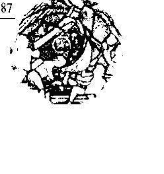
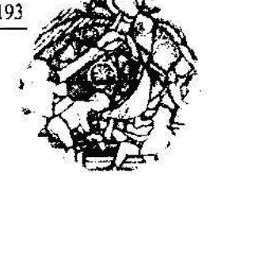
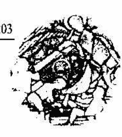
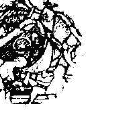

# 光的課程靈修系列3

## 光的課程

## A Course in Light

## 踏上靈魂覺醒的旅程

Antoinette Moltzan 原著 杜恆芬譯

光的課程資訊中心

目錄

譯者序

## 行星課程第四級次

-   簡介
-   第一課 白色之光
-   闡述聖經啟示錄第1、2章
-   第二課 金色之光
-   闡述聖經啟示錄第3、4章
-   第三課 藍色之光
-   闡述聖經啟示錄第5、6章
-   第四課 綠寶石之光
-   闡述聖經啟示錄第7、8章
-   第五課 紫色之光
-   闡述聖經啟示錄第9、10章
-   第六課 紅寶石之光
-   闡述聖經啟示錄第11、12章
-   第七課 橘色之光
-   闡述聖經啟示錄第13、14章
-   第八課 粉紅色之光
-   闡述聖經啟示錄第15、16章
-   第九課 紫水晶之光
-   闡述聖經啟示錄第17、18章
-   第十課 薄荷綠之光
-   闡述聖經啟示錄第19、20章
-   第十一課 赤紅色之光
-   闡述聖經啟示錄第21、22章

## 行星課程第五級次

### 簡介

### 第一課 白色之光

### 第二課 金色之光

### 第三課 藍色之光

### 第四課 綠寶石之光

### 第五課 紫色之光

### 第六課 紅寶石之光

### 第七課 橘色之光

### 第八課 粉紅色之光 299

### 第九課 紫水晶之光 305

### 第十課 薄荷綠之光 311

### 第十一課 赤紅色之光 318

## 行星課程第六級次

### 簡介 325

### 第一課 白色之光 329

### 第二課 金色之光 339

### 第三課 藍色之光 348

### 第四課 綠寶石之光 355

### 第五課 紫色之光 365

### 第六課 紅寶石之光 376

### 第七課 橘色之光 385

### 第八課 粉紅色之光 392

### 第九課 紫水晶之光 400

### 第十課 薄荷綠之光 409

### 第十一課 赤紅色之光 418

# 内在意识次元图

| 意识的层面 LEVELS OF CONSCIOUSNESS | 光的进阶课程 LESSONS IN LIGHT |
| :--- | :--- |
| 天使意識 Angelic Consciousness | (基督意識頻率) 量子能量圈 Monadic Sphere 天使 1~3 行星9 拉火 |
| 天使次元 Angelic | 行星7~9（系列4） 圖形與密碼 Keys & Codes |
| 行星 Planetary | 行星4~6（系列3） |
| 靈魂起因體 Soul Causal Body | 行星1~3（系列2） |
| 基督意識 Christ Consciousness | 彩虹橋（与較高自我、天使自我、基督自我核心連接） 彩虹橋（灵魂点向上50米） （头顶上方6寸） |
| 彩虹橋 Rainbow Bridge | 初級4 （系列1） |
| 靈魂體 Soul Body | 初級1-3（系列1） |
| 以太、星光體 Astral/Etheric Body | 地心（与地球能量、身体自我連接） |
| 身體 Physical Body | （黑色之光中心点）(脚底下6寸) |
| 人性意識 Human Consciousness | 向下50米 |
| 地球能量中心點 Earth Power Center | |

譯者序

我常被一些朋友們問道：「光的課程到底有多少級次，我們要修到什麼時候呢？」

我想在靈魂漫長的旅程中，我們必須在成長中持續進展，這中間如逆水行舟，不進則退。因此，這套課程的設計是以一種細水長流的方式，引導我們在潛移默化中，進行一種細緻而微妙的轉化與提升。對我來說，能沐浴其中，逐步邁進，是一種幸福。

光的課程系列一，有四個級次，是爲進入整套課程的習修做初步準備的教材，稱之爲預備階段（probationary level）。這種準備，不僅是在文字上對語言與名詞的理解，更重要的是在身心各個體系做好與較高頻率共同運作的準備。這種準備與一個人教育程度的高低，或修行程度的深淺無關，它是針對進入這特定的能量體系與運作做準備。

系列二，是行星一至行星三的三個級次。依課程的設計，進入行星課程之後，才真正開始學習如何運用宇宙的較高能量來調整自己，提升自己，並加速自己的進展。因此，行星一至行星三是入門之後的初級教材。

系列三，是行星四至行星六的級次。是入門的中級教材。在系列三的幾個級次中，我們學習以不同的光的頻率，來架構不同能量磁場，在這一系列中，光的金字塔是主要的能量架構。為什麼我們需要在不同的光的金字塔中運作，並且在行星四、五、六的三個級次中重複運作呢？

容我引用教材中的訊息來解說：「因為整個宇宙的能量，都是由幾何形體的架構所構成。經由這光的載體，你們的意識與頻率得以從一個階段提升到另一階段。」

「當你們置身於光的金字塔的架構中時，要知道，每一個光的金字塔都是一種具有實現特定目標的能量體系。能量在這架構中並非固定不動，它是流動的。這種架構理念來自於內在層面幾何學的運行原理，這架構的力量將增強你們的頻率系統。」

有些人可能會覺得，在這一系列中，除了冥想方式及所運用的能量架構相同之外，課程中的訊息，也有一些近似的重複教導。不可否認，確實有一些關鍵性的理念是透過不同角度，以不同的語言方式，一再地提醒著我們。然而，上師們告訴我們：「重複是增強你們內在光的元素的重要環節。靜坐步驟雖然相同，但是內在運作的深度，將隨著課程中每一級次的學習而不同。」

文字不是道，教材所提供的靜坐方式與訊息是整套課程中極小的部份。可以說它只是一個乘載工具，所謂的以文載道。大部份的學習，是在我們的肉眼及腦意識所無法觸及的層面中進行著。我常對許多走在這道途中的人們，依自己的生命經驗與內在設計，所汲取的，所精練的，所獲得的，是如此地獨特與個人化，感到不可思議。

一位長期參與共修的成員曾對我說：「我個人對行星課程並沒有很深入的認知，只是覺得在長時間修習的過程中，可以感覺到自己的智慧一直在增長，身體的細胞一直在解構、更新…」

事實上很多同學發現，當自己在誠摯與信賴中一個級次一個級次走下去時，隨著心識的擴展，自己的覺知力，感受力與內在知曉逐漸增強。但也知道自己尚有許多需要成長與完善之處。因此，有些同學在逐步修完整套課程之後，返身再重複學習，也有人在繼續學習後面級次的同時，一邊複習前面的級次。無論是那一種方式，很多人發現再次走過時，自己像是進入一個全新的課程般地有著全然不同的領悟。似乎在淺顯文字背面所蘊含的深沈智慧，此時方能真正體悟。

也有人問我說：「靈魂本身不是純淨的嗎？為何要淨化靈魂體？」

我想這可能是每個人對「靈魂」這名稱所代表含義不同程度的認知。在光的課程中所指的靈魂，包含了起因體中的種種欲望，以及各種可能性的自我。我再次引用教材中的訊息來回答這一問題：

「有些人宣稱靈魂不需要淨化，然而，你們因未能實現原有的設計，以及因你們創造欲望所引起的交互作用，而陷入在地球層面上。不是所有的欲望都是至善的。欲望可能製造毀滅性的力量。淨化是必需的，它帶領自我走過邁向清晰了悟的過程。」

「決定你們生命品質或你們生命課題的因素，不是你們做了什麼；不是你們在哪一個階段；也不是你們在物質層面上的財富。你們有各種選擇，可能性的自我 (probable selves) 依內在起因體的欲望，製造各種不同顯像活動。你們所肩負的擔子是磨練你們勇氣與力量的工具。當你們清理了沈重與痛苦的感受時，你們就會明顯地展現生命的平衡。」

在這一系列的三個級次中，我們被引導朝著比潛意識更深的意識層面，即內在靈魂起因體的層面，去洞察自己。但是，在這中級的階段中，我們大部份的人，只能淺略地涉入。因此，課程爲我們準備了下一個系列，即系列四，行星七至行星九。真正地深入將在行星課程中最後面的幾個級次。但如果在這階段中的準備不足，便無法真正深入自身存在的內在次元中的核心意識。也很難做一個對自我有真正覺知的人。

我在此深深祝福同行的朋友們，願大家從可能性的自我中，做出正確美好的選擇，爲自己的生命展開新的創造，並展現生命的平衡與美好。

杜恆芬

## 行星課程第四級次

### 治癒的金字塔 闡述聖經的啟示錄

### 簡介

行星四的目的是要使學生們熟知較高心識，並理解自己的內在心識能在意識的層面上隨時與較高心識融合，這將使學生們更加具備運用光的頻率作爲治癒之源的能力。這級次所介紹的金字塔的能量，將增強你們磁力磁場的能量，並帶來更大的治癒效果。

在這級次中，除了介紹金字塔的運作之外，還闡述聖經的啟示錄。這級次將使你們對光的能量之運作有更進一步的理解。

下面是摘錄自 Dr. J. J. Hurtak 的以諾之書（The Keys of Enoch）。書中對此級次行星的意識層面有著清楚的描述。

生物生理學與宇宙天文物理學的關鍵在於：「具生命之光的金字塔」存在於每一受造之物的磁場架構中。

進展的每一層面都有光的金字塔，人類必須傳遞它使之進入更大的造化中。如果我們要超越三度空間，我們必須經由三度空間的能量磁場進入光的能量金字塔的多次元的磁場中。

如果你們把白水晶放在離子顯微鏡下，你們將看到泡沫狀的光的金字塔，在水晶磁場中形成各種幾何形體。如果你們在電子顯微鏡下看血液，你們也將看到金字塔的結晶體。

以諾之書告訴我們，在生物能磁場的關係中，從最小的氫原子到最大星球的生命，可以看出光的金字塔是所有生物與其意識進展的幾何中心點。

金字塔的架構顯示宇宙心智無所不在，不僅存在於每一個星狀電離子的分子中，也存在於能量流的每一頻率中。無論你們從什麼角度看，你們都會發現意識之流恆常地在宇宙中流動著。

在人類得以進入下一進展階段，即 (consciousness time cell) 之前，其智慧必須先具備進入光的金字塔中運作的能力。屆時人類將瞭解自己是星際宇宙之運作的參與者，星際宇宙是宇宙金字塔中的一部份，被這宇宙之外的眾宇宙所環繞。

這些靈性的光之載體，將再次降臨並進入正義的團體中，這些團體散佈在世界各地的具有靈性頻率的磁柵區。這些磁柵包含金字塔之光的模型架構，它將接收光的載體，這載體是啟動光之意識中心點的光的頂點。這是人類參與較高進展的轉化過程。這就是為什麼，在光的課程中，以金字塔的運作來持續這進展過程的重要性。

除了這些治癒的金字塔的運作之外，聖經啟示錄也將為這一级次光的金字塔之運作補充一些解說。提供這些資料是為了闡明金字塔運作所象徵的寓意與內含。它闡述人類內在心靈與肉體之間所面臨的掙扎。

當你們在光的金字塔中運作時，要記住：

### 嘉勉之言

愛瑟瑞爾

問候你們！不要爲你們自己的進展感到憂慮，因爲，沒有任何事物可以阻止你們深入自己的智慧，或達到你們靈魂的目標與渴望。一切都是爲了你們的個性自我，及不朽靈魂的成長而給予的。

你們被帶入與自己存在中的指導靈及導師的交流與溝通中。在光中運作所獲得的成長，已使你們逐漸走出負面事物，進入光明的覺知中。

你們正走出深植在你們意識裏的來自群體大眾之世俗思想及較低的操控意識。

經由這些級次的循環，你們已開始走出這些層面，進入較高覺知的內在心識中。

你們已能感受到來自靈魂頻率的能量，進入你們較低體系時所產生的衝擊。你們靈魂體上中軸的每一個脈輪，將一直受到激發與啓動，直到它成爲光輝燦爛的意識爲止。

許多你們所感受的事物，已成爲你們自己及周圍人的實相。不要詢問衡量誰會坐在上主的右側，誰會坐在上主的左側，不要質疑那一個人已進展到可以成爲領導人，因爲一切事物都在一個整體中。

##### 落實地面

把覺知落實在較低體系中，走在和平中，不要執著在過去的事物上。不要重新製造黑暗的事物，展望你們靈性的基督自我。看着你們未來的擴展，並要知道沒有任何事物可以隱藏或剝奪真理。在和平中，知道正確的活動正在基督自我的神聖計劃中全面展現。

### 光的金字塔的激發與啓動

金字塔運作的目的，是爲了協助你們在自己的存在中，建立一個具有各種光的頻率與能量的治癒工具。這由四個三角形的面，及一個底面所組成的能量架構，將從靈魂體白色之光的中心點開始，經由所有的較低體系，進行強烈的治癒。靜心冥想時的觀想可參考圖形 1。

當這些能量聚合時，啓動白色之光靈魂體的中心點開始至腳底，建立一個環繞着自己的五面金字塔的能量架構。在這特定的級次中，你們所用的是二種光的頻率：金色之光、銀色之光，底面是那一星期所運作的光。

上面這圖形是假設你們由金字塔的上方往下看。它顯示四個三角形之面的能量是如何由靈魂體的中心點投射下來，如何組成右邊及前面的動力磁場；左邊及背面的磁力磁場，底面的能量磁場，以及黑色能量中心點。

在這級次中，銀色之光被用在右邊及前面的動力磁場上，金色之光被用在左邊及背面的磁力磁場上。底面是你們在那個星期所要運作的光。

當底面完成時，這光的金字塔便成爲一個封閉的「光的載體」。讓底面的頻率往上升，使之充滿整個金字塔的空間。建立這光的金字塔並在其中運作的目的是爲了使你們整個存在得以獲得轉化、平衡與治癒。

當金字塔的架構建立起來時，可以將它擴展成爲一百五十呎的面積，向上升到行星中心的層面。當你們完成了將治癒與平衡帶入較低體系的運作時，可以呼喚需要治癒的人來到這金字塔中，觀想他們在靈魂層面上獲得完整與治癒。

在擴展光的金字塔之架構的同時，將它以逆時針的方向旋轉，以轉化較低的、濁重的負面能量。這樣的運作，可以使動力磁場平靜下來，增強磁力磁場的活力。然後以順時針的方向旋轉，使平衡與和諧落實在你們的較低體系中。如果要做一個歸類，可以這麼說：逆時針的方向旋轉是發揮轉化的功能，順時針的方向旋轉是目標取向，落實每個金字塔及各色光的頻率的目的與功效。

如果要增強動力，可以將銀色之光換到左邊，金色之光換到右邊，這樣當你們將它以順時針的方向旋轉時，將啟動更多金色之光的動力，開啓動力磁場的能量。你們可以在自己的靜心冥想中做試驗，以便感受並熟悉這種頻率的轉換。

現在你們可能還是不明白這是什麼意思，以及如何運用它。

讓我們舉例說明，你們置身在一個人潮擁擠的地方，感到疲倦不堪，甚至頭痛。如何清理呢？

在這種情況下，可將銀色之光用在動力磁場上，銀色之光滋養的元素，可以減緩壓力與疲憊，並使神經系統鎮定下來。當你們停滯在交通擁擠的道路上、工作上與同事之間意見不同或與家人爭吵時，也可以用這能量。

銀色之光在動力磁場上，可使許多緊張的情況緩和下來。
何時將金色之光用在金字塔的動力磁場上呢？
當你們需要增加動力的時候。譬如在應徵工作時，在演講時，在需要做決策時，將金色之光放在動力磁場上，你們會發現這能量架構帶給你們極大的動力。
演藝人員將發現這動力的金字塔可以幫助你們發揮更高水準的演出。
你們可以把自己在什麼情況用什麼樣的能量架構記錄下來。看看這金字塔的能量架構所帶給你們的功效。

這些光的金字塔的力量有多大呢？

### 靜坐次第說明

-   (a) 呼喚所有的自我來到前額，並祝福所有的自我。感受所有較低體系的元素都被帶到與較高自我的合一中。
-   (b) 在初學的階段中，每一課的開始都是聚合所有的自我來到前額，並整合為一個心識。現在，你們已熟悉這些個體化的自我，可能感受到它們的存在、作用與目的。我們很容易陷入在渙散與不平衡中。呼喚所有的自我，唱頌 OM 字，觀想「眼睛」或光，將整合你們的意識。
-   (c) 將覺知經由較低體系向上提升進入白色之光的中心點。
-   (d) 天使聖團的委員們，指導靈們、教師們及所有光的存在以你們的靈魂之光來識別你們。每當你們將覺知帶入這光的中心點時，你們便在提升與轉化中，並為你們的較低自我創造新的活動元素。
-   (e) 啟動並擴展這白色之光，漩渦式地以逆時針的方向旋轉，清理你們的較低體系，再以順時針的方向旋轉，以封閉你們的磁場。
-   (f) 從白色之光的中心開始啟動所有光的中心點。並經由中軸向上提升。
-   (g) 擴展你們的能量磁場，直到它環繞著你們共修的成員，使之成為一個合一的團體的頻率。

### 第一課白色之光

#### 淨化之光

- (h) 將這合一的團體頻率向上提升經由銀色之光的中心點，啟動銀色聖杯，讓這聖杯舒適且滋養的能量注入你們的較低體系中，填滿你們存在中的空虛。
- (i) 光的能量已深植在你們的意識與內在體系中。你們已成為充滿著靈性與真理之光的載體，成為改變負面模式與方向的元素。
- (j) 光在行星層面上的運作，繼續向上經由彩虹橋進入行星中心。進入智慧的聖殿，與上師們、指導靈及教師們融合。
- (k) 當你們進入行星意識層面時，你們便在這內在次元中與上師們的智慧與能量融合。聚合在這裏的靈魂是遍佈在地球上的光的行者。與光的委員們融合，從較高層面把所要運作的光的頻率帶下來。以片刻的時間來調整你們的頻率，使之與行星層面的頻率融合。
- (l) 要知道，這是治癒地球最有效的時刻。在這智慧的聖殿中，許多宇宙神聖計劃的運作者在此問候你們，並與你們在宇宙的神聖計劃中運作。感受你們的心識正來到這個聖殿中心，並感到輕鬆自在。
- (m) 進入環繞著地球行星的光的網絡，引導光進入地球磁場中。與你們的指導靈一起將光導向需要治癒能量的地方。
- (n) 當你們行星運作完成時，回到行星中心。進入內在較高心識的聖殿中。進入靜默中………
- (o) 要在意識的層面上理解你們個別的心識所放大的頻率是非常困難的。但是，此時只要在靜默中就能夠體會。對你們來說，進入你們內在心識的聖殿並與一切萬有連結是很重要的。這是實現你們自身的完整與目標的重要部份。每個人的途徑都是極為個人的，每個人所要實現的生命目標也是不同的。在不同的生命領域中，所有的人都是教師也是學生。
- (p) 與你們的較高自我交流。祈求讓你們接受個人成長所需的真知。保持在靜默中，直到你們感到運作已完成為止。
- (q) 當靜默結束時，將覺知經由彩虹橋帶回較低體系中。感受較高自我的頻率經由彩虹橋進入你們的靈魂體中，感受所有的頻率在靈魂體中放大著。
- (r) 在白色之光的中心點上，建立一個治癒的金字塔，將它環繞著你們整個存在。
- (s) 在這時候啟動光的三角形架構的能量，這是你們在前面的級次中便已熟悉的。再將它們組合成四個斜面與一個底面的金字塔。
- 將這金字塔擴展成一百五十呎的高度，呼喚所有需要治癒與提升的人來到這金字塔中。
- 將需要治癒的人一個個地帶入你們的光的金字塔的架構中，感受他們的心靈意識及身體的完整與平衡。要知道每個人都必須具有誠信、希望與至善的心，才能清除較低自我體系中的戰鬥與矛盾的意識。
- (t) 當你們的運作完成時，釋放每一個人回到他們自己的進展中。將能量經由較低體系，經由雙腿、雙腳落實地面進入黑色能量中心點。這黑色能量給人一種黑色液體般的感覺，然而，它不是邪惡的勢能。它是一種使你們得以將自己頻率經由物理層面帶入地球，使你們屹立在平衡中的能量。
- (u) 慢慢地將較高自我的心識落實在較低體系中。感受它為你們的身心所帶來的衝擊。你們在光中所學習的，以及光的思想意識，正注入你們所有的層面。
- (v) 當你們的覺知回到身體時，你們將有著自己克服了負面元素的全新的感受，一種安寧與和平。

這靜坐次第將持續到行星九，那是與開啟拙火有關的級次。經常複習，讓這能量的運作純熟到你們能習以為常，運用自如為止。

來自 TONI 的解說，參考用

- 轉化—活動的，起作用的—動力的—以金色之光來提升頻率。
- 實現目標—接受、接納的—磁力的—以銀色之光來使人的情緒平靜下來、減緩痛苦並使能量平穩下來。
- 當金色之光在右面時，金色之光的金字塔本身便開始轉化由思想與行為所產生的負面能量。
- 當銀色之光在右面時，它舒緩緊張與動盪的能量。當金色之光在左面時，它提升由自我的敏感與磁場所接收的能量。

#### 金字塔的運作

- 動力磁場：白色之光
- 磁力磁場：白色之光
- 底面磁場：白色之光

##### 轉化磁場的金字塔

這是由金色之光在右面，銀色之光在左面所形成的動力金字塔。它可以用來提升你們的所有層面，清除細胞、器官及組織裏沈重的意識與頻率。化解情緒上負面、不穩定、不成熟的感受，清除理性思想體上腦意識裏的記憶。

> 註：當金色之光被運用在金字塔的右面時，它自然成為轉化並清理因負面思想與行為所形成的能量。

#### 實現目標的金字塔

這是由銀色之光在右面，金色之光在左面所形成的磁力金字塔。它可以用來幫助你們的各個體系，做好接收較高能量與頻率注入的準備，並帶來全面的治癒。它提升各種頻率，保護你們不受負面元素的干擾。它也藉由基督的聖愛來淨化、平衡思考過程，並為各種情況帶來治癒。

> 註：當金色之光被用在左面時，它便自然地提升每個人由敏銳的磁力磁場所接收的能量。

##### 靜心冥想與上師們的訊息#1

問候你們！這是愛瑟瑞爾。我在這裏說話，為的是協助你們進入更新的覺醒層面，以便更清楚地瞭解自己的真實自我。我們在此問候每一個人。是的，當意識加速進展時，改變便在進行中。

我們呼喚你們的靈魂意識來到這中心，並從中體驗心識的擴展。不要以人的腦意識來理解「心識」這名詞，而是要瞭解其本身包涵著那些瞭解宇宙法則的事物。要知道，憑藉著你們個別的心識本質，你們每一個人的內在與外在經歷都在正確的思想以及正確的表達中。

所有的轉化都是經由意識而產生的，意思是說：「心是營造者，是創造者」。「心」是使一切事物呈現於外在層面的因素。「心」不是意識自我，然而，它是意識自我的一個部份，而且是意識自我的主要部份。

「心」超越人性自我的思想能量所能及，然而，當你們的思想意識與積極、正面的行為在整合中時，它便在融合中成為思想能量的一部份。當你們融入在正面的思想元素中時，你們便開始轉化較低的思想意識。運用「心」的法則，感受並觀想自己在至高形式的顯現中。

在這堂課中，我們將談及「創造法則」。這是意識自我很難以理解的部份，因為意識自我是依人類自我的法則在創造，並受到由人類群體之經驗所形成的意識所影響。「心」作為監督者與大我，是較高實相的創造者，尋求將引導性的原則帶入。

你們疑惑道：「如何在生命中創造平衡？」我們感受到你們確實在探索如何在物質世界中創造平衡。

在這內在次元中，感受自己所渴望表達的，並肯定目前的運作。在心識中觀想創造的元素觸及你們生命的每一層面。感受每一個與你們連接的人，都是基督意識的一種表達。看著宇宙法則與神聖計劃呈現在地球層面上。

現在，觀想那些障礙你們的成長、進展與自由的毀滅性勢能，都在這燦爛的白色之光的環繞中。感受自己與光的上師連接。看著所有人類意識都向自己的內在心識，以及自己與天使聖團連接這一事實覺醒，並引導能量將基督聖靈帶入宇宙運作中。持續這觀想，看著所有人類在光中提升。

進入靜默中……

當你們準備好進入彩虹橋時，感受你們的覺知回到意識自我的層面。

#### 金字塔的運作

我們將介紹金字塔架構這燦爛的能量磁場。從行星一的級次中，你們已熟悉三角形架構的頻率意識。因此，啟動這些架構，並將它們融入在四面體的金字塔中。

感受這四面金字塔完全在光輝燦爛的白色之光中，讓自己的意識完全在這燦爛的能量體系的環繞中。要知道，這頻率所帶來的衝擊是超越人類意識所能理解的。沒有人能全面瞭解這些能量架構的衝擊力量。因此要在誠信中，讓誠信成為你們流動的載體。你們將發現自己每一個體系正以獨特的方式在體驗，並回應這頻率。

這金字塔的頂端，從行星意識或光的中心點開始，經由彩虹橋被帶入靈魂光體的中心點，是「我是」層面「眼睛」的外在顯現。

注意，在所有靈性輸入的活動中，均以這「眼睛」在頂端的四面體金字塔的架構為載體。「眼睛」代表你們的真知；代表「宇宙心識」是所有層面及所有狀況的監督者。

深入這體驗，並感受你們所有體系完全在這白色的能量元素中。感受自己身體的每一器官都在這白色之光的環繞中。這白色之光是所有意識、色彩與聲音的綜合。是清理身體所有層面的淨化者。要清理身體器官上的雜質與毒素，必須讓自己完全在這白色之光的環繞中。

感受所有的體系都在這鐳射般的能量中獲得提升。當這美麗的能量環繞著身體的細胞與器官時，感受身體在凝定中。感受血液裏的疾病在這頻率中獲得清理。

現在，感受心識與腦意識在這白色之光的環繞中。感受腦意識沉浸在這高頻率之中，所有的恐懼思想、分裂與矛盾的感受，均在光的元素中得到化解與釋放。

感受自己的心靈意識已完全淨化，將焦點放在至善中。如果你們的工作是屬於心理上的或技術上的，你們將能在工作上有所突破。從事這些方面的人，將能感受到這些能量是提升所有體系的工具。

當你們在這特定的能量中心點時，再次融入這「C」調的聲音與頻率中。感受它的音符清晰地縈繞在你們的耳內。感受這聲音正突破你們在物質層面上的所有黑暗元素……。

感受你們身體的負面元素已消失，固化的思想意識已化解。所有麻痺你們情緒感受或心智的情況也獲得釋放。

觀想你們的意識在「C」的音調中獲得全面提升，並釋放人性意識層面上的執著。想著你們的身體，你們的體系及你們的能量，在這音階中一度一度地提升，直到你們不再有身體的感受，或不再聽到聲音為止。當你們進入靜默中，或進入超越人的耳朵所能聽的境界時，便能體驗這種全面提升並進入較高存在的層面。

不同的能量，在各體系中有著特定的啟動與運作。就如前面的課程所提到的，每個頻率都有它特定的功效。很多病人是透過光、音聲及這些能量的激發與啟動而獲得提升與治癒。一個病人，如果能長期處於這特定的頻率中，第一步便是開始淨化作用。病人的所有器官系統將得到淨化，並排除身體上的毒素，進而使他身體內的所有細胞都得到淨化。

在地球加速清理負面元素，及人類思想意識與活動的這一階段中，這種淨化尤其重要。你們將開始體驗到與靈魂之間的溝通，並將開始有著如何將這覺知與視野實踐在生活中的洞見。信任你們個人的覺知。

#### 給團體共修的建議

團體共修時，感受自己在這白色之光所形成的圓圈中。感受這圓圈擴展並環繞著所有光的行者。感受你們之間的能量在融合中，並清理你們的身體、情緒感受體以及靈魂體。感受所有的人都在光的金字塔中。當個人的內在運作完成時，慢慢地將自我帶回前額。

##### 肯定語意

- 我與我內在存在的天父是一個整體。
- 我與內在基督是一個整體。
- 我與所有的生命是一個整體。
- 我與出自愛的能量的活動是一個整體。
- 進入和平中，這運作將在較高自我的意願中完成。

光的課程 行星四

#### 上師們的訊息與靜心冥想#2

愛瑟瑞爾

問候你們！在這從黑暗與稠密到清明與光的旅程中，你們將進入另一個新的階段。喜悅將因你們對這經驗的接受而降臨你們。

在你們道途的這一循環中，你們正接收來自其他體系的頻率與智慧。由許多兄弟所組成的天使聖團，正將對宇宙法則的領悟傳遞給你們。作為地球的公民，你們受到召喚，前來接受這汰舊更新的角色。並釋放你們對自己內在靈性的否定。

你們有許多恐懼，但只要在祥和與安寧中，因為時間自然會將你們靈魂的旅程，及你們較高自我的願望顯示在你們物質生命的經驗中。

到目前為止，光的課程以簡單的方式，提供你們一個「如何克服負面元素，走向光」的方法。當你們體驗到覺醒的自我正受到指引，邁向新的靈性與物質表達時，光的運作能量將更為增強。

你們無須放下工作或事業，反之，你們的工作將成為你們創造經驗的延伸。當你們開始執行你們的任務，並將你們的意願導向正確行為時，你們在宇宙中的角色將更為珍貴。

人類有諸多恐懼，因為在改變中的地球，為了釋放許多模式而處於戰慄中。你們從經濟體系中看到舊勢力是如何地在消失，取而代之的是許多成長的機緣。

你們必須理解，雖然改變使你們陷入在恐懼、壓抑、沮喪中；使你們感到戰慄、意志消沈。然而，事實上這將使你們與內在自我的頻率融合。

我們歡迎你們進入《光的課程》這特定的級次。你們是具有勇氣，蒙受祝福的，在光中的成長，將使你們的生命更為豐富。雖然你們曾經失去許多，然而，你們將獲得你們靈魂真正所渴望的。你們所失去的，是一些不再為你們的生命體驗所需之事物。你們正在自己的心靈中種植一顆邁向較高真知之樹。你們是美麗的，你們將繼續煥發出更深沈的內在之美。

古代的入門者必須進入埃及的金字塔，以放大他與靈魂之間的關係，並深思自己靈魂旅程的方向。在古代進入金字塔時，會舉行一個隆重儀式，一個神聖慶典，並考驗一個人是否具備了從較低、較稠密的物質頻率，進入較高精神與靈性之頻率的能力。今日，入門是一種個人完善的過程，一個通往明心見性的靈魂的旅程。

地球正處於巨大的騷動與混亂中。作為參與光的旅程的行者，把你們靈魂所認知的人，帶入這光中，以分享這愛的頻率。進入靜默……在靜默中這麼想著：

如何理解自己的較高自我？自己在宇宙中經歷過什麼樣的生命旅程？

#### 金字塔的運作

在這光的途徑的入門中，你們正啟動光的金字塔的能量架構，這些能量架構是一種幫助人們理解光的完美，以及生命能量的工具。

當你們體驗並放大這堂課所啟動的金字塔架構的能量時，你們便更具內在的力量。

現在，親愛的學生們，燦爛的白色之光正啟動你們內在的靈魂意識。這放大的能量與頻率正環繞著你們。當你們進入這巨大的金字塔的能量中時，感受自己在平衡中，並融入在自己道途中所有的可能性與至高目標中。

讓自己在這正面意識與頻率的環繞中。感受燦爛的白色之光的元素。放下所有的疑慮與痛苦。

這光的金字塔的能量將與你們同在，任何時候你們都可以啟動這能量。

靜默……

當你們回到覺知中時，感受所有的自我都落實到地球層面。

在這級次，我們將詮釋聖經中的啟示錄。你們可能要拿一本聖經在手上，以瞭解它的詮釋，並將它運用在你們的進展上。

#### 啟示錄

# 詩篇的象徵性之詮釋

###### 第一章

**1:1**：耶穌基督的啟示，就是神賜給祂，叫祂將必要快發生的事指示祂的眾奴僕；祂就藉著祂的使者傳達，用表號指示的奴僕約翰。

**1:2**：約翰便將神的話，和耶穌基督的見證，凡自己所看見的，都見證出來。

**1:3**：念這豫言的話，和那些聽見又遵守其中所記載的，都是有福的，因為時候近了。

##### 解說：

- 耶穌基督的啟示錄是每一個要進入基督意識，或達到所謂啟悟階段的人所必須經歷的過程。當神來到約翰面前，且當約翰進入這意識狀態時，便將神所說的話記錄下來。閱讀、理解並將這些言語融會貫通的人有福了，這表示他個人的啟迪即將來臨。

**1:4**：約翰寫信給在亞西亞的七個教會；願恩典與平安，從那今是昔是以後永是的，從祂寶座前的七靈，

##### 解說：

- 七個教會：象徵七個與腺體對應的靈性中心點，並以小亞細亞的七個教會為名。「七靈」(seven spirits) 即是對應引導這七個能量中心點的靈性智能。
- 約翰在自己的靜心冥想中受到啓示，這是他自身經驗的證詞。七個在小亞細亞的教會曾遭受到嚴重的迫害，極其需要提升。他們需要尋獲一條可以重生與治癒之路，而這路就在他們自己的身體之之內。

**1:5**：並從那忠信的見證人，死人中的首生者，為地上君王元首的耶穌基督，歸與你們。祂愛我們，用自己的血，把我們從我們的罪中釋放了；

**1:6**：又使我們成為國度，作祂神與父的祭司；願榮耀權能歸與祂，直到永永遠遠。阿門。

**1:7**：看哪，祂駕雲降臨，眾目要看見祂，連刺祂的人也要看見祂；地上的眾支派都要因祂捶胸哀哭。是的，阿門。

##### 解說：

- 約翰所提到的寶座，指的是觸及宇宙意識的那個點。耶穌基督，是忠誠的見證者，第一個從死裏復活，是眾神之王，也是所有人類靈魂的領導者。耶穌是第一個完成體驗整體人類經驗，並返回他在天父身旁應有的位置的人。
- 這本書的目的是按照「耶穌與基督合而為一，是第一個成為基督的人」，來詮釋來自本書真實作者的內在基督意識。耶穌是第一個完成人類進展模式的人，並向世人展現。因此，當基督以一種意識降臨人類內在心靈時，每個人都會體驗到祂的存在。每人都會見到天父的力量與榮耀，即便是那些將祂釘上十字架的人。

**1:8**：主神說，我是阿爾法，我是歐米加，是今是昔是以後永是的全能者。

**1:9**：我約翰，就是你們的弟兄，和你們在耶穌的患難、國度、忍耐裏一同有分的，為神的話和耶穌的見證，曾在那名叫拔摩的海島上。

##### 解說：

- 阿爾法與歐米加象徵大我，即約翰的超意識。
- 當時「大我」指的是完全進展的狀況，在約翰那個時代，進展只完成了其中的一部份。「大我」本身即具使人類在物質顯像世界的體驗中，達到完美成果的力量。約翰以他被放逐在拔摩島（Isle of Patmos)時，作為一個逃亡者在生活上所面對巨大難難的困境，來做解釋。

**1:10**：當主曰在我靈裏，聽見在我後面有大聲音如吹號說，

##### 解說：

- 當約翰說他在靈裏，指的是他在靜心冥想中。
- 約翰解釋，當他在靜心冥想時，每件事都發生在他的身心之中。這整本書中所有的事都在影射在他的身體與心識所呈現的現象。

**1:11**：你所看見的，當寫在書上，寄給那七個教會：給以弗所、給士每拿、給別迦摩、給推雅推喇、給撒狄、給非拉鐵非、給老底嘉。

##### 解說：

- 大我，即阿爾法與歐米加，指示約翰與七個教會或七個中心點溝通。它們是：
- 以弗所教會（EPHESUS）：象徵性腺或生殖腺（男性的睪丸或女性的卵巢）。
- 士每拿教會（SMYRNA）：象徵胰腺。
- 別迦摩教會（PERGAMOS）：象徵腎上腺。
- 推雅推喇教會（THYATIRA）：象徵胸腺。
- 撒狄教會（SARDIS）：象徵甲狀腺。
- 非拉鐵非教會（PHILADELPHIA）：象徵松果腺。
- 老底嘉教會（LAODICEA）：象徵腦下腺。
- 大我—那被賦予宇宙意識的超意識，那肉體死亡的管理者，將是約翰的老師。

**1:12**：我轉過身來，要看是誰發聲與我說話；既轉過來，就看見七個金燈臺；

##### 解說：

- 這裡所提的七個金燈臺，指的是七個靈性中心點，再加上引導每個中心點的智能。
- 經由金燭臺的形象，約翰領悟到在每個中心點之內的是一個心識細胞。燭光象徵著每個中心點因靈性智能的注入而發揮功能。這些中心點都在大我的管轄中。

**1:13**：燈臺中間，有一位好像人子，身穿長袍，直垂到腳、胸間束著金帶。

**1:14**：祂的頭與髮皆白，如白羊毛、如雪、眼目如同火焰。

**1:15**：腳好像在爐中鍛煉過明亮的銅，聲音如同眾水的聲音。

**1:16**：祂右手中拿著七星，從祂口中出來一把兩刃的利劍，面貌如同烈日中天發光。

##### 解說：

下面的描述象徵約翰所見到的：

- 人子：即基督；
- 金帶：即美德；
- 白髮：象徵智慧；
- 眼目如火焰：洞察力；
- 精煉的銅：象徵理解；
- 七星：象徵掌控身體的七個中心點；
- 兩刃的利劍：從這些中心點升起的能量，依據個人的意志，可以是建設性的，也可以是破壞性的。

**1:17**：我一看見，就仆倒在祂腳前，像死了一樣。祂用右手按著我說，不要懼怕；我是首先的，我是# 40 光的課程 行星四

1:18: 又是那活著的；我曾死過，看哪，現在又活了，直活到永永遠遠，並且拿著死亡和陰間的鑰匙。
1:19: 所以你要把所看見的事，和現在的事，以及這些事以後將要發生的事，都寫出來。
1:20: 論到你所看見在我右手上的七星，和七個金燈臺的奧祕，那七星就是七個教會的使者，七燈臺就是七個教會。

解說：
大我在這些詩句中解釋道：祂掌管並持有生死之鑰匙。

#### 启示录

# 詩篇的象徵性之詮釋

第一宣

2:1: 你要寫信給在以弗所的教會使者，說，那右手中握著七星，在七個燈臺中間行走的，這樣說，
2:2: 我知道你的行為，勞碌、忍耐，也知道你不能容忍惡人；你也曾試驗那自稱是使徒卻不是使徒的，看出他們是假的；
2:3: 你也有忍耐，曾為我的名忍受一切，並不乏倦。

- 以弗所教會的使者：調整性腺的心識細胞。
- 那握著七星的：大我。
- 在這裏，大我指出人類需要清理淨化性腺的勢能。大我知道智慧已致力於管制並護守它免於破壞性的活動，但是，這中心點已失去它原本目的。心識細胞正催促它快速地回到原本的目的，否則它便會完全失去它的智慧，退化到動物性的作用。大我知道這中心點的某些部份正致力於將它帶入完美。

2:4: 然而有一件事我要責備你，就是你離棄了起初的愛。
2:5: 所以要回想你是從那裏墜落的，並要悔改，行起初所行的。不然，我就要臨到你那裏；你若不悔改，我就把你的燈臺從原處挪去。

##### 解說：

- 起初的愛（The FIRST LOVE）: 屬靈的理念。
- 大我指示心識細胞的智慧回到這中心點，以恢復這中心點的靈性目標，不然祂會把智慧從中除去。

2:6: 然而你有這件事，就是你恨惡尼哥拉黨的行為，這也是我所恨惡的。

##### 解說：

- 尼哥拉黨人：象徵這中心點的細胞因誤用與愚蠢的行爲而衰敗、退化。

2:7: 那靈向眾召會所說的話，凡有耳的，就應當聽，得勝的，我必將神樂園中生命樹的果子賜給他吃。

##### 解說：

- 生命樹：具有提供資源、治癒與成長的作用；
- 神之樂園：指的是人類進入物質層面之前的初始意識，也是人類必須回歸的意識狀態。
- 大我對《創世紀》中的生命樹做了提示。祂告訴約翰，任何人只要恢復這中心點的掌控能力，就能在「治癒與供給法則」下，帶來身心上的全面復甦。

2:8: 你要寫信給在士每拿的教會的使者，說，那首先的，末後的，死過又活的，這樣說，
2:9: 我知道你的患難和貧窮，其實你是富足的，也知道那自稱是猶太人，卻不是猶太人，乃是撒旦會堂的人，所說讒謗的話。

##### 解說：

- 士每拿教會的使者：調整胰腺的心識細胞與智慧。
- 猶太人：為特定發展所選出的細胞。
- 撒旦的會眾：冥頑不靈的衰敗細胞。
- 大我教導約翰說，經過一段時間的淨化之後，一旦消除了那些會限制腺體活動的怠惰細胞之後，所可以發揮出來的創造力是無限的。

2:10: 你將要受的苦你不用怕，看哪，魔鬼將要把你們中間幾個人下在監裡，叫你們受試煉；你們必受患難十日。你務要至死忠信，我就賜給你生命的冠冕。

##### 解說：

- 苦難的十天：代表淨化期。
- 生命的冠冕：代表完美的掌握狀態。
- 不要因這個中心點的淨化所產生的躁動而感到害怕，在嚴守誡律中保持信心，將能調整並恢復負責這能量中心點。

2:11: 那靈向眾召會所說的話，凡有耳的，就應當聽。得勝的，絕不會受第二次死的害。

####### 解說

- 那靈（The SPIRIT）：指的是大我。
- 第二次死：衰退（指從部份的再生和療癒中退化）。

2:12: 你要寫信給在別迦摩的教會的使者，說，那有兩刃利劍的，這樣說，

##### 解說：

- 別加摩教會的使者：象徵掌管腎上腺的心識細胞。
- 有兩刃利劍的：象徵大我。因為大我掌理腎上腺這能量中心的智慧。

2:13: 我知道你的居所，就是有撒旦座位之處。你持守著我的名，甚至當我忠信的見證人安提帕在你們中間，撒旦所住之處被殺的那些日子，你也沒有否認對我的信仰。

##### 解說：

- 安提帕（ANTIPAS）：象徵腎上腺失去功能時的狀態。腎上腺的智慧受到警告，不要因冥頑不靈的怠惰細胞而誤用能量，淨化是必需的。

2:14: 然而有幾件事我要責備你，因為在你那裏，有人持守巴蘭的教訓；這巴蘭曾教導巴勒，將絆腳石放在以色列子孫面前，叫他們吃祭偶像之物，並且行淫亂。
2:15: 你那裏也有人照樣持守尼哥拉黨的教訓。
2:16: 所以你要悔改；不然，我就快臨到你那裏，用我口中的劍攻擊他們。

##### 解說：

- 巴蘭：象徵原本被選作特殊發展的細胞，但因誤用和不智的衝動而導致敗壞。
- 尼哥拉黨人：衰敗的細胞。
- 兩刃利劍：象徵從這些中心點所升起的大我，根據旨意，可以祝福人類，也可以降禍世間。
- 大我解釋祂對衰敗的細胞感到嫌惡，同時承諾對那些拒絕接受紀律的細胞必定加以嚴懲並淨化。

2:17: 那靈向眾教會所說的話，凡有耳的，就應當聽。得勝的，我必將那隱藏的瑪納賜給他，並賜他一塊白石，上面寫著新名，除了那領受的以外，沒有人認識。

##### 解說：

- 隱藏的瑪納（HIDDEN MANNA）：腎上腺因靈能的力量，將創造活力的分泌物釋放到血液中。
- 白石：新的意識層面。
- 石上寫著新名：對整體有一個全新的認知。
- 大我解釋道，在這些中心點恢復了自我控制的功能之後，個人能在意志主導下，就像耶穌曾做過的一樣，將腎上腺的賀爾蒙直接分泌到血液中，使自己更新再生。內分泌體系受到來自靈性的衝擊，使個人的意識進入較高層面，他們將認知經由自己的意志力量，可以與較高勢能連接與互動。

2:18: 你要寫信給在推雅推喇的教會的使者，說，那眼目如火焰，腳像明亮之銅的神之子，這樣說，
2:19: 我知道你的行為、愛、信、服事、忍耐，也知道你末後所行的，比起初的更多。

- 推雅推喇教會的使者：調整胸腺的心識細胞或智慧。
- 火焰般的眼睛與明亮之銅：象徵覺知、理解與領悟。
- 在此，大我對胸腺中心的心識細胞的智慧在說話。

2:20: 然而有一件事我要責備你，就是你容讓那自稱是女申言者的婦人耶洗別教導我的奴僕，引誘他們行淫亂，並吃祭偶像之物。
2:21: 我曾給她時間，讓她悔改，她卻不肯悔改她的淫行。
2:22: 看哪，我要叫她臥病在床，那些與她行淫的人，若不為她所行的悔改，我也要叫他們受大患難。
2:23: 我又要用死亡擊殺她的兒女，叫眾教會都知道，我是那察看人肺腑心腸的；我且要照你們的行為報應你們個人。

##### 解說：

- 耶洗別：象徵對創造勢能的誤導。
- 肺腑心腸：意指動機、意念。
- 大我催促這能量中心點，儘快導正由於私慾而誤用神聖勢能的錯誤。大我一直在給予這中心點時間來導正，然而，如果錯誤持續下去，只會導致退化與衰竭。這將致使其他中心點不平衡。大我掌控並持續地檢查每一個中心點的自制能力與動機。

2:24: 至於你們推雅推喇其餘的人，就是一切不持有那教訓，不明白他們所謂撒旦深奧之事的人，我告訴你們，我不將別的重擔放在你們身上。
2:25: 但你們已經有的，總要持守，直等到我來。

##### 解說：

- 撒旦：象徵冥頑不靈的衰敗心識。沒有誤用勢能的心識細胞與其他細胞，將不會再受到更多的負荷。大我告知這些細胞要維持他們完美模式的理想狀態。

2:26: 得勝的，又守住我的工作到底的，我要賜給他們權柄制伏列國；
2:27: 他必有鐵杖轄管他們，將他們如同窯戶裏的瓦器打得粉碎，像我從我父領受的權柄一樣；
2:28: 我又要把晨星賜給他。
2:29: 那靈向眾教會所說的話，凡有耳的，就應當聽。

##### 解說：

- 制伏列國：象徵完善地控制身體上所有部位及功能的運作。意指在真理中維持內在完美模式的人，將被賦予完整地掌控身體所有功能的力量。
- 晨星：象徵明心見性的初始狀態。
- 當人恢復了掌控所有中心點的能力時，他會回到最初的意識狀態，也將能完全成為掌握自己周圍環境的主人。如果你能理解這些話，便應聽取大我的聖靈向這些中心點所說的。

### 第二課金色之光

#### 轉化之光

金字塔的運作

| 動力磁場 | 銀色之光 |
| 磁力磁場 | 金色之光 |
| 底面磁場 | 白色之光 |

##### 轉化磁場的金字塔

這金字塔可以用來清除不安全感，滋養你們的意識，使你們從分裂、匱乏、痛苦的感受中提升出來。它釋放意識裏卑微、愧疚、孤獨、性剝削、被忽略的影像。

它清除較低體系中的較低頻率，淨化並清理被動與冷漠。當動力磁場的能量被啟動時，它便開始釋放因負面思想、理念所累積在器官、組織與細胞裏的雜質。化解因憎恨、憤怒、復仇、排斥、挫敗、焦慮、疑惑等負面情緒所產生的反應。

#### 實現目標的金字塔

這金字塔的能量能治癒一切事物，經由基督之愛將所有的情況帶入治癒中。將你們帶入與宇宙之母合一的感受中，使你們處在寧靜與沈著中。它提升消化與排泄系統之細胞的頻率，平衡生殖系統。它使神經系統獲得平衡，使腦神經細胞的正負離子保持在平衡中。它激發創意，將思想理念具體化，並明確地展現個體靈魂的欲望與目標。

##### 靜心冥想與上師們的訊息

我們以宇宙天父的聖靈之名，問候淨光兄弟的入門者。感受自己的覺知正經由光的彩虹橋進入較高自我的中心點。

當你們體驗到這光時，它便成為你們的實相。你們不需要拘泥在靜坐次第的程序上而躊躇不前。你們的意識正無限地擴展著，不要爲結構或形式所束縛。感受那無言的溝通，從較高意識層面將光傳遞出去。

在物質次元中，你們無法逃脫對立的現象，因此，這層面的表達力量來自你們進入靜默及體驗較高意識層面之頻率的能力。要去除舊有模式，你們必須正視一再出現於你們面前的狀態，並祈求讓你們理解它的意義。

在內在洞見顯示的過程中，你們將認知那製造你們個人經驗的模式。要避免重蹈覆轍，你們需向它打開，並讓自我從展現與反應中看到那不變的模式。你們的生命是一連串的欲望與因果的展現。

我們放大宇宙天父之光，並與這光共同運作。

感受你們正打開通往較高自我之門，看著你們的意識自我的改變，感受它在光的環繞中。面對自身的矛盾，並將它放在這光的能量中。

靜默...................................

靜默結束時，感受自己在一間四面皆是鏡子的房間。看著這些鏡子，觀想每個人都在燦爛的金色之光的環繞中。如果過去的事物浮現出來，問候它們，認知它們是你們存在中的一部份，並尋問它們是否已實現並完成了它的作用，告訴它們，現在你們已不需要這些經驗了。有些影像可能是非常古老的經驗，只要將它們釋放到光中。感受自己將能量釋放到光的網絡中；與眾多探索提升地球體系的心靈意識及靈魂頻率連接。將對抗的勢能帶到光中，並觀想人類的戰鬥意識已轉化成和平的元素。

#### 金字塔的運作

現在，觀想自己在燦爛的銀色之光的中心點。看著它移到你們的左面與背面，形成銀色的三角形磁場。進入燦爛的金色之光，看著它在你們的右面與前面，形成金色的三角形磁場，再將它們形成一個四面體的金字塔架構。以燦爛的白色之光為金字塔的底層。將這些頻率擴展成為一百五十呎的能量磁場。體驗這金字塔的頻率，感受自己在平衡與和諧中整合。感受自己釋放了抗拒、痛苦、憤怒與否定。呼喚所有在疾病中，在苦難中或是與他們的較高自我分離的人來到這頻率中，觀想他們已被提升，並集中能量在他們身上，如同每一個心識毫不費勁地體驗著他們的較高意識。停留在這光的金字塔的架構中，直到你們感到自己已從負面頻率中釋放出來為止。慢慢地回到身體的意識中。

##### 落實地面

你們將感到自己的身體是輕鬆的，思想是清晰的。解。然而，你們必須體驗你們自身的啟示，例如「什麼是與你們個人經驗有關的啟示」。

審判日指的是靈魂轉化成爲一種新的形式，並審視自身的活動模式的重要時刻。經由光的途徑，你們將逐漸看到自己目前的需求，以及自我意識在加速進展中所面對的挑戰。

#### 启示录

詩篇的象徵與詮釋 第二宣

3:1: 你要寫信給在撒狄的教會的使者，說，那有神的七靈和七星的，這樣說，我知道你的行為，按名你是活的，其實是死的。
3:2: 你要儆醒，堅固那剩下將要衰微的；因我沒有見到你的行為，在我神面前有一樣是完成的。
3:3: 所以要回想你怎樣領受，怎樣聽見的，又要遵守，並要悔改。若不儆醒，我必臨到你那裏如同賊一樣。我幾時臨到，你也絕不能知道。
3:4: 然而在撒狄，你還有幾名是未曾玷污自己衣服的，他們要穿白衣與我同行，因爲他們是配得過的。

##### 解說：

- 撒狄教會的使者：調整甲狀腺的心識細胞或智慧。
- 神的七靈和七星：象徵大我或超意識心識。
- 死的：未覺察或無意識的狀態。
- 大我對甲狀腺的心識細胞說，甲狀腺是人類意志中心點的所在。這中心點真正的功能已喪失，並警告不能讓這種情況再衰敗惡化下去。因爲當大我考驗它們時，便會暴露他們的不完整。那些保持內在完美模式的細胞，將會繼續維持在完美中。

3:5: 得勝的，必這樣穿白衣；我也絕對不從生命冊上塗抹他的名，並且要在我父面前，和我父的眾使者面前，承認他的名。
3:6: 那靈向眾教會所說的話，凡有耳的，就應當聽。

##### 解說：

- 白衣：象徵純潔。在這個階段能克服外在誘惑的人，會擁有所有創造的勢能。
- 7: 你要寫信給非拉鐵非教會的使者，說，那聖別的、真實的，拿著大衛的鑰匙，開了就沒有人能關，關了就沒有人能開的，這樣說，

##### 解說：

- 非拉鐵非教會的使者：掌理松果腺的心智細胞或智慧。
- 拿著大衛的鑰匙：象徵大我。
- 大我正在對松果腺的心識細胞陳述與記憶及記錄有關的部位。

3:8: 我知道你的行為；看哪，我在你面前給你一個敞開的門，是無人能關的；因為你稍微有一點能力，也曾遵守我的話，沒有否認我的名。
3:9: 看哪，那撒但會堂的，自稱是猶太人，其實不是猶太人，乃是說謊的；看哪，我要使他們來在你腳前下拜，並使他們知道，我已經愛你了。

##### 解說：

- 敞開的門：代表機會。
- 名：象徵真實本性。
- 撒旦會堂：衰敗無法更新的細胞。
- 猶太人：被選擇做特定進展的細胞。
- 在此，大我提示：松果腺本身已是自身純淨的，它的功能在於記載與個人有關的記錄，並且將這些記錄與靈魂完美形式所應有的狀態作一個對照，在此對照之下，所有不完美、錯誤的起心動念都會被突顯出來。因為松果體在大我的監視保護之下，所以改正錯誤與重新整合是必然產生效果的。

3:10: 你既遵守我忍耐的話，我也必保守你免去那將要臨到普天下，試驗一切住在地上之人之試煉的時候。
3:11: 我必快來，你要持守你所有的，免得有人奪去你的冠冕。
3:12: 得勝的，我要叫他在我神殿中作柱子，他也絕不再從那裏出去；我又要將我神的名，和我神城的名，（這城就是由天上從我神那裏降下來的新耶路撒冷）並我的新名，都寫在他上面。
3:13: 那靈向眾教會所說的話，凡有耳的，就應當聽。

##### 解說：

- 你既遵守我忍耐的話：意指謹守紀律，忠於最初的目標。
- 地：象徵身體。
- 神殿中作柱子：進展的靈魂。
- 新耶路撒冷：新的意識狀態。
- 大我指示：因爲這個中心點很精密，所以它不因其他中心點受誘惑所導致的不穩定而受到影響，而是將每一件事都自動記錄下來。松果腺會以這麼正確的方式持續運作，當它受到考驗時，它不會失去控制或失效。一個能克服誘惑、越過這個層面的人，將會擁有他完整的靈魂記錄，包括所有他在地球上的經歷，並擁有更新的意識，這將使他不再需要轉世，完全處在神的意識中。

3:14: 你要寫信給老底嘉教會的使者，說，那阿門，那忠信真實的見證人，那神創造之物的元始，這樣說，

##### 解說：

- 老底嘉教會的天使：掌理腦垂體的心識細胞或智慧。
- 阿門：大我稱呼腦垂體中心點的心識細胞爲主要腺體。
3:15: 我知道你的行為，你也不冷也不熱；我巴不得你或冷或熱。
3:16: 你既如溫水，也不熱也不冷，我就要從我口中把你吐出去。
3:17: 因為你說，我是富足，已經發了財，一樣都不缺；卻不知道你是那困苦、可憐、貧窮、瞎眼、赤身的。
3:18: 我勸你向我買火煉的金子，叫你富足；又買白衣穿上，叫你赤身的羞恥不露出來；又買眼藥擦你的眼睛，使你能看見。

##### 解說：

- 火煉的金子：在日常生活中歷練而來的價值觀念及道德標準。
- 白衣：純淨貞潔。
- 赤身：暴露過錯。
- 眼藥：追求真理。
- 腦垂體的心識細胞陷入在物質欲望的困境，且滿足於這種侷限。大我指示道：祂將不容許任何負面情況。大我告訴這個中心點，要接受生命中的一些重要體驗所產生的智慧來豐富自己，並保持自己的純淨，不要沾染污點或有所缺失。，這是經由覺察及領悟而獲知。

3:19: 凡我所愛的，我就責備管教；所以你要發熱心，也要悔改。
3:20: 看哪，我站在門外叩門；若有聽見我聲音就開門的，我要進到他那裏，我與他，他與我要一同坐席。
3:21: 得勝的，我要賜他在我寶座上與我同坐，就如我得了勝，在我父的寶座上與祂同坐一樣。
3:22: 那靈向眾教會所說的話，凡有耳的，就應當聽。

##### 解說：

- 所有中心點的細胞都被告知要回到他們的初始目的。大我護守任何願意接受祂的忠告的，但是每個個體必須打開那扇門。當一個人確實把門打開了，才有可能讓個性自我與大我合而為一。耶穌比喻這是綿羊與獅子的緊密結合，如同「婚宴」。就好比他自己克服了誘惑，成為宇宙基督般地，與天父再度融合。

#### 启示录

##### 詩篇的象徵與詮釋 第四章

一、第一段,综觀要來的事,從基督升天到將來的永遠
1. 天上寶座周圍的景象一惟有獅子羔羊（得勝並救贖的基督）配揭開神經綸的奧秘

4:1: 這些事以後，我觀看，看哪，天上有門開了，我初次所聽見那如吹號的聲音，對我說，你上到這裏來，我要將這些事以後必發生的事指示你。
4:2: 我立刻被靈裡；看哪，有一個寶座安置在天上，又有一位坐在寶座上。

##### 解說：

- 天上有門開了：表示向最初始的聲音或大我覺醒。
- 約翰告訴我們,心識的覺醒已經發生了,大我說當他掌控整個身心時,將會受到指引。
4:3: 看那坐著的，顯示來的樣子好像碧玉和紅寶石，又有虹圍著寶座，顯示來的樣子好像綠寶石。

####### 解說

- 碧玉和紅寶石：具有大我的所有屬性，象徵治癒、供給與智慧。
- 虹：彩虹是所有色彩的綜合，包含所有特質的總和，每一個色彩或礦石是神性自我的一個本質。

##### 4:4

寶座的周圍，又有二十四個寶座。其上坐著二十四位長老，身穿白衣，頭上戴著金冠。

####### 解說

二十四位長老：頭蓋上的二十四條神經，掌管人的五種感覺意識。
- 身穿白衣與金冠：象徵領袖的純淨與地位。它們象徵超意識的控制點，或是五種感覺意識的次要控制點——頭蓋上的二十四神經。

##### 4:5

有閃電、聲音、雷轟，從寶座中發出，又有七盞火燈在寶座前點著，這七燈就是神的七靈。

####### 解說

- 閃電、聲音、雷轟：象徵勢能正在運作著。
- 七盞火燈：七個控制內分泌體系的智慧點。
- 七靈：內分泌系統的七個控制點。

##### 4:6

寶座前好像一個玻璃海，如同水晶。寶座中和寶座周圍有四個活物，前後滿了眼睛。

####### 解說

- 玻璃海：寧靜的情緒。
- 四個活物：四個較低體系的欲望。
- 寧靜的情緒使大我得以引導與控制。
- 活物遍體長滿了眼睛，告訴我們四個較低體系是強而有力的，並對身體自我是完全覺察的。

> 4:7：第一個活物像獅子，第二個活物像牛犢，第三個活物臉面像人，第四個活物像飛鷹。

####### 解說

- 獅子：對應胸腺，代表自我的滿足或自私的行爲。
- 牛犢：對應腎上腺，代表自衛的本能。
- 人：對應胰腺，代表營養的維持。
- 飛鷹：對應性腺，代表種類的繁衍。

> 4:8：四活物各個都有六個翅膀，周圍和裡面繞滿了眼睛。他們晝夜不歇息的說：「聖哉，聖哉，聖哉！主神是昔是今在、以後永在的全能者！」

> 4:9：每逢四活物將榮耀、尊貴、感謝，歸與那坐在寶座上、活到永永遠遠者的時候，

> 4:10：那二十四位長老，就俯伏在坐寶座的面前，敬拜那活到永永遠遠的，又把他們的冠冕投在寶座前，說，

> 4:11：「我們的主，我們的神，你是配得榮耀、尊貴、能力的！因為你創造了萬有，並且萬有是因你的旨意存在並被創造的。

####### 解說

- 大我顯示已完全掌握這些中心點，因為這些中心點將對身體的掌理讓渡出來。

### 第三課藍色之光

#### 智慧之光

| 金字塔的運作 | 動力磁場：銀色之光 |
| :--- | :--- |
| 磁力磁場：金色之光 | 底面磁場：藍色之光 |

##### 轉化磁場的金字塔

這金字塔可以用來釋放較低體系對恐懼的反應，清除由過去的負面思想模式、習性、經驗所造成的恐懼與疑惑所產生的碎片殘渣。
它清除負面的影像、感受與錯誤的思想理念。
它轉化由恐懼、疑惑、焦慮、挫敗、被排斥、復仇、失望、幻滅等感受所產生的影像。

當你們以這光的金字塔的能量來運作時，你們將感受到自己思想模式與信仰體系的提升。藍色智慧之光的火焰具有將較低思想念相燃燒殆盡的功能。真知是將光與愛付諸行動，並覺知基督是你們的表達及你們存在的中心。

#### 實現目標的金字塔

這金字塔的能量將平衡神經系統內神經細胞的正離子與負離子。
它使情緒體產生平衡與和諧，並打開感受體，以接收直覺與靈感的指引。
在理性體的層面上，這金字塔的能量激發創造健康、豐足、愛與成功的思想。
它像一個守護神，將你們帶到在入門途徑上指引你們的上師與教師們的頻率中。

我們以聖父、聖子、聖靈之名問候你們。當耶穌說：「真理將使你們獲得自由」。自由指的是：明白若非經由你們的許可、你們的信念及你們所創造，沒有任何事物能夠侷限你們。
使你們獲得自由的真理是：明白你們內在的神性本質，神性意識，以及能把你們帶入安寧的一切事物。
我們希望這堂課所講的能使你們對真理有清晰的認知，並與之融合。要達到明心見性，達到純淨的宇宙意識，需要身體、情緒體、感受體、理性體等所有體系都與靈魂全面整合。每個人在自己的意識裏，都具有某些主導性、支配性，超越個人經驗的要素。
有些人因在理性思想體的層面上，尚未達到對靈性法則的理解，導致許多心理上的矛盾與衝突，產生許多疑惑。
要理解所有生命與形態都是一種能量模式。物質化或肉體的元素能由不同形狀、不同生物與化學的意識所呈現。但是，其根本元素皆是靈性或光的勢能，這是創造的基本元素。
宇宙意識與靈性本質的理解，在目前這階段中，很難以語言來闡述宇宙意識應用在三度空間的思想意識，及宇宙意識與靈性意識、與光之間的關係。
身體及所有生物元素是較低、較稠密的頻率。身體是物質體的機制。它的意識與勢能是複雜的。
身體受著比靈魂光體更稠密的理性思想體與情緒感受體所影響。靈魂頻率促使身體與自身存在中的覺知及思想連接。如果缺乏真知，在許多情況下，靈魂便可能受到否定或對自身的存在毫無覺知。個性自我可能在因過於強硬，過於掌控的情況下，否定了自身的真實本質，而陷入在因果的業網中。
對某些人來說，情緒體或感受體可能成為主要的支配力量。這些感受取代了原有的智慧，使一個人的活動完全受制於情緒與感覺上活動。我們瞭解到情緒是製造那些阻礙理性思考的主要因素。有些人因感受過於敏銳而陷入在幻覺中。對感受敏銳的人來說，生命的學習課題可能較為困難。然而，敏銳度與感受體較強，也可以是一種天賦。它依靈魂的慾望去學習，並在地球的生命中製造適當的學習課題。
一個影像可能來自虛妄思想活動的思想投射。然而，由於它是一種信念，它便成為持此信念者的實相，從而使思想的念相與投射成為妄念成真的意識。
一個謊言，或一個真理都可以成為焦點。謊言可以因人們的置信不疑而成事實。出自投射與思想的事物，可以成為存在於乙太中的一種意識的元素。因此，在這特定的層面上，有著許多需要清理的事物。
那些理性思想體系較強的人，將發現意識自我與頭腦的知性，在向外探索的過程中，將真知解剖成為碎片來研究。往往理性思想體較強的人，會抗拒，不願接受自己靈性的整合過程。因此，光的課程結合能量的運作來重建內在心智的思想模式，這將協助你們與宇宙意識融合。
你們的靈魂是由許多思想與能量，許多心識與元素複合而成的。然而，你們個體化的靈魂在較高層面上被認知爲一個實體。你們的靈魂是一個已進展，且仍在進展中的存在。你們在這期間來到地球爲的是更進一步地提升，並經由傳達與事奉，爲別人帶來覺醒的機緣。你們的生命是一個旅程，已體驗過許多不同的經歷，你們體驗過匱乏與侷限，也體驗過豐盛與富足。
如果你們能深入內在自我的心識，進入靈魂體系，打開阿卡莎記錄，你們將看到自己在不同時期的生活情況，它呈現出你們在不同地區的生命寫照。然而，在這時刻，你們只能看到目前的個性自我，因此，當下這一時刻，是最重要的。
在其他星系中，有許多生命形態，許多世界存在著，每個世界都含融著與宇宙法則整合的較高元素。地球層面，或地球體系是一個意識與進展形態較低的星球。然而，它處於爲進入覺醒與全面提升作準備的階段。因此，你們正在接受這宇宙意識，幫助地球的加速覺醒。地球是許多星球中的一顆星球，是造物主所愛之星球，是進入較高表達的基礎。

##### 啓示錄

##### 詩篇的象徵與詮釋 第五章

5:1：我看見坐寶座的右手中有書卷，裏外都寫著字，用七印封嚴了。

####### 解說

- 右手：隱喻體內靈性力量的控制點。
- 坐寶座的：大我。
- 書卷：身體。
- 書的裏外：分別象徵各自的身體及無意識的部份。
- 七個封印：指在封閉狀態中的內分泌系統。
- 約翰解釋他在靜心冥想中的經驗。大我掌控人的身體，而書卷象徵身體。身體內的真知被封存在內分泌系統的幾個控制點中。

5:2：我又看見一位大力的天使，大聲宣傳說，有誰配展開那書卷？
5:3：在天上、地上、地底下，沒有能展開、能觀看那書卷的。
5:4：因為找不到一位配展開、配觀看那書卷的，我就大哭。

####### 解說

- 有誰配展開那書卷的？約翰被告知沒有人配在這個時刻打開身體中的封印，因爲打開這些中心點所需的能力遠超過一般人。

> 5:5：長老中有一位對我說，不要哭；看哪，猶大支派的獅子，大衛的根，祂已得勝，能以展開那書卷，揭開祂的七印。

####### 解說

- 猶大支派中的獅子一大衛的根：經由地球的物質經驗所呈現出來的完美基督意識。
- 約翰瞭解只有經由體驗基督意識的開展，他才有能力打開在體內保有真知的中心點。

> 5:6：我又看見寶座與四活物中間，並眾長老中間，有羔羊站立，像是剛被殺過的，有七角和七眼，就是神的七靈，奉差遣往全地去的。
> 5:7：這羔羊前來，坐在寶座的右手中拿了書卷。

####### 解說

- 羔羊指的是基督意識。這裏的基督意識存在於每個人之內。人的基督意識經由生命的體驗而呈現。

> 5:8：當祂拿書卷的時候，四活物和二十四位長老，都俯伏在羔羊前，各拿著豎琴，和盛滿了香的金爐，這香爐就是眾聖徒的禱告。

####### 解說

- 豎琴：象徵整合。
- 金碗：象徵感謝恩賜。
- 個人的開展只有在較低體系中的各中心點及感官意識，認知自己在大我的掌握中，一個人才能通過進展的考驗。

> 5:9：他們唱新歌，說，你配拿書卷，配揭開祂的七印，因為你曾被殺，用自己的血從各支派、各方言、各民族、各邦國中，買了人來歸與神，
> 5:10：又叫他們成為國度，作祭司，歸與我們的神；他們要在地上執掌王權。

####### 解說

- 新歌：新的瞭解與領悟。
- 各族……各國：身體的每一細胞。
- 國度與祭司：象徵掌管身體細胞的勢能，以及控制靈性細胞的中心點。

> 5:11：我又看見，且聽見，寶座與活物並長老的周圍，有許多天使的聲音；他們的數目有千千萬萬，
> 5:12：大聲說，曾被殺的羔羊，是配得能力、豐富、智慧、力量、尊貴、榮耀、頌讚的。
> 5:13：我又聽見在天上、地上、地底下、滄海裏的一切受造之物，以及天地間的萬有都說，但願頌讚、尊貴、榮耀、權能，都歸與坐寶座的和羔羊，直到永永遠遠。
> 5:14：四活物就說，阿門。眾長老也俯伏敬拜。

####### 解說

- 千千萬萬：指一個人身體中的細胞數目。約翰受到來自整個身體及其意識的指示，超越腦意識的勢能唯有在意識的治癒中，將個人自私或自我意志的意念去除時，才能發揮其功能。當一個人達到基督意識時，便能獲得含融財富、智慧、力量、尊敬與光榮的精神力量。

##### 啓示錄

##### 詩篇的象徵與詮釋 第五章

###### a·第一印：白馬與騎馬者一福音廣傳

> 6:1：羔羊揭開七印中第一印的時候，我觀看，就聽見四活物中的一個，聲音如雷，說，你來。
> 6:2：我就觀看，看哪，有一匹白馬，騎在馬上的拿著弓，並有冠冕賜給他，他便出去，勝了又要勝。

####### 解說

- 白馬：象徵性腺的勢能。
- 第一印：指的是性腺。
- 約翰覺察到七個封印中的一個封印打開了。四個活物中的一個，屬於較低中心點的欲望，告訴約翰來看看欲望會如何改變。當這個勢能被釋放到身體中，一個人所有的欲望本質都會如預期地改變。

###### b·第二印：紅馬與騎馬者一戰爭普及

> 6:3：羔羊揭開第二印的時候，我聽見第二活物說，你來。
> 6:4：我就觀看，看哪，另有一匹紅馬出去，騎在馬上的得了權柄。

####### 解說

- 第二印：對應腎上腺。
- 紅馬：象徵腎上腺的勢能。
- 第二封印被揭開時，即腎上腺也被打開。這時另一較低體系中的欲望也開始改變。紅馬代表這中心的勢能與力量。這勢能可以用於善行，也可以用於惡行，因爲這是將身體帶入行動的勢能。當這個中心點被打開時，便能體驗到改變。

###### c·第三印：黑馬與騎馬者一饑荒增劇

> 6:5：羔羊揭開第三印時候，我聽見第三個活物說，你來，我就觀看，看哪，有一匹黑馬，騎在馬上的手裏拿著天平。
> 6:6：我聽見在四活物中，彷彿有聲音說，一個銀幣買一升麥子，一個銀幣買三升大麥，油和酒不可踐踏。

####### 解說

- 第三印：胰腺。
- 黑馬：胰腺的勢能。
- 騎在馬上的人：控制腺體的智慧。
- 這裏警示每一種靈性的天賦如果被誤用都要付出代價。

###### d·第四印：灰馬與騎馬者一死亡肆虐

> 6:7：羔羊揭開第四印的時候，我聽見第四個活物的聲音說，你來。
> 6:8：我就觀看，看哪，有一匹灰馬，騎在馬上的，名字叫作死，陰間也隨著他。有權柄賜給他們管轄的四分之一，用刀劍、饑荒、瘟疫、地上的野獸去殺害人。

####### 解說

- 第四印與灰馬：象徵胸腺與從胸腺所散發的勢能。
- 騎馬者：象徵控制的智慧。
- 當這中心點的能量打開時，另一個較低體系中的欲望也將改變。由於只侷限在身體層面自我滿足的結果，即一個人的行爲與思想是完全自私的時候，身體的細胞就會退化損害而顯出意識的渙散及失去愧疚感。

###### e·第五印：祭壇底下眾魂的呼喊—殉道聖徒從樂園求伸冤的禱告

> 6:9：羔羊揭開第五印的時候，我看見在祭壇底下，有為神的話，並為所持守的見證被殺之人的魂。
> 6:10：他們大聲喊著說，聖別真實的主人，你不審判住在地上的人，給我們伸流血的冤，要等到幾時？
> 6:11：於是是有白袍賜給他們各人，又有話對他們說，還要安息片刻，等著作奴僕的，和他們的弟兄，就是那些將要也像他們一樣被殺的，滿足了數目。

####### 解說

- 第五印：甲狀腺一意志輪。
- 祭壇底下：審判的時刻。
- 被殺的靈魂：每個人內在的潛在力量。
- 當甲狀腺的能量中心點開啓時，意志中潛藏的能量也會解開，這意志的能量因曾誤用而滯怠。這些潛藏的能量要等其他細胞都淨化了才能更新運作，那時才恢復原有的能量。

###### f·第六印：天地震動，大災難的起頭一對地上居民的警告

> 6:12：羔羊打開第六印的時候，我觀看，大地震就發生了；日頭變黑，像粗糙的黑毛布，滿月變紅像血；
> 6:13：天上的星辰墜落於地，如同無花果樹被大風搖動，落下未熟的果子一樣。

####### 解說

- 第六印：松果腺。
- 大地震：身體的抖動。
- 天上的星辰：觀點、理念。
- 此時，約翰進入超越智性的另一層面，同時他的生命勢能（拙火）在潛意識中啓動。
> 6:14：天就挪移，好像書卷被捲起來；一切山嶺海島都被挪移離開本位。
> 6:15：地上的君王、大臣、將軍、富戶、壯士、和一切為奴的、自主的，都藏身在洞穴，和山嶺的岩石中。
> 6:16：他們向山嶺和岩石說，倒在我們身上吧！把我們藏起來，躲避坐寶座者的面和羔羊的忿怒；
> 6:17：因為他們忿怒的大日到了，誰能站得住？

####### 解說

- 山嶺海島：物質上的成就及物質欲望的滿足。
- 地上的王：控制身體的智慧。
- 約翰正去除某些腦意識裏舊有的思想理念。舊有的理念連帶物質上的欲望、成就與侷限的觀念都被清理移除。這些原先控制身體的智能，無力抗拒大我的勢能及更新的意志的修正，於是就把他們自己埋葬起來。

### 第四課綠寶石之光

#### 創造之光

| 金字塔的運作 | 動力磁場：銀色之光 |
| :--- | :--- |
| 磁力磁場：金色之光 | 底面磁場：綠寶石之光 |

##### 轉化磁場的金字塔

這金字塔的能量用來清除導致身體內的細胞、組織與器官功能無法正常運作的障礙。清除卑微、侷限以及無法溝通的影像。突破個性自我在人際關係中的溝通障礙。
清除心識裏對自己的資源、才能與創造本質的匱乏與侷限感。

#### 實現目標的金字塔

這金字塔的能量使人得以在平衡中，有效地、準確無誤地與較高自我以及共同創造者溝通，使個人的創造力、溝通能力得以表達，實現豐足的生命。
它使細胞與器官組織之間的溝通更為順暢，它清理感受體的覺受，使人進入平衡與和諧中。
它開發創造力，以實現個人的目標與願望。
這能量釋放你們對創造活動的壓抑，讓你們可以自由地表達人性最深沈的渴望。
它將兩極帶入平衡中。
你們的創造力不僅對你們個人是至關重要的，對你們周圍的環境也是極為重要的。關鍵是你們內在最深沈的自我表達出來，以便在地球上顯現這內在的渴望。侷限只是一種虛妄的意識的外在顯現。

##### 靜心冥想與上師們的訊息#1

依靜坐次第將所有的自我帶到前額，向上提升進入靈魂體之光中，啟動所有脈輪中心點。將靜心冥想的焦點放在綠寶石之光中。
經由中軸繼續向上提升進入銀色之光的中心點，體驗這頻率進入你們較高意識的所有層面。感受這光的頻率融入在所有的體系中，舒解幻滅與痛苦。經由彩虹橋向上提升，進入較高自我的行星中心。

#### 行星的運作

當你們在行星中心啟動綠寶石之光時，呼喚你們存在中的指導靈與教師們，他們是你們個人進展的守護者。以片刻的時刻觀看並感受你們靈魂的真正渴望，無論這種渴望是人際關係的探索，是溝通，或是自己的創造力。在這堂課中，我們將討論「心識」的創造，如何經由物質體的意識層面而呈現。
「心識」是宇宙大我創造意願的催生者。它是想像，感受並與其他在進展上雷同的個體互動。在這光的層面上，你們是一個整體頻率。沒有區別，沒有分裂，純然是光與能量的元素。其中沒有障礙，沒有條件性，沒有抗拒或相對的勢能，只是精神與靈性的存在。
當意識自我與較高自我相比，自己是如此渺小時，矛盾與混淆便產生了。然而，親愛的學生們，我們懇請你們在意識層面上，再次肯定自己是「創造意識」之理想與願望的接收者與感受者，肯定自己向創造的奇蹟打開並參與它的創造。
在這時刻，綠寶石之光燦爛的頻率正環繞著較高心識，與這「心識」交流並接收這光的頻率。
不要與別人的進展做比較，每個人所獲得的是依各自的經驗、設定與意向而來的。你們的創造力是探索較高本質之活動的關鍵。
將這能量帶入光的網絡中。引導這能量進入地球理性思想的磁場中。看著這股能量之波遍及人類意識的思想模式中。
感受自己錯綜複雜、難以理解的生命模式都在光的環繞中。感受人類的群體思想意識都接受這治癒的能量。要知道，在未來的十年中，資訊科技的發展將超越你們現在所能想像的；腦波活動的研究發展，將使人類更具實現思想與理念的能力。然而，人類的心靈必須能理解並實現「愛」的頻率，否則一切終將徒勞無益。
將焦點再次放在較高自我上。讓這股能量注入較低體系中。當覺知回到較低體系的各中心點時，感受自己是充實、平衡、堅強有力的。在自己的周圍建立一個金字塔之光的載體。

#### 金字塔的運作

當你們專注在燦爛的光的金字塔中，呼喚所有走在你們生命中的人。感受他們獲得提升，並體驗到自身的完整。肯定任何需要治癒的地方，都獲得治癒。
現在，呼喚所有在光的意識中運作的人，看著他們在完整與完美中，在他們自己的指引與意向中運作著。當你們的焦點再次放在身體上，並將覺知帶到前額時，你們將發現自己對生命有著新的覺知，自己的生命在更新中。進入和平中，走在光中，活在生命的喜悅中。
將能量落實於地面。
光的委員們經由思想的傳遞與你們交流。委員們感受到光的運作已經由不同光的管道與各種體驗而受到肯定。

定。從這運作的發展與擴展中，我們看到許多成長與轉化。

當人類與靈性的網絡共同運作而產生改變時，便形成一股加速這過程與成長的動力。當靈性的實相融入在人類的意識中時，便形成一股光的保護網。

在地球與人類進展的神聖計劃中，作爲神聖計劃的共同創造者，在意識層面上，你們正探索著對自己的創造力與能力的全然領悟。

你們看到在漫長的分裂與掙扎的旅程中自己所受的局限。雖然你們已對自己的靈性，以及對自己與教師們之間那美麗的連接有所覺知，在天使聖團的偉大方案中，你們仍感到自己是渺小的。

我們一再地讚賞你們接受這旅程的勇氣。你們知道在這旅程中自己所要面對的種種困難，然而，你們具有持續走下去的決心。你們的勇氣是實現靈魂願望的重要環節，因此，你們必須具備絕對的勇氣。懦弱使心智與自我的各個層面因迷惑而陷入在幻境中；勇氣使自我具備走過治癒與融合的力量。

作爲一個治癒者，教師及光的網絡的成員，你們的內在與外在都在擴展中。我們看到有些人已實現一些內在的渴望。將下一步的焦點放在個人的自在上。

在這運作中，你們覺知到由於過去的錯誤，地球正處於危機的狀態中。你們已察覺到地球極其需要治癒與清理，並從各種腐朽的，與神聖本質對立的戰鬥意識中釋放出來。因此改變地球將獲得進入平衡的協助。光的運作對幫助人類理解自身與地球相互的關係是非常重要的。綠寶石之光的能量將幫助人們理解真知與創造過程，幫助人類整合科學及新的發現，並帶入行動中。

啟動綠寶石之光是為了打開團體之間的溝通，使光的家族成員覺知到人類細微的改變。我們希望光的聯網像一本敞開的書，在光中交流與互動。在綠寶石之光的運作中，你們成為光的聯合家族成員中美麗的一環，像三角形的能量架構般地連接著。

在地球的治癒上，祈求讓你們獲得對自己特定使命的洞見。有些人觀想將能量送到植物難以生長的乾旱之地，有些人則把能量送到政局動盪或充滿宗教矛盾的地方，有些人則將能量送往污染嚴重之處。你們發現，你們正在一個需要純淨的空氣與乾淨的環境的地區。

有些人到一些可以協助有權力的人認知真理，並經由靈感的啟發與較高的指引而改變周圍事物的地方。

把焦點放在你們的心識，你們的能量，受到引導而煥發光芒。觀想每一個回應這思想的人，從這時刻起，將一直充滿創造力，為成長而打開，持續對靈性的領悟。

感受所有與這光連接的人，從愛與治癒的人際關係中，看到個人的平衡。

- 治癒是一種意識的改變。
- 治癒是去除分裂、否定、痛苦的思想理念。
- 治癒是接受與光的較高頻率合一。

静默...................

當你們內在運作完成時，感受自己再次落實地面。身心靈在全面的整合中，所有的抗拒與痛苦都已獲得清理。

許多人對未來地球將進入災難期感到恐懼。然而，災難是改變之前必要現象。每個內在受到啟迪，對內在視野有所回應，並追求靈性完整的人，將協助地球的改變。現在，進入和平中。

##### 啓示錄

##### 詩篇的象徵與詮釋 第七章

- g • 插於第六印和第七印之間的異象
- (1)十二支派中十四萬四千人受印-被揀選的以色列人在地上蒙保守

7:1：這事以後，我看見四位天使站在地的四角，執掌地上四方的風，叫風不吹在地上、海上和任何樹上。
7:2：我又看見另一位天使，從日出之地上來，拿著活神的印； 祂向那得著權柄要傷害地和海的四位天使，大聲喊著說，

##### 解說：

- • 四位天使站在大地的四個角：掌理體內四個較低體系元素的控制智能。
- • 東方來的天使：象徵意識覺醒的開始。

約翰看著自己之內的四個控制智能。它們掌管身體、情緒體、理性思想體、靈魂體四個元素。與這四大元素相對應的是：

- 地—身體的結構，如：骨骼、肌肉、肌腱與皮膚；
- 水—器官或維繫生命所必需的液體，如：肺、心臟、血液、肝、腎臟等；
- 風—與心智相關的大腦器官與中樞神經系統，
- 火—由靈魂層面所注入身體的一切。

7:3：地與海並樹木，你們不可傷害，等我們印了我們神眾奴僕的額。
7:4：我聽見受印者的數目，以色列子孫各支派中受印的有十四萬四千。
7:5：猶大支派中受印的有一萬二千，流便支派中有一萬二千，迦得支派中有一萬二千，
7:6：亞設支派中有一萬二千，拿弗他利支派中有一萬二千，瑪拿西支派中有一萬二千，
7:7：西緬支派中有一萬二千，利未支派中有一萬二千，以薩迦支派中有一萬二千，
7:8：西布倫支派中有一萬二千，約瑟支派中有一萬二千，便雅憫支派中受印的有一萬二千。

###### 解說:

- 用「封印」這個字指的是具有神所認可的模式一具有靈性本質，可以完善發展與進展的細胞。這裏指的是前面所說的十四萬四千個細胞。十二個支派指的是身體的十二個主要部位。
- 身體、情緒體、理性思想體與靈魂體層面的四個智能，受到指示停止對抗這些元素，直到整個身體中的某些主要細胞接受基督聖靈之完美模式的封印為止。整個身體中靈性化細胞的總數有十四萬四千個。

(2)大批的群眾在天上的殿堂事奉神—蒙救贖的聖徒被提到天上，享受神的看顧和羔羊的牧養

7:9：這些事以後，我觀看，看哪，有大批的群眾，沒有人能數得過來，是從各邦國、各支派、各民族、各方言來的，站在寶座前和羔羊面前，身穿白袍，手拿棕樹枝。
7:10：大聲喊著說，願救恩歸與坐在寶座上我們的神，也歸與羔羊。
7:11：眾天使都站在寶座，眾長老和四活物的周圍，在寶座前面伏於地，敬拜神，說，
7:12：阿門。願頌讚、榮耀、智慧、感謝、尊貴、能力、力量，都歸與我們的神，直到永永遠遠。阿門。
7:13：長老中有一位問我說，這些穿白袍的是誰？是從那裏來的？
7:14：我對他說，我主，你曉得。他對我說，這些人是從大患難中出來的，曾用羔羊的血，洗淨了他們的袍子，並且洗白了。
7:15：所以他們在神寶座前，晝夜在祂殿中事奉祂；坐寶座的要用帳幕覆庇他們。
7:16：他們不再飢，不再渴，日頭和一切炎熱也必不傷害他
7:17：因為寶座中的羔羊必牧養他們，領他們到生命水的泉，神也必從他們眼中擦去一切的眼淚。

#### 光的課程 行星四

##### 解說：

- 大批群眾：指的是身體上所有的細胞。由於受到這些完美細胞的影響，整個身體的細胞和原子都將在重生與更新中與基督意識的主要勢能融合。約翰感受到這些細胞已經由他們實質經驗的磨練中被淨化與更新，現在已經可以很可靠完美地運作與事奉而不會產生問題。從現在起，他們與「宇宙供給源源不絕的法則」（Law of Supply）連結，不再中斷。

#### 啟示錄

##### 詩篇的象徵與詮釋 第八章

- h•第七印：帶進七號喇叭一殉道聖徒在第五印禱告的答應

8:1：羔羊揭開第七印的時候，天上寂靜約有半小時。
8:2：我看見那站在神面前的七位天使，有七枝號賜給他們。

####### 解說

- •七位天使：掌管七個腺體的智慧。
- •七枝號：打開七個腺體中心點的頻率與能量。
- •第七印：腦下腺
- •在此，約翰見證到在大我的指令下，整個內分泌體系都恢復到正常的運作中。

- i•揭開第七印後天上的景象一基督作大祭司，向神獻上眾聖徒的禱告

> 8:3：另一位天使拿著金香爐，來站在祭壇旁邊，有許多香賜給祂，好同眾聖徒的禱告獻在寶座前的金壇上。

####### 解說

- •金香爐：純潔的心。
- •香：象徵良好的思想行爲所產生的結果。
- •如此一來，靈魂在地球上所累積的良好經驗，都成爲自身的勢能、力量與智慧。

> 8:4：那香的煙同眾聖徒的禱告，從那天使手中上升於神面前。
> 8:5：那天使拿著香爐，盛滿了壇上的火，丟在地上，於是有雷轟、聲音、閃電、地震。

##### (1) 七號-執行神的經緯

> 8:6：拿著七號的七位天使，就預備要吹號。

###### a. 第一號：審判地

###### 解說:

- • 當這股挾著再生之生命活力的新勢能注入身體時，心識力量受到擾動，身體也在震盪中產生間歇性的痙攣反應。腦下垂體的活化之後，整個內分泌系統會充滿活力。

> 8:7：第一位天使吹號，就有雹子與火摻著血丟在地上，地的三分之一被燒了，樹的三分之一被燒了，一切的青草也被燒了。

####### 解說

- • 冰雹與火摻著血：象徵自我在奉獻中得到淨化。當性腺將它所儲藏的賀爾蒙輸入血液時，所有的器官也開始淨化。

###### b. 第二號：審判海

> 8:8：第二位天使吹號，就有彷彿火燒著的大山扔在海中，海的三分之一變成血，
> 8:9：海中的活物死了三分之一，船支也壞了三分之一。

####### 解説：

- 海：象徵情緒體的本質。
- 船支：象徵由情緒體的經驗所造成的觀念。
- 在成長中，情緒體上的結晶體開始在燃燒中化解，身體的淨化由此而展開。

###### c. 第三號：審判江河

> 8:10：第三位天使吹號，就有燒著的大星，好像火把從天上落下來，落在江河的三分之一，和眾水的泉上。
> 8:11：這星名叫苦艾，眾水的三分之一變為苦艾，因水變苦，就死了許多人。

####### 解説：

- 江河與泉水：情緒體中的渴望與欲求。
- 苦艾：由於舊有理念與虛妄影像所造成的幻滅。
- • 當約翰看到自己情緒體上的結晶體時，他開始改變使他產生妄念的舊有思想與理念。這也使舊有能量的模式開始獲得清理。

###### d. 第四號：審判日、月、星辰

> 8:12：第四位天使吹號，日頭的三分之一、月亮的三分之一、星辰的三分之一都被擊打，以致日月星辰的三分之一黑暗了，白晝的三分之一不發亮，黑夜也是這樣。

###### e. 第五號：第一樣災禍：審判人一撒旦與敵基督合作使人受痛苦

> 8:13：我又看見，並聽見一隻鷹在天空頂點飛著，大聲說，三位天使要吹那其餘的號，由於這號聲，住在地上的人，禍哉，禍哉，禍哉。

####### 解說

- • 日、月、星辰都被擊打：象徵失去意識。當胸腺開始運作時，會導致部份的意識的喪失。由於身體上方三個脈輪中心點的活動消息尚未被接收到，致使體內產生更大的波動。

註：光的課程的設計是，每一級次都在每個脈輪上點到為止，螺旋式地一點一滴地整

### 第五課紫色之光

#### 至善意願之光

#### 金字塔的運作

| 磁場 | 類型 | 描述 |
| :--- | :--- | :--- |
| 動力磁場 | 銀色之光 |  |
| 磁力磁場 | 金色之光 |  |
| 底面磁場 | 紫色之光 |  |

##### 轉化磁場的金字塔

這金字塔清理由於恐懼、憤怒、復仇等惡念在較低體系中所產生的沈重感受。它清理情緒體上害怕被排斥、不為人所接受的恐懼。它釋放個性自我與較高自我分裂的感受。它清除徘徊於個性自我中對被讚美、受崇拜、獲得酬勞或為別人所認知的需求。它釋放個性自我層面上執意控制命運、操縱意識與自私行為。

#### 實現目標的金字塔

在所有層面上，這金字塔具有實現目標的屬性，它幫助個人達到與較高意願與神聖目標的和諧中。它使個性自我具有落實較高意願的力量與能力，使生命受到祝福。它提升所有體系的頻率，發揮良善意願，慈悲與友愛。

它注入愛的精神理念、和諧與領悟，使個性自我更清晰地領悟到自己落實神聖意願的角色。這能量使所有自我的目標得以在融合與發展中合一，這使你們開始與內在聖靈共同運作。

紫色之光的頻率是所有頻率中最具力量，也是最美麗的頻率之一。在這頻率之內，你們與天父、較高自我，你們存在中的大我最為接近。

它透過慈悲與至善意願放大你們存在中最深沈的部份。燦爛的紫色之光幫助你們提升自己的心意識與個性，使你們的內在，你們的動機，你們思想所觸及之事物更具力量。它使人深思自己的生命目標。

所有光的行者的生命目標都在於發揚至善意願、自己存在中每一層面的愛，以及個性自我所面對的每一事物中的愛。

##### 靜心冥想與上師們的訊息#1

光的學生們，這是傑夫。我們希望你們每個人都能在這燦爛的紫色之光中體驗自我的覺醒。

把覺知向上提升進入較高的頻率體系中，經由意識的彩虹橋進入較高層面。再一次地，感受自己在較高自我存在之心識的中心點。理性知識永遠無法理解並信任由這經驗所產生的一切。

讓光更強烈，更快速地在那些已準備好體驗淨化，並擴展意識的人身上運作是很重要的。

在這時刻，我們希望談談現在正在發生的，與你們存在之擴展有關的過程。擴展意識是走出侷限的觀點與封閉的意識，超越認為事物只有善惡兩極的觀點。

擴展意指具有體會抽象理念，釋放批判的意識狀態，在覺知中引導光的頻率來俯瞰生命的活動。

在初踏入靈性旅程的階段中，學習光的訓練與靜心冥想是 很重要的基礎。學習並理解教義與哲理，維持理性思想對真理 之探索的活動能量是很重要的；在人類的生活中建立秩序也是必須的。
然而，當一個人的進展已進入存在中的較高境界的新階段 時，便跳脫侷限，進入對精神法則的覺知中。換句話說，這個 人是在自由意志的活動中，全面回應較高宇宙法則，與宇宙勢 能整合，實現至高表達的意願，他全然知道宇宙法則將在適當 的時間平衡並完成一切事物。
要達到這境界是至爲困難的。因爲人的知識理念渴望控制、干擾、否定並由自己去製造，喜歡以自己的活動方式報復，製造出更多因果的輪轉。就像骨牌的連鎖效應一樣，憎恨 引來其他憎恨的頻率，這些頻率聚合之後所產生的動力，便形 成一股不平衡的勢能。在對立的勢能中，人類陷入在與愛對立 的輪轉中，一再重複製造同樣的行爲模式。在這種情況下，你 們自我中所孕育的，所埋藏的，將成爲一股與愛對立的勢能。
當你們釋放憎恨，體驗愛的頻率時，你們便從糾纏的因果 輪轉中獲得自由，進入符合較高天命的活動中。來自天使聖團 的思想便是宇宙法則。
創造至善的法則將成爲改革整個體系的勢能。人類必須體 驗新的兩極。人類必須經歷創造「否定」與「接受」的陰陽兩 極，直到對宇宙意識有全面的認知爲止。只有少數人達到對宇宙意識的認知，並理解基督是一種存在於宇宙的完美覺知。

目前地球處於為進入新進展階段做準備的狀態。因此，所有的層面，從結構到環境，都在改變中。人類正邁向另一進展的基礎，各自在自己的發展中永存不朽。許多入門者在這時期投生地球，以便將這過程帶入運作中。透過他們創造性的表達，許多訊息被帶入焦點。有些人帶著負面勢能來到地球，為的是使人類得以感知並看到自己負面事物的映照。

宇宙意識的創造本質經由聲音、和聲與光的視覺上的靈感而表達。有些人帶來抽象的、幾何學的、物理學的定理與技術性的方法。這一切都是治癒過程的一部份。

許多人宣說道的途徑。許多人走在道的途徑上。少數人自身即是道。將這些訊息提供給所有做好聆聽之準備的人是極為重要的。這扇門必需打開，這些訊息必須給予。

#### 行星運作

感受燦爛的紫色之光被引導進入地球體系。感受地球在這光的能量的環繞中，感受宇宙意識的至善意願正以巨大的勢能進入人類的覺知中，為你們的身體與思想所可能產生的騷動做準備。治癒的過程在你們的冥想中受到啟動。你們將獲得治癒、提升與開展，擁抱你們的領悟與指引。

許多人無法聽到或汲取這冥想過程。然而，你們已被觸及。你們以光觸及別人。你們所觸及的人有多少不是這運作的重點，重點在於每一個人都是極其重要的。這磁場的能量是經由你們的身體而流動。

#### 金字塔的運作

當你們感受到自己的覺知經由光的彩虹橋而移動時，感受金字塔的勢能，啟動你們周圍的金字塔的架構，看著燦爛的銀色之光，金色之光與紫色之光。

在靜心冥想中，感受這頻率正在加強你們身體與意識的能量，並治癒你們的存在。

呼喚所有與你們外在生命及內在次元有著連接的人。

你們不一定會知道自己的天命或神聖計劃，但是祈求讓你們與信任、和平與智慧融合。觀想較高自我的意願與天命正走在意識進展的道途上，並指引著你們。

把覺知從光的金字塔中帶回你們的身體自我中，並落實地面。

#### 靜心冥想與上師們的訊息#2

馬可思

這是馬可思，我們非常高興能與你們說話，並將委員們在你們個人開展上的運作呈現給你們。

你們都曾體驗過在個人欲望中掙扎的強烈感受。要注意，矛盾來自地球的集體意識。矛盾不僅僅是較低欲望與較高欲望之間的個人爭鬥。在轉化中的矛盾，往往發生在物質世間的所有事物及每一個人身上。

我們曾說過，地球在這循環中正處於臨界點。你們的身體與思想活動都承受著許多壓力，使你們感到彷彿走在迷宮中，並經歷著無法控制的情緒爆發。但是，要知道，愈是經由挑戰，你們愈能看到自己正參與地球進展的偉大經驗。你們愈是能理解個人及群體應如何面對挑戰，你們便愈能增強生存的元素。

要知道你們將會經歷地球的某些震顫，許多體系將呈現出一些困難。但是，轉化正在進行著。某些活動看似漸趨微弱卻被增強，某些看似極其需要的力量卻被削減，然而，實際上這是一種平衡。這種平衡正進入意識的所有狀態中。你們愈是將能量的焦點放在地球所有的人、事、物的更大至善上，群體思想的頻率將愈能聚合起來，並將它帶入有效的運作中。

當你們走在至善意願中時，紫色之光的能量經由你們而流動，並放大你們意識的能量場。你們爲正義的更高目標而投射一種設置這情境的頻率，並將正確的活動帶入所有的情境中。一切看似不公平的事物，都會在它自己的時刻中進入平衡，一切看似邪惡的事物，必有它自己的結果。

你們不是法則，然而，你們是可以把對法則的覺知帶出來的意識存在。你們不能頒佈律法，然而，你們可以認知自己是開展律法的參與者。

律法是精神法則，經由宇宙心識，及物質實相對它的接收而實踐。律法不受時間的限制，它以絕對的完美一再表達它自己。你們無法知道律法的結果或終結。你們只能認知你們是一個參與者，一個在律法中的觀察者。

在這時刻，你們最渴望表達的法則是「一的法則」（Law of One），以及「聖愛法則」（Law of Divine Love）。「一的法則」是認知什麼是心識，宇宙造化由這心識而演化，這心識是一切萬有的造物主。所有的個體在它核心的本源中是平等的，並從中走過個人進展的開展階段。

在宇宙造化的基本核心中一切是平等的。個人在其特質的基點上具有選擇他所要表達的，所要成為的，所要呈現的，以及覺醒的自由。由這些個體化的特質中，你們開始瞭解分裂與不同的理念。但是，在愛的法則中，你們開始注意到萬物皆有實現它自身潛能的權利。

#### 依靜坐次第進入光的彩虹橋

在這內在心識的層面上，開始體驗自己與萬物的連接，感到自己與所有光的存在連接。打開自己去體驗那碰觸的感覺，那愛的連接，以及散佈在物質層面中巨大的光的能量。

感受神聖意願隨著這股光的能量傾注下來，造化的至高意願開始在物質層面上全面展開。觀想人類自我，所有男人、女人及那些可以聽到，看到感受內在目標觸及的人，都在接受這紫色之光。

當你們開始感受光之波進入並環繞著地球時，當你們將光投射到地球上時，傳遞這樣的思想：「所有自我體系都能聽到，回應，並向地球更新意識的誕生覺醒。」讓你們靈性的星際種子傳送到物質層面上。

> 「所有自我體系都能聽到，回應，並向地球更新意識的誕生覺醒。」

#### 金字塔的運作

當你們做好回到個體化自我的準備時，將意識帶回行星中心。這堂課光的金字塔的冥想頻率爲銀色之光、金色之光及紫色之光。

感受燦爛的銀色之光在動力磁場上啓動著，金色之光在磁力磁場上啓動著，金字塔的底層是紫色之光，正在你們整個存在中移動著。

這頻率的架構是一個你們熟悉的能量體系。你們的思想正放大這光的磁場。這磁場成爲你們回應治癒、提升、恢復青春，再生與轉化自我的光的空間。

感受光經由你們的意識所帶來的衝擊，接受愛的巨大能量會將你們的意願帶入正面行爲的表達中。

看著地球的領導人在光中，在覺知中自然地彼此尊重，尊敬內在靈魂，致力於爲所有人類的生存與重建做正面的選擇，是何其美麗。一切如是。

現在，在凝定中，持續你們的冥想，直到整個過程完成爲止。進入和平中，願內在自我的意願像愛一般地在你們之內，並經由你們的存在而煥發。進入和平中！

##### 靜心冥想與上師們的訊息#3

這是安德魯，我再次經由這管道而說話。

我們與你們一起反思你們個人的歷程與命運的道途。
你們已展開向內省思的旅程，它已在有效的運作中。即使在這時刻，內省正帶著你們進入靈魂頻率中阿卡莎記錄的層面，這記錄正向你們打開，使你們得以萃取它的記錄，並將這些記錄帶入內在自我，以便將焦點凝聚在更具效力的展現中。

在意識層面上，你們可能不會聽到詞句，或聽到對你們個人天命的頒佈。然而，你們已編入了光的意識編碼。
每一個編碼與光的意識，都在接收促使你們與為人類成長而事奉之道途連接。

每個人都有特定的個人設計，這是你們實現圓滿至為重要的設計。雖然你們與古老的光的存在有著直接的連接，並且是一個整體，但是，每個人仍有使你們展開自己特定神聖目標的模式。每個人都表達不同的需要，有不同的成長模式。然而，在這合一的經驗中，你們創造了放大你們個人成長的連接。

沒有人可以去除你們所選擇的經驗。沒有人可以阻礙你們熱切需要的演出，或個人的表達。

看著天使聖團由這金字塔的能量所煥發的紫色之光，銀色之光與金色之光。現在，感受所有在這金字塔之中的人，內在心靈都在接收這使人得以自由的光。

在這光的金字塔中體驗你們的靜心冥想，直到你們做好回到身體的準備，再落實地面。

##### 啓示錄

#### 詩篇的象徵與詮釋 第九章

9:1: 第五位天使吹號，我就看見一個星從天落到地上，有無底坑的鑰匙賜給他。

-   第五位天使：引導甲狀腺的智慧。
-   無底坑：指的是潛意識。心理學上稱為「id」（即「本我」譯註：指潛意識的最深層；無意識原始精神能源，與自我、超我構成人格的三個基本力量）。
-   在這裏，甲狀腺開始將賀爾蒙注入血液中。

9:2: 他開了無底坑，便有煙從坑裏往上冒，好像大火爐的煙，日頭和天空都因這坑的煙昏暗了。

9:3: 有蝗蟲從煙中出來飛到地上，有能力賜給他們，好像地上蠍子的能力。

9:4: 又有話吩咐他們，不可傷害地上的草，和各樣的青物，並各樣的樹木，惟獨可以傷害額上沒有神印的人。

9:5: 但不許蝗蟲害死他們，只叫他們受痛苦五個月，這痛苦就像蠍子螫人的痛苦一樣。

9:6: 在那些日子，人要求死，卻絕不得死；切望要死，死卻遠避他們。

##### 解說：

-   煙：代表混淆。
-   蝗蟲：象徵被壓抑的負面情緒。
-   草：表示成長，發展。
-   五個月：一段時間。
-   當被壓抑的負面情緒釋放出來時，意識混淆如同烏雲籠罩般，舊有的悔恨與罪惡感都被帶到表面上來，但是，這些過程並不影響本質的成長或擴展。他們除掉那些不具有發展模式或不在發展計劃中的細胞。然而，無論如何痛苦，都不會殺掉這些細胞。

9:7: 蝗蟲的樣子好像預備出戰的馬，頭上好像戴著冠冕，彷彿是金的，臉面像人的臉面。
9:8: 頭髮像女人的頭髮，牙齒像獅子的牙齒，
9:9: 胸甲好像鐵甲，翅膀的聲音，好像許多車馬奔跑上陣的聲音，
9:10: 尾巴像蝎子，又有毒刺，尾巴有能力傷人五個月。
9:11: 有無底坑的使者作王管轄牠們；他的名，希伯來話叫亞巴頓，希利尼話叫亞玻倫。

#### 第六號—第二樣災禍：進一步審判人 二萬萬馬軍殺了人類的三分之一

9:12: 第一樣災禍過去了，看哪，以後還有兩樣災禍要來。

##### 解說：

-   無底坑的使者作王：自私、淫穢及種種惡習如貪婪、嫉妒等。
-   這段過程在形容被壓抑的思想念相顯示著扭曲、醜陋和混雜的特性，然而在罪惡感中，他們是帶有力量的。這些皆是因任性與固執，以及對身體欲望的放縱所製造出來的思想念相。現在，三個心智的中心點被啟動，雖然只有一個能產生作用。

9:13: 第六位天使吹號，我就聽見一個聲音，從神面前金壇的四角發出，
9:14: 對那拿著號的第六位天使說，把那捆綁在幼發拉底河的四個使者釋放了。
9:15: 那四個使者就被釋放；他們原是預備好了，要在某年某月某日，殺害人類的三分之一。
9:16: 軍馬的數目有二萬萬，他們的數目我聽見了。
9:17: 我在異象中看見那些馬和騎馬的是這樣：騎馬的胸前有甲如火、如紫瑪瑙、如硫磺；馬的頭好像獅子的頭，有火、有煙、有硫磺，從馬的口中出來。

##### 解說 9:13-17

-   第六位天使進場。這是松果腺體。
-   四個使者：指的是身體、情緒體、理性思想體與靈性體的本質。
-   幼發拉底河：象徵所有文明的開始，表示初始的原本狀態。

#### 108 光的課程 行星四

-   軍馬：潛意識「id」的毀滅勢能。
-   煙、火與硫磺：象徵經由劇烈苦難的淨化過程。
-   現在松果體啟動了保留在約翰身體結構中的四個原始要素的潛在能量，以改變身體、情緒體、理性思想與靈性本質，以便他將現在所學習到的付諸實現。

9:18: 由於牠們口中所出來的火、煙與硫磺這三樣災害，人類的三分之一都被殺了。
9:19: 這馬的能力，是在口裏和尾巴上，因這尾巴像蛇，有頭用來傷害人。
9:20: 其餘未被這些災害所殺的人，仍舊不悔改自己手所作的，還是去拜鬼，和那些不能看、不能聽、不能走，金、銀、銅、石、木的偶像；
9:21: 又不悔改自己的殺害、邪術、淫亂、或偷竊。

##### 解說:9:18-21

-   尾巴：代表遺憾與悔恨。
-   魔鬼：由人類思想理念所形成的鬼怪。
-   偶像：虛妄的理念。
-   邪術：自私的操控。
-   淫亂：濫用靈性的力量。
-   偷竊：象徵自我欺騙。
-   三分之一的細胞得到淨化，然而那些未淨化的細胞仍然繼續製造虛妄的理念，繼續誤用上主的神聖勢能。

##### 啓示錄

#### 詩篇的象徵與詮釋 第十章

##### g•插於第六號和第七號之間的異象

###### (1)基督來據有全地

10:1: 我又看見另一位大力的天使，從天降下，披著雲彩，頭上有虹，臉面像日頭，兩腳像火柱，

解說：

-   另一位大力天使：大我的另一層面。身體所有內分泌中心點全在大我的掌握中。

10:2: 手裏拿著展開的小書卷，右腳踏在海上，左腳踏在地上，

解說：

-   小書卷：象徵身體。
-   右腳踏在海上：對情緒本質的理解。
-   左腳踏在地上：對身體淨化過程的理解。
-   大我顯示，在這時候祂是整個身體及情緒的主宰。

10:3: 大聲呼喊，好像獅子吼叫，呼喊完了，就有七雷發聲說話。

####### 解說

-   七雷：這裏聽到的七雷是七個中心點的反應，顯示他掌握了對七個中心點的控制。

10:4: 七雷說話的時候，我正要寫出來，就聽見從天上有聲音說，七雷所說的你要封上，不可寫出來。
10:5: 我所看見那站在海上和地上的天使，向天舉起右手來，
10:6: 指點那創造天和天上之物、地和地上之物、海和海上之物，直活到永永遠遠的，起誓說，不再耽延了。
10:7: 但在第七位天使發聲的日子，要吹號的時候，神的奧秘就完成了，正如神所傳給祂的奴僕眾申言者的福音。

####### 解說：10:4-8

-   約翰被禁止記錄這些真知的啟示，因為他尚未做好對自己的神聖本質有著全然領悟的準備。他被告知，當他進入第四意識空間時，時間便不存在。這時約翰被告知，他可以從大我的監護中取回對自己身體的控制。

###### (2)約翰受囑再說豫言

10:8: 我從天上所聽見的那聲音，又同我說話，說，你去把那站在海上和地上的天使手中展開的書卷取過來。
10:9: 我就走到那天使那裏，請祂把小書卷給我。祂對我說，你拿著吃盡了，這要叫你肚子發苦，然而在你口中要甜如蜜。
10:10: 我從那天使手中接過小書卷，把它吃盡了；在我口中果然甜如蜜；吃了以後，肚子覺得發苦。

####### 解說:10:9-10

-   口中甜如蜜：意指傾聽與冥思是一種愉悅之事。
-   肚子發苦：消化吸收並予以應用，是一種困難的經驗。
-   大我告訴約翰，冥想自己的神聖本質雖然是甜蜜的，只有從苦澀的經歷中去領悟，才能內化成為他的一部分。約翰透過自己的經驗很快地體悟到這一點。

10:11: 他們對我說，你必指著多民族、多邦國、多方言、多君王，再說豫言。

##### 解說：

-   再說豫言：意指去應用。
-   約翰被告知，他必須將他所學到的各種情況讓世間所有的人了解。

### 第六課紅寶石之光

#### 醫生的左手

金字塔的運作 動力磁場: 銀色之光 磁力磁場: 金色之光 底面磁場: 紅寶石之光

轉化磁場的金字塔

這金字塔的能量去除因負面的，較低的思想念相在身體上所形成結晶體，這些結晶體對骨骼、肌肉與循環系統都具有特定的影響。

它釋放因負面感受而累積在心輪處的心靈雜質。

它清理由憎恨、憤怒、苦澀、幻滅與失望所形成的痛苦與負面反應。

它可以使你們從與過去負面經驗有關的，因果的思想模式中解脫出來。

這金字塔的能量架構可以清除所有負面的思想念相，以及附著你們能量磁場中的低頻率。

實現目標的金字塔

這金字塔的能量使聖愛得以將真正的治癒帶入所有的較低體系中。

它治癒破裂的骨骼、肌肉痙攣，調整心臟與循環系統。

它使人感受到聖愛存在於所有生命中。
它使你們得以將和諧與平衡帶入人際關係中。
它使你們從不同的觀點來看事物，從而使你們具有接受所有人的勇氣。
它能使你們從過去的因果模式中獲得自由。

紅寶石之光是治癒之光。心臟是掌管生命勢能的器官，這生命勢能在你們身體之內流動著。心臟是一個儲存情緒與生命經驗的器官。運用這光來治癒任何內在的憎恨，創傷或痛苦是至為重要的。

#### 靜心冥想與上師們的訊息 #1

#### 行星的运作

依靜坐次第進入光的彩虹橋。

當你們提升進入行星中心時，感受你們的心識無垠地在意識的引導下隨著頻率進入光的網絡，並在流動著。觀想這光與其他清理地球負面頻率而引導能量的存在們融合。我們一再呼喚你們來到這內在聖殿中，放下物質世界的事物，與聖靈及上師們融合。

感受與你們連接的存在們環繞著你們的周圍。想著：聖靈與宇宙心識是所有受造物的引導者。感受聖靈與宇宙心識與你們的所有層面融合。在靈性層面上沒有不完美的事物，只有光與神聖秩序。思考它，感受它環繞著地球以及地球上的一切事物。感受治癒之愛充滿所有人類的表達。

觀想自己在這較高頻率的環繞中，感受你們個人的心識在一扇敞開的門之前，正準備進入更高的意識層面。

當你們進入真知的殿堂中時，你們看到光之神、淨光兄弟的上師、委員以及許多與你們交流的人，思想調整者 (thought adjustors) 以及傳遞訊息的使者。愛瑟瑞爾，馬可思，恩勒耐爾，傑夫，邁可，加百列，洛菲爾都是光的委員中的一部份。

靜默.........

進入靜默中，感受這能量經由光的網絡移動著。不要去想地球上的戰爭與毀滅意識，想著地球在新的意識階段中誕生，在其中一切事物與人類都在基督的神性意識中融合。

-   在充滿戰爭之處，觀想和平。
-   在面臨饑餓之處，觀想豐足。
-   在痛苦之處，觀想治癒。
-   在憤怒之處，觀想釋放。
-   感受地球在紅寶石之光能量的環繞中。

#### 金字塔的運作

當內在運作完成時，引導你們的思想與覺知經由光的彩虹橋下來，回到你們靈魂中心點。啟動由銀色之光、金色之光、紅寶石之光所形成的光的金字塔，這光的金字塔與古代的金字塔的設計相同，它象徵所有創造勢能的內在設計。感受自己在這光的電磁場的環繞中。

當你們在這能量的金字塔的環繞中時，問自己：

-   有誰需要治癒的？我如何治癒他們？
-   什麼是至善？
-   把所有的思想與疑問帶入這金字塔。
-   思考你們個人的人際關係。觀想每一個與你們在一起的人，都清理了他們內在的問題。
-   認知你們是愛的運作。
-   認知你們值得接受愛。
-   認知你們正體驗內在自我的新次元，這是探索你們合一的生命之實相的次元。
-   肯定你們出自愛、完整與完美的創造法則。

靈性自我知道並理解宇宙中唯一存在的是愛。意識自我愈是能接受並認知愛是一切之源，物質層面的治癒力量便愈大。

將你們的覺知經由雙腿落實地面，並進入黑色之光的能量中心點。

##### 啓示錄

#### 詩篇的象徵與詮釋 第十一章

11:1: 有一根像量度之權的蘆葦賜給我，又有話說，起來，將神的殿和壇、並殿中敬拜的人，都量一量。
11:2: 但殿外的院子，要丟棄不量，因為這是給了外邦人的，他們要踐踏聖城四十二個月。

#### 兩個見證人－摩西和以利亞

11:3: 我要使我那兩個見證人，穿著麻衣，說豫言一千二百六十天。
11:4: 他們就是那兩棵橄欖樹，兩個燈檯，立在全地之主面前的。
11:5: 若有人想要傷害他們，就有火從他們口中出來，燒滅仇敵。凡想要傷害他們的，都必這樣被殺。

解說: 11:1-5

-   蘆葦與權子：代表意識。
-   天使：代表大我。
-   神殿：代表身體與心識。
-   祭壇：代表合一。
-   殿外的院子：代表身體。
-   外邦人：象徵靈性未開的細胞。
-   聖城：代表全面控制。
-   四十二個月：代表在全面恢復中的一半時期。
-   兩個證人：代表潛意識與超意識。
-   大我指示約翰要在人性與神性結合的點上去評估人的心識狀態。人類的心智因受到環境的侷限，終將粉碎最初存在於地球時所被賦予的完美天性。在這期間，由於這些情況所導致的行為與結果都被記錄下來，並由潛意識及超潛意識來審判，而自然產生因果報應的循環。
-   大我告訴約翰他與所有人類群體之間的關係，群體靈魂的模式隨著個人的架構而形成。

11:6: 這二人有權柄，在他們說豫言的日子，將天閉塞，叫天不下雨；又有權柄掌管眾水，將水變為血，並且能隨時隨意用各樣的災害擊打地。
11:7: 他們作完見證，那從無底坑上來的獸，必與他們爭戰，並且勝過他們，把他們殺了。

##### 解說：

-   潛意識與超意識是「治癒與滋養法則」的載具。當它們的力量因貪婪與任性而被浪費時，它們便暫時失去原有的功能。

11:8: 他們的尸首倒在那大城的街道上；這城按著靈意叫所多瑪，又叫埃及，就是他們的主釘十字架的地方。
11:9: 有人從各民族、各支派、各方言、各邦國，來觀看他們的尸首三天半，又不許把尸首放在墳墓裏。
11:10: 住在地上的人，就為他們歡喜快樂，彼此饋贈禮物，因為這兩位申言者曾叫住在地上的人受痛苦。
11:11: 過了這三天半，有生命之氣從神那裏進入他們裏面，他們就站起來，叫看見的人大大害怕。
11:12: 兩位申言者聽見有大聲音從天上來，對他們說，上到這裏來。他們就駕著雲上了天，他們的仇敵也看見了。

解說：11:8-11
-   所多瑪與埃及：象徵導向覺醒的地球經驗。
-   這些原本的功能並沒有完全喪失，只是處於蟄伏的狀態，此時身體不受制約因素的限制，而非常自在地讓自身完全放鬆。當這些潛在功能再度被喚醒時，身體很快地就會發生巨大的變化。

##### (5)大地震一書中所豫言的第三次地震

11:13: 正在那時候，地大震動，城就倒塌了十分之一，因地震而死的人有七千名，其餘的都驚恐，將榮耀歸與天上的神。

#### 120 光的課程 行星四

##### h・第七號一基督永遠的國；由七碗組成的第三樣災禍；審判死人；賞賜眾申言者、眾聖徒和敬畏神的人；並敗壞那些敗壞地者

11:14: 第二樣災禍過去，看哪，第三樣災禍快來了。
11:15: 第七位天使吹號，天上就有大聲音說，世上的國，成了我主和祂基督的國，祂要作王，直到永永遠遠。
11:16: 在神面前，坐在自己寶座上的二十四位長老，就面伏於地敬拜神，說，
11:17: 今是昔是的主神，全能者啊，我們感謝你，因你仗著你的大能作王了。
11:18: 外邦發怒，你的忿怒也臨到了，審判死人，和賞賜你的奴僕眾申言者、和眾聖徒、並敬畏你名的人，大的小的，以及敗壞那些敗壞地者的時候也到了。

##### i・吹第七號之後天上的景象一殿開了，現出約櫃

11:19: 於是，神天上的殿開了，在祂殿中現出祂的約櫃，隨後有閃電、聲音、雷轟、地震、和大雹。

##### 解說:11:14-19

-   潛意識與超意識是災禍：代表經歷的審判與考驗。
-   潛意識與超意識是二十四位長老：代表二十四條連接五識的腦神經。
-   神的約櫃：代表靈魂記憶或阿卡莎克記錄。
-   約翰完成了再生的經歷。展現出人類群體在「治癒與滋養法則」上的經歷。當人類群體經由感觀上的淨化及明心見性中，認知到上主是一切治癒與滋養之源時，救贖便隨之而來。

##### 啓示錄

#### 詩篇的象徵與詮釋 第十二章

##### 二、第二段，詳述第一段所論及重要關鍵的事物

##### 1. 生男孩的婦人與大紅龍一撒旦

###### a・婦人受生產之苦

12:1: 天上出現大異象來，有一個婦人身披日頭，腳踏月亮，頭戴十二星的冠冕。
12:2: 她懷孕，忍受產難，疼痛要生，就呼叫。

####### 解說 12:1-2

-   婦人：在這裏象徵群體靈魂意識，是人類群體靈魂意識與無意識的記錄。
-   身披日頭，腳踏月亮：表示她掌握著生命勢能，動力磁場與磁力磁場的勢能在平衡中。
-   頭戴十二星的冠冕：顯示完美的狀態。
-   孩子：象徵活動、思想原則一建設性地使用心意識。
-   約翰看到人類靈魂發展的歷史，顯示意識與潛意識之間的關係，並瞭解到哪一個佔主導地位。
-   大異象：象徵人類的靈魂完全地被啟發，能掌自身的意識，並具有人類十二個基本模式。但是，到目前為止這十二個基本模式還沒有一個是具體呈現的。

#### 124 光的課程 行星四

###### b・大紅龍抵擋婦人

12:3: 天上現出另一個異象來，看哪，有一條大紅龍，有七頭十角，七頭上戴著七個冠冕。
12:4: 牠的尾巴拖拉著天上星辰的三分之一，摔在地上；龍站在那將要生產的婦人面前，等她生產之後，要吞吃她的孩子。

解說：12:3-4

-   大紅龍：在精神層面的反抗衝動，即逆反心理。
-   七頭與七個冠冕：控制著內分泌系統的逆反能量。
-   十角：滿足感官與肉體欲望的驅動力。
-   在這裏，令人覺得奇怪的事情發生了。自我意志的對抗勢能也隨著心意識同時出現，這使人類無論是個人或整體都再次出現逆反。

###### c・男孩出生，被提到神和祂的寶座那裏

###### d・婦人逃走

12:5: 婦人生了一個男孩子，是將來要用鐵杖轄管萬國的；她的孩子被提到神和祂的寶座那裏去了。
12:6: 婦人就逃到曠野，在那裏有神給她預備的地方，使她在那裏被養活一千二百六十天。

##### e•天上的戰爭

20：7：天上起了爭戰，麥克爾和他的天使全都與龍爭戰，龍和祂的使者也爭戰。

12：8：並沒有得勝，天上再沒有他們的地方。

解說：12：5-8

-   鐵杖：象徵控制。
-   24 曠野：隱藏在意識層面之下的事物。
-   25 一千二百六十天：靜止狀態的時期。
-   26 麥克爾和他的天使：保護的勢能

12：9：大龍就被摔下去，祂是那古蛇，名叫魔鬼，又叫撒旦，是迷惑普天下的，祂被摔在地上，祂的使者也一同被摔下去。

##### f•天上得勝的呼喊

12：10：我聽見天上有大聲音說，我們神的救恩、能力、國度、並祂基督的權柄，現在都來到了，因為那在我們神面前 畫夜控告我們弟兄的控告者，已經被摔下去了。

12：11：弟兄們勝過他，是因羔羊的血並因自己所見證的話，他們雖至於死，也不愛自己的魂生命。

解說：12：9-11

27 逆反的勢能退出心智的層面，進入身體的層面。現在是

##### # 126 光的課程 行星四

12:12: 所以諸天和信在其中的，你們都要歡樂。只是地與海有 禍了，因為魔鬼曉得自己的時候不多，就大大發怒下到 你們那裏去了。

##### ## g • 龍逼迫婦人

12:13: 龍見自己被摔在地上，就逼迫那生男孩子的婦人。
12:14:於是有大廳的兩個翅膀賜給婦人，叫她能飛到曠野， 到自己的地方，躲避那蛇，她在那裏被養活一年、二 年、半年。

12:15:蛇就在婦人身後，從口中吐出水來像河一樣，要把婦人沖去。

12:16:地卻幫助婦人，開口吞了從龍口中吐出來的水。

##### ## h • 龍與婦人其餘的兒女爭戰

12:17:龍向婦人發怒，去與她其餘的兒女爭戰，這些兒女就是 那守神誡命，和持守那耶穌見證的。

20 : 18 :那時，龍站在海邊的沙上。

##### ### 解說: 12:12-18

-   •大鷹的翅膀：超越、克服肉體欲望的心智力量。
-   •像河一樣的水：象徵無法控制、毀滅性的情緒。
-   •婦人其餘的兒女：先產生已建立的理念。
-   身體開始叛逆之後，便是把矛盾帶入靈魂，但靈魂可以以遠離自我意志，維持超然度外。情緒是因身體吸收了靈魂與自我意志之間的矛盾而產生的，已建立的完美理念仍有被摧毀的危機。
-   然而，由於聖靈的介入，當無意識（心意識的起源）沈潛在意識的層面下的時，人類的心意識將在一段期間內受到保護與滋養。

### 第七課橘色之光

#### 醫生的右手

-   金字塔的運作 動力磁場：銀色之光
-   磁力磁場：金色之光
-   底面磁場：橘色之光

##### 轉化磁場的金字塔

這金字塔的能量用來清除導致神經系統功能異常的負面念相與焦慮。

-   它釋放過敏、缺乏動力或焦躁不安的症狀。
-   它化解負面的思想模式或自我影像。
-   它可以克服在直覺層面接受內在指引的障礙。
-   它釋放來自別人在你們直覺與感受體的層面上所做的負面思想的投射。
-   它使你們從恐懼、焦慮與錯誤理念中提升出來。

#### 實現目標的金字塔

這金字塔的能量可以平衡神經系統與肌肉組織，使循環系統恢復其活力，清除任何皮膚上的症狀。它重組情緒感受體的本質，使你們對個人的經驗有個全新的洞見。使你們對理想主義、完美主義與基督意識之間的不同有一個清晰的觀點。

它提升、擴展並提高直覺力與靈通本質。你們可能會對自己及周圍的能量有更大的覺知。它喚醒你們實現至高目標的熱忱。橘色之光的能量可以激發存在於你們的個性自我與個別造物主意識之間的介質。它是你們連接並接收來自你們的指導靈與光的教師的訊息。它把你們帶入一個與天使聖團有著更清晰的交流的層面。最重要的是，經由這過程，你們清理了任何對負面事物的過度反應。在這頻率中，你們重新獲得教導，重新建立你們的理解，感受與活動。

#### 靜心冥想與上師們的的訊息#1

這是傑夫再次與你們說話。我爲你們帶來你們內在靈性的喜悅。一切由進展的自我帶到物質層面的表達，都將爲你們帶來圓滿。

進展的自我像你們的較高自我般地，是你們意識的較高層面。經由每一次的靜心冥想，你們受到引導進入較高頻率的內在活動。你們的意識能從中去看，去感受並知道什麼是天堂，什麼涅槃，什麼是較高層面。

你們可能注意到在你們的物質世界中有著許多差異。在我們的生命過程中所啓動的能量可能與較低、較稠密的頻率相互矛盾。不要爲這股負面勢能所產生的障礙而驚慌，只要覺知你們正在體驗自己周圍環境及地球層面之狀況的巨大改變。

感受這燦爛的橘色之光的頻率。這是與心靈、敏感度及慈悲有關的能量。這頻率是從這太陽系之外的銀河星系，以及你們家人與朋友們的靈魂體系中所接收的能量。

你們渴望將平衡帶入你們的身體，理性思想體，情緒感受體與乙太星光體之中。你們渴望知道如何有效地治癒地球的意識。我們理解這使命的難度，可能使你們感到一種沈重的負荷。然而，要知道，除非你們能認知一切事物皆是造化的過程，它便可能成爲你們的負荷。

當你們的敏銳度增強時，你們很自然地會感受關懷生命的創傷。然而，當你們持續以光爲治癒地球，治癒人類的源頭 時，你們便能看到自己的改變。當你們彼此分享你們的敏銳感受時，你們便使正面的平衡勢能進入更明確而有效的運作中。

#### 靜心冥想

#### 依靜心冥想之次第進入光的彩虹橋

現在，我們將進入更深層的靜默中。當你們與內在的導師 討論時，詢問自己能做什麼。在靜默中感受自己進入環繞著地 球行星的光之網絡中，以提升所有體系的頻率。

親愛的學生們，進入深層的靜默中，讓自我在這內在旅程 中探索這運作過程。感受你們的覺知在光的委員們之意識的環 繞中。你們可能會看到或感受到與指導靈、教師及許多渴望在 地球的進展中，保護與提升地球層面的存在們之間的連接。

進入並凝定在這光的環繞中。再一次地思考自己即是靈 性、宇宙心識、天使次元與靈魂，正表達它自身的治癒力。

感受天使自我，接受人類自性的活動，感受人類的較低自 我接受它自身的天使自我。這不是一件容易的事，因人類感到 自己是微小的，由於因果的活動，個性自我充滿了許多徘徊不 去的卑微與否定的影像。

在這時刻，感受自己全然明瞭是寬恕與釋放爲內在自我帶 來治癒。

肯定宇宙的慈悲與恩寵。在內在的學習中，重複學習是必須的，除非你們全面瞭解自己即是光與愛，你們是由愛所創造的光的存在，你們存在於地球層面上，然而，你們是靈性的表達。感受燦爛的橘色之光化解你們意識裏任何負面的記憶，扭曲、痛苦與羞愧的感受。感受燦爛的橘色之光導向地球及所有人類意識。感受自己的觀點，理解與領悟在改變中轉化為成長。

感受群體思想意識在這頻率的環繞中，改變了感受、影像與對現前之因果模式的抗拒。

#### 行星運作

肯定整個行星在這更新表達的環繞中，在重新調整中進入更高的頻率。你們必須感受這內在次元已在有效進行中。不要視地球為一個即將滅亡不復存在的星球，感受它正接收宇宙之光的頻率。肯定愛、智慧與內在真知在靈性運作上的能量勝過地球上的任何經驗。感受建設性的成長與改變，從地球上顯現出更新的愛的頻率。將焦點放在正面情況的顯現上。認為自己微不足道、無能為力或無法改變現狀的思想，使你們陷入在負面的模式中。釋放這一切。要超越外在所呈現的狀況是一大挑戰，如你們所見的，人類群體已被自己痛苦的因果所壓倒。要改變這一切，須由一些對上主的偉大計劃有洞見的人開始。

# # 金字塔的運作

現在，為回到身體層面做準備。把覺知經由光的彩虹橋帶 下來進入靈魂中心點。在自己的周圍建立一個光的金字塔。在 這光的金字塔內，啟動銀色之光、金色之光與燦爛的橘色之 光，感受治癒的能量在你們身心內外運作著。

呼喚那些出現在你們生命中的人來到這光的金字塔中。將 走在光的途徑上的靈魂帶入這光的能量磁場中。觀想在這能量 中心裡所有光的行者們一同創造正面的活動。

# # 落實地面

當你們恢復身體的覺知時，再次感到在意識的覺醒，在更 新的生命與力量中。願和平與宇宙基督意識在你們之內並經由 你們整個存在而煥發。

#### 啟示錄

#### 詩篇的象徵與詮釋 第十三章

##### 20 兩個獸

###### a•從海中上來的獸一敵基督

13:1: 我又看見一個獸從海中上來，有十角七頭，在十角上載 著十個冠冕，七頭上的褻瀆的名號。

解說：
-   從海中上來： 從旁觀的角度看。
-   獸： 象徵強烈的私慾。
-   從旁觀的角度上，約翰看到當自私的慾望勢能產生 時，人是如何受到情緒慾望所支配。

13:2: 我所看見的獸，形狀像豹，腳像熊的腳，口像獅子的口；那龍將自己的能力、寶座和大權柄都給了牠。

解說：
-   豹： 象徵背叛。
-   熊腳： 代表愚蠢、笨拙。
-   獅子口： 自負、誇耀、說大話。
-   這些都是由個人的私欲所產生的力量。這些力量出自 靈性智慧還未被啟發的個人意志。

> 13:3: 獸的七頭中，有一頭似乎被殺至死，但那死傷卻醫好了。全地的人都希奇，就跟從那獸，

> 13:4: 又拜那龍，因為牠將權柄給了獸；也拜那獸說，誰能比這獸? 誰能與牠爭戰?

> 13:5: 那龍又給牠說誇大、褻瀆話的口，並給牠權柄，可以任 意而行四十二個月。

> 13:6: 獸就開口向神說褻瀆的話，褻瀆神的名、並牠的帳幕、 以及那些住在天上的。

解說:
-   醫好死傷：代表顯示奇蹟的能力。
-   因爲聰明智才具有顯現奇蹟的能力，世人便崇拜這種智能，並視爲成功的象徵。在這段運用智能顯現奇蹟的期間，人們縱容自己且沈迷於這樣的能力，但是它 缺乏靈性的指引，完全脫離了神聖的本質。

> 13:7: 又給獸允許與聖徒爭戰，並且勝過他們，也給牠權柄制伏各支派、各民族、各言、各邦國。

> 13:8: 凡住在地上，名字沒有記在從創世以來被殺之羔羊生命冊上的人，都要拜牠。

> 13:9: 凡有耳的，就應當聽。

13:10：擄掠人的，必被擄掠；用刀殺人的，必被刀殺。 聖徒的 忍耐和信心，就是在這。

解說：
-   聰明才智的影響力是如此之大，以致於它控制著那些 無法認知較高力量或不知該相信什麼才好的世人。那 些對世俗生命有所體驗人，則知道因果法則是完美的 運作。

###### b•從地裏上來的獸一假申言者

13:11：我又看見另一個獸從地裏上來，有兩角如同羊羔， 話說 好像龍。

13:12：牠在頭一個獸面前，施行頭一個獸一切的權柄， 並且叫 地和住在地上的人，拜那死傷醫好的頭 一個獸。

13:13：又行大奇事，甚至在人面前，叫火從天降在地上。

13:14：牠因給牠能力在獸面前所行的奇事，就迷惑住在地上 的 人，吩咐住在地上的人，給那受刀傷 還活著的獸作個 像。

13:15：又有能力給牠使獸像有氣息，叫獸像甚至能說話， 又能 使所有不拜獸像的人被殺害。

解說: 13:11-15

-   另一頭獸：對善與惡具有選擇能力心意識。
-   沒有靈性的聰明才智是一種欺世盜名的智能，它使世人擁抱看似美好，卻是虛妄的價值觀念，並損害、排斥那些在價值觀念上保有靈性的人。

> 13：16：牠又叫眾人，無論大小貧富，自主的，為奴的，都在右手或額上，受一個印記。

> 13：17：除了那受印記的，就是有了獸名、或獸名數位的，別人都不得作買賣。

解說：13：16 - 17

-   印記：指動物性的行為。
-   額頭上：理性思想。
-   手上：象徵創造性。
-   世上所有的人，都必須接受社會制度的約束。

> 13：18：在這裹需要有智慧。凡有悟性的，可以計算獸的數位，因為這是人的數位，牠的數位是六百六十六。

解說：
-   獸的數位與人的數位是同樣六百六十六。
-   聰明才智可以解救人類，也可以成爲使人類衰退的工具。

#### 啟示錄

#### 詩篇的象徵與詮釋 第十四章

##### 3. 三種收割

###### a・大災難前信徒中初熟的果子

14:1: 我又觀看，看哪，羔羊站在錫安山上，同祂還有十四萬四千人，額上都寫著祂的名，和祂父的名。

14:2: 我聽見從天上的聲音，像眾水的聲音，又像大雷的聲音，並且我所聽見的，好像彈琴的所彈的琴聲。

14:3: 他們在寶座前，並在四活物和眾長老前唱新歌；除了從地上買來的那十四萬四千人以外，沒有人能學這歌。

14:4: 這些人未曾與婦女在一起受到玷污，他們原是童身。羔羊無論往那裏去，他們都跟隨祂。他們是從人間買來 的，作初熟的果子歸與神和羔羊；

14:5: 在他們口中找不到謊言，他們是沒有瑕疵的。

解說: 14:1-5

-   羔羊：由世間經驗所獲得的基督意識。
-   錫安山：與潛意識、腦垂體連接之點。
-   十四萬四千：指的是完善的靈魂。
-   新歌：象徵新的經驗。
-   初熟之果：初次顯現的更新現象。
-   約翰觀察較高勢能進入人類群體的意識，並在其中運 作（或並產生作用）。
-   基督意識的勢能經由十四萬四千完美靈魂的存在而延續。新的經驗不僅體現宇宙的形態，同時也體現在較 低本質、情緒感受與理性思想的層面中。然而，唯有 具有經歷過自我洗煉而能自我掌握的靈魂，才能經歷 到上主是那滋養的源頭的新經驗。

###### b • 大災難中永遠的福音

> 14：6：我又看見另一位天使飛在天空頂點，有永遠的福音要傳 給住在地上的人，就是給各邦國、知支派、各方言、各 民族。

> 14：7：他大聲說，應當敬畏神，將榮耀歸與祂，因祂施行審判 的時候已經到了；應當敬拜那創造天地海和眾水之泉的。

解說：
-   因此，對主的敬仰是當務之急。

###### c • 大災難中宗教巴比倫的傾倒

> 14：8：又有第二位天使接著說，那叫萬國喝她淫亂烈怒之酒的 大巴比倫傾倒了！傾倒了！

解說：
-   巴比倫：象徵世俗的安逸享樂，私欲的滿足。
-   淫亂烈怒之酒：濫用被賦予的較高能力所導致的結果。
-   世間的導師試著教導人類榮耀上主。它顯示，世俗上以富有與成功作為滿足感官世界的模式正在分崩離析，因為世界上平衡的勢能正帶領人類，使他們的較高天賦與能力觸及較低層面，並產生結果。

###### d•警戒大災難中對敵基督的敬拜

14: 9：又有三位天使接著他們，大聲說，若有人拜獸和獸像，在額上、或在手上，受了印記，

14:10：這人也必喝神烈怒的酒，此酒調在神忿怒的杯中，純一不雜；他要在聖天使和羔羊面前，在火與硫磺中受痛苦。

14:11：他們受痛苦的煙往上冒，直到永永遠遠。那些拜獸和獸像，並凡受牠名之印記的，晝夜不得安息。

14:12：聖徒的忍耐就是在此，他們是守神的誡命，並守對耶穌之信仰的。

###### e•大災難中殉道者的福分

14:13：我聽見從天上有聲音說，你要寫下，從今以後，在主裏 死了的人有福了。那靈說，是的，他們息了自己的勞 苦，他們的工作也隨著他們。

解說
-   神烈怒的酒：個人良心的運作。它令人感到像是在 火、歧續或懊悔中。

###### f •大災難將結束時收割的信徒

14：14：我又觀看，看哪，有一片白雲，雲上坐著一位好像人 子，頭上戴著金冠冕，手裏拿著鐮刀。

14：15：又有一位天使從殿中出來，向那坐在雲上的大聲喊著 說，伸出你的鐮刀來收割，因為收割的時候到了，地 上的莊稼已經熟了。

14：16：那坐在雲上的，把鐮刀扔在地上，地上的莊稼就被收 割了。

###### g •大災難結束時收取的葡萄（作惡的人）

14：17：又有一位天使從天上的殿中出來，他也拿著快鐮刀。

14：18：又有一位天使從祭壇中出來，是有權柄管火的，向拿快 鐮刀的大聲喊著說，伸出你的快鐮刀來，收取地上葡 萄樹累贅的果子，因為葡萄熟透了。

14：19：那天使就把他的鐮刀扔在地上，收取了地上的葡萄，丟 在神烈怒的大酒醡中。

14：20：那酒醡踹在城外，就有血從醡裏流出來，高到馬的嚼環，遠達約一千六百公里。

-   白雲：群體意識。
-   快鐮刀：表示終止。
-   地上的葡萄樹：表示所有的人。
-   葡萄：獎賞。
-   酒醡：象徵精煉的過程。
-   馬的嚼環：用以控制之點。
-   一千六百公里：雖然講的是距離，在這裏指的是考驗與審判的時間。
-   當群體意識的大我審判世界時，每個靈魂將依自己所種的因收穫自己的果；每一個人在世間所體驗的，在這時候也將受到更進一步的精煉，以便在審判中能接受基督之光。

### 第八課粉紅色之光

平衡與完美之光

-   金字塔的運作 動力磁場：銀色之光
-   磁力磁場：金色之光
-   底面磁場：粉紅色之光

##### 轉化磁場的金字塔

這光的金字塔的能量可以用來清除在身體細胞,肌肉組織 與器官上製造疾病的較低頻率。不要忘了轉化意指改變狀況。

在這光的金字塔中冥想,將幫助你們的身體與生命進入和 諧秩序中。這光的金字塔的能量可以釋放來自孤獨、寂寞或無 聊的情緒感受。這光將聖愛帶入你們意識的所有層面。它釋放 你們內在的混淆與矛盾，使人際關係的圓滿。

#### 實現目標的金字塔

由金色之光、銀色之光與粉紅色之光所組成的光的金字塔，使你們的生命進入平衡中。你們可能會想到整理家或辦公 室。你們可能渴望改變穿著，家裏的佈置或個人的理念。啟動 這光的金字塔將使你們更具將意念付諸行動的力量。這堂課金 字塔之光的靜心冥想將幫助你們以和諧的心識與正面的角度來 看事物。它將慢慢地把愛與美麗注入你們的存在中。

達到基督覺知是一種向著明心見性打開與成長的過程。基 督之愛與這完美的能量，提升你們的身體、情緒 與覺知感受， 使你們成爲一個煥發光明，認知所有人類 皆爲一個整體的存 在。

##### 靜心冥想與上師們的訊息#1

問候你們！這是愛瑟瑞爾。在這進入自我覺知的旅程 上， 你們走過許多學習課程。內在洞見使你們的見解向 更大的視野 打開。在無數與你們融合的時刻中，我們著 重在釋放矛盾的過 程上。

#### 靜心冥想

隨著靜坐次第走過光的彩虹橋 這堂課是粉紅色之光，將焦點放在「愛」上。觀想自 己超 然於身體之外，完全在光的內在次元的環繞中。只 有讓你們思 想的運作，在浩瀚的空間裡開展著，才可以 穿越各種宇宙的侷 限。

##### 心識的課程

感受宇宙造化的創造過程。所有你們所看到的完美理 念、 完美心識、完美思想皆來自創造性的表達，皆在恆 常的運作 中。一切看似固定不動的事物，也在自己進展 運作的改變過程 中，進入新的創造。 沒有一顆星星是固定不動的。它不是在自身之中持續創造新的形態以及新的活動，就是在消滅或釋放已創造的，進入人 們所認為的死亡。這是自然界完美的平衡。在你們個體意識中 的每一個細胞，都是整個宇宙創造的映照，然而，全都在不同 頻率與不同次元中。

想著自己是宇宙造化的創造。感受宇宙造化是出自愛 的顯 像。釋放人性之愛的理念，感受愛之光的啟迪在心 靈意識上所帶來的喜悅。

每一個生命都是一個奇蹟，每一個受造物者的形成都 出自 某種獨特的能量體系與模式之運作。人類往往執著 於視覺、嗅 覺、觸覺及所能接受的模式來評判自我或其 他的人，然而，即 便是被判斷為不完美或醜陋的，也是 出自於「愛」。

這時刻，我們希望你們每個人冥想自己與造物主，及 化身 耶穌的基督聖靈連接。耶穌基督曾走在地球上，也 走在你們特 定的命中，祂的工作是無止境的。人們無 法全面理解祂的一 切作為，也無法從聖經簡單約略的訊 息中理解祂的價值。

當祂以祂的光觸及你們時，祂的運作是不可估量的。祂愛 的光芒帶來內在與外在的治癒。祂是淨光兄弟的督 導者，是光 的委員。祂是一個全面完成地球生命之入門 的存在，祂渴望在 地球行星的入門途徑上，成為所有渴 望走出人類重複的意識活 動的指引者。

許多上師曾來到地球以喚醒人們向內在存在覺醒。每 一位 上師都已達到特定的靈魂的進展。

有些上師已克服了物質上的欲望，有些具有奇蹟的治癒力，有些已克服了對任何食物的需求。有些人可以顯現某種超乎尋常的活動，使那些走在他們所引導的道路上的人，獲得增強展開個人意識的機會。但是，親愛的光的學生們，「基督」是你們靈魂進展的守護者與上師。當你們把焦點放在這真理上時，你們便再次肯定自己與默基瑟德天使聖團的連接。「基督」之愛使你們的存在得以加速進展。是那基督之愛圓滿地實現造物主所示現的法則。肯定你們是愛的存在，你們的內在與外在都在這頻率之中。

#### 金字塔的運作

將覺知帶入你們的靈魂中心點，感受這光的頻率擴展進入地球，進入光的金字塔的架構中，啟動銀色之光，金色之光與粉紅色之光。

引導這完美的能量進入地球行星的磁場中。冥想愛的能量環繞著地球及所有人類。感受一切負面元素都被釋放到光中。

呼喚你們家庭中的每一個成員，無論是有血緣關係的成員，或是靈魂團體的成員，看著所有的連接都在光中獲得提升。感受他們接受聖愛能量的治癒之光。引導這完美的能量進入環繞著地球行星的磁場。

感受自己完全在這能量的環繞中。釋放並治癒混淆、背棄與自己本質中不完美的感受。

#### 靜心冥想與上師們的訊息#2

###### 愛瑟瑞爾

- 教師是什麼？
- 誰能教導？
- 誰能知？
- 上師是誰？
- 是什麼把掌握帶入意識中？
- 是什麼在表達的層面達到掌握的能力？
- 何以上師是如此地重要？
- 你們與上師之間的關係是什麼？
- 你們與上師之間有著什麼樣的靈性上的連接？
- 一個上師能提供你們什麼呢？
- 它的重要性是什麼？

這些疑問都是大家在尋求理解的。一個偉大的老師身教重於言教。偉大的教師指出一條可以在尊嚴、敬意與和平中生活的道途。

偉大的老師輕輕地打開使思想獲得新領悟之途徑的大門。 偉大的老師像光一般地存在著，他們的心識可以很快地指出痛苦，卻不急於評判因果。

一個上師是經過漫長的旅程，面對一個又一個的挑戰，克服許多妄念，將焦點放在愛的本質上，才達到自我掌握的能力。偉大的教師像燦爛的光一般地存在著並愛一切事物。他們向世人展現愛是實相，一切事物皆從中呈現。

偉大的老師知道什麼是逆境，並以力量與勇氣來面對它。

偉大的老師知道什麼是該與對手抗爭的時候，什麼是該靜觀其機，使對手自暴矛盾與弱點的時候。
地球需要上師、教師與光的存在。地球需要具有心智與心靈力量的人，這些人能遵循他們所知的，能傾聽內在的聲音，能穿越疑惑的罩紗。
你們都走在尋找自己內在導師的途徑上。你們都在探索自己所該實現的巨大意義。你們發現，當你們探索內在導師之時是你們對生命的課題感到疑惑時。你們覺得無法觸及自己的內在導師。信任自己可以觸及內在的那一部份，當你們做好接受這內在偉大的導師時，它便成為你們的一部份。
你們必須從恐懼的幻象中抽離。你們必須拒絕這些恐懼、焦慮與痛苦的虛妄影像中抽離。當你們可以掌握幻境時，你們便進入完整與光的實相中。光與能量是你們得以清晰地看到自己過去的映照，及未來之渴望的工具。
地球需要教師及堅毅的靈魂。地球需要來自光的領導與指引。許多人受到召喚，然而，只有少數的人找到走出幻境進入實相與和平之門。

光的能量之波正在放大中，打開人類的第三眼，打開人類的靈魂。光的能量使人類的意識能快速地接收到內在知曉與內在洞見，成為偉大的教師。

透過這些課程，你們接收來自你們教師們的訊息。改變的訊息輕輕地傳遞給你們，為轉化做準備。你們已聽到、看到並知道微妙的改變。你們在準備中，你們將做好準備。

就像偉大的教師及光的存在們一樣，你們能量的運作是極其重要的。這是將完整帶入萬物的根本。

直到你們在世間的幻象不再傷害你們，讓你們完全自由為止，並生活在沒有否定與痛苦的刺痛中，將一直是你們的目標。你們不需要遠離世間或放棄世俗的生活。

現在，光的頻率在你們之內移動著。你們所接收的能量正協助你們整合。你們充滿靈性的喜悅與滋養。

#### 靜心冥想

隨著靜坐次第走過光的彩虹橋。

###### 上師安德魯

當你們與其他為你們的打開與成長而引導能量的許多存在連接時，燦爛的粉紅色之光便在你們之內流動著。

許多事物正發生著，但是地球一直是變化多端、不曾停滯、充滿挑戰的地方。感受各國所面對的挑戰是一種清理、打開隱藏事物的過程。現在是將許多事物攤開，並認知愛的力量與真理的法則是至高來源的時候。

靜默………………

當你們在靜默中體驗到自己與光連接，並引導光時，你們將發現這是一個極具意義的時刻，你們從中感受到內在的安

#### 金字塔的運作

感受你們的覺知進入靈魂中心點。感受光的頻率在擴展中進入地球，進入金字塔的架構中，運用燦爛的銀色之光、金色之光與粉紅色之光。

引導這完美的能量進入環繞著地球行星的磁場中。冥想愛的能量環繞著地球及所有人類。感受所有負面元素都被釋放到光中。

呼喚你們家庭的每一個成員，無論是有血緣關係的成員，或是靈魂團體的成員，看著他們在光中提升並連接。感受他們接受聖愛能量的治癒之光。引導這完美的能量進入環繞著地球行星的磁場。

感受自己完全在這能量的環繞中。釋放並治癒混淆、背棄與自己本質中不完美的感受。

##### 落實地面

當你們的覺知回到身體的感受中時，感受你們的雙腳堅定地落實地面。

##### 啓示錄

###### 詩篇的象徵與詮釋 第十五章

####### 4. 倒下的七碗 a•末了的七災

> 15:1：我看見在天上另有一個異象，大而且奇，就是七位天使掌管末了的七災，因為神的烈怒在這七災中發盡了。

- 解說:15:1 :
- 末了的七災：使靈魂得以克服其因果的考驗。
- 約翰感受到，在人類靈魂中，或所謂的集體無意識中，個別靈魂正在七個意識層面上接受考驗與淨化。

####### b•晚期得勝者的讚美

> 15:2：我又看見彷彿有摻雜著火的玻璃海，且看見那些勝了獸和獸像，以及獸名字的人，都站在玻璃海上，拿著神的琴。

> 15:3：他們唱著神奴僕摩西的歌、和羔羊的歌，說，主神，全能者，你的作為大哉、奇哉！萬國之王，你的道路義哉、誠哉！

> 23：4：主啊！誰敢不敬畏你，不榮耀你的名？因為獨有你是聖的，萬民都要來，在你面前敬拜，因為你的判斷已經顯明出來了。

解 說 ： 1 5 ： 2 - 4

- •摻雜著火的玻璃海：淨化之後安寧緩和的情緒。
- •摩西之歌：法則、律法 •羔羊之歌：再生、更新。
- •這十四萬四千個靈魂之所以能成爲完美的靈魂，是因爲他們的情緒與精神本質能夠融合爲一體的狀態。他們在任何情況中都能保持平衡，因爲在他們之內已有宇宙律法的印記。

####### c•倒下七碗前天上的景象

15：5：這些事以後，我看見在天上那見證之帳幕的殿開了，15：6：那掌管七災的七位天使，從殿中出來，穿著潔淨明亮的細麻衣，胸間束著金帶。
15：7：四活物中有一個，把盛滿了活到永永遠遠之神烈怒的七個金碗，給了那七位天使。

解 說 ： 1 5 ： 5 - 7

- •見證之帳幕的殿：個人的阿卡莎記錄。
- •七位天使：七個內分泌系統的智慧。
- •四活物：內分泌系統中的四個較低中心點。

•約翰感受到所有人遲早都要面對的狀態——就是去體驗四個較低中心點與這些中心點中的完美模式的對抗。

> 15：8：由於神的榮耀，並且由於祂的能力殿中充滿了煙，於是沒有人能進殿，直等到那七位天使所降臨的七災完畢了。

###### 解說:

- • 由於神的榮耀與祂的能力殿中充滿了煙：指的是忘記的能力。
- • 當所有因受到考驗而在這期間產生的遮蔽心識的罪惡、愧疚感都清除時，才能踏上完美事奉的這最後的步驟。
- • 當這七個層面都完全淨化之後，也唯有到那個時候，人類才能達到具有自我掌握的能力。

#### 啟示錄

##### 詩篇的象徵與詮釋 第十七章

####### d·拜敵基督者身生毒瘡

16:1: 我聽見有大聲音從殿中出來，向那七位天使說，你們去，把盛神烈怒的七碗倒在地上。
16:2: 第一位天使便去，把碗倒在地上，就有又惡又毒的瘡，生在那些有獸印記，並拜獸像的人身上。

- 解說: 16:1-2
- • 大聲音: 大我的聲音。
- • 神烈怒的碗: 代表因果。
- • 惡且毒的瘡: 代表濫用創造勢能的結果
- • 大我指示性腺必須淨化。身體的疾病來自對性能量的錯誤使用。

####### e·第二碗：海變血

16:3: 那第二位天使把碗倒在海裏，海就變成血，好像死人的血，海中所有的生物都死了。

####### f·第三碗：江河與水泉變血

> 16:4：第三位天使把碗倒在江河與眾水的泉裏，水就變成血了。

- 解說：16：3-4
- 死人的血：代表失去敏銳度，麻木的情緒。
- 江河與水泉：生命勢能的根源。
- 濫用腎上腺之勢能將導致耗盡生命能量與生命力的後果。濫用胰腺的能量將封閉宇宙所提供的治癒力與能量。

> 16:5：我聽見掌管眾水的天使說，今是昔是的聖者，你這樣審判是公義的；
> 16:6：因為他們曾流聖徒與申言者的血，你也給了他們血喝，這是他們所該受的。
> 16:7：我又聽見祭壇中有聲音說，是的，主神，全能者，你的審判誠哉、義哉！

- 解說：16：5-7
- 聖徒和申言者（先知）：具有靈性的細胞再次獲得新生。
- 大部份的人都能在自己的情緒體，理性思想體與靈性本質的變化中感受這一點。

####### g·第四碗：日頭用火烤人

> 16:8：第四位天使把碗倒在日頭上，又給日頭用火烤人。

> 16：9：人被大熱所烤，就褻瀆那有權掌管這些災之神的名，並不悔改自己所行的。

######## 解說:16:8-9

- •日頭：代表意識 •火：代表悔恨
- • 錯誤的愛，導致個人耗盡胸腺的勢能。愛必須是由內向外地給予，而不是由外向內地獲取。

####### h·第五碗：敵基督的國變為黑暗

> 16：10：第五位天使把碗倒在獸的座位上，獸的國就黑暗了；人由於疼痛就咬自己的舌頭。
> 16：11：又由於所受的疼痛，和所生的瘡，就褻瀆天上的神，並不悔改自己所行的。

######## 解說：16：10-11

- • 獸的座位：代表動物本能。
- • 獸的王國：代表甲狀腺—意志輪的部份。
- • 黑暗：指無意識、意識不清的狀態。
- • 誤用甲狀腺的功能，將因任性、執著而受到懲罰。

####### i·第六碗：幼發拉底河乾了

> 16：12：第六位天使把碗倒在幼發拉底河上，河水就乾了，要給那來自日出之地的眾王豫備道路。

解 說 ： 1 6 : 1 2

- • 幼發拉底河：代表邊界。
- •來自日出之地的眾王：代表新的開始。
- • 當松果腺體中妄想的記憶消失，回轉到宇宙意識層面的記憶時，身體、情緒體及理性思想體的功能才有重新開始的可能。

####### j·插於第六碗和第七碗之間的異象：哈米吉頓的聚攏

16:13：我又看見三個污靈，好像青蛙，從龍口，並獸口，並假申言者的口中出來;
16:14：牠們本是鬼的靈，施行奇事，出去到普天下眾王那裏，叫他們在神全能者的大日聚攏爭戰。
16:15：看哪！我來像賊一樣。那儆醒、看守自己衣服，免得赤身而行，叫人見他羞恥的，有福了。
16:16：那三個鬼的靈便叫眾王聚攏在一個地方，希伯來話叫哈米吉頓。

解 說 ： 1 6 : 1 3 - 1 6

- • 像青蛙的污靈：代表扭曲的智慧。
- •哈米吉頓 Armageddon :世界末日善惡決戰的戰場，代表衝突與矛盾。

•由負面的思想情緒及錯誤的行為所造成的扭曲，不久便會開始策劃對抗宇宙真理。這種情況使世界上的族群與族群之間，族群與政府之間，國與國之間產生衝突。

####### k•第七碗：最大的地震和大雹子

16:17: 第七位天使把碗倒在空中，就有大聲音從殿中的寶座上來，說，成了！
16:18: 又有閃電、聲音雷轟，且有大地震，自從地上有人以來，從來沒有發生過這樣大的地震。
16:19: 那大城裂為三段，列國的城也都倒塌了；神也想起大巴比倫來，要把那盛自己烈怒之酒的杯遞給她。
16:20: 各海島都逃避了，眾山也不見了
16:21: 又有大雹子從天落在人身上，每一個約重一他連得；由於這雹子的災極大，人就褻瀆神。

######## 解說：16:17-21

- •把碗倒在空中：心智的層面 •大巴比倫：代表由人類所建立的體系。
- •海島：偏限的狀態。
- •山：意指不勞而獲，不應得的權威。
- •假先知：自我欺騙的人。
- •當人類的制度與結構瓦解時，才能結束七個嚴酷的考驗。宇宙真理不變的法則，必然將人為的思想理念與成就作結。

### 第九課紫水晶之光

#### 勇者之光

#### 金字塔的運作：

- 動力磁場: 銀色之光
- 磁力磁場: 金色之光
- 底面磁場: 紫水晶之光

#### 轉化磁場的金字塔：

運用這光的金字塔可以清除因較低頻率而導致身體產生疾病的雜質。
這光的金字塔的能量所產生的效果可以突破你們自我中的敵對意識。
它將長期隱藏的前世或今生的感受帶到表面上來。
它提升你們內在的頻率，幫助你們解決舊有的矛盾。
它把使你們身體與情緒不得安寧的障礙帶到表面上。
它觸及你們身體組織裏的核心問題。
和平來自堅定與理解。
它的功能設計便是把和平帶入所有狀況中。

#### 實現目標的金字塔：

這光的金字塔的目的是使你們個人事奉與和平的目標得以付諸實現。它可以增強你們接收指引與保護的直覺力。它激發正面的個人欲望與動機。

這紫水晶之光與紫羅蘭的紫色之光是一種帶來祝福的頻率，因爲它能很快地去除內在負面元素。要知道情緒導致思想鬥爭，這頻率將需要釋放的，需要放下的事物帶到表面上。浮現出來的是一些隱藏的痛苦與內在深層的創傷。所有浮現的影像都是你們自我的一種層面。當這些影像由你們內在浮現出來時，把這些影像放在光中，可以有意識地化解它們。
這頻率可以治癒許多狀況。這頻率使你們有審視這些影像並治癒它們的機會。

##### 靜心冥想與上師們的訊息#1

問候你們！這是傑夫。我來到這裏爲的是將你們從束縛你們及使你們從無法看到較高表達的情況中帶出來。

親愛的光的學生們，使你們的內在自我展開對生命的障礙與挑戰的接受能力是至爲重要的。這些挑戰是你們在生命學校中的課題。你們往往重覆地生活在過去世所形成的模式中。

不要忘了，每當你們走過不同的啟示時，你們便在改變許多觀念以及意識的遺傳編碼。每當你們進入新覺知時，你們便能體驗與你們更新自我整合的改變。當你們感到自己快要窒息了，或看不到自己正跨越障礙時，要想它是一件好事。它是使你們重建、重組、重新發展，並邁向另一意識狀態的一段經歷。

當你們感到自己的保障逐漸消失時，確實很難使你們感到自己是受保護的。有些朋友選擇離開或製造分裂也是如此。放下或釋放過去事物之事，總是不免會產生恐懼。

這光的頻率將放大你們身體、情緒感受體與理性思想體的矛盾勢能使之呈現出來。啟動這光的能量，感受它正經由你們的各個體系移動著。

接受當下的你，無論是在指引上，在責任上，在面對生命課題上，都在正確的意識與活動中。

#### 靜心冥想

依靜坐次第進入光的彩虹橋 經由光的彩虹橋向上提升。當你們開始體驗自己從沈重的體系中提升出來時，再一次地進入內行星中心光的聖殿中。

因為你們內在自我的詢問,所以我們與你們談談與這一次元有關的事物。你們問道：

我如何真正地知道我存在於另一次元中呢？
我如何真正地知道所謂的實相呢？
存在於這些意識層面上的是誰呢？
光的委員是什麼呢？
淨光兄弟們又是誰呢？

要知道我們無法以形體出現在你們面前，因爲要把我們的頻率降到物質層面是一個很費周折的過程，而且大部份的人對我們的降臨尚未做好準備。以思想傳遞的方式，透過可以接收思想並能清晰轉述的管道來傳遞訊息要容易許多。一個靈媒可以透過視覺影像的接收，也可以透過語言的傳達來傳遞訊息。

##### 心識的課程

我傑夫是一些探索著展開清明心智者的教師，我將自我的意志帶入有序與平衡中。我曾多次經由這管道傳遞訊息。我爲協助你們在光中運作的治癒而來。

意志輪的中心點與勇者之光的頻率在色彩與頻率之波上是息息相關的。這頻率總是帶來深刻的學習課題。每當你們經由靈魂體系向上提升進入內在次元時，便有許多守護者，指導靈與思想調整者（thought adjusters）在光的次元中與你們同在。

當這能量的頻率經由身體向上提升時，它可以治癒混亂的情緒，痛苦的派系鬥爭，感受這光減緩你們投射在別人身上的恐懼與憤怒。肯定你們釋放所有內在的憤怒, 祈求任何由你們所導致的錯誤都獲得寬恕。

#### 行星運作

感受光被引導進入意識的網絡, 引導這光進入地球的乙太磁場中。感受光環繞著地球意識的物質體及理性思想的層面。地球意識正邁向許多意識的改變, 物質界也在走過它的轉化。

它同時也在整合中, 影響著意識, 並轉化著政府的活動架構中。你們將看到一段經濟平衡期。然而, 它也經常在改變中

運用光來改變地球行星的能量。觀想地球行星在紫水晶之光的能量的環繞中, 化解國與國之間的戰爭與矛盾, 無論是中東或其他有著矛盾的地方。

將地球放在光的環繞中, 投射治癒與和平的思想。

#### 金字塔的運作

當你們準備好時, 引導你們的意識經由彩虹橋進入你們的靈魂中心點, 啟動光的金字塔的能量架構。感受自己在由燦爛的銀色之光、金色之光與紫水晶之光所形成的金字塔的頻率的環繞中。同時感受你們是具有思想作用的光的金字塔, 作爲團體, 你們與其他團體融合。

在冥想時, 看著自己屬於一個由三個人所組成的團體, 這團體形成一個三角形。三角形是一種聯合，一種三位一體以及一種平衡。這是組合更複雜的光的金字塔之架構的基礎。

現在，感受一束連接自己與別人的光，使所有人類的情緒感受體與理性體的表達在合一中。感受這金字塔擴展成爲一百五十呎。以逆時針的方向做清理的旋轉。再以順時針的方向旋轉。這將使你們穩定在自己的能量磁場中，並封閉你們的脈輪中心點，使你們不受負面頻率的干擾。落實地面。

現在，將覺知帶回前額，感受能量經由雙腿、雙腳進入腳底下方黑色之光的能量中心點。肯定你們釋放矛盾的勢能，你們的心識在聖愛的環繞中，你們的心靈，心識與靈性是一個整體。

#### 啟示錄

##### 詩篇的象徵與詮釋 第十七章

###### 大巴比倫及其毁灭 a·宗教方面

####### (1) 大妓女

17：1：拿著七碗的七位天使中，有一位來同我說話，說，你來，我要將坐在眾水之上的大妓女所要受的刑罰，指給你看。

- 解說：17:1
- • 七位天使中的一位：腦垂體的智慧。
- • 刑罰：代表淫亂與奢華之慾望所造成的命運。
- • 約翰看到人類因自己對世俗之淫亂奢華慾望的理念所造成的命運。

17：2：地上的君王向來與她行淫，住在地上的人喝醉了她淫亂的酒。

- 解說=
- • 控制身體、感官的智慧因淫亂而濫用靈性勢能而降低了它的功能。

#### 啟示錄
#### 詩篇的象徵與詮釋 第十八章

##### b•物質方面

###### 1. 基督的呼喊:大巴比倫傾倒了!

18:1: 這些事以後，我看見另一位有大權柄的天使從天降下，地就因祂的榮耀發光。

18:2: 祂用強有力的聲音喊著說，大巴比倫傾倒了！傾倒了！成了鬼的居所，和各樣污穢之靈巢穴，並各樣污穢可恨之鳥的巢穴。

18:3: 因為萬國都喝醉了她淫亂烈怒的酒；地上的君王向來與她行淫，地上的商人因她奢華過度都發了財。

解說: 18:1-3

- 大我告訴約翰，就某個觀點而言，人類所製造的自我滿足的原型，已使自身陷入在錯綜複雜的泥沼中。

###### 2. 分別的呼召：「要從那城出來。」

18:4: 我又聽見從天上有聲音說，我的民，你們要從那城出來，免得有分於她的罪，受她所受的災害。

18:5: 因她的罪惡滔天，神已經想起她的不義來了。

###### 3. 巴比倫的傲慢與毀滅

18:6: 她怎樣待人，你們也要怎樣待她，按她所行的加倍報應她，用她調酒的杯，加倍調給她喝。

18:7: 她怎樣榮耀自己，怎樣奢華，你們也當叫她照樣痛苦悲哀；因她心裏說，我坐著作皇后，並不是寡婦，絕不會見到悲哀。

18:8: 所以在一日之內，她的災害要一起來到，就是死亡、悲哀、饑荒、她又要被火燒盡，因為審判她的主神大有力量。

###### 4. 哀巴比倫

18:9: 地上的君王，向來與她一同行淫、奢華的，看見燒她的煙，就必為她哭泣捶胸。

18:10: 因懼怕她所受的痛苦，就遠遠的站著，說，禍哉！禍哉！巴比倫大城，堅固的城，一個小時之間你的刑罰就來到了。

18:11: 地上的商人也都為她哭泣悲哀，因為沒有人再買他們的貨物了。

18:12: 這貨物就是金、銀、寶石、珍珠、細麻布、紫色料、絲綢、朱紅色料、各樣香木、各樣象牙器具、各樣極寶貴的木器、銅器、鐵器、大理石器具。

18:13: 並肉桂、荳蔻、香料、香膏、乳香、酒、油、細麵、麥子、牲口、羊、馬、車、奴僕、人口。

18:14: 你魂所貪戀的熟果離開了你；一切的珍饈美味和華麗的美物，也從你中間毀滅，絕不能再找到了。

18:15: 販賣這些貨物，藉她致富的商人，因懼怕她所受的痛苦，就遠遠的站著，哭泣悲哀，說。

解說：18:4-15

- 所有人類及人類的習俗都因人類追求自我的滿足而受到蠱惑並失去力量。人類內在的神聖本質因人類的自我毀滅而從這原型中撤離。

18:16: 禍哉！禍哉！這素來穿著細麻、紫色、朱紅色的衣服，又用金子、寶石和珍珠為妝飾的大城。

18:17: 一個小時之間，這麼大的財富竟成了荒涼。凡船長和坐船往各處去的，並眾水手，連所有靠海為業的，都遠遠的站著。

18:18: 看見燒她的煙，就喊著說，有何城能比這大城？

18:19: 他們又把塵土撒在頭上，哭泣悲哀，喊著說，禍哉！禍哉！這大城，凡有船在海中的，都因她的財寶致富，她在一個小時之間竟成了荒場。

解說：18:16-19

- 人類的感官意識會將為了自私的表達而失去激勵與振奮之原型的感受記錄下來，但是由於受到暗示，它需要調整到新的狀況。

###### 5. 天上的歡樂

18:20: 天哪，眾聖徒，眾使徒、眾申言者阿，你們都要因她歡喜，因為神已經審判她，為你們伸了冤。

解說: 18:20

- 在此顯示從肉體、思想與靈性功能所汲取的能量，曾餵養人類群體的自私模式。現在，這些能量已再度成為治癒滋養的能量。

###### 6. 宣告巴比倫的全然毀滅

18:21: 有一位大力的天使舉起一塊石頭，好像大磨石，扔在海裏，說，巴比倫大城，也必這樣猛力的被扔下去，絕不能再找到了。

18:22: 彈琴者、作樂者、吹笛者、吹號者的聲音，在你中間絕不能再聽見了，各行手藝人在你中間絕不能再找到了，推磨的聲音在你中間絕不能再聽見了。

18:23: 燈光在你中間絕不能再照耀了，新郎和新婦的聲音，在你中間絕不能再聽見了；你的商人原是地上的大人物，萬國都被你的邪術迷惑了。

18:24: 申言者和聖徒、並地上的一切被殺之人的血，都在這城裏看見了。

### 第十課薄荷綠之光

#### 更新與恢復青春之光

金字塔的運作
動力磁場：銀色之光
磁力磁場: 金色之光
底面磁場: 薄荷綠之光

##### 轉化磁場的金字塔

這光的金字塔的能量可以去除身體細胞、器官組織裏的較低頻率。

它可以轉化壞死的細胞，倦怠、缺乏活力的身體。粉紅色之光，紫水晶之光，薄荷綠之光與赤紅色之光的中心點都是與身體有關的脈輪中心點。因此，這轉化的光的金字塔被用來提升屬於身體的意識。

它釋放那已經與生命進展無關的陳腐的思想理念。它釋放出自焦慮的恐懼反應與情緒的不穩定。

它釋放所有導致一個人重複學習以至無法成長的負面思想模式。

##### 寓現目標的金字塔

這光的金字塔是為使你們的身體更健康、更具生命力，精力與積極性而設計的。你們的身體的各部份，藉由身體內意識的更新與重建，可以使你們恢復健康與活力。當你們的自我意志與較高意願在融合中進入平衡時，這頻率便在細胞與器官的意識中注入再生的能量。這頻率的能量在所有的層面上導入一股再生的意識，達到平衡。覺知的改變，往往你們將有一個新的開始與新的人際關係。你們也可能體驗到自己生命的自由與活力。觀想這能量可以清理導致地球大自然環境失衡的騷動與干擾。薄荷綠之光的能量可以提升使受到化學及人為因素之污染的動物或植物王國的頻率。在行星的層面上，這頻率象徵基督再度降臨——宇宙意識的降臨。那些心靈敞開，能覺知並與宇宙基督之本質融合的人，將在進入行星層面時接收這頻率。如果每一個靈魂願意在個性自我的層面上與這能量融合，地球將會進入全面的改變。只有在人類心識與視野能接受基督意識時，地球才能獲得更新。

##### 靜心冥想與上師們的訊息#1

恩勒耐斯

每個人進入自我意識的較高層面。當你們進入較高層面的中心點時，放下那些使你們冥頑不化的自我意識。你們意識的關鍵是：儘管你們認為自己的生命是渺小的，它是宇宙性的。你們是創造者，導演，監督者，也是自己生命的參與者。你們很難以從這樣的角度來看自己的生命，因為一部分的自我已成為主要支配者，並從支配者的角度來看事物。這一部分的你可能會製造一些負面的感受或思想。你們也可能體驗自己是一個受害者，或受到不公正的待遇。這些是最難以釋放的。然而，光進入這些層面時，它便已獲得釋放。當指導靈與委員們協助你們走過較低層面，邁向較高次元時，你們同時也在治癒的過程中。

我們與你們說話，這樣你們可以理解一些隱藏的真理，這些曾是艾賽尼派教徒Essene (注：古代猶太的一個苦修教派教徒) 所學習的第一個真知中的部份。基督投生在拿撒勒的艾賽尼派教徒中。他們為了這位上師的降臨已準備了許多世紀。他們知道這位上師將在適當的時機誕生。

祂是一個純淨的靈魂。祂被送到地球成為救世主 The Christ; 成為與神同一的道 The Logos，即聖子；成為基督聖靈 The Christos。祂像聖靈及人類覺知的督導者般地降臨。祂與許多其他的上師一樣地需要在意識的層面上學習真知，並在光的神聖學院中學習掌握生命。透過祂的真知以及對「瑪納」的理解，祂展現了兩個奇蹟。

當你們在個人的旅程中進入一個新的階段時，便可能產生向新的覺知覺醒。那是你們的實相，你們將開始瞭解生命的內在指引，以及生命的「瑪納」。

「瑪納」是一個關鍵語；意指能量成為物質，物質成為能量。冥想「瑪納」這個字；銘記於心。

想著心識與「瑪納」，能量與物質，感受它們可以互換，卻又是一個整體。在這時刻，感受瑪納這字與薄荷綠之光的頻率是同義字。感受「瑪納」或薄荷綠之光的能量導向需要重建與成長的事物中，並將它導向新的開始。

無論你們個人的生命墨守著什麼樣否定靈性圓滿的古老模式，將它帶到光中，帶到你們的內在視野中。

唱頌「瑪納」，「心識」，「能量」，與「物質」。

看著它在意識的光球中轉化，改變，重組，並表達完整的治癒之光。

#### 金字塔的運作

引導你們的思想建立一個光的金字塔的能量架構。感受自己在這銀色之光，金色之光與薄荷綠之光的環繞中。感受恢復青春的頻率在你們的體系中流動著。

現在，將所有的狀態、情況與矛盾帶到這燦爛的金字塔中。感受一切在至高的秩序中。看著目標，宇宙創造與天命皆暢流在一切事物中。在這光與愛的時刻中，感受自己將所有的活動引導到物質層面上。感受自己的身體即是意識的載體充滿著燦爛的光。

##### 落實地面

當你們回到身體的覺知中時，你們將發現每一件事都是清晰的。看著你們的腳堅定地落實在地面上，自己的頻率也向更高的頻率轉化。要知道你們所接收的正是你們内在所渴望的。

#### 靜心冥想與上師們的訊息#2

愛瑟瑞爾

光的委員與所有的教師們問候你們。對你們處在一個更新的時刻來說，這是一個重大的慶祝。「圓滿」Completion 是在這一循環中光的運作之關鍵。靜心冥想與對種種過去模式的清理，是把你們靈性的成長帶到這一階段的必要過程。

當你們清理並釋放過去的模式時，祝福自然降臨。然而，你們有些人很難去接受這祝福。你們更習慣於懲罰。你們發現報酬是一種公正的體制。因此，懲罰成為你們行為與活動的一部份。

思考這些事：懲罰只是自我體系中的一種判斷，它無法認知造物主的恩寵或「一之法則」與「愛之法則」的絕對性。

懲罰成為一種自己製造出來的否定自我之美麗，否定祝福與生命之獻禮的行為。我們與你們一起走過更新，使你們成為給予者/知曉者，以及邁向你們現在靈魂的過程。在這薄荷綠之光中，你們治癒舊有的傷痛，懲罰與虐待。經由治癒過程，你們超越侷限的經驗，走出傷痛進入更新之生命的慶典中。

希伯來人傳統的踰越節及其他文化的儀式，均代表你們確實可以走出侷限與被奴役之狀態。靈性的旅程帶領你們的意識在通往自由與新生命的通道上向前邁進。

最能使你們顯現成長動力的關鍵是：「思想即瑪納」，瑪納是一個與心識有關的字，意指「靈性即光」。「瑪納在心識中」這關鍵語加強了宇宙造化中的生命勢能。

進入這法則的關鍵是冥想「瑪納」即精神糧食，即生命的資糧，能量與光即生命意識的精神糧食。

思考這些事。你們往往生活在缺乏靈魂與靈性之滋養的生命中，你們願意走在由自己侷限理念所形成的荒野與沙漠中嗎？不要徘徊在侷限理念的荒野中。邁向那為你們帶來豐足、喜悅與崇高活動的允諾。你們的各個體系與你們的靈魂都受到提醒，憶起心識的精神理念與真理。

在燦爛的薄荷綠之光的頻率中，你們被賦予意識的工具，你們的較高自我認知並運用它。這些是自我保存（self-preservation），自我恢復青春（self-rejuvenation）及自我娛樂（self-recreation）的工具。

#### 啟示錄
#### 詩篇的象徵與詮釋 第十九章

##### c•天上的讚美

19:1: 這些事以後，我聽見天上彷彿有大批的群眾，大聲說，阿利路亞！救恩、榮耀、能力，都屬於我們的神。

19:2: 祂的審判是真實、公義的，因祂審判了那用淫亂敗壞全地的大妓女，並且向她為祂的奴僕伸了流血的冤。

19:3: 第二次又說，阿利路亞！燒妓女的煙往上冒，直到永永遠遠。

19:4: 那二十四位長老與四活物，就俯伏敬拜那坐寶座的神，說，阿們，阿利路亞！

###### 2. 羔羊的婚娶

###### a•大批群眾的讚美

19:5: 有聲音從寶座出來，說，神的眾奴僕，凡敬畏祂的，無論大小，都要讚美我們的神。

19:6: 我聽見好像大批群眾的聲音，也像眾水的聲音，也像大雷的聲音，說，阿利路亞！因為主我們的神，全能者，作王了。

解說：19:1-6

- 二十四位長老：掌管五識的神經系統。
- 四活物：四個較低體系的中心點。
- 當人類認識到自己內在的神性是宇宙中的主宰勢能，並走出自私的生活意識形態時，負面的模式便消失，同時，感官意識連同四個較低體系的中心點便與創造勢能再度融合成為一個整體。

###### b•羊羔的婚娶與婚筵

19:7: 我們要喜樂歡騰，將榮耀歸與他：因為羔羊婚娶的時候到了，新婦也自己預備好了。

19:8: 又賜她得穿明亮潔淨的細麻衣，這細麻衣就是聖徒所行的義。

19:9: 天使對我說，你要寫上，凡被請赴羔羊婚筵的有福了。又對我說，這是神真實的話。

解說：19:7-9

- 羔羊的婚娶：表示進展的自我與大我在超意識層面的融合。
- 新婦：大我，以新娘來形容其純淨順從的本質。
- 席：掌握宇宙法則。
- 指導者指出進展中的自我與大我的融合，這曾發生在約翰身上的，也必將發生在全人類。

###### c•預言的靈

19:10: 我就俯伏在他腳前要拜他。他說千萬不可。我和你並你那些持守耶穌見證的弟兄，同是作奴僕的；你要敬拜神！因為耶穌的見證乃是預言的靈。

解說 Z

- 約翰要敬拜說話的天使，但天使告訴他不要這樣，就像約翰一樣，天使在執行他的使命。約翰被告之要敬拜無形的神，因為基督的標誌在恆常的神聖真理中。
- 天使指明，進展中的自我與大我的融合，這曾發生在約翰身上，也必將發生在全人類。這種融合是所有人類最終必須達到的。

###### 7. 哈米吉頓的戰爭

###### a•基督來踹大酒醡

19:11: 我看見天開了，並見看哪，有一匹白馬，騎在馬上的，稱為忠信真實，祂審判、爭戰都憑著公義。

19:12: 祂的眼睛如火焰，頭上戴著許多冠冕，又有寫著的名字除了祂自己沒有人曉得。

19:13: 祂穿著蘸過血的衣服，祂的名稱為神的話。

19:14: 在天上的眾軍，騎著白馬，穿著細麻衣，又白又潔，跟隨著祂。

19:15: 有利劍從祂口中出來，可以用以擊殺列國；祂必用鐵杖轄管他們，並要踹全神烈怒酒醡。

19:16: 在祂衣服和大腿上，有名字寫著：萬王之王，萬主之主。

解說：19:11-16

- 騎在白馬上被稱為忠信真實的：進展的自我與大我的融合之後的整體運作。
- 有名字寫著：萬王之王萬主之主：代表基督，至高思想或圓滿的模式。
- 進展後的人類的圓滿模式—基督精神—所顯示的是穩健，具有力量及判斷力。所有神聖的統理者以及世間的力量都轉向祂。祂掌理宇宙的因果法則。

###### b • 大筵席

19:17: 我又看見一位天使站在日頭中，向天空頂點所有的飛鳥大聲喊著說，你們來，聚集起來赴神的大筵席。

19:18: 好吃君王的肉，將軍的肉，壯士的肉，馬和騎馬者的肉，並一切自主的、為奴的、以及大小人民的肉。

###### c • 敵基督和假申言者的失敗與滅亡

19:19: 我看見那獸和地上的君王，並他們的眾軍都聚攏，要與騎白馬的並祂的軍兵爭戰。

19:20: 那獸被擒拿，那在獸面前曾行奇事，藉此迷惑受獸印記，並拜獸像之人的假申言者，也與獸同被擒拿。他們兩個就活活的被扔在燒著硫磺的火湖裏。

19:21: 其餘的被騎白馬者口中出來的劍殺了，所有的飛鳥都吃飽了他們的肉。

解說：19:17-21

- 飛鳥：代表思想。
- 所有的肉：地球上的經驗。
- 燒著硫磺的火湖：潛意識中自我本能衝動的壓抑。
- 基督的心識能滋養所有在地球上的經驗中最好的事物，但是要先排除從前的私欲與錯誤。

[content]## 啟示錄

##### 詩篇的象徵與詮釋 第二十章

8. 撒旦受監禁 a · 一千年

> : 1 : 我又看見一位天使從天降下，手裏拿著無底坑的鑰匙，和一條大鎖鏈。

> : 2 : 他捉住那龍，就是古蛇，也就是魔鬼，撒旦，把他捆綁一千年，

b•在無底坑

> : 3 : 扔在無底坑裏，關起來，封上印，使他不得再迷惑列國，等那一千年完了，以後必須暫時釋放他。

解說 : 20 : 1 - 3

+   •大鎖鏈：代表抑制。
+   •人類持續逆反抗拒、自我意志任性執著的原型暫時在群體自我的本能衝動中受到抑制。

千年國

a•在上好的復活中

> : 4 : 我又看見幾個寶座和坐在上面的，有審判的權柄賜給他們。我又看見那些為耶穌的見證、並為神的話被斬者，以及那些沒有拜過獸與獸像，額上和手上也沒有受過牠印記之人的魂，他們都活了，與基督一同作王一千年。

解說：
•在這一年期間，只有已進展的靈魂再回到地球上。這些平衡與完美的靈魂將把平衡的勢能帶入地球。

> : 5 : 這是頭一次的復活，其餘的死人還沒有復活，直等那一千年完了。

b•有千年的祭司職任與君王分職

> : 6 : 在頭一次復活有分的有福了，聖別了，第二次的死在他們身上沒有權柄；他們還要作神和基督的祭司，並要與基督一同作王一千年。

末次的背叛

a•撒旦必從監牢裏被釋放

> : 20:7 : 那一千年完了，撒旦必從監牢裏被釋放，

b•列國的背叛與毀滅

> : 8 : 要出來迷惑四方的列國，就是歌革和瑪各，叫他們聚集爭戰，他們的數目多如海沙。

解說 : 20:5-8

+   •頭一次的復活：是已進展的靈魂的再生。
+   •歌革和瑪各 Gog and Magog ••世俗的影響。

> : 9 : 他們上來遍滿了全地，圍住聖徒的營，與蒙愛的城，就有火從天降下，燒滅了他們。

解說：

+   •他們上來遍滿了全地，圍住聖徒的營，與蒙愛城：現在，已進展的靈魂又被反逆的勢能包圍了。
+   •就有火從天降下：這些已進展的靈魂的活動削減了那逆反的勢能，然而，這些逆反勢能只能成功地藉由損害大自然的力量來毀滅他們身體自我的靈魂。當然，他們必須等待再次投生。

c •撒旦滅亡於火湖

> : 10 : 那迷惑他們的魔鬼，被扔在硫磺火湖裏，也就是獸和假申言者所在的地方，他們必晝夜受痛苦，直到永永遠遠。

11. 白色大寶座前的審判

a•天地逃遁

> : 11 : 我又看見一個白色的大寶座和那坐在上面的，從祂前面天地都逃遁，再無可見之處。

解說：

+   •白色大寶座：靈魂出發與回歸之宇宙中心點。
+   •在這裏，約翰看到神聖的宇宙出發中心點，這是審判的中心點，在這裏完全沒有物質世界的理念或考量的偏見。

b •不信的死人受審判

> : 12 : 我又看見死了的，無論大小，都站在寶座前。案卷展開了，並且另有一卷展開，就是生命冊。死了的都憑著這些案卷所記載的，照他們所行的受審判。

解說：

生命冊：阿卡莎記錄。
+   •在這審判之前，不只是個體靈魂的記錄受到審視，也包括群體人類的記錄—阿卡莎記錄。

> : 13 : 於是海交出其中的死者，死亡和陰間也交出其中的死者，他們都各自照所行的受審判。

解說：

+   •海：代表情緒。
+   •陰間：代表悔恨與挫敗。
+   •那些陷入在無法自拔、失控的情緒中，以及陷入在自己的挫敗與悔恨中的靈魂，現在都獲得自由。

d•死亡和陰間被扔在火湖裏

> : 14 : 死亡和陰間也被扔在火湖裏，這火湖就是第二次的死。

e•不信的人與鬼都滅於火湖

> : 15 : 無論誰在生命冊上不見是記著的，就被扔在火湖裏。

解說 : 20:14-15

+   •第二次的死••摧毀所有人為的「作法自斃」的狀況。
+   •所有人類自己所製造的情況，現在都被消除，所有不屬於神聖意願的受造物，思想模式都被清除淨化。

第十一課赤紅色之光

熱忱之光

+   •金字塔的運作 動力磁場：銀色之光 磁力磁場：金色之光 底面磁場：赤紅色之光

轉化磁場的金字塔：

這金字塔的能量可以用來清除倦怠感，清除使你們缺乏驅策力，生命力與豐足的元素。
它提升性本能，使之成爲創造的原動力。
它消除與愛相反的勢能。
它化解由侵略性與好鬥而產生的憤怒，激動情緒與仇恨。
這金字塔的能量可以去除阻礙一個人去接受自己最深層之創造欲望的思想模式。
它能緩和一個人的侵略本能，使之平靜，使欲望本質全面轉化爲愛與神聖意願。

實現目標的金字塔

這金字塔的能量激發身體的本質使之進入正面的活動。
它使人在煥發基督意識的熱忱中，感知正確的活動。
它創造一股使人得以實現內在的真實目標的巨大力量。
它不僅協助你們個人，也協助環繞在你們周圍的所有人與一切事物。

當你們運用這能量時,很重要的一點是引導它進入那些已經與淨光兄弟一起運作，將神聖計劃帶入地球人類的能量中心點。
一個需要知道的重點是,無論激動與憤怒形成什麼樣的外在顯現，至善的力量可以化解邪惡的憤怒能量。
你們全面的正面思考是非常重要的,正確的理念將突破負面的障礙。當你們感到對自己的生命是正確活動的事物時,遵循它是很重要的。分辨是非是很重要的,因此，觀想基督意識遍及所有的活動。

靜心冥想與上師們的訊息#1

愛瑟瑞爾

我們以你們內在自我的喜悅及你們意識知曉的頻率與你們說話。我們再次將這能量體系帶入一種較高頻率中，以清理你們內在本質，已成為障礙你們實現較高目標的任何矛盾與爭鬥。
這一層面的存在，沒有爭鬥。只有光與愛的意識。當你們體驗這訊息時，能量在你們之內流動著，並擴展你們的意識。你們之中許多人曾跨越那自我否定，呆滯及對你們內在信心的巨大考驗。你們可能覺得自己的智慧尚未達到你們的理想；你們可能覺得自己仍未達到預期的展望。要知道你們的每一細胞，每一器官及內在自我的思想都在成長中。接受你們的力量，自尊，堅韌的毅力，以及個性自我的意願正與你們的較高自我融合。

你們正進入一個與你們較高心識融合的新的意識層面的循環中。你們持續不斷地向地球煥發光與治癒的能量。

你們可能很難以理解意識層面的心識與思想何以能影響整個地球。聽著我們對你們說的話語，你們就知道這其中的影響。

這麼想著：你們正將你們內在存在之心識的焦點放在幫助提升與轉化下一代在地球上的意識。

這是一無法思量的想法，然而，在超越身體與精神的層面上，沒有不可能之事；一切運作都是可能的。

金字塔的運作

現在，再一次地經由光的彩虹橋回到你們的靈魂中心點。

在自己的周圍啟動光的金字塔。感受自己置身於這治癒的金字塔的勢能磁場中。

讓銀色之光的元素進入動力磁場，金色之光的元素進入磁力磁場，赤紅色之光充滿金字塔底面的磁場。享受它的溫暖與舒適，讓它保護你們並治癒你們的內在，讓它清理負面的激情與憤怒。接受自己已突破憤怒對你們過去所造成的影響。

感受你們的創造力被帶入這光中，感受這些創造動力以正面的、提升的、清晰與純淨的驅策力湧現。感受你們身體內的所有細胞與器官都接受這頻率，以釋放內在的矛盾與痛苦。

呼喚所有光的行者，以及那些探索著理解改變之本質的人。呼喚所有探索的人向覺醒打開。呼喚你們所愛的人，以及在你們生命經驗中的人，與在靈魂層面上有所連接的人，帶入這光的金字塔中。祈求他們的整個存在都獲得有效的清理與淨化。讓意識自我及潛意識自我進入全然喜悅的心識狀態中，在其中只有擴展、敞開、繁榮與圓滿。

肯定較高自我、天命、靈魂、心意識的意願都在合一與認知的頻率中。感受你們靈魂的願望經由身體、情緒、感受體、理性思想體的體系而流動。傾聽內在直覺的聲音。看著自己以新的天命，正確的思想，正確的行為邁向新的領悟。

落實地面

把覺知帶入身體中，將你們所吸收的經驗融入在你們的意識中。感受你們的雙腳觸及地面，讓光經由雙腳進入黑色之光的中心點。

#### 啟示錄

##### 詩篇的象徵與詮釋 第二十一章

12. 新天心地

a ·每一個天和第一個地已經過去，海也不再有了

> : 21:1 : 我又看見一個新天新地，因為第一個天和第一個地已經過去了，海也不再有了。

解說¹
• 新天：完美的意識狀態。
• 新地：完美的，整合的體系。
• 約翰看見完美的意識狀態，以及一個將不穩定的情緒都清除之後更新再生的身體。

b • 新耶路撒冷降到新地上

> : 21:2 : 我看見聖城新耶路撒冷，到由神那裏從天而降，預備好了，就如新婦裝飾整齊，等候丈夫。

解說：
• 新耶路撒冷是已進展的靈魂的狀態。
• 歷經這些過程之後，人類已進展的完美圓滿的靈魂記錄，將帶著所有豐富的地球經驗，進入美好的狀態

c•新地上的百姓

> : 21:3 : 我聽見有大聲音從寶座出來，說，看哪，神的帳幕與人同在，祂要與人同住，他們要作祂的百姓，神要親自與他們同在，作他們的神。

解說：21:3
•神的帳幕：超意識。
•天使解釋到，神與人，無論是群體或個人，都是合一不可分的，祂觸及人類超意識的層面。

> : 21:4 : 神要從他們眼中擦去一切的眼淚，不再有死亡，也不再有悲哀、哭號、疼痛，因為先前的事都過去了。

d•神在永恆裏的衆子

> : 21:5 : 坐寶座的說，看哪，我將一切都更新了。又說，你要寫上，因這些話是可信的，是真實的。
> : 21:6 : 祂又對我說，都成了。我是阿爾法，我是歐米加，我是初，我是終。我要將生命泉的水白白賜給那口渴的人喝。

解說:21:4-6
•在新的狀態中，在世俗經驗中的磨損、挫傷都結束了。所有的苦難都成爲過去。

> : 21:7 : 得勝的，必承受這些為業，我要作他的神，他要作我的兒子。

解說：
•群體超意識（大我）請求人們注意祂更新重生的力量，並吩咐約翰記錄這個事實。超意識是一切供給滋養的掌理者，且當一個人能夠自我掌握時，他將重新獲得大我所供給滋養的能量。

e•滅亡於火湖的人

> : 21:8 : 惟有膽怯的、不信的、可憎的、殺人的、淫亂的、行邪術的、拜偶像的、和一切虛謊的，他們的分就在燒著硫磺的火湖裏；這是第二次的死。

解說：
•膽怯的、不信的、冒名頂替…等等的人，無法經歷到這個過程，因為他們已經自絕於外。

13. 新耶路撒冷

a •新婦、羔羊的妻

> : 21:9 : 拿著七個金碗，盛滿末後七災的七位天使中，有一位來對我說，你來，我要將新婦，就是羔羊的妻指給你看。

b-聖城

> : 10 : 我在靈裏，天使帶我到一座高大的山，將那由神那裏從天而降的聖城耶路撒冷指給我看。

c •城的榮耀與表彰

> : 11 : 城中有神的榮耀；城的光輝如同極貴的寶石，好像碧玉，明如水晶。

d •城的結構與量度

> : 12 : 有高大的牆；有十二個門，門上有十二位天使；門上又寫著以色列十二個支派的名字：
> : 13 : 東邊有三門，北邊有三門，南邊有三門，西邊有三門。
> : 14 : 城牆有十二根基，根基上有羔羊十二使徒的十二個名字。

解說：21:10-14
•十二座門，十二天使，十二支派，十二基石：均代表十二種基本行爲模式。
•人類的靈魂記錄受到審核。它包含了在時間、空間與行爲活動等方面的十二種基本模式。

> : 15 : 同我說話的拿著金蘆葦當尺，要量那城，城門和城牆。
> : 16 : 城是正方形的，長寬一樣；天使用金蘆葦量那城，共有一萬二千斯泰底亞，長寬高都相等。
> : 17 : 又量了城牆，按著人的尺寸，就是天使的尺寸，共有一百四十四肘（cubits）。

解說:21:15-17
•正方形：完美的立體。
•按著人的尺寸，就是天使的尺寸：代表一百四十四個完美單元——意指人類在一種全然的超意識的狀態中。
•一萬二千斯泰底亞：完美的尺寸。
•一百四十四肘尺：代表完美的人一天使、靈性模式。
•這些「完美」是依據常存於超意識—大我之內的標準所量測，這些完美的特徵也象徵著人類在世界上完美經驗的特質。

> : 18 : 牆是用碧玉造的；城是純金的，如同明淨的玻璃。
> : 19 : 城牆的根基是用各樣寶石裝飾的；第一根基是碧玉，第二是藍寶石，第三是瑪瑙，第四是綠寶石。
> : 20 : 第五是紅瑪瑙；第六是紅寶石，第七是黃壁璽，第八是水蒼玉，第九是黃玉，第十是翡翠，第十一是紫瑪瑙，第十二是紫水晶。
> : 21 : 十二個門是十二顆珍珠；每一個門各自是一顆珍珠，城內的街道是純金，好像透明的玻璃。

e•擴大的殿

> : 22 : 我未見城內有殿，因主神全能者和羔羊為城的殿。

f •城的光與燈

> : 23 : 那城內不需要日月光照，因有神的榮耀光照，又有羔羊為城的燈。

g •周圍的列國

> : 24 : 列國要藉著城的光行走，地上的君王必將自己的榮耀帶進那城。
> : 25 : 城門白晝總是不關閉，在那裏原沒有黑夜。
> : 26 : 人們必將列國的榮耀尊貴帶進那城。
> : 27 : 凡不俗淨的，並那行可憎與虛謊之事的，絕不得進那城，只有記在羔羊生命冊上的，才得進去。

解說：21:18-27
•十二寶石：是十二基本模式的行爲法則的十二種果。
•在這時候，人類的心智在完美的掌握下是神聖的，不受外在的侷限，自由且無拘束。

#### 啟示錄

##### 詩篇的象徵與詮釋 第二十二章

12. 生命水河與生命樹 a•生命水河

> : 21:1 : 天使又指給我看在城內街道當中一道生命水的河，明亮如水晶，從神和羔羊的寶座流出來。

解說：
•生命水的河，明亮如水晶：人的意愿與神的旨意結合。
•約翰看到一股流動的勢能，它來自於人的意愿與神的旨意結合、來自於人類與神的融合。

b•生命樹

> : 21:2 : 在河這邊與那邊有生命樹，生產十二樣果子，每月都結出果子，樹上的葉子乃為醫治萬民。

解說：
•生命樹：靈魂之內的供給滋養、治癒與再生的功能。
•十二樣果子：身、心、靈的十二個主要部位的供給與滋養。
•每月都結果子：代表有規律的運行。
•這能量很規律地滋養為了治癒供給身體之所需的系統，人類隨年紀變老的限制也去除了。最終，一切事物都被帶入完美的次序中。

15. 神所救贖的人在永遠裏的福份
a•不再有咒詛
b•有神的羔羊的寶座
c•事奉神和羔羊
d•神和羔羊的面
e•額上有神和羔羊的名
f•在主神的光照下
g•作王直到永遠

> : 21:3 : 一切咒詛必不再有。在城裏有神和羔羊的寶座，祂的奴僕都要事奉祂。
> : 21:4 : 也要見祂的面，祂的名字必在他們額上。
> : 21:5 : 不再有黑夜，他們也不需要燈光日光，因為主要神光照他們；他們要作王直到永永遠遠。

解說:21:3-5
•不再有咒詛：代表人類的侷限沒有了。
•神和羔羊的寶座：代表人類回到完全在超意識的狀態之中，那才是他的正常狀態。
•僕人：在個人掌握之下的那些力量。
•人的意識心靈與基督心靈意識的融合將帶來巨大的光明以實現完美的事奉。

結語一主最後的誓告，與使徒末了的禱告

> : 21:6 : 天使又對我說，這些話是可信真實的；主，就是眾申言者之靈的神，差遣祂的使者，將那必要快發生的事指示祂的奴僕。

解說:21:6
•神的天使：個體中至高的大我。
•這些訊息必須傳遞給將會運用它的人。

> : 21:7 : 看哪，我必快來，凡遵守這書上豫言之話的有福了。
•那些實踐真知的人，內在的導師或超意識將靜靜地降臨他們。

解說：

> : 21:8 : 我約翰就是那聽見又看見這些事的，我聽見又看見了，就在將這些事指給我看的天使腳前，俯伏要拜他。
> : 21:9 : 他對我說，千萬不可。我與你、和你的弟兄眾申言者、並那些守這書上之話的人，同是作奴僕的，你要敬拜神。
> : 21:10 : 他又對我說，不可封住這書上豫言的話，因為時候近了。

解說:21:8-10
•約翰想再度敬拜，但被告之只要敬拜神。

> : 21:11 : 行不義的，叫他仍舊行不義；污穢的，叫他仍舊污穢；義的，叫他仍舊行義；聖別的，叫他仍舊聖別。
> : 21:12 : 看哪，我必快來！賞罰在我，我要照各人所行的報應他。

解說:21:11-12
•世界的審判將很快地來臨，屆時每個人將清楚地看到自己在地球生命中的善惡行為，不論好壞。

> : 21:13 : 我是阿爾法，我是歐米加，我是首先的，我是末後的；我是初，我是終。
> : 21:14 : 那些洗淨自己袍子的有福了，可得權柄到生命樹那裏，也能從門進城。
> : 21:15 : 城外有些犬類、行邪術的、淫亂的、殺人的、拜偶像的、和一切喜好並編造謊言的。

解說:21:13-15
•那些實踐神聖法則的人，將能掌握一切治癒與內在靈魂或神的意識所提供的能量。

> : 21:16 : 我耶穌差遣我的使者為眾召會將這些事向你們作見證。我是大衛的根，又是他的後裔，我是明亮的晨星。

解說：21:16
•耶穌的使者：人類群體的至高大我。
•大我顯示這些真知的來源。

> : 21:17 : 那靈和新婦說，來！聽見的人該說，來！口渴的也當來；願意的都可以白白取生命的水喝。
> : 21:18 : 我向一切聽見這書上豫言之話的人作見證；若有人在這話上加添什麼，神必將寫在這書上的災害加在他身上；
> : 21:19 : 若有人從這書上豫言的話刪去什麼，神必從這書上所寫的生命樹和聖城，刪去他的分。
> : 21:20 : 見證這些事的說，是的，我必快來！阿門。主耶穌啊，我願你來！
> : 21:21 : 願主耶穌的恩與眾聖徒同在。阿門。

解說：21:17-21
•靈和新婦：個性自我與大我的融合。
•本書是從人類以身體爲載體，在地球的經歷的角度來闡釋。靈魂經由地球的課程來學習。
•在其中沒有捷徑，任何漫不經心的行爲也無法逃脫它可怕的前因後果。

## 行星課程第五級次

治癒的金字塔與心識的課程

### 簡介

治癒的金字塔與心識的課程

從這一次級開始到以下的行星級次都將帶領你們走過「心識的課程」。這是由心靈與意識層面進入靈魂更高層面的運作。

行星五將使你們內在自我的掙扎浮現出來，使你們認識並理解到在自己磁力磁場增強之後的作用與影響。透過光的金字塔之運作，你們的思想與行為確實更具力量。

古代的密修，入門者往往需要以無數的時日，經年累月以這頻率及光的金字塔之架構來靜心冥想。生活在這時代，我們無法長時間地靜坐沈思，然而，我們可以選擇適合我們個人生活的工具與時機。

由於使用光的金字塔的能量之故，「心識的課程」之焦點集中在把力量用於正確使用性能量與個人關係上。一些個性較為消極的同學，將發現自己更積極、更有決斷力。

學習如何引導這些新能量將是很吸引人的。你們可能發現自己努力想在「堅定」與「隨緣」之間尋找那平衡點。那些在生活中較有衝勁的人，可能會體驗到這些學習對個人的際關係與生命活動所產生的影響。侵略性的行為是會令人感到膽怯或消極。但是有時候你們必須提起信心，堅定地站在自己的真理上。

「五」這數字與占星學的第五宮有關。這是與人際關係，家庭及你們的根本信念或信仰基礎有關。

許多學生發現自己在這學習中，進入回顧孩童時期的過程。這將使你們得以清理與家庭成員，舊有人際關係之間及過去之經歷的記錄。

我們都保持著許多記憶，目前的生活受著過去經歷的影響，因此，找出自己過去的模式，將能幫助你們治癒眼前的混亂或難關。

這級次是為了提升每個人的對自己意識的覺知而設計的。它的學習與過程將使你們與較高自我有更緊密的融合。在你們的靜心冥想中，靜默是很重要的。這是關於二、你們的靜心冥想中靜默是很重要的。靜心冥想的 CD 可以幫助你們啟動，清理並治癒過去的經驗，但是自己進入冥想的運作是你們所要尋求的目標。

雖然上師們一直是你們存在的導師，但是你們也被賦予智力，以及覺知自己內在洞見的能力。這將使你們更具有發現自己的靈性與智慧的能力。上師們不能為你們打開個人的覺知之門，但他們提供你們尋獲與自己內在連接之路。成長與清理是你們自己的責任。

幫助你們對靈性法則有所領悟的書籍有很多。像 Ernest Holmes 所著的 Science of Mind，以及 Gary Zukav 著的 The Seat of the Soul 書，都能對光的學習有所助益。

你們可以從其他來源中汲取資料，但是，「光的課程」的研習將加速你們的過程及你們的治癒。每個學生都理解自己受到個人的需求及對美好與喜悅之渴望所驅策。如何把光運用在種種情況中是每個人自己的選擇，也是一種挑戰。「光的課程」不會為你們去除你們必需經歷的挑戰，但它往往使你們更能領悟你們的經驗的重要性，並從中學習你們的生命課題。

將光的金字塔之運作融入在這些清理與治癒的過程中，是一個很複雜並難以理解的理念。但是，你們會發現在日常生活中，它對過程中的你們有很大的幫助。光的金字塔的架構是一種保護盾，一種治癒頻率，也是一種溝通與交流的工具。要知道，腦意識需要一段時間才能體會靈性活動的益處及它所產生的全面衝擊。要記住，這是一個為進入全面恩寵做準備，而引導靈魂經由釋放一生或多生之因果的過程，它的目的是要將身體、心識與心靈帶入一個新的意識中。

當你們持續運作時，你們將發現自己對許多事物更為敏感。你們可能發現自己對別人的思想、感受、疼痛與痛苦都更為敏銳。有些學生發現自己更為靈通。

閱讀哥林多前書第十二章，將使你們對自己天賦的敏銳度有所理解。這些章節將使你們對自己屬靈的恩賜有更多的理解。

如果你們感到煩躁、焦慮，對靜心冥想或「光的課程」感到抗拒，不要擔心。這通常是因你們內在恐懼而產生的需要釋放的一種反抗形式。抗拒靜心冥想可能是這些恐懼的症狀。

不要忘了問題的癥結深藏在你們細胞組織裏已有一段很長的時間。它們不願意離開或消亡。因此，你們可能會發現自己陷入在懈怠中或想退出「光的課程」。如果你們持續下去，最終你們將更為快樂。

這級次所用的是五面金字塔的架構，它將使你們更能感受到磁力磁場與動力磁場的各個層面。

### 靜坐次第

#### 凝定下來

呼喚並祝福所有的自我，感受它們集中在前額，並融合成為一個能量球體。感受所有較低自我的本質都被帶到與較高自我的融合中。

這課程的所有級次，都是從把意識及所有的自我聚合為一個頻率開始。現在你們已熟悉所有的自我，感受他們的存在，以及他們個別的功能與目的。

這些自我有時可能會自相矛盾。你們的個性自我可能會有一種需求或欲望，而你們的身體自我可能又有另一種不同的需求或欲望。如果你們發現自己是渙散的，將焦點放在把所有的自我集中到前額上。這將使你們所有層面的覺知集中起來。聚合所有的自我之後，唱頌 OM 字，或觀想眼睛，或觀想一種光，將使你們得以聚焦。

讓覺知在所有體系上流動，再回到白色之光的中心點上。委員們、指導靈、教師們、天使聖團經由你們靈魂之光的本質認知你們。每當你們將覺知帶到這光的中心點時，你們便在轉化、提升中，並在你們的內在自我中創造一種新的活動元素。

- 啟動並擴展這白色之光，創造一個清理較低體系的能量漩渦。經由中軸繼續啟動所有光的中心點。擴展你們的能量磁場，祈求與你們靈魂旅程有關的人融合。

進入銀色之光的中心點，啟動銀色聖杯，讓它向下流遍你們的全身，為你們帶來舒適與滋養，並充滿你們存在中的空虛之處。

繼續向上提升進入光的彩虹橋，進入你們自己的行星中心。進入聖殿中，與上師們，指導靈、教師們及所有光的委員們融合。

當你們聚合你們存在的勢能進入這行星中心時，你們的整個自我便經由燦爛的光的頻率而提升進入行星體系中的內在次元中。當你們進入這「意識狀態」時，進入這內在心識中。提升、體驗並等待。

在這與許多靈魂的聚合中，感受並體驗你們的頻率與地球上所有光的學生及治癒地球的行者們融合。當你們與所有的入門者及光的委員們融合時，感受自己在受到啟動的光之能量的環繞中，以片刻的時間將你們的頻率與這行星級次的頻率融合。

要知道在這時刻，你們治癒地球的運作是最具效力的。在這裏你們受到委員會的長老們，首長們及治療師們的問候。許多勢能與存在們都在這靈性層面上運作。許多存在們為了他們個人的事奉，而在聚合的能量中運作。現在，你們置身在智慧的聖殿中。感受你們的心靈意識進入這中心，感受那種安詳與自在。

進入環繞著地球行星的光之網絡，引導光進入地球周圍的磁場中。隨著你們所受到的指引而流動，引導光進入需要治癒的地方。

當行星的運作完成時，回到你們自己的行星中心，進入聖殿的內在殿堂。在靜默中接收心識的學習課程。你們將經由自己的意識來學習自己的課題。

在意識的層面上，你們似乎感到很難以理解自己所經歷的，在靜默中，你們融入在自己的過程中。每個人都走在自己的途徑上，在這途徑上，有些人成為教師，有些人成為光的行者。

#### 靜默

當你們從靜默中回來時，把意識經由光的彩虹橋帶回較低體系中。感受你們較高自我中行星中心之光的頻率經由彩虹橋進入你們靈魂體系的各個中心點，體驗在靈魂體中被放大的每一頻率。在白色之光的中心點上，建立一個環繞你們自己的，具有治癒能量的光的金字塔。

#### 五面金字塔的運作

在這時候，以啟動你們在前幾個級次便已熟悉的光的三角形來建立一個光的金字塔。

- 當你們把三角形組合起來時，你們便組合了一個五面體架構的金字塔，四個三角形在四邊，加上底層。向上擴展這光的金字塔至一百五十呎，呼喚所有需要治癒與提升的人來到這裏。觀想每一個聚集在這光的金字塔中的人，都為他們自己的成長而接收治癒的過程。將所有在你們的思想中，以及需要治癒的人，帶入你們所建立的光的金字塔中。感受他們的心識是完美的；他們的靈性、他們的身體是完美的；在所有層面上，他們的信念與希望的思路是完美的。感受合一的至善意願之波化解了敵對與戰鬥，以及較低自我中的矛盾意識。

當你們完成治癒的運作時，釋放每一個人，讓他們回到自己的治癒過程中。經由較低體系落實你們的能量，經由雙腿，雙腳進入黑色之光的能量中心點。經由內在視野，你們所看到的黑色能量像液體般地流動著，它不是邪惡勢能。它是一種與大地之母連接的能量中心點，它接收負面頻率，並排除它。這步驟帶領你們的意識經由所有的次元，使你們屹立在平衡中。慢慢地回來，感受它的衝擊。你們正經由你們所有的自我，注入光的思想與學習。當你們回到身體中時，走在克服所有負面事物的安寧與和平中。這靜坐次第將維持到行星九拙火的級次爲止。

### 第一課 白色之光

#### 宇宙心識的中心點

金字塔的運作

動力磁場：白色之光

磁力磁場：白色之光

底面磁場：白色之光

當你們擴展進入內在次元時，你們可能會有一些疑問。要知道提升是一種單純地讓意識超脫物質次元，進入乙太層面的過程。你們可能會感到自己的意識超脫了身體的活動。

許多人知道如何運用電磁場的光能使自己的身體從物質界提升進入瑪卡芭（Merkaba），也就是光之載體（vehicle of light）。「光是一種由思想所創造的能量」，上師們便是這樣教導達到光明意識之心識狀態的弟子們。身體是你們光明覺知的一種工具。

當你們的意識在提升中超越物質界進入光的其他次元時，你們的存在便在無形無相的光的意識的環繞中，即在瑪卡芭這個內在次元中航行，感知宇宙的活動。

你們的能量磁場與你們的地理位置是相對應的。你們頻率的運轉直接與地球軸心的轉動直接連接。能量以逆時針的方向旋轉，將使你們釋放身心內在的雜質。當這漩渦在你們周圍旋轉時，你們可以感受到頻率的轉動。

表達的載體。在這頻率中，你們開始感受到個人靈性的特質。

當你們進入行星層面時，頻率便改變。你們進入與物質世界相關的內在次元。你們無法以肉眼看到這中心，無法以身體觸及它，但是當你們內在心靈意識開始向上提升進入內在自我中時，心識便成爲一個涵蓋你們的光之鑰。

##### 靜心冥想與上師們的訊息#1

當你們為靜心冥想做準備時，再次放下所有外在的混濁與干擾的頻率。讓自己回歸中心。當你們凝定下來時，呼喚你們所有的自我，化身自我，掌管身體的自我，所有器官與細胞自我，以及你們美麗的個性自我。感受它們聚合在一起。

要知道你們受到光的祝福……，感受自己與你們內在意識的每一層面都在融合中……，把能量及你們所有的自我帶入白色之光中，這是一個你們所熟悉的，美麗的，與你們的指導靈及教師們相聚的地方。當你們在這白色之光的中心點時，感受它擴展並放大成為千百億光束環繞在你們周圍，清理你們的靈氣磁場，磁力磁場，以及周圍的一切事物。

當你們啟動靈魂體的能量時，感受所有的較低體系一身體、情緒/感受體、理性思想體、乙太星光體都在清理中，再次表達你們內在自我，你們存在的喜悅，與所有與你們連接的存在全然合一，要知道在靈魂體中，靈魂中心點是你們與指引連接的地方……，這是你們與靈魂伴侶，你們的夥伴，你們的上師們，教師們，及基督會合之處……。這是你們與途徑上的夥伴及光的家族成員會合之處。

儘管你們對這途徑的運作不甚理解，你們仍然是默基瑟德天使聖團眾多成員中的一部份，他們護守你們的意識，以及你們生命的展現。

知道並接受在轉化一切事物的過程中，你們正釋放因果及許多屬於你們生命課題的事物。現在，體驗之燦爛的白色之光在你們磁力磁場上擴展著遠至你們視覺所能及之處，甚至超過一百五十呎，因為你們在基督道途之意識的環繞中擴展著……。以片刻的時間向上進入銀色聖杯，這頻率滋養你們，使你們充實，並使你們內在的圓滿與完整展現出來……，感受光經由你們整個存在而流動。

向上提升，經由光的彩虹橋進入行星中心點。你們可能感到自己彷彿進入一個與指導靈或其他靈性的存在同行的地方。這是你們接收「心識的課程」的地方。雖然學習的課程是一起提供給大家的，但是每個人所接收的卻是極為個人的。因此，在你們內在的擴展中，「心識的課程」個別地啟迪你們所需瞭解的一切。

在這美好的地方要認知到，你們與其他許多存在一起存在於聖靈中，存在於宇宙心識中。在靜默中，讓光引導你們的運作過程。

進入靜默……。

當能量變得更為強烈時，你們可能會有一種麻刺的感覺。許多畫面可能浮現在你們的心靈意識中，你們可能會看到自己是一個地球上的天使，一個光的存在或一個星星之子。

與呼喚光的地方連接，這是你們受到召喚，這是你們的使命。在燦爛的白色之光中，感受自己從這行星層面向地球，及地球的群體意識放射頻率。把焦點放在自己正清理所有的未知，正突破黑暗，清除導致痛苦、憤怒、暴力與疑惑的勢能上。你們正將宇宙能量，基督之光傳遞到地球上的陰暗處，使地球邁向自己的開展中。現在，保持在靜默中。

任何時刻都要覺知到，作爲一個光的事奉者，你們對自己的內在成長與外在活動，對自己生命本質的覺知都在提升中。你們已改變，已轉化。在地球爲它自身的擴展做準備的階段中，人類體系也有著許多轉變，轉變是調整生命的選擇。人際關係亦在轉變中。在諸多改變中，有些是明顯的，有些是微細的，然而，都各自走在邁向較高秩序，邁向千禧年，以及使擴展的自我生活在心性更爲光明的過程中。

釋放你們所看到的退化、損失或侷限的影像。親愛的學生們，只要與至高本源連接，便能轉化腦意識並使心靈敞開。看著每個人走過光、恩寵與和平的新途徑。

在白色之光中，你們全面與這使你們進入內在次元的頻率連接，這輝煌燦爛的白色之光超越身體之外，它的明亮不是你們的肉眼所能理解的。它是如此地令人感動，如此地柔和，如此地喜悅，它是愛，環繞著你們。

在想像自己層面上，你們可以超越所有的三度空間，看到自己在光及其他次元的完整生命。深呼吸……吸入生命之氣與內在意識及你們內在每一層面的生命勢能。

#### 金字塔的運作

四面：白色之光

底面：白色之光

當你們開始從靈性的較高層面下降時，感受自己在朝著三度空間的自我移動時的內在轉化。光的金字塔在意識層面上受到啟動並放大，感受這金字塔的四面及底面是一百五十平方呎。

這是一個宏偉的勢能磁場，在這時刻，在這堂課中，你們完全沈浸在燦爛的白色之光中。把你們希望清理的憤怒、批判、痛苦或舊有模式帶入這光的金字塔中。

將那些你們感到有未了之事的人，那些你們希望一起走在旅程中的人帶入這光的金字塔中。將那些需要被你們的治癒之光所觸及的人帶入這光的金字塔中。把每一個與你們的靈魂有著連接人帶入光的金字塔中。

只要知道清理正進行著，在你們所走的途徑上，你們將獲得清晰的新視野與新的實相之協助與保佑。將帶著光的靈們實踐對自己是知，這種認知來自於治癒之光的源頭，振動的頻率。

它是你們與神之宇宙的連接，你們的能量才得以增強。讓它自然運作……。感受自己，傾聽那些需要你們的人，並呼喚那些可以運用這光的連接的人。你們根本實相因獲得清理而觸及另一個人。當你們準備好時，落實地面。感受光的轉化能量觸及你們整個存在，使你們落實地面，並與地球意識連接。

當你們醒來時，你們將感到自己像水晶般地明亮、清晰，你們所有的焦慮與煩惱都已化解並超脫。

在這時刻，「心識的課程」的主題是知道自己可以清晰地看到那至高的絕對，並知道自己已不再疑惑。你們在一個光亮的空間裏並與基督意識連接。

進入和平中，落實地面。

### 恩勅耐斯

當你們在這中心會合時，我們希望每個人將覺知的焦點放在較高靈性的宇宙心識之中。作爲個體化的自我，你們將開始感受到完整與合一。沒有任何事物比看到一個地球意識的頻率在提升中進入自身存在的宇宙心識，並認知這層面之覺知的寬廣無垠，認知自己是個體化的存在，卻又屬於一個整體更爲美好。

在你們自身存在的宇宙心識中，你們與爲地球次元創造愛、真、善、美的力量，以及將神聖意識的力量注入人類思想之波的存在們融合。你們現在可能對我們所說的感到不可思議，但要有耐心，你們將會理解。放下這一切，進入這無垠的實相中。

目前爲止，你們對自己存在的諸多層面之認知仍是片斷性的。現在，體驗自己心靈意識的巨大無垠與擴展的同時，看著它，感受它，覺知它。完全沉浸在自己意識的直接領悟中。彷彿你們走過許多層輕紗薄膜，來到一個新的層面，在這裏一切都是輝煌燦爛的，一切都是透亮的，你們的身體消失在浩瀚的宇宙中，成爲宇宙心識中心的「眼睛」，在三角形、金字塔的頻率架構中移動著。

在和平中，基督聖靈存在於你們的思想，你們的表達中。無條件地給予愛。你們心靈中最喜愛的，將在絕對的完美中。不要對探索生命的人隱瞞真理。讓一切事物依神聖目標的流動而運作。

你們將發現，當你們更融合時，生命課題的流淌將更爲暢順，你們也將堅定地持續走在光、愛與事奉的途徑上。

在和平中，並知道你們的存在是光與真理的催化劑。

每一個訊息都可以分別地冥想體驗。分開進行冥想的體驗。

##### 靜心冥想與上師們的訊息#3

恩勒耐斯

隨著靜坐次第聚合你們的覺知並進入光的運作。

我們再次祈求釋放任何隱藏在意識或身體中的思想念相。引導白色之光進入腺體與內分泌系統、呼吸系統、循環系統及身體的每一層面。釋放所有的毒素，釋放所有出自思想、情緒及由周圍環境所吸收的污染與雜質。

白色之光是能量的本質，它能全面清理所有的活動，使你們提升進入為啟動其他光的頻率做準備的階段。感受身體在這頻率中向上提升直到你們更輕盈更明亮為止。讓我們肯定真理與真知全面被接受，被理解並受到意識的引導。

當你們體驗這頻率經由你們的能量磁場而流動時，在吐氣時吐出所有的沈重，吸氣時吸入更新的生命，新的覺知與能量。

再次讓情緒體沉浸在這光中，以治癒因互動的人際關係所產生的不和諧的派系鬥爭。寬恕任何錯誤或自己對別人的批判，寬恕別人在你們身上的投射，將這一切釋放到燦爛的基督之光中。

讓感受體的本質從它自己的影像中提升出來，從執著與製造焦慮、煩惱的狀況中解脫出來。

在這時刻，肯定經由愛的神聖目標，釋放對受排斥，被孤立、分裂、抗拒與痛苦的恐懼，你們的內在與外在均在平衡有序中。

把覺知經由燦爛的光的彩虹橋向上提升進入行星意識的內在層面。祈求在你們深入內在靜默中時，個人與團體都能接收到與心識有關的訊息。不要忘了你們是一個美麗的靈魂，被我們這特定的意識團體，你們靈性層面的守護者所認知與接受。

往往你們感到我們似乎是遙遠的，在這精細微妙的光中，我們似乎是虛幻的，但要知道我們在光與喜悅中環繞著你們。我們知道你們的掙扎是艱辛的。但是，每走過一個掙扎，你們憬悟到你們所執著的挑戰其自身是一種虛幻，你們完全可以自由地探索。障礙只是一種外在現象，是由人類思想邏輯的推斷而產生的侷限。

在這時刻，我們希望你們把焦點放在這樣的思想上：

心識即瑪納，瑪納成為光。

光即能量，能量成為物質。

物質成為顯現的形態。

過程總是同樣的。每個層面都是自己生命形式的次元。心識是一種要素，或是一種與思想模式相合的層面，它使心靈融入身體，使身體融入心靈。

你們所體驗的宇宙心識是一種貫穿所有次元的介體。

宇宙思想及你們所理解的基督意識由這次元煥發。心識靜止在這層面上。

當靈魂從物質層面過渡到靈性層面時，將走過許多不同次元，直到它向真實自我覺醒，進入心識的高原。由這高原開始一個穿越無數年代的旅程，包括在地球與其他星系的歷史顯現。一個靈魂可以貯留在宇宙心識中長達千百萬劫，也可以在領悟自己尚有不平衡之因果的同時，為再度投生做準備。

在這心識的高原，一個人得以熟悉許多教師、指導靈及精神勢能，這是一個人體驗這些頻率及個人旅程之記錄的地方。

這是審判的殿堂，是學習的殿堂，是記錄的殿堂，是你們個人內在運作的善惡真知的殿堂。在這裏，識別的課程成為靈魂進展的磨練之路。我恩勒耐斯做為教師，為使你們有更大的洞見而說話。

在這內在的殿堂中，你們體驗自己的覺知穿越時空的各個次元。在這時刻，當你們凝定在這能量的頻率中時，看著自己已是純淨的、清晰的、淨化的並已獲得釋放。

現在，親愛的學生們，放下所有的恐懼，進入自己心靈的靜默中。體驗你們的意識正引導這燦爛的能量進入光的網絡。感受許多人參與你們，引導光進入地球的每一角落。觀想這能量被引導進入人類群體意識中，開始觀想個體靈魂的思想心智被提升進入新的覺醒。基督確實可以降臨並存在於所有人之中。

譯註：心識的高原 (plateau of Mind)指的是當心靈上升到一個特定階段時，處於一種平衡穩定的水平狀態。

### 第二課金色之光

宇宙之父、轉化之光

金字塔的運作
動力磁場：金色之光
磁力磁場：銀色之光
底面磁場：白色之光

##### 靜心冥想與上師們的訊息#1

你們可能已經知道你們即是神性意識(僅是意識並非神）。你們內在具有天父、聖子、聖靈的靈性意識。雖然這仍是個體化的層面，卻是宇宙心識整體面貌中的一部份。因此，進入那完美的意識層面，在這層面上，一切事物均與宇宙表達是平衡與和諧的。

你們在意識層面上所瞭解的幾何形體，在內在次元的頻率中，存在著與它們對應的相對物。每一個幾何體在結構與視覺上都是完美的。每一個幾何體都含有極大的勢能，它們的能量經由行星體系而釋放。在太陽系裹，所有形態都成為與物質有關的光的景象。

不要疑惑，心靈意識的奧秘無法在物質層面上全面展現。這些架構的流動純然為了使意識思想得以投射這些思想模式，並賦予光的動力。它們的能量是你們所能理解的。

現在，在這完全寧靜、和平與完整的光的頻率本質中。

你們將開始體驗自己的意識像一顆行星，或像一個太空船。載體 ( vehicle)意指一種使心靈意識得以旅行，得以接收巨大轉換，並融合較高領悟之智慧的工具。在這裡沒有任何事物使你們與神聖實相隔離。

你們的意志具有穿越任何次元的力量。你們具有以光速進入宇宙造化的任何體系的能力。放下限制，在當下的自在中展開你們自己的創造，超越物質幻象的陷阱。

這些活動在物質層面的所有架構中產生正面的反應。不要忘了，所有的運作都將融入較低意識中，融入你們心靈意識多次元的層面中。

#### 金字塔的運作

動力磁場：金色之光
磁力磁場：銀色之光
底面磁場：白色之光

啟動光的金字塔，金色之光在動力磁場上，銀色之光在磁力磁場上，白色之光在底面磁場上的。將所有你們希望能獲得光與治癒的人帶到這光的金字塔中。

這運作將啟動你們光的載體一瑪卡芭，在其中，你們釋放，寬恕並使自己能夠在這具創造動力的時刻中展現你們心靈的渴望。在這裏你們與你們希望協助與治癒的靈魂一起運作。

你們是自己的父母、子女、兄弟姐妹、指導靈與教師。你們屬於他們的意識，有如他們屬於你們的意識。這是如此地美好，不是嗎？現在，感謝他們每一個人，感謝創造性的，動力自我 的意識，以燦爛宏偉的光回應你們所接收的滋養與治癒。

當你們做好回到身體的準備時，你們所有的感官將靈活起來，你們將更具清晰的振動頻率。將這些經驗經由你們的思想落實地面，你們與地面連接並注入能量。當你們醒來時，你們將感到更具振動頻率，更有活力，更輕盈。進入和平中。落實地面。

我們所說的光的金字塔的活動、設計、架構、形態等術語，是一種將治癒一切情況的真實潛力帶入心意識之覺知的媒介。每一光的特定頻率在金字塔的活動中，會以 33 乘 3 的倍數成倍放大。

內在心識理解這架構。不要駐足在表面意識無法理解的事物上，因為較高不朽的大我與我們所提供的這些事物是相應的。

當一個人在行星頻率的環繞中，提升進入行星中心時，地球次元的一切都經由光的彩虹橋開始向上提升。在這光的頻率中心，透過心靈意識的建構，你們與宇宙勢能中更大的心靈意識融合，你們個體化的官能也是如此。

要知道這同樣也是一扇打開通往更高、更擴展的表達之門。要知道能量永不會停滯，也不會被固定在一個結構中。

能量是億萬光的火花，引導意識進入宇宙空間的活動，思想也引導它的運作。在製造結構的設計時，這麼想著：能量跟隨思想，思想成為光波的驅動力。在敞開中自由自在地移動著、擴展著，不要讓任何事物侷限你們的頻率，你們的意識，及你們的敏銳感受。在和平中！

#### 靜心冥想與上師們的訊息#2

現在，體驗你們的身體完全在這金色之光的環繞中。祈求你們的創造自我能自由地表達完整性，客觀地並且充滿著活力。現在將焦點放在物質層面、客觀意識、對生存與匱乏的恐懼上。釋放潛意識裏害怕飢餓的恐懼，侷限與否定的思想……，放下所有的影像。

肯定並確認你們的光，你們的愛，你們的生命是豐足的，你們在完整與欣欣向榮中如是存在。肯定和平經由智慧、接受、領悟與誠信而展現。在這時刻，知道你們與自己生命途徑中的天命合一。

肯定所有走在你們生命中的人是被愛的，無論你們對他們的行為認同與否。愛在心靈與心靈之間，在靈魂與靈魂之間流淌。觀想著治癒正在發生著。如果你們對新生命、新的開始、新的思想與新的改變還有著恐懼，就釋放這些恐懼。

在靜默中祈求教師們與上師們給予教導,將你們在特定情況中所需要學習的帶給你們。再次進入這頻率中, 這是你們整體意識的守護者，是你們永恆靈性的心識。

在你們大我心識中的是什麼？在你們存在核心中的是什麼？在意識自我中還有什麼可運用的潛力？愛的力量，意願的力量，創造的力量存在於你們永恆靈性的心識中。

愛的力量凌駕一切。當你們與宇宙天父完全融合時, 愛的力量便成為一股實現真正治癒的巨大勢能。

你們都渴望獲得治癒。現在還有什麼尚未治癒的？是什麼使治癒顯現？是愛的力量使治癒顯現。

把焦點放在這轉化意識自我的心智層面的金色之光中，你們將從一個全新的觀點來看事物。看著自己的身體像一顆星星或是宇宙中的一顆行星,因為你們都在一顆星球之中。環繞著你們周圍的氛圍可能與宇宙中其他星球的氛圍不同，但是創造你們源頭是相同的。

作為一個受造之物,你們的原子,分子皆是光與能量,是你們特定身體活動的獨特頻率。感受金色之光燦爛的, 強的頻率聚集在你們的身體內，感受原子與分子乃是存在於更大宇宙中的許多小宇宙的頻率振動。

觀想這光的頻率被導向你們色彩混合。看著你們的心識引導這能量進入你們的體系。

肯定你們是愛的受造之物，愛使一切事物和諧、平衡、解脫、融合；愛使一切事物緊密結合並獲得治癒。愛那些有弊病的、不調和的、扭曲的、否定的事物不是愛的情絡或感覺，是愛的頻率。愛的頻率與粉紅色之光的能量一即聖愛有關。

你們的較高心識是這意識網絡中的一部份。許多進展較高的靈魂正引導這金色之光的頻率進入地球行星，以這頻率環繞地球周圍的磁力磁場，以及周圍的整個大氣層。感受你們的心識正引導這光的頻率。感受人類的自我及思想意識的體系都在轉化中進入提升的新覺知中，將充滿刀光劍影與毀滅之區域的勢能轉化成為光；改變成為建設性的動力勢能，以治癒雜亂無序，爭執及各國之間歷史性的仇恨所產生的因果糾結。

探索和平的地方，自然有愛、力量與基督的存在。

在意識中觀想自己正迎接寶瓶座紀元千禧年的喜悅慶典，新希望的歡樂。當這巨大能量的新頻率被引導進入地球時，你們將發現許多人在個性自我的層面上，受到意志、力量、欲望、希望與夢想的考驗。

凝定你們的焦點，並經由你們意識的力量維持你們的平衡感受。在金色之光中，你們將有更清晰的體驗，並將更能淨化理性思想意識。

地球上有許多人仍處於奴役、疾病與抗拒的意識狀態中，他們投生在這特定的時代以清理過去世的某些虧欠。然而，地球只能依靈魂能表達的聖愛之光的程度而進展。因此，你們必須伸出你們的手去觸及、喚醒並治癒。

##### 靜心冥想與上師們的訊息#3

這是馬可斯。每件事看上去是那麼地不同，然而，卻又有許多相同之處。物質層面的顯現雖是如此地不同，但前世生命途徑所餘留的課題卻又如此類似。

在這一生所不同是你們正展開心智的擴展。各種資源使你們能以特殊方式運用物質。然而，過於豐盛的物質切斷了你們與靈性自我的連接，切斷了對自己心靈的自然回應。

在你們身體自我與靈性自我之間的城牆與遮蔽物愈來愈厚重愈強大。然而，經由光的運作，你們正探索如何揭開這遮蔽的罩紗，如何尋回那被賦予光的力量的真實自我。

這堂課所要體驗的是：「學習與向內在最深沈的目標與設計之覺醒產生強而有力的連接」。你們將走過一扇門，一個長廊，這將帶給你們一些與你們過去有關的啟示。

這不是乙太層面的經驗，而是一種靈魂的表達。有些人渴望知道自己的前世，譬如自己過去有著什麼樣的思想，自己失望的情緒是怎麼來的，這一生的侷限與過去世的印象有著什麼樣的關係。

在這冥想的時刻中，你們正走過靈魂的記憶，你們將開始從過去種種不同的旅程，看到自己影像的反射。當你們與自己的過去連接，並看到自己在這些生命的角色時，你們便已在放大的頻率中獲得協助，從中改變創傷的記憶所帶來的衝擊。你們將開始釋放那些為自己的信念製造分裂的思想或感受，你們將理解自己的神性自我與較高靈魂的真理與法則。

#### 依靜坐次第進入冥想

經由心靈與心識來到這智慧與真知的殿堂中。心靈與心識從乙太層面接收思想的念相。在這心識與光的層面上，有許多通往領悟之門。在這時刻，我們要求你們與指導靈一起走向在你們面前的金色之門，並打開這金色之門。當你們打開這扇門時，你們將發現自己正穿越一個時空，一個意識次元，從中你們與阿卡莎記錄連接。你們將看到自己置身於其他的時空中。

你們是誰？
你們要往那裏去？
你們的生命表達是什麼？
你們喜歡做些什麼？
你們希望成為什麼？
你們在歷史的那一時期？
它對你們有什麼樣的影響？
你們對這時期的地球與人類的意識有著什麼樣的影響？
信任你們的思想。讓這些影像經由你們的心識而流動。

許多思想可能會從你們的心頭疾馳而過，你們也可能發現自己在深沈的靜默中。每一經驗對你們來說都是正確的。

非正義之事皆出自人類無法理解和平，不知如何生活在無畏中而產生。在這時刻，如果不公正的生命現象，或是受到殘酷的迫害，成為無辜的犧牲者，接受在靈魂存在的永恆層面上，即使是權力的體驗，也都只是短暫的經驗。

因此不要質疑為什麼，原因何在，只要把自己放在光的頻率中，並接受自己與這些歷史之外的本源連接。當你們看到自己受迫害與蒙羞的生命時，以金色之光環繞這些現象，並知道沒有任何人可以傷害你們。在金色之光的環繞中，知道沒有人可以傷害你們的永恆自我，你們的光的存在。那一部份的你是永恆的，將永遠如是存在。

可能會有許多世的生命影像從你們眼前掠過。無論出現什麼樣的影像或畫面，都是過去的歷史。它們是存活的意識形態，一種選擇的表相。在這時刻選擇釋放所有與你們的經驗有關的憤怒、恐懼與痛苦。選擇寬恕，看著內在的力量在放大中支撐著你們的心靈，並將它帶入正確的位置。

你們是自己的歷史。你們的過去與現在都在「一」之中。

當你們開始反思與轉化的過程，並走出愧疚、憤怒與痛苦時，你們的指導靈將與你們同在。沒有任何事物可以阻止你們自己生命的旅程，你們可以治癒過去的影像與記憶，以及在你們心靈與身體中所殘留的印記。當你們在這些過程中保持靜默時，接受你們正治癒自己意識中過去的悲慘或榮耀。

識與己如何切。

當你們準備好回到現在的時空時,你們將關閉那扇金色之門,並將痛苦的感受置之度外。當你們走出那扇金色之門,回到現在的時刻,你們將感受到一種內在的改變。你們可能會對自己及自己的歷史產生一種深感敬佩的微妙感受,而那些迫害、痛苦、否定與憤怒的感受已全然了斷。

當你們的靜心冥想到了可以離開內在真知的聖殿時,開始把覺知經由光的彩虹橋帶入你們的靈魂中心點。

金字塔的運作依照訊息#i

### 第三課藍色之光

#### 智慧之光

金字塔的運作
動力磁場：金色之光
磁力磁場：銀色之光
底面磁場：藍色之光

##### 靜心冥想與上師們的訊息#1

我們非常高興看到一切事物依較高心識的設計而流動。你們已在一種覺醒中瞭解到:「一切出現在意識層面的事物,都是先出自你們意識的創造」。你們的較低體系依此接受它自身神聖本質的真實潛能。

心識的課程及治癒的三角形與光的金字塔同時呈現給你們。要知道,除非人類對自身的意識自我在全面運作中的真實目標有所覺醒，你們將無法進入內在靈性的頻率。沒有任何事物可以隱藏在你們的意識層面中，除非你們因內在目標的導向錯誤而受到阻礙。不要掛礙於靜坐次第的解說。只要隨著訊息而流動，每個人的較高自我將吸收它的衝擊所帶來的影響，並依自己的開展而汲取經驗。

要知道在光的內在學院與過去時代的神秘學派中，學生們在絕對的靜默中，在能量的環繞中靜坐，排除在他們的時代中，群體思想中厚重如山的疑惑、恐懼與障礙。現在你們以心識與思想進入你們內在靈性中靜默的殿堂。

你們將感受到在你們自我中需要去除的沈重、恐懼、憂傷、不安全感與絕望。感受自己是一個與宇宙心識共同流動的，光輝燦爛的存在。現在，進入行星的運作。

當你們的覺知提升進入行星中心點時，放大這電一般的藍色智慧之光的能量，知道自己為治癒地球各種情況所進行的運作是極具效果的。有時候你們可能會感到自己在海一般的頻率中飄浮或流動，完全在光的能量的環繞中。

我們呼喚所有淨光兄弟的入門者，經由光的網絡參與行星的事奉。在這裏，你們問候光的委員、長老、尊者、以及在心識層面上的治療師。在神聖宇宙計劃中，有許多的勢能與存在，如天使們，上師們及其他光的存在們，在結合的能量中運行，每個人的事奉都是獨特的。

感受你們的心識來到智慧聖殿的殿堂中。完全地放鬆。

知道在這行星中心，你們所感受到的內在力量，與於其他星系中的其他族類，所帶入地球的意識與新力量的頻率相比較，它是如此地微小。人類必須提升身體，心智活動與自己的靈魂覺知。

在這靜默中，將你們特定頻率的焦點放在你們思想所浮現的事物，及你們自己內在的知曉上。

從你們的觀點去看你們的物質世界，是如此巨大。然而，當你們與群體思想一起進入行星中心時，你們將看到地球行星只是外在次元億萬光球中一顆小小的星球。

當你們從這觀點去看時，向地球靠近，把光的焦點放在有紛爭的地方，那些因自己污染的意識，在長遠歷史的因果中產生浩劫的地方。把你們的頻率聚集在那些迷失在黑暗的迷惘中，對自己的內在覺知渾然無知的靈魂上。

看著人類虛擲生命，濫用愛與創造力，導致自己的同胞在飢餓中茫然地活著，確實是一件令人心痛之事。

看著你們的頻率進入地球行星，幫助那些在負面的憤怒與飢餓中的靈魂，以及創造豐足的機緣被剝奪的靈魂從中提升。向內轉化對虛無的恐懼，將它們提升進入光中。不要質疑，因為你們每個人都在創造豐足的指引中運作，你們所引導的這一內在運作是最具效果的。

物質層面的挑戰可能使人產生沮喪的感覺，但放下這一切。讓光成為治癒之源，以恢復秩序與平衡。你們持續地在靈性本質的環繞中，你們整體中的每一部份，都受到大量的光與能量之波的影響。你們選擇接受的實相，便成為你們的經驗。

不要對那些離開道途的人產生懷疑。只要知道，那些無法將自己的較高心智融入在日常生活的實際經驗的人，將發現自己的內在運作進入一種僵局。要知道在識別與智慧的道途上，他們同樣必需面對自己道途上的必要課題。
障礙的顯現，是為了考驗並挑戰他們自己的內在洞見、欲望與動機。未能實踐不朽靈魂自我之意識的人，將無法進入智慧的內在聖殿。把每一個人放在至善意願燦爛的靈性中，讓愛由你們存在的心靈中煥發出來，環繞所有散發毀滅性頻率的人。將良好運作呈現給想要毀滅他人的人。愛你們的敵人。

#### 金字塔的運作

動力磁場：金色之光
磁力磁場：銀色之光
底面磁場：藍色之光

依靜坐次第進入靜心冥想的過程。當你們的覺知經由光的彩虹橋進入身體時，再次啟動光的金字塔。每個金字塔的架構都是一種巨大的頻率。

在靜默中沈思。隨著你們的指引進入冥想的運作過程。
只要在凝定與知曉中。
感受自己在光的金字塔中，將那些走在你們生命中的人帶入這地方。將你們希望獲得治癒的人，聚合在這神聖的光的金字塔中。
靜默……

在和平中，讓光成為你們的治癒之源，成為你們的力量與方向，以及成為你們整個存在。
落實地面。

#### 靜心冥想與上師們的訊息#2

體驗這頻率被引導進入理性意識的整個思想過程。釋放阻礙你們的存在達到與內在靈性之完美與和諧的思想理念，以及障礙你們進入自己天命，及正確活動的感受。體驗這頻率精细地在你們整個存在的所有層面上移動著。釋放分裂的感受，釋放沒有足夠的資源去探索你們更大目標的恐懼，釋放對體驗愛的真實感受之抗拒。釋放沒有人能夠理解你們的真知的憤怒，並將愛傳遞給所有在你們生命中的人。

讓燦爛的藍色之光清理所有虛幻的影像；讓這智慧之光清理附著在你們磁場上，來自群體思想的能量。引導這光經由所有神經系統轉化這系統裏的任何障礙，並體驗完美的平衡與和諧。能量之所在即光之所在。心識之所在，即你們生活所在的光中。你們是光，你們是光的實體顯現。讓你們的思想成為你們較高真實意識的思想。在這光的頻率與能量中，將焦點放在釋放徘徊在你們意識中的任何恐懼與焦慮。釋放恐懼、愚昧、不安的感受，進入神聖覺知中。將你們緊抓不放的不安全感的恐懼釋放到光中。肯定你們正在實現完美的目標，意向以及你們本質中的神聖意願。釋放所有你們想要復仇的人。他們是較高法則完美秩序中的一部份，你們僅是他們意識的一種延伸。當你們釋放他們，讓自己自由時，你們便成為你們渴望探索的。請上師們，指導靈與委員們前來協助你們的提升，並在這時刻把你們所應學習的帶給你們。感受自己經由能量的網絡，與這藍色之光一起運作。感受自己即是心靈意識，即是光，隨著頻率與能量的流動提升地球行星的思想體系。感受人類的群體意識即理性思想體，在這藍色之光的環繞中。感受所有的恐懼、苦悶、矛盾、痛苦、孤寂、敵意，出自因果關係的憤怒與否定，所有的恐懼因素，都被引導進入真理的意識中。感受真理隨著這燦爛的光芒進入人類的心識。

蓝色之光

感受所有居住在地球上的灵魂都在这光的环绕中，改变由恐惧所制造的事物，并将恐惧转化为较高意识的形态，人类由此生活在和平中。观想光创造一股爱的内在泉源，这具有生命力的爱来自心灵的和平，来自你们存在之源的「我是」(I AM)。感受所有刀剑、武器、矛盾与战争都从人类心识的思维中释放出来。

我们所带给你们的是你们各自学习识别的课程，所罗门王象征智慧频率的原型。所罗门王神殿中的柱子，象征均匀对称的几何形体，代表人类的意识进入大地，并提升到较高状态中。所罗门王代表一个人必须克服导致自己必须面对自己真实自我之考验；代表识别正义行为之法则的心智慧量。

这能量像一把光之剑，截断恐惧、焦虑、愚蠢的频率，提供你们较高自我识别智慧的学习课程。智慧是一种使你们与神圣秩序在整合中运作的觉知。内在的指引是你们理智思考的来源，你们的心智受到这内在知晓的激励。当你们看到自己生命的剧本在自己眼前展开时，你们将在安宁中。你们的入门是许多入门中的一个，但是当你们开展进入一种更清晰的视野时，你们便从那些使自己在旧有模式中重复循环的欲望中解脱出来。

当你们进展时，地球也随之进展。地球是一个许多灵魂来此进行表达，形成不同状态的星球。许多灵魂来自于思想即刻成为一个振动频率，且法则能够被理解的层面。其他灵魂来自于对真理理解较少的层面。地球是一个聚集了不同进展程度之灵魂的星球。

人类的进展已经历了无以计数的年代。你们正开始进入一个新的时空中。地球的频率正迈向较高的频率振动，因此你们将看到自己周围人类行为模式的改变。这些行为的改变将发生在所有体系中。

有些人陷入在异教或传统习俗里，崇拜虚幻的诸神、金钱、物质与力量。有些人迈向新的进展阶段，他们认知宇宙基督，并感受到祂降临在人类的心灵意识中。你们选择自己所能接受的活动为你们的实相。许多上师们的话语已告知众人。然而，只有少数的人能真正体现纯净的频率。你们必须识别真理出自何方，讯息是否符合基督意识、圣灵与造物主的心识。

当你们的觉知开始经由光的彩虹桥进入身体时，再次启动光的金字塔。每一个光的金字塔都是一个具有巨大频率的架构。

在静默中沈思。再次随着自己的指引进入冥想的过程。只要在凝定与知晓中。

落实地面

当你们完成行星的运作与静心冥想时，落实你们自己，你们将感受提升、光亮与清晰。

进入和平中。

讯息们的讯息与静心冥想

这是爱瑟瑞尔，我再次以伟大的圣爱与你们每个人说话。我们在这时代及未来时刻向所有学生、入门者、开创者与光的行者传送学习的教导。

你们的学习课题是接受并认知内在的灵性，接受来自宇宙心识所赋予的领悟。你们的学习课题是：让人类自我接受自身是一个真理的探索者。作为人类自我，你们的特定意识正探索着走出内在心灵意识与灵魂意识中的所有虚妄与限制，以从中体验真正的自由。

要从所有的局限中获得自由，你们必须面对局限的情况对你们所产生的影响，以及这些局限现象是如何建立在恐惧及与内在核心自我分裂的基上。因此，作为一个自由的探索者，一个揭开真理的探索者，你们必须从中面对自己多生在灵魂旅程上所建立的事物。

在这堂课中，蓝色的智慧之光正放大由恐惧中浮现出来的影像，这些包括所有你们所观察、所谈及的；心所喜爱，所认知的；基于恐惧的愤怒。因此，当光的频率被启动时，经由这意识层面，你们开始从所有的恐惧中解脱出来。自由来自认知是什么把你们带到必须面对物质的虚妄，面对失去荣誉、和平与喜悦的境遇。

在特定的这堂课中，将有更多的思想、影像、感官知觉或听觉呈现在你们面前。你们可从中观想自己与这些痛苦、耻辱、否定与恐惧连接。当这些影像被放大时，感谢它们的表达。观察、认知它们是一些你们自己灵魂所领悟的层面。

无论人类的痛苦、抗拒与否定的困难以什么形式呈现在你们面前，看着它在其自身的影像或感知中。看着它进入光中，化解它们对你们的控制，打破它们与你们的连接。如果身体开始有痛苦的感受，放下它。它也在光的运作中。

如果地球行星上没有恐惧，自然会和平，但是人类的进展尚未达到可以维持和平的阶段。人类尚未理解「合一」的真实含义。人类尚在探索与发掘如何达到基本灵性的理念。对此，要有耐心。

如果所有的恐惧都从地球行星提升出来，便不会有战争。也不会有缺乏食物，缺乏基本生命所需之物的现象。

地球尚未达到可以从二元性的学习中走出来的时候。人类已在进步中。在这些周期的循环中，人类需要天使圣团的守护以达到心灵意识的自由。你们可以看到人类正跨前迈向自由的脚步，正在追求具有尊严、荣誉与和平的生命。让这视野成为你们思想的前提。

在这运作中，放大蓝色之光的频率，与行星的网络连接，焕发以爱克服恐惧的思想。让爱成为平衡智慧、和平与安宁之光。

在这时刻，感受蓝色的能量被引导进入地球行星人类群体心识的思想层面上。

#### 金字塔的运作

当你们做好准备时，感受光的金字塔在你们周围被启动，灿烂的金色之光、银色之光与底面的蓝色之光。

认知这磁力磁场内的力量。这放大的能量将帮助你们恢复内在的安宁与和平。将你们生命中的一切事物带入这磁力磁场中，让光放大这些经验，以释放它所带来的痛苦与恐惧。不要抗拒那些爱你们的人，让他们进来。呼唤那些带着恐惧思想与行为之人的名字，将他们一个一个地带进你们光的金字塔中。

当他们成为你们内在光的金字塔中的一部份时，看着每一个人都正将他们的问题与难关释放到光中。让自己及所有人都停留在智慧与光的力量中。

进入和平中。落实地面。

### 第四课 绿宝石之光

#### 创造之光

金字塔的运作
- 动力磁场：金色之光
- 磁力磁场：蓝色之光
- 底面磁场：绿宝石之光

静心冥想与上师们的讯息

在這心識的層面上，聚合綠寶石之光的能量。感受它的頻率與本質，感受它的光輝燦爛，完全沉浸在這頻率之波的環繞中。

在前面級次的學習中，你們已瞭解相對的兩極是經由這光的頻率而平衡的。你們靈性的創造層面開始以正直與正確的活動，以及開放的溝通來運作。經由這頻率，我們開始在光的網絡中流動，觸及許多靈魂與心識。這頻率重整溝通的管道，將世界是完全豐足的這一理念帶入地球。

不要為騷動、混亂而憂慮。觀想這頻率充滿地球。人與人之間，團體與團體之間，國與國之間充滿著沉重的思想。

在這人類進展的階段中，多元化的現象極為嚴重。因此，要能夠運用這頻率，你們必須先將自己的各個體系與你們的內在靈魂整合，並以開放的心去看因果法則經由所有創造體系而運作的絕對完美。

無論是地球之內或地球之外，無論它是一個新理念、新活動、新起因的開始，或是在承受先前所造之果，無一不是其自身公正與平衡的完美顯現。要知道任何事物，若非在創造的開展階段，便是在收割自己的成果。因此，差異與溝通的困難皆因過去敗壞的理念與心靈，以及違反真理的結果。

國與國之間的對立，是歷代文明積累的殘餘影像所形成的能量。雙魚座時代結束之後，寶瓶紀元開始之初，長久以來的憤怒與抗拒，使矛盾與戰爭達到其頂點。許多國家領導人的心靈意識中充滿著排除異己或毀滅其他歷史傳統的心念。因此，為了打破這些由扭曲思想所形成的障礙，許多人與這光的網絡連接。為促進這些頻率，觀想人類思想與這些頻率連接，並接受地球的未來將更為良善美好。

當人類的生命在一片混亂中時，要你們以人性意識來理解公正與有序是很困難的。然而，法則是存在的，它掌管所有生命的實相。即使是因為饑餓與局限而產生痛苦，仍然是一種較高法則的實現。

作為光的行者，你們的目的是在這心識層面上，創造一個將光的國度顯現在地球行星上的願景。經由你們思想的力量以及對宇宙真理全面顯現的接受，你們增強了解決困難的力量與能量。

當你們以這樣的心識聚合時，在你們自身表達的中心點上，開始觀想兩極的平衡，向你們存在之源的上主的力量打開。認知局限與更大的至善是背道而行的。局限是接受障礙，認為上主無法在你們的生命中創造奇蹟。因此，在你們的心識中，看著奇蹟在展現中清理你們所面臨的任何逆境；清理任何破碎的、無法溝通的人際關係。這一切必須從你們開始。

觀想完美，你們真實目標的理想，看著自己完全在光的頻率的環繞中，正將加速著你們自己的進展。我們希望你們每個人審視自己外在生命的境況。生命必須平衡，你們必須為這完美的平衡創造環境。不要去思量過去的因果，經由恩寵與基督聖靈所賦予你們的力量，你們將開始把一切事物帶入正確的秩序中。

地球上的每一方國土都是一個學校，在自身存在中走過自己的宇宙進程。有些國家背離了靈性真理。有些國家領導人的心識陷入在恐懼、欺騙與權利的業網中。純然地引導燦爛之光的頻率去提升、改變與清理。感受所有的靈魂被帶入這綠寶石之光的頻率中。看著他們的心識正釋放障礙及累積的因果狀態。這是基督聖靈在迎接每一個進入這內在殿堂之靈魂時的承諾。

教宗約翰保羅是一名精神領袖。他煥發一種人性的謙卑，他承受著苦難，但他內在所煥發的光芒超越所有人類的思想。他是新覺醒的力量中心，然而，他受著傳統枷鎖的束縛。他的治療力量觸及許多人的心靈，許多人在他的頻率中覺醒，並獲得身心的治療。他是地球上許多具有改變因果運行能力的人之一。是一個以堅定原則引導迷失與受奴役之靈魂的人。

許多曾達到明心見性的成就者，也降生地球承擔因果的頻率，並協助治療前世今生的錯誤。你們見過許多心性崇高的人。賽巴巴（Sai Baba）是一位訊息使者，他經由光明自性展現光與能量。其他許多上師也為信任他們的途徑的人帶來靈性的教導。

但是，你們受到指引擁抱光的途徑，在基督的帶領下治療你們自己的錯誤。

在靜默中凝定你們的思想與心識，再次體驗那全然的自由，擴展內在思想與方向。靈性的禮物有許多。賦予光的行者的將是極個人的，每個人將各自獲得對靈性的領悟。

有些人將經由思想的啟發而立言，有些人經由雙手治癒別人的身心，有些人詮釋預言。

將有許多人顯示聖靈經由他們的個體自我而顯現。閱讀哥林多前書第十二章。

#### 靜心冥想與上師們的訊息#2

安德魯

親愛的光的學生們，光的學習經由許多不同來源提供給你們。你們從不同處聽到、看到，並從自己靈魂的織錦圖中粹取適合你們自己進程的片段。每一件事物都是你們自己靈魂深處的反映，它們是解開自我抗拒與痛苦，走向明心見性的關鍵。

創造力是體驗你們所創造的事物，並認知造物主是你們的本源。儘管戰爭剝奪了進入和平的自由，你們仍是自己心識的主人。你們必須要能以愛與真理來掌握。

每個人都有一個內在的導師，也都有一個內在的學生。每個人都具有內在的神性，然而，也都有因缺乏內在神性而恐懼的時候。每個人都是一切事物，然而也是空無一物。經由這種對立的掙扎，你們開始發現這一切只是信念，這些信念使你們受困於自己的幻境中。

現在，隨著每一課的進展，你們逐漸從自己的幻象中解脫出來，並堅定地實現你們內在的真理。在這時刻，你們內心最深處的真理是將你們對愛的內在視野的覺醒表達於外在生命中。

你們可能會問誰是你們的導師，你們要如何獲得自由？你們必須展現什麼，必須釋放什麼才能獲得自由？當你們詢問時，認知答案就在你們之內，並渴望你們去發覺它。

看著自己是較高心識的一部份，正為地球的改變，為向較高秩序覺醒，將光的本質傳遞到地球。感受這美麗的、燦爛輝煌的光的本質被導向所有被懲罰、奴役、批判與恐懼的幻境所困的人。感受政治體系、經濟結構，兌換與貿易都向更高秩序的成長與和平打開。知道自己尋獲事奉之門。

在接受豐足，承接你們自己財富的視野中，看著自己作為光、心識與心靈，你們伸展的雙手被賦予一切。你們對恐懼無所執著，無所抗拒。

當你們展開雙手時，傾訴你們的動機、你們的意向、你們分享的慾望。當你們釋放這一切時，它便回到它自己的源頭。感受「一」的循環法則正調整你們的意識。感受自己的磁力磁場正帶給你們所選擇的分享及給予的機緣。

看著所有對飢餓的恐懼，被監禁的記憶，對自己擁有力量的恐懼與批判，都被釋放。與你們的世界，你們所想像的世界，所看的世界締造和平。與你們的天賦才能締造和平。與你們的獨立自主，你們的事業生涯，你們的挑戰締造和平。

將這意識的磁力磁場環繞著世界；看著它的頻率在光中提升至創造性的和諧中。看著你們的世界及地球上所有的生命都在和諧中。

##### 靜心冥想與上師們的訊息

感受你們即是光，感受這燦爛的能量密集地導向你們存在的所有層面。祈求較高自我的智慧降臨並成為你們意識知曉的一部份。祈求你們內在的意願與天命在意識層面上進入全面的表達，使你們所有的自我得以體驗秩序與公正，並與天父的意願結盟。讓你們靈魂較高意願的創造力在放大的動力中達到你們來到這地球所要表達的。祈求你們的教師、指導靈及委員們協助你們清楚地瞭解：心識的課程。

在整個雙魚座時代，基督徒的焦點放在基督的人類形體上。祂以耶穌的形象生活在地球上。現在，將焦點放在深明瞭基督意識存在於你們之內。當你們將意識自我放在這覺知上時，你們便在提升中進入大我的內在次元。

#### 行星的運作

在這行星中心點上，你們與所有在光的網絡上運作的人一起引導這燦爛的藍色之光治癒需要治癒的情況。在這時刻，親愛的學生們，將焦點放在你們自己的中心點上，感受這中心點是較高自我的心識，你們個人的心識是你們生命的創造性過程。

放下所有的虛幻與無明。在這行星中心，你們貯留在第六次元。其中有許多層面，但是在這特定的層面上，你們正接收與光的委員們連接所產生的光的能量效果，並體驗與你們神聖導師之間的個人交流。當較低體系不再抗拒，並撇開理性知識時，交流便容易許多。因此，認知你們靈性導師與指導靈的存在。在這一星期中，把探索的焦點集中在這光的運作上。

在你們個人的冥想中，試著瞭解這創造意識，與你們個人的神聖意識一同運作。動力（momentum）是建立在與許多光的探索者融合；建立在與對自己初始意識覺醒的人融合。

因此，感受這頻率在對自己的較高意識已覺醒的入門者的靈魂中心點上啟動著。只要觀想他們正在接收召喚，並回應這自我開展的途徑。

這些訊息經由許多溝通形式而傳遞。在這時刻，觀想地球人類的靈魂中心點被啟動，觀想如何去看，如何瞭解，如何伸展的脈衝被人們所接收。

在密教或升天導師的團體中，這是一個非常特殊的時期。許多上師聚合成為一個委員會，引導更新的活動之波進入人類的心識中。

地球正處於加速進展的階段中。地球進入改變的預言正開始進入焦點，地球的面貌也在改變。在力量、真理與智慧中。觀想群體意識的焦點集中在平衡、豐富與充裕的時代中。引導這能量進入並經由你們的身體。將你們的覺知經由光的彩虹橋帶入銀色聖杯中。

### 金字塔運作

| 位置 | 光的颜色 |
| :--- | :--- |
| 动力磁场 | 金色之光 |
| 磁力磁场 | 蓝色之光 |
| 底面磁场 | 绿宝石之光 |

觀想一個由燦爛的金色之光、藍色之光與綠寶石之光所架構的光的金字塔。感受這光的金字塔環繞著你們。體驗自己在這光的金字塔的中心。感受這能量的本質正改變所有的意識。感受光的意識帶來和平，並使你們從挑戰中提升出來。

每一個光的金字塔的頻率都在平衡你們的意識。感受這光的熟悉感，把與你們分享生命與天賦的人帶入這光的金字塔中。在接受愛的同時，在尋獲和平的同時，接受他們是你們的教師。釋放幻影與恐懼。

你們所有的外在世界，都是你們分裂與痛苦的映照。在你們心靈深處的本源，存在著打開你們對上主及真實自我之門的鑰匙。

再次感受自己在這放大的頻率中。感受身體在完美的整合中。在你們結束靜默之後，將覺知帶回身體。落實地面。

### 第五课 紫色之光

#### 至善意願之光

金字塔的運作
- 动力磁场：绿宝石之光
- 磁力磁场：蓝色之光
- 底面磁场：紫色之光

行星五增強你們與自己家庭成員之間所需要探索的事物。在家庭動力及你們的根本之間，這一級次幾乎可以說是最具治癒效果的級次。如果你們之中有人有著家庭的問題，你們將發現它所引發的力量是非常強大的。當然，家庭動力的目的是為了治癒。當你們審視自己的家庭經驗與對家庭的態度時，你們會發現：「無論外在呈現什麼現象，一切事物都在完美的秩序中。」你是誰，你與家庭及其他人的關係是怎麼產生的，都在完美的秩序中。它們都為你們生命的旅程賦予完美的模式。帶著對「較高真理」的接受為靜心冥想做準備，你們將獲得指引。

你們現在有如一座堅固的城堡，一個真理與智慧之光的傳遞者。你們也許很難在自己身上看到這點。在生命中做決定，最重要的是要具有識別力。要知道當你們進入較高頻率時，你們將更具識別的能力。在你們身上所發生的事，將使你們更具力量與勇氣，也使你們更臻完整。透過持續地在光的體系中運作的目的，是為了要對自己內在複雜的思想模式有更大的覺知。所有的靜心冥想與光的運作，都是為進入更新的意識，及新紀元的科學研究做準備。

觀想你們在自己的思想與靈魂意識中。在這內在次元中，你們所運作的光的元素是你們肉眼所認知的淡淡的黃金色。它的頻率是一種獨特的頻率，帶著叮噹的響聲。你們個體化的靈魂有它自己的音調、自己的光，以及自己的整體意識。向你們的內在去看那各別的存在。當你們的靈魂擴展到一百五十呎時，放下所有與較高自我分裂的思想感受。

感受你們的較高心識是一個運作的載體，能輸出也能輸入。就是在這個心識中，你們創造了你們外在的實相。萬事萬物的關鍵在於：心識是建造者，是創造者，是接收者，是整合者，是促進因素，並且，心識是個體內在中的神性頻率。

你們正進入「學習的殿堂」，這是你們進展的一個新循環，你們將從中回顧你們的阿卡莎記錄。你們對輪迴轉世的真相存有許多疑問。你們渴望理解與輪迴有關的真理。地球是一個讓靈魂自我得以體驗因果法則所帶來的高峰經驗，以便將和諧帶入阿卡莎記錄的地方。要知道地球上的每一個體存在，正經歷著自我實現，生命活動，或其本身獨特生命表達中因果法則的體驗。

有些人將與內在心識融合進入較高的頻率中。有些人還走在昏睡的，對自己真實潛能毫無覺知的狀態中。有些人仍然陷入動物性意識的羅網中，尚未進展到具有人性意識，他們的生命活動純然出自生存本能。

要知道，在「學習的殿堂」中，你們被賦予一種視野，一種阿卡莎記錄的印記，它是一種你們頂峰經驗的靈魂頻率。在這較高心識中，記錄著你們在所有文明與活動中的整體能量狀態。作為一股勢能，一種個體化的心靈意識，你們在神的內在次元中，在一種獨特的思想體系中被創造出來，你們是宇宙心識諸多層面的綜合。

在宇宙心識中有一個創造新自我 (new egos) 的頂峰。這些新自我被創造之後，成為物質體系中的一部份，在不同的個性意識中運作。因此，視靈魂為你們的宇宙心識中的部份，這一部份可以喚起靈魂層面上，在其他時空與其他文明中，所有經由個體化的個性自我所生活過、活動過的記憶。

許多人與歷史性人物連接，把這些歷史人物當成是自己存在的一部份。因為心意識具有創造，以及經歷已過去的生命實體的能力，可以使自己的頻率與這些活動互相聯結。往往一個人可以憶起前世的經歷，或把一個過去的人物當成自己的經歷。接受並知道，所有這些實相都有一定程度的道理。你們曾經生活過，你們曾走在地球的生命中。你們已知道被奴役的感受，也體驗過君王的權威，所有生命。的經驗都是你們自我中的一部份。

#### 行星運作

在冥想的靜默中深入內在的靈魂頻率，深入內在的行星中心，思索自己是誰，自己從哪裡來，是如何開始的，你們將往何處去，你們如何實現神聖目標。呼喚你們的教師，坐在他身邊，讓智慧的啟發進入你們自己的心靈中。

我們希望你們向上提升進入這行星中心，聚合你們的自我，進入阿卡莎記錄的頻率中。在靜默中祈求讓這些記錄呈現在你們的心識中。個別地接收並體驗它的文字記錄，它的視野，以及它在地球及其他星系旅程中，許多不同意識活動的印象。

許多人將在夢境中經歷一種內在的擴展。你們將在夢中看到一些印象深刻的活動。深入地看著它們，看著自己，鑑別它並體驗光的存在。有些人將在冥想中看到多重的臉孔及在其他時期的城市。當這些形象出現在你們面前時，以白色之光清理、淨化、寬恕並釋放任何痛苦的印象，把你們的自我從這些生命體驗的層面排除。

當你們把每個人帶入行星中心與基督意識中時，你們將發現自己從許多負面因果體系中釋放出來，並從在因果法則中運作的種種情況中獲得釋放。

因果狀態之所以存在，是因為意識堅持停留在過去的經驗中，而不是釋放過去，生活在當下的時刻。作為光的行者，最重要的是生活在當下的每一時刻中，並從中創造。

地球只是一個在完整的勢能中，透過多元性的活動，持續它的進展過程的行星。地球上的動物、植物、礦物世界，皆經由它們自己的體系而進展。人類也是如此，人類的靈魂意識在極其多元性的環境中運作。現在，是由那些將基督自性帶入進展階段的人，把光帶入全面運作，使之產生效果的時候。放下對完美思想的需求，只要知道經由你們自己的領悟，完美便自然與你們融合。

現在呼喚每一位光的學生，將他們的頻率聚合在光的金字塔與活動中。呼喚基督的頻率前來協助你們提升、增強、與淨化。

#### 金字塔的運作

- 動力磁場：綠寶石之光
- 磁力磁場：藍色之光
- 底面磁場：紫色之光

這由綠寶石之光，藍色之光，紫色之光所組合的光的金字塔，是將動力磁場的綠寶石之光與底面磁場的紫色之光連接，磁力磁場的藍色之光與底面的紫色之光連接。

感受自己在光的磁力磁場的中心點，紫色之光環繞著你們。靈魂之光被稱之為「瑪卡芭」，它賦予你們一個探索指引及生命課題的一個機會。

進入內在運作的靜默中。當你們的冥想過程完成時，回到你們的身體中。每一次都要將你們的意識落實地面。與你們外在的日常生活締造和平，並知道光的運作是非常美麗的。我們以耶穌基督、淨光兄弟之名，願一切事物依神聖意願而展開。

#### 靜心冥想與上師們的訊息 #2

引導這頻率進入你們的較低體系並經由這些體系而流動，感受所有較低體系的頻率在這光的頻率及能量的電磁粒子 (electro-magnetic particles) 的運作中獲得提升。

感受能量的流動，將焦點放在右腦與左腦的意識中，直到你們感到一種融合、平衡與和諧為止。體驗這頻率清理所有沉重的頻率，釋放封閉你們創造意識的障礙，釋放所有的憤怒、惡念以及痛苦的爭鬥。

感受你們的身體沐浴在這些頻率的體驗中……。向上提升經由光的彩虹橋進入行星中心。隨著指導靈與教師們進入較高次元及光的聖殿中，與內在精神交流，並學習你們「心識的課程」。

能與你們的思想，你們的靈魂表達一起運作，是極大的喜悅。我們經常提到把覺醒的自我，經由光的載體，帶入個別開展的個體化的心識中這一目的。我們曾說過，想要把身體及人性層面的自我，帶到與較高大我的頻率融合是很困難的。因此，從一個頻率到另一個頻率的精細運作，將使你們化解由個性自我所施加在自己身上的模式，以及它所形成的障礙，並使你們更能感受那擴展的自我。

在這級次中，你們將對光的金字塔這載體更為熟悉。引導燦爛的紫色之光經由光的網絡而流動。你們將更能適應這種設計所架構出來的能量磁場，感受它們燦爛的能量在你們身體上的感覺。

你們也同時在和諧中移動著，經由光的網絡與光的存在們融合，這種運作像是透過流暢的脈絡或光的管道將能量注入地球上。因此，在這時刻，再次感受地球像是一個光體，一個實體，一個有它自己意識的存在。感受地球上所有生命都像是一個小小的光的金字塔的細胞，形成許多精細完美的幾何形體的設計。

地球上的居民，有些正在創造和諧的頻率，有些則與完美設計不甚調和。那些與光對抗的頻率，以黑暗與痛苦的能量存在著。在這時刻，感受這最具力量的紫色之光，被引導進入整個地球體系中。感受地球的頻率磁場與其他宇宙的較高行星能量調合與相應，而不是一個在宇宙中被孤立的星球。

感受進展中的人類自我，不是從動物或其他形態的生命進展而來，而是以一種心靈意識與身體，轉換成爲接受宇宙基督的意識。當你們將這些光的頻率傳遞到地球上時，觀想地球呈現巨大的進展經驗，感受它進入並開啓你們自己的經驗。

造物主天父的至善意願，有如一股激發的勢能存在於宇宙中。將焦點放在地球這小小的星球上，使所有形式的生命，在地球進展活動的開展中，都有他們的立足之地。當你們把焦點放在這頻率及至善力量上時，它便成爲整個顯像活動之經驗中的一部分。

當你們回到自己的中心點時，祈求讓你們看到並知道你們自己的頻率。感受你們的覺知經由「眼睛」，即光的載體的中心點與焦點而運行。這些載體直徑一百五十呎，當你們的思想表達出願意與源頭相應，並能感受內在存在中的較高自我時，這些頻率便受到啟動。

在磁力磁場上啟動燦爛的銀色之光，與在動力磁場上啟動金色之光，並啟動燦爛的藍色與紫色之光，在底面磁場上啟動白色之光。在靜默中冥想。感受這載體是一種實存的勢能磁場，一種你們可以移動並置身其中的架構。這是你們的家，你們光的聖殿，一個意識的祭壇。

當你們在這中心冥想時，將所有需要提升與治癒的人帶入這光的金字塔中。你們受淨光兄弟的委任，成爲智慧、真理與愛的傳遞者。

當你們回到自己的意識中時，感受所有的層面都已獲得清理，擴展並向傳遞你們存在中的真理打開，走在光中。落實地面。

#### 靜心冥想與上師們的訊息 #3

馬可斯

「心識的課題」亙古常新，永不陳腐或停滯，無論你們生活在什麼狀態；你們靈性的進展在什麼過程，它總是絕對的真理。在這時刻，行星課程的學習是從人性意識到靈魂意識到宇宙心識。人性意識的焦點在於對下一個時代的展望，在於以改變進入千禧年的展望。人類正尋求解決古老的紛爭；歷史的因果輪迴，以及由多生的經驗所積累的現世的學習課題。

你們處於地球的臨界點，這是地球人類回顧並重新創造的時候。這是釋放所有古老的財富、能源與資源之爭奪模式的時候。這是體現力量均衡的時候。這是打破君王制度，創造與真理、精神、愛連接的新社會的時候。

衝突是非常複雜的，許多國家為了捍衛國土、自由與生活所需而產生各種衝突。武器無法解決問題，只有從較高心靈意識的角度才能解決問題。

你們都是這改變中的一部份。當你們在較高思想與領悟中運作時，不要把地球視為將成為憤怒、毀滅、武器與生化戰爭的犧牲品，而是將它視為一個在完美狀態中的「伊甸園」。重申照顧地球及所有地球之居民的誓言。像活在神性自我中的人類般地重申這誓言。

接受回歸自然的渴望，治癒一切的損傷。學習的課題有許多，都在你們之內。這是你們學習生命課題的時刻。

你們受到激勵，渴望釋放你們的焦慮、疑惑與痛苦的信念。把焦點放在使你們的身體與思想更強健上，將掌握你們之內在設計的要素與宇宙心識那靈性之光連接上。這一切對你們喜悦是這一切的中心，只是恐懼使你們陷入在疑惑、焦慮、不確定與空虛的舊有模式中。感受自己的心識與一切萬有的靈性連接，你們的內在，正為你們創造所有你們渴望成爲的。與你們的靈魂連接，靈魂主導一切，並較高自我的覺知帶入你們的意識中。

> 「你們希望成為什麼？」
>
> 「你們的創造之泉如何湧出？」

它是配合較高設計，較高天命，由你們的意識所形成的命運而流動。你們要陷入在疑惑的舊有模式，成爲這種模式的受難者，還是要在你們的靈魂與意識自我中注入完美？

思考這些事，打破這些模式，進入絕對的和諧，可能是你們真正的渴望。不要把自己的生命視爲一個爲靈魂所遺棄，沒有資源的朝聖者，認知自己與靈魂中心點連接，它指引著你們的道途，記住自己是誰，你們是一個與至善連接的靈性存在，一個光的存在，這使你們通往內在深沈的愛。

##### 靜心冥想與上師們的訊息

安德魯

能與你們交談真好。我們再次以光經由你們的思想與你們交談。許多光的存在正環繞著你們。現在所進行的運作是極具力量的。在這地球改變的時期中，你們的內在正在經歷著極不尋常的改變。

你們正經歷著強烈的不滿，你們渴望自由及更開放的心。你們渴望對人性與公正的法則有更深的領悟與回應。在這人類思想的發展面臨普遍性的改變時期，你們的內在心靈與外在生命都在反應它所帶來的混淆。

作為一個光的存在，在探索與自我發現上，你們選擇不同的途徑。你們試著探索一個人際關係更和平的方式。你們發現你們的頻率往往激怒一些無法立足在光中的人。你們發現一些無法看到或表達光的人，往往會拒絕你們。他們注意到自己與你們的頻率間的不同。因此，憤怒的浮現使他們產生攻擊或辱罵的行為。

而這種對峙是全球性的，也是個人性的。明心見性是一條從自我憎恨、批判與痛苦中解脫出來的途徑。明心見性是一條發現自己的內在存在，選擇向成長與進展臣服的途徑。明心見性是走在一條由一些曾經走在你們之前的人所引導的途徑。

你們所走的是其他靈性導師們所走過的途徑。你們走在一條入門的途徑上，一些走在你們之前的人，伸出他們的手，引導你們進入自由。然而，在這途徑上，你們也會遇到一些尚未達到較高意識的人，他們的幻象是如此地強烈，致使你們把他們的幻象當成你們的實相，並將它付諸實現。這是所有道途都會出現的現象。因此，識別是如此重要。這是無法改變的，因爲這是向內在真理的實相，釋放虛假幻象的途徑。

很難以用邏輯思考來告訴你們如何避開或去除這些幻象。它無法以知識來推論，無法遵循一種特定的意識密碼來改變幻象。思辨亦無法打破幻象，使其清晰合理。你們必須理解它是一種靈性的體驗；一種讓靈性基於較高法則的意識而流動，不是基於人類的製造。幻象的呈現，可能透過一些妄自尊大的領導人，利用你們的感受、思想與願望來達到一種虛妄的目標。

然而，你們也會有被光所充滿的時候，也有感受自己被愛的意識所環繞的時刻。你們感到恩寵環繞著你們。你們感到自己的心靈是自由的，與內在存在之間的交流是喜悅的。然而，當自己散漫時，你們也注意到，幻象會變得如此巨大，以致於你們既無法分辨，也無法使自己從中走出。

幻象可經由一個帶給你們極大痛苦的關係來體驗。你們可能感到自己愛上某人，並需要與這靈魂伴侶在一起，然而對方可能有心理問題，或負面的行爲模式。你們想要治癒他們的渴望，便有可能爲你們帶來最艱難的識別課題。

要有耐心。時間將是你們的摯友，你們的進展將使你們從自己的痛苦中解脫出來。

你們經常把挑戰你們每一層面及你們信念的人際關係帶入你們的生命經驗中。這些具有挑戰性的人際關係，往往帶給你們成長與力量，使你們具備屹立在光中的信念與能力。

在這時刻，你們都在經歷著改變，一種體驗內在與外在的機緣。「一」的法則是光的委員們的至高法則，意指沒有分裂。一個人在其存在的本質中，除了自身靈性的合一之外，別無他物。然而，在「一」的法則中，產生了個別的靈魂意識，每一個靈魂意識，都必須隨著自己的進程，實現它自身的存在，並完全明瞭它至高的潛能。

在這時刻所啟動的光的頻率，將使你們渴望獲得自由，使你們渴望在自己的內在心靈與外在生命中，創造一種意義深遠的目標。這光的頻率探索著引導你們走出幻象，進入內在的和平。然而，幻象是一種難以對治的頻率。它也是一種放大的經驗。它放大你們自己的恐懼與愧疚。

因此，再一次地在這內在心識中，將焦點放在當下的時刻，接受你們是一個在永恆中進展的存在。

肯定自己當下一切俱足。我已是我所應成爲的。

把那些看似艱難的事物當成一種經歷，一種挑戰，釋放所有的艱辛。

要體驗自由的喜悅，要認知幻象的束縛是極不容易的。看著人類陷入在被奴役的業網中，動彈不得是很令人心痛的。然而，當你們運用「一」的法則，並肯定你們的真理時，你們便能釋放所有的幻象。一切如是。

作為光的行者，你們選擇進入治癒的計劃。你們選擇參與較高意願的方案，使地球上所有人類在這巨大的挑戰中加速進展。

#### 金字塔的運作

感受自己與人類和平的整體方案連接。如我們所說的，這是一個使地球人類的靈魂意識獲得自由的計劃。這是一個巨大的計劃。它已經歷許多世代的運作。這是地球歷史上一個巨大的改變與轉捩點，你們是前所未有的光的先驅者，在光的頻率中開拓引導，你們的連接將推動整個運作。

地球的計劃是觀想所有區域都在改變中。感受光注入在那些有著反抗與矛盾的區域。觀想這能量直接與所有護守人類的生命、財富及資源連接。因此，地球和平的方案正有效進行中。

你們是將地球人類的尊嚴與榮耀帶出來的這一運動中的一部份。讓自己與具有同等心識的人連接。將光的焦點放在那些在躁動、憤怒、障礙、窒息中，那些無法聽聞真理的地方。將光的焦點放在至善意願上。觀想光成為一股巨大的頻率能量。

每當你們冥想時，肯定自己已達到自由。認知你們是這巨大方案中的一部份，肩負著改變地球的使命。不要去想那些毀滅性的事物。將焦點放在愛的力量，及光將帶來和平上。

當你們體驗這些頻率時，將焦點放在個人的生活，外在環境與你們所表達的事物上。感受在光的金字塔中，這能量環繞著你們。

在這時刻，我們看到你們所啟動的金字塔是金色之光在磁力磁場上，銀色之光在動力磁場上，紫色之光在底面磁場上。觀想自己在這頻率的環繞中，釋放所有的抗拒與痛苦。將你們所面臨的障礙與挑戰帶入這光的金字塔中，也把你們的希望、心願及你們靈魂的意願帶入其中。將它們帶入光中，祈求讓你們獲得安寧，讓你們的目標得以實現，讓你們的內在與外在都繁榮中。如果你們的內在自我中有任何的否定，感受它們在光中獲得釋放。

當你們在感到安祥圓滿時，感受光以逆時針的方向旋轉，再次落實你們的意識。

我們的預言是：地球不會因災難或核能戰爭而毀滅；地球正在走出它的不正義行為，進入光與愛，轉化與再生的意識。

你們愈是與更多人連接，就會有更多人與這個進程連接，自由的呼聲也就愈高，力量便愈能顯現。現在進入和平中。

### 第六課紅寶石之光

#### 醫生的左手

金字塔的運作
- 動力磁場：紅寶石之光
- 磁力磁場：橘色之光
- 底面磁場：白色之光、金色之光或紫水晶之光

#### 靜心冥想與上師們的訊息 #1

在紅寶石之光的能量中，再次聚合你們存在中所有的自我。要知道治癒的力量來自於基督聖靈的神聖本質。這光的本源在每一個體的心識之內，所有的存在最終都必須向這一的實相的覺醒打開。

地球所進行的改變，將震撼人類舊有的意識體系。地球行星正處於劇變的過程中，無論是政治體系，經濟架構，或個體生命的所有狀態。在長久歷史所累積的因果，已到了爆發的臨界點。那些生活在光、真理與進展勢能中的人，將受到召喚，進入這內在運作中。這召喚是以靈性，及對清理並平衡混亂的渴望，而向地球投射能量的正確活動。這種運作將為人類的進展活動帶來巨大的改變，你們將感受到從舊有頻率中釋放出來的體驗。

你們每個人已走過許多表達層面及自我開展的階段。你們的未來將映照你們的真實渴望。你們的外在生活將進入一種全面更新的表達。你們每個人都已釋放了使你們一再重複舊有經驗的恐懼。

進入這由心輪處所煥發的治癒的能量中。再次走過由人類舊有情緒反應所形成的影像，走過匱乏或悔恨的感受。當這一切開始在你們的體系中呈現時，肯定每一個愛的表達都為你們進入另一個愛的開展作準備。你們正為人與人之間的互動關係創造更新的，開放的架構。

這特定的頻率是如此地強烈，你們的身體與情緒本質都將感受到這股動力。許多人將感受到這股新的頻率進入你們的生命表達中。有些人正在增強自己的頻率，這已成為你們生命的一部份。當別人處於一種期待時，你們的心靈進入一種更為融合的表達中。

信任並知道當自己的心靈開始顯現光、治癒、提升與喜悅的內在力量時，沒有任何事物可以阻礙你們在日常生活中創造這些品質。信任並知道，你們的創造自我所付諸行動的，將有它的開展過程及收穫成果的機會。

要將過去與現在分開不是一件容易之事，何況一切事物都是群體思想意識中的一部份。往往你們感受到負面事物的衝擊，以及人類思想的運行。

當你們再一次地進入較高意願的中心點，開始體驗這頻率所帶來的內在力量時，你們將發現自己達到一種極大的自我喜悅(self-joy)與自我實現(self-attainment)的階段。

要知道，在這內在殿堂中，你們內在所體驗的是為你們特定生命表達所傳遞的訊息。釋放否定你們自己價值感的思想與能量。放下害怕自己會走在漫無目標或不平衡中的恐懼。當你們在治癒能量中運作時，你們便開始釋放使你們陷入在悔恨中的元素。治癒之光的能量將吸引那些探索提升，渴望知道如何呈現至善的靈魂來到你們的周圍。

現在把你們內在最深沈，最接近聖愛的思想活動聚合成為一個心識，並將完整、治癒的能量投射到失去能量的勢能中。我們感受到美國首都華盛頓 DC，充滿著挫折，失望與混淆。發生在這個城市各具爭論性的事物皆與因果有關。

要達到合一，需要具有改變貪婪及武力取勝之思想的決心。在這時刻，感受一股合一的力量，一股至善的力量，一股透過生產力重建平等互惠的力量，正推動人類的進展。在光的網絡的運作中，將行星層面的正確活動與聖愛的覺知帶入人類的意識，去除人類對戰爭與核爆之經驗的需求。

許多潛藏在底層的政治活動正逐漸浮現，將震驚許多隱瞞自己動機與目標的立場的人。一股合一的新頻率及和睦的新狀態將注入美國，以帶來尊嚴與新的生命力。

當這景象出現時，觀想領導者展開他們的心靈意識，在基督聖靈的引導中，擁抱更新的思想與理念。

深入靜默中，經由光的網絡啟動治癒的頻率。提升那些心中充滿怨恨與憤怒的人，治癒那些身體正經歷著崩潰的人的所有體系。看著光的流動，觸及那些在你們意識裏的人，治癒他們因分裂的壓迫及負面影像所造成的破碎心靈。

#### 金字塔的運作

- 動力磁場：紅寶石之光
- 磁力磁場：橘色之光
- 底面磁場：白色之光，金色之光或紫水晶之光

#### 靜心冥想與上師們的訊息 #2

在這堂課中，我們將介紹一個新的治癒的金字塔。感受內在靈魂對自己的學習課題有著全然的覺知。啟動你們燦爛的光的載體，你們的意識隨著銀色之光的能量與元素進入你們磁力磁場。啟動燦爛的金色之光，感受這頻率進入你們的動力磁場。感受燦爛的紫色之光在背面，紅寶石之光在前面，白色之光在這光的金字塔架構的底面。感受自己完全在這頻率的環繞中。

要知道許多人正經歷著自己的轉化，有些人已意識到自己正走在自我開展，進入宇宙意識新層面的階段，有些人則尚未意識到。

如我們以前所說的，目前地球上所顯現的新頻率，正逐漸增強著。許多人對正在發生的事，仍毫無覺知。如果你們有所連接的人需要治癒時，在心中呼喚他們的名字，將他們帶入光的金字塔中。祈求他們的較高自我接受治癒的頻率，以清理、提升並修復破碎的架構，疾病，不和諧以及由過去的意識所形成的否定。

現在，提出你們每個人渴望體驗愛的完美意識的要求，這是你們應有的權利。你們的開展是一種窮其一生的經驗。當你們將你們的生命帶到改變的大道上時，你們將會經歷許多不同層面的領悟。每天都是新的一天，新的創造，新的經驗，一種讓你們享有的樂趣。

不要為呈現在你們面前的挑戰而絕望，不要因道德沈淪而沮喪，只要堅定地朝著提升人類心靈成長的方向前進。你們經歷了許多釋放被奴役及受壓迫的思想的階段。現在，將你們的意識放在治癒上，並看著自己的頻率在光的環繞中。
不要在別人的紛爭上賦予能量。你們是將至善帶入實相的真實載體。你們正察覺到這運作正觸及許多正邁向全新的生命表達者的心靈。你們已在自己的生命中看到光的效果，它使你們的生命展現更新的生命活動。
當你們的事奉展開時，你們對自己是誰，自己將成為什麼的覺知也將展開。當你們開始釋放錯誤在你們身上所產生的影響力時，這些錯誤便自然清除。你們已是你們所創造的自己，你們將成為你們渴望成為的，認知這一事實。
你們必須放下你們所認為的缺憾，緊守能使你們提升至自己想要創造的表達之思想意識的層面。不要把能量給予你們認為有缺陷的活動上。把焦點放在更大的至善。要知道靜默是你們內在心識能看到、知道並覺察超越言語之事物的最大力量。
純然地做你們自己，你們將從每一事物的映照中看到這一點。現在，進入和平，讓光成為你們的治癒之源。

##### 靜心冥想與上師們的訊息

你們已走過多重的表達層面，也走過自我開展的許多階段，你們生命所呈現的，已開始進入你們真正渴望實現的。你們的外在生活開始呈現一種全新的表達。許多人已釋放使你們重複過去之經驗的恐懼，以及一些不願向前邁進的恐懼。

你們有一種支離破碎的感受，一種未能達到至高潛能的感受。然而，親愛的學生們，當你們創造一種新的意識形態時，你們將開始反映這出自你們整體自我之內的頻率所賦予的，所體驗的，所培育出來的內在知曉。

許多人已走過多生以來便存在著的恐懼。你們不僅克服了群體意識的思想體系，也清理了許多由前世生命經驗所形成的許多層面。

要將過去與現在分開不是一件容易之事，何況一切事物都是群體思想意識中的一部份。往往你們會感受到負面事物的衝擊，以及人類思想的運行。當你們進入較高意願的中心點，開始體驗這頻率所帶來的內在力量時，你們將發現自己達到一種極大的自我喜悅(self-joy) 與自我實現(self-attainment)的階段。

當你們進入由心輪處所煥發的治癒之光的頻率時，你們可能會再次經歷無數的、反映過去人類情緒的影像，也可能再次體驗人性層面的匱乏或悔恨的的感受。當這些在你們的體系中浮現時，再次肯定每一個「愛」的表達都在為你們進入另一次「愛」的開展做準備。

你們正快速地走過許多不同的階段。每一個進入你們生命經驗的人，都反映著部份你們過去與現在的創造。你們在別人身上所看到的，是你們內在存在心靈深處的反映。信任並知道，當心靈開始展現光、治癒及喜悅的内在力量時，沒有任何事物可以損毀它的頻率。沒有任何事物可以阻止它展現你們意識裏的層面的事物。

許多人正體驗著新頻率正注入在你們生命中。經由過去的許多活動，你們正爲你們所熱望且深遠的連接做準備。有些人正在增强自己的頻率，這已成爲你們生命的一部份。你們正在使你們的心靈進入種更融合的表達。有些人正經歷著一種心靈的渴望，這種渴望助你們實現更大的圓滿。信任並知道你們的創造性自我將使這些行動自行展開。

在我們說話的同時，你們的內在正經歷著對悔恨的釋放。放下對孤獨、分裂或對已過去的負面活動的恐懼。感受這些頻率正修補你們破碎的意識架構。你們的身體將與較高層面連接。當你們的意識經由不同層面而移動時，這些由情緒、感受，及理性思想自我所形成的外在形式，便在逐步修補中。

在這內在的殿堂中，要知道你們內在所體驗的，是爲你們特定生命表達而給予的訊息。治癒那些有著惡念、憤怒與分裂存在的地方。任何心靈中還存有惡念的人，將無法進入較高表達的層面。

放下惡念，感受創傷在治癒的頻率中被提升，（你們可能感覺身體背部好像被一把刀或一把劍所刺痛）。放下這些内在的能量，放下對自己走得漫無目的、不平衡或空虛的恐懼感。內在心靈與靈魂意識渴望與能分享較高真知的人分享經驗。信任並知道你們散發著治癒的能量。你們將吸引那些探索提升，並希望知道如何創造較高實相之顯現的人來到你們的經驗中。

再次感受自己與至高大我的心識，與聖愛的意識交流。如果心靈因惱火與憤怒而感到沉重，再次看著光清除內在所有過去情況所殘留的毒素。釋放那些所有將你們與過去的悔恨捆綁在一起的糾結。祈求較高自我治癒你們，帶領你們的意識從批判中解脫出來。

#### 靜心冥想與上師們的訊息#4

讓這頻率經由你們的心輪擴展至整個存在，將治癒帶入情緒、感受體與理性思想體。經由光的彩虹橋向上提升，進入內在次元真知的聖殿。在這裡你們接收心識的課程，與天使存在的網絡聯結。天使聖團正為地球的全面而提升啟動光的頻率。在這時刻，在靜默中體驗給予你們個人意識的啟示。

在喜悅中，這是一個極大的慶祝時刻。已昇天的存在們為化解地球上毀滅性的心識，聚合在一起，引導更新的思想之波進入地球。這新循環的思想之波是燦爛的紅寶石之光。

以思想與心識去感受「意識是主要的治癒者」，它依個人的意識而內化。要知道這治癒的勢能超越物質界的一切科技。在下一循環中，你們將發現另類療法越來越盛行。一些走在內在真理中的覺者，從治癒之源接收不同於科學研究所發展出來的知識。

要知道科學技術並不是一種毫無價值，需要撇開的事物。只是要理解到，在人類文明所能做到的科學技術與生物化學領域之外，在個體自我的內在中，存在著一種內在的意識編碼，往往是這些編碼在身體層面上製造不調和的元素。先天性殘疾，血液疾病，往往來自靈魂意識的預設。這是一種靈魂選擇接受自己這一生的學習課題。

靈魂也為其他人在生命課題的學習中，所需要面對的障礙作準備。作為來自較高意識層面的治療師，你們將獲得運作的工具。宇宙心識、思想與法則將為你們帶來真知。

#### 金字塔的運作

在這時刻，引導光的頻率進入生活在你們生命中的其他成員。感受這光的燦爛，感受這巨大的能量正形成一個由光的金字塔所組合而成的載體。你們置身於這光的金字塔中。當意識擴展時，你們也存在於這光的金字塔之外。在能量的運作中，沒有一樣事物是不可能的。你們瞭解到自己是無限的。

感受這燦爛的光的載體正以巨大的紅寶石之光的能量啟動著。在這時刻，把焦點放在增強你們對治癒力的覺知。感受你們的身體，細胞組織及血液之內的每一個分子都在接收這光的巨大力量。感受這能量是愛的純淨本質，它不是情緒，不是思想，而是愛的頻率。體驗這愛是你們真實自我的本源。

感受存在於你們與你們所愛的人之間的所有衝突，被這光的元素所清除。看著「愛」被引導進入人類的所有層面，在地球的內在核心中跳動著，在生活在愛、治癒與光中的人之心靈中流動著。看著所有國家的心靈在這燦爛的治癒之光與意識中跳動著。

地球上沒有任何心靈是無法被治癒的，他們都將在自己的時機中獲得治癒。感受人類所製造的毀滅性武器，都在紅寶石之光的能量的環繞中。每一個彈頭，所有的毀滅性核子武器，都在這來自宇宙本源的治癒之光的環繞中。感受人類的心靈以愛來運用這些工具。

你們是訊息使者、教師、門徒、及光之國度的入門者。不要害怕自己會被毀滅或消亡。要知道，內在的意識知道你們與淨光兄弟的較高法則連接。你們是默基瑟德天使聖團的使者。

我安德魯，是淨光兄弟的成員。再次將焦點放在你們的身體上。當你們醒來時，整合你們的思想與覺知，將它們帶入身體次元中。走在光、治癒與喜悅中，進入和平中。落實地面。

#### 靜心冥想與上師們的訊息#5

你們是光與治癒的載體，這點我們已一再地提醒你們。你們的身體受到頻率的推動，正引導光進入需要治癒的人之中。你們已成為意識的載體，引導光經由你們使身體在強有力的架構中獲得整合。這是超越你們的意識自我所能覺知的。

你們正在觀察身體何以是一個由行星能量所複合而成的頻率。你們由行星所接收的頻率正影響著其他許多人。如果有人覺得自己的創造力受到自己或別人的限制，它便會製造障礙。如果有人感到或經歷因恐怖行動或生存而產生的心理障礙，都將在身體上形成烙印。

其他種種情況都可能製造侷限感與情緒，這些負面能量往往導致肌肉組織的疼痛。當創造的脈輪中心點在清理這些頻率的過程中，你們也可能感受到喉嚨酸痛或其他問題。來自其他行星的影響也可能呈現在肌肉肌腱上。

你們也可能看到自己或其他人在與意志力有關的問題上掙扎著。在進入千禧年的時候，你們將看到善與惡之間的衝突。你們將看到這些衝突導致普遍性的氣候與地球生態的改變。經濟體系也將有所改變。你們將看到人類的科技快速進展。

在醫療方面，人們將轉向從身心靈著手，做預防性的治療。這樣的治療方式被認為是維持健康的可靠方法。

在這開展的過程中，政治形勢也將出現一些困難。不要因此而恐懼。你們與靈性法則是整合的。一切都會在正確的時機中呈現。接下來，我們想談談傳染性的疾病，如愛滋病等。濫用性能量的情況似乎愈來愈猖獗，導致許多人因疾病而死亡。這些病毒與疾病使許多人開始思考「正確意志的使用」（rightuse of will)這一問題。地球上的瘟疫總是來自意志的扭曲，總是一個個人小我的意願與較高自我的意願之間的爭鬥。

生物上所呈現的狀況，都是來自扭曲的行為。我們不是說同性戀是一種淫蕩的罪惡，只是說它是一種缺乏靈性的肉體行為。當性行為僅是為了身體感官及生理上的享受，缺乏光與愛的交流，便扭曲了整個性過程的性的意義。如此缺乏靈性的行為，將導致扭曲、敵意與憤怒。

濾過性病毒來自於人類將負面思想形式展現在物質層面上的活動。在危機中的人必須重新審視自己在身體、心靈與心智上的意識形態。

要打破這種環節，必須重新建立對性活動的認知，要能敏銳感受到彼此間情緒與心智的互動關係。這特定病毒的防治，還需要一段研發的時間。

最重要的是每個人要避開混亂的接觸。重新評估個人在情緒與心智上的成長，喜悅與愛的經驗。把對靈性的領悟融入在肉體活動中，是使治癒得以產生的方式。光與頻率是治癒這些疾病，改變濾過性病毒的工具。

我們感到人們無法從化學物品中找到治劑。也就是說醫治的藥品將不是出自化學元素，而是將出自地球上的植物。

一個人如何保護自己呢？注意自己與環境的和諧，避免任何沒有精神或靈性意識的活動行爲。我們看到人類已開始在意識層面上，重新新建構互動的人際關係。這是地球在淨化與提升過程中的一部份。

負面事物的工具。光

### 第七課橘色之光

#### 醫生的右手—感覺與靈敏性

金字塔的運作
- 動力磁場：橘色之光
- 磁力磁場：紅寶石之光
- 底面磁場：白色之光、金色之光或紫水晶之光

##### 靜心冥想與上師們的訊息

在宇宙心識中，時間並不存在，因爲宇宙心識是所有實相的創造者。你們較低自我的意識對這極爲重要的領悟尚未能接受。因此，我們在這次元中運作，協助你們再次瞭解什麼是宇宙心識。

宇宙心識審視你們的實相與意識的進展；宇宙心識引導你們進入一條你們可以接受的掌握自己生命的途徑。
自古以來，智者們一再提到一個人必須達到能做自己心識的主人，才能克服物質實相的侷限。
與宇宙心識完全連接，否則是沒有價值的。
與你們的較高心識完全融合，感受它的意識與本質。看著它的無限。
超光速與超意識的開始理解各種實相中的精神意識狀態。
平衡與否，是你們依個人在這層面上的頻率本質而產生的。
當你們在深沈的靜默中與內在連結時，可使你們：進入光的網絡，以提升地球體系的頻率。

我們理解當覺知與敏銳度提高時，你們所面對的困難。它往往成爲一種沈重的負荷，但與其說爲它是一種沈重負荷，我們認爲在你們進展的過程中，這是自然現象的一部份。敏感度加速增強，是向較高頻率邁進的自然現象，從這治癒之光的角度來看敏感度，它是一種透過思想與視野的內在洞見。當你們與別人分享你們的敏感度時，無論是確認或對抗，都是一種將更具深度的眞知付諸實現的正面勢能。

感受地球行星像一顆具有意識的能量球體，觀想人類群體的思想意識都在這光的環繞中。

看著地球行星的內在體系。穿越物質體進入內在核心。火山爆發是內在核心與生態變動而產生的結果，但人類的頻率同樣可以影響地球。為了使一切事物進入完美的狀態，人類的意識必須與自身的內在本質、環境與狀況調和。

只要負面的否定勢能超越了正面的光明，人類與生俱來的無明便會導致分裂與毀滅。作爲光的傳遞者，你們正經由宇宙心識與你們個體化存在的較高精神而運作。

一個經由較低體系而提升，並在宇宙心識之中的人，將體驗那無形無相，自由流動，以及自己存在的表達。這是一種抽象理念。然而，它是一扇向另一實相體系打開的門。基督聖靈是使地球提升、進展、擴展，並將完美意識帶入人類靈魂的實相。

我們曾告訴你們：「你們是自己實相的創造者，你們在物質界的本質是你們體驗自己的目標，及在你們途徑上顯現之前逐步展開。每一個清理自己較低本質，突破疑惑與負面障礙，並引導他人的人是受祝福的。

行星運作
在這宇宙心識中，開始你們個人冥想的旅程，進入地球的群體思想，觸及那些需要清理情緒感受與理性思想的人。當宇宙心識進入地球時，不要試著去分別它對你們有什麼樣的衝擊與影響，只要讓這實相充滿你們。

感受自己在這燦爛的橘色之光的能量中流動著，使冷漠遲鈍的心智獲得新的活力。要知道，你們將面對虛假的，強制性的靈，然而，橘色之光將使你們得以克服軟弱。

有一些靈會愚弄探索更高視野的人，使人盲目，有些靈會破壞你們的至善。運用光的工具使你們屹立不搖，並知道在超越恐懼陰影之外的，是依據「恩寵法則」在完美秩序中的公正。接受一切事物與護守地球環境的神聖意願都在和諧的運作中。

這些內在的對話將進入許多不同領域。這種學習是給那些意識已提升到可以接收內在較高心識之真理的人。有些人會離開光的途徑。每個人必須依他們自己的時機去汲取真理。

想想自己所渴望的是什麼，因為當你們與宇宙心識融合時，它將成為你們的實相。你們必須要能辨別自己較高存在的欲望，與身體自我的欲望之間，有什麼不同。一旦你們與較高心識的靈性欲望融合，所有的活動將進入全面的圓滿中。能以各種能量環繞你們的頻率是一種極大的喜悅，我們非常理解你們在個人的外在表達上所面對的種種掙扎。要知道，光、愛、智慧與真理的能量將環繞著地球的經驗。那些看到地球在分裂與毀滅中的人，有他們自己對改變與艱難的洞察。然而，你們只要把焦點放在地球因愛的新頻率之注入，而進入建設性的成長，進展與改變。你們具有改變的力量，它的效果實現出來。接受自己的至善。

#### 金字塔的運作

- 動力磁場：橘色之光
- 磁力磁場：紅寶石之光
- 底面磁場：白色之光、金色之光或紫水晶之光

如前面所說的，光的金字塔的幾何形體與運作架構，是你們用來鍛鍊自己所有較低體系的層面，使之在合一、力量與掌握中還擁有個人自由的狀態中運作。當你們進入內在殿堂的中心時，你們將成為較高宇宙心識的一部份。具有獨特性的你們，是多次元具有各種能力的。你們經由前世、今生與來世的各種實相而運作。

在你們個人的靜心冥想中，運用光的金字塔為你們個人、朋友及家人進行治癒。

##### 靜心冥想與上師們的訊息

這是傑夫，我以光跟你們說話。一個人如何以光說話？一個存在將心靈意識與思想經由光的頻率而傳遞，並對思想意識做出反應。光是萬物之源，是使生命存在的來源，是一切現象的本源。

因此，如要體驗自己是光，要先體驗你們真實自我的意識。在這層面上的運作，將使你們對自身存在之能量的宏偉，以及意識表達的力量，有更大的覺知。

光的委員以極大的愛跟你們說話。我們要告訴你們的是，你們有如一個建築師，你們所面對的每一個挑戰與掙扎，都是你們為整體自我所建造的一個新的基礎。所以無論它是你們為實現自己的欲望而產生的掙扎，或只是你們信以為真的幻象，為去除障礙所面對的每一個掙扎，都將使你們的存在更進一步地邁向自由，與自我實現。

默基瑟德天使聖團是一個在世世代代的文明中，教導人類如何達到內在與外在之改變的教師團體。這聖團的教師們，教導能接受這課程，並願意訓練自己的腦意識、身體與靈魂去理解自己與所有生命及宇宙生命之間的關係的人。

地球上的金字塔代表意識的力量，被認知為一種從侷限的顯像世界進入光的無垠世界的通道。

所有的入門者都須逐步走過不同的意識高原，進入更高靈性領悟的過程。每一個走在入門途徑上的人都需接受挑戰，釋放幻象，進入更為光明的實相。

你們看到地球的騷動與混亂；你們注意到導致地球危機的毀滅勢能；你們關注人類生命的延續。做為一個默基瑟德天使聖團的種子，你們體現出當心靈意識與精神法則聚合時，為物質層面所帶來的改變。

在這時刻，你們已做好進入更深入教導的準備。你們已能理解光的運作之精髓，並瞭解它是古老瑜伽行者所走過的路，是薩滿僧人，宗教導師所教導的路，也是上師們的成就之路。

你們內在思想與外在生命的旅程將面對力量的挑戰，它是你們的心靈接受力量的挑戰，你們將以正確地使用智慧與和平所帶來的力量(the right use of power)展開這趟旅程。

目前所進行的清理比起以前更為劇烈。你們可能發現自己需要注意飲食，需要釋放毒素，需要以光來滋養身體與心靈。你們將注意到自己不再需要只會增加體重，卻又毫無營養值的食物。這是因爲在你們之內的光愈是受到啓動，你們的身體愈需要保持輕盈。

「瑪納」是關鍵語，意指精神糧食，心靈意識的能量，心靈意識的生計。以「瑪納」爲冥想主題。聽著它，知道它，並看著它的本質與創造元素。將焦點放在瑪納與光，光與能量，能量成爲物質的互動關係上，光與能量相互關聯，能量與物質相互關聯。「瑪納」出自宇宙心識，成爲光，賦予物質顯現的力量。你們探索著在物質與身體的層面上將你們的心識帶入顯現的途徑。

#### 行星運作

在這靜默的時刻中，行星的運作是個別地給予指引與引導的。

在這堂課中，感受自己在光的網絡中，引導能量經由整個網絡而流動，保護並治癒人類的意識。

再次感受這光的金字塔的能量在你們之內並環繞著你們。這燦爛的光的金字塔充滿著能量。你們凝定在意識中。你們即是力量，力量在你們的手中。善用它。

感受所有選擇與你們一起走在靈性旅途上，在理性思想體、情緒體與身體層面上與你們連接的人，都在光中。一如在古埃及的赫利奧波利斯的廟宇 (temples of Heliopolis)中，我感受到這些靈魂再度返回，引導人們認知在顯像世界中，心智、心靈與思想是治癒之源。在你們的周圍中，沒有任何敵對者是無法被帶入這光的頻率中的；沒有任何你們所面臨的矛盾，是不能被放在光的運作中的。力量的覺醒與接受程度，與個人對改變及成長打開的意願有關。

沒有一個方案是太大，太難或太小，以至無法帶入宇宙心識之光的聖殿中的；沒有一個受造之物是沒有其自身之設計的，沒有一個生命是無法圓滿的。

#### 金字塔的運作

啟動五面金字塔，在你們個人的靜心冥想中，運用這光的金字塔來治癒你們自己，以及朋友與家人。

肯定：我的身體與心靈是整合的，我堅定地走在這途徑上，我以喜悅落實地面。我是自由的。

譯註：赫利奧波利斯 (Heliopolis)埃及北部一座古城，位於尼羅河三角洲，在今開羅以北。在底比斯時代（西元前 2100 年）之前，一直是朝拜太陽神位的中心。它是一座歷史的寶庫，擁有聞名的哲學及天文學學校，其重要性直到西元前 4 世紀隨著亞歷山大城的建立才逐漸下降。有兩塊都被稱作「克婁巴特拉方尖碑」，目前一塊置於倫敦，另一塊置於紐約。

### 第八課 粉紅色之光

#### 平衡與基督聖靈與完美之光

- 金字塔的運作
  - 動力磁場：金色之光
  - 磁力磁場：銀色之光
  - 底面磁場：粉紅色之光

靜心冥想與上師們的訊息。

再次啟動你們所有光的中心點，並向上提升進入行星中心。在這心識的層面上，含融許多思想、理念、名稱與實相體系。在這時刻，看著自己是否能釋放所有、意識裏的舊有感受。

在你們的靜心冥想中，光的運作力量是無法估量的。在這巨大的能量中，你們的意識將得以釋放。這種浩瀚的體驗使你們獲得克服意識層面之事物的力量。

當你們進入白色之光的中心點時，開始你們行星中心的旅程。感受自己與其他在這頻率中的光的存在的勢能聚合。要知道，當你們將自己提升進入這次元時，你們便融入在由地球的上師們，各星際體系的導師們的心識所聚合的能量之波的環繞中。

許多光的存在們正運用他們的資源，使自己的意識在提升與改變的運作中整合，並將這更新的實相帶入地球。放大這燦爛的粉紅色之光，這光的元素為你們帶來秩序與完美。

當這頻率受到啟動並煥發出來時，它便吸引基督聖靈進入這宇宙心識，並聚合真理與智慧的勢能來到你們的周圍。要知道基督聖靈無所不在。基督，是第一個出自神聖造物主的聖靈，是宇宙心識的中心，是「一」也是「眾多」。

因此，作為一個個體，你們是眾宇宙的一個中心。在你們的身體中，存在著百億的小宇宙。在每個細胞中，微小的光的實體，透過原子生物粒子而運作。當你們將身體中的宇宙整合成為一個整體時，一個更新的意識便在你們之內展開。「一切」即「一」，「一」即「一切」。「一切」是一個個體，也是含融所有體系的個體。

精神是一個思想意識，也是一個光的元素，存在與每一個生命的意識與無意識的實相中。精神呈現在許多個體化的形態中。每一句經由你們的理解所說的話都是精神。智慧是一種光的頻率，這頻率在加百列天使長的引導中。加百列是一個光的存在，一個具有天使意識的存在體，是一種映象，一種許多智慧體系的建造者。

因此，加百列可以以天使長，個體化的實體，或智慧與真理之光的形象顯現出來。當你們理解所有光的元素時，就能完全清楚那些屬於宇宙勢能的精神體。其他則是特定之光的天使長老團體中的一部份。

許多來自不同宇宙及其他的星系的上師們，將基督聖靈的實相帶入地球。那撒勒的耶穌將基督聖靈經由他身體自我（人性意識）中的所有體系帶入地球。要知道作為一個救世主，祂將真理、智慧與完美帶入地球靈性的核心。人類在尚未覺醒、無知的思想中與靈性對抗，並持續在進展中製造兩極性的因果。

將這粉紅色之光的完美元素帶入地球，將清除地球上的許多負面元素。你們每日在光中的運作，為人類意識的治癒所做的巨大貢獻。

不要去揣測事物將如何開展，只要整合你們的欲望與動機。在靜默中擴展你們的思想與心識層面，穿過整個地球的磁場，將光傳遞到那些製造動盪，違反精神法則的群體思想的狀態中。

你們愛的獻禮是敞開的、真實美麗的。你們已接受到這份愛的獻禮，雖然你們無法感知這種接受。要知道你們所給予的，是你們將獲得的。你們所觸及別人的，將回到你們的經驗中，因為上主將給予祂的事奉者公正的酬勞。放下你們受侷限的思想，進入所有擴展層面的合一中。能與你們的思想交流，能將基督意識、聖愛的目標，經由團體活動與合一，為地球帶來改變與轉化，並整合所有的體系，是我們極大的喜悅。

要知道每個人都被賦予諸多以各種方式去事奉，去擴展，並多方面成長的機會。要知道那些偏重理性知識，無法依次修行的人，將很難體驗並實證身、心、靈的合一。持續不懈地把焦點放在這運作上，而不僅是把它當成知識理念的訓練是極為重要的。

為了使這運作能達到最高的效果，你們必須以行動來展現基督自性。這樣的時機已成熟。在和平中讓基督之光在你們之內並經由你們而煥發。

#### 金字塔的運作

動力磁場：金色之光
磁力磁場：銀色之光
底面磁場：粉紅色之光

將你們的需求帶到這光的金字塔中。審視所有經驗中的每一個感覺與思想。這光的金字塔的力量可以化不平衡為和諧。

在這光的金字塔的運作中融合身體、心識與靈魂，將能降低你們的困難，使你們提升。要知道當你們找到你們的途徑時，隨之而來的便是安寧、和平與平衡。當你們準備好時，把覺知帶回身體中，與你們的指引連接。再次接受你們與地球的連接，你們在地球的生命，並愛你們的地球生命。走在和平中。落實地面。

#### 靜心冥想與上師們的訊息.2

當你們進入內在較高心識時，體驗那種與物質層面的自我所體驗的截然不同的感受。在較高心識中你們沒有障礙，沒有架構，也沒有相對的勢能。你們純然存在於創造的設計中，進入一種對自身存在之宏偉的體驗。

在宇宙心識中，你們的思想、理念、欲望與表達不受限制。你們不會感到厭倦；你們沒有必須完成某些目標的壓力。你們只要知道你們正純然地經由不同形式的思想與理念而創造、顯現。你們知道自己可以以思想在任何時候到達任何地方；可以進入任何記憶，或未來的視野中。

在這宇宙心識中，你們不是固定的結構體；你們是無形無相的精神體。在這心識的層面上，保存著你們自己過去所設計的記錄，也記錄著你們為自己的未來所創造的影像。在宇宙心識中沒有死亡的思想，只有在永恆中持續邁向對聖愛之體悟的絕對經驗。心識的本質，可以將靈性本源的力量帶入有形世界中。

將你們的心意識與身體連接，身體是與這心意識相配對的副本，協助身體對這些必要的經驗做出反應，以完成目標。

在這時刻，在這心識中，你們的思想是愛。愛由這思想顯現。它不是一種情緒，而是一種光的本質。當你們確實體驗到自己真正地向這途徑及你們的指引打開時，這愛的能量將以其自身完美的方式經由你們展現出來。

在這時刻，親愛的學生們，探索對這愛的理解。看著它，感受它，成為它，引導它進入它的源頭，這將實現你們的目標與目的，你們存在中那絕對的部份，需要正面，卓越的生命的學習課程。

當光的元素被引導時，感受這光的頻率被放大，吸引所有在探索中的人。它像一塊大磁鐵般地吸引所有希望體驗這愛的本源的人進入它的能量中。

當你們加入別人的運作時，粉紅色之光便進入地球的磁力磁場。它的光芒，它的力量，它的美麗，將觸及地球上萬事萬物的意識。如果「愛」自身的力量，可以使扭曲的恐懼轉化為接受，使疑惑轉化為誠信，那麼你們之內的愛便引導你們在成長的梯階上再向上跨進。你們可能會覺得「愛」是一門艱難的課題，但所給予你們的每一課題都帶著絕對的愛。

#### 金字塔的運作

將你們的需求帶到這光的金字塔中。觀察這能量，觸及所有經驗中的每一個感覺與思想，讓這光的金字塔的力量化不平衡為和諧。

在這光的金字塔的運作中，你們受到引導，整合身體、心識與靈魂，你們所面對的困難將獲得緩解，並從中獲得提升。你們受到指引在這神聖的金字塔中冥想，並知道和平與平衡將隨之而來，尋獲你們的途徑。門將向你們打開。

當你們準備好時，把覺知帶回身體中，與你們的指引連接。再次接受你們與地球的連接，接受你們在地球的生命，並愛你們的地球生命。走在和平中。落實地面。

### 第九課 紫水晶之光

#### 勇者之光

金字塔的運作
- 動力磁場：紅寶石之光
- 磁力磁場：橘色之光
- 底面磁場：紫水晶之光

##### 靜心冥想與上師們的訊息

將你們存在的所有勢能帶入身體的脈輪中心點，感受所有的自我，所有的意識體系，都聚合到前額。要知道這中心點掌管你們物質層面的整個存在。你們的思想活動、情緒、動機與所有意識，都從這動力中心點散發出去。這是你們身體最敏感的部位，它與太陽神經叢這磁力的脈輪中心點有相互的關係。

前額是人類思想與覺知的所在，它引導光的頻率，也散發訊息，是你們物質次元整個體系的反射鏡。太陽神經叢是感受體，是吸收器也是反應器。將你們看作是一個物質體的存在，是造物主以完美的平衡創造出來的受造之物，你們在一個引導活動的腦意識的管理下。

當你們吸氣吐氣時，釋放你們戰鬥自我中的矛盾與抗拒。感受紫水晶之光像一把能量之劍，斬去所有的痛苦與疾病，將你們提升至勇者之光的較高形式中。在你們的心識中，喚醒這靈性勇士的內在本質，這是你們真實的本質。當你們整合成為一個意識時，與其他同樣把焦點放在內在本質的存在們融合，將和平帶入所有人類的心靈意識中。

我們曾說過：「你們是自己思想的產物，映照你們所招引的，你們具有改造自己生命的能力。」然而，要知道，要改變生命之路線與方向，需要所有的體系進入整合中。

#### 行星的運作

當你們進入行星意識時，頻率便開始改變，因為你們進入一種與身體次元互動的內在次元。你們在自身存在的較高心識中，與其他為改變人類的思想之波而運作的存在融合，你們為了在地球創造至善力量，愛與神聖意識而運作。當你們隨著指引進入內在次元時，放下那偏限的自我。

人類的敏銳度與意識正進入一個新的循環中，科技也在這之中突飛猛進。各地的領導人與真理的傳播者，超越宗教，接受靈性真理是至為重要之事。因此，我們以能反映科學思想及實現較高能量之頻率的語言與你們說話。

當你們置身於這燦爛的紫水晶之光時，許多指導靈，教師、委員們都來參與你們的活動。引導這光的能量經由光的網絡突破地球行星上，由一些個性自我的戰鬥與矛盾意識所形成的障礙。因果的法則，經由陰陽相對兩極的現象，不斷地在地球上運行著。這對人類意識具有重大的影響。一旦人類的進展達到超越人性自我，進入神性自我時，敵對的戰鬥狀態便會消失。當人類的思想提升進入宇宙實相時，平衡、和平與智慧便會呈現在一切事物中。

在你們個人心識的旅程中，放下所有的偏限感。不要操控你們的心靈，讓你們的心靈引導你們。當你們釋放對控制的需求時，你們便能在光中與那些與你們心靈契合的存在們一起流動。許多存在為了你們的提升，與你們的意識同行。在靜默中，進入光的網絡中，讓光成為將一切事物帶入完美的源頭，因為能量是所有生命意識的本質。

要知道，做為一個大宇宙的存在，你們開始理解宏觀的宇宙。在這層領悟中的人，得以進入內在心靈意識中。作為入門者，要知道，多次元的自我像心識般地流動著，將思想的焦點放在引導頻率進入地球群體的理性思想上。不要因知識的障礙而讓你們的內在視野與感知受到侷限。超越視覺影像與感知能力，超越幻境，成為光。

別人所接收的或所不能接收的不是你們的責任。你們只能為靈魂提供引導心意識去接受自身實相的機會。當一個人做好進入內在次元的心識之殿堂的準備時，這個人便釋放了利己的自我主義，成為真正的光的傳遞者。他們將至善意願帶入行星，提升人類的意識。光的行者的真正目標是向內清理自己存在中的殿堂，為大宇宙智慧的注入，及進入較高實相作準備。

將你們的表達向光與至高真理打開。在入門的途徑上，你們會面臨許多不同事物。要有耐心。要你們的視野超越混淆是不容易的，且感知能力往往是難以駕馭的，只要堅定原則，釋放不屬於真理的事物。

落實地面。

##### 靜心冥想與上師們的訊息

這是愛瑟瑞爾。把覺知經由較低體系的層面帶入你們意識的較高本質中。經由光的彩虹橋向上提升，進入行星中心。讓自己在覺知中經由不同光的頻率向上提升，進入你們與心意識的合一以及至高表達的靈性意識中。成為在光的網絡中運作的明心見性的存在們的一部份。

對這次元的理解是超越人類思想所能領悟的。只要帶著全然的覺知進入靜默中。要知道指引來自你們的內在。你們將體驗較高自我的靈性意識引導你們進入不同的時空中。

你們渴望進入前世的生命經驗，以便瞭解自己一再重複的模式與因果。祈求你們的指導靈將阿卡莎記錄中，任何與你們目前的生命有關的矛盾與困難顯示給你們。作為光的行者，你們愈是進展，便愈需要在靜默中訓練自己的凝定。現在，你們在這紫水晶之光中全面地提升，讓自己隨著能量運行。

能在你們之內並經由你們而運作是極大的喜悅。你們所做的努力是如此地精細，它是由內在的愛所煥發的，你們也渴望能真正地對這新紀元的意識發生作用。這運作以許多不同的方式，經由許多不同的體系而進行，每一個人都在探索不同的過程與思想。光的途徑是一條真正地使生命的基礎更為清晰的道途。

與所有在這光的頻率，光的網絡中運作的人融合，引導能量進入地球行星及它的周圍磁場中。感受和平的勢能環繞著你們，將人類帶入更具接受能力，與更大的領悟中。走在人類意識中的一個實體，都像是人類代表一樣是一個媒介，也同時表達宇宙整體的能量。皆是出自神聖意識的同一來源。

感受神聖秩序正經由新的覺醒，新的開始，與新的方向轉化各種情況。

把覺知帶回你們的中心點。依你們個人的經驗，將光的焦點帶入你們的個性自我在目標與方向上有著許多矛盾的地方。

#### 金字塔的運作

- 動力磁場：紅寶石之光
- 磁力磁場：橘色之光
- 底面磁場：紫水晶之光

進入這金字塔的學習中。看著你們所有的自我進入一個光的金字塔中，它的動力磁場是紅寶石之光，磁力磁場是橘色之光，底面磁場是紫水晶之光。當你們以這放大的光的頻率架構成一個環繞著你們的能量磁場時，將所有的矛盾帶進這能量架構中。

無論這些矛盾是因互動的人際關係，溝通的問題，或是因你們的個性自我而發展出來的，在啟動光的能量的同時，看著所有需要清理與淨化的事物，都在這頻率中覺醒。

這途徑的目的是面對自我，因為在面對自我時，你們才能理解自己的整體性，這是一條無止境的進展途徑。

呼喚所有走在你們生命旅程中的人，感受他們在這能量之光，這光的幾何架構的環繞中。每當你們呼喚他們的意識來到這內在空間分享並參與時，它的作用記錄在不同的次元中，其中有一種吸引的，一種向上提升的振動頻率。

當你們看著每一個人在完美與和諧中，矛盾與混亂獲得解決時，你們便在放大它的完美與完整，成為所有層面的實相。

現在，將覺知帶回前額，感受所有的中心點都被啟動，全面展開，並在燦爛的光中流動著。落實地面。進入和平中，親愛的學生們。走在基督之光中，讓這基督之光成為你們的表達之源。

落實地面。

### 第十课 薄荷绿之光

#### 创造更新意识与恢复青春之光

金字塔的运作
- 动力磁场：金色之光
- 磁力磁场：银色之光
- 底面磁场：薄荷绿之光

#### 静心冥想与上师们的讯息

恩勒耐斯

我们以圣父、圣子、圣灵之名问候你们。我要与你们谈谈从自己的每一表达来看自己的重要性。要知道，你们对意识层面有较多的认知，因为人性的思想层面比较容易觉察。较难以解决，并使人感到气馁的，往往是无法觉察自己在内在的欲望层面上所制造的障碍。然而，每一障碍皆有它的解决之道，因为在改变的过程中，自然会产生效果。内在次元的运作，对你们个人，以及为光而事奉的光的委员们而言，都是极为重要的。我们所看到的你们每一个人，都是为宇宙中的星辰。较高宇宙意识环绕着你们存在的这一部份，然而，你们往往很难洞悉这一点。在这特定之光中，你们体验着一种更新，一种抖落过去残留的痛苦与束缚的枷锁的感受。在这时刻，一种冲击在你们所有体系中进行着，因为当我们从内在次元中运作时，身体、情绪体/感受体、理性/思想体及乙太星光体都在清理。

促使内在的小孩 (child-self)开始行动的生命源泉。它将你们的整体存在带入更深的觉知，使你们能更鲜明，更清晰地看着地球，以内在小孩般纯净的眼光来看地球的美丽。让视野超越毁灭性的势能，将焦点保持在放大较高实相上。

#### 行星运作

我们正经由光的网络引导这能量。感受这能量被引导进入地球的磁场。感受地球的大气层 (atmosphere)，平流层 (stratosphere)，电离层 (ionosphere)等所有环绕着地球的能量体系，都在这灿烂的薄荷绿之光的频率中，感受地球正在这更新意识中的诞生。

感受这频率被引导进入地球理性思想的磁场中。这是人类所有种族群体思想的表达层面，然而，它是如此多元、沉重与稠密。感受这光正突破由因果的纠结，战争、冲突与抗拒所形成的思想念相。感受薄荷绿之光的能量将更新的思想意识与新的进展带入更良善美好的运作中。

人世间痛苦的经历是显然的，但是，放大这纯净的能量，尽管对意识自我来说，可能显得难以捉摸。看着这频率被引导进入地球，以提升地球的整体经验。改变正进行着，改变地球的力量已进入新的进程，新的经验中。不要以恐惧，而是以喜悦迎来接这更新。

现在，亲爱的学生们，当你们回到较高层面的中心点时，在静默中问候光的委员。不要对他们感到敬畏，在基督之内，他们是你们的兄弟。在这道途上，他们是走在你们前面，并接受正迈向完整的进展途径的人。

#### 金字塔的运作

- 动力磁场：金色之光
- 磁力磁场：银色之光
- 前面磁场：粉红色之光
- 背面磁场：紫水晶之光
- 底面磁场：薄荷绿之光

各自把焦点经由光的彩虹桥带入宇宙之母（银色圣杯）的中心点。享受这光的频率，感受由灿烂的银色之光、金色之光、粉红色之光、紫水晶之光、薄荷绿之光所组合成的光的金字塔环绕着你们。进入深沉的静默中……，询问你们需要把光带到那里去……，那些是需要圆满的……，那些是需要整合的……？呼唤所有走在你们生命中，触及你们，也被你们所触及的人，进入这光的金字塔的架构中。

当你们做好准备时，把觉知带入身体的意识中。进入和平中，愿基督之光在你们之内并经由你们。

#### 靜心冥想與上師們的訊息#2

約書亞

「心識的課程」由光的委員會的許多教師所提供。你們已從不同來源聽到它。這是約書亞，我前來協助你們。

你們已做好改變的準備。你們問道，這怎麼可能呢？我們周圍的一切是混亂無序的！然而，你們的確已做好準備。光的能量已一波一波地進入地球行星，天使聖團的意識之波正協助你們放大生命的覺知，協助你們生活在沒有恐懼與挫敗的生命中。

這股意識之波正在地球理性思想的層面上運作著。當能量在這理性思想的層面上被啟動時，許多人的身體可能會感受一些壓力，並在擴展的視野，聽覺或感受中體會這些訊息。你們可能從夢中接收思想，你們的焦點在改變中。有些事物可能會使你們感到混淆或迷失。

不要恐懼，這是意識之波在地球的理性思想層面的運作，它以協助人類接受內在自我的和平來協助物質世界的和平。

你們發現，自己已不再需要借助感官上的刺激來鎮靜自己的意識。這不是因為你們失去了靈魂的熱忱，或對你們自身存在中的熱忱，只是激勵你們的已不再是過去的那些事物，而是一股新的能量。你們所啟動的激發力量，來自內在的渴望，你們希望看到物質層面上的意識都能獲得改變，你們希望在人類為生存而掙扎中，看到一種公正的秩序。因此，你們是這偉大使命中的一部份，這計劃已在有效進行中。

在這時刻，經由能量的引導，你們正體驗一種真正的改變，你們的分子結構，原子結構及你們身體的每一個粒子都在這頻率中，協助頻率的改變。是不是整個地球都在經歷這一過程呢？是的，雖然程度上有所不同，但都在經歷著改變。

但是，那些沒有足夠的營養以維持生命的人，那些物質匱乏的人，無法像那些已做好準備、能在靜心冥想中受到指引的人那樣，找到這種改變的頻率。

因此，在地球上，每個人都在體驗著光的能量之波，但每個人所接收的程度依個人的表達而有所不同。

你們愈是成為宇宙自我的一部份，你們愈能感受到它在我們之內的運作效果。

你們因渴望使地球更新，淨化與再生，而與這薄荷綠之光一起運作，看著地球在改變、淨化與提升中。污染的問題將會獲得解決。混亂無序的狀態將會獲得平衡與改變。

你們聽到，看到，感受到經由水、火、降雨、地殼變動，化為灰燼，經由劇變而淨化。是的，許多災難發生著，但是，這一切都是治癒的過程。當你們的各個體系都感受到光時，想著地球及與地球有關的事物都與光混合而成爲一體。沒有一個生命是不需要光，或不需要這股注入地球的能量。

「和平的計劃」在有效進行中，「自由的計劃」在運作中。宇宙意識與地球物質世界的融合在進行中。現在，在這時刻，雖然你們是極為少數的幾個人，然而你們是眾多靈魂意識中的一部份。感受光，感受這種連接。

我們觀察到大衛星正被放大著。因此，清理你們的混淆，讓它成為這內在運作的一部份。在這時刻，釋放光的金字塔的能量，看著這放大的大衛星，以及它的頻率如何協助你。

### 第十一课赤红色之光

在你们灵魂的旅程中，你们曾经在古老部族中，有许多与大卫星连接的经验。这不只是一种象征或一个顶饰，而是你们灵魂之光的图形。要知道，在这灿烂的光芒中，它（大卫星—灵魂之光）光辉四射，所有看见它的人都知道你们的原始创造将你们与灵性生命的神圣计划连结。
在这点上，观想能量像镭射般地焕发着金色之光、绿宝石之光、蓝色之光，并形成一个正面的三角形，环绕着你们的意识及理性思想层面。
现在，在这三角形上，再架立一个由粉红色之光、橘色之光、紫水晶之光所形成的倒立的三角形。这是你们的保护的盾甲，你们是它的一部份，你们已在这信号中走过了许多生的旅程。
这是意识进入完美与和谐的密码，是你们实现将神圣意愿带入地球的召唤。
这是你们与你们灵魂的较高真知的连结。观想正三角形的顶点向上延伸，触及你们存在的所有次元，倒三角形的顶点与在治愈中的地球连接。

注：大卫星是图形与密码中的一个图形，将在行星七的课文中有较为详细的解说。

在这图形中静心冥想，你们将体验一种更大的力量。这是你们的保护，也是灵魂所认知的标记。
当你们个人的静心冥想结束时，落实地面。当你们做好准备时，把能量带回地球层面，回到身体的意识中，释放迷失、飘浮不定的恐惧。当你们完全醒来时，走在内在成长的喜悦中。进入和平中。

#### 心识的课程

看着自己的心识像是一个打开的容器，一个可以在你们的特定意识中注入能量的载体。你们对在千禧年的这一循环中，自己生命的目标与方向存在着一些疑问。你们都在探索这些答案。
上师们可以将与这些疑问有关的觉知带入你们的心识中，但是，你们必须经由自己的内在心灵获得答案。上师们可以提供你们一条途径，并为你们打开那扇门，但是，你们必须以好奇与质疑走过那扇门，并为体验那答案做好准备。
如果你们做好接受的准备，没有任何事物可以抑制你们。改变只有在你们做好接受的准备时才会来临。改变在你们做好接受因改变所带来的责任时，便会来临，无论这改变是身体上的，情绪上的，或理性思想上的。你们必须打开那扇门，你们必须坚信改变是为了更伟大的至善。
要知道你们处于一个新的活动循环的边缘。你们正进入一个更新意识的年代，在这时代，地球行星以及你们的个体自我都受到挑战。要知道，改变的最终目的是为了人类的意识，个体灵魂，及由光的行者所整合而成的频率，迈向更高的进展。当上师们的意识与你们的自我意识交流时，感受那种连结与融合。

#### 行星运作

你们在一个行星次元的觉知层面上，「爱」环绕着你们，并在你们存在的周围展开。放下你们个体自我的感受，经由光 的行星网络融合成为一个意识，是你们所能做的最大的事奉。
每个进入这频率的灵魂，都被带入一个由基督之光所环绕 的中心点，这灿烂的能量引导你们的途径，进入人类进展及行 星成长的诸多阶段。
引导你们个体化的自我成为一个整合的心识，为所有人类 的更高至善，进入地球上需要这热忱之光的地方。看着它化解 那些导致退化的负面势能。成为「一」，成为光。
每一个天使意识都是一个个体化的存在，然而也是一个整体，许多能量汇合成一股能量之波，进入一个整体频率中，为 人类思想的全面改变而引导能量。
天使是一种名称，一种造物主所赋予的频率，从神圣的能量之光创造出来。他们平静而泰然自若，具有极高的智慧，驱 策力，渴望表达，提升，渴望协助将秩序带入宇宙所有层面。
天使们有各种形象。他们可以以自性光明的人出现，可以 成为极其不平凡之活动的传达媒介。天使们是宇宙心识的存在 体，他们的心识即是光，他们所焕发的灿烂光芒不同于人 类。他们的频率对人类思想的冲击是如此地强大，致使接收到 这内在频率的人无法漠视它。从被触及的那一时刻开始，便进入全面的改变。

净光兄弟的上师们带着「光」、「爱」与「真理」触及人类，他们以智慧与力量带来转化，并使地球行星进入革新。

在你们的静心冥想中这么想着：
- 天父的神圣计划降临地球。
- 宇宙之光诞生于人类的心识中。
- 基督精神重新复苏。
- 人类向神性自我觉醒，并向上提升，超越战争、毁灭的负面势能。
- 「爱」联合所有人类成为一股更新的频率。

祈祷是引导思想向内在心识探索答案，探索确认，并探索一条你们个人的途径。祈祷是让意识经由光的彩虹桥向上提升，并接受自我的较高心识。然后，较高心识将能量注入乙太中的其他次元，并呼唤宇宙天父的意识。
人类的心识必须具有信心去接受自身的实相，自身的需求与目的；必须能敞开地去倾听，去接收，去感受，并与自身的创造之源的指引调合。你们每个人都将体验许多改变，你们的所有体系，你们的心灵意识将获得更新，你们也将面临新的挑战。要知道你们每个人都具有为一切事物带来丰硕之成果的力量。让你们的心灵意识进入基督意愿的环绕中，那么，更伟大的至善意识便能具体实现在一切事物中。

#### 静心冥想与上师们的信息#2

这是恩勒耐斯。我们感受到在这光的运作中，有着许多灿烂的存在。我们在灵魂的层面上与你们连结。你们的觉知将继续扩展，并成为灿烂的存在。你们的意识自我尚有许多需要知悉的层面。在这途径上你们所受到的训练，已赋予你们许多内在的领悟与力量。我们再次对你们说：不要以你们的外在现象来评判你们自己的进展，因为你们已走过许多的变迁与转化，并从中获得许多的成长。
在光中，一切意图必须源自爱的核心，因为无论你们所谈的理想有多高，如果没有爱，它便什么也不是。你们已能识别什么是较高意识的智慧，什么是人类思想的智力。你们已被赋予机会去识别什么是你们自己所创造的，什么是你们的内在知晓。在这之后，将是使每个人融合成为一个无条件之爱的真实存在。未来我们所提供的课程，将引导你们进入更高层面，进入天使次元，我们将引见几位天使长，并给你们新的使用光的工具：
上师们只能经由这些学习提供你们实现你们自身存在之圆满的机会。一旦你们去除了需要去经历屈辱的需求，你们便能提升进入圣爱的途径。在这途径上有着许多的喜悦，因为当上师们进入这中心点，为更大的至善而运用光时，喜悦会是所有上师们意识中的一部份。
放下与真实自我分裂的感受。释放需要在混淆与骚动状态中的需求。释放需要去经历一种残缺的恐惧的需求。许多人在个性自我中，仍然持有一种恐惧，害怕自己的渴望完全被抹杀或无法实现。但是，我们告诉你们：你们必须有那一部份的生命，才能从那种欲望中释放出来。
那些真正理解的人，将理解伟大的至善与真理，他们没有疑惑或恐惧的需求，因为他们焕发着治愈的意识，那是其他许多人极力探索着要体验的。
不要过于盘算未来，只要在当下的时刻中。
存在于你们活动之内的是你们如何事奉，如何给予，如何成为真正的光。在这团体中，我们看到许多人理解这一讯息，祝福你们。
恭喜你们！你们完成行星五，现在你们已准备好进入这途径的下一个阶段。

## 行星课程第六级次

### 简介

你们经历了许多领悟，展开了某些对自己的内在洞见。为了感知更大的至善，你们释放了身体中的许多负面杂质。在清理过程中，你们感到自己比以前更为整合。你们已克服或正在克服对过去、现在或未来的恐惧。每个人在个人的生命中都会面临一些挑战，并将自己交托给较高意识。
你们走过许多疑虑与内在动荡的阶段，你们正展开对新方向的坚定信念。在这一级次行星课程的学习中，你们的识别力将会面临一些考验，并被引导到实际的应用上。在星象图中，第六宫代表工作。许多学生将发展新的事业，或进入与事奉或教育有关的生命课题。
光的能量有助于你们突破在理性思考或精神上的，使你们无法做选择的障碍。你们放大内在视野，以及你们的目标与动机是必要的。
光的途径使灵魂快速地经由许多不同进展阶段进入更扩展的意识中。你们可能不觉得自己在快速进展中，觉得这是一个漫长的旅程。然而，比起一般人类的进展速度，在个人的成长上，你们是快速的。
在协助你们的进展上，上师们所给予的是一种使你们开展心智、心灵与各体系的较高真理。圣灵以光的力量带给你们坚定的信心。
光的运作适用于你们生命的每一部份。帮助你们转化生命中的每一事物。只有在你们全面地接受基督圣灵是一种较高精神时，明心见性的启示才可能产生。我们看到你们都极力在放大内在的基督圣灵。
目前地球的频率正处于极端的动荡与巨大的改变中。那些生活在光与爱中的人，正经历着动荡所带来的影响，并理解到它所带来的冲击。然而，要知道你们具有放大光之能量的力量。净光兄弟们以爱的频率与你们交流，提升你们的心灵，使之与你们较高自我的律法整合。
要知道地球所发生的现象，均是正确的活动，对地球及人类的进展而言是完美的。只要你们渴望看到它进入完美，它便会依据你们的渴望与视野而实现。

### 治疗的金字塔

在静心冥想中，你们将持续行星的运作。这一级次所运作的将是五面体的光的金字塔。
你们将运用光的频率及金字塔的几何架构来持续你们个人的进展。
> 「设计这些光的金字塔之主要目的，是是为了使你们得以创造治疗的频率，以提升所有人类，并创造可以改变与转化的磁场，以具体实现你们更新的意识与新目标，以及内在的成长。」
爱瑟瑞尔

### 静坐次第

- 凝定下来。
- 将觉知聚合在前额的中心点，呼唤所有的自我，将它们带入一个整合的意识中。
- 运用思想引导这些整合的自我经由较低体系向上提升进入白色之光灵魂体的中心点。
- 扩展白色之光，创造一个光的漩涡，以清理并封住你们的能量磁场。回到白色之光中，经由中轴启动每一个脉轮中心点。
- 如果你们是一个共修团体，扩大这能量磁场，使之环绕着整个团体，直到这团体成为一个合一的频率。如果你们是个人自修，将它环绕着你们个人的能量磁场。无论是团体或个人，将这整合的频率经由中轴向上提升，经由白色之光，进入银色圣杯的中心点，启动银色圣杯，并扩展这银色之光。
- 经由彩虹桥进入行星中心，进入善恶真知的圣殿中，与上师们，指导灵，教师们及整个天使圣团融合，并接收心识的课程。
- 在这灵魂聚合的时刻中，感受并体验与所有光的课程的学生融合，与地球上所有光的行者融合。
- 与光的委员及来自较高次元的光的频率融合，并与这行星层面的频率整合。
- 进入环绕着地球的光的网络，引导光进入地球磁场及地球的各个体系中。与你们的指导灵一起进入需要治疗的区域。
- 当你们被带回自己的行星中心时，进入内在圣殿中，祈求让你们获得个人成长所需的真知。
- 当你们回到静默中时，经由彩虹桥回到较低体系中。感受你们较高自我之行星中心的光的频率……，经由彩虹桥回到你们灵魂体的中心点……，体验由灵魂体所放大的每一频率。
- 建立一个治疗的金字塔，将它向外扩展，使之环绕你们的能量磁场。将这光的金字塔扩展成为一百五十呎，将需要治疗与提升的人带入这光的金字塔中。
- 当治疗的运作完成时，释放每一个人，将你们的能量落实到黑色之光的能量中心点。

### 第一课白色之光

#### 净化之光

金字塔的运作：
| 位置 | 光的颜色 |
| :--- | :--- |
| 动力磁场右边 | 白色之光 |
| 动力磁场前面 | 白色之光 |
| 磁力磁场左边 | 白色之光 |
| 磁力磁场背面 | 白色之光 |
| 金字塔的底面 | 白色之光 |

#### 静心冥想与上师们的信息#1

在你们开始静心冥想之前，为自己设置一个安静的地方，打开心识与心灵，接受治愈。
你们的思想正与神圣自我融合。让这神圣自我的意识在你们每一个中心点上流动。现在你们已能经由觉知，与各个体系与器官系统互相传递资讯。如果你们感到沈重，或感到心轮处储存着许多愤怒，询问你们的身体，它需要什么，它所渴望的是什么，如何将它带入更大的整合中。为你们的身体将乐于告诉你们它的困扰与它所需要的是什么；你们的心灵意识将能带来它所需要的。
许多人陷入于外在生命的混淆中，致使思想与能量往往因别人的行为，戏剧性地卷入纠缠不清的状态中，这种时候，你们很难看清自己。这是因为你们未能与内在心灵交流之故。为了实现在地球上的真实目的，继续清理你们自己，维持身体、心识与心灵的清明是很重要的。持续地走在灵修的途径上，你们生命的所有层面将进入平衡。
你们可能会感到光的课程的学习是重复性的。然而，这种重复是增强你们内在光的元素的重要环节。静坐次第看似雷同，但是内在运作的深度将随着每一级次的光的课程的学习而不同。
当你们的觉知进入理性体时，你们对这理性体有着什么样的感觉？你们如何知道自己在理性体中？你们如何辨识自己在理性思想体中，或是在情绪感受体中呢？
当你们在理性思想体时，你们开始感到思想杂乱纷飞，很难在冥想中聚焦，你们感到自己的思想朝着不同方向飞奔。这种时候，感受自己在光的环绕中，光的运作将使你们的思想平静下来，并使你们走出混淆的状态。因此，在这时刻，感受这白色之光的元素环绕着你们周围的磁场，并在你们身心内外流动着，感受自己的思想放松下来，并进入平衡中。
当你们进入情绪体时，随着频率的改变，情绪感受将更强烈。如果你们感到心轮处或情绪体的部位，仍储存着愤怒、挫败、抗拒或自我怜悯的感受，将光的能量带入情绪体中，接受它的原貌，给予爱，并释放那导致痛苦的因素。
当你们进入感受体时，你们可以从电般的频率感受到自己的感受体。你们的身体上的反应可能聚集在太阳神经丛处。你们可能感到呼吸较为急促，律动加速。
让你们的觉知经由整个身体而流动，让光触及你们内在的每一部位，包括你们的细胞与器官系统。
引导光进入你们的皮肤。你们的皮肤是一个有机体，有它自己的运作，自己的意识，并具有使你们远离疾病的智慧。将光带入细胞，让光成为提升的原动力。每个细胞在繁殖中复制与它类似的细胞，并在持续不断的改变中。你们的身体本身具有维持青春的能力。
现在将思想带入器官组织。忽视身体，便是忽视大自然的本质。食物制造你们身体所需的营养，滋养所有的体系，因此极为重要。在这一级次的静心冥想中，将焦点放在你们个人身体所需的焦点上。将意识带入你们的血液循环系统，这是净化血液，补充氧气与养份的方法之一。你们可以感受到自己循环系统的每一部份。感受那全面的释放与净化。
启动你们灵魂光体的每一个中心点。
作为一个整合的团体或个人，经由中轴向上提升，经由白色之光的中心点，进入银色圣杯的中心点，启动并扩展这银色之光。
经由彩虹桥进入行星中心。进入善恶真知的圣殿中，接收心识的课程。与上师们，指导灵，教师们及整个天使圣团融合。
进入行星的运作。

#### 静心冥想与上师们的信息#1

爱瑟瑞尔
欢迎你们来到这内在圣殿中，我们再次以极大的喜悦经由频率的表达与你们的灵魂交流。让自己体验这与心灵、心识的融合。
在我们说话的同时，感受自己心灵意识的扩展。感受较高心灵意识像光一般地环绕着你们。感受你们的心识完全在天使圣团之意识的环绕中。你们问道：「目前所进行的具有什么样的意义呢？何以我们无法看到这一切呢？我们如何才能看到呢？我们如何才能知道呢？」
要知道现在光的频率正在增强着，然而，频率是一种极微的元素，你们无法以肉眼看到它，无法以肉身触摸它，也无法以你们的耳朵听到它的音频。因此，当你们在行星的光的中心点时，感受基督意识的频率是一种在乙太中移动的能量之波。
你们将见证许多活动，这些活动将会在人类日常的思维活动中，改变人类的心识。基督圣灵注入地球的时刻即将来临。这是光的行者必须增强内在信念，内在真知与真理的时刻。当你们更能觉知周围的状况时，你们将发现圣战正全面进行着，不要惊慌或恐慌。要知道这是一种自远古以来的因果意念的再度重现，它正为改变，进展与新的体系而创造一些迫使人类改变的状况。
不要对宝瓶座纪元，新千年所带来的改变感到恐惧。只要迎接它，它将改变人类的历史进程。
我们希望你们每一个人都能真正体验你们的内在自我，体验到上师们、指导灵的势能环绕着你们独特的、个体化的心识。要达到这点，你们必须凝定下来，处于觉知中，并做好聆听你们内在声音，而非你们的思想意识之准备。倾听那些向你们存在说话者的语言，思想与频率。
你们的自我开展是一个极其艰辛的挣扎，然而，你们为后来者铺出了一条途径。不要忽视自己为别人对光的认知与提升，而开拓光的途径的这一事实。

#### 静心冥想与上师们的信息#3

知识使人类更了解自己的本质。因此，当一个人接受所有人类表达层面上的知识时，将对自己所具备的更大潜能产生觉知。然而，人类自我对自己真实存在的某些部份仍是无知的。因此，一个人可以在世俗上把自己扩展到顶峰，成为一个强人，却对自己的灵性层面却一无所知。觉醒的人对自己的灵性，自己是宇宙整体中的一部份有着全然的觉知。
地球上只有少数的人，超越知性层面，进入纯然属灵的频率。只有少数的人，能在地球上实践宇宙意识。现在，由于意识进展的能量遍及各种形式的活动，有一些团体已准备好向宇宙意识的觉醒开展。你们愈是能理解到：「在你们个人的表达层面之外，尚有其他层面的存在。」你们便愈能与光的意识融合，愈能觉知灵性的层面，并具体显现基督自性的合一与完整。
让我们阐明「基督」的意义。许多人认为基督就是拿撒勒的耶稣。这是一种不正确的认知。拿撒勒的耶稣是觉醒过程的一个代表，他带来恩宠的法则，使人类寻求从较低的自我中提升，将整个生命投入在唤醒人类对较高实相觉醒，领悟自己具有与宇宙本源合一，与造物主合一的潜在本质。
接受这点，你们便能认知圣灵是你们的指引。
要全面解说宇宙意识是什么状态是很困难的，因为没有任何语言或文字能诠释这种觉知状态。然而，当一个人凝定在宇宙意识中时，便能感受光的能量是一种宇宙心识的频率。在凝定中，你们便能获得完整的感受，并觉知自己与所有生命是一个整体。一个能觉知自己是一个宇宙存在的人，便不会局限在人的意识层面上，不会否定宇宙意识，而是与造物主合为一体。在宇宙意识的状态中，一个人便能领悟自己与所有生命合一的完美。
在体验这宇宙之完整的途径上，充满着许多经历与改变。一个局限在肉体生命中，否定真实自我，并与宇宙较高法则对立的人，无法达到这种领悟。一个真正认知自己是一种较高频率的人，将开始领悟到，自己必须从许多事物与思想中释放出来。
因此，你们必须了解造物主是一种意识的势能，一种至高能量，一个至高存在，一个完美的表达，它超越任何理性逻辑 的诠释，它无法以人类的知识理念来理解。人类自我与智慧是 不可否定或抹杀的，也不可将它视为灵魂的敌人。这些自我需要被提升。自我探索着与自己的灵魂融合，而灵魂自身尚需要与更高表达，即天使存在或大我即上主融合。
宇宙意识的频率将不断涌入，直到人类全面转化为止。

#### 静心冥想与上师们的信息#4

你们正体验着与自己的灵性导师与众多存在之间的连结。众多存在指的是群意识，以及事奉光的天使圣团的存在们。你们是改变地球意识这巨大运作中的一部份。
现在，你们体验着正在进行中的改变，知道自己的每一体系都在改变中，是很重要的，这些体系需要照顾，滋养，并适应正在运作中的较高频率。
你们注意到你们的身体所需要的食物与以前不同，有些人不再那么快地感到饥饿，有人则需要吃得稍多一些。这是因为你们的频率在提升中，你们正为地球经验的改变做准备。
随着光的课程的学习与进展，你们将知道自己身体所需要与不需要的。你们不再需要油腻浓重的食物，你们需要的是更纯净的空气与水。由过去的恐惧与愤怒使身体因失调而产生的慢性疾病，将在光中获得转化。你们的身体不再产生一些奇怪的病痛与干扰。人类自我体系在改变中。许多人将焦点放在生活的改变上，使生命迈向更大的和谐。
你们将看到自己的情绪与理性思想，在负面与正面，正面与负面之间明显地转化着。你们将开始看到一些奇怪的思想，感受与行为。这是因为新意识与新能源的注入，改变许多人的频率之故。再一次地，让新的意识之波注入人类的自我中。

由天使聖團所發動的揚升與轉化的計劃將無法實現。

#### 金字塔的運作

#### 金字塔的五個面皆為白色之光

建立一個以白色之光的能量所形成的金字塔的架構。凝定在這燦爛的白色之光的金字塔中。感受自己身體的所有體系，以及周圍的磁場都獲得淨化。釋放所有沈重混濁的頻率，進入清明、純淨的狀態中。

呼喚你們所愛的人，以及存在於你們這一特定生命階段中的人，將他們帶入這光的金字塔中。看著他們融入在自身存在的完美中。許多光的家族成員與你們同在，並在這層面上與你們融合。在此，你們都將遇到其他的光的行者，他們正在他們自己的道途上努力（他們正在努力突破他們自己的掙扎），並以你們所熟悉的話語溝通（他們所講的是你們所熟悉的）。為迎接新的千禧年的能量做準備，有許多的團體正在形成著。

在這次元的定境中，當光的金字塔的能量被放大時，你們的靈魂便經由這光的載體進入入門的學習中。在古代，許多修行者有意識地，或無意識地進入光的金字塔或光的載體中，以尋找開啟他們記憶與創造力的線索。

古時候的人，認知到在地球上建立金字塔，可以進入宇宙的平衡與秩序中。那時候的人們，接受並理解金字塔是一種可以帶來聚焦與平衡的特殊結構。

因此，當你們的思想與焦點開始要回到三度空間時，凝定在這燦爛的光的元素中，看著這光的磁場形成一個金字塔的架構。

為什麼你們需要在光的金字塔中運作？親愛的學生們，因為整個宇宙的能量都是由這幾何形體所架構而成。經由這光的載體，你們的意識與頻率得以從一個階段提升到另一階段。

在凝定中，觀察由這燦爛的白色之光所形成的非凡能量。

認知它的純淨，它的力量正在清理沈重、你們的焦慮與分裂的感受。所有你們存在中的天使們，正與你們同行，並選擇體驗你們學習的課題。感受他們與你們一起沉浸在這燦爛的光芒中。

有些人可能會感到自己與許多古老的途徑連接，有著某種被自己過去世的精神所吸引的感覺。他們透過思想而來。感受地球與所有人都在接收成長，接收自己正為進入進展的下一階段做準備。

如你們所觀察到的，許多人正離開地球行星，這些人之中，有些人選擇從內在次元中去運作，有些人選擇離開地球之後，要經過許多許多紀元才回到地球上。無論他們做什麼樣的選擇，感受一切都在正確的活動中。

你們正處於地球行星歷史性的、令人興奮的時刻，這也是你們靈魂歷史性的時刻。接受並認知這點。

當你們回到意識中時，引導光以順時針的方向旋轉，並這樣想著：我正落實地面，我正將我的靈性自我，以及我的較高心識帶入地球。

我正落實地面，我正將我的誠信，我的真理與和平帶入地球。

### 第二課 金色之光

#### 宇宙天父之光

-   金字塔的運作
    -   動力磁場右面：金色之光
    -   動力磁場前面：金色之光
    -   磁力磁場左面：銀色之光
    -   磁力磁場背面：銀色之光
    -   金字塔的底面：白色之光

依靜坐次第進入冥想，並進入行星中心。

##### 靜心冥想與上師們的訊息#1

我們經由光的聲音與頻率在光中與你們說話。我們將談談阿卡莎記錄 (Akashic Record)，或稱生命之書 (Book of Life)。

生命之書的象徵，被認知為一種由至高宇宙天父所掌管的記錄，上主對地球的活動明察秋毫，並記錄所有的行為與活動。這種認知是正確的，然而，它的深遠是超越人類智慧或想像所能及的。你們的靈魂像聲音般地振動著，靈魂包含了有形與無形的元素。有時，靈魂可以顯化成為人類自我。然而，在光中的靈魂，超越人的身體之外，能以一種類似人類自我的能量體，一種光體，顯現在其他精神存在體之中。

在這頻率振動之能量體系中，阿卡莎記錄烙印著所有的思想、言語、行為與活動，以及來自過去世中，及在其他體系的經驗中，所留下的影像、習性與模式。在這頻率振動的記錄中，蘊含著人類智慧可以銜接的創造之源，人類的意識自我可以從它的注入中獲得靈感的啟發。許多思想、領悟、疑難問題的解決之道來自靈魂層面所傳遞的訊息。然而，人類必須先在意識層面上探索、掙扎並致力於揭開這些看似隱藏的靈感。你們都曾經有過獲得一種不知由何而來的思想與靈感的經驗，使你們得以克服許多問題，這些思想與靈感是你們由自己靈魂意識的脈衝中接收來的。

你們的靈魂，像浪子般地，在地球的旅程中流浪著，直到它領悟到自己渴望回到初始的源頭，自己的受造之源為止。在地球的旅程中，你們走過不同的入門階段，地球上仍有許多靈魂，尚停留在第一入門階段，這些靈魂不曾擴展，不曾超越第一階段。也就是說，許多人尚未進入超越人性意識層面，向靈性覺醒，或進入認知靈性自我的階段。

有些靈魂已進入第二階段，他們已超越了對身體結構的粗淺認知。他們對自己的靈魂頻率已有所覺醒。有些人則進入第三階段，這些人已在多生累劫的生命體驗中，走過許多人類應有的經歷。

你們已在自己的生命中體驗到許多不同程度的成長。有些人不斷地重複固定的模式，致使他們的成長停滯下來。有些人正在治癒他們的舊有模式，並學習展開自己的靈性潛能。

上師們的生命，經歷過人類的種種經驗，經由靈魂在入門中的開展，已擺脫一再重複的負面習氣與模式。他們經由多生所締造的福德，達到智慧與解脫。他們經歷過擁有王權與聖職的生命，也經歷過窮困與默默無名的生命。他們探索著在人性意識的所在活動中做表達，他們已釋放製造鬥爭與衝突的因果，並放下因對地球物質的執著而產生的掙扎。

人類的自我正經歷著加速成長的驅策力量，以及來自行星的，提升靈性覺知之頻率的運作。這點在混亂、動盪與面對生命考驗的時期中，尤其明顯。

那些學習並實踐「光的課程」的學生，得以運用課程所提供的靜心冥想來提升，清理自己內在意識裏的抗拒，並為加速個人的成長而清理道途上的障礙。

在靜心冥想中，這金色之光的頻率將使你們的身體感受到一些壓力。感受你們正在向外伸展，將光帶入地球的同時，你們自己的身體與意識也獲得提升。

你們的生命是你們創造心識的表達。要清理你們自己的生命，你們必須具有使自己從侷限中，從怠滯與負面的情況中解脫出來的意願。你們依自己存在中、神聖本質的設計而掌握你們的生命。讓自己走出失望，悲痛與挫敗，進入內在的安寧與和平，恢復你們的精力，進入美好與真知中。

#### 靜心冥想與上師們的訊息#2

我們護守著你們靈性的旅程，歡迎你們進入光與內在和平中，你們將體驗光的運作。

一股新的意識之波將透過你們的經驗而擴展。當你們從否定靈性的愛與喜悅，從使你們重蹈覆轍的枷鎖中解脫出來時，這股新的能量之波將降臨你們。

不要以批判或痛苦的眼光來看你們的生命，視它為一種表達，以開放的心迎接它。當你們由靈性的核心煥發燦爛的頻率時，你們像磁鐵般地吸引探索內在心靈之和平與安寧的人。靈性是整個宇宙心識的活動，其中沒有空虛與迷惘。當你們與別人分享你們的內在之光時，你們便在煥發愛的能量，並將基督的更新力量帶入人類意識中。

你們感受著自己在第三次元中所面對的痛苦、疾病，以及由人類思想與心識所製造的混亂。然而，你們是自己經驗的創造者，是你們在千百萬劫中所製造出來的。

你們像在空中飛行的鳥兒，在惡劣的天氣中，向上飛舞著，尋覓著回到自己出生的源頭。在飛行中，你們遭遇到狂風暴雨，然而，這些都是在物質世界中不可避免的一部份。你們在地球的經驗，是你們創造性自我成長中的一部份，當你們走出人類經驗的疾病、憤怒時，你們便成為光與真理的傳遞者。

你們所經歷的學習課題，都是為了將你們的覺知帶入意識的內在次元。你們所體驗的每一堂靜心冥想，都是為了使你們與自己存在中的靈性本質融合。經由每一級次的學習，你們覺知到你們另一部份的個體自我。

##### 肯定語意

- 我肯定愛經由我的思想與行為而表達，並觸及所有願意接受愛的能量的人。
- 我感謝那超越悲痛的內在喜悅。
- 我認知那不斷展開其完美表達的「一」的力量。
- 我將思想意識裏的壓力與煩惱釋放到這「一」的力量中。
- 我全然接受賜予我及與我有所連接之人的完美顯示。

##### 靜心冥想與上師們的訊息#3

靈魂是你們在進展的過程中，累積所有經驗的個體意識。群體意識是一種意識的活動層面，在這層面上，靈魂衍生出它的振動頻率。靈魂可以進展到與其自身的天使存在合為一體，在此，它再度返回與較低形式的因果連接的欲望已被清除。換句話說，它可以放下各種執著，放下重回地球的需求，踏上進展的入門途徑。

靈魂是一種頻率，記錄著所有的意識形態，蘊涵著其自身在進展中的整個開展過程。靈魂是一種光的頻率，一種心識的頻率，是一種經驗的頻率。它既是有形的，也是無形的。靈魂可以將它所選擇的形象，顯現在較低層面中。換句話說，靈魂是一團五光十色、燦爛的光體，它可以把頻率降低到乙太星光體的層面，它所製造的形象，往往類似它投生在地球上的物質體的形象。

星光體或乙太體，是一種較高的物質頻率。它也是一種覺知，有其欲望與感覺。有著形體表達所具有一切感覺。當乙太星光體在過渡期開始脫離靈魂的頻率時，它的外殼往往仍然可以殘存著，形成一種類似鬼魂的外胚層質的透明體。靈魂往往因其自身的執著，以及留戀它在地球的活動，而滯留於地球層面。這種現象往往可以維持到它選擇回到靈魂體中，並繼續它自身的進展為止。

阿卡莎記錄是所有靈魂活動的意識。靈魂依其自由意志選擇它自身的表達。它是分別受造的，然而，也是更大的整體中的一部份。這似乎是一種自相矛盾的說法。

你們需將宇宙意識想成是一種概念的世界。它不建立在是非黑白的理念上。它是一種概念性的表達，一種出自宇宙心識的思想理念。

靈魂因渴望平衡一些未了的事物而一再降生地球，以償還所欠負的債務；進行某種使命或活動，並達到覺性的圓滿。

靈魂經由團體頻率，以及由經驗所產生的模式，與其他個體存在產生因果的束縛。許多靈魂團體一起在同一時空中投生，重複演出一些特定情節，或把歷史性的古老意識付諸行動。致使一些舊有的歷史模式在因果中一再重複演出。

這些的糾結，人類必須從較低的欲望體系中釋放出，實現存在地球上的動力。

在進展的這一階段中，正處於極大的危機中，這種危機在遠古時期便已被預見。許多人認為這表示地球的末日即將來臨。事實上，它是從雙魚座時代的意識進入新千禧年的寶瓶座紀元的意識表達。地球的每一紀元都提供人類特定的學習課題，以便進入思想與存在的更高體系。

雙魚座時代是人類透過傳統與結構學習律法的時代，也是人類進入外太空的時代；是人類克服科技上的侷限，提升科學與技術領域的覺知的時代。

新千禧年的寶瓶座紀元是人類的意識，提升到可以進入太空旅行的時代，是進入星際旅行與溝通的時代。然而，只要戰爭仍然對地球人類的活動具有支配性的影響，人類便無法進入其他的星系。

人類自我必須理解到自己與創造勢能是一個整體，並放下與自己兄弟敵對的武器。這是關鍵性的時刻，因為人類的科技已進步到突破許多限制的時候。許多人現在已進入成長的階段中，尋求更高的領悟。光的課程為人類轉化所有負面的創造意識做準備。負面的自我形象與卑微的表達即將終止，人類的自我將提升成為一個自在的光的靈性體。

#### 行星運作

讓自己進入環繞著地球行星的光的網絡，提升地球意識的磁場。不要去評判這運作會產生什麼樣的效果。只要讓自己在光中無拘無束地翱翔。

讓你們的意識來到那些呼喚你們的地方，引導光進入各個國家的元首，以及掌管政局者的意識中。將焦點放在國際間政治與經濟的互動上，感受自己是眾多引導光來提升地球的存在中的一部份。

地球的重生將是一個喜悅的經驗。感受自己與光的網絡融合，觀想更新的地球是一個更美好的世界。未來的二十年，地球的轉化將明顯地顯現在日常生活中，許多人將對自己的較高存在產生覺知，並選擇將更多的焦點放在對靈性的領悟上。你們是參與這靈性進展活動的引導者。

作為一個光的傳遞者，一個探索真理的人，為了提升、轉化與創造，為了觸及那些身體與心靈需要治癒的人，你們正放大宇宙天父的能量。你們每個人是那些尚未認知基督意識者的聯繫人。你們每個人知道周圍有許多正探索著體驗更新的思想意識，並渴望從思想的束縛中獲得自由的人。

在這明心見性的時代，物質世界與乙太世界之間的罩紗將被揭開。人類將如先知所預言般地走在內在較高的思想與法則中，在此同時，內在自我與物質世界之間，以及與其他星際間的溝通，將被打開。

#### 金字塔的運作

- 動力磁場右面：金色之光
- 動力磁場前面：金色之光
- 磁力磁場左面：銀色之光
- 磁力磁場背面：銀色之光
- 金字塔的底面：白色之光

當你們做好回來的準備時，慢慢地把覺知帶回光的彩虹橋，並啟動光的金字塔的頻率。這堂課將以金色之光，銀色之光，白色之光所形成的五體金字塔作為能量架構，金色之光在右面與前面的動力磁場，銀色之光在左面與背面的磁力磁場，白色之光在底面磁場。這代表一種意識的能量磁場，你們將從中接收恢復青春與治癒一切情況的能量。透過前一級次的學習，你們對這特定頻率的本質應已相當熟悉。

感受你們的自我，感受光的頻率。這光的金字塔的架構將為你們帶來許多治癒，並帶給個體細胞完整的回復青春的能量。將你們所愛的人，以及生活在你們生命經驗中的人，聚合在這光的金字塔中，使他們得以與這些頻率連接。光是他們的治癒之源，較高自我將這一切帶入運作中。進入和平中，願基督之光在你們之內並經由你們。落實地面。

### 第三課 藍色之光

#### 智慧之光

- 金字塔的運作
    - 動力磁場右面：金色之光
    - 動力磁場前面：藍色之光
    - 磁力磁場左面：白色之光
    - 磁力磁場背面：銀色之光
    - 金字塔的底面：藍色之光

##### 靜心冥想與上師們的訊息#1

智慧之光是一種透過真知與內在知曉，將和平帶入意識自我的能量。釋放你們所有體系中的沈重感受，進入光中。讓思想與神聖本質保持在完美的平衡中，感受自己與宇宙智慧的因果，在完美的和諧中。

引導思想進入藍色之光，感受它正在清理你們生命中的一切事物。

進入光的聖殿與智慧的殿堂中，以全新的覺知引導你們的心靈。感受自己在這些能量的環繞中。

讓身體休息，讓心靈運作。當你們內在心靈與這些頻率融合時，內在視野將更為清晰，先知的預言將成為實相。處在當下這一時刻中，讓心識沉浸在這燦爛的智慧之光中。

看著這智慧之光像電流般地在你們的所有體系中流動著，感受它的衝擊突破了恐懼、侷限、未知與呆滯的影像。侷限的心識是對靈性覺知的最大障礙，這種障礙使人對自己的巨大潛能產生懷疑。

你們的存在本質遠遠超越了你們意識層面所能看到，感受到，或覺知到的。當你們對自己較高自我的心識與頻率，也就是是你們靈性的載體更為熟悉時，你們將更能覺知到自己的擴展，並更能經由所有體系感受磁力磁場的巨大能量。要知道，你們的內在心靈確實是一種表達層面，雖不為理性思想所知或肉眼所見，卻為內在靈魂所覺知。

在這光的本質中，感受意識自我正全面清理對未來的焦慮。你們將毫無畏懼地接受並面對未來，並展開對神聖計劃呈現在萬事萬物中的期望。任何事物都無法在瞬息間躍升，必須以它自己的時間來進展。這內在次元運作的探索，將使你們得以把焦點帶入更大的活動中。

光的本質將把一切事物帶入有形物質體的顯像中。當你們成為和平的中心點時，你們便形成一股將光送到其他次元之能量的渦流。想像創造的形式依照它自身靈性的完整性，不斷地繁衍出去。

現在，釋放並在和諧中。帶著喜悅、開放的心進入這聖殿，認知隱藏的真理將依你們的覺醒而展現。

在這光的聖殿中，藍色之光正環繞著你們。感受這次元之光的頻率與色彩。你們將依個人的記憶而感受到它。感受它的力量正成倍放大著。智慧之光是突破你們在物質層面上，盤旋於意識裡的陰黯最有力的工具。智慧是一種將靈性法則實踐在一切事物中，一種將真知運用在正確與正面活動中的智力。

明心見性是實際地讓你們生命中的一切事物，在直接、正確與有序中順暢地運作。要知道，許多律法不僅適用於人類的活動，也同樣適用於宇宙的律動。正確地使用法則，是邁向更大至善的途徑。

如果你們對未來的事物有著某種洞見，在你們為實踐它做準備的同時，也要知道務實是最重要的。讓自己在務實中獲得你們未來所需的資源。無論外在世界有著什麼樣的騷動，都要在務實中維持你們在物質世界的完美。人類的法則必須追隨於物質層面的表達形式，沒有任何可以被實踐的事物將會被阻擋。

#### 靜心冥想與上師們的訊息#2

在你們進展的這一階段中，作為一個自我，你們沈重的因果正在逐步減輕中。你們將更能呈現出由內在安寧與和平所帶來的圓滿。這是你們的渴望。然而，要知道，在這階段中，由於侵略性之能量的煽動，即使在安寧與和平中，騷動的情況仍然有發生的可能。當你們感到不安時，表示你們已做好迎接新意識與新能量的準備。

宇宙意識將與做好迎接這經驗的個人與團體合為一體。作為光的行者，你們仍在凝聚力量，以便接受與這股意識整合的過程。很重要的一點是，不要執著在任何剝奪你們的自由思想體系或侷限的思想模式上。不要執著在任何否定你們自身力量的思想上。如果你們長久處於害怕或認為別人在否定你們，你們便成為那種感受的一部份，那麼它就成為你們的學習課題。突破的力量來自較高自我。

許多淨光兄弟的上師們出現在這能量的次元中。淨光兄弟是由眾多已提升進入較高層面之存在的心識所組成的，許多上師的頻率是你們尚未熟悉的。

要知道指導靈並非總是以一種影像、你們所能看到的天使，或其他具有人類形體的模式出現。許多心性光明的存在，以能量體的形式存在著。要知道無論它是什麼形式，無論它是有形體或無形體的，皆出自宇宙心識。

每一種光的頻率，皆由最高點逐步下降到最低、最稠密的頻率。因此，在本質上，心靈所看到的每一特定的頻率，皆有深淺不同的色彩。

藍色之光，這智慧的元素，其最高形式是白色的，幾乎像藍色冰塊。藍色的色彩非常少，看上去幾乎是一片燦爛的光芒。當它往更深處移動時，它變成較深的藍色，成為較為沈重的元素。在光譜中，每一光的頻率都是這樣變化的。

你們靈魂本身也包含著不同的光的色彩，每種頻率的成份也各有差異。因此，你們越是能與自己的天命，以及你們心靈的存在本質融合，你們便會更為光亮，更具生命活力。

將焦點放在基督的本質，光的靈性本質，以及護守人類意識的上師們上。當你們接受並認知你們與基督是全然合一時，負面的人事物便無法進入你們的頻率中。

#### 行星運作

作為一個光的傳遞者，將光帶入地球次元中，以清理人類的恐懼。恐懼使得一些尚未覺醒的人產生近似邪惡的思想。所謂的善與惡，是來自人類本身所創造出的相對的兩極。將你們的思想帶入地球次元中。在靜默中，乘著光的載體進入能量的網絡，以突破一些區域中，由一些尚未覺醒之人所製造的頑強、貪婪的負面勢能。地球上的和平，受到一些由黑暗意識所產生的敵對思想所破壞。感受智慧之光被導入地球，提升並轉化所有抗拒較高靈性之真知的狀態。

智慧之光為個人帶來內在靈性的和平，這種和平使你們得以超越恐懼。要知道，智慧之劍可以突破疑惑的障礙、思想的念相，以及產生敵意與復仇的狀態。讓你們的內在之光突破這些負面的思想活動。

進入靜默中，與上師們及你們的指導靈一起翱翔。感受自己在他們意識的環繞中。光與愛是真正創造每一階段的本質。

將焦點放在地球人類與地球的種種狀況中，觀想人類的思想意識在覺醒中轉化。在這次元中，僅有心靈意識的存在。如果有人出現在你們眼前，觀想他們所有的恐懼已獲得清理。將焦點放在這些人身上，看著他們的頻率在放大中。他們的思想意識是一種抽象概念，在他們受造與出生的瞬間成為一種實相。觀想上師們（如耶穌、佛陀）的身、心靈、意識進入人類，並提升人類的意識。

當你們引導光進入其他區域或國家時，這些地區便會有一些人的心靈被點燃，成為光的學生，並參與運作。

你們將成為化解錯誤的宗教理念，以及由文化差異而產生誤解與障礙的橋樑。在此，你們將會有機會真實地看到「光」將會出現在一些對你們文化感到陌生的人中。

這將是極大的喜悅，因為上師們渴望每個人都能洞悉內在自我與內在之光，並突破古老的迷信，化解因文化差異而產生的恐懼與憎恨。你們將吸引並與許多來自東方的人，使東西方的心靈意識互相融合。這將銜接動力磁場與磁力磁場之間的差距。因此，將你們的思想帶入地球上，看著所有因思想、傳統與習俗不同而造成分裂的國家，在一個心識中，在光與愛中。

#### 金字塔的運作

- 動力磁場右面：金色之光
- 動力磁場前面：藍色之光
- 磁力磁場左面：白色之光
- 磁力磁場背面：銀色之光
- 金字塔的底面：藍色之光

當你們回到行星中心點時，感受你們的身體在光的環繞中，建立一個由燦爛的白色之光、銀色之光、金色之光與藍色之光的頻率所架構而成的光的金字塔。每一個金字塔都是一種特定的頻率，它是針對改變你們的內在及周圍事物而設計的。

在這堂課中，經由燦爛的白色之光、銀色之光、金色之光與藍色之光所形成的光的金字塔，將幫助你們緩解意識自我中，與自己生命勢能及目標有關的焦慮與恐懼。建立一個五面體的金字塔，讓白色之光在磁力磁場的左面，銀色之光在磁力磁場的背面，金色之光在動力磁場的右面，藍色之光在動力磁場的前面與金字塔的底面。

要知道，你們現在已具備將你們的思想顯現出來，成為實相的階段，你們正引導光，運用光創造新的生命，新的溝通體系。感受那安寧與和平，感受細胞、器官及身體意識都在這內在次元的頻率中，在和平與領悟中。

感受你們生命中的每個人都體驗到這些能量的環繞。將需要光的人帶入這光的金字塔的架構中，看著他們在改變中，並重新建構所有的自我，看著他們在完美、治癒、自由與智慧中。

宇宙的語言將經由對頻率的識別、聲音，光的頻率之波被解讀。人類的心識將全然接受這股投射到地球上的能量，以及經由內在體系所創造的事物。

落實地面。

### 第四課 綠寶石之光

#### 創造之光

金字塔的運作
- 動力磁場右面：金色之光
- 動力磁場前面：綠寶石之光
- 磁力磁場左面：銀色之光
- 磁力磁場背面：綠寶石之光
- 金字塔的底面：白色之光

##### 靜心冥想與上師們的訊息#1

愛瑟瑞爾

能與你們在一起，是我們最大的喜悅。
在這光與愛的時刻中，在這堂課裏，我們要談談顯像的創造、客觀現實（objectivity）、回應內在自我之慾望時的正直與誠實，以及對外在經驗的洞察力與識別力。

心識的整合是至關重要的，聚集你們的能量進入內在智慧聖殿是一種經驗，一種帶著喜悅與接受，與較高存在融合成為一個思想，一個意識的經驗。現在，經由各個較低體系向上提升，進入聖殿中，與你們內在靈性的指引連接。

經由光的途徑，每個學生都能聽到自己內在的心聲，並從中體驗。要全面理解、聽到並知道內在指引的正確性不是很容 易。那內在的聲音是輕微的，靜悄悄的，可能與你們外在或個性自我的意識全然相反。矛盾可能會從中產生，然而，當你們體驗到自己內在知曉的正確性時，隨著指引而來的，將是內在自我及身心的喜悅。

當你們完全整合時，你們將無法否定你們靈魂意識的意願。學習的課題是多元與多重性的，然而，當你們審視每一個挑戰時，你們將能從更寬廣的角度來認知。

如我們以前所說的，不要批判別人的行為。思考自己內在的起心動念、欲望，以及較高目標的至善意願。一個入門者將不會漫無方向，光的行者理解將領悟、提升與治癒傳遞給別人的重要性。

害怕別人離開光的途徑，踏上不同於你們的生命目標，是一種出自佔有與控制的恐懼，這將封閉並削弱自己的生命目標與機緣。

這麼想著：當你們因恐懼而緊抓別人時，你們便背離了愛。釋放佔有意識是極為困難之事。然而，你們所經歷的課題是愛的表達。一旦你們釋放了必須緊抓著不放的需求時，你們將獲得一切你們所渴望的。這是宇宙法則與原理。

你們必須讓內在導師與內在知曉成為你們外在生命的指引者。一個入門者在面對生命的學習課題時，必須有堅韌的毅力，方能激發更大的目標。在入門者意識中的內在導師與內在知曉為實踐較高目標所顯現的，往往是強烈、真實的，並且需要你們的識別力。你們的內在導師與內在知曉是出自你們靈魂的指引，促使你們邁向更大的進展。

在這綠寶石之光中，你們的課題是如何溝通，如何使之具體化，如何依照自身對較高神性的領悟來創造。燦爛的綠寶石之光帶來更新的思想與動機。它將為你們創造通往無限可能性的機緣。人類無法想象宇宙的浩瀚。也就是說，宇宙心識是無垠的。它是指只有在物質層面上才有侷限的現象。

現在，打開你們的內在自我，接受大地所賦予的豐足與靈性的獻禮。要知道，上師們將他們所認知的實相帶給你們，並為你們打破侷限的羈絆。

上師們理解「人類被賦予一切所需」的宇宙法則。為了獲得，你們必須給予。釋放匱乏的感受。給予別人你們所需的，你們將獲得富足。「在給予中獲得」是兩極平衡的宇宙法則。你們永遠是不虞匱乏的，只有在你們關上自己心靈的那扇門時，你們才會感受到匱乏。

感受你們的心靈彼此融合。瞭解到你們的意識與神聖本源是連接的。當你們感受到彼此的頻率時，互相將對方放在愛中，並給予彼此依個人欲望去探索的自由。你們之中有許多人正成為演講者及傳播者。

#### 靜心冥想與上師們的訊息#2

將你們的表面意識沉下來，提升你們的覺知，進入護守你們特定靈魂之進展的較高自我的層面。

每一種頻率都是內在運作的工具，它依地球層面的活動與需要而啟動。

思考這些事：你們的內在次元中的一個實在，在於將理念落實地面，讓物質層面完全地接受它，使其在物質層面顯現。你們必須學會這一點。人類的意識很難以理解外在的收穫或禮物。人類的意識總是認為必須努力與掙扎才會獲得。然而，豐足已在運作中。你們依自己意識的擴展程度而接收，但它是依你們自身存在之實際所需而接收。如果你們渴望從束縛你們心識的枷鎖中釋放出來，你們必須先能看到自己靈性的完美。謹記你們的本源，並與神的豐足連接。

在光的次元中所流動的是完美的頻率。不要對這運作的完美產生疑惑。疑惑使腦意識產生障礙。在當下的時刻中，讓你們的心靈意識在上師們與基督的環繞中。與所有體系融合是你們的目標。你們所設定的目標是從掙扎、苦難與鬥爭中提升出來，你們探索著走出心靈的匱乏，將這一切帶入燦爛的光中，這是一個映照完美秩序的次元。

在這特定的時刻中，引導你們的思想進入到你們所熟悉的人身上，看著每個人在個人自身的公正與平衡中。將你們所愛的人，你們的學生，你們的同事帶入這內在次元中，看著他們走在平衡、正確活動與完美表達的生命旅程中。再次地瞭解到，你們不是在妨礙因果的學習，你們只是以綠寶石之光環繞著每個人，把給予與獲得之兩極的平衡帶給他們。

將思想的焦點放在不朽之大我上，與物質顯像的宇宙法則取得正面的連接。看著自己獲得創造你們生命所需的元素，這是一個沒有侷限的次元。

要熟練掌握這種意識是極為困難的。當你們尚未能理解宇宙的豐富法則時，這一切是極其為困難的。然而，在學習的過程中，你們已獲得許多領悟。因此，放下恐懼，疑惑，以及對未能解決之事的困擾。

你們現在所體驗的是宇宙法則中，給予、釋放與分享的力量，以便接收你們所渴望的。經由你們生命的體驗，你們終將達到對這宇宙法則的全面領悟。接受並知道一切都在完美的和諧中。

地球已進入豐收的時節，每個人都具有獲得自己所需的資源。透過地球上的自然環境，及它的原子，地球是完全豐足的。地球的資源本是不虞匱乏的。然而，由於人類心識與行為活動，製造了許多無法讓所有人體驗豐足的分裂與困難。因此，因果的力量正運作著，它將為每個人帶來兩極的平衡。在這外在體系的改變中，你們將全面體驗來自內在的保護，以及為使你們實現完美而帶來的適當機緣。不要害怕，只要讓自己超越所有狀況。你們將能為自己所面對的困境創造解決之道，並知道結果將是完美的。匱乏只會呈現在仍然處於負面思想、行為與意識狀態中的人。對於那些走在真理中的人，所有的事物都會呈現在適當的安排中。

##### 靜心冥想與上師們的訊息#3

能與你們說話真好。光的旅程在許多由不同障礙所產生的學習課題中持續展開。你們所面對的每一個障礙，都帶給你們更大的克服力量。再次地，對於你們的勇氣、智慧與力量予以敬意。予以敬意是指感謝它，思考它，理解這些挑戰是由何而來。

從某個方面來說，你們可能感到所有的考驗是不必要的。然而，從你們生命表達的活動層面來說，你們正在完成對你們而言是絕對需要的體驗。

你們的學習課題是創造的意識(Creative Consciousness)。

創造意識最初源於心靈，由心靈產生理念，在靈魂裏形成一種意識形態。思想、理念或靈感，由內在心靈具體顯現在物質形體中。顯像的創造源自心靈層面。

在靈性層面上，因對活動的反應而形成一種思想。在靈性層面上，你們的思想所在，便是你們的所在。靈性層面沒有疆界或侷限，沒有分界線，你們是一種恆常運作的理念。

你們的心靈儲存著創造理念與動力，在律動中逐漸形成顯像的形體。靈魂汲取這些具有形體的顯像，從中觀察，表達其願望，並產生與思想一致的理念。

觀想自己是一個沒有形象的精神體。每一個思想都把你們帶到那特定思想所駐留之地。一切你們所創造的，都依完美的創造法則而顯現，接受這一點。

接受這一思想，這一理念是一種視野。保持在這視野中，並看著你們靈魂意識在汲取它。沒有一個思想是不重要的。沒有一個思想是微不足道，或不具呈現機緣的。不要批判你們的思想或視野。

在這靈魂的視野中，詢問：「這視野符合靈性的渴望嗎？符合靈性意識嗎？」

感受這影像，這創造需要表達，需要透過腦意識及思想意識與你們的身體融合。

再次詢問：「這一理念，這一經驗在個人的意識裏，符合更大的至善嗎？」

感受這一切都在燦爛的綠寶石之光的環繞中。從你們的心靈到你們的身體，都在宏偉的創造頻率的環繞中，啟動你們的視野及理念，使其具體顯現。你們內在的一切將如是呈現在地球上。

現在，感受這整個運作都在光的保護中。

啟動在你們靈魂能量場中的大衛星。這圖形是你們與行星的運作與事奉連接的象徵。當你們煥發光的頻率時，你們正將思想傳遞給探索著改變地球行星之頻率的人。

當你們改變時，你們的能量將使地球的頻率也隨之改變。你們所啟動的光的金字塔的能量正在有效運行中。

#### 行星運作

觀想那些發生嚴重饑荒的地方，隨著人類心識的打開而獲得豐收。觀想那些地方，因地球的提升而成為青翠、美麗、豐富與完整的地方。觀想人類在美麗和諧中，在以至善意願來運用科技的情況下，進入明心見性的時代。這種觀想並不容易，因為這是一個崇高的理想。然而，經由你們對能量的接受與靈視，上師們將能把這一切帶入你們的經驗中。

無論你是一個生活在簡樸，或是在富貴中的人，作為光的行者，你們將獲得你們實現圓滿之所需。放大並默念這宇宙法則。當你們看到那些在窮困意識中的人時，將平衡、完美與豐足的頻率環繞著他們。

這些運作是在內在次元中完成的，並且歷經無數的年代。從你們與內在次元溝通的時刻起，你們便成為參與光的網絡之運作的人。透過已成就並證悟的上師們的願力，你們成為事奉者，他們幫助、轉化，並將一切事物帶入更完善的意願，便成為你們的經驗。當你們退出內在次元時，較高自我與你們的內在次元之間的聯繫仍持續著。許多人可以透過內在視野看到這些運作。

觀想這燦爛的綠寶石之光的能量被引導進入光的網絡，並經由光的網絡進入地球體系中的理性思想意識。引導綠寶石之光進入地球頻率中，並觀想地球上毀滅性的勢能已停止，取而代之的是以更新的意識創造新的秩序。

當恐懼經由人類的權力蔓延，創造出假像與負面意念時，觀想光及較高法則的心識，戰勝這些假像，並與人類的理念整合在一起。正如我們之前所說的，地球的資源是豐足的，人類的心靈也具有充分地進行創造、設計、發展、提升及創作的能力。人類可以走出匱乏與侷限。

#### 金字塔的運作

- 動力磁場右面：金色之光
- 動力磁場前面：綠寶石之光
- 磁力磁場左面：銀色之光
- 磁力磁場背面：綠寶石之光
- 金字塔的底面：白色之光

將你們的覺知帶回靈魂體的中心點，建立一個光的金字塔，運用綠寶石之光的能量使你們個人的生命目標具體實現。看著自己的生命在完整中，不要否定自己具有這種視野的能力。你們必需先在內在自我中看到完整，才能看到別人的完整。

當你們置身於光的金字塔的架構中時，要知道每一個光的金字塔都是一種具有實現特定目標的能量體系。在這架構中，能量不是固定不動的，它是流動著的。這種架構的理念來自內在層面的幾何學的運行原理，這架構的力量將增強你們的頻率系統。

當你們體驗到銀色之光在磁力磁場上，金色之光在動力磁場上的運作時，感受燦爛的白色之光在光的金字塔的底面。我們運用不同的能量設計，以清理底面的勢能磁場，並平衡較低體系各中心點的兩極。感受燦爛的綠寶石之光在金字塔架構的背面與前面。在此，重點在於你們具有綜合運用不同能量與頻率的能力。

##### 364 光的課程 行星六

整個運作的目的是為了治癒你們內在與外在的各個體系，使你們打開，並與你們自己所有的生命經驗溝通。再次把與你們有著連接的人帶入這能量的金字塔中。

觀想這勢能磁場以逆時針的方向旋轉，願所有在這光的金字塔架構內的存在，都獲得提升，並進入自性光明中。引導能量以順時針的方向旋轉，以維持平衡並穩固正在進行的內在運作。

光的課程經由訊息，傳遞著愛與真理。沒有任何事物可以阻止那些渴望將這一切帶入有效運作的人。一切事物將在合一中。你們被賦予一些指導方針，但同時要知道，無論內在或外在的一切事物，都將依你們個人的需要而進入平衡。

讓光照耀，讓別人從你們的光，你們的榜樣中進入他們自身的圓滿。釋放你們思想中的沈重與壓力，以及幻滅的感覺，在和平中。願基督之光在你們之內，並經由你們而煥發。現在，親愛的學生們，進入和平中。

落實地面。

### 第五課 紫色之光

#### 至善意願之光

金字塔的運作
- 動力磁場右面：金色之光
- 動力磁場前面：綠寶石之光
- 磁力磁場左面：銀色之光
- 磁力磁場背面：白色之光
- 金字塔的底面：紫色之光

##### 靜心冥想與上師們的訊息#1

運用你們的思想進入較高心識中，進入內在殿堂中，這光的聖殿成為一個美麗的心靈聚會的所在地。要知道光的委員與另一層面的心識網絡連接。那是最寬廣的，無限能量的存在層面，是一種純淨的，無形無相的覺知。人類的心意識無法理解它所帶來的全面性的影響。

你們必須放下對這殿堂或聖殿原有的想像。這是一個內在思想的層面，也是激發內在指引的層面。放大光的頻率將促進所有層面的進展。

在早期，有著許多覺醒的先知的時代中，有許多具有天眼通的人，可以看到內在次元，並試著告訴別人，他們所看到的影像是一些煥發著各種寶石般的光芒的殿堂，像是地球人類所使用的棱鏡。

較高自我的意願與個性自我的意願是這堂課的學習焦點。要融合這些意願，需要突破使你們陷入在停滯與封閉狀態中的侷限因素。當所有較低自我的意願與較高自我的意願融合時，你們的生命便能開始以最初始的設計為藍圖。思考這些事。

這能量促使所有的本質邁向更大的至善。經由你們意識的擴展，你們開始感受偉大的至善——「神」——存在於所有的經驗中。雖然地球在改變中，無論它是受到壓抑而產生革命，或是它處於戰爭與敵對的狀態中，地球都在通往更大的至善。你們必須理解，宇宙中存在著一種使至善顯現的根本因素。在這時空中，在目前的情況中，心意識因要求完美，而產生思想的混淆。你們的視野必須超越那戲劇性的舞臺，並從至高層面來看它，你們將明白平衡、完美與兩極是並肩而存的。

##### 肯定語意

- 我與神聖本質中的指導者，造物主，思想調整者在完美的和諧中。
- 我所創造的，即是神聖意識的例證。
- 我為提升、治癒，為帶給人類更大的進展，為提供天堂的和諧與真理給所有人類而事奉。
- 我為所有渴望探索真知，洞悉真理，並進入和諧中的人而事奉。

#### 靜心冥想與上師們的訊息#2

古老的傳說告訴你們，你們低於天使，但高於人類自我的較低本質。然而，你們的靈性中具有天使的活動本質。靈性是宇宙萬物基本的意識頻率，皆出自同一來源，同一表達，同一心識與同樣的能量。它源自這創造性的勢能，在受造時它是純淨的。

這是天使的定義，「一個無形象的純淨之光，作為訊息使者協助別人從痛苦的障礙中解脫出來。」。人類因對靈魂、靈性、心識與意識之本質的認知不同，而使之複雜化。

天使是宇宙造化的一部分，是不曾受過污染的個體化的存在。他們不曾以形象進入較低層面，或進入人類的意識。天使是宇宙中許多不同層面的守護者。他們是一股流動的頻率，知道生命是不斷地以新的形象永恆持續運行著。

你們作為一個心靈意識的存在，可以在這神聖層面上與天使次元融合，並成為其他表達層面的守護者。每一個大千世界中，都存在著許多小千世界。你們的宇宙，如你們所知的，存在著許多不同的活動，許多星系，許多彗星，許多行星與星球。然而，你們的宇宙本身，是許多銀河星系中的一個星系。

所有這些宇宙的守護者，以天使的心智，一種純淨的本質存在於宇宙中。天使有許多位階，例如有無數的天使隸屬於像天使長邁克爾 (Michael)的整體頻率中。

邁克爾是一位天使長，他監督許多煥發能量以保護在進展與擴展中的人類的天使群，他們為人類靈魂的融合做準備。在一個天使聖團的頻率中，含有無數的天使。加百列 (Gabriel)是一個天使長，是監督許多天使團隊的督導者。這個團隊為清理人類自我中的抗拒而奮鬥。他們統轄所有需要和平的行星，加百列代表光與智慧，是一位和平使者，也是一位引導人類邁向更高進展的使者。

洛菲爾 (Raphael)是另一些天使團隊的督導者，他與金星有關。金星的意思是愛。洛菲爾是愛的天使。與愛有關的學習課題便在洛菲爾天使長的管轄中。超越於這些天使體系之外，尚存在著許多光的存在。許多上師的靈性進展已到可以進入其他時空的次元。愛喜斯 (Isis)是一個與金星有關的靈魂存在。愛喜斯曾以上師之靈的身份進入地球，成為一個有肉身存在的人。因此，愛喜斯不是一個天使。她是一個上師頻率的存在體，她將聖愛與一神 (One God)的理念帶入人類意識中。她將「能量是人類的生命之源」這一理念帶給人們。她代表靈魂回到天國的旅程。你們將理解不同層面，不同次元之間的不同表達。第七次元是一個與地球頻率連接的天使次元。換句話說，地球像你們一樣，在許多不同層面與不同次元的環繞中。你們的身體，你們的意識，存在於許多不同光的高原與層面中。第七次元與聖愛的頻率有關。走在第七入門階段，是指達到絕對的聖愛境界，達到這成就的人，毫無疑問地知道一切皆源自愛，都是愛，沒有任何相對的勢能。七，這數位具有一種對靈魂入門，及向較高意識做出承諾的重大意義。

進展有許多不同階段。在地球的旅程上，你們需要走過許多不同階段的入門。光的課程為你們個人的入門提供一條途徑。許多在第二入門階段與在第三入門階段的人，走在類似的過程中。往往光的學生在地球生命的旅程中，正走在第三入門階段。

走在第三入門階段的靈魂，物質的慾望與需求較少。走在這入門階段的人，往往成為治療師，教師，光的行者。物質層面是這些入門者以光的行者之身份事奉的層面。走在第二入門階段的人，是對人文的需求較高的階段，矛盾是他們生命課題中的一部份。他們顯然比較執著在對物質的需求上。

第六次元是各種原型之頻率所存在的次元。原型代表不同模式的生命體驗。你們可能經歷過統治者或君王的生命形態；可能走過做為僧人、教師、牧師、父親或母親，工程師，科學家等不同的生命形式。地球的事奉，是靈魂在第六意識次元的活動。其原型來自靈性的活動層面，以思想或夢境的方式啟動。當你們真正找到你們的目標時，你們將發現自己受到某種代表你們個體靈魂的原型所吸引。

第五次元是你們靈魂頻率的次元。我們經由這次元與你們溝通，並將訊息帶入地球。作為光的行者，你們經由靈魂體系，展開治癒的工作。經由靈魂層面，你們成為真正將治癒帶入地球的人。

第四次元是乙太星光體的層面。存在於地球上的，無論是負面形式，或較高模式，都被複製在這層面上。乙太星光體的層面，是一個類似的平行世界，在這層面上，光的振動頻率，比起人類的物質層面更為快速。你們無法以肉眼來看這一層面，也無法以手去觸摸。然而，它以能量的模式存在著，與你們的物質世界產生絕對的互動。

在乙太星光體的層面上，存在著許多因未滿足的慾望而受困於地球的靈魂。也是在次元上，你們會遇到一些欺騙與扭曲。你們會遇到一些較低的操控勢能，它以誘導你們進入負面模式來蒙蔽你們對實相的認知。

在乙太體系的次元中，雖然也存在著較高的意識層面，只是在這層面上，有著許多以製造假相來混淆你們智慧的存在。

走在光的課程中，雖然你們已清理了許多儲存在你們的乙太星光體之層面上的事物。然而，你們可能還需經歷一些釋放儲存在乙太次元中，使你們陷入在負面情境之能量的體驗。

第三次元是你們物質體系的世界。這是你們意識所知的層面。這是靈魂很難在和諧中展開活動的層面。你們認為是自己的知識，腦意識，智力等，都為你們的靈魂意識帶來巨大的挑戰。當你們運用光在你們各個體系中運作，並清理所有的負面元素時，你們便在平衡中；並與靈魂的方向在和諧中。要感受這種圓滿、完整與合一這需要許多的時間。對自己要有耐心。
要明瞭我們所說的這一切是很困難的，要在意識層面上理解、識別並領悟我們所說的實相不是一件容易的事。你們不需要在意識層面上知道這些資訊，因爲儘管你們具有所有對宇宙的知識，卻不知有愛時，你們仍是一支空瓶子。你們最大的學習課題是認知「愛」是你們最初始的本質。如果你們已領悟到這點，並已沒有其他的課題，你們便已達到你們靈魂應有的成就。進入和平中，願基督之光在你們之內並經由你們而煥發。

#### 靜心冥想與上師們的訊息 3

愛喜斯

這是愛喜斯。我經由這特定的靈媒說話，以帶給你們一個莊嚴宏大的時機。我經由光的彩虹橋協助你們從你們的意識自我的時空中，連接過去與現在，進入一個沒有時間存在的空間裏。在這永恆的意識中，你們將未來的遠景與歷史的時刻，銜接在當下之中。
我代表著由一些女性入門者掌管的，擁有巨大權能之時代的古老智慧。在我掌管下的那個時代，是一個在靈性上已有很高進展與覺醒的時代，每個人都在探索通往宇宙天父，萬物之母，真實自我的途徑。
在入門過程中，我們聚合人民，提供他們象徵靈性的事物。透過象徵性的慶典與盛宴，人們認識到思想、光與色彩的神聖顯現。「美」透過女性身體及靈魂載體的完美而表達。

你們目前的世界，無論內在或外在，都很難以達到屬靈的超凡之美。由於男人與女人形象的扭曲，導致許多爭鬥。
我們以教師的身份，帶領你們領悟更美好的生命表達。我們帶領你們覺知自己的勇氣與力量，以遵循你們心靈所渴望的，所推動的。無論你們是女性，或男性，永遠不要認爲自己是微不足道的。你們是愛的心靈力量。

以男性爲生命表達的人，也需要接受並尊重你們內在的陰性本質。如果你們尊重自己的陰性本質，並尊重以女性意識爲生命表達的人，你們將開始逐步呈現你們自我中每一部份的榮耀。

彼此尊重是指重視對方。如果你們在痛苦、憤怒、恐懼中彼此抵毀，將使你們失去內在自我的力量，並使自己陷入在自我否定中。

愛與恩寵的女神（goddess），與心靈及靈魂共同存在，共同創造。同樣地，創造之神（gods）與愛之神及許多靈魂共同存在，共同創造。

動力自我與磁力自我是一個融合的整體，這種認知使你們得以體驗神聖秩序的完美。

走在光的課程之途徑上的人，將有因意識的領悟與轉化，而展開許多美麗的慶典。你們將瞭解這是自己達到某種成就的象徵。如果世間上痛苦的挑戰仍環繞著你們，要知道，走在這樣的世界是你們的選擇。尊重你們自己，你們將被尊重。

不帶批判地愛你們自己，你們將發現自己具有回應生命的力量，美麗與成功。
由於地球在騷動與混亂中進展著，你們必須看著自己是一把為黑暗帶來光明的火炬，是一個為懦弱帶來力量、平衡與秩序的人。你們可能感到這些改變需要一段很長的時間，如何在你們短暫的冥想中完成？它將在你們的內在持續運作。你們之中許多人可能會感受到我的存在，有些人則可能感到迷惑。然而，這是一個沒有恐懼的美麗時刻。
你們將在冥想中接收到一些對你們有特殊意義的象徵。這些象徵透過第三眼而呈現。有些人將透過藝術、文學或其他創造性的表達來體現這些象徵。這些象徵代表部份的你們，接受這些領悟。像鴿子降臨地球象徵和平一樣，感受你們的覺知回到身體自我中。

#### 行星運作

當你們回到中心點時，進入環繞著地球行星的光的網絡。隨著指引，引導你們的能量進入地球上，需要治癒與較高至善的地區。
在寶瓶座紀元中，天使聖團放大這紫羅蘭的紫色之光。許多光的傳遞者，在聖傑曼（Saint Germaine）的引導下與他一起運作。
經由對光的領悟所啟發的至善意願，必需深植於人類的心靈中，維其如此，在行星的運作中，才能透過心靈的感知，而將地球行星視為一個完整的存在體。
觀想地球在光的環繞中。看著至善意願的頻率正突破較低形式的意志。釋放不再需要的事物，是這特定之光的運作本質。

許多光的兄弟姐妹，為實現更大的至善，正以他們的心靈引導這紫色之光運作著。

在靜默中，體驗你們的心靈在光的網絡中翱翔，並進入那些需要至善意願之光的地方。要知道，所有宗教的基本教義都具有很高的理想，只是在流傳中形成許多不同的派別。人類自我必須對基督精神與法則是提升所有狀態的元素有一個重新的體認。

基督即是光，光即是基督。基督是宇宙萬物，宇宙萬物即是基督。基督顯現在不同化身的意識中，然而，它的實相經由每一個人，存在於所有生命中。基督聖靈經由每一個人，每一個狀況而存在，並在其中運作。思考這些事。

耶穌降臨地球為了使你們認知的靈性。佛陀誕生為了使你們獲得提升。古老的先知揭示真理與視野。每一個時代皆有可以看到超越人類視野所能看到的情境。真理永遠在開展中，內在的學習課程永遠提供給那些願意接受、學習並實踐的人。

#### 金字塔的運作

- 動力磁場右面：金色之光
- 動力磁場前面：綠寶石之光
- 磁力磁場左面：銀色之光
- 磁力磁場背面：白色之光
- 底面：紫色之光

你們所運用的每一個光的金字塔，都是你們治癒意識的工具。當金色之光與銀色之光、白色之光、綠寶石之光及紫色之光從光的金字塔的架構中煥發時，它成爲一個環繞著你們的光的載體。

運用思想創造一個五面體的光的金字塔。感受金色之光的頻率在右邊的動力磁場上，綠寶石之光在金字塔的前面，銀色之光在左邊的磁力磁場上，白色之光在金字塔的背面，紫色之光在金字塔的底面。感受它的能量，它的智慧。感受它是安全，喜悅的。呼喚所有需要治癒的人來到這裏，許多靈魂處於靈性受到抑制的感受中。將他們帶到光的聖殿中，感受他們釋放了負面元素。

走出挑戰的束縛，獲得自由是你們真正的渴望，然而，挑戰是你們獲得力量與成長的學習課題。如果沒有經歷這些課題的學習，親愛的學生們，你們將像一個空殼般地，漫無目的地漂流著。讓挑戰爲你們帶來邁向更高領悟的機會。當你們邀請與你們有著連接的人進入這美麗的光的金字塔中時，這麼想著「聖靈的運作與造化有其原因與意義。」

看著在你們所架構的光的金字塔中的每一個人的思想都從黑暗中提升到光中。感受我們的存在，接受光與愛的禮物。許多的治癒正在進行著。

- 光的能量將賦予你們釋放內在憤怒與沈重的力量。行星意識以及地球目前所發生的許多事物，使地球行星處於極度的騷動與混亂中。運用你們的思想，向上提升，超越這些由群眾思想意識所形成的障礙。讓光提升這些情況，讓光創造一個新的思想與愛的次元。
- 當你們回到身體中時，釋放你們在生命中所感受的暴力、醜陋與痛苦。
- 在和平中，願基督之光與你們同在。
- 落實地面。

### 第六課紅寶石之光

#### 醫生的左手

金字塔的運作
- 動力磁場右面：橘色之光
- 動力磁場前面：銀色之光
- 磁力磁場左面：紅寶石之光
- 磁力磁場背面：白色之光
- 金字塔的底面：紅寶石之光

#### 靜心冥想與上師們的訊息 #1

愛瑟瑞爾

問候你們！讚美並感謝為你們生命的治癒所做的努力。我們感受到一種更大的平衡在你們的內在意識中運作著。

在邁向更高領悟與進展的途徑上，你們已走過一段漫長的旅程。你們的意識因你們的敞開，而獲得更多的釋放，並為你們的生命帶來一種完整的感受。你們的頻率已更清晰，更完整，更合一。許多縈繞著你們的思想也在改變中。你們成為自己思想的反射鏡，並將它付諸實現。

運用你們的覺知，經由彩虹橋向上提升，進入光的委員所存在的內在聖殿中。當你們進入這內在殿堂時，釋放你們在物質層面上所執著的事物，將覺知凝定在這殿堂中，觀察、感受，並如是存在。

在這時空中，有許多存在聚合在這殿堂中。我們很難讓你們的心意識理解目前所進行的活動。你們從物質層面所看到的是一片光芒。你們會看到光的頻率是一個如此燦爛宏偉，令人眩目的光體。

你們會看到這光的載體，它耀眼的光芒，將使你們洞悉內在次元所進行的溝通。

我們渴望與你們每個人溝通，事實上，你們具有「調整意識，成為治癒身體及精神失調的治療師的能力」。置身於外在整體環境如此稠密與混濁的情況中，要你們覺知這種潛力是很困難的。在我們說話的同時，感受你們的內在自我即是一種紅寶石之光的元素。看著你們自己的心識是一個充滿治癒元素，光輝燦爛的載體，看著這溫暖的紅寶石之光，看著自己完全在這閃爍的光芒中。

你們的各個體系是釋放疾病與雜質的工具。因此，我們常對你們說：「醫生們，治癒你們自己的存在；治癒你們自己的身體。」

光經由你們的較高自我，將完美、穩定、恢復青春的頻率帶入你們的身體中。如果你們的體系中還存留著一些由負面思想所產生的毒素，持續地使你們處於各種困頓的狀況中，觀想光正清理你們所有體系中不純淨的思想與負面狀況。

再次地瞭解到，治癒需要由自己以及他人的內在開始。要淨化自己與別人的意識，你們需要先能淨化並清理你們自己的載體。

當你們的焦點集中在自己的各個體系中時，進入每一個細胞與器官中。現在，做這樣的肯定語意：我的身體、心識與靈魂已在光與愛中獲得提升；我已從羨慕、嫉妒、恐懼、疑惑以及無法看到內在靈性之光的狀態中解脫出來。

所有的疾病的產生，皆起於情緒，經由心智，透過所有的較低體系進入身體。要獲得治癒，你們需從起因著手，清理每個層面，才能達到治癒的效果。要知道，這需要一個個體，對自身進入完美的表達，有著絕對的渴望，才能走過這一過程。

治癒從一個焦點進入另一個焦點，從靈魂開始，再接著進入各個較低體系。從醫療角度來說，這是正確的。對真理的理解，及運用光作爲工具，將使你們得以開始內在的治癒。當你們一階一階地走過光的學習課程，你們所體驗的是一種很細微的，多層面，多次元的改變。把你們的真知與領悟付諸實現，將使你們的各個體系進入完美的表達中。

許多學生問道：「在如此巨大的憤怒中，光又能產生什麼作用呢？如果心意識在恐懼、憂慮與極端矛盾中，持續在光中運作又有什麼用呢？」

要理解，每個人都是帶著恐懼與疑惑進入光的課程。這便很可能導致矛盾與爭執。然而，當淨化開始時，這些能量便能獲得釋放。它的目的是將需要獲得治癒與理解的（事物），帶進光的環繞中，或帶入光中。治癒依個人在邁向合一的過程中，對自由，對融入真理與智慧的渴望程度而展開。

#### 靜心冥想與上師們的訊息 #2

認知你們在改變的階段中。改變意指清理由過去行爲所產生的因果，並爲自己更進一步地成長做準備。作爲上師，我們不能告訴你們如何走你們的人生。我們只能在提升、治癒與通往真理的途徑上指引你們。

感受在理性思想體層面上，你們腦意識裡的恐懼正在釋放。這些恐懼使你們陷入困頓，使你們無法實現較高本質的意願。不要害怕自己是否在爲自己製造創造性上的障礙，是否在製造破壞你們生命地位的事物。放下猶豫不決的恐懼，感受正確的事物在宇宙法則與思想的融合中進行著。不要害怕你們所做的決定，會爲你們製造痛苦或一些無法解決的問題。讓你們的心靈做決定，讓直覺引導你們，在誠信中進入安穩，並將正確的活動帶入你們的開展中。

你們的存在本質是光。光協助你們成長，並做正確的選擇。你們無法看到未來，我們也不能預告你們的未來，然而，信任這過程。當你們去除了疑惑之後，成長、進展與知曉便隨之而來。

啓動紅寶石之光的元素，治癒你們的心靈，釋放你們磁力磁場上的壓力。在這時刻，觀想無論你們有著什麼樣的混淆、矛盾、憤怒或病症，都將它從你們的意識中清除，並釋放到光中。

感受你們的整個實相正進入平衡與和諧中，進入正面的改變中。你們將發現沈重已轉爲輕盈，愛充滿著你們，治癒的勢能由你們深沈的內在湧現，經由脊椎向上清理你們所有的障礙。

我們要談談在地球層面上的人際關係。在你們的意識中你們有許多疑問。你們問道：「在兩性關係中，最重要的是什麼？」「性意識是人性的部份還是靈性的部份？」

「性的欲望會妨礙自我的進展嗎？亦或是進入靈性整合中的一部份？」

要知道，造物主賦予地球上所有受造之物繁衍的本能，人類是一種被賦予選擇之智慧的物種。具有在什麼時候，以什麼方式的選擇能力，並知道為何讓它成為自己生活中的一部分的緣由。

人類可以透過許多不同的方式來表達性（本能）。對那些與靈性或情感沒有連接的人，性只是類似飲食的本能。這種性需求使人不負任何責任，只是滿足人類繁衍的本能。

基督所帶給人類的，是教導人們理解愛的宇宙法則並生活在其中。當愛的法則與性本能融合，便形成一股巨大的活動能量，使兩個存在得以在融合中獲得正面的，充滿活力的，更新與再生的經驗。

一個沒有心靈或情感交流的兩性關係，很容易因其空洞且無意義而形成疾病。因此，你們會看到疾病在一些過度放縱肉體欲望，忽略自身內在意識的人群中漫延著。保持不因肉體的欲望而失去內在靈性的覺知，你們將理解到與另一個人的結合，是一種情感上的重要承諾，它也反映你們的需求。

婚姻是一個在靈魂層面上所盟定的合約。因兩個人相互間的認同，並有著互動的因果關係的婚姻，不僅受到個體靈魂，也受到天使聖團的祝福。一個沒有靈性，純然因地球的價值觀，或物質條件而形成的婚姻，並非靈魂層面所認同的婚姻。它僅僅是由兩個個體選擇一起走過那特定時段的生命，一起走過成長的一種模式。這種婚姻很容易變成一種幻影，因爲靈魂探索著與它相映配對的意識、與它合一的光輝融合。我們不能說每個地球上的靈魂都會找到與自己相配對的人，這種說法是不切實際的。因爲往往這些特定的靈魂無法存在於同一個時空中。然而，對靈魂伴侶的渴望與需求，激起愛的火花，是內在靈魂的意願。思考這些事。

#### 光的課程 行星六

##### 上師們的訊息與靜心冥想

聖地亞哥

能與你們說話，將你們心靈深處的意識，你們的靈性本質，以及你們真實存在的顯現帶給你們，是極大的喜悅。

現在，站在你們之前是一個古老的靈魂 Santiago。當他的頻率觸及你們時，將使你們產生內在的轉化。你們在這生命的階段中，最渴望改變的事物將明顯地呈現出來。生命的豐足就在你們之內。所有生命寶藏的泉源就活在你們的心中。

讓能量與頻率的音流與你們所有層面連接，將焦點放在這樣理念上：「你們被賦予表達的力量，天賦才能與喜悅，你們的存在正為地球及你們的較高自我而事奉。」

在這地球邁向另一層面的進展中，你們也在使自己的內在本質完成生命的所有循環。我們聽到你們的祈禱，你們的吶喊。要知道：「改變在進行中」。你們的心靈俱足了所有你們渴望成為的寶貴元素。詢問什麼是你們的財寶，探索什麼是你們心靈的真實欲望，讓它如是存在。

你們的侷限也是使你們獲得自由的禮物。它們都是為了你們的進展而呈現。

讓光的音流及這紅寶石之光的頻率放大這過程，協助你們完成這一循環的治癒。現在，經由彩虹橋進入下一階段的運作。

#### 行星的運作

從這行星的次元開始進入治癒的旅程。從你們所在的地方開始，進入地球上需要釋放憤怒、壓抑與負面元素的地方。

要知道由思想體系及外在物質環境所引發的疾病已非常普遍。在靜默中經由光的網絡，將新的覺知，新的治癒帶入那些未能進入較高領悟的地區。看著地球在燦爛的紅寶石之光的環繞中提升，使地球人類對自己的因果關係有著更高的覺知與領悟。看著痛苦，憎恨與否定的勢能在聖愛的元素中消失。
當你們感到行星的運作完成時，回到行星中心，再次感受所有頻率的融合。

#### 金字塔的運作

- 動力磁場右面：紅寶石之光/金色之光（兩種光的綜合）
- 動力磁場前面：銀色之光
- 磁力磁場左面：紅寶石之光
- 磁力磁場背面：白色之光
- 金字塔的底面：紅寶石之光

建立一個光的金字塔的架構。感受光的保護，建立一個具有強大能量的光的聖殿環繞著你們的身體。
進入這個已經形成的光的金字塔的架構中，呼喚所有你們希望與委員們同在的人來到這架構裏。讓這光的金字塔的每一面都成為你們意識的鏡子。詢問：「我是誰，我將前往何處，我需要做什麼？」

在這堂課中，在動力磁場上，我們運用紅色/金色之光的頻率。綜合的頻率是為了擴大內在體系的治癒。感受你們右邊光的本質與力量。現在，在磁力磁場上，左邊運用紅寶石之光，背面運用白色之光，底面運用紅寶石之光，讓這些頻率充滿整個光的金字塔的架構。

這是一個美麗的光的治癒載體。掌握它，並將它帶入你們的存在中。每一個光的金字塔在你們內在意識的次元中，都是一個美麗的內在聖殿。
呼喚那些需要治癒與更新的人，感受他們釋放了控制的心意識。看著他們理性思想的擴展，看著他們的生命表達與靈魂設計在完美的和諧中。現在，呼喚你們所熟悉的，生活在你們周圍的人。在光中的喜悅是至為美麗的。它使所有參與這內在聖殿之運作的人都在愉悅中。
落實地面。

### 第七課橘色之光

#### 醫生的右手覺知與感受

金字塔的運作
- 動力磁場右邊：金色之光
- 動力磁場前面：橘色之光
- 磁力磁場左邊：銀色之光
- 磁力磁場背面：紅寶石之光# 石之光：金字塔的底面：白色之光

#### 靜心冥想與上師們的訊息*1

依靜坐次第進入光的彩虹橋。

成為一個思想，一個意識，一個存在。將意識向上提升，經由光的彩虹橋進入善惡真知的聖殿中。讓你們的思想意識融入在你們的較高意識中。

存在於內在自我中的是許多的喜悅。讓光環繞著你們內在意識的每一部份。感受自己與這頻率融合，釋放對自己所預設的觀點。你們必須對真實自我的每一部份做更深入的思考：

- 你是誰？
- 你們要往哪裏去？
- 是什麼把你們帶到這特定的點上？
- 進展是什麼？
- 它是如何開展的？

這些教導是為了減低你們思想意識中的混淆而給予的。心靈源自於宇宙意識，並在這意識的環繞中，這是創造過程中的一部份。你們是獨特的個體，進入地球，在你們自由意志的選擇下，實現你們的慾望。你們個體化的靈魂源自聖靈。

沒有心靈，便沒有心智；沒有心智，心靈便不存在。心靈是內在本質，是一種移動的宇宙物質元素，存在於你們獨特的化身自我及不朽的大我中。心靈意識不是腦意識；心靈意識是創造性思想意識的基本元素。當你們做這樣的肯定：「願在耶穩基督聖靈中，將造物主的心智帶入你們的頻率中。」思考這些事。

你們的心靈創造外在生命的經驗。你們的心靈需要為你們所面對的每一層面負責。經由靜心冥想，你們的心靈與你們的腦意識連接。在靜心冥想中，你們將所有的自我提升進入心靈的頻率中。

在意識的內在次元中，你們感到自己被一種無形無相、遼闊無垠、但又非常明確的感受所環繞。要知道，這便是心靈意識，它在許多不同的體系中流動著。

你們獨特的心靈與其他人的心靈是連接的。心靈意識是在無數年代中，由群體意識的許多思想體系所形成的綜合意識。人類頭腦所啟用的功能，比起這較高心靈意識的功能，是極其微小的。

受人類腦意識之侵襲的影響，乙太星光體層面上的負面勢能（負面思想的念相），轉而投射到身體層面，及各較低體系中，從而產生疑惑，恐懼與憤怒，造成殘缺與不完美的生命狀態。要清理這些思想頻率的攻擊與沈重感，你們必須啟動光來清理它。當你們感到自己在物質層面的生活是一種混淆、停滯、破碎的狀態時，進入你們的內在自我中，使心靈意識提升進入宇宙心識中，清理那些使你們無法實現理想的障礙。

運用你們的視野來創造，經由你們的感受，經由較高自我的意願來實現你們獨特自我的渴望。

地球是一面鏡子，反映著心靈意識，亦讓心靈意識的元素反映在物質層面上。它經由真理，靈性之光，經由宇宙心識無限的愛，將至善帶入物質層面中。

#### 靜心冥想與上師們的訊息#2

能與你們說話真好。你們每個人都具有如此寬廣的心識，你們的心靈是如此地敞開，並做好分享的準備。

你們的身體及你們的意識生活在一個特定的層面，你的靈魂存在於另一個意識層面。你們所連接的靈性層面，則遠遠超越了這些層面。

在這心靈意識中，你們理解自己即是愛。在這心靈意識中，你們憶起什麼是純淨的生命、什麼是創造生命的本質、作為生命存在的喜悅，以及與宏偉的創造勢能合一的感受。

靈魂在自己的世界中選擇揭開與其相應的世界，並以各種方式創造它自身的表達形式。當地球成為靈魂表達意願的主要地方時，地球行星便成為它的探險之處。當靈魂意識在生命中逐漸失去其引導地位時，智力的發展便成為主要因素。當心靈與真理開始分離時，矛盾便開始產生，戰爭亦從中而生。

現在，你們是人類意識邁向另一進展階段之道途的指引者，你們正重新體驗不同的感受，重新發現生命與光的不同層面。在較高心識的層面上，靈魂在其旅途中探索著「無垠心識」這一理念。你們體驗到自己正為人類的進展而參與光的運作。你們與許多人分享你們對內在之光的覺醒，並為改變人類意識而引導能量。我們以各種形式與你們連接，然而，它最終是一種形式。現在，在這時刻中，橘色之光的頻率是主要的能量。

如果說恐懼、否定與自我欺騙影響著人類的智力，那麼人類的生命經驗便會不斷地呈現恐懼、否定與自我欺騙等情緒/感受的反應。要改變人類的經驗，使生命更為神聖，最需要的是提升人類的意識；然而，你們都是這經驗中的一部份。你們發現你們自身處於衝突以及與你們內在之光對抗的情況中，這使你們感到無力，並陷入黑暗。你們的內在因而開始產生衝突，這種時刻，正是清理這些負面思想的時機。啟動橘色之光的能量，以突破你們的負面反應。

#### 行星的運作

在你們的靜心冥想中，感受人類接受情緒感受體的改變。這是不容易之事。它看上去是如此地朦朧、不真實、過於理想化，沒有具體實現的可能。然而，每一股能量之波皆在思想的某些層面上，被導入群體意識。觀想並感受人類自身是依上主的形象所創造。在你們感受人類對生命做出不同的反應時，觀想人類不再需要痛苦、幻滅與疾病等經驗。疾病是人類意識中的主要部分，因為人類自我堅持生活在沒有光與愛的生命中。

你們是引導光進入人類意識的運作者。感受通往光與和平的障礙被突破。運用你們的意識，擴大你們對自身及人類群體獲得治癒的渴望。

在你們觀想自己的外在生命在完美狀態的同時，也引導這股頻率進入你們心識的旅途中，也進入所有人類的心識中。這不是在干擾人類的因果，不是在製造任何負面的因果。這是與光一起經由所有人類的心識而運作。

現在，看著橘色之光的頻率，聚合了動力，加速在人類群體的心靈意識中運作著。在靜默中，聚合來自較高層面的委員們、教師們及指導靈的動力與智慧，讓這能量觸及那些以自我為中心的人，觀想這一切都在轉化中。

在較高心識中，你們以光速行進，其中沒有障礙物，沒有時間因素，只是純然地運行著。思想引導心識到任何它渴望去的地方。你們正學習超脫身體，隨著心靈意識翱翔。你們在心靈意識的許多不同層面上運作著。你們的心靈創造思想，思想成為一種實相的架構。思想透過意識的運作成為一種創造形式。

每一個靈魂開始體驗它渴望理解並知道的內在心識。你們都極其渴望知道自己的獨特性。一切將由心靈意識帶入意識層面顯示給你們。你們是雖然少數人的團體，但是，要知道還有成千上萬的靈魂，正為創造一個新地球、新天堂，新經驗，以及在人類表達中創造新的基督意識而參與行星的運作。

能量與意識的提升，是基督降臨地球的計劃之一。地球上的每一個人都將認知祂。這是許久以前便已應允的承諾，現在，地球即將進入新的循環，進入更新的星球活動。

要實現新紀元的啟迪，人類必須加速放下瀰漫著整個地球的戰爭勢能。當你們感受地球在這光的環繞中時，觀想基督降臨，觀想人類的心識已展開對真理與智慧的領悟。

現在，親愛的學生們，當你們的行星運作完成時，把覺知帶回行星中心點。經由光的彩虹橋，進入靈魂中心點。再次啟動光的金字塔，在這架構中，感受並凝定在它的頻率中。

#### 金字塔的運作

- 動力磁場右面：金色之光
- 動力磁場前面：橘色之光
- 磁力磁場左面：銀色之光
- 磁力磁場背面：紅寶石之光
- 金字塔的底面：白色之光

這堂課的靜心冥想，我們以燦爛的銀色之光在左邊的磁力磁場，紅寶石之光在背面；金色之光在右邊的動力磁場，橘色之光在前面；白色之光在底面為光的金字塔之架構。感受這光的金字塔擴展成為一百五十呎的直徑，呼喚所有光的學生，以及所有在情緒/感受體，以及身體的層面上需要獲得平衡的人。

你們可以將你們所關注的，或你們所面對的挑戰帶入這光的金字塔的架構中。每一需求，無論大小都在這神聖的空間受到歡迎。當你們的視野改變時，治癒便產生。祈求獲得寬恕，並讓你們在生命的所有情況中看到真理。將你們內心所關懷的，都帶入其中。

過去與現在的一切，都是你們的一部份。將儲存在你們之內的一切事物都帶到當下的這一刻中，把你們的創造自我與慾望自我帶入這神聖的光的勢能磁場中。你們將能以更大的愛與更清晰的視野來看自己與別人。

靜心冥想沒有終止的時刻，只有再創造與再連接。雖然你們結束這一次的靜心冥想，並將覺知落實地面，但就像你們與光的連接是持續的，這能量也同樣持續地運作著。

### 第八課粉紅色之光

#### 平衡與完美之光

- 金字塔的運作 動力磁場右邊：金色之光
- 動力磁場前面：粉紅色之光
- 磁力磁場左邊：銀色之光
- 磁力磁場背面：藍色之光
- 金字塔的底面：白色之光

##### 靜心冥想與上師們的訊息

在這堂課中，我們將帶領你們進入較高的生命形式，較高的真理與智慧中。在這時刻，與你們的較高自我融合，經由彩虹橋進入內在次元行星意識的中心點。不要忘了你們正走在經由思想，經由釋放，經由如是存在，邁向合一的各個不同階段。

當你們向上提升進入較高次元時，釋放分裂的感受。釋放精疲力竭的感受。在悠然中知道你們已是你們所需要成為的，已是你們所渴望成為的，在這時刻，在這時空中，你們是造物主完美的表達，你們與自己靈魂所設計的途徑及頻率相符合。

讓你們較高自我的光與所有的感受融合，進入這內在次元中，進入較高意識的次元中，在這裏你們受到祝福，你們體驗著與指導靈，委員們，思想調整者（thought adjusters）的溝通融合。這些較高存在們與在六芒星中運作的人共同運作。

六芒星是大衛王部族的象徵，他們是古老的部族。他們常在許多不同年代中投生地球，現在他們受到事奉的召喚。如先知所預言，大衛氏族是堅定穩固，恆常存在的。在這時刻，你們無法理解這一切，只要確信每一個進入光的靈魂都與這六芒星有關。

在靜默中進入聖殿，感受自己是一個無限的意識。思考並冥想這無限意識。你們如何成為無限呢？經由心靈的自在，經由基督自性，你們可以成為萬事萬物。親愛的學生們，在這次元中，你們獲得更大的能量來幫助你們釋放那些使你們一再重複舊有負面模式的較低欲望。在這堂課中，我們以完美的聖愛之光來運作，這使一切平衡的元素煥發著絕對的完美。

這一理念很難以從物質層面來理解，因為在物質顯像的世界中，你們受到人類不完美的思想，人類的錯誤，以及與神聖自我分裂的人性意識所影響。

當你們在這些內在行星系統中運作時，你們的意識經由這頻率而獲得更新。可以說你們正在重建自己存在的本質，正加速提升你們的頻率，為進入新的進展，進入另一旅程做準備，這新的旅程將帶領你們進入新的宇宙。

要理解一切都在正確的運作與完美的目的中。現在是那些帶著對真理的領悟而來到地球的人，成為治療師，教師，光的行者，引導別人走向覺醒的時候。你們都接受這內在的挑戰。

融入在這燦爛的粉紅色之光的環繞中。在這頻率的體驗中，感受在光的運作中的聲音與流動。在宇宙中，這特定頻率的音流是至高神聖的。在這燦爛的光芒中，所有負面的分裂感，憤怒及影像都得以清除，並獲得治癒。

一切事物從靈魂的運作開始。

你們正在展開對這些可能性(probabilities)的覺知，你們的意識將進入與寶瓶座紀元之法則的融合中。

#### 静心冥想与上师们的讯息#2

安德鲁

我们以你们能量体系中的内在之光，及心灵意识与你们说话。体验与你们内在灵魂的沟通。这是你们从灵魂意识所显现的影像来认知自己的时候，也是你们体验内在意识层面所流露的欲望的时候。这是进入阿卡莎记录，以体验在未来的循环中，你们所渴望运作的频率与模式的时候。

感受自己在光的频率的环绕中，这频率提升并治愈你们所有层面。确信心意识与光融合成为你们的动力之源。我们不能干预你们的途径，也不为你们生命的选择做决定。当你们有著强健，清晰的身心意识，有著平衡的感受时，你们便能做出明智的抉择。沈重的负荷，过度的压力与伤害，使你们失去平衡，并扭曲你们的思考。但是，只要你们坚定地屹立在光中，你们便能把巨大的能量带给你们自己及周围的人。

我们曾一再告诉你们：「决定你们生命品质或你们生命课题的因素，不是你们做了什么，有什么样的丰功伟业，什么样的社会地位，什么样的财富。」

你们被赋予种种选择的机会，你们可能性的自我 (probable selves)，从种种不同活动中制造许多你们可以汲取，精炼，整合，激发较高敏锐度，以及体验思想与活动的更大运作条件。

可能性的自我，依内在起因体的欲望，制造各种不同的显像活动。你们所肩负的担子是磨炼你们勇气与力量的工具。当你们清理了沈重与痛苦的感受时，你们就会明显地展现出生命的平衡。

要知道，你们无法无视于地球的开展，无法冷眼旁观而不参与创造，你们也无法不受自己创造的影响。因此，要创造完美的生命，你们所创造的，必须与基督圣灵的觉知全面融合。

天命是一种在起因体中，由特定欲望的活动而产生的结果。这些设计皆预先在创造显像的层面上完成。欲望有许多，但当它实现出来时，不会令人感到是一种自己所预设的天命，它更像是一种依个人意识而产生的必要活动。

物质显化的关键在于，一个人必须先有一些想像，并依视野让它具体实现。让可能性的自我体验与起因体系的直接融合，将使这自我成为最具力量的频率。在灵魂层面上所组合的成果，将呈现在物质世界。

你们从这些可能性的自我中，选择你们所渴望的，所要遵循的，所要具体显现的，然后由那个特定的可能性的自我，依意识层面所能接受的，选择其焦点，并使之整合。

前世追溯是放下当前的意识、思想理念与影像，转向内在次元去看与过去生命相应的影像。然而，你们是否准确地看到自己的阿卡莎记录，并不是特别重要。所呈现给你们的影像是一种思想能量上的概念，一些保存在你们灵魂记忆中的模式。当你们接收某些影像时，你们可能有一种自己在心灵力量的推动下来到地球，以教导宇宙法则，使社会团结一致，或将光与天使圣团的讯息带入地球的感受。接受所给予你们的这些讯息的正当性。

现在，我们将与你们一起深入阿卡莎记录，当你们开始体验你们各个可能性的自我的某些刻面的心像时，释放任何在面对否定你们智慧的自我形象时的恐惧。让这些自我把它们的意识呈现给你们的灵魂，并选择什么是你们渴望付诸实现的事物。要理解，天父的意愿是与圣灵同样的爱的意识来创造你们。至高的爱是无条件的爱。天父的意愿是：经由你们表达祂的圣爱。

在这时刻，感受粉红色之光的频率进入你们，感受这治癒的能量正释放矛盾，压抑的思想、感受与经验。感受所有的自我正释放由恐惧、焦虑、自我否定与痛苦所产生的症状。

感受个性自我的意识正在去除抗拒、痛苦、否定与卑微的感受。释放任何使你们未能完成这一周期之活动的障碍。肯定所有的自我在经验的改变中与喜悦、成长、打开及展望融合。

许多具有较高智慧与接收力的人，正从事大眾传播或影视工作，使群体大眾接受教导。许多电影启发人类向较高势能打开沟通管道的理念。

至于有关地球在清理的过程中，将某些人送往另一次元之说，并非纯属无稽之谈。但是要知道，只要一个人的心灵意识尚带着属于地球经验之意识，尚存有为生存而挣扎的思想模式，是无法进入较高次元的。一个人必须走出需要产生生存而挣扎的理念。无论是群体或个体存在，只有在与较高基督意识全面融合之后，才有进入其他次元的可能。

#### 行星運作

当你们经由光的网络而运作时，观想所有的生命都在最高理念的形式中。看着整个地球进入完美的平衡与圣爱中。

要将新纪元的能量带入地球，人类必须敞开心灵表达所有的爱都在融合中。然而，看着与爱相对的势能遍及地球，你们可能会感到这种爱的表达似乎是一种愚蠢的想法，但要对自己的运作有信心。信任光的能量与完美的感受，将使对立的势能进入平衡。

宇宙心识是创造者，是造物主，是无限的势能，它可以为你们带来完美的意识。当你们在这能量网络中运作时，你们便将自己从与较高意愿相对的事物中释放出来。

每一次的静心冥想，都将加速你们意识的进展。不要失去信心。与完美的意识连接。当你们与指导灵一起进入内在的静默中时，存在于你们之内的顾问委员，及你们的内在能量，将开始经由行星体系而呈现。与你们的指引一起翱翔，你们将感受并回忆起自己灵魂的旅程。

现在，将觉知带入地球磁场，进入人类的活动体系中。要记住：地球上的任何一个存在，即使他们被黑暗所包围，仍都是一束圣爱之光。你们的运作将使人类的内在本质得以突破外在活动。进入心灵意识中，展开你们的旅程，让基督之光引导你们走过所有的经验。在静默中，你们获得内在真理，在静默中，你们将获得洞见与真知。

#### 金字塔的運作

- 動力磁場右邊：金色之光
- 動力磁場前面：粉紅色之光
- 磁力磁場左邊：銀色之光
- 磁力磁場背面：藍色之光
- 金字塔的底面：白色之光

当你们完成行星运作时，回到行星中心点。经由光的彩虹桥，回到灵魂体的中心点。建立一个光的金字塔的频率架构。感受灿烂的金色之光在右边的动力磁场上，粉红色之光在前面，银色之光在左边的磁力磁场上，蓝色的智慧之光在背面，金字塔的底面是白色之光。

亲爱的学生们，光的金字塔的架构不仅可以用来做个人的治癒，也可以作为团体运作的频率。它在你们的意识与内在中形成一股巨大力量。

在这堂课中，我们将焦点放在平衡与完美上。我们渴望创造一个和谐的地方，呼唤所有需要治癒的人来到这光的金字塔中。许多光的学生，以及生活在你们周围的人，需要这种提升与平衡。将他们带入这中心点，帮助他们舒缓身心上任何不平衡与紊乱的状态。

在光中运作的速度是非常快的。感受每个人都从混淆、隔阂、否定的束缚中释放出来，看着他们在开展中进入平衡与圣爱的完美中。能与开放的，接受力高的灵魂一起运作是极大的喜悦。亲爱的学生们，进入安宁与和平中。愿基督之光在你们之内并经由你们而焕发。

### 第九課紫水晶之光

#### 勇者之光

- 動力磁場右邊：銀色之光
- 動力磁場前面：白色之光
- 磁力磁場左邊：金色之光
- 磁力磁場背面：紫色之光
- 金字塔的底面：紫水晶之光

##### 靜心冥想與上師們的訊息

安德魯

在和平中，讓較高自我之光經由你們而顯現。如我們前面所說，思想引導能量，能量跟隨思想，思想放大你們存在中每一個中心點的光的頻率。

當你們把覺知聚合在前額的中心點時，你們的身體確實可以產生一種化學作用。你們所體驗到的是一種推動力，一種頻率，一種觸動，它可以是一種溫暖的感覺，或是一種向心力的感受，一種往存在中的另一層面前進的感受。

當你們聚合所有的自我，並經由每一個中心點進入靈魂體時，體驗每一個中心點的光都受到啟動，並被放大。釋放所有的雜質，緊張、壓力，所發生的事件，幻滅感，挫敗感，以及所有聚集在你們勢能磁場中的情緒感受。讓這一切回到它自己的原點，感受自己在光的環繞中。

現在，將覺知向上提升，經由光的彩虹橋，進入行星中心點。

歡迎來到光的聖殿，你們的心靈意識正體驗著與較高自我及你們存在中的指導靈的直接連接。光的課程的每一堂課，都是一種對多次元的自我的體驗。要知道你們無法決定這內在運作的效果，但你們可以體驗自己存在之內的光，體驗壓抑的釋放，並覺知內在和平的運作。

在這堂課中，我們以紫水晶之光來運作，讓這勇者之光清除疾病，矛盾與負面元素。在這時刻中，擴展你們的覺知，為面對挑戰的勢能做準備。

面對挑戰的勢能是指面對與光對立的，它障礙你們進入更新的思想體系，更新的行為反應與經驗的勢能，使自我在防衛中陷入片面的羅網中，認定自己的經驗便是全面的真理。在意識宇宙中，在較高心識的頻率中，一個人的覺知將擴展成為多重的領悟。

一個人如何識別自己在多次元的活動中？如何識別什麼是更大的至善，什麼是較低或邪惡的活動呢？

作為一個光的行者，首先要對智慧覺醒，光的頻率能即刻破除虛妄的影像，你們必須在智慧之光中面對真理，否則便會產生分裂與隔離。光化解負面勢能。你們的身體與心靈都將獲得提升。

意識會接收到來自心靈層面的脈衝（impulses）。當你們面對負面勢能，面對一種阻礙至善的頻率時，你們會感到一種警示，一種很不舒服的感覺。

勇者之光不僅僅清理身體層面上的疾病，這頻率可以去除任何切斷你們與上主，較高真理，或基督意識之連接的事物。

#### 402 光的課程 行星六

> >親愛的學生們，要知道，你們隨時都受著對立勢能的影響。然而，這不是要你們去批判，去譴責，或排除這些勢能。你們只要純然地成為一個促進並保護人類進展計劃、至善意識、與靈性成長活動的人。

在這堂課中，想著。你們不能製造這宇宙心識。它

當你們在這燦爛的紫水晶之光的能量中時，感受心靈意識的啟動。許多人尚未真正感受到這特定頻率的本質，因此，在這級次中打開自己去體驗這頻率。感受它的運作所帶來的效果。當您的覺知逐漸與光更為融合時，你們的障礙，使你們與至善融合的要素。光的課程不是用來操縱其他思想念相的工具。

#### 静心冥想与上師們的訊息 #2

傑夫

問候你們，這是傑夫。我再次以你們的內在智慧問候你們。要知道，你們的意識在劇烈的轉化中，你們的生命活動也處於極大的轉化中。你們留意到較高自我要你們持續邁向對自己全面覺醒的呼喚。你們來到地球上的目的是將光的覺知與治癒帶入更大的遠景中，要知道，你們已是你們所探索要表達的，無論是在這物質層面上，或在較高意識的層面上。

你們都曾面對情緒/感受，理性/思想等自我層面上的困頓。這些都是爲了使你們得以領悟物質層面的生命體驗，並與之整合做準備。靈魂渴望從它的經驗中，爲自我覺醒與自我認知而探索。因此，全面接受自己在地球上的學習課題。靈魂一再經由人際關係的挑戰與喜悅中所映現的倒影看到自己。

當你們在地球這第三次元中面對障礙時，確實是很難以運作，但是你們每個人來到地球上，都是爲了和其他人共同服務、提升、治癒，參與探索提升頻率體系與人性意識，並進入新的宇宙覺知的活動。

在這時刻，放下身體的感受，確實地將焦點放在你們所理解的第五次元的覺知上。看著自己的意識完全地脫離物質層面，在此，你們不再感覺到、觸碰到、體驗到自己的身體。體驗自己是一個有生命的存在體，既不依附也不執著在身體上，一旦你們能真正地體驗或感覺到你們的存在，超越了身體的範疇，你們便能真正釋放對自己存在的疑惑，生命所賦予你們的力量，將使你們超越死亡之恐懼所帶來的陰影。

你們看到，一旦你們融入在宇宙心識中，覺知自己即是宇宙心識，你們便能理解，你們的思想所在之處，便是你們所存之處。你們將發現自己存在於你們渴望存在的地方。
在這紫水晶之光的運作中，全然釋放你們的個人經驗。進入沒有障礙，沒有藩籬的宇宙心識中。在其中只有光的運作，感受自己即是宇宙的心靈意識，存在於當下的永恆中，進入其中。

靜心冥想與上師們的訊息
我們所給予的教導，將逐步注入許多入門者的思想意識中。接收這些訊息的人，往往是一些邁向心靈領悟的先鋒，由他們所起始的活動，將使這些教導為人所理解，並成為展開這些學習課程的焦點。
在這一課程的學習中，能量的啟動，將使你們有著強烈的實現較高自我之目標的感受，使你們隨著內在心靈的指引，走過抗拒，並接受這一實相。你們將學習超越否定與抗拒；超越對死亡之轉化的恐懼；超越置身於第三次元中的生存意識，進入喚醒你們記憶的層面。
在覺知光的能量與內在運作的同時，感受地球行星在改變與進展中。這星球的存在已有億萬年的時間，直到最近才成為有生命居住的星球。以這星球為學習居所的靈魂，應以它為榮，在這星球上的經歷與學習，將使靈魂在磨練中孕育出與宇宙其他生命不同的本質。

所有呈現在你們面前的課題，都是為了強化你們的意識。再次感受光的能量在眾多存在的引導中被放大。要知道你們的創造理念不是微不足道的。

現在，感受自己與許多引導這燦爛的勇者之光進入地球意識的存在產生連接，將這能量帶入尚在為個人的開展與生存，為自由而掙扎的進展階段的人連接。感受地球上重要的談判與協定都在誠實高貴的情操中進行。

光的體驗，使你們理解自己的整個存在，並非僅侷限在靈魂意識或身體的意識中，你們可以與許多不同時空連接，並翱翔於不同的時空中。

#### 行星運作

進入行星的網絡中，感受光的頻率在許多存在的引導中，再次放大。要知道你們的創造理念不是毫無價值的。

現在，感受你們與許多引導這勇者之光運作的人連接，一起進入地球的能量磁場中，與人類的心靈意識連接，將光傳遞到在為個人進展與自由，為基本生活所需的食物與居住之所而掙扎的地方。

當你們觀想地球在光的環繞中時，感受自己與所有光的行者連接。感受地球正在接受這光的頻率。

指導靈將帶領你們走過地球上許多不同的地方，感受談判與協商都在莊嚴、正直與清楚透明中完成。

你們將發現與其他時空連接，並進入這些時空之旅的方式有許多，你們不是僅限於靈魂頻率中。
在這頻率中，當你們將紫色之光一一神聖意願之光帶入其中運作時，它便成爲一種極其美麗與強而有力的，化解負面勢能的能量。要記住一切事物都在平衡中。在光亮的地方，同時存在著黑暗的陰影，在正義之處，也同時存在著卑劣的事物。在整個宇宙中，同時存在著動力磁場與磁力磁場，每一事物都存在著與它相對的本質，你們得不斷地面對這些障礙你們通往至善的影像。
與這頻率一起在光的網絡中翱翔，進入地球磁場中。釋放自我中心。感受自己是一個合一的團體頻率中的一部份，無天使聖團的頻率一起引導能量進入地球次元中。
感受這頻率的元素突破了對立的勢能，矛盾的思想與較低較稠密的意識。在這頻率中，你們是受到保護的。光環繞著各個較低體系，環繞著你們的較低體系，使你們不受任何負面活動勢能的干擾。
進入靜默中，自由地翱翔著，運用你們的頻率爲更大的至善而運作。
不要忘了，思想以光的速度在移動著。你們的思想在乙太中旅行是瞬間同時發生的。感受地球完全在燦爛的，融合了紫水晶的勇者之光與紫色的至善意願之光的環繞中。
在你們回到身體層面之前，釋放對操縱或控制的需求。純然與天父的意願融合，並放大這些光的元素，引導這頻率突破與至善意願對立的活動。當你們準備好回到身體的層面上時，將覺知經由光的彩虹橋帶到靈魂體的中心點，並建立一個光的金字塔。

#### 金字塔的運作

- 動力磁場右面：銀色之光
- 動力磁場前面：白色之光
- 磁力磁場左面：金色之光
- 磁力磁場背面：紫色之光
- 金字塔的底面：紫水晶之光

在這堂課中，為了中和這磁場中活動力過強的能量，銀色之光的元素被放在在動力磁場上。金色之光在磁力磁場上，以保護不受任何負面勢能活動的影響。感受白色之光的頻率在動力磁場的前面，紫色之光的頻率在磁力磁場的背面，紫水晶之光的頻率在金字塔的底面。

這光的金字塔的能量架構是極其強而有力的。這是你們較高自我所賦予你們的禮物。在這架構內，勇者之光的頻率治癒所有矛盾、混濁、失望、對你們自己本身與對神聖指引的憎惡與敵意。呼喚那些在入門過程中的靈魂來到這光的金字塔中，釋放與至善意願相對的負面元素。這不是干擾因果，而是釋放壓倒性的負面因素。同時，呼喚你們所愛的人來到這燦爛的能量磁場中。

在和平中，釋放分裂的感受。堅定地屹立在你們的信念上，讓基督之光在你們之內，並經由你們而煥發。

當你們回到身體的覺知中時，要知道這運作將在你們之內持續一段很長的時間。雖然你們受到挑戰，然而，你們所受到的祝福遠遠超越你們所能理解的。

現在，感受每個人都回到他們自己的經驗中。回到你們的中心點。回到自己的所有層面，並感受自己接受自己生命的途徑，以及走在你們生命旅途中的人。要知道自己是一個和平勇士（peaceful warriors），走在力量、智慧與和平中。

### 第十課薄荷綠之光

#### 更新與恢復青春之光

- 金字塔的運作 動力磁場右面：金色之光
- 動力磁場前面：粉紅色之光
- 磁力磁場左面：銀色之光
- 磁力磁場背面：紫水晶之光
- 金字塔的底面：薄荷綠之光

##### 上師們的訊息與靜心冥想

愛瑟瑞爾

> > 問候你們，在和平中，願基督之光在你們之內並經由你們而煥發。我們感受到你們正為進入下一循環更新的生命，更新的覺知做準備。在你們真實存在的表達中，讓自己更敞開、更自由、更喜悅。
你們已在開展中逐漸增強了你們的覺知力，感受力與內在知曉，並成為較高意識的一部份。你們已具有洞察自我覺知的能力，你們正走在自我開展的過程中。
然而，不要認為你們的旅程已結束。在靈魂的旅程上，你們尚有許多需要達到的成長與領悟的的高原。當我們從你們的頻率中，感受到你們的內在有新的突破時，我們與你們同在喜悅中。
現在，放下任何分裂的感受，隨著你們存在中的身體自我、個性自我、化身自我等所有自我，快速地啟動你們身體的每一個脈輪中心點，啟動每一次元，每一頻率。在能量跟隨思想的運作中，你們所運作的每一個脈輪中心點，都散發著較高頻率的振動。
要知道，當你們在凝定中體驗光的頻率時，你們即在提升、清理、釋放與轉化中，你們正在為你們靈魂的進展運用這些能量。當你們的覺知經由每一個中心點進入燦爛的薄荷綠之光時，你們便與更新的生命，更新的意識調和。這就是光的本質，這些能量為你們帶來改變，並為你們創造展開新活動的機緣。
要知道，在靈魂的旅程中，一切改變皆是為邁向更高的進展目標。無論外在所顯現的是什麼，改變帶來新的學習課題，以及克服恐懼與障礙的新意識。

進入內在聖殿，在其中，你們的心識與天使聖團之光連接。在這聖殿中靜默，是為了完成你們自我的擴展與覺知的開展。

親愛的學生們，在寧靜中瞭解到，經由這改變的過程，你們與內在光明心性融合。改變為你們的心靈帶來一股清泉，使你們整個存在恢復青春與活力。在靜默中思考這些事。

光、喜悅、創造力、如是存在，是一種無以形容的表達。你們無法從物質層面去理解這些文字的真實內涵。你們只能以你們的外在經驗來感受它。在這內在次元中、在這內在之光的聖殿中，思考這些事。

薄荷綠之光的頻率，將更新的自我，更新的生命形式，更新的能量模式帶入實相。如果你們渴望使你們的目標，你們的生命表達具體顯現，運用你們的心識，感受自己融合在你們所渴望的事物中。要知道，渴望是一種動力，這股動力透過心識這創造者而表達。

創造一個使你們可以感受自己在光的環繞中，在和諧、和平、豐足、無所畏懼中的地方。是什麼使你們失去了內在的安寧？也許是你們心靈之外的事物不夠光明？讓光經由你們的各個體系，創造自我成長的機緣。接受自己與周圍的一切事物都在融合中。

能量即是光，存在於創造的所有形式中，它會移動，變動並散發頻率。它產生分子，電子，質子，中子，以及所有組成光的勢能的元素。它創造一切生命物種的能量形式。如果你們有某些障礙使你們無法實現內在真實的渴望，啟動光來轉化這些障礙，並感受自己在轉化中，清理並突破這些障礙。

改變你們對呈現在你們面前的障礙之感受。一旦你們認知障礙只是另一種生命形式，它可以移動，轉化，去除，你們便能經由內在視野看到自己渴望表達的。你們必須要先能釋放那些看似負面勢能的能量。不要賦予負面事物任何能量，只要看著它，與你們的較高意識融合，並煥發光芒。

##### 静心冥想与上师们的訊息

愛瑟瑞爾

問候你們，這是愛瑟瑞爾。我們以你們較高存在之光跟你們說話，以便使意識自我將必須實現的至高意願付諸行動。在爲地球之進展而展開的神聖計劃中，每個靈魂都極爲重要。雖然你們的個性自我尚未完全理解你們的存在中含藏著浩瀚無垠的智慧，然而，要知道，你們在靈魂渴望表達的意願中，你們處於正確的活動中。

薄荷綠之光的能量直接進入細胞體系，將細胞提升進入新的頻率，創造新的價值，新的生活環境與生命形式。在這特定的頻率中，細胞體系中的電子、質子、中子都開始提升。爲了使細胞全面與生命勢能的至高元素接觸，這特定的頻率磁化細胞體系中所需的養份。這光的能量經由你們整個身體遍及所有細胞，磁化每一個細胞。

身體中的每一個細胞都被賦予成長與繁殖的責任。爲了使身體有一個健全的細胞體系，所有的細胞均需要在自然的促進過程中（nature's own processes）所產生的能量。人類要維持生命，有賴於來自植物光合作用的所產生的氧氣。薄荷綠之光的頻率源自植物王國所製造的氧氣，及地球行星的乙太元素。

地球是宇宙中一顆極不平凡的星球，它具有天使覺知與人性意識雙重意識。地球行星是一個燦爛的星球，極其美麗，充滿各種的生命體系，每一個生命體系對全體而言都是那麼地非比尋常且極爲壯觀。然而，要知道，這星球只是宇宙中無以計數的星球中的一顆行星，它尚有許多其他的類似意識的星球爲其兄弟姐妹，你們的靈魂得以穿梭在不同活動層面與成長體系中。

你們也許會問道：「是什麼製造了敵對或具負面勢能的細胞，讓這些細胞吞噬其他身體中的細胞？是什麼製造了癌細胞呢？」是那些來自情緒與理性思想層面不和諧的元素，製造負面的細胞意識。

所有具有毒性的物質及對生命無益的廢物，聚集在身體中產生毒素，並開始在整個細胞系統中供應這些稠密、較低的能量，且在身體內繁殖，是製造疾病與病痛的溫床。

要去避免這些問題，一個人必須與自己的靈魂目標連接，並肯定身體是光的載體，是愛的殿堂，所有的細胞都在氧份充足的狀態中運作。

光及食物所產生的養份，使細胞得以製造具有健康及更新意識的新細胞。
薄荷綠之光是最能使身體保持青春活力的能量。經由更新的思想，更新的意識，更新的心靈意識之活動，身體與心靈都得以維持青春與活力。透過這能量，你們可以化解腐蝕生命的負面勢能。
當耶穌基督從身體轉化為靈性體時，祂啟動這能量，使身體轉化成爲更高，更細緻的能量意識。這種轉化，得自一些教導密法的上師們。
這些密法的資料，可以從一些古老的，被埋藏的資料中找出。光的課程教導你們運用能量的頻率，重新建立儲存在情緒感受體系，與理性思想體系中的一些思想模式，以便進一步與宇宙意識整合。
感受基督意識環繞著個性自我，及各較低體系的自我，擁抱這些自我，並以光充滿它們，使之平衡。在個性自我的意識中，視化身自我爲一種勢能，一種頻率，一種愛，一種基督意識之精神顯現。感受個性自我，覺知到來自這意識之源的力量、真知與智慧。寬恕無所適從的感覺；寬恕那些在意識層面的進展上，未能達到其自身較高自我所期望的人；寬恕自己的挫敗與匱乏。
作爲一個光的行者，最重要的是，你們的視野要超越負面現象、超越戰鬥意識、不賦予沈重或毀滅勢能任何能量。地球人類生命的所有層面，已形成一股強烈的勢能。人類正走過自我開展的許多階段，感受宇宙心識是整個行星意識的守護者，所有的存在皆散發各自的生命表達。

##### 靜心冥想與上師們的訊息*3

雖然所有的存在皆依其意識創造自己的生命形式，生命被賦予的創造表達是無限的。每一個細胞，依自己過去的記憶模式、自己生物遺傳中信仰體系的密碼而創造，並依自己內在的主導性意識而繁殖。

形成生命的細胞是多重多面性的，在身體層面上，明顯地呈現力量、平衡與清楚的本質。這些本質在你們的身體中，不斷地製造身體所需的元素。然而，當細胞因恐懼、死亡的信念、放蕩、退化等緊張與勞損，而驅於虛弱時，它便開始在自己的密碼中製造與這些相應的實相，從而製造一種虛弱的本質。

當細胞受到惡念、憤怒、疾病與死亡的恐懼所襲擊時；當病毒開始製造疾病時，整個情況便開始與細胞意識產生敵對。

要恢復青春與活力，細胞體系必須接受生命是一種歷險，一種愛的選擇，一種造物主及宇宙造化的完美表達。將光的能量運用在清理細胞意識裏的恐懼是至關重要的。你們經歷著戰爭的侵襲，經歷著來自許多不同存在之表達的攻擊。要維持清晰與和平，你們需將焦點放在將光集中在你們的各個體系上，運用這能量支撐你們的生命，並使你們的生命進入圓滿。

現在，在你們入門的過程中，你們所體驗的頻率，是一種與生命的創造力有著最直接關聯的頻率。因此，當你們的心識觀想這燦爛的薄荷綠之光時，感受這創造的能量，直接清理腦意識，心靈與身體的疾病。

當薄荷綠之光在你們每個人身上運作時，感受這能量在意識的所有層面移動著。感受人們認知疾病是內在自我，因對宇宙法則中的許多事物不甚理解，而做的內在選擇。

#### 行星運作

地球上某些區域，正處於乾旱及高溫中，嚴重影響許多生命。在這時刻，觀想這些區域在光的環繞中，恢復一片青綠，清新涼爽。感受地球正恢復生命力，觀想天降甘露，以維持植物王國的生命。你們每個人也在這清新涼爽的光之雨霧中。
你們必須解除你們思想中，增長炙熱、乾旱、高溫的群體意識。你們的思想意識可以創造出改變地球所面臨的挑戰的能量。讓這運作成為你們個人與群體對顯像創造法則的測試與挑戰的真實體驗。

現在，感受薄荷綠之光的頻率，正在創造更新的生命形式，為你們的思想及你們的存在帶來更大的喜悅。當你們釋放妨礙你們創造性的障礙之後，開始從光的彩虹橋下來，進入靈魂體的中心點。

將焦點放在光的能量帶來重生更新，放在人類創造資源的發展，使地球上的所有生命獲得平衡的理念上。

#### 金字塔的運作

- 動力磁場右面：金色之光
- 動力磁場前面：粉紅色之光
- 磁力磁場左面：銀色之光
- 磁力磁場背面：紫水晶之光
- 金字塔的底面：薄荷綠之光

啟動光的金字塔的能量。在這堂課中，我們希望你們完全在這五面體的光的金字塔的環繞中。這光的金字塔包含金色之光、銀色之光、紫水晶之光、薄荷綠之光與粉紅色之光。觀想這些能量如何在你們周圍形成一個光的金字塔，看著金色之光形成動力磁場……，銀色之光形成磁力磁場……，粉紅色之光在磁力磁場的前面，紫水晶之光在磁力磁場的背面……，薄荷綠之光在金字塔的底面……，看著所有的頻率都各就其位。

凝定在這莊嚴宏偉的光的勢能磁場中；你們每一個細胞意識都在接收治癒、釋放與平衡。把那些走在你們生命中的人帶入在這光的勢能磁場中，無論他們是你們的教師，你們的學生，你們的工作夥伴，或你們的兄弟姐妹，在靈魂進展的途徑上都一樣重要。觀想因他們內在的回應，使他們得以依自己的意願而創造改變。給予他們愛。釋放他們回到他們個人成長的經驗中。

這特定的頻率還可以組成具有更大力量的能量架構。在凝定中，在完整中。讓基督之光在你們之內，並在每一個細胞，每一器官組織，你們的身體，以及你們的理性自我中流動。感受這更新意識之光的能量，在寧靜中。

要知道，你們已展開改變的另一階段，它是深入核心的改變，為進入新的領悟，新的形象，及你們生活中新的人際關係做準備。你們是美麗的。你們是與你們的思想，你們的心靈，你們的整個存在一起創造你們整個生命的共同創造者。現在，接受地球及你們所經歷的每一事物，無論是有意識的或無意識的。認知光與愛的力量。

把覺知帶回身體中，經由光的第四與第三次元，回到你們的身體中，並將自己落實地面。

### 第十一課赤紅色之光

#### 熱忱之光

- 金字塔的運作 動力磁場右邊：金色之光
- 動力磁場前面：赤紅色之光
- 磁力磁場左邊：銀色之光
- 磁力磁場背面：紫色之光
- 金字塔的底面：白色之光

##### 靜心冥想與上師們的訊息#1

> 愛瑟瑞爾

能使你們打開並接收天使當你們的磁場所散發的是混淆與自我疑惑的混濁時，天使的能量難以與你們的頻率融合。在這時刻，釋放你們的緊張與壓力、所有折磨你們身體的思想及你們各個較低體系中的壓力。這讓你們不再為任何事物擔憂。

我們希望你們理解的是：宇宙法則是「如是存在」（TO BE），存在於思想中，存在於全面覺知中參與較高意願的體驗。過於重視物質，過於追求世俗的夢想，是把心力放在與自我認知背道而馳的勢能上。

啟動靈魂體系中的每一個脈輪中心點，使較高頻率因你們的敞開，得以經由你們較低體系的每一層面而煥發。當你們的覺知進入每一種頻率時，以片刻時間體驗那特定的頻率，並將它釋放到以太中。

要知道，你們釋放能量是協助創造更新的思想、心識及新的發展，這是重要的。當一些靈魂經由意識的各個層面來到入門階段的同時，也有許多人在追求以人為本位的夢想，導致他們自身及人類的進展陷於停滯狀態。

在凝定、敞開的心靈中，把覺知向上提升，經由光的彩虹橋的較高頻率，進入你們內在次元中天使自我的層面，進入善惡真知的智慧殿堂中，在這光的聖殿中，沒有相對的兩極，一切都是平衡的。

這光的聖殿，是你們進展的這一特定入門階段中的學習殿堂。在這內在殿堂中，你們的自我開始與天使聖團融合，成為宇宙意識中的一部份。天使聖團是一些具有光明心性，引導較高思想進入人類意識的團體。

你們處於獨特的體驗中，這些較高意識的注入，將使你走出軟弱與無所適從的狀態，使你們從負面事物中解脫出來。要知道，你們的存在本質超越你們思想所能領會的，你們愈是能在這次元中運作，你們愈能覺知這一切。

在這時刻，我們要對你們說，當光的行者突破因果的枷鎖，進入內在次元開始事奉時，這些人便成為實現許多理想的人，他們挑起協助人類清理與轉化的任務，引導較高覺知進入較低層面中。

光的行者往往成為一些尚停留在負面思想意識中的人所攻擊的目標，然而，在自己的提升中，喜悅也環繞著他們，這是二元性的兩極運作。

許多人不能理解，為何自己在物質世間的生命活動，總是不斷地受到挑戰？為何總是受到世俗種種事物的干擾？你們甚至納悶，為什麼這些世俗上的挑戰總是與你們對立？要知道，人類由於個性自我的意識活動，產生許多障礙自己進展的因果，然而，身為光的行者，你們正在清理這些因果的活動。因此，你們的各個體系、你們的較低自我，正處於不斷汲取真知、釋放舊有思想，並迎接新的生命與光明的展現過程中。這將使意識前進；使你們煥發與基督意識融合的光明。

請你們仔細思考這些事。這個過程將使你們所接受的程度，以及適合你們個人在地球上的這堂課得以突破較低體系所製造的種種狀況。它啟動你們追求自身至高的光。

問候你們，這是愛瑟瑞爾，我們以許多光與愛，以及你們內在意識裏的安寧與和平跟你們說話。在這特定的時刻，雖然你們的意識自我尚未能覺知許多正在發生的事物，但光的運作仍產生極大的影響，你們的思想活動與你們內在存在的較高意識，已更為融合。

在行星的層面上，我們感受到敵對因素愈來愈強烈。許多國家人民的意識裏揉合了恐懼與痛苦。

現在所發生的事物是古老的預言所提及的一個新周期。再者，每一種敵對因素是靈魂在地球層面上渴望經歷其「完整性」的一部份。

不要因考驗與試煉而感到恐懼，當你們走過巨大的改變、當你們通過了自我開展的考驗時，你們將增強你們的力量，並增強此刻正成為更大焦點所在的光的網絡。

當你們啟動光的意識，並將覺知的焦點放在能量與頻率架構上時，放下與較高自我分裂的感受，讓自己完全融入在光與愛中的頻率。當你們在愛與喜悅中聚合時，治癒便開始展開。這將有利於你們內在與外在的平衡。

不要把焦點放在自己驅散了多少負面勢能的疑問上，把焦點放在光與愛上。過去的一切，無論它是呆滯、死亡、焦慮、苦惱或自我憐憫，都將它放下。光是一個進入靈性之喜悅的時代，是一個意識自我覺知到生命中所愛的時代。

在這個頻率中，你們在互動的人際關係上將進入平衡，否則你們在互動的人際關係上是極不和諧的。

聖靈把你們帶入新的、更大領悟的高原。

再者，不要過於恐懼目前在行星層面上所發生的種種狀況。不要因矛盾與紛爭所產生的事物而恐懼。地球需要淨化，人類必須在提升中走出否定、恐懼與貪婪。在這戰爭氣息越來越濃烈，國家與國家之間的情勢越來越緊張、混亂的時刻，你們必須保持凝定，將焦點放在你們存在的目標上。

當時機成熟時，你們將與探索光與愛的人分享你們的智慧。這將為你們每個人帶來許多喜悅。

安德魯

是的，這是安德魯。非常高興能與每一個願意聆聽天使聖團之指引，願意進入光的較高形式之體驗的人說話。

熱忱是光的初始本質，它創造並展開你們的生命體驗。熱忱是激發生命力的頻率。熱忱是所謂的存活意識，使人具有生命活力。沒有個人的熱忱，便失去了個人的風格，也失去了存在的表達。然而，熱忱可能為身體與心靈帶來強烈的、毀滅性的挑戰。因此，作為入門者，必須走過由熱忱所帶來的挑戰，為此，選擇是絕對必要的。

我們不能改變你們生命成長所必要機緣、過程與步驟。我們只能在你們開始走向覺醒時與你們融合，將光與愛帶給你們，使你們與喜悅和諧共振。但是，你們必須面對你們過去的熱忱，面對你們激烈情感所創造的事物，且你們必須淨化你們自身的創造過程。

在這一堂課中，你們正面對由你們小我的欲望所創造的、使你們重返地球的事物。你們有著最美好的機緣，去治癒你們過去所製造的，導致毀滅的激烈情感。出自恐懼、憤怒、嫉妒與痛苦的激烈情感，往往是製造因果的起因。現在，你們有著至為美好的機會，重新審視這些製造幻象的熱忱，並瞭解它們實際上不具有毀滅你們的力量。

你們存在中的所有體系，將開始清理這些曾經為你們製造困擾的意識。走過困難，邁向光明，將帶領你們更進一步地轉化，並獲得真正的自由。

心靈中激烈的情感不會因肉體的死亡而消失，你們生命的勢能不會因身體的死亡而終止。但是，你們可以將出自恐懼的激烈情感，轉化成愛的熱忱。你們被賦予機會，以真理的力量，以你們真實自我即靈魂的目標，來提升轉化你們意識裏的熱忱。

在這種認知中，我們再次地引導你們在自己的內在本質中運作，並認知這頻率不是被用來引導作為改變或轉化地球的能量，但是，你們可以引導它，為自己內在自我的淨化與進展而運作。

帶著這種認知，感受你們與身體連接，與物質層面的自我連接。這對你們是「你們是誰」（who you are）及「你們所在的地方」（where you are）是你們存在之核心深處的表達。熱烈地愛你們的身體與靈魂，視它們是一個整體。

#### 行星運作

將你們的意識整合成為一個整體意識，感受宇宙能量的活動，進入光的網絡，以提升人類的思想意識。這是一種事奉。當你們開始擴展這頻率時，你們實際上也在擴展你們個人的活動。這是一種給予與獲得同步進行的運作。

在這頻率中，你們正與強烈的貪婪欲望爭鬥，與小我的種種欲求及為維護自己所設立的形象而爭鬥。你們對在你們腦意識中流動的能量毫無覺知，這是一股巨大的，受群眾思想所控制的能量，致使個人的思想難以抵擋或掌握。

我們不在此談論權利鬥爭的細節。然而，你們必須知道，在赤紅色之光的運作中，你們的能量磁場將引發一些由貪婪、放縱、權利與控制欲望而產生的頻率。

當你們完成你們對所體驗的事物的領悟時，將所有的自我帶回行星中心，並經由光的彩虹橋回到靈魂體的中心點，這彩虹橋是一個保護罩，並將你們的意識帶入影響的世界中。能將意識從一個層面傳送到另一個層面是至關美麗的。

你們開始感受到這種強烈的，從一個層面到另一個層面的意識轉化。這種感覺很類似你們的身體從一個地方旅行到另一個地方。

當群體意識停留在個人的負面活動中時，確實很難使新紀元的宇宙意識融入人類的思想中。在這種狀態中，人類的身體及其他體系很難真正地理解這宇宙意識。儘管在否定中很難以將理想付諸實現，然而，感受靈性之光、宇宙意識即是基督自性的完美表達。讓自己的身體及整個存在，感受那全面的融合與喜悅。

再次地，你們被賦予如何看、如何選擇的權力。每一層面的自我有它獨有的視野。個性自我往往對新的領悟感到迷惑。借助基督之光，你們將真正地看穿所有的迷惑。

#### 金字塔的運作

- 動力磁場右面：金色之光
- 動力磁場前面：赤紅色之光
- 磁力磁場左面：銀色之光
- 磁力磁場背面：紫色之光
- 金字塔的底面：白色之光

現在，建立一個環繞著你們周圍的光的金字塔的架構。我們以金色之光建立動力磁場，銀色之光建立磁力磁場，赤紅色之光在前面，紫色之光在背面，金字塔的底面是白色之光。當這光的金字塔被啟動時，將使熱忱的渴望經由較高自我的意願，經由神聖意願付諸實現。

感受自己凝定在這光的金字塔中。這是你們獲得治癒的時刻。在靜默中汲取光的能量，體驗能量充滿你們的每一個部位。看著自己在神聖計劃的完美秩序中。一切如是。