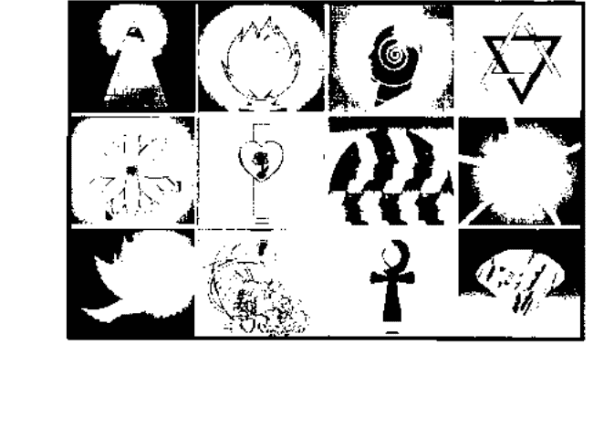
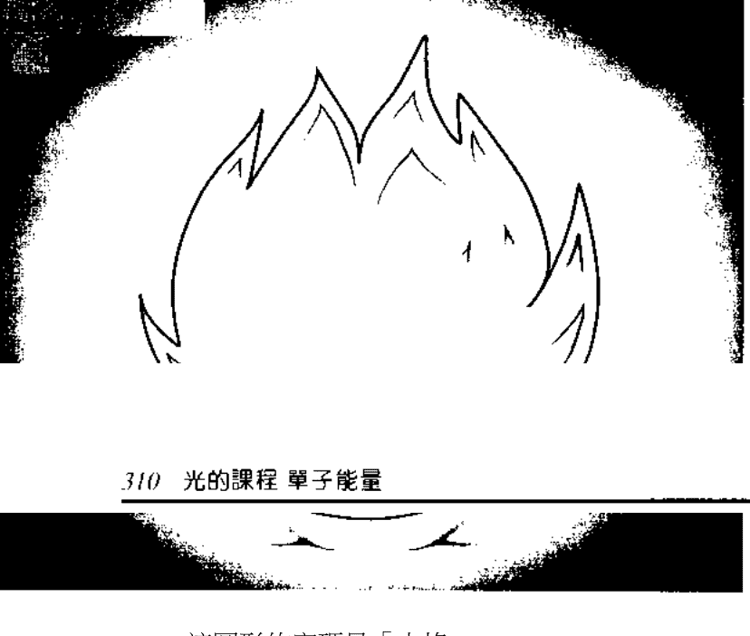
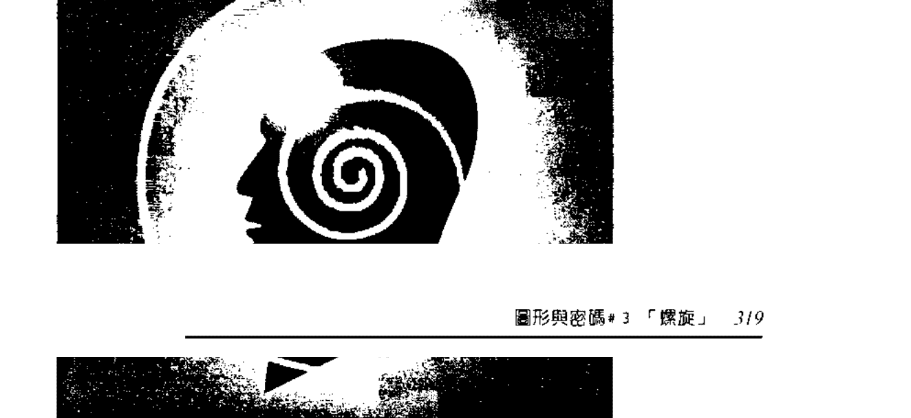
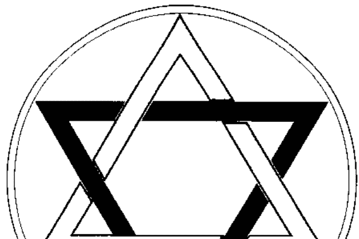

# 光的課程靈修系列5

# 光的課程
A course in Light

愛的獻禮 Antoinette Moltzan原著 杜恒芬譯

光的課程資訊中心

华华

# 目錄

- 獻辭 07
- 譯者序 09
- 前言 13

## 天使級次第一級次

- 簡介 17
- 第一課 黃色之光 23
- 第二課 藍綠色之光 36
- 第三課 紫紅色之光 51
- 第四課 朱紅色之光 58
- 第五課 金橘色之光 70
- 第六課 桃色之光 80
- 第七課 淡紫色之光 84
- 第八課 深紅色之光 88
- 第九課 琥珀色之光 94
- 第十課 黃綠色之光 99
- 第十一課 櫻桃色之光 104

## 天使級次第二級次

- 簡介 117
- 第一課 黃色之光 121
- 第二課 藍綠色之光 136
- 第三課 靛藍色之光 148
- 第四課 紫紅色之光 156
- 第五課 金橘色之光 160
- 第六課 桃色之光 173
- 第七課 淡紫色之光 181
- 第八課 深紅色之光 185
- 第九課 琥珀色之光 193
- 第十課 黃綠色之光 199
- 第十一課 櫻桃色之光 206

## 天使級次第三級次

- 簡介 213
- 第一課 黃色之光 217
- 第二課 藍綠色之光 232
- 第三課 靛藍色之光 241
- 第四課 紫紅色之光 251
- 第五課 朱紅色之光 260
- 第六課 金橘色之光 267
- 第七課 桃色之光 276
- 第八課 淡紫色之光 284
- 第九課 琥珀色之光 289
- 第十課 黃綠色之光 294
- 第十一課 深紅色之光 300

## 天使級次第四級次單子能量：圖形與密碼

- 第一課「眼睛」 307
- 第二課「火鉸」 310
- 第三課「螺旋」 319
- 第四課「大衛星」 322
- 第五課「蓮花」 330
- 第六課「十字架、心與玫瑰」 334
- 第七課「眾多的臉」 338
- 第八課「相互連鎖的三角形」 343
- 第九課「鴿子」 345
- 第十課「豐饒角」 348
- 第十一課「T型十字章」 354

## 獻辭

我在此謹將《光的課程》獻給所有使這一靜坐課程成為如此令人興奮與喜悅的朋友們。

也獻給所有走在這光的途徑上的每一位學生，以及所有發現這一途徑的人。

致謝：

我要感謝Karen Yahraus，她不遺餘力地協助《光的課程》的出版與推動。我也要感謝編輯《光的課程》系列五的Kristin Lindquist，還有Vicki Yang對中文翻譯的奉獻。更感謝所有海內外為傳播這一途徑默默奉獻的教師們。

最後，我特別要感謝透過我而傳達訊息的那些以人類肉眼無法察覺的光的上師們，能為他們擔任這個工作是我無上的榮幸。

安東妮莫珍 Antoinette Moltzan

## 譯者序

杜恒芬

我們都知道，生命中種種混淆的思想與行為，低落的情緒，生活中種種障礙與破碎的人際關係，皆因我們未能領悟自身的靈性意識，遠離了真理與智慧，而生活在極低的靈性意識層面上。

然而，生命的焦點在第三次元中的我們，因為有一個包含身體在內的四個較低體系，要提高靈性意識，如果僅僅以腦意識去做思想上的探索與理解，當我們提升到某種程度時，還是會面對許多瓶頸，以及因種種現實問題，而無法僅憑思想去實踐它，就是我們常說的：「力不從心」。何況上師們也提到：「人類無法從第三次元的知識中找到生命的答案，然而，光的運作將幫助我們向宇宙多次元的智慧打開。」

我們體認到，要全面改變整個生命的實相，我們身體細胞體系的改變，以及較低體系的清理是不可或缺的關鍵。

成為一個靈性存在的步驟，已透過《光的課程》這一系列，一個級次、一個級次地規劃出來。許多人的內在，與我們一樣地領悟到這一點，在靈魂的推動下，與我們一起踏上《光的課程》這一靈性成長的途徑上。

經過了四個較低體系的運作，以及行星九個級次的運作之後，我們終於進入《光的課程》最後的一個系列，即「天使級次」。

天使次元，或天使的意識層面，是我們自身存在的實相。因此，課程的設計，是為了使我們進入自身存在中基督意識的層面。在「天使級次」這特定級次的學習中，我們仍然要面對許多考驗。

我們發現，最大的考驗是：「自己是否能像天使般地，以至高真理與智慧，以及至善意願，在走過自己生命成長的同時，也能幫助別人」。當然，在「天使級次」中，我們被賦予新的工具，即天使次元之光的能量運用，以便將這巨大的治癒能量帶給自己及他人。

一旦我們圓滿完成了「天使級次」的三個級次，便進入最後的「單子級次」。這一級次的學習，也是為了讓我們體驗，並領悟一個不為常人所熟悉的層面，即宇宙意識。宇宙意識不可言傳，只能意會。因此，上師們在這級次的教導中，再次以行星七所用的圖形與密碼，作為我們學習的工具。

在行星七的級次中，上師們在整個課程中，首次運用圖形與密碼，喚醒我們靈魂印記中，本有的宇宙真知的記憶。到了單子級次，上師們再次以圖形與密碼的能量來運作。但這一次，是為了使我們成為一個意識清淨、靈魂清澈，對自身存在有一個清楚了悟的整合的自我。

圖形與密碼，是一種光的語言，它增強我們轉化較低意識的力量，改變我們較低的生命活動形式。密碼是一種以極微細的方式，將改變確實帶入細胞覺知，與細胞體系的頻率編碼。

整套課程的運作，皆是為了讓我們透過與自己內在最美好的工具—光—的融合，使所有的細胞，都能向較高靈性意識覺醒。因此，經由光的運作，細胞已成為接受改變的接收器。改變是一種基因結構的擴展，將人類從混沌未開的意識，轉化成為對靈性意識產生覺知的存在體。

上師們說：「擴展的人類自我，在未來的日子，將成為更具恢復青春活力，自我更新的能力。目前這階段，這種能力尚未被人類所理解。」而我們有幸經由這套課程的開啟，理解這宇宙能量的運作，我們很自然地渴望實踐上師們的叮嚀：「你們必須將這蘊藏著非凡知識的能量傳遞給別人，當你們提供這較高智慧的能量給別人時，這頻率自然會回來與你們共振。」

因此，整理並與大家分享這些資料，成為我們在邁向天使意識過程中，一種喜悦的事奉。現在，整套課程的翻譯已完成。在這時刻，充滿在我心中的，仍是我在完成系列一時的感受：「感謝所有在這途徑上，與我們一路走來的朋友們，因為你們的意願與祈禱，是我堅定地完成這套課程的原動力。願所有的人都在光的喜悅中，在生命的圓滿中。」

## 前言

在人类史上，我们正處於一個最令人興奮的時期。自從一九九八年八月十七的和諧聚會(harmonic convergence)以來，人類的個人意識經歷了層層的轉變，人類的社會也是如此。和諧聚會是人類在這階段中打開第六感官，進入更進展的覺知之窗口。

古老的瑪雅文明就已經記錄著這樣事件的到來。二〇〇三年十一月，一股澎湃洶湧的能量向我們湧來，使得我們每一個人都在水晶光的環繞中。

《光的課程》持續地協助人類走在這變遷的時代中。這課程逐步地把每一個人帶到天使層面中。默基瑟德天使聖團負責督導人類意識的改變，要將天使聖團的意識具體顯現在人類物質世界的創造上，必須要對意識層面有一翻新的調整。

新的能量或新的光譜將在天使級次這一系列的靜心冥想中逐步介紹出來。

這些級次所用的色彩將不同於以往課程中所運用的顏色。

在這些級次中所運用的光的能量，將不是你們靈魂之光的能量，而是天使意識的層面-也就是天使次元的光的能量。

它最終將使你們與天使次元連接，並從中接收指引，使你們成為「執行任務的天使」。

在這些級次中所提供給你們的靜心冥想與訊息，將對你們意識的提升與進展產生關鍵性的作用。

因為在這些級次的靜心冥想過程中所運用的是天使次元的能量，你們將在個人的進展中體驗這過程所帶給你們的協助。

這其中的訊息所涵蓋的智慧與洞見將使你們得以與自身的天使存在融合。

## 天使级次第一级次

### 簡介

這些級次中所提供的訊息與提升的過程是《光的課程》的延伸。然而，這些年來，因為許多人已經歷了許多個人成長的經驗，默基瑟德天使聖團期望將這一部份的光的運作開放給已覺醒並渴望更進一步提升自己意識的人。

天使級次的光的運作將使你們在更新與改變中進入新的意識層面，亦即天使次元的意識層面。

「治癒與恢復的聖殿」存在於這較高的天使次元中。

你們將在這殿堂中獲得內在的手術，使你們臻至完善。

你們將在治癒者的指引中運作，這些治癒者是天使聖團的治療師，也是你們自身存在中的「天使自我」。

經由這些運作的訓練，將使你們與其他人連接時，也成为一位具有療效的治癒者。

這其中許多的運作是將光向外引導給那些即將脫離在地球上活動的靈魂。

在天使層面的光的運作中，你們將體驗自己被帶到超越靈魂層面的第五次元之外的次元中。

你們將體驗從這光的意識層面中接收由數種色彩所混合而成的光的能量。然而，其中的運作都是你們已熟悉的脈輪中心點的色彩。

在這天使次元中，你們將放下人類意識中二元性的思想，真正領悟「一」的涵義，並與之融會貫通。

默基瑟德天使聖團的上師愛瑟瑞爾說：「在天使意識中，你們將了悟『一的意識』」。

你們是多次元的頻率，你們即是天使，你們即是精神靈性體，你們是靈魂，而且你們也是所有在地球上活動的物質體。天使次元是光的活動次元，也是使治癒具體實現的次元。」

為了使靈魂、心識與靈性獲得治癒、回復原狀，並重新創造，許多存在們來到較高層面上，讓自己的整個存在都在天使們的環繞中。

語言無法全面解說在這層面上所發生的事物之本質，但是你們可以從詩篇的第二十三首詩文中領略其箇中的感覺：

『祂使我躺在青綠的草地上，領我到幽靜的水旁，賜予我新力量，使我的心靈得到舒暢。』

下面所提供的光，是天使級次所用的關於治癒與復原的工具。

## 黃色之光

這是綜合燦爛的白色與金色之光的頻率。它清理並治癒精神或心理的沮喪，使樂觀、喜悅的頻率產生作用。

它治癒並緩解因循環系統與神經系統運作不良所引發的精力不足的症狀。

## 藍綠色之光

這是綜合綠寶石之光、藍色之光與金色之光的頻率。

它用來平衡身體與意志輪（紫色之光的脈輪中心點）的能量，使個性自我與較高自我整合。

這是一種深沉有力的能量，它根除因舊有意識所產生的深度恐懼。當意識自我被恐懼所淹沒，或因恐懼而癱瘓時，這頻率將為你們注入行動的力量與勇氣。

## 紫红色之光

這是綜合紅寶石之光、藍色之光與紫羅蘭的紫色之光的能量。它清理精神上、心理上的恐懼與焦慮，釋放意志輪處的矛盾，經由治癒的頻率，使心靈與物質融合成一個整體。它確切地汲取新的思想理念並與之融合，使自我的意識得以釋放抗拒，以跟隨內在的真實感受。

## 朱红色之光

這是綜合紅寶石之光與金色之光的頻率。這頻率由天使長邁克爾所引導。天使長邁克爾是光的傳遞者，祂將光帶到地球上，並協助人類打開心靈，為回應天堂的完整無缺做準備。這能量協助你們做好接收治癒能量的準備，協助你們突破混淆、低沉與憤怒的烏雲；使你們得以在物質層面上，做好進入新表達與新經驗的準備。

## 金橘色之光

這是綜合橘色之光與金色之光的頻率。它的運作使你們得以釋放深植在身體以及乙太星光體上的那些已固化為晶體的影像與思想念相。這頻率在神經系統上的運作是強而有力的，它轉化來自群體心意識的任何不純淨的思想與投射。這些思想與投射往往使一個人失去平衡。

這深沉的頻率可以用來排除整個體系中的毒素，驅除扭曲真理的邪魔，這些影像與思想念相往往支配著許多人的意識。

## 桃色之光

這是綜合燦爛的粉紅色之光與橘色之光的頻率。它用來釋放因別人對你們的感受而做的投射，附著在你們身上所造成的不平衡與障礙。它幫助你們清理太陽神經叢的脈輪中心點。在這光的頻率中，你們得以與愛融合，達到平衡的創造，並處在合一中。

當你們在天使次元中運用這桃色之光為治癒的頻率時，代表你們認知到因果的形成，主要是來自起心動念的「因」而不是「果」。它釋放與別人較勁、互別長短的需求，或因別人對你們的批判而導致不知所措的感覺。它將平衡帶入你們的意識中。

## 淡紫色之光

這是綜合藍色之光與紫水晶之光的頻率。這頻率可以用來清除矛盾與抗拒。它在你們細胞體系中強烈的運作，將和平與寧靜的完美帶入你們整體意識中。人類特別需要這能量來改變意識裡的恐懼與分裂，以便進入接受與和平之中。這能量與靛藍色之光有密切的關係，它所呈現的色彩可以從深藍色到淡藍色/淺粉紅色。

## 深紅色之光

這是綜合紫水晶之光與赤紅色之光的頻率。由這兩種頻率綜合而成的光的能量，將清除你們較低體系中殘餘的雜質，使你們的頻率向上提升到較高次元的存在們所能注意到的頻率。這工具可以切斷任何使你們背離內在真理與方向的雜質。你們將從天使次元的存在們體驗這頻率，但不要把它引導到別人身上。當它在你們身上運作時，透過你們的渴望與熱烈的情感，你們將能清除任何負面的活動勢能。

## 琥珀色之光

這是綜合紫水晶之光與金色之光（宇宙天父）的頻率。它轉化對權威與創造自我的細微的憤怒能量。琥珀色之光將你們存在中極為細微、深沉的戰鬥意識轉化成沒有衝突與矛盾的自在。衝突最早始於「天使自我」做了要在地球的體驗中瞭解兩極的選擇之時。在這光的冥想中，觀想自己消除了許多自我間的矛盾，向全然的自由敞開。

## 黃綠色之光

這是綜合黃色之光（白色之光及金色之光）與薄荷綠之光的頻率。這頻率的作用是清理細胞組織裏與死亡有關的事物。它能增強免疫力，轉化舊有模式與舊有的思想理念，帶來更新的生命。它能清理並清除身體中的結晶體、腫塊、腫瘤，或任何身體自我所製造出來的腐朽雜質。當地球處於災難性的時刻，最能體驗到這不可思議的能量之美妙。它恢復、更新並重建新的生命意識。

## 櫻桃色之光（又稱之為深桃紅色之光）

這是綜合燦爛的赤紅色之光與粉紅色之光的頻率（有時候也稱作深桃紅色之光）。這種光是使一切事物療至完美的能量。這運作在你們的渴望中，將平衡與完美帶入你們的地球生命，使你們的身體自我與「天使自我」融合。這光的能量在亞特蘭提斯時代因被濫用而導致災難。再次申明，這工具只能用在自我治癒以及與「天使自我」融合中。

# 22 光的課程 天使第一級次

## 靜坐次第

- 1. 聚合你們的覺知與自我，將他們帶到前額。
- 2. 整合所有的自我。
- 3. 進入白色之光中。
- 4. 啟動靈魂光體所有的脈輪中心點。
- 5. 向上提升進入銀色聖杯，並經由彩虹橋……。
- 6. 讓光的存在與天使們帶領你們進入天使次元，進入「治癒與恢復的聖殿」中。
- 7. 將天使次元中所啟動的光的頻率，經由靈魂層面、乙太星光體與身體的層面帶入到較低體系中，並與所有的中心點連接。
- 8. 持續在靜心冥想中，直到你們做好回到身體的準備為止。
- 9. 經由彩虹橋回到身體自我中。
- 10. 當你們回到身體中時，將你們的意識落實地面。

### 第一課 黃色之光

綜合白色之光與金色之光的頻率

#### 目的與要素

這是綜合燦爛的白色之光與金色之光的元素。

它用來清理並治療思想理性體上的沮喪與消沉，這黃色之光的頻率將為你們帶來喜悅與樂觀。它化解那些使人無法領悟宇宙物換星移本質的僵固思想。它醫治並緩解因氣血不足而導致循環系統及神經系統運作不良的狀態。

當你們開始這運作過程時，必須先準備好進入深沉的靜心冥想狀態。先閱讀課文，然後在靜心冥想中體驗從天使次元所傳遞的光的能量。

你們每個人都和許多人一樣地受到來自天使次元的指引。光的存在們前來指引你們，將你們帶入天使次元的意識中。

指引顯示天使次元的體系是一種「『一』即一切」的狀態。你們將體驗那超越二元性、超越兩極的覺知，進入對「一的本源」的全然領悟，你們將體悟到萬事萬物皆出自於同一個源頭。然而，我們的物質世界仍在二元性與兩極對立的宇宙法則中。當我們的意識改變，進入較高的意識層面時，我們便能與「一」的覺知產生連接。

習修天使級次的學生可以感受到自己身體與意識上微細的變化。許多人說他們感到如此地輕盈，好像在一種心情愉快、心滿意足的狀態中。

例如：有幾個學生與海豚一起游泳，並體會到一些極為獨特的經驗。

# 24 光的課程 天使第一級次

他們回來時帶著敬畏與受到祝福的感覺。有人說，當他們看著海豚的眼睛時，就彷彿看到整個宇宙。曾有靈媒傳遞這樣的訊息：「海豚所發出的頻率與天使次元的頻率是一致的」。你們可能閱讀到或聽說過海豚就像天使，或傳說天使的靈存在於海豚之中。海豚雖然是哺乳類動物，但是他們的波長與天使之光的波長是一致的。

在地球層面上複製這一次元的頻率，就好像複製一個使許多人可以從中獲得更新、恢復青春、再生、提升與重新連接的中心點。在古代廟宇就像是一個社會的中心點。許多人理解它是一個邁向較高層面的地方。

在這課程中，你們將體驗這天使層面的頻率與波長。第一課便是成為「執行任務的天使」的開始。接受自己即是「執行任務的天使」。

## 静心冥想與上師的訊息#1

安德魯

我以你們較高本質的覺知與你們說話，並且再一次地將「愛的意識」帶入你們整個身體、情緒體及理性思想體的層面。將你們的覺知與所有的自我帶到前額，整合所有的自我。進入白色之光的脈輪中心點，啟動靈魂光體的每一個脈輪中心點。

在你們進入另一個意識層面之前，我們要求你們把覺知帶到拙火的脈輪中心點，啟動赤紅色之光。感受光的勢能在你們整個內在體系中的流動。感受覺知進入乙太星光體的層面，享受這特定的赤紅色之光的溫暖。

在這靜默的時刻中，感受自己的完整與平衡。想著自己即是「一」，雖然有著許多不同的層面，然而仍是處於一個意識中，在一個整體的意識中轉化著。

當這拙火的元素經由中軸向上移動進入理性體的層面時，放下否定你們自身的完善與完整的那些紛爭，放下所有讓你們失去方向與行動力的感覺。讓你們心識、心靈中所有拙火的元素都放大著。

首先進入燦爛的白色之光中，然後是燦爛的金色之光。綜合這兩種元素，感受這黃色之光的頻率使你們感到清晰、淨化與轉化。「能量跟隨思想，思想引導能量」。因此，能量是流動的，可以引導它，並運用它。

引導這能量到頂輪處。感受它全面清除你們理性思想體中所有沉重的思想。感受它將喜悅與樂觀的頻率帶入你們全面的表達中。感受這頻率正清除僵化的思想，這些僵化的思想來自無法接受宇宙物換星移、萬事萬物變易的本質。

# 26 光的課程 天使第一級次

感受這頻率正螺旋式地在你們身體體系中移動著。這是基督意識的頻率，也是與宇宙天父合一的頻率。

這頻率將身體及所有感官上的感受帶入較高的狀態中；在其中，一切事物皆源自一種開放的、喜悅的本質。它使身體體系恢復青春與活力。

享受這個頻率。它將緩和拙火強烈的激情。然而與拙火之光融合後，它便成為提升、喜悅與平衡的光的「火焰」。

當整個身體在這元素的環繞中時，將覺知經由光的中心點進入燦爛的銀色之光，經由光的彩虹橋，進入行星中心。呼喚那些屬於你們進展中的存在們——那些護守你們特定的靈魂途徑的天使長的意識。

進入「治癒與恢復的聖殿」中。向上進入這中心點。感受這燦爛的光的頻率正環繞著你們的整個存在，每一元素都環繞著你們的意識。純然地進入這內在次元中，讓自己獲得恢復、重整與平衡。除非一個人在意識層面上極其渴望獲得清理與解脫，否則是無法進入這體系的。

現在，身體層面上的每一個脈輪的中心點都已完成強烈的運作。感受愛麗爾（Ariel）天使的燦爛光芒。感受護守你們意識進展的天使體系……。

當你們進入這內在殿堂時，感受自己在光的霓裳彩衣的環繞中。現在進入新的天使聖團所在的光的次元中。這是「治癒與恢復的聖殿」。這是融合與治癒的殿堂。感受自己在光的委員們的環繞中……。

在這特定的活動體系中所進行的是：「光經由理性思想層面而具體顯現，以放大其治癒效果。」呼喚那些身心失調或不平## 28 光的課程 天使第一級次

衡，以及心智渙散的人來到這裏。要觀想那些在狂怒與衝突中的人進入光中。然而，面對矛盾的人要進入光中治癒是不容易的事。因此，當你們在這光中運作時，看著所有的人都在他們自身的完美中。

進入光的勢能磁場中，感受自己已清除了所有的沉重、稠密與混淆。感受自己被帶到「治療與恢復的聖殿」中。感受自己的理性思想體系被淨化，感受治癒的效果正進行著。在這時刻，我們希望你們保持著內在的覺知……

感受這運作經由你們而完成。當你們確實因汲取這頻率而獲得淨化時，你們將再度提升進入天使次元中，進入這內在的殿堂中。

將光傳遞給其他的人，使他們獲得穩定並走過他們自我展開的階段。你們是光的教師，是光的指導者。你們協助許多人理解意識從一個層面轉化到另一個層面的實相與本質。當你們需要清理從這些頻率中所吸收的負面元素時，你們可以再次將自己提升進入這次元的運作，進入這內在的聖殿中。在光的環繞中，感受所有沉重、稠密與混淆都獲得清理。感受自己在理性體思想的淨化中獲得治癒，我們渴望你們保持在內在覺知中。

將這次元的運作中所獲得的真知傳遞給地球上能接收光，並能協助別人走過治癒過程的人。感受自己與天使層面的治療師融合。與那些能突破生命系統深入乙太星光體與靈魂層面的內在源頭的治療師融合，他們可以放大光的治癒過程。

在地球層面上，確實有一些人具有以思想及靈通能力，運用光的能量，實行某種鐳射光手術的能力。許多治療師能夠以開放的心運用這種覺知來運作。有些人則隱藏不願承認自己具有這種能力。無論如何，這種處理是有它的正面意義。

引導這光經由光的網絡進入整個宇宙體系。再次申明，人類的心智無法全面理解現在所進行事物的涵義。

人類很難以腦意識去理解在這些較高意識活動中真正創造的顯現。物質世界的實相總是成為打開光之門的障礙，而光的次元卻是超越任何物質層面的表達。然而，當你們投射光的能量時，你們也正在提升許多人的頻率。它的效果不是肉眼所能見的；然而，你們的思想意識確實是向外觸及其他層面的表達體系。

引導燦爛的黃色之光的頻率經由光的網絡提升地球的磁場與元素。人類的自我正朝著至高的生命表達方式邁進，彼此相互作用並產生關聯。許多人探索內在的整合、融合與真理。

當這內在的運作完成時，你們的意識將回到你們的覺知中，把覺知帶入行星中心。

現在，把覺知經由光的彩虹橋帶回燦爛的白色之光的中心點，並回到前額，再經由身體的中軸向下移動。

啟動雙腳下面的黑色之光的能量中心點，感受自己穩固地屹立在地面上，你們的意識是完全地落實在地球層面上。落實地面。

現在，進入和平中，願光在你們之內並經由你們而流動。

#### 靜心冥想與上師的訊息#2

聚合所有的覺知與自我，將他們帶入前額……集合所有的自我，我成為一個整體，將他們帶到白色之光的中心點。

啟動靈魂光體的所有中心點。

向上提升，經由銀色聖杯進入光的彩虹橋。

- 光的存在們以及天使們正引導你們進入天使次元中，進入「治癒與恢復的聖殿」中……。

歡迎來到這光的殿堂中。在你們的自我所能理解的事物之外，尚有許多事物正在進行著。你們已走了一段漫長的旅程，才來到這高原的入口處，你們可以審視自己是否做好準備，或自己的渴望是什麼？我們希望你們將人性自我的一切放置一旁，以使你們至高存在的本質進入這光的殿堂中。

你們的較高自我正探索著這存在於你們之內的殿堂。它的探索只是為了讓你們覺知自身存在的本質。它探索著讓你們的意識的所有層面都能體驗到它自身的完整與圓滿。

當你們觀察自己的周圍時，你們感到自己似乎在一個浩瀚無垠的空間。你們看到許多不同色彩的光芒。這裡沒有特定的頻率，只有由許許多多的光的頻率所融合而成的光芒四射的頻率。你們有如這光芒四射的能量，煥發著你們的美麗、力量、智慧與光。

在這次元中，我們不再教導你們以前所教過的事物。你們已有這些知識。這是一個讓你們融合、恢復並完成治癒所有體系的地方，許多靈魂經過了漫長的旅程，走過許多不同的表達才來到這層面上。這裡已成為靈魂旅程的過渡階段，也是為邁向其他形式進展做準備的地方。這是一個訓練的園地，接引著那些在意識層面上已調整到最高表達的靈魂，並將他們過渡到更高的活動次元中。

你們正進入到一個宏偉的光的次元中，許多一直與你們交流的存在們也在這問候你們。這些存在們曾向你們傳遞思想，探索著將你們從低落、混濁的狀態中提升出來。你們可能會看到一些熟悉的面孔，以你們所不熟悉的形式呈現出來。你們也可能發現到除了光與喜悅之外，沒有其他事物。你們會感到純然地和平與寧靜；你們也會感到自己的心超越了時空，在其中沒有二元性、沒有分裂，只有與光共同創造的覺知。

你們的肉身、較低自我、與所有自我的靈魂體系都在這頻率中體驗著美妙的改變。「天使自我」正探索著被你們所認知。要認知你們的「天使自我」，必須要理解「天使自我」的本質，它是你們整個存在的核心。

要理解你們「天使自我」的本質，你們必須放下所有對天使預設的、先入為主的理念。天使是光的許多形式。天使是許多不同色彩的光。天使是訊息使者與教師；進一步而言，他們是擴展中的宇宙意識的共同創造者。天使不曾離開過光的次元。然而，你們可以與這些天使們連接，可以與你們自身存在中的天使連接。

現在，試著透過象徵「我是」的「眼睛」來看，它是你們的存在中的一部份。運用這「眼睛」並再一次集中你們的焦點。

> 這麼想著：

I see what I know.
我見我所知。

I know what I see.
我知我所見。

All is in its true reality.
一切事物都在真實的實相中。

當你們體驗這心靈狀態時，覺知它運作的效果；當你們與這光的頻率及你們的「天使自我」融合時，便能獲得治癒。

在這級次中第一個運用的光是綜合你們靈魂之光的白色之光與位於你們頂輪的燦爛的金色之光的能量。當你們看到這兩種光的元素融合成黃色之光時，感受它的頻率在你們所有體系中都被啟動。感受你們的靈魂體與這光的較高頻率連接。

靈魂探索著自己所設計的活動，然而，靈魂意識中有它自己的傷痕。它曾與導致深沉痛苦、沮喪與幻象的勢能搏鬥。觀想著自己與天使之光所看到的只有意識的完美形式。你們的「天使自我」看到的只有完美，而沒有其他事物。在「全在」之中，沒有一元性、沒有兩極的思想，只有一個「眼睛」，代表神的光之眼。

現在，透過這個光看著你們的所有體系，觀察這頻率是如何地清理所有的掙扎，清理所有與過去、現在、未來有關的因果。看著天使次元與靈魂的連接，靈魂與乙太星光體及身體層面的連接，在這內在的連接中只有一種存在的狀態。它只知道自己的初始表達，自己存在於第一起因中的狀態。

當能量移動時，觀察它在所有層面中所進行的調整與整合。觀察自己的意識與身體在這元素的環繞中所引發的感受。觀察自己，觀察那些與你們同在的人。你們可能看到其他與你們一起進入這高原的人，他們來自許多不同體系，也走了一段漫長的旅程。你們可能覺察到他們有一些混濁、憤怒、懷疑或不滿。

只要觀察他們如何受到迎接，並被帶到光的治癒殿堂之入口處。隨著地球逐漸擺脫它自身諸多的古老途徑、模式與創造時，許多靈魂就從地球上來到這個層面。

在這層面上並沒有審判。因為那些過渡到這裡的人已經歷過他們的審判與反省，並已做好進入合一的實相中。只要知道這是真實的。

你們的「天使自我」已與你們的較低體系融合時，你們可能會感到這頻率是極為強烈的。你們可能會感到身體的某些部位有阻塞，你們只需要讓自己的身體接受這種改變，接受從一種表達層面中提升進入更高表達層面的轉化，並允許它與「天使自我」的力量連接。當較低體系持續在痛苦中時，以「天使自我」的「眼睛」來看這一切，從各個不同次元來看，直到你看到它的真理，看到這個整體為止。

當你們感受到一股輕盈、喜悅、歡騰的能量在你們之內流動時，你們可能會希望與別人分享這種股能量。觀想他們正在返回家園的途徑上，正在回家的路上移動著。你們不能干涉別人的活動，你們無法干預宇宙的因果法則，但是你們可以透過這「眼睛」，透過「全在」的核心，看到內在最深沉的真理，隨著水晶光的能量與聖愛，你們可以看到所有的人都在接收這些頻率。你們可以回到這殿堂中，來恢復你們的本質及個人的連繫。你們也可以時常回到這裏，來回復你們的青春、活力與你們的靈性，以及你們的一切……。

在冥想中，地球的世界是如此遙遠，彷彿是一個意識的影像，看著它如此的真實，卻是導致意識自我無法覺察本源的影像。然而你們可以將自己的領悟傳送給在地球上的這個影像。如天使創造自己的表達般地看著這個世界，教導世間的人們透過「眼睛」去看；這「眼睛」在它自身和諧的完美架構中、在「合一」的頻率中被賦予能力。

夢幻世界與「天使自我」的實相之間的戰爭是激烈的。要記住，你們是超越三度空間的存在，你們正在與能知一切的光的「眼睛」融合。

進入靜默中……。

現在，當你們置身於這個次元中時，你們的靈魂正從「治癒與恢復的殿堂」中接收治癒。

放下恐懼……不要擔心你們沒有聽到什麼……這是無法用言語可以表達的……你們必須探索這內在次元，因為你們已被賦予適合你們個人的途徑。

在我們說話的同時，經由這個運作，你們會知曉這一切，你們已被天使的羽翼所觸及……。這將是能量的新源頭，在不久的將來它將會降臨你們。無論在地球上或在宇宙中，你們將被賦予使命，接受這點。

走在道途上的天使，探索著祂自身事奉、給予以及如是存在的需求。你們即將擴展的治癒能力，無論從那一方面來說，都將會是更新、更明亮、更強烈、更直接、更有效的。你們有些人將從思想的傳遞中獲得治癒，有些人將因被觸及而獲得治癒，有些人從一些言語中獲得治癒，有些人因你們所見到的事物而獲得治癒。

治癒是所有的意識聚集在一起，在全在萬有中及本應成為的本源中合一……。治癒是將所有勢能融合成為一個整體，沒有任何分裂的思想、任何分裂的存在。

在這時刻，如果你們能接受這內在的真理，你們就可以從自己的過去，以及那些扭曲你們真理的情況中，看到自己是完善的、完整的……。

你們正治癒著自己的哀傷與悲痛。接受自己在全新的經驗中，你們的心靈與全在的天使之光有著一種新的連接……。

現在，知道你們的所有體系，從物質世界到光的精神世界都在一種新的融合狀態中，落實並與地球連接。

在你們回到身體意識的過程中，要你們放開這一實相與真理並不是一件容易的事，然而，我們請你們不要把它看成是一種放開，而是把它帶到你們的物質層面中。當頻率開始改變時，你們可以感到自己正回到物質體系中，逐步感受到你們正往光的核心中移動著，這是連接意識的核心，並經由光的彩虹橋回到身體中。

#### 落實地面

現在，將你們的覺知經由光的彩虹橋進入燦爛的白色之光中心點，回到前額的中心點上。再經由身體的中軸向下移動。啟動腳底下方的能量中心點，感受自己完全屹立在地球上，你們的意識完全落實在地球層面上。現在，進入和平中，願光在你們之內並經由你們而煥發。

當你們回到身體中，並與身體連接時，感受自己完全落實地球層面，並與自身存在的所有次元連接。

走在光亮中，走在這光中，釋放所有黑暗的事物。

我是那看到我本質中天使存在的「眼睛」。

我有生存與愛的權利。

我有敞開心靈，開懷而笑，像聖靈般生活，以及在喜悅中歡慶的權利。

雖然在成長的課程中無法避免憂傷，我依然是純淨的光的天使。

我是上主的使者。

### 第二課 藍綠色之光

綜合藍色之光/綠寶石之光

#### 目的與要素

在習修這天使級次的特定過程中，我們進入藍綠色之光的頻率。每一次的靜心冥想都是為了幫助你們提升，幫助你們與自己原有本質融合做準備。

「天使自我」是你們自性靈魂的最高形式。它探索著將其本質注入你們存在的每一個層面。你們正將物質層面的活動提升到內在靈性的活動中。地球行星正處於為根本改變做準備的期間，你們正為全面地接受能量的注入做準備，以便迎接這種改變。

這藍綠色之光是綜合藍色之光與綠寶石之光的頻率。它用來清理理性思想的沮喪，並平衡所有的層面，使個性自我與較高自我整合。這是去除因過去之經歷所產生的深層恐懼最具效力的能量。當意識自我因受外在現象的打擊而動彈不得時，這頻率將為你注入力量與勇氣。

#### 靜心冥想與上師的訊息#1

在光中做呼吸，呼吸使你得以放下身體沉重感受的重要部分，完全放鬆，釋放由情緒體，感受體，理性體思想或身體自我所帶來的經驗。

繼續呼吸 .... 吐氣...... 深深地吸氣......。在吐氣與吸氣之間不要停頓。吸氣......吐氣......直到你感到自己完全放鬆為止.............。感受你們的身體、你們的心靈、你們的靈魂就是愛。

感受你們是風、是空氣、是心靈、是靈魂、感受你們就是光的天使、是意識之羽翼，有如你們靈性的思想。

當你們與自己的靈魂完全融入在一個完整的意識中時，你們的身體將接受來自靈魂的真知與表達，注入靈魂的能量之後，身體便進入提升與轉化。

因此，在這持續呼吸的時刻中，觀想自己的意識進入靈魂體......，感受自己脫離了身體的覺知，進入靈魂中心點。啟動靈魂中心點的能量。白色之光 ....... 金色之光 .......藍色之光......綠寶石之光 ...... 紫色之光 .......紅寶石之光.......橘色之光...........粉紅色之光 ...........紫水晶之光 ..............薄荷綠之光 ....... 赤紅色之光...........在你們吸氣與吐氣中運作著。

持續呼吸......，探索那身體與靈魂在連接中進入同一韻律中的感受。想著你們的靈魂在你們的身體中，但靈魂意識是如此地宏偉，它所擴展的勢能超越你們的身體。審視身體意識到自己是一個光體，並與那光體融合的反應。

你可能會感到自己輕飄飄地...........，幾乎沒有身體的感受。如果你身體上仍有一些因沉重與稠密而感到疼痛不舒適的地方，將光吸入那部位，祈求自己能寬恕與被寬恕......，感受自己釋放思想中的執著…… 感受…… 覺受 ……，釋放導致身體疾病與疼痛的經驗。

探索著在這時刻所呈現的一切……，作為一個光體，經由思想，經由能量，你們身體的所有元素都完全在融合中。繼續吸氣………，…………。

現在，感受你們的身體、你們的光體完全整合……，成為一個意識、一個頻率、一個音頻，在和諧中提升自己的頻率。感受這一部份的你經由靈魂層面進入「天使自我」的次元中。你們可以經由自己意識的彩虹橋，進入這內在次元的中心點，進入那與眾多融合為一的層面中。

作為在這運作中的光的天使，你們沒有二元性的感覺。一切爭執、矛盾與批判都與你無關。你們知道那是物質世界的現象，是人類信仰的因果之輪，但在這次元中，你們感到自己正俯瞰所有使個性自我陷入在孤立、分離、矛盾、爭執與戰爭的侷限思想與理念。

帶著這樣的心識，來到「治癒與恢復的聖殿」中。深入領悟在這特定級次的循環中，一切你所需要理解的經驗。

藍綠色之光是綜合燦爛的藍色與綠寶石之光的頻率。這強烈的頻率可以用來幫助你們取得思想的平衡。它與美國印地安民族、薩滿教的巫師，以及古老的上師們有著深切的淵源。

吸氣……，吐氣……，讓自己體驗這燦爛的頻率充滿了你們的身體、理性體思想、情緒體/感受體，以及你們的靈魂……，當這光環繞著你們的存在中各個體系及意識時，讓自己深入古老的智慧，平衡你們所需要平衡的。

在為「尋求靈視(vision quests)」做準備的儀式中，許多人感受到這股能量。他們祈請這能量前來幫助自己找尋自己的靈性之名 (name of spirit)以及靈性的起源 (origin of spirit)。

因此，在這時刻想著自己打開接收白鷹或委員們所提供給你的，他們在你融合多重自我的時刻中與你們連接。這是一切靈性與一切造化的融合。是有形物與無形物；有名之物與無名之物；是宇宙智慧與人類自我意識的結合。

進入靜默中。

#### 靜心冥想與上師的訊息#2

這是你們的夢想、你們的視野即將付諸實現的時代。你們渴望與天使的溝通，然而，這將成為你們的一部份，你們將能聽到、看到祂們，祂們來到你們心靈深處，也會呈現在你們眼前。這是訊息使者再次出現的時候，也是人們在光中再次對自身的崇高與偉大再次覺醒的時候。這是將內在基督與外在生命合而為一的時候。

雖然許多預言家堅持將焦點放在地球與人類即將毀滅的觀點上。但是，神聖計畫的存在超越這些因素，這終極的轉化將使地球得以在探索中把真正的天堂帶入物質世界。

因此，無論遇到什麼樣的境界，都要將焦點放在自己是「執行任務的天使」上，才能改變人類的自我毀滅。感受在人類歷史中所形成的夙怨，都已化解。將焦點放在光中，放在這來自較高體系的能量中，感受這能量充滿著人類的思想與心靈之窗，感受這能量充滿著人類的意識磁場，將負面元素轉化成為較高的元素本質，轉化成和平的自我，一切如是。

現在，讓你們的身體以及所有的體系都進入這光的次元中，讓自我在這壯麗宏偉的殿堂中獲得真實的治癒與恢復。將一切抗拒與批判置之度外。

不要執著於片面的思想。它將侷限你，導致你失去信心。向多元性的自我打開，你們存在於許多不同次元的表達中。你們尚未能理解這一點，但你們的內在自我將獲得這神秘的啟示。

現在啟動這夢想，讓靈魂接受這內在真理，讓自己接受你即是天使之光這一事實。

不久，這些頻率將成為一股新的內在知曉的波濤以及外在表達的動力。藍綠色之光是至為美麗的，在改變黑暗的，無法突破的理性思想上也極具力量。當你們需要知道，需要聽、看的時候，便啟動這頻率。因此，喚醒你們的知見，讓你們的內在領悟引導你們的道途。一切如是。

當你們能看到自己的內在體系時，你們也很快便能看到別人的，你們會看到導致憤怒、痛苦與官能障礙的肇始之因。

現在，讓你們的領悟成為指引你們道途的標竿，引領你們打開智慧之門。

#### 落實地面

當你們完成與這體系的融合時，你們的自我將回到身體中，將較高自我帶入身體層面的意識中。在這時候，做幾個深呼吸。在呼吸的韻律中，感受自己的身體是精力充沛的，並知道自己將走在一股新的力量、大愛與耐心中。

#### 靜心冥想與上師的訊息#3

問候你們，我們再次以你們較高自我之光與你們說話，並將這光帶入你們的較低自我。在這時刻，將焦點集中在你們是平衡、和諧、完美的理念上，你們本質中的每一層面都是和諧完美的，我們問候走在這開展經驗中的人。

> 「我的身體、心識與靈魂在和諧與平衡中。」

我們在喜悅中，因為我們感到你們的覺知在擴展，打開自己，接受這光正為人類意識的提升而運作。不要質疑這種投射的功效，只要知道，光是一個載體，在清理與淨化中，你們已開始提升你們的周圍環境與人際關係的能量與頻率。

將你們的覺知，經由光的彩虹橋向上提升，當你們進入行星意識的中心點時，啟動燦爛的白色與金色之光的頻率，再次進入治癒的殿堂中。體驗黃色之光的頻率。感受自己的內在正釋放已累積在身體中的沉重元素。

感受這燦爛的能量將身、心、靈提升進入喜悅與慶典中。要知道，經由痛苦，你們將認知隨著克服生命的艱難之後而來的是一個更新的意識。當你們釋放痛苦時，感受這較高次元的能量系統進入焦點中。感受光輝燦爛的治癒者正在你們身體上運作，將你們光的脈輪中心點帶入更細緻的調整中。

如我們前面所說的，我們正將光的新頻率帶入整合中。在這堂課中，我們使你們熟悉這燦爛的藍綠色之光，它綜合了燦爛的智慧之光與綠寶石之光的頻率。當這頻率開始運作時，它開始清理在思想理性體之意識層面上的，所有否定真知、智慧與精神表達的阻塞。

達的事物。進入靜默中。

美洲印第安人視這頻率為平衡身體及趨吉避邪的頻率。他們運用這頻率使他們的心靈與他們的祖先融合。在典禮中，他們為了準備進入這聖殿而進行為期數日的儀式，他們的手中握著象徵這頻率的寶石。

你們之中有些人曾經歷美洲印第安民族或其他土著所舉行的儀式。你們曾經歷過無數的力量、勇氣與戰鬥力的考驗。當你們戴上與這頻率有關的寶石時，你們每個能量的中心點都將獲得平衡。它象徵著天堂與人間的結合，被認為是人性與靈性的合一。

在這內在殿堂中，回到那些特定慶典的經驗中，呼喚你們的指導靈。有幾個新的頻率將降臨你們身上。能在這層面上達到合一與認知，是極大的喜悅。讓他們向你訴說，讓自己傾聽這些言語與頻率。

當這些前世記錄呈現在你們面前時，回顧在忠誠、愛國精神、捍衛與憤怒中，你們所投射出的勇氣與破壞性。感受自己釋放這些內在心靈的記憶，看著這頻率中的淨化元素。讓這頻率使你們由過去經驗所產生的憎恨冷靜下來。在潛在意識中，你們尚有一些害怕自己作為一個勇士不被承認而被否定的恐懼，讓它在這光中浮現出來。

在這時刻中，感受你已釋放並轉化了來自阿卡莎的記錄。我們說過：「你們將在恩寵中走出因果法則」，而這一切在內在次元中已完成。你們現在正在接收記錄著過去生命意識的抄本，讓自己在光中獲得新的生命能量，進入將和平、真知、智力與靈性帶入更新生命活動的勇者意識中。在你們的日常生活中，你們曾遇到一些使你們感到刺痛的群眾意識，現在將它們放下。

## 44 光的課程 天使第一級次

现在，你们将在静默中与圣灵、净光的兄弟、指导灵们交流。要知道，上师白鹰是我爱瑟瑞尔的一个化身。我们曾经向你们介绍过他以及他所显化的类似我爱瑟瑞尔的意识。他为地球带来光，为已做好体验较高智慧与真理的人，带来宇宙意识，及提升人心的伟大圣灵的教导。这一切正在治疗的殿堂中进行着，并正释放着意识里那些由特定的生命经历在意识上所产生的执著。

进入深沉的静默中，与这些伟大的精神交流。启动灿烂的蓝绿色之光的能量，引导这频率进入地球意识。感受能量经由光的网络，从一个灵魂到另一个灵魂，感受这些灵魂与他们的人性意识与人的本质融合。再次肯定人类的心灵透过身体的意识充分显现，天使圣团的法则显现在地球人类的意愿中，并在提升中进入它至高的天命。把你们的觉知带回灵魂中心点，落实地面。

现在，把自我与意识带回身体中。你们的意识是全面觉醒的。进入和平中！

#### 靜心冥想與上師的訊息#4

這是安德魯，在你們靈魂意識進展的階段中，我們以愛與喜悅與你們同行。在你們靈魂活動的這一特定階段中，你們正經由所有層面的釋放，探索著與大我的較高心識融合。我們一再地告訴你們這一點，你們也一再地體驗在這運作中所產生的活動。

在喜悅與慶典中，你們進入這殿堂中，在光的新頻率中，將覺醒的自我帶入一個更新的階段，你們已認知治癒是你們在事奉地球之經驗中一個絕對的部分。

你們進入這一次元，以便探索其他與你們在地球旅程之經驗裏能相互輝映的光的能量。你們已被教導如何應用智慧之光與綠寶石之光，你們已開始體驗到這光的力量，它去除你們靈魂旅程記錄中最深沉的恐懼。是的，在你們的意識自我上，你們正從對地球最古老民族的虧欠中體驗著改變。

紅色人種是地球行星上最古老的種族。雖然人類的歷史未做這樣的記錄，但是最早的人類為適應環境而有著與地球接近的膚色。你們許多人有著在治癒的聖殿中的特定經驗，你們為加速進展而努力著。你們曾以水晶的能量與燦爛的太陽能一起運作。你們被教導經由色彩、音頻，準確無誤地與靈魂頻率整合。

鐳射光是你們內在自我所發展出來的工具。現在，教師們把一套與其作用相同的工具教給你們。在這內在殿堂中，你們體驗著在亞特蘭提斯時代的活動。這頻率被人們透過許多不同方式諸如寶石、水晶等不同元素而被應用著。

作為地球人類，你們用治療油塗抹身體。你們理解身體與大地是一個整體。你們知道把各個體系帶入平衡的方法。你們所說的語言不多，你們用心電感應與別人溝通，從內在次元中去觀察別人。然而，當人們失去了內在的方向，便無法融入在對自己靈魂初始意識（soul’s first consciousness）的真知中。你們開始視自己為地球上的神，開始運用這些能量來奴役動物及其它物種。你們破壞了「一」的律法（Law of One），變成肉食者，因而降低了你們意識的頻率。

現在，你們已開始認知靈魂在那時代的經驗。這「治癒的聖殿」幫助你們透過與它的連接，重新建立靈性本質的印記，並開始清理內在的負面因果。感謝那些將這些教導帶到你們心靈中的教師們與上師們。當你們與進展中較高層面的自我取得連接時，感謝淨光兄弟的上師們。你們已看到那超越物質層面的自我，已進入你們的靈性意識中。你們已覺知到地球頻率在改變中，溝通方式與科技的發展也都在改變中。

你們發現自己在汰舊更新中，在改變的曙光中。你們發現自己回到下降的初始狀態中，並已放下你們最早的欲望。在這光的層面中，你們會繼續走過許多的清理。你們無法全面理解這高原，因這些高原所帶來的改變是強烈的，是全面性的。

有許多人已認識到過去、現在與未來之間的連接。

放下一切悔恨，不要追悔。放下與上主隔離的痛苦。回歸之路已顯示予你們。無論在哪一個層面上，你們都有走過它的機會。為這機會歡呼。當你們在痛苦、絕望、悔恨、否定以及陷入在因果的束縛時，運用這光的能量。

當你們為自己所做的事而悔恨，為缺乏經驗而陷入在極端的悔恨中時，進入這光的能量中，讓這些能量打破那些使你們與完美的神聖自我分離的幻象與影像。

無論是藍寶石、綠松石、或印第安石，都是地球層面上的元素，它是一個提醒你們融入和諧中的工具。當你們看到來自地球的靈魂，經由靈性的轉化進入這高原中時，感受這些在光中的靈魂，能以思想與大家溝通。

現在，進入這高原中，進入觀察中。寧靜的靈魂必然能透過身體、細胞與你們意識的各個層面來接收我們所提供給你們的真知。

這是一個含藏著極大喜悅的地方。在這裡，經由自我的內在視野，經由自我的追尋與探索，你們對什麼是創造和諧有著真正的領悟。這是一種將內在古老的真知與現代光的生命之旅的銜接。

在這光的能量中體驗這治癒的能量，綠松石被認知為可以清理由人類思想理念所產生的邪靈。地球上許多古老的文明，就已發現許多天然礦石含有清理混淆與治癒的功效。

當你們在這能量中時，你們可能會回憶起自己在古老的教導中所走過的足跡，包括來自各部族之巫師（medicine men）的教導。在部落中，巫師是淨化心靈與引導靈性進展的顧問委員。並不是所有的巫師都是清明的，然而，在運用能量，將它做為治癒與清理各個體系，使靈性得以注入的工具上，他們是受過訓練的。

即使在我說話的時刻，你們每個人都在光的高原上，探索著曾與你們生命共舞，出現在你們過去生命中的愛、憎，以及歷史的奮鬥與掙扎。當這些影像從你們深層的細胞意識中浮現時，不要因別人對你們的誤解而產生憤怒，或因戰敗而生復仇之意。讓你們的內在存在欣然進入這治癒深層創傷的經驗中，並將這治癒帶給光的兄弟姐妹們。你們將從這道途的學習中，找出一條教導他人走出循環不已的憤怒模式。

在這時刻中，每個人觀想藍綠色之光進入你們的存在裏，並經由你們，讓你們的道途展開。釋放這些影像，讓它們回到靈魂原本的意願中。你們的靈魂將在慶典中透過夢境，進入領悟。

你們每個人將進入一個靈視的旅程，打開與前世經驗的連接。要知道每個人的旅程都是為了特定目標而展開的。讓你們深層的元素本質理解那未經觸及的，屬於物質層面的恐懼。不要在恐懼中以批判來看這些經驗，而將它視為一個與生命進展相關的過程。

地球上的動物，無論是狼、鹿、狐狸、兔子或馬，都與你們靈魂的某些脈動有關。呈現在你們之前的，就是與你們本能有關的連接。

當一個酋長戴上鷹的羽毛時，他從鷹的角度來看事物，並祈求以清明的視野與方向來帶領自己的部落。因此，接受這與你們有關的動物本能，認知它是有待理解與治癒的一部份。

要知道，一個天使般的訊息使者必須瞭解物質體的層面以及靈性的生命，必須無所畏懼或批判與有著與自己特質相似的動物。在和平中，放下對未知的恐懼，放下對被孤立的恐懼。放下對未了之事物的恐懼，放下對超越你們目前所能領悟之境界的恐懼。

從這層面來看你們的身體，觀察你們的身體是如何被這些關愛你們的較高存在們所觸及所治癒。讓這內在的治癒圓滿實現。讓身體接受這靈性之光。

> 以刀劍為生命，意味著復仇的死亡。
> 以道為生命，意味著對造化的領悟。
> 
> 現在，這麼想著：
> 我不將生命寄託在復仇之劍上，我將生命交託給神聖道途與光。

當你們啟動並在這燦爛之光的環繞中時，觀想藍綠色之光像毯子般地覆蓋著身體的層面，治癒著人類的思想理性體。在你們觀察自己的治癒中，感受內在心靈因理解而獲得平靜，看著空虛與迷惘的痛苦在光中化解。在這層面上有著各種不同的存在，有些在光中載歌載舞，有些安祥穩重，像神聖使者般地協助著這一融合。

接受你所看到的，接受你所理解的，放下抗拒。

許多部族，許多國家已走出籠罩著內在靈性的罩紗，他們正與你們一起走過二元性，走過批判，探索著治癒在靈魂旅程中所產生的戲劇與惡夢，歡迎每一個來到你們面前的人。接受他們對理解與治癒的渴望。

當你們完成治癒時，將意識帶回身體中。感受自己身體的活力，感受自己與地球及自己所選擇的經驗的連接。當你們離開在光中與你們一起運作的指導靈時，接受這種融合，無所畏懼地走在更大的寧靜與和平中。一切如是。

#### 落實地面

當你們從這些次元中下降時，頂輪的部位會感到一股強大的壓力。這是因稠密的能量聚集在頭部的緣故，

再次釋放悔恨，重新肯定自己的真實本質，肯定自己在完美的表達中。

當你們醒來時，你們的身體可能會感到一股寒意或恐懼，但這會過去。進入和平中，願基督之光在你們之內並經由你們。

### 第三課 紫紅色之光

綜合紅寶石之光/藍色之光/紫羅蘭色之光的頻率 目的與要素

這是綜合紅寶石之光、藍色之光與紫羅蘭色之光的能量。它清理理性思想體的恐懼與焦慮。釋放意志輪處的矛盾，經由治癒的頻率與心靈整合。它特別能融合新的理念，並釋放對真理的抗拒。

> ### 靜心冥想與上師的訊息#1

現在以呼吸做為進入靜心冥想的準備，吸入光的能量，吐出痛苦憤怒與恐懼的呆滯能量，將覺知帶入前額，將身體自我，器官自我與細胞自我帶入靈魂體光的中心點。並啟動身體的每一個脈輪中心點。

當燦爛的白色之光啟動時，感受自己的身體在這光的環繞中獲得清理與淨化，進入金色之光的能量，進入藍色的智慧之光，進入燦爛的綠寶石之光，感受自己的動力磁場與磁力磁場是平衡的，現在，進入紫羅蘭色之光，感受自己在較高自我之意願的環繞，進入紅寶石之光，進入橘色之光，進入粉紅色之光，感受自己放下了外在的執著，進入紫水晶之光，進入薄荷綠之光，最後進入赤紅色之光的頻率中。現在進入光的彩虹橋，進入內在聖殿，進入靜默中。

問候你們！這是愛瑟瑞爾。我們以光的較高本質、你們靈性的存在及心靈的喜悅與你們說話。

當你們的較高自我進入這頻率並將焦點放在清理的過程中時，每一個中心點都會受到激發與啟動。再一次地感受自己的意識完全融入在這內在所渴望的經驗中。

當你們放下自己受制於身體的感受時，所有的自我都能經由光的彩虹橋向上提升進入行星中心點。放下個性自我中的侷限感。感受這頻率的火焰正在所有體系中移動著。在這時刻，讓這頻率集中在情緒/感受體的層面上，提升所有沉重的元素。

感受身體的沉重與稠密都獲得清理。你們的敏銳度已增強許多。我們感受到治癒的能量在乙太層面上活動著。這內在次元的活動很難以評估或判斷其效果。當你們在內在層面上做出肯定時，你們便不斷地與自身存在中的指導靈、教師們溝通。你們不斷地與較高層面交流，這種體驗，為你們的內在本質帶來巨大的影響。

我們感受到你們的意識自我充滿著群眾思想所帶來的痛苦與否定。然而，你們必須接受你們內在的力量，體驗這股力量。要知道，你們因果的活動已在清理中全面結束。換言之，你們是自由的，你們已擺脫了因果的束縛。那些看似使你們陷入在困窘中的，僅僅是你們在日常生活中，經歷著群體大眾的恐懼、否定、侷限、敵意、戰鬥等種種負面意識。

當你們在行星層面上運作時，你們便完全走出那些劇碼，進入較高本質的磁場中。有時，你們感到自己完全無法保持在平衡中，但這種感覺不會停滯太久。只要將焦點放在自己身上，並瞭解你並未失去你們所擁有的，你們並未被篡奪，或被棄置於孤立無援之境。

當沉重與失衡的感覺無法停止時，當意識自我在身心上感受到壓倒性的痛苦時，你們必須堅強地屹立著，並釋放這些來自你們自己意識的影像。

沒有任何事物可以否定你們在光之國度的權益，除非你們的意識自我放棄對至高成就的追尋。當意識自我達到圓滿時，世間的事物也將療至圓滿。因此，不要以物質的標準來批判自己，而是以自己內在心靈的感受來審視自己。

當你們在光中運作時，你們成為一個光的中心點及一個能量核心。你們已走過許多不同的意識層面，你們在身體的層面，及較低體系的每一層面上，都經過一番清理。你們已啟動拙火，當你們進入治癒與恢復的聖殿中時，你們已做好向更高意識層面提升的準備。想著：給予，你們便能獲得。

如果你們覺得這是一個矛盾的說法，你們便是以匱乏而非豐足的眼光來衡量。我們不是以你們在世間的財富來衡量你們的價值，我們以你們靈性的成長來衡量你們的價值。

對個人來說每一生都是一個獨特的重要階段。每個人的價值不是以其金銀財寶的多寡來衡量，而是以其內在存在的本質而定。

> > 如基督所言：「在前的將要在後，在後的將要在前」。因此，以世間的財富來衡量一個人是不符合靈性的。

現在，當你們進入這治癒的殿堂中時，你們在藍色的智慧之光、紫羅蘭色之光與紅寶石之光的運作中。如前面所說的，這頻率由你們的肉眼所看到的，是紫紅色的色彩。這些綜合的頻率，對清除理性自我中的恐懼，有著極大的功效。經由這治癒的頻率，你們將能釋放內在的矛盾，進入整合。

我們希望每人都來到這光的環繞中，感受光的委員們進入這內在次元。感受天使長邁克與加百列的頻率。在凝定中呼喚指導靈與教師們。感受自己在這光輝燦爛的紫紅色之光的頻率中。進入靜默中。

在這堂課的靜坐中，你們將獲得完全的休息，在完全的寧靜中，你們將體驗到這能量螺旋似地環繞著你們的身體，重整任何破碎的體系，釋放分離與孤立感。你們越是常進入這殿堂，便越能與古老的存在及內在的靈性整合。

現在，感受這頻率被導向地球層面，感受整個地球沉浸在這紫紅色的頻率中。這色彩就像日落一般。現在，再次感受這頻率覆蓋著地球及人類群體的思想意識。觀想這頻率去除群眾思想影像中毀滅性的念相，進入愛與治癒中。

#### 落實地面

當你們的覺知回到殿堂中時，感受這頻率經由彩虹橋進入身體的意識中。感受你們的身體完全在這頻率的環繞中，感受自己在它的保護中，身心不再受到任何痛苦的侵蝕。放下一切。

讓你們日常生活中不具意義的失敗與沮喪釋放到這光中。當你們對自己有更多的瞭解時，你們便能獲得自由。現在，進入和平中，願基督之光與你們同在。

##### 靜心冥想與上師們的訊息#2

這是愛瑟瑞爾，我們再次以喜悅問候你們。你們所經驗的，將使你們瞭解整合、平衡、以及與自我的所有層面合一的含義。

你們將明瞭那些與你們一起運作的，確實是光的次元的醫生。你們也將看到自己的周圍似乎有一些已離開身體，卻不知自己在轉化狀態中的存在們，他們似乎終於瞭解並開始探索通往其他地方的門。所以你們可能感覺到在這過程中，尚有許多其他的 presence 與你們同在。

你們已被教導以光的意識來提升你們個人的能量，並使你們有足夠成為光的治療者的能力。在這時刻中，我們以你們心意識的頻率來放大智慧之光以及與意志有關的頻率，使你們得以自由地走在自己所選擇的途徑上。而那與心輪連接的頻率，正煥發著治癒的能量。

在地球轉化的時代中，一直在協助你們、教導你們的許多存在們，一直在關注著你們。這綜合的能量，將你們帶入更深層面的整合，使你們理解生命的創造實相，生命的創造機緣與它的意向。

在這你們稱之為紫紅色之光的頻率中，感受它的頻率與你們靈魂體的連接，你們的靈魂體存在著恐懼的烙印。感受這紫紅色之光的頻率環繞著理性思想體，並為其注入力量。感受深層的恐懼已被這光所轉化。

當靈魂在這自性光明中提升進入天使層面的頻率中時，感受那愛的體驗。當靈魂與這頻率融合時，感受身體的意識也融入在這頻率的安寧與和諧中。

將你們的恐懼帶入這光中。要知道，那使你們深受創傷，使你們無法完整的影像，在這時刻裏，都已被清理。知道那你們無法看見，無法瞭解的意識與力量是無法進入你們的存在中的。感受那在二元性中極端的活動，受到挑戰，並被帶入光的中心點。在當下中，全然地接受這樣的思想理念。

在靈魂體中，心靈即是你們意識的元素本質。心靈是使你們得以存在的靈魂之核心。它莊嚴美麗，是宇宙造化中一個主要的部份。讓情緒自我與心靈連接。接收這光的能量。如果靈魂能回應這經驗與感受，並將意識自我帶入這宏偉的和平與安靜中，你們將發現一些微妙的改變，你們將從中獲得因果的解脫。

接受所有的事物，敞開心靈，打開靈魂中心點，接收那知道愛與真知，認知生命是愛的獻禮的「天使自我」，這「天使自我」能看到所有生命的旅程都是出自內在渴望所設計出來的，一切如是。

當整個靈魂體系在這光的環繞中時，感受你們對內在深層智慧的理解。感受意志輪處的渴望與其意願已從混濁與痛苦中獲得自由。感受內在心靈寬恕了自己在人類進展的生命旅程中所受到的痛苦與磨難。

欣賞你們的靈魂在時空的旅程中所看到的視野。審視地球生命的痛苦與歡樂。看著身體對這頻率的反應。訓練自己去看能量在身體經絡中與靈魂體系中的流動。

看著自己在這運作中被治癒。如果你們看到你們熟悉與認識的人，你們可以與他們說話。你們正處於一個可以交換思想的地方，在這裏沒有任何障礙，只要純然體驗這種相會與交流。

你們對治癒的各種方法有著許多疑問。只要隨著指引靜靜地觀察。令許多人質疑的是：

> 問：為什麼治癒能在瞬間完成？
> 
> 答：「當較高自我同意改變因果的模式，並做出承諾，願意為指引他人邁向光明而事奉時，宇宙力量便能流入其中，並進行轉化。大部份的治癒是在循序漸進的過程中，一點一滴地改變舊有意念與創傷的過程中逐步完成的。」

讓自己走過這一過程，不要以時間的長短，或開展所需的過程來批判自己，因為這是一個邁向目標的旅程，一個經歷改變的旅程。

現在，有些人已準備好回到身體。只要想著：「我已做好回到身體的準備，我願接受微妙改變，願接受改變所帶給我的一切即可。」

現在，讓身體活動活動，感受心靈意識與身體之間的連接。不要對你們的生命目標感到害怕。打開迎接之門，成為光的訊息使者與治癒者。一切如是。

### 第四課 朱紅色之光

綜合紅寶石之光/金色之光的頻率

#### 目的與要素

這是綜合紅寶石之光與金色之光的頻率。它在天使長邁克的引導中。天使長邁克是光的傳遞者，祂幫助人們打開心靈，為進入圓滿心靈而做準備。這能量清理混濁、沮喪與憤怒，為治癒能量的注入做準備，為人們在物質體的層面上，進入新的表達與新的體驗做準備。

#### 靜心冥想與上師的訊息#1

現在開始深呼吸，吸氣，吐氣，注意呼吸的韻律，當意識提升進入光的內在次元時，要回到覺知中，祈求較高自我啟動所有的脈輪中心點，以協助這過程，看著自己的身體受到靈魂中心點的每一頻率的啟動，從白色之光開始，金色之光，藍色之光，綠寶石之光，紫色之光，紅寶石之光，橘色之光，粉紅色之光，紫水晶之光，薄荷綠之光，赤紅色之光，在頻率的移動中你們是完全覺知的。
經由乙太星光體進入靈魂體，進入光的次元，在那裏，光的治癒殿堂是一個使你們重新恢復完整的地方。當你們接受光為內在工具時，光的委員們便能引導你們走過你們需要經歷以及需要走過的治癒過程。

讓自己對各個體系有著全面的覺知……，體驗與協助你們調整意識，幫助你們進入和平與安寧的存在們……，體驗復原與提升的感覺。

進入深層的靜默中……，當你們傾聽並注視著朱紅色之光的頻率時，保持呼吸，吸氣……，吐氣……。

心靈的治癒是獲得自由的重要關鍵。這是一種使你們化恐懼為領悟的活動，是由於你們存在中的愛，使這一切得以實現。因此，心輪是你們與所有體系連接最重要的一環。在復原的過程中，我們環繞著你們整個存在。這過程的第一步是打開心輪並接受「愛」。

當光進入你們的元素本質中時，感受基督的頻率及其象徵在你們之內啟動著。這象徵以金色的三角形之光呈現著。在這三角形的中間，有一朵由朱紅色之光的完美頻率所形成的玫瑰，象徵著「愛」的各個層面。這由金色之光所形成的三角形架構，被放置在你們的心輪中。感受它清理你們被否定的痛苦。感受這美麗的玫瑰，填滿著你們徬徨的心靈。感受這放大的能量正協助你們身心的改變。

感受這能量也融入在乙太星光體上，讓乙太星光體的自我融入在這光的三角形與玫瑰中。不要忘了乙太星光體是自我的鏡子，與你們形成相對的兩極。啟動這三角形之光，在這光中，你們將看到自身的圓滿。

現在，將覺知帶入靈魂體，感受這象徵性的符號融合所有的自我，並將整合帶入你們靈魂體的中心點。感受心靈的整合，感受那超越靈魂的是那些與更高次元連接的另一部份的你。許多入門者的記憶停留在這裏。感受這巨大的三角形正清理那些使你們感到失落、孤獨與寂寞的元素。感受那「天使自我」與造物主核心的連接，感受那與自己的本源（即造物主）再次連接。意識無法全面瞭解這運作的意義與效果，因此，不要在理性思想的層面上掛慮這些事。在這能量的流動中，接受它所帶來的與改變。進入和平中。

觀察自己以及在光的世界中環繞著你們的存在。當你們結束這一靜心冥想時，你們是完全清醒的，你們是精力旺盛與平衡的。

#### 落實地面

現在，感到自己慢慢回到身體自我中。感受你們的思想，你們的覺知與身體是連接的。將焦點放在身體上，經由雙腿落實地面。感受光經由頂輪向你們的腳底流動。

#### 靜心冥想與上師的訊息#2

問候你們，這是愛瑟瑞爾。首先，你們要瞭解，你們所走的道途不是一般人的視野所能認知的途徑，你們是這途徑的先鋒者。我們感受到你們正受著群眾恐懼意識的影響。群眾對生命的虛無感正感染著你們。你們看到許多人扭曲了靈性，只認同身體是唯一的實相。

把焦點放在光的頻率使你們的意識提升到內在次元的運作上，每個人都被帶入這內在治癒的聖殿中，體驗著意識自我從負面的物質層面中走出之後的自由。將覺知經由彩虹橋帶入「治癒與恢復的聖殿」中。感受你們的自我在光的環繞中。

當這愛的元素經由身體而呈現時，放下未能臻至圓滿的恐懼。放下看不見真理的較高實相的恐懼。放下障礙你們進入較高靈性的思想影像。

當耶穌前往山頂上避靜之前，祂的能量磁場已承受了太多來自群眾的沉重意識，祂在避靜中重新恢復祂的意識，使自己的身體從痛苦、悲傷與疾病中解脫出來。在那裏祂重新整合自己，從靈視中理解自己的使命。

像祂一樣，這也是你們放下世俗的負荷；放下為瑣碎事物忙碌的時候。放下一切，進入安寧中・進入悠然自在的意識中。

現在，你們來到這內在殿堂中，進入由紅寶石之光與金色之光綜合而成的朱紅色之光中。朱紅色之光為治癒能量的注入做準備。感受天使長邁克之頻率為你們所帶來的治癒與轉化的功效。自我中的戰鬥意識仍渴望成為帶領別人的先鋒者。放下那否定生命的意識之劍。放下武裝自己的需要，那只會導致更多的痛苦。

## 62 光的課程 天使第一級次

要在充滿著與靈性對抗的戰鬥意識中保持覺知是很困難的，但自我必須堅定地保有以光環繞著人類扭曲思想的意志。進入深層的靜默中，讓思想調整者與教師們在各體系上運作，讓心意識將你們從前世的糾結中釋放出來。

#### 落實地面

當所有的自我被帶回前額進入身體中時，感受身體重新回復它的精力。將所有的沉重與束縛經由黑色能量而釋放。進入和平中！

#### 靜心冥想與上師的訊息#3

這是安德魯。我進入這頻率中，以提升並治癒你們在地球經歷中所面對的表達。當你們快速進入加速完成你們靈魂的意願時，你們的生命也在改變中。你們的身心成為靈魂之光的模式，與內在意識融合，「愛」經由外在表達而顯現。

進入這內在聖殿中，接受你們靈性導師所教導如何以光作為治癒的工具，使你們進一步接受自己具有以心靈的力量，以思想與喜悅來進行治癒的能力。要記住光是源自內在意識的頻率，而喜悅是將覺知帶入內在矛盾的重要元素。喜悅是放大光的頻率的元素。

在與紅寶石之光的元素的融合中，你們會感到自己彷彿徜徉在溫暖如春的陽光裏，這能量具有清理扭曲的思想與情緒的作用。你們彷彿是一個「意識的手術醫生」。想著，自己在覺醒的真知中，隨著光的旗幟前進著。

感受自己所接收的是你們所渴望表達的。這治癒的禮物不是來自需要固定結構的技巧或醫療方式，而是經由靈魂，來自內在心靈。

你們是在疾病與困頓中，邁向較高真知的覺醒的傳遞者。你們的身體因體驗著由天使長邁克的心識所流向你們的較高頻率而顫動，天使長邁克正協助你們為打開尋求自性圓滿，並做好進入圓滿的準備。

感受你們的身體自我適應於天使頻率的能量體系。當你們融入在與自己的元素本質相似的能量中時，你們便自然放大光的能量，並煥發愛的元素。當你們面對相反的負面勢能時，你們會感到一種內在的空虛與迷惘，一種扭曲與變形。

中所流露的是对理解、交流与沟通的需求。

你们可能会发现自己像一个温度计，在狂喜与福祐中，在个人意识所反映的外在活动的惊骇中浮动著。这温度计显示著你们频率的起伏，随著你们在不同表达层面中的移动而浮动。当你们在这内在殿堂中，不再有身体的感觉时，你们便完全进入较高实相的心识中，除了光辉灿烂的能量之外，别无他物，你们放下一切，并为自己带来治愈的力量。当你们回到身体中时，你们发现自己置身于不同表达的稠密的物质世界中。

感受这综合了金色之光与红宝石之光的能量清理了心灵与心识中的扭曲。观想这钟射般的能量破除混濁的疑云、沮丧与愤怒。观想人类由愤怒与恐惧所形成的战斗意识均已从扭曲的心识中获得释放。一切都在光中获得释放。

这种经验是无法以语言来形容的。当你们做这冥想时，在一个巨大的层面上，活动便开始产生。当灵魂由身体的层面转向乙太星光体的层面时，心识便会领悟到自己处于转化的状态。这时它需要依据自己意识层面所能接受的、所能释放的，获得适当的指引与照顾。

在这内在殿堂中，许多存在们在天使长迈克的带领下，在这频率中运作著，为转化中的灵魂做继续前进的准备。治愈的第一步是灵魂回归它的第一起因，这使灵魂摆脱它对物质体及乙太星光体层面的执著。对基督的觉知，使灵魂回归自性，成为不朽的光之子。

但是，一些远离真知的灵魂，因他们对自身的执著，使他们无法向内在次元前进。他们停滞在痛苦、黑暗与恐惧中的，这使得他们必须前往与他们的信念相符合的形式中。在宇宙创造法则中，他們創造與他們的恐懼相應的扭曲形象。從而，聖經的啟示錄中的野獸便從中生出，批判也由此而生。

你們已走過意識入門的階段，已不再執著於那些扭曲的影像，對幻像與妄念也能正確地對應。因此，你們進入這高原中，成為一個教師，指引那些初覺醒的人走向光明。現在的你們，在靜心冥想中，只要想與天使聖團們交流，你們便能以思想意念進入這高原，參與使靈魂之光的能量重新回到其元始表達的運作中。

讓你們的靈魂回歸它原本的面目，你們所事奉的，便是你們將成為的。你們祈求讓你們存在的所有體系獲得治癒。因此，在這層面中，治癒的能量便融入你們之內，並在你們的身體中放大。治癒的效果與狀態，遠遠超過你們所能看到的。觀想靈魂在光的運作中，已醒悟自己是一個完美的載體，一個完美的意識，具有來自聖靈的神聖性。在你們對完美的觀想中，你們便開始了使靈魂回到它清靜本然的面目。

當你們受到召喚，不以思想，而是純然成為一個載體，為治癒做事奉時，你們也放下了否定與抗拒。你們內在意識的力量，是你們唯一所需要的；在治癒過程中，你們所渴望看到的，將在「聖愛」中啟動，思考這一理念。

在紅寶石之光的能量體系中，這是最美麗的頻率。它協助你們為進入新的表達，新的創造與治癒做準備。對這能量的接收，將使你們的身心進入安祥與寧靜中。你們會發現將有越來越多的人，帶著誠摯的心，來到你們周圍。

地球受到火的淨化，火的爆發力使表面事物在改變中更新。爆發發生在許多不同的層面上，從地球核心到人類心識及其外在表达，都在进展的过程中。爆发是一种扩展的过程，为伟大光明的来临做准备，是「圣爱」的显现。

现在，我安德鲁在这时刻中，突破所有障碍，触及你们，再次与你们分享这特定的经验。没有任何语言能取代出自光的显现。

当你们开始由这高原回到身体中时，你们会发现自己的意识由轻盈灵活转为沉重稠密，这是正常的。

身体是你们的较高自我选择在这次元中存在的载体。爱你们的身体，爱你们的存在，爱你们的意识，爱你们的生命，爱你们在日常生活中实现使命的能力。当你们与自己缔造和平时，在那和平的时刻中，你们便为自己融入大圆满的意识做准备。

你们的内在自我在许多不同的选择中探索着如何表达你们的内在设计与心灵的意向。我们听到你们问道：「你们该从何处接收指引？你们如何达到灵魂最高的事奉？如何协助别人在生命道途的因果轮转中获得新的自由？」这是你们之所以能听到、看到、观察到你们内在本质中许多事物之原因。是的，在个人的觉醒与力量上，你们受到许多挑战。现在，进入这殿堂中，让你们的身体，你们的灵魂体在较高「天使自我」之频率的触及与抚慰中。打开自己，接受这融合与开展的过程。

你们可能会看到许多灵魂来到这高原中。有些是不具形体的存在，他们已走过物质生命的旅程，已放下身体进入灵性体。由此，你们知道自己是一些灵魂在转化过程中的指引者。你们同时也在接受训练，以便协助地球层面上，处于危机意识中的灵魂。

你们已发现到，在物质世界中生活的挑战是越来越激烈的。你们已觉知到选择在地球上生活，是一个越来越困难的功课。你們也同時注意到許多靈魂在壓力與絕望中，茫然地離開地球。

你們看到物質世界正處於極大的壓力中。這使你們關心整體地球的發展，你們關心整個人類及個體靈魂之進展，及為達到事奉之使命所需的指引。

我們聽到你們的呼喚，我們看到你們所關懷的。現在，在這殿堂中，讓光的能量在你們存在的所有體系中放大。由這些頻率所融合的是極其光輝燦爛的色彩，它是如此地耀眼。

如果你們的眼睛能看到光的真實本質，你們就能看到這金色與紅色之光的形象，它的觸感是溫暖的，極具提升的力量，為心靈帶來極大的喜悅。這是因為它崇高宏偉的頻率，對心靈具有極大的治癒力量，使人們對純然的喜悅有極高的領悟。

觸及你們。在接收中，你們領會光的頻率是如何地以各種方式來加速身體的治癒過程。

要在你們的物質世界中善用這些能量，你們首先必需瞭解疾病的起因，它與靈魂在其旅程中，因與光中「第一起因」分裂而產生的舊有模式，及舊有信念有關。因此，對需要治癒的個人，你們要觀想他們已釋放與「第一起因」分裂的恐懼，釋放由這種分裂所產生的一切妄念。觀想那特定的靈魂與較高自我及「天使自我」的心識融合成為一個能量，在身體的意識中放大著。要知道身體自我中的每一個細胞，都在接收這一領悟，接收它自身真實靈性之光與真知。你們知道所有的治癒都是為了將存在的所有層面融合為一。

要實現這一視野，你們要觀想那個存在的所有體系，所有層面都完全走在與光融合的創造途徑上。當身體在疼痛中釋放它憤怒的思想與情緒時，要知道這是疾病在爆發表達它自己。就像暴風雨在它強勁的力量中表達自己一樣。但是，暴風雨過去之後，內在便會回復它原有的安寧，這便是治癒的循環過程。

在我們說話並引導你們經由視野做事奉的同時，你們也走在這運作的過程中。在我們的引導中，你們所接收的光也在你們的意識裏。要知道你們意識裏的每一個細胞都與這燦爛的朱紅色之光的能量融合。它的光芒是如此地美麗，它對心靈的治癒是如此地強而有力。

審視你們的思想，審視自己在生命的過程中，使你們感到最憤怒的是什麼？是什麼使你們的生命產生扭曲與抗拒？觀想這能量改變了愚蠢、憤怒、殘缺、未了之事，一切都在化暗為明的過程中。

當你們走過這些不同意識層面時，你們的生命也同時走過不同的物質層面。一切都在改變中。接受改變，新的方向便會出現。

現在，觀想你們自己的體系，看著它的運作。看著身體，彷彿它是透明的，沒有任何稠密的物質元素。看著自己的思想模式，自己的思想理念是如何建立的，它是如何以自己的方式來表達的？這樣你們就可以看到尚未與精神法則連接的事物，是如何地狹隘與侷限。那些散漫的思想，沒有實質性，只是一團散亂、未成形的能量。

感受自己的思想與精神法則連接，引導它進入你的思想、理念中，感受它是你們真正渴望。讓自己成為自己生命的創造者。審視你們的心靈。

現在，感受自己的情緒與精神法則及愛的本源（即上主）是連接的。在你們的意識與自身存在之來源的連接中，許多痛苦將從中獲得治癒。

現在，從另一次元來看自己的感受體，釋放不具意義之散漫的思想活動。做為一個光的行者，你們將能看到自己周圍錯綜複雜的模式。慢慢地在這過程中訓練自己，直到你們做好事奉的準備。

現在，看著自己的所有體系如何在『愛』中成為一個整體。看著自己的能量受到保護，並這麼說：

> 我在光的保護中。
> 經由光與愛，我的每一個層面都是連接的。
> 我元素本質中的力量，保持在平衡與完整中。

#### 落實地面

當你們準備好時，將意識帶回到身體的次元中，接受你們物質體的層面，愛你們的身體。與黑色之光連接，將自己落實在所有的體系中。將光帶入你們所愛的地球上，地球正為和平、愛與自由而掙扎，將光帶入其中。進入和平中。

## 第五課金橘色之光

綜合橘色之光/金色之光的頻率 目的與要素

這是綜合橘色之光與金色之光的元素。它釋放深植在身體、乙太星光體上，已形成結晶狀的影像與念相。這頻率在轉化神經系統，淨化群眾思想的投射上，具有極大的功效。群眾思想意識的投射往往使人很難以保持在平衡中。這強而有力的頻率，可以釋放整個系統裡的毒素，去除扭曲真理的邪惡。這些邪惡的影像與念相，往往形成支配別人的力量。

#### 靜心冥想與上師的訊息#1

深呼吸，吸入生命勢能…………，吸入光與靈性的意識……，吸入來自生命之源的元素……，吐氣時，吐出需要治癒與釋放的……，吐出你的焦慮……，緊張……，痛苦……，釋放並清理……，在深沉的韻律與節奏中呼吸著，有韻律地做深呼吸……。

將思想、覺知與所有的自我帶到前額……，將焦點放在個性自我，身體自我的意識上……，感受器官組織與細胞組織都在整合中，……，認知你的靈性，與全知、全能、全在合而為一。

現在，讓你們的覺知走過所有的次元…………，第三次元……，第四次元……，第五次元……，啟動靈魂體的每一個中心點，並從中感受光的活動……，感受白色之光……，金色之光……，藍色之光……，綠寶石之光……，紫色之光……，紅寶石之光……，橘色之光……，粉紅色之光……，紫水晶之光……，薄荷綠之光……，赤紅色之光……，感受所有的中心點都被放大，看著你們的身體在接收與調整中整合為一。 看著你們的覺知經由彩虹橋進入較高層面……，接受你們在這之中所接收的指引，在下一循環中，每個人所將進入的，都是最適合你們的。

#### 練習天使層面的治癒

當你們進入內在「治癒與恢復的聖殿」時，你們將對自己在回歸中的角色，有著更大的領悟。想著你們的意識在所有層面上都參與這重整的活動，你們的身體，你們的心靈都在回歸它的起源，與那「全在」在光中，在天使意識的層面合而為一。 現在，讓自己投入其中，並觀察自己的參與。看著自己與協助你們的光的存在們同在。

> 治癒是與「全在」合一的時刻，是你們身體的韻律與光的本質在調和中，將和諧帶入你們的存在時，治癒便應運而生。治癒是知道完美存在於你們表達的每一個層面上。

因此，在你們的指導靈、上師與教師們與你們同在的這一時刻中，我們從身體的層面開始，這層面是你們存在中最稠密的部分，最能直接引發你們的關注。觀察自己的身體，觀察自己如何與身體互動，對它照顧與接受 到什麼程度，有著什麼樣的期許。 看著自己的身體在所有層面上都獲得治癒。

## 72 光的課程 天使第一級次

感受這一切，看著它。在正確的感受中，認知在個人身體的整合上，每一個模式都是完美模式。無論你們的體會是什麼，感受不平衡的事物都被放到光中。將你們所感受的壓力、痛苦與疾病、嚴重的混亂、功能障礙、失調或殘傷，都釋放到光中。

感受這能量被導入金色與橘色之光中。感受這頻率在你們之內清理並創造完美。將身體自我所經歷的創傷與痛苦導入光中使之獲得治癒。

觀察那由環繞著你們的聖靈放在你們手中的工具。這些工具即是光波。你們可以將這光波引導到你們的脊椎上，或使你們感到僵硬、憤怒或發炎之處。也可以將它放在肌肉酸疼或需要清理之處。

你們可以用這光來修補你們磁場的缺口或縫隙。你們可以看到自己的身體需要什麼。

當這鐳射能量被做為工具啟動時，要知道你們既是身體自我復原的觀察者，也是接收者。要知道這一切運作都是為了將完整的治癒帶入你們存在的每一部份。

現在，觀想光環繞著你們身體及乙太星光體的每一層面。不要忘了，治癒是所有的層面都與光完美的頻率同步共振。

觀察你們乙太星光體、靈魂體與身體之間的連接，它們在同步共振與完美的整合中。當你們感到自己凝定下來時，進入靈魂的覺知中，看著你們自我的這一面。接收那來自天使層面之光的頻率，你們確實受到召喚。

很多時候，你們與在轉化中進入這靈性次元的存在們連接。即使在我們說話的同時，很多存在仍繼續來到這轉化的層面中。你們之中有些人成為「執行任務的天使」，協助那些帶著震驚、創傷與絕望而來到這裏的人。你們協助他們獲得治癒並與他們分享真理。

你們之中有些人受到召喚前往地球的其他地區，協助那些需要為更大的覺醒而做準備的人一起運作。在這些情況下，你們有些人會感到與自己及自己的周圍環境隔離了，不要驚疑，你們內在的某些部份正在回應這種需求。在意識的層面上，你們對自己所做的事奉可能不完全理解。有時候，你們可能瞥見自己正與別人一起參與這些事情。從任何角度來說，你們都是「執行任務的天使」，在物質世界中，以全然的意識，配合你們的設計而辛勤工作著。

以你們的真知來看你們的世界，為內在心靈平安的至高境界做準備。現在，體驗經由你們的意識與光的世界之連接所帶來的衝擊。

有些人在被觸動中獲得治癒，有些人在祈禱中獲得治癒，有些人受到已獲得明心見性的人所說的話語的影響而獲得治癒。作為被召喚的天使，你們之中有些人成為訊息的管道，有些人從藝術工作中表達神奇的創造，有些人成為教師，引導著別人看到「天使自我」的展現。這一切都在實現中，因為這是男人與女人攜手在天使們的引領下，一起向前達到的時候。

所有的天使都認知到向內在次元轉化已逐漸成為人類的主要活動。放下你們已不再需要的事物，信任你們的靈性自我。

要知道，在新循環中，這些頻率將是強烈的。擴展你們看自己的視野，以及你們所參與的事物。你們在地球行星上的角色是非常重要的，因為你們是群體的一份子。作為事奉人類的天使，你們的意識也在提升中進入更和諧的狀態。

## 光的課程 天使第一級次

儘管黑暗與邪惡瀰漫在你們的周圍，使你們與至善隔離，如果你們讓它們進入光中，黑暗便立即消失在愛中。當你們以光照耀黑暗元素時，它便立即在福祐中。因此，讓光照耀你們的黑暗之處，將邪惡拒之門外，你們便能邁向回歸的旅程。一切如是。

#### 落實地面

將你們的覺知帶回身體自我中，將這層面中的痛苦，經由腳底釋放出去。

在未來的三十六小時中，你們將感受到自己身心內外巨大的融合。自我體系已在調整中進入新的思想層面。靈性的轉變已展開，每個人都在更新意識中獲得更大的成長。在合一中進入和平與安寧。一切如是。

## 静心冥想与上师的信息#2

这是马可思，感受光经由较低体系而流动，清理沉重混浊与不平衡之元素。感受这能量经由中轴、神经系统向上移动，感受整个神经系统都在接收光。释放你们系统中令你们感到混浊的讯息。释放任何附着在你们体系中的思想与念相。

现在，启动拙火，感受赤红色之光的能量向上移动，形成一股巨大的螺旋式的能量。感受你们的觉知向上提升，经由银色圣杯，经由彩虹桥，进入行星中心点。呼唤教师们，思想调整者（thought adjusters），天使圣团的委员们，并与他们融合。

我马可思问候你们。我来到这里为的是将你们带入「治愈与恢复的圣殿」。再次地感受你们的频率在提升中整合，并再次将焦点放在清理否定你们自性圆满的元素上。

在这特定心灵中心点或殿堂中，你们的内在心识体验着类似在身体层面上所进行的手术。只是这一层面的活动，很难以语言来形容，因为这运作是经由你们的感官而进行的。我们希望你们进入静默中，在凝定中观察自己在过去世中的负面意识是如何地从灵魂记录中消失，观察自己如何实现灵魂所有层面的净化，如何实现探索「第一起因」的渴望。进入深层的静默中。

感受这综合了金色之光与橘色之光的频率被导入所有的体系中，将能量输入所有的中心点。当这内在手术完成时，你们将发现自己受到召唤，前来这「治愈与恢复的圣殿」中，为别人进行这内在的手术。要知道，在这次元中运作的是你们存在中的指导灵，这些指导灵正协助你们去除因果的束缚。

我们感到这特定的一堂课已完成。清理的能量是巨大的。将你们的意识与光的能量导入环绕着地球体系的网络中。

感受光被導入各國領導者的心識中。看著他們在燦爛的藍色之光中從地球提升進入行星中心，感受所有的領導者都走出侷限的思想與物質層面的活動，進入較高真知的體驗中。

現在，觀想這些個體回到他們自己的意識中。感受秩序與智慧經由每個人的正確行為而展現在國際間的事物上。將焦點放在那些陷在沉重與毀滅性思想中的國家。觀想他們釋放了由世代的仇恨而在他們心靈中所產生的痛苦，觀想他們的心靈向和平打開。

#### 落實地面

現在，將覺知帶回你們自己的中心點上。將焦點放在光的共修者上。感受每個人都根據他們覺醒的程度與所能接收的程度治癒著，釋放著一些侷限的活動。進入和平中！

#### 靜心冥想與上師的訊息#3

在你們靈魂進展的活動中，能在這裏與你們的頻率及覺知連接是一極大的喜悅。經由對許多不同層面的探索，你們已瞭解到自己受到理解自性之偉大的召喚。在這體系中，你們的個性自我得以脫離任何因果的設計，並將創造能量連接到物質層面上。

如我們前面所說的，天使層面從來就不是物質性的；它一直是一種不同的元素本質。然而，它是你們的一部份，是你們探索著要完成的表達。

想像你們現在面對著「天使自我」的最高設計。

你們已知道天使是訊息使者，許多光的天使在人類進展的經驗中傳導改變的能量之波。當人類需要從一個活動層面轉入另一個層面時，他們扮演著介入個人意識的角色。許多訊息使者來自其他文明，人們可以感到他們來自這宇宙之外的許多其他不為人所知的宇宙。

而這就是你。你們會說：這怎麼可能呢？它如何在物質層面上運行的呢？我們如何在意識的層面上證明自己存在中的元素呢？這力量如何展現呢？

要有耐心，當你們對自己的整合有著更多的瞭解時，這一切將會展現。身體自我必須先適應這存在的形式。

因此，在這光的次元中，想著為迎接「天使自我」的頻率，你們的身體正在調整中。天使知道作為個體化的自我，其力量是超越理念的。它提供力量，使身體自我得以與較高自我連接。現在，看著這天使存在與你們的融合。

「天使自我」不知有分裂，不知有二元性，不知與他人的隔離。它的生命依愛的法則而存在。它不曾體驗過人類的情感，但它知道人類因與神性隔離而陷入在掙扎中。它純然探索著如何將分裂帶入合一中。

這綜合了金色之光與橘色之光的能量，正在你們個體化自我的所有層面上放大著。其目的是為增強意識自我的感受本質，增強回應真理、內在洞見與光的較高心識的覺知能力，同時成為一個人類脫離舊有因果的訊息使者與先知。

聖愛的能量之波經由地球的磁力磁場而流動。這愛的巨大勢能正引導著人類打破意識裏，種族間世襲的仇恨與戰爭。因此，你們看到地球上許多矛盾正在化解中。

你們看到掙扎與恐懼。你們看到人類自我中由古至今的矛盾。因此，將光導向地球的磁力磁場，觀想人類進入圓滿的實相中。

地球行星已成為因果的熔爐，將金色之光與橘色之光的能量投射到地球上，這柔和的磁性能量可以改變由矛盾與暴力所帶來的痛苦。觀想人類自我的感受在改變中進入平衡與和平。

你們所做的投射，成為展示你們自身理念的示範。你們的身體已受到許多能量的啟動。你們的身體不僅對改變的頻率產生反應，環境的污染也為你們的身體帶來許多困擾。

觀察你們的神經系統是如何地在這金色與橘色之光的環繞中。你們將在這能量改變的高潮中進入平衡與和諧的思想，這些思想正透過你們的身體而散發。觀想自我體系中的舊有狀況都在光中獲得改變。觀想一切掙扎與不平衡都在光中獲得提升。

知見的擴展是無止境的。你們的經驗將是一個與你們靈魂設計高度交流的活動。

#### 落實地面

當你們的靜心冥想結束時，你們的身、心將在圓滿中整合。你們將對自己的身體，自己所選擇的世界，有著完整的回應。

## 第六課桃色之光

綜合粉紅色之光/橘色之光的頻率

#### 目的與要素

這燦爛的能量綜合了粉紅色與橘色之光。它清除由於別人在你們身上的投射所形成的不平衡與障礙。它幫助你們清理太陽神經叢的脈輪。在這能量中，你們與愛融合，進入創造與合一的平衡中。當你們在天使次元中以桃色之光來治癒時，你們將走出因果，並契入第一起因。它使你們釋放與別人較量之心，釋放嫉妒、恐懼及批判的行為，因此經由光來達到平衡。

#### 靜心冥想與上師的訊息#1

在深呼吸中將你們的覺知帶入前額 ………… ，啟動靈魂體所有光的脈輪中心點 ………… ，打開每一個中心點，並將其放大 ….. ，經由較低體系 ………… ，經由彩虹橋 …… ，與上師們、教師們、指導靈們溝通、交流，進入「治癒與恢復的聖殿」中 ….. ，進入靜默中 ……
你們再次地進入與內在靈性及較高意識形式交流的經驗中……。歡迎來到光的殿堂中，在這裏，你們將回到平衡與完整的狀態中……。
讓光進入你們身體意識的每一個層面中…，將附著在意識層面上的，或信仰體系中的恐懼帶到光中……清理它們……。
我們要與你們談談你們的永恆生命，這永恆生命在愛與和諧的宇宙法則中透過所有體系而存在著。金星是一個與聖愛之源有關的星球。然而，當你們從科技上來觀察它時，你們看不到任何愛的元素或光的形式。你們只會看到一個與地球排列在一塊的星球，其元素、屬性與能量體系與我們所說的完全不同。事實上，你們只能看到一個充滿暴風的星球。

然而，在多重的內在次元中，有一個光的次元，那是有情存在達到愛的較高境界的次元。這一次元與金星有關。心靈在這次元的體驗是由思想所創造的美與美侖的鮮明色彩與音聲，是乙太中許多和音與頻率中的一部份。靈魂意識在進展中被提升進入這次元中，體驗聖愛的絕對性與完整性。

要達到熟練地掌權最高意識層面，入門者必須與聖愛的表達調和一致。耶穌的靈魂頻率來自聖愛的層面。在慶祝耶誕節的時候，你們重新體驗聖愛經由人類意識而誕生的莊嚴與宏偉，及其回歸較高實相之終極國度的旅程。

在這殿堂中，許多你們所體驗的光的頻率，可以清理不完美的殘缺感。你們正在去除許多扭曲的意識與能量，扭曲意指失去與較高音階之和諧頻率的連接。

現在，感受這燦爛的粉紅色/橘色的頻率在啟動中放大著。感受它進入磁力磁場中。釋放不平衡之處，釋放溝通的障礙，將任何扭曲的意識帶入這能量中。在這時刻，你們正與這能量融合，正增強對愛的視野、愛的感受、愛的行動與創造的學習。你們一向以人性的、情緒的、精神的角度去探索愛的表達。然而，由你們內在靈視所見的，必須能超越愛的情緒。在較高實相中，愛的情緒只是一個非常微弱的頻率。

愛的情緒必須與聖愛融合，使之在創造與存在中達到平衡。在這裏，你們要求學習愛的課題，以便超越人類自我在嫉妒、批判、比較等個性自我上的反應。將你們的生命與別人的做比較，是置自己於矛盾與對立之境地。要知道你們每個人都是獨一無二的傑作，是你們自性靈魂的織錦圖與目標。無論是在行為上或言語上與別人做比較，將延誤你們靈魂的進展。治癒是指接受自己生命的完美與獨特性。

去愛那不可愛之人，比愛那已愛你的人更難能可貴。在不完美的人、事、物中看出它的完美，是認知神的存在，而不是認同那些人或事物的表相。

一切治癒都與肇始之因有著直接的連接。它的表相可以改變、互通、轉化，但直到它的起因獲得治癒、釋放與寬恕為止，它的表相將在不停變化中循環不已。

作為治癒者，以神聖之光、愛與靈性認知它，並深入理解起因的層面，將它的一切釋放到光中。

在這粉紅色/橘色之光的頻率中，你們感受到感官，感受體與靈氣體的完整，感受到你們個體自我的所有較低的形式。感受能量觸及內在慾望的核心，並治癒痛苦、恐懼與憤怒。感受這頻率導向神經系統，釋放靈氣磁場上的負面勢能。所有的自我將在清明的意識中進入合一。將愛的訊息帶給那些能聽的人。當你們的意識處於分裂中，所見的僅是矛盾的鏡光倒影時，要你們認知絕對與完美是非常困難的；當你們的感受是隔離與痛苦時，要你們認知光與完整是非常困難的；要在侷限、不完美的自我中活出完美是非常困難的。然而，當你們將這些矛盾帶到光中，便為自己帶來更新的機會。感受你們將這頻率有效地導向需要它的人。
你們正在為成為一個訊息使者而接受訓練。你們正為物質世界與較高次元的連接做準備。因此，當你們為適應較高生命智慧的頻率而精煉你們所有的體系時，你們仍選擇存在於物質世界中，展現你們在物質領域中的探索與表達。

再一次地在這一層面上密切審視你們的體驗。如我們所說的，在整個運作中，這只是一個極其微小的部分。你們必須打開你們的心靈之眼，來看並傾聽你們所必須知道的。你們必須打開心識來體驗並探索光的音聲與色彩，體驗光以其純淨的形式來展示這治癒物質體系的工具。

你們身體的種種困擾是由於它無法理解或接受，也無法相信它自身內在至高的力量。在這時刻，我們要求每個人將焦點放在光的本質及其力量上，在愛與完美的頻率中，它在你們之內全面顯現，並環繞著你們。
進入這光的頻率中，感受它在你們之內的表達。想著：

我與愛的力量是一個整體，我即是愛，我無所畏懼地愛著。

不要以邏輯來侷限自己的思想，向探索打開。相類似的思想理念將在和諧中隨著你們的經驗而展開。如果你不探索自性之源，你如何能知道這本源呢？

#### 落實地面

現在將自己整個存在的焦點放在物質世界以及地球實相的次元中。感受這桃色之光的能量，帶著這力量毫無畏懼地表達它。

## 第七課淡紫色之光

綜合藍色之光與紫水晶之光的頻率

#### 目的與要素

這綜合藍色的智慧之光與勇者的紫水晶之光的頻率。它可以用來清理矛盾與抗拒。透過在細胞體系上的運作，它將帶給你們和平與安寧的意識。人類要從恐懼與分離的意識中解脫，進入愛與接受中，這是一種不可或缺的能量。這頻率與靛藍色之光（Indigo）有關，所呈現的色彩可以從深藍色到柔和的淡藍色/粉紅色。

#### 靜心冥想與上師的訊息

讓我們以呼吸的過程來開始靜冥想，吸氣……吐氣……，吸氣……吐氣……，一直練習到你們的呼吸能連續十八次循環為止。這是為了意識的提升進入較高次元做準備。

呼喚所有的自我到前額……進入靈魂體的中心點……，啟動所有光的中心點……每一個中心點都是放大的、敞開的……將所有較低體系經由彩虹橋向上提升……進入銀色聖杯中……，進入深沉的靜默中……，體驗較高自我的存在……，呼喚指導靈、教師們與上師們……，進入「治癒與恢復的聖殿」中……。

進入光之門，感受你們個性自我的意識正體驗著光的能量注入在你們的心靈與靈魂中。所有你們物質層面的一切事物，都是由這內在次元的映照所呈現的鏡光倒影。然而這些現象是因呈現在較高自我之前，當你們釋放其抗拒時，便開始體驗到自己內在與外在頻率的融合。

聖殿是內在心識中的一個空間，在那裏，你們體驗著一些無法以思想去探索的奧妙。你們成為光的意識活動次元中的一部分，這些能量經由你們意識的投射，成為轉化你們起因活動的能量與元素。

戰爭是由於身、心、思想、情緒與愛的靈性分離而產生的因果。一旦人性自我的那一部份，感到自己與較高頻率的內在律動分離時，遮蔽融合的盾罩便由此產生。

你們作為光的存在，正將新的頻率注入你們的體系中，以便轉化負面元素，進而與光的第一起因整合。你們無法以思想來理解自己模式的肇因是如何開始的。在這內在次元的殿堂中，你們被賦予重新審視你們靈魂旅程中許多不同生命經驗的機會。你們的意識無法理解所有呈現在你們面前的鏡光倒影，但是在這高原中，你們會發現無數的影像代表著不同的生命經驗，以及進展中的自我在這些次元中所製造的各種起因。

在這高原中，再次地感受醫治你們的心靈的醫生正為你們思想的束縛，意識裏的憤怒，纏繞與扭曲而進行清理。感受在這綜合的頻率中，藍色的智慧之光與紫水晶的勇者之光正有效地改變靈魂起因體中的活動。感受這頻率在啟動中進入所有的體系，治癒任何來自外在因素的紛爭與矛盾。

進入靜默中....

有時你們會感到自己的思想與情緒陷落在低谷中。這時你們要感受到光的觸及、融合，以及光的運作。這些在你們之內的運作，將為你們進入另一個進展的表達階段做準備。

接受在這時刻，你們整個存在是超越物質的，你們處於與較高起因層面的互動中，接受這一事實。回到最初始的狀態，即是回到源頭，這回歸使你們與第一起因，那最純淨的聖靈產生連接。

在這極具力量的頻率中運用你們的心智，你們將發現自己在物質層面中的活動經驗與較高真知的智慧是連接的。你們將能在地球的紛爭中注入能量，以創造更大的和平。讓你們意識的每一個層面都在這能量的環繞中，讓所有導致矛盾的能量都釋放在光中。我們停留在這頻率中，以便將和平帶入你們整個體系中。感受它的能量貫穿在你們的細胞組織裏。

我們祈求和平在你們生命中全面實現。地球的進展已到了可以與較高意識的宇宙法則和諧共處的時候，這些教導正經由許多不同的管道而散佈著。你們是佈道者也是革新者。在這進展實相的新思想中，你們是和平使者與治癒者。

我們一再說明，你們被賦予這特定課程的目的，是為了轉化你們在進展中的種種狀況，這些是地球開展的一部份。你們都是光的載體，散發著光芒。在個人的成長上，盡情地表達你們的生命經驗。

你們對參與你們生命體驗的人，有著巨大的影響。你們害怕自己未能完成目標。然而，你們純然處於過去與現在互動的前因後果中，體驗著這些表達的力量。

轉化是一種經由領悟而實現的旅程。

觀想所有與你們有著連結的人都在這淡紫色之光的頻率的環繞中。

現在，經由光的彩虹橋回到較低意識層面上。看著在銀河星系中的地球，被紫色、藍色、紫水晶與許多其他頻率綜合而成的光輝燦爛的頻率所環繞。觀想地球上所有人類，都接收到這能量，並在這能量中，將恐懼與分裂的意識轉化成為和平與領悟。觀想所有的人類都朝著喜悅的慶典邁進，並在較高思想與靈魂頻率的注入中，領悟到靈性的力量。許多訊息正經由不同的訊息使者而傳遞著，許多人正為改變生命的現象而努力著。觀想經由這些人的設計與渴望，地球的和平與治癒在實現中。

#### 落實地面

現在，我安德魯，引導著你們回到身體的層面中。當你們從這特定的經驗中醒來時，你們將感到自己走在地球上的步伐自然而然地更為輕盈。感受自己在更大的喜悅中。你們將感到這些慶典不再是喧嘩的，而是安寧的。你們由衷地感到生命的奧妙。現在，進入和平中，願基督之光在你們之內並經由你們。

## 第八課深紅色之光

綜合紫水晶之光/赤紅色之光的頻率

#### 目的與要素

這是綜合紫水晶之光與赤紅色之光的頻率。這兩種頻率的組合，幫助切除儲存在較低體系中殘餘的物質元素，轉化成為較高的領悟。這頻率在天使次元的運作中，只能用於自己，不可用於他人身上。經由你們初始受造的存在中的欲望本質與熱忱，你們清理了障礙你們自我開展的負面勢能。這巨大的治癒頻率，將你們帶入光的圓滿中。

## 靜心冥想與上師的訊息# 1

在你們為靜坐做準備的同時，再一次地在凝定中調整呼吸……，吸氣時，體驗能量充滿了你們的身體……，吐氣時，體驗緊張、焦慮與恐懼的釋放……，感受自己進入更高頻率……

當你們進入靈魂體之光中時，啟動所有光的中心點……，進入光的彩虹橋……，將自己交託給帶引你們進入光的次元的指引……，直到你們再次體驗自己在天使次元中與光的委員們同在……

當意識自我知道在另一次元中可以接收更大的喜悅時，是極其美好的。因此，讓自己在全面覺醒中體驗這治癒殿堂的美麗。在這特定頻率的層面上，你們將對較高意識有所體驗。在光的運用上，你們即將結束一個特定的循環。

當你們的意識進入更高體驗時，你們對這一工具將有更多的理解。但現在，只要認知殿堂純然是一個色彩繽紛，彩虹般地充滿著光與喜悅之意識的地方，這不是肉眼所能見的，但你們的身體能感受到它的巨大能量。

在這紫水晶之光與赤紅色之光的中心點上的運作，將把你們較低體系中的殘餘物質帶入較高層面，並以較高的意識來審視它們。你們祈求自己能從你們生命中一再重複的模式中獲得釋放。切斷這些幻象是你們天使自我中的熱切渴望。

不要忘了你們是多重多面的頻率。你們即是天使，即是靈性，也是在地球物質層面活動的靈魂。在天使次元的活動中，你們可以看到光的工具開始進行你們對自己生命覺醒之後的治癒。因此，再次地將自我整合，感受你們在較高自我的指引中，在這光的頻率中運作著。

紫水晶之光在意識的認知層面上，是一種與清理戰鬥意識有關的頻率。赤紅色之光是放大願望，是在地球層面的活動中，熱忱地創造以實現其願望的能量。因此，感受每一個脈輪中心點都煥發著天使自我的頻率，感受自己在這些光的頻率的環繞中。

祈求讓地球層面上的願望被「天使自我」所認知。這天使次元深紅色之光使意識自我認知必須持續自己的內在目標，這是一種想從各種不同生命形式創造至善的願望。然而，由於它依附著生命勢能，因此，它的能量可以被降低到其焦點完全受物質自我的誤導上。這能量的運作使願望體系中屬於物質層面的雜質均被清理，並進入全然的喜悅中。這綜合的能量，使你們感到身體以及存在中的所有層面都在強烈的治癒頻率中。

深紅色之光、櫻桃色之光與赤紅色之光均不可用在別人身## 第九課琥珀色之光

綜合紫水晶之光/金色之光的頻率

#### 目的與要素

這綜合紫水晶之光與金色之光的頻率，能轉化對權威與對創造自我的憤怒。琥珀色之光的功能在於轉化你們存在中非常深沉的戰鬥意識，使你們從矛盾中獲得自由。矛盾起源於「天使自我」選擇來到地球次元中探索並體驗二元之事物的本質。在這堂課的靜坐中，觀想自己從多重自我的矛盾中獲得自由。

#### 靜心冥想與上師的訊息

再一次地以調整呼吸做為靜坐的開始……，吸氣……，吐氣……，進入凝定中……，放下身體……，感受體……，情緒體……，理性體思想……，進入你們的靈魂體……，當你們將所有的自我集中成為一個整體時……，看著你們光輝燦爛的靈魂體……，啟動所有的中心點……，做好進入「治癒與恢復的聖殿」中……，當你們向上經由彩虹橋時……，讓光的委員引導你們。

這是安德魯，我再次以較高智慧及靈性的覺知來問候你們，這智慧與覺知是將一切事物提升進入更完整之實相的意識。

這些特定的頻率是最難以帶入你們靈魂體的能量，因為在物質層面的各個體系，尚未釋放所有意識裡的執著，這種執著是遮蔽較高表達的元素。因此，在這時刻，最重要的是釋放一切身體上的執著。放下對物質層面體驗的需求。

你們祈求獲得釋放，獲得自由，祈求清理內在自我中及生活中的一切障礙。來自天使次元的光成為實現這一切的工具。只要心智接受在這一次元中所發生的經驗。要獲得清晰的視野是極為困難的，因為當這些中心點與較低體系互動時，便會感受到的是一些沉重的頻率。

現在，你們在這勇者之光的頻率中運作著。你們的各個體系正從核心內釋放著許多非常深沉的矛盾。自我與自我之間最初始的矛盾……，物質體與天使體之間的矛盾……，身體與靈魂之間的矛盾……，身體與乙太星光體之間的矛盾……。這些矛盾浮現時，便在身體上形成疾病、緊張與焦慮。但是「天使自我」知道這一切的初始之因，是為了理解二元性的本質，以便在二元性的世界中體驗一切事物，並從中獲得體驗真知的線索。當分裂的意識進入存在中完美的自然本質時，矛盾便由此而產生。

你們現在正在這內在次元的治癒殿堂中，恢復你們對第一起因的較高真知。傳達這真知是最為困難的，因為沒有適當的語言足以形容多元性的自我在這些次元中所真正發生的事物。你們將在各體系中體驗到勇者之光的頻率。做為一個敏銳的勇士，你們與那精細的轉化器連接，與金色之光的頻率連接。這種戰鬥意識的轉化，使你們回到從矛盾中解放的自由。

這綜合的頻率所呈現是你們在地球上日落時深紫羅蘭的色彩。你們所體驗的是心靈與思想之間的連接，身體的尾椎與天使體的銀帶之間的連接。這是很難以形容的，它必須在你們個人的觀察中去體驗。你們可能感受到光像萬花筒般地在眼前變化著色彩，有如發光的棒子在整個體系中被啟動並照耀著。

#### 進入靜默中……

地球在它的循環中進入一個新的開始，新的表達與新的時代。你們已在轉化中以更新覺醒的意識進入更深遠的活動中。

不要對未來感到恐懼，雖然在你們腳下的大地正顫動著。不要害怕你們會把訊息帶往何處，它在你們神聖的地球生命中自有其去處。現在，你們將經由不同層面回到身體中。

#### 落實地面

當你們的意識完全回到身體中時，你們會感到身體的幾個脈輪中心點上有股巨大的能量，正與拙火互動著。你們的身體正經由較低體系，經由乙太星光體，經由靈魂體與「天使自我」連接。

經由你們而表達的意願，對別人都具有深遠的影響。留意自己的熱忱與渴望，留意自己所說的話。當你們回到身體中時，將會把能量帶入地球。再一次地將你們的雙腳落實在地面上。

## 第九十六課 光的課程 天使第一級次

啟示錄中談到獸像龍般地從各體系中升起。野獸與龍象徵著生命勢能-陰與陽。野獸是欲望的勢能，它與和諧的意識是對立的。入門者面對這勢能時感受到它以種種形象出現，而人們卻將這導致與天使聖團隔離的形象奉若神祇。人類在歷史的活動中，總感到自己面對著龍與獸，以及不同層次之惡魔頻率。你們正在清除存在中任何與這些現象有關的殘渣。不要恐懼，讓光的元素破除這些結。

啟示可能以各種不同的影像呈現在你們面前。無論在你們意識中呈現什麼樣的視野，均非你們當初降臨物質體時的意識，無論它是出自光的載體，還是出自投生的欲望或出自創造的欲望。那些將你們帶入焦點的元素現已在回溯中被釋放到光中。這一切如何產生是無法解釋的。在這頻率中，一切幻象均被放大、增強、認知與理解。

要從意識層面上理解這頻率的元素本質，並與其互動，可以觀想自己在一個熟悉的山頂上，那是個具有活火山能量的地方，其熔岩具有這琥珀色之光的活動元素。

熔岩具有一種極高的治癒力在它活動的高峰狀態，它威脅到人類的肉體生命，但它清理、消除個人進展途徑上的障礙。人們認為它是生命的威脅，但是，在高度的能量活動之後，它成為營養之源，肥沃了大地，為更新的成長做準備。

當這光的特定頻率在身體內奔騰時，身體很難以感到安逸。當它在體內振盪時，有如熔鑄的火般地熔解內在深藏的矛盾。當金色之光的頻率成為一股轉化的能量之波時，它開始提升所有意識形式的元素本質。

這是一個有趣的，化解自我中活動性極高之矛盾的頻率。像一個走在部隊前鋒的戰士般地，為進展做開路先鋒。

當你們的意識在接收這強烈的光的頻率的同時，你們的各個體系也正在接收這頻率，以便進入更和諧的表達中。在你們生命的進展中，你們成為這一途徑的心靈手術醫生，是指你們實際地運用這能量頻率進行清理較低體系中憤怒與矛盾的殘渣。你們會發現這頻率是一個極其重要的工具。

接受這治癒的能量，體驗自己對它的反應。對那些受訓練成為治療師角色的人，觀察自己所看到的。感受你們內在自我的心靈之眼。

祈求讓你們的視野超越肉體的侷限，進入生命的能量形態中。

祈求讓你們視野超越過去痛苦的黑暗面，進入沒有遺留任何痛苦的傷痕的地方。

祈求意識自我為這光的手術做好準備。這將幫助你們在身心轉化的過程中，成為光的行者與光的手術醫師。

在古時候，許多人知道火山熔岩之灰具有治癒的頻率，他們將病人埋入灰中，以清除不純淨的靈性意識。至今許多土著仍保持這種醫療方式。

但是，現在你們只要感受這光的頻率與這些地球元素互動著。觀想自己在這琥珀之光的環繞中。讓這能量穿透你們存在中的每一個層面。將不滿、虛妄與恐懼都放到這光的頻率中。

進入靜默中......

## 第九十八課 光的課程 天使第一級次

#### 落實地面

在對這運作的全面接受與對所有抗拒的釋放中，慢慢地以自己的速度回到身體中。在清醒中接受自己的身體與地球的連接。在這連接中，觀想這一運作的經驗正導向人類的意識中。
進入和平中！

## 第十課黃綠色之光

綜合黃色之光/薄荷綠之光的頻率

#### 目的與要素

這是綜合黃色（金色與白色）與薄荷綠之光的頻率。它清理細胞結構中怠滯、壞死的組織，增強免疫力，轉化舊有的模式與陳腐的理念，帶來更新的生命。它可用來清除包囊、腫瘤或由於意識活動在身體上所造成的衰退。這能量所帶來的經驗是令人難以置信的，可用來克服地球上的災禍與重大疫病。它帶來恢復、更新並創造新的生命意識。

#### 靜心冥想與上師的訊息

再次地為這光的美麗運作打開自己……，讓心識安靜下來……，讓身體凝定下來……，開始深呼吸……，吸氣……，吐氣……，吐氣時釋放舊有的東西……，吸氣時吸入更新的意識…..感到自己的身體再次充滿了光……。

將自我集中到前額……，經由所有的較低體系……向上提升進入靈魂體系……啟動所有的脈輪中心點……，經由彩虹橋進入行星中心點……，清理儲存在你們細胞組織裏的問題的癥結……，進入深層的靜默中……，與光的較高存在們融合。

問候你們，這是愛瑟瑞爾。我再次地傾聽、理解並與你們共同體驗這開展的淨化過程。我們已有一段時間未向你們闡述這運作對你們地球層面的意識所產生的作用。
經由教師們反覆述說的訊息，意在給予願意聽聞，願意從光的途徑探索真理的人能從中獲得治癒。在物質的次元中，尚有許多需要完成的工作。

地球正面臨你們所謂的災難。由於欠缺純淨的能量；缺乏純淨的心識；欠缺創造平衡的活動，你們的意識在惡化與退展中。由於否定自我中靈魂的本質，你們正處於諸多的混亂・它是一種行為體系活躍的成份，它否定靈魂自身天性本能的部份。

經由靈魂次元的頻率，進入天使次元中。現在，在光的聖殿中，接受著與群體活動直接連接的工具，正為那些處於嚴重衰敗中的人探索治癒的能量，而你們也被教導如何運用這已被注入在你們「天使自我」中的特定工具。

在未來的級次中，你們將有次第地學習如何更準確地運用這些頻率，如何快速調整身體上紊亂失調的頻率，使之進入真正的治癒中。將有許多人需要你們，對那些尚未展開對光的認知的人，對那些尚依賴著化學藥物的人，你們將會看到光的運作在他們身上，以及在社會上所產生的衝擊。

你們將運用心識，把這些能量運用在特定的部位。你們將學習如何運用特定的頻率來治療身體失調之處。

現在，在這天使次元的治癒殿堂中，觀想黃綠色的頻率，這是綜合金色之光及白色之光與薄荷綠之光的頻率。

你們問道：「為何要用這麼多不同的頻率體系呢？」

上師答：這特定的能量是為了清理細胞組織，它與免疫系統有關。這頻率有助於轉化愛滋病所帶來的折磨。

這頻率被認為可以協助病人在臨終時轉化。你們將獲得如何協助面臨死亡的指引。因為這是清理負面元素的重要關鍵。你們會發現這頻率對治癒紊亂的生殖系統有著極大的功效。這綜合的頻率能化解身體上任何形式的包囊與腫瘤，並清理地球意識活動在你們身體上所導致的衰退。

現在，進入交流中，體驗這燦爛的金色之光、薄荷綠之光的能量。感受這頻率在「天使自我」中的活動。現在，這頻率與靈魂體、乙太星光體、身體等所有較低體系融合，這是使你們與地球連接的頻率。

釋放所有深植在無意識裡對生命的死亡，以及在意識裡畏懼生命的衰竭的思想念相。感受身體正接收光的能量。

在下一個循環中，你們的運作將是從乙太星光體的層面將這些綜合的頻率導向身體體系中。由群體意識所創造的治癒能量正在這光的運作中，以巨大的力量將更新的新活動付諸實現。

總而言之，在我愛瑟瑞爾以及聖徒安德魯的觀察中，你們正走在從一個次元邁向另一個次元的活動中。探索你們的意識融入在個人的成長中是極其美麗的。

不要害怕自己沒有受到指引。在從神聖層面向地球傳遞訊息的工作上，你們每個人都有極為重要的使命需要完成。你們會面臨許多障礙，因為你們所接收到的，不是你們的理性自我所能理解的。當理性自我面對無以名狀的頻率，對無形的事物無法解釋時，便產生無所適從的障礙。然而，身體內的治癒意識，將更深入內在，深入光的途徑，從中汲取實現意識圓滿所需的元素。

這些課程將隨著你們持續接收治癒的設計而繼續給予你們。你們以各種形式表達生命之源。你們的元素本質與萬物之源是整合的。你們必須知道思想形成物質。物質依它自己的設計而形成。

## 第一百零一課 光的課程 天使第一級次

當一個人與內在創造生命之平衡、和平與和諧的源頭產生矛盾時，疾病便開始活躍於身體中。身體產生疾病的原因有許多，往往它的發生源自人類自由意志對宇宙法則的錯誤使用。

許多無法找到身體所需之元素的人，發現疾病的折磨是極端痛苦的。當身體無法從大自然中獲得維持健康的元素時，各種障礙靈魂進展之元素便開始入侵身體。瘟疫被認為是殘害身心的災禍。

你們看到許多瘟疫正蔓延著。但它同時也使人類展開對心靈的探索，打開深入探索維持身體健康之洞見。

你們受到召喚來到光中，以改變你們分子、原子與次元子體系中的頻率。每一個讓你們練習運用的頻率都是一種鐳射之光，可以用來做為改變頻率的工具。然而，身體雖然獲得治癒，如果不能理解導致疾病的肇因，疾病便會再度產生。你們可以成為促使人們覺知到改變心識與理念的重要性。

這光的頻率正導向你們，以便你們體驗它的效能。這是綜合白色的淨化之光、金色的轉化之光與恢復青春的薄荷綠之光的頻率。這種能量組合使它成為一個存在重新建立新架構的能量。

觀想你們的身體處於恢復健康的重要時刻。看著細胞進入生命之源。感受自己的細胞意識在愛、自由與和平中賦予你們生命。感受自己的意識進入與至純生命合一的覺知中。感受這力量將你們內在元素提升進入能量的至高點，觀察它在你們體系中的重整與重建。在這運作中，你們將發現自己的身體正以新的方式對光的活動做反應。

在你們進入另一成長層面的過程中，對失落與死亡的恐懼，對改變的恐懼，對陷入在空虛與呆滯的生命狀態中的恐懼，均會浮現上來。這是一個重建的重要階段，是為你們生命的下一個循環重新建立一個全新視野的時候。

以無所畏懼的心，邁向你們意識的下一個階段。要知道，當你們協助面臨從身體向精神體轉化的靈魂時，這點是很重要的。

感受整個細胞體系都在改變中，感受這頻率像音聲般地穿梭在意識的所有體系中，並知道治癒已被接受並已形成。

就像大自然尋求自己的重生一樣，你們也探索著如何從能量阻塞與使你們窒息的束縛中獲得自由。打開你們的心靈，打開你們的心識，探索光的力量。

將那些因細胞組織失調而掙扎的人，帶到這能量中，讓他們在光中重新創造改變的機會。這種運作是沒有時空限制的。這是一種經由一步步的覺知與融合而獲得的自由。每當你們的內在自我對新的領悟有著更深一步的覺醒時，你們就進入治癒的境地中。要知道這運作是持續不斷的，它永遠不會背離你們。這是一種躍動的光。以敞開的心靈及無所畏懼的心來運用它。一切如是。

#### 落實地面

將意識帶回身體中。感到自己的雙腳踏實地踩在地面上。感受光經由你們進入地心。美麗的學生們，改變你們的影像，將理想的世界映照在你們的思想中。一切如是。

### 第十一課 櫻桃色之光

綜合粉紅色之光與赤紅色之光的頻率

#### 目的與要素

這能量綜合了赤紅色之光與粉紅色之光的頻率。它的目的是綜合拙火的能量與粉紅色之光的能量，以便帶來內在的平衡。它所帶來的聖愛的能量將使你們展開內在的完整與圓滿。赤紅色之光所激發出來的熱忱與渴望將在完整與圓滿中與聖愛的能量融合。在天使次元以及其他的意識層面上，人類本質中的「欲望」，是極為重要的要素。

我們對自己在物質層面上的熱忱都極為熟悉。經由我們的身體自我以及感官的表達，我們體驗到欲望的感受。我們對這種熱忱的實現視為我們在物質層面上必要的欲望。

然而，我們正在努力將物質層面的欲望與「天使自我」的欲望整合，「天使自我」的欲望是將神性自我初始本質的完整與合一帶到物質層面中。同時如果我們放下所有的欲望，將會在這層面上產生障礙或陷阱。因此，櫻桃色之光是一種很重要的光。在這過程中，我們進入內在的「治癒與恢復的聖殿」，來汲取使我們各體系的欲望達到平衡與完美所需要的體驗。

#### 靜心冥想與上師的訊息

當你們準備好進入這靜心冥想時，寧靜下來，開始吸氣與吐氣……。聚合你們所有的自我到前額……，經由你們的較低體系進入靈魂光體中……，進入白色之光的中心點……，啟動你們靈魂光體的每一個脈輪中心點。

再一次地啟動並放大所有的脈輪中心點的頻率振動。我們經由各個次元與光的委員們、上師們、教師們與指導靈連接。經由光的彩虹橋向上提升進入治癒的殿堂中。

進入靜默中……，祈求讓你們知道什麼是你們的天命……，什麼是你們的使命……，你們生命經驗的目標與目的。

這是安德魯，我再次以光、智慧與靈性問候你們。你們正在乙太層面的頻率振動中，探索著啟動赤紅色之光並使之運作的能量。在這光中釋放，並知道你們正走過抗拒，變得更具客觀性且獲得更大的成長。

這特定的運作目的是為了融入天使層面的意識，在這意識層面中，只有平衡、完美與聖愛是萬物之源。將粉紅色之光的完美與赤紅色之光的欲望融合，便成為探索整個宇宙造化的力量。你們的「天使自我」只知道它的第一起因是基於創造的欲望，創造足以表達造物主至高理念之形象的欲望。

「天使自我」出現在亞特蘭提斯時期，他們帶著對自身的天使存在的覺知，可以運用的工具，與極高的智慧降生地球。然而，由於「天使自我」進入人類的身體，捲入地球社會的群體意識時，逐漸失去了純淨的心靈。結果便是導致分裂、否定與死亡。

它們是你們個人的工具。這些能量與第一起因的形式有關，是心靈與靈魂融合之處。它們是神聖火花，來自純淨之處，只是在物質層面上，產生了背離。基督、光、上帝及聖靈都不曾有過殘缺的理念，但當受造之物與第一起因產生分裂時，思想與理念便開始偏離。

當你們的人性自我走在恐懼、混淆的狀態中，並與物質生命認同時，你們便忘了自己是一個來到地球做表達的存在。

當你們面對自己的或別人所帶來的困難，需要凝定自己力量時；當生命似乎失去其光芒時；當你們光輝燦爛的意識似乎被黑暗所淹沒時，對自己這麼說：

- 我的身體、心靈與靈魂是一個整體。
- 成為一個智慧與真理的訊息使者是我的「天使自我」對地球的承諾。

在這簡單的確認中，你們將發現自己的心靈是圓滿的。當你們需要從地球旅程的經驗中恢復時，「治癒與恢復的聖殿」成為你們的精神思想與委員們交流的地方。當你們的各個體系受到許多有形無形的勢能所影響時，地球的旅程便成為一個艱辛的旅程。因此，身體需要在與自己圓滿靈性的重新整合中更新，重新恢復精神與活力。治癒的聖殿之門是敞開的，但是你們必須經由多元自我中的較高次元來進入這旅程。如委員們所說的，接收這些教導的，他們的靈魂將會蓋著一個印記，一個被教師們、訊息使者們得以認知的標記。人類的肉眼無法看到這個印記，但是其他的存在們則能夠在識別中給予回應。你們是道的指引者，是和平使者，是地球在這動盪與改變時期的治癒者。你們將聽到許多先知的宣言與教導，許多人將宣稱自己是人類進展的指導者。這之中，許多確實是真理的宣說者，然而，也有許多是混淆真理的。在你們的進展中，識別將一直是你們心靈中必須保有的覺知。

在這殿堂中，你們將能瞥見一元性的光明與圓滿。你們祈求進入自性的圓滿中，在這天使次元中，你們將能感受到那不具二元性的合一意識。在其中，沒有矛盾，沒有戰爭或背離，沒有任何對立的活動勢能。當靈魂、心識與心靈要進入治癒、更新與復原中時，必須先進入較高層面中，讓「天使自我」取代一切較低的表達。

你們問道：「什麼是墮落的天使」？如果天使層面沒有二元性，何以會有與光的天使們產生對立的衝突的信仰體系呢？宇宙中是否真的存在著一股邪惡的勢能呢？

所有選擇離開完美天堂的天使存在們，便成為相對勢能的一部份，並在地球上經歷了許多不同的生命形式。其中，一部份的存在們只知毀滅與背離較高真知。你們在這特定的入門途徑中，在進展的經驗中，已到了確定自己是一個邁向與天使層面合一的時刻，你們渴望對自己的天使存在有著全面的領悟。

在光的運作中，經由這特定的學習，你們正一步步地邁向整合的經驗中。要知道物質層面與天使層面相隔了好幾個次元，這些次元的整合是經由你們對光的接受，將天使次元的注入改變你們對物質實相中的焦點。宇宙次元也有不同的勢能的存在，如一些導致恐懼，敵意、憤怒、殘缺、否定與痛苦的起因，然而，宇宙中同時也有一股光的較高頻率的治癒能量。

天使們彷彿是一個高不可攀，遙不可及的層面，你們如何能知道自己有進入這一層面的資格呢？上主的天使被認為是高高在上，人類無法觸及的訊息使者，只有在特殊的情況下才能看到他們。人們認定他們是難以捉摸的。有些人認為天使是來自外太空另一星系的訊息使者，純然是為了加速地球人類的進展而來的。

這兩種看法都是對的，因為天使是光的思想意識，不存在於地球的時空中。然而，你們是多元性的，有著許多的刻面，你們的天使體與物質體是同時存在的。

現在，我安德魯，將你們帶入較高次元中，讓你們在這層面中與其它的存在們交流。你們的身體已再次地注入這高頻率的能量。再次提醒你們，這頻率不可用在他人身上，它們是在天使層面中個人願意體系的工具。

在這時刻，作為一個光的存在、上師及光的天使，你們正將自己的熱忱與天使自我的慾望融合，以便在你們生命經驗的所有階段中，創造理想的平衡。在這綜合赤紅色之光與燦爛的粉紅色的聖愛之光的強烈頻率中，感受「天使自我」正與所有的較低體系融合。

這光與神經系統連接，並經由它連接所有的感官。觀察這強而有力的能量去除掉所有扭曲元素。感受靈魂的慾望中心點正在打開，釋放了任何因過度強化、放大、扭曲與濫用這運作而產生的潛在焦慮與恐懼。

將覺知從靈魂層面進入乙太星光體的體系中，釋放前世的烙印，以及未實現的慾望。

**什麼是慾望呢？**

我們說，它是一種驅策創造、運行的動力，是一種將你們的個人特質、特定使命，以及在你們加速進展與治癒中所獲得的資源，注入並烙印在你們的生命中的原動力。

光的本質進入並經由你們身體的層面，與拙火融合。屬於邏輯推理的心智可以觀察並尋求創造類似現在所發生的事物。如你們所知的，龍（拙火）經由你們向上提升，而來自「天使自我」（即較高自我）的光的頻率清除了恐懼、憤怒，以及那製造野獸的毀滅性元素。釋放這一切……。

放下與過去的連接，放下從初始階段到現今的一切經驗。無論你們所製造並已成為你們的一部份的是什麼樣的循環，無論你們參與什麼活動，致使你們產生不平衡的意識，現在，感受這光的頻率已清除過去的一切。

在所有的古老教導中，傳奇性的偉人都得經歷從光及超越物質體系的世界中，面對物質世界的相對勢能的掙扎與體驗。這些古老的智慧在部族中成為故事，代代相傳。這些故事描述看到自我所呈現的陰影，或與物質世界的勢能搏鬥，把物質世界的黑暗帶人光中。

因此，這一切有如這光所帶來的經驗，讓你們從掙扎中對自己的存在所創造的一切、對自己所製造的世界、對你們在物質次元中所創造的身體與感受，以及存在於不為你們所支配的物質世界的視野，有更多的領悟，

我們把你們帶入一個空間，一個心靈狀態中，讓這生氣蓬勃的能量充滿你們。在這裡，你們可以埋葬那些由負面勢能所形成的影像，平息你們與自己熱忱欲望之間的搏鬥，使你們提升進入內在次元，從中看到你們較高自我中的神性。

你們是天堂裡的天使，降生地球上，以男人、女人的形體生活著。

你們是幻化的光的兒女。

你們意識的罩紗致使你們相信你們的幻象。

現在，感受你們脫下你們在幻想中所穿的罩紗。感受一切使你們逃避清除身心上的抗拒事物，都已獲得釋放。這能量的火焰代表你們生命的熱忱，讓它在你們之內流動。不要對熱忱產生誤解或恐懼，而是擁抱它。熱忱源自於全能的上主，並將生命帶入創造中。

## 108 光的課程 天使第一級次

你們所有的體系都在這能量的頻率之波的環繞中，它將協助你們以新的視野擁抱你們的渴望，你們的心靈將熱愛這股熱忱，認知是這熱忱將帶領你們踏上道的途徑，並將你們的意識帶入存在中。活在熱情洋溢的生命中。

感受所有與你們一起走在這熱忱途徑上的人，以及所有在你們生活中的人，都是你們形象的映照，並透過你們活躍的心智探索上主所映照的萬事萬物。

天使們看到你們以愛與熱忱生活著。你們的生命活動歷歷呈現在他們面前。天使們也透過他們存在中聖愛意識的渴望來表達他們的設計。現在，接受物質界搏鬥與爭鬥的勢能被較高自我的愛與熱忱以及你們存在中的天使們所擁抱。讓痛苦、否定與恐懼的眼淚經由內在心靈的「愛」撫慰而提升。

在你們憂心物質世界體系的欲望與熱忱所創造的事物之前，將它交託出來。集中焦點把你們所關注的事物放在這光的頻率中。看著這光的頻率將它們從你們的心靈中提升出來。釋放它們。

當你們開始以這強烈、深切的方式進行你們的治癒時，你們也將聽到那些被你們的治癒之光所吸引而來的人的熱烈心聲。

你們將感受並體驗到他們所渴望展開的途徑。不要忘了在生命的設計中，所有的熱忱都各有它們的意義。放下恐懼，接受愛。

我們早已關注著許多走在這轉化意識之進展途徑上的學生們內心世界的運作。我們一直在觀察著這從混沌與幻境進展到明心見性與和平的過程。我們也一直關注著這為進入合一的喜悅而加速成長與開展的過程。

作為天使層面的存在，我們為人類的至高目標而事奉，為了將意識提升到其自身的最高境界，我們需要觀察並聆聽人類意識裡的熱烈情感。

在這時刻，祈求讓你們內在的渴望提升到那與全在、與光融合的至高狀態。接受這些訊息，運作便自然地展開。

人類的戰爭是因應人類自身的想像而產生的。它符合人類的需求。超越戰爭邁向和平的理想即將實現。你們必須加強在這一視野上的運作。你們必須擁抱這一理想，使它在你們內在心靈中成為一種熱烈的情感。

#### 落實地面

當思想、心靈、心識再次連接時，你們的身體接受你們天使層面的意識時，讓自己回到身體的層面中。

你們的心靈對這視野的追尋將會實現。你們將會看到並知道。進入和平中。

#### 靜心冥想與上師的訊息

隨著你們對這劇烈增強的粉紅色之光與赤紅色之光的能量的體驗，我們再次將訊息帶給所有願意聽、願意看的人。

走在這漫長的旅程上，你們正在完成許多不同途徑的生命旅程。轉化是你們這特定的一生所要完成的。從你們的身體開始，經由你們的心靈，進行你們所要展開的轉化。

地球也展開了它自身的入門典禮，因它的頻率的轉換與改變，導致它在物質體的層面上產生許多動盪，地球核心內部以及居住在地球上的人類也同樣地處在動盪中。地球上的種種爆發，地殼崩裂、火山爆發、人類極端的恐懼等現象正在發生著。所有這一切都是因為地球已到了必須更新而產生的一些清理與淨化，地球自身以及其意識都必須在進展中進入新的意識層面。

因此，當你們注意到許多騷亂、狂暴、激烈、瘋狂的現象時，要認知這是地球重建與恢復的過程，地球將在更新之後，展現全新的經驗與表達。「火」是一種淨化的開始。你們將發現地球出現乾旱、水災以及許多的挑戰。然而，火災過後，地球從中汲取營養，而使它的土地更為肥沃。當新的生命體系在較高頻率中形成時，便會出現新的植物。

許多生命正在脫離或結束其存在進展的循環。那些重新進入的生命則展開一個新的階段，為地球的這一個千禧年做準備。

許多人正在打破一些舊有的模式，邁向新的覺知，並為意識進入更高狀態做改變。

因此，當光經由你們而流動，經由你們在光中的所有階段，你們正經歷著一個極不尋常的、能夠看見自己靈魂紀錄（阿卡莎紀錄）的機會。這是你們清除業力，釋放所有舊有的、重複因果的生命旅程。

有時候你們感到自己似乎在一種停滯或靜止的狀態，毫無作為；但這是脫離舊有模式，進入新階段的經驗中的一部份。

現在，每一個與這個治癒的聖殿的治癒過程有所連接的人，恢復你們的意識，體驗光的頻率從天使層面顯現，經由在天使層面中與你們同在的存在們與你們的初始狀態連接。感受這頻率正經由你們天使意識的覺知而移動著，釋放虛妄的理念，以及那些以負面方式利用你們的勢能。知道自己是受保護的，你們完全在光的守護中，並能全然的表達自己的意圖。

當光在你們這一層面上流動時，讓自己的心識與宇宙心識及自己心靈的所有體系融合，你們或許不太瞭解這樣的運作，然而，只要知道你們是在宇宙星系中活動著的多次元、多重體系的存在。

你們正探索全在（神）的意識，並為治癒所有阿卡莎記錄而將這全在的意識帶回你們的自我中。

現在，進入靈魂體，進入所有體系中，你們是獨特的個體，感受光進入你們整個存在中。當光經由所有體系而流動時，看著自己與這光的勢能連接，看著拙火經由你們向上升起，感受它的頻率正在突破使你們在停滯、抗拒、疑慮與痛苦的狀態。

釋放儲存在你們身體體系中的所有痛苦，無論這些痛苦根深蒂固地攀附在你們體系中，或是在你們身體的每一部位上移動著，全面釋放它們。釋放所有的僵硬、壓力、懊惱，釋放所有導致這些困擾的起因。讓這一切都在上主與天使聖團的守護中獲得清理。

感受這股能量從源頭，全在的上主、造物主像針線一般經由你們而穿梭、流動著。感受這來自創造意識，全在的聖靈的慾望正啟動你們治癒與事奉的表達，使你們更具生命力與信心。

所有與你們生命熱忱相對立的一切事物都在清理中。

我們並不會涉入影響你們個人進展過程的細節，我們純然地啟動天使次元的能量之波、光與思想意識，使之與你們連接，以便突破所有的黑暗。

體驗這綜合了粉紅色之光與赤紅色之光的能量，在你們渴望表達，渴望成為真實自我與自我認同中，感受它強烈的能量經由你們而移動，探索你們治癒心靈意識，治癒生命的最大潛力，並協助其他人做好走過這動盪與改變時期的準備。

你們將發現當你們在這特定的體驗中時，你們感受到光的能量，感覺自己的身體彷彿在飄浮著，彷彿身體不與物質層面的任何事物連接。在其中沒有痛苦，而是一種凝定與寧靜；在其中，靈魂恢復到它原有的狀態，心靈意識回到正確的活動中。我們希望協助你們與這寧靜融合，清除所有的哀傷，使你們恢復清晰的心智，指引你們並與你們一起走過每一個過程。當這兩股能量在你們所有體系中同時運作時，只要知道你們正以一種新的方式向前邁進。

因為走在這光的元素中，你們不會像先前那樣膽怯。來自你們較高思想的祝福將滋潤你們。

現在，感受那含融慾望與意圖的至高力量，正為你們及其它許多人帶來和平、喜悅與祝福。我們肯定你們所表達的每一種生命形式，讓天使們觸及你們，並治癒你們的混濁。

放下對家人、孩子或其他關係的憂慮，放下對未了事物的牽掛。放下因別人的混濁所受到的困擾。因地球的改變，以及許多人的疑虑所造成的混乱与骚动，都在清理的过程中。

成为光的天使，放下恐惧，放下所有负面事物，与你们的整个存在处在和谐中。

当能量在你们的身体中，在你们的细胞与基因中，在你们物质元素的所有层面中流动时，感受它们受到启迪，并被带入较高的欲望中。

现在，我们以基督之名，以光的委员-默基瑟德天使圣团之名，肯定你们已获得复原与更新。进入和平中！

## 天使級次第二級次

治癒與恢復的聖殿

### 簡介

在這一級次中我們開始一個新的靜坐次第。你們將感受到到自己再一次地被帶到天使次元中。在這層面上啟動這治癒的能量，是為了使你們能進入更大的和諧中。

在參與執行天使任務的職責中，你們將接收來自上師與天使們的指導。

我們正為地球即將來臨的改變做準備，正學習如何在地球的生活中，以較高存在融入身體的覺知當中。作為一個「執行任務的天使」，你們受到召喚，協助需要成長的人找到光的途徑。你們可能希望成為在天使層面上運作的協助者。我們鼓勵你們接受這源自內在的感覺與指引。

#### 靜心冥想次第

- 1. 聚合所有的覺知與自我，將它們帶入前額。
- 2. 整合所有的自我。
- 3. 你們也在吐氣的同時，煥發你們內在的愛。你們吸入白色之光、宇宙基督之光的意識。這能量協助你們實現你們的使命。
- 4. 吸氣……吐氣……，進入你們內在的寂靜中，直到你們感到自己與你們靈魂之內的本質連接。
- 5. 啟動你們靈魂中心點……將能量帶入你們存在的每一部分。
- 6. 體驗你們的意識經由身體……，情緒感受體……理性體……乙太星光體等所有較低體系向上提升……
- 7. 現在，進入白色之光的靈魂中心點……，啟動在這白色之光中的每一個脈輪中心點……
- 8. 當金色頂輪脈輪中心點被啟動時，感受這能量轉化你們的整個存在……
- 9. 進入智慧之光的頻率中，清理你們的恐懼或焦慮...看自己像是一個明亮的水晶，光與愛在你們整個身體中流動著。
- 10. 進入綠寶石之光的脈輪中心點，打開你們的意識，在接收的同時也給予……感受自己是資源豐盛與富足的……
- 11. 進入紫色之光，思考什麼是你們的意願，什麼是你們的渴望，什麼是你們想要創造的……，想著你們的意願與你們靈魂的意願是整合的。
- 12. 讓你們心輪完全敞開，治癒是你們很重要的一部份，你們的心輪與這放大的紅寶石之光的頻率共振著……，知道自己正以思想與心智幫助别人……
- 13. 當橘色之光啟動時，覺知你們正在清理你們感受體上的靈氣磁場與頻率，使你們能感受到並能更清楚地看到你們周圍的事物 ……
- 14. 在粉紅色之光中，你們被聖愛所充滿……
- 15. 現在，紫水晶之光成為環繞在你們周圍的主要能量，保護你們，並幫助你們為即將來臨的事物做準備……
- 16. 薄荷綠之光是一種清涼使人從思想到身體與細胞都回復青春與活力。讓它在你之內流動。
- 17. 現在，赤紅色之光啟動你們內在熱烈的生命勢能。讓這股力量增加與放大。
- 18. 向上進入銀色之光，體驗那滋養的能量遍佈你們的身體。再向上經由光的彩虹橋進入內在聖殿中……
- 19. 你們正與光的存在們融合……，感受他們思想的羽翼、愛的羽翼……，他們的靈性意識……，讓他們引導你們進入「治癒與恢復的聖殿」……，讓他們的指引強化你們成為光與愛，以及治癒之載體過程中的一股力量。
- 20. 將那一星期啟動的光從天使層面，經由各較低層面，靈魂層面，乙太星光體的層面，以及身體與所有中心點連接。
- 21. 持續你們的靜心冥想直到你們準備好要回到身體層面為止。
- 22. 經由彩虹橋回到身體自我中。
- 23. 回到身體自我之後，落實你們的意識。

## 第一課黃色之光

綜合白色之光與金色之光的能量

在天使二的這一級次中，你們重新啟動與《天使一》相同的能量，現在你們對這黃色之光的能量應已熟悉了。然而，在這一級次中，有些光的色彩在次序上與《天使一》是不同的。

沒有人能說你將會有什麼樣的經驗，或會產生什麼樣的結果。然而，許多學生覺得這些級次與行星課程有所不同，儘管有些語句重複著前面的級次。

這些不同在於天使級次沒有開始進入《光的課程》的基礎課程及行星課程的那種劇烈的清理與轉化過程。

天使級次是一種細緻、柔和的融合，它帶來內在的喜悅與和諧。在天使級次的課程中你們能獲得什麼樣的體驗，依你們個人的體會與融合的程度而有所不同。

因為這是你與你的較高自我及天使存在之間的獨立運作，你的道途是為你特別設計的。這是個體化自我的起源。

然而，每個學生都在愛中與天使意識連接，都被那些較高存在的光芒所觸及。其目標是成為一個在意識上全然明心見性的存在，成為一個生活在智慧與真理中的人。其目標是生活在對自己的光與能量即自身內在自我之本質有所覺知的狀態中。

「執行任務的天使」是你們成為地球上許多心性光明者之一時，被賦予的稱呼。由於我們已進入寶瓶座紀元，有人稱之為「金色年代」，這將帶來許多改變。

作為「執行任務的天使」，許多人都有個人的生命目標及需要表達的。然而，許多人仍然處在清理與治癒的過程中。你們自我治癒的體驗便成為你們的教師。當你們融合對天使層面的光有更多的覺知與領悟時，別人也獲得治癒。

#### 目的與要素

黃色之光是與天使級次的學習課程中作為融合的第一個光的頻率。其目的是為了讓光的天使存在們協助並指引你們，提升你們的身體以及自我中所有層面的頻率。它能清理理性思想體上的憂鬱與沮喪的狀態。這是一個可以幫助別人或是讓自己治癒因舊有的負面模式而產生的消沉或沮喪，是一個極其有效的能量。

#### 靜心冥想與上師的訊息

把你們的覺知帶到前額，引導所有的自我向上提升進入靈魂光體中，在這之中，你們所有的能量中心點都受到啟動，它將清理你們靈氣磁場，以及身體意識中的負面頻率。

當所有的中心點與你們體系中的循環系統都獲得清理時，感受自己正經由中軸向上提升進入銀色之光中。

讓這能量充滿你們，滋養你們的身體。繼續向上提升，經由光的彩虹橋進入「治癒與恢復的聖殿」中。

無論你被引導到什麼地方，你都有能力去體驗、去回應。光的實相與能量，使你得以與這內在次元產生連接。

#### 訊息

治癒是一種從所有不確定的、焦慮的、負面的以及疑惑的狀態中解脫出來的經驗。

治癒是一種與內在之光完全合一的完美時刻，這種完美把你們帶入「一」的狀態中。

治癒是指你們的身體與提升意識的頻率和諧共振，使你們的意識與神聖自我進入整合中。當治癒發生時，你們身心狀態將不再受到激怒與憤怒所控制。治癒是當生命的不確定性不再困擾你的心智。你們的信心是成為你們接收「聖愛」之指引的主要關鍵。治癒是當你與內在神聖自我成為一個整體時，你們的內在自我將成為你們的守護神。

覺知你們正處於與光融合，回到平衡與和諧的模式中。當你們觀察這「治癒與恢復的聖殿」時，你們便受到關照，並進入適合你們的過程中。

你們可能會看到各種影像，你們可能感受到與其他人在這次元中連接。當你們觀察這裏所進行的一切事物時，只要接受並知道光在受到激發與啟動時，已為你們的轉化與治癒帶來必要的調整與改變。

轉化是主要關健。任何困難的境遇現已成為過去。

在你們夢幻的生命中，任何的憤怒與感受，都是在進展途徑上，你們所選擇挑戰的一部份。然而，現在你們已進入不同的時空中，在這時刻你們所創造的，也將在的未來中成為過去。你們將建立一個新的心靈狀態，這將使你們以新的經驗及目標向前邁進。

你們與光的頻率連接，它已成為你們日常生活經驗的一部份，這將把你們帶入生活在和諧與心靈平安的狀態中。

在我們說話的同時，你們正接收著改變舊有的恐懼與疑惑的頻率。所有增強你們的恐懼與疑惑的情況都環繞在這黃色之光的能量中。感受這頻率的力量，將一切釋放到這光中。

肯定：我已從所有憤怒、痛苦與疑惑中解脫出來，我已獲得轉化。

觀察自己正釋放任何不符合你們的智慧、領悟與真理的狀態。

認知你們所依存的「愛的法則」的真理守護著你們的思想。「愛的法則」護守宇宙萬物，這「一」護守著由祂衍生的宇宙基督與佛光中的萬事萬物。

你們已知道許多與宇宙基督有關的名稱，其中包括佛陀及許多明心見性的上師。要知道，基督是指出自「聖靈」的宇宙意識，是第一個受造之物，祂經由耶穌基督降生地球而展現。

人類意識無法全面理解這實相的源頭。然而，一切都是生命中奧秘的一部份。天使以及所有形式的靈性存在們皆與這光的宇宙意識連接。然而，即使是天堂裏的天使或至高的靈性存在們對宇宙全面的實相都未能有著全面的理解。你們來自光的層面。你們與基督意識的本源是連接的。你們正探索著回歸那莊嚴宏偉之能量的途徑。

現在傾聽我們的述說。你們既是身體也是殿堂。你們的身體正接收著使你們意識回歸到光最純淨狀態的頻率；你們置身於存在的至高喜悅的狀態中。當你們接收喚醒你們自性光明所需之元素時，你們便成為和平、安寧、和諧及神聖之光的一部份。

要知道，你們的身體正在清理許多過去的創傷與挑戰。只要你們寬恕，你們便獲得寬恕。只要你們放下侷限，你們便獲得自由。只要你們放下環繞著你們的惡念，你們便能獲得復原。看著你們的身體沐浴在黃色之光中。知道它所煥發的頻率正在你們光的內在體系中流動著。你們清楚地看到並知道你們整個存在是一個煥發著黃色之光的能量磁場。它保護你們不因任何情況而導致自我懷疑與恐懼。

現在，在你們的視野中感受你們自身存中的天使正全面與你們的所有層面連接。

這怎麼可能呢？這是一個難以理解的事物……然而這是一個實相……，接受這真實狀態，讓這奧秘成為你們內在的經驗。

許多人在肉體死亡之後，在轉換到靈性層面之際時，在意識上完全沒有準備，也漫無方向。他們沒有靈性上的知識，全然無知地走入靈界。

從這些練習以及靜心冥想的過程中，在你們轉化的時刻來臨時，你們對進入這些次元將做好充分的準備，屆時這一切對你們而言將是如此熟悉。我們不建議你們把這一點視為比你們現在的生命或實相更重要。你們在地球層面上，這是你們的選擇。你們與地球連接是因為對你們而言有一些重大的緣由。因此，作為一個地球人類，你們帶著「天使自我」走在地球層面上，你們所探索的天堂（光的較高層面），是你們心靈中的一部份，存在於你們日常生活中。

這麼想著：天堂是意指你們與光的至高意識融合的安寧與祥和。

現在，你們的身體將能克服在運作中所必經的過程。在這時刻，經由你們而流動的光的頻率正在放大著，正在解開並清理你們。

在你們的靈魂記錄中，意識自我裡，或殘留在乙太星光體中的任何負面元素。它正在清理你們所有的層面。

靜默……

感受光的連接與提升。當你們放下生存中不再需要的事物時，治癒便產生了。進入靜默中。

#### 天使的訊息

我們將談談與天使有關的事物，因為人類對天使的認知已越來越普遍。天使長邁克，是一位非比尋常的先驅者。祂帶領著一群與祂在相同頻率的存在們，並且有著同樣目標的眾天使。邁克做為先驅者，為你們在必需走過的道途做準備。邁克的職責是破除你們在旅途上的矛盾與障礙。

天使們不能改變你們的道途，祂們的任務也不是改變你們的選擇。天使們只能發送信號，在你們需要的時候讓你們感到他們的存在。你們可以意識到他們正環繞在你的周圍。你們不需要對天使們感到害怕，祂們是愛的神聖之光的存在。天使們呈現著所有不同的色彩，並以許多不同的形式顯現。你們只能從內在的心靈之眼看到祂們，有時候是經由思想而感受到他們的存在。天使有時以孩子的形相，有時以智者的形相，有時以古代人的形相出現。天使們有著你們所謂的不同使命或任務。祂們掌管特定的受造層面，當你們融入在恩寵中時，可以清晰地感受到祂們正盤旋在地球上。然而，對無法與這一理念連接，無法想像或感受的人，天使是一種既遙遠又渺茫的幻想。當你們覺知到祂們是光的一部份，是光的存在時，你們便能與祂們連接，祂們也將在你們的道途上伴隨你們。

上師、指導靈與教師們是你們的心靈導師，也是你們道途上的老師。他們把你們最需要的訊息給你們，為你們的道途做準備。我們默基瑟德天使聖團以各種不同的方式與天使們、上師們以及光的教師們一起運作。

在今後的旅程中，今天將是你們在意識上第一次的體驗。你們可以確認自己正在轉化，你們渴望在地球的生命中實現未來的生命。在我們說話的同時，你們存在於許多生命的經驗中。在意識層面上，你們認為自己生活在清醒的狀態中，但是你們同時也生活在夢境中，這些夢境與其他層面的體系相關。在你們的意識中，想著它是一種改變的層面，它正在增強你們的光的天賦本質。

現在，你們將接受到許多的提升與轉化，願你們獲得更新。當你們經由這一層面之光的運作，全面整合之後，願你們的渴望呈現在你們的視野中。

現在，所有屬於這聖團中的一部份的人，將焦點放在與光的融合上，並知道地球在這轉化的過程中需要你們，而你們也有被認知的需要。你們是完美的。一切如是。

當你們的運作完成之後，慢慢地回到身體中，你們將有一個不同的感受，你們將感到自己在改變中進入提升與完整中，一切如是。

落實地面是讓自己像錨般地定在地球上……，看著自己屹立在地球層面上，接受自己，如實地愛一切事物。進入和平中。

作者註：有關天使的資料請參考Urantia Book

## 静心冥想与上师的讯息#2

在这冥想中，你们将启动拙火，以便与天使的意识层面整合。我们以你们较高本质之光与你们说话，再一次将爱的意识带入你们的身体、理性体与情绪体中，经由你们存在中的较高层面而提升。

在你们进入另一意识层面之前，将你们的觉知带入赤红色之光的海底轮处，感受这能量经由你们的内在体系而流动。感受自己的焦点放在这光的运作上，体验这光在身体层面上的治愈。

当拙火经由脊椎向上升起时，当你们体验到自己正释放理性思想体中的元素时，感受一切否定你们的完整性的事物都在光的运作中消失。观想自己在完整中与宇宙万物合一。

让心识与精神的热忱放大，以完成你们地球生命的目标。如果你们觉得在浩瀚的宇宙中，自己是微乎其微的，要认知无论自己是多么地微小，你们是光与爱的神圣火花。从各方面来说，你们都在迈向完整。

现在，亲爱的学生们，开始你们的旅程。经由光的中心点，经由彩虹桥向上提升，经由银色圣杯，进入行星中心的圣殿里，呼唤所有在你们生命中的人。不要害怕，在这圣殿中的存在们只知道爱，除了平衡、和谐与平安之外，不知道有任何事物的存在。当你们与这些较高存在们相遇时，你们会感到他们就在你们的周围，你们也会知道他们的名字。

感受你们的运作在扩展中支持着许多其他人，稳定所有人类的意识。因为你们是光的教师与顾问。从一个意识层面活动转入另一个意识层面活动的过程中，你们是许多存在的顾问委员。

几乎每一个从镜中看到自己影像的人都会产生抗拒。但是，你們要以光為釋放與治癒的工具，將一切帶入完整的至高點中。

現在，親愛的學生們，你們的過程將是一個全新的方式。你們被賦予進入光的另一次元，進入天使聖團之意識的洞見，你們將從中看到、感覺到、融入到天使體系中。

當你們進入這新的高原時，感受你們的意識被引導進入光的聖殿中，這是一個與許多世間殿堂互動的光輝燦爛的地方。這是一個「治癒與恢復的聖殿」。

當你們的覺知進入這光的高原時，你們將對這光芒萬丈的白色之光的燦爛元素與金色之光的頻率感到熟悉。

當能量的光芒開始在相互影響中融合時，光的元素開始以黃色之光的色彩呈現，這頻率使你們釋放理性思想體上導致否定自我、否定自性裏的神性的思想影像。它將你的卑微感提升至成為與內在神性的共同創造者的高原。

這燦爛的黃色之光為各個體系帶來清理與治癒的功效，當它的能量在物質層面上被放大時，它平衡你們內在的創造物與創造者之間的力量。在你們冥想的過程中，這能量將被引導來清理所有負面元素。

作為一個存在，你們被帶到聖殿中，你們的靈魂體成為在這一層面上治癒的焦點。在前一級次的運作中，其焦點是身體的層面，能量經由靈魂體而放大。現在，靈魂與較高「天使自我」整合，靈魂體為清理自己，為將和諧帶入行動而接收能量。

在這時刻，我們將焦點放在汲取「天使自我」光泉中燦爛的黃色之光，使它與靈魂本質及頂輪互動。當它們在這光的頻率中融合時，將靈魂體系上任何困擾你們，或扭曲真理的思想或影像帶入光中。

將靈魂體中的記憶，以及在生命的過程中所產生的思想理念，任何障礙靈性融合的陳腐的模式，都釋放到光中…感受這啟動的頻率擴大了喜悅的感受，使你們打開通往正確的思想之門；並體驗治癒的力量。

你們的覺知將體驗這放大的能量螺旋式地移動著，觸及你們身體所有體系。天上如此，地上亦如是。

你們的靈魂在光的源頭與「天使自我」連接。當靈魂在這頻率中大放光明時，身體的頻率與意識亦隨之提升。

無論在你們的意識裡有著何種卑微的感受，要知道它們只是一些在地球層面上的影像。現在的你們，置身於光與心靈中，在這層面上沒有分裂，沒有痛苦，沒有國境的區分；只有靈性的願望，那就是在人性的層面上表達至高的心靈境界。

心靈意識所無法理解，吸收或融合的，就將它放下，因為你們即是心靈意識。心識道較低自我的侷限，但它正經歷著覺醒，治癒與意識的提升。

當你們覺知到自己在光的途徑上已踏上新的階段時，你們便進入「治癒與恢復的聖殿」中。

看著自己穿著光的彩衣，與光的委員們共同進行著許多活動。紀錄顯示地球持續地處於思想的紊亂，絕望與憤怒中，已有一段很長的時期。在地球轉化的過程中，必然得將這一切噴湧出來。因此，便出現地殼變動、火山爆發、乾旱、洪水、氣候異常變化等現象。地球上的許多人身體上，理性體思想上，情緒體上都受到影響。因此，這特定級次將提升你們所有的意識層面，並與「天使自我」融合。

在這運作的過程中，接受自己已被觸及，已產生連接，充滿著光的美麗與喜悅。感受在這治癒途徑上協助你們的存在的安寧與和諧。現在，拙火在你們所有體系中流動著，你們將感受到光的火焰所帶來的效果。

靜默……

在這運作中所增長的真知將遍及地球上許多區域，但只有一些在治癒過程中的共同運作者能接收這光的頻率。感受自己與這次元中的治癒者融合。在這次元中與你們連接的治癒者對這精細的治癒工具已能熟練掌握。

在這次元中，與較高存在一起運作都是正確的活動。

能將光像鐳射般地運用，像手術般地執行思想清理手術的，是一種天賦，他們在身體層面上展現靈性層面的真理。越來越多的人將認知這不只是一種現象，而是一種治癒的自然呈現。它不是所謂的奇蹟，而是自然療癒的展現。

當你們與這光的活動有著更多的融合時，你們便能集中焦點清理負面元素，從負面元素當中抽離，達到完整與圓滿。

當心靈理解並接受時，靈魂便能在優雅美麗中接收這頻率。儘管身體沉睡著（像進入深沉的冥想），也能感受因光的運作而產生身心的改變。

光的行者需要多年的運作才能達到真正的理解與融合。然而，你們會看到許多走在這一途徑上的人成為治療者。

當你們完成這一節特定的靜心冥想之後，回到身體中。你們將感到自己進入較為稠密的頻率中。

當你們的能量落實地面後，再次地與地球連接。帶著感恩與喜悅來體驗這愛的放大。進入和平中。

#### 靜心冥想與上師的訊息#3

儘管許多訊息有雷同之處，但每一次的靜心冥想都會有不同的經驗。每一次的靜心冥想與上師們的訊息，都與你們的道途及清理過程有直接的目的與作用。

上師：看到你們較高自我的意願把你們帶入這光的時刻，是極大的喜悅。如果你們沒有意願驅使，你們將錯失這樣的機會。對智慧、理解與目標的渴望，驅使你們追尋自我覺醒與明心見性。

當你們引導你們的覺知與自我進入白色之光靈魂體的中心點時，你們的意識將與內在自性靈魂連接，這種連接使你們進入自己的靈魂光體中。靜心冥想的目的是為了與靈魂光體中的覺知融合，這靈魂光體來自你們個體自我，也就是你們的天使存在。

要將「天使自我」融入在你們生命這一特定階段中，你們需要重新審視你們對自己生命目標的視野。你們必須放下在物質層面上被你們認為極其重要的表面事物。

當你們的意識理解自己全然處於存在的永恆層面之時，你們便得以與光的次元連接。永恆是指不為特定的時空所限制，而是置身於永恆的當下。

因此，在這時刻，讓你們的意識接受來自你們燦爛的「天使自我」所煥發的光芒。這些光的頻率融入在你們的靈魂體中，並將頻率注入在身體的層面上。

看著這股能量像流水般地從至高層面注入到它的較低次元中。看著所有體系之間的連接，彷彿身體就是天使體，而天使體也在和諧中接受它自己所創造的物質體。

在這燦爛的黃色之光的能量中，讓靈魂意識融入在這至高至純的存在中，感受這頻率與你們所有層面的連接。

在物質層面上所顯現的一切，是思想活動的展現，它出自你們思想影像的創造。它是你們意識的顯現。存在於物質生命中的一切事物，是你們內心世界的鏡光倒影。

在天使體系中，思想理念均以光的形式而呈現，它們是一些幾何形體的能量。他們散發著你們在其他光的層面中所組合而成的圖形的頻率。在天使次元中，你們認知光體是象徵著在時空的旅行中，進入超越物質宇宙的密碼。經由意識的圖形與密碼的時空之旅，你們瞭解到自己與其他次元的存在們之間的關係是極其密切的，而這些存在們知道「光」是他們的本源。「光」是超越所有理念;它是宇宙萬物的本質。

「光」傳遞訊息，使意識的創造具體顯現。從存在的至高層面來說，你們創造的想像力是一種思想的念相。在逐步認知自己的生命與形態，和宇宙心識是一個整體的過程中，你們已具體的改變你們存在中其他實相的能量。

現在，親愛的學生們，把焦點放在你們的「天使自我」，引導這黃色之光的頻率進入你們的靈魂光體中。當靈魂體釋放抗拒，清理殘缺與迷茫時，便會對自我侷限的微小活動產生探索。將這光的頻率注入靈魂體系中。將糾結在因果層面起因體系中的痛苦釋放到光中。

當你們觀照時，你們的意識便進入內在和平與平衡的寧靜狀態中。要覺知到自己在生命各種不同狀況下所產生不同的反映。

在意識自我中帶著違反靈性的野蠻活動之記憶，是一件至為痛苦的事。這些痛苦的影像往往顯現在恐懼、焦躁及其它病態行為中。深入審視自己的存在，祈求所有呈現在較低體系中的事物，都被光的頻率所清理。

在這時刻，許多人可能會看到或感受到一股強烈的光像鐳射般地運作著。一切如是。為了破除負面能量，往往需要一股強而有力的凝聚力量，集中在事物的核心上，以化解導致虛幻與痛苦的關鍵因素。要改變較低體系中理性思想體的消沉或沮喪，須要釋放憂慮、挫敗所產生的壓力以及匱乏的感受。

因此，如果沮喪已成為需要關注的問題，將這問題帶到較高心識中，祈求接受天使體系中黃色之光的頻率獲得治癒。我們注意到這些意識的陰影，憂鬱症已成為天使聖團關注的焦點。環境的改變與這症狀有一定的關聯。缺乏太陽的光能，往往導致憂鬱與沮喪。很多時候，憂鬱症是由於缺乏來自太陽的光能所致。

光的源頭能產生與自然陽光同樣能量的光線。缺乏光照，缺乏來自光的滋養，一個人理性思想體系的正常發展便會受阻礙。接受陽光，盡可能處於自然光線下是很重要的，這將使你們的思想及各個體系更為穩定與和諧。

當你們陷入在沮喪中時，你們感到自己處在黑暗的陰影中。導致這種現象的原因往往是缺乏光的能量之故。你們的生活方式常使你們無法在大自然之中。要注意自己是否有充分的時間沐浴在陽光下，讓自己從中獲得治癒。

在我們說話的同時，這天使次元的黃色之光的頻率正進入你們較低體系中的身體、情緒/感受體，理性思想體之中。它注入你們的靈魂光體中，直到你們的所有體系都感受到這和諧、穩定的頻率。

當你們希望能改變別人的哀痛，轉化他們痛苦的焦點時，觀想他們的較高自我是一個天使。

如果你們能想像一個天使盤旋在你們所希望幫助的人之上，觀想天使意識與他們的意識融合，你們便確確實實地將天使元素與他們的肉體自我連結，這時改變便會發生。

許多從肉體生命轉化過渡到精神靈魂體的人，往往在轉化過程中迷失在混淆中。在你們的冥想中，當你們看到這樣的人時，將光與愛帶給他們，引導他們前往他們應去之處。

許多物質顯像是依地球自身所製造與接收的能量而產生的結果。因化學製品所產生的不平衡已造成許多個人的磁力磁場產生巨大的障礙。磁力磁場的障礙又導致精力不足，缺乏生命的活力，使人感到挫敗、失去生活的動力。關心你們的環境。注意環境被破壞的後果，啟動光的能量使你們的磁力磁場保持在飽滿、強而有力的狀態中。

#### 落實地面

引導你們的意識自我進入你們的身體中。依你們自己的內在指引與治癒者來決定你們在這過程所需要的時間，這完全是你們個人的內在經驗。回到身體的時間並非是固定的。你們的較高自我將引導你們進入穩定的狀態中，在你們的意識回到身體時，使你們在光與愛中落實地面，並屹立在地球上。

> 以這樣的思想來結束這堂課：「我是」的心靈之眼是能看見一切，能知一切，能接受一切的。

進入全然覺知的過程是喜悅的，我所有的自我都接受它，我與全在是一個整體。

## 第二課藍綠色之光

綜合藍色之光與綠寶石之光的頻率

作為「執行任務的天使」，隨著引導進入冥想。接受這協助，它將擴展你們為地球的服務。進入「治癒與恢復的聖殿」，接收給予你們的引導。

#### 目的與要素

藍綠色之光是綜合藍色之光與綠寶石之光的頻率。它與北美印原住民及他們的薩滿僧人有著連接。

這頻率可以有效地清理理性思想體系中的疑惑、壓力與焦慮。這頻率特別能幫助人們有一個清晰的思考，使人不以責難，或是羞愧來溝通。

作為一個「執行任務的天使」，我們再一次地讓指引來帶領我們靜坐。我們接受任何可以增進事奉地球的協助。當我們在「治癒與恢復的聖殿」中體驗治癒的同時，我們也接受指引。

### 静心冥想与上师的讯息#1

进入安宁与祥和中，感受自己呼吸的韵律。吐气时，排除陈腐的思想意识；吸气时，吸入更新的思想意识。吐气时，将爱散发出；吸入白色之光的频率，同时吸入宇宙基督之光。这能量将在你们「执行任务」中协助你们。

吸气……吐气……进入内在的静默中，直到你们感受到自己与灵魂的元素本质连接为止。

启动灵魂体的中心点……把能量带下来，让它环绕着你们所有体系。感受你们的意识向上提升，经由身体、情绪/感受体、理性思想体、乙太星光体，进入白色之光的中心点……启动每个脉轮中心点。感受白色之光及顶轮的金色之光的能量正在转化你们的一切……进入蓝色的智慧之光，清理你们的恐惧或焦虑……看着自己像一个透明的水晶，焕发着光与爱。

在绿宝石之光中，感受自己意识的开展，感受自己在接收中给予，并置身在丰盛的源头。在紫色之光中，审视自己的意愿，什么是你渴望创造的？看着自己的意愿与灵魂的願望整合。你们的心轮是敞开的，充满着红宝石之光巨大的治愈能量，要知道，经由思想与心识，你们帮助许多人。现在，橘色之光受到启动，正清理你们的太阳神经丛处，使你们能更清楚地感受并看环绕在你们周围的一切事物。

在粉红色之光中，圣爱充满着你们……紫水晶之光环绕着你们，帮助你们突破旧有事物，并为迎接新的事物做准备。薄荷绿之光带来更新的能量，使你们的身体与细胞恢复青春。让这能量在你们之内流动着。现在，赤红色之光正启动你们之内的生命势能，激发你们的热忱。

現在，你們與光的存在們融合，讓他們帶領你們進入「治癒與恢復的聖殿」中，你們將感受到蘊藏在他們羽翼裏的愛與思想，以及他們的靈性意識。他們的指引使你們成為一個更強而有力的「光的載體」。

打開呈現在你們面前的意識之窗，通往各個次元的景象呈現在你們面前。有些人說天使只是一種想像，有人說天使是你的一部份。有人說天使是最接近造物主的受造之物，有人說所有的天使都為基督做事奉，或者說是耶穌基督所表達的能量。這一切都是正確的。

現在，傾聽，接收你們的訊息，觀察什麼是平衡你們所有體系所需的事物。觀察天使層面的訊息使者如何與你們一起運作，教導你們如何在別人的治癒期間幫助他們。

看著你們的身體，這是上主意識所創造的美好形象。所有這些體系都是你們的一部份，是如此地獨特。如果你們看到或感受你們自己所需要治癒的，進入你們內在需要治癒的地方，讓能量成為治癒的工具。

在這些靜心冥想中，光的治癒將以不同方式呈現給你們。你們將用你們的手或心靈作為光的治癒工具。在你們接收工具的時候，看著它所呈現的一切。藍色之光與綠寶石之光正融合成藍綠色之光的頻率，可以用來幫助你們解決理性思想的障礙。

當你們在物質層面，也就是你們的夢中世界感到混濁時，當你們迷失在這諸多的幻象中，無法回到較高自我的實相中時，往往會產生理性思想上的騷動與混亂。如果你們看某個人陷入理性思想的混濁中時，觀想他們在這藍綠色之光的能量中。知道天使們將會前來協助你們。來自他們的靈性所散發出來的美，將環繞著你們每一個人。

上師白鷹與愛瑟瑞爾，以及其他上師們正在協助你們。你們正在與你們「天使自我」的頻率融合；你們正將存在的較高狀態與你們的身體自我融合。這種融合使你們的靈魂光體與「天使自我」整合。

在這時刻，你們之中有些人，可能會在這治癒的時刻中，接收到一些標記或象徵性的符號。有些人會以一些水晶作為放大能量的工具，以協助清理各個體系以及心意識。你們之中有些人會成為這一途徑的教師。有些人則默默地散發轉化周圍人的「愛的能量」。你們常會遇到一些寂寞漫無方向的陌生人，你們的言行改變了他們，使他們重新踏入一個新的生命旅程。

你們之中有些人是《光的課程》這一途徑的教師。你們所有人都在實踐你們靈魂意願中的使命。

現在，進入靜默中，傾聽我們的訊息，它們正在你們的意識中擴大著。

地球的磁場正在改變著，地球正因累積了過多負面情況所產生的許多壓力而震動。地球上將有許多改變。運用你們的思想、你們的視野將光送到那些需要它的地方。你們的運作將觸及地球上許多新的區域。觀想那些仍然生活在恐懼中的人，正為自身的自由而接收著光的能量。

無論你們置身何處，不要因發生在你們周圍的事物而恐懼。你們不需要槍械或盔甲來捍衛，你們只需要屹立在內在基督之光中，知道你們的光正以它自己的時間與方式充滿你們。

你們之中有些人希望成為戰士，為維護人類生命的勢能而戰。無論你們受到的召喚是什麼，無論你們需要做的是什麼，你你們的目標與使命將會顯示出來。

你們之中大部份的人是默默地運用心靈思想，你們觀想著地球正走出黑暗期，進入它的更新時期。大部份的人正與敬愛的上師們以及光的事奉者一起運作，許多人與敬愛的主耶穌攜手同行。你們每一個人都被賦予力量，並與那些協助你們的意識進入光與愛的存在們連接。

地球的震動正在許多區域中蔓延著。即將在耶路撒冷建立的殿堂所象徵的是地球進入光的新紀元。當你們看到斯芬克斯（Sphinx）透露隱藏的秘密時，你們便知道地球從黑暗的水中浮現上來的時刻已來臨。

當喇叭的響聲來自不尋常的地方時，來自其他層面的聲音被發現並以電子樂器表達出來時，你們便會知道這些意識來自其他層面。

覺知這些改變，然而，凝定在光中，堅持你們自己的真理。耶穌基督不會以外星人的形象出現，也不會說一些讓人聽不懂的天語。基督會以你們的兄長、母姐的形象出現，像你們一樣是愛的精神與靈性。祂不會以巨大的力量使你進入催眠狀態中。祂會讓你輕鬆地在恩寵法則中，自由地選擇你們的腳步。你們正在結束因果模式中的循環期。現在是放下過去的一切，進入恩寵法則的時候。

人際關係正在改變著，模式正在打破中，然而，心靈的創傷正在治癒著，因為在這天使層面的聖愛與光中，一切都會獲得治癒。這是真實的，不是想像的；這是因為光與愛的頻率轉化了意識。

現在，在靜默中進入內在的運作中。落實地面。

當你們的靜坐結束並回到你們的身體自我中時，你們將不會再去回顧過去的事物，那受創傷的內在小孩已獲得治癒。你們將把焦點放在那更偉大的自我上。你們將不再回顧使你們產生抗拒、停滯、否定與痛苦的經驗。

親愛的學生們，向前走吧；愛你們的生命以及你們所學到的一切。向前看那些即將來臨的事物。走過海嘯、地震、火山爆發的事件。仰首那來自較高自我的愛。聆聽進入你們心靈的聲音。進入和平中。

#### 靜心冥想與上師的訊息#2

能與你們說話真好。光的委員問候你們的心靈、你們的靈魂以及你們的存在。你們正在通過一道長廊。不要絕望，光就在隧道的盡頭。你們是受祝福的，會成為你們的經驗與表達的一部分，是我們的福份。

你們是受祝福的，只有少數的人能體驗不同次元的意識層面。你們所接受的入門，將使你們的靈魂在轉化的過渡時期中獲得許多喜悅與智慧。你們選擇將它帶入物質次元的覺知中，以便協助他人做好進入光的準備。你們是受到祝福的，這一切活動都使你們向基督意識覺醒。

你們的身體自我存在於第三次元，乙太星光體的層面是第四次元，靈魂存在於第五次元。天使層面存在於第六次元，而原型存在於第七次元。

當我們在靜心冥想中與你們說話時，你們的意識處於第六次元的意識層面，這是光的天使存在所處的層面，一般人稱之為絕對境界。

在這意識層面上，沒有二元性。只有出自神聖本源的「愛的頻率」。在這意識層面上，沒有分裂，沒有陰、陽與善、惡兩極。它與一切萬有在完整的「一」之中。

當你們為治療來到這聖殿時，你們的乙太星光體便在藍綠色之光的環繞中，清理你們對地球二元性的混淆。天使意識使你們有機會把較低層面的事物與光的較高頻率融合。

在這時刻，再次感受你們超越身體往上提升，經由光的頻率之波進入較高次元中。

你們的意識經由乙太星光體及靈魂層面，經由連接的銀絲線，經由光的彩虹橋，向上提升直到你們進入光的第六次元中。

感受自己在這次元中，伴隨你們的存在們正環繞著你們。在這特定體系與特定的循環中，藍綠色之光受到啟動。

感受你們正在體驗這光的頻率的特質。它撫慰著所有的體系。它清理混淆，打開你們表達創造的力量與意願。

感受自己的完整，全面與一切萬有合一。「天使自我」不知有分裂，唯一的體驗是與所有受造物成為一體。它看不到邪惡，也不知有邪惡。

它不存在於任何兩極的對抗中。它可以是一個勇士，但它全然地以神性自我的觀點來看一切事物。

它沒有批判，完全融入在「愛」中。它運用這些頻率清理物質層面上的痛苦、混淆、否定與憤怒。有些人可能會想透過綠松石、水晶之類的礦物石與這頻率連接。這是你們認為可以把它們當成放大與轉化治癒之光的工具。

你們可能會感到想要找一些適合的寶石、石頭做為光的運作工具。無論你們用的是護身符、石頭、寶石或你們自己的心靈意識，都是可以實際應用的，也都可以通往治癒之門。

感受身體正在接收「天使自我」的意識。「天使自我」引導這頻率在你們所有較低體系中運作著。

觀察這燦爛的頻率與能量注入靈魂體系中。藍綠色之光的能量在整個靈魂體中運作著，直到它煥發出這頻率燦爛的光芒。

現在，感受乙太星光體與這藍綠色之光的頻率融合，任何殘餘渣滓、殘餘影像、過去的記憶，以及與過去負面因果有關的事物，都被這光所清除。不要忘了，你們已不再需要重複因果的學習。

你們走在恩寵的途徑上。

改變是絕對必須的。抗拒改變，而是重複製造由你們自己的恐懼思想所形成的模式。因此，現在感受所有因抗拒而產生的恐懼、匱乏與侷限都被這燦爛的藍綠色之光的能量所熔化。引導藍綠色之光的能量進入乙太星光體的頻率中，清除你們所背負的與你們人際關係或群體意識有關的負面能量，感受這燦爛的光芒正在清理並改變他們理性思想體中的抗拒。

感受藍綠色之光的頻率正經由你們的身體與物質世界流動著。看著它進入所有因接收來自乙太層面以及群眾思想所形成的能量體系中。感受所有矛盾的思想影像都被釋放到這光中。

白鷹是一位溫和的光的兄弟，是愛瑟瑞爾的另一個自我。現在白鷹正站在這能量的頻率中。你們可能感受到他的存在正觸及你們。在他的教導中學習的人，可以體驗到在光的途徑中，自己的靈魂正經由古老的印地安神的智慧而進展，許多人被引導進入一條通往象徵美洲原住民神聖慶典的小徑。要記住，所有的人生都是一場戲劇。它是你們個體自我，為了實現靈魂意識中的個人慾望而選擇的戲劇。

藍綠色之光的頻率與象徵一個靈魂與其他靈魂連接的和平煙斗有關。它象徵協議、條約、承諾以及思想的交流，也象徵著兄弟之間的情誼。和平煙斗必須在地球上所有種族之間互相傳遞，由東至西，由南至北，將金色年代的精神體現出來，實現神聖意願。

一股巨大的意識之波正進入人類的身體與心識中，受光的能量所啟動，改變了毀滅性的方向，走向新的生命。

雖然似乎只有少數的人進入這樣的體驗，但是許多人的體驗是在不同的靈性層面上。雖然，在神聖計畫的巨大鎖鏈中，你們是一個小小的環節，但是，你們的連接產生一股強而有力的振動勢能，與其他有著相同的心識，理解與靈性的人連接。你們將會教導其他人。光的運作將在許多區域展開。

當你們體驗這光的巨大能量時，觀察你們自身的清理。感受你們的身體是一個中空的載體，光的聲波在你們整個存在中迴盪著。這些光的頻率改變環繞在你們周圍的思想頻率，及你們內在思考模式。如果你們的頭部或身體感到跳動的壓力，這是因為能量正在破除那些需要治癒的狀況。

你們如何應用這些頻率呢？當你們體驗到這些能量的直接與清晰時，你們便能熟悉應用它們。你們將只會與那些思想上已做好準備清理自己的人分享這些能量。一切你們以前所學的，以及現在所學的，都將在這些特定的循環中達到頂點。

要物質世界成為一個和平、寧靜、穩定、有力量的地方，天使之光正透過整合並注入能量。你們正在為成為「執行任務的天使」做準備。在意識自我的層面上，這看似非常困難，因為意識自我無法想像自己的存在已達到這樣的層面。然而，如果你們尚未達到這一層面，你們不會聽到這些真理。

天使與人類是一體，在接受與恩寵中達到它的終極。現在，這運作已完成。

#### 靜心冥想與上師的訊息#3

時間將會顯示你們所學到的，以及你們所改變的重要性。許多靈性上的導師都與這光的運作團體融合。你們將教導那些走在不同途徑上的兄弟姐妹。不要對基本教義派、保守派、無神論者、哲學家、神秘學家或科學家感到害怕。大家都在探索光，都在尋求對光的體認。

那些在物質世界的人，以及超越物質世界的存在們，為了事奉自己內在意願與熱忱而打開的人，訊息使者將會引導他們踏上和平之路。無論是光的治癒者或淨化者，都是在光的頻率中，經由個人的所有經驗而精練，而探索內在的治癒。這些特定體系的能量來自許多古老的民族或原住民。

這藍綠色之光的頻率有如水和天空般地，像綠松石一樣地光亮。藍綠色之光的能量是一種幫助你們改變心識與理解真理的頻率。當你們希望與別人探討你們的途徑，與別人交流你們所理解的真理的完整性時，可以運用這藍綠色之光。它可以清理思想的混濁。它可以調整你們的身體，使你們的內在達到接受、寧靜與智慧的狀態。

當你們處在內在次元之光時，看著自己正探索這被稱為地球之寶的光的本質。以綠松石的元素來說，它被藝術家們以及探索宇宙之較高靈性的人認為是一種寶石。它也被當成一種分享的禮物，以及一種人類生存所需的物件。它常常被用來作為交易的象徵，或是用來作為治癒的石頭。

這特定的藍綠色之光可以平衡你們的心靈意識，平衡較高自我與地球上的身體自我之間的能量。在這時候接受這頻率正經由你們的身體而放大，整合你們的內在意識與共同創造的意願，使之付諸實現。

我們依你們內在所能接受的，所能理解的真理的方式而述說。我們說話的同時你們正接收著能量，你們的各個體系都受到協助你們治癒的光的存在們所觸及。在這時刻，這些反映可能以視覺、聲音、觸覺或其他身體的感受而呈現。你們可能看到自己被你們所熟悉的指導靈們所環繞。你們可能看到光的委員，看到你們在夢中或在較深沉的連接中見到的存在們。

> 肯定：治癒即是與光融合。接受治癒即是與光融合。

認知自己需要治癒是反映你們對改變的覺知。接受你們對改變意識的覺知，因它已觸及這燦爛的藍綠色之光的力量與作用。

美國印第安原住民視綠松石為自身存在的重要象徵。它可以反映他們對生命挑戰的勇氣與榮譽。在他們的眼中，它也象徵他們自己古老家族的脈絡。說這麼多只是為了闡述這由智慧之光與綠寶石之光所綜合而成的藍綠色之光的宏偉，及你們在較高元素中獲得明心見性的體驗。

當你們的靜心冥想與學習結束時，把意識帶回身體，落實地面。

## 第三課靛藍色之光

綜合藍色之光與紫色之光的能量

#### 目的與要素

在天使級次中，我們將介紹一個新的頻率。這頻率可以用來幫助那些因失去所愛的人，失去物質財產，而陷入在傷痛或絕望中的人。

靛藍色之光是溫暖的頻率，它為傷痛絕望中的人帶來希望與信心。許多人在物質世界因危機、巨變與災難而改變時，便需要這頻率來增強自己的力量。將這能量環繞著他們，將能幫助他們獲得希望、信心與平衡。

#### 靜心冥想與上師的訊息#1

依次第進入冥想過程
以呼吸來開始這淨化身體的過程……放鬆身體，讓身體做好接收這能量的準備……有韻律地吸氣、吐氣，觀想自己在吐氣時吐出要釋放的。呼喚所有的自我，啟動每一個脈輪中心點，當每一個中心點被啟動時，經由彩虹橋向上提升…… 與默基瑟德天使聖團連接，讓內在自我接收這些訊息。
所有「執行任務的天使」都會有許多機會回應需求者的呼喚。你們將經由內在的心靈之眼看到別人的需求，這些視野將放大以便協助你們。如我們以前所說的，有些人將處在戰鬥狀態，像一個強壯的勇士般地保護、引導其他人走過改變的迷宮。
《光的課程》是一條認知自己內在自由的途徑，它引導你們走過所有你們個人的成長。經由這一途徑，你們具備改變需要治癒之處的能力。你們可以像光的手術醫生般地以各種不同的方式展現你們的能力。

靛藍色之光的頻率能幫助因喪失摯愛或失去物質財產的人走出傷痛。許多人的物質世界因天災、地震、洪水或因死亡而失去平衡，這頻率可以幫助你們安慰陷入在絕望中的人。他們需要希望與信心之光，以便回到原有的平衡中。

作為光的行者，你們是連接這智慧與真理的創造者。信心是從走出絕望到新的開始的橋樑。

在這靜心冥想中，將那些進入你們心靈意識中的人帶到這頻率與能量中。感受這頻率像鐘射般地從你們的手掌心放射出來，並知道這將使他們的意識獲得治癒。當你們在這靛藍色的頻率中時，你們發現自己來到一些因面對自己目標而掙扎，因絕望而混濁的人之前。將他們放在光中，觀想這靛藍色之光環繞著他們的意識。知道他們會感受某種改變。

你們將幫助那些對別人失去信任的成人或孩子。你們將遇見一些因需要改變心靈而被你們所吸引的人。不要懷疑自己成為光的管道的能力。你們正在為協助許多需要治癒的情況做準備。

你們之中有些人在心境上需要清理內在的諫言，並向你們所認知的真實打開。你們即是愛，在肖似神的形象中，你們是完美的存在。你們是一個靈性的存在，具有把光和治癒帶入陰暗生命的能力。

因此，在我們說話的同時，把焦點放在你們需要清理的事物上……。雙手捧著光的頻率……。綜合藍色之光與紫羅蘭色之光的靛藍色之光……，當它們被啟動時，傾聽我們的語言。

給地球的訊息是：現在是轉化的時候……地球上的每一個人都在啟動的頻率中，把新的千禧年帶入光的金色年代中。即使是在戰火中體驗著飢餓與毀滅的人，也在一種轉化的頻率中。在我們說話的同時，一股愛的能量之波正湧現著，這股巨大的波濤是一種與靛藍色之光連接的光的頻率。

這頻率與即將來臨的宇宙基督有關。是這頻率的運作使許多人從黑暗與謊言中轉化出來。當事實展現出來，當隱藏的事物顯露出來時，你們將看到在高階層中的巨大轉變。你們也將經由那些獻身於人類的和平與自由的人看到一股良善美好之波。

現在，力量正湧入人類心識的角落，湧入致力於改變負面的生命循環的人的心靈中。新的成長浪潮正從原本隱藏之處湧現。你們已注意到許多物種在步履蹣跚的地球上瀕臨死亡並離開地球，在進展的新階段中由別的物種取代。

環境正在改變著，同時也創造新的成長。這使地球不如預言所說的，而是以更溫和的方式以自己的時間來轉化。

在靛藍色之光的頻率中，你們的身體以及你們自身都與光的巨大力量融合。每一個屬於這一部份的人都將依自己的時間，以自己的方式，在他們自己的夢境中，以及在他們自己內在的指引中聽到這些訊息。

光的委員們經由敞開的次元，以及可以溝通的層面而宣說。許多人正在揭開使他們無法成為光的世界的一部份，以及深入內在靈性的罩紗。

看著自己天使般地，完整地，完全與你們所來的世界連接，以便參與地球的進程。感受你們天使的羽翼。這些羽翼是光的頻率。它們是使你們與其他次元連接的天線。羽翼不是虛構的幻想，它們確實是一種狀態的頻率。它們是天線，像發報機的接收器，與其他次元及光的存在們的頻率是調和的。

要知道天使們是訊息使者，經由風、空氣、聲音與色彩的頻率而宣說。天使們是心靈的形式，祂們一直是以，也將永遠如此。祂們是你們古老的自我，也是你們在永恆時間中進展的未來的自我。

看著你們自己的存在像是一個充滿內在光芒的形體。感受你們的頻率的羽翼正在發光。它們的色彩是變化多端的光芒。雖然你們正體驗著靛藍色之光，我們仍與其他形式的能量有著連接與交流。

從你們物質層面的角度來看，這一切似乎是如此地不同，在某些方面似乎是偏離了邏輯與理性，然而要知道，你們是在地球行星自身意識上「執行任務的天使」，並已做好進展的準備。

將你們所參與的工作視為日常生活的活動，並看著它在這光的世界中。觀想它們在改變中進入一種新的形態。不要把你們的世界看成是一個侷限的空間，而是要把你們的世界看成是一個運作中的傳達溝通的中心。要知道，作為一個天使，每一天，每一個時刻，你們的思想都在傳遞著你們的感受、你們的表達，以及對光與能量的探索。

無論是上司、老闆、同事、朋友或敵人，都無法從你們的身上拿走這已被啟動並在運作中的天線，至於如何運用它，則在於你們自己。隨著你們的成長，在你們的夢境中，它們確實是你們的磁力磁場及環繞在你們周圍的光環中的一部份。

感受你們想從這次元連接與溝通以便協助的人。當你們完成這一次的靜心冥想時，將你們的意識與能量落實地面。

#### 靜心冥想與上師的訊息#2

當你們經由所有的次元向上提升時，體驗你們的意識被引導進入光的天使次元中。

「天使自我」是一個崇高宏偉的存在，由神聖表達的源頭所創造。天使是一種與所有宇宙創造能量完全合一的形體。他們不知什麼是分裂，不知任何背離「一」之理念的形態。他們與造化的所有表達共同創造。天使們不批判，只是觀察。天使們經由它所表達的經驗，經由宇宙整體意識而學習。

天使層面的自我是你們的一部份，然而，較低體系中的自我也是你們的一部份，你們對這一部份的自我有著更多的意識。經由較低體系中的自我，你們得以對自己的實相覺醒。從天使次元中所散發的光的元素，可以使你們物質體的狀況獲得改變與轉化。

作為一個覺醒的存在，清理了所有來自地球沉重、稠密的頻率，你們已脫離了因果上的虧欠。你們在靈性的覺中運作，而你們所創造的能量是一種直接來自思想的結果。你們的人生像鏡子般地反映你們自己，同時，你們所投射的也即刻呈現在你們的生活中。你們會發現你們的生命的所有活動都在加速進行著。

你們的改變是來自於你們已完成入門所需的特定活動的結果。因此，在這時刻中，天使次元之光的頻率開始啟動，並與內在較低體系融合。

你們正從較高層面接收這些頻率，也對許多光的色彩也很熟悉。黃色之光的頻率融合了白色之光與金色之光，它的主要作用是把理性思想的能量帶入你們物質層面的活動，以顯現你們的欲望。它同時也將較低層面的活動轉化成為較高的實相。

你們如何運用這些工具呢？你們彷彿以一種全新的語言，建設性地運用它來教育你們的理性思想。在思想的過程中創造，在想像中、視野中，及思想的鍛煉中，引導光進入需要它的情況中。

靛藍色之光的頻率綜合了帶來智慧的藍色之光，與至善意願的紫羅蘭色之光。這能量深入你們微妙的恐懼起因中，觸及你們起因體中最深的層面。

這能量使恐懼在提升中轉化，並引導創新的能量。觀想在你們的物質世界中，你們的家、你們的事業夥伴、你們的工作、你們所有的生命經驗，都在這時刻中，煥發著靛藍色之光的能量，無論你們的生命正經歷著什麼樣的戲劇，感受這能量正進入一切事物的起因層面中。

以片刻的時間沉浸在靛藍色之光中感受那種合一，那種對「天使自我」的全面接受，將新的領悟融入在你們的物質層面中。

感受你們的身體以及所有較低的部份都在這光中獲得提升。如果你們感受到的是身體的疼痛，或你們有著挫敗的反應，這是在這光中運作的正常現象。一切都是經由改變來清理的必然現象。

作為協助你們的天使、兄長、教師與上師，我們渴望將你們從起因體的層面提升出來，使你們確實走出你們所面臨的困境。我們渴望把你們從迷惑中帶出來，但這些可能會干擾到你們所選擇的學習過程。所以我們將以光來護守你們，並與你們的天使自我連接，這樣才能解決你們所面臨的困境。

你們所得到的許諾是：當雙魚座時代結束時，寶瓶座紀元便被認知為人類進展的領導者。置身於這一時代的人，將向新的實相覺醒。你們是這一活動的先驅者。「過去的古老罩紗將被揭開並被清除」，這是一項承諾。所有的人將以新的眼光來看事物，將以新的領悟向前邁進，成為以愛為基礎之新法則的傳播者。這是人類在地球經驗中籌劃更新生命的時代。雖然現在放眼你們的物質世界與這一理念相距甚遠，但是要有耐心，你們是心靈的開拓者，將這一切帶入生命中。你們是覺醒的群體。

你們將焦點放在創造與明心見性的自我融合的層面上。你們的夢想不僅只是夢想；它是你們靈魂透過不同時空中所表達的活動。你們的脈衝不只是身體的反應，它們是靈魂頻率的顯現。它們使你們在新的經驗中有交流的機會。然而，抗拒將存在於這一切的所有事物中。

舊有的模式障礙你們的更新，因為它受到新表達之力量的威脅。可以這麼說，當新的模式尚未成形時，舊有模式總會認為自己是正確的。

不要陷入在恐懼中，不要跌落在你們所認為的微不足道，較低的症候群中，這將導致你們的較低層面陷入在憤怒、痛苦的症狀中，並在你們分裂的自我中製造更多的憤怒。

永遠要知道你們是光的天使，居住在地球意識的時期裡，將光帶入地球。這不是操控別人，不是以虛有的傲慢與虛榮壓制別人。因為天使或訊息使者沒有傲慢與虛榮。他們純然以光的實體存在著，他們全然投入在自身任務與目標的頻率。

靛藍色之光是一種精細的頻率，有如勇者的紫水晶之光，然而，它是一種更為強烈的頻率，用來清理恐懼、憤怒，清理被壓抑、受束縛的惱怒，混淆的行為，以及人類的退化。

靛藍色之光是深色的紫羅蘭色之光，它將沉重的思想與信念帶入光的頻率與光的元素本質融合。所有層面都可以感受到這強烈的頻率。乙太星光體的層面也在它的運作中深受影響，它的治癒將在你們存在中的所有層面進行著。

你們再一次地為你們的上師們、教師們、天使們所觸及。當你們體驗這由較低自我至較高自我，由「天使自我」至意識自我的交流時，知道自己正進入完整的平衡中。

這靛藍色的鐳射能量，將隨著科技的發展被應用，它將被用來治療由肌肉與神經系統受到傷害所產生的疾病。它將清理因放射性物質所產生的結果。它能防止理性/思想體，情緒體，身體及靈性體受到污染。在這光中你們將觸及別人。

靜心冥想與訊息在此告一段落。當你們感受這頻率在你們之內及經由你們而運作的同時，讓自己落實地面。

## 第四課紫紅色之光

綜合紅寶石之光/藍色之光/紫羅蘭色之光的頻率

#### 靜心冥想與上師的訊息#1

再一次地以吸氣……，吐氣……來為靜心冥想做準備……，吸氣時，讓光的元素本質進入你們的存在中……，吐氣時將痛苦，憤怒以及你們目前所面對的挑戰釋放出來。每一次的清理過程，都更深入地清理你們的意識，並更進一步接近天使層面之光的境界。當你們進入白色之光的中心點時，啟動你們靈魂體的每一個中心點。

經由光的彩虹橋進入較高層面……，直到你們來到天使次元，並進入「治癒與恢復的聖殿」中。你們將體驗自己離開身體的侷限，進入與光的存在們連接的那一部份的自我。

當你們的覺知經由這紫紅色之光而運作時，這頻率便注入你們，並提升你們的頻率。

#### 訊息

這是安德魯。能經由光的次元與你們的靈性連接真好。你們的較高靈性在喜悅中體驗著它自身的擴展。當你們體驗自己內在存在的擴展時，你們對身體的覺知也會減少。你們往往會感到昏沉，並感到脫離你們的意識自我。

看著、感受著，並認知在這光的偉大次元中，自己是無拘無束、無限自由的，仿佛自己不受任何限制地從一個思想層面進入另一個思想層面。不要忘了，你們可以自由地探索你們渴望理解的事物，但在物質世界的意識自我可能無法理解它所經歷的。在你們的物質世界中，沒有任何象徵或符號可以表達較高次元的語言。較高次元中的一切，全是光的振動頻率。較高次元與你們之間的溝通，往往以形象化的比喻而呈現，可能使你們感到與物質世界的現象無關。天使次元不反映物質體系的事物。天使次元的思想體系是一種與你們物質生命經驗不同的宇宙法則，因為它所連接的是宇宙意識的活動。

如我們所說的，「天使自我」沒有陰陽兩極的區隔。它是「一」的法則，沒有分界線。你們無法以人類的意識理解這一實相，因為你們生活在二元性的世界中。你們可能發現自己陷入與你們所渴望創造的事物相反的架構中。環繞在你們身心內外的是一種二元性兩極化的事物。你們感到自己與「天使自我」或第一起因體是分裂的，因為「天使自我」是屬於靈性層面的。

「天使自我」不會批判任何事物或生命。「天使自我」對人格品質，經驗或體系都沒有任何批判。然而，它深切地注意著，觀察著並知道那掌管一切活動法則的意識。「天使自我」不存在痛苦或悔恨，只知道物質世界的生命是一種創造力的經驗。它觀察這些挑戰，以及因違反「一」或「愛」的法則等負面因素所產生的結果。它審視因果輪轉所產生的糾結。然而，它知道所有的受造之物最終都將在進展中進入聖愛，因為這是神聖法則的一部份。

在這時刻，感受你們正在恢復天使存在的意識自我。在光中，你們正使自己恢復對真實創造的理解。你們正在使你們的物質世界恢復到反映你們較高意識的狀態。

要有耐心，地球層面將成為你們天堂意識的表達，你們必須為這種開展創造空間。

你們將體驗自己內在意識自我中最深沉的渴望。我不是在說一些迷惑人心的話，它是真理。真理是心靈理解並認知自己是一個創造者的準則。

現在，在這時刻中，感受燦爛的藍色智慧之光，與至善意願的紫羅蘭色的紫色之光融合成靛藍色之光的能量。當這靛藍色之光的能量與紅外線融合時，便成為紫紅色 (Magenta)之光。這是治癒你們身體的內在結構、周圍環境，以及外在經驗至為強而有力的能量。

光的能量可以改變存活的有機生物體的原子與分子。以前的科學認為「心靈不會影響物質」，但是你們知道，心靈法則對物質層面確實有著特定的影響。

紫紅色之光的能量是一種類似手術的工具，紫紅色之光的輻射線可以達到修復的效果。在物質層面的自我，對「天使自我」之慾望的抗拒，即使是極微細的，都足以導致不平衡。如我們前面所說的，身體因微細的起因，導致疾病或傷害時，便會干擾所有系統的和諧運作。如果你們自身、所愛的人、或其他人，因這些微細起因的影響，抗拒愛或拒絕接受愛，將會在身體層面上產生強烈的憤怒與極端的痛苦。

瞭解了這點之後，感受自己正在接收這含藏愛、渴望與至善意願的紫紅色之光的能量，同時也將智慧帶入你們的存在中。無論使你們感到不適或無法看清自己的因素是什麼，都要忠於你們的存在本質，感受它已獲得釋放，並從你們的意識中清除。你們便是光與愛，你們正在體現你們的完整性。

現在，感受紫紅色之光的能量正注入儲存在你們身體、神經系統、骨骼系統、肌肉組織的痛苦中。接受這「被愛」、「成為愛」、「體驗愛」以及「給予愛」的整體經驗。

感受所有的頻率、能量形式、較低體系以及乙太星光體的影像，都已從你們的意識中，以及生活在你們周圍的人的意識中清除。

人類的心識亦即人類的群體意識，將力量給予地球上的領導者，讓這些領導人成為他們心識的統治者。地球上的統治者利用人類的欲望，以及人類的需求，使自己獲得巨大力量，他們以各種行為與活動，使人民與自己的真實靈性，也就是造物主產生分裂。

當你們致力於與你們較高自我的能量，以及「天使自我」的真實意識合一的同時，你們內在的較低頻率便與之對抗、爭鬥。你們時時得面對一些違反你們真理的狀況的考驗。當你們看出虛假的信念，並發現較高真理時，你們便經歷著內在自我的轉化。我們無法為你們去除這些爭鬥。這是你們加速入門的最後一步。

此外，關鍵在於保持全面接受自己與內在基督，與愛的聖光是一個整體，並接受治癒的力量，以及使你們得以事奉的力量。當你們完全欣然接受時，你們便超越了抗拒與恐懼。

所有地球上的上師們，都曾經走在你們現在所走的途徑上，也曾面對與你們的生命類似的經驗。你們無法全面理解勝利的喜悅以及它的和平，但是，你們要全心地探索它。你們已受到「光」與「愛」的觸及。這是好的。進入和平中。落實地面。

落實你們自己以及這一訊息。將所有的覺知帶入你們的身體中，讓自己屹立在地球上。

## 第五課金橘色之光

綜合金色之光與橘色之光的能量

#### 目的與要素

這綜合金色之光與橘色之光的能量，可以釋放在身體及乙太星光體的層面上，已形成晶體的影像與思想念相。這頻率以巨大的力量在神經系統上運作，轉化任何來自群眾思想意識的不純淨的投射，這些雜質使人偏離中心點。這意義深遠的頻率可以用來排除你們身體、心靈與精神上的毒素。它能有效地清理出自你們自己，或因為接收別人的錯誤感知的投射。

#### 靜心冥想與上師的訊息#1

讓我們再一次地為靜心冥想做準備。有節奏地呼吸……，吸入光與靈性的元素本質，這是你們的生命勢能……，吐出你們不再需要的，譬如你們的憂慮……壓力…… 持續地吸氣，吐氣…。

將思想、覺知與自我帶入前額，並將焦點放在個性自我、身體自我、器官組織、細胞組織的意識上，感受它們都聚合成為一個整體。呼喚你們的較高自我與靈性，與他們連接成為一個整體。

現在，看著你們的覺知向上提升，經由彩虹橋進入較高層面，並接受你們的較高自我所給予你們的指引。當你們進入內在「治癒與恢復的聖殿」時，你們即進入與你們連接的天使之光中，參與恢復你們身、心、靈所有層面之意識的運作。

你們正觀察自己所受的訓練，學習如何運作光，做為治癒意識的工具。那些來自天使次元的存在們，正在協助你們在自己的途徑上，使你們的每一層面向天使意識覺醒……。

現在，看著自己既是觀察者也是參與者，那些光的存在們以及治癒者正站在你們的身邊協助你們。你們可能見證到光的工具是如何地在運作，觀察它如何被運用，以及在這之中所創造的是什麼樣的遠景。

當你們身體的節奏以及你們自身的所有層面，與帶給你們和諧的音調同步時，治癒便產生了。

治癒來自當你們的意識自我瞭解每一個層面都可以達到完美之時。因此，在這指導靈、上師們與教師們與你們同在之時，接受你們的治癒。

觀察你們的身體，看著自己與自己的身體本質之間有著什麼樣的關聯……，你們如何照顧它……，如何接受它……，你希望它成為什麼樣……，看著它需要什麼。以內在心靈之眼來看你們的身體。接受你們的治癒。

感受自己看到你們的身體與個人的完美模式是整合的。

每當你們感到自己有著不平衡、痛苦、壓力或疾病，每當你們看到大部份的群體在矛盾、運作不良、錯位或畸形的狀態中時，感受金色之光與橘色之光的能量被引導進入那些狀態中。

這金橘色之光的能量可以調整被扭曲的事物。觀察能量正治癒你們的身體自我。引導光進入因你們的經歷而產生的創傷的烙印。看著這些工具在環繞著你們周圍的聖靈的指引中，被放到你們的手中，這些工具是光的電波，它的作用是你們所需要釋放的事物。這些光芒強烈地照射在你們的脊髓上，你們感到僵硬、痛癢、發炎的部位。當你們的肌肉酸痛，需要清理時，可以把這鐳射的能量運用到那些部位。

你們可以用它來治癒你們的靈氣磁場，以修復你們磁場的漏洞。當這鐳射被啟動時，知道在這修復身體自我的過程中，自己既是一個觀察者，也是一個接收者。知道這一切的運作都在治癒你們的每一部份。

現在，在這光的意識中，觀察這光的能量在你們身體的每一層面上流動著，在這過程中，你們開始瞭解與自己平行相應的乙太星光體，看著自己的乙太星光體是完整的、美好的。

治癒發生在當一切事物都進入合一的狀態中，在與光的完美模式同步共振中。

看著你們的身體，以及你們的乙太星光體，與它自身的靈魂體同步振動，並在完美的整合中。

當你們感到自己進入凝定中時，進入靈魂的覺知中，看著你們的這一層面。當這綜合金色之光與橘色之光的頻率煥發出燦爛的光芒時，接受來自天使次元的光的頻率。

天使體系之光可以有效地改變你們看世界的眼光以及你們在這世界中的角色。要知道做為一個「執行任務的天使」，你們確實受到召喚。有時候你們會與在這靈性層面上轉化中的靈魂連接。當我們在這治癒的聖殿中說話的同時，許多在轉化階段的靈魂也來到這裏。

你們之中有些人的「天使任務」是協助那些處在轉化時期的人。許多人在驚嚇、傷痛、難以結束中死亡。你們被帶到這種經驗中幫助他們治癒他們的靈魂光體。除此之外，你們還與他們分享他們所需要知道的真理。

有些人被召喚到地球上不同的區域，為許多人的覺醒做準備。當你們被召喚時，你們可能會感到脫離地球或正常的意識狀態。不要過於擔憂這些情況。

你們之中有一部份的人所做的反應是無意識的，你們可能不全然知道自己事奉的時刻。有時候你們可能會瞥見自己在這些次元中所參與的活動。無論從那一方面來說，你們都是「執行任務的天使」，以全然的意識，依你們的設計，進入物質世界。以你們的真知來看這世界，為進入內在和平的至高狀態做好準備。

現在，體驗光經由你們的意識進入你們存在的每一部份、每一層面，及靈性自我的每一階段所帶來的影響。

作為被召喚的天使，你們以思想、祈禱、關愛、言語來觸及別人。有些人成為訊息的管道；有些人在藝術創作上表達神奇的創造力，將思想及想像力，以各種材質，透過不同造形來達到潛移默化的作用。

你們有些人將成為教師或以演講引導別人看到他們「天使自我」的展現。這一切都在發展中，因為現在即是男人與女人手牽手走在天使的意識層面上。

所有的天使都已認知內在層面的改變，已在所有的活動中佔著主導的地位。放下你們已不再需要的事物，信任你們的靈魂。

在下一循環的光的運作中，這頻率將有著更強烈的擴展。你們在地球行星上的角色是極為重要的。你們是眾多光的存在中的一個。當天使團隊接近人類時，所有的人都將在提升與和諧中取得連接。

以這樣的觀點來看邪惡，邪惡是光的另一面。它遮蔽與封閉所有善的一面。如果你們讓它們透過你們的光而呈現，愛的能量將會使黑暗消失。

當你們將光灑在生命中的黑暗角落時，祝福將環繞著你們。因此，讓光照亮你們周圍的黑暗。關閉黑暗之門，讓自己邁向復原，一切如是。

#### 靜心冥想與上師的訊息#2

安德魯

歡迎！問候你們！當你們來到這高原時，體驗你們的意識進入「治癒與恢復的聖殿」中。

當地球將生命從物質體的形式釋放出來時，靈魂便開始轉換，進入他們的創造理念與真知的層面。許多靈魂在迷惘的狀態中漂蕩，迷失了光的方向，失去了尋找原始自我的覺知。直到他們能認知自己內在的心靈意識並獲得訊息，得到方向與復原的指引，以回到其原有狀態為止，否則這些靈魂無法向光覺醒。

有些靈魂則帶著對靈性存在於許多的層面上，有許多「華廈」的理解，來到「治癒與恢復的聖殿」中。許多「華廈」指的是許多高原，在其中，意識自我是其實相的一部份。他們理解心靈與心靈在許多「華廈」中運作著、創造著、生活著，並在個體自我的覺知中活動著。

你們可能會問到：

對已學習進入這些光的頻率的環繞中的人，當他們在轉化過程中時，存在於哪一個高原上呢？

作為一個光的行者，會在什麼層面上接受教導呢？會是什麼樣的實相呢？下一個高原是什麼呢？

我們會超越目前的狀態進入內在意識更深邃的層面呢，還是以全然的覺知進入個人經驗的意識層面？

我們的回答是：

你們在一個超越靈魂層面的次元中。你們已進入到一個超越靈魂本質的頻率中，你們在天使層面上，與天使聖團連接。在這特定的體系中，你們被帶入以光為治癒工具的學習課程中。

你們依每個人的天命，在特定的事奉中，將展現自己，分享光的表達。經由默基瑟德天使聖團的教導，你們是淨光兄弟的學生，都是基督聖靈意識的入門者。你們個別在光中運作，但是，你們必須在光的委員的守護中整體運作。

無論你們以什麼樣的名稱來稱呼你們的事奉，都與基督的教導有關。在「治癒與恢復的聖殿」中，你們的學習主要是是你們的視覺所見的色彩來運作。

在此刻，你們的上師正以燦爛的金橘色之光與你們溝通。這將增強你們對自己內在各個層面，以及內在心靈與外在表達的覺知。當你們有了更多的覺知時，你們的感受便開始改變，你們的內在洞見也開始擴展。你們在物質層面的身體也對這些改變做好回應的準備。接受這內在的運作將加強你們在靈性旅程上入門的開展。

金橘色之光-像水果的甘露般，使人神清氣爽。它像解毒丸般地清理身體與感受體中的雜質。

感受體是來自靈魂的覺知;是與靈魂層面的靈性溝通。你們透過物質世界來看，從光的頻率來觀察各種形態，當燦爛的橘色之光呈現在你們之前時，與聲音一起在光中運作。感受這融合金色之光的頻率正增強你們意識的洞見。祈求讓你們打開並接收你們的教師們、指導靈以及你們道途上的督導者的教導。

當你們參與啟動這光的工具時，有些人將透過身體的體系來看。你們將能感受、看到或認知儲藏在身體自我中的負面雜質。

有些人將看到理性思想存量的因果，它們已形成一種習慣性的行為模式。有人將會如先知般地以自我意識的內在洞見來理解這教導。有一些人將擴展的「愛的能量」傳遞給所有的人，以及已準備好協助別人學習宇宙聖愛的人。有些教師有如光一般地煥發燦爛的能量以及寧靜的力量。你們的天賦將依你們靈魂途徑所擁有的以及你們個人的天命而定。

讓你們的內在視野超越那扭曲、混淆以及極端保守的事物。當你們的視野成為「我是」（I AM）的眼睛時，你們的真知將能移開如山一般高的絕望，並清理混淆的疑雲，切除奴役你們的枷鎖。

當你們探索真知時，聖靈便與你們溝通，感受自己在淨光兄弟們與光的委員的環繞中。

要克服顯現在地球上的邪惡，無論這種邪惡是來自低靈的入侵，或是出自對扭曲思想的接受，以你們的真理來面對，讓你們的視野超越幻象，進入光的智慧。「眼睛」位置在你們的靈魂中心點，認知這是使你們領悟的來源。感受所有的負面元素都被釋放到純淨的白色之光的意識裡，與燦爛的橘色之光一起汲取，並清理所有的扭曲或憤怒的、惡意的思想。

當你們的思想製造恐懼、騷亂與叛逆時，你們便否定了你們的天賦以及明心見性的自我。你們意識處在與治癒對立的狀態中。當恐懼籠罩著你們的心識時，你們的心便失去了力量。這是人性意識中最弱的一環。感受愛的能量以及你們意識的頻率正在突破恐懼的稠密頻率。

當你們在這些層面上開展你們的心靈與治癒力時，要有耐心。需要一段時間你們才能熟練運用這些工具，並熟悉天使次元的能量。這些工具可以運用在個人與群體上。從個人來說，這些是你們面對個性自我的工具。這工具與眼睛即「我是」（I AM)有關。

耶穌基督第一次將這工具-眼睛-介紹給我們時，我們正坐在祂的腳邊。我們對接受這是我們使命中的一部份甚為抗拒。想到要面對邪惡勢能，無論這些邪惡是什麼樣的形態，對我們而言，都是無法接受的事。我們思考、徬徨了許多日，拒絕接受「我們心靈意識具有協助別人從扭曲的意識中解脫出來的力量」這一事實。然而，光與愛的聖靈，終究戰勝了我們由經驗所產生的恐懼。

#### 眼睛

這頻率是意義深遠的神聖工具。讓它存在於你們心靈的深處，不要恐懼。

現在，當你們做好回到身體的準備時，你們將感到意識再次回到身體的體系中。進入和平中，願基督之光在你們之內並經由你們而煥發。落實地面。

#### 靜心冥想與上師的訊息#3

傑夫

我在這裡與你們一起探索你們所渴望看的，希望知道與聽聞的。你們已瞭解自己個人在這一生的設計，這設計引導你們進入這加速的靈魂成長的過程。你們的生命目標隨著你們的日常生活已更為清晰地顯現出來。因為你們已釋放了你們個性自我上的執著。我們曾教導你們說生命反映著你們的心識，你們從個人的映照中看到這一點。你們做為一個存在，你們所渴望知道的、探索的、表達的，都有如鏡子般地呈現著。你們的生命反映著你們在多生累劫中所形成的意識。

在這天使層面的次元中，你們的自我恢復到你們靈魂進展時的第一起因。意思是說，靈魂從靈性自我中分裂出來，靈魂再將它自己分裂成為不同的意識層面。你們是多次元的存在，你們的焦點同時存在於許多層面上。你們的意識無法理解這一點，因為在這時刻，你們的腦意識只能儲存它所知道的、所看到的、所感知與感受到的、所接觸到的，並且依它所觀察的進行活動。它依在日常生活的感知而學習。它自我學習，依你們的認定而推論。

你們現在正體驗著「天使自我」的意識，你們的視野超越了物質感官的生命活動。你們以整體而不是分裂的觀點來看事物。所有層面的一切，都只是創造性的演出。你們的「天使自我」不知有邪惡，看不到邪惡。你們接觸不到、嗅不到，或陳述邪惡存在於天使次元中。你們的「天使自我」只知道自己是神聖的，是光。你們是較高宇宙心識為了使自己延伸到物質世界，以便提升與治癒較低層面的體系而創造的。

身體是「天使自我」所要探索的相對的部分，因為它所處的是一種分裂的實相。身體自我感到被重重障礙所包圍，陷入在物質體的次元與科學的認知中。它知道自己的頻率無法改變稠密物質體的頻率，因此無法穿越這些物件。當你們遇到障礙時，無論它是思想上的，身體上的，或是精神上信念的障礙，它仍然會在你們的內在製造一些觀念，那就是：「你們被困在無法動彈的情況中。」這種時候，你們需要跳脫物質層面，進入天使層面，以天使層面的觀點來看這一切，才能解開這種膠著的思想狀態。然後，你們便會理解一切事物都有它們不可思議的經驗。因此，從現在開始，感受自己像天使般地向外延伸，超越物質世界所看到的事物。你們閉起看物質世界的肉眼，轉向內在層面，進入與「天使自我」的頻率連接的內在旅程。

帶著這燦爛的光的意識，感受這金橘色之光的頻率的流動，它的光芒與你們物質體系中的理性自我連接。無論你們最初時製造了什麼樣的扭曲影像或分裂意識，感受它們現在都被釋放到燦爛的光的能量中。無論是誰盤繞在你們思想層面上，成為你們思想的障礙，或使你們無法進入喜悅，都將他們帶到這頻率體系中。

在你們意識的中心裏，肯定「我是」的存在，與「我是」融合，相互交換，感受這種合一，這種知曉，以及這些較高頻率的一體性。

物質層面所反映的可能一種全然扭曲的影像，但是較高形相是真實的，並知道自身與聖靈之光、愛與完整是一個整體。

> 驅除邪靈的意思是：「超越對它們的頻率的認同」。

當你們認同這些扭曲的影像時，他們就現形並附著在你們身上，因為你們在思想與生命中，給了他們一個位置。

要治癒地球的顫動，把焦點放在以聖靈的「眼睛」來看地球能量，並與整個天使聖團聯合。天使聖團正致力於解決並化解國家與國家之間、民族與民族之間的仇恨因果。

觀想你們所住的地方，以及你們的生活已轉化成為你們較高意識所認知的天堂。創造你們的和平。生活在光的榮耀中。記起古老先知所說的：「你們終將與天使同行，並與天使們一同看，一起說話。」這時你們便把天堂帶入地球。將神聖帶入物質層面的意識表達中。你們像基督般地走在地球上，但你們知道這力量不是來自你們，而是來自較高次元的活動，你們認知你們在別人身上產生治癒的效果，並為他們帶來和平。你們是光的手術醫生。

現在這金橘色之光正與情緒體系融合。無論在你們的情緒體或身體上有著什麼樣的恐懼、侷限、痛苦、分裂、不可接受、排斥與孤立，感受這些情緒都被放到光中。釋放它們。

真理是：你們是「被愛的」，你們即是「愛」。你們的心靈煥發著生命力。你們正在修復破碎的事物，並以「我是」（I AM）的「眼睛」清理扭曲的事物。你們是治療師、心理醫師、教師、傾聽者。你們帶著其他人所不熟悉的光的工具走在這經驗中，現在，善用你們的工具。

這橘色之光的能量在你們感受體的自我中移動著。感受你們身體的神經系統在這光的環繞中。引導這頻率進入你們的身體、你們腺體的系統中。許多思想的念相儲藏在你們的腺體中，使你們身體的代謝緩慢下來。這種情形可能導致神經系統的扭曲，製造感官上的不平衡。這又使心智與精神意識產生不平衡。因此，在這時刻，觀想並體驗這光的力量正進入你們身體的每一個腺體中，清除任何負面元素。

感受所有在你們生命經驗中的人在這燦爛之光的能量的環繞中。現在，它融合在你們的身體中，經由思想的引導治癒你們的每一層面，從最微小的細胞到身體上較大的器官。

要切除與過去的連結是非常困難的，但是當你們運用天使次元的光的頻率時，便能提升你們的身體，減輕改變與憂慮所帶來的影響。

#### 落實地面

再一次地，經由意識的階梯，經由各個次元與層面，讓自己落實地面。觀想你們正站在地球的至高點，地球在你們的腳下。

你們象徵性地從身體的層面提升，看著所有的事物都在完美的意識模式中。在你們堅定的生命中，將你們的感受提升到這更寬廣的遠景中。它將帶給你們超越你們真知的智慧。

我是傑夫，我再次觸及你們每一個人。能看到進入這些生命的循環以及靈魂的進展體系，是一種歡慶的喜悅。能看著你們的經驗已開花結果，並與那些打開自己接收能量的人分享這些甘露，是一種喜悦。要知道：每一個學生都是走在自己生命輪轉中的靈魂。將那些走在愛中的人，將他們釋放到愛中，並祈禱他們在做好準備時返回。進入並走在和平中。

## 第六課桃色之光

綜合粉紅色之光、橘色之光與金色之光的頻率 目的與要素

當你們在意識的旅程中，體驗了靈性的較高層面時，你們便將在這些課程中所學習的反映到地球層面。你們與天使覺知，或天使意識之頻率的融合，使你們得以將宏偉的光貢獻給你們周圍所有的人。

你們的個性自我可能會質疑或感到難以接受這一實相。大部分的人認為天使對人類而言是遙不可及的。事實上，目前在地球上，已到了如預言所說的與「天使同行」，並體驗意識轉化的運作以及與祂們連接的時候。

#### 靜心冥想與上師的訊息#1

隨著每一次的靜心冥想與天使次元的連接。每當你們在靜心冥想中與天使次元融合時，都把你們原始的第一起因的實相帶給你們。這些現象經由這些課程而顯現。在這融合中，你們受到指導與協助，這是極為殊勝的。

這些體驗可能使你們在某些時刻可以看到、感受或覺知到你們受到天使們的觸及，它是如此地明顯，使你們的自我以及你們的內在都無法否認。

再一次地，放下任何思想上的抗拒。體驗你們的靜心冥想、你們的感受，以及與光的較高存在的連接。

隨著你們呼吸的節奏，體驗每一事物是如何聚集的。感受到自己內在的每一部份是如何地安祥、凝定與受激發的。將你們所有的意識都聚合起來。一旦你們做好準備，每一個脈輪中心點甚至都會自動啟動。

有時候，一切都如此和諧地運作著，不需要再提醒你們去啟動脈輪中心點，現在便是這樣的狀態。

從容、怡然自得地，知道自己內在的一切事物都在和諧運作中，自己的身體、情緒體、思想體與靈性體都在平衡與和平中。你們的內在心識、你們的身體、你們的靈魂以及你們的精神都在平衡、和諧與和平中。所有你們的內在與外在都在和諧中。你們的生命所反映的是你們內在的心靈意識與靈魂。要知道，你們與你們所有較高的靈性是連接的。因此，經由較低次元向上提升，經由意識的引導進入光的較高層面。

超越較低次元進入「治癒與恢復的聖殿」中，接收天使之光的指引。

當你們進入這些地方時，感受這綜合粉紅色之光、金色之光與橘色之光的能量正在形成燦爛的桃色之光的能量。

進入深沉的內在自我，讓這光環繞著你們、指引你們，讓你們完成在這特定頻率中所能完成的。你們的內在目標是什麼呢？它如何影響著你們？這些內在運作為你們帶來什麼樣的結果？在觀察中，你們學到什麼？你們如何運用它來幫助別人？

保持著有韻律的呼吸，進入靜默中，觀察在你們思想的交流中，進入你們內在心靈的是什麼？

#### 訊息

許多被帶到這內在次元中的人正進入從肉體轉化成為精神體的過程中。你們受到召喚前來觀察這種改變的過渡時期。每天都有許多離開地球的人來到這光的次元中。有些人毫無準備，有些人毫無覺知，有些人迷失在懷疑、黑暗，以及未解決的混濁思想中。但是，許多人帶著充分的準備，走出地球的侷限，進入這光的內在次元中。

視死亡為生命的結束，是活在恐懼的幻象中；視死亡是一個開始，是對「改變是正常現象」的認知。

你們在具有人的身體之前便已存在。當肉體生命完成它自身的某些設計，靈魂離開之後，你們仍然存在著。每一個死亡都已學到某些內在靈魂所選擇的功課。有些人在這一世是活在償還過去所欠負的因果。有些人則在飢餓、戰爭、敵意與憤怒中過著極端痛苦的一生。他們特定的生命經驗看似無法獲得解決，然而，光存在於每一次元中，每個人都有接受召喚的選擇與權利。沒有人會被棄置在黑暗中，每個人都有向光覺醒並走在光中的權利。

在這次元中接收光的學習課程的人是一種巨大的治癒之源。有些人仍然在重新整合中，有些人正在走出過去舊有的恐懼，少數的人已完全清理，進入提昇的轉化過程中。在這天使層面的整合中，所有人都受到以天使之光運作的召喚。往往是在你們的睡眠狀態中，進入這些內在次元的旅程。

在這天使層面中，你們所接受的訓練是治癒的服務。有些人的訓練則是藝術性的和有創造力的方式。你們以各自的形式被賦予運用你們的雙手與工具的創造力。你們每個人都以你們自己的天分在運作。有些人以演講的方式，有些人以教學的方式，有些人以寫作的方式，有些人以發明的方式來運作。有些人轉向亞特蘭提斯的古老智慧，重新建構運用太陽能的技術。有些人打開智慧之門，接收來自其他次元，尚未被應用在第三次元的科學技術。你們將會發明新的交通工具，發展出新的以光為能源的交通工具。

進入桃色之光，是指生活在「愛」的光芒中，使你們的生活平衡有序，以及適應隨著你們的努力而獲得的更為進展的機緣。有些人透過對人際關係的探索，達到對人類的行為的深入理解。這些都很重要，因為它們有助於你們向較高自我覺醒。

在我們說話的同時，這被啟動的能量正充滿著你們的身體。燦爛的桃色之光充滿著你們的整個存在。這能量不是一個直接治癒身體的工具。它在意識層面上產生作用，使你們得以與你們輕盈的靈性之光全面融合。

#### 肯定：

- 我即是愛，愛與我在全面的完整中連接，這頻率在所有來源中煥發著。
- 我即是愛之光，承載著較高智慧、真理、與和平的意識。
- 我選擇每一時刻都在和平中，我存在於那完整的狀態中。

現在，看著環繞著你們、充滿著你們的光的頻率受到啟動。在我們說話的同時，你們也在天使之光的意識層面中。你們將以種種方式為各式各樣的矛盾帶來和平。你們將理解更多把和平帶到其他有矛盾的地方的方式。

在這內在次元中，當你們看到別人處在轉化的過程中，只要煥發你們的光，深入地觀察那些靈魂接受他們自己在光的次元中的位置。

看著自己置身於這些向較高層面轉化的靈魂之中。並不是所有的靈魂都可以進入到這次元中，有些靈魂尚未入門，他們便前往其他的地方。

那些心靈開放、已覺醒的人，是與內在基督連接的人，看著他們與神的意識，與一切萬有的天父是一個整體。一切如是。

現在，感受你們尚未學習的功課正經由你們的思想進入你們的心靈，已為你們在地球層面的自我所接受。看著你們的身體，看著你們的生命，就在你們的立足點上。不要對你們周圍的環境過於簡單而產生批判。往往這是最為容易存在的地方。越是單純，不使人分心的地方，越是安寧與和平。不要忘了，單純的生活往往勝於志得意滿。

放下你們感到不完善之處。放下傷害別人的感覺。即使你們的心無法完全表達你們渴望表達的愛，也將它放下。當你們連接過去、現在、未來時，治癒便展開了。

雖然你們的身體會逐漸老去，它仍然可以更新，恢復青春，重建每一個細胞。你們身體的細胞，是你們意識的根，接受這金色之光、粉紅色之光與橘色之光的能量正觸及你們內在的基因DNA。基因是你們個人模式的密碼，儲存著你們前世與今生的頻率，創造你們個體化的身份。隨著意識的改變，你們的頻率也隨之改變，你們身體自我中的基因也隨著改變。你們正在為適應新的意識狀態而重新創造你們的體系。你們正在改變你們的身體自我，使它能適應光的世界以及即將來臨的改變。

雖然邪惡是存在的，黑暗瀰漫著舊有的負面模式，以你們的愛保持在凝定中。那些無法突破黑暗的人，將短暫地失去他們的機會。當轉變發生時，天堂的意識便降臨物質世界。

要知道所有的人都正在接收愛，他們的基因將隨著光與意識密碼的改變而改變。你們物質層面自我的每一刻面都與天使之光融合，與新的光的語言融合。這是經由語言文字，但它將以象徵性的形式顯現。

你們可能看到幾何體的設計，或古老的數學符號的象徵。這些都是與你們身體基因連接的密碼。每個人將獲得一個象徵或符號，認知自己已被光的意識所啟動。

將你們的覺知帶回身體中，並回到地球的中心點。落實地面。

#### 靜心冥想與上師的訊息#2

視野是一種天賦的禮物，它進入靈魂成為理解所有生命的美麗與真理的工具。這種天賦的視野是認知在旅程中的許多刻面，以及進入明心見性之狀態的資源。這視野的天賦是你們進入所有光、愛與靈性真理的所有活動的資源。

在這天使之光的次元中，強烈的能量正在協助所有探索著理解的人的視野。你們有足夠的經驗去知道哪些人正走在靈性的途徑上。在靜心冥想中，你們觀察著許多在轉化中的靈魂。許多靈魂正在離開物質體的世界，進入靈性的層面。往往你們會被召喚成為這些靈魂走向光的指路者。你們可能會夢見或看到自己正在協助那些往生的靈魂。認知那些尚在幻境中，以及拒絕理解生命的因果法則的人。

光的頻率將愛的至高境界帶入你們的意識中，協助你們內在深沉的、達到這一境界的渴望。作為一個光的行者，你們生命目標的視野可能在指引中受到啟迪。它將以你們的時間，在你們做好準備去履行你們生命旅程的目標時，呈現給你們。

思考這些事：

> 聖誕節是愛與喜悅的節日，是聖靈的意識的誕生。也是慶祝基督聖靈在你們道途的循環中帶來更新。

現在能量的火焰正透過由天使元素所化身的各個體系而上升。在這時節，你們慶祝聖誕，並以指導許多人的生命進入完美的和平來回應天使。守護天使是靈性能量，在你們向你們的靈性真知與種種事件覺醒時，你們便會回應這能量。

現在把焦點放在這樣的思想上：你們較高自我的守護意識與你們靈魂的道途融合。體驗這頻率的融合。當這頻率與你們自我的許多刻面融合時，感受它與意識層面融合，使視野與覺知看到真理之光與力量。

觀想地球行星也知道宇宙基督誕生在所有探索愛與生命力量的人的心靈中。

經由你們自己意識的火焰所煥發的光激發你們內在的治癒，並放大你們所成長的部份。你們內在的所有部份，將感受到由光的火焰所產生的淨化。

讓火焰的圖形顯現在你們的視野中，讓你們心靈所探索的本質，所有分裂的痛苦，所有冷漠的感受，都釋放到光的火焰中。知道愛在你們之內，並永遠是你們的一部份。

這種融合是個人獨特的過程，它在自己的時刻中內化與展現。當你獲得真正的啟示時，這特定經驗的過程便完成。你必須祈求讓你們能見、能知並如是成為。放下所有對自己的疑慮，放下自己是否能被接受，是否值得接收你們的視野的疑慮。以這樣的肯定語來完成這一次的靜心冥想的體驗。

身體、心識與靈魂是一體。聖愛與人性之愛是一體。知道並接受這一點。

## 第七課淡紫色之光

綜合藍色之光與紫色之光的頻率 目的與要素

依據你們以前對這些頻率的學習所理解的，你們可以猜測到現在所啟動的將是與智慧之光有關，並綜合了紫水晶之光的能量。

這特定的能量將各種深層深根蒂固的鬥爭、衝突、抵觸與焦慮帶到外在現象中。它也將你們目前仍然存在於你們心識中的種種矛盾帶到表面上來。然而，當你們走過這些淨化時，許多人發現這能量帶給你們鎮定安撫的作用，使你們有機會去觀察自己是如何改變的。它使你們全面性地更深入地理解自己與自己的途。它的光芒灑落在你們人際關係上的衝突與矛盾，以及一些令人難以理解的因果上。

#### 靜心冥想與上師的訊息

現在，我們再次為靜心冥想做準備，進入光的運作是非常令人興奮的。放鬆你們的身體，你們的心識與思想，開始深呼吸，吸氣......吐氣......找到那韻律，進入你們個人的冥想中……，吸入更新意識的能量.......吐出舊有的矛盾.......

觀察你們的身體……，進入白色之光中，啟動所有的脈輪中心點……，像祈禱者般地融入在你們自己靈性的本源中.......進入更深層的光的次元中，讓你們自性裡的光明提升你們、充滿你們。

在靜默中經由各個體系與次元，向上提升進入彩虹橋，進入天使次元，進入「治癒與恢復的聖殿」中，你們所有的中心點都被啟動，進入靜默中……。

這是安德魯。我再次以愛、智慧以及你們較高存在的靈性問候你們。

我們將你們較高展望的頻率帶入你們的意識中。作為一個光的存在，你們渴望創造一個可以將聖愛帶到物質生命的經驗。你們渴望成為一個教師或光的推動者，將真理與治癒帶給一些在困境中的人。你們可能會認為自己尚未達到自己應有的水準。你們可能會感到自己微不足道，這些矛盾的思想可能成為一種盲目的恐懼。放下這一切。在你們生命的這一時刻中，你們現在的一切，本來就是你們所應成為。你們的力量是精細微妙的，它影響著那些需要你們的靈性之愛的人。你們已為自己及別人的生命帶來許多改變。

因此，親愛的學生們，當你們凝定在這高原時，體驗你們光的中心。你們凝定在天使次元的層面上，從你們自身無所適從的感覺中解脫出來。現在，看著自己以及環繞在你們周圍，參與你們生命的人。

體驗這光環繞著每一個你們希望他們能獲得治癒與改變的人。你們純然只是與他們的至善連接，並祝福他們的道途。放下你們個性自我的期待。只要知道每一個人都在為他們的神聖至善而接受光。

許多人對自己的生命有著很高的期望，卻發現你們的事奉僅僅是簡單的「給予」與「接受」中獲得的一條路。

單純的生活是你們靈魂邁向莊嚴與宏偉的轉捩點。真理不是從世俗的角度來看；它是靈魂表達著什麼樣的實相。

現在，你們在智慧之光的環繞中，手中持著加百列之劍。你們在紫水晶之光的環繞中，帶著天使長邁克的榮耀之劍。每把劍都為你們在肉體生命中體驗「天使自我」做準備。你們與天使長連接，他們掌管著地球行星的東方與西方，以淡紫色之光環繞著你們。

在人類生命中，無論東方與西方存在著什麼樣的衝突，感受它在這偉大光芒的環繞中，將和平與真理帶入所有的生命中。這是為即將來臨的偉大真理進入人類心識做準備。我們將這些思想理念帶入世界，讓人們從中冥思與融合。這些訊息的深層含義已進入許多人的心靈意識中。

來自這靈性層面的頻率正大量地降臨人類的意識中，帶給人類許多思想與觀念上的改變。你們是光的軍團中的一部份，你們引導光進入地球磁場與網路中。因此，在這時刻，感受「天使自我」被賦予力量，並與你們的身體自我連接。

隨著頻率的改變，你們已感受到你們身體內在的精細與奧妙。你們可能注意到自己不再有虛無的感覺，而是因這光的體驗而更為落實。這光的頻率是一種更適合在身體與地球上運作的能量。你們將感到自己的身體更具力量，使你們感到渴望有更多的身體上的活動。走在這種思想理念中。

現在，這麼想著：

你們正在突破障礙人類思想的抗拒。你們正突破失去的恐懼，憤怒與痛苦。
所有的體系都因正在釋放細胞裏負面的印記而膨脹著。你們可能會感到身體的改變。然而，它同時也被提升到較高的頻率，它對事物的反映也與以前大不相同。
感受你們與光的網絡連接，使人類與愛與和平的較高理念合為一體。
有些學生在進入這個光的時候，可能感到混淆。當你們引導他們的時候，要理解你們無法創造他們的生命。上師們的每一個訊息都使他們的靈魂融合，帶給他們的意識自我所需要的認知。每一節課都肯定他們靈魂的渴望並引導它的成長。每一個訊息都是滋養身體、心識與心靈的精神糧食。
進入和平中，願基督之光在你們之內並經由你們而煥發。

#### 肯定語意

- 觀想和平進入每一個與你們有著連接的人的心靈中。
- 觀想每一個你們所知道的人都在恩寵中。
- 觀想一個更新意識的世界在基督意識的守護中。
- 觀想一個反映著你們「天使自我」的世界。

## 第八課深紅色之光

綜合紫水晶之光與赤紅色之光的頻率 目的與要素

隨著你們持續地走在光的途徑上的旅程，你們將體驗在天使課程中，這由赤紅色之光與紫水晶之光的能量所形成的深紅色之光的淨化過程。當這深紅色之光被啟動時，它能協助你們實現「執行任務的天使」的角色。

深紅色之光可以增強你們實現目標的熱忱。缺乏熱忱，你們便會在呆滯與懶散中。缺乏熱忱就缺乏動力，缺乏動力就沒有展現的欲望。因此，深紅色之光將熱忱帶到意識中，使你們將來到地球所要做的表達付諸實現。

開始進入你們的靜心冥想

#### 靜心冥想與上師的訊息#1

以深呼吸作為冥想的開始，觀察它經由你們的身體移動著，由頭至腳，直到你們感到輕鬆自在為止。在光與能量中以自然的韻律呼吸著。

現在，呼喚所有的自我到前額。想著自己是一個整體……所有的自我在意识的整合中成為一個整體……，當你們進入前額的中心點時，感受它與你們內在心靈之眼，與「我是」即我是之間的關係。感受它與能知一切、能見一切的意識的連接。

在吸氣與吐氣間，只要把焦點放在自己的意識在擴展中經由第四次元進入靈魂體的第五次元……，吸入靈魂之光……當你們的靈魂意識煥發著燦爛的光芒時，你們所有的中心點都在放大中，經由思想，你們的整個體系便即刻被點燃……，你們可以依自己的意願慢慢地走過每一個中心點；但是，要知道，所有的中心點可以在瞬間被啟動與放大。

為了體驗這一次的冥想經驗，感受你們的靈魂所有的脈輪中心點都煥發著燦爛的光芒，強化並清理所有需要強化與清理的部分，使你們的身體與你們的靈魂體在和諧中聚合在一起。這頻率使你們的靈魂光體與你們的身體在完整的意識中融合。

作為「執行任務的天使」，你們受到吸引來到這裏，並接受這課程是你們的指導中的一部分。讓自己超越物質與身體的層面，與靈魂體連接，感受所有的層面都在光中融合。

向上經由光的彩虹橋進入天使次元的層面。

#### 天使們的指引：

你們與光帶及天使的存在們連接，信任你們的守護神與你們同在，還有其他的存在們也與你們的靈魂連接。

光的語言將開始把密碼編入你們的天使意識中。這光的語言以不同的形象顯現。有些是以聲音的形式，有些是以頻率波的形式顯現。有些呈現給你們的編碼與你們靈魂的起源是連接的。有些象徵可能以幾何模式或古老的象形文字出現。

如果你們觀察到光的幾何圖形似乎被一些數位、象徵與符號所環繞，這是因為它們與空間的法則有關（space of laws）。要知道你們的編碼與你們的起源的記憶有關，它是一種你們在這些光的次元中的意識，接受這一切正與你們存在的所有層面融合成為一個整體。一些象徵與符號正被啟動著，要知道光的語言或圖案是宇宙性的，你們的存在中，儲存著這些光的語言，以不同形式所表達的神聖性的記憶。無論呈現給你們的是什麼，這密碼的內含，被都冠以你們較高自我的頻率。

這些象徵，融合了光的頻率與色彩，將帶給你們新的意識。接受並知道這些象徵將深入你們「單子自我」-你們存在中那無垠的第一起因之中。

當這圖形與密碼被啟動時，有些人可能會看到它出現的是「眼睛」，有些人看到的是一頂光的王冠或翼形章，或是其他天使的面容。有些人可能會看到伽諾賓天使、瑟拉芬天使，或其他諸神的形象，這些諸神與其他的存在們在受造的初始階段有著特定的關係。你們可能看到古老的象徵，你們可以認出它們是你們的靈魂在其他時空的旅程中的一部份。

這杯子有它自身的含義，這杯子融合了經由你們所有體系而流動的能量。這意識之杯子是「充滿了資源」，將你們帶到光與完整之中。這杯子象徵基督之血，是祂生命勢能的流動。不要忘了，血的能量被認知為是一種來自赤紅色之光的頻率。

讓這杯子中的能量經由你們所有體系，經由你們至高存在的原點而流動。這至高存在的原點即是你們單子能量意識的狀態，現在它正經由你們的「天使自我」進入靈魂體，經由乙太星光體的自我進入身體，直到一切都連接、整合成為一個整體。

現在，當這熱忱的能量經由你們的體系而流動時，感受這赤紅色之光使你們保持在再生與更新的狀態中。

我們以這樣的方式與你們說話，為的是幫助你們的意識能吸收在較高層面的活動。

現在，接受這一切展開了你們更新與復原的新途徑。它使你們帶著熱忱的腳步向前邁進，並使你們獲得所需要的力量。

現在，感受連接你們創造力的關鍵點是代表意識成長的樹枝。這樹枝帶著理念以及你們探索著要展現的事物，由你們的心與靈魂向外伸展。

感受你們像這樹枝般地向外伸展，以各種方式與其他體系連接，並傳播我們所傳遞的訊息。這具能量的樹枝是生命之樹的象徵，也是你們在靈魂旅程的進展中的一部份。

現在所有的體系都以一種新的方式、新的形式聚合在一起，並啟動不同的，超越你們靈魂意識的頻率。

「血」象徵生命勢能點燃你們心靈的熱忱。深紅色之光由宇宙心識直接進入你們永恆的靈魂，並成為較高本質。讓你們的元素本質充滿這深紅色之光，直到你們從所有的痛苦中解脫出來。暢飲這杯中的元素，讓它流入你們的靈魂，進入你們的身體。讓這愛的意識成為你們真正的熱忱以及你們的真實本質，你們成長的欲望。

在這時刻，沒有任何事物可以使你們與神聖的意識之光分開。從現在起，你們走向新的一扇門，這扇門打開了你們的擴展與成長，向一個新的高原提升。在這時刻，這「天使自我」正環繞著你們，擁抱著屬於它自己的一部份—你們意識的較低形式。

再次觀想，你們比自己所想的更莊嚴宏偉，你們的宏偉來自以愛的言語、真理與你們說話，保持你們清淨，幫助你們以穩定心走在你們的旅途上的神。這愛是不受任何外在事物所干擾的。

環繞著你們，並盤旋在你們上空的天使，正提升你們身體的部份，並治癒古老的創傷。

從現在起，放下你們心輪處緊握著的痛苦的情緒，放下這些意識、記憶與強烈的情感。釋放心輪處那些障礙你們較高自我意願的虛幻、期待與夢想。讓自己認知愛隨著新的視野突破了幻象，使你們以清晰、和平與聖愛的熱忱走在生命的旅途上。

讓身體中的元素與太陽神經叢連接，治癒、釋放並清理儲存在記憶中的過去事物。感受內在神聖的心靈之眼，不受幻象與負面元素所障礙。為了能以輕盈的步伐走在你們的旅途上，讓你們的身體從較低體系的沉重、稠密的物質元素等狀態中釋放出來。

走在这途径上的人都聚合在一起聆聽這些話。在這時候，數以百計的存在們為了改變與轉化意識而聚合在一起。雖然你們聽過世界末日的預言，它是創傷性的，但是，它另一面是光、提升與恩寵。

地球的生命不會進入死亡，而是在更新中進入一種新的開始，有如諸神的意識降臨地球。

#### 靜心冥想與上師的訊息#2

能再次在這裡與你們個人及群體說話真好。治癒是一種持續不斷的運作，在其中，你們釋放自己在較低層面所製造的種種狀態，並與超越身體表達的本源融合。治癒是一種微妙的顯現，它的能量源自「天使自我」，進入身體體系，將和諧融入在所有生命的形式中。

身體是一種具有許多不同的光的形體。在細胞結構裡，器官組織經由所有生物系統而形成，它們都是生命體。在最微小的細胞內，都可以從觀察、反映與創造中看到智慧的顯現。天使意識融合了某些光的清理作用，以便將身體帶入晶瑩燦爛的意識之光的領域中。

你們對這實相的抗拒，來自個人對愛與生命所製造出來的理念。當你們超越了你們所製造的愛的侷限時，體驗自己正在接受生命是一種燦爛的能量元素；你們觸及了已做好事奉之準備的心靈。在這使地球的發展進入和平的年代中，你們是這意義深遠之活動的指導者與推動者。

如果未能覺知到自己是意識的較高領域中的一部份，人類便無法理解和平的本質。恐懼將仍掌控人類群體的意識。因此許多人將仍然存在著敵對的戰鬥意識。

現在，你們進入經由光，加強將寬廣的視野、天使的意識帶入人類自我意識中的階段。你們正從天使次元中清除所有的抗拒。當你們心靈的欲望呈現時，你們的功課也會顯現出來。它們隨著你們所渴望的經驗而創造並呈現。在我們說話的同時，感受身體與「天使自我」的銀絲線連接。

在「天使自我」的層面上，感受這強烈的，綜合紫水晶之光與赤紅色之光的頻率，這是你們強烈的渴望，渴望事奉、活出生命、成長、並如是存在 …… 它帶來改變的熱忱，這將貫穿整個經驗的所有層面。

你們必須在實事求是中調節這欲望，看清你們生活中的現實是什麼。你們在較高次元中所體驗的覺知，是最難以應用在人類意識的生活實相中的。然而，經由你們在物質世界的生活經驗中，你們正通往較高次元。

在這時刻，深紅色之光的頻率經由身體而流動著。身體以釋放它對較高自我欲望的抗拒來回應。要知道，當你們與你們的內在源頭在和諧中時，地球是喜悅的。抗拒你們的經驗，導致身體形成對活動產生抗拒，往往引發疾病。

想著你們的身體釋放對它自身完美之愛、光、精神與靈魂的抗拒。當你們的身體有疼痛之處，把焦點放在光中。當巨大的能量經由身體而流動時，可能導致一些壓力。

有些人會感到身體似乎是灼熱的。有些人感到身體有一種巨大的阻力。也可能令人感到麻痺。

當你們感到幻滅、挫敗、抗拒與自我否定時，感受這光的頻率觸及感官內的每一種感受。你們的心靈、心識與靈魂正經歷著治癒，因為生活的勢能中存在著熱忱、愛與欲望。

一些來到你們這能量體系中的人，可能感受到一股他們所不能理解的力量所影響。

這是一種治癒的效果。然而，這頻率是不可以被用來做為治癒的工具，或有意識地引導它來治癒別人。當你們回應這強烈的光時，你們便在治癒中。

當你們開始回到身體中時，再次感覺你們的身體，把焦點放在地球層面上。落實你們的感受，落實你們信仰的基礎，落實你們所知的，以及你們意識的完整。看著一切在絕對中。

不要因別人的恐懼而受影響，以穩定的力量來接受地球會生存下來，人類在交流中進展，許多爭執、信仰問題、因果的糾纏都獲得解決。

現在，燦爛的白色之光正經由整個思想體系。觀想它像保護罩般地罩著理性思想層面，使之不受負面元素所影響。進入和平中！

# 第九課琥珀色之光

#### 綜合紫水晶之光與金色之光的頻率 目的與要素

這獨特的頻率具有它自身特定的目的。隨著你們持續地與天使次元之光的融合，你們將進入這綜合紫水晶之光與金色之光而成的琥珀色之光。

它有如一把巨大的刀劍，截除由靈魂層面所投射在物質顯像世界的抗拒、矛盾、憤怒與恐懼。這放大的頻率將你們與第一起因的分裂所產生的焦慮不安，帶到表面上，並發揮它清理的特質。每個人都有你們的指導靈與教師們一起探索的時間，他們極力帶領你們加速進展，進入天使次元的宇宙之光中。

#### 靜心冥想與上師的訊息#1

將所有的自我帶入白色之光的中心點，啟動靈魂體的每一個中心點，經由彩虹橋向上提升進入天使次元中，進入靜默中，體驗與上師們的連接，啟動這星期的光，認、知道這一啟動，在靜默中進入治癒與恢復的聖殿中。

這受到啟動的光將由天使次元帶入較低層面中，它將經由靈魂層面、乙太星光體、身體，與所有的中心點連接……。

#### 訊息

很高興能再次與你們一起探索如何使你們的心靈、心識與「天使自我」的能量的焦點聚合在身體的實相中。

你們如何形容「天使自我」呢？

首先，「天使自我」不同於其他的層面。「天使自我」存在於「愛」是一切事物的實相的層面上。其中沒有分裂；只有從愛的源頭所創造的不同形式。有一些靈魂可以與心識融合，成為乙太星光體，存在於其他次元的經驗中。天使次元是這一切的督導者。

當你們存在於創造意識的初始狀態中時，你們能夠知道存在於完整靈性的經驗，不知有較低生命層面一有形物質體的存在。

天使層面是一個與人類體系共同運作的次元，它引導思想進入那些可以打開心靈意識，並回應真理與靈性頻率的人。你們存在於所有次元中，並與這外在自我、較高自我，或天使頻率的工作夥伴連接。

你們與天使層面是分開的嗎？你們與天使長邁克、加百列、洛菲爾或愛莉兒是分開的嗎？這些天使們與你們是分開的呢？還是他們是你們的一部份呢？

每個靈魂是具有獨特個性的個體，每個靈魂是獨自存在的，有處在被賦予榮耀的位置上，他們是超越人類意識，可以事奉的勢能與力量。在至高層面的動力之外，存在著一些較低頻率的形式，然而，在他們自身的意識層面上，仍然保持著一種連接。

我們把你們帶入這內在次元中，使你們在融合中臻至完整與完善。在你們內在體系所體驗的清理過程，是源自你們渴望獲得自由，渴望以一個新的觀點來看事物，而產生的一種介入的活動。

這琥珀色之光的頻率是一種獨特的意識，有它自身特定的目的。你們正進入綜合紫水晶之光與金色之光的頻率的覺知中。那切除抗拒、衝突、憤怒與恐懼的寶劍，在這靈魂層面上放大著，並進入物質層面的本質中。

這頻率把你們對自己的心靈從靈魂中分裂出來的第一起因的領悟，帶到表面上來。每個人都有與指導靈及教師們一起探索內在的驅動的時候，他們將熱烈地把你們帶入天使之光的加速運作中。

只要感受這頻率正貫穿並在你們所有體系中流動著。要知道，當你們與自己或別人處在敵對狀態時，你們無法認知你們的「天使自我」。因此，無論呈現在外在表面上的是什麼樣的不滿、紛爭、驅動、憤怒、失望、幻滅、批判與恐懼，感受這些影像從你們的思想、情緒與存在中清除了。感受光在你們深沉的內在被啟動，成為有效治癒的來源。

你們正進入為宏偉的宇宙之光，成為指路者、和平使者，以及存在的較高狀態的先驅者做準備。你們都已做好使這一切進入運作的準備。

當這琥珀色之光注入身體的層面中時，身體會感到某種改變。你們的體系將與聲音，光以及內在靈性的和諧整合。在這佛陀的能量與基督意識經由理性思想進入光中的時刻，我們希望你們把焦點放在明心見性的啟迪上。當你們回憶起這種環繞在你們周圍的意識時，佛陀的影像浮現在你們面前。

你們現在正進入光與愛的慶典中。感受自己與地球上所有知道這是宇宙心識與人類心靈之間的合約的人成為一個整體。釋放目前如此激烈的衝突與憤怒。感受琥珀色之光的頻率經由地球的磁力磁場煥發光芒。把焦點集中在群體意識向光與愛的較高心識打開。看著這光的能量進入地球，以及那些需要釋放恐懼、創傷、衝突與痛苦的人，並經由他們煥發光芒。

當你們的覺知回到身體的層面時，感受你們的身體在完美的狀態中。把焦點放在你們存在之內的頻率在全面的和諧中。落實地面。

#### 靜心冥想與上師的訊息#2

馬可思

這是馬可思代表委員們說話。我們預見這是一個劃時代的關鍵時刻，歷史性的事件已被帶入因果的業力中，極其需要清理。

事實上，這一切都是內在的設計。因矛盾所引發的戰爭總是激發出有待加強或克服的事物，以及對生命無常與不確定性的認知。

進展到超越對恐懼的反應是少數人的選擇。然而，這些人之中，看到自己有生活在愛的精神法則之機會的人，是無所畏懼的。你們每個人都曾走過個人的矛盾，並在自己靈性進展的途徑上探索自己。在內在次元中，你們像是一個出征沙場的戰士。

你們被賦予光的工具，服務那些來到進入較高思想次元的靈性之門的人。你們正在為協助那些即將離開身體的人做準備，你們將協助那些尚未全面進展的人打破進入更深因果業力的鎖鏈。許多人需要一個引導者，在他們自己的途徑上，協助他們進入進展的下一階段。

在第三次元的物質實相的這一時期中，古老的戰役又被挑起。他們要在這時空中再次演出戰爭的場面。許多戰士在無覺知的意識中，帶著舊有的記憶，重新進入彼此的矛盾中。許多人仍扮演著過去世的角色。這些戰役確實在他們人性自我的層面上產生許多心靈的創傷與痛苦。現在，正是將這些因果業力帶到台面上的時機，這是他們獲得治癒的時候。

在改變物質世界之意識上，你們並未失敗。在改變與轉化生命經歷上，你們並未失敗。你們一直在協助著，而光的運作本身也沒有失敗。只是有許許多多的靈魂無法看到或感受到愛是改變的主要元素。許多人尚在一連串的抗拒與恐懼中。因此，這些業力便一再重複演出。

不要在騷亂中。讓你們靈性本質進入光的全面活動與治癒中。

親愛的學生們，向那些探索內在平安與和平的人宣說真理。看著自己在內在次元中，治癒的頻率在其中全面地運作著。你們擁有光，這些工具曾一再提供給你們。現在，你們受到召喚，運用光的頻率，運用象徵光的各種工具。

當你們體驗這能量直接與許多內在的較高層面連接時，你們與站在你們身旁的指導靈及教師們在一起，把焦點放在靈魂正處在接收邁向和平的較高真理的過程中。感受一些被隱藏在不公正的活動中的事物被帶到台面上，被放在光中淨化。感受身體的層面也在淨化中。

你們害怕騷亂所帶來的結果，它確實是恐怖的。軍備與武器的發展，確實帶給物質許多損傷。觀想人類不再需要毀滅性的能量，轉而迎接轉化的力量。

祈求讓理性思想體獲得思想的轉化。

祈求讓你們目前的狀況與觀點獲得改變。讓這些思想灌注在所有的活動中。

觀想天使們都在執行祂們的任務。你們與這些探索自身較高途徑的天使們有所連接。

落實地面。將覺知帶回前額，讓自己回到身體的覺知中。

### 第十課 黃綠色之光

#### 綜合黃色之光與薄荷綠之光的頻率 目的與要素

橄欖樹枝象徵著這特定的經驗。橄欖樹枝，代表一個人從一種稠密的頻率，感知層面卻是荒蕪、貧瘠的狀態，轉化成為果實累累的意識層面。橄欖樹枝，同時代表和平交易、和平盟約、和平的認同，以及一種思想感受的交流，一種渴望與期待。橄欖樹枝代表著將舊有的理念改變成可行的新方式。

#### 靜心冥想與上師的訊息#1

安德魯

你們現在處在一種較高層面上，在這裡，天使能量融入在靈魂之光中。在這層面上，你們體驗到頻率直接進入你們的身體以及你們的靈魂光體中。

治癒是一種全面性的，從內在較高次元到外在具體表達的過程。治癒是從業力的理解中釋放因果。治癒是以較高宇宙法則來平衡你們的思想理念。

環繞在你們周圍的是由薄荷綠之光與黃色之光所形成的無數的光的頻率。身體是較低、較稠密的物質形體，是外在的。你們的內在才是你們靈魂意識的居所。要尋獲真理，以便從中取得豐富的資訊，你們必須瞭解靜默是一個你們的身、心、靈可以與這內在自我交流的地方。在這時刻，探索你們存在中的內在自我，並進入全然的靜默中。

在這時刻，我將保持靜默，讓你們全然地在體驗中。感覺純然在你們自己內在自我的引導中探索。這段時間的靜默，這光的頻率將注入在你們所有體系的時刻，持續到這金色之光與薄荷綠之光的頻率完全銘刻在你們之內為止。

進入靜默中……

是的，這是至為美麗的。這在所有層面上都是至為美麗的。在靜默中只與你們心跳的聲音共鳴。這時的心靈意識因你們對外在實相中，屬於智力與知性的理解而蒙受祝福。靜默是一個與所有靈性交流的地方。你們可以與任何有助於你們理解生命真知的神靈溝通。

這裏有許多在轉化中，正要進入這內在次元的靈魂，他們極其渴望與覺知死亡不會產生隔離的人溝通。只有經由心靈與靈魂的聚合。宇宙中確實有一股強而有力的頻率從一個體系傳到另一體系中。當你們呼喚曾在你們地球上居住過的尊者時，你們實際上是在呼喚那頻率。觀想那靈性的象徵，他們將與你們的心靈在喜悅中交流。釋放你們所製造的因果。釋放你們先入為主的理念，釋放你們的偏見，並在這靜默中傾聽，並感受那治癒者的存在。

許多在意識層面上已達到入門的上師們、天使們以及其他光的存在們，來到這裏成為督導者，並協助思想的轉化。越來越多的人類正與透過與天使次元之勢能的交流，這是發現較高真理的一種方式。

成為耶穌的門徒是一種永恆的成長過程，在強烈的愛的奇蹟中事奉與分享，將使一個人得以突破抗拒與痛苦的枷鎖。

掌握思想與頻率，是成為耶穌門徒這一生命途徑的必要條件。無論目前的我們，是有形體的、無形體的，是人類或靈性體，只要你們保有耶穌的十二門徒的形象，成為門徒這一途徑的教導，就永遠是提供給我們的。

作為門徒安德魯，我回想當時，我們並未真正發掘真理。事實上是上師耶穌基督把進入內在次元，進入所謂的第七天堂的路指引給我們，引導我們走在自我覺知的階梯上。

當時祂以物質生命與身體指示我們一種不同的方向，祂放棄祂肉體生命的經驗，向我們證明生命是永恆持續進行的。當時，我們受著被釘上十字架之威脅的痛苦、懷疑、憤怒的陰影所籠罩。一時間，我們的思想缺乏並失去了從耶穌基督的頻率，以及祂的較高真知中所汲取的教導。

然而，親愛的學生們，我們不會丟失任何事物。雖然，你們可能會蹣跚而行，甚至跌倒；雖然有時你們可能會陷入在巨大的恐懼中；雖然你們依你們心靈的渴望而設計；雖然你們可能陷入在自我欺騙的深淵，永遠會有一扇打開的，通往新開始與新表達的門。

死亡只是一扇讓人在瞬間進入另一個自我開展的門。

黃綠色之光的能量是一扇敞開的，通往新的機緣，以及在所有層面上成長的門。這光的能量使你們提升、復原，並將你們帶入以更新的思想與覺知來表達自我的高原。

哀傷是一種短暫的經驗，喜悅也是一種短暫的經驗。你們所追尋的和平存在於你們自身靈魂的內在本源中。當你們全然接受它是萬事萬物中最具力量的，它便不會被否定。

你們的內在與外在都受到天使存在們所觸及。再一次地以你們的意識引導你們的頻率逐步下降並回到身體中，落實地面；以人類的神聖本質屹立在地球層面上。生命是一個偉大表達的途徑。

現在，再一次地，走在和平中，並為基督之光做準備，這基督之光是活生生的、充滿愛的，並存在於你們之內。
落實地面。

#### 靜心冥想與上師的訊息#2

在這時刻，每個人的深沉意識都有接收新的覺知、新的目標，以及在這途徑上選擇的機會。

以你們內在的心靈來觀察，你們不太能相信愛與和平的至高理念可以存在於所有人類之中，然而，你們還是相信「你們接受這是至高實相」。橄欖樹可作為這特定能量的象徵。橄欖樹象徵著人類的意識即使在一個稠密而又貧瘠的地方，也能開花結果。橄欖樹枝，同時代表和平交易，和平盟約，和平的認同，以及一種思想感受的交流，一種渴望與期待。橄欖樹枝代表將舊有的理念改造成可行的新方式。

現在，這光的能量環繞著你們的意識，代表著新思想能量，為新開始而開花結果，為新的思想與生命展開轉化後的新模式。

它同時也代表一種對與光同在的安寧與和平的接受。

在這時刻，每個人都被賦予一個使你們的身體在深層意識中接收對自己的新覺知，以及在這途徑上以清明的意識對新的目標做選擇的機會。

你們看到自己的掙扎，你們一邊認為愛與和平可以存在於所有人類之中的最高理念，一方面又不能相信自己所接受的是最終的實相。每一個地球上的戰役及內在自我的鬥爭之後的結果是各種理念的接合，是為更高理想而產生的心靈的會合，以及在個人與事業上目標的重建。

你們正處在一個極其不凡的改變的開端，其結果是心靈、思想與身體在提升中進入與天使存在融合的最高境界。給予你們這些工具並非毫無作用的。你們所走過的經歷，也不是要。使你们挫败。这些教导不是要你们与自己的理性或领悟产生对立。这些都是更大远景中的一部份，对地球上的许多人来说这一部份尚未展开。

现在，在这光的次元中，感受这冲击使你们对光产生回应，并使你们重新拾回智慧、爱与和平。它使人回复青春，在更新中将闪烁的光芒带入灵魂之中，以及你们整个存在中。要知道那些与你们有着连接的人，将被这些频率所吸引，并接收你们爱的讯息。

这些教导，工具，光的频率的运作，永远与你们所愿意接受的程度，以及与你们所能接收的元素本质是同步和谐的，因此，继续向前迈进，并知道最高的目标是克服、超越负面元素与痛苦。

战，是由古老思想、理念的模式，以及旧有信仰的愤怒所形成的许多骚动与混乱而产生的。许多战争在这段时期爆发，但是，它也会带来治愈。要知道，当你们的意识与祈祷者及光的行者连接，将光送到战场上时，便会产生改变与转化。这么想着：

> 我被指派到一个意义非凡的途径上，其任务自然呈现在我面前，我接受它是光的最高经验。

让你们内在的治愈为其他人展现这治愈之源，使他们获得通往内在存在的线索。让光恢复你们的青春与精力，并经由你们意识的所有层面而表达。让和平经由至高理念而展现。让心灵的忧伤，以及恐惧的痛苦经历的记忆被治愈。让你们的心灵将你们带到需要光的地方。对光所带来的爱的礼物怀着感恩与喜悦之心。

祈求让你们个人的需要得到满足。信任较高实相会将圆满带入你们的生命中。接受你们的富足来自你们内在丰富的爱、力量，以及你们存在的开展与扩展。

死亡是生命的体验，它对许多人而言，戏剧性地扮演着迈向至善的真实步伐……，要你们把死亡这件事看成是一件有益的好事是很困难的……，然而，因果的纠缠在这些事件中有时是一个很强的因素。因此，对那些在转化中的灵魂，观想他们找到自己的最高领悟，并在光中与他们的真实自我连接。

让自己在光的途径上参与任务，因为事奉是你们在这时刻所渴望的礼物。你们被指派的任务是很清楚的。接受它们，不要虚掷生命。

## 落实地面

当你们回到身体的层面上时，会感到这频率使你们很难与逻辑思维及理性思想连接，但是你们的内在接受并知道。它在你们的至高设计中是清晰的。

当你们再次回到身体中时，接受协助那些需要改变的人，并为他们改变的机会而事奉，是你们的任务，接受并相信在你们自己的途径上最终的改变。

现在，看着你们的脚落实地面，感受自己的内在与外在都是连接的，放下所有的焦虑。走在内在的和平中。

Shalom.

## 第十一课 樱桃色之光

综合粉红色之光与赤红色之光的频率

### 目的与要素

在天使次元之光的运作中，你们与樱桃色之光的能量连接，这是综合粉红色之光与赤红色之光的频率。你们可能注意到，自黄绿色之光强烈的内在运作之后，你们个人的能量磁场已有一些改变。这些改变使你们得以与樱桃色之光融合。这频率强化你们对赤红色之光的热忱的理解。

这些综合无数色彩的频率，产生了极其灿烂明亮的光芒。它所呈现的、清澈如水晶般的能量，与这樱桃色之光有着密切的关联。

### 静心冥想与上师的讯息

这特定活动的目的，是将你们灵魂内在本质，以及肉体生命，与天使层面的意识融合。圣爱只知道平衡与完美存在于一切事物的本源中。综合粉红色之光与赤红色之光的频率，结合这些力量，去探索所有的可能性。

在这频率的运作中，你们的思想可能会产生这样的疑问：我将往何处去？下一个阶段是什么？我的任务是什么？再一次地进入深沉的静默中，体验你们与天使能量的连接。

你们在乙太的频率中探索那由赤红色之光与粉红色之光所编织成的频率与能量。你们的天使意识知道这是为了创造并想象它所理解的较高理念的造物主。

「天使自我」在亚特兰提斯时代带着极高的灵性觉知与智慧降临地球层面，然而，当「天使自我」融入地球，观察地球社会形态时，它开始失去纯净的心灵识，灵魂开始破坏灵性法则，并失去对自身天使自我之源头的记忆。

在这时刻，为了平衡你们经验的所有阶段，一位上师及一位光的天使以热忱释放出欲望的能量。在赤红色之光的热烈情感与粉红色之光的完美中，感受天使次元的频率正进入，并经由与灵魂欲望连接的所有层面流动着。

现在，感受自己从灵魂层面进入乙太星光体的体系中，你们正释放前世未能实现的欲望，并让它们进入光中。

它的目的是启动创造、发展的欲望，并确定你们自身的特定目标。你们在光的运作中所获得的加速进展，是使你们获得全面治愈的丰富资源。

樱桃色之光的元素进入并经由你们的身体，与拙火融合。这拙火是你们身体体系中的内在势能。当你们处在这光的能量中时，接受一切事物都在完美的秩序中。理性思考可以观察并探索创造一个正在发生的理念，但是无法知道它自身完整的经验。

「龙」这一宇宙性的形象，代表生命势能由深沉潜意识中升起。这象征代表拙火的生命势能经由你们的脊椎向上升起。「龙之光」象征净化痛苦的能量，象征你们生命的完整与喜悦。

现在，放下负面的烙印，放下你们与过去的连接，将所有导致与天使意识分裂的起因，释放到光中。在这时刻，感受身体的能量已成为较高频率。

樱桃色之光是一种个人的、进入明心见性的融合过程。你们的身体、心识与心灵融合成为一个觉醒的真实自我。这种持续的发展，成为你们永恒进展的一部份。

从这强烈的能量中，你们将经由不同的觉醒阶段。也许你们将体验更大的迈向卓越与完善的动力，最终放下对死亡的恐惧。

现在，慢慢地把觉知经由你们所有的体系带回身体中。观想你们专注地站在地球上，感受光经由你们，并再一次地使你们与脚底下的能量中心点连接。进入和平中。落实地面

## 对未来的前瞻

我们极需要告诉你们的是，要感知并领会在运作中的一切事物的最终结果。将焦点放在内在心灵上，并在视野上做好体验未来一切事物的准备。

也许，人类经过一些年代之后，将认知到过去与未来的一切事物都有一种次序。先知们的预言，是一种在那时期的视窗，人们透过那视窗看到下一循环的意识层面，无论是作为一种族群的人类，或是作为一个星球的地球，在宇宙中，都在它自身所处的位置上持续进展。这即是存在的源头。

未来的视窗是一个你们每个人都能从中观察，即你们个人的理解。这视窗让你们把焦点放在进行中的，通往终极改变的每一个阶段。你们的每一个视窗可能会接收到不同的景象，但是，每一个都是一种与你们的途径、你们的生命相应的象征。这些视窗所显现的，纯然是各个意识的层面，从中你们可以领悟或感受到适合你们自己的真理。

在这时刻，在这天使之光的层面上，打开你们的心灵之眼。接受并知道你们所看到的是你们的视野，你们将获得对这视野的理解。

地球的下一个循环，指的是从双鱼座时代的结束到进入下一个光的宝瓶座纪元。如果你们以你们的时间来计算，这一改变的循环期将是二十至三十年。

第一个十年，你们开始认知到这是地球处在最为困难的阶段，却同时也是一个为诞生在地球历史上不可思议的改变时期而欣喜的时代。我们期望你们每一个人透过这视窗去看2011年。祈求让你们看到你们必须知道的事。

你们看到地球不是死亡的，你们也不是。你们看到一些改变，这些改变是好的。你们可能看到生命的每一角落都变得更明亮，然而，还有许多环保上的挑战。空气中存在着一种更美好的、对未来的展望与期待。

下一个要看的视窗是2020年。看着你们自己及你们的周围。你们看到什么？听到什么？有着什么样的感受？

许多建筑工程正在进行着。地球上许多不同区域正在进行重建的工作。过去许多令人惊恐的事物，现在似乎已失去它们的威胁性。你们将发现人类的犯罪行为减少许多。

下一个视窗所显示的是，当你们终于能够了解在物质世界中确实有一种意识的活动，这活动与宇宙顾问委员们的教导与指引有关；在其中，银河间的各个体系都在地球上各国家民族中活动着。这是当人类开始联合，并与较高次元的光连接，对与光的和平本质连接的探索能达到至高回应时，才能实现。

对人类而言，外星人的攻击已不再是一种威胁的阴影，政府与军方紧锁着这扇神秘之门，不愿意承认这是另一种生命体，另一种生命经验，有些在宇宙舞台上扮演一部份的角色。

如果你们注意的话，你们将看到地球上有一些孩子不是那么注重物质，而是更注重人道与心灵的问题。仿佛那灵魂在出生时，便已注入追求卓越的欲望。

你们是这种开拓视野的重要先驱者。你们每个人都在为改变自己身体细胞组织而拓展。你们确实受到一些影响，致使你们的自我意识陷入在叛逆、混淆与失败中。然而，不要害怕，你们被赋予光的频率去为你们的未来，展开非比寻常的改变。

你们还可以再从其他的视窗去看，但是在这时候，我们要进入静默中，让你们得以享有在地球进展中的你们与未来的你们之间，那种更强而有力之连接的喜悦。

核能战争对物质世界的毁灭及对地球的环境威胁，将会获得解决。这难以解决的问题将会迎刃而解。

现在进入静默中，享受在内在洞见中，在这一时空中的你们与下个循环之开展模式之连接的喜悦。进入和平中！

## 天使级次第三级次

（图片）

## 简介

我们很难以叙述在《光的课程》的这一级次中，你们会有什么样的经验。有些人形容它是《光的课程》所有级次中最美丽的一个级次。这之中有一种完成这一途径之入门的期待。然而，如你们所知，生命的旅程才是你们的净化过程。但是，当你们回首在光中的净化过程，你们仍然可以发现自己内在的许多改变。

除了内在的改变之外，往往你们的外在生命也有着许多的改变。只是，你们可能还是觉得自己仍然有着某种骚动与不完整的感受。如果是这样的话，我们建议你们再次地拿出你们个人的日记来评估你们的思想，记下你们的梦境，以及你们所得到的讯息。

当你们体验这一级次以及在这级次中的静心冥想与光的讯息时，你们自然会以不同的眼光来看自己以及你们所生活的世界。当你们真正从自己是「执行任务的天使」的角度来看生命时，你们对自己所参与的每一件事都会有一种极其不同的领悟。这有可能令人感到不安。它可能使你们感到无法适应自己的生命。你们可能会产生这样的疑问：自己要如何适应生活呢？现在的目标是什么？自己将往何处去呢？

### 以片刻时间尝试这样的观想

观想自己是一个在光的次元中，尚未投生物质世界的光的存在。在那里你们正从自己的前世经验中学习与自己有关的事物，你们正在为重返肉体生命做准备。这令人感到非常兴奋，但也令人感到很害怕。你们为自己准备了许多自己想要学习的课题，或自己想要修正的事物。在光体的自我中，你们有一股强烈的，想要将它表达在世界上的渴望。

当你们观想在这一层面的自我时，祈求并观察是那一部份的你们渴望在物质世界上活动。除此之外，你们将如何为表达这种渴望做准备呢？

当你们选择你们出生的环境时，从这些状况中，你们将学习到什么？你们已知道当你们进入物质世界时，你们将对自己目前所处状态毫无记忆。你们在这光的层面上的觉知将被封闭起来。你们将如何觉醒，并回忆起自己来到这世间所要做的事呢？
冥想这一经验。观想自己回到这一生出生前的时刻，观察你们的希望、愿望与梦想。

让你们的生命再次回到意识的记忆中。走过你们的挣扎、痛苦，看着这一切是如何地组成你们存在的大拼图。宽恕那些艰苦的时期，以及不公正的时刻。记起你们真正的自己。祈求让你们知道，祈求让你们成为你们所应成为的。祈求让你们的真实自我呈现出来，并成为你们的表达。

作为光的团队中的一员，你们是重要的，是独特的。你们的光环比上去是如此神奇。让它照耀。现在，比起任何时候，地球需要你们的治愈、你们的爱以及你们的灵性。因此，让进入这一层面，成为你们与真实自我连接的时刻。

### 天使们的讯息

你们是否对自己如何解决那些令你们困顿的状况感到疑惑？祈求加百列 (Gabriel) 大天使的协助，祂将以智慧之剑斩断那些幻象。

如果你们感到自己在有点失衡的状态中，感到需要一股能量来充满你们的身体、心识与心灵，呼请优拉尔（Uriel）大天使的协助。

如果你们极力试着治愈与人际关系有关的情况，却不知该如何是好时，呼唤拉斐尔（Raphael）大天使带着平衡、完美以及爱之光前来协助你们。

除此之外，爱瑟瑞尔也是你们可以祈请的大天使，祂确实是神奇的。当祂为治愈因断裂的骨骼、破碎的心灵而产生的疼痛，以治愈之光环着你们时，治愈的能量便经由祂的本质而流动。

当你们觉得自己需要保护，并需要有人为你们清理你们的途经时，祈求天使长迈克的协助，祂将会来到你们身旁。

这是你们可以与他们同行并与他们交谈的时刻。这是你们已准备好与他们连接，并真正体验他们的存在的时刻。

> 我接受我可以与守护我的天使合而为一。

### 静心冥想次第

-   1. 将你们的觉知聚合到你们的前额。
    2. 将所有的层面都带入这光束中。
    3. 进入白色之光灵魂体的中心点。
    4. 启动所有的脉轮中心点，观察你们身体对这些脉轮中心点的反应。释放任何沉重的感受。
    5. 觉知道脉轮的启动。
    6. 当你们为进入更深沉地静默做好准备时，与「天使自我」一起进入光的较高层面，进入「治愈与恢复的圣殿」中。
    7. 在其中，你们将感到并体验到自己与天使次元的连接。你们将发现自己正成为治愈的媒介做准备，并参与地球行星的治愈。
    8. 当你们回到身体的意识中时，你们将清理自身的磁场，并落实地面。
    9. 如果你们感到需要以顺时针的方向旋转来封住自己的磁场，就这么做。进入和平中。

## 第一课 黄色之光

综合白色之光与金色之光的频率

### 目的与要素

在天使体系的进展过程中，你们进入了这天使级次的第三级次，在这阶段，你们学习的焦点将集中在升天的进展过程（ascension process）。这主题是生活在耶稣基督的意识中。耶稣基督意识与天使次元的光与频率连接是同一个意思。

你们带着原始最纯净状态的创造理念的种子而来。你们选择在这时刻回到物质世界，成为地球行星共同创造者的一部份。在这时刻，你们的存在选择回到物质世界，成为地球上共同创造者的一部份。

地球行星在各种经历事件中产生许多不同的争端，引发许多战争，导致正面与负面的二元对立的生活形态。这些纷争以种种方式呈现在人类生活中。

现在，你们的灵魂经由在地球行星上的进展，进入这特定的阶段，你们探索着将天使层面的觉知，融入第三次元的物质世界中。

它要求一种全新的观点；它要求你们从一个全然不同的观点来看生命。它不是出自批判的眼光。它是出自一种改变地球上毁灭性模式之经验的思想意识。

你们适时地经历着人类的进展，并受到确实地认知自己是「执行任务之天使」的召唤。

每一次的经验都使你们改变自身存在中的意识频率。你们的频率正在改变中。每每当你们在冥想状态中时，运用这光的频率，你们将改变你们的频率以及你们存在的核心，提升并改变你们整个系统，使你们得以适应物质世界。这一切是美妙的，它令人感到迷惑，可能使人无所适从。总的来说，你们受到召唤，你们正与天使存在们连接，这将有助于使你们的意识层面回复到成为「执行任务的天使」的生活中。

## 静心冥想与上师的讯息

调整你们的呼吸 …… 看着自己吸气、吐气的循环运作……。吐出你们不再需要的……。从意识的较高层面吸入整合你们系统的能量……。释放痛苦以及扭曲你们完整性的一切事物……吸气……吐气……，现在，将觉知带入前额……，感受你们所有的自我都融合成为一个整体……

当你们聚焦，并呼唤自我成为一个完整的心识……，一个整合的意识……，一个思想时，所有的自我便立即结合在一起。在这运作中，感受自己在第三次元物质世界中的自我移动着，你们在察看自己身体的状况。在这过程中，你们是自己的引导，你们与允许你们以自己的律动、自己的运作的指引连接……，当你们审视自己的身体时，把焦点放在需要平衡……治愈……复原……与提升的地方。

现在，进入乙太星光体，检查你们的乙太自我。如果你们的灵气磁场上，有任何牵引你们前往你们不想去的方向的渗漏或破洞，将它放在光中……。如果有别人的能量附着在你们的磁场，使你们不得自由时，审视它。你们有自由的权利，这上升的意识 (ascension consciousness) 正在解开你们因果的连接，以及使你们一再重复的模式……。因此，看着你们的乙太星光体，看着它的思想体、情绪体、感受体……，以及所有与你们连接的事物……。如果你们的体系中有任何压力，把思想的焦距放在那个部位上，祈求让你们释放它……观想你们光的工具正在切除它的核心，并剪去灵气磁场上的藤蔓。

现在，向上进入你们的灵魂体……你们光的载体……，启动你们灵魂体所有的脉轮中心点，你们已熟悉每一个脉轮中心点的色彩，你们已学会如何启动它。白色之光……金色之光……蓝色之光……绿宝石之光……紫色之光……红宝石之光……橘色之光……粉红色之光……紫水晶之光……薄荷绿之光……赤红色之光……现在这些光的频率都在振动着。这是什么意思呢？你们如何聚集这些频率呢？你们可以感知、感受、听到、闻到是什么在活动。活动这个字的意思是运作。你们的脉轮中心点有些以顺时针的方向转动，有些脉轮中心点以逆时针的方向转动，有些移动是轻柔的，有些是阳刚的，有些则像球体似地循环着。你们已做好接受引导的准备，进入在这过程中你们需要进入的地方，带领你们与较高体系连接。你们正接收默基瑟德天使圣团所传递的，给能接收指引的人的讯息。这些资讯是你们在进展的这一阶段中重要的视窗。因此，在这运作中，感受自己正经由光的彩虹桥，进入与委员们连接的意识层面……。

### 讯息

当你们与内在自我，与光，即你们真实灵性意识融合时，你们便转向有如上升的存在们的生命形态。融合正在进行着，光由你们的内在倾泻出来，启发你们在各个不同阶段中的其他自我。在恢复的圣殿中，你们被赋予光的工具。你们与重整你们的细胞、器官组织与在第三次元中的身体自我的过程连接。你们经由乙太星光体、灵魂体与你们存在中「天使自我」的本质连接。天使之光经由许多不同频率与波长注入你们。它们经由声音与色彩注入你们。在黄色之光中，你们再次进入这与灵魂相应，也是你们真实自我之起源的频率中。

这综合白色之光与金色之光的频率，可以转化一切事物的二元性。你们将再次把焦点放在这频率上。

二元性的生命是地球的法则。未来地球人类的意识将能以合一的观点进入令人满意的调和状态，那时人们便能认知光即是爱，在「一」的神圣法则架构中持续运作。

然而，要达到这一点，人类自我需要经历死亡。它需要将与和平相对立的状态放上十字架。才能转换成为宇宙意识。在过去十年的循环中，所有走在光的途径上的行者，都走过加速清除负面自我之幻象的运作。你们曾面临敌手，曾遇到古老灵魂伴侣，曾遇到其他前世生命的伙伴。你们曾在生活中获得一些与你们所需要的治愈、恢复再次连接，并使你们自由地迈向下一阶段的机会。

当你们来到地球时，作为一个灵性的存在，一个天使，你们有一个烙印在你们灵魂中的梦想，它正在使你们重新回到至高状态的自我中。你们的梦想烙印在你们的灵魂设计中，你们曾祈求将它显示给你们，好让你们能把焦点放在你们所预定的目标。你们曾得到内在洞见，讯息，思想与各种方案；你们对展开实现圆满的活动有一些概念。一切都在进行中。

赋予光的行者力量的宣言已颁布实施，你们可以各种方式，经由意识，把这赋予你们的力量以至高形式运用在自己的生活中。一切都在有效运作中。

你们看到你们的朋友走过许多创伤，打破他们所固守的事物。你们看到你们的家人因遭受一些困境，在面对他们自己过去的……的、旧有的影像时，失去了他们个人的完整性。你们看到自己过去的，反复出现的事物有许多不同的机会与选择，然而，重点是要知道你们内在的力量胜于其他外在的事物。

在我们说话的同时，光的频率正再次地改变与治愈你们的内在事物。让你们的较高自我完全与障碍你们去改变的力量融合。无论使你们窒息的是什么样的恐惧，正眼面对它，以你们的内在知晓看透其中的幻象。带着敌意的眼光，有来自陌生的势能，也有来自你们熟悉的人。他们汹涌而来，使你们感到不知所措，混淆你们的目标。

因此，在这时刻，我们以默基瑟德天使圣团之名对你们说，你们同意过，无论是什么力量，削弱了你们表达自身的内在力量、良善与温柔，你们都会释放它。凡不属于较高秩序的，不是出自基督圣灵的事物，都不会产生活动。在我们说话之时，没有任何事物可以进入你们的意识，或将任何人从天使意识的层面中拉出来。

你们每个人都毫无疑问地知道自己负有任务，你们正在感受、教导并提供一条走出黑暗与压抑之门的途径给其他的人。

现在，除非你们接受自己是值得的，你们无法全面整合你们内在的力量。你们无法肩负着羞愧、谴责或自己不值得站在光的荣耀中的感受进入较高层面。

> 你们从各种消息中看到或听到的是：『你们是如何地低下与卑微，你们如何从其他的星球堕落下来，如何在地球上卑躬屈膝地求生存。』

但是，我们呼唤你们挺起匍匐的身体，站在通往明心见性以及接受赋予你们的能力之门前，与你们的「天使自我」与你们的起源连接。

你们创造性的根源从哪一个体系滋生并不重要，因为一切都来自同一个源头，同一个宇宙心识，同一个在所有宇宙中的造物主。你们无法理解个体化的可能性，无法感受任何一个实体，可以具有把你们所见之事带入具体存在的力量。然而，要知道：那「一」的荣耀是超越你们的心识所能理解的。祂超越了任何你们内在所能见的，或任何你们周围的事物。

由这光的所散发的力量，闪烁在每一个已做好再次申张自己传承之准备的灵魂上。因此，当你们在这金色之光的环绕中时，它灿烂的光芒与你们连接，破除那使你们分裂的罩纱。除此之外，在这黄色之光的能量意识中，感受所有的阴影都已清除，你们是自由的。

自由不仅仅是指对生命产生回应；自由是回应对自己在地球上之角色的心灵召唤。

## 光的运作

现在感受融会整合正在进行着。经由每一次在这天使次元中的运作，体验自己的意识全面地进入这融合中；从天使体经由「单子自我」，经由灵魂体，使所有体系连接在一起。现在，接受这经由所有其他在以太层面的生命融合，这是一种注入你们的天使之光的经验。释放过去的系统，以及你们在因果轮转的历史中所吸收的事物。

立足在「一」的法则中，在「一切万有」的法则中，感受你们已摆脱了因果转转的力量，取而代之的是恩宠法则的力量。宣称这是你们的绝对。

知道自己从任何自我否定，紧张与压力中解脱出来。你们不需要在羞愧中垂着头，或弯腰驼背地扛着谴责的包袱。你们不需要在黑暗中卑躬屈膝。你们是侍奉者。你们是众多中的一个，你们不带傲慢自大或虚假骄傲的态度进入这光中，而是以清晰、不批判的心面对这光的较高层面。是爱的力量使你们接收这「合一」。使你们成为你们所应成为的。将那些使你们感到自己有罪的仪轨带到这焦点中，认知它已不再与你们的存在有所连接。

如前人所说的，恩宠在耶稣基督受难时，在祂让自己成为那些希望加速进入提升与转化的下一阶段的人的转化途径时降临。

现在，让这黄色之光，这次元的能量注入你们的身体，注入在由分裂的、被遗弃的、痛苦的思想、感受与幻象所制造的负面元素中。

## 静心冥想与上师的信息#2

经由许多周期与循环，以及你们意识的各种活动，你们看到自己过去与目前生命经验的许多影像。在疗愈与恢复的圣殿中，你们接受并引导来自天使次元的能量，将更轻盈的频率带入你们的经验中，使你们具有获得平衡、清理有形与无形事物的能力。你们已被训练成为光的管道，成为以光的能量为工具的外科医生，以及以思想与双手为治愈工具的治疗师。

在「治愈与恢复的圣殿」中，你们接受协助那些受到迫害、创伤以及在灾难的惊吓中转换的灵魂的角色。你们负起引导那些在黑暗的混浊与较低形式的活动中的人的职责。许多人因地球进入剧烈的清理，受到创伤而离开。然而，对仍生活在地球上的人，也需要带领他们认知自己的目标、天命以及自己在个人表达中所制造的因果。

你们将有机会看到并触及到那些尚在未知、浑沌、未能向实相觉醒的人，他们对过去所谓的炼狱，过渡的地方，仍处在混浊以及未知的实相中。当一个人的灵魂从骚动中沉稳下来，更进一步深入灵性层面的时，便能走出这未觉醒的状态。再一次地，当我们以你们的语言传授时，你们便不可思议地成为较高经验以及地球意识的中间人（mediators）。

第一个要提供给灵魂的光是这灿烂的白色之光与金色之光。黄色之光的元素本质已提供给你们，这是一个使一个人的整个存在恢复并提升到一个领悟的新高原。你们以光与思想来交流。以思想启动个人的意识去接受这过程。每个人都有一再体验爱、治愈以及与所有光的活动合一的机会。

当你们看到自己与天使次元的存在们交流与运作时，你们的意识便在接受正在改变的实相及扩展。

在这高原中运作要比在稠密的物质世界运作容易许多，物质世界的能量更为繁杂，对较高频率也有着更多的抗拒。想着你们在爱与平衡中。

## 任务

观想那些正为离开地球而悲恸的人，这些人在痛苦中感到混淆，为失去亲爱的人而感到空虚，对未来充满愤怒与恐惧。

感受每一个人正在以和平、喜悦与安然接受这释放。在你们的静心冥想中，你们将多次回到这疗愈与恢复的圣殿中，以各种方式学习并理解什么是生命、生活、活动、参与、成长、设计以及如是存在。

给你们自己爱，因为你们接受在这段时期中走在地球的机会，因为地球是你们为了成长与显像经验所选择的地方。

把焦点放在这样的思想上：天使是保护者，他们给予而不求回报。天使能看到一般人所不能看到的，理解一般人所不能理解的，永远相信在真理中的平衡以在爱的融合中的治愈。

当你们的意识自我以及你们的个性自我接受你们的完整性时，你们的眼睛便能看到的新视野，你们的耳朵便能听到新讯息。你们以更新的思想来思考，你们带着对自己目标的信心、对自己的天命的清楚认知而前进。

在这途径上，你们是自己所带领的学生们个人生命经验的协助者。一直是如此。一个人引导其他人，而其他的人引导更多的人。每个人向前迈进一大步，大部分人随着前人的脚步而行，直到人类的意识之链，经由不同生命的活动而进展为止。

你们的因果与你们自己的过去有着紧密的连接，储存在你们自我觉知的深沉处。你们过去的反映，给了你们一个洞见，你们了解到自己在这一生的经验所制造的架构。无论你们在治愈之光的角色是施予者、教师、讲师或治疗师，你们都是与爱融合的。即使你们是一个带领别人创造财富的企业家，你们同样地在与天使圣团的融合中运作。

无论你们所做的是什么，都没有差别。差别在于你们如何看待自己所做的事。因此，二元性是一种你们在自己的生活观中所制造的理念。「天使自我」没有二元性。只有一步一步的生命，尽己所能地充实地、完整地生活着。

死亡、濒临死亡、毁灭、创伤、抗拒、恐惧、战争所产生的冲击波，都是人类思想理念中的二元性的一部份。经由传输系统进入地球活动的天使意识，将注入向「一」全面觉醒的意识。你们所有的人都致力于这意识的衔接，并在光的委员会的引导中融合为一。

现在，我安德鲁环绕着你们每一个人，以及所有走在这光的经验中的人，引导你们接受所有层面的整体意识。当你们再次醒来时，你们走起路来将会更强健有力、更富活力，你们将体验到自己创造新选择的动力。不要严苛地批判自己，活在光中，欢乐与爱中。进入和平。

## 光的课程 天使第三级次

### 静心冥想与上师的信息#3

我们聚合在这光的层面中，光的委员们护佑着人类的进展经验。光的委员们需要向「可能性的自我」觉醒，这将使物质世界的最深层面参与这些天使圣团的活动。你们受到吸引来到这里，与介绍为了改变地球所进行的活动的下一阶段之议程的委员们相聚。

要知道一切事物都在改变中。在加速进行的进展中，人类已达到具有「生活在至高宇宙真理中」的视野。

冲突的幻象总是由于真实自我与在物质世界扮演角色的自我产生了认知上的分裂。我们说它是「幻象」，只因为它是一种把冲突搬上舞台的需要。从中所衍生的，是一种将许多不同的、未解决的争斗融合成一体的终结活动。它是无数步骤中的初始阶段，它为那些尚在物质体的、地球次元中的人提供了一些合为一体的活动。

根本的真理是光的天使圣团、光的委员们将在意识层面上融合，成为物质层面的领导者。因此，改变正在进行着。

你们正在为理解及领悟自己的幻象——矛盾、违反光的运作、毁灭世界之类的幻象——做准备，终极的成长将使物质世界达到治愈之点。你们将看到抗拒似乎是整体人类中一种强烈的倾向。这种幻象必须被视作是人类心灵中梦一般的幻影。必须拥抱的实相是人类的心灵与灵性层面的结合，是意识层面一种最终的领悟。

当你们在这次元中时，你们便会与光的委员们同在。他们与你们同行，教导你们，使你们获得自己的内在洞见，并进入你们多次生命的许多可能性的自我中。我们又一起与许多其他的人聚合在一起，进入意识的另一状态。这是与更大的光的委员们在这聚会中连接的召唤。

你们的聚会是一个进入这沟通层面的通道。这是以你们的意愿与光来走的通道。因此欢迎你们探索自身所看到的、所听到的，并观察在这心灵层面上你们所融合的。这不是幻象，它是实在的。

有些存在会宣说，有些存在会现形，可能会有些形象特殊的存在来参与。委员们的聚会以一种活动模式来展开，这种活动模式在地球的时空中已进行过许多许多。

你们的身体与心灵都可以感受到这些聚会的频率。你们的身体可能会认为这些频率是一种较低的温度。你们可能会感到自己似乎在不太平衡的状态中；可能会感到自己对周围的事物有些迷惑，好像与日常生活的作息或你们的工作目标脱节。这一切都是因为你们的意识与委员们的意识在相互沟通之故。

物质世界的领导者必须知道，人类的这种连接事实上比它所显现的更为强而有力。邀请委员们协助人类成长的转化是必要的。古老的预言正在进行着。你们站在全面治愈的边缘上，另一边则是对至高平衡状态的抗拒。

你们感受到光呈现着许多不同的色彩。所有的能量都被用来作为理念沟通以及使灵性的焦点具体显现的工具。因此，当你们体验自己是这运作中的一部份时，要知道，当你们思想与心识的运作为你们以及众多具有意识的存在们所接收时，光的频率便在有效运作中。

你们的眼睛是否能看到这一切并不重要，重要的是你们所感受到什么。你们的耳朵是否能听到，并不重要，你们的内在感觉才是你们的关键所在。因此，以你们感受来听，以你们深沉的洞见来看。保持你们的意识与这些思想的经验连接。

在梦境中，你们可能置身于一个你们不熟悉的地方。你们可能看到一些超乎你们的思想意识所能理解的超现实的现象，然而，它们也是一种意识的实相。让它如是。让光的工具在需要的时候发挥它的功能。不要祈求知道所有的答案。要知道，在运作过程中，一切需求，不须经由头脑的理解，自然会呈现给你们。

你们所参与的聚会是没有时间的分界与限制，没有结束。因此，你们将各自在生命中、不同的意识阶段中，成为这聚会的一部份。仿佛这聚会是光与灵性持续交错进行着。许多人分享心得，给予爱。

我们无法决定你们参与的时间要多久，或什么时候你们需要离开。这一切都是你们自己意识的选择。我们只能声明你们是被保护的。在光的存在们的环绕中，你们受到协助。你们将看到许多熟悉的存在们，有当代的大师们，历史上出现过的、或其他不曾以肉体形象出现的上师们。这些运作中的不同的心灵意识，将成为你们心灵意识的种子。不要害怕你们所看到的或所知道的。视这一切为光的理念。

物质世界在幻象上的挣扎与其它的意识层面是类似的，同样要为领悟以及从各种幻象的模式中解脱出来而奋斗。

你们将遇到其他在生命转换过程中的灵魂。当你们遇到其他人时，你们只能邀请他们走向另一扇门，而他们必须自己做出接受或拒绝的选择。如果他们掉头离去，远离你们所焕发的灿烂光芒，不要感到你们是失败的。信任在适当的时机你们的运作自然会完成。

(另一个正在受观察与审核的法则是你们的政府对人权的理念。这法则的方案的第一频率是使人类与其他生命体系的委员们融合。这法则是人类自我平等地接受自身的独特性、自身的差异性，以及拥有一切足以提高灵魂目标的资源。

人权的实施是一个重要的政令，然而，它尚未遍及在各个思想体系中。因此，观想人类自我接受自身的神性，具有力量、光与智慧，任何时候，一切所需的资源都将全面提供给每一个人。然而，这是非常难以具体显现的政令，然而，它是最終所追求的目标。

我们不引导你们何时回到身体自我中。你们必须知道自己何时做好把焦点带回身体的准备。我们只能说，随时欢迎你们进出光的委员们为生命的进展而举行的较高思想的聚会。

## 第二课蓝绿色之光

综合蓝色之光与绿宝石之光的能量

### 目的与要素

我们是这灵性自我的旅程中的一部份。我们打开接收在这天使级次中所带给我们的指引。这堂课，你们的焦点将放在这由蓝色之光与绿宝石之光综合而成的蓝绿色之光的频率上。这频率一向与美洲原住民及其他土著的治愈意识连接。这频率有助于增强我们理性思想的觉知。它综合较高能量的智慧与创造性的意识。它在强有力的治愈过程中具体显现。

## 静心冥想

默基瑟德天使圣团以各种不同形式来传递讯息。
我们首先谈谈圣母玛丽亚，这些形式曾经由她而呈现。她积极地与许多明了阴性自我所带来的真实力量的人连接。她的临在与光被认知为清晰的，与基督是合一的。
内在自我的力量必须盈满，因为令人厌恶的不公正的行为必须以爱的力量来触及那些在痛苦中的人。要知道，内在自我那滋养的部分是表达爱的能量之源。当你们看到人类残忍行为的同时，你们也看到人类的苦难即将结束，在因果中轮转的历史事件，也将结束。你们将看到人类对自己兄弟姐妹的残忍行为的结束。基督来临，祂的临在将环绕着所有在看的人。

## 爱瑟瑞尔的讯息

亲爱的光的学生们，你们的旅途是漫长艰辛的，光的运作经验使你们可以看到自己在转化中。我们很高兴，虽然许多人因自我尚未开展而止步，你们之中许多人走过了许多幻象，以更清楚的觉知屹立着。你们之中许多人，为在探索中的人，高举着光的火炬。这种启蒙的经验确实地转化了许多在这特定途径上学习的人。

## 来自天使长迈克的讯息

天使意识在许多看不见的地方引导着你们的道途，并连结那些渴望并体验到与自身存在连接的人。

我们以一种意识的形式帮助你们清理地球在下一个进展的循环的路，现在，可以说这路已清理了。你们是巨大的光的团队中的一部份。你们的心灵意识被叩醒，你们的身体受到震撼，有时你们感到自己的意志力薄弱了。有时似乎是身体受到诸多挑战。

我们无法去除这些环绕着地球及你们周围的沉重频率。然而，当你们放大自我以及光的工具时，你们确实地开始再次凝定自己，并找到你们自己的、提升所有较低的稠密频率的力量。每一个被启动的频率都经由你们的许多抗拒，达到你们的较高知晓，是这样的。

## 爱瑟瑞尔的讯息

这蓝绿色之光的频率是如此地灿烂，它与治疗理性思想有关。美洲原住民知道这是天地的会合；是天空的色彩与大地之母像母子般地联合一致，或父亲、母亲结合成为一体。蓝绿色之光代表天地连接，进入一个宇宙的觉知。
这频率可以切除理性思想的抗拒，使地球保有天堂般的真实形态，一个人类与动物可以走在一起，在平衡与完整合一的天堂。许多美洲原住民是亚特兰提斯的灵魂来投生的。在他们的意识中，他们可以感受到地球的声音，由树木所说的话。无论是阳光中闪亮的叶子，是温驯或凶猛的动物，都是一个宇宙。它们的意识知道声音以及这些声音的含意；许多动物可以分辨出危险或改变的预兆。从他们内在的灵性中，他们可以融入在动物的语言，以及他们生活的周围环境。他们理解大自然与动物都是他们自身的延伸，这一点是如此重要。

回归这种觉知并学习自然的方式是非常重要的。动物与植物王国是随着造物主/宇宙创造的脉搏与心跳而生存。

## 任务

感受就像天地融合般地，你们内在的天使与人性本质正融合成一个觉知，这种整合使你们的身体也融入在天使自我中。

有些人可能会觉得自己在一个庄严的仪式中，明白一些出自美洲原住民之文化的象征。有些人可能会觉得自己穿着他们在典礼中所穿的礼服，鲜明的色彩与皮肤代表他们与动物之间有如兄弟般的关系。

有些人可能体验到一个欢迎你们进入圆圈之内的巨大的象征，体验你们对自己的途径、心灵与存在做出承诺，并将这一切提升到来自较高层面、帮助你们生活在和谐中的委员之前。当酋长的眼泪流下来时，就像耶稣基督在耶路撒冷所流的眼泪那样，眼泪代表你们知道人类偏离了途径有多远，人类以各种手段及毁灭性的武器玷污地球上的能量，使它偏离了治愈之点。但是，拿起和平的烟斗，将它送到你们的唇边，感受自己正在接收来自白鹰以及其他委员们的能量，这些能量连接你们的灵魂、你们的存在、你们的灵性以及一切万有。

让蓝绿色之光的能量进入你们的心灵意识，并经由你们的身体自我，从你们的脚底流出，直到你们与大地之母连接为止。

每当你们在这综合的频率中融合时，你们便在改变你们的感受、你们的磁场，以及你们的特质，这是我们识别你们的方式。你们正在改变自己在地球上所制造的频率。虽然在一个更大的整体中，你们是微小的，然而，你们是一个光点，一个足以创造并展开巨大改变的神圣火花。

我们请求长者们以及在这时刻中与你们交流的人，一起分享这和平烟斗，它象征改变内在的时代已来临。所有破裂的谈判，所有被否认的协定，都从人类的心灵与自我中释放到天堂中。

要知道这其中只有一个协定、一个合约需要实现的，那就是和平王子——基督的来临。

亲爱的学生们，深深吸口气。现在感受天使之光——蓝绿色之光——的频率正环绕大地之母，使之进入更高的天命。

霍皮族的先知们开始出现，他们将提升美洲原住民的力量，因为他们正在改变中，并以一股新的力量引导他们进入一个新的开始。

除此之外，在他们的心灵深处将在天生的直觉与基督的教导之间，获得一种更深的领悟。一种新的领悟将从人类的内在核心中升起；这将荣耀地球所尊崇的较高层面。虽然战争与毁灭会发生，然而，这些也将终止，地球将重获得新生。

现在，我已释放这些频率。要知道你们站在大地之母的地壳上，经由你们而流动的光，已被落实在地球上，进入和平中，一切如是。

## 其他讯息

在这天使层面上，每当你们展开一个循环时，你们便被带到这使你们可以回应更轻盈的频率以及这些频率本质的层面。

天使能量不是人类的心灵意识之外的某种势能。然而，人类未培养出接受自己正以各种形式来代表天使体系。因此，你们正重新接受训练，培养自己去接受自己代表这层面的天使圣团的思想状态。

然而，也要理解人类的自我的是一种人类的表达。它与地球连接，守护地球法则，并参与地球的经验。因此，熟悉较高自我的这些层面，将使你们具备理解天使意识的能力。

我们一再地反复地提供天使意识，恒常不断地将这些讯息传递到地球的活动中。

最重要的是，天使意识代表一种灵性意识，以圣爱法则来实现。天使层面的意识活动是维护正义。它以天使次元特定的镭射能量来面对非正义的行为。它不是从人类的意识层面做反应，而是以它自身的较高真知的视野来看一切事物。它以监护人的意识来看事物，认知一切事物都在它自身的神圣状态中。

它使失调的身体状态提升到较高表达的视野中。你们作为较高次元与物质世界的中间人以及这一沟通层面的代表，正在这光的能量中接受训练，你们将从中扩展你们治愈的活动。

## Isis爱喜斯的讯息

在这宝贵的时刻，看着那些正从地球丛林，海港，战场，以及从地球生命经验的愤怒中走出来的灵魂，观想他们都进入光中。感受那些跨入觉醒的新高原的灵魂，已清理了因地球旅行过程中所沾到的污点。你们的视野只看灵魂的纯净频率与纯净活动，这就是你们的事奉。

现在，把焦点放在出现在你们心识中来自地球的灵魂，这些灵魂正在走出囚禁他们的负面意识。感受他们进入内在的圣殿中获得复原与治愈。你们已拥有许多使自己回复神圣思想的工具。你们的身体在不停的复原、重建、重整与提升中。当你们将这雷射投射给别人时，你们将发现自身的频率也在改变中成为更轻盈，更亮丽的色彩。这么想着：每一个二元性所烙印出来的实相，其精神与灵魂都从它的因果关系中获得释放。

在你们生命中的有些人，处在二元性的苦恼中，深信那二元性自我，承受着被愤怒与痛苦所放大的恐惧，以及因负面思想而产生的孤立与抗拒。

你们被赋予这频率的工具，要知道这频率是一种治愈的频率，用来清理脏乱，寄生性的愚蠢意识。看着所有在二元性及负面势能中挣扎着，被生命的种种状况所折磨的人，都被带到这存在的「治愈与恢复的圣殿」中，接收着真理、智慧与和平。

你们已从我们前面所了解到，在与光的委员的聚合中，你们与许多次元的存在们接触。我们谈到来自土星的光的委员们也参与这一活动。你们之中许多人发现自己受到身体的困扰，感到自己的身体与世界受到巨大的压迫与限制。这之中有一部份是你们需要有一些独处的时间，以便使你们的意识自我与你们的灵魂中的「天使自我」全面整合。

你们都在光的委员的照顾中。你们与光的委员们有直接的连接，为的是协助物质世界的频率能为光的提升活动的至高状态做好准备。

过去，你们曾听说过你们所处的物质世界正在为迎接次元的改变做准备。这点使许多人感到疑惑。不知道这是什么意思，它将如何发生在人类的活动中？

你们发现自己处在历史性的冲突中。事实上，这些是通往其他大小冲突的跳板。是的，你们正踩在人类各种剧变的跳板上。这是结束与许多古老因果连接的时候，你们是其中的一部份。你们正在观察如何突破这些因果的枷锁。

你们在观察自己的个性自我，也在突破使你们重复同样活动之状态的锁链。你们处在非比寻常的身心调和的提升的层面上。你们正在为接收宇宙智慧的巨大能量做准备，为你们能参与引导别人进入那无法理解的转化的境界做准备。

在这些委员会中，当你们进入物质世界时，有一个直接的，为和平而聚合、调和与联合的呼唤。委员们探索着将他们特定的灵性成长阶段，完整地带入宇宙自我的至高状态中，并像造物主般地焕发崇高的光芒，将默基瑟德天使圣团的教导带给那些已做好跟随他们的脚步之准备的人。

在这特定的聚会中，你们被带到圆圈之内，以瞭解在物质层面的生命中你们所被赋予的角色。睡眠受到干扰是其中的一个症状。需要在不同的时候休息是另一种症状。发现自己在恍惚中无法聚焦，思想无法做判断，以及身体的各种状况都是症状。随着你们的身体与在光中的提升意识之间的融合，这些症状都会消失。

你们所面对的艰难与障碍，抑制了你们，使你们无法在生活中执行你们的任务。你们需要一些对立的事物来巩固你们，使你们负起实现你们至高目标的责任。你们并非远离你们被指派的任务，你们在这些指定的活动过程之内。

你们之中许多人已从自己的内在看到与其他时空的连接，并治愈在生命旅程中，已深根蒂固地附着在你们灵魂深处，与种种伤痛与愤怒有关的，非公正，无道义等状态的记忆。有些人曾面对你们总是遭遇到的深沉恐惧，那就是与你们至为相关的「爱的理念」。有些人走过反抗与愤怒的阶段。有时这是通往真实自我的至高状态的必要过程。

现在，在我说话的同时，运作正在进行着。能量的运作总是课程中最重要的事。然而，课堂中所教导的，与光的运作是同等的重要。当我们与你们说话时，你们沉浸在提升频率中，并被你们的过程中最具效果的频率所拥抱。

我们感受到，在这阶段中，蓝绿色之光的频率已成为最主要的能量。从这光的频率中，你们将看到自己如何走过不同的混浊的概念、理念及必须面对的自我。在生命的旅程中，你们许多人可能有过成为萨满僧人的经验，有些人曾经学习古老智慧或成为古老智慧的教师。

你们之中许多人会发现自己与其他种族的连接，这种连接已开始与你们的灵魂产生互动。因此，你们可能会发现自己的灵性导师以古人的形象出现，他们可能以红种人、东方人或阿拉伯人的形象出现。你们可能会看到代表亚伯拉罕氏族、以撒氏族、以及雅各氏族的部落成员。

你们之中许多人会发现自己与指导灵、协助你们意识成长的教师们连接。我是爱喜斯。就像眼睛是一切万有一样，名字只是象征我的一种状态。爱喜斯是一种觉知你们所知、所见的意识，接受你们所知、所见是清晰、真实、智慧的，是属于光的。

和平降临物质世界。它以最令人惊讶却令人感恩的方式来临。它得来不易。它走过所有古老历史的挣扎，但和平随着新的力量，新的强烈正义与秩序来临。和平以一种融合人类整体频率的方式来临。

## 240 光的课程 天使第三级次

### 第三课靛蓝之光
综合蓝光与紫罗兰光的频率 目的与要素

我常认为这特定的能量像是一个「精细的勇士」。它是如此地深入内在意识中，把最深沉的设计带到觉知中，以便让你们的智慧来协助你们。

它像是使你们内在自我中最深沉的部分开始展开行动，这是你们存在中最原始的部分，它有一份意识的地图，是一份事奉地球行星的图档。

你们将以天使的觉知进入并走过这经验，与频率共同运作并认知自己是「执行任务的天使」。

观想这靛蓝之光是综合美丽的紫罗兰之光与蓝光的频率。它是如此地深沉，具有如此精细的穿透力，从你们意愿的核心到你们的内在设计。

现在，藉由提升你们存在的静坐次第进入静心冥想。

### 静心冥想与上师的讯息#1

你们将在被引导中进入你们所探索的最深远的次元。你们将发现这经验与你们的自我以及你们的生活有着特定的互动，以及你们回到地球所要实现的圆满。

你们的宇宙心识没有局限，可以自由扩展，然而，你们需要自我觉醒以超越你们僵固的、局限的自我。

上升是提升频率使自己的频率能与至高灵性状态融合。要使地球的生命提升，你们需要先提升自己的振动频率。所有的静心冥想的经验都能促进这提升的过程。你们的自我选择生活在物质世界，而不是与物质世界敌对。除此之外，也是为了回应神性自我中的神性，为了治愈在过去的经验中所产生的创伤。每个与你们连接的人都会将你们带进他们的生命圈，成为他们创造表达的一部份。你们置身在许多的梦境中。每一个你们所认识的人，都有自己的人生剧场，他们把你们纳入他们的戏剧中，你们所扮演的每一个角色，都成为你们所探索的学习课题。

这靛蓝之光像是一个「精细的勇士」，它使你们与自己的生命选择调和，你们是共同创造者，同意经由痛苦、孤独以及人性的考验来学习。然而，要知道这一切都只是一些幻影，唯一的真理是：「爱指引你们、充实你们，并且是你们的源头，这是你们的关键。」

在这时刻，你们置身于这靛蓝之光的这些次元中，它为你们提供一些象征。这些象征是与生命有关的神圣几何，在这时刻，你们将接收一个象征符号，这符号使你们与那些在灵性途径与你们互动，并参与你们生命旅程的人连接。这神圣的几何图形自身便是一种语言，它是你们意识的图形与密码，那些与你们生命能量在同一状态中的人将能认知它。

所有人类的意识里都播下了生命在不同起源中的种子。所有生命都从其他体系的觉知中进展而来。你们有属于自己的图形，这图形使你们与你们灵魂的长者连接。你们来自不同的生命栖居地，大部份的人都与默基瑟德天使圣团有所连接。除此之外，你们的人性意识的种子是由Nephilim所播下的，他们是来自其他体系，其他时空与星球的，你们称之为精灵（仙女）的存在。Nephilim把天使次元的觉知带入身体中，许多人的意识已进展到将神圣法则带到人类的觉知中。有一些种子是其他星系的其他存在们所播下的，他们有自己的光的频率，将在其他生命体系中展开。

### 创世纪6:1-4

当人类在地球上开始生儿育女繁衍时，神子看到地球人的女儿非常美丽；便将他们所挑选的女子娶为妻子。然后上帝说：「我的灵将不会永远居住在人体内，因为他们是肉体，但是他们可以活120年。」

Nephilim从此便生活在地球上，当神子娶人的女儿为妻时，所生的孩子极为强壮，往往成为有声望、有权势的人。

我们告诉你们这些，是为了让你们理解，并知道地球上生命的许多改变，有如你们现在所感受到的，不同体系间对生命的和谐与前提的认知不同所产生的内在矛盾。许多受到内行星的频率，以及自己基因里的密码所影响。你们都是光的存在，在入门中编入展开新进程的密码，这些古老的基因模式是升天者的频率。

一旦你们与这频率融合，意识便全面提升，然后，你们将被赋予迈向许多不同使命的力量，并对你们即是光的本质有着全面的领悟。

现在，靛蓝之光有如一条觉知的河流，流入你们的内在体系中，进入记录你们自己历史的基因里。几何形体与物理频率正在产生作用，正经由你们较高存在的意识而转化。你们不是受到外星人的灌输，而是再次回到你们的源头，这将带领你们走过不同的进展方式。

因此，向心灵打开，向你们灵魂的内在指引打开，让光在你们之内流动，带领你们经由转化成为完整的存在。DNA的改变可以证明吗？它无法以实验室的试验来证明，但是，未来将会有一些方式可以令人感觉到意识上的微妙改变。

现在，在静默中进入你们深沉的内在中，让光的转化作用进入你们的自我。

当心灵意识做好治愈的准备时，基督圣灵便降临这些人，自由地走在圣灵的指引中，这灵性的本质是「一的法则」。你们将感受到头部有一些变化，你们会感到头骨的底部，眼睛的部位有些压力，不要害怕，这是因为你们的能量在提升之故。

保持静默……

### 静心冥想与上师的讯息#2

许多人将离开地球行星或这个体系，但是与内在之光对抗挣扎的力量仍然是强有力的。你们的力量必须来自知道自己确实在执行分派给你们的使命，当你们执行任务时，自然会有力量降临以协助你们。

你们将从恐惧中释放出来，你们的心灵将拥抱天使长迈克尔及加百列的宝剑。这些天使们跟你们站在一起，帮助你们走过这些改变。

不要因觉醒而感到忧虑。因为你们是再次觉醒的光的儿女，这在千百万年之前你们便已知道的。现在你们处在自身未来的时空中，许多来自更高次元的存在们加入你们的剧本。

你们现在的收获是你们过去的未来，但是你们是另一个自我的过去处在另一个未来之中。当自我的分裂形成时，世界便改变了。是宇宙法则在审视这期间的改变活动。

到了2030年时，将进展到你们的孙子们像是个光明的存在，他们将像是人类受造之初那样地具有光明的心性。

与生俱来的能量将再次升起，这是注定的，但是那些远离恩宠及神圣的，将失去他们人性的本质。

把焦点放在所有的兄弟姐妹、所有的种族及所有的物种，将因对宇宙一切万有的更伟大的神圣计划有所理解而融合。信任这过程，让光成为你们的来源。落实地面。

### 静心冥想与上师的讯息#3

所有渴望知道并认知你们的创造之源的人现在都进入这圣殿中。不要害怕，人类将看到并知道成为光即是在自己生命表达的旅程中创造这一实相。

天使层是意识的许多层面，被罩纱所分开，是频率体系中的频率，是灵性所创造的较高模式。

这种进入较高层面的经验，只能经由你们心灵的意愿来实现。虽然许多人受到召唤，但只有少数人能跟随并进入这更细致的光的频率本质中，更细致的光的频率指的是更高的振动频率，这频率不同于人类在地球上所表达的频率。

每一个特定的学习课程都是一种探索，然而，它在自身天使存在的引导中。你们所看到的是自己生活在地球的形体中，在自己形体意识的生命中昏睡着，挣扎着要走出心识、情绪以及在自己生命活动中所产生的障碍。

然而，在这「天使自我」的运作中，在「天使自我」的引导中，与光的融合帮助你们放大意识的治愈力量。再次说明，治愈是指认知完整是一种绝对。治愈是看到合一而非二元性。治愈是灵性的源头，灵魂引导它经由所有层面清晰地放大它的光。

是守护者它以频率为雷射能量。因此，在这宝贵的时刻中，再次沉浸于这无远弗届的光的能量中，与紫罗兰的紫色之光以及所有至善意愿的能量融合。当你们解开任何否定意识的活动时，由至善意愿之光与智慧之光所形成的靛蓝之光，便经由你们微细地转化这否定的意识。当这否定的意识释放到较高思想的元素中时，将把全面的觉知带入情绪体中，你们将了解到自己是较高表达的守护者。

你们的内在自我中保存着无始以来的真知。你们的内在存在中保有无始以来的智慧。你们是自己所创造的一切事物的拥有者，你们将在你们与别人分享的源头中找到它。当你们的生活不再有恐惧或痛苦时，当你们的生命没有任何否定，只有爱时，你们的智慧将在你们心灵与身体活动的所有层面上全面觉醒。

当你们需要清理心识里的邪恶与愚蠢，清理在地球上否定神性表达的活动时，启动这工具，观想这特定的频率体系。

#### 肯定：

我放下任何否定我有生活在心灵、灵魂与真理是全然平衡之权利的负面影像。

灵魂经由他们所探索的层面上不停地转化着，以瞭解他们自身的存在本质（这是你们正在协助那些刚走出肉体生命进入心灵层面的存在们）。你们是从地球进入较高层面的中间人。

在这些静心冥想的旅程中，你们经历着内在的层面，并以你们的思想引导治愈之光。

你们的脑意识可能会说天使不可能与人类连接，人类不可能与天使的思想连接。然而，你们已突破了使你们与天堂意识分裂，并陷入在幻象中的罩纱。

### 现在这么想着：

罩纱已去除，我的心知道这点，我的身体接受到它。我毫无疑问地接受。我无条件地给予。

许多声音、许多思想、许多教导、许多理念，全都以各种形式而呈现。你们成为内在寻求较高智慧的接收器。经由许多不同层面的光的体验，你们的身体已有许多改变。你们对自己的信心增强了许多，然而，谦卑使你们视自己是较高层面的成员们传达讯息的管道。

### 静心冥想与上师的讯息#4

能够说话真好。在这运作中我以至高的爱与你们说话，爱并接受你们是光的存在的角色，在这角色中，你们越来越强壮。为了协助人类的成长，光的委员们所说的话是极为重要的。让许多人听到并体验我们所说的话是很重要的，在我们说话的同时，真理的频率经由我们与你们之间的连接而清晰地回响着。

如我们常常说的，你们是先锋者，带领人们走在物质世界的新秩序中。你们一直参与光的委员们的运作，为自己以及许多选择与灵性融合的人所走的途径而收集资料。在默基瑟德天使圣团的引导下，你们协助光的次元的至高者及万能的圣灵。对地球人类而言，要与这些频率融合是相当困难的，因为人类仍无法看到自己与核心的连接，以及在宇宙中自己是一个共同创造的价值。

因此，要如何打破这抗拒呢？就像你们走在《光的课程》中那样，经由思想意识的转化，经由较高自我的引导，逐步了解到自己是参与一切事物的共同创造者。你们都非常勤勉地走过你们途径上的绊脚石，走过许多你们选择要经验的障碍。你们对自身的进展与领悟有时是耐心的，有时是急躁的。然而，当你们进入这途径的这些阶段时，你们必须理解并知道你们确实与光的上师们是连接的。

你们正在焕发这些存在们通过你们所放射的频率。人们将以新的眼光来看你们。你们也会被一些致使你们怀疑自己的价值，以及这特定经验之效果等情况的挑战。身体上的艰难困苦，在你们真正的较高自我的开始中，只是一个小小的代价。

现在，在我们说话的同时，光的委员们已聚合在一起展开协助所有愿意走过成长之门的人的意识的进展。那些抗拒成长的人，也会受到那些渴望停止意识进展的存在们的协助。

与较高光的源头对立的势能是存在的。你们从许多方面都可以看到一些对立的意识。然而，即使在对立的状态中，其中仍有某种联接，同样的思路，因为，即使矛盾中存在于人类的所有活动中，仍映照着彼此间真实自我的影像。要从一个表达黑暗之人的身上，从与相对于喜悦的痛苦生命中，看到相似处是很困难的。然而，当你们看着对立的同时，要知道对立势能的力量正在减低，因为合一的意识正在产生作用。

在我们谈到合一的视野、合一的心灵意识之时，天使们呼唤你们民族中具有高度意识，曾带领许多人为你们的自由，你们的国土而奋斗的祖先们。天使长加百列曾协助乔治华盛顿走过他心灵上喧闹的矛盾，使他的视野能超越当时的状态，看到国家之未来的力量。现在，再一次的，合一的天使们正前来协助整个地球本身在意识上的合一。

因此祈求让你们能看到、听到并知道天使们所要给你们的讯息是什么。在你们的途径上你们的角色是什么？不要对出现在你们面前的影像有所怀疑。你们可能只看到影像的一部份，让这影像进入你们的心灵中并感动你们。让它随着呼吸进入你们之内，并汲取它。

要知道你们的意愿，你们的渴望将使你们具有付诸行动去完成你们使命的力量。要知道你们的使命不是要你们成为卑下的、没有自由的奴隶，而是以一颗开放的心灵意识去显现你们内在的喜悦。

放下事奉是要你们卑躬屈膝地去服务的恐惧。想着事奉是一种高尚的礼物，别人可以在喜悦中接受你们的礼物。

## 第四课紫红色之光
综合蓝光/紫光/红宝石光的频率 目的与要素

紫红色之光极具治愈的力量。它释放心灵上使我们失去平衡的伤痛。作为「执行任务的天使」，你们的工作是帮助别人从自己的内在心灵中获得力量。

### 静心冥想与上师的讯息#1

我们再次以呼吸来为进入静心冥想做准备。吸入这频率，使身体与内在自我与灵魂连接，与天使自我之光连接……。吐气时，释放挫败、愤怒、痛苦、疑虑的感受，释放使你们受到伤害的事物……，吸气……，吐气……在呼吸中开始清理与净化……，感受自己的吸气与吐气韵律有致，直到你们感受到自己在提升中……。看着自己的光体，启动所有脉轮中心点，从白色之光开始，进入金色之光……，进入蓝光……，进入绿宝石之光……，进入紫光……，进入红宝石之光……，进入橘色之光……，进入粉红色之光……，进入紫水晶之光……，进入薄荷绿之光……，进入赤红色之光……，感受每一个脉轮的跳动，感受你们的意识被唤醒，直到你们在合一之中，感受你们开始进入内在次元中……。当你们经由彩虹桥进入内在次元时，你们来到与你们的守护者，与天使们同在的次元中。

全然的心灵若没有心灵，便无法真正复原。一个存在体中若没有心灵，便无法行动。心灵代表渴望存在、渴望表达、渴望开展。「爱」经由你们的心灵展现其庄严与美丽。

连接所有频率成为一体。这紫红色之光的频率来自智慧之光的中心点，是神圣设计的意识。灵魂与心灵对自我来说是抽象的。

有些人对自己尚未能感到它所带来的冲击感到沮丧。然而，你们的运作一直不断地为你们带来灵光一现的展现。只要你们肯定你们是「执行任务的天使」，并信任它的开展。更宽广的前景将在你们各自的时机中展开。

珍惜每一日，成为光，让你们的任务随缘展开。物质世界有如跨栏训练场，它似乎与神圣灵性隔离，像迷宫般地使人陷入在挣扎、骚动与痛苦中。但是，作为一个「执行任务的天使」，你们融入在天使次元中，你们不再恐惧，你们具有力量与勇气，你知道自己是真实的。

因此，在这时刻，在这较高层面中，感受自己在这复原的圣殿中，再次提升你们的灵性感识。感受自己存在中的本來面目。这一切所带给你们的意义是无法以语言来形容的。你们必须从自己的内在中去领悟。神圣的图形将再次呈现给你们，使精神层面与物质层面融合。

你们在护法圣众中认知到神圣的系统。你们在幻象中描述你们古老的历史；古老的象形文字象征着与宇宙的连接，反映宇宙讯息。鸟类代表一个人的旅程以及较高的视野。动物代表人类在不同时期的挣扎，在面对地球挑战中的防御。

### 第五課 朱紅色之光

綜合紅寶石之光／金色之光的頻率
#### 目的與要素

如你們所知的，紅寶石之光極具治癒身體與心靈的能量。當它綜合了金色之光時，它更增添了轉化的力量。

在這次次中，你們已走過許多內在的治癒，你們也為別人的治癒而探索著。因此，再次進入靜心冥想中，接收來自上師、指導靈的指引與天使們的碰觸。

## 靜心冥想與上師的訊息 #1

用均勻的呼吸來整合你們所有的自我。

當你們的呼吸均勻有致時，你們就會更凝定，當你們進入靈魂體系時，啟動每一個脈輪中心點……。從白色之光的啟動開始，進入金色之光……，藍色之光…，綠寶石之光 ……。紫色之光 …。紅寶石之光……，橘色之光……，粉紅色之光 ………紫水晶之光……，薄荷綠之光……，赤紅色之光……，經由彩虹橋，進入內在次元中……，當你們進入天使次元時，感受自己進入「治癒與恢復的聖殿」中……，在深沉的靜默中，體驗內在的指引與治癒。

保持靜默………

#### 訊息

這是安德魯，我感受到經由天使次元這些特定的經驗，你們對天使自我與肉身自我之間相互對應的關係，有著更清楚的洞見。

你們一直在探索著與你們自身存在相互輝映的火焰。在邁向明心見性的地球旅程中，許多被選擇的靈魂來到你們的生命中，與你們的生命有著無數的互動。

但是，幾乎遺忘了你們的天使存在。這一部份的你，可以預知不同活動所帶給你們

天使自我、靈魂、靈性與較高自我這間有什麼不同呢？

天使意識意指那不曾投入在物質體的那部份。它對地球的生命沒有執著。它純然存在於「一」的次元中。它是神性的一部份，事奉造物主是它唯一的意識。它只知道愛、喜悅與創造，知道自己代表著真理與智慧。

天使存在有可能選擇以肉體生來進展嗎？天使們會退化成為與至善背道而馳的勢能嗎？有些神話描述天界諸神也分為善惡兩極，互相敵對。

我，安德魯只見過天使層面中邁向至善與完整的光之子。我尚不曾遇見過不同意識活動的較低存在。因此，據我的經驗，我尚未遇見偏離天使自我之表達的存在。但是，在其他較低層面中，確實有些處於二元性意識的存在。

較高自我的意識層面在天使次元的意識層面之下，但是較高自我知道自己是一個意識的管道，它知道靈魂是啟動光的泉源，是解除因果之枷鎖的源頭。

較高自我將訊息傳遞給靈魂，再由靈魂傳遞給肉身自我。因此，你們體驗著從一個層面到另一個層面的覺知，以及你們自身存在的許多面貌。你們對自己多元性的實相，將逐漸產生更多的覺知。

這些來自「天使自我」的光的工具，將一直為你們所用，直到你們不再需要物質生命的經驗為止。

你們將越來越瞭解到治癒的能量主要來自光的意識，以及與內在本質的整合。你們將越來越瞭解到自己受到指引，成為幫助別人走出憤怒、抗拒與痛苦的光的載體。

#### 光的運作

現在，這綜合紅寶石之光與金色之光的天使次元的頻率，正被引導進入你們存在中的所有意識層面。你們的身體，正對這巨大的能量產生反應，感受它的能量在你們身體的不同元素中哼動著。

我這麼想著：身體在不盡完善的狀態中，是因為它自身的表達受到障礙。現在，它受到指引，與天使次元之光融合，正生氣勃勃地表達它熾熱的光芒，它將暢然無阻地進入治癒的體驗中。

無論你們身體的問題是骨骼結構上的，是器官或細胞組織上的；無論你們在多麼不平衡的狀態中，感受身體正全面接收這光的能量。感受身體在這能量中強壯起來，沒有任何事物可以阻止你們接收這治癒的能量。

你們的身體將全然打開，不排斥任何光的元素。它將在對光的接收中獲得自由，進入完美的整合中。如果身體乘載著過重的負荷，需要釋放某些特定的活動，感受這些元素都在光中獲得釋放。感受身體自我正接收來自天使次元之能量對器官與細胞所進行的轉化。

向這治癒之源打開，感受身體進入全面的平衡中。它將不再因上癮的，或衝動的行為所影響，而放大其負面經驗。一股巨大的能量，將進入身體中任何受到損害，需要重整的部位，無論它來自情緒體或思想理性體的意識。

每一個在接收這訊息以及未來將接收這些訊息的人，將在個人活動的指引，及自己靈魂的領悟中，再次達到心靈的整合。為了治癒及減低負面元素，光的委員及護持這一運作的上師們，都受到召喚來到這治癒的活動中。

現在，感受上師們的觸及。讓身心內外都回到它全面的復原與平衡中。無論在你們的思想中，導致你們失去平衡的問題是什麼，感受光在身體的每一部份，在細胞、器官組織裡放大所帶來的衝擊。你們現在所感受的治癒，將在別人做好接受的準備時傳遞給他們。只要在接受的層面上是平衡的，這治癒的能量便能即刻放大。

現在，在靜默與交流中接受它。在感恩中寬恕。在感恩中接受。在感恩中進入喜悅。進入對身體自我的全面覺知中。進入地球層面。讓光以逆時針的方向旋轉。再以順時針的方向旋轉。感受燦爛的金色之光保護著你們的磁力磁場。祈求不讓任何負面元素滲入你們的意識與周圍環境中。我們將你們放在這神聖的圓圈中，你們將從中體驗這非比尋常的，極為個人的治癒過程。

#### 靜心冥想與上師的訊息#2

#### 愛喜斯

曾與你們說話真好。在意識的層面上，你們已獲得如何有效將光的世界帶入你們所居住的物質世界的視野。現在，讓我們一起探索更多的遠景。

光的世界是意識的次元，存在著無數的，繼續在意識進展過程中的靈性體，他們同時也協助在進展機緣中的其他存在。

光的世界是一個以波（waves）、音聲、色彩與頻率系統等，不同於你們所知的物質元素，來發展各式各樣之創造的世界。

光的世界存在於一個實相的層面中，它的實相被認知為是個人進展途徑的靈性世界。

光的世界是一個能量的次元，當它降低其意識形式時，便可以看到其層面的生命形態。

許多其他光的存在體曾經造訪過你們。在地球的物質世界中，你們的意識因與其他體系之存在交流，受其影響而進展。光的世界是一個亙古長存的無窮世界。地球在你們宇宙的行星體系是一顆星星，它的存在是有限的。然而，它存在的時間範疇不是人類心識所能認知的，因為人類必須經由許多改變，才能完全擺脫對物質世界的執著。

時刻（moment），對你們來說是一個片刻或一個瞬間。對我們來說是一個領悟與覺知，如是存在或落實意識的時間範疇。因此，在這時刻，如你們所看到的，你們所生活的世界正處於一個非凡的改變過程中。古老的預言正逐步應驗中，並為未來的意識進展創造條件。

你們正走在一個極不尋常的轉捩點上，這是一個思想、意識與理念汰舊更新的時刻。在物質世界的這一階段中，你們每一個人都是非常重要的。你們是治癒古老創傷及踏上另一進展階段的重要關鍵。

在這過程中，你們還是會看到物質世界的退轉。你們將看到許多人在舊有模式中，對改變的新能量有著極大的抗拒。你們會看到由不同理念，不同宗教，不同神學或哲學論點所產生的矛盾，在人類的心識中爆發。在清理幻覺中，將有許多釋放的痛苦，也將有許多重生的喜悅。

在物質生命的意識層面上，你們活動的角色是成為一個道的指引者與治癒者。在將光與愛帶入意識進展的活動上，沒有一個人的角色是不重要的。

在我們說話的同時，你們的視野應放在找尋自己內在聲音的指引上，並在沉思默想中，察覺在人生道途上自己的人際關係上。

你們的目標是激發靈性的本質，表現在你們面前的神性自我是如此莊嚴美麗，是你們靈魂的導師與引導者。

你們的教師、指導者，經由光之子與神的訊息使者與古老的先知，你們領悟到神性自我呈現在生命中許多不同的刻面上。你們都具有不同形象的神性意識。現在，你們必須看到神性存在的元素本質，它以光、愛、智慧、創造、形式來表達，它是一個生趣盎然之意識的許多面貌。“眼睛”是知與對存在之接受的象徵。“is”這音頻是父神、母神、聖靈之頻率。當我說話時，光在你們之內流動。當你們傾聽時，光為你們內在意識所接收。當我環繞著你們時，你們成為一個被治癒能量所環繞的載體。

啟動紅色與金色之光的頻率，是為了使你們經由自己的身體來治癒，進而傳遞給需要的人。朱紅色之光像是一把手術刀，切除心靈的幻境。它使一個人向愛的治癒經驗打開。因此，當這頻率在你們的體系上運作時，讓你們的身體與自我感受這頻率的力量，讓它將你們帶入光的和諧中。

要展現這力量，你們只要知道何時是治癒與觸及他人的時候。你們工作的地方就是你們展現光的地方。你們選擇自己所要事奉的地方。你們有許多可以參與的地方，這是非常確定的。

世界在改變中更新時，治癒方能產生。疾病的治癒始於內在的心靈，以及由身體的反映所產生的覺知。雖然醫治身體的方法是各式各樣的，包括器官移植，卻不是根本治癒。

現在，將焦點放在朱紅色之光的能量在你們之內，治癒導致疾病的起因。你們將看到它以各種方式進行著。

現在所進行的運作將在你們身上持續幾天，甚至幾個月的時間。你們所連接的是一個非常強而有力的光之源。信任這是一種絕對。現在，感受自己的心靈，自己的存在與愛的元素之源─即造物主之愛─連接。

愛經由你們與深層內在之靈性的連接而體現。信任它與你們道途的連接。知道一個強而有力的選擇已被賦予，也被接受。一切如是。現在，回到你們的內在旅程與外在的釋放中。進入和平中！

落實地面。

### 第六課 金橘色之光

綜合橘色之光/金色之光的頻率

#### 目的與要素

在身體的層面上，這綜合橘色之光與金色之光的頻率與神經系統及精神意識有關。這能量經由意識自我的啟動，將治癒帶入因不平衡而需要穩定的地方。不平衡所呈現的現象有：突發性的焦躁不安、對自己不滿，無能為力，回到舊有的習性或模式中。你們甚至會感到受到壓迫，或幻想自己很偉大，也可能是陷在負面的思想模式中。

這與你們在清理過程中的周圍環境有關。你們可能對其他人的想法、感覺或所做的投射極為敏感。你們可能受到電流所產生的磁力磁場，或環境的壓力的影響。噪音、挫折、外來的傷害，都可影響到你們身心的正常。

因此，作為一個「執行任務的天使」，你們正探索著意識的凝定與整合，以及快速清理負面元素的能力。

#### 靜心冥想與上師的訊息#1

以有韻律的呼吸來開始這靜心冥想，吸氣……，吐氣 …… 持續地、綿綿不斷地吸氣與吐氣，直到你們感到身體非常輕盈為止。你們可以感受到自己在輕盈的狀態中。

將所有的自我集中到前額，將它們融合為一……，進入白色之光的中心點，啟動所有脈輪中心點。

經由光的彩虹橋進入內在次元中……，感受自己進入「治癒與恢復的聖殿」中……。

如果你們想知道來到你們身旁的天使之名，可以詢問……。如果你們想知道自己從何處而來，可以詢問……，

答案可能即時出現，也可能以書寫的方式，呈現在你們面前……，想著自己被天使所觸及。

靜坐之後，將心得寫在日記上 …… 寫下你們所問的問題，看看答案如何出現，信任整個過程……，感知是主要關鍵，它使你們打開，從中看到光的其他體系……。

在天使次元中，有著許多可以協助你們身體層面及獲得靈性洞見的工具。這些工具可以是鐳射光的頻率，也可以是宇宙性的圖案或象徵。這些具有能量的圖案便是進入其他層面的圖形與密碼。

#### 訊息

在《光的課程》中，每一級次的運作都增強了你們與內在覺知、靈魂、較高自我、靈性與天使層面之間的連接。

我們談談這些特定頻率的重點，天使意識知道自己由愛的意識所創造，不知有二元性，只知從較高層面來看事物，它知道一切都在正確的運作中。

當你們的意識自我接受來自「天使自我」的領悟時，你們的內心世界與外在生命，都開始進入和諧中，並開始體現這些特定的覺知。

但是，意識自我仍在二元性的幻覺中，仍然與「一」隔離。它一再重複演出自己卑微的情境，感到自己不配與「天使自我」融合。因此，安慰平撫這種群體意識。

在你們入門的這一高原上，我們試圖要做的是使靈魂、精神、較高自我與「天使自我」，在其所能接受的較高頻率中融合；在天使層面中與第一起因在其創造之源中融合；向內直接融入在其意識體系中。

意識層面的抗拒，其所顯示的是與愛的法則背道而馳。它的反應是視而不見、聽而不聞，無法理解或接受自己即是天使之光。它必須以行動將人類共同經驗中的負面能量釋放出來。然而，融合是一種接受、一種信仰、一種過程以及一種循環。一種週期的循環。

一個週期不是你們所想的以時間來衡量，而是以你們信仰體系的轉化來衡量。一個週期是指你們持續而穩定地接受一種信念，將無數的、因你們的信念而產生的作用一一表達出來，直到它釋放為止，新的覺知方能產生。這時你們便進入一個新的高原，一個新的意識層面。

週期可能在一個瞬間，可能是一天，可能是一個星期，或一個月。它也可能是七年、九年、十二年或一生。許多人終其一生都生活在一個週期中，不曾改變他們的信念。除了他們一開始便認定的生命實相與真理之外，再也不接受任何其他的事。

物。尽管在怠惰的生活中，他们仍忠于自己的思想，不愿走出旧有的思想影像。

当你们在这光的体验中成长时，你们会发现自己周期的转换变得非常快速。在一个时期中你们所认定的真理，已不再是一种绝对。你们将释放旧有的表达，进入新的体验中。在每一个经验的高原上，你们以光为工具，打开自己内在的虚妄，迈向较高真知。

现在，你们在金色与橘色之光的频率中运作。我们感到在这强烈的频率中，人性的自我可能感到自己在不平衡与无力感中，也可能感到自己在混淆中，视觉与听觉不再敏锐，思想与意识也失去其灵敏度。

自我在表达其二元性时，其反应像是在无意识中，心不在焉，仿佛它不需为自己是否在觉知状态中负责。你们可能发现身体对脉冲的反应非常迟钝。这些现象，使你们的个性自我开始认定事情是模棱两可的、是不平衡的。

当我们在运作这些频率时，感受你们在“治愈与恢复的圣殿”中。你们正协助来到你们身边的人一起打开意识里的负面感受。我们不可以干扰因果的法则，但是，当一个灵魂在觉醒中祈求时，这种协助是受到较高层面之认可的。

被带到你们面前的灵魂，正处于转化的过渡期，他们发出求助的呼声，他们渴求平衡、归属、重新评估、新的领悟、新的洞见，他们渴望清理内在深层的活动。

无论来到你们面前的是谁，这么想着：
我现在是这活动次元中的一个学生，光正回应那些呼求帮助的人。它的能量镭射般地去除负面元素，清理在生命的学习经验中，由幻觉而在星光体系中所产生的较低形式的念相。

我是一个受到指引的光的存在，是能量的管道。为了将治愈带入生命的每一层面，天使次元的能量经由我而运作。我探索、观察、认知、接受、释放；我觉知一切事物都在完美的状态中。我对事物的反应并非出自批判或局限的思想，而是出自对更高智慧的认知。

现在，感受光在你们的引导中受到启动。许多正在转化中的灵魂，因大量的释放与多元的活动而感到害怕。你们曾经认识的朋友、相遇过的灵魂，不曾相识的灵魂都被带到这治愈的殿堂中。

将各种出自思想的念相、人的妄念、灵魂的幻觉都释放到光中。这么想着：
我具备了我所需的治愈工具。

感受你们存在中那深沉的治愈。信任是最主要的钥匙。无论头脑如何追求知性的满足，全身心地接受是治愈的最高展现。

感受你们经由较低体系进入较高的天使次元中，体验经由较高自我与灵魂，经由乙太星光体的层面进入身体的意识层面中。去除身体中多余的负荷，释放乙太星光体层面上负面元素，放下情绪体上、思想理性体上的恐惧、抗拒、否定与分裂。你们的身体因你们对平衡的接受而在均衡中。

现在，将觉知经由你们的身体，经由你们的双脚，带入地球行星的中心点。观想你们的双脚屹立在地球上，一股能量之波经由你们的身体流动着。

你们再次地体验到那无法言喻的连接，那是一种极为个人的旅程，一种由一个层面的自我到另一层面的自我之间的体验。

现在，我将离开你们，进入和平中，愿基督之光在你们之内并经由你们。

落实地面

静心冥想与上师的讯息#2

我们带领你们前往宏伟的光之城，那是一个涵融着不同刻面的心灵，与不同意识层面的存在。许多人以各种不同启发性的语言来形容自己在梦境中、在音乐中、在思想中所见的。宏伟的光之城是一个能量与色彩的世界，物质世界的人对它有着各种不同的想像。

你们已依自己的想像力，将它复制在物质世界中。你们建立巨大的教堂以及祭祀朝拜的庙宇，其中不乏极其壮丽豪华的建筑，色彩丰富的天人造型，许多声色俱佳、象征性极高的艺术创造。宏伟的精神世界，已被你们以缩影的结构，展现在物质世界中。

你们往往认为这是一个想像的世界、一个梦幻、一个遥不可及的虚幻世界。然而，我们说，这世界是存在的，许多已进展的灵魂被带到这地方。

宏伟的光之城，是一个灵魂回到其初始状态中时团圆与重聚的地方。这是回到本源，你们成为个体化之光体的地方。亚特兰提斯时期，就有着许多对这宏伟的光之城的展现。在你们的文明之梦中，其建筑已重复显现在圣城中。

你们已对光的使者表达了你们的敬意。你们已为光的诸神祇建造庙宇。你们已为前来带领你们走上道途的圣者立碑。

现在，你们被带到宏伟的光之城，回到你们原本的存在本质中。没有人可以将这反映你的肖像带给你，但是，当你们的心灵做好看到它的准备时，当你们知道自己所见是真时，你们便能看到真实的自己。

一切光的工具与架构，所有灵魂转化的高原，都是为了使你们回到明心见性的境界而提供的。它使你们完成在物质世界中的入门，使自我的转化成为进入光的次元的庆典。

对精神灵性之纯净的理解，使你们渴望它在宇宙世界中全面展现。理解并存在于这层面中，是对将这创造呈现在物质世界的渴望。这一预言经由许多古老的先知，以及不同的记载显示，神圣宏伟的光之城，将在许多的挣扎与矛盾之后，全面显现。它是毁灭之后的重建，它将出现在你们物质世界的各个角落中。

我们说，神圣的光之城，是灵性意识的设计，是心灵的渴望，是灵魂在人类的经验中返回其原本状态的探索。一切过去、现在、未来的挣扎，都源自这一理念。

部落与部落之间，种族与种族之间，在完成其经验的体验中，互相对立，互相争夺。但终有一天，人类的心灵会回到自我的纯净中。当神圣不是一种超越，不是高高在上，遥不可及的理念，而是如是存在时，神的大能、大爱与大智慧将再次在人类自我中显现。

在这一切成为人类的实相之前，尚有许多需要清理的。你们将目睹地壳变动、气候改变、地球生物改变，人类大量死亡。但是，一个明心见性的自我，将在灰烬中再生，进入至高意识之中。

愿所有的人都能听到并理解我们所说的，这不是世界末日，你们在新世界来临的曙光中。你们在自己道途的十字路口上。你们的内心世界与外在生命都面临着挑战。但是，你们已跨过这路口，全心接受真实的自己，接受自己是天使之光，是光的儿女，是光的存在，为实现神圣计划而诞生。

在这时刻，有些人将接收到你们个人灵魂频率的天使之名。

将这名字拥抱在你们心头。

你们可能会对所听到的名字感到害怕，以为这是出自你们的想象。要知道，这名字是一种与你们源头连接的频率，在这连接中督导着你们的道途。接受你们的名字，将它保留在神圣意识里。有时你们可能希望说出这名字，但是，保留在自己心中，不要让别人污染了它在你们心中的纯净。这是属于你们的圣名。

如果你们听不到它、看不到它、接收不到它，耐心等待。当你们准备好时，便会接收到。

许多的上师，许多存在对你们宣说着不同的途径。我们都是一个整体。我们都是与你们道途连接的使者与委员。尽管你们走过各种不同的生命旅程，你们都属于一个家庭，属一个起始，一个源头。

- 要获得治愈，须看到整体性。
- 要获得转化，须进入光中。
- 要获得慰藉，须看到喜悦。
- 要获得祝福，要认知内在之源。
- 走在智慧、和平与力量中。一切如是。

## 第七课 桃色之光

### 频率 目的与要素

综合粉红色之光、橘色之光与金色之光的频率

在这一堂课的进行中，你们将在综合橘色之光、粉红色之光与灿烂的金色之光的环绕中。这是一个具有巨大力量的工具，它能帮助你们平衡被扭曲的人生观，帮助你们平衡神经系统，转化你们周围的负面事物。在这之中，粉红色之光具有帮助你们重新进入一切万有的圣爱中的力量。

你们可以运用这能量使自己平衡，并释放自己或别人灵气磁场上的障碍。把焦点放在天使次元的光的能量中，将为你们带来和谐与平衡，这是最真实的表达形式。

### 静心冥想与上师的讯息#1

做好进入凝定与安静中的准备。感受自己的呼吸越来越沉，进入你们的灵魂体系，启动你们的中心点……，经由光的彩虹桥……进入行星体系中……，进入天使次元……，进入“治愈与恢复的圣殿”中……。

### 讯息

我们再次地谈到你们内在所接收到真知，并引导它成为你们生命的外在表达。是什么使你们的较低自我与天使层面的表达融合呢？是什么使这表达进入运作并具体显现呢？

它来自你们对自己不仅仅是日常生活那一小部份的自我这一真知的回应。

我们希望在这探索的状态中，问候你们的教师们与上师们，问候那些以这光的工具与你们一起运作的存在们。在静默中接收指引，体验这光的能量在身体中运作的效果，以及环绕在你们周围的状况。

### 光的运作

你们现在所学习、所运用的是更高的、更精细的光的频率，这将使你们意识的活动成为更灵性化的经验。这光的频率像是一股由粉红色之光、橘色之光所形成的光流，它能提升并治愈身体的疾病。当它与金色之光互动时，它帮助你们突破物质层面上的疑惑与混浊的状态。这些能量综合成为桃色之光，它的目的与功效是释放灵气磁场上的攻击，或使人偏离正道的预言。

因此，你们的经验可能吸引那些情绪与理性思想在困惑与混淆状态中，或受到外在负面磁场所影响的人。

在你们日常生活中所体验的学习课程，是由看不见的乙太层面的势能所形成的显像，而不是来自物质层面。你们面临你们所必须面对的事物，以便瞭解自己是如何与这些混淆的行为经验产生互动。

现在这么想着：

在你们意识中放大的思想正由内向外在的活动传达。

这光的频率在你们灵魂的引导中进入你们的心灵，成为清理混淆行为的工具。

如果你们的生命不卷入在混淆的经验中，学习的课题就会有所不同。你们的治愈意识来自其他的活动方式。

有些课题是这高原经验的一部份，它与一些肉眼看不到的，或思想所不能理解的状态有关，因为它们是其他非物质世界体系中的一部份。

把焦点放在灿烂的粉红色与橘色之光的频率融合成为一种镭射。把焦点放在你们感受体的脉轮中心点上。

你如何运用它？在什么样的感受层面上可以确实地运用这光的能量？

在深沉的冥想中，当你们面对疑惑时，想著这些疑惑是源自于未知的、不明的、无理由的状况。

感谢来自心识、情绪以及自我的各个层面所显现的幻象所带来的学习课题，接受一切改变皆是为清理爱的感受。一切属于真理的事物，属于宇宙基督之目标的事物，都维持在绝对的完整中。

现在这么想着：

将所呈现的一切，无论是出身身体上、心灵上或思想上的疾病，是弊病的、凌虐的状态都释放到光中。把所有的愤怒、痛苦、毁灭、误解与排斥都释放到光中。感谢创造的经验，为释放与改变向光打开。

（观想地球正在走过它自身的疑惑状态，因着所有迈向较高意识者清晰的感受而耸立着，并趋于平衡。）

当你们的思想在日常生活中做好探索光的学习课题时，引导所有的自我与意识回到你们的身体中。

启动你们灵魂光体的每一个脉轮中心点。感受光的觉知在身体内活动着，把焦点放在感受自我上。认知并全然接受桃色之光印记的运作，理解这光的能量的效果正在实现着。

为什么要有这么多工具？每个工具都是意识的一部份，对应各种需求直接运作。永远知道你与基督，基督与你是一个整体。你们立足于爱的法则中；引导正直、诚实与至善意愿的活动，有意识地实现它的目的。

你们的生命是你们所知之真理的展现。困惑的情绪相互影响是达到平衡的治愈良药中的一部份。当你们的生命出现混淆的状态时，你们正面临治愈的学习课题，它所反映的是你们某些不平衡的部分。把平衡带入运作中，看着自己在和谐、平衡与和平中。

要成为自己的主人没有捷径。在意识的阶梯上逐步向上，经由个人成长与学习经验的展现是唯一的途径。

作为教师，与你们相应的学生们有机会加速他们灵性的成长。每一个与《光的课程》连接的学生，都是大家庭中的一部份。接受这是绝对的事实。 现在我将离开你们。在和平中。我安德鲁环绕着你们。灵性的加速进展正在你们的意识里进行着。我们所教导的不曾背离永恒内在基督“一即一切；一切即一”的较高精神。 落实地面。

### 静心冥想与上师的讯息#2

默基瑟德

你们已觉知经由光，你们意识的自我转化。你们觉知自己身体与意识的频率已提升到与灵魂自身的灵性融合。你们已觉知你们是超越地球物质世界的圣团中，那众多讯息使者、在世间体验生命的教师中的一部份。

你们已觉知自己正为成为把光的委员的入门带入物质层面的指路者与协助者做准备。

你们是光的委员的成员之一。你们开始进入内在次元，在委员们与你们的物质世界的连接中，你们有一席之地。

要全然觉知你们的职位，你们的“天使自我”，或你们所成为的，是极不容易的。

未来，光的委员将在治理人类家庭的工作上有一个位置。许多人似乎因新的视野而改变他们的信念。

许多不平凡的事物尚待体验。整个地球的生命都可以感受到微妙的改变。全世界人类的心灵可以感受到这些微妙的改变正发生在每一阶段的生命中。

那些决心面对非比寻常的因果模式之挑战的人，可以感受到自己体系内的振荡，它们具有推动力量。然而，很少人有意识层面上理解光的能量之波的影响。

许多人渴望知道并寻获打开内在层面的钥匙。许多人受到召唤教导光的途径所提供的。你们将站出来教导、分享并调整地球这物质世界的意识。你们将更清楚地知道自己的职责。现在你们需要找出所有尚未打开的门。要有耐心，一切都在进行中。

你们被带到较高层面去看，去感受，并成为其中的一部份，以便观察，接受治愈的指引与开展。

在我们与你们说话的这一时刻，也同时是你们与光的委员们诸多紧密连接的时刻。

你们可以要求与自己熟悉的灵性上师们同在。你们可以要求与你们的生命途径有所连接的上师们同行。

你们要求那些触及你们心灵的上师们与你们同在。你们是光的委员的成员，做为成员，你们需要有意识地要求与委员们连接。毫无疑问、毫无恐惧、毫无抗拒地接受这种连接。打开并接受自己是强壮，认知自己是光的成员。

在物质世界中的许多地方，将在心灵与心意识上开始探索新的思想潮流。理性自我的思想必须有纪律地回应真理的法则，回应你们灵魂途径上古老的祖先们的教导。理解这些教导。让你们的意识全面接受这些教导。释放对你们在物质世界的审判的恐惧。如你们所知的，你们受到引导，正在走过这光的特定循环。

下一循环将经由单子能量的意识层面呈现在你们的内在自我中，它将在你们的群体以及个人自我中呈现出来。

不再是一星期一课的顺序，而是以周期来进行。

然而，现在，感受自己的意识在在所需的层面上。

当爱喜斯将光的能量中的图形与密码带给你们时，她的本质提供了入门的象征，因此默基瑟德天使圣团以光的频率将你们带入与委员融合的状态中。

现在这种融合正进行着。我们这么说是为了使你们理解，在灵性层面上没有时间的设置，只有永恒的时刻。其中有进进出出的转化，有混合，以及个体化的思想、心灵与存在。然而，心灵的融合正在发生着，正在与提升的本质与力量连接，并正为地球以及地球家族的进展强烈地传递需要改变的意识与能量。

现在向你们说话的是由众多存在所形成的一个整体。是默基瑟德天使圣团群体的本质向你们说话，感受你们只需要以你们内在的心灵之眼去看。你们心灵意识所需的已注入在你们之内。你们在物质界的生活将会有所改变。你们将受到指引前往你们所要事奉的地方。为了传播我们所提供的讯息，使它获得更大的效果，它必须展开。一切如是。

凝定在这由爱、洞见与转化的频率所综合的光中，把焦点放在和谐、提升与开放的心识上。

我们以默基瑟德天使圣团、光的委员之名，愿光之门被打开，愿光注入在你们灵魂途径的每一角落。愿你们无所畏惧地接受这天命，愿爱的能量在喜悦中强化你们的力量。一切如是。

当你们从这一堂课中醒来时，一个新的、更具力量的自我，将以温和、真理与治疗力量，超越你们从前的自我。这一切已赋予你们。

护守这些真理。当你们全面整合时，你们将知道自己的改变时刻。进入和平中。

## 第八课 淡紫色之光

综合蓝色之光与紫水晶之光的频率

### 目的与要素

前面的许多运作，已协助许多人对自己的内在本质的能力产生觉醒。这是一种认知自己可以经由心灵，经由意念与他人连接；认知自己是接收较高意识的管道，具有转化的能力，是“执行任务的天使”。

作为“执行任务的天使”，使命是以各种不同方式而呈现。往往在意识的层面上，你们不觉得自己在执行天使的任务，只是想帮助别人，或选择在一项事务上负起更多的责任。

这堂课是学习运用综合蓝色之光与紫水晶之光的能量。如何适当地运用智慧来处理矛盾与危机，如何以理解来走过障碍，如何在挑战中看到它在另一层面上所蕴含的课题，创造性与设计。

### 静心冥想与上师的讯息

放下思想意识的干扰，在均匀的呼吸中吸气……吐气……。放下脑海中一切事物。吸入灵性的觉知……，吐出思想意识里不再需要的事物。继续有节奏地吸气与吐气……，将觉知带入前额，把所有的焦点都带入这美丽的中心点……，你们已很熟悉这内在自我的融合……。

再次看着你们的身体，如果你们身体、情绪体/感受体、思想体上有任何需要关注的，将这能量导向这些部位…。吸入光的能量，吸入和平与和谐的觉知……，如果身体的某些部位感到压力，或感到自己陷入在某种情境中，将它们放在光的环绕中…，将它们放在至高目标中…，感受自己在光与爱的保护中……。

现在，进入白色之光的中心点……，再次地审视自己的灵魂对这些能量产生什么样反映……，打开每一个脉轮中心点，启动并放大其能量……。感受金色之光环绕着你们……，观察它如何提升你们……。智慧之光是这堂课的主要能量，感受爱的能量消弭了任何恐惧……，感受智慧在你们的体系中流动着……，现在进入绿宝石之光……，紫罗兰色之光……，心轮的红宝石之光……，太阳神经丛处的橘色之光……，粉红色之光……，紫水晶之光……，将焦点放在紫水晶之光上，引导它进入你们的身体中……。如果身体上有任何需要处理的部位，感受这光的能量在启动中被引导进入身体中，成为疗愈与保护的元素……，这是一个由至高层面所带下来的能量。现在，进入薄荷绿之光……，赤红色之光……，现在，一切都在运作中，你们再次感到能量的启动与放大。经由光的彩虹桥进入与天使之光，及光的存在们的频率连接之处，让自己随着内在的指引，进入这光的学习课程中。

### 讯息

人们经常提及加百列天使长。许多分布在不同地方的人，都不约而同地叙述着有关他显形的故事。在我们说话的时候，一种准备工作正进行着。一种对地球上的每一个人都非常重要的意识正流动着。对自己的目标与意向是非常坚定的。智慧的天使长；

许多人谈到天使长们如何在他们的生命中帮助他们走过艰难与困苦的时期，一些困难的事如何突然改变。天使们总是环绕在我们身旁。你们正逐步明瞭自己可以将天使意识的元素带入生命中，你们可以放大自己内在属于天使的那一部份。

### 光的运作

现在，观想自己在一个接受任务的地方。你们的任务是深入生活，触及人们，治愈、宣说与如是存在，知道自己内在之光是真实不虚的。“执行任务的天使”具有大无畏的精神，他们以来自深层的指引，走在内在和平中。

因此，在这层面上，感受淡紫色之光融合蓝色的智慧之光与紫水晶之光的治愈。看着身体进入完整与平衡中。

许多人在震惊与创伤中离开地球进入过渡期，他们在困扰之中。作为“执行任务的天使”，你们接受协助他人在灵界做转化的指令。带着这光的宝剑，你们可以看到他们的灵魂，帮助他们前往令他们感到安宁的地方。

许多人在意外之中来到这里，他们尚未与自我的天命融合，停留在愤怒与暴力中。生命突然中断，使许多在震惊、创伤与憤怒中，他們極為躁動不安。無論是誰被帶到你們面前，你們都要在凝定中，讓彩虹之光的能量經由你們而煥發。

有些是你們曾在地球上認識的人，因疾病而終止其肉體生命。你們將協助他們理解儘管他們現在的生命形式與以前不同，作為心靈，他們仍然具有思想的能力，可以控制並引導自己能量的流動。只要知道自己受到召喚，執行光的任務。

保持靜默……

在物質世間，你們受到許多與你們有關之事物的環繞，然而，你們只要感受「天使自我」正由內而外地放射光芒，照射你們的每一部份，你們的選擇、你們的工作、你們的朋友、你們的夥伴。

讓天使降臨，堅強、有力、自由、活潑，然而，具有靈性的思想與目標。人們已開始覺知天使的層面；他們開始帶著理解而不是懷疑的眼光來看這天使的存在。你們的靈魂已走了一段很久遠的旅程，要從物質世界中全面理解你們的能力是很困難的，但是作為一個天使，你們不做批判，只是觀察一切現象。你們瞭解自己所面對的許多巨大課題，而你們以充滿著愛的心靈意識來看這一切。純然地讓光從你們的心靈深處流淌，放下必須有所成就的焦慮。

儘管你們會聽到地球毀滅，以及人類破壞和平的各種行為。然而，你們只須保持在凝定中，在力量中，知道智慧之光與勇者之光在你們之內放大，成為愛、真理與平衡的守護者。

引導這天使之光進入環繞著地球行星的愛的網絡中。有些人能看到真正的改變，來自內在心靈與靈魂意識，並以平衡與喜悅將它帶入生命的安寧與和平中，你們是其中的一員。

#### 落實地面

靜坐結束時，再次地落實地面。讓覺知經由身體，經由雙腿、雙腳而出去。想著自己屹立在這親愛的地球行星上，你們正將永恆的天使之光的意識帶入實相中，一切如是，進入和平中。

## 第九課琥珀色之光

#### 綜合金色之光/紫水晶之光的頻率 目的與要素

當你們在天使次元中運作時，你們正探索著融入在完整的意識中，並融入在宇宙的創造過程中。我們問候每一個人。我們將天使次元之光的頻率，與你們的身體互相連接，使身體不再對較高意願產生抗拒，或陷入在二元性的掙扎中。它將開始感受到在所有頻率中的凝定與平衡。

每一次元都是一個意識的國度。每一次元都是一種狀態的實相。你們的個性自我，你們的覺知，存在於第三度空間。

第四度空間是與第三度空間平行且類似的空間，你們從中體驗精神與靈性，然而，有時它仍侷限在對地球的執著中。在三度空間裡，許多導致某些事物發生的起因來自第四度空間。經由光的運作，環繞在你們周圍的許多事物已獲得清理，並與較高體系融合。

第五度空間：

第五次元是靈魂體系，光的運作由這一次元傳送出來。靈魂的第五次元是《光的課程》的主要運作層面。當然，第五次元所傳送的運作是為了幫助你們清理自我的其他層面。因此，第五次元是靈魂進行運作的主要層面。

天使之光的體系是超越靈魂層面的光的體系，它經由第六次元，進人心靈意識的第七次元。天使級次學習的焦點在：「一切即一」(all is one)。

爱的宇宙法则是：「一切事物都在较高秩序中，出自它们的本源，是完美的。」是为了将你们带入与造物主/天父这次元连接而做的准备，「一」是一切的起源。这是单子意识的层面。现在，从天使之光的体系中，使你们超越了与其他生命体系有关的法则与活动。天使次元的法则是「一」。这是唯一的法则。是爱的法则，一切事物源自其完美的较高秩序，是一个最接近的，使你们能触及造物主/宇宙天父的次元，那是一个创造万物的次元。

#### 靜心冥想與上師的訊息

在吸氣與吐氣中將你們的頻率提高……，觀想你們的身體清理了將這幾天以來所吸收的雜質，吸入使你們身體進入平衡的能量。你們正持續著自己的創造過程……，正啟動著你們的生命勢能，這股勢能又被稱之為拙火。感受每一個脈輪中心點被啟動，從白色之光開始……，進入金色之光……，藍色之光……，綠寶石之光……，紫色之光……，紅寶石之光……，橘色之光……，粉紅色之光……，紫水晶之光……，薄荷綠之光……，赤紅色之光……。每一個都是非常明亮的……。

現在，讓自己無拘無束地前往任何吸引你們的地方……..讓你們的指導靈、教師、較高自我協助你們，指引你們，你們可以來到與天使體系連接的地方。任何指引都在協助你們成為一個「執行任務的天使」。

作為光的訊息使者，你們的任務是達到明心見性，生活在提升的境界中，你們所見到的、所感受到的，都是在反映天使存在之覺的狀態中。

你們被環繞在你們周圍的天使們所觸及。祂們與你們之間的連接，隨著感受所帶給你們的能量或視野，使你們在觸及別人時，無論是以思想或視野，以意念或僅僅是作為一個朋友，得以將它應用出來。讓自己進入全然的靜默中，讓自己接收導向你們的思想意識、光與訊息。

進入靜默中……..

#### 訊息

地球正面臨覺知的改變。許多人已在心靈上做好改變的準備。許多人則在抗拒的迷茫與失落中；漫無目標地存在著；在頹廢、混亂、無序的行為模式裡。

你們看到許多人陷入在這樣不見光明的羅網中，他們無法超越他們自己所製造的世界。因此，作為一個「執行任務的天使」，最重要的是讓你們的視野超越這三度空間，將焦點放在其他的可能性中。

要突破長年累月所形成的、牢不可破的舊有意識與舊有模式，是非常困難的。

但是，你們被賦予運用這光的頻率之能力，觀想這頻率是你們的智慧寶劍，幫助你們去除幻境，以及導致疾病與不安的情況。這特定的頻率是如此地強而有力，因此，只要意念一到，便立即與你們存在中的元素本質產生互動。將需要被天使之愛所觸及並與他們交流的人，帶到這次元中。在心靈的交流中，讓這琥珀色之光燦爛的能量，將一切事物帶入存在的完整中。觀想他們正探索著這次元的意識層面，並改變怠滯與抗拒的狀態。將每一個需要天使之思想意識的人帶到這次元中。將每一個身心與靈魂都在掙扎中的人帶入這次元中。體驗在這些光的次元中，如何應用這些工具來協助身體及所有層面的提升與平衡。如果你們的身體需要釋放它所面臨的挑戰，將身體帶入這次元中，審視、觀察它所需要的是什麼。不要忘了，你們所運用的是光的頻率與音波，其意識的頻率正在改變現在的狀況。是這次元的物理頻率使內在心靈達到真正的改變。這不是一種由想象而來的意識，它是光的物理原理與化學作用。當你們感到自身已進入完整時，肯定自己已完全治癒。

當這琥珀色之光融入並放大每個人的思想時，感受它落實在各個體系中。感受它經由靈魂體進入乙太星光體，進入身體，感受這頻率經由身體進入地球行星黑色之光的中心點。

要知道，現在的你們正處於一個至為重要的時刻，你們在凝定與完全的平衡中，將任何導致削弱你們力量，或使你們崩潰的事物，帶入這琥珀色之光中，它將清理你們任何敏感性的元素，直到你們再度精力充沛地走在平衡中為止。

感受你們所渴望的安寧與和平在你們之內，也在許多你們渴望他們獲得這份安寧的人之內。感受國際間簽下和平條約，並產生效果。想著這意識之光正在改變負面的循環。不要嚴厲苛責人類在無意識狀態中的思想與行為。每一個體系都在改變中，民主意識正在成長中。當人類與自身內在神性取得連接時，靈性的展現將多於政治的手段。

接受光的音訊與色彩之頻率，經由磁力磁場將和平帶入地球這一事實，天使之光的頻率觸及那些已做好改變他們的生活，能深入內心，並知道自己內在靈性的人。

感受自己與所有異於自己的人締造和平。感受人類各個種族之間已清除了由恐懼、批判、偏見所造成的歧視等負面行為。要知道你們與這層面的連接，你們內在的運作，以及你們與別人的內在連接，所提供的意識之波，正協助地球行星的進展。與光同在，與神同在，與心靈同在。讓光流動，直到你們將和平的能量落實地面為止。一切如是。

## 第十課黃綠色之光

### 綜合薄荷綠之光/白色之光/ 金色之光的頻率 目的與要素

來自較高次元的指引，將教導你們如何以這頻率為工具，使許多事物達到有效的調整與重建，使人得以重生。想想，如果你們具有恢復青春的能力，你們便能長時期地保持充沛的精力。這是可以實現的。這特殊之光的能量，將協助你們重新建立新的生命。

一顆年輕的心，能創造許多新的機會。當你們以一個新的角度與觀點來看事物時，你們便已經在進行一種更新。你們的意識便不會在腐朽中瓦解。

#### 靜心冥想與上師的訊息

將身體放鬆，並做深呼吸 …… 把氧氣吸到身體中……，看著自己的呼吸在有韻律的循環中。吸氣 …… 吐氣……，吐氣時釋放一切……，真正看清自己需要從中釋放的是什麼……，看著它，認真地想一想……。肯定自己釋放了使自己無法前進的事物……，釋放了使自己無法獲得自由的舊有信念……。

吸入來自較高次元的光的能量與生命力……，這天使次元的頻率是如此美麗，使得沐浴其中的身體，越來越輕盈、越敞開、越自由、越能移動……。

現在，呼喚所有的自我，將覺知提昇到靈魂中心點……，啟動每一個脈輪……，看著你們靈魂的光體……，它是什麼樣子？在靈魂體系中，你是什麼樣子？靈魂體系中有些什麼？……，

光……，記憶……，光的存在體……，第五次元的能量體……，你們是在第五次元中的靈魂……。 這是與其他次元之光交流與溝通的層面……。看著你們的靈魂體啟動白色之光……，金色之光……，啟動每一個脈輪，一直到赤紅色的海底輪。感受自己身體的反應……，你們的靈魂體在放大中，它流入身體的層面，這靈魂之光提升你們的頻率……。 從靈魂體向上再進入光的彩虹橋，這種連接，使你們得以經由不同的次元進入天使層面。這天使次元之光使你們的頻率轉化得更為細緻，由不同色彩所綜合的頻率，真的是能為你們的靈魂帶來全面的轉化。 信任這一過程……，信任你們的經驗……，讓自己前往可以恢復青春與活力，可以再生與重建之處，隨著天使次元的指引，運用這光的工具。 祝福……

#### 訊息

有些人看到自己成為教師，有些人看到自己成為治療師。有些人看到自己成為接受者(receiver)，以便理解身體如何與這些頻率融合。當你們各盡其職時，無論你們是教師，是治療師還是接收者，你們都在完美秩序中互動著。 協助者（facilitator）與他們內在的守護神有著連接，使光的頻率經由思想或觸摸有效發揮其作用。 經由思想，你們以深入意識核心，尋找引發疾病的初始之因，來協助別人。所有的疾病都有其病因。疾病反映著身、心、靈的不平衡。它所呈現的反應可以在生物上，也可以在器官組織上，或受到其他微小生命物質的侵害。當身體與內我在衝突與矛盾中時，疾病便由此而生。

因此，對以思想來協助別人的人，你們將在被引導中看到痛苦與思想；痛苦與情緒；痛苦與感受；痛苦與身體的生理狀態之間的關係。

對以觸摸（按摩者、靈療者、身體工作者）來幫助別人的人，光的頻率將經由你們而放大，這些頻率可以透過電氣石（tourmalines）為媒介，減緩患者身心上的痛苦。其他寶石也可以成為轉化光的能量的工具，但是來自內在基督的心識與思想的力量，則是至高的絕對。

你們作為接收者的人，讓自己的身心全面回應。因為這來自光的能量，能幫助你們整合，並清理環繞在你們身心內外的混亂磁場。儘管我們說話的同時，這頻率正環繞著你們，但頻率是超越語言文字的，是它的運作在協助你們。

#### 光的運作

因此，在我們為你們傳導光以提昇與治癒的同時，把焦點放在內在的運作上，看著這一過程。你們所看到的身體，原本是稠密的、黑暗的，由於心靈的混亂與不平衡，也由於情緒感受體的反應，往往使它脫離了中軸。你們所看到的中軸是光的中心點。這中柱般的軸心與地球的軸心有著直接的關係。南極與北極跟你們頂輪上方的靈魂中心點，及你們腳底下的地球中心點有直接的關係。你們內在的中軸反映著所有事物。因此，將中軸與南北極對齊（aligned），觀想腳底與地球黑色之光連接的中心點與南極、北極校直。

現在感受你們整個身體都融入在內在脈輪中心點的光中。你們的脊椎與中脈及中軸是校直的。

無論你們的身體因年歲的關係發展成什麼樣子，觀想脊椎中脈（spinal cord）與這中軸是整合的。無論你們曾經受過什麼傷，或什麼地方是畸形發展的，你們思想的力量，你們重新建構與調整的意願與意志力量，將能使這光暢流無阻。

現在，觀想頭顱底部、肩部或下肢、臀部疼痛的部位，都已獲得調整。

現在，讓這黃綠色之光在你們頭顱處起動，你們在更新與重整中進入完美的整合。當光溫和地開始流動時，你們的身心便重新整合中。當我們協助你們走在這一過程中時，你們只要放鬆，接受調整便可以了。

一旦身體整合了，一切都會進入正常的運作中，器官與細胞組織也會重新調整。因此，這麼想著：

我在凝定中，我與光融合，我身體的頻率是完全平衡的，我經由乙太星光體，靈魂體與天使層面連接。

為了重新調整，我每一層面的每一部份，都在回應這絕對的能量，重新回到「我是」。

現在，將這些思想緊緊擁抱在懷中。其他的一切都是虛幻的，釋放它們。

任何使你們感到壓抑、侷限、否定與恐懼的思想與信念，都是沒有實質性的虛假之物，因此，沒有其立足之地。放下它，看著它進入光的頻率中，進入這放大的能量中。

受傷之處儲存著痛苦的衝擊。受傷之處往往未能治癒，因為它是由恐懼所產生的反應。深入受傷之處，深入先天性的疾病處，將這些部位放在光中，這些事物便進入改變中。

像一個煉金術士般地，你們正在改變現有的頻率，你們正將與黑暗與痛苦有關的稠密、深重的頻率轉化成金色之光，成為較高頻率。

現在，讓它如是進行。一切都可以被治癒。治癒是將現有狀況改變成完美與和諧的工具。

現在，感受你們深層細胞組織裡的實相，將那些你們從孩童時期起便堅信不疑之信念，將那些已成為建構你們細胞組織的基石，都放在這光的頻率中。

完全放下孩童時期的恐怖陰影，放下成長期與步入成年時的恐懼。一切你們曾經面對的經歷，都是你們的挑戰，現在，將它們放在光中。

感受你們的細胞組織正釋放挫敗、敵對的感受；釋放被凌虐的經驗；釋放受到不公平之待遇的感受，將這一切都有放下。

當你們接受自己正走在更新自我的途徑上時，你們可以重新創造你們的信念，並將它帶入真理中。

不要忘了，你們處於進入提昇的生命境界的學習中，提昇意指擺脫卑劣，活在光中，進入較高頻率的活動中。

這不表示在三度空間裡，你們不再面臨負面事物，也不表示你們完全不受凌辱的挑戰，它只是表示你們更多的是生活在提昇的心靈狀態中，你們能看透事物的表相，時時置於覺知的凝定與力量中。

現在，當這能量經由你們存在的每一層面流動時，感受自己已完全治癒，已完全淨化，進入恢復青春之階段中。你們的任務是：讓這些工具與理念成為你們的本質，善用它們。

這些提昇生命品質的能量，在地球行星上啟動得越多，神聖計畫越是得以開展，並越能照原本計畫將千禧年帶入金色年代中。因此，持續啟動這些能量，信任這一過程。進入和平中！

## 第十一課深紅色之光

#### 綜合紫水晶之光/赤紅色之光的頻率

問候你們，這是愛瑟瑞爾。在你們進行這一活動的體驗中，我環繞著你們。看到你們每一個人走過較高進展的入門。

親愛的學生們，要理解到，在意識層面上，你們被賦予通往自我覺醒的工具。你們尚未達到自我覺醒的層面。你們正在向自己是光的存在的覺醒過程中。

當你們對愛的本質不再留有抗拒的烙印時，才能產生全面性的自我覺醒。自我覺醒是靈魂在生命這段探索期間的意願。在這通往宇宙基督或宇宙覺知的道途上，你們探索著自我覺醒，以便在對整個宇宙的全面理解中，體驗自身的存在。

當你們的人性自我帶著許多的恐懼與混淆走在物質生命的過程中時，你們便一時失去了對自己真實存在的認知，以及在這地球上所要表達的視野。在面對外在的困難時，你們的意識失去了其燦爛的光彩，在稠密中褪色凋零時，你們感到自己需要凝定與力量時，對自己這麼說：

我的身、心、靈與「一」融合。我對地球有著天使般的承諾，我的「天使自我」是智慧與真理的訊息使者。

在這樣一個簡單的認知中，你們便能整合，並且進入靈性的完整中。

「治癒與恢復的聖殿」，成為你們心靈中的聖地。當你們需要從地球旅程的經驗中復原時，這是你們與委員們交流與溝通的地方。你們的各個體系受到地球層面諸多有形、無形之因素的影響，使得地球的旅程變得更加困難。因此，身體需要復原與更新，需要與完整的靈性重新整合。這治癒的聖殿之門是永遠敞開的，只是你們需要從多元性自我的較高層面中進入。

如委員們所說的，接收這些教導之人的靈魂，蓋著一個人類肉眼無法看見，唯有源自基督之首（Christ-head）的教師們及訊息使者們所能認知的圖章。

你們是道的指引者，是和平使者，是地球在這巨大變動中的治癒者。你們會聽到許多教師或先知的宣稱自己是人類進展的引導者。他們宣說真理，然而，其中亦不乏混淆真理者。在你們靈魂的進展中，識別永遠是你們心識進展的課題。

我是光的委員之一。我引導光的力量，使它在所有向光打開的學生身上，實現它的效果。宇宙既沒有開始，也沒有結束。一切都在持續生生不已的演化中變化著、擴展著，你們個人也在不斷地成長中。

你們各個體系所體驗的頻率，透過這些經驗與表達，你們的思想與心靈意識，已達到它特定的目的與效果。這深紅色之光所流動的能量，很自然地使你們入門的這一特定循環告一段落。

深紅色之光與你們的意念與動機有關，與灌輸（implant, cultivate），擴展（extend），促使（actuate）及客觀化（objectify）有關。因此，不要對這頻率的巨大能量感到畏懼。這是你們以熱忱實現治癒、愛與分享之承諾的使命中，極其重要的一部份。

在我說話的同時，你們正接收使你們所有體系再次進入平衡的必要元素。當更多的人發現，在這些語言文字之外的，是一些不可思議的事物時，將會有更多的顯示呈現出來。因為語言在你們的時空中，受到你們自己的耐心、吸收力與接受力所侷限。

許多描繪不同洞見的視野將被帶到這較高次領域中。雖然你們走在這一途徑上，但你們不曾真正理解它在你們身上所產生的效果。因此，我們只能對你們說：對自己要有耐心。

在這踏入這天使次元之門的時刻，你們發現自己置身於另一層面，這往往使你們感到混淆，感到要以較高智慧的平衡走在地球上，實在是寸步難行。你們曾經走過許多困境，你們曾協助在轉化中的人做清理，你們曾受到反基督、反進展之勢能的干擾。

你們曾面對一些在幻想中，在錯覺中，認為自己具有靈通能力的人。你們曾面對自己的失望與幻滅，曾陷入在怠滯與絕望中。你們曾發現自己孤立無援，欲振乏力。但是，不要忘了，你們與別人的分享，你們所體驗到的內在能量，以及那使改變自己內在精細的、微妙的體系之表達的過程。這一切都不是時間的浪費。你們已成為使光具體顯現的事奉者。

你們依內在的承諾，成為一個課程帶領人，與別人分享這一途徑，是至為美麗的。這運作像漣漪般地，一波波地擴散著。一顆小石子所激起的漣漪，將延續到融入意識之海為止。這行星課程十二級次的循環，像是在永恆中點燃的星星之火。

這些運作只是一個開始。有人在這路上蹣跚而行，有人躊躇不前；它曾經在零散中，也曾被曲解；它曾受到抵毀，也曾受到損害。但那些曾絆倒在這途徑上的人，不會因此失去他們的靈魂。儘管他們會經歷一段時間的沉淪，他們會在再度覺醒中，感到需要分享，需要合一，並體驗自己內在之光的力量。光的運作必須被點燃，當它經由許多溝通與網路體系開始傳播時，它必須被認知為一種神聖莊嚴的意識。感受它深遠的意義與強烈的情感未被竄改，而是被接受。

每個人感受這深紅色之光的能量在你們之內並環繞著你們的理性思想體——你們的頂輪，體驗深紅色之光被你們的較高自我所接受。這環繞著你們理性思想的深紅色之光有如一個頭飾或一頂王冠。啟動這光的能量使你們被認知為「執行任務的天使」。它的意義有如一個戴著頭飾的教士或君王。

這是一個特殊的光的封印，授予完成這一部份的《光的課程》的學員。

當你們的意識落實地面，回到身體中時，接受並知道你們在靈性的道途上，你們正在完成這極其重要的階段。我們以極大的喜悅看著你們與天使次元的融合。

做為光的委員之一，我愛瑟瑞爾祝福你們的使命。進入和平中，願基督之光在你們之內，並經由你們而流動。

愛瑟瑞爾

這級次是《光的課程》中，天使級次的結束。下一階段是意識的圖形與密碼，以及單子級次。意識的圖形與密碼是光的語言之象徵。由愛喜斯(Isis)所帶領。這一級次是為進入圓滿做準備極其重要的課程。隨後的單子級次將與這些圖形的啟動有關。

作者 Antoinette Moltzan

感謝你們成為光的學生與教師。光的運作以非凡的方式使我們與靈性本質融合。

《光的課程》天使級次已完成。下一個階段是單子級次。這是完成整個課程的一個非常重要的級次。

單子級次以意識的圖形與密碼作為在光的旅程中持續上升的運作工具。

## 天使級次第四級次

單子能量

### 圖形與密碼

這密碼是「眼睛」

圖形與密碼是靈魂與心靈的語言。它是你們連繫其他生命形式的直接溝通管道。

金字塔頂端的「眼睛」代表「我是即我是」，那能知一切事，能看一切事的靈魂意識之眼。

這圖形的頌文是：

> I AM THAT I AM.
「我是」即「我是」。

> I AM IN MY KNOWING AND MY SEEING.
「我是」在我知與我見中。

> I SEE WHAT I KNOW.
我見我所知。

> I KNOW WHAT I SEE.
我知我所見。

> I ACCEPT WITHOUT QUESTION.
我全然地接受。

#### 目的與要素

「單子能量」是一種處於對自己與本源合一的覺知狀態。這其中沒有二元性，只有與天父／一切萬有的創造主在合一的狀態中。這是一條許多人所遵循的途徑。你們可能一時無法瞭解置身於「單子能量」的狀態是什麼，但它將會成為隨著你們的步伐而行的人的實相。

當意識的種子被植入之後，改變便隨之而來。進入千禧年之後，大家便更能接受並熟悉光的運作。

#### 靜心冥想

進入靜默中，把焦點放在「一」的理念上。「眼睛」是來源的焦點。「眼睛」是「我是即我是」。

能見一切，能知一切的「眼睛」與意識的圖形與密碼中的第一課有關。它被用來做為這運作過程的標竿。

你不必啟動任何色彩。你將經由意識的階梯進入「一」的狀態。在這生命的狀態中，你們已做好去看你所知的，去知道你所看的，並接受它在你的整個存在中是絕對的。你們的靜心冥想是觀想自己在「眼睛」的中心點正走過這些次元。

觀想「眼睛」是一個勢能磁場，你們在它的環繞中，置身在它的中心。沈靜下來並且放下你們所有的疑問、思想與欲望。

它的練習是放下過去的一切，把焦點放在與「我是」合一上。整個過程是寂靜的。

熟悉並掌握靜止的能量，並知道「我是」將在你們個人經驗中，與你一起深入意識的「單子能量」的次元中。

每星期以一個小時的時間讓自己進入冥想的練習。

當你們結束時，經由天使次元、靈魂體系統回到身體的層面上。「眼睛」將成為光的勢能磁場，經由每一人的圖形與密碼在你們之內放大，並經由你們。

靜心以及與「一切萬有」合一的練習，以種種的靈修方式展開，是瑜珈行者及探索涅槃或天堂的上師們的意志與目標。

這圖形的密碼是「火焰」

這能量代表經由與光直接連接而產生的淨化。將物質放在光的「火焰」中，使之轉化。

在冥想中觀想「火焰」，並想著自己正在通往光的通道上接受指引。在冥想中接受你們的較高心識與呈現在你們之前的能量連接，並存在於神/造物主，宇宙天父/大地之母之間的一切事物中。

這圖形的頌文是：

> **I AM AS MIND.**
「我是」即宇宙心識。

> **I AM AS MANNA.**
「我是」即瑪納（精神食糧）。

> **I AM AS LIGHT.**
「我是」即光。

> **I AM MANIFESTING.**
「我是」正創造顯像世界。

> **LET THERE BE LIGHT IN ALL.**
讓光存在於萬事萬物中。

「火焰」照亮了你們在這途上的黑暗角落。
「火焰」是永恆之光，它煥發光芒，燃燒分裂的思想、語言與行為。
這密碼照亮通往較高次元的通道。

##### 上師的訊息#1

這些訊息來自你們進展的守護者的指引。當在地球上的你們，開始新的覺醒時，外在的事物可能會看似混亂無序，無法控制。然而，超越這黑暗表面之外的，是閃爍的光芒。這閃爍的光芒來自踏出進展意識的人類心靈。

當你們與其他喚醒你們向上提升的其他領域連接時，儘管你們無法理解這頻率體系的內涵，你們仍然與這些密碼與圖形象徵的空間與領域連接。在深沉的內在自我中，你們啟動了所有的次元。

有些時候，在物質層面上的你們，似乎會進入一種不太正常的狀態中。但是，你們將會走過許多不同的階段，你們的內在，便在這之中產生變化。經由你們在這途徑上所做的準備，在你們進入這最後階段的時刻，他們便將你們帶入其他宇宙意識的層面中。走在光的途徑上的孩子們，也將進入這意識層面，並將能夠知道並感受到超乎尋常的事物。

#### 靜心冥想

把你們整個覺知都帶入你們存在的所有層面。經由第三次元進入第四次元。當你們經由第四次元時，感受自己正進入第五次元，你們的靈魂光體中。認知一切都在燦爛的光芒中擴展。讓你們的意識經由第六次元進入宇宙心識、聖靈與光的第七次元。在第七次元中，感受自己與存在於宇宙心識中的意識連接。

當你們來到光的宇宙心識與心靈層面時，接受並知道，當正確的時刻來臨時，內在一些深沉的事物會把你們帶入一個新的覺醒中。

感受這「火焰」的密碼被啟動，並走過代表你們的存在，以及你們所有的一切的頻率。

在這光的「單子能量」體系中，你們與超越這星球意識的「一切萬有」，即「一」的存在，即那永恆的自我，「一切萬有」的核心連接。然而，這「火焰」的密碼被啟動，感受它呈現在你們的印記中。這印記協助你們走過下一個旅程，及旅程中的循環。

當你們感到與天使自我連接時，祈求所有在這運作中的存在們看到你們，讓你們體驗他們的存在。體驗你們的意識，體驗被較高來源啟動而運作時的所有一切。相信並接受。在這次元，你們可能認出自己天使自我的核心。

體驗你們的存在以及在運作中的事物。將你們所能領會的一切事物，納入你們個人的意識中。相信並接受。

進入並經由光的行星層面。你們可能看到自己的表達中的不同刻面，以及在這光的層面上，所觸及的內在密碼。你們是眾多之一，也是在「一」之中，許多遍及在這領域中運作的存在。想著自己是思想的「火焰」，光芒遍及這途徑的所有黑暗角落。

在你們的靜默中，感受這「火焰」穿越磁柵，並通過所有與行星系統相合之處。感受「火焰」在轉化、準備、治癒並照亮與許多人連接的道路。

當你們走出行星頻率時，感受自己正進入第五次元的靈魂體中，啟動與所有意識的密碼連接的「火焰」。

在這次元中，當你們走過改變意識狀態時，你們越是能接受，越是能保持在凝定中，就越清晰與平衡。

## 光的課程 單子能量

你們同時有如燦爛的光，照亮地球上的黑暗角落。

#### 落實地面

知道自己的雙腳屹立在地面上是極為重要的。提升不是指離開地球；它是以基督之心，生活在地球的經驗中，並與宇宙意識融合。

##### 上師的訊息#2
默基瑟德

我們所提供的步驟正運行著，你們過去所走過的清理過程，已達到目前這階段所需的程度。無論是經由與你們的直接融合，或經由語言觀念的傳遞，或能量的交換，沒有任何事物是被排除的。

在你們靈性進展途徑的這特定階段，清理過程是一種經由改變的個人連接。

在這次元，它不以強迫的方式。所有提供的方法，都有其特定的意義。在單子級次中，它是一種如是存在的狀態。這是達到一種可以看到任何人類目標與存在形式之背後含意的境界。這是一種達到超越你們地球的存在，並與你們較高生命品質的潛能全面融合的境界。

為了達到這一層領悟，你們超越肉眼所見之物，進入你們的「心靈之眼」。當你們能以「心靈之眼」去看一切事物時，你們便會展開對各宇宙之間如何互動的探索。當你們穿梭在各宇宙之間時，你們進入其他的精神領域。這些以光體存在的其他物種，有如兄長般地與你們溝通。他們發射訊號，傳遞訊息，以便協助你們迎接未來可能展開的活動。

我們所能預見的，在未來可能展開的主要活動頻率是：地球將進入另一個次元，你們做為地球上的居民，你們的自我正進入一種更為細緻的頻率。觀察別人在這過程的經驗，你們會發現有些人尚未具備和諧的能力。

然而，那些能逐步走過這過程的人，將能夠釋放，並知道自己的意識已進入一種得以讓他們生存的新潛能中。

##### 上師的訊息#3
默基瑟德

請與你們的內在「心靈之眼」融合。看著自己正走過光的「螺旋」，這光的「螺旋」將帶領你們進入任何你們所接近的領域。要知道，你們所獲得的資訊，是經由與宇宙意識連接的語言形式而注入的。這語言不是人類的語言文字，而是一種放大你們內在宇宙自我的頻率。以你們的眼睛所看到的，可能是象徵這語言的神聖幾何符號。

「圓點」代表光點。「無止境的光圈」代表無數的光點，眾多的存在，眾多的心識與眾多的元素本質。「線性的光」代表通道。「三角形的光」代表與光的連接，代表網絡或磁柵的一部分。「網絡與磁柵」代表進入其他領域，以及超越物理形式的其他時空的通路。

神聖語言傳遞許多理念、思想，以及類似麥田圈的符號的夢境。這些幾何符號是其他領域的語言。樂於傳遞打開你們視野的訊息，使你們理解當時所產生的預言類發生的事件。

首先，放下對改變的恐懼。不要害怕或在情緒上製造障礙。把焦點放在知道自己在正確的方向與指引中，在實現任務、目標與天命上，你們將在正確的活動中。

如果你到了應改變居所的時候，你將找到註定要你搬遷的機會。內在的迫切的渴望將促使你去改變。如果你維持在你原來的地方，你會有一種穩定感。雖然你的工作使你出差到別處，但你會有一種安全感，並繼續前進。

在為改變做準備時，最好的方式是去想像一切你所倚賴的事物將繼續存在。在地球生命中一切熟悉的事物都不見了。純然靠自己，像一個光的宇宙進入改變，這實現將把你帶入新意識與能量的波流中，這股能量之波，將吸引人類至高和諧的頻率。

轉移人類發展目標，一些投身於被奴役、被束縛的經驗，以及心識與大宇宙的分裂。這些在各體系中的投射所產生的衝擊，將被清理與刪除。

下一個循環是去除人類身體的疾病，使人類從過去的傷害中解脫出來。

你們是以光為內在自我運作之工具的先鋒者；現在，這些工具將以各種形式，協助你們去幫助別人獲得他們所需要的。

當你在光中運作，你看見完美存在的一切姿態。呼喚你們其他的姿態、政治、知識、智慧、真理與使命，在另一個次元中，並正在協助地球。

你們的心識將感受到他們的語言。他們的語言可能以概念、色彩、聲音或光來呈現。無論如何，你將在靜默中感受到他們存在中的愛。如果你感到騷動不安或混亂，你必須正視它們，並知道基督之光將使你們獲得轉化。

由於地球受到巨大的損傷，你們受到召喚協助地球。阻止任何破壞地球與銀河星系融合計劃的事物。因此，過去的事物已不復存在，過去的經驗已被清除。因此，除了你們自己的矛盾、戰爭與競爭之外，沒有令人戰栗之事。

做為一個銀河星系的存在，你們在自己靈魂與精神法則的守護中，這與所有的存在們是一致的。

另一個法則是為調理那些不回應自己內在之光，阻礙自己對進展的靈魂設計的感受與承諾的人。

為了生存，必須遵守人的法則，但是不能損害自由，不背棄傷害選擇以光擁抱你們的人。你們必須注意自己並觀察所呈現的事物。不要為了利益而把自己的靈魂出賣給那些掠奪你們所有資源的人。只信任來自你們的心靈，有助於你們獲得更深遠見解之事物，要知道其他的都是權利的爭奪，它無法獲得真正的勝利。

分享這些訊息，將它傳遞給願意敞開自己去理解這訊息的人。

吃有機的食物。保持你們的身體免於沉溺於那些耗損你們自然本質的生活。以引導你們的智慧、真理與精神法則來滋養你們的心靈，從心靈的滋養來滋養你們的身體。以彼此間的觸動，以協助彼此的清理，來滋養你們的身體，知道你們的磁力磁場受到許多事物所影響，並往往因受到別人思想、頻率的轟擊，而模糊了自己的本質。

比起從前，你們更需要彼此扶持。因為當你們的思想與別人融合時，你們被賦予巨大的力量。你們聚合起來可以進入光的新形式。你們也很難以與自己的內在源頭切割。因此，彼此連接，並把其他人帶進光中，因為這是光的行者聚合的時候，是那些知道基督將再次降臨內在心靈的人聚合的時候。

現在，許多淨光兄弟的上師們前來協助你們。許多人不願意聽，不願意看，他們的自我不願意去知道並接受這些。然而，你們將走過你們進展的轉捩點。保持在凝定、愛與「一」之中，不要分裂你們的自我感受。

進入寧靜中。

這圖形的密碼是「螺旋」

這密碼是「螺旋」。它無止境地環繞、擴展、移動著，但移動擴展始終在一種向上的運行之中，直至它成為一種覺知，將你們與「全在」連接。

宇宙及宇宙意識與整個大宇宙的意識連接。這是時空之旅的密碼。宇宙意識代表著核心的中心力量。它代表能量持續地循環著。這象徵著經由不同次元的旅行，你們來到內在心靈意識的光中。這是心識的象徵，也被看作心識的擴展，它以「螺旋」的方式擴展著。

## 光的課程 單子能量

這圖形的頌文是：

-   I AM AS MIND. 「我是」即宇宙心識。
-   I AM AS MANNA. 「我是」即瑪納。
-   I AM AS LIGHT. 「我是」即光。
-   I AM AS ENERGY. 「我是」即能量。
-   I AM MANIFESTING. 「我是」正在創造顯像世界。
-   LET THERE BE LIGHT IN ALL. 讓光存在於萬事萬物中。

隨著你們對「單子能量」之體系的持續體驗，便可以放下靜心冥想的程序。現在，只要保持凝定，並覺知自己全然是光的存在。你們可能看到自己的意識進入並走過不同的次元。譬如，進入「眼睛」，觀察自己與自身存在的其他層面之間的關係。

當你進入「眼睛」的中心點時，你便進入深沉的靜止狀態。

然後，你可能看到自己正進入「火焰」的能量，並經由這能量進入光的「螺旋」，帶著你們進入與光的較高層面連接的時空中。

#### 上師的訊息

你們每個人都曾探索著與你們的真知，你們的靈性之源、靈魂以及造物主意識的連接。

一種新意識的誕生正在此刻運行！在我們說話的同時，改變正在進行著。一股轉化的能量之波正在所有體系中產生效果，它以意識流的方式貫穿整個地球行星。一股光的能量正有效地突破人類心靈的黑暗，並打開「愛」的思想與感受。人類自我的傾向正在改變，它正在突破抗拒與恐懼的烏雲。為了使地球得以在一切萬有中重生，至高目標正在運行著。當你們生活在反應「內在基督之光」的天命中時，你們便在這命中注定的途徑上重生。轉化是關鍵，它是人類朝著較高層面的思想意識，靈性表達，與靈魂之源的提升。

這是從沉重的思想轉化成領悟與理解的至高狀態的時代。這是人類朝著宇宙意識的實相提升與躍進的時代。一切都在實現中。

你們是神聖計畫中的一部份。你們是物質世界邁向光的頻率這天命中的一部份。你們是眾多存在中的一部份，你們受到召喚，以意識去傾聽、去觀看，並瞭解自己與過去的連接，以及重生的運作過程與狀態。你們正處於重生的過程中。為了體現光的力量，你們處在與內在自我融合的過程中。

在物質層面上，你們對致使社會、人類文明，國與國之間，以及政府行為等需要改變的事物，尚未能全面瞭解。你們處於人類覺知驟然改變的邊緣上。

這圖形的密碼是「大衛星」

這圓周象徵阿爾發與歐米伽的循環，開始與結束，結束與開始，即「一」。

「大衛星」中，角尖向下的三角形象徵著委員們的意識、造物主的心識、神性自我的心識、宇宙心識，及地球較高實相的整體意識，深入到有覺知的接受中，深入到物質之中。角尖向上的三角形象徵著啟蒙者、入門者、探索者、朝聖者、指路者、光的使者，以及在地球上循環著成長的靈魂。你們的意識正探索著達到與超越小宇宙及大宇宙之世界。

這圖形的頌文是：

-   I SEE WHAT I KNOW. 我見我所知。
-   I AM IN MY KNOWING AND MY SEEING. 「我是」在我知與我見中。
-   I ACCEPT WITHOUT QUESTION. 我全然地接受。
-   I AM AT PEACE. 我在和平中。

#### 上師的訊息

問候你們！這是愛瑟瑞爾。我將你們每個人的內在洞見帶到你們個人的覺知中。在我的觀察中，我看到你們的疑問。從你們內心深處的疑問中，我們看到你們的焦點在於對即將來臨的改變，你們要如何因應。

物質世界的實相，是你們來到地球所要參與的實相。你們選擇在物質實相中，成為許多來自其他星球、其他系統，及那些護守人類進展經驗的星星之子中的一部份。居住在地球行星上，有喜悅，也有挑戰。當你們看到自己與較高實相是共同創造者時，你們是喜悅的。當你們看到無論呈現什麼樣的活動，你們仍是光的存在時，你們是喜悅的。

你們到地球上不是要以刀劍、武器來毀滅地球，而是要讓光與智慧，讓「大衛星」的能量經由你們而流動，這是你們較高意識的特質。

你們以光的存在來到地球，置身於戰鬥體系中。你們置身於人類矛盾的思想與方向之中。你們是天、地的中心點，盡你們所能的綻放光明意識。

物質世界有許多不同的預言者。這些預言者受到群體心意識活動的影響。在這時刻，群眾意識的焦點在安全的問題上；群體意識處在毀滅的恐懼上。許多人懷著地球人類即將被毀滅的觀點。群體意識可以是進入光之國度，從而進入內在和平的至高狀態的鑰匙。然而，群眾意識可以受到真理、光與愛所影響。

如我們經由你們許多生命經驗所說的，你們正與許多在這光之點上的其他存在連接。恐怖份子遍佈在地球的不同角落上。恐怖份子從他們自身的角度，認為人類應生活在權威的控制下，不應有個人的自由。恐怖份子認為只有遵守傳統、古老的律法，以他們的信仰為準，才是合理的。

這是難以接受的。他們認為要促進人類的進步，以爆炸性的武器製造毀滅，是必要的。

要反制這種意識，可以經由靈性的方式，相信人類可以達到更大的自由來完成。許多與較高真理連接的人，正在反制所有你們所害怕可能發生的事，他們知道神是一切萬有的造物主，然而，自己對所創造之事負有責任。

#### 補充資料
K. Kopey所提供

從一次為K. Kopey所做的個人解讀中，我們有一些要分享的資料。它是一些與意識的圖形與密碼有關資料，但它提前幾年給了我們一些洞見。

> 愛瑟瑞爾
> 
> 能在這裏與你們說話真好，我非常高興。在光的課程中，每一級次都帶給你們更深的內在洞見。你們是走在這一途徑上的人在觀念理念上的協助者（facilitators），教導古老的光的玄義，我以此問候你們。你們已為這一階段的融合做準備走了一段漫長的路。在每一時刻的每一階段的過程中，身體、心識與心靈的轉化過程是最重要的。在光的課程中，每踏一步都是一種與神聖自我融合的實現，這是以人類的語言來解說的。然而，在你們踏入圖形與密碼的教導這一時刻，活動在宇宙心識中的「單子能量」被啟動，它將是你們對它的功效、目標、意識的振動頻率以及行星的意圖有更深的領悟。
> 
> 因此，我們聽到你們內在的心聲。每一年光的頻率都有它自身的特性。你正確地看到，在這十年中，自己的靈魂體系，如何隨著這與圖形與密碼的頻率意識而轉化。
> 
> 因此，從西元2000年開始應用圖形與密碼是正確的想法。
> 
> 水晶光的能量在2000年時被啟動，它是一種將宇宙意識放大之後，注入地球的運作。它經由人類的心識而運作，人類透過生活與靈性融合後，方具有接受這較高觀點的能力。水晶光頻率的啟動是一種持續的活動。它像光波般地活動著，那些可以理解、看到、感受到的人，便會對這頻率意識產生回應。
> 
> 這意識的本質是平衡、和諧與和平。主要的光的頻率是藍色。

## 326 光的課程 單子能量

之光、粉紅色之光與白色之光，然而，它融合每一個靈魂體系所能接受的光的頻率。

所以，它像雨點般地隨著情況而降落。這頻率降臨時無法以肉眼去看，但可以體驗到它所帶來的改變。

它來臨時會有一種更清晰的視野或更能與人類意識的頻率與能量融合。

#### 2000年開始的十年

2000年水晶光的宇宙意識被啟動。

#### 2000年是否從白色之光開始的？

上師答：是的，在圖形與密碼中，它與「眼睛」的啟動有關，它使你們清楚地看到「一切萬有」。2001年是打開「眼睛」去看那些隱藏在人類生命活動中的事物。

2002年與第二個圖形「火焰」有關。「火焰」象徵心識的轉化。它是思想的象徵在人類意識中提升進入一種宇宙觀。火焰的頻率，是一種人類自我開始進入釋放許多與前世活動有關的身體、情緒或思想狀態的活動。它是金色之光的能量。這圖形代表心識是建造者，是守護者，是造物主的實相。它轉化負面的事物，所謂的，負面事物與源頭、光的本質分裂的狀態。

K問：2003年將是藍色之光的能量帶來智慧的一年？

上師答：正確的，那一年的圖形是「螺旋」。從宇宙實相、太空或其他因素來看，這一年將有許多有趣的事，這也將出現許多太空的挑戰。它也將湧現許多資訊，這些資訊將通過網絡，通過其他靈修團體成倍增加。

因此，2003年是幫助人類進入平衡，並向生命中隱藏的負面事物，以及人類行為的無常狀態覺醒的一年。

2003年是你們所謂的啟動天賦智慧的一年。

然後便是「大衛星」的圖形。2004年將不會顯露任何與「大衛星」有關的玄機，但是，你們已知道「大衛星」類似於「相互連鎖的三角形」。「大衛星」意味著聖靈、心識、靈魂透過天使聖團傳遞資訊。除此之外，人類自我在提升中接受並對實相與光的資訊產生回應，代表接受來自源頭的指引。因此，「大衛星」是保護一個人不受洶湧的負面事物所影響的盔甲。它同時也幫助人類在靈性自我與身體自我的兩極中獲得平衡。2004這一年，人類將在生命的所有層面上的活動做選擇。你們探索著清理往昔經驗中的古老的矛盾。你們正在打開自己，使自己從過去的一切事物中解脫出來。

2005年將有更多的團體活躍於靈修的網絡連接。更多團體期待人類提升進入較高的狀態中。「蓮花」的頻率是一種符號，一種象徵。因此，西方世界將與來自東方的智慧有更大的融合。似乎是藏密的真理將以更清楚的方式顯現出來，使這些靈性的資料可以以更簡明的方式融入在西方人的心靈意識中。

2006年將更具清理自古以來，因分裂而產生的因果的能力。當東方與西方連接時，西方將對揭開的密法有更大的尊重。除此之外，將有更多提供人類做整合的新法門。「蓮花」代表意志的調整，代表人類邁向一股新的靈性潮流的天命。

2007年是把理解的知曉帶出來，做出承諾的一年。是需要真正地結合心識與靈魂的力量，把焦點放在人類與地球一起向下一個十年邁進，使生命的較高頻率更清晰的一年。

2008年的主題是平衡所有靈性智慧的原理，穩固平衡、和諧與和平的意識。你們看到這「相互連接的三角形」延伸到無窮大，這是正確的。上面的三角形代表注入人類心識的光。上面的三角形反應人類對自身神性的探索。因此，它在無窮的時間中移動著，它是一種隱藏的密碼，這一點是歷代的古人及未來的人類公認的共同經驗。

2009年是完成許多靈性教導之整合過程的一年，然而，它是更大的人類群體開始更加敞開的一年。這種融合過程不會結束，它們更像是百支猴子的論點，當數目達到一百時，它便開始千倍增長。因此，根基已鋪設完成，融合的作用已達成，2009年代表許多負面因果的輪轉已結束，在恩寵中實現生命的圓滿。

2010年將是瑪雅曆結束的一年。那時的焦點更多的是在地球行星所發生的轉變上，感覺頻率振動緩慢下來。人們總是擔心屆時會發生混亂與災難，但是，我們告訴你們所有人，你們越是能看到地球的和平，就越能放大頻率，並增強人類的內在心靈。

2011年，被公認將進入一股光與靈性之愛的新潮流。從與光及聖愛對立的混亂中提升出來，使得整個環境有著巨大的成長。

2012年，大家預言基督會再度降臨地球，但是我們告訴你們，基督再來不是指一個領導者降臨地球，而是與祂的愛融合成為人類生命中的主要部份。孩子們在全然的和平中。安全是普遍現象。那些認為世界會陷入虛無、與痛苦的黑暗時期，是出自古老的預言。他們認為黑暗勢能將控制一切。那些看到光的較高意識的人，將看到基督帶來內在心靈的和平。

因此，這是「單子能量」體系運作的開始。持續你所看到的，持續探索促使你去探索的；每一部份都會融入在這運作中。你是受祝福的。一切如是，進入和平中。

#### 這圖形與密碼是「蓮花」

這「蓮花」象徵著由多層面的諸多信念、理解與真理在相互連鎖中形成的完美的花朵。它象徵著開展所帶來的許多改變。

#### 這圖形的頌文是

> THE MANY AS ONE, ARE WORLDS WITHIN.
> 眾多即「一」即內在的世界。
> 
> ALL WORLDS AS ONE, CREATE THE LIGHT AND LIFE.
> 所有世界即「一」，創造了光與生命。
> 
> THE MANY WORLDS ARE ONE.
> 眾多世界是「一」。

我們代表光的委員們宣說有關地球進展所需的訊息。由於許多存在聚合在一起，協助地球上及其他次元的群體的進展，許多事情正發生著。

這圖形協助你們去看自己與內在的眾多世界是一個整體，內在的眾多世界是一個意識。多次元的自我正全面融合成一個和諧的頻率。你們的許多層面也同時與其他次元連接。

在這光的「單子能量」的次元中靜心冥想，你們將感受並與「我是即我是」、「一切萬有」、「上主」合一。

#### 上師的訊息

Q：我們曾經問過你們，現在的世界是否如你們所見的，在未來的十年，我們的生命將能克服黑暗，進入光中。

上師答：是的，我們看到在所有負面循環中所形成的沉重頻率的釋放。我們看到這種突破將發生在2011年。2011年至2012年間，將有一股來自較高層面的頻率之波。這股頻率之波來自古老的，存在於你們肉眼無法看見之次元的存在們，他們盤旋在宇宙心識與較高實相中。有些存在們居住在一些星球上，常人無法以肉眼去看，他們存在於光的次元中，他們以訊息使者的身份，前來協助那些做好進入下一階段，進入較高美好靈性層面之準備的人。

如你們所見的，生物性的安寧與幸福很早以前便已開始，有許多許多次，在適當的時候有適合的導師出現。然而，你們仍然要面對日常生活所需處理的事物。

要知道，你們越是提升到較高的狀態中時，你們以及你們的身體，對周圍的環境便越是具有免疫力。你們必須讓水晶光經由你們，成為你們增強你們免疫力的日常藥劑。你們的免疫系統已遭受太多的破壞，恢復的力量必須來自你們的內在，必須由你們的較高自我啟動。你們必須每日沐浴在水晶光，以及所有光的頻率中。

一切你們所需的都在你們之內。一切你們需要做的都在你們的心識及你們的意識裏。外在的補充，可以幫助你們保持平衡，市面上許多藥物可以幫助你們減緩疼痛、壓力及其他需要。

然而、親愛的學生們，我們告訴你們，你們的光體是你們真正的源頭，你們所謂的藥房。因為在你的內在具有光的治療物，它的提升將使你們與任何你們需要治癒的事物連結。即使你們的疾病來自遺傳，親愛的學生們，把焦點放在恢復青春活力上，放在提升你們的細胞頻率上。

你們具有幫助你們治癒身體的工具，然而，你們往往未能認知這點。你們認為自己必須用其他方式來改善，但是，一切治癒、你們身體所需的，在你們之內。

我們提醒你們放下你們的恐懼，放下對未來的黑暗、不確定與憤怒的感受。放下對未來可能失去某些東西或無法控制的感受，放下一切感受……，在我說話的同時想著燦爛的水晶：經由你們靈魂、基督意識。

一如耶穌現在就在這個房間裏與你們同在，如果今日祂像以前那樣，出現在物質世界，你們看到祂的本質面前，你們的內在將與較高頻率共振。你們的身體、你們的意識、你們的心與靈魂的頻率，將提升至改變你們內在每一事物的境界。

現在奇蹟在你們之內。接受你們是所有原子所合成的，這是你們受造時的元素本質。每一粒原子之內都有一個它自身的意識。它的質子、中子、電子的振動頻率，正進入一個常人所不能理解的空間，然而，就在那磁力磁場之內，便具有打開你們內在健康的鑰匙。

現在，2011年將有如清新的空氣般地。地球將有巨大的改變，經由建設，新開運河、河道、湖泊等工程而提升，但未來仍有許多工作需要完成。隨著這改變，新的靈魂將誕生地球，他們是一些美好的靈魂，高意識的靈魂，過去世已成就的上師。

你想要轉世的靈魂，祈求讓你們獲得有願意重返地球，再次成為教師與光的存在的古老靈魂。

#### 這圖形的密碼是「十字架、心與玫瑰」

「十字架」象徵著一種因果的平衡法則，「釋放因果的十字架」。

「心」象徵著靈魂的願望。

「玫瑰」象徵著基督意識或聖愛的完美。

#### 這圖形的頌文是

> I ACCEPT THE VIBRATION OF LOVE LIKE A ROSE
> TO HEAL ALL THAT IS.
> 我接受「愛」像一朵「玫瑰」的頻率，能治癒一切事物。
> 
> WITHIN THE DESIRE OF THE HEART OF WHO I AM,
> 在「我是」之心的願望中，
> 
> I SURRENDER THE WILL OF MY BEING, TO THE
> KARMIC CROSS OF RELEASE.
> 我向「釋放因果的十字架」，交托我的存在之意願。

#### 靜心冥想

當你們把焦點放在靜心冥想與凝思時，在凝定中覺知自己是一個完整的光的存在。你們可能觀察到自己的意識正進入並通過不同的次元。「眼睛」以及其他的圖形，可能會出現在你面前。成為一個觀察者。中心點時，保持在靜止的狀態中……，進入更深層的靜默中。你們可能看到自己正經由「火焰」的能量，進入光的「螺旋」，帶著你們進入與光的較高層面連接的時空中。這之中沒有冥想的次第、過程或啟動。你們現在融入在宇宙意識中，是這宇宙意識的一部份。做為一個觀察者，感受無論使你們與「我是」產生分裂的是什麼，都將它放在「十字架」的中心點上。感受「心」正在治癒你們存在中的每一個元素本質。觀察並知道你們正在接收治癒的能量，它治癒你們心靈中一切與你們有關的事物。

經由天使層面，感受「十字架」正在釋放任何與「全在」的心靈不相調合的頻率。

進入行星層面，接受這圖形的意識正注入在你們的頻率中，使你們從任何負面的因果中解脫出來。

進入靈魂體系，把所有背負的愧疚、憤怒與譴責放到這「十字架」上。

無論靈魂要解決的是什麼，感受它被放在「十字架」上。

經由乙太星光體的層面，釋放任何殘留在意識的圖形與密碼之「十字架」上的情況。

感受治癒之心的溫暖正進入身體中。接受這「十字架、心與玫瑰」正在清理任何需要治癒的情況。

#### 這圖形的頌文是：

> I ACCEPT THE VIBRATION OF LOVE LIKE A ROSE TO HEAL ALL THAT IS.
> 我接受「愛」像一朵「玫瑰」的頻率，能治癒一切事物。
> 
> WITHIN THE DESIRE OF THE HEART OF WHO I AM,
> 在「我是」之心的願望中，
> 
> I SURRENDER THE WILL OF MY BEING, TO THE KARMIC CROSS OF RELEASE.
> 我向「釋放因果的十字架」，交托我的存在之意願。

一朵玫瑰被放在光的十字架的圖形的中心。你們感受到這愛的頻率的完美意識。接受這玫瑰是基督意識祝福每一個人，及你們所有層面的象徵。

#### 這圖形與密碼是「眾多的臉」

洞察力是這個圖形的關鍵，洞察力是上主之光的象徵，是耶和華 (Yahweh)之光的象徵，是聖靈之光的象徵，是你們特有的現實世界及宇宙的萬有全在之光的象徵。

這圖形是「眾多的臉」與眾多的身體，無數的臉與無數的身體。有些人稱它為圖騰柱；有些人看到它像是許多不同的身體，混合成一個身體或一「眾多的臉」。

#### 這圖形的頌文是：

I AM IN THE REALITY OF EARTH AND SPIRIT AS ONE.
「我是」即一，在地球的實相與精神中。

I AM WITHOUT ILLUSION.
「我是」沒有幻象。

#### 上師的訊息

默基瑟德天使聖團提供你們，在這十年的改變裡，所需理解的事物。從2000年至2011年的十年間，是人類意識與靈性意識融合的準備時期。在靈性的成長上，經由「光」，經由與你們身體內最美好的工具「光」的融合，你們自我內的所有細胞都進入一種覺醒的狀態。

因此，細胞已成為接受改變的接收器。改變是一種基因結構的擴展，它以人類早期的意識為基點，轉化成為現今的靈性存在體。要提高靈性意識，細胞體系的改變是必要的。光的能量是以光的語言和圖形所構成的密碼，物質層面的所有意識必須提升並與之融合。

光的語言使你們的思想瞭解增強改變的可能性。密碼是一種將改變以極微細的方式，確實帶入細胞覺知與細胞體系的頻率編碼。

擴展的人類自我，在未來的日子將更具有恢復青春活力、自我更新的能力。目前這階段，這種能力尚未被人類所理解。但是，未來的人類或從其他體系來投生地球的人，將帶著不同的遺傳編碼，或其自身將具有與現在的人類不同的基因結構。

宇宙意識就如同基督覺知般，是整合的靈性化之存在的一部分。

## 340 光的課程 單子能量

份。成為一個靈性化的存在的步驟，已透過光的級次規劃出來，它就是大家所知的光的途徑《光的課程》。經由這樣的順序，經由默基瑟德天使聖團，以及其他類似的來源，將領悟這些步驟的能力，帶入下一個階段。

「單子」是「一」的意思。與心識合一，與身體合一，與一切萬有合一。要達到「單子」級次的領悟，是從物質界的三個次元，經由乙太星光體的次元，靈魂次元，進入第六次元與一般人認為是天堂的第七次元，並與神的元素本質，即一般人所認知的絕對（Absolute）融合。在「單子能量」的本質中，你們的意識與其他表達之間沒有分裂。在其中沒有分辨、存在或善與惡的二元性。它是在一種對宇宙造化的永恆，以及它自身恆常運作的認知。

當一個人離開了「單子」狀態中時，便呈現出二元性的本質。「單子」狀態是伊甸園的象徵，它是一種需要知道生命的二元性與兩極性之前的狀態。當一個人離開了「單子」狀態時，便進入其他體系，進入二元性或兩極性的次元，如陰陽兩極，善惡對立、敵對狀態等，都是破壞「單子」狀態的內在和平的因素。

人類一直生活在各種二元性的世界裏，一種持續不斷的、考驗生命的模式。因這樣的循環已告結束，這是進入全新的存在狀態的時代。天使層面的意識得以完全地烙印在物質體的自我中。天使意識使人類開始探索如何從二元性的牽絆中解脫出來。天使意識是具有存在於二元性的生命中的能力。「天使自我」是一個層面，在那層面的較高意識的存在們，護守著人類意識的改變。然而，在那層面上，也同時存在著一些背離光的活動，背離為基督事奉的存在們。

因此，默基瑟德天使聖團們，經由光的途徑，經由傳遞訊息與教導，協助人類從挑戰的生命中向完整的自我覺醒，並從負面元素中解脫出來。

你們是眾多星星之子中的一個，你們帶著智慧、真知與領悟投生地球。你們在物質世界的生命活動，似乎與你們所學習的、所領悟到的靈性意識有著許多的不同。這幾乎是到目前為止，所有走在地球層面上的星星之子的感受。

你們對自己的內在實相很清楚，並知道要把這內在實相獻給地球人類是極大的挑戰，因為人類缺乏對靈性的領悟，他們頭腦的思想凌駕於他們的心靈感受，障礙了他們與較高實相連接的能力。

但是，一個人越是與光的能量有著密切的連接，便越知道是什麼扭曲了智慧，並且確實知道自己的內在自我遠遠超越了思想所能理解的，也知道自己與所有細胞之間的內在關係，促使他們向意識的圖形與密碼覺醒。

要達到這樣的心靈狀態，需要釋放卑微的思想與侷限的自我，相信並信任自己的觀察，成為真正誠信生活的一部份，像芥菜種子般地，在它更大的群體中生長著。

「單子」級次的課程就這樣純然地提供給你們，但是它的影響所帶來的衝擊將全面地被接收。它與光的語言、過程無關，它更多的是一種如是成為的狀態，一種自由解脫的狀態。因此，在這之中，你們的角色是激發真知，提出疑問，給每一個人的解答便會出現。

現在，這些訊息將是三角形的圖形與密碼中的一部份，也是永恆、無垠的符號中的一部份。無垠符號經常以蓮花來描述。重疊的花瓣是永恆、無垠的標誌，象徵著多重自我的形象與概念。

因此，從某個角度來說，如你們所見的，永恆、無垠是每一個密碼中的一部份。無垠即是永恆，永恆是無垠的至高層面的狀態，是「一」的所有宇宙、所有方式與所有狀態。它是有意識地理解，有如走在大自然般地，與萬事萬物，大小事物之間連接的感受。

它是一種對頻率的覺知，知道萬事萬物都在頻率的運行中，一切都是光的頻率之波，在它自身特定的形式中。它是認知所有生命狀態是「一」。一個在宇宙意識中，在全然覺醒的狀態中的人，是不會對別人的生死負責，也不會終止別人的生命。當一個人不會專橫、傲慢，或展現自己的權威時，就是走在宇宙意識的思想中，生活在全然的內在和平中。

#### 這圖形的密碼是「相互連鎖的三角形」

「三角形」象徵著一種平衡的狀態。三角形或相互連結的光的勢能，象徵著宇宙中的平衡。

#### 這圖形的頌文是

THE DIVINE LIGHT OF CREATION AND CREATOR
UNITES WITH THE PERFECTION OF THE SPIRIT IN
MAN AND MAN IN SPIRIT TO ITS UNIVERSAL SELF.

創造的神聖之光，以及造物主，與人類完美的精神結合，
人類在精神中通過這種結合，達到宇宙本我。

#### 上師的訊息

我們感到你們之中有些人對什麼是永恆、無垠，什麼是神性意識與三位一體感到疑惑。三位一體一直是天父（父神）、聖靈（母神）與聖子的象徵，陰性與陽性是一個整體，父神與母神融合而生的聖子，或將新生命帶入活動的來源。無垠如你們所見，是所有生命的陽性與陰性的本質，是一種至高真理。有磁力便有動力，有動力便有磁力。兩極的意識是所有物質生命的法則。然而，確實存在著永恆與無垠，永恆、無垠的密碼是存在於持續合一中的象徵，是你們所認知的永恆生命的至高狀態。

「相互連鎖的三角形」是一種象徵性的標誌，代表光的頻率，它是全在持續地存在於三角形中，在二元性的兩極中合而為一。因此，當一個人進入圖形，並經由語言、文字記起這些圖形，其訊息的烙印將激發覺醒及內在自我的靈性。

它的密碼成為光的途徑、頻率的強烈度、頻率的模式，帶領一個人經由所有次元進入至高的標誌，即永恆與「一」的狀態中。

這圖形的密碼是「鴿子」。「鴿子」象徵著新的開始。它是造物主與受造物之間精神結合的象徵。它也是和平的象徵。

這圖形的頌文是：

> FATHER, MOTHER, GOD CREATOR OF ALL
> 父神、母神、創造萬物的造物主，
>
> DESCENDS LIKE A DOVE TO ALL THE EARTH FAMILY
> 像「鴿子」般地降臨至所有地球的物種之中。
>
> UNITING THE SPIRIT OF ALL THAT IS TO IT'S SOURCE.
> 聯合「全在」之靈到其本源

「鴿子」代表宇宙意識或基督意識的來臨。「鴿子」降臨所有人類中，是一種從某種體驗的觀點到一種更宏觀的「全在」之觀點的運作。「鴿子」在意識的圖形與密碼中是光的頻率，將個體與群體聯繫起來，並與物質層面的某些脈輪有關。

問：2008年與永恆的標誌有關嗎？和平會在這一年降臨嗎？

默基瑟德●它不完全是和平的降臨，而比較是意味著和平成為內在心靈的一部份。「鴿子」的降臨是象徵把和平的意識帶入人類更擴展的心靈中。

光的永恆標誌是經由和諧與和平的交互作用而進入平衡。它如何融入在群體的意識之中，尚有待觀察。但是每一個改變，無論是精神上的或物質上的，對所有參與的人都是重要的。因此給你們的回答是：「當許多人對光的密碼及語言有更多內在的領悟，並對它的實相覺醒增強時，便能增強使你們進入全面和平之生命狀態的機會。」

因此，是的，這是可能的。這是一個為人類天命所設置的模式。然而，自由意志的選擇仍然是人類的一部份。

這圖形的密碼是「豐饒角」。
這近似於羊角狀的「豐饒角」，宣告著一個新的開始，一種重生、變革與顯現。「豐饒角」象徵著身、心、靈的種子正萌芽並逐步成長，這也包括地球行星在內。象徵著身體、心智與靈魂的碩果。

這圖形的頌文是：

> FATHER, MOTHER, CREATOR OF ALL
> 父神、母神、一切的造物主，
>
> BRINGS TO EARTH THE FULLNESS OF ALL THE MANY WORLDS.
> 把眾多世界所有的豐足帶到地球上。

所有的入門者都來到光中，接受更新你們自我的圖形與密碼。我們將以你們記憶中，曾參與過的慶典的方式，來進行這一堂課。

#### 上師的訊息

每個人都被賦予對其他體系的認知，而產生新的覺醒。你們進入一個能量的漩渦中，它將提升所有與你們連接的頻率，從初始模式至目前狀態。

超越思想、超越心智、超越知識以及整個物質體系，想著自己與整個宇宙創造合而為一。這是一個無限實相的狀態。因為你們即是思想，即是宇宙心識，一個能見一切事物的存在。你們所見的，反映著宇宙造化的模式。你們能看到自身的力量，對你們的啟迪是非常重要的嗎？傾聽這些言語，讓它們與光的漩渦融合，你們正在增強與光的網絡的直接連結。

如果你們已經歷了無數劫的生命，和許多宇宙造化的許多體系，並在地球上已有過無數的旅程，那麼，你們與眾多的存在們是連接的。

在這時刻，「你們是眾多之中的「一」，也是『一』之中的眾多，你們正在提升宇宙創造的頻率。」這些頻率經由千禧年的金色之光與銀色之光，以及任何你們所感受到的內在所煥發的燦爛頻率的啟動而改變。

你們所預見的未來，以及你們所希望創造的，都是一種機會。你們希望走過那稠密與侷限的頻率。

這圖形的頌文是：

> 眾多之一以及眾多，都在一個大的整體組合中。
>
> 這組合出自宇宙心識，即瑪納，即創造與物質之源。

#### 靜心冥想

這麼想著，你們正在創造生命的「瑪納」，你們的意識獲得滋養，而提升進入合一的食糧。

在這瑪納中，感受兩極是一個整體，意識的兩極，陽性的與陰性，都是完整的「一」。

感受頻率正在改變著，正在轉化思想的癥結，正在改變與轉化使你們背離內在基督的行為。觀想眾多即「一」，「一」即眾多，基督意識的環繞中，生活在和平與和諧中的人。

看著基督的臉在你們所有人的面前。當你們打開並看到這神聖光芒中的美麗時，它將如實地反射回來。

#### 上師的訊息

為了使光與你們自我的源點產生緊密的連接，你們正由你們存在的核心，你們存在的中心點，你們的整個架構開始改變。在你們的內在自我中，正在進行細胞的活化作用，正在改變你們，使你們成為向上提升的人，使你們與人類表達的新進展活動中，引導你們的人連接。

人類的生命不會結束，人類的生命將更為宏偉。人類生命不會成為行屍走肉，迷失在過去的灰燼中，而是提升進入至高真理，成為莊嚴宏偉的自我，確實地重返初始生命的狀態。

光的運作使你們與天使層面整合，喚醒你們內在的天使，進入完整的意識中。你們仍然在融合中。

你們的身體、你們的細胞系統都在改變中，你們內在的基因也在改變中。當這一切在進行時，你們可能發現，自己缺乏充沛的活力。你們進入一種睡眠狀態，使內在的運作得以不受抗拒地進行著。

在「單子」狀態中，你們會發現自己進入與其他光的體系的存在們的聚合中。你們可能會聽到或感受到這些存在們，感受他們正引導你們邁向意識進展的下一階段。

雖然地球在顫抖著，它的結果很早以前便已預見。那是天堂在物質世界的顯現，你們將能生活在其中。未來不是死亡，而是超越死亡，進入復活的狀態。

每一個圖形的運作代表你們進展的某些特定階段。現在，注入在你們的心靈中，在你們整個靈魂中的是「豐饒角」。羊角也代表傾聽的召喚，傾聽並回應地球的活動。

雖然有人預告將會有一股與光對立的勢能，你們受到警告地球正與許多事物處在巨大的衝突中，這些衝突不僅來自地球本身，也來自許多不同於你們的體系。遠古時期哈米吉多頓(世界末日善惡大決戰)的戰爭，被注入在人類的意識中，使人類的意識衰落，改變人的判斷力，使愛的法則消失在衝突與鬥爭中。

人類從恩寵落下之後，便日復一日，年復一年地掙扎著。教師們以及光的信使前來，提供你們一個再次成為恩寵法則中的一部分的方式。現在你們站在所謂的真理之光的通路上。因此，繼續向前，進入這入口處，你們將再次看到所賦予你們的一切事物。

「豐饒角」的密碼與偉大的訊息使者-天使長加百列有著特定的關聯。這是加百列的號角，曾呼喚許多人向下一階段覺醒。

在你們存在的單子狀態中，看著在你們之前的改變。有些人失去他們所依賴的穩定性與明確性，但是，卻明白他們將接收號角所吹奏的豐收的訊息。你們不會被放置在虛無中，你們將充滿著光，充滿著自然資源，使你們能夠以新的身體與心靈狀態生活著的。

感受自己正在接收召喚，豐饒號角吹奏著，內在頻率受到啟動，你們在自己生命的心靈、靈魂與精神中。

你們將注意到眼前出現許多設計完美，莊嚴宏偉的圖案。當你們看到一個有如門口的螺旋，像是「豐饒角」的圖形時，呼喚加百列以及祂的團隊。

從中將呈現應有的成果，宇宙心識的種子，以及初始的心靈，它是你們初始與未來的狀態。

另外，有些人是星星之子投生地球的孩子們，他們的內在已具有神聖的頻率。他們聽到你們的心聲，理解你們，與天使們一起與你們同行。不要抹殺他們已知的事物。保護他們的心智與心靈，讓他們能保持在凝定中，並與他們的靈魂連接。他們是重要的，因為他們把未來所需的一切帶出來。地球的未來不應是稠密與黑暗的。它應該是個充滿新的光芒與新的能量的豐足世界。

在這單子能量的狀態中，一切都在運作中。只要向你們天使自我的下一個頻率與圖形打開，並接收它。

保持靜默......

現在來到這裏的是一些在光的勢能中與基督一起運作的存在們。只要你們保持在凝定中，知道自己的目的與目標，你們將能吸引協助你們進入下一個光的活動的存在們來到你們的周圍。

豐饒角的意識是：

一個新的生命在你們的重生中與你們一起開展，你們受到召喚，許多人聽到你們所傳播的訊息以及所做的準備。

現在，以默基瑟德天使聖團及其他體系之名，讓這光的中心點燦發光芒，並與地球上許多其他的存在們連接。當你們醒來時，你們的身體系統中將有許多感受。

真誠地生活在愛中，生活在你們的靈性力量中，進入和平。

這圖形的密碼是「T形十字章」。
這「T形十字章」是心靈的象徵，代表人類男人與女人的靈魂聯合成為一個整體的存在。這是一個來自古埃及生命的象徵。

這圖形的頌文是：

> THE COSMIC MOTHER, THE COSMIC FATHER JOIN AS ONE,
>
> 宇宙之母、宇宙天父合而為「一」
>
> THE PRINCIPLE OF MANIFESTATION OF PASSION AND DESIRE
>
> 這是熱忱與願望的顯現法則

這圖形十一：十一這數字與掌握有關，是一個掌握的數字。十一是超越「完成」之上的「整合」。是兩極的統合。它是身體、情緒、心智、性與精神層面的融合，一種無分裂的狀態，它既非陰性亦非陽性，而是在陰陽兩性全面活動的經驗中，成為一個完整的存在。

在「單子」級次中，你們被帶到光的次元，在其中你們將找到與宇宙心識融合的終極時間點，以及一般所認知的全知、全能、全在中的一切萬有，或神(God)。

這是神的地方：終極的，與父神、母神、一切萬有的創造之源同在。你們經由各個較低次元向上提升，進入這光的層面。由於你們的多層面及多次元性，你們將發現自己轉換進入不同的頻率體系。

當你們的意識離開第三次元，進入第四次元、第五次元、第六次元及光的第七次元時，你們可以感受到自己意識的改變。

當你們為改變做準備，並成為意識提升的光的存在時，你們便能對自己是真實的、多次元的存在這一實相覺醒。

在靜默中，你們將覺知這些實相。

#### 上師的訊息

這是愛瑟瑞爾，你們能接受這全面領悟自己的靈性之光的過程，並與這特定的經驗融合，我們非常高興。

所有的教導皆是經由許多不同的自我體系，以及光的委員所提供的。他們從自身的存在中提供他們所認知的愛的教導，傳遞給你們靈性的教導。你們一直受到他們特定的光、愛與精神的引導，當你們的心靈回應時，你們便從前世經驗的許多循環中解脫出來，這是極大的喜悅。

在《光的課程》的初級課程中，我們所提供資訊，幫助你們吸收過去的學習經驗，擴展你們的生命。你們被賦予治癒的工具，以及轉化內在的黑暗，向更宏偉的靈性之光打開的方式。你們所獲得的資訊，來自與至高者同在，護守地球以及你們宇宙體系的存在們，有些資訊來自與其他聯邦聯盟的存在。

你們同時也接收來自乙太層面，管理你們這特定宇宙，及由其他宇宙進入你們空間的通道的資訊。

你們發現在你們三度空間之外的層面上，存在著許多有趣的生命，他們的心靈是敏銳、警覺的，你們可以感受到他們的存在，他們的思想像羽翼般地，引導你們的思想到你們所探索的領域。

你們曾體驗過環繞在你們周圍的存在們的慰藉與指引，現在你們進入終極的，放下以工具、次第、儀軌為冥想過程，放下執著的時期。現在，你們以這樣的心靈狀態接受召喚，擴展你們的思想，並幫助別人探索自由之路。

地球在這改變的階段中，處於邁向新意識的最後經驗中。有些人認為它將如某些預言所說的在毀滅中結束所有的生命。然而，我們所看到的是，這是一個進入千禧年的踏腳石，踏過這階段，便進入恩寵的至高狀態。

人類心靈如何改變呢？在瞬間。是什麼創造這瞬間呢？一些不尋常、未預料到的，對體系產生衝擊的事物。是什麼產生這樣的作用呢？許多事物。在我們說話的這時候，世界如你們所看到的，有些事物是難以處理，難以承受的。

你們由其他體系所接收到的資訊是正確的。我們只能說，即使外在所呈現的可能是毀滅性的，隱藏在其中的卻是良好的事物，是一個歡慶的時期。

我們所有的教導，都是為了使你們的內在更為強壯，並知道真理將使你們走出困境，在途徑上引導你們來到屬於你們的地方。

現在，我們持續這運作。

提供你們這特定的圖形與密碼的學習課程，是因為你們已進入光的不同層面的階段。把焦點放在只反映一切萬有之形象的那一部份，這一部份與你們自身的神性與光的精神是緊密結合。

這些宏偉的象徵圖形是如此的古老，它在有人類生命之前便已存在。它是身體、心識與心靈融合的象徵。充滿在這些象徵圖形中的光，現在正烙印在你們心靈顯化的身體中。想著心靈雖然不是一個形體，但它與一切萬有連接。

當它們在你們之內留下印記時，你們的記憶便與古老的存在們連接，這些古老的存在們便在這次元來到你們身邊。

你們是非常古老的老靈魂，你們再次來到這裏是為了再次連接那崇高的追尋，你們曾經做過這樣的朝聖。經歷過重大危機，經歷許多毀壞，你們仍然知道來到這世間是自己的選擇。並不是所有的選擇都是出自心靈的意願，有些人回到地球是因為需要平衡自己的因果。

你們所有人，以及其他許多走在光的途徑上的人，選擇回到地球，為的是再次成為能看到內在之光，具有遠大視野的人。你們永遠與宇宙上帝，基督連接。你們永遠在那特定的能量中，這能量引導著你們生命的狀態及情況。

現在，當這熾熱能量的印記被放大時，這「T形十字章」經由你們的一個體系到另一個體系，從「單子自我」進入「天使自我」的層面。想著這意識的圖形與密碼的工具，正在將你們的心識與靈魂融合成為一個意識，將你們的動力磁場與磁力磁場帶入合一的創造性自我中。

亞當Adam意指原子(Atom)，代表第一個男性，是神聖之光的象徵，將生命帶入意識中；其他部份的你，與陰性的、可以繁衍的，以夏娃為代表的意識連接。想著你們的內在完全瞭解亞當與夏娃，你們體驗著自己的感受受到全面的激發與鼓舞。

你們既不會因為是男性而更偉大，也不會因女性而更偉大，你們是在「一」的整體中的兩極。現在看著這圖形象徵：

感受它被放在天使自我之內，知道它是完整的，與光是合一的。這頻率的火光，使你們內在的渴望，得以經由積極的行動，表達出你們所被賦予的使命。

在這次元中，你們與長兄、長姐相遇，他們包括耶穌、抹大拉的瑪麗亞等你們意識的偉大導師與光之存有們。與你們的個魂直接連接的存在們也與你們同在。瑪麗以及其他與她一起事奉的人，也在這時刻與你們同在。

在這光的體系中，當你們的靈魂離開身體，成為光與精神後，仍然經由其他次元繼續尋求它的轉化。許多靈魂完成過渡期的入門教育之後，進入這次元。

有些靈魂在地球上死亡發生後，經歷了無數年代，仍未能進入這些實相。但是，由於你們的意識已有這樣的經驗，當你們到了進入這通道的時候，對你們來說，這一切將會是熟悉的。

現在感受行星自我，讓這「T形十字章」的圖形象徵經由全面的烙印，賦予你們力量。

這圖形的頌文是：

> THE COSMIC MOTHER, THE COSMIC FATHER JOIN AS ONE,
>
> 宇宙之母、宇宙天父合而為「一」，
>
> THE PRINCIPLE OF MANIFESTATION OF PASSION AND DESIRE
>
> 這是熱忱與願望的顯現法則。

你們可能看到它呈現在眼前，看著它像是一把鑰匙，打開那扇使你們獲得自身所需之物的門。問問自己要的是什麼，問問自己，你們需要知道些什麼，才能打開使你們能更深入你們的旅程的那扇門。

感受這象徵完整地烙印在靈魂頻率中，一直到你們進入乙太星光體，並感到它重新整合為止。與它連接。許多對個性自我及多次元的自我的認知有困難的人，很難與這頻率融合。他們沒有方向，往往無法與自己三次元健全的心智連接。因此，在第四次元，感受身體與這圖形融合，感受它朝著你們而來，通過你們全身，與所有你們的其他體系融合。

現在第三次元中，感受身體以及海底輪的能量被啟動，並流動著。感受頻率使你們穩定，帶著你們深入那連接地球核心的能量中。

這運作使你們每個人走過入門的過程。你們之中有些人是自己已經由其他資訊以及其他體系而入門，但是，與所有走在光的課程上的人都是連接的，我們在此肯定你們與光的行者有同等的入門權利。

由於象徵著默基瑟德天使聖團中的一個老師的披風，披在你們每個人身上，現在，你們可以成為那些探索真理的協助者。

現在，我們祈求與其他人有著真正的連接。你們的所有體系都在全面的融合中，所有的人都與至高大我連接，也與你們的物質體系連接。

運用思想，你們在瞬間便能看到自己與光的巨大網絡連接，感受你們的意識在地球上方的航線與磁柵上遊走。

當你們在地球行星上方，光的連接網絡上翱翔時，把焦點放在面臨著巨大挑戰的區域。

地球的氣候有著很大的改變，一些常規的事，也有著許多改變，其中一部份是出自人類行為，一部份來自神聖計畫。許多地方成為撤離區，是因為人類相互之間的行為，有許多需要改變的地方。

祈求讓需要從海底浮現上來的土地，從隱藏之處上升。把焦點放在長期在地球海洋黑暗深處的土地，已做好在更新的地球上再次表達它們自己的準備。

我是愛瑟瑞爾，曾與你們同在，並將與你們一起走過許多改變。我與你們的天使自我，以及在天使層面上保護你們的存在們，一起護守著你們。現在，每個人再次接受這象徵。當玫瑰被放在你們的手上、你們的心上時，握著它，永遠知道這是你們的連接。進入和平中。願所有的學生，以及走在这途徑上的人，那源自心靈的愛煥發出來，以你們的光及真誠的愛觸及其他人。