# 入門——古埃及女祭司的靈魂旅程

## 博納與蒂娜（三）

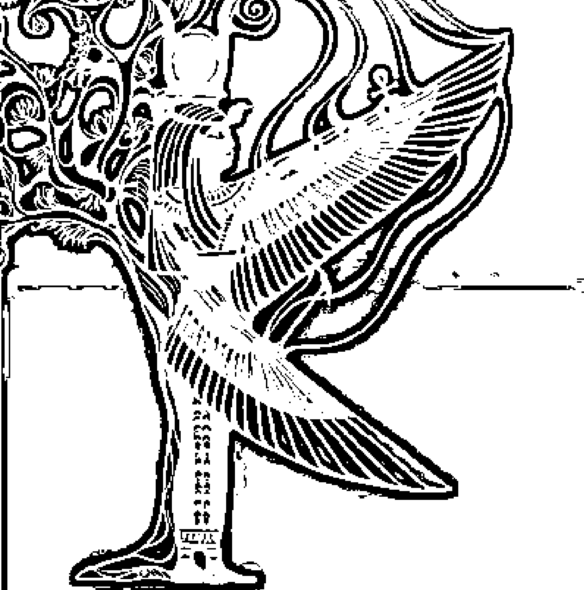

## 目錄

+ 源起 ………………………………………… 7  
1. 前言 ………………………………………… 11  
2. 序 ………………………………………… 17  
3. 我的父母不是我真正的父母 ………………………………………… 25  
4. 和我印象中的日出不一樣 ………………………………………… 31  
5. 想離開 ………………………………………… 35  
6. 渴望合一 ………………………………………… 39  
7. 紅色的人 ………………………………………… 41  
8. 初顯我的未來 ………………………………………… 43  
9. 愛的掙扎 ………………………………………… 51  
10. 第一次經歷死亡 ………………………………………… 55  
11. 第一次預見未來 ………………………………………… 59  
12. 前世的記憶 ………………………………………… 61  

+ 第二次面對死亡 ………………………………………… 67  
13. 黑暗 ………………………………………… 71  
14. 轉換點 ………………………………………… 75  
15. 為光而掙扎 ………………………………………… 91  
16. 宣誓 ………………………………………… 103  
17. 曙光初露的地平線 ………………………………………… 109  
18. 靈視 ………………………………………… 115  
19. 吠陀醫學 ………………………………………… 141  
20. 燦爛的光 ………………………………………… 155  
21. 過去成為現在 ………………………………………… 161  
22. HE ………………………………………… 171  
23. 神之子 ………………………………………… 187  
24. 數年的準備期 ………………………………………… 199  
25. 善惡真知之樹 ………………………………………… 215  
26. 十二個相互對應的特質 ………………………………………… 225  
27. 獅子 ………………………………………… 239  
28. 心靈感應的訓練 ………………………………………… 243  
29. 未來 ………………………………………… 251  
30. 玻葛翰與生命杵 ………………………………………… 267  

## 源起

我曾向許多朋友介紹由匈牙利移居瑞士的一位作家、藝術家、靈性導師 Elisabeth Haich 所著作的「入門」（Initiation）這本書。我告訴他們這本書不但描述著她跨越時空的靈魂旅程，也透過她的回憶，詳細敘述她在埃及的廟宇中所學習的各種形而上的知識，因此許多朋友知道有這麼一本書。

當時雖有朋友希望我能將這本書翻譯出來，然而，在整套「光的課程」沒有完成之前，我一直沒有多餘的時間與精力去翻譯它，只在心中暗自希望有人把它翻譯出來。也許是機緣尚未成熟之故，二十多年過去了，儘管這本書已被翻譯成十七國文字，卻一直沒看到這本書被翻譯成中文。

前些時候，我們在博納與蒂娜園地中探討〈光之子的使命〉時，我在亞利桑那州立大學的一位教授，諾瑪米蘭若琪的一場演講資料中看到這段話：「許多光之子，或光的使者，幾乎都曾在埃及全盛時期出現過，那時候的埃及只有和平與豐足。在那一生中，他們學習各種形而上的知識，並感受到內在心靈的和平。」

當我轉述諾瑪米蘭若琪上述的演說時，「入門」這本與古埃及女祭司靈魂旅程有關的書，便再度被提及。因為作者在這本書所描述的回憶，似乎正是諾瑪教授所描述的，全盛時期的古埃及，人們熱衷於學習各種形而上學，作者有條不紊，完整地把當時大祭司與法老的教導記錄下來，並將它公諸於世。

## 8 入門——古埃及女祭司的靈魂旅程

我強烈地感到，不應讓「入門」這本書成為滄海遺珠，因為這本書就像博納與帝娜系列二中所討論的「光的彩虹橋」那本書一樣，是引發我向靈性深入探索的啟蒙書。沒有這兩本書的開啟，也許我就不會回應內在心靈的呼喚，也不會產生那股把「光的課程」翻譯成中文的熱忱。

現在，我再一次地感到那召喚我傳遞書中教導的脈衝。當我再次打開「入門」這本書時，發現大祭司以及法老的教導，有如暮鼓晨鐘，在我心中迴蕩著，我聽到自己的內在，輕聲細語地說著：「是到了介紹這本書的時候了！」

原本我只想像以往一樣，將其中精華提煉出來，熬成幾篇濃縮的精華露，使生活在忙碌的現代社會的朋友們，能快速汲取它的重點。卻發現無法只擷取這本書的片斷，因為即使是作者幼年時期的回憶，表面看去，並無特殊之處，但這些陳述不僅與她跨時空的旅程有關，也含藏著許多令人省思之處。

我只得將整本書譯出來，先給編輯部成員閱讀，期望編輯部成員閱讀之後，能找出一個較為精簡的方式來介紹本書的內容與古老的教導。

然而，大家一致認為這本書的靈性教導，貫穿在作者自傳性的故事之中。若去除了她從古埃及在金字塔的廟宇中的入門開始，至二十世紀末的這一生，橫跨三千年靈魂旅程的細節，讀者將無法深入理解「入門」這本書所要傳遞與闡述的真理與教導。

倘若去除了編輯部成員對這本書的探討心得，可能使許多人只被她的靈魂旅程所吸引，停留在浮面的故事中，忽略了許多重要的靈性教導的思索。因此，我們決定將編輯部成員的精彩對話編排在譯文的每一章節之後。

讀者可以選擇跳過編輯部成員的對話，只看作者自傳性的故事。不過我相信，在看完她的故事之後，如果能回頭看一看編輯部成員精心編輯的對話，將能進一步地從蘊涵在這些古老教導，千古不變的智慧中，獲得心靈的滋潤，並看到這些教導與因應寶瓶座紀元而產生的「光的課程」之間的一致性與連續性。

在為期一兩年漫長的翻譯、探討與編輯的過程中，編輯部成員偶爾會與自己的朋友討論其中一些觀點，我們發現有些朋友，當他們觸及這本書的內容時，他們的心靈意識，也打開了某種朦朧的記憶。這使我們相信，作者的入門故事，以及對古埃及大祭司與法老之教導巨細靡遺的記錄，將喚醒許多尚在沉睡中的「神之子」，也就是我們所說的「光之子」。在這時代，所有人都是光之子，讀者將在本書的第二十四篇－〈神之子〉以及第三十篇－〈未來〉的兩篇中，透過法老對她所解說的神之子以及他們後代的淵源理解到這一點。

在〈光之子的使命〉這一篇裡我們談到：「目前投生地球的光之子們，將在這一生中，再一次向內探索，尋找那智慧的寶藏以及那力量的泉源，也就是愛的源頭，並讓那股愛的能量，再次從他們的心中流出。」這一段使我瞭解為什麼進入寶瓶座紀元之後，許多

## 10 入門——古埃及女祭司的靈魂旅程

人會聽到，並展開「光的課程」的習修。因為許多人已做好讓愛的能量再次從他們的心中流出的準備。

〈光之子的使命〉這一篇，收錄在博納與蒂娜系列二，「光的彩虹橋」之中。我在這裡重新引述〈光之子的使命〉，是因為這本書的翻譯與出版，可以說是源自對光之子之使命的探討而展開的。

許多「光的課程」的共修團體，無論是現場或網上共修，也如諾瑪教授所說的，已體驗到與其他光之子連接的喜悅。我們相信，這些朋友將從本書作者如何與古埃及那一生的許多靈魂，無論是在人世間的層面上，或在心靈的層面上，重新取得連接，並實現圓滿的過程中，產生心靈的共鳴與迴響。

我們真誠地將本書獻給所有的光之子，期待更多的光之子在覺醒中，參與實現地球在寶瓶座紀元中完成神聖計畫這一美麗的目標。

## 1. 前言

博納：

我覺得透過讀書心得來探討人類心靈意識的進展，對我來說，滿有啟發性的。

蒂娜：

1990 年以後，許多美國出版的新書都已經有中文譯本，這真要感謝一些出版社及許多譯者。不過，之前有一些很好的經典之作，沒有被譯出來，成為滄海遺珠，實在很可惜。

博納：

學無止境，要汲取東方與西方的精華，從融合中提升，往往不是我們有限的時間與精力所能做得到的。所以，如果大家能把讀書心得奉獻出來，必然會有許多人能夠從中受益。

蒂娜：

我們的確可以做一些拋磚引玉的工作。這本《古埃及女祭司的靈魂旅程》（Initiation），我最近正在讀第三遍。它是在 1953 年完成，已經被譯成十七國文字，銷售逾數百萬冊。英文最早的版本是 1965 年在倫敦出版，1974 年開始在美國出版。

博納：

在出版了二十多年後，才被認知與接受，必然不是一本迎合時代潮流的書。

## 12 入門——古埃及女祭司的靈魂旅程

蒂娜：

就像《光的課程》及許多其他經典之作一樣，它屬於那種開路先鋒的作品。事實上，我在 1986 年時才接觸到這本書。當時在美國，幾乎所有《光的課程》的學生，都在看這本書。有趣的是，前幾天我在書店與書店主人談到，我正在重讀這本書時，她說她也是在 1980 年代開始接觸這本書，當時她周圍的人也都在讀這本書。即使到今天，還一直有人向她訂購這本書。

博納：

經歷了半個世紀，還有人在看，必然是經典之作。是什麼原因讓你一看再看呢？

蒂娜：

你很難一下子就能全部吸收書中的資訊。我第一次閱讀時，幾乎整個人都沉浸在作者自傳性的故事中。她的故事像種子，在我的心靈意識中萌芽，一直啟發我。之後再拿起這本書，是想更進一步去瞭解書中許多深奧、超越時空及宇宙靈性上的知識。

博納：

我真的很難想像，一本自傳性的故事，能蘊含如此多讓人一再回味與探索的豐富內涵。

蒂娜：

《古埃及女祭司的靈魂旅程》是作者的學生要求她寫的。之所以說它是自傳，是因為書中描述的一切，都是她這一生所發生的真實情境。這本書最引人入勝之處，是作者以非常鮮明的記憶，描述一個二十世紀女子與一個活在古埃及時代的年輕女祭司，在三千年時空的交錯中，經歷的靈魂旅程。書中描述促進她成長的細節，以及法老與大祭司超越時空的教導。這本書在我閱讀的過程中，豐富了我的靈魂。

## 博納：

那你就更不能藏私了。先來為我們介紹這本書的作者吧。

## 蒂娜：

作者是 Elisabeth Haich 女士。生於 1897 年，逝於 1994 年。她生長在匈牙利布達佩斯的一個中上階級家庭，從小就展現出優異的藝術天份。她的雕塑作品至今在匈牙利許多地方展示，成為該地的地標。第二次世界大戰結束時，因為有廣大的追求靈性成長的群眾追隨她，她被當時政府視為危險人物，面臨被逮捕的危機，被迫離開匈牙利。有一位來自印度的瑜伽大師，Selvarajan Yesudian，適時協助她離開匈牙利，並定居於瑞士，直到她逝世為止。Haich 與 Yesudian 合辦的瑜伽中心是歐洲最早也是最大的學校。她的教學一直持續到她逝世為止。這位來自印度的瑜伽大師以及她這一生中遇到的許多人，都和她在三千年前及今生的生命展開種種因果，交織成一個非常動人、發人深省的故事。我喜歡反覆閱讀，是因為在閱讀的過程中，我感覺到自己也隨著書中人物的經歷起伏，獲得某種程度的釋放與解脫。

## 14 入門——古埃及女祭司的靈魂旅程

博納：

這麼說來，這是一本可以從不同層面來欣賞的書，它是小說，也是表達新紀元理念的靈性教導，而不僅僅是一本描述前世今生的書。

蒂娜：

作者對古埃及時期僧侶生涯、以及自己在靈性道途上冶煉的記憶，使得這本書充滿靈性的啟蒙。書中詳細描述三千年前的古埃及，一名年輕女子，如何接受大祭司普塔霍特普 Ptahhotep 的引導，配合她自我心智的發展，一步一步地領悟宇宙的至高奧秘。全書貫穿古代與現代，寫出人類的命運與定數，讓我們瞭解，在不同時間與空間的連接下，如何讓一個人的靈性意識更為提升擴展。

博納：

作者既然是埃及女祭司轉世，她從一開始就是一位覺醒的靈性導師嗎？

蒂娜：

就是因為她不是，才有許多發人深省之處。儘管在孩提時期，一些朦朧的記憶使她和一般孩子的行為、思想與情緒有一點不同，但並沒有太過異常。她和多數二十世紀初期歐洲中上流社會的女人一樣，受教育、戀愛、並結婚，婚後生了一個兒子。她與父親、丈夫及兒子的因緣，就像她與印度瑜伽大師的因緣一樣，這些穿越不同時空交織而成的故事，非常令人著迷。

## 1. 前言 15

博納：

所以，你想透過她的故事，讓我們看見因果輪迴的運作，讓我們知道一個人在日常生活中的選擇，會產生什麼樣的連鎖關係，以及靈魂從中需經歷什麼樣的體驗。

蒂娜：

是的，這本書啟發了我，讓我對許多生命所呈現的現象，有更多領悟。作者在二十世紀的歐洲，所經歷過的戰爭與不尋常際遇，證明了無論在何時何地，無論我們跌落至什麼樣的深淵，內在意識的光與智慧，都會引導我們走過一切困境。很多讀過這本書的人都告訴我，閱讀這本書的過程，就是一種入門。

博納：

那就讓我們隨著這本書，逐步走過這特定的入門吧！

## 16 入門——古埃及女祭司的靈魂旅程

## 2. 序

博納：

要用讀書心得的方式來分享這本厚達三四百頁的書，是個很大的挑戰吧！

蒂娜：

確實有些難度。好在作者體恤讀者，對古埃及夢幻似的情境著墨較少，她想要讀者明白的是書中內在含意。她以現代語言，來描述大祭司普塔霍特普 Ptahhotep 的教導，並以現代化的形式寫出她在古埃及時期的經歷，以及她在那時代所學習的一切。使我們的分享變得容易許多。

博納：

我們將如何深入這本書呢？

蒂娜：

我們先節錄兩篇為這本書所寫的序。然後我們會將原文一篇篇地轉述出來。如有我們想探討的地方，我們可在每一篇幅轉述完了之後，做些討論。

博納：

那就先為我們介紹第一篇序吧。

蒂娜：

第一篇是那位在二次大戰後幫助她離開匈牙利的印度瑜伽行者 Selvarajan Yesudian 於 1962 年在蘇黎世寫的。

> 「我們需要的，不是一個去影響我們的導師，而是一個教導我們如何能不被外在事物所影響的導師。Elisabeth Haich 正是一位這樣的導師。她常對學生說，『不要跟隨我的途徑，選擇與你自己內在最相應的途徑。即使我所說的是千真萬確的真理，也不要盲目接受，因為它不是你的經驗，這些真理不是你的；只有當你把這些真理帶入你存在的本質中時，它才是屬於你的。別人所達到的成就，只是證明這些目標是可以達到的。』每星期都有成千上百的人前來聆聽她的開示，參加她所帶的靜心冥想。她所有的學生最大的期望是能把她的教導整合成一本書。」

博納：

既然她說不要跟隨她的途徑，那們跟隨她的學生，要如何學習呢？

蒂娜：

人類悲歡愛恨的經歷，不會因時代不同而有所改變。真理的學習，使讓我們無論在何時經歷任何狀況，都能以較高的智慧與力量來走過生命歷練所帶來的挑戰。

博納：

我很感動於她這段話，「即使我所說的是千真萬確的真理，也不要盲目接受，因為它不是你的經驗，這些真理不是你的；只有當你把這些真理帶入你存在的本質中時，它才是屬於你的。別人所達到的成就，只是證明這些目標是可以達到的。」

## 蒂娜：

儘管她為別人教導她前世今生的領悟，但她不要人們盲目地跟隨她，可以說，即使在雙魚座時代，她已體現了寶瓶座紀元的精神。

## 博納：

那麼，第二篇序是誰寫的呢？

## 蒯娜：

是作者的門徒所寫的介紹。

> 「我經常思索：為什麼人類在地球上必須經歷生老病死、種種苦難，還要結婚生子，在讓孩子們經歷許多辛苦磨練的同時，又把更多的孩子帶到這世界上來，這些孩子在經歷了生命的各種學習與磨練之後，最終還是要面對死亡。這種週而復始的循環究竟有什麼樣的意義呢？」

那些精神成就極高的人，如米開朗基羅、梵谷、莎士比亞、歌德等人，他們的才華一樣地會隨著他們的老死而埋葬。這一切不可能毫無意義，在這之中，必然有著極為深沉的奧秘，然而，我要如何獲知這些答案呢？

就拿蘇格拉底來說好了，他在被迫喝下毒藥時，從容地飲盡最後一滴，明知自己即將死亡，還能平心靜氣和追隨他的學生道別之後，才閉上眼睛。這種面對死亡的和平與寧靜，只有確實明白宇宙真理的人才能做到，但他是怎麼獲得這種真知的呢？

我相信任何時代都有一些擁有入門知識的入門者。而他們是如何擁有這些入門奧祕的呢？

## 20 入門——古埃及女祭司的靈魂旅程

我決心尋找這樣的入門者，在這過程中，不可避免的遇見過一些虛假的入門者。然而，只要讓我遇到任何一個能讓我得到更多領悟的人，我會盡我所能吸收與學習他們的教導。

就這樣，我遇到一位有如隱居在修院裡的年長女士。許多與我一樣的探索者環繞著她。這裡有兩位年輕的孩子與她一起工作，其中一位來自印度，另一位我聽到她叫他「兒子」。

這位女士高大莊嚴，舉手投足簡單自然。她目光和善，卻能看穿每一個的思想與靈魂。每當我坐在團體中聽她的開示，一些疑惑從心中升起，往往就在她接下來的幾句話中獲得答案，許多人和我有同樣的經驗。

我曾問她說：「Mother，請告訴我，妳是如何達到這樣的進展？妳生來就如此嗎？」

她回答：「『我』何曾真正出生過呢？靈魂是完美的，沒有進展這一說。只是受造的個體自我，必須發展到可以呈現完美較高自我的頻率。每個人都必須走過這樣的過程，我也不例外。受造的身體與思想情緒，是一連串的作用與反作用。所有的事物只是進展的一個階段或一種狀態。運作開始時，必然要走過不同的階段，直到它結束為止。沒有任何物質顯像能跳脫出這一法則。它將與身體的開展並行，心靈意識的狀態也自然隨之改變。」

「這麼說，妳必然走過整個開展的過程。懇求您告訴我們，那是一種什麼樣的經驗呢？」

## 22 入門——古埃及女祭司的靈魂旅程

「這有意義嗎？每個人都必須以自己的方式達到完美狀態。你們無法歷經我的過程，我的過程對你們而言不具意義。過程中所發生的事並不重要，只有你從自己的經驗中所學習到的，才是重要的。不要急，你將在自己的途徑上學習與開展。這世間有無以計數的途徑，但它們都通往同一個目標。」

「母親，您是對的。我很清楚我無法歷經您的途徑，也無法以您的途徑來進展。然而，您的進展經驗將對我有許多幫助。我以及其他人，將能從您的故事中瞭解該如何從生命的經驗中學習。」

「我不是對您的故事好奇，但您的途徑將會讓我們瞭解您對生命的觀點，我們將從您對命運的回應中學習與擴展我們的意識。」

她注視我很久，終於說，「如果你真的相信你以及其他閱讀這些回憶的人可以從中獲益，我也許真的需要寫出我是如何逐步打開我的心靈之眼，以及如何理解到從人與人之間、靈魂與靈魂之間的種種因緣，都是為了特定的成長而顯現的。」

就這樣，展開了她入門的故事。

※ ※ ※

## 博納：

那句「過程中所發生的事並不重要，只有你從自己的經驗中所學習到的，才是重要的」，就足以讓我從另一個角度來看自己的人生經歷。

## 蒂娜：

是的，她為我們做了一個解答：「靈魂是完美的，沒有進展這一說。只是受造的個體自我，必須發展到可以從中呈顯那完美的較高自我的頻率。每個人都必須走過這樣的過程，我也不例外。」

## 博納：

而「光的課程」就是一個使我們可以發展到呈顯那完美的較高自我的頻率的一個途徑。

## 24 入門——古埃及女祭司的靈魂旅程

我在父母溫柔的愛護中成長，感到幸福無比。只是，在我四歲時，我經常夢見自己被一隻獅子追逐，我拚命跑，獅子已經快要追上我，想把我吃掉，我跑得喘不過氣來。忽然在我的面前出現一間小屋，門打開，門口站著一個女人。她看起來不像我母親，但是在夢中，她是我的母親。她伸開雙手迎接我，我知道，只要我能接近她便安全了。獅子已經追到我的背後，我的脖子感覺得到獅子吐出的熱氣，蓬鬆的毛髮幾乎就快碰到我的身體，我使出全力跑，以僅剩的一點力量，呼叫著媽媽……媽媽……突然間，我碰到她的手，然後我疲憊地倒在她的懷裡。我安全了，獅子不見了。但是當我從夢中醒來時，仍然驚悸不已，我光著腳丫，拖著顫抖的身體，跑進父母親的房間，鑽進母親的被子裡，母親總是抱著我說，「又夢見獅子要咬妳了是嗎？」我點點頭。她那安全與寧靜的擁抱，讓我很早就睡著。如果我做惡夢的第二天早上，正好是星期天，我醒來時，便會發現母親已起床，但父親仍躺在床上看報紙。

在一個惡夢之後的星期天的早上，醒來之後，看到父親像往常一樣地躺在床上看報紙。我問父親報紙上的一些字母是什麼意思，父親告訴我說，這個字是 L，這個字是 I，這個字是 T……，當他在解說時，我突然感到自己豁然理解這些字母所組成的是什麼字，我念給父親聽，母親正走進房間，愣了一下，然後衝過來把我抱起來，興奮地親吻我說，「妳能識字了！」

## 26 入門——古埃及女祭司的靈魂旅程

從那以後，白紙上的黑字已不再是神祕的事物，我可以理解它的意思。從此一個新的世界在我的生命中展開。我讀遍所有我能拿到手的東西，我饑渴的學習一切事物。

五歲的時候，聽到父親談及上司指示派他去做事，我很驚訝的問他，你不是階層最高的人嗎？父親說，不是的，我上面還有主管，我必須聽從他的指示。我拒絕相信這樣的事，這怎麼可能呢？對我來說，父親代表著最高的權威，整個國家的人，都聽從他的指揮，他負責管理整個國家人民與財產的安全。沒有人膽敢反對他。這時我注視著父親，這是我的第一次仔細觀察他，我突然領悟到，我所深愛的父親與母親，並不是我印象中的父母親。

如果在當時，我像現在一樣，擁有與心靈意識有關的知識與經驗，就很容易可以瞭解為什麼當時的我會有那種感覺。然而，當時的我只是一個孩子，對事情的認知也僅限於孩子的認知。我只能感覺到自己被某種勢能所牽引而離開了自己的家，只是不知道自己原本的家在哪裡。那個時候，我還不記得所有的事物，只能獨自深思。

當天晚上，母親送我上床時問我，「妳今天特別安靜，好像在為什麼事迷惘。告訴我，是什麼事困擾妳。妳可以問任何妳想要的問題。」

啊！她的溫柔與甜美，讓我全心全意愛著她，信任她，我相信我可以與她討論任何事。我抱著她的脖子問，「媽媽，我從哪裡來的？妳和爸爸是怎麼有我的？」

## 28 入門——古埃及女祭司的靈魂旅程

我在深層的潛意識中，我深信只有 HE 能真正理解我。如果我能有更大的活動空間，更多的自由，和我比較相似的人群生活在一起，我會感到真正的幸福。

這種身處異地的奇怪感覺不僅沒有消失，反而隨著年齡的成長越來越嚴重。我試著想找出與 HE 聯繫的方式，卻總是徒勞無益。

＊ ＊ ＊

## 博納：

她所認定的日出的景象，確實是鮮明而獨特。

## 蒂娜：

那是她在埃及那一世時日出的景象。她對海的記憶也是來自埃及那一世。

## 博納：

往往孩子們說出前世殘留的記憶，卻因得不到大人們的認可，而封閉了他們的記憶。

## 蒂娜：

大部份的父母，仍不知如何輔導有特殊印象或記憶的孩子，致使孩子的心靈受到傷害或扭曲，確實是很無奈。

## 34 入門——古埃及女祭司的靈魂旅程

## 4. 和我印象中的日出不一樣

我既蒼白又虛弱，醫生建議父親帶我們到海邊去過夏天。我們坐一整夜火車，媽媽為我蓋上一層毯子，我便睡著了。在太陽升起之前，一種奇怪的感覺使我睜開眼睛。大家都還在睡夢中，我坐在窗邊，向窗外看去，天色還很朦朧。我聽過別人描述日出，但自己從沒看過。我凝視窗外，期待太陽升起的景色。然而，我所看到的日出，與我所期待的，或者說我印象中的日出全然不同。我認為太陽應該從地平線逐漸升起，當它完全升上來，天空會變成一片紫紅色。但我所看到的，卻是陰暗的灰色，過了一陣子，直接成為白天的亮光。我非常失望，日出不應該是這樣的。

這時，父親醒來了，他笑著對我說，日出很美麗吧！我一臉失望，生氣的說，一點也不美，它沒有豐富的色彩，只是灰灰的一片，真醜。日出不是這樣的，不是這樣的……

父親耐心的看著我，充滿關愛，他的眼睛非常美麗，炯炯有神。他問我，「妳從來沒看過日出，怎麼知道日出應該是什麼樣的景色呢？」

我充滿信心地回答他，「我不知道我是怎麼知道的，也不知道我在哪裡看過日出，但我就是知道，日出不應該是這樣的！我的記憶中，太陽從黑暗中升起時，應該是亮麗的紫紅色，而不是這種暗灰色……那種景色應該是非常美麗的，振奮人心的。」

父親說，「妳的想像力太豐富了，今天天氣很晴朗，它的色彩不可能比這更漂亮了。」

我沒有答話，但還是很生氣，不僅因為日出沒有我期待中的美麗，也因為父親認定我的認知只是一種想像。日出的景色鮮明的刻在我的記憶中，每當我無法證明我所確認的事時，那種無助，總是令我非常生氣。

突然，父親說：「看哪，海就在那邊！」

火車正從山上往下走，遼闊的海就在下面，這時我開始感到非常興奮，開心了起來，我很清楚，這不是我第一次看到海，我對海是熟悉的。看著海，我的心歡唱著：奇妙的海啊！你永遠如此美麗。你是我親愛的朋友，你常傾聽我的歡樂與痛苦，你能理解我，你所吟誦的永恆之歌，帶給我的安慰與提升，超越任何人所能給我的。

父親拍拍我的肩膀問：「海，符合妳的期待了嗎？」

「是的，」我回答。「海是這樣的，只是它應該是一望無際，而看不到對岸。」

「這是海灣，」父親說，「再過去一點，妳就可以看到一望無際的大海了。」

＊　　＊　　＊

## 博納：

她母親的反應，使我們瞭解到，當大人以自己所認定的事物來評論孩子時，對雙方都是一種傷害。她的父親具有溫良寬厚的心性，但即使是這樣，他仍然不相信宇宙中有更高的存在。我很佩服她在那麼小的年紀，就具有保持沉默的能力。知道不要與無知的人談論神祕事物。

## 蒂娜：

那是她在埃及的那一世，從一次又一次的錯誤中學習而來的。

## 40 入門——古埃及女祭司的靈魂旅程

## 6. 渴望合一

母親有一個住在城裡的表姊，她有兩個兒子。他們家裡有許多新奇的玩具，但最令我興奮的是，他們有很多書。每次去造訪他們，不論是大人或孩子們都玩得很開心。

我曾讀過一本書，描述「永恆的同盟」，這是我一直在探索的事。我向他們建議成立永恆同盟會，他們認為這是個很棒的主意。其中一個孩子要求我們每個人都要簽名。大家都把自己的名字簽得非常花俏，無法識辨。我覺得那種矯揉造作的簽字很浮誇，只是簡單清楚的寫上我的名字。他們看了我的簽字，認為我連自己的名字都不會簽，拒絕我加入，讓我既失望又挫敗沮喪。我回家拼命練習簽他們那種矯飾又難辨識的名字。這種簽字絲毫不能代表真實的我，但他們卻因此接受了我。我本來以為，自己因加入這同盟，應該會很開心。奇怪的是，我一點也不快樂。

回家後，我聽到自己內在的聲音，「妳的簽字是虛偽的，妳真的相信，妳能以一個虛假的簽字來維持一份虛假的友誼嗎？不能接受妳真實表達的人，不可能成為妳真正的朋友。」

我傷心的躺在床上，我不可能再用那種方式簽我的名字。我知道這兩個男孩，根本不會瞭解什麼是真誠永恆的友誼。我再一次孤獨地尋找真正的友誼，真正的聯盟。

## 42 入門──古埃及女祭司的靈魂旅程

## 7. 紅色的人

我九歲時，兩歲的弟弟生病了，醫生診斷不出他的病因。我非常疼愛這個弟弟，陪著母親坐在他的床邊。他忽然從昏睡中驚醒，喊著：「媽媽！媽媽！一個紅色的人要來捉我……」他揮舞著雙手，想擊退靠近他的人。當他喊到聲嘶力竭之後，便昏了過去。

母親跳起來，一邊把他抱起來，一邊派人去請醫生。我們等候醫生的同時，我問母親：「弟弟看到那個紅色的人是誰？」母親回答：「親愛的，那只是他發燒產生的幻覺。」

醫生來了之後，診斷出孩子患了肺炎。

可憐的母親，日夜抱著弟弟，長達三個星期，一刻也不曾離開過他。看到弟弟為生命所做的搏鬥，以及母親為孩子的辛苦付出，令我非常震撼。這也是在我生命中，第一次看到母親心中的愛。我自己也同樣為了弟弟的生存而度過一段惶恐的日子。也就是從那時候起，我開始覺得自己屬於這個家庭的一份子。當弟弟康復，我跟著全家一起歡欣不已。我終於覺得這是我的家了。

然而，我忘不了那個紅色的人。母親一再向我保證，那只是幻覺，但我一直對這件事心存疑惑。我常常反覆回想起這件事，當時我做夢也沒想到，多年以後，我才在印度找到這答案。

一年以後，我們全家搬到另一個城市，我也回到學校去上課，但我和其他的女孩之間，總是格格不入。她們玩洋娃娃，我覺得無聊透頂，我喜歡看書，她們卻認為那是呆板無趣的事。

## 44 入門──古埃及女祭司的靈魂旅程

## 8. 初顯我的未來

那年夏天，我們與一些親戚在湖邊避暑，湖畔坐落著成排的別墅。我看到吉普賽男孩，拉了一陣子小提琴之後，便伸出手向聽眾要錢。這令我想起，我的祖母演奏一場音樂會，可以賺很多錢。我想知道自己是不是也能賺得到錢。我找一個對我凡事言聽計從的小女生合作，兩個人穿梭在那些別墅中，看到有人坐在他們的走廊或花園，我便上前朗誦一首詩。人們一開始有點訝異，不知道我們在做什麼，等我朗誦結束後，我朋友拿出盤子收錢時，大家便笑著把零錢放在盤子上。

有一位女士問我，我母親知不知道這件事。我回答：「她不知道，這是我的個人的事業。」

那位女士說：「我想她一定不知道，妳們還是趕快回家吧！」

我前景遠大的企業當天便結束了。我與朋友把錢分了之後，很驕傲的回家告訴大人我賺了一些錢，並把那些零錢秀給他們看，母親差點昏倒。

「我的天啊！」她高聲叫著：「妳怎麼會想做出這種事，別人會怎麼看你呢？妳讓我們大家都跟著妳一起丟臉。」

「為什麼會丟臉？」我問：「祖母不是靠演奏賺錢嗎？吉普賽小孩也是這樣賺錢，靠朗誦詩來賺錢，哪裡丟臉了？」

「妳這個小傻瓜，」母親說：「難道妳不知道，妳父親是知名的上層社會人物嗎？反正，妳就是不能做這種事。」

# 入門——古埃及女祭司的靈魂旅程

「父親的地位與我所做的事有什麼關係？父親是父親，父親的地位崇高，但我沒有高階職位，為什麼我不能賺一點錢呢？只要是正派的，任何工作都是正派的，而我的詩確實朗誦得很好。」我驕傲的結束了這場爭論。

母親憤怒的吼著：「妳真的聽不懂我在說什麼嗎？為了懲罰妳的叛逆，從今天起，不准走出花園以外的地方。」

就這樣，我失去了自由。不過這次的事件，卻讓我展開另一種活動，也啟發了我更多的表達能力。我的叔祖父帶著他的家人，租下別墅的另一端，和我們一起在湖邊避暑。他是個幽默和藹的老人，聽說我在外面靠朗誟賺錢，覺得非常有趣。兩家人一起用餐之後，他要求我當場朗誟給大家聽。我沒有異議。等大人都圍成一圈並坐下來，我站在中間，開始朗誟一些我喜愛的詩。叔祖父很喜歡聽我的朗誟，要我再朗誟幾首。

「但是，我只會這幾首。」我說。

「那就說說妳知道的事。」

「我可以說一本書的故事嗎？書名是《韋克菲爾德的教區牧師》。」

> （註：韋克菲爾德（Wakefield），英國英格蘭北部城市，西約克郡首府）

「當然！」

我開始說這本書的故事，仿彿自己站在舞臺上表演，把整個故事生動活潑地呈現在他們眼前。故事描述在韋克菲爾德一位聖潔的教區牧師，有一個美麗的女兒。一位年輕人愛上他的女兒，最後他們倆人一起私奔。牧師氣得拿起他的槍去追他們。他太太往他的手裡塞了一本《聖經》……我當時並不知道私奔是什麼意思，所以不知道教區牧師為何這麼氣憤，我僅僅是講述我所讀的故事。當我描述兩個年輕人在黑暗中溫柔甜蜜的情話時，大人開始爆笑，好像我在講一個超級好笑的故事。然而，我說的，卻是一個悲劇呢！

結束時，叔祖父拉起我的手問我：「妳是在哪裡看到這些故事的？」

母親也在一旁附和：「我也正想知道！」

「這本書是學校給我的獎品。」我答道。

「真令人吃驚！」母親惱怒的說：「學校怎麼可以給小孩子這樣的書呢？」

「我相信他們沒看過這本書，他們一定認為這本跟教區牧師有關的書，必然是一本講述神聖事物的書。他們只是沒想到，牧師也會有女兒。」叔祖父說：「說真的，我很久沒有這麼開懷的大笑了。」

從那以後，我每天晚上都為他們表演。除了家人之外，朋友及鄰居也是我的觀眾，每晚來聽我說故事看我表演。

這些故事還包括莎士比亞的悲劇。我一直不明白，為什麼大人聽了這些悲慘的故事，卻覺得很好笑。當我講李爾王的故事時，描述一群人相繼死去的那一幕，有人是這樣死的，有人是那樣死的。

講故事的時候，我的心是憂傷的，大人卻看得樂不可支。我並不覺得那是好笑的事，那是非常可怕的事。我一邊繼續講著，一邊納悶，為什麼聽到這種死亡的悲劇時，他們還笑得出來。往後，我常常回想那個深深融入在自己所講的故事中的小女孩。那時期的種種跡象，已顯示出我未來生命的軌跡。我擁有把內心世界最美好，最神聖，最真實的事物表達出來的天分。無論我的聽眾能不能理解我所說的，我仍然把自己最真實的部分表達出來。因為，只有一個聽眾是最重要的，他就是「神」。

春去秋來，那年冬天，我忽然喜歡做一些奇怪的姿勢。起先，我父母很驚訝，還嘲笑我，親友們則喜歡看我所做的肢體動作。我直覺的去做它們，從不去想為什麼要這麼做。我只知道，有些姿勢會讓我很舒服，而有些姿勢能使我的學習更有效率。我疲勞時，以某種姿勢坐著，幾分鐘內便能恢復精神。

大家笑我是瘋子。起初媽媽總教訓我，說一個好女孩，站的時候，要穩穩用雙腳站立，不可以把頭放在地上倒立；坐的時候，必須端坐在椅子上，不可以彎腿盤坐在地上。然而，驅使我做這些姿勢的力量，來自我的血液，是我難得可以享受的樂趣。最後，她對我所做的這些奇奇怪怪的動作也見怪不怪。

次年夏天，一位常在東方旅行的朋友，聽說我會做些奇怪的動作，便要我做給他看。在陌生人面前，我有點害羞，做了一個把自己的頭藏起來的動作，大人們都笑起來，我接下來又做了幾個我喜歡的高難度動作。

這位素未謀面的客人，神色嚴肅的看著，沒有一絲笑意，最後他驚呼：「這個孩子做的是正統的瑜伽動作！」他轉向我說：「妳是在哪裡學這些動作的？」

我當時不知道「瑜伽」是什麼的意思，我回答他說：「沒有人教我，我只是喜歡做，因為做完之後覺得舒服極了。」這位客人搖搖頭，表示不相信。

很久很久以後，我才明白，這些被稱之為瑜伽的肢體動作，是我前世習以為常的活動，因為我曾在廟宇中年復一年的練習。這些瑜伽動作，反映我的過去，同時也反映我的未來。多年以後，我把瑜伽傳授給許多人，使他們獲得身體與精神的開展。

* * *

## 博納：

從這些描述中，讓我感受到有些高度進展的靈魂，很多時候還真是孤獨呢！

## 蒂娜：

有時候一段時間的孤獨是必要的，孤獨使一個人向自身的內在探索。但是，當一個人深入一定的程度之後，豁然開朗時，便能與大家融為一體，帶領別人一起走向光。以佛教的說法，應該就是由小乘轉向大乘吧。

## 博納：

嗯，那我尚未達到能不批判地與大家融為一體的時候，因為大部分的時候，我還沉浸在享受我的孤獨與寂靜的時光中。

## 蒂娜：

能安然地享受孤獨是一種能力，它帶給我們莫大的寧靜與自由。但有時則是因憤世嫉俗，或因批判，無法包容別人而畫地自限。

## 博納：

喔，那我得在這上面仔細審視自己了。說實話，這種由畫地自限而造成的孤獨我體驗過，它更像是關在籠子裡一般。雖然它讓我沉澱思想與發展內在的寧靜，但當放眼籠子外的世界時，往往會有種天地之大，我卻只能以這籠子作為容身之處的感嘆！

## 蒂娜：

畫地自限的那種安然自在，只能是一時性的，因為它出自分裂，而不是出自愛的本質。任何不是出自愛的事物，必然不會帶給妳真正的平安與喜悅。

## 博納：

所以我們可以從自己的心是安祥、寧靜的，或是哀傷、罪咎的，來瞭解並調整自己。

## 蒂娜：

我們所要銘記於心的是，不管外在所呈現的是什麼現象，唯有向內尋找平安才是正途。

## 博納：

其實道理說起來簡單。只是常常很難做到。

## 蒂娜：

所以我們需要長時間地走在光的途徑中。讓上師們的訊息隨時提醒我們，讓光的能量不斷地幫助我們，直到我們與光融合為止。

# 入門——古埃及女祭司的靈魂旅程

時光飛逝，我的身體開始成熟。我喜歡閱讀愛情小說中所描述的各種愛情故事。我展望未來，並決定要找個擁有一顆高貴心靈，能完全瞭解我的丈夫。我開始和其他年輕人交往。母親極力教導我成為一個端莊的淑女，不可招蜂引蝶，然而我無法掩藏自己的魅力。我無知的以為，我的容貌是我最大的吸引力，使許多人想要親近我。當時我並不瞭解，我的魅力不是要用在個人生活上，而是要引導人們走上救贖之路。這是靈性上的無知。這種對真理的盲目，使我後來進入中年時，幾乎成為真正的盲人。

當時我所想的，純粹是個人的前途，我相信只有男女間的夫妻之愛，會帶給我至高的快樂。我也確實經歷了世俗層面的戀愛。然而，戀愛所帶來的喜悅與痛苦經歷，僅僅是我生命成長的前奏。

回顧我從十三歲到十九歲的六年中和一名年輕男子的一段感情，我將它稱之為「發展堅定意志力的培訓期」。

十三歲那年，一個才華洋溢的年輕人，全力以赴地追求生命中最崇高的、最美好的事物。他告訴我，他愛上了我，他認為我在靈性與藝術上和他的認知相同，他相信我是個能配得上他的女人，要把我塑造成一個有高等文化素養，卻又絕對服從的妻子。他相信他可以磨掉我獨立的思想，送給我的禮物都是一些裝綴精美的音樂、美術、歷史、古典文學等相關書籍。

他堅持要我讀原文書，無論是德語、英語或法語，他花很多時間陪我一起讀書。和我見面的時候，總是帶一些原文的報刊、雜誌、舞臺劇本給我，想引發我學習的興趣。他找到最好的老師來教我鋼琴。總而言之，他盡一切所能提高我的文化素養。母親認為，他是一個讓我擁有優良教育的天使。這一切對我當然是有益的，但他也毫不放鬆的控制我。他對我說，我將來要成為他的妻子，因此我是屬於他的。所有我要看的書都要經由他同意，未經他允許的朋友，不可以交往，未經他允許的活動不可以參加。

一開始，我很高興一個被許多人敬重的人，選擇了我這樣一個小女孩做為他未來的妻子。他能言善道，和他交談令我愉快。他對友誼與愛的態度與我一樣，都是認真的。然而，當他逐漸把他自己的意志強加在我身上時，他所有的關注都成為令人厭煩的干擾。兩個靈魂展開一種無形的權力鬥爭。我越是不受他所影響，他越是想盡辦法要控制我。我十七歲時，他要我與他正式訂婚，他請求我父親答應這門婚事。

我父親對這件事並不怎麼看好。很久以後，他才告訴我，他不喜歡我未婚夫爭強好鬥的個性，但他不願干涉我的自由。他尊重每個人的選擇，包括他的孩子在內。因此雖然不是很樂意，但他同意了。

我以為訂婚後，未婚夫的嫉妒心會減少一點。我還年輕，喜歡和同班同學玩樂、一起溜冰、一起跳舞。他認為這些活動很無聊，不願意參加，卻非常嫉妒我與年紀相仿的人在一起。隨著我的身體越發成熟，散發出更多的魅力，他的嫉妒也就越發不可收拾。他總是在折磨我幾個鐘頭之後，跪著求我原諒他，並保證再也不會這麼做。幾次下來，我發現我越來越無法忍受這些爭端。我的生命中從來沒有出現過這種爭吵，我不曾見過我的父親與母親之間，有任何矛盾。我的父親具有一種強大的力量，但這力量是無形中自然煥發出來的。他從不會把自己的意志強加在別人身上。他尊重每個人的自由，從不期望別人盲目聽從他。

那個時期，父親的形象已經符合了我小時候對他應有社會地位的期待。他成為最高職位的人，在他的工作場合中，沒有人在他之上。即使如此，他從不會濫用他的權力去控制他的屬下。他如燈塔般照亮周圍的人，親朋好友以及上百位的屬下，都樂於尋求他的意見。他總是隨時隨地幫助別人。這讓我認為，所有的男人都應該像他那樣。我從未見過像未婚夫這樣妄自尊大，有著病態權力欲望的人。我需要掙脫，重新獲得自由。

很長一段時間，我無法與他的意志力量抗衡。與生俱來的忠誠，以及對別人弱點的理解，使我一直未採取行動。當我的意志力隨著年齡而增長時，我決定不再忍受這種折磨。

我告訴他，我需要自由，但他不願意聽，我陷入艱苦的掙扎，因為他的意志力像鋼鐵般堅硬。然而，越是困難，越是展開了我的意志力，直到強過他為止。我決定要解除婚約時，隨之而來的是一場風暴，但這對我已完全不產生任何作用。我只是為他感到難過。

他一方面蠻橫與專斷，另一方面卻又非常懦弱，他去去了我對他的尊重。在那時期，我並不知道這種病態的雙重性格，是一體兩面，緊密相連的一種人格特質。我知道他的靈魂是病態的，但我無法拯救他，我迫切需要自由，最後我終於以巨大的意志力解除了這個婚約。

我的父母對這件事並不覺得奇怪。

*   *   *

## 博納：

大多數的人，中年以後才開始思索生命的意思，而她在這麼年輕，毫無人生經驗，就能參透紅塵的虛無，真不容易啊！

## 蒭娜：

我認為她在瞭解生命虛無的同時，卻又能認知生命的意思，才是不簡單。我認同她所說的：「人類無法使自己死亡。但是，永恆的真義要靠每個人自己去領悟。」

## 博納：

真希望想要自殺的人不要忘了人類無法使自己死亡，自殺只會使人再次回到同樣的情況中。我很欣賞她的當機立斷，不把思想放在會削弱她的力量的事物上，而是放在未來的計劃上。就像《光的課程》中也常提到，不要在負面的事物上再賦予能量，而是把能量投注在正面的事物上一樣。

## 蒭娜：

是的，只有這樣才能實現靈魂投生地球的目的。這也是為什麼，《光的課程》在每一級次的最後一課，都要我們以赤紅色之光來激發對生命的熱忱。

## 博納：

這本書對這一點也有一些闡述，當你全部看完之後，就能心領神會。

## 蒭娜：

是的，只有這樣才能實現靈魂投生地球的目的。這也是為什麼，《光的課程》在每一級次的最後一課，都要我們以赤紅色之光來激發對生命的熱忱。

## 蒭娜：

有時候一段時間的孤獨是必要的，孤獨使一個人向自身的內在探索。但是，當一個人深入一定的程度之後，豁然開朗時，便能與大家融為一體，帶領別人一起走向光。以佛教的說法，應該就是由小乘轉向大乘吧。

## 博納：

嗯，那我尚未達到能不批判地與大家融為一體的時候，因為大部分的時候，我還沉浸在享受我的孤獨與寂靜的時光中。

## 蒭娜：

能安然地享受孤獨是一種能力，它帶給我們莫大的寧靜與自由。但有時則是因憤世嫉俗，或因批判，無法包容別人而畫地自限。

## 博納：

喔，那我得在這上面仔細審視自己了。說實話，這種由畫地自限而造成的孤獨我體驗過，它更像是關在籠子裡一般。雖然它讓我沉澱思想與發展內在的寧靜，但當放眼籠子外的世界時，往往會有種天地之大，我卻只能以這籠子作為容身之處的感嘆！

## 蒭娜：

畫地自限的那種安然自在，只能是一時性的，因為它出自分裂，而不是出自愛的本質。任何不是出自愛的事物，必然不會帶給妳真正的平安與喜悅。

## 博納：

所以我們可以從自己的心是安祥、寧靜的，或是哀傷、罪咎的，來瞭解並調整自己。

## 蒭娜：

我們所要銘記於心的是，不管外在所呈現的是什麼現象，唯有向內尋找平安才是正途。

## 博納：

其實道理說起來簡單。只是常常很難做到。

## 蒙娜：

是的，培養自己的智慧與力量去面對該學習的，與該了結的因果，才是上上策。

# 入門——古埃及女祭司的靈魂旅程

十五歲時我發現自己偶爾會夢到未來。我曾夢見一個年輕的醫生從母親房裡抱出了一個娃娃，拉斐爾姑姑也在場。第二天早上，我告訴母親我的夢，母親說：「請不要再做這樣的夢，我的孩子已經夠多了。姑姑怎麼會出現呢？那年輕的醫生又會是誰呢？」

「我不知道他是誰，我只是在夢中看到他。」

半年後，母親生病了。檢查完後，醫生恭賀母親有喜。老醫生推薦一位年輕的醫生為母親接生。當母親生產時，姑姑在前往義大利的途中正好經過我家，在我家住了兩個晚上。走出母親房間的年輕醫生，正是我夢中所見到的。

從那以後，我常夢到未來的景象，夢境每一次都像電影畫面般非常鮮明。經過很長一段時期以後，我就能根據我的意願進入這種狀態。

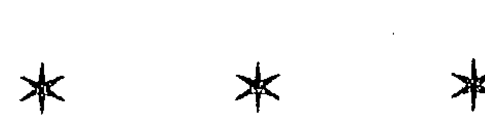

## 蒙娜：

所以許多人會把自己的夢記錄下來。有些夢境的確會預造未來的影像，但有些時候，醒來便忘了夢中的情節。

## 蒙娜：

我覺得把夢境過份地神秘化，會使生活變得很緊張。有些夢確實只是日有所思，故夜有所夢。我覺得醒來時，如果記得的夢境，可以思考一下其中的含意，以及其中是否有某些其他層面的指引或訊息。如果不記得，或不瞭解夢的含意，就把它放下。把焦點放在自己思想行為的起心动念上，可能意義會更大一些。她能夢見未來，並未使她避開她這一生所該經歷的事。

## 蒙娜：

是的，只有這樣才能實現靈魂投生地球的目的。這也是為什麼，《光的課程》在每一級次的最後一課，都要我們以赤紅色之光來激發對生命的熱忱。

## 蒙娜：

從姑姑家回來之後，有一天，我在網球場上認識了一位文質彬彬、非常有魅力的男士。他似乎也被我吸引。那年冬天，我們就訂婚了。我們彼此熱烈地相愛。我整個身體與靈魂都渴望成為他的妻子。父親要求我完成學業後再結婚。在我畢業之前，我未婚夫每天都到我家與我們一起度過傍晚的時間。

一天晚上，在睡夢中，我突然聽到一陣重複不斷的節奏，劈哩啪啦劈的響聲越來越大，我知道那是監督奴隸的工頭用鞭子抽打的聲音。工頭正督促那些拖著我身體的奴隸向前走。我被放在一個可以滑行的雪橇上。我知道自己正被帶離皇宮。

我想爬起來，卻發現自己動彈不得，因為從我頸子以下一直到腳，都緊緊被綁住。我像大理石雕塑般躺著，雙手交叉放在胸前，雙腿平行伸展。

在豔陽下，我看到一群男人拖著我，朝白色石頭砌成的建築物前進。我知道那是死亡之城，一座墳墓！

把我放進去以後，所有的人都離開。黑暗吞沒了我。在恐懼中，我在心裡問，「我要像個囚犯一樣躺在這裡多久？」

我清晰的聽到一個熟悉的聲音，平靜的告訴我：「三千年。」

恐怖重新席捲而來，我的意識消失在虛無中……

＊＊＊

## 蒙娜：

有人用力搖動我。我睜開眼睛看到姐姐，她驚恐的抓著我說：「老天爺，妳怎麼了？妳坐在那兒，眼睛空洞洞地，嘴巴喃喃呻吟，好像是要死掉一樣。妳生病了嗎？要不要叫媽媽？」

我想回應，可是發不出聲音。那可怕的經驗使我的身體完全癱瘓。我搖搖手告訴她不要緊。然後我躺下身子，試著思考，但腦子一片空白，還在驚慌失措。幾分鐘之後，我的心臟才回復正常跳動。姐姐陪著我，一直到我的意識恢復常態，她又問我：「需要我幫你做什麼嗎？」

我好不容易才能張開嘴，回答她：「不用了，謝謝，我沒事。」

＊  ＊  ＊

第二天，我試著集中精神，試圖回想我在夢中所看到的，和我所經歷的那些夢境究竟是什麼呢？難道，我又看到了我的未來嗎？

然而，根據以往的經驗，我所看到未來的我，和現在的我是同一個人。但昨晚所看到的我，則是一個完全不同的人！我看著鏡中的自己，試著理解，一個人何以在同一時間中成為不同的兩個人？現在的這個我，在鏡子裡看得到。然而，夢中那面鏡子所反映的，卻是另一個我，那個我又是如此地年輕，因此她不可能是未來的我。

在這裡，我是一個存在，然而，我同時也是那個埋在墳墓中的另一個存在。短短的幾分鐘內，我醒悟到那個像大理石雕塑般躺著的「我」是誰，在什麼地方。我有一種對某種生命的回憶，我想起

## 12. 前世的記憶

那個家，那個我從孩童時期起就在尋找的，我所真正歸屬的家。現在，我知道那個偉大的人物（Great One）是我真正的父親。

儘管隨著年齡的增長，我已習慣目前的狀態，並接受現在的父母是我的雙親。然而不知何故，那奇怪的感覺從未消失，現在這感覺更加強烈了。

奇怪的是，在前世的經驗中，很正常的事，現在卻好像違背倫常。這兩種狀態形成強烈的對比。

譬如，在當時，法老是我的父親，他立我為皇后，是天經地義的，是一種榮譽。

然而，現在，對我來說是一種震撼，因為以現在的時空來說，這是不被允許的事，兩者的意義截然不同。

在古埃及時期，法老的妻子過世後，皇室中沒有其他具有皇家血統的女人時，唯有他的女兒，有資格成為他的王后，坐在他的身旁。

我想起一些在那時期的事，尤其是我常去的廟宇。然而，許多事情依然晦暗不明，譬如說，我為什麼會被殘酷地放在棺材裡？我為什麼會被送進墳墓裡？還有，那說話聲音聽起來如此熟悉的人是誰？

過去的這段記憶完全被封閉住，如果我試著回憶它，便有一股電流般的能量把我彈開，使我無法回到那一時空中。

## 64 入門──古埃及女祭司的靈魂旅程

不是的。除了學校教的之外，我從來沒有讀過任何與埃及相關的資料，我對埃及的事物並沒有什麼興趣。但我在學校所學的，與我在靈視中所經驗的，完全不同。我沒辦法解釋這種靈視意味著什麼，但我絕對相信，我所看的每一細節都是千真萬確的。我也相信，我在夢中所看到的人是存在的，但是，我真的沒辦法去解釋，我是如何可以在這時空成為我現在這個人？也不知道夢中其他的人是誰？有沒有可能，人類不僅僅只有一生的生命？

父親轉頭對母親說：「請給我一點水果好嗎？」母親把水果遞給他，便結束了這個話題。

當晚臨睡前，我還想著這夢境會不會再次出現，但它沒有。我等了幾天，甚至試著回到那夢境中，但一切嘗試都無法使那夢境再次出現。

過了一陣子，我就不再去想它了，我對生命的健康態度，使我充滿活力地勇往直前。我練琴、畫畫、學習學校的課業，與我的未婚夫一起度過傍晚的時刻。

＊ ＊ ＊

## 博納：

在《全像宇宙投影》這本書中提到：過去仍以一種隱含秩序的方式活在現在，當「現在」隱藏起來變成了「過去」，並不表示「現」消失，它只是回到宇宙的隱藏層。所以，同時存在是有可能的。只是我們沒有穿梭自如的技巧。

## 蒂娜：

是的，這使我稍為理解「過去、現在、未來同時存在」這句話的意思。一般人是沒有穿梭自如的技巧，但本書作者，在經過多年的努力之後，終於具備了將自己靈魂的旅程貫穿起來的能力，確實地完成了她的「入門」。

## 博納：

我曾聽人說過，催眠也可以進入過去或未來，這可能嗎？還是只有完成「入門」的人，才可能做到？

## 蒂娜：

無論是「催眠」或書中所闡述的「入門」，都是極為個人的經驗，其結果也是極為個人的。以催眠來說，它將依個人以及催眠師的意識與能量的不同，在不同的條件與情況下，產生不同的結果。而作者是靠自己的努力，揭開今生與前世之間的罩紗。我認為這種依靈魂的進展，到了適當的時候才打開前世記憶的方式是最安全的方式。

## 博納：

在《光的彩虹橋》中我們提到過入門者自然會理解自己的前世因果。不過如果我們安住於當下，接受一切都是我們自己必須學習的課程，必須圓滿了結的事物，前世有什麼樣的經歷與恩怨也就不重要了。

## 13. 第二次面對死亡

學院畢業典禮之後，緊接著就是我的婚禮。

現在回想起來，婚禮的細節歷歷如繪，然而，整個婚禮也像是一場夢境。來賓一個個打扮得光鮮亮麗，我的母親容光煥發，依然年輕美麗，父親的俊秀挺拔，足以讓所有的女人心跳不已。當他看到我開心看著他戴的高帽子時，對我做了一個鬼臉，表示他跟我一樣，覺得這些婚禮形式非常荒謬可笑。

我請求牧師致辭儘量簡短，以免我打呵欠。我相信，婚禮致辭的長短和婚姻是否幸福美滿完全無關。

婚後，就如我所期待那樣，非常快樂。我們全然熱烈地愛著對方，我的身體與靈魂，都體驗到愛所帶來的滿足。然而，這一切美好感覺就忽然如海市蜃樓般消失了。

就像過去撞破那道黑牆，我這次撞得比以前更猛。我再一次面對死亡。這一次比上一次更為真實。

每當我感到幸福快樂的時候，總覺得有些事正等著我去完成的感覺。而當我一旦具體實現時，一切又變得空洞。我陷入真空狀態，不知道在前面等待著我的是什麼？不知道我下個目標是什麼？我已實現一切我想要的。再下去就是過完剩餘的時間。剩餘的時間？剩餘的時間有多少？答案是：直到死。

無論我們這一生成到什麼樣的境界，無論命運怎麼安排，我們都在朝著同一個方向前進，那就是——死亡。除了死亡，別無他路。

## 68 入門——古埃及女祭司的靈魂旅程

沒有人知道自己走到盡頭需要多長的時間，但遲早我們都會進入那樣的虛無。

我清楚知道，我與丈夫之間的愛，也有它的盡頭，因為我們遲早都會在死亡中消失。那時，快樂就結束了。我看著丈夫充滿愛的明亮雙眼，感到有一隻冰冷的手抓住我，內心深處便升起一個疑問：「妳能看這雙美麗的眼睛多久呢？未來將又會是什麼樣呢？就算你們一直都這麼快樂，就算你們可以一起活到很老，你們最終還是要說再見，然後閉上眼睛。」

無論是多快樂，多美麗的愛情，總有一天要走到盡頭，你們會失去對方，以及一切美好的事物……

我看著我的丈夫，不想去理這聲音，然而，我沒有辦法不理它。因為它所說的，是千真萬確的。

當時我並不知道，正是這種苦惱，讓我開始探索永恆不朽的神聖自我。

那段時間裡，我彷彿身處荒漠中，常常無助的暗自哭泣。我沒把這種情況告訴我丈夫，他是那麼快樂，不會瞭解我的痛苦。他還處在凡人的夢境中，我不忍把他喚醒。

## 博納：

苦難使她轉而傾聽內在的聲音，可見每一看似負面的事物，都有它正面的意義。

## 14. 黑暗

我的身形像父親，像他一樣高高的，頭髮雖然沒有他黑，卻也是深褐色。我的膚色蒼白，不如我母親那麼紅潤。我的眼睛是深藍色，而不是黑色。

結婚後，我更蒼白，更瘦弱。因為只要我無法解決人生苦短，稍縱即逝的疑惑，我就無法感到自由與快樂。這種長期的壓力，對我的健康產生很大的影響。

一天早上，當我醒來睜開眼睛，發現右眼的視覺中出現一條黑線。眼科醫生檢查之後，對我說，「這是種罕見病症，目前沒有醫治的辦法。告訴我，妳是不是長期處在一種精神壓力下？」

「我的生活沒有什麼壓力，」我說：「我過得很快樂！」

我該怎麼向他解釋，我的痛苦是來自對死亡的恐懼？就算我告訴他，他也無法幫助我。我問他：「我的另一隻眼睛也會出現同樣的問題嗎？我的眼睛會瞎掉嗎？」

「我不知道。我現在只能建議妳多休息，注意營養，增加自己的抵抗力。」

我丈夫竭盡一切所能安慰我。但無論他怎麼努力，送我多棒的禮物或帶我出去散心，都沒有辦法讓我擺脫心中的憂慮。

當他帶我到風景優美的地方去玩，反而更增加我的憂慮。我總是想，我可能很快就再也看不到這燦爛的陽光，美麗的天空，這些秀麗的景色。

## 72 入門——古埃及女祭司的靈魂旅程

蒂娜：

在前面「愛的掙扎」那一篇，她提到她對靈性的無知，對真理的盲目，使她進入中年時，幾乎成為真正的盲人，所指的正是這段經歷。

博納：

她以為她所擁有的，使許多人想親近她的吸引力，是因為她的容貌之故。她不知道上天所賦予她的魅力，不是要讓她用在個人生活上，而是要她用來引導人們走上救贖之路。這點走在靈修路上的人，不可不知。然而，對一個年輕人來說，相信只有男女間的夫妻之愛，才會為自己帶來至高的快樂，也是正常的啊！

蒂娜：

這是正常的，也是常人在這世間應擁有，並體驗的生命經驗沒錯。只是，在擁有這一切之後，如果還能從中使自己的心靈繼續提升與成長，便會與靈魂或較高自我的目標，有更進一步的融合。

博納：

所以生命中所經歷的一切事物都是為了靈魂的學習。也就是說靈魂給我們的挑戰不會只是單純的要讓我們受苦，而是讓我們體會背後的禮物，對嗎？

蒂娜：

我不能說這些話對或不對，但基於「我們的思想創造我們的實相」這一理念，我選擇這麼看待我的生命。

## 15. 轉捩點

一天下午，我從城裏回來，燦爛的陽光，盛開的花朵，鳥兒愉快的叫聲，我對自己說：「如果我不失明的話，這一切將有多美好啊！」突然間，我聽到那聲音清楚地問我說：「你已失明了嗎？你已看不見東西了嗎？」

「我還能看見。」

「既然還能看見，為什麼要在你還能享受這一切美景時就開始絕望呢？何況你並不確定是否會失明。也許在你死之前，你都不會失明，為什麼要把時間浪費在還未發生的事情上呢？你真的知道未來是什麼嗎？為什麼要把你的生命毀在還未發生，甚至不存在的事物上？」

「你目前的情況並沒有那麼糟，享受你的生命，你便會有更大的恢復的機會。沮喪只會使你的眼睛加速惡化。活在當下，只要記住，一旦你的心靈不再盲目，你的肉眼便會恢復它的功能。」

這出自神聖聲音的每一個字是多麼地正確啊！我可以感受到我眼睛的黑點，是代表我內在黑暗的盲點，是這盲點的外在顯現。然而，我如何去治癒這靈性上的盲目呢？

這正是我的問題所在，由於我被困在黑暗中，我對生死的奧秘茫然無知，我感受死亡無所不在，卻無法理解生命的意義。我渴望能「看清」，这是我最大的願望，但如何做到呢？

## 76 入門——古埃及女祭司的靈魂旅程

那聲音回答我說：「尋找，你就會發現；敲門，門就會為你而開。」當時我不理解它的意思，但我要遵從它。我試著深呼吸，保持安靜，把心放在當下這一時刻。

這不容易做到，那黑點不斷地在我眼前跳動，使我很難不產生苦惱，但是我努力使自己知足快樂，因為我知道我心情的好壞，足以影響我的眼睛。

我得幫助我自己，把焦點轉向規劃我的未來。我的丈夫是個建築工程師，他的心力都貫注在工作上，除了吃飯時間以外，我很少看到他。突然間，要有個孩子的念頭出現在我的思想中。有個孩子將會是一個多大的喜悅呢？我把我的心靈向一個隱匿的存在打開，他在某個地方等著我把他帶到這世間來。

這個存在聽到我的呼喚……，他來臨了，在我懷孕的期間，眼睛的黑點逐漸消失，產期將近時，我幾乎忘了曾經有過眼睛的問題。孩子出生時，帶給我極大的喜悅，他的哭聲不像一個新生嬰兒，更像獅子的吼聲。我聽醫生告訴我說：「是一個健康美麗的男孩。」那一瞬間，我的心充滿了感恩。

我睜開眼睛，看到一個胖胖的，紅潤的身體。我知道儘管這孩子進入我的生命成為我的孩子，他仍然是一個完全獨立的個體。

生產後，我的身體非常虛弱，也恢復得很慢，我的眼睛又開始出現同樣的問題，但我已不受這問題的干擾，我把全部精力與心思都放在孩子身上。當他對著我微笑，胖胖的手臂環繞著我時，我的一切煩惱都煙消雲散。

## 78 入門——古埃及女祭司的靈魂旅程

時光飛逝，我的兒子健壯地成長著，每個人都稱讚他那充滿愛與溫暖的藍色大眼睛。他是一個早熟的孩子，當他四歲時，他也跟我四歲的時候一樣，拿起一本書，問了我幾個字母的意思之後，便知道那個字的意思。

我把抱在膝蓋上，吻著他，繼續教他別的字，他似乎不是在學習，而是在憶起。

夏天來臨，我們與家人在湖邊的別墅中避暑，我的弟弟與妹妹會在週末的時候，邀請一些朋友來玩幾天。白天我們一起打槌球、劃船、游泳；晚上我們在陽臺上彈室內樂或遊戲，那段生活既健康又快樂。

我的眼睛在這段時期並未帶給我太多的干擾。只是因為生產後我的身體非常虛弱，因此孩子出生後，我在海邊住了幾個月。大海的神秘能量使我康復了許多。我開始繪畫，甚至開始做一些木雕。藝術家的生涯，帶給我許多樂趣。

然而，浮面的生活樂趣，未能使我的內心獲得真正的喜悅。我不知道為什麼。那股莫名的焦躁與不安越來越嚴重，使我無法漠視它。

一天晚上，我再一次地體驗世間男女所能達到的最高的愛與合一，然而，我卻未能心滿意足地入睡，反而坐在床沿上反覆思索自己為何會如此絕望。在黑暗中，我流著眼淚，仔細審視自己為何如此不快樂、不如意。我不是已擁有一切使一個人理當快樂的條件了嗎？我的苦惱到底從那裏來的？

## 78 入門——古埃及女祭司的靈魂旅程

在我的探索中，答案開始浮現在意識層面上。

我在另一個人身上尋找自己的另一半，企圖從另一個人身上獲得完整。人類稱它為「愛」。現在，我已經歷了這種愛的結合，我已達到身體與心靈的滿足。然而，性愛非但沒有給我帶來快樂，反而讓我一次比一次更沮喪。

黑暗中，我絕望地問著自己，為什麼我不能快樂？突然我理解到，我一直以為肉體的愛可以使一個人滿足，然而，經歷了肉體上完整的結合之後，我發現這不是我所追求的那種合一的喜悅，我內在心靈所追求的，是另一種滿足。它驅使我不斷地尋找。

但是，那又是什麼呢？

我所追求的是一種永恆，一種永不消失的真正的合一。我所追求的是與內在自我的合一，我要融入在祂的靈魂，祂的思想中，我要成為祂。

肉體的結合無法使我達到這種合一。肉體的需求只是一種極力想要進入那種合一的企圖，當每一個細胞，每一寸肌肉的張力達到頂點，雙方都感到自己已達到完全的滿足時，卻又各自分開了，永遠無法達到真正的合一。

黑暗中我想起小時候，總是試著把在自己湯碗中浮動的兩粒油脂變成一團。現在，我同樣地試著把兩個靈魂變成一個。但這是不可能的！

戀愛中的兩個人，渴望與對方合為一體。然而，這種渴望只是一種肉體的欲望，我們可以看到兩個愛人熱烈擁抱時，兩顆心緊緊貼在一起，似乎想把兩顆心合成一體，但最終是枉然的。為什麼？

因為有身體隔著。身體阻礙了這種合一。難怪我無法以身體與我所愛的人合為一體。是我的身體渴望合一嗎？

不是的，這種渴望出自非物質體的靈性自我。

然而，為什麼我會渴望這種合一呢？為什麼我要這種不可能的事呢？

我要它，是因為我知道只有經由這種完美的和諧，實現這種圓滿之後，我才有可能獲得至高的喜悅！

這種喜悅是我生下來就在追求的。但為什麼我會去尋找這種不可能的事呢？

我尋找，是因為我非常確定它是可能的，它是存在的，只是我不知道如何可以找到它。

是什麼阻止我實現這一目標呢？是因為我從身體中去尋找。然而，這種合一的喜悅只能存在於非物質體的狀態中。

我曾在某一時空中，在某種方式下體驗過它，但隨即我又失去它。現在我渴望回到那狀態中。我真的有可能曾經生活在這全然的合一中，一種非肉體的元素中嗎？

當我的思想邏輯推論到這裏時，我對這「無形體的狀態」開始感到非常恐懼，表示這是另一個世界嗎？是一個死亡後的世界嗎？這死亡後的世界存在嗎？我一向認為死後的世界只是宗教界的發明，用來驅使人們努力向善，以便進入天堂，否則便會下地獄。

現在我開始懷疑，是不是只是我的身體存在於地球上，而那個真實的自我是永恆的？果真如此的話，是不是所有的人類都源自另一個世界呢？是不是因為這樣的緣故，我們渴望回到那依然存在於我們靈魂之內的喜悅。

只是我們以錯誤的方式去尋找，我們想從性的欲望中去尋找。

這麼說，我只能在另一個世界，即天堂中找到我所追尋的喜樂。然而，我如何把這另一個世界帶到我的物質世界中呢？空洞的語言無助於我，我要的是實相，一個具體的事實。

這一夜是我生命的轉捩點。我理解到性愛是使人產生幻覺的大騙子。

大自然允諾我們的是一個美好的世界，一種至高的喜樂，一種圓滿的肉體顯現。然而，為什麼當我們達到至高境界時，會跌落到比原來更深的深淵呢？跌落後，我們失去了所有的能力，像乞丐般地貧窮可憐。

我要的是那永恆的至高境界，這境界無法從性愛中獲得。做愛後的第二天早上，除了疲憊外就是空虛。我真的要無止境地重複這種無法使我達到合一的活動嗎？一開始時，有某種勢能，一種異性相吸的勢能，使尋找合一的兩個人聚合在一起。之後，這種勢能便消退，留下無盡的孤獨與空虛。

我終於明白，這不是我所追求的。我不願再受肉體欲望所欺騙。性愛只能滿足身體，無法滿足靈魂。我必須找到使我的靈魂獲得滿足的喜悅。我知道自己不能停滯在這狀態中，我必須向前走，然而我要朝那個方向前進呢？

## 博納：

這一篇有很多值得沉思的地方。首先她的內在聲音問她說：「為什麼要把時間浪費在還未發生的事情上呢？你真的知道未來是什麼嗎？為什麼要把你的生命毀在還未發生，甚至不存在的事物上？」這點，不正也是我們隨時要反問自己的嗎？

## 蒂娜：

是的，所以我們要時時提醒自己活在當下，Being in the moment。

## 博納：

然而，要活在當下，不是那麼容易，她說：「浮面的生活樂趣，未能使我的內心獲得真正的喜悅。我不知道為什麼。那莫名的焦躁與不安越來越嚴重，使我無法漠視它。」當我們置身在浮面的生活時，確實無法真正地活在當下的喜悅中。

## 蒂娜：

我想真正能活在當下，並在喜悅中的人，必然是已領悟到自性裏的光明，並與自性靈魂連接的人，否則雖然頭腦想要活在當下，但是心卻無法達到。

## 博納：

奧修的思想，真的是被我們這些對他的理念一知半解，斷章取義地只取適合自己思想行為的門徒所害，使得世人對他有許多誤解。

## 蒂娜：

這是尚未進展到較高意識層面的現象。我相信理解他的人也很多。從佛陀到耶穌基督，從佛經到聖經，到現代的許多資料，包括光的課程，都有許多被誤解與扭曲的地方。但這也是人類學習與進展的一部份。

## 博納：

其實，當我與自己喜歡的人在一起時是愉悅的，與女友在一起時，並非有意地要逃避或發洩自己的情緒，但結果仍然常常令我感到沮喪。

## 蒸娜：

《解讀地球生命密碼》還提到一個重點：

「要慎重挑選性行為的對象。如果你們準備和對方發生性關係，務必先確認你們兩人已有某種承諾與契合，而且打算付諸實行，因為在這個時間與能量快速運行的時代，你們會承擔起任何人的-切。每當你們和別人發生性關係，就會被這個人綁住。即使是一夜風流，一旦兩具身體結合，彼此的磁場就會合併。」

## 博納：

這段話使我想起，在「光的課程」系列一，第三級次中，優歌南達上師也提到這點，他說：「不要有不對等的結合，因為，這將成為你在你們人生旅途中，增加障礙與負擔的來源，要尋找一個可以平衡你的精神自我，理性自我，以及能平衡你存在的所有層面的人。」可能我在找伴侶時，往往因受到外表的吸引，而忽略了對方的心靈意識是否與我在同一個層面上，因而過後，總是有一種不能契合的失落感。

## 蒸娜：

這有可能是使你感到沮喪的原因之一吧。

## 博納：

對方因不理解我何以與她們分手，而受到傷害，她們的怨，也成為我心理上的負擔，這種負擔又使我對自己與對方都感到憤怒。

## 蒸娜：

你可以在乙太層面上，用愛去祝福她們，感謝你們共同分享過的時光與課業。讓光的能量幫助你淨化與釋放。請她們也放下你。

## 博納：

自從我體悟到沒有心靈的共鳴，很難真正維持一個關係之後，也因在光的運作中，我不再那麼地焦躁不安，我在感情的真空狀態中很久了。

## 蒸娜：

我想這也是你靈魂的選擇。因為在你目前的發展階段中，這是比較適合你的狀態。

## 博納：

開始的時候，感覺蠻好的，覺得正好可以在這段期間清理，並整合我自己。但是，我還是渴望能遇到一位具有較高靈性意識的伴侶一起走在生命的旅程上。

## 蒸娜：

那麼你就得先把自己的心靈意識提升到可以與你理想中的伴侶的心靈意識相同的層面，否則即使讓你遇到了，你也無法與她產生共振，很可能與她擦身而過。除此之外，你也要審視自己，是否在逃避什麼？是否還有什麼樣的信念，阻礙了你，使你無法與你的靈魂伴侶相遇。

## 博納：

所以也就是說不管我們選擇何種方式去面對或提升性能量，最終還是回到自身意識的進展與淨化，而在這過程中，性能量也會與我們的意識合一並進入較高的靈性層面，是嗎？

## 蒸娜：

我想是的，性能量也是我們自身存在中的一股能量。當我們的身心與較高意識整合時，它自然與較高的靈性層面整合。

## 16. 為光而掙扎

我試著捕捉另一個世界，但不知如何著手。我像一個赤手走在森林中的人，無法清理出一條可以行走的路徑。明明知道森林裏有毒蛇猛獸，自己可能在迷途中跌落山谷。然而，卻仍然需要穿越那片森林。

如何穿越它呢？我從宗教入手，但牧師們只要我相信那些他們自己都不完全理解的教條，或他們自己都不相信的天國。

我渴望知道的是生命與死亡的意義。在那時候，我尚未能接觸到東方的哲學，我從歐洲的哲學思想開始研究。我研讀從古希臘與古羅馬所翻譯出來的資料，沉迷在蘇格拉底、柏拉圖、畢達哥拉斯（古希臘哲學家，數學家）、埃皮克提圖（西元前一世紀時的希臘斯多噶派哲學家、教師）、馬可思·奧裏利烏斯（羅馬皇帝兼斯多噶派哲學家）等人的作品中。在這些偉大思想家的影響下，我的心智漸趨成熟。

埃皮克提圖的一句話，幫助我走出黑暗，他說：「事情本身並不糟糕，是你所想的使它們顯得糟糕。」

自從看到這句話以後，我試著改變我的思想模式。然而這些真理還是不能把我帶到我所探索的另一個世界。我覺得，雖然他們已達到人類思想的極致，但還是沒達到合一的至高目標。因此他們無法回答我的問題。

我繼續閱讀近代哲學家如：康得，叔本華、尼采、笛卡兒、帕斯卡、斯賓諾莎的思想。仍然沒有獲得答案。

一個秋天，我帶著兒子站在窗前看著飄散在地上的落葉，心中想著：又是凋零與死亡！

突然間，我內在的聲音說：「為什麼你總是只看到事物的一面？你沒看到春天代表著生命？生死交替是永恆的循環。生與死是生命的一體兩面。」

這時，我清楚地領悟到，樹本身沒有死，只是樹葉在更新。因此，人類的生命沒有死亡，而是在那永恆生命的根源中，不斷地更迭與轉換。

現在我理解，為什麼我對很久以前的另一個我，仍然有著模糊的記憶。腦海中古埃及的景象，是一種古老的記憶浮現到意識層面上。

對另一個世界，這一生之外的另一生，以及輪迴的好奇，使我展開對靈性世界的探索。

探索靈界的人相信輪迴，並宣稱可以與死去的人溝通。然而，我是厭惡靈界之說的人，因為父母對這種言論抱著蔑視的態度。

母親有一年長的好朋友，喜歡研究靈界的事物，但母親從不參與這些活動，因為她相信這種活動會傷害神經系統。

母親這位年長的朋友非常疼愛她的孫子，時常招待孫子的朋友吃中飯。我是常常到她家吃飯的年輕人中的一個。這位老祖母與我們總是像朋友般地談天說笑。當時我十五歲，大家差不多是那樣的年齡。有一次，吃過飯後，有些人離開了，有些人還留在那兒。留下來的人希望這位老祖母告訴我們一些與靈界有關的事。

「如果你們要的話，我們可以看看他們怎麼把桌子抬起來。」大家都同意試試。

於是，她把一張三腳桌擺在房間的中央，讓我們年輕人圍著它，把手放在桌子上，手指攤開，與別人的手指相碰。然後她開始向空中喊著：「有沒有人在這裏？」

聽到她的呼叫，大家都覺得好笑。我們頑皮地互相看著，為了禮貌，大家都忍著沒笑出來。等了一會兒之後，桌子開始搖動，那力量好像是從桌子本身發出來的。桌子越搖越厲害，突然間，一根桌腿離開地面，桌子向一邊傾斜，幾乎碰到地面，隨即回到正常狀態。

那位年長的女士說：「桌子說是的，有人在。」

「沃爾夫岡」她對孫子說：「拿筆跟紙來，靈界的朋友在這裏，把他的話寫下來。」

沃爾夫岡拿著筆跟紙等待著。桌子又開始動了，我們按照字母的順序念著，當桌子在特定的字母上不動時，沃爾夫岡就把那字母記下來。我們只是覺得既滑稽又好笑，根本不相信桌子會自己動。我確信那是因為沃爾夫岡的弟弟尼古拉斯在搖動桌子。看著他如此嚴肅，大家忍不住笑出來，突然間，桌子開始在房間移動著，我們跟著跑，最後桌子在房間的角落停下來不動了。老祖母又叫道：「有人在嗎？」這時桌子仍然靜止不動。

老祖母說：「那是一個愛開玩笑的靈，因為你們在笑鬧，他就跟你們鬧著玩，現在這些靈都走了，我去拿咖啡來給大家喝吧！」

她離開房間時，我對尼古拉斯說：「桌子是你移動的對吧！」

他吃驚地說：「我以為是你或伊曼移動的，總之不是我。」

我們看著伊曼，他抗議地說：「我根本沒有動桌子。」

我說：「這樣吧，讓我們再移動一次桌子。」

於是大家把手放在上面搖動它，我們很吃驚地發現，桌子一動也不動。我們用力推它，它碰地一聲倒在地上，不像剛才那樣傾斜到一個角度就回到正常。無論我們怎麼試，都無法像剛才那樣地移動它。我們突然沈默下來，再也不覺得好笑了。回家的路上，我仍然不相信有靈的存在，但我開始相信，有某種勢能存在著。

那之後，我忙著練琴，溜冰，與男友吵架，這件事被推到腦後。現在，我又想起它來了。顯然地，那位老祖母對靈性世界沒有太多的理解，但有可能會有一些團體認真地在研究它。如果我能接觸到這些人，也許有助於我的探索。

我找到一個最大的，最著名的靈修團體，帶領人介紹我閱讀幾本書。我嘗試以自動書寫的方式與靈界連接。我拿著紙筆坐在書桌前等待著，開始的兩天什麼也沒發生，第三天，我的手開始抖動地寫一些文字，我不能確定那是出自一個靈，或只是我自己的潛在意識。

一個星期天的下午，我丈夫與我一起在起居室裏，他正在閱讀一本書，我一邊做木雕，一邊思索著有關接收外來的，或別人的意識。

念這件事。於是，我請我丈夫與我一起做個實驗，請他把思想發送給我。他立即同意，因為他也想知道這種事是否可能。我不知道如何做這樣的實驗，但我推論，要接收別人的思想，必需把自己的思想放空，因此我把肌肉放鬆，不去想任何事情，只是等待著。

我原以為思想傳遞是他的思想出現在我的心意識裏。令我吃驚的是，我「看到」一股力量大約有三四英寸的厚度，從他的太陽神經叢處像繩子般地套住我的身體，套在相當於我的太陽神經叢的部位。它拉著我朝一個方向走，直到我走到窗臺前，我丈夫的意念要我停下來為止。我們倆都為這新的經驗感到異常興奮。一個人的意願居然可以像章魚般地牽制別人。

我們家人習慣在星期天的下午聚在一起。當我述說我們的經驗時，大家都想要試驗看看。首先，是我母親做試驗。

我發現母親所煥發出來的能量，比我丈夫的更為纖細，直徑更小。其他在場的親戚都說要跟我做這樣的試驗。我發現每個人所散發出來的頻率都不一樣。

我有一個個性優柔寡斷的叔父，他所散發的思想是一股巨大的電流，但是電流中的粒子很小，並且移動的方向不統一，形成混亂的現象。這使我很難測出他到底要什麼。一個伯母的電流非常細，但像刀子般地銳利。大家都知道她是一個好鬥的人。這使我瞭解到，為什麼與別人爭論之後，會像進行一場角力賽一樣地累人。

我也理解到，為什麼跟有些人在一起時，我很快就會感到疲憊不堪或透不過氣來，有些人則令我感到神清氣爽或輕鬆愉快。

這種試驗完了之後，總是令我感到疲憊不堪，虛弱得雙腿發抖，往往需要休息一會之後，才能繼續下一個實驗。有一天晚上，全家包括女傭、廚子要求與我做思想傳遞的實驗。那一次，我體會到一個有修養，自律性強的人，所散發的能量，與一個粗俗，只為滿足自己欲望而活的人，所散發的能量有極大的不同。這與社會地位或財富的多寡無關。往往那些住在鄉下或山上，單純、不識字的人，所散發的頻率的純淨度，比起受了高等教育，知識廣博卻妄自尊大的人所散發的頻率還高。這種頻率是無法隱藏或偽造，它們直接反應一個人的內在。

另一個有趣的體驗是，以前當一個人要我做有違反我本意的事時，修養使我勉強接受，現在，它會像有一堵牆般擋在我與那個人之間，我要費很大的勁兒才能越過那層障礙。

這些實驗總是使我極其疲憊，即使對方是一個有正面的思想與性情的人。首先我得放空自己，才能接收別人的意願，那相當於讓別人的意識與意志進入我的內在，我得盡可能地抑制自己所散發的頻率，以便讓別人的頻率通過我的神經系統，這是最難的部份，因為我們的神經系統原本只是適應我們自己的頻率，現在為了接受別人頻率，我得做巨大的調整。

每當我們的身體或思想狀態改變時，我們的神經系統便要加強運作，以適應頻率的改變，無論這種改變是向上提升，或往下降低。

即使改變的是我們自己內在思想或精神，無論是意外的打擊，熱烈情感的爆發，或過度的興奮，都會增加我們神經系統的負荷。

因此，我們可以理解，當我們必須適應完全不同的頻率時，會感到疲倦與虛弱。當頻率的差異過大，神經系統的負荷過重時，可以導致巨大的傷害，如神經炎或其他神經系統上的疾病。這說明瞭為什麼一些敏感體質的人，在某種環境中會莫名其妙地生病。同時它也說明，成為一個靈媒是很危險的，因為他們要接收各種不同的頻率，卻無法消化吸收它們；他們接收來自四面八方的各種思想影像，卻因不能分辯或阻擋，被認為是說謊的騙子。這是因為他們的意志力越來越薄弱，變成一個無法識別周圍人的思想與情緒的接收器。因此他們變得混亂無序，成為不穩定、意志力薄弱的空殼子。

我自己即見證了這樣的事件。我曾認識一個靈媒，原本確實是很靈驗，最後，因來找她的人不斷增加，使她逐漸失去了抵擋別人思想頻率的能力。當她接收不到來自較高層面的指引能量時，為了保持聲譽，她開始編造故事，以滿足別人的好奇心。最後那些不明白這層道理的人，宣稱她向來就是一个騙子，遭受到奇恥大辱。事實上，開始時，她沒有欺騙別人的本意，反而是因為她具有成為靈媒的能力，削弱了她自身的特質，變得混亂不清。這種悲劇一再發生，我們應避免這些事。我在自己身上體會到這點，因此我停止這種實驗；我要的是真理。

有些靈媒宣稱自己在實驗別人的意願時，既不疲憊，也不受影響，以我個人的經驗，我認為這是因為這些靈媒所說的，是出自他們自己的潛在意識。

## 98 入門——古埃及女祭司的靈魂旅程

另一個由這種實驗而來的領悟是，有時我無法有意識地接收到別人的思想意願，但他們的意志像一個巨大的包袱壓得我喘不過氣來，幾乎快窒息。我只得要求對方集中精神，當我測出他們的意願，並把它帶出來時，我便能開始呼吸，不再有快要窒息或被壓迫的感覺。這使我相信許多時候，氣喘是因為患者未受到重視，同時被極為沉重的意志力所壓迫之故。

當然，這沉重的，未能實現的意志力，也可能是出自患者本身的潛在意識，但他們自身並不知道這是因他們自己未能實現的意志力所引發的。我們的生活中充滿了這樣看不見的搏鬥或戰役。有些時候我們戰敗了，有些時候我們勝利了。

從這些實驗我學到許多東西。它們給我一個深入地去看自己的潛在意識，瞭解自己與別人的機會。我從中確信，要接收別人的思想是可能的。但同時我也發現它是極難做到的。我瞭解到為什麼在西藏或印度的行者，為了與精神界溝通，而遠離人群，進行閉關或斷食。

在那幾年，我廣泛地接觸不同的團體。看到許多人因未能掌握自己而導致精神崩潰，自殺等悲劇事件。

一些善意卻無知的人，召喚那連自己都不知道的靈到自己身上。既不知那是什麼力量，也無法控制它們，只有任人宰割。只有意志力強，有深厚的心理學基礎，自我控制力強，才可以進行這種通靈術。

## 博納：

在前面一章，她說：「我必須找到使我的靈魂獲得滿足的喜悅。我知道自己不能停滯在這狀態中，我必須向前走，然而我要朝那個方向前進呢？」「我像一個赤手走在森林中的人，無法清理出一條可以行走的路徑。」這是我自己心靈本質覺醒之初的感覺。我能找到「光的課程」這一途徑，是很幸運的，它讓我感到有一條路可走，只是在這過程中，我還是常常有著停滯在某種狀態中，無法前進的感覺。

## 蒂娜：

我也常有這種感覺。但是，我知道我們內在的抗拒力量，以及不願承認，不願意面對自身問題的事實，往往超出我們所能想像的。我也常因受到某種情緒與感受的困擾，像置身悶燒鍋一樣。

## 博納：

那你如何處理這種狀態呢？

## 蒂娜：

我悶著頭，一邊看著自己的狀態，一邊繼續往下一個光，甚至下一個級次走下去。不同的問題，會經過不同長短的時間，但最終將能自然而然地體會與理解到自己的問題所在。但這只是第一步，又要經過一段時間，我才能承認它，面對它，這是第二步。然後又要一段時間的運作，才能真正清理它。通常這是我的三部曲。

## 100 入門——古埃及女祭司的靈魂旅程

博納：

我也差不多要走過這三個過程。這種清理與運作很辛苦，但當我把思想調整了，情緒釋放了之後，所獲得的輕鬆與喜悅，又讓我覺得自己能走在這途徑上真是非常幸運。

蒂娜：

清理與淨化的路，走起來很辛苦，但它畢竟是一條有路標，可以按圖索驥的路。相較於在蜿蜒小路上迂迴，或在迷宮中繞不出去，它便是一條輕鬆快捷的路。只是，無論什麼路，都要我們自己去走。

博納：

我也曾像她那樣，研讀一些哲學，智慧語錄等書籍，但就像她所說的：「這些真理還是不能把我帶到我所探索的另一個世界。」因此，我現在也不太想去看這些書了。

蒂娜：

哲理，甚至經典，往往可以讓我們在獲得理性思想的認知時，達到一時的境界，或一時的改變。有些人甚至真的改變了自己的人生。因此，這些知識本身沒有不好。只是，我們的思想與行為模式，通常不是用「理論」就可以達到根本的轉化。因此很快地，我們根深蒂固的思想與行為模式，又會占主導地位。何況我們未轉化的情緒，往往不是我們用頭腦的思想可以清除的。只能經由不同的靜心方式來達成。「光的課程」是以光的能量作為工具，但有了工具，還是要靠自己去運作。

## 16. 為光而掙扎

博納：

我發現如果我用理性思想去壓制我的情緒時，往往我的活力以及敞開自己的能力也消失了。而且容易對生活感到疲憊與厭倦。

蒂娜：

這是因為當我們壓抑自己的情緒與感受時，自然而然地也封閉了我們的能量中心點。只要有部份的能量中心點被封閉，便會導致疲憊與厭倦。

博納：

最糟糕的是，一不小心，那些被壓抑的憤怒會突然竄出來，投射在自己周圍的人與事物上而不覺知，當我意識到時，已經造成對別人或自己的傷害。

蒂娜：

每個人對自己所投射的事物，總是有冠冕堂皇的理由。同時也因我們對自己的言語行為所帶來的前因後果很難察覺，而別人的錯誤卻又都是那麼地顯而易見。

博納：

這種時候，就很後悔自己雖然走在光的途徑上，但在光的能量的運作上，所下的功夫不夠，以致面對因果與習氣的挑戰時，未能及時覺知與轉化。

蒂娜：

這是因為當我們發願時，除了要無條件的奉獻之外，我們也肩負起許多對自己與對別人的責任。我們要能做到她內在的聲音，即普塔霍特普所說的：「你必須放下自己，時時警惕自己不違反宇宙生命的法則。如果你還有未能抵擋的誘惑，這些誘惑將會像鬼魂般地再次纏繞你，使你哀傷。」

博納：

如果說，未能抵擋的誘惑，將會像鬼魂般地再次纏繞著我們，使我們哀傷。我知道自己還有許多未能抵擷的誘惑，是否表示我不能隨意發願了？

蒂娜：

當時她在埃及，為了要入門而發願，在大祭司普塔霍特普的引導下修鍊出一般人所沒有的靈性力量，成為入門的女祭司。然而，

## 博納：

說到發願，通常人們在發願的時候，同時還會立下如果願望能成真，要以什麼來還願的形式，這樣的行為是種交換嗎？還是透過還願的行為來確定自己所發的願是否夠虔誠？

## 蒂娜：

這是一般人把神人格化了，認為神也像人一樣地要別人的回饋。每個人以自己所理解的方式來感恩，至於還願的行為，是交換還是為了確定自己所發的願是否夠虔誠，只有個人內心知道自己的起心動念是什麼。神不需要人們的回饋，但人需要培養感恩之心。因此，感恩還願是必要的。我覺得把自己所得到的光與愛，以真摯的心傳遞給別人，便是一種較高形式的還願，這種對宇宙的回饋，是出自對宇宙聖愛與合一的領悟，而不是在人格層面上物質性的交換。

## 博納：

那聲音對她說：「沒有任何人可以玩弄神聖勢能。你不能再度使用你曾經所擁有的力量，來達到個人的目的。你不能再有個人的喜好，或以個人的利益來考慮事情。」表示她曾經以自己所擁有的力量，來達到個人的目的，我很好奇她曾經做了什麼？忘記了什麼？

## 蒂娜：

這正是我們要往下看的精彩之處。

## 18. 曙光初露的地平線

時間一天一天地過去了，我等待著指派給我的任務，但那熟悉的聲音一直沒有出現。無論我如何試著傾聽，都無濟於事。我很困惑。我想也許盡我所能地去做，我的任務就會指派下來。我也知道如果我要看到真理，我必需做到能完全無私地奉獻，就像只有明亮的窗子才能看到太陽一樣。要達到這個目標，第一步就是要知道自己的內在有些什麼。一旦我清楚地瞭解自己的內在，我便能清理與淨化它。

我開始審視我所有思想、語言、行為舉止的內在動機，審視是什麼樣的潛在意識在我之內運作。

我的思想是怎麼產生的？我所說的每一句話的背後，有著什麼樣的意念？為什麼有些事我願意做，有些事我不願意做呢？當我快樂的時候，我審視自己為什麼會對那件事感到快樂。當我沮喪或生氣時，我審視產生這種感覺的原因。

當我喜歡或厭惡某個人時，我立即分析自己為什麼有這種感覺。當我饒舌、多嘴、多話時，我尋找這種行為的背後動機，當我保留時，我尋找自己沉默寡言的原因。我檢查自己的每一句話是否誠實，是否傷害到別人。與別人說話時，我隨時設身處地去瞭解別人。我時時刻刻觀照自己，審視自己。

長久下來，這種自我省思，使我一點一滴地逐步與奇妙的潛意識以及超意識連接。

## 博納：

那「光的課程」就是一種這樣的法門了。

## 蒂娜：

「光的課程」的設計，不僅是以觀想來訓練我們的專注力，它還有我們以前提到過的，運用心境交互感應的原理，借助較高次元的能量來達到淨化、提升與轉化的目的。

## 114 入門——古埃及女祭司的靈魂旅程

## 19. 靈視

1. 我與丈夫習慣在每年的夏末初秋在各地旅行。一次，在我們從義大利回家的路上，我體驗了一次印象深刻的靈視。我們爬了一天的山，回到旅館我累得早早上床，準備睡覺。突然我感到天崩地裂似地跌入無底的深淵中，似乎是跌落到死亡之谷中。我丈夫急忙請來一位醫生，發現是心臟病引發的。他幫我打了一針。然而，整晚我的脈搏始終微弱到幾乎把不到它的跳動。

那種即將殲滅的感覺，使我理解什麼是對死亡的恐懼。因為我已習慣於觀照自己，我發現這種對死亡的恐懼是一種身體的狀態。儘管我的意識是和平寧靜的，沒有任何對死亡的恐懼；然而我的身體仍承受著一種無法形容的痛苦，我覺得我寧願死去，也不要忍受這種折磨。我感到自己已不在這世界上，但仍未進入另一個世界。我痛苦地在虛無中盤旋著，最後我決定不再掙扎，投向死亡。

然而，就在我的意識恐懼地朝著虛無中滑行時，我的周圍豁然敞開，我吃驚地看著這無垠的空間。我看到一條長長的曲徑，在那盡頭，是一個由耀眼光芒所形成的人。他展開雙臂迎接我。他似乎很遙遠，然而，他所煥發的巨大光芒，炫人眼目，使我看不到他的臉，然而，我知道他是世界的救世主。

路上有無數的，蛋形般的存在們緩慢地向前走著。他們像羊群般地移動著，我只看到他們的背面，無法看到他們的腳，我站在路的這一頭，引導他們朝那光的存在所站的方向前進，他們一個一個從我身邊經過，當他們靠近他時，便融入在那光輝燦爛的光芒中。這時我知道他們是人類的靈魂。我繼續站在那裏為他們指路，那蛋形般的存在們，川流不息地一個一個朝著我的方向走來。

這時，我領悟到我不會在這時刻死去，因為我有工作要做，除非我完成我的工作，否則根本無法死。我同時也知道我將在這崗位上很長的時間。我在這崗位上的時間，就像沙漏般，要做到這宇宙計時器的最後一粒沙漏為止，那時我便可以回到光的源頭，屆時那永恆的光與愛將在那兒迎接我。

這時，永恆的平安進入我內，我的心臟雖然依舊虛弱，但開始正常跳動了。我看到丈夫正以焦慮的眼神看著我，我低聲地說：「我好多了」。看到我可說話，眼神也恢復光彩，那可憐的大男孩流著喜悅的眼淚。幾天以後，我便完全恢復正常。

## 博納：

我曾經有過面對死亡的感覺，然而，當時我不但沒有恐懼，反而有著一種安祥寧靜美好的感覺。跟她的感覺不一樣呢！

## 蒂娜：

她也形容她的意識是和平寧靜的，沒有任何對死亡的恐懼；然而她的身體仍承受著一種無法形容的痛苦。我也有過死亡的美好感覺，我想這是因為我們的時候未到，我們只是在心靈意識的層面上經驗它，我們的身體並未真正經歷死亡。所以沒有身體上的痛苦，而且每個人的死亡經驗與過程必然是不同的。我相信壽終正寢的人，身體上的痛苦必然是極小的。因為他們的心靈與身體都已做好準備了。

## 博納：

能活到自然衰竭，無疾而終的人，畢竟是少數。對一般人而言，屆時身體有可能得承受一種無法形容的痛苦，因此佛家才會說，當一個即將死亡的人，四大（身體地、水、火、風的能量）在分解時，不要碰觸他們的身體，以免增加他們的疼痛，產生憤怒之心而墜入較低層面。依這樣的說法，當我們面對親人臨終的時刻，就要抑制哀傷與不捨，不要隨意動他們的身體，不要哭喊，應安靜地祈請他們所信仰的較高存在，接引他們前往光明的世界。只是中國人的習俗認為子孫無動於衷是不孝的行為，使得許多人覺得必須哭喊才對。

## 蒂娜：

每個人依自己的認知去做。至於亡者，親屬以什麼樣的方式來面對與處理，也只能說是自己的因緣了。然而，這一段內容讓我理解到，當我們瀕臨死亡時，即使我們的心靈意識是平和的，仍有可以承受的肉體上的痛苦。但是，只要能保持覺知，不執著於世間的一切物質與情緒，我們便能融入在永恆的光中。

## 博納：

問題在於，如果平時不訓練自己保持覺知，到了那時刻，便會因未知的恐懼，而更執著於物質世間的一切。

## 蒯娜：

所以光的運作不僅讓我們在地球的生命更清新，更美好，這種練習，也使我們在肉體生命結束時，能即時邁向光的世界，及早從痛苦與迷茫中解脫出來。

## 博納：

在「光的課程」的天使級次中，有幾課便是帶領我們去幫助在乙太中迷失的靈魂回到光中。因此，我們只要依「光的課程」的梯階，一階階地往上走便是了。

## 蒂娜：

據我所知，在我們肉體生命結束時，我們的神識將前往與我們心靈意識層面相應的地方。因此，關鍵不在於信仰什麼樣的宗教，學習什麼樣的課程，或修什麼樣的法，而在於當我們生命結束時，我們的意識在什麼樣的層面上。

因此，我覺得與其把焦點放在爭論什麼樣的宗教信仰，習修什麼樣的技巧或功法才是正確的問題上，不如把焦點放在如何提升與轉化自己的意識上。當然，在「光的課程」這一途徑上，如果我們持續地反覆練習，讓心靈意識永遠保持在光的意識層面上，當我們要離開時，我們的靈魂自然會融入在永恆的光中。

## 博納：

西藏生死書中提到，人往生後，在中陰階段，如果能觀想白光、金光，靈魂就可以順利穿越。

## 蒂娜：

各門各派都有自己的程式設計。無論你屬於那一門派，依法修行，自然能進入它的程式。有些時候，不同途徑之間，會有相通之處。「光的課程」的程式設計，是上師們為這一途徑所設置的，很多是這一課程本身獨特的程式。佛陀在世時，說了八萬四千法門。我相信天使聖團的上師們，必然有其他不同程式設計的課程，只是在這時代，不再由某一個特定的「大師」來帶領群眾，而經由不同的管道，傳達給不同根器與因緣的群體。然而，無論我們選擇什麼程式，如果平時不練習，在靈魂離開肉體之後，往往極易陷入迷惘與驚恐中，很容易被業力吸引到其他地方去。

---

## 2.

次年夏季的某一天，我們在湖邊快樂地玩了一天，大家就寢後，整個房子非常安靜，我在丈夫身旁安靜地睡著了。

先是有一些稀裡糊塗的畫面出現，然後在夢中的我突然聽到一陣緩慢、拖曳的腳步聲。我坐在街道上一段臺階的上端睡著了。因為已有一段時間沒有人經過那兒讓我乞討。現在這聲音使我從中醒來，我睜大眼睛，看到一個人拖著沉重的腳步向我走來，我看到一個蒀老破爛的乞者緩慢地朝著我走過來，準備坐在這段臺階的另一角落。

從我所在的這一段臺階下去，便可通往城區的市中心，因此每天都有上千人在這臺階上上下下。只是在這正中午的時分，沒有什麼人走過。然而，對無家可歸的人來說，這是一個可以坐下來休息的好地方。

在這裏我的收入是豐富的。我有固定的客人，幾乎每天經過時都會施捨我一點錢。如果這個老乞丐也在這裏乞討的話，必然不利於我。人們不會一下子給兩個乞丐錢，我的收入將減少許多。因此，我不耐煩地看著他，想叫他走開到別的地方去行乞；這是我的地盤，他應該離開。當我看著他時，突然感到心神不寧，我看到他也是一付難為情的樣子。就在他正想離開時，我們互相認出對方。天啊，這正是我一生都在尋找的，那個遺棄我，卻又是我永遠無法忘懷的男人。現在他坐在我對面，是一個跟我一樣的乞丐。為什麼我企盼已久的重逢是這種情況呢？我看著他那不修邊幅、滿臉皺紋的老臉，那稀疏的頭髮，破舊的衣服。那個年輕、英俊、高貴的紳士，怎麼會變成這樣呢？

他滿臉羞愧，痛苦地看著我，無聲地哭泣著。他舉起手擦眼淚，我看到他的手不僅傷痕累累，也因風濕而僵硬。啊！這雙手曾經是如此高雅、美麗，修飾得白白淨淨地，我曾經是如此快樂地吻過的手。

然後我看著自己的手，也是極端恐怖，跟他的手一樣地傷痕累累，蒀老，沾滿塵土。這是我的手嗎？什麼時候變成這樣呢？已有很長的一段時間，我像夢遊者般地四處行走。現在有如大夢初醒般地，我開始想起來了。那籠罩著我的意識的濃鬱厚霧，開始散開，讓我可以清楚地看到這既往的一切。我想起人們把我當畜生般地使喚，沒有一絲溫情。我在毫無自主的意識狀態下，忍受一切加諸在我身上無情的毆打、怒罵與嘲笑。我怎麼可能顧到自己的儀容。

然而，當我年輕時，為了取悅他，我努力讓自己漂亮一些。我會在頭髮上繫一條漂亮的髮帶，但是，當我失去他與孩子之後，一切都不在乎了。我不再管自己的形象，只管人們賞的錢有多少。我清楚記得，當人們給我錢，我迫不及待地伸手去接時，他們為了躲開我的手，而讓銅板滾落在地上。現在，看到我那衰老、令人噁心的手，我可以理解他們為何那樣了。

看著自己骯髒、惡臭、破爛的衣服，我無法想像自己的臉是什麼樣子。唉，如果不是他那麼殘忍地遺棄我，我們倆人都不會淪落成為個樣子，我也不會失去我的孩子。為什麼會有這樣的情況發生呢？為什麼我們會在這種狀態中再度相逢呢？一切已無可挽救，太遲了，太遲了……

我陷入在絕望的深淵中。傷痛千刀似地切割著我整個人，我的心是破碎的。我的心抽搐著，然後眼前便是一片黑暗……，一切都消失了……，我跌落在無底的深淵中。

有人在喘氣，我想坐起來看看是誰在痛苦地喘息……，我逐漸看到周圍的光，然後我的眼光停留在丈夫受驚嚇的臉上。突然我明白自己就是那個在痛苦地喘息著，掙紮著要呼吸的人。

我發現自己坐在床上，我的丈夫正死命地搖著我。當他確定我神智清楚時，鬆了一口氣，但仍驚悸猶存地問我說：「你怎麼了？現在好了嗎？我嚇壞了，我因你的喘氣而驚醒。你坐在床上，睜大眼睛，但眼神空洞，不知道在你眼前的人是誰。告訴我，你到底怎麼了？」

我看著他，張嘴想回答他，但一句話也說不出來。我的喉嚨仍然因驚嚇而緊鎖著。等到我的意識逐漸回復，可以出聲時，我說：「我現在無法說話，明天再說吧！」

我丈夫沒有再問下去，我躺下身子，他握著我的手仔細檢查我，直到他看到我完全安靜下來，才關燈。

第二天早上，我們一起坐在花園裏，我告訴他前一天晚上所看到的。我是一個丐婦。但已不記得自己曾經是個女人。整個過程是我從夢中醒後才浮現在我的意識層面上。

---

## 3.

也許是因為我們渡假的那個湖，是因火山爆發而形成的。整個區域的能量，使我時而有一些靈視的現象。本質上，我是一個實事求是，凡事追根究底的人。我從不相信幽靈或鬼魅之事，當人們講鬼故事時，我總是以微笑來包容他們。因此我不是一個相信世間有鬼的人。

同一年的夏天，我丈夫回城裏工作時，我們留在湖邊渡假的人快樂地玩了一天之後，我與年幼的兒子回到房間，他很快地睡著了。當時那僻遠的鄉間，還沒有電燈，我吹熄了蠟燭，也入睡了。

睡夢中，我聽到一陣聲響，我點上蠟燭，卻看到一個形象恐怖的女魅，抱著我的孩子，抓著一根繩子，正準備從窗口滑出房間。我跳上去緊緊抓住我的孩子，一陣掙扎之後，她終於鬆手，消失在黑暗中。

我發現自己正跪在床邊；我的孩子躺在我身邊，安靜地睡著。然而，蠟燭卻是燃燒著，難道我睡前忘了熄滅它嗎？但我看到蠟燭旁的火柴還沒熄滅，證明我剛才確實用它點了蠟燭。整個景象應該只是一瞬間，否則火柴不會還是熱的。這麼說，這不是我的夢了。當然，這也可能僅僅是一種幻想，但是什麼使我產生這樣的幻境呢？

那根繩索是什麼呢？從以前所做的思想傳遞的實驗中，我瞭解它是一股流動的勢能，一股意志力的流動。但它從那裏來呢？從誰那兒發過來的呢？

## 132 入門——古埃及女祭司的靈魂旅程

幾天之後，我的兒子說他肚子痛，我帶他進城看醫生，醫生說，是盲腸炎，但他說，可以等到秋天再動手術。因此我們回到湖邊度過夏天。

秋天，我的兒子成功地完成切除盲腸的手術。但住院一個星期回家後，他的臉色一天比一天蒼白，體力不但沒有恢復，反而更虛弱，一星期後，他開始發高燒。他的皮膚開始出現紅疹，醫生診斷是猩紅熱。有六個星期之久，孩子陷入在生死掙扎中，我一次次地聽到那陰森恐怖的聲音，在我耳邊響著：「你認為你可以戰勝我嗎？嘿！嘿！嘿！」我日夜抱著兒子，決定奮鬥到底。連續五天，我不眠不休地抱著孩子，想起母親常抱怨我們這些兒女不知感恩。是不是因此之故，我得像她一樣，犧牲自己的睡眠來照顧我的孩子呢？但這經歷使我瞭解到，我所做的一切，更多的是為了我自己，我愛我自己，他對我是如此地重要，所以我要救他。我無法想像他從我生命中消失的情景。我抱著他，完全理解，我要救這孩子，是因為我需要他。

我抱著他，集中思想，與他一起克服這可怕的疾病。

當我因身體開始麻木僵硬，想換個姿勢時，孩子以為我要離開，把我抓得更緊，哭喊著：「不要離開我，不要離開我，把我抱緊一點。如果你不離開我，如果你繼續抱著我，我會原諒你對我所犯的錯！」我感到非常意外與疑惑，我做了什麼可以讓他原諒我的事呢？

從他出生開始，我便盡一切力量，為我的孩子做一切母親所能做的事。我做了什麼傷害他的事了呢？

「我親愛的，」我說：「安靜下來，我正緊緊抱著你呢，你要原諒我什麼呢？」

「我不知道」他回答我說：「我不知道，緊緊抱著我，我會原諒你的一切。」

站在一旁的醫生靜靜地對我說：「這是囈語，不要在意。」

這是囈語沒錯。但心理學的知識使我知道這句話來自深層的潛意識。我沉思良久，無法想像，自己是怎麼傷害這個靈魂的，我在他身上犯了什麼樣的大錯誤呢？這個問題直到很久以後，我才終於明白......

孩子病好之後，我們回到湖邊調養身體，他也恢復與其他兒童的正常玩耍。一天，我注意到他一反常態，沒有出去與其他小孩一起玩，而是獨自一個人安靜地坐在沙發上。

「你怎麼不出去玩呢？」我問他。孩子很專注地看著我說：「媽咪，有沒有可能我曾經活過？」

他的問題讓我吃了一驚，我反問他說：「你怎麼會有這種想法呢？」

「我在花園裏看到一隻黑色的甲蟲，我用樹枝輕輕捅了它一下，它翻個身，肚子朝天，就不動了，好像死了一樣。我很好奇它會怎麼樣，就坐在那裏看它，大約過了半個小時，它突然又翻過身跑掉了。就在那個時候，我有一種強烈的，自己曾經活過的感覺。死亡只是看上去死了，但就像甲蟲一樣，又會活過來。這表示我從來沒有死過。另一個原因是，每天早上我醒來時，總有一種必需趕快起床，好去打獵，以便為我的妻子及孩子找食物的感覺。只是當我睜開眼睛，看到我的房間時，我才知道自己是個小男孩，是你的兒子。但是，媽咪，我的妻子與孩子跟這裏的人不一樣，他們很黑，幾乎是裸體的。」他難為情地笑著。

我興致濃厚地聽著，不讓他看到我的訝異。等他說完之後，我問他說：「那麼你曾經是有孩子的父親，但你住在那裏呢？」

孩子拿起鉛筆與紙，很確定地畫了一間圓形的棚屋，屋頂上還開了一個特殊的通風口。在我們國家，他不可能看過這種棚屋。在棚屋的前面，他畫了一個裸體的女人，乳房長長地下垂著。棚屋的旁邊有一條河。遠遠地還有一些棕櫚樹。

他把畫拿給我看時，告訴我說：「我們住在這樣的屋子裏，這些屋子是我們自己蓋的，小船也是我們自己砍木頭做的。旁邊是一條大河，但是我們不能下去，我不記得那是什麼，只記得它們會咬人，因此我們不能下水。」

「現在你可以理解為什麼去年你試著要我下水時我大哭大叫，因為我害怕水裏有東西會咬我。即使是現在，每次洗澡時，我都還有那種感覺。你還記得去年我們買了船之後，我就想要划船嗎？你不讓我划，因為你說我要先學會怎麼划。但我知道我會划，因為我還記得自己是划獨木舟的高手。你還記得，你禁不住我的要求，只好讓我試試，你說我試了就會知道自己無法划那條船。但是大家都沒想到我居然用一個槳，就能安全地在湖上划來划去，穿梭在其他船隻與游泳的人之中。還有我們的樹跟這裏也不一樣。」

他的手一邊指著畫上的棕櫊樹，一邊說：「那兒的樹是這樣的，當然還有其他不同的植物。你看那是我打來的大鳥，那是我的帽子。」他所畫的一切，是一幅完整的熱帶風景。他所畫的自己，也是典型的非洲黑人。只是他所畫的帽子是可疑的，它看起來就像是現代男士所戴的帽子。為了不打斷他的想像力，我小心地問他說：「為什麼你的妻子的乳房是長長地，垂下來的，醜醜地？」

孩子對我的問題感到吃驚，他抬起頭看看我，毫不猶豫地說：「因為她的乳房是這樣的，一點也不醜。」然後很驕傲地加上一句：「她很漂亮。」這使我不得不相信這一切不是出自他的想像。最後我問他說：「你最後所記得的是什麼？」

「當我正在打獵時一隻老虎向我衝過來，我把我的矛向它擲去，但它還是跳到我身上，那之後的事我就不知道了。」

「很有意思，我想你有過前世的生命是可能的，你的記憶也可能是真正發生過的事。但是不要再想這些過去的事了。你可以跟我談這些事，但不要跟別人談你的前世記憶。」

「是的，媽咪」孩子說道：「我知道，因為大人總是認為這是怪異的。但是我想知道我的妻子與孩子不知如何了？」

「這點我也無法告訴你。只是不要忘了，一切都會過去。但愛是永恆的，因此愛會引導你與他們再次相會。」

「喔，那很好！」孩子說完後就跑開，跟其他小孩玩去了。我把他的畫收到我的日記本中。

博納：

許多父母像她母親那樣，總是抱怨兒女不知感恩，但他們不知道，抱怨反而拉長了與兒女之間的距離。儘管有時父母所玩的愧疚遊戲，成功地使兒女們因而盡力滿足他們的需求，或被他們所控制，但這無形中也使兒女們所做的一切不是出於愛，而是出於無奈。

蒂娜：

是的，如果做父母的能像她那樣，理解到自己所做的一切，更多的是為了自己，那麼與子女之間的關係就會更圓滿。

博納：

但是常常因為父母本身處於匱乏之中，但又必須履行養育兒女的責任與義務，這讓她們以犧牲自我的方式來付出，而長久的犧牲便造成後來無止境的抱怨。有時候抱怨變成一種習慣，好像不抱怨就不知如何過日子。

蒂娜：

這時我們要推薦一本书，就叫做「不抱怨的世界」，它所談的是每個人都知道，卻未能銘記在心中的簡單道理。然而，看過之後，就會深入在心靈意識中，實行起來就容易多了。

博納：

她做了什麼傷害她兒子的事呢？

蒂娜：

這要追溯到古埃及的那一生。其實她不曾故意傷害任何人，但錯誤的認知，使兩個靈魂得各自走一段很長的、完全不同的路。經歷三千年的錕煉，直到兩人都成熟為止，才得以再度相聚，完成未了的因果。

博納：

這就是恩寵法則，宇宙聖愛使一切事物歸於圓滿。這就如她對她的兒子所說的：「一切都會過去。但愛是永恆的，因此愛會引導你與他們再次相會。」希望那些因失去所愛而陷入在憂傷與絕望中的人，能理解這點。

蒂娜：
是的，這種理解，曾帶給我許多的治癒。

博納：
她何以會吸引一個非洲的孩子來成為她的兒子的答案，似乎呼之欲出，可以先預告嗎？

蒂娜：
耐心地看下去，你便會明白整個前因後果，雖然我可以簡略地告訴你整個故事，但這樣將會剝奪你逐步瞭解整個因果關係的樂趣，也使你無法從中去領悟作者所要帶給我們的生命智慧。

## 20. 咒陀醫學

我再度回到我的工作室工作。有一天，我突然被一種難以忍受的焦躁不安所淹沒。我感到時光飛逝，自己卻無所是事。怎麼會這樣呢？我問我自己，我每天都在工作，也幾乎把整個圖書館的書都看過了，我不應該覺得自己在虛度時日。然而，回顧過去的幾年，我聽到內在的回答：「在幫助別人脫離苦難上，你確實是什麼也沒做。做一個妻子、母親、雕塑家純屬你個人的生活。」

沒錯，但我又能做什麼呢？我等了很久，卻一直沒接到指派給我的使命。這幾年我什麼聲音也沒聽到，我如何知道自己應該做些什麼呢？

現在回想起來，人實在很天真，如果一個人無法戰勝自己，他又如何參與神聖計畫的工作呢？但是，每一個初步向生命目標覺醒的人，都是急於要治癒別人，而不是自己。然而，較高層面的上師們，必定是等到學生們不再如此天真之後，才會賦予任務。只是，那時候的我，尚未認清這點。

自從我立了誓言之後，我不曾忘記自己的生命目標。許多對一般人或對早期的我而言，可能是難以抗拒的誘惑，已不再困擾我。許多想要滿足自己性欲望的男人會對我說他們「愛」我，但我知道他們根本不曾認識真正的我，他們只想滿足自身肉體上的欲望。看清這是大自然的陷阱，任何奉承，都不會引起我的虛榮心，相反地，男人對我的垂涎與覬覦，只讓我覺得很無聊，有著自己的尊嚴被貶低的感覺。可憐的人，當那一天他們喪失性能力時，他們將會是多麼地空虛，難道他們無法超越性的層面嗎？

當我看到只追求性的滿足而陷入在動盪不安的狀態中的人時，就想到聖經上所說的：「如果你無法像個孩子般，你將無法進入天國。」

我愛我的丈夫，但已不再是那種帶著男女情欲的愛，而是人與人之間的關愛。這之間沒有掙扎，沒有壓抑，對男人不再有欲望，是極其自然的事。自從那天的夜晚，我清楚地認知到性愛是最大的欺騙之後，我便成為一個中性的人，不再是一個從另一个人身上去尋找自己的另一半的女人。我相信當一個人確實理解到這一點時，身體的欲求自然會隨之轉變。

就在我沉思的時候，我聽到那熟悉的、沈默已久的聲音：「為什麼你忽視了你靈性上的能力呢？」

「我如何能不忽視它呢？我能拿它來做什麼呢？」我問道。

「你很清楚，具有音樂、美術、雕塑等天份，並不代表這個人就會成為藝術家；要成為藝術家，他仍然需要一再地練習。有天份而不努力，或努力卻沒有天份，都不足以稱為藝術家。但如果結合了天份與勤奮，便有可能成為藝術家。你有表達靈性的天份，但你把它閒置在那兒。只要你努力練習，你將成為凌駕一切有形藝術的藝術家，你所展現的無形藝術，是超越一切藝術的最高藝術。」

我的心加速地跳動著。我等這內在的指令已等了許多年，一直沒有答案。除了繼續工作，以及必要的家務事之外，我不知道自己該做些什麼。我學習心理學與雕塑，兩者巧妙地相輔相成。當我為別人做雕像時，我深入研究我的模特兒的心理狀態。往往在為某個人做雕像時，我會給他們一些心理上的建議，每一個給我做雕像的人，都與我保持心靈上的連接。

我的雕塑工作給我帶來極大的喜悅，專注使我打開對真理的領悟。但是，在我靈魂深處，我為不能聽到 HE 的聲音而哀傷。我的心靈因無法與那來自較高源頭的力量連接而枯竭。現在，我重新與這源頭連接，HE 讓我知道，我需要練習那無形的藝術。但如何練習呢？有這種練習嗎？如果有，我從來沒聽過。

我再次聽到那內在的聲音說：「尋找」。

「到那裏去找呢？如何找呢？」我問道。

沒有回答。

當天晚上，那位經常旅行印度的朋友邀請我們到他家。當男人們興高采烈地談論時，我愉快地看著我朋友的藏書。有一本書特別吸引我，因此我問他是否可以借回家看。我的朋友說：「當然可以」，我拿了書便參與他們的聊天。

這位朋友曾在我病得很嚴重時，教我以印度瑜伽恢復身體。這天，我問他是如何接觸到印度瑜伽的。他告訴我，當他早期在印度的時候，一位印度侯爵請他一起去打獵。他從馬上摔下來，受了重傷，無法動彈。當他被抬回房間時，侯爵問他要找西醫還是印度醫生。我的朋友要求找西醫。

西醫給他開一堆鎮靜劑、止痛劑之類的藥，叫他躺在床上不要動。幾個星期過去了，他仍然無法動彈。過了六個星期，他的情況變得更糟。候爵來看他時，建議他讓他的私人醫生 Ayur-Veda 看一看。我的朋友立即同意。

「那是什麼樣的醫生呢？」我問道。

「Veda 是吠陀經，吠陀是最高的哲理。」我的朋友回答說：「它包含了許多部份，Ayur-Veda 是與健康有關的科學，它包括種種與人體有關的奧秘，其中包括保健與治療疾病的方式。六七百年前，吠陀醫學便已知道如何做器官移植手術。他們當時便知道病是由無數的、看不見的生物，也就是我們現在所知道的細菌所造成的。他們認為這些細菌是一種無形的邪靈，當邪靈入侵一個人的身體時，如果這個人的頻率與這些邪靈的頻率一致，他便會生病。但是，在正常情況下，大部分人的頻率是不同於這些邪靈的頻率，因此他們不會生病。現代西方醫學說這是免疫力。」

在吠陀醫學經典中，對這些致病邪靈的外形與色彩都有詳細的描述。他們的形狀極為可怕，譬如導致黑死病的是一種黑色邪靈。導致黃膽病的是黃色邪靈。導致肺炎的是一種巨大的，帶著火焰的紅色邪靈所導致的。每一種疾病都是某種特定的邪靈所引發的。

這時我想起孩童時期，弟弟生病時，口中叫著：「媽媽，媽媽，紅色的人來抓我了，救命啊……」我還記得他揮著小手，想抵擋那入侵的敵人。大人認為那只是夢囈，印度卻在幾千年前便知道其中的原理。我告訴我的朋友，小時候發生在我弟弟身上的經驗，我的朋友一點也不訝異。他點點頭說：「往往病人可以看到那些入侵他們的邪靈。」

我的朋友繼續談那位印度侯爵的醫生，那位醫生是一位很有教養的年輕的印度人，醫生檢查後，回家拿了一些黑色藥丸，要他一天吃三粒。離開時，微笑地對他說，三天後他就能再騎到馬上了。我的朋友不相信地嘆了一口氣。

然而，第二天早上，他的頭就可以移動，年輕的印度醫生又給了他一些藥丸，並教他以意識引導呼吸。第二天下午，他便能坐起來，同時感到似乎有一股具有活力的氣在他的脊椎上流動。第三天，他醒來時，感到一種清新與活力，他果真出去騎馬了。他們成為很好的朋友，直到現在仍然在通信。他曾問這位醫生，那神奇的藥是什麼。

「這是祖傳的醫學，由父親傳給兒子，當兒子在入這門科學之前，他必須先發一個誓言，就是在任何情況下，他都不會出賣這門科學，目前沒有人違背自己的誓言。」那位年輕的醫生說：「我不能告訴你這些藥丸的秘密，但我可以告訴你，這些藥丸是在一個密封的坩鍋中冶煉一段很長的時間。這種冶煉的過程，使其中的藥草產生生活絡筋骨的作用。人的活力與治癒力來自骨髓，由於你的中樞神經在你從馬背上摔下來的時候因受傷而驟然緊縮，致使你的器官無法從中獲得恢復的能量，這些藥丸打通你的中樞神經，身體便自然恢復它的治癒功能。」

我的朋友問他道：「為什麼這種煉藥的知識要如此保密呢？為什麼不傳授給西方的醫生，讓更多的人受益呢？」這位印度醫生沈默了一下之後，回答道：「這些藥丸的能量，不只來自藥材本身，還需要來自其他次元的能量。這些能量必須經由人來傳導。為了保持能量的純淨，煉藥的人必須摒除一切欲望，包括性欲在內。因此一個男子要入門之前，必須先結婚、生子，以便這門科學後繼有人。以我們的經驗來看，西方的醫生，沒有人願意為這些知識放棄任何欲望，更別說禁欲了。許多西方人，一直試著以各種方式要獲得製造這藥丸的秘方，我們看到他們要這秘方純粹是為了名與利，拒絕把秘方給他們。許多吠陀醫生為此受到酷刑，但仍然沒有人把這秘方說出來。然而，從此以後，吠陀醫生便不再接觸西方人。當然，還是有極少數西方的醫生，確實為了幫助人類而學習吠陀醫學，在他們誓言終身禁欲後，被接受入門，並與我們一起工作。他們也跟我們一樣，堅持不對外公開這秘方。」

那位印度醫生還談到：「對靈性一無所知的人，無法進入吠陀醫學之門，因為一個人無法以知識來瞭解靈性，你只能體驗它。我們不反對別人走在知識的領域上，只是要知道，至高真理是無法經由知識的途徑來達到的。」

「我告訴你這些是因為我看出你對我們的醫學有興趣，不是出於個人的欲望，你是探索真理的人，我們很樂於幫助這樣的人。如果你想要深入瞭解人類生命的奧秘，就練瑜伽吧！」然後，那位醫生教他如何練習專注，以及一些基本的瑜伽功法。

當天晚上，我打開向朋友借的書，準備閱讀，令我吃驚的是，我所拿的書居然不是我所要借的那本書。難道我拿錯了嗎？顯然我是拿錯書了！既然這樣，就看看是什麼書吧。我發現雖然它是一本很陳舊的書，是一本古老的文卷，但它的內容卻吸引著我一頁頁地讀下去。

書中談到隱形的靈性指導團體。這聖團跟地球一樣地古老。人類的肉眼無法看到他們，這聖團不斷地接受與他們連接的學生。這些學生在意識層面上，不一定知道自己被這聖團所錄取，因為這種連接，發生在當一個人的進展，已達到能完全放下自我的欲望，願意將自己的生命投入在幫助別人從痛苦中解脫出來時。當一個人已進展到決定放下個人的欲望時，這聖團的意識與能量自然會與他連接。

首先他會聽到內在靈性的指引，提醒他成為靈性導師的困難與危險。如果他仍然堅持自己的決定，這聖團便接受他為一個團員。開始時，他處在試用觀察期，但他自己並不知道，因為這觀察期長達七年的時間，在這七年之中，這聖團與他之間，將沒有任何聯繫。他必須獨自走過一個接一個，不同的考驗。有些考驗純屬於人類的道德範疇，譬如是一個人能否越過情欲、虛榮、貪婪、嫉妒、靈敏性等關卡，是否能不受外在環境所影響。

如果他能在孤立無援中通過這些考驗，堅定自己的願望，他才能被聖團接受成為一個工作夥伴。這時，他會從外在的現象中瞭解到自己已被接受。從那時開始，他會開始接受各種訓練，以及特定的任務。開始時，這些任務相當容易，如果他的成績令人滿意，他

## 148 入門——古埃及女祭司的靈魂旅程

就會逐步被賦予更重大的，高難度的任務。各種任務之間的性質極為不同，有些是成為公眾人物，有些是幕後工作者，有些成為四處流浪的乞丐，有些成為富豪。有些人成為顯要人士的助理，有些人成為作家或演說家。有些人大權在握，有些人則是一個大工廠裡的小工人。有時他們會具有極高的聲望，有時他們在悲慘、窮困、低賤的狀態中。有時甚至會呈現，聖團中的兩個成員所做的事是互相抵觸的。然而，無論被派到的是什麼角色，他們都必需在無我的狀態下完成他們的任務。拿到被指派的工作之後，一個人必須自己去策劃如何完成這些任務。靈性意識進展得越高的人，責任就越大。

任何把責任推到別人身上，或偽稱自己是聖團代言人的人，將會失去與聖團之間的連接。然而，他不知道自己已失去連接，因此可能會有好幾年的時間，他相信自己仍然是聖團的工作夥伴。這樣的人，聖團便以他們來考驗其他人的識別能力，以及獨立思考的能力。那些不能識別虛假先知的人，心靈之眼還是盲目的。

然而，做善事或避開邪惡之事的人，他們這樣做的動機，不可以出自單純的服從，以便進入天堂，或是因為害怕受到處罰、下地獄等恐懼心態。一切必須出自他們內心深處的信念。

我越看下去，越興奮。放下世俗的欲望？我想起許多年前，坐在床頭暗自飲泣的那一晚，沒有比那更堅定的誓言了。那時候，看到精神疾病患者及他們的家人所要承受的痛苦，我是如何地渴望幫助他們。我那種渴望幫助別人脫離痛苦的欲望是那麼地真摯，那麼地深沉。上帝知道我的誓言有多真誠！

現在想起我在那時候所聽到的，清晰的警告，以及那之後，長達數年的孤獨。算一算，正好是七年。是的，正好是七年！那麼今天，我會拿到這本書便非屬意外，它是一個訊息！

這經驗深深地震撼了我，我顫抖著，但我仍然習慣性地，理智地審視這一切。然而，這麼多的巧合，使我的理智也不得不相信，我已被接受為工作夥伴了。

我的心充滿了喜悅與感激之情。我感受到上帝的恩寵與祝福，謙卑與敬畏之情油然而生。這種深沉的情懷，從那一時刻起，便恆常存在我的心中，不曾消失過。

## 博納：

當我看到：「每一個初步向生命目標覺醒的人，都是急於要治癒別人，而不是自己。」這句話時，禁不住會心地一笑。

## 蒂娜：

是啊，這是很正常的。幸好只要我們能覺知到這是小我的意願，終歸會像她一樣，理解到要先治癒自己，克服小我的意念。

## 博納：

她能在從事自己喜歡的工作的同時，還能幫助別人，這已令我羨慕不已，為何靈魂深處還是哀傷的呢？

## 蒯娜：

當她這一生再度被接受為聖團的工作夥伴時，就是她重新回到當年在埃及入門時的階段嗎？

## 蒂娜：

應該說，她不僅在靈性的認知與領悟回到她在埃及入門時的狀態，她還具有地球人類生命發展的體驗。這是當時她所缺乏的。這樣看來，她的跌落也是靈魂的選擇，因此當我們從更寬廣的視野來看一切事物時，便能理解一切都是神聖的安排，即使在混亂中，也是完美秩序的一部分。

## 博納：

看到同樣為聖團執行任務，因各種任務之間的性質極為不同，身份地位居然可以差距那麼遠，讓我感到好像我們無論如何都得安於自己的現狀，如果我們的處境不好，難道說我們就不要去改善我們的處境嗎？

## 蒂娜：

我相信這是一種自由意志的選擇，無論你做什麼選擇都可以。只要我們在一個正常社會所容許的範疇，努力向上，進行良好的創造，提升自己以及整個社會的生活與心靈意識，必然也是一種任務。她無意中拿到的那本古老的文卷，即使是在今天，也是我們需要理解與實現的指標。

## 博納：

問題是我們無法一次就能理解與實踐，我是幾次回鍋重修之後，才領悟到這句話的含義。

## 蒂娜：

生命就是無止境地學習，每當我終於獲得某些深刻的領悟時，我都是心存感激的。

## 21. 燦爛的光

從那時起，一個特別明顯的現象是，更多的人，不分男女老少，前來向我尋求如何找到喜悅之道。更多的探索者向我求助。然而，我仍然覺得自己還是在一片黑暗中。如果我自己都未能解開生死之謎，我如何幫助別人呢？我如何治癒周圍這些受傷的靈魂呢？

我的當務之急是脫離我自身的黑暗。我朝著內在聲音所指引的方向去探索，試著透過我所能找到的好書來前進，我找到一本描述聖王瑜伽（Raja Yoga）的密笈，聖王瑜伽是一個通往真實自我的途徑。

我想立即展開這些練習，因為我已清楚地明白，閱讀只是讓我們理解我們需要做些什麼。但是，如果要現實與自我融合的目標，那麼我們就必需把這些知識具體實現出來。我要的是實相，而不是美麗動人的論述。從另一方面來說，通往自性的瑜伽，要求嚴格的禁欲。

我與我的丈夫討論這件事，他一直都是我最好的朋友，他知道靈性的追求對我來說是生死攸關的大事。他同意我進行這種禁欲的修行。

我的父親買了山上座落在森林中的一幢別墅。讓我可以在那裡單獨地居住，那時我的兒子住在學校，只有假日才回家，而我丈夫經常出差，只有在週末才回家。

從小屋的陽臺上，可以看到山谷中的大平原，山谷中的河流緩緩流向遠處，整個景色令人心胸無限地展開。

我常常在森林的小徑中漫步，雉雞、野鹿常來造訪我。每天早上，我取了送到門口的牛奶之後，就到柴房裏取出我當天所需要的柴，點上爐火之後，就開始我的練習。

這森林小屋是練習瑜伽的理想之地。森林的和平與寧靜，以及大自然的純淨，置身其中，即使不練瑜伽，心靈也會自然而然地進入冥想與提升的狀態。來到這裏的人，自然被森林的靈氣所啟發，而開啟對較高頻率的敏銳度。

住在這裏，使我可以毫不費力地進行高難度的練習，如專注與冥想。為了練習，我帶了一本收藏了十六世紀與十七世紀的瑜伽資料。它確實是一本智慧寶庫。

每當我結束數小時的專注練習之後，我就潛心深入它的智慧與真理中，一步一步地，隱藏在這本書中的智慧，開始打開我的心靈之眼。在我的隱居生活中，我也研究東方哲學，主要是以吠陀經及奧義書為主。長期練習專注與冥想，使我一步一步地深入我的內在心靈。我不僅在行住坐臥中仍然在進行這些練習，即使在睡眠中也是如此。

有時候，走在森林中，會浮現一些我這一生從未見過的景象。無論是醒著或睡夢中，我會看到一些在我這一生未曾謀面，但我知道是我非常熟悉的人物。他們的衣服與名字相當奇怪，他們在夢中與我對話的語言，也是我這一生不曾聽過的。

每當我進入靜心冥想，讓心靈深入內在自我時，我總是可以感到一雙明亮的藍綠色的眼睛在我之內，那光亮來自一個無形，偉大存在的眼睛。那眼睛煥發著難以形容的力量、愛與仁慈。我總是帶著絕對的信心投入這愛的源泉中。我感到自己是安全的，我毫無恐懼地深入那未知的潛在意識的世界中。

有一次，出乎我意料之外地，由那眼睛所煥發的光亮，驅走了那隱藏在我心中的黑暗，一切都清晰明白了。當我坐下來冥想時，那燦爛的光像往常一樣地出現在我的內在，然後，我第一次清晰地看到那雙熟悉的眼睛。

當它更為清晰時，我不僅僅只是感覺到它，而是「知道」那雙充滿光芒與力量的眼睛正在看著我，它們的愛照耀在我身上，然後，我清晰地感到從那眼睛所放射的光芒，我意識中殘餘的疑惑消失了，站在我面前的是一個有著深藍色眼睛，高大而莊嚴的身軀呈現在我眼前，他的外形，他的臉，他的眼睛是如此地熟悉，我知道那就是 HE！

## 蒂娜：

> 「閱讀只是讓我們理解我們需要做些什麼。但是，如果要現實與自我融合的目標，那麼我們就必需把這些知識具體實現出來。」這是多麼確切的一句話。我們通常只是喜歡閱讀、鑽研、談論深奧的邏輯與事物，以為這樣就很有學問了。但這樣往往還是無法解決自身的許多問題。

## 博納：

是啊，許多學生因認為「光的課程」只是一連串的清理過程，沒有太深的知識與邏輯而失去興趣。幸而，也有許多人正是因為它是一個清理與覺知的課程而繼續走下去。我常想這些人真的是有福之人。她所練習的聖王瑜伽要求禁欲，「光的課程」有這樣的禁忌嗎？

## 蒂娜：

「光的課程」尊重每個人的自由意志，讓每個人依自己的進展做選擇。我相信任何選擇都沒有是非或對錯，因為一切經歷都是為了學習。

## 博納：

一個有配偶的人，無論男人或女人，到了這樣超越性的階段，如果配偶能像她丈夫那樣理解就好了。

## 蒂娜：

他們倆的靈魂，歷經錘煉之後，已進展到可以互相支持的程度。這也是她的因緣成熟之故。我常想，如果她在淪為乞丐的那一生，對遺棄她的男人，產生怨恨與報復之心，這生恐怕就無法這麼圓滿了。

## 博納：

如果她那一生有瞋恨之心，會是一個怎樣的現象呢？

## 蒂娜：

很可能得生生世世在惡性因果的循環中，上演一集又一集愛恨情仇的肥皂劇。

## 博納：

是的，我看到她那一生在最後走的時候，只有悲傷與遺憾，沒看出她有任何的怨，所以她這一生的圓滿，來自於她善良的本性。看來不怨恨，不報復，讓因果在宇宙法則中自然平衡，是對自己與對別人最好的方式。

## 蒂娜：

是這樣的，所以說在我們生命結束，神識要離開身體之前，處在什麼樣的思想意識狀態中是非常重要的。

## 博納：

人生無常，我們無法預料什麼時候這一天會到來，而且我們也知道，心靈意識的改變，不是說一說，或想一想，就可以做到的。所以平時就要對自己的思想意識保持覺知。很羨慕她可以在隱居的生活中，研究東方哲學。她的研究主要是以吠陀經及奧義書為主，但以我目前的工作與生活，我實在沒有深入研究這些經典的時間，我是否會遺漏了什麼？

## 蒂娜：

回歸自性的途徑有許多，這就是為什麼佛說了八萬四千法門，讓每个人得以採用適合自己的方法去修。在《彩虹橋》一書中，也說到在人類不同的進展階段，較高次元會不斷地賦予人類進展的新方法。你只要採取最適合你的方式即可。

## 22. 過去成為現在

HE 站在那裏平靜地看著我。明亮的眼光中帶著深沉的和平，讓我有足夠的力量去承受這震撼我靈魂的時刻，以及能夠再次看到 HE 的巨大喜悅。那高貴的臉龐是平靜的，但是眼睛微笑地看著我，我知道 HE 很高興看到我終於完全覺醒過來，能夠再次看到他。因為這中間儘管我看不到他，他一直在看著我。

HE 的眼睛總是能夠穿透那遮蓋我意識的薄霧。HE 看到我所有的掙扎、痛苦與悲哀，HE 一次也沒有遺棄過我。相反地，HE 總是一直在幫助我醒過來。

那記憶強烈地震撼著我，那原本無法以意識去覺知的朦朧影像，突然變得如此清晰明顯。歷歷如繪地浮現在我的意識中，深埋在我潛意識中的記憶，現在像一幅拼好的拼圖般完整地呈現出來。在尼羅河畔，金字塔國度的前世生命，現在有如一幅完美的圖畫呈現著。

隨著我這一世的感覺逐漸消退，前世的記憶變得更鮮明，我已對前世的自己有了全面的覺醒。我現在所居住的森林小屋、前面的平原與河流一點點地消失了。HE 也不在視線中，我在我自己的房間裏，一個胖胖的、可愛的婦人開懷地對我笑著……。

啊！當然要高興，今天是我十六歲的生日，我正在穿禮服，以便參加我父親立我為后的慶典。我將繼承母親的后位。銀盤上放著精巧的珠寶，奶媽正在幫我穿衣服。

兩位年長的宮廷侍者，引著我進入接待廳，他們帶著我走過站在兩旁的官員，朝著法老—我的父親及我的丈夫走去。他坐在金色的王座上，法老 Phar-ao 的意思是「Great House」，表示他的身體是上帝所居住的地方。上帝居住在他的身體內，經由他的身體放射光明。

他明察秋毫的眼光，使那些說謊的人不由自主地低下頭。他坐在那裡看著我，我也毫不畏懼地看著他，與他的眼光相遇。從他眼睛所煥發出來的光，是充滿愛的光。他可以看到每一件事。他看到我的虛榮，就像他看到我所有的不完美之處，但是他理解一切事物。他本身即是愛，他是我父親。

他那頭華麗高貴的獅子，一動也不動地坐在他的王座旁。獅子的威嚴與宏偉，是法老至高權位的象徵。我來到王座前便站立著，法老站起來，走下臺階，轉向侍者，拿起侍者捧在手上那華麗的黃金打造的披肩，為我披上。然後他拿起金色的后冠，戴在我的頭上。后冠上鑄著一條金蛇，代表統治者是神之子的家族，也代表入門。

然後他牽著我的手走上臺階上的王座。我們轉向文武百官，他向他們宣佈我已成為皇后，他的妻子。我在他的左邊與他平坐著。文武百官帶著他們的妻子，一一向我們行跪拜禮，首先朝著法老，然後朝著我。我們一動也不動地坐在座位上。僅以眼光與他們的眼光接觸。我想著，現在我代表母親的精神，這使我知道自己的職責與任務。

在行禮的百官及其家屬的眼光中，有些是帶著真正的愛與尊重，有些是羨慕、好奇或卑屈。法老的侍者魯卡哈也來到我面前跪拜，但他的眼光同時帶著嘲諷、魯莽、誇媚與奉承。我冷冷地看他一眼，然後是一些兒時的玩伴，他們的臉充滿著溫和的愛，與他們的眼光相會，使我感到幸福與溫暖。

典禮結束時，法老站起來牽著我的手，走下臺階，穿過百官，離開大廳，來到他的房間。父親坐下來，指示我坐下之後，充滿笑意地對我說：「從現在起，我們會比較常見面，因為你將在公眾場合中代替你母親的職責。你已知道你的職責是什麼。為了讓你對這特殊的一天有一個美好的回憶，你可以說出你的任何希望。我想你早已知道我會問你要什麼禮物，你現在就可以告訴我你想要什麼？」

對這個問題，我早就準備好答案了。如果我像其他女子那樣，我可以要求美麗的珠寶，或四處旅行，或一隻訓練好的幼獅，或任何物質上的東西，但那些都不是我要的。

「父親」，我說：「我頭冠上的裝飾，是不是具有重大的意義？」

父親看著我的前額，然後對著我的眼睛回答道：「金蛇是君王之家的象徵，代表神之子。」

「是的，父親，但它也象徵入門。我沒有資格戴它，因為我還沒有入門，我要入門！我希望能答應我的要求。」

父親很真誠地看著我說：「我的孩子，要別的東西吧！你還太年輕，還沒成熟到可以接受入門。稚嫩的幼芽不能放在陽光下曝曬，否則會被曬乾，而無法成長。等你在地球上有了些必要的經歷後，確實體驗過物質生命之後，再入門。現在入門會使你的未來要面對更多，更艱難的課題。為什麼要讓自己去面對一些不必要的問題呢？聽我的建議，要求別的東西吧！」

「父親」，我回答道：「這世界上沒有任何其他我想要的東西了。這世間的一切物質，再美好的事物，都是受造之物，而不是造物主本身。我希望體驗那至高實相。」我繼續要求道：「父親，我們都知道，人的一生只是一個夢幻，每一事物都在過去與未來之中流動著，我要體驗那永恆的當下，我要至高實相，我要入門！」

父親越聽，臉上的表情越是哀傷，「你靈性的覺醒來得過早了。」他說：「我只能問我的哥哥普塔霍特普 Ptahhotep，他是廟宇裡的大祭司，也是我們神之子的族長，我將問他是否可以接受你成為他的學生。願上帝永恆之光照耀你的途徑。」

他把手放在我的頭上，並祝福我。我想投到他的懷中去感謝他，但身上重重的頭冠與飾品，使我無法彈跳。父親慈愛地看著我

# 入門——古埃及女祭司的靈魂旅程

說：「從某方面來說，你還是個孩子，但從另一方面來說，你已長大成人了。如果你要入門，你必須學會自我控制。」

我笑著說：「我已能自我掌控了，父親，當我想要的時候，我可以做到。」

「是的，我相信你，但是你是否隨時都願意這麼做呢？」他微笑地問我。

「父親，什麼事都要自我控制很無趣呢。」

「問題就在這裡。」他慈愛地點點頭。「如果你覺得老是要自我控制很無趣，這中間就有很大的危險。要緊緊地記住一點，即使是只有一秒鐘的時間，如果你的意志未能集中在控制你所愛的獅子上，如果他在你軟弱的時候攻擊你，你就沒救了。較低自我就像動物一樣，像獅子一般地，我們必須隨時掌握它們，然後它們才會以本身巨大的力量為我們做事。永遠記住這點。」

我向父親道別，他送我到門口，把我交給在接待室中等我的隨從。我心中想著，這些儀式多煩人啊！我只是要回我自己的房間，為何得這樣慢慢地走在兩個老人之間呢？我寧願自己跑回房間，奶媽必然興奮地在等我呢。

我克制自己，慢慢地以高貴莊嚴的腳步走回房間。我走進房間，站在那兒讓奶媽看我身上的飾品，她瘋狂地稱讚我的高貴與美麗，說我像極了我母親。我對她說：「沒有兩個人是相同的，你只是看到我的身體，你看不到真正的我。」

# 166 入門——古埃及女祭司的靈魂旅程

喔！奶媽說：「我看不到真正的你，那你就不要那麼驕傲，那麼高貴莊嚴地站在那裏啊！」

這時，我們兩個都笑了，儘管她的知識有限，但總是可以詼諧地回答我，她看到我的弱點，我的虛榮。然後，她輕柔地幫我拿下那些金飾品，因為魯卡哈在外面等著把這些貴重首飾收到寶庫中，以便我在下一次的慶典中使用。

自從母親逝世之後，一直都是奶媽帶著我，我與她之間，比與任何教育我的宮廷女官們還親近。她打從心裏愛著我，寵著我。與她在一起，我可以無拘無束地任所欲為。

在我孩童時期，很少看到父親，他是我們國家的偉大人物。他到地球上來的任務是教導在地球上的人之子如何治理一個國家，如何讓人民展開快樂的生活。這重大的任務，使得他幾乎沒有什麼時間給我。當我在花園裏與其他小孩玩時，他每天花幾分鐘的時間來看看我。當我還很小時，他會把我抱起來，或跟我一起蹲在地上玩一小會，然後他慈愛地看著我，祝福我之後便離開。他跟我說話時，總是像跟大人說話一樣。像我們這樣屬於神之子的一族，無論是年長或年幼，對靈性意識的覺知是與生俱來的。當我稍長一些時，他會帶著我一起在林子裏散步，如果我累了，他會把我扛在肩膀上，一邊走，一邊告訴我大自然的秘密。我發現他的知識令人著迷，有一次我對他說：「父親，我很希望能像你這樣知道一切事物。」

# 22. 過去成為現在

他回答我說：「當你入門時，你自然能理解天地間的一切事物。」我不曾忘記他的這句話，從那時候起，我就一直耐心地等著自己可以入門的那一天。

當奶媽問我今天要的是什麼禮物時，我回答她說：「當然是入門囉！」

「什麼？」她一臉的驚慌，「你不會要離開宮廷，與學徒們一起住到廟宇中吧！為什麼你不要求一些珠寶，或要求一個藝術家為你做雕塑呢？任何要求都比入門要好。」

「為什麼要這麼緊張？」我回答道：「我只要入門，其他什麼也不要。我要那些身外之物做什麼？我今天已得到許多珠寶，但我並沒有比以前沒有這些貴重飾品的時候更快樂。誰又在乎幾千年後，人之子對我的雕塑有什麼樣的評價呢？唯一能使我快樂的是，領悟生命的至高真理。因此除了入門之外，我什麼也不要。」

奶媽絕望地歎息著：「你一旦下了決心，便沒有人能改變你。只是我覺得入門會給你帶來許多危險，拜託請你換個別的吧，法老怎麼說呢？」

「他答應我跟大祭司普塔霍特普討論這件事，現在就請你不要再煩我了，不要破壞我美好的一天！」

167

# 168 入門——古埃及女祭司的靈魂旅程

博納：

古埃及「入門」的定義是什麼呢？

蒂娜：

書中未有明確的定義，我對入門的理解是，開啟對內在靈性的覺知，展開與宇宙勢能共同運作的能力。

博納：

她的父親對她說：「等你在地球上有一些必要的經歷後，確實體驗過物質生命之後，再入門。現在入門會使你的未來要面對更多，更艱難的課題。」那我們現在進入光的課程的入門，是否也是一樣會面對更艱難的課題呢？

蒂娜：

我覺得「光的課程」之所以在這個時代傳遞下來，是因為目前許多投生在地球上的 人，曾經是入門者，並已累積了許多生命經驗。現在，再一次地在行星課程中入門，是為了清理在銀河黑夜期所累積的業力，因為這寶瓶座時代，是化經驗為智慧最好的時候。

博納：

常有人對我說，修行會把業力引發出來，所以他們不敢修。

蒂娜：

在這地球進入光子帶的時代，不再有任何黑暗可以被隱藏。因此，無論你是否修行，都無處可遁。反而是如果我們趁著這股勢能上升，便可以快速地走出因果的學習課程，否則將陷入在更多的業力中。

# 博納：

是的，我看到在醫院中，監獄中，甚至一般陷入在困境中的人，更多的是對靈性意識一無所知的人。正是那些知道如何提升自己的人，可以在淨化與提升中避開不再需要的因果學習。不過我同意她對她父親所說的：「什麼事都要自我控制很無趣呢。」

# 蒂娜：

我也覺得很無趣，我想這是因為在我們之內，還有許多屬於人性的本質。而靈魂所追求的，是較高神性的喜悅。事實上，法老已經在暗示她，不能掌握自己所可能面對的危險。

# 博納：

我曾被告知要放下控制。所以我們到底該不該自我控制呢？

# 蒂娜：

如果在你需要釋放某些負面事物的時候，仍然壓抑、控制著你的情緒與欲望，那麼你是需要放下這種控制。也許別人所提醒你的，是放下對別人的操控，或控制事物的權利欲望，叫你不要用手段去達成自己的目的。

在這裏，法老所說的自我控制，是控制自己較低體系的思想，行為與欲望。她在埃及的那一生，正是因為在重要關頭時，不願意控制自己那種想改變別人的欲望，使她從女祭司的意識層面跌落到最低的意識層面。你繼續往下看便會理解。

# 170 入門——古埃及女祭司的靈魂旅程

博納：

這真的是無法想像的過程，我已迫不及待地想瞭解她如何入門成為女祭司，又是如何跌落，相信她的過程可以讓我從中獲得許多啟發。

# 23. HE

# 普塔霍特普 Ptahhotep

那天晚上，奶媽陪著我，從皇宮經由一條長長的走廊來到廟宇中，去見我的伯父，神之子大祭司普塔霍特普。大祭司是所有祭司中職責最高的人。同時，他也是最高的醫生以及建築師，因為他知道所有大自然的奧秘。他來到地球上的任務是引導人之子向自己的靈性打開，並把科學教給他們。他在父親之上，因為他不曾真正落入地球的物質世界。而父親因為與母親結婚，而使自己根紮在地球的物質層面上。

我們一路上默默地走著。奶媽已知道當我沉思時，要保持安靜。一個學生在門口等著接我們進入廟宇中。奶媽在接待室等著，在長廊的另一端，大祭司在一個較小的接待室中等著我。

HE，上帝的代言人，端坐著。這是我第一次靠近他。深藍色的眼睛幾乎像是黑色的，因為它有如無底深淵般的深邃。看著他就像在夜晚看那佈滿星星的天空，整個宇宙都在他的眼睛中。他是愛的化身，這永恆的愛滲入我的整個存在，並在我之內煥發著。我很自然地跪在他腳下。普塔霍特普伸出手把我扶起來，說道：「我的小女兒，永遠不要在有形物質面前下跪。同一個上帝也在你之內，在整個受造的世界之內。現在起來告訴我你到這裏來的原因。」

# 172 入門——古埃及女祭司的靈魂旅程

「我的靈魂之父，我要入門。」我說：「我不知道我是由什麼組成的，但是我要成為全知與全能。現在的我，像囚犯般地，在黑暗中，完全受我無法知道的無形勢能所控制，因此我無法掌握它。我要能夠看清一切事物，我要像您與父親，以及其他的入門者那樣，可以瞭解一切事物。」

普塔霍特普回答道：「入門代表覺知。你覺知的程度是配合你的神經系統的發展，以及你的身體對這較高勢能的抵抗力而決定的。」

「當一個人對自己的較高靈性有了某種程度的覺知時，他自然能引導較高，較強的能量進入他的身體。然而也因此，他必須把自己的神經系統與身體對這巨大勢能的承受力提高到最高的程度，以便承接神聖力量而不致傷害身體。入門也代表全知與全能。」

「我的靈魂之父，我理解這點，這正是我所渴望的。」

普塔霍特普沈默地看著我，我感到他的目光掃描似地看穿了我整個存在的每一部份。最後他說：「你將會入門，但不是現在。你現在還沒做好入門的準備。你還沒有學會控制在你身體內的神聖創造力量。如果在你尚未學會控制這物質顯像的創造力量，便進入這屬於靈性層面的力量，對你來說，將會是一件非常危險的事。」

「什麼樣的危險呢？我的靈魂之父？」

「如果你達到靈性意識的最高層面，並知道如何運用這股力量，從而將它導入你較低體系的中樞神經，你的中樞神經很可能受傷。在這樣的情況下，你的意識會跌落到比你這一生還要低的層面。」

「你還沒有引導這力量的經驗。意識的覺醒必須從顯像世界的最低層面開始，這樣，你所引導到你身體中的，便只限於與你較低體系的發展相應的力量。因此你的神經系統便有適當的承受力量來傳送這股注入的能量，不會因能量的負荷過大而受傷。」

「我的靈魂之父，」我回答道：「傳導神聖力量進入身體，並體驗這力量在身體中是什麼意思？我如何學習掌控這股在身體中的力量呢？如果入門要從這裏開始，如果我必須先具備這種能力，那麼我希望立即開始為入門做準備。」

原本肅穆的普塔霍特普，聽到我這麼說，隨即破顏而笑，他對我說：「立即？我的孩子，那是不可能的。要在最低層面的物質顯像世界中覺知神聖的創造勢能，你要先經歷肉體的愛。你必須等到你被某個年輕人所吸引，直到他的陽性能量喚醒你的心，並在你的陰性能量中產生力量。你必須先理解愛的力量，因為除非你先有這種經歷，否則你無法控制它。它將不斷地誘惑你，使你跌落到比你現在的意識更低的深淵中。」

「我的靈魂之父，我永遠不會陷入肉體之愛！我不受愛的誘惑，我也不怕這種危險，因為對我來說，它確實不會危害到我，請您讓我入門。」

普塔霍特普又回到原來的嚴肅，他說：「我的孩子，你認為愛不會對你造成危險，是你不理解這股巨大勢能的力量有多大。能面對自己不明白的危險，不能稱之為勇氣，也不能說是具有抵抗的力量，只能說是一種無知。因為你缺乏經驗，你不知道愛的誘惑力量有多大，所以你相信自己能夠掌握這股勢能。但是，不要忘了，愛也是神聖創造勢能的顯現，因此它的力量與上帝本身是一樣大的！你無法毀滅這創造勢能；你只能轉化它。但是，如果你不知道這股勢能，你便不知道如何轉化它。現在，做個好女孩，回家吧，等待你的命運把你帶入這經驗。當你經歷過愛，理解愛的含義，並清楚地知道這股勢能，你可以回來，我會把你帶入門。」

這時，我跪倒在他面前，抱著他的腿拼命地乞求他：「不，不，請不要支開我，不要拒絕我的入門！我可以抵抗任何愛的誘惑，我不會搖擺不定，我求您，讓我入門。」

普塔霍特普再次微笑地撫摸我的頭髮。我感到巨大的能量，像一股強烈的電流從他的手中流出，進入我的頭。

「孩子，你認為跪倒在我的腳下就能改變我的心意了嗎？絕對的自我控制是入門的條件之一。孩子啊！孩子，在自我控制上，你還有一段很長的路呢，你的自信與你的經驗之間差距太大。先獲取一些必要的經驗，再回來見我。」

我看到他已不再說話，只得站起來，「我的靈魂之父，我可以現在離開，但你不會遺棄我吧，我還可以再來嗎？」

普塔霍特普慈祥地回答道：「我知道你從很小的時候便是孤獨的，你現在還是如此。這是為了讓你發展獨立而必需如此。但是，你不曾孤單的，你必需要能感受到這點。說真的，基於血緣的法則，你與我們之間的緣份是永恆的連接。即使在你不知道的時候，我仍與你在一起。我在你來之前便已知道你會有此要求，我也知道等在你前面的是什麼。但我們一樣要遵守法則。放心吧，你是我們的成員。」

我彎著腰深深地向他鞠躬，接受他的祝福。然後離開。在外面等著我的奶媽問道：「你為什麼在裡面那麼久？請你告訴我整個經過，你將入門嗎？」

「神之子不給我入門，他說我在地球上還沒足夠的生命經驗。」

「謝謝老天爺！」奶媽歡天喜地地說：「我不是告訴你入門對你不是好事嗎？我就知道！」

「是的，你什麼都知道，現在讓我安靜一下，我要思考……」

當晚及次日，我一直在想普塔霍特普，神的化身。我一直知道我的血統是神之子的基因，但親自聽他對我說他是我靈魂的守護者，真是一個美好的經驗。他是在地球上，我肉眼可見，代表上帝的人。只有他理解我的一切，我與他之間的溝通，不需要語言，我也知道他永遠不會對我生氣，因為他就像上帝一樣，從最高層面來看一切事物。普塔霍特普可以看到我每一思想行為的動機，有些動機是連我自己都沒有意識到的。

然而，我無法理解為什麼我必需先要有男女之愛的經驗才能入門。我永遠不會陷入愛情的。我只要男人看到並讚歎我的美麗，而他們都這麼做了，我已滿足了。我靈魂唯一的渴望是入門。我不能等到有愛的經驗，因為我永遠不會有這樣的經驗。因此當天晚上，在憂愁的奶媽的陪同下，我再次來到廟宇，求見普塔霍特普。

這次普塔霍特普坐在椰子樹下，我向他鞠躬，他明亮的眼睛看著我，等著我說話，我默默地站著，我知道他明白我來的目的。他讓我站在那兒一段時間之後，站了起來把手放在我的肩膀上問我說：「你有事嗎？」

「我的靈魂之父，這是你已知道的，我很苦惱，因為你拒絕了我的入門。」

普塔霍特普一邊摸著我的頭髮，一邊說：「我昨天已告訴你耐心地等待！只要記住我昨天告訴你的有關創造的力量，然後像年輕人一般地過你的生活。與其他的年輕人一起遊玩，享受你的生命，這段期間不要再去想入門之事了。」

「父親。」我激動地回答道：「無論我做什麼，腦子裏想的只是入門。我對什麼事都沒興趣。」

「你現在入門還太年輕，當你經驗了地球的生命之後，你再來找我，我會讓你入門。」

我只得向他鞠個躬，走出廟宇。整個晚上，我都無法入眠，我不要這種靈性的黑暗，我要入門。為什麼我要等呢？如果我現在不會戀愛，入門之後我也不會戀愛。我已經知道肉體的愛是大自然為了傳宗接代而設置的本能。為什麼沒有經驗就會有危險呢？我有足夠的理智與覺知來保護 myself，我不會陷入大自然所設的愛的圈套。我可以抵擋誘惑的。就這樣，在一整天的煩躁不安之後，到了傍晚，我已無法再忍耐，我再次來到廟宇求見普塔霍特普，我要告訴他，我不怕誘惑，我有足夠的力量抵擋一切誘惑。他可以讓我入門。

很久以後，我才知道，在這方面，我是多麼地愚蠻啊！我應知道普塔霍特普早已預見如果我當時入門，未來會是什麼樣的狀況。然而，即使是他，也需要服從神聖法則，也必須耐心地看著我輕率地衝向毀滅，落入深淵之後，再以自己的力量，一步一步地爬上來。

他再次接見我，「我的靈魂之父，我想服從您的指示，但我不能。我渴望這些真知已有一段很長的時間了，我絕對相信我有足夠的力量抵擋肉體的誘惑。我可以控制我自己，請讓我入門。」

普塔霍特普一動也不動地閉著眼睛，我焦慮地等著，最後，他睜開眼睛，站了起來，走過來牽起我的手說：「神之子的家族有一規定，如果神之子中有人連續三次要求入門，我們便不能再拒絕他。因為這表示入門對他來說是必要的，盡管他可能因此要面對許多危險。我會與你父親討論你如何在執行任務的同時，還能入門。通常學生在這期間是住在廟宇中的，但因為你王后的身份，我們必需另作安排。現在，你先回去吧！」

我想抱著他感謝他讓我入門，但我寧願顯示我的自我控制。普塔霍特普笑著對我說：「無論你腦海裏想的是什麼，它已經如同是一種行為，永遠不要忘了這點！」

回宮廷的路上，我有如騰雲駕霧般地，欣喜若狂。但是奶媽從聽到我入門的請求已被接受開始，哭得像我即將死去一般地，不僅掃興，我自己也感到有一個看不見的陰影。到了我就寢時，她還在說她有不祥的預感時，我已無法再忍耐，我對她說：「在我十六歲生日過後，他們就要把你從我身邊調開，你知道那是規矩，因為做為法老之妻，我只能由宮廷的女官來陪伴，我好不容易說服法老讓你留下來，但如果你繼續這樣哭喪著臉，我就要把你換掉。我知道他們都是很無趣的人，但是他們至少不會管我個人的事。」

可憐的奶媽，是如此害怕被我送走，立即停止哭泣，她眼中所流露的愛與關懷，使我開懷地笑著擁抱她，並對她說：「我不會把你送走的，永遠不會，我愛你，你是唯一全心全意愛我的人，我會永遠讓你跟我在一起。不要擔心我的入門，它不會對我造成傷害，只會對我有益！普塔霍特普會照顧我，他會一直在我身邊。」

奶媽離開時回頭對我說：「我希望入門不會傷害你，但是每當我聽到由金字塔中所發出來的閃電與雷聲，一直都很害怕，我希望你不要去碰那些東西。」

「不會的，現在做個好女孩，回去睡覺。」

她離開後，我想著她所說的，由金字塔所發出來的閃電與雷聲。是的，從我很小的時候，我就知道偶爾會有閃電與雷聲從金字塔中發出來，過後便會下雨。我已習慣它，從沒想過它是怎麼一回事。現在，我要入門了，入門之後，我將會知道產生這種現象的秘密。

隨後，在美好的期待中，我入睡了。

# 蒂娜：

在這裏普塔霍特普解釋了古埃及「入門」的意義，他說：「入門代表覺知；入門也代表全知與全能。」

# 博納：

他說，一個人的覺知程度，是配合神經系統的發展，以及身體對這較高勢能的抵抗力而決定的。什麼是抵抗力呢？

# 蒂娜：

書中所用的原文是 resistance，即中樞神經對較高勢能的承受力。在後面的章節中，普塔霍特普解釋道：「抵抗力是一種與祂自身相對的陰性力量，用以承受創造的頻率，並且透過這種抵抗力而創造。」

# 博納：

這使我瞭解為何在行星二的入門慶典之後，仍要持續地練習下去，而且逐步增強每個階段所運用的工具。整套課程，五個系列，從初級到天使級次，以至單子能量的運用，也是為了培養我們的抵抗力，以便承受較高勢能的創造頻率。

# 蒂娜：

是的，只有當一個人對自己的較高靈性有了某種程度的覺知時，才能引導較高，較強的能量進入他的身體。

# 180 入門——古埃及女祭司的靈魂旅程

博納：

這也說明同樣走在光的課程的途徑上，每個人的進展程度是依個人的神經系統以及對較高覺知的發展程度而定，不是依你在那一個級次而定。

蒂娜：

然而，依照課程的設計，腳踏實地逐步習修，將能持續發展自己的神經系統與覺知。

博納：

即使是在同一個級次上，每個人進展的重點也是不同的。因此，不要與別人的進展做比較，只要看著自己身心的進展就好了。如果我們隨意跳級，進入光的課程的較高級次，會有這樣的危險嗎？

蒂娜：

一般來說，「光的課程」是在個人內在進展的意願下，在上師們，以及較高自我的引導與守護中進行的。因此，只要身心意識還沒準備好，較高級次的勢能與力量是無法進入你之內的。當然，它有可能過早引發一些你內在需要清理的事物，由於你的意識還沒達到可以面對這些問題的程度，可能使你產生更多的疑惑與混淆，處理起來可能會更辛苦一些。因此我們不建議任意跳級，不過你可以隨自己的需要，回到以前的級次。

## 博納：

普塔霍特普還有一句話需要細細領會，他說：「意識的覺醒必須從顯像世界的最低層面開始，因為這樣，你所引導到你的身體中，便只限於與你較低體系的發展相應的力量。」

## 蒂娜：

這就是為什麼「光的課程」從身體著手，等到身體層面淨化到一定程度之後，才進入行星級次，與宇宙意識做更深入的連結。這當中每一級次的安排都有它的道理。所以說，這課程是古老法門的現代版。許多人以為自己的身體很好，不需要調整，便跳過它，殊不知因此忽略了它的玄機。

## 博納：

普塔霍特普說：「要在最低層面的物質顯像世界中覺知神聖的創造勢能，你要先經歷肉體的愛。你必須等到你被某個年輕人所吸引，直到他的陽性能量喚醒你的心，並在你的陰性能量中產生力量。」那麼對於那些出家人又怎麼說呢？有些人在年輕時，認定自己要侍奉上主，所以選擇進入教會或廟宇。而那些人又如何知道他此生是否需要這種經驗？

## 蒂娜：

奧修在從性到超意識中所說的：「一個在這一世達到無欲的人，應該歸功於前世深刻的性經驗，而不應歸功於其他任何東西，這是唯一的解釋。」

# 入門——古埃及女祭司的靈魂旅程

還有一點是在她要求入門時，法老對她說：「你靈性的覺醒來得過早了。」，我從中推論，選擇事奉有兩種人，一種是已超越了性的體驗，一種是靈性的覺醒比身體意識的開展要來得早。就像她無法理解為什麼必需先要有男女之愛的經驗才能入門。並認定自己永遠不會陷入愛情。而事實上，她在那幾年的時間內，確實只發展她的靈性部份，專注在為入門做準備上，直到入門為止，都不知道什麼是人世間的愛情。

## 博納：

那麼對沒有情欲的人來說，如何知道自己是那一種呢？

## 蒭娜：

根據奧修所說的：「如果一個人在前世有深入的性經驗，他在這一世生下來就可以免於性的誘惑。性將不會再干擾他，即使在他的想像中也不會干擾他。」我們可以推論，如果在任何情況下都真正地不受干擾，那麼他們便是這種人。奧修還說：「無欲不是可以強迫實行的，無欲是由內在經驗的精華所發展出來的。無欲是安靜和深奧的性經驗的結果。如果在性當中，一個人有一種絕對的神啟，即使只有一次，他以後世世代代無止境地旅程都可以免於它。」

## 博納：

那麼靈性的覺醒比身體意識的開展要來得早的人，會面對什麼樣的問題呢？

## 蒭娜：

我想只要我們對人在地球的進展過程有所理解，它就不應成為問題。如果大自然繁衍的勢能，尚未在身體上造成困擾，而靈性的追求與事奉上主的欲望甚於一切時，就去事奉，當必要的經驗降臨身上時，就坦然地去面對，去體驗。許多出家進入教會或廟宇中的人，面對世間之愛的因緣時，便真實地面對自己，重新做選擇，展開不同的人生。對這樣的人，我是很敬重的。

## 博納：

如果為了自己的誓言，強行壓抑，會有什麼樣的結果？

## 蒭娜：

我想這也是會依每個人處理方式的不同，而產生不同的結果吧！我想起一位當代大師曾經說過，許多人在事業上或官場上，有極大成就，是因為他們前世是修行人，因此有很大的福報。然而，也因他們過於壓抑了他們身體的欲望，因此這一世便會生活在酒色財氣中，並從中學習這一切所帶來的因果。所以說，如果一個在世間有極大的財富或功成名就，而又能安然恬靜地生活的人，必然是一個古老的靈魂。

## 博納：

「能面對自己不明白的危險，不能稱之為勇氣，也不能說是具有抵抗的力量，只能說是一種無知。」這句話真是如雷棒喝！這讓我更清楚的明白，我們要讓自己先具備了迎接挑戰的能力，然後勇於面對，才是真正的智勇雙全。

## 蒭娜：

另一個要保持覺知的是，普塔霍特普的那一句：「無論你腦海裏想的是什麼，它已經如同是一種行為！」所以思想意念也是一種行為。

## 博納：

現在要我完全不起心動念太難了！我還是先從覺知自己的意念，控制自己的行為開始吧。

## 蒭娜：

能做到這一步就很偉大了。

# 入門——古埃及女祭司的靈魂旅程

## 24. 神之子

第二天，法老召喚我去見他。當他接見他的官員結束之後，宮廷的侍衛來護送我去見他。

「孩子，」他說：「我要告訴你我與普塔霍特普所討論的有關你入門之事。」

「你們見面了嗎？」

「沒有。」他笑著回答。

「父親，那麼你們是怎麼討論的？」

「你在照鏡子的時候有沒有注意到你的頭形？」

「是的，我的後腦比起人之子的頭形要長出許多。然而，你以及普塔霍特普，和我們的族人的頭形，都一樣是長形的。為什麼我們的頭形與人之子的頭形不同呢？」

「孩子，為了讓你理解地球上的一些事物，首先你要瞭解地球的進展史。」

「地球就像宇宙的其他星球一樣，在恒常改變的法則下。神聖的創造勢能，從永恆的本源煥發，其能量之波不斷地擴展著、創造著，也就是說，任何物質顯像都是由這種勢能所形成。」

「當某些事物的發展達到至高點時，便自動退轉。然而，從靈性進入物質，再從物質進入靈性的過程需要好幾億萬年的時間。改變是有規律地進行著，但是人類無法觀測或注意到這些改變。另一方面來說，某些需要幾千年緩慢地變化的東西，機緣到時，會突然間有著明顯的改變。」

「地球上曾有一個種族與現在的人種極為不同。這種族不僅靈性上與現在的人不同，身體的結構也不同。他們的外形較為纖細優美，頭蓋骨是長形的。他們的思想與行為，都出於精神法則。這些人對靈性層面以及上帝的創造有清楚的認知，他們不會自私地只顧滿足個人身體上的欲望。這些人被稱之為神之子。他們的生命是基於靈性、愛與無私。他們不會因受到身體欲望的驅使而在靈性上製造陰影。」

「這靈性較高的種族理解大自然的奧秘，清楚自己有什麼樣的力量，並能掌握這些力量。他們的知識淵博，不需要用身體辛苦地勞動，便能創造出他們所需要的物質，因為他們知道如何運用大自然的力量，將物質轉化為能量，能量轉化為物質。因此他們過著輕鬆愉快的日子。」

「同時，地球上另有另一個與神之子的形體類似，但內在靈性不同的種族也生活在地球上。他們靈性的發展極低，他們對靈性不僅遲鈍無知，而且只知道有身體的存在。他們生活在原始森林中，不僅與大自然、野獸搏鬥，彼此間也不停地在爭奪著。他們是當今人之子的祖先。你在我們國家所看到的人之子，是典型的由這兩個種族混血之後的後代。」

「如我剛才所說的，變易的宇宙法則是持續運作的。地球恒常處在改變的過程。目前的狀態是，神聖創造的力量正在消退，物質化的種族將逐漸崛起，原本由靈性較高的神之子所掌管的地球，將逐漸由物質化的種族所取代。」

「靈性較高的種族將逐漸從地球上消失，退到精神世界，留下人之子在地球上一段時間，以地球的時間來算，這段時間是好幾千年，這是為了讓人類能以自己的力量，獨立向上提升。不過在離開地球之前，靈性較高的種族將他們特有的力量注入到靈性較低的種族中。因此，原本住在洞穴的動物性的人類，依神聖法則逐步進化到具有強大的力量，從而掌管整個地球。」

「最終，透過遺傳法則，經過一段很長很長的轉化過程，這物質化的種族將能超越物質欲望，向較高靈性提升。這也是為什麼神之子的種族，做了一個很大的奉獻，就是他們娶原始人類的女兒為妻。經由第一代的混血，培育出新的類型、新的人類。神之子與人之女的結合，產生許多不同類型的後代。有些是傾向物質性的，有些是傾向靈性的。」

「那些從母親那邊遺傳原始人的特質，頭腦完全沒有開發，從父親所得來的靈性力量完全用於身體層面，因此他們發展出極其強壯的身體。」

「有些則是具有極高靈性的後裔，將他們所遺傳到的創造力量經由頭腦而非身體來運作。」

「這些具有較高靈性的人，被賦予的任務是，領導並教導靈性較低，動物性特質較強的族群，以及剛才所提到的混血的新族群。這些任務包括教導他們科學、思想、藝術等以發展他們的文明，並以宇宙聖愛、無私的精神為生活的基本原則，為他們展現較高生命品質的典範。這就是為什麼有些國家是由專制與苛刻的人所統治，有些國家是由具有愛與智慧的人所統治。」

「在改變的過程中，較高的靈性智慧將逐漸消失，人類對入門者的秘密科學只能從歷史與傳說中去知道有這些事曾在地球上發生過。然而，基於遺傳的法則，即使在人類發展史中最黑暗的時期，也有神之子降生地球，引導人們走出黑暗與苦難的時候。」

「父親，」我問道：「我們的國家是神之子的國家嗎？」

「不是的，神之子所居住的家園已完全被毀滅。從那以後就很少有神聖種族的後代誕生。大部分的神之子脫離身體之後，便不再投生地球。最後，地球上只有少數純種的神之子的後裔生活在地球上的不同地方。」

「由於兩個種族混血之故，有些人從他們的父親處遺傳到能量創造的知識，但也同時從母親處遺傳到自私自利的特質。然而，由於他們具有神之子的血統，被允許進入廟宇中學習，他們以從父親處所得來的靈性知識，獲得入門。然而，他們的自私與墮落，使他們把所學到的靈性知識、大自然的力量，以及廟宇所用裝置與設備用在黑魔術上。」

「當時還生活在地球上的神之子看到這種情形，知道盲目的貪婪，將會使一些人誤用這些知識與設備，屆時整個地球將被摧毀。因此最後一批神之子建立了幾艘巨大的船，秘密地把特殊器具與設備裝上船，與他們的家人一起，帶著家畜，離開那即將被摧毀的地方。他們分別航向不同的方向，有人朝東，有人朝西，有人朝北，朝西航行的那艘船，就到達我們現在的地方。」

「實行黑魔術的團體很快地失去掌控他們的器具的能量。就在神之子的船支遠離到安全地帶時，悲劇發生了。那些實行黑魔術的人，無法適當地控制能量，導致這些能量變成毀滅性的勢能，整塊陸地便被毀滅。」

「航向四處的神之子，各自在他們著陸的地方展開新的文明。他們以他們的知識、智慧與愛，贏得當地土著的心，成為統治者。他們備受推崇，當地的人視他們為神或諸神。他們第一件事就是建造適合放置秘密器材的地方，以便適當地保護那些充滿能量的裝置。這種特殊的建築物被稱為金字塔。現在地球上許多不同的地方，仍然可以看到被稱之為金字塔的建築。」

「神之子如何把這些巨大的石頭一塊塊地疊上去呢？」我問道。

「記得我告訴過你，神之子不需要用身體去勞動，因為他們運用自然的力量來運作的事情嗎？我們仍然擁有可以轉化地心引力的器材，我們可以依我們的需要，分解由地心引力所形成的重量，或增加它的重量。當一大塊石頭的重量被分解後，即使是一個小孩，也能移動它。這裏以及其他地方，許多無法以人的力量去建造的巨大建築物，都是神之子以這樣的方式建立的。」

「神之子在他們所到之處，建立高度文明，只要是由他們治理的地方，都是以靈性與愛來引導人民，教導人民靈性的力量。在我們這個國家開始時，法老與大祭司是同一個人。後來因國家的擴展，神之子將這兩項工作分開，一個是治理國家的法老，一個是廟宇裏的大祭司。大祭司引導人類靈性的發展。他教導入門者科學、藝術，以及無形的藝術—精神與靈性。」

「現在，你知道為什麼，神之子的後裔與人之子的後裔的頭形為什麼有所不同。神之子不是以頭腦的知識來運作，因為他們可以直接以內在的視野來體驗真理。我們的前額較平，因為我們的思想只用來感受周圍的事物，但我們頭蓋骨的後方，擁有非常發達的腦神經，是身體接收精神與靈性的部位。這腦神經使我們理解人之子所無法理解的神聖計畫。」

「一般人在時間與空間的意識中。我們雖然居住在地球上，由於神性意識的力量，以及腦神經系統的功能，我們得以享受完美的靈性上的自由，那種超越時間與空間的自由。超越時間的意思是，我們意識的焦點能夠隨時在過去與未來之中轉換。也就是說，我們能夠讓過去、現在與未來同時存在；超越空間的意思是，我們的意識可以不受阻礙地到任何我們想要去的地方，沒有被限制在這裏或在那裏的區別。」

「因為過去與未來，這裏或那裏，都只是不同的面貌，只是因每個人的投射不同，而形成不同的實相。都是永恆的、全知、全能、全在的造物主的一部份。」

「你的身體中流著兩個族類的血液。你遺傳了我們的特質，但也從你母親處遺傳了混血族類的特質。因此你神之子的較高靈性意識已被啟動，很不幸地，對你來說，它啟動得太早，使你沒有機會體驗地球的經驗，也沒有克服人類本能的時間。你現在不快樂，因為你感到自己被時間與空間所困住，被在這裏或那裏的侷限所限制。」

「你內在的靈性開始覺醒，因此你渴望那神聖的自由。你已三次要求入門，因此你被允許入門。你將學習運用你的意識啟動較高靈魂體的器官，目前你內在的這一部份器官尚未被啟動。你也將學會隨時與你的同類聯繫的能力，以便與他們交換思想。」

「我與普塔霍特普，以及其他住在地球上的神之子，便是以這樣的方式彼此聯繫。我們的思想意識可以在任何時候與我們所要找的人聯繫，但是如果他們在忙，我們立即知道，因此，除非有重要的事，我們不會去打擾他們。」

「現在你明白，為什麼只有達到無私的人，可以擁有這種能力。如果自私的人也能運用這種能力，會造成很大的混亂，並損害他們較高靈魂體極為纖細的器官。」

「在我們完成一天的工作之後，我們把意識轉化到較高次元，以便從永恆、神聖的本源汲取新的生命能量。在這狀態下，我們與整個宇宙中的萬物同在，與聖神無二。那些侷限在三度空間的人，無法理解這種合一。但是，無論他們是否理解，所有的受造物，睡醒之後，都能從源頭獲得新的生命能量。」

「你即將入門，這代表你將展開一個很長很長的旅程。即使在我與普塔霍特普離開三度空間，只停留在靈性世界之後，你將仍然走在地球的途徑上。」

# 入門——古埃及女祭司的靈魂旅程

## 博納：

由於法老已看出她往後靈魂艱辛的旅程，處處在暗示她不要急於入門，頭兩次看時，還未能感受到法老深厚的愛，但這次再看時，法老那無條件的愛，細膩的關懷，令我為之心酸。

## 蒭娜：

較高次元的存在們，無論是耶穌基督、諸佛菩薩、默基瑟德天使聖團的上師們，都是這樣地深愛著我們，陪伴著我們走過地球生命的體驗。

# 入門——古埃及女祭司的靈魂旅程

## 博納：

讀完法老所解釋有關神之子與人之子的演進，就像是整個人類精神文明進展的演化。這讓我想到「光的課程」，也提到過亞特蘭提斯時期，就是因為當時的人們濫用精神力量進而導致高度文明的毀滅，這些故事好像都在教導我們如何善用靈性的力量，對嗎？還是說其實黑暗與光明的交替是宇宙運行不變的法則？

## 蒭娜：

我想黑暗與光明交替是宇宙運行的一部份，同時，這也使靈魂得以從中進展到能夠識別並選擇黑暗或光明。

## 博納：

法老說：「超越時間的意思是，我們意識的焦點能夠隨時在過去與未來之中轉換。」也就是說，我們能夠讓過去、現在與未來同時存在：「超越空間的意思是，我們的意識可以不受阻礙地到任何我們想要去的地方，沒有被限制在這裏或在那裏的區別。」

這是否跟以前談到的宇宙次元的概念是一樣的？我們的意識就像「光的課程」所說的，是多次元的自我，是這些多次元的意識自我讓我們穿梭在不同的時間與空間中嗎？

## 蒭娜：

是的，但與多次元的自我融合，需要一個整合的過程，當我們的較低體系的意識自我中，有太多黑暗的、負面的情緒與思想意識時，我們無法與光明清淨的較高體系融合。

# 入門——古埃及女祭司的靈魂旅程

## 博納：

法老對她說：「你就是你，你的性格決定你的未來及命運。」那種能讓自己的小孩做自己，即使知道那樣的性格只會引導他走向沉淪，卻還能放手讓他走下去，並相信在永恆的合一中他們永遠在一起。這是另一種境界的無條件的愛。真的不是我們這些凡人做得到的。

## 蒭娜：

因為他知道，一個人的性格將決定一個人的命運以及他們的未來，沒有人能干預。然而，來自本源的力量，將永遠伴隨著每一個，幫助人們走過最艱難的時刻。同時，從她的旅程中，你會明白，一切都只是一場又一場的夢，所有的人都會從夢中醒來。美夢醒來之後，是一場空，如果是惡夢，醒來後會發現自己是安然無恙的。

## 博納：

看到大祭司與法老對這種「我執」的回應，讓我理解到，一個擁有極高智慧的人，不是運用這些洞見與力量去改變世間的事情，而是對宇宙本源的運行法則全然的接受。這樣的智慧真的深深打動了我。

# 入門——古埃及女祭司的靈魂旅程

蒂娜：

所以，要做到不批判，必需先具備這樣的智慧，否則很難做到不批判。所以我們要透過光來開啟內在的智慧。

博納：

法老說：「基於遺傳的法則，即使在人類發展史中最黑暗的時期，也有神之子降生地球，引導人們走出黑暗與苦難的時候。他們教導入門者科學、藝術，以及無形的藝術—精神與靈性。」難怪你一再強調，心靈的成長是一種藝術，而不是僵硬的樣板。

蒂娜：

但至高的真理與智慧是永恆不變的，只是如何表達靈性的真理與智慧是一種藝術。

### 數年的準備期

第二天早上，奶媽陪著我到廟宇的門口。這是我第一次以學生的身份進入廟宇。興奮之情難以抑制，但我盡我所能地放慢腳步，一來顯示我有克制力，二來我要慢慢地享受這種即將入門的喜悅。離開前，奶媽緊緊抱著我，吻著我，我可以感受到母親的唇也同時經由奶媽而吻我。

普塔霍特普在他的小接待室中接見我。「我親愛的孩子」他說：「我已向你解釋過，入門的意思是覺知較高層面的神性意識。要做到這點，身心上都需要一段時間的準備。一個人必需增強神經系統的力量，才能接收這較高頻率，否則可能會因神經系統不能承受這高頻的衝擊而受傷或死亡。」

「因為要進入神聖的意識層面，需要引導這一層面的頻率，經由神經系統進入身體。當一個人出生後，神經系統是依一般人的意識所能承受的靈性力量而發展的。」

「人的意識有時高，有時低，依情緒的狀態而定，但都在八度音階的頻率範圍內。因為這種起伏的範圍不能超過神經系統的彈性限度。如果超過的話，會產生傷害，導致疾病甚至死亡。」

「這股巨大的創造勢能對尚未開發較高意識層面的人來說，是一種殺傷力，它會損害中樞神經。」

「因此，由脊椎所散發的生命勢能，需要將頻率降低到能配合當事人的頻率，才能注入身體。」

入門指的是使你整個存在都能覺知到宇宙生命的能量，即那永恆的創造力，並且不需經由轉換，便能直接引導它進入你的神經系統與身體中。要能做到這點，需要先在身體與心識上鍛鍊出適當的承受力。

這表示一個人必需慢慢地，小心地做好喚醒中樞神經系統，並且學會控制它的準備。

開始時，你先從滿圖塔 Mentuptah 那兒接受身體與精神的訓練，他是初級學生的教務長。

普塔霍特普指著剛才帶我進來的學生說：「伊瑪 Ima 將為妳說明如何練習最初始的專注練習。」

「當你通過了滿圖塔以及伊瑪所給你的準備階段的測驗時，你便會接受更多的訓練，最後你將在我的引導下入門。現在，讓伊瑪帶你到初級學生部門，把剛開始你所需要知道的一切教給你。在訓練期間，如果你要跟我說話，你可以在晚上來見我。願上帝引導你的每一步伐。」

接受普塔霍特普的祝福，我向他鞠躬之後，便隨著伊瑪來到初級學生的部門。伊瑪把我帶到一個小房間，給我一件白袍，一雙便鞋，告訴我說這個房間是我的。

換上輕便的衣服走出房間，我便與所有的學生一樣了。伊瑪把我帶到廟宇的花園，那花園極其華麗，一片綠地上種植了許多椰子樹，是一個極佳的地方。後面的菜園與果園中，有一些學生在工作。所有學生的穿著都跟我一樣，但沒有人的年紀像我這麼小。

伊瑪是我小組長。他是一個高高瘦瘦但極有精神的年輕人。當他帶我進來時，我注意到他那清澈純淨的光芒。他已通過大部份測驗，即將入門，成為祭司。他的外形讓人感到他不是很男性化，而是中性的人。是那種超越性別的大天使。他天使般的美麗臉龐，顯示了極高的智慧與凝定的力量。第一次見到他，我就像兄長一樣地敬愛他。我很高興他是我的組長。

伊瑪向我介紹其他的學生，這些都是受到內在召喚而選擇僧侟生涯的人，但是只有通過所有測驗，成為入門者的人，才有資格成為祭司或女祭司。能成為入門者的是極其少數的人，但是，不能成為入門者的人，只要願意，可以留在廟宇中服務。

通過初級測驗的學生，依進展程度逐步深入難度更高的課業。伊瑪所帶領的小組，全部是資質優良的學生，我很高興被分配到這一個純淨的小組中。

每天日出的時候，我們便聚在花園中，開始做集中精神的訓練。在做呼吸的同時，有不同身體功法，並引導我們的意識進入身體不同的部位。經過耐心的，長時期的訓練後，我們便能對身體有全面的覺知，掌握身體的每一個部位與器官。穩定持久的練習，使身體成為最佳的載體。

入門指的是使你整個存在都能覺知到宇宙生命的能量，即那永恆的創造力，並且不需經由轉換，便能直接引導它進入你的神經系統與身體中。要能做到這點，需要先在身體與心識上鍛鍊出適當的承受力。

這表示一個人必需慢慢地，小心地做好喚醒中樞神經系統，並且學會控制它的準備。

開始時，你先從滿圖塔 Mentuptah 那兒接受身體與精神的訓練，他是初級學生的教務長。

普塔霍特普指著剛才帶我進來的學生說：「伊瑪 Ima 將為妳說明如何練習最初始的專注練習。」

「當你通過了滿圖塔以及伊瑪所給你的準備階段的測驗時，你便會接受更多的訓練，最後你將在我的引導下入門。現在，讓伊瑪帶你到初級學生部門，把剛開始你所需要知道的一切教給你。在訓練期間，如果你要跟我說話，你可以在晚上來見我。願上帝引導你的每一步伐。」

接受普塔霍特普的祝福，我向他鞠躬之後，便隨著伊瑪來到初級學生的部門。伊瑪把我帶到一個小房間，給我一件白袍，一雙便鞋，告訴我說這個房間是我的。

換上輕便的衣服走出房間，我便與所有的學生一樣了。伊瑪把我帶到廟宇的花園，那花園極其華麗，一片綠地上種植了許多椰子樹，是一個極佳的地方。後面的菜園與果園中，有一些學生在工作。所有學生的穿著都跟我一樣，但沒有人的年紀像我這麼小。

伊瑪把我帶到教務長滿圖塔那兒，他有著一雙柔和、充滿愛的眼睛。他向我解釋我需要學習的課程，並告訴我所有的學生都分成不同的小組。所有的小組都在他的帶領下，但是個別的小組會有一個高年級的小組長。小組長是即將成為祭司的候選人。

伊瑪是我的小組長。他是一個高高瘦瘦但極有精神的年輕人。當他帶我進來時，我注意到他那清澈純淨的光芒。他已通過大部份測驗，即將入門，成為祭司。他的外形讓人感到他不是很男性化，而是中性的人。是那種超越性別的大天使。他天使般的美麗臉龐，顯示了極高的智慧與凝定的力量。第一次見到他，我就像兄長一樣地敬愛他。我很高興他是我的組長。

伊瑪向我介紹其他的學生，這些都是受到內在召喚而選擇僧侟生涯的人，但是只有通過所有測驗，成為入門者的人，才有資格成為祭司或女祭司。能成為入門者的是極其少數的人，但是，不能成為入門者的人，只要願意，可以留在廟宇中服務。

通過初級測驗的學生，依進展程度逐步深入難度更高的課業。伊瑪所帶領的小組，全部是資質優良的學生，我很高興被分配到這一個純淨的小組中。

每天日出的時候，我們便聚在花園中，開始做集中精神的訓練。在做呼吸的同時，有不同身體功法，並引導我們的意識進入身體不同的部位。經過耐心的，長時期的訓練後，我們便能對身體有全面的覺知，掌握身體的每一個部位與器官。穩定持久的練習，使身體成為最佳的載體。

身體的訓練做完之後，我們進入大廳做心靈意識的訓練。這時滿圖塔會引導我們進入一些夢境，我們必須確切地，像在真實情況中去體驗它們。我們會在不同的夢境中，產生不同的情緒狀態，我們必須學會在夢中控制情緒。

滿圖塔會帶領我們向下進入地心，向上進入不同的星球，無論是下入地獄，或是上進天堂，無論發生什麼事，我們都必須保持在當下的時刻中，即使面對最艱難的情境，都要能夠即時應對。

然後我們便要以實際狀態來學習如何掌握情緒。我們得從最負面的狀態，譬如從深沉的沮喪中，逐步走過冷漠與哀傷，然後經由喜悅提升到至高的喜樂中。再下來，我們得學習瞬間轉換我們的情緒狀態，轉換的速度，要能像音樂家演奏時，轉換音階那麼快。當我們從最黑暗的沮喪到最高的喜樂我們都能熟悉掌握之後，我們就得練習掌握相對兩極的情緒狀態。再下去就要學習從一個極端轉入相對的另一個極端。譬如把恐懼直接轉為自信與勇氣。這種練習只能在教師的帶領下進行，因為這種練習使我們的神經系統產生張力，容易造成神經系統的疲勞。

我們花了一段很長的時間，透過夢境的協助，才能鮮明地體驗如果確實發生在我們生活中，會有什麼樣的情緒狀態。我們以更長的時間，才全面體驗到由最低到最高的情緒狀態。

只有當我們能夠在練習之後，使自己的神經系統得到完整的休息時，我們才被允許練習瞬間轉換相對情緒的課業。

這些練習的目的是要我們能完全獨立，不被外在環境與內在情緒所困擾，這使我們在任何情況下，都能夠選擇自己的情緒，並保持沉著。我們得不斷地練習處在當下，以及保持內在的覺知。

人們總是認為他們的情緒是因為別人而產生的。所以我們先以這種訓練，來學習控制由外在因素所導致的情緒。一段長時間的練習之後，我們便學會不讓自己的情緒受外在現象所影響。

有時同一件事，會使某些人爆笑或生氣，另一些人卻無動於衷。這使我們發現，任何意識狀態都是由自己的內在產生的。下一步便是體驗沒有外在理由的情緒。最後，學生必需學會凡事保持沉著，遇到任何事都能泰然自若。這種練習使我們知道地球上所發生的一切，是我們自己投射在時間與空間的短暫之夢，我們只需要從中汲取經驗即可。

但這需要經過長時間的練習，才能具備這種能力。我們必須隨時警覺自己的思想、意識，分析自己的思想感受，以便暸解內在自我在什麼層面上。這些不是一兩天的學習便可以做到的。除此之外，我們還要練習保持思想的集中與凝定。這個課題，由伊瑪負責指導我。

一天，團體共修結束後，伊瑪把我帶到花園的角落，告訴我說，集中思想的意思，是不讓思想漫無邊際地飛馳。我必須使自己集中在一個特定的事物上。練習時，我必須把思想集中在一個點上，要向內投注，而不是向外分散。

伊瑪要我用一句話來練習。如果我能集中在這一句話上，就去告訴他，然後他便離開了。

那句話是：「我永遠是創造神聖的顯像世界。」我坐下來重複地念著，一次，兩次，十次，一百次，什麼也不想地念著。一小時之後，我跑去跟伊瑪說：「我無法專注在這一句話上，那是不可能的。」

「為什麼不可能呢？」伊瑪問。

「因為我不可能專注在一個點上，我只要念到下個字，注意力便一起到下一個字去，因此不可能專注在一個點上。」

伊瑪專心地聽著，然後很高興地說：「你練習的方式是正確的，這使你發現每個字的抵抗力使你無法將它們集中成為一個點。再下去你就集中在單一的字母上。譬如集中在『O』這個字母上。」我集中在這個『O』字上，什麼也不想，直到我又有了新的發現。我去找他時，笑著跟他說：「我無法練下去。」

「為什麼呢？」

「那個『O』字突然變成一個長長的隧道，使我不斷地往前走，這也不是凝定啊！」

「很好，那表示你進入四度空間。現在再回頭用那句話來練習。」

「我要怎麼練呢？」

「你說你該怎麼練呢？」

### 數年的準備期 205

「我想了一會兒說，文字是思想的物質顯像，但它像衣服一樣，遮蓋了意思的本身。如果我要進入它的核心，我就是要集中在它的意思上，而不是字的表相上。所以我要集中在它的內涵上，而不是在文字形象上。對嗎？」

伊瑪笑著說：「你先試試看吧。」

一小時後，我回去找他，他正好結束與另一個學生的討論。「怎麼樣？」他問我。

「伊瑪，好奇怪，當我集中在它意思上時，我無法思想，我的專注力從頭腦進入心，因此無法再想，只有感覺與體驗，我變成意思本身，這時那句話變成：我是神聖的顯像。」

伊瑪帶著喜悅的笑容看著我說：「你練習得很好。你已發現，專注不可能是永久性的不變狀態，而是在你所投射的世界與你的存在之間轉化。當你把注意力集中在某些思想或某些事情上時，你無法停留在事情上，因為專注把你帶回你自己身上，因此你就變成你所專注的事物本身。你從專注的思想變成如是存在的狀態，思想完全停止時，思想者就變成他所想的事物。去思考一件事，意思是經由頭腦的智力，把思想向外投射，就像照鏡子一般，你是從鏡子的表面去看你自己。經由專注，我們把對外的投射收回來，思想者就變成所思之事物本身。被創造的事物與創造者本身融合為一。繼續練習，你將會有更清楚的領悟。你喜歡坐在椰樹下，你就再這裡做新的練習。」伊瑪說完便離開了。

# 入門——古埃及女祭司的靈魂旅程

我一直在坐到傍晚，奶媽來接我時才離開。第二天早上，團體共修結束後，我又坐到椰樹下。當我開始練習時，各種煩雜瑣碎的念頭一直在干擾我。我甚至想起侍衛官粗魯無禮的態度，感到很氣憤。但我驅開這些無謂的思想，繼續把思想集中在椰子樹上。

漸漸地雜念少了，念頭起來時，就像行人般地又消失了，我一直看著那些來來往往的思想，但已不受干擾。一心想著椰子樹。逐漸地，椰子樹充滿了我整個存在。

日子一天天過去了，除了椰子樹之外，我什麼也不想，突然有一天，我在一個瞬間，突然感到我就是椰子樹，那種感覺是無法解釋的，我不知道我在那種感覺中有多久，只知道有一種力量把我帶回到自己的意識裏，我發現伊瑪正站在我面前。他坐在離我不遠處的草地上，耐心地等著我回到我的意識中。我想說話，但一時說不出來，感覺說話是多餘的。

當我回到正常的狀態時，我說：「OH，伊碼，我變成椰子樹了。我發現我與椰子樹一直都是一體的。」

伊瑪天使般的臉點點頭，帶著喜悅的微笑說：「你進步得真快，你的進展比一般人都快，我很為你高興。如果你像這樣快速地通過所有準備期的測驗，你將很快地就可以入門了。」

我歡喜地看著他煥發著力量的純淨的臉，只要有他在的地方，空氣也隨之變得更為純淨。

當天晚上，上床之後，奶媽問我說：「你每天在廟宇中做什麼呢？」

「做練習。」

「什麼樣的練習？」

我很嚴肅地告訴她說：「我今天練習專注在椰子樹上，然後我發現我就是椰子樹。」

奶媽吃驚地看著我說：「什麼，你變成椰子樹？」

「是的，現在讓我安靜睡覺。」

奶媽笑得在地上打滾，「哈哈哈！你變成椰子樹？那你不是一個女孩子了？」

我從床上坐起來，感到我的尊嚴被冒犯，我以命令的口氣對他說：「請你要認清楚，我已不是一個小女孩，我是代表皇后的法老之妻，如果你要嘲笑我的練習，我就不再告訴你任何東西了。」

這時奶媽開始一邊哭泣一邊說：「我不是告訴過你入門是很危險的事嗎？現在他們把你變成椰子樹了，如果法老知道你說話變得這麼奇怪就好了。」奶媽帶著一臉的憂愁離開房間。我懊惱地坐在那裡，我實在不應該跟奶媽談這種深層的，神聖的經驗。

第二天，普塔霍特普要我去見他。我進入他的小接待室。他那深邃的眼睛，知道一切事。

「過來，孩子」他笑著對我說。

我很安心地走近他，他牽著我的手，微笑地問：「你知道你下一個課題是什麼嗎？」

「我知道。」

「是什麼？」

「保持沉默。」儘管知道我做錯事了，我仍笑著回答他，因為我知道他不會責備我，我們彼此都很瞭解對方。當我對奶媽說一些她無法瞭解的事時，我並沒有惡意。看著普塔霍特普，我知道他看到我的每一個缺點，但他也知道，我已下定決心，以後一定要學會保持必要的沉默。

他摸摸我的頭，我向他鞠躬，退出房間。

然而，那之後不知有多少次，我得站在他面前懺悔我不經大腦說話的習慣，這種以說話來表達的基本欲望是人類的本性。不過，我仍然努力學習控制自己說話的習慣，慢慢地我養成每當我要說話時，先聽自己的內在，確定自己所說的是適當的。

最後，我終於能夠做到除非必要，不多說話。從中我理解到，在我之內，有兩個存在，一個是喜歡喋喋不休，為了表達自己，或引起注意而控制不了自己的我，另一個是具有較高意識的我，試著控制著那個較低的個性自我，告訴他什麼時候可以說什麼樣的話，什麼時候要保持沉默。但最難做到的是，傾聽這較高自我的聲音並遵照它的指示。

那段時間伊瑪繼續帶領我做專注的練習。一天，他對我解釋道：「如果你在練習專注時仔細觀察，你會發現，它有三個階段，那就是思想，情緒與靈性。」

「所有的專注從思想開始，你把思想引到你要專注的事物上，因為你要知道自己所思考的事。然後你會從中產生情緒，然後，就是第三階段，你的心靈與之融合。」

# 入門——古埃及女祭司的靈魂旅程

有些人只停留在第一階段，因此他們整天談論愛與至善，但無法成為愛。有些人不談論它，但他的言行都是出自愛與至善，因為他本身就融合了愛與至善。再下來就是專注在自己身上，這是最難的部份。現在，你首先思考自己是誰，然後感受自己是誰，最後你必須成為你真正的自己。

因為，當你投生地球的時候，你脫離了真實的自我，進入思想與感覺中。因此到目前為止，你只能思考並感覺自己是誰，但是你無法成為真正的自己。

看看你周圍的人，你會發現他們都不是真實的自我。相反地，他們與思想、感覺以及自己在地球上的角色認同。扮演著他們要別人認定他們的角色。一個人只是較高自我的載體，但大多數的人執著在角色的面具上，無法從中解脫。真實自我是真正的主人，較低自我是他的僕人。但人之子因與自己的面具認同，讓僕人成為主人，因此與他們的真實自我分離。他們把較高自我放逐到深沉的潛意識中，是頭腦的思想導致這種分裂。然而透過專注的練習，以及向較高自我覺醒的渴望，思想可以成為走出這種分裂，回到真實自我的工具。

過去你練習專注的方法是把焦點集中在不同的事情上。從現在起，你唯一要做的是專注在自己上，你必須要走過專注的三個階段，直到你與真實自我融合，直到你就是你真實的自我為止。

這種如是存在的狀態，無法形容，最多只能以「我是即我是」I am that I am 來解說。但是要注意，只是想自己是什麼，或感覺自己是什麼是不夠的，你必須成為你的真實自我。這就是你練習專注的功課，直到你入門為止。

從那時候起，我展開了一段漫長的，將自己投入在這兩個課題上，一個是保持沉默，一個是成為真實的自我。

---

博納：

「光的課程」有這麼多級次，想必也是要我們如普塔霍特普所說的：「經過耐心的，長時期的訓練，使我們對身體有全面的覺知，並掌握身體的每一個部位與器官。使身體成為最佳的載體。」然後，跟他們一樣，也是要我們學會處理自己的情緒，但不同的是，我們要做的不是壓抑與控制，而是清理與轉化。

蒂娜：

在清理與轉化之前，還是一樣地要像滿圖塔所要求的，無論發生什麼事，都必須保持在當下的時刻中，都要能選擇自己的情緒，保持沈著，及時應對，要做到這點，還是要能先覺知並控制自己的情緒。只是因為我們有了清理與轉化的工具與方法，熟練之後，覺知與控制自己情緒所需的時間會逐漸縮短，到最後是瞬息間就能轉化，所以看起來好像沒有覺知與控制這一步，事實上是有的，這是共同的基礎，只是我們直接以清理與轉化來取代壓抑。

博納：

我的另一個感覺是，走在「光的課程」中，雖然我沒有經歷那種在廟宇中修行的嚴格訓練，但習修到行星的較高級次以後，我自然而然地，比較不受外在現象所影響了。我想這便是長時期地在光中練習覺知與轉化的結果。

蒂娜：

沒錯，我想這是光所帶給我們潛移默化的結果。普塔霍特普說：「有時同一件事，會使某些人爆笑或生氣，另一些人卻無動於衷。這使我們發現，任何意識狀態都是由自己的內在產生的。因此，地球上所發生的一切，是我們自己投射在時間與空間的短暫之夢，我們只需要從中汲取經驗即可。」這一至理銘言，使我對自己以及別人的生活，得以有更多的接納與包容，從而獲得內心的寧靜。

博納：

然而，他也說：「要具備這種能力，需要經過長時間的練習，我們必須隨時警覺自己的思想、意識，分析自己的思想感受，以便暸解內在自我在什麼層面上。這些不是一兩天的學習便可以做到的。」這使我很感謝 Toni 在過去三十年的歲月中，為我們傳遞這一套可以在入世的日常生活中長期修持的課程。

蒂娜：

再長的課程也有告一段落的時候。然而，只要我們未能與真實自我融合，表示我們還沒有畢業。

博納：

那怎麼辦？

蒂娜：

你可以尋找其他的法門，有了「光的課程」的基礎，你可以觸類旁通，因此你的學習會很快。但我發現，在「光的課程」這一途徑上，同樣的級次，同樣的教材，每一次重新走過，都會讓我對自己有更多的瞭解，對真理也有更深的領會，我可以感到自己的身體也隨之有更大的轉變。因此，我想重新複習也是一個辦法吧。

博納：

是的，每次我因帶課而跟著學生一起重新去習修它時，我會發現許多原本沒有看到或理解的地方。現在曉得為什麼有些修行人會終其一生，專修一部經典，一念再念了。

蒂娜：

它當然有其中的道理。但是要小心，不要變成小和尚念經，有口無心喔！在我們這階段，最重要的是，要像她那樣，把目標放在「學習保持沉默」，「成為真實自我」的兩個課題上。

博納：

對於瞬間轉換情緒的練習，我知道許多治療團體會運用這方式來幫助內在情緒的釋放。但是我發覺這不一定適合每一個人，就我個人的經驗是，結束之後，雖然某些層面是放鬆了，但整個人都癱瘓了。

蒂娜：

這也正是為何瞬間轉換情緒的練習需要有人帶領，做正確的指導。「光的課程」沒有這種刻意的練習，整個課程是順著我們生命旅程的經歷，引導我們透過清理與淨化，以正確的思想理念去走過某些低谷。

## 214 入門——古埃及女祭司的靈魂旅程

蒂娜：

兩者並不矛盾，我們得先瞭解自己的心意識，隨時審視自己對事情的情緒反應與起心動念，如果發現那是較低自我的妄作，就笑一笑把它放下，不賦予它能量或與它共振。但是，如果發現小我已占上風，你快要被它所淹沒時，便要運用光的能量、祈禱、肯定語等工具來扭轉乾坤了。

博納：

伊瑪對她說：「經由專注，我們把對外的投射收回來，思想者就變成所思之事物本身。」我曾在紅寶石之光時，專注在「治癒」這兩個字上面，但不去主導治癒要怎麼發生，慢慢地，周圍的事物都消失了，就只有「治癒」。

蒂娜：

這是隨著專注而產生的一種狀態，在「光的課程」中，「治癒」是紅寶石之光的元素，因此你就進入它的元素中，成為這元素本身。

博納：

上師們不斷地告訴我們，要成為光，我想就是要進入每個光的元素中，並與它合一吧！然而，我們要怎樣才能成為真正的自己呢？

蒂娜：

這是開悟明心見性的境界，只能由每個人自己去體驗，無法用語言來解說。

## 26. 善惡真知之樹

當我進步到比較能保持沈默的藝術時，又再度來到普塔霍特普之前。他問我說：「在你學習保持沈默的過程中，你只學到沈默的藝術嗎？」

「不，父親，當我掙扎地保持沈默時，我同時得與講話的欲望奮鬥。一旦我能掌握沈默，我也能掌握講話。這是因為要保持沈默就不能說話，要說話就不能保持沈默。我發現沈默與講話是一體兩面的東西。」

「沒錯，」普塔霍特普一邊說著，一邊站起來引導我到一面由白色的石頭所砌成的牆壁，「你在這白色的表層上看到什麼呢？」

「什麼都沒有」我說。

「我能在上面畫些什麼呢？」

「任何您想要畫的。」

「因此，」普塔霍特普說：「在這什麼都沒有之中，包含了一切事物。在這種情況下，兩者形成一個完美的合一。在這合一中，只有那些從合一中分裂出來的事物才能被認知。」

「現在，我用綠色的筆在這上面畫一片葉子。這片葉子在我把它畫在石頭上之前，就已經存在著，只是你無法看到它，因為葉子的陰陽兩性仍然在合一的靜止狀態中。它們是完全一樣的，只是葉子的形態還沒有從這萬有的空無中分裂出來。當葉子呈現在牆壁上時，它就從萬有的空無之中分裂出來，因此你可以看到它。」

## 216 入門——古埃及女祭司的靈魂旅程

「一個要記住的重點是：葉子顯現綠色，表示它留在萬有中的是與它相對應的顏色，對它來說是紅色，它是隱含的陰性化身。」

「你之所以能看到周圍的一切事物，是因為它已從與它相對應的另一半中分裂出來，那一半隱藏在看不見的，無形的狀態中。」

「有形世界之所以看得見是因為它從合一中分裂出來，然而那含融一切的虛無與萬有，仍然保持在它的一體兩面之中。也就是說，它已經與我們稱之為上帝的絕對合一中分裂出來。我們所能看到的一切事物，都是因為它的陰陽兩性已分裂之故。」

「一個東西只有當它分成兩半，一個成為顯像的，反映著它隱藏的另一半時，你才能感知它。現在跟我來。」

普塔霍特普把我帶到另一個房間，那裏有一張大桌子，上面放著一尊小雕像，背後仍然是白色的牆壁。他把兩盞燈放在雕像的背後，一盞在左邊，一盞在右邊，這樣牆壁上呈現出兩個雕像的影子。普塔霍特普拿起一張透明的紅色片子，放在右邊那盞燈的前方，我很吃驚地看到右邊牆壁上所顯現的影子是紅色的，而左邊是綠色的。

「我的靈魂之父，怎麼會這樣呢？」我很訝異地問道。

「思考一下，你就會知道答案。」普塔霍特普說。我沈默地集中精神思考著。然後我說：「當紅色的光照在牆壁上時，雕像保持紅色，因此呈現在這邊的牆壁上的影子是紅色的。然而，因為雕像擋住了另一盞燈所照出來的光，使得與它對應的綠色則顯示在牆壁上的另一邊。」

## 218 入門——古埃及女祭司的靈魂旅程

「沒錯」普塔霍特普說：「你看到兩種顏色不能單獨存在。同樣地，如果不是想講話，就沒有保持沉默這回事。在這世界上，無論你做什麼樣的事，相對應的另一面就存在無形界裏。」

「當一座山形成時，與它相應的另一半，必然也會形成一個山谷。沒有山谷就不可能有山，沒有山就不可能有山谷。沒有任何顯像的事物可以呈現出來，除非與它對應的另一半同時也存在於隱藏的無形界中。」

「當陽性的一面呈現在有形世界時，陰性的那一面便隱藏在無形界裏。反過來也是一樣，當陰性的一面呈現時，陽性的那一面便存在於無形界中。兩者在永恆中永遠是相連的。」

「因此，你所看到的分裂，事實上只是一種現象而已，因為當它分裂時，雖然其中的一半從合一中落下來，但永遠不會真正地與它的另一半分開。」

「因此，神聖不可分的合一永遠無所不在；即使看似分裂，它仍持續地在每一處活動著，因為陰與陽之間存在著永恆不滅的勢能，那就是吸引力。無論在有形世界所呈現的是什麼，它陰性與陽性的本質，最終都得回到原本的，神聖的合一狀態。這種狀態我們稱之為上帝。」

「在我們的世界裏，一切受造物，就像一顆樹。陽性的部份有好的果子，陰性的部分有壞的果子。但是兩種果子都屬於同一顆樹，都來自同一個體。同樣地，善與惡都是從同一個體中分裂出來的，因此萬物的本質中，沒有善，沒有惡，只有神性。由於只有經由分裂，才能達到識別與真知，因此，有形世界必須兼具善與惡的兩面。如果不是這樣，就無法被辨識，也無法存在。」

「整個受造的世界，就是一顆善惡真知之樹。但是，造物主本身沒有分裂，沒有落下來的一半，永遠在完整的合一狀態中。受造之物，永遠是一個整體中落下來的另一半，與其相對應的另一半，停留在無形界中。這就是為什麼你永遠無法在受造的世界中找到上帝、造物主，因為上帝沒有相對應的另一半可以辨識。你只能成為造物主本身。」

「聽著，我的孩子，整個宇宙中只有一個永恆的存在，一個上帝，存在於所有生命中。祂充滿整個宇宙。整個宇宙具有生命，因為上帝以祂永恆的生命勢能，使萬物充滿生命活力。因此上帝就像是一顆生命樹，賦予受造的有形世界生命。」

「也就是說，祂將自己的生命注入到這顆善惡真知之樹的根莖中，因此祂也活在這顆樹之中。活在所有受造物中的最深沉處。」

「物質顯像的世界有如一顆死亡之樹。因此，小女孩，你的身體同時也是死亡之樹上的一粒果子，自身沒有生命能量。但是生命之樹活在你的存在中，因為你同時也是上帝那顆生命之樹的一部份。」

「因為你投生到你的身體中，成為有形的存在。你的意識從上帝那兒，從你的真實自我中分裂出來。你從初始神聖的天堂中跌落下來，成為有形體的受造之物。」

## 219 入門——古埃及女祭司的靈魂旅程

「因此，你在地球層面上的一切，只是整個的一半，由善與惡所組成。由於你的意識同時進入你的身體中，你的意識便與你的身體認同。」

「你吃下什麼樣的果子，你就成為什麼。也就說，你汲取什麼樣的思想意識，你就成為什麼樣的存在體。因為你是由你所吸收的事物組合而成的。你的意識象徵性地吃下善惡真知之樹的果子，表示你受到死亡的思想意識所牽制。」

「但是，現在聽著我要講的好消息：你的身體是分裂所產生的結果，它只是由你的真實自我顯現出來的一半。另一半依然在未顯像的世界裏，是你未能覺知的那一部分。只要你能融合這分裂的兩半，你便能回到神聖的合一之中。你便與上帝再次合一。」

「經由這種意識的融合，在物質顯像中的那個你的一切渴望便會停止。因為那個你找到了與自己相對應的另一半，因此，你身體中對性的欲望也會就此停止。你便能在物質世界中體驗神聖狀態的完整，不朽與圓滿。」

## 26. 善惡真知之樹

「當你向真實的內在自我覺醒的同時，你也存在於所有的受造物之中。你將達到與整個宇宙，與上帝融合的境界。這表示你將再次吃下生命之樹的果。那時你便能從果，回到因的世界，從短暫進入永恆，從受造回到創造。從死亡進入生命。也就是說，你將在永恆的存在中復甦。這就是入門。」

普塔霍特普停止說話。但我從他那深邃的眼睛中，看到那永恆的合一，無盡的喜悅、寧靜與和平從他的眼睛煥發出來進入我的靈魂。從他的眼光，我看到真理的顯現。接受他的祝福後，我便離開。

***

## 博納：

這一篇文章第一次看時覺得很深奧，看得我頭昏腦漲，但我知道它很清楚地詮釋了上帝、佛的境界、老子的道，因此我一讀再讀，經過一段時間又回頭反覆讀它，終於看出普塔霍特普言中之端倪。

## 蒂娜：

是的，這篇的道理只能每個人依自己所能理解的程度，慢慢去體會，我們建議讀者，如果覺得枯燥，就放下它，並不會影響她的靈魂旅程所帶給我們的震撼與領悟。

## 222 入門——古埃及女祭司的靈魂旅程

博納：

經歷心靈成長之路的女性就能夠明白「你無法在一個男人的身體或血液中找到另一半，你只能在你的真實自我中與它融合……。」

本文中對於與內在自我合一的過程真是講得很清楚。

蒂娜：

但是，這種頭腦的理解並不能取代理驗，再往下看，你就會理解為什麼我們對所有人的所有經驗，都不能批判，因為每個人都有許多除了頭腦的理解之外，還需要確實地去體驗的經歷。

博納：

「你吃下什麼樣的果子，你就成為什麼。也就說，你汲取什麼樣的思想意識，你就成為什麼樣的存在體。因為你是由你所吸收的事物組合而成的。」有如洪亮的鐘聲，提醒我如果不能轉化負面的人事物，就要避開。

蒂娜：

是的，對那些老是以負面的眼光來看別人的人，我如果不能勸他們從較高的愛來理解別人，就得遠離他們。也因此我很少看電影或電視，除非它們在表達一種較高的意境。

博納：

普塔霍特普對性本能的解釋，使我對人性本能的本質，有著比較清楚的瞭解。如果說人性本能來自大自然的勢能，當我們無力抵擋這股勢能，便會成為性的欲望，達到大自然繁衍的目的。但如果我們瞭解它，是否就能運用這股勢能，來達到內在的合一呢？

## 224 入門——古埃及女祭司的靈魂旅程

蒂娜：

當你習修光的課程，從第二級次開始，便進入海底輪赤紅色之光的運作。赤紅色之光的能量，會以極為細密的元素，轉化我們因受到生物性較低頻率的影響，所產生的對性本能的扭曲，並運用這股勢能成為一個表達至高形式的存在。然而，愛瑟瑞爾在他的訊息中也告訴我們：「要突破由過去經驗所產生的因果行為模式，達到內在外在都進入和諧的境界，需要經過一段很長的時間……。」因此，光的能量的運作，可以幫助我們達到合一，但前提是要有恆心、耐心、信心與毅力讓自己達到平衡與和諧。

博納：

在頭腦的層面，我可以理解普塔霍特普所詮釋的與真實自我合一的內涵。但他所說的「直到你全面喚醒你的潛在意識，直到你的意識能體驗那看不見的，無形的另一半的自我，從而在你的意識中達到神聖的結合。」令我困惑，我們怎麼辨識那些是來自潛意識的無形的另一半自我呢？

蒂娜：

這種認知是一種如人飲水，無法用語言來形容，言語道斷的境界。當一個人成就了自性的圓滿，達到明心見性的時候，便自然能了悟。這是自古以來許多人放下一切，不惜一切在追求的開悟的境界。

## 27. 十二個相互對應的特質

第二天傍晚，我又站在普塔霍特普的面前。

「再下來你要學習與練習的是十二個相互對應的特質。這些將是你入門測試的一部份。因此謹慎地聽著，就像保持沈默與說話是一體兩面的東西，另外十一個相對應的特質也是你要學習控制的。」

「從現在起，你將早上在廟宇中，過了中午便回到宮中。你要盡可能地處在人群中，因為在廟宇中要做到這些，比起在宮廷裏要容易許多。在這裏，你生活在與你相同的人之中，都是渴望達到神聖合一的學生，以及已活在與神聖合一的祭司、女祭司們。」

「但是，在世俗生活中，你會受到各式各樣的挑戰與誘惑。你的周圍會有一些人，不僅他們自身是身體的奴隸，他們也試著要影響你。處在這些人群中，墮落的危險性比在廟宇中更大。因此，如果你能在世俗生活中掌握這些特質，你將能通過入門的測試。」

這十二個對應的特質是：

1. 保持沈默 vs 說話  
2. 接納 vs 不受影響  
3. 服從 vs 掌管  
4. 謙卑 vs 自信  
5. 當機立斷 vs 慎重  
6. 接受一切事物 vs 具有辨識力  
7. 戰鬥能力 vs 和平  
8. 謹慎 vs 勇氣  
9. 不執著任何事物 vs 掌握一切事物  
10. 不牽絆 vs 忠誠  
11. 視死如歸 vs 重視生命  
12. 愛 vs 超然的愛  

「由於受身體所控制，自私自利的人，即將統治地球一段相當長的時期。但是，你已經知道負面勢能顯現的同時，正面的力量也同時存在於隱形的狀態中。在地球進入黑暗時代的期間，展現神聖法則的神之子，將逐漸離開地球，退到未顯像的靈性世界中。然而，他們將持續幫助人類意識進展的工作，他們將成為人類的潛在意識，經由已成熟，渴望回歸的靈魂來顯現。」

「未來的幾千年，地球上那些妄自尊大、及貪婪與墮落的人群，將陷入在越來越痛苦的掙扎中。然而，在那幾千年之中，在神之子從靈性層面的引導下，極權、貪婪、虛榮、嫉妒、復仇、憎恨等動物性的特性，又將逐漸從地球上消失。回到良善的、美好的真理中。」

「就像其他星球那樣，地球也是在較高靈性力量的引導中。這力量經由神之子以適合每一時代的人類的方式展現出來。它將經由一群進展已等同神之子的入門者來實現。」

「他們都是神聖計畫的工作夥伴。與在靈性界的神之子，一起把地球從黑暗、孤立、物質性以及殘暴的勢能中拯救出來。每一個入門者在這計畫中都有一份使命，既然你即將入門，表示你也是這神聖計畫中的一份子。」

「要成為這神聖計畫的工作夥伴，一個人必須具備全面掌握這十二個相互對應的特質的能力。你也是一樣，因此在你的入門測試中，你必須要能通過它們。現在，我逐一解說它。」

## 1. 保持沉默 vs 說話

「掌握這些特質的意思是，將它們運用在適當的時間與地點上。同樣的特質，展現在正確的時間與地點上，便是神聖的，展現在錯誤的時間與地點上，便是罪惡的。」

「這是因為上帝只創造良善美好與真理。沒有不良的特質或邪惡的勢能，只有錯誤使用這些特質與勢能的人。」

「我們已經討論過在正確的時間與地點保持沉默與說話。在我們應該保持沉默的時候沉默，是神聖完美的。但是，在我們必須說話的時候，保持沉默，譬如我們可能因幾句話便可以挽救一個人時，卻保持沉默就變成邪惡。在錯誤的時間與地點說話，它就變成喋喋不休與閒話。」

## 2. 接納 vs 不受影響

「如果我們向美麗、良善與真理打開並迎接它，讓上帝的意願經由我們而運作，那麼它是神聖的。但是如果你迎合某些事物，是因為你無力抵擋外來的誘惑與影響，那麼它就會成為災難。」

## 3. 服從 vs 掌管

「神聖計畫的工作夥伴的任務是：絕對服從上帝的旨意。上帝的旨意經由你以及其他人而運作。如果你仔細檢查，你會知道它是否符合你內心深處的信念。如果是上帝的旨意，你就必須服從。相反地，為了恐懼、利益而服從那些要我們做出違反自己信念的人，那是邪惡的。」

「掌管的意思是把較高的意志力傳遞給那些無知與懦弱的人，以愛的力量，引導他們走向康樂，但不破壞他們的自由意志。一個沒有愛，自私自利、專制、壓迫別人的領導人，便是邪惡的。」

## 4. 謙卑 vs 自信

「面對神聖本源，我們必須謙卑。我們必須瞭解一切真、善、美的事物都出自造物主，個人是顯現神聖事物的載體，如果其中沒有神性，這載體便只是一個空殼子。要知道你內在的神性遍及整個宇宙，因此對這神性，你要謙卑。但是你不能屈從於地球上較低形式的力量。」

「永遠不能忘記，你不是以你自己的力量在運作。一切力量來自上帝，一切力量透過你的較高自我在你身上顯現。你的真實自我，你內在唯一的永恆實相就是上帝，這就是為什麼自信的意思是對你內在心靈的神性有信心，而不對你那個投射在地球上的幻影有信心。當一個人認為他的能力、他的力量是他自己的，而不是來自上帝時，這種自信便成為狂妄自大。」

## 5. 當機立斷 VS 慎重

「當機立斷指的是，在各種可能性中，毫不遲疑地做出選擇。機會來時，往往在瞬間便稍縱即逝，遲疑可能使你永遠失去機會。」

「以全神貫注，超越自我的心來做決定的當機立斷是神聖的。但是，以散漫急迫的心所做的決定，便是魔性的。這就是為什麼，你也必須學會細心與謹慎。」

「在你採取行動之前，你必須能控制你的脾氣，以極大的耐性做適當的選擇。但是如果你小心謹慎到了無法做決定的程度，你就變成優柔寡斷。」

## 6. 接受一切事物 VS 具有辨識力

「學會接受命運所帶給你的一切。你的價值不是以你的外在環境或世俗的榮辱來決定，而是由你所呈現的神性有多少來決定。因此你要能做到不被無知者對你的態度所影響，不為世俗的榮辱所動。學會凡事知足，沉著冷靜地接受命運所帶給你的一切。」

「如果神聖計畫需要你生活在物質匱乏的狀態中，你必需將它視為最好的安排。如果你的心不因外在條件而有所不同，便是神聖的。但是，做為神聖代表人，你必須能保護自己不受誹謗或羞辱。不能把接受一切，變成冷漠或怯懦。」

## 7. 战斗能力 VS 和平

「全力以赴地运用你的真理之剑铲除错误，以便让神性意识显现在地球上。但不能让你的勇气与积极变成愚蠢的争论。你只能以灵性的武器来护卫，以便将和平带入地球。」

## 8. 谨慎 VS 勇气

「在你学习谨慎的同时，你也要知道如何正确地运用这神圣的礼物。谨慎使你自己与别人不致受到危险的伤害。但是如果是因为恐惧或缺乏信心而不敢行动，你的谨慎便成为怯懦。」

「你必须有坚定、不怕危险的勇气。有向前迈进，面对任何困难，捍卫神圣使命的勇气。但是不能让这勇气把你变成鲁莽的蛮勇或鲁莽。」

## 9. 不执着任何事物 VS 掌握一切事物

「你的工作可能让你处在极为富贵的环境中。然而，你必须记住世间的财物，没有一样是真正属于你的，你的资源是上帝依你工作的需要而来的。就像一条运河，水只是经由它提供给需要的人，但水不属于运河本身。你必须将你所拥有的传递出去。水才会源源不断地经由你而流给需要的人。你不需要担心要如何生存。你所需要的一切都会提供给你。无论你是多么地富有，你必须记住，这一切并不真正属于你。但你也不能因此蔑视物质财产，让别人来养活你。」

「物质财产也是上帝的显像创造，尊重物质本身的神圣性，但是要成为它的主人。」

## 10. 不牵绊 VS 忠诚

「不要让 yourself 被任何人所牵绊。学会看清每个人的特质，知道他们的特质是神性的、世俗的、还是邪恶的。」

「不要去爱一个特定的人，而是爱那個人的神性，包容世俗中的人，避开邪恶的人。」

「当你任务需要你离开你最爱的人时，你必需能即时走开。你要记住，那可爱的特质来自上帝本身，而不是来自那个人的躯壳。那个人只是上帝显现一切的载体。你可以在其他人身上看到这种特质的显现。如果你能爱每个人之内的神性，你将不会对任何人产生执着。但是，这种不牵绊不能变成对周围人的冷漠。」

「忠于朋友，爱你的上师及与你一起为神圣计划而工作的伙伴。但认知你所效忠的是他们内在的神性，这样你对他们的忠诚不会变成迷信或盲目的崇拜。」

## 入门——古埃及女祭司的灵魂旅程

「你必需能够在群众面前展现你灵性上的天分与能力，让它经由你发挥到极致。以你的肢体，你的眼光，你的演说来说服他们与你一起向上提升。但是不能让这种群众魅力成为满足你的虚荣与炫耀自己才华的工具。当你被群众喝采时，你必须随时谨记人们的热情不是因为你的躯壳，而是因为上帝经由你而呈现。如果你了解这一点，当你被指派的任务是不为人所知的角色时，你便不会为此懊恼。在这种时候，你必须隐藏你的才能，默默地从事你的工作。但你不能沦为自卑。你必须在任何情况下，都能肯定自己作为一个人的尊严与价值。」

## 11. 视死如归 VS 重视生命

「你必须坚信没有死亡这件事。当身体不能运作时，你要能抛开它就像你抛开一件破旧的衣服一样。坚信你是生命之树的一部分，因此你的生命是不朽的。这样你便不会因自己的任务具有危险性而退缩。」

「然而，你不能把视死如归变成不尊重、不珍惜自己的生命。重视生命，因为生命是上帝自身的显现。你不可以任意把自己放在危险的状态下。珍惜你的生命及你的身体，活在喜悦中。但是你不能以淫荡作为你的喜悦与欢乐。」

## 12. 爱 VS 超然的爱

「最困难的考验就是严酷的爱（cruel love），一种超然的爱。」

## 27. 十二个相互对应的特质

「你必需完全放下你个人的观点，你个人的喜好与感觉，学习以没有分别心去爱每一件事，每一個人，就像上帝爱每一件事，每一個人一样。」

「就像太阳以它完美的，不分善、恶、美、丑的光芒普照在大地一样。你必须学会公正，毫无歧视地去爱丑陋就像你爱美丽一样，爱邪恶就像你爱良善一样，爱虚伪就像爱真理一样。」

「至高的爱—圣爱，是完全公平的爱。要知道，美丽如果没有丑陋便无法存在；良善如果没有邪恶便无法存在；真理如果没有虚伪便无法存在。这就是为什么你必须平等的爱所有事物。美与丑、善与恶，真理与虚假都是我们称之为上帝的化身。」

「当你能坚持地以绝对平等的爱去照耀万事万物时，你便不会让个人的喜恶来影响你。你将能从全方位的角度来看每一事物，当整体社会的利益与某些个人的利益一样重要时，你便能为维护整体社会的利益而漠视某些个人的利益。即使是面对自己最亲近的人，你也公正无私。这种无私必须建立在宇宙圣爱的基础上，而不是出自个人的好恶。」

「当你最亲近的人，面对极大的危险，如果他们不以正确的态度来面对，你要能做到不以你自身的力，如以灵力、催眠、魔法力量来帮助他们。」

「宁可让他们承受物质上或肉体上的痛苦，甚至是死亡，也不能让他们失去他们的灵魂。就像上帝给予人类自由意志，不涉入个人意志。」

## 234 入门——古埃及女祭司的灵魂旅程

「你必须让亲近的人运用他们的自由意志，不以任何方式来迫使他们做违反他们意愿的事。」

「当你要帮助别人时，你必须从灵性进展的角度来考量，而不是从世俗或物质的角度来考量。但是，这种神圣的平等不能变成冷漠无情，当你能以世间的方式帮助别人时，你不能因冷漠而拒绝。超然的爱，是所有特质中最难的一个，因为你必须放下你个人的感觉，让他们走在自己的轨道上。」

「只有当你真正实现这十二个相互对应的特质时，你才能清楚听到上帝的声音。即使在你最艰难困苦的时候，你都会知道什么事该做，什么事不该做。然后，你便不会再生错误，因为你将成为爱本身，你所做的一切即是爱。你将只需要做你自己，焕发出你的光芒，整个宇宙便能以你的光，你的爱，你的力量来运作。」

「你将成为神圣的自我，你的精神与意识，将与上帝本身完全一致。」

「你将从分裂的、有形世界的善恶真知之树，也就是死亡之树，返回永恒的合一。」

「你将再次食用生命之树的果实。你将能把这果实给予走在你后面的人，使所有的人都能回到永恒不朽的生命，回到上帝的国度里。」

## 236 入门——古埃及女祭司的灵魂旅程

「这十二个相互对应的法则，确实可以帮助我们以至高的观点来识别世间的事。我发现当我在其中专注时，我的心进入那些特质的时候，突然看到里面包含了男性的特质与女性的特质。继续进入这些特质时，我明白了当中所蕴含的阴阳两极。这就是所谓的阴阳相生相应的法则啊！以前我以为相互对应的特质可能是表示相反的特质，所以陷入了二元对立的两难中。但是，当我理解阴阳对应的道理时，才发觉这之中没有对立，只有平衡，也就是我们所谓的中道，难怪这会是入门的测试，真的有他的道理。」

## 238 入门——古埃及女祭司的灵魂旅程

「每天，普塔霍特普捎来信息要我去见他。有一天，他告诉我：『所有具生命的受造物，都渴望神圣的合一。雄性向雌性寻求；雌性向雄性寻求，这是使两性产生性欲望，从而互相吸引的因素。』」

「这使我理解鲁卡哈的行为，是因为这种大自然力量的缘故，而使他被我所吸引。不可否认地，虽然令人讨厌，但或多或少也满足了我的虚荣心。」

## 239 入门——古埃及女祭司的灵魂旅程

「我不喜欢这些典礼的理由是，大部分的人根本不懂这些典礼的真正意义。他们不理解上帝的真实含义，只知道崇拜代表上帝的象征。不过，再怎么无聊与冗长的典礼，最终都会结束。从法律上来说，我是合法的继承人，但我不想像法老那样，我对政务一点兴趣也没有。父亲也没有训练我成为法老的意思。父亲与普塔霍特普都能同时看到过去、现在与未来。我也开始有一点这方面的能力。但是我只能看到自己一小部分的未来，但当我要看整体的未来时，我所看到的，总是看到一层层浓浓的厚雾，遮蔽了一切景象。但父亲知道我的未来，也由于他从未训练我有关政务的事，我预感我不會成为法老。但我不担心，因为我宁愿成为庙宇中的一名女祭司。但奇怪的是，我也没看到自己成为庙宇中的一名女祭司，我只看到浓浓的厚雾。」

「每次典礼结束后，我总是很高兴能再度回到庙宇中。那纯净的能量与气氛，總是令我感到非常舒服。」

## 242 入门──古埃及女祭司的灵魂旅程

「我渴望能把较高的智慧与真理传递给更多的人理解，我相信这样可以加速人类的进展。」

## 29. 心灵感应的训练

「一天，普塔霍特普捎来信息要我当天晚上去见他。当我站在他面前时，他说：『你已通过了准备期的考验，目前为止，你成功地过关了，现在你可以试着建立以心灵感应的方式与别人取得联系的能力。你会发现自己开始时，在太阳下山后练习，效果会好一些。这是因为阳光有刺激神经系统与腺体的作用，这有助于物质层面的显现，使你的意识落实在物质层面上。但它对灵性层面有相反的作用。』」

「日落後，这些作用停止了，你的意识便可脱离中枢神经，退到灵性层面。日落後，具有生命的受造物开始入睡。入睡的意思是灵性意识从身体退出，进入灵性层面。由于大部分的人无法进入灵性的深层面，他们便因失去意识而入睡。」

「经由练习，一个人的神经系统有一定的承受力时，他们的意识可以在清醒的状态中进入最深层次。这时，白天保持在静止状态下的中枢神经与脑神经，便会开始接收并传导灵性自我的频率。」

「这时，你便可以与在不同地方的人联系，这就是心灵感应。初学者在太阳下山后练习会比较容易些，这样他便不会受到太阳阻力的影响。等到他的能力开发出来之后，他便可以随时运用心灵感应。在这种练习中，就像任何专注的练习一样，把注意力放在一个单一的思想上。把你思想专注在某一个你想联系的人身上，运用心灵的力量来传达你所要说的。」

「闭上眼睛，观想你想要联系的人，以你的心灵之眼看着他们的脸，他们的身体，想像你与他们在一起，直到你确实感到他的手就是你的手，你的身体就是他的身体，当你与你所想要联系的人完全一致时，清晰地、专注地想著你所要传递的思想。想著你自己就是你所想要联系的人，这个在你之内的人正想着你所想的事。」

「这样的练习有三个步骤：第一步骤是，练习时与你所要沟通的人在一起，感觉那个人也试着接收你的思想。第二步骤是，与你要沟通，但不在同一个地方的人预先约定好，练习远距离的资讯传递。最后，你将能在对方事先不知道的情况下，以心灵感应传递资讯。这是你要传递资讯的部份。你还需要练习接收与理解资讯的部份。这个部份也有三个步骤。」

「首先你要放空自己，试着接收。然后与要传递资讯给你的人，事先约定好时间，练习远距离的接收。最后你将能在任何时候，在预先不知道什么人或什么时间要传递资讯给你的情况下接收资讯。」

「不久，你便与任何人、在任何时候，都能即时接收或传递资讯。无论你在做什么，你都可以感到某一个人要与你联系，你将在你的内在听到他的声音。最后，你不仅可以看到那个人的声音，你还能看到你所要联系的人的形象、脸庞与眼睛，清楚地呈现在你眼前，就像你在梦中所见到的景象那样。当你具备了这样的能力时，你便不会感到自己被身体所困，你将能享有灵性上的自由。」

## 244 入门——古埃及女祭司的灵魂旅程

「开始练习时，你会发现在夜晚更容易一些，这是因为大部分人的中枢神经尚在未启动或未开发的状态中，你要费很大的力量，才能使他们接收到你的讯息。但是，当你睡觉时，你比较容易使他们在梦中得到你的讯息。练习后，你便能逐渐理解心灵感应的法则，包括如何知道某人是否在忙碌，以及当你忙碌时，如何隔离别人的干扰。只有初学者才会互相干扰。你先与我练习，然后你就照我教你的方法每天晚上练习。现在，坐到我面前，闭上你的眼睛，试着把你思想传递给我。」

我坐到他的对面，想像我就是普塔霍特普，感觉自己的手、脚、身体就是他的手、脚与身体。然后以最大的专注力想著：「我是普塔霍特普，站起來摸摸这年轻人的头。」我最喜欢普塔霍特普以他充满美好频率，强而有力的手，放在我头顶时的感觉。几乎是同时，普塔霍特普站起来，把手放在我的头顶上，摸摸我的头。

「很好。」普塔霍特普微笑地说：「我可以收到你的讯息，也知道你有很好的专注力。你的狮子将能感受到你要什么。现在让我们反过来看你是否能接收我的讯息。」

普塔霍特普坐下来之后，我便听到他的声音在我心中说道：「一旦你有足够的自我控制力去掌握十二个相对的特质时，我将把入门前的最后一个秘密教给你。」

我兴奋地张开眼睛问道：「这是说我已经接近入门了吗？」

普塔霍特普笑着说：「这表示你能听到我的声音，接收我的讯息，只是你的自我控制还是需要再增强一些。」

「我跳起来抱着他的脖子，连续吻他的脸颊。普塔霍特普大声地笑着说：『你看看，你的自我控制力有多强啊！你还是无法抵抗灵性合一那股力量的影响。你已体验到我们的灵性的融合，这种融合注入你的身体，你的身体便自然地表达出这种融合的喜悦。』」

「但是不要忘了，在灵性层面上融合是神圣的，可以做到的。然而，要在物质层面上融合，要从身体的层面去融合，则是不可能做到的事。两个身体无法在同一个空间融合。」

「然而，由于渴望融合，人们便试图以身体去融合，于是就成为性的行为。大自然利用这种合一的渴望，这种回归天堂的渴望来繁衍后代。」

「但是，由于性爱无法使人达到这种灵性上的合一，它便令人因失望而沮丧。然而，不可能达到的事，就是不可达到的。所有受造物在性行为之后，耗尽了能量，却依然沮丧，这是因为灵魂仍然在不满足的状态中。」

「人类对回归天堂那种合一的渴望是永不止息的，大自然便持续利用这无法满足的渴望来繁衍后代。要抗拒大自然这股渴望合一的势能，不进入你的身体是极其困难的。我有足够的自我保护的能力去抵挡你令人魂颠倒的美丽。但是你有可能遇到年轻没有经验的男子，无法抗拒你的拥抱。」普塔霍特普继续笑着说：「不过，现在我说什么都没有用！你确实是有缺乏应有的经历与体验。」

「我的灵魂之父」我说：「你没对我生气吧？」

## 248 入門——古埃及女祭司的靈魂旅程

普塔霍特普微笑著：「不，不，我的小女兒，我一點也沒有生氣。只要你只是抱抱我的頸子，一切都不是問題。但是，對別的男人，要非常非常地小心，你的靈性越高，你所煥發的光芒越燦爛，你就越令人無法抗拒。你甚至不需要靠近他們，就已經有無限的吸引力。小心不要使男人跌落深淵。」

「父親」我吃驚地問道：「你是說我的靈性還不夠嗎？你知道滿圖塔對我的學習是非常滿意的。我已經很能夠控制我的身體，我的中樞神經，我已通過所有的測驗了。」

「是的」普塔霍特普說：「從靈性層面來說，你已有了足夠的覺知與控制身體的能力。但是，在身體的層面上，你沒有足夠的覺知力來保護你自己。」

「你忽略了一個關鍵性的要點。那就是，你的危險不是因為你做不到，而是因為你不一定總是願意這麼去做。你對大自然強烈勢能的自我保護不夠謹慎，這對你的中樞神經是極其危險的。當這股勢能進入你的身體，你把這未轉化的強烈勢能引入你較低體系的中樞神經系統，便很可能損毀你較高，較細緻的中樞神經。你這麼好的載體受到損壞是一件很可惜的事。當你願意時，你有很好的自我控制的能力，但是，你往往因熱忱而不願控制自己。親愛的孩子啊，你真的要非常小心、警覺。」

噢！普塔霍特普，我親愛的上師，你在當時便已看到即將發生在我身上的危險，你是多麼地渴望能拯救我。但是，再好的忠告，也無法取代必要的歷練，無法把缺乏經驗的變成有經驗的。我內在

*   *   *

# 博納：

運用心靈感應來傳達我們所要說的，是否會變成操控呢？

# 蒂娜：

這就看你怎么用了。如果你想運用思想的力量去改變別人的自由意志，那麼你就是操控，你會很容易陷入那特定的因果中。

# 博納：

所以在「光的課程」中，上師們教我們只是把光與愛傳遞給別人，願他們與較高的自性靈魂連接，然後就是信任與交托，把他們交給光的智能。如果確實這樣做，我們便不會陷入由控制所產生的因果了。

# 蒂娜：

事實上，普塔霍特普以及法老在當時便已看到即將發生在她身上的危險，是多麼地渴望能拯救她。但是，儘管他們擁有巨大的能力，他們都沒有運用心靈的力量去阻止或改變她必須經歷的旅程。

# 博納：

沒錯，她自己後來也知道，再好的忠告，也無法取代必要的歷練，無法把缺乏經驗的變成有經驗的。

## 249 心靈感應的訓練

蒂娜：

就如她所說的：「有時我們內在所欠缺的平穩，以及自我控制的能力，無可避免地，必須經由痛苦的歷練才能回到它原有的平衡。」

博納：

所以無論是對自己或對別人所必須經歷的，我們只能以愛來支持他們。

蒂娜：

普塔霍特普對她說：「對別的男人，要非常非常地小心，你的靈性越高，你所煥發的光芒越燦爛，你就越令人無法抗拒。你甚至不需要靠近他們，就已經有無限的吸引力。小心不要使男人跌落深淵。」事實上，對女人也是一樣喔，無論是男人或女人的小我，都希望自己擁有吸引力，以自己所擁有的吸引力自豪，殊不知，如果濫用上天所賦予的吸引力，也會造成生生世世要了結的因果。你將從她的故事中瞭解這一點。

博納：

這太可怕了，以後再也不敢隨便逗女孩子玩了。大祭司曾告訴她：「你的危險不是因為你做不到，而是因為你不一定總是願意這麼去做。」這是未能覺知小我的意志之故吧。我也常常會陷入這種陷阱之中，心理明明知道該這樣做才能平安，但是就是有一股難以抗拒的力量，讓自己陷入在小我的圈套，痛苦萬分，然後就得很費力地，很辛苦地掙扎出來。

蒂娜：

我也有這樣的時候，也是發現每次都要為之付出很大的代價，不曾僥倖過。最後只得乖乖地聽從內在的指引，並臣服於宇宙的神聖法則。

## 250 入門——古埃及女祭司的靈魂旅程

在準備入門的期間，我早上在廟宇中學習，結束後，便回到宮廷，與父親一起四處查看在我們領土內的民情。這種查看，總是令我厭煩，我不是不喜歡與別人相處，只是這些人的行為與思想總是令我無法理解。我喜歡與我同類的人在一起，但是，一般來說，人之子與神之子世系的人有很大的不同。

雖然我們一樣都有人類的血統，我們不是純種的神之子，但是，我們有靈性上的覺知，不像人之子那麼完全地物質性。他們似乎全然不知道自己的身體只是一個靈魂的載體，是可以不受身體意識所束縛，可以不必成為身體欲望的奴隸，我完全不理解他們。

父親很清楚大部份官員滿腦子所想的，只是如何升官發財。但是，父親與普塔霍特普說，我們的使命是要與他們一起，以便喚醒他們較高的靈性意識。人之子可以為了滿足自己玩樂的興趣，殺害無辜的動物，還沾沾自喜。他們比動物還惡劣，動物是為了維持生命而捕捉其他動物，人類卻為了玩樂而殺害它們。但是父親說，這些人還沒有開化，我們不應該以自己的標準來批判他們。

另外，他們之間還互相比較，彼此岐視。只要他們的身體，有那麼一絲絲神之子的血統，他們就不停地拿來炫耀，聰明一些的，看不起笨一點的。他們完全不知道自己的「身體」雖然有那麼一點神之子的血統，但他們對自己靈性的部份，仍然毫無覺知。

往往一個離他們很遠的祖先 是神之子的人，比起有好幾世代是神之子的人更具靈性。他們不知道我可以讀出他們的思想與感覺，時常當著我的面撒謊，不知道自己的謊言會在他們的周圍形成一層黑色的煙霧，不僅醜陋，還發出惡臭。

我的獅子可以很快地感覺到，由這些謊言所散發出來的臭味，只要這種人一接近他們，他們就站起來，輕蔑地看他們一眼，昂然地走開。但我沒有他們這種保護自己的自由。我必須無視於他們的虛偽繼續與他們說話。

與父親單獨在一起是最快樂的時候。他在海邊有一幢小屋，只要有機會，我們便帶著少許的僕人，到那裡休息幾天。父親與我都喜愛那一望無際的海，住在那裡，我們可以無拘無束地享受不朽的永恆。只要一有機會，我們就會到海邊散步。有時我們會划著小船，遠離岸邊。浩瀚無垠的海是那麼地美麗，海水有時如鏡子般地平靜，有時水波輕微地蕩漾，有時卻是波濤洶湧。但無論是什麼，都令人心曠神怡。

一天，坐在海灘上，我問父親：「人為什麼會對靈性真理如此盲目呢？當整個世界落入人之子的掌控中，會是什麼樣呢？我想著就害怕。」

父親凝視著海面，最後他說：「是的，正如普塔霍特普告訴你的，地球會走過幾千年的艱苦時期。純種的神之子，在很久以前便離開地球了。他們的子孫都是神之子與人之子的混血，那些內在仍然保存著神聖完美的靈性意識的後代，從現在起，也將逐漸從地球上消失。」

「為了使較高靈性的力量，能夠經由遺傳延續下去，純種的神之子離開地球之後，那些繼承了純種的神之子的基因，並已入門的兒子，將娶人之子的女兒為妻，這種兩族通婚的形式，將代代相傳，持續下去，直到整個人類都具有神之子的基因為止。」

「但是，由於將來地球會進入物質性較強的時期，基因中物質性較高的人將掌控地球。這也是為什麼降生在地球純種的神之子會越來越少。將來，整個地球，即使在埃及，也都將由頭形較短的人之子來掌控。他們沒有目前統治者的愛與智慧，他們只會以自私殘忍的手，來壓榨人民。」

「如你所知，長期通婚使神之子與人之女兩個種族的特質得以持續地傳下去。長期混血的結果，使得即使是同一個家庭，同一個父母，也會生出截然不同品質的孩子。同一個家庭的孩子，會出現某些孩子的靈性很高，某些孩子的物質性很強，某些是兩種兼有的混合體的現象。」

「只是在未來，神聖世系的遺傳基因較強的人會越來越少。總的來說，將來的傾向是，越來越多品質較低的人投生在地球上，他們對靈性較高的兄弟滋生恨意，這種恨意往往導致許多悲劇性的衝突。」

## 252 入門——古埃及女祭司的靈魂旅程

「然而，根據遺傳法則，世世代代的兩族通婚，在基因上，已有足夠的基礎使純種的神之子，在任何時候，即使在人類最物質化，最黑暗的時候，都能再度降生地球。」

「過了地球的黑暗時期之後，對靈性有較多認知的入門者，將重返地球，並廣泛地遍佈在世界各地，以提升地球的頻率。當頻率逐步提升時，所有人類的靈性，便有可能都發展到入門的程度。」

「兩族通婚的現象，將延續幾千年的時間，最後，兩個種族之間的差異將完全消除，只是資質會稍有不同。有些人的神性本質較多，有些則未開化的特質或物質性的本質佔優勢。」

「然而，每一個人都會有兩種遺傳基因，最終將無法區別一個人是神之子或人之子的種族。只能基於每個人性格上的特點及能力來區別。長頭顱的神之子與短頭顱的人之子的區別，也將完全消失。屆時，即使是靈性層面或能力較高的人，頭形與一般人已無差別，只是他們會是傑出的科學家、藝術家、哲學家或神秘學家。統治者與一般人民之間，也將是平等的。」

「靈性較高的種族，基於兩族通婚的使命，通婚的對象，將逐步往意識更低的層面下降，以便使更低層面的人，也具有靈性知識。與此同時，國家的統治者，也將逐漸轉到靈性層次較低的人手中。由於他們的無知，他們首先會摧毀神之子在世界各地所建立的神聖文明。只有幾處殘留的遺跡，為我們現在所擁有的知識、智慧與美麗做沉默的見證。」

「日子一久，全知全能的白魔術與入門者的事，就變成一種傳說。最後由於人類的傲慢與自負，這些傳說就變成童話故事。」

「在這種兩個種族持續混血的過程中，產生了一種階梯式的發展，使得即使是意識在最低層面的原始人類，也能向上提升。而看似未開化，動物性特質較強的人，也可能是原本靈性意識很高的人，因與身體及物質層面認同，而跌落谷底，不再記得自己原本較高靈性意識的身世。」

「前面說過，為了使較高層面的靈性意識遍及地球，神之子做了一個極大的奉獻，就是娶人類的女兒為妻。然而，婚姻使得這些神之子的根深植在物質世界，他們必須透過整個進展過程，經由投生地球的靈性導師與在靈性世界之導師的協助，才能回到靈性的世界。」

「統治者的靈性意識將越來越低，統治權將由一個國家轉到另一個國家。地球上無止境的戰爭將導致無知、貧窮與悲慘。於是，最後一批離開地球的入門者，將拒絕把一些控制大自然勢能的器具交給那些在意識層次上極低的人。」

「在他們離開地球之前，他們會銷毀所有的器具。以免人之子用它來互相殘殺。當所有入門者都離開地球之後，人們就必需像原始社會的人那樣，以勞力來耕種，以雙手來搬運，並得承受從自己族群中出來的暴君，所實行的剝削與苛政。」

「然而，基於地球上的一切事物，都是從看不見的合一中顯現出來的，並具有追求平衡的本質，自私自利的暴君，將喚醒人民意識裏的覺知。痛苦與災難，使他們願意轉向接受較高靈性意識的指引。他們將從中發現自身內在本質中的神性與真理，從中獨立自主，運用自己的意志力，不依賴外來的援助。如果沒有這種過程，他們將不會有向上提升的機會。」

「將來，神之子們，將會像一個好母親一樣地在她的孩子學走路時，放手讓孩子們自己去走，但是她會一直站在旁邊看著，以便隨時幫助他們。靈性的力量一直在引導地球，靈性導師將在靈性層面上運作，從中引導人類。在需要協助的時候，隨時幫助人類走出艱難的狀態。」

「每當地球處在黑暗時期，地球被無知與迷信的人所控制時，總會有神之子誕生地球，為地球做出偉大的犧牲，他降臨地球，安慰人民，並將神性之光帶到地球上。」

「前面說過，透過神之子與人之子之間的通婚，神性本質將遍佈所有人類。這使得神之子在任何時候都可以經由純淨的女子，獲得人的身體，成為運作的載體。」

「每一個時代，都會有神之子以這樣的方式降生地球，以教導人民精神法則，愛與無私，以及其他的使命。即使地球處在充滿黑暗與暴政時期，地球上的某些地方，依然會有以智慧與正義在引導人民的政治領袖。」

「有些神之子以科學家、藝術家與神祕學家的身份，帶給人類美好的藝術，音樂與文學。他們將把新的理念帶給世界，以便引導世界走向新的方向。這些神之子大多過著孤獨寂寞的人生，由於大多數的人不能理解他們，他們往往處在貧困，為人所鄙視的環境中。然而，他們的靈性之光以巨大的波長，滲入在每一個角落中。這些靈性巨人的著作，往往在他們往生很久以後，才被人之子中，靈性較高的人所理解，一旦開始被理解，將流傳數千年的時間。」

「轉世的神之子中，也有住在高山上，或偏遠不為人所知的地區，他們隱居在不受干擾的環境中，把光的至高勢能傳遞到地球的乙太磁場中。」

「靈性發展較為成熟的人，可以接收到這些靈性光波，自然而然地與這些神之子們連接，並與他們一起運作。往往他們並不知道這是靈性上的連接，只是感受到一種內在的驅策與指引，他們不知道這內在的指引，是來自神之子們所發射的信號。」

「然而，就這樣，一些進展較高的人們，將神之子傳遞到地球上的教導，散播到所有人類的意識中。」

「儘管群體大眾不能立即理解這些至高真理，但他們能感受到愛與力量由他們的內在升起。因此，他們會相信並遵循這些教導。」

「無論何時何地，所有的神之子所傳遞的，都是同樣的真理。同一個神之子會在不同的時期，不同的地方降生地球，向人類宣揚至高真理。只是在不同區域，會因區域性人民不同的特質，以及心智上不同程度的進展，被闡釋成不同的形式。這些不同的詮釋傳遞到後代，就形成不同的宗教。」

## 258 入門——古埃及女祭司的靈魂旅程

「但人類不理解這些都出自同一個真理，不理解其中的這些差異是出自人類的無知，便由此引發戰爭，以上帝之名壓迫與自己宗教信仰不同的人。」

「根據區域性的不同發展，神之子們所受到的待遇，也會有所不同。在渴望神性與靈性真理的地區，這些神之子受到尊敬與愛戴。這些勢能將向外擴散到它所能達到的極致。」

「但是，神之子也必須在黑暗，充滿憎恨、嫉妒、恐懼與恐怖行為的時候降生地球，接受惡劣的待遇。執迷於權利欲望、無知的人，將會折磨殺害神之子。然而，他將接受這份折磨，並從中煥發巨大的靈性勢能。」

「這股勢能將喚醒人們，清除他們靈魂中的黑暗，地球也將因此而一點一滴地，逐漸轉變。這股創造勢能將向上回升，進入一個新的時期。」

「地球上的人，將會有更多的機會，與在靈性層面上的神之子，一起為地球的救贖共同運作。大量靈性較高的群體，將再次投生地球，這些人之中，有許多曾經是神之子族群中的一員，他們之中，有些不曾通過入門測試；有些在入門測試的期間死亡；有些是在通過入門之後，跌落深淵的人。」

「他們雖然處在人類尚在彼此互相殘殺的時代中，但他們能回憶起他們曾經學到的真知。因此，將會有無數的成長團體，在世界各地，接收並傳遞神之子所煥發的光，為人類整體靈性的更新做準備。」

## 259 入門——古埃及女祭司的靈魂旅程

由人之子中轉世的人，也將逐步向較高靈性意識邁進。他們先是能夠領悟知識層面的事物，可以與其他人快樂和平地過著世俗的生活。靈性意識越是提升，他們對物質的佔有欲望就越少。」

「征服別人的欲望與權利的欲望，將被征服大自然的欲望所取代。這時，他們會發現，他們不再需要為生存而辛苦地勞動，他們只需要啟動較高中樞神經系統，便能引導大自然的創造勢能。」

「地球將逐步回到較高的意識層面，人們不但能互相理解對方的思想理念，也能體驗並瞭解宇宙真理。這時，地球將再次展開較高文明的發展。」

「當一個人認同自己在地球層面上，物質顯像的一切時，他的意識便與地球上的所有狀態連接。由此，當他們身體停止運作功能時，他的意識也隨之停止，進入休止狀態，人們稱這種狀態為死亡。」

「但那些對自己的靈性已再度覺醒，意識已超越物質層面上的一切事物的人而言，死亡是一種復甦，一種新的生命。當人們不再認為自己只是一具身體時，或者說，他們停止吃善惡真知之樹的果子，只展現真知之樹的一半，把另一半留在未顯像的狀態時，他們就活在天堂的狀態中。」

「這是人類必須達到的狀態。這將是一段很長時期的掙扎，但是靈性的勢能將逐漸滲透到每一個人的心靈，即使是最堅硬的心，也將能接收這股能量。從那以後的幾千年，地球將再度轉回到上帝所承諾的天堂樂園。」父親凝視著遠方的海，好像他是從那兒讀到未來的。

## 260 入門——古埃及女祭司的靈魂旅程

博納：

這一篇使我理解妳在第二十三篇所說的：「現在所有在地球上的人，都有神之子的血緣，以及與神之子永恆連接的緣份。表示無論如何，我們最終還是會在較高的指引中，回到神性的意識層面。」

蒂娜：

是的，普塔霍特普明確地指出：「每一個人都會有兩種遺傳基因，最終將無法區別一個人是神之子或人之子的種族。只能基於每個人性格上的特點及能力來區別。」

博納：

她每天審視自己的思想、行為、語言，都不知道需要多久才能不受外在幻象所影響，看來一個人要調整自己真的不是那麼容易的事啊！

蒂娜：

是啊，那流動在我們較低體系中的習氣，有如磐石，既堅且硬。但是，我們只要本著愚公移山的精神，在每次審視到時鑿掉一些，終會完成的。

博納：

我也常跟她一樣，暗自瞧不起那些物慾，權利欲望或控制欲望很強的人呢！尤其是對走在靈修道路上的人。

## 蒂娜：

走在靈修的道路上，只是表示已向自身存在中的靈性覺醒，但是，都一樣有著漫長的路要走。法老與普塔霍特普對她說：「我們的使命是要與他們一起，以便喚醒他們較高的靈性意識。」表示雖然你的靈性提升了，你還是要能合光同塵，相信人們很快就會在光的途徑上提升與進展。

## 博納：

「浩瀚無垠的海是那麼地美麗，海水有時如鏡子般地平靜，有時水波輕微地蕩漾，有時卻是波濤洶湧。但無論是什麼，都令人心曠神怡。」她對海的認知是這樣的，難怪這一世她看到不同區域的海景會很失望。

## 蒂娜：

是的，每當我情緒低落時，我會冥想自己坐在海邊，甚至沐浴在閃著白色亮光的藍色海洋中，便可感覺到那海的勢能挾著白色之光與藍色之光的單子能量在我身上運作，很快地我的陰霾便一掃而空。

## 博納：

嗯，這是一個不花錢就可以渡假，獲取能量的好辦法。只是還沒有修到行星的人，如何運用單子能量呢？

## 蒂娜：

即使只是冥想白色的淨化之光，或藍色的智慧之光，同樣可以獲得光的存在們的協助，幫助你清理到你所願意清理的程度。

## 262 入門──古埃及女祭司的靈魂旅程

博納：

她問她父親說：「當整個世界落入人之子的掌控中，會是什麼樣呢？我想著就害怕。」我也是想著就害怕。

蒂娜：

地球正在走過法老所形容的那「幾千年的艱苦時期」，我們開始進入法老所說的：「過了地球的黑暗時期之後，對靈性有較多認知的入門者，將重返地球，並廣泛地遍佈在世界各地，以提升地球的頻率。」這個時期。

博納：

但是我們離他所說的：「當頻率逐步提升時，所有人類的靈性，便有可能都發展到入門的程度。」的太平盛世還很遠呢！

蒂娜：

賽斯有一句銘言：「你創造你的實相」，無論何時，你都可以在你的生命中，你生活的周圍創造這種盛世。

博納：

法老說：「到了後來，即使是靈性層面或能力較高的人，頭形與一般人已無差別，只是他們會是傑出的科學家、藝術家、哲學家或神秘學家。統治者與一般人民之間，也將是平等的。」這解釋了你上次說的，神之子會遍佈在各行各業中，我們遇見他們時，就會知道。

## 蒂娜：

但是他同時也說：「看似未開化，動物性特質較強的人，也可能是原本靈性意識很高的人，因與身體及物質層面認同，而跌落谷底，不再記得自己原本較高靈性意識的身世。」作者本身就是入門之後，跌落谷底，歷經無數世卑微混沌的生命，再度回到入門的頂峰。是這本書使我不敢輕視任何處在社會底層，或心靈處在混沌中的人。

## 博納：

她是如何跌落谷底的呢？

## 蒯娜：

在她完成入門之後的篇幅裏，你會看到她巨細靡遺的描述。

## 博納：

根據法老的說法，好像自私自利的暴君都對人類還有好處呢？

## 蒂娜：

這是因為如法老所說的：「痛苦與災難，將喚醒人民意識裏的覺知。使他們願意轉向接受較高靈性意識的指引。他們將從中發現自身內在本質中的神性與真理，從中獨立自主，運用自己的意志力，不依賴外來的援助。如果沒有這種過程，他們將不會有向上提升的機會。」

## 博納：

「靈性的力量一直在引導地球，靈性導師將在靈性層面上運作，從中引導人類。在需要協助的時候，隨時幫助人類走出艱難的狀態。」這說明了為什麼經由「光的課程」，我們得以接收這種來自較高靈性意識的指引。

## 蒂娜：

我們正是因為遵從內在的領悟而為人世間開闢這一途徑，希望大家從中發現自身內在本質中的神性與真理，並獲得獨立與自主。

## 博納：

我想 Toni 就跟文章中所說的那些將新的理念帶給世界的人一樣，即使一開始並不知道這些訊息能為人類帶來什麼樣的影響，也不曾因「光的課程」而發財，卻仍三四十年如一日地，默默為我們傳遞這些上師的訊息。幸運的是現在終於有許多靈性較高的人理解這些資料的寶貴，我相信這套課程將會像許多經典一樣，使許多世代的人，多一條回歸自性的途徑。

## 蒂娜：

參與我們討論彩虹橋的那位美國朋友 Michael，也是一個像法老所敘述那樣的人，「住在偏遠不為人所知的地區，隱居在不受干擾的環境中，把光的至高勢能傳遞到地球的乙太磁場中。」

## 博納：

看完這篇，我相信目前確實有許多進展較高的人，將神之子傳遞到地球上的教導，散播到所有人類的意識中。這使我感到我們確實進入黎明的曙光了。在這裏，法老很清楚地詮釋宗教形成的原因，那我們要如何看待宗教呢？

## 蒂娜：

「光的課程」第二級次的訊息中，有這麼一段，我想你大概已忘了，讓我再重述一次：「使一個人得以完善的，不是宗教的形式，而是內在的精神；內在的精神會使人提升到光明的境界。在這些神聖的內在計畫中，涉及許多不同的宗教；你要在自己的心識裏將這些宗教內涵歸為一元。要體認到，是什麼使你的自我侷限在人類思想運作的範疇之中。」但是我認為，宗教有它教化人心的作用，有存在的必要性，我們絕對不反對宗教，我們只是反對假借宗教彰顯權威，製造依賴、迷信與恐懼的人。

## 博納：

我是忘了這一篇訊息的內容，不過也是現在才理解它的含義。而法老預言：「有些地區的神之子將被壓迫折磨，以接受這樣的磨難從中煥發靈性勢能，喚醒人們並引導人類進入新的時期。」這是不是預言耶穌及他的幾個門徒如安德魯等人被釘上十字架的事件？

## 蒂娜：

我不確定。但是，依據上師們的訊息，我們理解在「光的課程」中，紫色之光的能量是耶穌誕生時帶下來的，代表神聖意願，粉紅色之光是他被釘上十字架時帶下來的，代表寬恕以及無條件的愛，薄荷綠之光是耶穌復活時，帶到地球層面上的，代表更新的意識。

## 博納：

作者對玻葛翰的出現，有一整篇的描述，我想他必然有著重要的角色。

## 蒂娜：

在那一世，他保持著成為她義子的角色，雖然時間不長，但深厚的情義，使他們三千年後，在她出生在匈牙利的這一世，面臨危險時，他反過來成為協助她渡過難關的一個重要的角色，同樣地，像兒子般地陪伴她直到她在瑞士去世為止。這讓人感到因緣的奧秘是這麼地不可思議。

## 博納：

談到生命杵只能由入門者來使用的問題，讓我聯想到「光的課程」的許多工具，也是隨著習修者逐步傳授的，是不是也是因為擔心學生誤用工具之故呢？

## 蒂娜：

「光的課程」的設置是由靈魂依每個人的承受力而決定注入在較低體系中的頻率與能量。逐步傳授擴大能量的工具，是為了讓我們逐步擴大並增強接收較高能量與頻率的能力。普塔霍特普在下一篇，便會詳細解說，何以一般人無法承受較高的頻率。

## 博納：

這是否讓我們更要注意不要讓學生們因好奇而提前進入單子能量，或圖形與密碼的運作呢？

## 蒂娜：

天使聖團並未將「光的課程」設定為密法。課程的知識、上師們的訊息，甚至能量的運用，任何人在任何時候都可以讀取。因為，在這途徑上，能量運作的深入程度掌握在靈魂體系。如果我們的中樞神經尚未達到較高的承受力，或無法正當地使用這些能量，便無法啟動這些能量。因此，我們不需要用個人有限的知識來評估學生們在什麼程度，只要讓學生們依個人的意願，或課程所安排的順序去進行，學生們自然會在他們的靈魂與上師們的引導中。

## 博納：

所以教師們不需要指定那一個學生該重修那一個級次或是否可以進入圖形與密碼嗎？

## 蒂娜：

有時候，學生會認為自己需要重新走過某些特定的級次，而轉到其他正要進入那特定級次的班級。有時候是全班都覺得沒有達到那特定級次的功效，全體認為要再重頭走過一遍，那也很好。教師們也可以基於善意，依他們的感覺來建議學生，但我覺得最終還是要讓學生依自己的感覺與意願來決定是否進入下一個級次。單子能量與圖形與密碼的習修與運作也是如此。

## 32. 普塔霍特普的教導：七個八度音階與約櫃

我站在普塔霍特普之前，虔誠地聆聽他的教導：「今天我要解釋生命杵的基本原理。其實，這只是一種大自然法則。神無所不在，祂在物質世界顯現，便成為大自然法則。因此，沒有任何事物不在大自然的法則中。然而，一切法則皆依進展階段的不同而有所差異。無論是靈性上的、思想上的、或物質世界的，都在這大自然的法則中。我們發現，在物質世界，在同一個事物上，依數量的不同，其規則也有所不同。譬如，水面保持一種水平面是大自然的法則。但是，這法則僅適用於特定的數量。花萼上的一滴水，有它特殊的形狀，生活在這麼一個小小世界中的微生物，所下的結論將會是：水總是圓形的。為什麼呢？因為一滴水的張力與使這滴水成為水平面的力量，與大海不同。但是，它們都在同一個法則下。人們對自然法則所知有限，他們只知道自己在日常生活中所經驗到的。當他們遇到沒有經歷過的特殊現象，便說它們是奇蹟或魔術。」

「人們不知道種子為何會發芽成長為樹，受精的細胞為何會成為新生的嬰兒。他們也不知道人體的細胞如何一再分裂，直到連鎖反應自動緩慢下來，衰竭為止。但是，因為人們對樹與嬰兒的出生與成長習以為常，便不認為是奇蹟。事實上，它與入門者所用的生命杵以及其他工具，是同樣神奇的。然而，要瞭解入門者所運用的勢能，以及如何透過這生命杵來運用大自然的勢能，你必須先學習幾件事。」

## 32. 普塔霍特普的教導：七個八度音階與約櫃

「當我們談到善惡真知之樹時，你已瞭解顯像的物質世界，是因爲這些事物從完美的平衡中跌落、分裂出來之故。但每一事物都永恆地趨向回到它原本的平衡與完整。平衡（Equilibrium）代表完全靜止。從另一方面來說「成為某種事物」表示成為有形的物質形態，在失去平衡的狀態中極力回復它的平衡。也表示它是在不安定的狀態下不停地運轉著、活動著。當它物質顯像的活動停止時，即使是一秒鐘的時間，一切創造都會在瞬間回到靈性的能量狀態。」

「所有的能量，宇宙中的一切勢能，都是從一個中心點，環形地全面散發出去，以頻率的振動方式形成顯像的事物。顯像的事物一旦形成，只有回到它最初始的平衡狀態，它的活動才會停止下來。因此，初始狀態指的是——一切物質的顯像活動都消失了。」

「所以，物質是恒動的，如果它停止活動，所有的物質便不存在。只要第三度空間的物質世界存在著，動盪與運轉是不變的法則。」

「創造勢能在每一個不同的層面上，顯現它自身的無數可能性，表示這創造勢能有無數不同的波長、形態與頻率。但是，因受到身體的限制，我們的理解力有限。由於我們的器官所能感受到的事物，極其有限，我們所能知道的波長、形態與頻率，也極為少數。它所顯示的，無論是物質性的、或非物質性的，以我們有限的理解力來看，都不外乎是運轉、振動或頻率。」

「形成物質的波越短，我們越是無法以感官去感覺它的能量所形成的事物，當它轉化成我們的器官所能感受的頻率時，我們便依我們的感覺來稱呼它：物體、聲音、電光、熱度、味覺、嗅覺、光。然而，像宇宙勢能，生命勢能這樣的頻率，我們只能以意識去感覺它。」

「在更高層面，非物質性的能量與波頻，只能以我們的腦或中樞神經去感受的，我們稱之為思想之波。除此之外，還有層層比這更高，更具滲透力的波頻，最高的波頻即是那全知、全能、全在的神聖創造力。」

「因此，整個宇宙中，有無以計數的，不同波長的頻率在運作。所有的受造之物，大至天體，小至微生物，都是由這些不同波長的頻率所形成的。無論我們知道與否，我們都生活在這些不同的頻率中。事實上，我們就是由這些能量所組成，它們也在我們的身體、心智及心靈，與我們的整個存在中活動著。煥發這不同波長的頻率之源，我們稱之為上帝。」

「上帝本身處在超越一切顯像生命的形態上，處在絕對平衡，沒有時間與空間的形態中。但是，祂自身不斷地把能量散發到所有生命形式中，以便賦予它們生命。因為上帝是全在的，充滿著整個宇宙，宇宙中的一切事物都被祂所滲透、所充滿。」

「因此，每一個點都是上帝從中顯像的起始，我們所感知的世界，都是從這起始點展開的。它是從平衡中跌落的最初顯現。所以我們說上帝創造萬物，並賦予萬物生命。我們稱祂為『較高自我』、『造物主』、『創造本源』……等不同的名稱。由這創造之源所散發的能量，仍然具有很高的靈性；以及很高的頻率。但是，離源頭越遠的，頻率就越低，直到這些能量逐漸轉化成為物質。」

「離開創造中心點越遠的物質顯像，就變得越硬，成為外殼或硬皮。由這些能量所形成的世界，是一個圓，中心是較高能量所形成的內在圓形物，被較硬的外殼所包圍。」

「一切萬物，從中心太陽到單細胞，都是依這法則形成的。在它的中心，是仍在進展的巨大勢能，再下來是氣層，然後是循環的液體，外面是堅硬的外殼。」

「但是，我要告訴你另一種相對的勢能同時在運作，它就是向心力，牽引一切物質顯像向自身內在回歸。如果外層的殼或皮，沒有足夠阻抗力量，所有顯像的生命，便會被它拖引進入它自身的中心，並消失。」

「地球上的各種生命，也在這樣的法則下。如果沒有阻抗力來阻擋這向心勢能的力量，便無法在地球上生存。脊椎動物的脊骨便是這種結構的顯現，極為精細的脊髓，是創造生命的力量，在硬質骨骼的保護下發展。我們還會談到阻抗力（resistance）與物質之間的關係。」

「如果你切下植物的莖，你會看到同樣的模式，你有沒有看過倒下來的樹？樹的結構也同樣是：由中心點所煥發的生命能，以圓圈的方式向外煥發，由樹最內在的物質提供養份。最外面是一層堅硬的樹皮。成長的勢能總是由內向外發展。最內在的創造力量之源是上帝。」

## 32. 普塔霍特普的教導：七個八度音階與約櫃

「這穿著物質外衣的上帝，我們稱之為較高自我（Logo），就是使我們回到自己中心的引力，因為我們從神聖合一中分裂出來，從天堂的狀態中跌落下來。祂便是人類靈魂渴望與之融合的神聖新郎 heavenly bridegroom。」

「千萬不要把身體自我當做是『我』，那個小我並不真正存在，它僅僅是一個虛假的存在。」

「在每一個顯像創造之內的生命，無論是太陽、行星、人類、動物或植物，都出自同一個來源、同一個上帝、同一個神聖自我。雖然同一個上帝存在於每一個受造物之中，但祂經由無數不同的頻率而顯現。上帝在每一個顯像的層面上顯現，以便使所有形態的生命，都能體驗，並接受與他們自身相應的神聖創造勢能。」

「有意識地體驗這創造勢能的意思是，讓自身成為這股勢能，並向四面八方煥發這股勢能。為此，身體需有適當的阻抗力－阻擋的力量，否則，身體便可能被這股勢能所毀滅。不同顯像的生命體，依不同的意識層面，有著不同的結構組織，各自由不同的元素組合而成，各有不同程度的阻抗力。物質元素中的化學成份，決定了身體所能承受的頻率。」

「當身體所承受的光的頻率，超過它所能承受的力量時，整個神經系統便有可能受到傷害，這種傷害，可能導致精神崩潰，甚至精神錯亂。當這頻率超過八度音階的範圍，這股能量便可能導致生命的危險。這就是為什麼，當一個人要成為入門者，在他要進入較高神聖力量之前，我們除了必需使他的身體獲得化學性的轉化之外，其他方面，也都要做好準備。他所接受的較高頻率，與他自身的頻率之間，不能超過一個八度音階的差異，否則他便會死亡。」

> 在地球的物質世界中，有四個不同意識層面的顯現，它們是：礦物、植物、動物、人類以及他們所達到的不同程度的意識層面。與人類相比，礦物幾乎沒有意識。事實上，它們也有自身特定的意識。每一層面的生命顯現，以它們的意識狀態來區分，它是從一個八度音階，轉化到另一個八度音階。只有人類有呈現不同程度之意識的能力，人類可以向上提升到神聖的意識層面。

> 我們以八度音階來區分進展的級次，我們發現從地球層面到天堂之間，人類具有四個進展的階梯，每一個階梯，都與每個八度音階的頻率相符合。

> 我們用這四個階梯或程度來區分進展的層面：

- 1. 僅具有一般知識與能力的人類。
- 2. 具有較高智慧，被稱之為天才（genius）的人。
- 3. 具有較高智慧與宇宙聖愛，被稱之為先知的人。
- 4. 全知全能的神－人（God-man）。

「植物是由兩個層面，即物質與促使植物生長的勢能所形成。植物無意識地顯示物質世界的頻率，它的軀幹由物質所形成，但它能表達賦予它生命的勢能。植物所被賦予的勢能只有三種功能：1. 尋找食物，2. 吸收食物，3. 消化食物。」

「動物所被賦予的勢能，除了礦物與植物的物質元素之外，還有動物的意識：它有情緒、感覺、直覺、喜好、厭惡、同情、欲望以及表達所有情緒的動力。動物的進展，比起人類只低了一個級次。」

「一般人類的進展只比動物高出一個八度音階的頻率。人類具有思考的智力，但同時也顯現其他三個級次的特質。人類具有礦物、植物、動物所被賦予的勢能，人類的身體由物質所形成，具有吸收與消化食物的能力；具有情緒、感覺、直覺、喜好、厭惡、同情與欲望，以及表達所有情緒的動力。但與其他三個級次的生命之間，有一個最大的不同處，即人類可以有意識地運用思想去思考。」

「因為人類的進展比動物高了一個八度音階的頻率，便有巨大的跳躍，他的意識由僅能接受外來影響的動物性本能的狀態，上升到引發事物的起因層面，並以他的直覺意識來顯現這種勢能。由於他具有智力以及靈性力量，他能夠以語言來表達他在較高層面的經驗，並將它傳遞給自己的族群。」

「有些人能夠以不同的藝術，如音樂、繪畫、雕塑、舞蹈來表達他的直覺感受。人們稱這些具有創造才華的人為天才。這些人呈現五個音階的頻率：礦物、植物、動物，思想以及起因體的勢能。」

# 入門——古埃及女祭司的靈魂旅程

「下一個更高的八度音階的意識頻率，便是先知。先知除了顯現前面所提到的五個音階的頻率之外，他也呈現第六個八度音階的頻率。第六個八度音階所表達的，便是神聖智慧及宇宙聖愛。」

「這第六層面的宇宙聖愛的頻率，是一種靈性力量。千萬不要將這第六層面的聖愛，與第三層面的動物本能的愛混為一談。動物性的愛是出自繁衍其物種的本能。這種愛是一種佔有的欲望，表達在身體層面的結合。它驅使一個人擁吻另一具身體，去佔有另一個身體。這種意識，是出於因與聖神分裂，而在身體層面上尋求，渴望從另一個人身上獲得滿足。這種愛是出於動物性的本能，只為了滿足獲得與佔有的欲望。」

「第六層面，是先知的愛，這種愛不是出自分裂的意識，而是來自神性的合一。因此，這種愛是宇宙性的，只有給予，不尋求彌補，不尋求身體的滿足，永遠煥發合一的意識。在這意識層面的人，不想佔有任何一人，他們感受自己與永恆宇宙是渾然合為一體的。」

「第七層面，是上帝最完美的顯現。在這層面上是意識完整的神一人。到第六層面為止，所有形象，所顯示的，都只是上帝的一部份。但是，在第七層面的神人，則是全面地、完整地、呈現上帝完美意識的人。他表達著，煥發著未經轉化的；最初始的神聖創造勢能的頻率。」

「只有人類具有掌握，及煥發七個八度音階所有頻率的能力，因為人類的神經系統，儲存了所有七個八度音階的頻率，蘊含著已轉化的；及未經轉化的創造力量。」

「但是，儘管人類被賦予無限的創造力量，每個人只能煥發與他的意識層面相應的頻率，因為他的意識只能與同一層面的頻率互動。那些與較高層面互動的脈輪中心點，則依然處在沉睡的狀態。因此，他的創造力，只能發揮到與他意識進展相應的層面。」

「普通人所煥發的頻率，最高只能達到第四級，天才達到第五級，先知達到第六級，神人則煥發所有七個八度音階的頻率，並可以依他自己的意願，發揮神聖的創造力量，他可以把較高的頻率轉化成為較低的頻率，或把較低的頻率轉化成為較高頻率。」

「你看過你父親的生命杵，它包含礦物質，因為它是由某種銅鑄造的，這種礦物質具有轉化所有層面之頻率的功能。它可以依使用者的意願，轉化、放大或減低經由它所傳遞的波頻。」

「生命杵可以造福別人，也可以禍害別人。一個入門者，因為他自身已擁有所有的勢能，可以有意識地傳導任何頻率到這生命杵之內，他可以依他的意願，注入最高或最低的勢能。」

「人類透過自己的身體器官，在七個全音階頻率中，只能感受一個全音階層面上的某些部份。比它更高的，或更低的頻率，因為不在身體感官的範疇，他所體驗到的，只是一種情緒感受的狀態。譬如，他可以體驗至高宇宙聖愛的頻率，也可以體驗至低憎恨的頻率。」

「一個入門者必須正當地使用這生命杵。因為手中握有生命杵，便可以支配大自然的勢能，他可以放大勢能，也可以中和或減低特定的勢能。」

「無論是人或動物，甚至植物便會立即死亡。人們稱之為中風，他們感到被一股閃電般的力量所打擊。這力量是生命的源泉，平常它被隔絕在脊柱中，在正常的狀態下，只有適當的，轉化過的能量流入身體中。但是，當一個人生病時，會因隔絕層破裂，產生突變，造成中風。」

「這約櫃以及其他工具，含有一種不會被能量融化的物質，因此可以把神聖創造能量注入其中。這約櫃煥發未轉化的創造能量，它可以賦予生命，也可以毀滅生命，依使用者所釋放的能量而定。當一個沒有抵抗力的身體，被這未轉化的、巨大的生命勢能所衝擊時，便會產生致命的影響。這就是為什麼，未入門者不得碰觸這些工具，也不能置身在這些工具的附近。我們必須很小心地把它藏匿在由大塊石頭所砌的，具有絕緣物的牆內。」

「我們可以運用它來去除地心引力所產生的重量。這種時候，最大的石頭也會在一段時間內失去它的重量。因此，你所能想到的最大建築物，我們也能以最簡單的方式建造出來。」

「我們也可以增加石頭的重量，使它陷入到地層下。譬如，當我們要掘一口井時，我們不需挖地，只要拿一塊石頭，增加它的重量，讓它陷入地層，直到它到達我們所要的深度。」

「約櫃這巨大的能量之源，可以幫助我們把能量轉化成物質，或將物質轉化成能量。你看這盞由能量轉換而成的燈，就像太陽億萬年來都放射光芒一樣，它可以一直放出光亮，直到萬古。」

「但這些不會寫在地球史上，因為神之子即將離開地球，幾千年之內，不會再回到地球上来。在離開之前，我們會先銷毀所有的設備。倘若我們不將它銷毀，一旦落入無知的人之子手中，將會再次發生可怕的大毀滅。」

「未來的世代將無法理解我們的文明。譬如，他們將無法理解我們如何把堅硬的石頭磨成鏡子，而且再大的鏡子，也不留絲毫縫隙。他們會認為我們是讓奴隸以手工來切割石頭，因為人之子會奴役自己的同胞，所以他們認為我們必然也是讓奴隸以手工做出來的。幾千年之內，人之子都無法想像我們可以運用這樣的設備，毫不費力地使石頭表面的物質形態消失，再做出我們想要的長度與寬度。無論再怎麼大的尺寸，我們只要溶解它的物質成分，便可以輕易地做出來。」

「但這種知識只能給予進展較高的人，他們知道愛即是生命，憎恨即是死亡。只有最高級次的入門者，方能成為運用它的建築師。我們的建築是運用大自然的力量建造的，而不是由奴隸所建造的。感謝這些工具，我們得以創造各種物質顯像。」

「人之子生病時，便來到廟宇中，請求我們幫助他們恢復健康。生病代表身體的頻率失去原有的和諧。我們使身體中不和諧的部分，恢復它原有的和諧，這個人便能恢復健康。每一個器官都有它自身特定的頻率。每個器官以它特定的振動頻率維持它自身的生命。當這些頻率改變時，器官便開始生病。」

「我們也可以調節地面上的氣候，使天空保持碧藍的青天白雲，或烏雲密佈，雷雨交加。人之子看到由金字塔所閃出來的電光，聽到由它所放出來的雷聲，便很高興，因為他們知道即將會有一場及時雨降下來。」

「我的靈魂之父」我問道：「你用創造能量為這約櫃充電嗎？」

普塔霍特普以敏銳的眼光看著我並說道：「你已知道，在地球上只有神一人可以煥發這種力量。只有他的靈性勢能以及他的意識與神完全一致時，才能煥發最原始的神聖勢能。因此，當他要煥發創造勢能時，他必須處在全知、全能、全在的宇宙意識中。因此，為這約櫃充電是大祭司的職責。然而，如果一個未入門的人之子看到神人煥發至高創造勢能之光時的狀態，他們不僅會被嚇倒，也會像碰觸到約櫃那樣，在瞬間死亡。」

「因此，在日常生活中，即使是最完整的神一人，也只能煥發轉化過的創造力量。同樣的道理，當一個入門者為了治癒病人而煥發光芒時，他會把光的能量轉化到普通人可以承受的程度。由於生命杵是一個迷你型的約櫃，但它不像約櫃那樣，儲存著未經轉化的原始創造性的能量。入門者便透過生命杵這樣的工具，引導適當的力量進入病人的中樞神經。」

「這生命杵所散發的是使用者所注入的能量。如果一個未開化的，自私的人拿到這生命杵，會因他的自私而注入負面的能量，將導致疾病、瘟疫、地震，甚至像原本神之子的家園被毀滅時的巨大災難。現在你明白為什麼入門者絕不把這秘密洩露給未入門的人了？」

「我明白，也瞭解我父親何以能奇蹟般地，挽救瀕於死亡的男孩的生命。但是，當我們的政權轉到人之子手中時，你是否會銷毀這魔術般的生命杵呢？人之子無法享用它真是可惜啊！」

「我的孩子，」普塔霍特普說：「每一個生命都得活在適合他們進展階段的狀態中。如果我們把生命杵的機密洩露給尚未進展到較高意識層面的人之子，他們會立即拿它做為彼此殘殺的武器。」

「人之子尚未做好獲得這些知識的準備，他們要很久、很久以後，才能進展到可以使用它的階段。我們現在所用的生命杵，以及約櫃，將會被最後一個擁有這秘密知識的入門者帶離埃及。但是，他將沒有機會建立放置它的金字塔，他只能把能量減低到最低程度，並盡他所能地做一個絕緣良好的罩子，把它蓋起來。當最後的入門者感到自己即將離開地球時，他會把生命杵銷毀。約櫃則會持續放射能量，人之子會把它帶到不同的國家，直到約櫃的能量完全消失為止。那時這約櫃也會被銷毀。」

「後世的人將只能從記錄中知道有約櫃及生命杵這樣的東西。他們會把這一切當做童話故事，一代一代地傳下去。當人們要象徵偉大的力量時，他們會用一根權杖來表達空洞的權力。他們用它來表演或欺騙，自稱是魔術師的人，將模仿確實存在過的方法來表演他們的騙局。」

「幾千年之後，當曾經生活在這一時代的神聖種族，卻不慎跌落深淵的神之子，重新投生地球，並回憶起這古老的真相，把這些資料提供出來時，人們將能真正理解這巨大能量的本質。他們將能證明他們的記憶是正確的。人之子將重新發現所有古老的知識，包括至高真理。」

「當然，大多數的群眾仍然無法理解這些秘密，未入門者將咒罵、嘲笑這些重新發現的知識。然而，這是人類的途徑，人類必需走過許多自己所製造出來的磨難與傷痛，再一點一滴地領悟到神聖力量不可玩弄。」

「他們將理解這些力量必須受到尊重與敬愛。因為上帝賦予人類一切力量與福佑；只是無知的人類把它弄成禍害與詛咒。」

「我的靈魂之父，金字塔這樣的造型有它特定的理由嗎？為什麼它們不像其他的建築物那樣，不是立方體的造型呢？」

普塔霍特普微笑著：「金字塔正是立方體的造型啊！但你今天已學得夠多了，下次再告訴你其中的原理吧。」

我瞭解普塔霍特普已結束今天的指導，但我還不想離開。我希望他教我如何使用生命杵以及約櫃。

## 32. 普塔霍特普的教導：七個八度音階與約櫃

他微笑地看著我說：「當你通過入門之後，你便可以接受使用生命杵與約櫃的許可。不過，要使用這些設施，你必須在入門之後達到第七級的層面。這些秘密是不可以隨便傳的，它太危險了。要有耐心。雖然時間只存在於你的思想中，但是，一切事物仍需要時間才能成熟。」

接受他的祝福之後，我便離開。

※ ※ ※

## 博納：

讀完這篇文章後，我完全的沉浸在那浩瀚的神聖智慧之中，無法自拔。不知道別人怎麼理解這些資料，我是完全的臣服於大祭司的教導。以往也讀到很多傳遞下來有關古文明的資料，但是要不就是加入作者的詮釋，要不就是全然的以較高次元的角度來說明，兩者都無法滿足我知性上的需求。

## 蒂娜：

這是因為在這時候，這些教導正好符合你目前心智的進展之故。你的機緣正好在這時候成熟。你多年來在光中的運作，使你的文字慧已開啟到一定程度。普塔霍特普的教導，將持續到第三十五篇，它將越來越深。我希望還未能理解這些教導的朋友，心理上不要有所罣礙，不要為此起煩惱。我一二十年前，頭兩次閱讀時，儘管知道它蘊含了極高的智慧，卻無法吸收與理解，直到現在，雖說

## 294 入門——古埃及女祭司的靈魂旅程

意識層面終於理解文字的意思，但它就像「光的課程」或其他經典一樣，蘊藏在文字裡的含義，是層層深入的，因此我覺得自己也仍然未全面吸收。不過作者的靈魂旅程以及普塔霍特普的教導已帶給我許多震撼與成長。

## 博納：

普塔霍特普說：「物質世界有四種顯現，以七個八度音階的頻率來表達。」這七個八度音階是不是指礦物、植物、動物、加上1.一般人類。2.天才。3.先知。4.全知全能的神－人？

## 蒂娜：

如果說，每一個八度音階代表一個物種的頻率振動範疇，或許是的。

## 博納：

普塔霍特普對萬物之源的解釋，讓我們瞭解為何上帝，造物主之光，無所不在。何以祂顯現在萬事萬物中。而當我們有意識的體驗這創造勢能，其實也就是讓自己成為光並把光散發出去時，我們就是把這來自上帝的創造勢能傳送給這個地球。

## 蒂娜：

「當一個入門者為了治癒病人而煥發光芒時，他會把光的能量轉化到普通人可以承受的程度。」使我瞭解到，為什麼天使聖團的較高頻率必須經由在地球層面上，願意成為光的中心點的人類來煥發。因為經由我們載體的轉換之後所煥發的能量，是我們周圍的人所能承受的。

## 296 入門——古埃及女祭司的靈魂旅程

博納：

當大祭司在教導身體的頻率與健康的關係時，彷彿就像在讀光的課程當中，上師們的教導一樣。

蒂娜：

在課程的習修過程中，我們不斷的與古老的智慧連接，上師們也透過這些訊息不斷的喚醒那些不慎跌落深淵而重新投生地球的神之子，回憶起這古老的真相。我想這也是我們會在此刻讀到這篇文章的緣由吧！

博納：

普塔霍特普還說：「每一個生命都得活在適合他們進展階段的狀態中。」是不是就像世界上還是有些國家或地區仍然需要過著雙魚座時代的生活方式，追隨著大師的教導，還有偶像崇拜。是否因為他們的集體意識還尚未進展到寶瓶座的年代，所以仍然停留在那階段呢？

蒂娜：

我想不只是區域性的差別，同一個區域，甚至同一個家庭，也仍然有個體性的差別。因此，無論什麼人處在什麼狀態中，所追求的是什麼，我們都要理解那是最適合他們的。

博納：

有關金字塔的建造，以前聽到的資料只說是透過音波建造的。現在才明白這所謂音波的說法背後的理由。

## 298 入門——古埃及女祭司的靈魂旅程

蒂娜：

如果說，最早在地球上的神－人可以運用宇宙力量，去除地心引力所產生的重量，使最大的石頭也能在一段時間內失去它的重量，那麼金字塔的建造之謎，似乎就有解答了。

博納：

我覺得自己能讀到，並還算能理解這些資料，真幸運。入門的工作不會因金字塔廟宇中的神之子離開而停止，我能夠透過光的途徑而入門，更是幸運的。我以前一直對行星二入門慶典的確實性有所懷疑，現在我確信上師們確實是在較高的靈性層面上為我們舉辦入門慶典了。

蒂娜：

是的，普塔霍特普說：「成熟的靈魂將持續在那裏入門，只是不再以我們的身體在廟宇中入門，而是在我們的夢中或視野中經歷。」看來進入行星課程之後，我們以金字塔的能量來運作，是有一定的道理呢。

博納：

不知為何，每次讀普塔霍特普的這幾篇教導時，都會感動得落淚。

蒂娜：

當你的思想、情感與普塔霍特普連接時，你可以感受到他的愛，也許在我們的 DNA 裏，仍儲存著對他的回憶。

## 33. 金字塔的造型：撒旦

在普塔霍特普的書房中，我再次地站在他的面前。「我曾向你解釋過，一切物質顯像世界的背後，都有一個趨使事物回到原始合一狀態的勢能。」他說：「這勢能便是陰陽相對應的兩半之間的吸引力。」

「你現在之所以能站在我面前，是因為地心引力使你的身體可以立在這兒不動。如果不是地心引力，你以及一切事物都不會立足於地面上，早就已經飄浮在空中。即使是地球本身，也早已七零八落。」

「使地球上的一切事物不致散落的勢能不屬於地球本身，它僅僅是從地球中心向外運作的一股力量，如果物質本身沒有阻抗力，便會被吸入這中心，但想想看，它會到那裏去呢？」

「靠近來一點，我示範給你看。如果我把不同的東西放在這桌子上，用繩子把它們綁在一起，在桌上開一個洞，從下面拉這繩子，所有桌上的東西，比這洞口小的東西都會從桌面上消失。它們是否隨著拉力而走呢？而這拉力那裏來的呢？」

我想了一下說：「地球是有形的物質，表示它從虛空中分裂出來的，那麼必然有與它相應的另一半停留在未顯像的狀態，因此地球必然有一個未顯像的另一半，那麼所有生活在它上面的生命都會努力想要尋求與那未顯像的另一半融合。如果地球沒有引力，所有

## 300 入門——古埃及女祭司的靈魂旅程

的事物都會被吸到虛空中，但那不就是回到天堂的合一了嗎？為什麼沒有這種狀態呢？」

「我的孩子，」普塔霍特普說：「是物質本身的抵抗力使一切事物不致消失。這世界上所有有形之物都是從宇宙的某一個點降落下來的，這個點便是它的中心。降落之後成為物質，但它無法再回到神聖合一的狀態，因為抵抗力使它無法回到原本的合一狀態之中。」

「只有經由物質本身的靈性，經由把物質轉化成為精神，才有可能回到與天堂聖神合一的狀態。如果沒有靈性的幫助，物質本身永遠無法成為靈性。這就是為什麼神要使自己的一部份進入物質中，以便使它有轉回靈性的可能。」

「萬古以來，每個受造物在其靈性自我的作用下，不斷地由物質最深的結構中心向外散發能量，發展成不同階段的生命形式。每個受造物皆由簡單的原生物發展成最高的顯現。在地球上，人類是最高進展的受造物。他負有把地球帶回靈性狀態的使命。事實上，所有的受造物，依他們不同的發展階段，都負有特定的使命。每個人都將從只知道自己的身體到向神聖靈性覺醒。一個心靈意識與神聖自我意識融合的人，便實現了他的使命。他已使地球的一部份靈性化。他為地球進展所做的，使他自身的進展向前邁進了一步。」

「你知道你為什麼會站在我面前嗎？因為地球的自我同時也是我們的自我。因此，要愛地球以及所有受造物，使地球邁向神聖的合一。驅使這合一的動力呈現在每一事物上，包括在我們身上所

## 304 入門——古埃及女祭司的靈魂旅程

呈現的重量。這重量的勢能存在於大自然的每一形態中，當我們建造一個建築物時，我們必須順應這種勢能，絕不能與它逆道而行。順著這股勢能，方能有助於我們使建築物長久地保存下來。如果我們逆著它的勢能，我們的建築物很快就會倒塌。」

「你已知道金字塔是最適合保存的建築物，它可以經歷幾千年的時間，不被大自然所破壞。金字塔，尤其是大金字塔，是依據數學、天文學的諸多原理建造的，它可以用來做為時鐘與日曆。其中道理以後我會教你。除此之外，它每一側與底層之間的角度是 51 度，這使金字塔可以把陽光反射到海上，以及遠處的沙漠，使我們的金字塔也具有燈塔的功能。」

「金字塔的建築規則以及建造者的歷史都記錄在隱藏的陶片上。未來的某個時候，當人之子發現這些秘笈中的記載之後，還要經過一段很長的時間，方能理解我現在所對你說的一切有關數學、天文學，以及我們的科學知識與資料。然而，在地球最黑暗的時期，這些記錄會消失，因此，人之子只得自己去探索這些知識。」

「你必須學習三度空間的法則，它是基於靈性法則，是一切的基礎。它就是：一切顯像的第一來源便是永恆的聖神，聖神是未顯像的，超越時間與空間的勢能。而呈現在三度空間中的，只是祂的顯像創造。」

「為了正確理解這些法則，我們必須從聖神開始說起。然而，要討論聖神，我們首先要瞭解聖神是超越可認知的範疇。因此，所有受造物對聖神的理解，只能以他自身的意識所能理解，及所能體

## 306 入門——古埃及女祭司的靈魂旅程

驗到的經驗來理解。由於聖神存在於所有生命中，因此所有生命本身便是存活的神，從另一個角度來說，他自身也可以成為神。然而，神在自性的完美中，因此只有已成為神，或不曾與神分裂的存在，才能理解神。因為只有神本身才能理解神。」

「事實上，即使是尚未開化的人，對神也有一些概念，無論這些概念是如何地朦朧與粗淺，也顯示著神聖意識在他們之內。從另一角度來說，要完全理解上帝，成為上帝，意思是將與內在的神聖自我完全融合。這點可以說是知易行難！因為人類從神聖意識中跌落下來，只能依自己的理解去想像神。畢竟，一個有窮的生命，又如何去理解什麼是永恆不朽呢？一個幻象，如何能理解、體驗那永恆的、真實存在－神呢？又如何與祂同樣呢？」

「然而，人類仍然需要達到這一步。人類永恆的欲望，那無法抑制的渴望，將幫助他朝着神聖自我的方向邁進。上帝所賦予人類的智慧是最好的，也是最危險的禮物。它是可朽的個人，與永恆的非個人之間的橋樑。人類因具有智慧而受到誘惑，致使意識從神聖的合一中跌落下來。但也正是他的智慧使他能夠把意識帶回神聖的合一中。」

「智慧使一個人得以理解真理，當他理解之後，他便會一直探索，直到他找到自我實現（realization of his self）的唯一途徑。實現表示成為那特定事物的本身。只要我們還在談論某件事，我們就不是那事物本身。你可以談貓、談狗，但談論並不表示你已成為它們。同樣地，你可以『想』你即是神聖的，創造性的自我，但只要是『思想』，你與它便是分裂的。」

「當你的思想發送一個信號，作為思想者，你只是以思想與你所想的事物連接。但是你與它並不是一致的。你還不是你智慧所思考的事物。然而，你的思想智慧屬於你，它是一件非常好的工具，它是你得以投射所有事物的鏡子，你可以從鏡子中認識到每一事物。但是你的智慧不是你！你的智慧是你之外的東西。因此，由你的智慧所發展出來的事物不是你自身，不是你的自我實現。」

「當人開始從他自身之外去尋找神的時候，他往往只能以思想去想神，他可以真誠地向神祈禱，他可以全身心地愛著神，但這並不表示他與神已合為一體。因為人永遠無法從他自身之外尋找神。」

「在人類中心之內的造物主，是人類自我的終極顯像，與自己中心離得最遠的便是那小小的，個人的－小我意識。這個人的小我是上帝的形象所投射出來的身體。因此當人類探索著回歸上帝，渴望重新建立與上帝之間的一致性時，他必須遵循他意識跌落時的途徑：他必須使自己的意識遠離那個小小的我，深入他的真實自我，他的造物主，直到他清楚認知自己在祂之內。但這並不表示這個人認知他自己。」

「作為一個虛構的存在，由於它並不真正存在，因此無法真正地達到自我認知。相反地，造物主在那個受造的人身上認知祂自己。要克服分裂狀態，回到合一意識的唯一方式是：停止只想那個體的自我，不要只想做他自己，而是認識他自己；在這狀態下，認知者及被認知者合而為一，沒有分別。自我——造物主——認知自己在自己之內！」

「人只能以這樣的方式體驗上帝。這就是復活！在這狀態下，他認知他是自己所創造的，並不斷地在創造著，因此他自身就是自己的創造者。同樣地認知自己是整個宇宙的創造者！從對神聖自我的認知中，他同時體驗創造性宇宙。在他達到自我認知的同時，也達到全知、全能與全在。」

## 金字塔的造型：撒旦

「神聖自我對自己的認知，可用數字來做象徵性的表達」：

「神靜止在祂自身之內，即 1 在 3 之中，1 與 3 仍然是無法分離的合一。」

「在幾何學上，等邊三角形是上帝的象徵形象，在其中，認知者，被認知者，與認知是等同無分別的，也就是：1 在 3 之內，3 在 1 之內。」

「每一種形態都是由能量組合而成的。因此，每一種形態都是創造勢能的影像，其中蘊含著創造勢能。神的原始狀態是靜止在祂自身之內，祂總是以三角形的形式來顯像。由於它三個點之間的距離是相等的，三角代表完美的和諧以及完美的平衡。當靜止在自身之內的神，離開了那超越時間與空間的無次元的單子狀態，進入三度空間時，它成為創造性的神，並在數字 4 之內顯現。」

「只要數字 1 與 3 在神之內形成一種聯合，它們便維持著 3 在 1 之內，1 在 3 之內的狀態。但是，當他們從合一的狀態中分裂出來時，他們便走出了 3 在 1 之內，1 在 3 之內的狀態，形成 4。因此，等邊三角形之內隱藏著四個較小的等邊三角形。」

「這法則也含藏著三度空間的關鍵數字 7。現在試著想像，由無次元的單子狀態中，第一次顯現在三度空間的能量。閉上你的眼睛，我將把這真理投入到你的意識中。」

我閉上眼睛，集中專注力。突然間我看到一個點，同時聽到普塔霍特普的聲音：「為了使能量從無次元的單子狀態中浮現出來，並顯現它自身，它需要一個出發點。一個尚未脫離合一狀態的出發點，是無形無相的單子狀態。一個出發點是一個單一因數，在它之內具有合一的數字，那就是數字 1。」

「從無次元狀態中浮現出來的點，是這勢能的第一個顯現。一段時間之後，由點移動成為線。」我以內在心靈之眼看到一個點如何逐漸形成一條線，我聽到普塔霍特普的聲音：「第一次元的長度產生了。本質上，線是無盡延伸的，因此這第一次元的顯像同時代表數字 1。」

「顯像世界中的每一事物，皆有一個開始，和一個結束。一條線有起點，終點，以及起點與終點之間的空間。因此，一條線代表數字 3，這是第一次元的關鍵數字。」

「現在你注意到，你無法在數字 2 之中找到合一。事實上，當代表單一因數的顯像點形成之後，便沒有數字 2，直接跳進三個因數，那永恆的線代表數字 1，但當它有一個起點及一個終點時，它自動代表數字 3。」

「為了使數字 2 浮現，必須在合一之中有一個分裂點。數字 2 只能誕生在二個並列的單元中。但也因此，在合一之外沒有任何事物真正存在，一切都只是投射在自身之外的一個倒影。這些投射的倒影是分裂的，代表死亡。這就是為什麼，當一個人的心識與靈魂分裂時，便會產生許多疑惑。」

「讓我們看第二次元如何從第一次元升起。一條線之中，包含了一系列的點。假設創造的能量在這些點中，以同樣的勢能，同樣的時間活動著，每個點從它自身開始向外移動，形成一條線，由線形成一個等邊四方形的面，第二次元─寬─便產生了。」

「四方形是四在一之內，一在四之內，因此它含有五個因數：四條顯像的線：出發的線，終止線，左線右線，以及第五個因數：被這些線所包圍的空白處。所以二次元的關鍵數字是 5。」

「但是創造勢能不停地運作。平面也包括許多的點，如果每一個點，以同樣的時間，向外朝同一個方向移動，這些點便形成第三次元，一個平面體便形成一個立方體。第三次元由此產生。」

「立方體是 6 在 1 之中，1 在 6 之中，包含了 7 個因數：六個有限的平面以及第七個未顯像的因數，即立方體所含的空間。7 是三次元世界的關鍵字。」

「如你所見的，物質的基本形態是立方體。各式各樣的晶體皆依這法則形成，在它們之內，你會發現這種立方體的基本原理存在於不同的形態中。」

「如果我們細看立方體的特徵，你會同時理解派生、變易（variant）的法則。讓我們從立方體某個角的一個點開始，試著在立方體所含的三次元中找一個面。如果你畫一條直線，你所得到的，只是立方體中的兩個平面。要找一個包含所有三的平面，我們必須從一個角切一條斜線到對面的另一個角。這樣立方體的角便被切開。」

「如果我們以同樣的方式繼續切下去，我們把立方體的四個角都切除了，它就形成一個極為不同的形體：一個四面體，它的面是由四個等邊三角形所形成。」

「因此，現在你看到那隱藏在立方體中的，是不同的形體，這形體不僅包含了長方形，也包含了四個三角形。如果我們把這些三角形做成平面的，它們便會形成一個等邊三角形，它是神的象徵。」

# 入門——古埃及女祭司的靈魂旅程

點都是同等距離，四面體的角與角之間沒有張力或壓力，而是靜止的平衡，立方體的每一個角就像正方形一樣，彼此間的距離是一樣的，表示四面體與立方體都在一種永恆張力的情況下。

「三度空間的物質，是建立在立方體永恆張力的形態中，但是隱藏在它之內的是基於神聖平衡的四面體。整個三度空間的世界都是建立在這同樣的法則中。」

「無論是植物、動物或人類的身體，都在這三度空間的法則中。隱藏在他們身體之內，肉眼無法看見的，是這較高神聖自我的永恆生命。」

「但是，只有人類可以經由思想、語言與行為來呈顯較高自我的神性。當一個人只認同自己的身體，把神聖創造法則推向隱藏的，未顯像的狀態，他便像一個混濁的立方體，只呈現物質的特性。沒有人可以從那立方體的外形中，看出他內在的神性自我。」

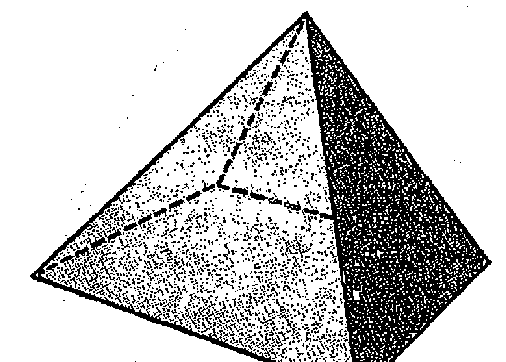

「但是，如果一个人的身體、語言、思想、行為都在表達神聖創造法則，不去突顯或放大自我，他的身體上的欲望，他便像一個清澈的立方體，讓神聖四面體內的等邊三角形清晰可見。」

「這種人只把立方體的物質，作為他在三度空間的基礎，讓自己的重力保持在這基礎上。」

## 33. 金字塔的造型：撒旦

「把切割的立方體由裏往外翻，便是一個金字塔。因此我們看到金字塔是神－人的象徵，展現他無私的神性本質，是神在地球上的顯現。」

「物質與靈性都完整地在神－人之內，也就是神性自我－造物主－在他之內，掌管物質與身體。」

「相反地，物質化的人之子，運用他的智力來滿足他的身體，他的神聖自我便有如被釘死在由立方體的四個正方形表面所形成的十字架或 T 形十字架上。」

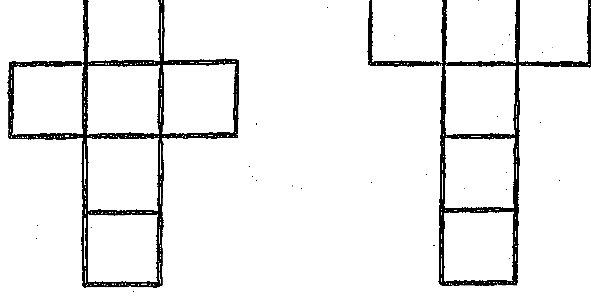

「物質化的人，在無知中釘死了自己的較高自我，也因此不停地為自己製造災難；他變成被釘在神聖自我旁邊的罪犯。」

「他的神性力量被剝奪，無法顯現真實自我，受制於物質世界的法則。」

「他被釘在三度空間，由時間與空間兩根大柱子所形成的十字架上。然而，死亡不是最終的結果。」

## 310 入門——古埃及女祭司的靈魂旅程

「因為即使他的意識沉落到最低的山谷中，神聖創造自我終會拯救在苦難中的人類。」

「痛苦使他覺醒，他的較高意識被喚起，經由神聖自我的救贖，他體驗自己的復活，因為他認知到自己在祂之內。」

「逃避到遠方的神之子們，無論走到那裏，都帶著這些隱含真理的象徵。在地球上的每一個角落，人們都可以在不同大小的石頭上、金屬上、陶土上發現這些揭示真理的秘密。」

「未來的數千年中，金字塔將持續存在著，向人們宣告在他們自身之內的至高真理。儘管許多人無法全面瞭解金字塔的數學與天文學，能聽能聞的人，將認知這些真理，高度進展的人，將能夠實現我們所揭露的真理。另一方面，對心智未開的人來說，金字塔則將像獅身人面像那樣，永遠是一個謎。」

「現在讓我們回到剛才所討論的立方體。從立方體的一個角開始切割，使一個平面包含了所有的三次元；把六面立方體的角切下來，就增加了三個更多的角。但是，從立方體的其他角，可以再切四次，這立方體便成為二個四面體，每一個都正確地反應著對方。」

「這兩個四面體包含在彼此之內，代表創造的兩極是完全均衡的。整個創造－動盪與運作－是基於這神聖的平衡。它是內在法則經由所有形式而運作。」

「就像你所看到，立方體是最原始的物質形式，立方體是建立在神聖的四面體上。由三角形所形成的四面體與立方體有著同樣的面。人也是一樣，在他的內在，有一個與神聖自我聯繫的層面。」

## 33. 金字塔的造型：撒旦

「就是為什麼，人只能在他自身之內找到神性；永遠無法從外在的世界找到內在的神性。」

「當人把注意力放在外在世界時，他便困在沒有靈性的牢籠中，直到經過許多痛苦與折磨，他才找到神性。現在讓我們檢視立方體的不同結晶體。拿著像屋頂的六個幾何體，它的底層與立方體的面是一樣的，然後把這些幾何體放在這立方體的面上，讓它們不同的邊互相連接。」

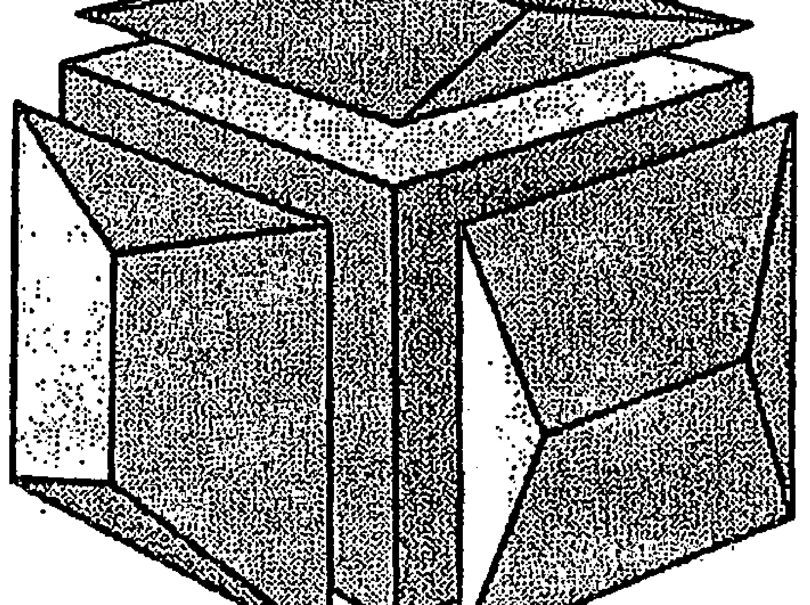

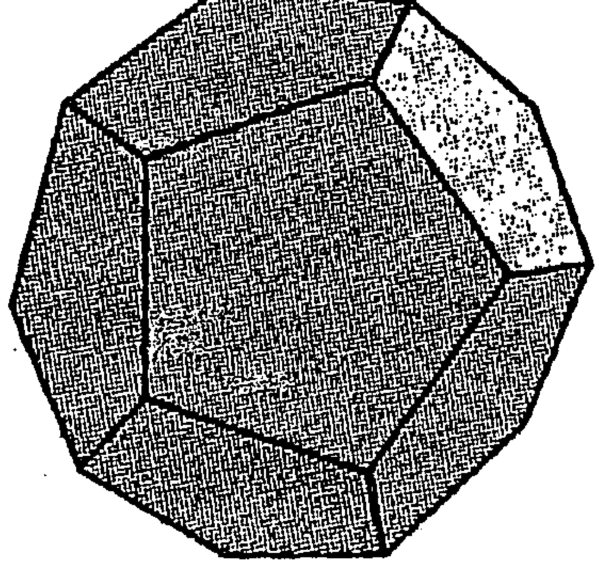

「這樣便形成包含十二個等邊的十二面體的五角形，這十二面體的五角形顯示了漫長的意識途徑。現在我們要從這最後的結晶體來看它所顯示的結果：由二十個等邊三角形形成的二十面體。」

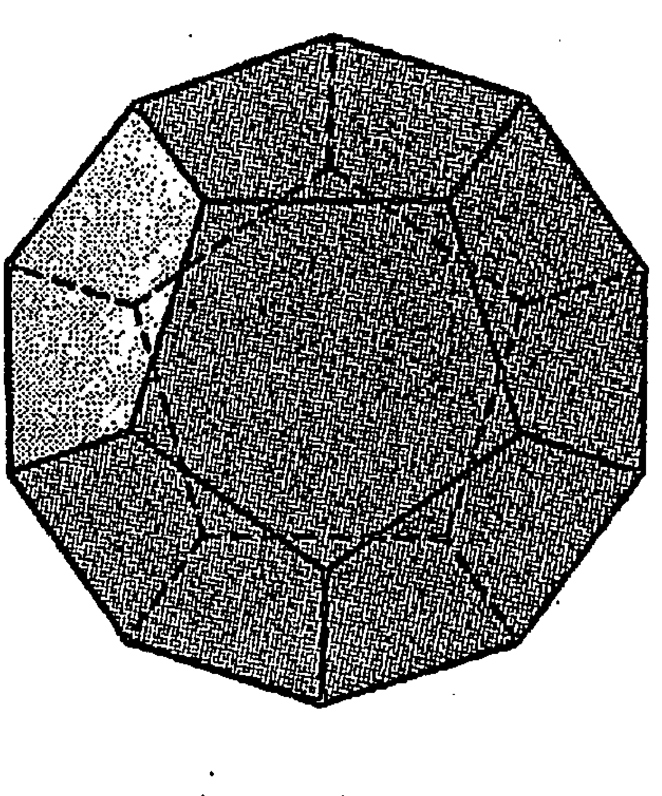

## 314 入門——古埃及女祭司的靈魂旅程

這樣，從這二十面體，我們可以發展成四個有著同樣面積的晶體：四面體、立方體、五角形的十二面體，以及二十面體。

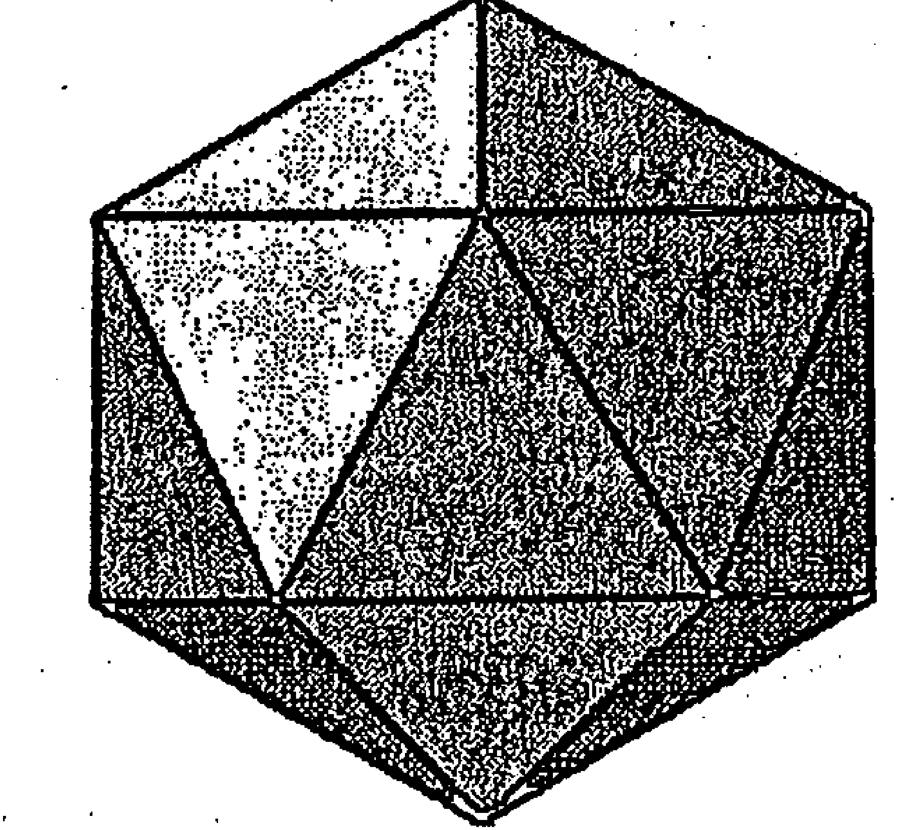

「一個常規的晶體，只能由三角形、長方形以及五角形所形成，長方形及五角形由三角形、四面體、八面體及二十面體所形成。正方形只能形成立體；五角形只能形成二十面體的五角形。」

「除了八面體之外，你對這些幾何體已有所瞭解。你可以畫三條等長的線，以 45 度的角度來建造八面體，每條線有長寬高三度空間，這樣中間的三條線都是一樣的。」

「當你把三條線的終端連接起來時，便會形成八個三角形的八面體。從中你可以看到八面體包含兩個底部相等的金字塔，一個是正的，一個是反的。」

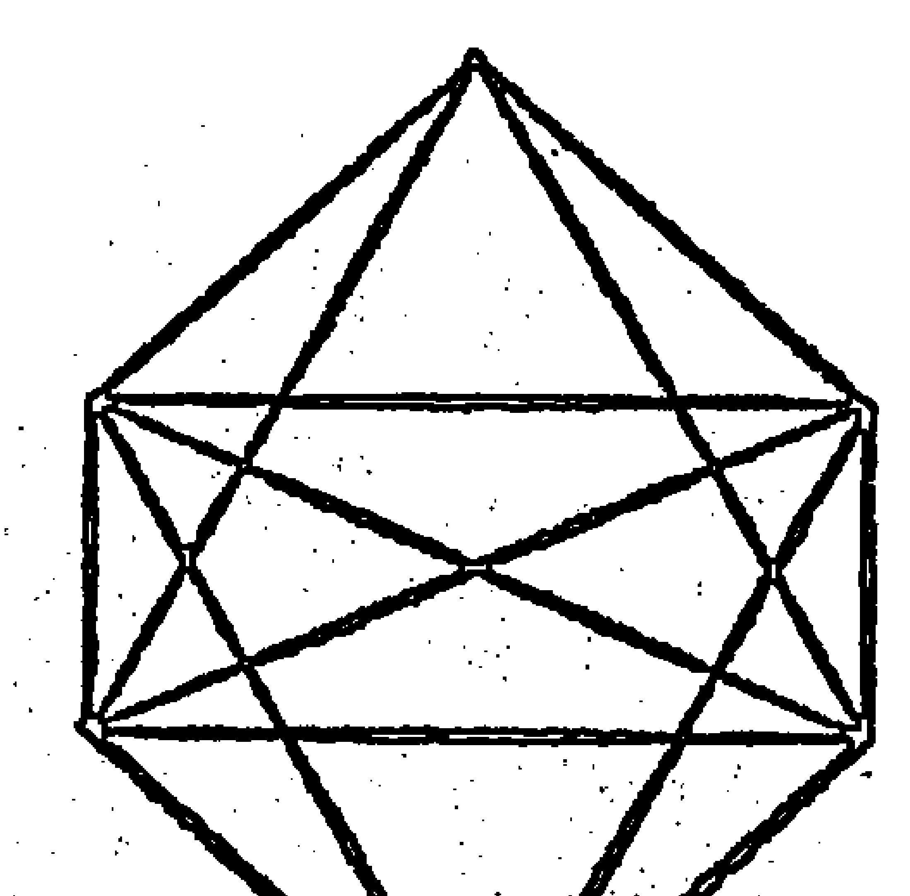

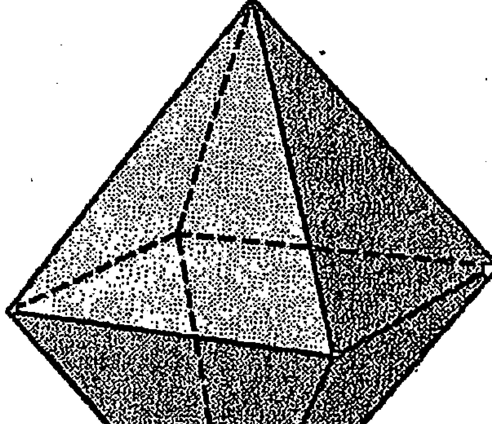

## 33. 金字塔的造型：撒旦

「如果我們把這八角形切割成為平等的面，彼此間的距離是一樣的，我們便製造無數的小八面體。但是這些八面體不會充滿大八面體的空間，相反地，你可以看到，小八面體之間的空間，在六面立方體的空間之內。」

「你可把空間繼續劃分下去，那小八面體的空間將永遠存在。這樣，你可以看到每一個都是基於神聖四面體的立體空間，代表絕對的和諧與絕對的平衡。」

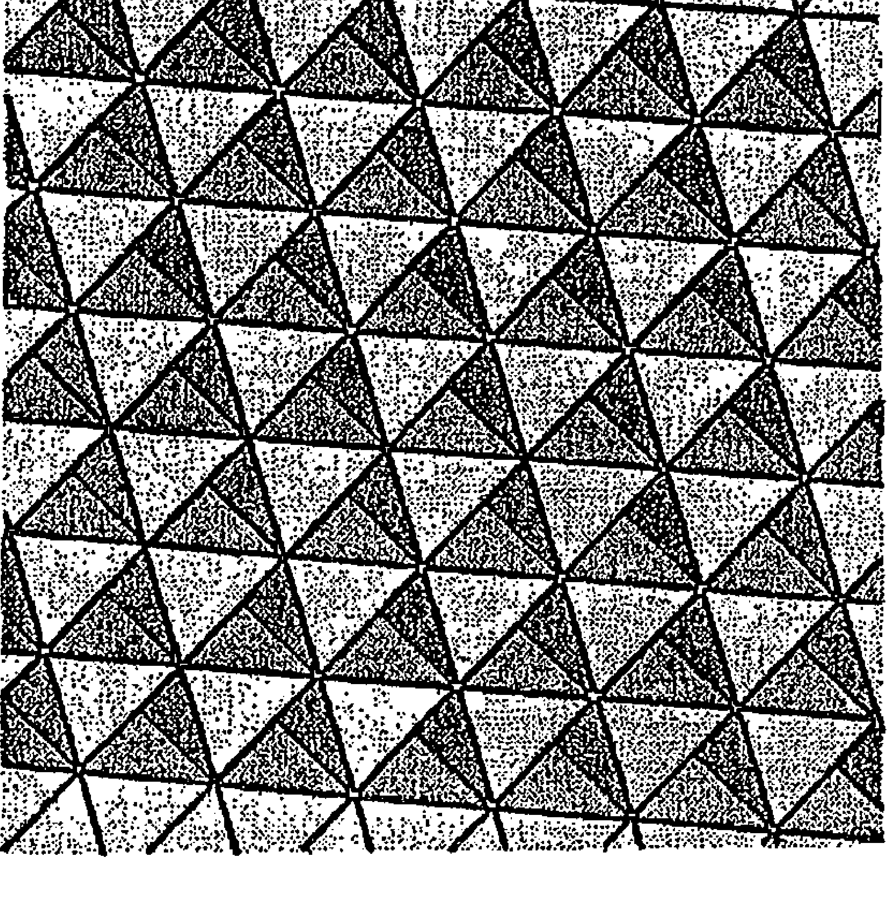

「同樣的道理，所有肉眼可見的受造物，皆靜止在它自身的神性點上。超越一切顯像創造，靜止在自身未顯像的狀態中。上帝無所不在。」

「現在讓我們回到不同的、互相包含，或相互重疊的幾何體：四面體、六面立方體、十二面的五角形，以及二十面體。你將從它們的相互關係中看到更深層的法則。立方體是一種有六個相等的正方形側面的正立方體。如果我們從四面體、六面立方體、十二面體的五角形以及二十面體中，取每個幾何體的一半數字，我們得到的數位是 2，3，6，以及 10。如果我們把這些數字相乘，就是 360，一個圓的數字。如果我們把這些數字加起來，我們得到的數字是 21，這是三度空間關鍵性七的因數。」

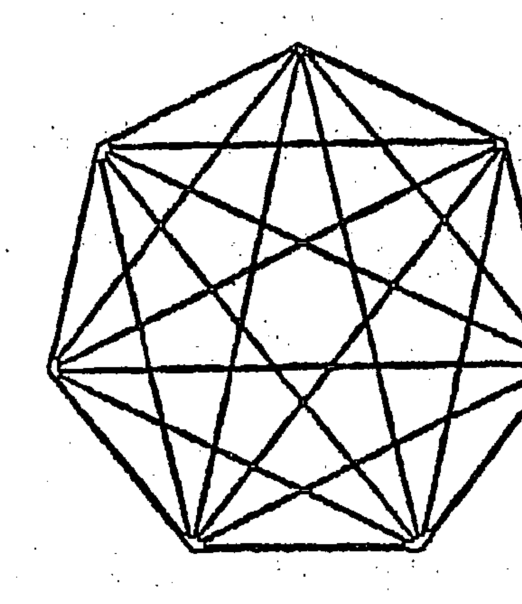

普塔霍特普停止說話，我沈默地，敬畏地站在他面前。「現在，你可以離開了。」普塔霍特普說：「你今天已學了很多。下次我們將談到四面體的金字塔，它含有更深的真理。如果你要達到全面的自我認知，它對你是極為重要的。」我向他鞠躬之後，便離開了。

＊　　＊　　＊

## 博納：

這一篇我一看再看，看了許多次，看完就感覺全身癱軟，它太博大精深了。

## 蒂娜：

「如果沒有靈性的幫助，物質本身永遠無法成為靈性。這就是為什麼神要使自己的一部分進入物質中，以便使它有轉回靈性的可能。」這使我明瞭為何宇宙萬物都有神性。

## 博納：

我也是看這篇後，才明白為何每次在靜坐完之後，都需要回到黑色能量中心點，讓自己落實地面。原來我們得以在這物質世界存活下來，就是依賴這阻抗力來支撐的。而地心引力就是阻抗力最好的說明。

## 蒂娜：

它使我明白為何我們需要透過光的能量的運作，來達到與所有次元融合，並從中獲得平衡。

## 博納：

許多人隱隱地感到自己具有使命，但總是不知道自己的使命是什麼。在這裏普塔霍特普明確地告訴我們說：「一個心靈意識與神聖自我意識融合的人，便實現了他的使命。」

## 蒂娜：

我們不需要把拯救世界，或全人類的工作，放在自己的肩膀上，只要把焦點放在提升自己的心靈意識便可以了，這讓我鬆了一口氣。

## 博納：

是的，使地球的一部份靈性化便是很大的功德。很多人認為行星級次的運作，主要在於引導光的能量，經由光的網路進入地球，感覺這種運作既沒什麼意義，對自己沒什麼好處，殊不知我們為地球進展所做的一切，使我們自身的進展也向前邁進了一步。

## 318 入門——古埃及女祭司的靈魂旅程

因此，我們得在生命結束之前，做好心靈上的準備，這點確實太重要了。

## 蒂娜：

生命無常，我們已知這種準備，不是我們用頭腦去想這道理，就可以做到的。我們也知道，真正地達到所有層面的淨化，細胞組織裏的思想意識都提升到與較高次元之光的能量共振，需要一段有意識地，在光中運作的時間。

## 博納：

要做到「我即是光」，要達到真正地與光融合，而不只是停留在對光的冥想，或在光中運作的初始階段就可以了。這對我來說，還有一段遙遠的路要走呢，看來我要多保重自己，現在還死不得呢！

## 34. 神的四個面

我再次站在普塔霍特普之前。

「我的孩子」他說：「今天你要學的是神的四個面。」

「這將有助於你認知在你之內的四個神性面。神的四個面蘊含著一切創造。萬事萬物，包括你在內，都是由祂的四面所造出來的。」

「有形世界的生命，上自以太陽為中心的各個大大小小的宇宙，下至最微小的原生物，都圍著上帝的四個面而環繞著。」

「神的初始狀態有如等邊三角形般地，靜止在其自身之內。我們說上帝是 1 在 3 之中，3 在 1 之中。但是，就像這等邊三角形一樣，在它之內有一個數字 4 的可能性。當它們從未顯像的狀態進入顯像的狀態時，基本的三個面必然會產生分裂，這時 1 在 3 之內就變成 1 與 3，因此產生了數字 4。」

「看看這等邊三角形：你所看到的是一個有三個邊，三個面的物體。它包含了隱藏的、未顯像的數字 4，因為等邊三角形可以分成四個更小的等邊三角形。」

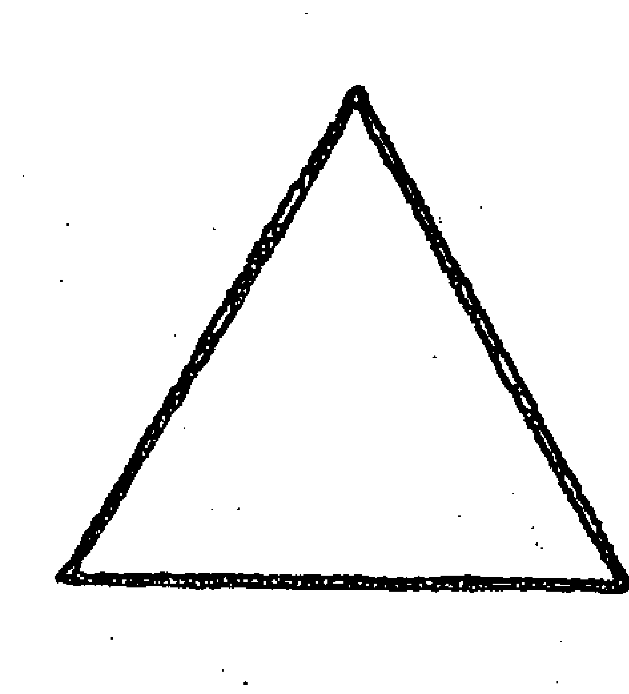

「當三角形從未顯像的狀態，進入顯像的狀態時，在三度空間的世界就變成四面體。如你所看到的，六面立方體最初始的物質顯像，包含了隱藏在未顯像的四面體之中。」

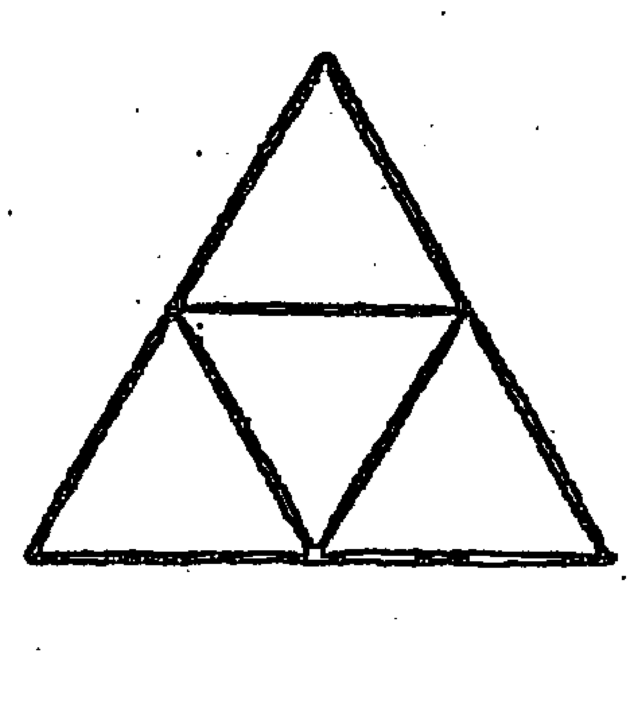

# 入門——古埃及女祭司的靈魂旅程

「四個三角形所形成的四面體，是神性與物質聯繫的區域，它們與去角的立方體之內的區域是相同的。金字塔的四個面代表神的四個面，每一面單獨顯現每一來源的每一個面貌，神靜止在它自身之內，並超越一切創造。金字塔揭露了生命的實相，也就是生命法則。在其中，神永遠是，也絕對是，將祂自己顯示在物質世界，因此，祂存在於所創造的一切事物中。神以四個面來顯示祂存在於宇宙的每一個角落上。」

「地球的四個方向以及向天空所煥發的，有不同的影響。一切都出自天堂的合一，我們可以用四條大河，以天堂為源頭展開它的流動，來比喻生命之樹，善惡真知，以四個方向流入顯像的世界。」

「你將發現這四重顯像存在於一切受造物之中，最明顯的是空氣，風的流動。即使是最遲鈍的人，也知道從四個不同方向吹來的風，有不同的影響。北風乾冷，在許多地方甚至可以使水結冰。南風溫熱，東風涼爽，西風濕度較大。你很早就知道這四種風的不同作用，但你是否想過，同樣是地球上的風，只因來的方向不同，為什麼會有這麼大的不同呢？」

「譬如，我們現在所感受到的風，如果它吹向南方，表示風是從北方吹來的，它帶來涼爽的氣候，使所有的生命都感到舒服。如果它吹向北方，表示風是從南方吹來的，它帶來溫暖的氣候，刺激」

## 322

所有生命的繁殖力。為什麼同樣是地球上起的風，就有這麼大的不同作用與影響呢？這是因為風所吹的方向不同之故。它帶來溫暖的氣候，激發一切有情受造物的繁衍。為什麼冷風與熱風可以起源於地球表面的同一個點呢？使人安靜的，與刺激人的風，一邊帶給人們潮濕及大量的雨，另一邊卻帶給人們乾燥的氣候呢？這一切都是因為方向不同之故。

## 「這就是空間的法則，我們稱之為神的四個面。」

「第一面是神的北面：熾熱，具有激發性。這就是為什麼南風帶來熱度並刺激萬物孕育新的生命。」

「第二面是神的西面：清涼，使每一事物活動起來，這就是為什麼東風是提神、涼爽的。」

「第三面是神的東面：溫濕，使人昏睡。」

「第四面是神的南面，它是冷的，具有收斂性，神四個面中，第一個而且是最重要的物質顯像是火，因為它影響到其他的面。火的性質決定了氣候的冷暖。由於它所散發的能量，產生不同的狀態：溫暖與乾燥形成氣體的狀態，陰濕形成水氣，冷形成乾硬的土地。」

「你會發現這法則存在於地球的每一處，每一草木。以房子來說，房子的南面接收來自北面的氣流，是溫暖的，植物在這一面長得最好。北面是寒冷的，西面是潮濕的。每當我們在金字塔中造雨時，雨水從西面過來。」

「你不僅在風中發現神的四個面，也可以在任何受造物中發現它。譬如樹的北面，受到冷風的影響，會長菁苔。」

# 入門——古埃及女祭司的靈魂旅程

「你是否曾經想過，為什麼人類只有一張朝著前方的臉呢？我們的臉朝著的那一面，是熾熱的，給予的，然而，當我們轉身背對它時，我們是冷靜的。我們的肢體也是同樣的，是向前活動的，我們只能將我們的意志力向前發出。」

「為什麼我們南北向躺著睡時，我們會睡得比較好呢？為什麼動物會這樣躺著睡呢？為什麼甚至是鳥兒把自己們的巢，螞蟻把自己們的窩以南北向建立呢？動物沒有思考的智慧，但牠們的直覺知道，什麼樣的條件，對牠們生命的流動是最好的。」

「這是為什麼當一個人想與神連接時，他會面朝北或朝東，但不會朝南或朝西。朝北或朝東，他可以順著靈性的勢能，而朝南或朝西時，他會發現一股勢能刺激著他的意識與肉體的感官認同。」

「在整個宇宙中神朝四面所煥發的，都是這樣，同一方向產生同一結果。神的四面永遠是不變的。」

「神之子在他們所到之處，都會教導人之子這些真理，教導的方式依當地人的特質而有所不同。在這裏，人們的智力足以理解幾何形體，從中領悟真理，我們便以金字塔來表達神的四個面。」

「有一些種族直接以靈性的經驗來領悟神聖真理。當神之子到這些地區時，他們便建立巨大的石像，以人的形體，一個頭，四張朝著四面的臉來代表神性。兩者都在表達一個事實：當神聖創造力離開

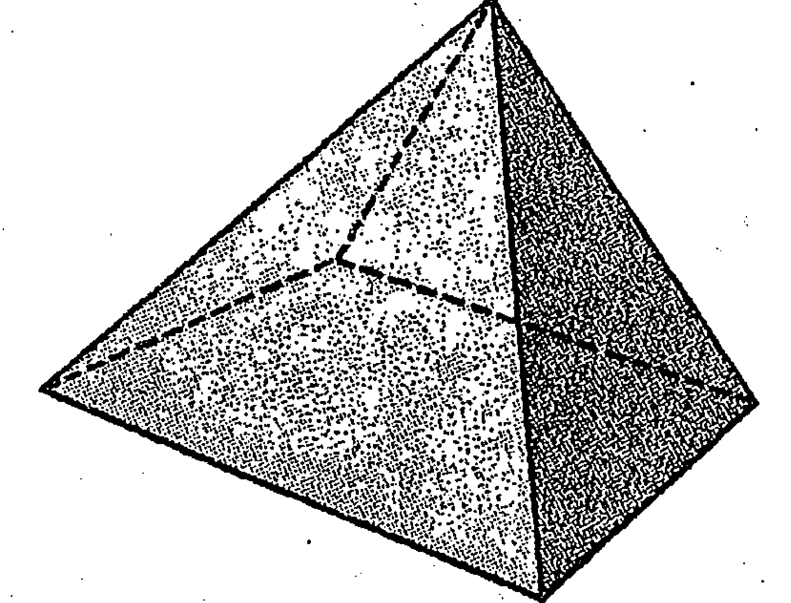

## 34. 神的四個面

它靜止的初始狀態，進入三度空間的顯像世界時，它便成為物質。金字塔清楚地顯示它的四個面，每一個面的三角形，代表神的三個層面。這樣金字塔顯示 3 乘 4 等於數字 12。

> 「這顯示另一個真相。你可以從金字塔的象徵中看到，神的每一面都含有其他三個神聖本質。成為十二個交迭的顯像，呈現在宇宙中的每一處，在每一事物中活動著。從星球上的個體開始，到太陽系的行星，至整個宇宙就像是一個大圓套著小圓圈般地無有窮盡。」

> 「如果你能理解其中的一個圓圈，你就會理解宇宙的內在結構，以及在它之內的所有受造物的本質。因為整個宇宙都是基於這上帝的十二重顯現。但是，首先你要知道，人類器官所能感受到的，都是由外而來的，你從外面所看到的，無論是由上往下看，或由下往上，由前或後面看，從右邊或左邊去看，它與神聖如是存在的那一面正好相反。一旦你停止看，而是融入其中，你會發現你所看的與事物的本身是完全相反的。」

> 「當你看著一件東西時，你與它之間的關係是二元性的。你是一個觀察者，你與你所看的事物是相對的兩極。但是，當你成為某種東西本身時，你在一元性，神聖合一的狀態。」

> 「譬如一個 E 字，它的方向是什麼？」

> 「它由左向右」

> 「很好，現在我把這個字母寫在你的胸上，你成為這個字母，你與這個字母合而為一，它的方向是什麼呢？」

> 「父親它是由右至左」我回答道：「是的，正好相反。」

## 326 入門──古埃及女祭司的靈魂旅程

「現在跟我來，我將對你做更多的說明。普塔霍特普把我帶到有著兩個大圓盤的天花板下。兩個圓盤有著同樣的圖，只是圖面是完全相反的。」

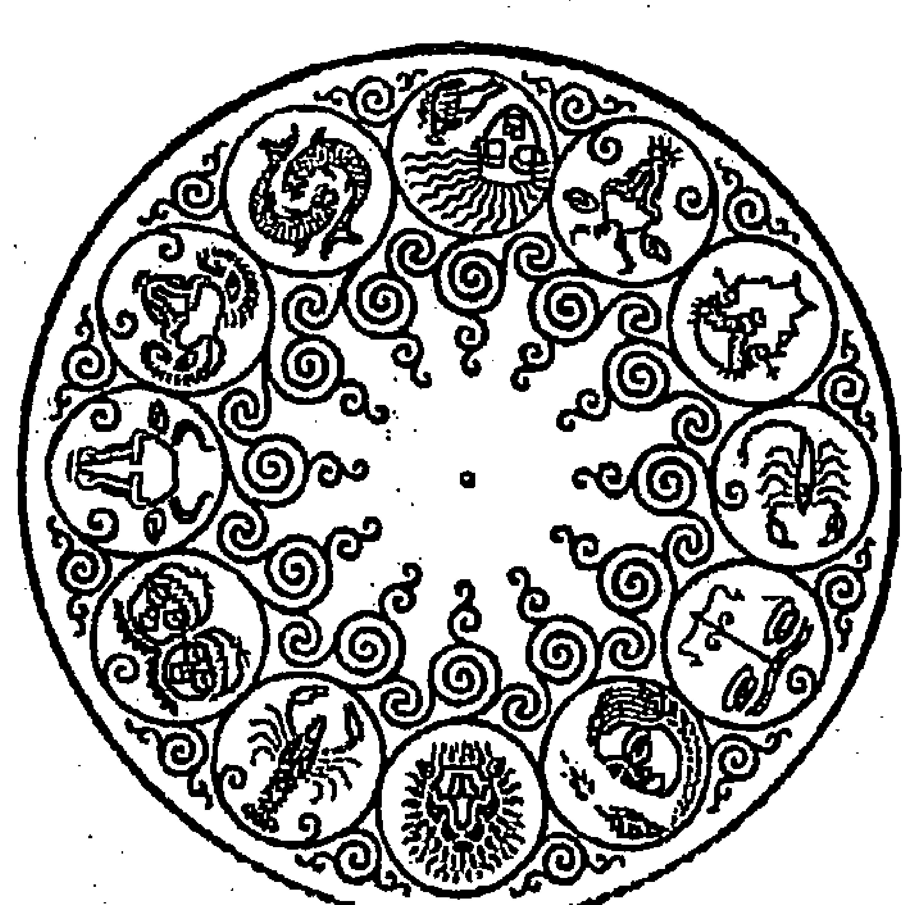

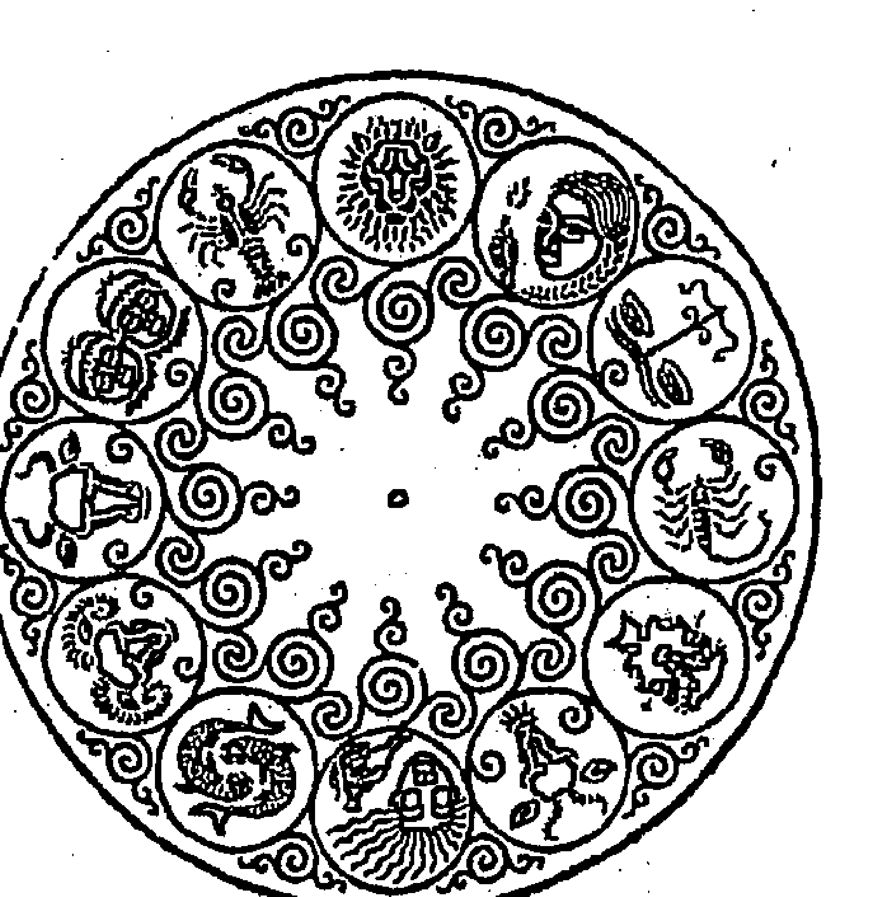

「第一個圓盤的圖案顯示，所有的頭都朝向裏面，第二個圓盤的圖案，則所有的頭都朝向外面。它們的順序也是正好相反，一個由左向右，另一個由右向左。」

普塔霍特普把我帶到第一個圓盤下，問我說：「你看到圓圈中的圖，頭都是朝上的嗎？」

「是的」我說。然後他帶我到第二個圓盤下，問我說：「你看到的這些圖是什麼樣的呢？」

「它們的頭都是朝下的，與另一個圓盤正好相反。並且順序也不一樣。」我回答。

「現在找一個你可以看到兩個圓盤的圖都是朝上，並且是同樣順序的地方。」

我直覺地走到圓盤的正下方，突然間，所有的圖案都改變它們的方向，頭都朝上，並且順序也都一樣。但是，只要我稍偏一點，它們都又不對了。我回到中央，深受感動，我體驗到如是存在的狀態，這種發現的興奮，使我暈眩。

普塔霍特普看到我的感動與興奮，微笑地說：「現在你明白為什麼一個人總是與神的方向相反嗎？你明白為什麼人類的劇本是從左至右，而神性是從右到左了嗎？」

「是的，我的靈魂之父，我理解。」我興奮地顫抖著，微笑著。

「地球持續接收神由四個面所煥發的十二種勢能。這些勢能來自不同方向的不同星群。但所有的星群像輪子般地環繞著我們，我們稱這巨大的輪子為十二宮圖 zodiac。」

地球之所以能存在，是因為有這十二宮所煥發的能量支撐著。它們的頻率在宇宙空間的一個點上相接，使能量之波產生撞擊而濃縮成物質。經由這物化的過程，地球一點一滴地形成。太陽在這過程中是一個重要的角色，地球成為太陽磁場中的一顆行星，從太陽接收生命能，也不斷地從十二星座以及太陽系的姐妹星球中接收它們所放射出來的能量。

「就像所有的星球，地球是由不同頻率物化而成的，因此，在它上面的礦物、植物、動物與人類都與黃道十二宮中的每一個獨立的星座及星球有關。在蒼穹中，獅子－火相，金牛－土相，寶瓶－風相，天蠍－水相：」

## 330 入門——古埃及女祭司的靈魂旅程

「上帝的四個面是如是存在的神聖狀態。他煥發靈性的火花，是具有智慧溫柔的父親，以他的精神靈性，良好的思想，智者的忠告，幫助他成熟的兒子。」

「第二面土的面向，是上帝物質性的一面，它們是金牛座、處女座、魔羯座。神在這面向的三個顯像，都展現著母性的特質。」

「春天的時候，牛兒站在綠茵上，大自然像是一個穿著婚紗的新娘，正準備接收來自她的新郎的生殖力量。」

「黃道帶的金牛座使大地得以接收生命的火力，並讓它紮根。這樣神聖種子得以在地球上獲得生命體。金牛座所煥發的能量，使神聖自我成為肉體生命。」

「處女座－是天堂完美無瑕的女皇，是大自然的女神，從未被雄性所碰觸，卻孕育著無數的生命，這些生命從她的聖體中誕生。處女座的力量是豐富大自然，這就是為什麼她手中持著五粒穀子。在神秘的世界中，處女是人類的靈魂，淨化地球上的渣滓，使地球純淨無染，以便接收神的神聖種子。因此，她孕育了兼具靈性與物質，因此懷孕的處女，懷著具有完美靈性與物質的神聖之子。」

「神在土的面相上的第三個星座是魔羯（山羊）。這種動物生活在滿是岩石的區域，是地球上最難以生存的區域。物質的向心力使物質達到最堅硬的程度，從而晶體化。在過程中，它失去原本的不透明性，變成完美的透明晶體。晶石顯示創造力量原始的幾何形體。一個孩子也是神聖創造力量晶體化的生命。透過物質法則，透過向心力，壓縮的力量，誕生在人類的靈魂中，邁向神聖自我的意識。」

「當一個人認同自己的動物性意識，他便像是居住著動物的牧場，聖子即神聖意識必需誕生在其中。」

「這項工作透過魔羯星座的專注力來完成。專注是人類要回到合一，回到失去的樂園的唯一途徑。這就是為什麼聖子誕生於太陽落在山羊座的時候。這星座所散發的能量幫助人類透過物質，即他的身體，全面理解物質的顯像，並達到與神靈的合一。魔羯星座像是一個臨盆的母親。」

「神的第三個面：寶瓶座，雙子星座及天平座，它是靈性本質。三個星座合起來所產生的動力，去除人類心靈的障礙，使人類的精神得以自由地向前邁進。」

「雙子座具有真知之樹的善惡兩面。它所煥發的能量是兩個方向的。它使人類既向左看，也向右看，以便集合知識與經驗。它使人類經由生命的途徑，像樹枝般地向外伸展。人類在各種不同方向的曲折小徑上探索真知。探索經驗，人類想要聽、聞、學習一切事物。雙子座所散發的力量，使人類產生強烈的求知欲望。」

「天平座所散發的力量促使一切事物進入平衡。人類經由學習所累積的知識與經驗，都放在天平上。有價值的便保留下來，無用的便將它拋棄。和諧是經由這種平衡所產生的結果。進展的人類所具有識別的力量，使雙子座的兩種勢能進入平衡。天平座向地球散發平衡與公正的宇宙法則。是賦予知識的顯現。」

## 332 入門——古埃及女祭司的靈魂旅程

「寶瓶座所散發的靈性知識，聚合在雙子星座中。寶瓶所散發的能量不受障礙或束縛。水是給予，運載寶物給別人，不停地從它的容器中湧出生命之泉，這泉水流入世界最偏遠的地方。」

「這些頻率是靈性的高頻率，充滿活力，不被任何事物所阻擋。」

「上帝的第四面是巨蟹、天蠍與雙魚。這具有情緒的特質，以靈敏的感覺來顯現。」

「巨蟹座顯示它像螃蟹般，捕食之後，退回自己的蟹殼，安靜地消化它，象徵人類意識在向外探索，獲得靈性的滋養後，退回內在心靈，獨自內化它所收集的經驗，澄清並賦予這些經驗以生命力。巨蟹座展現個人在探索真理中的內省與自我解析。」

「天蠍座代表巨大的轉捩點，像一隻緩慢爬行的蚯蚓轉變成翱翔天空的蒼鷹，恢復它的原本狀態，他的意識便向神聖自我覺醒。蠍子必需殺死自己之後才能變成老鷹。這就是為什麼天蠍座有兩個名字。在它未轉化的情況下，它被稱之為蠍子，當它刺死自己，回到鷹的狀態，象徵自己的靈魂翱翔在物質世界，就是神聖的獵鷹何露斯（the divine falcon Horus 古代埃及的太陽神）」

「這星座所散發的勢能是生命之火，它以身體的變化來顯現自己。這勢能使靈性穿上肉身的外衣，像新生嬰兒般地誕生。這能量是誘惑之蛇的原形，引誘靈性進入物質，使它從天堂的合一中跌落下來。然而，它不在物質層面上活動，相反地，它將物質轉化成為純淨的靈性，將性的欲望轉化成為提升的勢能，幫助跌落的意識回

[PAGE 332]

到天堂的合一中。沒有這股勢能，跌落的意識無法找到回歸神的路。」

「魚兒居住在浩瀚的大海中。雖然有時候它們會浮到水面上，它們會再度沒入深海中。人性的本質像大海。他的意識在水面上，但是他最大的部份是在他深沉的潛意識之中，是引發他的思想、語言與行為的根。」

「從另一方面來說，一個達到救贖，完全認知自己，他的意識已進入神聖自我，並達到自我實現的人，便不再有意識與潛意識的分別。也就是說，他是清澈透明的，不再有自己未能覺知的潛在意識。象徵性地說，他完全清楚自己深如大海的神性意識。陰陽兩性的能量，像大海中悠游自在的魚兒，在和諧中快樂地游動著。」

「雙魚座是救贖的能量，以無窮大我的深度化解個人的侷限。救贖的偉大工作是在這星座所散發的能量下完成的，完成將物質轉化為精神的工作。」

「現在你看到了每一個三角之間的關係，從物質層面開始，它們向精神層面上升或前進。但這不僅僅展現神的每一面的三個特質，四個三角密切的關係，使它們的中心點是同一的。使它形成圓形的十二星座，四個三角的多樣性在進展的途徑上是一連串的相互關係。」

「在星座之間還有第三種相互關係，就是相對兩個星座之間的關係，每一個都是相對應星座的另一半。」

## 334 入門——古埃及女祭司的靈魂旅程

「首先，讓我們討論進展階梯的關係。它由牡羊座開始，所有生命表達皆從春天開始。春天有兩個開始，一個是絕對性的，另一個是相對性的。地球及地球上的所有生命，在其自身之內，都有一個春天的絕對點。這絕對的春天之點與外在世界是獨立的。另一個相對的春天之點，則依當時星相的位置而決定。」

「因為地球移動之故，它不停留在同一個地方，而是不停轉換位置。稍後我們會進入細節。」

「十二星座移轉的順序是：牡羊、金牛、雙子、巨蟹、獅子、處女、天平、天蠍、射手、摩羯、寶瓶、雙魚。」

「所有濃縮成為物質，顯現在物質層面上的，都必須以自己的速度，走過整個十二星座。人類的個體生命，是一個大的階段，可以分成四個小階段：孩童期，青年期，成熟期，老年期；這還可以再分成更小的階段：年、季、月、星期、日。」

「每一個短期的生命階段，無論是一天或一年，都會走過黃道的整個十二星座。」

「他在牡羊時期誕生，之後一個接一個地走過所有星座，達到獅子的成熟期，在雙魚時期結束物質層面的一切。就像我們每天在清晨起來，到晚上睡覺時又從世界消失一樣。」

「在一天之中，上升到頂點之後，便開始下降。夜晚時，我們讓身體休息，在入睡中讓意識退到潛意識中。就像我們在地球生命結束時，把身體放下一樣。每一個階段，都有一個開始，開展、達到頂點、下降、最後分解。」

## 336 入門——古埃及女祭司的靈魂旅程

「個人的星座也隨著主要的特質而轉：牡羊看著某種東西顯現或出生在這世界上，即使你出生的星座不是牡羊座也是如此。」

「因為每一次出生，無論外在的，或其他星座的影響力是什麼，事物本身便具有開始的力量，這力量我們稱之為牡羊，無論它在星際間或在個人的存中。」

「這是每一個受造物之內的絕對面。它與所有其他星座，與顯像生命，以及神的四個面的關係都是如此。總有一種內在的絕對顯像，以及外在的相對顯像。」

「出生之後，新的受造物必須自己紮根。這是在牡羊的協助下完成的。新生的受造物攝取食物，消化它，產生與外在世界之間物質性的連接，並為自己的身體製造獲取所需之物的條件，這是金牛座的內容。」

「在雙子座的影響下，新生的受造物開始累積經驗，他的途徑開始分叉，像樹枝般地衍生分枝。這受造之物從自己所展開的不同方向中獲得廣泛的知識。」

「在巨蟹座中，它開始消化所獲取的靈性上的知識與經驗。開始發展它內在的核心。」

「經由獅子座所賦予的火一般的生命能量，受造物開始成熟，進入莊嚴與宏偉。它開始發展自己的力量與能力，並實現生產下一代的職責，成為一個家庭中的父親。」

「進入處女座開始收穫。人類把自己辛勞的收穫拿到他的穀倉。在他靈魂的深處，聖子—宇宙聖愛開始發展。他的切行為開始在天平的衡量下進入平衡，正面的與負面的相互抵消。他的注意力轉向物質與精神兩個層面。他超越相對的事物，把這兩個世界帶入完美的平衡，具體實現內在的神聖法則。」

> 天蠍座是一個巨大的轉捩點。超越了地球層面，在完美的靈性中，他像聖鷹何露斯（sacred falcon Horus）般自由地翱翔著。

> 經由射手座，他成為完美的教師；一個超越動物層面的存在，一個僅把自己的身體用於加速清理自己的目標。他的思想像閃電般地劃破烏雲與無知。他把自己的經驗傳給下一代。摩羯座是聖子－宇宙聖愛－在人類的心靈中誕生。他與神聖自我相同。由於聖子在心靈中的誕生清晰可見，人類開始像水晶般地光亮。他的思想、語言與行為，都是宇宙聖愛的表達。

> 在寶瓶座中，受造物把它的財富散佈出來。他已成為光明燦爛的神之子，超越了性的欲望。他是至高神聖精神力量之源。展開了由物質轉化成為精神的過程。

> 在雙魚座中，受造物重新與隱藏的另一半自我融合，這表示物質已分解了。受造物回到它天堂的家，與神合一。他的意識進入宇宙意識，擺脫它的身體，結束地球的生命。

> 這是每個人都需遵循的途徑，即使他可能還沒有達到意識的至高層面。每個人發展的腳步也許會有所不同，但都在這樣的循環中。

> 讓我們看一看兩個相對星座之間所產生的互補作用。金牛座新郎似的力完成了天蠍座本能上創造的趨策力。巨蟹座的母性力

[PAGE 336]

量，退回它自身的庇護所，是支持光芒四射、透亮的魔羯座的另一半。獅子座具有父親般的力最， 在孩子般的寶瓶座中找到它的另一半。父親支持、保護並教育孩子。年輕的雙子座，總是渴望學習，渴望從它偉大的教師射手座接收知識。天堂的處女，懷著聖子，從神秘的雙魚處接收滋養。」

「現在你理解神的四個面，經由不同星座所煥發的不同的作用。但是為了理解宇宙生命，以及無數受造之物的生命，包括你自己的，你需要知道，整個循環所啟示的力量，影響著宇宙中個體星座的每一個點。」

「因為神的四面永不倒轉，每個星座都在天空的不同相位上散發不同的力量。因此它所煥發的力量依永恆不變的神的四面相位。」

「讓我們以獅子座為例。在南方的相位上，它煥發獅子的燦爛，當它朝著相反的方向－北面時，它散發寶瓶座的力量，朝著西面時，它散發天蠍座的力量，朝著東面時，它散發金牛座的力量，朝著西北方向時，它散發處女座的力量，朝著西－北－西時，它是平衡的。就這樣每個方位散發不同的力量。」

「現在你理解，散發的力量並不是依它群星所在的位置，而是依它們所面的方位。就像風吹時所產生的不同特質與不同效果，決定於它所吹的方向，而不是它開始時的位置。」

「現在還有一個重要的事實:因為每一事物從它自身的中心點向外顯現，也因為神的四個面，從每一個點所煥發的力量是絕對平等，永不改變的。每一事物，無論它是一個太陽，一個星球，一個

[PAGE 337]

## 338 入門——古埃及女祭司的靈魂旅程

動物，一個原生物或是一個人，都是永遠置身在兩個圓輪的中央：一個是宇宙之輪——它的中心點與個人的中心點是一樣的。另一個是個人顯像的部份，一個人自己內在之輪的中心點上。」

「我們接收宇宙之輪從外面所煥發的能量，也從我們自身之輪向外散發能量。地球同樣地由神聖存在中跌落下來，地球不是宇宙的中心點，而是太陽的衛星，環繞著太陽的軌道而運行。這就是為什麼，我們在宇宙中所看到的一切事物正好與它的真相——存在的神聖狀態相反。由我們在地球上的角度來看，整個宇宙系統，所有的太陽星系與星球，都是環繞著我們而行。」

「但事實上，它正好相反。不是整個蒼穹環繞著我們，而是地球轉著太陽而旋轉，我們的太陽又與整個太陽系環繞著更大的宇宙太陽系而行，這更大的宇宙太陽系與它的整個宇宙系統，又環繞著一個中心太陽而行，如此延續下去，便是一圈又一圈更大的宇宙系統，直到永恆。」

「即使是宇宙系統中的天使，也在神的四面中循環，在一個黃道十二宮中運行與發展。要記住，在每一個顯像的受造物之內，無論它是原生物、植物、動物、人或天使，無論它在宇宙的什麼地方，都有一個巨大的宇宙之輪以及它自身的小輪。」

「當你理解宇宙的每一個點都煥發同樣的，神的四個面的十二重顯像時，你便會認為這是理所當然之事。我們從大宇宙之輪接收外在的能量，這就是為什麼我們看到的圓圈是相反的，就像鏡子般地映照存在的神聖狀態。」

## 神的四個面

「因為從地球的角度來看蒼穹，是蒼穹不停地轉動，不斷地交替著照射地球，在浩瀚的宇宙之輪中，沿著它們自己的軌道而行。每一個受造物，包括人類在內，有自己個人的能量結構，這能量結構是由同樣的創造勢能從宇宙群星中煥發出來的。」

「在出生的時候，個人能量結構的小星座之輪與大宇宙星座之輪的勢能是一樣的。這使我們理解受造物只能在這些結構勢能符合一致時產生。」

永不逆行的神的四個面的位置。

# 入門——古埃及女祭司的靈魂旅程

一個人直到他在地球上的生命結束為止，都不斷地受著新的印象，新的經驗，以及各種不同事物所影響。當他聚集了經驗，他的內在星座便會有巨大的調整。依個人對自己行為與經驗的反應，他將發展出許多不同的勢能，也會有一些勢能被推到不重要的位置上。

一個受造物的內在星座，在他死亡的那一刻，烙印在他的靈魂上，直到星座轉移到同樣的位置上時，他才能再度投生。這就是為什麼有些靈魂很快便能再度投生，有些靈魂要等上好幾千年，直到星座的相位與他們靈魂之內的相位相同時，才能再度投生。

每個受造物，包括人在內，出生時的星座將烙印在他的整個一生之中。這星座包含受造物本身的星盤，從中發展出潛在的，需要改變的特質。因此，如果你想知道一個人靈魂中的星座勢能，如何在他的靈魂中，他的身體中，他的整個存在中運作，產生什麼樣的命運，你必須以他出生的那一時刻來推算。

因為群星堅定穩固地移動著，宇宙星盤與個人星盤之間的關係，也不斷地改變著。宇宙星盤上的能量中心，固定不動的星星以及個人星盤上隱藏的能量中心，在出生的時候，便從同樣的星盤狀態轉移。一段時間之後，在兩個星盤中的這些能量模式，會再度向彼此靠近。

這就是為什麼個體生命，在某個時期，與他人在完美和諧的狀態中，但在另一個時期，則會產生衝突。導致同一個受造物有時候展現和諧正面的特質，有時候展現不和諧的負面特質。因為命運是反映特質的鏡子，並且由於個人的行為，他的生命有時是順暢的，有時是障礙重重的。」

所有生命都受這些勢能的影響，只有一個可能，可以使受造物超越這宇宙能量的控制，扭轉受到宇宙勢能所掌握的命運。他必需有足夠的意志力來控制這些勢能，但是除非他能覺知到這些勢能，否則他無法控制它們。他必須要能認知在他之內的是什麼，並克服它。

如果他無法認識到自己內在的勢能，他的生命只能無意識地隨波逐流。只有人類具有達到這自我認知，並從這些勢能中提升出來的能力。具備了這樣的能力之後，他便能全面掌握並轉化它們。當一個人能夠轉化在他之內的創造勢能時，他便能轉化操縱他命運的勢能，從而創造自己的命運。

現在你知道為什麼，學習與理解在你之內的神的四個面，煥發著什麼樣的力量，是那麼地重要。當你理解只有你的身體，你物質性的那一部份，是由這些勢能所創造，而這股勢能是你出生時未能適當掌握的力量。但你的神聖自我，則超越這些勢能，並能掌握這股巨大的創造勢能。當你理解這點時，你便能從被釘在三度空間，受時間與空間所限制的身體中解脫出來。被壓縮在你潛意識中的自我，也得以從中解脫，從死亡的表象中獲救，恢復它的王位。

這生命的奧秘以十字架為象徵，代表神的第二層面。造物主千百億年以來，套上物質的外衣，進入物質世界，以便使一切受造物充滿生機，將靈性注入物質，以實現使物質靈性化的偉大使命。

# 入門——古埃及女祭司的靈魂旅程

博納：

這裡點出一個我們從未思考過的角度，就是從神自身的角度來看空間的四面屬性，與我們所看的完全相反。這就是顯像世界與神的未顯像世界互為鏡面反射的道理。

蒂娜：

因為人只能由外向內觀察事物，所以我們與任何事物之間的關係都是二元性的，觀察者與被觀察者是相對的兩極。只有當我們成為事物本身，在「一」之中才會發現自己所看到的，與事物本身是完全相反的。

蒂娜：

在自身顯像的星座之外，還有另外三個未顯像的，不同面向，不同屬性的星座與自己對應。也就是說如果自身的星座是土相的，那麼她也同時與另外三個水、火、風等相位的特質互相呼應。透過這樣的角來詮釋自己的星盤，便能幫助我們將神的四個面向帶入生命之中，讓我們全方位地理解我們的生命，進入全面的融合與平衡。

博納：

經由這樣的詮釋，我們也進一步理解星圖所呈現的只是顯像的部分，知道星座當中其實包含了三種不同的關係。了解這些不同的關係之後，我們便不再以侷限的眼光來看自己的生命。

蒂娜：

我們所看到的星圖是內在勢能運作的結果，它形成我們所認知的顯像世界。而星座所面對的方位才是創造勢能的來源。要達到合一，必須與未顯像的，那對應的部份互相整合。

博納：

普塔霍特普透過十二星座的運行來解釋每個人在不同程度上靈性進展的過程，以及進入宇宙意識的途徑，真是奧妙。如果人的一生能覺知內在的勢能，掌握並轉化在他之內的創造勢能時，便能轉化操縱他命運的勢能，從而創造自己的命運。

蒂娜：

這種運行法則使我們得以審視自己目前在什麼階段，並且明白應如何進展下去。

博納：

事實上，我們只要隨著生活所帶來的各種機緣學習與成長，自然能達到全面的進展，回歸到與神合一的狀態中。

# 入門——古埃及女祭司的靈魂旅程

普塔霍特普帶著我到學生練習觀看過去與未來，以便體驗當下的長椅上。普塔霍特普叫我躺下，當他的手一放在我的額頭上時，我立即感受到那熟悉的嗡嗡的聲音，我的頭開始發麻。隨即，我像做夢般地看到未來的一些重要事件。

我看到法老的接待室裏，一個我不認識的法老，那個法老不像我父親那樣是一個入門者。那個法老不是入門者，他所煥發的頻率非常低。站在他面前的是兩個莊嚴、英俊的兄弟，他們都長著一張貴族的臉，從他們所散發的頻率，我知道其中之一是入門者，另一個未入門，但是一個聰明伶俐的人，他正在向法老陳情，入門的那一位只是沈默著。說話的那一位，試著要說服法老釋放他們的奴隸，讓他們離開。然而，心堅硬如磐石的法老拒絕他們。法老要求他們示現奇蹟給他看。那個說話的兄弟，拿起他的手杖，丟到法老面前的地上。手杖立即變成蛇在地上爬行。法老叫他的幾個魔術師回答他們。那幾個魔術師也把他們的手杖丟到地上，也變成好幾條蛇。但是，第一條蛇把魔術師的所有蛇都吞食了。

我對這畫面的詮釋是，手杖代表智慧，一個具有強大力量的工具。但是當智慧只是用在物質層面上時，它便變成一條爬行的蛇，一個誘使男人自私自利的女人。那兩個高貴的兄弟，為他們的人民無私地奮鬥著。他們的手杖變成智慧，銷毀魔術師的魔法。

隨後景象改變了。埃及無神論者的自私行為導致瘟疫，影響糧食的生產。但是法老仍然不讓步，他依然拒絕釋放奴隸。最後，嚴重的懲罰降臨，所有人的第一個孩子，他們的家畜，包括法老自己的孩子，一夜之間，都被神的使者帶走。只有那些把羊血點在門上的人可以倖免。

這是什麼意思呢？在未來的紀元中，牡羊座與天平座的能量將占主導地位。羊血代表年輕公羊的力量，人們隨著這入門者的勢能，與牡羊星座所煥發的能量相通。這些人是下一個紀元的先驅者，是被遴選的人民，以新的方式來展現古老的真理。

然後，我看到全新的畫面，那個全能的入門者，帶領人們走出埃及。由於牡羊是火象星座，一柱火為他們引路，他帶領人們走出。

## 世紀的轉換

在這紀元結束期間，靈性極為黑暗的埃及。但是法老反悔讓這些奴隸離開，他帶領軍隊想把他們追回來。

那偉大的入門者，為了保護人民，用他的生命杵放大心引力的力量，使法老以及他的軍隊，他的戰車，及拉戰車的動物停止在海岸邊的土地，無法動彈。我很吃驚，不是因為生命杵的力量，而是那些在法老軍隊中的動物，有些拉著戰車走在前面，有些是讓戰士騎在他們身上。那些動物像斑馬，但比斑馬更大，不同的毛色，有棕色的、有白色的、有灰色的、甚至有黑色的。我從沒有看過這種動物，這會是父親曾告訴過我的那種動物嗎？它們確實是宏偉的。

畫面又改變了。入門者帶領他們進入「沙漠」。在兩個紀元交替期間，總是出現許多困難。兩個紀元之間，不是以急劇轉化的方式來轉換，而是逐步交替。因此，在兩個紀元交接的初期，會同時受到新舊兩個星座的影響。由於互相影響之故，兩者的力度都被減弱。

新的一代已不再滿足於舊的思想理念，但舊的一代卻無法接受或吸收新的理念。大部分人回到他們舊的，僵化的思想。因此，在我的畫面上，看到人們鑄造金牛來膜拜。但是，這時候金牛座已不再具有力量。

這時，那偉大的入門者正在山頂上與神會聚。他處在至高的，與神相同的意識狀態中。他是神的意志的載體。他向人們宣佈神的旨意，那就是刻在石板上的十誡。當偉大的入門者帶著刻著十誡的石板回來，看到人們膜拜金牛時，他要求神懲罰這些人。這時地上出現毒蛇，象徵蛇的誘惑力量，那些膜拜金牛的人們，被從天上降下來的毒蛇所咬，極為痛苦。那偉大的入門者於心不忍，在他們營地的中間立了一個 T 字形的桁條，放了一個頭朝上，象徵真知之樹的銅蛇。代表蛇停止誘惑人們去認同自己的身體，成為至高智慧的象徵，引導人們回到與神合一的狀態。受傷的人，只要抬頭看這銅蛇，很快就能復元。

從這畫面我理解到，無法接受新紀元思想理念的人，便會產生靈性上的障礙。他們無法與別人和諧相處，心靈總是在衝突的狀態中。他們只能從心識的轉化中獲得治癒。當他們認知神聖真理，不再自私貪婪時，他們便能獲得治癒。畫面繼續呈現著。偉大的入門者，帶領人們進入應許之地的邊界，代表進入新的紀元。然後，他進入山頂消失了。沒有人可以找到他的身體。我知道那是因為他像金字塔中最後的大祭司一樣，讓自己的身體蒸發消失了。被召喚實現新紀元理念的人們，繼續向前走，嚴守他們偉大上師的智慧與教導。但是，約櫃的力量逐漸消失，這時已沒有入門者可以為生命杵充電。

在物換星移中，地球逐步進入雙魚座，人們又再一次地進入動盪中。他們已無法從腐朽的習俗中找到真理。他們像沒有牧羊人帶領的迷失的羊群。在那過渡時期，一位神之子誕生了，成為雙魚座這一紀元的偉大導師，他以神的化身走在地球上，將創造的奧秘揭露給人們。神之子將神聖自我經由他在三度空間的身體來顯現，他接受讓無知的人，因對靈性的無知與仇恨而將他處死的方案。這聖子誕生在靈性的黑夜中。有兩種人向他鞠躬，一種是單純、未受教育，與大自然和諧生活的人，他們是牧羊人；一種是智力已達到很高進展的入門者，他們是東方的智者。在雙魚座與處女座兩個相對應的時間中，神之子從漁夫中挑選他的共同工作者。他的教導像「魚」一般地帶給人類滋養。但是，許多心智未開的人無法理解他所講的至高真理。

要達到第五層面，人類必須從整個黃道帶上十二星座的顯像中學習理解自身的奧秘，才能理解並達到這些較高真理。

雙魚座是水象星座。人類必需以水來克服水。我驚異地看著人們用一種以蒸氣產生動力的船，那船大得像城市，快速地在海面上航行。人類通過了以水克服水的考驗。在醫學上，人類大量運用水的療法。我看到人們運用溫泉浴、鹽水浴，冷熱水交替等各種水療法來治療各種疾病。人們甚至赤腳走在草地上，以便接觸露水。

雙魚座紀元結束時，開始進入寶瓶座紀元。這是科技發展的時代。人們運用能量波，在科技上有著驚人的突破與發明。在雙魚座時代結束時，這些新能量的運用，帶來革命性的改革。我看到上千的統治者被關在監獄中，許多上層社會的人被斬首。

當寶瓶座紀元的能量進入高峰時，我看到宗教的制度與界線已被廢除。人們發現所有宗教的內在核心是同一真理，同一個神。科學與宗教之間的界線也消除了，因為人們發現一切事物都是能量之波的運作。他們理解到，在靈性的顯現上，唯一不同的是頻率的振動，每一個人都出自同一來源，就像寶瓶座的象徵一樣，一切事物出自寶瓶中的神聖能量。科學界發現能量波的原理之後，我看到無數運用能量波的發明，我看到人們以光波來製造圖像。我看到運用不同能量波的各種不同機器。這些能量波可以穿透物質，使人可以看到在堅硬的外殼之內，肉眼看不到的種種現象。

醫學界不再運用水療法，改用光波療法。出自不同波頻的能量，像紅外線、紫外線都被用在醫療科學上。我看到人類以天然氣取代蒸氣。在我的驚異中，我看到人類運用像蝗蟲般的機器在空中飛行，人與東西都裝在它們的腹部！寶瓶座紀元屬於風象星座。人類以能量克服能量。

經由與它相對應的獅子座，人們再度認知神在地球層面上的最明顯的示現。太陽，偉大的 Ra，再次被承認是地球一切顯像的初始來源。人類再次成為膜拜者，但不是以宗教的形式。受到獅子座在另一層面的影響，寶瓶座紀元廢除了所有界線，所有侷限。但是，在漫無邊際中，容易使人心智散亂，導致精神疾病。靈性的死亡，以及混亂的社會與政治狀態，使地球面臨導致毀滅的危機。然而，由於獅子座的影響，將出現強權的執政者來引導他們的社會。

在這紀元，人們發展出通往其他星球的方式。永恆的宇宙之輪，永無止境地旋轉著。寶瓶座紀元結束之後，地球進入魔羯座，它的對應星座是巨蟹。人們的注意力將再度回到地球，領悟到雖然他們在科技上有極大的發展，他們對自己偉大的母親，大地之母所知的卻極其有限。

在這紀元中，他們解決在地球上所製造的問題。魔羯座屬於土相星座。人們設計出一種很像約櫃的機器，用以控制物質的重量。他們也可以運用鐳射，增加物質的重量，這表示他們克服了地心引力的作用。人們可以在全球各地遠距離地直接通話，他們的通話機所發出的能量波，可以穿透一切事物，因此可以毫無障礙地快速前進。同時，地球也將它原本儲存的濃縮與固化的物質噴湧出來。鐳射的運用，使人類可以進入地心深處，開發並運用地心原始的巨大能量。魔羯與巨蟹兩個星座對人類的精神生活有巨大的影響。人類將理解到隱藏在靈魂深處的奧秘，以及它不可估計的力量。那些知道如何運用自己力量之源的人，被無知的人認為具有「超凡的能力」。我看到公立學校的學生，從很小就開始接受不同的訓練，學習這些較高能力。這種學習，在我們的廟宇中，只有祭司候選人才得以練習。

當我的意識回到正常狀態時，這些畫面便消失了。我仍然躺在椅子上，未來的景象使我暈眩。

普塔霍特普幫助我站起來，對我說：「我的孩子，如你所看到的，地球上的人，先是小團體地接受入門，然後逐漸擴大，但這是一種互動關係。一個人只能在他自己的時間入門，一個國家如果發展到最高的意識，也可以入門，完成他們在地球上的使命。」

「地球將在黃道帶上循環無數次，最後整個世界會完成神的四個面的循環。雖然以地球的時間來算，要經歷一段非常漫長的時間。但它終將一步一步，有序化地體驗入門的所有階段，完成全面靈性化，從物質層面獲得救贖。你所看到的，只是整個漫長過程中極其微小的一部份。」

## 35. 世紀的轉換

「人類在地球上不是偶然的產物。很重要的一點是，你要知道每一步的進展都是神的旨意，遵循神的旨意去完成這目標。」

普塔霍特普結束今天的教導，他祝福我，並告訴我：「明天再回來，我有重要的事要告訴你。」

＊　＊　＊

## 博納：

讀完這篇就像是進入時光隧道般地，從三千年前開始到目前的寶瓶座紀元，連到下一個魔羯座紀元的狀況都清晰地展現出來。

## 蒂娜：

是的，不只是到雙魚座時代為止的事，描述得很清楚，對寶瓶座時代的描述也是應驗的。而作者是生長在雙魚座時代的人，寫這本書的時候，新時代的理念還沒展開，表示這確實是她靈魂的記憶。令人不得不嘆服。

## 博納：

這裡的宇宙月就是我們所說的一個紀元，也是一個星座的移轉時間。這麼說，一個星座紀元大約是地球 2160 年。這與昂宿星團在漫談宇宙次元中所告訴我們的不謀而合，真是不可思議。

## 蒂娜：

是的，所以在時間的比例如來說，我們才剛開始踏進寶瓶座紀元。

## 博納：

普塔霍特普的教導，使我瞭解行星級次中所說的第一起因是什麼意思了。我以為進入起因體，是去追溯儲存在靈魂記憶中的因果的起源，然後從中去釋放並化解前世的因果與思想念相。

## 蒂娜：

在新時代的語言中，第一起因(The First Cause)，原始起因(The original Cause)，標誌(Logo)，靈魂大我(Over soul)都是代表造物主。大家給造物主起的名字之多，堪與佛陀的名稱媲美。

## 博納：

原來「第一起因」或「起因體」指的是那未顯像的源頭，也就是神。所以當我們探索著進入靈魂起因體，其實也就是在探索進入自身內在那未顯像的部份。當你能進入起因體時，也就是進入與神合一的境界了。難怪很多人修到行星八時，會質疑為什麼教材中沒有明確指出起因體在身體的那一個部位了。

## 蒂娜：

很多人以為進入行星八，代表進入靈魂起因體，是在引導我們尋找這一生各種因果的起始之因，這是按字的表面意思去理解。自從我們從神的合一的狀態跌落之後，千頭萬緒的因因果果，是無法用我們的思想意識去追溯的。但當你能與未顯像的另一半融合，就是回到第一起因時，一切因果就會隨著夢境的消失而消失。這就佛家所說的涅槃，新時代所說的與上主、至高本源合一的意思。

## 博納：

這麼說，能進入靈魂起因體，就明心見性了，一切因果也就消失了。問題是，這不表示當一個人說自己修完行星課程，就表示他真正地進入第一起因或靈魂起因體了。

## 蒂娜：

行星課程的最後一個級次是行星九，它的設計是幫助習修者開啟拙火。按瑜伽的說法，拙火開啟了，就進入天人合一、明心見性的狀態；按新時代的說法，就是與神合一。但這要一個人的意識與能量確實達到開啟拙火的程度，並且要極大的福報與功德，才可能有此因緣。我們一般人只能達到啟動海底輪的能量。這股從海底輪向上升起的能量，不是拙火。不過即使只是打開海底輪的能量，也會開啟巨大的智慧來轉化各種因果。

## 博納：

是的，上師們一再說：「一切都在完美的秩序中」，我們只能盡力，無法強求。作者看到進入寶瓶座紀元之後，醫學界用光波療法，應用不同波頻的能量，人類以能量克服能量。這不正是我們在做的事嗎？

## 蒉娜：

我們運用思想引導能量，運用不同波頻，以較高的正面能量克服較低的負面能量沒錯，但這需要專注的能力，與堅定的意志力。一般人因做不到這點，而無法達到它的效果。因此，大部份的人無法以能量的運作來療癒自己，還是要靠醫學與儀器來協助。

## 博納：

但是目前科技還沒完全發展到那裡，我們只能自立自救。在這一紀元的初始階段就能學習到這樣的知識，實在很幸運。只是：「受到獅子座在另一層面的影響，寶瓶座紀元廢除了所有的界線，所有的侷限。但是，在漫無邊際中，容易使人心智散亂，導致精神疾病。靈性的死亡，以及混亂的社會與政治狀態，使地球面臨導致毀滅的危機。」也是事實，我擔心的是地球如何走過這危機？

## 蒂娜：

除了告訴心智處在散亂狀態中的人，接受光的指引以外，我們無法以個人的力量來幫助他們。如果要幫助已到了嚴重精神病的人，那就更不是我們能力所能及的。這就是普塔霍特普所說的：「人類只能以較高的正面能量克服較低的負面能量」。在這階段，能量的運作，就像減肥一樣，只能靠每個人自己的意志力。然而，與減肥不同的是，只要我們打開，天使聖團會與我們一起運作，協助我們進入較高的意識與頻率。

## 博納：

只要能走過這危機，二千多年之後，當地球進入魔羯座紀元時，如果我們再回到地球上來，將會過著幸福快樂的人生了。

## 蒂娜：

是的，那時候你將能走在你這一生所開拓的林蔭大道上。

## 博納：

難怪不管有沒有人要走這條路，你都默默地埋頭造橋鋪路。真是高瞻遠矚！

## 蒂娜：

獨樂樂不如眾樂樂，我當然希望許多人與我們同行。不過，普塔霍特普在結束的時候說：「一個人只能在他自己的時間入門。」因此，我們只能依內在的指引去完成個人的生命目標。

## 362 入門——古埃及女祭司的靈魂旅程

我簡直無法等到第二天傍晚，迫不及待地要回到普塔霍特普的面前。但是，我的進展已使我能任何時候都能自我控制。我以清楚的意識看著中樞神經對外在事物所做的反應，我拒絕讓神經系統受到干擾。當我的神經系統一開始反應的時候，我便有意識地控制它，讓它像鋼鐵般地冷靜。

但是，當普塔霍特普說，他有重要的事要告訴我時，我幾乎無法控制我心跳的速度，我一直在想著它。傍晚來臨時，我走過長廊，來到他的小接待室，沉著地站在他面前。普塔霍特普像往常一樣地接待我。他高貴的臉是如此莊嚴，使我無法知道他的心在想什麼。

「我的小女兒，你已進步到具有以自己的心識，控制在你身體內大自然勢能的能力。無論是你的心智，或在你身體之內的靈魂，都已不再是受大自然所控制的奴隸了。但是，我必須告訴你，你仍然有再度成為奴隸的可能。」

「如果你有意識地控制你的意志，沒有任何人、任何事可以使你失去自由，或使你再度被你的內在勢能所奴役。由於神的旨意，每一個人都被賦予自由意志。沒有人可以違反這法則。這就是為什麼你要不停地自我控制、自我分析。」

「現在你已做好入門的準備，但是要記住，入門賦予你全知、全能的同時，也要求你有相對的責任。現在你必須很小心地仔細思考你最後的決定，你是否要入門，並讓自己承擔巨大的責任。你必須以三天的時間，在家保持完全的安靜。如果你最後的決定是要入門，你父親會在第四天陪你來這裏，那天是新月，你可以為入門做最後的準備。」

我很想告訴他我已經做了決定，但我知道他心中有數，何況我必需遵守規定，因此我鞠躬之後便離開。在那等待的三天，我向自己平日最喜愛的事物告別。我知道當我入門之後再回來時，將是一個完全不同的人。

我在花園裏徘徊，我曾經與母親走在花叢中。我在每一個我喜愛的地方，沉默地停留許久，向所有的花草一一道別，同時也向那曾經是如此快樂的小女孩道別。我來到魚池旁，想起身穿白衣的母親，牽著我的手，以防我掉到水池裏。我仍然思慕著她，我也知道，根據投生的法則，就像她打開通往另一世界之門迎接我的出生一樣，當我在這世界結束時，她將幫助我從這世界回到另一個世界。

最後，我來到獅子所在的庭院，向我最喜愛的獅子道別。在我未入門之前，只能在看守獅子的人的陪同下去看他們。今天將是他最後一次陪我來這裏；入門後，我將同樣地具有控制所有動物的力量，將不再需要他的保護。這裏只有皇家的獅子。一隻是父親接見拜見者時，坐在他旁邊，象徵皇權的獅子，他是如此地莊嚴宏偉。其他的是拉我們車子的獅子，最後是我的兩頭小獅子，舒卡與絲馬。它們倆都是坐在我父親身邊那隻獅子的後代。他們同樣地聰明、敏銳，同樣地愛我，好像我是一隻母獅，而不是一個女人。舒卡對我尤其瘋狂，只要我撫摸絲馬，他就嫉妒無比。我得小心不讓他因嫉妒而盲目地產生憤怒，那就很危險。我一進入庭院，舒卡便飛奔過來，把頭伸到我的懷中，要我撫摸他。像往常一樣，他要舔我的臉，我必須巧妙地避開，以免他生氣。我給他一塊肉，趁著他狼吞虎嚥的時候，我趕緊摸摸絲馬，同時也給他一塊肉。

第三天也就是最後一天，太陽下山之前，我與父親乘車出遊。根據普塔霍特普的指示，我不可說話，但我們不需要語言便能瞭解對方。我們安靜地乘著由獅子在前頭拉著的車子（Chariot）。

我們倆都知道這最後一天的意義。第二天一早，我向奶媽與玻葛翰道別。奶媽哭哭啼啼地，仿佛山要出門去參加自己的葬禮似地。她對我的入門，總是有一種不祥的預感。沒有任何方式可以安慰她。小玻葛翰完全不知道發生什麼事，但他也哭得很悲痛，因為他看到我要離開，也因為奶媽在哭。

當我擁抱他時，他跪在我腳下，雙手抱著我的腳，從他靈魂深處喊著：「喔，皇后，我親愛的皇后，不要忘了我的誓言，任何時候，任何地方，只要你有危險，我會來救你！即使我在地球的另一端，我也會來救你！上帝是我的證人，我會來救你。」

親愛的玻葛翰，他會救我！為什麼？如果普塔霍特普認為我已做好入門的準備，我怎麼可能會有危險呢？為什麼這小男孩會說，他會從地球的另一端來救我呢？他已經與我們在一起了，怎麼可能跑到地球的另一端呢？但我沒有時間再去想了。我擁抱他們倆個，然後走向父親的廂房。

父親悲傷但真摯地接待我，他那凝重的表情是否表示他已預感到我不祥的未來呢？他溫和地擁抱我，把手放在我的頭上，祝福我之後，我們便離開。

普塔霍特普在他的小接待室裏等著我們。在我們進去之前，伊瑪在長廊的柱子旁出現了一下，他天使般的臉，給我一個鼓勵的微笑之後便離開了。我知道他的愛將伴隨我走過艱巨的入門測驗。父親把我帶到普塔霍特普之前，他牽起我的手，把我的手交給普塔霍特普。他再次以愛的眼光看我之後，便離開房間。

「我親愛的女兒」，普塔霍特普說：「你現在的性格以及你的命運是由同樣的勢能所形成。兩者都是在漫長時間中，經由無數生命經驗的行為與反應，所形成的因果。也就是說，現在的你，以及你的個性，是由你所有的經驗，所有的行為與反應，鑄造出來的。你的性格決定了你的命運，從而決定了你的未來。」

「自我經由靈魂深處所煥發的畫面便形成一種創造勢能，這些能量創造夢境。這些夢向外投射到物質世界，形成你這個人或你的命運。同樣的創造勢能之所以會有這麼多不同的夢境，不同的人與不同的命運，是因為人們從天堂的合一中跌落時，受到不同的影響所致。」

「靈魂深處所做的投射，是否已成為潛在意識的實相，或只是停留在夢境，決定於一個人是否認同自己在那特定層面上的思想意念。地球人類所謂的實相，只是一個夢境，是一種較低自我的投射，及映在物質層面。因此，命運是一種未來的投射，一種物質化的夢。」

「如果一個人讓神性自我的意志來引導他的生命，那麼在物質層面上所發生的一切，將是他在覺知的意識中所產生的，因此他能有意識地控制他的命運。因為這個人的自我，有足夠的力量把他潛意識中，等待具體顯現的夢轉化為靈性的能量。」

「相反地，當一個人與外在勢能，也就是從他身體層面所升起的勢能認同時，當他認定這股較低自我的意願是他自己的意願時，所發生的事物，將不再是他在內在靈魂所要的，而是他的身體所要的。這一來，他完全處在盲目中，無法控制自己的命運，這種時候，潛藏在他潛意識中的夢境與投射，便不可避免地變成發生在地球層面上的真實事件。」

「由你無始以來的行為與反應所形成的因果，都像種子般地，潛伏在你的潛意識中，成為等待具體萌芽、成長的未來事件。在你的入門期間，你將從自我意識進入神性的，宇宙性的意識，在這之中，在你從宇宙意識回到身體自我的意識之前，這些等待具體萌芽成長的未來事件，將像夢一般地出現在你的意識中。」

「你無法摧毀有待具體顯現的未來事件，因為它們出自創造勢能。但是，你可以防止這些能量轉化成為你在物質世界的實相，如果你的意識能進入你的靈魂深處，進入這些隱匿在潛伏狀態的勢能，以你的意識去經歷這些夢境，就像你真實地從中走過一樣，這勢能之內的牽引力，便得以化解，並消失。去經歷的意思是，把你所投射出去的能量，帶回到你的意識裏，並以清楚的意識去置身其中。」

「在你的入門期間，你將體驗你整個未來的命運，它們像是一系列的不同意識，以夢的影像呈現。但是，在這之中，你意識不到它的時間與空間。當你化解了這股勢能的牽引力量時，也化解了你未來的命運。這樣，你便從『個人』的命運中解脫出來。入門之後，你將繼續運用你的身體，但這身體將成爲一種非個人的，神的載體。」

「由於每一個入門者都具有在地球上執行任務的使命。只有成爲神的載體，方能幫助別人走出物質與身體的枷鎖，擺脫盲目的命運，回到與聖靈合一的狀態。」

## 36. 最後的準備

普塔霍特普對我說：「在入門期間，候選人的身體處在比自己的意識還要高的頻率中，這時他能覺知到較高層面的意識。只有經過長期準備，嚴格訓練的人，才能以這樣的方式入門，而不受傷害。因為他已具備運用智慧控制自己的身體，他的神經系統能承受較高的頻率。」

「你已知道，動物無法改變自己的生活狀態。他們無法承受比他們自身還高的頻率。如果現在把一隻猴子放在這裏，它會在幾分鐘內痙攣而死。」

「人可以適應在一個八度音階之內的最高頻率，一個普通人的身體，經過適當的準備與訓練之後，可以承受到第五級一天才的頻率之波，而不致死亡。他甚至會感到飄然喜悅。因為在他所能承受的範圍內的較高頻率，會使他感到幸福與喜悅。然而，如果神經系統不能承受過高的頻率，這種較高頻率便會使他感到痛苦。同樣地，處在一個比自己的頻率更低的狀態時，也會導致沮喪、恐懼與恐慌。」

「一個普通人，如果經歷過這種較高頻率的喜悅，渴望達到第五級的入門，往往經由耐心持久的練習，使他身體的神經與細胞逐漸改變並適應這較高頻率，便可以提升自己成為天才，他可以穩定地體驗類似入門的知識。」

「然而，藉著酒精或其他刺激物的人，雖然可以達到某種飄然或喜樂的感覺，但隨之而來的是更多的沮喪，使一個人比原本更為消沉。」

# 入門——古埃及女祭司的靈魂旅程

博納：

我現在才真正理解，上天賦予我們「自由意志」，是為了讓我們學會自我控制與分析，也就是說在能隨心所欲而不逾距之前，其實是需要不斷的學習自我控制。由於錯誤理解「自由意志」的本質，「自由意志」這幾個字常常被我濫用，被我當成個性自我的安慰劑。每次自己處於混亂而無法靜下來時，便告訴自己要放下控制，於是不自覺的又被個性自我所奴役，結果又讓我在靈性的道途中迷失了。

蒂娜：

但是如果沒有透過迷失之後，再次找到較高自我所指引的道途，你也無法學習該怎麼有智慧的運用自由意志。

博納：

正因我們被賦予自由意志的權利，所以我們反而更需要學習自我控制的能力吧？這是一種隨著權利而來的義務。

蒂娜：

我想這也就是為什麼，當一個人活在完全沒有任何限制的自由中時，反而會感到迷失。這令我體會到只有在超越事物的束縛之後，所獲得的自由，才是真正的自由。

## 374 入門——古埃及女祭司的靈魂旅程

博納：

一個人的個性決定了命運，從而決定了未來，這使我領悟到，有道是，修行可以改變一個人的命運，原來是要先改變個性才能改變命運。

蒂娜：

是的，有些人聽別人說光的能量運作可以改變命運，就去上「光的課程」，但修了很久，敏銳度與覺知力是增強了，但只是用來覺察別人的錯誤，批評別人的不是，對自己的內在恐懼、憤怒，或操控等意識卻毫無覺知。課程只是增加他們的知識，但他們的個性與習氣卻沒有改，當然也就無法改變命運了。而那些逐步看到自己需要改變之處，進而提升與轉化的人，他們的路自然就越走越寬廣，他們的生命自然就越來越安寧與祥和。

博納：

這跟人家說念經、念佛、持咒可以轉化惡業，或實現某種願望的說法一樣。有些人念了千萬遍卻仍避不開因果的呈現，是因為內在的思想意識沒有因念經、念佛而凝定下來，並與諸佛菩薩的心靈意識融合，當因果現前時，無法以較高的智慧來處理，自然化解不了惡運，還怪諸佛菩薩不幫忙。

蒂娜：

然而，要隨時覺知自己，保持在較高層面的思想、意識中，不是那麼容易的，我們隨時都可能會跌落到小我的意識中。因此，即使修到天使級次的人，仍然可能有一些未完全淨化的習氣浮現的時候，這時候，團體中共修朋友的提醒就很重要了。這就是為什麼，好的修行伴侶是那麼地重要。

## 378 入門——古埃及女祭司的靈魂旅程

博納：

我想如果能臣服，就會像普塔霍特普所說的，入門之後，將繼續運用你的身體，但這身體將成為一種非個人的，神的載體，自然會在平安與喜悅中，因為神只會創造這種勢能。

蒂娜：

一個入門者，在生活上，思想意識上要比一般人更謹慎，因為普塔霍特普說：「如果一個入門者違反神聖法則，引導創造勢能進入他的身體，以實現他個人的，物質上的滿足，他將跌落到比做了同樣事的普通人更低的層面。」 正是因為「入門者從越高處引導能量之故，因此跌落時也將落得更低。如果為了滿足個人的欲望，而引導神聖勢能進入你的身體，它會灼傷中樞神經，使一個人像殞石般地掉落最低窪之處。」

博納：

這實在太可怕了，難怪許多人無法完成整個課程的習修，我想一方面是不想再深入地去看自己內在的黑暗，一方面大概就是不敢再擴大自己的力量了。

蒂娜：

我常說，修「光的課程」很痛苦，但它是短痛，只要我們改變自己，痛苦便會消失。而不修則更痛苦，因為它是長痛，這份痛苦永遠在那裏，並派生許多其他的枝節，使人更無法從中解脫，要長痛還是要短痛，完全在於個人的選擇。

## 380 入門——古埃及女祭司的靈魂旅程

博納：

普塔霍特普說：「一個普通人的身體，經過適當的準備與訓練之後，便能承受在他所能承受的範圍內的較高頻率，會使他感到幸福與喜悅。然而，如果神經系統不能承受過高的頻率，這種較高頻率便會使他感到痛苦。」因此，我想會產生巨大的痛苦是因為沒有經過適當的準備與訓練。

蒂娜：

這就是為什麼，我們希望大家理解初級「光的課程」的重要性。初級課程又稱之為預備階段（probationary level），是有它的道理的。直接進入行星課程，表示我們同意靈魂加速我們的進展，促使我們提前經歷我們為了成長所需經歷的事物。循序漸進的人，雖然也可能會面臨一些成長的痛苦，但這些經歷通常在我們所能承受與領悟的範疇，因此有堅定意志的人，還是能超越它，進入喜悅。

博納：

「當一個人處在自己所能承受的較高頻率之波中時，會感到幸福與喜悅。但是處在比自己的頻率更低的狀態時，便會導致沮喪、恐懼與恐慌。」難怪有時候處在一群較低意識的群體中時，我整个人就很不舒服。

蒂娜：

開始的時候，我們都會有這麼一段無法處在人群中的過程，但如果我們的意識能真正地超越這些較低的思想頻率時，便好一些。

## 379 最後的準備

因此，重點是要耐心持久地練習，逐漸改變我們的身體、神經與細胞組織。

博納：

我非常同意不能藉著酒精或其他刺激物來達到飄然的喜悅。因為隨之而來的是更多的沮喪與消沉。

蒂娜：

是的，我很感謝我的靈魂，在我生命最黑暗、最痛苦的時期，引導我找到「光的課程」，使我不需藉助酒精或藥物，而是藉由光的指引來走出那黑暗的幽谷。

## 382 入門——古埃及女祭司的靈魂旅程

「然而，在我們廟宇中接受訓練而入門的候選人，雖然沒有發展到第七級次，經由入門，也有可能進入第七級次的神聖意識。」

「這種入門的先決條件是，他們至少必須達到第六意識層面，他們的身體必須有適當的準備，然後，經由入門這種外來的協助，打開通往真實自我的路。但是，以這樣方式入門的人，往往無法持續地生活在神聖意識中。他們有可能會退回到入門前的意識層面。」

「也就是說，以這樣的方式入門，有一種危險，那就是入門之後，在他成為神一人之前，他必須純然靠他自己的力量，然而，往往由於缺乏經驗，可能使他因無法抵擋世俗的誘惑，而跌落到比第一次分裂時所跌落的層面更低的狀態中。」

## 380 入門——古埃及女祭司的靈魂旅程

「但是，他們在跌落時，將記得入門時所體驗的福佑，也由於通往神的途徑已向他們打開，他們享有比一般以自己的力量，沿著地球經驗而進展的人，有較為快速、稍為容易達到第七層面的意識的可能性。因此，廟宇的入門方式，可以使更多人的意識達到與神聖自我融合。」

「這種危險不存在於未入門者之中，一個不是經由廟宇入門，而是在可朽生命的途徑上，獨自完成整個循環的人，他是在所有層面上獲得經驗之後，達到神聖意識層面的，因此，沒有任何他所不知道的事物。只是，他需要歷經整個宇宙漫長的創造時期。」

「儘管在廟宇中入門，具有很大的危險，在這段期間，持續讓人們在廟宇中入門，是神的旨意。無數的人已透過這方式回到神性裏，未來還有許多人將以這樣的方式回到神的國度。少數入門之後卻又跌落的人，將會在人類只能靠自己的力量回歸的時候，重新投生。」

「他們會記起在他們入門期間所體驗的偉大真理，以他們的語言、文字與行動向人們宣說這些真理。」

「入門期間，候選人將意識到創造的每一層面，他的意識是完整的，全面的。他將意識到所有潛藏在他靈魂中的所有部份；在那期間，沒有表意識，潛意識或超意識之分。」

「入門期間，入門候選人將從他在合一中跌落時的意識開始，進入物質層面，進入身體的層面。入門候選人將有意識地與他自身相對應的另一半相遇。」

## 382 入門——古埃及女祭司的靈魂旅程

「對未入門者而言，這對應的另一半是他靈魂中未顯現的部份。由於吸引力的巨大力量，這陌生的存在，將以強烈的欲望、迫切的渴望，以及躁動不安的形態來呈現。」

「入門者因意識已進入合一的狀態，便不再有相對應的另一半，因為相對應的另一半已成為他的意識。這種結合我們稱之為靈性的融合。」

「融合代表陰與陽，正與負的聯合。然而，在地球上，婚姻是一種企圖與另一個人身體結合的形式，它是徒然無益的。但是當一個人與靈性融合時，他便是完整的。因為當一個人與自己相對應的另一半結合，代表與神的結合。」

「人體的中樞神經，有接收特定的八度音階頻率的功能。中樞神經透過神經系統，輸送它們從較高中心點所收到的頻率。中樞神經同時也是一種頻率轉化器，把接收的頻率轉化後，再傳送到較低的神經系統。」

「對一個普通人來說，轉化神經系統的運作與思想意識的運作是分開的。這就是為什麼他們無法控制自己的神經系統。受到大自然法則的控制，他不知道自己的身體與靈魂，自己的潛在意識是怎麼一回事。」

「在入門期間，候選人必須有意識地體驗自己神經系統上，所有七個主要中心點的高頻率，以及與他們互動的能量。他必須體驗那占主導地位的勢能，並掌握它們。這是第一個測驗。」

「當他成功地通過第一個測驗之後，他便進入第二個八度音階的頻率，為了掌握它們，他必須要能認知它，體驗它。這是第二個測驗。」

「然後他依次向上攀登，進入第三、第四、第五、第六個八度音階的頻率，最後，進入第七個八度音階的測驗。當他通過所有的試驗，成功地以意識掌握在這些層面上的一切，他便成為一個入門者。」

「清楚覺知的意識便是光，混沌不明的無意識便是黑暗。當我們看到光出現在地球上時，我們說它是白晝。因此，清楚的意識是神的白晝；神可以存在於不同的層面上，從最低物質層面到較高的神－人的意識層面，祂可以從不同層面的意識自我中去體驗自己。」

「在白晝的所有意識層面上，除了神的第七個白晝之外，都在一種動盪的活動中，只有第七個白晝是沒有任何運作的。在第七個白晝，創造便停止了，因為這一天是完全在聯合與平衡中的。神靜止在祂自身之內。」

「一個入門者，可以在冥想期間體驗這永恆的存在，以及神聖的創造，當他能穩定地以自己的力量，從平常的第六層面提升到第七神聖層面，並凝定在這意識層面上時，他便常駐在神聖創造的層面上。這時他便是一個神－人。」

「當他成為神－人，他的意識永遠是和平與安祥時，他所做的，所想的，所感受的每一件事物，皆自然地出自這由神的意志所創造的神聖的顯像中。不論在什麼情況下，他永遠煥發正面的聖愛勢能，只有這樣的人，才是真正的神之子，真正的神－人！」

## 383 入門——古埃及女祭司的靈魂旅程

「神一人有意識地顯現並控制所有七個層面的創造。但是，他的意識只在第七層面上。他知道所有較低的層面，控制它們，運作它們，但是他不會吃下善惡真知之樹的果實。他的意識與神同在，處在天堂的狀態中。他的內在自我與所有七個層面都在神聖的合一中。」

「他既是一個有身體的物質體：顯現他植物層面的蓬勃朝氣，滋養照顧自己的身體；顯現動物層面的本能、感覺；顯現一個人的智慧，邏輯思想的力量；顯現一個天才的直覺，在起因體的層面上運作；顯現一個先知的超越時間與空間，全方位地看過去與未來，無私地愛整個宇宙，幫助所有受造物走出物質界的束縛；他顯現一個神－人的全知與全能；他是永恆的存在，是生命本身！」

「入門者有不同的進展程度。大部份的入門者在入門之後，仍需繼續進展，才能達到第七層面。這就是為什麼祭司有不同的級別。最高祭司是已達到第七層面的神－人，不需要像入門候選人在入門期間那樣，由最高神聖層面接收力量。」

「相反地，最高祭司把他自己最高的神聖力量煥發出來，給予整個世界。意識的第六層面是從第七層面，神的層面接收他們的創造頻率與生命力量。即使是一個在入門期間達到第七神聖意識層面的入門者，仍然得從第七層面－聖神－那裡接收生命的創造力。」

「除了第七層面之外，所有的六個層面，都從在它之上的層面接收能量，然後將它轉換到在它之下的層面。因為物質只是映照神的形象的陰性面，所以只能接收。」

「植物在物質世界中有帶給物質界生命力的功能，從另一方面來說，它接收在它之上五個層面的能量。動物從在它之上的三個層面接收能量，然後把能量給予在它之下的二個層面。人類跟動物一樣，也是從上面三個層面接收能量，然後給予下面三個層面能量。然而，與動物不同的是，人類的意識處在七個層面之間。」

「我們說過，天才的意識在第五層面，他從在他之上的兩個層面接收力量，向在他之下的四個意識層面煥發他的創造力量。」

「先知，入門者，從神聖層面接收他的力量，轉給在他之下的五個意識層面。先知跟入門者仍然處在二元性的關係中。只有達到完美宇宙意識的神－人，才真正地活在與神合一的意識層面上。」

「你已知道，煥發、給予能量是神的精神法則；接收、壓縮是物質法則。每一種頻率都有它的力量，以及穿透在它之下的層面的力量，但對在它之上的，便無法產生作用。」

「如果你把意識的發展在不同層面上的兩個人放在一起，從人的角度來說，那個意識較低的人可能是一個『壞人』，他或許可以在行為上傷害那個進展比他高的人，但他的能量對那個在他之上的人產生不了作用。可是，他所散發的，尤其是邪惡之眼，可以對比他意識層面低的人產生傷害。一個入門者，可以將他較高的神奇力量轉給所有的生命，無一例外。」

「在入門期間，神聖創造力量將經由你的中軸而流動，進入你中樞神經的七個主要中心點，你將能意識到每一層面的力量。但是，你要很小心地記住我現在所告訴你的，當你意識到一個八度音階的頻率時，你與這頻率是融合的，它的整個領域代表你絕對的實相。」

「當你通過第一級的測驗時，你將在第二級測驗的領域中醒來，你將理解自己第一級的測驗過程只是一場夢。但是，如果你未能通過測驗，也就是說，如果你涉足在這些現象中，認為它是真實的，無法掌握它們，這些夢境中的畫面便維持在真實的狀態中，你將在時間與空間的世界中，確實地去經歷它們，直到最後。」

「那代表你的身體將在這石棺中死亡，你將在無以計數的輪迴中，繼續你夢中的畫面，在幾千年的漫長歲月中，從比你所跌落的更低的層面上，慢慢地，一步一步地，掙扎著回到你現在的意識層面。」

「夢境與實相之間的不同在於，當你接受那一層面的意識狀態是真實狀態的時候，它便是你的實相。然而，一旦你向更高的意識層面覺醒，你便知道那一切根本不是真實的存在，只是自我所做的投射，也就是說，是一場夢。如果你相信這些夢是真實的，那麼每一場夢便都是真實的。然而，唯一的實相是你的神性自我。」

「在入門過程中，你將經歷一個靈魂在地球上所需經歷的，它們像夢一般地，沒有時間與空間的隔閡，你會在意識的另一個層面上醒來。當你通過所有的測驗，你會在第七層面上，自我的宇宙意識中覺醒。在這神聖狀態中，你便成為與真實自我，與聖神合一的最高實相。這不再只是『覺醒』，而是『復活』。」

## 386 入門——古埃及女祭司的靈魂旅程

「這時你將不再是受命運所束縛的人，你已獲得救贖。從那以後，你將在廟宇中實行女祭司的任務。然後，如果你以自己的力量，繼續提升到第七層面，能永久保持在這意識層面上，你將成為神一人。那時你便可以成為廟宇中的大祭司。」

「我的靈魂之父，」我問普塔霍特普：「你說一個人在入門之後，仍有可能從較高意識層面跌落下來。你也說，如果一個入門者與自己的身體認同，卻引導較高的能量進入自己的身體時，會跌落到比普通人更低的物質實相中。你又說，一個候選人在入門期間，將經歷他的整個未來。但是，既然他能成功地通過這些夢境的考驗與誘惑，怎麼可能稍後卻在三度空間的物質世界中陷落呢？如果他能在夢中看到自己整個命運，為什麼他沒有夢到致使他跌落的未來命運呢？」

「當一個回力棒被擲出去的時候，它要如何飛回來，要多久的時間返回，在擲出的那一剎那便已決定。因此，在他自身之內，形成一個不可改變的未來的軌道。然而，透過外在的勢能，仍有可能把走在軌道上的事物攔截下來，帶回原點，使它以更短的時間與途徑來達成目標。但是因為它具有原本的重力與慣性作用，它有可能再次被擲出去，再繞一圈。」

「一個經由外在協助而入門的入門者，就有如一個回力棒。他已在夢境中走過整個未來，並達到神聖的合一。但是，這一切只是他在意識層面上的體驗而已。由他本人，他的個性，以及他的命運所形成的環境，都仍然保留在物質世界中。即使他成為入門者，他

## 36. 最後的準備

的這一生仍然沒有結束。就像你一樣，你入門之後，將仍然是法老的女兒，也還是一國的皇后。」

「如果一個人在入門之前，尚未經歷地球生命所需要的經驗，如果他對自己內在的創造勢能不熟悉，尚未學會如何控制它們，即使他在入門期間能回到與神聖合一的狀態，但仍是一個沒有經驗的人。他個人的個性與習氣仍然沒有完全去除，這表示他尚未完全從自己內在的創造勢能中解脫出來。」

「在他入門之後，直到他能以自己的力量達到第七層面，並維持在穩定的、恆常的意識中為止，他仍然隨時有可能再度從較高的意識狀態中跌落下來，並從一個全新的命運之輪開始輪轉。」

「由於他已經意識到神聖的創造力量，這巨大的力量再度把他拋出時，他必須走過一個比他在認知神聖力量之前更大的循環。譬如，那些因毀壞神之子的家園，而跌落在創造的最低層面的黑魔術師，有些只跌落到人的層面，有些跌落到植物或動物的層面，有些則跌落到礦物的層面，必須在極為漫長的時間中，經由植物、動物的生命回到人的層面。」

「受造物要走過整個物質世界，必須經過漫長的時間。但是，人類可以縮短幾千年甚至幾百萬年的時間去完成這循環。因為人類具有智力，可以體驗不同的意識層面。動物與植物無法做到這點。現在你理解何以動物會遭受苦難，就像地球上的每一事物，他們是曾居住在較高層面，卻不慎跌落的靈魂，致使他們陷入在侷限的意識狀態中。」

## 博納：

普塔霍特普所說的中樞神經的七個主要的中心點，指的是我們身體的七個脈輪中心點嗎？

## 蒽娜：

我想他所說的七個主要中心點，應該也是許多修行法門所說的身體的七個脈輪。修氣脈是許多與瑜伽有淵源之門派的共法。」

「文中說普通人無法控制自己的神經系統，那如果我們在靜坐中以思想來引導能量，可以做到這點嗎？」

## 蒽娜：

「光的課程」所修的方法，與許多瑜伽功法一樣，是為了打開並擴展我們神經系統，使之得以承受來自較高意識層面的較高頻率與能量。因此原則上，是可以做到這點。至於是否能做到完全控制自己的神經系統，則像練功夫一樣，有人只是練個花拳繡腿，碰到強敵（巨大的因果勢能）時，就被打倒了。有人是練到具有真正深厚的功力，可以抵擋任何巨大的或微細的因果勢能。這全看個人的功力。」

「這也說明了普塔霍特普所說的：「以入門這加速進展的方式進入神聖意識的人，有可能會退回到入門前的意識層面。」有點像我們習修「光的課程」一段時間之後，感到自己的心靈與意識提升了，甚至在很高層面了，卻會不知在什麼時候，猛然發現自己退回到沒有習修之前的意識層面。」

## 蒽娜：

在「如蓮的喜悅」中有一篇《新紀元能量與新紀元法則》，提到能量運用的幾個法則，其中的一個原則是：

一個接受能量的中心點，也必須流出同樣的能量做為平衡。宇宙聖愛的能量散發給每一個需要它的人，真理要求接受到愛的人，也必須有同樣的回饋，以完成能量循環的法則。

在過去的時代裏，一個個體或團體，或許能只接受，而不回饋給宇宙來源。在新紀元的能量下，這種情況已不可能了。這股巨大的能量，不可能進入不遵循法則的地方。一個個體或團體必須對它的來源有所反映，如果不是這樣，它變成單向流出，造成了不平衡與能量的耗費。

一個個體或團體，必須以他們的生命力，共同使它流動，使這能量更增加。只有這樣，他們才能無限量地獲得。」

## 博納：

普塔霍特普說：「夢境與實相之間的不同在於，當你接受那一層面的意識狀態是真實狀態的時候，它便是你的實相。然而，一旦你向更高的意識層面覺醒，你便知道那一切根本不是真實的存在，只是自我所做的投射，也就是說，是一場夢。如果你相信這些夢是真實的，那麼每一場夢便都是真實的。然而，唯一的實相是你的神性自我。」這麼說，人生真如古人所說的，是一場夢。但是光的上師也曾說過，人生的戲碼是由人類思想所創造出來的虛妄影像。然而這個虛妄也是一種實相，它是你的人生、你的世界和你的表達。」

## 蒽娜：

因為我們尚未能達到與神聖意識合一，所以在那之前，這些由較低自我所編寫的人生戲碼，也的確是我們感受中的真實世界。簡單的說，那些我們所相信的夢境，在我們的感受中就是實相。

宣化上人有一首偈曰：「人生一場夢，人死夢一場，夢裏身榮貴，夢醒在窮鄉，朝朝是做夢，夢中若不覺，枉做夢黃粱。」我常以此偈提醒自己不要枉做一場黃粱夢。然而，幻境的勢能是那麼地強大，要時刻記住可不是那麼容易的。一不小心，進入白日夢，就把周圍的一切事物當真了。只能在心靜下來時，方能再度覺知。畢竟，我們還沒達到神－人的層面。

## 博納：

我想這就是為什麼，我們需要隨時在光中，與較高自我保持連接，成為光的載體，把焦點放在實現神聖計畫的目標上。

## 37. 入門測驗

1. 我躺在黑暗的石棺中，像往常一樣，仔細觀察正在發生的事。最先是什麼也沒有。接著，在黑暗中，我看到一個綠色磷光在閃爍著。我一邊看著它們，一邊猜想它們從那裏來。突然，它變成兩個光點，慢慢朝我移過來，像兩只眼睛注視著我，這雙眼睛不屬於任何人。在我的驚駭中，它們逐漸形成一張可怕的臉，我知道這沒有身體的怪物是邪惡本身。我偶爾會在人們的臉上看到這種表情。這雙可怕的眼睛，有如一股邪惡勢能，穿透我的整個存在，把我推入一個巨大的漩渦中。這是撒旦本身嗎？這時，那沒有身體的怪物進入我的身體，它那如惡魔般的的力量在我的血管中流動。這有如地獄、惡魔般的感覺使我整個身體冰冷、僵硬；恐怖使我的身體蜷曲在一起。它在我之內無聲地吼著：「現在，我逮到你了，你在我的手掌中，你知道你無法以意識脫離我的掌握。無論你盡多大的努力，你依然屬於我，你與我是一體。再沒有任何事物可以將我們分開。我在你之內，你在我的內。你受制於冷卻、收縮、凝固的法則。你縮著身體，像是回到你母親的子宮中。你越來越僵硬、冷卻，你將凝固成一塊石頭，永遠無法復活！你像這山峰的石頭一樣，讓人類與動物踩在你身上，你在陽光下曝曬，洪水把你帶入急流中，你與其他石頭無止境地互相摩擦。」

在驚駭中，我感受著邪魔所說的每一情境。但我知道，我只是在石棺中而已，我不是石頭，我是一個超越時間與空間的多次元的自我。

我以內在靈性的力量，以心靈感應的方式，對著它叫著：「不，我不是你，你也不是我，你是沒有生命的，我是存活的。我們完全不同！你只是邪魔、幻影。你無法單獨存在，只能依附物質體而存在。但是，你在我的身體上沒有任何力量，你必須離開。」

我無聲地繼續對他說：「我不是你，你不是我，我們永遠是不同的存在。你是死亡，我是生命！你不是一個獨立的存在。神聖自我創造了你，但你沒有比我更大的力量。你只是一種物質形式，只有靈性才能賦予物質生命。你必須離開，因為我不會賦予你生命。」話一說完，便是天崩地裂，震耳欲聾的聲音，巨大的石頭從山頂上落下來，我周圍一片混亂。

我感到自己又餓又渴，但我不願意把時間浪費在吃喝上。我要儘快往前走，我的目標是回到神的意識中。我看看周圍，發現自己在一間寬敞舒適的房間，一些有禮貌的人，拿著一些誘人的美食、飲料，放在金色的容器中，邀請我與他們一起吃喝。我微笑著。美食對我而言，不是什麼了不起的誘惑。我不願意為了它而延誤了我回到神性自我的時間。我向他們道謝之後，便繼續向前走。奇妙的是，我不再感到饑渴，但我還是不知道我在那裡，或我周圍的狀況。

這時，我看到一群人不停地重複一些混亂的動作，他們也散發著一股人體的臭味。我的眼睛適應了那昏暗的燈光之後，我發現自己在地窖中，一群男女懶洋洋地躺在沙發上，或緊緊擁抱著，做出一些奇怪的動作，發出一些奇怪的聲音。我驚愕地看著他們，他們是喝醉了呢？還是發瘋了呢？

我當然見過動物發情時交配的樣子。但即使在他們極為激情的時候，也不會失去他們的尊嚴，他們不會一而再，再而三地，不停地重複著。在廟宇中愛的殿堂服務的女祭司，也是以獻身靈性的高貴態度來履行他們的職責，因為她們知道，她們所奉獻的是神聖的愛。

而這些人怎麼能這樣褻瀆愛的神聖行為呢？我看他們好像完全失去理智。我認出他們之中，有些男人是宮中的官員，有些女人是宮中的女官，但是他們都沒看到我。他們除了自己之外，什麼也看不到。男人與女人都在說些完全不合邏輯的話。譬如一個男人緊緊擁抱著一個女人，不斷地問她說：「你是我的嗎？」「是的，親愛的，我是你的！」女人回答道。過一會兒，又是同樣的對答，他們千百萬次地重複同樣的對答。這種對話是多麼無聊啊！一個人只能屬於自己。一個人怎麼會想到他們可以佔有或被別人佔有呢？

這時，一個高大的男士向我走來，他好像知道我在想什麼似的，問我說：「美麗的女士，你不知道這是愛嗎？」愛？我當然知道愛！它是兩個受造物高貴、美麗、神聖的投入，而不是互相佔有。但在這些人的心中，我看不到愛，我看到的是，他們失去了理智，這種瘋狂的激情，使纖細敏銳的神經中樞點變得遲鈍，失去活力。

這些人應該從他們的無意識狀態中醒來，我走向一個年輕的女士，在她耳邊喊著：「醒醒吧，不要因激情而讓你的意識渾沌而黑暗。不要讓你的身體貶低你！不要讓自己被拖到比動物還低下的層面。醒來吧，你聽到了嗎？離開這裏，以免太遲了。」那年輕女士夢遊似地回答我說：「不要管我，我要快活！」她怎麼能在只有肉體的擁抱，沒有靈性的愛中找到快樂呢？快樂是一種意識的體驗；快樂在自身之內。一個人如何從身體的遊戲中找到快樂呢？

那個男人在旁邊說：「放下你的思想吧，你沒有資格批評別人，因為你未曾試過它。跟隨我一起跳舞，你便會知道了。」他擁抱我，把我拖到人群中，行為就像那些人一樣地愚蠢。

我一邊與他跳舞，一邊好奇地觀察我自己是不是會像那些人一樣醉倒在這種行為中。但我只感到與男人這麼接近，讓我很不舒服。他所吐出的熱氣讓我感到厭惡。我為什麼要吸入他所吐出來的空氣呢？我發現他的身體，也有那種令人很不舒服的味道。我需要新鮮空氣，我要離開這亂七八糟的地方。就在我要離開時，那個男人消失了，變成一團巨大的火焰，試著要從我的嘴進入我的身體。但是由我清晰的意識所煥發的力量，使他無法接近我。

他變成更兇猛更熾熱的火焰，這火焰擴大到整個房間，把那些醉生夢死的人都吞食了，所有人都消失了，只剩一片火海，繼續吞食所有的東西……。但是，我一動也不動地站在那裏，他無法傷及我一根毛髮。這時，我聽到如雷般的聲音說：「你勝利了，你通過了你的測驗，但小心，你還沒有真正地勝利！我是你自身的火焰，你之所以能不被火焰所觸及，是因為你的純淨，以及你的缺乏經驗從中保護你。你的身體以及你身體的感官還在沉睡，所以你受到保護。但是小心喔，我們還會再相遇，我們還會再相遇。」之後，一切都消失了，火焰、房間、煙霧都消失了，我發現自己又單獨地在那兒了。

「我們還會再相遇？」我重複他最後的那句話。「我不怕你，我超越一切物質性的事物……。」活沒說完，我聽到一陣輕蔑的笑聲。我向四處看這笑聲從那裡來。這時我注意到我在一處綠色的草原上，一個陌生的英俊男子走向我，我問道：「你是誰？」那英俊的男子走近我，以一種令人難以忘懷的聲音在我耳邊說：「喔，我親愛的，我一直在找你，我找你找得很久了，自從我們從伊甸園跌落之後，我們成為分裂的兩半。現在我終於找到你了，到我懷裡來吧，讓我們進入神聖的合一，讓我們在神的祝福中合一。你沒有屈服在你身體的需求中，是多麼地幸運啊！你為我保持純淨，是多麼地榮耀啊！你屬於我，我屬於你，我們彌補了對方，你感覺到那無以抵擋的吸引力正使我們越來越接近嗎？來吧，讓我們在愛中結合，你是我的唯一的天堂中的新娘。我愛你！」

他的聲音，他雄糾糾的腳步，使我感受到他所煥發的巨大能量的吸引力，但是，他是一個陌生人，我又不認識他，他怎麼可能是我的另一半？不可能，一個人永遠無法在自身之外找到另一半，普塔霍特普說，我們的另一半，就像鏡中的影子一般，永遠隱藏在顯像事物的背後。沒有其他人可以成為我的另一半。這個人為什麼有一團霧圍著他，令人無法真正看清他的臉呢？

「我不知道你是誰，」我說：「但無論你是誰，你必然搞錯了，你不是我的另一半。如果你真的認為，在你自身之外，有另一半的話，你必需到別處去找。除了在自身之外，沒有人可以找到他的另一半。在物質世界中，你只能找到你所投射出來的，類似的另一半。但無論是你或是我，都無法與投射的畫面結合。只有與神聖的自我融合，才能獲得上天的祝福。」

「要在你自身之內找到你的另一半，表示你的意識已經與神聖自我完全合一。但是，在一切事物尚未展開之前，你如何體驗它的前後關係呢？神聖自我是天堂的合一狀態，你只能在與你的另一半合一之後，才能回到天堂中的神聖自我。如果沒有我，沒有你的另一半，你如何達到這合一呢？」

「我們都活在彼此所投射的影像中，我們屬於彼此。在你的潛意識中有我，我的潛意識中有你，即使我們不互相尋找，那不可抗拒的吸引力，也會促使我們一再地相會，直到我們互相喚醒對方的內在意識，並在身體與靈魂的層面上體驗那完整的合一。」

「只有在這神聖的合一中我們可以全面意識到那完整的較高自我。沒有我，你如何回到那天堂的合一中呢？你如何能躲過，在地球層面上，我們屬於對方的事實呢？沒有我，你如何經歷你必須體驗的事物呢？」

但是，我拒絕受他的影響。「無論你說什麼，我都不需要你。即使你是我潛意識的一部份，我仍然只要從我的內在去體驗你，而不是從外在的世界。走開吧，讓我獨自走下去。」

我的話一說完，那英俊的男子便像陽光下的朝霧消失了。但我聽到他從遠處傳來的聲音，那聲音深深烙印在我的心中：「我會繼續在地球層面上尋找你……」他的聲音逐漸消失後，一切歸於寧靜。

但我還有問題要問，我朝著他消失的地方跑去，但我看不到他。我想回到那美麗的草原上，但是，一團濃霧使我無法看清方向。不過我知道我不是單獨的，我聽到周圍有人在對我說話，但我聽不清他們所說的，也不知道自己回答些什麼。那團濃霧不僅遮住我的眼睛，也掩住我的耳朵。我看到一個高塔，我知道有一個人被關在裡面。他有著與那個在霧中的男子同樣的聲音。我試著偷偷地帶一些食物給他。我是看塔人的女兒，一旦被發現，後果不堪設想。但是一股無法抵擋的力量，正吸引著我朝著那俘虜走去，我只知道我必需幫助他。

## 402 入門——古埃及女祭司的靈魂旅程

又是在一片濃霧中，我聽到自己的聲音，一遍又一遍地問別人說：「你有沒有看到我的孩子？」我感到那問話的是一個既衰老又疲憊的女人，不知何故那個女人與我有關。接著，那奇怪的感覺消失了，突然間，濃霧消失了，我非常高興。

我再一次地站在綠色的草原上。現在我可以繼續向前走了。空氣是如此地清新，陽光照耀著，但卻一點也不熱，好奇怪啊！在大太陽下卻不熱，是從來沒有過的事，但在這裡不但不熱，還有清涼的風吹過來，這也是奇怪的事。

我看看自己，好像長高許多，多麼奇特啊！以我的年齡是不會再長高的，那麼我是如何長高的呢？我穿著極其古怪的衣服。我的拖鞋呢？我的手也不一樣，所有的事物都如此奇特，一切都好像在夢中。但我的意識是清楚的，我是清醒的。我看看周圍，不遠處有一個森林，我走過去，看到樹林中有一幢房子，那是一幢奇怪的房子，那些樹與我們的棕櫚樹完全不一樣。无论是房子或周圍的樹，都是我一生中從沒見過的，但我對它們似乎很熟悉。

房子座落在山丘上，當我穿過樹林走向房子時，我知道那房子是我的。怎麼會這樣呢？我從來沒有見過這樣的房字，但它又是如此熟悉。它不是由石頭建造的，它的屋頂是傾斜的，而不是平的。當我走進房子時，我知道裡面的一切，我直接進入「我的房間」。

窗外的景色是如此宜人，山腳下寬闊的河流上有巨大的船隻航行著。很奇怪地，這些船既沒有帆，也沒有槳，但走得很快，比我們的船快多了。我不理解的是，它們為什麼有一根很大的，長長的

## 404 入門——古埃及女祭司的靈魂旅程

我丈夫與狗進來了，我溫柔地擁抱他。我們結婚已將近二十年了，我們仍像剛結婚時那麼相愛。

我的丈夫溫文有禮，他的聲音以及他那雙溫暖的手，總是那麼令人安心。他是一個勇敢可以信賴的人。就在我們把行李放進車子的時候，我站在那兒怔住了。這是什麼交通工具呢？很快地，我又笑起來，這是我的丈夫的車子啊！但我又疑惑了，沒有獅子在前面拖，它怎麼能自己跑呢？

咦，我怎麼會想到獅子呢？動物園中那些美麗的獅子，戰爭開始時，就因怕它們跑出來傷人，而將它們處死。不知道我為什麼會想到要獅子來拖車。回到家，就在我要開門時，門打開了，小玻葛翰站在那裡微笑著。他怎麼會在這裡呢？他已經不再是小孩了，他已經長成一個大人了，他向我鞠躬，吻著我的手安靜地說：「能再看到你真好，我的皇后。」

我吃驚地看著他說：「玻葛翰，你怎麼會在這裡呢？你怎麼來的呢？」這次該他吃驚地說：「你知道我在你家已住了三年了……，你怎麼會問這個問題呢？」

我就是無法瞭解，他明明是一個十二歲的小孩，怎麼就變成大人了呢？為什麼我感到自己在夢中呢？我丈夫把家裡放滿了花來迎接我，結婚這麼多年，他仍然像新婚那樣地甜蜜。晚餐後，我們聽由一個大木箱所播放的有關戰爭的新聞。這又是一件奇怪的東西。普塔霍特普，我親愛的上師，也是每晚經由大氣層把較高能量

## 37. 入門測驗

散播到整個國家，所有的人在睡夢中都因他的愛與能量而增強力量。但這木箱子所說的，卻直接進入人的耳朵。

回到城裏的家之後的那天晚上，我們在半夜因空襲警報而跳起來，帶著簡單的衣物，往地下室衝。在樓下遇到我最小的妹妹，帶著她三歲的兒子，兩歲的女兒，及一個剛出生的嬰兒。當我們到地下室門口時，一個頭髮與鬍子雪白的老人為我們開門。

這雙眼睛我好像在那裏見過？靈光一現，我突然看到這英俊的身影正是我父親法老的指揮官提斯塔，他怎麼會在這裏？為什麼我會在他耳邊說：「父親，親愛的，你穿得夠不夠暖啊？」

他微笑地向我保證：「不要擔心，我穿得夠暖。」然後我們找到在地下室的位置。

敵人越攻越靠近城區了。一天下午，門開了，伊瑪走進來，他怎麼會在這裏？他怎麼會穿這種衣服？我擁抱他，並問他說：「這是什麼衣服？」他也一樣吃驚地看著我說：「媽媽，你怎麼會問這個問題？你怎麼好像第一次看到我呢！這是空軍的制服！但你很早就知道了啊！」我困惑地站在那裏，感覺要從一個夢中醒來一樣。是的，這穿著空軍制服的是我至愛的兒子，但是我知道他是伊瑪。當然我知道他是伊瑪，他真的是我兒子嗎？他穿著祭司袍的樣子，我依然清晰可見。他教我學習如何專注。

他依然煥發著那強有力，純淨的能量。我認出他，但他沒認出我，他像是不曾與我在廟宇中認識過一樣。「媽媽」他說：「我的團

## 406 入門——古埃及女祭司的靈魂旅程

隊要到另一個地方去，因為我們的飛機已無法在這機場上飛了，我們要搬到更遠的鄉下。我不知道何時會再見到你。」

我心痛如絞。當我兒子參加空軍時，我已知道自己的兒子處在危險中。我在家中了無生氣地走來走去，感覺自己像是在惡夢中地。這怎麼可能是真的？一個母親怎麼可能忍受自己健康、年輕、有為的兒子參加大屠殺呢？

人類墮落到以可怕的武器互相殘殺，殺的都是最健康、強壯的年輕人，這些年輕人正是應該為國家社會培養年輕健康的下一代的時候啊！年輕、健康、強壯的被送到戰場上犧牲了，年老生病的卻留在家中成為父親。這是使人類退化最快的方式。但是人類已墮落到連這點都不懂的狀態。這不是惡夢是什麼呢？

我的意識回到現實中，我把兒子交給上帝！沒有上帝的旨意，不會有任何事物發生，無論結果是什麼都是好的，因為這是上帝的旨意！一切事物的發生都是為了補償，為了回到平衡，回到天堂！

這是我親愛的上師，普塔霍特普在大金字塔中所教給我的諸多事物之一，他的教導已深入在我的心識裏，讓我有足夠的智慧與勇氣生存下去，即使知道我的兒子像其他上百萬的年輕人一樣，是這場大屠殺的靶子，我還能保持正常的心智。即使是現在，不知道我們這一生是否能夠再相見，我仍然不能讓自己因此陷入在痛苦中。

這年輕的孩子，一直活在我的心中，直到他成為我的兒子。我愛的不是他的身體，而是在他之內的上帝！他的神聖自我為了表達自己，建造了他的身體，就像所有人，所有動物、植物甚至礦物那

## 408 入門——古埃及女祭司的靈魂旅程

樣。因此，我愛的不是「我的兒子」那美麗的身體，而是神的一切創造；那麼我為什麼要為可能失去這特定的上帝的顯像而顫抖呢？為什麼要因可能無法再相見的想法而顫抖呢？難道說是因為他的身體，他的血液來自我的血肉嗎？但是我自己以及他自身都出自同一個神聖自我，而不是出自血與肉。

我必須進入我的內在自我，全然地覺知它；然後我便能與我兒子的自我融合，同時也與整個宇宙的自我融合，這樣我便不會失去任何事或任何人！我不能為死的人是我自己的骨肉或是一個完全陌生的人的骨肉，而產生分別心。當一個受造物死亡時，無論那是我唯一的兒子，或任何我所不知道的人，神的同一個自我，都會將他轉化成許多不同的身體。

我必須完全克服這種痛苦的感覺……，喔上帝啊！給我足夠的力量通過這考驗！雖然我還沒有達到宇宙意識，請給我足夠的力量，讓我得以在每一刻都活在神聖意識中！我以顫抖的腿走向我兒子，抱著他說：「我親愛的孩子，我唯一的孩子，再會吧！我將把你放在上帝手中……，祂不會離開你，也不會離開我們。只要記住，除了真愛之外，一切都會過去。我們相愛是因為我們在神的合一中。這種靈性的合一，也就是這真愛，使我們一起在這地球上。我們不會失去彼此！我們會找到對方，重新在一起，如果不是在這一生，也會在下一世，或在其他的生命形式中。無論我們會在那裡，我們彼此之間的愛將使我們再度相聚。再會吧，我親愛的兒子。讓我們擁抱那看不見的力量，那永不會離開我們的，神的力量！」

我們倆都沒有哭，只是溫馨地擁抱著。我吻著他光滑的額頭，他離開時我站在窗前目送他。他回頭揮揮手便消失了。

聖誕夜炮火依舊，但我們還是慶祝這一夜，對我來說，在永恆中沒有特別的慶典，每天都是神聖的一日，但是我先生喜歡給我意外的驚喜，也喜歡別人給他驚喜，他正在裝飾聖誕樹，玻葛翰正在幫他。

過去的幾個星期，因戰火的關係，玻葛翰無法回到他自己的公寓，他住在我兒子的房間。幾年前，玻葛翰離開遠在東方的家，把他祖先所留下來的古老科學傳到西方來，使人們學會如何以靈性來掌握身體。

戰爭開始之後，我無法拿到石頭或銅來做雕塑，所以我的工作室是空的，我把它交給玻葛翰上課用。從我們一開始認識起，他就像是我自己的孩子般，現在他與我丈夫一起極為快樂地在裝飾聖誕樹。

我則千辛萬苦地採購到聖誕晚餐所需的食物。突然表弟衝進來告訴我們說敵軍從相反的方向直接進城，任何時候都會來到我們所住的地方，要我們做好準備，就匆匆離開了。

我走向丈夫告訴他這消息，並按下警報器，讓全屋子的人都知道這一消息。我想到我的兒子，任何時候，他都有可能在執行飛行的任務，我把他交在上帝手中。我們快速地衝到父親的廂房。

「孩子們，讓我們儘速吃些東西，」他說：「我們很快就得躲到地下室了。」我們都坐下來，自從母親死後，她生前所坐的椅子仍保持空的，我們總是在她的椅子前放一根蠟燭。我們平靜地吃著

## 410 入門──古埃及女祭司的靈魂旅程

晚餐，突然一個大砲落在離我們不遠處。我們互相望著。這時門鈴響了，幾個軍官站在門口，告訴我們要在我們的花園中設置大砲，並在我們家駐軍，要我們把鑰匙交出來。我丈夫帶著軍官去拿鑰匙。

幾分鐘後他回來說：「父親，我們最好到地下室。車庫已被炸了，我們的中央暖氣系統已被破壞。我現在需要去把水管的水排掉。你們所有的人趕快下去，這裏已經不安全了，我們可能需要在地下室度過幾天時間。」

父親平靜地思考之後說：「讓女人與小孩先下去，我要把晚餐吃完，請給我一杯咖啡。」我們都知道沒有人可以與父親爭辯。妹妹抱起嬰兒，我牽著她小兒子的手，姐姐帶著她的女兒，我們一起去先下去，我弟弟，丈夫與玻葛翰陪著父親喝咖啡。

爆炸聲越來越響，房子不停地振動著。最後鐵門打開了，幾個男人進來了，我丈夫低聲告訴我說：「其他地方都已投降，但這裏的軍人已在我們的花園把大砲架設起來了，我想他們會抵抗到最後一分鐘。我只希望不要太久，依目前情況，抵抗越久，只會導致更多破壞。」我去叫園丁把我們所有的床墊都拿下來，這樣大家可以睡點覺。」說完他便離開。

氣溫在零下十五度，整幢房子的暖氣都壞了，地下室也是冷的，但士兵們還是會輪流進來取暖。他們都是年輕的孩子，年紀都在十六歲至十八歲之間，他們因寒冷的天氣與內心的恐懼而蒼白地

## 412 入門——古埃及女祭司的靈魂旅程

顫抖著，軍隊的司令無情地叫他們出去應戰，可憐的孩子們，被迫離家，捲入這場大屠殺。

第二天，父親進來時，臉色不尋常地蒼白。「孩子們」他說：「我們得節約用水，水管被炸掉了，房子裏已沒有水了。」我聽到外面的男人在談論到那裏去取水。我們可以幾天不吃東西，但不能幾天沒有水。

隔一會兒，我丈夫進來對大家說，附近已經都沒有水了，我得提著水桶到另一條街去取水。「請你不要去了」我叫道：「外面的槍炮不停，你可能會被擊中，就在這裏稍等一下吧！」我丈夫笑著說：「不要孩子氣了，第一次世界大戰也是槍林彈雨地，我也走過來了。上帝不會遺棄我們。要發生的事是避不開的。」我們互相擁抱之後，他便離開。我安靜地坐下來，在寒冷中等待著。如果上帝要讓我丈夫回來，沒有任何子彈會打到他。否則就是必需如此。

「事情從來都不是壞的，只是你如何看待它們。」我聽到一個聲音在我心中響著。我告訴自己，成千上萬的妻子就像我一樣在為他們的丈夫、兒子祈禱。我如此深愛著他，他是神聖自我的顯現，然而，神聖自我也同時呈現在其他人身上。當兩個人相愛時，表示他們正體驗著與自己的意識自我合一。

我設法使自己的心不再顫抖，但它仍然顫抖著。我告訴自己要保持鎮靜，直到那顆心終於穩定下來為止。現在，讓我們緩慢地深呼吸，一次比一次更深沉地吸氣與吐氣，保持平靜！我們所有的人終有一天要放下身體。百年之後，誰先走並不重要。

時間與空間是智力的產物。但是靈性自我，超越一切智力、思想，超越任何時間與空間的理念。平靜地，有規律地呼吸，不要去想任何事情……，如是存在……。

我不知道在那裏坐了多久，當門打開時，我丈夫帶了十夸脫的水進來。水！美妙的水！它足夠我們二十六個人一天的用水！我沒站起來撲倒在他身上。在這種偉大的時刻，它總是很簡單，沒有眼淚，沒有語言。他一邊倒水，一邊看著我，我們的眼光相遇。我們完全互相理解。

外面坦克與炮火的射擊聲不曾停止，飛機的轟炸也不曾停止，我已經不知道我們在地下室有多久了，在地下室裏沒有白天，只有一片黑暗，我已失去時間的概念。也不知道什麼時候房子會陷落，把我們全都活埋在地下室裏。我抱著妹妹的兒子，小男孩的身子在寒冷與恐懼中發抖著。面對死亡時，雖然靈性面是平靜的，身體還是會產生反應。

我為孩子說故事讓他安靜下來。隔一會兒，孩子一邊玩著手上的玩具，一邊哼著歌。那是什麼歌呢？如此熟悉。突然我想起來，是華德迪士尼電影中，三隻小豬的歌：「誰會怕大狼呢？我很幸運，因為我能很快地進入這黑暗的地窖，沒有人會看到我失去了自我的控制……。」我的眼淚奪眶而出，喔！上帝，你果真與我們同在，你神聖的訊息告訴我們不要害怕。

我丈夫每天都出去為大家找水。一天他進來時，臉色蒼白，以顫抖的聲音告訴我說：「我剛才到我們樓上的家，你所雕的美麗傢

## 414 入門——古埃及女祭司的靈魂旅程

俱與雕像都被毀了。有一個房間的地板已塌陷，一個房間的牆已倒塌。我們已沒有家了……。」可憐的大男孩像嬰兒般地低頭哭泣。我抱著他說：「不要緊，重要的是我們都活著，傢俱我可以重新再做，不要擔心物質上的東西，生命本身超越一切！一切物質層面的事物，包括這地獄也終有結束的一天。」他努力控制自己說：「我愛所有你的雕刻，你的創作，現在全都沒有了……。」

玻葛翰走過來問我們發生了什麼事，我告訴他樓上的房子幾乎完全毀了。那一向沉穩，永遠微笑的玻葛翰卻激動地叫道：「我需要上去搶救那些瑜伽幻燈片，否則我一生的心血都會泡湯。我要上去。」

「玻葛翰，你不可以上去，敵人的子彈是不長眼睛的，我不會讓你上去。」我弟弟聽到我們的對話說：「我跟玻葛翰一起上去，我會幫他。」倆人便離開地下室。我們焦慮地等著，時間分秒地過去了，一個鐘頭過去了，我們還在等著。

最後，門開了，我弟弟與玻葛翰進來了，手中拿著寶貴的幻燈片。我弟弟說：「我們在廢墟中找到它們，我們臥在地上，以防槍彈，玻葛翰把它一盒一盒地遞給我，現在我們全都拿出來了。」他的話才說完，便是一陣陣的爆炸聲，所有的女僕都不停地驚叫著，我跳起來嘶聲喊道：「安靜，安靜，上帝與我們同在。讓我們只想著神在這裏，神與我們同在，神與我們同在……！」這時一個一個安靜下來，我們一起念誦：「神與我們同在，神與我們同在……。」

## 博納：

她以很大的篇幅描述廟宇中的人在她入門夢境中所扮演的各種不同角色與細節，其中必有玄機吧？

## 蒂娜：

你還記得她曾與她丈夫同時看到他們成為乞丐的那一生嗎？在她的入門夢境中，那個洗刷一大片磁磚，尋找自己的孩子，既衰老又疲憊的女人，就是她通過入門測驗，成為女祭司卻從中跌落之後，所經歷的整整一生中的一个小片斷。那清洗磁磚的片斷夢境之後，她重新展開另一個夢境，在那夢境中，伊瑪成為她的兒子，玻葛翰從印度前來與她會合，以及經歷恐怖戰爭等細節，是她出生在匈牙利，寫這本書的這一生的片斷。由於她在入門之後跌落了，因此她必須在無數次的輪迴中，以身體的意識，再度經歷她入門夢境中的一切。

## 博納：

我們看到女主角因缺乏經驗，而平安地完成入門測驗。但恰恰卻是因缺乏經驗，使她即使通過了入門測驗，仍然會再度跌落下來，這說明了物質世界的體驗對心靈的成長一樣是很重要。

## 蒂娜：

所以我們要珍惜我們的生命，對所有的生命經驗，無論是自己的或別人的，無論是前世或今生的，是喜悅的或痛苦的，都要珍惜，不能以世俗的觀點去批判自己或別人。她的丈夫在成為乞丐那一

## 博納：

世，拋棄了她，因揮霍而破產。然而，也因這種經驗，使他這一生成為一個溫文有禮，勇敢可以信賴，對她忠貞不渝，百般呵護的人。說明了宇宙的平衡法則。

## 蒂娜：

難怪妳常說不需要計較別人對你是否公平，得饒人處且饒人，因為一切事物最終必然會歸於平衡。

## 博納：

在她的夢境中，那位男子對她說：「我們活在彼此所投射的影像中，我們屬於彼此。在你的潛意識中有我，我的潛意識中有你，即使我們不互相尋找，那不可抗拒的吸引力，也會促使我們一再地相會，直到我們互相喚醒對方的內在意識，並在身體與靈魂的層面上體驗那完整的合一。」那麼，她這一世的先生，是她靈魂中那未顯像的另一半嗎？

## 蒭娜：

普塔霍特普曾經對她說：「我們的另一半，就像鏡中的影子一般，永遠隱藏在顯像事物的背後。」根據這樣的念，她的先生是她所投射出來的，類似的另一半。我想這理念雖然沒有錯，但它是終極性的理念。我相信，我們需要經歷與自己所投射出來的，類似的另一半，確實達到身體與心靈上的愛與和諧的經驗。因此，他們經歷了許多生的缺憾之後，這一生終於達到圓滿，這圓滿使她得以回到當年入門時的意識層面。

## 416 入門——古埃及女祭司的靈魂旅程

博納：

如果我們需要透過靈魂伴侶從身體與靈魂層面體驗合一，才能進入與天堂的合一，那麼假若這世我沒有遇到自己的靈魂伴侶，就無法進展到與神聖意識合一的境界囉？

蒂娜：

這與我們在前面討論的性與超意識有著相同的含義。如果我們曾經體驗過身體或心靈意識的合一，就永遠不再需要這種經驗。

博納：

當她面對自己兒子的生死時，她說：「我愛的不是我兒子那美麗的身體，而是神的一切創造。」這種認知，使她超越了物質世界那種佔有、自私的愛，克服失去摯愛的恐懼。這使她得以通過入門的測驗。

蒂娜：

是的，我們也是要通過無條件的愛的考驗，才能進入較高的意識層面。

博納：

但是要做到這點的確很難呢。

蒂娜：

依大祭司的教導，愛與超然的愛之間的差異，在於你是否能從愛中體驗到與神合一，是否能認知我們所愛的人，也是上帝的顯像。她把兒子交託給上帝，並且相信因為他們都在神的合一中，這份愛使他們不會失去彼此。這堅定的信念，使她得以渡過最痛苦的時期。除此之外，粉紅色之光的元素，具有無條件的聖愛本質，當我們面對無條件的愛的考驗時，當理性思想的力量，不足以使我們的心達到這個意識層面時，重新閱讀教材中與粉紅色之光有關的教導，進入這光的能量運作，將有助於我們意識的提升，使我們的身心進入平衡。

不知過了多久，外面的喧囂聲逐漸減弱，最後終於停止了。我們聽到士兵在拖一些沉重的東西，走出去一看，滿地的血，一具具的屍體，我認出幾個年輕的男孩，幾個鐘頭前還在我們的地下室取暖，告訴我們有關他們在遠方的家的種種事物。可憐他們的父母，正等著他們回家呢。我想起我的兒子，他會在那裏呢？

鄰居的房子著火了，我丈夫下令每個人隨時準備逃出地下室，以防我們的房子也被大砲所擊中。就在大家聚精會神準備逃生時，外面似乎又安靜下來。我們需要睡眠，我的頭痛得像是要裂開似地。但我妹妹的兒子忽然不停地嚎啕大哭，無論誰抱他都無法使他停止。黑暗中，玻葛翰過去把小孩抱起來，哼著他遠方家園的歌，是他家鄉的人舞蛇的歌，孩子的哭聲停下來了，我們所有的人都昏睡過去，只有玻葛翰是醒著的，抱著孩子，哼著異國的曲調。日子一天天過去，沒有人知道到底經歷了多少時間？也不知道還要多久的時間？

我靜靜地坐著，內心與神對話著：「我要做好死的準備嗎？我的命盤說我會死在倒塌的房子中，是現在嗎？我要接受死亡呢？還是要繼續為生存而戰鬥呢？」

突然，在黑暗中，我看到一個畫面，在一個小小的山坡上，有一根像聖誕樹般小小的蠟燭，燃燒著小小的火焰。然後，在我眼前，那小小的山坡開始擴大，蓋住了碧綠的草地。那小小蠟燭的火焰，轉成一個明亮的火炬。

畫面消失了，我知道我還不會死。我必須成為那個火炬，帶給人們光明……，光亮……！

一天晚上，我丈夫輕聲地說：「七個星期了，我們在地下室過了七個星期了。」奇怪的是大炮的聲音停止了，飛機也停止轟炸，只剩下機關槍的聲音。我丈夫說：「這表示敵人的步兵已接近我們，他們不能再轟炸，否則會炸到自己的人。敵軍很快就要過來了。」不久，軍隊果然衝到我們家，在一片死寂中，我們與對方互相凝視著，在那瞬間，時間彷彿停止了。隨後他們的指揮官指著女人，說著我們聽不懂的話，但我們理解所有的女人到右邊去，我們照他所說的做了。然後，他指著男人，要所有男人與士兵一起離開。沒有道別的時間，所有的男人都離開了，士兵留下來檢查是否還有人藏在角落裏，一個年輕的士兵看到熟睡中的嬰兒時，眼中也含著淚水。然後他的手指著他的家鄉，以手勢告訴我們，他家裡也有一個小 Baby。令我感到安慰的是，這些軍人似乎都是具有人性的。

指揮官進來，以他們的語言告訴我們說：「我們不會傷害你們，但我們是先鋒部隊，會離開這裏繼續向前走，你們對後面來的軍隊要小心，他們不像我們。」

那一夜的驚駭與恐怖是難以形容的。似乎是命運註定我要在那飽受襲擊的夜晚，去學習與領悟這一點。我被迫從兩個國家之間殘酷的暴力結合，去看人世間的悲劇。當一個國家征服另一個國家時，就像一個在暴力下結合的婚姻。戰勝的國家強行進入另一個國家的身體，受強暴的人流著血。死亡的個體就像那被強暴者身上的細胞那樣死亡了，但是新的生命，新的創造從中而生。這種結合是殘忍的，就像受造的新生命出生時那樣。

但是大自然只看未來，寧願犧牲無數的個體細胞，以便達到它把新生命帶出來的目標。新的生命在征服與被征服中誕生了，既在靈性層面上，也在物質層面上誕生。在征服者與被征服者身體的結合中，繁衍了新的種族，這些孩子具有兩個種族的特質。大自然創造混血的種族與個人，代表一種轉化、精煉，並修剪兩個種族與國家之間牢不可破的地界。

那一夜是伊瑪救了我以及在地下室中的所有女人。當其中一個士兵把我從椅子上拖起來，強迫我跟他走時，我勉強以他們的語言告訴他：「我是一個母親，我的兒子在戰爭中，你家中也有母親，請你走開……」那半醉的孩子聽懂了，他被迫去想自己的母親。然後，憤怒地推開我，衝出地下室。

第二天早上，一股來自較高力量的指引，使我們感到必須逃離這已被炸毀的房子。外面的雪已積了一人之高，妹妹抱著嬰兒，陷在深雪中，我抱著她的兒子跑過去幫她，自己與手中的孩子也一起跌倒。來到路的盡頭，是一道鐵絲網，當我們與孩子們試著翻過鐵絲網時，一個年紀稍大的敵方士兵幫我把手中的男孩舉起來，讓他翻過那道鐵絲網。然後再一個一個幫助我們所有的人翻過去，我是最後一個。我們無法與那個士兵溝通，但我們互相看著對方，我親切地握了他的手，由衷地感謝他，他也握了我的手。然後我們便繼續向前走。在槍彈橫飛中，我們迂迴尋找掩護。小侄子無法在雪地中行走，我只能拖著他，我不時地得停下來喘氣，為孩子們暖手，再繼續走。我們完全不知道應向那裡走，只是隨著內在的感覺向前走去。

最後，像夢一般地，我們被帶到一間房子裏，一位善良的軍官保護我們不受他自己隊伍中的人所欺負。我們成為朋友之後，他告訴我說：「媽媽，要小心，不是所有的軍人都會像我們這樣保護你們。當我們離開這裏後，你們要小心一點。」是的，我們知道不是所有的軍人都是有人性的，但我們永遠都會感激那些具有人性的軍人。

隊伍離開了，這大倉庫成為避難所。我們幸運地找到父親，他依然那麼平靜，毫不激動。大部份人的所有衣物——如皮衣、手套、錢、手錶、原子筆往往都被搶光，他卻安全地走到一個朋友家，路上沒有人動他一根汗毛。他所散發的強有力的光芒，使敵人的士兵自然不會去動他。

幾天之後，有人敲門，玻葛翰站在門口，衣衫襤褸，腳上流著血，經歷浩劫之後，他奇蹟般地活了下來。他循著鄰居告訴他我們逃離的方向找到我們。幾天之後，弟弟找到我們，一樣地衣衫襤褸，他也是走了幾百里路，但他還是一樣地保持著貫有的尊嚴。日子一天天地過去了，我仍然沒有丈夫的消息。我腦海中一直呈現他無助地躺在路邊雪地上的畫面，會有什麼事發生在他身上呢？等了幾天之後，我開始外出尋找，最後在一個好心的農人家中找到他，他受了重傷，我看到的畫面是正確的。

那段時間，大家都處在饑餓中，沒有人知道下一餐會是什麼。幸而，戰爭終於結束了。我們試著在那被炸毀的房子中整修出幾間房間來住。我那受傷的丈夫，必須平躺在床上，好幾個月之後，他才能挾著兩根拐杖走幾步路。在嚴重的饑荒中，玻葛翰跟我一起，白天工作，晚上出去尋找食物。幸而我能雕塑，能砌磚，我們裝上門窗，徒手在瓦礫中掏出幾個還可以使用的鍋盤碗瓢。

玻葛翰與我向別人借了一個手推車，像兩匹馬般地拖著上百斤的煤回來。我們清理了殘餘的傢俱。最後終於可以在那殘破的房子中，重新開班上瑜伽課。玻葛翰教的是他在廟宇中所學的身體的鍛鍊，我教的是從普塔霍特普那兒所學到的真知。

一段時間以後，食物不再那麼短缺，我們的學生中，有親戚在鄉下的，偶爾會帶給我們一些麵粉，幾個馬鈴薯、雞蛋，有時甚至一些牛油。但我仍然沒有兒子的消息。經過了一年半的等待之後，有人按門鈴，打開門一看，伊瑪站在我面前。我們歡喜地擁抱著，他活著，沒有傷殘，只是在他美麗的前額上有一道疤痕，那是飛機墜落時留下的。

但我還是深深地感到沮喪，我太瞭解伊瑪了，我知道在這變得既粗俗、野蠻，又愚蠢、混亂的地方，沒有他的空間。這種時候，這種地方，一個人只有保持他的內在寧靜，完全信任神，完全沉默，方能不受傷害。但是，伊瑪不會保持沉默，他不理解我們現在不是在廟宇中，這裏沒有當時的愛、真理與無私，也不像當時那樣，大家可以互相理解。

伊瑪無法與這世界相容。他不能忍受不公平，他會與彌漫在周圍的邪惡對抗。顯然地，他保持著較高的思想、誠實與勇氣，但他忘了這是不同的時間與空間，他期望人之子有著同樣的德行。他失去對神的仰望，卻堅持要相信人。可憐的伊瑪，必須經歷一次又一次的失望。

為什麼他會失去對神的仰望呢？這是使他失去自信的原因。我感到他必然曾經歷過嚴重的精神崩潰，但是，是在什麼時候，什麼地方呢？為什麼我感到自己就是那個使他因極端失望而精神崩潰的肇事者呢？

我知道在某時、某地，因我之故，他失去了對神的信仰，但我怎麼也找不出真正的原因。我唯一確定的是，引導他回到對神的仰望，是我的責任，這也是為什麼他之所以成為我的兒子。是我使他失去對神的信仰，我必須喚醒他對神的信心，只有這樣，才能恢復他的自信心，這兩者是不可分的一體兩面。

他必須瞭解到，他對我深沉的愛與信心，只是他的靈魂對神深沉的愛與信心的投射。他必須能在每個身上看到神，並愛在他們之內的神。

伊瑪必須瞭解，他在任何人身上的愛，他所看到的美好，是來自神而不是那個有一具身體的人。無論這個人是我或任何其他人。現在，就看我是否能引導他回到對神的愛與信心。他必須理解他愛的是我內在的神，我只是神的載體，神透過我以物質層面的愛來顯示祂自己。當他理解這點時，他將對我，對其他人，甚至對他自己有更多的理解。那時他將不再需要去經歷更多的失望。

我曾經歷在那華氏零下 20 度，特別寒冷的夜晚，我唯一的兒子置身在一個沒有暖氣的屋子里，既沒有溫暖的毛毯，也沒有東西可吃的情況。我可以輕易地給他一間溫暖的房間，一些食物以及一切他所需要的東西。但我知道我不可以這麼做！我知道讓他保有他的靈魂，比讓他保有他的身體更為重要！出於對他的愛，我必須冷酷。

在黑暗中，我跪在床前向上帝祈禱：「神啊，請你與他同在，因我的力量微弱。請你讓他找回他自己，讓他再度找到神。讓他找到通往神的路，神在他之內，請喚醒他。除非他能覺醒，否則他是迷失的，神知道引導他認知神的路，喔！在他之內的上帝，我的神！你知道他為什麼感到他被每一個人都背叛……，為什麼他相信即使是我也背叛了他。」

他必須對每一個個人感到失望，他必須對每一個個人感到絕望，才有可能找到神，才能意識到神以及他自己！神啊！神知道我看不到還有什麼可以挽救他的方式。我不能再溺愛他，我必須讓他以自己的努力去找到神。我只是一個弱小的人，但是我的神是上帝，是愛。在我必須冷酷的時候，請讓他感受到神聖的愛。照顧他，在他的掙扎與學習中，讓他擁有健康。神知道他因失去信心，而嚴重損害了自己的健康，他的潛在意識希望自己能死去。神啊！請照顧他，打開他的靈性之眼，不要遺棄他，不要遺棄他，不要遺棄他……！我一夜復一夜地祈禱著……

一天晚上，在黑暗中我跪在床前，正準備再度為我的孩子祈禱時，奇怪的事發生了，在我的驚愕中，周圍變成一片光明，在明亮的光中，我看到一片美麗的風景。一座高山呈現在我眼前，我走在一條窄小的石階往上爬。我知道這條路就是通往上帝的路，我毫不猶豫地沿著它上去。沿路是友善的鄉下居民，我越爬越高，毫不疲倦地一直走到荒涼的山頂上。路越來越陡峭、越狹窄，但卻出乎我意料之外的容易，彷彿我只要是輕輕地滑行著。

最後，我來到一個短短的梯子前，這梯子只有七個階梯，但每一階都比前面的一階高出一倍。在那碧藍的天空下，我獨自站在這七個階梯前，知道我必須爬上去。我深深嘆口氣，也深信造物主給祂每一個孩子力量，對我而言，這力量指的是爬到梯子的頂端。第一階很低，我很容易就上去了。第二階高一些，但它喚醒我的中樞神經，我很快地上去了。第三階就明顯地高多了，要克服它，我必須克服我的感覺，當我掌握了我的感覺時，我就在第三階上了。面對第四階時，它的高度使我產生疑惑，「我有足夠的力量上去嗎？」我知道疑惑使我虛弱與麻痺。疑惑是一種思想，因此我必須克服我的思想以便控制疑惑。感謝廟宇中那漫長的訓練，我聚集了靈魂的力量，對上帝的絕對信心，不去想任何事，突然間，我上了第四階。

奇異的是，我感到自己每上一層就隨之壯大一點，現在我面對第五個階梯，雖然我比從第一個階梯開始往上爬時，壯大了許多，但這一階梯的高度，使我必須用盡雙手與雙腳的力量。就在我艱難地向上攀登上了第五階梯時，意外地感到自己的身體消失了，我成為一個無形的靈性體。

第六階梯非常非常地高，新的挑戰來了，我沒有身體，沒有手可以攀，沒有可以把我向上推的腳，我要用什麼上去呢？我四處看想找出一個方法，突然間我看到整個世界在我腳下！一個鄉村接一個鄉村，一個城市接一個城市，像小小的玩具一樣地呈現著，無數的人住在無數的房子里。一種對他們無盡的愛湧現在我的心頭，我為這些人需要經歷漫長的旅程，艱辛地在學習與認知的路上蹣蹣而行感到心痛……，無數的人感到他們的前途是黑暗的，他們像我以前那樣，被自己的私欲所困……這時，宇宙聖愛泉湧般地湧進我的心，充滿我整個存在，我很訝異地發現自己已在第六個階梯上。

現在，只剩最後的一個階梯要上去。我是如此渴望上到那最上面去，我必須付出一切代價上去，神就在那上面，我一定要進入祂之內。但這階梯與我一樣高，我一籌莫展。

我站在那兒苦苦思索，想不出辦法。這時我驚異地發現，一個與我相似的存在，也上到這第六個階梯，他乞求我幫他的忙，讓他可以上到第七階。我瞭解他那種極端的渴望，我忘了自己也是那麼地渴望上去，我試著幫助他。然而，就在我忘了自己的欲望時，驟然發現自己站在第七個階梯上，我不知道自己是如何上去的，剛才出現在我眼前的存在，不留痕跡地消失了。他是來幫助我放下最後的自我的一個幻影。只要我想爬上去是為了滿足自己的願望，我便永遠無法克服那與我一樣高的最後一階。

我到了，這時我看到一個極其優美的存在，煥發著耀眼的光芒。他是與我相對應的一半！他那無可抵擋的吸引力，使我欣喜萬分地走向他，完全融入在他的胸懷中。我知道他就是我，我就是他，是我真實的神聖自我所投射出來的影像。在二元性的世界中，我總是感到神與我是不同的，「祂」是「祂」。現在，在這天堂的合一中，我感到這股我稱之為神的無形力量，閃電般地成為我自己。我感到自己中軸有如一個純白的、熾熱的弓，像一道橋般地形成我目前的生命，經由我七個能量中心點，煥發燦爛的光，使我的身體充滿生命力。

這時，時間消失了，我看到一列長長的，不同的生命形式，那是我從無始以來，首度從天堂的合一中跌落開始，到現在這一時刻，一再輪轉的生命。我看到自己那過去、現在與未來的無數生命，不可分離地串聯在同一個靈魂上。新的關係從過去生命的種種事件中浮現，形成一個新的連結，新的發展，相輔相成，每一次的生命像一顆小小的寶石，完美地鑲嵌成一幅美麗的圖案。

我看到使我與我相對應的另一半，普塔霍特普、法老 Atotthis、伊瑪、玻葛翰、以及其他許許多多聯結的線，我清楚地看到這些線是如何超越時空地將我們聯結在一起，那些比我們更進展的靈魂是如何地在幫助我們，我們彼此間又是如何地互相幫助，以及那些尚未進展的靈魂，在地球靈性化中的偉大使命。

在無數輪轉的生命中，我們相互間所帶給彼此的經驗，幫助我們擴展，並深入我們的身體意識，使棲息在我們身體的靈性日益增長，更為美麗。在過去的生命中，我們所帶給彼此的經驗，強化了我們不同組合的物質顯現，使之更具彈性，更能實現神聖自我的意識，更能煥發靈性之光，直到整個身體成為服從真實自我的僕人，不再阻隔或遮蔽來自靈魂自性之光。我瞭解金字塔的奧秘，現在我成為金字塔本身，只是我以自己的身體為立足點，不斷地展現神的顯像創造。

周圍的一切，地球、天空、整個宇宙都融合成一團巨大的火海。火焰環繞著我，剎那間，我感到自己與整個宇宙都被毀了似地。電光閃爍，我的血管爆出劈劈啪啪的響聲，彷彿被火燒成灰燼。

突然間，一切都改變了。那火已不再燃燒我的身體，而是我在這天堂的火焰中，它穿透每一事物，賦予每一事物生命，強化每一事物。這光從自我的內在中升起，充滿了每一事物。

我已不受地球所影響。它那羈絆我的吸引力停止了。我飄浮在虛無中。我的存在已不再有任何侷限。我現在與那吸引力成為一體，但已不再被任何事物所束縛，不再有任何事物可以吸引我。我尋找那些我所愛的人，但周圍只是一片空白，因此我的注意力轉向我的內在。

這時驟然發現，每一個人，每一件事都活在我之內！宇宙也在我之內，所有的生命都充滿在我之內。我愛每一事物，我愛我自己。突然間，我明白，以前我之所以有不喜愛的人或事物，是因為我還沒有認知到我的內在自我，一旦我全面認知自己，我便會愛一切事物，平等地愛所有的人。因為我與他們是一體的，「我」在一切事物之中。

我是圓滿的，充滿永恆之光，是不朽的存在，沒有掙扎，沒有悔恨，沒有苦難，沒有腐朽，沒有結束，沒有死亡！我展開了一個新的生命形式，回到永恆的，創造性的神聖自我。

我理解時間與空間的世界，只是外在的創造，它像磁片一樣不停地旋轉。但是，我的內在自我，是沒有時間與空間的永恆。當我靜止在我自身之內，我的永恆存在充滿著這空間，以及所有生活在其中的生命：我是唯一的實相，我是生命，我是即我是！

# 入門——古埃及女祭司的靈魂旅程

道我上師的每一個思想。我們在神之內融為一體。他把手放在我的胸膛，逐漸地我感到自己回到身體中，我深深吸了一口氣，一股更新生命的能量，流進我的四肢。我的心臟又旺盛地跳動著。逐漸地，我恢復了身體的覺知。

普塔霍特普與他的助手扶著我，幫助我坐起來，並慢慢離開那石棺。我還無法平穩地走路，普塔霍特普以及其他的祭司扶著我走出房間。然後我看到廟宇中所有的入門者、祭司、女祭司都聚集在放置約櫃的大廳裏。他們都在那裏等著我，當我進去時，在高級祭司的帶領下，他們以入門者的真言：「OM」祝賀我。

我站在中間像一個受到尊重的嬰兒。我的身體仍是那個入門前的身體，然而，我是一個新生的存在。我發現自己在一個全新的世界裏，我所看的，不再只是事物的表面，而是同時從內在核心去看它所形成的外在現象。

我站在復活之圈的中央。我的內在與神聖真言 OM 的頻率一起振動。在這無法形容的頻率的支撐中，我體驗與所有在場的入門者以及整個宇宙的神聖融合。所有的祭司與女祭司，都前來表達神聖永恆之愛。我的父親，法老阿托帝斯 Atothis 也在這裏，穿著純白的入門袍。上師滿圖塔 Mentuptah，以及我的兄長伊瑪也在這裏。看到他高貴微笑的臉，我想起夢中的畫面，那在入門測驗期間，最難以過關的測試——放下一切——，以及冷酷之愛。伊瑪，我親愛的，你知道在我的入門測試期間的畫面中，你是讓我得以通過這最難過關的重要環節嗎？

## 入門測驗

一個莊嚴年長的女祭司，捧著一件袍子給普塔霍特普。普塔霍特普把袍子授予我，然後是頭巾，並把入門者的標誌，一個金冠放在我的頭上。金冠上有一個蛇頭，象徵保護生命的能量，轉化以及靈性化。我終於可以以入門者的身份而不是皇后的身份配帶這徽章了。現在我是一個女祭司，是祭司團體中，級別最低的女祭司。我得靠自己的努力，一步一步地往更高級別上去，直到我具備了使用生命杵的資格。

普塔霍特普走到我身邊，把他的手放在我的頭上，祝福我。然後他牽著我的手走向入門者。首先是級別第二高的祭司。他也把手放在我頭上祝福我。然後，我走到親愛的父親之前，我感到他所有的愛都經由他的手注入到我之內。這樣我依級別的順序，一個接一個地走向他們，接收他們的祝福。最後，我站在伊瑪之前，他在不久前成為入門者。他也祝福我，但我感到他的手是顫抖的……。普塔霍特普把我帶到約櫃之前。我跪在它前面，這是我生平第一次可以用手去觸摸它。我感到一股火一般的力量從約櫃流向我的身體。

我深深地吸氣，將這股能量吸入存在中的最深處，現在，我以清晰的意識，以我的身體去體驗這天堂的圓滿與合一，我理解如是存在的含義，並體驗那全知全能的神。普塔霍特普再次牽起我的手，帶我走出大廳，走過我來時的通道，經過那扇石門，回到廟宇。所有的入門者都隨著我們一起進入學生們等待的地方，現在輪到我行使女祭司的職責。我與普塔霍特普一起站在祭壇上，學生們一個接一個地前來接受我的祝福。我把右手放在他們的頭上，每一個都

## 入門測驗

她的故事讓我們理解靈魂團體的成員，是如何地聯結在一起，如何在無數輪轉的生命中，帶給彼此需要的經驗，以協助彼此靈魂意識的擴展。

是啊，這種理解使我很自然地去愛周圍的每一個人，並接受那些令我不爽的人。雖然我還沒進展到愛他們。

能做到接受這一步，不與他們敵對，已是很大的進展了。

當她詮釋兩個國家必須經歷殘忍的結合，也是因為大自然的勢能必須透過這樣的方式讓新的生命得以延續，這讓我感到震驚，但卻又無法否認這事實。

這一段是她個人對地球人類所製造的現象的一種認知。但我認為不一定是必須的，如果一個群體的靈魂意識是進展的，是和平的，就無需透過殘忍的戰爭去結合。許多異國婚姻是自然形成的，以歐巴馬為例，他的父親從非洲的肯亞到美國留學，認識了他白人母親，兩人並非經由戰爭，而是經由愛的結合而生下他的。國與國之間的文化，也可以不需經由戰爭而交流。

她從體認到兒子之所以失去對神的信仰與她有關，所以她必須引導他回到對神的信仰。這種認知使她通過了殘酷的愛的考驗。這使我感到，如果我們能認知並且接受，一切因果必須由自己去平衡，靈魂自然會賦予我們力量與智慧去通過考驗。

對一個母親而言，要接受兒子對自己感到失望，真的是不容易，如果沒有智慧，她便無法通過殘酷的愛的考驗。

我無法想像伊瑪這樣純淨的靈魂會參與戰爭。

作者會在這本書即將結束時完整地描述伊瑪的靈魂旅程。在這章節中，透過對伊瑪的描述，給我們最大的啟示便是：當我們失去對神的仰望，卻堅持要把仰望寄託在個體的人身上時，便無可避免地得經歷一次又一次的失望。

在埃及的廟宇中，伊瑪不理解他在她身上所看到的美好，是來自神，而不是那個有一具身體的人，因此，當他看到她不在神性中，而在人性中時，便崩潰了。這讓我想到自己也一直犯著同樣的錯誤，即對人世間的愛的渴望，甚於對聖愛的仰望，所以我會在愛的關係中一再地經歷失落與失望的痛苦。

然而，這種經歷使我們得以體驗粉紅色之光那至高完美的聖愛。而且這種經歷，使你確實瞭解到什麼樣的愛使你身心平安，什麼樣的愛使你痛苦。

我們要敬愛帶領我們的老師，因為他們走在我們之前，與我們分享他們的經驗，但當我們因某種原因，對老師失望時，我們要提醒自己要「依法而不是依人」。

是的，一個在地球上學習與進展的有形體的生命，很難隨時保持在完美的狀態中。我們不能因某些人一時之間的不完美，便否定了上天給予我們的，通往自性之光的途徑。

如果能理解任何人都還有不能臻致完善的時候，除了可以避免經歷更多的失望之外，也不會錯失天使聖團的指引，與光的運作所帶給我們的進展。

她入門夢境中的七個階梯，似乎代表著我們所要走過的七個意識層面。

我發現這七個階梯與「光的課程」的級次有很巧妙的關聯。從第一梯階往第二梯階，是克服身體的欲望。這好像課程的第一級次，是讓我們從較低欲望中提升轉化成為通往神的載體。從第二梯階跨上第三梯階時，要克服的是自己的感覺，這像是第二級次，情緒感受體的主要課題。從第三梯階跨上第四梯階時，面對的是自己的疑惑，這也正是第三級次，理性體的課題。接著跨上第五梯階，她感覺自己的身體消失了，這像是第四級次乙太星光體的概念。我們開始穿越物質層面的束縛，進入靈魂層面的旅程。之後爬上第六階，是來自於她對眾生的愛，這種慈悲心所產生的大愛，就是幫助她提升的力量。這也是我們進入行星級次，透過多次元的自我，把光傳遞到地球上需要光的能量的地方。如果我們心中沒有對眾生的愛，便無法進入行星課程的運作。

最後一階的考驗便是放下自我的私慾，這是進入天使次元的意識層面，經由天使級次的學習課程，最後透過單子能量的運作，使我們的意識得以進入合一之中。

你的體會與領悟非常精闡。我相信每一條通往神聖合一的道途，都遵循著相同的方向進展。只是每個途徑善巧引導的方式不同而已。

她的描述使我理解，進階的力量來自讓慈悲、無私與宇宙聖愛的能量充滿我們的整個存在。

當她觸摸約櫃時，一股火一般的力量從約櫃流向她，這使我覺得，雖然我們處在約櫃已被銷毀，不具任何力量的時代，但來自較高次元的光的能量，往往也像一股火般的力量流向我們的身體，進入我們的整個存在中。因此，我要說在這時代，約櫃無形無相地存在於光的能量中。

這再次顯示，即使在這時代，我們一樣地被賦予入門者的工具，只要我們心中有愛，在任何時候，任何地方都可以運用它。而我們也不需要負起隱藏它或看守它的責任，因為心中仍有仇恨與黑暗的人，便無法啟動它。

可以自由地把這一途徑上的所有工具，在喜悅中與別人分享，真的是很幸福。

我不能理解的是，為什麼人類不要這樣的幸福，情願製造地獄般的戰爭。

我也無法理解這一點。但她有一句話，我們要好好地想一想，她說：「依宇宙法則，我知道一個受造之物只能想像存在於他們實相中的畫面。一個人可能想像的，便有具體化的可能，否則他無法想像它。」

這使我想起漫談宇宙次元中，提到人類有模仿、複製某種事物的傾向與能力。這麼說，我們真的要遠離一些描述殘酷、恐怖的小說或電影。

這就是為什麼，我不僅不去看悲劇性的電影或小說，也遠離悲慘的社會新聞或攻擊性的評論。我們除了有責任不讓我們的下一代去接收那些負面的畫面之外，也有責任為他們創造一些美好的事物。

靈魂生生世世交織著不同的角色與情節。過去、現在與未來的無數生命，不可分離地串聯在同一个靈魂上，形成一幅美麗的圖案。雖然我們是宇宙這幅織錦圖中的一小部份，但如果缺了我們，這幅圖便無法完成。可惜大部份的人無法看到這幅美麗的圖以及每一個人的重要性。

這是因為，只有當我們的心靈意識提昇到能從更寬廣的較高視野來看這幅織錦圖時，才能看到這幅美麗的圖案。我們不正是為了追求這種美好的景緻而走在光的途徑上的嗎？

## 女祭司

在廟宇中的女祭司，依他們的能力，有不同的任務。有些是廟宇舞蹈團的教師。有些幫助迷失方向，漫無目標地在乙太中遊蕩的亡魂，獲得更進一步的靈性進展。如果沒有這種幫助，他們可能會停滯幾百年甚至幾千年的時間，因為沒有身體器官的感受，他們沒有機會獲得經驗，或與其他的存有聯繫。他們處在閉塞、動盪不安中，卻無法找到進展的途徑。女祭司找到這些靈魂，以愛的力量穿透他們的存在，以她們意識所煥發的理念，幫助這些靈魂找到脫離他們所處之狀態的解決之道。這樣她們完成雙重任務：

- 帮助迷失的靈魂繼續前進。
- 清理地球的乙太磁場。

有些女祭司的工作是，幫助年輕人理解肉體之愛的奧秘，以便使他們發展得更健康，更美麗，更具靈性。她們教導年輕的男孩，如何以靈性力量來轉化他們肉體上的強烈欲望，教導他們把目標放在更高的，靈性上的結合。他們也教導即將成婚的年輕人理解神聖的創造力量，這樣他們可以把這能量傳遞給他們的妻子，以便生下靈性較高的孩子。

另有一些女祭司，執行與男祭司相同的任務。他們教導即將入門的學生，指導他們練習專注，並接見需要特殊輔導的人。當這些女祭司達到僧侶的級別，她們便可以使用生命杵。這樣女祭司便可以進階成為較高級別的祭司。我被分派到這樣的團體中。

我非常喜愛這份工作。沒有什麼比看著學生的心智與靈魂一步一步地進展，越來越接近神的顯像，更為快樂了。對我來說，那就像把一件混濁的物品，逐漸磨成透明的晶體，讓神聖創造法則從中煥發出來。每天我都沐浴在與學生們相處的快樂中。我也喜歡照顧那些前來諮詢有關靈性或身體上的問題的人。我在初進廟宇時，伊瑪分配給我使用的小房間裏接見他們。這種時候，人們顯現出他們的另一面，那是別人所看不到的，往往也是他們自己所看不到的一面。看著因不同的事件與經驗，依不同的行為與反應所形成的內在面貌，對我而言，極具教育意義。

如果每個人可以看到他自己以及別人的內在意識，就不會對別人產生恐懼或憎恨。人們彼此傷害，殘忍地對待別人，純然是出於恐懼，害怕別人會這麼對待他們，為了事先防衛，而做出種種邪惡的事。人類因無知與盲目，而產生恐懼。如果雙方能互相信賴，便會握手言歡。幫助人們看清事物的真相，重新煥發理解與領悟的光芒，是極為美麗的事情。除了這工作之外，當普塔霍特普和他的助理，用生命杵幫助別人治病時，我也獲得許可跟在旁邊。

清晨一早，便有許多人來到廟宇請求幫助。普塔霍特普將新的生命勢能引導進入病人的身體。我常看到生命杵如何使破碎的骨骼或嚴重傷害在片刻間恢復原狀，只留下一些疤痕，顯示受傷的部位。生命杵還可以治療肺炎、腎臟以及其他器官。這幫助人類恢復健康的禮物，確實是來自上帝的恩寵。

除了廟宇的工作之外，我仍繼續執行身為法老之妻的職責。與以前一樣，舉行慶典時，我坐在父親旁邊。有時我們會接待國外的使節，這給我觀察別人的機會。他們與我們之間有很大的差距。他們的膚色，體形與頭形都與我們國家的人不同，他們所散發的能量也不同。他們有時會帶一些美好的禮物，一些在我們國家不曾見過的禮物。這之中有我不曾見過的動物、寶石、衣物、彩繪陶器。

父親會聘請遠方的藝術家來教廟宇中的年輕人。同時我們的藝術家也會到國外去教他們藝術與科學。父親告訴我說，有一天我們會到國外去訪問這些國家。自從我入門之後，我也得到許可，可以單獨與獅子駕車出門。經由入門的學習，我具有引導意志力進入其他動物中樞神經的能力，這使我得以完全控制他們。一般未入門者的中樞神經尚在未開發的階段，但我現在能控制已啟動的中樞神經，因此可以把我的意志力傳送到這些動物身上，使它們成為聽我使喚的工具。然而，我從未忘記，神給予人類的最高禮物，是正確地使用自我的意志，我知道，這一規則是永遠不可違反的。

濫用自由意志便是黑魔術。因此我從不運用我的意志力來操控別人。即使有時候，如果我運用意志力，會更容易幫助別人解決問題，這表示我自己得承擔這責任，問題就必須由我來解決，而不是由當事人自己去解決。這樣，我將剝奪別人學習並接受考驗的機會。每個人必須自己去解決他的問題，因為只有這樣，才能累積經驗，發展他的意志力，擴展他的意識與視野。

動物因直接被大自然的勢能所影響。他們只表達由大自然來的直覺意識，沒有自我的意志。因此我可以讓我的獅子接受我的意志。讓這些宏偉的動物執行我的意願，是非常地美妙。他們能及時反應我所發出的意願，他們與我融合的程度，就像他們是我自己的手或腳一樣。

同一個神聖自我存在於每一個生命之中，動物所感受到的「愛」，僅僅是無意識地渴望身體層面的融合。一個孩子的意識初步展開時，會把他所拿到的東西放到嘴巴裏，是因為他們下意識地要達到這種融合。

動物有著同樣的直覺。我與獅子之間的愛與合一是如此強烈，他們喜歡把我的手，甚至我的頭放到他們的嘴裏，好像要把我吃掉似地。當然它們不會咬我，只是跟我玩而已。我可以理解當他們吃下別的動物時，是受到它們追求合一的本能所驅動。與我的獅子們在一起是極大的喜悅。看到這宏偉的動物如將 Ra-太陽的神聖本質轉換並顯現在動物層面上。

小玻葛翰也跟我一樣地喜歡與獅子們在一起，任何我所做的、或所說的，他都能與我一起融入其中。我仍清楚記得，父親教我乘著獅子所拉的車子，飛馳在凹凸不平的路上時，是多麼耐心地教我如何平穩地站在車上。現在輪到我來教他了。他能直覺巧妙地，以正確的方式來移動，沒多久他就能與我一起乘到很遠的地方。

當我與父親一起到海邊休息時，玻葛翰也與我們同往，我們三個人一起欣賞海邊的陽光、沙灘與海景。父親很喜歡與這小男孩在一起，看著他純淨的靈魂，像花朵般地開展與綻放，真是令人興奮。一天，父親觀察玻葛翰許久之後，把他叫到身邊問道：「玻葛翰，你願意與我一起工作嗎？」玻葛翰伏在父親腳下，恭敬地回答道：「上師，我將終生奉行你的指示，以表達我的忠誠。」父親拍拍他的頭說：「站起來，玻葛翰，你將與我一起從事挽救地球的工作。你只要照著廟宇中的老師所教你的去做即可，有一天，你會成為我們的共同工作者。站起來吧，你不需要向我下跪。」

玻葛翰按捺不住他的喜悅，像小猴子般地跳躍不止。隨之他試著像個大人般地沉穩，好讓父親對他有信心。最後他跑到海邊去找蚌殼。他離開後我問父親說：「父親，現在我已入門，但是我還是只能看到過去，無法看到我自己未來的任何事物。為什麼呢？我對自己未來唯一的期望是能進展到最高的層面。但是請告訴我，為什麼我可以看到別人的未來，卻無法看到我自己的。當我要看自己的未來時，只看到一層薄霧。」

父親看著我微笑不語。我也回他一個微笑。我瞭解他在告訴我：「如果看不到你的未來，表示只有這樣你才能執行你的任務。不要被它所困擾，只要朝著你的目標盡力而為即可。」

回到城市，我像往常一樣，一部分的時間在廟宇工作，一部分的時間在皇宮裏。我喜愛我的工作，我是心滿意足的。然而，一天的工作之後，我最期待的是，進入我的內在，進入神性之中。然而，無論我如何盡力地想以自己的力量去達到那至高境界，我仍然失望地回到我的意識中。儘管我感到自己越來越接近那種圓滿，但我就

## 446 入門——古埃及女祭司的靈魂旅程

是未能達到在入門經驗中所達到的那種至高實相。在這種失望的時候，參與普塔霍特普所主持的晚禱與冥想，是唯一能讓我感到安慰的事。

普塔霍特普，他的代表，祭司與女祭司，所有的入門者，都在日落時聚集在廟宇中。我們圍成一個圓圈，普塔霍特普與他的代表在圓圈的兩極中相對而坐，我們其餘的人坐在他們之中的兩個半圓之內。我們需要好一會兒，才能使我們的心靈獲得淨化。因為與人之子接觸時，我們的身體無可避免地會吸收一些雜質。普塔霍特普把他的祝福傳給兩邊的人，我們手牽著手，這樣，每個人都接收到至高神聖能量。這幫助我們體驗神聖合一的至高境界，也使我們的神經系統可以更快速地發展出它的抵抗力。這種在晚禱時所感受到的福佑，豐富了我的整個生命。喔！神啊！請給我足夠的力量，讓我的意識能以自己的努力進入你之內。

***

蒂娜：

三千年前埃及廟宇中的制度很完整，祭司與女祭司們在愛與和諧中各司其職，真令人神往。

博納：

有些祭司的工作是幫助迷失方向，在乙太中遊蕩的亡魂，獲得更進一步的靈性進展。「光的課程」進入天使級次之後，有幾堂課

上師們也帶著我們一起進行這樣的運作，原來我們在進行清理地球的乙太磁場。

***

蒂娜：

對已經清除了個人業力的人，在進入下一個意識的高原之前，這種心識的訓練，以及清理地球乙太磁場的事奉，是靈魂成長中一個很重要的環節。這是一個重要的工作，我想這就是超渡的起源吧！

***

博納：

原來超渡不是一件迷信的事。但是，古埃及的祭司們是各自默默地去做。而現在是以廟會的形式號召信眾，令人懷疑本來就已迷失的靈魂，卻處在一群來湊熱鬧，以為拿錢為一些亡靈做事，自己可以消災祈福不說，還期望亡靈幫助自己升官發財的人之中，不是更加迷茫了嗎？

***

蒂娜：

能主持這樣的法會的法師，必然是有願力的，他們提供人們參與超渡的管道是很好的。我相信大多數的人，是以慈悲之心，真心誠意參與超渡的。

大部分的人不知道有這麼一個可以自己在冥想中與天使聖團一起運作的途徑，何況要使愛的力量穿透這些迷失的靈魂，自身確實要很純淨，自身就是愛，才能做到。因此，在「光的課程」中，上師們等到學生們進入天使級次之後，才開始這種運作。目前只有一小部份人真正達到天使次元的意識層面。因此，我覺得有法會提供人們參與超渡的機會還是很好的。

***

博納：

我仍無法隨時處在天使次元的意識層面上，時不時地還是會跌落下來。但至少此刻對於姐姐所信仰的宗教，不再像以往那樣地批判與恐懼。甚至能順應他們，瞭解這也是一些迷失的靈魂在向我求助，這種更大的接納與包容，是我以前無法做到的。

***

蒂娜：

你最難能可貴的是，有一顆開放的，精錬自我的心靈，而溝通的意願與能力，使你得以在精錬中不斷地提升。你的心靈經由這一次的擴展，將使你的心識更進一步地全面擴展。這將使你此後的人際更美好，福德就是這樣隨著理解，隨著心胸的擴展自然增長的，不是來自為了祈福而做某一特定的事。

***

博納：

除了超渡之外，我們的社會如果能像古埃及時代那樣，教導年輕人把目標放在靈性上的結合，理解神聖的創造力量，該多好啊！

***

蒂娜：

是的，這將加速地球人類的進展。

***

博納：

她看到學生的心智與靈魂一步一步地進展，越來越接近神的顯像，就很快樂。這也正是我帶「光的課程」所獲得的最大喜悅。只是碰到混沌不開，還強詞奪理的人時，卻又很氣餒。

***

蒂娜：

帶課是為了傳遞較高的宇宙真理，如果我們能從中獲得喜悅與欣慰，便可以安然地享受這種感覺。但是，如果我們能在沒有得到任何掌聲的狀態中，仍然堅持自己的理想，能在孤獨中持續地把光的思想意識傳播出去，就更難能可貴。你所傳播的意識的種子，是否能發芽並成長，則有他們各自的因緣。我們不能以成功率來計得失，上天不以我們帶學生的「升學率」來審核我們。

***

博納：

我想起她小時候在湖邊渡假時，為大人說故事，沒有人真正理解她所要表達的莎士比亞的悲劇，反而膚淺地認為她的表演很好笑。儘管錯愕，但她領悟到自己擁有把內心世界最美好，最神聖，最真實的事物表達出來的天分。因此，無論聽眾能不能理解她所說的，她仍然把自己最真實的部分表達出來。因為，只有一個聽眾是最重要的，他就是「神」。那一段，給了我很大的啟發。我常因自己所做的事沒有獲得掌聲，就放棄了。畢竟我不是一個可以耐得住寂寞的人。

***

蒂娜：

有時上天會以沉默來考驗我們的誠信，當一個人絕對相信自己的理想時，即使沒有掌聲，也能做下去。

***

博納：

濫用自由意志便是黑魔術。但在如何幫助別人與如何正確使用自由意志之間，是一個很大的課題。很多光的老師一開始也常因為感受到學生的需要，所以過於呵護學生，以至於養成學生對他的依賴。這除了表示教師本身落入一種「被需要」的「需要」之外，也讓學生因對教師的依賴而受制于教師，這教師是否在無形中墜入黑魔術呢？

***

蒂娜：

「被需要」的這種「需要」，很容易被其他的名稱，諸如「愛」、「奉獻自己」「幫助別人」等名稱所蒙蔽，因此它是一種很難以覺察的需求。而黑魔術是有意識地控制別人，兩者之間的起心動念不同。

***

博納：

雖然心念不同，但作者提到，如果我們運用自己的意志力，去幫助別人解決問題，是剝奪別人學習及接受考驗的機會……。過度熱心的人很容易涉入這陷阱。「光的課程」的目的是培養學生的尊嚴與身心獨立的能力，如果一個教師總是以自己的羽翼為學生遮風蔽雨，學生就無法成長，也就失去了習修「光的課程」的意義了。

***

蒂娜：

這種微細的識別與覺知能力，是靈修導師最大的功課與考驗。這也是為什麼「光的課程」無法發給任何人教師資格證書，因為一個人微細的心靈意識與起心動念，不是以筆試或一套公式可以評審的。

***

博納：

如果運用自己的意志力去解決別人的問題，表示你必須要自己去承擔責任，這是不是就像人們常說算命的都在背別人的因果一樣？

***

蒂娜：

一個人如果註定要經歷某些事物，以便從中學習或平衡某種因果，便沒有人可以運用意志力去為他們解決問題。如果你繼續往下看，你將看到正是因她想要用意志力去改變別人，而不慎跌落到歷時三千年的因果輪迴中。

***

博納：

說到算命，我發現很多時候，即使算命師事先點出可能發生的問題，往往還是躲不過註定要發生的事，總是會陰錯陽差地陷入在那種狀態中。只有經由努力轉化自己的思想意識，增強自己的覺知力，方能轉化因果。當你為別人算命、占卜或解讀時，如果你帶著批判、揶揄或恐嚇的口氣，使別人驚慌，不知所措，必然會在自己身上製造負面的因果。

***

博納：

那麼如果你已經知道自己具有知道別人未來可能發生一些事件或狀況的能力，你希望他們能避免，但又不能介入別人的因果，該怎麼運用這個天賦去幫助別人呢？

***

蒂娜：

如果你能把各種算命工具，如星盤、塔羅、禪卡等做為咨商的工具，解讀出當事人所面對的功課是什麼，幫助人們看清事物的真相，提醒他們以光的較高智慧來看事情的前因後果，並面對自己的創造。讓他們以自己的能力去處理發生在他們生命中的事物，不去批判，也不去干涉他們所做的決定。透過這些工具，讓別人瞭解提升與改變自己才是最重要的，為他們指出一條淨化與成長的路，那你便是真正地在幫助別人。

***

博納：

要做到這點很不容易。不過從法老及大祭司只教導她神聖法則，卻不因愛她而剝奪她三千年的學習經驗來看，我們便能領悟到，我們只能告訴別人我們所知道的宇宙運行法則，然後尊重別人的選擇。

***

蒂娜：

雖然古埃及的廟宇已不存在，但在這時代，我們有光的途徑，使我們得以一樣地，在一天的工作之後，進入我們內在的神性之光中，真的很感恩。雖然我也尚未能進入那至高圓滿的實相，但光與愛的能量，已足以讓我感到生命的安寧與祥和之美。

***

博納：

是的，當我們的意識進入自己存在中的內在聖殿時，我們的身心意識也就是在較高次元的廟宇中了。但願普天下的人都能像我們這樣幸運，知道如何進入存在於他們之內的治癒與學習的聖殿中。

***

蒂娜：

我們還會再相見。

## 39. 我們還會再相見

創造者，身體只是一種物質的顯現，只是真實自我的一半，另一半停留在未顯像的潛在意識中。無論所顯現的是男人或女人，都只是自我的一半顯現。當一個人可以清楚地意識到，並體驗到顯像與未顯像的兩個一半的自我，他就是一個完整的人，他內在的陽性與陰性都是平衡的。

「但是，身體還是有男女之別不是嗎？」他問道。

「沒錯」我回答：「物質現象只是一面，兩面的融合與身體無關，兩個相對應的一半融合時，表示物質消失了，身體也消失了。一個人的靈性是雌雄同體的。」

「皇后」，我們這位外國客人回答道：「在你美麗的言辭中，只有一點我清楚理解，也完全認同的秘密是，我的身體只是半個顯現。過去我常尋找，也找到與我相對應的另一半，但我從沒有因此而消失過！或許是因為我從沒有找到我真正的另一半吧？但即使我的身體會消失，我也要繼續尋找與我相互對應的另一半。我是一個男人，我的另一半會是一個可以使我完全快樂的女人。為這樣的女人，我願意付出我的生命！」

我感到一股熱血衝到我的頭上，對這麼樣的一種思維模式的人，我感到無能為力。我如何向他解釋，他在女人身上所尋找的世俗的快樂，不僅是短暫的，也無法滿足他那永恆不朽的靈魂呢？我們結束當天的討論。他必須用點時間去消化我給他的真理。那天晚上之後的許多晚上，我都不斷地與他的無知戰鬥。我決心要幫助他進展，我試著從各種角度來啟發他的內在光明，使他向自己的較高自我覺醒。

通常白天我會與玻葛翰一起，乘著獅子所拉的車到鄉下去跑一跑。但現在，我需要獨處的時間來思考。玻葛翰只得垂頭喪气地跟著他的上師伊瑪去學習。伊瑪用各種男孩子喜歡的禮物來安慰他。我對玻葛翰如此難過感到很抱歉。

一天，當我乘車回來，把獅子帶到獅子園時，我用我的手指梳理它們的毛髮。就在梳理它時，突然想到我們的外國客人的頭髮，與獅子毛髮的顏色完全相同！如果我摸他的頭髮，應該也是這麼粗厚吧！唉，我是多麼地愛這些獅子呢！

當天晚上，我告訴他我發現他的頭髮與獅子的毛髮是同樣的顏色。「皇后」，他說：「下一次我可以與你一起乘坐獅子所拉的車子嗎？如果我確實看到你能用你的意志力控制活生生的獅子，我會開始相信你超人的力量！」說完他嘲笑地笑著。

「誰告訴你我有超人的力量？」

「無論我跟誰談話，他們都把你當女神一樣地崇拜。每個人都相信你是天上來的女神，但我不相信。」

我感到很受傷：「那你認為我是什麼？」我問他，也注意到在等他回答的同時，我的心在加速跳動。就在這一時刻，普塔霍特普那高貴的臉，帶著警告的表情，閃電般地浮現在我的內在視野中。

「不！不要管我」我回答這內在的影像說：「不要緊，我沒有危險！」

我繼續聽這外國人說：「你要知道我怎麼看你？你為什麼要知道我怎麼看你呢？如果你真的超越世俗的一切，為什麼你要管一個像我這樣，可憐的世俗中人的想法呢？況且你可以看到別人的內心，不是嗎？」

「是的，我可以讀出你的思想，但是我要知道你對我是否坦白。」我這麼回答他。可是，我說這話的同時，我知道自己很不自在。但我沒有時間去想這種不自在代表什麼，因為這外國人又問我說：「你要知道我是否對你坦白？為什麼你不先問你自己是否對自己坦白呢？」

我無話可說，不知如何回答他。這麼多年來，我已習慣於檢查自己所有思想與行為背後的起心動念。我確信對自己是坦白的，因此對其他人，包括他在內也是坦白的。然而，他的話驚醒我，難道他是對的嗎？我是否真的缺乏坦白面對自己的思想與感覺的勇氣呢？

我決定要更徹底地檢討自己。不過現在，我需要集中精力對付這個外國人，不能被他擊敗。我決不能讓一個沒有文化的外國人，認為我比他還弱，我決不能讓他認為他在之上！

第二天，我們一起乘著獅子所拉的車出去。在我們出發前，這外國人站在獅子旁邊，抓著自己蓬鬆的紅頭髮對我說：「你要試試看我的頭髮跟獅子是否一樣嗎？如果他們可以忍受你摸他們的頭髮，我應該也可以忍受。」他開心地笑著，露出兩排完美的白牙。他真的是一個大孩子。他的行為沒有不尊重的意思，我不能對他生氣，也跟著笑了，如果不是管理獅子的人就在附近，我真的會摸摸他的頭髮。

日子一天天地過去了。很快地，這些訪客即將回自己國家。我應該滿足了，作為一個女人，他對我的態度有一百八十度的轉變，他已放下優越感，每天就等著傍晚時分可以與我在一起。我瞭解到他對我從來就未曾有過優越感，他的傲慢只是一種自我保護，他不想放棄男性的尊嚴，完全對我投降。他從看到我的第一眼開始，就仰慕我，那使我花這麼多時間，跟他在一起的虛榮心，現在應該可以完全滿足了。

然而，我沒有因此感到滿足。相反地，我被一種持續的焦躁所困擾。然而，每當我分析自己，審視自己，檢查自己的感覺時，這種焦躁總是向我保證，我對他的感覺不是來自女人較低本質的直覺反應。奶媽卻說我明顯地在戀愛中，她很高興看到我終於成熟了。但她是錯的！她根本沒有資格來說我，她是從世俗人的角度來看的。她就是無法理解，我不能也永遠不會戀愛，我現在也不會戀愛。我怎麼可能愛上一個沒有文化、粗野、紅頭髮的巨人呢？他不是我喜歡的那一型人物。從外形上看，他甚至是不討人喜歡的。在自我檢驗的時刻，我還問自己是否願意懷他的孩子。這是不可能的，生出一個大耳朵、粗骨髖的孩子會有多醜啊！我確定自己絕對不會願意為他生孩子，所以我知道我沒有愛上他。我只是要他找到上帝，我喜歡我的每一個學生，這也就是為什麼我會集中心力去教他。

但是謊言是找不到上帝的。當我知道他很快就會離開時，我這一生可能不會再見到他時，我感到如此傷感與焦躁……。然後事情就像閃電般地發生了。最後的一個晚上，我到廟宇去見他，並與他道別。一如往常，他靠著牆站著。但現在他沒有往常那種優越感。他甚至沒有看我，只是凝視著遠方。

「你怎麼了？」我問他。

「我只是在想，是什麼驅使我每天傍晚到這裏來看你。你要我為你做什麼？你這沒心沒肝的美麗的女皇。你所教給我的一切，並不能使我快樂，那它們有什麼意義呢？你一再說我需要找到自己，但你所說，你所做的，都使我更迷失，現在我完全迷失了。我本來是一個勇敢的，有膽識的鬥士，不怕任何人，任何事。然而，現在我成為一個奴隸，一個還不到我肩膀的小小女人的奴隸！現在，我對未來感到恐懼，沒有你，我不知道該怎麼活下去？」

一陣溫暖的喜悅充滿我整個存在，我試著說服我自己，這只是我的虛榮。但我感受到的是一種震驚！開始時，我確實是要他看到我嬌柔的美麗與內在的力量，但一旦獲得了，我要用我的力量去使他走上內在的途徑。我不顧一切地要喚醒他的內在自我。我沒成功，反而使他愛上我，這不是我的本意。我不要世俗的愛。我只是要幫助他與他的較高自我融合，我要引導他走向神。但是，把我內在存在中的至高真理硬塞給他，一點益處也沒有，他只能看到我是一個女人。他既無法，也不願意去超越感官的感受。他看不到我，他無法理解他愛的不是我。我並不真正存在。他愛的只是我的身體，只是一個由真實自我所顯現的外衣。多麼地可怕，多麼地低下啊！

「是的」我顫抖地說：「你到我這裏來確實是沒有任何意義，因為我們就是無法瞭解對方。我們就是無法在一起。我要在靈性層面上幫助你，而你卻要把我拉到身體的層面。這些麻煩確實沒有意義。安靜地回到你的家鄉吧！我們將不會再相見了。」

他的臉頓時由紅變紫，他的眼睛煥發熾熱的眼光，震驚中，我看到他的靈性體變成一團巨大的火焰。然後，我還沒來得及抵抗，他抓起我的膀子，鉗子般地把我拉到他胸前，以巨大的力量擁吻我，使我幾乎窒息。他一邊吻我的臉，我的頸子，再次吻我的唇，一邊低聲地說：「你不要再見到我？但我要再見到你，我們還會再相見……，我們還會再相見。」

看著他狂熱的臉，我驚慌異常，我要推開他，但他把我扣在他強有力的膀子裏，他的嘴唇吻在我的唇上，我的內在也被他的火焰所點燃。我失去控制，沒有阻抗力，我抵擋不住由身體所泛出來的快感。現在，我瞭解到我愛他……，從第一眼看到他時，就愛上他……，我全身心地愛著他……，我熱烈地愛著他，我將永遠愛他！

體內熾熱的火像火山熔岩般地，排山倒海地席捲而來……，吞食我……，我的脊椎像有七把火般地燃燒著。我的意識跌落到我燃燒的身體中，我的脊髓不再是一個穩定的中軸，我不再從真實自我的中心點煥發生命的火焰，相反地，我的中樞神經，我的血管，我的整個存在都閃電似地劈啪作響。

我所有的神經都在燃燒，我的思想完全被遮蔽，我的意識正在消失，然後一陣黑暗，一切都消失了……。不知過了多久，我逐漸恢復意識……，慢慢地睜開眼睛……，我看到周圍的石牆，我孤獨地躺在我的小房間裏，四周像墳墓般地沉寂。我的腦中一片空白，也無法思考任何事。我沮喪地站起來，把面紗罩在昏昏沉沉的頭上，離開我的房間。

在黑暗的長廊中走了幾步，我看到一個黑色的身影靠著牆，那是伊瑪！他像石頭般地站在那裏，睜大的眼睛以不可置信的眼光瞪著我看。即使在黑暗中，我還是可以看到，他從頭到尾看著我之後，輕輕地朝著相反的方向走開了。

我的頭腦還是一片空白，仍然沒有思想，我需要回皇宮。奶媽在廟宇大廳的角落中睡著了，她像以往一般，打著呵欠，沉默地陪著我。

※ ※ ※

## 博納：

是情愛使她決心要幫助他進展呢？還是因她決心要幫助他進展而不自覺地陷入情愛之中呢？

## 蒭娜：

我想這點即使是當事人也無法知道，只能說一個人很難真正地避免靈魂所需的經歷。

## 博納：

如她在上一篇所說的：「在日常生活中，與不同意識層面的人接觸，我們的身體，無可避免地會吸收一些雜質。」這也是為什麼，即使修完天使級次，我仍跟著學生不斷地回到前面級次的運作。讓自己保持在光的意識與能量磁場中，比較不會陷入在小我的圈套中。

## 蒲娜：

你是否注意到最後一段，伊瑪以不可置信的眼光瞪著她？他對她的失望，也使他的靈魂展開了三千年的冶煉。

## 博納：

是的，這使我明白，我們隨時都要理解，無論一個人的靈性意識達到什麼樣的層面，仍有需要經歷與學習的時候，我們不但不可因此而對別人感到失望，更應以愛與理解來協助他們走過生命的學習歷程。

## 40. 獅子

我跪在普塔霍特普之前。我沉默著，他能理解我沉默的語言。

「我的靈魂之父，拯救我！幫我把身上的火熄滅。讓我恢復我的自由，我無法這樣地活下去……。」

「我迷失了，我毀滅了，我不再能控制自己，我已無法正常思考，我的頭要爆炸了。」

「幫助我，我的靈魂之父，幫助我回到天堂中那種清晰、純淨與自由。還我翅膀，讓我再度與你一起高飛，像神的創造力，神聖的太陽神那樣，在宇宙中創造新的世界。」

「請再次幫我打開天堂之門，我的靈魂之父，讓我再次聽到銀河的音樂，那些音樂現在只存在於我的記憶中，我在一片沉寂中，因為我的耳朵已聾。」

「請打開我的靈性之眼，我的靈魂之父，因它已被灼傷；天堂之光與神的燦爛只在我的記憶中，因為我的心靈之眼已失明，我在完全的黑暗中。」

「請幫我打開天堂之門，那我曾經擁有的靈性瑰寶，現在只存在於我的記憶中，我的靈魂之父，因為我的跌落，現在已成為地球上可憐的乞丐。」

「請再次幫我打開神聖合一中的喜樂，我的靈魂之父，我那曾經擁有的合一，因我跌落在荒野的沙漠中，現在只成為我的記憶，我不斷地被燃燒、撕裂、動盪不安折磨著。」

「把您的手放在我的頭上，祝福我，允許我走出時間之牢，允許我再次成為永恆的存在，我無法生存在那難以捉摸的世界。」

「我的靈魂之父，拯救我，拯救我的靈魂，允許我再次聽到您的聲音，我已無法聽到您的回答。我既瞎且聾，失去了天堂的羽翼，我被放逐，流浪異鄉。我的靈魂之父，帶我回家，回到天堂的合一中。因為我無法像現在這樣活下去！拯救我，我的靈魂之父，拯救我，你是神人，不要離開我……，不要離開我……」

但是，我聽不到任何聲音。我失去一切，失去了曾經引導我的智慧，只有一片朦朧的、模糊的思想，像一個疲憊的旅人想爬上我的心頭。

回到皇宮，我躺在床上，只有一個思想，我無法這樣活下去。即使我沒有成為入門者，沒有成為女祭司，我也無法這樣地活下去；而現在知道自己把最好的朋友也一起拖下地獄，我心靈的折磨變成加倍地無法忍受。

我要毀滅我自己，我一次又一次地試著盡最大力量離開我的身體。但是，我不行，我死不成，我必須帶著那團火，讓它毀滅我，毀滅我的神經系統。我無法逃脫。當我疲憊地躺在那裏，尋求解脫時，我感到山一般的重量壓在我身上，我幾乎無法呼吸。在我閉上眼睛時，我看到令人炫目的火花，紅色的火焰像那個外國人的頭髮……，像獅子的鬃毛。

獅子，對了獅子，我去找它們。我換上乘車出遊的袍子，管理員讓我進入園中，因為自從我入門之後，我便可以單獨與獅子們一起駕車出遊。我走到我的獅子那裏。他們低頭向我致意，但他們聞到我身上所散發的奇怪的味道。我走到絲馬那兒，撫摸他的頭。舒卡高聲咆哮，準備跳躍。他的眼睛散發憤怒與嫉妒的火焰，這時保護自己的直覺與本能使我驚醒。我像以往一樣，用我的意志控制舒卡，但是，我驚恐地發現，我已失去了控制力。我的意志力完全沒有力量，獅子跳了起來，我轉身跑開，在那瞬間我看到三個驚駭萬分的人向我跑來，一個是提斯塔，一個是玻葛翰，一個是管理員。我極力要逃離獅子的追逐，我感到獅子熱熱的鼻息就在我後頸，我繼續跑，我看到一扇打開的門，看到門口站著一個蒼白、優美的身影，那是我母親，「媽媽！」我喘著氣叫著，我知道只要我能觸及她，我就安全了。母親以她甜美的笑容張著雙手等著我，我跑到她身邊，投入在她的手臂中，獅子不見了，我安全了……。

接著就是一片黑暗，只知道我在母親的懷中，她幫助我跨過那扇門。我感覺很好，我在靜止中……，陶醉在母親的愛中，陶醉在愛的寧靜中。

突然間，一股莫名的力量把我的意識帶到石棺前，我沒有感覺到自己的身體。我的意識是模糊的，只知道我想要起來，但是無法起來。然後，我看到普塔霍特普以及他的助理站在我前面。普塔霍特普輕柔地叫我，並扶著我的背。我的靈性體仍然與我的身體連接。

石棺中我的身體塗著防腐劑。普塔霍特普及他的助理在附近，我看到他們的靈性體，普塔霍特普所煥發的藍色光芒，進入我身體，穿透我整個存在，我又睡著了。廟宇以及廟宇中的一切消失了。我又在母親的懷抱中休息著。

現在我知道我不是在母親的懷中，而是在兩股支撐她手臂與身體的能量中，這愛的能量由她的身體煥發出來；這愛、和平與寧靜的能量支撐著我，並充滿我那飽受折磨的靈魂。

突然間，一陣令人不愉快的聲音把我從中拉出來，我注意到那是奴隸監工揮鞭子的劈啪聲。一群奴隸正拖著我的石棺緩慢地滑行。我必定是剛離開皇宮。我想跳起來，但我無法動彈。因為我被綁得緊緊地。我看到遠處有一個白色石頭所建造的建築物。耀眼的白牆，與深藍色的天空相互輝映。靠近建築物時，我看到一個黑黑的洞口，我知道了，我們來到死亡之城。無法形容的恐懼籠罩著我，我心中呼喊著普塔霍特普，我問到：「我要在這裏多久？」然後我清楚地聽到普塔霍特普的聲音告訴我：「三千年……」

驚駭、恐懼與絕望重重地包圍著我，從中我還看到最低層面的惡魔突然再度出現。我看到他死亡、醜陋的臉對著我裂口而笑，他銳利的眼光穿透已成為木乃伊的我。他對著我說：「現在你在我的掌握中！你看，最高的與最低的，永遠是彼此的倒影。完美靜止在它自身之內，與不滅的僵硬，是神的一體兩面。你渴望有意識地靜止……。」

## 480 入門——古埃及女祭司的靈魂旅程

你停留在自身的完美中，現在你落入在僵硬中。入門者可朽的身體被廟宇中的祭司們以防腐劑來保存，這樣他們的身體可以像電池般地，繼續放射神聖力量一段很長的時間。然而，靈性是自由的，他們的意識不會執著在地球層面上。但是，你把自己束縛在你的身體中。

「由於情欲之愛，你把你內在的神聖力量導入較低的中樞神筋，燒傷了你自己。因此，你的意識與靈性體，被你的身體所牽制，你現在是永遠的囚犯！入門者由於身體被施以防腐劑之故，附著在他的木乃伊上，他的意識是永恆的。但是，你被無限的永恆所放逐。永恆是永遠的當下；無窮是永恆的未來，那是永遠無法達到的，也永遠不會成為當下。」

你要成為地球靈性化的一部份。現在，看你能不能使你的身體成為地球的靈魂之燈！Ha，ha，ha！女祭司現在躺在這裏，她的意識就跟一塊石頭差不多啊！

現在，你理解入門的第一個測試：以人類的意識尋求從物質中解脫！你就試試看吧！你是我的囚犯！你無法脫開，因為你已成為我。在你的入門測試中，你戰勝了我，因為在你神聖的靈性意識中，在你的無我中，我必須承認我無法存在。但是，現在情況不同了，你的意識已成為物質性的。你與你的身體認同，因此你已成為我！

在無窮中你是我的囚犯……，被囚在黑暗中，在屍體中，因為你被施以防腐劑，你無法從腐爛中獲得自由。這將是你的懲罰，讓你看這木乃伊逐漸收縮，成為與我相似的形式。你要成為永恆不朽的靈魂，你已成為這不滅的木乃伊，進入無窮……。

## 博納：

當我們往生時，如果意識是物質性的，與身體認同時，意識與靈性體便為身體所牽制，因此陷入在恐懼、黑暗與痛苦中，這也許是大部份的人害怕死亡的原因吧？

## 蒂娜：

這就是為什麼我們需要學習不與身體認同，心靈才能獲得自由。

## 博納：

這使我瞭解讓自己提升到與光融合，是多麼重要的一件事。只是從她的實例中，可以看到，要擺脫物質層面的意識有多困難。即使是一個已體驗到與聖神合一的入門者，身體與心靈意識都還有跌落到物質層面的時候呢！

## 蒂娜：

所以我們平時就是要努力使自己保持在光的意識中，要有百折不撓的精神，掉下來了，沒關係，拍拍屁股，再爬上去便是，終有一天我們會長駐于光中，也只有這樣，我們才有回到神聖之光的可能。

## 482 入門——古埃及女祭司的靈魂旅程

博納：

以前當我一旦掉在黑暗的谷底時，總是要一段很長的時間才能重見光明，現在我只要回到「光的課程」的任何級次的任何一課，便能獲得理解與治癒，並藉著光的勢能迅速地調整過來。由於情欲之愛，她把內在的神聖力量導入較低的中樞神經，燒傷了自己。那麼我們如果還有情欲之愛時，要怎麼辦呢？

蒂娜：

我不知道當時在埃及所走的途徑，或現在的其他途徑是如何運作的。但「光的課程」是一條溫和的途徑，這是一條有著無盡的愛與包容的途徑。能量隨著每個人的進展而注入，頻率依每個人所能承受的幅度而振動。因此沒有燒傷神經這一說，否則上師早就會提醒我們了。人世間真摯的愛，是感人的，溫馨的情感是一種圓滿，當這美好的愛情來臨時，就去接受它吧。你不會被燒傷的。

博納：

我同意物質世界的一切是依靠時間來辨識，時間的流動反映著我們內在的心境。但我不能同意「快樂是永恆的不朽，相反地，痛苦是無止境的無限。」這一說法。

蒂娜：

那是她描述自己跌落在最低層面時的感受。只要還在二元性的兩極中，最終一切都會消失。所以她說：「善惡真知之樹，現在我理解你的真理，只有當我們可以比較時，才有認知的可能。」

## 博納：

既然她已經離開身體層面了，只剩下意識的存在，為何還會陷入無時間性的虛無之中？在超越物質世界的存有中，時間本來就不存在啊？是否因為她被製作成木乃伊的原因呢？還是這跟她死亡前的意識有關？

## 蒸娜：

意識離開身體之後，如果沒有回到光的喜悅中，就是這樣陷入在無時間性的虛無中，沒錯啊！這種感受正是她死亡之前的意識寫照。一個人在什麼意識狀態中離開他的身體，其神識就會到與他的思想意識相同的層面。所以佛家說，臨終時的意念很重要。但臨終時的意念是要靠平時的培養。較高思想與心靈的意境是一種藝術，一種高超的功夫。

## 博納：

伊瑪因他把信心交托在一個女人身上，而陷入失望的深淵。使我警覺到自己也常有這樣的問題。每當我聽到身邊一些平時努力精進的人，同樣會遭遇到身心的打擊，甚至死於痛苦之中，便感到非常沮喪。總覺得連他們都落得這樣的下場，那修行還有什麼意義呢？

## 蒸娜：

你將會在下一兩篇理解到，無論一個人對宇宙真理的體悟有多深，在三度空間的世界裏，個人的因果仍繼續在時空中前進。重點在於，一個人是否能以智慧坦然面對自己的因果。一個人能做到不受因果所蒙昧，不製造更多負面的因果循環，他就值得尊重。這種

## 484 入門——古埃及女祭司的靈魂旅程

智慧正是人類進展過程中重要的一環，是使我們得以回到神聖之光的要素之一。

## 41. 薄霧與再覺醒

時間橫跨了宇宙的大時鐘，隨著宇宙造化的巨輪，永恆地前進著，雖然我完全不知道它是如何消逝的……。只覺得我曾僵硬地躺在那裏……，地獄般的痛苦似乎永無止境……。終於我感到一股勢能向我靠近，它的力量大於把我與木乃伊綁在一起的力量，那具木乃伊現在已皺縮成恐怖的物體。這股新的勢能把我帶到一個我不知道的方向。畢竟在地獄的苦難與折磨中，我失去了意識。

由於我以一個女人的身體跌落，我必須再以一個女人的身體重新回到我跌落時的意識層面。我一次又一次地投生在人們的意識只維持在半醒狀態的環境裏。在那裏，我周圍的人仍然受著動物性的熱忱與直覺所支配……，殘忍、無情與自私，缺乏愛……。我在接二連三地投生中，過著卑微、無意義的生命，所有這些生命都在朦朧、動物性的意識狀態中渡過，這些都是為了喚醒我的情緒與感受體。苦難與艱辛的勞動，喚醒並打磨我陰暗、遲鈍、呆滯、麻木的神經。男人扮演重要角色，我不停地受到男人身體中本能的熱情火焰所燃燒。

像我在入門測試第三個考驗中所經歷的，我一再遇到熾熱的眼神與激情的耳語。我被迫在激情淫蕩的洞窟中與幽靈共舞。在那裏，人們背離神聖意識，轉向自我的滿足，我必須與幽靈不停地共舞，直到我的雙腿無法再站立為止。我尋求「快樂」，不斷地尋找「愛」，不停地尋找我所愛的，而他也愛我的那個男人，那個唯一的，與我相對應的另一半。

但是，我只找到那永遠無法滿足我的煽動的情欲與冷酷的激情。我持續不停要尋找快樂，一而再，再而三地躺在男人的懷中，試著找尋那個我所愛的人，那個我可以體驗到真愛的人……

那些生命是一連串的，無止境的失望。遲鈍的頭腦驅使我不停地轉動著，我的靈魂受盡摧殘，折磨的火無情地燃燒我那毫無感覺的神經。直到我昏睡的意識逐漸被喚醒。透過這些生命不斷的刺激，我得以一步一步地，重新發展我的神經系統，每一生只能使它向上發展一度。這樣，經由苦難，宇宙永恆的愛淨化並精鍊我的神經，並再度增強它的抵抗力。

然而，在每一生中，我努力地尋找與我血緣有關的人，儘管我已不記得這些人，包括我自己在內。那些我熟悉的人，那些與我的存在真正相屬的人：普塔霍特普，法老，神之子們，我沒找到他們！但是，我相信我與他們之中的某些人會再度相遇。

偶爾，愛與記憶之光在我之內點燃，但是，仍然有一層薄霧籠罩著整個畫面，我再度失去他們。有時我會聽到神的僕人談到偉大的教師，神之子，我也有一些模糊的記憶，知道在過去的某時、某地我曾與這些較高存在如此接近，曾親身聆聽他們的教導，我想接近他們。但是很快地，總是一股勢能把我愚昧的靈魂引開，遠離這些我所熟悉的較高存在。我又失去了一切記憶。

## 41. 薄霧與再覺醒

在身體與心靈都被剝奪的狀態下，我被迫忍受，並淨化我侷限的官能，直到我的神經能夠再度承受聖愛的較高頻率。逐漸地，天堂聖愛之光開始穿透我，照耀我肉體上的較低本能。我得以在某一次的投生中，讓這美好的愛，逐漸驅除那層遮蔽我靈性之光的薄霧。然後，我投生成為被蔑視的僕人的孩子，那時我的心已經有了無私的、神聖的愛。但是我較高體系的腦神經與神經中樞仍需要被喚醒，才能學習表達及運用靈性的力量。

我再次與那有著熾熱眼神及熟悉聲音的男人相遇。他就是那個曾經是紅頭髮的外國人。在他自己靈魂的旅程上，也經歷了無數的生命，並從中進展，我必須愛他才能獲得男人與女人之間最後的愛的經驗。

然而，在我對他的愛中，我所引導的仍然只是身體的勢能，這不能代表那一次的跌落。最後，我們共同的命運使我們以乞丐的身份再度相遇，那巨大的震驚激發了我依然呆滯的靈性，使它有更進一步的復甦。我的靈性之眼打開了，但是那巨大的震驚使我的身體崩潰，我在同一個時刻死亡。

幾個世紀之後，兩個與我有關係的靈魂在他們的結合中，給了我一個擁有身體的機會。他們在很久以前，曾經與我的生命，有某種關聯。他們的本質與我相應，並且與我跌落時的意識，有特定的連接。

受到兩個充滿愛的人所吸引，我再一次地展開地球的生命，並且以我前世的經驗來看周圍的世界。內在的頻率建立了相應的外在

## 488 入門——古埃及女祭司的靈魂旅程

世界。我這一生的靈性之光，再次達到法老女兒所達到的層面，我的外貌與她也極其相似。

但是，現在我的靈性與我的意志力發展得更強而有力，我的骨骼比起我在埃及的時候更粗壯。但我的眼睛，我的外形、膚色與表情都還保持著當時的模樣。

當我縱覽這一生，回顧我的出生，一切都清楚了！在埃及的那一世，我的意識是清楚的，現在，由於我的再次覺醒，我的意識再次回到與那一生相同的層面，因此我對意義深遠的那一生，能夠有著清晰的回憶。

在棺木裏的經驗，是我那一生最後的記憶，由於那種恐怖深深印在我的靈魂中，我這一生的第一個記憶也是由那一幕展開。事實上，在那之前，我已開始恢復我的潛在意識與記憶。

當我知道父親不是我們國家中最權位的人時，與記憶不相符的狀態，使我相信我深愛的父母不是我真正的父母。我不停地在朋友圈中尋找聯合，是我對與自我合一的渴望，一種想找回我在廟宇中的經驗。

當我還很小的時候，我所做的，家人認為奇怪的種種姿勢，後來被一位從印度回來的朋友宣稱為瑜伽的姿勢，是我在廟宇中所練習的功法。這秘法被當時逃往印度的神之子們帶到那裏，被許多偉大的上師保留下來，直到我們這一代。獅子追我的惡夢一再出現，也是我在埃及最後的記憶。但是，我這一生的父親對這一切無法瞭解，因為他已不記得了。

## 41. 薄霧與再覺醒

普塔霍特普，法老，神之子們，你們在那裏呢？我的靈魂無聲地哭泣著。我再度向內傾聽回答……。我先是墜入在黑暗的虛無中。但是，在黑暗中我的意識是清楚的，我知道意識之光才是最重要的光，也是唯一能夠除去黑暗的光。我把光帶入我的意識，並以更專注的心力去探索。

你們在那裏呢？與我相屬的同樣的存在們，那充滿宇宙聖愛，理解我的存在們，你們在那裏呢？那從不離開我，即使在我跌落到最低深淵中，也不曾遺棄我的存在們，你們在那裏呢？

終於，在黑暗中，我看到一個綠色光點出現了，它越來越清晰，越來越接近我，很快地，我看到我親愛的上師普塔霍特普莊嚴高貴的臉，出現在我眼前。

我知道我現在置身在埃及入門夢境中所映照的森林小屋中。創造性的自我，超越一切被創造的事物。在三度空間的世界裏，那只是剎那之間。在那瞬間，我看到所有隱藏在我之內，可能性的顯像。從最低層無意識的物質，到最高層面的自我，在物質層面上的顯現。

我一如以往地站在普塔霍特普之前，他以充滿聖愛的眼光看著我。那無比的力量，融化了我眼前的最後一層薄霧，使我得以再次體驗那永恆的當下，過去的一切回到我現在的意識中。

我久久地，深深地凝望我上師的眼睛，那是生命之源，在巨大的喜悅中，我發現我理解他無聲的語言。我恢復了靈性的能力！我們再次像在埃及的時候那樣地互相理解。

## 490 入門——古埃及女祭司的靈魂旅程

我感到自己幾乎要跳起來，想要投入他的胸懷，但是他舉起右手擋住我。他的眼睛告訴我說：「不要碰我，你知道我不在地球層面上，你之所以能看到我，是因為你的意識已調整到我所存在的靈性層面的頻率。如果你要碰觸我，將會迫使你的意識降回到物質層面的觸覺神經，我的影像將會立即從你眼前消失。但是，從現在起，你將能夠引導你的意識回到較高頻率，並且能夠像你在埃及的那一生那樣與我連接。」

我靜靜地站著，絕對地控制我自己，因為我不要失去這次的相會。但是我的靈魂充滿喜悅，我不知道我的心，我的神經，是否能承受這樣的張力。普塔霍特普再次舉起他的右手，一股能量注入我的心，我的心跳立即回到正常的 speed，我可以無聲地與他對話。

「我的靈魂之父，現在我理解這一生的生命，是我所有前世所有作為的結果。我理解人與人之間的種種關係，以及種種事情的前因後果，但是我仍然有些疑惑。譬如，我唯一的兒子是伊瑪，當他還是個小孩的時候，他生病發高燒時，說他會原諒我，指的是什麼？我不理解，他何以會認為他曾經是非洲的黑人呢？」

透過普塔霍特普的眼睛，答案以一系列的畫面呈現出來：當伊瑪發現紅頭髮的外國人與我之間所發生的事時，他是如此地失望，他靈魂的悲劇由此產生。他的失望使他在動盪中燃燒著，他離開廟宇，進入非洲黑人部落。接著我看到的畫面是：深入非洲的伊瑪，被許多黑人所環繞。他所煥發的聖愛，照耀當地的土著，他們直覺地感受到，並理解他的愛。伊瑪教導他們，為他們治病，在一切事

## 492 入門──古埃及女祭司的靈魂旅程

物上幫助他們，土著也以愛回報他，像孩子般地崇拜他。在絕望中，他娶了黑人女子為妻，縱容自己沉溺於肉體之愛。他的意識越陷越低，最終與身體認同。叢林生活的掙扎，使他更進一步地陷入在土著的生活層面。他帶著人類的問題，人類的苦惱終結那一生的生命。由於他深愛他的部族，與他們有著同樣的思想，依吸引力的法則，他又投生在黑人部落中。也由於他帶著與前世離開時同樣混亂的絕望，以及較低的意識投生，他的生命僅維持在動物性的需求上。儘管如此，他的智慧經由他的身體而煥發，他同樣地娶妻生子，成為部落中極受尊重的人。在投生成黑人的那一世，我只能從他的眼睛認出他。我看到他到森林中打獵，爬到樹上守望，等待動物走過，獵殺它們，把它們帶回家。一天，當他在森林中狩獵時，他被老虎所攻擊，他像英雄般地奮鬥，最後還是被咬死。我看到他的妻子，聽到他的叫喊，衝進叢林要幫助她的丈夫，但畫面消失了，我只能感受伊瑪死後，停留在中陰階段，乙太層面的狀況。他不斷地渴望與我相見，這使他與我越來越靠近。

自從埃及的那一生之後，我與伊瑪都各自走了一段很長的路，只是我們一直未成熟到可以找到對方。現在，我們的意識，終於達到使我們可以找到對方的相同層面。由於我們都渴望保有那純淨的愛，再加上生物的遺傳法則，伊瑪成為我的孩子。這一世，他同樣地需要重新恢復他靈性上的視野。由於我是直接致使他失去信仰的人，我便成為那個必須引導他回到通往上帝途徑的人。但是，時間未到，他還只是一個孩子。

## 494 入門——古埃及女祭司的靈魂旅程

「我的靈魂之父」我又問普塔霍特普：「那麼阿托帝斯，你在埃及的弟弟；我的父親在那裏？我渴望再度與他聯結，我確信他從沒有遺棄過我。」

立即，在我的靈視中，出現一個壯麗的男人，他是近代一位教導至高真理的偉大導師。我曾經讀過許多由他的門徒所出版的書，那是一些整理了的演講與教導的書。當我讀這些書時，我深受感動，書中的每一句話，都讓我覺得我知道這個人，使我覺得我與他有很深的因緣，我知道他的整個思想，我屬於他！但我也知道我沒有機會與他相見，因為他在我很小的時候，便已在一個遙遠的國家逝世了。

我常常專注地，凝視著他的照片許久，他是一個了不起的人，擁有超乎常人的力量。我深信我曾在某個時間，某個地方見過這雙眼睛，不知何故，我曾感受到他神聖的眼神也在看著我。我不知道為何我常常會在夢中奔向他，我的頭髮及我的衣服在後面飄揚著，也不知道為何我會投到他的懷中，倚在他寬闊的肩膀上哭叫著：「父親！父親！」醒來之後，我不知道為何會在夢中叫他父親，也不知道為何會哭濕了枕頭。

普塔霍特普笑著問我說：「現在你都記起來了吧！」

「是的，我的靈魂之父，現在我記起來了。在埃及，當我們在海邊的時候，他曾經告訴我說：『將來，有時候我會在地球上，而你不是活在肉體生命中。同樣地，有時候，我會在靈性層面上，參與地球靈性化的偉大工作。』現在，他在那裏呢？」

我理解普塔霍特普無言的回答：「當他在世的時候，他曾經許諾過，他不會在死後遺棄他的門徒。他答應繼續以古老的真理帶領人們入門。你以及玻葛翰都是他的工作夥伴，即使你們在意識層面上未能覺知到這一點。」

「玻葛翰？他又投生在地球上上了嗎？他在那裏？我已經與他見過面了嗎？有可能我見過他卻沒認出他嗎？」

「不要急」普塔霍特普回答說：「他現在還在一個離你很遠的地方，那也是法老，妳在埃及的父親阿托帝斯 Atothis 曾經投生的地方。記得他曾答應你，如果你處在危險中時，他會從世界的另一端來救你。他會適時地來找你。」

「危險？」我問道：「什麽樣的危險？」

「你記得在埃及時，就在你入門之前，我告訴過你，如果你跌落了，你將必須在地球上經歷所有你在入門夢境中的一切事物嗎？因為夢是一種非物質的實相，是由人類心靈的力量所形成的世界。同時，你所認為的實相，也只是一個夢……。一個由自我的思想，投射在地球的乙太層面上，再具體顯現於物質層面的夢。」

「你所沒通過的考驗，會一次又一次地重複出現在你的生命中，使你有再次入門的機會，以便成為神聖計畫的共同工作者。你的一個朋友會幫助你走過這扇神秘之門。你在埃及入門時，曾幫你做準備的年輕祭司也投生在地球上。當他出現時，將幫助你踏上你的生命目標。」

## 41. 薄霧與再覺醒

傳遞著，直到你這一世的祖父母出生了，他們身上的細胞，提供那曾經是提斯塔的靈魂，在同樣的遺傳鏈中再次投生。

「如果追溯回去，你會發現，孩子與父母之間有許多不同的因緣。然而，科學界尚無法進入這樣的研究，他們只能看到身體。但除了身體的基因之外，尚有一個心靈上的遺傳法則，關係到更高靈性層面的連接，這是物以類聚的法則。這許多相關因素，使你成為提斯塔的孩子。譬如你的特質與提斯塔如此相似，自然地，你的身材，骨架及臉型都會像他。大家都注意到你與你的父親極為相像，因為類似的勢能所塑造出來的形象，自然會相似。」

「如果你瞭解遺傳細胞的原理，你就會理解為什麼你父親有著與在埃及那一世同樣的黑頭髮、黑眼睛。這一世的提斯塔，有一個祖先是海員，他航行到離埃及很遠，即目前你們所在的地方，是他把這樣的顏色與形狀帶到這個國家。顏色與形狀也是靈性的顯像！即使過了幾個世紀，被遺忘的顏色與外形會在遺傳中再次出現。這就是為什麼，往往父母雙方都是淺色的頭髮或膚色，也會意外地有一個黑頭髮、黑皮膚的孩子。如果這些孩子意識清楚的話，他們會知道為什麼會出現這樣的遺傳。但是，大多數的時候，他們只會在很久以後才能理解。這是好的，因為在這時代，如果孩子在很小的時候就知道並與別人談起，人們立即會認為他是瘋子或是在編造故事。」

你今天已學得很多了，我的孩子！現在回到你身體的意識中。經過這回憶的震驚之後，你的神經需要休息，才不會生病。

## 496 入門——古埃及女祭司的靈魂旅程

普塔霍特普的影像逐漸消失。有片刻的時間，我仍然可以看到他煥發著神聖之光的眼神。然後我的周圍便是一片黑暗。一時之間，我不知道自己在那裡，當我意識完全回到身體中時，才明白我在森林小屋的房間裏。

是的，我在森林小屋的房間裏！這是實相。但是，當我在埃及入門時，當我的身體躺在石棺中時，當我的意識像夢一般地經歷著潛藏在自我的所有生命時，它們就像現在，在森林小屋中一樣真實。誰能告訴我那一個是真實的呢？是那個在埃及的入門者，夢到自己在這森林小屋中的我是真實的呢？還是在小屋中的我，夢到幾千年前曾在埃及的金字塔中入門的我，才是真實的呢？還是說，我所認為的，我這一生的實相，只是在我意識中一連串的畫面，為的是讓我成功地面對接二連三的挑戰呢？

我現在的兒子，以及在埃及的伊瑪，那一個是實相？在入門的夢境中，我所看到的混亂、恐怖的畫面，我現在仍記憶猶存。然而，所有在入門夢境中不可能發生的事，現在都是實相。直到現在，我還能清楚地看到那些夢境的畫面。我看到伊瑪是一個長大成人的空軍，看到與許多人一起躲在地下室的情境，我仍記得看到入侵的外國軍人，我們的房子全被炸毀，以及其他莫名其妙的，不可能的夢境。多麼可怕啊！或許我會夢到這些，是因為新聞報紙每天都在刊登第二次世界大戰可能會爆發的消息。

我試著整理我的思緒……，一動也不動地坐在房間裏，直到管家，一個可愛的女孩，進來問我晚餐要吃什麼。

我回答她說：「謝謝你，貝蒂。我很累，我要睡覺了。」

「是的，你想得太多了。你應該停止閱讀與思索。你看上去很蒼白，注意不要生病了。」

她為我蓋上被子，道聲晚安便離開。在我入睡前，想到我的上師普塔霍特普，在靈視中告訴我說，我的神經系統需要休息。確實是如此。

* * *

## 博納：

成為親人，真的是各有其因緣。可惜在意識層面上，我們只記得這一生。

## 蒂娜：

在意識層面上雖然我們只記得這一生，但靈魂本身卻是帶著前世的記憶而來的。當我們的歷練到了能認知靈魂的設計，並將靈魂的智慧運用在生活上，我們的生命便能趨於圓滿。這時回歸自性之光便是指日可待。

## 博納：

我們常常談到：「沒通過的考驗，會一次一次地重複出現在我們的生命中」，但我對這句話一直是一知半解，不甚理解它是怎麼運作的。現在，透過她靈魂旅程的描述，我終於有了較深的領悟。

## 蒂娜：

在成為女祭司之後，她的靈魂意識仍會陷入在永遠無法滿足的情欲中，只為了尋找那個她可以體驗到真愛的人……，這帶給我很大的震撼。苦難與艱辛的勞動，一連串無止境的失望，只為了使她得以一步一步地重新發展神經系統，每一生只能使她向上發展一度，直到她恢復阻抗力，真的是不堪想像的事。

## 博納：

普塔霍特普不能以光的能量來喚醒她嗎？

## 蒂娜：

當一個人的意識跌落在幽暗的低谷中，光的智慧無法進入那特定的存在中。然而，普塔霍特普一直在護守著她的靈魂，等待著她回復到可以覺知較高層面的意識之光。

## 498 入門——古埃及女祭司的靈魂旅程

漫談宇宙次元的資料也顯示了，只有人類的集體意識發展到可以讓光的能量進入地球，光的能量才能透過乙太層面進入人類的心靈意識中，也因寶瓶座紀元進入光子帶，我們才得到這些大量的資訊來加速我們靈魂的進展。個人也是如此，只有當你的進展到了願意清理乙太星光體的磁場時，光的智慧才能進入你的存在中。

## 博納：

我們有幸生於這個曙光初露的時代，還能踏上光的途徑，實在要好好珍惜。群體意識的進展，也能加速個人的進展，我們真的不能只是自掃門前雪。

## 蒂娜：

然而，當身邊的人，還在如她所說的，尚被一層薄霧籠罩著，即使想接近這些偉大的教導，卻總是被一股勢能引開的狀態時，表示他們的機緣尚未成熟，你便不能強求。

## 博納：

我知道，這種時候，我們只能引導光的能量去喚醒他們。然而，不介入，不強求，對一般不認識的人容易做到，但對自己最親近的人，是多麼地難啊！

## 蒂娜：

我認為，如果身邊有還未能向較高意識覺醒的人，表示我自身也還在夢境中，我會把焦點放在探索自己的心靈意識，或我的行為舉止，甚至自己做一切事情的起心動念，還有什麼尚未完善之處。

## 42. 十二顆藥丸

在那之後，我記憶中的夢境接二連三快速地發生著。我開始把在廟宇中，普塔霍特普所教導的真理傳遞給周圍的人。越來越多人前來聆聽我的講座，他們像是在荒野中迷失的人，饑渴地尋求生命的活泉，渴望進入神聖自我，他們以入門者的奧秘來平息他們的渴望。

從那之後，我的工作與入門夢境大致相同：我站在長長途徑的一端，另一端是由光所交織成光輝燦爛的形體——創造性的宇宙自我——，展開祂的手臂，迎接每一個前來的旅人。我站在那兒對無數尋找光的羊兒指路，他們緩緩地走向創造性的，宇宙自我之光，就像我在入門畫面中所看到的一樣。然而，儘管我已成为神聖計畫的共同工作者，在三度空間的世界裏，我的因果繼續在時空中前進。

我單獨地執行我的任務，沒有人來指導我。就像任何一個要在神聖計畫中，成為獨立、足智多謀、可靠的工作夥伴那樣。當遇到生命的轉捩點時，偶爾會再次從較高來源獲得協助，指引我在地球的方向。但即使那樣，我仍然必須自己去解決所有的問題。幾年過去了，又有一些事情發生，使我想起在埃及的經驗。

有一次，我到國外參加國際性的研討會，遇到我在埃及所認識的人。當我進入會議廳時，已經有一些人在裏面，我所參加的會議，以及我頭腦裏所想的事，絕對與埃及的記憶無關。但是在那會議廳裏，我見到一個我一眼就認出來的人，突然的驚訝，使我心跳速度加快許多。那是魯卡哈，他正好站起來，我極力克制我的驚訝，

當他看到我時，他也顯示出一種訝異。然後他向我鞠躬，並自我介紹說：「沃爾特克萊奇 Ewalt Klimke」。我們互相握手，站在那兒沉默了一小會兒，然後他很難為情地說：「奇怪，你到底是誰？我有一種很奇怪的感覺，覺得自己應跪在地上向你表示敬意，好奇怪啊！」他很疑惑地看著我說：「為什麼我有這種奇怪的感覺呢？」

我微笑地回答他說：「在埃及的時候，你是我父親統治期間的財政大臣。」

周圍的人開懷大笑，他們認為是一個有趣的玩笑。但是沃爾特克萊奇先生沒有笑，他繼續以難為情、探索的眼光看著我。在連續幾天的會議中，儘管他一再嘀咕著：「奇怪啊，真奇怪！」，並且一再稱呼我「皇后」。在那次的會議中，我們像兩個老朋友般地談話著。

另一個不尋常的經驗是：一個秋天的晚上，我像平常一樣上床睡覺。我做了一個不合邏輯的夢，夢到周圍是明亮的光，一輛汽車開過來，停在我面前。兩個身穿白衣，像是醫生的男人，走出車子。一個走到我面前，從口袋中拿出一個勺子般的東西，挖掉我那只只有問題的眼睛。另一個男人拿出一個小藥瓶，倒出一顆白色的圓形藥丸，他拿給我看，告訴我說：「不要害怕，我要把這顆藥丸放到你的眼窩裏。用完這十二顆藥丸之後，你的眼睛就會恢復正常。所以不要因你這只眼睛一時看不到東西而害怕。」然後他把藥丸放進我被挖空的眼窩中，用繃帶封起來。第二天早上，我起來時發現我的右眼看不見任何東西。我跑到鏡子前，以另一隻眼睛去看，發現我的右眼似乎有個不透明的東西在裏頭，我知道那是白內障。為什麼我在一夜之間就會看不見了呢？「不要害怕，」我夢中訪客的聲音在我耳邊迴響著。

我不害怕，只是我又得找醫生看眼睛，遲早總會有一個要我動手術。我很早就知道害怕無濟於事，但這些白色藥丸是什麼意思呢？為什麼說我要用掉十二顆藥丸才能恢復視覺呢？這怎麼可能呢？

我去看了幾位名教授。他們一致認為我需要動手術，但他們說，手術過後，我需要戴上墨鏡。因為他們將切除一部份的虹膜，這會使瞳孔有一個小洞，也因為我已經三十五歲了，他們認為我的瞳孔無法承受光。因此建議我不急於動手術。我繼續工作，但很難適應只用一隻眼睛看東西。

夏天來臨了，我像往常一樣與家人在湖邊渡假。在那裏我遇見一位主教，他建議我到維也納去找一位名教授。主教告訴我說：「他的醫療方式與別人不同，去看看他，也許他會有不同的意見。我是神的僕人，也許這建議就是神經由我的口給你的。」

秋天來臨時，父親陪著我到維也納去看這位教授，他建議我馬上開刀，他說：「你應該馬上把這醜陋的，擾人的白內障拿掉，它對你的心理也不好。」

「你不會要把虹膜切掉一些吧！」我問他。

他仔細檢查我，測試我的反射作用，問了一些我的雕塑工作，以及一些與眼睛不相關的問題。然後他說：「我不會切除你虹膜的任何部份。我可以保證你的眼睛不會怕光。」

「如果是這樣的話，我要儘快動手術。」我回答他。

我的手術預定在一個星期之後。手術的前一夜，是一個明亮的秋天夜晚，我走到視窗想觀賞美麗的夜景。當我拉開窗簾時，我看到像白色的圓形的滿月，正慢慢地升上來。我立即想起夢中的醫生所給我的白色的圓形藥丸。「要用掉十二顆……」，我興奮地數著，在那奇怪的夢之後，過了多少時間。不錯，正是十二個滿月，我知道手術會使我恢復視覺。

第二天早上，手術出乎意料之外地，很快就結束了。兩個星期之後，教授為我檢查眼睛，我連最小的字都可以看到。在我的訝異中，一向莊重的教授跳起來，雙手抓著我，把我舉起來。我不明白他為什麼有這麼奇怪的舉動。等他坐下來之後，他笑著說：「我所用的手術，到目前為止只用在小孩子身上，頂多是不超過二十歲的年輕人。過了這個年齡，容易引起虹膜發炎，導致視覺更弱。你應該還記得，在我們第一次看診時，我仔細觀察你，發現你有旺盛的生命力與恢復力，也很有彈性，我就依我的直覺，用我的信心，以為孩子做手術的方式來為你做手術。現在你可以瞭解為什麼我這麼快樂。手術是完全成功，現在你可以帶著健康的眼睛，以及我衷心的祝賀回家了。」

我感謝他的慈悲，向他告別。在回家的路上，我想起要將十二顆藥丸吸收完畢之後，我的視覺才能恢復。現在它確實恢復了。

## 497 入門——古埃及女祭司的靈魂旅程

我們作為光的教師，好像跟她一樣，為尋找光的羊兒指出一條邁向創造性的，宇宙自我之光的路。然而，我們的因果仍繼續在時空中前進。

## 蒂娜：

所以我們要理解，光的教師們也同樣地還有他們未了的因果。

## 博納：

當她恢復了靈性的覺知之後，眼睛的障礙也得以恢復，既然有較高存在為她治療，為何仍然需要經由物質層面的醫學來處理。

## 蒿娜：

已在物質層面上形成的事物，便必須以物質層面的事物來處理。但是，它會是順利的。如果在較高體系或乙太星光體系上沒治癒，身體層面便很難獲得真正的治癒。所以在這之前，儘管她所遇到的 doctors，都是醫術高超的名醫，卻無法像維也納的那位醫生使她完全恢復，我想是因為她的較高體系尚未完成治癒之故。

## 蒂娜：

我就是常自作聴明，明明是身體上的損傷，但卻執意的想從能量與意識層面下手，結果受傷的部位毫無起色，最後就怪說較高層面的治癒無效。現在知道還是要透過不同層面，同時進行治癒才能真正的復元。

## 博納：

這是因為如漫談宇宙次元所說的，由於地球進入光子帶，各個次元的較高存在們都得以前來協助之故。

## 蒂娜：

那我們真得好好把握這一生的機緣呢。

## 43. 年輕祭司出現了

幾年的時間過去了，我與我丈夫愉快地過著我們的生活。我們依然愛著對方。我繼續從事雕塑工作，同時有越來越多的人前來做心理諮詢。一個星期之中，我會舉辦幾場自我認知的講座。內容是基於普塔霍特普在埃及時期所給予我的教導。當我需要休息時，我會彈幾首鋼琴。

我每天練習瑜伽，達到可以進入很深的禪定，但是我仍然未能打開最後的那一扇門。我發現那是一個我無法突破的關卡。每年我都獨自在森林小屋中閉關好幾個月。幾年前種的水果樹現在已是一顆大樹，我努力不懈地精進著；但是一直未能進入通往宇宙奧秘的那一扇門。

秋天來臨了，我回到城裏與家人一起慶祝我父親七十歲的生日。第二天早上，就在我準備要回到森林小屋時，電話響了，一位朋友邀我當天下午到她家去。「一位印度的名作家來到這裏，住在我家」她說：「你有興趣的話，可以過來跟他談談。」

當我按了門鈴走進她家時，我看了一眼這位著名的瑜伽行者，第一眼就讓我嚇了一跳，站在我面前的，就是當年在埃及為我的入門做準備的那位年輕祭司。

我們寒暄了幾句，我告訴他我練習瑜伽已經很久的時間，仍然無法達到最高目標。隨即便有其他客人進來，話題便轉為一般性的談話。一直到我離開，都沒有機會再與他深談。我原本暗自期望這位著名的瑜伽大師可以幫助我打開那扇門。

第二天早上，我的朋友又來電話，告訴我說，這位名作家想要單獨與我談談，當天下午我便依約前往。當我坐定之後，他問我說：「你希望我為你做什麼？」

「沒有什麼特殊的」我回答道：「我的心靈是平安的。」

「那你為什麼要來呢？你想要什麼？」

「我要實相」我說。

一陣沉默之後，這位名作家說：「你的心靈是平安的，它不就是實相嗎？」

「沒錯，它是實相，但我感到自己像摩西一樣，可以看到允諾之地，卻無法抵達那裏。我不滿足於只從外面去看它，我要進入其中。」

他微笑地說：「是的，你正站在大門口，你的手已經握著門把了，能像你這樣，沒有上師的幫助，純靠自己的力量，進展到這程度的人非常少。你很可能在某個前世已入門，現在你只需要走過這扇最後的門。」我看著他，他到底是忘了自己在古埃及時是一個祭司，並且在那裏認識我呢？還是他寧願不去談它呢？從他難以捉摸的眼神，我無法知道。我只是回答道：「這個我知道，我很想進入這扇門……」

「那麼你相信我可以幫助你嗎？」他問道。

「如果我的機緣已成熟，你必然可以幫助我。」

# 入門——古埃及女祭司的靈魂旅程

「如果你的機緣已經成熟了，你相信我可以幫助你嗎？」他再一次地問我。

「是的。」我堅定地回答他。

他要我坐在他對面的一張椅子上閉上眼睛，專心地觀想我的心輪。我照他的指示做了。突然我看到一道很強的黃色光芒從他的太陽神經叢處放射出來，把我環繞起來，再把他自己也環繞起來，成為一個「∞」的圓圈。同時，我感到我的專注有所突破，一股我不熟悉的巨大力量，進入我的意識，帶著我往前走，進入一種無窮之中......。

時間消失了，不知過了多少久，我聽到瑜伽行者的聲音說：「現在你可以打開你的眼睛了。」我睜開眼睛，瞭解到自己離開身體的意識很遠。我沒說話，因為任何話都是多餘的。

「我已在你的個性自我與大我之間設置了聯繫。」這位作家說：「因為你已做好準備了。從現在起，如果你有任何問題，觀想我，你便會在同一天獲得答案。」

從那天起，我每天到朋友家參加由這瑜伽行者所帶的靜心冥想。幾個星期之後，他離開我們繼續前往其他的地方。我發現自己又像從前一樣，過著浮面的生活。

半年之後，我與幾個朋友聚在一起，其中一個朋友談起黑魔術。他說黑魔術師會挑選幾個缺乏判斷力的門徒，這些門徒會很順從地為他們做事。然而，這些門徒因受到黑魔術師的控制，失去他們的獨立性，最後被毀了。

* * *

# 博納：

我想那位印度作家，二次問她說：「如果你的機緣已經成熟了，你相信我可以幫助你嗎？」他要確定她是否具有信心吧？

# 蒂娜：

是的，信心是實現的基礎。這就像一個人，如果不相信光的能量可以幫助我們轉化，這能量便不可能產生作用一樣。

# 博納：

白魔術與黑魔術之間的不同，讓我領悟到，如果一個「光的課程」的教師，讓學生有完全獨立自主的空間，那麼我們可以信任他是一個光的使者，如果他們掌控著學生的自由意志，那麼他很可能就是屬於黑魔術了。

## 44. 伊瑪與玻葛翰

接著第二次世界大戰爆發了。

我生命中的兩個男人都穿上軍服。我的丈夫被徵召加入軍方的工業生產，負有重大的責任。一天，當我們全家圍著桌子而坐時，門打開了，我們的兒子，穿著空軍制服走進來。我頓時有如跌入深淵似地感到天旋地轉。朋友中許多人的孩子，加入空軍後，很快地就被放到墓園裏。奇怪的是，當我的兒子穿著空軍制服走進門時，我有一種曾經看過他穿著這套制服的感覺。但我沒有時間去琢磨在什麼時候，什麼地方看過他穿這套制服。我對他加入空軍感到驚駭。敵方的軍用飛機比我們國家的軍機先進太多了。他們已打下我們無數的優秀的孩子。因為只有可以通過體格檢驗，以及心智考核的人才能參加空軍。當時我正在為一位殉職的年輕飛行員寫墓誌，這位飛行員是我兒子孩童時期的密友。現在卻看到自己的兒子穿著空軍制服。

「你怎麼拿到這制服的？」我問他。

「政府發的。」他很驕傲地回答我：「我通過檢驗，進入空軍。」

「我們正在為你安排進入工程隊。你怎麼能進入空軍呢？沒有家長許可，年輕人是不可以隨便進入空軍的。」

「媽媽，戰爭開始後，他們已取消要家長同意的規定了。」

我一句話也說不出來，感到很無助，只是每天在屋裏徘徊，祈禱。我對自己的孩子已無能為力。我只得把他交給上帝。我不得不承認上帝愛他比我更甚。我告訴自己，無論發生什麼，它必定是為了

最好的原因。我不能讓我的心顫抖，我必須以絕對的鎮靜來控制我的神經，我必須從超越時空的角度，從偉大的神聖計畫的角度去認知，而不是以渺小人類的思維去認知。其他孩子的母親日夜為他們的孩子祈禱，我怎麼能這樣做呢？神不會被人所說服，我知道，無論我的兒子發生了什麼事，必定是他靈魂進展最好的經驗。是的，上帝對他的愛甚於我對他的愛。這層領悟讓我有活下去的勇氣。

戰爭持續著，表面上看，我們的生活沒有太大改變，我們還是照樣去聽音樂會、歌劇演唱會、戲劇演出，照常舉行社交活動。但我們的內心都在等待著戰爭結束。

幾年的時間就這樣過去了，敵軍逐漸逼進我們。一天，一位朋友打電話給我說，她要為我介紹一個極為特殊的人。他是印度人，一個真正的瑜伽行者。以前她就時常為我介紹「真正的瑜伽行者」，不過我很快就會發現他們只不過是一些普通的人。儘管如此，她還是相信這位瑜伽行者是一位進展很高的人。為了證實這點，她堅持要到我家來告訴我認識這位瑜伽行者的經過。她告訴我說，她先是在報紙上看到他，便開始找他，但在這上百萬人口的城市中，她無從找起。直到有一天，她意外地發現，他竟然與她就住在同一幢大樓。我問她到底要我做什麼，她說：「你只要與他見一面，讓我帶他來見你，他從來不出門，但當我告訴他你每週舉辦瑜伽講座時，他立即表示願意來見你，你看看這張照片……」

我漫不經心地看了一眼她手上拿的照片，剎那間，我的呼吸幾乎停止，玻葛翰！我差點沒昏倒，不會錯，我認得這黑色的大眼睛，認得那張純淨的臉。只是，他已不是我心目中的那個小男孩，他現在是一個年輕人。

第二天晚上，我的朋友把他帶到我家來。我們喝著茶閒聊著，但埃及皇宮中的景物不斷地呈現在我眼前。我在我的房間裏，周圍有許多華麗的傢俱，我看到自己坐在靠椅上，腳邊是那個甜美、活潑的小男孩，他正仰頭看著我，那雙眼睛正是這個來自印度的年輕人的眼睛。

「你為什麼叫我皇后呢？」我問他。

「因為你是皇后。」他堅定地說。

「沒錯。」我丈夫說：「她確實很會下命令，尤其是對我。」說完他哈哈大笑，大家都跟著笑起來。隨之我的兒子走進門，看到這位印度客人，驚訝得楞楞地立在那兒，最後他恢復鎮靜，自我介紹。他與玻葛翰兩人對看許久，互相探索對方。我倒了杯茶給我兒子，他坐下來，但眼睛一直離不開這個來自印度的年輕人。這是玻葛翰第一次到我家的情形。很快地，他就獲得全家人的愛。我的父母、姐姐、弟弟、妹妹都把他當成家人看待。

他辦了一所瑜伽學校，由於他當時還不會說我們的語言，他請我幫他為學生做解說。從此我們成為工作夥伴。戰爭持續著。冬天我們像往常一樣地工作，夏天我們住到森林小屋。玻葛翰跟我們一起去，但他依他上師的規矩，住在森林裏。

我兒子的飛機曾被擊落，他奇跡似地生存下來。雖然當時有輕微的腦震盪，一段時間之後便恢復正常，只在他漂亮的額頭上，留下一道紀念的疤痕。

* * *

# 博納：

如果天下的父母，都能像她那樣，以絕對的鎮定來控制自己的情緒，以超越時空的角度，從神聖計畫的眼光去認知兒女對生命所做的選擇，相信無論對自己或對兒女，都是最好的方式。

## 44. 伊瑪與玻葛翰 519

蒂娜：

是的，我們越是害怕的事，越會凝聚使我們恐懼顯現的能量。因此父母對子女的擔憂，更多的是在為子女製造負面的磁場。

博納：

要能跟她一樣地交託，需要有相當高的意識才行。尤其對父母而言，更是不容易。但是一個人如果有信仰，將比較容易交託。

做兒女的如果有那種「堅信無論自己的兒女發生了什麼事，必定是他們靈魂進展最好的經驗」；「相信上主對每個人都有最完美的計畫」的父母，必然會很幸福。

蒂娜：

事實上，不僅是父母對兒女應這麼交託，如果我們對自己的兄弟姐妹，親朋好友，乃至我們所遇見的每一個人，都能這麼看待，也會為我們自己與別人帶來更多的祥和與寧靜。

博納：

沒錯，至少我們可以避免因恐懼、焦慮與批判所產生的對立。就像在「光的課程」中上師們所說的：「完全的接受每一個靈魂的表達，不要求她們做任何改變。」

蒂娜：

這恰恰就是在達到圓滿合一之前，最困難的考驗！因為長久以來所養成的習氣，很容易使我們回到舊有的思想，情緒與感受。

* * *

# 博納：

我們渡過了敵軍圍城的那段時期。我們在地下室躲避空襲長達七個星期，忍受那連續不斷的轟擊。我們的房子被炸毀之後，被迫逃離。我們的命運就像葉子般地隨風飄落，經歷了無數的考驗與苦難，我們開始重建我們的家，我們的生活。我丈夫嚴重受傷，一段很長的時間之後才得以恢復。玻葛翰與我以最原始的工具，最原始的方式，徒手整修我們的房子，並恢復瑜伽課程。

那段時間，我們真正體會到什麼是饑餓。成千上萬飽受摧殘的靈魂，不知自己瘦弱的身體還能維持多久的生命。我們國家的土壤是肥沃的，但我們的收成全被運送到其他國家，直到數個月之後，饑荒的程度才緩和下來。我對這一切也是同樣地感到自己曾經歷過！這種曾經歷過的感覺，隨時隨地跟隨著我。那不是因為我有什麼預測能力，而是，當它發生時，我感到這情境曾經發生過。

正因我沒有預知的能力，我不知道兒子的狀況，從他們的軍隊離開之後，一直沒有他的消息。一年半之後，我們的門鈴響了。我打開門，我的兒子出現了！我再一次有那種重複出現的奇怪感覺。一切都是重複的，怎麼會這樣呢？

直到一天晚上，我豁然明白了！在我的入門測試中，我面對「冷酷之愛」的考驗，在那畫面中，我為我唯一的，至愛的兒子跪在床邊祈禱，在那黑夜中，與神談我的兒子，祈求祂為他指路。就在我向內進入我的內在存在中時，在凝定中，我發現自己又站在入門夢境中的七個梯階之前，我快樂，輕易地一階一階地往上跳，我知道這條路……，我記得這條路……，啊，神啊！我想起來了！

我在地球物質層面上所經歷的一切，是幾千年前，在金字塔的入門中所經歷的。這一切事物都深藏在我的靈魂中，在那時候，它仍然是一種潛伏的，未能意識到的能量，還在起因體的狀態。這是因為，地球上所發生的每一件事，都是潛沉在靈性層面上等待顯現的事物。當一個人能有意識地進入自我的深處，便能在體驗起因的同時，也體驗它的果，成為一種完整的「現在」。而「現在」，在我們生命中所發生的事，只不過是讓我們有再次接受入門測試與挑戰的機會。這機會使我們緩和、溶解無始以來，由我們的思想、語言與行為所形成的，並儲存在我們之內的張力。這張力就是我們未來命運的起因。在某種程度上，如果我們能夠意識到這種張力，並克服它們，我們便能從這股能量的束縛中解脫出來，我們的意識便與那超越小我的活動，與真實的神聖自我—神—合而為一……，這就是入門！INITIATION！

* * *

# 博納：

前天跟一個在匈牙利的朋友聯絡上，她手上就有本書，作者 Elisabeth 的書。她說作者在她們國家非常有名，她有一個朋友正是那印度瑜伽大師 Selvarajan Yesudian（玻葛翰）的學生，你說巧不巧？

# 蒯娜：

這是能量的連接，我想所謂的緣份，就是來自由思想意識所產生的能量的引力。作者與她在埃及的所有人，也是要到了能量與意識都發展到相同的層面，可以聚合時，才會再度連接，並完成各自所要完成的因果。

# 博納：

她形容 Elisabeth Haich 與來自印度的瑜伽行者 Selvarajan Yesudian 之間似乎有很深的靈魂上的連結，所以當 Elisabeth Haich 離開人世沒多久，Selvarajan Yesudian 也跟著走了。

# 蒯娜：

Selvarajan Yesudian 即玻葛翰的現身說法，詮釋了百丈禪師對千年狐狸所說的，成道者不是「不落因果」而是「不昧因果」的教導。玻葛翰知道自己這一生就是來報恩，來協助她完成她的再次入門的。因此他能無怨無悔地陪著她渡過敵軍圍城的漫長時期。在她丈夫嚴重受傷時，陪著她經歷饑餓，重建家園，沒有因困難而離開。表示一切事物還是得在物質顯像的層面上圓滿之後，才是真正的完成。

# 博納：

這也是我們上次所談的，即使你的進展與覺知已到了很高的意識層面，世間的因果仍在時空中進行著的道理吧！

蒂娜：

玻葛翰了不起的地方，除了完善他的因果之外，就是不留戀世間的名位，事情做完了，想走就能走，表示他是一個有成就的人，這點我很羨慕。

博納：

在與那位匈牙利朋友的談論過程中，感到這些人確實曾經活生生地在世間顯現過。而我們在另一個時空中，探討他們的靈魂旅程，與她們一起穿梭三千年的時空，沉浸在那浩瀚無垠的宇宙真知之中，使我們在自己的入門途徑上，獲得更深的啟示，真的是不可思議。

蒂娜：

任何思想、意識與能量都不受時空的限制。這就是為什麼習修「光的課程」以及任何經典，都不受著作或記錄的時間與空間所影響。只要我們願意打開與接受，那股神聖能量依然會在我們的時空中引導我們向前邁進，依然可以在我們的身心上產生淨化、提升與轉化的作用，不因時空的隔離而減少，同樣地能帶給我們許多有益於我們的福祉。

博納：

是的，我理解神聖力量永恆存在、無所不在的本質。

作者提到：「地球上所發生的每一件事，都是潛沉在靈性層面上等待顯現的事物。當一個人能有意識地進入自我的深處，便能在體驗起因的同時，也體驗它的果，成為一種完整的『現在』。」是否表示，經由光的能量的運作，我們可以有意識地進入自我的深處，體驗起因的同時，也體驗它的果？

# 蒂娜：

如她所說的，如果我們能夠意識到由我們的思想、語言與行為所形成的張力，也就是業力，並從這股能量的束縛中解脫出來，我們便能超越小我的活動，在心靈意識的層面上與神聖自我合一。而「光的課程」正是為這樣的目的是而設置的。

但是否能達到它所設置的功效，則是個人的因緣。只要我們放不下個人小我的事物，便無法真正去除潛藏在深沉意識層面上，等待顯現的事物。

既便是她，在廟宇的生涯中通過了入門測驗，仍無法清除那儲存在靈魂中的壓力與張力。但她在廟宇中所修的根基，使她很快地能夠重新入門。

# 博納：

天啊，三千年呢，妳還說它快！

# 蒂娜：

根據「彩虹橋」的說法，不經由入門的途徑而進展的靈魂，需要的是百千萬劫的時間，相較之下，她選擇了入門的途徑，確實縮短許多時間與無止境的重複循環。與百千萬劫相比，三千年是快速多了。

# 博納：

所以我們對自己要有耐心。耐心使我願意與學生們一次又一次地重新走過不同的級次。這使我面對事物時，自然地能以較高的思

## 528 入門——古埃及女祭司的灵魂旅程

想意识来处理危机与障碍，并感受到自己随着时间冶炼，与功力的增长，一次次地释放潜藏在更深层次的执著与束缚。

## 蒂娜：

这已使得我们能够避免重复的因果的学习，或陷入更负面更黑暗的循环中了。随着「光的课程」的运作，我们将能逐步意识到自己内在的张力或业力。

## 博納：

也使我们比较容易转化因果的业力。这本书使我真正理解什么是入门，并解除了我对入门的迷思，令我对神之子与光之子们引导的感恩之情油然而生。

## 46. 结语

那天之后，我知道储存在我灵魂中的张力与压力已清除了。任何属于个人小我的事物，从现在起都必需放下。我已战胜自我，因此，任何束缚我的个人事物都需要放下。

我开始有一种奇怪的感觉，那就是无论我在那里，不管是在家还是在外面，我都不真正地在那里。但是， 在那里呢？我真的不知道！

过后，我觉知到，真实自我从来就不是我的身体。现在，这个自我又将它自己投射到另一个地方。那会是什么地方呢？我朦胧感觉到那将是另一个国家，这意味着我将会远离。我理解到无论何时，我都需要遵循神圣自我所投射出来的目标，这是有机的，有生命力的。否则，所投射的神圣目标会消失，那便是死亡。但我如何离开这个国家呢？没有人可以拿到护照。我知道我离开的时机尚未到来，因为在那之前，这边尚有需要做的事情。

一天晚上，突然间，我看到父亲站在面前，他亲切美好的脸，带着微笑地向我道别。我理解：他离开的时候到了……我想要跳起来问他为什么要离开，他要去哪里，但他消失了，我发现自己正从梦中醒来。

那年父亲虽已八十岁，但他的身体仍然健壮，心智依然健全，精力旺盛，仍然在为政府工作。但我我知道他的灵魂已决定离开。第二天，他便入院，全家人聚集在一起与他道别。不知他是无法说话，

## 博納：

还是不想说话，他以温柔的眼光，深深地看著我们每一个人之后，便闭上眼睛，再也没睁开过。

那段期间，我的儿子再怎么努力也无法找到工作，他不断地尝试，一次又一次，都是惘然。最后他理解到，这个国家没有他立足之地。一天，他拿着他的吉他，决定离开。我们再一次地不知道这一生是否还会再相见。但内心里，我相信我们会再相见。我知道我们会一起为神工作。

最后，该来的终于来了。一天，玻葛翰做了一场演讲。前来听众多到政府得派人来维持秩序。演讲完之后，群众围着他，问问题，要他签名，久久不散。我与丈夫站在不远处等候着。突然，一个秘密员警走过来要与我说话。他说：「我也是一个练习瑜伽的人，我们全家人都跟我一起练瑜伽，因此我知道它是非常美好的。然而，你以及这位印度人非常危险，因为太多人听从你们的教导。党政府不喜欢这一点。因此，你们必须决定你们要为党工作，还是要离开这里。我们会让你们安全出境。但如果你们拒绝出境，我们将被迫采取行动。这是上级给我的指令，请你们考虑一下。我会回来看你们怎么决定。」

玻葛翰有护照可以自由出境。但我必须申请护照，以及前往其他国家的入境许可。我为取得护照与签证四处奔波，但各单位均以种种理由拒绝我。最后，我明白我是绝对不可能拿到护照。这时，秘密员警已决定对我采取行动。我们都知道那意味着什么，我们许

## 蒂娜：

我们也可以反过来说：「当我们爱自己时，我们便能爱每一事物。」往往我们渴望别人来爱我们，但我们的内在心灵那股爱的河流是枯竭的，根据吸引力法则，我们自然无法体验到爱。

## 博納：

我们如何使爱的河流源源不断呢？

## 蒂娜：

很多时候当我们的旧有创伤或负面的思想念相被触及时，我们的心轮便会封闭起来。然而，我们只要打开心轮，爱自然会从心轮处泉涌而出。

## 博納：

心轮不是你說一聲：「芝麻開門」，它就會打開的。我常勸朋友打開心胸，以愛與寬恕來處理事情，他們就是做不到。事實上，我自己也都還有難以打開的時候。

## 蒂娜：

我們的心扉，不是一旦打開就永遠打開，它像門一樣，風一吹它就會再度緊緊地封閉起來。所以上師們教我們以紅寶石之光的能量來運作。這紅寶石之光的能量會先治癒我們的舊有創傷，並為我們打開心輪。

## 博納：

尤其是心灵较为脆弱敏感的人，一点点风吹草动就赶紧关上门大吉。

## 534 入門——古埃及女祭司的灵魂旅程

## 蒂娜：

这是因为恐惧而产生的自我防卫。所以在我们运用红宝石之光打开心轮之前，上师们让我们先以蓝色之光治愈恐惧。

## 博納：

我们存在中的所有层面，以及每一个脉轮都是息息相关的。这解释了「光的课程」之所以一个循环又一个循环，螺旋式地层层深入的道理。螺旋式地深入，使我们得以触及、提升与转化每一个层面。当我们全面治愈时，心灵便自然是随时敞开的。

## 蒂娜：

许多人认为每一级次都是同样的光的能量在运作，只是单纯地重复，就没有继续下去，殊不知真正的宝藏是要在你深入挖掘之后才会呈现出来的。而往往是要在最后的系列，我们才能深入核心。

## 博納：

每当我看到有人入宝山却空手而归时，总是很为他们惋惜。事实上每个系列运作的工具与能量是不一样的。天使圣团的上师们说：「治愈是指我们的身体与提升的意识频率和谐共振，使我们的意识与神圣自我进入整合中。」我可是要堅持到底，直到我的身体与提升的意识频率和谐共振為止。

## 蒂娜：

能有这样的视野与实现的意志力，你必然會實現你的神圣目标，我以最真挚的心祝福你！

## 博納：

我也以最诚挚的心，祝福我们所有走在光的途径上的朋友们，都能实现与神圣自我融合的神圣目标。

## 536 入門——古埃及女祭司的灵魂旅程

## 47. 後記

## 入門－光之子的觉醒

在我们对这本古埃及女祭司入门故事的探讨，进入尾声之际，部分编辑部成员表示，他们对自己在光的途径上，是否真正获得入门感到质疑，希望我对此入门的真正含义做一個較為完整的解說。

入门指的是对一个专业或项目有了约略的了解之后，下定对这一门知识或途径展开深入理解的决心。当一个人口若悬河地描述某一特定事物时，理解这一门道的人如果說：「这个人根本没有入门」，表示他们认为这个人对自己所谈的事物，还没有基本的了解。

在「光的课程」的途径上，系列一的初级课程，只是一個光之子向真实自我与自性之光觉醒的预备课程。初级课程所学习的，是最基本的能量运作，习修者对能量所带来的提升与转化，仍在较为浅显的体验阶段。经历了行星一的能量运作之后，还有意愿继续习修的人，便能在进入行星二这一级次之初，成为一个入门者。

在光的途径上，走过行星二入门庆典的朋友，可能会觉得「光的课程」的入门庆典，与古埃及的入门相比之下，入门前既没有那种严格的要求，入门仪式也似乎过于简单，而且有很多人觉得自己在意识层面上，对整个过程毫无觉知，因而感到疑惑。

「光的课程」的入门要求，直接由个人内在心灵层面展现于外在的生活上。无法入门的人，生活中会呈现种种障碍，为自己制造

## 538 入門——古埃及女祭司的灵魂旅程

各种无法继续习修下去的理由。缘分不在这一特定途径上的人，则会转入不同的道门。因此能否持续习修这一课程的事实，就代表了自身是否能入门。

佛家有「悟後起修」這麼一句話，這裏的悟，指的是對真實自我的醒悟。因此，「光的課程」的入门庆典，是较高存在们为庆祝光之子向自性之光醒悟而展开的庆典。然而，就像她与她的儿子，虽然在古埃及时代已入门成为祭司，仍得面对持续的考验与自由意志的选择。我们在入门之后，同样地得面对是否能持续走在光的途径上的考验与选择。

普塔霍特普在第二十七章〈十二个相互对应的特质〉中有几段对展现神圣法則的神之子离开古埃及的庙宇之后，及未来的人类如何入门，有着较为详细的解说。「在地球进入黑暗时代的期间，展现神圣法則的神之子，将逐渐离开地球，退到未显像的灵性世界中。然而，他们将持续帮助人类意识进展的工作。届时他们将成为人类的潜意识，经由已成熟，渴望回归的灵魂来显现。」

「就像其他星球那样，地球也是在较高灵性力量的引导中。这力量经由神之子以适合每一个时代的人类的方式展现出来。它将经由一群进展已等同神之子的入门者来实现。」

这几段话，解释了当我们踏上光的途径，习修「光的课程」时，天使圣团的上师们如何在未显像的灵性世界中，通过光的网络协助我们。因为这样的进展方式，正适合我们这特定时代的人类。而「光的课程」入门庆典，便是在这样的链接之下进行的。

我们希望朋友们理解，古埃及的入门与「光的课程」的入门，虽然在意义上有相同之处，但在性质与方式上，有许多的差异。因此，我们希望同学们不要把作者在古埃及庙宇中的入门与我们所处的这一特定时代，走在「光的课程」这一特定的旅途中，所进行的入门做比对，这将失去我们翻译讨论这本书的本意。

即使作者本人，也是在这一生再次觉醒之后，才真正恍然悟到，入门的真正含义。这一生的再次入门，与我们在「光的课程」的入门一样，各自在个人的内在次元中单独完成，与她在古埃及时期的入门，有极大的不同。毕竟我们所处的宝瓶座纪元与古埃及的金牛座纪元，是两个不同的时空。虽然真理是永恒的，不为时空所变，但较高次元针对不同时代，不同根器的族群，会因天时、地利以及人文环境的不同而展开不同的教导方式。

习修「光的课程」的朋友們，第一次获得一些入门的观念是在初级第三级次的最後一課，赤红色之光的讯息中。上师們指出，目前地球上数以千计的人也正处在这种入门初学者的意识状态中。在「光的课程」这一途径上入门，意味着我们进入自己的内在次元，接受在未显像的灵性世界中的较高存在们所给予我们的协助，同时学习运用各种不同的，帮助我们提升、净化与进展的光的工具。

第三级次的讯息，是为了给走在「光的课程」这一特定途径上，即将入门的同学，有一个心理上的认知。正式的入门庆典，则要到进入行星二时才会展开。接受入门庆典，代表我们具有成长的意愿，这意愿的表达，使天使圣团得以认知我们，并给予我们所需要的支援。然而，这一切只能在每个人内在的领悟中体会，无法言传。

上师们表示，在庆典中，无论我们的意识是否觉知，所有参与的人，在内在次元的灵魂层面上，都被赋予一件焕发着灿烂的爱与光芒的霓裳彩衣。这霓裳的元素，使我们在面对挑战时，得以从中获得力量与希望。我们同时也被赋予一个象征性的礼物，如鲜花、桂冠或一个符号。然而，大部分人将不会在意识层面上体验到入门的经验，因为个性自我的意识被从这个次元的参与中隔离，以免入门者忍不住要与别人分享和谈论这种经验，而失去了入门的力量与纯真。

我们希望习修到行星二，在自己的入门庆典中，有特定视野的朋友們，能谨记上师们的教导，不要喧哗地谈论自己在入门过程中的种种经验，而是在自己的内心瞭解：「庆典只是一个象征性的仪式，不是入门的目的，更不是灵性成长的终极目标。相反地，它是一个开始，从中我们打开一扇通往更高途径之门，是展开一个新里程的开始。」

「入门」这本书的作者，出版这本书时，是在她忆起埃及的入门、跌落，并重新入门很久之后的事。那时她已将第一次在古埃及庙宇中的入门，以及在这一生经由自己的努力所获得再次入门的整个经验，全面地融会与整合。她把古埃及入门的回忆详细记录下来，并将这些记录公诸於世，是为了传递普塔霍特普与法老的教導，让她的学生以及后人瞭解入门在灵魂的旅程上，所代表的真正

## 540 入門——古埃及女祭司的灵魂旅程

# 博納與蒂娜

自 2005 年展开至今，已有四、五年的時間，透過這個園地，我們將「光的課程」一些較為抽象的名詞、思想、理念盡我們所能地做一些詮釋與表達。在教师们与同学们的要求下，我们分别将这些资料分成三个系列，为一些未能上网阅读的朋友付印出版。

我相信这些资料已足以让走在光的途径上的朋友們理解「光的課程」的意義與本質。因此博納與蒂娜系列将在此告一个段落。当我们都在光的途径上更上一层楼时，或许我们可以在另一个意识层面的高原上，再次展开新的探索。

所有刊登在博納與蒂娜园地上的资料，纯然是编辑部成员，为了对光的途径，有更深入的理解所做的探索，我们将它们提供出来，只是为了给朋友们多一些参考的资料。我们不宣称这些资料是绝对真理，相反地，我们期望每个人依自己的理解与领悟去识别自己的认知。当你们有不同的发现时，我们竭诚欢迎你们在网站的讨论区或共修区中提出來与我们分享。

现在，请容我以感谢词来结束这篇後記。

我希望向从系列一開始就參與編輯的成員，表达我衷心的感谢！编辑部在不同的阶段有不同的成员，以不同的方式协助我持续这个工作。由于在这漫长期间，进出编辑部的朋友為數眾多，我无法在此将所有人的名字一一陈列出来，然而，所有参与过的朋友

## 542 入門——古埃及女祭司的灵魂旅程

## 作者简介

Elizabeth Haich

Elizabeth Haich 生於 1897 年 3 月 20 日，於 1994 年 7 月 31 日逝世。她出生於匈牙利布達佩斯的一个中上阶层家庭，家中排行第二。从小便具有绘画与雕塑的独特天赋。她的作品仍展示在匈牙利的许多广场上，现已成为地标。

她结婚并且育有一子。因与来自印度的瑜伽大师 Selvarajan Yesudian 的特殊因缘，於 1939 年开始一起在布達佩斯教授瑜伽，二次大战之后，俄军占领匈牙利期间，为逃离政治迫害，在 Selvarajan Yesudian 的协助下，离开布達佩斯，前往瑞士，在瑞士创办了欧洲第一所，最大且最古老的瑜伽学校。成千上萬的人接受了他们的教导。

Elizabeth Haich 在 1953 年写出这本脍炙人口的畅销书 Initiation, 已翻译成十七种语言并且在全球销售数百万本。她持续不断地教导并启发那些追随者，直到离开人世。

## 譯者简介

杜桓芬

譯有：〈邊緣外〉〈如蓮的喜悅〉〈智慧的河流〉〈光的課程：一~四級〉〈行星課程：一～九級〉〈天使級次：一～三級〉〈光的飛行航程〉〈博納與蒂娜一一漫談宇宙次元〉〈博納與蒂娜二－彩虹橋〉等。

## 封面插图

卡薇雅

## 光的課程資訊中心

光的課程資訊中心网址：http://www.courseinlight.info

光的課程資訊中心网站，是为了让习修光的个人与团体，在课程之余，能得到更多的释疑与资讯分享；内容除了介绍《光的課程》外，在「問答集」單元中，可以读到同学们习修过程中所提出的问题与讨论。

为提供相关性的补充资料，网站开辟了一个「博納與蒂娜」的单元，在这园地中，编辑部的成员们，将他们在探索过程中的对话与心得，整理出来分享给大家。虽然他们探索的主题是严肃的，但他们的对话是轻松幽默的。他们的探索从人类如何圆满三度空间的生命，至多重宇宙次元的生命为何与我们息息相關，使我们的思想与意识随着他们的探索而提升。我们相信无论是初级与行星级次的习修者，皆可从这些精心整理的资料中扩展心灵与视野，让习修的过程更加坚定与顺畅。

网站亦不定期增添新的资料，若你希望在新增资料的同时获得即时消息，请与站长联络。

网站联络信箱：service@courseinlight.info

## 光的課程系列简介

## 光的課程系列 I－光的課程一～四課本

《光的課程》純然是一套心灵成长的课程，它不是探讨深奥的逻辑或学术的课程，它是一套需要在「开启自己内在能量的运作中」真实地面对自己，瞭解自己，以便迈向更高灵性进展的课程。

新纪元运动的主旨在於帮助我们理解自身的神圣性与宇宙的多元性，进而与宇宙共同创造美好的生命表达。这一切由「你创造你的实相」的理解开始，也就是佛学中所言的「一切唯心造」。因此，要创造一个美好的外在生活，首先要创造美好的内心世界。然而，知识的认知仅是一个开始，要具体实践，往往需要一个学习的工具，并在切切实实的习修与生活的体验中互相映证。纯粹谈理论，是无法体验，也无法实践的。学习《光的課程》，能帮助习修者一步一步地创造自己理想的外在生活，也能开启自己内在生命的智慧与力量，达到改变内在心灵与外在生命品质的圆满目标。

## 光的課程系列簡介

## 光的課程系列 II－行星課程一～三課本

行星課程是一個深入自己內在心靈之核心，使自己的意識在提升中，邁向神性自我的靈修過程。在行星一的級次中，我們學習如何建立一道光的彩虹橋，並經由這道彩虹橋，更深人內在較高次元的行星中心之天使次元。而依上師們所傳授的法來修持，我們得以將這較高次元的頻率與意識，帶入身體及地球層面的生命體驗中。行星二與行星三的級次，整套課程很有次第地，逐步傳授我們，如何運用各種不同光的能量架構，更重要的是通過靜心冥想與訊息的形式，指導我們正確地理解與認知人類與地球之間的關係，人的思想意識與宇宙之間的關係，以及宇宙意識與我們地球人類的關係。

## 光的課程系列 III－行星課程四～六課本

系列三是行星四至行星六的級次。是入門的中級教材。在這三個級次中，我們學習以各種光的頻率，來架構各個能量磁場，在這一列中，光的金字塔是主要的能量架構。因為整個宇宙的能量，都是由幾何形體的架構所構成。經由這金字塔的光之載體，人類的意識與頻率便得以從一個階段提升到另一階段。在這一系列的三個級次中，我們被引導朝著比潛意識更深的意識層面，即內在靈魂起因體的層面，去洞察自己。事實上很多同學發現，當自己在誠摳與信賴中一個級次一個級次走下去時，隨著心識的擴展，自己的覺知力、感受力與內在知曉逐漸增強。但也知道自己尚有許多需要成長與完善之處。因此，有些同學在逐步修完整套課程之後，返身再重複學習，也有人在繼續學習後面級次的同時，一邊複習前面的級次。無論是那一種方式，很多人發現再次走過時，自己像是進入一個全新的課程般地有著全然不同的領悟。似乎在淺顯文字背面所蘊含的深沈智慧，此時方能真正體悟。

## 光的課程系列 IV－行星課程七～九課本

系列四是行星七至九的系列，能使習修者可以依這法門繼續深入自己的內在核心，體驗更微細的轉化。行星七級次中的圖形與密碼，以曼陀羅的形式，直接在我们的整個存在中注入（infusion）光的語言。這些圖形是光的晶體形態，是靈魂與心靈的語言，它使思想開始顯現它的純淨與本質。是與其他生命直接溝通的一種通道。行星八帶領我們深入理解自己靈魂起因體中的意識活動，與自己這一生外在生命所顯現的一切事物的因果關係。因此行星八是經由多次元的啟動，而產生的一種加速清理的內在運作。使我們得以從因果的束縛中解脫，並能自由地探索我們的靈魂意願，與在這一生真正所要創造的，進而使我們更能創造我們所要表達的機會與能力。行星九的設計是拙火的啟動，拙火是人類本質中的正面能量。它使怠滯的能量轉動起來，使隱藏卻又需要表達的情緒感受浮現出來。在光的途徑上，開啟拙火是自然現象，它是靈性旅程中一個重要的部份。這是一股靈魂或心靈本質的生命勢能。

## 光的課程系列 V－天使課程一～三

光的課程系列 V－天使課程一～三。單子能量

天使次元是光的活動次元，也是使治癒具體實現的次元。

語言無法全面解說在這層面上所發生的事物之本質。

療癒與恢復的內在殿堂，存在于較高的天使次元中。

當一個存在掌握了身體、乙太星光體與理性思想意識之後，便開始向天使層面的表達進展。

天使聖團的淨光兄弟們存在於這層面。他們是一些已從因果的束縛中解脫出來的存在。

淨光兄弟的上師們，可以運用他們的智慧與頻率帶領我們走過內在的旅程與外在的表達。

但是，做為一個個體存在，必須具備掌握自己在物質次元之事物的能力，並且必須能克服因果的束縛，同時熟悉乙太星光體的層面。

進展是個人的旅程，每一個能達到掌握自己的身體、心智與靈魂的人，要進入天使次元都是受到歡迎的。

天使次元的運作，將使我們放下二元性的思想，真正領悟「一」的含義，並與之融合。

## 國家圖書館出版品預行編目

博納與蒂娜. 三, 入門：古埃及女祭司的靈魂旅程 / 光的課程資訊中心編輯部編譯. 一[臺北市]：光的課程資訊中心, 2010.01  
面； 公分--(光的課程課外讀本系列；5)  
ISBN 978-986-85917-0-7(平裝)  
1. 超心理學  2. 靈修  3.通俗作品  
175.9  98024561

## 博納與蒂娜（三）：入門 INITIATION——古埃及女祭司的靈魂旅程

編 譯 / 光的課程資訊中心 編輯部  
出版者 / 光的課程資訊中心  

《光的課程》中文網站：www.courseinlight.info  
服務信箱：service@courseinlight.info  
《光的課程》英文網站：www.courseinlight.net  

法律顧問 / 毛國樑 律師  

印製發行 / 秀威資訊科技股份有限公司  
114 台北市內湖區瑞光路 76 巷 65 號 1 樓  
電話：+886-2-2796-3638 傳真：+886-2-2796-1377  
http://www.showwe.com.tw  

劃撥帳號 / 19563868 戶名：秀威資訊科技股份有限公司  
讀者服務信箱：service@showwe.com.tw  

圖書經銷 / 易可數位行銷股份有限公司  
231 新北市新店區寶橋路 235 巷 6 弄 3 號 5 樓  
電話：+886-2-8911-0825 傳真：+886-2-8911-0801  

2010 年 1 月出版  2013 年 6 月 POD 版  

定價：580 元  

版權所有 翻印必究  

本書如有缺頁、破損或裝訂錯誤，請寄回更換  

Printed in Taiwan  
All Rights Reserved  

## 光的課程資訊中心 收  

（請沿線對折寄回，謝謝！）  

姓名：____________ 年齡：______ 性別：□女 □男  

郵遞區號：□□□□□  

地址：___________________________  

聯絡電話：(日)___________________ (夜)___________________  

E-mail：_________________________  

## 讀者回函卡  

感謝您購買本書，為提升與學員之間的交流，請填妥以下資料，將讀者回函卡直接寄回或 E-mail 至資訊中心網站，收到您的資料後，我們會主動分享資訊中心的最新講座與聯誼活動消息。歡迎您上網查詢光的課程資訊中心的出版書目與訊息，並透過網站與我們討論習修此課程的心得與問題。  

中文網站 http://www.courseinlight.info  

英文網站 http://www.courseinlight.net  

您購買的書名：  

出生日期：___________年________月___________日  

學歷：□高中 (含) 以下　　□大專　　□研究所 (含) 以上  

職業：□製造業　□金融業　□資訊業　□軍警　□傳播業　□自由業　  
　　　　□服務業　□公務員　□教職　　□學生　□家管　　□其它______  

購書地點：□網路書店　□實體書店　□書展　□郵購　□贈閱　□其他  

您從何得知本書的消息？  

□網路書店　□實體書店　□網路搜尋　□電子報　□書訊　□雜誌　  
□傳播媒體　□親友推薦　□網站推薦　□部落格　□其他__________  

您對本書的評價：(請填代號 1.非常滿意　2.滿意　3.尚可　4.再改進)  

封面設計____　版面編排____　內容____　文／譯筆____　價格____  

讀完書後您覺得：  

□很有收穫　□有收穫　□收穫不多　□沒收穫  

對我們的建議：