# 八字命理学动态分析教程

# 序

余与陆君致极相识十余年了，而這十餘载正是陆君出版了《中國命理學史論》后潜心研究命理学的十餘年，我目睹他破茧而出、化蛹成蝶的艰辛历程。

凡涉获过命理的人都清楚八字命理易学难精。相信每个习命者都有共同的感受，虽学有年，但一进入应用阶段，心中便十分茫然。面对错综复杂的五行生克，不知从何下手。即使有些学者命理基础扎实，排命盘、纳六亲、分喜忌、捉用神，头头是道，但实务论命时，却噤若寒蝉。陆君是位资深命理学者研究者，深谙学习者的苦恼。近年來，他编纂了《八字命理學基础教程》、《八字命理學进阶教程》以及本书——《八字命理學动态分析教程》（八字命理學高级教程），条分缕析、由浅入深、易学易精，渐入佳境。三书前后相继，各有侧重，却有一个共同鲜明的烙印——学术化、逻辑化。

在《基础教程》中，陆君提出强弱、格局、调候、形象四个视角来剖析命局的观点。这是他精心梳理了历史上各种命理典籍、清本溯源的结果。此四视角紧扣命局构成要素，为剖析命局五行分布、判定格局高下提供了可靠的方法，从而能真正读懂命局。这是学习命理学关键的第一步。

读懂命局，然后进入实务。《进阶教程》为学者开启了通向实务的门户。作者采用分门别类、专题议论，涉及家庭婚姻、社会地位等全方位预测；明类神、辩宫位，星、宫同参，应用刑、冲、会、合去演绎人生得意落魄、喜怒哀乐、悲欢离合。有法可依，有理可据，具有操作性强的特点。

有了《基础教程》的分析框架，有了《进阶教程》面向人生各领域的实务，进入本书，作者笔触则直指命理学要旨——「变」（动态分析）。它补充了历来命理学的薄弱环节，详尽地描写了大运、流年和命局三者间的内在关联。动和静是相对的，相对大运、流年而言，命局是静。大运、流年之动失去命局之静这个参照物，动就毫无意义。在八字动态分析中，强调大运、流年回归命局，实是画龙点睛之处，尤其是「应局」、「激活」、「引动」等，皆为明智之法。就命局本身而言，命局也是个运动体，五行间生、克、刑、冲、会、合体现了命主的人生价值取向，而人生价值取向也往往是多元化的。在大运、流年动态激发下，人生价值取向会发生变化。这是动态分析课题中重要环节，本书亦作了详尽的闡述。

值得注意的是，陆君还是勇于开拓的探索者。近年來他在传统命理学基础上探索四柱运限和大运的关联，干支扭曲现象与人生吉凶内在联系，并运用现代大数据统计的方法尝试对四柱命理的干支结构进行量化分析，从而在测试和探讨人体体质和疾病方面迈出了可喜的一步，成败得失自有后人评说。

这套书还有个鲜明特点：立论精准，案例详尽。一论一证，论无虚发，有案为证，二者间丝丝入扣，为有志学习命理学的学者提供了良好的範本。

自民国韦千里的《命学讲义》，到上世纪六十年代吴俊民的《命学新论》，到而今陆君的三册命理学教程，细心的读者可以听到命学长河奔流向前，涛声依舊。陆君是位谦谦学者，谦虚自律，思维慎密。此教程充分体现了他的严谨学风，亦是他对现代命理学者的真诚奉献，毫无保留、倾囊相授，真长者之风也。

得友如是，足矣！

王永成\n戊戌之秋记於滬上

# 前言

今年春天，又去上海应象中醫學堂讲授八字命理课程。

这是第三年了。前年是八字初级班，那是入门课程，教给学生一个命理分析的框架和基本操作程式。去年春天是中级班，是实务内容，也就是把八字分析的视野扩展到人生的各个主要方面。于是就有了《八字命理學基础教程》和《八字命理學进阶教程》两本命理「教科书」。

现在该是高级班了。

记得两年多前，跟好友王永成先生谈起应象中醫邀我开讲八字命理课程，当时他說：「开初级班、中级班不難，开高級班，你讲什麼？」言外之意，高級班应该是研究班，要讲你自己的研究心得。

这话引起了我的深思？说研究心得，浸淫八字命理學几十年，心得自然是有的。但担心自问：究竟有没有站在目前命理學前沿的心得？或者說，究竟有没有可以贡献於今日命理學向前發展的新東西？说到底，高級教程应该教授八字命理高層次的理论分析和实际应用。

这是对我现有知识的一种挑战。自从《中國命理學史論》（2008 年）出版，距今有十年了。这十年的光阴，我都化在傳统命理學的學習和研究中了，好像一个志願淘金者，一直低頭在大河邊淘金沙。十年過去了，已年届古稀，應該向關心我的朋友、一起切磋命理學的同道、以及我的學生們袒露揣在懷裡的點點沙金了。高級班給了我機會，讓我回顧和總結自己在命理剖析和技法上的心得，更重要的是，記录一下我自己思考、實驗、總結出來的一些新的「道道兒」。雖然它們並不很成熟，但或許可以給學生和後來者提供這門絕學「突破」的線索。

这就是本书产生的緣由。

本书分上下编。上编是「动态篇」。

如果說对四柱原局的分析是靜态分析，那么，从命局到大运、流年，则属于动态分析。这是命理剖析的重要组成部分，也是系统的命理实务的最後一环。环顧命理學的發展和現狀，毋庸諱言，它却是一个「薄弱」环节。主要有以下的原因：

命理研究長河中一直有兩個流派。一個是書房派。在歷史上他們大多是士大夫圈子的成員。他們飽讀儒家經典，或者為官，或者為學，命學只是他們的「業餘」愛好。孔夫子说：「不知命，无以為君子也。」（《論語·堯曰》）读书人要成为「君子」，对「命」總要有所瞭解吧。但重點在於八字的社會地位，貴賤高低之分，因此命局的格局是研究的重點。从早期的许多格式（不是严格意義上的格局），到《子平真註》的正格系统，以及《滴天髓》的「變格」，这是文人學士研究的主脈。至于大运、流年，则评说十分简洁，只是應考如何，为官何时升遷、貶謫又如何，清代任铁樵评註的《滴天髓闡微》可見其一斑。他們并不重視細膩的动态分析。

另一個是江湖派，主要是「瞎子」算命。他們不容易碰到达官贵人，因此「格局」不是他們要关注的。他們面對芸芸眾生，什么時候婚嫁？什么時候生子？……都是很具体的問題。因此必须要关心大运、流年，关注动态分析。可他們是特殊的人群，这是他們吃飯的「招數」或「絕活」，是不外傳的。即使不是盲师，這是從業者的「看家」本领，豈能輕易傳人。这就是為什麼歷史文獻中很少有动态分析的內容。

民国以后，由于徐乐吾等老一輩命学家的努力，歷史上已有的經典著作得到了整理，逐渐白话化的命理知識得到了流傳。但动态分析依舊是薄弱環節。当我想要系统地学习这方面知识的时候，发现往往不是蜻蜓点水，浮光掠影，就是语焉不詳。甚至有的作者直截了当地说，这是「不传」的訣竅。（当然，我也无法知道，是真有訣竅，还是故弄玄虚。）

要感谢已故台灣命理学家梁湘润先生，他是民国后重視大运、流年、甚至流月批断的大家。他这方面的著作有《大流年判例》、《細批終身詳解》、《流年法典》等。可能梁先生是出家人，不愿意「為天下先」，因此更多的是端出各家的「菜」来，你還得自己埋头去品嘗它們的滋味。

这方

## 第七章

從命局到大運流年（下）  
格局視角  
格局轉換  
形象視角  
兩行成象的處置  
王陽明命例：專旺  
命局的形象特徵  
象化  
應期：狀態變化  
陸游命例  
千古悲情《釵頭鳳》  

# 下編 干支篇

# 第九章 干支優劣等級

優劣等級分類  
干支分級統計  
命例評判  

# 第八章 從大運流年到命局

金不換大運  
「應局」  
應局深入  
「引動」  
墓庫運  
沖提運  

# 第十章 反吟伏吟

反吟等級  
反吟徵驗  
伏吟  

# 第十一章 六甲移位及其他

六甲移位  
洪承疇命例  
「一路無間」的相連：  
大禍臨頭  

# 附錄

附錄1：  
以理尋象，以象證理 ——重評弘一法師命造（鮑卿）  
附錄2：  
專旺格漫談（王永成）  
附錄3：  
分清用神 按需取用（戴理宏）  
名人命例索引  
主要參考文獻  

# 第十二章 六十甲子內涵

六十甲子內涵表說明  
六十甲子內涵表  

# 上編

# 動態篇

# 第一章

# 八字分析模型再回顧（上）

在《八字命理學基礎教程》中，筆者提出了自己的八字分析框架，也就是以強弱、調候、格局和形象為主要分析視角的八字分析模型。這個分析模型是根據傳統命理學具有「黑箱」探究的特點，從歷代命理經典著作、以及筆者自己學習和論命的實踐中歸納和提煉出來的分析程式。這是本教程的特點，也是它與當代其他同類作品不同的地方。它為學習者提供了具體的入門途徑。學習者只要按照教程設計的步驟，便能一步一步地分析所面對的八字，發現和展示其內在的信息，進而達到預測的目標。《進階教程》（中級教程）則進一步貫穿了這樣的分析步驟，並把它擴展到了人生的各個方面。

現在，我們又要繼續登攀了。

在進入較高分析層面、對八字做出更加細膩的信息挖掘和解讀時，我們再一次回顧這個分析模型，既是對基礎和進階教程內容的複習，也是沿着原有的分析途徑繼續向前作進一步的開拓。

下面通過民國時代命理大家袁樹珊的命例，來具體回顧一下我們使用的分析程式以及相關技法。

## 袁樹珊命例

命例1：乾造 袁樹珊（1881-1952？），民國命學三大家之一。

七殺 食神 正財  
辛 丁 乙 戊  
巳 酉 巳 寅  
傷官 七殺 傷官 劫財  
正官 正官 傷官  
正財 正財 正財  
半金局 半金局 刑  
將星 空亡  
劫煞  
沐浴 絕 沐浴 帝旺  
白蠟金 山下火 覆燈火 城牆土  

大運  
1歲 11歲 21歲 31歲 41歲 51歲 61歲 71歲  
丙 乙 甲 癸 壬 辛 庚 己  
申 未 午 巳 辰 卯 寅 丑  

袁樹珊，生於清光緒七年閏七月十五日（1881年9月8日）寅時。其家世居揚州南鄉袁巷，本是醫卜世家，家學淵源。其父袁開昌，字昌齡，除深諳經術，更旁通諸子百家，尤精醫術，後寓鎮江城西，以醫為業，著有《醫門集要》、《養生三要》等。叔父袁開存，字春芳，亦精醫術。堂兄桂生，名焯，是著名醫學家和醫學教育家。

袁樹珊幼承庭訓，學究岐黃，尤精命理，是聞名海內的醫學家、星相家。早年隨父寓居鎮江，以醫爲業，兼以算命卜卦。袁樹珊考秀才未能得中，後就學於北京大學，並赴日本留學，在東京帝大攻讀社會學。學成歸來後，受到當時行政院長譚延閔贊識，極欲網羅於門下。但袁樹珊對於功名利祿，並不熱衷，堅辭其邀。返鄉後專心於星相學的研究，並繼續以醫卜行世。

袁樹珊雖是一個職業命理師，但他並不迷信，也不四處宣揚星相學之神異。他幽默地說：「來向星相家請教的不外三種人：一是受重大刺激；二是迷於名利；三是有的走投無路，所以不得不察顏定色，善爲指點。」可見其對世情有深刻的洞明。

袁樹珊一生著述頗豐，醫學著作有《婦科準繩》、《生理衛生》、《診斷匯要》、《行醫良方》、《圖翼治法》、《針灸治療方法》、《中醫序跛撫英》、《本草萬方撫英》和《十二經動脈表》；命理著作有《命理探源》、《六壬探源》、《選吉探源》、《歷代卜人傳》、《中西相人探源》以及《命譜》、《標準萬年曆》等。

袁樹珊與同時代的命理學家韋千里有「南袁北韋」兩大師之盛譽，且與韋千里、徐樂吾，並列爲民國（上海）命學三大家，世稱「南袁北韋東樂吾」。

作為一個時代的命學大家，袁樹珊對於自己的八字，留下了十分珍貴的自評「命批」②：

乙木秋生，凋零現象，干支金重，更屬摧殘，取干火制干金，似覺木不畏金。然若無命宮甲午比劫長生之資助，木衰火盛，能無資泄之患乎？如是觀之，用神似取月干丁火，其實在命宮甲木午火也。惜八字缺水，科第難登。常聞先父昌齡公云：汝未生時，月明星朗。將生時，密雲大雨。既生時，雲雨忽散，星月猶存，而方天破曉。雖五行缺水，得天時之水以補之，究勝於無。因此人雖愚魯，學可小成，名雖不揚，品尚無缺。果能

讀書安命，擇交治生，必不致墜家聲而餓莩。殮之已往，察之未來，益信先人之訓誡，確有至理有焉。

六歲前坦然。

七歲申運，丁亥年，四孟齊逢沖剋至。是年八月，先母田太孺人見背矣。

二十歲前，乙未二運競爭科名、研究醫學，不屑以小道自甘，然終不克為願，徒喚奈何。

自二十一歲交甲運，比劫幫身，學術稍進，名譽漸佳。完姻之後，連舉二男，似可籍慰春庭。詎料丙午年癸巳限，丙辛化水反擊丁火，先君於是年四月，竟棄養矣，鳴呼哀哉！閏四月，次子德明殤，命薄為斯，良可浩嘆。

自是年九月初五，交午運，日主得長生矣，丁火得臨官矣，雖經戊申年之三刑，亦不過一時災耗，餘均應接不暇。

三十一歲交癸運，辛亥年，庚子限，沖中逢合，剋處存生，只有家事紛勞，餘無他恙。壬子年，身衰迂印，九月生三男德謙矣。癸丑年，丁為癸傷，妨合不能解團，巳酉丑化金，秋木不甚其剋。七月，長子生慶又殤矣。猶憶是年仲春，邀西賓酒罷，余謂之曰：「賓主共飲。」兒對曰：「師生論文。」家弟桂生戲謂之曰：「有德有壽。」兒對曰：「能文能武。」而今思之，不禁淚涔涔下矣。

自斯以後，萬念俱灰。甲寅春，懶於應酬館事，小住焦山，從事纂述。乙卯冬，《探源》脫稿，雖見聞不廣，言之無文，然私心自幸，以為日之得祿之所致也。

三十六歲交巳運，既有盜世之虞，又有剋身之患，但持保守態度，不敢從事猛進以防四十歲庚申年之禍害也。

到四十一歲交壬運，接辰運，木得水養，生趣盎然，以理惻之，似乎勢圖名利，然人事勞勞，頗不樂此，擬欲閉門謝客，課子讀書籍可優游自

適，究未識彼蒼蒼者，能許我否耶。

五十一歲交辛金運，金剛木落，更不能再談世事矣。鄙見如斯，尚望海內高明，有以教我。

以上是袁樹珊《命理探源》1915年（民國四年）乙卯版中的八字自評。36年後，他對舊著做了修訂，在香港出版了《新命理探源》（1951年）。在此書中，他對其人生後來的運程又作了以下的「補注」：

四十一歲交入壬運接辰運，木得水養，生趣盎然。差幸編輯家譜，建設宗祠，印先君遺著及其他新著，均能勉力告成，得名隱越。

五十一歲交入辛運，金剛木落，剋肉醫瘡，苦難應付。

五十六歲交入卯運，沖酉破提，猝造國難，風塵僕僕，力倦神疲。

六十一歲交入庚運，金來肆虐，合乙無功。損傷屢見，憂心頻來，雖欲閉門讀書，也不可得。

六十六歲交入寅運，爲乙木帝旺之鄉，暮景桑榆，善應珍摳。兒輩經營成立，似可粗堪自給，而道兄馬君雲程又復多方鼓勵，於是勉振精神，再為馮夫，硯田苦澀，似可略有盈餘。如創立伏義聖廟，祀自漢至宋之七賢（司馬季主，嚴君平，管公明，郭景純，袁天罡，李淳風，謝壘山）。

七十一歲交己運，土又生金，木受打擊，翳雲蔽日，疾首痛心，姑且息影安貧，俟其河清海宴。況拙荊健在，蘭孫誠生，希望無窮，頗不寂寞。海內知音，幸垂教之。

這份珍貴的自評命書，讓我們不僅可以瞭解到袁樹珊先生真實的人生歷程和不同時期的境遇，更可以窺見袁先生論命的理路和技法。

下面開始我們自己的分析：

首先是命局。

## 強弱分析

## 日主

## 陰陽五行結構

強弱分析是八字結構分析的基礎。它首先是探明作為八字結構中的核心成分——日主（日干）和它所處的內部環境（其他七個字）之間所構成的強弱關係。這是五行分析層面的起點。

袁樹珈八字日主的強弱是比較容易觀察到的。下面是使用《基礎教程》中的強弱圖解分析流程做出的結果：

操作 -1：陰陽五行結構：

| 辛 | 丁 | 乙 | 戊 |
| 巳 | 酉 | 巳 | 寅 |

| -金 | -火 | -木 | +土 |
| +火 | -金 | +火 | +木 |
| +金 |     | +金 | +火 |
| +土 |     | +土 | +土 |

操作 -2：強弱圖解分析

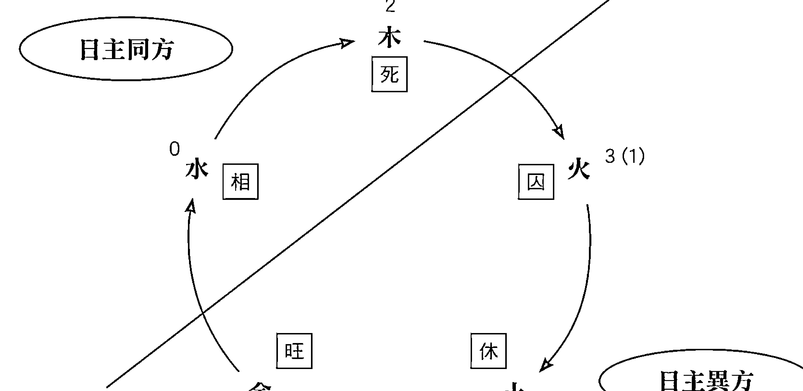

日主強弱： 極強 很強 強 稍強 中和 稍弱 弱 很弱 極弱

這個結論——日主「弱」，跟袁先生的命批是一致的：「乙木秋生，凋零現象，干支金重，更屬摧殘。」

根據八字結構評判的平衡原則，日主乙木弱，扶抑用神應取水和木。因為水可以生木，木可以比助，這樣就可以達到輔助弱主的目的了。但這個八字，四柱沒有水。只有時支寅木（帝旺），可以為日主乙木之根，故命局日主沒有到「很弱」的地步。

至於「命批」中，用了命宮甲午，作為「比劫長生之資助」，對此我們並不認同（請見下文），何況甲坐午地，泄氣太過，何來「資助」之力？

# 調候分析

調候，即調和氣候。這是日主對出生時外部自然環境的要求，牽涉到八字結構在氣候的寒暖燥濕方面能否自足的問題。從命理發展史上看，前人對「調候」所做出的研究有以下三層主要的意念：

（1）寒和暖。

命理經典《滴天髓》說：

天道有寒暖，發育萬物，人道行之，不可過也。

這是說，萬物的生育，離不開環境的氣候。寒或暖超過一定的程度，都是不利於萬物的生發的。

具體應用中，冬天寒冷，不能沒有暖日；夏天炎熱，不能沒有雨水。這是「調候」應用的最關鍵之處。從十干說，夏日用癸，冬日用丙，這是古賢制定命理學「調候為先」原則的基礎。

（2）燥和濕。

《滴天髓》又說：

地道有燥濕，生成品匯，人道得之，不可偏也。

原注：過於濕者，滯而無成；過於燥者，烈而有禍。

這是說，大地有炎燥和潮濕的現象，所以能培育萬物。但過於「燥」，或過於「濕」，就是偏枯了。

八字結構是個人生命體初始狀態的縮影，內部環境過燥或過濕，都不是理想狀態，不利於這個生命體的生存和日後的成長。因此，對於過燥或過濕的八字，要相應「調」燥或「調」濕。

(3) 誠如筆者在《進階教程》中指出，作為討論「調候」的經典之作《窮通寶鑒》，它不僅專注於不同季節和具體月令的寒暖燥濕問題，而且也深刻地討論了天干要素之間的最優化配置問題。以下再現這樣的配置：

- 甲 —— 丁、庚
- 乙 —— 丙、癸
- 丙 —— 壬
- 丁 —— 甲、庚
- 戊 —— 甲、丙、癸
- 己 —— 甲、丙、癸
- 庚 —— 丁、甲
- 辛 —— 壬、甲
- 壬 —— 庚（辛）
- 癸 —— 辛（庚）

比如，對於甲木，丁和庚是它優化的配置，即所謂「用庚劈甲，方引丁火」。這是用生活常理，把甲、丁、庚三個天干要素拴在一起，成了具有較高準驗度的法理。

正是

## 合與合化

如果我們對袁樹珊八字再進一步研究，可以看到這個結構中有一個「玄機」。這就是地支上的一酉兩巳以及天干上的一丁一辛。在對此深究之前，我們先羅列一下天干地支刑沖會合的組合情況：

+   天干五合： 甲己合土；乙庚合金；丙辛合水；丁壬合木；戊癸合火。

+   地支六合： 子丑合土；寅亥合木；卯戌合火；辰酉合金；巳申合水；午未合土。

+   地支三會方： 東方木：寅、卯、辰；南方火：巳、午、未；西方金：申、酉、戌；北方水：亥、子、丑。

+   地支三合局： 木局：亥、卯、未；火局：寅、午、戌；金局：巳、酉、丑；水局：申、子、辰；土局：辰、戌、丑、未。

+   地支六沖： 子午沖；丑未沖；寅申沖；卯酉沖；辰戌沖；巳亥沖。

+   地支相刑： 無禮之刑：子刑卯，卯刑子；無恩之刑：寅刑巳，巳刑申，申刑寅；恃勢之刑：丑刑戌，戌刑未，未刑丑；自刑：辰刑辰，午刑午，酉刑酉，亥刑亥。

+   地支相害： 子未害；丑午害；寅巳害；卯辰害；酉戌害；亥申害。

+   地支相破： 子酉破；午卯破；申巳破；寅亥破；辰丑破；戌未破。

我們知道，對於地支三會方，缺一字不行；但對三合局，只要中心字（中神）在，就可以構成半合局。比如，巳酉丑三合金局，其中巳酉、或酉丑，都可以合成半金局。袁樹珊命造中年、月、日地支巳、酉、巳，就可以構成兩個半金局（如操作 -6 圖示）。

地支巳，原本主氣爲丙火，附屬之氣爲庚金、戊土。現在跟緊臨的酉發生組合，成了半個金局，其中火勢削弱，金氣增強。這是半合局的結果，也就是由「合」產生的一種類似「化學反應」的效果。

接着，我們要討論「合化」問題。對於合化，當代段氏「盲派」採取斷然否定的態度。《段氏理象學》說：「地支六合並不講合化，只講合。」⑥ 六合是一種緊密的組合，六合只論合，不論合化，就遲論半合局了。

但合化是客觀存在的。只是合化需要條件，就好像化學反應，需要添加催化劑，有了催化劑就可以幫助產生化學反應。那麼，有哪些合化的條件呢？

《滴天髓》說：「化得真者只論化，化神還有幾般話。」這裡提出了一個「化神」，即引化之神。

比如，天干甲己合，就希望地支有引化之神，引化之神主要在月令，即地支爲土，即辰、戌、丑、未月，或爲火，即巳、午月等。因爲月提是秉令之神，發號司令者也。符合了這樣的條件，甲己就「合化」爲土。換言之，原本爲陽木的甲，因爲跟己土結合，就變成具有土性的天干了。如果沒有合化之神，甲己合，只是「合而不化」，相互羈絆而已。

對於地支合化，也是如此。比如，以上討論的巳和酉構成的半合局，這時就要見到天干上有化神。對於地支金局，能充當化神的是天干庚金或辛金。袁命局內年干爲辛金，因此它可以引化巳酉組成的半合局。這個時候，巳就喪失了原本的火性，跟酉合化成半金局了。

爲什麼要做這樣的討論——既講「合」、又要談「合化」呢？因爲兩者的「能量」程度是不同的，它們對全局的作用也不一樣。

對於袁樹珊命局來講，巳酉組合是「合」，還是「合化」，實在具有舉足輕重的影響。如果地支巳酉、酉巳合化成功，命局中七殺與食神的平衡會出現重大的傾倒：七殺完全佔了壓倒優勢，幾乎到了不可制約的狀態。所幸月干有丁火食神，它直接緊鄰年干，對年干發生剋制作用，剋了這個辛金化神，使地支巳酉最終是合而不化。這樣，巳火的火性就不至於完全喪失，它依舊可以成為丁火食神的根基，保持了食神制殺的基本格調。

這是這個結構中的「玄機」。如果不細辨「合」與「合化」，對它們的差別沒有清醒的認識，在以下的動態描寫和探討中，是很難分析到位的。

## 動態分析

在命局中透露動態信息的是四柱運限。

在《基礎教程》中，我們就談到過「運限」，它是八字內部具有的人生過程在時段上的縮影式的段落。它是以時間的順序來做出安排的：年柱代表幼年和少年；月柱代表青年時期；日柱代表中年時期；時柱代表晚年時期。當然，也可以給每一柱予以一定的時間期限，比如每一柱相當於16年，就構成了以下的四柱運限的展示：

# 圖 1.1：四柱運限

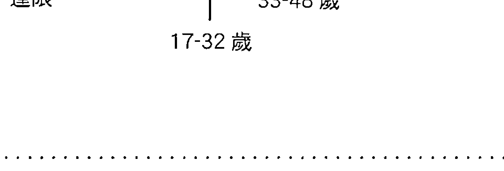

在袁樹珊的八字運限上，我們看到它的年柱與月柱納音五行呈現出月柱納音（山下火）剋年柱納音（白蟻金）的狀態，這會影響命主33歲以前的運限，尤其對於命主的出身家庭和早年運程會發生阻滯的影響。因爲這兩柱不僅代表了命主的早年運程，更是祖上（祖父母）和父母的宮位所在。關於這樣的信息內涵，我們在《進階教程》中談到過。

以下我們順着袁樹珊命例的大運、流年，參照袁氏自評「命批」，結合他生命歷程中發生的重大事件，探討它們跟八字原局相互作用的動態過程。

第一步大運丙申（1-10歲）：丙火傷官，合年上辛殺。七殺得制，所以袁氏自評「六歲前坦然」。

7歲⑨入申運，流年丁亥，八月母親去世。

袁氏自評「四孟齊逢沖剋至」。這是因為流年丁亥與年干支辛巳天剋地沖；同時，大運地支申又與命局中時支寅六沖。這樣帶來了地支寅申、巳亥四個長生字（四孟）的相互沖剋，命局動蕩，發生幼年失母的哀怨。當然，這是不錯的解釋。但為什麼發生在娘親身上？命批並沒有作出交代。

我們可以做進一步的分析：第一，八字缺水，水為印星，聯繫着母親。缺水，代表了命主先天就與母親緣薄。第二，命局中無印星（母親），一旦歲運出現印星，發生劇烈沖剋，很可能帶來母親不幸的信息。何況年支也是母親的宮位，流年發生沖剋年支的情況（巳亥沖），正是「剋母」的「應期」到了。

此外，前文提到的運限月柱納音剋年柱納音，也預示了很可能在初年發生六親受損的情況。

第二步大運乙未（11-20歲）：袁氏自評：「二十歲前，乙未二運競爭科名、研究醫學，不屑以小道自甘，然終不克為願，徒喚奈何。」

從乙未的干支五行來講，木坐木庫，應該是能扶助日主的。但是命主「競爭科名」沒有遂意，還是命局本身的問題。前文已經指出，食神制殺，原是可以「競爭科名」的，但由於命局本身的弱點，不能成功也在情理之中。而且，乙木透出天干，又在早年運限時段，很容易受到年干辛金的回剋，不能發揮正常的扶持功能。再說，七殺在古時也常常是「異途功名」，這跟正官「科舉成名」有一一定的差別。這早年的「科名」失利，可能影響了袁先生一生的處世宗旨。

第三步大運甲午（21-30 歲）：前五年甲木，對於身弱的乙木日主是很好的扶持。命書把乙木喻為花草或藤類植物。《滴天髓》論乙木中有「藤蘿繫甲，可春可秋」之句，比喻乙木似藤蘿，可以攀着喬木（甲木）向上伸展開去，春秋皆宜。所以袁氏自評：「自二十一歲交甲運，比劫幫身，學術稍進，名譽漸佳。完姻之後，連舉二男，似可籍慰春庭。」

為什麼進入甲運，命主會結婚、生子？袁氏自評中並沒有交代。我們的推理，是因為甲木扶持日主，使日主強了，可以扛得起財來。財星為妻，故有婚慶。同時，甲木「引動」時支寅木，寅是甲木之祿，同時處於子女宮位，所以連得二子。而局中七殺為子星，透出年干，通根月令，甚旺，故理應多子。

還在甲運末期，正是大運（甲午）干支上下交接的那年——流年丙午，接連發生了兩件不幸的事：四月，袁樹珊父親去世；閏四月，次子去世。袁氏自評中寫道：「詎料丙午年癸巳限，丙辛化水反擊丁火，先君於是年四月，竟棄養矣，鳴呼哀哉！閏四月，次子德明瘧，命薄為斯，良可浩嘆。」

對袁氏自評給出的理由（丙辛化水，小限癸巳），我們很難認同。是否可以換作這樣的分析呢？請看下頁圖：

[PAGE 38]

# 圖 1.2：運歲分析

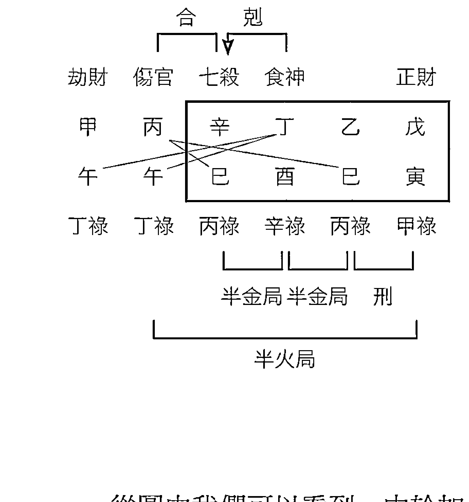

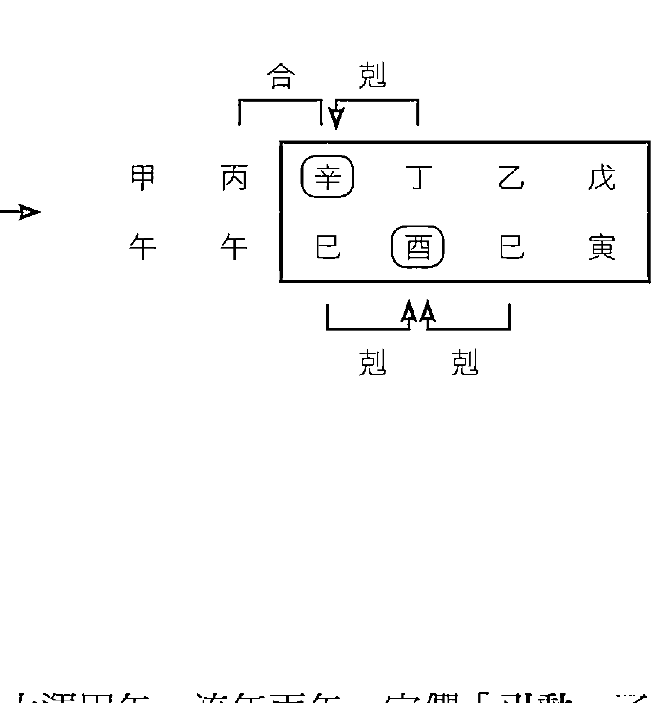

從圖中我們可以看到，由於加入了大運甲午、流年丙午，它們「引動」了八字原局中的多個成分，於是產生了巨大變化：

首先，流年天干丙火，引動了它在八字原局中的兩個「禟」——巳火，於是解開了原先巳酉之合的羈絆，還原了巳火的原性，由此變成了兩個巳火左右同時夾擊酉金的局面。

其次，由於酉金被剋，天干辛金七殺失去了它自己的根基，由強轉弱。而此時月干丁火食神卻通根於流年地支午火之「禟」，當然還有大運地支午火，平添了自身的能量，進一步去剋制緊臨的年干辛金。

再次，流年天干丙火與年干辛金相合，通禟的丙火再進一步合剋辛金，原先局中強盛的辛金七殺，現在已落到了干支俱損的地步。同時，大運甲木生丙、丁火，流年地支午火又與命局時支寅半合火局，於是乎，整個命局成了一片熊熊火海。辛金之位在年干，也是父親宮位，自然慈父難逃劫數；七殺辛金又是子星，命主次子也命喪黃泉。

當然，從另一個角度看，八字中並無偏財父星，運、歲地支午中則有己土偏財，現在雙午與寅相合成半火局，有丙丁火引化；已又回歸火性，在這樣的情況下，己土偏財完全被「烤乾」了。這也是是年喪父的一個命理證據。

這裡，還可以再補充一條，那就是巳火的特殊性。

在地支三合局中，作為合局的三個成分，是長生、帝旺和墓庫。比如，亥卯未三合木局，首字亥是木（甲木）之長生，亥的主氣是水，水是生木的。寅午戌三合火局，首字寅是火（丙）之長生，主氣是木，木是生火的。申子辰三合水局中的申金，也是如此。唯有巳酉丑不同，巳是金（庚）之長生，主氣卻是火，火是剋金的。

可見巳具有兩重性，它本身的性質對周圍環境有很大大的依賴性：當環境火弱時，它見酉則歸順金；當環境火強時，即使見酉金來合，它還是強地呈現出自己原來的火性。這是值得注意的。正是巳的這種兩重性，構成了以上分析的學理基礎。

顯然，這樣的說釋才符合命理推理的邏輯。這是動態描寫中的「應局」現象，即運歲干支引動原局成分，發生作用，構成了「應期」。關於原身與祿的關係，在《進階教程》中已有闡述，⑩ 它是大運、流年與原局成分發生互動的重要紐帶。至於上文討論的合與合化，在這裡是結構變化的理法基礎。

進入午運，誠如袁氏自評中所說：「日主得長生矣，丁火得臨官矣，雖經戊申年之三刑，亦不過一時災耗，餘均應接不暇。」

第四步大運癸巳（31 - 40 歲）：31 歲流年辛亥，袁氏自評：「辛亥年，庚子限，沖中逢合，剋處存生，只有家事紛勞，餘無他恙。」

為什麼此時流年又見亥水，巳亥沖，卻無重大傷害呢？因為寅亥相合，這跟前面6 歲時喪母的情況不同，那年不僅巳亥沖，而且還有寅申沖，寅自然無法去合亥解沖了。

袁樹珊論命，喜歡用命宮、胎元以及小限，互聯網上懷舊先生博客對此評注時直截了當地指出：「命宮一說，淺陋無憑。」「而先生所謂的小限，離正宗子平萬里之遙，原本無中生有，不足爲訓。」⑪關於命宮和胎元，我們在下文專門予以評說。

33歲，流年癸丑。自評記敘說：「癸丑年，丁爲癸傷，妨合不能解圍，巳酉丑化金，秋木不甚其剋。七月，長子生慶又殤矣。」

顯然，由於癸水剋丁火，巳酉丑又會成金局，結構中突然金旺無制，所以命主發生了痛失長子的哀事。自評中袁先生回憶童子聰慧應對的往事，真是字字血淵。

接着，流年甲寅、乙卯，連續兩個自詠的強木流年扶身，袁樹珊完成了他的命理代表作《命理探源》，由此奠定了他作爲民國時期命理大家的歷史地位。⑫

# 第五步大運壬辰（41-50 歲）：這是袁樹珊先生生命歷程中的最佳時光。

天干壬水正印雖然合丁，

## 圈格局分析

| 傷官 | 正官 | 比肩 |
| ---- | ---- | ---- |
| 戊   | 壬   | 丁   |
| 辰   | 戌   | 丑   |
| 戌   | 丑   | 未   |
| 丑   | 未   |      |

## 操作 -1：强弱分析图解

（此处应插入图片 img/29d8b0d5ce944c9bc264adfa5b02366a_51_0.png）

## 朱元璋八字中的五行分布

显而易见，这个八字内的五行分布是很不均衡的。就天干和地支本气而言，其中土当令，又占了压倒的多数。其次才是火，包括日主本身。再次是透露在月干上的一個壬水。木和金是零，仅藏在地支的附属之气内。

因此，从日主（火）看，结构内伤食（土）泄气太甚，而印星（木）几乎没有任何，即使运岁木火，也不可能得到平衡了。如此身弱的八字，如何能成为开国皇帝、开创大明276年的基业呢？这样分析结论显然不可取。

## 从儿格的讨论

面对这样比较特殊的五行分布情况，有人认为是从儿格。

因为日主弱，又没有印来生；作为日主火所生之子伤食土，却结党成群，处于八字中的大旺势。自身实在受不住它的盗泄了，只得从之，所以是从儿格。

如果真是从儿格，那希望儿再生儿，辗转生育，秀气流行。其象是由智慧生出财富来，并因子而贵。这又不符合朱元璋的生涯了。看八字，伤食土所生之财——金，局中几乎没有了；而日主火虽弱，但有根，又有比助，要“从”也难。故很难论从。

## 眾寡論

什么是“众寡论”？《滴天髓》原文是：

强众而敌寡者，势在去其寡；强寡而敌众者，势在成乎众。

徐乐吾先生在《子平一得》中对此做了解释：

四柱气势偏旺一方者，以顺其旺势为用，如有一二点逆旺气之神，必以去之為美。此逆气者在日干，即是從格；在年月时干，则為强众敌寡，势在去其寡。其理一貫相通也。

## 徐乐吾在书中举了近代张謇的命例

命例3：乾造 张謇（1853-1926），清末狀元，中国近代实业家、政治家、教育家。

（此处应插入表格）

张謇，1853年（咸丰三年）5月30日（农历五月二十五日）卯时生。字季直，江蘇南通人。出身农家，光緒二十年（1894年）殿试中狀元。他主張“实业救国”，一生从事实业建设，是清、民交替之际，政坛上的樞紐人物之一。

## 陰陽五行結構

（此处应插入表格）

## 大運

（此处应插入表格）

## 段氏“盲派”有所謂“追捕”原理

当命局出现制局做功的情况下，被制的一方因相對孤立，而制方成党成势十分强大，这种情况下我们一般称这类制局为凈制。制方称捕神，被制方称賊神。就像警察抓小偷一樣，警察特別強的時候，如果小偷特別少，或者沒有小偷，警察就沒有用武之地。他就希望小偷出現，一出現正好被他抓住，就可以体現他的價值。这是追捕的原理。

## 根据追捕原理的分析

既然作为局中之“寡”的癸水已经被“强罚”的火土凈制了，这时，就如强大的警察队伍希望出现小偷，让他们显露出警察的威风来。因此小偷多，并不可怕，反而体現了警察治安的功能。

## 命例 4 : 乾造 生于 1944 年 3 月 4 日巳时。

（此处应插入表格）

## 大運

（此处应插入表格）

## 对比张謇和朋友的八字

对比上面张謇的八字，它们有相似的情况，都是要“去其寡”。然而，我这位朋友中年（31岁至50岁）大运虽有庚、辛天干，但仍在南方火地。我详细核对过他的具体升迁的年份，大多在金水流年。可见此命运是喜欢“小偷”出现的时候。51岁后金水连环，自然就名利双收。

为什么此命仅贵为司长，不及南通张謇之富贵？仔细对照，可以发现，原局中“制淨”的程度远不及张謇的八字。寅申相冲，固然是一种“制”，但毕竟是金克木；压住申金，靠的是局中众多的木火之势，况且时支巳中还暗藏着一个庚金，即自己队伍还不太“纯洁”。相比张謇的八字，局中戊癸合，是戊土合制癸水；丑午穿，午中己土穿制丑中癸水。这就是原因，读者能认同吗？读出八字信息，必须层层深入，鞭辟入里。

## 使用追捕原理的条件

无论如何，这里的前提是要能制“淨”。如果根本制不了，或不能基本上“淨制”的话，就用不上“追捕”原理了。由此可見，使用“追捕”原理是有严格条件的。“追捕”原理是“众寡论”中“去其寡”的具体应用。可惜《段氏理象學》并没有跟“众寡论”联繫起来，反而把它当作常用规则来看待。丢弃使用条件，很容易带来误判的局面。这是要引起重视的地方。

## 朱元璋的八字分析

再回過來看朱元璋的八字：

命例2（A）：朱元璋命造

（此处应插入表格）

## 陰陽五行結構

（此处应插入表格）

## 形象分析

既然八字结构中存在着五行的强势集团，我们就要从形象视角下手去做出分析：

## 朱元璽命造的形象构成

（此处应插入图片 img/29d8b0d5ce944c9bc264adfa5b02366a_57_0.png）

上圖显示了，这个八字基本上已构成了火土的强势，是一个具有特殊“气势”的八字。虽然天干只有一個壬水，但它已被日干丁火合纠，同时遭到紧邻的戊土的剋制，已经不能用它来平衡局中的旺势、走正格的分析道路了。同时，由于壬水在地支上还有微根，又去之不盡，也不能用“众寡论”来处理。于是，根据八字结构中的火土强势，尤其是土的旺势，我们只能抓住命局的“强势”特征，作出形象处理：顺势而为，继续走火土。这是构成特殊形象的八字的基本处理之道。

因此，朱元璋八字，全局土为强势点，火土为用，金中性，忌水木。

为什么金为“中性”？金可以顺泄土气，但金也会帮助局中忌神壬水，既有有利的方面，但也還有不利方面，故为中性。而水木是针对着火土的，逆了局中的强势。

当然，我们也可以回到十神层面，参考它所透露的信息：地支辰戌丑未四库合为土局，戊土伤官又透出於年干，根据形象分析结果，这个伤官就是全局用神，伤官是这
个八字的主导势力。

## 傷官的性格特征

傷官在性情方面，代表聪明、任性、樂觀、活羅、革新求變；但也會由此而驕傲、偏激、多疑、甚至叛逆。《基礎教程》對傷官格做過這樣的描述：

（此处应插入图片 img/29d8b0d5ce944c9bc264adfa5b02366a_57_1.png）

## 朱元璋的性格和行为

在正格論命中，傷官見官一般以“凶”論，所謂“傷官見官，為禍百端”，故成功的傷官格一般要求四柱不見官星，傷官傷盡，这样才能揚长避短，有所作為。

然而，具体情況要做具体分析。对于朱元璋这个具有特殊形象的八字，正官壬水出现，反而给了强势的傷官有了“用武”之地。结构中，戊土傷官，是代表叛逆、造反、革命，而正官代表了现有的政府，守旧力量。“傷官傷盡”，在这里就成了破舊出新。

朱元璋一生做的事情，不的就是革新、革命、改革嗎？先是参加元末沖濺澎湃的農民大起義，東征西戰，擊破各路地方割据势力，最终推翻元朝，建立明朝。当了皇帝以后，又整頓吏治，反腐力度空前絕後。傷官性質激烈，做事激進，八字又沒有印綬的約束，故而行事手段激烈、嗜殺、殘忍，的確成了这个命局的主旋律。

在六親關係上，傷官也多有殺傷力。所謂“年帶傷官，父母不全”，在朱元璋的生命中，的確應驗了。朱元璋16歲，甲申年，遇上了饑荒瘟疫，他的父母都不幸去世。（从命理分析，当然還有其他因素，我們下文再做分析。）这場瘟疫還帶走了他兄長的性命。朱元璋八字中地支辰戌沖、丑未沖，再加上丑戌未三刑，還刑動了子女宮，故太子早喪，骨肉分離，白髮人送黑髮人。

我们可以推想，朱元璋晚年內心深處是十分孤獨的，很少有明媚的陽光。尤其在馬皇后病死後，朱元璋的殘忍和暴虐其實更多是他內心中這種孤獨、不安全感的一種宣洩，加上年老体衰，感到力不從心，這種不安全感就越來越強，造就了這樣一位意志堅韌不拔，却猜疑心極強、剛猛残忍的創業帝王。

## 第二章 八字分析模型再回顧（下）

## 動態分析

下面我们简要地分析他生命中几个重大事件的大运和流年：

1. 朱元璋生涯的第一個難忘的年頭一定是16歲（1344年），是甲子運、甲申流年。这年5、6月间，凶猛的時疫伴隨著夏季的蝗蟲和旱災，一下子奪去了他家大部分成員 —— 父親、母親和還生活在家裡的已婚的長兄的生命。他的长嫂及其幼子和另一分居的已婚哥哥是除他以外仅有的幸存者。苟活下來的人因太窮，根本無法很好地埋葬已逝的親人，更不用說去照顧尚未成年的朱元璋了。10月末，他被送入了附近的寺院 —— 皇覺寺做小行童，接着，寺院也养不起它的僧侶了，被迫把所有小行童放出去行乞。对少年朱元璋来说，这是什么樣的年頭啊！

先看八字，结构内年柱戊辰与月柱壬戌是天剋地沖（反吟），年月運限是幼年到成人階段，两柱相戰，已经孕育了早年的艱辛以及家庭成員坎坷的命運。

再联系大运和流年。甲子大运和甲申流年，它们与年柱戊辰，三者地支正好构成申子辰水局，水跟八字原先有的火土势正好是相反的，水原是要被制約的对象，现在水势反倒成了汪洋，豈不成了反局？其次，岁运两個甲木，同时剋年干戊土用神，戊土敗 —— 堤岸倒塌了，濁浪滔天。可以圖示如下：

（此处应插入图片 img/29d8b0d5ce944c9bc264adfa5b02366a_59_0.png）
（此处应插入图片 img/29d8b0d5ce944c9bc264adfa5b02366a_59_1.png）

2. 在子運近尾的壬辰年（1352年），朱元璋做了一個重要的選擇：投軍。據說他當時在廟中算卦，去、留都不吉，唯有从军為大吉。於是他投奔了郭子興領導的反元的紅巾軍。

朱元璋入伍后，作战勇敢，且机智灵活，很快得到了郭子興的贊識，便把自己的养女马氏嫁給了他，同时晋升為總兵。从此军中改称他為朱公子，正式用上了“元璋”這个名字。从命理看是在子運，子丑合，丑為妻宮，且有辛金妻星，现在因合而改变了原來丑未相沖的狀態，这个“變”，便有了與馬秀英——日後的馬皇后的婚姻。

进入乙丑大运，朱元璋也进入了长期征战的歲月。他自募軍隊，網羅人才，尤其是知識分子，先后有李善長、劉伯溫、宋濂等；同时爭取民心，割據一方，組成了自己打天下的基本隊伍。

3. 真正使朱元璋建成帝業的是丙寅大运（1364 - 1373年）。第一，大运地支終於擺脫了北方水地。北方水地是忌神壬水的得根之地，它是火土勢的大敵。第二，丙寅的主要功能是火，生助命局的旺土勢力。

这里还有個夹拱的玄機。下面，先談一下命理上的夾拱原理。

## 奪拱和虛神

在八字結構中，若相鄰的兩個天干相同，它們的地支為三合局中的首末兩字，則可以拱出中間的那個字（也稱中神）。因為三合局本身是取一個長生、一個帝旺、及一個墓庫組合而成的。三支各距六十度，形成正三角之合。如申、子、辰，三合水局：

（此处应插入图片 img/29d8b0d5ce944c9bc264adfa5b02366a_61_0.png）

水

如果有戊申、戊辰兩柱，由於天干相同，地支是“申”與“辰”，正好是申子辰三字的首末兩字，它們可以拱出中間那個“子”來：

（此处应插入图片 img/29d8b0d5ce944c9bc264adfa5b02366a_61_0.png）

## 申、辰夾拱（暗拱）三合水局

| 月 | 日 |
| --- | --- |
| 戊   | 戊   |
| 辰   | 申   |
  拱  子
暗拱水局

## 命例5：乾造 康熙皇帝（1654 - 1722）

（此处应插入表格）

清聖祖仁皇帝愛新覺羅·玄燁（1654年5月4日 -1722年12月20日），即康熙帝，清朝第四位皇帝、清定都北京後第二位皇帝。

康熙帝8歲登基，14歲親政，在位61年，是中国歷史上在位时间最長的皇帝。少年時就挫敗了權臣繫拜，成年後先後平定三藩、收復台灣（鄭氏台灣）、親征噶爾丹、保衛雅克薩（驅逐沙俄侵略軍），以尼布楚條約確保清王朝在黑龍江流域的領土控制，創立“多倫會盟”取代戰爭，聯絡蒙古各部。

康熙帝是中国統一的多民族國家的捍衛者，奠定了清朝興盛的根基，開創出康乾盛世的局面，被後世學者尊為“千古一帝”，廟號聖祖，葬於景陵。

## 夹拱的原理

再進一步，如果命局中出現兩個干支，其地支是三合局的首末兩字，但它們的天干並不相同。這時，我們可以認為，它們有潛在的拱局條件，但還沒有構成現實的合局，因此並不具有合局的功能，不少現代命理書中，把它們直接稱為半合局或合局，是不妥當的。

那麼，什麼時候可以構成現實的合局呢？條件是天干出現“引化”之神。這是前面袁樹珊命例中探討過的“合與合化”問題的深入。

## 拱祿的吉兆

比如，上文講到的朱元璋八字以及走到的丙寅大运，見下圖：

（此处应插入图片 img/29d8b0d5ce944c9bc264adfa5b02366a_63_0.png）

丁禄
暗拱火局

當丙寅大运進入命局，地支出現了火局的首末兩字——寅和戌。這時就要觀察天干有沒有丙或丁來作爲引化之神。如果有，地支中就“邀”進了一個“虛神”——午，有了午，就構成了地支三合局，這時就具有了合局的功能。现在，天## 觀察此圖，丁卯大運與流年壬戌歲運干支合，而大運又與月柱干支合，對於一般八字來說，這應是和睦喜慶的歲月。爲什麼朱元璋卻失去了他一生最愛的人？

這裡要進一步分析辰、戌、丑、未四墓庫的性質了。事實上，墓和庫是有差別的。一般命書都沒有真正講清楚。

什麼是「墓」？當它們獨自出現，沒有沖、刑的情況下，它們就是墓。墓，主要是對其中所藏之物而言的。辰戌丑未這四個地支，除了各自的主氣是土之外，都藏有餘氣和墓氣（或墓神）。比如，辰的主氣是戊土，餘氣是乙木，墓神是癸水。因爲辰處於春天最後一個月，尤其是最後的十八天，土主令。因爲雖值暮春，但終究還是春天，所以藏有木的餘氣；它同時又是水的十二生死旺衰歷程中的墓地，故藏有墓神癸水，也因之稱爲水庫。下面再現四庫的主氣、餘氣和墓神：

# 表 2.1 四庫藏遁表

| 地支 | 辰 | 戌 | 丑 | 未 |
| ---- | ---- | ---- | ---- | ---- |
| 主氣 | 戊 | 戊 | 己 | 己 |
| 餘氣 | 乙 | 辛 | 癸 | 丁 |
| 墓神 | 癸 | 丁 | 辛 | 乙 |
| 墓庫 | 水庫 | 火庫 | 金庫 | 木庫 |

當四庫處於安靜的情況下，就是「墓」。它們只顯露土氣，而所藏之物（餘氣和墓神）就像古代殉葬的寶物一樣，放進了棺材裡，誰也取不到，不能派用處。對於這些寶物，它們僅是不能用的墓葬品。

那麼，什麼時候又是「庫」呢？

一種情況，它們之間發生沖、刑等關係。比如，辰戌沖。首先，土沖旺了；其次，墓門也打開了，墓中「藏品」可以用了，尤其是其中的墓神可以派用處。這就是《滴天髓》所說的「生方怕沖庫宜開」中的「庫宜開」了。

還有一種情況，天干透露有墓庫的墓神，這時的墓就是「庫」了。比如，干支壬辰，壬水坐與辰土上，辰是水庫，此時辰可以作為壬水之根來看，也就是著重於它水庫的功能。壬水好像開出去的汽車，而辰是它可以進出的車庫。這個時候，一般來說，就不喜沖了。因為沖而土動，干頭壬水就難扎根了。

《三命通會》談到過以上情況，比如「甲乙日得丑月爲雜氣，官貴。喜官星透干，不透要沖，既透怕沖。」 ⑨

下面我們可以進一步體會經典中對墓庫的論說。《淵海子平》說：

若問財官墓庫時，辰戌丑未一同推。

財官俱要鑰開庫，壓住財官未是奇。

要知何物能開庫，刑沖破害是鑰匙。（《時墓詩訣》）

（筆者注：這裡指出刑沖破害是開庫的鑰匙。）

雜氣財官在月宮，天干透露始為豐，

財多官旺宜沖破，切忌干支壓伏重。

辰戌丑未爲四季，印緩財官居雜氣，

干頭透出格為真，只問財多為尊貴。

（筆者注：四庫喜干頭透出，尤其是財、官、印吉神。）

財官寓在庫中藏，補錄光芒福不昌，

若得庫門開透了，定教富貴不尋常。

雜氣從來福不輕，天干透出始為真，

身強財旺生官祿，運見沖刑聚寶珍。

（筆者注：四庫也喜沖刑開庫。）

四季財官月內藏，刑沖剋制要相當，

太過不及皆成禍，運到財鄉是吉祥。（《雜氣財官詩訣》）

（筆者注：這裡強調遇刑沖剋制時還要注意「相當」兩字，尤其是財官，要刑沖適宜。這個是比较難掌握的關鍵之點。）

# 《子平真註》說：

辰戌丑未，最喜刑沖，財官入庫不沖不發 —— 此說雖俗書盛稱之，然子平先生造命，無是說也。夫雜氣透干會支，豈不甚美？又何勞刑沖乎？

（筆者注：這裡也認為「透干會支」就不宜再沖了。）

況四庫之中，雖五行俱有，而終以土為主。土沖則靈，金木水火，豈取勝以四庫之沖而動乎？故財官屬土，沖者庫敗，如甲用戊財而辰戌沖，壬用己官而丑未沖之類是也。然終以戊己干頭為清用，干既透，即不沖而亦得也。至於財官為水，沖者反；如己生辰月，壬透為財，戌沖則劫動，何益之有？（《論墓庫刑沖之說》）

（筆者注：這裡強調「沖」之宜或不宜是要看具體情況來判斷。）

從上文中，我們可以注意到，古人對四庫中的財庫、官庫、印庫比較重視，因為財、官、印此三者正是一般人嚮往的東西。

至於開墓成庫後，對於全局會發生什麼影響，這就要看全局各個成分所處的關係，然後再判斷是吉，是凶？是喜，還是忌？

下面是一些命例：

# 命例 6：乾造 沈尚書，錄自《淵海子平》。

正官 偏印 劫財
辛 壬 甲 乙
未 辰 辰 亥
正財 偏財 偏財 偏印
傷官 劫財 劫財 比肩
劫財 正印 正印

原評：沈尚書造，辰中壬水透干，論水不論土。時支見亥印，身旺。未土正財臨年支，得月令與日支辰土相助，財強。辛金官星坐旺財，官亦盛。如此財官相生有情，均為我用。無沖無破，貴至尚書。

這裡地支雙辰是作水庫看，因為有印星壬水透出，且壬水是官印相生的樞紐，就不宜見戌來沖辰庫了。所以，「無沖無破」反而成全了這個結構。

# 命例7：乾造 古案，錄自《滴天髓圖微》。

正印 傷官 偏印
戊 壬 辛 己
辰 戌 未 丑
正印 正印 偏印 偏印
偏財 比肩 七殺 食神
食神 七殺 偏財 比肩
沖 沖

原評：此滿局印綬，土重金埋，壬水用神傷盡，未辰所藏乙木無沖，或可借用，以待運來引出，乃被丑戌沖破，藏金暗相砍伐，以致剋妻無子。由此論之，四庫必要沖者，執一之論也。

這個八字，土多金埋是其病。因此忌見辰戌、丑未相沖。因為相沖則土更旺了，土旺則埋金制水，就更不利於命局了。

# 命例 8 : 乾造 錄於網絡 ⑩。

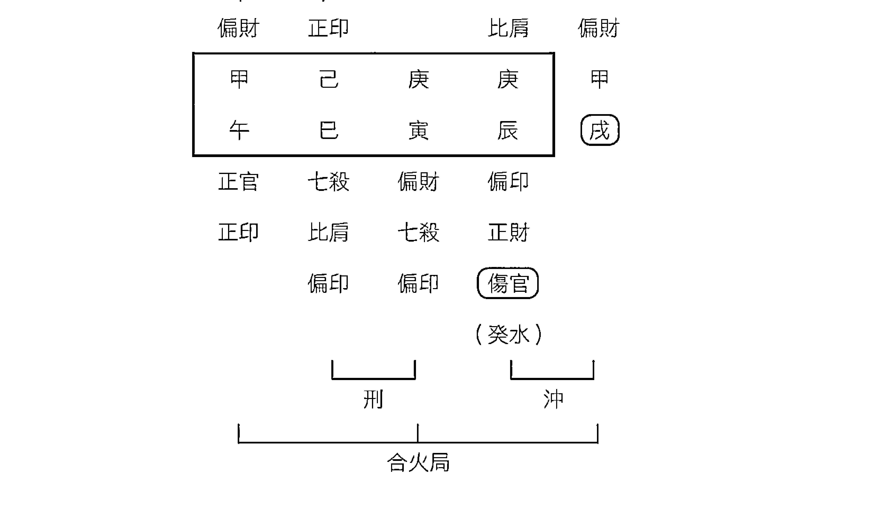

原博主評：格局燥烈，夏金喜水，辰中癸水，用以潤澤全局，此辰不可沖，行金水運發達，進戌運，沖破辰，水根被拔去，寅午戌合成煞局攻身，無水以制煞，因受賄被抄家，判刑入獄。

這個八字生於夏月，結構燥烈，「調候為先」。辰中一點癸水是全局的靈魂。辰是濕土，可以晦火生金。戌運會合寅午成火局，沖辰則辰土破敗，釀成凶禍。這也是忌沖的例子。

再回到朱元璋八字和運、歲。此八字，地支辰戌丑未順行，正好構成兩對土相沖的情況，於是四墓都打開了，成了四庫：辰水庫（殺庫），戌火庫（比劫庫），丑金庫（財庫），未木庫（印庫）。這樣，四庫所藏之物，都可以為日主所用。就這個意義上講，「寶鑒賦」云：「辰戌丑未俱順行，帝王命無疑。」對於朱元璋八字來說，是符合其特徵的。

> 「寶鑒賦」云：「辰戌丑未俱順行，帝王命無疑。」

因為「順行」就構成了兩對土「墓」之間的對沖，由此皆成「庫」了。由於辰戌沖，土沖旺，有利於年干高徵的戊土用神，而原已透出的壬水忌神，因沖而減弱了它的根基。丑未沖，則開了金庫、木庫，都是可以為日主所用。金庫藏有財，日主正坐在上面，財星也為妻星，故朱元璋能有馬皇后這樣相濡以沫、患難共度的賢妻。

現在，行卯運，卯未合，首先閉了時支未庫，解了丑未之沖。丑是妻宮，天干沒有庚辛，丑從原來的「庫」回歸到了「墓」的狀態。同時，大運卯又跟月支戌相合，關了戌的墓門，解了辰戌之沖，戌也回到「墓」的狀態。可見，大運卯同時護四支「安靜」下來了。我們把前面的分析圖再顯現於下：

# 圖 2.8 朱造分析（4）

年 月 日 時 大運 流年

 年柱戊辰跟流年戊寅，夾拱出一個卯字，寅卯辰組合為東方一氣，辰中水氣被壓或被減滅了；

[PAGE 73]

（2）流年地支寅與流月地支午，再跟月支戌，合成寅午戌火局，天干有丁火化神；

（3）大運地支巳與流月地支午，再跟時支未，會成巳午未南方一氣，同時天干有丁火化神；

（4）天干此時有三個戊土，剋盡年干壬水；

（5）流月支午穿日支丑土，壞其藏遁金水。

（6）巳爲戊土用神之祿，日主丁火之「刃」，遭到流年寅來相刑，凶兆。

於是，第一，原局中的本來相沖的四庫，現在都被合閉了，或者合化了。

第二，合化的結果，局中的水氣頓消。月干的壬水被三個戊土剋盡；地支辰、丑濕土，不是被合，就是被穿。即使以上情況不加入流月戊午，流年支寅和月支戌也可以拱出一個午（日支之祿）來，而且干頭有丁火引化。

顯然，全局呈現出一派火炎土燥的局面，喪失了原先的滋潤和活力，已在古稀之歲、個性越來越躁烈的朱元璋豈能躲過這死亡的召喚。一個從流浪乞食的和尚朱重八、到一代開國國君王朱元璋的傳奇，終於結束了。他駕崩了，葬於南京孝陵，還護全部嬪妃跟着殉葬。

從中我們可以領悟到，這個八字是火土爲勢，火土中又以土勢（傷官）爲主，而水（正官）是土的對立面，這個象正是叛逆，造反，土剋水。然而，當水消失了，對立面消亡了，造反的對象沒有了，命主也喪失了自己在局中的生機。八字對人生的描摹真是入木三分。

# 萬里浪命例

討論形象分析視角，想到了以下萬里浪的八字：

命例 9：乾造 萬里浪（1908-1946），抗戰期間汪偽集團特務頭目。

| 偏財 | 正官 | 比肩 |
| ---- | ---- | ---- |
| 戊   | 辛   | 甲   | 甲   |
| 申   | 酉   | 戊   | 戌   |

七殺 正官 偏財

## 「命宮」的具體排法：

先把出生的月份從子位正月逆推上去，這樣，亥位為二月，戌位為三月……，然後把出生的時辰加在出生的月份上，順數至卯位，就得出所求命宮的地支。這裡生月的取法是以節氣的「氣」為依據，即以中氣為準，過中氣則以下一月推。比如，立春（節氣）之後是雨水（中氣），出生於立春後、雨水前，為正月，雨水後則為二月。

另外，也可以用簡便的公式來計算，方法是：先把生月和生時化作數，即寅為一、卯為二、辰為三……，再用十四（或二十六）−（生月數+生時數），餘數就是命宮的地支。

當然，也可以查下表：

# 表 2.2 查命宮表

| 命宮   | 生時 | 子 | 丑 | 寅 | 卯 | 辰 | 巳 | 午 | 未 | 申 | 酉 | 戌 | 亥 |
|--------|------|----|---|---|---|---|---|---|---|---|---|---|---|
| 大寒後、雨水前 |      | 卯 | 寅 | 丑 | 子 | 亥 | 戌 | 酉 | 申 | 未 | 午 | 巳 | 辰 |
| 雨水後、春分前 |      | 寅 | 丑 | 子 | 亥 | 戌 | 酉 | 申 | 未 | 午 | 巳 | 辰 | 卯 |
| 春分後、穀雨前 |      | 丑 | 子 | 亥 | 戌 | 酉 | 申 | 未 | 午 | 巳 | 辰 | 卯 | 寅 |
| 穀雨後、小滿前 |      | 子 | 亥 | 戌 | 酉 | 申 | 未 | 午 | 巳 | 辰 | 卯 | 寅 | 丑 |
| 小滿後、夏至前 |      | 亥 | 戌 | 酉 | 申 | 未 | 午 | 巳 | 辰 | 卯 | 寅 | 丑 | 子 |
| 夏至後、小暑前 |      | 戌 | 酉 | 申 | 未 | 午 | 巳 | 辰 | 卯 | 寅 | 丑 | 子 | 亥 |
| 小暑後、虛暑前 |      | 酉 | 申 | 未 | 午 | 巳 | 辰 | 卯 | 寅 | 丑 | 子 | 亥 | 戌 |
| 虛暑後、秋分前 |      | 申 | 未 | 午 | 巳 | 辰 | 卯 | 寅 | 丑 | 子 | 亥 | 戌 | 酉 |
| 秋分後、霜降前 |      | 未 | 午 | 巳 | 辰 | 卯 | 寅 | 丑 | 子 | 亥 | 戌 | 酉 | 申 |
| 霜降後、小雪前 |      | 午 | 巳 | 辰 | 卯 | 寅 | 丑 | 子 | 亥 | 戌 | 酉 | 申 | 未 |
| 小雪後、冬至前 |      | 巳 | 辰 | 卯 | 寅 | 丑 | 子 | 亥 | 戌 | 酉 | 申 | 未 | 午 |
| 冬至後、大寒前 |      | 辰 | 卯 | 寅 | 丑 | 子 | 亥 | 戌 | 酉 | 申 | 未 | 午 | 巳 |

得出命宮地支後，再根據「五虎遁年起月訣」¹ 找到相應的天干。

比如，前文中袁樹珊八字的命宮為甲午。它是怎麼推出來的呢？

查袁樹珊生於1881年9月8日寅時，是當年節氣白露（1881年9月7日20點51分）之後，又是在寒露（1881年10月8日11點40分）之前，所以八字按戌月排盤。如果從中氣算，它處於處暑後、秋分前。查上表（表2.2），出生寅時，命宮地支為午。

接着，再為地支午按個天干。出生年干支為辛未，按「五虎遁年起月訣」：「丙辛歲首尋庚起」，也就是起於庚寅，順推，午之天干為甲，即甲午——命宮甲午。

現在的網絡排盤，排出的命宮大多是錯誤的。因為它們沒有意識到命宮是按中氣為界限的。

什麼是「胎元」？

它是假定每個人都是十月懷胎的。因此，以命主出生月倒退九個月，就是胎元。具體來說，局中月柱天干順推一位，地支順推三位。比如袁樹珊八字的胎元應為戊子。

# 「命宮胎元不用為佳」

這是已故香港命理學家朱鵠橋先生的话。¹²

為什麼朱鵠橋先生不贊同在四柱之外再添上命宮、胎元兩柱呢？

他說：

我們判斷一個命造是身旺還是身弱，以及是正格還是特殊格局的時候，習慣上是用四柱來看的，現在突然多了命宮、胎元兩柱，我們不禁要問：到底要不要把命宮胎元加進命局裡，作為原局的一部分，用作判斷身旺身弱、正格外格的根據呢？沒有一本書敢正面回答這個問題，都是「側側膊」輕輕卸開就算了。因為如果不用，即是承認了命宮胎元無用，只是一個裝飾品；如果用，則剋沖刑合甚至會局的機會大大增加了，於是身弱

[PAGE 82]

轉旺、身旺轉弱的機會大大增加了，正格變外格、外格變正格的機會也大大增加了。

朱先生接着舉了一個實例，由於原局從四柱加上命宮、胎元而成六柱，全局改觀了：由原先的假專旺格變成了正格：❶

# 圖 2.12

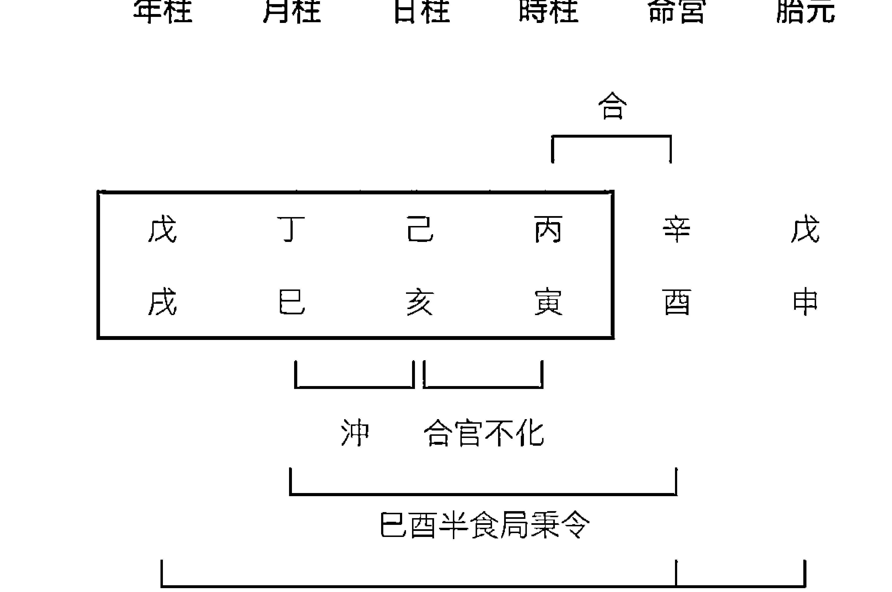

朱先生接着還追問，命宮和胎元究竟放在哪個位置上？如上，則丙（時干）辛（命宮天干）合；命宮和胎元若換個位置，情況就不同了。

顯然，朱先生的見解有理有據，我們很難反駁。其實，不少命理家都有同樣的見解。比如，鍾義明在《現代破譯「滴天髓」》中說：

> 為了八字的普遍化、統一化、簡潔化，筆者認為不必加入胎元（男稱陽炁，女稱陰胎）、命宮。胎元和納音多用於明代的子平法，清朝後已鮮用。命宮是七政四餘星法，星盤、神煞用之，民國後只少數江湖專業命数師為人造大流年命書才使用，一般學習純子平論命数者不會使用。❷

既然如此，對於命宮、胎元，我們在一般情况下就不使用了。

[PAGE 83]

## 註釋

① 《命運的求索》第九章談到「眾寡論」( 332-336 頁 ) 。

② 鍾義明《現代破譯「滴天髓」》對此「語釋」為：「八字中，與主體相生助的五行因力量很大、數量很多，形成一個集團，而與這個集團對抗的五行只有一、二點極微弱的氣力時，必須顧全大局，把氣力微弱的對抗五行消除（剋泄）。相反的，主體氣力微弱，而對抗的五行力量很大、數量很多，形成一個強盛的反對集團時，必須順從，放棄主體，去生助反對集團的五行。」( 第 456 頁 )

③ 《子平一得》，17 頁。載徐樂吾《命理一得》。

④ 《段氏理象學》，77 頁。

⑤ 段建業：《段氏理象學》，第 77 頁。

⑥ 見《子平真註》:「命中喜忌，雖支干俱有，而干主天，動而有為，支主地，靜以待用，且干主一而支藏多，為福為禍，安不得殊？」(《論喜忌干支有別>)

⑦ 對於康熙命造，拙作《命運的求索》第十一章有全面的評論，可參見。同時，本書第八章還會做出進一步分析。

⑧ 《命理一得》，第 14 頁。

⑨ 《三命通會》「論十二月地支得日干吉凶」。

⑩ 錄於「五行天下」博客。

⑪ 見《八字命理學基礎教程》第二章，第 37 頁。

⑫ 《命運推算法則與操作》第一冊，257 頁。

⑬ 見上書 258 頁。

⑭ 《現代破譯「滴天髓」》，第 242 頁。

[PAGE 84]

# 動態分析模型

# 第二章

[PAGE 85]

從前兩章對八字分析模型的再回顧中，我們已經談到高級教程將着重於動態分析，使學習者真正掌握從八字原局分析，進而到結合大運、流年做出「應期」的判斷，最終能名實相符地進入命理研究者的行列。這是跨入命理殿堂的關鍵一步，也是作為「登攀髯導」的筆者所殷切期盼的。

# 動態分析

在中國傳統文化中，《易經》被稱作是群經之首、大道之源。那麼，《易經》的「易」，究竟是什麼意思呢？有一種比較普遍的認識：「易」就是變化。所以《易經》英譯本被翻譯為「The Book of Changes」（變化之書），即講「變化」的書。

為什麼會有變化？《易經》云：「一陰一陽之謂道。」也就是說，宇宙間的一切事物的變化，無不是陰陽的交錯往來，相互作用，相反相成，從而生化不息。故王夫之在《周易外傳》中說：「動靜互涵，以為萬變之宗」。動靜就是陰陽，動為陽，靜為陰，一動一靜，產生了變化。因此，觀察變化，就可以從動、靜下手。

就八字原局與大運、流年的關係來說，八字原局是靜態的，進入到大運、流年，便是動態的了。然而，就八字原局內部來說，也有動靜關係。

《子平真註》上有這麼一段話：「命中喜忌，雖干支俱有，而干主天，動而有為，支主地，靜以待用，且干主一而支藏多，為福為禍，安不得殊？」①

它表明，由於天干、地支的性質不同，天干對應於天，為陽，故主動；地支對應於地，為陰，故主靜。因為「動」，天干與臨旁的天干可以直接發生生或剋的關係；又因為「靜」，地支則處於靜止候用的狀態，一般不與相鄰的地支發生生剋作用。

《子平真註》的這種認識與以前的經典著作是有不同的地方。比如，《三命通會》云：「地支十二，其理亦同，歲動靜不同，方圓有異，而生剋一也。……丑為金庫，生亥子而剋寅卯；辰為水庫，生寅卯而剋巳午……」②就是說，地
[PAGE 86]

支跟天干沒有差異，也能跟相鄰的地支直接發生生剋作用。

筆者以為，《子平真註》對干支差別的認識是更深入了。就是說，在原局裡，天干氣動，天干之間，遇生則生，遇剋則剋，可以直接發生生剋關係；而地支主靜，相對而言，處於一定的靜止狀態，它與相鄰的地支之間，不立刻發生生剋關係。當然，一旦地支之間發生刑沖會合作用了，這種相對靜止的狀態就被打破，因「動」，而出現跟天干一樣的生剋作用。

這種情況，也可以解釋為：地支氣靜，遇刑沖會合則氣動，氣動就要論生剋了。謝武藤在《八字深入》（1）中談到過這樣的情況。例如：

# (A) 例1 :

年 月 日 時
○ ○ ○ ○
子 戌 寅 酉

# (B) 例2 :

年 月 日 時
○ ○ 戊 戊
子 戌 辰 午
  冲

例 1 中，四個地支之間彼此無刑沖會合關係，所以它們之間不發生相剋關係：戌不剋子，寅不剋戌，酉不剋寅。因此，當它們類化成人、事、物的時候，就不以剋論。但在例 2 中，情形就不同了。局中月、日地支辰戌相沖，土沖則土旺，因動而剋水 —— 年支子水，故原局就有了嚴重的剋水之象。

此書還給出了以下一個案例：

命例10：乾造 1952年5月2日（農曆4月9日）寅時生。

| 偏財 | 七殺 | 七殺 |
| ---- | ---- | ---- |
| 壬   | 甲   | 戊   | 甲 |
| 辰   | 辰   | 申   | 寅 |
| 比肩 | 比肩 | 食神 | 七殺 |
| 正官 | 正官 | 偏財 | 偏印 |
| 正財 | 正財 | 比肩 | 比肩 |
| ---- | ---- | ---- | ---- |
| 刑   |      | 冲   |

作者解釋道：因為局中殺強而無制化，日主反強轉弱。「幸得地支辰辰自刑，土動則生金，申金有恃無恐得以沖去寅木。寅乃甲木之強根，得夫妻宮申金沖去，其配偶助力非輕矣！這正是地支刑沖得宜的實例。」 ④

對於每一個地支，如果把跟它有刑、沖、合、破、害關係的地支排除，可以製成以下表格，右側所列的是那些「沒有特殊聯繫」的地支：

# 表 3.1 地支關係

| 地支 | 沒有特殊聯繫 |
| ---- | ---- |
| 子   | 寅、戌、亥   |
| 丑   | 卯、巳、申、亥 |
| 寅   | 子、辰、未、酉、卯 |
| 卯   | 丑、巳、寅   |
| 辰   | 寅、巳、午、未、亥 |
| 巳   | 卯、辰、未、戌、午 |
| 午   | 辰、申、酉、巳 |

[PAGE 88]

| 地支 | 沒有特殊關聯 |
| ---- | ---- |
| 未   | 寅、辰、巳、申、酉 |
| 申   | 丑、午、未、戌、酉 |
| 酉   | 午、未、申、亥 |
| 戌   | 子、巳、申、亥 |
| 亥   | 子、丑、辰、酉、戌 |

如果它們出現在八字結構中的地支位置上，則可以看作處於「靜以待用」的狀態。

# 動態分析模型

八字內部反映人生時間軸上變化的，是前面已經談到的四柱運限。

四柱運限反映了人生不同的階段：幼年、少年、青年、壯年，一直到晚年。因此，當八字與大運、流年掛鉤、進入動態分析時，為了彰顯這個時間軸上的人生不同階段的重心意義，筆者設計了以下的動態分析模型：

# 圖 3.1 動態分析模型：運限，大運，流年

![](img/29

## 圖 3.5 文造運歲分析（1）

此時運限在日柱甲午，甲為正印，正宜考試。大運丙申，伏呤年柱，它與流年丙辰，天干兩丙，地支申、辰夾拱出子水，這樣申子辰合殺局。前面談到建祿格喜財官，八字局中財透而官殺伏藏，現在由運歲合出殺局，不正是得到功名之時。所以文天祥得到皇帝親自選拔，為第一甲第一名狀元。據記載，殿試時文天祥以法天不息為題議論策對，洋洋萬言，沒有打稿就一揮而就。

然而，文天祥金榜題名時，卻遇上了父客死他鄉的不幸。為什麼會發生這樣的事？而文父此時還在壯年，僅四十二歲。

首先，建祿格本身有剋父的潛在傾向。因為建祿，比劫旺。父星為偏財，比肩剋偏財，父壽不永，至少緣薄，這是八字的信息。其次，這個運歲夾拱出來的水局，去沖剋了月支午火，月柱為父母宮位所在，此時被動搖了。再次，八字中有丙火透於年干，此大運伏呤年柱，「激活」了丙火劫財，時干辛金偏財（父星）透出，於是丙火剋合辛金，這是命主失去父親的「應期」到了。

2. 事實：由於文天祥的剛正不阿，嫉惡如仇，他的仕途並不平坦。30 歲丙寅年，退職隱居。次年丁卯，年底再出仕。34 歲庚午年九月被免職。直到37 歲癸酉，朝廷重新起用他為湖南提刑，掌管獄訟。次年甲戌，知贛州。

分析：這些都在丁酉大運（29 - 38 歲）中。丁運為火，自然不利；酉運則不同：

## 圖 3.6 文造運歲分析（2）

圖中可見大運酉與日支巳和時支丑合成金局，同時有時干辛金作為化神，三合財局的力量頓增。當然，年干還有丙火，巳是它的祿，在合化中還存在一點阻滯。37 歲流年癸酉，酉進一步「激活」此時正處於大運的酉，而流年天干為癸水七殺，金財生水官，所以此年文天祥為朝廷重新啟用，是官運的「應期」到了。

## 3. 事實：德祐元年（公元 1275 年）乙亥，元兵大舉進攻，宋軍的長江防線全線崩潰，宋朝廷詔令天下勤王。文天祥是年 39 歲，變賣家產，募集義勇，起兵勤王，拉開了他生命的新的一頁。

是年八月，文天祥率兵到臨安。次年丙子（1276 年），臨危受命，擔任右丞相兼樞密使，並作為使臣到元軍中講和談判。他大義濃然，與元朝丞相伯顏針鋒相對爭論。伯顏發怒就拘捕了他。後來幸得逃脫。接下來是苦戰東南。

## 圖 3.7 文造運歲分析（3）

戊寅年，流年寅與大運戌，再與八字提綱午三合火局，於是天干雙戊，地支火動剋去年支申金，同時，寅丑暗合（寅內人元甲、丙、戊與丑內人元己、癸、辛），這樣局中水氣盡去，全局火勢炎炎，一片燥烈之象，生計頓失。正是在這樣山窮水盡的年頭，12月20日，文天祥兵敗被俘。他吞食腦子（即龍腦）自盡，沒有死；在押解的路上，他絕食八天，也沒有死。但他已經抱定了殉國的信念：「人生自古誰無死，留取丹心照汗青！」——現世的生命已經不重要了，它是歸屬於歷史的。

戊寅年這凶災之年，還發生了母死子亡的家庭哀事：母親死於九月，長子亡於十月。

命局中有這樣的信息嗎？確實是可以找到的：流年地支寅是甲木正印之祿。正印星為母星，在此八字中僅有的一顆出現在月干之上。月柱也是父母宮位。現在流年讓它從天干上下到地支來了。首先，寅申相沖；其次，或許更嚴重，是寅午戌合為火局，木都燃燒成灰燼了。顯然，這是此年喪母的應期。兒子呢？是殺星，八字中僅有一顆殺星在子女宮——時支丑土中。流年地支寅暗合丑，又把這熊熊火焰帶到了丑宮，把原先的濕土烤成了焦土，這成了喪兒的應期。

到了1283年初，時間尚在壬午年末，流年地支午合大運地支戌，成半火局，同時「激活」了八字內的月支午，午為日支丁火之祿；流年天干壬又合住日主丁火，這樣，日主丁火及其地支之祿午火同時被羈於周圍的火海之中。文天祥不僅用筆寫下了光照千古的《正氣歌》，同時，他還為這「凜烈萬古存」的浩然正氣獻出了自己的生命。——「惟其義盡，所以仁至。」

文天祥作為南宋文人，是深諳命理的。他曾寫過一篇《贈談命朱斗南序》的文章，從中可知他對命理是有很深刻瞭解的。他說：

天下命書多矣，《五星》勿論，若《三命》之說，予大概病其泛，而可以意推出入，禍福特未可知也。惟《太乙統紀》，鈎索深遠，以論世之貴人，鮮有不合，……最後得朱斗南出《白顧山人秘傳》一卷，以十干，

## 林庚白案例

前面談到過民國命理三大家之一的袁樹珊，其實，在那個年代還有一位頗負盛名的命學奇才——林庚白。他30歲前就出版了《人鑒·命理存驗》，載有民國汪精衛、吳佩孚、馮玉祥、張作霖、康有為、梁啟超、胡適等政要名人學者的八字命批，是今日命理愛好者還時常翻閱的。

林庚白有不少算命的故事。據說詩人徐志摩乘飛機遇難，他就未卜先知。還有1937年春天，他替同鄉黃秋岳算命，說在半年之內，必有大凶。黃秋岳是當時國民政府行政院的簡任秘書，平時詩酒風流，與人相處平和。大家都說，他怎麼會有大凶事？誰知「七七事變」發生後，黃秋岳因替日本人做情報工作而伏法。林庚白的推斷竟意想不到地應驗了。

## 最為傳奇的是他替自己算命，算出的結果是不能活過50歲。於是不斷找避險的解法，身體力行，可最終還是沒活過50歲。

下面我們就探討林庚白的八字及運歲：

## # 命例12：乾造 林庚白（1894-1941），民國命理奇才。

## 大運

|正印|傷官|正財|3歲|13歲|23歲|33歲|43歲|
|---|---|---|---|---|---|---|---|
|甲午|戊辰|丁酉|庚戌|己巳|庚午|辛未|壬申|
|比肩|傷官|偏財|傷官|食神|偏印|偏財|七殺|
|    |    |    |    |    |長生|    |    |
|    |    |    |合|穿|    |    |    |

林庚白，1897年4月25日戌時生。原名學衡，字凌南，又字畢難，自號摩登和尚。福建省閩侯縣螺洲鎮（今福州市倉山區螺洲鎮州尾村）人。民國時期詩人、政治人物。

幼孤早慧，由其姐撫養長成。七歲就能作詩，被鄉人譽為「神童」。八歲便負笈北京，曾加入京津同盟會，慨然有澄清天下之志。

民國元年，在上海秘密組織「鐵血鎮除團」，以暗殺手段牽制清朝餘孽。辛亥革命後，任內務部參事。同年加入著名文學團體南社。1917年春任眾議院秘書長、非常國會秘書長和孫中山大元帥府秘書。1927年後一度消沉，閉門讀書，研究詩詞。1928年之後在南京先後任國民政府外交部顧問、南京市政府參事。1933年在上海創辦《長風》半月刊。

## 1941年，在重慶當選立法委員，堅持抗戰。當時因重慶時常遭到日軍空襲，與妻子移居香港。孰料抵港剛十日，太平洋戰爭爆發，日軍佔領香港。12月19日不幸在尖沙咀被一群日軍射殺。

林庚白是南社著名詩人，有「詩怪」之稱。創作詩文很多，先後編校《庚白詩存》、《庚白詞集》，還著有《子樓隨筆》、《子樓詞話》等等，為當時南社健將。

## # 先分析八字原局：

強弱：丁火生於春末，在土主令的辰月後十八日內。結構內一木、二火、三土、二金，顯然土旺而日主稍弱，應取木印扶持，或火來比助，以求平衡。

調候：三月暮春，外部環境寒暖相對比較適宜，只是陽暖逐漸上升，陰寒逐漸下降。八字內無明水，唯辰土為濕土，故略嫌乾燥了。燥，則需水來滋潤，然而日主為火，處弱勢，而水會減火，因此水只能根據情況來酌用。

格局：月令辰月，戊土傷官高聲年干，同時時支還有戌土，土也為結構中的主導勢力，故取為傷官格。傷官為格，日弱，可取傷官佩印。因為傷官泄弱日主，而印星可以助日主，同時制約傷官。八字年干正好是甲木正印，可以取為用神，構成傷官佩印的格調。傷官佩印是求名超貴的八字。

然而，進一步觀察，可以發見，八字結構內還有另一種趨勢：傷官生財。可以圖示如下：

## # 圖 3.8 林造結構分析

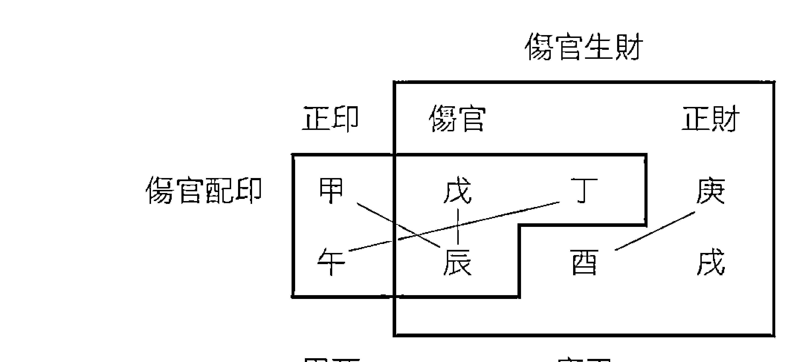

## 前面已述，土是結構內的主導勢力，這是没有異義的。甲木正印雖通根辰土（乙木餘氣），但自坐死地，其他地方再沒有木氣了。故傷官佩印，只顯現在年、月兩柱。年、月運限在於壯年之前。

## 再朝右侧觀察，時干透出庚金正財，它通強根於日支酉金，酉爲庚金之羊刃（帝旺）。而月干戊土傷官生時干庚金正財，構成了傷官生財的格調。日、時兩柱運限爲成年以後，因此，它給我們的啟示是：命主早年會從事政治社會活動，走揚名取貴的道路。到了中年，可能會轉向，走學術的道路，或者進一步去從事經濟活動。

## 可以說，這個八字套着兩個結構，會隨着時間軸的推移而改變自己的價值取向。這是這個八字所顯現的人生主要軌跡，值得研究者注意。

形象：八字脈絡比較清晰，但並不具有特殊的形象特點。

## 總之，八字格調很不錯，傷官爲格。主要是傷官佩印，有貴的徵兆。同時，格局內部沒有破損，用神也明確，只是略嫌力薄了一點。

## 傷官佩印，身稍弱，自然取木火印比爲喜用。即使中年轉向傷官生財，身弱也還是要強身，仍然是印比爲用。

## 八字的主勢是傷官，命主個性自然以傷官的特徵爲主。傷官性孤傲，恃才傲物，常常會目空一切。證之事實，林庚白個性也的確如此。他自稱「詩狂」。在1933年創辦詩刊《長風》時，他說：「十年前鄭孝胥（民國時代著名詩人），今人第一，余居第二。若近數年，則尚論今古之詩，當推余第一，杜甫第二，孝胥不足道矣！」口氣之大，竟把唐代詩聖杜甫也排在他的後面了。然而，時間是最無情的。林庚白或許壓根就不會想到，留至今日還常為人翻閱的竟是這本命書《人鑒》。

## 下面我們應用動態分析框架，結合運歲，剖析他生命的主要過程。

+   1．事實：出身官宦世家，祖上數代都是科第出身，由科甲而做官。幼失父母，由伯父和胞姐撫育成人。

## # 圖 3.9 林造運歲分析（1）

半金局

分析：年柱甲午，甲是正印，又是用神，午是日主之祿，表明祖宗一代有文化修養，自己得祖上恩德，故出身官宦世家，早年學業成名。然而，月柱佔傷官，又表示父母要敗落，或者命主與父母緣薄。

再觀察第一步大運己巳，己土合甲，壞了甲木用神的正印功能；巳合日支酉，引動原局辰酉合，西金剋辰中乙木偏印，於是局中印星盡去。印星是母星，是長輩，而年月兩柱沒有偏財父星，所以，印星盡去，可以看作林庚白幼時就失去父母、由伯父和姐姐撫養成人的命理依據。

2．事實：林庚白青年時代是一個「造反」門士。1911年林庚白在上海秘密組織「鐵血鎮除團」，以暗殺手段牽制清朝餘孽。辛亥革命後，被推為眾議院議員和非常國會秘書。1917年林庚白為眾議院秘書長，南下廣州，幫助孫中山召開國會非常會議，領導護法。但後來受到軍閥的阻擾和破壞，孫中山憤而辭去大元帥職，林庚白也相逐引退。

分析：這是在第二步大運庚午。庚運是13歲到17歲，正是辛亥革命前。庚金是正財，傷官生財，財來壞印，傷官就更不受束縛了。傷官是叛逆星，林庚白在學習期間，鼓吹「革命」，幾次被學堂開除。然而，午運是日主丁火之祿，強身，護

## 《韋氏命學講義》（1933 年），名動全國。大陸解放後，韋氏離開上海，到香港掛牌算命。1979 年後多次去台北講學。1987 年在台北講學時被踩傷。1988 年 77 歲，12 月 12 日（農曆十一月初四）在香港病逝。

韋氏的命理著作有《千里命稿》、《八字提要》、《呱呱集》等。

對於自己的八字，韋千里也有自評：

此為千里自造：識者咸謂憾於無火。然春金固非當令，乏土之生，則且無根；縱天干庚辛林立。《子平真註》云：得三比肩，不如得一長生祿刀。可見徒多比劫。而日元無氣，非是真強。矇又亥卯會成木局，子辰會成水局，水與木皆有挫於金乎？火能熔金，有火固可顯達；無火則一寒儒而已。

然寒弱之金，逢微火當可得志；逢巨火則不勝其剋。或且因貴顯而惹禍殃，此孔子所謂過猶不及者是也。若云水木兩局，財星甚旺，亦《滴天髓》所謂何以其人富，財氣通門戶者歟。無如身弱任財，難免富貴貧人之譏。正合我今日之筆耕終夕，硯田枯澀者也。然則富貴皆無大望，我將永自韜養矣。

當以身弱之命，與身強之命相較，同走好運，同處美境，而其速率與份量，大相懸殊。身強者每遠過於身弱者，此余歷試不爽。故益信拙造之身弱。恐終其身不過兩兩也。

查行運。方今行至丑字，尚屬順利。將來戊宇或更進一步。子運恐厄於病。但蓋頭屬戊，當無生命之危。丁運少濟，亥運伏樞。丙運以下，老更無為矣。

以上是韋先生早年的自評。

根據自評，韋先生對自己的八字的看法是身弱，因為日主庚金在地支上無根，同時局中無火，庚金欠火鍛煉，所以只能是一介「寒儒」而已。

其實，韋千里在年輕時候就頗享盛譽。據說「西安事變」（1936 年）時，宋美齡找到他，請他測算蔣介石的安危，當時韋先生年僅25歲。可見這個八字絕非僅一「寒儒」而已。在我們看來，它構成了一種特殊形象，如下圖：

# 圖 3.13 韋造八字結構形象

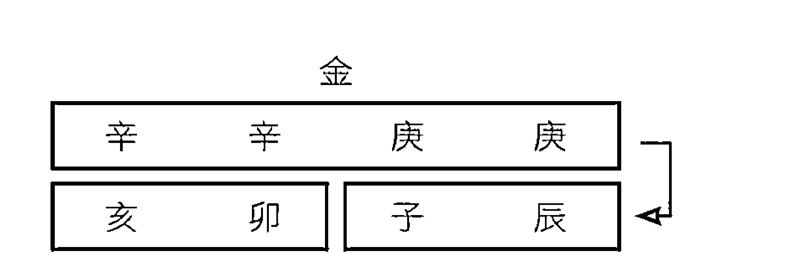

天干雙庚雙辛整齊排列，古稱「兩干不雜」。年支和月支亥卯合半個木局；日支和時支子辰合半個水局。於是，金生水，水生木。這裡，水是傷官，木是財。由智慧而生錢財。五行流通，有一種「清奇」的氣息，所以年輕時候就聲名鵠起。當然，由於庚辛金在地支無根，加上局中没有火，不能煉煉庚金成更大的材料，所以不能在官場嶄露頭角，但請他闖命的人，不乏當時的名流淑女、達官貴人。可見「形象」在判斷個人才情、社會影響力等方面具有相當的作用。

再進一步分析，八字結構中有一個關鍵字，即是時支辰，辰終究是濕土，有生金的功能。雖然地支上沒有點滴金氣，但辰土的存在，就不能說日主庚金就弱不堪扶了。這是我們跟這位大師自評相左的看法。

韋千里52歲時，在其《呱呱集》中寫道：

> 查行運……丙運頗着虛名。明年行戌運，更上一層樓，有名或亦有利矣。酉運大不佳，當死於65歲乙卯年。

他預測了自己過不了65歲（虛歲）。事實上，他不僅活過了65歲那一年，而且還多活了13年。大師對自己壽元的預測失算了。這應該是幸事！

為什麼？這正是我們在這裡要討論的。見下圖：

# 圖 3.14 章造運歲分析（1）

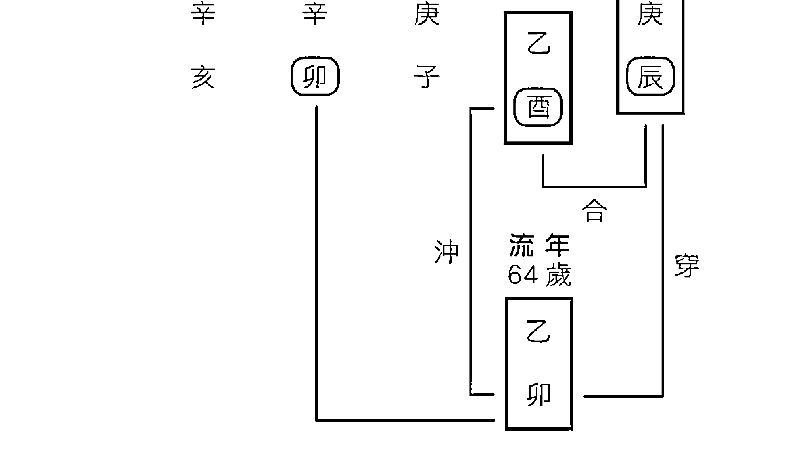

這裡，我們可以看到，酉運是庚金的陽刃，它合時支辰土，同時又沖月支卯木。但從距離看，辰近卯遠，而且合能解沖。因此並非像韋先生想的那樣凶險。

流年乙卯，卯酉沖又引動了大運和原局的這種沖、合關係。古書稱：「陽刃沖合歲君，勃然禍起。」可能這是韋千里預測自己當年會謝世的命理依據。

事實上，酉運畢竟是給天干庚辛金添了強根。八字原先的弱點就是少根，現在有根了，而且有兩個依靠點，即酉金和辰土。卯酉沖，固然可以動搖它們，但要同時拔去這兩個立足點，並非易事。因此，此年雖有些風險，但終究無生命之變。命理上的原由就是如此。下面是韋先生事過之後的感言：

……但去年都已過去，一年之中，僅有三件不愉快之事。由吉隆坡至新山，所乘之冷氣巴士，車至吉隆坡郊外，暮色蒼茫，觸撞一大石，全車窗門震動，玻璃片飛到余之右面，面部血流如注。迨至新山，業務大忙，爲當地同道所忌，密函移民局，謂旅行又營業，違反移民條例，當晚被羈在拘留所中，翌晨上法庭而罰款釋放，即日返港。十一月創辦《卜筮星相》月刊，今年因捧一同道阮君，並言鐵板數不可靠，以致引起一場官司。亦

有一件喜事，第五兒九月完姻。或俗所謂「見喜免災」歾？余固無德無能，竟能渡此難關，亟應早香晚燭，感謝上蒼！

從這一段回顧中我們可以看到，韋大師並沒有像林庚白那樣忌諱「凶年」，他老人家不僅不避，還跑到馬來西亞去「營業」呢！

13年後的戊辰年（1988年）12月12日（農曆十一月初四），即戊辰年甲子月辛丑日，韋千里在香港病逝。為什麼此年先生會駕鶴西去呢？

當然，「生死」常常是超出預測範圍的。最簡單的常識：四同八字的人不知凡幾，難道都會同年同月同時死嗎？答案自然是否定的。其實，韋先生對自己壽元的「失算」也並不令人驚訝。

不過，作為「事後諸葛亮」來分析，我們認為，原因還是在這個時支辰土上。請看下圖：

# 圖 3.15 章造運歲分析（2）

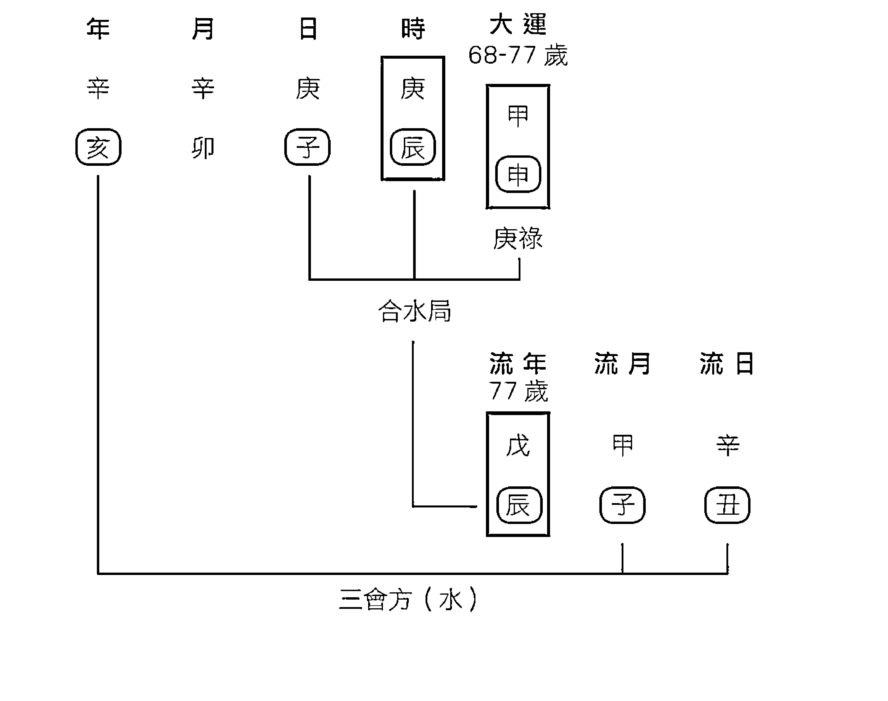

[PAGE 113]

戊辰年是甲申運的最後一年，也就是在大運轉向的時候，對於老年人來講，是比较重要的年頭。從圖中可以看到，這步申運，雖然申是庚金的祿，庚金得地，但是，申子辰合水局，則是潛在的大問題。因為它把自己（申祿）和辰土（原來的一點土印）都被捲進了這個水局。根據五行衰旺顛倒的原理：金本生水，但水泛金沉。戊辰流年再一次把辰「激活」，引動了這個水局，結果是申、辰兩者皆去。到了年尾，冬季甲子月，問題就更大了，地支成了一片汪洋，再把韋先生去世的日子辛丑加進去，不僅有申子辰水局，還有亥子丑北方一氣。如此旺水滔滔，金沉沒了。這位民國命理界僅剩的碩果——韋千里先生走了。

[PAGE 113]

## 註釋

① 《子平真註》「論喜忌干支有别」。

② 《三命通會》「論古人立印食官財名義」。

③ 《八字深入》（1）第15-16頁。

④ 《八字深入》（1）第25-26頁。事實是：命主是台灣出去的留美博士，事業有成，想返台從政。時至2002年（壬申）40歲時還是單身貴族。這個事實說明了申沖寅的力度是增加了，故而尚未娶妻。既未娶妻，自然還未能證實妻子的助力。

⑤ 王謂文天祥的考文「古誼若高抬貴手，忠肝如鐵石。」（指其文有古先賢之風，忠義之志堅如鐵石，備標榜、警示眾人之效）。

⑥ 見李守力博客。

⑦ 見李守力博客。

⑧ 見《千里命稿》。

[PAGE 114]

# 動態分析：離婚案

# 第四章

[PAGE 115]

前一章我們引進了八字動態分析模型，嘗試用幾個歷史人物的案例來顯現它的具體操作程式。在本章中，我們繼續應用這個動態分析工具，來探討尋常生活中發生的離婚案，幫助讀者進一步瞭解它在實務中的功效。

以下五組案例摘引自蔡宗志編著的《當代夫妻用神刑剋篇》一書 ⑪ 。原書主要是提供資料和引述各種經典著作的相關評述。而筆者則按照自己的分析思路，對所引案例一一做出了自己的解說，以此來彰顯本書提出的動態分析程式。有興趣的讀者可以對照原書，瞭解筆者與蔡先生解說的不同之處。最後一個多次婚嫁案則是取自星雲山人《八字用神流年點斷真訣》。

在討論之前，我們先簡略地回顧一下《進階教程》（中級教程）中有關男女婚姻分析的一些基本觀念和推算法則。

婚姻在命局中的線索主要是星和宮兩個方面。

對於男命，妻子或女友是財星：正財和偏財。財星的眾寡、強度、以及在命局裡出現的位置，都包含了妻子或女友的信息，反映了命主的女人緣。妻宮的所在位置是日支。它跟日干（命主）關係最密切。妻宮所含的五行內容，具體說，它們對日主發生的喜忌作用，關係着妻子對命主是否有助力。同時，日支與相鄰地支之間發生的刑沖會合關係，反映了妻宮的穩定性。自然，月支是門戶，也是姻緣宮，它跟妻宮的關係也是重要的信息點。星、宮俱佳，婚姻美滿和諧。星、宮有損，夫妻很可能會成為怨偶。

至於女命，丈夫或男友星是：正官和七殺。跟男命相仿，官殺星的眾寡、強度、以及在命局中出現的位置，都包含了丈夫或男友的信息，反映了命主的男人緣。按照傳統的觀念，在結構內正官與七殺不宜混雜，不然的話，戀愛和結婚容易出現反復曲折。夫宮自然是日支。它與日主的五行喜忌關係，反映了丈夫的特徵、對命主是否有助力。夫宮的穩定，對婚姻自然很重要。作為姻緣宮的月支，它跟夫宮的關係也具有參考的作用。星、宮俱佳，夫妻舉案齊眉；星、宮有損，自然就難求風戀和鳴了。

在具體探討時，對於男命，還要注意局中比劫星的情況；對於女命，要注意傷食星的情況。一個是財星的剋星；一個是官殺星的剋星。它們容易帶來婚
[PAGE 116]

姻的阻滯和困擾。至於在人生進程中，戀愛、婚姻以及感情生活的具體過程，就要聯繫大運、流年來做具體的動態分析了。

# 離婚案（A）

事實：乾造和坤造在1999年己卯結婚。乾造婚後繼續念專科學校，並在坤造哥哥公司上班。2002年壬午，乾造在外交了女友，夜不歸家，夫妻相處遂成水火。2003年癸未，離婚。

以下是雙方命局和分析：

命例14：乾造 1974年7月29日丑時生。

正財 比肩 偏印 大運 流年 23-32歲 25歲 28歲 29歲
甲 辛 辛 己 甲 己 壬 癸
寅 未 未 丑 戌 卯 午 未
正財 偏印 偏印 偏印 結婚 外遇 離婚
正官 七殺 七殺 食神
正印 偏財 偏財 比肩
大溪水 路旁土
  冲

命造簡評：

八字四土二金二木，土旺，己土偏印透出時干，取為偏印格。偏印旺，土多金埋，用財制印。八字年干透出甲木正財，取為用神。甲木坐寅祿，有力，是好事；但可惜月干透出辛金比肩，金剋木，破了用神，降低了命局的等級。八字身強印重，用木疏土，用水生木潤局，故運喜水木。

八字中月柱納音（土）剋年柱納音（水），早年不利。

至於婚姻，妻星為財，財為用，可判妻子條件好。但局中不利於婚姻的因
[PAGE 117]

素卻不少 : (1) 如上所述，甲木正財透出，緊臨辛金比肩，金彪木，破了財星；(2) 妻宮未土緊臨時支丑土，丑未沖，妻宮不穩；(3) 原局中正、偏財雜見；(4) 月柱、日柱伏吟，皆為辛未，妻宮重疊出現，帶有不止一次婚姻的徵兆。 有這些不利因素在，早婚會有問題。但正財出現在年柱（早年運限），戀愛和婚姻又會發生較早。

## 運歲動態分析：

23 至 32 歲甲戌大運，前五年為甲木正財運，「應」原局年干正財甲木，甲木活躍，正是戀愛和婚姻時期。甲木為用，預示着命主可以找到好的對象。

25 歲己卯年，與大運甲戌干支相合有情，同時卯未合，合住妻宮，解除了原先的丑未相沖，於是結婚，娶了比自己條件好的妻子。

28 歲入大運後五年戌運。戌為燥土，為忌神；同時引動原局丑未，構成丑戌未三刑，妻宮受損害，在此運期間，婚姻自然就不穩定了。

28 歲壬午流年，壬水傷官解除了月柱辛金比肩剋甲木正財，財星活躍起來；午與年支寅、大運戌成三合局，同時，午又合妻宮未，## 離婚案（C）

事實：乾造為一警察，戊寅年（1998年）結婚。結婚後與配偶性格不合，爭吵不休。妻的父母來調停，可惜是越調越糟糕。己卯年（1999年）妻離家出走。分分合合，終於在第七個年頭乙酉年（2005年）年初，與原配簽署了離婚協議書。離婚後，乾造年中與以下坤造結婚，開始了人生新階段。

命例18：乾造 生於1969年11月12日申時。

| 偏印 | 偏財 | 正官 |
| ---- | ---- | ---- |
| 己酉 | 乙亥 | 辛卯 |
| 丙申 | 壬申 | 丙寅 |

## 命造簡評：

辛金生於亥月，地支有酉祿、申帝旺，日主不弱。出生時間已入冬季，需要照暖調候，幸時干有丙火高懸。月日地支亥卯半合木局，月干透出乙木，取為偏財格。可由財生官，求得社會地位。木火為用。

關於婚緣，妻宮亥卯半合，卯申暗合，有點兒複雜。關鍵要看大運、流年對原局作用的情况了。

## 運歲動態分析：

29歲戊寅流年結婚，在申運。總的來說，申運為日主帝旺劫財，不是很有利於婚姻的。然而，戊寅這個流年很特別，它跟壬申大運天剋地沖，注定要翻天覆地幹件大事。寅沖申，申也為時支；寅合亥，亥為月支。一下子這寅的出現，使妻宮左右兩旁的牽制都解脫了。妻宮本來坐財星，於是有了結婚之慶。

30歲己卯流年，卯激活原局妻宮卯，又回到了原局妻宮左右牽制的情况。到辛未大運的辛比肩，情况就更糟了。因為月干就是乙木偏財，是從妻宮中出來的。遇上大運辛金比肩，正好等於來了婚姻的剋星，婚姻如何能風調雨順呢？可見下圖：

# 圖 4.6 運歲分析

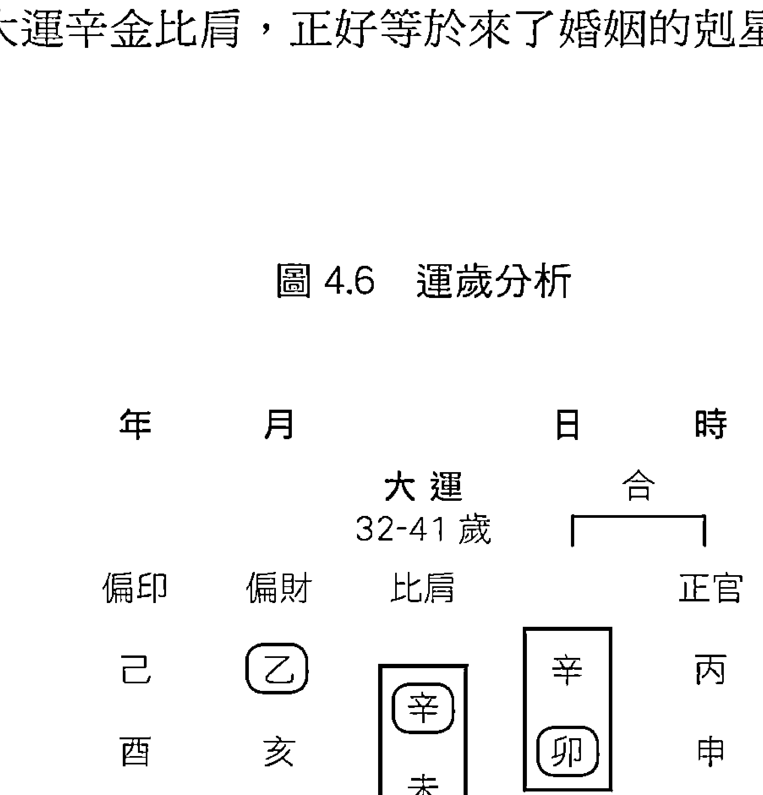

到了流年乙酉，與日主辛卯反吟，它還在辛未大運辛比肩之中。流年乙木激活月干乙木財星，正好撞到了運干辛金的「槍口」上，怎能不被剋掉呢？加之流年支酉金直沖剋妻宮卯木，星、宮財星同時剋去，這樣就有了離婚協議，了結前一段吵鬧不休的婚姻。此流年已在辛運後期，馬上要跟上來的未運，可
是三合財鄉的好運。於是有棄舊迎新，另結新歡的事發生了。

這裡請注意大運插入的位置。大運辛未正好插入在月柱乙亥與日柱辛卯之間，流年乙酉正處於大運辛與未的交接之處，所以有運干辛金剋年干乙木財星，又有運支未加入亥卯未三合財局的情况，很直觀地說釋了命主棄舊迎新的婚姻生活的變遷。

再看這位坤造：

## 命例19：坤造 1969年8月15日（農曆七月初三）辰時生。

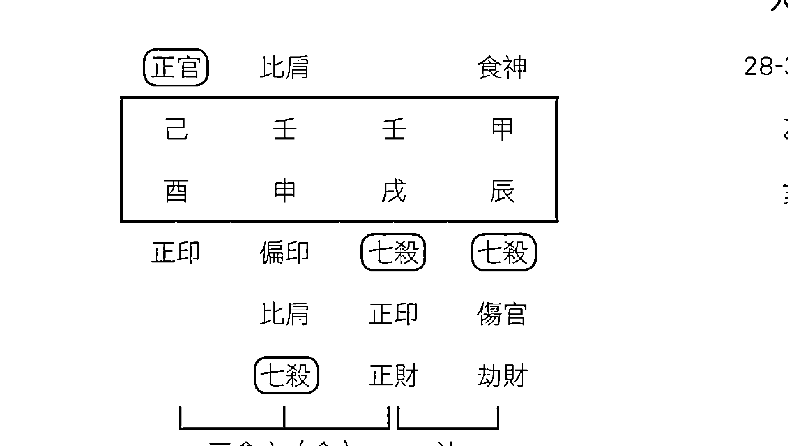

## 命造簡評：

日主壬水生於秋初，地支申酉戌會西方金一氣，且月干壬水比肩相助，日主甚旺。既然申酉戌會方，金為印，可以取為印格。身強印旺，宜財來制印扶官。八字財星僅在戌庫內。戌庫為夫宮，雖然婚姻較晚，還是可以找到如意郎君。

當然，辰戌沖，夫宮不是太穩定。不過現在已經到了36歲才結婚，可謂晚婚矣，再加之夫君已是二婚，大概可期婚姻久長。

## 運歲動態分析：

28 歲起大運乙亥。乙木為傷官，正好會剋去年干透出的正官，所以此大運前五年間難有婚嫁喜慶。到了亥運，是日主壬水之祿，結親也難。那麼，為什麼 36 歲乙酉年卻出嫁成功了呢？

請看下圖：

## 圖 4.7 運歲分析

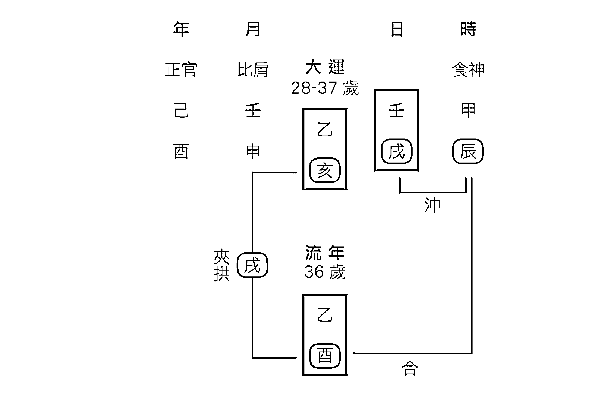

根據動態分析模型，乙亥大運自 33 歲後插入月柱和日柱之間，這樣與夫宮近了。乙亥運和乙酉流年，天干相同，中間可以夾拱出一個戌字，這個戌字正是日支夫宮，所以它引動了夫宮。同時，酉合時支辰，解除了辰戌沖，由動變靜，這是婚姻成功的玄機。

因為酉合辰，辰處於子女宮，所以因合而動，當年懷孕。但是辰酉合，酉金傷了辰中乙木傷官子女星，結果發生流產了。

## 離婚案（D）

事實：乾造在丙子年（1996年）和戊寅年（1998年）發生兩次桃花，原配坤造不能容忍而選擇離婚。雙方在庚辰年（2000年）協議離婚。乾造當年與戊寅年所交女友結婚。

命例20：乾造 1963年3月14日（農曆二月十九）酉時生。

|正官|正印|劫財|大運|流年|32-41歲|33歲|35歲|37歲|
|---|---|---|---|---|---|---|---|---|
|癸|乙|丙|丁|辛|丙|戊|庚|
|卯|卯|辰|酉|亥|子|寅|辰|
|正印|正印|食神|正財|||外遇|離婚|
|||正印|||再婚|
|||正官|
|||桃花|
|沐浴|沐浴|冠帶|死|||穿|合|

## 命造簡評：

丙火生於卯月，乙木透出月干，為正印格。八字內三木二火一土一金一水，木火居多，身強印旺。宜用財破印生官，走金水運為佳。八字不錯。

八字年月地支為沐浴，時支為桃花，生性較為風流。妻宮辰土，與月支卯木相穿，與時支酉金相合，婚姻就顯得較為複雜了。

## 運歲動態分析：

32 歲後入辛亥大運，是金水，為八字所需，應該是好運。但是辛金正財
透干，合進原局日主丙火，合而多情，易有桃色事件；同時，時干丁火劫財，在旁虎視眈眈，待機剋財，易釀成財務和家庭的危機。

33 歲流年丙子，子爲年柱癸卯之桃花，子又合妻宮辰，因此此年有桃花。但經命主強力保證自己清白，坤造原諭了乾造，告誡不可再犯，下不為例。

35 歲流年戊寅，戊合年干癸水，寅與局中卯辰會成東方木，同時寅合運支亥水，一下子把局中水氣盡去，命局成一片燥烈之象。所以是年，替人擔保出事，又被坤造發現桃花事件，婚姻陷入僵局。

37 歲流年庚辰，此時進入亥運。亥與卯合成木印，印爲契約。流年地支辰與日支妻宮辰自刑，於是出現了「換妻」現象。是年跟原配離婚，跟女友再成新婚。流年辰支上載了天干庚金偏財入門。

如下圖：

## 圖 4.8 運歲分析

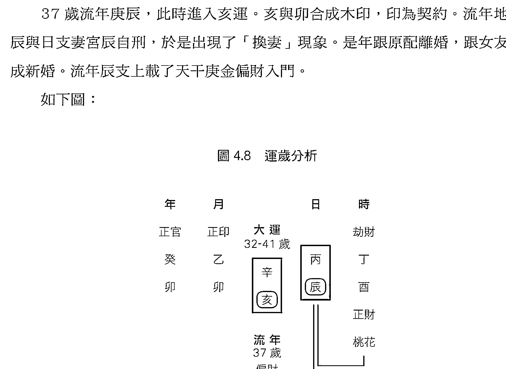

## 再看原配坤造：

命例21：坤造 1968年7月18日（農曆六月二十三）丑時生。

劫財 比肩 （七殺）
戊 己 己 乙
申 未 丑 丑
傷官 比肩 比肩 比肩
正財 偏印 偏財 偏財
劫財 （七殺） 食神 食神
沖

大運 流年 24-33歲 28歲 30歲 32歲
丙 辰 丙 子 戊 寅 庚 辰
夫外遇 夫外遇 離婚

## 命造簡評：

己土生於未月，天氣暑熱，首先要有雨露滋潤。幸申金中有壬水，兩個地支丑土爲濕土，略解些熱暑。八字中土六、木一、金一。身強無疑。因時上乙木七殺透出，故不能作專旺格（稼穫格）處理。月令未中乙木透出，取爲七殺格。自身如此之旺，只能取水財滋殺，或金傷食泄秀。所以喜走金水或木運。

八字身強，個性自然很强。加上七殺格，強而剛，因此脾氣不會很好。夫宮丑土雙顯，又逢月令相沖，婚姻自然多風波，有多次婚姻的可能性。

## 運歲動態分析：

第一次發現丈夫不忠，在28歲丙子年。因爲運、歲、八字地支構成申（年支）子（流年）辰（大運）水局，水潤局中旱田，所以也就被丈夫擋塞過去了。

第二次是30歲戊寅年。它與原局年柱戊申「上比下沖」，申中有金水，爲原局所用，現在逢沖，顯然十分不利。這次，作為個性強硬的坤造，不能再容忍丈夫的再次出軌，決定離婚。到了32歲庚辰，勞燕分飛成了事實。

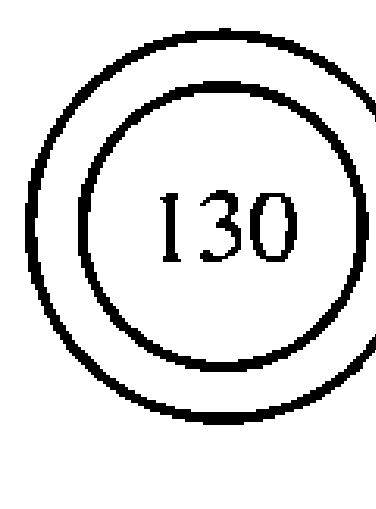

## 見下圖：

## 圖 4.9 運歲分析

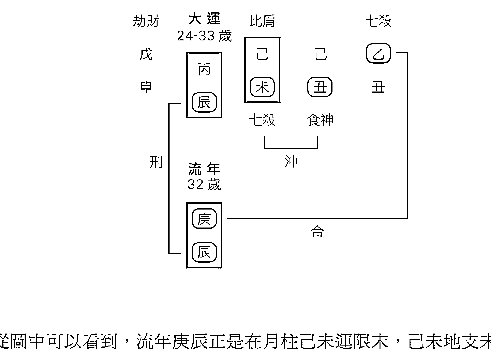

從圖中可以看到，流年庚辰正是在月柱己未運限末，己未地支未與日支夫宮丑相沖。未中有夫星七殺，被丑中辛金食神剋去。這是原局本有的這個時間階段的潛在信息。現在流年庚辰出現，庚合去了時干上的乙木七殺，這樣局中原有的兩個夫星一個被剋、一個被合，都一起被去掉了。這是明顯的婚姻失敗的信息。最後運、歲辰辰自刑，命主不能不接受這樣的不幸結局，做出最終離婚的決定。

## 離婚案（E）

事實：乾造退伍後在航空公司工作。小時候父母離異。辛巳年結婚，和母親住在一起。婚後配偶與母親不合，相處不融洽。癸未年自行買房，但每周有三、四天回母親家住。配偶心中不滿，婆媳關係更糟。乙酉年底，雙方簽下離婚協議書，婚姻告終。

以下是雙方命局和分析：

命例22：乾造 1967年5月15日戌時生。

合 大運 流年
偏印 七殺 正官
丁 乙 己 甲
未 巳 卯 戌
比肩 正印 七殺 劫財
偏印 傷官 食神
七殺 劫財 偏印
合
結婚 購屋 離婚

## 命造簡評：

己土生於巳月，火土旺相。八字二火三土三木，雖然甲乙木官殺不弱，但丁火印星透出，木生火，火生土，依舊流至自身，故身強。命局無點滴水氣，木火土難免煩烈，調候失宜，是命局的最大弱點。

關於姻緣，命中無水，水爲財星，也爲妻星，因此一生異性緣較淺。34歲結婚，已屬晚婚。同時，偏財爲父，父緣也淺。故小時候父母就離婚了，跟母親生活，或許有戀母情結，從而成為婚姻生活的最大障礙。

從命理講，局中官殺星甚旺，而且佔據了跟日主最接近的三個位置：日
支，月干和時干。官殺是剋身的，然而印星為其最重要的轉化之神。顯然，母親印星也就成了命主精神紓解的源頭。命主婚後始終與母親親近，也屬情理之中。

## 運歲動態分析：

辛運泄秀制殺，應該是好運。辛巳年34歲結婚。八字中，因為沒有財星或妻星。那麼，我們就主要觀察妻宮的情況。妻宮坐卯木七殺。七殺性烈，可以預計到妻子的性格比較嚴肅、剛強、有主見。七殺透出在月干，可以看做是妻宮卯木在天干的延伸。辛運食神，正好處於剋制年干七殺的位置（見下圖），再得流年辛巳的引動，制殺而得殺；同時，運歲辛丑和辛巳拱夾出酉字，酉沖卯解了原來的妻宮卯與臨旁戌的相合，於是就有了婚姻。

## 圖4.10 運歲分析

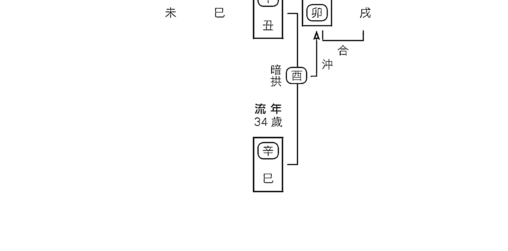

## 36 歲流年癸未，還在辛運。癸未與年柱丁未「地比天剋」，癸財剋丁印，故買房獨立居住，和母親不同住一個屋檐下了。

到了 38 歲乙酉流年，這時大運已入地支丑運。丑運爲土，強身。對於原先就身強的命局，則不是好運。此年離婚。可以做如下分析：

## 圖 4.11 運歲分析

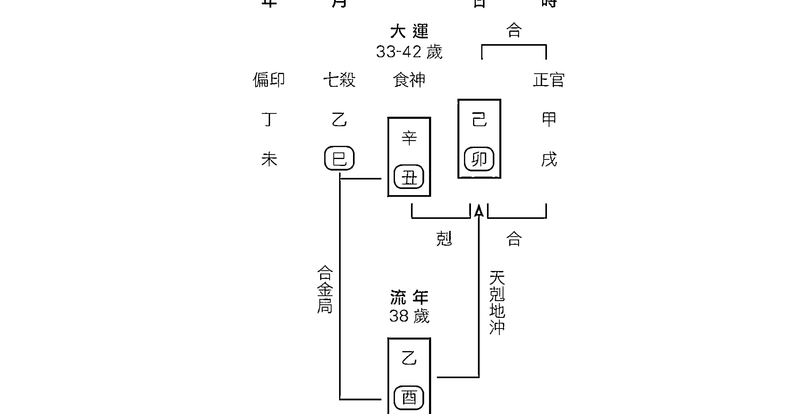

流年乙酉，地支酉與月支巳、大運丑合成金三合局，剋妻宮卯木；同時，流年乙酉與日柱己卯天剋地沖，婚姻宣告結束。

這裡，巳爲八字內母宮，巳酉丑合金局，沖剋妻宮卯木，恰是由母宮發動，因此命主婚姻的失敗確是有其母的因素。

再看坤造：

## 命例23：坤造 1969年3月7日亥時生。

| 偏印 | 七殺 | 偏印 |  |
| :--- | :--- | :--- | :--- |
| 己 | 丁 | 辛 | 己 |
| 酉 | 卯 | 巳 | 亥 |
| 比肩 | 偏財 | 正官 | 傷官 |
|  | 劫財 | 正財 |  |
|  | 正印 |  |  |
| 禄 |  |  |  |
| 冲 |  | 冲 |  |
|  |  |  |  |

| 大運 | 流年 |
| :--- | :--- |
| 30 - 39歲 | 34歲 |
| 36歲 | 38歲 |
| 庚 | 辛 |
| 午 | 巳 |
| 癸 | 乙 |
| 未 | 酉 |
| 結婚 | 購屋 |
| 離婚 |

## 干支一级旋轉

甲至乙，是天干順行一位；戌至酉，是地支逆行一位。何先生把這種現象稱爲「干支一级旋轉」。

瞭解了「干支一级旋轉」之後，「干支n級旋轉」就容易理解了。就是兩組干支，天干順行n位，地支逆行同樣n位，於是，這兩組干支就稱爲「干支n級旋轉」。比如，乙酉與丁未，天干乙至丁，順行兩位；地支酉至未，則逆數兩位，所以，干支乙酉與丁未構成了干支二級旋轉。再如，乙酉與戊午，天干乙至戊，是順行三位；地支酉至午，則是逆數三位，所以，干支乙酉與戊午構成了干支三級旋轉。以此類推，可以有四級、五級、六級，以至於n級旋轉。

何先生指出：

> 「干支n級旋轉」的兩組干支，其中的每組干支的天干與地支間都會有「分裂力」，只不過n的數目越小，其分裂力越大。②

這裡，何先生強調，這種干支之間出現的「旋轉」，反映了它們之間的「分裂力」。n數值越小，分裂力越大，它會造成如離婚、死亡等嚴重事項。

在梁湘潤《大流年判例》一書中，也談到過類似現象。梁先生把它稱爲「干支差錯」。梁先生說：

干支差錯者，可指一般性之不吉。

所謂「差錯干支」是指「流月」與「流日」，干支各逆差一位。比如四柱有「甲子」，流日見「乙亥」。這種情形，經常可見，而以「流月」、「流日」差錯干支者爲最重。比如，「丙申」月見「乙酉」日。③

這裡，梁先生把何建忠的「干支一级旋轉」叫做「干支差錯」，主要應用於流月與流日的推算範圍內。此外，兩組干支，既可以天干順行一位，地支逆數一位，也可以天干逆行一位，地支順行一位。只要是上下干與支的次序相反即可。

筆者乾脆將這種干支「旋轉」或「差錯」的現象，稱爲「干支扭曲」。就像上面的圖示，兩個干支之間在次序或時序上發生了顛倒，相互扭曲。誠如何

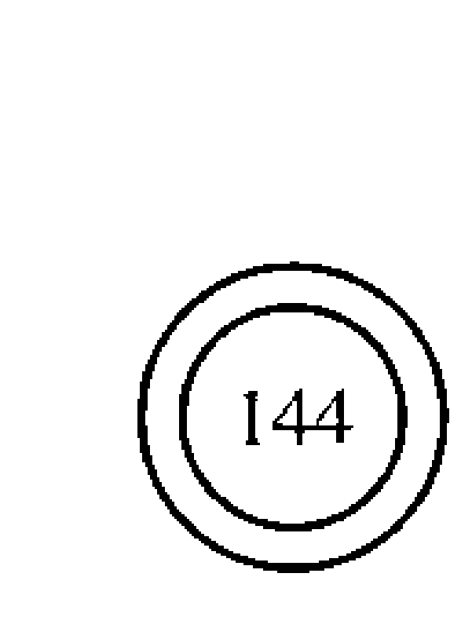

顯然，父親遽然仙逝這年正好是日柱庚申與流年辛未出現了干支「扭曲」：庚至辛，是順行一位；申至未，是逆行一位，成了「干支一级旋轉」，筆者稱之為「一級扭曲」。於是，發生了「死亡之事」。當然，還有其他的因素，諸如未戌刑、亥申穿之類。但流年與日柱構成的干支一级扭曲，看來是能夠充當合理解釋的最重要理由之一。

其實，再注意看，他去世的乙亥日與命局時柱丙戌也是干支一级扭曲：

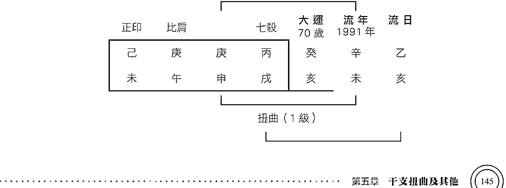

時柱是命局的晚年運限所在，它遭到流年、流月、流日的干支扭曲，當然也應該算作是不利因素。

時光易得，家父離去已經有二十七個年頭了。至今還記得小時候家父在家裡的小黑板上寫些唐詩宋詞教我們誦讀的情景。如今依稀記得起他年輕時候、值抗戰勝利後從重慶回上海途徑武漢時登臨黃鶴樓所寫的一首詩：

烽煙稍斂跡向東，滿懷悲涼楚地留。
浮生半日登高處，霧迷江浪數歸舟。
萬里躑躅雲和水，汍汍瀉浪一篷游。
歷史英雄多餘恨，黃鶴飛天何能求？

如果再仔細觀察，家父命造內部就存在着干支扭曲現象：

扭曲（1級）
正印  比肩   七殺
己  庚  庚  丙
未  午  申  戌

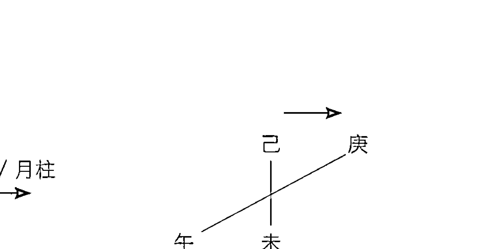

在八字內，年柱己未與月柱庚午，實際上就存在着「干支一级旋轉」現象：天干己至庚，是順行一位；地支未至午，正好是逆數一位。這兩柱的關係就是一級扭曲。

這種「扭曲」究竟有什麼意象呢？

證之事實：家父十五歲喪父。它發生在第一步大運己巳運中，流年是甲戌（1934年）。當然，我們也可以從命造中找到「喪父」的信息：

正印 比肩 七殺\n己 庚 庚 丙\n未 午 申 戌\n正印 正官 比肩 偏印\n正官 正印 食神 劫財\n正財 偏印 正官

我們知道，八字映射的六親關係中，以偏財爲父，正印爲母；以年、月柱爲父母宮位。這裡，命造中無一偏財。年柱和月柱，天干透露出正印和比肩，這些都是不利於偏財星的。可見此命造與其父親「緣薄」。

如果棄偏財而用正財代之，而唯一財星僅存在於年支未墓中。十五歲，巳運甲戌年，巳與月支午、年支未，匯成南方一氣。流年甲戌，天干偏財透露，正好被年干庚金比肩剋去。同時，地支戌土又剋年支未土，所藏乙木正財也被辛金剋去，於是有喪父之哀。這是正常的命理分析。④ 然而，原局年月兩柱構成「一级扭曲」，是否早已隱含了父母宮有變故的信息？

無獨有偶，我有一位朋友的兒子八字（1979 年 6 月 22 日未時生），與以上家父四柱，僅有時柱（時辰）不同，因此，年月兩柱也存在一級「扭曲」：

### 命例 26：乾造 1979 年 6 月 22 日未時生。

扭曲（1 級）
正印 比肩   傷官
己  庚  庚 癸
未  午  申 未
正印 正官 比肩 正印
正官 正印 食神 正官
正財 偏印 正財

事實是：他十七歲時，父母離異。他跟隨母親，從此再沒有見過自己親生父親一面。其八字年月兩柱也具有相同的干支一级「扭曲」，這是否也隱含了同樣的家庭不幸？只是「生離」和「死別」的差異。⑤

顯然，干支扭曲的影響，不僅發生在大運、流年、流月、流日對原局的作用中，而且還存在於命造內部四柱之間。

### 命例分析

於是，筆者以干支「扭曲」的角度，重新審視了不少已有的命例，觀察這一特殊的命理現象在實踐上的應用意義。

星雲山人在《八字用神流年點斷真訣》（以下簡稱《真訣》）中分類羅列了很多命造、以及發生的具體事實，正好給我們提供了有益的案例。以下我從干支扭曲現象出發，對其中一些案例做出重新詮釋，求教於同好：

### 命例27：乾造 1925年11月10日辰時生（陰曆九月二十四日）。⑥

大運

| 正官 | 正印 | 偏印 |  | 1歲 | 11歲 | 21歲 | 31歲 | 41歲 | 51歲 |
|------|------|------|---|-----|------|------|------|------|------|
| 乙   | 丁   | 戊   | 丙 | 丙  | 乙   | 甲   | 癸   | 壬   | 辛   |
| 丑   | 亥   | 戌   | 辰 | 戌  | 酉   | 申   | 未   | 午   | 巳   |
| 劫財 | 偏財 | 比肩 | 比肩 | 正財 | 七殺 | 傷官 | 正官 |      |      |
| 傷官 |      | 正印 | 正財 |      |      |      |      | 冲   |      |

事實：生下六個月（丙寅年甲辰月）父親就去世了。

《真訣》原評：

本造日元不弱，無用火土之理。然大運逢丙，流年亦同，枭印興劫（辰）殺（甲）共同施逆，致亥財被剋盡而父亡矣！⑦

我們可以作如下分析：

扭曲（2級）扭曲（1級）
正官 正印 偏印
乙 丁 戊 丙
丑 亥 戌 辰
偏財
反吟

此造父星偏財僅存於月支亥中。但月柱丁亥與年柱乙丑構成干支二級扭曲（天干丁逆行兩位至乙，地支亥順行兩位至丑，故爲「二级」扭曲），與日柱戊戌構成干支一级扭曲，此兩重破壞力，再加上流年寅合亥，偏財星被剋泄殆盡。而甲辰月與日柱戊戌反吟，此時命主年幼喪父。

### 命例28：坤造 1939年4月15日（陰曆二月二十六日）辰時生。

正官 七殺 食神 大運 流年 流月
己 戊 壬 甲 7歲 17歲 27歲 37歲 47歲 57歲
卯 辰 午 辰 己 庚 辛 壬 癸 甲
傷官 七殺 正財 七殺
傷官 正官 傷官
劫財 劫財

事實：31歲己酉年喪夫。

《真訣》原評：

（1）原局官殺混雜，且年上卯支傷官帶桃花，乃剋夫多夫命！（2）大運辛，正印旺身，流年己酉，傷官見官並沖動桃花，情劫而喪夫。®

我們可以作如下分析：

|扭曲（1級）|扭曲（2級）|大運|流年|
|---|---|---|---|
|正官|七殺|食神|27歲 31歲 己 戊 壬 甲 卯 辰 午 辰 辛 未|

這裡，我們看到大運與日柱（日支為夫宮）呈現干支一级扭曲，流年與大運又呈現干支二级扭曲，這是否構成了命主此年「喪夫」的主要緣由呢？

### 命例29：坤造 1945年10月25日（陰曆九月二十日）子時生。

|偏印|劫財|正財|大運 5歲 15歲 25歲 35歲 45歲 55歲 丁 戊 己 庚 辛 壬 亥 子 丑 寅 卯 辰|
|---|---|---|---|
|乙 酉|丙 戌|丁 卯|庚 子 丁 戊 己 庚 辛 壬 亥 子 丑 寅 卯 辰|
|傷官|偏印|七殺|偏財 比肩|

事實：32 歲丙辰年喪夫。

《真訣》原評：

32 歲大運在丑，合子刑戌，流年辰支又與戌沖，土沖土旺，土旺剋水（子），且夫宮本有酉沖，如此夫星夫宮均敗，夫亡必矣！❸

# 我們作如下分析：

# 扭曲（2 級）
# 大運 流年

| 偏印 | 劫財 | 正財 | 大運 | 流年 |
| ---- | ---- | ---- | ---- | ---- |
| 乙 酉 | 丙 戌 | 丁 卯 | 己 丑 | 丙 辰 |
| 庚 子 |      |      |      |      |

# 扭曲（1 級）

固然，《真訣》作者從夫星、夫宮沖合出發，予以一定的解釋，是可取的。但到了「喪夫」的地步，大運己丑與日柱丁卯發生干支二级扭曲，流年丙辰與日柱丁卯發生干支一级扭曲。這兩重「扭曲」，不能不說也是重要信號吧？

### 命例 30：坤造 1932 年 2 月 6 日（陰曆正月初一日）卯時生。

大運

| 正官 | 正官 | 七殺 | 1 歲 | 11 歲 | 21 歲 | 31 歲 | 41 歲 | 51 歲 |
| ---- | ---- | ---- | ---- | ---- | ---- | ---- | ---- | ---- |
| 壬 申 | 壬 寅 | 丁 酉 | 辛 丑 | 庚 子 | 己 亥 | 戊 戌 | 丁 酉 | 丙 申 |
|      |      |      |      |      |      |      |      |      |

+   - 正財
- 正印
- 偏財
- 偏印
- 正官
- 劫財
- 傷官
- 壓官

事實：37 歲戊申年喪夫。

《真詎》原評：

（1）本命官殺混雜，加上四支申寅、酉卯互沖，乃主孤寡之人！（2）流年戊干傷官見官，為禍百端，而申支乃為沐浴、紅鸞，引動原局四支互沖，終見喪偶之痛！（紅鸞，婚前為喜，婚後為忌。）¹⁰

我們作如下分析：

|正官 | 正官 | 七殺 | 大運 | 流年 |
|------|------|------|------|------|
| 壬申 | 壬寅 | 丁癸 | 31歲 | 37歲 |
| 申寅 | 酉卯 | 戊申 | 戊戌 | 戊申 |

這裡，我們看到流年與日柱（日支為夫宮）呈現一級扭曲，是否也是喪夫的重要信號之一？當然，大運傷官見官，戌酉穿，流年戊申沖剋壬寅柱，都是喪夫的信號。

### 命例31：乾造 1936年9月25日（陰曆八月十日）卯時生。

大運

| 七殺 | 正官 | 正印 | 4歲 | 14歲 | 24歲 | 34歲 | 44歲 | 54歲 |
|------|------|------|-----|------|------|------|------|------|
| 丙子 | 丁酉 | 庚戌 | 戊戌 | 己亥 | 庚子 | 辛丑 | 壬寅 | 癸卯 |
| 傷官 | 劫財 | 偏印 | 正財 | 正財 | 正官 | 正官 | 正官 | 正官 |

事實：41 歲丙辰年妻亡。

《真訣》原評：

大運丑，刑妻宮戌支，流年辰支又再沖攻妻座，解去卯戌之合，而促致卯酉之沖，木倒妻亡矣！①

# 我們做如下的分析：

|七殺|正官|正印|
|:---|:---|:---|
|丙|丁|庚|己
|子|酉|戌|卯|

|大運|流年|
|:---|:---|
|34 歲|41 歲
|辛|丙
|丑|辰|

|正財|扭曲（2 級）|反吟|
|:---|:---|:---|
|    |    |    |

此造唯一正

## 《真訣》原評：

戌運辛酉年，酉戌乃辛金正印祿刃之地，今酉戌見穿並助生旺水剋滅戌巳中之火星，故本人於立冬忌神秉令之後，雙目因病而失明！

我們做如下的分析：

# 圖 5.15 干支扭曲分析

| 比肩 | 正官 | 傷官 |
| ---- | ---- | ---- |
| 壬   | 己   | 壬   | 乙   |
| 子   | 酉   | 戌   | 巳   |

這裡，流年辛酉與大運庚戌發生干支一級扭曲，是否更是一個重要的命理緣由呢？

以上九個命例都反映了干支「扭曲」發生的不可忽視的作用，尤其是日柱與流年干支發生一級扭曲的影響，它可以成為解讀命理信息的一個重要標誌。

## 夭亡信息

梁湘潤編著的《大流年判例》，在「夭壽論法」一節中，羅列了一些夭折的命例。若從干支「扭曲」角度予以觀察，或許能增加其命理上的解釋能力：

命例37：坤造 1924年2月9日子時生。

|七殺|偏印|偏財|
|---|---|---|
|甲|丙|戊|壬|
|子|寅|午|子|

大運

|2歲|12歲|22歲|32歲|42歲|52歲|
|---|---|---|---|---|---|
|乙|甲|癸|壬|辛|庚|
|丑|子|亥|戌|酉|申|

事實：12歲（乙亥年）夭折。

《判例》對於此命「夭折」的推理：

日支與年、時雙沖，乃致命之傷。

我們可以做進一步的分析：

# 圖5.16：干支扭曲分析

扭曲（1級）

|七殺|偏印|偏財|大運|流年|
|---|---|---|---|---|
|甲|丙|戊|壬|  |
|子|寅|午|子|  |
|  |  |  |12歲|12歲|
|  |  |  |甲|乙|
|  |  |  |子|亥|

梁先生的理由十分充分。不過，流年乙亥與大運甲子以及年柱甲子都構成了干支一級扭曲，而年柱正是所在的運限，故此一級扭曲可以視作此年夭折的一個重要原因。

## 命例38：乾造 1977年7月12日卯時生。

# 大運

正官 正官 正印\n丁 丁 庚 己\n巳 未 午 卯\n七殺 正印 正官 正財\n比肩 正官 正印\n偏印 正財

2歲 12歲 22歲 32歲 42歲 52歲\n丙 乙 甲 癸 壬 辛\n午 巳 辰 卯 寅 丑

事實：3歲（己未年）夭折。

# 《判例》說：

日主受地支三合、三會成七殺之局，若天干又透「官或殺」。四柱地支沒有日主之「臨官」或者「帝旺」之位，即作夭折論。……三歲「己未」年。大運在丙午。年支「巳」、運支「午」、流年地支「未」，又會合成「巳、午、未」七殺之局，呈循環「殺」局之炎勢，因而夭折。

我們可以做進一步的分析：

# 圖5.17 干支扭曲分析

正官 正官 正印\n丁 丁 庚 己\n巳 未 午 卯\n大運 流年\n2歲 3歲\n丙 己\n午 未

梁先生的推理自然是合理的。然而，大運丙午與年柱丁巳（當時的運限）、流年己未與日柱庚午，都構成了干支一級扭曲，這不能不是引發嚴重後果的重要原因之一。

## 命例 39：乾造 1974 年 1 月 13 日丑時生。

| 正印 | 劫財 | 劫財 | 4歲 | 14歲 | 24歲 | 34歲 | 44歲 | 54歲 |
| ---- | ---- | ---- | ---- | ---- | ---- | ---- | ---- | ---- |
| 癸   | 乙   | 甲   | 乙   | 甲   | 癸   | 壬   | 辛   | 庚   |
| 丑   | 丑   | 寅   | 丑   | 子   | 亥   | 戌   | 酉   | 申   |
| 正財 | 正財 | 比肩 | 正財 |      |      |      |      |      |
| 正印 | 正印 | 食神 | 正印 |      |      |      |      |      |
| 正官 | 正官 | 偏財 | 正官 |      |      |      |      |      |

事實：24歲（丙子年）夭折。

# 《判例》推理說：

日支與年、月、時支，全皆為差一位者，論夭。……二十四歲「丙子」年、大運「癸亥」，與年支「丑」，三會「亥、子、丑」而論大凶。

當然，這是很好的解釋。然而，我們可以做進一步的分析：

# 圖 5.18 干支扭曲分析

若從干支扭曲的角度來觀察，八字本身日柱甲寅與月柱乙丑、時柱乙丑已經構成了干支一級扭曲。這是先天結構「不穩」。24歲流年丙子出現，又與四柱中的月柱、時柱構成干支一級扭曲，與日柱構成了干支二級扭曲，這樣，加劇了八字本身的「破壞力」，這是否也是造成本命夭折的緣由呢？

雖然理論上干支扭曲可以擴展到n級，但一般超過了二級以後，其「破壞力」就不那麼顯著了，所以上述十三個案例分析中我們僅用到干支一級扭曲和二級扭曲。

在徐樂吾《命理一得》一書裡，有兩個民國時代的命例：一是徐六新（銀行家）命造，48歲空難而死；一是孫景陽命造，38歲車禍而亡。徐先生主要以六合帶神煞（六合中帶劫煞）的作用來予以解釋，並且歸之於他們的好運已盡。「凡以下無運者，禍軛生於上一運末，氣機之先見也。」

固然，這不失為是一種解釋。但為什麼會發生死亡這樣嚴重的後果，終究要探尋其發生的特殊理由。幾十年前，筆者讀此書時就存疑惑。現在若從干支扭曲的角度觀察，或許可以有個答案。請看以下分析：

## 命例40：乾造 徐新六（1890-1938），民國時期銀行家。

# 大運

傷官 正印 七殺 1歲 11歲 21歲 31歲 41歲 51歲
庚 丙 己 乙 寅 戌 丑 亥 丁 戊 己 庚 辛 壬 亥 子 丑 寅 卯 辰
正官 劫財 比肩 正財 正印 食神 偏財 正官 劫財 偏印 食神

事實：48歲戊寅年空難死亡。

我們可以做如下的分析：

# 圖 5.19 干支扭曲分析

如圖所示，48 歲流年戊寅與日柱己丑不正構成了干支一級扭曲？這正是此年發生空難的一個重要命理緣由。

## 命例 41：乾造 孫景陽（1899-1936）。

事實：38 歲丙子年車禍而亡。

我們可以做如下的分析：

如圖所示，38 歲流年丙子與大運乙丑正好發生干支一級扭曲。同時，流年丙子又與年柱戊戌構成干支二級扭曲，與時柱辛丑干支雙合。這些干支複雜關係都是由流年丙子出現而造成的，是否能成為是年發生凶險的重要緣由呢？

通過以上十多個命例的檢驗，我們可以確認干支「扭曲」（或稱旋轉、差錯）現象的破壞力是很強的，我們絕不能低估它們可能對命主帶來的嚴重後果。對這種現象的分析和識別應當成為命理動態分析中的一個重要環節。所以筆者認為，干支扭曲應當加入到我們常用的刑沖會合分析中去。

## 干支相順

既然有干支「扭曲」，當然也有干支「相順」。可以想像，干支像一根根火柴棒，交叉排列是「扭曲」。相互扭曲施力，則易折斷。順序平行排列，即是「相順」。可以圖示如下：

何建忠在《千古八字秘诀總解》中也提出了「干支 n 級相順」。即：AB 二組干支中，A 對 B 的天干關係爲順數 n 位，地支間的關係也爲順數 n 位，此即爲「干支 n 級相順」。例如：

+   - 甲 —> 乙 見
- 午 —> 未 相順（1級）
- 甲 —> 丙 見
- 午 —> 申 相順（2級）
- 甲 —> 丁 見
- 午 —> 酉 相順（3級）
- 甲 —> 戊 見
- 午 —> 戌 相順（4級）

該書還舉了一例：

| 癸 | 庚 | 丙 | 辛 |
| 已 | 申 | 辰 | 卯 |

相順（4級）
相順（2級）

何先生說：

（1）本造日柱及月柱是「干支四级相順」，故而丙辰柱與庚申關係密切，並且丙及辰，庚及申間皆能同心協力。（2）時柱及年柱是「干支二级相順」，故而辛卯柱與癸巳柱間關係密切，並且辛及卯，癸及巳間也能同心協力。（3）丙及辰間因能同心協力，故可論妻、財緣佳。

陳啟鈐《八字命理判斷心得》中也說過：

不論男女，流年和日柱成一级相順，主婚緣：丁卯，甲辰，丙戌，甲午。乙酉年和日柱丙戌成一级相順，婚緣。

這是特指流年和日柱的相順，跟我在前面談到的流年與日主的扭曲正好相反，扭曲為凶，相順則喜慶（「妻、財緣佳」），這是值得進一步觀察和實驗的。其實，作為「相順」情況，古人也早就注意到了。

命理古籍《蘭台妙選》說：「一旬三位四位，為公為卿。」 即：命局中若有三柱或四柱，都同屬於一旬的干支，是一種具有「貴」的徵兆。

比如，民國北洋軍奉系首領張作霖（生於1875年3月19日）命造：

# 命例42：乾造  張作霖（1875-1928），民國北洋軍奉系首領。

# 大運

正財 正印 正官
 乙 己 庚 丁
 亥 卯 辰 丑
 食神 正財 偏印 正印
 偏財
 正財 傷官
 傷官 劫財

張作霖，光緒元年二月十二日（1875年3月19日）丑時生，字雨亭，漢族，奉天省海城縣駕掌寺鄉馬家房村西小窪屯（今遼寧省海城市）人。

張作霖自幼出身貧苦農家，早年投身綠林，被清政府招安。先後擔任奉天督軍、東三省巡閱使等，號稱「東北王」，成為北洋軍奉系首領。第二次直奉戰爭勝利後，張作霖打進北京，任陸海軍大元帥，代表中華民國行使統治權，成為國家最高統治者。1928年張作霖被迫返回東北。

1928年6月4日，張作霖乘火車被日本關東軍預埋的炸藥炸成重傷，史稱皇姑屯事件，當日送回瀋陽官邸後即逝世。

張作霖的八字就是「四柱一句」：

在此命局中，年、月、日、時四柱正好同出於甲戌旬的十個干支之中。故韋千里《命運談屬》中評點此命時說：「四柱一句，貴氣所鍾，宜其稱王關外矣。」

再如，曾為近代政界和金融界要人的宋子文命造：

# 命例43：乾造 宋子文（1894 - 1971），民國時期政治家、外交家、金融家。

# 大運

| 偏財 | 正財 | 正印 |
| 甲午 | 乙亥 | 庚辰 | 己卯 |
| 正官 | 食神 | 偏印 | 正財 |
| 正印 | 偏財 | 正財 |
| 傷官 |

宋子文，生於1894年12月4日，海南文昌人。早年畢業於上海聖約翰大學。後去美國哈佛大學攻讀經濟學，獲碩士學位，繼入哥倫比亞大學，獲博士學位。1923年任孫中山英文秘書，後主管國民黨財務。1924年在廣州創辦中央銀行，任總裁。1925年任國民政府財政部長。1928至1930年間通過談判收回關稅自主權。1942年擔任國民政府外交部長。1945年出席聯合國大會任中國首席代表。1949年去香港，後移居美國紐約。1971年4月25日在舊金山逝世。

此命造中月、日、時三柱，也是同出於甲戌旬的干支：

明代《三命通會》中另有「五行一旬」的論說：

謂年月日時胎，共出一旬，如甲子、丙寅、己巳、庚午之類，帶生旺六合無破敗，則吉。

## 一字之差：任鐵樵命例

在談到我的好友袁君與宋子文八字的「一字之差」，人生際遇迴異，自然就想到《滴天髓》的注譯者任鐵樵。

《滴天髓》是命理學的經典著作，大致認為是明朝初年劉基（伯溫）所撰。由於其行文精煉，多為詩賦，義理隱晦，實不易為人所領悟。直到清朝道光年間，由任鐵樵做了十分詳盡的注釋，此書才得以廣泛流傳。在命理學史上，任鐵樵可謂是揭開《滴天髓》神秘面紗的第一人，厥功至偉。

在《滴天髓闡微》中，任鐵樵在「合官留殺格」條下批注了一位五品黃堂的八字，接着附上了自己的八字，並由此發了一大段人生浮沉的感慨。茲錄於下：

命例 45：乾造 1733 年 7 月 7 日（雍正十一年五月二十六日）辰時生。清朝官員（官至黃堂）。

合
正官 食神 七殺 大運
癸 戊 丙 壬 丁 丙 乙 甲 癸 壬
丑 午 午 辰 巳 辰 卯 寅 丑 子
傷官 劫財 劫財 食神
正官 傷官 傷官 正印
正財 正官
害 刑

# 任鐵樵評注：

此造火長夏天，旺之極矣。戊癸合而化為忌，還喜壬水通根身庫。更妙年支坐丑，足以晦火養金而蓄水，則癸水仍得根，雖合而不化也。不化反喜其合，則不抗乎壬水矣。

## 從命局到大運流年（上）
## 第六章

自本章起，我們對八字的動態分析做全方位的深入探討。我們先從命局出發，聯繫大運、流年來做考察。由於筆者的命局分析架構有四個主要視角，下面就沿着這四個視角的内容逐一展開。

### 強弱視角

「強弱」是筆者論命體系的第一個視角。它是以日主爲中心，分析八字結構內部的強弱問題。

強弱問題是近年來內地命學界經常爭論的問題。有主要關注命局強弱來論命的「強弱派」，也有乾脆否定強弱分析的，如段氏「盲派」。那些否定強弱分析的人認爲，在具體分析一個八字時，常常會發生意見不一，就是你說強他說弱，似乎一開頭就陷入了一個先天性的泥潭。與其做這樣的爭論，不如乾脆放棄爲好。

但筆者不能認同這樣的看法。筆者認爲，強弱分析是瞭解一個八字結構的基礎，尤其是日主在五行分布中的地位。

日主強弱的評判方法，已有的一般原則是：觀察日主是否（1）得令，（2）得地，（3）得助。

所謂「得令」，是指八字中月令地支屬於日主比較旺盛的季節。比如，日主甲木生於春季，就是得令。得令，自然強盛。

所謂「得地」，是指日主在年、日或時的地支上有根基。比如，日主甲木在年、日或時的地支上見到寅、卯或亥、辰、未，因爲亥爲甲木之生（長生），寅爲甲木之祿，卯爲甲木之帝旺（陽刃），辰、未藏干中有乙木，日主見此根基，自然增強了自身的力量。

所謂「得助」，是指四柱多幫扶。比如日主是甲木，四柱干支多見水和木。因爲水可以生扶甲木；木可以比助甲木。

爲了幫助初學者入門，筆者在《基礎教程》中設計了一種數量分析方法，通過對比日主同方和日主異方數量的圖解分析，取得一個大致的強弱評判。

自然，這種簡易的方法是有局限性的。最主要的問題，是處於日主異方一端的官殺星（即「剋我」），它們具有所謂「兩頭蛇」的特性。一般情况下，它是剋日主的勢力，但如果有印星（即「生我」）透出，由於印星可以「化」官殺星，使官殺星生印星，印星再來生日主。這時，官殺星「倒戈」，反而成了幫助日主的力量了。

比如，下面的命例是汪偽時期大漢奸陳公博的八字：

### 命例 47：乾造 陳公博（1892 - 1946），汪偽政府第二號大漢奸。

### 大運

| 偏印 | 七殺 | 比肩 | 7歲 | 17歲 | 27歲 | 37歲 | 47歲 |
|------|------|------|-----|------|------|------|------|
| 王   | 庚   | 甲   | 甲  | 辛   | 壬   | 癸   | 甲   |
| 辰   | 戌   | 申   | 戌  | 亥   | 子   | 丑   | 寅   |
| 偏財 | 偏財 | 七殺 | 偏財 |      |      |      |      |
| 劫財 | 正官 | 偏印 | 正官 |      |      |      |      |
| 正印 | 傷官 | 偏財 | 傷官 |      |      |      |      |
|      |      |      |     | 冲   |      |      |      |

陳公博（1892 年 10 月 19 日 -1946 年 6 月 3 日），廣東南海人，原籍福建上杭，寄籍南海。1892 年 10 月 19 日出生，早年就讀於北京大學。中國政治人物。

他早年參加中國共產黨，是中共一大代表。後脫黨，跨身國民黨行列，以「左派」自謂，曾任國民黨第二次全國大會中央執委。後演變為反蔣的改組派的代表人物，但不久又與蔣合流。1938 年後，他追隨汪精衛，叛國投敵，成為中國的第二號大漢奸。1945 年日本宣布投降，陳公博亡命日本，不久被解押回國。1946 年以叛國罪被處決。

此八字甲木生於秋末戌月，失時令；天干僅一比肩助身，年支辰土內藏乙木餘氣，但被月支戌土相沖，日主身弱無疑。

月令藏辛透庚，為七殺格。地支三土一申金，財煞重重，更是煞重身輕。幸有年干壬水坐庫，通根於申金長生，得以化凶煞而生身，構成殺印相生的格調。顯然，這個壬水偏印是全局用神。

全局雖然只有年干一個壬水，卻有扭轉全局財煞重重團困劣勢的功能，應了古籍中所說的「眾煞猶狂，一仁可化」的斷訣，故命主能在高層政壇裡活動周旋。但終究自身根輕，有濃厚的投機心態，一生左右搖擺，最終走上了投敵求榮的道路，被釘上了歷史的恥辱柱。

再看一例：

### 命例48：乾造 虞洽卿（1867 - 1945），民国初期上海闻人。

| 正官 | 七殺 | 正印 |
| ---- | ---- | ---- |
| 丁 | 丙 | 庚 |
| 卯 | 午 | 午 |
| 正財 | 正官 | 正官 | 正財 |
| 正印 | 正印 |  |  |

### 大運

| 5歲 | 15歲 | 25歲 | 35歲 | 45歲 | 55歲 | 65歲 | 75歲 |
| --- | --- | --- | --- | --- | --- | --- | --- |
| 乙 | 甲 | 癸 | 壬 | 辛 | 庚 | 己 | 戊 |
| 巳 | 辰 | 卯 | 寅 | 丑 | 子 | 亥 | 戌 |

虞洽卿，名和得，字洽卿，1867年（同治六年）6月19日（農曆五月十八日）卯時生。浙江慈溪人，早年家貧，到上海當學徒，五四運動期間上街勸說開市。1920年合夥創辦上海證券物品交易所，任理事長。1923年當選為上海總商會會長。抗戰時期堅持抗日愛國，日軍佔領租界後赴渝經營滇緬公路運輸，支持抗戰。1945年4月26日在重慶病逝。

這個八字，庚金生午月，干頭並排着丙、丁火，地支也是雙木雙火，真是火勢炎炎。日主孤懸無根。然而，時干透出己土，雖然坐在卯木（病地）上，

但通根地支兩個午祿。這也是「眾煞猖狂，一仁可化」。可有點叫人意外的是，命主居然是舊上海十里洋場中赫赫有名的「赤腳財神」，比大家熟悉的舊上海聞人杜月笙還高出一輩。如此「殺旺身淺」的人，從跑街到買辦，從買辦到地方聞人，這個「己土」用神，真有扭轉乾坤之力。當然，命主中年後一路金水運也不能低估。

可見命局並不是僅以強弱來定「終身」的。弱不可怕，怕的是局中沒有轉化的機制，從以上案例中不難推導出這樣的結論。

在《進階教程》中，筆者進一步提出強弱有個「度」的問題。其實，在實務中可以換一個分析角度，從局中的祿、刃，以及有根、無根等方面來考察日主的強弱。

### 「五指傘」

作為身強的「上限」，民間「私房抄本」有所謂「五指傘」的訣竅。

「五指傘」是比喻擺開一隻手，有五根指頭，成傘形。它有兩種命理含義：一種是指日主同方，它的個數等於或大於5，這就到了極限，再走助身的旺運，一定會出問題。比如：

### 命例 49：乾造 《滴天隱》古案

| 比肩 | 正官 | 偏印 | 大運 |
| ---- | ---- | ---- | ---- |
| 丙   | 癸   | 丙   | 甲   |
| 申   | 巳   | 午   | 午   |
|      |      |      |      |
| 偏財 | 比肩 | 劫財 | 劫財 |
| 七殺 | 偏財 | 傷官 | 傷官 |
| 食神 | 食神 |      |      |
|      | 禄   | 陽刃 | 陽刃 |
|      |      |      | 合   |

任鐵樵的評注是：

丙午日元，生於巳月午時，群比劫財，逼乾癸水。初運甲午，刃劫猖狂，父母早亡；乙未助刃，家業財盡；交丙申、丁酉，貧乏不堪。交戊戌稍能立腳。

這個八字，數一數同於日主的「火」，天干兩個丙火，地支巳午午，加起來已是五個，滿了五個手指的數。這時就不用再算了，日主已到了身強的「上限」，不能再走幫扶的大運了。所以初運甲午，就死了父母，以後一直貧病交加，一直到泄火的土運時，稍有一點喘息的機會。

另一種含義，「五指傘」就是指「比、劫、祿、刃、印」。⑪

顯而易見，這五者都是幫身扶身的。進一步延伸：（1）比劫扶身，會剋財，有破財和妨妻之弊；（2）印星扶身，則過於「清高」，有礙前程。所以梁湘潤先生認為：「『祿、刃、印』全，即是凶命」。⑫ 如果流年再出現祿、刃、印，就是「凶年」。

在《流年法典》中，梁先生羅列了六個表格，下面是其中的一個：

### # 表 6.1 雙祿帶刃、印為凶年

| 日主 | 甲 | 乙 | 丙 | 丁 | 戊 | 己 | 庚 | 辛 | 壬 | 癸 |
| 雙祿 | 二寅 | 二卯 | 二巳 | 二午 | 二巳 | 二午 | 二申 | 二酉 | 二亥 | 二子 |
| 刃   | 卯   |     | 午   |     | 午   |     | 酉   |     | 子   |     |
| 印   | 子   | 亥   | 卯   | 寅   | 巳   | 午   | 午   | 巳   | 酉   | 申   |
|      | 凶終 | 未年劫庫凶 | 凶終 | 戌年劫庫凶 | 凶終 | 戌年劫庫凶 | 凶終 | 丑年劫庫凶 | 凶終 | 辰年劫庫凶 |

注：

日主天干 —— 在地支，有兩支是臨官，另帶一個陽刃，或一個正印。

「印」之十神 ——「戊己、庚辛」—— 土金合用。

一：甲丙戊庚壬 ——五陽干。禱、印、刃全者凶沖。散在「柱、運、歲」。

比如：甲日主 ——四柱有兩個寅祿，卯陽刃大運，子卯年 ——大凶。

二：乙丁己辛癸 ——五陰干。日主五行 ——三合中，現加一個祿位即是大凶。

比如：乙日主 ——八字有兩個卯祿，大運 ——亥，流年 ——未。一年大凶。

這裡，我想到了活躍於本世紀初的命理學家李後敵的八字：

### # 命例50：乾造 李後敵，1938年2月11日子時生。當代命理學家。

### 大運

| 偏財 | 比肩 | 比肩 | 比肩 | 7歲 | 17歲 | 27歲 | 37歲 | 47歲 | 57歲 | 67歲 |
| ---- | ---- | ---- | ---- | ---- | ---- | ---- | ---- | ---- | ---- | ---- |
| 戊   | 甲   | 甲   | 甲   | 乙   | 丙   | 丁   | 戊   | 己   | 庚   | 辛   |
| 寅   | 寅   | 戊   | 子   | 卯   | 辰   | 巳   | 午   | 未   | 申   | 酉   |
| 比肩 | 比肩 | 偏財 | 正印 | 食神 | 食神 | 正官 | 偏財 | 儘官 | 禄   | 禄   |
| 禄   | 禄   |      |      |      |      |      |      | 午   | 夾拱 |      |

李後敵，1938年生，湖南邵東縣人。當代命理學家。著有《之秀命理》、《算命一百法》和《八字精析》。

命局中天干三甲，地支兩個寅祿，再加上時支子水正印，完全符合「五指傘」的訴求，日主已經到了身旺的「上限」。少年乙卯大運，卯為甲木陽刃，

也符合以上表（表6.1）的所指，故李先生在「自批」中說：「7-16歲，初入卯運，劫財坐祿，旺人旺運入旺鄉，必羅晦澀，十年艱辛難言。」

其中7歲：

乙酉年，酉歲沖卯運，歲沖運者崩，日本鬼子鐵蹄踐踏家鄉，東奔西逃，受盡驚誇。下半年，日本投降，父親雙目失明。為治父親眼病，家產變賣將盡。父之眼病不癒，財產全空。

13歲：

辛卯流年，正官坐刃，老兄分家，從此一個13歲的孩子，一面讀書，一面種10多畝土地，擔負起養活全家5口人生活的全部任務，其艱難和辛苦可想而知。

所幸自17歲進入丙辰運後，「僅己未十年背離日主和用神外，其餘整整五十年大運，都是助用神、向日主的。」

那麼47至56歲的己未運到底發生了什麼？

李先生寫道：

偏財主事坐兩祿為雙體，身旺財旺，本來應該發財。殊不知命中比肩一片，群起而奪財，財星受傷慘重。財為妻，財土在本人為脾胃。故妻患精神分裂，本人得嚴重的脾症——糖尿病。這時，又值新來的主要領導只能以心照不宣的原因，筆者早先坐下的位置雖然不變，就是不被任命。……故於1992年還只有54歲，就正式主動退出了工作崗位。③

顯然，這一段正財大運並不是好運，所以工作和健康以及妻子的狀況都不好。這是財露頭、遭群比劫財的運，自然不順。正因為「休閒在家」，中國命學界才有了李後敵先生的三本命理研究著作。④ 這是命學界的幸運。

至於李先生的八字本身，盡管身旺已經到了「上限」位置，但筆者並不以為是「凶命」。誠如李先生自己指出的，這個八字有一個「玄

## 到了流年乙卯，在辛卯大運後五年，禍事來了。卯爲日主甲木之刃、乙木之祿，天干上的木下到地支上來了，這就讓原先一直虎視眈眈的地支西方一氣的金有了砍殺的對象了。流年乙卯，引動木之根，與原局酉金東西對決；運干辛金也遇上了流年乙木，有了砍伐的對象，於是盛金剋弱木，木遭殃是鐵板釘釘的事了。木在人體的類象是筋骨，強金剋木，故有此傷斷右腳成殘疾之事故。

從此案可以看到，既然日主無根，反到怕運歲見到根了——即所謂「無根怕有根」。

再看看下例：

## 命例55：乾造 1979年9月23日（農曆八月三日）午時生。®

七殺 比肩 正官 大運 流年
己 癸 癸 戊
未 酉 巳 午
七殺 偏印 偏財 食神 基 病 胎 絕
七殺 偏財 正財 偏財 正印 七殺 食神 正官
半金局
三會方（火）

事實：1997年（丁亥）偷盜，1998年（戊寅）二月被捕。

此案取自李洪成編著的命例集。原書「命理簡析」說：

此造原命局中官殺混雜，水土混雜，水旺身弱，日主虛浮無根，但卻有比肩透干，且坐印得生，故此命局主思維並不聰明，且總受周圍環境和人的壓抑，但心裡總不服氣，總想做出一些反抗的舉動，身弱的歲運中膽小受氣，稍遇身旺就會理智不清地做一些膽大妄為的錯事。

李先生剖析這類犯罪者的心理十分到位。的確，日主過衰，又官殺混雜，往往會頭腦理路不清，一時膽大妄為，帶來嚴重後果，甚至牢獄之災。這是「無根」弱命容易發生的凶事，值得解讀者注意。

就這個八字而言，天干透出戊、己土，官殺混雜；地支又匯成南方火地，僅一酉金偏印生助，日弱無疑。辛未大運，辛金本可助日主，但逢上流年丁丑，歲運交戰，再加上地支構成巳酉丑，與原局巳午未，形成方局與合局的對峙，居然犯下了偷盜的罪。次年戊寅，戊土再合日干癸水，於是鎖鑰入獄。日主本無根，是很忌諱他干來合去的。合去會出事（失控），這也是一條經驗規則。

## 十干敗亡詩

對於身弱「根淺」或「無根」的命局，古典命學中有一首「十干敗亡詩」：

+   甲申乙酉見閻王,
丙子丁亥切須防,
庚午辛未風中燭,
壬辰戌加癸丑未,
未別浮生入鬼鄉。

所謂「根淺」，就是命局地支沒有日主的臨官、帝旺；「無根」就是上面討論的，地支藏遁中壓根就沒有跟日主相同的五行。根淺或無根的命局，顯然是處於強弱等級中「很弱」一端的八字，這時自然就不宜再走「衰運」了。

具體來說，日主甲木不宜入「申」運，因為「申」在天干旺衰十二運中是甲木的「絕」。日主乙木，不宜入「酉」運，理由相同，「酉」是乙木的「絕」地。同樣，亥、子，分別是丙、丁的「絕」地。午是庚金的「沐浴」（敗地）；未是辛金的「衰」，辰、戌土是壬水的「墓」和「冠帶」；丑、未土是癸水的「冠帶」和「墓」。

總之，八字身弱（又不入從格），就不能再走衰運了。入此類衰運，輕則阻滯，重則凶事。

請看以下案例：

## 命例 56：乾造 1957 年 2 月 19 日（正月二十日）寅時生。⑩

合
正財 比肩 比肩
丁壬壬壬
酉寅戌寅
正印 食神 七殺 食神
  偏財 正印 偏財
  七殺 正財 七殺
沐浴 病 冠帶 病
  午  午
夾拱 夾拱
大運 流年 流月 流日
35 歲 40 歲
戊 丁 戊 丁
戌 丑 申 未

事實：1997 年（丁丑）9 月 2 日下午 3、4 點，從七樓墜下，至晚上 11 點左右死亡。

此命局天干三壬，但地支無點滴水氣，壬水無根，僅賴年支酉金相生。年干丁火合壬，地支寅、戌剋泄交加，日主甚弱。進一步觀察，日柱壬戌，左右兩柱壬寅，各自夾拱出午火，天干有丁火引化，全局構成了水火交戰的局面。

命主 35 歲入戊戌運，重土剋弱水。40 歲丁丑流年，此時大運已經進入戌運，正是迎合了十干敗亡詩中「壬辰戌加癸丑未，未別浮生入鬼鄉」兩句所述的情況。流年丁丑，丁再合壬水，丑戌相剋，酉戌相穿，災難的應期到了。流月戊申，流日丁未，更加劇了刑沖剋害，命主遭遇不幸。前文提到過，無根的八字十分忌諱他干再來合日主，這個八字發生的運歲情況又是一個證明。

## 溥儀命例

在《基礎教程》中，我們談到過末代皇帝溥儀的八字。這裡，我們聯繫他的大運、流年做進一步的分析。

## 命例 57：乾造 溥儀（1906-1967），末代皇帝。¹

合
大運
偏財 偏印 比肩
丙 庚 壬 壬
午 寅 午 寅
正財 食神 正財 食神
正官 偏財 正官 偏財
七殺 七殺
胎 病 胎 病
半火局 半火局
9歲 19歲 29歲 39歲 49歲 59歲
辛 壬 癸 甲 乙 丙
卯 辰 巳 午 未 申
死 長生

愛新覺羅·溥儀（1906 年 2 月 7 日 -1967 年 10 月 17 日），清朝宣統皇帝，也是中國歷史上最後一個皇帝。字耀之，號浩然。醇賢親王奕譞之孫，載澧長子。1909 年到 1912 年、1917 年 7 月 1 日到 12 日兩次在位。1911 年辛亥革命爆發，1912 年 2 月 12 日被迫退位，清朝統治結束。九一八事變之後在日本人控制下做了滿洲國的傀儡皇帝，年號康德（1934 年 — 1945 年）。1945 年 8 月 15 日，日本投降。8 月 17 日，溥儀在瀋陽準備逃亡時被蘇聯紅軍俘虜，被帶到蘇聯。1950 年 8 月初被押解回國，在撫順戰犯管理所學習、改造。1959 年 12 月 4 日被特赦，並成為全國政協委員。溥儀一生四次結婚，娶過五個女人，最後一次婚姻是在 1962 年與李淑賢結婚。溥儀著有自傳《我的前半生》。1967 年 10 月 17 日，溥儀因腎癌在北京逝世，享年 61 歲。

## 溥儀一生

我們來檢點一下這個末代皇帝走過的一生。

溥儀於 1906 年農曆正月十四日生於北京什剎海邊的醇親王府。其父醇親王載澧則是光緒皇帝的弟弟。其母蘇完瓜爾佳氏是首席大學士榮祿的女兒，慈禧太后的養女。

2 歲戊申年，尚未入大運。原局丙火剋用神庚金，但流年戊土充當了「通關」之神的作用，使火生土，土生金，反剋為生了；同時，地支申金，為庚金用神之祿，壬水之長生。流年去了局中「財壞印」之病，且日主得長生之地。由於光緒皇帝無子承位，所以清宮議定讓溥儀為嗣皇帝，入承大統。是年十一月初九登上帝位，成了中國歷史上最末一個皇帝。

這裡有一段插曲。據說在登基大典上，這位乳臭未乾的小孩，被百官山呼萬歲的呐喊聲以及驚天動地的鞭炮囂鳴聲嚇得大哭起來。其父載瀾，此時為攝政王，急忙安慰他說：「別哭，別哭，快完了，快完了！」誰知這一語成誡。不久，西安城裡就傳起了這樣一首童謠：「不用掐，不用算，宣統不過兩年半。」果不其然，三年時間不到，延續了268年的大清帝國就完了。

6 歲（2012 年）壬子流年，與年柱丙午反吟（天剋地沖）。子為壬水陽刃，與炎火相戰。是年 2 月 12 日，隆裕太后在袁世凱的脅迫下代溥儀頒布了《退位詔書》，宣布退位。這位稀裡糊塗當上清朝皇帝的幼年命主，又稀裡糊塗地做了清朝的亡國之君。

9 歲入辛卯運。辛金合年干丙火，解救了命局之病，應該是五年不錯的運。這位前清遜帝，年少不知愁滋味，對紅牆外正經歷的天翻地覆的世界懵然無知。他始終被束縛在天安門後面那一片高大的紅色建築群內，長年與一群太監為伍，過着平靜而奢華的生活。

11 歲丁巳流年，丁火直剋辛金，打破了紫禁城的寧靜，上演了僅有十二天的復辟開劇。這就是歷史上的張勳復辟。是年 6 月，江南提督張勳，領着他的四千名辮子兵殺回北京，與康有為等保皇黨一起擁立命主復辟，恢復「宣統」年號。然而開劇十分短暫，在舉國一片聲討中就匆匆落下帷幕。

15 歲辛酉，是正印（母星）流年，這時已入卯運。卯（運）酉（歲）沖，

16 歲壬戌，卯（運）戌（歲）合，卯原為桃花；同時，戌又合八字內兩個寅午，構成了兩個寅午戌財局，命主大婚日子到了：婉容做了皇后，文繡成了皇妃。然而，火勢益旺而水益弱，財（妻星）旺身弱，命主如何享用？大婚當晚，命主攔下兩位新娘子，獨自到饑心殿過夜去了。（事實上，卯運桃花，生旺午火，熬乾壬水。在紅牆內生活優渥的溥儀在太監宮女的蠱惑下，荒淫無度，小小年紀已患了陽痿症。）

18 歲（1924 年）流年甲子，在卯運末。這是在命主心靈上刻下深深刀痕的年頭。子（年）卯（運）刑，子（王之陽刃）又沖局中雙午，引發火旺木焚，弱水與強火相戰之災。是年冬天，軍閥馮玉祥佔領北京，派兵將溥儀逐出了其世代居住的故宮，並廢除其帝號，停止政府給養，甚至還縱容部下孫殿英將慈禧、乾隆兩座陵寢掘墓拋屍，搶掠一空。這個時候，剛成年的溥儀真實地感受到亡國之君的奇恥大辱了，發誓要復國，為自己的祖先報仇雪恨。迷茫之下，他悄然鑽進了日本公使館。次年 2 月，他遷往天津租界「張園」居住，並設立「清室辦事處」，從事復辟活動。

19 歲交入壬辰運。壬水比肩，通根辰庫，而且辰為濕土，可以晦火，對於孱弱的命主來說，這已經是較好的運程了。可是一路流年：丙寅、丁卯、戊辰、己巳，皆是火土，壬水自顧無暇，哪有餘力幫扶日元呢？命主在天津七年，表面上沉湎於紙醉金迷，暗地裡卻屢屢嘯咐手下搜羅奇人異才，但始終也沒能找到幫助他實現復辟夢想的得力助手。

24 歲入辰運。辰為水庫。從八字看，壬水通根，助了命局弱水。但書云：「少年墓庫，糊裡糊塗」，從歷史進程看，確實預示了命主要做出「糊塗」事了。

25 歲（1931 年）辛未流年。是年發生「九一八事變」。11 月，溥儀在日本駐屯軍司令官土肥原賢二的幫助下從天津潛赴旅順，不久到奉天，籌劃「滿洲國」。

其實，建立「滿洲國」只是日本軍侵略計劃的一部分，目的在於分裂中國，獨霸東北的資源。土肥原遊說命主，宣稱日本人對滿洲絕無佔領的野心，只是「誠心誠意幫助滿洲人民建立自己的、獨立的國家」，並許諾一切都由溥儀做主。急於復國的命主，竟然相信了土肥原的這種拙劣的謊言，他天真的想借日本人之手來完成自己的復辟計劃。溥儀投向了日本人。

請注意，流年辛未與日柱壬午呈現一級扭曲。

是年還有一段插曲。妃子文繡出走，並聘請三位律師向法院起訴，說她與命主結婚9年，沒有過性生活。這種妃子把皇帝告上法庭的行為，頓時成為了爆炸性新聞。命主馬上召集先朝遺老召開「御前」會議，驚詫萬狀的老先生們都認為這是天大的醜事，要委託律師出面，爭取和解。是年10月雙方達成離婚協議。這或許正是日柱遭流年「扭曲」的徵驗。

26歲（1932年）壬申流年，與大運壬辰拱水局，命主依仗日軍勢力，發表滿蒙《獨立宣言》，當上了「滿洲國執政」。兩年後，改稱為「滿洲國康德皇帝」。這時他才發現，土肥原的諾言就是謊言，日本人根本不會讓他有實權，他成了完全由日軍擺布的活傀儡。

28歲乙亥年，乙合用神庚金，亥為比肩壬水之祿，與原局二寅合、二午暗合，午

## 表 6.3 乙木喜用提要：

| 月份 | 調候用神 | 提要 | 大運 |
| --- | --- | --- | --- |
| 正月 | 丙、癸 | 取丙火解寒，略取癸水滋润，不宜困丙。火多用癸。 · 丙为先。 · 是伤官（丙）与偏印（癸）的组合。 | 忌戊、己土。 |
| 二月 | 丙、癸 | 以癸滋木，以丙泄秀，不宜见金。 · 喜财官透。 | 忌水多困丙，多戊化癸。 |
| 三月 | 癸、丙、戊 | 若支成水局，取戊为佐。 · 先癸而后丙。 | 忌己庚混丙癸。 |
| 四月 | 癸 | 月令丙火得禄，专用癸水，调候为急。 · 木火伤官官要旺，非不忌官，是用官生印。 | 忌戊土，防身体有疾。 |
| 五月 | 癸、丙 | 上半月专用癸水，下半月丙癸并用。 · 夏至是阳极阴生的转关，夏至前，先癸后丙；夏至后，水火并用。 | 忌戊合癸。 |
| 六月 | 癸、丙 | 滋土润木，喜用癸水。柱多金水，先用丙火。夏月壬癸，切忌戊己杂乱。 · 大暑前，乙木之性焦虚，以癸水生木解炎；大暑后，火多者，仍以癸水为用。 | 忌戊己土损癸。 |
| 七月 | 丙、癸、己 | 月垣庚金司令，取丙火制之，或癸水化之。不论用丙用癸，皆己土为佐。 · 己土污金——用己土混合申中壬水，化为泥沙，挫庚金之刚锐，培乙木之根荄。 | 忌壬水，文字失策而引起官非。 |
| 八月 | 癸、丙、丁 | 上半月癸先丙后，下半月丙先癸后。无癸用壬。支成金局，又宜用丁。 · 秋分前，桂花未开，用癸滋养；秋分后，桂花已开，用丙晒木，桂花飘香。 | 辛运，日主无根易有灾。 |
| 九月 | 癸、辛 | 以金发水之源。见甲，名藤萝系甲。 · 干透癸辛，为杀印相生，主贵。 | 辛七杀格，入丙运无成。 |
| 十月 | 丙、戊 | 乙木向阳，专用丙火，水多以戊为佐。 · 亥月壬水发旺，先用丙火暖木；次用戊土抑水固根。 | 忌壬运，奔波无成。 |
| 十一月 | 丙 | 寒木向阳，专用丙火，忌见癸水。 · 冬至前，水多则寒湿无生机。冬至后，一阳来复，寒木向阳。 | 癸运，心神不宁。 |
| 十二月 | 丙 | 寒谷回春，专用丙火。 · 冬木以泄为主，重调候——丙火。 | 癸运，体衰有疾。 |

## 表 6.4 丙火喜用提要：

| 月份 | 調候用神 | 提要 | 大運 |
| --- | --- | --- | --- |
| 正月 | 壬、庚 | 壬水为用，庚金发水之源为佐。 • 庚佐壬水以济丙，谓之「水火既济」。 • 丙见壬，为「水辅阳光」• 用壬七杀，丙火要有根。 | 忌丁，判断错失。 |
| 二月 | 壬、己 | 专用壬水，水多用戊制之。身弱用印化之。无壬用己。 • 丙火用壬水七杀辅映取贵。 | 忌辛合丙，沉迷于物欲。 |
| 三月 | 壬、甲 | 专用壬水。土重，以甲为佐。 • 丙火以壬水映照取贵，因土旺制水，故身旺可用庚金化土生水，为「财滋弱杀」；身弱可用甲木制土生火，为「杀印相生」。 | 戊运，难论发越。 |
| 四月 | 壬、庚、癸 | 以庚为佐。忌戊制壬。无壬用癸。 • 喜七杀透出，成水火既济；因夏月水囚易涸，需金为水之源。 | 戊运失意。 |
| 五月 | 壬、庚 | 壬庚以通根申宫为妙。 • 喜透壬庚，忌戊己混壬。 | 戊己，不利亲友。 |
| 六月 | 壬、庚 | 以庚为佐。 • 火土伤官宜伤尽。 • 用壬水忌己土出干混壬。 | 己运，易愚顽。 |
| 七月 | 壬、戊 | 壬水通根申宫，壬多比取戊制。 • 注意：「丙临申位遇壬水，难获延年。」宜戊土制杀。 | 壬申、壬子、壬辰运，注意健康。 |
| 八月 | 壬、癸 | 四柱多丙，一壬高透为奇。无壬用癸。 • 丙火死于酉，弱主宜生扶：印宜甲，比劫宜巳。 | 忌辛合丙，奔走劳碌。 |
| 九月 | 甲、壬 | 忌土晦光，先取甲疏土，次用壬水。 • 忌庚戊困木水。 | 已运，合甲混壬，不利。 |
| 十月 | 甲、戊、庚、壬 | 月垣壬水秉令，水旺用甲木化之。身杀两旺，用戊制之。火旺用壬，木旺宜庚。 • 取用原则：身弱用木，木旺用庚，水旺用戊，火旺则用壬。 | 忌少年入癸运。 |
| 十一月 | 壬、戊、己 | 气进二阳，丙火弱中复强，用壬水，取戊制之。无戊用己。 • 戊土食神制壬水七杀为用。 • 药命从杀，贵。 |  |
| 十二月 | 壬、甲 | 喜壬为用。土多，不可少甲。 | 大运：土多宜甲。 |

## 表 6.5 丁火喜用提要：

| 月份 | 調候用神 | 提要 | 大運 |
| ---- | ---- | ---- | ---- |
| 正月 | 甲、庚 | 用庚金劈甲引丁。\n· 忌木多火塞。 |  |
| 二月 | 庚、甲 | 以庚去乙，以甲引丁。\n· 乙木为湿木，不能生火，反而塞火。以财破印（偏印）。 | 乙运，易有损耗。 |
| 三月 | 甲、庚 | 用甲木引丁制土，次看庚金。木盛用庚，水盛用土。\n· 身弱以木破土生火为用（伤官佩印）；身旺以金泄土为用（伤官生财）。 |  |
| 四月 | 甲、庚 | 取甲引丁，甲多又取庚为先。\n· 巳月忌癸水，泄金克火。 | 忌癸运，湿木无焰。 |
| 五月 | 壬、庚、癸 | 火多，以庚壬两透为贵。无壬用癸，为独杀当权。\n· 丁火建禄，喜财官。 |  |
| 六月 | 甲、壬、庚 | 以甲木化壬引丁为用。用甲木不能无庚，取庚为佐。\n· 未月丁火反弱，要甲木生。尤喜官印相生。 | 忌己合甲。 |
| 七月 | 甲、庚、丙、戊 | 取庚劈甲，无甲用乙。用丙暖金向甲。无庚甲而用乙者，见丙为枯草引灯。水旺用戊。\n· 七月丁火已柔弱，需丙助其光，甲木生其质，身旺方能任财官。 |  |
| 八月 | 甲、庚、丙、戊 | 取庚劈甲，无甲用乙。用丙暖金向甲。无庚而用乙者，见丙为枯草引灯。水旺用戊。\n· 无甲木，有乙、丙，为「用丙向乙」、「枯草引灯」。 |  |
| 九月 | 甲、戊、庚 | 一派戊土无甲，为伤官伤尽。\n· 壬癸透，需戊土解救。 |  |
| 十月 | 甲、庚 | 庚金劈甲引丁，甲木为尊，庚金为佐。戊癸权宜酌用。\n· 用正官，忌杀混，运喜东南。 | 忌己合甲，易有是非。 |
| 十一月 | 甲、庚 | 庚金劈甲引丁，甲木为尊，庚金为佐。戊癸权宜酌用。\n· 杀印相生，喜东方运。 |  |
| 十二月 | 甲、庚 | 庚金劈甲引丁，甲木为尊，庚金为佐。戊癸权宜酌用。\n· 忌土多，喜东方运。 |  |

## 表 6.6 戊土喜用提要：

| 月份 | 調候用神 | 提要 | 大運 |
| --- | --- | --- | --- |
| 正月 | 丙、甲、癸 | 无丙照暖，戊土不生。无甲疏劈，戊土不灵。无癸滋润，万物不长。先丙、次甲、次癸。 · 春月土虚，以丙质之。土多而质，用甲疏之，水润之。 | 杀印相生，土燥用癸。 |
| 二月 | 丙、甲、癸 | 无丙照暖，戊土不生。无甲疏劈，戊土不灵。无癸滋润，万物不长。先丙、次甲、次癸。 · 官印相生。火土旺，取财生官。 |  |
| 三月 | 甲、丙、癸 | 戊土司令，先用甲疏、次丙、次癸。 · 癸配甲，财生杀为上格；丙配甲，印化杀为次格。 | 忌见戊、庚，破败。 |
| 四月 | 甲、丙、癸 | 戊土建禄，先用甲疏劈，次取丙癸。 · 格成杀印相生。 | 忌己合甲。 |
| 五月 | 壬、甲、丙 | 调候为急，先用壬水，次取甲木，丙火配用。 · 五月土燥，取壬水润土。 |  |
| 六月 | 癸、丙、甲 | 调候为急，癸不可缺。丙火配用。土重不能无甲。 · 大暑前，用水润土；大暑后，以木疏土。若成稼穑格，以金泄秀为用。 |  |
| 七月 | 丙、癸、甲 | 寒气渐增，先用丙火。水多，用甲泄之。 · 入秋，丙印为最重要用神。 |  |
| 八月 | 丙、癸 | 赖丙照暖，喜水滋润。 · 土金伤官。身旺用财；身弱用印。 | 戊运不佳。 |
| 九月 | 甲、丙、癸 | 戊土当权，先用甲木，次取丙火。见金，先用癸水，后取丙火。 · 有甲，有癸，就是活土。 | 己运不利。 |
| 十月 | 甲、丙 | 非甲不灵，非丙不暖。 · 喜干透甲丙，杀印相生。 | 有财(壬水)，不宜见比肩。 |
| 十一月 | 丙、甲 | 丙火为尚，甲木为佐。 · 冬土先看火。 |  |
| 十二月 | 丙、甲 | 丙火为尚，甲木为佐。 · 丙甲两透，是杀印相生。 | 土多，群劫争财。 |

## 表 6.7 己土喜用提要：

| 月份 | 調候用神 | 提要 | 大運 |
| --- | ---- | ---- | ---- |
| 正月 | 丙、庚、甲 | 取丙解寒，忌见壬水。如水多，须以戊土为佐。土多用甲，甲多用庚。\n· 甲强希庚制，丙戊生而有癸润。 |  |
| 二月 | 甲、癸、丙 | 用甲，忌与己土合化。次用癸水润之。\n· 七杀格，可用丙印化杀；可用辛食制杀。 | 忌戊合癸财。 |
| 三月 | 丙、癸、甲 | 先丙后癸，土暖而润，随用甲疏。\n· 辰月己土是最宜培植农作物的土壤，土暖而润。 | 庚金为病。 |
| 四月 | 癸、丙 | 调候不能无癸，土润不能无丙。\n· 无丙曰「孤阴」，不发；无癸曰「旱田」，不生。身旺者宜财运。 | 戊运不宜。 |
| 五月 | 癸、丙 | 调候不能无癸，土润不能无丙。\n· 官杀宜轻。 | 土盛淤滞。 |
| 六月 | 癸、丙 | 调候不能无癸，土润不能无丙。\n· 刃杀为用。 |  |
| 七月 | 丙、癸 | 丙火温土，癸水润土。七月庚金司权，丙能制金，癸以泄金。\n· 土旺，以庚金泄秀为用。 |  |
| 八月 | 丙、癸 | 取辛辅癸。\n· 从儿癸水退出，主富。 |  |
| 九月 | 甲、丙、癸 | 九月土盛，宜甲木疏，次用丙癸。\n· 若成稼穑，取火暖土。 |  |
| 十月 | 丙、甲、戊 | 三冬己土，非暖不生。初冬壬旺，取戊土制之。土多，取甲木疏之。\n· 冬土寒凉为「孤阴」，遇丙火则有生机。丙为尊。 |  |
| 十一月 | 丙、甲、戊 | 三冬己土，非暖不生。壬水太旺，取戊土制之。土多，取甲木疏之。\n· 忌壬水出干，为「水浸湖田」，孤苦。 |  |
| 十二月 | 丙、甲、戊 | 三冬己土，非暖不生。壬水太旺，取戊土制之。土多，取甲木疏之。\n· 忌比劫太多。 | 己运，失职。 |

## 表 6.8 庚金喜用提要：

| 月份 | 調候用神 | 提要 | 大運 |
| ---- | --- | --- | --- |
| 正月 | 戊、甲、壬、丙、丁 | 用丙暖庚性。应土厚埋金，须用疏泄。火多用土，支成火局用壬。\n• 庚金生于寅月为绝地，木旺金缺，名「钝斧无刚」。但寅中有戊土，可化火转生庚金，为绝处逢生。多出奇伟人才。 | 癸运不利。 |
| 二月 | 丁、甲、庚、丙 | 庚金暗强，专用丁火。借甲引丁，用庚劈甲。无丁用丙。\n• 宜见庚之根（申）。 | 日主弱，忌午运。 |
| 三月 | 甲、丁、壬、癸 | 频金宜丁。土旺用甲，不用庚劈。支火宜癸，干火宜壬。\n• 忌土重埋金。 | 子运不利。 |
| 四月 | 壬、戊、丙、丁 | 丙不熔金，惟用壬制，次取戊土，丙火为佐。支成金局，变弱为强，须用丁火。\n• 身强用水（壬）；身弱用土（己）。 |  |
| 五月 | 壬、癸 | 专用壬水，癸次之。须见庚、辛为辅。无壬癸，用戊己泄火之气。\n• 庚在炎夏，若无水救，乃烈火损金。但用水须注意水要有力。 | 戊运不利。 |
| 六月 | 丁、甲 | 若支会火局，甲先丁后。\n• 土旺金颈，用丁用甲。 |  |
| 七月 | 丁、甲 | 专用丁火，甲木引丁。\n• 七月庚金为建禄，得火而锐，得水而清。 | 喜财，忌比劫。 |
| 八月 | 丁、甲、丙 | 用丁甲煅金，兼用丙火调候。\n• 丙丁齐用，喜透丁藏丙。 | 忌卯冲刃。 |
| 九月 | 甲、壬 | 土厚先用甲疏

## 用模式之一，這在前文早就談過。這裡要注意的是，丙和丁同爲火，由於性質不同，它們具有不可替代性。丁火是燭光，是爐膛裡燃燒的火，是人工造成的火，它不能完全替代自然的火——太陽賦予的光熱。由於以上八字兼備了兩類火，既有煅金成鋼的丁火，又有冬季照暖驅寒的丙火，所以「位至王侯」。

不難發現，《窮通寶鑒》在處理八字時，往往是得自然者「富而且貴」，福澤豐厚；得於人工者，常是「富而不貴」，辛勤有成。這就是說，《窮通寶鑒》是崇尚自然性的。相比之下，自然的要勝於人造的，尤其在外部自然環境提出需要的時候。

再認真琢磨，其實，它十分重視十干的喻象和體性。它的使用法則都是從它們的喻象和體性推導出來的：

甲木的喻象就是喬木，松柏之木，因此，它要成材，一定要經庚金的疏劈。庚金是利斧方能劈木，因此要有丁火，也就是爐火來鍛煉。故甲木離不開庚金和丁火。

乙木喻爲花草之木，自然就離不開丙火陽光和癸水雨露。

丙火是太陽，它就喜歡壬水江湖水的映照，所謂「水輔陽光」。

丁火是燈燭，柴火，爐火，以及天上的恆星。它跟庚、甲聯繫在一起，所謂劈木生火，可成事業。

戊土是高亢的山脈，城牆，厚土，它要甲木的疏辟；己土是田園，是農田，是果園，是栽培農作物的土壤，也要甲木的翻土鋤草。當然，戊己土要成暖土潤田，都需要陽光和雨露，離不開丙火和癸水了。

庚金是鋼鐵，是利斧，要丁火鍛煉成器，見甲可以施工。辛金是珠玉，是金飾，喜壬水沖洗，益見光澤。

壬水是天河，是江湖，喜戊土作堤防；癸水爲雨露，池塘，它們都喜水之源頭——壬喜庚，癸戀辛，金白水清，源遠流長。

如果我們把十天干生旺死絕歷程中「墓」位上的天干放在一起，當然是取自陽生陰死或陰生陽死的旺衰十二運，於是得到：

辰（水庫）：壬，辛
未（木庫）：甲，癸
戌（火庫）：丙，乙
丑（金庫）：庚，丁

也就是：辛金、壬水同墓於辰；甲木、癸水同墓於未；乙木、丙火同墓於戌；丁火、庚金同墓於丑。這裡顯示出一種「親和」關係，跟上述的喻象和體性相彷佛，說明這種優化配置有它更深層次的內在聯繫。

進一步觀察，還會發現，五陽干大都喜歡陽剋陽，同性相剋：甲木喜庚金劈甲，丙火喜壬水輔映，戊土喜甲木疏辟，壬水喜戊土堤防。五陽干中唯有庚金喜丁火鍛煉。也就是說，陽干喜殺，方顯現其陽剛的氣勢。

下面列舉兩個案例：

### 命例58：乾造 左宗棠（1812 - 1885），晚清名将。

七殺 正財 偏財
壬 辛 丙 庚
申 亥 午 寅
偏財 七殺 劫財 偏印
七殺 偏印 傷官 比肩
食神                食神
          半火局

這是晚清名將左宗棠八字。我們在《進階教程》中探討過。⑦ 這是七殺格。是丙火日主，自坐午火陽刃，對抗壬水七殺，而壬水是亥月的主氣，是命主出生時外部環境佔優勢的自然能量。這就符合了上面丙火喜壬水輔映的組合。由於這個《窮通寶鑒》所推崇的優化的組合，命主能具有非凡的智慧和勇猛，建立奇動，成為近代史上的一位著名將帥。

### 命例 59∶乾造 許崇智（1887-1965），早期國民黨軍事主要領導人之一。

傷官  七殺  七殺
丁  庚  甲  庚
亥  戌  子  午
偏印  偏財  正印  傷官
比肩  正官  正財
傷官
——
沖

大運
6歲 16歲 26歲 36歲 46歲 56歲 66歲 76歲
己  戊  丁  丙  乙  甲  癸  壬
酉  申  未  午  巳  辰  卯  寅

許崇智，1887年10月26日午時生。字汝為，廣東番禺人，國民黨早期主要軍事領導人之一。

1906年加入同盟會。1911年11月，參與福州起義，任起義軍前敵總指揮。1912年，福建第一師改編為陸軍第十四師，許崇智任師長，後任福建北伐軍總司令。1916年任中華革命黨軍務部長。1917年夏，孫中山率領部分海軍艦隊南下廣東，開展設法運動。許崇智隨行主持軍事。8月，許崇智任大元帥府參謀長；10月，任中華民國軍政府陸軍總長。1924年任國民黨中央軍事部長、建國粵軍總司令，1925年任民國軍事部長兼廣東省政府主席。1925年後被排擠出國民黨，從此再沒有大的作為。1965年1月病逝於香港。

這個八字收在林庚白的《人鑒》裡。它是甲木（日主）與庚金（七殺）、丁火（傷官）的組合，也是符合前文《窮通寶鑒》十天干「調候」的優化組合。

因為甲木作為棟梁大木，喜庚金劈砍成材，實現自己的價值。而這種大材木料是柔弱的辛金無法砍伐和雕琢的。這充分顯示了陽干喜陽干剋伐，七殺為用，故命主曾是北伐前國民黨中央軍事部長，粵軍總司令。

林庚白在《人鑒》中評論了這個八字：

身煞兩停，納音土金，相生尤佳。申運七煞，生扶印綬，故早握兵權。丁運泄氣，故亡命海外。未戌刑開，甲木庫地，又為貴人，故屢立戰功。而庚申、辛酉流年最妙，蓋煞印相生也。現在丙運，制煞太過，甲子、乙丑，或尚可免。丙寅四十歲，三合火局，泄氣制煞，必不獲保矣。

林庚白的評說，基本上是符合許崇智的經歷的。

如果說陽干喜同性相剋，表現出剛性來，那麼，陰干柔弱，但它們不懼剋，表現出生命的韌性來。陳素庵在《命理約言》中說：「陰干生物之力輕，而任剋之力重，故陰日遇殺不畏其強，而丁己尤不畏。」

徐樂吾在《子平真詮評注》中一下子列舉了三個七殺格的例子：

### 命例60：乾造 闕錫山（1883-1960），民國山西軍閥。

| 偏印 | 七殺 | 食神 |
| ---- | ---- | ---- |
| 癸   | 辛   | 乙   | 丁
| 未   | 酉   | 酉   | 亥

| 10歲 | 20歲 | 30歲 | 40歲 | 50歲 | 60歲 | 70歲 |
| ---- | ---- | ---- | ---- | ---- | ---- | ---- |
| 庚   | 己   | 戊   | 丁   | 丙   | 乙   | 甲 |
| 申   | 未   | 午   | 巳   | 辰   | 卯   | 寅 |

> > 陰干生物之力輕，而任剋之力重，故陰日遇殺不畏其強，而丁己尤不畏。

閻錫山（1883年10月8日-1960年5月23日），字百川、伯川，號龍池，山西五台縣河邊村人。日本陸軍士官學校第六期畢業生。清朝陸軍步兵科畢人、協軍校，中國同盟會會員，組織與領導了太原辛亥起義。

民國時期，閻錫山歷任山西省都督、督軍、省長、北方國民革命軍總司令、國民黨中央政治委員、軍事委員會副委員長、太原綏靖公署主任、第二戰區司令長官、山西省政府主席、行政院院長兼國防部長。從辛亥革命開始，閻錫山統治山西達38年之久。

閻錫山解放前夕去台灣，1960年5月23日病逝台北，終年77歲。

### 命例61：乾造 商震（1888年-1978年），國民黨高級將領。

| 正財 | 七殺 | 傷官 |
|------|------|------|
| 戊   | 辛   | 乙   |
| 子   | 酉   | 未   |
| 偏印 | 七殺 | 偏財 |
| 偏印 |      |      |

食神
比肩

# 大運

+   6歲 16歲 26歲 36歲 46歲 56歲 66歲 76歲
壬 癸 甲 乙 丙 丁 戊 己
戌 亥 子 丑 寅 卯 辰 巳

商震（1888年9月21日—1978年5月15日），中華民國陸軍二級上將，晉綏軍早期將領。歷任河北省主席、山西省主席，河南省主席。抗戰時期的第二十集團軍總司令、第六戰區司令長官，軍事委員會辦公廳主任、戰後中國駐美軍事代表團團長，國民政府參軍長、中國駐日代表團團長。是少有的在軍事、政治和外交上都有突出表現的人物。

### 命例 62：乾造 陸榮廷（1858-1928），民國時期舊桂系軍閥領袖。

正財 七殺 傷官
戊 辛 乙 丙
午 酉 卯 戌
食神 七殺 比肩 正財
偏財 七殺
食神
沖 合

大運
6歲 16歲 26歲 36歲 46歲 56歲 66歲
壬 癸 甲 乙 丙 丁 戊
戌 亥 子 丑 寅 卯 辰

陸榮廷，生於 1858 年 9 月 19 日戊時，原名亞宋，字干卿，壯族，廣西南寧市武鳴區寧武鎮雄孟村人。游勇出身。1894 年（光緒二十年）受清朝招撫，歷任管帶、督帶、統領。1911 年（宣統三年）授廣西提督。辛亥革命時，被舉為副都督；後當上廣西都督，建立起舊桂系對廣西的統治。參加組織兩廣護國軍務院，任撫軍。旋任廣東都督、兩廣巡閱使，桂系勢力擴張到廣東。護法運動開始，歡迎孫中山南下廣州，陸任廣州軍政府粵湘桂聯軍元帥。1920 年駐閩粵軍和廣東民軍將桂系驅逐出粵境。翌年孫中山命粵、滇、贛各軍入桂討陸，陸嫡系譚浩明部退往桂西繼續抵抗。

1923 年乘陳炯明背叛孫中山粵軍撤退，卷土重回廣西。後逃離廣西下野，1928 年 11 月病逝於上海，享年 70 歲。

這三個命例的主人都是民國時期的重要將領或地方軍閥，都曾是叱吒風雲的軍政首領。其共同的特點，都是乙木生於酉月，月柱辛酉，上下皆為七殺，為清純的七殺格。因此，都是軍旅出身，終生跟權力相擁。

徐樂吾對此的評論是：

身強煞（殺）露而食神又旺，如乙木生酉月，辛金透，丁火剛，秋木盛，三者皆備，極等之貴，以其有力也。……

此三造皆所謂辛金透，丁火剛，秋木盛也。然需注意者，辛金必須透出，方為有力而成貴格。乙為柔木，不怕煞（殺）旺也。

其實，如果我們認真地考察這三個八字，其乙木日主並不旺盛，秋令終究是乙木的墓（戌）、絕（酉）之地，如何能旺呢？但徐先生所說的，乙木為柔木，不怕殺旺，這才是一語中的。

從這裡我們可以體會陰干「任剋」的韌性來了，而丁、己比乙更甚。也就是說，陰日干的人，比較能順應惡劣的環境，經得起人生的風浪，表現出堅韌的生命力。這是我們論命時要予以注意的。

## 註釋

① 見梁湘潤《流年法典》第310-313頁。

② 見《流年法典》第313頁。

③ 以上引文引自《《八字精析》以及王吉厚《八字索密》（續集）中「李後啟先生自命自批」。

④ 李後啟的作品頗有見解，給人啟發。但筆者並不認同他的某些觀點，比如廢棄格局等。

⑤ 見李後啟《八字精析》第91頁。

⑥ 取自李洪成編著《四柱病災信號專論命例集錦之六：橫死暴死》，第52頁。

⑦ 取自《八字用神流年點斷真訣》第199頁。

⑧ 取自李洪成編著《四柱病災信號專論命例集錦之六：橫死暴死》，第233頁。

⑨ 見《三命通會》。

⑩ 取自李洪成編著《四柱病災信號專論命例集錦之六：橫死暴死》，第16頁。

⑪ 關於溥儀出生時間，命學界有不同的說法，除了這裡的壬寅時外，主要還有丙午時。若以丙午時推，八字為從財格。驗之運歲，與溥儀的人生經歷不符。這是筆者在此採用壬寅時的緣由。

⑫ 徐樂吾《子平粹言》「正月壬水」。

⑬ 見《三命通會》卷十。

⑭ 見《八字命理學基礎教程》第十章。

⑮ 錄自鍾義明

## 前一個結構是偏印格。因為月支坐卯木，年干透出乙木偏印，應當取為偏印格。但月干透出食神，正好「枭印奪食」，這是一個失敗的結構。前兩柱運限到32歲左右，故命主每日挑擔買豆腐，得了個「豆腐佬」的謂號。

如果進一步移到第三、四兩柱，以日支丑為觀察點。丑為命主丁火財庫。庫中之物己土食神和正財庚金分別透出在月干和時干上，構成了食神生財的局面。這就在命理上解釋了為什麼「豆腐佬」中年發財的實際經歷了。

這個八字分析給了筆者一種啟示，不少八字的內部可以有格局轉換的現象，正如在人生歷程中個人因為環境的因素，可以改變奮鬥的方向。尤其在今天時代。這已經不是過去士、農、工、商、官這樣簡單分工劃分的年月了。改行重來，已是比較普遍的事情了。記得有首流行歌曲唱道：「心若在夢就在，天地之間還有真愛。看成敗，人生豪邁，只不過是從頭再來。」的確，必要時「從頭再來」，可以說，這已經是屬於目前這個變革時代的特徵了。

事實上，本書第一章的袁樹珊命例，也可以作如是觀。見下圖：

# 圖7.3 袁造結構分析

如圖示，袁樹珊命造，前兩柱構成七殺格，是食神制殺的格調。後半部分，以日支巳為觀察點，則是食神生財的格調。巳火中有丙火和戊土，它們分別透出，在月干為丁火食神，在時干為戊土正財。

其實，袁樹珊的人生經歷中也印證了這種轉換。早年他如那時代的知識階層出生的年輕人一樣，追求科舉出仕。然而殺重身輕，他沒有如願。後來一改年輕時候的態度，繼承家業，以醫卜為生。即使軍閥吳佩孚想重金請他出山，也絲毫不為所動。這是符合食神生財的格調的。只是命局中時干之戊土正財坐在寅木劫財上，是虛財，故不似上面「豆腐佬」那樣經商發財。「豆腐佬」命局中命主自身是坐在財庫上的。

當然，我們要注意到，後兩個命例與閣錫山八字的格調是有本質上的不同。閣錫山八字，說到底，是用神的轉換，它仍然是七殺格，只是從殺印相生轉換為食神制殺，格調變了。後兩者，則是連格局也作了轉換了。

自然，從命局的社会地位、權力或財富的高度來講，命局能「畢其功於一役」，即全局主導勢力明確、用神配合良好，構成完整的架構，顯然勝於格局「轉換」的。但格局「轉換」也是一種常見的現象。

《子平真註》是一本專論格局的經典。它是從八字結構的全局視野，尋找主導勢力，論述格局問題，條分繫析，深化了我們對於格局的認識。但它著重於「常」態，對那些「變」的情況，注意不夠。盡管徐樂吾先生高度評價了《子平真註》和《滴天髓》，他說：

格局有正、有變，正者，五行之常規；變者，五行有所偏勝。然萬變不離其宗者，五行之理也。《子平真註》明其常；《滴天髓》明其變。②

徐先生這裡講的「常」是指正常的八格，也是普通格；「變」，是指變格，或特殊格。其實，在「常」的內部，也還有很多變通的情況。以上的格局轉換，就是在「常」的範圍內，出現的變換情況。如果不把這些情況概括進去，則不能很好地刻畫人生的過程。這或許也是當代不少命理研究者輕視或排斥格局分析的重要原因。

筆者認為，不應該忽視這種轉換現象。這是格局研究可以進一步開拓的新領域，也是今天時代比較普遍的現象。筆者認為，這正是我們在格局研究上可以超越前人的一個重要方面。③

## 形象視角

形象是一個比較特殊的視角。它首先包括了傳統格局分析中的「變格」或特殊格，如專旺格、從旺格等。但它的範圍比這些特殊格的範圍要大得多，它還研究八字結構的一般形象特點。這也是我專設形象視角的原因。

人們常說，性格即命運。八字結構的形象，往往集中地反映了人的性格特徵。我想起了現代著名詩人冰心的命造：

命例66：坤造 冰心（1900-1999），現代著名作家。

合
劫財 偏財 傷官
庚 乙 辛 壬
子 酉 亥 辰
食神 比肩 傷官 正印
正財 偏財
食神
合

冰心（1900年10月5日－1999年2月28日），原名謝婉瑩，福建長樂人。中國民主促進會（民進）成員。現代著名詩人，作家，翻譯家，兒童文學作家，社會活動家，散文家。筆名冰心取自「一片冰心在玉壺」。

1919年8月的《晨報》上，冰心發表了第一篇散文《二十一日聽審的感想》和第一篇小說《兩個家庭》。1921年参加茅盾、鄭振鐸等人發起的

文學研究會。

1923 年 1 月，出版詩集《繁星》；5 月，出版了第二本詩集《春水》。

《繁星》和《春水》成為了冰心作為詩人的代表作。它們以獨特的女性細膩柔婉的筆觸，表現出內心的深思和靈感的頓悟，有濃郁的詩意又有淺近的哲理，形成了冰心詩歌的獨特風格。20 歲出頭的冰心，就己經名滿中國文壇。

1923 年出國留學，在波士頓的威爾斯利女子大學研究院攻讀文學學位。1926 年獲得文學碩士學位後回國，先後在燕京大學、北平女子文理學院和清華大學國文系任教。1946 年在日本被東京大學聘為第一位外籍女教授，講授「中國新文學」課程，於 1951 年返回中國。

1999 年 2 月 28 日冰心在北京醫院逝世，享年 99 歲。

冰心是五四時期新文學文壇上獨樹一幟的女詩人。她的詩集《繁星》和《春水》以及《寄小讀者》等，都曾打動過我少年的心。我是在文革時期讀的，曾經手抄過一些短小的詩章。它跟當時外面「造反」的氣氛截然不同，給你帶來一絲寧靜，一片真誠，一方心靈的淨土。

冰心的八字似乎跟她的詩和散文一樣：輕靈隽麗、婉約典雅、凝煉流暢。日主辛金生於酉月，是建祿格。八月金旺，又處於不冷不熱的季候，既不需土，又不需火，只需壬水透出，淘洗辛金，稱之為「金白水清」。

金白水清，就是一種典型的形象。古詩云：「金清水白主榮貴，秀麗文章定出群，更無火土來刑制，聲譽掀騰翰苑人。」就是說，具有這種形象的命局，主文章有名，多科舉及第，做文職官員。

冰心的命局正是如此。局中壬水高懸於時干，通根於子水、亥水以及辰庫。沒有炎火傷金，沒有厚土制水。時支辰土為水庫，有月支酉金遙合，也有年支子水來遙合，由此去了土氣。干頭又有庚金、乙木，乙庚又合金，在西月。全局金水相涵，晶瑩剔透。

查其運程，19 歲起走癸水運，《繁星》、《春水》兩本詩集正出版於其間，奠定了冰心作為現代詩人的文學地位。1932 年，《冰心全集》分三卷本（小說、散文、詩歌各一卷）出版，這是中國現代文學中的第一部作家的全集。這

是在壬水大運中。可見壬、癸水泄秀的功能。

在冰心一生中，最受煎熬的是文化大革命期間，她受到衝擊，家被抄了，進了「牛棚」，在烈日之下，接受造反派的批門。1970 年初，還下放到湖北咸寧的五七幹校，接受勞動改造。直到 1971 年美國總統尼克松即將訪華，她才和丈夫回到北京，接受組織交給的有關翻譯任務。這是在卯運和戊土運。卯運沖酉禳，再加上文革初又是火土流年，冰心自然難以幸免。戊土運制水，也是敗運，幸得辛亥（1971 年）、壬子（1972 年）等流年幫助，返回北京工作，此時已屬高齡了。

八字無刑沖破害，食傷吐秀，食傷為壽星，故長壽。冰心於 1999 年 2 月 28 日逝世，享年 99 歲，可謂是「世紀老人」了。還記得她的小詩：

+   - 成功的花，
- 人們只驚羨她現時的明艷！
- 然而當初她的芽兒，
- 浸透了奮鬥的淚泉，
- 漬遍了的血雨。

關於八字形象研究的著作，首推命理經典《滴天髓》。 《滴天髓》「形象論」第一句就是：「兩氣合而成象，象不可破。」 原注：

天干屬木，地主屬火，天干屬火，地支屬木，其象則一。若見金水則破，餘仿此。

# 清代任鐵樵注：

兩氣雙清，非獨木火二行也，如土金、金水、水木、木火、火土，相生各半五局。即相剋之五局亦是也，如木土、土水、水火、火金、金木之各半用敵也。相剋務須均敵，切忌偏重偏輕。若用金水，則火土不宜夾雜；若取水木，則火金不可交爭。木火成象者，最怕金水破局；水火得濟

格既如此，取運亦仿此而行。一路澄清，必位高而祿重；中途混亂，恐取棄而家傾。故此格最難全美，而看法貴在至精。若生而復生，乃是流通之妙；倘剋而遇化，亦為和合之情。或謂理僅兩種，似嫌狹少，不知格分十種，盡費推詳。

下面是任鐵樵給出的例子：

# 命例 67：乾造 《滴天髓圖微》古案

| 比肩 | 傷官 | 傷官 | 大運 |
| ---- | ---- | ---- | ---- |
| 甲午 | 丁卯 | 甲午 | 丁卯 |
| 傷官 | 劫財 | 傷官 | 劫財 |
| 正財 |     | 正財 |     |

# 任鐵樵注：

此造木火各半，兩氣成象，取丁火傷官，秀氣為用。四柱金水全無，純粹可觀。巳運丁火臨官，南宮奏捷，名高翰苑；庚運官殺混局，降知縣。夫南方之金，尚有不足，將來西方之水，難言無咎。

# 命例 68：乾造 《滴天髓圖微》古案

| 比肩 | 正財 | 正財 | 大運 |
| ---- | ---- | ---- | ---- |
| 戊戌 | 癸亥 | 戊戌 | 癸亥 |
| 比肩 | 偏財 | 比肩 | 偏財 |
| 傷官 | 七殺 | 傷官 | 七殺 |
| 正印 |     | 正印 |     |

任鐵樵注：

此水土各半，兩氣成象，喜其通根燥土，財命有一。然氣勢稍寒，所以運至丙寅，寒土逢陽，運登科甲；更妙亥中甲木暗生，仕至郡守，宜途平坦。

## 兩行成象的處置

請看下面台灣詩人余光中的命例：

命例 69：乾造 余光中（1928-2017），現代著名詩人。

偏財 偏印 食神\n戊 壬 甲 丙\n辰 戌 午 寅\n偏財 偏財 彌官 比肩\n劫財 正官 正財 食神\n正印 彌官 偏財\n沖 合火局

# 大運

+   - 6 歲 16 歲 26 歲 36 歲 46 歲 56 歲 66 歲 76 歲 86 歲
- 癸 甲 乙 丙 丁 戊 己 庚 辛
- 亥 子 丑 寅 卯 辰 巳 午 未

余光中，1928 年 10 月 21 日出生於南京，祖籍福建永春。1952 年畢業於台灣大學外文系。1959 年獲美國愛荷華大學藝術碩士。先後任教台灣東吳大學、台灣師範大學、台灣大學、台灣政治大學。1972 年任台灣政治大學西語系主任。1974 年至 1985 年任香港中文大學中文系教授。1985 年開始任台灣中山大學教授及講座教授，並兼任文學院院長及外文研究所所長。

余光中一生從事詩歌、散文、評論、翻譯，馳騁文壇逾半個世紀。其文學生涯悠遠、遼闊、深沉，為當代詩壇健將、散文重鎮、著名批評家、優秀翻譯家。出版詩集 21 種；散文集 11 種；評論集 5 種；翻譯集 13 種；共 40 餘種。代表作有《白玉苦瓜》（詩集）、《記憶像鐵軌一樣長》（散文集）及《分水嶺上：余光中評論文集》（評論集）等。

2017 年 12 月 14 日，詩人余光中在高雄醫院離世，享年 90 歲。

這個命造可以分析為以下的五行構成：

# 圖 7.4 余造的五行構成

這個八字在形象上是火土成勢，而且以火為主。時干丙火加上地支寅午戌三合火局，八字中有六個字，為主要勢力；年柱戊辰為土，佔兩個字，同時時令為戌月，正處於戌月後十八天內，土旺象。火生土，局中火土成勢，合而成象，應該已經沒有異議了。剩下的一個是日主甲木，甲木生時干丙火，成了火勢之源頭。還有一個年干壬水，它是反對火勢的，但它遭到了緊貼的年干戊土的剋制。

顯然，這是一個很好的火土成勢，或「兩行成象」的八字。根據上述《滴天髓》的「兩氣合成象，象不可破」的原則，火土

## 顯然，土金合而成象，但金是其象的重心所在。因為金居多數，因此可以走水來宣泄金氣，但不能走木火。因為火會剋金，木會剋土，都是逆其勢的。尤其不能見火，火剋主勢——金。剋金則破其象。命主的實際經歷就是很好的例證。

從圖 7.6 和 7.7 中可以看到，土金成勢，而且金生水（亥），時支巳火是局中唯一的一個破金勢的元素。幸好日支亥水沖剋巳火，同時，巳酉丑合金局。這樣，巳，就不再充當破局的危害因子了。相反，它的存在，在一定程度 上幫助這個生於寒冬季節的命局得到一些暖意，起到調候的作用。

命主早年走東方運，干頭是壬癸水，金水泄秀，地支寅卯，但遭原局地支金局所回剋，因此學業順利，得到碩士學位。參加工作後，在甲正官運。因為甲己合，一路升遷成為部門主管，收入很不錯。不幸在近辰運末，丙申流年發現患有腸癌。這是什麼原因呢？

前面已經分析到，火是土金——尤其以金為重心的土金象的忌神。原局中巳火雖然已經通過沖、合被化解了，但它是隱藏在地支上的「病」源。辰運，辰酉合，一定程度 上鬆懈了對巳火的控制。這時，丙申流年來了。天干丙火，它的出現引動它的祿——巳火，可以看做這個巳火跑到天干上來了。丙辛合，合而不化，反成了丙火合剋辛金主勢，造成破局的危機。五行金，在中醫對應體內臟腑系統上，在臟為肺、在腑為大腸。金遭火剋，命主由此發現患了腸癌，是應了類象。經過手術，性命保了下來。終究流年地支申金合巳，動搖了丙火凶勢的根基。

但到了丁酉年，已處於辰運尾了，還是没有逃過，不幸病逝。大概有兩個原因，一是丁火剋辛金主勢，破局；另一個原因，大運將要進入大運南方火地，前景已經不堪遙望了。

或許有人問：流年天干出現丙、丁破局，原局有時干己土，為什麼不能化解它們（火生土，土生金）呢？這時候，就應當考慮四柱的運限的時段了。誠如我們在第三、四章裡討論的大運「插入」的嘗試，因為在 49 歲前，大運在日柱之前（月柱和日柱之間），相對來說，受到時柱的影響較少。

從以上兩個案例的比較，我們可以看到，有輕重兩行成象的八字如何處置的法則。把圖 7.5 和 7.7 放在一起觀察，可以得到這樣的結論：

（1）遵照《滴天髓》的「兩氣合而成象，象不可破」的原則，只能順其勢，不能逆其勢，逆勢則為「破」象。

（2）在具體處置上，比較構成兩行五行的輕重，處於「重心」的五行絕不能遭到剋制，不然會有破局的災難。同時：

（a）重心在前者，取順生之五行（即組成其勢的後者）為用神，流通強勢。同時，可以接受順生主勢的五行。如圖 7.5 所示。

（b）重心在後者，則取其所生五行為用神，宣泄主勢為佳，如圖 7.7 所示。目的是將主勢能量流通。

大運和流年即按這樣的認識處理。

這是筆者的心得，提出來供研究者參考。

## 王陽明命例：專旺

其實，以上這種處理方法跟專旺格的處理是相一致的。

比如以下明代大儒王守仁的命例：

命例 72 : 乾造 王守仁（1472-1529），明代著名的思想家，陸王心學之集大成者。

| 劫財 | 偏印 | 比肩 |
| ---- | ---- | ---- |
| 壬 | 辛 | 發 |
| 辰 | 亥 | 亥 |
| 正官 | 劫財 | 劫財 | 劫財 |
| 食神 | 傷官 | 傷官 | 傷官 |
| 比肩 | | | |
| 大運 | 9歲 | 19歲 | 29歲 | 39歲 | 49歲 |
|  | 壬 | 發 | 甲 | 乙 | 丙 |
|  | 子 | 丑 | 寅 | 卯 | 辰 |

王守仁（1472年10月31日-1529年1月9日），幼名雲，字伯安，别號陽明。浙江紹興府餘姚縣（今屬寧波餘姚）人，因曾築室於會稽山陽明洞，自號陽明子，學者稱之為陽明先生，亦稱王陽明。

王守仁出身於浙江餘姚一個顯赫的家庭，天生有特殊的氣質。弘治十二年（1499年）舉進士，歷任刑部主事、貴州龍場羈丞、廬陵知縣、右佥都御史、南贛巡撫、兩廣總督等職，晚年官至南京兵部尚書、都察院左都御史。因平定宸濠之亂軍功而被封為新建伯。

嘉靖七年十一月二十九日卯時（1529年1月9日8時）病逝於江西南安府大庚縣青龍港（今江西省大余縣境内）舟中。臨終之際，弟子問他有何遺言，他說：「此心光明，亦復何言！」隆慶時追贈新建侯，諡文成。萬曆十二年從祀於孔廟。

王守仁（心學集大成者）與孔子（儒學創始人）、孟子（儒學集大成者）、朱熹（理學集大成者）並稱為孔、孟、朱、王。

這個命造具有十分鮮明的形象特徵。八字中有六個干支屬水，剩下兩個，一個是辛金，一個是辰土。日主是癸水，辛金為水之源。年干是壬水劫財，地支有三個亥水，水勢浩大，簡直已成了一片汪洋大海了。唯有年支辰土，與主勢不容，但辰為水庫，可以蓄水，也可以合化為水。因此，這個命局可以判定為專旺格中的水專旺——潤下格。

當然，潤下格最忌土運，尤其是燥土破格。故命造中的辰土始終是一個潛在的病根。

潤下格生於冬季有一個自身的弱點，就是調候的問題。水勢浩大，但不希望它僅是一派寒水，或者水結成了厚冰，喪失了生機。可這個命局有一個不引人注目的「玄機」。

《命理約言》中說：「暗沖格：……辛亥、癸亥兩日亥多沖巳曰沖官格。」④ 這是說，癸亥日如果地支有多個亥，可以沖出一個虛神巳來，因為巳亥是六沖。由於巳中藏有丙火、庚金和戊土，對於癸水日干來說，恰是正財、正印和正官三個「寶」。所以，命主等於虛邀了財、官、印，官在其首，所以也可以稱為「沖官格」。

現在命造內有三個亥水，自然沖出了「虛邀」的巳中財、官、印三「寶」，尤其是丙火，可以暖局，解了氣候之寒的困擾。這是這個八字成功的地方。

既然確定了此造是成功的潤下格，那應當取什麼用神呢？

潤下格是「獨象」，但此局中的五行組成還有一個金，金生水，以水為主，自然「重心」在水。根據以上所述原則（b），自然希望水再生木。這也符合《滴天髓》所說的：「獨象喜行化地，而化神要昌。」⑤ 雖然命造中沒有透出木來，但三亥中自有三個甲木。顯然，此甲木為全局用神，水為喜神。最忌出現乾坤來破局。

甲木為傷官，傷官本主智慧、想像力、創造力。命局如此洋洋大水，又有木來泄秀，成就水木清華，這是命主能創立陽明心學的根基。這需要大智慧。陽明心學的核心理念是心即理、知行合一和致良知。用現代的話來說，就是要修煉內心強大的自己，懂得了好道理後要勇於付諸實踐，開啟與生俱來的正能量。具有這樣的命格形象，雖然歷史已走過了五百年，陽明學說還具有旺盛的生命力。

下面，我們簡單地考察一下命造的大運流年。

9 歲初運壬子，是比劫運，順從水勢。由於母親早逝，王守仁是在爺爺奶奶膝下長大的，老人總是溺愛第三代，命主是個「英毅凌遜，超俠不羈」的孩子。這自然跟水勢有關。局中辰土居母宮為忌，故母緣淺；辛金偏印透出，可看作是爺爺的照顧多些。男命六親推導中，偏印為祖父。

16 歲流年戊申，歲、運和年支成申子辰三合水局，同時，戊癸合，命主成婚。誰知新婚合卺之日，命主卻闖進到一個叫「鐵柱宮」的道觀裡，跟主持道士聊了一個通宵的神仙養生之術，居然忘了自己的洞房花燭夜，直到次日被岳父派人找回。命主率性於此可見一斑。

19 歲入癸丑運。20 歲流年壬子，鄉試成功。這是水的好年。21 歲癸丑，24 歲丙辰，兩次會試，名落孫山。究其原因，前者歲運並臨，後者辰土忌神作祟，都不順利。終於在27 歲己未，命主高中進士。這是借著丑未沖，打開金木之庫，沖散了土的作用。

29 歲進入甲寅運，這是傷官吐秀的時候，正是他精神追求的歲月。他在會稽山的陽明洞蓋上房子，擺棄外緣，照着道家的見性抱一之旨進行刻苦修煉，終有所悟。自 33 歲乙丑年起，食傷吐秀，命主開始收徒講學，倡導身心之學。

34 歲轉入寅運。寅雖為木，但它合亥水，破壞了原先局中三亥遙沖巳火的「玄機」，由此汪洋變成了止水。這實是一步藏凶的敗運。

首先是 34 歲流年丙寅，丙合去年干辛金，寅木傷官剋了辰土官星，於是來了官非橫禍。因秉性剛直，命主參與了反對權臣太監劉瑾，被打成「奸黨」。在遭受了皮開肉綉的四十廷杖之後，還下了獄。第二年丁卯，被貶謫到貴州龍場驛當驛丞。路上他詐死溺水，算是躲過了錦衣衛的追殺。

貴州龍場是一個十分偏僻荒蟲的地方。在這裡，命主艱苦備嘗，但思想卻得到了一次升華。他悟到了心即理，理即心，知是行的主意，行是知的功夫，知行是合一的。於是跳出了朱熹的理學框架，撐起了自己的心學體系。這就是著名的「龍場悟道」。

39 歲轉入乙卯食神大運，一切恢復了平靜。在劉瑾伏誅之後，命主終於得到了調令，被起用為廬陵縣知事。接着，步步升遷，三年已至三品。經過前一陣風暴，命主對仕途已不再著意，覺得眾徒講學才是他的興致所在。這是食神吐秀的基調。他幾次遞上《自勵乞休疏》，想回陽明洞去，但皇帝沒有理他。

46 歲戊寅年，朝廷則委派命主巡撫江西，勘亂剿匪。命主迅速調集三省兵力，僅用了三個月時間，就搗毀了遍布於祟山峻嶺中的大小賊洞，平息了為患數十年的賊匪之亂，顯現了他卓越的軍事才能。

47 歲己卯，是更大的挑戰。南昌的寧王朱宸濠舉兵反叛，攻城掠地，覬覦皇位。命主奉命平叛。他採取圍魏救趙戰術，直接攻打寧王的老巢南昌。寧王只好回師救援，雙方大戰於鄱陽湖上。最後朱宸濠兵敗被擒。

命主立下如此奇功，卻險些招來滅門之禍。原來明正德皇帝想借寧王叛亂來玩個「御駕親征」，展示一下自己的英明神武。沒料到師出半途，事情就完了。正德帝龍顏大怒，認為這是王陽明對自己「大不敬」的表現。他哪敢跟皇帝爭功啊，趕緊稱病休假。他心情驟冷如冰，再度陷入了「世途濁隘不可居」

[PAGE 239]

的困境。這幾個流年都有土在作祟，所幸卯木終將其剋盡，使命主有驚無險，全身而退。

49 歲大運進入丙辰。丙運合辛化水，尚屬平運。是年辛巳，丙辛合水，亥水沖去巳火，流年大吉。那位跟臣子爭功的正德帝死了，嘉靖帝繼位。他趕緊上疏以病辭官，皇帝立准他回家養病。他回到家鄉，集門人於白鹿洞，揭示「致良知」之說，完成了他的心學體系。以後幾年，他又和弟子們在紹興、餘姚一帶創建書院。命主每次開講，一般都有數百名聽眾。每次講完，學生們無不跳躍稱快。那幾年，命主感到了前所未有的忙碌和愉悦，用他自己的話說，就是「古洞閒來日日遊，山中宰相勝封侯。」

50 歲流年壬午，午亥暗合，水旺火滅，命主喪父。53 歲乙酉年，命主喪妻。次年丙戌，命主續妻，並於當年生下一子。這是辰戌沖，打開水庫，沖掉財官，反得財官。

54 歲轉入大運辰土，引動局內忌神，這成了生死大限。

55 歲丁亥年，丁壬合木，以之去官。是年廣西土司屢次侵犯領部，領着土著與漢族政權作對。朝廷派人征討，屢不見效，自然就想到了幾次成功平亂的命主，讓他總督兩廣及江西、湖廣軍務，出征處置事變。結果命主去了後用招撫一招迅速解決了這場鬧了兩年的民族糾紛。

56 歲戊子年，戊土官星以辰土為根，以丙火為源，反制壬水，合剋癸水，破局出現了。同時，子為日主癸水之祿，受辰土相

## 把這兩點放在一起，或許能解釋湯某是太監吧。這有點像歷史學研究中王國維提出的「兩重證據法」。兩重證據法是王國維考證歷史的方法：一重來自「紙上」，一重來自「地下」。他最輝煌的研究成就是從甲骨文發現了殷王的名字，證明了古史還是基本可信的。

把這種方法應用到命局的分析上來，就是需要從不同的角度，尋找命局內部和外部的信息交叉點。若能找到交叉點，也就找到了推理的基礎，能夠做出有理有據的判斷。交叉點越多，結論就越有說服力。

現在回到李蓮英的八字上來。

+   第一，李造日柱丁巳，也是干支連體，也就是連根火。巳可以表示日主的下體。巳的主氣為丙火傷官，為陽性，具有男性生殖器的類象。

+   第二，命局內月、日兩柱反吟，癸亥沖剋丁巳，結果是亥水傷了丙火。這可以看做是命主身體下部遭到了創傷。或者說，破了陽剛。水火戰，也可以看做是血光衝擊。

+   第三，年支申遙合日支巳。申金在原局中是日主丁火的正財。正財在男命中定義為妻子，它與日支巳遙合，從某種程度上規定了巳的功能，巳是可以做男歡女愛的生理器官。⑧

把這三者放在一起，相互有了交叉點，就可以得到命主可能被闢割的潛在信息了。

據說李蓮英在年少時候得了一種病，膝蓋上長了毒瘡，眼看不行的，無藥可醫治，家裡人找一個道士算命，道士說：「要想保命，不入空門便入皇門。」就是說，不出家當和尚，便要進宮當太監。其父親相信命數，結果一語竟成真了。

從以上案例的「象化」推斷過程，可以看到，「象化」是命理推演的一種重要手段，也可說是當年江湖派的「絕活」。要做到這樣的「絕活」，首先需要十分細緻地挖掘八字結構中的潛在信息，找到信息的交叉點，然後進行象化推斷；同時推斷人又要具備十分豐富的社會生活經驗，能據此做出豐富的跳躍性的聯想。

寫到這裡，想到昨天一位朋友拿來的一個命例：

# 命例 77：乾造 經商者，1983 年 9 月 26 日午時生。

這是一個經商者。他與朋友一起合夥投資經營，他是小股東，合夥者是大股東。這可以從他的八字中清晰地觀察出來。月令地支偏財，透出年干，是偏財格。喜歡從事商業活動，顯而易見。從象化的角度看，有明顯的線索：天干有丙辛遙合，地支有巳酉半合局。丙是劫財，「象化」為合夥人。地支巳火是丙火之祿，巳酉半合局，可見合夥人操縱着整個經營活動。丙火為太陽，丁火為燭光。午時出生，有丙奪丁光之嫌。可見通過象化，能夠十分生動地描述出尋常生活中的一些事項。

記得一次與好友鮑卿先生一起探討命案時，他說：「八字推算時只有你想不到的，不會是生活中做不到的。」這真是八字實務的經驗之談啊！

## 註釋

① 見《八字命理學進階教程》第十一章，267 - 268 頁。

② 見《子平真註評注》「跋」。

③ 最近讀到相也先生的《格局真詮》（2018 年），作者已經注意到這個格局研究中的問題了。

④ 見陳素庵《命理約言》「看格局法」。

⑤ 見《滴天髓闡微》「形象」。

⑥ 博客作者署名「河洛水」。

⑦ 見《八字命理學進階教程》第三章，91 - 92 頁。

⑧ 這最後一條是從好友鮑卿先生那裡得知的。

## 從大運流年到命局

## 第八章

在前兩章裡，我們討論了從命局到大運流年的動態分析。現在，我們反過來，從大運流年出發，聯繫命局，探討其分析的邏輯和具體步驟。

## 金不換大運

在命理發展史上，專門以大運為主旨的文獻，只有「金不換大運」，或稱「金不換大運骨髓歌」。它載於《神峰通考》之中。《神峰通考》，或稱《命理正宗神峰通考》是明代張楠的作品。張楠，字神峰，號逸叟，生於1514年（明武宗正德九年），是明朝中葉人。

「金不換大運」由12個月對照10個天干，共120首詩組成。比如，甲日干，對照12個月，則為：

甲日子提為印綬，順行不似逆行高。官多殺盛東為美，午未相逢總徒勞。

陽木天元值丑提，分明大運喜東西。發財發福多榮達，午未之中亦不宜。

甲木寅提值孟春，財多殺重定超群。順行火地多難顯，逆走終為富貴人。

陽木春生值卯提，柱中有殺最為奇。不拘逆順東南地，申酉相逢反不宜。

甲木辰提喜有官，逆行東地弗為歡。順行南地多顛倒，除是根深富貴看。

陽木根深在巳月，柱中財殺喜相逢。逆行早歲聲名顯，順行須防夭壽終。

甲木日干居午月，傷官木火喜生財。順行怕入西方運，東北行來更妙哉。

陽木有根生六月，財官有氣福非常。逆行最喜東方運，惟恐初生壽不長。

甲木無根值孟秋，財多殺旺恨身柔。運行順地遲方好，逆運須防夭更休。

甲木酉提用正官，順行坎地必成歡。逆轉南離官被制，須知祿盡見閻王。

甲木戌提用財官，順運東南福更寬。若得柱中逢玄未，逆行名姓達金鑰。

甲木生元值亥提，柱中有殺更為奇。中年最喜東方運，午未之中數不齊。

顯然，它以月令地支為綱要，對照日干，分月敘述大運順行或逆行所產生的階段性吉凶、甚至生死壽夭的問題。

比如，甲日寅月（正月）：

甲木寅提值孟春，財多殺重定超群。順行火地多難顯，逆走終為富貴人。

在解釋這首詩之前，我們先有這樣的詮釋框架：

如圖，甲木日主寅月生，他（她）的大運有順逆兩種可能性，年干陽男陰女，大運順行；年干陰男陽女，大運逆行。

這首甲木正月生人詩的意思是：

甲木日出生於寅月（正月）的人，正值春暖花開的時候。寅是甲木之祿，即臨官位，是建祿格。故一般論身強。既然身強，則以財官為用。所謂「建祿生提月，財官喜透天，不宜身再旺，惟喜茂財源。」（《五言獨步》）因此，局中財多殺重，富貴可顯，自然希望財官得地有根。

大運若順行，必然經南方火鄉（見圖），中年巳午未大運，火為甲木之食傷，食傷要剋官殺，會造成傷官見官、食神制殺，官殺受到剋制，如何來談貴顯呢？

但大運如果逆行，為水鄉澤國，是印星管轄，接著又是西方官殺之鄉（見圖），官印相生，或殺印相生，皆可彰顯其貴，自然是富貴中人。

再如，甲日申月（七月）：

甲木無根值孟秋，財多殺旺恨身柔。運行順地遲方好，逆運須防天更休。

先見下圖：

年 月 日 時 大運 順行：
酉 戌 亥 子 丑 寅
大運 逆行：
未 午 巳 辰 卯 寅

再看甲木申月生人之詩的含義：

甲木日主生於孟秋申月（七月），月提七殺司令，木已處絕地。如果地支不見寅、卯，則身弱如無根之浮萍，東漂西蕩。如果再見旺財生殺，甲木焉能抵擋？所以「財多殺旺恨身柔」。

這時，如果是走順行大運，可遇北方水運與東方木運，水為印綬，木為劫比之鄉，那麼，印綬能化殺生身，劫比能助起日主而敵殺，所以好運會出現於中晚年：「運行順地遲方好」。

如果走的是逆行大運，首先是巳午未火地，身已柔弱，再行泄身之地，滿盡剋泄交加，除非從旺神而去，否則會發生夭折的凶情。也就是，還沒有走到中年的東方大運，就已萬事休了。

從以上「金不換大運」對甲木的兩個不同出生月份的提示，我們可以看到，金不換大運，主要從地支月令出發來刻畫日主的強弱，然後根據日主的強弱，依據大運地支的方位，來預言大運階段性的吉凶。

它的優點是抓住了月令提綱的作用，即以出生時外部環境的特徵來推理日主強弱以及命局的基本格調（早期對格局的認識），然後進一步考察大運順、逆的大致吉凶情況。它的不足之處，顯然是忽略了命局內部五行分布的多樣性和複雜性，而且大運只論地支，沒有天干，實在太粗略了，因此很少有人完全用它來評判大運的優劣吉凶。

自然，我們也不必苛責古人，它畢竟還是《三命通會》之前的作品。在筆者看來，《三命通會》標誌了八字今法模型的基本形成。

在《基礎教程》和《進階教程》中，我們都探討過「運程」問題。命局分析基本上屬於靜態分析，它的任務是揭示命主的潛在特徵，包括性格、六親、財官等多方面的個體信息；這些個體特徵的展現以及隨着時間演變而出現的窮通禍福情況，則依賴於大運、流年（甚至流月、流日、流時等）干支的轉換。八字命局跟大運、流年的相互作用，構成了動態分析的核心內容。

自然，命局特徵是內因，大運、流年等是外因，外因要通過內因發生作用。這是動態分析要遵循的基本原則。但這也常常是現代研究者所疏忽的地方。

下面就直接進入筆者近年來細心琢磨的大運、流年分析程式。

## 「應局」

在以往的大運、流年的動態分析過程時，往往是簡單地根據命局的五行需要，它的用神、喜神以及忌神的判斷，對五行做出取捨，成為評判大運、流年的準則。比如，某個八字，日主為火，身弱，因此火被取為用神，木被取為喜神，那麼剋火的水，則為忌神。於是乎，大運見木火，被斷為好運，見金水則判為敗運。筆者初學命理時，也常常採用這樣的思維方式。

記得在拙作《命運的求索》裡，筆者曾列舉過明朝名將戚繼光的命造：

# 命例78：乾造 戚繼光（1528-1588），明代抗倭名將。

| 合       | 劫財 | 偏財 | 七殺 |
| -------- | ---- | ---- | ---- |
| 戊 子    | 癸 亥 | 己 巳 | 乙 亥 |
| 大運     | 5歲  | 15歲 | 25歲 | 35歲 | 45歲 | 55歲 |
| 甲 子    | 乙 丑 | 丙 寧 | 丁 卯 | 戊 辰 | 己 巳 |
| 偏財 正財 | 正印 | 正財 | 正官 | 傷官 | 正官 |
| 劫財     |      |      | 冲   | 冲   |

戚繼光（1528年11月12日-1588年1月5日），字元敬，號南塘，晚號孟諸，卒謚武毅。山東蓮萊人（一說祖籍安徽定遠，生於山東濟寧微山縣魯橋鎮）。明朝抗倭名將，傑出的軍事家、書法家、詩人、民族英雄。

戚繼光在東南沿海抗擊倭寇十餘年，掃平了多年為虐沿海的倭患，確保了沿海人民的生命財產安全；後又在北方抗擊蒙古部族內犯十餘年，保衛了北部疆域的安全，促進了蒙漢民族的和平發展。著有《止止堂集》及兵書《紀效新書》、《練兵實紀》等。

這裡先簡單地分析一下戚繼光的命局。從強弱視角看，這是一個偏弱的結構。日主己土生於亥月，既不當令，又少輔扶。天干上只有戊土劫財是助身的，但與緊臨的癸水相合，受到羈絆；地支上只有日支巳火帝旺是根基，可又受到左右亥水的夾擊。相對於得令旺象的水木而言，日主顯然較弱。從這個角度講，命局需要大運、流年的幫扶。

事實也是如此。自25歲入丙寅運起，連續三十年火土幫身大運，於是命主率領戚家軍掃平沿海倭寇，又力保北疆平安，成了抗倭英雄，一代名將。

55歲（1583年），命主進入己巳大運。己巳火土，又在南方，不是應該看做是更好的大運嗎？在此運中命主應該可以報效社稷、成就更大的功名？而實際情況恰恰相反：戚繼光的晚年十分淒慘。自1582年支持他的內閣首輔張居正去世後，第二年他被調職，第四年他被誣陷奪職罷官，接着妻子離棄，最後在貧病交加中鬱鬱而終（1588年1月20日），時年60歲。

因此，曾有一位網友諳了我的書後，在網上提出異議，認為我的分析值得商榷。

的確，從一般的強弱分析出發，命局日主弱者，走扶身、強身的運應該是命主揚眉吐氣之時。我初學命理時也是這樣認為的。但當我學習命理到了一定階段時，我領悟到分析大運、流年的一個重要關鍵，那就是不能簡單地談論運歲的五行所喜所忌，而必須回到原局結構去，回到原局的每一個可能發生聯繫的「字」上，作出細緻、完整的判斷。當時的感受，頓覺豁然開朗，好像辛棄疾所## 康熙命造「應局」

如果說康熙命造的喜用是金水，那么，巳、午两運都是火，从五行上講，都不是很好的運。然而，登基和清除熈拜、奪回大權，在康熙的生命過程中無疑是十分重大的事件。如何予以合理的解釋？

這又要聯繫「應局」了。請看下圖：

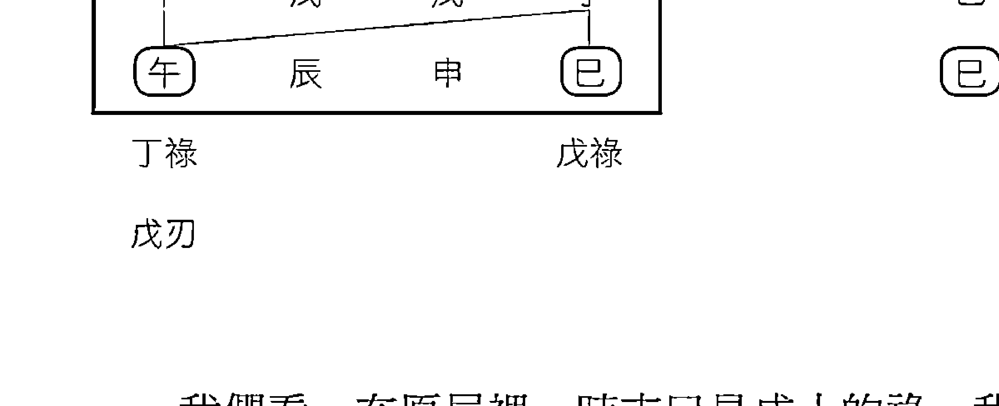

我們看，在原局裡，時支巳是戊土的祿，我們可以把它看做是日主戊土的延伸。巳上面坐着的天干是丁火正印，即祿上載着正印，它所展示的「象」，是此人具有「印把子」，即具有政治地位。而丁火正印在局中又有它的祿——午，在年支上，它上面所坐着的是甲木七殺。後來看到「盲派」把這種形態稱為「印帶殺帽」。

我當時想到的是，原局巳祿上面載着丁火正印，而大運巳（6 - 10 歲）正是指向命局中的這個巳祿，因此它顯示了此運在「財官網絡」（社會活動）上跟「名譽」「地位」「權柄」（即正印的象）有關。這樣，就可以解釋康熙在此運中登基，成了大清的皇帝。

那麼午運（16 - 20 歲）呢？它指向原局中年支午，而午上載着七殺，這說明這段大運激活了原局的潛在信息，跟「權力」「競爭」「爭鬥」（即七殺的象）有關。這樣就可以把康熙與熈拜的權力之爭解讀出來。

這告訴我們，當大運、流年出現「應局」現象，最好再回去細緻地分析原局的脈絡，注意應局成分的上下意象，這樣就有可能解讀出更多的命局本身含有的潛在信息。

這裡使我想到去年發生的事。

我有位老朋友，他是紐約一所大學的華裔校長。去年夏天他打電話給我，告訴我，他成了他所在專業學會的全美主席。他說，這次學會主席換屆，他並沒有去競選，甚至根本就沒有過問，學會卻選上了他，有點兒意外。我說：恭喜你。這是你這些年努力耕耘的結果。我有他的八字，看了當時運歲的情況：

## 命例81：乾造 大學校長，1962年11月26日丑時生。

| 偏財 | 傷官 | 正財 | 大運 | 流年 |
| ---- | ---- | ---- | ---- | ---- |
| 壬 | 辛 | 戊 | 55歲 | 55歲 |
| 寅 | 亥 | 辰 | 正印 | 正印 |
| 七殺 | 偏財 | 比肩 | 丁 | 丁 |
| 偏印 | 七殺 | 正官 | 巳 | 酉 |
| 比肩 | | 正財 | 禄 | |

事實：2017年（丁酉）被選為專業學會的主席。

八字原局日主戊土生於冬月，局中水旺生寒，需火暖局。去年大運進入丁巳，正是南方火地，是一步好運。這步丁巳運，已是命主戊土的祿，可以看做是命主自己在大運地支上的延伸。這個祿頂着個丁火正印，是否能看做是名位，是榮譽？去年流年丁酉，又是丁火正印，是應期到了。所以這個學會「主席」的名位來得並不偶然。

## 「引動」

如果說「應局」是大運、流年直接出現了原局中已有的成分或「字」，那麼，「引動」則是通過「原身和祿」的關係，把大運、流年中成分跟原局裡的相關成分聯繫起來，發生作用。

這裡，先重溫一下原身和祿的法則 ⑤ 。這也是「盲派」所謂的「干支互通原理」。

## 表 8.1 原身和祿

| 原身 | 甲 | 乙 | 丙 | 丁 | 戊 | 己 | 庚 | 辛 | 壬 | 癸 |
| 祿 | 寅 | 卯 | 巳 | 午 | 巳 | 午 | 申 | 酉 | 亥 | 子 |

根據干支互通原理，可以把八字結構中天干和地支充分聯繫起來，祿是天干的臨官，可以看做是天干在地支上的延伸；反過來，對應於地支祿的天干是祿的原身，是地支成分在天干上的延伸。

現在，我們要把這個干支互通原理應用到大運、流年與原局的相互關係中去。於是就有了這裡要講的「引動」這個法則。

請看下面案例：

命例 82：乾造 從政官員，1954 年 9 月 29 日巳時生。

|  | 甲 | 癸 | 戊 | 丁 |
| --- | --- | --- | --- | --- |
| 午 | 酉 | 子 | 巳 |
| 正印 | 傷官 | 正財 | 偏印 |
| 劫財 |  | 食神 | 比肩 |

| 3 歲 | 13 歲 | 23 歲 | 33 歲 | 43 歲 | 53 歲 |
| --- | --- | --- | --- | --- | --- |
| 甲 | 乙 | 丙 | 丁 | 戊 | 己 |
| 戊 | 亥 | 子 | 丑 | 寅 | 卯 |
| 甲祿 |  |  |  |  |  |

這是從網上得到的「盲派」命例。跟上面康熙皇帝的八字有類似的地方。

作者說：「行戊寅運，戊爲日主到了，寅爲甲的祿，等於自己坐着七殺，所以此運當了副市長。而且此殺有化。寅午合了印局，等於權力到了。」

我們可以這樣理解，戊寅大運，寅爲甲祿，它「引動」了原局的甲木七殺。在原局中，日主戊土在地支上有兩個強根，同時得到丁火的幫助，日主不弱。局中傷官生財，再由財生殺，殺爲官位。現在大運引動局中七殺，七殺爲喜神，所以此大運升官，當了副市長。

這是大運地支引動了原局的天干。

再看下面一個案例：

## 命例83：乾造 1946年9月16日午時生。

正財 偏財 正官
合
大運 流年
18-27歲 25歲
丙 丁 癸 戊
戌 酉 巳 午
正官 偏印 正財 偏財
偏印 正印 七殺
偏財 正官
半金局

事實：25歲辛亥年夏天騎機車與卡車相撞，切去兩下半肢成殘疾。

八字身弱，日主癸水在地支無根，唯一依靠在月支酉金偏印。18歲起走己亥大運。此運與日柱癸巳反吟（天剋地沖），動搖了日主的根基。25歲流年辛亥。辛金引出月支酉金（辛祿），遭局中天干丙、丁回剋，把日主本身之依靠給重創了；再加上亥（運）、亥（年）自刑，雙沖日支，於是帶來了撞車的凶禍。

## 命例 84∶乾造 1989 年 8 月 20 日申時生。

合
正官 比肩 七殺
己 壬 壬 戊
巳 申 圈子 申
偏財 偏印 劫財 偏印
偏印 比肩 比肩
七殺 七殺 七殺
合 合 合 合
大運 24 歲 流年 24 歲
己 圈癸
巳 巳

事實∶24 歲癸巳殉情而死。

八字壬水日主通根於日支子水，是爲強根。同時左右申金來合子水，成兩個半水局。雖然干透官、殺戊、己土，年支巳火合月支申金，火土重重，但日主着實也不弱。

然而，大運入己巳，流年癸巳。情況發生了急劇的變化。運歲下比上剋。雙巳入命局合去雙申，構成巳申、巳申合，火合剋金。而癸水引動局中子水，子是癸祿，壬水之根。運干己土剋癸水，則剋去了日主之根基。於是，局中金水印比皆去，命主因戀愛遭父母反對竟殉情而死。子水在妻宮，隱含了戀愛的緣由。

## 命例 85：乾造 梁國憶（1961-1985），台灣黑幫槍擊犯。

傷官 傷官 偏財
辛 辛 戊 壬
丑 卯 午 戊
劫財 正官 正印 比肩
正財 劫財 傷官
傷官 正印
半火局

梁國憶，1961 年 3 月 26 日生。綽號「珍珠呆」，曾名列台灣十大槍擊犯「探花」。因為家庭貧困，早早輟學謀生，被不良分子誘入江湖，成為芳明館一名黑幫分子。因背負多起命案，梁國憶亡命天涯做起槍擊要犯。1985 年 7 月 16 日，被台北警方發現梁與黨羽藏匿之處，在團捕中，梁國憶自知難逃法網，服毒身亡。

八字戊土生於卯月。卯為正官，可取正官格。天干傷官並立，通根丑土，與官星對立。命主剋泄交加。

23 歲入丑運，丑為傷官庫。25 歲乙丑流年，乙木正官引動局內月支卯木，或者說，是局內卯支延伸到了天干，正好為干頭並列的傷官所剋，於是應了「傷官見官，為禍百端」。命主在警察團捕中飲毒自殺。丑運與流年地支丑伏吟，引起它們所載天干相剋，也是構成這場凶災應期的條件。

## 命例86：坤造 1943年12月8日（農曆十一月十二日）未時生。

傷官 偏財 傷官 | 大運 流年
30歲 32歲
癸 甲 庚 癸 丁 甲
未 子 子 未 卯 寅
正印 傷官 傷官 正印
正官 正官
正財 正財
穿 穿
楊柳木 海中金

事實：32歲甲寅年購新屋，丈夫自己油漆新屋，在油漆牆壁時墜死。

八字原局傷官重重，剋夫的信息很嚴重。然而夫星丁火在未庫中，雖然子未穿，但終究有土制水護火。

大運丁卯，丁火正官把未中的夫星「引動」出來了，於是遭到干頭傷官的剋制。同時，子卯相刑，刑了命主夫宮，這預示了這步大運會是「剋夫」的運。

當然，局內月納音剋年納音，也是不幸的因子。

從這個案例可以看到，運歲還可以把局中墓庫中的成分引動出來。

## 墓庫運

對於墓庫運，在命學界有不同的認識。

首先，在《細批終身詳解》中，梁湘潤先生指出：

> 「墓庫運」，是固定以生於「辰戌丑未」四個月的八字，才有「墓庫運」，生於其他之月令，則都沒有「墓庫運」之可能。

一、生於「辰」月的八字，入「癸」運爲「墓庫運」主不吉。
二、生於「戌」月的八字，入「丁」運爲「墓庫運」主不吉。
三、生於「丑」月的八字，入「辛」運爲「墓庫運」主不吉。
四、生於「未」月的八字，入「乙」運爲「墓庫運」主不吉。

注：「墓庫運」不分日主天干，以及格局、調候……等。恆作此論。

例式：

## 大運

| 庚 | 庚 | 甲 | 丁 |
| 子 | 辰 | 寅 | 卯 |
| 辛 | 壬 | （癸） | 甲 | 乙 |
| 巳 | 午 | 未 | 申 | 酉 |

此造生於「辰」月，入「癸」運之中，即是入「墓庫運」，論不吉。

梁先生的這種墓庫運的用法，十分明確，但在實務論命中，似乎應用並不普遍。

我們還是回到源頭上，問一下到底什麼是墓庫運？

對於「墓庫運」，基本上有兩種認識：一種是以五行的墓庫論運；另一種是以十干的墓庫論運。分別羅列如下：

| 五行 | 木 | 火 | 金 | 水 | 土 |
| 墓庫運 | 未 | 戌 | 丑 | 辰 | 辰 |

| 十干 | 甲 | 乙 | 丙 | 丁 | 戊 | 己 | 庚 | 辛 | 壬 | 癸 |
| 墓庫運 | 未 | 戌 | 戌 | 丑 | 戌 | 丑 | 丑 | 辰 | 辰 | 未 |

首先，辰、戌、丑、未爲四個墓庫，這是沒有異議的。辰爲水庫；未爲木庫；戌爲火庫；丑爲金庫。這兩表所反映出來的差異，是如何匹配的問題。前者（表 8.2），以五行配墓庫，甲、乙木的墓庫皆爲未；後者（表 8.3）以十干配墓庫，甲的墓庫在未，乙的墓庫在戌。可見，對陽干來說，兩者沒有差異，甲木見大運未，皆爲墓庫運。但對陰干就不同了。乙木屬於木，按五行來說，大運見未是墓庫運；按十干來說，大運見戌才是乙木的墓庫運。

其實，這兩者反映了對十干的地支生死旺衰十二運認識的差異。前者對於天干是不分陰陽，只看五行，即採取十二地支「陰陽同生死」周流的看法。而後者，是干分陰陽，陽干和陰干在十二運上是「陰生陽死」「陽生陰死」，它們的「墓」地是不同的。因此，甲木見未爲墓庫運；乙木見戌爲墓庫運。

這裡還要指出：對於土，作為五行取墓庫，它是跟水走的，即取辰為墓庫運；但在十干方面，土之戊和己是跟火之丙、丁相匹配的：戊見戌、己見丑為墓庫運。

關於墓庫運，《三命通會》「附論墓運」這樣說：

> 《秘訣》云：「幼年不宜逢墓庫，老年值此卻豐隆。」又云：「旺官旺印與旺財，入墓有禍；傷官食神並身旺，遇庫與災。」又云：「旺煞入墓，壽算難延。」可見凡官、印、傷官、七煞為用神者，俱忌行墓庫之運，惟晚年行自庫之地則吉。賦運「老行墓地，晚景悠悠」是也。

顯然，也不是見墓庫運一概論「不吉」，要做具體分析。

對於命主走自身的墓庫運，一般是渾渾噩噩，常覺有一種無形的壓力和束縛，像關押在一個地窖裡一樣。活力被抑制，諸事不順利，漫無結果。古訣云：「少年墓庫糊糊塗塗，中年墓庫顛倒反復，老年墓庫發財發福。」大概

整理，為民族文化留下了火種。

鍾義明在《命理準繩評注》中對連橫的八字做了這樣的評述：

戊己透出，雨水前丙火尚柔，忌土晦光，取甲木制土為用。壬水七殺藏亥，臨於玉堂，子孫必貴。寅中甲丙戊全透出，體用同宮，自有一種非凡的氣象。偏印太多，無財星，是哲學型的人物，不善經商，照傳統命理看法是「薄福」之人，在現代來說是思想超凡、感覺敏銳、很有個性的「怪人」。

從連造看，56 歲進入「沖提運」。這第六步大運庚申，跟月柱甲寅反吟（天剋地沖），同時跟日主丙寅也是反吟，局中兩柱動搖。而且，前者是剋入，傷了局中的用神。

58 歲流年丙寅，與大運構成歲運交戰，同時它又跟日主伏吟。這構成了「三連環」大劫難，焉能幸免？

事實是：命主此年（1936 年）6 月因肝病不幸病逝於上海。

# 命例89：乾造 程璧光（1859-1918），民國海軍總長。

| 劫財 | 食神 | 偏財 |
| ---- | ---- | ---- |
| 己   | 庚   | 戊   |
| 未   | 午   | 子   |
| 劫財 | 正印 | 劫財 |
| 正印 | 劫財 | 傷官 |
| 正官 |     | 正印 |
|     | 陽刃 | 合 合 |

| 大運 | 流年 |
| ---- | ---- |
| 57 歲 | 58 歲 |
| 甲子  | 戊午  |

程璧光（1859年6月29日子時生），廣東香山人。中民國初年海軍將領。程璧光原為廣東水師廣丙號艦管帶，曾參加甲午戰爭。北洋艦隊覆沒後，由程向日軍提交降書。事後程被革職，轉而參加革命。民國成立後，一度任北洋政府下之海軍總長。同鄉老友孫中山發動護法運動後，程率艦隊南下廣州支持護法。1918年2月在广州被暗殺。

這是進入第六步沖提大運後，大運（甲子）與月柱（庚午）反吟的情况。因為月支為日主陽刃，這個沖擊就顯得更加激烈了。入運後第二年流年戊午，歲運交戰，又是陽刃逢沖，於是「沖合陽刃，勃然禍至」。同時，流年戊午又跟時柱壬子反吟。這連環的反吟（天剋地沖），整個八字及大運流年的架構都被震坍了。是年2月命主被暗殺身亡。

事實上，每個人過了50歲後，總有三個流年（流年太歲）跟命局年柱（生年太歲）發生必然關係：54歲和66歲，流年干支與命局年干支伏吟（天剋地沖）；60歲，流年干支與命局年干支伏吟（干支相同）。因此，在看流年時，起運早的，應當注意54歲流年如何；起運晚的，則注意66歲流年如何，因為這兩年有命局年、月柱同時被沖撞的可能性。請看下例：

# 命例90：乾造 1910年12月8日（十一月七日）巳時生。

| 正財 | 傷官 | 偏印 | 大運 | 流年 |
| ---- | ---- | ---- | ---- | ---- |
| 庚   | 戊   | 丁   | 乙   | 丙   |
| 戊   | 子   | 未   | 巳   | 辰   |
| 傷官 | 七殺 | 食神 | 劫財 |      |
| 偏財 |      | 比肩 | 正財 |      |
| 比肩 |      | 偏印 | 傷官 |      |

事實：66歲丙辰胃病開刀手術。

這個命造60歲走第六步沖提運甲午，此運與原局月柱反吟（天剋地沖），而且65歲轉入午運，與原局地支構成了巳午未南方一氣，沖提綢子水。原局火旺，現在火勢更大了。66歲流年丙辰，再跟年柱反吟，剋庚金，金水俱去，於是命局火炎土焦，土在人體屬胃，是年命主胃病施行切除手術。

# 應期：狀態變化

關於八字的動態分析，以上已經從多個角度做了反復的探討。簡言之，就是從命局裡發現各種涉及星和宮的潛在信息，然後聯繫大運和流年，看看什麼時候這些潛在關係被激活、被引動、被兌現，成為了命主生命旅程中一連串真實的事件。籠統的說，也就是「應期」到了。

動態分析的終目就是找到這樣的應期。

如果我們把各種角度匯集起來，找到應期的根本關鍵，在於觀察「狀態」的變化。首先是要發現「狀態」的變化，接著是找到變化的內容和結果。

下面再舉一個案例，是盲師夏仲奇斷案集中的「短壽女命」：

命例91：坤造 珠珠，1972年11月22日亥時生。

# 大運

正官 偏財 偏財 | 5歲 15歲 25歲 | 壬 庚 己 戊 子 戌 酉 申
七殺 正官 劫財 正官 |  |  | 
正印 正財 正印 傷官 | 20歲 21歲 24歲 25歲 | 壬 癸 丙 丁 申 酉 子 丑
桑柘木 銼釧金

傷官
┌───┬───┐
│ 冲 │ 冲 │
└───┴───┘
桑柘木 銼釧金

命主是一個叫珠珠的女孩。1990年命主才18歲。為了考中專的事，她媽媽領着她去盲師夏仲奇那裡算命。夏師傅除了說她考得上，還往下算：

> 「命該在92年結婚，93年生個女孩。」

> 「我算孩子到96年這一年就不太好了。……她會遇到一個關口，要得病。……應該是血液方面的病。……過了97年，就好了。」

後來所發生的事都如同夏師傅所講的一樣：20歲（1992年）結婚，21歲（1993年）生女兒。24歲（1996年）得了白血病。1997年，命主25歲，在夏天病逝。——「過了97年，就好了。」這是夏師傅慣用的一句潛台詞。

我們來觀察這個八字。丁火生於亥月，滿盤金水。日主只有一個根基——巳火。可惜遭到左右兩個亥水相沖。前文已經談到過，日柱丁巳是個連體干支，它怕沖擊。顯而易見，這四柱中有三柱在反吟（天剋地沖），架構不穩。再加上月納音剋年納音，早年會有不幸，因此「短壽」真的被言中了。

我們引用這個案例，主要想說明「動」和「靜」的關係。人生中的事件的發生，往往就在這動靜的轉換之間。

20歲命主進入酉運。命局內部夫妻宮巳，原本受到左右亥水的沖擊，是處於「動」的狀態。現在，酉合巳，暫解了巳亥之間的沖。同時把此運的關注點指向了命主的夫宮。同時，酉金為財，財生官，官為夫星；又在適婚的年齡段，這段運有成婚的可能性。

20歲流年壬申，壬激活了局中年干的壬水，壬水是官星，壬合日主丁火，是官來就我。申又合壬水坐支子水；同時，申又合夫宮巳火。於是，流年把命局的夫星送進了夫宮，這不是婚姻的應期到了？

圖示如下：

# 圖 8.7 圖解分析（1）

最後，我們用對南宋著名愛國詩人陸游命例的剖析作為本篇的結尾。

# 陸游命例

命例 92：乾造 陸游（1125-1209），南宋著名愛國詩人。

| 劫財 | 傷官 | 傷官 |
| ---- | ---- | ---- |
| 乙   | 丁   | 甲   | 丁 |
| 已   | 亥   | 寅   | 卯 |

食神 偏印 比肩 劫財
七殺 比肩 食神
偏財
偏財
祿 陽刃
沖 合
半木局

大運
4 歲 14 歲 24 歲 34 歲 44 歲 54 歲 64 歲 74 歲 84 歲
丙 酉 甲 申 癸 未 壬 午 辛 巳 庚 辰 己 卯 戊 寅

陸游，生於 1125 年（宣和七年）11 月 13 日（農曆十月十七日）卯時，字務觀，號放翁，越州山陰（今紹興）人。南宋文學家、史學家、愛國詩人。

陸游生逢北宋滅亡之際，少年時即深受家庭愛國思想的熏陶。宋高宗時，參加禮部考試，因受秦槍排斥而仕途不暢。宋孝宗即位後，賜進士出身，歷任福州寧德縣主簿、敕令所刪定官、隆興府通判等職，因堅持抗金，屢遭主和派排斥。1171 年（乾道七年）應四川宣撫使王炎之邀，投身軍旅，任職於南鄭幕府。次年，幕府解散，陸游奉詔入蜀，與范成大相知。宋光宗繼位後，升為禮部郎中兼實錄院檢討官，不久即因「嘲詏風月」罷官歸居故里。1202 年（嘉泰二年），宋寧宗詔陸游入京，主持編修孝宗、光宗《兩朝實錄》和《三朝史》，官至寶章閣待制。書成後，陸游長期蛰居山陰，1210 年（嘉定二年）與世長辭，享年 85 歲，留絕筆《示兒》。

陸游的八字，初一看就是一個具有形象特點的結構：木四字，火三字，水一字。木火已然成勢。日主甲木，生於亥月，干有乙木比肩，月支亥爲長生，日支寅爲祿，時支卯爲陽刃，林林蔥蔥，日主十分旺相。天干雙丁傷官競透，通根於年支巳火，有火泄秀，構成木火通明。木火主文采，故命主有卓越的文學才華，尤以詩的成就爲最，自言「六十年間萬首詩」，現存世的就有九千三百餘首，數量之多，歷代很少有人能比擬。

進一步觀察，木火兩行成勢，且木多於火，根據前章對兩行成勢分析得到的一般規則，重心在前者，則取後者爲用，流通強勢，所以命局用神取火，泄秀兼調候。木爲喜神。不喜金逆勢，也不喜土來晦火。至於水，則不宜出現干頭，因爲雙丁傷官透出。然而，土金是財官，在命局卻是忌神，這就突顯了才華、理想和現實、世俗之間的衝突。

命主身旺，甲寅日柱，直爽，倔強，有個性。而傷官高透，相對印弱。偏印亥水在月支，但遭左右巳沖、寅合。傷官爲才華，雖有文學上的成就，但因才華畢露，愛好自由，嫉惡如仇，常常會直言犯上，這就鑄就了仕途的坎坷，尤其在以官爲本位的封建時代。

觀其大運，地支少年金地，中年火地，晚年木地。就火木連環，應視為順運，但其上的天干分布，則差強人意了。火地遭金水蓋頭，木地有土金蓋頭。查閱陸游年譜，他一生仕途的確反復，有多次被罷官的記錄。

29歲（1153年），流年癸酉，在申運。陸游進京臨安（今杭州）參加鎖廳考試（現任官員及恩蔭子弟的進士考試）。因爲陸游出生於名門望族，父輩都是通詩文、有節操、爲官清廉的文人，陸家也是江南藏書世家。主考官陳子茂閱卷後取為第一，因宰相秦檜的孫子秦塤位居陸游名下，秦檜勃然大怒，欲降罪主考。

第二年（1154年）甲戌，陸游參加禮部考試，秦檜特別指示主考官不得予以錄取。這是陸游入仕道路上的第一次挫折。

從命理看，大運申金七殺逆了木火之勢，縱有才學，卻遇上了奸臣當道，不顧成績出眾，硬是被除名。

34 歲（1158 年）流年戊寅，在申運末。秦檜死了，陸游初入仕途，任福州寧德縣主簿。不久，調入京師。

38 歲（1162 年）流年壬午，在癸未運。宋孝宗趙昚即位，任命陸游為樞密院編修官，賜進士出身。陸游多次獻策北伐，都没有被採用。

40 歲（1164 年）流年甲申，在未運。有人謗言陸游「結交諫官、鼓唱是非，力說用兵」，朝廷即罷免了陸游的官職。這是陸游仕途上的第一次罷官。

45 歲（1169 年）流年己丑，大運在壬午。12 月，朝廷徵召已賦閒四年的陸游，任為夔州通判。於是陸游帶着家人進四川，開始了蜀中生涯。

47 歲（1171 年）流年辛卯，陸游參加王炎駐軍幕府，參與北伐計劃。陸游作《平戎策》。可惜不久，幕府被解散，出師北伐的計劃也毀於一旦，陸游感到十分憂傷。在邊防大散關一帶的軍旅生活，是陸游一生中唯一的一次親臨抗金前線、力圖實現愛國之志的軍事實踐，這段生活雖只有八個月，卻給他留下了終生難忘的記憶。

51 歲（1175 年）流年乙未，南宋主和勢力抬頭，詆毀陸游「不拘禮法」「燕飲頹放」，陸游被免職。這是陸游仕途上的第二次罷官。

52 歲（1176 年）流年丙申，陸游回應主和派攻擊他「頹放」、「狂放」，自號「放翁」。

54 歲（1178 年）流年戊戌，陸游詩名日盛，受到宋孝宗召見，先

## 圖 8.10 陸造流年分析（1）

首先，流年甲子，甲引動了甲木之祿所在的妻宮，這是婚姻信號。這裡的關鍵是流年甲子與日主甲寅夾拱出一個丑字。這個丑成了巳火（含有偏財妻星——唐琬）與妻宮日支寅木（祿——命主自己）的「鵠橋」。過程是巳酉丑合，寅丑再暗合，於是妻星入妻宮。這是陸游與心上人唐琬的花燭良辰「應期」到了。

其次，大運酉合巳，削弱了原局的亥沖巳；同時，母星所在母宮亥被流年子及拱出的丑成合局（亥子丑），它也無暇去沖巳了。母星被綽，阻力去了，有情人成眷屬。

第二年，21 歲，流年乙丑。跟上一年甲子的差別在暗拱的丑走到台前來了。因此，巳跟寅的聯繫通道依然存在，但沒有子，母星亥水的羈絆鬆了，母星回到常態，可以沖巳發威了。水勝火敗，唐琬被逐出陸家之門。

第三年，22 歲，流年丙寅。地支寅是日主甲之祿，此祿在流年「背」了一個丙字，丙之祿在巳，這樣「銀漢迢迢暗度」，命主另築別院，安置唐琬。但亥（母星）跟巳（妻星）的對抗並沒有改善。母星對命主的控制也依舊存在。

第四年，23 歲，流年丁卯。這是陸唐現實聯繫紐帶出現真正破裂的關鍵年頭。

首先，歲運卯酉沖，沖斷了已經歷經了三年的巳酉合，巳火脫離了大運的眷顧，只有接受被亥水沖去的淒涼結局。這是最重要的信息點。

其次，丁卯激活了時柱丁卯。前文談到，這個卯宮也是妻宮（雖然裡面沒有妻星），它合亥水（母星），因此，陸母給兒子安排了新人——王氏，盡管命主當時心在唐琬，但受命接納王氏為妻。

第五年，24 歲，流年戊辰。歲運辰酉相合，酉無暇再合巳了。巳依舊被亥沖。這是酉運的最後一年。巳火（內含妻星——唐琬）徹底無望了，回到了原局寅巳相刑的狀態。這裡是否能看做「有緣無份」，因為火性傷食是命主的浪漫激情，是作為詩人的命主精神寄託之處，而事實的相刑，是現實的距離。雖咫尺天涯，這時已成天各一方了。

此外，辰卯穿，卯也是子女宮。此年陸遊長子出生。唐琬也絕望了。

陸遊與唐琬的悲歡離合，隨着酉運的結束，也落下了帷幕。陸遊在沈園再次見到唐琬，那是七年後的事了。

## 註釋

見《命運的求索》第四章。

後來讀到段氏「盲派」有同樣的認識：「命局中的字到了，一般表示原命局的應期。」

這裡還應當指出「己巳」一柱的特殊性，它類似所謂「連根之體」的干支，「一制就容易傷身體及壽命」（《段氏理象學》，109頁）。

這裡就不展開戚繼光晚年的流年分析了。請參閱《命運的求索》有關章節。

見《八字命理學進階教程》第四章。

取自鍾義明《命理準繩評注》（下）第216頁。

杜甫《曲江》其二。

《命理準繩評注》（上），第278頁。

在原局本身就存在「沖合陽刃」的情況：午未合，午戌半合局，子午遙沖。當然也有人對戊土見午火做印綬，而不做陽刃看。

取自星雲山人《八字用神流年點斷真訣》第295頁。

## 下編

## 干支篇

## 第九章

## 干支優劣等級

天干、地支是命理推演的最基本符號。它包含10個天干和12個地支。這10個天干和12個地支按序搭配起來，便構成了60組不同的干支，也就是「六十甲子」。八字命理學就應用它們來標記時間。一個八字局結構，就是「四柱」。

在《進階教程》中，筆者就提出，命理學是一種符號學。它的基本「詞庫」是10個天干加12個地支；它的基本「詞匯」是60干支。它的「語法」就是這些符號之間的組合關係，也就是通常講的「生剋制化」、「刑沖會合」。

既然干支是命局組合的基本材料，這就值得我們做進一步深入的研究。

## 優劣等級分類

戴永長在《八字徵驗八講》中提出了「四柱干支的優劣層次定命造高下」的方法技巧。他認為：對六十組天干地支，按「各組干支的高下之別」，大致可分為上中下三等：

（1）上等干支21個：甲子、戊辰、庚午、丙子、庚辰、辛巳、壬午、丁亥、戊子、癸巳、丁酉、己亥、癸卯、乙巳、己酉、甲寅、乙卯、丙辰、庚申、辛酉、壬戌。

（2）中等干支26個：乙丑、丙寅、丁亥、己巳、辛未、甲戌、乙亥、丁丑、戊寅、癸未、丙戌、己丑、庚寅、壬辰、甲午、乙未、丙申、戊戌、辛丑、壬寅、甲辰、丁未、庚戌、辛亥、癸丑、己未。

（3）下等干支13個：壬申、癸酉、己卯、甲申、乙酉、辛卯、庚子、丙午、戊申、壬子、丁巳、戊午、癸亥。

他接着指出：

以上六十組干支分成三種等級及其吉凶大概，主要針對日主而言。一般說來，面對一個命局，抓住日主的等級優劣，可知命造高低之大概，這是一種快速切入的判斷法，但不是絕對可靠的，為使快速判斷達到較理想的程度，要注意兩點：

（1）依據命局五行強弱定出喜忌，提出用神（或藥神、喜神），確定格局。

（2）標出命局中各柱干支的等級。

把這兩點緊密結合起來，判斷命造高低會比較明確。

戴先生舉了以下一個例子（「例二十五：鄭先生」）：

| 年 | 月 | 日 | 時 |
| --- | --- | --- | --- |
| 己 | 戊 | 戊 | 甲 |
| 卯 | 辰 | 子 | 寅 |

干支等級：（下）（上）（上）（上）

三會方（木）

對此他做了這樣的解釋：「此造日元戊子是上等干支，月時兩柱也為上等，只是年柱為下等干支，此造三上一下，決不是下等命。」

這是一個很有意義的嘗試。雖然此書對每一組干支都做了簡潔的評述，但並沒有說明為什麼做出這樣分級的明確標準。

下面我們對干支優劣層次等級問題做進一步的研究。

首先，是確立評判標準。可以從以下幾個角度來考慮：

一、干支是天干和地支的組合。天干、地支都有自己的五行內涵。根據五行生剋，干支可以分成五種基本類型，我們在《進階教程》（中級教程）中已經討論過：

（1）上生下：比如甲午、乙巳。天干五行為木，地支五行本氣為火。木生火，因此是天干生地支。天干在上，地支在下，是「上生下」。

（2）下生上：比如甲子、乙亥。天干五行為木，地支五行本氣為水。水生木，因此是地支生天干，故屬「下生上」。

（3）上剋下：比如甲辰、乙丑。天干五行為木，地支五行本氣為土。木剋土，因此是天干剋地支，故為「上剋下」。

（4）下剋上：比如甲申、乙酉。天干五行為木，地支五行本氣為金。金剋木，因此是地支剋天干，故為「下剋上」。

（5）上下同：比如甲寅、乙卯。天干和地支五行歸屬相同，都是木。所以是上下同物。

對於這五種類型，我們可以看到，（1）和（2）是相生關係；（3）和（4）是相剋關係；（5）是同類關係。若要做優劣判斷，自然會取相生和同類為「優」，因為相生為有情，同類如兄弟，有互助之力。

在《子平真詮》中，作者沈孝瞻對八字格局成敗提出過兩個重要的評判標準：一個是「有情、無情」；一個是「有力、無力」。事實上，這是八字研究中具有「普遍」意義上的評判標準。簡而言之，有情、無情，是指各要素成分配合是否得宜；有力、無力，是指各個要素本身是否具有根基。顯然，相生關係和同類關係是優於相剋關係。它們可以被置於較高的層次。

然而，對於相剋關係，還要做進一步的分析。天干對於地支而言，是天干為陽，地支為陰；天干為「尊」，地支為「卑」。因此，「上剋下」，是「尊」制「卑」；而「下剋上」，則是「卑」剋「尊」，成了一種「冒犯」。因此，類型（4）的干支就要被放到「下等」層次中去了。

談到「有情」，還有一類干支是「上下相合」的情况。比如戊子，戊為陽土，子為癸水（癸為地支子之主氣）。戊子正好上下相合，自然是有情了。這樣的干支還有丁亥、辛巳、壬午等，也是上下相合的狀態。

二、若要進一步「細化」，可以從十天干周行十二個地支「生死旺衰歷程」來考察，即觀察各組干支天干坐下地支所屬的十二運。這十二運是：長生、沐浴、冠帶、臨官、帝旺、衰、病、死、墓、絕、胎、養。它們表明每一個天干五行由盛而衰、由衰而復盛的十二個階段。

從「有情、無情」、「有力、無力」的角度，我們可以對這十二個坐支給予優劣等級的「量化」評判如下（記分自4降至1，表示自高而下的優劣程度）:

# 表 9.1 十二地支等級量化

| 生 | 敗 | 冠 | 禄 | 旺 | 衰 | 病 | 死 | 墓 | 絕 | 胎 | 養 |
| --- | --- | --- | --- | --- | --- | --- | --- | --- | --- | --- | --- |
| 3 | 2 | 3 | 4 | 1 | 2 | 2 | 1 | 3 | 1 | 3 | 2 |

這裡，生=長生；敗=沐浴；冠=冠帶；祿=臨官；旺=帝旺。陽干的帝旺位置即為陽刃。其中，祿的計分最高，代表了氣息旺盛；而死、絕以及「旺」的計分最低。死和絕，代表了運氣最衰落的階段，自然記之低分；而帝旺，包括了陽刃，因為是處於最強階段，往往有立即走向反面的趨勢，雖然有力，卻甚為「無情」，故不宜予以高分。

這是中國哲學「盈則虧、滿則損」的原則。比如《易經》中的乾卦，由六根陽爻組成。對於最上面的一根陽爻，稱為「上九，亢龍有悔」。（「有悔」指不吉利。）因為處於最高位，「高者易危，窮則事盡，故有悔。」此外，沐浴為敗地，是強中之弱；而墓（墓庫），卻是弱中之強，故分別計於2、3分。我們將六十干支的坐支旺衰十二運標記於下表（表 9.2）中。

在《段氏理象學》中，段建業先生記述了「盲派」的「干支虛實原理」：｢天干無根無生者虛；天干有根有生者實。｣ 在《進階教程》（中級教程）第三章中我們已經談過。比如六十干支中帶甲天干的有六組：甲子、甲寅、甲辰、甲午、甲申、甲戌。前三組為「實」；後三組為「虛」。我們也參考這種干支虛實的區分，把它們標記在下表（表 9.2）中。干支組中除了自坐冠、祿、旺之外，若配置屬於「實」的，則可酌情加記1分。

[PAGE 295]

三、還可以考慮作為日干支，與之關聯的地支藏遁十神中屬於「吉」神的影響。比如「官印」、「財官」。如壬午日干支，地支午中藏有丁、己，正是壬水的正官、正印。

四、跟干支直接相關的神煞，也是一種可以作為參考的「吉凶」內容。這裡從日干出發，收集了以下相關的神煞：

（1）天乙貴人（吉神）；（2）文昌貴人（吉神）；（3）進神貴（吉神）；（4）十靈日（吉）；（5）六秀日（吉）；（6）魁罡日；（7）十惡大敗日（凶）；（8）紅鵠煞；（9）孤鸞煞（又稱呻吟煞）；（10）八專煞；（11）陰陽差錯煞：（12）九丑煞；（13）天元坐殺煞。

其中自（8）至（12）的神煞，都是對婚姻不利的凶煞。

我們把它們也都標記在下表（表 9.2）中。對於具有吉神的，酌情可以加記1分；對於盡屬凶神的，可以扣1分。吉凶兼有者，則為0。

根據以上幾方面的考慮，在綜合評估後，我們把六十干支分為了四個等級（1 至 4 級，見下表第三欄），數值高者為優，數值低者為劣。

六十干支優劣等級如下：

# 表 9.2 六十干支優劣等級表

| 序號 | 干支 | 等級 | 坐支 | 虛實 | 上下關係 | 十神 | 神煞（吉） | 神煞（不吉） | 戴等級 |
| 1 | 甲子 | 4 | 沐 | 實 | 下生上 | 正印 | 進神 |  | 3 |
| 2 | 乙丑 | 2 | 衰 | 虛 | 上剋下 |  |  | 十惡大敗 | 2 |
| 3 | 丙寅 | 3 | 生 | 實 | 下生上 |  |  | 紅鵠煞 | 2 |
| 4 | 丁卯 | 3 | 病 | 實 | 下生上 |  |  |  |  | 2 |
| 5 | 戊辰 | 3 | 冠 | 實 | 上下同 |  |  | 紅鵠煞 | 3 |
| 6 | 己巳 | 2 | 旺 | 實 | 下生上 |

## 干支分级统计

现在，我们进一步验证这种干支分级在命理研究中的实践意义。根据已有的命理资料（八字案例），我们对此做了统计的比较研究。

具体来说，是对于以下我们目前具有的四组命例资料进行测算：

（1）明清两代帝王命例，共有22例，即明代10个皇帝；清代11个皇帝，再加上慈禧太后。其中，明代建文帝和崇祯帝、清代宣统皇帝（溥仪），是三位失去皇帝宝座的人。建文帝是明代开国皇帝朱元璋的长孙，在位仅4年，被其叔叔朱棣（永乐帝）「靖难起兵」所推翻，不知所终。崇祯和宣统是两位末代皇帝。如果去掉这三位「倒霉」的皇帝，则存八字19例参加测算。

（2）历代名臣命例。这是宋、元、明、清历代名臣的八字，共133例。

（3）近现代名人命例，主要是民国时代的政坛和各界知名人物，共129例。

（4）作者为研究健康问题而收集到的现代普通人八字1075例。

下面是各组的统计结果：

第一组：明清帝皇命例。

## 表 9.3 明清帝皇命例统计

|      |        | 年 | 月 | 日 | 时 | 年 | 月 | 日 | 时 | 四柱总计 |
| :--- | :----- | --- | --- | --- | --- | --- | --- | --- | --- | --- |
| 1    | 明太祖 | 戊辰 | 壬戌 | 丁丑 | 丁未 | 3  | 2  | 2  | 2  | 9    |
| 2    | 永乐帝 | 庚子 | 辛巳 | 癸酉 | 辛酉 | 1  | 2  | 3  | 3  | 9    |
| 3    | 明武宗 | 辛亥 | 戊戌 | 丁酉 | 戊申 | 2  | 2  | 4  | 2  | 10   |
| 4    | 嘉靖帝 | 丁卯 | 己酉 | 辛巳 | 己亥 | 3  | 3  | 2  | 4  | 12   |
| 5    | 明穆宗 | 丁酉 | 癸卯 | 癸卯 | 辛酉 | 4  | 4  | 4  | 3  | 15   |
| 6    | 万历帝 | 癸亥 | 辛酉 | 癸亥 | 辛酉 | 1  | 3  | 1  | 3  | 8    |
| 7    | 明光宗 | 壬午 | 己酉 | 丙申 | 乙未 | 4  | 3  | 2  | 3  | 12   |
| 8    | 明熹宗 | 己酉 | 壬申 | 甲午 | 甲午 | 3  | 2  | 2  | 2  | 9    |

[PAGE 302]

|                |          | 年 | 月 | 日 | 时 | 年 | 月 | 日 | 时 | 四柱总计 |
|---------------|---------|----|----|----|----|----|----|----|----|----------|
| 9             | 清太宗  | 壬辰 | 辛亥 | 辛亥 | 丙申 | 3  | 2  | 2  | 2  | 9        |
| 10            | 领治帝  | 戊寅 | 乙卯 | 甲午 | 甲戌 | 2  | 3  | 2  | 2  | 9        |
| 11            | 康熙帝  | 甲午 | 戊辰 | 戊申 | 丁巳 | 2  | 3  | 2  | 1  | 8        |
| 12            | 雍正帝  | 戊午 | 甲子 | 丁酉 | 癸卯 | 1  | 4  | 4  | 4  | 13       |
| 13            | 乾隆帝  | 辛卯 | 丁酉 | 庚午 | 丙子 | 1  | 4  | 3  | 3  | 11       |
| 14            | 嘉庆帝  | 庚辰 | 丁亥 | 丁丑 | 辛丑 | 3  | 4  | 2  | 3  | 12       |
| 15            | 道光帝  | 壬寅 | 己酉 | 壬申 | 癸卯 | 3  | 3  | 2  | 4  | 12       |
| 16            | 咸丰帝  | 辛卯 | 乙未 | 己丑 | 乙丑 | 1  | 3  | 3  | 2  | 9        |
| 17            | 同治帝  | 丙辰 | 壬辰 | 庚辰 | 癸未 | 3  | 3  | 3  | 3  | 12       |
| 18            | 光绪帝  | 辛未 | 丙申 | 丁亥 | 壬寅 | 2  | 2  | 4  | 3  | 11       |
| 19            | 慈禧太后| 乙未 | 丁亥 | 乙丑 | 丙子 | 3  | 4  | 2  | 3  | 12       |
|                | 平均值  |     |    |    |    | 2.37 | 2.95 | 2.58 | 2.74 | 10.63   |

将以上统计的结果（平均值），跟前面的「理论」设定的柱平均值——2.45相比，除了年柱稍低——2.37，接近平均值之外，月柱、日柱和时柱都远高于这个平均值，自然，四柱总值的平均值——10.63，也远高于前面设定的平均值9.80。竟有兴味的是，月柱平均值最高——2.95（高出平均值0.5）。其次是时柱的平均值——2.74（高出平均值0.29）。

从八字结构的宫位看，一般而言，年柱代表祖上（以及父母）；月柱代表父母（以及兄弟）；日柱代表己身和配偶（妻子或丈夫）；时柱代表子女。现在，月柱数值最高，说明他们都有个好父母。这不正是中国封建皇朝家族血缘继承制的一个历史缩影？（当然，明朝开国皇帝朱元璋是例外。他初年孤贫，崛起于布衣而开创了明朝276年的基业。）

再从四柱各管的运限来看，一般认为，年柱管16年（1-16岁），月柱管16年（17-32岁），日柱管16年（33-48岁），时柱管晚年（49岁至死亡）。

[PAGE 303]

月柱、日柱和时柱平均值高，正说明他们生命的重要阶段是在「荣华富贵」之中度过的。

作为对比，我们将明清两代失去皇位的三位「倒霉」皇帝的八字和统计数值罗列于下：

## 表 9.4

|  |  | 年 | 月 | 日 | 时 | 年 | 月 | 日 | 时 | 四柱总计 |
| --- | --- | --- | --- | --- | --- | --- | --- | --- | --- | --- |
| 1 | 建文帝 | 丁巳 | 壬子 | 己卯 | 癸酉 | 1 | 1 | 1 | 3 | 6 |
| 2 | 崇祯帝 | 辛亥 | 庚寅 | 乙未 | 己卯 | 2 | 2 | 3 | 1 | 8 |
| 3 | 宣统帝 | 丙午 | 庚寅 | 壬午 | 壬寅 | 1 | 2 | 4 | 3 | 10 |
|  | 平均值 |  |  |  |  | 1.33 | 1.67 | 2.67 | 2.33 | 8 |

显然，并不是每个皇帝都有好的八字。历史上就曾留下过「何故生在帝皇家」的诘问。据记载，明朝末年，当李自成的农民军攻入北京，消息传到宫中，崇祯皇帝穷途末路。他对自己15岁的女儿长平公主叹声道：「你为什么要降生到帝王家来啊！」然后左手遮脸，右手挥剑砍断了公主的左臂。五日后，长平公主才从断臂的昏死中苏醒过来。此时崇祯皇帝早已自缢于煤山了。

第二组，自宋代以来，历朝名臣八字133例。命例主要摘自袁树珊《命谱》、徐乐吾《命理一得》、韩雨墨《中华帝王名臣命谱》等书。

测算的结果是：(命例具体数值见附表1 )

## 表 9.5

| 年 | 月 | 日 | 时 | 四柱总计 |
| --- | --- | --- | --- | --- |
| 2.36 | 2.38 | 2.70 | 2.65 | 10.08 |

显然，跟前面设定的四柱「理论」平均值相比，日柱和时柱数值远高于2.45，四柱总计也高于9.80。而年月数值则不到平均值。这说明了什么？

[PAGE 304]

从四柱结构看，年月限运反映人的初年状况，年月两柱也映射人的出生家庭。中国历史上的科举制度始于隋唐。在科举制度下，不少平民子弟通过十年寒窗的苦读，一旦金榜题名，就进入了朝廷——社会的统治阶层。我们没有去统计这些历朝名臣的家庭出身。但其八字，总体上日、时两柱干支平均分远高于年月两柱干支的平均分，这是否已经反映了他們大多依靠自身的不懈努力而在歷史上留下了足跡？

第三组，近现代名人八字129例。主要摘自林庚白《人鉴》、尤达人《现代名人命鉴》、陈易庵《名人命诠》等书。统计结果如下：(命例数值见附表2)

## 表 9.6

| 年 | 月 | 日 | 时 | 四柱总计 |
| -- | -- | -- | -- | -- |
| 2.71 | 2.32 | 2.59 | 2.62 | 10.24 |

其中，年柱、日柱和时柱的数值都高于「理论」平均值，四柱总计也远高于9.80。

第四组，这是作者为研究健康与疾病而收集起来的普通人八字1075例。统计结果是：

## 表 9.7

| 年 | 月 | 日 | 时 | 四柱总计 |
| -- | -- | -- | -- | -- |
| 2.48 | 2.47 | 2.41 | 2.48 | 9.83 |

这个较大样本的统计结果，跟前面设定的「理论」的平均值——单柱2.45和四柱总值9.80——就非常接近了。

通过以上四组数据的统计比较，我们或许能得到这样的结论：干支等级优劣的设定，在对于命局的高下判断上是具有一定的实践意义的。尤其是月柱、日柱和时柱。

[PAGE 305]

## 附表 1 : 历代名臣八字 133 例四柱等级

|   |      | 年 | 月 | 日 | 时 | 年 | 月 | 日 | 时 | 四柱总计 |
| --- | --- | --- | --- | --- | --- | --- | --- | --- | --- | --- |
| 宋代 |      |      |      |      |      |      |      |      |      | 1 文彦博 癸亥 乙丑 庚戌 丙子 1 2 2 3 8 |
|     | 文彦博 | 癸亥 | 乙丑 | 庚戌 | 丙子 | 1 | 2 | 2 | 3 | 8 |
| 2   | 蔡京   | 丁亥 | 壬寅 | 壬辰 | 辛巳 | 4 | 3 | 3 | 2 | 12 |
|     | 蔡京   | 丁亥 | 壬寅 | 壬辰 | 辛巳 | 4 | 3 | 3 | 2 | 12 |
| 3   | 范仲淹  | 丙午 | 己亥 | 戊子 | 壬子 | 1 | 4 | 4 | 1 | 10 |
|     | 范仲淹  | 丙午 | 己亥 | 戊子 | 壬子 | 1 | 4 | 4 | 1 | 10 |
| 4   | 范祖禹  | 辛丑 | 辛丑 | 壬辰 | 辛丑 | 3 | 3 | 3 | 3 | 12 |
|     | 范祖禹  | 辛丑 | 辛丑 | 壬辰 | 辛丑 | 3 | 3 | 3 | 3 | 12 |
| 5   | 佛印禅师 | 乙巳 | 壬午 | 己丑 | 己巳 | 2 | 4 | 3 | 2 | 11 |
|     | 佛印禅师 | 乙巳 | 壬午 | 己丑 | 己巳 | 2 | 4 | 3 | 2 | 11 |
| 6   | 韩琦   | 戊申 | 庚申 | 庚辰 | 庚辰 | 2 | 3 | 3 | 3 | 11 |
|     | 韩琦   | 戊申 | 庚申 | 庚辰 | 庚辰 | 2 | 3 | 3 | 3 | 11 |
| 7   | 黄庭坚  | 乙酉 | 癸未 | 丙寅 | 壬辰 | 1 | 3 | 3 | 3 | 10 |
|     | 黄庭坚  | 乙酉 | 癸未 | 丙寅 | 壬辰 | 1 | 3 | 3 | 3 | 10 |
| 8   | 贾似道  | 癸酉 | 庚申 | 丙子 | 丙申 | 3 | 3 | 3 | 2 | 11 |
|     | 贾似道  | 癸酉 | 庚申 | 丙子 | 丙申 | 3 | 3 | 3 | 2 | 11 |
| 9   | 寇准   | 辛巳 | 癸巳 | 辛巳 | 癸巳 | 2 | 4 | 2 | 4 | 12 |
|     | 寇准   | 辛巳 | 癸巳 | 辛巳 | 癸巳 | 2 | 4 | 2 | 4 | 12 |
| 10  | 李纲   | 癸亥 | 己未 | 甲申 | 甲子 | 1 | 2 | 1 | 4 | 8 |
|     | 李纲   | 癸亥 | 己未 | 甲申 | 甲子 | 1 | 2 | 1 | 4 | 8 |
| 11  | 陆秀夫  | 戊戌 | 癸亥 | 己酉 | 丙寅 | 2 | 1 | 3 | 3 | 9 |
|     | 陆秀夫  | 戊戌 | 癸亥 | 己酉 | 丙寅 | 2 | 1 | 3 | 3 | 9 |
| 12  | 屠惠卿  | 壬申 | 己酉 | 丁巳 | 庚子 | 2 | 3 | 1 | 1 | 7 |
|     | 屠惠卿  | 壬申 | 己酉 | 丁巳 | 庚子 | 2 | 3 | 1 | 1 | 7 |
| 13  | 欧阳修  | 丁未 | 戊申 | 乙卯 | 戊寅 | 2 | 2 | 3 | 2 | 9 |
|     | 欧阳修  | 丁未 | 戊申 | 乙卯 | 戊寅 | 2 | 2 | 3 | 2 | 9 |
| 14  | 秦桧   | 庚午 | 己丑 | 乙卯 | 壬午 | 3 | 3 | 3 | 4 | 13 |
|     | 秦桧   | 庚午 | 己丑 | 乙卯 | 壬午 | 3 | 3 | 3 | 4 | 13 |
| 15  | 邵康节  | 辛亥 | 辛丑 | 甲子 | 甲戌 | 2 | 3 | 4 | 2 | 11 |
|     | 邵康节  | 辛亥 | 辛丑 | 甲子 | 甲戌 | 2 | 3 | 4 | 2 | 11 |
| 16  | 史弥远  | 甲申 | 丙寅 | 乙卯 | 辛巳 | 1 | 3 | 3 | 2 | 9 |
|     | 史弥远  | 甲申 | 丙寅 | 乙卯 | 辛巳 | 1 | 3 | 3 | 2 | 9 |
| 17  | 苏轼   | 丙子 | 辛丑 | 癸亥 | 乙卯 | 3 | 3 | 1 | 3 | 10 |
|     | 苏轼   | 丙子 | 辛丑 | 癸亥 | 乙卯 | 3 | 3 | 1 | 3 | 10 |
| 18  | 王安石  | 甲申 | 丙寅 | 丁酉 | 辛丑 | 1 | 3 | 4 | 3 | 11 |
|     | 王安石  | 甲申 | 丙寅 | 丁酉 | 辛丑 | 1 | 3 | 4 | 3 | 11 |
| 19  | 文天祥

## 清代

|       |       | 年  | 月  | 日  | 時  | 年  | 月  | 日  | 時  | 四柱總計 |
|-------|-------|-----|-----|-----|-----|-----|-----|-----|-----|----------|
| 48    | 虛象升 | 庚子 | 庚辰 | 丁未 | 辛亥 | 1   | 3   | 2   | 2   | 8        |
| 49    | 馬士英 | 丙申 | 癸巳 | 己酉 | 庚午 | 2   | 4   | 3   | 3   | 12       |
| 50    | 馬文升 | 丙午 | 丁酉 | 戊子 | 乙卯 | 1   | 4   | 4   | 3   | 12       |
| 51    | 倪元璐 | 癸巳 | 乙丑 | 癸亥 | 癸亥 | 4   | 2   | 1   | 1   | 8        |
| 52    | 潘潢   | 丙辰 | 丙申 | 丙申 | 壬辰 | 3   | 2   | 2   | 3   | 10       |
| 53    | 戚繼光 | 戊子 | 癸亥 | 己巳 | 乙亥 | 4   | 1   | 2   | 2   | 9        |
| 54    | 商韜   | 甲午 | 丁卯 | 己巳 | 辛未 | 2   | 3   | 2   | 2   | 9        |
| 55    | 沈一貫 | 丁酉 | 甲辰 | 庚寅 | 壬午 | 4   | 2   | 2   | 4   | 12       |
| 56    | 史可法 | 癸酉 | 乙丑 | 丙辰 | 庚寅 | 3   | 2   | 3   | 2   | 10       |
| 57    | 孫承宗 | 癸亥 | 甲寅 | 甲辰 | 壬申 | 1   | 3   | 2   | 2   | 8        |
| 58    | 孫傳庭 | 癸巳 | 丁巳 | 乙巳 | 壬午 | 4   | 1   | 2   | 4   | 11       |
| 59    | 王爇   | 庚午 | 乙酉 | 戊子 | 癸丑 | 3   | 1   | 4   | 3   | 11       |
| 60    | 王崇古 | 乙亥 | 辛巳 | 戊申 | 庚申 | 2   | 2   | 2   | 3   | 9        |
| 61    | 王鴻儒 | 己卯 | 乙亥 | 乙未 | 丙戌 | 1   | 2   | 3   | 3   | 9        |
| 62    | 王肯堂 | 己酉 | 甲戌 | 戊寅 | 庚申 | 3   | 2   | 2   | 3   | 10       |
| 63    | 王世貞 | 丙戌 | 庚午 | 甲申 | 辛未 | 3   | 3   | 1   | 2   | 9        |
| 64    | 王守仁 | 壬辰 | 辛亥 | 癸亥 | 癸亥 | 3   | 2   | 1   | 1   | 7        |
| 65    | 王象乾 | 丙午 | 庚寅 | 壬申 | 癸卯 | 1   | 2   | 2   | 4   | 9        |
| 66    | 魏忠賢 | 戊辰 | 乙卯 | 庚辰 | 丁亥 | 3   | 3   | 3   | 4   | 13       |
| 67    | 聞淵   | 庚子 | 甲申 | 庚寅 | 丙戌 | 1   | 1   | 2   | 3   | 7        |
| 68    | 夏言   | 壬寅 | 丁未 | 丙寅 | 壬辰 | 3   | 2   | 3   | 3   | 11       |
| 69    | 謝遷   | 己巳 | 丁丑 | 甲戌 | 甲子 | 2   | 2   | 2   | 4   | 10       |
| 70    | 熊廷弼 | 己巳 | 丙寅 | 癸未 | 丙辰 | 2   | 3   | 3   | 3   | 11       |
| 71    | 熊文燦 | 乙亥 | 辛巳 | 甲子 | 丙寅 | 2   | 2   | 4   | 3   | 11       |
| 72    | 徐階   | 癸亥 | 壬戌 | 癸未 | 壬子 | 1   | 2   | 3   | 1   | 7        |
| 73    | 劉世藩 | 癸酉 | 丙辰 | 辛卯 | 辛卯 | 3   | 3   | 1   | 1   | 8        |
| 74   | 殿嵩  | 庚子 | 己卯 | 癸卯 | 辛酉 | 1  | 1  | 4  | 3  | 9        |
| 75   | 楊鎬  | 乙卯 | 戊寅 | 辛亥 | 丁酉 | 3  | 2  | 2  | 4  | 11       |
| 76   | 楊繼盛 | 丙子 | 甲午 | 丁酉 | 癸卯 | 3  | 2  | 4  | 4  | 13       |
| 77   | 楊遲  | 壬申 | 戊申 | 乙未 | 庚辰 | 2  | 2  | 3  | 3  | 10       |
| 78   | 楊溥  | 己巳 | 庚午 | 乙卯 | 庚辰 | 2  | 3  | 3  | 3  | 11       |
| 79   | 楊樂  | 辛亥 | 辛丑 | 戊子 | 丁巳 | 2  | 3  | 4  | 1  | 10       |
| 80   | 楊一清 | 甲戌 | 丙子 | 壬午 | 丁未 | 2  | 3  | 4  | 2  | 11       |
| 81   | 于謙  | 戊寅 | 丁巳 | 癸卯 | 壬戌 | 2  | 1  | 4  | 2  | 9        |
| 82   | 俞大猷 | 癸亥 | 己未 | 己酉 | 壬申 | 1  | 2  | 3  | 2  | 8        |
| 83   | 袁宗道 | 庚申 | 己卯 | 壬子 | 庚子 | 3  | 1  | 1  | 1  | 6        |
| 84   | 張居正 | 乙酉 | 辛巳 | 辛酉 | 辛卯 | 1  | 2  | 3  | 1  | 7        |
| 85   | 趙南星 | 庚戌 | 庚辰 | 丁酉 | 壬寅 | 2  | 3  | 4  | 3  | 12       |
| 86   | 趙文華 | 癸未 | 己未 | 辛亥 | 甲午 | 3  | 2  | 2  | 2  | 9        |
| 87   | 周延儒 | 己丑 | 丙子 | 癸亥 | 癸亥 | 3  | 3  | 1  | 1  | 8        |
| 88   | 祖大壽 | 己卯 | 丁丑 | 丁亥 | 壬寅 | 1  | 2  | 4  | 3  | 10       |
| 清代  |       | 庚戌 | 乙酉 | 甲寅 | 辛未 | 2  | 1  | 3  | 2  | 8        |
| 89   | 畢沅  | 庚戌 | 辛巳 | 丁巳 | 乙巳 | 3  | 2  | 1  | 2  | 8        |
| 90   | 岑春煊 | 庚申 | 辛巳 | 壬戌 | 癸巳 | 2  | 2  | 4  | 3  | 11       |
| 91   | 陳寶琛 | 戊申 | 壬戌 | 癸巳 | 乙卯 | 2  | 2  | 4  | 3  | 11       |
| 92   | 陳夔龍 | 丁巳 | 乙巳 | 癸丑 | 甲辰 | 1  | 2  | 3  | 2  | 8        |
| 93   | 戴衢亨 | 乙亥 | 辛巳 | 丁巳 | 庚戌 | 2  | 2  | 1  | 2  | 7        |
| 94   | 丁丙 | 壬辰 | 戊申 | 甲子 | 丁卯 | 3  | 2  | 4  | 3  | 12       |
| 95   | 董誥 | 庚申 | 庚辰 | 戊辰 | 戊午 | 3  | 3  | 3  | 1  | 10       |
| 96   | 端方 | 辛酉 | 壬辰 | 己亥 | 壬申 | 3  | 3  | 4  | 2  | 12       |
| 97   | 湯鋮 | 乙未 | 己丑 | 辛亥 | 丙申 | 3  | 3  | 2  | 2  | 10       |
| 98   | 汪煦 | 癸卯 | 乙丑 | 己亥 | 己巳 | 4  | 2  | 4  | 2  | 12       |
| 99| 和珅 | 庚午 | 乙酉 | 庚午 | 壬午 | 3 | 1 | 3 | 4 | 11 |
| 100| 洪承疇 | 癸巳 | 壬戌 | 癸酉 | 壬戌 | 4 | 2 | 3 | 2 | 11 |
| 101| 洪亮吉 | 丙寅 | 戊戌 | 丙申 | 戊子 | 3 | 2 | 2 | 4 | 11 |
| 102| 胡林翼 | 壬申 | 丁未 | 丁未 | 己酉 | 2 | 2 | 2 | 3 | 9 |
| 103| 黃景仁 | 己巳 | 丙寅 | 癸丑 | 戊午 | 2 | 3 | 3 | 1 | 9 |
| 104| 黃宗羲 | 庚戌 | 乙酉 | 庚戌 | 丙戌 | 2 | 1 | 2 | 3 | 8 |
| 105| 嵇曾筠 | 辛卯 | 乙未 | 甲子 | 庚午 | 1 | 3 | 4 | 3 | 11 |
| 106| 纪昀 | 甲辰 | 辛未 | 丙戌 | 甲午 | 2 | 2 | 3 | 2 | 9 |
| 107| 瞿鴻機 | 庚戌 | 癸未 | 乙亥 | 丙子 | 2 | 3 | 2 | 3 | 10 |
| 108| 康有為 | 戊午 | 乙卯 | 辛亥 | 乙未 | 1 | 3 | 2 | 3 | 9 |
| 109| 李鴻章 | 癸未 | 甲寅 | 乙亥 | 己卯 | 3 | 3 | 2 | 1 | 9 |
| 110| 梁啟超 | 癸酉 | 甲寅 | 丙午 | 癸巳 | 3 | 3 | 1 | 4 | 11 |
| 111| 林則徐 | 乙巳 | 甲申 | 癸酉 | 壬子 | 2 | 1 | 3 | 1 | 7 |
| 112| 劉錦 | 甲子 | 丙寅 | 己丑 | 甲子 | 4 | 3 | 3 | 4 | 14 |
| 113| 羅聘 | 癸丑 | 甲寅 | 己丑 | 甲子 | 3 | 3 | 3 | 4 | 13 |
| 114| 駱秉章 | 癸丑 | 丙辰 | 辛亥 | 戊子 | 3 | 3 | 2 | 4 | 12 |
| 115| 馬新貽 | 辛巳 | 戊戌 | 丙戌 | 壬辰 | 2 | 2 | 3 | 3 | 10 |
| 116| 彭玉麟 | 丙子 | 辛丑 | 戊子 | 癸丑 | 3 | 3 | 4 | 3 | 13 |
| 117| 財謙益 | 壬午 | 庚戌 | 辛巳 | 戊子 | 4 | 2 | 2 | 4 | 12 |
| 118| 阮元 | 甲申 | 丙寅 | 壬申 | 庚子 | 1 | 3 | 2 | 1 | 7 |
| 119| 盛宣懷 | 甲辰 | 甲戌 | 戊子 | 甲寅 | 2 | 2 | 4 | 3 | 11 |
| 120| 鐵保 | 壬申 | 壬寅 | 丙子 | 乙未 | 2 | 3 | 3 | 3 | 11 |
| 121| 汪輝祖 | 庚戌 | 己丑 | 戊申 | 甲寅 | 2 | 3 | 2 | 3 | 10 |
| 122| 謝墉 | 己亥 | 甲戌 | 戊寅 | 丙辰 | 4 | 2 | 2 | 3 | 11 |
| 123| 熊學鹏 | 丁巳 | 壬子 | 辛巳 | 丁酉 | 1 | 1 | 2 | 4 | 8 |
| 124| 岳鍾琪 | 丙寅 | 己亥 | 甲辰 | 甲戌 | 3 | 4 | 2 | 2 | 11 |

[content]
## 附表 2 ：近現代名人命例 129 例四柱等級

|  |  | 年 | 月 | 日 | 時 | 年 | 月 | 日 | 時 | 四柱總計 |
| --- | --- | --- | --- | --- | --- | --- | --- | --- | --- | --- |
| 1 | 白崇禧 | 癸巳 | 乙卯 | 庚戌 | 戊寅 | 4 | 3 | 2 | 2 | 11 |
| 2 | 蔡鍔 | 壬午 | 癸丑 | 甲子 | 丁卯 | 4 | 3 | 4 | 3 | 14 |
| 3 | 蔡廷鈜 | 壬辰 | 壬子 | 壬辰 | 乙巳 | 3 | 1 | 3 | 2 | 9 |
| 4 | 蔡元培 | 丁卯 | 癸丑 | 丙申 | 戊子 | 3 | 3 | 2 | 4 | 12 |
| 5 | 曹汝霖 | 丙子 | 辛丑 | 丙申 | 戊子 | 3 | 3 | 2 | 4 | 12 |
| 6 | 陳誠 | 丁酉 | 壬子 | 丁卯 | 甲辰 | 4 | 1 | 3 | 2 | 10 |
| 7 | 陳果夫 | 壬辰 | 庚戌 | 壬辰 | 戊申 | 3 | 2 | 3 | 2 | 10 |
| 8 | 陳宦 | 庚午 | 己卯 | 辛亥 | 壬辰 | 3 | 1 | 2 | 3 | 9 |

[content]
9 | 陳濟棠 | 庚寅 | 戊寅 | 甲子 | 丙寅 | 2 | 2 | 4 | 3 | 11 |
10 | 陳炯明 | 丁丑 | 癸丑 | 辛卯 | 癸巳 | 2 | 3 | 1 | 4 | 10 |
11 | 陳立夫 | 庚子 | 甲申 | 丙寅 | 戊戌 | 1 | 1 | 3 | 2 | 7 |
12 | 陳銘樞 | 己丑 | 甲戌 | 甲子 | 己巳 | 3 | 2 | 4 | 2 |

## 命例評判

### 劉鐸命造

| 正官 | 正印 | 正官 | 正官 |
| ---- | ---- | ---- | ---- |
| 甲   | 丙   | 己   | 甲   |
| 子   | 寅   | 丑   | 子   |
| 偏財 | 正官 | 比肩 | 偏財 |
|      | 正印 | 偏財 |      |
|      | 劫財 | 食神 |      |
| 大運 |      |      |      |
| 8歲  | 18歲 | 28歲 | 38歲 | 48歲 | 58歲 |
| 丁   | 戊   | 己   | 庚   | 辛   | 壬   |
| 卯   | 辰   | 巳   | 午   | 未   | 申   |
| 干支等級： 4 3 3 3 4 |

劉鐸，生於清嘉慶八年十二月二十八日（1804 年 2 月 9 日）子時。

八字年柱和時柱皆為甲子。甲子屬於最佳等級（4）。甲木是棟梁之木，木主仁，坐下正印，印為文書，身坐文書，主才學超群，且有權柄。干支氣勢在水木相生，甲木得其生機。

月柱丙寅和日柱己丑，屬於次佳等級（3）。丙為太陽，身坐寅木長生，有光彩之象。寅木生丙火，而支中所藏戊土為火之食神，一生一泄，能量流轉，氣勢順暢。己丑，己土通根地支丑土，支中且有金水流行，食神生財。

顯然，這四個部件，都是上下呼應的好材料。

徐樂吾評注的《造化元錦》中載有劉鐸的八字，並說：

初春己土，寅宮甲丙並透，癸水藏支，暖用疏劈之用具備。專用丙火，甲丙同官相生，格外有情有力。地支子丑寅，精神團結，宜其科甲名臣，太平宰相矣。

這裡指出，月令地支黃中木、火、土真神都透出天干，成正官格。然後官生印，印生日主，十分流暢，真是有情有力。而且，春月土虛，丙火太陽又可為調候用神，暖局生土。大運又是一路南方，順其用神，的確「宜其科甲名臣，太平宰相矣」。

### 顧維鈞命造

# 命例 94：乾造 顧維鈞（1888-1985），「民國第一外交家」。

合
偏印 偏財 劫財
丁 癸 己 戊
亥 丑 亥 辰
正財 比肩 正財 劫財
正官 偏財 正官 七殺
食神 偏財
子 子 暗拱水局 暗拱水局 贵人 贵人
干支等級： 4 3 4 3

# 大運

+   8歲 18歲 28歲 38歲 48歲 58歲 68歲 78歲 88歲 98歲
壬 辛 庚 己 戊 丁 丙 乙 甲 癸
子 亥 戌 酉 申 未 午 巳 辰 卯

顧維鈞（1888－1985）是中國近現代史上最卓越的外交家之一，北洋政府和國民黨政府時期外交界的領袖人物，中華民國高級外交官員。被譽為「民國第一外交家」。

顧維鈞，1888年1月29日（清光緒十三年十二月十七）生。江蘇嘉定（今屬上海嘉定區）人。1904年入美國哥倫比亞大學，專攻國際法及外交，獲博士學位。1912年回國後，任總統秘書、內閣秘書、外務部顧問和憲法起草委員等職。1915年起歷任北洋政府駐墨西哥、美國、古巴、英國公使。1919和1921年作為中國代表團成員出席巴黎和會與華盛頓會議。在巴黎和會上，就山東的主權問題據理力爭，以出色的辯論才能闡述中國對山東有不容爭辯的主權，為維護中華民族的權益作出了貢獻。1922～1926年先後任北洋政府的外交總長、財政總長、代理國務總理等職。1932年起先後任駐法、英、美大使和駐國際聯盟代表等職。1945年6月，出席舊金山會議，參加《聯合國憲章》起草工作並代表中國在《聯合國憲章》上簽字。其後任國民黨政府駐聯合國代表。1956～1967年，歷任海牙國際法庭法官、國際法院副院長、台灣國民黨總統府資政等職。退休後定居美國。1985年11月14日在美國紐約逝世。

八字年柱丁亥和日柱己亥，都屬於最佳等級（4）干支。兩者的特點，都是上下十分有情。丁火坐亥水，亥中有壬水、甲木，它們是丁火的正官、正印。同時，丁與壬相合，可以合化為木，又是丁火的印星。而且亥是丁火的貴人，所以丁火坐貴，官印相生，與大貴人有緣。

己亥也是如此，坐壬水正財、甲木正官，財官雙美。同時，己土合甲木正官，官貴有情。

這兩柱若為女命日柱，皆具有可得貴夫的姻緣之象。

月柱癸丑和時柱戊辰，屬於次佳等級（3）。它們的特點是坐庫身旺。戊辰，辰中有乙木正官、癸水正財，一旦戊癸合化火印，則成官印相生，主高貴。辰為濕土，內中有火，能生萬物。癸丑，也是坐庫通根，丑為金庫，金生

## 顾维钧的八字分析

水，源远流长。

这四柱各自都是好材料。

再从整体来看，冬令丑月，丑中癸水透出，为偏财格。局中水三土四火一，水土对峙。然而，隆冬时节，天寒地冻，水土皆寒，所以“调候为急”。幸有丁火盖立年干，发挥调候作用。丁火为用神，明矣。

可惜月干癸水偏财紧临，要克丁印。这时，丁火坐亥，丁合亥中壬水，上下有情，自成一体，起了自我保护作用。同时，局中时干戊土遥合月干癸水，也是一种救助，戊土可谓是局中的喜神。若是丁火尽去，一片寒水冻土，则不会成就这位“民国第一外交家”的功名了。这里可以看到丁亥柱的特殊功能。它保留了丁火。所幸大运直到98岁才走癸水（癸卯运），命主正是转入此运时谢世的，但已近人瑞了。

这个八字还有一个特点是指年月、月日都拱出一子水贵人。子水为财，也是妻星，所以他多次婚姻都是走近贵人，充满了传奇色彩。顾维钧的政坛活动皆已成历史烟云，倒是他一生不寻常的婚姻常常是人们谈论的话题。

他有过的以下四次婚姻：

元配夫人為张润娥，兩人的結合有名無實。1899年（己亥年），顾维钧与张定了亲。女方家长赞助了顾维钧去美国留学的费用。1904年（甲辰年），顾与张“在形式上结婚”，洞房花烛夜新郎就失踪了。接着一起去美国。1909年（己酉）秋，顾维钧提出协议离婚。至1911年（辛亥年），两人仳离。

第二位夫人為唐宝玥，其父為唐绍儀，曾是民国第一任内阁总理。唐宝玥端莊大方，性情溫柔，受过良好的西方教育。顾维钧与唐宝玥彼此相识后，男才女貌，互生好感，于1914（甲寅年）共结连理。1915年，顾维钧出任驻美公使，唐同往。1918年（戊午年），美国恰有两大盛會同日舉行，一在華府，一在费城，顾维钧分身无术，便请夫人择一地代表自己出席。唐宝玥奔赴费城，归途中染上西班牙流感病，兩天後即撒手人賤。

第三位夫人為黄蕙兰，為“亚洲糖业大王”黄仲涵的女兒。黄蕙蘭从小受过良好的教育，前夫是英国的一位爵士。兩人于1920年（庚申年）在倫敦结婚。黄蕙蘭精通多國語言，并用財力支持丈夫的政壇活動。兩人在生活了30餘年後，于1956年（丙申年）離婚。

最後一位夫人是嚴幼韻。這是一位出身上海富商家庭的大家閨秀。早年為復旦大學的“校花”，也是上海交際場中的名流。她的前夫是普林斯頓大學國際法博士。1959年（己亥年），71歲的顾维钧与小他20歲的嚴幼韻結合了。这是一段没有任何功利色彩 的純情之旅，相守而終。

这些婚姻都跟八字局中的财星有關，下面我们逐个检点。

年柱丁亥，丁火是印，它与亥中壬水正财相合成官星，因此，第一次婚姻成了學业的徵兆。官印相生，青年顾维钧因妻家的資助，完成了他的美国哥倫比亞大學的博士學業。1904年在子運末，流年甲辰，顾维钧与张润娥“有名無實”的結婚，一则在子運（癸祿）引動年干癸水财星，二则甲木制住戊土劫財，所以有这个“婚姻”。1911年在辛亥運，辛亥流年，岁運並臨，第一次婚姻告终。

1914年在辛亥運末，流年甲寅，与當時民國政壇首要唐紹儀之女唐賢玥喜結连理。因为甲寅合日主己亥，合则有情；同时甲木制戊土劫財，保護了運限柱癸丑之财星，于是郎才女貌，天造地设，叫人羡慕。

1918年流年戊午，戊土激活时干戊土劫財，直接合剋年干癸水财星，午害月支丑土，于是唐賢玥奔赴费城，竟成了去黃泉的不歸路。刹那之間，顾维钧痛失爱妻。

1920年庚申流年，在庚戌運。庚金傷官調和劫財与財的對峙，申為日主己土的貴人，申亥穿，引動妻宮，顾维钧与“亚洲糖業大王”的女兒黃蕙蘭在倫敦结婚。这次婚姻带来了巨額財產。據說顾维钧不滿黃的容貌，在婚前找了一位英倫有名的星卜家，出了一個金錢的酬勞，请他占卦这門婚姻的後果。占卦結果，認為佳偶天成，大吉大利。这使顾下了与黃結婚的決心。時人稱之為“一錠姻緣”。因为付出了一英錢算命費，却收進了五百萬英錢的隨嫁錢。

这次婚姻延續了36年，終因習性不同，在1956年勞燕分飛。此时顾维钧已年近古稀，在丙午大運，丙申流年。此时運限已在时柱戊辰，丙火生戊土，戊土最後一次發揮劫財的作用，剋去癸水财星。當然申亥穿，在有婚姻的狀態下，起了破壞作用。

1959年己亥流年，己亥伏吟日柱，再動妻宮，顾维钧与小他20歲的嚴幼韻結合了。这也是晚年時支财庫的财星到了。婚後，嚴夫人對顾先生關愛有加。在顾先生看來，四位夫人中，他最喜歡的是嚴幼韻女士了。

顾维钧晚年与人閒谈，認為自己一生的婚姻四部曲，各有特點：與张潤娥完婚，算是舊式家庭的舊式婚姻，實屬無奈，主命。與唐寶玥聯姻，藉以發展自己的政治地位，主貴。與糖王之女黃惠蘭結婚，得財富助力，多財善舞，主富。與嚴幼韻結合，相親相愛，以期望頭到老，主愛。

如果检點顾维钧的八字，四個地支都藏有妻財，四柱代表了不同的生命時期，正好是四次婚姻。这难道真是命運造就的嗎？

林庚白所著《命鑒》也載有顾维钧的八字，林先生認為“此造雖佳，而壽元未足，該食神入墓也。”他絕沒有想到顾维钧能夠乎活到期頤之年，可見壽元是不能輕率論斷的。

从這兩個命例中我們可以看到每一組干支的獨特作用。往往因為一些干支的特殊功能，可以改變整個八字結構的質量和功用。所以，不能小覬它們的材料作用。

當然，對每一組干支的比较研究，終究只是一種“局部”的研究。命局是由四柱干支撐起來的完整的大廈。每一柱干支固然很重要，但按現代系統論的觀念，“系統”並不等於“部分”之和；“系統”要大於“部分”。因此，全局的組合構造，就更為重要了。沒有金碧輝煌的材 料，優秀的建築師照樣能造出巧奪天工的“瓊樓玉宇”。

比如，以上第一組命例資料中羅列的清代康熙皇帝（命例 5）的八字：

## 表 9.8

|    | 年 | 月 | 日 | 時 | 年 | 月 | 日 | 時 | 四柱總計 |
|----|----|----|----|----|----|----|----|----|----------|
| 康熙帝 | 甲午 | 戊辰 | 戊申 | 丁巳 | 2 | 3 | 2 | 1 | 8 |

其中每一柱干支的等級以及四柱總分都遠低於“理論”設定的平均值。誠如本書第八章所分析的，當把四柱作為全局來思考，“玄機”就出來了。“千古一帝”的出現，就個人來說，除了歷史、文化、家庭等各種外部的條件外，這出生時的時空條件也是不能忽視的。時空狀態由四柱來表述，這就顯示出單一干支的優劣評判所存在的局限性了。命局是一個四柱要素的組合，要素組合後產生的“全局效果”要遠勝於其中單一要素的影響。

當然，縱觀康熙皇帝的一生：八歲喪父，十歲喪母，稍長時就陷入政治鬥爭和割據戰亂的激流。年輕時相濡以沫的爱妻，相守不到十年。晚年又陷入選擇接班人的痛苦漩渦，被他親手處置的兒子就有三人。就“福”份而言，這跟他的孫子、自號“十全老人”的乾隆皇帝相比，真是相去甚遠。

因此，戴永長先生“小結”說：“把六十組干支分成上中下三個等級判斷命造的高低，僅能瞭解命造的大概，不能當成絕對可靠的方法。”③ 自然，我們以上所做的分等數量評判研究，也應當作如是觀。

## 註釋

① 《八字微驗八講》，第86-87頁。

② 《八字微驗八講》，第88頁。

③ 見《命運的求索》，第396頁。

④ 見《周易尚氏學》第17頁。

⑤ 《八字微驗八講》第98頁。

## 反吟伏吟

## 第十章

前一章我們對單組干支（或一柱干支）的優劣層級做了探討，這裡，我們開始討論干支之間（兩個或兩個以上干支之間）的相互關係。

在八字命理學中，干支關係中最引人注目的無非是“反吟伏吟”。古書中有一句：｢反吟伏吟，哭泣淋淋。｣ 說得十分嚴重。

那麼，什麼是“反吟伏吟”？

反吟（有時也稱“返吟”），就是兩柱干支發生了天剋地沖的關係。比如，甲子遇見了戊午。天干甲木剋戊土，地支子午之間構成六沖。伏吟，則是兩柱干支是天同地同，即兩組干支完全相同。比如，甲子遇上了甲子。我們在《基礎教程》中已經談過。

有的命理著作，把反吟、伏吟僅限於流年對命局四柱干支發生的作用。就本命的日柱而言，六十甲子中伏吟只出現一次，反吟出現兩次，彼此之間皆相差七年。比如某人日柱是甲戌，流年則先出現反吟的戊辰，伏吟的甲戌，反吟的庚辰，依序各相差七年。兩個反吟的流年相差十三年。

這裡討論的反吟、伏吟，是就廣義的範圍上來談的，因此不僅包含流年對四柱、大運，也包括四柱內部、以及四柱和大運之間。

為什麼干支之間出現反吟、伏吟，會得到這樣的重視？

筆者在《基礎教程》中談到過自己個人親歷的體驗。⑪ 下面舉一個筆者熟悉的朋友的例子：

這是我的一位故友，跟我一樣是“老三屆”。我至今記憶中還刻有四十年前初見她時的印象：清秀的容顏，齊頷的短髮，文靜的神情。她插過隊，上過工農兵大學，畢業後是某文藝雜誌的編輯。她為人真誠，頗有才華，是一個藝壇有影響的青年女詩人。她當時所寫的詩歌，充滿哲理，在年輕人中廣為流傳。後來陪伴丈夫到美國留學，先是打工，幫助丈夫學業，後來自己也讀了眼科護理，在診所工作。由於工作不順利，得了憂鬱症。2005年（56歲乙酉年）9月11日（乙酉月戊戌日）在居處自盡身亡。

## 命例95：坤造 女詩人，1949年11月1日卯時生。

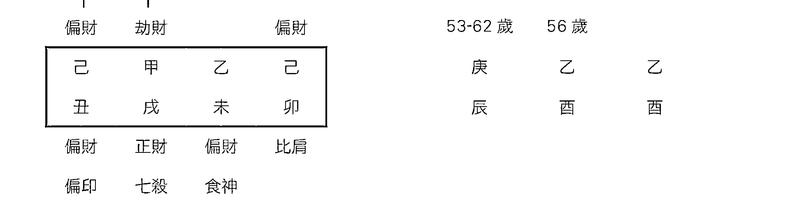

分析：乙木生於秋末戌月，局中三木五土，加上天干甲己合土，戌月引化，真是土勢重重，日主唯有時支卯木爲根，身弱可知。全局木、土對峙，土重木折，幸日、時地支卯未半合木局，以抗厚土。以水木爲用。

地支丑戌未三刑，刑及年、月、日三柱，故幼時家庭變故，父母離異，跟從母親生活。母親是老幹部，文革中遭批門，不忍羞辱而自盡（也是56歲）。自己第一次婚姻也曾失敗。一起赴美國的是第二任丈夫。

我曾替她看過八字。記得當時在美國通長途電話，常是勸慰她，有時會說上一、二個小時。我逐漸感到，對異國生活和工作 的憤憤不平，正在磨蝕她昔日清高脫俗的氣息。有一段時間沒有聯繫，後來竟傳來了噩耗，十分悲痛和惋惜。如果不去異國，大概不至於發生這樣的悲劇。現在看她去世的時段：

[PAGE 327]

## 圖 10.1

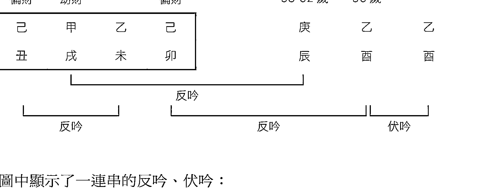

圖中顯示了一連串的反吟、伏吟：

第一，八字結構中，原有年柱己丑與日柱乙未反吟（天剋地沖）。

第二，53 歲進入第六柱大運庚辰，此運是“沖提”大運。因為月令是提綱，它總是跟月柱反吟（天剋地沖），故為“沖提”，也稱“死關”運。這樣，命局內部已經有三柱逢沖剋了。命局架構已經呈現不穩。

第三，到了56 歲流年乙酉，它與大運庚辰相合，但所合為金。木土對時的狀態，就怕財生官殺來傷身。同時，它與時柱己卯反吟（天剋地沖）。危險在於時支卯木為乙木日主之祿，是日主的根。

現在，全局地支構成辰戌沖、丑未沖，以及卯酉沖。四柱都被嚴重沖動了，大廈搖搖欲傾，岌岌可危！土沖旺，生金，金剋卯木祿元。同時，天干乙庚合，庚金合剋日主乙木。花草之秀木，怎能抵抗利金砍伐？

最後，再逢上乙酉月，與流年干支伏吟，再次引動全局沖剋，弱木實在無處藏身了。這位曾經才情橫溢的女詩人走了。詩人失去了土壤，她的生命就跟她的詩情一樣枯萎了。

> “雲無心以出岫，鳥倦飛而知還。”——歸去來兮，那曾飄逸灑脫的詩魂！

## 反吟等級

這裡先討論“反吟”，即兩組干支發生了天干相剋、地支相沖的情況。

干支之間發生反吟，具體表現為兩種形態：

（1）剋天地沖。即天干遭剋，地支相沖。比如，甲子見庚午，天干甲木被庚金相剋，地支子、午相

## 表 10.2 六十干支反吟、「剋出」表

|   | 干支 |    | 干支 |    |    | 納音 | 剋出 | 納音 | 納音生剋 | 年 - 日 | 旬空 | 禄空 | 沖羊刃 | 沖祿 |
|---|------|----|------|----|----|----------|---------|---------|----------|------|------|--------|--------|
| 40| 癸卯 | 金 | 己酉 | 土 |    | 生入     |         | 辰、巳 |      |      |        |        |
| 41| 甲辰 | 火 | 庚戌 | 金 | 剋出 | 十惡大敗 | 寅、卯  | 禄空  |      |      |        |        |
| 42| 乙巳 | 火 | 辛亥 | 金 | 剋出 | 十惡大敗 | 寅、卯  | 禄空  |      |      |        |        |
| 43| 丙午 | 水 | 壬子 | 木 | 生出 |          | 寅、卯  |      |      | 冲羊刃 |        |
| 44| 丁未 | 水 | 癸丑 | 木 | 生出 |          | 寅、卯  |      |      |        |        |
| 45| 戊申 | 土 | 甲寅 | 水 | 剋出 |          | 寅、卯  |      |      |        |        |
| 46| 己酉 | 土 | 乙卯 | 水 | 剋出 |          | 寅、卯  |      |      |        |        |
| 47| 庚戌 | 金 | 丙辰 | 土 | 生入 |          | 寅、卯  |      |      |        |        |
| 48| 辛亥 | 金 | 丁巳 | 土 | 生入 |          | 寅、卯  |      |      |        |        |
| 49| 壬子 | 木 | 戊午 | 火 | 生出 |          | 寅、卯  |      |      | 冲羊刃 |        |
| 50| 癸丑 | 木 | 己未 | 火 | 生出 |          | 寅、卯  |      |      |        |        |
| 51| 甲寅 | 水 | 庚申 | 木 | 生出 |          | 子、丑  |      |      |        | 冲祿  |
| 52| 乙卯 | 水 | 辛酉 | 木 | 生出 |          | 子、丑  |      |      |        | 冲祿  |
| 53| 丙辰 | 土 | 壬戌 | 水 | 剋出 |          | 子、丑  |      |      |        |        |
| 54| 丁巳 | 土 | 癸亥 | 水 | 剋出 |          | 子、丑  |      |      |        |        |
| 55| 戊午 | 火 | 甲子 | 金 | 剋出 |          | 子、丑  |      |      | 冲羊刃 |        |
| 56| 己未 | 火 | 乙丑 | 金 | 剋出 |          | 子、丑  |      |      |        |        |
| 57| 庚申 | 木 | 丙寅 | 火 | 生出 |          | 子、丑  |      |      |        | 冲祿  |
| 58| 辛酉 | 木 | 丁卯 | 火 | 生出 |          | 子、丑  |      |      |        | 冲祿  |
| 59| 壬戌 | 水 | 戊辰 | 木 | 生出 |          | 子、丑  |      |      |        |        |
| 60| 癸亥 | 水 | 己巳 | 木 | 生出 |          | 子、丑  | 禄空  |      |        |        |

## 表 10.3 十惡大敗

| 年 | 庚戌 | 辛亥 | 壬寅 | 癸巳 | 甲辰 | 乙未 | 甲戌 | 乙亥 | 丙寅 | 丁巳 |
|---|------|------|------|------|------|------|------|------|------|------|
| 日 | 甲辰 | 乙巳 | 丙申 | 丁亥 | 戊戌 | 己丑 | 庚辰 | 辛巳 | 壬申 | 癸亥 |

根據以上兩表的資料，我們可以把這具有「反吟」關係的120組干支（剋天地沖和天剋地沖）先分為兩個大類：一大類是干支在納音關係上，也具有相剋關係（「剋入」或「剋出」）；另一大類，雖然干支反吟，但在納音關係上，倒存在着相生關係（「生入」或「生出」）。顯然，前一大類干支組具有「兩重」沖剋，比起後一大類干支組僅有干支沖剋、而納音卻相生的情况來說，要更加「凶險」些吧。

接著，在第一大類中再分類。首先，選出干支組具有「十惡大敗」性質、同時又有「祿空」的。比如，丁亥－癸巳組，它們不僅納音相剋，而且又屬於十惡大敗、祿空。這類干支顯然又更凶險些。

其次，第一大類中有一個雖無十惡大敗，但卻落入祿空的乙未－己丑組，把它也加入進去。

再次，將第一大類中有「沖羊刃」的組合，比如，甲午－戊子，午為戊土之

[PAGE 336]

羊刃，遭子冲剋，也加入其中。同樣，把「沖祿」的組合，如甲寅 - 戊申，也置入。

於是，以上這些干支組構成了一個小類，標記爲等級 3。而原第一大類中剩餘的其他組合也並為一小類，標記為等級 2。

再來看第二大類，將其中有「沖羊刃」的干支對，如丙子 - 壬午，提升到上面的第二小類（等級 2）中去。對「沖祿」的干支對，也作同樣處理。最後，所剩的干支對都歸為第三小類，標記為等級 1。

由於「剋入」和「剋出」是干支內容相同的對應組，比如，甲子 - 戊午，是「剋出」；戊午 - 甲子則是「剋入」。兩者都是相剋關係。「生入」與「生出」也是對應的。比如，戊辰 - 甲戌，納音是「生出」，而甲戌 - 戊辰，納音是「生入」。這樣 120 對干支組可以合並為 60 對干支組。

根據上面的準則，六十對反吟干支組最終被分為三個層級——層級 3 至層級 1，其「凶險」程度則隨層級數字遞減：

## 等級 3，最凶層級，共 17 對

| 序 | 干支 | 序 | 干支 |
|----|------|----|------|
| 1  | 甲子 |  | 戊午 |
| 2  | 甲寅 |  | 戊申 |
| 3  | 甲辰 |  | 庚戌 |
| 4  | 甲午 |  | 戊子 |
| 5  | 甲申 |  | 戊寅 |
| 6  | 甲戌 |  | 庚辰 |
| 7  | 乙卯 |  | 己酉 |
| 8  | 乙巳 |  | 辛亥 |
| 9  | 乙未 |  | 己丑 |
| 10 | 乙酉 |  | 己卯 |
| 11 | 乙亥 |  | 辛巳 |
| 12 | 丙子 |  | 庚午 |
| 13 | 丙寅 |  | 壬申 |
| 14 | 丙午 |  | 庚子 |
| 15 | 丙申 |  | 壬寅 |
| 16 | 丁巳 |  | 癸亥 |
| 17 | 丁亥 |  | 癸巳 |

## 等級 2，次凶層級，共 26 對

| 序 | 干支 | 序 | 干支 |
|----|------|----|------|
| 1  | 甲寅 |  | 庚申 |
| 2  | 甲辰 |  | 戊戌 |
| 3  | 甲申 |  | 庚寅 |
| 4  | 乙卯 |  | 辛酉 |
| 5  | 乙巳 |  | 己亥 |
| 6  | 乙酉 |  | 辛卯 |
| 7  | 乙丑 |  | 己未 |
| 8  | 丙子 |  | 壬午 |
| 9  | 丙寅 |  | 庚申 |
| 10 | 丙辰 |  | 壬戌 |
| 11 | 丙午 |  | 壬子 |
| 12 | 丙申 |  | 庚寅 |
| 13 | 丙戌 |  | 庚辰 |
| 14 | 丁丑 |  | 辛未 |
| 15 | 丁卯 |  | 辛酉 |
| 16 | 丁卯 |  | 癸酉 |
| 17 | 丁未 |  | 辛丑 |
| 18 | 丁酉 |  | 癸卯 |
| 19 | 丁亥 |  | 辛巳 |
| 20 | 戊子 |  | 壬午 |
| 21 | 戊寅 |  | 壬申 |
| 22 | 戊午 |  | 壬子 |
| 23 | 戊戌 |  | 壬辰 |
| 24 | 己巳 |  | 癸亥 |
| 25 | 己丑 |  | 癸未 |

## 等級 1，稍凶層级，共 17 对

| 序 | 干支 | 序 | 干支 |
|----|------|----|------|
| 1  | 甲子 |  | 庚午 |
| 2  | 甲午 |  | 庚子 |
| 3  | 甲戌 |  | 戊辰 |
| 4  | 乙未 |  | 辛丑 |
| 5  | 乙丑 |  | 辛未 |
| 6  | 乙亥 |  | 己巳 |
| 7  | 丙辰 |  | 庚戌 |
| 8  | 丁巳 |  | 辛亥 |
| 9  | 丁未 |  | 癸丑 |
| 10 | 丁酉 |  | 辛卯 |
| 11 | 丁丑 |  | 癸未 |
| 12 | 戊辰 |  | 壬戌 |
| 13 | 戊申 |  | 壬寅 |
| 14 | 己卯 |  | 癸酉 |
| 15 | 己未 |  | 癸丑 |
| 16 | 己酉 |  | 癸卯 |
| 17 | 己亥 |  | 癸巳 |

## 反吟徵驗

現在，把以上對反吟干支組分級的結果標記到前面探討的女詩人的八字及歲運圖中去：

## 圖 10.2 女詩人命例八字及歲運分析示意

大運  流年  流月

偏財 劫財 偏財 53-62 歲 庚 辰 56 歲 乙 乙 酉 酉 己 甲 乙 己 丑 戌 未 卯 庚 辰 酉 酉

圖中所示，三個反吟（天剋地沖）都是最凶險的3級反吟。女詩人遇上了這樣的大運流年，的確是很難生存了。

就命局本身來講，年柱與日柱發生天剋地沖，稱爲「主本不和」。一般認爲，幼時不宜由祖父母帶，最遲結婚後會搬離祖居。對這位女詩人的生涯，這都應驗了。她婚後隨夫到大洋彼岸的美國，最後客死他鄉，大概正是這3級反吟具象的徵驗吧。當然，運歲是觸發點，大運庚辰是「剋入」；流年乙酉又是「剋入」，步步緊逼，才造成了這樣的悲劇。

下面我們再看個例子，前兩冊教程中引用過的民國時代有「游俠」之稱的上海閨人杜月笙命例：

## 命例 96：乾造 杜月笙（1888-1951），民國上海「閒人」。

## 大運

6 歲 16 歲 26 歲 36 歲 46 歲 56 歲

辛 壬 發 甲 乙 丙 酉 戊 亥 子 丑 寅

正財 正官 正印

戊 庚 乙 壬 子 申 丑 午

偏印 正官 偏財 食神 正印 偏印 偏財 正財 七殺

對於杜造，我們比較熟悉 ③ 。這裡再扼要提一下原局的分析：

（1）強弱視角：乙木生於申月，失時，地支無木根，天干無比劫，自身很弱。幸時干壬水，通根於地支子、申、丑，且申子半合水局，轉化月柱庚金之勢，貼身扶持日元。顯然，壬水爲有力的扶抑用神。

（2）調候視角：初秋時節，剛過暑熱，乙木喜丙、癸。取以火制金，以水生木之需。此局地支有子、午，天透壬水，兼顧水火。調候完好。

（3）格局視角：月令申金，內藏財、官、印「三寶」，皆透出干頭：正三奇順位。同時，申子半合，官印融合一體，相生日主，所謂真神得用，有情有義。這是本造格局取「貴」的主要特徵。因爲身弱，地支火（午）土（丑）金（申）水（子）逆生，故異軍突起，以特殊方面成名。格局以壬水正印爲用。

這是簡評。跟本章有關的内容是：年柱戊子與時柱壬午，正好是天剋地沖，構成伏吟（2級）。此兩柱交戰，對應於四柱各管的限運是早年和晚年。這裡值得注意的是：對時柱來說，是「剋入」，而時干壬水是命局用神，隱含了晚年有更大的凶險。

進一步聯繫大運考察，第一步大運是辛酉。辛酉，干支皆金，日元身弱不堪剋制，是敗運。證之事實：杜月笙幼年父母雙亡，僅有一妹也失散無蹤。舉目無親，雙身流浪，以販賣水果維生。

第六步大運是丙寅。它與命局月柱庚申構成天剋地沖，屬2級反吟。就月柱而論，又是「剋入」。這樣，命局內部三柱都動搖了，而原來可以扶持日元的喜用神，皆在這三柱之中。證之事實：杜月笙此運奔波操勞，病痛繞身。62歲己丑年，棄盡家資，亡命香港。64歲辛卯年，辛金剋去乙木日元，地支子卯刑、卯午破，終因哮喘病逝他鄉。分析圖示於下：

## 圖 10.3 杜月笙命造、運歲分析：

剋
大運  流年
正財 正官 正印 56歲 64歲 丙 辛 寅 卯

戊 庚 乙 壬
子 申 丑 午
丙 寅 辛 卯

偏印 正官 偏財 食神
正印 偏印 偏財
正財 七殺
反吟(2級) 反吟(2級) 破 刑

下面這個坤造八字（1948年生）④ 跟杜月笙的八字有點相似，只是月柱不同。事實是：命造乘車出游，遇上了車禍，傷及右腳成殘疾。時間在1980年2月1日（己未年丁丑月甲辰日）：

## 命例97：坤造 1948年4月10日（農曆三月二日）午時生。

正財 傷官 正印 22-31歲 31歲 癸 己 丁 丑 丑 未 丑 反吟(1級)
偏印 正財 偏財 食神 比肩 偏印 偏財 偏印 七殺 反吟(2級) 反吟(2級)

此兩造，都是年柱與時柱伏吟。作者寫道：「年日同宮，俗稱『金神帶甲』。女命年日同干支者，有剋夫之嫌。但以甲年甲日生人最驗。」⑥事實上，前造身邊不乏男友，但46歲尚未結婚；後造31歲、32歲愛上一個有婦之夫，陷在複雜的三角習題之中。兩位都是「富婆」。

## 對於八字原局出現的反吟、伏吟，命理學的一般認識如下：

# 四柱內自行反吟（干支天剋地沖）：

（1）年、月逢冲，月納音剋年納音，為夭折之命。

（2）年、月反吟，背祖離鄉之客。祖業易破敗。年輕時讀書運易受阻。年輕創業多成敗。母親易與祖母不合。

（3）日、月反吟，婆媳不合，婚後不宜和父母、兄弟居住在一起。有晚婚之現象。

（4）日、時反吟，刑妻害子，夫妻生活不和睦。

（5）年、時反吟，出生後六年內有刑剋祖輩之兆。幼時較有災。

（6）月、時反吟，父母與本造子息不親。

（7）年、日反吟，名曰主本不和。幼時不宜由祖父母帶。最遲在婚後搬離祖居。

# 四柱內自行伏吟（干支重現）：

（1）年、月伏吟，祖輩較凋零。父母會搬離祖居。注意初年身體凶災。

（2）月、日伏吟，婚後會離開父母，且不宜早婚。早婚有離異再婚之兆。

（3）日、時伏吟，對婚緣不利，易有夫妻形同陌路。子息也會遠離本造身邊。

（4）年、日伏吟，幼時不宜居住祖居。婚後也易有變遷。

（5）月、時伏吟，氣壓偏枯，須注意調候。婚後有孩子，不宜託付給父母帶。

（6）年、時伏吟，注意幼時六年內刑剋祖輩，及自身之身體凶災。

對於歲、運出現反吟，即大運干支與流年干支發生天剋地沖，命理中稱為「歲運交戰」或「歲運沖剋」；歲、運出現伏吟，即流年干支與大運干支相同，稱為「歲運並臨」。前者為凶兆，動蕩不安；後者也有「歲運並臨，災殃立至」的說法。

比如，民國北洋軍奉系首領張作霖（生於1875年3月19日）命造：

## 第十章 反吟伏吟 345

## 命例 42：乾造 张作霖（1875-1928），民國北洋軍奉系首領。

## 大運

| 正財 | 正印 | 正官 | 5歲 | 15歲 | 25歲 | 35歲 | 45歲 |
| ---- | ---- | ---- | ---- | ---- | ---- | ---- | ---- |
| 乙 亥 | 己 卯 | 庚 辰 | 戊 寅 | 丁 丑 | 丙 子 | 乙 亥 | 甲 戌 |

食神 正財 偏印 正印 偏財 正財 傷官 傷官 劫財

張作霖在 1928 年 6 月 4 日於皇姑屯被日本關東軍預埋的炸彈炸死。那年他 54 歲，正值歲運交戰之年：

## 圖 10.6 張作霖命局、歲運分析

| 反吟(3級) | 反吟(1級) | 大運 | 流年 | 流月 | 流日 |
| ---- | ---- | ---- | ---- | ---- | ---- |
| 正財 正印 正官 | 45歲 54歲 | 甲 戊 丁 乙 | 戌 辰 巳 亥 |

歲運交戰或歲運並臨，若再加上它跟本命四柱之間發生反吟、伏吟，則構成了「三連環」，便可謂是人生的一個「大劫難」。這是動態論命時要給予足夠重視的一種狀況。上面張作霖之案已具備了這種「三連環」。 下面為國民黨元老胡漢民命造

## 第十一章

## 六甲移位

「六甲移位」，指的是以下這種情況：

比如，干支甲子和乙未，初看起來兩者並沒有發生任何「沖」或「合」。

但仔細推究起來，在甲子和乙未之間，事實上是存在着兩種沖、合關係的：

從甲子出發，甲子雙合己丑（甲己合，子丑合），甲子又雙沖庚午（庚剋甲，子午沖）；從乙未出發，乙未雙合庚午（乙庚合，午未合），乙未又雙沖己丑（乙剋己，丑未沖）。顯然，甲子和乙未就相互聯繫起來了。而這種「暗中沖合」的特殊關係——彼沖我合，我沖彼合，恰恰表明了這兩組干支在「沖、合」喜忌上的相反性質。因此，干支甲子遇上乙未的話，在命理上具有「阻滯」的信息。

因爲在形式上，天干由甲至乙，正好是移動一位，即一位「移位」；地支子與未，正好是「相害」關係。故甲子與乙未，稱爲「六甲移位」，也稱作「六甲移位六害相剋」，或「移位剋害」。可以圖示如下：

[PAGE 352]

## 圖 11.2 六甲移位示意

[PAGE 353]

## 圖 11.3 「合一沖二」圖示

[PAGE 354]

## 乙丑組六甲移位圖示

[PAGE 354]

## 對於「六甲移位」的實際應用，就前面所述的甲子與乙未、癸未兩組而言，梁先生指出：

（1）陽男陰女，用「剋入」（庚午）的一組；
（2）陰男陽女，用「剋出」（戊午）的一組。

這裡着重指明了「六甲移位」的應用規範：陽男陰女，用「剋入」一組；陰男陽女，用「剋出」一組。

所謂「陽男陰女」，是指男命出生時的年干為陽（年天干為甲、丙、戊、庚、壬）、女命出生時的年干為陰（年天干為乙、丁、己、辛、癸）的八字；所謂「陰男陽女」，與上述情況正好相反，是指男命出生年干為陰，女命出生年干為陽的八字。前者用「剋入」；後者用「剋出」。梁先生把這兩組 120 對干支都分別羅列了出來，見於下表：## 表 11.1 陽男陰女（六甲移位六害相剋）（剋入）

| 甲子 | → | 乙未 | → | 丙子 | → | 丁未 | → | 戊子 | → | 己未 | → | 庚子 | → | 辛未 | → | 壬子 | → | 癸未 | → | 甲子 |
| ---- | ---- | ---- | ---- | ---- | ---- | ---- | ---- | ---- | ---- | ---- | ---- | ---- | ---- | ---- | ---- | ---- | ---- | ---- | ---- |
| 甲戌 | → | 乙酉 | → | 丙戌 | → | 丁酉 | → | 戊戌 | → | 己酉 | → | 庚戌 | → | 辛酉 | → | 壬戌 | → | 癸酉 | → | 甲戌 |
| 甲申 | → | 乙亥 | → | 丙申 | → | 丁亥 | → | 戊申 | → | 己亥 | → | 庚申 | → | 辛亥 | → | 壬申 | → | 癸亥 | → | 甲申 |
| 甲午 | → | 乙丑 | → | 丙午 | → | 丁丑 | → | 戊午 | → | 己丑 | → | 庚午 | → | 辛丑 | → | 壬午 | → | 癸丑 | → | 甲午 |
| 甲辰 | → | 乙卯 | → | 丙辰 | → | 丁卯 | → | 戊辰 | → | 己卯 | → | 庚辰 | → | 辛卯 | → | 壬辰 | → | 癸卯 | → | 甲辰 |
| 甲寅 | → | 乙巳 | → | 丙寅 | → | 丁巳 | → | 戊寅 | → | 己巳 | → | 庚寅 | → | 辛巳 | → | 壬寅 | → | 癸巳 | → | 甲寅 |

## 表 11.2 陰男陽女（六甲移位六害相剋）（剋出）

| 甲子 | → | 癸未 | → | 壬子 | → | 辛未 | → | 庚子 | → | 己未 | → | 戊子 | → | 丁未 | → | 丙子 | → | 乙未 | → | 甲子 |
| ---- | ---- | ---- | ---- | ---- | ---- | ---- | ---- | ---- | ---- | ---- | ---- | ---- | ---- | ---- | ---- | ---- | ---- | ---- | ---- |
| 甲戌 | → | 癸酉 | → | 壬戌 | → | 辛酉 | → | 庚戌 | → | 己酉 | → | 戊戌 | → | 丁酉 | → | 丙戌 | → | 乙酉 | → | 甲戌 |
| 甲申 | → | 癸亥 | → | 壬申 | → | 辛亥 | → | 庚申 | → | 己亥 | → | 戊申 | → | 丁亥 | → | 丙申 | → | 乙亥 | → | 甲申 |
| 甲午 | → | 癸丑 | → | 壬午 | → | 辛丑 | → | 庚午 | → | 己丑 | → | 戊午 | → | 丁丑 | → | 丙午 | → | 乙丑 | → | 甲午 |
| 甲辰 | → | 癸卯 | → | 壬辰 | → | 辛卯 | → | 庚辰 | → | 己卯 | → | 戊辰 | → | 丁卯 | → | 丙辰 | → | 乙卯 | → | 甲辰 |
| 甲寅 | → | 癸巳 | → | 壬寅 | → | 辛巳 | → | 庚寅 | → | 己巳 | → | 戊寅 | → | 丁巳 | → | 丙寅 | → | 乙巳 | → | 甲寅 |

刻畫了這兩大組的干支「六甲移位」關係，接着，有沒有實際應用的案例呢？

在梁湘潤《細批終身詳解》「細批十年流年」一節中僅看到一個流月的批語，應用了「六甲移位」② ：

八字：丁亥，丁未，辛亥，癸巳

大運：乙巳

流年：22 歲戊申年

正月 甲寅 —— 親屬不和。

「甲寅」流月，與「乙巳」大運，為「移位剋害」。

這裡，此命造（丁亥，丁未，辛亥，癸巳）在流年戊申年的正月，大運乙巳與流月干支甲寅發生了「六甲移位」關係。因為此命是「陰男」（年干為丁），可以查上面表2。表中最後一行可以找到「乙巳 —— 甲寅」，為「移位剋害」。由此發生了「阻滯」。梁先生批示此月「親屬不和」。由此可見，對於「六甲移位」的應用，梁先生應用於大運與流年、流月的範圍。

對於這種「六甲移位」現象，謝武藤《八字深入》（2）一書「見不見之形，無時不有（三）」一節中也有提及，只是作者沒有用「六甲移位」或「移位剋害」這樣的名詞（術語）來表達。此書舉了以下一個案例：

# 命例 103：乾造 1949 年農曆七月初一日丑時生。

# 大運

| 食神 | 偏財 | 偏財 |
| ---- | ---- | ---- |
| 己   | 辛   | 丁   | 辛 |
| 丑   | 未   | 巳   | 丑 |
| 食神 | 食神 | 劫財 | 食神 |
| 七殺 | 比肩 | 正財 | 七殺 |
| 偏財 | 偏印 | 傷官 | 偏財 |

| 7 歲 | 17 歲 | 27 歲 | 37 歲 | 47 歲 | 57 歲 |
| ---- | ----  | ----  | ----  | ----  | ----  |
| 庚   | 己    | 戊    | 丁    | 丙    | 乙    |
| 午   | 巳    | 辰    | 卯    | 寅    | 丑    |

作者謝武藤寫道：

本造是丁火生於季夏，四柱土金競透，無疑是日主身弱，運喜木火。前運丁卯不錯。若以為丙寅更吉，則恐為大失所望。何故？不要誤認為丙運是丙火逢辛反怯。如果丙在「原局」為喜用神，「大運」見辛金，則可以稱「丙火逢辛反怯」。若是丙火「運」為喜，「原局」是辛金逢合，除非是「丙辛」因合而化水，由喜化忌一定不吉，否則皆以吉運論。

本造在47歲起丙寅大運之中，事業、財利，甚至妻子等，恐有不利之處，但仍以事業方面為主，不免會有起伏、破折，……

而本造47歲的丙寅大運，依原局的喜忌而言，是喜用神的大運不錯。但現在所談的是「見不見之形」，這與喜忌並無關係。容易疏忽掉的原因，是根本看不見之故。現在我們把丙寅運和日主提出，這二組干支的组合結構如何，更能一目了然了。

以日主身弱不能任刑沖之故，在丙寅大運與日主丁巳兩者之間，乍看之下並無任何關聯，但因丁巳和丙寅會因此牽扯出壬申、辛亥的暗沖又暗合，導致五行的氣不穩，因而會有意想不到的破耗，或中途突然有事前無法預知的事故，而導致日主的損害等等。

顯然，作者謝武藤對此案例的分析跟我們前文「六甲移位」的探討完全是致的，可以圖示如下：

在這裡，作者只是把它歸為「發生在歲運之中的『不見之形』」而已。其帶來的結果是「會有意想不到的破耗，或中途突然有事前無法預知的事故。」

事實上，這也就是「阻滯」的喻象。但是，它進入了命造，是日柱與大運發生的「六甲移位」關係。

關於「六甲移位」現象，除了以上梁先生和謝武藤先生的書之外，以往的命理書籍中的確很少有人提及。那麼，它在命理實務中究竟是否具有應用價值呢？

我有一位年輕的朋友，他父親在 2013 年春因肝癌去世。其命造如下：

# 命例 104：乾造 1943 年 9 月 19 日酉時生。

這是一個專旺格（從革格）的八字。在甲運尾、寅運初，被診斷患有腸癌。接着又轉為肝癌，病情來勢凶猛，到2013年夏天（丁巳月），就不治身亡了（享年69歲）。觀察其甲寅大運與流年癸巳，正好逢上了「六甲移位」（甲寅——癸巳（剋出）），見下圖：

這真是生命的「阻滯」啊！它是否可以看作是此命造病故事實的一個重要的命理線索呢？

在梁湘潤《大流年判例》中有以下一個案例：

# 命例 105：乾造 甲午運經商失敗，己未年服農藥自殺。

《判例》對此做了解釋：「甲午運中與日主對沖，而致經商失敗。己未年與大運甲午雙合而得神經病，服農藥自殺。」④

梁先生在這裡並沒有論及「六甲移位」現象。其實，日柱戊子與流年己未也正好構成「六甲移位」關係（戊子——己未），只是它們的關係是「剋出」，而年柱是「陰男」，不在前面所述的「應用規範」內。

在星雲山人《八字用神流年點斷真訣》中有這樣一個案例：

# 命例 106：乾造 1958 年農曆九月二十日巳時生。

大運
七殺 比肩 傷官
戊 壬 壬 乙
戌 戌 午 巳
七殺 七殺 正財 偏財
正印 正印 正官 偏印
正財 正財 七殺

事實：16 歲癸丑年溺斃。

星雲山人分析道：

+   （1）本造火旺滋殺（戊）攻身，日元無通藏之支，氣息搖擺不固，加上乙木泄身，更非永壽之徵。

+   （2）庚運癸丑歲，金生水旺助身，惟流月己未，與戌丑匯成三刑，非但官殺攻身，亦且傷官見官，同時巳、午、未支合南方火位，與壬癸（加上河水）成木火對峙之局勢，災厄見矣！乃因游泳而亡。⑤

然而，我們在這裡看到了兩個「六甲移位」現象：

日柱壬午與流年癸丑，大運庚子與流月己未，都是干支天干一位移位、地支相害。前者屬「剋出」，後者屬「剋入」。按「應用規範」，陽男用「剋出」；但「剋入」就不發生效應嗎？究竟這個生命的「阻滯」慘劇發生在此年、此月啊！

以上「六甲移位」現象的探討和應用僅在命、運、歲、月之間。如果它出現在八字結構內部，是否也具有一定的命理含義呢？這是需要進一步探索的內容。

洪承畴命例

下面是明末清初的名臣洪承疇的命造：

# 命例107：洪承疇 1593年10月16日（萬歷二十一年九月二十一日）戌時生。

# 大運

| 比肩 | 劫財 | 劫財 | 5歲 | 15歲 | 25歲 | 35歲 | 45歲 | 55歲 | 65歲 |
| --- | --- | --- | --- | --- | --- | --- | --- | --- | --- |
| 癸 | 壬 | 癸 | 壬 | 辛 | 庚 | 己 | 戊 | 丁 | 丙 | 乙 |
| 巳 | 戌 | 酉 | 戌 | 酉 | 申 | 未 | 午 | 巳 | 辰 | 卯 |
| 正財 | 正官 | 偏印 | 正官 |
| 正印 | 偏印 | 偏印 |
| 正官 | 偏財 | 偏財 |

洪承疇（1593-1665），字彥演，號亨九，福建南安人。幼時家貧，曾幫母親叫賣過豆乾。1616年（24歲）明萬歷四十四年進士。累官至陝西三邊總督。1634年（42歲），監督河南、山西、陝西、四川、湖廣軍務，加太子太保、兵部尚書。1638年（46歲）戊寅，在陝西擊潰李自成的農民起義軍。1639年（47歲）己卯，授蓟遼總督。1641年（49歲）辛巳，在對清朝的松錦之戰中戰敗。1642年（50歲）壬午春被俘，遂降，成為清政府的漢人大學士。1644年順治元年四月，隨清軍入關。抵京後以太子太保、兵部尚書兼右副都御史銜，列內院佐理機務，為滿漢的合流打下基礎。因洪承疇的建議，清廷採納了許多明朝的典章制度，完善了清王朝的國家機器。1653年（61歲），洪承疇受命經略湖廣、廣東、廣西、雲南、貴州等處，總督軍務兼理糧餉。1659年（68歲），督清軍攻佔雲南。後因年老體衰、目疾加劇，請求回京。1661年正月，康熙嗣位。這時洪承疇業已69歲，返京後仍任大學士，頗感孤獨，於五月疏乞退休。朝廷幾經爭論，康熙才授以微不足道的三等輕車都尉世襲職銜。1665年（73歲）2月，洪承疇去世，諡文襄。

洪承嶠是明清之際的重要歷史人物，也是一個有重大爭議的歷史人物。他既是明末皇朝賴以支撐軍事大局的統帥，也是清朝招撫江南、進軍西南，促進統一的關鍵人物。他的一生堪稱為明清兩代帝王效盡犬馬之勞。然而，洪承嶠的暮年，卻是在極端的孤寂中，獨自咀嚼着時代送給他的雜陳五味……。他的充滿了矛盾與悖論的人生歷程，清晰地勾勒出明清交替那段晦澀的歷史和精英人物苦悶的心路歷程。

其實，在洪承嶠的八字結構中是可以透現了這種矛盾和糾葛的。它的日柱癸酉與月柱壬戌、時柱壬戌之間都呈現出干支一級扭曲，同時又是「六甲移位」現象：

月柱與日柱的扭曲和「移位剋害」，從四柱運限上，透露了壯年必有一次破壞性的「阻滯」發生。事實上，它就發生在45歲至50歲的丁運中。

洪承嶠命造癸水日主，生於秋季戌月。日元坐印，天干比、劫成群，日主身強，故喜木（食傷化比劫生財）、火（雜氣財格喜火財）、土（官殺制比劫），忌金、水。就大運來說，洪承嶠是幸運的。除了早年金運之外，基本上走的皆

洪承疇去世時，他在清朝官方文獻中的地位起碼還是正面的。到了乾隆時期，滿漢思想文化已經開始交融。乾隆皇帝以儒家聖賢後裔和華夏共主自居，與漢族

## 命例110：乾造 1941年5月23日卯時生。

大運
6歲 16歲
壬 辛
辰 卯

| 比肩 | 食神 | 比肩 | 
| ---- | ---- | ---- | 
| 辛   | 癸   | 辛   | 辛   
| 巳   | 巳   | 未   | 卯   |

正官 正官 偏印 偏財
劫財 劫財 七殺
正印 正印 偏財

事實：23歲溺水而亡。

此命造日主辛金生於夏天巳月，地支都是木（卯未合半木局）火（巳火），為日主的衰絕之地。日主弱而無根是顯而易见的。21歲入卯運，又是辛金絕地。但為什麼會在23歲甲辰年溺水呢？

我把可能有的命局、大運、流年的干支聯繫圖示如下：

# 圖11.11「一路無間」分析

# 扭曲（1級）

# 扭曲（2級）

大運 流年
16歲 23歲
辛 甲 壬 甲 辛
卯 辰 申 午 未

| 比肩 | 食神 | 比肩 | 
| ---- | ---- | ---- | 
| 辛   | 癸   | 辛   | 辛   
| 巳   | 巳   | 未   | 卯   |

（死）（死）（衰）（絕）（絕）

地支： 卯 辰 巳 午 未 申

當然，流年甲辰與月柱癸巳構成了干支一級扭曲，而且此年正是在月柱運限（17 至 32 歲）之中。但為什麼會發生這樣嚴重的事故呢？當時着實想了許久，不能得到充分合理的解釋。後來在某本命書（現在已記不起書名了）中讀到：地支接連無間的排列會發生意外的凶事，對照此八字，於是就豁然開朗了。

如上圖所示，此八字結構內部，年柱辛巳與日柱辛未，夾拱出個「午」字；年柱辛巳與時柱辛卯，夾拱出個「辰」字。於是，命局內部就存在：卯、辰（虛拱）、巳、午（虛拱）、未等順序連接的五個地支。大運辛卯又與年柱辛巳，夾拱出又一個「辰」字。接着，流年甲辰，將這個虛拱的「辰」字填實。當年申月，又增添了第六個順序出現的地支，這樣就構成：卯、辰、巳、午、未、申，「一路無間的地支相連」。令人吃驚的是，發生事故的當日（甲午）日支是「午」（將虛拱的「午」字填實），時辰（辛未）的地支是「未」，這樣，八字、大運、流年、流月、流日、流時的所有地支，就都落在這六個相連的地支序列中了。這真有點令人不可思議！

據說，事後其母曾拿着這個生辰八字，去上海老城隍廟詢問當時擺算命攤的瞎子算命師。盲師掐指算了一番後說：這個人已經「白骨還鄉」了。真不知這位盲師是如何掐算出來的？當然，這還是文化大革命（1966 年）以前的事了。

兩年前，一位學生提供了為我一個命造，是原某省副省長。其八字如下：

# 命例 111：乾造 1956 年 6 月 12 日酉時生。原某省副省長。

# 大運

七殺 偏財 正財
8 歲 18 歲 28 歲 38 歲 48 歲 58 歲
丙 甲 庚 乙
申 午 戌 酉
比肩 正官 偏印 劫財
食神 正印 劫財
偏印 正官

此人於2016年二月初「落馬」。他是從「草根」起來的。2016年2月4日晚十點（是在2016年立春前二日，應作為2015年乙未、十二月己丑看），中央紀委監察部宣布此人涉嫌嚴重違紀，接受組織調查。後來網上傳出這位高官貪污數額高達幾百個億，搞權色交易，總之，「十惡不赦」。

那麼，如果我们把八字和大運、流年以及出事的月份地支連起來：

# 圖 11.12 「一路無間」分析

這裡會發現一個奇怪的现象：午（月支）、未（流年地支）、申（年支）、酉（時支）、戌（日支）、亥（庚子大運與日柱庚戌夾拱出來）、子（大運地支）、丑（流月地支）。這不就是地支接連無間的排列嗎？而且順序連續的地支竟多至八個。看來這位貪官「東窗事發」的時間也不是偶然的。

我們再回到本書前文中的案例——朱元璋八字（見第二章朱元璋命例）。

關於這位貧民出身的皇帝的死，我們花了不少筆墨仔細地分析了他去世時的運歲、甚至流月與八字原局的關係。如果我們換個角度，從以上的分析思路去觀察，我們不難發現，它也符合地支接連無間的排列的情況。請看下圖：

# 第十一章 六甲移位及其他

朱元璋最後一步大運是己巳，他死於戊寅年（洪武三十一年閏五月）戊午月乙酉日（1398年 6 月 24 日）。從上圖中可以看到，日支丑、流年地支寅、年柱戊辰和流年戊寅拱卯、年支辰、大運地支巳、流月地支午、時支未，這樣，正好構成：丑、寅、卯、辰、巳、午、未連續七個地支的排列，它符合上述地支接連無間的排列的情況，可以斷為「大禍臨頭」。當然，沒有比「死」再大的禍了。

顯然，這也可以看作是朱元璋「駕崩」的命理原因之一。

自然，地支接連無間的排列並不是命局「大禍臨頭」的唯一條件，但它終究是「凶事」發生時機的一種命理信號，可以作為我們動態論命時的參考。

## 註釋

+   ① 《四角方陣刑沖合會遷解》，第123頁。

+   ② 見《細批終身詳解》，第493頁。

+   ③ 《八字深入》（2），第157-160頁。

+   ④ 《大流年判例》，第422頁。

+   ⑤ 《八字用神流年點斷真訣》，第169頁。

+   ⑥ 《八字深入》（2），第114頁。

+   ⑦ 《八字深入》（2），第115頁。

# 六十年子内涵

# 第十二章

在前三章干支研究的基础 上，我們參考時賢的作品 ①，對六十甲子的內涵 做了以下全方位的概述，並把它們製成表格，供命理研習者查閱和參考。

# 六十甲子內涵表說明

+   一、干支性質（參見第九章）

+   1. 干支名稱。即目標干支，比如：1. 甲子。

+   2. 干支等級。共4級（自大至小）：4 為最佳等級；3 為次佳等級；2 為普通等級；1 為較差等級。

+   3. 十二運。這是考察天干坐下地支的十二運所屬。這十二運是：長生、沐浴、冠帶、臨官、帝旺、衰、病、死、墓、絕、胎、養。它們表明每一天干五行由盛而衰、由衰而復盛的十二個階段。這裡採取的是陰生陽死或陽生陰死的運行周期。

+   4. 上下關係。這是干支上下組合的五種類型：(1) 上生下；(2) 下生上；(3) 上剋下；(4) 下剋上；(5) 上下同。從優劣判斷：(1)(2) 和 (5) 為相生和同類，為優等；(3) 上剋下，為中等；(4) 下剋上，為劣等。

+   5. 虛實。這是考察干支關係的一種途徑。基本原則是：天干無根無生者為虛；天干有根有生者為實。②

+   6. 吉神。這裡主要是跟日柱有關的神煞：天乙貴人、文昌貴人、進神貴、十靈日、六秀日、魁罡日。它們是吉神。

+   7. 凶煞。這裡也是跟日柱有關的神煞：十惡大敗日、紅鵰煞、孤鸞煞（又稱呻吟煞）、八專煞、陰陽差錯煞、九丑煞、天元坐殺煞。大都是對婚姻不利的凶煞。

+   8. 藏遁、十神。這是地支藏遁，以及它們對應於天干的十神內容。

+   9. 納音及十二運。這是干支所屬納音，以及此干支所屬納音十二運。③

# 二、反吟（參見第十章）

1. 反吟干支。對於目標干支，總有兩個干支與其構成反吟（天剋地沖）關係。比如，目標干支——甲子，跟它反吟的是：庚午和戊午。

2. 納音。這裡標記的是跟目標干支構成反吟干支的納音：比如，上述庚午和戊午，前者納音為土（路旁土）；後者納音為火（天上火）。

3. 五行生剋。這是目標干支的天干跟反吟干支天干之間的五行生剋關係。比如，甲子跟庚午，對於甲來說，庚是「剋入」；甲子跟戊午，則是「剋出」。

4. 納音生剋。這是指目標干支跟反吟干支之間的納音生剋關係。比如，甲子納音金跟庚午納音土，是「生入」（土生金）；甲子納音金跟戊午納音火，是「剋入」（火剋金）。

5. 凶度。這是指兩柱反吟後「凶」的程度。共定位三級：等級3，最凶；等級2，次凶；等級1，稍凶。評判的標準見第十章。

# 三、一級扭曲（參見第五章）

這是我在本書中提出的一個概念，是技法的一個組成部分。干支扭曲是一種破壞力，造成的現實應驗往往是「離婚」、「死亡」等凶事，在實務論命時不能不引起注意。這裡羅列的是干支「一級扭曲」：

+   1. 扭曲。這裡顯示「扭曲」狀態：「干進支退」或「干退支進」。

+   2. 扭曲干支。這是羅列具體干支。比如目標干支是甲子，跟甲子構成一級扭曲的有：乙亥和癸丑。

# 四、六甲移位六害相剋（參見第十一章）

這是由有特殊沖合關係的干支組引申出來的一種特殊的干支關係。六甲移位六害相剋，是指跟目標干支構成天干移位一位、同時地支構成相害關係的一種干支。比如，目標干支甲子，它跟干支乙未構成天干順延一位，甲至乙；地支子與未為相害關係。同樣，目標干支甲子，它跟干支癸未構成天干倒退一位，甲至癸；地支子與未為相害關係。在應用中，它們分成兩類：陽男陰女一組，陰男陽女一組。它們都是六甲移位。這種「移位剋害」在命理徵驗上的意義是「阻滯」（事情不順利，意想不到的挫折，無法預知的事故）。

1. 位移。指明跟目標干支發生「六甲移位」關係的干支天干移動方向：進，或是退。

2. 移位干支。具體跟目標干支發生「六甲移位」關係的干支。

3. 應用範圍。要觀察年干與命主的陰陽性質：陽男陰女，還是陰男陽女。根據條件來使用。即陽男陰女用「剋入」，陰男陽女用「剋出」。

# 五、干支內涵

這是對目標干支內涵的概述。主要包含此干支的特徵、作為日柱的六親含義、以及作為納音的象徵意義等内容。

# 六十甲子內涵表

| 1       | 干支性質                     |
| 干支   | 等級 | 十二運 | 上下關係 | 虛實 | 吉神 | 凶煞 | 運藏 | 十神 | 納音之十二運 |
| 甲子   | 4   | 沐   | 下生上 | 賀   | 進神 |      | 癸   | 印   | 海中金 | 自死   |
|        |    |    |    |    |    |    |    |    |    |    |
| 反吟   | 一級扭曲                     | 六甲移位六害相剋           |
| 反吟干支 | 本納音 | 五行生剋 | 納音生剋 | 凶度 | 扭曲 | 扭曲干支 | 位移 | 移位干支 | 應用範圍 |
| 庚午   | 土   | 剋入 | 生入 | 1 | 干進支退 | 丙子 進 丙午 | 陽男陰女 |
| 戊午   | 火   | 剋出 | 剋入 | 2 | 干退支進 | 甲寅 退 甲午 | 陰男陽女 |
| 干支內涵 | ... |
| 甲木為棟梁之木，木主仁，坐下正印，為身高體健，慈祥愷悌，相貌俊秀。印為文壇，身坐文壇，主才學超群，有權柄。印又有生身助學之功，故主人記憶力強，學習成績優異。干支氣勢在水木相生。子水適中時，甲木得其生機。若子水寒凝過旺，也會浸淫和凍傷甲木，壞其根基。甲子日主，身臨沐浴，易犯桃花，易淪落為殘花敗柳而無用。母緣好，夏生尤驗。甲子納音海中金，能引動金氣。甲子日柱也為天德貴人日。有詩曰：白玉仙子捧印來，一舉成名天門開。貴人不向西方去，風火空負贅世才。

甲木為棟梁之木，木主仁，坐下正印，為身高體健，慈祥愷悌，相貌俊秀。印為文壇，身坐文壇，主才學超群，有權柄。印又有生身助學之功，故主人記憶力強，學習成績優異。干支氣勢在水木相生。子水適中時，甲木得其生機。若子水寒凝過旺，也會浸淫和凍傷甲木，壞其根基。甲子日主，身臨沐浴，易犯桃花，易淪落為殘花敗柳而無用。母緣好，夏生尤驗。甲子納音海中金，能引動金氣。甲子日柱也為天德貴人日。有詩曰：白玉仙子捧印來，一舉成名天門開。貴人不向西方去，風火空負贅世才才。

[PAGE 379]

# 干

## 干支性質
| 干支 | 等级 | 十二运 | 上下关系 | 虚实 | 吉神 | 凶煞 | 遁藏 | 十神 | 纳音之十二运 |
|---|---|---|---|---|---|---|---|---|---|
| 辛未 | 2 | 养 | 下生上 | 虚 |  |  | 己 | 柱 | 路旁土 | 自赖 |
|  | 丁 | 杀 |  |  | 乙 | 才 |  |  |  |

## 反吟 一级扭曲 六甲移位六害相剋
| 反吟干支 | 本纳音 | 五行生克 | 纳音生克 | 凶度 | 扭曲 | 扭曲干支 | 位移 | 移位干支 | 应用范围 |
|---|---|---|---|---|---|---|---|---|---|
| 丁丑 | 水 | 剋入 | 剋出 | 2 | 干进支退 | 壬午 | 進 | 壬子 | 陽男陰女 |
| 乙丑 | 金 | 剋出 | 生出 | 1 | 干退支进 | 庚申 | 退 | 庚子 | 陰男陽女 |

## 干支内涵
辛未干支气势在于土金。无水而燥，反而克金。有水不燥，则一派顺生，主贵，吉。辛驢羊，有经商的爱好。除非有运，一般而言，财运比辛卯弱，但有运则易储蓄金钱。辛末日柱，跟父亲的缘分颇佳，但父亲会体弱或短寿。或会有二母，庶母个性强。男命妻子易体弱多病，除非他柱有水生木，否则娶年长之妻。女命嫁年长之夫，丈夫脾气不佳。女命辛未爱情专一，夺夫权，守家，独裁。通常子缘较差，或自己不喜欢生育。纳音路旁土，既生金也埋金。属于中等干支。辛未冰河解冻日，临衰，支坐枭印，偏官，常常多情忘义。有诗曰：身入西国佛香地，漫歌轻舞管弦醉。玉女传送风流人，高山日出彩尽新。

## 干支性質
| 干支 | 等级 | 十二运 | 上下关系 | 虚实 | 吉神 | 凶煞 | 遁藏 | 十神 | 纳音之十二运 |
|---|---|---|---|---|---|---|---|---|---|
| 壬申 | 2 | 生 | 下生上 | 寅 |  | 十恶大败 | 庚 | 柱 | 劭鋒金 | 自临官 |
|  | 壬 | 比 |  |  | 戊 | 杀 |  |  |  |

## 反吟 一级扭曲 六甲移位六害相剋
| 反吟干支 | 本纳音 | 五行生克 | 纳音生克 | 凶度 | 扭曲 | 扭曲干支 | 位移 | 移位干支 | 应用范围 |
|---|---|---|---|---|---|---|---|---|---|
| 戊寅 | 土 | 剋入 | 生入 | 2 | 干进支退 | 癸未 | 進 | 壬子 | 陽男陰女 |
| 丙寅 | 火 | 剋出 | 剋入 | 3 | 干退支进 | 辛酉 | 退 | 辛亥 | 陰男陽女 |

## 干支内涵
干支气势在于金水相生，身坐长生，太旺，主人好动不拘。壬申日柱，有二母，否则母缘浅。男命申中有比劫分财，夫妻感情欠佳，通常不止一次婚姻，见巳刑则更验。女命同样，夫妻相处不和睦，通常一次婚姻不到老。见寅冲，会有情夫，情夫与亲夫会起冲突。命主得长生，通常配偶会比自己先逝。纳音劭鋒金，刀光剑影，壬水旺极。男命敢于拼搏争斗，不善终。女命重武好斗，具男性风格。壬申是白虎渡江日。有诗曰：命似白虎渡长江，最怕风雨江水涨。丽日跨入平川地，金枝玉叶陪身旁。

## 干支性質
| 干支 | 等级 | 十二运 | 上下关系 | 虚实 | 吉神 | 凶煞 | 遁藏 | 十神 | 纳音之十二运 |
|---|---|---|---|---|---|---|---|---|---|
| 癸酉 | 3 | 病 | 下生上 | 寅 |  |  | 辛 | 枭 | | 劭鋒金 | 自旺 |

## 反吟 一级扭曲 六甲移位六害相剋
| 反吟干支 | 本纳音 | 五行生克 | 纳音生剋 | 凶度 | 扭曲 | 扭曲干支 | 位移 | 移位干支 | 应用范围 |
|---|---|---|---|---|---|---|---|---|---|
| 己卯 | 土 | 剋入 | 生入 | 1 | 干进支退 | 甲申 | 進 | 甲戌 | 陽男陰女 |
| 丁卯 | 火 | 剋出 | 剋入 | 2 | 干退支进 | 壬戌 | 退 | 壬戌 | 陰男陽女 |

## 干支内涵
干支气势在于金水相生。日坐偏印，多喜自由职业，或盘卜星相之类。他柱不见印星者，易有二母，否则与母缘薄。申子辰年生人，自坐桃花，恐不但好色，还会耽于酗酒。若地支有酉酉自刑，提防因酒致祸。

身强者夫妻感情不佳，话不投机。女命自坐偏印，若时柱再见印星，通常子女缘薄，或不喜生育，易孤独终老。

纳音劭鋒金，金炼成器，旺气在金。坐偏印，金神，外表柔和，内心阴毒，富于心计。会择钱，也会花光。癸酉为天福日，临病，支坐偏印。有诗曰：

涧功名起一方，一冲一合异寻常。

江湖花涧安享福。南去高山势莫挡。

## 干支性質
| 干支 | 等级 | 十二运 | 上下关系 | 虚实 | 吉神 | 凶煞 | 遁藏 | 十神 | 纳音之十二运 |
|---|---|---|---|---|---|---|---|---|---|
| 甲戌 | 2 | 贤 | 上剋下 | 虚 |  |  | 戊 | 才 | | 山头火 | 自墓 |

## 反吟 一级扭曲 六甲移位六害相剋
| 反吟干支 | 本纳音 | 五行生剋 | 纳音生剋 | 凶度 | 扭曲 | 扭曲干支 | 位移 | 移位干支 | 应用范围 |
|---|---|---|---|---|---|---|---|---|---|
| 庚辰 | 金 | 剋入 | 削出 | 3 | 干进支退 | 乙酉 | 進 | 乙酉 | 陽男陰女 |
| 戊辰 | 木 | 削出 | 生入 | 1 | 干退支进 | 癸亥 | 退 | 癸酉 | 陰男陽女 |

## 干支内涵
得库通根身旺，坐下偏财、正官、伤官，主人刚强正直，光明正大，为官清廉，但性格过于直爽得罪人，难免受到打击、排挤。

甲戌男命，有剑父征兆。夫妻感情不佳，或配偶体弱多病。女命，丈夫个性强。甲戌纳音山头火。生时逢甲戌，有文采或善言辞。甲戌青龙献艺日。有诗曰：

一世荣华走他乡，千般艺技样样强。

官星印星来捧上，风流多情歌舞场。

## 干支性質
| 干支 | 等级 | 十二运 | 上下关系 | 虚实 | 吉神 | 凶煞 | 遁藏 | 十神 | 纳音之十二运 |
|---|---|---|---|---|---|---|---|---|---|
| 乙亥 | 2 | 死 | 下剋上 | 寅 | 十灵日 |  | 壬 | 印 | 山头火 | 自绝 |

## 反吟 一级扭曲 六甲移位六害相剋
| 反吟干支 | 本纳音 | 五行生剋 | 纳音生剋 | 凶度 | 扭曲 | 扭曲干支 | 位移 | 移位干支 | 应用范围 |
|---|---|---|---|---|---|---|---|---|---|
| 辛巳 | 金 | 剋入 | 削出 | 3 | 干进支退 | 丙戌 | 進 | 丙申 | 陽男陰女 |
| 己巳 | 木 | 削出 | 生入 | 1 | 干退支进 | 甲子 | 退 | 甲申 | 陰男陽女 |

## 干支内涵
虽处死地，却坐下为正印、劫财帮身，故有枯木逢春之象。若原局水大，会成水泛木漂，一生比较动荡，飘浮不定，做事也常缺乏恒心。母缘较好。
男命乙亥主得好妻；女命乙亥主得贵夫，而且对夫忠诚。另外，女命乙亥，非常漂亮。乙亥纳音山头火，时带乙亥，文理都好，也主有艺术才华。乙亥名利双成日。有诗曰：
玉兔月桂喜官星，亲情朋辈重友情。
青竹流水郁葱葱，太阳投江重复行。

## 干支性質
| 干支 | 等级 | 十二运 | 上下关系 | 虚实 | 吉神 | 凶煞 | 遁藏 | 十神 | 纳音之十二运 |
|---|---|---|---|---|---|---|---|---|---|
| 丙子 | 3 | 胎 | 下剋上 | 虚 | 六秀日 | 阴阳差错 | 癸 | 官 | 潤下水 | 自旺 |

## 反吟 一级扭曲 六甲移位六害相剋
| 反吟干支 | 本纳音 | 五行生剋 | 纳音生剋 | 凶度 | 扭曲 | 扭曲干支 | 位移 | 移位干支 | 应用范围 |
|---|---|---|---|---|---|---|---|---|---|
| 壬午 | 木 | 剋入 | 生出 | 2 | 干进支退 | 丁亥 | 進 | 丁未 | 陽男陰女 |
| 庚午 | 土 | 削出 | 削入 | 3 | 干退支进 | 乙丑 | 退 | 乙未 | 陰男陽女 |

## 干支内涵
为六秀，主人聪明秀气，遇煞又容易破相。丙火坐子无根，主人身矮。丙为太阳主光明，而子鼠狡猾，子中癸水阴湿，故主人性格变重。身坐正官，一权在握，往往自以为是，独裁固执。
丙子日柱，名「阳差」，男命第一次婚姻易失败，但子缘甚佳，日后可以成材。女命，夫多属富有，得丈夫痛爱，也是寧夫命。
纳音润下水，阳上阴下，自旺之水。丙子为浓江照彩日。有诗曰：
彩照山川凤呈祥，年少成名坐华堂。
日落江河人堪伤，东彩西虹任君想。

## 干支性質
| 干支 | 等级 | 十二运 | 上下关系 | 虚实 | 吉神 | 凶煞 | 遁藏 | 十神 | 纳音之十二运 |
|---|---|---|---|---|---|---|---|---|---|
| 丁丑 | 2 | 墓 | 上生下 | 虚 |  | 阴阳差错、天元坐杀 | 己 | 食 | 潤下水 | 自哀 |

## 反吟 一级扭曲 六甲移位六害相剋
| 反吟干支 | 本纳音 | 五行生剋 | 纳音生剋 | 凶度 | 扭曲 | 扭曲干支 | 位移 | 移位干支 | 应用范围 |
|---|---|---|---|---|---|---|---|---|---|
| 癸未 | 木 | 剋入 | 生出 | 1 | 干进支退 | 戊子 | 進 | 戊午 | 陽男陰女 |
| 辛未 | 土 | 削出 | 削入 | 2 | 干退支进 | 丙寅 | 退 | 丙午 | 陰男陽女 |

## 干支内涵
丁火坐丑无根，身弱，但丁为阴火，旺而不烈，衰而不穷，有如星光，无妨。星烛灯光之火坐丑是临坎地，丁火明亮，其人聪明。坐下偏财、七杀、食神，食神生偏财，偏财生七杀，也一片顺生，吉。丁丑坐下财库，生财有道，容易发富。双亲中，父亲可能先丧，因偏财入墓。身强者一生有口福。男命，会娶年长之妻；女命会嫁年长之夫，丈夫会有手术之险，或脾气较暴躁。纳音润下水，水土涵蓄，不混浊。丁丑为玉女守财日。有诗曰：一輪滿月彩盤鮮，金銀滿庫祿高遷。麗人不行東南地，潔脅玉身受熬煎。

## 干支性質
| 干支 | 等级 | 十二运 | 上下关系 | 虚实 | 吉神 | 凶煞 | 遁藏 | 十神 | 纳音之十二运 |
|---|---|---|---|---|---|---|---|---|---|
| 戊寅 | 2 | 生 | 下剋上 | 虚 |  | 阴阳差错、天元坐杀 | 甲 | 殺 | 城頭土 | 自生 |

## 反吟 一级扭曲 六甲移位六害相剋
| 反吟干支 | 本纳音 | 五行生剋 | 纳音生剋 | 凶度 | 扭曲 | 扭曲干支 | 位移 | 移位干支 | 应用范围 |
|---|---|---|---|---|---|---|---|---|---|
| 甲申 | 水 | 剋入 | 削出 | 3 | 干进支退 | 己丑 | 進 | 己巳 | 陽男陰女 |
| 壬申 | 金 | 削出 | 生出 | 2 | 干退支进 | 丁卯 | 退 | 丁巳 | 陰男陽女 |

## 干支内涵
坐长生，身旺，有寿之命。干支气势随季节而变化。生于冬春，则坐下七杀太重，一生劳苦，多为别人造福。春生戊寅为天赦日，愁中有解。生于夏，丙火旺，气势在于杀印相生。生于秋，寅逢绝，戊土也不稳。戊寅日柱，可能有二母，生母早亡，无緣。男命妻宫有七杀，有管束自己的意思，故与妻子感情欠佳。女命同样，夫妻相处不和睦，通常一次婚姻不易到尾。见寅冲，会有情夫，情夫与亲夫会起冲突。命主得长生，通常配偶会比自己先逝。纳音城墙土，城墙土至木地而愁伤，说明戊寅的气势还在木克土。戊寅，虎噣山谷日。有诗曰：将星入命立武功，猛虎縱風顯英雄。印綬財官懸天門，南征北戰旅馬行。

## 干支性質
| 干支 | 等级 | 十二运 | 上下关系 | 虚实 | 吉神 | 凶煞 | 遁藏 | 十神 | 纳音之十二运 |
|---|---|---|---|---|---|---|---|---|---|
| 己卯 | 1 | 病 | 下剋上 | 虚 | 進神 | 九丑、天元坐殺 | 乙 | 殺 | 城頭土 | 自敗 |

## 反吟

## 一级扭曲

## 六甲移位六害相剋
| 反吟干支 | 本纳音 | 五行生剋 | 纳音生剋 | 凶度 | 扭曲

## 干支性質

| 干支 | 等级 | 十二运 | 上下关系 | 虚实 | 吉神 | 凶煞 | 遁藏 | 十神 | 纳音之十二运 |
| --- | --- | --- | --- | --- | --- | --- | --- | --- | --- |
| 癸未 | 3 | 墓 | 下剋上 | 虚 | 十灵日 | 天元坐杀 | 己 | 杀 | 杨柳木 自墓 |

## 反吟 一级扭曲 六甲移位六害相剋

| 反吟干支 | 本纳音 | 五行生剋 | 纳音生剋 | 凶度 | 扭曲 | 扭曲干支 | 位移 | 移位干支 | 应用范围 |
| --- | --- | --- | --- | --- | --- | --- | --- | --- | --- |
| 己丑 | 火 | 刻入 | 生出 | 2 | 干进支退 | 甲午 | 进 | 甲子 | 陽男陰女 |
| 丁丑 | 水 | 刻出 | 生入 | 1 | 干退支进 | 壬申 | 退 | 壬子 | 陰男陽女 |

## 干支内涵

坐下七杀有阳刃，如再透杀于年者，易目中无人。原命土多者，易智慧不够，除非身强，或有金木透出天干者例外。易崇尚暴力，成黑社会人物。未中只有丁火偏才，他柱无正财者，易做倫门生意或投机取巧，不能脚踏实地。
有燥土逢湿的气势，坐下有食神生财、财生杀。因为偏财、七杀，故男女命逢癸未，重婚较多，故男女命均宜配偶比自己年长。但男女多漂亮，爱情专一。
壬午癸未杨柳木，春夏出生容易发达。癸未为贵人佩玉日。临墓，支坐偏官，偏财。有诗曰：
日临官库将相命，男子英勇女贵荣。
西方一去福禄地，花园翠亭马不行。

## 干支性質

| 干支 | 等级 | 十二运 | 上下关系 | 虚实 | 吉神 | 凶煞 | 遁藏 | 十神 | 纳音之十二运 |
| --- | --- | --- | --- | --- | --- | --- | --- | --- | --- |
| 甲申 | 1 | 绝 | 下剋上 | 虚 |  | 天元坐杀 | 庚 | 杀 | 泉中水 自生 |
|  |  |  |  |  |  |  | 壬 | 枭 |  |
|  |  |  |  |  |  |  | 戊 | 才 |  |

## 反吟 一级扭曲 六甲移位六害相剋

| 反吟干支 | 本纳音 | 五行生剋 | 纳音生剋 | 凶度 | 扭曲 | 扭曲干支 | 位移 | 移位干支 | 应用范围 |
| --- | --- | --- | --- | --- | --- | --- | --- | --- | --- |
| 庚寅 | 木 | 刻入 | 生出 | 2 | 干进支退 | 乙未 | 进 | 乙亥 | 陽男陰女 |
| 戊寅 | 土 | 刻出 | 刻入 | 3 | 干退支进 | 癸酉 | 退 | 癸亥 | 陰男陽女 |

## 干支内涵

甲木坐绝地，一壶子辛苦，奔波，然而死木逢杀剋削，也不失可用。
但需注意，坐支申中有壬水，甲木得壬水相生，柱中再见酉、戌、亥、子、丑，或天干有水透出，皆為绝地逢生，不可忽视。
甲申日柱，头面容易破相。一生要防利器刺伤。男命，申中有偏财，想找侍妾，但始终难近家门。女命，易嫁年长之夫。
甲申纳音为井泉水，為自生之木，故有绝处逢生之机。甲申為龙虎夺魁日。有诗曰：
跃马横戈驰天涯，秦山楚國帅府家。
儿女手足喜相逢，斬将夺关壮士誇。

## 干支性質

| 干支 | 等级 | 十二运 | 上下关系 | 虚实 | 吉神 | 凶煞 | 遁藏 | 十神 | 纳音之十二运 |
| --- | --- | --- | --- | --- | --- | --- | --- | --- | --- |
| 乙酉 | 1 | 绝 | 下剋上 | 虚 | 天元坐杀 | 辛 | 杀 | 泉中水 | 自败 |

## 反吟 一级扭曲 六甲移位六害相剋

| 反吟干支 | 本纳音 | 五行生剋 | 纳音生剋 | 凶度 | 扭曲 | 扭曲干支 | 位移 | 移位干支 | 应用范围 |
| --- | --- | --- | --- | --- | --- | --- | --- | --- | --- |
| 辛卯 | 木 | 刻入 | 生出 | 2 | 干进支退 | 丙申 | 进 | 丙戌 | 陽男陰女 |
| 己卯 | 土 | 刻出 | 刻入 | 3 | 干退支进 | 甲戌 | 退 | 甲戌 | 陰男陽女 |

## 干支内涵

坐杀截脚，生在春天有救；生在土月，助杀攻身，不妙。头面易破相，庚辛透干尤验。一生好动不耐静，或居地易变动，离乡之命。人命乙酉多不善终或不高远。女命乙酉，漂亮、浪漫、早恋、早婚。纳音井泉水，水临沐浴，浸淫乙木，气势终归乙木受伤。乙酉龙凤呈祥日。（生于酉月為贵，為蒙难日）。有诗曰：春花江水落凤霞，南北扬名匡天下。南方一去坐金殿，玉石翡翠淚花花。

## 干支性質

丙戌|3|墓|上生下|實|凶煞|遁藏|十神|納音之十二運

| 戊 | 食 | 屋上土 | 自败，辛 | 貢 | ，丁 | 劫 |

## 反吟 一级扭曲 六甲移位六害相剋

| 反吟干支 | 本纳音 | 五行生剋 | 纳音生剋 | 凶度 | 扭曲 | 扭曲干支 | 位移 | 移位干支 | 应用范围 |
| --- | --- | --- | --- | --- | --- | --- | --- | --- | --- |
| 壬辰 | 水 | 刻入 | 剋出 | 2 | 干进支退 | 丁酉 | 进 | 丁酉 | 陽男陰女 |
| 庚辰 | 金 | 刻出 | 生出 | 2 | 干退支进 | 乙亥 | 退 | 乙酉 | 陰男陽女 |

## 干支内涵

坐水库通根，身旺，坐下有劫财生财，食神制杀。因为偏财、七杀，故男女命逢癸未，重婚较多，故男女命均宜配偶比自己年长。但男女多漂亮，爱情专一。
壬午癸未杨柳木，春夏出生容易发达。癸未为贵人佩玉日。临墓，支坐偏官，偏财。有诗曰：
日临官库将相命，男子英勇女贵荣。
西方一去福禄地，花园翠亭马不行。

## 干支性質

| 丁亥 | 4 | 胎 | 下剋上 | 虚 | 天乙贵人 | 十惡大败 | 壬 | 官 | 屋上土 | 自絕 |

## 反吟 一级扭曲 六甲移位六害相剋

| 反吟干支 | 本纳音 | 五行生剋 | 纳音生剋 | 凶度 | 扭曲 | 扭曲干支 | 位移 | 移位干支 | 应用范围 |
| --- | --- | --- | --- | --- | --- | --- | --- | --- | --- |
| 癸巳 | 水 | 刻入 | 剋出 | 3 | 干进支退 | 戊戌 | 进 | 戊申 | 陽男陰女 |
| 辛巳 | 金 | 刻出 | 生入 | 2 | 干退支进 | 丙子 | 退 | 丙申 | 陰男陽女 |

## 干支内涵

表面上是火坐绝地，貫际上坐下正印正官，官印相生，主聪明超群，丁壬合化印星，坐贵主官贵，与大贵人有缘。
丁亥日柱，男命多数有儿子，且儿子会有成就，兼性孝顺。但不能见巳冲、亥刑。女命丁亥，可嫁贵夫。
丁亥纳音屋上土，土多的時候又有傷貴氣。丁亥是月照天門日。有诗曰：
词馆文章早荣身，驿马七杀风尘人。
最喜荷花并蒂开，金水文章佐朝君。

## 干支性質

| 戊子 | 4 | 胎 | 上剋下 | 虚 | 六秀日 | 九丑 | 癸 | 財 | 霹雳火 | 自胎 |

## 反吟 一级扭曲 六甲移位六害相剋

| 反吟干支 | 本纳音 | 五行生剋 | 纳音生剋 | 凶度 | 扭曲 | 扭曲干支 | 位移 | 移位干支 | 应用范围 |
| --- | --- | --- | --- | --- | --- | --- | --- | --- | --- |
| 甲午 | 金 | 刻入 | 勒出 | 3 | 干进支退 | 己亥 | 进 | 己未 | 陽男陰女 |
| 壬午 | 木 | 刻出 | 生入 | 2 | 干退支进 | 丁丑 | 退 | 丁未 | 陰男陽女 |

## 干支内涵

干支气势在於天地剋合，六秀日，主人聪明秀氣。干支戊癸化火生身，主高貴。
戊子日柱的人，善理財，因为戊對子很關愛，很細膩，癸水之財在戊土的管理下很順手，帳目很清晰。
男命坐正財，得貴妻，妻出身一般優於自己，会因妻致富。女命自坐財星，乃潔夫命。
戊子日的人，容易染情，而且難捨難分，子怕卯刑，遇卯的年運，雙方都很失意而去，落下戊土一個單相思。
納音霹雳火，暗生戊土，身財兩旺，主一生富貴。戊愛子，子愛戊，藏干歌曰：子中癸水獨豐隆。癸是戊的氣數，戊喜癸相合，化火生身，有情於戊。癸水柔韌細膩，喜歡被戊土吸收。
戊子是山環水抱日。有诗曰：
水繞山環明月光，煙花影中福高享。
勿貪關城槐山夢，江海浮雲一空束。

## 干支性質

己丑日柱，坐下食神生財，生意命，或者會做偏门行業。父緣頗佳，父親個性較強。男命夫妻感情不是很好，会納妾，進門後掌事，但有助力。女命，女兒緣分較好，女兒通常身體較弱。納音霹雳火，气势終歸火生土旺。己丑日，名為金牛拜金殿。有诗曰：一柱佛香拜金殿，艮山流水芳名顯。金匙開得丑戈庫，富貴榮華醉管弦。

## 干支性質

庚寅不普终，但坐殺印有開拓精神，心巧聰明，計謀多變。為官多清廉，支藏偏印宜做副職。庚寅日柱，父緣較好，或父親富有，或對己有助力。會有二母，庶母長齡，否則母緣差。男命身弱者，妻子強悍。妻宮驛馬，妻子是外地人。女兒較佳。女命宜嫁年長之夫，不然易剋夫再嫁，做偏妾可以。納音松柏木，木旺能令金自缺，春生能為棟梁才。庚寅為白虎鎮山日。有诗曰：平川猛虎歸山林，秋風落葉時不寧。最喜大雪封山時，三夏濃蔭臥孔明。

## 干支性質

辛卯坐偏財，會做偏门行業，或者赚钱会諗計多端。身強有食傷者，会賺到大钱。辛卯為惡針，四柱多者头面会破相。地支若见酉沖、子刑，一生会有金钱纠纷而對薄公堂，或遭意外之險。辛卯為日柱，男命会娶年长之妻，或先同居，否则二妻才能到老。女命稍好，但漂亮，难禁风流（因既漂亮，又浪漫，對異性富吸引力）。卯木為用的並且不受傷者，其個头較高，反之，卯受傷，个头矮小。納音松柏木，有才華，春夏生，能為棟梁。辛金坐卯，金弱而木強，有如二月春风，二月春风似剪刀，木得修剪，生长更旺盛，形体更高大而漂亮。相当於鳳闕。故有人稱辛卯是鳳闕早步日，有诗曰：高山起程水流長，邊塞迢迢雪滿霜。佛山玉女豈有情，雪山日照花海棠。

## 干支性質

壬辰坐水庫通根，身旺，坐下有劫财生食，食神制殺，身旺用殺，壬辰日為王騎龍背，亥時生，為龍歸大海，大貴。午時龍死，為下等。自坐魁罡，個性剛強，或带孤僻。與父母缘分较薄。壬辰日柱，夫妻感情欠佳，身强者宜晚婚。会有女儿，缘分较好。女命通常一婚难到老，宜迟婚，或嫁年長之夫為佳。女命有兒子，惟個性較強。地支见辰辰自刑，通常夫妻易分手，同时易患肚痛風寒。納音长流水，气势有助身旺抗殺，主貴。壬辰是山流水長日。有诗曰：江水流芳美如邊，杜鵑啼血巫山峽。月下騎馬走平川，一日嘗盡牡丹花。

## 干支性質

癸巳干支氣勢變化巨大，金旺能生水，火旺能化火。身坐正官、正印、正財。財官印連生，循环、清正，主高貴、富貴或清貴，且身康體健、有钱、生活富裕。自坐天乙貴人，一生多有貴人扶持。癸巳日柱，巳中庚金得長生，母緣較好，且母親長壽。男命妻子賢能，若巳為喜用，妻子出生名門，或社會貢獻。子緣也較好，日後有成就。女命，丈夫賢能，会有成就，或其夫出生環境勝於自己。窮夫命，夫妻会拍檔做生意。女命子女缘分薄，或不喜歡生兒育女。若时辰為酉或印星过重者，尤是。癸巳長流水，能助身以任財官。癸巳是彩霞佩玉日。臨胎，支坐正財、正官，正印，驛馬，文星。有诗曰：貴人玉堂來拜相，墨池泉濺好文章。武士跨馬走天下，王公皇侯似平常。

## 干支性質

甲午干支氣勢在於木生火旺。身坐死地，少財官，一生勞苦奔波，干生支，對妻子好。傷官生財，對上輩孝順。日主泄出丁火，主利他人，故對別人照顧有加，唯孤單到老，一無所有。甲午日柱，性帶傲氣，身旺多富於才華。女命主與配偶感情欠佳。甲午年生，名「金神帶甲」，女命主姻緣不佳。甲午納音沙中金，生時甲午能引通金氣進入命局。甲午是龍馬奔馳日。有诗曰：龍馬交馳好福氣，嬌妻美女喜北地。八月桂花香千里，春风鬱日相依依。

## 干支性質

乙未干支氣勢在於木剋土，乙木雖柔，剋羊解牛。坐庫通根，財星入庫，主

## 干支性質

| 干支 | 等级 | 十二运 | 上下关系 | 虚实 | 吉神 | 凶煞 | 遁藏 | 十神 | 纳音之十二运 |
| --- | --- | --- | --- | --- | --- | --- | --- | --- | --- |
| 辛丑 | 3 | 养 | 下生上 | 实 | 枭 |  | 己 | 食 | 壁上土 | 自衰 |
|  |  |  |  |  |  |  | 癸 | 食 |  |  |
|  |  |  |  |  |  |  | 辛 | 比 |  |  |
| 反吟 | 一级扭曲 | 六甲移位六害相克 |  |  |  |  |  |  |  |
| 反吟干支 | 本纳音 | 五行生克 | 纳音生克 | 凶度 | 扭曲 | 扭曲干支 | 位移 | 移位干支 | 应用范围 |
| 丁未 | 水 | 剋入 | 剋出 | 2 | 干进支退 | 壬子 | 進 | 壬午 | 陽男陰女 |
| 乙未 | 金 | 剋出 | 生出 | 1 | 干退支进 | 庚寅 | 退 | 庚午 | 陰男陽女 |
| 干支内涵 |  |  |  |  |  |  |  |  |  |
| 反吟 | 一级扭曲 | 六甲移位六害相克 |  |  |  |  |  |  |  |
| 一级扭曲 |  |  |  |  |  |  |  |  |  |
| 六甲移位六害相克 |  |  |  |  |  |  |  |  |  |
| 日元辛金坐墓。若无其他干支生扶，则体弱，缺少奋斗之勇气。然坐下有印比食神，主人灵秀。母亲比较体弱多病。男命身强，夫妻感情不会很融洽，少助力。女命辛丑身材好，秀气，守家。但若冬生，夫妻感情不好；若感情好，则夫易多灾多病。女命女儿多，且性格较强。纳音壁上土，有金碧辉煌的意思。坐下丑对辛金为喜为忌作用力都强。辛丑坐下得己土，己是庚的嫡母，八字见己就是庚得生气，辛金就是活金。丑中己是泥沙，如果再得壬水，辛金就会不断地堆积，有如白玉堆积如山。所以有人说辛丑日是白玉生辉日。有诗曰： |
| 白玉生辉金门客，高山得贵子为墨。身入平川多惆怅，干戈影里垂功业。 | 干支内涵 |  |  |  |  |  |  |  |  |
| 反吟 | 一级扭曲 | 六甲移位六害相克 |  |  |  |  |  |  |  |
| 一级扭曲 |  |  |  |  |  |  |  |  |  |
| 六甲移位六害相克 |  |  |  |  |  |  |  |  |  |
| 干支内涵 |  |  |  |  |  |  |  |  |  |
| ## 干支性質
| ## 反吟
| ## 一级扭曲
| ## 六甲移位六害相克
| ## 干支内涵
| ## 39 干支性質

| 干支 | 等级 | 十二运 | 上下关系 | 虚实 | 吉神 | 凶煞 | 遁藏 | 十神 | 纳音之十二运 |
| --- | --- | --- | --- | --- | --- | --- | --- | --- | --- |
| 壬寅 | 3 | 病 | 上生下 | 虚 | 文昌、十灵日 |  | 甲 | 食 | 金箔金 | 自绝 |
|  |  |  |  |  |  |  | 丙 | 才 |  |  |
|  |  |  |  |  |  |  | 戊 | 殺 |  |  |
| 反吟 | 一级扭曲 | 六甲移位六害相克 |  |  |  |  |  |  |  |
| 反吟干支 | 本纳音 | 五行生克 | 纳音生克 | 凶度 | 扭曲 | 扭曲干支 | 位移 | 移位干支 | 应用范围 |
| 戊申 | 土 | 剋入 | 剋出 | 1 | 干进支退 | 癸丑 | 進 | 癸巳 | 陽男陰女 |
| 丙申 | 火 | 剋出 | 剋入 | 3 | 干退支进 | 辛卯 | 退 | 辛巳 | 陰男陽女 |
| 干支内涵 |  |  |  |  |  |  |  |  |  |
| 反吟 | 一级扭曲 | 六甲移位六害相克 |  |  |  |  |  |  |  |
| 一级扭曲 |  |  |  |  |  |  |  |  |  |
| 六甲移位六害相克 |  |  |  |  |  |  |  |  |  |
| 坐食神生偏财再生杀，又为王骑虎背，主富贵双全；自坐文昌，一生多贵人扶持。身强者，可以经商发富。壬寅日柱，父缘较好，父亦尝高。男命夫妻感情不是很好，会娶年长之妻，否则会娶妾，妾侍有助力。跟女儿缘分较佳，女儿有成就。女命壬寅，生子读书科甲。纳音金箔金，虚薄，但能接纳金气。壬寅是福禄日。有诗曰： |
| 虎跃天河威名扬，犹如貒豹出山冈。禄到长生官得地，九重雨露沐朱衣。 | 干支内涵 |  |  |  |  |  |  |  |  |
| ## 干支性質
| ## 反吟
| ## 一级扭曲
| ## 六甲移位六害相克
| ## 干支内涵
| ## 41 干支性質

| 干支 | 等级 | 十二运 | 上下关系 | 虚实 | 吉神 | 凶煞 | 遁藏 | 十神 | 纳音之十二运 |
| --- | --- | --- | --- | --- | --- | --- | --- | --- | --- |
| 甲辰 | 2 | 衰 | 上剋下 | 寅 | 十灵日 | 十恶大败 | 戊 | 才 | 彊灯火 | 自冠带 |
|  |  |  |  |  |  |  | 乙 | 劫 |  |  |
|  |  |  |  |  |  |  | 癸 | 印 |  |  |
| 反吟 | 一级扭曲 | 六甲移位六害相克 |  |  |  |  |  |  |  |
| 反吟干支 | 本纳音 | 五行生克 | 纳音生克 | 凶度 | 扭曲 | 扭曲干支 | 位移 | 移位干支 | 应用范围 |
| 庚戌 | 金 | 剋入 | 剋出 | 3 | 干进支退 | 乙卯 | 進 | 乙卯 | 陽男陰女 |
| 戊戌 | 木 | 剋出 | 生入 | 2 | 干退支进 | 癸巳 | 退 | 癸卯 | 陰男阳女 |
| 干支内涵 |  |  |  |  |  |  |  |  |  |
| 反吟 | 一级扭曲 | 六甲移位六害相克 |  |  |  |  |  |  |  |
| 一级扭曲 |  |  |  |  |  |  |  |  |  |
| 六甲移位六害相克 |  |  |  |  |  |  |  |  |  |
| 干支气势在木剋土。甲木得气通根，坐下有偏财破印，缺少贵气。前半生不好，后半生平安，财禄丰足。甲辰日柱，身弱母缘好，身强父缘好；男命因偏财占据，或娶年长之妻。或妻已非初婚。女命日坐财，为带夫命。有戌字，夫妻多争拗，易离婚。甲辰之木怕入库。未的年运困顿难申。甲辰日柱是龙守财库日。有诗曰： |
| 身坐财库一世荣，慷慨风流人多情。财团公司善交际，官星透显管万民。 | 干支内涵 |  |  |  |  |  |  |  |  |
| ## 干支性質
| ## 反吟
| ## 一级扭曲
| ## 六甲移位六害相剋
| ## 干支内涵
| ## 乙木向阳，英华外发，主人聪明，但泄气，只利他人，不利己。坐下伤官、正财、正官顺生，有钱、富裕。男命乙巳，多晚婚，可得贤妻。但支中伤官见官，过于刚强，不守纪律，武将者，喜开杀戒。女命，易夫妻不合。纳音覆灯火，《五行要论》云：乙巳火，含纯阳巽发之气，光辉充宝，春冬向吉，夏秋向凶。乙巳木火生辉日。有诗曰： |
| 刚愎自用又聪明，财官同见公侯命。文才武略怕青龙，兴旺成败一刻中。 | 干支内涵 |  |  |  |  |  |  |  |  |
| ## 干支性質
| ## 反吟
| ## 一级扭曲
| ## 六甲移位六害相剋
| ## 干支内涵
| 干支气势火旺极，纳音天河水，正是火旺极的反常结果。坐阳刃，个性刚直，过刚人聪明有文才。事业型，爱自由活动。男命克妻。女命克夫，或易作偏房。晚婚较宜。不论男女生于丙午，容易受伤而致残。武官则不善终。丙午天河落彩日。有诗曰： |
| 人逢帝座爵士身，功名仕途显达人。青龙水火多有厄，细雨濛濛入燕门。 | 干支内涵 |  |  |  |  |  |  |  |  |
| ## 干支性質
| ## 反吟
| ## 一级扭曲
| ## 六甲移位六害相剋
| ## 干支内涵
| 得库通根，坐下食神旺，主人漂亮，但好吃。女命贤惠。干支气势在火生土，未土本燥，得丁火生，土性更燥，未中乙木枯焦，肝火旺盛，容易脱发，其人脾气不好，常常认为，别的女人比自己的妻子好。丁未人，行事胆小，谨小慎微，不了解他的人，都说他小气。坐下食神，有敛财之心，但未土生财困难，结果所得都是小财。丁未日柱，易有二母，否则易与生母缘薄。自坐阳刃，防破相。夫妻缘薄，宜迟婚以避刑克。男女皆主配偶可能有手术之难。纳音天河水，喜水来解燥。丁未人立盘桥日。有诗曰： |
| 食神生旺胜财官，天河盘桥拜金殿。异风相伴云雨水，太阳夺辉苦贫寒。 | 干支内涵 |  |  |  |  |  |  |  |  |
| ## 干支性質
| ## 反吟
| ## 一级扭曲
| ## 六甲移位六害相剋
| ## 干支内涵
| 得库通根，坐下食神旺，主人漂亮，但好吃。女命贤惠。干支气势在火生土，未土本燥，得丁火生，土性更燥，未中乙木枯焦，肝火旺盛，容易脱发，其人脾气不好，常常认为，别的女人比自己的妻子好。丁未人，行事胆小，谨小慎微，不了解他的人，都说他小气。坐下食神，有敛财之心，但未土生财困难，结果所得都是小财。丁未日柱，易有二母，否则易与生母缘薄。自坐阳刃，防破相。夫妻缘薄，宜迟婚以避刑克。男女皆主配偶可能有手术之难。纳音天河水，喜水来解燥。丁未人立盘桥日。有诗曰： |
| 食神生旺胜财官，天河盘桥拜金殿。异风相伴云雨水，太阳夺辉苦贫寒。 | 干支内涵 |  |  |  |  |  |  |  |  |
| ## 干支性質
| ## 反吟
| ## 一级扭曲
| ## 六甲移位六害相剋
| ## 干支内涵
| 干支气势在土生金，日柱戊申，泄气过重。最要火土补其元气。「力薄不胜金漏泄」这句话，就是指的戊申。还有在戊土的气势里面讲过「若在艮坤，怕冲宜静」，其中的在坤地，也是指的戊申。也就是说，戊申一柱能使再强硬的戊土软弱下来。如果周围环境是土弱，那戊申就讓戊土很脆弱了。一般情况下，必要用火止泄，方能保证戊的平安。戊申遇上冲申的寅，戊土就几乎要崩溃。 |
| 干支气势在土生金，日柱戊申，泄气过重。最要火土补其元气。「力薄不胜金漏泄」这句话，就是指的戊申。还有在戊土的气势里面讲过「若在艮坤，怕冲宜静」，其中的在坤地，也是指的戊申。也就是说，戊申一柱能使再强硬的戊土软弱下来。如果周围环境是土弱，那戊申就讓戊土很脆弱了。一般情况下，必要用火止泄，方能保证戊的平安。戊申遇上冲申的寅，戊土就几乎要崩溃。 |
| 戊申日柱，自坐文昌，有文学、艺术才华；食神得禄，口才好，善表达，有口福。父亲长龄。男命宜娶年长之妻。不论年月均漂亮，但爱情不专，作风不正，暗桃花。土猴孤独，女命早婚者易离婚或独身。女命倒是干夫命，唯秋生者，食伤旺盛，通常第一次婚姻会失败。纳音大驿土，逆金水相生（申藏庚壬金水相生）之局，能为贵格。戊申，霞落花簇日。有诗曰： |
| 日坐福星声名显，万卷诗书朝天关。骑骑走马炉中火，风云雷雨步金殿。 | 干支内涵 |  |  |  |  |  |  |  |  |
| ## 干支性質
| ## 反吟
| ## 一级扭曲
| ## 六甲移位六害相剋
| ## 干支内涵
| 干支气势在土生金，日柱戊申，泄气过重。最要火土补其元气。「力薄不胜金漏泄」这句话，就是指的戊申。还有在戊土的气势里面讲过「若在艮坤，怕冲宜静」，其中的在坤地，也是指的戊申。也就是说，戊申一柱能使再强硬的戊土软弱下来。如果周围环境是土弱，那戊申就讓戊土很脆弱了。一般情况下，必要用火止泄，方能保证戊的平安。戊申遇上冲申的寅，戊土就几乎要崩溃。 |
| 戊申日柱，自坐文昌，有文学、艺术才华；食神得禄，口才好，善表达，有口福。父亲长龄。男命宜娶年长之妻。不论年月均漂亮，但爱情不专，作风不正，暗桃花。土猴孤独，女命早婚者易离婚或独身。女命倒是干夫命，唯秋生者，食伤旺盛，通常第一次婚姻会失败。纳音大驿土，逆金水相生（申藏庚壬金水相生）之局，能为贵格。戊申，霞落花簇日。有诗曰： |
| 日坐福星声名显，万卷诗书朝天关。骑骑走马炉中火，风云雷雨步金殿。 | 干支性質
| 干支 | 等级 | 十二运 | 上下关系 | 虚实 | 吉神 | 凶煞 | 遁藏 | 十神 | 纳音之十二运 |
| 己酉 | 3 | 生 | 上生下 | 虚 | 文昌、进神 | 九丑 | 辛 | 食 | 大驿土 | 自死 |

# 反吟 一级扭曲 六甲移位六害相剋

| 反吟干支 | 本纳音 | 五行生克 | 纳音生克 | 凶度 | 扭曲 | 扭曲干支 | 位移 | 移位干支 | 应用范围 |
| --- | --- | --- | --- | --- | --- | --- | --- | --- | --- |
| 乙

## 干支性質

| 50 | 干支性質 |
| --- | --- |
| 干支 | 等级 | 十二运 | 上下关系 | 虚实 | 吉神 | 凶煞 | 遁藏 | 十神 | 纳音之十二运 |
| 癸丑 | 3 | 冠 | 下克上 | 实 |  | 八专 | 己 | 比 | 桑拓木 | 自冠带 |
|    |    |    |    |    |    |    | 癸 | 比 |    |    |
|    |    |    |    |    |    |    | 辛 | 枭 |    |    |

## 反吟

## 一级扭曲

## 六甲移位六害相克

| 反吟干支 | 本纳音 | 五行生克 | 纳音生克 | 凶度 | 扭曲 | 扭曲干支 | 位移 | 移位干支 | 应用范围 |
| --- | --- | --- | --- | --- | --- | --- | --- | --- | --- |
| 己未 | 火 | 剋入 | 生出 | 1 | 干进支退 | 甲子 | 进 | 甲午 | 陽男陰女 |
| 丁未 | 水 | 剋出 | 生入 | 1 | 干退支进 | 壬寅 | 退 | 壬午 | 陰男阳女 |

## 干支内涵

北方亥子丑皆水旺之地，癸水归坛，坐库通根，人秀气，坐下杀印生比肩，利兄弟，吃力不讨好。天元坐杀，会破相开刀。事业心重，劳碌命，事事亲力亲为。癸丑日柱，克母，或母缘浅，或母亲身体欠佳。男命，妻缘不足。女命宜嫁年长之夫，否则夫缘薄，众少离多。夫比较听使唤，身强尤验。寅卯辰年生人，自坐寡宿，夫妻缘分更差。纳音爲木，爲堤岸桑拓之木。癸丑，桑柳成荫日，临冠带。有诗曰：池塘桑柳满园色，二月春风柳絮飞。莫怨高山迟来迟，干戈影里是翡翠。

## 干支性質

| 51 | 干支性質 |
| --- | --- |
| 干支 | 等级 | 十二运 | 上下关系 | 虚实 | 吉神 | 凶煞 | 遁藏 | 十神 | 纳音之十二运 |
| 甲寅 | 3 | 禄 | 上下同 | 实 |  | 孤鸾煞、八专 | 甲 | 比 | 大溪水 | 自病 |
|    |    |    |    |    |    |    | 丙 | 食 |    |    |
|    |    |    |    |    |    |    | 戊 | 才 |    |    |

## 反吟

## 一级扭曲

## 六甲移位六害相克

| 反吟干支 | 本纳音 | 五行生克 | 纳音生克 | 凶度 | 扭曲 | 扭曲干支 | 位移 | 移位干支 | 应用范围 |
| --- | --- | --- | --- | --- | --- | --- | --- | --- | --- |
| 庚申 | 金 | 剋入 | 生出 | 2 | 干进支退 | 乙丑 | 进 | 乙巳 | 陽男陰女 |
| 戊申 | 土 | 剋出 | 剋入 | 3 | 干退支进 | 癸卯 | 退 | 癸巳 | 陰男阳女 |

## 干支内涵

干支一气，坐禄通根，身旺。坐下有伤官生财，主富贵，但比肩夺财，财不归身。文才差一些。女命甲寅，身强忌火旺导致克夫。甲寅日柱，主观较强，不甘屈居人下，迟早自立门户。自坐比肩，影响夫妻感情。甲寅纳音大溪水，阴胜于阳，为伏逆，主奸邪害物，唯济之于火土，方成大器。甲寅日柱是天禄贵人日。有诗曰：禄到人间最为奇，千秋功业酬白帝。田园风光好福气，春江月夜柳丝垂。

## 干支性質

干支 等级 十二运 上下关系 虚实 吉神 凶煞 遁藏 十神 纳音之十二运

乙卯 3 条 上下同 实 八专 乙 比

## 反吟 一级扭曲 六甲移位六害相克

## 反吟干支 本纳音 五行生剋 纳音生剋 凶度 扭曲 扭曲干支 位移 移位干支 应用范围

辛酉 木 匣入 生出 2 干进支退 丙寅 進 丙辰 陽男陰女

己酉 土 匣出 匣入 3 干退支进 甲辰 退 甲午 陰男阳女

## 干支内涵

坐禄通根，身旺，凡事不甘居人下，坐比肩，无财，清贵不富贵。上下乙木，秀气透出，文才好。男命妻不美，美则不健康。女命人秀气，手脚纤细。 纳音大溪水，若见壬寅、癸卯之金，则為富裕。乙卯风云相舍日。有诗曰： 身坐爵位人稱羨，功名显达列朝班。 苍海珠玉会雨露，青山白云流水遠。

## 干支性質

干支 等级 十二运 上下关系 虚实 吉神 凶煞 遁藏 十神 纳音之十二运

丙辰 3 冠 上生下 虚 十灵日 戊 食

乙 辰 印 沙中土 自冠带

癸 官

## 反吟 一级扭曲 六甲移位六害相剋

## 反吟干支 本纳音 五行生剋 纳音生剋 凶度 扭曲 扭曲干支 位移 移位干支 应用范围

壬戌 水 匣入 匣出 2 干进支退 丁卯 進 丁卯 陽男陰女

庚戌 金 匣出 生出 1 干退支进 乙巳 退 乙卯 陰男阳女

## 干支内涵

身坐魁地，支藏正印、食神、七杀，主人聪明、伶俐；辰爲濕土，丙爲太陽，陽光普照，萬物有成，人命丙辰聰明好動。一生有口福。 丙辰日柱，男命妻子富有，或勤儉持家，能積蓄金錢。女命则不利夫，因正官入墓。 《五行要論》云：丙辰沙中土，爲正印，建五福吉會之德，棄之者，類皆享大有爲，不貧即富，惟犯沖者，多爲僧道。丙辰火照龍潭日。有詩曰： 日坐福神受皇恩，高官厚祿子孫興。 平生享盡人間福，女命穿金又戴銀。

> 《五行要論》云：丙辰沙中土，爲正印，建五福吉會之德，棄之者，類皆享大有爲，不貧即富，惟犯沖者，多爲僧道。丙辰火照龍潭日。有詩曰： 日坐福神受皇恩，高官厚祿子孫興。 平生享盡人間福，女命穿金又戴銀。

## 干支性質

| 54 |  | 干支性質 |  |  |  |  |  |  |  |  |
| ---- | ---- | ---- | ---- | ---- | ---- | ---- | ---- | ---- | ---- | ---- |
| 干支 | 等级 | 十二运 | 上下关系 | 虚实 | 吉神 | 凶煞 | 遁藏 | 十神 | 纳音之十二运 |  |
| 丁巳 | 1 | 旺 | 上下同 | 实 |  | 孤鸾煞 | 丙 | 劫 | 沙中土 | 自临官 |
|  |  |  |  |  |  |  | 庚 | 财 |  |  |
|  |  |  |  |  |  |  | 戊 | 傷 |  |  |
| ---- | ---- | ---- | ---- | ---- | ---- | ---- | ---- | ---- | ---- | ---- |
|  |  | 反吟 |  |  |  |  |  |  |  | 一级扭曲 | 六甲移位六害相剋 |
| 反吟干支 | 本纳音 | 五行生剋 | 纳音生剋 | 凶度 | 扭曲 | 扭曲干支 | 位移 | 移位干支 | 应用范围 |
| 癸亥 | 水 | 剋入 | 剋出 | 3 | 干进支退 | 戊辰 | 进 | 戊寅 | 陽男陰女 |
| 辛亥 | 金 | 剋出 | 生出 | 1 | 干退支进 | 丙午 | 退 | 丙寅 | 陰男阳女 |

## 干支内涵

灯火坐丙火，阳盛阴衰，白日无光。生时丁巳，老年不能高宁。丁巳纳音爲沙中土，秋生爲自绝之土，又不爲絕。盖一土居二火之下，在父母之鄉，乘天慶之恩，故不爲絕，木不能剋，火多益佳。丁巳日柱，富独立性，外凜內方之人。男命，自坐劫财，夫妻感情不甚好，但妻子长寿。女命，爲事業型女性，爱金钱多於爱丈夫。巳爲曲腳煞，冬生无木者腳部易有問題，逢流年寅刑、亥沖时特别注意。《玉宵寶鑒》云：丁巳，含東南火德旺數，得之者，含容福壽。丁巳是朱雀躍輝日。有詩曰：謝女才高滿詞館，等閒平步出少年。旌旗蔽日入鳳闕，火焰馬疲怨高山。

## 干支性質

| 55 |  | 干支性質 |  |  |  |  |  |  |  |  |
| ---- | ---- | ---- | ---- | ---- | ---- | ---- | ---- | ---- | ---- | ---- |
| 干支 | 等级 | 十二运 | 上下关系 | 虚实 | 吉神 | 凶煞 | 遁藏 | 十神 | 纳音之十二运 |  |
| 戊午 | 1 | 旺 | 下生上 | 实 | 十灵日 | 孤鸾煞、九丑 | 丁 | 印 | 天上火 | 自旺 |
|  |  |  |  |  |  |  | 己 | 劫 |  |  |
|  |  |  |  |  |  |  |  |  |  |  |
| ---- | ---- | ---- | ---- | ---- | ---- | ---- | ---- | ---- | ---- | ---- |
|  |  | 反吟 |  |  |  |  |  |  |  | 一级扭曲 | 六甲移位六害相剋 |
| 反吟干支 | 本纳音 | 五行生剋 | 纳音生剋 | 凶度 | 扭曲 | 扭曲干支 | 位移 | 移位干支 | 应用范围 |
| 甲子 | 金 | 剋入 | 剋出 | 3 | 干进支退 | 己巳 | 进 | 己丑 | 陽男陰女 |
| 壬子 | 木 | 剋出 | 生入 | 2 | 干退支进 | 丁未 | 退 | 丁丑 | 陰男阳女 |

## 干支内涵

與丙午同类，坐刃过旺。女命剋夫，男命剋妻，易受伤災。男得戊午，多婦人相愛；女得戊午，平生多遇美男兒（或娘娘腔的男士）。戊土太燥，主人易性格肤浅。戊午是六秀日，午火爲用者，主人有清秀氣質。日柱戊午，坐刃太旺，也有不爲凶的。其条件是戊土偏弱，而官殺重，需要羊刃鸾殺。第二种情况，就是这羊刃不逢生，也不逢沖，安安靜靜也不凶。第三种情况，午火旁边有濕土調配，這好比一個人在要發脾氣的時候，旁边有個勸導或制止他的人，惡性事件终于沒有發生。納音天上火，自旺之火，含離明炎上之氣，無情治物，動遲於眾，秋冬得之，濟以水土旺氣，則豁達高明，福力堅壯。春夏乘之以金木，雖騰光迅速，但命非久長。戊午，馬奔午門日。有詩曰：日月分秀福氣隆，殺官相見主武功。平川一去前程遠，戎馬西洲比陶公。

## 干支内涵

灯火坐丙火，阳盛阴衰，白日无光。生时丁巳，老年不能高宁。丁巳纳音爲沙中土，秋生爲自绝之土，又不爲絕。盖一土居二火之下，在父母之鄉，乘天慶之恩，故不爲絕，木不能剋，火多益佳。丁巳日柱，富独立性，外凜內方之人。男命，自坐劫财，夫妻感情不甚好，但妻子长寿命。女命，爲事業型女性，爱金钱多於爱丈夫。巳爲曲腳煞，冬生无木者腳部易有問題，逢流年寅刑、亥沖时特别注意。《玉宵寶鑒》云：丁巳，含東南火德旺數，得之者，含容福壽。丁巳是朱雀躍輝日。有詩曰：謝女才高滿詞館，等閒平步出少年。旌旗蔽日入鳳闕，火焰馬疲怨高山。

## 反吟 一级扭曲 六甲移位六害相剋

## 干支内涵

與丙午同类，坐刃过旺。女命剋夫，男命剋妻，易受伤災。男得戊午，多婦人相愛；女得戊午，平生多遇美男兒（或娘娘腔的男士）。戊土太燥，主人易性格肤浅。戊午是六秀日，午火爲用者，主人有清秀氣質。日柱戊午，坐刃太旺，也有不爲凶的。其条件是戊土偏弱，而官殺重，需要羊刃鸾殺。第二种情况，就是这羊刃不逢生，也不逢沖，安安靜靜也不凶。第三种情况，午火旁边有濕土調配，這好比一個人在要發脾氣的時候，旁边有個勸導或制止他的人，惡性事件终于沒有發生。納音天上火，自旺之火，含離明炎上之氣，無情治物，動遲於眾，秋冬得之，濟以水土旺氣，則豁達高明，福力堅壯。春夏乘之以金木，雖騰光迅速，但命非久長。戊午，馬奔午門日。有詩曰：日月分秀福氣隆，殺官相見主武功。平川一去前程遠，戎馬西洲比陶公。

## 干支性質

| 56 | 干支性質 | 等级 | 十二运 | 上下关系 | 虚实 | 吉神 | 凶煞 | 遁藏 | 十神 | 纳音之十二运 |
| 干支 | 等级 | 十二运 | 上下关系 | 虚实 | 吉神 | 凶煞 | 遁藏 | 十神 | 纳音之十二运 |
| 己未 | 2 | 冠 | 上下同 | 实 |  | 八专 | 己 | 比 | 天上火 | 自哀 |
|  | 丁 | 枭 |  |  | 乙 | 殺 |

## 反吟

## 一级扭曲

## 六甲移位六害相剋

## 反吟干支 本纳音 | 五行生剋 | 纳音生剋 | 凶度 | 扭曲 | 扭曲干支 | 位移 | 移位干支 | 应用范围 |
| 反吟干支 | 本纳音 | 五行生剋 | 纳音生剋 | 凶度 | 扭曲 | 扭曲干支 | 位移 | 移位干支 | 应用范围 |
| 乙丑 | 金 | 剋入 | 剋出 | 2 | 干进支退 | 庚午 | 進 | 庚子 | 陽男陰女 |
| 癸丑 | 木 | 剋出 | 生入 | 1 | 干退支进 | 戊申 | 退

## 附錄

## 以理尋象，以象證理——重評弘一法師命造

## 鮑卿

命理學由來已久，經各朝各代的先賢不斷努力到科學昌明的現代，依然有它先進的地方。雖然有這樣一門以現在的眼光看來依然先進的絕學，但當今社會認識、學習、研究它的同道還是很欠缺。理論方法雖然非常嚴密，體系完整，但還是給現在的研究者帶來了不少的阻礙。為了提高廣大朋友對此門學間的興趣，也希望拋磚引玉給同道朋友一些提示和啟發。

命理學是古代各種術數方法中，論述人生軌跡跨時空最長，判斷人生際遇順逆最精準，描述人生情態最生動的一門古代哲學。那它又是怎樣來論述人生和描述人生的呢？以下我就來舉例論述一下這種方法，因一人一思總有局限，不足之處望得到同道朋友指正。

在學習命理學的一些朋友中，似乎都會有一種說法，就是一些世外高人的人生軌跡是不太能論述清楚的，但我想，命理學既然是以描述人生為目的，那它應該是跟人生軌跡相契合的，也應該是具備解析各種人生的方法。下面我就以我所學，來解析一下近代高僧律宗大德弘一法師的命理。

李叔同 1880 年 10 月 23 日農曆九月二十巳時生，四柱是：庚辰、丙戌、乙酉、辛巳，順行運，5 歲起運，當日巳時交霜降，戊土司令。

正官 儿官 七殺

庚 辛 乙 丙

辰 巳 酉 戊

正財 正財 七殺 儿官

比肩 七殺 正官

偏印 食神 正財

九月乙木，柱中無水無根，是爲柴薪死木，支坐酉煞，十干體象有「酉中煞近卻須防」之言，況年上庚官，時上辛殺。所以乙木雖氣弱量小，還是不得不取向生年干丙火，剋制忌神庚金和用月支戌土穿制酉金，時辰辛巳，地支巳中丙火剋合辛金，也合制日支酉金。這樣的四柱布局，表明一生是不會平靜，定要青史留名的。再加上年月對沖離祖籍，一生中多半是要離開出生地天津，往東南方木火之地走了。

縱觀命主一生，早年東渡日本，定居上海，出家於浙江，修行開示於浙江、福建，最終圓寂於福建泉州，也確是都向着東南方向而行。

弘一大師中年出家，在俗39年在四柱命理中，又是怎樣顯示的呢，這也是命理這種文化理當討論的內容。

年上辰庫，月上戌財庫，祖父二代必是富貴有餘，柱中不見正印，年支辰中癸水偏印，被戌中丁火所沖，定是偏房庶出。十六歲走進戊子運，正財星現，十八歲丁酉引發妻宮與大自己二歲的俞氏結婚。十年後大運走進乙丑，合留妻星，流年丁未沖動妻星，與日籍模特產生感情，後偕回上海。但當命主35歲走進庚寅運後，卻產生了令人意想不到的轉變。關鍵的轉折點出現在39歲戊午這一年，大運流年四柱寅午戌合成火局。是年命主正式出家成爲弘一法師。成爲法師後，命運還是在按他的四柱運程走，4年後的王戌年，流年穿壞妻宮，妻俞氏去世。56歲後大運走進壬辰，壬坐水庫，強烈沖擊月柱丙戌。訣云：「沖運則緩，沖用則凶」，此大運沖用反局，是爲凶。63歲流年壬午，壬到破丙，弘一法師圓寂於福建泉州。

弘一法師的流年運程雖已用四柱命理理論清楚解析，並無解說不通之處，但大師又爲何要出家呢？若論人生的價值取向，大師又是追求的什麼呢？

讓我們再縱觀四柱：九月木本弱無水無根，無水無根之死木一則爲棟梁，一則爲柴薪，但此乙木量小身弱，不能承受金斧雕琢，而四柱中火旺，所以只能是作一柴薪，生助丙火，燃燒自己，作一輪圓月映天心了。此四柱中的剋伐乙木的官殺金，其象就是當時的宗祖禮法規則，乙木捨身生火去抵制金剋，正

是用自己放浪的行為，開放的思想去抗爭，李叔同一生中也正是為了追求某種精神而付出了後半生的心力。四柱中年庚被丙剋是絕於宗族，支酉被戌害是絕於妻子，時辛被巳合剋是絕於子息。俗世中至關重要的宗族、妻子、子息都被絕，那確是超出三界外的一代律宗高僧。

為研究弘一大師的四柱命理，我查找網上資料，而找到的出生時間為1880年10月23日，農曆九月二十，出世時辰為辰時，但一看四柱庚辰，丙戌，乙酉，庚辰，心裡卻有點感覺時辰似乎有問題。一不符合大師一生的成就，尤其是晚年在佛教律宗中的地位，在佛法中的成就，和為追求那種精神信仰而絕然於一切世俗的氣概；二不符合大師子女的狀況，俗世中的李叔同，1897年丁酉18歲和比自己大二歲的俞氏結婚，婚後即有一子，乳名葫蘆，但不久夭折。二子李準小時候因在輪船上受了海風，得了終身不治的哮喘病，並且早亡。只有三子李瑞還健在。

綜合了上述的問題，我給大師定的是辛巳時，巳火旺相合壞酉金，巳中丙火合剋天干辛金，這樣才符合婚後即有子，二子俱有損的事實。

我以上的分析也全部按辛巳時作為判斷的依據，有不妥之處望同道朋友指正。

## 附錄 2

## 專旺格漫談

王永成

八字命理學最根本的出發點，截取嬰兒呱呱落地時，五行分布狀態來探索此嬰兒的人生休咎、富貴、貧賤。那麼研究、分析五行（氣）的分布狀態和五行間的相互作用就成了命理學的重中之重。

陸致極先生提出的多視角分析方法之一——格局分析就是分析和研究命局五行分布狀態和相互作用的方法。在此想通過對專旺格的剖析，來看看五行分布與人生軌跡的內在關聯。

當命局氣勢偏旺於一方時，這時不以日主配合月令為主來剖析命局，而是以命局氣勢為主，順其氣勢，察其喜用。

> 《滴天髓》云 : 「從得真者只論從，從神又有吉和凶。」

所謂從神就是指命局中佔主導地位的氣勢。從旺格只是其中的一種現象。當日干與全局干支同為一類，氣勢偏於日干一方時，這種命局結構謂之曰「專旺」。

> 《滴天髓》云 :「一者為獨」，又曰「獨象喜行旺地，而化神要昌」。

獨象即命局中干支同屬一類，即專旺矣。化神者，引化之神即食傷也。旺之極者，以泄其氣為秀，專旺格喜食傷為用。但並非例外，亦有喜印者，印是生助全局氣勢，並不與全局氣勢相背，二者是日干的體象需要，與調候有休戚相關的關聯。總之，專旺格的用神不外乎印與食傷。有印者，可用官；有食傷者，可用財。由此可見，印和食傷是聯繫官、財（人生事業和財富）的通道。如果僅行比劫運的話，日主僅是享餘蔭而無建樹的享福之人罷了。

附錄 411

## 例一：乾造 古例（摘自《滴天髓》）

| 比肩 | 傷官 | 食神 | 大運 |
| ---- | ---- | ---- | ---- |
| 甲寅 | 丁卯 | 甲辰 | 丙寅 |
| 戊辰 | 己巳 | 庚午 | 辛未 |

支全寅卯辰東方一氣，化神者丙丁也。發泄其菁華，少年科甲，早遂仕路之光；行財地，先有食傷化劫之功；行金運，又得丙丁回剋之能，交壬運破局，傷秀，降職歸田，不祿。

這是「獨象喜行化地，而化神要昌」的典型例子。

## 例二：乾造 古例（摘自《子平粹言》）

| 偏印 | 劫財 | 偏財 | 大運 |
| ---- | ---- | ---- | ---- |
| 癸未 | 甲寅 | 乙亥 | 己卯 |
| 癸丑 | 壬子 | 庚亥 | 戊酉 |

李文忠公鴻章命。正月甲木，不離丙癸，生於雨水前四日，月令寅宮，有丙火解凍，干透癸水養木，爲上上命。癸透即以癸印爲用，用印故，不忌官殺，運行西方封侯拜相，人以仁壽格行金運得意爲奇，不知印綬引化之故也。午運。木之死地，辛丑年卒，壽七十九。

## 例三：乾造 1988年8月2日申時生。

## 大運

劫財 比肩 正財

戊 己 己 壬

辰 未 丑 申

3歲 13歲 23歲 33歲 43歲 53歲

庚 辛 壬 癸 甲 乙

申 酉 戊 玄 子 丑

劫財 比肩 比肩 傷官

七殺 偏印 偏財 正財

偏財 七殺 食神 劫財

此造貌似佳造，專旺有化神申金，初運庚申、辛酉泄秀，家境必定富裕無疑。實際情況並非如此，據命主反饋，家庭存款不足十萬，逢丙申（2016年）、丁酉（2017年）處境艱難。難道滾天髓「獨象要行化地，而化神要昌。」的論斷不足爲憑？非也。由於日主是己土，己土的體象是卑濕之土，需火暢才能蓄水。無火來暢，僅是一國濕泥，根本無力蓄水取財，較之年干戊土蓄水爭財之力差矣，大運又不現火，命局就揭示了此造是為他人作嫁衣裳的窮命而已。

命局變化莫測，貌似相類，實質差之毫厘，謬以千里。當命局中二行相生，印和比劫相生，日主旺相，往往會和專旺格相混淆，實際在取用上，有很
[content]
## 例四：乾造 1965年11月1日酉時生。

## 大運

|七殺|正印|偏財|
|---|---|---|
|乙|丙|己|癸|
|巳|戌|未|酉|
正印 劫財 比肩 食神
傷官 食神 偏印
劫財 偏印 七殺

此造是大都市一家畫廊的經營者，頗具規模，所展銷的近代名家之畫作，價值千萬、百萬，在書畫界有點小名氣。48歲行辛巳運。2012年（壬辰）、2013年（癸巳），融資近億。2016年（丙申）、2017年（丁酉），畫廊關門，妻子離婚，債務累累。

此造較之上造，己土有火相暈，形成火土專旺之勢。福兮禍所倚，正是丙、巳火暈，日主體完神足，有能力蓄水取財。但正是印（丙、丁）恰恰是化神酉金天生殺手。成也蕭何，敗也蕭何，行運至辛巳大運，逢流年引動剋盡化神酉金，破產、離婚宜矣。惜乎！

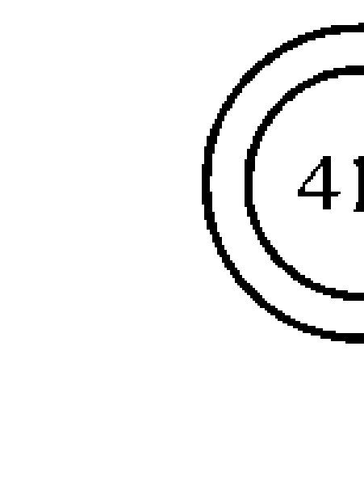

## 例五：乾造 1965年7月3日巳時生

## 大運

| 正官 | 偏財 | 正印 |
| ---- | ---- | ---- |
| 乙巳 | 壬午 | 戊午 |
| 丁巳 |     |     |
| 9歲  | 19歲 | 29歲 | 39歲 | 49歲 | 59歲
| 辛巳 | 庚辰 | 己卯 | 戊寅 | 丁丑 | 丙子
| 偏印 | 正印 | 正印 | 偏印 |
| 食神 | 劫財 | 劫財 | 食神 |
| 比肩 |     | 比肩 |

此造是個成功的企業經營者，幾經沉浮，修得正果。據他回憶：1994年（甲戌）到珠海創業，1994年到上海合資，1996年（丙子）12月債務累累，創業失敗。1997年（丁丑）重新創業（1994年~2003年大運己卯），銷售大好，年底突然股東撤資分家。2000年（庚辰）第三次創業，2007年（丁亥）藥監局責令關閉工廠，2008年（戊子）中央電視台曝光，公司跌入谷底。2009年（己丑）重新創業（2004年~2013年戊寅運），目前在丁運中，事業如日中天。

此造是火土繫而成形的形象，再進一步此造已經是母慈子滅的範疇，火炎土燥，其用是用土引通火之旺勢，但局太燥，辰丑己濕土為上。從他自述中，屢次創業年份均在丑辰濕土之際，可以得到明證。全局火炎土燥，月干壬水有調候之功，給命局注入活力，否則命主絕無如此旺盛的鬥志和活力，能三起三落。然則壬是犯旺之物，破壞繫而成形的火勢，如無壬丁之合，丁亥自合，制去壬水，則有破格之虞。制財得財，地支二巳二午虛邀子、亥二財，遂成富格。如地支一旦填實子、亥，沖擊巳、午旺神，屬於破原局火勢之形。《滴天髓》云：「五行繫而成形，形不可害」，其形一破，災禍不測。細察命主回憶，不難發現三落均在亥、子之流年及合去虛邀亥的財星之年。

以上對專旺格之管見，實屬瞎子摸象、井蛙觀天，不免掛一漏萬，望方家不吝賜教。

## 附錄3：

## 分清用神 按需取用

## 戴理宏

「尚中」是華夏文化的靈魂。《周易》中「物極必反」、「亢龍有悔」、「滿招損」之類的警句，一直在提醒着我們為人處世要不偏不倚、中和中正。儒家倡導的「中庸之道」成為了中国古代為人處世的一種準則，同時也成了維持一切事物動態平衡的判## 日主壬水命局分析

日主壬水，命局五个水，月令卯为死地，子辰合水，似乎失令而旺，到底如何取用？为何能当局长？月干癸水穿起了两个子水，子与壬水全部被收入辰库，辰可以表示为一个团体，日主壬水就是此团体的首领。由于子水入库，所以子卯不相刑，而卯又为甲木之根，制杀有力，辰土七杀有制可得官，日主是专门与财打交道的税务官，虽然命局中不见财星，然而大運走在南方火地，丙午、丁未大運用神得力。所以，该造用神为火可确定无疑。

## 4. 根據人物八字的格局來取用神

### 例一：香港影星周潤發，1955年5月18日酉時

乾造：
 乙  辛  己  發
  未  巳  卯  酉

傷官佩印，金水為用。

### 例二：著名影星劉曉慶，1955年10月30日午時

坤造：
 乙  丙  甲  庚
  未  戌  子  午

食神生財，火土為用。

### 例三：香港影星張曼玉，1964年9月20日巳時

坤造：
  甲  發  壬  乙
  辰  酉  申  巳

食傷生財，木火為用。

### 例四：改良主義思想家康有為，1858年3月20日子時

| 戊 | 乙 | 壬 | 庚 |
| 午 | 卯 | 子 | 子 |

傷官配印，金水為用。

這裡四個命例都為食神、傷官格，在演藝界、文化界食傷格的人，佔的比例特別多，這或許就是食傷所代表的藝術、才華等意象所決定的。這些命例僅列出金水為用、火土為用等，並沒有做干支五行的細分。在具體的選用過程中，應該也同樣要根據命局的結構、大運流年、行業地域等方面考慮，去釐清每一個干支對命局所產生的影響，酌情區分對待。

## 5. 從八字透出天干的意象取用神

例如：1955年1月11日辰時，男命

| 甲 | 丁 | 壬 | 庚 |
| 午 | 丑 | 申 | 戌 |

壬水生於寒冬臘月，調候為急。雖無丙火，但月干透出丁火，通根年支午祿。局中無偏財，以正財為父星，且居父宮，由於日主的父親為某省的省長，故此丁火健旺有力，從意象上來看就是用神的最佳選擇。

命局需要調候的時候，「調候為急」。如果命局的扶抑用神，恰好又是命局的調候用神的話，此命局的格局就變得比較高。

## 6. 從人物取得重大成就的行業來取用神

### （在歷水行業取得巨大成功的明星）

#### 例一：男子跳水奧運冠軍田亮，1979年8月27日卯時

乾造：

| 己 | 壬 | 丙 | 辛 |
| 未 | 申 | 寅 | 卯 |

大運

1985年 1995年 2005年 2015年 2025年 2035年 2045年

辛 未 庚 午 己 巳 戊 辰 丁 丙 寅 乙 丑

#### 例二：女子跳水奧運冠軍郭晶晶，1981年10月15日午時

坤造：

| 辛 | 戊 | 丙 | 甲 |
| 酉 | 戌 | 寅 | 午 |

大運

1989年 1999年 2009年 2019年 2029年 2039年 2049年

己 庚 辛 壬 癸 甲 乙
亥 子 丑 寅 卯 辰 巳

跳水冠軍，從事的是與「水」打交道的行業，他們所取得的成就與「水」密切相關，所以無論從什麼角度去看，水就是他們命局的喜用神。

在八字命局中出現的用神，叫「原局用神」；在大運中出現的用神，叫「行運用神」。一般來說，在八字命局中，直接可以在命局中選出「用神」的話，該命局的質量就比較好。

如果在八字命局中，找不出或找不到「用神」的話，相對來說命局的質量就差些。因為只有當大運或流年行走到與命局中需要的「用神」一致時，才會走好運。比如命局以水為「用神」，只有當大運走到地支「亥子丑」即北方金地「用神」得地的時候，才會交上好運。

如果一個八字命局中本身就有現成的「用神」可取，大運中又能夠碰上命局的喜用神，這便是上等的好命。反之，八字命局中本來就缺乏「用神」，而大運中又沒有能夠碰上命局的喜用神，那這種命局就會活得很累。

田亮命局直接有壬水可以做為用神，而郭晶晶的命局中卻不見水，然而她從九歲起大運，走的就是三十年亥子丑北方水地，真可謂是得時得地啊。

### # （在歷火行業取得互大成功的明星）

#### # 例一：台灣影星林青霞，1954年11月3日酉時

坤造：
  甲  甲  癸  辛
  午  戌  亥  酉

大運

1963年 1973年 1983年 1993年 2003年 2013年 2023年
癸 酉 壬 申 辛 未 庚 午 己 己 戊 辰 丁
酉 申 未 午 巳 辰 卯

甲木傷官，木火為用，1983年以後大運開始走火木之地。

#### # 例二：著名影星黃曉明，1977年11月13日卯時

乾造：

| 丁 | 辛 | 甲 | 丁 |
| 已 | 亥 | 戌 | 卯 |

# 大運

1979年 1989年 1999年 2009年 2019年 2029年 2039年

庚 己 戊 丁 丙 乙 甲
戌 酉 申 未 午 巳 辰

丁火傷官，火土爲用，1999年以後，大運開始走土火之地。

#### # 例三：著名影星孫儷，1982年9月26日辰時

坤造：

| 壬 | 己 | 壬 | 甲 |
| 戌 | 酉 | 子 | 辰 |

# 大運

1988年 1998年 2008年 2018年 2028年 2038年 2048年

戊 丁 丙 乙 甲 癸 壬
申 未 午 巳 辰 卯 寅

食神生財，木火爲用，1998年以後，大運開始走火土之地。

從事影視娛樂業的明星或從事文化事業的人士，除了食傷旺相之外，還有一個判斷依據就是屬火行業的本身，就是他們八字的用神。

命局取用的分析，屬於靜態分析，取用之後，必須要將之放在大運、流年以及命主所處的方位、地域、行業等方面來做通盤考量。

## 「命局特徵是內因，大運、流年等是外因，外因要通過內因發生作用。」

這三個命例本身命局中就有用神，格局已經很高，他們入的行業對口，偏偏大運又是如此的應景，看來他們不成功都難，不成為名人更難啊！

《命理約言》有云：「命以用神為要緊，看用神之法，不過扶抑而已。」

除了以上講的取用方法，還可以根據命局的勢力取用、以命局的價值取向取用等等，取用方法雖有多種，但主要還是以「扶抑取用」為主要方向。一些粗淺的認識，還望得到高明的指正。

## # 名人命例索引

## 上編 動態篇

# 第一章

+   袁樹珊 命例1

# 第二章

+   朱元璋 命例2

+   張簪 命例3

+   康熙皇帝 命例5

+   萬里浪 命例9

## 第三章

+   文天祥 命例11

+   林庚白 命例12

+   韋千里 命例13

## 第五章

+   張作霖 命例42

+   宋子文 命例43

+   任鐵樵 命例46

## 第六章

+   陳公博 命例47

+   李後敵 命例50

+   溥儀 命例57

+   左宗棠 命例58

+   許崇智 命例59

+   閻錫山 命例60

+   商震 命例61

+   陸榮廷 命例62

## 第七章

+   李敖 命例63

+   冰心 命例66

+   余光中 命例69

+   王陽明 命例72

## 諸葛亮 命例73

## 毛澤東 命例74

## 李蓮英 命例75

## 第八章

戚繼光 命例78

梁國愷 命例85

袁世凱 命例87

連橫 命例88

程璧光 命例89

陸游 命例92

## 下編 干支篇

## 第九章

劉鏞 命例93

顧維鈞 命例94

## 第十章

杜月笙 命例96

戴笠 命例99

胡漢民 命例102

## 第十一章

洪承疇 命例107

## # 主要參考文獻

陸致極：《八字命理學基礎教程》，香港圓方出版社，香港，2016 年

陸致極：《八字命理學進階教程》，香港圓方出版社，香港，2018 年

徐升：《淵海子平》（《評注淵海子平》，星相研究社編刊，上海春明書店，1938 年）

萬民英：《三命通會》，龍泉書局，台北，1986 年

萬民英：《蘭台妙選評注》，星易圖書有限公司，香港，2014 年

任鐵樵注《滴天髓闡微》，李雨田校訂，上海，1947 年

徐樂吾評注：《子平真詮評注》，武陵出版社，台北，1986 年

徐樂吾評注：《造化元鎌》，香港上海印書館印行，1980 年

徐樂吾：《子平一得》，香港上海印書館印行，1980 年

四明白水青松：《命理索隱》，香港上海印書館，1985 年

袁樹珊：《命譜》，中州古籍出版社，1995 年

葦千里：《相命全書》，大眾書局，台南，1973 年

葦千里：《命運談屑》，武陵出版社，台北，1987 年

尤達人：《現代名人命鑒》，武陵出版社，台北，1987 年

林庚白：《人鑒》，見《子平真詮評注》附錄，中州古籍出版社，1994 年

陳易庵：《名人命詮》，中華易學研究會，1958 年

吳俊民：《命理新論》，台北，1981 年

何建忠：《八字心理推命學》，大方文化事業公司，香港，1981 年

何建忠：《千古八字秘訣總解》，新時代出版社，香港，1982 年

吳懷雲：《命理點睛》，希代書版，台北，1985 年

梁湘潤：《大流年判例》，金剛出版集團，台北，1986 年

梁湘潤：《神煞探原》，行卯出版社，台北，2003 年（五版）

梁湘潤：《四角方陣刑沖合會透解》，中國哲學文化協進會，香港

梁湘潤：《細批終身詳解》，中國哲學文化協進會，香港

梁湘潤：《流年法典》，中國哲學文化協進會，香港

梁湘潤：《實務論命》，行卯出版社，台北，2014 年

鍾義明：《古今名人命運鑒賞》，武陵出版社，台北，1991 年

鍾義明：《命理準繩評注》（上下），武陵出版有限公司，台北，1996 年

鍾義明：《現代破譯滴天髓》，武陵出版有限公司，台北，1997 年

韓雨墨：《中華帝王名臣命譜》，雨墨文化出版社，台北，1994 年

星雲山人：《八字用神流年點斷真訣》，金剛出版集團，台北，1986 年

黃友輔：《實用子平學闡微》，武陵出版社，台北，1993 年

藍傳盛：《八字實務研究》，武陵出版社，台北，1994 年

藍傳盛：《女命專論》，武陵出版社，台北，2016 年

朱鵠橋：《命運推算法則與操作》（1 - 3 冊），聚賢館文化有限公司，香港，1996 年

謝武藤：《八字深入》（1），武陵出版社，台北，1996 年

謝武藤：《八字深入》（2），武陵出版公司，台北，1996 年

陳柏諭：《四柱八字聞微與實務》（上下冊），益群書店，台北，1997 年（修訂）

陳啟銓：《八字命理判斷心得》，萬人出版社，台北，1999 年

戴永長：《八字徵驗八講》，聚賢館文化有限公司，香港，2000 年

戴惠俐：《八字觀象實例詳解》，武陵出版社，台北，2000 年

李後啟：《算命一百法》，易苑出版社，2000 年

邢敏芬：《命術軼聞》，內部資料

陳秉志：《盲派大師夏仲奇命學精粹》，華夏文藝出版社，內部資料

蔡宗志：《當代夫妻用神刑剋篇》，武陵出版有限公司，台北，2009年

陳寶良：《淵龍命學》，武陵出版有限公司，台北，2010年

李銘城：《八字命學計量真機》，瑞成書局，台中，2010年

段建業：《段氏理象學》，中國商業出版社，2011年

凌志軒：《古代命理學研究：命理格局》，中山大學出版社，2012年

蔡昔瓊：《十干精粹》，西藏人民出版社，2012年

蔣文正：《論命璜記》（三），中國哲學文化協進會，香港，2014年

廖彬宇：《干支哲學》（一）（二），清華大學出版社，北京，2014年

相也（王相山）：《格局真詞》，厚德堂國學工作室，2018年

尚秉和：《周易尚氏學》，中華書局，1980年

涂子沛：《大數據》（第三版），廣西師範大學出版社，桂林，2015年

陸致極：《八字命理新論》，益群書店，台北，1996年

陸致極：《八字與中國智慧》（《八字命理新論》增訂版），益群書店，台北，1998年

陸致極：《中國命理學史論：一種歷史文化現象的研究》，上海人民出版社，2008年

陸致極：《又一種「基因」的探索》，上海人民出版社，2012年

陸致極：《命運的求索：中國命理學簡史及推演方法》，上海書店出版社，2014年

陸致極：《中國命理學簡史及推演方法》，萬里機構，香港，2015年

陸致極：《解讀時空基因密碼：疾病有數》，圓方出版社，香港，2017年