# 制作说明：

本书由《天使神秘学院》出重金从台湾购入的原版书籍扫描制作完成。为达到最好阅读效果，特地把书全部切开后，再经由专业扫描设备高精度扫描完成，并经过一张张的PS后期处理最终成书，其间花费大量的人力、物力以及时间，只为能给大家提供经济并优质的神秘学学习资料而努力。

本学院强力谴责某些机构和个人，把本学院花心血制作完成的电子书籍，包装后直接放在自家网上低价倾销的行为，以谋取不劳而获的经济利益。如果长此以往最终将无人愿意再为大家花心思制作电子书，那以后可能大家再无新书可读。

为让大家以后能够读到更多的好书，也为了本学院的良性发展。本学院恳请大家尽量做到如下几点：

- 一、尽量在天使神秘学院的官方网站购买电子书籍。
官网访问地址：http://www.ac2011.cn
短网址：ac2011.cn
网址含义：(Archangel College 成立时间：2011年)

- 二、在收到电子书后小范围传阅即可，千万不要公开传播，更别挂到网上低价销售。

同时为答谢广大支持者，学院电子书将做如下调整：

- 一、学院会把一些早已收回制作成本的电子书折价销售。
- 二、最新制作的电子书籍会开放打印功能，大家购买后有条件的可自行打印成书。

天使神秘学院
2021年3月

# 福利公告：

凡在【天使神秘学院】购买任何电子资料赠送实体书，详情请咨询店铺客服！

备注：如客服不知道这活动你可能进了盗版店铺！赠书活动仅在以下正版店铺购买有效哦！

# 【天使神秘学院】淘宝店
手机淘宝扫以下二维码

1、打开手机淘宝：搜索“天使神秘学院”
2、点击“店铺”按钮就是

# 【天使神秘学院】微店
手机微信扫以下二维码

用手机微信扫码进店

# 八荒秘法

林风

壹

# 圓方立極

「天圓地方」是傳統中國的宇宙觀，象徵天地萬物，及其背後任運自然、生生不息、無窮無盡之大道。早在魏晉南北朝時代，何晏、王弼等名士更開創了清談玄學之先河，主旨 在於透過思辨及辯論以探求天地萬物之道，當時是以《老子》、《莊子》、《易經》這三部著作 為主，號稱「三玄」。東晉以後因為佛學的流行，佛法便也融匯在玄學中。故知，古代玄學實在是探索人生智慧及天地萬物之道的大學問。

可惜，近代之所謂玄學，卻被誤認為只局限於「山醫卜命相」五術及民間對鬼神的迷信，故坊間便泛濫各式各樣導人迷信之玄學書籍，而原來玄學作為探索人生智慧及天地萬物之道的本質便完全被遺忘了。

有見及此，我們成立了「圓方出版社」（簡稱「圓方」）。《孟子》曰：「不以規矩、不成方圓」。所以，「圓方」的宗旨，是以「破除迷信、重人生智慧」為規，藉以撥亂反正，回復玄學作為智慧之學的光芒；以「重理性、重科學精神」為矩，希望能帶領玄學進入一個新紀元。「破除迷信、重人生智慧」即「圓而神」，「重理性、重科學精神」即「方以智」，既圓且方，故名「圓方」。

出版方面，「圓方」擬定四個系列如下：

- 1. 「智慧經典系列」：讓經典因智慧而傳世；讓智慧因經典而普傳。
- 2. 「生活智慧系列」：藉生活智慧，破除迷信；藉破除迷信，活出生活智慧。
- 3. 「五術研究系列」：用理性及科學精神研究玄學；以研究玄學體驗理性、科學精神。
- 4. 「流年運程系列」：「不離日夜尋常用，方為無上妙法門。」不帶迷信的流年運程書，能導人向善、積極樂觀、得失隨順，即是以智慧趨吉避凶之大道理。

在未來，「圓方」將會成立「正玄會」，藉以集結一群熱愛「破除迷信、重人生智慧」及「重理性、重科學精神」這種新玄學的有識之士，並效法古人「清談玄學」之風，藉以把玄學帶進理性及科學化的研究態度，更可廣納新的玄學研究家，集思廣益，使玄學有另一突破。

# 作者簡介

蘇民峰

長髮，生於一九六〇年，人稱現代賴布衣，對風水命理等術數有獨特之個人見解。憑着天賦之聰敏及與術數的緣分，對於風水命理之判斷既快且準，往往一針見血，疑難盡釋。

以下是蘇民峰近三十年之簡介：

- 八三年
開始業餘性質會客以汲取實際經驗。

- 八六年
正式開班施教，包括面相、掌相及八字命理。

- 八七年
毅然拋開一切，隻身前往西藏達半年之久。期間曾遊歷西藏佛教聖地「神山」、「聖湖」，並深入西藏各處作實地體驗，對日後人生之看法實跨進一大步。回港後開設多間店鋪（石頭店），售賣西藏密教法器及日常用品予有緣人士，又於店內以半職業形式為各界人士看風水命理。

- 八八年
夏天受聘往北歐勘察風水，足跡遍達瑞典、挪威、丹麥及南歐之西班牙，回港後再受聘往加拿大等地勘察。同年接受《繽紛雜誌》訪問。

- 八九年
再度前往美加，為當地華人服務，期間更多次前往新加坡、日本、台灣等地。同年接受《城市周刊》訪問。

- 九〇年
夏冬兩次前往美加勘察，更多次前往台灣，又接受台灣之《翡翠雜誌》、《生活報》等多本雜誌訪問。同年授予三名入室弟子蘇派風水。

- 九一年
續去美加、台灣勘察。是年接受《快報》、亞洲電視及英國BBC國家電視台訪問。所有訪問皆詳述風水命理對人生的影響，目的為使讀者及觀眾能以正確態度去面對人生。同年又出版了「現代賴布衣手記之風水入門」錄影帶，以滿足對風水命理有研究興趣之讀者。

- 九二年
續去美加及東南亞各地勘察風水，同年 BBC 之訪問於英文電視台及衛星電視「出位旅程」播出。此年正式開班教授蘇派風水。

- 九四年
首次前往南半球之澳洲勘察，研究澳洲計算八字的方法與北半球是否不同。同年接受兩本玄學雜誌《奇聞》及《傳奇》之訪問。是年創出寒熱命論。

- 九五年
再度發行「風水入門」之錄影帶。同年接受《星島日報》及《星島晚報》之訪問。

- 九六年
受聘前往澳洲、三藩市、夏威夷、台灣及東南亞等地勘察風水。同年接受《凸周刊》、《一本便利》、《優閣雜誌》及美聯社、英國 MTV 電視節目之訪問。是年正式將寒熱命論授予學生。

- 九七年
首次前往南非勘察當地風水形勢。同年接受日本 NTV 電視台、丹麥電視台、《置業家居》、《投資理財》及《成報》之訪問。同年創出風水之五行化動土局。

- 九八年
首次前往意大利及英國勘察。同年接受《TVB周刊》、《B International》、《壹周刊》等雜誌之訪問，並應邀前往有線電視、新城電台、商業電台合作嘉賓。

- 九九年
再次前往歐洲勘察，同年接受《壹周刊》、《東周刊》、《太陽報》及無數雜誌、報章訪問，同時應邀往商台及各大電視台合作嘉賓及主持。此年推出首部著作，名為《蘇民峰觀相知人》，並首次推出風水鑽飾之「五行之飾」、「陰陽」、「天圓地方」系列，另多次接受雜誌進行有

- 二千年
再次前往歐洲、美國勘察風水，並首次前往紐約，同年 masterso.com 網站正式成立，並接受多本雜誌訪問關於網站之內容形式，及接受校園雜誌《Varsity》、日本之《Marie Claire》、復康力量出版之《香港 100 個叻人》、《君子》、《明報》等雜誌報章作個人訪問。同年首次推出第一部風水著作《蘇民峰風生水起（鬱頭篇）》、第一部流年運程書《蛇年運程》及再次推出新一系列關於風水之五行鑽飾，並應無線電視、商業電台、新城電台合作嘉賓主持。

- ○一年
再次前往歐洲勘察風水，同年接受《南華早報》、《忽然一週》、《蘋果日報》、日本雜誌《花時間》、乙太電視台、關西電視台及《讀賣新聞》之訪問，以及應紐約華語電台邀請作玄學節目嘉賓主持。同年再次推出第二部風水著作《蘇民峰風生水起（理氣篇）》及《馬年運程》。

- ○二年
再一次前往歐洲及紐約勘察風水。續應紐約華語電台邀請作玄學節目嘉賓主持，及應邀往香港電台合作嘉賓主持。是年出版《蘇民峰玄學錦囊（相掌篇）》、《蘇民峰八字論命》、《蘇民峰玄學錦囊（姓名篇）》。同年接受《3週刊》、《家週刊》、《快週刊》、《讀賣新聞》之訪問。

- ○三年
再次前往歐洲勘察風水，並首次前往荷蘭，續應紐約華語電台邀請作玄學節目嘉賓主持。同年接受《星島日報》、《東方日報》、《成報》、《太陽報》、《壹週刊》、《一本便利》、《蘋果日報》、《新假期》、《文匯報》、《自主空間》之訪問，及出版《蘇民峰玄學錦囊（風水天書）》與漫畫《蘇民峰傳奇 1》。

- ○四年
再次前往西班牙、荷蘭、歐洲勘察風水，續應紐約華語電台邀請作風水節目嘉賓主持，及應有線電視、華娛電視之邀請作其節目嘉賓，同年接受《新假期》、《MAXIM》、《壹週刊》、《太陽報》、《東方日報》、《星島日報》、《成報》、《經濟日報》、《快週刊》、《Hong Kong Tatler》之訪問，及出版《蘇民峰之生活玄機點滴》、漫畫《蘇民峰傳奇2》、《家宅風水基本法》、《The Essential Face Reading》、《The Enjoyment of Face Reading and Palmistry》、《Feng Shui by Observation》及《Feng Shui — A Guide to Daily Applications》。

- ○五年始
應邀為無線電視、有線電視、亞洲電視、商業電台、日本NHK電視台合作嘉賓或主持，同時接受《壹本便利》、《味道雜誌》、《三週刊》、《IMC》雜誌、《壹週刊》之訪問，並出版《觀掌知心（入門篇）》、《中國掌相》、《八字萬年曆》、《八字入門捉用神》、《風生水起（例證篇）》、《八字進階論格局看行運》、《生活風水點滴》、《風生水起（商業篇）》、《如何選擇風水屋》、《談情說相》、《峰狂遊世界》、《瘋蘇 Blog Blog 趣》、《師傅開飯》、《蘇民峰美食遊蹤》、《A Complete Guide to Feng Shui》、《Practical Face Reading & Palmistry》、《Feng Shui — a key to Prosperous Business》、《五行化動土局套裝》、《相學全集一至四》等。

蘇民峰顧問有限公司
電話：2780 3675
傳真：2780 1489
網址：www.masterso.com
預約時間：星期一至五（下午二時至七時）

# 自序

「八字秘法」可稱為「江湖訣」，起點是在八三、八四年間我跟一位從事算命行業的師父，花了一點錢學回來的，然後再花了三十年的時間去不斷鑽研，把秘法累積下來。可以找到答案的我都盡力去找，找不到的便唯有放棄。

這些秘法可說是千金難得，即使憑一生努力去研究，也可能得不出答案來。我在此書把一生所學公開，望有志學習八字的後學者能一窺八字門檻，進而把八字的境界提升。

能把這些秘法記得愈多便愈好，因為實際應用時可能在八字中只出現三數個條件，若記得愈多，在判斷八字時可以用於套在被算者的程式之秘法便愈多，愈容易讓對方信服。相反，如八字全無秘法的條件，仍可以用八字寒熱命去判斷運氣、用六神去判斷性格、用妻財子祿去判斷六親，雖不致失去其準確性，然卻不能讓被算者拍案叫絕矣。

# 目錄

自序

# 兄弟姊妹歸類

自坐印星，年月地支無比劫，居長。

自坐印星，內藏比劫，或日支前有比劫，居次。

月印——兄弟姊妹多。

月殺——剋兄弟。

比劫逢沖——剋兄弟。

雙胞胎——男，弟強。女，姊強。

論兄弟姊妹

9

16

21

23

26

29

32

36

10

## 父母

年帶七殺，主本不和。

財旺，剋父母。

印弱逢財或逢沖，剋父母。

印過旺，父母無緣，母影響大。

財衰印絕，幼出娘門。

胎月有神煞相刑，印臨財地，地支財旺，有一者非父母養大。

原局印微行比劫，母先喪。

原局財弱行比劫，父先喪。

正偏印同透，二母。

月令一柱印，二母。

自坐偏印——二母，偏母所生。

二父

年干偏財支比劫，父死他鄉。

## 父母緣

剋父、喪父、無緣。

剋母，喪母、無緣。

財印相沖，父母不和。

父母一離一合，需知印綬臨財。

雙頭劫，父早亡（十五歲前）。

## 感情

刑空官殺，幾臨嫁而罷濃妝。

姊妹同生，爭夫。

姊妹剛強，必作填房之婦。

男命財逢沖，花心。

妻宮坐七殺羊刃，惡妻。

129 127 118 112 110 107 105 101 96 87 82 81

夫宮坐七殺羊刃，夫脾氣不佳。

官星入墓，剋夫，分離。

女命合財不靠夫，重財輕夫。

比劫合殺，早婚早離，分夫。

官殺在年，早婚；在時，遲婚；在日月，平均年齡結婚。

月柱二財，古為兩妻命，現代則易有重妻。

月柱全官殺，易有重夫。

婚期

剋夫、幫夫、旺夫。

離婚命

無夫命、無妻命。

沖婚

錯過姻緣

188 186 182 179 175 156 154 152 146 144 137 135 132

夫星重重，招嫁不定。
妻星重重，招娶不定。
戊戌、戊辰年出生，天罗地网，孤独命。
女命身过旺，婚姻多失败。
女命财旺，易嫁少夫。

201 198 195 194 191

## 八学秘法

兄弟姊妹歸類

### 自坐印星，年月地支無比劫，居長。

女命——

| | | | | |
|---|---|---|---|---|
| 傷 | 日元 | 殺 | 殺 | |
| 丙子 | 乙亥 | 辛丑 | 辛巳 | |
| 壬 | 印 | 才 | 傷 | |

| 乙 | 乙 | 乙 | 乙 | 乙 | 乙 |
| 54亥 | 44丑 | 34卯 | 24巳 | 14未 | 4 酉 |
| 丁未 | 丙午 | 乙巳 | 甲辰 | 癸卯 | 壬寅 |
| | 49庚午 | | | | |

乙木坐印，前無比劫，為長女。
此局丙火通根於年而無力，大運巳午未三十年
火運而從商，唯女命行食傷運剋夫，夫星無助、無
緣。

#### 男命（弟）

日元
辛亥 丁未 甲辰 丁巳

#### 男命

财 日元 劫 才
甲午 辛丑 庚辰 乙卯
杀 己 印 才

57 47 37 27 17 7
甲戌 乙亥 丙子 丁丑 戊寅 己卯

#### 男命（弟）

日元
丙申 辛酉 甲辰 壬戌

自坐印星，前面地支無比劫，居長，下有兩弟。

#### 男命

| 傷 | 日元 | 財 | 財 |
|---|---|---|---|
| 己 | 丙 | 辛 | 辛 |
| 亥 | 寅 | 卯 | 丑 |
| 杀 | 印 | 印 | 傷 |

49 丙戌
39 丁亥
29 戊子
19 己丑
9 庚寅

#### 男命

| 才 | 日元 | 劫 | 印 |
|---|---|---|---|
| 丁 | 癸 | 壬 | 庚 |
| 巳 | 酉 | 午 | 子 |
| 財 | 印 | 才 | 祿 |

48 丁亥
38 丙戌
28 乙酉
18 甲申
8 癸未

自坐偏印，長子，但為偏母所生。

此命自坐印星，居長，天干比劫透一，當有一弟妹緣厚。

#### 女命

| 比 | 日元 | 官 | 伤 |
|---|---|---|---|
| 庚辰 | 庚辰 | 丁巳 | 癸卯 |
| 戊 | 戊 | 杀 | 财 |

#### 女命

| 财 | 日元 | 劫 | 官 |
|---|---|---|---|
| 甲午 | 辛未 | 庚寅 | 丙申 |
| 杀 | 戊 | 财 | 劫 |

41 壬戌
31 辛酉
21 庚申
11 己未
1 戊午

50 乙酉
40 丙戌
30 丁亥
20 戊子
10 己丑

自坐印星，長女，因為偏印，細母所生。天干一比劫透出，有一弟。

庚運，乙丑年結婚，惟恐步母之後塵，因局中姊妹同生，為分夫之命。

自坐偏印，長女，為偏母所生。

#### 男命

| 比 | 官 | 日元 | 印 |
|---|---|---|---|
| 庚子 | 丁亥 | 庚戌 | 己卯 |
| 傷 | 食 | 亡 | 財 |

6 戊子
16 己丑
26 庚寅
36 辛卯
46 壬辰

自坐印星，雖戊藏比劫，但自己是長子（這情況代表母親有機會曾小產或墮胎）。有二母，自己母親為小。

### 自坐印星，內藏比劫，或日支前有比劫，居次。

男命——內藏比劫

| 比 | 官 | 日元 | 印 |
|---|---|---|---|
| 庚子 | 丁亥 | 庚戌 | 己卯 |
| 傷 | 食 | 壬 | 財 |

6 戊子
16 己丑
26 庚寅
36 辛卯
46 壬辰

此命庚坐戌，看過數個例子是排行第二的，故雖然是自坐印星，但戌中藏辛，應有一兄在前，有時我更會判斷為偏母所生，排行第二，但這些並不是百分百準確的，還要再三研究累積更多例子去驗證。

#### 男命

| 劫 | 財 | 日元 | 印 |
|---|---|---|---|
| 戊戌 | 壬戌 | 己巳 | 丙子 |
| 劫 | 劫 | 印 | 才 |

| 7 | 17 | 27 | 37 | 47 |
|---|---|---|---|---|
| 癸亥 | 甲子 | 乙丑 | 丙寅 | 丁卯 |

自坐印星，年月有比劫，故為次子或三子，但在六歲辰年，辰戌相沖兄亡，故變成居長。

### 月印——兄弟姊妹多。

月印主兄弟多，五個以上為多，但因現代社會子女較少，發達地區可能已不適用，因一般不會選擇生太多子女。

女命——

| 傷 | 官 | 日元 | 財 |
|---|---|---|---|
| 丙午 | 庚子 | 乙卯 | 戊子 |
| 食 | 壬 | 祿 | 壬 |
| 辛 | 辛 | 辛 | 辛 |
| 5亥 | 15酉 | 25未 | 35巳 | 45卯 |
| 己亥 | 戊戌 | 丁酉 | 丙申 | 乙未 |
| | | 30丙子 | | |

月令印星，兄弟姊妹必多。此命六兄弟姊妹，正合月令印星之議。

#### 男命

| | | | |
|---|---|---|---|
| 印 | 日元 | 劫 | 才 |
| 丙子 | 己亥 | 戊午 | 癸卯 |
| 才 | 財 | 己 | 杀 |

| | | | |
|---|---|---|---|
| 己 | 日元 | 伤 | 印 |
| 己亥 | 辛未 | 壬戌 | 戊戌 |
| 伤 | 己 | 印 | 印 |

| 46 | 36 | 26 | 16 | 6 |
|---|---|---|---|---|
| 癸丑 | 甲寅 | 乙卯 | 丙辰 | 丁巳 |

| 54 | 44 | 34 | 24 | 14 | 4 |
|---|---|---|---|---|---|
| 丙辰 | 丁巳 | 戊午 | 己未 | 庚申 | 辛酉 |
| | | 壬申 | 壬戌 | 壬子 | 壬寅 |
| | | | 29丁卯 | | |

有二父，父死母再嫁，現父母為親生，共有十兄弟姊妹。

自己有三兄弟，同一父出，但最少有三父，當然母亦多，故不同父母的兄弟必是三個以上。因家庭環境複雜，故早離家、早婚、早有兒女。申運離家，癸亥年生女。

#### 男命

| | | | |
|---|---|---|---|
| 官 | 日元 | 食 | 壬 |
| 丁 | 庚 | 壬 | 戊 |
| 丑 | 寅 | 戌 | 子 |
| 印 | 才 | 壬 | 傷 |

| 52 | 42 | 32 | 22 | 12 | 2 |
|---|---|---|---|---|---|
| 戊 | 丁 | 丙 | 乙 | 甲 | 癸 |
| 辰 | 卯 | 寅 | 丑 | 子 | 亥 |

月令印星，四弟二妹，長幼還有一姊弟，但早亡。

又月為偏印，應為偏母所生，實情是父親與元配打仗時失散，後再與其母結婚，兄弟姊妹皆同父同母。

### 月殺——剋兄弟。

月令七殺，兄弟難免相剋，容易自小不和或自小生離死別。

#### 男命

| 官 | 食 | 日元 | 劫 |
|---|---|---|---|
| 辛卯 | 丙申 | 甲午 | 乙亥 |
| 刃 | 殺 | 傷 | 壬 |

| 5 | 15 | 25 | 35 | 45 | 55 |
|---|---|---|---|---|---|
| 乙未 | 甲午 | 癸巳 | 壬辰 | 辛卯 | 庚寅 |

命中偏印明現而正印藏支，故有二母，其父指腹為婚的太太早逝，後再與其母結合，故其母似偏實正。

此局月令七殺，容易兄弟生離死別，再加上申卯暗合為金剋木，加強相剋之力，故原有八兄弟，最終只餘四人。

此命早婚，八七年丁卯、三十六歲犯太歲年離婚，然後再婚。二〇一一年辛卯年、六十歲犯太歲中風，此後不良於行。

#### 女命

| 印 | 杀 | 日元 | 食 |
|---|---|---|---|
| 庚寅 | 己丑 | 癸卯 | 乙卯 |
| 伤 | 杀 | 食 | 食 |

#### 女命

| 壬 | 才 | 日元 | 比 |
|---|---|---|---|
| 壬寅 | 戊申 | 甲申 | 甲寅 |
| 禄 | 杀 | 杀 | 禄 |

| 49 | 39 | 29 | 19 | 9 |
|---|---|---|---|---|
| 甲申 | 乙酉 | 丙戌 | 丁亥 | 戊子 |

| 40 | 30 | 20 | 10 | 0 |
|---|---|---|---|---|
| 癸卯 | 甲辰 | 乙巳 | 丙午 | 丁未 |

此局月柱七杀，兄弟相剋，加上比劫不透，兄弟姊妹缘份薄弱。

月杀，兄弟姊妹相剋，加上冲比劫，且月令官杀为忌，又年月相冲，故自小离家，父母兄弟无缘，而自身婚姻亦差，结婚不足一年又分手，皆因夫妻宫逢冲所致。

#### 男命

| | 比 | 比 | 日元 | 食 |
|---|---|---|---|---|
| | 乙 | 乙 | 乙 | 丁 |
| | 酉 | 酉 | 巳 | 亥 |
| | 杀 | 杀 | 伤 | 印 |

| 8 | 18 | 28 | 38 | 48 | 58 |
|---|---|---|---|---|---|
| 甲 | 癸 | 壬 | 辛 | 庚 | 己 |
| 申 | 未 | 午 | 巳 | 辰 | 卯 |
| | | | | 癸酉 | 癸未 |
| | | | | | 63戊子 |

天干比劫兩透且為用神，兄弟一同經營父親留下來的家業，唯始終月令七殺，先天有兄弟相剋之象，至己卯運，所有兄弟反目成仇，最後還對簿公堂，命也，運也。

### 比劫逢冲——剋兄弟。

比劫逢冲，剋兄弟。又不論年月、月日或日時相冲，皆有此象，又殺冲者為重，財冲者次之，土土相冲為弱。

#### 女命——財冲比劫

| 傷 | 財 | 日元 | 財 |
|---|---|---|---|
| 甲午 | 丙子 | 癸亥 | 丙辰 |
| 才 | 祿 | 劫 | 官 |

| 9 | 19 | 29 | 39 | 49 |
|---|---|---|---|---|
| 乙亥 | 甲戌 | 癸酉 | 壬申 | 辛未 |

此命年月支逢冲，必自小離家，父母不和，又子午冲比劫，亦與兄弟姊妹早分離。

#### 女命

| 印 | 日元 | 杀 | 杀 |
|---|---|---|---|
| 丁 | 戊 | 甲 | 甲 |
| 巳 | 辰 | 戌 | 戌 |
| 壬 | 禄 | 禄 | 禄 |

#### 男命

| 比 | 日元 | 劫 | 傷 |
|---|---|---|---|
| 乙 | 乙 | 甲 | 丙 |
| 酉 | 卯 | 午 | 寅 |
| 杀 | 禄 | 食 | 劫 |

| 40 | 30 | 20 | 10 | 0 |
|---|---|---|---|---|
| 己巳 | 庚午 | 辛未 | 壬申 | 癸酉 |

| 40 | 30 | 20 | 10 |
|---|---|---|---|
| 戊戌 | 丁酉 | 丙申 | 乙未 |

月日辰戌比劫相冲，但土土相冲为兄弟朋冲，其力不大，此相冲其力最弱。

酉为七杀冲卯，为杀冲比劫，其相剋之力最大。

#### 女命

| 財 | 日元 | 劫 | 財 |
|---|---|---|---|
| 戊子 | 乙丑 | 甲寅 | 戊申 |
| 壬 | 才 | 劫 | 官 |

| 47 | 37 | 27 | 17 | 7 |
|---|---|---|---|---|
| 己酉 | 庚戌 | 辛亥 | 壬子 | 癸丑 |

月令比劫逢冲，兄弟必有损，加上年月相冲，自小离家，少年行亥子丑，漂流外地的机会亦大，故自小兄弟姊妹缘薄，唯命中天干透一比劫，显示有一兄弟姊妹缘份较佳。

#### 男命

| 財 | 日元 | 食 | 印 |
|---|---|---|---|
| 辛卯 | 丙午 | 戊子 | 乙巳 |
| 印 | 刃 | 官 | 祿 |

| 44 | 34 | 24 | 14 | 4 |
|---|---|---|---|---|
| 癸未 | 甲申 | 乙酉 | 丙戌 | 丁亥 |

月日支子午相冲，午为羊刃，亦即比劫，故自小兄弟姊妹早分离，加上大运第一柱丁亥为驿马逢冲，亦代表早离家。

### 雙胞胎——男，弟強。女，姊強。

> 古訣云：「陰日弟強兄則弱，陽日兄富弟當貧」，只可以作為參考，不能確信。

#### 女命——

| 印 | 財 | 日元 | 官 |
|---|---|---|---|
| 己酉 | 乙亥 | 庚子 | 丁丑 |
| 刃 | 食 | 傷 | 印 |

| 甲寅 | 甲子 | 甲戌 | 甲申 | 甲午 |
|---|---|---|---|---|
| 5 | 15 | 25 | 35 | 45 |
| 丙子 | 丁丑 | 戊寅 | 己卯 | 庚辰 |
| | 20己巳 | | | |

九二年一同選華埠小姐，姊當選冠軍，妹則不入圍，命也，運也。

此局亥子丑會食傷局，故一直從事演藝事業，而格局為清寒秀才命，應有一番發展，但可惜當時中國人在美國的發展有限，歲月蹉跎，唯生活優游，因行財運故也。局中財弱無力，水寒木凍，與生父早早分開，二十五至四十五歲間，二十年財運得繼父寵愛，大力支持。

#### 女命——妹

| 比 | 日元 | 官 | 食 |
|---|---|---|---|
| 壬寅 | 壬子 | 己巳 | 甲寅 |
| 食 | 刃 | 才 | 食 |

#### 女命——姊

| 才 | 日元 | 壬 | 比 |
|---|---|---|---|
| 己卯 | 乙酉 | 癸未 | 乙酉 |
| 禄 | 杀 | 才 | 杀 |

| 42 | 32 | 22 | 12 | 2 |
|---|---|---|---|---|
| 甲子 | 乙丑 | 丙寅 | 丁卯 | 戊辰 |
| | 20己巳 | | | |

| 37 | 27 | 17 | 7 |
|---|---|---|---|
| 辛卯 | 辛巳 | | |

| 48 | 38 | 28 | 18 | 8 |
|---|---|---|---|---|
| 戊子 | 丁亥 | 丙戌 | 乙酉 | 甲申 |
| | 33戊午 | | | |

虽然时干比劫透出，三十二岁前行剋夫运，但命中夫在月柱，二十五至二十七岁仍有结婚机会，其姊能把握，有夫有子；但命主则未婚，主要问题是自视过高，觉得自己比家姐聪明得多。其面相及掌相亦配合（见第34、35页）。

七五乙卯年冲太岁时姊结婚，妹则分手，命也，运也。又八一辛酉年妹死，同年老爷去世，丈夫工厂大火，乃犯太岁之故，因妹独身，故犯太岁所应之事皆要自身承受。

### 此局面相特徵

甲字面形，露牙肉，多言，不斷發言及發問，令人煩厭。

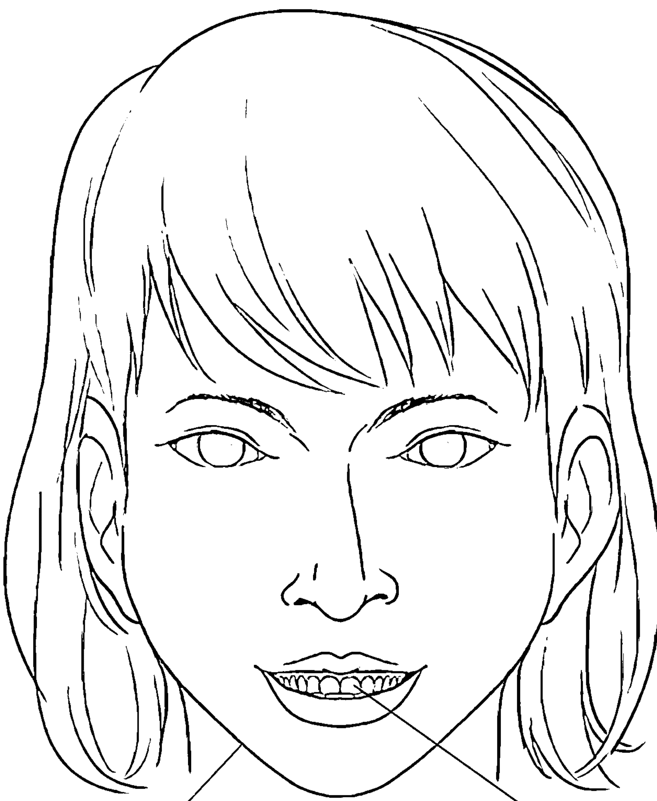

甲字面，理想過多，與現實不配合。

笑而露齒，多言，言多必失。

### 此局掌相特徵

掌紋又多又亂，神經質。其姊的掌紋少很多，故情緒穩定得多。

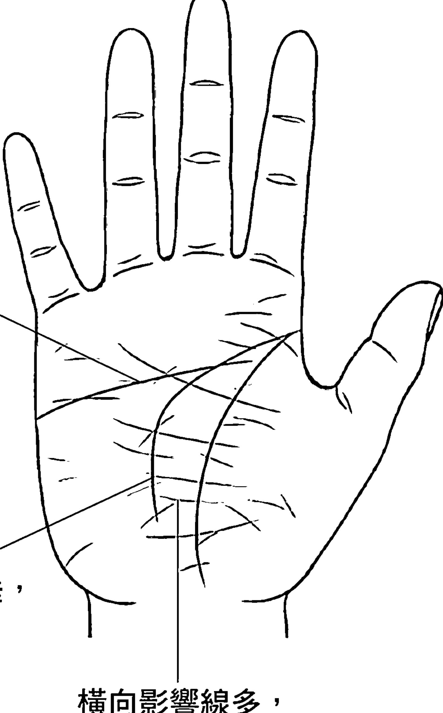

感情線橫入頭腦線內，為愛情失望線，不管是誰出現在面前都覺得不是心目中理想對象。

頭腦線下垂，愛幻想。

橫向影響線多，覺得懷才不遇。

### 論兄弟姊妹

比劫為喜，兄弟有助力；為忌，無助力；天干透出，有緣；不透緣薄。月令印綬，兄弟多，天干透一，一個有緣；透二，則兩個有緣；透三則兄弟多，朋友亦成群。

兄

| 官 | 劫 | 日元 | 財 |
|---|---|---|---|
| 庚申 | 甲申 | 乙亥 | 戊寅 |
| 官 | 官 | 印 | 劫 |

| 3 | 13 | 23 | 33 |
|---|---|---|---|
| 乙酉 | 丙戌 | 丁亥 | 戊子 |

妹

| 官 | 比 | 日元 | 壬 |
|---|---|---|---|
| 戊辰 | 癸亥 | 癸未 | 辛酉 |
| 官 | 劫 | 殺 | 壬 |

| 6 | 16 | 26 | 36 |
|---|---|---|---|
| 壬戌 | 辛酉 | 庚申 | 己未 |

兄妹二人皆只一個比劫透出，顯示一個兄弟姊妹有緣份。兄以比劫為喜，顯示兄弟姊妹、朋友有助力；妹以比劫為忌，代表無助力，兩人合看已知是妹妹不單要時常幫助兄長，更不時受兄長所拖累。

#### 男命——三弟

| 官 | 日元 | 財 | 傷 |
|---|---|---|---|
| 丙申 | 辛酉 | 甲辰 | 壬戌 |
| 劫 | 祿 | 印 | 印 |

#### 三兄弟——長兄

| 財 | 日元 | 劫 | 才 |
|---|---|---|---|
| 甲午 | 辛丑 | 庚辰 | 乙卯 |
| 殺 | 己 | 印 | 才 |

| 49 | 39 | 29 | 19 | 9 |
|---|---|---|---|---|
| 己酉 | 戊申 | 丁未 | 丙午 | 乙巳 |

| 47 | 37 | 27 | 17 | 7 |
|---|---|---|---|---|
| 乙亥 | 丙子 | 丁丑 | 戊寅 | 己卯 |

#### 男命——二兄

| 才 | 日元 | 印 | 比 |
|---|---|---|---|
| 辛亥 | 丁未 | 甲辰 | 丁巳 |
| 官 | 食 | 傷 | 劫 |

| 45 | 35 | 25 | 15 | 5 |
|---|---|---|---|---|
| 己亥 | 庚子 | 辛丑 | 壬寅 | 癸卯 |

三兄弟，兩個干透比劫而一個不透，顯示七五年、七七年出生的有一個兄弟有緣份，而八二年出生者天干不透比劫，顯示兄弟緣份較差，加上八二年出生者年月相沖，自小離家，外地求學，兄弟緣份自然薄弱。唯月令為印，仍能顯示兄弟不少。

#### 男命

| 官 | 日元 | 比 | 食 |
|---|---|---|---|
| 乙 | 戊 | 戊 | 庚 |
| 巳 | 寅 | 申 | 申 |
| 壬 | 杀 | 食 | 食 |

| 6 | 16 | 26 | 36 | 46 | 56 |
|---|---|---|---|---|---|
| 丁丑 | 丙子 | 乙亥 | 甲戌 | 癸酉 | 壬申 |

命有一兄，一個不是同父母，因命中天干透一比劫，故只一親兄，另一姊三妹，不同父母所生。

#### 男命

| 劫 | 比 | 日元 | 官 |
|---|---|---|---|
| 丙 | 丁 | 丁 | 壬 |
| 午 | 酉 | 丑 | 寅 |
| 禄 | 才 | 食 | 印 |

| 8 | 18 | 28 | 38 | 48 |
|---|---|---|---|---|
| 戊戌 | 己亥 | 庚子 | 辛丑 | 壬寅 |

天干比劫兩透，有一兄一妹，此局以比劫為喜，一生能得兄弟朋友扶助。

#### 男命（兄）

| | | | |
|---|---|---|---|
| 壬 | 丙申 | 食 | |
| 印 | 丁酉 | 伤 | |
| 元 | 戊寅 | 杀 | |
| 比 | 戊午 | 印 | |

| 10 | 20 | 30 | 40 | 50 |
|---|---|---|---|---|
| 戊戌 | 己亥 | 庚子 | 辛丑 | 壬寅 |

#### 女命（妹）

| | | | |
|---|---|---|---|
| 才 | 甲辰 | 壬 | |
| 杀 | 丙寅 | 才 | |
| 元 | 庚寅 | 才 | |
| 官 | 丁丑 | 印 | |

| 2 | 12 | 22 | 32 | 42 |
|---|---|---|---|---|
| 乙丑 | 甲子 | 癸亥 | 壬戌 | 辛酉 |

天干透一比劫，命中有一妹。

#### 三兄弟

#### 男命（長兄）

#### 男命

| 十神 | 日元 | 十神 | 十神 | 十神 |
|---|---|---|---|---|
| 傷 | 日元 | 財 | 劫 | |
| 己 | 丙 | 辛 | 丁 | |
| 亥 | 寅 | 亥 | 丑 | |
| 杀 | 印 | 杀 | 傷 | |

| 十神 | 日元 | 十神 | 十神 | 十神 |
|---|---|---|---|---|
| 比 | 日元 | 杀 | 傷 | |
| 庚 | 庚 | 丙 | 癸 | |
| 辰 | 寅 | 辰 | 卯 | |
| 印 | 才 | 印 | 財 | |

| 41 | 31 | 21 | 11 | 1 |
|---|---|---|---|---|
| 丙午 | 丁未 | 戊申 | 己酉 | 庚戌 |

| 44 | 34 | 24 | 14 | 4 |
|---|---|---|---|---|
| 辛亥 | 壬子 | 癸丑 | 甲寅 | 乙卯 |

年干透劫，顯示一個兄弟有緣份，比劫為喜，兄弟有助力，故工作於同一公司內，互相扶持。

有一弟是親生的，尚有多個不同父的兄弟姊妹，此因月令印，兄弟姊妹必眾。

#### 男命（二兄）

| 財 | 比 | 日元 | 官 |
|---|---|---|---|
| 甲申 | 辛未 | 辛巳 | 丙申 |
| 劫 | 正 | 官 | 劫 |

| 8 | 18 | 28 | 38 | 48 |
|---|---|---|---|---|
| 壬申 | 癸酉 | 甲戌 | 乙亥 | 丙子 |

#### 男命（三弟）

| 杀 | 財 | 日元 | 食 |
|---|---|---|---|
| 丁亥 | 甲辰 | 辛未 | 癸巳 |
| 伤 | 印 | 正 | 官 |

| 6 | 16 | 26 | 36 | 46 |
|---|---|---|---|---|
| 癸卯 | 壬寅 | 辛丑 | 庚子 | 己亥 |

天干透劫，顯示一個兄弟有緣份，比劫為喜，兄弟有助力，故與兄長同在一公司內分工合作。

天干不透比劫，兄弟緣份一般，但比劫為喜，兄弟仍有助力，只是不投緣而已。

## 入学秘法

父母

### 年帶七殺，主本不和。

「年帶七殺，主本不和」，意指與父無緣，女命還好，男命多在成年以前不合，成年後與父少來往及不投緣。

男命——

| 殺 | 食 | 日元 | 印 |
|---|---|---|---|
| 戊子 | 甲子 | 壬辰 | 辛丑 |
| 刃 | 刃 | 殺 | 官 |

| 1 | 11 | 21 | 31 | 41 | 51 |
|---|---|---|---|---|---|
| 乙丑 | 丙寅 | 丁卯 | 戊辰 | 己巳 | 庚午 |

年帶七殺，必與父親緣薄，加上局中羊刃重重，必性烈而固執，故自小離家，局中雖以財為用，無奈命中無財，加重其與父無緣份之力量，雖然大運四十一歲後行財運，但年紀已大，可能僅得一點父蔭而已。

#### 男命

| 杀 | 伤 | 日元 | 印 |
|---|---|---|---|
| 庚子 | 丁亥 | 甲寅 | 癸酉 |
| 印 | 壬 | 禄 | 官 |

| 5 | 15 | 25 | 35 | 45 |
|---|---|---|---|---|
| 戊子 | 己丑 | 庚寅 | 辛卯 | 壬辰 |

年带七杀，与父无缘，命中水旺，二十五岁前行水地，故十多岁离家，三十岁后联系才多一点，唯终身与父不太投缘，谈话多不欢而散，此乃缘份所致，勉强不来。

#### 女命

| 杀 | 伤 | 日元 | 才 |
|---|---|---|---|
| 辛亥 | 丙申 | 乙亥 | 己卯 |
| 印 | 官 | 印 | 禄 |

| 7 | 17 | 27 | 37 | 47 | 57 |
|---|---|---|---|---|---|
| 丁酉 | 戊戌 | 己亥 | 庚子 | 辛丑 | 壬寅 |

此局年带七杀，当主与父不和，且局中财弱而坐劫禄，财星亦无力，父亲对其影响力可说弱上加弱。

#### 男命

| | 日元 | 食 | 杀 |
|---|---|---|---|
| 戊辰 | 甲午 | 丙戌 | 庚子 |
| 才 | 伤 | 才 | 印 |

| 42 | 32 | 22 | 12 | 2 |
|---|---|---|---|---|
| 辛卯 | 庚寅 | 己丑 | 戊子 | 丁亥 |

年帶七殺，與父不和，十歲時與父母分離，但仍由母親寄錢給撫養人照顧他長大。父早喪，戊子運，乙卯年，一柱比劫，父亡。

#### 女命

| | 日元 | 財 | 殺 |
|---|---|---|---|
| 庚戌 | 壬寅 | 丁巳 | 戊申 |
| 殺 | 食 | 才 | E |

| 49 | 39 | 29 | 19 | 9 |
|---|---|---|---|---|
| 壬子 | 癸丑 | 甲寅 | 乙卯 | 丙辰 |

年帶七殺，與父不和，雖月令為財，父緣不弱，唯相處極不融洽，話不投機，加上巳寅申三刑，加重其不和之力。

### 財旺，剋父母。

雖八字以財為父，但印為生之源，財旺必然印弱，生基薄弱，父母必然緣薄。

#### 女命

| 比 | 比 | 日元 | 劫 |
|---|---|---|---|
| 甲辰 | 甲戌 | 甲辰 | 乙丑 |
| 才 | 才 | 才 | 財 |

| 5 | 15 | 25 | 35 | 45 |
|---|---|---|---|---|
| 癸酉 | 壬申 | 辛未 | 庚午 | 己巳 |

此局財旺印藏，酉運已離家自立，父母皆緣薄，又酉運為官星且合進夫妻宮，離家與男友同居。

#### 女命

| 食 | 財 | 日元 | 印 |
|---|---|---|---|
| 丁未 | 戊申 | 乙巳 | 癸巳 |
| 才 | 官 | 傷 | 傷 |

| 10 | 20 | 30 | 40 |
|---|---|---|---|
| 己酉 | 庚戌 | 辛亥 | 壬子 |

#### 女命

| 財 | 官 | 日元 | 劫 |
|---|---|---|---|
| 己未 | 辛未 | 甲辰 | 乙丑 |
| 財 | 財 | 才 | 財 |

| 1 | 11 | 21 | 31 | 41 |
|---|---|---|---|---|
| 壬申 | 癸酉 | 甲戌 | 乙亥 | 丙子 |

癸水雖通根於申，但遠隔無力且自坐絕地，地支巳拱午，再連未申，皆財之根氣，且少年行官殺運，故自小離家，父母緣薄。

地支全財，印藏無力，父母皆緣薄，早行官殺，早踏社會工作，或求學時已開始工作，或負笈海外，因此局以官殺為喜，前局以官殺為忌，差矣。

#### 男命

| 官 | 日元 | 印 | 劫 |
|---|---|---|---|
| 丙 | 辛 | 戊 | 庚 |
| 申 | 卯 | 寅 | 寅 |
| 劫 | 才 | 財 | 財 |

| 43 | 33 | 23 | 13 | 3 |
|---|---|---|---|---|
| 癸 | 壬 | 辛 | 庚 | 己 |
| 未 | 午 | 巳 | 辰 | 卯 |

#### 男命

| | 日元 | | 比 |
|---|---|---|---|
| 戊 | 庚 | 戊 | 庚 |
| 寅 | 寅 | 寅 | 子 |
| 才 | 才 | 才 | 傷 |

| 41 | 31 | 21 | 11 | 1 |
|---|---|---|---|---|
| 癸 | 壬 | 辛 | 庚 | 己 |
| 未 | 午 | 巳 | 辰 | 卯 |

局中財旺，父母緣薄，癸卯年踏入庚辰運，父亡。

局中財旺且印臨財地，尤幸戊寅為絕處逢生，印弱而不甚弱，故此局父母全，但十多歲已自己搬離家與朋友共住，這也算是父母緣薄的一種。

### 印弱逢財或逢沖，剋父母。

男命——

| | | | |
|---|---|---|---|
| 壬 | 傷 | 日元 | 壬 |
| 辛卯 | 甲午 | 癸卯 | 辛酉 |
| 食 | 才 | 食 | 比 |
| | | | 沖 |

庚子 9
癸巳
庚戌 19
壬辰
庚申 29
辛卯
39
庚寅
49
己丑
24乙卯

原局印弱而逢沖，母該早喪。壬辰運，庚戌年，辰酉合，卯戌合助卯酉沖，母亡。
此局十九歲前行財運，十九至二十九歲一柱比劫，乙卯年與時柱天剋地沖而父亡。因印為生機，故印弱一般父母緣較薄。

#### 女命

| | 傷 | 官 | 日元 | 食 |
|---|---|---|---|---|
| | 乙 | 己 | 壬 | 甲 |
| | 巳 | 卯 | 戌 | 辰 |
| | 才 | 傷 | 杀 | 杀 |
| | | | 冲 | |

| | 癸丑 | 癸亥 | 癸酉 | | | |
|---|---|---|---|---|---|---|
| | 8 | 18 | 28 | 38 | 48 | |
| | 庚辰 | 辛巳 | 壬午 | 癸未 | 甲申 | |
| | 13戊午 | 23戊辰 | 33戊寅 | | | |

原局印極弱，可說生機全無，辰運再沖戌，戌中辛金亡矣。壬戌年日柱伏刑，情緒極壞，皆因喪母所致。

### 印過旺，父母無緣，母影響大。

印過旺，父無緣，母影響大，女命且常因母親反對錯過姻緣，孤獨終老。

女命——

| 杀 | 食 | 日元 | 印 |
|---|---|---|---|
| 甲寅 | 庚午 | 戊戌 | 丁巳 |
| 杀 | 印 | 禄 | 己 |

7 己巳
17 戊辰
27 丁卯
37 丙寅
47 乙丑

戊土生於午月，寅午戌會火局，時柱丁巳，十七歲前行己巳，當必由母親養大。局中無財，父親在家庭一點影響力都沒有，甚至早離早逝。無奈局中火印旺且為忌，而印旺必然洩弱官殺，故很多印旺為忌的女命，都容易因母親之阻礙而錯過婚緣，最後陪著母親共渡餘生。

#### 女命

| 財 | 印 | 日元 | 印 |
|---|---|---|---|
| 癸卯 | 丁巳 | 戊午 | 丁巳 |
| 官 | 伤 | 印 | 伤 |

#### 女命

| 財 | 劫 | 日元 | 官 |
|---|---|---|---|
| 戊子 | 甲子 | 乙亥 | 庚辰 |
| 伤 | 伤 | 印 | 财 |

47 壬戌
37 辛酉
27 庚申
17 己未
7 戊午

辛 43未
辛 33酉
辛 23亥
辛 13丑
辛 3卯
己未
庚申
辛酉
壬戌
癸亥
38丙寅
28
18
8

此局印旺財絕，二十七歲前運行印地，必由母親帶大，雖然卯官在年，本應早見姻緣，無奈印星盡洩官之氣，官星無力，姻緣不實，加上二十七歲行剋夫運，結果可期。

此局印極旺且為忌神，母親必然影響其一生，而且必為壞影響，加上夫星亦為忌，雖然庚合乙，自己也看重姻緣，唯此命八九己巳年來算，當年仍天剋地沖日柱，恐在分手邊緣，加上四十三歲後行剋夫運，姻緣更加渺茫，唯有與母共渡餘生。

#### 男命

| 印 | 日元 | 才 | 印 |
|---|---|---|---|
| 戊 | 辛 | 乙 | 戊 |
| 戌 | 丑 | 丑 | 戌 |
| 印 | 己 | 己 | 印 |

| 45 | 35 | 25 | 15 | 5 |
|---|---|---|---|---|
| 庚 | 己 | 戊 | 丁 | 丙 |
| 午 | 巳 | 辰 | 卯 | 寅 |

年月日時支全印，乙木虛浮無根，無用矣，五歲上運時已與父分離，五歲後再行財運，母再嫁，月令印綬，兄弟成群。

#### 女命

| 比 | 日元 | 己 | 殺 |
|---|---|---|---|
| 庚 | 庚 | 戊 | 丙 |
| 辰 | 戌 | 戌 | 午 |
| 己 | 己 | 己 | 官 |

| 43 | 33 | 23 | 13 | 3 |
|---|---|---|---|---|
| 癸 | 甲 | 乙 | 丙 | 丁 |
| 巳 | 午 | 未 | 申 | 酉 |

地支午為土之祿刃，加上兩戌一辰，辰戌相沖，土愈沖而愈旺，成土厚金埋之勢，父母皆無緣，自小被遺棄而成孤兒。

#### 女命

| 十神 | 日元 | 十神 | 十神 |
|---|---|---|---|
| 食 | 辛 | 己 | 戊 |
| 癸 | 丑 | 未 | 戌 |
| 巳 | | | |
| 官 | 己 | 己 | 印 |

55 癸丑
45 甲寅
35 乙卯
25 丙辰
15 丁巳
5 戊午

#### 男命

| 十神 | 日元 | 十神 | 十神 |
|---|---|---|---|
| 比 | 己 | 丁 | 癸 |
| 己 | 未 | 巳 | 巳 |
| | | | |
| 印 | 禄 | 印 | 印 |

41 壬子
31 癸丑
21 甲寅
11 乙卯
1 丙辰

印星旺而财星入墓逢刑冲，且少行官杀运，必早离家，父缘必薄，婚姻方面更不乐观。五八年出生，戊戌已是天罗地网孤独命，加上印旺易受母亲影响，夫妻宫又逢刑冲，三十五岁前难觅理想，即使三十五岁后行旺夫运，婚姻亦恐难得美满。

印旺财绝，辰运财星入墓，水绝矣，局中全印但以印为忌，如女命必受母亲影响而久久不能结婚，男命情况较佳，即使再迟，也有结婚机会，但婚姻必受其母介入，婆媳之间不容易融洽相处。

#### 女命

| | 印 | 日元 | 己 | 己 |
|---|---|---|---|---|
| | 戊戌 | 辛丑 | 己未 | 己丑 |
| | 印 | 己 | 己 | 己 |

#### 女命

| 才 | 食 | 日元 | 财 |
|---|---|---|---|
| 庚子 | 戊寅 | 丙寅 | 辛卯 |
| 官 | 己 | 己 | 印 |

45 甲寅
35 乙卯
25 丙辰
15 丁巳
5 戊午

癸酉
癸亥
癸丑
癸卯

30戊辰

41 癸酉
31 甲戌
21 乙亥
11 丙子
1 丁丑

八字之中，七字皆印，母之影響極大，可知矣。局中夫星暗藏，夫緣薄弱，三十歲前行夫運，有不下一次結婚機會，但皆因其母不喜，至九○年三十歲仍然未婚，夫運已經完結，能結婚的機會相信不大，至二○一四年止，未聞婚訊。

月日時支皆印，印旺極矣，局中以財為忌，且無根無力，故家中為母主事，尤幸以印為喜，母有助力。

### 財衰印絕，幼出娘門。

女命

| | 劫 | 食 | 日元 | 壬 |
|---|---|---|---|---|
| | 癸卯 | 甲寅 | 壬寅 | 庚子 |
| | 傷 | 食 | 食 | 刃 |

| 乙巳 | 乙卯 | 乙丑 | 丁巳 | 戊午 | 己未 | 庚申 | 辛酉 |
|---|---|---|---|---|---|---|---|
| 2 | 12 | 22 | 32 | 42 | 52 | 62 | |
| 乙卯 | 丙辰 | 丁巳 | 戊午 | 己未 | 庚申 | 辛酉 | |
| | 17庚申 | | | | | | |

此局財藏無力，庚印絕於寅，正是財衰印絕，故自小便由他人撫養長大的。

#### 女命

| 印 | 财 | 日元 | 杀 |
|---|---|---|---|
| 己亥 | 乙亥 | 庚申 | 丙子 |
| 食 | 食 | 禄 | 伤 |

#### 女命

| 伤 | 日元 | 才 |
|---|---|---|
| 戊子 | 丁未 | 辛亥 |
| 杀 | 食 | 官 |

庚 41辰 庚 31午 庚 21申 庚 11戌 庚 1子
庚辰 己卯 戊寅 丁丑 丙子
46乙 36乙 26乙 16乙 6乙
酉 亥 丑 卯 巳

46 36 26 16酉 6亥
癸巳 壬辰 辛卯 庚寅 己丑

此局财印相邻，父母无助，且水旺土湿，水旺木漂，财印皆绝，加上早行官杀故自小离家，十七八丙辰丁巳结婚，庚申年二十一岁离婚，皆因年月日相穿、相刑，父、母、夫皆缘薄，且大运寅冲夫宫申，感情惟恐要过此运方可稳定下来。

此局辛金财通根于巳，离隔无力。乙木印通根于未为入墓，木虽有长生于亥，但冬水冻木反碍生机，故自幼与父生离死别而不相见。第一柱己丑，丑未冲，木之根基摇动。庚寅剋合乙，甲子年庚剋甲而母亡，此乃财衰印绝之故。

#### 男命

| | | | |
|---|---|---|---|
| 官 | 日元 | 傷 | 傷 |
| 乙卯 | 戊辰 | 辛丑 | 辛丑 |
| 官 | 祿 | 劫 | 劫 |

| | | | | |
|---|---|---|---|---|
| 48 | 38 | 28 | 18 | 8 |
| 丙申 | 丁酉 | 戊戌 | 己亥 | 庚子 |
| | | 己巳 | 己未 | 己酉 |
| | | | 23甲子 | 13甲寅 |

財星入墓，印星全無，故為養子。

### 胎月有神煞相刑，印臨財地，地支財旺，有二者非父母養大。

男命

| 劫 | 傷 | 日元 | 印 | 胎元 |
|---|---|---|---|---|
| 辛卯 | 癸巳 | 庚午 | 己卯 | 甲申 |
| 財 | 殺 | 官 | 財 | 劫 |
| | 喪門 | | | 煞 |
| | 孤辰 | | | |

8 壬辰
18 辛卯
28 庚寅
38 己丑
48 戊子

月令已有「孤辰」、「喪門」，胎元申有「劫煞」、巳申既合又刑，此謂之胎月有神煞相刑。

時柱己印坐卯財，為印綬臨財。

地支財有三支以上為旺。

三者有二，非父母帶大，而此局合前兩種條件。

> 註：其實這是老師所教的古訣，本人從未印證過。在此記載下來，只是讓後學者可以研究而已。

### 原局印微行比劫，母先喪。

女命——
食 戊子 官
日元 丙戌 食
食 戊申 才
杀 壬辰 食

41 癸卯
31 甲辰
21 乙巳
11 丙午
1 丁未

女命——
食 戊子 官
日元 丙戌 食
食 戊申 才
杀 壬辰 食

40 癸卯
30 甲辰
20 乙巳
10 丙午
0 丁未

局中只辰中藏乙，原局印弱。一歲行比劫大運，母早亡，又命中年帶七殺，主本不和（與父不和，生離死別），雖局中財氣通門戶，但因申子辰會水局，洩弱財星，再加上早行比劫運，比劫剋財，父亦早喪。

局中只辰中藏乙，印弱極矣。半歲起運行比劫，自小喪母，父亦早喪，皆因比劫洩印剋財之故。

### 原局財弱行比劫，父先喪。

女命
比 丁未 食
劫 丙午 祿
日元 丁巳 劫
才 辛丑 食

5 丁未
15 戊申
25 己酉
35 庚戌
45 辛亥
55 壬子

男命
比 甲午 傷
食 丙寅 祿
日元 甲辰 才
傷 丁卯 刃

6 丁卯
16 戊辰
26 己巳
36 庚午
46 辛未

原局辛財通根巳丑，雖暗拱酉，但三夏火旺金熔，無水則金死矣。第一柱大運丁未，與辛丑對沖，丁火奪財，未沖丑而水絕，父亡，正是原局財弱行比劫所致。

原局寅卯辰會木，土弱極矣。十六歲前行丁卯，財弱遇劫，父亡。局中年月皆為用神，必得家庭之助，故因父亡而承繼遺產遂得大財。

#### 男命

比 丙申 才
才 庚寅 冲
日元 丙午 刃
E 甲午 刃

8 辛卯
18 壬辰
28子 癸巳
38 甲午

原局財弱逢沖。二十八歲後行比劫運，丙寅年天干透劫，地支寅沖申而剋父。

### 正偏印同透，二母。

女命——
戊 寅
庚 申 冲
庚 子
己 卯

印 財
日元 傷
比 祿
戊 才

44 乙卯
34 丙辰
24 丁巳
14 戊午
4 己未

女命——
丙 午
庚 寅
癸 丑
辛 酉

財 才
印 傷
日元 杀
戊 戊

6 己丑
16 戊子
26 丁亥
36 丙戌

此局正偏印同透，當有二母，但這些組合比較難斷其母是正或是偏，但一般以偏居多，此命也不例外，其母是別人的小老婆。

正偏印同透，二母，正印貼近財，而時柱偏印，酉丑合金，母為偏。

#### 男命

| | | | |
|---|---|---|---|
| 杀 | 日元 | 印 | 伤 |
| 乙 | 己 | 丙 | 丁 |
| 丑 | 卯 | 午 | 酉 |
| 禄 | 杀 | 伤 | 食 |

| 50 | 40 | 30 | 20 | 10 |
|---|---|---|---|---|
| 辛 | 壬 | 癸 | 甲 | 乙 |
| 丑 | 寅 | 卯 | 辰 | 巳 |

正偏印同透，月令为偏印，但因正印靠近自己，故二母，亲母为大。

### 月令一柱印，二母。

女命——

| | | | |
|---|---|---|---|
| 壬 | 日元 | 印 | 杀 |
| 庚戌 | 壬子 | 辛酉 | 戊戌 |
| 杀 | 刃 | 印 | 杀 |

78 癸丑 68 甲寅 58 乙卯 48 丙辰 38 丁巳 28 戊午 18 己未 8 庚申

此局月令一柱印星，為二母之命，是命主父親離婚再娶她母親，也算是正母。但時又透偏印，算是偏母，故算是正乎？偏乎？

#### 女命

| 食 | 印 | 日元 | 官 |
|---|---|---|---|
| 戊戌 | 乙卯 | 丙午 | 癸巳 |
| 食 | 印 | 刃 | 禄 |

| 丙午 | 丙辰 | 丙寅 | 丙子 | 丙戌 | 丙戌 |
|---|---|---|---|---|---|
| 8 | 18 | 28 | 38 | 48 | 58 |
| 甲寅 | 癸丑 | 壬子 | 辛亥 | 庚戌 | 己酉 |

此局月令一柱正印，為二母之命，父親離婚再娶她母親，也算是正母，不算偏房。自己丈夫也是離婚再娶她，算是遺傳矣。

一九六八年戊申驛馬年遷移。七五年乙卯伏刑車禍。七九年己未沖大運遷移。八一年辛酉刀傷、車禍。婚期是甲子年，原因難斷，因那年只是沖夫妻宮而已。

#### 男命

| | | | |
|---|---|---|---|
| 劫 | 己 | 日元 | 己 |
| 癸卯 | 庚申 | 壬子 | 庚子 |
| 傷 | 己 | 刃 | 刃 |

| | | | | | |
|---|---|---|---|---|---|
| 50 | 40 | 30 | 20 | 10 | |
| 乙卯 | 丙辰 | 丁巳 | 戊午 | 己未 | |
| | | | 25戊辰 | 15戊午 | |
| | | 癸酉 | 癸亥 | 癸丑 | |

#### 女命

| | | | |
|---|---|---|---|
| 杀 | 印 | 日元 | 官 |
| 癸巳 | 甲寅 | 丁酉 | 壬寅 |
| 劫 | 印 | 才 | 印 |

| | | | | | |
|---|---|---|---|---|---|
| 56 | 46 | 36 | 26 | 16 | 6 |
| 庚申 | 己未 | 戊午 | 丁巳 | 丙辰 | 乙卯 |
| | | | 31甲子 | | |
| | | 己巳 | 己未 | 己酉 | 己亥 |

此局月柱全印，命中二母是正常的，且命中以印為用，母必有助。

癸亥年一柱官殺，再加上沖太歲為婚期。丁卯年懷孕，戊辰年五月小孩誕生。丁卯懷孕只能斷因卯酉夫妻宮逢沖，一喜擋三災，無喜爭吵防而已，且卯酉沖為金木交戰，易見流血損傷，而懷孕期間少不免要抽血驗血，這也算是損傷的一種。

月柱全印，有二母，但因皆為偏印，為偏母所出。少年行官殺運，讀書時課外活動必然出色，畢業後，八六年丙寅沖月柱且天干透財而踏足社會。

#### 女命

| 比 | 日元 | 印 | 官 |
|---|---|---|---|
| 癸 | 癸 | 庚 | 戊 |
| 亥 | 亥 | 申 | 午 |
| 劫 | 劫 | 印 | 才 |

#### 女命

| 官 | 日元 | 印 | 食 |
|---|---|---|---|
| 癸 | 丙 | 乙 | 戊 |
| 巳 | 午 | 卯 | 戌 |
| 禄 | 刃 | 印 | 食 |

57 甲寅
47 乙卯
37 丙辰
27 丁巳
17 戊午
7 己未

48 庚戌
38 辛亥
28 壬子
18 癸丑
8 甲寅

月令全印，定當二母，正印，為正母，故雖有二母但其母為正母。

月令全印，定當二母，此局父親離婚後再娶她母親，故其母也算是正母。

才 丁巳 財
日元 癸卯 食
殺 己酉 印
才 丁亥 劫

印 丁巳 印
日元 戊戌 祿
印 丁巳 印
比 戊子 財

月令偏印，兩母，生母為偏。

兩母以上。

#### 男命

| | | | |
|---|---|---|---|
| 財 | 日元 | 壬 | 壬 |
| 戊寅 | 乙丑 | 癸亥 | 癸卯 |
| 劫 | 才 | 印 | 祿 |

| | | | | |
|---|---|---|---|---|
| 43 | 33 | 23 | 13 | 3 |
| 戊午 | 己未 | 庚申 | 辛酉 | 壬戌 |

父親與其母親結婚前，在外面已有子女，只是未證實有否結婚，但以現代結婚定義，簽了婚書或生了子女，都算是一段姻緣，故有二母，其母算偏母。

### 自坐偏印——二母，偏母所生。

女命
官 戊戌
印 庚申
日元 癸酉
杀 己未

55 甲寅
45 乙卯
35 丙辰
25 丁巳
15 戊午
5 己未

男命
伤 壬申
劫 庚戌
日元 辛未
劫 庚寅

41 乙卯
31 甲寅
21 癸丑
11 壬子
1 辛亥

此局月柱全印，二母无疑，唯自坐偏印，恐为庶母所出，兄弟众多，不同房矣。此局申酉戌一气联珠，年时有用神，六十年木火大运，佳局也。

辛金坐偏印，为偏母所生，月令为正印，正偏印同现，迹象更为明显。此局月日时皆藏火，虽戊未相刑，无损矣。三十一岁行二十年财运，必有一番作为。

#### 女命

| | | | |
|---|---|---|---|
| 才 | 日元 | 杀 | 才 |
| 丁 | 癸 | 己 | 丁 |
| 巳 | 卯 | 酉 | 亥 |
| 财 | 食 | 印 | 劫 |

46 甲寅
36 癸丑
26 壬子
16 辛亥
6 庚戌

#### 女命

| | | | |
|---|---|---|---|
| 伤 | 日元 | 食 | 杀 |
| 乙 | 壬 | 甲 | 戊 |
| 巳 | 申 | 寅 | 子 |
| 才 | 印 | 食 | 刃 |

44 己酉
34 庚戌
24 辛亥
14 壬子
4 癸丑

壬坐申，自坐偏印，偏母所出，前有一兄。命中巳申财印相合，父母无力。早行比劫运，必早离家自立。

此局虽然不是自坐偏印，但因全局除月令之偏印外，并无其他印星，故正母是别人的小老婆。以命運論，婚姻狀況是會遺傳給下一代的。此命夫在月干，二十五至二十七歲見姻緣運，但可惜月日支夫妻宮逢沖，三十五歲前感情不定，加上四十六歲後行剋夫運，除非嫁予不正常姻緣或步母之後塵，否則，姻緣實難以樂觀。

#### 女命

| 才 | 日元 | 印 | 杀 |
|---|---|---|---|
| 辛丑 | 丁卯 | 甲子 | 癸未 |
| 食 | 壬 | 杀 | 食 |

+   41 己巳
31 戊辰
21 丁卯
11 丙寅
1 乙丑

自坐偏印，天干透正印，有二母，自己母親為小老婆。

#### 男命

| 壬 | 日元 | 食 | 食 |
|---|---|---|---|
| 壬申 | 甲寅 | 丙申 | 丙戌 |
| 杀 | 禄 | 杀 | 才 |

+   50 辛丑
40 庚子
30 己亥
20 戊戌
10 丁酉

地支印藏，只時干透偏印，命中有二母，其母為小老婆。

#### 女命

| 劫 | 日元 | 己 | 印 |
|---|---|---|---|
| 辛 | 庚 | 戊 | 己 |
| 巳 | 戌 | 辰 | 卯 |
| 杀 | 己 | 己 | 财 |

#### 女命

| 印 | 日元 | 官 | 印 |
|---|---|---|---|
| 庚 | 癸 | 戊 | 庚 |
| 申 | 酉 | 子 | 子 |
| 印 | 己 | 禄 | 禄 |

43 癸酉
33 壬申
23 辛未
13 庚午
3 己巳

41 癸未
31 甲申
21 乙酉
11 丙戌
1 丁亥

月柱全印，正偏印同透，自坐偏印，母重重，己母為偏。

年干透正印，自坐偏印，已知有兩母，其母為小，但時柱庚申，恐有二母以上。

#### 女命

| 官 | 劫 | 日元 | 財 |
|---|---|---|---|
| 丙申 | 庚寅 | 辛未 | 甲午 |
| 劫 | 財 | 壬 | 杀 |

| 食 | 壬 | 日元 | 壬 |
|---|---|---|---|
| 甲辰 | 庚午 | 壬子 | 庚子 |
| 杀 | 財 | 刃 | 刃 |

50 乙酉
40 丙戌
30 丁亥
20 戊子
10 己丑

自坐偏印，二母，母為偏，自己為長女。

父曾結婚，打仗走難時與元配失散，後再娶其母，故母為偏。

#### 男命

| 比 | 官 | 日元 | 印 |
|---|---|---|---|
| 庚子 | 丁亥 | 庚戌 | 己卯 |
| 傷 | 食 | E | 財 |

| 6 | 16 | 26 | 36 | 46 |
|---|---|---|---|---|
| 戊子 | 己丑 | 庚寅 | 辛卯 | 壬辰 |

長子。
干透正印，自坐偏印，二母，母為偏，自己為

#### 男命

| 財 | 財 | 日元 | 傷 |
|---|---|---|---|
| 辛丑 | 辛卯 | 丙寅 | 己亥 |
| 傷 | 印 | E | 祊 |

| 9 | 19 | 29 | 39 | 49 |
|---|---|---|---|---|
| 庚寅 | 己丑 | 戊子 | 丁亥 | 丙戌 |

長子。
月令正印，自坐偏印，二母，母為偏，自己為

#### 男命——二兄弟

男命（兄）
才 辛丑 食
才 辛丑 食
日元 丁卯 乙
杀 癸卯 乙

男命（弟）
丁未 禄
丁未 禄
日元 己亥 财
印 丙寅 官

兄八字自坐偏印，二母。弟八字正偏印齐透，二母。

### 二父

男命
才 癸卯
劫 戊午
日元 己亥
印 丙子

6 丁巳
16 丙辰
26 乙卯
36 甲寅
46 癸丑

男命
伤 壬寅
印 戊申
日元 辛卯
财 甲午

6 己酉
16 庚戌
26 辛亥
36 壬子
46 癸丑

有二父，因母之第一任丈夫早亡，後嫁予自己父親，故自坐正財，其父也算是正的。又月印，兄弟多，十兄弟姊妹皆現父母所出。

二父，母離婚再嫁，故自坐偏財。

#### 女命

| | | | |
|---|---|---|---|
| 比 | 日元 | 杀 | 傷 |
| 庚辰 | 庚寅 | 丙辰 | 癸卯 |
| 戊 | 才 | 戊 | 財 |

| | | | | |
|---|---|---|---|---|
| 46 | 36 | 26 | 16 | 6 |
| 辛酉 | 庚申 | 己未 | 戊午 | 丁巳 |

母離婚再嫁予自己父親。自坐偏財，其父為小。有一親弟，故天干透一比劫。月印，兄弟多，但不是同父所出。

### 年干偏財支比劫，父死他鄉。

男命

| 才 | 傷 | 日元 | 印 |
|---|---|---|---|
| 戊寅 | 丁巳 | 甲寅 | 癸酉 |
| 祿 | 食 | 祿 | 官 |

| 10 | 20 | 30 | 40 | 50 |
|---|---|---|---|---|
| 戊午 | 己未 | 庚申 | 辛酉 | 壬戌 |

年干偏財坐劫、祿、刃，謂之年干偏財支比劫。

> 註：此乃老師教授的古訣，本人未加以印證，在此記錄下來，讓後學者自行研究。

## 父母緣

原局財為父，財有力，父緣厚；印為母，印有力則母緣厚，為用神則有助力，為忌則無助力，甚至是負累。

女命——

| 官 | 食 | 日元 | 比 |
|---|---|---|---|
| 丙午 | 癸巳 | 辛巳 | 辛卯 |
| 殺 | 官 | 官 | 才 |

| 5 | 15 | 25 | 35 | 45 | 55 |
|---|---|---|---|---|---|
| 壬辰 | 辛卯 | 庚寅 | 己丑 | 戊子 | 丁亥 |
| | | | 辛巳 | 辛卯 | |
| | | | 40丙戌 | | |

此局財明印暗，加上三十五歲前行財運，故與父緣厚，但踏入己丑運至二○○九己丑年開始與父分居，皆因逐漸遠離財運，父緣漸薄，父親身體開始變得極差，常進出醫院，相信二○一三癸巳年伏刑日柱，父當有一關。

### 女命——無父

| 印 | 劫 | 日元 | 劫 |
|---|---|---|---|
| 甲辰 | 丙子 | 丁巳 | 丙午 |
| 傷 | 殺 | 劫 | 祿 |

癸丑 9
癸亥 19
甲戌 29
壬申 39
14戊午

#### 女命

| 財 | 食 | 日元 | 食 |
|---|---|---|---|
| 癸卯 | 庚申 | 戊申 | 庚申 |
| 官 | 食 | 食 | 食 |

乙巳 2
乙卯 12
壬戌 22
癸亥 32
甲子 42
乙丑

此局財藏於巳無用，故自小隨母生活，唯十四至十九歲交運官殺，早交桃花，後離家與男友同居，但母仍有力。

此局喜印忌財，但命中欠火，母親完全沒有助力；癸水浮露在年，其他藏於申金之內，財藏亦可斷其父對他沒有影響力。此局與父無緣，父好飲而不理家，自己十三歲便要工作負起照顧自己的責任，唯十二至二十二歲最為活躍。二十二至五十二歲，三十年假財運，財來財去而已。其面相特徵可見於下頁。

### 此局面相特徵

眼有神，決斷力強。

鼻高長而直，有傲氣，能推動自己成功。

腮骨闊而有力，能逆境自強，遇難不會退縮。

腮骨闊，鼻直，眼有神，故屬於較能幹之人，而命入清寒貴格，名大利少。

從命中「食神」、「正官」、「正財」推斷，內心應屬於較柔弱的個性，但因出生環境的關係，迫得要莊敬自強，足見性格亦會受後天影響而改變。

#### 女命

| 食 | 日元 | 正 | 食 |
|---|---|---|---|
| 戊辰 | 丙辰 | 甲寅 | 戊申 |
| 食 | 食 | 正 | 才 |

44 己酉
34 庚戌
24 辛亥
14 壬子
4 癸丑
9 丁巳

#### 男命

| 正 | 日元 | 正 | 正 |
|---|---|---|---|
| 丁卯 | 己酉 | 丁未 | 丁酉 |
| 杀 | 食 | 禄 | 食 |

50 壬寅
40 癸卯
30 甲辰
20 乙巳
10 丙午

命中財印相沖，必然父母不和，其父母在她小
時已離婚，父母皆緣薄。
第一柱癸丑，己未年，母死。

局中無財，與父無緣，因其父為海員，自然見
面時間不多。三十歲前行印運，由母親撫養長大，
但因命中利財，故家用仍然是靠父親供給。

#### 男命

| | | | |
|---|---|---|---|
| 官 | 日元 | 傷 | 壬 |
| 乙卯 | 戊辰 | 辛卯 | 丙午 |
| 官 | 祿 | 官 | 印 |

49 丙申
39 乙未
29 甲午
19 癸巳
9 壬辰

原局財星入庫，九歲入運前已與父分離，皆因財太弱之故，這樣代表父親在其生命中影響力不大，故易有生離死別之象。

### 剋父、喪父、無緣。

剋的意思是自小生離死別，或話不投機，開口總是吵架收場。

沖財——喪父

女命——

| 殺 | 劫 | 日元 | 壬 |
|---|---|---|---|
| 乙未 | 戊寅 | 己亥 | 丁卯 |
| 祿 | 官 | 財 | 殺 |

9 己卯
19 庚辰
29 辛巳
39 壬午
49 癸未
34 己巳

原局自坐財星，但寅亥合木，亥卯會木，水氣洩於木，水弱矣！運至辛巳，巳沖亥，丙寅年開始全為木火之年，至一九八七丁卯年伏刑時柱而父亡，即使渡過丁卯，己巳年也是一個大關。

### 冲父母宫——丧父

#### 女命

| 官 | 伤 | 日元 | 才 |
|---|---|---|---|
| 癸巳 | 己未 | 丙子 | 庚寅 |
| 禄 | 伤 | 官 | 壬 |

| 戊戌 | 戊申 | 戊午 | 戊辰 | | | |
|---|---|---|---|---|---|---|
| 5 | 15 | 25 | 35 | 45 | 55 | |
| 庚申 | 辛酉 | 壬戌 | 癸亥 | 甲子 | 乙丑 | |
| | | | 30癸亥 | | | |

原局金只通根于巳，远隔无力，唯二十五岁前行金运，与父缘厚且有助力，至戌运，乙丑年冲月柱父母宫，乙庚又去财星，父亡矣，因丑戌未三刑而流年透印，代表因文书、长辈出事而又不能解决，至此事也。

#### 女命

| | | | |
|---|---|---|---|
| 劫 | 劫 | 日元 | 官 |
| 庚子 | 庚辰 | 辛未 | 丙申 |
| 食 | 印 | 己 | 劫 |

| | | | | | |
|---|---|---|---|---|---|
| 3 | 13 | 23 | 33 | 43 | 53 |
| 卯 | 丑 | 亥 | 子 | 亥 | 戌 |
| 己 | 戊 | 丁 | 丙 | 乙 | 甲 |
| 卯 | 寅 | 丑 | 子 | 亥 | 戌 |
| | | 28 | | | |
| | | 戊辰 | | | |

原局財弱，二十三歲前行財運，父有緣。踏入丁丑運乙丑年父亡，因大運流年丑沖未，而未中木傷，局中申子辰會水，辰中木亦無力；乙丑年天干透乙，群劫爭財，加上那年日柱天剋地沖，一喜擋三災，無喜禍必來。

順帶一提，此局寅運與原局申相沖，金木交戰而見損傷，故癸亥年曾自殺，因食傷過旺，思想混亂，加上金木交戰刀傷車禍所致。

#### 女命

| 才 | 日元 | 傷 | 官 |
|---|---|---|---|
| 庚寅 | 丙子 | 己未 | 癸巳 |
| 壬 | 官 | 傷 | 祿 |

#### 女命

| 印 | 日元 | 官 | 食 |
|---|---|---|---|
| 庚申 | 癸丑 | 戊子 | 乙酉 |
| 印 | 殺 | 祿 | 壬 |

45 甲子
35 辰 癸亥
25 午 壬戌
15 申 辛酉
5 戌 庚申
30 癸亥

59 甲午
49 癸巳
39 壬辰
29 辛卯
19 庚寅
9 己丑

此局財坐絕地，父應早逝，唯大運庚申、辛酉，二十年財運，故父在。壬戌運，乙丑年，乙合庚加財入庫，父亡。

此局印旺無財，母緣厚而父緣薄。寅運藏火與命中申沖；流年癸丑伏刑而父亡，原局無財再行財運而逢沖故也。

### 男命——因爭合財而父亡

| 印 | 日元 | 傷 | 杀 |
|---|---|---|---|
| 戊戌 | 辛酉 | 壬寅 | 丁亥 |
| 印 | 祿 | 財 | 傷 |

42 丁酉
32 戊戌
22 己亥
12 庚子
2 辛丑
己酉 27 甲寅
己亥
己丑

### 女命——因爭合財而父亡

| 官 | 日元 | 劫 | 官 |
|---|---|---|---|
| 丁亥 | 庚寅 | 辛亥 | 丁酉 |
| 食 | 才 | 食 | 刃 |

48 丙辰
38 乙卯
28 甲寅
18 癸丑
8 壬子
乙丑 23 庚申
乙卯
乙巳

局中寅合兩亥為爭合，至丑運癸亥年父亡，一則爭合，二則火滅水寒而木凍，全無生機。

大運己亥，流年辛亥，因三亥合寅而父亡。從以上兩個例子，察覺到寅亥雖然合木，但三亥合寅亦代表寅木會出現問題。

#### 女命

官 乙卯 官
日元 戊辰 禄
比 戊辰 禄
劫 己亥 才

#### 女命

官 丙申 劫
日元 辛未 己
劫 庚辰 印
劫 庚子 食

46 癸酉
36 壬申
26 辛未
16 庚午
6 己巳
乙巳
10 庚戌

43 乙亥
33 丙子
23 丁丑
13 戊寅
3 己卯

原局無印，本應與母無緣，然六歲開始行三十年巳午未印運，當由母親養大。在巳運，巳沖亥，原局又財星入墓，辛亥年再沖，父亡。

此局辰未藏乙，財藏無力。戊寅、己卯地支行財，與父有緣；丁運乙丑年，與日柱天剋地沖而父亡。

#### 男命

| | | | |
|---|---|---|---|
| 傷 | 日元 | 己 | 比 |
| 辛酉 | 戊子 | 丙辰 | 戊子 |
| 傷 | 財 | 祿 | 財 |

| | | | |
|---|---|---|---|
| 官 | 日元 | 食 | 官 |
| 丁亥 | 庚辰 | 壬寅 | 丁亥 |
| 食 | 己 | 才 | 食 |

#### 男命

| | | | | |
|---|---|---|---|---|
| 41 | 31 | 21 | 11 | 1 |
| 辛酉 | 庚申 | 己未 | 戊午 | 丁巳 |
| | | | 16甲辰 | |

| | | | | |
|---|---|---|---|---|
| 49 | 39 | 29 | 19 | 9 |
| 丁酉 | 戊戌 | 己亥 | 庚子 | 辛丑 |

原局月令為財之墓庫，但年日支皆為財星，財不算弱，但因大運行巳午未印運，必隨母長大。午運，丙午年，雙雙沖財而父亡。

此局月令為財，父該長壽，唯與前兩個例子相似，局中兩亥一寅，至亥運，丙寅年爭合財而父亡。

#### 男命

| 伤 | 日元 | 比 | 杀 |
|---|---|---|---|
| 甲子 | 癸未 | 癸酉 | 己巳 |
| 禄 | 杀 | 巳 | 财 |

44 戊辰
34 己巳
24 庚午
14 辛未
4 壬申

原局印星當令，巳酉合金，財弱矣。壬申運巳申合，乙亥年巳亥沖而父亡。

#### 男命

| 伤 | 日元 | 比 | 比 |
|---|---|---|---|
| 癸未 | 庚辰 | 庚辰 | 庚寅 |
| 印 | 巳 | 巳 | 才 |

47 乙酉
37 甲申
27 癸未
17 壬午
7 辛巳
丁巳 丁未 丁酉
22 壬子

原局印旺財弱，時為財之墓庫。壬午運寅午會火，洩木生土而父亡，以戊申年沖財、庚戌年天干透劫兩年機會最大。

#### 女命

| 才 | 日元 | 傷 | 己 |
|---|---|---|---|
| 辛 | 丁 | 戊 | 乙 |
| 亥 | 未 | 子 | 巳 |
| 官 | 食 | 殺 | 劫 |

| 46 | 36 | 26 | 16 | 6 |
|---|---|---|---|---|
| 癸 | 壬 | 辛 | 庚 | 己 |
| 巳 | 辰 | 卯 | 寅 | 丑 |
| | | | 辛酉 | 辛亥 |
| | | | 21丙寅 | |

原局財臨死地，如大運再行財或比劫，喪父機會大；印弱再行印或比劫，喪母機會大。庚寅一柱，財印再遇，父母亡，母死於甲子年。

### 剋母，喪母、無緣。

原局印臨死絕無力，藏支而支逢沖，再行比劫運，母喪。原局無印，運行印地母喪，印沖財母喪。

女命——自小喪母

| 才 | 日元 | 印 | 傷 |
|---|---|---|---|
| 壬戌 | 戊辰 | 丁酉 | 辛丑 |
| 祿 | 祿 | 傷 | 劫 |

42 壬寅
32 辛丑
22 庚子
12 己亥
2 戊戌

此局丁火臨酉，時中戊壬水蓋頭，辰又沖戌，辰中癸水剋丁，火傷盡矣，再加上十七歲前行比劫運，故母早喪，由親姊帶大，亦是行比劫運之故。

#### 男命

| 比 | 才 | 日元 | 印 |
|---|---|---|---|
| 丙申 | 庚寅 | 丙午 | 甲午 |
| 才 | 壬 | 刃 | 刃 |

甲辰 甲寅 甲子
8 18 28
辛卯 壬辰 癸巳
23己未
38 48
甲午 乙未

### 女命——母早逝

| 伤 | 官 | 日元 | 食 |
|---|---|---|---|
| 乙巳 | 己卯 | 壬戌 | 甲辰 |
| 才 | 伤 | 杀 | 杀 |

癸丑 癸亥
8 18
丙辰 丁巳
23戊辰 13戊午
28 38 48
戊午 己未 庚申

原局财印相冲，父母不合。十八岁前辛卯，母缘厚。壬辰运，癸亥年，巳月母亡，皆因财弱逢合，加上寅申巳亥四冲而母亡。

原局印星无力，戌中辛金因辰冲而伤尽，巳中庚金为火所剋无用。壬戌年因伏刑而母丧，伏刑为一生情绪最低落的年份，很多是因长辈逝世所致。

#### 女命

| 才 | 日元 | 杀 | 杀 |
|---|---|---|---|
| 甲子 | 庚寅 | 丙子 | 丙子 |
| 傷 | 才 | 傷 | 傷 |

| 5 | 15 | 25 | 35 | 45 |
|---|---|---|---|---|
| 乙亥 | 甲戌 | 癸酉 | 壬申 | 辛未 |

局中戊印藏於寅木之內，木剋土而土無力，財露印藏，必與母無緣。八七年丁卯，父母離婚，歸父所養。

#### 女命

| 傷 | 印 | 日元 | 才 |
|---|---|---|---|
| 辛丑 | 丁酉 | 戊辰 | 壬戌 |
| 劫 | 傷 | 祿 | 祿 |

| 2 | 12 | 22 | 32 | 42 |
|---|---|---|---|---|
| 戊戌 | 己亥 | 庚子 | 辛丑 | 壬寅 |

局中印絕，出生不久母便已經出走。十七歲前行比劫運，自小由親姊養大。戊運，丁未年，辰戌丑未比劫四沖，其年喪兄。

#### 女命

| 官 | 日元 | 比 | 劫 |
|---|---|---|---|
| 乙卯 | 戊辰 | 戊辰 | 己亥 |
| 官 | 禄 | 禄 | 才 |

| 47 | 37 | 27 | 17 | 7 |
|---|---|---|---|---|
| 癸酉 | 壬申 | 辛未 | 庚午 | 己巳 |

局中無印，七歲入運行印運，很多時代表自小與母無緣，但七歲後再見緣份；亦有自小喪母，父再娶，為繼母養大。

此局，巳運，辛亥年原局與流年沖印，母喪。

#### 女命

| 食 | 日元 | 食 | 杀 |
|---|---|---|---|
| 戊子 | 丙戌 | 戊申 | 壬辰 |
| 官 | 食 | 才 | 食 |

| 40 | 30 | 20 | 10 | 0 |
|---|---|---|---|---|
| 癸卯 | 甲辰 | 乙巳 | 丙午 | 丁未 |

年支辰中乙木無用，臨申月為絕地，故自小母喪。少年行比劫運，甲年便要自力更生。

#### 男命

| 才 | 日元 | 印 | 才 |
|---|---|---|---|
| 辛丑 | 丁亥 | 甲午 | 辛卯 |
| 食 | 官 | 禄 | 壬 |

43 己丑 33 庚寅 23 辛卯 13 壬辰 3 癸巳

#### 女命

| 才 | 日元 | 傷 | 己 |
|---|---|---|---|
| 辛亥 | 丁未 | 戊子 | 乙巳 |
| 官 | 食 | 杀 | 劫 |

46 癸巳 36 壬辰 26 辛卯 16 庚寅 6 己丑

原局印弱再行印，母喪。辛卯運年柱伏刑，甲子年母喪，而子沖月令午，月令為父母宮，故沖月柱有時亦代表父母身體有恙。

局中財弱，大運第一柱財星入墓，父早喪。庚寅運，甲子年母喪。

### 財印相沖，父母不和。

女命

| | | | |
|---|---|---|---|
| 食 | 日元 | 壬 | 食 |
| 戊 | 丙 | 甲 | 戊 |
| 戌 | 辰 | 寅 | 申 |
| 食 | 食 | 壬 | 才 |

64 丁未
54 戊申
44 己酉
34 庚戌
24 辛亥
14 壬子
4 癸丑

壬辰
壬午
壬申
壬戌
壬子
壬丑

39 丁亥
29 丁丑
19 丁卯
9 丁巳

此局財印相沖，父母不和，與父早分離。丑運，己未年，辰戌丑未四沖而土旺生金剋木，母喪。

此局早行官殺運，早見桃花。壬戌年與日柱天剋地沖，七殺透出已嘗戀愛滋味，唯局中月相沖，日時相沖，感情、婚姻必不美滿，雖日時土土相沖，不致離婚，但在三十四至四十四歲，尤其三十九至四十四歲五年間沖夫妻宮，爭拗連連。

#### 女命

| 才 | 日元 | 財 | 財 |
|---|---|---|---|
| 壬子 | 戊午 | 癸亥 | 癸丑 |
| 財 | 印 | 才 | 刃 |

46 戊辰
36 丁卯
26 丙寅
16 乙丑
6 甲子

局中財印相沖，且亥子丑沖午，沖力更盛，父母必然不合，且第一柱甲子助沖，恐有生離死別之象。又子午亦為夫妻宮相沖，惟恐自身姻緣亦不太如意，此乃遺傳所致。

#### 男命

| 巳 | 日元 | 才 | 比 |
|---|---|---|---|
| 甲午 | 丙午 | 庚寅 | 丙申 |
| 刃 | 刃 | 巳 | 才 |

48 乙未
38 甲午
28 癸巳
18 壬辰
8 辛卯

此局年月財印相沖，父母不和，早年家庭必然混亂，現代人多是往外地求學，上代則早離家踏足社會，此命即如此，十四歲已離家踏足社會，自力更生。

#### 男命

| 才 | 日元 | 才 | 食 |
|---|---|---|---|
| 庚寅 | 丙寅 | 庚申 | 戊申 |
| 壬 | 壬 | 才 | 才 |

35 甲子
25 癸亥
15 壬戌
5 辛酉

#### 女命

| 杀 | 日元 | 财 | 杀 |
|---|---|---|---|
| 癸卯 | 丁酉 | 庚申 | 癸卯 |
| 壬 | 才 | 财 | 壬 |

46 乙丑
36 甲子
26 癸亥
16 壬戌
6 辛酉
己酉
11 甲寅

局中卯申合、卯酉冲，财印相碍，父母不和，
少年行财运，故刚出生便与母分离，由养母带大。
十二岁前后，甲寅、乙卯流年冲财，父亦自杀而亡。

财为父，印为母，财印相冲，父母必然不和，
现代则有离婚之象。辛酉运后，独与母亲成长。

#### 男命

| | 印 | 才 | 日元 | 才 |
|---|---|---|---|---|
| | 丁 | 壬 | 戊 | 壬 |
| | 巳 | 子 | 午 | 子 |
| | 己 | 癸 | 丁 | 癸 |
| | 印 | 財 | 印 | 財 |

48 辛丑
38 壬寅
28 癸卯
18 甲辰
8 乙巳

33 庚寅

此局財印逢沖，父母不和，且此不和會延至下一代。

此局妻在時柱，為遲婚命，姻緣該在三十歲以後。大運癸合戊，感情穩定，至二〇一一辛卯年一沐浴一桃花年結合，無奈二〇一三癸巳年犯太歲情緒不穩，甲午年伏刑夫妻宮，沖財星而要離婚，問可否挽留。

唯此局夫妻宮逢刑沖，四十五歲前感情皆不定，三十五與四十五歲兩個關口皆有離婚可能，現距離四十五歲仍有長時間，故這段姻緣能挽留的機會不大，下個姻緣運在三十八至四十三歲，因距離四十五歲較近，才有機會夫妻白頭到老。

### 父母一離一合，需知印綬臨財。

印臨財地，財必剋印，局中印旺猶可，否則必自小生離死別。

#### 男命

| 印 | 比 | 日元 | 傷 |
|---|---|---|---|
| 丁亥 | 戊申 | 戊辰 | 辛酉 |
| 才 | 食 | 祿 | 傷 |

3 丁未
13 丙午
23 乙巳
33 甲辰
43 癸卯

此局丁火印坐亥水臨絕地，正是印綬臨財，加上局中印無根，出生後流年為丁亥、戊子、己丑，皆財旺印絕之地，故母早喪。後行巳午未印運，為繼母所養。

#### 女命

| 才 | 日元 | 印 | 傷 |
|---|---|---|---|
| 壬戌 | 戊辰 | 丁酉 | 辛丑 |
| 祿 | 祿 | 傷 | 劫 |

42 壬寅
32 辛丑
22 庚子
12 己亥
2 戊戌

丁火坐酉，印綬臨財。時支戌中丁火為辰中癸水所傷，火亡矣。出生後一年壬寅，壬合丁而失去其母，母親拋夫棄女，離家出走，不知所終。

### 雙頭劫，父早亡（十五歲前）。

男命

| 官 | 傷 | 日元 | 劫 |
|---|---|---|---|
| 戊子 | 甲子 | 癸未 | 壬戌 |
| 祿 | 祿 | 祿 | 官 |

4 乙丑
14 丙寅
24 丁卯
34 戊辰
44 己巳
54 庚午

局中年時皆有比劫為雙頭劫，剋父，加上局中財弱，戌未相刑遇大運丑，丑戌未三刑而火滅，十五歲前父喪。

> 註：年、時干支見比劫為雙頭劫，此訣只可參考，未可盡信。

## 入学秘法

感情

### 刑空官殺，幾臨嫁而罷濃妝。

地支官殺落空亡，加上相刑，定好婚期、派了請柬也要取消婚禮。據筆者經驗，以客人婚前喪至親，不能完婚的機會最大；亦遇過客人因婚前大病，須入院做手術而取消婚約的。

女命——因病取消婚約

| 才 | 官 | 日元 | 劫 |
|---|---|---|---|
| 甲午 | 丁丑 | 庚寅 | 辛巳 |
| 官 | 印 | 才 | 杀 |
| 空亡→ | | | |

庚子 8
庚戌 18
庚申 28
38
48
丙子
乙亥
甲戌
癸酉
壬申
23乙卯

此局夫星重重，再加夫宮相刑，感情已現危機，本定於七七年申月結婚，大運亥合進夫宮之寅，流年丁巳一柱官殺，豈料婚前大病入院，病後雙方不再提婚事，最後不了了之。

此局辰巳為空亡，巳為官殺，再與日支寅相刑，正好應了刑空官殺，以致訂好酒席，也不能完婚。

#### 女命

| 比 | 日元 | 印 | 食 |
|---|---|---|---|
| 壬寅 | 壬戌 | 辛未 | 甲辰 |
| 食 | 杀 | 官 | 杀 |

#### 女命

| 劫 | 日元 | 劫 | 杀 |
|---|---|---|---|
| 戊辰 | 己亥 | 戊寅 | 乙巳 |
| 劫 | 财 | 官 | 印 |

空亡

| 42 | 32 | 22 | 12 | 2 |
|---|---|---|---|---|
| 丙寅 | 丁卯 | 戊辰 | 己巳 | 庚午 |

| 57 | 47 | 37 | 27 | 17 | 7 |
|---|---|---|---|---|---|
| 甲申 | 癸未 | 壬午 | 辛巳 | 庚辰 | 己卯 |

空亡主要看年柱，次看日柱，年柱空亡为寅卯，而日柱空亡为子丑。此局己运庚申年已踏足社会，癸亥年冲大运己巳转工，乙丑年丑戌未三刑，丑为官杀，又落空亡，那年无故与相识八年的男友分手，再加上月柱天克地冲，加强了分手之力。

此局巳寅相刑，寅木官星空亡，虽然没有罢浓妆，但也景况堪虞。此命十七岁壬戌年天克地冲时柱而结婚，八四年生女，八五年产子，而老公吸毒、食白粉（海洛英），婚姻实难以维持下去，有夫如无。

### 姊妹同生，爭夫。

日柱與月或時柱相同，為姊妹同生，為一夫二妻分夫之命。

女命——

| 殺 | 傷 | 日元 | 比 |
|---|---|---|---|
| 甲辰 | 辛未 | 戊午 | 戊午 |
| 祿 | 劫 | 印 | 印 |

50 乙丑
40 丙寅
30 丁卯
20 戊辰
10 己巳
0 庚午

日時柱皆為戊午，為姊妹同生，古時會有兩姊妹同嫁一夫，現代社會則視為分夫命，可能是丈夫星期一、三、五會留在那個家，二、四、六會留在這個家。但不論是自己分別別人丈夫或是自己的丈夫讓別人分了，兩個妻子都是知道丈夫有另一個家的。

#### 女命

| 劫 | 日元 | 比 | 比 |
|---|---|---|---|
| 乙 | 甲 | 甲 | 甲 |
| 丑 | 辰 | 戌 | 辰 |
| 財 | 才 | 才 | 才 |

#### 女命

| 比 | 日元 | 杀 | 印 |
|---|---|---|---|
| 戊 | 戊 | 甲 | 丁 |
| 午 | 午 | 辰 | 亥 |
| 印 | 印 | 祿 | 才 |

65 丁卯
55 戊辰
45 己巳
35 庚午
25 辛未
15 壬申
5 癸酉

59 庚戌
49 己酉
39 戊申
29 丁未
19 丙午
9 乙巳

此命甲辰日遇甲辰年為姊妹同生，碰上甲戌月乙丑時，又是姊妹剛強，當知一生情路坎坷。局中早行官殺，酉運已經桃花不斷，早交男友早同居，但可惜都未能開花結果，加上二十五至五十五歲三十年剋夫運，即使結婚亦難有好結果，最後跟一位已婚者一起直到現在。

此命八八戊辰年來算命，是我第一個判斷是爭夫命的個案，故印象可算深刻。甲為官殺，戊午、戊午平分春色，丈夫在外面有另一個家，眾人皆知。且大運三十九至五十九歲行剋夫運，能分到一半丈夫已算是萬幸了。又此種分夫命與早婚、晚婚無關，是命定的。

#### 女命

| 比 | 日元 | 印 | 官 |
|---|---|---|---|
| 乙 | 乙 | 庚 | 乙 |
| 巳 | 巳 | 辰 | 巳 |
| 傷 | 傷 | 財 | 才 |

#### 女命

| 比 | 日元 | 印 | 官 |
|---|---|---|---|
| 癸 | 癸 | 庚 | 戊 |
| 亥 | 亥 | 申 | 午 |
| 劫 | 劫 | 印 | 才 |

庚 庚 庚 庚 庚
45寅 35辰 25午 15申 5戌
乙 甲 癸 壬 辛
酉 申 未 午 巳
50乙
未

47 37 27 17 7
乙 丙 丁 戊 己
卯 辰 巳 午 未

年日柱乙巳為姊妹同生，而庚在其中，必有爭夫之象，加上早年行食傷，不利姻緣。本甲申、乙酉大運，夫星大運，但可惜天干透比劫，感情可能更加混亂。乙運再爭夫，癸巳年犯太歲自殺身亡。

日時兩柱皆為癸亥，為姊妹同生，官在年靠近日柱，自己為大、與人分夫之命。此命有二母，其母亦為正妻，被別的女性分夫，故此命分夫乃命所遺傳。

#### 女命

| 劫 | 比 | 日元 | 杀 |
|---|---|---|---|
| 壬子 | 癸丑 | 癸丑 | 己未 |
| 禄 | 杀 | 杀 | 杀 |

| 4 | 14 | 24 | 34 | 44 |
|---|---|---|---|---|
| 壬子 | 辛亥 | 庚戌 | 己酉 | 戊申 |
| | | 丙子 | 丙戌 | |
| | | 29辛巳 | 39辛卯 | |

此局夫星重重，招嫁不定，且月日兩柱癸丑，時柱己未，一夫二妻，必乃分夫之命。二十四歲犯太歲時有姻緣運，太早，不想結婚，最終分手。○八戊子、○九己丑，三十六歲犯太歲，再加上夫星透出，本為重婚緣運，但又因對方出現了第三者，所以沒有結婚，當然最後又是分手。

此命在婚緣上實在太多破綻，除了夫星重重及姊妹剛強之外，局中唯一未中丁火亦為丑中癸水所滅，故其人內心冰冷，無安全感，不夠主動熱情。又夫妻宮逢沖，四十五歲前無論認識誰都覺得不是心目中的理想對象。那麼多問題集中在一起，實在難有辦法解決。

#### 女命

| 食 | 比 | 日元 | 壬 |
|---|---|---|---|
| 辛亥 | 己亥 | 己亥 | 丁卯 |
| 財 | 財 | 財 | 殺 |

9 庚子
19 辛丑
29 壬寅
39 癸卯
49 甲辰

己亥月己亥日為姊妹同生，加上年月日地支相刑，加強了感情的不穩定性。

二〇一〇、二〇一一年來算命時，不停追問若與某人一齊會否幸福快樂。其實這條是答不到的問題，雖然局中夫宮坐財星，命中以夫為用，一生有異性之助，夫亦有助，但因是分夫命，要視乎自己能否接受與人分夫的事實，接受得到自然快樂，接受不了少不免日夜爭吵。事實上，小爭吵已經出現了，因男方叫她不要工作，但她卻很想工作，問我有否辦法改變男方的想法。

### 此局面相特徵

眼細而帶淚水

此命面相眼細而帶淚水，為三角關係的桃花眼，故她自己是第三者機會較大。

### 姊妹剛強，必作填房之婦

姊妹剛強，必作填房之婦。天干透劫，如人強己弱，必爭輸。人前己後，早年相爭亦輸。

女命——

| 比 | 劫 | 日元 | 財 |
|---|---|---|---|
| 丁 酉 | 丙 午 | 丁 卯 | 庚 子 |
| 才 | 祿 | 壬 | 杀 |

5 丁未
15 戊申
25 己酉
35 庚戌
45 辛亥
55 壬子

此局地支子午卯酉全，凡四位純全之局，首要日元通根月令，便為不錯之局，加上十五歲後行二十年財運，旺夫運，易得異性扶助。

惟女命最忌比劫透出，丙坐午而丁坐卯，明顯人強我弱，如三十歲後結婚，雖依然分夫，但夫運可以維持，但三十歲前結婚，年丁月丙，必重重障礙。八三年癸亥，一柱官星，因懷孕而註冊結婚，後因小產，婚宴不了了之，延至八六年天干透劫而正式離婚，直至二〇一〇年仍未聞她的婚訊，現恐仍是單身。

#### 女命

| 比 | 日元 | E | 劫 |
|---|---|---|---|
| 戊午 | 戊子 | 丙子 | 己亥 |
| 印 | 財 | 財 | 才 |
| 冲 | | | 壬甲(杀) |
| | | | 與己合 |

#### 女命

| E | 日元 | 劫 | 杀 |
|---|---|---|---|
| 丁卯 | 己亥 | 戊子 | 乙巳 |
| 杀 | 財 | 才 | 印 |

52 壬午
42 辛巳
32 庚辰
22 己卯
12 戊寅
2 丁丑
17 丙辰

39 壬辰
29 辛卯
19 庚寅
9 己丑
34 己卯
24 己巳

此局除姊妹剛強外，再加夫妻宮逢沖，夫星暗藏且合比劫，在感情上好像是死路一條。

夫星在年柱，早見姻緣。戊午年生子，不出數年已經離婚，此後兜兜轉轉，感情皆成虛花，不做填房、繼室難矣。

此局早見桃花，惟比劫透出，早段姻緣必然相爭，至卯官殺大運結婚，至二〇一四年未聞離婚。

#### 女命

| 傷 | 日元 | 比 | 傷 |
|---|---|---|---|
| 戊 | 丁 | 丁 | 戊 |
| 申 | 未 | 巳 | 戌 |
| 財 | 食 | 劫 | 傷 |

48 壬子
38 癸丑
28 甲寅
18 乙卯
8 丙辰

丁巳旺於丁未，為人強己弱，感情相爭亦會輸多贏少，況且局中官殺暗藏，亦惟恐姻緣不實。

### 此局面相特徵

眉粗、眼帶桃花、鼻骨起節，當知感情必見波折。

### 此局掌相特徵

感情線平向橫生，婚姻線開叉，再加上戊戌年出生為天羅地網，統計下來，婚姻能維持者十只有三。

命運有時很巧合，筆者曾經去過一間國際金融公司看風水，遇到兩位剛調職來香港、在中環上班的外國人，一位來自倫敦，一位來自澳洲，竟然同年同月同日出生，再在同年同月同時被調派來香港工作，兩人還共坐同一辦公室。巧合乎？命運乎？

以上例子尚未算奇怪，這個更奇——在二〇〇八年五月二十三日下午三時及四時，兩個同年同月同日同時出生（八字見124頁）的女性在同一天先後來算命。奇乎？命運使然乎！

雖然同年同月同日同時出生，但這兩位女性面相並不相同。一個眉粗稍亂（見下頁右圖），而女性濃眉易配少夫，所以嫁了一個七二年十一月出生、大自己只有七個月的丈夫（同年大月也算少夫）。

另一位的眉相很差，又亂又薄（見下頁左圖），跟一個有婦之夫在一起，算是第三者，但即使分手，下一個重姻緣運要待至二〇一四、二〇一五年，到時已經四十歲開外了，機會當然更渺茫。

### 已婚女士之眉相

眉粗之女性有男子氣概，事事爭取主動，屬於強勢的一方，故配少夫算是天作之合。兩人相處之時，以女性之意見為依歸，如嫁予大一年以上、九年以下的正常姻緣，必然爭吵不斷。

### 做第三者之眉相

眉疏而薄，極之不善處理感情，且命中身極旺，人又硬頸固執，即使在感情上亦不會退讓，遇上三角關係是不容易放手的，再加上比劫透出而有力，感情上實難以定輸贏。

#### 女命

| 財 | 劫 | 日元 | 殺 |
|---|---|---|---|
| 癸丑 | 己未 | 戊辰 | 甲寅 |
| 劫 | 劫 | 祿 | 殺 |

丙辰 3 庚申
丙寅 13 辛酉
丙子 23 壬戌
丙戌 33 癸亥
丙申 43 甲子
38 辛卯
28 辛巳

此局八字，破綻重重，婚姻必難美滿。
第一，女性日元過旺，必然硬頸固執，遇事一定不退讓，離婚機會極大。
第二，年月相沖，自小離家，且父母必然不和，而婚姻是有遺傳性的，所以自己感情運亦不佳。
第三，年月相沖，加上夫在時柱，三十歲前不宜結婚，但即使遲婚，也因比劫透出，而且甲合己而不合戊，丈夫容易出現第三者，縱使勉強維持婚姻，丈夫亦會愛第三者多於愛自己。
兩個相同八字的人，命運卻不同。

從以上例子，當知道命運似是注定，但又並非注定。

注定者，此八字日元極旺，配正常姻緣一定相處不來；二者，八字姊妹剛強或姊妹同生，必有姻緣相爭之象，而從前已經出現了相爭，以後則是未知之數，但其實也不容樂觀。

#### 女命

| 才 | 日元 | 杀 | 劫 |
|---|---|---|---|
| 戊辰 | 甲子 | 庚辰 | 乙亥 |
| 才 | 印 | 才 | 壬 |

46 乙酉
36 甲申
26 癸未
16 壬午
6 辛巳

#### 女命

| 比 | 日元 | 官 | 壬 |
|---|---|---|---|
| 癸丑 | 癸巳 | 戊戌 | 辛巳 |
| 杀 | 财 | 官 | 财 |

49 癸卯
39 壬寅
29 辛丑
19 庚子
9 己亥

局中庚合乙而不靠近甲，在现代离婚率高的社会中，当为填房、继室之命，但此命生于一九三五年，那个年代并无离婚，故为二奶命。

日元癸水坐巳，时干癸水坐丑，为姊妹刚强，惟戊合两癸，为一夫两妻之命。此局两姊妹同嫁一夫；又戊为老夫，癸为少妻。

### 男命財逢沖，花心。

男命財逢沖，花心。財為妻，沖財即沖妻，必感情不定。

#### 男命

| 劫 | 殺 | 日元 | 殺 |
|---|---|---|---|
| 丙申 | 癸巳 | 丁酉 | 癸卯 |
| 財 | 劫 | 才 | 己 |

2 甲午
12 乙未
22 丙申
32 丁酉
42 戊戌

局中財星兩現，兩段姻緣命，且日時支財星逢沖，一生感情不定，加上大運申酉，桃花處處，必待至四十五歲後，感情方能穩定。

#### 男命

| 才 | 日元 | 壬 | 財 |
|---|---|---|---|
| 甲 | 庚 | 戊 | 乙 |
| 申 | 寅 | 寅 | 巳 |
| 祿 | 才 | 才 | 希 |

#### 男命

| 傷 | 日元 | 壬 | 官 |
|---|---|---|---|
| 己 | 丙 | 甲 | 癸 |
| 丑 | 申 | 寅 | 巳 |
| 傷 | 才 | 壬 | 祿 |

+   40 癸酉
30 甲戌
20 乙亥
10 丙子
0 丁丑

+   53 戊申
43 己酉
33 庚戌
23 辛亥
13 壬子
3 癸丑

局中妻星重重，已經為招娶不定之命，一生桃花處處，加上妻宮財星逢沖，感情與婚姻在四十五歲前亦難以穩定，即使遲婚亦難保可以終老。

日元自坐財星，一生能得異性之助，惟寅申夫妻宮逢沖，感情不定，加上妻宮妻星同處一位，感情更不穩定；寅為名譽，申為財色，可以不顧名譽去貪戀財色，加上時為妻財墓庫，大運申酉，至老桃花不絕，婚姻不甚樂觀。

### 妻宮坐七殺羊刃，惡妻。

妻宮坐七殺羊刃，惡妻。為喜還好，為忌則可能動手動腳，大打出手。

男命——

| 劫 | 比 | 日元 | |
|---|---|---|---|
| 癸未 | 壬戌 | 壬戌 | 庚子 |
| 官 | 殺 | 殺 | 刃 |

7 辛酉
17 庚申
27 己未
37 戊午
47 丁巳

命中妻宮坐七殺，妻之個性剛強、硬頸、脾氣差，而命中地支見七殺羊刃，自己脾氣亦差，惟年支官星，有光明正大、富忍耐力的性格，若夫妻相處時多採用此性格，可較容易遷就妻子，而不致日夜爭吵。

#### 男命

| 壬 | 杀 | 日元 | 劫 |
|---|---|---|---|
| 甲辰 | 壬申 | 丙午 | 丁酉 |
| 食 | 才 | 刃 | 财 |

4 癸酉
14 甲戌
24 乙亥
34 丙子

#### 男命

| 财 | 印 | 日元 | 印 |
|---|---|---|---|
| 丁未 | 辛亥 | 壬辰 | 辛丑 |
| 官 | 禄 | 杀 | 官 |

5 庚戌
15 己酉
25 戊申
35 丁未
45 丙午

局中妻宫坐羊刃，妻性剛強、硬頸、脾氣壞，加上此局外剛內柔，家裏以妻主導，必無異議。

命中妻宮坐七殺，妻子性格剛強、硬頸、脾氣壞。

#### 男命

| 食 | 財 | 日元 | 比 |
|---|---|---|---|
| 丙 | 己 | 甲 | 甲 |
| 申 | 亥 | 申 | 戌 |
| 杀 | 壬 | 杀 | 才 |

8 庚子
18 辛丑
28 壬寅
38 癸卯
48 甲辰

命中妻宮坐七殺，妻性剛強、硬頸、脾氣壞，加上夫妻宮相穿，三十五歲前感情不定，月時妻星兩現，早婚難免再作新郎。

### 夫宮坐七殺羊刃，夫脾氣不佳。

夫宮坐七殺羊刃，夫脾氣壞。為喜還好，為忌則有機會丈夫會動粗。

女命——

| 食 | 殺 | 日元 | 財 |
|---|---|---|---|
| 庚子 | 甲申 | 戊寅 | 癸丑 |
| 財 | 食 | 殺 | 劫 |

4 癸未
14 壬午
24 辛巳
34 庚辰
44 己卯

命中夫宮坐七殺，夫性剛強、硬頸、脾氣壞，再加上月日支夫妻宮逢沖，惟恐爭吵不絕，琴瑟實難以和諧。

#### 女命

| | | | |
|---|---|---|---|
| 癸未 | 乙酉 | 壬戌 | 癸卯 |
| 才 | 杀 | 财 | 禄 |

#### 女命

| | | | |
|---|---|---|---|
| 辛酉 | 癸丑 | 庚寅 | 丙午 |
| 杀 | 杀 | 伤 | 才 |

+   50 丁卯
40 丙寅
30 乙丑
20 甲子
10 癸亥

+   36 丙戌
26 丁亥
16 戊子
6 己丑

夫宫坐七杀，夫性刚强、硬颈、脾气坏，且以夫为忌，加上金为夫，己为木，金来克木，惟恐丈夫会给自己带来损伤。

命中夫宫坐七杀，夫性刚强、硬颈、脾气坏。

#### 女命

| 財 | 日元 | 食 | 財 |
|---|---|---|---|
| 戊寅 | 乙酉 | 丁巳 | 戊申 |
| 劫 | 殺 | 傷 | 官 |

53 辛亥 43 壬子 33 癸丑 23 甲寅 13 乙卯 3 丙辰

命中夫星兩現，為兩段姻緣命，二十七歲後結婚無礙。局中夫宮坐七殺，夫性剛強、硬頸、脾氣壞，惟命中以夫為用，丈夫明敏果斷而可付託，亥子丑三十年印運可盡享夫福。

### 官星入墓，剋夫，分離。

女命——
印 甲辰 傷
日元 丁酉 才
比 丁丑 食
食 己亥 官

9 戊寅
19 己卯
29 庚辰
39 辛巳
49 壬午

女命——
才 壬寅 杀
印 丁未 劫
日元 戊申 食
食 庚申 食

1 丙午
11 乙巳
21 甲辰
31 癸卯
41 壬寅

此局官在年支，為早見姻緣命，但可惜月日同為丁，為姊妹剛強，有爭夫之象，且時為官殺之墓庫，姻緣以失敗告終。此局夫宮坐財星，但以夫為忌，故男朋友比丈夫好，不結婚又比結婚優勝。

此局官殺在年，為早見姻緣命，惟月令為木之墓庫，官殺投墓，三十歲前姻緣難以維持。三十一至五十一歲行寅卯夫地，有再嫁之象。

#### 女命

| 劫 | 壬 | 日元 | 官 |
|---|---|---|---|
| 丁酉 | 甲辰 | 丙辰 | 癸巳 |
| 財 | 食 | 食 | 祿 |

7 乙巳
17 丙午
27 丁未
37 戊申
47 己酉

此局夫宮相刑，天干透劫，日月支辰為官殺之墓庫，三十歲前姻緣困難重重，且亦無法經營，尤幸癸水官星在時，三十歲後可避過月日支辰土官殺之墓庫。故女命局有官殺之墓庫，在年月猶可，在時為最差，即使遲婚也避不了。

### 女命合財不靠夫，重財輕夫。

女命——

| | 財 | 財 | 日元 | 食 |
|---|---|---|---|---|
| | 辛丑 | 辛卯 | 丙辰 | 戊子 |
| | 傷 | 印 | 食 | 官 |

+   4 壬辰
14 癸巳
24 甲午
34 乙未
44 丙申
54 丁酉
64 戊戌

此局合財而不合夫，必然看錢重於看夫，加上月日卯辰相穿，三十五歲前感情不定，且大運四十歲前行辛苦個人力量得財運，亦導致看錢較重的個性。但日時支相合，四十歲後感情運會較佳；子女辰相合，既合夫宮又合子女，與子女感情亦佳。

#### 女命

| 比 | 財 | 日元 | 食 |
|---|---|---|---|
| 丙 | 辛 | 丙 | 戊 |
| 申 | 丑 | 午 | 子 |
| 才 | 傷 | 刃 | 官 |

丙 丙 丙 丙 丙
50戊 40子 30寅 20辰 10年
丙 丁 戊 己 庚
申 酉 戌 亥 子
35辛
未

此局丙合辛而重財，但與年之丙爭合財，已現因朋友而破財之象。
又局中以夫為忌，夫妻宮又逢沖，實在難覓一段好姻緣。惟在戊運她遇到一男子，言談斯文有禮，還說是有家底的。
當時我已不大相信，及後那男士說他的生意需要金錢周轉，女的耗盡積蓄幫他，最後男的不知所終，女的財色盡失。

#### 女命

| 官 | 財 | 日元 | 食 |
|---|---|---|---|
| 辛卯 | 己亥 | 甲寅 | 丙寅 |
| 刃 | 壬 | 祿 | 祿 |

#### 女命

| 印 | 財 | 日元 | 殺 |
|---|---|---|---|
| 己亥 | 乙亥 | 庚申 | 丙子 |
| 食 | 食 | 祿 | 傷 |

49 甲辰
39 癸卯
29 壬寅
19 辛丑
9 庚子

41 庚辰
31 己卯
21 戊寅
11 丁丑
1 丙子

庚午 庚申 庚戌 庚子
36 乙亥 26 乙丑 16 乙卯 6 乙巳

局中夫在年柱，為早見姻緣命，但因命中以夫為忌，夫坐死絕之地，夫必無用。日元甲合己財，必然重財輕夫，此乃命格使然。

此局金冰水寒，本身已沒有安全感，加上二十一歲前已結婚、離婚，自然覺得男性不大可靠。命中乙合庚，日元與財相合，當知看錢比看夫還重要。

#### 女命

| 印 | 日元 | 財 | 殺 |
|---|---|---|---|
| 乙未 | 丙寅 | 辛亥 | 壬子 |
| 傷 | 己 | 殺 | 官 |

#### 女命

| 財 | 日元 | 比 | 劫 |
|---|---|---|---|
| 丁未 | 壬辰 | 壬戌 | 癸卯 |
| 官 | 殺 | 殺 | 傷 |

48 丙午
38 丁未
28 戊申
18 己酉
8 庚戌

48 丁卯
38 丙寅
28 乙丑
18 甲子
8 癸亥

命中早見桃花，無奈遇人不淑，都是一些不中用的男子，甚至還要用她的錢。經過一段日子，慢慢覺得男人靠不住，故合財而不靠夫是命之使然，況且三十八歲後行巳午未、辛苦個人力量得財運，都要靠自己親力親為。

此局姊妹同生，夫星重重，夫妻宮逢沖，三十八至五十八歲又行剋夫運，感情波折重重。日干合了財，重財而輕夫，命之使然矣。

#### 女命

| 杀 | 比 | 日元 | 财 |
|---|---|---|---|
| 壬子 | 丙午 | 丙申 | 辛卯 |
| 官 | 刃 | 才 | 印 |

9 乙巳
19 甲辰
29 癸卯
39 壬寅
49 辛丑

夫在年柱为早见姻缘命，但可惜月丙坐午，强于自己，故为三角关系的输家。
日坐申，申藏壬为暗夫，又夫宫坐财星，一生能得异性之助，时干辛财与丙相合，既然命中以夫为忌，又为分夫暗夫命，无可奈何要以财为重，故合财而不靠夫乃命中使然。

#### 女命

| 官 | 财 | 日元 | 比 |
|---|---|---|---|
| 乙卯 | 癸未 | 戊辰 | 戊午 |
| 官 | 劫 | 禄 | 印 |

6 甲申
16 乙酉
26 丙戌
36 辛卯 丁亥
46 戊子
56 己丑
41 丙申

此局以财为喜，以夫为忌，故夫无助力，视金钱较丈夫重要也是正常的。面相上（见下页），鼻形细小，山根低陷，亦显示夫无助力。
甲午年来算命，已离婚两次，皆因夫在年柱，早见姻缘，可惜局中夫星入墓，早年运行食伤剋夫，三十五岁前不利姻缘，故现在视财较重。
此局少年有假运，二十六岁前已经有一定成就和财富，但踏入丁亥运辛卯年转运至今做甚麼生意都是亏本，皆因入运绝处逢生，要混乱三至五年，二〇一六至二〇二二年运行金水，时机必至。

### 此局面相特徵

此命之面相特徵：額凸，故父無助力，夫運不佳。
眉尾散，投機心重，眉尾運三十二、三十三歲容易因投機而破財；剛踏入三十六歲入大運時更差；三十六至三十八歲更大破財，做甚麼生意都不成功。
鼻低削，雖後天曾加以修整，但亦難改變現狀，加上局中以夫為忌，夫宮為喜，故夫無助而異性有助力。

### 比劫合殺，早婚早離，分夫。

女命

| 比 | 日元 | 壬 | 劫 |
|---|---|---|---|
| 戊午 | 戊子 | 丙子 | 己亥 |
| 印 | 財 | 財 | 才 |
| 冲 | | | 壬甲(殺) |
| | | | 甲己合 |

42 辛巳 32 庚辰 22 辛酉 己卯 12 辛亥 戊寅 2 辛丑 丁丑 17 丙辰

全局只亥中甲木官殺，甲與己合為上下合，亦算是比劫合殺的一種，丙辰、丁巳年結婚，戊午年產子，不多久便離婚，且怨恨甚深，必因比劫合殺因第三者而鬧翻，故離婚後不相往來。

#### 女命

| 財 | 日元 | 殺 | 劫 |
|---|---|---|---|
| 辛卯 | 丙辰 | 壬子 | 丁未 |
| 印 | 食 | 官 | 傷 |

#### 女命

| 印 | 日元 | 劫 | 殺 |
|---|---|---|---|
| 丙辰 | 戊寅 | 己巳 | 甲辰 |
| 祿 | 殺 | 印 | 祿 |

46 丁巳
36 丙辰
26 乙卯
16 甲寅
6 癸丑

48 甲子
38 乙丑
28 丙寅
18 丁卯
8 戊辰

年月干比劫合殺，二十五至二十七歲姻緣運，無奈夫被比劫所合，二十七至三十歲辰中藏水，二十九歲結婚至四十八歲相安無事，相信能白頭到老。

年月比劫合殺，早年三角關係必然爭輸，早婚亦必離無疑，待至二十七歲行日支官殺之時，姻緣才可保無礙。

### 官殺在年，早婚；在時，遲婚；在日月，平均年齡結婚。

官殺在年，早婚；在時，遲婚；在日月，平均年齡結婚，不早不遲。在香港計算，二十五歲前為早婚，三十歲後為遲婚，故要看各地不同之習慣。

女命（妻）——官殺在年，早婚（二十五歲前）

| 殺 | 比 | 日元 | 劫 |
|---|---|---|---|
| 己亥 | 癸酉 | 癸亥 | 壬子 |
| 劫 | 印 | 劫 | 祿 |
| 庚子 | 庚戌 | 庚申 | 庚午 |
| 甲戌 | 乙亥 | 丙子 | 丁丑 |
| 1 | 11 | 21 | 31 |
| 戊寅 | | | 41 |

官殺在年，為早見婚緣命。八二年農曆八月產子，故必在二十三歲前結婚。

#### 男命（夫）——正常婚齡（二十五至三十歲）

財 甲午
官 丙寅
日元 辛丑
食 癸巳

辛 丑 7
辛 亥 17
辛 酉 27
庚 午 37

#### 女命（女）

財 壬戌
比 己酉
日元 己酉
才 癸酉

戊 申 5
丁 未 15
丙 午 25
乙 巳 35

以上兩命造的子女八字：

#### 男命（子）

傷 癸亥
財 乙丑
日元 庚戌
食 壬午

甲 子 4
癸 亥 14
壬 戌 24
辛 酉 34

財在年月，第一段姻緣運在二十五歲前，第二段在二十五至二十七歲。此命辛酉年二十七歲為紅鸞桃花年，再加上二十七歲入大運為交界運，容易有感情變化、住屋變化、事業變化，在那時結婚剛好應了感情變化及住屋變化。八二、八三年連續兩年添丁。

#### 女命——正常婚齡

| 傷 | 官 | 日元 | 財 |
|---|---|---|---|
| 丙午 | 庚子 | 乙卯 | 戊子 |
| 食 | 壬 | 祿 | 壬 |

辛 5 亥
己亥
20 丙寅

辛 15 酉
戊戌

辛 25 未
丁酉
30 丙子

辛 35 巳
丙申

45 乙未

此命官在月柱，二十五至二十七歲姻緣運最重，而正好在九三年癸酉奉女成婚，皆因命中子午卯齊，遇酉年為四沖，必然多變。

此命有二母，年月相沖，自小離家，父母離婚。

丁卯天喜桃花年，有人迫婚，但自己不想結，所以分了手。

九三年癸酉，紅鸞桃花年，結婚生女，但婚後並不理想，除了大運酉沖卯、沖夫妻宮外，原局夫宮子卯相刑，感情惟恐在四十五歲前也不穩定，但可惜四十五至七十五歲三十年剋夫運，不分則離，或有夫如無。

#### 女命——早婚

| 杀 | 伤 | 日元 | 劫 |
|---|---|---|---|
| 癸卯 | 戊午 | 丁酉 | 丙午 |
| 壬 | 禄 | 才 | 禄 |
| 5 己未 | 15 庚申 | 25 辛酉 | 35 壬戌 | 45 癸亥 |

### 此局面相特徵——

此命面形方闊而鼻大，能逆境自強，惟夫妻宮相破，三十五、四十五歲不免出現小風波。

七殺在年，為早見姻緣命，故在申運結婚。此命日元極旺，天干透出傷官、七殺，故甚具男子氣概。

#### 女命——早婚

| 伤 | 日元 | 食 | 杀 |
|---|---|---|---|
| 丁卯 | 甲午 | 丙戌 | 庚子 |
| 刃 | 伤 | 才 | 印 |

| 38 壬午 | 28 癸未 | 18 甲申 | 8 乙酉 |
|---|---|---|---|
| | 戊辰 | 戊午 | 戊申 |
| | | 23 癸亥 | |

夫在年柱，為早見姻緣命。甲運庚申年一柱官殺年結婚，但兩年後離婚。再遇桃花，甲子年犯太歲沖夫妻宮又告分手。二十八歲後入剋夫運，更難有姻緣。

#### 女命——應遲但早婚

| 劫 | 日元 | 印 | 劫 |
|---|---|---|---|
| 辛巳 | 庚申 | 己亥 | 辛丑 |
| 杀 | 禄 | 食 | 印 |

| 44 甲辰 | 34 癸卯 | 24 壬寅 | 14 辛丑 | 4 庚子 |

此局官殺在時，必為遲婚命，可惜此局丙辰、丁巳年為姻緣年，延至戊午年「咸池」桃花、「沐浴」桃花，雙重桃花年而結婚，惟壬寅一柱沖夫妻宮，故早結早離，如能延至二十八歲後結婚，便不用再度作新娘。

#### 女命——遲婚

| | 壬 | 癸 | 庚 | 辛 |
|---|---|---|---|---|
| | 戊戌 | 癸亥 | 庚戌 | 辛巳 |
| | 正 | 食 | 正 | 杀 |

| 乙 | 乙 | 乙 | 乙 | 乙 |
|---|---|---|---|---|
| 巳 | 卯 | 丑 | 亥 | |
| 7 | 17 | 27 | 37 | 47 |
| 壬戌 | 辛酉 | 庚申 | 己未 | 戊午 |
| | | 32庚午 | | |

此命戊戌年出生，犯天羅地網，時干比劫透出，不利姻緣，尤幸時支官殺有力，在八七丁卯年，天干透官、地支合夫宮而結婚。

### 月柱二財，古為兩妻命，現代則易有重妻。

男命——
日元 丙午
財 辛酉
食 戊戌
印 甲午

34 乙丑
24 甲子
14 癸亥
4 壬戌

男命——
日元 壬寅
財 丁巳
殺 戊申
印 庚戌

41 壬戌
31 辛酉
21 庚申
11 己未
1 戊午

此局月柱一柱財星，為重妻之命，加上時為財星墓庫，巳寅夫妻宮相刑，一段姻緣無可避免。

月令一柱財星，已有重妻之象，加上月日、日時在夫妻宮相刑、相破，感情危機處處，重婚之事恐難避免。

#### 男命

| 官 | 财 | 日元 | 伤 |
|---|---|---|---|
| 癸卯 | 辛酉 | 丙寅 | 己亥 |
| 印 | 财 | 巳 | 杀 |

| 比 | 财 | 日元 | 食 |
|---|---|---|---|
| 戊戌 | 癸亥 | 戊戌 | 庚申 |
| 禄 | 才 | 禄 | 食 |

| 4 | 14 | 24 | 34 | 44 |
|---|---|---|---|---|
| 庚申 | 己未 | 戊午 | 丁巳 | 丙辰 |
| | | 29壬申 | | |

| 7 | 17 | 27 | 37 |
|---|---|---|---|
| 甲子 | 乙丑 | 丙寅 | 丁卯 |

月柱全財，為兩段姻緣命，庚午、辛未年首段姻緣，丙子年比劫爭財，地支子午卯酉四沖而分，後必再見姻緣。

局中月柱全財，為重妻之命，加上年干透劫而爭合財，亦不利早年姻緣。又五八年戊戌為天羅地網，即使遲婚亦未必能避過重婚之命運。

### 月柱全官殺，易有重夫。

女命

| 才 | 殺 | 日元 | 傷 |
|---|---|---|---|
| 癸巳 | 乙卯 | 己未 | 庚午 |
| 印 | 殺 | 祿 | 亡 |

- 9 丙辰
- 19 丁巳
- 29 戊午
- 39 己未
- 49 庚申
- 59 辛酉
- 69 壬戌

此局月柱天干地支皆為七殺，已經有重婚之機會，七五乙卯伏刑月柱，一喜擋三災，無喜長輩防，加上一柱七殺，故當然為婚期，六年後辛酉年天剋地沖月柱夫星而離婚。後再婚，應了兩段姻緣。

#### 女命

| 食 | 日元 | 殺 | 食 |
|---|---|---|---|
| 壬午 | 庚戌 | 丙午 | 壬申 |
| 官 | 己 | 官 | 祿 |

| 44 | 34 | 24 | 14 | 4 |
|---|---|---|---|---|
| 辛丑 | 壬寅 | 癸卯 | 甲辰 | 乙巳 |
| | | 丙申 | 丙戌 | 丙子 |
| | | | 19辛卯 | |

月柱官殺，已容易再度新娘，再加時支午火，幾成定局矣。

甲運庚寅年十八歲沖太歲結婚，辰運沖夫宮喪夫。卯運再婚，十子女。

自坐偏印，為大女，一弟一妹。

## 婚期

婚期並無一定的判斷辦法，尤其現代社會，有些註冊不擺酒，又有擺酒不註冊，有暗中在外地結婚無人知道，有些同居十多年而沒有結婚，有些則已有子女但未註冊結婚……形形色色大不同，故現代判斷婚期比古代難得多。

### 結婚定義

結婚的定義是要按照當地社會風俗習慣而定，在一般發達社會，一定要簽名註冊才算是結婚。另外，已與對方生了孩子也算是婚緣的一種。

### 斷婚期

判斷婚期的最直接辦法是：男命流年財星透干，女命流年官殺透干。其次還有日柱天剋地沖；月柱天剋地沖（一喜擋三災，無喜長輩防）；時柱天剋地沖（一喜擋三災，無喜損傷防）；重桃花年；大運天剋地沖；大運行財、官殺；月柱、日柱、時柱伏刑及轉大運時，都是有可能結婚的，故要準確判斷婚期是不容易的，反而有時判斷失身之期比結婚會更容易。

一般來說，結婚年齡會根據不同社會的習慣，有些較早而有些較遲，好像香港，女性在二十五歲前都不太想結婚，男性很多年過四十歲仍不想結婚。但古代婚期普遍都在二十歲前，故現代人很多會錯過姻緣，因重婚緣運一般十年中只有兩年，就是男命流年天干透財，女命流年天干透官殺。男性還好，五十歲才結婚也不遲，年齡限制較小，有些人姻緣運在二十六、二十七歲，但很多女性會覺得太早而不想結婚，卻原來下一個重姻緣運要待至三十六、三十七歲，在那年紀要找尋合適對象便不容易，於是就這樣錯過了婚緣。

又夫妻星在年柱，則早有婚緣，在時柱、日柱則宜遲婚。

#### 女命——因官殺透出而結婚

| 殺 | 財 | 日元 | 殺 |
|---|---|---|---|
| 辛酉 | 戊戌 | 乙酉 | 辛巳 |
| 殺 | 財 | 殺 | 傷 |

- 1 己亥
- 11 庚子
- 21 辛丑
- 31 壬寅
- 41 癸卯
- 51 甲辰
- 61 乙巳

此局官殺重重，為招嫁不定之命，早見桃花姻緣，早婚必然再婚，三十歲後結婚才可白頭到老。故婚期在二○一○、二○一一年剛好。命主打算在二○一○年結婚，而二○一一年沖夫妻宮，如懷孕則一喜擋三災，因有時日柱天剋地沖亦代表容易懷孕；如無喜事則容易有爭吵、生病之事。

#### 女命——錯過姻緣

| 殺 | 日元 | 比 | 劫 |
|---|---|---|---|
| 己未 | 癸丑 | 癸丑 | 壬子 |
| 殺 | 殺 | 殺 | 祿 |

- 4 壬子
- 14 辛亥
- 24 庚戌
- 34 己酉
- 44 戊申

此局夫星重重，為招嫁不定之命，不是覺得對象不合適而遲遲不結婚，便是早結早離，加上命中比劫透出，遇戊己天干官殺透出之年，必有爭夫之象，況壬坐子強於癸坐丑，早年必然爭輸，即使三十歲後結婚，也因癸丑月與癸丑日為姊妹同生，亦必然分夫。

此命二十四歲出現第一次姻緣，而二十四歲犯太歲，感情不定，容易來一段感情走一段感情，此命因不想太早結婚而在那年與男朋友分手。

二〇〇八戊子、二〇〇九己丑年，天干夫星透出，也是沒有結婚而分手了，原因是出現了第三者，原因顯而易見，加上局中清寒，時支未中丁火已弱，再為丑中癸水所滅，必待火運、火年，才得溫暖。

二十四歲時丙子大水年，二〇〇八戊子、二〇〇九己丑也是大水年，而大運只有二十四至三十四歲這十年間戊中有火，但可惜戊丑相刑，水剋火而無用，要待至五十四歲後才行三十年火運，可惜那時年紀已不輕，能有姻緣的機會不大。

#### 男命——轉大運年再婚

| 官 | 食 | 日元 | 傷 |
|---|---|---|---|
| 壬寅 | 己酉 | 丁丑 | 戊申 |
| 印 | 才 | 食 | 財 |

- 1 庚戌
- 11 辛亥
- 21 壬子
- 31 癸丑
- 41 甲寅
- 51 乙卯
- 癸未 46戊子
- 癸巳

此局財星重現，早婚會容易離婚，加上面相眉粗，眼帶桃花而無神（見下頁圖），此等面相若在三十五歲前結婚，走進三十五至四十歲限運之時，必現一段重感情，因而影響婚姻。

此命在二○○二壬午年失業兼離婚，二○○三癸未年再婚，相信桃花出現在庚辰、辛巳兩年財星透出時，再加上二○○三年四十一歲入大運，必然出現大混亂，容易有感情變化、住屋變化及事業變化，而此命的感情、事業變化已應，相信離住屋之變化也不遠了。

### 此局面相特徵

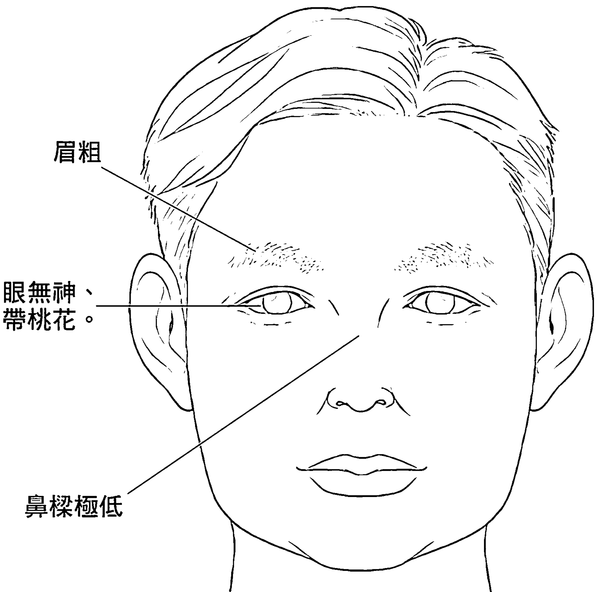

此相鼻樑極低，配合四十歲入大運後之五年混亂期。最快也要到運走兩顴時才會稍佳，正式入運當然是在二○一○至二○一五這個完整的木火流年。

#### 男命——遇財年結婚

| | 殺 | 傷 | 日元 | 印 |
|---|---|---|---|---|
| | 丁 | 壬 | 辛 | 戊 |
| | 亥 | 寅 | 酉 | 戌 |
| | 傷 | 財 | 祿 | 印 |

| 2 丑 | 12 亥 | 22 酉 | 32 未 | 42 | 52 |
|---|---|---|---|---|---|
| 辛 | 庚 | 己 | 戊 | 丁 | 丙 |
| 丑 | 子 | 亥 | 戌 | 酉 | 申 |
| | | 27 甲寅 | | | |

男命以財為妻，此局明財在月支，為正常結婚時間，因在年為早婚，在時為遲婚，在月則以前男命代表二十五至二十七歲時為婚期，只是現在城市人一般晚婚，故很多男性在該段時間出現婚緣都不想去結，把婚期推遲了。

以上命局在七四年甲寅一柱財星之年結婚，乙卯年沖日柱夫妻宮而生子，正好應了日柱天剋地沖，「一喜擋三災，無喜爭吵防」之應。

#### 男命——桃花大運流年結婚

#### 女命——

| | | | |
|---|---|---|---|
| 印 | 日元 | 劫 | 己 |
| 壬午 | 乙巳 | 甲寅 | 癸卯 |
| 食 | 傷 | 劫 | 祿 |

| | | | |
|---|---|---|---|
| 己 | 日元 | 食 | 殺 |
| 庚子 | 壬申 | 甲寅 | 戊寅 |
| 刃 | 己 | 食 | 食 |

- 39 庚戌
- 29 辛亥
- 19 壬子
- 9 癸丑

- 48 己酉
- 38 庚戌
- 28 辛亥
- 18 壬子
- 8 癸丑
- 23 辛丑

除了財星透出為重姻緣年，紅鸞桃花年算是其次了。此局在壬子紅鸞桃花大運、甲子紅鸞桃花年結婚。

局中夫在年柱，當為二十五歲前結婚。此局在子運紅鸞桃花加合進夫宮，在壬寅年二十四歲時犯太歲年結婚，癸卯生女，庚戌年產子。

#### 女命

| 傷 | 才 | 日元 | 食 |
|---|---|---|---|
| 己亥 | 庚午 | 丙寅 | 戊戌 |
| 殺 | 刃 | 印 | 食 |

| 丁未 | 丁巳 | 丁卯 | | | |
|---|---|---|---|---|---|
| 8 辛未 | 18 壬申 | 28 癸酉 | 38 甲戌 | 48 乙亥 | 58 丙子 |

此局驟看見官殺在年，必斷早婚，但細看亥午暗合，尤如比劫合殺，早歲感情必為人所奪，二十五歲前姻緣必成虛花。

尤幸大運壬、癸，十八至二十三歲、二十八至三十三歲皆有姻緣，第一段失去，卻尋回第二段，剛進癸運、丁卯沐浴桃花年結婚。

#### 女命

| 比 | 日元 | 傷 | 才 |
|---|---|---|---|
| 辛卯 | 辛亥 | 壬午 | 乙未 |
| 才 | 傷 | 殺 | 己 |

| 46 | 36 | 26 | 16 | 6 |
|---|---|---|---|---|
| 丁亥 | 丙戌 | 乙酉 | 甲申 | 癸未 |
| | 辛未 | 辛酉 | 辛亥 | 辛丑 |
| | | 31丙寅 | | |

#### 男命

| 印 | 日元 | 傷 | 食 |
|---|---|---|---|
| 己卯 | 庚申 | 癸卯 | 壬辰 |
| 財 | 祿 | 財 | 己 |

| 47 | 37 | 27 | 17 | 7 |
|---|---|---|---|---|
| 戊申 | 丁未 | 丙午 | 乙巳 | 甲辰 |
| | 己巳 | 己未 | | |
| | | 32甲子 | | |

命中夫在年月，為早見姻緣命，惟官殺為忌，早年感情運不佳，再加上三十六歲後行剋夫運，以嫁不正常姻緣為佳，年齡比自己小的更佳。丙寅、丁卯年同居，己巳年註冊，夫屬豬，比自己小四歲。

此局妻星重現，兩段姻緣命，故不宜早婚。在午運沐浴桃花、丙寅年與日元天剋地沖而結婚。

#### 男命

| 比 | 傷 | 日元 | 傷 |
|---|---|---|---|
| 癸 | 甲 | 癸 | 甲 |
| 巳 | 寅 | 卯 | 寅 |
| 財 | 傷 | 食 | 傷 |

| 6 | 16 | 26 | 36 | 46 | 56 | 66 | 76 |
|---|---|---|---|---|---|---|---|
| 亥 | 酉 | 未 | 巳 | | | | |
| 癸 | 壬 | 辛 | 庚 | 己 | 戊 | 丁 | 丙 |
| 丑 | 子 | 亥 | 戌 | 酉 | 申 | 未 | 午 |
| | | | 41甲戌 | 31甲子 | | | |

財在年柱，早見姻緣，但年月相刑，加上三十六歲之前行比劫運，亥運又沖妻星，早婚必離。

此命在九六年「丙子」財星透出、大運卯戌合夫妻宮而結婚。

命中只有庚戌十年大運。二千年來算命時已經有物業，有家庭，算是有小成。

### 此局面相特徵

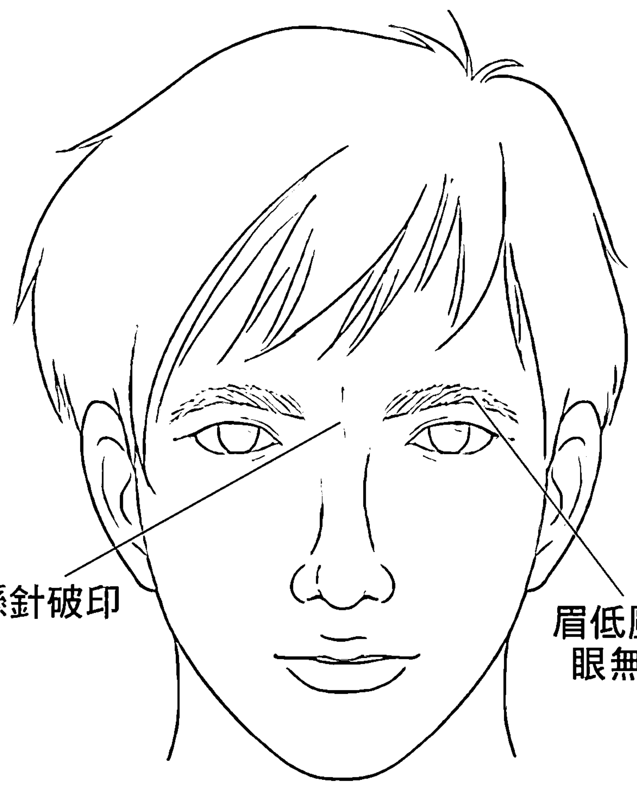

懸針破印

眉低壓目、眼無神。

此局之面相，懸針破印，父無助、無緣，為結婚遲、添丁遲、發達遲的象徵。又眉低壓目，眼神不足，尤幸顴鼻不差，稍有成就。

## 夫妻配

### 女命（妻）

### 男命（夫）

| | | | | | |
|---|---|---|---|---|---|
| | | | | | |
| | | | | | |
| | | | | | |
| | | | | | |

- 56 壬寅
- 46 癸卯
- 36 甲辰
- 26 乙巳
- 16 丙午
- 6 丁未
- 31 戊辰

- 44 庚寅
- 34 己丑
- 24 戊子
- 14 丁亥
- 4 丙戌

一九八八戊辰年，紅鸞桃花加上與時柱天剋地沖，四月初結婚，奉子成婚機會極大。惟命中日時官殺，又加相刑，大運己丑一柱又沖，婚姻必現危機，但土土相沖、相刑，離婚機會相對較低。

男命妻星弱，亦可以有姻緣，且大運二十六歲前行妻財，三十一至三十六歲又行妻財，戊辰年踏進巳運，流年相合，申子辰又合但婚姻跡象不及前者強，反而丙寅、丁卯年，天干透財、地支逢沖機會更大，故那兩年應該是認識年。

#### 女命

| 才 | 劫 | 日元 | 傷 |
|---|---|---|---|
| 庚寅 | 丁亥 | 丙寅 | 己亥 |
| 壬 | 殺 | 壬 | 殺 |

| 財 | 殺 | 日元 | 傷 |
|---|---|---|---|
| 己亥 | 庚午 | 甲戌 | 丁卯 |
| 壬 | 傷 | 才 | 刃 |

| 6 | 16 | 26 | 36 | 46 |
|---|---|---|---|---|
| 丙戌 | 乙酉 | 甲申 | 癸未 | 壬午 |

| 6 | 16 | 26 | 36 | 46 |
|---|---|---|---|---|
| 辛未 | 壬申 | 癸酉 | 甲戌 | 乙亥 |
| | 21庚申 | 乙丑 | 乙卯 | |

月時夫星重現，二十五至二十七、三十歲後皆見姻緣，此命二十五歲結婚，只因流年乙卯除了是咸池桃花外，亦是沐浴桃花，而沐浴桃花之力比紅鸞還重，故婚期是原局與流年的關係，與大運關係不大，又命中十六歲後環境漸佳，皆因申酉為財運之故。

官殺在月，二十五至二十七歲易見姻緣，二十至二十六行申運官殺，甲子年與月柱對沖，沖父母宮，一喜擋三災，無喜長輩防，故那年結婚了。

#### 女命

| 殺 | 傷 | 日元 | 劫 |
|---|---|---|---|
| 癸卯 | 戊午 | 丁酉 | 丙午 |
| 壬 | 祿 | 才 | 祿 |

| 5 | 15 | 25 | 35 |
|---|---|---|---|
| 己未 | 庚申 | 辛酉 | 壬戌 |

### 此局面相特徵

面相方面，女生男相，面方、鼻大，有男子氣概。

此局戊辰年來算命，已婚，夫在年干為早婚命，申運二十五歲前結婚，以丁卯年二十四歲犯太歲之年機會最大。局中建祿，傷官駕殺格，故女生男命。

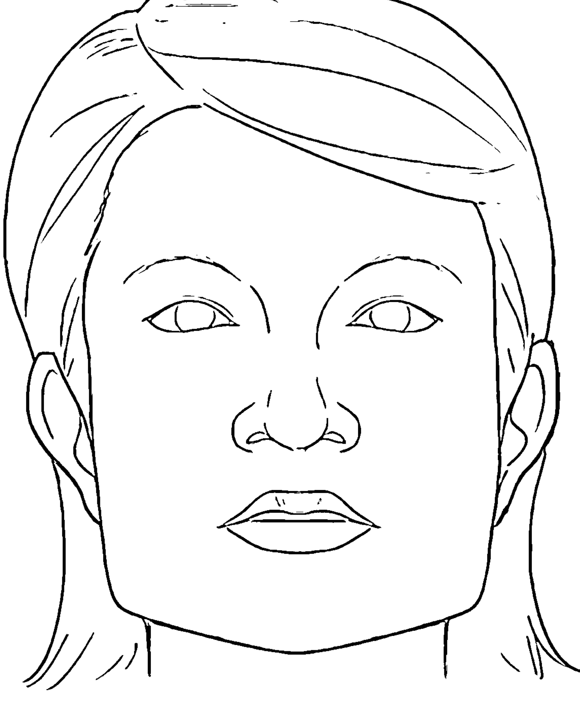

### 此局之夫及子女八字：

女命

| 殺 | 己亥 | 劫 |
|---|---|---|
| 比 | 癸酉 | 旺 |
| 日元 | 癸亥 | 劫 |
| 劫 | 壬子 | 祿 |

- 庚子 1
- 庚戌 11
- 庚申 21
- 丁丑 31
- 戊寅 41

男命（夫）——

| 財 | 甲午 | 殺 |
|---|---|---|
| 官 | 丙寅 | 財 |
| 日元 | 辛丑 | 旺 |
| 食 | 癸巳 | 官 |

女命（女）——

| 財 | 壬戌 | 劫 |
|---|---|---|
| 比 | 己酉 | 食 |
| 日元 | 己酉 | 食 |
| 才 | 癸酉 | 食 |

男命（子）——

| 傷 | 癸亥 | 食 |
|---|---|---|
| 財 | 乙丑 | 印 |
| 日元 | 庚戌 | 旺 |
| 食 | 壬午 | 官 |

此局八八年来算命。局中夫在年柱，二十五岁前早见姻缘命，两子女，一生於壬戌年，一生於癸亥年，故命主极有可能是七八年戊午、七九年己未一柱官杀已结婚。惟此命姊妹刚强加上姊妹同生，婚姻惟恐难以偕老，加上女命八字一般自身极强极旺者，九成以上会离婚收场。

#### 男命

| 財 | 劫 | 日元 | 劫 |
|---|---|---|---|
| 甲午 | 庚午 | 辛卯 | 庚子 |
| 殺 | 殺 | 才 | 食 |

- 1 辛未
- 11 壬申
- 21 癸酉
- 31 甲戌
- 41 乙亥

此局妻星兩現，為兩段姻緣命，本應遲婚較佳，無奈掌中婚姻線靠近尾指基部，位在二十三歲前，變成早結早離之命，酉運離婚後再婚。

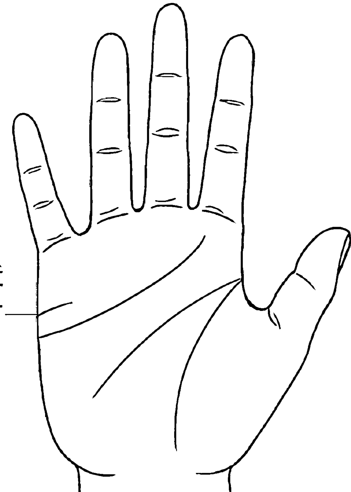

婚姻線靠近感情線，早見重感情，因而早婚。

#### 女命

| 官 | 日元 | 財 | 比 |
|---|---|---|---|
| 丁亥 | 庚午 | 乙酉 | 庚辰 |
| 食 | 官 | 刃 | 印 |

| 乙 | 乙 | 乙 | 乙 | 乙 |
|---|---|---|---|---|
| 45丑 | 35卯 | 25巳 | 15未 | 5酉 |
| 庚辰 | 辛巳 | 壬午 | 癸未 | 甲申 |
| | 40庚申 | | | |

#### 男命

| 食 | 日元 | 食 | 殺 |
|---|---|---|---|
| 甲戌 | 壬申 | 甲寅 | 戊子 |
| 殺 | 印 | 食 | 刃 |

| 46 | 36 | 26寅 | 16 | 6 |
|---|---|---|---|---|
| 己未 | 戊午 | 丁巳 | 丙辰 | 乙卯 |

未運合進夫宮結婚。辛運比劫透出，夫有外遇。已運甲子年日柱天剋地沖離婚，有一子兩女。

局中妻星暗藏，但對男命婚姻影響不大，加上巳午未三十年妻財運，妻緣不差，剛踏入丁運，財來合我，乙卯紅鸞桃花年結婚。惟局中月日夫妻宮相沖，三十五歲前感情不定。

#### 男命

| 財 | 傷 | 日元 | 食 |
|---|---|---|---|
| 甲午 | 壬申 | 辛丑 | 癸巳 |
| 殺 | 劫 | 己 | 官 |

| 9 | 19 | 29 | 39 | 49 |
|---|---|---|---|---|
| 癸酉 | 甲戌 | 乙亥 | 丙子 | 丁丑 |

局中財在年柱為早見姻緣命，甲運有姻緣，不結，待至乙運乙丑年結婚，因遲婚而避過了兩次姻緣。

### 剋夫、幫夫、旺夫。

女命行官殺地支代表幫夫，即要為夫粗勞，甚至乎工作比丈夫更吃力；行財運代表旺夫，即容易嫁一個行運的丈夫，如果以財為喜，更可坐享其成；行食傷運代表剋夫，夫妻有名無實，或嫁一個不行運或不能幹的丈夫。

#### 女命——剋夫

| 傷 | 食 | 日元 | 劫 |
|---|---|---|---|
| 丙戌 | 丁酉 | 乙酉 | 甲申 |
| 財 | 殺 | 殺 | 官 |

- 丙戌 丙申 丙午 丙辰
- 0 10 20 30 40
- 丙申 乙未 甲午 癸巳 壬辰
- 25辛亥

此局夫星重重，夫宮相刑，本宜晚婚，惟此命早婚。七三年癸丑產子，七六年丙辰、三十歲喪夫，夫屬馬，年長她四歲，為正常姻緣，難免生離死別。

## 夫妻配

男命（夫）

女命（妻）

旺夫

此局以財為用，年月皆為喜用，出生富貴之家，且自坐財星，祖上富貴必然臨身。月日寅巳相刑雖與父母有爭拗，但止於三十五歲。三十七至四十七歲十年大運，必掌家業且延續其發展。

八三、八四年時已有兩子一女，且已長大成人，故此命在二十五至二十七歲時結婚機會頗大。

此命夫星暗藏，為暗夫命，要把握姻緣。無夫命，早則容易，晚則無夫。命中三十二至五十二歲二十年財運旺夫，而夫在三十七至四十七歲十年大運剛好配合得上。

#### 女命

| | | | |
|---|---|---|---|
| 食 | 日元 | 殺 | 印 |
| 乙卯 | 癸卯 | 己丑 | 庚寅 |
| 食 | 食 | 殺 | 傷 |

#### 女命

| | | | |
|---|---|---|---|
| 殺 | 日元 | 食 | 殺 |
| 丙子 | 庚戌 | 壬辰 | 丙申 |
| 傷 | 己 | 己 | 祿 |

| | | | | |
|---|---|---|---|---|
| 49 | 39 | 29 | 19 | 9 |
| 甲申 | 乙酉 | 丙戌 | 丁亥 | 戊子 |

| | | | | |
|---|---|---|---|---|
| 42 | 32 | 22 | 12 | 2 |
| 丁亥 | 戊子 | 己丑 | 庚寅 | 辛卯 |

局中己丑月一柱官殺，惟命中食傷過旺而剋官殺，此為剋夫命，一般以配少夫機會較大，但可惜女性很多時沒有留意身邊年紀比自己小的異性，以致錯過姻緣。己巳年來算命時仍然未婚，踏進三十歲後十年沖夫宮，惟恐機會更加渺茫。

夫在年干，加上二十二歲前行財運生旺官星，故早婚。惟二十二至五十二歲行三十年剋夫運，惟恐夫緣薄弱。己丑運刑夫宮，戊辰年沖夫宮，加上踏進亥子丑食傷運，有夫如無，最後離婚收場。

#### 女命

| 才 | 印 | 日元 |  |
|---|---|---|---|
| 丁 | 庚 | 癸 | 辛 |
| 巳 | 戌 | 丑 | 酉 |
| 財 | 官 | 殺 |  |

| 殺 | 劫 | 日元 | 印 |
|---|---|---|---|
| 丁 | 庚 | 辛 | 戊 |
| 亥 | 戌 | 巳 | 戌 |
| 傷 | 印 | 官 | 印 |

| 壬 | 壬 | 壬 | 壬 | 壬 |
|---|---|---|---|---|
| 戌 | 申 | 午 | 辰 |  |
| 5 | 15 | 25 | 35 | 45 |
| 辛 | 壬 | 癸 | 甲 | 乙 |
| 亥 | 子 | 丑 | 寅 | 卯 |
|  | 20丁 | 30丁 |  |  |
|  | 丑 | 亥 |  |  |

| 辛 | 辛 | 辛 | 辛 | 辛 |
|---|---|---|---|---|
| 卯 | 丑 | 亥 |  |  |
| 4 | 14 | 24 | 34 | 44 |
| 辛 | 壬 | 癸 | 甲 | 乙 |
| 亥 | 子 | 丑 | 寅 | 卯 |
|  | 19丙 |  |  |  |
|  | 午 |  |  |  |

子運合夫宮，戊寅、己卯年結婚，丑運己丑年夫喪。因局中月日夫妻宮相刑，三十五歲前感情難以穩定，惟三十五歲後行甲寅、乙卯剋夫運，恐難再見姻緣。

此局夫星重現，加上三十四歲前行剋夫運，早婚必然生離死別。子運桃花，丁未流年七殺透而結婚，癸丑運癸丑年，夫車禍而亡。

## 離婚命

命中夫妻宮相沖，大運相沖夫妻宮，流年日柱天剋地沖，都有離婚機會。

#### 女命

| 傷 | 官 | 日元 | 傷 |
|---|---|---|---|
| 丁未 | 辛亥 | 甲申 | 丁卯 |
| 財 | 印 | 穿 | 刃 |

| 7 | 17 | 27 | 37 | 47 | 57 |
|---|---|---|---|---|---|
| 壬子 | 癸丑 | 甲寅 | 乙卯 | 丙辰 | 丁巳 |
| | 22 己巳 | | | | |

此命官殺在月日，應該在當地平均年齡結婚，但此命在二十歲「丁卯」年伏刑時柱而奉子成婚，惟命中夫妻宮相穿，三十五歲前感情不定。大運二十七至三十七歲甲寅，寅申相沖夫妻宮，戊寅年天剋地沖夫妻宮而離婚。

#### 男命

#### 女命

| | | | |
|---|---|---|---|
| 才 | 日元 | 印 | 才 |
| 辛丑 | 丁亥 | 甲午 | 辛卯 |
| 食 | 官 | 禄 | 壬 |

| | | | |
|---|---|---|---|
| 劫 | 日元 | 印 | 杀 |
| 庚寅 | 辛巳 | 戊申 | 丁酉 |
| 財 | 官 | 劫 | 祿 |

| | | | | | | |
|---|---|---|---|---|---|---|
| 63 | 53 | 43 | 33 | 23 | 13 | 3 |
| 丁亥 | 戊子 | 己丑 | 庚寅 | 辛卯 | 壬辰 | 癸巳 |

| | | | | |
|---|---|---|---|---|
| 41 | 31 | 21 | 11 | 1 |
| 癸丑 | 壬子 | 辛亥 | 庚戌 | 己酉 |

男命以財為妻，年時透財，二十五歲前、三十歲後兩重姻緣運，早婚必然增添離婚機會，無奈此命在二十五歲前結了婚，二十六歲在辛運，丁巳年沖妻宮而離異。此等雙重姻緣命不一定要選擇在三十歲後結婚，只要不在二十五歲前結婚也有機會避免離婚之苦。

早婚早離，戊辰年與結婚十載之丈夫離婚，皆因命中夫星重見，不宜早婚，加上亥運沖夫，是離婚之大關，雖然對對方諸多忍讓且常受欺凌，但終究也要離婚收場。此命面方、掌柔，外剛內柔之格，此亦婚姻之忌，與外柔內剛不可同日而語。

#### 男命

| 比 | 財 | 日元 | 印 |
|---|---|---|---|
| 己丑 | 壬申 | 己丑 | 丙寅 |
| 祿 | 傷 | 祿 | 官 |

| 乙未 | 乙巳 | 乙卯 | 乙丑 | 丁卯 |
|---|---|---|---|---|
| 6 | 16 | 26 | 36 | 46 |
| 辛未 | 庚午 | 己巳 | 戊辰 | 丁卯 |
| | | | 41庚午 | |

己丑日遇己丑年，與女命的姊妹同生爭夫格一樣，惟男命為爭妻局。戊辰運戊辰年群劫爭財，己巳年妻有外遇，離婚。這結局與女命不同，女命一般會這樣維持下去，男命則必定離婚告終。

#### 男命

| 殺 | 食 | 日元 | 傷 |
|---|---|---|---|
| 己丑 | 乙亥 | 癸卯 | 甲寅 |
| 殺 | 劫 | 食 | 傷 |

| 甲戌 | 癸酉 | 壬申 | 辛未 | 庚午 | 己巳 |
|---|---|---|---|---|---|
| 0 | 10 | 20 | 30 | 40 | 50 |

此命申運丁巳年，大運桃花，流年一柱財星，因而結合。至未運、乙丑年，因沖大運加犯太歲而離婚，如那年有喜事或過了犯太歲年，則有可能不會離婚收場，故不宜在沖犯太歲之年決定離婚。

## 無夫命、無妻命。

男命局，無妻也可有妻，故無妻命結婚機會與常人無異，惟其人不大熱衷結婚。

女性命中無夫一定要早婚，在二十五歲前最容易，三十歲後機會已經很低，獨身的機會很大。

### 女命——暗夫

| 劫 | 食 | 日元 | 印 |
|---|---|---|---|
| 癸卯 | 甲寅 | 壬寅 | 庚子 |
| 傷 | 食 | 食 | 刃 |

| 2 | 12 | 22 | 32 | 42 | 52 | 62 |
|---|---|---|---|---|---|---|
| 巳 | 卯 | 丑 | 戊午 | 己未 | 庚申 | 辛酉 |
| 乙卯 | 乙辰 | 丁巳 | | | | |
| | 17庚申 | | | | | |

此局寅中藏土，為暗夫命，但因土為木剋，滿局食傷，土無用矣。命中無夫則看大運流年，早年為辰運官殺，婚嫁機會最大，故在辰運壬戌年與大運天剋地沖結婚。

#### 女命

| 比 | 劫 | 日元 | 才 |
|---|---|---|---|
| 丁未 | 丙午 | 丁巳 | 辛丑 |
| 食 | 禄 | 劫 | 食 |

| 壬子 | 壬戌 | 壬申 | 壬午 | 壬辰 | 壬寅 | 壬子 |
|---|---|---|---|---|---|---|
| 5 | 15 | 25 | 35 | 45 | 55 | 65 |
| 丁未 | 戊申 | 己酉 | 庚戌 | 辛亥 | 壬子 | 癸丑 |

局中火旺，只丑中癸水，夫星極弱。十五至三十五歲行財運，早歲優游。庚戌困頓，癸巳年已過四十六歲，仍未能開花結果。惟辛亥、壬子、癸丑，三十年夫運，機會仍在，可惜面上法令紋極深，為孤獨之相，故獨身機會極大。又法令在三十歲前顯現稱為苦淚紋，皆因早歲父緣薄弱所致。此局群劫爭財，丁未一柱與辛丑對沖，財絕而父亡。

#### 女命

| 比 | 傷 | 日元 | 食 |
|---|---|---|---|
| 癸卯 | 甲寅 | 癸卯 | 乙卯 |
| 食 | 傷 | 食 | 食 |

| 印 | 財 | 日元 | 財 |
|---|---|---|---|
| 乙酉 | 辛巳 | 丙戌 | 辛卯 |
| 財 | 祿 | 食 | 印 |

#### 女命

| 2 | 12 | 22 | 32 | 42 |
|---|---|---|---|---|
| 巳 | 卯 | 丑 | 戊午 | 己未 |
| 乙卯 | 丙辰 | 丁巳 | | |

| 7 | 17 | 27 | 37 | 47 |
|---|---|---|---|---|
| 辰 | 寅 | 子 | 戌 | 申 |
| 壬午 | 癸未 | 甲申 | 乙酉 | 丙戌 |
| | 22 丁未 | | 42 丁卯 | |

寅中藏戊，有等於無，加上局中食傷重，為剋夫命，姻緣難矣，必須把握在二十五歲前結婚，因三十歲以後這種命格大多難有姻緣，尤幸剛踏入丁運丙寅年結婚。

局中官殺全無，為無夫命，要把握姻緣，因三十歲後機會渺茫。
此命把握在癸運結婚，六六年丙午生女，六八年戊申生子，七一年辛亥生子，但七二年後夫妻緣份開始淡薄，八八年來算時已經是有夫如無。

#### 女命

| 財 | 比 | 日元 | 才 |
|---|---|---|---|
| 丙午 | 癸巳 | 癸巳 | 丁巳 |
| 才 | 財 | 財 | 財 |

| 乙卯 | 乙丑 | 辛卯 | 庚寅 | 己丑 | 戊子 |
|---|---|---|---|---|---|
| 9 | 19 | 29 | 39 | 49 | |
| 壬辰 | 辛卯 | 庚寅 | 己丑 | 戊子 | |

命中無明夫，土皆藏火內，為暗夫命，要把握姻緣。辛卯桃花大運、丁卯桃花年，雙雙桃花而結婚。

## 冲婚

月柱、日柱、时柱天克地冲，很多时候会在没有准备下而结婚，奉子成婚的机会很大；其次，天克地冲大运及冲太岁年亦然。

#### 女命——

| 官 | 财 | 日元 | 印 |
|---|---|---|---|
| 甲辰 | 壬申 | 己亥 | 丙寅 |
| 劫 | 伤 | 财 | 官 |

| 4 | 14 | 24 | 34 | 44 |
|---|---|---|---|---|
| 戊申 | 戊午 | 戊辰 | 戊寅 | 戊子 |
| 辛未 | 庚午 | 己巳 | 戊辰 | 丁卯 |
| | 19 癸亥 | | | |

此局年时官星重现，惟恐两段姻缘，甲子年与大运庚午对冲，那年奉子成婚。惟局中申亥相穿，时支再见官星，姻缘要穿越三十五岁后才可白头。

#### 男命

| 才 | 日元 | 官 | 傷 |
|---|---|---|---|
| 己卯 | 乙丑 | 庚子 | 丙戌 |
| 祿 | 才 | 壬 | 財 |

| 7 | 17 | 27 | 37 | 47 |
|---|---|---|---|---|
| 辛丑 | 壬寅 | 癸卯 | 甲辰 | 乙巳 |
| 癸丑 | | | 32 戊午 | |

此局妻星重重，招娶不定，必宜遲婚。
此命丙辰年三十歲因沖太歲而結婚，對於一九四六年那個時代出生的人來說，三十歲算是很遲結婚了。

## 錯過姻緣

很多人以為姻緣是天注定的，尤其是較感性的女人，一心等待心中的白馬王子出現，以致錯過姻緣；如命中夫星在年柱，為早婚命，二十五歲前姻緣運最重，過後便逐漸減弱，可能終身不能婚嫁。男性則較有利，因男命不論妻位在何柱，甚至命中無妻，姻緣亦較少限制，因為錯過姻緣而結不成婚的機會較細。

#### 女命——

| 財 | 殺 | 日元 | 食 |
|---|---|---|---|
| 己酉 | 庚午 | 甲寅 | 丙寅 |
| 官 | 傷 | 祿 | 祿 |

| 10 | 20 | 30 | 40 | 50 |
|---|---|---|---|---|
| 辛未 | 壬申 | 癸酉 | 甲戌 | 乙亥 |

此局官殺在年月，二十七歲前當有姻緣，現實也是如此。申運、酉運皆可結婚，惟命主堅持不結婚，因其母與祖母皆離婚，少時去算命亦叫她不要早婚，故寧與男友同居十多年也不願註冊結婚。二〇〇九己丑年，男友再提出結婚，而命主仍堅持不結，但己丑年已行完二十年夫運，延至一〇年因男友要與別人結婚而搬走，這正是錯過姻緣的好例子。

### 此局面相特徵

此女命面相上鼻高，固執硬頸；眼神不足，故內心自信心不足。門牙左右相背，代表父母不和，亦容易影響到自身感情。

#### 女命

| 才 | 日元 | 財 | 比 |
|---|---|---|---|
| 甲 | 庚 | 乙 | 庚 |
| 申 | 午 | 酉 | 寅 |
| 祿 | 官 | 刃 | 才 |

| 8 | 18 | 28 | 38 | 48 |
|---|---|---|---|---|
| 甲申 | 癸未 | 壬午 | 辛巳 | 庚辰 |
| | | | 33 癸亥 | |

#### 女命

| 財 | 日元 | 財 | 傷 |
|---|---|---|---|
| 丙 | 癸 | 丙 | 甲 |
| 辰 | 亥 | 子 | 午 |
| 官 | 劫 | 祿 | 才 |

| 9 | 19 | 29 | 39 | 49 |
|---|---|---|---|---|
| 乙亥 | 甲戌 | 癸酉 | 壬申 | 辛未 |
| | | | 24 戊午 | |

此局夫在日支，應在當地的平均年齡結婚，但八三年來算命時已經三十三歲了，仍未結婚，也算是錯過姻緣，雖大運巳午仍有結婚機會，因這也是剛好大運行官殺而已。

夫在時柱為遲婚命。一九五四年出生，以五〇年代出生的人來說，當時二十六、七歲，已算是遲婚。此命戊運有重姻緣，無奈命中年月相沖，三十歲前總覺得對方不理想而沒有結婚，錯過姻緣後至老孤身一人。

### 夫星重重，招嫁不定。

#### 女命——

| 印 | 杀 | 日元 | 劫 |
|---|---|---|---|
| 庚子 | 己丑 | 癸丑 | 壬戌 |
| 禄 | 杀 | 杀 | 官 |

| 5 | 15 | 25 | 35 | 45 | 55 |
|---|---|---|---|---|---|
| 戊子 | 丁亥 | 丙戌 | 乙酉 | 甲申 | 癸未 |

| 乙亥 | 乙丑 | 乙卯 | 乙巳 |
|---|---|---|---|
| 30 庚午 | | | |

此局夫星重重，三十岁前已结婚、离婚。戊辰、己巳年夫星透出，重姻缘运，无结婚，后分手，然后再遇桃花，加上三十五岁后二十年贵人舒服运，且亦能觅得好姻缘。

四十五岁过了局中日时丑戌相刑后，能白头到老的机会很大。

#### 女命

| 杀 | 日元 | 劫 | 食 |
|---|---|---|---|
| 癸卯 | 丁丑 | 丙子 | 己亥 |
| 壬 | 食 | 杀 | 官 |

#### 女命

| 食 | 日元 | 食 | 杀 |
|---|---|---|---|
| 戊子 | 丙戌 | 戊申 | 壬辰 |
| 官 | 食 | 才 | 食 |

| 甲 | 甲 | 甲 | 甲 | 甲 | 甲 |
|---|---|---|---|---|---|
| 55午 | 45申 | 35戌 | 25子 | 15寅 | 5辰 |
| 壬午 | 辛巳 | 庚辰 | 己卯 | 戊寅 | 丁丑 |

| 癸 | 癸 | 癸 | 癸 |
|---|---|---|---|
| 41 | 31亥 | 21丑 | 11卯 | 1巳 |
| 癸卯 | 甲辰 | 乙巳 | 丙午 | 丁未 |
| 36戊辰 | | | | |

局中亥子丑會水，時透癸水，四柱官殺，為夫星重重招嫁不定之命，加上夫星為忌，一生難有依靠。且夫妻宮坐食神，所認識的男性每每都會甜言蜜語，滿口將來，但大多數都是太理想化而不能實現的，尤幸巳午未比劫大運，能靠自己自力更生。

申子辰會水局，天干壬水透出，亦算夫星重重，早婚必然離婚再婚，還幸此命在甲辰運沖夫宮，丁卯年天干合殺、地支沐浴桃花年才結婚，因遲婚而免了重婚之痛。

#### 女命

| 比 | 壬 | 官 | 丁 | 日元 | 壬 | 杀 | 庚 | 食 | 壬 |
|---|---|---|---|---|---|---|---|---|---|
| 寅 | | 未 | | 辰 | | 戌 | | 寅 | |

| 4 | 己 | 14 | 戊 | 24 | 丁 | 34 | 丙 | 44 | 乙 |
|---|---|---|---|---|---|---|---|---|---|
| 酉 | | 申 | | 未 | | 午 | | 巳 | |
| | | | | | | | | 49 | 辛 |
| | | | | | | | | 卯 | |

命中夫星重重，為招嫁不定之命，一嫁再嫁而未休。丙戌年與日柱天剋地沖，第二次離婚，恐還有第三段姻緣。

### 妻星重重，招娶不定。

#### 男命

| | | | |
|---|---|---|---|
| 壬 | 日元 | 财 | 食 |
| 甲辰 | 己亥 | 丙戌 | |
| 才 | 壬 | 才 | |

| 4 | 14 | 24 | 34 | 44 |
|---|---|---|---|---|
| 庚子 | 辛丑 | 壬寅 | 癸卯 | 甲辰 |
| | | | 39乙 | 49乙 |
| | | | 丑 | 亥 |

#### 男命

| | | | | |
|---|---|---|---|---|
| 壬 | 日元 | 庚戌 | 壬寅 | 丙寅 | 甲午 |
| 才 | 食 | | | |
| 杀 | 食 | 食 | 财 | |

| 6 | 16 | 26 | 36 | 46 |
|---|---|---|---|---|
| 丁卯 | 戊辰 | 己巳 | 庚午 | 辛未 |
| | | | 31乙 | |
| | | | 丑 | |

局中妻星重重，為招娶不定之命，雖然已經不是早婚（因妻小十載），相信結婚時已過三十歲。惟八八、八九年因認識了其他異性，及後離婚，但感情維持了沒多久便分手，相信辰運戊寅、己卯年再婚機會相當大。

地支寅午戌會財局，月干財星透出，引至時上為財之墓地，早婚必然重婚再娶。此命在巳運丁卯年，干透財星支坐桃花而結婚，三十三歲結婚，也算遲婚。

### 戊戌、戊辰年出生，天羅地網，孤獨命。

戊戌、戊辰年出生，天羅地網，孤獨命。戊辰年生人現在尚算年幼，但五八年戊戌出生人，統計下來，有三分一尚未婚，三分一已離婚，保得住姻緣的最多只有三分一。

筆者研究過，戊戌年出生的人，在性格上喜追求不可得的對象，得到後又會覺得不外如是或失去興趣，然後再去追求不可得的。如這種性格不能改變，結局亦不會改變。

#### 女命

| 比 | 食 | 日元 | 食 |
|---|---|---|---|
| 戊戌 | 庚申 | 戊寅 | 庚申 |
| 祿 | 食 | 希 | 食 |

| 7 | 17 | 27 | 37 | 47 |
|---|---|---|---|---|
| 己未 | 戊午 | 丁巳 | 丙辰 | 乙卯 |

戊戌年出生已經不利姻緣，再加上月日，日時兩沖夫妻宮逢沖，四十五歲前感情實難以穩定，希望四十七歲後行乙卯、甲寅大運，能找到一個伴侶。

#### 男命

| 官 | 财 | 日元 | 伤 |
|---|---|---|---|
| 戊戌 | 丙辰 | 癸酉 | 甲子 |
| 官 | 官 | 巳 | 禄 |

| 3 | 13 | 23 | 33 | 43 |
|---|---|---|---|---|
| 丁巳 | 戊午 | 己未 | 庚申 | 辛酉 |

#### 女命

| 财 | 印 | 日元 | 才 |
|---|---|---|---|
| 戊戌 | 壬戌 | 乙丑 | 己卯 |
| 财 | 财 | 才 | 禄 |

| 2 | 12 | 22 | 32 | 42 |
|---|---|---|---|---|
| 辛酉 | 庚申 | 己未 | 戊午 | 丁巳 |

命中妻在年月，應為早婚命，惟辰沖戌，戌中丁火無用；丙坐辰，濕土洩火亦無用。且年月相沖，三十歲前認識誰都覺得不理想，加上戊戌年出生，一生追求得不到的東西，得到了又覺不外如是，二〇一二年沖太歲在對方催逼下無奈結婚，但一年多後便分手了。

戊戌年出生已不利姻緣，加上命中夫星暗藏，夫妻宮又相刑，三十二歲後又行剋夫運，無夫，幾成定局矣。

#### 女命

| 印 | 日元 | 財 | 傷 |
|---|---|---|---|
| 甲辰 | 丁丑 | 庚申 | 戊戌 |
| 傷 | 食 | 財 | 傷 |

| 7 | 17 | 27 | 37 | 47 |
|---|---|---|---|---|
| 己未 | 戊午 | 丁巳 | 丙辰 | 乙卯 |

此局庚金劈甲引丁，加上財氣通門戶，為貴中取富之局，現實生活條件亦不錯，但可惜戊戌年出生犯天羅地網，孤獨命，加上命中夫星暗藏，以致五十六歲依然單身。

#### 男命

| 印 | 日元 | 才 | 印 |
|---|---|---|---|
| 戊戌 | 辛丑 | 乙丑 | 戊戌 |
| 印 | 己 | 己 | 印 |

| 5 | 15 | 25 | 35 | 45 |
|---|---|---|---|---|
| 丙寅 | 丁卯 | 戊辰 | 己巳 | 庚午 |

命中乙木財星無力，且地支年月、日時相刑，四十五歲前無論認識誰都覺得不理想，加上戊戌年出生為孤獨命，感情實難以穩定下來。

### 女命身過旺，婚姻多失敗。

女命——
印 乙巳 祿
殺 壬午 刃
日元 丙辰 食
壬 甲午 刃

丁 未 2
丁 巳 12
丁 卯 22
丁 丑 32
丁 亥 42
丁 酉 52
62 己丑 戊子 丁亥 丙戌 乙酉 甲申 癸未
47 壬辰

此局丙火見壬水為壬丙相輝，日照湖海，命入貴格。惟男命利剛，女命利柔，而此局干透七殺，地支兩刃一祿，性格剛強，硬頸固執，遇事必半步不讓，婚姻必難美滿。

局中夫在月干，二十七歲結婚，丙戌一柱，天干透劫爭夫，地支沖夫妻宮，因而離婚。惟大運亥子丑水地，必再遇桃花，但性格過分強硬，不宜再婚。壬辰、癸巳年遇上已婚之舊情人，保持男女朋友關係，再加上三十年幫夫運，可扶持男友發展事業。

### 此局面相特徵——

此女命之面相，眼細而帶淚水，離婚機會相當大，且為三角關係之桃花眼。

鼻低、顴高，可幫夫、旺夫，但難享夫福。

腮骨闊而有力，逆境生存能力強。

晚運好，子女好，但不能依靠丈夫。

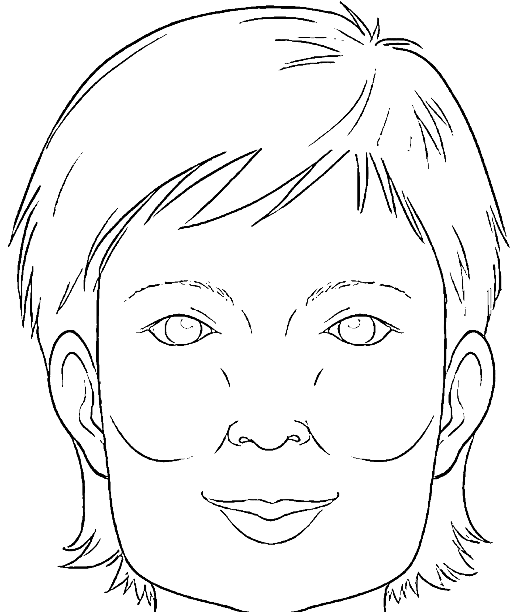

### 此局掌相特徵

拇指長代表做事有決心，但拇指長至食指的第一節算是過長，做事有決心外，感情事也特別有決心，覺得感情不值得留戀，要分手時亦特別堅決，故拇指特別長的女性，大多中年孤獨。食指長，愛主導、喜居於領導地位。尾指長，疑心重，但處事手法圓滑、善交際。

總觀此女命之掌面相、八字，是一個十分有能力的人，只是婚姻不佳而已。

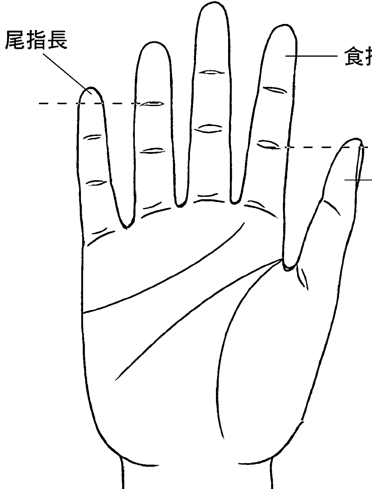

### 女命財旺，易嫁少夫。

女性除了命中食傷旺或行食傷運易嫁少夫外，地支財在三支以上或會財方財局，嫁少夫的機會也很大。

女命——

| 食 | 才 | 日元 | 劫 |
|---|---|---|---|
| 戊申 | 庚申 | 丙辰 | 丁酉 |
| 才 | 才 | 食 | 財 |

| 2 | 12 | 22 | 32 | 42 |
|---|---|---|---|---|
| 己未 | 戊午 | 丁巳 | 丙辰 | 乙卯 |

局中夫星暗藏，暗夫命，要把握姻緣宜嫁不正常姻緣比較容易把握得到，加上命中財旺，易嫁少夫。丈夫與她同年，生於四月，少的意思是大自己不足一年，故同年而大月也算是少夫。

又此命一般斷為從財格，且為真從，應當大富大貴，但以寒熱命論，三秋無火為清寒命，為秀才命，容易從事專業或在大機構上班。現實上，此命亦只是普通人而已。

## 八字秘法 壹

作者
蘇民峰

編輯
梁美媚

美術統籌及設計
Amelia Loh

美術設計
Charlotte Chau

插圖
August Boy

出版者
圓方出版社
香港北角英皇道 499 號北角工業大廈 18 樓
營銷部電話：(852) 2138 7961
電話：2138 7998
傳真：2597 4003
電郵：marketing@formspub.com
網址：http://www.formspub.com
http://www.facebook.com/formspub

發行者
香港聯合書刊物流有限公司
香港新界大埔汀麗路 36 號
中華商務印刷大廈 3 字樓
電話：2150 2100
傳真：2407 3062
電郵：info@suplogistics.com.hk

承印者
中華商務彩色印刷有限公司
香港新界大埔汀麗路 36 號

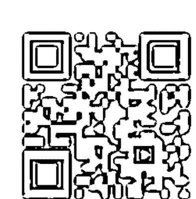

出版日期
二〇一五年七月第一次印刷

版權所有 · 不准翻印
All rights reserved.
Copyright ©2015 Forms Publications (HK) Co.Ltd.
ISBN 978-988-8325-26-9
Published in Hong Kong

- 涵蓋陰陽五行、月令四時、天干地支、長生十二宮等八字立基點；
- 合參《萬年曆》，細析起四柱、推大運之法；
- 援引大量例子，細述定格局、取用神之訣竅；
- 膚列多種命格，供讀者反覆參研，融會貫通。

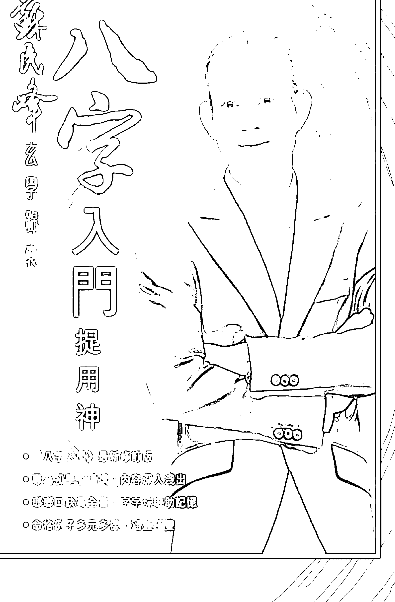

## 蔡氏玄學叢書
八字入門
提用神

- 八字入門最新修訂版
- 內容深入淺出
- 附有回顧及練習，有助記憶
- 命格例子多元多樣，涵蓋面廣

## 獨創寒熱命論，盡釋命理懸案，
玄學大師蘇民峯，公開成名絕學——
八字論命！

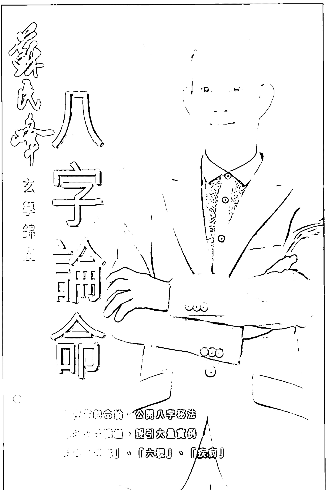

本書為作者修習八字期間所沿用的筆記，亦為今日教授命理時的重要參考；
附有「八字秘法」，以口訣總結其多年的論命經驗；
援引大量實例，解構不同的命造及格局；
適合進階的八字研習者，內容涵蓋極豐。

## 《相學全集》卷一至卷四

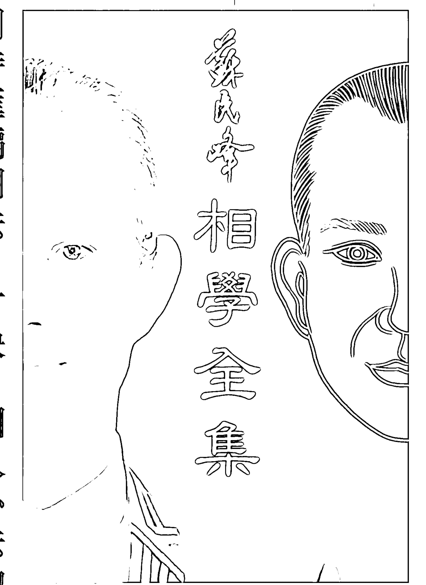

首部同時匯編相法、古訣、個人心法的相學大全！

闡述面相部位分法，如三停、十二宮、五嶽四瀆、百歲流年圖等；

公開獨立部位相法，涵蓋額、耳、眉、眼、顴、鼻、口、下巴等，盡道早歲至晚運的命運玄機；

傳授坊間少有流傳的內相秘法，頸、肩、腰、腹、臍、臀，盡見其中；

細論其他相法，包括動相、聲音、氣色，習相者不可不察。

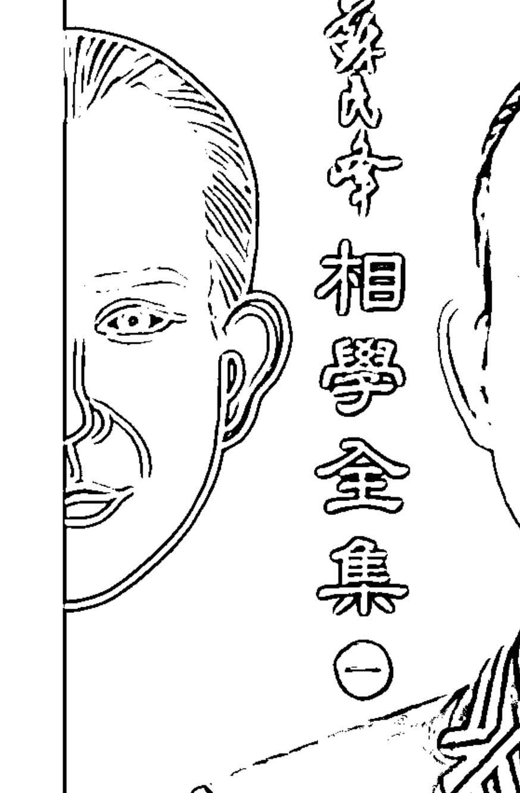

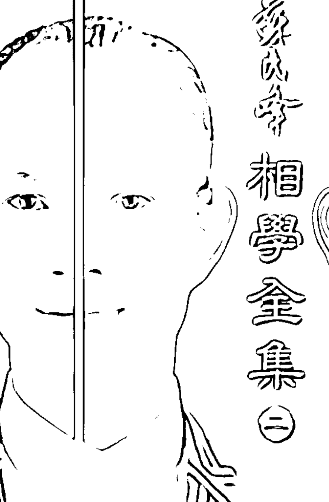

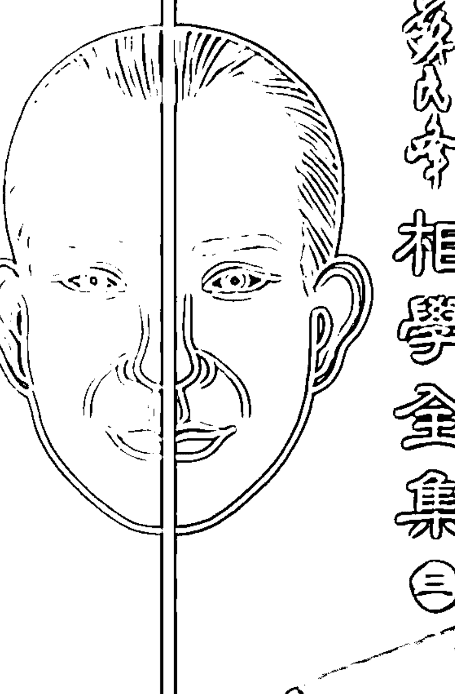

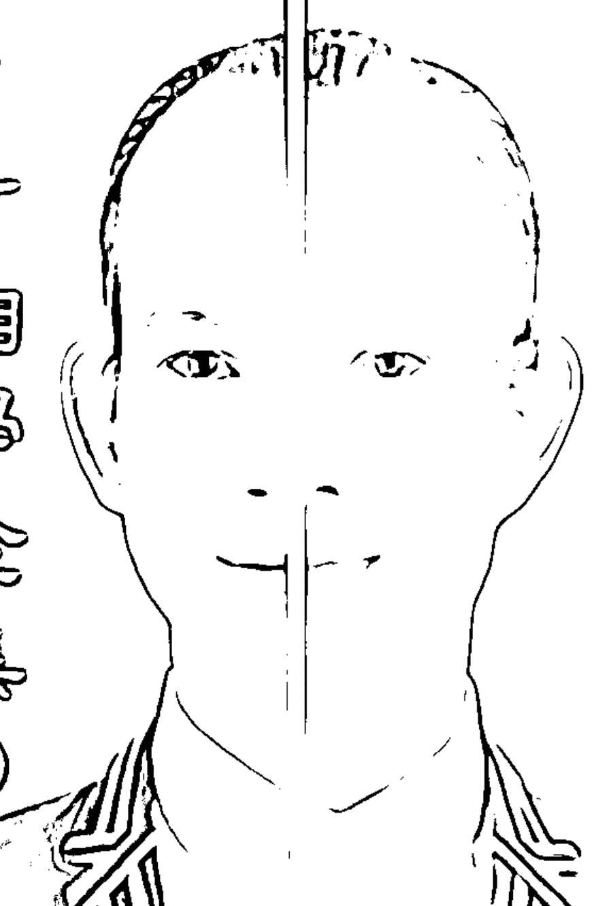

## 歡迎加入圓方出版社「正玄會」

登記成為「正玄會」會員
。可收到最新的玄學新書資訊。
。書展“驚喜電郵”優惠*。
。可優先參與圓方出版社舉辦之玄學研討會及教學課程。
。每月均抽出十位幸運會員，可獲精選書籍或禮品。
* 幸運會員將會收到驚喜電郵，於書展期間享有額外購書優惠

- 您喜歡哪類玄學題材？( 可選多於 1 項)
□風水 □命理 □相學 □醫卜 □星座 □佛學 □其他 _______________
- 您對哪類玄學題材感興趣，而坊間未有出版品提供，請說明：
_______________________________________________________________
- 此書吸引你的原因是？( 可選多於 1 項)
□興趣 □內容豐富 □封面吸引 □工作或生活需要
□作者因素 □價錢相宜 □其他_______________________________
- 您從何途徑擁有此書？
□書展 □報攤 / 便利店 □書店( 請列明：_________________________)
□朋友贈予 □購物贈品 □其他 _________________________________
- 您覺得此書的價格：
□偏高 □適中 □因為喜歡，價錢不拘
- 除玄學書外，您喜歡閱讀哪類書籍？( 可選多於 1 項)
□食譜 □旅遊 □心靈勵志 □健康美容 □語言學習 □小說
□兒童圖書 □家庭教育 □商業創富 □文學 □宗教
□其他________________________________________________

姓名：_____________________________□男 / □女 □單身 / □已婚
聯絡電話：_______________________ 電郵：_______________________________
地址：___________________________________________________________________
年齡：□ 20 歲或以下 □ 21-30 歲 □ 31-45 歲 □ 46 歲或以上
職業：□文職 □主婦 □退休 □學生 □其他________________
填妥資料後可：
寄回：香港英皇道 499 號北角工業大廈 18 樓「圓方出版社」
或傳真至：(852) 2597 4003
或電郵至：marketing@formspub.com

※ 請剔選以下適用的項目
□我已閱讀並同意圓方出版社訂立的《私隱政策》聲明# □我希望定期收到新書及活動資訊

## 有關使用個人資料安排
您好！為配合《2012 年個人資料（私隱）（修訂）條例》（《修訂條例》）的實施，包括《2012 年個人資料（私隱）（修訂）條例》中的第 2(b) 項，圓方出版社（香港）有限公司（下稱“本社”）希望閣下能充分了解本社使用個人資料的安排。
為與各曾跟圓方出版社（香港）有限公司接觸的人士及已招收的會員保持聯繫，並讓閣下了解本社的最新消息，包括新書推介、會員活動邀請、推廣及折扣優惠訊息、問卷調查、其他文化資訊及收集意見等，本社會不時向各位發放相關信息。本社會使用您的個人資料（包括姓名、電話、傳真、電郵及郵寄地址），來與您繼續保持聯繫。
除作上述用途外，本社將不會將閣下的個人資料以任何形式出售、租借及轉讓予任何人士或組織。

請填妥後對摺，黏貼後即可直接郵寄謝謝

請貼郵票

## 寄

香港英皇道 499 號
北角工業大廈 18 樓
「圓方出版社」收

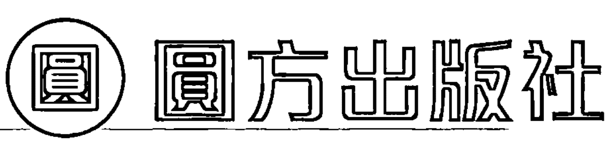

## 正玄會

- 尊享購物優惠。
- 玄學研討會及教學課程。

「八字秘法」可稱為「江湖訣」，是玄學大師蘇民峰師傅三十多年來經驗所得，期間經過不斷鑽研、實踐、驗證，領盡了當中精髓和奧妙，復以淺顯易明的文字，配以實例，逐一印證和解釋秘訣要義，為讀者解密，讓讀者信手拈來，能在論命時一針見血，讓人噴噴稱奇、拍案叫絕。

《八字秘法全集》命例超過四百個，分成壹、貳兩冊。本冊綱領涵蓋父母、兄弟姊妹、感情方面的命與運、緣與份。

- 財衰印絕，幼出娘門。
- 父母一離一合，需知印綬臨財。
- 姊妹同生，爭夫。
- 女命合財不靠夫，重財輕夫。
- 女命身過旺，婚姻多失敗。
- 月殺，剋兄弟。

各口訣讀來琅琅上口，內容切中重點，問命者必能心悅誠服！

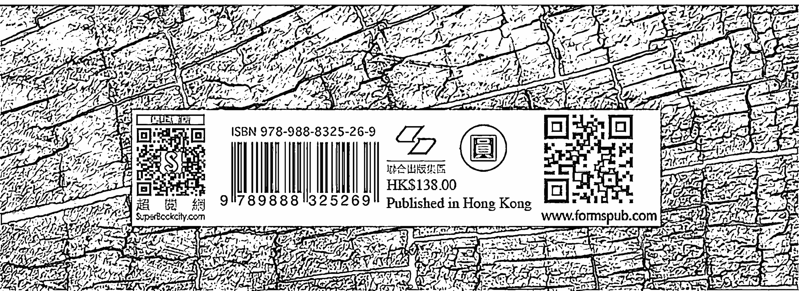