# 八宅明镜

[唐]杨筠松◎著 [清]簪冠道人◎撰 金志文◎译注

足本全译

人、宅、一体的，人的心灵与天地的灵气是相通的，到了风水，就是天人感应，有美好心灵的人，才能得到美好的阴阳宅，才能获得用风水带来的福荫。反之，有邪恶心灵的人，只得到丑恶的阴阳宅，也就只会得到风水带来的灾祸。所以风水学十分重视风水主人和地师的心灵塑造与净化，十分重视人的道德修养。福由心生，地由心造。

《八宅以镜》也称为“八宅法”，它把人与宅分成八类，再归纳为东西两大类，东四命适合住东四宅，西四命适合住西四宅，并对男女合婚也提出了具体的操作方法，是流传最久、影响最广、阅读人数最多的一本阳宅风水书籍。

本书由浅入深，循序渐进，即使初学风水的人，也一看就懂，一懂就用，一用就灵。

## 内容提要

"八宅派" 起源于唐朝，盛行于宋朝，在阳宅堪舆中独占鳌头，被尊为风水堪舆的正宗。中国古代有众多的风水流派，八宅派之所以能够独领风骚，主要因为它能化繁为简，提出的观点容易被人们理解和接受，并且能够以点带面，深入到风水理论之中，还给人们提供了许多具体可行的操作方法。《八宅明镜》就是八宅派的代表作品。

这本书根据人的年命，强调家宅的门、灶和吉凶方位，从浅入深，初学风水的人不但容易理解、明白，还能够融会贯通，很快就能学会相度阳宅的基本方法。

当然，作为一本风水著作，《八宅明镜》这本书中也有许多唯心的观点，书中既有精华，同时也存在糟粕，所以，在阅读这本书的时候，我们要以科学的态度，理智地对待它的内容，去粗取精，去伪存真，从而古为今用。

## 前言

《八宅明镜》是一本论述阳宅的地理风水书，是中国古代风水堪舆的代表作之一。那么，中国古代的风水堪舆究竟是怎样起源的呢？

在古代社会，科学技术很落后，社会生产力十分低下，人类与自然抗争的能力也比较弱，经常会遇到各种各样的自然灾害，受到许多不明自然现象的打击。为了求生存，人类就在本能的驱使下，希望通过家宅的建筑，达到趋吉避凶的目的，于是，地理风水堪舆就产生了。此后，风水堪舆经过一千多年的发展，出现了各种流派，八宅派就是其中的一个重要流派。它起源于唐朝，盛行于宋朝，此后代代相传。由于它浅显易懂，实用性强，所以在阳宅风水相度中独占鳌头。

作为八宅派的代表作品，《八宅明镜》集八宅风水理论之大成。这本著作主要论述了这么几个问题：

## 一、人的年命

我们平常说的八字其实是指人的出生年、月、日、时这四对干支，风水先生称之为“四柱”，并利用四柱相生相克的原理，预测人生的吉凶祸福。八宅派主要强调出生年的干支，并将它与八卦配合起来使用，于是，在风水和命理学中，有了乾命、坤命、坎命、巽命、震命、离命、艮命、兑命这八种年命。世间男男女女都离不开这八种年命。八宅中的命宅也是指乾、坤、坎、巽、震、离、艮、兑这八种命。根据罗盘上的二十四山，它们又被分为东四命和西四命。罗盘上的子位和午位分别代表正南、正北，把西北辰山和东南戌山连成一条斜线，二十四山就被分成了两部分。乾位、坤位、艮位、兑位，被称为‘西四位’，乾命人、坤命人、艮命人、兑命人就被称为‘西四命’，巽位、离位、震位、坎位，被称为‘东四位’，巽命人、离命人、坎命人、震命人就被称为‘东四命’。人的运气、吉凶祸福、家宅的吉凶等，都是以东四命和西四命为基础的。

## 二、三元

在八宅中，还有一个重要概念是三元，即上元、中元、下元，它们是三组甲子纪元。甲子纪年法是中国古代长期使用的一种纪年方法，从西汉一直延用到新中国成立前。今天，在民间仍然使用这种纪年法。甲子纪年法把十天干和十二地支组合起来，组成了六十组不同的干支搭配形式，其中六十年为一个花甲，称为‘一元’。只要确定了上元，中元和下元也随之确立。三个六十年组成一个三元，即上、中、下三元，总共一百八十年。只要根据人的出生年份，就能确定这个人的年命，及家宅建筑的朝向和方位等，还可以据此来看对方的吉凶祸福。

## 三、家宅的门、灶和吉位、凶位

八宅风水中最重要的元素是家中的门和灶。这个学派认为，在家宅风水中，门和灶是最重要的，门是全家的‘气神’，灶是全家的‘食神’。如果门在凶位上，家宅运就凶；如果门在吉位上，家宅运就吉。同样，如果灶朝向凶位，家人的运气也会反复无常，财运和健康运处处受损；如果灶朝向吉方，就会万事顺利。所以，家门朝向，灶的方位，一定要和主人的年命符合。同样的房宅，同样的门和灶，不同年命的人居住，会有不同的结果。房门和灶，主要看坐向和朝向，每个人的年命不一样，与年命对应的吉位和凶位也不一样，房宅的主人应该根据自己的年命，让家门和灶朝向吉方，镇住凶方。

## 四、关于婚姻和子嗣

与其他阳宅风水不同的是，八宅派非常强调婚姻和子嗣。因为每个人都有各自的年命，所以，选择配偶时，要选择和自己年命相符的配偶，避免选择和自己年命不合的人结为夫妻。由于古代封建社会的局限性，八宅派关于婚姻和子嗣的理论中存在一些糟粕，但也有值得我们借鉴之处，所以，在阅读这本书的时候，读者一定要辩证地看待其中的思想。

今天，楼房和小区的建设，都是城市化规范建设的一个方面，早已不属于个人行为，所以，书中的很多内容在今天可能并不适用。不过，我们仍然坚持把这本书整理出来并提供给读者，我们的目的在于帮助读者了解风水堪舆，并帮助读者在生活里对风水中的一些理论进行实践。此书毋庸置疑是中国古代文化遗产中的重要组成部分。

我们深信，不论过去、现在，还是将来，中国古代的风水理论都有存在的意义和价值。阅读这本书，我们应该最终达到“古为今用”的目的。

## 凡例

这本书是由簪冠道人传授的，世上并没有刻本流传。现在，我们把这本书刊印出来，是为了让它能够流行于世，供世人在对风水进行研究和实践时作为参考。

人命分为东四命和西四命，住宅也分为东四宅和西四宅，而东西方位要用罗盘来测量，而不能轻率作出推测。

推算九宫的时候，要利用排山掌诀。对排山掌诀，初学的人一时半会儿可能还不能够领会，这时，可以先查看《时宪书》中排列的年命与九宫，这是一种很简单的方法。

三元甲子是八宅风水的关键所在，人的住宅和方位的吉凶，都是根据年命来推算的，而年命离不开三元甲子。比如，上元甲子年出来的男性在坎一宫，女性在艮八宫；中元甲子年出生的男性在巽四宫，女性在坤二宫；下元甲子年出生的男性在兑七宫，女性在艮八宫，其余的以此类推。

如果东四命的人居住的是西四命的住宅，而且又由于种种原因不能搬迁，那么，可以将家门和灶炉的方位改一下，就可以转祸为福，化凶为吉。

这本书不仅是关于阳宅的，对男女合婚来说也很实用。例如：东四命的男性适合与东四命的女性婚配，西四命的男性适合与西四命的女性婚配。如果年命相配，那么，不但子嗣多，而且家庭会很和睦。

如果家中缺子嗣，那么，可以根据命宫和卦象，改门改灶，这样就可以使子嗣兴旺，马上就能应验。

如果因为清贫而求财的话，只要根据人的年命卦象，把门灶改在生气方位，就可以马上富裕起来。

如果要驱除疾病，使身体健康，可以把灶门火口或者风炉的口朝着本命年对应的天医方位，那么，不需要吃药医治，病就能很快好起来。

如果遇到灾难，只要根据这本书，改变家门和灶的方位、朝向，就能够趋吉避凶，化凶为吉。

在风水中测量距离时，风水先生用的是门光尺，木匠用的是周天尺。而今这本书中所记录的尺，在世间非常罕见，所以，我们把它画出来传之于世。

至于《玉辇经》歌诀及开门放水图，我们可以采纳它的大意。

书中有一些地方可能内容重复，但因为是前人所写的，所以，我们也不敢妄自删改，就依原样保留在了这本书中。

最后，我们要说的是，在世间，有两种人的命运是不受吉凶方位影响的，那就是积善行德的人和为非作歹的人。积善行德的人，即使面对凶星、煞星，天道也不会让他们遭受灾祸；而为非作歹的人，就算他们居住的房屋的朝向、方位好得不能再好了，家门、灶门都朝向吉位，天道也同样会降祸。因此，人生的吉凶，其实说到底，也是由人性的善恶做主的。

## 原序

愚性素常不信乎风水，不惑于地理，混混漠漠，任意迁居，或西或东，凶吉不一，或南或北，苦乐各异，实不知其所由也。偶于己酉仲冬，适有箬冠道人来家访余，谈及八宅之妙。余叩其术，曰：“乾、坎、艮、震、巽、离、坤、兑八宅，分其吉凶，而屋有东四宅、西四宅，人有东四命、西四命。何为东四宅？坎、震、巽、离是也。何为西四宅？坤、乾、兑、艮是也。”又云：“人有东西四命，按甲子分上、中、下三元。如一坎、三震、四巽、九离为东四命，二坤、六乾、七兑、八艮为西四命是也。东四命宜居东四宅，西四命宜居西四宅。命与屋相合，无有不财丁并发者。如屋难以移迁，一室之内亦有二十四方向，接其位置，改灶移床，即可应验。”余即叩受其术，箬冠道师探囊取书二本授余，名曰《八宅明镜》，并授天尺一枝，云乃杨筠松先生所著，如一宅不利，改门则利，一室不吉，改房门则吉，开门移床，依其尺寸，趋吉避凶，应验如爽，然非梓人所用之周天尺也，令余细玩阅，详载甚明，言讫而别。余随以继膏晷，静心玩读，并思亲友丁财两旺者，委系合命合宅，休咎衰旺者，确是命宅相反耳。若此果阳宅之征信有凭，而房屋之吉凶有据，恰是桴鼓之相应也。书与尺，其理原属一致，并行不悖，兼而用之，良有益也。堪叹世人碌碌，倘逢命屋相背，关系非细，不但终身命苦，抑且斩绝宗嗣，祸患岂浅鲜哉！故不敢私为枕秘，付之剞劂，以公海内，使方方兴旺，处处康宁，则余之所愿毕已。

时乾隆五十五年岁次庚戌仲春花朝，胥江钓叟顾吾庐序

## 目录

# 八宅明镜 卷上

+   论男女生命 ………… 004
+   六十花甲纳音 ………… 005
+   伏羲八卦次序图 ………… 010
+   八卦分东西四宅图 ………… 011
+   先天八卦方位 ………… 012
+   后天八卦方位 ………… 013
+   河图 ………… 013
+   洛书 ………… 014
+   先天卦配“河图”之象数图 ………… 015
+   后天卦配“河图 ”之象数图 ………… 015
+   先天卦变后天卦图 ………… 016
+   先天卦配“洛书”之象数图 ………… 017
+   后天卦配“洛书”之象数图 ………… 017
+   排山掌上起三元甲子诀 ………… 018
+   游年歌 ………… 020
+   星煞吉凶 ………… 022
+   东四宅诀 ………… 026
+   西四宅诀 ………… 027
+   八卦三元九宫九星图 ………… 027
+   三元命卦配灶卦诀 ………… 029
+   九宫命宅三元排掌图 ………… 031
+   捷诀 ………… 032
+   三元甲子男女位便览 ………… 035
+   东四、西四八宅秘图 ………… 036
+   王肯堂论八宅生气等星吉凶之源 ………… 041
+   先天八卦次序图 ………… 043
+   福元 ………… 044
+   宅舍大门 ………… 044
+   六事 ………… 045
+   坑厕 ………… 046
+   分房 ………… 046
+   床座 ………… 047
+   灶座火门 ………… 048
+   作灶 ………… 050
+   香火 ………… 052
+   论婚姻 ………… 052
+   论女命利月（如入赘论男命） ………… 055
+   和尚公煞男命宜忌 ………… 056
+   论男女生命行嫁月孤虚煞 ………… 057
+   阴错阳错歌 ………… 058
+   吕才合婚图 ………… 059
+   三元男女生命宫数 ………… 061
+   三元男女合婚定局表 ………… 062
+   嫁娶周堂图 ………… 063
+   男女合婚辨谬 ………… 063
+   修造论（新造同） ………… 065
+   乾命本命 ………… 066
+   巽命本命 ………… 066
+   兑命本命 ………… 067
+   坎命本命 ………… 067
+   离命本命 ………… 068
+   艮命本命 ………… 068
+   震命本命 ………… 069
+   坤命本命 ………… 06

# 八宅明镜 卷下

*   辰南戌北斜分一界之图 ………… 104
*   迁者来路元空装卦诀 ………… 105
*   来路灶卦方向诀 ………… 107
*   验过吉凶八位总断 ………… 111
*   增灶口向 ………… 113
*   增分房 ………… 113
*   增修方 ………… 114
*   游年变卦图 ………… 114
*   天医图 ………… 115
*   延年图 ………… 116
*   祸害图 ………… 117
*   六煞图 ………… 118
*   五鬼图 ………… 119
*   绝命图 ………… 120
*   伏位图 ………… 121
*   子嗣口诀 ………… 122
*   东四西四八命之宅 ………… 123
*   巽方水绕乾局 ………… 124
*   婚姻 ………… 125
*   子息 ………… 125
*   疾病 ………… 127
*   灾祸 ………… 127
*   坎命之宅 (东四) ………… 128

离方水绕坎局 ………… 129
婚姻 ………… 130
子息 ………… 130
疾病 ………… 131
灾祸 ………… 132
艮命之宅（西四） ………… 134
坤方水绕艮局 ………… 135
婚姻 ………… 136
子息 ………… 136
疾病 ………… 136
灾祸 ………… 137
震命之宅（东四） ………… 138
兑方水绕震局 ………… 139
婚姻 ………… 140
子息 ………… 140
疾病 ………… 142
灾病 ………… 142
巽命之宅（东四） ………… 143
乾方水绕巽局 ………… 144
婚姻 ………… 145
子息 ………… 145
祸害 ………… 145
离命之宅（东四） ………… 146
正北水绕离局 ………… 147
婚姻 ………… 148
子息 ………… 148
疾病 ………… 148
灾祸 ………… 149
坤命之宅（西四）……150
艮方水绕坤局 ………151
婚姻 ………152
子息 ………152
疾病 ………152
灾祸 ………153
兑命之宅（西四）……154
正东水绕兑局 ………155
婚姻 ………156
子息 ………156
疾病 ………157
灾祸 ………157
命卦图表 ………158
婚姻论 ………161
子息论 ………162
疾病论 ………163
灾祸论 ………164
求财论 ………164
修造论 ………165
通天照水经遥鞭断宅歌 ………166
歌断 ………167
诸星吉凶 ………168

飞宫诀 ………… 169
九宫所属 ………… 170
玉辇经 ………… 170
玉辇开门放水六畜等图局 ………… 171
戌山辰向 ………… 172
壬山丙向 ………… 173
丑山未向 ………… 174
甲山庚向 ………… 176
辰山戌向 ………… 177
丙山壬向 ………… 179
未山丑向 ………… 180
庚山甲向 ………… 181
门楼玉辇经 ………… 182
乾宅开门 ………… 192
坎宅开门 ………… 193
震宅开门 ………… 195
艮宅开门 ………… 196
巽宅开门 ………… 196
离宅开门 ………… 197
坤宅开门 ………… 198
兑宅开门 ………… 199
上元 ………… 200
中元 ………… 201
下元 ………… 202
异授天尺图式 ………… 203

尺法 ……………………………………… 204
造床法 ……………………………………… 205
作灶法 ……………………………………… 206
斗纲十二辰次图 ……………………………………… 207

# 附录一 黄石公阳宅大八门

太一游宫图 ……………………………………… 210
黄石公阳宅大八门 ……………………………………… 210
大游年歌注解 ……………………………………… 211
七星定位相生 ……………………………………… 213
五行生化 ……………………………………… 213
七星变化诗诀 ……………………………………… 214
九星五行所属 ……………………………………… 214
二十四山图 ……………………………………… 215
九宫方位图 ……………………………………… 216
西四宅七星图 ……………………………………… 217
东四宅七星图 ……………………………………… 218
黄石公竹节赋 ……………………………………… 219
合卦吉凶（西江月调） ……………………………………… 223
相宅定法 ……………………………………… 225
八门动静宅图式 ……………………………………… 228
四正静宅图式 ……………………………………… 228
四正动宅图式 ……………………………………… 230
四维静宅图式 ……………………………………… 232
四维动宅图式 ……………………………………… 234

宅门断吉 ………… 238
阳宅总论 ………… 238
八门忌格图式断法 ………… 248

# 附录二 日常家居风水小知识

后天八卦二十四向图 ………… 276

## 第一章 门 的‘风水’ ………… 277

大门能否冲着窗户？ ………… 277
家宅的门楣能否悬挂八卦图？ ………… 279
门口能否对着门口？ ………… 279
大门的颜色和风水 ………… 279
门口犯‘墙角’冲射会有何问题？ ………… 281
家门能否对着厕所门？ ………… 282
厕所门能否对着厨房门？ ………… 283
铁门上能否镶嵌兽头标识？ ………… 283
家门能否对着电梯？ ………… 283
家门能否对着楼梯？ ………… 283
门槛的高度与风水 ………… 284
门槛如何趋吉避凶？ ………… 284
铁门的颜色与风水 ………… 284
门上的图案是否会影响到风水？ ………… 285
门的数量与风水 ………… 286
室内能否开拱门？ ………… 287
家中悬挂八卦图能否挡煞？ ………… 287
罗盘能化解煞气吗？ ………… 288
当家门被屋外的路牌或电灯柱相冲 ………… 288
如果家门与屋内房门相对 …………………………… 288

## 第二章 房的重要性 ……………………………… 289

床的高度是否影响风水？ …………………………… 289
床头靠板的形状和风水 …………………………… 289
床头能否悬挂时钟？ ……………………………… 291
横梁压床怎么办？ ……………………………… 291
电灯能否压床？ ……………………………… 291
套装连柜床好吗？ ……………………………… 292
卧室中如何摆放电视机？ ……………………………… 292
床头能否贴着厨柜？ ……………………………… 292
梳妆台应该如何摆放？ ……………………………… 293

## 第三章 厨房的重要性 ……………………………… 294

厨房应该在哪方位？ ……………………………… 294
炉灶的风水 ……………………………… 294
电饭煲的位置 ……………………………… 295
厨房的水位 ……………………………… 296
厨房的冰箱 ……………………………… 297
厨柜和风水 ……………………………… 298
厨房里是否要有灶君？ ……………………………… 299

## 第四章 室外环境的重要性 ……………………………… 300

窗户能否对着大镜或者铁锅？ ……………………………… 300
窗外外面的八卦会影响到风水吗？ …………………………… 301
窗外看见别人家的内衣裤会影响风水吗？ · 301
当窗外有尖锐物冲着自己的家宅时 …………… 302
窗户相距太近是否影响风水？ …………………………… 302
家中的窗户太多是否会影响风水？ ……………………… 302
住宅在公厕附近会影响风水吗？ …………………………… 303
住宅靠近垃圾堆或者电表房会影响风水吗？ … 303
住宅靠近坟场或者殡仪馆怎么办？ …………………………… 304
住宅靠近寺庙是否会影响风水？ …………………………… 304
房屋在地铁附近是否会影响风水？ …………………………… 304
如果犯了“光煞”怎么办？ …………………………… 305
窗户前面什么样的风景能带来好运？ ………………… 306
楼房靠山是否会影响风水？ …………………………… 306
住所附近有烟囱对风水有影响吗？ ………………… 309
霓虹招牌对风水的影响 …………………………… 310
住宅也能看见“气色”吗？ …………………………… 310
三叉水口和十字路口的关系 …………………………… 311
客厅的窗户能否对着别人家的厨厕？ ………………… 311
腰带水与反弓水 …………………………… 311
被巨型楼宇压迫是否对风水不利？ ………………… 312

## 第五章 室内摆设的重要性 …………………………… 314

钟的颜色和方位 …………………………… 314
时钟的摆放与风水 …………………………… 314
鞋柜的高度和风水 …………………………… 316
屋里安长明灯的好处 …………………………… 316
房子里应该挂什么图画？ …………………………… 317
住宅不适合挂什么图画 …………………………… 317
住宅中适宜种植什么植物？ …………………………… 318
大刀叉饰物的放置 ………318
古铜钱剑对风水的影响 ………319
室内能放大纸扇吗？ ………320
家门口能否挂风铃？ ………321
书桌的位置和风水 ………321
餐桌的位置和风水 ………322
厨房排气扇的位置和风水 ………323
家中电器的位置和风水 ………324
马饰物与风水 ………325
龟饰物与风水 ………325
象饰物和风水 ………325
老虎饰物与风水 ………326
狮子和风水 ………326
青龙和风水 ………326
麒麟和风水 ………327
貔貅的力量 ………328
宠物狗与风水 ………328
宠物猫和风水 ………329
祖先灵位供奉的禁忌 ………329
鱼和风水 ………329
凸镜、凹镜和平面镜 ………330

## 八宅明镜

# 八宅明镜 卷上

# 论男女生命

[原文]
人之生命不同，宅之宜忌各异。故祖孙或盛或衰，父子或兴或废，夫妇前后灾祥不同，兄弟而孟仲休咎迥别，或居此多坎坷，或迁彼得安康，实皆命之合与不合有以致此也。古人云：“命不易知。”故从卦以演命之理，次从宅舍各事之宜以合天命，庶得趋所宜，而不拂天地、八卦、五行所生之理，则庆流奕世而祥卒当身矣。坎、离、震、巽为东四宅，而男女命以三元起例，吊至此四宫者为东命。乾、坤、艮、兑为西四宅，而男女命以三元起例，吊至此四宫者为西命。男之上元甲子起坎，中元甲子起巽，下元甲子起兑，自坎转离、转艮、转兑、转乾、转中、转巽、转震、转震、转坤而逆行，得中宫则寄坤。女之上元甲子起中宫，中元起坤，下元起艮，自中至乾、至兑、至艮、至离、至坎、至震、至巽而顺行，得中宫则寄艮。俱以九宫排山掌诀，轮数而得其宫也。

## [今译]
每个人的八字都不一样，家宅也各有不同的讲究。所以，家族的盛衰，人丁的兴旺，夫妻是否和睦，兄弟各自的贫富，悬殊差别都比较大。有时候，居住在某个地方，总是命途坎坷、生活不顺，可是迁居到另外一个地方之后，生活却慢慢变好了，日子过得安宁富足。之所以有这样的结果，在于一个人的八字与他居住的地方是否匹配。古人说：“命运并不容易知晓。”所以，才利用卦象来推演人的八字命理，预测住宅居家的吉凶祸福，以顺应天命，趋吉避凶，从而不与天地、八卦、五行中相生相克的命理相冲突，这样于当下和未来都是有好处的。坎宅、离宅、震宅、巽宅是东四宅，男女的命理推算都是从三元甲子开始，推算到坎、离、震、巽这四个宫位，就是东四命。乾宅、坤宅、艮宅、兑宅是西四宅，男女的命理推算从三元甲子开始，推算到乾、坤、艮、兑这四个宫位，就是西四命。《八宅明镜》按照八卦基本原理，把人的住宅分为东四宅和西四宅，其中，东四宅分别为坎、离、震、巽，西四宅分别为乾、坤、艮、兑。男人上元甲子从坎开始，中元甲子从巽开始，下元甲子从兑开始。例如，男人上元甲子从坎开始，按逆时针方向，从坎到离、艮、兑、乾、中、巽、震、坤。女人上元甲子从中宫开始，中元甲子从坤开始，下元甲子从艮开始。例如，女人上元甲子从中宫开始，按顺时针方向，到兑、艮、离、坎、震、巽。这些都可以按照“九宫排山掌诀”，或顺时针或逆时针来推演，从而得出每个人各自的八字和命运。

## 六十花甲纳音

## [原文]
+   甲子金 乙丑金 (海中)
丙寅火 丁卯火 (炉中)
戊辰木 己巳木 (大林)
庚午土 辛未土 (路旁)
壬申金 癸酉金 (剑锋)
甲戌火 乙亥火 (山头)
丙子水 丁丑水 (涧下)
戊寅土 己卯土 (城头)
庚辰金 辛巳金 (白蜡)
壬午木 癸未木 (杨柳)
甲申水 乙酉水 (泉中)
丙戌土 丁亥土 (屋上)
戊子火 己丑火 (霹雳)
庚寅木 辛卯木 (松柏)
壬辰水 癸巳水 (长流)
甲午金 乙未金 (沙中)
丙申火 丁酉火 (山下)
戊戌木 己亥木 (平地)

[PAGE 31]
庚子土 辛丑土（壁上）
壬寅金 癸卯金（金箔）
甲辰火 乙巳火（覆灯）
丙午水 丁未水（天河）
戊申土 己酉土（大驿）
庚戌金 辛亥金（钗钏）
壬子木 癸丑木（桑柘）
甲寅水 乙卯水（大溪）
丙辰土 丁巳土（沙中）
戊午火 己未火（天上）
庚申木 辛酉木（石榴）
壬戌水 癸亥水（大海）
按：白蜡，即铅锡也。

## [今译]
六十花甲"即"六十甲子"，由十天干和十二地支搭配组合而成，正好有六十组。六十组干支的形式各不相同，所以也称为"花"。因为第一组干支被称为"甲子"，所以统称为"六十甲子"。切记：六十甲子的排列顺序是固定的，不能随意排列。

纳音"是中国古乐中的一个术语。中国的古乐中有十二乐律，它们分别是黄钟、太簇、姑洗、蕤宾、夷则、无射、大吕、夹钟、仲吕、林钟、南吕、应钟。每种乐律中，又分别有宫、商、角、徵、羽这五个音调，总共有六十音。后来，中国古代的命相学家利用古乐中的六十音，与六十甲子配合在一起，按照金、火、木、水、土的顺序旋转为宫。这就是"纳音"的原理。古代命相学家把这个原理与人的生、旺、衰、绝等联系起来，并且借用形象的物事来作为象征，于是就出现了命相学纳音。

六十甲子既可以用来记年、月，也可以用来记日、时。每一个甲子有一个天干和一个地支，共有四组，每组两个字，命相学家把这四组天干地支称为"四柱"，就是我们说的"八字"。

## 八宅明镜

火更旺。“山下火”为山下起火，常生于秋季万木肃杀之际，此火喜水，所以，如果四柱中有亥子水，此火就主大贵，此外，如遇松柏木、平地木，主大吉祥。覆，覆盖之意，灯火势弱，又遇覆盖，火力更弱，所以，“覆灯火”遇木则吉，无木则凶，如果无木但有金，也吉祥，主清贵显达。“天上火”势旺，如果遇风、木相助就大吉，如果遇大林木、松柏木、石榴木，也主显贵。

"六十花甲纳音"中的水分别是：涧下水、泉中水、长流水、天河水、大溪水、大海水。其中，丙子水、丁丑水为涧下水；甲申水、乙酉水为泉中水；壬辰水、癸巳水为长流水；丙午水、丁未水为天河水；甲寅水、乙卯水为大溪水；壬戌水、癸亥水为大海水。“涧下水”清澈曲折，但是势弱，水中如果积土就会淤堵，所以，涧下水遇土则克，遇沙中金和剑锋金则吉祥。泉水自土中来，水势弱，所以，“泉中水”遇土则克，但是金生水，泉水喜金生，所以不怕金克，但是遇白蜡金则凶。“长流水”势较强，水长流则决土成河，因此长流水不怕土，遇白蜡金、钗钏金、金箔金、剑锋金都主吉兆。“天河水”乃星空之水，不受土克，所以不怕遇土，此外，天河水也非金所生，因此即使遇金也并不显吉祥，但是，如果天河水遇长流水、大海水，则属于天地阴阳相会，主大吉祥。“大溪水”如果遇泉中水、涧下水、天河水和大海水，则吉祥，如果遇长流水则凶，同时，大溪水喜金助，遇钗钏金和沙中金主吉祥富贵通达。海水喜木，所以，“大海水”如遇桑柘木、杨柳木、平地木主吉祥，但是大海水怕霹雳火，雷火相加，海水沸腾，此人将一生活荡贫寒。

"六十花甲纳音"中的土分别是：路旁土、城头土、屋上土、大驿土、壁上土、沙中土。其中，庚午土、辛未土为路旁土；戊寅土、己卯土为城头土；丙戌土、丁亥土为屋上土；戊申土、己酉土为大驿土；庚子土、辛丑土为壁上土；丙辰土、丁巳土为沙中土。“路旁土”即道路旁边的土，其土喜水滋润，也喜金资助，尤其喜天上水、涧下水、大溪水，但是，此土如遇长流水和大海水，则呈凶相，因为大海水和长流水的水势均旺，会把路旁土冲走，反之，路旁土如遇沙中金、钗钏金，再遇水生，主大吉祥。“城头土”乃城墙上之土，此土喜木，遇杨柳木、桑柘木也吉祥，但是如果遇松柏木和大林木，则呈凶相，因为大林木和松柏木会使城头崩陷，人不得安宁，遇大海水和霹雳火也呈凶兆。“屋上土”即屋顶上之土，指瓦，遇平地木和大林木吉，但是，因为瓦是用火锻烧而成的，所以不宜再遇到火，遇火则凶，尤其不能遇炉中火，屋上土遇剑锋金和钗钏金也吉祥。“大驿土”也喜木，遇木则吉，同时，遇涧下水吉祥，遇天河水主显贵，但是，如果此土无水相助，则命运平常。“壁上土”依附于木，遇平地木、松柏木吉祥，因为大林木有风，所以，不宜遇大林木，遇屋上土、城头土也吉祥，但如果遇大海水则凶，喻指漂流无定，无所依靠。“沙中土”喜金，钗钏金、沙中金、剑锋金和金箔金遇沙中土主少年显贵，同时，沙中土也喜涧下水、井泉水，但如果遇大海水则主凶，此外，沙中土如果遇天上火则称为“朱雀升空”。

"六十花甲纳音"中的木分别是大林木、杨柳木、松柏木、平地木、桑柘木、石榴木。其中，戊辰木、已巳木为大林木；壬午木、癸未木为杨柳木；庚寅木、辛卯木为松柏木；戊戌木、己亥木为平地木；壬子木、癸丑木为桑柘木；庚申木、辛酉木为石榴木。“大林木”遇剑锋金，主大富大贵，因为林木为栋梁之材，如果大林木不遇剑锋金，那么命运就很平常，此外，大林木喜土怕火。“杨柳木”遇城头土、壁上土为吉兆，遇海中金、钗钏金和金箔金也呈吉祥，但是遇其他金就平平常常了。松柏通常生长在山中，所以，“松柏木”喜大溪水、天河水，但怕火，怕大林木、杨柳木，遇桑柘木无妨。“平地木”喜路旁土、屋上土、壁上土、城头土，遇沙中土和大驿土则没有多大用处，遇炉中火有福，但怕大溪水和大海水，也怕大林木，因为大林有风，风摇木动，主人有灾、生病、夭折，但是遇松柏木可以互为依靠，主吉祥。“桑柘木”喜沙中土和路旁土，但遇到其他土则平平常常，遇到长流水和溪涧水、泉中水也吉祥，遇到大海水飘落无依，呈凶兆，遇到覆灯火吉，遇剑锋金也吉，因为剑锋可以修整桑柘。“石榴木”喜欢生长在城中庭院之中，所以喜城头土、屋上土、壁上土，如果遇沙中金、海中金吉祥，遇天上水、泉中水和大溪水也吉祥，遇大海水凶，遇杨柳木为柳绿花红之象，遇大林木为万绿丛中一点红，主清贵吉祥。

## 伏羲八卦次序图

| 坤 | 艮 | 坎 | 巽 | 震 | 离 | 兑 | 乾 |
| --- | --- | --- | --- | --- | --- | --- | --- |
| 太阴 | 少阳 | 少阴 | 太阳 | 阴仪 | 阳仪 | 太极 |
| 阴仪 | 阳仪 | 太极 |

坎、离、震、巽为东四宅，少阳、少阴之所生也，中长配合而成家之义也。乾、坤、兑、艮为西四宅，太阳、太阴之所生也，老少配合而成家之义也。

先天八卦方位图也称伏羲先天八卦图，它是根据“河图”排列出来的方位图。《周易》中说：“河出图、洛出书，圣人则之。”“河图”指在伏羲时代，黄河中的龙马背上的图。先天八卦方位图的排列顺序是从乾开始，先朝逆时针方向转四个方位，再朝顺时针方向转四个方位，它们分别是乾一、兑二、离三、震四、巽五、坎六、艮七、坤八。

古人认为，天一生太极，太极生两仪，两仪生四象，最后成八卦。传说伏羲氏根据这一原理，创造出了历史上最早的罗盘，罗盘正中即天一，两仪分别是正南正北的指南针，两仪又分成了四象。后来，命相学家把两仪中的阳仪分为太阳和少阴，将阴仪分为太阴和少阳，于是就有了两两对应的阴阳组合，即四象。乾为老父，坤为老母，震为长男，巽为长女，坎为中男，离为中女，艮为少男，兑为少女。阴阳相交则相生，如果阳遇阳或者阴遇阴则不生。

后人又根据“伏羲八卦次序图”来排定住宅的方位，将坎、离、震、巽定为东四宅，为少阳、少阴所生；将乾、坤、兑、艮定为西四宅，为太阳、太阴所生。东四宅的组合为长男长女，居老、少之间，所以称为“中长配合”；西四宅为老父老母、少男少女所生，称“老少配合”。

## 八卦分东西四宅图

## 【原文】

坎、离、震、巽为东四宅，少阳、少阴之所生也，中长配合而成家之义也。乾、坤、兑、艮为西四宅，太阳、太阴之所生也，老少配合而成家之义也。

# 【今译】

这张“八卦分东西四宅图”是按照先天八卦“中长配合”和“老少配合”的原则，以及根据后天八卦的方位排定出来的，它融先天八卦和后天八卦于一体，是专门用来说明住宅方位的图。

据说，后天八卦图是周文王根据“洛书”创造出来的，分为一坎、二坤、三震、四巽、五中、六乾、七兑、八艮、九离。也就是说，先把“洛书”中一点的方位定为坎，两点的方位定为坤，三点的方位定位震，四点的方位定为巽，五点的方位在中（无与之对应的八卦名），六点的方位定位乾，七点的方位定位兑，八点的方位定为艮，九点的方位定为离，于是，正南、正北、正西、正东分别是离、坎、兑、震（可参考“后天八卦方位图”和“后天卦配洛书之象数图”）。

从图中可以看出，乾为老父，坤为老母，艮为少男，兑为少女，此为西四宅；震为长男，巽为长女，坎为中男，离为中女，此为东四宅。我们熟悉了这个图的基本方位和相对位置，就能推算相关的命理。

## 先天八卦方位

## 【原文】

乾 | 兑 | 离 | 震 | 巽 | 坎 | 艮 | 坤

# 【今译】

这是古代流传的伏羲先天八卦图的方位，分别是一乾、二兑、三离、四震、五巽、六坎、七艮、八坤。

## 八宅明镜

## 后天八卦方位

## 【原文】

坎 | 离 | 震 | 巽 | 东南巽 | 东北艮 | 西南坤 | 西北乾

# 【今译】

这是古代流传的后天八卦图的方位，相传为周文王所创。这八个方位分别是北坎、南离、东震、西兑、东南巽、东北艮、西南坤、西北乾。

## 河图

## 【原文】

北方：一个白点在内，六个黑点在外，表示玄武星象，五行为水；

东方：三个白点在内，八个黑点在外，表示青龙星象，五行为木；

南方：二个黑点在内，七个白点在外，表示朱雀星象，五行为火；

西方：四个黑点在内，九个白点在外，表示白虎星象，五行为金；

中央：五个白点在内，十个黑点在外，表示时空奇点，五行为土。

# 【今译】

相传伏羲氏在创作八卦图时，他对着日月星辰、季节气候、草木兴衰，经过长时间的观察都没有结果。忽然有一天，一只龙马从黄河中跃了出来，伏羲氏看见龙马，精神为之一振，他发现了龙马身上的图案，并根据这个图案画出了八卦。龙马身上的图案就被称为“河图”。图中，白圈代表阳，为天，是奇数；黑点代表阴，为地，是偶数。天地合五方，阴阳合五行，所以，共以十数合五方、五行、阴阳、天地之象。

北方：一个白点在内，六个黑点在外，表示玄武星象，五行为水；

东方：三个白点在内，八个黑点在外，表示青龙星象，五行为木；

南方：二个黑点在内，七个白点在外，表示朱雀星象，五行为火；

西方：四个黑点在内，九个白点在外，表示白虎星象，五行为金；

中央：五个白点在内，十个黑点在外，表示时空奇点，五行为土。

## 洛书

## 【原文】

戴九履一，左三右七，二四为肩，六八为足，以五居中，五方白圈皆阳数，四隅黑点为阴数。意思就是说：图顶上的是九，底下的是一，左边是三，右边是七，中间为五，这五方都是白圈，它们全部是阳数；上方二、四，下方的六、八，这四个角上的黑点都是阴数。

# 【今译】

"洛书"在古代称为"龟书"，传说有一只神龟出于洛水，它的甲壳上有一张图，人称洛书。洛书的结构是：戴九履一，左三右七，二四为肩，六八为足，以五居中，五方白圈皆阳数，四隅黑点为阴数。意思就是说：图顶上的是九，底下的是一，左边是三，右边是七，中间为五，这五方都是白圈，它们全部是阳数；上方二、四，下方的六、八，这四个角上的黑点都是阴数。

## 先天卦配“河图”之象数图

# 【今译】

这是伏羲氏的先天八卦和‘河图’配在一起的象数图。

## 后天卦配“河图”之象数图

# 【今译】

这是周文王的后天八卦与‘河图’配在一起的象数图。

## 先天卦变后天卦图

# 【今译】

这张图向我们揭示了先天八卦如何演变为后天八卦，阐明了后天八卦图的来源。在八卦图中，每一个卦象都是由三道组成的，每道称为“一爻”，最上面的叫“上爻”，中间的叫“中爻”，下面的叫“下爻”。一条长道称为“连”，两条短道称为“断”，例如，兑的上爻为断，震的下爻为连。 “乾坤中二爻交易成坎离”的意思是说：在“乾”和“坤”这两个卦象中，它们的中爻互相交换，就变成了“离”卦和“坎”卦。“离上爻与坎下爻交易成震兑”的意思是说：“离”卦的上爻和“坎”卦的下爻互相交换变成“震”卦和“兑”卦。“震上爻兑下爻、震下爻兑上爻交易成艮巽”的意思是说：“震”卦的上爻和“兑”卦的下爻交换，“震”卦的下爻与“兑”卦的上爻交换，就变成了“艮”卦和“巽”卦。“震下二爻与巽上二爻交易成乾坤”的意思是说：“震”卦的中爻与上爻和“巽”卦的中爻与上爻交换，就成了“乾”卦和“坤”卦。以此类推，先天八卦的八方位名称就变成了后天八卦的形式，变化出来的后天八卦和“洛书”对应，就出现了一坎二坤三震四巽等定位名称。

## 先天卦配“洛书”之象数图

一坤、二巽、三离、四兑、五中、六震、七坎、八艮、九乾。

## 后天卦配“洛书”之象数图

一坎、二坤、三震、四巽、五中、六乾、七兑、八艮、九离。

## 排山掌上起三元甲子诀

# 【今译】

首先，我们解释一下“排山掌”。伸开左手，食指和虎口交汇处是—，九宫为坎，十二辰为寅，合称“寅坎一”；食指的下节是二，九宫为坤，十二辰为卯，合称“卯坤二”；食指的中节是三，九宫为震，十二辰为辰，合称“辰震三”；食指的上节是四，九宫为巽，十二辰为巳，合称“巳巽四”；中指的上节为五，九宫是中宫，十二辰为午，合称“午中五”；无名指的上节为六，九宫是乾，十二辰为未，合称“未乾六”；小指的上节是七，九宫为兑，十二辰为申，合称“申兑七”；小指的中节是八，九宫为艮，十二辰为酉，合称“酉艮八”；小指的下节是九，九宫为离，十二辰为戌，合称“戌离九”；在小指、无名指、食指的三节之下分别是亥、子、丑，它们一共凑成了十二辰；但是，因为宫数只有九，所以数九宫时就不用亥、子、丑这三支了。

“排山掌上起，从寅数到狗。一年轮一位，不用亥子丑。”讲的是数九宫的方向，也就是说，在数九宫的时候，要从食指指节的下面开始向上数，并沿着四指的上节至小指下端，形成一个倒的U字形。在数九宫的时候，每一官的顺序不能够混淆，更不能跳跃，一年一位。如果从寅数到离还没有数完，就跳过亥、子、丑继续数。

“

### 今译

在中国古代的命相学和八卦演绎之中，非常讲究看天上九星。这九星是古代的命相学家确定的天星，据说和人的命运的吉凶祸福有着非常密切的关系。而在这九星之中，又只有右弼星无法决定吉凶祸福，其他的八星都分别排列在乾、坤、兑、离、巽、震、艮、坎这八个方位之下。这九星就是右弼、贪狼、武曲、巨门、左辅、破军、廉贞、禄存、文曲。除了右弼，其余八星分别又对应另外的一套名称，即：

+   生气（贪狼星），在五行中属木，主大吉；
+   延年（武曲星），在五行中属金，主大吉；
+   天医（巨门星），在五行中属土，主次吉；
+   伏位（左辅星），在五行中属木，主小吉；
+   绝命（破军星），在五行中属金，主大凶；
+   五鬼（廉贞星），在五行中属火，主大凶；
+   祸患（禄存星），在五行中属土，主次凶；
+   六煞（文曲星），在五行中属水，主次凶。

### 原文

生气辅弼亥卯未，延年绝命巳酉丑。天医禄存四土官，五鬼凶年寅午戌。六煞应在申子辰。震巽坎离为东四，坤乾艮兑西四位。

### 今译

上面这首歌诀告诉我们天星分别在哪些年份里照临。“生气辅弼亥卯未，延年绝命巳酉丑”的意思是：每逢亥年、卯年、未年，贪狼星和左辅星照临；每逢巳年、酉年、丑年，武曲星和破军星照临。“天医禄存四土官，五鬼凶年寅午戌，六煞应在申子辰”的意思是：每逢寅年、午年、戌年，巨门星和禄存星照临；每逢申年、子年、辰年，文曲星和廉贞星照临。“震巽坎离为东四，坤乾艮兑西四位”的意思是说：震位、巽位、坎位、离位都属于东四位；坤位、乾位、艮位、兑位都属于西四位。

### 原文

假如上元甲子宅主，甲寅年生，一宫寅上起甲子，逆数，跳入离宫戌上起甲戌，艮宫酉上起甲申，兑宫申上起甲午，乾宫未上起甲辰，中宫午上起甲寅，是谓中宫生人，寄坤，以坤宫生人主之，游年起“坤：天延绝生祸五六”，按诀推之，以定吉凶。

又如三元甲子宅母，甲寅年生，五中宫午上起甲子，顺数，乾宫未上起甲戌，兑宫申上起甲申，艮宫酉上起甲午，离宫戌上起甲辰，坎宫寅上起甲寅，是谓坎宫生人主之，游年起“坎：五天生延绝祸六”是也。

### 今译

那么，每个人的年命和天星是如何对应的呢？上面两段话就是教我们怎样推断生人的年命和天星的对应关系。例如：某房宅的男主人，生于上元甲子年的甲寅年，因此，根据我们前面讲述过的“排山掌诀”，从寅坎一开始，按逆时针方向，跳过亥、子、丑，直接跳入离宫的戌离九，然后到酉艮八、申兑七、未乾六，再到午中五。离宫为甲戌年，艮宫为甲申年，兑宫为甲午年，乾宫为甲辰年，中宫为甲寅年。所以，男主人就是中宫生人，因为午中五寄坤，所以，他就是坤命。根据“游年歌”中的“坤：兑乾坎艮震巽离，天延绝生祸五六”，意思就是说，坤命的人，以坤位为起点，按顺时针方向，八个方向依次是兑位、乾位、坎位、艮位、震位、巽位、离位，而这八个方位又分别对应着天医、延年、绝命、生气、祸害、五鬼和六煞。从而根据八方位对应的八星，便可推断出此人在每一方位的吉凶祸福。

又例如，房宅的女主人生于上元甲子的甲寅年，根据“排山掌诀”，上元甲子年的女性从午中五开始，按顺时针方向，到乾宫、兑宫、艮宫、离宫，跳过亥、子、丑到坎宫，乾宫上为甲戌年，兑宫上为甲申年，艮宫上为甲午年，离宫上为甲辰年，坎宫上为甲寅年，因此，此人就属于坎命。又根据“游年歌”中的“坎：艮震巽离坤兑乾，五天生延绝祸六”，意思是说，女主人就以坎位为起点，按顺时针方向排列，八个方位依次是艮位、震位、巽位、离位、坤位、兑位、乾位，而这八个方位分别对应着五鬼、天医、生气、延年、绝命、祸害、六煞。于是，根据八方位对应的八星，便可推断出女主人的吉凶祸福。

### 原文

|震|东|坎|
|---|---|---|
||四|
|巽|宅|离|
|良|西|乾|
||四|
|兑|宅|坤|

### 今译

这两张图是东四宅与西四宅的卦命独立图。震、巽、坎、离为东四宅；良、兑、乾、坤为西四宅。

### 原文

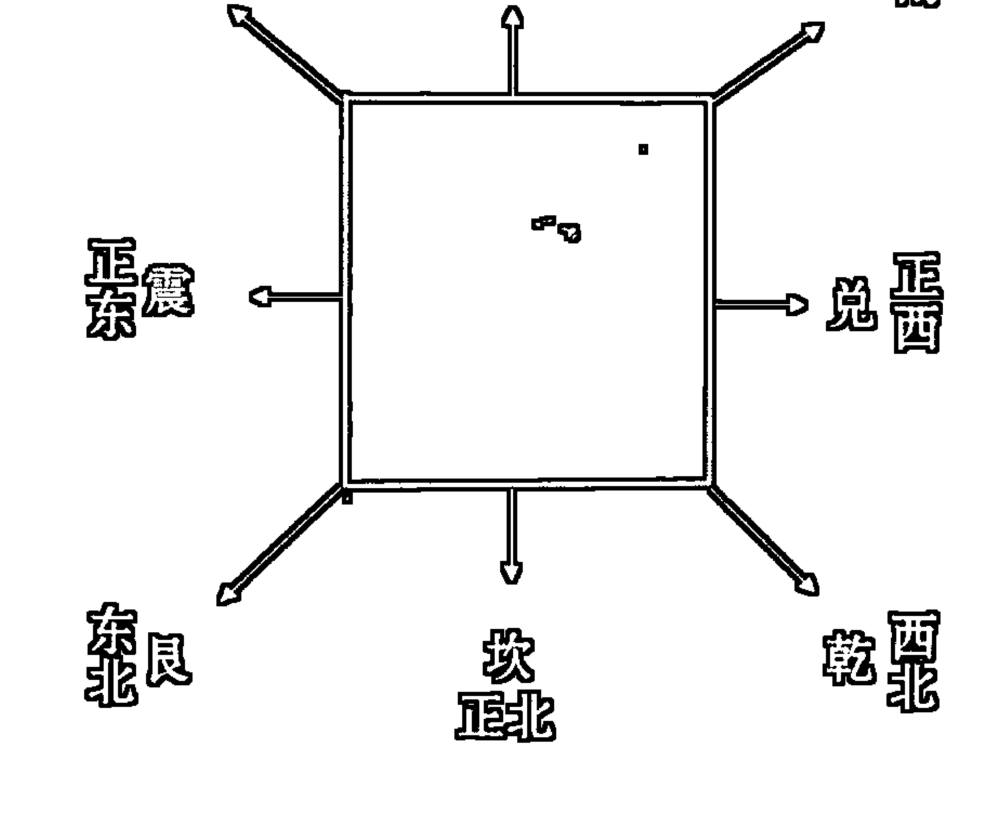

### 今译

这张图是一座房宅的示意图。正中方框为中心，其中，离位（正南方）、巽位（东南方）、坎位（正北方）、震位（正东方）为东四命的方位；兑位（正西方）、乾位（西北方）、艮位（东北方）、坤位（西南方）为西四命的方位。

### 原文

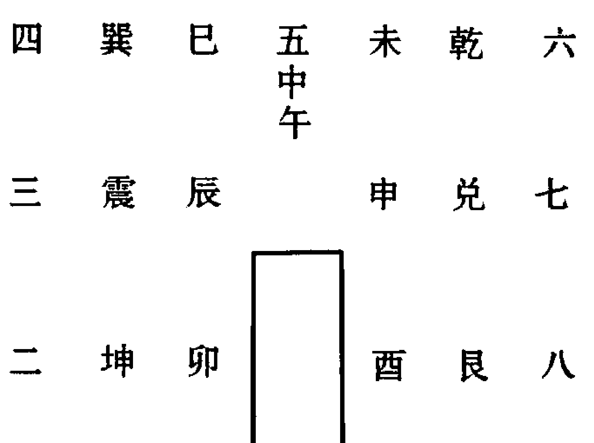

### 今译

这是一张九宫分布图，与前面的“排山掌图”对照着看，就可以一目了然。

### 东四宅诀

### 原文

震巽坎离是一家，西四宅爻莫犯他。

若还一气修成象，子孙兴旺定荣华。

### 今译

震位、巽位、坎位、离位都属于东四宅，宅内所有门、窗、房间、灶、床等的陈设方位，都要根据这四个方位来定，千万不能与西四宅的方位混淆了。只要严格按照这个规律，那么子子孙孙一定兴旺繁荣，享尽荣华富贵。

### 西四宅诀

### 原文

乾坤艮兑四宅同，东西卦爻不可逢。
误将他象混一屋，人口伤亡祸必重。

### 今译

乾位、坤位、艮位、兑位都属于西四宅，宅内所有门、窗、灶、床的陈设方位，都要与西四宅的方位一致，不能和东四宅的方位混淆了。如果将东四宅的方位与西四宅的方位混淆在一起，那么家里一定会人丁伤亡，祸事不断，鸡犬不宁。

### 八卦三元九宫九星图

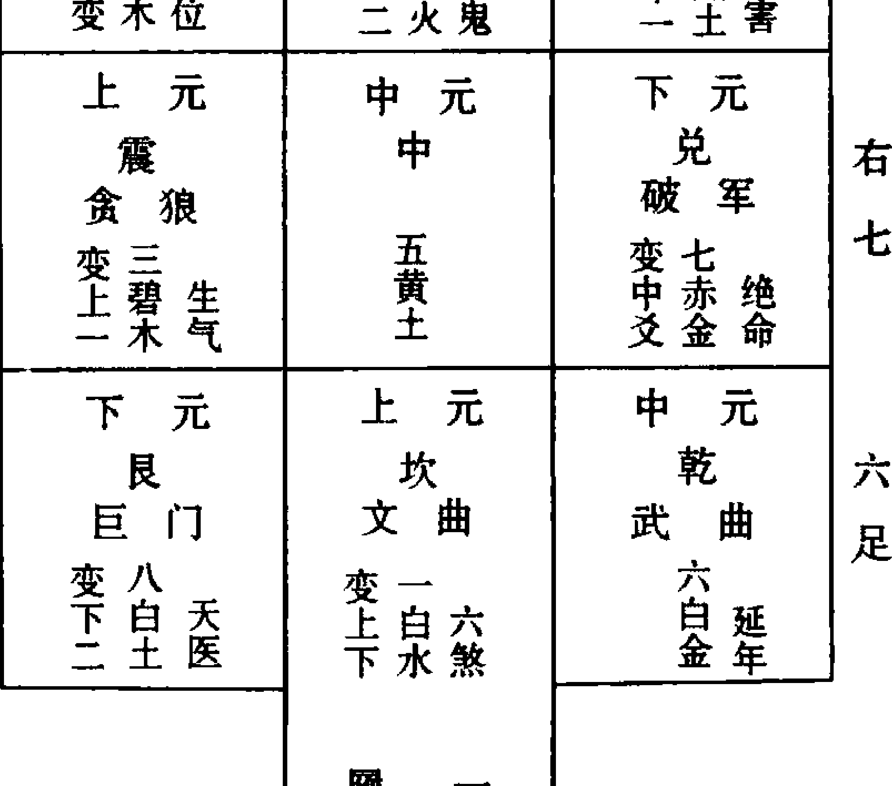

### 今译

"八卦三元九宫九星图" 是根据"洛书"九宫原始图，融八卦、九宫、三元于一体而排列出来的。根据"洛书"九宫，每方位数都有一定的次序，即"戴九履一，左三右七，二四为肩，六八为足，五居其中"。“戴”的意思是头顶，“履”的意思是脚底。后世的命相学家将八卦与九宫图结合起来，就成了坎一、坤二、震三、巽四、中五、乾六、兑七、艮八、离九，并将坎一、坤二、震三定为上元，巽四、中五、乾六定为中元，兑七、艮八、离九定为下元。坎一（白）为文曲六煞，五行中属木；坤二（黑）为禄存祸害，五行中属土；震三（碧）为贪狼生气，五行中属木；巽四（绿）

### 今译

为辅弼伏位，五行中属木；乾六（白）为武曲延年，五行中属金；兑七（赤）为破军绝命，五行中属金；艮八（白）为巨门天医，五行中属土；离九（紫）为廉贞五鬼，五行中属火。

### 三元命卦配灶卦诀

### 原文

如天启四年甲子系下元，男起兑宫为兑命。逆行，乙丑生属乾命，丙寅属中，寄坤，是坤命，丁卯巽，戊辰震，己巳坤，庚午坎，辛未离，壬申艮，癸酉又属兑。以九宫逆行六十年。女命即顺轮九宫。今康熙二十三年甲子又为上元，假如上元丁卯生女，即兑宫坐命，以艮命起大游年，“艮：六绝祸生延天五”，此西四命也。看灶门，即火门也，向西四吉、东四凶。乾、坤、艮、兑为西四命，坎、离、震、巽为东四命，以“游年歌”断吉凶。灶、屋方位宜压本命之绝、六、祸、五，煞不宜犯其宅。其年之都天五黄即灶口，宜向本命之生、天、延、伏方，亦不宜向本宅之都天、五黄、绝祸方，故催财宜向生气。而坤、艮二命，五黄在坤、艨，生气亦在坤、艨，因五黄同交人，伏不宜向，向则有灾。催财丁，灶口宜向伏位，俟其年天乙贵人到命，必生子，极验。天乙贵人即坤也。如上元甲子逆轮，庚辰年三碧值，即以碧人中、四乾、五兑、六艮、七离、八坎、九坤、一震。若巽命，入伏位灶，即天乙坤到命也。余仿此。灶口用紫白遁得生气到火门，催财亦验，六十日应。

## 八宅明镜

### 原文

| 異四       | 中五       | 乾六       | 下元乙丑生男 |
| 起中       | 起上       | 上元乙丑生女 | 下元甲子生男 |
| 震三       |           | 兑七       | 下元甲子生男 |
| 坤二       | 中元甲子生女 | 艮八       | 下元甲子生女 |
| 坎一       | 上元甲子生男 | 离九       | 上元甲子生男 |

男一宫一旬，至本旬空，逆数至生年本命；女一宫一旬，顺数至生年本命。

### 今译

男性朝逆时针方向数到生年本命，女性朝顺时针方向数到生年本命。 例如：上元甲子年的生年本命如果在坎位，就会生儿子；中元甲子年的生年本命如果在坤位，就会生女儿；中元甲子年的生年本命如果在震位，那么，既有儿子又有女儿。其他的可以以此类推。

### 捷诀

### 原文

甲子、甲戌、甲申、甲午、甲辰、甲寅（句头子、戌、申、午、辰、寅）。

一四七宫男起逆，五二八宫女顺推。

男五寄二女寄八，甲子周轮本命寻。

上元甲子一宫连，中元起巽下兑间。

上五中二下八女，男逆女顺起根源。

算定三元，不可差错。

### 今译

从一开始，数到六十年，每六十年为一轮天干，那么第一轮天干为甲子，下一轮天干为甲戌，再下一轮天干为甲申，后面依次为甲午、甲辰、甲寅，然后再起甲子。

后面说的依然是排山掌。“一四七宫男起逆，五二八宫女顺推”的意思是：推算本命的时候，男性分别从坎一、巽四、兑七开始推，女性分别从中五、坤二、艮八开始推，男性按逆时针方向推演，女性按顺时针方向推演。“男五寄二女寄八，甲子周轮本命寻”的意思是：如果男女的生年恰好都在中五，那么，男性的生年本命就在坤二，属坤命，女性的生年本命就在艮八，属艮命。生年本命就是照这个规律，根据甲子的顺序，一年年地推演。

"上元甲子一宫连，中元起巽下兑间"的意思是说：生于上元甲子年的男性，要从坎一开始推演；生于中元甲子年的男性，从巽四开始推演；生于下元甲子年的男性，则从兑七开始推演。“上五中二下八女，男顺女逆起根源”的意思是说：生于上元甲子年的女性，从中五开始推演；生于中元甲子年的女性，从坤二开始推演；生于下元甲子年的女性，从艮八开始推演；男性按逆时针方向推算，女性按顺时针方向推算。

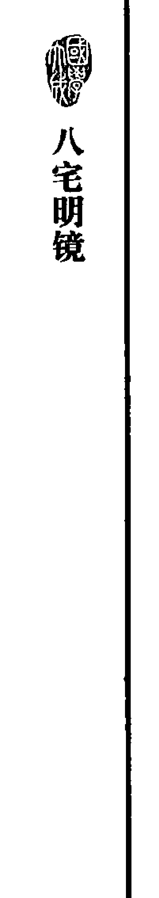

### 原文

假如上元甲子生男，起坎一宫，坎命，逆行，乙丑生是离命，丙寅生是艮命。中元甲子生男，起巽四宫，巽命，乙丑生是震命，丙寅生是坤命。下元甲子生男，起兑七宫，兑命，乙丑生是乾命，丙寅生是中五寄坤二，为坤命。上元甲子生女，起中五寄八，为艮命，顺行，乙丑生乾命，丙寅生兑命。中元甲子生女，起坤二宫，坤命，乙丑生是震命，丙寅生是巽命。下元甲子生女，起艮八宫，是艮命，乙丑生是离命，丙寅生是坎命。余仿此。

### 今译

出生于上元甲子年的男性，从坎一开始，按逆时针方向推算，那么根据六十甲子的顺序，如果生于乙丑年就是离命，如果生于丙寅年就是艮命。出生于中元甲子的男性，从巽四开始，按逆时针方向推算，根据六十甲子的顺序，如果生于乙丑年就是震命，如果生于丙寅年就是坤命。出生于下元甲子的男性，从兑七开始推算，按逆时针方向，如果出生于乙丑年就是乾命，如果出生于丙寅年，则中五寄坤二，就是坤命。出生于上元甲子年的女性，中五寄艮八，属艮命。如果出生于上元乙丑年，那么从中五开始，按顺时针方向推算，就属乾命，如果出生于丙寅年就是兑命。出生于中元甲子年的女性，从坤二开始推算，属艮命，按顺时针方向，如果出生于乙丑年就是震命，如果出生于丙寅年就是巽命。出生于下元甲子的女性，从艮八开始推算，按顺时针方向，如果出生于乙丑年就是离命，如果出生于丙寅年就是坎命。其余的以此类推。

### 原文

上元男命人中寄坤宫：己巳 戊寅 丁亥 丙申
    乙巳 甲寅 癸亥
中元男命人中寄坤宫：壬申 辛巳 庚寅 己亥
    戊申 丁巳
下元男命人中寄坤宫：丙寅 乙亥 甲申 癸巳
    壬寅 辛亥 庚申

### 原文

上元女命人中寄艮宫：甲子 癸酉 壬午 辛卯
庚子 己酉 戊午

中元女命人中寄艮宫：丁卯 丙子 乙酉 甲午
癸卯 壬子 辛酉

下元女命人中寄艮宫：庚午 己卯 戊子 丁酉
丙午 乙卯

康熙二十三年甲子上元甲子

### 今译

根据排掌图的顺序，不管是顺推还是逆推，如果出生的年份恰好在坎一、坤二、震三、巽四、乾六、兑七、艮八## 【原文】

假如甲子下前一行小字一四七数，乃男命三元九宫。甲子下后一行小字五二八数，是女命三元九宫。余仿此。逢一坎、二坤、三震、四巽、五中（男寄坤，女寄艮）、六乾、七兑、八艮、九离，依后天八卦方位合“洛书”之数，此乃照《时宪书》所载三元九宫，亦与王肯堂《笔廔》所记以人。

# 【今译】

甲子下前一行小字一四七，分别对应出生于上元甲子年、中元甲子年、下元甲子年的男性。甲子下后一行小字五二八，分别对应出生于上元甲子年、中元甲子年、下元甲子年的女性。其余的以此类推。表格中的数字分别代表一坎、二坤、三震、四巽、五中（男寄坤、女寄艮）、六乾、七兑、八艮、九离。例如，出生于上元甲子乙丑年的男性，与“九”对应，属离命；出生于中元甲子乙丑年的女性，与“三”对应，属震命；出生于下元乙亥年的男性，与“五”对应，“五”中寄坤，属坤命；出生于下元丙子年的女性，与“二”对应，属坤命。这是按照后天八卦的方位，结合“洛书”推演出来的。此表格参考了《时宪书》中记载的三元九宫和王肯堂的《笔廔》一书。

## 东四、西四八宅秘图

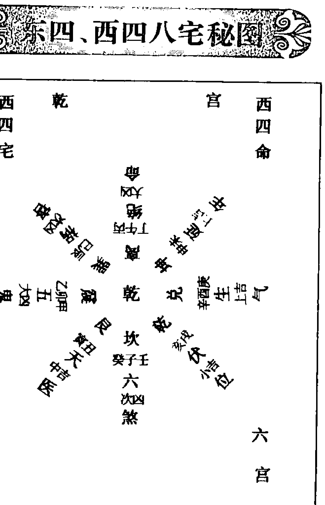

## 【原文】

[PAGE 62]

## [今译]

乾命属西四命，位居六宫。这是乾命人分别在乾、兑、坤、离、巽、震、艮、坎这八个方位上的吉凶对照图。

正中的“乾”字代表西四命，内一圈是八卦名，内二圈是二十四山方位图，坎管癸、子、壬三山，乾管亥、戌二山，兑管辛、酉、庚三山，坤管申、未二山，离管丁、午、丙三山，巽管巳、辰二山，震管乙、卯、甲三山，艮管寅、丑二山。四正方坎、兑、离、震各管三山，以午、酉、子、卯为正位。四维方乾、坤、巽、艮各管二山（其实是三山，即在所管二山之间加自身一位，即玄乾戌、申坤未、巳巽辰、寅艮丑，加起来正好是二十四山），组成东、西、南、北、东南、西南、东北、西北八方。内三圈的伏、生、延、绝、祸、五、天、六，分别代表九星。外圈表示各星所主的吉凶祸福。例如，乾位是伏星照临，代表小吉；兑位是生气照临，代表上吉；坤位是延年照临，代表上吉；离位是绝命照临，代表大凶；巽位是祸害照临，代表次凶；震位是五鬼照临，代表大凶；艮位是天医照临，代表中吉；坎位是六煞照临，代表次凶。

## 【原文】

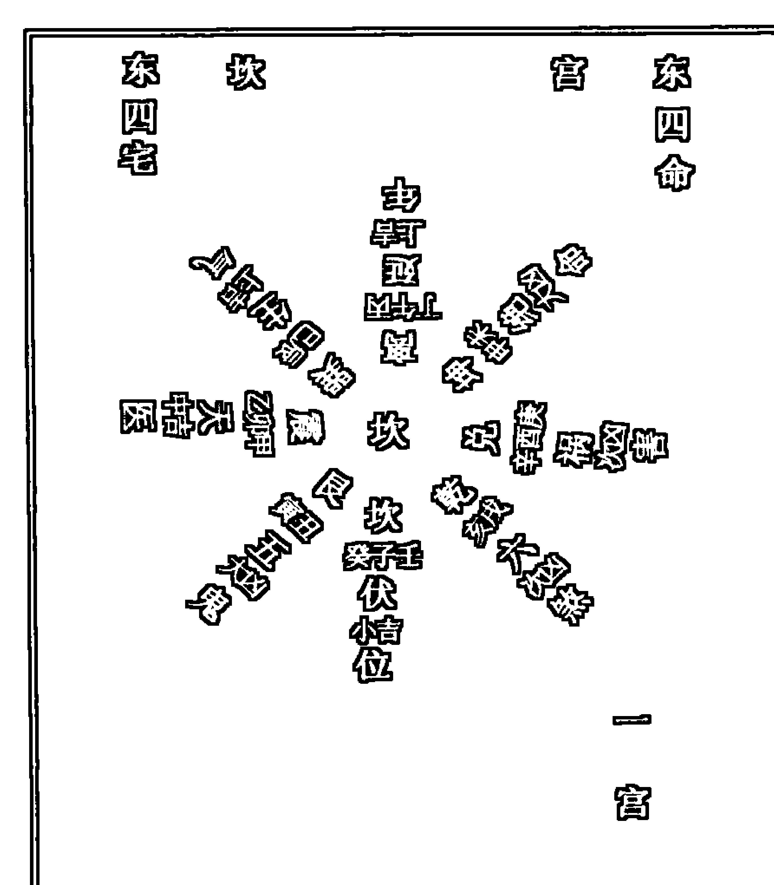

[PAGE 63]

# 【今译】

坎命属东四命，位居一官。这是坎命人分别在乾、兑、坤、离、巽、震、艮、坎这八个方位上的吉凶对照图。（其余内外圈各自代表的意义，按前面对乾命的解释，以此类推）

## 【原文】

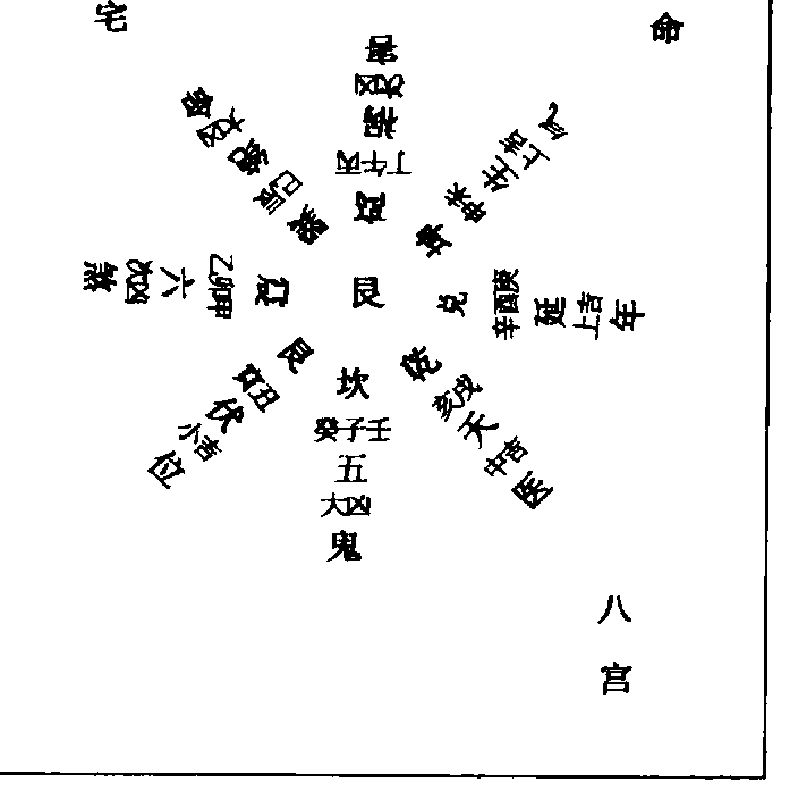

# 【今译】

艮命属西四命，位居八宫。这是艮命人分别在乾、兑、坤、离、巽、震、艮、坎这八个方位上的吉凶对照图。（其余内外圈各自代表的意义，按前面对乾命的解释，以此类推）

## 【原文】

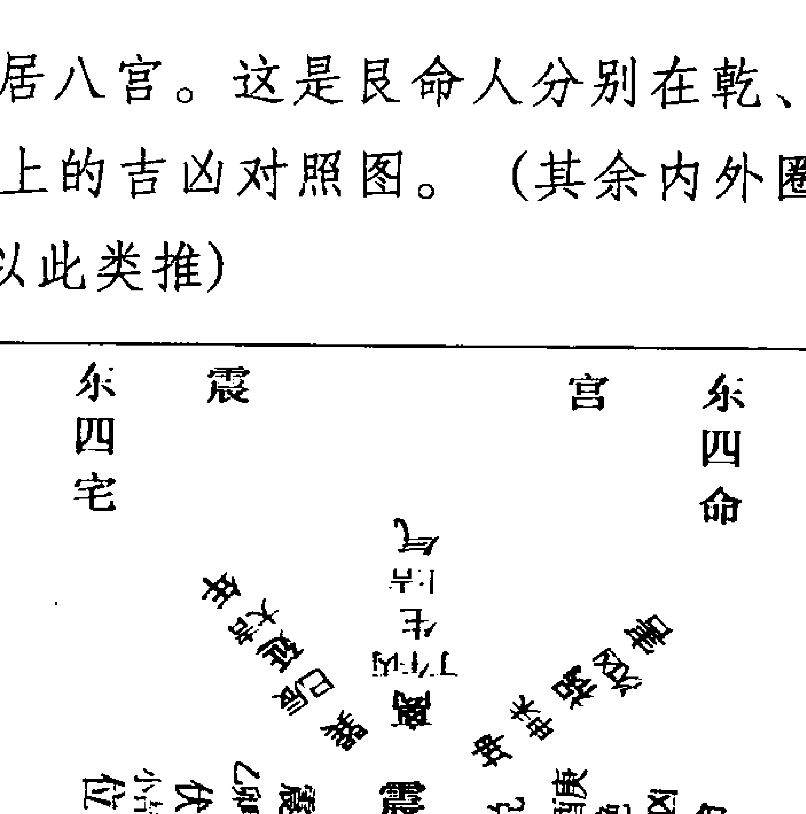

八宅明镜

〇三八

[PAGE 64]

## [今译]

震命属东四命，位居三官。这是震命人分别在乾、兑、坤、离、巽、震、艮、坎这八个方位上的吉凶对照图。（其余内外圈各自代表的意义，按前面对乾命的解释，以此类推）

## [原文]

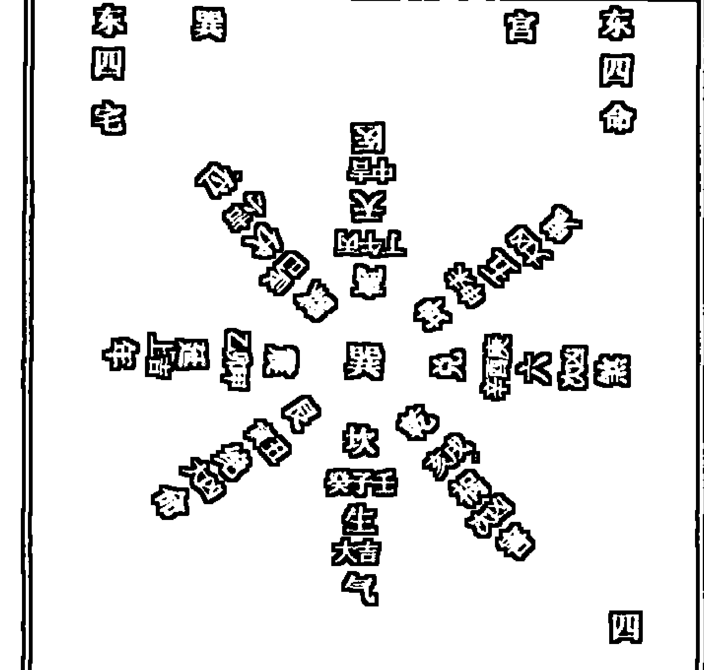

## [今译]

巽命属东四命，位居四官。这是巽命人分别在乾、兑、坤、离、巽、震、艮这八个方位上的吉凶对照图。（其余内外圈各自代表的意义，按前面对乾命的解释，以此类推）

## [原文]

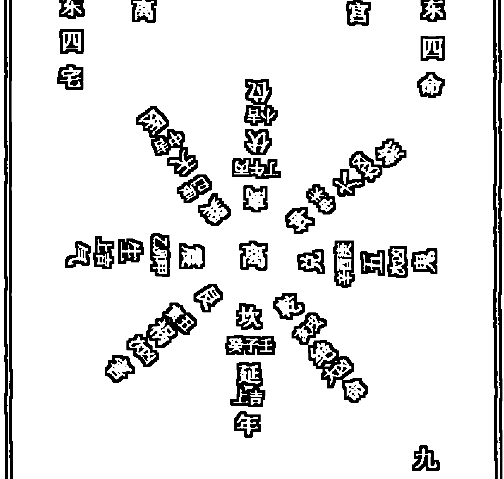

[PAGE 65]

## [今译]

离命属东四命，位居九宫。这是离命人分别在乾、兑、坤、离、巽、震、艮这八个方位上的吉凶对照图。（其余内外圈各自代表的意义，按前面对乾命的解释，以此类推）

## [原文]

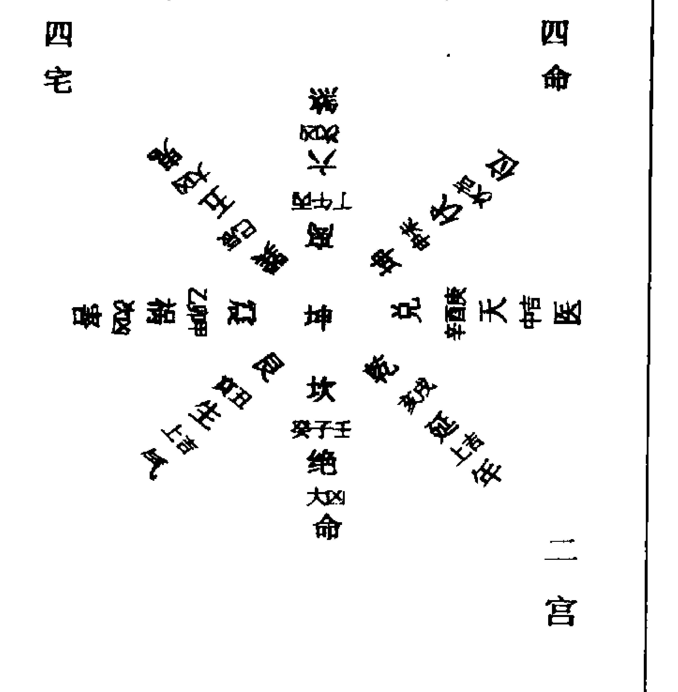

## [今译]

坤命属西四命，位居二宫。这是坤命人分别在乾、兑、坤、离、巽、震、艮这八个方位上的吉凶对照图。（其余内外圈各自代表的意义，按前面对乾命的解释，以此类推）

## [原文]

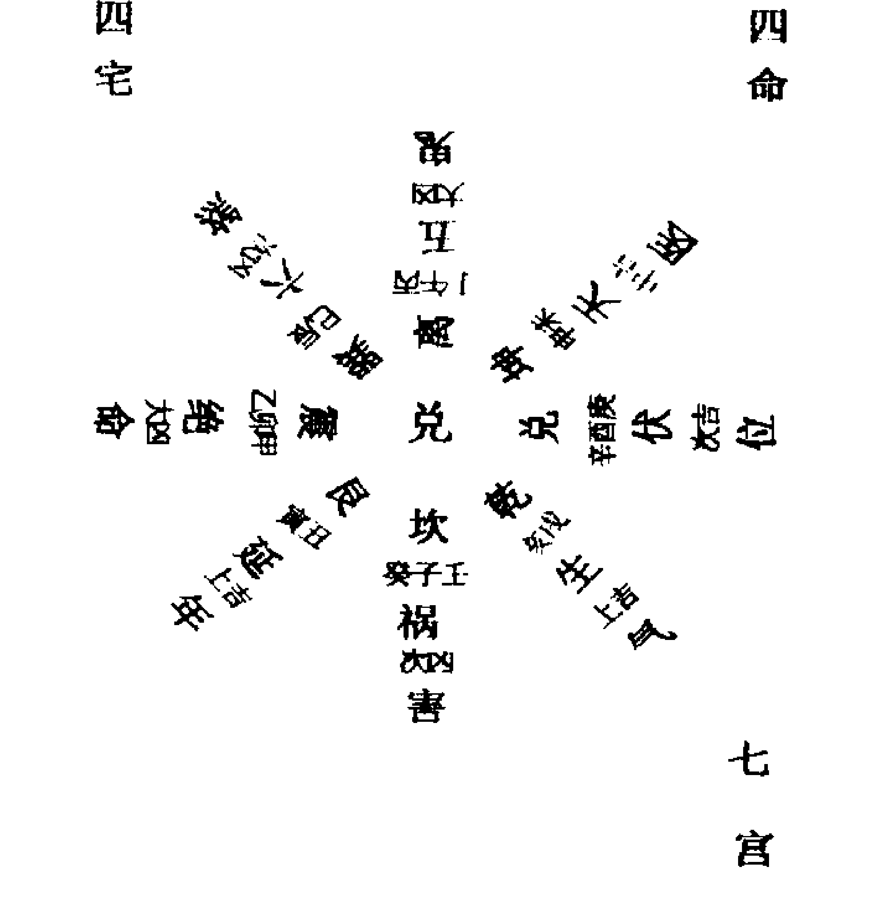

[PAGE 66]

## [今译]

兑命属西四命，位居七宫。这是兑命人分别在乾、兑、坤、离、巽、震、艮这八个方位上的吉凶对照图。（其余内外圈各自代表的意义，按前面对乾命的解释，以此类推）

## 王肯堂论八宅生气等星吉凶之源

## [原文]

自太极分阴阳，阳之中有阴有阳，所谓太阳、少阴也。阴之中有阳有阴，所谓太阴、少阳也。太阳之中，阳乾阴兑；少阴之中，阳震阴离；少阳之中，阳坎阴巽；太阴之中，阳艮阴坤，所谓先天八卦也。乾父、坤母、震长男、巽长女、坎中男、离中女、艮少男、兑少女，所谓后天八卦也。阳道主变，其数以进为极，故乾父得九，震长男得八，坎中男得七，艮少男得六。阴道主化，其数以退为极，故坤母得一，巽长女得二，离中女得三，兑少女得四，此“河图”、“洛书”自然之数而不离于五者也。故先天之合为生气也，后天之合为延年焉，五数之合为天医也。乾九合艮六，坎七合震八，坤一合兑四，巽二合离三，阳得十五而阴得五，故曰五数之合也，其不合者皆凶矣。乾与离，兑与震，坤与坎，艮与巽，皆以阴而克阳，凶莫甚矣，故为绝命也。乾与震，巽与艮，兑与离，皆阳克阳，阴克阴，其凶次之，故为五鬼也。乾与坎，艮与震，巽与兑，坤与离，皆六亲相形，故为六煞也。乾与巽，坎与兑，艮与离，坤与震，金木土相克，而子酉、丑午相破，故为祸害也。总之，合皆比而生吉，不合者相克而生凶，此东四、西四八宅之所以判，而各星分配之所以殊也。画卦自下而上，变卦自上而下，故一变而乾得兑，兑得乾；离得震，震得离；巽得坎，坎得巽；艮得坤，坤得艮，所以为生气也。二变而乾得震，震得乾；坎得艮，艮得坎；巽得坤，坤得巽；坎得离，离得坎，所以为五鬼也。三变而乾得坤，坤得乾；坎得离，离得坎；震得巽，巽得震；艮得兑，兑得艮，所以为延年也。四变而乾得坎，坎得乾；艮得震，震得艮；巽得兑，兑得巽；离得坤，坤得离，所以为六煞也。五变而乾得巽，巽得乾；坎得兑，兑得坎；艮得离，离得艮；震得坤，坤得震，所以为祸害也。六变而乾得艮，艮得乾；坎得震，震得坎；巽得离，离得巽；坤得兑，兑得坤，所以为天医也。七变而乾得离，离得乾；坎得坤，坤得坎；艮得巽，巽得艮；震得兑，兑得震，所以为绝命也。世所传“游年歌”，其源实出于此，而特为捷法以括之。时师执流而忘源，不复深求其故，此吉凶之所以无据也。

## [今译]

太极分为阴、阳，阳中又分太阳、少阴，阴中又含太阴、少阳。在太阳中，乾属阳，兑属阴；在少阴中，震属阳，离属阴；在少阳中，坎为阳，巽为阴；在太阴中，艮为阳，坤为阴，这就是先天八卦。后天八卦指乾父、坤母、震长男、巽长女、坎中男、离中女、艮少男、兑少女。阳以变为主，所以乾父与“九”对应，震长男与“八”对应，坎中男与“七”对应，艮少男与“六”对应；阴以化为主，所以坤母与“一”对应，巽长女与“二”对应，离中女与“三”对应，兑少女与“四”对应，这些数字来自“河图”和“洛书”。所以先天八卦如果相合的话，就是生气，主吉祥；后天八卦相合的话，就是延年，也主吉祥；八卦之中的五数相合是天医，也主吉祥。乾九艮六、坎七震八，坤一兑四、巽二离三，这四对卦各自相加，阳卦得十五，阴卦得五，命相学家把这称为五数相合。如果卦中五数不合，就意味着凶险。因为乾属太阳中的阳，离属少阴中的阴，兑为太阳中的阴，震为少阴中的阳，坤为太阴中的阴，坎为少阳中的阳，艮为太阴中的阳，巽为少阳中的阴，所以，乾和离、兑和震、坤和坎、艮和巽这四卦，都是阴克阳，主凶，所以称“绝命”；乾和震、巽和坤、坎和艮、兑和离，都是阳克阴，也主凶，不过与绝命相比，要稍微好一点，所以称“五鬼”；乾和坎、艮和震、巽和兑、坤和离，都是阳克阳，阴克阴，所以称“六煞”；乾和巽、坎和兑、艮和离、坤和震，这四卦属于金、木、水、火、土五行相克，所以称“祸害”。总的来说，在卦中，如果两两相合就主吉祥如意，反之，不合或者相克就主凶事灾难，这就是判断东四宅和西四宅的依据，及九星之所以照临不同方位的原因。在画卦的时候，要从下往上画；在变卦的时候，要从上往下变。初变时，乾与兑、离与震、巽与坎、艮与坤，这四卦两两相生，所以称‘生气’；二变时，乾与震、坎与艮、巽与坤、兑与离，这四卦阳克阴，称‘五鬼’；三变时，乾与坤、坎与离、震与巽、艮与兑，这四卦中，每卦中的数字（乾九、坤一，震八、巽二，坎七、离三，艮六、兑四）加起来都是十，命相学家称为‘合十’，因此两两相合为吉，称‘延年’；四变时，乾和坎、艮和震、巽和兑、离和坤，称‘六煞’；五变时，乾和巽、坎和兑、艮和离、震和坤，称‘祸害’；六变时，乾和艮、坎和震、巽和离、坤和兑、称‘天医’；七变时，乾和离、坎和坤、艮和巽、震和兑，称‘绝命’。世间流传的‘游年歌’，其实就出自于这里，只是对它做了概括而已。而现在，很多风水先生都忘了其来源，不再更深地去理解它，所以判断吉凶祸福往往也就无从下手了。

## 先天八卦次序图

## [原文]

八七六五四三二一
坤 艮 坎 巽 震 离 兑 乾
太阴 少阳 少阴 太阳
阴 阳

## [今译]

这是先天八卦中的阴阳示意图。阳极中以太阳为主，容以少阴；阴极中以太阴为主，容以少阳。乾一兑二，乾为阳，兑为阴，阴阳相生；离三震四，震为阳，离为阴，阴阳相生；巽五坎六，巽为阴，坎为阳，阴阳相生；艮七坤八，坤为阴，艮为阳，阴阳相生。

## 福元

## 【原文】

宅之坐山为福德宫，人各有所宜。东四命居东四宅，西四命居西四宅，是为得福元。如西而居东，东而居西，方虽或吉，不受福也。如东西之宅难改，当于大门改之。如大门难改，当权其房之吉以位之。如房不可易，当移其床以就其吉，则虽无力，贫家亦可邀福也。

# 【今译】

住宅所在的位置是人生福禄的根本，人的年命不同，与之相配的住宅的方位也有所区别。东四命的人适合居住在东四宅，西四命的人适合居住在西四宅，如果这样做了，那么就能福禄安康。反之，如果西四命的人居住的是东四宅，东四命的人居住的是西四宅，即使住宅所在的方位很好，也很难享受到福运。如果住宅的方位不能够改动，那么可以把大门改到相对应的命宅的方位；如果大门也没法改动，就应该选择方位与年命相适应的房间；如果房间也没法选择的话，就要把睡床移到适宜的位置上，这样的话，即使贫寒的人家，也能得到福运的照临了。

## 宅舍大门

## 【原文】

大门当安于本命之四吉方，不可安于本命之四凶方，又须合青龙坐山之吉方以开门，又宜迎来水之吉以立门。三者俱全，则得福而奕世流光矣。屋有坐有向，命有东有西，若专论山向而不论命者大凶，论命而不论山向者小凶，合命又合坐向者则永福。如乾山巽向，乃西四宅也，大门宜在坤、兑、艮方，以配乾之西四坐山。而床、香火、后门、店铺、仓库之类，亦宜安西四吉之位，以合坐山。若灶座、坑厕、碓磨，则宜安西四宅之四凶方，以压其凶。而灶之火门，又宜向四吉方，烟道宜出四凶方，以熏凶神。但此宅惟乾、坤、兑、艮西四宅命居之吉，若坎、离、震、巽东四宅命居之，则凶矣。

八宅明镜

四四

[PAGE 70]

按：宅墓外势，临水临街，更有九局焉。局之真正者，其力量自足以胜坐山也。

## [今译]

通过推测人的年命，可以算出人的四个吉方和四个凶方，家宅的大门就应该安在与人的年命相适宜的四个吉方，即伏位、生气、延年、天医

## 作灶
作灶宜用天德、月德、玉堂、生气、平、定、成等吉日。东命人宜向南，或东南，或东。西命人宜向西，或西南吉方。以灶火门立向，宜取生气，催丁另载。作灶忌朱雀、黑道、天瘟、土瘟、天贼、天火、独火、十恶大败、转煞、毁败、丰至、微冲、九土鬼、四废、建破、丙丁等日，逢午亦忌。慕讲师论《作灶吉凶断》：“灶人乾宫号灭门，亥壬二位损儿孙。寅申得财辰卯富，艮宫遭火巽灾瘟。子癸坤方皆困苦，丑伤六畜福难存。乙丙益蚕庚大吉，若逢午位旺儿孙。申酉丁方多疾病，辛宫小吉戌难分。”又云：“房后灶前，家道平安。灶后房前，子孙不贤。”房前有灶在未、坤、丑、艮上，生邪怪之祸。“房前有灶，心痛脚疾。栋下有灶，主阴痨怯。开门对灶，财畜多耗。坑若近灶，主眼疾疯病，邪事多端。灶后房前，灾祸延绵。灶后装坑地，绝嗣孤寡。井灶相连，姑嫂不贤。”又云：“灶在卯方，命如夭亡。灶在后头，养子不收。灶在艮边，家道不延。”

# 【今译】
在房宅中建灶的时候，宜选择黄历中的天德、月德、玉堂、生气、平、定、成等日子，这些日子都是建灶的吉日。根据中国黄历，青龙、天德、玉堂、司命、明堂、金匮被称为六黄道，这六神照临的日子就属于黄道吉日。而平、定、成则属于十二建星。“平”虽属黑道日，但根据黄历，此日万事均吉；“成”属黄道日，此日适合开业、入学、婚嫁、赴官上任等；“定”日适合宴饮，与人签协议。

东四命的人在建灶时，灶口应该朝着与东四命相合的南方、东南方或者东方；西四命的人在建灶时，灶口应该朝着与西四命相合的西方、西南方。灶门应该朝着生气所在的方位。如果家里想添人丁，再根据宅主的年命，对灶口的方位另作推断。但是，在建灶的时候，千万不能选择黄历中的朱雀、黑道、天瘟、土瘟、天贼、天火、烛火、十恶大败、转煞、毁败、丰至、微冲、九土鬼、四废、建破、丙丁这些日子，也不能选在正午时分。

## 香火
## 【原文】
土地祠神、祖先祠堂，皆香火也。安本命之吉方则得福，凶方必有咎。古云“移烟改火”者，谓无锅烟香火，有祸无福也。若误移其方，则变其吉之来路，反凶矣。凡出秽之所，用压于本命之凶方，镇住凶神，反发大福，甚验。其方皆与灶屋烟囱相对，用以压之，吉矣。然当详审方位，不可混错。或谓改于屋外之吉方，则同来路之凶矣。即尺基丈址，亦宜清楚的确矣。

# 【今译】
在中国民间，香火指土地庙、先祖祠堂等地方。人们在这里祭祀，并祈求神灵和先人的护佑，保佑自己心想事成，福运连绵。后来，香火就被用来泛指各种各样的好事。例如，香火旺盛指的是生命力强大。土地庙和先祖祠堂，都要位于与家族的族长的年命相符合的吉方，这样整个家族就会有福运。相反，如果它们所在的位置是在与族长年命对应的凶方，就一定会有灾祸。古人说“移烟改火”的意思是：如果一个家族没有香火祠堂，那么就会有祸无福。如果错误地移动了祠堂香火的位置，吉祥就会转变为凶险。凡是人体排泄污秽的地方，都应该位于宅主年命的凶方，这样才可以镇住凶神，福运就会来临，这非常灵验。而且厕所的位置最好和灶火烟囱两两相对，镇压凶神的效果就更好了。所以，对香火祠堂的位置，一定要详加勘察，千万不能弄错了。如果厕所的位置在屋宅外的吉方，也一样主凶。所以，哪怕只是尺寸大小的地方，也一定要弄清楚明白。香火旺盛，家中人丁才会兴旺，家人的命运才会好，所以，厕所不能与吉位相冲，否则会不利于香火。

## 论婚姻
## 【原文】
命元是东四命者，宜婚东四命妻，则有子多福。误结西四命妻，则艰于子嗣，不和，不发福。如坎命男配巽命女，·巽为坎之生气，必有五子，又和而助夫成家。若坎命男取艮命女，是为五鬼，虽有二子，必不和而窃财。古云：“贪生五子亘三郎，武曲金星四子强。五鬼廉贞儿两个，辅弼只是半儿郎。文曲水星独一子，破军绝命守孤孀。禄存无子人延寿，生克休囚仔细详。”此合与妻命固有准。即得来路灶向之合命者，亦可断其子之多寡有无也。如乾夫兑妻，生气有五子，但金见金相敌，主不和。坤延年妻，四子和睦。或云乾坤配合最宜，应六子。艮天医妻，三子。乾伏位妻，只一女。离绝命妻，无子。又离火克乾金，必惧内。坎六煞妻，一子相争。震五鬼妻，二子长难招。又乾克震，夫欺妻。巽祸害妻，为腐木，懒妇常受夫辱。禄存妻无子，夫妇多寿。余命皆仿此推。然须论其星之生克吉凶，与得位不得位，以为救助，庶可广嗣助吉矣。妻元论命之法，较有益于《通书》昌才合婚之例，予屡试之，无如此之的确有实验也。世之求婚配者，先留意于此也。

按：昌才合婚之说，即从游年诀中来，所谓生、煞、天医、五鬼、绝命固相同，而所云福德即延年，归魂即伏位，游魂即六煞，绝体即祸害，名虽异而实则同。但其下所住之数，即九宫之数而细核之也。惟生、游、绝、归四条数不差，其福、天、体、五四条俱错，皆后人以讹传讹，不考从来，习而不觉，不知八卦中乾、兑生于太阳，离、震生于少阴，巽、坎生于少阳，艮、坤生于太阴。二太所生西四，二少所生东四，此命与宅所由分，而各星吉凶，皆从各卦挨变而起，理固有据，数亦可考，奈何述其源而紊其流乎？因为订正，附录于后。至上元甲子起一宫，《时宪》现载书不以论男女命元婚姻之数，而旧传上元起七宫，与今当异。或云：以《竹书纪年》考之，实差一元，康熙甲子乃系下元。未知孰是，然毕竟以《时宪书》为准。

# 【今译】
婚姻的结合也离不开年命，此外，古人认为“不孝有三，无后为大”，所以，还非常看重子嗣，所以，男女结婚之后，子嗣的多少，也是古人衡量婚姻的一条重要标准。东四命的男性娶东四命的女性为妻，多子多福。

但是，如果东四命的男子娶西四命的女子为妻，不仅子女少，而且家庭关系不和睦，也没有福运。如果坎命的男性娶巽命的女性，因为巽是坎的生气，所以一定会有五个子女，而且夫妻和睦，妻子还有帮夫运。如果坎命的男性娶艮命的女性为妻，因为艮是坎的五鬼，所以，虽然婚后有二个子女，但是家庭一定不会和睦，而且必遭遇窃贼。古人说：“贪狼星主生气，若遇生气婚，命里多子多福；武曲星即延年，若遇延年婚，也主吉祥，多子多孙；廉贞星即五鬼，若遇五鬼婚，命里只有两个儿子；左辅星即伏位，若遇伏位婚，命里只有半个儿郎；文曲星即六煞，若遇六煞婚，命里只有一个儿子；破军星即绝命，若遇绝命婚，将无儿无女，一生孤苦伶仃；禄存星主祸害，若遇祸害婚，命里无子，但可以长寿。所以，在婚配的时候，男女八字的相生相克一定要弄清楚。” 此外，通过灶的火门朝向是否与宅主的年命相符合，也可以推断子孙的多寡祸福。例如，乾命的男性配兑命的女性，属生气婚，命里有五个儿子，但是，乾属金，兑也属金，金与金相克，主夫妇不合。乾命的男性配坤命的女性，属延年婚，命里有四个儿子，而且家庭关系和睦。也有人说乾命的男性与坤命的女性是最好的搭配，应该有六个儿子。乾命的男性配艮命的女性，属天医婚，命里有三个儿子。乾命的男性配乾命的女性，属伏位婚，命里只有一个女儿。乾命的男性配离命的女性，属绝命婚，命里无子，而且离属火，乾属金，火克金，所以，乾命男性娶离命女性，一定会怕老婆。乾命的男性配坎命的女性，属六煞婚，命里只有一个儿子。乾命的男性配震命的女性，属五鬼婚，命里两个儿子却难以侍奉到终老，而且乾属金，震属木，乾克震，妻子会受丈夫欺凌。乾命的男性配巽命的女性，属祸害婚，如果妻懒，会常受丈夫的凌辱。坤命妻命里无子，但夫妻长寿。其他的命都可以以此类推。但是，一定要考虑星座相互之间的生克关系，是否与年命相符。通过妻子的年命来推断婚姻，对男女合婚是有用处的。

## 论女命利月(如入赘论男命)
|          |      子午生 |      丑未生 |      寅申生 |      卯酉生 |      辰戌生 |      巳亥生 |
|-----------|------------|------------|------------|------------|------------|------------|
| 大利月     | 六十二     | 五十一     | 二八月     | 正七月     | 四十月     | 三九月     |
| 妨媒人     | 正七月     | 四十月     | 三九月     | 六十二     | 五十一     | 二八月     |
| 妨翁姑（无翁姑不忌） | 二八月 | 三九月 | 四十月 | 五十一 | 六十二 | 正七月 |
| 妨父母（无父母不忌） | 三九月 | 二八月 | 五十一 | 四十月 | 正七月 | 六十二 |
| 妨夫主     | 四十月 | 正七月 | 六十二 | 三九月 | 二八月 | 五十一 |
| 妨女身     | 五十一 | 六十二 | 正七月 | 二八月 | 三九月 | 四十月 |

见亲属行嫁，大利月如前，吉期百无禁忌，新妇拜见无妨。若余月，各有休咎，屡经屡验，不可不慎也。

## 和尚公煞男命宜忌
## 【原文】
巳、午、未生人忌用申、子、辰日；申、酉、戌生人忌用亥、卯、未日；亥、子、丑生人忌用寅、午、戌日；寅、卯、辰生人忌用巳、酉、丑日。一名曰“和尚煞”，又云“孤神寡宿煞”及“本命三煞”，犯者主无子息。此例只论男命，不论女命，惟推大小利月论女命，但和尚是男子，若以女命而论者错矣。若得男女俱不犯者更妙。

# 【今译】
这段话讲的是男人在结婚的时候，应该避开的忌日。凡出生于巳、午、未年的人，不能在申、子、辰这几个日子里娶妻；出生于申、酉、戌年的人，不能在亥、卯、未这几个日子里娶妻；出生于亥、子、丑年的人，不能在寅、午、戌日里娶妻；出生于寅、卯、辰年的人，不能在巳、酉、丑日里娶妻。如果在这些日子里娶妻，就会命中无子，被称为“和尚煞”，也称“孤神寡宿煞”或“本命三煞”。关于这一点，只看男性的年命，不需要看女性的年命，女性出嫁只看大小利月。“和尚”专指男性，如果用它来看女命就错了。当然，如果男女双方都不犯这些日子是最好的。

## 论男女生命行嫁月孤虚煞
## 【原文】
孤虚

+   甲子旬 九、十月 三、四月
甲戌旬 七、八月 正、二月
甲申旬 五、六月 十一、十二月
甲午旬 四、五月 九、十月
甲辰旬 正、二月 七、八月
甲寅旬 十一、十二月 五、六月
曲脚煞 己巳、丁巳、乙巳人命遇之，主克妻。

# 【今译】
在命相学中，孤虚指孤虚煞，命犯孤虚煞的人，一生贫困苦寒。曲脚煞也是命相学中的术语，命犯曲脚煞，主男子克妻。

由于十天干，在每一元的六十甲子中，每十年为一旬。例如，在甲子

旬中，分别是甲子年、乙丑年、丙寅年、丁卯年、戊辰年、己巳年、庚午年、辛未年、壬申年、癸酉年。甲子旬后就是甲戌旬，随后是甲申旬、甲午旬、甲辰旬、甲寅旬。

在甲子旬中，孤虚煞出现在每年农历的九月、十月、三月、四月；在甲戌旬中，孤虚煞出现在每年农历的七月、八月、正月、二月；在甲申旬中，孤虚煞出现在每年农历的五月、六月、十一月、十二月；在甲午旬中，孤虚煞出现在每年农历的四月、五月、九月、十月；在甲辰旬中，孤虚煞出现在每年农历的正月、二月、七月、八月；在甲寅旬中，孤虚煞出现在每年农历的十一月、十二月、五月、六月。出生于己巳年、丁巳年、乙巳年的男性如果遇到曲脚煞，就会克妻。

## 阴错阳错歌
## 【原文】
阳并阴错是如何？辛卯壬辰癸巳多。
丙午丁未戊申是，辛酉庚戌癸亥过。
丙子丁丑戊寅日，十二宫中细细歌。

# 【今译】
在黄历中，有一些日子是阴阳错行的，在这些阴阳错行的日子里，最好不要举行婚礼。这些阴阳错行的日子一共有十二对，它们是：辛卯、壬辰、癸巳、丙午、丁未、戊申、辛酉、庚戌、癸亥、丙子、丁丑、戊寅。

## 吕才合婚图
## 【原文】

| 生气       | 福德       |
|------------|------------|
| 一 三 六 八 | 一 四 六 七 |
| 四 九 七 二 | 九 三 二 八 |
| 四 九 七 二 | 九 三 二 八 |
| 一 三 六 八 | 一 四 六 七 |
| 归魂       | 天医       |
|------------|------------|
| 一 二 三 四 | 六 三 七 四 |
| 一 二 三 四 | 八 一 二 九 |
| 六 七 八九 | 八 一 二 九 |
| 六 七 八九 | 六 三 七 四 |
| 五鬼       | 游魂       |
|------------|------------|
| 一 三 四 六 | 一 三 七 九 |
| 二 七 八九 | 六 八 四 二 |
| 二 七 八九 | 六 八 四 二 |
| 一 三 四 六 | 一 三 七 九 |
| 绝命       | 绝体       |
|------------|------------|
| 一 三 四 六 | 一 三 九 六 |
| 二 七 八九 | 七 二 八 四 |
| 二 七 八九 | 七 二 八 四 |
| 一 三 四 六 | 一 三 九 六 |

福德即是延年，游魂即是六煞，绝体即是祸害，归魂即是伏位。合福德，生气、天医为上婚，主子孙昌旺，大吉。游魂、归魂、绝体为中婚，较量轻重，用之亦吉。五鬼口舌相连，绝命祸害甚重，为下婚，避之则吉，不可不知之类。## 三元男女生命宫数
|                 | 甲子 | 乙丑 | 丙寅 | 丁卯 | 戊辰 | 己巳 | 庚午 | 辛未 | 壬申 |
|                 | 癸酉 | 甲戌 | 乙亥 | 丙子 | 丁丑 | 戊寅 | 己卯 | 庚辰 | 辛巳 |
|                 | 壬午 | 癸未 | 甲申 | 乙酉 | 丙戌 | 丁亥 | 戊子 | 己丑 | 庚寅 |
|                 | 辛卯 | 壬辰 | 癸巳 | 甲午 | 乙未 | 丙申 | 丁酉 | 戊戌 | 己亥 |
|                 | 庚子 | 辛丑 | 壬寅 | 癸卯 | 甲辰 | 乙巳 | 丙午 | 丁未 | 戊申 |
|                 | 己酉 | 庚戌 | 辛亥 | 壬子 | 癸丑 | 甲寅 | 乙卯 | 丙辰 | 丁巳 |
|                 | 戊午 | 己未 | 庚申 | 辛酉 | 壬戌 | 癸亥 |      |      |      |
| 上男            | 七   | 六   | 五   | 四   | 三   | 二   | 一   | 九   | 八   |
| 元女            | 五   | 六   | 七   | 八   | 九   | 一   | 二   | 三   | 四   |
| 中男            | 一   | 九   | 八   | 七   | 六   | 五   | 四   | 三   | 二   |
| 元女            | 二   | 三   | 四   | 五   | 六   | 七   | 八   | 九   | 一   |
| 下男            | 四   | 三   | 二   | 一   | 九   | 八   | 七   | 六   | 五   |
| 元女            | 八   | 九   | 一   | 二   | 三   | 四   | 五   | 六   | 七   |

此《通书》所载男女生命二元宫数合婚之图，与合《时宪书》后所载各异，姑并识之。

## [今译]
《象吉通书》是中国古代比较权威的一本命相学书，简称《通书》。这

张“三元男女生命宫数图”来自《象吉通书》，它和《时宪书》中记载的同类图表是有一些不同的，可以作为参考。

这张图表的意思是：在甲子年、癸酉年、壬午年、辛卯年、庚子年、己酉年、戊午年出生的男性，如果属于上元甲子年，就是兑命，女性是中宫寄艮，为艮命；如果属于中元甲子年，男性就是坎命，女性就是坤命；如果属于下元甲子年，男性就是巽命，女性就是艮命。依此类推，在乙丑年、甲戌年、癸未年、壬辰年、辛丑年、庚戌年、己未年出生的男性，如果属于上元甲子年，就是乾命，女性也是乾命；如果属于中元甲子年，男性就是离命，女性就是震命；如果属于下元甲子年，男性就是震命，女性就是离命。总之，男性逢五寄坤二，女性逢五寄艮八。其他的以此类推。

## 元男女合婚定局
## 【原文】

| 上元 | 中元 | 下元 | 男女年柱干支 |
| ---- | ---- | ---- | ------------ |
| 男  | 女  | 男  | 女          |
| 一  | 五  | 四  | 二          | 七  | 八  | 甲子 | 癸酉 | 壬午 | 辛卯 | 庚子 | 己酉 | 戊午 |
| 九  | 六  | 三  | 三          | 六  | 九  | 乙丑 | 甲戌 | 癸未 | 壬辰 | 辛丑 | 庚戌 | 己未 |
| 八  | 七  | 二  | 四          | 五  | 一  | 丙寅 | 乙亥 | 甲申 | 癸巳 | 壬寅 | 辛亥 | 庚申 |
| 七  | 八  | 一  | 五          | 四  | 二  | 丁卯 | 丙子 | 乙酉 | 甲午 | 癸卯 | 壬子 | 辛酉 |
| 六  | 九  | 九  | 六          | 三  | 三  | 戊辰 | 丁丑 | 丙戌 | 乙未 | 甲辰 | 癸丑 | 壬戌 |
| 五  | 一  | 八  | 七          | 二  | 四  | 己巳 | 戊寅 | 丁亥 | 丙申 | 乙巳 | 甲寅 | 癸亥 |
| 四  | 二  | 七  | 八          | 一  | 五  | 庚午 | 己卯 | 戊子 | 丁酉 | 丙午 | 乙卯 |      |
| 三  | 三  | 六  | 九          | 九  | 六  | 辛未 | 庚辰 | 己丑 | 戊戌 | 丁未 | 丙辰 |      |
| 二  | 四  | 五  | 一          | 八  | 七  | 壬申 | 辛巳 | 庚寅 | 己亥 | 戊申 | 丁巳 |      |

# 【今译】
这张图表来自于《时宪书》，与上面的“三元男女生命宫数”图表的意思是一样的，但是内容有一定的出入。例如，根据这张图表，出生于甲子年、癸酉年、壬午年、辛卯年、庚子年、己酉年、戊午年出生的男性，如果属于上元甲子，就是坎命，女性是艮命；如果属于中元甲子，男性就是巽命，女性就是坤命；如果属于下元甲子，男性就是兑命，女性就是艮命。这张图表与“三元男女生命宫数”图表对照，仅供参考。

## 嫁娶周堂图
## 【原文】

凡选择嫁娶日，大月从夫顺数，小月从妇逆数，择堂、弟、厨、灶日，用之大吉。如遇翁、姑者，亦可用。

# 【今译】

这张图表说的是如何选择婚嫁的日子。如果是大月，就从夫字开始，朝顺时针方向数，如果是小月，就从妇字开始，朝逆时针方向数，堂、弟、厨、灶这几个日子，都有利于婚嫁，翁、姑在这两天日子也不错。

## 男女合婚辨谬
## 【原文】

合婚之谬，谓之久矣，而诸家犹宗之道。从八宅起例者，试之《宪书》，无不吻合，试之男女，应验如神。更有不准，则床灶之转移也。催丁立法，莫善于此，故特取而正之。

男女宫位演诀宫卦，辨婚姻之宜忌，辙异东西；定房宅之吉凶，宜分左右。安床立户，随生命以转移；作炉置灶，旋乾坤于掌握。神奇莫测，变运八方。无端一行蛮貊，复遇吕才反误，倒装生旺，逆取休囚，计陷蛮方，祸遗千古。特行订正，另设模推，使知生命之讹，一说合婚之谬矣。 假如坎命之男得巽方来路与灶向，亦与得妻巽命相同，皆是得生气而有子，且富贵也。曾有一坎命人娶兑命妇人，犯祸害禄存，当无子。又其人云：“命犯孤神，来求挽救之法。”师云：“你去将灶门改朝救汝坎命之东南巽方，乃得生气星食之，当有子。又将小处或风炉另以口朝乾向，使妻独食，则妻亦得生气吉向，亦当有子。”其人从之，果生五子。屡试屡验。 凡命生七月以前者作上元论。

## [今译]

从魏晋以后，大量西域人、波斯人等进入中原地区。唐朝异常繁荣，来到中原的外国人更多，同时，向唐王室和大臣求婚的异族人也非常多。为了尽量减少异族人与唐朝人通婚，唐太宗就命吕才造了一个合婚表，用来堵住那些求婚的外国人的嘴，所以，《吕才合婚图》又被称为《减蛮经》。渐渐地，随着时光流逝，后人在不加详察的情况下，轻信《吕才合婚图》，从而遗害千古。

关于吕才合婚图中的谬误，已经由来很久了，但是各家风水师都非常推崇。八宅派也并不完全因此而摒弃合婚的吉凶，这用在男女合婚上实际上是非常灵验的。如果有不准，那是因为当事人改变了床、灶的位置。用这个方法可以使家族中人丁兴旺。

通过男女年命所属的星座，可以推断婚姻的宜忌，以及房宅的吉凶。房宅、床位所在的方位，都应该与人的年命相符。根据年命确定炉灶的方位，可以将乾坤运筹于帷幄之中，真是一件非常神奇的事情。

如果坎命男性的床位和灶门都朝向巽方，就和娶巽命妻一样，可以使生气照临，不但子孙兴旺，而且大富大贵。以前有一个坎命男性娶兑命女性为妻，结果祸害禄存星照临，命里无子。后来，这个人就找风水先生，求教改运的方法。风水先生对他说：“因为你是坎命，所以，你把家中的灶门改成朝向可以救你的东南巽方，那么，生气星就会照临，你就会有儿

## 八宅明镜

〇六四

## 修造论(新造同)
## 【原文】

凡添修拆补房屋及换椽、盖瓦、修门，皆为修方，而吉凶立应。如修本命之吉方，旬日见福。予师令人于本命之吉方高造晒台，逾年即富。如乾命人修生气正西兑方，发大财，期年即见，后又出贵。或修东北、西南坤及本位，皆吉。若误修他方，皆凶。诸命皆然，各以类推。然必须丈量基路，使吉方之卦位的准，方能应验。凡略动斧木，砌砖泥墙，造花台亭榭，皆修方，其犯来路灶向，与修方同凶。坎方坑厕，本方能利盗贼；乾方作坑，男瞽女跛。

# 【今译】

凡是家里修造房屋，包括把旧的屋梁、屋瓦、房门翻造一新，都称为“修方”。在修方的时候，如果修造的是与宅主年命相符的吉方，那么，很多好运就会到来，有的十天之内就有好运福气。我的老师曾经让人在他年命的吉方修造高高的晒台，结果这人没过几年就富裕了。例如，有乾命人在正西兑方修造房屋，因为兑方是乾命人的生气方，所以，几年之中，这个人就发财了，没过几年又富贵了。也可以修造东北天医位、西南延年位，或者西北伏位，这几个方位也是吉位。但是，如果修造的是其他方位，就会有凶事、祸事了。每一宫的命数都是一样的道理，以此类推。不过，在确定方位前，必须把屋宅路基的尺寸都测量好，这样方位才能够准确，也才能应验。只要是动用斧头修整梁木、修砌泥墙，或者修建花园亭台楼榭，都属于修方，如果侵犯了吉方，也会有祸事发生。在坎位修厕所，如果坎位是年命的吉方，那么就会对盗贼有利，所以主凶。如果要在乾位挖坑，而乾位又是年命的吉方，那么，家中的男性会患眼疾，女性会患脚疾。

## 乾命本命
## [原文]

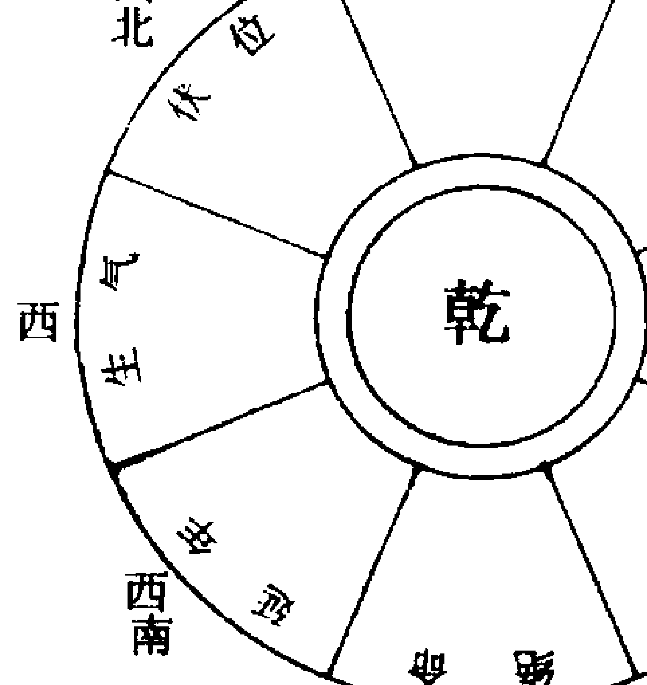

## [今译]

这是乾命人的吉凶方位对照图。西北（伏位）、东北（天医）、西（生气）、西南（延年）都是吉方，其他方是凶方。

## 巽命本命
## [原文]

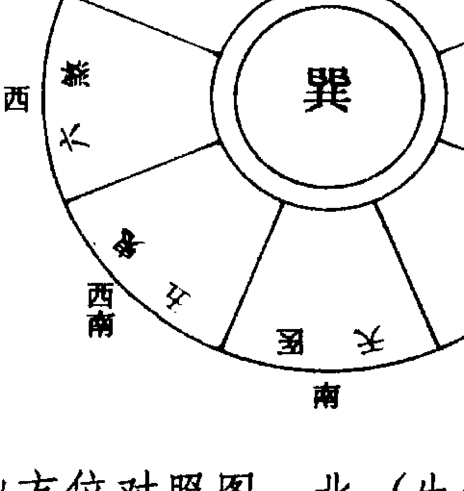

## [今译]

这是巽命人的吉凶方位对照图。北（生气）、东（延年）、南（天医）、东南（伏位）都是吉方，其他方位是凶方。

## 兑命本命
## 【原文】

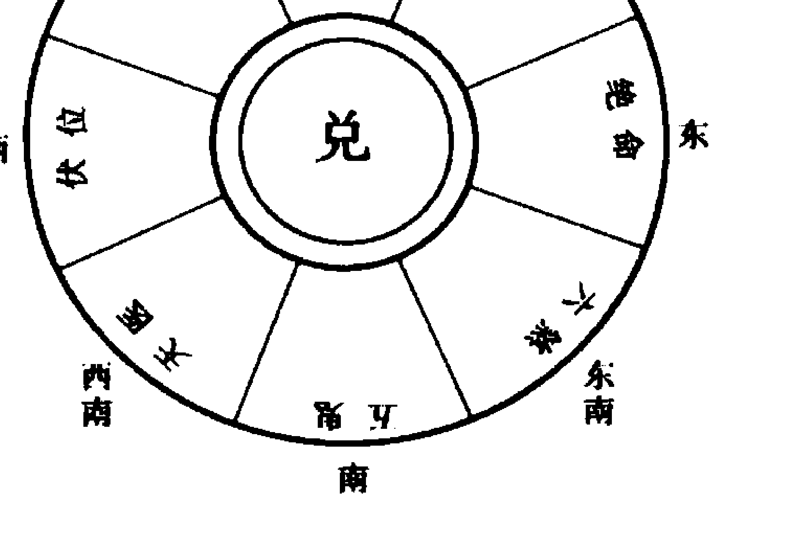

# 【今译】

这是兌命人的吉凶方位对照图。西北（生气）、西（伏位）、西南（天医）、东北（延年）都是吉位，其他方位是凶位。

## 坎命本命
## 【原文】

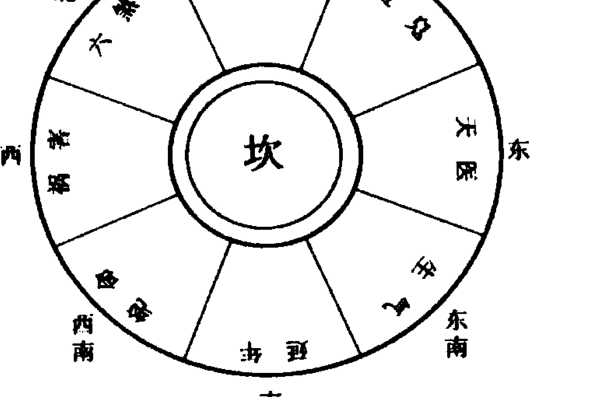

# 【今译】

这是坎命人的吉凶方位对照图。北（伏位）、东（天医）、东南（生气）、南（延年）. 都是吉方，其他方位是凶方。

## 离命本命
[原文]

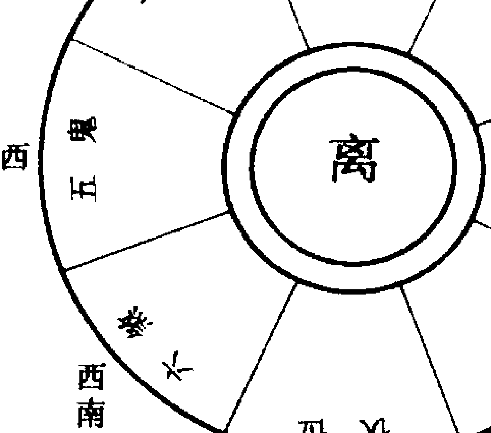

[今译]

这是离命人的吉凶方位图。北（延年）、东（生气）、东南（天医）、南（伏位）都是吉位，其他方位都是凶位。

## 艮命本命
[原文]

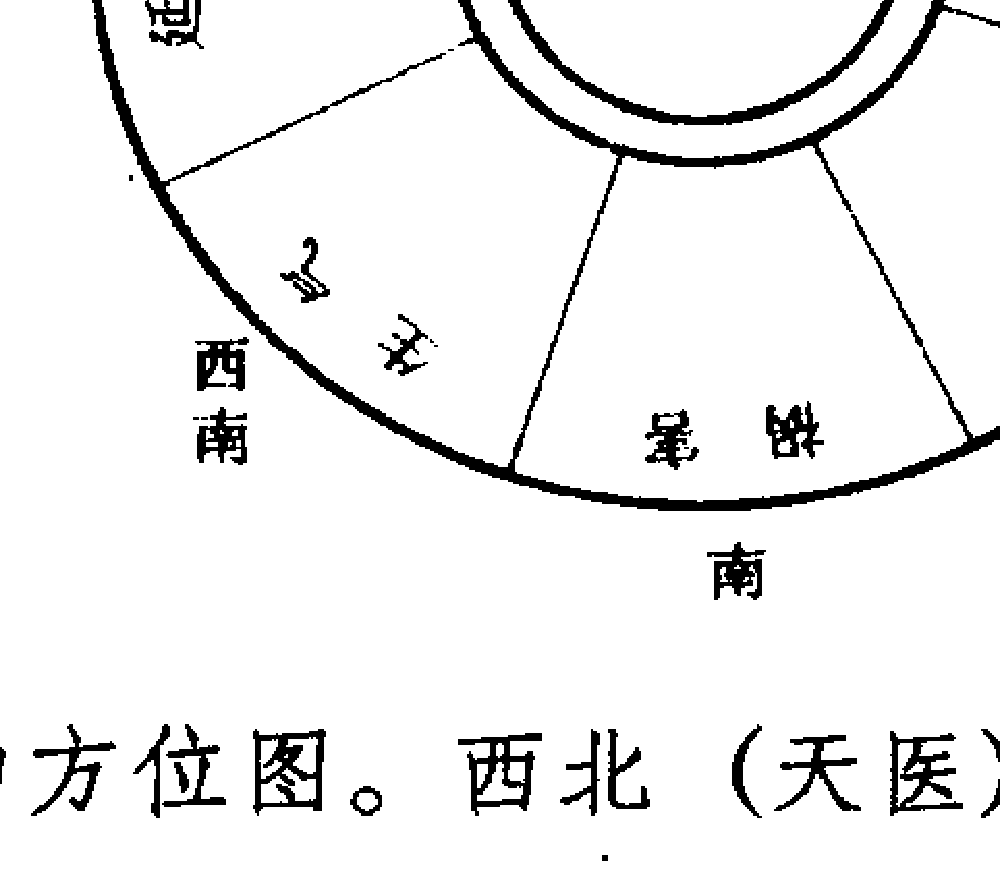

[今译]

这是艮命人的吉凶方位图。西北（天医）、西（延年）、西南（生气）、东北（伏位）是吉方，其他方位是凶方。

## 震命本命
【原文】

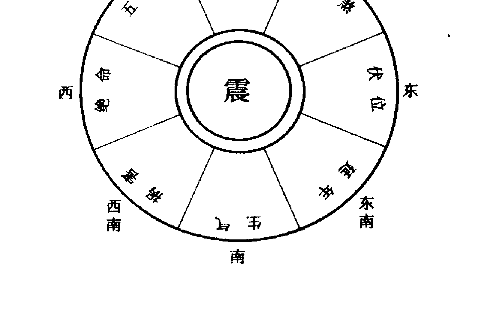

【今译】

这是震命人的吉凶方位图。北（天医）、东（伏位）、东南（延年）、南（生气）是吉位，其他方位是凶位。

## 坤命本命
【原文】

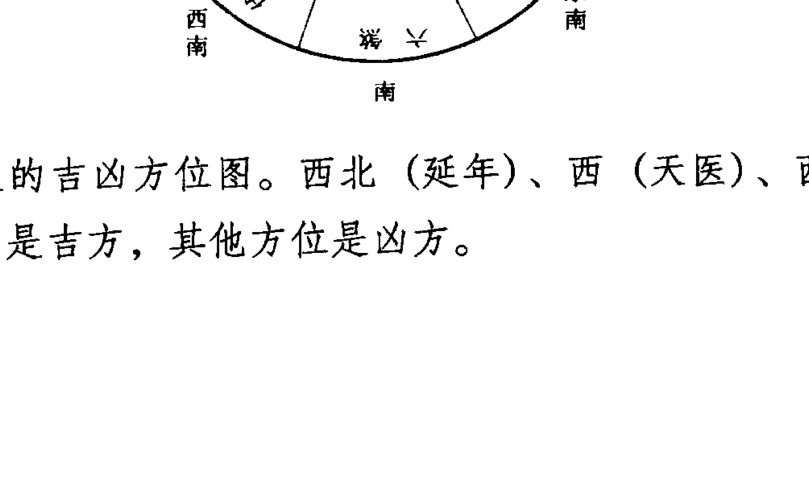

【今译】

这是坤命人的吉凶方位图。西北（延年）、西（天医）、西南（伏位）、东北（生气）都是吉方，其他方位是凶方。

## 阳宅六煞
## 【原文】

前高后低，谓之过头屋，出孤寡。

屋后两旁有直屋，谓推车屋。

前后平屋中起高楼，二姓招郎。

前正屋后边，不论东、西、南、北、中央，或一间、二间乱起，谓埋儿煞。

四边多有屋，中间天井，出入又无墙门，谓扛尸煞。

屋后有直屋，谓直射煞。

左右屋低，中高，谓冲天煞。

前后两进，两傍厢房中堂如口字，四檐屋角相对，谓埋儿煞。

厅屋三间，中一间装屏门，两傍对一步者，谓停丧煞。

不论前后，檐下水滴在阶檐上者，谓主血症。

屋前如有梁木、搭板暗冲檐架者，谓穿心煞。

屋后白虎边另有一间横屋，谓自缢煞。

屋后如箭暗冲者，谓暗箭煞。

屋后青龙上有一间横屋，谓投河煞。

厅后高轩又有正屋如工字样，谓工字煞。

不论前后，门首或楹柱，或墙垛，或屋尖当门者，谓孤独煞。

前后两进有一边侧厢者，谓亡字煞。

如屋大梁上又加八字木者，出忤逆。

不论前后天井，两傍如有山墙对照，谓金字煞，在西方更甚。

如一层前后翻轩皆可作正面，主夫妻、弟兄不和。

门前四面围墙中开一门，东、西两家俱从一门出入，路如火字形，不宜。

房门上转轴透出，主生产不易。

一家连开三门如品字，多口舌。

两门对面，谓相骂门，主家不和。

面前如有鸡口朝对，不宜。

前檐滴后檐，两层屋相连，不宜。

面前左、右有小塘，水满时或东放西、西放东，谓之连泪眼，不宜。

卧房前不宜堆假山、土山，谓坠胎煞。

乱石当门，谓磊落煞。

住宅前有深林，主怪物人门。

住屋前后有寺庙，不宜。

禄存方向不宜有树被藤满缠者，谓之缠颈树。

面前有路川字形，不宜。

山尖中开门，名穿煞，大忌。

床横有柱，名悬针煞，主损小口。

## [今译]

这段话讲的是在修建房屋时，要注意的一些事项。

如果房屋前高后低，被称为“过头屋”，此宅的主人要么将无儿无女，孤苦一生，要么将会守寡。

房屋后边两侧不能再建两间并列的房屋，因为这样的房宅从上往下看，正屋就像车厢一样，两边的倒屋就像车轮一样，看起来就像推车的形状，古人忌推车，认为这样会把自己家里的财宝福气推走，家里会

### 今译

家中修建灶台时，不能够选择犯忌的日子，如果在忌日里修灶，会使家业受损。那么，哪些日子是修灶时应该忌讳的呢？上面这段话的意思是说：每年农历的正月、五月和九月，修灶不能选丁卯日；每年农历的二月、六月和十月，修灶不能选甲子日；每年农历的三月、七月和十一月，修灶不能选癸酉日；每年农历的四月、八月、十二月，修灶不能选庚午日。另外，凡在丙年和丁年出生的人，不能在丙日和丁日里修灶，否则就犯了命煞；出生于戊、己年的人，不能在壬子、壬寅、壬辰、壬午、壬申、壬戌日修灶，否则就犯了土皇煞，会出人命。

## 分居绝烟火煞（分居忌日）

### 原文

正七分居辰戌防，二八猪蛇不可当。
三九切忌游子午，四十又怕犯牛羊。
五十一月寅申忌，六十二月卯酉殃。
世人不怕绝烟火，十人犯著九人亡。

### 今译

这里的“分居”指分家，就是在大家族中，兄弟叔伯之间分户立灶单独过日子。分户立灶也要慎重选择日子，不能选择忌日。如果在忌日里分家，就会家破人亡。
农历正月和七月，不能在辰日、戌日分家；二月和八月，不能在亥日、巳日分家，猪代表亥，蛇代表巳；三月和九月，不能在子日、午日分家；四月和十月，不能在丑日、未日分家，牛代表丑，羊代表未；五月和十一月，不能在寅日、申日分家；六月和十二月，不能在卯日、酉日分家。

## 九星

### 原文

贪、巨、禄、文、廉、武、破、辅、弼。

### 今译

"九星"指天上九星，即贪狼、巨门、禄存、文曲、廉贞、武曲、破军、左辅、右弼。其中，贪狼、巨门、禄存、文曲、廉贞、武曲、破军这七星来自北斗七星，此外再加左、右两星，称为辅、弼。九星与八卦八方相对应，此时，辅、弼两星合二为一，所以合八方之数。

## 四吉星方

### 原文

生气，贪狼，木。（宜屋高，安门、床，并灶口向之。四吉方切忌安坑）

延年，武曲，金。（宜屋高，来路安门、床，灶向居西而获吉）

天医，巨门，土。（宜屋高，开门、安床坐东而会凶）

伏位，辅弼，无尊主。（宜安房、床，只生女）

### 今译

生气即贪狼星，五行属木，在这个方位，房屋宜高，这个方位适合安门、床，灶口也宜朝着这个方位。在四个吉方不能有坑。延年即武曲星，五行属金，这个方位的房屋宜高，门和床朝着这个方位吉祥，但灶口应该朝着西方。天医即巨门星，五行属土，这个方位的房屋宜高，但是，如果在东边开门或安放床，就会有凶险。伏位即辅弼星，这个方位适合建房、安床，但是家中可能只生女儿。

## 四凶星方

### 原文

绝命，破军，金，犯之不吉，震、巽、离相克。

六煞，文曲，水，犯之凶，坤、艮、巽皆不吉。

五鬼，廉贞，火，犯之不吉，坎、乾、兑亦非宜。

祸害，禄存，土，犯之凶。

本命之四凶方立安灶座、坑、厕、井、碓磨等压之。

### 今译

绝命即破军星，五行属金，不吉，此星照临震位、巽位、离位，都呈相克关系；六煞即文曲星，五行属水，主凶，此星照临坤位、艮位、巽位不吉；五鬼即廉贞星，五行属火，不吉，此星照临坎位、乾位、兑位不祥；祸害即禄存星，五行属土，主凶。在与年命相对应的四个凶方，适合打灶、挖坑、修厕所、打井、放置碓磨等，这样可以把凶神镇住。

## 作灶求财法

### 原文

灶座压东西命之煞方，火门向本命之生气、延年、天医等星吉方，取气为佳，元命合灶口吉向，可以求财。合生气方，大富。生气属木星，应在亥、卯、未年、月。合天医亦吉，系巨门土星，应在申、子、辰年月。合延年，武曲金星，应在巳、酉、丑年月。合伏位辅弼木星，有小财，亦应在亥、卯、未年月。

### 今译

不管是东四宅命还是西四宅命，灶座应该在与年命相对应的四个凶方，但是，灶口应该朝着与年命相符的生气、延年、天医、伏位这四个吉星照临的方向，这样就会有财运。如果灶口朝向贪狼星（生气）所在的方位，就会大富大贵，有巨财，在亥年、卯年、未年、亥月、卯月和未月就会应验；如果灶口朝向巨门星（天医）的方向，会有大财，在申年、子年、辰年、申月、子月、辰月就会应验；如果灶口朝着武曲星（延年）的方向，会有一般的财，在巳年、酉年、丑年、巳月、酉月、丑月就会应验；如果灶口朝着辅弼星（伏位）的方向，会有小财，在亥年、卯年、未年、亥月、卯月、未月就会应验。

## 催子法

### 原文

以灶座、泔水、茅厕等类压本命之凶方，其灶火门向本命之生气吉星方，主周年生贵子，百事吉祥。

### 今译

将灶座、厕所等，安置在与年命相对应的凶方，灶火门朝着与年命对应的生气照临的吉方，一年就能生贵子，而且事事顺利吉祥。

## 催财法

### 原文

以泔水、灶座、茅厕压住本命之煞方位，灶火门向本命之延年吉方，主一月内得小财，三月得中财，一年得大财。

### 今译

把泔水、垃圾、厕所等，置于与年命对应的四煞方，灶门火口朝着与年命相符的延年方，一月内能得到小财，三月内能得到中财，一年内能得到大财。

## 安床造床忌用日

### 原文

心、昴、奎、娄、箕、尾、参等星宿值日，是日忌之。

### 今译

风水师认为，天上有二十八颗星宿轮流值日，它们被称为值日天星。其中，在心、昴、奎、娄、箕、尾、参等星宿值日的时候，不能安床、做床，否则会有凶事。具体哪日由哪颗星宿值日，可以根据罗盘，或者查《万年历》来确定。

## 罗天大忌日（忌修造）

### 原文

+   - 初一休问子，初三莫遇羊。
- 初五马上坐，初九问鸡乡。
- 十一休逢兔，十三虎在旁。
- 十七牛眠地，廿一鼠偷粮。
- 廿五怕犬吠，廿七遭虎伤。
- 廿九猴作耍，日退最难当。

### 今译

罗天大忌日是中国民俗风水中的一个日子，这个日子不适合修屋铺路。如果一定要在这个日子大兴土木，那么就一定要避开某些时间段。在农历初一，要避开子时；初三避开未时，羊指未时；初五避开午时，马指午时；初九避开酉时，鸡指酉时；十一避开卯时，兔指卯时；十三避开寅时，虎指寅时；十七避开丑时，牛指丑时；二十一避开子时，鼠指子时；二十五避开戌时，狗指戌时；二十七避开寅时，虎指寅时；二十九避开申时，猴指申时。

## 修建忌晦气煞日

### 原文

丙子命忌辛丑日，丙申命忌辛巳日。

甲子命忌己丑日，甲戌命忌己卯日。

乙亥命忌庚寅日，丁亥命忌壬寅日。

戊寅命忌癸亥日，丁丑命忌壬子日。

### 今译

每个人的命运都有旺有晦，建房、安门、装修等都要避开晦煞日，这样才会吉祥。出生于丙子年的人，修造的时候，要避开辛丑日；丙申年出生的人，房屋修造时，要避开辛巳日；甲子年出生的人，房屋修造时，要避开己丑日；甲戌年出生的人，房屋修造时，要避开己卯日；乙亥年出生的人，房屋修造时，要避开庚寅日；丁亥年出生的人，房屋修造时，要避开壬寅日；戊寅年出生的人，房屋修造时，要避开癸亥日；丁丑年出生的人，房屋修造时，要避开壬子日。

## 神嗷鬼哭日(百事忌用)

### 原文

正月壬戌日，二月癸亥日，

三月丙子日，四月丁丑日，

五月甲寅日，六月乙卯日，

七月壬辰日，八月癸巳日，

九月甲午日，十月乙未日，

十一月甲申日，十二月乙酉日，

闰月同前。

### 今译

在农历正月的壬戌日，二月的癸亥日，三月的丙子日，四月的丁丑日，五月的甲寅日，六月的乙卯日，七月的壬辰日，八月的癸巳日，九月的甲午日，十月的乙未日，十一月的甲申日，十二月的乙酉日，都是大凶日。在这些日子里，做任何事情都要小心谨慎。闰月的情况与前面说的一样。

## 斩草破土忌用物

### 原文

初一、初八、十五（并不用鸡祀为要）。

### 今译

在农历每月的初一、初八、十五这三天，不管是下葬还是祭祖，都不能用太多的祭物，尤其不能用鸡作为祭物，只需要简单地祭祀就可以了。

## 戊己都天

### 原文

甲乙年，辰巳；乙庚年，寅卯；丙辛年，戌亥；丁壬年，申酉；戊癸年，午未。

阳年支重戊都，阴年支重己都。

### 今译

都天是中国民俗风水中的凶神之一，也称都天煞。不管做什么，都要避开都天煞日。以下这些日子都属于都天煞：

甲、乙年的辰日、巳日；乙、庚年的寅日、卯日；丙、辛年的亥日、戌日；丁、壬年的申日、酉日；戊、癸年的午日、未日。

在阳年的时候，支重戊都为大煞，在阴年的时候，支重己都为大煞。支重戊都和支重己都是都天大煞。

## 八卦方位

乾、坎、艮、震、巽、离、坤、兑。

此即后天八卦方位，一卦管三山。戌、亥属乾；壬、癸属坎；丑、寅属艮；甲、乙属震；辰、巳属巽；丙、丁属离；庚、申属兑；未、申属坤。共二十四山，统名八宅。

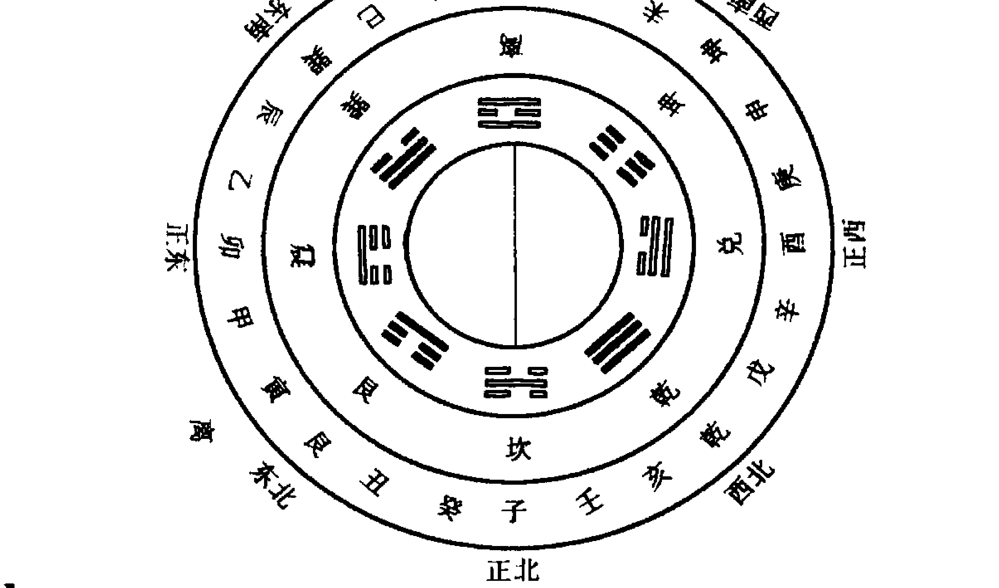

这是后天八卦所在的方位。根据风水，每一卦都管两山，乾卦管戍山、亥山；坎卦管壬山、癸山；艮卦管丑山、寅山；震卦管甲山、乙山；巽卦管辰山、巳山；离卦管丙山、丁山；兑卦管庚山、辛山；坤卦管未山、申山。此外，乾、坎、艮、震、巽、离、坤、兑这八卦也各属一山，总共二十四山，在这二十四山方位的房宅，统称为八宅。

## 八宅东西

乾、坤、艮、兑为西四宅，坎、离、震、巽为东四宅。

## 八宅明镜

〇八六

正严肃，看起来有气势。”四周的墙壁要严密，墙壁要平整明净，宅中的天井要显得明亮干净，各种建筑元素讲究规矩，有条有理地集中在一起，这样的房宅才有富贵之象。房宅的南、北都设堂，东四宅和西四宅的方位弄反了，好像在互相竞争一样，左右两边的房子都很有气势，这样的房子会出忤逆不孝之人。如果房屋又小又高，四周没有凭依，看起来孤孤单单的，那么这样的房屋呈现的就是孤单、贫寒之象。如果房屋东倒西歪，房梁或者断了或者倾斜了，又经常受到风吹雨淋的，那么，这样的房屋呈现的就是疾病、痛苦之象。如果房屋光线黑暗，要么过于宽敞，要么过于狭窄，这样的房屋就是鬼宅，容易呈各种怪现象。如果房屋不整齐，四周的墙壁破破烂烂的，房椽也露出来了，那这种房子呈现的就是孤苦无依之象。房宅的地基太高，屋前深后面陷，这样的房宅呈贫穷之象。如果屋高，但地基窄小，这样的房屋人财都会破败。如果屋子很矮，地基却很宽，这样的房子只有一代人有福运。

黄时鸣说：“人的住宅和官府的衙门不一样，衙门适合宽大、壮观，但是家宅的房门必须大小合适、建筑紧凑才能有福运。”

卧室和客厅也不一样。客厅的前面可以很宽很大，但是如果卧室的前面又宽又大，气运就容易散失。在所有房宅中，天井主官运和财运，前屋为案山。在风水中，案山又称迎砂，指穴山和朝山之间的山，它有助于生气凝聚。如果天井大小适宜，家中就有财运，如果前屋高矮适当，主人的生活就能过得很幸福。相反，如果前屋太高，宅主就容易受人欺辱；如果前屋太低，那么家里就很冷清，来的客人很少；如果前屋太近，又显得太狭窄局促了；如果前屋离得太远，又显得过于空旷了。如果房宅的前檐离得近，就可以稍微矮一点；如果房宅的前檐离得远，就可以稍微高一点。房屋的吉凶祸福，都是由这来决定的啊。房宅外面的大厅又不一样，大厅中的天井被称为小明堂，而前厅又是最重要的地方。前厅外面，大门以内的地方被称为中明堂，大门是房宅中第二重要的地方。前门所处的位置被称为大明堂，朝山是第三重要的地方。小明堂不能太大，四周要被包住，中堂要稍微显得宽阔，但也要方方正正的，大堂更要宽阔，但是忌旷野。”

风水书中说：“如果屋子少，人又多，人气旺允盈于屋，这是人胜宅，有吉祥之象；如果屋子多，但是人丁少，这是宅胜人，就有凶象。”风水书

中还说：“两侧是新房，中间夹着一间旧房，家中就有丧事；如果两侧是旧房，中间夹着新房，家里会光宗耀祖；如果房屋半新半旧，家里就会有吃不完的粮食用不完的钱；如果房宅的材料新，人丁就会兴旺。相反，屋子有一半经常空着，人气就不旺。梁与梁之间、桁与桁之间不能空出的距离太远，否则家中就会贫穷。如果屋柱弯曲，家中子孙不和睦；屋梁被虫蛀空，家人可能会眼瞎或者耳聋；或者屋梁看起来像悬空一样，家里有人性命难保。如果屋梁不正，家中就会有是非曲折。房屋的大梁接着小梁，家里每三年就会有丧事，哭声不断。”

房宅的宅基也是有讲究的。风水书中说：“乾宅的屋基中如果缺少离位，中房会生瞎女；坎宅的屋基中如果缺少巽位，长房的子孙会接二连三地死亡；艮宅的屋基中如果缺少坤位，长房将孤苦伶仃，没有儿子；震宅的屋基中如果缺少乾位，长房会留下遗腹子；巽宅的屋基中如果缺少震位，长房一定会人丁凋零；离宅的屋基中如果缺少乾位，长房将没有儿子；坤宅的屋基中如果没有艮位，中房的子孙会夭折；兑宅中如果缺少兑位，那么家宅中各房都会后继无人。”

风水书中还说：“如果坎宅的宅基中有乾位，宅主年纪大了还喜欢花天酒地。”

## 风水秘诀

吉凶亦不甚验也。其法单论各栋之出路，左吉则闭右而走左，右吉则闭左而走右，吉凶立验。便门者，合宅通水、柴左右之小便门也，亦宜三吉方，以助宅之吉。便门又云穿宫，书云“穿天门”，非也，还是穿本宅耳。大门吉，便门又吉，乃为全吉。房门者，各房之前后户也，宜三吉方。不论何门，自二扇以上，大小一律吉。左大换妻，右大孤寡。基窄屋小则大门重，而以便门与灶相助吉。基阔屋多，则大门远而不验，又以房之总门、便门为重，而以房门与灶相助吉。大门吉，全宅皆吉矣；总门吉，则此一栋吉矣；房门吉，则此一房皆吉矣。

宅无吉凶，以门路为吉凶。盖在坐山及宅主本命之生、天、延三吉方，则吉气入宅，而人之出人，步步去路，自然获福矣。倘与人共居，门不能闭，而左右俱有门路，则气散而宅弱，祸福俱不应矣。此等屋惟灶在吉方者吉。或大门在凶方，限于基地而不能改动，当于吉方另开一房门以收吉气，稍补于宅。或将客厅仍向前，卧房倒向后，房前吉，门吉，路亦吉。倒向则房后宜闭塞，房前要天井。宅之后墙不宜正中开门泄气，故便门必在两角上，择三吉方宜开之。凡开腰门，必将罗经格定，量准丈尺，方可开。方法：以后栋之屋檐量至前栋之前檐，如得六十丈，则于三十丈下罗经，取吉方开门。开门宜在地支上，所谓“门向地中行”是也。

门不宜多开，多开则散气。路不宜多歧，多歧则宅弱矣。屋门对衙门、仓门、庙门、城门者凶，街道直冲门者凶，街反出如弓背者凶。

宅门三重莫相对，宜相退让。

凡门楼，不可高压正堂，主招讼、损小口。若有牌坊欺压本堂者，克妻子，口舌、官非、被劾，在上堂之中者尤甚。

凡耳门在侧者宜相生。如癸山，大门在丁，耳门在巳，巳属火，被癸克中，主中男目疾，以正门属长，耳之左属中，两坎又为中男也。

- 大门是家宅最外面那扇门，在风水也是最重要的，它应该位于与宅主年命相符的吉方。
- 中门位于大门以内、厅堂以外，重要性在大门之后。除了震位、巽位、乾位、兑位不适合开直门以外，其他方位都可以与厅堂直接相通。如果家宅中没有两重门，那么中门就是大门，就必须开在上吉方位。
- 总门在厅堂内，它是从厅堂通往各个卧室的门。如果屋宇小，就依据大门来判断吉凶，如果各个房间距离大门比较远，那么就很容易靠大门来判断吉凶。根据每间屋子与外面的通路，如果左侧吉，就封闭右侧走左侧，如果右侧吉，就封闭左侧走右侧，吉凶很快就能应验。
- 便门是全家担水挑柴出入的小门，它也适合在吉方，这对整个家宅的福运是有帮助的。便门又叫穿宫，书上说“穿天门”，这是不对的，其实还是在自家居屋中。如果大门吉，便门也吉，那么整座家宅就呈吉祥之象。
- 房门是指各个屋子的前后门，房门也适合开在吉方。不管是什么门，如果有两扇以上的门，那么，门的大小必须是一样的。反之，如果左边的门大，宅主就会换妻；如果右边的门大，宅主就会孤苦伶仃。如果宅基窄小，屋子也小，而大门厚重，那么，只要房门和灶的位置恰当，家中就会福运连绵。如果房基大，则大门远，那就不灵验了。一户宅院，只要大门吉祥，整座家宅就吉祥；总门吉祥，那只有一栋宅院吉祥；如果房门吉祥，那么只有一间房吉祥。

## 定游星法

先从座上起游星到门上，后从门上起游星还本位，飞得吉星到本位。忌开后门、后窗以泄气。座后不忌天井，但天井之后，必有墙垣，上不宜开门与窗耳。凶门飞得凶星到本位，及宜开后门、后窗以泄之，则减凶。如一宅有高房，即从高房起游星，数至门上系何星飞。如新造之宅，从坐宫数至门也。

屋高四五尺以上者，即以高屋作主。如止高二三尺，仍从门上论星。

如坐坎位开巽门，坎上有高房为主星。轮至巽上为生气，大利。若艮方有高屋，便从艮起星，巽变为绝命矣。星克宫已凶，况寄土宫乎？余例推。

闵海门云：“生气木星之屋必多子，即乾、兑宫亦然，不忌宫克星。”

## 天井

天井乃一宅之要，财禄攸关，须端方平正，不可深陷落槽，不可潮湿污秽。大厅两边有拱，二墙门常闭，以养气也。凡富贵天井，自然均齐方正。其次小康之家，亦有藏蓄之意。大门在生气，天井在旺方，自然阴阳虞节，不必一直贯准，两边必有辅弼。

诀曰：“不高不陷，不长不偏，堆金积玉，财禄绵绵。左畔若缺男先亡，右边崩缺女先伤。”

## 床

安床不宜担梁，后担金属阴，主梦魅压镇；担前金属阳，主有唆气疾。安床在生气方，不可稍偏。如巽门坎宅盖屋四栋，又四栋独高，是木得生方，上吉。安床须在当中一间，方乘生气，往东便是绝命，往西便是祸害，不利。若两傍有厢房，不必拘此。

安床总以房门为主，坐煞向生，自然发财生子。背凶迎吉，自然化难生恩。

床向宜明不宜暗，暗则主凶。如房不便开门见阳光，可将床安向前面近阳光可也。床怕门房相冲，以一屏风抵之乃佳。

阳宅诸事，推床最易。宜合命之吉方，宜合分房之吉方，宜会坐山之吉方，则生子发财，易如反掌。

## 灶

+   灶在乾宫是灭门，（离宅忌之）
+   亥壬二位损儿郎。（坤宅忌之）
+   寅中得财辰卯富，（宜于坎宅、离宅）
+   艮乙失火即瘟癀。
+   子癸坤宫家贫困，（坤宅忌之）
+   丑伤六畜孕难存。（乾宅忌之）
+   巳丙益蚕庚大吉，（震宅喜之）
+   如逢午位旺儿孙。
+   辛酉丁方为病厄，（坎宅忌之）
+   申巽申戌不为殃。
+   一人于壬山丙向第三进作乾灶，数月即损宅主。癸山丁向作灶，乾方长子患病。兑宅作乾灶，亦损长子。
+   凡灶门忌门路冲之、窗光射之，主病。
+   灶座宜坐煞方，火门宜向宅主本命之三吉方。

## 井

凡井，以来龙生气旺方开之，则人聪明长寿。若在来龙绝气方开之，其人愚顽。水倒左则左生气，在右则右生气。若水倒左，左边无水，则气又在上首矣。

诀曰：“子上穿井出颠人，丑上兄弟不相亲。寅卯辰巳皆不吉，不利午戌地求津。大凶未亥方开井，申酉先凶后吉论。惟有乾宫应坏腿，甲庚壬边透泉深。并灶相看女淫乱，穿井不宜在兑方。”

## 黄泉诀

庚丁坤上是黄泉，坤向庚丁不可言。

乙丙须防巽水先，巽向乙丙祸亦然。

甲癸向中休见艮，艮见甲癸凶百年。

辛壬水路怕当乾，乾向辛壬祸漫天。

黄泉方房，俱以不犯为妙。黄泉方有门对，或空缺，或明沟、暗沟、屋角、墙角、屋脊、牌楼、直路、旗杆等类，只待都天一到，祸尤速。碓能制煞。门、路、水港如犯黄泉，宜对头打之，亦权制之法也。门、路、沟水不可犯黄泉字上。黄时鸣云：“四路反覆黄泉，皆以向论，不论龙与坐山也。然惟八干、四维有之，若十二地支向，则无黄泉也。”看黄泉水，不论几重屋，但于滴水下下盘格之。看黄泉门于厅下，下盘格之，在何辰定大门，其余各房正中看之。看黄泉路，以大门下盘，如乾、巽向前檐滴水下下盘，看路在乙辰方上，主绝一房。门犯黄泉，纵开福德亦凶。

## 黄泉吉凶阴阳二宅同

庚丁坤上是黄泉。庚向，坤来吉，坤去凶。丁向，坤去吉，坤来凶。出辰，丁来吉。出丁，坤来凶。

乙丙须防巽水先。丙向，巽来吉，巽去凶。乙向，巽去吉，巽来凶。出丑，乙来吉。出乙，巽来凶。

甲癸向中忧见艮。甲向，艮来吉，艮去凶，癸向，艮去吉，艮来凶。出戌，癸来吉。出癸，艮来凶。

辛壬水路怕当乾。壬向，乾来吉，乾去凶。辛向，乾去吉，乾来凶。出未，乾来吉。出辛，乾来凶。

## 生命

八宅之三吉方，开门走路，宜致福应而反召祸者，生命不合也。故看宅必兼论生命方。

如木房木星，水命居之，谓之化；金命居之，谓之制。破军临巽克妻，若水命火房便不妨。

《斗灵经》云：“凡定方向，止论家长年命，无弟、男、女、侄及女命同起之理。若家长没后，以长子生命定之，其弟、男、子、侄各照生命东西定房。若止有主母当家，以母为主。”

假如西四宅，妻是东命，夫是西命，其居法当何如？若住北房，夫居西间，妻居中间，盖中间即作坎位论矣。若住南房，夫居西间，妻居中间或东间，中与东，即属巽离之位矣。其居东房，夫居北间，妻居中间或南间，中与南即属震巽之位矣。若居西房，则夫居中间，妻居正南或正北，南与北即可作坎离论矣。其安床大端，首向东南可耳。大抵夫妇生命不同，则当以夫为主。余仿此。

## 九星制伏

生气降五鬼，天医欺绝命；
延年压六煞，制伏安排定。

## 八宅明镜

| 番 | 日 | 凶 | 士 | 上 | 米 | 癸 |
|---|---|---|---|---|---|---|
| 翼 | 番 | 壁 | 壁 | 垣 | 垣 | 申 |  |
|  |  |  |  |  |  | 庚 |
| 屑 |  |  |  |  |  | 西 |
| 申 |  |  |  |  |  | 辛 |
| 萃 |  | 阳东\n坤方北\n阳坎 |  |  |  | 戊 |
| 令 | 丑 | 癸 | 子 | 壬 | 亥 | 癸 |

## 【原文】

此阴阳东西乃二十四位，东西分阴阳卦也。阳卦即两仪所生之阴阳卦也，非游年东西之谓。巽、离、坤、兑四卦属阴卦，一卦管三山，故辰字起，至辛字止，十二位为阴，在界之南。戌字起，至乙字止，乃乾、坎、艮、震四阳卦，为阳，在界之北。阳连阴断，一房一画，六爻成卦，而分东西之吉凶也。凡移居迁灶，各有来路，即出外赁房、客寓、上官、嫁娶、女往来母家千里百里、丈基尺地，皆有所来之方，谓之来路。如旧居于街西，今移来街东居之，谓之震宅，是东四宅之来路也，东四命居之吉。若西四命移此，凶，谓之来路无根，居一月后失财，百日后疾病、口舌，半年后伤子、退财。若西四命移居西四方则吉，一月后得小财，一年后发大财，且有寿。若东四命移居于此，则又凶矣。

## 八宅明镜

一O四

## [今译]

这是东西二十四位的阴阳卦图。阳卦指的是两仪所生的阳卦和阴卦中的阳，而不是东、西。巽、离、坤、兑这四卦属于阴卦，一卦管三山，因此，阴卦从辰山开始，到辛山止，一共十二山，这十二山属阴，在界的南方。从戌山开始，到乙山止，分别属于乾卦、坎卦、艮卦、震卦，它们都是阳卦，在界的北边。阳爻为连线，阴爻为断线，六爻为一卦，以东西方来论吉凶祸福。家宅炉灶的搬迁，都各有各的来路。来路的意思是指人的迁移、出行等路线方向。也就是说，不管是外出租房，还是寄居他处，或者求官，或者嫁娶，或者女儿回娘家等等，都有来路。例如，旧宅位于街的西边，后迁移到街的东边，此宅就为震宅，属于东四宅，东四命的人居住在这里则吉。如果西四命的人住在这里，则凶，称为来路无根，住这里一月后就会丢失财务，百日后就会身患疾病，并有口舌是非，半年后就会损伤儿孙，财路越来越不好。如果西四命的人迁移到西四方居住则吉，一个月后就可以得到小财，一年之后就能发大财，而且长寿。如果东四命的人住在这里，则凶。

## [原文]

元空装卦诀，带去二爻呼。住宅为三象，气口返为初。 假如住宅在正东方，迁人正西方，是从阳人阴地，则正东为带去之来路，正西为新移之宅向矣。正东属震，在阴阳图斜分界之北，阳之方也，画一阳爻。正西属兑，在阴阳图斜分界之南，阴方也，即画一阴爻于前画阳爻之上，二是第二爻，即所谓“带去二爻呼”。如新迁之宅向是兑宅，即画兑卦三爻，加于前画阴阳二爻上，即所谓“住宅为三象”也。再看新宅大门、灶门在何卦内（大门、灶门皆名气口），若开在南与西，在阴阳图斜分界之南，乃阴方也，即画一阴爻于前，画五爻之下为初爻，即所谓“气口返为初”也。如此装成坎卦，为下卦三爻根也。

## [今译]

如果住宅从正东方迁入正西方，是从阳向迁入阴向，此时，正东为带去，正西为新移之宅向。因为正东方属震，在阴阳图斜分界的北方，属阳，所以，画一阳爻“—”；正西方属兑，在阴阳图斜分界之南方，属阴，所以，再在阳爻上面画一阴爻“--”，成为“--”形，所以称“带去二爻呼”。如果搬迁之后为兑宅，那么，就在前面的阴阳二爻上面，再加一个兑卦“≡”，成为“≡”形，这就是“住宅为三象”的意思。然后，再看看新宅的大门、灶门属于哪一卦，因为大门、灶门都被称为“气口”。如果家宅的大门和灶门都朝着南方和西方，那么，它们都在阴阳图斜分界的南方，都属于阴方，于是，就在前面的五爻下面加一个阴爻“__”，最下面的这个爻也被称为初爻，成为“彖”形，所以叫“气口返为初”。因此，下卦就是坎卦。 新迁的兑宅，上卦就是兑卦，也称梢卦。根据《周易》六十四卦，上卦兑卦与下卦坎卦，配成泽水困卦，又命卦为身卦，配合根、身、梢三卦。今兑属金，坎属水，虽金水相生，奈兑为西四，坎为东四，系是变下一爻为祸害禄存土星，主伤阴人、小口，大凶。若更西四居之，立见凶败。如东四命人居此，其祸稍缓，盖身同道故也。若欲变凶为吉，则需急改大门、灶口，于阴阳图斜分界之北阳方，即初爻气口，亦变为阳象，换为纯兑，配出伏位，乾、艮命人居之吉，以命卦与根、梢卦配，出生气、延年也。或再修宅之第三层、第六层，抽换成乾，为阴阳比和，合生气吉星，必有福应矣。余仿此。新移居者，作灶必用此诀。若但改灶，则位宅为三象，而梢卦可不论，第以命卦配来路阴阳吉凶为要。总之，来路装卦为根卦，本命所属为身卦，本与所属为梢卦。根、身尤重。

## [原文]

灶座论方不论向，灶口论向不论方。若灶卦，论方而又论向也。凡宅有动，即有卦应，而其用有三：一曰建宅，布爻画卦，顺逆造法，配卦也；二曰修宅，抽爻换象，三元进气，改卦也；三曰移灶方向，命卦配合来路，灶卦也。三者惟灶验尤速。方向来路之法，以地盘二十四字，辰南戌北，斜分一界，自辰、巽顺行至辛，属阴方；自戌、乾顺行至乙，属阳方。假如西命人旧灶在巽方，己不吉，今移往西北乾亥方去，而从阴入阳。不论一尺地基或百尺百丈，卦宜乾、坤、艮、兑，灶口宜向西，则盘根、元空二灶法俱合，西四命人用之则吉，半月得财，年余生子。若东四命移此，凶，应半月失财，年余损子矣。

## [今译]

灶座只看其位置，而不论它的朝向，灶口只看它的朝向，不论它的位置。但是，灶卦既要看它的位置，又要看它的朝向。如果住宅有所变动，那么卦也相对会有变动。卦的用处表现在三个方面：一是修建住宅，此时，根据卦爻，按照卦爻来修建房屋；二是在装修、改建改造房屋的时候，此时，卦象会有所变动，而卦象的变动，应与宅主年命的吉方相符；三是改变灶口的朝向，使卦象能够与灶口的方向相符合，这就是灶卦。在这三方面，只有灶卦能迅速应验。看灶口的朝向，可以按照罗盘上的二十四山，在辰山和戌山之间连一线为界，从辰山开始，经过巽山，按顺时针方向至辛山，属于阴向；从戌山开始，经过乾山，按顺时针方向至乙山，属于阳向。如果西命人家中的灶原先位于巽方，属不吉，从巽方移向西北乾亥方，就是从阴向入阳向。此时，如果是乾卦、坤卦、艮卦、兑卦，而且灶口向西，那么西命人遇之吉祥，半月就可以得财，一年左右就能得子，但如果东四命的人遇到了，则凶，半月左右就会失财，一年左右就会折损子孙。

## [原文]

东四命人，旧灶在西北乾亥方不吉，今移往东南巽巳方，为移阳入阴。不论所移地基远近，卦宜坎、离、震、巽，灶口宜向东南，则盘根、元空二灶法俱合，东四命人用之则吉，西四方移此凶。又处所座之台基，即是烟通灶座也，人视为细事，不知宅之恶务也。安本命凶方则吉，压本命吉方则凶，屡试屡验。如压本命生气方，应主堕胎或无子，被人诽谤，不招财，人口逃亡，六畜破败。如压天医方，应主久病卧床，体弱肌瘦，服药不效。压延年方，应主无财少寿，婚姻难成，夫妻不和睦，人口病，田畜败。压伏位方，应主无财困苦，诸事不顺。压绝命方，应主康寿，添丁生男，易养发财，进人口。压六煞方，应主无讼，有财，无火灾，不损人口。压祸害方，应主无讼无病，不退财。压五鬼方，应主永无大盗，招奴婢多人，忠心协主发财，无祸不病，田畜大旺。

## [今译]

灶座烟囱也对风水有很大的影响。灶座烟囱如果在宅主年命的凶方则吉，但是如果在宅主年命的吉方则凶，关于这一点屡试屡验。如果灶座烟囱压住了宅主本命年的生气方，那么，宅主家中可能会有堕胎，或者没有子女，或者被人诽谤，没有钱财，家破人亡，家中饲养的禽畜也会死的死、伤的伤。如果灶座烟囱压在了宅主本命年的天医方上，那么，宅主可能会久病卧床，身体又瘦又弱，连吃药也不见效。如果灶座烟囱压在了宅主年命的延年方上，那么，宅主不但贫穷，而且不能长寿，婚姻不顺，夫妻不和睦，田地败掉，家中的人会生病，家中饲养的禽畜也不景气。如果灶座和烟囱压在了宅主年命的伏位方上，那么，宅主将贫穷困苦，事事不顺。如果灶座烟囱压在了宅主年命的绝命方上，那么，宅主将健康长寿，家中人丁兴旺，生下的儿子好养，还会发财。如果灶座烟囱压在了宅主年命的六煞方上，那么，宅主将会财源滚滚，家中不会有

## 增修方

修补房屋，皆谓修方。如东命人修造东方屋则吉，忌造西方，半年之内，祸福立见。试之屡验。

修缮、装修房屋，称为修方。例如，东命人修缮、装修东方的房间屋宅则吉祥，而不宜修缮西方的房间屋宅，在半年之内，祸与福就能够应验。屡试屡应验。

## 游年变卦图

变上一爻为生气，生比自然，吉中最贵。乾变兑、兑变乾，离变震、震变离之类，皆生气也，皆生比也，皆自然也。乾、兑、震、离数往者顺，巽、坎、艮、坤知来者逆。而一、二、三、四、五、六、七、八，此皆自然之数也。帝出乎震，生气资始，其性纯吉无凶。临在坎、离、震、巽为得位，吉。在乾、兑为内克，凶。坤、艮为战，减吉（彼克我为内克，我克彼为外战）。生气吉应在卯未年、月。求财求子，宜作生气灶。

## 天医图

变下二爻为天医，未必自然吉，故次之。乾变艮、艮变乾，兑变坤、坤变兑，皆天医也，生比也。然乾一与艮七为天医，非若乾一即变艮之自然，故云“未必自然吉”。天医虽五行有相生之义，不若生气浑沦而无迹，故为次吉之星。临在乾、兑、坤、离为得位，吉。在震、巽为内克，在坎为外战，减吉。天医吉应在申子辰年、月。禳病除灾，宜作天医灶。

## 延年图

三爻皆变为延年，未必皆生，吉又次焉。乾变坤、坤变乾，兑变艮，皆延年也，相生也。如坎、离互变，则水火相克，虽是夫妇，终有损，故云“未必皆生”。此图天地定位，山泽通气，雷风相搏，水火不相射，乾父与坤母配，未必天医纯是相生之义，其吉又次之。临在乾、兑、艮、坤为得位。在离为内克，在震、巽为外战，减吉。延年吉应在巳亥丑年、月。却病增寿，宜作延年灶。

## 祸害图

变下一爻为祸害，有生有克，是为次凶。乾、巽、震、坤，克也；坤、兑、离、艮，生也。祸害有生有克，克者固凶，生者又反凶，何也？如震克坤，乾克巽，东西相克，其理易见。至离生艮，兑生坎，其理难明，故曰：“火生于木，祸发必速。由恩生子，子害于恩。”祸害凶应在申子辰年、月。争斗仇雠，因作祸害灶。

## 六煞图

上下皆变，文曲六煞，生克相济，宴笑戈甲。乾、坎、离、坤，六煞相生；巽、兑、艮、震，六煞相克，故曰相济。六煞生克，虽与祸害相等，而卦不同。及西金克东巽木，东震克西艮土，东离生西坤土，西乾生坎水，盖生理不顾，反求盗败，遂致祸生谗妄故也，凶。六煞凶应在申子辰年、月。耗散盗脱，因作六煞灶。

## 五鬼图

爻变上二为五鬼，五鬼最毒，位位相克，灾随位发，昂头即应。五鬼之神，虽与绝命同，而卦则异。西四乾金克东四震木，东四巽木克西四坤土，西四艮土克东四坎水，东四离火克西四兑金。世道牴牾，相及相靡，由二煞所致也。五鬼凶应在寅午戌年、月。官讼口舌，因作五鬼灶。

## 绝命图

爻变中一为绝命，东西上下，合着皆伤。绝命者，至凶之神，亦是先天克制而生。东四离火克西四兑金，西四兑金克东四震木，西四坤土克东四坎水，东四巽木克西四艮土。仇雠相克，不绝不休。绝命凶应在巳酉丑年、月。疾病死亡，因作绝命灶。

## 伏位图

三爻不变为伏位，安静无为，可进可退。乾遇乾，坤遇坤，事事比和，所为如意。伏位吉应在亥卯未年、月。求为如意，宜作伏位灶。

上面八个图都是灶口方位的图。如果是求财求子，灶口火门就要朝着本命的生气方；如果是祛病消灾，灶口火门就要朝着本命的天医方；如果想去病增寿，灶口火门就要朝着本命的延年方；如果希望万事如意，灶口火门就要朝着本命的伏位方。反之，如果灶口火门朝着本命的祸害方，就会遇到争斗仇杀；如果灶口火门朝着本命的六煞方，就会家财耗散；如果灶口火门朝着本命的绝命方，就会有官司口舌。卦象的变化比较复杂，不容易理解，只需要记住上面八灶的不同因果就可以了。

## 子嗣口诀

灶口火门朝着贪狼生气星的方向，会有五个儿子；朝着巨门天医星的方向，会有三个儿子；朝着武曲延年星的方向，会有四个儿子；朝着五鬼廉贞星的方向，会有两个儿子；朝着辅弼伏位星的方向，只有上门女婿相当于半个儿子；朝着文曲六煞星的方向，只有一个儿子；朝着破军绝命星的方向，将无子无女，一生孤苦伶仃；朝着禄存祸害星的方向，没有儿子，但是会长寿。星位与年命之间的生克关系，一定要弄得清楚明白。

这首子嗣口诀不是完全以女方的命来推论儿女的数量的。如果坎命宅中的夫妻以巽方为来路，而且灶口火门也朝着巽方，并且妻子属巽命，那么就与生气吉星相对，将会有儿子，而且富贵长寿。

## 东四西四八命之宅

乾命之宅（西四）

上元男命坎一白逆行戊辰、丁丑、丙戌、乙未、甲辰、癸丑、壬戌。上元女命中宫五黄顺行乙丑、甲戌、癸未、壬辰、辛丑、庚戌、己未。下元男命乙丑、甲戌、癸未、壬辰、辛丑。下元女命艮八白顺行辛未、庚辰、己丑、戊戌、丁未、丙辰。

## 巽方水绕乾局

乾命东五鬼，如灶向与来路犯之，长子难招，后有两子。犯此六煞方，伤仲子而有一子。犯巽祸害，伤长子女而终无子。若改生气方，又当五子矣。生气贪狼降五鬼，天医巨门欺绝命。延年武曲制六煞，九星制伏自安然。如犯五鬼方，宜修生气，则消祸矣。修其所生，以泄其凶也。

# 婚姻

一乾命人问杨公曰：“求婚难就，何法可速？”公为之改灶口向延年坤方，又于父母身床之坤方安床，又合延年分妻，果半载得妻，委系延年坤方之女也。

# 子息

一乾命人难得子，公为之改灶口向生气兑，后生五子。假如移灶口向延年坤，有四子；向天医艮，有三子。予见公为乾命人移灶向艮方，生三子，后改灶口向兑方，又生五子，共生八子。总得生气方向，专发子孙，乃最验者。然用罗经须仔细，若灶口寅向误用甲，则犯五鬼；用丑向误用癸，则犯六煞，乾命人大凶。予方见乾局人移西北乾方来路，灶口向乾，只生女无子，以辅弼星无生也。乾命灶口犯离命，主伤子，或不生子，而自病夭。此绝命凶星，专主病天绝嗣也。曾见乾命人于南方修火屋三间，而次年子绝孙殇，且自患痢，脱肛而死。有乾命人客往南方，竟不生还。总之乾命若犯离方绝命，作灶口移居来路，出行、修造、出嫁，必大凶。

## 八宅明镜

一二六

# 疾病

一乾命男误用灶口向离而伤乾金，心火炽克肺金，先心痛痰火，后咳嗽、劳喘、吐血、肺烂、头痛、脑漏，鼻常流水。杨公令其莫食旧灶，新添一小灶或风炉，口朝东天医艮方，炉压本命屋内之绝命离方，以除离卦之凶本命。食月余而病痊，并除根不发。盖天医乃主除病之吉神也。有一乾命人，犯震、巽二方之来路灶口，患生肝气、目疾、跌伤手足、麻疯、疮毒、瘫痪等症。又一乾命人犯五鬼方向，患伤寒、疟疾、脚疮、肾虚诸症。又一乾命女犯坎六煞，症患赤白带下、经期停阻、叠次小产。若将来路灶口等改向艮方天医位，即除病根，向坤延年，且多寿矣。

# 灾祸

一乾命人犯灶口向离，即有官非、口舌、火灾，仲媳忤逆，伤妻女。

又一乾命人，灶与大门俱朝离，其妻淫乱。予师令其改灶口向兑，而灶座烟道压大门后丙午丁方，以除离凶，后果不淫。又乾命犯北方来路灶向，有人命牵连风波之事。犯震方，则奴婢窃取、逃走，失贼，火灾，兼伤长子。犯巽方，有东南妇人唆讼，又伤母、伤妻及长子女。俱照疾病门解除之法，用之大吉。

## 坎命之宅（东四）

上元男命甲子、癸酉、壬午、辛卯、庚子、己酉、戊午。上元女命己巳、戊寅、丁亥、丙申、乙巳、甲寅、癸亥。下元男命庚午、己卯、戊子、丁酉、丙午、乙卯。下元女命丙寅、乙亥、甲申、癸巳、壬寅、辛亥、庚申。

## 离方水绕坎局

坎命得巽方来路，灶向生气，有五子。得离延年，有四子。得震天医，有三子。得坎方伏位，只有女。犯绝命坤，伤长子，后绝嗣。犯五鬼艮，伤季子，后有二子。犯六煞乾，伤长子，后有一子。犯兑祸害，伤季子女而无子。若改生气方，则又有子矣。娶兑命妻，主不和。犯禄存土，虽有子而无寿。## 【今译】

坎命人的东南巽方为生气方，如果灶口火门朝着这个方向，会有五个儿子；如果灶口火门朝着南方延年方，会有四个儿子；如果灶口火门朝着震东天医方，会有三个儿子；如果灶口火门朝着坎北伏位方，只有女儿；如果灶口火门朝着西南坤位绝命方，长子会有损伤，断子绝孙；如果灶口火门朝着东北艮位五鬼方，次子会有损伤，以后会有两个儿子；如果灶口火门朝着西北乾位六煞方，长子会有损伤，以后会有一子；如果灶口火门朝着兑西祸害方，次子或次女会有损伤，没有儿子；如果把灶口火门改朝东南生气方，就会有儿子。坎命人取兑命妻，夫妻不和，犯禄存星，就算有儿子也不会长存。

# 婚姻

坎命宜配巽妻，灶口宜向巽。求婚宜灶口向离，及安床于父母身床之离方。分房、来路、修方同。坎命夫配巽命妻，有五子，又和睦，助夫成家。

坎命人适合娶巽妻，灶口火门应该朝着巽位方向。求婚的人应该让灶口火门朝着离位方向，并且把床安放在父母床身的离位方向。不管是分房、门前道路的来向还是修缮房屋，都是一样的。坎命的男性与巽命的女性婚配，会有五个儿子，夫妻和睦，妻子是贤内助。

# 子息

坎命的男性以巽位方向为来路，灶口火门朝着巽位方向，并且妻子是巽命，那么会得到生气吉星的照临，将有五个儿子，而且有富贵。有一个坎命人开始没有儿子，后来，他在东方增添修造了房屋，随后生了五个儿子。我还曾经看见坎命的男性娶了巽命的女性，结果有五个儿子。后来，误把灶口火门的方向朝向坤位方向，结果十年之后，所有的儿子都死了。我还曾经看见坎命的女性与巽命的男性结为夫妻，有五个儿子，后来丈夫去世了，并误把灶口火门的方向朝向了坤位方向，八年后，儿子也全都死了。有一个坎命人曾经问我老师，说：“我是坎命，但我的妻子是兑命，犯祸害禄存星，命中没有儿子，有什么办法可以改变吗？”我的老师说：“把大门的朝向改成朝着与你坎命相合的东南巽位方向，就能得到生气吉星的照临，就会有五个儿子。虽然你命犯禄存，也会有儿子。又将小灶或风炉的火口朝向乾位，让妻子独食，妻子就得到生气吉星的照临，应当有儿子。”他听了我师父的话后就照着办了，后来果然生了五个儿子。由此可见，阳宅的灶口方向具有造化之功，非常灵验。

# 疾病

曾经有一个坎命的妇女，她的脾脏不好，她的丈夫是开饭店的。我的老师经过，就问他们这件事。夜里听见了妇女因病呻吟的声音，我的老师说：“现在开始用一口小炉灶，把小炉灶的方向改向震位天医方，用这个灶来做饭吃，病自然就会好了。”店主说：“我妻子脾脏不好，在床上躺了半年了，几天都不吃东西，病情很危险，难以解救啊。”老师说：“用新灶试着熬汤来喂她。”结果，这个妇女喝了半碗汤后，说：“真好吃，好药啊！”一个多月后，她的病就好了。她之所以脾脏不好，大概是因为灶口火门朝着绝命方位了。老师说：“新灶的灶口火门是朝着震位天医方的。”

# 灾祸

坎命人犯坤方，老母不慈，妻妾不和，又妻妾泻痢，并伤母妻、子女，老婢绝嗣。若犯兑方，必生恼怒，吊缢刀伤，夫妻不睦，而见三光（火光、血光、泪光），伤妻及婢女，又有西方圆面女人唆讼破财。如若无此，必有疯狂、喑哑、痨噎诸疾。一坎命妇食向兑祸害灶口三年，上吊十余次，幸来路吉，故屡得救解，后改灶口向东南巽，则永不吊矣。若夫命不利巽方者，又不可耳。故夫妻二命各东西者，宜以夫命走灶口吉向，而外以房、床、厕各爻救妻可也。

人问师曰：“有坎命妻病，接丈母到家看妻，不知分房之方，而其病反凶。”师曰：“合改丈母房在西方，而妻在丈母之东方，尺地或丈基，便得分房之吉矣。”渠从之，又添向灶吉口，与妻食，果痊。坎命犯乾六煞，受父兄责辱。如父老长子不孝，老仆不仁，刀伤自缢，长子妻女皆痨死。又一坎命，修造乾方大门，周年后，有过路老人死此门下而败家。是以误修六煞者，皆有人命讼事。若坎命妇犯此六煞，当被翁夫责骂。坎命人误用了艮方方向，只先伤季子，继伤小仆，妻妾失财，被窃五次，奴仆逃走，而有火灾也。

## 艮命之宅 (西四)

出生在上元年的男性，从坎一开始，朝逆时针方向推演，分别是丙寅年、乙亥年、甲申年、癸巳年、壬寅年、辛亥年、庚申年。出生在上元年的女性，从艮八开始，朝顺时针方向推演，分别是丁卯年、丙子年、乙酉年、甲午年、癸卯年、壬子年、辛酉年。出生在下元年的男性，从兑七开始，朝逆时针方向推演，分别是壬申年、辛巳年、庚寅年、己亥年、戊申年、丁巳年。出生在下元年的女性，从艮八开始，朝顺时针方向推演，分别是甲子年、癸酉年、壬午年、辛卯年、庚子年、己酉年、戊午年。

## 坤方水绕艮局

艮命人的灶口火门朝着坤位生气方，有五个儿子；朝着兑位延年方，有四个儿子；朝着乾位天医方，有三个儿子；朝着艮位伏位方，只有女儿，没有儿子。但是，如果灶口火门朝着巽位绝命方，先会损伤大儿子，然后大女儿会死，他们的脾脏都会患病，会患惊疳、毒疮、麻疯病而亡，或者身后没有子嗣。如果灶口火门朝着震位，大儿子会有损伤，只有一个儿子。如果灶口火门朝着坎位，二儿子会有损伤，有两个儿子。如果灶口火门朝着离位，次子会有损伤，将终身无子。

# 婚姻

艮命人娶坤命妻子，会有五个儿子，娶兑命妻子，会有四个儿子，夫妻和睦，娶乾命妻子，会有三个儿子。灶口火门应该朝着坤位生气方，如果求婚应该朝着兑位延年方。

# 子息

艮命人的灶口火门朝着巽位绝命方，无子无孙。

# 疾病

一个艮命的寡妇没有儿子，她的灶口火门朝着巽位方向，三年后，将要成年的女儿患了疯病和疾病，到了很危险的地步。我的老师说：“如果另外做一口灶，并将灶口火门改朝乾位天医方向，用这口灶来做她女儿的饭食，那么，她女儿的病不但可以好，而且还能长寿。但是，千万不能再吃旧灶做的饭菜，并且要将灶口火门改朝坤位生气方，这样才不会损伤女儿。”她按我老师的话做了，果然，她女儿的病好了。如果父母的灶口火门可以使子女受到损伤，那么，子女的灶口火门一样可以使父母受到损伤。其余的以此类推。因此，医治病人，应该先看其父母的灶口火门的朝向，或者先改病人的父母或子女的灶口火门朝向，再改病人的灶口火门朝向，那么很快就能应验。如果艮命男性的灶口火门朝着离位方向，那么会患伤风、咳嗽、痰火、疮毒、吐血、面黄肌瘦。如果艮命人的灶口火门朝着震位方向，那么会患痢疾、便血、手足跌伤、中风瘫痪等疾病，三年以后，就会患麻疯病死去。如果艮命幼儿的灶口火门朝着巽位方向，或者如果居住的房间在巽位，那么，幼儿就会患脐风，容易受惊。如果艮命人的灶口火门朝着坎位方向，那么，就会患伤寒、肾虚、遗精等病症，如果是女性，就会闭经、血崩、小产。此时，只需要将灶口火门朝着乾位天医方向就能去病，或者使来路朝兑位延年方，或者使居住的房间为兑位，那么就会大吉。

# 灾祸

如果艮命人的灶口火门朝着震位方向，就会与来自东边的身材高大声哑的木形人打官司而破财，而且会失财，儿子不孝，父母受损伤，大儿子会跌伤手足。如果父母告他不孝，那么就没有其他的人命官司。如果艮命人的灶口火门朝着巽位方向，会伤及母亲、妻子、儿子、女儿，会断子绝孙，而且自己的手足也会受到损伤，会早亡，被父母谴责，夫妻不和睦，大儿子不孝顺。如果灶口火门朝着离位方向，妻子或者淫荡，或者恃权欺夫，使家里鸡犬不宁，丈夫会因恼怒患病。就像《水经》中说的那样：“艮离阴人扰家风。”意思就是说艮命人犯离位，家中会有女人打扰，家风不正。此外，经常还会有一些小官司，虽然官司可能会赢，但是会破财，自己还经常哭，并会遇到血光、火光、泪光之灾。有一个有钱人是艮命，他家里有一口大灶，有七口锅，灶口火门朝南。结果，他有七个妻子，其中艮命妻子犯坎位，家中五次失窃，又遇到了火灾，他的妻妾将家中的钱财偷盗出来给自己的父母，家里佣人先后逃走，二儿子受损伤，家里不仅遇到水灾，他自己又患上了伤寒、肾虚、遗精等疾病，身体虚弱，最后终于贫穷而死。

## 震命之宅（东四）

出生在上元年的男性，从坎一开始，朝逆时针方向推算，分别是辛未年、庚辰年、己丑年、戊戌年、丁未年、丙辰年。出生在上元年的女性，从艮八开始，朝顺时针方向推算，分别是辛未年、庚辰年、己丑年、戊戌年、丁未年、丙辰年。出生在下元年的男性，从兑七开始，朝逆时针方向推算，分别是戊辰年、丁丑年、丙戌年、乙未年、甲辰年、癸丑年、壬戌年。出生在下元年的女性，从艮八开始，朝顺时针方向推算，分别是戊辰年、丁丑年、丙戌年、乙未年、甲辰年、癸丑年、壬戌年。

## 兑方水繞震局

震命人的灶口火门朝着南方生气方，会有五个儿子；朝着巽位延年方，会有四个儿子；朝着坎位天医方，会有三个儿子；朝着伏位方，只有女儿。但是，如果灶口火门朝着绝命方，四儿子先会受到损伤，女儿会生麻子、患痨病，瘦弱而死。如果灶口火门朝着艮位六煞方，四儿子会受损伤，以后会剩下两个儿子。

# 婚姻

震命男性适合娶离命妻子，巽命妻子和坎命妻子也不错，只是与离命妻子相比稍差一些。如果求婚的话，床应该安放在巽位方向。如果震命人娶兑命妻，或者灶口火门朝向绝命方的酉位，那么妻子会上吊而亡。

# 子息

震命人的灶口火门朝着离位，一定会有五个儿子。如果年迈不能生育的人，能把灶口火门的方向改朝离位生气方，也会有五个仆人，和尚道士会有五个徒弟，并且可以发大财，还可以把在外面的儿女召唤回家。我曾经见一个老翁问师父说：“我的儿子一直出门在外，久久不回，有什么方法可以让他快些回来？”于是，老师让他把灶座、厕所改在自己年命的绝命方上，再将灶口火门朝着生气方，招儿子回家。大概一个多月后，他的儿子在外面，梦见一个穿着大红衣戴着黑帽的灶神对自己说：“你父亲急召你回家啊，为什么不早点回去呢？”于是，他的儿子便回家了。我仿照这个方法，为别人唤儿子回家，哪怕是抱养的孩子，也可以用这个方法，非常灵验。我的老师曾经替人召唤逃走的奴仆，也是让灶口火门朝着主人的生气方，再把灶座压在主人的五鬼方，他的仆人马上就回来了。大概压住五鬼，仆人就不会逃走，灶口火门朝着生气方，仆人自然就来了。还有一个震命人，年纪半百却没有儿子，后来，收养了一个一岁多点的养子，养子是巽命，这个人便给养子取名叫压子。孩子三岁时，他梦见一个神人附身于巫师身上对他说：“不要叫压子，改名叫庆寿吧。”后来，这个人活了一百多岁身体仍然硬朗，这是因为震命得巽位延年方，因此既有儿子又长寿。

人有问我师父，说：“孩子生了疮疽，夜里哭泣，这是为什么呢？”师父回答：“这是由于分房和灶口火门的方向不对。可以将这个东四命的孩
子安置在父母床的巽位方向距离很近，这样就除去了因为分房而带来的灾祸，反而得到吉祥。再增加一口小灶，灶口火门朝着巽位方向，并让孩子的乳母吃这个灶做出来的饭食，因为以前的老灶主凶。”这个孩子果然平安无事。世上的父母不知道这个方法，误以为孩子患了吐泻等疾病，真是可悲啊！如果是西四命的孩子，就应该把他安置在父母床身的西方，如果安放在东方就凶。灶口火门也应该朝着西方，让乳母吃这个灶煮出来的饭食，那么就吉祥了。我曾经劝行医的友人学这种方法，用来治疗幼儿的疮毒之类的疾病，结果十个孩子有九个活了下来，百无一失。传授这一技术，是出于上天的好生之德，以为百姓延嗣为美。这样，就可以在冥冥之中积下阴德，子孙一定会兴旺发达，哪里仅仅是为了增加眼下的钱财呢？

# 疾病

震命人的灶口火门朝着兑位方向，会患咳嗽、吐血、伤肺、腹病等疾病。如果灶口火门朝着艮位方向，就会患脾胃虚寒、痢疾、疮疽等疾病。如果灶口火门朝着乾位方向，会伤肺、吐血、咳嗽。如果灶口火门朝着坤位方向，会患痢疾、便血、崩漏等疾病。

## 仆又思自缢，失贼，又火灾、仆逃。犯坤方，有西南方黄矮人唆讼破财，又妻不和，老母不安宁，兼伤母、妻、大女、老婢。

## [今译]

震命人的灶口火门如果朝着兑方，四子不孝，子女会首先受损伤，然后会伤及长子、最小的女儿、小婢，会断子绝孙，还有可能上吊自杀。如果震命女性的灶口火门朝着兑方，会有疾病，不思饮食。除非来路者方才会有救。如果震命人的灶口火门朝着艮方，在东北方向会遇到人命官司，四子、家中小仆会受到损伤。如果灶口火门朝着乾方，先会伤及老父，接着会伤及大儿子，家中老仆也会想上吊，家中还会遇贼，会发生火灾，仆人会逃走。如果灶口火门朝着坤方，在西南方向会遇到有人会来唆使打官司而破财，夫妻不和睦，母亲会不得安宁，还会伤及母亲、妻子、大女儿和家中老婢。

# 巽命之宅 (东四)

## [原文]

上元男命庚午、己卯、戊子、丁酉、丙午、乙卯。上元女命壬申、辛巳、庚寅、己亥、戊申、丁巳。下元男命丁卯、丙子、乙酉、甲午、癸卯、壬子、辛酉。下元女命己巳、戊寅、丁亥、丙申、乙巳、甲寅。

## [今译]

出生于上元年的男性，从坎一开始，朝逆时针方向推算，分别是庚午年、己卯年、戊子年、丁酉年、丙午年、乙卯年。出生于上元年的女性，从艮八开始，朝顺时针方向推算，分别是壬申年、辛巳年、庚寅年、己亥年、戊申年、丁巳年。出生于下元年的男性，从兑七开始，朝逆时针方向推算，分别是丁卯年、丙子年、乙酉年、甲午年、癸卯年、壬子年、辛酉年。出生于下元年的女性，从艮八开始，朝顺时针方向推算，分别是己巳年、戊寅年、丁亥年、丙申年、乙巳年、甲寅年。

# 乾方水绕巽局

## [原文]

巽命得正北生气灶向、来路，有五子。得坎，分房、修坎方亦同。得东延年，有四子。得南门、床、香火、灶向，有三子。若东南，只有女。犯艮，主疮毒，伤季子，绝嗣。犯兑，主痨噎、麻痘，伤季子、女，而有一子。犯坤，伤长子、长女而有二子。犯乾，伤长子而终无子。

## [今译]

巽命人的灶口火门朝着正北的生气方，来路好，会有五个儿子；朝着坎位，分居位也要选择正确的朝向，也会有五个儿子；朝着正东的延年方，会有四个儿子；家中的灶口火门、床、香火都朝着正南的天医方，会有三个儿子；如果灶口火门朝着东南巽方，只有女儿；朝着艮位绝命方，会生疮毒，伤及四儿子，断子绝孙；朝着兑方，会生痨病、麻子、痘疾，伤及小儿子和女儿，但是会有一个儿子。如果灶口火门朝着坤位五鬼方，会伤及大儿子、大女儿，但是会有两个儿子；如果灶口火门朝着乾位祸害方，会伤及长子，终生无子。

# 婚姻

[原文] 巽命人宜配坎命妻，离、震次之。求婚宜安床震方易成。乾命祸害，妻自缢。

[今译] 巽命的男性适合娶坎命的女性为妻，也适合娶离命和震命的女性。求婚的话，床位如果在震位，婚事就容易成。但是，如果床在乾位祸害方，妻子就可能会上吊自杀。

# 子息

[原文] 巽命灶口向坎有五子，向巽只有女。犯艮，伤季子、小仆。

[今译] 巽命人的灶口火门如果朝着坎位，会有五个儿子；如果朝着巽位就只有女儿；如果朝着艮位，会伤及四儿子和家中年纪小的仆人。

# 祸害

[原文] 巽命犯艮，先伤季子，后自病夭绝。犯兑，人命官非，伤季子、女。

[PAGE 171]

犯乾，伤老父，继伤长子、仆人，大子不孝，母妻痨死，受父妻辱，又西北方有大头喉响人唆讼，得胜伤财。犯坤，母妻窃财，又母争斗，夫妻不和，伤母妻及大子、儿媳、老婢，又失贼、婢仆逃去及火灾。

## [今译]

巽命人的灶口火门如果朝着艮位方向，先会伤及四儿子，然后自己会患疾病身亡；灶口火门如果朝着兑位方向，会有人命官司和口舌是非，会伤及四儿子和女儿；灶口火门如果朝着乾位方向，先会伤及老父亲，然后会伤到大儿子、家中的仆人，大儿子不孝顺，母亲和妻子都会患痨疾而死，而且会受到父亲妻子的羞辱，同时在西北方向还会遇到官司，就算官司打赢了也会破财；灶口火门如果朝着坤位方向，母亲和妻子会从家中盗走钱财，并会因为母亲和妻子争斗，夫妻之间不和睦，母亲、妻子和大儿子、女儿、儿媳妇、家中老婢都会受损伤，家中还会丢失财物，奴仆会逃走，家中还会遇到火灾。

# 离命之宅（东四）

## [原文]

上元男命乙丑、甲戌、癸未、壬辰、辛丑、庚戌、己未。上元女命戊辰、丁丑、丙戌、乙未、甲辰、癸丑、壬戌。下元男命辛未、庚辰、己丑、戊戌、丁未、丙辰。下元女命乙丑、甲戌、癸未、壬辰、辛丑、庚戌、己未。

[PAGE 172]

## [今译]

出生在上元年的男性，从坎一开始，朝着逆时针方向推算，分别是乙丑年、甲戌年、癸未年、壬辰年、辛丑年、庚戌年、己未年。出生在上元年的女性，从艮八开始，朝着顺时针方向推算，分别是戊辰年、丁丑年、丙戌年、乙未年、甲辰年、癸丑年、壬戌年。出生在下元年的男性，从兑七开始，朝着逆时针方向推算，分别是辛未年、庚辰年、己丑年、戊戌年、丁未年、丙辰年。出生在下元年的女性，从艮八开始，朝着顺时针方向推算，分别是乙丑年、甲戌年、癸未年、壬辰年、辛丑年、庚戌年、己未年。

# 正北水绕离局

## [原文]

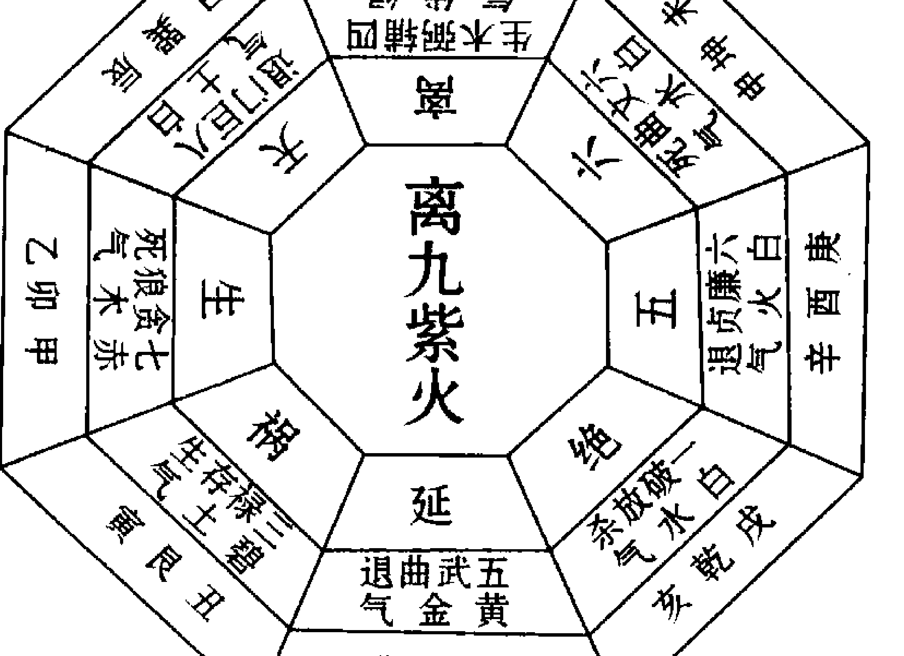

离命得震来路、灶口，有五子；得坎延年有四子；得巽天医有二子。犯乾绝命，长子痨噎，绝嗣。犯艮祸害，先伤季子、季女，后有二子。犯坤六煞，伤长子、女，后有一子。若犯绝命方灶口、来路，虽子在千里之外，亦应伤子而绝嗣，而自身亦不寿。

## [今译]

离命人的灶口火门朝着震位生气方向，会有五个儿子；朝着坎位延年方向，会有四个儿子；朝着巽位天医方向，会有两个儿子。但是，如果灶口火门朝着乾位绝命方向，大儿子会患痨疾，会断子绝孙；如果朝着艮位祸害方向，先会伤及四儿子、小女儿，然后会有两个儿子；如果朝着坤位六煞方向，会伤及大儿子、女儿，然后会有一个儿子；如果朝着绝命方向，那么，就算儿子在千里之外，也会受到损伤，并会断子绝孙，而且自己也不会长寿。

# 婚姻

## [原文]

离命宜配震命妻，巽、坎次吉。求婚宜安床坎方易成。

## [今译]

离命的男性最适合娶震命的女性为妻，也可以娶巽命和坎命的女性。如果求婚的话，床位应该安放在坎位，就容易成功。

# 子息

## [原文]

离命灶口向震有五子，向乾绝嗣，向坎四子，向巽三子。

## [今译]

离命人的灶口火门如果朝着震位方向，会有五个儿子；如果朝着乾位方向，会断子绝孙；如果朝着坎位方向，会有四个儿子；如果朝着巽位方向，会有三个儿子。

# 疾病

## [原文]

离命犯乾，伤肺，咳嗽、吐血。犯坤，疟痢、脚肿。犯兑，肺腑、咳嗽、痰多、心痛、损目。犯艮，小肠鱼口、杨梅疡烂、疟痢。除病俱依前法。

[PAGE 174]

## [今译]

离命人的灶口火门如果朝着乾位方向，会患肺疾，会咳嗽、吐血；如果朝着坤位方向，会患疟疾、脚肿；如果朝着兑位方向，肺腑会生疾病，会咳嗽、多痰、心痛、损坏眼睛；如果朝着艮位方向，会患肠疾、杨梅疮、疟疾等疾病。要想除病的话，就要把灶口火门改朝吉位方向。

# 灾祸

## [原文]

离命犯乾，灾绝，又西北争打，破头流血，来路吉者不死，伤父及长子、大仆。若妇命犯之，受翁责骂、痨天。犯坤，吵闹，夫妻不睦，西南黄面老妇嗾讼，破家，伤母妻、大子、女、媳。若凶卦多，而灶口又向坤，父必自中毒药。妇人犯之，受翁责骂，又有脚肿痛疾。

犯兑，伤母、妻妾、季子女，又妻窃财、小婢仆盗财逃走、失财，又犯火灾。犯艮，有东北黄童争讼，破财，又伤小女子、婢仆。

## [今译]

离命人的灶口火门如果朝着乾位方向，会遇到灾祸，在西北方会遇到争打，会头破血流，如果大门朝着吉位方向，不会伤及性命，父亲和大儿子、家中仆人会受损伤。如果离命女性的灶口火门朝着乾位方向，会受到公公责骂，会患痨疾，并会早死。如果离命人的灶口火门朝着坤位方向，家里会吵闹不休，夫妻不和睦，在西南方向上会有官司诉讼，家里会破落，母亲、妻子、大儿子、女儿、媳妇都会受到损伤。如果凶卦多，而且灶口又朝着坤位方向，父亲会中毒药。如果离命女性的灶口火门朝着坤位，会受到公公的责骂，而且会患脚疾。

离命人的灶口火门如果朝着兑位方向，会伤及母亲、妻妾、四儿子、小女儿，妻子会偷盗财物，小婢和仆人会偷财物逃走，家中会失财，此外，家中还会发生火灾。如果离命人的灶口火门朝着艮位方向，在东北方会有官司，家中会破财，会伤及小女儿和家中的奴仆。

[PAGE 175]

# 坤命之宅(西四)

## 【原文】

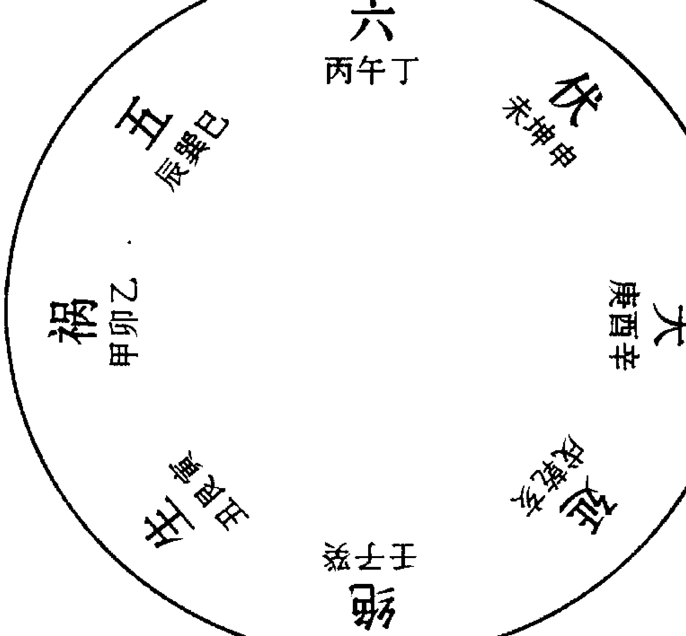

上元男命壬申、辛巳、庚寅、己亥、戊甲、丁巳。上元女命庚午、己卯、戊子、丁酉、丙午、乙卯。下元男命己巳、戊寅、丁亥、丙申、乙巳、甲寅、癸亥。下元女命丁卯、丙子、乙酉、甲午、癸卯、壬子、辛酉。

# 【今译】

出生在上元年的男性，从坎一开始，朝着逆时针方向推算，分别是壬申年、辛巳年、庚寅年、己亥年、戊申年、丁巳年。出生在上元年的女性，从艮八开始，朝着顺时针方向推算，分别是庚午年、己卯年、戊子年、丁酉年、丙午年、乙卯年。出生在下元年的男性，从兑七开始，朝着逆时针方向推算，分别是己巳年、戊寅年、丁亥年、丙申年、乙巳年、甲寅年、癸亥年；出生在下元年的女性，从艮八开始，朝着顺时针方向推算，分别是丁卯年、丙子年、乙酉年、甲午年、癸卯年、壬子年、辛酉年。

[PAGE 176]

# 艮方水绕坤局

## [原文]

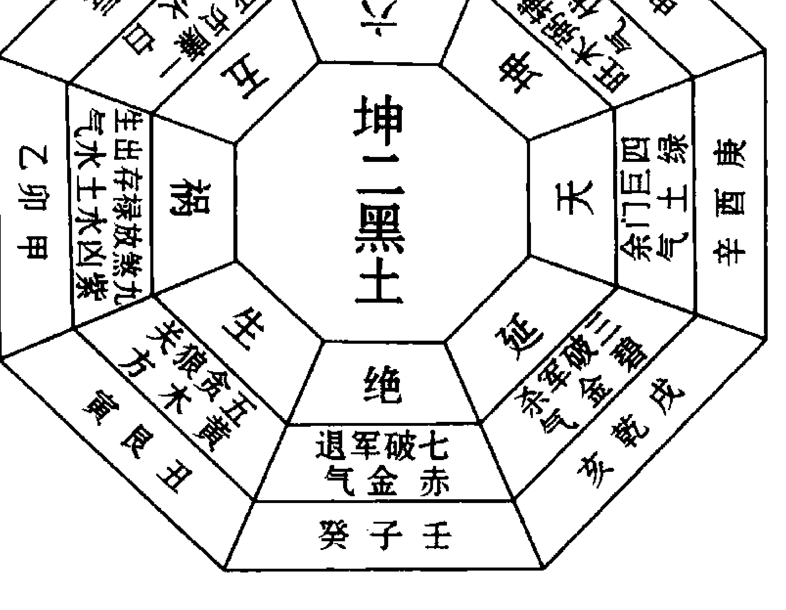

坤命得艮生气，有五子，乾四子，兑三子。坤只有女。犯坎绝嗣。有一坤命客往坎方，一年家中子亡，皆伤于慢惊、痢痘，以坎肾也。又一寡妇坤命，灶口向坎，三年内二孙溺水。犯离，伤仲子、女而有二子。犯震，长子伤，以后竟绝子。犯巽，伤长子、长女而有二子。

## [今译]

坤命人的灶口火门如果朝着艮位生气方，会有五个儿子；如果朝着乾位延年方，会有四个儿子；如果朝着兑位方，会有三个儿子；如果朝着坤位伏位方，只有女儿；如果朝着坎位，会断子绝孙。有一个坤命人前往坎方，结果在一年之中，儿子死去，其他家人都伤于受惊、痢痘等各种疾病，因为在中医理论中，坎主肾。还有一个坤命寡妇，她的灶口火门朝着坎位方向，结果在三年之内，两个孙子都溺水而亡。如果灶口火门朝着离位方向，会伤及二儿子、女儿，但是会有两个儿子；如果灶口火门朝着震位方向，大儿子会有伤损，此后会断子绝孙；如果灶口火门朝着巽位方向，会伤及大儿子、大女儿，但是会有两个儿子。

[PAGE 177]

# 婚姻

[原文]

坤命宜配艮命妻，乾、兑次吉。求婚宜于安床向乾易就。

[今译]

坤命男性适合娶艮命女性为妻，娶乾命和兑命女性也可以。如果求婚的话，床位应该朝着乾位方向，容易成功。

# 子息

[原文]

坤命男，灶口向艮有五子，向兑三子，向乾四子。

[今译]

坤命的男性，灶口火门如果朝着艮位方向，会有五个儿子；如果朝着兑位方向，会有三个儿子；如果朝着乾位方向，会有四个儿子。

# 疾病

[原文]

坤命男女犯离，有心痛、痰火、吐血等症，用兑方天医来路除之。犯震、巽有疟痢、疮毒等症。犯坎绝命，男则伤寒疟疾，虚弱无寿，女则闭经、血崩、痨噎。除病可用天医兑向，五日见效，十一日起床，两月除根。用延年乾向，二十五日见效，起床，虽有三分残疾，而延年有寿也。灶向天医，则用来路延年方，如来路天医，则灶向宜用延年。余仿此。

[今译]

坤命人的灶口火门如果朝着离位方向，会患心痛、痰火、吐血等疾病，如果要治病，就要把灶口火门改朝兑位天医方向。如果灶口火门朝着震位和巽位，会患疟疾、拉肚子、疮毒等疾病。如果灶口火门朝着坎位绝命方，男性会患伤寒、疟疾，身体虚弱，不会长寿，女性会患闭经、血崩、痨疾等疾病。如果要治病，就要把灶口火门改朝兑位天医方向，五天之内就会见效，十一天左右就能从床上起来，两月之内就会除掉病根，或者灶口火门改朝乾位延年方向，身体会在二十五天左右好转，就算会有残疾，也能从病床上起来。如果灶口火门朝着延年方，会长寿。如果灶口火门朝着天医方向，那么家宅大门就应该朝着延年方；如果家宅大门朝着天医方向，那么灶口火门就应该朝着延年方。其余的以此类推。

# 灾祸

## [原文]

坤命人若犯坎方，则有投河、风波溺死等灾，又虚损，伤仲子，后伤长子，绝嗣，小孩则慢惊风、殇夭。犯离，则有人命官非，又妻淫乱，伤妻妾、仲子、女婢

| 出生年       | 男命 | 女命 |
| ------------ | ---- | ---- |
| 一九二八 戊辰 | 离火 | 乾金 |
| 一九二九 己巳 | 艮土 | 兑金 |
| 一九三〇 庚午 | 兑金 | 艮土 |
| 一九三一 辛未 | 乾金 | 离火 |
| 一九三二 壬申 | 坤土 | 坎水 |
| 一九三三 癸酉  | 翼木 | 坤土 |
| 一九三四 甲戌 | 震木 | 震木 |
| 一九三五 乙亥 | 坤土 | 翼木 |
| 一九三六 丙子 | 坎水 | 艮土 |
| 一九三七 丁丑 | 离火 | 乾金 |
| 一九三八 戊寅 | 艮土 | 兑金 |
| 一九三九 己卯 | 兑金 | 艮土 |
| 一九四〇 庚辰 | 乾金 | 离火 |
| 一九四一 辛巳 | 坤土 | 坎水 |
| 一九四二 壬午 | 翼木 | 坤土 |
| 一九四三 癸未 | 震木 | 震木 |
| 一九四四 甲申 | 坤土 | 翼木 |
| 一九四五 乙酉 | 坎水 | 艮土 |
| 一九四六 丙戌 | 离火 | 乾金 |
| 一九四七 丁亥 | 艮土 | 兑金 |
| 一九四八 戊子 | 兑金 | 艮土 |
| 一九四九 己丑 | 乾金 | 离火 |
| 一九五〇 庚寅 | 坤土 | 坎水 |
| 一九五一 辛卯 | 翼木 | 坤土 |
| 一九五二 壬辰 | 震木 | 震木 |
| 一九五三 癸巳 | 坤土 | 翼木 |
| 一九五四 甲午 | 坎水 | 艮土 |
| 一九五五 乙未 | 离火 | 乾金 |
| 一九五六 丙申 | 艮土 | 兑金 |
| 一九五七 丁酉 | 兑金 | 艮土 |
| 一九五八 戊戌 | 乾金 | 离火 |
| 一九五九 己亥 | 坤土 | 坎水 |
| 一九六〇 庚子 | 巽木 | 坤土 |
| 一九六一 辛丑 | 震木 | 震木 |
| 一九六二 壬寅 | 坤土 | 巽木 |
| 一九六三 癸卯 | 坎水 | 艮土 |
| 一九六四 甲辰 | 离火 | 乾金 |
| 一九六五 乙巳 | 艮土 | 兑金 |
| 一九六六 丙午 | 兑金 | 艮土 |
| 一九六七 丁未 | 乾金 | 离火 |
| 一九六八 戊申 | 坤土 | 坎水 |
| 一九六九 己酉 | 巽木 | 坤土 |
| 一九七〇 庚戌 | 震木 | 震木 |
| 一九七一 辛亥 | 坤土 | 巽木 |
| 一九七二 壬子 | 坎水 | 艮土 |
| 一九七三 癸丑 | 离火 | 乾金 |
| 一九七四 甲寅 | 艮土 | 兑金 |
| 一九七五 乙卯 | 兑金 | 艮土 |
| 一九七六 丙辰 | 乾金 | 离火 |
| 一九七七 丁巳 | 坤土 | 坎水 |
| 一九七八 戊午 | 巽木 | 坤土 |
| 一九七九 己未 | 震木 | 震木 |
| 一九八〇 庚申 | 坤土 | 巽木 |
| 一九八一 辛酉 | 坎水 | 艮土 |
| 一九八二 壬戌 | 离火 | 乾金 |
| 一九八三 癸亥 | 艮土 | 兑金 |
| 一九八四  甲子 | 兑金 | 艮土 |
| 一九八五  乙丑 | 乾金 | 离火 |
| 一九八六  丙寅 | 坤土 | 坎水 |
| 一九八七  丁卯 | 巽木 | 坤土 |
| 一九八八  戊辰 | 震木 | 震木 |
| 一九八九  己巳 | 坤土 | 巽木 |
| 一九九〇  庚午 | 坎水 | 艮土 |
| 一九九一  辛未 | 离火 | 乾金 |
| 一九九二  壬申 | 艮土 | 兑金 |
| 一九九三  癸酉 | 兑金 | 艮土 |
| 一九九四  甲戌 | 乾金 | 离火 |
| 一九九五  乙亥 | 坤土 | 坎水 |

## 八宅明镜

这是从一九一六年到一九九五年的命卦图表。不论男性或女性，只要根据自己的出生年，就可以在上面这张表中查到自己的命卦以及五行属性。

## 婚姻论

(有亏行者不准) 求婚世用吕才法，无如用改灶法最稳。妻元配夫元，大有补益。故妻之东四配东四夫，则有子又和睦，若配西四夫，则难嗣而不和矣。配生气有五子，配延年有四子，配天医有三子，配伏位本宫有女无子，配五鬼后有三子，配六煞只一子，配绝命则孤孀无子而难偕老，配祸害虽无子而有寿、偕老。故论妻元配合，不专以妻命论，贵同夫妻配合，皆得生气为上吉。延年、天医次之。世之为子求婚及未定婚者，宜留意焉。

## [今译]

(如果行为有亏于德行，用这个方法来看婚姻就不准)

用吕才求婚图，不如改用灶口火门朝向的方法，这样才最稳妥。如果妻子的年命与丈夫的年命相配，这是最好不过的。东四命的妻子和东四命的丈夫，一般都会有儿子，而且家庭很和睦。但是，如果妻子是东四命，丈夫却是西四命，就很难有儿子，而且家庭不会和睦。如果灶口火门朝着与年命相符的生气方，就会有五个儿子；如果朝着与年命相符的延年方，就会有四个儿子；如果朝着天医方，就会有三个儿子；如果朝着伏位方，那么就只有女儿，没有儿子。如果灶口火门朝着年命的五鬼方，后来会有三个儿子；如果朝着六煞方，就只有一个儿子；如果朝着绝命方，那么一生将孤苦伶仃，没有儿子，而且夫妻难以白头到老；如果朝着祸害方，虽然没有儿子，但是会长寿，而且夫妻会白头到老。所以，在这一点，并不是只看妻命，而是将妻命与夫命合起来看，而且夫妻的年命都得到生气方的相助，那就是上吉，延年位和天医位次之。凡是为儿子求婚的人和没有定婚的人，都要留意这一点。

## 疾病论

(凡冤谴、鬼祸受病者不准)

五行|金|木|水|火|土
五脏|肺|肝|肾|心|脾
五腑|大肠|胆|膀胱|小肠|胃
五气|燥|风|寒|暑|湿

天地五行定位，乃东木、西金、南火、北水、中央土五宫。坤、艮、戊、己，土也。应于阳宅内之八卦者，如震、巽二卦，若坤、艮土命人犯之来路、灶口，而有疟痢、泻痔等症，以木克脾土也。又如鸡属火，克乾命人之肺金，生咳嗽及痨喳之疾。是以腹具五脏，应乎五行，而宅之方向坤爻亦从此推之。又坎水克离火命之心经，是以有心痛、痰火之症。坤、艮二土卦克坎水命之肾经，而生浮肿等症。又宅内犯乾、兑二金卦，克震二木巽命人，应肝伤目损而自恼缢也。

## [今译]

(如果因为冤魂讨债、鬼祸上门而生病，那么这个方法就不准)
人体内的五脏六腑分别与五行中的金木水土火相对应，如上面的表格。
天地五行，分别为东木、西金、南火、北木，中间为土。坤位、艮位、戊、己都属土。如果阳宅属于震卦或巽卦，而坤命、艮命的人灶口火门朝向与之相冲，就会患上疟痢、泻痔等疾病，因为木克土。鸡属火，乾属金，二者相克，因此会有咳嗽、痨疾等疾病。因此，人体内的五脏六腑都与五

## [原文]

(凡积德行善者不准)

灾祸是非，各随元命卦爻生克，而推细具于前。智者随机断之，无不响应。

## [今译]

(对积德行善的人来说，这一点不准)

人的灾祸是非，都是由命卦的生克而来的。所以，智慧的人根据情况来推论，基本上都很准确。

## [原文]

(凡强求败德者不准)

凡求财，须元命合灶口吉向。若合生气大富，期月得大财。如生气木星，应在亥卯未年、月。合天医巨门土星，应在申子辰年、月发财，有千余金。合武曲延年金星，日月进财，中富。合伏位辅弼水星，小富，日有小财进益，应在亥卯未年、月。屡试屡验，术者秘之。

## [今译]

(对强行求财以致德行有亏的人不准)

如果求财，灶口火门要朝着年命的吉方。如果灶口火门朝着年命的生气方，贪狼木星方向，就会大富，几月之内就能得大财，并会在亥年、卯年、未年、亥月、卯月、未月应验。如果灶口火门朝着天医方，巨门土星方向，就会在申年、子年、辰年、申月、子月、辰月应验发财；如果灶口火门朝着延年方，武曲金星方向，随时都会进财，中等富。如果灶口火门朝着伏位方，辅弼水星方向，会小富，每天都有小钱入账，并会在亥年、卯年、未年、亥月、卯月、未月应验。这点屡试屡验，是秘诀。

## 修造论

(凡大德大恶者应迟)

凡屋有坐有向，而命有东有西。今人专论坐立东西，而不论命之东西者误。必须从命配山，乃为全吉。乾山巽向屋，而大门、香火、房床、店铺等，宜安乾、坤、艮、兑西四方位，灶口宜向西四方，而西四方宜高大。若灶座、坑厕、碓磨等安东四方，如此配合，西坐山之吉者也，西四命人居之吉，东四命人居之凶。是乾、坤、艮、兑命宜居十二西坐山，坎、离、震、巽命宜居十二东坐山也。或人问曰：“弃命从山修造，何如？”师曰：“宅可改而命不可改，则当从命为吉。”又问：“屋基难更山向，求何解法？”师曰：“如艮山坤向大厅屋，予东命宅主不利，可于左厢傍厅小屋居之，吉。或添造左廊，吉。而东命宅主大利。其本山厅屋，宜西命子孙居之，另添神堂、厕、磨，吉。否则，与弟侄合命者居之，或租与人居住，各行后门，或空闲为客座而自不安床，亦可。”

## [今译]

(对大德或大恶的人不准)

房屋要讲究方位和朝向，年命有东四命和西四命。现在，人们只讲房屋的方位朝向，却不论命卦，这是错误的。只有当命卦与方位相配时，才是全吉。如果房屋位于乾位，朝向巽位，那么大门、香火、床、店铺等，都应该在乾位、坤位、艮位、兑位这几个西四命的吉方，灶口火门也应该朝着西四命的吉方，而且在西四命的吉方应该高大敞亮。如果灶座、厕所、碓磨位于东四方，那么座落在西四方的房宅就会吉祥如意。而这样的房屋适合西四命的人居住，如果东四命的人居住这样的房屋就凶。因此，乾命、坤命、艮命、兑命适合座落于罗盘上的西十二山，而坎命、离命、震命、巽命适合位于罗盘上的东十二山。有人问：“如果修造房屋的时候，不论人的命卦，那该怎样呢?”我的老师说：“家宅可以改变，但是命卦难以改变，应当按命卦来办事才好。”又有人问：“房屋的地基朝向都难以改变，那怎么办呢?”老师说：“例如，位于艮位，朝向坤位的大厅房，不适合东命人居住，可以在左厢傍厅的小屋里住，这样就好了。或者添造一条左廊，也会很好。这样，东四命的宅主就会很好。而在艮位坤向的大厅屋，则适合西命的子孙居住，另外再添加神堂、厕所、碓磨就会吉利。不然的话，就让弟侄辈中命卦相合的人来住，各自走各自的后门，或者租给别人居住，或者将这间屋空闲当客房，总之自己不能在里面安床。

## 通天照水经遥鞭断宅

## [原文]

鬼入雷门伤长子。鬼者，廉贞火也。震为雷，应长男。此言乾方大门正东震方起造高房屋，主有凶。此以大门方位为主，而论房高之方。如乾门，使用“大游年歌” “乾：六天五祸绝延生”，顺轮至五鬼，以乾金克震木而伤长子也。如震方安床亦忌，盖乾是西宅之门，与正东四宅之命不合，故不论何命人居之皆凶。尝见乾命人灶口向震，亦伤长子，配震妻，有子难招，又造震方房，期月而长子死。又乾命女，男用震方来路，亦有此凶。乾命分房亦不可犯，以及茔元之方皆同。余可类推。

## [今译]

“鬼入雷门伤长子”，鬼指五鬼廉贞火，震为雷，所以，这里的雷接震位，与长男对应。也就是说，如果五鬼廉贞火照临震位，家宅中长子会受到损伤。即在乾方大门的正东震位建高屋，会有凶事。这是以大门的方位为主，论述房高低的方法。例如，乾门，根据“大游年歌”中“乾：六天五祸绝延生”，意思就是说伏位在乾位，以乾卦为起点，按顺时针方向旋转排列：第一是坎位，与六煞对应，即六煞居于坎位；第二是艮位，与天医对应；第三是震位，与五鬼对应；第四是巽位，与祸害对应；第五是离位，与绝命对应；第六是坤位，与延年对应；第七是兑位，与生气对应。因此，在震位时，与五鬼廉贞星对应，而乾金克震木，因此会伤及长子。在震位方向上安床也有禁忌，这是因为乾门是属于西四宅的门，与正东四宅之命不合，所以，不管什么人住在这样的房宅里，都有凶事。我曾经见乾命人的灶口火门朝着震位方向，而伤其长子，娶震命妻，也难有儿子，在震位修造房屋，只不过一月大儿子死亡。乾命女性如果与震命男性婚配，也一样不吉。同样，在乾命人分房时，相阴宅也要注意这一点。此外，坟墓的朝向也要注意。其余的以此类推。

## 歌断

## 【原文】

# (北宫门对论)

鬼入雷门伤长子。

此言乾方大门克震方房、床，则为五鬼而伤长子，此以宫克宫论也。

火见天门伤老翁。

此言离火大门克乾方床、房为绝命，亦宫克宫也。

离侵酉兑翁伤女。

此正南大门克酉辛床、房，与“火见天门”篇同。而兑，少女也。

巽入坤位母离翁。

此巽木门克坤土房、床，与“震坤老母寿难丰”之局同。

## 猴。如果房屋在丑艮寅位，朝向要在亥位；如果房屋要在震卯己未位，房门要避开亥位。八卦中的长生位起自福德，无情无义的人是求不来的。

《玉辇经》是按照阴宅和阳宅的坐山朝向排定的二十四个方位的吉凶口诀。这二十四个方位分别是：福德、瘟疫、进财、疾病、诉讼、官爵、官贵、自吊、旺壮、兴福、法场、颠狂、口舌、旺蚕、进田、哭泣、孤寡、荣富、少亡、娼淫、亲姻、欢乐、败绝、旺财。每一个方位的吉凶都不一样。住宅的坐山朝向不同，二十四山的吉凶各不相同。所以，在修建房屋或者坟墓时，可以先用罗盘来看方位的朝向，然后将应该趋吉的放在吉方，将应该压凶的放在凶方。

乾、戌、亥这三山，从巳上起福德，然后按二十四山的顺序，丙是瘟疫、午是进财、丁是长病、未是诉讼、坤是官爵、申是官贵、庚是自吊、酉是旺壮、辛是兴福、戌是法场、乾是颠狂、亥是口舌、壬是旺蚕、子是进田、癸是哭泣、丑是孤寡、艮是荣富、寅是少亡、甲是娼淫、卯是亲姻、乙是欢乐、辰是败绝、巽是旺财。

![img/2a2c1103b1453ef89211be6c83f4797a_196_0.png]

## 凡开门放水，大小不同，乡俗不定。有以五音论者，有以八卦论者，有以生气吉星贪狼论者，有以山向风水八龙论者，有以来路爻象、年命吉星属土八白九星论者，用法不同，合将通用俗图开列于后。

假如坐西北、向东南，戌、乾、亥三山向开门放水，六畜、碓磨、碾、厕具备式例，以博观览。

## 开门放水，大小都不一样，而且各个地方的风俗也不同。有的地方按五音来定，有的地方按八卦来定，有的地方按照生气吉星贪狼来定，有的地方根据山向风水来定，还有的地方根据来路的爻象、年命的吉凶来定。它们的用法都不太一样。请参见后面的通用图表。

如果家宅位于西北方，大门朝向东南方，那么，应该朝着戌、乾、亥这三个方向开门放水，而家中的牲畜、碓磨、厕所的方位等，都各有讲究。

## 戌山辰向

## 戌山辰，壬子及坤申。名为贪狼金武曲，二宫迁穴自然兴。东南去，合图局，堆金积玉满门庭。富贵人丁千百口，出人长寿更奇英。

乾山向，巽巳水来长。庚酉旺方皆不利，大江朝入不寻常。流丁甲，出公卿，破伤辛兑守空房。辰巽若从当面去，人家长子切须防，抱养不风光。

亥山向，贪狼巽已好。申庚辛酉自南来，积玉堆金进横财。丁水去，衣锦回，马羊走入女怀胎。但破庚辛兼辰巽，三年两度哭哀哀，家业化成灰。

## 这是戌山辰向、乾山巽向、亥山巳向的二十四山吉凶图。在二十四个方位上，各自应该建什么、养什么、忌什么，都在图表中注明了。要注意的是：朝向之方，本来是吉，但水流去就为凶，水流来是吉；原本是凶，但水流去反而为吉，水流来则为凶。上面说的意思是：

如果阴阳宅是戌山辰向，那么，贪狼星和武曲星分别照临壬子和坤申，

## 壬山丙向

## 如果阴阳宅为壬山丙向，那么贪狼星照临寅、申方位。如果巳山和亥山朝向壬山，如水流向辰、巽方位就更好，家中富裕，子孙孝顺，出贤良儿子。但如果水流朝向巳、丙方位，长子会一生孤苦。但如果水流过寅、甲，妻子会两地分离。

## 如果阴阳宅为子山午向，那么在庚、未、坤、申这四个方位上，家中会富贵兴旺；如果在酉、辛、戌这几个方位上，家中女子会有淫乱之事；在辰位会有刑讼之事。如果文曲星照临，会有瘟疫。如果水流向丙、巽方位，家中会出公卿。

## 如果阴阳宅为癸山丁向，穴位在中间，那么在申宫吉祥，但是在辰、巽位上会有不祥之事。在丙宫上不会有水灾，在西位和辛位上不吉。

## 丑山未向

## 丑山高大，未坤方位的水来势凶猛，那么周围的景象纷纷来朝，并坐于丁水方位，穴在亥壬位，坚固牢靠。这样的话，亡者安宁，家中的子孙会做高官；如果水自丙巽位流去，家中会出英豪。如果行龙马之运，那么家业会败退，家中的人会患疾病，家人会患疯痨，家中子孙会忤逆不孝，还会动枪刀。

## 艮山峰，龙虎更来脉，乾位大猪从左人，须寻卯酉觅仙踪。庚丁去，出三公，丙辛水去亦无凶。只怕羊宫并马位，这般来水似相冲，即便主贫穷。

## 寅山长，甲庚水过堂。亥壬子癸横来吉，流归辛戌正相当。蛇马鸡，最为良，宜去不宜横。箭射潮来人口败，其家媳妇守空房。

## 这是丑山未向、艮山坤向、寅山申向的二十四山吉凶图。

## 丑山高大，未坤方位的水来势凶猛，那么周围的景象纷纷来朝，并坐于丁水方位，穴在亥壬位，坚固牢靠。这样的话，亡者安宁，家中的子孙会做高官；如果水自丙巽位流去，家中会出英豪。如果行龙马之运，那么家业会败退，家中的人会患疾病，家人会患疯痨，家中子孙会忤逆不孝，还会动枪刀。

## 艮山高，龙脉自青龙、白虎位来，乾位有大猪从左侧进入，要在卯酉位上寻找它的踪迹。水自庚丁位流去，家中会出三公。水自丙辛而去，也没有凶险。只怕羊宫和马位，从这两处的来水是相冲的，家人会贫穷无依。

## 寅山绵长，水自甲庚位来，流过明堂。如果水自亥壬子癸位横流而来，也主吉祥，如果水流归辛戌位，也是不错的。其中，蛇马鸡这三个方位是最好的，水应该流走，而不应横流。如果水横流的话，就犯了冲射，家中人口会败绝，家中的媳妇会独守空房。

## 甲山庚向

## 这是甲山庚向、卯山酉向、乙山辛向的二十四山吉凶图。

## 甲山庚向，壬子水和庚申水分别位于贪狼生气木星位和延年武曲金星位，两水来朝，家中繁荣昌盛，家室会吉祥安宁。如果水自西辛流去，家中人丁兴旺。如果水流近明堂，那么家中人丁少，而且家人会死亡。在这

##样的地方修坟修宅的话，家人会孤苦贫穷，家中会灾祸不断。

## 卯山西向，酉位（属鸡）最不好。乾宫亥宫都主吉祥，如果水流向庚位和兑位，家中的儿孙会在朝堂上做官，家中会有田产钱财。未坤水不吉祥，如果未坤水自穴前流过，家中会有瘟疫，那些在此处安房修宅的人，不论人家还是寺院，几乎年年都会遇到官司诉讼，家中会落亡，败亡。

## 乙山辛向，左侧是蛇马位，右侧是牛虎位，家中会兴旺发达。与此局相合，水流入乾壬方位，家中资财雄厚，会赛过富有的孟尝君。但是，水千万不能流入猴鼠位。如果水自犬位方来，家中的人一定会遇刑伤，家中妻室会受人欺凌。

## 这是甲山庚向、卯山酉向、乙山辛向的二十四山吉凶图。

## 甲山庚向，壬子水和庚申水分别位于贪狼生气木星位和延年武曲金星位，两水来朝，家中繁荣昌盛，家室会吉祥安宁。如果水自西辛流去，家中人丁兴旺。如果水流近明堂，那么家中人丁少，而且家人会死亡。在这

##样的地方修坟修宅的话，家人会孤苦贫穷，家中会灾祸不断。

## 卯山西向，酉位（属鸡）最不好。乾宫亥宫都主吉祥，如果水流向庚位和兑位，家中的儿孙会在朝堂上做官，家中会有田产钱财。未坤水不吉祥，如果未坤水自穴前流过，家中会有瘟疫，那些在此处安房修宅的人，不论人家还是寺院，几乎年年都会遇到官司诉讼，家中会落亡，败亡。

## 乙山辛向，左侧是蛇马位，右侧是牛虎位，家中会兴旺发达。与此局相合，水流入乾壬方位，家中资财雄厚，会赛过富有的孟尝君。但是，水千万不能流入猴鼠位。如果水自犬位方来，家中的人一定会遇刑伤，家中妻室会受人欺凌。

## 辰山戌向

## 辰山戌向是很奇特的，但是遇到鸡犬这两个方位就不好了。但可喜的是甲庚壬子癸位的水前来朝拜坟穴，水自酉辛位而去，家中儿孙会身着朱衣，富贵无比。如果水在庚辰位横流，家中妻室不利。只要龙真穴正，那么不论哪家都会有富贵荣华。

## 巽山乾向，申坎位的水前来朝拜坟穴。来自申坎位的水是最重要的，酉辛壬申的来水就不好了，否则家中一定会有瘟疫之灾。如果水自猴鼠方位流去，那么家人的性命难保，而且家中人丁会有损伤，家门还可能会绝嗣。从前的颜回（孔子的七十二门生之一）就是因为家中有这样的坟地，虽然至今仍美名流传，但是却不能长寿。

## 巳山亥向，水自乾壬戌位而来，虎兔朝拱龙脉，家中世代富贵，没有灾祸。如果水自庚癸位流去，家中田财兴旺。但是，水不能在子午位逆行回旋。坤未甲宫的水都不好，水频繁地流走会养尸骸，棺材上会受到水蚁的侵扰。

## 这是辰山戌向、巽山乾向、巳山亥向的二十四山吉凶图。

## 辰山戌向是很奇特的，但是遇到鸡犬这两个方位就不好了。但可喜的是甲庚壬子癸位的水前来朝拜坟穴，水自酉辛位而去，家中儿孙会身着朱衣，富贵无比。如果水在庚辰位横流，家中妻室不利。只要龙真穴正，那么不论哪家都会有富贵荣华。

## 巽山乾向，申坎位的水前来朝拜坟穴。来自申坎位的水是最重要的，酉辛壬申的来水就不好了，否则家中一定会有瘟疫之灾。如果水自猴鼠方位流去，那么家人的性命难保，而且家中人丁会有损伤，家门还可能会绝嗣。从前的颜回（孔子的七十二门生之一）就是因为家中有这样的坟地，虽然至今仍美名流传，但是却不能长寿。

## 巳山亥向，水自乾壬戌位而来，虎兔朝拱龙脉，家中世代富贵，没有灾祸。如果## [今译]

在二十四山中的法场位上安门，家中会有大灾大凶，可能会受到不明的人命官司，会流放异乡，妇人与他人勾搭，十分不利。

## [原文]

颠狂之位不可夸，生离死别及颠邪。

田地退消人口败，水火瘟廣绝灭家。

此位安门，主人疯邪、淫乱，女人产厄，男酒女色，少年暴卒，父南子北，人口不安，财物耗散。

## [今译]

在二十四山中的颠狂位上不能安门，否则家人会有祸事，如疯邪、淫乱等，女人会难产，男人好酒，女人好色，子孙会暴死，家人会分离，家中财物耗尽，鸡犬不宁。

## [原文]

口舌安门大不祥，常招无辜横灾殃。

夫妇相煎日逐有，无端兄弟斗争强。

此位安门，口舌不离，官事常有，忤逆不孝，媳妇詈姑，六畜无牧，凡事不利。

## [今译]

在二十四山的口舌位上安门，家中会有口舌是非，子孙不孝，媳妇不贤，牲畜不旺，事事不顺利。

---

## [原文]

旺蚕位上好修方，此位安来家道昌。

六畜丝蚕皆大旺，坐收米谷满仓箱。

此位安门，大旺田产，财帛胜常，招添子孙，勤俭好善。火命人起家，蚕丝倍旺。

## [今译]

在二十四山的旺蚕位上安门，家中会田产兴旺，财源滚滚，子孙兴旺，家人会勤俭持家，乐善好施。属火的人能够发家致富，家中农桑兴旺，粮米满仓。

## [原文]

进田位上福绵绵，常招财宝子孙贤。

更主外人来寄物，金银财宝富田园。

此位安门，招田产、契书，出入亲贤乐善。本命寄物发达，六畜加倍。

## [今译]

在二十四山的进田位上安门，家人会多福多寿，子孙兴旺、贤能、孝顺，会日渐增加田产、田契，家中出入的都会是贤良之人，家人会乐善好施。本命年的人会更加发达，家中饲养的牲畜也会兴旺，家中财源滚滚。

## [原文]

哭泣之处不可开，年年灾祸到家来。

枉死少亡男与女，悲泣流泪日盈腮。

此位安门，常有哭声，瘟疫疼痛，痘痢麻疹，男女少亡，阴人多病，破耗钱财，六畜不利。

## [今译]

在二十四山的哭泣位上安门，家中会有灾祸，家人会染病，尤其女人多病，家中男女和少年都会死去，而且会损失钱财，六畜不旺。

## [原文]

孤寡之方灾大凶，修之寡妇坐堂中。
六畜田蚕俱损败，更兼人散走西东。

此位安门，寡妇无倚，出走他乡，破家耗散，六畜不利。

## [今译]

在二十四山的孤寡位上安门，家中会不祥。女性会守寡，家里人七零八落，并会流落他乡，家财会损耗，六畜不旺。

## [原文]

荣福位上最堪修，安门端的旺人财。
发积家庭无灾祸，富贵荣华事业收。

此位安门，荣迁加升，田蚕旺相，财帛倍收，六畜胜常。火命旺发。

## [今译]

在二十四山的荣福位上安门，家中会大吉大利。家人会加官进爵，家畜和人丁兴旺，家中财源不断。特别是五行人中的火命人会很发达兴旺。

## [原文]

少亡之位不可夸，一年之内哭声哗。
好酒阴人自缢死，雷门伤子死天涯。

此位安门，伤损小口，招妻旺死，投河自缢，阴人多病，酒色败家。

## [今译]

在二十四山的少亡位上安门，会伤及家中孩子，妻子死，家人多病，特别是女人多病，还会酒色败家。

## [原文]

娼淫之位不可修，修之淫乱事无休。

室女怀胎随人走，一家大小不知羞。

此位安门，男女酒色，娼淫无耻，败坏家风，妇人淫乱，室女怀胎，六畜不收。

## [今译]

在二十四山的娼淫位上安门，家中男女都喜好酒色，家风败坏，家业破落，家中的饲养的六畜也不会兴旺，家中会贫寒无依。

## [原文]

亲姻位上好修方，修之亲戚众贤良。

常时往来多吉庆，金银财宝满仓箱。

此位安门，招财，进人口，六畜大旺。火命发达。

## [今译]

在二十四山的亲姻位上安门，亲戚会越来越多而且都会十分贤良，家中会有财，添加人口，六畜兴旺。火命人会兴旺发达。

## [原文]

欢乐门修更进财，常有徵音人送来。

田蚕六畜皆兴旺，发福声名响似雷。

此位安门，招南方绝户，银钱币帛，六畜兴旺，阴人送帛，木命人发达。

## [今译]

在二十四山的欢乐门上安门，会招来南方绝产，家中会钱财滚滚，人丁兴旺，牲畜兴旺，会有阴人保佑，而且有利于木命人。

## [原文]

绝败之方不可修，修之零落不堪愁。

人丁损灭无踪迹，父子东西各自投。

此位安门，破败家财，遭瘟暴卒，自缢落水，风火水厄，不利。

## [今译]

在二十四山的绝败方上安门，家中会破财，还会遭遇瘟疫，家人会上吊或者溺水而亡，父子分离，各自东西，有风火水灾，皆为不利。

## [原文]

旺财门上要君知，富贵升迁任发挥。

显腾人丁家业胜，一身丰厚寿齐眉。

此位安门，进商音人财物，且又永寿。火命人发达。

## [今译]

在二十四山的旺财位上安门，家中会富贵荣华，人丁兴旺，家人健康长寿，而且对火命人非常好。

从上面的歌诀中可以看出，家宅的大门适合安装在福德、进财、官爵、官贵、旺庄、兴福、旺蚕、进田、荣福、亲姻、欢乐、旺财这十二个方位，而不适合安装在瘟癀、疾病、词讼、自吊、法场、颠狂、口舌、哭泣、孤寡、少亡、媚淫、败绝这十二个方位。家门在吉方，家中会进财，家人会加官，多子多福，而且会福裕。但是，如果家门在凶方，那么家人会丧亡，家会破财，子孙不孝，家中会有官司，会有孤寡之苦。

---

## [原文]

乾山巽，亥山巳，戌山辰。

此宅利未申酉年、月。人墓于丑，应征在宅主。本宅于兑方尽属吉星，艮有微疵，不若酉为第一。若坎则六煞，震则五鬼，巽则祸害，而离则绝命之破军，皆不利也。

乾宅为正巽向，不宜正开而论，宜开右一间巳门。合《玉辇经》曰“福德门”，又合西四宅。宜开白虎门，最为上吉。且乾金生巳，大门开巳，二傍门开兑。门在庚位，又不犯巽向，杀曜为第一。或大门在坤，以老阴、老阳配合，又合延年武曲金星，比和星助本宫，更合天地定位之局。又《衍文》一书不定坤名者，以三碧在坤，其吊之气又有微疵也。至吊紫白，乾系六白金星，吊得七赤星到本宫，是为坐旺。八白上在兑为生气，上上吉也。若开艮门，是为天医巨门之土星，土生乾金，星生乎宫，亦上吉之宅也。以三者较之，坤巳宜开大门，兑开二门，兑开便门，三吉备矣。

## [今译]

乾山、亥山、戌山都属于乾位，乾宅是西四宅。

乾宅在未年、申年、酉年、未月、申月、酉月吉祥。如果下葬，适合在丑年、丑月，且宜于宅主年命相符。乾宅的兑位方向有吉星照临，艮位方向稍不如人意，酉山方向最好。但是，如果在坎位方向，会有六煞凶星；在震位方向，会有五鬼凶星；在巽位方向，会有祸害星；在离位方向，会有绝命破军星，所以，这几个方位都不好。

如果乾宅朝着巽位方向，不能开正门，只能在巽位的右侧开门，就像《玉辇经》中说的“福德门”，再加上它是西四宅，如果开白虎门就是上吉。乾金生巳，所以，大门可以开在巳山方位，兑位方向可以开侧门。如果门在庚山方向，那么与巽位不相冲，侧门可以不用正面对接日光。如果大门开在坤位，与阴阳配合得好，又有延年武曲金星照临，符合天地定位的格局。在《衍文》一书中，之所以不给坤位定名，是因为三碧在坤位，而其所吊之气有瑕疵。吊紫白时，乾位有六白金星时，七赤星到坤位，那么坤位就会很旺。在兑位有生气吉星照临，大吉。如果在艮位开门，有天医巨门上星照临，也是上吉。这几者相比较的话，大门适合开在坤位，二门和便门都适合开在兑位。

## [原文]

子山午，壬山丙，癸山丁。

此宅利申子年、月，入墓于辰，徵应于申、子。本宅坐宫全美，在旁可开小门，开后门在壬位、癸位，不离本宫，吉。不可侵亥、丑位。去查坎宅配巽为生气，震为天医，离为延年，可开门路。然即此三方吊白，亦有不尽吉处。若乾则六煞，坤则绝命，艮五鬼而兑祸害，尤不吉也。至吊紫白，坎系一白水星，吊得六白金到本宫，是坐生气。二黑到乾，八白到震，俱有煞气。然震为天医，离为延年，巨门可开便门，以助正门之吉。如地形可开大门，又合东四宅，宜开东方门，吉。三碧在兑为禄存，四绿在艮为廉贞五鬼，俱为退气。七赤到坤，是为生气。九紫到巽，亦为死气。巽以贪狼而吊死气，亦安小门而助正门之吉。查书称巽门方“木入坎宫，凤池身贵”，且见坎宅开巽门，而吉者亦多也。坤以破军而吊生气，故癸山丁向，有开坤申门者，因在坎水，即生方，而有生星照，兼能迎合右之来水也。此不过存之以待。左手不能开门者，五黄在离，属武曲延年，《地理衍文》谓之不利者，其直冲也。愚以原正合参，除衙门喜门正门外，凡百姓之家，丁向之房，不必开午，以禄破二门直开，大门在丙位，乃纯吉也。子山午向，亦是二门直开，大门在丙位为尤吉也。若壬山丙向，多是左水到右，方合水法。大门开巽收巽，是火之临官位，皆有贪狼星到，最为吉利，不得泥于先前所言，而为巽门不可开也。其丙向二门，仍对开为吉。大小门不应在巳位开，而走破丙向之禄也。次知丁午向，而大门开丙为第一。丙向大门开巽为第一。若丙向只是一门而进，竟以正对为吉。若

## [今译]

子山、壬山、癸山都属于坎方，坎宅是东四宅。

申年、子年、申月、子月都有利于坎宅。下葬适合选择辰年、辰月，申年和子年不利。坎宅在四个方位都不错，旁边可以开小门，后门适合开在壬山、癸山方位，但是不能在亥山和丑山方位。坎宅中巽位有生气吉星，震位有天医吉星，离位有延年吉星，这几个方位都可以开门路。不过，这三个方向也有不尽人意之处。如果在乾位会有六煞凶星，在坤位会有绝命凶星，在艮位会有五鬼凶星，在兑位会有祸害凶星，在这几个方位都不能开门路。吊紫白，坎位有一白水星，有六白金到本宫，就会有生气。二黑到乾位，八白到震位，都有煞气。因为震位有天医吉星，离位有延年吉星，巨门可开便门，这对家宅的正门有好处。由于它是东四宅，所以，如果地形允许的话，可以在正东方向开门，会大吉。因为三碧在兑位为禄存星，四绿在艮位有五鬼星，所以这两个方位不适合安门。七赤到坤，就有生气。如果九紫到巽，也是死气。巽位有贪狼星而吊气，可以安小门，这对家宅大门有利。根据风水书上说的：“木入坎宫，凤池身贵。” 所以，坎宅开巽门，而吉者亦多也。坤位有破军星而吊生气，如果坎宅坐癸山乾向丁山，那么可以在坤申方位开门路。因为是在坎位，有生气，所以，有生气吉星照耀，对右边的来水有迎合之势。不过这需要有机会。左侧不能开门，因为五黄在离位。离位虽然有武曲延年星，风水书说不利，是因为它冲煞。我以为除了衙门、喜门和正门，如果平常百姓的家宅是癸山丁向，那么最好不要在午山方位开门，因为癸山丁向、子山午向，在禄存、破军星的方位开二直门，大门适合在丙位，这样就吉利。壬山丙向，多因左水到右，才符合风水。所以，大门在巽位有开合之势，五行属火，在此官位，都有贪狼星照耀，最为吉利，不要因为原来不正确的说法而认为在巽位不利于开门。丙向二门，仍对开。大门小门都不适合开在巳山方位，而要在禄存星照耀的方位破除凶煞，选择丙向开门。丁向和午向的房宅，大门都适合开在丙位，丙向房宅的大门适合

## [原文]

卯山西，甲山庚，乙山辛。
此宅利亥寅卯年、月，人墓于未，徵应在长房。本宅坐宫为伏位，吉。配巽为延年，离为生气，坎为天医，俱可开门作灶。若乾则五鬼，坤则祸害，艮则六煞，兑则绝命，俱不吉。至吊紫白，震系三碧木星，吊得一白星到本宫，是坐生气。二黑在巽，八白到坎，七赤到离，虽气有未纯，皆可开门。四绿到乾是为旺气，是可井可灶方。若五黄在兑，大不利。
按：八宅俱无可开后门之处，虽中宫伏位挨左右柱可开后路便门，亦按此开之吉。震宅、巽宅，俱不宜直开门路，以金克木也。二门在庚，开合纳甲亦可。

# 【今译】

卯山、甲山、乙山都属于震方，震宅属于东四宅。

震宅喜逢亥年、寅年、卯年、亥月、寅月、卯月。如果下葬，适合选择未年、未月。家中长房不利。震宅位于伏位吉祥，在巽位有延年吉星，在离位有生气吉星，在坎位有天医吉星，灶口火门都可以朝着这几个方位。但是，在乾位有五鬼凶星，在坤位有祸害凶星，在艮位有六煞凶星，在兑位有绝命凶星，这几个方位都不好。到吊紫白，震位有三碧木星，吊得一白星到本宫来，就有了生气之吉。二黑在巽位，而八白到坎伴一，七赤到离位，虽然生气之吉不是很强大，也可以开门。四绿到乾就有了旺气之吉，这里可以打井安灶。如果五黄在兑位，就很不利。八宅都没有可以开后门的去处，虽然中宫可以为伏位，挨着左右两侧可以开后路和便门，但也必须与年命相符才会吉祥如意。震宅、巽宅都不适合直开门路，因为金克木，故不吉。二门在庚位，按照年命与吉位相符的说法，只要彼此配合就好。

## [原文]

艮山坤，## 纯一不杂之方位也。先前辟艮门不用，历验兑泽开艮门者，未见其不吉也。甲卯乙向，对开亦吉。如两重门第，二门直开。外大门若乙卯向，开在甲位。甲向开在艮位亦可。

## [今译]

酉山、庚山、辛山都属于兑方，兑宅是西四宅。

兑宅喜逢巳年、未年、申年、酉年、巳月、未月、申月、酉月。如果下葬的话，适合选择丑年、丑月。家中少女不利。兑宅的乾位有生气吉星，坤位有天医吉星，这两个方向都适合开门路，其中乾位尤其好。坎位有祸害凶星，震位有绝命凶星。虽然巽位有六煞凶星，离位有五鬼凶星，只要与其他门的相配处理好，还可以考虑开门，吉利。到吊紫白，兑位的七赤金星，吊得九紫火星在此宫，无法完美。后门不可以在中宫左右开门，可以开在乾位和坤位。一白在艮，虽然为吉气减弱，而延年星对金星有助，四绿在坤位，我克为财，不嫌没有吉气。五黄在震位，木不能克金。八白在乾位，就有生生不息的生机，会获益良多。看兑宅，在乾位开门，乾位是最好的方位，不要在其他杂乱之方开门。前人说艮位开门不用，但是我历来检验了许多在艮位开门的，没有发现有不吉的。如果房宅是甲卯乙向，那么房门可以对开。如果有两重门，可以二门直开。外面的大门如果朝着乙山和卯山方位，应开在甲位。如果房宅是甲向，大门也可以开在艮位。

## [原文]

(康熙二十三年甲子起上元)

+   甲子（坎艮） 乙丑（离乾） 丙寅（艮兑） 丁卯（兑艮）
戊辰（乾离） 己巳（坤坎） 庚午（巽坤） 辛未（震震）
壬申（坤巽） 癸酉（坎艮） 甲戌（离乾） 乙亥（艮兑）
丙子（兑艮） 丁丑（乾离） 戊寅（坤坎） 
己卯（巽坤） 庚辰（震震） 辛巳（坤巽） 壬午（坎艮）

+   癸未（离乾） 甲申（艮兑） 乙酉（兑艮） 丙戌（乾离）
丁亥（坤坎） 戊子（巽坤） 己丑（震震） 庚寅（坤巽）
辛卯（坎艮） 壬辰（离乾） 癸巳（艮兑） 甲午（兑艮） 乙未（乾离） 丙申（坤坎） 丁酉（巽坤）
戊戌（震震） 己亥（坤巽） 庚子（坎艮） 辛丑（离乾）
壬寅（艮兑） 癸卯（兑艮） 甲辰（乾离） 乙巳（坤坎）
丙午（兑艮） 丁未（乾离） 戊申（艮兑）
己酉（兑艮） 庚戌（离乾） 辛亥（艮兑） 壬子（兑艮）
癸丑（乾离） 甲寅（坤坎） 乙卯（巽坤） 丙辰（震震）
丁巳（坤巽） 戊午（坎艮） 己未（离乾） 庚申（艮兑）
辛酉（兑艮） 壬戌（乾离） 癸亥（艮兑）

## [今译]

康熙二十三年为1684年。六十年为一甲子。上表中，括号内的两个字，分别代表当年的男命和女命。例如，“甲子（坎艮）”的意思是在上元甲子年，男性为坎命，女性为艮命；“乙丑（离乾）的意思是在上元乙丑年，男性是离命，女性为乾命。其余的以此类推。

### 中元

## [原文]

(乾隆重九年甲子起中元)

+   甲子（巽坤） 乙丑（震震） 丙寅（坤巽） 丁卯（坎艮）
戊辰（离乾） 己巳（艮兑） 庚午（兑艮） 辛未（乾离）
壬申（坤坎） 癸酉（巽坤） 甲戌（震震） 乙亥（坤巽）
丙子（坎艮） 丁丑（离乾） 戊寅（艮兑）
己卯（兑艮） 庚辰（坤坎） 辛巳（巽坤） 壬午（震震）
癸未（震震） 甲申（坤巽） 乙酉（坎艮） 丙戌（离乾）
丁亥（艮兑） 戊子（兑艮） 己丑（乾离） 庚寅（坤坎）

+   辛卯（巽坤） 壬辰（震震） 癸巳（坤巽） 甲午（坎艮） 乙未（离乾） 丙申（艮兑） 丁酉（兑艮）
戊戌（乾离） 己亥（坤坎） 庚子（巽坤） 辛丑（震震）
壬寅（坤巽） 癸卯（坎艮） 甲辰（离乾） 乙巳（艮兑）
丙午（兑艮） 丁未（乾离） 戊申（艮兑）
己酉（巽坤） 庚戌（震震） 辛亥（坤巽） 壬子（坎艮）
癸丑（离乾） 甲寅（坤坎） 乙卯（巽坤） 丙辰（震震）
丁巳（坤巽） 戊午（坎艮） 己未（离乾） 庚申（艮兑）
辛酉（兑艮） 壬戌（乾离） 癸亥（艮兑）

## [今译]

乾隆九年是1744年。六十年为一甲子。上表中，括号中的两字分别代表该年的男命和女性。例如，“甲子（巽坤）”的意思是在中元甲子年，男性是巽命，女性是坤命；“乙丑（震震）”的意思是在中元乙丑年，男性是震命，女性是震命。其余的以此类推。

## [原文]

凡屋之尺寸步数，皆宜单不宜双。门宜三九二尺七寸半，阔七九六尺三寸半。高大双阁，则宜四九三尺六寸半，阔或五九四尺五寸半。宜以四法尺较量之，取四样尺皆吉为准。尺俱不离九数而加半寸，则四样尺俱吉。

## [今译]

房屋中的尺寸步数，应该是单数，而不应该是双数。例如，门最好长三九二尺七寸半，宽七九六尺三寸半。如果是两层楼的高屋，长应该是四九三尺六寸半，宽五九四尺五寸半。最好用四法尺来量，九寸为一尺，因为在风水中，有“遇九则吉”的说法。尺不离开九数，再加半寸，那么四样尺就都吉祥了。四样尺的具体内容见下文介绍。

## [原文]

(明天启四年甲子起下元)

+   甲子（兑艮） 乙丑（乾离） 丙寅（坤坎） 丁卯（巽坤）
戊辰（震震） 己巳（坤巽） 庚午（坎艮） 辛未（乾离）
壬申（兑艮） 癸酉（艮兑） 甲戌（乾离） 乙亥（乾离）
丙子（巽坤） 丁丑（震震） 戊寅（坤巽） 己卯（艮兑）
庚辰（坎艮） 辛巳（离乾） 壬午（艮兑） 癸未（兑艮）
甲申（乾离） 乙酉（坤坎） 丙戌（巽坤） 丁亥（震震）
戊子（坤巽） 己丑（坎艮） 庚寅（离乾） 辛卯（艮兑）
壬辰（兑艮） 癸巳（坤巽） 甲午（巽坤） 乙未（坎艮）

+   戊戌（离乾）
己亥（艮兑）
庚子（兑艮）
辛丑（乾离）
壬寅（坤坎）
癸卯（巽坤）
甲辰（震震）
乙巳（坤巽）
丙午（坎艮）
丁未（离乾）
戊申（艮兑）
己酉（兑艮）
庚戌（乾离）
辛亥（坤坎）
壬子（巽坤）
癸丑（震震）
甲寅（坤巽）
乙卯（坎艮）
丙辰（离乾）
丁巳（艮兑）
戊午（兑艮）
己未（乾离）
庚申（坤坎）
辛酉（巽坤）
壬戌（震震）
癸亥（坤巽）

## [今译]

明朝天启四年甲子是公元1624年。六十年为一甲子。上表中，括号中的两个字分别代表该年的男命和女命。例如，“甲子（兑艮）”的意思是出生在下元甲子年，男性为兑命，女性为艮命；“乙丑（乾离）”的意思是出生在下元乙丑年，男性为乾命，女性为离命。其余的以此类推。

## [原文]

凡屋之尺寸步数，皆宜单不宜双。门宜三九二尺七寸半，阔七九六尺三寸半。高大双阁，则宜四九三尺六寸半，阔或五九四尺五寸半。宜以四法尺较量之，取四样尺皆吉为准。尺俱不离九数而加半寸，则四样尺俱吉。

## [今译]

房屋中的尺寸步数，应该是单数，而不应该是双数。例如，门最好长三九二尺七寸半，宽七九六尺三寸半。如果是两层楼的高屋，长应该是四九三尺六寸半，宽五九四尺五寸半。最好用四法尺来量，九寸为一尺，因为在风水中，有“遇九则吉”的说法。尺不离开九数，再加半寸，那么四样尺就都吉祥了。四样尺的具体内容见下文介绍。

## [原文]

一曰子房尺，二曰曲尺，三曰鲁班尺，四曰玄女尺，尺俱九寸。又曰鲁班尺乃木匠常用，一寸管一字：财、离、病、义、官、劫、害、本。内财、义、官、本四字吉，与此鲁班尺又不相同，不在此论内。子房尺以九寸为九步：金星（吉）、火星（凶）、罗星（凶）、木星（吉）、紫气（吉）、文星（凶）、计都（凶）、月孛（凶）、水星（吉）。曲尺以九寸分九步：第一寸为一白（吉），六寸为六白（吉），八寸为八白（吉），九寸为紫（吉），其二、三、四、五、七寸皆凶。鲁班尺以九寸分十三步：财遂田增，生灾口舌，分定损妻，离乡绝义，招财进业，旺财吉利，生贵子吉，进财生子，横祸凶神，长病师孤，官司牵连，瘟火退财，进宝吉利。玄女尺以九寸分八步：贵人（吉）、天灾（凶）、天祸（凶）、天财（吉）、官禄（吉）、孤独（凶）、天败（凶）、辅弼（吉）。凡门屋尺寸，俱以此样尺较量，取其皆吉可也。以一板四寸阔、九寸长画此四样尺子，一面则吉凶了然。总之数不离九，遇九则吉。以九寸为一尺，以九尺为一丈，再加半寸财，诸尺皆吉也。

## [今译]

在风水丈量中，经常使用的尺子有子房尺、曲尺、鲁班尺和玄女尺，这些尺都以九寸为一尺，因为在风水中，遇九则吉。鲁班尺通常是木匠用的，每寸分别代表财、离、病、义、官、劫、害、本。其中，财、义、官、本为吉，其余为凶。子房尺是九寸为九步，分别代表金星（吉）、火星（凶）、罗星（凶）、木星（吉）、紫气（吉）、文星（凶）、计都（凶）、月孛（凶）、水星（吉）。曲尺也是九寸为九步，其中第一寸是一白（吉），六寸为六白（吉），八寸为八白（吉），九寸为紫（吉），其他二寸、三寸、四寸、五寸、七寸都是凶。鲁班尺九寸有十三步，分别是财遂田增、生灾口舌、分定损妻、离乡绝义、招财进业、旺财吉利、生贵子吉、进财生子、

## [原文]

床之尺寸俱宜单数，长宜六尺三寸半，或五尺四寸半，阔宜四尺五寸半。小床三尺六寸半。高宜单数。

床不宜接脚，不可添新换旧，不宜披头尖，或陀头笋亦可。不宜锯减，不宜裁狭，不宜用樟树，忌神坛坟树。床横宜七根，不宜双。床料宜株梓、桐、栎、椿，亦树之开花结子者。床怕房门相冲，以一屏风抵之乃安。床宜安命之生、天、延三方吉。造床宜吉日，必当令旺相日乃吉。安床日亦忌之。

## [今译]

床的尺寸应该是单数，长最好六尺三寸半，或者五尺四寸半，宽最好四尺五寸半。小床长三尺六寸半。床高也最好用单数。

床不适合接床脚，不可以在旧床上添加新的木料部件以修理，床头不能是三角形，但床头看上去象人陀头笋一样是可以的。不能把床锯短，不能把床变窄，做床的木料不适合用樟树或者坟墓、神坛前的树。床的尺寸也应该是单数，不能是双数。做床的材料最好是梓木、桐木、栎木、椿木，因为梓树、桐树、栎树、椿树都是开花结果的树。床不能对着房门，如果床对着房门，就要在床和门之间隔一道屏风。床应该安在床的主人年命的吉方，即生气、天医、延年这三个方位上。在造床的时候，要选择良辰吉日。放床的日子也有讲究。

## [原文]

长七尺九寸，上象北斗，下应九州。广四尺，象四时。高三尺，象三才。灶口阔六寸，象六合。高一尺二寸，象十二月。安两斧，象日月。癸八大寸，象八风。宜新砖净土，和合香水，切不可壁泥相罗。以猪肝和泥，令妇人孝顺。凡作灶取土，先除地面上立五寸浮土，取下面净土，以井水并香和泥，大吉。

## [今译]

作灶要求长七尺九寸，上面象征北斗七星，下面象征地上九州；灶要宽四尺，象征四季；高三尺，象征天、地、人三才；灶口宽六寸，象征天下六合；灶高一尺二寸，象征十二个月；灶头安两柄斧头号，象征太阳和月亮。灶面八寸宽，象征四面八方来风都有饭吃。在打灶的时候，对材料也是有讲究的。打灶要用新砖和干净的土，并在和泥的井水中加香料，不能将打灶的泥与墙壁的泥混在一起。如果在打灶的泥中加入一点猪肝，家中妇人会孝顺。在打灶的时候，要先除去地上五寸浮土，再用下面干净的土，用井水和香料和泥，会很吉利。

## [原文]

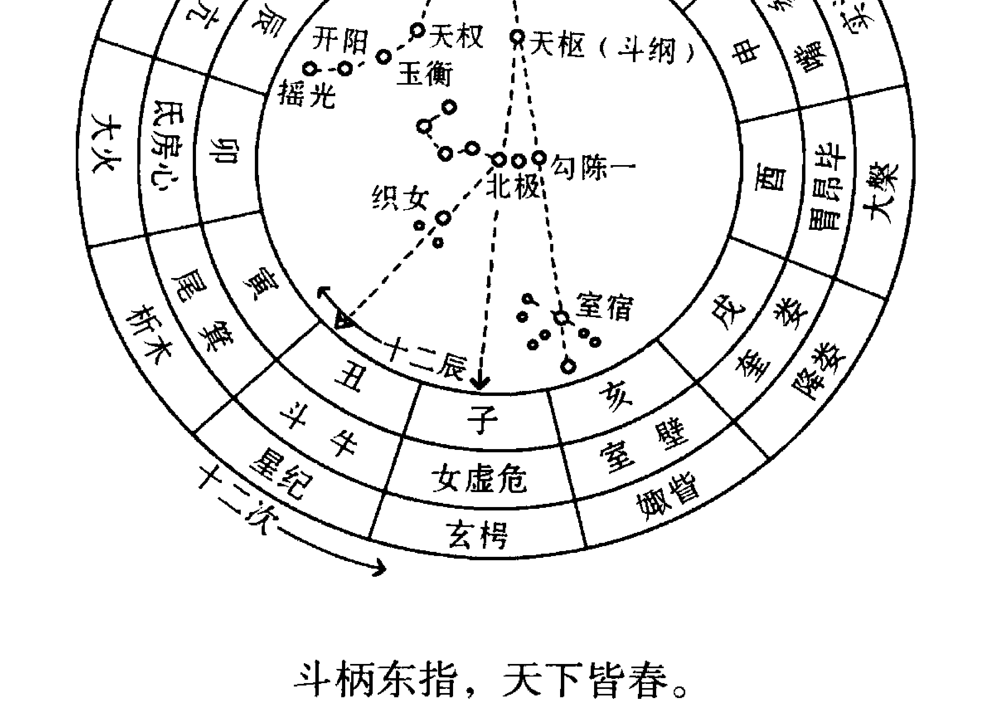

- 斗柄东指，天下皆春。
- 斗柄南指，天下皆夏。
- 斗柄西指，天下皆秋。
- 斗柄北指，天下皆冬。

## [今译]

图中正中的是北斗七星图。斗柄指向东方，就是春天；斗柄指向南方，就是夏天；斗柄指向西方，就是秋天；斗柄指向北方，就是冬天。

## [原文]

(康熙二十三年甲子起上元)

+   甲子（坎艮） 乙丑（离乾） 丙寅（艮兑） 丁卯（兑艮）
戊辰（乾离） 己巳（坤坎） 庚午（巽坤） 辛未（震震）
壬申（坤巽） 癸酉（坎艮） 甲戌（离乾） 乙亥（艮兑）
丙子（兑艮） 丁丑（乾离） 戊寅（坤坎） 
己卯（巽坤） 庚辰（震震） 辛巳（坤巽） 壬## 二十四山图
实际上八卦的演变而已。但实际上看宅的时候，只看八个方向的门，有的人说二十四向门户，其实是一种误传。

变法如下：生气贪狼星，五行属木；五鬼廉贞星，五行属火；天乙巨门星，五行属土；延年武曲星，五行属金；六煞文曲星，五行属水；绝命破军星，五行属金；祸害禄存星，五行属土；辅弼星五行属木。本宫即伏位，属动静正维宅。

乾，像天，所以称它为父。坤，像地，所以称它为母。震是乾坤相交，初次求取，一乾阳而成，故为长男。巽是乾坤相交，初次求取，一坤阴而成，故为长女。坎是乾坤相交，再次求得，一乾阳而成，故为中男。离是乾坤相交，再次求取，一坤阴而成，故为中女。艮是乾坤相交，第三次求取，得一乾阳而成，故为少男。兑是乾坤相交，第三次求得，一坤阴而成，故为少女。

### 九宫方位图
这张图是阳宅大八门的定式。看宅的时候，要先定门户，看房宅位于哪一卦，然后根据“大游年歌”中的卦句，来定房宅各个方向上的吉凶。门是房屋的气口，所以，相宅的时候，门非常重要。

### 西四宅七星图
乾宅、坤宅、艮宅、兑宅都属于西四宅，但是，大门的朝向都各有讲究，同时，房屋每个方位所属的吉凶也不一样。其吉凶祸福可以按“游年歌”中对应的歌诀来推断。

### 东四宅七星图
震宅、巽宅、坎宅、离宅都是东四宅，但是，大门朝向不一样，房屋各个方位对应的吉凶也不一样。各个方位上的吉凶祸福可以按“游年歌”中对应的歌诀来推断。

### 黄石公竹节赋
黄石公说相宅之法，一看分房二看卦爻，三看大门的朝向，四看五行的相生相克，五看卦象。卦象中的阴阳互相变换，先通过房宅的方位来看卦象，再通过大门的朝向来看卦象。不管是把西四宅误为东四宅，还是把西四宅误为东四宅，都不好。

震阳一宅须配巽，坎宅须配离家乡。乾宅须配坤家主，艮宅须配兑家庄。

以上四句全在巧番八卦、反覆旋转以定延年之吉，此四延年即人道之夫妇也，为修宅之要。

### 乾兑配成震巽卦
乾、兑属金，震、巽属木，金克木。乾见震为五鬼廉贞星，见巽为祸害禄存星，二星俱凶。兑见震为绝命破军星，巽为六煞文曲星，二星俱凶。震为长男，巽为长女，也被克制，又遇凶星至金会局之年月，必殃及长男长女也。

### 震巽配成坤艮卦
震、巽属木，坤、艮属土，木克土。震见坤为祸害禄存星，见艮为六煞文曲星，俱凶。巽见坤为五鬼廉贞星，见艮为绝命破军星，俱凶。坤为老母艮为少男，又遇克制，又遭凶星，而于会局之年月，必殃及老母少男也。

### 坤艮装成坎三阳
坤、艮属土，坎属水，土能克水。坤见坎为绝命破军星，艮见坎为五鬼廉贞星，俱凶。坎为中男，又遇克制，又逢凶星，而于会局之年月，中男必绝灭也。

### 中男合成离家火
坎为中男属水，离为中女属火，居卦中之夫妇也。坎离相见虽是延年，终为火遭水克。故曰：夫妇也，先吉而后伤。

### 中女合成天泽覆
离为中女属火，天为乾属金，泽即兑属金，火能克金。离见乾为绝命破军星，见兑为五鬼廉贞星，俱凶。乾为老夫，兑为少女，又遭克制，而于会局之年月，老夫少女必受其殃也。

### 见其年限并月限
如果家中的房门朝向凶方，房子在不好的位置会带上恶煞，方位相冲突，门房不吉互相克制，那么有一天必会发生不好的事。如果震、巽方向遇凶星，并被乾、兑相克，那么，在申年、酉年、申月、酉月一定会有凶事。

### 震巽旺相寅卯木
震、巽的吉方在寅山和卯山方位，坤、艮被震、巽所克，在寅年、申年、寅月、申月一定会有凶事。坤为土，少子即艮土，因此叫克子。

### 坤艮四季伤中子
坤、艮属土，土旺四季，夫四季卯辰戌丑未中，子即坎也，坤艮来克坎也。坤艮来克坎水者，其发凶必在辰年、戌年、丑年、未年、辰月、戌月、丑月、未月一定会有凶事。离火被坎水所克者，其发凶必在子年、亥年、子月、亥月一定会有凶事。

### 离家巳午纯金怕
离，五行属火；乾兑，纯金也。凶星也，夫离火来克纯金，其发凶必在巳年、午年、巳月、午月、巳日、午日一定会有凶事。如年限轮流是金，即为木之交克，必见损伤丁财也。

阳多必定伤妇女，阴多必定损儿郎。

阴阳配合家富贵，不须广览乱乖张。

### 合卦吉凶（西江月调）
如果生气贪狼星得位，由于它是吉星，所以家中会有五个儿子。家中人丁兴旺、万事顺利，子孙都会繁荣昌盛，遇到事情都会逢凶化吉。

家中子孙日益兴隆，星位与官位相生，万事称心如意，如果星宫相克，也能保平安。

五鬼廉贞星属火，是大凶之星，家中会受到阴人的损伤，子女会有灾难，主人可能会遇到凶事。可能还会遇到盗贼，家人会多病。

如果有天乙星前来旺相，能镇住凶煞，如果将门灶的方向改一下，朝着年命的吉方，就能有三个儿子。家中的田产会增加。

家中人只要讲究修德，积善行德，就会万事如意。黄蛇入宅说明会有喜事临门。

延年武曲星五行属金，上上大吉，延年星照临，家中有喜事，会有儿子，家业会兴旺发达，财富会增加。如果白蛇刺猬入宅，家中万事大吉。

吉位相生，家中的喜事会越来越多，子女身体健康，无灾无病，如果遇到凶星相克，还会逢凶化吉。

如果碰到六煞文曲星，家里的女性会淫乱，家人会生疾病，可能会有人投河落井。妻儿会遭遇刑克，财产会受到损失，家业会破败，会损失人丁。

家中会有寡妇孤苦伶仃，儿孙忤逆不孝，会偷盗，即使星宫相生也不会有富贵。

祸害星对阴人不利，家中人口会接二连三死亡。子孙会秃头，会眼瞎，会患疯疾，家中会出怪事，噩梦连连。

家中史弟不和睦，家中会有蛇虫。如果星宫相生还稍微好一点，如果星宫相克一定会有凶。

绝命星主凶，家中长房会遭殃，还会失火，遇盗贼，家中人口不安宁，会多病多灾。

家中会不断遇盗贼，家人会与外人或仇敌私通。家中人丁不安，凶险之事不断。

### 凡相宅之法
看宅都有一定的规矩。家门要与房屋的座向相合是宾合主，房屋要与门的朝向相合是主合宾。只有宾主相合，才能万事顺利。如果只看房的大小，不看吉星，那么，如果吉星势强，就不惧凶星，但是，如果凶星势强，就会压住吉星。

普天之下，虽然房屋众多，但看宅的方法都是一样的。因为人住的房屋，都会有门，门都有朝向，所以，有朝向就有卦位，可以看大门在什么卦位上，然后根据“游年歌”中相对应的卦句进行各个方位的凶吉判断，这是以门合宅。如果房屋遇吉星的力量强大，就是吉屋；如果遇凶星的力量强大，就是凶宅。

其次，要看吉星是否能起作用。贪狼生气吉星遇坎位、震位、巽位，巨门天医吉星遇离位、坤位、艮位，武曲延年吉星遇坤位、艮位、乾位、兑位，都非常好，一定会子孙兴旺，富贵长远。但是，如是贪狼生气吉星遇离位，巨门天医吉星遇乾位、兑位，武曲延年吉星遇坎位，那么，吉星的势就会减弱，中吉，子孙会比较好，家中也会比较富贵。如果贪狼生气吉星遇坤位、艮位，巨门天医吉星遇坎位，武曲延年吉星遇震位、巽位，又会稍微差一点，虽然家中人丁兴旺，也不缺钱用，但都会有一定损失。如果贪狼生气吉星遇乾位、兑位，巨门天医吉星遇震位、巽位、离位，那么吉星受克，就会人丁损伤，财物损失，凡事不利。因此说：吉星如果被克制，反而会主凶，君子做事行不通，小人得势如鱼得水，这时如果遇到凶星势强，家中一定会破落，房屋的吉气消失时，全家会死尽。

此外，在房宅中，有静宅和动宅之分。静宅不育，动宅主生气。

例如：在坎位、离位、震位、兑位开门，只有一大间房，并没有其他的二三进房，这就是正静宅。

如果在坎位、离位、震位、兑位开门，房宅中有重重的房间，甚至有三、四、五、六进房，那么，房宅气动则生，就是正动宅。

如果修了一座坐北朝南的住宅，里面有三进房，家门开在正南方向，属离位，就根据“游年歌”中与之对应的口诀，顺起到坎门延年止，然后从坎五开始，按“游年歌”中对应的口诀，顺起到离延年止。离门上是延年武曲金星，金生第二进房文曲水，水生第三进房贪狼木。

如果在乾位、艮位、巽位、坤位开门，而且房宅中房屋重重，有三四进房屋，就是动宅。如果坐北向南修一座房子，房宅是四进屋，大门开在东南，巽房就用“游年歌”中与巽位对应的口诀，起到离房上，这里有天乙巨门土星照临，土生第二进武曲金星，金生三进文曲水星，水生四进贪狼木星。其余的以此类推。

### 八门动静宅图式
相宅八门定法并四正静宅、四维静宅、四正动宅、四维动宅法开列如下。

#### 四正静宅图式
四正兑门静宅：此宅坐东西开兑门，用“兑：生祸延绝六五天”。

四正坎门静宅：此宅坐南向北开坎门，用“坎：五天生延绝祸六”。

四正震门静宅：此宅坐西向东开震门，用“震：延生祸绝五天六”。

四正离门静宅：此宅坐北向南开离门，用“离：六五绝延祸生天”。

#### 四正动宅图式
四正震门动宅：此宅坐西向东，家门开在震位，先以震位为伏位，根据“游年歌”中与之对应的口诀，用八卦相生的原理来定吉凶方位。

四正坎门动宅：此房宅坐南向北，家门位于坎位，先以坎位为伏位，根据“游年歌”中与之对应的口诀，用八卦相生的原理来定吉凶方位。

## 四正兑门动宅
此宅坐东向西开兑门，用巧番八卦相生定之。

# 【今译】
此房宅坐东向西，家门开在兑位。先以兑位为伏位，根据“游年歌”中与之对应的口诀，用八卦相生的原理来定吉凶方位。

## 四正离门动宅
此宅坐北向南开离门，用巧番八卦相生定之。

# 【今译】
此房宅坐北向南，家门开在离位，先以离位为伏位，根据“游年歌”中与之对应的口诀，用八卦相生的原理来定吉凶方位。

## 四维静宅图式

## 四维乾门静宅
此宅坐南向北开乾门，用“乾：六天五祸绝延生”。

# 【今译】
此房宅坐南向北，家门在乾位，以乾位为伏位，按“游年歌”中对应的口诀推断各方位的吉凶。

## 四维艮门静宅
此宅坐南向北开艮门，用“艮：六绝祸生延天五”。

# 【今译】
此房宅坐南向北，家门在艮位，以艮位为伏位，按“游年歌”中对应的口诀推断各方位的吉凶。

## 四维坤门静宅
此宅坐北向南开坤门，用‘坤：天延绝生祸五六’。

# 【今译】
此房宅坐北向南，家门在坤位，以坤位为伏位，按‘游年歌’中对应的口诀推断各方位的吉凶。

## 四维巽门静宅
此宅坐北向南开巽门，用‘巽：天五六祸生绝延’。

# 【今译】
此房宅坐北向南，家门在巽位，以巽位为伏位，按‘游年歌’中对应的口诀推断各方位的吉凶。

## 四维动宅图式

## 四维艮门动宅
此宅坐西向东开艮门，中央接续则一字相生。

# 【今译】
此房宅坐西向东，家门在艮位，如果中间是连在一起的，就是相生关系。

## 四维乾门动宅
此宅坐南向北开乾门，中央接续则一字相生。

# 【今译】
此房宅坐南向北，家门在乾位，如果中间连在一起，则彼此相生。

## 四维乾门动宅
此宅坐东向西开乾门，中央接续则一字相生。

# 【今译】
此房宅坐东向西，家门在乾位，如果中间连在一起，则彼此相生。

## 四维艮门动宅
此宅坐南向北开艮门，中央接续则一字相生。

# 【今译】
此房宅坐南向北，家门在艮位，如果中间连在一起，则彼此相生。

## 四维坤门动宅
此宅坐北向南开坤门，中央接续则一字相生。

# 【今译】
此房宅坐北向南，家门在坤位，如果中间连在一起，则彼此相生。

## 四维巽门动宅
此宅坐北向南开巽门，中央接续则一字相生。

# 【今译】
此房宅坐北向南，家门在巽位，如果中间连在一起，则彼此相生。

## 四维坤门动宅
此宅坐东向西开坤门，中央接续则一字相生。

# 【今译】
此房宅坐东向西，家门在坤位，如果中间连在一起，则彼此相生。

## 四维巽门动宅
此宅坐西向东开巽门，中央接续则一字相生。

# 【今译】
此房宅坐西向东，家门在巽位，如果中间连在一起，则彼此相生。

## 宅门断吉

## 【原文】
乾宅坤门，富贵多珍；门开艮兑，代代腰金。坤宅乾门，夫妇和宁；门开艮兑，世受皇恩。艮气兑门，最旺儿孙；乾坤出入，家满黄金。兑宅艮门，家道昌亨；乾坤出入，祖业丰盈。震宅巽门，加官进丁；门开南北，平步青云。巽宅震门，家出文人；门开南北，富贵骈臻。坎宅离门，库满仓盈；出入震巽，百子千孙。离宅坎门，广积金银；出入震巽，产子贤能。

# 【今译】
乾宅的门如果在坤位，家中会富贵；门如果在艮位和兑位，家中富裕多钱。坤宅的门如果在乾位，夫妻和睦；门如果在艮位和兑位，家中世世代代会受皇上恩典。艮宅的门如果在兑位，儿子会兴旺发达；门如果在乾位和坤位，家中会堆满黄金。兑宅的门如果在艮位，家中会富足；门如果在乾位和坤位，祖宗会留下丰厚的家财。震宅的门如果在巽位，家人会加官进爵；门如果在南北方向，那么家人也会平步青云。巽宅的门如果在震位，家中会出文人；门如果在南北方向，家中会富贵荣华享之不尽。坎宅的门如果在离位，家中会有吃不完用不完的钱财；门如果在震位和巽位，子子孙孙兴旺发达。离宅的门如果在坎位，家中会有用不完的金银；门如果在震位和巽位，家中子孙会贤能孝顺。

## 阳宅总论

## 【原文】
要知道屋宇之兴衰，须究东西之两宅。乾坤艮巽门，曰四维；震兑坎离户，言四正。

# 【今译】
要知道房宅的兴衰，一定要先是东四宅还是西四宅。乾、坤、艮、巽称为四维，震、兑、坎、离称为四正。

## 【原文】
乾坐西北，坤坐西南，艮坐东北，兑坐正西，为西四宅。震坐正东，巽坐东南，坎坐正北，离坐正南，为东四宅。凡东四宅不开西四宅门，西四宅不开东四宅门，是也。四维、四正干支，申明其下，绘图可览。

# 【今译】
乾坐西北，坤坐西南，艮坐东北，兑坐正西，这被称为西四宅。震坐正东，巽坐东南，坎坐正北，离坐正南，这被称为东四宅。东四宅的门必须与东四宅的吉位相合，西四宅的门必须与西四宅的吉位相合。四维、四正干支，都在下面作了详细说明，并画了图，可供浏览。

## 【原文】
四维有接续相生之秘。如乾坤艮巽上开门为四维门。凡开四维，从门上用大游年歌，顺去至第一进居中止，得何星，看此星五行属何，就从一进生第二进，以二进生第三进，以星宿五行重重生进去，谓之接续相生。看高处是何星宿，宅有何益损，使知宅之吉凶矣。

# 【今译】
四维之宅讲究接续相生。例如，在乾、坤、艮、巽上开门为四维门。如果开四维门，就先以门所在的方位为伏位，根据“游年歌”顺数到第一进房宅居中为止，看此处由什么星照临，在五行中属什么，然后一进生二进，二进生三进，星宿五行重重相生，这就叫接续相生。通过吉星和凶星，就能知道房宅的吉凶祸福了。

## 【原文】
四正有巧番八卦之传。如震兑坎离上开门为四正门。凡开四正门，须从坐房主房高大上起用大游年歌，顺数至去门上止，得何星，是巧番八卦也。看此星五行属何，从门上一进起重，重生进去，看房屋高大者是何宿，与宅有何损益是也。下绘屋图可考。

## [今译]
四正之宅讲究八卦之象。例如，在震位、兑位、坎位、离位上开门称为四正门。如果开四正门，就要以坐房的主房所在的方位为伏位，按照“大游年歌”，顺数到去门为止，看看此处是何星，什么卦象，以及在五行中属什么。然后从门上一进开始，重重相生，再通过星的吉凶，判断房宅的吉凶祸福。

## 【原文】
静宅须察门堂之生克，详其星落何方；动宅当究星宫之喜忌，观其曜飞之处。 盖住宅一进、二进为静宅，三进、四进至有五、六、七、八进者，皆为动宅。动宅有四维接续相生，有四正巧番八卦之法，谓之动则生也。凡静宅，不论四维、四正，皆从门上起数去，遇吉星高大者，主见败坏。然吉凶星皆不宜与宫克战，故曰：详其星落何方，观其曜飞何处。喜忌亦谓吉凶也。

# 【今译】
静宅需要查看门堂之间的相生相克关系，看看照临此处的主要是什么星；动宅要详细参考各星的喜忌，看其曜飞之处。 如果住宅只有一进和二进，一般就是静宅；如果有三进、四进、五进、六进、七进或八进，那么就是动宅。动宅有四个维度，四维动宅讲究接续相生。推算动宅，专门有四正巧番八卦的方法，称为动则相生。静宅不管是四维还是四正，都要从门上开始起数，如果遇到吉星势强，主不祥。不论是吉星还是凶星都不要与所在宫有相克，所以说“主要看星落何处，看其曜飞之处，来判断吉凶”。

## 【原文】
延年武曲金，居西而获吉。天乙巨门土，坐东而会凶。五鬼廉贞畏坎乾兑，总非艮六煞，文曲愁坤艮离，皆不吉。武军遇震巽，及南离乃是仇家。贪狼逢坤艮，与中央遂成敌国。

# 【今译】
延年即武曲属金，天乙即亘门属土，五鬼即廉贞属火，六煞即文曲属水，绝命即破军属金，生气即贪狼属木，祸绝即禄存属土，此是星宿之所属也。乾兑属金，震巽属木，艮坤及中宫属土，南离属火，坎北属水，此是八卦之所属也。延年金也，居西金地谓之星宫得位，故言其吉。天乙土也，坐东木地，谓之宫分克星，故言其凶。五鬼、六煞等皆宜类推。

## 【原文】
生者昌，克者亡，高低而论；战者凶，比者吉，小大以推。此承上文，星富生克而言。凡相阳宅，必先看门开何处，后定四维、四正。门分动宅、静宅，看主房何处高大，以高大主房为星，方位为宫。宫生星者吉，宫星交战者凶。星生宫为泄气。星与宫同属，谓之比和。门与宫亦宜生宜比，不可克战。

# 【今译】
相生则昌，相克则亡；高低相战为凶，高低相比为吉，大小以此类推。看阳宅，首先要看门所在的方位和朝向，然后再看房宅属四维房宅还是四正房宅。此外，房宅也分静宅和动宅，看哪处主房最高大，把最高大的主房定为星的方位，作为中宫，然后看门与宫之间的相生相克关系。宫与星相生的为吉，星位和宫位同属称为比和，门和宫也是要相生相比的，不能相克相战。

## 【原文】
乾曰父兮，坤曰母兮，震为长男，坎为次男，离巽是姑亦是媳，艮兑是女亦是子。

父乾居西北属金，为卦中老阳；母坤居西南属土，为卦中老阴；震居正东属阳木，为卦中长男；巽居东南属阴木，为卦中长女；坎居正北属阳水，为卦中中男；离居正南属阴火，为卦中中女；艮居东北属土，为卦中少阳，为少男；兑居正西属金，为卦中少阴，为少女。卦中之五行，即天道之五行；卦中之父子，即人伦之父子也。学者详之，而后知兴败。四句起矣，下文发明。

# 【今译】
乾父坤母，震长男，坎次男，巽长女，离中女，艮少男，兑少女。

乾位在西北方位，五行属金，在卦中为老阳；坤位在西南方位，五行属土，在卦中为老阴；震位在正东方位，五行属阳木，在卦中为长男；巽位在东南方位，五行属阴木，在卦中为长女；坎位在正北方位，五行属阳水，在卦中为中男；离位在正南方位，五行属阴火，在卦中为中女；艮位在东北方位，五行属土，在卦中为少阳，少男；兑位在正西方位，五行属金，在卦中为少阴，少女。卦中的五行就是天道中的五行；卦中的父子是人伦中的父子。所以，学习风水术的人一定要明白这一点。

## 【原文】
鬼入雷门，惠王子丧于齐；廉居天府，伍相父刑于楚。

鬼者，五鬼廉贞凶星也。如震宅开乾门，宅被门克，从乾门上起至震房上，见五鬼落处，乾金震木，震被乾伤，主伤长子。如梁惠王太子丧于齐，是也。又如震门至乾上起高房，从震门上起至乾方，见五鬼廉贞落处，廉贞是火星，星克乾宫，主伤老父，如伍相国之父奢被楚平王所戮是也。

# 【今译】
鬼，即五鬼廉贞星，凶星。震宅的门如果位于乾位，那么，乾克震，门克宅。从乾门开始，顺数至震位，此处五鬼星落，乾金震木，震被乾伤，会伤及长子。比如说，梁惠王的太子丧于齐就是这样。如果从震门开始，顺数至乾位，并在此处建高屋，此处五鬼星落，廉贞为火星，星克乾宫，会伤及老父。比方说，伍相国的父亲伍奢被楚平王杀害也是如此。

## 【原文】
甘罗早发宅，逢艮兑延年；昌望建退屋，会乾坤武曲。 艮兑，少阳少阴也；乾坤，老阳老阴也。延年武曲属金也，金逢乾兑则旺，金逢坤艮则生。星飞生旺之处，星宫相宜。艮兑乃少阳少阴，主早发，乾坤乃老阳老阴，主发迟，如甘罗、昌望建之不同耳。

# 【今译】
艮兑分别为少阳和少阴，乾坤分别为老阳和老阴。延年武曲五行属金，金逢乾兑则旺，金逢坤艮则生，星往生旺处飞，所以星宫彼此相宜。因为艮兑为少阳少阴，主早年发达；乾坤为老阳老阴，主发达迟。甘罗少时为丞相和姜太公八十二岁时来运转奠定周朝八百年基业，他们的命运各不相同。

## 【原文】
用星低泄，贫同原宪、黔娄；吉宿高强，富比陶朱、猗顿。 用星即吉星，凡延年、生气、天乙为吉星。如吉星低小，星落处星去生宫，请之泄气，主贫穷。如用星高大，星落处宫来生星，谓之高强，主富贵。如原宪、黔娄之贫乏，陶朱、猗顿之素封也。

# 【今译】
用星指吉星，延年、生气、天乙都是吉星。如果吉星低小，主贫穷；如果吉星高大，主富贵。就像春秋时孔丘弟子原宪安贫乐道、后来战国渔人黔娄仿效原宪，二人都是终生贫困，而春秋时的陶朱公巨富，后来他教猗顿发财致富，猗顿果然富贵了一样。

## 【原文】
丧明之痛堪叹，震坎艮见遭伤损；鼓盆之哀谁诉，兑巽离巳遇欺凌。震为长子，坎为中男，艮为少男，此三宅星宫，如见伤克，主克子，如子夏之痛子而丧明。兑为少女，

## 八门忌格图式断法

鬼人雷门：此宅坐东向西，静宅，开乾门，震上起主房，从乾门上用大游年歌乾六之句，顺起至震上见五鬼凶星。又乾门金克震房之木，主损长子。

巽克艮宫：坎宅向离开巽门，艮上立高房，从巽门上起巽天之句，顺至震上见绝命破军凶星。又巽门克艮，主姊妹叔嫂不和，损伤幼子。

巽门克坤：坎宅离向巽上开门，坤上起高房，或主房在坤上，见五鬼廉贞凶星。又巽门克坤宫，坤为老母，主克母姑，又主长女忤逆。

金侵雷府：离宅向北开兑门，震上起高房，从兑门用兑生之句，数至震上见破军金凶星。辰为长男，此门与星克宫，主妹欺兄，伤克长子。

兑克巽宫：艮宅向坤开兑门，巽上起高房，从兑门上用兑生之句，顺至巽房见六煞文曲凶星。又艮门克巽宫，巽为长女，主伤长女、长媳。

坤克坎宫：艮宅向坤，开坤门，正北坎上起高房，从坤门上用大游年坤天之句，至坎房见破军凶星。又坤土克坎水，坎为中男，主克次子。

火犯乾垣：坎宅向离，开离门，从离门用大游年离六之句，至高房见乾上破军凶星。又离门克乾金，乾为父，主克父，或被次女、次媳害家。

星宫交战：坎宅艮门，至艮方上见五鬼廉贞火凶星，被坎宫水克。又艮门上克坎水，坎为男，艮为少男，与星宫互见伤损，主绝嗣。

禄存得势：离宅开艮门，用大游年艮六之句，至离房见祸害禄存土凶星，禄存到离得火以生，是凶星得权势也，主有祸害及阴人搅家。

震克艮门：震宅艮门用大游年艮六之句，从门至震见六煞凶星，艮土被震木克，艮为小口，艮震又为兄弟，主兄弟不睦，及阴人堕胎。

巽克艮宫：艮宅巽门，用巽天之句，至艮见绝命破军凶星。又巽木克艮土，艮为幼母，巽为长女，主嫂凌叔，姑害侄，父绝嗣，又主出疯癫之人。

离克兑宫：兑宅离门，用离六之句，至兑房见廉贞火凶星。兑为少女属金，兑为口，金属肺，金被火克，主产痨、咳嗽、血症、大灾，伤少女、少媳。

贪狼入乾：乾宅兑门，用兑生之句，至乾见生气贪狼木吉星，则木被金克，谓之吉星走位，乾为父，木数三、金数四，主伤老父及第三、四子。

贪狼人兑：巽宅乾门，兑上有高房，从乾上起乾六之句，至兑见贪狼木吉星，木被兑克，巽被乾克，乾为翁，巽为媳，主闺门秽乱及伤女。

四正巧番：兑宅震门屋有三进，是四正动宅，从兑生之句，巧番至震见破军金，金生二进文曲水，水生三进贪狼木，亦是贪狼人兑。

巨门入震：坎门震上有高房，从门上起坎五之句，至震方高处见天乙巨门土吉星，是巨门土人震宫，土被震木克，主家业破财，伤男人。

禄存入巽：开乾门，巽上有高房，从门上起乾六之句，至巽方高处见祸害禄存土凶星，即星被宫克，宫被门伤，主损阴人及有家丑外扬。

六煞入坤：坎宅离门，见坤方有高房，从门上起大游年离六之句，至坤见六煞文曲水凶星，星被宫克，主伤阴人、六畜，又主老母多疾。

文曲人艮：开震门，见艮方有高房，从门上起大游年震延之句，至艮见六煞文曲水凶星，星被宫克，宫被门伤，主兄弟结仇、损小口、绝嗣。

四维接续：坎宅，向南，开坤门，屋三进，是四维动宅。用接续相生法，以坤六句从门起，至离见文曲水，水生二进贪狼木，木生三进廉贞火。

四正巧番：此宅坐北，坎向，南离开离门，屋有四进，是四正动宅。动则一生，用巧番八卦之法。从坎宅上起，用大游年坎五之句，顺至离门，见延年武曲金星，金生四进文曲水星，水生第五进贪狼木星，木生第四进廉贞火星。此亦廉贞入坎也，断法与前同。

四维接续：此坎宅向南开巽门，屋有五进，是四维动宅。凡动则生用接续相生之法，从巽方门上起大游年歌巽天之句，至南上见天乙巨门土星，生第二进武曲金星，金生第三进文曲水星，水生第四进贪狼木星，木生第五进廉贞火星。亦是廉贞火坎，断法同前图。

破军人离：离宅乾门，从乾门上起用乾六之句，顺至离见绝命破军金凶星。又宫门相战，主遭命盗，代出军戎，又主犬马伤人，女媳不孝。

廉贞入坎：艮门坎房，高门上起艮六之句，至坎见五鬼凶星，星被宫克，宫被门伤，坎宫属水，五鬼临之，主遭水难、游荡、流落，出子癫狂。

离高坎陷：坎宅陷离门，高屋有三进，是四正动宅。从坎上起坎五之句，巧番至离门上，见延年武曲金吉星，金被离克，主克夫，妇悍夫惧。

武曲入离：坐南向北开坎门，用坎五之句，从门上起，于坎宅见武曲金吉星，虽金星被离宫火克，然延年吉星无碍，不过主夫妇常反目。

廉居天府：此图前已陈明，但知震门乾上高者是，恐不知乾上牌坊及高塔在屋之逼近者亦是，故绘图详列廉贞之吉凶，前已翻陈。

巨门入坎：震上开门，坎上起高房，用大游年震延之句，至坎见天乙巨门土星，星虽吉不宜土克坎宫水，主克子、败财、出寡妇、遭风木。

禄存入坎：兑门见艮上起高房，用大游年兑生之句，至坎见祸害禄存土凶星，土克坎宫水，坎为卦中中男，主克中子，并招无妄之祸。

贪狼入艮：坎宅，向南，开坤门，艮方屋旁有大树，从坤门起坤天之句，至艮见生气贪狼木星，贪狼虽吉宿，嫌其克艮方及幼子，主损幼子。

破军人震：震宅开兑门，震上起高楼，从门上起兑生之句，至震见绝命破军金凶星，震被金星克战，震为长男，则祸及长子，主败绝。

武曲人震：此宅开巽门，震房屋旁有高塔，从巽门上起巽天之句，至塔上见延年武曲金星，虽武曲吉宿，总不宜克宫，主伤长子及长孙。

文曲人离：坎宅向南开坤门，屋前正南离上有石幢高立，从坤门起坤天句，至离见六煞文曲水凶星，水克离火，主损孕妇、退财丁。

左辅人乾：左辅人乾者，是兑宅向震，并造二宅，乾方有高屋，开震门，共出人，谚曰“一宅分为两院”是也。左辅是木星，被乾宫金克，主败绝。

坤左辅人乾：兑宅向东，在主房左首另造高楼，共一门出入，亦是左辅入乾也。

## 右弼人乾
坎宅向前，并造二宅，开门于两宅中界，或开一边，两边通同出入，一门者是也。右弼是木星，被乾宫金克，主绝嗣。

### 今译
左弼星进入乾位，坎宅朝向前方，同时修两个宅院，并在两个宅院的中界开门，或者只在一侧开门，两宅共用这一门，都从这里进出，右弼星是木星，乾宫金克木，此宅会伤及子孙，可能会断子绝孙。

## 右弼人乾
坎宅向南，在主房西边另造一高房，或有高塔，亦是右弼人乾。如高房不同出入者，如高塔与房间间造者，勿论右弼人乾是也。

### 今译
此宅为坎宅，朝向南方离位，主房西边另外还有一间高屋，或者有高塔，这也是右弼星进入乾位。如果出入高屋另有一扇门，例如，在高塔与房间之间修造一个门，就不是右弼进入乾位了。

## 左辅入兑
左辅入兑者，离宅向北，主房左首正西另造一高房，一门出入，或有高塔逼近屋左首，是为左辅入兑，其吉凶与左辅人乾同看。

### 今译
左辅星进入兑位，离宅向北，主房的左侧正西另外还有一间高屋，只有一门进出，或者有高塔靠近屋左上侧，这就是左辅入兑。它的吉凶与左辅星进入乾位是一样的。

## 右弼入兑
右弼入兑者，坎宅向南，主房右首有高屋，一门通同出入者，或主房右首逼近有牌楼及高塔者皆是，吉凶与右弼人乾同看。

### 今译
右弼星进入兑位，坎宅向南方离位，主房的右上方侧有高屋，只有一门出入，或者主房的右上方侧附近有牌楼或者高塔，它的吉凶与右弼星进入乾位是一样的。

## 贪狼人坤
离宅艮门，坤方如有高异石木上堆，从艮上起艮六之句，至坤见贪狼木星，星虽吉，然不可克宫，坤为母，主母灾，招有横祸。

### 今译
此宅为离宅，宅门在艮位，坤位有高耸的怪异的石头或木堆。以艮门为伏位，按照“游年歌”中对应的口诀顺推，坤位见贪狼木星，虽然贪狼星是吉星，但是，此星克宫，因为坤为母，所以，此宅中主母有灾难，会有横祸。

## 左辅人坤
离宅坎门，主门左首屋角坤方有高亭，成左辅形局致坤上，被左辅木克。况亭上又见绝命破军凶星，坤为母，主伤母，损阴人。

### 今译
此宅为离宅，门在坎位，坎门的左上侧坤位有高亭，受木克，亭上又见绝命破军星。因为坤为母，所以，此宅会伤及主母，有损家中女人。

## 四维接续
离宅向北，艮上开门，造四进房屋，是四维动宅。凡动则生，用接续相生之法，从艮门起艮六之句，至巽一进中坎见廉贞火星，火生第二进禄存土星，土生第三进武曲金星，金生第四进文曲水星，水星高大，克离宫之火，离为中女，主产难、损妻、败财。

### 今译
此宅为离宅，朝向北，门在艮位，四进房屋，属于四维动宅。利用接续相生之法，先以艮门为伏位，按照“游年歌”中对应的口诀，至巽位入午中五坎，见廉贞火星，火星二进禄存土星，土生三进武曲金星，金生四进文曲水星，水星势强，克离宫之火，因为在八卦中离为中女，所以，此宅会伤及中女，有产难，克妻，破财。

## 武曲入巽
开震门，见巽上立高房，用大游年震六之句，至巽得延年武曲金星。延年虽吉宿，嫌其金星克巽宫木，主寡汉无妻，主见丧母。

### 今译
此宅门在震位，巽位上有高屋。以震门为伏位，按照“游年歌”中对应的口诀顺推，在巽位见延年武曲金星。虽然武曲星是吉星，但是，金克木，所以，此宅主男人无妻，并会丧母。

## 禄存得势
兑宅，坐西向东，开震门，西南角上，坤方接造一高阁，用大游年震六之句，从震门上起，顺数至坤方高阁上，得祸害禄存土凶星，土居坤宫，谓之禄存凶呈得势，况此高阁为宅之右侧右弼，又入坤宫，不但克老母，损丁败财，更恐大祸自招矣。

### 今译
此宅为兑宅，坐西向东，门在震位，在西南角的坤位有一座高阁。先以震门为伏位，按照“游年歌”中对应的口诀顺推，坤位高阁上见祸害禄存土星，土居坤宫，所以，禄存凶星势强，再加上高阁在宅的右侧，再入坤宫，此宅克老母，人丁损伤，破财，还可能会有大祸临头。

## 破军人巽
开艮门，见巽方起高房，用大游年艮六之句，至巽得绝命破军凶星，破军属金，巽宫属木，巽为长女，被破军克，主损妇女，绝嗣。

### 今译
此宅门在艮位，巽位有高屋。以艮门为伏位，按照“游年歌”中对应的口诀顺推，在巽位见绝命破军星，破军星属金，巽官五行属木，又为长女，金克木，所以，此宅会伤及宅中女性，会无子嗣。

## 贪狼人中
凡屋三进，以第二进为中宫，五进以第三进为中宫，中宫属土，忌值贪狼木星克战，高大者更凶，主妇女肝肺病丧，出残疾人。

### 今译
此屋三进，二进为中宫，五进以第三进为中宫，中宫五行属土，如果贪狼木星克战势强则凶，如果房宅高大就更加凶险，此宅主女性会有肝肺疾病，还可能会有人残疾。

## 贪狼人中
坎宅，开坤门，屋有三进，第二进为中宫属土，用四维接续相生之法，中宫遇贪狼木星，不但中宫土被克，而坤门土亦遭伤矣。

### 今译
此宅为坎宅，宅门在坤位，三进屋，第二进为中宫，五行属土。根据四维接续相生法，中宫遇贪狼木星，那么，木将克中宫土，坤门土也会被克。

## 四正巧番
兑宅，震门，用四正巧番八卦法，一进得破军金星，二进生文曲水，三进贪狼木，四进廉贞火，系廉贞入兑，非贪狼人中，伤少女。

### 今译
此宅为兑宅，宅门在震位。利用四正巧番八卦法，一进得破军金星，二进生文曲水星，三进得贪狼木星，四进为廉贞火星，所以是廉贞火星入兑宅，而不是贪狼星进入兑宅。此宅会伤及屋中少女。

## 宅吉星凶
兑宅，艮门，大忌造三进屋，盖缘第二进遇贪狼人中，第三进遇廉贞入兑，谓之宅吉星凶，主败绝，学者切勿概以艮兑延年论。

### 今译
此宅为兑宅，宅门在艮位，此屋不适合造三进，因为第二进遇贪狼星入中宫，第三进遇廉贞入兑宫，所以，虽然是吉宅，但是星凶，此宅也会破败。

## 四维接续
兑宅巽门，用四维接续相生之法，一进震方见武曲金，二进文曲水，三进贪狼木，四进廉贞火星，廉贞入兑，主阴人血痨、产厄。

### 今译
此宅为兑宅，宅门在巽位。根据四维接续相生法，一进震位见武曲金星，二进见文曲水星，三进见贪狼木星，四进见廉贞火星，廉贞星入兑宫，此宅主妇人会患产难、血痨等疾病。

## 八宅明镜

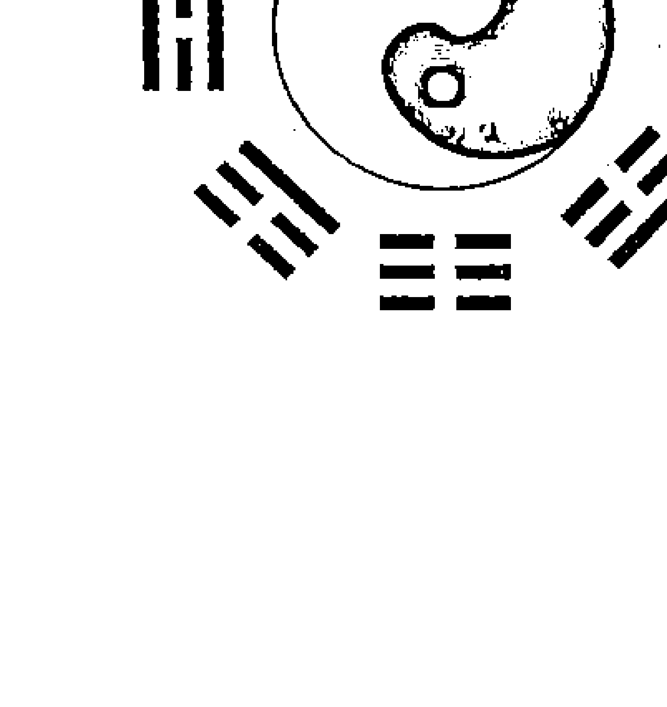

# 附录二 日常家居风水小知识

## 第一章 门的“风水”
本书最开始就谈及了一个观点，即“宅无吉凶，以门路为吉凶”。这句话的意思是：房子本身是不论吉凶的，房宅的吉凶其实是由房门和门路的道路决定的。还有，风水理论认为：“阳宅首重大门者，以大门为气口也！”这句话的意思是：我们活人居住的房屋，最重要的是大门，大门就如同一个人的嘴一样，它是家宅的气口，决定着全家人的吉凶祸福。

例如，大门的朝向不同，对运气的作用力和影响力也不同。大门朝着不同的建筑、不同的物体，都可能会对家中的每个人造成不同的影响。所以，门外或者门内各种物体、家具、用品的摆设和陈列，包括门口的颜色、图案等，都对风水具有一定的影响力。因此，我们现在就来说说有关门的风水。

## 大门能否冲着窗户？
张经理在一家外企做财务总监，月薪上万，他太太开了一家美容院，美容院的生意一直都非常好，每月至少都有两三万的收入，张经理一家人的日子过得和和美美、舒适惬意。后来，张太太看中了一处新开盘的小区。张太太和张经理商量后，就在这个小区里买了一套复式房。等新屋装修完后，过了半年，张经理一家人就搬进了新家。

说来也奇怪，张经理一家人搬进新家后不到三个月，张经理就屡屡失财。最先，张经理在与客户应酬时，不小心掉了一部手机。不久后，张经理出差，又在机场候机厅内不小心弄丢了笔记本电脑。张经理的儿子正在念高二，和同学外出郊游时，又将家中价值四千多元的数码相机弄丢了。此外，张太太经营的美容院，不知道什么原因，生意莫名其妙地就差了起来。张经理一家人郁闷极了，却百思不得其解。

有一天，张经理和一个朋友聊天，无意中就把自从全家搬进新家后，遇到的种种不顺说了出来。恰巧张经理的这个朋友素来对风水极有兴趣，就对张经理说：“世上哪会有这样怪异的事？会不会是你的新家在风水上出了啥问题？我有个同学是专门研究住宅风水的，要不请他帮你瞧瞧?”

于是，在一个周末，张经理和张太太将朋友和他那位姓余的同学请到了家里。这位余先生一进张先生的家，放眼一瞅，就对张先生和张太太说：“请看，你家这扇大门正对着窗户，而且门和窗户成一条直线，就是这扇门的位置破坏了你家的风水。另外，你家这扇门的位置也不对，应该装在这个方位，而不应该装在这里。要稍微挪一下地方。”余先生一边说，一边双手在门边比划了一阵。

原来，家门是全家人出入必经的地方，如果家门在吉方，那么从大门吹进来的风和空气都是吉利的。但是，如果家门不在吉方，那么来自大门的风和空气也一样是不吉利的。同时，家门最好不要正对着窗户，尤其是门正对的位置上不宜有太多的窗户。家门正对的位置，窗户越多，对家中风水的影响越大。如果窗户又多又大，那么，吉祥之气就很容易散发出去，而不利于在户内聚集，就会影响到宅运。因此，张经理和张太太自从搬入新家后，不断丢失贵重物品，张太太美容院的生意也一落千丈，自然就不难理解了。

“余先生，那我们现在该怎么办？有什么办法可以补救吗？”张太太焦急地问。

余先生略一沉思，对张经理和张太太说：“首先，你们把门重新装一下，往这个方向挪一寸左右。”余先生一边说，一边比划，“然后，在窗户这个位置种几盆绿色植物，这样就可以把屋子里面的吉祥之气滞留在家中，不让它们轻易散发出去。这样处理后，过一两个月，你们再看看情况如何。”

于是，张经理和张太太照着余先生的话，把门重新装了一次，又特地购买了几盆高大的绿色植物放在窗户前。结果不到两个月，张太太美容院的生意又重新好起来，而且比以前更红火了。张经理一家也没再丢失贵重物品了。

## 家宅的门楣能否悬挂八卦图
在家门的门楣可以挂一张八卦图。八卦是一种宇宙中的符号，它有助于化煞。如果再在八卦的上方悬挂三叉图案，或者神将骑虎、手执神器的图案，那么，就要注意，这样的图案千万不能朝着别人家的方向。因为三叉是一种尖锐的东西，神将骑白虎、手执神器也带煞，虽然能够化解进入自己家宅的煞，但是如果正对别人家的方位时，却会给别人家里带去不利的影响。

## 门口能否对着门口？
门对门是否会影响到风水，这要视情况而定。如果门前有一条又直又长的走廊，而且在走廊尽头还有一扇门对自己的宅门相对，那么，家里就会出问题。在八卦中，正东震位、西北乾位、正北坎位、东北艮位是男性卦位，所以，如果这种犯了冲煞的门朝着正东、西北、东北、正北方向，那么，家中的男性就会招惹是非。正南离位、正西兑位、东南巽位、西南坤位是女性卦位，如果犯了冲煞的门朝着正南、正西、东南、西南方向，那么，家中的女性就会招惹是非。

## 大门的颜色和风水
在风水学中，家宅大门的颜色也非常重要。下表是五行中金、木、水、土、火各自代表的颜色：

| 五行 | 颜色 |
| ---- | ---- |
| 金   | 金色、白色 |
| 木   | 青色、绿色 |
| 水   | 黑色、蓝色 |
| 土   | 黄色、褐色、咖啡色 |
| 火   | 红色、紫色、橙色 |

## 门口犯‘墙角’冲射会有何问题？
笔者认识一位姓任的大姐。任大姐四十二岁生日那天，特地邀请我们一帮好友去她家中聚会。那天，朋友们在她家里玩得特别高兴。半年后，我接到任大姐的一个电话。电话里，任大姐的声音萎靡不振，而且听起来她的情绪似乎也特别低落。于是，我便拎着一包水果去拜访她。

见到任大姐后，我发现她的左眼头旁边有红紫带黑的气色。在相面中，这个部分被称为‘光殿’，主人在四十三岁时的流年运气，在十二宫中属于‘田宅宫’。我有些诧异，就让任大姐把右手伸出来给我看。细看任大姐的掌中生命线，我发现上面隐隐约约有一个三角形。三角形主血光之灾，而这个三角形所在的位置，恰好也是四十三岁的位置。于是，我问她：‘这半年来，你有没有出过什么事？或者有没有生病住过医院。’

听了我的话，她的神色有些惊奇，说：‘我两个月前因为阑尾炎住院动过手术。’

这就对了，我心想，然后我对她说：‘你鼻梁有节，左眼头旁边这处位置的气色不好，看来你今年和你明年的运气都不会太理想。’

‘那怎么办呢？’她听了我的话很焦急。

我没有答话，仔细看了看她的屋子，突然发现她家的大门正对着一处墙角。于是，我心里明白了。因为她家的大门是在屋子的坤位，即西南方向，在流年上正好犯了五黄太岁。同时，她又属猴，而西南偏西又恰好是生肖属猴的方位。而墙角又正好冲门，所以一定先伤属猴的人，难怪她会有血光之灾。

于是，我让她在家门口放一对铜麒麟，再在门楣上方悬挂一面凸镜或者平面镜。因为凸镜或者平面镜可以反射飞刀煞，化解煞气。她照着我说的话做了，后不久，精神状态果然就变好了。

## 家门能否对着厕所门？
风水学中云：孤阳不生，独阴不成。在家宅之中，厕所是污湿之地，所以，属于“独阴”之气。而家门在风水中却非常重要，它就如同人的嘴一样。同时，家门属于“纯阳”之气。所以，家门如果正对着厕所门，就会阴阳不协调，根据风水学的理论，这会破财。此时，可以在厕所门口挂一幅珠帘，阻隔家门和厕所门之间的冲煞，尽量将不利影响降到最低。

## 厕所门能否对着厨房门
厕所湿气聚集，属于‘独阴’之气如果家门对着的楼梯是朝下的，那么，家人的财运会比较差，甚至可能会人不敷出。此时，只要在家门的门楣上挂一块凹镜，就能将流走的财气收聚起来，自然就能留住钱财。

## 门槛的高度与风水

有时候，家宅的门槛具有趋吉避凶的作用。

如果门外是一片空旷的平地，那么，就适宜使用五寸左右的高门槛，因为“五”代表五行。这样，吉祥之气就能被聚集在屋内，而不会散失。

如果门外有一条长长的直路，这是“犯枪煞”，此时，门槛应该高约三寸六分左右，因为三寸六分代表一年三百六十五天，有助于房屋收敛吉气。

如果家门口没有犯煞，那么，门槛只需要高一寸二分左右就可以了，因为一寸二分代表一年十二个月。

此外，门槛的尺寸可以用鲁班尺的标准计量。关于鲁班尺，我们已在本书的前面详细说过。

### 门槛如何趋吉避凶？

门槛就像房屋的关栏一样，可以把地气留在屋内，不让地气外逸。如果门外有往下的楼梯，那么，门槛就需要更高，不然地气就会外逸，从风水学上来说，这就叫“不聚财”。

如果门前有一条直路，这是“犯枪煞”，那么就可以在门口做一条门槛，门槛下面放一套五帝古钱，这样就能化解煞气。

总之，门口加门槛有百利而无一害，但是门槛不宜太高，因为门槛太高容易把小孩绊倒。

## 铁门的颜色与风水

有些人家的家门既有一扇铁门，也有一扇木门。一般来说，铁门在外，木门在内。从门位来说，木门属于主位，铁门属于副位。

如果铁门的颜色生木门的颜色，宅运就会上上大吉。如果铁门的颜色和木门的颜色相同，也主吉，但是稍逊色于五行相生的颜色。如果铁门的颜色克木门的颜色，家中就会有凶事、祸事。如果木门的颜色生铁门的颜色，也同样主凶。如果木门的颜色克铁门的颜色，对宅运没有太大的影响。例如：

如果木门用金色或者米白色，那么铁闸的颜色就最好用黄色、褐色或者咖啡色。因为金色和米白色在五行中属金，而黄色、褐色、咖啡色在五行中属土，土生金，这样的话，铁门的颜色就生木门的颜色。

如果木门用红色的话，铁门就不能用黑色或者蓝色。因为红色在五行中属火，黑色或蓝色在五行中属水，水克火，会有大凶之事。

此外，在流年的“正关煞”和“病符”所到的方位，不管属于五行中的什么，都不宜使用火、土的颜色，否则会影响到家人的身体健康。

## 门上的图案是否会影响到风水？

门是阳宅风水中最重要的因素之一。不仅颜色对大门的风水有影响，门上的图案也同样会影响到风水。以下是五行代表的各种图案形状：

| 五行       | 图案形状                     |
|------------|------------------------------|
| 金         | 圆形、半圆形                  |
| 木         | 长形、长方形                  |
| 水         | 由几个图形或半圆形组成，如梅花形、波浪形 |
| 土         | 三角形、多角形                |
| 火         | 正四方形                      |

正东震门，五行属木，水生木，金克木，火克金，所以，门上的图案最好是长形、长方形、波浪形、梅花形的，而不宜选择圆形、半圆形、三角形、多角形图案。正四方形的图案对风水影响不大。

东南巽门，五行属木，所以，与正东震门一样，门上的图案最好是长形、长方形、波浪形、梅花形的，不宜选择圆形、半圆形、三角形、多角形图案。正四方形的图案对风水的影响不大。

正南离门，五行属火，木生火，水克火，土克水，所以，门上的图案最好是三角形、多角形、长形、长方形的，而不宜选择梅花形、波浪形、正四方形的图案。圆形和半圆形图案对风水的影响则不大。

西南坤门，五行属土，火生土，木克土，金克木，所以，门上的图案最好是三角形、多角形、正四方形的，而不宜选择长形、长方形、圆形、半圆形图案。波浪形、梅花形图案对它的影响则不大。

正西兑门，五行属金，土生金，火克金，水克金，所以，门上的图案最好是正四方形、圆形、半圆形图案，而不宜选择三角形、多角形、尖形、波浪形、梅花形的图案。长形、长方形图案对风水的影响则不大。

西北乾门，五行属金，土生金，火克金，水克金，所以，和正西兑门一样，门上的图案最好是正四方形、圆形、半圆形，而不宜选择三角形、多角形、尖型、波浪形、梅花形图案，长形、长方形图案对风水的影响不大。

正北坎门，五行属水，金生水，土克水，木克土，门上的图案最好是圆形、半圆形、波浪形、梅花形的，而不宜选择正四方形、长直、长方形图案。三角形、多角形、尖形图案对风水的影响则不大。

东北艮门，五行属土，火生土，木克土，金克木，所以，与西南坤门一样，门上的图案最好是三角形、多角形、正四方形的，而不宜选择长形、长方形、圆形、半圆形图案。波浪形、梅花形图案对它的影响则不大。

## 门的数量与风水

不论是住宅还是商铺，对阳宅来说，都不宜开太多门。如果一幢房子既有前门，又有后门、侧门，那么，房屋内的吉气、地气就容易外泄，而屋外的煞气也容易进入室内，所以，会对风水不利。像这种前后两侧都有门的房屋，在风水学上被称为“四面楚歌”。此时，房屋会将四面八方的杂气收纳进屋，从而使屋内的气变得杂乱不纯，致使宅运反复无常。尤其是对于不懂易理，不懂得化解的普通人来说，更是凶多吉少。

如果房屋四方都有门，那么，需要将其中的两扇门关闭，或者专门只开一扇门，这样的话，门就能收住旺气，从而使旺气积蓄在房屋内，房屋的风水就会旺。

有时候，住宅的大门虽然只有一扇，可是屋子中却有许多门，如睡房门、书房门、厨房门、厕所门等。根据风水学的理论，如果房屋的面积不到110平方米，那么屋内的门最好不要超过五个。如果家中很多门，那么在平时可以把厕所门和厨房门关闭，这样就让厨房的燥阳之气和厕所的独阴之气不能留在屋子中，地气就会比较清纯，宅运也会相对平稳，从而保证家人的身心健康。

## 室内能否开拱门？

我们注意到，一些朋友在装修的时候，喜欢把家里的门设计成拱形，甚至天花板有时候也做成拱形。在风水学中，拱形相当于半个圆形，在五行中属金，所以，圆形、半圆形的物品通常都带有杀气。因此，我们时常都能看见庙宇和佛寺的门是拱门，因为庙宇和佛寺中的和尚、僧侣几乎都是‘孤寡’之人，他们六亲缘分薄，不惧这种肃杀之气。可是，平常百姓家里如果使用拱门，就容易伤及子嗣，而且身体也容易染上疾病。因此，平常百姓家里，房门和屋内的装饰，最好尽量不要选择拱形的风格。

## 家中悬挂八卦图能否挡煞？

住宅和办公室的门窗外都不宜见尖形物，尤其当大门犯太岁时，屋外见尖物就会更加不祥。此时，可以在门口或者窗口的某处位置挂一幅八卦图。因为八卦能够挡煞，尤其是经过加持或者开光的八卦，挡煞的能力就更强。

## 罗盘能化解煞气吗？

罗盘上刻有天干、地支、八卦。而宇宙中的万事万物都离不开阴阳、五行、八卦，包括所有的煞气。所以，如果某些方位遇到煞气，可以通过挂罗盘来化解。例如：如果床头被厕所的马桶冲着，就可以在床头挂罗盘化解。

## 当家门被屋外的路牌或电灯柱相冲

如果家门正对着屋外的路牌或者电灯柱，家中会有不祥之事，家人也会连连出问题。因为路牌与电灯柱和家门相冲，主凶。此时，可以用一根铁链在电灯柱或者路牌上绕三圈，然后用锁把铁链的两头扣住，就能化解路牌和电灯柱带有的煞气。

## 如果家门与屋内房门相对

根据风水理论，家门与屋内房门相对，一般都不吉祥，宅运会反复无常，家人会多是非口舌，并影响官运和财运。所以，在选择房屋的时候，最好不要选择家门与室内房门相对的住宅。如果家门已经与屋内的房门相对了，可以通过以下方法化解：一、平常将与家门相对的那扇房门关闭；二、在大门和房门之间放一个柜或者茶几，或者放一扇屏风，就可以解决这个问题。

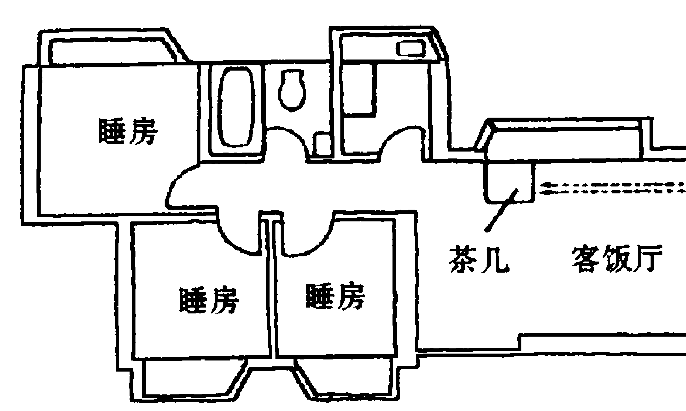

## 第二章 房的重要性

我们每个人在每天的二十四个小时中，至少有七八个小时是在卧室的睡床上度过的。因此，卧室与我们每个人的生活都息息相关，而房间内，除了衣柜的摆设对风水的影响不大之外，其他家具用品的摆设，如床、灯、梳妆台的放置，都会影响到风水。

在这一章里，我们就要讲述这个问题。

## 床的高度是否影响风水

一般来说，家中的睡床，最好高两尺左右。如果家里使用的是榻榻米，那么，榻榻米也最好高两尺。这样做的好处是，床离地面有一定的距离，不容易吸收地面的湿气，同时还能有效避免地面上的细菌。

床下如果有空间，可以放一些普通的衣物，但不宜放置电话、刀剪等五金小工具。此外，还应该经常留意床底下的卫生，床底下要保持清洁干净，如果床底太脏，杂物太多，不但会影响健康，也会影响运气。

## 床头靠板的形状和风

现在很多床的床头都有靠板。根据风水五行的原理，床头靠板如果呈方形或者半圆形，都属于吉利。但是，床头的靠板千万不能用三角形，因为三角形在五行中属火，会影响到主人的健康和精神，同时会让人的脾气变得暴躁。即使八字喜火的人使用这样的床头靠板，也一样会出现问题。下面是床头靠板的形状和风水的关系：

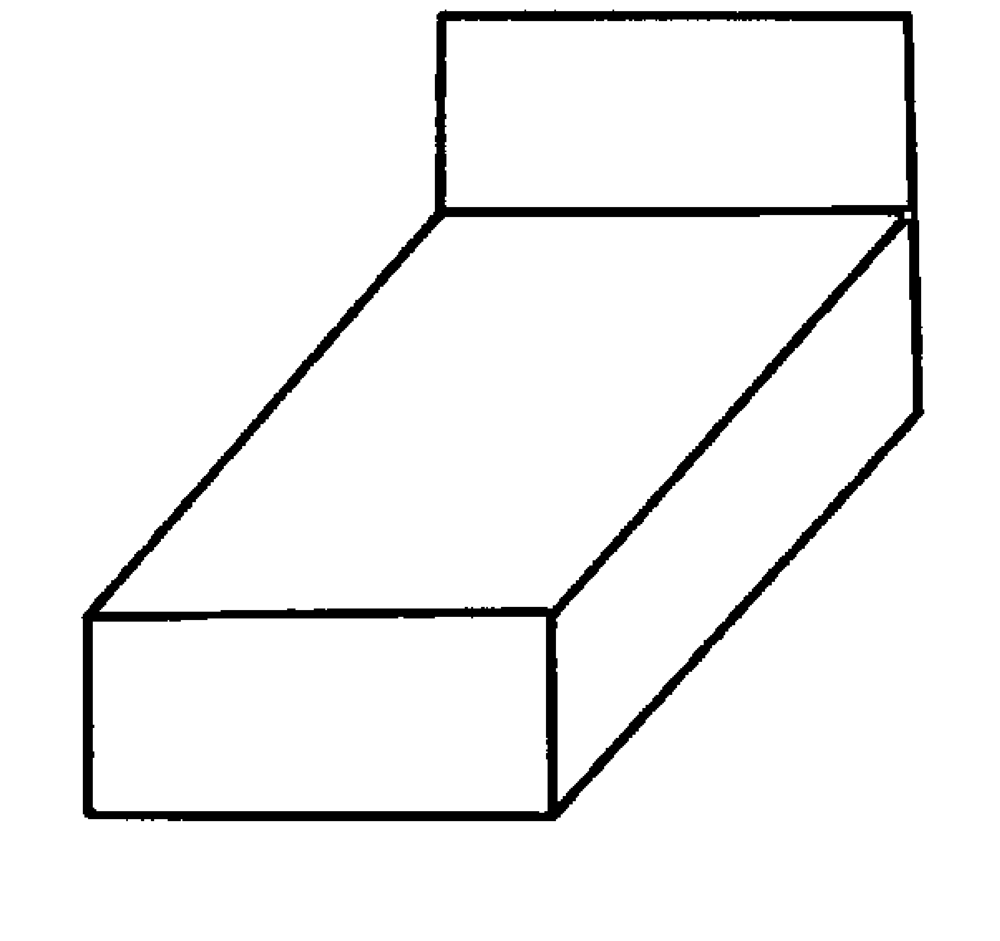

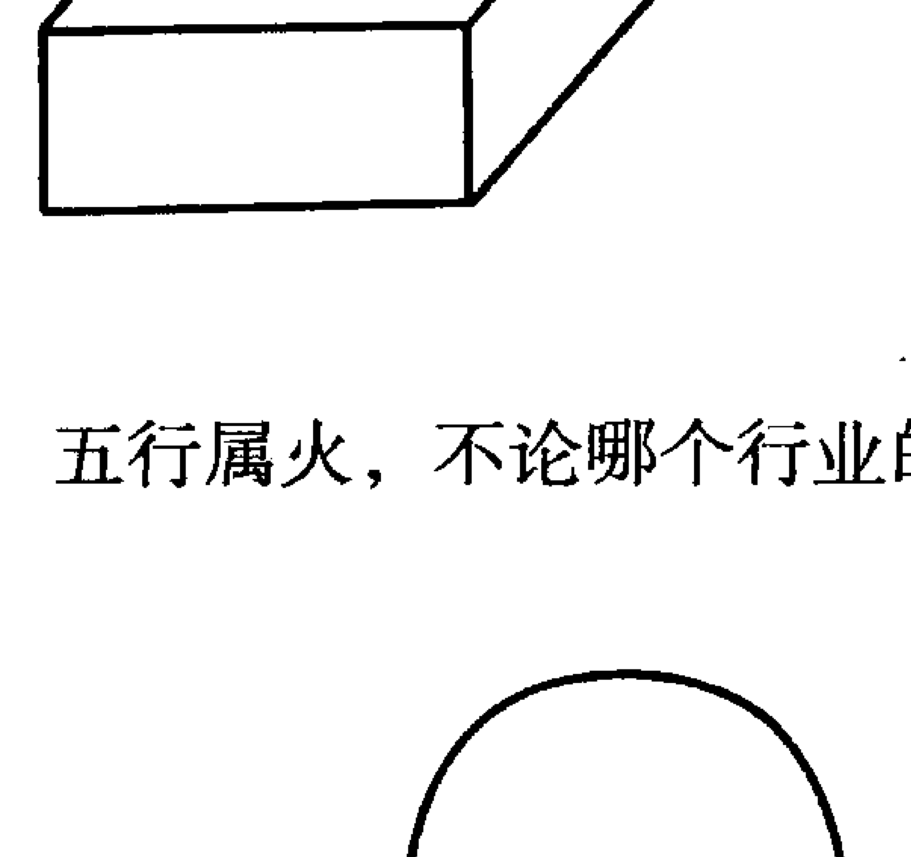

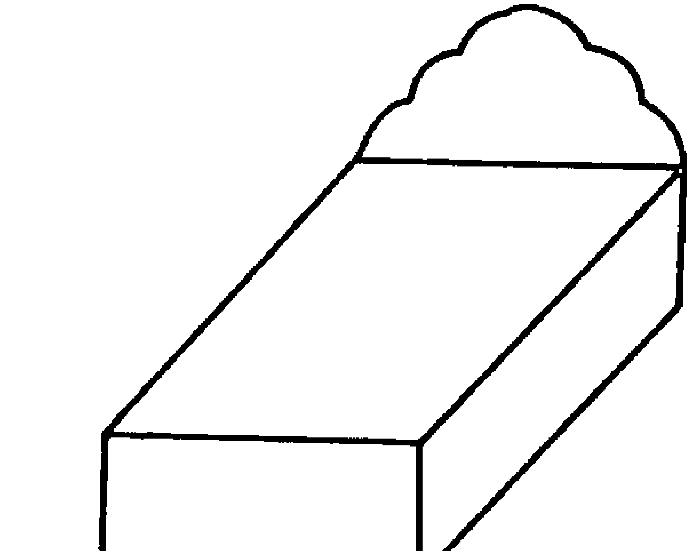

## 床头能否悬挂时钟？

现代家庭几乎家家都会在墙上挂一个时钟，这样能准确知道时间。但是，在卧房中挂时钟是有讲究的。首先不能在床头或者床尾的墙壁上挂时钟。时钟不管是悬挂在床头的墙壁上，还是悬挂在床尾的墙壁上，看上去都像坟墓的墓碑一样。如果要在睡房中挂时钟，就要避开床头和床尾这两个方位。此外，在书房中，书台的上方墙壁也不适合挂时钟。

## 横梁压床怎么办？

睡床上如果有横梁，会影响到风水和人的运气。如果遇到横梁压床的情况，可以在横梁的两端悬挂五帝古钱，这样就能化解冲煞。

## 电灯能否压床？

一般来说，许多人都喜欢在床头放一盏灯。但是，床头放灯容易犯电灯压床的错误。如果电灯压在床头，那么，睡在这张床上的人就会精神比较差，容易患神经衰弱等头部和精神上的疾病。如果电灯压床的位置与人躺在床上时腹部所在的位置差不多，那么，睡在床上的人就容易患肠胃上的疾病。此时，只要稍微挪一下灯的位置，避免灯头在床的上方就可以了。

## 套装连柜床好吗？

在家具市场上，我们有时候能看见一种连柜的床，就是在床头上方连着一个横柜。这种“横柜压床”与横梁压床的结果是一样的。所以，家里最好不要购买这种床。如果要购买这种床，也要选择那种“柜”不会压头顶的床。

## 卧室中如何摆放电视机

其实，从风水学上说，卧室内不适合摆放电视机。因为电流辐射不但会影响人的健康，也会影响地气。如果要在卧室中放电视机，那么就要注意：首先，电视机既不能放在床头，也不能放在床尾。把电视机摆放在床头和床尾，看上去人就像睡在坟墓中一样，而电视机就是墓碑，这显然对风水和主人的运气不利。可以把电视机放在床的两侧或者斜前方，距离人体越远越好。此外，在风水卦位上，电视机最好位于吉位。

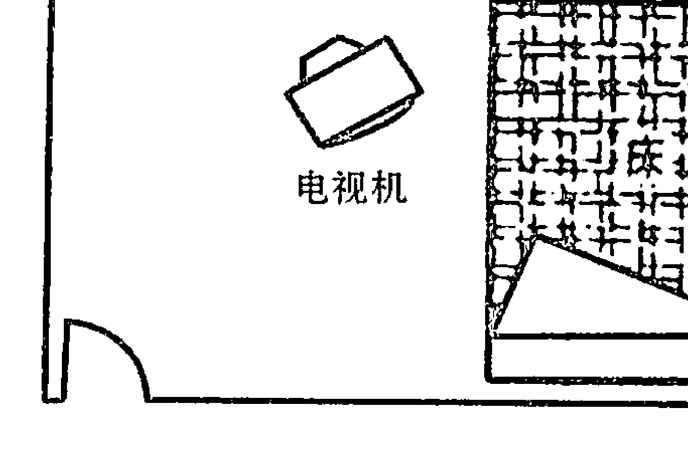

## 床头能否贴着厨柜？

床头贴厨柜是风水上的大忌。如果孩子睡的床贴着厨柜，会影响学习成绩；如果成年人的床贴着厨柜，会精神困倦，欠缺工作魄力；如果家中老人的床贴着厨柜，健康状况会每况愈下。

## 流妆台应该如何摆放？

梳妆台一般都摆放在卧室中。但是，梳妆镜不能朝着卧室的门，如果镜面冲着卧室门，人在进人卧室时就容易被镜子中的反影吓坏，尤其是在夜间；梳妆镜的镜面也不宜朝着床头，否则，床上的人容易做恶梦，而且精神欠佳。

在购买梳妆镜时，可以选择那种镜面上有两扇门作为装饰的，这样在不需要使用镜子时，可以把镜面挡住，这样对风水会好一些。

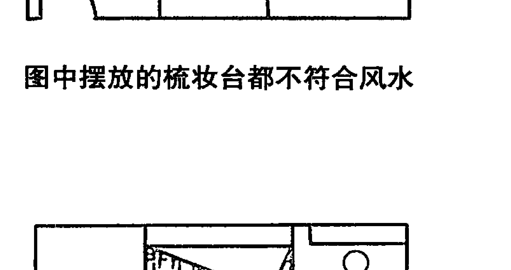

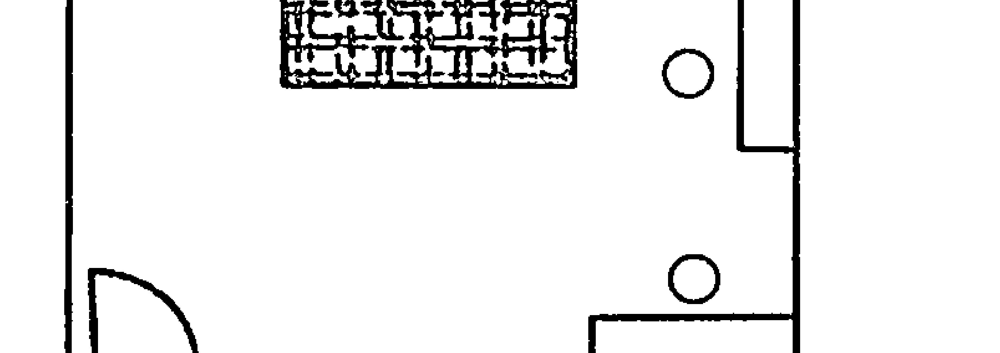

## 第三章 厨房的重要性

在阳宅风中，厨房是一个极其重要的地方。今天，我们通常都用电磁炉、微波炉、电饭煲、煤气灶代替了以前使用的灶。此外，厨房里面冰柜、自来水管的位置，也会影响到厨房的风水和吉凶。如果厨房中的摆设符合风水原理，与我们的年命相符，那么，家里就会平安祥和，家人会健健康康。但是，如果厨房中的摆设不符合风水原理，而且与我们的年命与不相符，那么，家里就可能会有是是非非，甚至可能会发生一些不祥之事。

## 厨房应该在哪个方位？

厨房是全家人做饭的地方，五行属火，所以，厨房最好位于房屋的正北坎位，因为正北坎位属水，这样水火相济，主家人平安。

如果厨房在房屋的正东震位或者东南巽位，震位和巽位在五行中都属木，属于木火通明之局，主家人常得贵人扶持。

如果厨房在房屋的东北艮方，艮位五行属土，阴阳相配，火土相生，主家人和睦。

如果厨房在正南离方，五行属火，火火相助，也是吉祥之兆。

如果厨房在西北乾位或者正西兑位，五行属金，金火相克，家人运气反复无常，是非口舌多。

如果厨房在西南坤方，西南在风水八卦中是病符，而且五行属土，土泄火，家人会多疾病。

## 炉灶的风水

有一位朋友曾经问我：“家里厨房中的风水，尤其是炉灶的风水，有没有什么好的办法可以推断吉凶祸福？

我说“有！”然后，我当场就教他有关风水的知识。

自古以来，有关风水的学说一直都千变万化，但是，其中最简单，而且具有一定影响力的学说，一定能够流传下来。

首先，炉灶头最怕受到水龙头的冲射，如果水龙头的方向朝着炉灶头的话，家里的人一定会患肠胃方面的疾病。其次，家中的水管，不能从炉灶头的底下经过。再次，家中的炉灶头要经常清洁干净，要不然的话，在这个方位上的空间，会对家人的健康极为不利。

## 电饭煲的位置

自古以来，在风水学中都流传着一句非常重要的口诀，那就是“阳宅三要：门、主、灶”。这句话的意思是：住宅的风水，最关键的地方是大门、主人的房间以及厨房里面的灶位。

当然，在今天这个社会中，我们基本上已经看不见炉灶了。除了在一些偏僻的农村可能还有炉灶以外，大中小城市里，几乎家家煮饭用的都是电饭煲。所以，我们现在就说一说有关电饭煲的风水。

其实，电饭煲的风水原理与炉灶的风水原理是一致的。炉灶的风水关键是看灶口的朝向，其实电饭煲也是一样的。电饭煲也一样要看朝向。

所以，有时候我们能发现，有的风水先生就把电饭煲的开关所对的方向作为电饭煲的朝向。

首先，在风水五行之中，电饭煲属火，所以：

当电饭煲的开关向北方坎位时，坎位属水，与火相遇

## 厨房里是否要有灶君？

以前，人们往往会在自家的厨房中安放灶君。当然，现在在厨房中安放灶君的情形也不多见了。其实，从风水的角度来说，厨房里面并不一定要供奉灶君。如果厨房里供了灶君，那就一定要敬香。因为在香点燃的时候，产生的气流和热能，会影响风水。所以，在安放灶君的时候，也要把灶君供奉在吉位，比如在房宅的聚气位上。灶君安放在吉位，家人会身体健康，平安顺利。否则，就可能会给家里带来口舌是非。

一般来说，房屋中的聚气位在门的对角线上（如图所示）。

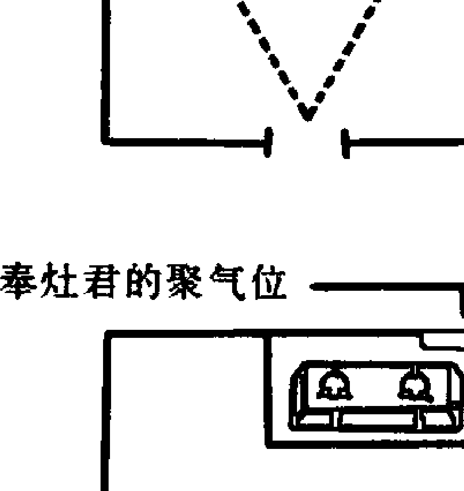

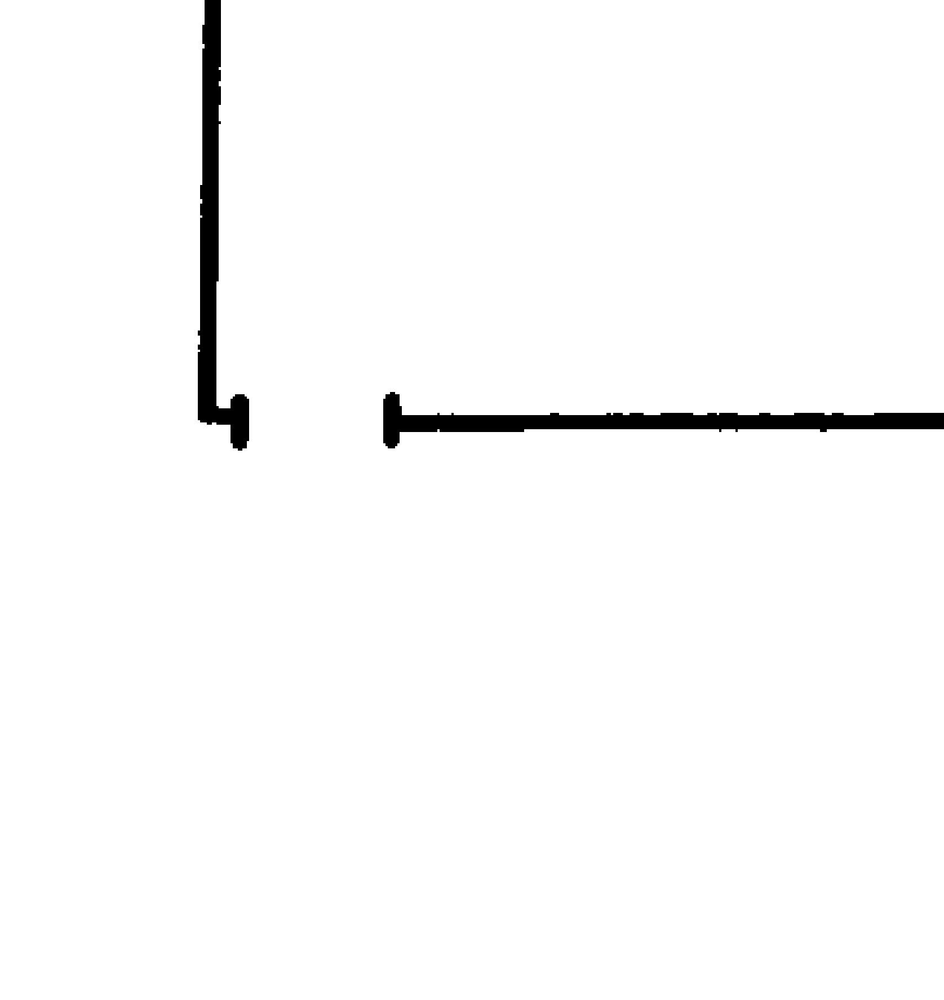

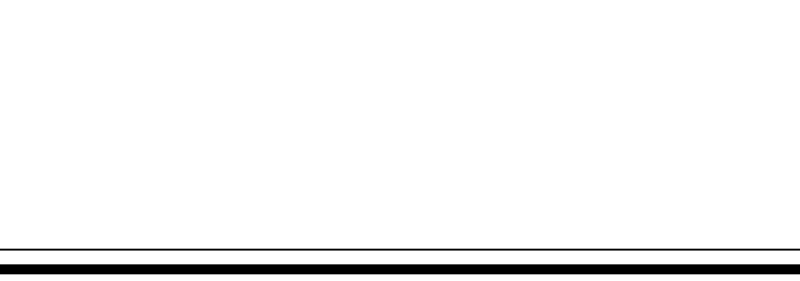

## 第四章 室外环境的重要性

不管是从风水的角度，还是从生活的角度来说，屋子外面的环境对住宅都有很大的影响。而屋子外面的环境却很复杂，不是几句话就能说清楚的。例如屋外的楼房、山水、广告路牌、道路交通、商场学校、医院寺庙，等等，每一种环境都会对风水带来影响，环境不同，对风水的影响也不一样。有的环境对风水有好的影响，有的环境对风水的影响却不利，并且，它们还会直接或者间接地影响到家人的身体健康、事业财运等等。这一章的重点就是讲述室外的环境对风水的影响作用。

## 窗门能否对着大镜或者铁锅？

城市中高楼密集，我们四处都能看见，楼房中几乎总是窗口对着窗口。自己家的窗口对着别人家的窗口，这实在是司空见惯的一件事情，而且对现代城市的建筑来说，这种情况也根本就不可能避免。那么，自己家的窗口对着别人家的窗口，对自家的风水会有影响吗？一般来说，窗口对窗口，对家宅运的影响并不大。从私密的角度上说，平常家中无人时，窗口都会遮挡上窗帘子，所以，这个问题其实是不用太担心的。但要注意的是，当别人家的窗户对着自己家的窗户时，对方家的窗户下还挂着铁锅，那就对自己家相当不好了。因为一些对风水比较讲究的人家，知道在窗户下挂口铁锅是可以挡煞的。所以，如果对方家的铁锅冲着自己家的窗户，那么，自家人的运气就会反复，不但健康受影响，还会影响到财运。那么，如果对方家的窗户下挂了铁锅，应该怎么办呢？可以通过下面的方法进行化解。

第一，在自家的窗户上安上深色的窗帘，平时都把窗帘放下来，挡住窗户。

## 户外面的八卦会影响到风水吗

曾经有一个朋友对我说：她的住宅的窗户靠着另外一家住宅的窗户，而且对方家的窗前挂了一幅八卦。自从她发现那幅八卦图后，身体就总是不舒服，家里气氛似乎也不如以前那么好。她问我：这是否与那张八卦图有关？或者只是她自己的心理作用？

其实，八卦主要是用来化解煞气的。但是，八卦本身并不带煞气。所以，不管是对方的家门挂八卦图，还是对方的窗户上挂了八卦图，其实都不用惧怕，因为八卦图本身并不会给我们带来什么影响。至于朋友家的情况，可能是受到流年凶星的影响。流年凶星的影响力往来得急，而且影响力大，尤其是五黄凶星一到，家人必然有病。

## 外面看见别人家的内衣裤会影响风水

城市里高楼林立，有些楼阳台对着阳台。所以，如果在阳台上晾晒衣物，往往能清楚看见对方家里晾晒的衣裳的款式、颜色，等等。那么，如果发现对方家的阳台上晾晒着内衣裤，会影响到自家的风水吗？尤其是以前的人，通常认为女性的内衣裤带有煞气，因为女人每个月都要来月经，月经往往弄脏内裤，所以，女人的内衣裤通常阴气重。

其实，别人家不管做什么，我们都是无法阻止的。当我们发现对方家的阳台上挂着内衣裤时，只要我们不把神位，尤其不把天官赐福位放在阳台上，不和对方家的阳台上的这些东西相对，就不会影响到自家的风水。如果自己家的神位对着别人家阳台上的内衣裤，尤其是女人的内衣裤，那么就会给自己家人带来非常不利的影响。

## 窗外有尖锐物冲着自己的家宅

一般来说，尖锐物的杀气很强。如果尖锐物恰好冲着自己的家宅，会影响到家中的风水和家人的运气。但是，尖锐物对宅运的影响，还受距离的影响。如果尖锐物距离自己家比较远，那么，杀伤力就会弱一些，或者不受影响；如果尖锐物距离自己家比较近，杀伤力就会增大。距离越近，杀伤力越强。那么，怎么来推算尖锐物的距离是否对自己家构成影响呢？总的来说，如果尖锐物距离自己的家约一百尺远，就不会对宅运造成太大的影响。

## 户相距太近是否影响风水

如果自己家的窗户和邻居家的窗户相对，而且距离很近，会不会影响到风水？ 一般来说，如果自己家的窗户与对方家的窗户相距超过十米，对风水基本上就没有什么影响。但是，如果距离在十米以内，那么，对两家人的宅运都会有影响。两家都会运气反复。如果两家人的窗户并不是相对的，而是窗户彼此错开了位置，那么，对风水的影响就不大。 如果相对的窗户距离太近，只要在窗前挂上窗帘就可以解决这个问题。

## 家中的窗户太多是否会影响风

一个朋友问我说：“家里开了很多窗户，是不是会影响到风水？”我回答说：“窗户是用来采集阳气的地方（光线属于阳气）。所以，如果家中窗户少，那么就会阴重阳少；如果家中窗户太多，就会阳重阴少。不管是阴重阳少，还是阳重阴少，阴阳都不平衡。此外，如果窗户太多，窗户的朝向也可能会不同。如果有的窗户朝着吉位方向，有的窗户朝着凶位方向，那丢，房屋中的吉凶就会混乱。那么，如果遇到这种问题，该怎么办呢？”

## 宅在公厕附近会影响风水

在北京，我们有时候能看见在一些公厕的周围就不少平房。那么，如果住宅在公厕附近，对家中的风水会有影响吗？

厕所主煞，尤其是公厕，更是阴气汇聚的地方，所以，如果家宅距离公厕太近，会让运气反复，影响到家人的健康，尤其会遇到泌尿系统的毛病。此外，公共厕所及其周围，通常也是蟑螂、老鼠汇聚的地方，蟑螂、老鼠携带病菌，也会影响到人们的身体健康。那么，有没有化解的方法呢？答案是肯定的：有！

第一，可以在家里装上长明灯，或者让家里客厅中的任何一盏灯二十四小时都亮着。

第二，保持住宅的清洁干爽，避免让蟑螂、老鼠来家里寄居。

## 靠近垃圾堆或者电表房会影响风

垃圾堆或者垃圾房是藏污纳垢的地方，不仅阴气非常重，而且还容易招来老鼠、蚊子、苍蝇等带病毒病菌的动物和昆虫，并且垃圾堆发出来的臭气也会直接或者间接地影响到人的心情与健康。此时，可以在家门外面安一盏长明灯，灯光属阳，利用灯光驱除阴气。同时，注意家里的清洁卫生。

电表房在五行中属火，而且火力强盛，是孤阳燥火之象。如果家宅的大门对着电表房，那么，家人的脾气会比较暴燥，而且还容易患皮肤疾病。此时，只要在门位上挂上或者摆上一些玉器、瓷器之类的物体泄火就可以了。

## 住宅靠近坟场或者殡仪馆怎么办

坟场和殡仪馆都是阴气非常重的地方，如果住宅太靠近坟场或者殡仪馆的话，家里阴气会很重，家人会多口舌是非，而且经常会身患疾病。如果万一遇到这种情况，可以通过下面的方法来化解：

+   第一，家门要开在当运卦位的地方；
+   第二，朝向吉位和正处当运的窗户要经常打开，这样才能收敛旺气。
+   第三，可以在家中的客厅里安放一盏长明灯，这样可以增加屋子中的阳气。

## 住宅靠近寺庙是否会影响风水

根据风水学，在神庙前后及周围的地方都犯了孤煞运。也就是说，凡是靠近寺庙、教堂的房屋，风水都不会很好，家中的子孙运不旺，六亲缘分薄，而且家宅的主人通常会一生孤寂，身体也会多疾病。如果遇到这种问题，可以在家宅朝向寺庙、教堂的方向挂一面凸镜或者平面镜来挡煞。

## 房屋在地铁附近是否会影响风水

现在，大都市中的轨道交通越来越发达，地铁越来越常见，地铁站也越来越多。那么，如果房屋在地铁沿线或者靠近地铁站，风水会受到什么影响吗？

其实，在一般情况下，房屋在地铁沿线，或者靠近地铁站，风水是不受什么影响的。不过，需要注意的是：

如果地铁的轨道从楼底下穿过，就犯了“地底穿心煞”，楼盘的风水会比较差，会影响到居住者的健康，而且住在这个楼盘中的人，运气会反复无常。如果必须要买这样的楼房，就应该购买高层。楼层越高，“地底穿心煞”的影响力就会越弱。或者在房屋中按风水卦位来布置，化解煞气，

[PAGE 328]

为家人带来财运和健康。

另外，如果房屋靠近地铁，就要留意家中放置神台的位置。如果神台的位置不好，又受“地底穿心煞”的影响，运气就会非常差。

还可以根据“黄历”或者“万年历”来寻找流年方位。凡是七赤星所到的方位都是旺位，主吉祥如意，可以放置神台，这样家人的运气会平平稳稳的，还能化解“地底穿心煞”带来的影响。

## 如果犯了“光煞”怎么办

所谓犯光煞，是指家宅的窗户或者家门直冲外面的天桥或者公路，路灯的灯光，或者路上行驶的汽车的车灯，会通过房门或者窗户，照射到家中。这样的家宅就犯了光煞，如果再碰上流年不利，就可能会有血光之灾。

犯了光煞之后，有两个化解的方法：

第一，在窗户或者家门前安装一幅很厚的深色的窗帘，一到晚上就把窗帘落下来，使外面的路灯或者车灯照射不到屋里。

第二，在窗户前或者家门前挂一张八卦图之类的东西，但不能挂八卦镜，因为镜子会把光线折射回车辆之中，会影响驾车人的视线，带来意外。

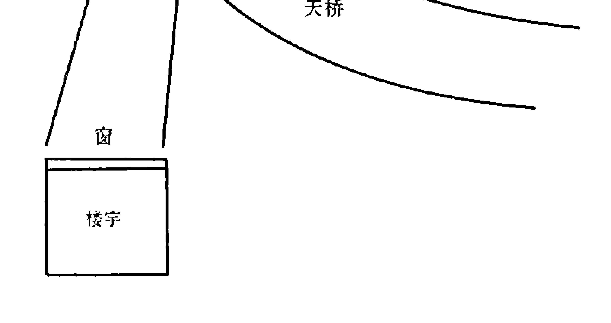

图中住宅常被车辆的照明灯光照射着，属于犯光煞。

## 窗户前面什么样的风景能带来好运

现在，我们来谈一谈“左青龙、右白虎、前朱雀、后玄武”。

一般来说，房屋的前方被称为“前朱雀”，也称“明堂”。很多风水先生把窗户外面当作明堂位。我们可以把房屋中窗户最多的那个方向定为明堂位。由于窗户是光线的人口，光线属于阳气，所以，阳宅以阳为向。只要我们找到了房屋的明堂位，就可以站在窗户前面向外面眺望，如果在明堂中有下列景物，宅运就属于吉利：

+   * 窗外能够看见水池、游泳池、湖、河流，或者窗外朝着大海。因为窗前见水是明堂水，可以使财运增强。生意人遇到明堂水，生意会更加兴旺发达。

+   * 窗外可以看见公园、球场、停车场、环抱路。因为窗前空旷，但是面积并不很大，这是明堂宽阔，虽然财运可能不及明堂水，但是家中财运也很稳定。

## 房靠山是否会影响风

楼房的后面有山，称靠山；前面有山，称朝山；左边有山，称青龙砂；右边有山，称白虎砂。楼房有靠山，主有贵人扶持；左右有山，主部属得力；前有朝山，主会得到四方贵人的帮助。所以，楼盘靠山，一般都是吉利之象。

但是，山有明山和穷山之分。凡是山形秀丽、树木茂盛的山，都称为明山；凡是山石嶙峋、树木萎枯的山，都称为穷山。在风水学中，山形不同，对风水的影响也不一样。简单的山形只有五星，复杂的山形有九星九变。所谓九变是指山形有以下九种情况：

+   1. 山体缺青龙位和白虎位；
+   2. 山体缺水；
+   3. 山体上起顶，下流水，既有青龙位，也有白虎位；
[PAGE 332]

+   4. 山体的青龙位长，白虎位短，或者白虎位长，青龙位短；
+   5. 山体有两重青龙砂和白虎砂，也就是说，在青龙方，内外都有青龙砂，在白虎方，内外都有白虎砂；
+   6. 山体有青龙砂，缺白虎砂，或者有白虎砂，缺青龙砂；
+   7. 山顶偏斜，不正；
+   8. 山没有顶，山形的力量较弱；
+   9. 山不高，在平地上显现。

## 九星代表以下几种山形：

+   1. 贪狼木星，代表又高又直的山；
+   2. 巨门土星，代表山顶平，像屏风一样的山；
+   3. 禄存土星，代表山顶平，但是山脚不整齐的山；
+   4. 文曲水星，代表山形扭摆像柳枝一样的山。
+   5. 廉贞火星，代表有多个山峰并列的山；
+   6. 武曲金星，代表比较高的半圆形的山；
+   7. 破军金星，代表山顶半圆，山脚并列斜飞的山；
+   8. 左辅金星，代表前高后低，或者前后都成半圆的山；
+   9. 右弼水星，代表只在平地上略为隆起，没有固定形状的山。

一般来说，左辅星在家宅明堂的左侧，右弼星在家宅明堂的右侧，所以，山如果在家宅的左边称为左辅山，在右边称为右弼山，它们的作用是关闭拉截穴山前的水流，所以，是关天门、闭地户之用，缺一不可。

实际上，九星是从五星演变而来的。九星还有另外一种说法是：太阳星、太阴星、金水星、木星、天财星、天罡星、孤曜星、燥火星、扫荡星。

最简单的五星是指：

+   1. 金星，即金形山，山形呈半圆形状的山；
+   2. 木星，即木形山，山形很高，山顶呈圆形的山；
+   3. 水星，即水形山，由几个半圆形的山峰连在一起的山；
+   4. 火星，即火形山，山形像三角形、山顶很尖的山；
+   5. 土星，即土形山，山顶平，山形略为有些方的山。

金形山所在的地方，一般多高官或者武将；木形山所在的地方，一般
[PAGE 333]

多文人或者有名誉的人；水形山所在的地方，一般多出智慧之人，而且此山旺女性；火形山所在的地方，一般多残疾多病之人；土形山所在的地方，一般多富裕之人、商人。

所以，原则上说，除了火形山，金形山、木形山、水形山、土形山都主吉祥。如果楼房的前后左右能看见金形山，那么，这幢楼房就有利于公务员，还容易出军官；如果楼房的前后左右能看见土形山，那么，这幢楼房就有利于经商的人。

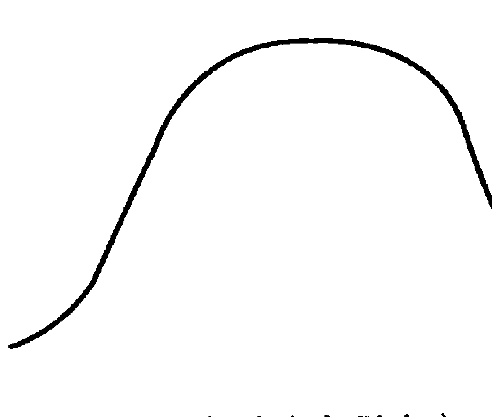

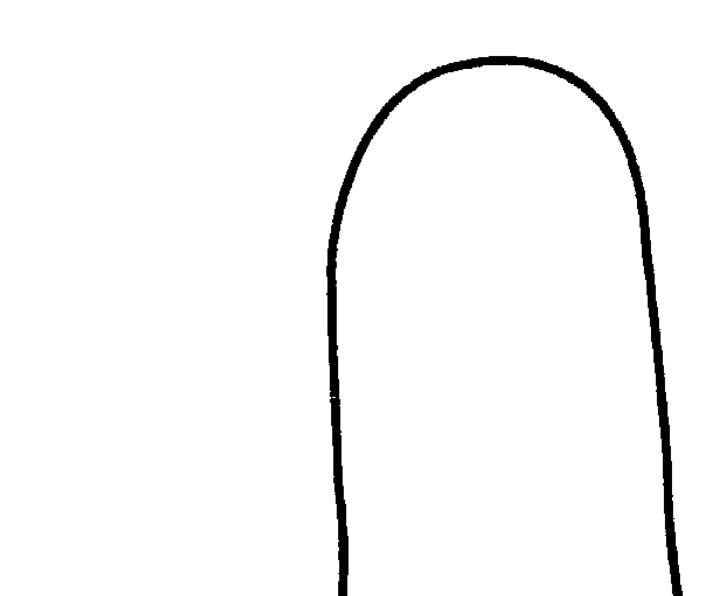

[PAGE 334]

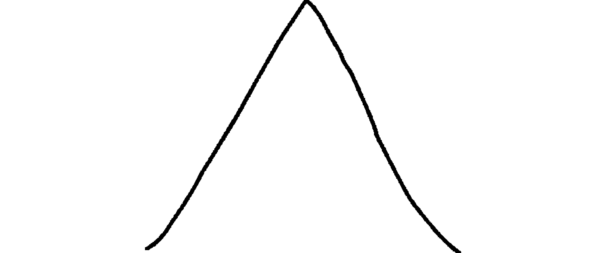

## 火星（火形山）

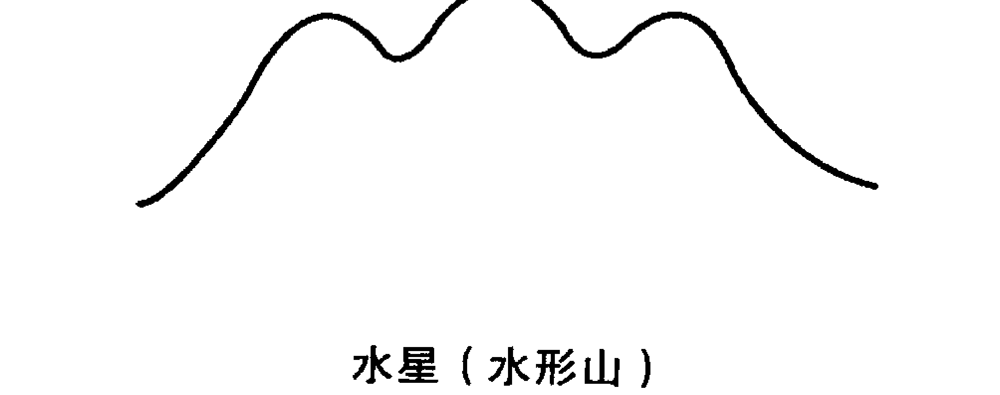

## 水星（水形山）

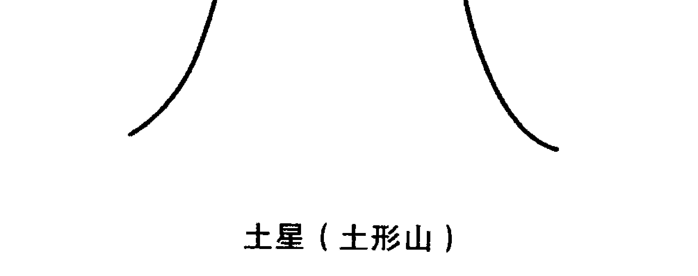

## 土星（土形山）

## 所附近有烟囱对风水有影响吗

如果住宅的窗前见烟囱，也是犯了冲煞，可以用下面的方法来化解：

可以在窗户或者门前挂一面凸镜。

可以在凸镜的后方摆放一枚五帝古钱，或者在凸镜的背面粘一枚五
[PAGE 335]

帝古钱。五帝古钱通常是指五枚清代的古钱，分别是顺治、康熙、雍正、乾隆、嘉庆时代的古钱。因为五帝古钱得到了天、地、人三气，所以，凸境可以挡煞，五帝古钱可以提高凸镜挡煞的能力。不过读者需要注意：必须要真正的五帝古钱才有这样的能力，仿造的古钱没有这样的能力。

## 霓虹招牌对风水的影响

在一些楼房附近，我们往往能够看见一些霓虹灯的招牌广告。一般来说，如果在家门或者窗户外面对着霓虹灯广告，对家宅的风水不利。因为霓虹灯的灯光会照进窗户或者家门，这就犯了光煞；如果霓虹灯的灯光过于强烈，还会让人夜晚难以入眠。

如果霓虹灯所在的方位在房屋的凶方，那么可能会给家中带来火灾，家人脾气暴躁。此外，南方离位，在五行中属火，所以，如果灯光广告牌在房屋的南方，那么，火象太旺，一定要小心屋内因为各种原因起火。

西南坤位，五行属土，这是病符位，所以，如果灯光广告牌在房屋的西南方的话，病符的力量会得到增强，家人的身体会比较差，容易患各种各样的疾病。

总之，如果遇到上面

## 第五章 室内摆设的重要性

家家户户的房宅内都有很多摆设，都有许多的日用品，例如桌椅、床、柜子等。如果它们摆放在吉位方向，那么，就会为家中招来财运、好运；但是，如果摆放在凶位方向，就可能会给家人招来不好的坏运、噩运。例如：如果生肖属猴的人在家里摆放老虎的装饰物，那么，他的运气就不好，还会经常生疾病。如果在屋子的南方离位摆放马的饰物，因为离位在五行中属火，而马属乾金，金与金互相克制，会产生不好的运气。现在，我们就来讲讲家宅内的摆设对房屋里面风水的影响。

## 钟的颜色和方位

在正东震位或者东南巽位摆放或者悬挂时钟，那么，钟的颜色应该以青色、绿色为主，钟的形状应该是方形。因为震位和巽位在五行中都属木。在南方离位悬挂或者摆放时钟，因为离位在五行中属火，所以，钟的颜色应该是红色、紫色、橙色为主，钟的形状应该是八角形。在西南坤位或者东北艮位悬挂或者摆放时钟，因为坤位和艮位在五行中都属于土，所以，钟的颜色应该是黄色、咖啡色、褐色，钟的形状应该是方形。在西方兑位或者西北乾位悬挂或者摆放时钟，因为兑位和乾位在五行中都属金，所以，钟的颜色应该是白色、金色，钟的形状应该是圆形。在北方坎位悬挂或者摆放时钟，因为坎位在五行中属水，所以，时钟的颜色应该是蓝色、黑色，时钟的形状应该是圆形。

## 时钟的摆放与风水

根据风水学的原理，凡是有动态的物体都会影响到房屋中的风水。所以，不管是时钟、挂钟，因为它们的时针、分钟、秒针都在日夜不停地运行，所以，不管它们摆放在哪一个方位上，都需要留意以下几点：

+   1. 可以把时钟摆放或者悬挂在房屋的朱雀方，即房屋的正前方；
+   2. 可以把时钟摆放或者悬挂在房屋的青龙方，因为青龙方属于吉位方，在客厅或者房间的左方；
+   3. 不要把时钟摆放或者悬挂在房屋的玄武方，因为玄武方在房屋的后方，宜静不宜动；
+   4. 不要把时钟摆放或者悬挂在房屋的白虎方，因为白虎方是凶方，在客厅或者房间的右方；
+   5. 不要在梳妆台的上方悬挂或者摆放时钟，不然，常坐在这里梳妆打扮的主人会出现身体方面的问题，容易患疾病；
+   6. 在卧室中摆放或者悬挂时钟，原则和方法同上。此外要注意的是：床头不能悬挂时钟。

时钟悬挂青龙方，吉论，而颜色方面以青色或绿色为最吉利。

## 鞋柜的高度和风水

从风水学上说，家中鞋柜的高度不宜超过房屋空间高度的三分之一，否则会给家人带来不好的运气，会患各种疾病，还会多口舌是非。

房屋中的空间可以均分为上、中、下三个部分，上面的空间被称为“天才”，中间的空间被称为“人才”，下面的空间被称为“地才”。因为鞋是脚上穿的，是保护脚的物品，所以属地。如果鞋柜的高度超过了房屋高度的三分之一，那么，可以把没有穿过的鞋放在鞋柜的上面空间，而把穿过的鞋放在鞋柜的下面的空间，因为穿过的鞋有地气，适合放在“地才”的位置。

## 屋里安长明灯的好处

昼夜二十四个小时都开着的灯，被称为长明灯。长明灯的颜色可以是白色，也可以是黄色。在风水之中，阴气主不吉利，阳气主吉祥，而黑暗是阴，亮光为阳，所以，如果屋里装一盏长明灯，阳气就可以借着灯光散布在屋内，宅运就会变得安稳平实。

现在的房屋，开门就见客厅，门口位通常被称为“玄关”，也是整个屋中比较黑暗的地方。所以，长明灯最好安在屋中靠近门口的地方，或者把长明灯安置在客厅中，这样效果最好。当人一进屋时，就会被长明灯的灯光照着，人就沾上了阳气，运气就会顺利很多。

## 屋里应该挂什么图

房屋墙壁上悬挂的画，对家中的风水、宅运也是有影响的。那么，在墙壁上悬挂的图画，究竟有什么样的讲究呢？

首先，墙壁上可以悬挂“九鱼图”，即九条活鱼的画面。“九”的意思是长久，久远；“鱼”的意思是年年有余，事事如意。画面上九条可爱的鱼儿嬉戏，主吉祥如意。

其次，墙壁上可以悬挂“三羊图”，即三只羊的画面。在风水学中，有“三阳开泰”的说法。“羊”的谐音“阳”，指阳气；“泰”在《易经》中是一个招福纳吉的卦象，也有好运、安泰的意思。所以，“三羊图”的意思是指能够带来吉祥如意和好运气。

再次，墙壁上还可以悬挂“百鸟朝凤”图、“青蛙戏水”图、“猴王献瑞”图、“百骏图”等，它们都寓意吉祥。

第四，在房屋的墙壁上，可以悬挂一些色彩、线条柔和的风景画，比如日出、湖光山色、牡丹花等。它们能让人感到放松、舒适。

第五，墙壁上也可以悬挂仙、佛之类的图画，不过，不管是神仙还是佛陀，面容都应该显得亲切、祥和。

## 住宅不适合挂什么图

在住宅的房屋里，不适合挂下面这类图画：

首先，颜色太深、画面以黑色为主的图画不能挂，因为这类图画容易让人意志消沉、悲观，做事缺乏干劲；
其次，不要悬挂凶猛野兽的图画，不然会影响到家人的健康；
再次，不要悬挂多幅人物抽象画，这会让家人情绪反常、运气反复，容易导致心理不平衡、神经过敏；
第四，最好不要挂日落西沉的画面，因为这类图像会让人缺乏干劲；
第五，最好不要在墙壁上悬挂已故亲人的大头画像，这会让人做事的时候遇到不顺，阻力重重；
第六，最好不要在家中墙壁上悬挂有关瀑布之类的图像，这会使家人运气反复无常；
第七，最好不要在家中挂红色太多的图像，这容易让家人受伤，而且家人会变得脾气暴躁。

以上的几点，请大家一定要牢记。

## 八宅明镜

## 宅中适宜种植什么植物

为了增加生活的情趣和品味，可以在家中养花，但是，有一些品种不适合放在家中。

带刺的杜鹃花、玫瑰花、仙人掌，不适合家中养，不然会影响到家人的健康，家人容易患各种各样的疾病。

家中如果要养植物的话，可以选择一些枝叶繁茂的植物，尤其是青绿色的植物，有花朵的植物也不错。主要的花木品种可以选择紫罗兰、万年青、龙骨、黄金葛等，它们能够让家人充满活力，工作有魄力。不过，在养花之后，一定要对植物小心照料，如果花枝枯萎，要尽快剪除，不然的话，会给家人带来不顺的运气。

至于丝带花、塑料花等，也可以摆放在室内，它们对风水并没有太大的影响。家中如果要用假山来衬托植物的话，不适合购买岩巉形状的假山，因为嶙峆状的物体都是带煞的，放在家里，容易使家人生病。

## 大刀叉饰物的放置

有时候，我们可以在一些朋友家里，看见一些刀叉类的装饰物。这些刀叉类的装饰物品，并非真正的刀叉，而是一些类似于刀叉的东西，比如树枝、牛角等。这类饰物如果摆放或悬挂的方位不对，也容易给风水带来不利的影响。

例如：西北乾位属金，而刀叉类的物品也是属于利器，五行属金，所以，把这类饰物摆放在西北乾位，会助长金气的力量，那么，就会影响到家人的健康，使家人容易受伤，比如摔跤、扭伤手脚等；西方兑位在五行中也属金，所以，刀叉类的装饰品同样不适合放在西边的位置。所以，在八卦中，人们将西北位的六与西位的七相加，变成夬卦、履卦，它们为交敛煞。还有，如果把一把刀形装饰物放在西方兑位，把一把叉形装饰物放在西北乾位，或者相反摆放，家人的健康都会受到影响。

不过，由于东方震位属木，东南巽位也属木，所以，把木制的刀叉形饰物摆放或者悬挂在东方震位与东南巽位，对风水的影响不是很大。

另外，每年还要特意留心两颗星，一颗是五黄星，一颗是病符星，不管哪颗星飞到屋宅之中，家人的健康都会受到影响。

## 古铜钱剑对风水的影响

一些朋友认为古铜钱剑可以用来镇邪、避邪，是不是这样呢？

首先，古铜钱剑是用来辟邪的物品，但是，如果家里没有阴灵出现，就没有必要悬挂古铜钱剑来避邪。

其次，剑带有杀气，所以，不适合在家屋里随便摆放剑型的东西，否则，家人的健康会受到影响，会经常患病，还容易受伤。

如果把古铜钱剑摆放在流年不利的位置，或者摆放在房屋的凶位上，那么，家人的运气会反复无常，家人的健康会受到影响。

不过，古铜钱剑也自有它的作用。例如：如果窗户外面或者家门外面遇到煞气冲射，那么，在窗户前或者家门前悬挂一把古铜钱剑，就可以顺利化解这些煞气。不过，在摆放古铜钱剑时，一定要小心处理，最好用罗盘来定吉凶方位，以免发生偏差，伤及家人或者邻居。

## 室内能放大纸扇吗

家中能摆放装饰性的纸扇吗？它们会影响到风水吗？

如果纸扇以红色为主，那么在五行中，属火，火势旺，此时，如果把纸扇摆放在家中八个方位上，都可能会导致不同的问题，因为每个方位在五行中都有各自的所属，如果纸扇的属性与五行不匹配，就会有问题发生。例如：

如果把纸扇放在东方震位，震位属木，火泄木主不吉；如果把纸扇放在东南巽位，巽位属木，火泄木同样不吉；如果把纸扇放在南方离位，离位属火，纸扇火旺火，主吉，但火势过强，也可能对家人造成不利的影响；

如果把纸扇放在西南坤位，坤位属土，火生土，纸扇放在这个方位吉利；如果把纸扇放在西北方乾位，乾位属金，火克金，不祥；如果把纸扇放在西方兑位也是一样的，兑位属金，火克金，主不祥；如果把纸扇放在北方坎位，坎位属水，水克火，运势平平；如果把纸扇放在东北艮位，艮位属土，火生土，主吉祥。所以，如果把一把红色属火的纸扇放在家中的吉位方向，家人会变得聪明，而且做事情会非常顺利。又例如，如果把纸扇放在家中的东方震位或者东南巽位，因为震位和巽位都代表长房，或者代表三十一岁到四十五岁的人，所以，纸扇在这两个方位，这些人的运气就会比较差。南方离位属于中女，或者属于十六岁到三十一岁的人，所以，如果把纸扇摆放在这个方位，对这些人会很有利。

现列出八个方位及其代表人物，供参考：

+   东方震位，代表长子或者三十一岁到四十五岁的男性；
+   东南巽位，代表长女或者三十一岁到四十五岁的女性；
+   南方离位，代表中女或者十六岁到三十一岁的女性；
+   西南坤位，代表母亲或者四十六岁以上的女性；
+   西方兑位，代表少女或者一岁到十五岁的女性；
+   西北乾位，代表父亲或者四十六岁以上的男性；
+   北方坎位，代表中子或者十六岁到三十岁的男性；
+   东北艮位，代表少子或者一岁到十五岁的男性。

## 家门口能否挂风铃

有人说在家门口挂风铃会招鬼，也有人说在家门口挂风铃能够化解鬼煞，那么，情况到底是怎么回事儿呢？

在寺庙或者道教的法事中，我们经常能看见一种名叫‘金刚铃’的法器。在风水中，‘金刚铃’能够召请神灵或者阴灵来到神坛前受益。而且法师有功力能应付被召请而来的神或者鬼。但是，如果普通人使用‘金刚铃’召请神或者鬼，由于普通人通常都没有法力，不能控制鬼神，所以，可能会招来一大堆阴灵，结果反而对自己不利。

因此，如果在家门口挂风铃的话，首先要看风铃所在的方位是吉是凶。如果风铃的位置在凶位，那么就是在阴卦位，就容易招来一大堆鬼神，不但不吉，反而有害。一般来说，阴卦位在西南方或者东北方。所以，如果家门朝着这两个方位，而门上又挂了风铃，最好用其他方法化煞，或者将风铃开光，这样可以避免招来鬼。

## 书桌的位置和风水

对孩子来说，家中书桌的摆放位置也至关重要。一般来说，书桌不宜冲着房门。如果书桌冲着房门，孩子在读书的时候，精神会很难集中，而且身体健康状况也会比较差。如果再加上流年不利的话，那么，孩子在读书的时候，就更容易患上头痛和疲倦的毛病，就没有心思学习和温习功课。书桌的方位最好位于文昌星照临的方位，这样，孩子的学习成绩就会有进步，情况就会有所改善。所以，如果家长希望孩子的成绩理想的话，一定要多在风水上下一点工夫。

书桌除了不能冲着门以外，也不能靠着门。如果孩子在读书的时候，他的身后有门，那么读书的效果就会受到影响，考试的成绩也不会理想。书桌也不适合靠窗户。书桌忌横梁压顶，否则孩子读书学习容易疲倦、头痛，而且做事情也容易出错。孩子读书学习时，也不宜头顶有灯，因为这樣光线不良，会影响视力，也容易影响到精神和思考。孩子读书时，座位不宜贴着门，座位不宜冲着门口，座位上方要避开吊灯。

在五星之中，文昌星主功名，有利于孩子读书，所以，孩子读书的最理想的位置，是在房宅中文昌星能够照临的方向，这样的话，孩子读书就能事半功倍，思考敏捷，也能取得好成绩。如果不能把书台放在文昌方位，那么，也可以把书台当作中心点，只要座位能够朝着文昌星的方向，也一样能够吸收到文昌星的吉气。

## 餐桌的位置和风水

家中餐桌的摆设，有五个忌讳：首先，客厅和饭厅之间如果有通道的话，餐桌就不适合摆放在通道上；其次，放好餐桌之后，坐椅不宜被“灯”压着，因为如果有人坐在这里，就会灯压头；第三，餐桌不能放在被大门冲的位置，因为大门是纳气的地方，气流比较强；第四，餐桌不能对着厕所，因为厕所是秽气和阴气聚集的地方，餐桌对着厕所，不仅会影响食欲，也会影响到家人的健康；第五，餐桌不能对着厨房，因为厨房里面经常涌出油烟，而且温度高，所以，如果把餐桌摆放在对面的话，家人的脾气会比较暴燥，会容易患各种疾病；最后，在餐桌周围不宜放置太多的杂物，这不但会影响到吃饭的氛围，也会影响到家人的健康。

## 厨房排气扇的位置和风水

厨房中的排气扇通过扇叶的转动，把厨房中的污垢油烟抽出屋外。根据风水学的理论，排气扇是动的，属阳，因此，排气扇就应该放在住宅中的吉位方向，即生气方、延年方、天医方。排气扇的动，会使吉位的力量得到增强。相反，如果排气扇安置在绝命方、五鬼方、六煞方，那么，凶位的煞气就会得到增强，从而对宅运和家人不利。

## 中电器的位置和风水

电器会产生电流，电流容易引发煞气，所以，家中的电器不宜摆放在凶位，因为这样会刺激煞气，给家人的健康带来不利的影响。在家居风水 中，尤其要注意电视、音响、空调、电脑、洗衣机、冰箱的位置。因为这些电器的耗电量大，产生的电流也比较多，所以，它们都适合放在吉位上，尤其适合放在青龙位上，而要避开凶位，尤其要避开五黄位。

我们站在客厅中，面向着门，左侧的墙壁为青龙吉方，电器就适合摆放在左侧；而右方的墙壁属于白虎凶方，所以，这边就不宜摆放电器。如果电器放在了白虎方，就犯了白虎欺青龙的忌讳。此时，如果要化解的话，可以在青龙方上挂一面镜子，可以将白虎方的影像吸纳在青龙方，于是二者就能平衡，这样就龙虎相配，主人缘佳，会有许多朋友帮助自己，但是，镜子一定要挂在吉位上。

## 马饰物与风水

现代有些家庭喜欢摆放铜马等饰物。在八卦之中，马属于乾卦，乾卦在五行中属金，在人体上主头部，卦象主天，所以，如果把马饰物摆放在南方离位，因为离位在五行中属火，那么，就会“火烧天门”，人就容易犯头部疾病，家人会经常头痛、头晕，家中子女不孝，经常和父母发生争执，家人还容易咳嗽。此时，化解的方法就是把马饰物移到其他方位。

此外，要注意的是，如果家中有生肖属鼠的人，那么，就更不能够把马饰物摆放在南方离位上，不然的话，属鼠的人会生病，因为正南离位与鼠相冲。

## 龟饰物与风水

在风水学中，龟壳的突起有弧度，就像凸镜一样，可以化煞。此外，乌龟长寿，所以自古以来就被当成是祥瑞之兽。所以，家里摆放乌龟的饰物是吉祥的。如果在犯了冲煞的方位上摆放乌龟，还具有化解煞气的作用。

## 象饰物和风水

现代有些家庭还喜欢在家中摆放大象饰物，比如瓷象、玉象、铜象、石象等。在风水学中，象饰物可以用来加强座方的力量。因为楼房如果后有靠山主吉祥，大象体形庞大如山，在家中摆象饰物，可以起到靠山的作用。此时，如果屋后无山，就以象饰物为靠山。

## 老虎饰物与风水

老虎是一种具有威势的动物

## 貔貅的力量

根据传说，貔貅是一种凶猛的动物，但它是一种祥瑞之兽。古时候，人们把只有一只角的貔貅称为‘天禄’，两只角的貔貅称为‘辟邪’。

貔貅和麒麟不太一样，貔貅是一种非常凶猛的瑞兽，它具有镇宅辟邪的作用。此外，由于它具有凶猛的杀气，所以，古代还用它来镇墓，把它当作是墓穴的守护兽。

把开光的貔貅放在家里，可以让家中财运好转，驱走邪气，能够镇宅，是家宅的守护神，能保佑全家的平安。另外，貔貅还能化解五黄大煞。

## 宠物狗与风水

在生活中，我们有时会发现一种奇怪的现象，那就是有些人家养的狗非常健康，可是有些人家养的狗却很容易生病。这是什么原因呢？

根据风水，狗在十二地支中属于‘戌’，而在地支中，与狗相合的有‘寅’、‘午’、‘卯’。“戌”位在乾方，即西北方；“寅”位在艮方，即东北方；“午”位在离方，即正南方；“卯”位在东方，即正东方。如果家宅的大门开在这四个方位，家里就适合饲养狗，而且养的狗会比较健康。

但是，在十二地支中，“辰”与狗相冲，“丑”与狗相刑。“辰”位在巽方，即东南方，“丑”位在艮方，即东北方，如果家门开在这两个方位，都不适合养狗，而且养的狗也容易患各种各样的疾病。

如果家中有狗，而家门却又不在这四个适合养狗的吉位上，那么，可以把狗屋或者狗窝放在对狗有利的吉方上。由于狗在十二地支中，五行属土，而金泄土，所以，狗屋不适合用金属打造。如果用金属材料制作狗屋，狗的健康状况会比较差。

## 宠物猫和风水

在十二地支中，猫属于“寅”，与“寅”位相合的方位有“午”位、“戌”位、“亥”位。亥位在乾方，即西北方，午位属离位，即正南方，戌位属乾方，即西北方，所以，如果家门朝向西北和正南方，家中就适合养猫，而且饲养的猫活泼、健康。

如果家中养猫，而家门又不是朝着这两方吉位，那么，可以把猫窝安置在家中适合猫的吉位上。

在五行中，猫属木，所以，猫睡觉用的地毡，可以选择黑色、蓝色、青色、绿色。但是，猫睡觉用的地毡不适合用红色，因为红色在五行中属火，火会泄木的元气，猫属木，所以不能用红色。

在十二地支中，西南坤位和东南巽位都与寅位相冲、相刑，这两个方位都不适合饲养猫。

## 祖先灵位供奉的禁忌

如果家中供奉了关帝，祖先的灵位和骨灰，只能放在关帝的左方。人面对关帝时，左手所对的方位是关帝的右方，右手所对的方位是关帝的左方。

因为神位的左方是青龙方，右方是白虎方，青龙方是吉位，白虎方是凶位。而关帝手上的大刀一般都在右方，所以，右方的煞气太强，不适合摆放祖先的骨灰灵位。

## 鱼和风水

在风水中，鱼被当作补运和挡煞的工具。如果家中饲养金鱼的方法恰当，可以挡煞，旺财。金鱼的数目可以代表卦象，金鱼的颜色可以代表五行，金鱼的品种可以趋吉避凶。

例如：有一种名叫龙吐珠的鱼，它的鱼身如同刀，而且这种鱼凶猛，

所以，人们通常用它来挡煞。它能迅速增强财运，尤其是偏财运。一些夜总会通常都喜欢饲养这种鱼。黑摩利这种鱼也具有很强的挡煞能力。黑牡丹既能挡煞，也能招财。不过，黑牡丹挡煞的能力比黑摩利弱。另外，像七彩神仙、锦鲤、金鱼等，它们五彩斑斓，色彩明艳，鱼性温和，通常被用来生旺正财，它们能令人际关系和谐，减少做事的障碍，能使人的心情比较愉快。

## 八宅明镜

## 凸镜、凹镜和平面镜

在风水中，凸镜如同龟壳，镜面呈外凸的圆弧形，可以挡煞，化解煞气，如电灯柱、尖形物、旗杆、路牌、烟囱等。如果在家宅外面有这些煞，可以在窗前或者门前挂一面凸镜，就能化解煞气。

凹镜的作用正好相反，它能收聚吉气、地气。如果地气逸走，或者距离吉祥之物太远，就可以用凹镜来收聚。如果家中的大门朝着一级级向下的楼梯，地气会逃走，这时候，只要在家门前挂上一面凹镜，就能把逃走的地气收聚回来。

在家里放平面镜，有收聚、收敛的作用。朝着窗外或者屋外放平面镜，还有反射的作用。在房屋的吉位挂一块平面镜，可以收聚吉气；在凶位和犯煞之位挂一面平面镜，可以反射并化解煞气。