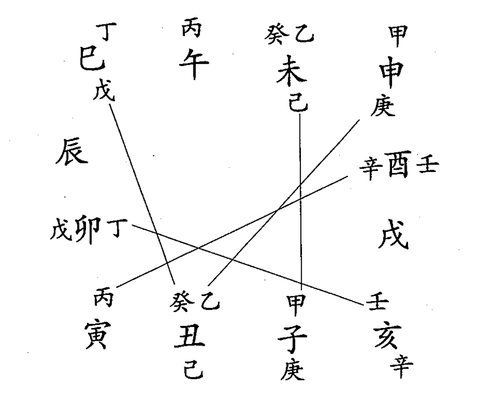

# 六壬大全


## 前 言

在中国传统文化之中，以儒家文化、道家文化与佛家文化为传统文化之主干。其中尤以儒家文化影响世俗尤甚，中华民族传统的主流世界观、人生观、价值观也是主要渊源于儒家文化学识中而来的。

在源远流长博大精深的儒家文化学说之中，无疑以四书五经为其核心学说。四书包括：《大学》《中庸》《论语》《孟子》；五经包括：《易经》《诗》《书》《礼经》《春秋》。四书五经作为一个有机传承儒家学说系统，其中又以《易经》被共称为“诸经之首”。清圣祖康熙帝在《日评易经讲义》的“御制序”就以为：

> 朕惟帝王道法载在六经，而极天人穷性命，开物前民通变尽利，则其理莫详于《易》之为书，合四圣人立象设卦系辞焉而广大悉备。自昔包牺、神农、黄帝、尧舜王天下之道，咸取诸此。盖《诗》《书》之文，《礼》乐之具，《春秋》之行事，罔不于《易》会通焉。汉班固有言：六艺具五常之道，而《易》之为原，讵不信欤？

从上述这段文字可以看出，自汉代到清末，《易经》一直被认为“诸经之原”，因此从一定意义上讲，《易经》可以被视为中华民族传统文化的总根源。

《易经》作为中华民族传统文化的总根源，它的特点就是易道广大无所不包，可以对任何一种学术或文化都有指导意义；中国传统术数学（易经应用文化）的诞生发展同样也是得益于易道之功。《四库全书总目提要》云：“术数之兴，多在秦汉之后。要其旨，不外乎阴阳五行生克制化，实皆易之支派，传以杂说耳！”术数文化既为“易之支派”，它的生命就深深地根植于《易经》之中了。

数术文化的本质就是利用易经原理进行预测，古人曾经依据《易经》构建发明了很多数理预测模型。从历史上来看，比较流行的有筮法、火珠林法、四柱、地学、相法、式法、星占、占候等数十种方法。就今日国内外研究应用来看，最为流行的不外乎四柱、六爻卦法、六壬、奇门遁甲、相法、地理这几大类。这几大类数理预测模型都可以在一定程度内对人事进行预测决疑，大六壬在这几大类流行方法之中，以其预测准略惊人而独享盛名，故古人谓六壬以人事占验为长。因此，大六壬作为传统易学应用文化中的佼佼者，自古以来备受研易者的重视！

自上个世纪90年代开始至今，在中国大陆掀起了研易用易（包括利用数术模型进行人事预测）的热潮。经过十余年的发展，国内易学应用研究已经从最始的入门性、基础性研究逐渐向复杂性、精密性的高端研究迈进。奇门遁甲和大六壬在近几年的风行就说明了这种民间易学应用研究的深入与进步。特别是大六壬（又名壬学）作为最有效的实用易经应用方法，在当代研易用易的现代社会越来越体现出巨大的预测决疑决策价值来了。

为了推动壬学在新世纪新时代的研究发展，同时也为广大学人和研易者们提供有足够研究价值的壬学资料，兹特地从众多六壬古籍中精选点校五本六壬古籍来组成一套现代版的壬学典籍奉献给读者。

这套（共三册）壬学典籍总共收录如下五本经典六壬古籍：

- 一、《六壬大全》 明·郭御青著，共十二卷；
- 二、《六壬断案》 宋·邵彦和著述，清·程爱函辑录，共四卷；
- 三、《六壬指南》 明·陈公献著，共五卷；
- 四、《壬归》 无名氏著·共七卷；
- 五、《六壬琐记》 清·程爱函著，不分卷。

以上五本壬学古籍基本上涵盖了六壬的所有方面，从而构成了一个相对完整条理的六壬知识体系。大致而言，《六壬大全》主要是收录壬学常识、方法、基本理论的集大成书，一切壬学研究都可以从此出发。《六壬断案》、《六壬指南》二书则是着重于应用壬学理论进行决疑预测的“实战”书，两书大量收录了宋代邵彦和、明代陈公献两位先生的六壬预测课案，对于研易者们如何学壬用壬有着巨大的借鉴价值。《壬归》一书在历史上作为“秘籍”类书流行于民间，其书主要在用壬方法上提出了“象学”思想，是古往今来对于壬学应用研究最有启迪意义的一本好书。至于《六壬琐记》则是清代道光年间壬学家程爱函一生研壬用壬“心得”，这些研究“心得”对于壬学研究中的种种歧疑作了精辟的阐释与回答，其是历代壬学中最好的“解惑”书之一。这五本壬学古籍包括了壬学的基础理论、方法论研究、解惑释疑、实例应用四大方面，它是历代壬学研究不可或缺的经典。

为了便于读者阅读和研究，我们的点校做了以下工作：

一、全书原文中的繁体字均改为现代通行的简化字，以适应现代研究者的阅读习惯与深入理解。

二、全书原文进行了断句，根据书中文句表达意义加上标点符号，并改竖排为横排。

三、对原书进行了校勘，将原文字句错讹脱衍全部作了改正增删，力求原书原文前后上下脉络的通畅与文意的清晰。

四、原书的注文与图示进行统一规划排版，力求形式上的完整与美观。

最后要指出的是，任何学术研究与应用都有个继往开来的问题；尊重传统古为今用，就是当代研易者们的时代要求。另外，任何学术研究都离不开时代的影响。从历史上看，只有太平盛世才会出现学术大发展与百业俱兴旺的局面。这种盛世之气象在今天之中国已初步呈现，今日研易者欣逢其时自要全力进取，拥护国家大政方针，紧跟时代潮流，用实事求是的科学态度来继承批判整理发展传统易学应用文化，为中华民族的文化复兴贡献心力。

徐伟刚
2007年9月20日于北京

## 简介

《六壬大全》十二卷，不署作者姓名，有明代刻版，并有卷首题郭御青校刊。清代收入《四库全书》子部之术数类、占卜之属，同时刻有四库珍本流行于世。

第一卷：从入手法开始，讲述九宗门歌诀，详录三传总汇和岁月干支神煞，扼要介绍德合鬼墓刑冲破害方法，并且附有六十四课目诗诀，基本上是壬学基础知识的系统汇总与整理。

第二卷：重点探讨六壬十二支神、十二天将的基本起例、概念、意义和应用象意，突出神将信息在壬学中的核心地位。

第三卷：说明干支、四课、三传、发用等壬课基本形式特征规律，同时收录历代著名壬学诗诀歌赋，其中包括“照胆秘诀集”、“肘后经”、“玉成歌”等。

第四卷：收录了“括囊赋”、“云霄赋”、“三才赋”三篇重要赋文；但从内容上看，“云霄赋”、“三才赋”讲述的是金口诀内容，似乎与六壬无关。

第五卷——第八卷：此四卷收录了七百二十种壬课与六十四易卦对应所构成的“课经”。课经一般体例是：课名定义、课象、举例、订讹、歌诀等。“课经”是六壬中的基础理论研究，有着比较重要的参考价值。

第九卷——第十卷：此二卷收录了宋代凌福之编撰的“毕法赋”，“毕法赋”为壬学中重要的实用方法论，历代壬学家用壬实践都是围绕着该赋来展开的。

第十一卷——第十二卷：收录了十二宫星区分野与明代行政区域的细致划分对应，有较大的史料参考价值，但和壬学运用关系不大。

依以全书内容上看，《六壬大全》就是历代壬学知识与资料的整理与汇总，所以《四库全书·提要》以为：“其为博综简括，固六壬家之总汇也。”但是，也较有不足之处：首先其书九宗门起例、贵人起例、天地盘起例、月将起例等方面没有清晰的充分说明，令初学者很难真正入门；另外《六壬大全》基本缺乏实例，“课经”中仅存几个课例也都是泛泛而说而缺乏操作性，对于入门者如何真正提高应用水平有一定的阻碍。

本书点校参考了上海古籍出版社1991年版《四库术数类丛书》第六册中的《六壬大全》四库本，人民中国出版社1992年版《中国方术概论·式法卷》下册中的《六壬大全》现代版本，结合两书详加订正增删，为广大读者提供一套质量上乘的现代版《六壬大全》。

徐伟刚

## 提 要

臣等谨案：《六壬大全》十二卷，不著撰人名氏。卷首题怀庆府推官郭御青校，盖明代所刊也。

六壬与遁甲太乙，世谓之三式；而六壬其传尤古，或谓出于黄帝玄女，固属无稽；要其为术，固非后世方技家所能造。

大抵数根于五行，而五行始于水，举阴以起阳，故称壬焉；举成以该生，故用六焉。其有天地盘与神将加临，虽渐近奇遁九宫之式，而由于干支而有四课，则亦两仪四象也；由发用而有三传，则亦一生二，二生三，三生万物也；以至六十四课，莫不原本义爻；盖亦易象之支流推而衍之者矣。

考国语伶州鸠对七律，以所称夷则上宫大吕上宫推云，皆有合于六壬之义；然特以五音十二律定数，未可即指为六壬之源。《吴越春秋》载伍员及范蠡鸡鸣日出日映禺中四术，则时将加乘与龙蛇刑德之用，一如今世所传；而《越绝书》载公孙圣亦有今日壬午时加南方之语；其事虽不见经传似出依托，然赵煜袁康皆后汉人，知其法著于汉代也。

其书之见于史者，隋志二家、唐志六家、宋志三十家而焦竑经籍志所列多至八十三家，然多散佚不传。其存者如徐道符《心镜》、蒋日新《开云观月歌》、凌福之《毕法赋》及《五变中黄经》，术家奉为蓍蔡。

然流传既久，其说多岐：或专论课体而失之拘；或专主类神而失之粗；或杂取神煞而失之支；又皆不可以为法。是书总集诸书遗文，首载入手法总录及贵神月将德煞加临喜忌，旁采唐以来诸论，若括囊云霄赋课经之类，而纬以《心镜》《观月》诸篇；采撮颇为详备。案《明史·艺文志》有袁祥《六壬大全》三十三卷，名目相同而卷帙不符，未必即祥所辑。要其博综简括，固六壬家之总汇也。

惟是六壬所重莫过于天乙贵神，阴阳顺逆而吉凶所自出，如匠者之准绳矩矱。而先天之德起于子，后天之德起于未，以五干德合神取贵，承学之士多未究其源。我圣祖仁皇帝《御定星历考原》一书贯串玑衡权与圭臬，以订曹震圭昼丑夜未之讹，实足立千古之标准；我皇上御纂《协纪辨方书》复申畅斯旨。谨按《吴越春秋》所载；子胥之占，三月甲戌时加鸡鸣，而以青龙在酉，是甲日丑为阴贵也；范蠡石室之占，十二月戊寅时加日出，而亦以青龙临酉功曹为腾蛇，是戊日丑为阳贵也；沿溯古义皆与圣谟垂示先后同符；是书所取天乙尚沿俗例，卷中仅载先天贵人一图而不用，未免失之舛漏；又所载十二宫分野，亦多拘牵旧说，未能订正；今以原本所有姑仍其旧录之，而附订正其失如右。

乾隆四十六年九月恭校上

总纂官臣纪昀臣陆锡熊臣孙士毅
总校官臣陆费墀

## 卷 一

### 十干寄宫

甲课寅兮乙课辰，丙戊课巳不须论。丁己课未庚申上，辛戌壬亥是其真；癸课原来丑宫坐，分明不用四正神。

一、贼克法一下克上曰重审，一上克下曰元首。

取课先从下贼呼，如无下贼上克初，初传之上名中次，中上加临是末居。三传既定天盘将，此是入式法第一。

二、比用法即知一也。

下贼或三二四侵，若逢上克亦同云。常将天日比神用，阳日用阳阴用阴。若或俱比俱不比，立法别有涉害陈。

三、涉害法

涉害行来本家止，路逢多克为用取。孟深仲浅季当休，复等柔辰刚日宜。

四、遥克法神遥克日曰蒿矢，日遥克神曰弹射。

四课无克号为遥，日与神兮递互招，先取神遥克其日，如无方取日来遥，或有日克乎两神，复有两神来克日，择与日干比者用，阳日用阳阴用阴。

五、昴星法

无遥无克昴星穷，阳仰阴俯酉位中。刚日先辰而后日，柔日先日而后辰。论中末也

六、别责法

戊辰、戊午、丙辰三刚日各一课，辛未二课，辛丑二课，丁酉辛酉各一课。

四课不全三课备，无遥无克别责例。刚日干合上头神，柔日支前三合取。皆以天上作初传，阴阳中末干中寄。刚三柔六共九课，此课先贤俱隐秘。戊午戊辰与丙辰，干上皆午是为亲。辛丑辛未各二日，下上皆是丑未真。丁酉当为巳丁是，辛酉原来是酉辛。

七、八专法

论克不论遥

两课无克号八专，阳日日阳顺行三。阴日辰阴逆三位，中末总向日上眠。

八、伏吟法

伏吟有克还为用，无克刚干柔取辰。迤逦刑之作中末，从兹玉历职其真。若也自刑为发用，次传颠倒日辰并。阳日用辰，阴日用日。次传更复自刑者，冲取末传不论刑。

九 返吟法

返吟有克亦为用，无克别有井栏名。若知六日该无克，丑未同干丁己辛。丑日登明未太乙，辰上日未识原因。辰上作中，日上作末。

### 总 铃

| 巳甲 | 申亥寅 | 午甲 | 子申 辰申子 辰 申子辰 戌午 寅午戌 | 未甲 | 五甲 子巳戌 辰 寅未子 | 申甲 | 寅申寅 |
|---|---|---|---|---|---|---|---|
| 辰甲 | 辰午申 | 六甲日 | 酉甲 | 子 寅酉辰 午寅 酉辰亥 戌子 子未寅 申戌 戌巳子 |
| 卯 | 辰巳午 | 戌 | 四甲 戌午寅 |
| 寅甲 | 寅巳申 | 丑甲 | 子亥戌 | 子甲 | 戌申 午辰寅 四甲 戌申午 | 亥甲 | 子 午卯子 申 巳寅亥 三甲 申巳寅 |

| 巳乙 | 丑 寅卯辰 未 酉戌亥 亥 丑寅卯 巳 未申酉 酉 亥子丑 卯 辰巳午 | 午乙 | 申戌子 | 未乙 | 五乙 未戌丑 卯 酉子卯 | 申乙 | 丑巳 酉丑巳 亥卯 未亥卯 酉 申子辰 未 亥卯未 |
|---|---|---|---|---|---|---|---|
| 辰乙 | 丑 辰丑戌 未 辰未丑 亥 辰亥巳 巳 辰巳申 酉 辰酉卯 卯 辰卯子 | 六乙日 | 酉乙 | 四乙 寅未子 酉 未子巳 未 巳戌卯 |
| 卯乙 | 丑 子亥戌 未 戌卯午 酉 申未午 巳 卯寅丑 亥 戌酉申 卯 丑子亥 | 戌乙 | 丑未 戌辰戌 亥巳 巳亥巳 酉卯 卯酉卯 |
| 寅乙 | 丑卯 亥酉未 未 亥寅巳 亥 酉未巳 酉 未巳卯 丑 丑亥酉 | 丑乙 | 丑戌未 | 子乙 | 丑酉 巳丑酉 未 卯亥未 亥卯 未卯亥 巳 酉巳丑 | 亥乙 | 丑 卯戌巳 酉 亥午丑 四乙 午丑申 |

| 巳丙 | 巳申寅 | 午丙 | 寅 辰巳午 申 酉戌亥 子 寅卯辰 午 申酉戌 戌 亥子丑 辰 亥午午 | 未丙 | 寅子 辰午申 戌申 子寅辰 午辰 申戌子 | 申丙 | 申亥寅 |
|---|---|---|---|---|---|---|---|
| 辰丙 | 寅 子亥戌 子 戌酉申 四丙 卯寅丑 | | | | | 酉丙 | 酉丑巳 |
| 卯丙 | 丑亥酉 | | 六丙日 | | | 戌丙 | 寅 子巳戌 申 卯申丑 子 巳戌卯 午 辰酉寅 戌 申丑午 辰 寅未子 |
| 寅丙 | 三丙 亥申巳 申 巳寅亥 子 午卯子 午 子酉午 | 丑丙 | 寅午 戌午寅 戌 酉巳丑 子 申辰子 申辰 子申辰 | 子丙 | 四丙 子未寅 辰 午丑申 申 戌巳子 | 亥丙 | 寅申 寅申寅 戌辰 巳亥巳 子午 午子午 |

| 巳丁 | 午丁 | 未丁 | 申丁 |
|---|---|---|---|
| 巳 丑亥酉 亥 酉未巳 丑卯 亥酉未 酉未 丑巳巳 | 卯 丑子亥 酉 申未午 丑 子亥戌 未 卯午午 亥 戌酉申 巳 卯寅丑 | 卯 卯子午 酉 酉未丑 丑 丑戌未 未 未丑戌 亥 亥未丑 巳 巳申寅 | 卯 辰巳午 四丁 申酉戌 酉 亥子丑 |
| 辰丁 | 六丁日 | 酉丁 | 酉亥丑 |
| 卯 子酉午 酉 午卯子 丑 子辰戌 未 亥辰辰 亥 巳寅亥 巳 亥申巳 | | | |
| 卯丁 | | 戌丁 | 卯 酉子卯 酉 子卯午 丑 午戌辰 未 亥戌戌 亥 午戌寅 巳 申亥寅 |
| 卯亥 未卯亥 未 卯亥未 丑酉 巳丑酉 巳 亥未卯 | | | |
| 寅丁 | 丑丁 | 子丁 | 亥丁 |
| 卯 戌巳子 酉 亥午丑 丑 卯戌巳 亥 午丑申 未巳 酉辰亥 | 卯酉 卯酉卯 巳亥 巳亥巳 未丑 巳未丑 | 五丁 巳戌卯 酉 未子巳 | 卯亥 未亥卯 巳丑 酉丑巳 未酉 亥卯未 |

| 巳戊 | 巳申寅 | 午戊 | 子 子寅辰 寅午 辰巳午 辰 寅午午 申 戌酉午 戌 亥子丑 | 未戊 | 申戌 子寅辰 子寅 辰午申 午辰 申戌子 | 申戊 | 子 卯午酉 寅戌 申亥寅 辰 亥寅巳 午 酉子卯 申 寅巳申 |
|---|---|---|---|---|---|---|---|
| 辰戊 | 四戊 卯寅丑 寅戌 子亥戌 子 戌酉申 | | | | | 酉戊 | 寅 丑午酉 辰 子辰申 午戌 寅午戌 申辰 辰申子 |
| 卯戊 | 丑亥酉 | | 六戊日 | | 戌戊 | 子 巳戌卯 寅 子巳戌 辰 寅未子 午 辰酉寅 申 卯申丑 戌 申丑午 |
| 寅戊 | 寅亥申 | 丑戊 | 申辰 子申辰 子 巳申丑 寅午 戌午寅 戌 寅戌午 | 子戊 | 子未寅 | 亥戊 | 午子 午子午 申寅 寅申寅 辰戌 巳亥巳 |

### 六己日

| 巳己 | 卯丑 亥丙未 巳 丑亥酉 未 丑巳巳 酉亥 卯丑亥 | 午己 | 丑 子亥戌 卯 丑子亥 巳 卯寅丑 未 卯午午 酉 戌午申 亥 戌酉申 | 未己 | 丑 丑戌未 未 未丑亥 卯 卯子午 酉 酉未丑 巳 巳申寅 亥 亥未丑 | 申己 | 丑 寅卯辰 未 未申申 卯 辰巳午 酉 亥子丑 巳 申中午 亥 丑寅卯 |
|---|---|---|---|---|---|---|---|
| 辰己 | 丑 子辰戌 未 亥辰辰 卯 子酉午 酉 午卯子 巳 寅亥申 亥 巳寅亥 | 酉己 | 丑 卯巳未 未 酉酉酉 卯巳 亥丑卯 酉亥 丑卯巳 |
| 卯己 | 酉丑 巳丑酉 亥卯 未卯亥 未巳 卯亥未 | 戌己 | 丑 午戌辰 未 亥戌戌 卯 酉子卯 酉 卯午酉 巳 申亥寅 亥 寅巳申 |
| 寅己 | 丑 卯戌巳 卯戌 戌巳子 未巳 酉辰亥 酉 亥午丑 亥 午丑申 | 丑己 | 卯酉 卯酉卯 亥巳 巳亥巳 未 巳丑丑 亥未丑 | 子己 | 己 巳戌卯 酉 未子巳 | 亥己 | 未酉 亥卯未 亥卯 未亥卯 丑巳 酉丑巳 |

| 巳庚 | 五庚 巳寅亥 子 午卯子 | 午庚 | 午辰寅 | 未庚 | 午戊 午巳辰 子 戊酉申 辰 卯寅丑 申 酉未未 寅 子亥戌 | 申庚 | 申寅巳 |
|---|---|---|---|---|---|---|---|
| 辰庚 | 寅午 戊午寅 四庚 子申辰 | 六庚日 | | 酉庚 | 午 戊未酉 子 寅卯辰 辰 午未申 戌 亥子丑 寅 辰巳午 申 亥酉酉 |
| 卯庚 | 五庚 戊巳子 辰 午丑申 | | | 戌庚 | 辰午 申戊子 子寅 辰午申 戌申 子寅辰 |
| 寅庚 | 寅申寅 | 丑庚 | 午 辰酉寅 子 巳戊卯 辰 寅未子 戌 申丑午 寅 子巳戊 申 卯丑丑 | 子庚 | 辰申子 | 亥庚 | 午 酉子卯 子 午酉子 辰戌 寅巳申 申 丑亥亥 寅 申亥寅 |

| 巳辛 | 未 酉辰亥 丑 卯戌巳 巳 未寅酉 亥 午丑申 卯 戌巳子 酉 亥午丑 | 午辛 | 未 卯亥未 卯亥 未卯亥 巳 午寅戌 丑酉 巳丑酉 | 未辛 | 未 亥未未 丑 巳未未 巳 寅亥申 亥 巳寅亥 卯 子未子 酉 午卯子 | 申辛 | 三辛 午辰寅 巳 丑亥酉 丑卯 亥酉未 |
|---|---|---|---|---|---|---|---|
| 辰辛 | 未 巳丑辰 卯酉 卯酉卯 巳亥 巳亥巳 丑 亥未辰 | 酉辛 | 未 巳辰卯 丑 子亥戌 巳 卯寅丑 亥 戌酉申 卯 丑子亥 酉 丑酉酉 |
| 卯辛 | 未 巳戌卯 四辛 卯申丑 酉 未子巳 | 戌辛 | 未 未丑戌 丑 丑戌未 巳 巳申寅 亥 亥戌未 卯 卯子午 酉 酉戌未 |
| 寅辛 | 未 亥卯未 卯亥 未亥酉 巳丑 酉丑巳 酉 寅午戌 | 丑辛 | 未 亥丑丑 丑 巳丑丑 巳 申亥寅 亥 巳申亥 卯 酉子卯 酉 卯午酉 | 子辛 | 未巳 寅辰午 丑 卯巳未 卯 巳未酉 亥酉 丑卯巳 | 亥辛 | 未 申亥申 丑 寅卯辰 巳 午未申 亥 丑寅卯 卯 辰巳午 酉 亥子丑 |

### 六辛日

## 岁神煞

岁君：甲见甲之类，年中天子之象，统摄诸位神煞，入占尊长部官之事，占官有面君之喜，不宜受克。
太岁：子年见子之类，利仕人不利常人，受克尊长凶。如六月以前见旧年太岁旧年事；七月以后，见来年太岁来年事。

### 太岁神煞

太岁排轮十二宫，岁破大耗与年冲。前五死符并小耗，病符后一不离宗。后二太阴并吊客，后四白虎是凶神。岁前二辰丧门凶，前四畜官官符神。太岁前维力士位，对冲蚕室有灾星。奏书后维冲博士，五鬼逆行子加辰。黄幡只向三合末，对冲豹尾不虚云。金神之杀随年干，纳音金位同庚辛，三合中冲两边干，便是伏兵大祸神。亥子丑年将军酉，三年一移顺仲神。

| | 子 | 丑 | 寅 | 卯 | 辰 | 巳 | 午 | 未 | 申 | 酉 | 戌 | 亥 |
|---|---|---|---|---|---|---|---|---|---|---|---|---|
| 将军 | 酉 | 酉 | 子 | 子 | 子 | 卯 | 卯 | 卯 | 午 | 午 | 午 | 酉 |
| 岁刑 | 卯 | 戌 | 巳 | 子 | 辰 | 申 | 午 | 丑 | 寅 | 酉 | 未 | 亥 |
| 岁破 | 午 | 未 | 申 | 酉 | 戌 | 亥 | 子 | 丑 | 寅 | 卯 | 辰 | 巳 |
| 岁煞 | 未 | 辰 | 丑 | 戌 | 未 | 辰 | 丑 | 戌 | 未 | 辰 | 丑 | 戌 |
| 大耗 | 午 | 未 | 申 | 酉 | 戌 | 亥 | 子 | 丑 | 寅 | 卯 | 辰 | 巳 |
| 小耗 | 巳 | 午 | 未 | 申 | 酉 | 戌 | 亥 | 子 | 丑 | 寅 | 卯 | 辰 |

丧门 岁前二辰
吊客 岁后二辰
岁墓 岁后五位，如子年见未
岁德 即岁君阴年从阳，如巳年见甲之例
岁合 即甲年见巳

年月三煞

金神 酉巳丑酉巳丑酉巳丑酉巳丑
岁宅 岁前五位，如子年见巳
病符 岁后一辰
岁虎 岁后四辰

### 十天干神煞

| | 甲 | 乙 | 丙 | 丁 | 戊 | 己 | 庚 | 辛 | 壬 | 癸 |
|---|---|---|---|---|---|---|---|---|---|---|
| 福星 | 子 | 丑 | 子 | 子 | 未 | 未 | 丑 | 丑 | 巳 | 巳 |
| 日德 | 寅 | 申 | 巳 | 亥 | 巳 | 寅 | 申 | 巳 | 亥 | 巳 |

日禄 寅卯巳午巳午申酉亥子
日医 卯亥丑未巳卯亥丑未巳
直符 巳辰卯寅丑午未申酉戌
仪神 午巳辰卯寅丑未申酉戌
游都 丑子寅巳申丑子寅巳申
天盗 子亥卯申巳子亥卯申巳
天贼 辰午申亥寅辰午申亥寅
稼穑 丑丑辰辰未未戌戌戌戌
羊刃 卯辰午未午未酉戌子丑
天罗 卯巳午申午申酉亥子寅日前一位
天阙 亥申未丑酉亥申未丑酉
三奇 乙丙丁
三奇 甲戊庚
三奇 辛壬癸

### 十二地支神煞

子丑寅卯辰巳午未申酉戌亥
支德 巳午未申酉戌亥子丑寅卯辰支前五辰
支马 寅亥申巳寅亥申巳寅亥申巳
支刑 卯戌巳子辰申午丑寅酉未亥
支破 酉辰亥午丑申卯戌巳子未寅阳日后三辰，阴日前三辰。
支冲 即对宫
支害 未子巳辰卯寅丑子亥戌酉申
阙 巳寅亥申巳寅亥申巳寅亥申
支仪 午巳辰卯寅丑未申酉戌亥子
金神 巳丑酉巳丑酉巳丑酉巳丑酉
阙魂 凡墓神为元武皆是
马倒 驿马前一位

劫杀灾杀岁杀知，天杀月杀地杀齐，亡神将星扳鞍是，驿马六厄华盖驰。

### 内天罡行十二经络

每日寅罡在肺经，卯时流入大阳中。辰胃巳脾午心上，未时却入小肠行：申在膀胱酉在肾，戌在胞络亥三焦。子胆丑肝循环转，昼夜周流十二遭。

今年某月初一日，赶来年某月初一日。
有闰，前加二十五，无闰后退六爻神。
今年某月初一日，赶去年某月初一日。
有闰，后退二十五，无闰，前加六爻神。

天德丁坤壬辛亥甲癸寅丙乙巳庚
月德己寅亥申○○○○○○○○
月合辛巳丁乙○○○○○○○○
天马午顺六阳
天喜春戌夏丑秋辰天诏亥顺十二冬未游魂
天赦春戌寅夏甲午天医子卯午酉○○秋戌申冬子天狱○○○○○○
天书戌顺十二
皇恩戌丑辰未卯酉子午亥寅巳申圣心亥巳子午丑未寅申卯酉辰戌
进爵申亥巳申亥巳申亥巳
凤辇戌丑辰未○○○○○○○○
銮辰未戌丑○○○○○○○○
会神未戌寅亥酉子主婚姻丑午巳卯申辰
天解申戌子寅辰申戌寅辰午

皇书春寅夏巳秋申冬亥内解申申酉酉戌戌解神外解亥亥午午未未天巫辰顺

上二雌虎生气了顺十二地医喝散春巳夏申秋亥禽神孤神冬寅

天鸡本逆上二主书信雨煞子酉午犯○○灾煞○○○○○○

风煞申逆十二

游神春丑夏子秋戌冬亥

戏神春巳夏子秋酉冬神游煞卯顺十二转煞主行人至

信煞酉顺十二主远信至

信神申戌寅丑亥辰巳未习惯于未申戌成神巳申亥寅○○○○○○○○○

福星甲丙丁在子乙庚辛在天目春辰夏未秋戌丑戊巳在未壬癸在巳月符冬丑

天耳春戌夏丑秋辰冬未管神春丑夏辰秋未天车寡神冬戌

天坑丑顺十二天鬼酉午卯子天咒○○○○○○○○

天转春乙卯夏丙午秋辛酉冬壬子

地转春辛卯夏戊午秋癸酉冬丙子

天厕寅巳申亥主混离○○○○○○○○

天盗春丙夏午秋酉冬子

天煞正月丑逆行四季见之月厥戌逆十二天狗并朱誉克日主怪异火恶

月冲申顺十二

月破亥午丑申卯戌巳子未寅酉辰

月刑巳子辰申午丑寅酉未亥卯戌

月害巳逆十二

岁煞未辰丑戌主速○○○○○○○○

井煞未顺十二飞廉戌巳午未申酉天煞辰亥子居寅卯

小煞卯巳未酉亥丑卯巳未酉亥丑

煞神春申夏亥秋寅冬巳大时卯子酉午○○○○○○○○

小时即月建死气午顺十二漫语

地狱春辰夏午秋戌冬子

受死戌辰亥巳子午丑未寅申卯酉市曹辰亥子丑申酉戌巳午未寅卯死神巳顺

十二火烛游祸巳逆十二阴煞墓门亥申巳寅○○女灾○○○○○○

飞祸春申夏寅秋巳冬亥

贼神春卯夏午秋酉冬子

时盗五盗春巳夏卯秋酉冬子

咸池悬索卯子酉午○○○○○○○○

绳索午卯未酉午卯未酉午卯未

酉长绳亥逆十二绞神酉辰亥午丑申卯戌巳子未寅

勾神卯戌巳子未寅酉辰亥午辰申

奸门申亥寅巳○○○○○○○○邪神未逆十二月鬼

奸神春寅夏亥秋申冬巳

火神忧神春丑夏子秋戌冬亥

火鬼春午夏酉秋子冬卯

火怪戌未辰丑○○○○○○○○

天师牢怪血支丑顺十二

血忌丑未寅申卯酉辰戌巳亥午子

飞横亥顺十二

黄旗戌未辰丑戌未辰丑戌未辰丑

豹尾辰丑戌未辰丑戌未辰丑戌未

产煞寅巳申亥○○○○○○○○

阳煞阳人口舌亥寅巳申○○○○○○○○

阴煞阴人口舌寅亥申巳○○○○○○○○

往亡寅巳申亥犯午酉子辰未戌丑

白浪寅顺十二

覆舟申顺十二

旬盗旬前一辰是也

日盗甲巳子乙庚亥丙辛卯丁壬申戊癸巳

丧魂未辰丑戌周而复始

天车春丑夏辰秋未冬丑

岁虎岁后四辰

### 逐月神煞

#### 正月

子 生气 天医 地医 灾煞 串客 外解 雨煞 天狱
丑 游神 天煞 月煞 尤神 三邱 天牢 勾陈 天机 天师
寡宿 天车 血支 血忌 火神 迷惑 关神
寅 皇书 战雄 往亡 天厕 天耳 风煞 奸神 吏神
卯 游煞 小煞 日煞 盗神 贼神 咸池 悬索 勾陈 天盗 大时
辰 天巫 时煞 雌虎 浴盆 上丧 市曹 天医 地狱 月符
豹尾 天日
巳 月德 禽神 成神 游祸 死神 朱誉 阴煞 时盗 亡种
岁神 喝散 孤辰 螣蛇 雷煞 天日 大祸
午 天马 死气 漫语 绳索 火鬼
未 天德 会神 岁煞 天空 哭神 月鬼 五墓 天赦 丧魂
下丧 枯骨 狱神 邪神
申 驿马 信神 解神 月破 伏殃 杀神 白虎 奸淫 天解
内解 风伯 天狱 风煞 飞祸 战雌 天衣
酉 信煞 破碎 金神 天鬼 四废 天鸡 四神 丧车 天刑
绞神
戌 皇恩 天喜 飞北 朝鲜 大杀 地狱 受死 月厌 神嚎
天书 火怪 天火 黄幡 昏迷 刑亡
亥 天诏 游魂 病杀 墓门 阳杀 玄武 劫杀 圣心 女灾
长绳 飞横 血腥 灭门

#### 二月

子 天诏 日煞 游魂 病杀 天机 玄武 咸池 悬索 飞横
大时 血腥 大祸
丑 皇恩 游神 生气 时煞 忧神 三邱 串客 天车 地医
风煞 寡宿 火神 豹尾 关神
寅 皇书 天师 天牢 勾陈 阳煞 亡神 天耳 战雄 奸神
血支 吏神
卯 天医 天狱 曲神 绳索 天盗
辰 游煞 岁煞 游祸 受死 浴血 丧魂 下丧 地狱 阴煞
月符 绞神 天目
巳 驿马 圣心 翕神 戏神 往亡 飞虎 破碎 金神 小煞
天巫 外解 喝散 雌虎 时盗 天厕 天猴 孤辰
午 天鬼 死神 月鬼 朱雀 盗神 邪神 腾蛇 雷煞 大鬼
灭门
未 风伯 死气 哭神 五幕 上丧 漫语 血忌 火怪 风煞
申 天马 成神 天鸡 煞神 枯骨 墓门 劫煞 解神 内解
女灾 飞祸 战雌
酉 雨煞 月破 大杀 灾煞 四废 伏殃 月厌 白虎 门神
丧车 天刑 天火 昏迷
戌 天喜 信神 会神 天煞 天空 天狱 勾神 信煞 天解
天赦 长绳 黄幡 月杀 迷惑
亥 天书 神嚎 市曹 奸淫 刑亡 天吞

#### 三月

子 天书 圣心 神嚎 市曹 天解 风煞 刑亡
丑 天诏 管神 天空 游魂 忧神 病煞 三邱 下丧 破碎
金神 游神 天赦 岁煞 丧魂 狱神 玄武 寡宿 天车
火神
寅 皇书 驿马 信神 生气 吕客 奸淫 奸神 天狱 地医
会神 外解 战雄 天耳 血忌 吏神 天吞
卯 天师 天鬼 游祸 天牢 勾陈 阴煞 贼神 血支 天盗
辰 皇恩 浴盆 地狱 月符 火怪 黄幡 天日
巳 會神 戏神 月鬼 墓门 阳煞 劫煞 时盗 游煞 喝散
女灾 邪神 孤辰 勾神
午 天医 天巫 飞虎 灾煞 雌虎 风伯 雨煞 天狱 风焦
火鬼
未 天鸡 天煞 月煞 小煞 死神 哭神 五墓 朱雀 腾蛇
雷煞 绳索 迷惑 大祸
申 往亡 大煞 死气 杀神 月厌 谰语 天厕 天火 昏迷
飞祸 战雌
酉 解神 日煞 四废 门神 丧车 枯骨 天刑 内解 盗神
感池 悬索 长绳 大时
戌 天喜 月破 时煞 伏殃 天马 白虎 工丧 豹尾
亥 信煞 受死 天机 成神 亡种 绞神

#### 四月

子 天马 游神 天鬼 四废 忧神 门神 丧车 戏神 信煞
天刑 盗神 火神 勾神
丑 天喜 天书 神嚎 市曹 上丧 女灾 信神 火怪 黄幡
刑亡
寅 天诏 成神 游魂 游祸 病煞 墓门 阴煞 玄武 天解
劫杀 飞横 飞涡 血腥 大祸
卯 生气 灾煞 弓客 地医 时盗 雨煞
辰 天师 管神 天煞 三邱 月鬼 天空 天牢 狱神 勾陈
天赦 邪神 寡宿 天车 血支 月煞 迷惑
巳 皇书 战雄 受死 风煞 奸淫 天耳 风伯 吏神 天吞
午 圣心 游煞 日煞 地狱 天盗 贼神 天鸡 咸池 悬索
绞神 大时
未 皇恩 飞虎 大煞 时煞 月厌 雌虎 浴盆 天巫 月符
天火 豹尾 昏迷 天目
申 命神 外解 死神 朱雀 阳煞 亡神 雷煞 喝散 腾蛇
孤辰 血忌 长绳 灭门
酉 天医 解神 破碎 金神 小煞 死气 内解 天狱 漫语
绳索 大鬼
戌 岁煞 哭神 五墓 丧魂 下丧 枯骨 天机
亥 驿马 会神 往亡 月破 煞补 伏殃 白虎 风煞 天厕
天猴 奸神 战雌

#### 五月

子 游神 戏神 天医 月破 灾煞 四废 伏殃 忧神 受死
外解 雨煞 白虎 门神 丧车 天狱 天刑 火神
丑 天喜 圣心 月煞 天煞 游祸 信煞 阴煞 绞神 迷惑
寅 天书 神嚎 天厕 天马 飞祸
卯 天诏 往亡 日煞 游魂 病煞 月鬼 时盗 盗神 血腥
皇恩 玄武 咸池 邪神 血忌 悬索 飞横 天时 灭门
辰 管神 生气 地医 时煞 三邱 吊客 上丧 天解 风伯
风煞 天车 寡宿 豹尾
巳 皇书 天师 天鸡 破碎 金神 天牢 亡神 成神 战雄
天耳 勾陈 血支 吏神
午 大煞 月厌 地狱 天盗 贼神 天火 绳索 昏迷
未 游煞 岁煞 天空 干丧 丧魂 浴盆 天赦 月符 勾神
长绳 天目 狱神
申 禽神 驿马 天巫 飞虎 雌虎 市曹 奸淫 喝散 天医
天猴 孤辰 刑亡 天吞
酉 会神 死神 天鬼 天机 朱雀 雷煞 螣蛇 火鬼 大祸
戌 解神 内解 死气 哭神 五墓 风煞 谩语 火怪 黄幡
亥 信煞 小煞 煞神 枯骨 墓门 阳煞 劫杀 女灾 奸神
战雌

#### 六月

子 会神 游神 日煞 四废 游祸 忧神 门神 丧车 戏神
天刑 阴煞 火神 咸池 悬索 大时
丑 天喜 时煞 金神 破碎 月破 小煞 伏殃 白虎 豹尾
寅 信煞 月鬼 阳煞 亡神 邪神 勾神 飞祸
卯 天书 天医 神嚎 天狱 叫盗 风伯 风煞 绳索
辰 天诏 天马 岁煞 游魂 病煞 三邱 丧魂 干丧 玄武
信补 天鸡 寡宿 天车 飞横 关神 血腥 大祸
巳 皇书 地医 生气 驿马 月厌 吊客 天厕 外解 战雄
天耳 天火 天猴 昏迷 吏神
未 圣心 浴盆 上丧 火怪 月符 黄幡 天目
申 会神 成神 游煞 墓门 天机 劫杀 女灾 孤辰 绞神
酉 飞虎 哭杀 雌虎 市曹 狱神 朱雀 血忌 刑亡 火鬼
戌 内解 天煞 天空 死神 哭种 五墓 腾蛇 雷煞 月煞
亥 信神 死气 漫语 奸淫 奸神 战雌 天吞

#### 七月

子 皇恩 死气 漫语 火鬼
丑 会神 岁煞 天空 哭神 受死 月鬼 五墓 天赦 丧魂
下丧 枯骨 狱神 邪种
寅 驿马 圣心 月破 伏殃 煞神 白虎 奸淫 外解 风伯
天猴 风煞 战雌 天吞
卯 信煞 天鬼 四废 门神 天鸡 丧车 绞神 小煞
辰 天喜 飞虎 大煞 神嚎 月厌 血忌 天书 火怪 天火
黄幡 刑亡 昏迷
巳 天诏 游魂 病煞 墓门 阳煞 玄武 劫杀 信神 女灾
长绳 飞横 飞祸 血腥 灭门
午 天马 生气 天医 灾煞 吊客 地医 雨煞 天狱 天刑
未 天师 关神 天煞 月煞 三邱 天牢 勾陈 天机 寡宿
天车 血支 绳索 迷惑
申 皇书 天解 战雄 天厕 奸神 天耳 风煞 吏神
酉 戏神 往亡 游煞 破碎 金神 日煞 天盗 时盗 盗神
贼神 感池 悬索 勾神 大时
戌 天丑 时煞 游祸 雌虎 忧神 浴盆 上丧 天解 市曹
地狱 月符 火神 豹尾 天目
亥 会神 成神 游祸 死神 朱雀 阴煞 亡神 解神 内解
喝散 孤辰 腾蛇 雷煞 大祸

#### 八月

子 往亡 天鬼 死神 月鬼 朱雀 盗神 邪神 膝蛇 雷煞
火鬼 灭门
丑 风伯 死气 哭神 五墓 上丧 谩语 火怪 风煞 黄幡
寅 成神 杀神 枯骨 墓门 天鸡 劫杀 女灾 战雌
卯 雨煞 月破 大煞 灾杀 四废 伏殃 月厌 白虎 门神
丧车 天火 昏迷
辰 天喜 信煞 天煞 天空 狱神 勾神 天信 长绳 迷惑
月杀
巳 天书 破碎 金神 小煞 神嚎 市曹 奸淫 刑亡 飞祸
天吞
午 皇恩 天诏 日煞 游魂 病杀 天刑 天机 玄武 会神
咸池 悬索 飞横 大时 血腥 大祸
未 信神 生气 管神 时煞 受死 三邱 地医 风煞 弔客
寡宿 天车 豹尾
申 皇书 天马 圣心 天师 天牢 勾陈 阳煞 亡神 外解
战雄 天耳 奸补 血支 吏神
酉 戏神 天欢 天盗 时盗 天医 贼神 绳索
戌 游煞 岁煞 忧神 浴盆 丧魂 下丧 地狱 天解 阴煞
月符 血忌 火神 绞神 天目
亥 驿马 禽神 游神 天巫 飞虎 游祸 雌虎 解神 内解
喝散 天厕 孤辰 天猴

#### 九月

子 天医 天巫 天解 飞虎 哭煞 雌虎 外解 风伯 雨煞
天狱 风煞 火鬼
丑 天鸡 金煞 破碎 天煞 月煞 死神 哭神 五墓 朱雀 腾蛇 雷煞 迷惑 天祸
寅 火煞 死气 月厌 月鬼 煞神 谬语 天厕 天灭 昏迷 战雌
卯 圣心 日煞 四废 门神 丧车 枯骨 盗神 咸池 悬索 长绳 大时
辰 天喜 往亡 月破 时煞 伏殃 白虎 上丧 豹尾
巳 成神 信神 天机 亡神 血忌 会神 信煞 绞神 飞祸
午 天书 解神 神嚎 市曹 天刑 内解 风煞 绳索 刑亡
未 天诏 管神 小煞 岁煞 天空 三邱 游魂 病煞 血腥 天赦 丧魂 下丧 狱神 玄武 寡宿 天车 飞横 灭门
申 皇书 驿马 生气 弓客 奸淫 奸神 地医 战雄 天耳 天猴 吏神 天吞
酉 戏神 天鬼 游祸 天牢 勾陈 天盗 大师 阴煞 时盗 贼神 血支
戌 天马 忧神 地狱 浴盆 月符 火怪 火神 黄幡 天目
亥 皇恩 禽神 游神 月鬼 墓门 阳煞 却煞 游煞 喝散 女灾 邪神 孤辰 勾神

#### 十月

子 天马 游煞 日煞 地狱 天盗 时盗 贼神 天鸡 咸池 悬索 绞神 天时
丑 天巫 飞虎 大杀 时煞 月厌 雌虎 浴盆 天医 月符 天火 豹尾 天日 昏迷
寅 皇恩 禽神 死神 朱雀 阳煞 亡神 孤辰 天解 喝散 腾蛇 雷煞 长绳 灭门
卯 会神 死气 天狱 天刑 大医 谩语 绳索 火魁
辰 岁神 岁煞 哭神 五墓 下丧 枯骨 丧魂 天机
巳 驿马 外解 月破 伏殃 煞神 白虎 风煞 天厕 奸神
天猴 战雌
午 信煞 解神 天鬼 四废 门神 内解 丧车 盗神 勾神
未 天书 天喜 往亡 神嚎 上丧 市曹 信神 火怪 黄幡
刑亡
申 天诏 游魂 游祸 病煞 受死 墓门 女灾 成神 劫杀
阴煞 玄武 飞横 血腥 大祸
酉 圣心 生气 破碎 金神 小煞 地医 哭煞 弓客 雨煞
戌 游神 天师 管神 天煞 天空 月鬼 三邱 天牢 狱神
天赦 勾陈 邪神 寡宿 天车 血支 月煞 迷惑
亥 皇书 战雄 忧神 奸淫 血忌 火神 天耳 风伯 飞祸
吏神 天吞

#### 十一月

子 大煞 月厌 地狱 天盗 时盗 贼神 天火 昏迷
丑 天赦 游煞 岁煞 天空 下丧 浴盆 丧魂 破神 月符
勾神 长绳 天目
寅 天马 驿马 禽神 飞虎 雌虎 市曹 奸淫 天巫 外解
喝散 天猴 孤辰 刑亡 天吞
卯 天鬼 死神 受死 天刑 天机 朱雀 雷煞 螣蛇 火鬼
大祸
辰 圣心 戏神 死气 哭神 五墓 天解 谩语 火怪 黄幡
巳 皇恩 破碎 金神 煞神 枯骨 墓门 阳煞 劫杀 女灾
奸神 战雌

#### 十二月

子 天师 月鬼 天牢 地狱 勾陈 天盗 时盗 贼神 盗神 血支 血忌 长绳

丑 往亡 破碎 金神 小煞 浴盆 上丧 火怪 月符 黄幡 天目

寅 仑神 成神 墓门 天机 女灾 游煞 喝散 劫煞 孤辰 绞神

卯 天巫 飞虎 哭煞 雌虎 市曹 雨煞 天医 天刑 刑亡 火鬼

辰 天马 会神 戏神 天煞 天空 死神 哭神 五墓 浴神 天赦 雷煞 朱雀 腾蛇 月煞 迷惑 灭门

巳 煞神 死气 漫语 奸淫 奸神 战雌 天吞

午 天解 日煞 四废 游祸 门神 丧车 枯骨 阴煞 咸池 悬索 大时

未 天喜 解神 月破 时煞 伏殃 内解 白虎 豹尾

申 皇恩 信神 月鬼 阳煞 亡神 外解 邪神 勾神

酉 天书 天医 神嚎 受死 风伯 天狱 绳索

戌 天诏 圣心 信神 关神 岁煞 游魂 病煞 寡宿 丧魂 游神 天鸡 下丧 飞横 玄武 天车 血腥 大涡

亥 皇书 地医 生气 大煞 月厌 忧神 吏神 吊客 天厕 驿马 战雄 天耳 昏迷 天猴 天火 火神 飞祸

### 德

德者，福祐之神也。凡临日入传，能转凶为吉，其名有四。凡四德入传皆吉，日德尤占，俱宜生旺，不宜休囚。凡德入传，忌逢空落空及神将外战。凡德加干发用为鬼仍作德断，不可作鬼断，盖德神能化鬼为占也。惟寅己、申乙、巳辛、亥丁四课。凡德下贼发用，得贵神生扶，仍作全吉断；若无生扶又见克泄，主喜处生忧。如乙未日申加午发用，申为德受制于午，但阴阳贵神属土，脱午生申，仍作全吉之例。凡德神归日又会合带贵，主有意外之喜，惟不宜占病讼。如丁酉日阳贵干上亥之例。凡德临死绝又值凶神，减力十之七。凡日德发用又同下神克日，名鬼德格，主邪正同途。如乙酉日遥克申加酉发用，申为酉，凡化德为鬼之例。凡德作官星又临朱雀名，文德格，主应举得官，在官得荐。如己巳日寅加巳发用，作官星顺贵朱临寅之例。

### 合

合者，和顺之神也。凡临日入传，主有和合成就之喜，盖阴阳配合奇偶交迷，故凡事皆成也。其名有三：行合即三合也。亥卯未木合主繁冗驳离，寅午戌火合主侣党不正，巳酉丑金合主矫革离异，申子辰水合主流动无滞。凡三合入传主事关牵连，必过月方能了结；又主亲识朋侪众多之应。凡取成合之期，以三合决之。如寅午戌日见天空，则发。若不见天空，主戌月戌日成就之例。凡三合入传缺一神名折腰格，占事必待缺神值日方能成就，亦名虚一待用格。凡三合入传缺一神，若日辰偶足之名凑合格，主有意外和合之事，以所凑乘神决之。如凑足者是贵人，即主贵人成就之例。

一干合即五合也。甲己为中正合，乙庚为仁义合，丙辛为威权合，丁壬为淫泆合，戊癸为无情合。凡中正合乘贵人，主贵人成就见贵得喜，与德神并能解诸凶，若与阴后玄六相乘于卯酉，主有贵人奸邪不正之事。凡仁义合乘吉神，主内外和合作事端肃，若乘阴六玄后临卯酉，主假仁义以行奸邪之事。凡威权合乘吉神，主施威德布号令观兵耀武，若乘凶神，主挟令凌下，卑幼勉强承顺。凡淫泆合乘吉神，主阴谋成事，若乘阴后玄六临卯酉，主女子淫奔家门丑行。凡无情合乘吉神，占事半实半虚，若乘凶神主外合中离，百凡承顺皆是假意。

支合即六合也。子与丑合，寅与亥合，卯与戌合，辰与酉，巳与申合，午与未合。凡合入传视其进退。传进利进，传退利退，百事如意。凡寅合亥为破合，巳合申为刑合，主谋事合而不合成而不成，若得贵青德禄乘之，仍主顺利。凡合入传谋事皆成，但不能即时了结，不宜占病占讼。凡暗中三合六合，主失脱藏匿难获。凡天后神后作合，占婚立成，二后与阴合同。凡刑破二合发用，主内吉外凶，占事须费力然终有济。凡合逢空落空又见刑害，主和中藏祸，有德可解。凡合带刑害虽乘吉神，其力亦减，但可宛转小用。凡合克日或乘蛇虎朱雀，主合中有害，不可托人谋干，恐以直信人反招不足。右三等合神，以干合为主，支合次之，行合又次之；要与德神禄喜临并方为全吉，可制诸凶，若乘凶神全无吉助，则又与凶合返为凶矣，凡占宜详之。凡三合在课中作干支上神交克干支者，主外合中离各怀疑忌，或为人挑激以致不和。如甲子日干上戌支上申，干支三合申克日戌克辰之例。凡支干互合名同心格，主一切谋望皆同契齐心成就；若见刑害，又主同心之中暗生妒忌。如乙酉丙申戊申辛卯壬寅五日，返吟干支相合，上神亦相合，此五日支加干或干加支皆干支会合。又如甲申日亥加干上神与支干合；乙亥日卯加干上神自相合；壬午日未加干干上神与支合，支上神与干合之例。凡支加干上神邻近相合，主彼此变换共相谋事皆有成就。惟壬子戊午丙午三日有之。凡支加干上神相合或干加支上神相合，亦可共谋成事。惟丙寅丙戌戊戌三日有之。凡支干上神相合又相破而支干自相害者，主谋事外面假意相成，中心百方暗毒。惟壬申、戊寅、丙寅日六课。凡干支相害上神相合无刑破者，主外合中离凡相成皆是假意，若逢空仍主暗害。乙卯、辛酉二日四课。凡日干与支上神相合，支辰与干上神相合名交车格，主交关、交易、交加、交换成合之事。凡值此课惟利合谋，不利解散，此例除甲寅、庚申、丁未、己未、癸丑五日支干同处交车不合，馀则一日一课，有十种分别占用，各随所宜。

一长生合，宜合本营为如甲申日干上巳为支长生与支合，支上亥为干长生与干合之例。

二财合，宜交关取财，或财相交涉。如辛丑日干上子为支财与支合，支上卯为干财与干合之例。

三脱合，不宜交涉主彼此各怀相脱之意。如戊辰日干上酉脱支与支合，支上申脱干与干合之例。

四害合，主彼此合谋暗中相害。如丁丑日干上午害干与支合，支上午害支与干合之例。

五空合，主先好后恶有初无终。如辛亥日干上寅空与支合，支上卯空与干合之例。

六刑合，主和美中生出争竞，及彼此各不拘理。如癸卯日干上戌刑干与支合，支上子与支刑与干合之例。

七冲合，主先合后离，不论亲疏，五伦皆然。如甲申日干上巳与支合，支上亥与干合，巳亥寅申又相冲之例。

八克合，主交涉中生出争讼，或匿怨相友笑里藏刀。如庚子日干上丑克支与支合，支上巳克干与干合之例。

九三交合，凡交关用事，必有奸私，或相交涉二三事。三交者，孟仲季各临孟仲季也，惟己酉日辰加干丁卯日戌加干二课。

十交会合，主内外相合，或世代义门更有外人相助。凡占事，事有成，惟忌空亡。如乙丑日干上子与支合，支上酉与干合，三传巳丑酉又三合之例。

### 鬼

鬼者，贼害之神也。干支之中，阳克阳为鬼，阴克阴为鬼。经曰：传中多鬼，事事不美；谋望不成，凶灾及己。凡昼鬼主公讼是非，夜鬼主神祇妖祟。凡鬼入传，若日干旺相及传中命上见子孙亦不为凶。凡占讼占病忌鬼入传临日，见子孙为救神减凶。凡占盗鬼入传自相冲或与盗神相冲，其盗自败；若落空带合，返难捕捉。凡干上鬼发，事多不美；若用见德合，犹可望事求官。凡传鬼带合又克日之上神，主求事返覆进退而后成。凡鬼宜衰败不宜生旺，若鬼当时亦不为凶。如甲为戊鬼，若在仲春木贪生发返不制土之例，防过时为凶。凡鬼发用又临克日之乡名攒眉格，占事主有两重不美，即遇救神惟解其一。如庚辰日午加巳发用之例。凡辰上神发用为日鬼，占事主自家人暗害。凡鬼多有制返不为凶；占事未免先值惊危终乃无畏，若闻人谋害但是商量不能为祸;惟白虎发用大有畏忌,要年命上有制虎之神。如壬辰日遥克戌加未发用,三传戌丑辰上下六鬼,干上寅木制之之例。凡鬼发用是支上神又引中末入鬼乡，谓之家鬼弄家神，有救无祸，无救有祸。如己丑日支上寅发用作鬼，三传寅卯辰皆归木乡之例，此课干上申制鬼有救。凡鬼临日干得支上神救者，主一切事自外来，要家内人解救。如癸亥日辰加干发用为鬼，支上寅制之之例。凡鬼发用生未传作干长生名鬼脱生格，主一切先凶后吉。如丙子日干上子发用为鬼生未传寅之例。凡三传入局为鬼返生起干上神生干者，主一切返凶为吉。如庚午日干上辰三传戌午寅火局为鬼生起辰上以生干之例，庚寅午戌乙巳酉日己巳七日同。凡贵德临身制鬼者返吉。如乙丑、乙巳二日酉加巳发用三传酉丑巳会局为鬼，申加干为德为贵，初传腾蛇火制破其局，末传巳返作救神之例。凡传鬼为贵人，盗气亦能免祸。如辛巳日午加辛发用，三传火局，顺逆贵皆贵勾常盗火气不能为鬼之例。凡传虽脱干能制暗鬼名借益格，犹有人来赚我，恰值我有祸患欲借其力，姑遂其意用之反有益也。暗鬼者，贵神克干也，其凶甚于明鬼，如壬子日未加卯发用，三传木局脱干，夜贵贵勾常为鬼，木反制例之例。同类受克绝以将而言，甲乙日寅卯临申酉，丙丁日以巳午临亥子，庚辛日申酉临寅卯，壬癸日亥子临巳午。同类受克绝以将而言，甲乙日青龙六合乘申酉，丙丁日朱雀腾蛇乘亥子，戊己日贵人太常勾陈乘寅卯，庚辛日白虎太阴乘巳午，壬癸日玄武天后乘辰戌丑未。

### 墓

墓者，淹没之神也。五行墓于四季，有阴阳生死之分。阳干死地即阴干生地，故未为甲癸之墓，戌为丙戊乙之墓，丑为庚丁己之墓，辰为壬辛之墓。此盖戊己从丙丁分顺逆，以子依母以生金也。未为木墓，戌为火墓，丑为金墓，辰为水土墓；此盖单论五行土寄坤，不以干之阴阳分顺逆也。壬课重在日，惟从十干墓，不从五行墓。凡墓入传临日，主一切闭墓暗昧壅蔽不通。凡辰未为日墓，戌丑为夜墓，日墓刚速，夜墓柔延。凡墓朦昧昏暗，若夜墓临日自暗投明，诸事尚有解救；如日墓临夜自明投暗，一切愈见模糊。凡寅加戌、巳加丑、申加辰、亥加未自生入墓，如人坠井中呼天不应，占病必死，占贼难获，占行人不来。日之长生处乘墓。如甲乙日未临亥，丙丁日戌临寅，戊己壬癸日辰临申，庚辛日丑临巳是也，主旧事再发。长生处自乘墓，主新事发，如甲乙日辰加亥，丙丁日未加寅，戊己壬癸日丑加申，庚辛日戌加巳是也。天上长生坐墓，如甲乙日亥临辰，丙丁日寅临未，戊己壬癸日申临丑，庚辛日巳临戌是也，主不能生。以身入墓，如甲乙日未传遇未，丙丁日未传遇戌之类。以魂入墓即墓神覆日，如甲乙日未加寅辰，丙丁日戌加巳未之类。以日入墓即坐墓，如甲乙日寅辰临未，丙丁日巳未临戌，戊己日巳未临辰，庚辛日申戌临丑，壬癸日亥丑临辰。以支戴墓坐墓，戴墓如辰加亥子并辰戌丑未，未加寅卯，丑加申酉，戌加巳午。坐墓如亥子并辰戌丑未临辰，寅卯临未，申酉临丑，巳午临戌。行年化气入墓，如行年立寅午戌化气属火，火墓戌，加戌是也。年命乘墓坐墓，如年命在子，辰加子为乘墓，天上子临辰为坐墓。以鬼入墓，如甲乙日申酉加丑，丙丁日亥子加辰之类。凡生旺入墓，成而后败；墓人生旺，败而复成。凡墓上暗昧忧郁，若自墓传生凶中变吉。凡墓发用，宜日干有气；若无气占病防死，占讼防屈。凡中传见墓，百事不顺，进退有悔。凡末传见墓，百事终无成就。凡墓逢冲则吉，逢合则凶；若年命上神能克制之，亦可为救。

### 破

破者散也，移也，其法以十二支环列，阳日破后四辰，阴日破前四辰。凡破临日入传，惟宜散凶事，不宜成吉事。凡破占事多中辍有更改，一切主不完全。凡午破卯，主门户破败；辰破丑，主墙墓颓圮，酉破子，主阴小灾悔；戌破未，主人物刑伤；亥破寅，申破巳，破中有合，败而复成，六反皆然。六反如卯破午、丑破辰之例。凡四孟见酉、四仲见巳、四季见丑名破碎煞，主凡物破损不完。凡破冲，主人情暗中不顺；占婚虽强成难久，占产胎动难生；若乘喜神吉神凡事艰难后遂，若逢空落空有声无形。凡年命上见破主有伤损。

### 害

害者：阻也，斗也。其法以十二支从辰戌两分，自戌至卯横列于下，自酉至辰横加其上，上下相交即为六害；凡害临日入传，事多阻隔。凡子加未主事无终始，官非口舌；未加子主营谋阻滞，暗里生灾，丑加午主公讼不利，夫妻不和：午加丑主事不分明，终难成就；寅加巳主出行改动，退利进阻；巳加寅主谋事阻难，口舌忧疑；卯加辰主事有虑争，好中生斗；辰加卯主求谋多阻，干事无终；酉加戌主门户损伤，阴小灾疾；戌加酉主暗中不美，奴婢邪媒；申加亥主先阻后得，事必有终；亥加申主图谋未遂，事必无始。凡害必无和气只宜守旧，动即有失。

### 刑

刑者：伤也，残也。其法以十二支环列，以丑寅向下两分隔，四刑之始分，而刑三冲中者自刑，终交而刑二冲首者自刑。故丑刑戌、戌刑未、未刑辰、辰冲戌，为自刑；寅刑巳、巳刑申、申刑亥、亥冲巳，为自刑；子刑卯、卯刑午、午冲子，为自刑；卯刑子、子刑酉、酉冲卯，为自刑；是以辰亥午酉为自刑，子卯、卯子为互刑，丑戌未、寅巳申为朋刑，故曰三刑也。凡朋刑惟丑能刑戌、戌能刑未，未不能刑戌、戌不能刑丑；惟寅能刑巳、巳能刑申、申不能刑巳、巳不能刑寅。而世本有以未刑丑，申刑寅者，盖未考冲首为自刑，而误以冲为刑也。凡刑入传临日必主伤残自刑，主自逞自作以致落败，事非顺成，死非正命。凡互刑，主无礼、无义、大荡、小淫。子刑卯死败相刑，门户不正，尊卑不睦；卯刑子明入晦出，子息不律，水陆不通。凡朋刑，主无情、无恩、威凌、势挟。寅刑巳刑中有害，举动艰难，灾讼骈至；丑刑戌刑中有鬼，贵贱相侮，病狱交臻；巳刑申，戌刑未，刑中有破，长幼不和，身家零落。凡刑发用必见刑伤。刑干忧男，刑支忧女，刑时忧事。凡时刑日忧小人，日刑时忧君子。凡旺刑衰则福过，死刑旺则祸起。凡发用刑月建不可对讼，刑日阴不可远行，刑干支诸事不安，干刑应在外速，支刑应在内迟。凡上下相刑发用又作日鬼，主返复乖戾公私两忧。

### 冲

冲者：动也，格也。其法以十二支环列，阴阳各相对为冲，即返吟之例。凡冲日主身有攸往，冲辰主宅有动移。凡冲主动移返复不宁。子午相加道路驱逐，男女争交，谋为变迁，举动差失；卯酉相加分异失脱，更改门户，乘阴临合，淫泆奸私；寅申相加邪鬼作祟，夫妻异心；巳亥相加顺去逆来，重求轻得；丑未相加弟兄两意，谋望无成：辰戌相加悲喜不明，奴仆逃走。凡岁月日干支，皆不宜冲。如甲子岁干上申支上午之例，月日仿此。冲岁，岁中不足；冲月，月中不足。凡吉神不宜冲，冲则不吉；凶神宜冲，冲则不凶。

## 课 目

- 元首一上克其下，天地得位品物亨。第一
- 重审一下贼乎上，以臣诤君详审行。第二
- 知一上下二相克，择比而用允执中。第三
- 涉害俱比俱不比，度难归家深浅逢。第四
- 遥克神日互相克，篙矢弹射势为轻。第五
- 昴宿四课无克遥，阴伏掩目阳转蓬。第六
- 别责无克三课备，刚三柔六九为宗。第七
- 八专二课俱无克，日阳辰阴顺逆从。第八
- 伏吟天地俱不动，乙癸有克法不同。第九
- 返吟有克往来取，井栏丑未丁己辛。第十
- 三光用神与日辰，时旺将吉万事通。十一
- 三阳日辰与用旺，日辰贵前贵顺登。十二 四顺
- 三奇子戊寻大吉，申午辰寅子亥承。十三
- 六仪六甲旬头发，日仪午逆未顺宫。十四
- 时泰发用岁月方，龙合财德最为强。十五 天恩
- 龙德太岁与月将，天乙发用致福祥。十六
- 官爵岁月与年命，驿马魁常发用香。十七
- 富贵天乙乘旺气，日辰年命相生良。十八
- 轩盖三传午卯子，正七两月正相当。十九
- 铸印发用戊加巳，戊印巳炉绶太常。二十
- 斫轮太冲申上传，卯轮庚斧乙庚欢。二十一
- 引从三传引干支，又有贵引千年言。二十二
- 亨通三传递生日，天生地生有两般。二十三
- 繁昌夫妻年为用，德合旺相卦应咸。二十四 德孕旺孕
- 荣华贵旺禄马发，干支年命吉将传。二十五
- 德庆天德与月德，干支二德用为先。二十六
- 合欢日上遁干合，吉将三六合用兼。二十七
- 和美专言四课事，各合互合皆为欢。二十八
- 斩关魁罡日辰用，重土塞门斩关行。二十九
- 闭口旬尾加旬首。又有武阴逆四从。三十 刑德
- 游子季用又乘丁，再遇天马走西东。三一
- 三交四仲来加仲，三传皆仲阴合逢；三二
- 乱首支加干克干，干加支上被克同。三三
- 赘婿支临干被克，干加支上克支通。三四
- 冲破日辰冲为用，更兼岁月破神并。三五
- 淫佚后合乘卯酉，狡童泆女此中情。三六
- 芜淫三课有克取，交车克下男女争。三七
- 解离日辰互克上，年命互克亦同称。三八
- 孤寡四季之前后，如春巳孤丑寡星。三九
- 地盘为孤天盘寡，阳孤阴寡三般呈。四十
- 度厄三课上下克，上下相克长幼惊。四一
- 无禄四上来临下，以尊制卑臣子凶。四二
- 绝嗣四下贼乎上，小人无礼肆纵横。四三
- 迍福八迍兼五福，吉凶忝驳此为名。四四
- 侵害日辰六害兼，年命发用最凶残。四五 凌犯
- 刑伤干支三刑用，又兼本命与行年。四六
- 二烦日月加四仲，斗击丑未此为言。四七
- 天祸四立绝神用，昨日之干加今干。四八
- 天狱墓作死囚用，天罡日本之宫踵。四九
- 天寇分至前一日，月加离辰发用先。五十
- 天网时用俱克日，物孕有损病缠绵。五一 罗网
- 魄化死囚带白虎，干支年用凶祸连。五二 丧魄飞魂丧门
- 三阴贵逆日辰后，死囚玄虎时克年。五四 三逆
- 龙战卯酉日兼用，年立卯酉事迍邅，五四
- 死奇月踵天罡用，再遇鬼墓事熬煎。五五 死绝
- 灾厄丧弔游魂用，邱墓岁虎伏殃边。五六
- 殃咎三传克日因，神将克战乘墓真。五七 伏殃
- 九丑子午与卯酉，配合乙戊己辛壬。五八
- 鬼墓日辰鬼作墓，鬼克墓覆祸宅身。五九 鬼呼 丧门 五坟 四煞
- 励德日辰看前后，天乙立在二八门。六十
- 盘珠岁月与日时，传课俱全此为云。六一即天心格回还格
- 全局三合之课是，水火木金土中存。六二
- 玄胎三传皆四孟，玄中有胎名义深。六三
- 连珠联茹兼进退，间传顺逆此中沦。六四 间传撞干撞支
- 六纯十杂兼物类，三课之说最纷纭。六五 新故 始终 拘检

凡干支相害犯外好里芽槎者，止五日：丙寅申丙寅丙壬申寅壬申壬乙卯丑乙未乙辛酉丑辛未辛戊寅申戊寅戊。

凡上神作合支加干邻近相会，止三日：壬子子壬丙午午丙戊午午戊。

凡万事喜忻三六合止八日九课：壬寅未壬乙酉申乙壬午卯壬未壬丙申丑丙丙辰丑丙丙子丑丙戊辰丑戊戊申丑戊。

凡源消根断课止四日四课：癸未卯癸癸巳卯癸癸卯卯癸辛卯子辛。

凡六庚日巳加申皆丁神临宅，人灾宅动，且将反生。凡六辛日午加辛亦丁神临宅。辛亥日未加亥夜作白虎更凶。

凡昴星止十六课：甲子旬中己庚辛巳巳巳庚午酉庚辛未亥；甲戌丁戊癸为真丁丑辰丁戌丁戊寅酉戊癸未寅癸；甲申丁戊己辛是丁亥戌丁戊子丑戊己丑辰己戌己辛卯未辛；午乙甲辰戊己寻乙未卯乙寅乙戊申午戊己酉午。

凡丧吊全逢惟十日：甲午、丁亥、己亥、庚子、癸巳，乃干上乘弔客，支上乘丧门；甲戌、丁卯、己卯、庚辰、癸酉五日，乃干上丧门，支上弔客。

此贵神昼顺行夜逆行，不坐辰戌牢狱之地，各取喜其合处，不喜其刑害之方。如昼贵甲从子起为诸干之首，且贵人之前不敢有对冲坐者，故午上无寄，干癸无所处，特寄在别宫，故昼寄丑宫夜寄未宫；今内干系昼，外干系夜互相取合。今图其昼贵夜贵仿此，其说虽有理而近不用。

### 先天贵神图



### 贵神无处不临

子上解息用童仆，丑上升堂名利途；寅上按几可干谒，卯上登车宜奔瞩。辰戌人狱多忧惧，巳午受贡君臣福，未上列席申求干，酉人私室亥操笏。

贵人在申愿神动，丑己土地及皂神，酉上逢之多咒诅，须防午上贵人嗔。

贵神当权，神藏煞没；天乙入狱，诸事不治。贵登天门为当权，到辰戌上为入狱。

### 腾蛇不临戌亥

子上坠水可消忧，丑上盘龟福善俦；寅上生角宜进用，卯上当门主官愁；辰上化龙利科甲，巳上入穴又云乘雾不出头；午上飞空才官利，未上入林防暗幽；申上衔刀酉露齿，戌眠亥掩目无咎。

### 朱雀不临酉戌亥子

损羽投江子丑为，寅卯安巢文书迟，辰上投网巳翱翔，午衔符凶未喙食；申上厉嘴主怪异，酉上夜鸣官降职；戌上无毛亥入水，朱雀行宫须细推。

朱雀来飞申酉位，传言妄说酉申看；谈天论地戌咒诅，要之酉上是为端。

朱雀衔物，婚姻财物；朱雀开口，争斗填塞。衔物者，正酉二巳三丑、四子、五申、六辰、七卯、八亥、九未，十午、十一寅、十二戌，宜求财婚事。开口者。正巳、二辰、三午、四未、五卯，六寅、七申、八酉、九丑、十子、十一戌、十二亥。

### 六合不临申酉戌亥子丑

反目严妆子丑是，寅上乘轩卯入室；辰上违礼又云不谐惊悖巳贺书，升堂纳彩午未居；申上结发成欢好，酉上私窜走阴私。戌上亡羞加罪过，亥上待命便为吉。

六合失利申酉乡，消灾折本业将亡；辰上大小生唇吻，戌上姑姐也难康。

六合不合，阴阳相杂。不合者是六合乘子午卯酉，又或入四仲之辰为之相杂，主阴私不明事凶。

### 勾陈不临酉戌亥子

子丑之宫皆被辱，寅卯受制官事起；在寅遭囚宜上书，在卯临门家不宁；辰上升堂堂狱勾连，巳上捧印官职喜；午上反目未入驿，申上佩剑酉病足；戌上入狱亥遗冠，勾陈方乡无好处。

勾陈克日祸殃缠，公私牵连不暂闲。日克勾陈宜干事，寅方公吏有灾连。亥上见之多不测，子逢出入更难平。巳午只是迟延势，辰戌二位更准陈。

勾陈交会，连绵祸深；勾陈仗剑，疾病伤残。勾陈本凶将又值天罡是神将俱凶，故主连绵之祸也。伏剑者，正月起巳逆行十二支是也。

### 青龙不临戌亥

子上入海丑盘泥，寅上乘云卯戏珠；辰上闭目巳飞空，午上损尾折角未；申上无鳞酉伏路，登途游江戌亥是。

青龙开眼，万事相宜；青龙若卧，人灾祸随。开眼者，孟月寅、仲月酉、季月戌，逢凶皆吉。卧者，春丑、夏寅、秋辰、冬巳是也。

### 天空无处不临

子上溺水主患在妇女丑虚诈，寅上受制卯被刑；辰上入狱巳控阙，午上识字未得食；申上鼓舌酉巧说，居家诬词戌亥阙。

天空下泪，哀声咭起。天空凶将而又临壬癸故曰下泪，主哭泣之事。凡六甲旬中壬癸日也是，如甲子旬中传出申酉二字即是下泪。

### 白虎不临辰巳

子上渡江丑临栏，寅上登山卯门前；辰上咥阙，午上断尾未游田。申上唧书酉当户，戌为落井亥阙。

白虎遭擒，已免凶恶；白虎仰视，凶咎大作。白虎凶将，若阙午为阙灾。仰视者，正申二寅三巳四亥周而复始；逢之主咥人之凶。

### 太常不临卯辰巳午

子上遭枷丑受官，寅上侧目卯遗冠；辰上捧绶巳阙午上乘轩未列筵；申上捧爵酉作券，戌上持印又云逆命亥诏宣。

太常被剥，百事销铄。销铄者，春辰夏酉秋卯冬巳，得之亦凶。

### 玄武不临寅卯辰巳午未

子上散发又云升堂丑虚诈，寅上入林卯窥室；辰上入狱巳反顾，午上截路未不治；申上折足酉拔刀，戌上遭囚亥藏匿。

玄武横绝，盗贼发兵。玄武凶将若临辰戌丑上主盗贼侵凌事。

### 太阴不临卯辰巳午

子上垂帘丑入内，寅上跌足卯微行；辰上理冠巳伏枕，午上披发未书通；申上执正酉闭户，戌上刺绣又云被察亥裸形。

太阴拔刀，阴谋害之。太阴乘申上主小人暗害吉中有凶，临申酉亦是。

### 天后不临辰巳

子上守闺丑窥人，寅上修容卯倚门；辰上毁妆巳裸体，伏枕沐浴午未存；申上理妆酉把镜，居帷治事戌亥真。

天后淫乱，女喜他人。若阴月临申阳月临酉，为犯淫乱浴盆煞也。

十二天将惟贵神天空不乘辰戌，玄武六合不乘丑未，其馀无神不乘。

## 卷 二

### 大神总论

十二支神有阴阳之分，各司其事。以十二宫论之，凡五行五方之次序，四时四季之循环，三垣二十八宿之次度，七政四馀之星辰，九州万国之分野，阴阳生克之体用，莫不包罗于其内经纬于其间，斯天神之大概也。故以天上斗罡旋转而言，则天罡为首顺布；以太阳缠度过宫而言，则登明为首逆布；逆布者谓之月将，其实即十二神也。壬课取用配合皆曰神不曰将。视其加于日辰年命或生或克或刑或合而休咎判矣。凡十二神相加上克下与上下生比者俱取天盘言之，下克上者取地盘言之。

### 又总说

子午为阴阳二至，卯酉为日月之门；寅申为道路之神，辰戌为牢狱之地；丑未为天厨之所，巳亥为堂庙之宫。

### 登明亥

水神，雨水后日缠娵訾，正月将。

登明云者，正月三阳始兆于地上，见龙在田天下文明，易明夷有曰：“初登于天”照万国也。又亥为天门，故曰登明。

登明神面长发黄手足黑色带破为阴水，亦名天怪，古之修宫室匠人也。

壬寄其上，木生其下，玄武之象。音角、数四、味咸、星室壁、禽猪瑜熊、宫双鱼、分野卫、并州、属猪、位天门。

所主祯祥、徵召、阴私事。为自刑为极阴之位。又主争讼、狱囚、沉溺，谓乘凶将主取索亡失巳酉丑日不净。

类为天雨师，又为鬼神、天马、天耳。

为幼子、将军、夫人、上客、醉人、加酉乞丐。

为肝肾、发头。临日干足；阳日加申阴日加未。

为脾病哭临辰眼斜、青丑、坏头面，亥加巳巳加亥。病泻加年命上为盗作元武杀贼、奸神。作后元

为宝殿作贵人加寅楼阁不作贵如寅又龙为楼合为阁台加卯又加卯为灯台廷院、坑、园墙基、狱犴厕加戌又甲乙日作天空加巳。

为图书、幞头、帐幔、笔墨、伞盖、管龠、加巳笠笈、圆环。

为梅花、葫芦

为廪廪，酢酱、稻麦酉加盐朱雀加

为姓杨、朱、鲁、卫、干、房、季寅卯加壬丑未加邓、范俱六合加冯蛇乘巳午加亥凡点水字样直傍之类，皆是。

登明天柱亥为天柱廪乘人常楼台，乘青龙临申贼盗乘元武仿人乘虎幼子乘六合哀，乘蛇丙日占更的狱厕积猪乘勾主狱甲戌庚壬癸的忧溺死，乘空主秽厕乘后主溺死阴私乘阴主私管龠乘雀召徵乘马作贵或贵临亥的来。

注云：五音山向以登明为天柱，若乘太常土廪禄。盖太常是谷粟之神，家未与亥三合也；乘青龙主楼台然必临申，加他处则非。乘武主盗贼入室故也；乘虎主伤人，亥是木之父母，虎作木鬼故也；乘六合主小儿，木到亥上方生故也；乘蛇主哀哭，太乙丧车煞与蛇同体，若丙日占之更的；乘勾主狱，若甲壬癸三日有战主吏嗔，戊庚二日与神和不妨；甲壬癸三日，又云丙丁二日。乘天空主猪秽厕，亥为天猪杀也；乘天后主溺死。以水投流溺之象也；乘太阴主阴私；乘朱雀主管龠，盖四孟龠神所居之地，若占讼得放之象；贵人临天门主徵召，作驿马更的。

### 河魁戌

土神，春分后日缠降娄，二月将。

河魁即天魁，斗魁第一星抵于戌，故名。建卯之月万物皆生根本，以类聚合，魁者，聚之义也。

河魁神，古之狱吏也。

辛寄其上，火墓其下，天空之象。音商、数五、味甘、星奎娄、禽狼狗豺、宫白羊、分野鲁分、徐州、属犬、位西北。

所主诈欺印绶及奴婢逃亡；若发用旧事重新之象，又主虚耗、失钱物、带众。

类为天斗魁，又为天罗、计都、兵神、厌神作元武地户为监司加月建都辖加太岁官长作雀加日辰司直、善人、长者、僧道、猎人、小童、奴仆、屠恶、强盗作虎克辰兵士戌加申申加戌舅翁、妹、贫丐作元空为命门、膀胱、足腿加年命主足病。

为城廓、寺观、冈岭、牢狱作勾陈更的窑冶作蛇加巳午、虚堂、仆室、土物、坟墓作虎发用墙埙甲日加寅

为朝服、印绶、作雀鞋履、军器，杻枷作元武临刑剑仗、城钟、铁锄、铲枪、锁钥、碓磨、瓦器、石作勾陈加申酉数珠。

为五谷、田丝

为姓魏、王鲁、徐、娄、倪，凡土傍足偏之类。

天魁印绶乘掌吏乘雀主讼都官乘龙为宫，垒土高坟壬癸日乘虎集众攒。魁主众，乘勾陈主集德合乘六合奴婢乘武为奴乘阴为婢兼长者乘后利君子，犬豺狼畜乘蛇厌、主狼犬怪。悉为欢。乘阴合，主婚姻事。

河魁主印太常主绶，若魁作太常乃曰印绶。雀为文书，雀人墓戌凡言讼主其吏也。青龙为部官天魁为集众，凡言官位必有部辖之权。魁凶神虎凶将，若壬癸日占天乙逆治魁作虎克日名曰垒土煞，病者必死。勾陈为土星天魁为集众，此二神将并临即主攒集会众之事。六合卯与戌合又是支前五辰之合，故曰德合。元武奴太阴婢二将若临戌上，谓之阴空同位；奴婢主不良，非逃即盗。六丙日天后临戌乃是官星利君子，故曰长者利见大人。腾蛇临戌主犬豺狼怪，春占有三等：辰戌丑未日为天狗煞，戌日为月厌煞，甲乙寅卯日为天喜，三者须各详之。又戊己辰戌丑未日戌蛇多主怪事。若甲乙寅卯日戌乘吉将主婚姻产喜吉事。

### 从魁酉

金神，谷雨后日躔大梁，三月将。

从魁者，斗魁第二星也；星抵于酉，故名。又三月草木枝叶从根而出之义也。

从魁神形貌端正黄白色，古之女巫也。

正禄不受所寄，太阴之象。音羽、数六、味辛、星胃昴毕、禽雉鸡鸟、宫金牛、分野赵冀州、属鸡、位正西。

所主阴私、解散、赏赐，又主金刀、奴婢、信息。

类为天文星，又为霖雨加子霜加戌雪丑午加之海加巳江加子为私门。

为中丞、太亲、阴贵妇人临时少女姨女天空休衰外妾、婢妾作六合作青龙；若作太阴加日辰主妾为妻。匠、婢、酒人、小奴、作天空尼作合加寅申乐妓加及常卯未老婢加子丑

为官禄、边兵作虎加孟教服作虎主甲乙日服至夫妇不和

为皮毛、口窍、耳目、爪骨、精血、小肠、唇舌

为劳瘵、目疾作蛇雀赤眼丙丁加之为刀伤加季刑命为白塔、街巷、小陌、祠庙、仓廪

为碑碣、金银首饰、珍珠、盘镜、铜铅作太常加寅铁石、皮革、毡条

为酒浆、菜食、姜蒜

为姓赵、金、乐、石、刘卯加酒闵卯酉加六合郑贵人加之程、吕俱太阳加之凡立人金傍之类。

从魁金玉乘龙虎旺相的小刀乘龙虎囚死的钱丙丁日乘阴的，奴婢乘空主奴乘阴主妾私通乘后合主表里私通近水边乘玄，小麦乘常九江乘后互伏吟并赏赐乘贵人旺相，鸡鸟乘雀主鸡乘蛇怪鸟解散乘勾不为嫌。

虎临从魁旺相为金玉，囚死为刀龙，临旺相亦为金玉。若龙发用金水相克事有终始，六辛日太阴主事旺相为金玉，死为刀及屠戮事。丙丁日太阴加酉乃钱也，若非火制酉金不能成钱之形；如甲戊庚三日魁虽太阴则不言钱。甲日春占太阴囚主奴妾奸私事，戊日则太阴相气金土相生，两阴相会主婚姻事，庚日太阴旺气主金帛事。天空为奴从魁为婢二者相邻，故通言奴婢私通者。合主六合是私门，卯酉相并谓之左右表里阴私也。酉曰九江，玄武水将，金能生水故曰水边。若六己日土克玄武水则濡涸。太常主小麦，壬癸日占金水相生麦苗以秀，若甲戊庚三日占又不同。甲日太常加酉则麦已熟而先有损，酉克干故也。戊日则金土相生力壮麦秀而实，庚日则过于刚硬麦坚固而粒小。天后加酉渊源之水，故曰九江贵人加酉旺相赏赐，囚死主贵人嗔责，占讼即忧枷锁。朱雀加酉主鸡鸟，若克日又主狱讼文书。螣蛇加酉，且主鸟怪，暮主鸡怪。若二月六己日占月厌在酉更的。勾陈加酉主解散。甲日青龙直事克勾陈，勾陈之子是酉金又克甲木，互相持势而战，战则散而不为嫌矣。戊庚日合而无战亦主散。壬癸日被勾陈克，却得勾陈子金相生救之谓之无息解散。

### 传送申

金神，小满后日躔实沈，四月将。

传送者，四月万物茂盛阳极将退一阴欲生，传阴而送阳也。

传送神形项短目圆睁微有须发大身，古之行人也。

庚寄其上，水生其下，白虎之象。音徵、数七、味辛、星觜参、禽猴猿猱、宫阴阳、分野晋、益州、属猴、位西南。

所主道路、疾病、信耗事。

类为天钱星，又为天鬼、天医

为廷尉元帅加三合之首行人、公人、民人、孝子，征夫若加子午，又主军逃亡。铺兵、猎师作虎银匠、铁匠、舅僧作龙加孟商贾、巫医作六合屠户

为肺胆、大肠、骸骨、音声

为疾病、死尸、丧孝

为产乳、水厄加亥克日仇雠、攻劫作勾馈送、失蜕作玄武加亥子淫

壬癸日

为祠庙、庵堂、城宇、道路、池湖、陵寝、灵柩

为绢帛、绵絮、经文、毛羽、药物、刀兵加刑砲磨、大麦

为姓袁、郭、申、晋、侯、韩，邓，凡金傍之绕之类。

传送刀兵乘虎僧及医乘常主医或僧，冤仇已日乘勾克德也道路乘龙税乘贵主贼湖池乘后；大麦守城乘阴旺相为麦囚死为守城丧乘蛇砲磨乘空，市贾乘合劫攻乘劫杀玄武田猎师乘雀。

虎加申主刀兵，其义有五：甲日青龙主事，则虎因财而争伤，并死煞尤甚，谓金木相克流血之涡也；戊日勾陈主事，金土相生无战，虽并恶煞不凶；庚日即虎主事，持德直日，虽动刀兵不伤，且利见大人诛讨不义也。壬日天后主事奸淫相伤；癸日玄武主事盗贼有伤俱不凶。传送乘太常主医及僧；六己日勾陈临传送主冤仇争斗，盖己德在甲，勾乘申遥克伤德故也。道路之说有五：甲戊庚日俱申为青龙，但甲日主财帛出其道路或远信财物；戊日主奴婢公文出其道路；庚日主疾病丧孝出其道路；壬日卦得申子辰或八专带奸神为用主妇人淫乱败露出其道路；癸日切忌出行主道路有遗亡。天乙加申主田园赋税，盖申为水之长生贵人土遥克之故也。水生申旺子天后加之主湖池，甲日为池，戊日为湖，丙丁日不为湖池名曰日被云遮，作事暗昧妨有谋窥。六辛日太阴加申旺相为麦，囚死为守城。腾蛇主丧，甲日官贵财富之丧，戊日奴婢之丧或因官致病死之丧，庚日则不病廷赢之丧，丙日官使之丧，或炉冶之家丧，砲磨天空主之六合主交易市贾，壬癸日女人交易或是媒礼之事，丙丁日男子交易牙侩与官置买卖事。朱雀主田猎或劫攻，玄武主之。

### 小吉未

土神，夏至后日躔鹑尾，五月将。

小吉者，夏至之气大往小来，小人之道长，小之吉也。又为万物小成之义。

小吉神为风伯，古之药师也。

丁寄其上，木墓其下，太常之象。音徵、数八、味甘、星井鬼、禽犴羊鹰、宫巨蟹、分野秦、雍州、属羊、位西南方。

所主酒食、婚姻、祠祀事。

类为天酒星，又为天耳加己午风伯、鬼神一云家鬼

为太常、主保父母、老人、继父加亥继母加酉姑嫂、姨妹、媒奶、寡妇、道人、酒匠、帽匠

为请召青龙比日庆贺、筵会、离别见行车离神

为旱熯、蝗虫雀加亥子

为肝、脱脊

为廷院、墙垣、园加辰林加卯土物、井泉、陶冶、坟地甲乙日角

姓茶房、酒肆、赛场

为海鲜、盘盏、冠裳、印信、笙歌、医药、苗帘、桑木、麻

龙后加寅卯

为姓朱、秦、高、章、羊、杜、井、魏、杨，凡羊土傍之类。

小吉、姨姑乘阴婚姻仪乘龙，羊酒祠祷祭神祇乘常见玄武贵人应此；

白头乘蛇见丧车主孝争讼壬癸日乘朱勾公婆母，乘后井泉乘空天耳乘空四月

宜捉访墓乙日乘虎风师辛己日乘虎。

太阴临主姑姨妹之事，青龙临主婚姻礼仪之事。太常谷粟之神，壬癸日并上以土克水，故酣而为酒。丙丁日亥作天乙为天猪煞，未为天羊煞，亥与太常三合主猎羊事，天乙加未玄武居亥为三合主祠祷神祇，盖玄武是北斗将军掌妖讹事，不听居其于丑未，丑未天乙所处即无将军之位，如君子不与小人竞故曰祠祷也。白头者孝服也，腾蛇为丧车煞魄煞，三者并临主孝服。勾陈主争，谓上将临旺乡值壬癸日占必有争也。朱雀主公讼文书。天后水生，木墓于未乡主婆母。天空主井泉带凶煞，则主井怪崩坏，四月占天空又为天耳煞，凡捉人遇此必得的信天耳正月起戌顺行四季。木日占病白虎临之为坟墓煞，六乙日占虎临又为风师主作大风。

### 胜光午

火神，大暑后日躔鹑火，六月将。

胜光者，午为阳火正当离位光被四表，所谓大明当天爝火不熄难乎其为光者也，故曰胜。

胜光神形貌目圆面赤大身，古之御马人也。

正禄无寄，朱雀之象。音宫、数九、味苦、星柳星张、禽獐马鹿、宫狮子、分野周、两河、属马、位正南。

所主光怪丝绵；又主文书官事。

类为天王良星，又为左天目、霞雷为上小下大。

为宫妃、雨林、使君、媚妇、亭长、使者、善人、僧巫、骑者、蚕姑

为惊恐、疑惑见申诚信、文书雀加寅口舌、咒咀见申与雀胎孕加亥受绝为兵勾陈加申酉词讼、信息、光彩

为心若见亥主心疼目口。

为血光、心虚、小肠、患雀加子吐泻

为宫室、城门、堂宇，田宅、道路、厨，太常加申酉窑治

为火烛、旌旗、丝绣、衣服、书画、衣架、柜蒸笼

为马、蚕丝、鸦巢、雉、小豆太常加卯

为姓萧、张、李、许、周、马、朱、柳、六合加狄、勾陈加亥冯

蛇乘午加子

胜光宫女乘后信诚乘雀妃乘阴，善人乘贵通语乘合惊恐乘蛇遗乘元；

上工乘空田宅乘常巫天目乘元见天目，使君乘龙亭长乘勾巷兵持乘虎主道路刀兵

天后主宫女。甲日则妇小而长，仁而有貌；戊日黄而浊肥；庚日瘦而有礼多病；壬癸日淫而有色，壬则淫夫癸则渝乱。朱雀主信诚谓火性主礼，雀主书也。太阴婢妾之象主妃。天乙主善人，六辛日胜光为鬼，若作天乙变凶为吉。六合主通语，丙丁日为牙侩，壬癸日为妇媒。蛇主惊恐，六庚日最紧，他日缓矣。玄武临午谓之左目将军，又曰天眼开，主盗贼败遗。天空主土工，太常主田宅。夫天目者，玄武被天日照之之义也，与遗意同。青龙文官之象，故曰使君；勾陈武官之象，又乡耆土官之称，故曰亭长。白虎主街巷伯，又为兵刃持用之物，故曰巷兵持也。

### 太乙巳

火神，处暑后日躔鹑首，七月将。

太乙者，太微垣所在，太乙所居也。又七月百谷成实，自能任持之义。

太乙神形貌高额赤大口黄发眼目不正，古之锻人也。

丙戊寄其上，金生其下，腾蛇之象。音角、数四、味苦、星翼轸、禽蛇蚓蝉、宫双女、分野楚、荆州、属蛇、位南方。

所主斗争、口舌、忧惊、怪异事，又飞祸、赏赐事总论已见，辰为进往吉，辰居巳为退伏不吉。

类为天太乙星，又为雪冬至后巳主雪

为车骑、姑、女妇、术人、画工、木匠、厨夫，店人、乞丐、弓客作虎主外服歌儿太阴主娼妓

为孕若作蛇加辰主双胎忧、文学、取索、轻狂、毁骂克日辰徒配巳酉相加

为心、胞胳、三焦、咽喉、面齿、斑点

为车、乘金铁、珠玉、筐盒、玉帛、乐器、管龠、磁器、砖瓦、弓弩、花果、釜又主金鸣炉冶加火窑龟、加上又巳未相加，主井龟相连，巳亥日戊加巳主龟侧相连火光

为飞虫、飞鸟、蜴蟾、蛇月厌加，主梦蛇

为姓陈，石、赵、田、张、荆、余、朱、郝六合加楚、杞寅加耿子加癸辰加纪丑加

太乙蝉鸣乘合虫乘空临水散解乘武加水，宾姑乘龙骂詈乘雀弩丧车乘虎；赏赐乘贵龟炉乘阴常丙丁日的管龠等，乘勾戊日的非横之灾辛酉日乘蛇六月的吊客蛇亦辛日乘蛇古病凶

六合临为蝉鸣煞，太空临为水虫煞。元武是小人又加太乙破败煞，谋用破败无成故曰解散。青龙主宾姑，朱雀主骂詈，甲日因财口舌，戊日因官文与争田地口舌，庚日为忧最深维无凶。白虎为丧车煞又主弓弩曲物，贵人临主赏赐。太常太阴俱主炉龟，丙丁日太常临巳炉龟最的。勾陈临谓之管龠神，囚禁可放。辛酉占得螣蛇有非横之灾，惟六月月厌在巳定主见怪灾祸连绵；又占病则为吊客，蛇之为患如此！

### 天罡辰

土神，秋分后日躔寿星，八月将。

天罡者，斗杓之所建也。又八月枝条坚刚之义。

天罡神黄色面圆满多须，古之狱师也。

乙寄其上，水土墓其下，勾陈之象。音商、数五、味甘、星角亢、禽蛟鱼龙、宫天秤、分野郑、襄州、属龙、位东南方近东多。

所主头讼、死丧、田宅、旧事；又曰辰天牢、戌地狱，专主狱讼官府。

类为天哭星，又为狱神，右天目天罗。

为宰公、监司加月建大将军、侄军，渔败、屠杀虎加处地又加金为敕书、官事雀勾克日加壬癸日，顽恶坚硬凶怪欺争杀斗发用克日动摇、悲虎加惊日辰上虑作初未传又加上娠天后邪梦蛇发梦加行年自缢蛇虎克日

为肠胸、又为死尸、为偏盲、能视

为廊庑、寺观、沟浍、石兰、坟墓、田园、麦地、海水、天后加亥井武加巳山坡天空

为甲胄、网罟、加火涝漉、机械碾碓、缸瓮、钱物、盔盆皮毛破衣胶漆

为五谷米麦荤腥鳞族加水鱼食加亥

为姓马、郭、乔、郑，邱、岳、龙、陈、田、庞加勾周加酉

天罡本是鱼乘龙秋冬暮的龙物乘龙春夏旦的，欺诈乘朱网罗乘蛇为恶人乘虎；战斗乘勾陈池乘后二千石乘常，右目乘元主妖邪虞官乘阴宰杀神乘合。

青龙临辰，春夏主龙，秋冬主鱼；又旦为龙暮为鱼。雀临谓之欺诈，蛇临谓之网罟缠绕，壬日妇人缠绕，癸日盗贼相绊。罡凶神虎恶将并主恶人。勾陈主战斗，天后主陂池，太常主二千石。玄武临辰谓之右目将军在北斗位，下掌妖邪盗贼主贼难捕。太阴主虞官乃左右待从之官也；六合主宰杀。

### 太冲卯

木神，霜降后日踵大火，九月将。

太冲者，日月五星所出之门户，天之冲也。又万物离散剥毁，若冲之义。

太冲神面长青色高额有须身材细长狡狯不正，古之乐师也。

正禄无寄，六合之象。音羽、数六、味酸、星氏房心、禽貉兔狐、宫天蝎、分野宋豫州、属兔、位正东。

所主驿马，船车。

类为天雷神，又为天心，地耳、雷电、雨水。

为长子、公主、大夫、母姑、兄弟、男女、童稚、沙门、贼人、艺术六合加寅申

为逃元空加酉戌出人门户，不宁

为大肠荣血声，蛇加空目疾午卯相加

为桥梁加辰竹木加同类池泽、车船龙旺又主边方，又见水船见土车为窗牖、梯椅、衣架、棺椁、杓梳、床、幡竿、香盒、笙簧、鼓笛、刀俎、木器、见金盖轮、坊牌、箱、棒、竹篙。

### 功曹寅

木神，大雪后日躔析木，十月将。
功曹者，十月万物大聚，岁功成就而会计于曹也。
功曹神面方青色有须势大身材，古之使命也。
甲寄其上，火生其下，青龙之象。音徵、数七、味酸、星尾箕、禽虎豹猫、宫人马、分野燕、幽州、属虎、位东北。
所主水器、文书、婚姻、才帛、官吏之事。
类为天三台星，又为天又风作虎加申。
为丞相、宾客、督邮、家长、夫婿、秀才加六合青龙吏雀加申戌。
医天后加未丹客、亥加巳僧后加申。
为谒见、徵召、喜庆、文章加卯信作六合又为五色蛇加午四角。
为三焦、胆、筋、脉、发、口、眼。
为社稷、公衙、庵观、神祠、加上神树、山林。
为栋柱寅午相加花木、屏风、宝剑、机杼、棺椁、火盆、香炉、禅椅、桥梁、竹箱、食物。
为姓韩、苏、会，乔、林寅卯相加霍子中寅杜戌加程朱太阴加凡木傍草头走脚高赵杜之类。

功曹道士乘龙兼书籍乘常，杂色班文乘玄火炬红乘雀；从事乘后信诚乘雀徵召乘贵吏乘勾，虎豹乘虎蛇空夜的居木丛乘合水日，木火日为柴薪。

青龙主道士，太常主书籍，玄武主杂色班文，朱雀主火炬之物，天后主从事，未解朱雀又主信诚，天乙主徵召，勾陈主吏，白虎昼主虎豹，夜主猫狸螣蛇。天空则主猫狸之怪，六合壬癸日主木丛，丙丁则为柴薪，谓火旺木休也。

### 大吉丑

土神冬至后日躔星纪，十一月将。
大吉者，冬至之气小往大来，君子道长，大人之吉也。又一阳始生上帝复位之义。
大吉将其色黑，为古之策牛人也。
癸寄其上，金收其下，贵人之象。音徵、数八、味甘、星斗牛、禽獬牛龟、宫磨蝎、分野吴、杨州属牛、位北方。
所主田宅、园圃、及斗争事。又总论丑未专主田宅、才帛、晏喜。
类为天牵牛星、又为天耳、风伯、雨师、天衢作常加申酉雷雨丑加卯雨复雷；卯回丑，雷后雨。
为人君主宰执加岁将军、长者、父母、神佛、尼僧、矮子、作空瘸子加卯酉。
为表奏、雀加寅举荐、福德、爵、冤、仇、咒咀。
为脾肺、小肠、又为秃发、病、日腹泄丑亥相加。
为宝殿贵加寅室阁、社坛，僧舍加申桑园、仓库、田圃、桥龙加亥子井、墙。
为车轿卯日珍珠贵人加得旺相首饰、鞋履、秤尺、斗斛、饮食、枯物、不完物丑为未。
为六畜、龟鳖加子娱蚣。
为姓田、孙、牛、吴、赵、杨、杜、董、岳、王丑木加亥子苗、黄、俱六合加丑汪亥加丑凡土傍之类。

大吉将军乘勾主荐贤乘火日的，桥梁乘龙乙辛日的长者乘贵地祇乘阴冤乘月厌的；风伯乘虎雨师乘后贵人召乘贵，车见卯畜牛鳖乘蛇空宅与田乘常。

勾陈乘丑加卯为将军，六丙日朱雀主荐贤；壬癸日则主官讼口舌；六辛日六乙日，俱丑青龙，辛金乙木断削，且丑癸水龙木在水上，故属桥梁。天乙在丑为长者，太阴主地祇，冤带煞者是也。白虎为风伯，天后为雨师。丑上乘天乙为徵召，六合主车。天空腾蛇主龟，且主牛蛇之怪；太常主田宅事。

### 神后子

水神，大寒后日躔元枵，十二月将。
子者，十二支之首有君道焉；十二月子位北方之中上帝所居，神后者帝君之称也，岁毕洒醮蜡祭以报百神，故名。
神后面圆黑色，古之淫妇也。
正禄无寄，天后之象。音宫、数九、味咸、星女虚危、禽蝠鼠燕、宫宝瓶、分野齐、青州、属鼠、位正北。
所主阴私、暗昧、妇女之事。
类为天华盖星，又为河崇丙丁日辰上阴天加酉大雨子日玄龙雪冬至后加己午。
为后妃、淫女、乳媪、媒妁或作六合幼女作后加午，或作天空，又曰子为小口并虎灾，受上克死亡孩童亥加老妇加未加丑嫁妇己加军妇加辰作虎媚妇酉加媚妇太常婢妾太阴翁婆加日辰乐工、染匠、盗贼、驼子勾陈邪师空加卯申木僧尼贵合加申亥溺死。
为奸邪加卯阴小、胎产、女经、淫从、私祷、聪明、悲加巳日子加己，为大阳尽也，若乘吉将临德变凶为吉。
为肾、膀胱、又为滴痢、血病。作虎克日。
为江湖、沟渠、沙石、道路加寅申莲塘、花盆。
为石灰、木灰、珠玉、图书、文墨、首饰、笼筐、绳索，木匙、瓶盏日辰上浴盆、梯瓮加辰戌小裁刀、水物。
为丝、布帛、天后加寅卯大豆、糖武加亥。
为燕窝、鱼鲊。
为姓孙、齐、谢、耿、聂、沐、漆、汪、任丑未加姜未加孔六合加陈加卯傅申加冯午加凡水偏傍流曲之类。

神后阴私乘阴彩女乘后奸乘合，亡遗乘龙盗贼乘玄鬼神言乘贵常；土公乘勾悲泣乘空浴盆事乘蛇见本季浴盆的，燕乘雀旦鼠乘虎夜行人乘虎取类看。

太阴主阴私，天后主彩女，六合主奸淫、丙丁日男诱女，壬癸日女诱男。青龙主遗亡，玄武主盗贼，壬癸日贼山水路中必劳众；丙丁日陆路势凶。天乙太常供鬼神，勾陈主土公事。天空子悲泣，蛇临谓之浴盆煞；课传中见四时浴盆煞又是壬癸，虎为浴盆，占小儿其凶甚矣。朱雀旦主燕暮主鼠；虎主行人。

### 天将总论

十二天将天乙贵人为主居中，前有五位：一蛇、二雀、三合、四勾、五龙，此水火土之神在左方者；后有五位：一后、二阴、三玄、四常、五虎，此金水土神在右方者；天空虽云后六位有名而无物，缘贵人相对无物冲之，犹月杀之有月空，以遇之事皆空也。以课之天盘起贵神之例，地盘定顺逆之序；顺布者则背天门，逆布者则向地户。凡壬课吉凶系于天将，五行虽各有所属，而用者专取天盘乘神决之。如贵人属土，若乘亥子则属水矣，生克皆以水论。生日为吉，虽凶将亦为吉；克日为凶，虽吉将亦为凶；紧要不离生克二字。吉将喜生扶忌克制，凶将反此；更察乘神所加盘之神生克旺相休囚，喜则宜旺相，忌则宜休囚也。

又《颐旨经》曰：“四课三传虽一定不易。十二神将如四时而运转无穷。”人皆言青龙吉将白虎凶神，太常多主饮馔，勾陈必至勾留；殊不知龙无鳞未上则伤身之害至，折角申酉上则斗讼之忿生，虎登山寅上则秉权于阃外，衔牒申上则通信于道途；太常荷项子上而枷锁，勾陈捧印巳上而转职；似此之类，世所不知。又曰十二天官在天应十二神，在地表十二分野，在岁为十二月，在人为十二经。

### 贵人

论：《天官书》曰：“天乙在紫微宫门外右星，天帝之神，主战斗知人吉凶。”经曰：天乙闾阖门外事天皇大帝，下游十二辰，家于艮丑斗牛之次，执玉衡校量世间之事，乃壬式中天子也。

天乙贵人己丑土吉将也，为神将之主；传顺吉传逆凶，比和吉不比和凶。若贵人顺治更与日干相生，虽遇前一蛇前四勾不为深害；逆治虽前三合前五龙不为深喜，兼克日干定主贵人嗔责。顺治谓在天门之前地户之后，逆治谓在地户之前天门之后。

贵人顺逆为吉凶之分，又看侍从之神；在吉则吉，在凶则凶，诸神将仿此。

贵神得地则贵失地则贱，加小人之命则生殃，在君子之身则降福。爱龙常合，不立魁罡；在卯酉为关，子午为格；在日辰前则动，在后则宁。

贵人从十干分昼治暮治，独不居辰戌之地，以辰为宰杀戌为牢狱也。故贵人若临辰戌上者，则巳上起子、辰上起丑、卯上起寅、寅上起卯、丑上见辰、子上见巳、亥上见午、戌上见未、酉上见申、申上见酉、未上见戌、午上见亥，此谓太乙起子逆后寻也。

又云：贵人临辰戌者以冲为神；临辰冲申临戌冲寅，乃天乙所临之位，诸将并随天乙顺逆前后取之；二条论贵人出狱之法。

又云：贵神在丑其十二神入冢则不治事。四仲则正冲，子午相冲，卯酉相冲，四孟则斜冲，辰申相冲，戌寅相冲，亥未相冲，丑巳相冲而为井栏冲，移神换将此之谓也。

贵人空亡，忧喜皆不成。经所谓：当忧不忧，当喜不喜。

两火一金，金被销烁；二水一火，火乃灭光。如贵人乙丑金下临乙亥火，火欲克金有水为救，虽有魁不为忧。若辛未土下临癸酉金，金土相生吉兆；壬寅金下临甲辰火，火乃克金，得丙午水为救神灾殃消散；十二天官以此推。此论纳音。

一日两贵，一贵当权其一为帘幕贵人，科试占得与日干相生，必得高第；凡谋事遇两贵人，宜于嘱托。

太岁作贵人不必入传皆为救助。凡占得贵人吉，惟不救病。一说亦主病轻。

贵人临旺相气发用及加日辰年命者曰富贵卦，岁贵更用起月将者曰龙德卦，皆主升迁，所求遂。

贵人临二八门曰励德卦，利君子迁转与动移事，不利小人，主忧身宅移动不宁。

贵人入狱，主君子烦燥不宁。凡谒贵遇入狱及励德，必阻滞，即相见亦欠利，或贵人自有忧烦。

贵人专主钱财喜庆诏命之事，君子拜命迁官，小人田宅财物。

贵人在旺上主贵人官爵印信；相主贵人锡赐财物；休主贵人忧病；囚主贵人囚系；死主贵人死丧。

赋：天乙居中后六前五，在子也解息必嘱事于仆童，在丑也陛堂宜投书于公府，案几在寅卜庭谒之无虞，登车在卯知路诉为有补，辰戌怀怒兮上妒下忧，巳午受生兮君悦臣喜，移途在申兮有干求之荣，列席在未兮有酒食之美，亥还绛宫坦然安居，酉入私室不遑宁处。

子居北方幽隐地故为房，贵临为解息，一云沐浴，又云主妇人病。房前为堂，丑又为玉堂。投书进策主贵人接引喜合；又云丑为本家不治事，惟宜守旧。寅宜谒见于家。卯宜诉讼于路；又云在卯为荷项不利于进，求官主退；又为追魂使者病凶。贵在卯酉，家宅迁移不宁。巳午以火生土，谓之受赏，又在巳谓趋朝，在午谓乘轩，皆主进望诏命荐接迁擢之喜，又云官讼远行。在辰戌上欲害下，且怒且惧，主贵人不宁有决罚之事又入狱。贵人下临未，太常主晏乐小惠。申白虎主道路干求，一云有神像事，又主损财。加酉与卯同，酉为日月人明之地群象私出之门，为阴私不明关隔不通，或云主口舌疾病。加戌与辰同。加亥曰持笏，又为登天门。贵人顺治，诸煞被制利于进取。

诗：天乙神中是贵人，利为干谒庆财因；君子拜官迁禄秩，小人争讼入公庭；旺相相生尊者召，死囚刑克忌官嗔；病名寒热头目痛，祟非凡鬼庙宗神。

类：为官禄、文章、首饰、珍宝、谷麻、龟獬、牛变异为水木之精，鳞角之物。色黄白，数八。

### 螣蛇

论：螣蛇在天事天乙为车骑都尉雷部鞭驭之神，位居前一，家丁巳，火旺六十日，凶将也。螣蛇为太乙，照则福生，过则祸生。凡事造衅发端者此神也，既过之后，风火、刀兵、大劫、小盗，流灾、凶旱、风水、蟊贼、虫毒、疾疫、多行暗道、私匿妇人、妊孕不明事。爱阴虎龙玄后，畏戌。

蛇主文字、虚誉、公信、小财、水火之交；其戾主火烛、惊恐、怪梦、火光、釜鸣、官司、口舌、血光事，应在丙丁巳午日，若旺相相生比和则吉，休囚则转灾，空亡减半；披刑带杀，灾病立至。蛇附旺相神更相生者，主胎产与婚姻之喜，以其为阴私血光之神也。在君子主威权之相，以其将厉车骑威武也。若附血忌带刑煞，占胎必坠，当产即生。蛇附旺相神乃有气，占怪必生气之类，附死囚气为死物或有声无形。占梦与见怪先责螣蛇及阴神，日辰三传次之。凡蛇附火神居火乡及值时下见火，决主火烛惊恐，不然有口舌公事。求财蛇附财星旺相相生，必因贱货而得财，反此者主惊恐。凡蛇临日辰占货，必得下贱之物。

蛇旺主县官斗讼，相主亡财争讼，囚主囚系恐惧，休主疾病怪异，死主死丧惊恐。

赋：螣蛇怪异，掩目在亥去难以消灾，盘龟在丑祸淫而福善，生角在寅露牙在酉，进用非讼祸福两途，乘雾在午飞空在巳，休祥不辨皆主进望，入林兮在未举步可防，坠水兮在子从心无患，卯当门申衔剑，总是成灾；戌入冢辰乘龙，并云释难。

蛇加亥曰掩目不能伤人，一云发用主婢走或失财。丑为寺龟蛇鉴盘文，故主鉴降祸福，又云乃入穴自藏之象忧事自散。寅属火乃变化之地，旺则生角成龙而得时利于进用，衰则失时反为蜴蜥以大为小。在酉为克伤之地，故露齿必主阴人灾疾口舌怪异。未木墓之地为入林，主口舌官讼。子火绝之乡为坠水，主凶灾不成；一云主惊疑怪梦。加卯曰当门伤人口，门户上不和；一云血光。申金也与将刑内战，戌乃火库为睡床，故入冢忧散。辰为龙庭加辰曰自蟠，只可远不可近；又蛇处辰宫名为进化。凶怪皆什一云，主产妇公事。

诗：前一螣蛇车骑尉，火神惊恐怪非安；君子居官忧失位，小人争斗病灾缠；旺相相生灾未发，死囚刑克祸连绵；病者四肢头目痛，水木神来作祟冤。

类：为文华金火，每物变异为金火之精，于人为惊狂妇人，或作荧惑小人；于崇水木土神或不葬客鬼：于病为头目、四肢，痈肿、见血；于五谷为豆黍；于兽为蛇蚁。受味甘美食物，色红赤，数四。

### 朱雀

论：朱雀在天事天乙为羽林将军在雷部行火，亦名招风神，位居前二，家丙午，火夏旺春相，凶将也。阴火寄于重离，阳极反阴不足之神，又名飞火流金。爱虎阴，畏后空，不立亥子戌。
雀吉得地主文章、印信、敕命、服色、王庭事，失地则凶主火烛焚煌、口舌生病、公讼文字、财物损失、马畜灾伤等事；若旺相披刑带杀为害必深，反此则浅。凡占公事雀逆理刑贼日干，官必嗔责；反此无害。占科场与投献文策，雀不入传亦须寻讨，最爱为岁月建与月将并，不然与岁月日相合带禄附马并德加临生旺之地，文策必中；如被刑克及落空亡又加临死绝，其文必不合格；又卦体三传并吉，亦不必以此断。朱雀羽虫之长文书信息口舌刑戮之神，其为印信亦分大小，或天戒或朝廷公文或行人私信。尝夏月见山蛇戏路中，占得丑雀附天喜临门户发用，合主朝廷文字不然则天惊也，当晚骤风雨几旬而止。盖丑为太岁为风伯雨师附天喜临门户，果应天戒；又旬日中有御膀至。凡将惊动仿此断之。雀附火神临火乡并值火时占，决主火烛。尝正月己卯日占季卦，雀乘午火居南方，春得相气，逆理三传卯子午，四刑衡杀当主火烛；幸课名伏吟神杀不动，雀不贼日干后不为灾。朱雀开口，法主斗喧。正巳、二辰、三午，四未、五卯、六寅、七申、八酉、九丑、十子、十一戌、十二亥。
朱雀旺主县官口舌，相主钱财婚姻，死主死丧口舌，囚主囚禁，休主疾病心腹口窍不利。

赋：朱雀南方文书可防，损翼在子自伤灾难，掩目在丑用静得昌，寅卯安巢则迟滞沉溺，辰戌投网则乖错遗亡，在申曰厉嘴，在午曰衔符，怪异经官语讼，在未名临坟，在亥名入水悲哀，且在鸡窗官灾起，盖因夜噪在酉音。书至都缘昼翔在巳。

雀火在子受克故主自伤，又云有官印信。在癸丑名破头只宜安静，又云田上事起。寅卯文书不动，又云寅安巢，主文字喜远信至，卯坐林怨抑之象。辰戌主文字失遗，又云主有信息口舌狱讼。申为克伤故曰厉嘴主惊怪，又申主信音在途。午为正司故曰衔符，主讼狱，一云主婚姻。木为火父母在未是父母之墓，故名临坟主悲哀之事；又在未为啄食求财吉。亥是火胞养故名，入水宜守静不宜献策；又云浴沐主失财。子云投江主灾退。酉为火克之地于时在夜主官非口舌，又主疾病。巳为阙进之地，于时在昼主文字信息，又云在外高远。

诗：前二朱雀号羽林，灾殃霹雳火星辰；大人文卷忧察考，庶士妻财兢苦辛；旺气扶持情解释，衰空克制事逡巡；病伤心腹还发呕，痒日宜看子午辰。

类：为羽毛，文章，于人与蛇略同，于祟咒咀龟神，于病在心腹上窍，或见血呕吐阴肿，于五谷为果谷，于兽为飞禽獐马之类，变异为火气烧灼之属。色赤黑，数九。

### 六合

论：六合在天为光禄大夫雷部中雨帅也，家乙卯木位，居前三，旺春三月六乙日，吉将也。六合乃和合之神，柔顺能通委曲和合人事，位居东方是青帝五阴之长女，职居辅弼，得地则文儒九流之官，失地则暗昧虚诈僧道尼之类。爱龙常，畏后阴虎空，不利四仲。

六合主婚姻、喜庆、信息、求望交易、胎产、媒妁、牙保、阴私、财物、交契、木植、船车之象。其戾主阴刑不明、先喜后忧、小人女子之过、伤失六畜之象；又云六合主门户，道路更改变迁。凡六合乘旺相气相生顺理而入用传者，的主婚姻或胎产喜阴私财物，若死囚刑克则主财物口舌阴人烦挠。六合乘酉戌多主奴婢走失。尝见鸦窥天井占得六合乘戌临门，旬内果有奴走；以六合为天地之私门也。故占盗切忌六合入卦，以私门逃亡难获。六合与天后同入传谓之狡童侠女卦，占则人多不正所为奸弊兼妨有失。六合附金谓之内战，主阴私妇人兄弟口舌；附土神谓之外战，事在外发谋起议不安，宜暗求私祷。六合不合阴私相怀，酉卯子午也。

六合旺主赏赐迁职，相主嫁娶财礼，死主争财或死丧事，囚主婚姻囚系阴私谋匿事休主疾病阴私事。

赋：六合之神，婚姻嘉会。在亥为待命平和，在巳则不谐惊悖，在子反目兮无礼之事，在酉私窜兮不明之囚，乘辂在寅结发在申，从媒妁而成欢皆主婚姻喜美；违礼在辰亡羞在戌，因妄冒而加罪皆主婚姻讼事；升堂在午入室在卯，并为婚姻就己之占；纳采在未丽妆在丑，总是婚姻欲成之例。

夫亥木生之地又为三合，故婚姻百事迪吉。巳金生之地即为贼乡故不吉；一云巳曰贽书主信息见贵。子卯相刑恩中主怨，婚姻不成夫妻不睦；又云持笏，宜慎灾病。酉为私门临之主男儿淫奔；又跣足主不进。在寅万事皆通，又云寅主出求吉。在申一说为披发财离病损。辰戌为牢狱，又卯戌私合，故主奸淫冒罪。在辰一云持巾主婚；戌一云登途。午为正位故升堂，一云主半遂，又云十月占门户小口不利。卯为门户故入室吉，又云小口灾。未为三合故纳采，丑为临金故庄严；又云未为素服，丑为卧病。

诗：前三六合大夫位，和会婚姻吉兆扶。君子升迁增俸禄，小人饮食更欢娱。相生谋产多吉庆，受制奸窃用暗图。问疾阴阳心腹痛，丈人司命祭当苏。丈人一云土神。

类：为竹木、金石、所伤之属，变异食盐、羽毛。于人为工巧、儿子、或术士、或仕宦，又为隐逸之士，于祟丈人身命，于疾阴阳不调心腹虚，于五谷盐粟，于兽兔之类。味可食物，色光衫，数六。

### 勾陈

论：勾陈在天为大将军，一云左将军雷部中作唤云神，位居前四，家戊辰，土旺四季，凶将也。勾陈乃宫中杀气，职任将军；得地则上令兵威，失地则兵卒不利；持重威权又为兵甲守门之吏，大好争讼多蓄二心，若伏丧带吊则为不孝之神。爱玄空，畏龙后，不立四孟。

勾陈主兵戈、官讼公事、印信、虎符、留连、皮革，或争田宅、土舍、财帛。占望信息财帛出行俱主留滞；其庚主病蹇厄牵；财物损失，庶人得之如此。若官员见之乃为印绶，盛则吉衰则凶也。凡占讼先以勾陈为主，如勾陈贼日理难伸雪，日克勾陈讼得理伸，又忌勾之阴神附蛇虎雀带杀克日者最凶；勾阴若作贵人生日上得贵助为吉，亦要人行年上神不落空亡。

凡捕天贼，勾陈所乘神制玄武所乘神主获，勾陈临日干亦主获，反此不获；又勾陈所立之地制玄武所立之地亦主贼败，或自发；如玄武立申酉而勾陈立巳午是也。占晴雨最宜勾陈人传临日辰制玄武，决主天晴。占战斗亦以勾陈制玄武，准上断之。占宅墓勾陈乘旺气加墓宅者，主安久不移。若休囚刑克当主公事。

勾陈拔剑，主病患相伤。正月起巳，逆行十二位。若与辰戌丑未交会，祸患连深；辰戌大凶，丑未口舌。又勾陈披刑带杀，灾咎即临。

勾陈旺主贵人战斗，相贵人争讼，死争死人财物，囚争讼禁锢，休争病人田宅。

赋：或逢勾陈发用，斗讼争官，吏过受钺丑沈戟子暗遭辱害，遭囚在寅兮宜上书，捧印在巳兮有改拜。临门在卯家必不宁，被刃在酉身遭决责。升厅在辰有狱吏以牵缠，反目在午因他人而累带。在未人驿在戌下狱，往来语讼稽迟；在申趋户在亥褰衣，反复勾连改革。

勾陈主战斗，丑为明堂，封功决罪；又丑为斧钺，勾陈临之为受钺主被凌辱。子为暗室故曰沉戟主有阴害，又云丑曰人化主口舌，子曰临官主讼牵事变，一云主财帛；又说丑未皆主酒食田宅，在寅受克囚杖危身，宜上书进策。巳为金生火盛，金投火为铸印，勾陈临之为捧印，以火旺土相也，故主迁升。在卯为鬼克又云人狱故凶，主迁居不利小口。酉金故主刑责，又云病足难进。辰为狱加之，故主狱史勾连。午为生地故主惹累，一说未人驿主吉，在戌又为佩剑凶；一说在申曰河吉，加亥宜求财。

诗：勾陈前四大将军，兵灾刑斗讼留连；君子掩逃擒盗贼，小人争妇竞田园；旺相相生犹合理，死囚刑克系迟延；病者肿痈。

寒热苦，祟在邱陵及主垣。

类：于人为丑妇或军卒或贫薄小人；于祟冤死之鬼及门户亡垣鬼；于病心腹寒热痈肿见血；于五谷为木实；于兽鱼龙水虫之属，变异为瓦石金铁，若被损勾连罗网之类。色青，黑，数五。

### 青龙

论：青龙在天为左丞相，雷部中作甘雨之神，位居前五，家甲寅，木旺春三月，吉将也。青龙水木神也，东方青帝九阳五，所居禄首甲寅之地，高贵端雅方正廉平，执生气为辅弼大臣；得地则富贵尊崇，失地则财宝外耗。畏阴虎，爱后合，不立申酉。

青龙主文字、财帛、舟车、林木、衣服、书契、官府、升迁、僧道、高人、婚姻、喜庆、媒妁、胎产、宴会、果药之属；其戾主哭泣、病疾、公讼、货财走蓄、陷溺舟车。凡占公事虽以青龙为喜神，若披刑杀入卦贼日干却主凶，以其为杀神也。凡新妇入门时忌天后乘神克青龙主损夫。求财以青龙为主，要乘旺相气临旺相乡与日辰相生，或作三合六合者吉；亦须入日辰三传，不然亦为闲地求财难矣；占婚姻胎产同此。又龙生命有财，克命退财。占盗贼忌龙入卦，以龙为万里之翼也；占行人亦主转往他方。占病龙入传，必因酒食不然因会亲情喜好得病。占文官则视青龙，武官则视太常。与日和合者吉，反此者凶；太岁作龙常必主迁转。凡龙与煞并加日辰者，主喜庆中有斗杀。

龙开眼主消灾，孟寅、仲酉、季戌是也。

龙旺主贵人迁官，相婚姻喜庆，死有死人财物，囚有囚人财物，休有故旧酒食。

赋：青龙财喜，多主亨通。伏陆在酉，允宜退守；蟠泥在丑，所谋未称。登魁在戌兮小人争财，飞天在巳兮君子欲动。乘云在寅驱雷在卯，宜于营运利进；摧角在申无鳞在未，宜乎安静动凶。午焚身辰掩目，缘财有不测之忧；子入海亥游江，因动有非常之庆。

天魁小人也，故在戌主小人争财；一名御雨，出入多劳主凶。在巳主炎盛云行雨施，故曰飞龙利于进谒。寅主徵召，又主子孙欢庆；卯又名戏水，才货重重；一说龙乘寅卯多是求亲。龙乘寅卯加申酉，折足斗讼之象。未为木墓，辰为水墓，故曰无鳞。掩目在午，一云无毛，损才忧官府；若妻有孕动摇即无虞。亥子俱主舟车财帛之喜，亥又主婚姻。一说子乘龙合女占必受皇恩。又曰子午乘龙妻妾怀孕，不然家藏孕妇。

诗：前五青龙丞相位，酒食财钱婚礼仪；君子奏官迁远职，小人财物送乡耆；旺相相生媒妁吉，死囚刑克是私通；病者沉热心肠疾，崇关司命且堪医。

类：于人为贵官族僧道高人；于崇司命；于病头目心痛四肢寒热痈肿；于五谷草木之精可食之物；于兽龙虎豹狸猫之属，变异文章羽毛钱物脯玺之类，又为棺椁枷棒之类。色黄赤，数七。

### 天空

论：天空在天为司直官，雷部中为黄埃尘雾之神，又为渴雨神，位居后六，家戊戌，土旺四季，凶将也。天空乃阳土之神燥灰之土，为中央最卑之位，列奴婢之行，为天地之杂气，作人间之诈神；得地则当直之吏非多是少妄起事谋，失地则奴辱婢舌或显或隐；动无济物之心，静有妖氛之气。爱元后，畏龙合阴雀，不立四孟。

天空主奴婢、公吏、市井、小人、财帛、言约、私契；其戾主奴婢口舌、脱空不实、虚伪巧诈、是非毁败之事；以其为空亡寂灭之神即空亡之类也，若在辰戌丑未四宫谓之天空闭，亦可以成小不可成大事。其或顺理旺气相生主财帛喜，奴婢小人同心，更带财星及天喜者，必因小人获财也；不然因僧道获财或因虚诈有功。《花瓶记》曰：“天空安居，有言不虚。”尝夏占铸钟天空附火发用旺相相生，钟遂成，止有小衅。占词讼最爱天空发用及终传，主讼解谋不成。若求财物又深忌之。一说加临日干旺相，主作营运行商。占婚天空发用及临日辰者，其家必有孤寡之人，不然更徙祖业。占奴河魁婢从魁皆以天空为主星，要天空乘神与干支生合无克贼则吉，不然主逃走，更值魁罡其仆不良。占行动主道路卑贱相损。占赴试奏对亦吉，天空乃奏书之神也。托人谋事最防虚诈。占宅墓，若宅墓上见水神或门户上见天空并者，必主水道垣墙壅塞泥淤不便。宅墓者：宫音宅在未墓在辰，商音宅在酉墓在丑，角音宅在卯墓在未，徵音宅在午墓在戌，羽音宅在子墓在辰；惟年将其音相连，如天空戊戌土乃徵音及商羽音，太常己未土贵人己丑土俱商音及角音，勾陈戊辰土宫羽徵音，凡占得年将必主大小墓相连也。

天空见泪，哀声聒耳，六甲旬中居壬癸地见壬癸也。

天空旺主贵人欺诈，相才物欺给，死欺诈死人事，囚刑狱欺给，休被人欺诈事。

赋：天空司直欺情作弊。伏室在子患生于妇女，居家在戌事闲于奴婢；侍侧在丑诈尊长之言，趋进在未起货财之利；受辱在已被制在寅，然自别其是非；识字在午鼓舌在申，实难分其真伪凶恶；在辰乘侮在卯有暴客，以欺侵巧说；在酉诬词在亥值奸人之谋计。

子为房室故主阴人灾；又云溺水主小人蹇塞。戌为奴婢本家故主之在，戌辰丑未俱名处机主小事成合。丑为贵人故曰侍侧。未为酒食，以戌刑未，故主诓赚得财；一云主宿疾。加寅一名犯牢，主公私口舌；加巳一云投绝，若发用主血痢之疾。午为文明故识字，申为舌辨故鼓舌情伪难测。辰为恶杀卯为门户克伤故主暴客。酉为蔽匿亥为口舌，二者皆主巧言奸诬。一说天空加酉，奴婢走失奸淫；加亥名湍冠，亦主小利遗失。

诗：后六天空司直官，奸谋诡诈事多端；君子迁转防谗诳，俗辈孤单被欺瞒；比助相扶奴婢喜，刑伤不睦是非挽；疾关气胀疼胸胁，井龟为殃岂得安。

类：于人丑妇贫人，祟井龟及绝嗣鬼，于病胁腹中气并不痢；于五谷阙，于兽狼狗之属，又为印绶金铁空虚之物，变异为虚臭恶物。色黄，数五。

### 白虎

论：白虎在天为廷尉卿，雷部中霹雳之神，又为风伯，位居后五，家庚申，金旺秋三月，凶将也。虎乃西方白帝金神四气阴柔之五女也，刚金专主权煞，九天玄女下执法神也；貌若妇人多与人为凶器丧服能损骨肉，亦为胎孕，多行暗道好作阴私浸淫浊滥，与后妇同好暗室操行不良，职居大将运；得地则气雄威猛，失地则狼狈而出。冬至雹冻大风，夏主暴雷害物。

白虎主道路、信息、兵戈、动众、威权、财帛、犬马、金银、宝拘；其戾主孝服、哭泣死丧、疾病、怪异、凶恶、杀伐、灾害、口舌、狱禁、斗闹、暗昧、血光、怨仇、惊恐、刑戮之事；披刑带杀灾祸立至。虎旺相相生及顺理者，亦作财物断之；不然因闹处得财。凡占施大功作大事最要虎入课发用其功立成，虎乃威权之将也。占官爵亦要白虎乃为威权，更带杀尤美，所谓不刑则不发也。

占病切忌白虎贼日，兼虎带杀贼日，斗魁作虎克日行年，虎阴克日辰年命皆凶；最爱虎空附德神者吉，有白虎落空亡或有德与日相生不损人，惟凶煞重亦不能救。占公事忌蛇虎克日干，以二将皆血光之神也。占墓宅看白虎临何方，断其方有岩石神庙之象。占行人以虎为准，初传立至，中传在途，末传失约未来。虎带丧吊加支，主家丧服或外服入宅，传中见虎须干有服人。占天时虎主大风。虎仰视凶恶之甚，治四孟是也；虎遭擒免灾，太岁类合治寅午戌是也。

虎旺上主哭泣遭官事，相上远使怨仇相争事，死病疾死丧事，囚血光沉沦狱讼事，休有疾病。

赋：白虎道路，官灾病丧。溺水亥子望音书不至，焚身巳午虽灾祸反昌；临门兮卯酉伤折人口，伏野兮丑未损失牛羊；登山在寅掌生杀之柄，落阱在戌脱桎梏之殃；衔牒在申立可待其有喜，咥人在辰终个见其为祥。

金到水沉溺故望信不至，一云在亥主有孕妇。巳午火克金主反祸为福，一云虎乘魁罡加巳午主孝服或干孝人事。伏穴难功酉当路俱老幼疾病，丑未为田野故损牛羊；又云丑日直视有求望，一云防害。未亦名登山，主进用有权滞中得速。虎登山主生财人口有伤，一云蛇虎临寅梁折屋坏。落阱亦主反祸为福，一云在戌闭目；戌为白虎兮犬惊。申乃正位为衔牒主道途信通；又云申酉俱争讼。辰凶恶故咥人主官灾刑戮，又名夜行凶。

诗：后五白虎廷尉宰，孝服疾病狱囚索；君子失官流血恐，小人杀伤致身倾，旺相相生惟损失，死囚刑克虑沉冥；病者目头痛疽苦，祟犯伤鬼祭乃宁。

类：于人为病人孝子；于祟兵死客鬼；于病痈肿头目见血忧惊；于五谷麦麻；于兽猿猴虎之属，又为金铜铁之器，变异为剑伤形。色白，数七。

### 太常

论：太常在天为太常卿，一云少府，雷部中养物之雨淑气之风，位居后四，家己未，土旺四季，各十八日，吉将也。太常己未燥土为四时之喜神和八节之嘉会，动遵礼乐为司察之官，职在礼乐谷帛之权；得地则为衣物财帛田园宝货，失地则退藏屯剥牙保媒人。爱贵合后，畏蛇空。

太常主文章、印绶、公裳，服饰、信息、交关、酒食、宴乐、绢帛、田地、五谷之属；其次主乖违失、公私、文字、窃盗、衣裳、哭泣、不美、公私牢系。占官最喜此将，终始见太常天驿二马印绶之卦所求遂意；如传见河魁太常主两重印绶，盖河魁为印太常为绶也。占得太常发用更临日辰门户者为印绶星动，君子遇之决主印绶文字之喜，旺相相生迁官转职，即小人亦主媒妁婚姻；休囚刑克则财帛不安货物不足。

太常被剥，百事消烁。春辰、夏酉、秋卯、冬巳是也。

太常旺主贵人财物酒食婚礼喜事，相祠祀衣裳婚事，死谥赠财帛，囚县官召命，休有病人衣服钱物；披刑带杀，其事速成。

赋：太常筵宴，酒食相奉。遭枷在子必值决罚，侧目在寅须遭佞谗；遗冠在卯也财物损失，逆命在戌也尊卑起讼；衔杯在申受爵在丑，必进职而迁官；铸印在巳捧觞在未，或徽召与喜庆；午乘轩有改拜之恩，辰佩印有再迁之命；亥为聘诏上虽善而必虑下憎，酉作券书始虽顺而隈防后竟。

子水旺土囚故名荷项，因酒食与人决罚。寅木克土故小人侧目加谗，太常为衣冠卯木克之故遗失戌一名入狱故尊卑不和，申为杯丑为贵人，故衔杯而受爵。巳为印未为酒食，故铸印而捧觞。未又名列席，丑亦名列席，俱有资财之喜。午为相地故乘轩，辰上近巳故佩印；辰一名枷项。亥乃绛宫贵人之喜，但未土克亥水，故虑下憎。酉为秋分之故券出后必有竟也，主阴人喜且防后争。

清：后四官为太常卿，田园财帛彩鲜明；君子迁官荣爵贵，小人媒嫂酒逢迎；旺相相生婚吉庆，死囚刑克失财惊；病者四肢头腹疾，祟缘新鬼可求亲。

类：于人为贵人、贫妇；于祟司命又新化鬼；于病四肢头腹不宁；于五谷为麻；于兽为鹰羊之属，变异为金石文华耳目毛发之类。味可食，形圆，色黄，数八。

### 玄武

论：玄武在天为后军，一云又将军，雷部中为苦雨神，位居后三，家癸亥，水旺冬三月，凶将也。玄武纯阴之水倚乾辅坎阴极之位，北方至阴之邪气也，能终万物，职将军，得地则御侮之官专耗散之权，失地则奸盗贼害不祥；抱不正之气，妖邪六穷之鬼，气当六甲之穷，位在四时之尽。爱龙蛇雀，畏空勾，恶立魁罡。

玄武主聪明、多智、文章、巧伎、求望财物、干谒贵人；其戾主失脱、盗贼、奸诈、小人、女子、阴私、不明、走失、疾病、鬼魅、梦想、离别等事。武主鬼扇，其为事多浮泛难成。

武在江湖则主风云，在道路则主雨水。武与财星并主财聚散或亡失，稽滞少成多败；如其旺相相生则主交易财物或作牙侩断之。凡占盗贼须责玄武之三传，先以玄武为本传，次看玄武之阴为第二传谓之盗神，而盗神有所生为藏物潜居之处也；又须看盗神之阴为第三传；此三处神将相生上得吉将其贼难获，若三传神将相克有凶当主败露。又看人年上神与日克制玄武者亦获。凡卦忌武临日辰或日辰作武逆理克日辰者俱防盗贼失脱，亦不宜与小人交易恐有脱赚，不然其宅有阴人乘门户不利也；如顺理旺相相生，不在此限。占走失人物，玄武附德更临日辰，逃归获。玄武临门户更直昴星者必主失脱，官家当主牢狱走失；若直刑害罪人自犯。

玄武横截，盗贼兵伤，顺行亥子是也。又云玄武并风伯雨师二神必有盗贼。

玄武旺主贵人遗失财物事，相系官失财事，死盗贼死亡事，囚盗贼囚系事，休亡失病人财物事。

赋：玄武遗阴贼走失。散发在子有捕盗之心，升堂在丑有干求之意；爱寅兮入林而难寻，恶辰兮失路而自制，窥户在卯也家有盗贼，反顾在巳也虚见怖惊；在亥名伏藏则隐于深邃之乡，在未为不戒则败于酒之地；截路在午拔剑在酉，怀恶反伤；折足在申遭囚在戌，失势可得。

子曰过海出人进退，丑曰立云贼失物欺诈干求。在寅一说和谐之地，不为灾；在辰主官事，一云魁罡乘玄武奴婢逃亡。在巳一云跣足进身之象有人举荐；未曰朝天宜干贵，亥主损官。在午酉贼不宜攻；一云午为失剑不为害；又曰玄武午未兮转职。申主贼现形又横剑主害人，一说玄武乘子申加卯酉绝伤。

诗：后三玄武后将军，盗贼奸邪狱讼陈；君子奴逃车马失，常人家破户门淫；相生健旺伤财畜，互克衰绝丧系迍；病者患腰兼胀满，祟殃河伯溺潭神。

类：于人盗贼邪视小人；于祟河伯水神，一云厕鬼；于病心腹胀满，一云患腰；于五谷为豆，于兽猪之属，又为虫，于水中连鳞甲文章之物，变异为内虚女子之物。色黑，数四。

### 太阴

论：太阴在天为御史大夫中丞，又云天乙嫔妃彩女也，雷部中霜雪冰冻之神，位居后二，家辛酉，金旺秋三月，吉将也。太阴乘金西方白帝之少女，辅后宫处人臣之位，有肃杀之权，严重有威貌；得地则正直无私，主台垣谏府刊章典宪操天下是非，故于人为信气，禀少阴嫔媵之职；失地则为婢为妾，三十六怪之主爱龙常后，畏雀蛇空，不立卯午子。

太阴主妇女、才帛、金银、钱物、阴私、喜庆、婚姻；其戾为阴私、损失、谋事迟滞未成、远信未至，病疾未痊，旺相相生主阴人财喜或为胎产，死囚刑克阴小病患及阴私舌口婢弊不正之事。占公讼太阴入卦与日相生者宜首罪，占罪太阴入卦刑克者主有神佛愿。占盗贼切忌太阴入卦或临日辰主难获，天地之私门也。徐曰：太阴六合来加日，宴福佐之登远程。占墓宅太阴入卦，所临之方断其有佛寺及奇美好物名。占婚见太阴并酉亥未发用加日辰，其女必不正或神佛阻妇人间阻。加日本克日，曰主淫乱。丙午日见之有财。

太阴居申酉为拨剑，主阴。

太阴旺主嫁娶阴私事，相财物蔽匿，死阴私死丧，囚阴私囚禁，休巫医蔽匿事。

赋：太阴所为蔽匿，其来祸福不宁。垂帘在子则妾妇相侮，守局在丑则尊卑相蒙；被察在戌兮忧怪异小人诬谐，遭淫在辰兮被乖争勾连争讼；寅跌足午脱巾，财物文书暗动；亥裸形巳伏枕，口舌盗贼惊忧，闭户在酉看书在未，雅称士人之正；微行在卯执正在申，偏宜君子之贞。

凡太阴所为虽福亦是蔽匿之事。子为房阴为妾，故垂帘相侮。丑尊贵之宅，阴加故尊卑相蒙。占婚当主贵人为事，一云主僧愿。戌天空之宅小人之象，故防谮。辰主乖争又为狱，故有讼；一云戌曰绣衣主婚，辰曰理冠求就，又云堕胎损妇，跌足财动。寅脱巾文书功午，其忧喜决于占将；又云午日披发怀忧，寅荣迁恩锡。金生水在亥为裸体，目亥玄武酉金珠主阴有盗贼，又孕病又云孕喜。巳火克酉为伏枕，阴人口舌。酉为正位故闭户。未为夏，未迎秋金将至故看书。卯为门，太阴出之主正直。申为临官故为执政，四者皆君子则吉，小人凶也。一云酉主奴婢疾病，出入防忧。未主传书欺诈破失，又婚事。

诗：后二太阴内史丞，阴私蔽匿事相仍；君子罪名将出入，小人脏奸致忧惊；乘旺相生婚礼验，逢衰刑克祀神徵；病者足疾腰伤损，有祟须祈龟有灵。

类：于人与天后同，或云贱妾；于祟女祥并龟及绝嗣鬼；于病心腹腰脚损；于五谷为小麦；于兽鸡雉飞鸟之属，又为金铁刀针，变异为野外水中物。色黄、白、数六。

### 天后

论：天后在天事天乙为后妃，雷部阴霖雾雨之神，位居前一，家壬子，水旺冬三月，吉将也。天后六阴之极北方黑帝之五女，处人臣之位，任用财物为阴户之事，掌握后宫，配贵人多柔顺主迟滞，体天地之至位，作群侯之慈母；得地则清真廉洁高贵尊崇，失地则淫滥奸邪杂乱人伦。爱龙常贵合，畏勾空土神，不立四季。

天后主宫庭阴私、喜庆、妇人、财物、婚姻、胎产、与赏赦、庆贺、恩泽，其庚主帷簿不修、阴私不明、欺诈不实、口舌走失。凡占后乘太岁加日临门户，主恩赦之兆立至，更值三阳三光尤准；占公事最宜见之，如不临门户但入课传者，则主迟慢。天后所乘神切忌下贼上，必有小人凌辱之事；盖后是皇后星女弱之象，不宜为下所制也。占婚宜后与日相生及三六合者成，反此不成；天后克日干女贪男不肯，日干克天后男贪女而女不肯；若卦传大吉主先阻后成，天后乘神可以定女子性情容貌。天后乘马命见解神主阴人离别，后阴作玄暗昧不明，后阴作虎主妻病凶。罡为后加妇年主堕胎。

天后阴申阳酉主淫乱未明，一日天后多因占女人，忽逢土旺主灾损；若临午未并壬癸，万事十谋无一真。

天后旺主嫁娶酒食，相妇人阴私事，死主死丧财帛事，囚奸邪系事，休阴私疾病事。

赋：天后妇女蔽匿阴私。守闺在子治事在亥，动止多宜；临门在卯倚户在酉，奸淫不足。蹇帷在戌伏枕在午，非叹息则呻吟，裸体在巳毁妆在辰，不悲尤则羞辱。优游闲暇，皆因理发在寅修容在申；悚惧惊慌，缘为偷窥在丑沐浴在未。

子宜静亥宜动，又云子主贵人婚礼远信盗贼，亥主阴人病、占讼必狱。卯酉为门户主奸淫，家事不宁。午为水胎故伏枕主孕病。戌为狱水受克故蹇衣，主失物讼事。水淫于巳故裸体，奸淫之羞。辰为牢狱故毁妆，主遗失衣物官讼。又云魁罡作后，家藏恶疾阴人；一云在辰婚产。寅为毛发，水生木故理发；一云文书不决。申为金水生之地故修容，一云奸私。寅亥合而丑近之故偷窥主阴私，一云主婚礼。又云后乘丑加支为用夜梦鬼交。未为衣服水受克故沐浴主妇人忧，又云阴后在小吉主妇人婚，一云男进口宅。

诗：后一天后彩女嫔，惟须禁锢莫因循；君子迁官会宾客，小人陈仪议婚姻；旺相维持妻妾产，休囚伤害暗私淫；病成痢疾腰肢患，祟犯河官溺死神。

类：于人贵流妇人；于祟水神溺鬼，病阴阳不调大小便不利，脏腑之疾；于五谷稻豆；于兽鼠蝠，又为女人用物，变异为金石草木之属。色洁白，数九。

## 卷三

### 日辰

日上生日百事吉，昼将人助夜神庇。
日上克日百不利，昼将人害夜鬼魅。
日生上神百费出，日克上神事抑塞。
日上之神去生辰，辰上之神来生日。
日辰各受上神生，两家顺利有生意。
日上之神去克辰，辰上之神来克日。
日辰各受上神克，两家俱伤都不利。
日上脱辰我脱他，辰上脱日他脱我。
日辰各受上神脱，彼此防脱俱蹉跎。
日上之神见辰旺，辰上之神见日旺。
日辰上各见旺神，静则为禄动遭网。
日往临辰遭下克，自取卑幼凌犯推。
辰来临日又克日，卑幼上门肆侵欺。
二者皆名为乱者，父子兄弟各离析。
日临辰上去受生，以尊从卑受包容。
辰临日上来生日，彼自上门来周济。
日临辰上去生辰，宅旺人衰虚耗频。
辰临日上来脱日，亦主虚耗钱财是。
日临辰上去克辰，事虽费力得财云。
辰来临日受日克，尊长得财卑幼悲。
二者皆名为赘婿，日辰比和吉将吉。
日上禄马主荣迁，日见辰马宅动言。君子迁官，小人宅动。
辰上日禄受屈抑，权摄不正此为占。
日辰上各见德神，再乘吉将进发真。
若见六合和合事，不宜解散忧病侵。
乘墓坐墓日辰同，俱主昏迷云雾中。干上见鬼墓为暗鬼，尤当防。
宾主不投怀猜忌，日辰互见害与刑。
日辰逢败人宅颓，绝神结绝旧事宜。
死气死神宜休息，若值空亡虚无实。
日课不足心意焦，辰课不足家宅扰。
若见卯酉为阴隔，魁罡蛇虎有伤折。

### 发用

日主外兮辰主内，四课各就日辰推。日上两课发用主外事，辰上两课发用主内事。
一二发用贵顺行，用在贵前事速成。
三四发用天乙逆，用在贵后吉凶迟。
四课发用名蓦逢，事主偶然或蓦成。
用上克下事外来，利男利先卑小灾。
用下克上事起内，利女利后尊长悲。
下贼上兮神克官，事将成合搅扰言。内战
用遭夹克名逼迫，身不自由受驱策。
用克上下为隔将，隔断难合事不昌。
用起长生凡谋遂，长生临墓发旧事。
用败与死事坏毁，用绝事了人信至。
用墓事缓病者悲，物在人归凶事微。旧凶事不发
刑冲破害事阻隔，用空忧喜无实遮。
克日忧身长上讼，克辰家宅不安宁。
克时心动惊忧起，克未有始必无终。
克命上神主得才，克年上神事必乖。
丧吊事干有服人，休主疾病囚主刑。
天将入庙喜愈喜，凶将归家亦不虑。将凶亦不为祸
用岁中末或月日，移远就近急速是。

### 真三光

三光者，日月星也。三光入课传立用则吉凶咸倍，所以有三光之卦。今壬家以日为天烦月为地烦，此言太阳太阴矣；若星则何取？大约甲乙日取木星、丙丁日取火星之类，或甲乙日取水星、丙丁日取木星，亦详六亲而言之。如日月星俱见传课为真三光，或吉或凶视课体断之，较常课更力倍。

### 真五星五行

天上五星亦宜为天地盘，视其相加乃真五行也。如十一月丙日寅时二刻之末为箕六度，占事时太阳在尾三，以尾三加于箕

### 释十二将

贵神斗战莫论官，克日名为四闭看。克日，主事业失。若与日辰相生利，若与日辰相生，百事皆利。福禄荣华万事安。

蛇日相生喜气至，凡十二将固喜生日，亦要与乘神相生不喜战克，如蛇乘木神则喜，乘水神则战，馀仿此。战克忧惊在小儿。初传怪梦心无定。末传火烛卦中推。其神上下带火木，更乘天地火煞可取火厄，若在日上宅上无救主火厄。宅者命前五辰是也，火光煞正月在戌逆行十二支，火烛煞正月在巳顺行十二支，不克日则不用矣；克日伤人，克宅焚宅。

朱雀相生印信权，其神乘木火土神，更有太岁贵人相生，有权握文字，至身不克则吉，克则凶。克日口舌定难安。初传祸发官事急，注曰：在初传克日，急起口舌。末传身须有远看。注曰：谓朱雀飞腾远路，言有远信，若更乘天驿马必有远信至；又朱雀为交易文字。

六合从来福遂佳，六合不克日所求合和，若克日忌合和事不成；又主中损更看何事断之。若见财主合和中破财，若克禄主官事。相克夫妇见乖差。注曰：六合克日，夫妇口舌。若绝神离神，主夫妇别离。若六合带今日干合交加克战，必主分离。用在门户奸邪事，注曰：若六合临卯酉，为门户，主有奸邪之事。乘于巳亥远天涯。六合乘巳亥更加天驿马，或初传是道神主有远行。道神者，正庚，二辛，三甲、四癸、五壬、六乙、七丙、八丁、九戊、十己、十一庚、十二辛。

勾陈战斗福皆休，与日相违道路仇。勾陈建干或有克日，官事并起更没吉事；不克无凶，兼乘二马者若在家，必有远人来相害，虽在外亦主道路不吉。中末二传俱吉利，注曰：须别中末都吉却来克勾陈，亦平平矣。也须禁系出身愁。勾陈克日，如不是日上作初传却中末传生日克勾陈不为凶，如在初传日辰上为鬼，中末传虽有吉将亦凶矣。

青龙相生事皆和，更逢旺相福祥多。若与日干交相克，疾病伤财祸转恶。注曰：若与日相生不克战所求皆吉，更有气不落空亡或居福德位上建无内战，宜求财干事；若青龙克日主破财，若作白虎阴神兼克日必死，若落空亡则不凶。

天空上下共相讼，得出狱兮病沉重。支神与日相克战，死亡奴畜小儿惊。天空解凶，狱讼和，占病主凶，谓入空者无名也，故灭人。

白虎皆凶须见详，男女分占断死亡。复有其神临卯酉，免死须归道路傍。注曰：白虎阳神克日，主女子得之必死；白虎阴神克日，主男子得之必死；健者主病，病者主死；如白虎加卯酉临门，如不见凶必有出入之理，谓白虎主道路也。

太常无克欢事宁，小吉同逢宾客迎。勾与日辰同聚会，事因酒食起官刑。太常不克日主酒食宾客欢乐，如克日虽聚会，更妨因酒饭筵会起官事破财，同勾陈克日最凶。

玄武相刑忌贼伤，破财官事主逃亡；注曰：不克日无妨，克日主逃亡遗失财，或只目人或奸盗人相害也。类与日辰无战克，凶中就吉却无妨。注曰：元武乘恶煞与日不克何畏？生日宜求横财于阴私中。

太阴克日起奸私，终有阴人挠讼词。注曰：太阴克日主奸淫，若乘寅申口舌自消，同元武主暗昧破财；若在未传系不克日不用。奸神春寅、夏亥、秋申、冬巳；邪神正未逆行十二支；若太阴与二神并必起奸邪事。更同卯酉为合类，同凶为恶定不疑。

天后相刑暗昧生，不逢战克必婚成。注曰：天后克今日主阴人口舌不明事，若临沐浴之方或亥子卯酉亦主淫乱起口舌，无战克宜求婚亲，又宜求妇人之财也。子亥卯酉同传者，必见奸邪在狱庭。注曰：若天后乘亥子卯酉更初传乘沐浴主奸事，更有勾陈克日主官事至牢狱不明也。

### 二字诀

卜人十件莫移时，三传日辰并来期。行年太岁合本命，见其二字决凶疑。注曰：三传为三件，行年本命为二件，太岁来方日上辰上正时共十件；占课不出十物事，其吉凶日上三传本命行年六处最紧，外四事亦可思。

寅亥遇之身主病，注曰：课内三传年命日上若见寅亥有气克日无救即主病，若更今日乘行之道或六处有一处见白虎旺相克日者，即应矣。

寅辰逢处狱囚迟。课中三传年命日上若见寅辰主官事，再论日行之道及六处有勾陈或朱雀克日宜言官事，若不见勾陈克日，只初传与日在囚墓之中亦主官事。

子卯当逢占贼盗，注曰：课有子卯主贼盗，若更有玄武克日或玄武克财亦应；又如不见玄武克日克财，只见日财落空及受下克亦主盗贼失财，又如不见财落空及下克，只见财乘玄武为财去从贼，元武阴神克日，必见不明损财事；临时细详。

马见巳亥在路岐。注曰：巳亥主出入，若六处中有玄武乘天驿马六丁游神主取财在外方，又天上正时加马远行亦然。

丑入午传多诅咒，注曰：六处有丑午主咒骂口舌，更六处有朱雀，准验。

酉未加之姑嫂离。注曰：未为离神，酉为孤煞，二煞中建干克日在六处必见离别夫妇，又更隔角准应。隔角煞，乃未立辰未戌丑酉立午酉子卯，皆名为隔角煞，若行午更立离神，准应。

要知心中多犹豫，胜光传送事疑惑。注曰：申为肺乃传送，午为心，午加申主心有疑惑。河魁行年临玄武，身主须胡事不疑。注曰：河魁为玄武建干克日，即有一须胡人相害也。

#### 通神集

凶神复行凶神位，注曰：甲日用申酉或建干庚辛为白虎在三传年命日上，更在今日三刑、四煞、六冲、六害转凶，若白虎在今日三六合贵神干合，虽凶亦减半矣。带煞被刑无制度。注曰：论凶神凶将带煞更坐三刑六害四煞相冲，地下无制大凶；若坐下克上凶神有制，其凶稍减分数。戊日寅为白虎带煞更临亥地，故曰被刑大凶主死也，若亥中干克寅，其凶减半。

救也不救复来伤。注曰：若白虎带煞被刑克日即凶，若三传年命日上却克得白虎为救神，更看谁先到，若救神先到即吉，后到即不用。如戊日寅为白虎加亥，亥中水生木必先到，主必凶。若庚辛申酉在三传被下制，虽在三合有路，却遇四煞三刑相冲六害，为有制后到，即不救不用矣。

官灾流配死入墓。注曰：前复凶煞皆忌带煞被刑克日，若重则主死亡，轻则破财官事矣。

吉将行来吉神助，更兼吉煞同支住。注曰：龙合常是吉将，如所乘神两不战克又不克日，更与日相生即吉；总见白虎玄武如生日亦宜求财及远行见官则吉。经云：吉神吉将还相生，喜事求财必然成。又宝鉴经云：吉神助今日，坐处不受制更却无他克百事大吉利，有制伏则不吉，只言平平矣。

吉神不解吉相生，注曰：吉神吉将且忌解神，吉事必无矣；若凶神入解即吉。自是官迁福禄聚。

### 五恶

落井沉河有死疑，逃亡贼盗去同推。天河地井相加见，注曰：未辰相加为天河，子卯相加为地井是也。又曰：辰为天河，未为地井。贼盗须教近水追。

河井相加日与辰，日辰又在水中存。二传俱金无土类，行者须交水溺人。注曰：日干建得水又三传或巳酉丑申子辰，更天河加地井上定主水溺人也。

玄武要乘卯与子，临辰加未河井止。若教此煞克日辰，必主身亡在井死。注曰：未中有井宿，如三传内更旺水，传中见玄武，定主近水或水中死也。如乙酉日辰加未是天河加于地井，而日干若坐落空亡，遇上必有沉溺之患。

火恶从戌逆十二，即月厌。蛇雀来克日辰会。火烛从巳顺十二，火厄宅身与谁是。注曰：克日在身，克辰在宅。

三传年命纳音土。土恶。建者相兼寄空宿。土空则崩。日干一元是土神，凶灾落崖塌墙屋。注曰：三转年命皆是木，今日日干是土，更立在空亡地上，定主落崖塌房，有蛇虎言死也。

行年本命共三传，金恶。俱在劫亡丧吊间。日木逢金生恶煞，支忌应须见血残。注曰：今日木干有鬼贼克日更兼血支血忌，定主血病或刀伤恶死。劫煞正亥逆行四孟，岁前二辰为丧门，岁后二辰为吊客，血支正月丑顺行十二辰，血忌正丑、二未、三寅、四申、五卯、六酉、七辰、八戌、九巳、十亥、十一午、十二子。

日辰衰木见真金，木恶。三传无火却成屯。用起行神居空地，木空则折。倒树折支压体凶。

### 二虎释

凶神正月起于辰，白虎交加克我身，行年又加雌虎煞，有刃须教虎咥人，注曰：白虎煞正月辰须行十二，雌虎煞亦然；若与白虎并方应。

### 自缢

天地勾煞两相乘，白虎逢麻丝系身。更与空亡相会合，悬头白日在梁棚。注曰：天绞煞正月辰顺行十二，白虎见丝麻主自缢。丝麻煞正月卯逆行四仲，即与桃花咸池煞同；一本春寅夏午秋酉冬子。

### 释疾病章

要知存亡看蛇虎，注曰：男病看白虎，女病看天后，小儿看螣蛇。一本小儿女子看太阴，俱怕阴神克日。阴阳二神分宾主。阳命阴伤必死亡，阴命阳伤必哀举。注曰：男命忌白虎阴神克日，女命忌白虎阳神克日。

白虎天后与螣蛇，克日须当病转加。注曰：男怕白虎，女怕天后，小儿怕螣蛇，阴阳神各一克日，日或无气或日落空亡必死。阴与阳神各得地，行年被克死无差。注曰：各者，各使阴神阳神得地克日必死，克行年亦死。

五行日时俱入墓，绝死空亡俱要忌。总有救神亦主凶，凶吉应期看日助。注曰：俱忌今日干与正时落墓，或白虎天后螣蛇入墓，虽不见克日亦死；如不见入墓却今日干临在死此绝地亦凶，虽有救神解神亦不可用。若一岁至十五岁是小儿，忌螣蛇克日必死，是女儿忌螣蛇阴神克日必死。又十五岁至五十男子忌白虎气弱凶，女人忌白虎阴神天后衰克日亦主死。又五十至九十男忌白虎旺克。女忌天后旺即死，老年妇人不宜见天后旺也。白虎入墓壮岁畏，老年不畏矣。此论白虎阴阳男女与前异，并存之。后课主病又系小儿类日上神，白虎遁庚午克日主死；阴神得六合亦时遁得庚戌克日，又行年螣蛇皆凶，以螣蛇在行年故谓小儿。

丧车锹镊临门户，注曰：巳为丧车、申为锹、酉为镊，占病忌此三神。孝服死神兼旺位。孝服煞四孟在巳、四仲月在辰、四季月在丑；死神者正月起巳顺十二支；死神加日或克日必主哭泣。孝服煞常怕子孙爻上见。

纵有解神生复解，也须沈滞灾难度。注曰：课中白虎克日更五行入墓又有丧车等煞，纵有救神合轻亦难度耳。日上救神当正时，注曰：得白虎等凶克日，占病主死，若日上神却克白虎为救便不死；若更日上神当时有气所事不畏矣。白虎阴神自战持。注曰：白虎临地盘上下相克又阴神克虎者，总克日亦不为凶。内有凶神并衰败，天年灾患瘥无疑。注曰：虎之阴阳自相克贼，又立于衰败地，总天年久患亦瘥。

丁酉人十一月丑将癸丑日壬子时占，酉命人占。本命上得戌克日为白虎，主病凶有死之厄，却日上寅为救神当时，能克制白虎足以不死。日上有救，诸病不成凶，名曰患门有救耳。

### 释疾病形状章

初传重土噎咽喉，注曰：初传为受病日，或不见重土，只取白虎亦主咽喉病最紧，畏克气亦凶，气即日干长生上神也。重金腹病泪交流；重水心滞小腹急，重木腹胀似鼓斗。重火必须生喘急，若无重数虎当头。注曰：占病形状，若初传犯重神主病急，先怕克气后怕白虎，克日即死。如初传重神克气，白虎不克日，虽病重不妨；如初传非重神，只取白虎亦不碍。气者，日干之长生上神也。如重神不得地不得令，亦不妨。

五行五脏须同用，仰伏白虎一般求。即重神也，上下或俱土俱金也。注曰：论五行五脏相害，天上地下神俱一，类曰仰伏一般求。

用神为太乙，螣蛇病在头。注曰：巳为螣蛇俱是火，火炎上旺主喘嗽，败衰则主目赤口疮头痛，重旺主咽喉炎；此即重神也，乃指将神而言。元武登明上，眼目泪交流。注曰：俱水润下，旺主小腹之灾，衰则逆上主头目眼病，重旺必心痛。天空临戌上，行步不能游。注曰：天空戌上主克肾，土旺则腰脚之苦，重则骨髓痛矣。勾陈在天罡，必主病咽喉。注曰：俱土纯旺克日主隔噎之灾。传送与白虎，肢体也须忧。注曰：重金旺主流血灾，衰败主皮肤痔疮灾，旺则折骨伤筋。功曹青龙胯，肝胆胃相仇。注曰：功曹青龙俱属木主肝胆，旺则多风，病衰则损胃饮食不节也。卯合胸肋病，女子损肌柔。注曰：卯主骨肉，卯中谓有心宿，故言肋，旺则男子胸肋病，女则多风黄肿，衰则男心苦病痛，女气短疮肿。太阴从魁上，肠痛肺中愁。注曰：衰则肾痛，旺则咳嗽。子用天后位，男子本根由。注曰：言子是万物之始，十干十二支之先，故言男子本谓肾也，女子本绝其病难疗。太常同小吉，吐噎病难收。注曰：太常小吉并主酒食，旺则主吐噎之病，衰则有瘦病。

### 求医方向章

男用天罡女用魁，加上行年是天机。功曹之下男取药，传送之方女求医。欲当针灸及丸散，五行五脏待医知。注曰：男以辰加行年，女以戌加行年；男用天上功曹下求医，女用传送下求医。医神临亥宜服汤药，医神临辰戌丑未宜丸药，医神临木必主有祟，是火宜灸，是金宜针，余仿此。天医克日主医人用药不当，日克天医主医人学医未精。月当直医神，月建前二便是天医；今日前二辰为当日当直天医，对冲便是地医。

### 照胆秘诀集

岁月为用天乙将，来占必定于君王。注云：太岁作贵人月建为发用，如乘吉神定于王赦主成，乘凶将死气遭刑，必然闻奏朝廷。岁后临初年将良，遭囚得此赦者场。注云：太岁乃人君之象，天后乃皇后之象，行年日辰为用，占囚定遇赦恩解厄。太岁天罗枷械藏，岁刑白虎见重丧。日前一辰天罗杀，太岁若入天罗有刑害主枷械；用神若是岁刑又为死气克干日辰，主死人重见之。岁刑其日建刑辰，福去灾临有祸殃。假如丑年辛巳日丑为用，为刑日也；又如巳日正月寅用，是建刑辰。岁破用神多是失，月刑家口不安康。用神被岁破更乘天空玄武主走失，岁为之四破。若用被月破杀又直虎蛇无气，将主家长不安。月刑寅、刑巳、巳刑申是也，岁刑亦然。日刑杀到忧妻妾，时刑阴小有灾殃。用是日刑又值虎蛇主妻妾灾，勾陈又主官事，各用时刑更与鬼克日，值朱勾阴小官事，蛇虎主疾病，亦寅巳申刑之例。

占宅忌见辰克日，斗战先看日克辰。日为人辰为宅，宅克人凶；若斗争财物要日克辰。用时克日多暗钝，欲谋定可为灾屯。假如甲日申时又为用更囚死凶将，谋望不成。发用占时两生日，百事有求从意觅。假如甲日得亥时更亥子发用乘吉将旺相大佳，主得尊长之惠，有合德方的。刑害两人忌为鬼，谋间行盗人财毁。注云：三刑六害若作日鬼加支局上主官府损财，如加干局上主恶人损退人口悲泣事。支干上下休藏鬼，定是灾凶人财起。注云：藏鬼者，如午日亥加午作朱雀，谓午日以亥水为鬼，上见朱雀又被亥水作鬼，故鬼胜也。又如乙日酉加辰作六合，并被酉金作鬼，故逾灾也。财须分别内兼外，求用无令鬼耗会。注云：日财为外，支财为内，如日财临辰两课名外财入内图用遂意，支财入日两课宜出则吉；若或良将相加气不死废必进财，如乘太岁二耗乃日鬼休死不须用皆主不吉。将神有类支干与，此中内外要详虑。注云：前论日为外辰为内，殊不知类神内外。且如甲子以青龙为外，天后为内，看青龙临辰二位为进人口乃外事，以天后临日二位主内事，或动以此前，知则不悮。日阴克日日戴墓，暗钝抑塞多龃龉。假如戊午日卯加辰，庚寅日午加丑，主暗钝屈伏抑塞不足之事也。辰阴刑辰罡处孟，定招卑幼惊惶横。假如甲子日戌加亥是第四课克支为鬼，乃天罡加孟，主杀在卑幼惊恐不宁。阴阳间克传藏课，内外索心成虑破。注云：间克乃日阳制辰阳，辰阴制日阴，此名杂滥主内外不足。正课用神伤日辰，家门长幼不安存。三传假如戊己日得卯木发用曲直，又如甲乙日得酉发用从革主父母不安。又如申日得午发用炎上，寅日得酉发用从革主卑幼不安。

传凶阴吉惊无实，传吉阴凶吉不真。假如甲申日初传白虎，末传腾蛇为救主惊不实，又如临日初六合末太阴为破喜亦空。

顺喜当观母用儿，数忧何弃课扶持，注云：母传子乃春传夏也，假如甲乙日用午是相气为子孙之神，在传能御克木之金为救，取拘绊扶散忧疑也。

用空传复支与干，旧事重新废欲完。注云：空亡本无气之兆，作用而中末复归日辰上者主重用，事复求意。

阴阳互克兼不备，玄合天后多私意。假如甲子日戌加寅上，又如辛丑日酉加巳例，此二课主夫妇失文不和好，此名芜淫课也。

传化为阴分事端，两途。阙xxx忘看。寅辰假如巳日占见功曹为用主尊者不和，此乃寅中有生火凌巳中生金，虽生火乃刑金之物动也；此例不可不明。又如罡加寅上亦上下不和，虽木克土为财，殊不知辰中废水克下生火故也。凡遇生克当自裁之。

戌加卯上是合乡，传中支干理偏长；丙辛戊癸正相当，信至人归见福昌。解曰：卯加戌合也，巳加子亦为合也，为三传俱合此象，主信至外归之象。

魁罡化鬼冲临宅，魑魅藏家丧服白。注云：天魁为坟、天罡为墓，若化鬼临支为藏伏尸魑魅，冲支亦主宅发怪，若不化鬼定有持服之色。魁罡作鬼临年上，下贼侵凌暗酬党。注云：魁罡为奴贼凶恶人，元武为盗贼神，并日鬼加年主有连累不明事。比合河魁两同用，心谋不一或干众。注云：比合同心，魁为众事，占之此卦主心意不定或有干连众人事。注云：天罡为土水天后之墓兼为东南卑湿之辰，天后为厌医，如妇人行年有此，孕主足月伤胎，老幼生腹病之疾。

从魁太乙墓同虎，临支宅有衣麻眼。巳酉注云：太乙为丧车，从魁为白服，五墓死气白虎哭神如并加支上，必主有持服人，为用的。

天倾西北日月随，地陷东南江海归；巳亥歉然不用疑，重求轻得告君知。巳亥解曰：西北亥地也，天倾西北，东南巳地也，地陷东南；天地尚且不足，况于人乎？求三得二也。

三传亥子丑初终，阴小惊惶抑意重。亥子丑假如乙日寅加酉，用上逢太阴，谓甲乙木以寅卯为日新之气，丙丁以巳午为之一同也。今乙日以寅为新气加酉自负，酉金以下克上乘太阴又克寅，上戴邱墓，此等课然必小不明，占屈伏暗钝之灾。

用同卯贵两加户，意欲不足难守故。贵人注云：卯酉为门户或天乙在上为发用，主门户不意生不宁之事。

传包两贵并天德，见君干责任南北。注云：两贵旦暮天乙也，德神如甲寅乙申之类；传中有德神有贵人相生，宜用干君王动摇吉利。

贵朱空亡文书失，贵常龙马望官职。

螣蛇入武见怪忙，龙乘金劫陷山罡。玄武杀在支前四位，蛇入武为用主见怪；青龙若直金劫煞为用临刑害，主山罡便缺陷。

三刑六害同传日，蛇虎疾病朱官方。朱勾为鬼主官事，乘死神死气凶。

金雀同刑方失火，建破魁罡主折伤。朱雀若传将是金朱雀加临又刑害主火烛惊忧，若用是月破上更凶，必主折伤。雀临小吉为用又生气旺相主飞望事，若日德为用又值龙合主婚姻和合。

勾陈狱上囚追系，朱雀临狱哭泣扬。勾陈若入天地狱更遭罗网或投墓中主囚讼勾留，若雀临天地狱主哭泣，更乘日鬼主凶。

吉神遭制凶神伏，忧喜两占虚祸福。龙虎假如甲日申作青龙，丁日午白虎，忧喜皆无实。

血神挟虎同刑害，日本年逢官病会。血忌血支煞与白虎同加行年或临日本，主血光官府病患之凶。

龙入天罗问父来，虎来地网走官灾。日前一位为天罗支，前一位为地网，青龙乘天罗至比合相生是主父母之事。白虎乘地网主有官灾。地网煞与天罗煞对冲又一说也。

盗入青龙防喜贼，日刑时破血灾推。若青龙乘盗神克日应喜事中有贼盗侵算走失误事，喜中有不意料事。

虎同丧吊临年课，挟墓殃人情思惰。白虎同太岁前二辰为丧门后二辰为吊客墓临家长行年支干课位，必主有悲泣事。

白虎猖狂满屋伤，青龙折足退财粮。若虎乘木神战及克日主家长不宁，三传中见日辰行年本命上逢之定凶；若龙乘寅卯吉临申酉为用主退损则物。

辰戌阴空忧脱赚，勾陈斗打在寅乡。太阴天空乘魁罡为日鬼相刑害发用临日主走失奴婢。

鬼逐阴后临财上，密意私谋鬼播扬。鬼为阴度气更乘阴后将，必阴私财有失、鬼形彰露象；不然妻有怀孕事。天后加卯为日才，主妇人掌门兴才。

合后玄阴与卯酉，加临课位遭贼强。卯与六合为私门，酉与太阴为蔽匿；玄武贼意天后奸诈加日辰主贼盗。

除定开危卯共未，龙常阴后可逃藏。假如正月甲戌日巳时，西方太冲乘太阴合危治位，入兵不伤身。

### 轩辕肘后经亦名玉女通神诀

玄武有权为走失，后三生气孕妻娘。

玄武克日主走失，若用是日后三辰上值天后旺相又主有孕妇，不久进人口。

玄武盗神贼人居，后合私门淫泆彰。

若用元武拜盗神主失脱，后合乘阙xx奸神入到私门上主有阴谋；阴阳不备方用此说。

玄武持刀忧神劫，螣蛇丑午牛马伤。

玄武值金杀入传克日辰主劫财帛，蛇乘丑午上见主牛马生灾。

武入私门人欲走，后常逢空损衣裳。

罗网墓中忧狱系，医巫生气得财粮。

天罗地网杀若入墓，占人行年上更值凶时主官灾得祸；天医天巫又值生气主财粮。

死神德上为坟冢，生气墓方是宅场。

若死神临德神旺，主修坟冢事，生气杀若入墓上主得房宅之事。

天狱凶将主久病，地狱刑囚忧患疮。

天狱煞日辰，前一位是地狱煞。解曰：若用是天狱煞值蛇虎主久病，若用是地狱煞主刑克，身生恶疮。

关笼持刑鬼用初，囚拘更视虎勾朱。

关季神，笼孟神，持刑作鬼乘虎勾朱神主囚禁讼。

课例区分事若何，先从卦体上包罗；三传四课明凶吉，将与神兮和不和。

上下相生皆喜美，交相克战定瘿疴；将克神兮忧易解，神克将兮祸必多。

如期要视终传上，好恶从兹更审歌；初来克末凶还甚，始被终贼祸自磨。

初传克末传，克喜即不成，凶即尤甚；末传克初传则吉，更遇吉神吉将轧吉尤甚，虽有凶自消矣。

假使金神临火上，末传遇水必无他；纵有灾殃自消散，须加福禄重嵬峨。

傥得上神亦成吉庆，他皆仿此推之。

已前秘诀虽陈露，犹恐三传吉凶误；假使土上用水神，末传木救无忧惧。

忽然无救将复凶，未便极凶仍更虑；如还年上吉神临，遥克凶神何必怖。

假令正月癸未日寅时占，以登明加时，河魁临癸水上克下为用，将得白虎凶将，中传小吉将得太阴，末传天罡将得腾蛇，此三传皆克癸日，又首尾俱凶将三传俱不救也；如人行年二十八岁，行年在癸巳上见功曹为六合是木乃遥克三传土神即为救神，必转祸为福也；如行年在寅木变遥克三传为救也；如人行年立申上见天乙为贵神亦为救也，缘天乙贵人至尊之象也。

### 用生终死忧最深，用死终生吉相聚。

生者是五行之所生之神也，死者是五行所葬之地。假令甲乙日初传登明末传小吉，丙丁日发用功曹末传河魁，是用生终死也；庚辛日初用大吉末传太乙，壬癸日初用天罡末见传送，是用死终生也。

顺道用传母见儿，失礼还因子传母；顺则为和失则逆，此是三传真秘语。

初传母末传子顺道也，初传见子末传见母是失礼也；顺道即为喜美，失礼则为悖逆，所作稽留疑惑也。初用功曹木末见胜光火，为初见母末见子谓木生火也。假令初用神后水末传送金是初用子而末见母，为水本生于金也。

喜不喜兮亲与疏，日辰之下辨相遇；母临於子为和喜，交克魁罡事必疏。

假今甲日神后水临甲木是母临于子为喜也，若还魁罡上临甲是下克，为疏不美矣。

初凶后吉终须吉，初吉后凶渐多凶；若遇德生名有救，如逢刑杀恶神穷。德者得也。

若三传中遇德神生神者，卦虽凶而为救神其凶可解也；若三传卦凶更犯三刑凶将者，其凶尤更深也。假令三月巳日午时占，月将从魁加时传送，金临巳火下克上为用是犯三刑也，谓巳刑申又更下克上为逆用也。假令五月己亥日申时，以小吉加时，河魁临亥为用，五月死气在河魁，劫煞在亥是下克上俱有凶神。

日辰救之其事缓，三传用救急能和。

若三传俱凶却日辰上神救之，其事缓慢；如三传中有救神者，即变凶为吉也。假令正月丙辰日辰时占，以登明加时，胜光火临亥水为用，初传胜光将得白虎，中传大吉将得朱雀，末传传送将得玄武，三传俱犯日辰神将俱凶，日辰上神见神后登明贵神遥克白虎凶神，此名日辰上神救三传也。假令正月甲子日卯时占，以登明加时，河魁临寅为初传，中传胜光，末传功曹，河魁临寅下克上虽凶神却被末传功曹克之，更功曹为日之德神，更末传克初传，更用死终生传母见子，皆是三传相救者也。

日德支德并生气，奇神天德解仪科；此上七神冲作救，日年传末记伊何。

凶卦遇之凶渐止，吉卦遇之吉庆多；日上阴阳非属已，辰上阴阳匪为他。

日上阴阳为用事非止於自己，辰上阴阳为用非止他人。

阴内阳外各有理，阴往阳来可知委；阴主伏兮阳主行，阴暗损财阳损明。

用日辰之阴神主内事，用日辰之阳神主外事；日辰之阴神主彼事，日辰之阳神主自己之行事；日辰之阴神主暗损财物、日辰之阳阴神主明损财物。

阴阳配在刚柔位，内外男女此中情；刚日下克内忧女，若有上克外男惊。

柔日下克还用外，上克下时凶内兴；日克神兮神克将，事从於内定吉凶。

将克神兮神克日，吉凶自外决枯荣；魁罡上下并蛇虎，休囚为死旺为生。

魁罡凶神蛇虎凶将，此二神二将相为用者，或在传中得四时之旺相气，若病者生，狱可脱也；若为用带四时休囚死气者，病者即重，狱未得脱。

旺相为多休废少，更将物气证其情；旺则相乘十数之，相气因而倍更精。

凡用神及三传带旺相气者为多数也，若用神及三传带休囚废气者数之少者，更将物气卦证其由也；若旺相神则相乘其数而进一位是十数之也。假令功曹临辰为用是旺神者，即功曹数七辰数五也，五七三十五也，数进一位则是三百五十或三千五百也；若用相气神者以少因多数而更倍之。假令太乙临申为用，太乙数四申数七，四七二十八，更倍之即五十六也。

休言本数莫疑惑，死囚折减数皆轻；支干之数翻复算，拘检卦内见其名。

若言休气神者，只言本支干数也。假令神后临戌为用，神后数九戌数五，五兼九是十四也；若用死囚气神者，即减其数折半言之也。假令从魁临丙为用，从魁六数丙七数，七六十三数，折只得一半是六数半也；或只用神减半言之，从魁六，只言三数也。

亡盗行人知远近，但寻此数自消停；其他万物皆如此，不可一途仍更宁。

课逢旺孟有来意，旺仲必当朝夕期；死囚休废状如何，四般皆属过去事。

若发用旺孟神或三传俱孟，即来占新发意之事；发用囚死休废者皆主过去事也。

假使季神当相气，旧事即今将欲至；孟神无气临相地，废仲还同於此义；忽然相气临孟神，新事欲来须防备。

假令四季神卜临相气为用者，即占旧事再动之兆也；初用孟神无气临相地，亦是占旧事动也；用废神临相地亦主旧事，动之用神是孟临相气亦是新事。

若占所事吉与凶，卦中神将言其意；不比远事反吟同，比合伏吟近之事。

不比反吟为用者主事迟迟也，比用与三六合伏吟其用主事近邻。

若占凶事与凶详，更克日辰凶可畏；日鬼辰鬼月破神，更兼刑害五般陈。

若占人为凶事来，卦得凶卦更发用凶神恶将，更用神克日辰，其凶可畏不能解救也。

日辰年上兼为用，吉卦先欢后却嗔；复用解神孤寡煞，忧喜无成是的真。

为前举事也，假令七月甲子日巳时，占用起传送为日鬼，天罡为辰鬼，用起登明为日破神，末传遇之亦不能成其吉也；如子上见小吉为六害也，如太冲临子为用是三刑也；遇此之杀者吉事为凶，况若凶神恶将加之并者尤甚，余者仿此推之，无不验也。孤辰寡宿者，春三月太乙为孤大吉为寡，本法前孤后寡，余仿此推之。又甲子旬中河魁登明是孤辰寡宿，本法十干后二辰是也，又名空亡神也。若此三煞在日辰上为用者，闻忧不忧获喜不喜，狱囚必脱，疾病得痊，占行人虚望失财难寻也；余仿此而推之。

若占吉事旺兼美，德合重重多喜庆；德生已说在前篇，三六合神看用起。

凡占人来若问吉事，三传见旺相气及与日辰相生神将不内战，又三传中用神合神见者吉庆即多求事谐合。

事神年上两相生，此主所为皆得成；事神年上两相克，此主所为皆不得。

事神者，上用主事之神也；若事神与占人行年及年上神相生并加者，所占事亦得比合纵得凶神恶将亦不害。

何以明其急与迟，但看天乙自然知；日辰在前为事急，支干在后迟无疑。

假令四月戊寅日午时以传送加时，天罡临寅为用，大吉为贵神临亥顺行，是用神日辰俱在贵神前主事急速也。假令正月壬子日辰时占，以登明加时，胜光临壬为用，天乙加戌逆行，是用神与日辰俱在贵人后主事迟慢。

顺行利阳虽急速，常阴不能成福奇；逆行利阴复缓慢，龙合难为降喜仪。

天乙顺行虽利阳，如遇太常太阴不能成福庆；天乙逆行利阴不利阳主事迟缓也，虽青龙六合亦不能成其福奇。

忽然贵神临二八，摇动不安主迁移；被刑带煞皆凶恶，神在外兮亦如斯。

若用神被刑带煞者及凶将凶神更神在外而煞在内，其卦尤凶；刑煞已注在前，天罡加四季即神在外煞在内也，天罡加四孟即神在内煞在外也，如天罡加四仲神在门煞即入也；余皆仿此。

神将所主为月内，已往将来用意推；斗在日前灾已过，若居日后事还迟；忽然正当日辰上，凶吉只在朝夕期。

假令正月内以功曹为用者事应月内，正月建寅也是神将所主之月也。假令正月内用大吉为已往之事，为十二月建丑；若用太冲主将来事，二月建卯为将来也。斗者天罡也，天罡临今日前其灾已过，天罡临今日之后其灾未过，天罡临今日之上灾发朝夕。假令甲日寄在寅，天罡临卯，事在今日前灾已过；天罡加丑，事在今日后为灾未过也；天罡正临甲上，为灾只在朝夕发也。

前言课例部分显，犹恐应期难尽善；用起太岁一年中，斗建发时当月见。

假令今年丁未年以小吉未为用，事不出今年之中也；斗建月建也，假令三月建辰以天罡为用，事应在一月之内也。

传辰旬内应期详，用日克期在朝晚。

假令戊子日用起神后是今日辰也，吉凶应一旬之内也。假令甲子日以功曹为用是用日也，为甲寄在寅也。

气首难过半月间，应候休言五日远；得时不出八刻中，仔细记之心莫倦。

假令丙寅日立春，太乙为用，吉凶应在一气之中，主十五日之事也；谓丙寄在巳故，在太乙为气首之神。应候者，假令庚午日为鱼负水，发用传送，吉凶应在一候之中；为庚在申传送为候首之神，故用在五日之内也。

更有应日未宣陈，吉凶之卦各言因；今日生我为吉日，克我干者是凶神。

课得吉卦者以生今日者为应日。假今正月甲子日寅时占，其日是木水能生之合应在壬日，故云今日生我为吉日。若课得凶卦以克今日为应日。假令戊日得凶卦，即应在甲日，甲木克其戊土，克我干者是凶神。

事神与日何亲属，或为父母或妻儿；或作鬼吏或兄弟，不离神将决因疑。

事神者用神也，看今日与何亲属也。

忽然兄弟为鬼吏，那知还被兄弟累；旺为官爵相钱财，死亡囚狱休病忌；忽然兄弟化为财，财物还从兄弟来。忽然用神与今日为兄弟更见鬼使者，占人须防足弟为累。假令今日丙丁日用太乙胜光为同类，忽然兄弟得玄武却克丙丁，为兄弟化作鬼吏也。用旺鬼忧官厄，相鬼忧财物挠，用死鬼忧死丧哭泣，囚鬼忧囚狱，用休鬼忧病人。假令庚辛日以从魁为用神是同类为兄弟，将得六合青龙木是兄弟化为财，即财物因兄弟上得来，或见凶神恶将却因兄弟失财。

大哉圣法实难测，须凭将神决疑惑；其事有长有不长，此即专寻立用乡。

课事有长有短，但寻立用神所临之乡看占凶之事也。

若临冠带长生位，福禄重重更显扬；或值死囚休病地，官灾凶事不能当。

但立用神若临冠带长生临官帝旺有气之地即有重重福禄，更得吉将尤吉也。假今传送临未为用是用神立冠带之位；余仿此推之。若用神临死囚休病地者官灾凶厄；假令神后临丑是为用神临休衰之地，临寅为病地，临卯是死地，临辰为囚墓地也；他皆仿此推之。

大要先须看日辰，次辨尊卑长幼分；官人百姓从头记，贤德奸邪次第陈。

须看日辰之体，日为尊辰为卑，日为老辰为幼，日为官人为贤德，辰为百姓为奸邪人。

舟车水陆夫妻定，病鬼人宅表里寻；既往即须寻至处，为客方知有主人。

日为车，辰为舟；日陆，辰水；日为夫，辰为妻；日为病人，辰为鬼祟；日为人口，辰为家宅；日为表，辰为里；日为既往，辰为至处。

出入但依南北路，左右须详男女身；使作往往知的当，有求人物见虚真。

日为出，辰为入；日为南，辰为北；日为左，辰为右；日为男，辰为女；日为往，辰为住；日为人，辰为物也。

弓箭网罗为猎师，鸟兽禽鳞所获因；干吉支伤顺为喜，干伤支吉逆为屯。

日为弓箭网罗猎师；辰山鸟兽禽鳞所获也。日上神克辰上神顺也，辰上神克日上神逆也。

支干相生旺有气，举动和合疏者亲；支干互伤带刑煞，休囚无气祸来臻。

交干上神若相生及旺相气举动所求者吉，支干上下神交相克，更带休囚气及被刑带煞又无气主所求皆多不遂。

日辰大体已分明，更看行年合事情；行年克日为不及，日克年神失节名。

行年克日上神者名曰不及也，日克行年上神者名曰失节。假令占人三十七岁行年在寅，今日丙上见大吉土是行年寅克日上大吉土是名不及也，假令寅年寅上见神后水被日上大吉土克行年上水名曰失节。

用神若还害天乙，是为四闭凶不轻；应喜反怒解复结，用兹三事要消停。

用神遥克天乙贵人者名曰四闭，喜者复怒、解者复结，不及失节四闭之课，消息天官断其言凶也。

卦体纪纲前已别，复有举为未尽说；百事三传见类神，与日相生为果决。

凡所求望动止百事，于三传中见其用神并为今日相生者，所求望事必果决也。

假令欲去见君王，须寻天乙为何方；酒食有无看小吉，衣物将来视太常。

如欲见贵人视天乙，求衣服印绶视太常，酒食视小吉，财物视青龙，妇女视天后，罪囚视太阴，交易视六合，火光词讼视朱雀，斗讼淹留视勾陈，病人视白虎，惊恐怪异视腾蛇，欺诞诈伪视天空，盗贼遗亡视元武。

明举三事将为例，欲求他课自消详；此是神仙肘后决，能晓乾坤掌内藏。

### 大六壬玉成歌

六壬元妙有灵机，支干神将辨安危；克冲刑破休衰害，七者言凶必定期。

日为君为尊为官人，支为己为宅为卑幼为物。一克二刑三破四冲五害六休七囚，神将相变，内外相克、上下相刑、传中相破，或见上下相害又是囚死休气加干支及传者凶也。凡占见刑气克干，无气作初传，动者为凶。

德合相生并旺气，此神相访福来随。

德者如己在寅之类及支前五辰之德合三六合也，相生子母相归，旺相有气；大抵无气神将不能害有气神将也，旺相相生德合者通。

将是神兮神是将，若得青龙便是寅。

天之十二将便是十二神也，如乙日见虎便是德矣。又如甲日见青龙入辰两课为外人入内也。

日主尊外并人类，辰为卑内宅兼身。

日主尊长之类，辰为卑幼为宅为己身。

占时考校日和辰，是财是鬼是何神。

占时将与日辰考校吉凶内外，如甲子日寅时并又得子时主凶。

见机两用艰难险，疑惑先准后易伸。

知一每事须云近，遥克当传主远寻。

知一卦者，占贼盗皆主近，占事皆近应，遥克主远应遥远也。

元胎生下病人占，当用下生定有婴。

元胎卦四孟上生下者主人病，三传四孟加长生处主孕育事，老少久病俱凶也。

神遥克日名蒿矢，日遥克神弹射名。

主暗昧口舌遥远事，有客至不可容过夜必主口舌。

反吟占事休言定，往复双双两事因。

常占须主身离动，不动人情有怨欺。反吟常占主身动不动，主人情不足之兆。

伏吟举动心无遂，刚主行人到户庭。

三交凶吉皆因内，昴星蛇虎定凶危。

三交凶将，蛇主釜鸣，天空主失物，龙常雀主迁官，勾后阴主走失，蛇虎主讼；三交卦皆主内，昴星主外，见蛇虎入传病死讼枷锁，太阴主暗昧事。

岁月受伤克为用，虎临丧吊哭声归。

太岁月建受克为用得凶将主长上灾，虎临年命丧吊为用有丧祸之事也，必岁月在传方是。

三刑为鬼人家破，日鬼用扶官职辉。

三刑为传，蛇虎克战带凶煞伤日辰主家破人亡也；日鬼为用生行年本命者主迁官之兆。

墓神加日身灾滞，支临干上所为危。

日墓加日主身有灾滞，支为卑干为尊，若卑加尊所为皆危。

岁月死虎加年命，相刑之月气归云。

岁乘死神白虎加年命者死。假令申年戊辰日伏吟占，行年寅，四月申为死神同岁虎伤刑行年者主四月死，申为死神刑行年寅也；此言太岁乘白虎为死神也。

日鬼加临辰两课，门中官吏乃相索。

日之官鬼来加内两课主官吏到门也，毕法谓鬼临三四讼灾随也。

吉将遭伤求事阻，休囚归传也不成。

吉将初战，求吉事不成；休衰之气为传亦主无成。

时伤年命入传来，必然卒暴有惊忧。

占时克年命又乃入传，主卒暴惊恐之事。

德神动处吉相随，反遭刑制见凶危。

日之德神临日辰为用上下相生者主有大喜庆也，返遭刑制者；如己日见寅加申酉德神受克也，及将乘白虎又或寅上见申酉名无德。

支上有鬼家移动，干若逢之人主忧。

日课对隔主人离，内之值时宅破期。

日之两课有对神隔将主家宅离隔也。假令乙日干上见六合乘酉，内二课有对神隔将主家离隔；假令丙日朱雀乘亥加干是也。

阴神却受阳神克，退除阴小人堕胎。

第二课受第一课克者主退阴人口之象。

四课相间干内外，传用冲交宅小宁。

四课相同事别内外也。

子孙阴劫同加日，逆乱欺凌尊上人。

子孙爻乘太阴劫杀加日主卑小逆乱欺凌尊上人也。

用将交类家中事，三合支辰眷属亲。

传用天将与支类者主内事；如巳午日传见蛇雀者是也。支辰三传合或传日三合皆属眷属，只如占盗见支合为玄武主亲人所盗也。

天空在未井多怪，兼主人遭疾病索。

天空乘井煞加未入传主宅中井损，厕灶门皆准阙，主宅中人患宿疾也。

从魁同虎住干支，宅中须言有孝人。

酉主孝服乘虎加干支主宅上人孝服也。

白虎或乘日辰墓，来临内外亦丧迍。

传带凶将冲干支，疾病人灾官事至。

三传内有一神冲干主人灾，冲支宅灾，主人病或官事并以内外言之。

本日墓与蛇虎并，棺椁坟灾欲动兴。

宅神日前五辰或命前五辰也，本日墓与蛇虎临宅神并日辰传中主有丧祸之事也。

占身用与纳音详，相生有喜克时殃。

发用克日之纳音者身灾，相生则吉也。

父母临干忧子孙，雀伤支日闹如篁。

日上父母带凶将恶杀加日主子孙有疾病也，雀克日辰主文字口舌闹剧。

子息见时官事解，妻财尊位岂安康；水乘火将皆惊恐，勾雀同传多讼伤。

蛇雀乘子亥主惊恐暗昧口舌相伤，勾雀同入传者主斗讼之事。

卯乘前二招唇吻，罡作朱雀狱讼囚。

卯乘朱雀主口舌之事，罡乘朱雀主入狱之事。

荧惑加寅音信至，太阴为用主阴谋。

朱雀乘寅远信至，太阴为用主机谋不欲人知事。

天魁立用须干众，若加寅卯狱追收。

戌主众必有干众之事，戌加寅卯为用或加行年本命主狱之事。

昼夜贵人传共见，或同日德动高尊。

天空立用事无凭，前四带合勾引情。

天空立用占求事须三次失信无成，天空不实之神也。支干与勾陈合者主有勾引之情也。

后阴玄发暗阴谋，传出贵前将主明。

后阴玄为用是天乙之私气皆主阴暗不明之事，若三将为用却传出天乙前者先暗将得明矣。

恶将从来只说凶，若逢生合却欢欣。

虎蛇雀勾空皆属凶将若不战却生日辰反吉，凶将若不战或生日辰不战比合为有喜也。

贵临巳亥多反覆，罡加癸水主藏名。

贵人临地盘巳亥上主事有反覆之意。天罡鱼龙之物下临癸水主藏避逃形如得水藏之象也。假令癸酉日寅时巳将主藏逃也，为辰加癸为用；余仿此。

### 支干发用岁神临，所望远大及朝廷。

必主远大之望非细微之事，缘太岁临干支为用或岁君发用是也。

### 占时发用当日言，太岁连传三二年。

占时发用应在当日，太岁相传即三二年事，必迟却三二年。

### 支干入传为事连，岁建并煞亦如然。

干支入传中者占事主速，岁月建共入传或杀刑重亦主速也。

### 旺相气发必欲速，休囚死气皆迟延。

春木旺火相四时各以类推，发用或传阳传顺事又速也；休囚死气为用，三传递又传入天乙后主事迟目下未成也。

### 日阴辰阴用为合，更乘吉将待求成。

凡支三合在日阴发用主外亲事，在辰阴发用主内亲事；支三合亦然。

### 日辰相会无凶将，亦主他来相合因。

日辰相并得吉将主合事也。

### 三传带合须求事，类就其干众所占。

三六合多主干求事；假令甲乙日上见寅卯入传及丙上见巳午皆阙用之事也。

### 用与时伤干支凶，若生干交福兴荣。

乃天网卦也；用与时同克日则外灾，克支则内灾。占时与用生干主外喜，生支主内福集门。

### 地足天头加酉卯，将乘蛇虎远行为。

戌亥为天头，辰巳为地足，若加卯酉为用更乘蛇虎为将者主远行道路之事。

### 斩关游子身当动，支来日课亦如然。

二卦主身动之象，支来日上之内课亦主身动；日为外支为内故主动也。

### 天驿二马为初用，参星白虎动行神。

日之驿马及天马为用者亦主身动，参星者传送也，虎为路神也，为用必动。

### 玄空直财遭贼盗，财伤年命斗争因。

日之财神乘玄武天空或为旬空者主失财，若财神克年命主因财而争或失。

### 括囊赋

一气初判，二仪肇彰；设四时以成象，布六壬以配方；吉凶本末之端，生于好恶祸福；推移之始，造用柔刚。此明加临生克之端，相生之道刚柔之意吉凶。

原夫黄帝遭孽于蚩尤，玄女降灵于风后；以月将加于正时，用五行论其克贼。

加临地局内外，别于阴阳。地局法，用起干为阳，为内，起支为阴，为外也。

运转天盘逆顺，分为南北。亥至辰顺，巳至戌逆。

所用稽疑，来方为准。看来方上神合于日辰也。

先立课体得何象，次观神将之是推。贵人小吉传中皆云其吉，太乙腾蛇始末咸谓乎危；如是则推索幽微之旨，惟详探深浅之辞。

害挟太常，动止则尊亲有讶；德乘朱雀，谋谟而官吏无亏。朱雀乘德神为用与贵人合，投书必来听，望信必来至也。

复行勾陈带剑，白虎持丧。勾陈乘金神克日干大凶，白虎乘丧门杀克日亦凶。

青龙被克兮财寡，六合负喜兮婚良。青龙乘金神内战又值空已无财；六合乘天喜与日相生占婚吉矣。

武作浴盆抱病，魂归逝水；空持传送，望信仆造回廊。太阴巳午兮被辱，天后辰戌兮孕妨。月厌六丁往往家招怪异，游神本命频频梦主惊惶。首视火鬼，次审金杀；宅中防火，事主破碎。

直符、飞廉、天目、火光、天怪、天鬼、遨魂、月宿号为八妖，宅必见孽。贵人刑处辰加孟而成妖，华盖到宫知是岁而起复。月将加时寻子落寅申卯酉是四足为怪，加巳午厨灶为怪，加辰戌是产鬼，加未井怪，加丑主伤牛马，加子鼠怪，加亥宅神。

时有休囚死衰，兄弟妻儿旺相，比则人是，休囚气则物为。干禀长上，支云贱卑。支克干而尊祸，干制支而幼疲。上下相生居处而内和外睦，将神遇合访寻而主喜客怡。莫不课象渊源，在乎天乙传归；前理皆明显递，于后情多塞窒。用在太乙后转归天乙之前，先昧而后显示；用在天乙前传归天乙后，主先明而后暗。又看逆顺也。

贵临魁罡，论公而易换有司；复诣从冲，谒贵而动摇他室。式体既定来情，多猜任信；多知动静返吟，况是往来。元首尊神所作，仰为领袖：空亡阴鬼加谋，转托梯媒。龙战不离于门户，玄胎欲卜于婴孩。不备无淫必有阴私而起谮；拔茅连茹何妨类聚以求财。天狱囚禁，三交暗灾。昴星归去而防险，刚日出灾，柔日归忌。游子商贾而未回。斩关逃窜拟速疾，乘轩宠招非徘徊。三奇六仪交重连绵喜矣，四杀五墓相冲不久哀哉。

爰及见机察微，赘婿乱首，见机取舍宜变通，察微暴进逢殃咎。日临辰位招两姓以同居，支就干宫寄一身而匹偶。必见灾生，九丑祸起二烦，得绝嗣兮妨父母，见无禄兮少子孙。奄奄枕席难痊，奈逢魄化恍惚，精神不定必值飞魂。其有曲直炎上润下从革，遇吉将而朋从，见凶杀而支折；或主公讼或遭难厄，内出

或陷空亡须主失，劫亡下克盗为真。

财在空亡须主失财，劫杀同；财却又遭劫杀下克者多招窃盗也。

外财入内多财喜，忽然大旺货物起。

日之财入支二课是外财入内多主求财之意也，内见外财者主货物起求财；馀依此也。

伤破须看天上神，财入传来天将伤。

假令癸日巳午为财入传或发用上见水将克者财破，如财遭天将破失是伤也。

官鬼下临财位上，阴私用事畏人彰。

假令己酉日申将巳时，卯是日鬼下临子水乡是也，天盘日鬼加地盘日之财位，阴私用事畏人知也。

日往支辰亲识至，返遭刑克被凶侵。

日来支上两课者主外人至及进人口也。

火主其明水主暗，失明只为火难任。

发用克日，蛇雀临巳午主明信动，后玄临亥子主暗信动；火属阳水属阴，故火明水暗也。火临亥子为失明主虚忧惊恐事。

少多大小详衰旺，旺多衰少细推寻。

占物数多少大小者皆以系神将，旺相为多休囚为少。

月厌丁符与将空，伤干怪动好沉吟。

月厌正月起戌逆行上二辰，丁者六甲旬中之丁及蛇亦是；符直符也，甲日巳、乙日辰、丙日卯、丁日寅、戊日丑、己日午、庚日未、辛日申、壬日酉、癸日戌是也；将空者，天将不曾游到之地却于天上乘之；假令龙不到戌亥却天上亥与戌为龙乃是将空之地；馀依此。又月厌丁符将空伤日辰必主怪梦之事，取怪之状以类神主之。

生死二气常顺用，飞魂丧魄畏来临。

生气正月起子顺行，对生气为死气；飞魂正月起亥顺行十二辰；丧魄正月起未逆行四季未辰丑戌；此二煞乘凶将加临年命日辰发用必定有死绝之象也。

天鬼或与蛇雀并，宅舍须忧火烛惊。

关神动处身灾滞，飞祸之神忌临辰。

关神春丑、夏辰、秋未、冬戌，如入传加日辰有勾牵之灾；飞祸春申、夏寅、秋巳、冬亥，不宜动用进人口求事皆主灾横；如加日辰年用不利战，宜守旧则吉也。

游都天盗并天贼，六辛便是五亡神。

游都煞，甲己日丑、乙庚日子、丙辛日寅、丁壬日巳、戊癸日申；天盗春卯、夏午、秋酉、冬子。天贼者，正月起丑逆行四季；与玄武并临日辰年命者主盗贼发动必矣。旬中六辛便是五亡煞，刑克日辰年命主盗亡也。

虏都不可漏商税，天车出外必遭伤。

虏都甲己未、乙庚午、丙辛申、丁壬亥、戊癸寅，加日辰不可漏税作私事；天车春丑、夏辰、秋未、冬戌，出门忌此煞必主惊恐。

天喜相和喜庆多，解神忧喜见消磨。

天喜春戌，夏丑、秋辰、冬未，与吉将并日辰人年上见大吉利也。解神外有起法逢此者乃吉神也。

成神为用总皆成，天目家中有鬼神。

正五九巳、二六十申、三七十一亥、四八十二寅，与吉将并临主事成就；天目春辰、夏未、秋戌、冬丑，占宅有祟。

迷惑始为终不记，刑亡终并事遭凶。

迷惑正月起丑逆行四季，占事遇之迷惑不已；刑亡正戌、二亥、三子、四丑、五申、六酉、七辰、八巳、九午、十未、十一寅、十二卯，又与勾虎加年命传中刑害日辰主市曹赴法死。

金神四煞占来凶，凶将相并祸重重。金神即破碎四煞即天杀。

金神孟月酉、仲月巳、季月丑，四煞亥卯未在戌、巳酉丑在辰、申子辰在未、寅午戌在丑；此二煞即吉将亦凶，其应速；金煞与四煞与凶将加年命日辰传用者祸大重也。

吉神吉将不相生，喜事论之未必成；凶将凶神无贼害，忧疑却得见和平。

虽是吉将缘却克战日辰喜而必凶，占喜不成；凶将不克日辰占忧事必散而和平矣。

轨深不离衰休克，灵验应须学玉成。

六壬之法千经万论，各不出于旺相相生德合则吉，比和凶事不成；若休衰刑克则凶事将成吉事不就。

来经考验古贤文，翻成新句乐同人。永挂清台而默秘，玉成歌指细推寻。

### 心印赋

月将月将独为福德神，能除殃咎祸难侵；喜事能成忧事散，本命逢之见得真。

月将前支或後支，三位占来作此时；或进或退事多疑，退保无灾进喜期。

注解曰：如子为月将，丑为前支，亥为後支，若逢之吉逢进为有喜，逢退为无忧。

太岁岁临本命事堪详，支逢家长不安康；常人逢之事乖张，君子遇之有吉祥。

解曰：太岁临支勾入宅主家不安，临身命亦然，常人主官府忧，君子主利见贵。

岁冲便为岁破神，天空玄武莫相并；遗亡走失怪事频，支干逢来尤得真。

岁前五位岁宅君，後五须知岁墓伸；蛇虎祸来有灾迍，门灾阴小不安宁。

解曰：如寅年未为宅君酉为岁墓。

岁命相逢岁里欢，三刑克害主凶残；建边见福月内安，干上逢祥日下端。

解曰：太岁上神与本命上神相生德合者岁中之喜，若相刑克害者一岁之灾；月建上神同断。

岁破加临月破中，上下相逢财物空；吉将逢来忧可容，若见凶神凶更凶。

岁月破即冲者主财物失脱。

月破人情有不和，失财疾病扰求多；凡事不成争奈何，惟解冤仇自消磨。

月破即月冲。

干支日上神与命上神，相生合喜福来亲；六害相逢自成嗔，三刑冲克亦为迍。

日命相合为福祥，日来克命喜相当；命若克日见灾殃，反覆推穷理最长。

日上神克命上神为财喜之兆，如命上神克日上神为不利凡事不顺也。

日辰上见墓神加，病者无痊灾可嗟；行人失约路途赊，若当时日来归家。

如正月庚寅日大吉加寅行人病死。

用起遥克与日干，救神制鬼却为欢；丁日愁逢传用子，丁上辰居吉又安。

如丁卯日子加卯为蒿矢遥克丁，丁上见天罡为救不为忧也。

三合俱在日加临，支上皆同上下寻；或合喜事或婚姻，最好相宜望信音。

巳加申辰加酉卯加戌此三课俱合也，成合婚望信音吉庆也。

支辰三合为眷亲，假如子日见申辰；惟有巳酉丑三辰，岁中必定别阴人。

凡支辰三合皆为亲眷进人口之象，惟巳酉丑主阴人别离之兆。

支神三合发用来，加刑受克骨肉灾；天后阴人事萦怀，定知年内必见乖。

支神三合发用为亲眷，若刑害交克骨肉疾病灾兆，后阴主阴人水灾，玄武天空主逃亡之兆。

日辰传逢两破神，破则失脱事皆空；恩人断绝亲不亲，事多乖错不和情。

甲申返吟之类。

支破临支作用初，自因妻妾不安居；玄空见退事不无，腾蛇失脱亡同居。

支破者辰冲也，须是支上为用乘阴后主阴人小口灾，乘天空玄武主退损象，腾蛇主灾惑不定怪梦失脱奴婢财帛之兆。

占时贵人用起卜时辰，干贵图谋百事成；常人官府喜重重，求利求迁可以荣。时逢朱雀象文书，或求信息或同途；丙丁巳午又同居，秘密流传法不虚。

时逢朱雀又与丙丁巳午同宫主文书。

占时时里有灾祥，诸煞天官务共详；克日为恶必凶伤，日财吉将喜能昌。

子子临四季虎来并，小口频频灾病重；岁为丑未戌加辰，卑幼年中命见迍。

子为小口制于四季，土克水又乘白虎主子孙灾；四季为太岁而加子主年死小口也。

子来加巳为极阳，戊癸为合吉则昌；若逢蛇虎无福祥，合乘不遂事乖张。

子为一阳至巳为六阳是极阳，子中癸水巳中戊土相合，吉将有气则吉昌，凶将则凶也。

子丑相加事必成，更逢吉将转欢欣；盱相加临神合神，进取婚姻两事成。子丑相加合处为用也。

丑丑加巳上乘合龙，贵来举荐两相同；阳道消兮阴渐治，用神此理主父凶。

丑为二阳至巳上为极阳，若极则阴生为阳道消则阴治也，更乘龙合主暗求私祷事，不然主父凶。

寅寅加酉上为用初，中未未与子上居；行人远至及文书，传墓为来有一失。

卯辰乙庚用起见天罡，地上同辰亦此方；象主争夺须预防，或于失脱见乖张。

乙庚遁庚辰，辰在乙主失脱并争夺事；卯子作六合为日鬼内外阴私。

庚酉辛寅若加临，寅若加日病来侵；卯加三位木就金，利遂名成两称心。

庚酉辛乃申酉戌也，寅若临三位更乘恶将为有病来占，寅卯皆木也，寅临三位为病何也？答曰：寅为天之栋梁，临金为损折之象，故主疾病为利名不遂也，卯为太冲临金有雕断成器之象也。

寅卯并辰上见魁，戌加三位酒食推；旧事有财新事悲，虎临仆逃足病时。

寅乃青龙之位，卯乃六合之位，辰中有乙木，戌中有辛金，若戌加寅卯辰则为酒食也。白虎主病又为道路，天魁为奴，又为人足，若非仆逃则主足病也。

天罡为用象如何，旧事重新灾自磨；酉前带众事皆和，干求长者福祥多。

天罡为用利占旧事，天罡利见大人。

官魁须分有禄人，转官迁职喜氤氲；常人疾病或官刑，莫使常流取次闻。

天罡克干为官魁。

巳太乙加临子占初，戌乃为铸巳为炉；君子迁官或音书，常人官府事忧疑。

巳加子为铸印卦，仕人吉，常人主官忧也。

巳为初传命上金，用财临命法幽深；干财得遂喜相随，财物无烦别用心。

初传克命上神主利求财。

太乙登明为用初，阴阳不备亦同途；交克用事神不殊，事先不足後有馀。巳为双女亥双鱼，用起须知两事俱；或求或动皆音书，他人别处吉收扶。

巳亥发用主两事动，或望信息他人别处事皆吉，即返吟课也。

午胜光克日为螣蛇，阴人离散事堪嗟；若不休妻及淫邪，不然孕妇在其家。

午为一阴生主妇人离散，若不休妻必淫邪，不然孕妇淫泆事。

胜光为贵加支神，宅中发愿赛神明；辛日临亥最为亲，圣法流传事更真。

胜光临亥为德乡，婚姻有象不相当；立名四绝病人亡，隔绝旧事可消详。

午加亥上德合也，虽主婚姻事则主不成，绝乡故也；若发用在四立上又克日者病人死，利解释事绝故也。

午加亥上见极阴，胜光为火火为心；心神荧惑疑虑真，总疑灾害不相亲。

午为一阴之地至亥为极阴，胜光属火在人为心，临亥被克必有疑惑之理。

胜光太乙主文书，用或来加命上居；更逢贵雀莫踌躇，若见龙常皆可图。午加酉上吉相扶，进取求迁疑可图；逢凶恐怪有忧疑，先是疑难後得苏。

午者火也，加酉金死必有疑怕之事，终则吉也；谓高盖乘轩卦也主隔中通也。

申申加巳上六合神，玄胎生处又为真；六合内战子灾屯，不然媒妁议婚姻。

为长生玄胎也，主婚姻有成之象。六合为子息也乘申酉为内战主子孙灾病。

年命上逢传送神，传送临时灾病侵；更加凶将伏沈昏，庚申白虎位属金。

酉酉加巳上用朱禽，青龙贵位要加临；干贵求财有信音，三事占来多称心。

酉加巳上乘朱雀宜占信音，青龙宜占财帛，贵人宜干贵。

初传年命有从魁，从魁不乐有忧疑；为财为信有凶期，吉将逢来百事宜。

酉为八月建，刑位在内德位在外主行肃杀气，万物凋零啾唧忧疑不乐，忌乘刑将，若乘吉将主先忧的喜。

天上从魁酉作鸡，鸡能报信法堪依，上临本命事相宜，信息须知早晚归。

日辰年命三传太岁见酉乘朱雀主信。

戌占人命上见魁罡，来情必动往他方；天驿二马用更当，须知此法最为良。

天马正月午顺行六阳，魁罡二马临命主动，发用亦然。

亥登明忽来传上居，干求贵位必悬鱼，卯阙××传事不虚，祈祷求人见福馀。

登明刑害虎朱勾，狱讼争论事不休；凡事如芽残末谋，欲动求人疑不周。

亥为自刑又为极阴之位，若乘白朱勾必有讼狱之象；亥为十月万物收藏之象，惟有求用随进退不自快也。

贵神贵人临命喜非常，有喜无忧百事昌；凶中尚乃免灾殃，吉事占来万福祥。求贵先须看所乘，贵上神详命上神；三刑克害事难成，德合相生便可亲。

天乙所乘神与命上神交互生合德比为吉，刑冲破害克战名为凶，不可干求也。

昼夜贵人临命宫，夜得日贵互相同；壬癸最宜用太冲，大宜干贵百相从。贵人冲处是天空，常人虚诈却难容；君子文书有始终，利占奏对必遭逢。

天空为直符奏书之神。君子得之为文书利意，小人得之不可托人奸诈之兆。

五行遥合或德乡，贵人合处两相当；癸日弹射太乙方，动望须知有吉祥。

贵人用事皆吉，癸日弹射巳为日德，辛日蒿矢巳为日合，皆用太乙是也，远行干事吉祥。

腾蛇腾蛇所主告君知，本命逢来大端疑；十分干事九分时，常怀犹豫意迟迟。腾蛇玄武用初传，专主朝朝事必然；午加亥上意同缘，五行受气孕胎言。

腾蛇家住丁巳，玄武家住癸亥，巳亥见胎神，妇人占之专主身孕，午加亥，酉加寅，子居巳，卯临申，俱同也。

腾蛇玄武作初中，须知终处见青龙；用临支上定其宗，失财失物与灾凶。腾蛇玄武共青龙，三传俱见不为凶。玄武象龟龙蛇同，龙蛇物类喜重重。

三将一体，须是甲戊庚三日得润下卦在秋冬时占之为福也。

朱雀朱雀克日事纷纭，望事求财总不成；妇人为挠不合情，百章诀内见甚真。

朱雀乘神克天乙不可干贵文书事。

朱雀临神克日支，定知宅上祸殃随；不然门户讼官词，此法微妙更幽奇。

朱雀来乘卯临申，多因信息在他程；三传和合期有成，门前问信有来真。

朱雀为信，卯亦主信，加申为绝主信至也。

占人命上见朱禽，象主文书及信音；旺相相生作加临，合处须知事称心。

朱雀临命主文书信音，若与命克刑冲破害为凶信凡事不成，生合德比则吉。

勾陈用起命上见勾陈，百般留滞屈难伸；不然事有两般心，诸般秘法必然云。

发用命上见勾陈占人主留滞两头事及求谋托人用意也。

青龙占财紧要视青龙，用起或加在命宫；加临旺相相生处，须知财利喜重重。

青龙乃财神，日辰三传年命及时上逢之有财，若旺相尤吉。

五行生处见青龙，财帛如意事相容；壬癸日占申上逢，丙丁火日功曹同。

龙作鬼与墓主病缠身。

天空酉作天空巳上临，须知中处是太阴；走婢失财不称心，阴空一位理还深。

酉即太阴乘天空主失财走婢，临巳土为双女也。

白虎庚辛白虎作初传，更言占者病连绵；三月辛未申时占，死气飞祸昴星言。

如三月辛未日申时，占阴人久病也。

白虎乘神克命宫，假土生人见太冲；兼与恶煞一路同，须知月下病来临。

虎克命宫主灾病，命克虎亦然。

玄武玄武传来暗遗财，盗贼淫泆事须乖；惟见功曹得和谐，寅亥相合身不灾。

玄武住癸亥乘寅为合主进人口。

太阴用起阴武何所宜，阴私得助暗扶持；常人见处有忧疑，君子托人见贵奇。

太阴玄武发用主心间谋事不欲人知，或托人有阴私之意惊灾疑惑之事。

天后天后受克死绝乡，母及妇女灾病伤；若不离逃病在床，已加亥位未卯当。

天后为阴人临死绝乡或母妻女灾，以应天后受克；巳乘天后临亥绝地受克，未乘天所临卯死绝受克主阴人灾。

三传三传克日是为侵，卯酉居上变其神，螣蛇朱雀应六丁，户后门前见怪频。三传先看克日辰，次观日克察为真；神将克处吉凶门，此法玄妙最分明。

三传中先看克日者为事神，无克日取日克者为事神；克者为灾，生者为福；日克者为财，干克初、初克中、中克末利求财，极准。

行人未至看三传，三传顺行人未还；刚日伏吟会时间，三传退逆见团圆。

柔日伏吟，三传顺行未来，刚日伏吟来也。

用始为终相见时，更详诸煞可为之；上头地下交互克，圣法流传事不疑。

五月占天马在寅加午为始终相加也，五月厌在午，午加戌戌加午是也。

三位相连作三传，占者须知进退间；进行千里见回还，退则不久还再迁。

如丑加子退中有进，子加丑进中有退，而以进退之象，进必回还，退则却迁也。

曲直三传亥卯未相期，曲直为名春旺时；托人干贵见相知，暗求私祷事相宜。

亥为天门主征诏贵人事，卯为私门主阴私隐匿，宜求祷干贵人事成也。

关隔酉上功曹共太冲，卯边四季土皆同；此名关隔俱难通，逢金逢木却相容。

此二例若日辰年命上有救隔中通也。

四绝午加亥上酉加寅，子居巳位卯居申；诸经名此为四绝，结绝旧事最为真。四绝亦主胎孕。

用临绝地主结旧事，更乘朱雀为信息也。

天喜天喜加临本命来，忧疑心惊不为灾；君子迁官百事谐，常人财利称心怀。

天喜主忧事散也。

天马天马加临本命逢，驿马须知事亦同；迁官承诏喜重重，出行远动吉祥逢。

天马克日复临支，得此须知失蜕事；后阴玄武又来期，破财人口走东西。

天马为干鬼临支发用，如四月丁丑日酉时必有走失之事。

占财占财紧要视三财，日辰命上细推排；三传生日如旺相，定知凡事有和谐。

如春占庚子日返吟课，亥生人是也。

三传俱作日之财，得此须知长上灾；金日曲直必见乖，木来克土不和谐。

日财临命是来情，必得财帛喜事成；假令巳午克申酉，日上逢金命卯寅。

若日上神克命上神为财喜之兆。

克应百事皆详克应时，五行墓绝俱预知；假令用神见从魁，便于寅丑日为期。

用神绝处见墓人来信至也。

行人若问来人在与亡，行人年上在何方；不系三传日辰藏，魁罡临处可消详。

年临处就为所在之方，若不知生死以行年临孟为在，仲病、季死；不知行年以天罡加阳孟为安，加阴孟小病，加阳仲不死，加阴仲死；加阳季不死；加阴季死。

病符常来岁后居，支上逢之宅不虞；若临年上咎难除，蛇虎尤凶法不虚。若克日辰凶转乖，吉来旧岁事和谐。若逢丧吊两凶神，日辰年上用为屯；白虎更兼死气并，岁内频频见哭声。

岁前二神为丧门岁后二辰为吊客临日辰年上主灾，更与死气死神白虎并者主死亡。

吊客初传白虎乡，日辰逢之骨肉伤；若在外传主外丧，复寻年命细推详。

丧吊乘白虎为用或在日辰上主有骨肉死亡兆，若在中末传见之主外丧之兆；年命逢之亦然。

病符临命为用初，玄胎并处亦同途；事之未定病未除，重叠阻难后方苏。

病符与玄胎并主先难后苏也，已加申亥加寅。

空亡用起喜无成，忧灾虽有不为屯；托人虚诈不实情，要遂当在别旬中。

空亡发用，忧喜俱不成，久病凶，新病安；干求谋事过旬方成。

## 卷 四

### 括囊赋

一气初判，二仪肇彰；设四时以成象，布六壬以配方；吉凶本末之端，生于好恶祸福；推移之始，造用柔刚。此明加临生克之端，相生之道刚柔之意吉凶。

原夫黄帝遭孽于蚩尤，玄女降灵于风后；以月将加于正时，用五行论其克贼。

加临地局内外，别于阴阳。地局法，用起干为阳，为内，起支为阴，为外也。

运转天盘逆顺，分为南北。亥至辰顺，巳至戌逆。

所用稽疑，来方为准。看来方上神合于日辰也。

先立课体得何象，次观神将之是推。贵人小吉传中皆云其吉，太乙腾蛇始末咸谓乎危；如是则推索幽微之旨，惟详探深浅之辞。

害挟太常，动止则尊亲有讶；德乘朱雀，谋谟而官吏无亏。朱雀乘德神为用与贵人合，投书必来听，望信必来至也。

复行勾陈带剑，白虎持丧。勾陈乘金神克日干大凶，白虎乘丧门杀克日亦凶。

青龙被克兮财寡，六合负喜兮婚良。青龙乘金神内战又值空已无财；六合乘天喜与日相生占婚吉矣。

武作浴盆抱病，魂归逝水；空持传送，望信仆造回廊。太阴巳午兮被辱，天后辰戌兮孕妨。月厌六丁往往家招怪异，游神本命频频梦主惊惶。首视火鬼，次审金杀；宅中防火，事主破碎。

直符、飞廉、天目、火光、天怪、天鬼、遨魂、月宿号为八妖，宅必见孽。贵人刑处辰加孟而成妖，华盖到宫知是岁而起复。月将加时寻子落寅申卯酉是四足为怪，加巳午厨灶为怪，加辰戌是产鬼，加未井怪，加丑主伤牛马，加子鼠怪，加亥宅神。

时有休囚死衰，兄弟妻儿旺相，比则人是，休囚气则物为。干禀长上，支云贱卑。支克干而尊祸，干制支而幼疲。上下相生居处而内和外睦，将神遇合访寻而主喜客怡。莫不课象渊源，在乎天乙传归；前理皆明显递，于后情多塞窒。用在太乙后转归天乙之前，先昧而后显示；用在天乙前传归天乙后，主先明而后暗。又看逆顺也。

贵临魁罡，论公而易换有司；复诣从冲，谒贵而动摇他室。式体既定来情，多猜任信；多知动静返吟，况是往来。元首尊神所作，仰为领袖：空亡阴鬼加谋，转托梯媒。龙战不离于门户，玄胎欲卜于婴孩。不备无淫必有阴私而起谮；拔茅连茹何妨类聚以求财。天狱囚禁，三交暗灾。昴星归去而防险，刚日出灾，柔日归忌。游子商贾而未回。斩关逃窜拟速疾，乘轩宠招非徘徊。三奇六仪交重连绵喜矣，四杀五墓相冲不久哀哉。

爰及见机察微，赘婿乱首，见机取舍宜变通，察微暴进逢殃咎。日临辰位招两姓以同居，支就干宫寄一身而匹偶。必见灾生，九丑祸起二烦，得绝嗣兮妨父母，见无禄兮少子孙。奄奄枕席难痊，奈逢魄化恍惚，精神不定必值飞魂。其有曲直炎上润下从革，遇吉将而朋从，见凶杀而支折；或主公讼或遭难厄，内出

### 云霄赋

论人生五行之祸福，详课体克战之兴衰。
相生则喜，克战为危。
月将与地分分其高下，人元与贵神定其尊卑。
臣犯于君，已欲侵人；君陵臣下，人来害已。
人元克六阳之神，阳男有祸；天干战六阴之将，阴母逢凶。
泉沈蛇马定生眼目之灾。壬癸为龙泉，巳午为蛇马，亥子加巳午上故有眼目之灾。

虎负冈嵎，必主羸瘦之症。甲乙木克辰戌土。
红马登途，行商外病。丙午火克庚申金。
赤蛇入户，闺妇内灾。丁巳火克辛酉金主暗昧之灾。
西女来东户，狂病伤蚕。辛酉金克乙卯木蚕不收也，主风瘫之狂病。
白道映绿林，老翁损赌。庚辛金克寅卯木，寅为山林，申为道路，损害老翁者，神树寅木也。

东方贼子，园中盗粟偷孳。卯加丑，丑乃金库，又为粟园。
未地勤儿，店内搬食弄酒。未地井宿乃酒食之神、小吉、酒店也。
产痨病患，为土星填北海。辰戌土克亥子水也。
土牛逢江猪，贼人自败丑属牛，亥属猪，乃丑入亥也。
火宿遇波涛，阴妇井溺。丁巳火入亥子水也。
南方赤乌，怕北海之浮波。丙午火怕逢壬子水也。
东地青龙，畏西方之恶吼。青龙畏白虎也。
龙虎交加，老来伤害。甲寅木见申金也。
邱坟倚叠，衰后独孤。辰戌重加是也。

天豕为僧道，犯阴后必主奸淫，辰戌为天豕寺观，若六合天后太阴临或值天空奸淫之兆，又卯酉为门户之神也。

金井饮牛羊，牧坟冈定然鳏寡。丑未辰戌相加，丑未为牛羊，辰戌为坟冈，金井乃未也，犯之主二姓三名，男鳏女寡。

青龙入户，接脚老翁为夫。寅入卯主接脚夫也。

神树临池，应得阴人财宝。寅入亥男得阴入财物也。

负水浇林木，徒养他人；扬波溢苑中，终伤自己。子水至卯为死。又子卯相刑水浮泛滥故也。

大门木户，相见两和。指卯亥也。

醴酒玄浆，相调两便。未为酒、亥为水，未亥和合富贵昌盛。

内室专权，有迁女跨云之象。巳到寅也。

行商得利，逢坤门洒酒之徵。未山酒神加坤方主利禄非常。

木象化天门，经营自变。未上克亥水，亥旺得卯三合成木象是化于天门也。

白虎嫌黑水，祸患相仍。申虎到亥水之乡，是金体衰必有祸患。

当途决水，享耄颐之遐龄。申为道路，水至申旺，金水相生而有眉寿。

生地安坟乐。绵瓞之旺绩。辰戌为坟加申取生意也。

阴人疱面，赤蛇走入金门。巳加酉，丁加辛。

姜女失音，白雉飞来巽户。酉加巳，午克之主有此兆。

大吉小吉，为勾陈争讼田宅。

河魁从魁化六合，逃亡奴婢。

寅辰若遇勾陈，官刑禁系。

亥寅如逢白虎，疾病惊忧。

子卯与玄武同传，当逢贼盗。

巳亥逢驿马，并驾在路奔腾。

丑未之临朱雀，口舌咒咀之非。

未酉之加隔角，夫妇休离之患。丑寅辰巳戌亥未申入之者也。
魁罡临处，多生词讼。
甲午并交，常有狐疑。
原夫天乙所占官宦，遇克必定官嗔。
腾蛇为卜惊忧，逢刑决然火怪。
朱雀文书口舌，
六合喜庆婚姻，
勾陈主斗讼勾连，
青龙应婚姻财宝，
天后奸心暗昧，
太阴隐晦阴私，
玄武防盗贼之侵凌，
太常有酒食之筵会。

### 三才赋

金口玄妙，人式幽微，能决有疑之事，先知未见之情。
指方定位，神将成课体之机；验煞推元，吉凶妙鬼神之用。
干神将位，当立贵贱尊卑；四象三才，须分离低上下。
干克神而剥官人谋害己；神克干而进职，己欲侵人。
将克神，不求才当言身病，神克将，非捕盗必主妻伤。
位克干而神克位，病疾官灾；位生神而将生干，求财喜庆；
将克干方损妻妾而牛失马倒。
干克神位，防盗贼而财散人离。
位生干兮，印绶迁而子孙弱。
干生位兮，嗣续旺而名位卑。

本音全，见妻儿难保长年。
妻旺官，衰父母恐防不寿。
金纯而道途分异。
木全而官事缠身。
水多败散，生痔病儿童。
火盛惊忧，应伤残妇女。
纯土乃丑妇当权，孤立则尊人不利。
土入木乡，争讼田宅之兆。
火加水上，生育产难之惊。
水入土乡，疮灾牢狱。
火临金地，劳患缠索。
金加火上，主销镕。
木到水中，为飘荡。
永临火地，寒熟往来。
木入金宫，口舌争辨。
水加土上，争竞田畴。
土入水中，多生肾病。
欲尽吉凶，再推神将。
大抵功曹，主文书木器。
传送为信息行程，
太冲盗贼及车船，
从魁金银与奴婢，
辰为斗讼，兼主犯丧，
戌乃奸欺，或称印绶。
登明徵召，太乙非灾。
胜光鬼怪连绵，
神后奸淫牵惹。
未为衣服筵席，
丑为田园苑圃。
玉女游斗宿之宫，阴权太富，酉与丑三合，丑又为食库。
牵牛至金门之路，血畜尪羸。丑至酉面无气。
仙女游园，乐生产充盈之兆。巳火双女宫，至丑乃因火生土而财帛充盈。
土牛奔火，恐亏负暗昧无言。丑土入巳，丑为巳火之炉，未为木墓，心伤身也。
土多乏嗣续。土孤独也。
水盛好荒淫。水泛滥也。
木众枝繁，金多体折。
火气炎炎，人多性燥。
水形汨汨，性主必柔。
五行大忌结胎逢刑，四位切防无权交战。
金临丑地，木人遇肢体不全。金旺，若木人遇之主伤筋损骨肢体不全。
水至申宫，木命值飘蓬无定。水旺若木人遇之，男主为盗女主娼淫。
火炽伤金，边塞奔驰之子。
卯荣破丑，田园耗散之人。
独木遇三金，剑刀须防有鬼祸，
一金遇二火，铄销切备值天灾。
孤土入败绝之乡，见木多传尸久患。
弱水临休囚之地，逢坤常呕血之忧。
五行最要相生，四位偏嫌杀战。
果尔留心留意，自然无惑无差。
白虎主死丧之道路。
天空主欺作之逃亡。

将神更忌刑冲，干位仍防带煞。
将带神兮神带将，于中玄妙。
干被刑兮位被煞，就里幽微。
天上神将，有加临幽显之微。
地理支元，有隐伏不明之意。
是故太岁受克，尊人有不测之灾。
月建遭刑，兄长有沈溺之祸。
凶神同居，白虎哭泣临门。
丧书相并，鬼乡哀戚动地。
月建号曰青龙，遇吉将资财进益。
月破名为白虎，逢凶神疾病崩催。
枉横死于灭涡，阳月前三辰为大祸，后三辰为灭门。阴月前二辰为灭门，后三辰为大祸即平收也。
淫乱发于奸私。
破耗失畜亡财，岁前五辰为小耗，六辰为大耗，即执破也。
青龙添人进口。
邱墓丧车并煞病者，必临孝帏。卯者、春丑、夏辰、秋未、冬戌、墓者、春未、夏戌、秋丑、冬辰。丧车者、春酉、夏子、秋卯、冬午，是也。

德合解神诏赦囚人，定主脱灾。
天翳宜占疾病丧门，不免惊忧。
游魂哭煞，非灾有准。
亡神月厌，祸患难逃。
星月为刑为煞，
太岁为祸为奇。天马驿马入垣，所占迅速，
孤虚死气同传，谋举逗遛。
德合生神临用，占事有成，
煞并天空四课，有像无依。
五行衰败之乡，加临人情断绝。
四位生荣之处，相逢事体光辉。
将神沐浴之处，所占事为露机。
功曹加毕昴之位，河魁属氐房之方。
垂关用锁于西方，见金则斩关不闭。寅卯加酉为关上，乘金将为斩关。
设隔致防于东位，见木则毁隔无防。辰戌加卯为隔上，乘木将为毁隔。
酉加卯上为锁称，上再见火破锁名。申酉加卯为锁上，乘火将为破锁。
玄武与壬子窥户，当忧盗贼。卯酉上为窥户。
白虎同传送临门，须防疾病。子午卯酉上见。
煞神既定，象类更详。
合局则事从众起，分局则分劈支持。
重叠则事多重叠，二三神将同。
交互则宛转无依。上下交克。
若占脱走逃亡，别课体兴衰可见，
如占求财见货，视将位有气方知。
进表投书，详君臣察其善恶，
战斗博戏，认主客定其输赢。
贼盗若值孤虚，追之莫捕。
死气加诸墓绝，病者不愈。
详天禽地兽之形，察人间隐伏之状。
明此祸福之原，细究五行之理。

## 卷 五

### 元首课

凡一上克下，馀课无克为元首课，象天，如君克臣，必顺其正，无乱动反常之理，为九宗之元，六十四课之首，故名元首。君占则有伊昌之臣，臣占必遇唐虞之君，常人占之，万事顺利。大哉元首，元亨利贞，首出庶物，万国咸宁，统乾之体，乃元吉第一课也。象曰：天地得位，品物咸新；事用君子，忧喜俱真。君臣和合，父子慈亲，婚谐鸾凤，孕育麒麟；用兵客胜，论讼先陈，市贾山色，名利超群，官职首擢，柱石元勋，门庭喜溢，利见大人。如日辰用神年命值旺相气乘吉将，更逢富贵、龙德、时泰、三光、三阳、官爵、高盖吉课有一助之，则有乾之九五飞龙在天，云龙风虎相从大人之象也。

如甲子日卯时子将占，寅命行年在未，四课得一上克下，午加酉为用曰元首课。此必正月仍用子将也，不然发用何云旺相。

此课子孙乘青龙发用主文职，占子孙及本身前程家宅事。他日父子均登高品官爵，儿子于午年发科，未年及第，屡于寅午火旺年月转官，本身见任寅年应诏，官由词馆，屡于巳丑年月转迁。家宅吉利，招女聪俊，获配武弁崇勋，多益母家。惟朔望弦晦日，忌此课为天烦也。

午龙
卯雀
子后

阴　　常
亥 申 酉 午
甲 亥 子 酉

寅 卯 辰 巳
丑　　　午
子　　　未
亥 戌 酉 申

解曰：盖课得午加酉为元首，主首擢利见大人，三传午为天马、卯为天车、子为华盖，为高盖乘轩三公卿之贵。日辰用神旺相，吉将在中为三光，主加官进爵庆贺之荣。又看青龙主文书，甲水以午火为子值旺相气上乘青龙，午上遁得庚金为官星，行年未上辰乘六合亦为儿，主子求官。午岁火旺上见卯木相生乘朱雀主文字发科，未岁上见辰为亚魁乘吉将主及第佳兆。火为威仪主礼部，午数九、龙数七、庚数八主二十四年，火数二主极品高贵尚书之位也。一阴二阳以卯属阴为主，乘朱雀为文明，甲日为本身，值旺相气主见任干求官职。甲上亥为长生学堂为天诏主应诏官由词馆，卯数六、朱雀数九，主十五年象首擢，旺气数倍，主师傅极品之贵。卯为羊刃属肝，木生风疾；末传为归结，子数一，月将天后为恩泽，主乞求休时有加一品之恩。子与天后九数相乘，主寿得八十一。支为家宅，子上见酉主招女，乘太常吉将主聪俊配武弁，相生主益母家也。

如四月丁丑日子时申将，占巳加酉为用曰元首课。

巳常
丑勾
酉贵

空 贵
卯 亥 酉 巳
丁 卯 丑 酉

丑 寅 卯 辰
子 巳
亥 午
戌 酉 申 未

此课昔越王有郑妃当诞，召范蠡占之，以月将申加子时，得一上克下巳加酉为用，上是旺火克下死金，上强下弱故决生男。如秋占火囚气，课皆阴则未然也。

如乙酉日巳加酉发用一上克下为元首课，巳岁占则吉凶应在一岁之内。若正月建寅用起功曹，则事应正月之内；丙子日立春用起太乙神后，则事应半月之内；甲子旬内起神后，则事应十日之内；庚申日寒蝉鸣用起传送，则事应五日之内；日应日时应时。旺气发用主干求官职，相气经营财货，死言丧孝，囚主刑讼，休主疾病，墓主淹涎，诸课应验同此推断。又丁亥日未加亥、乙未日卯加未、丙申日卯加戌、壬寅日巳加申、辛酉日午加申发用之类则为元首。

六壬总计七百二十课，内合元首课凡一百一十有五；举此数课为例，则馀课可推矣。

#### 订 讹

元首一上克下，以尊制卑大顺之徵，为诸课首，故名元首，
占主天地得位，品物咸亨，事从外来，起男子忧喜皆实，臣忠子孝，婚谐谋遂，孕生男兵，讼先者胜，贾人获利，官职首擢，利见大人；如日辰年命发用正时六处值旺相乘吉将，更逢富贵官爵三光三阳等吉课，仕人贵显不可言。

此课大象顺利十分，然或得凶神恶将三传不顺，反主下顺上而上不从；又如一上克下而上休囚死气下却旺相德合岁月建，反主上虽制下而下不受制，未可执一也。

#### 观月经 名月未圆

课中一克下，元首卦本宗。元者长也，首者初也，上克下者诸卦之长也。

起岁年华问，本岁发用其吉凶应年内也。假令太岁在寅为功曹其将勾陈主一年内争讼田宅也。

逢蟾月内寻。蟾者月之名，十二月斗建是也，假令正月斗指寅以功曹发用，其吉凶在一月内必应也。

传辰旬日应，假令正月将甲子日午时占，第二课子加未以神后为辰发用，其吉凶不出十日应也。

值日目前辰。假令今日甲子以甲为日，课中功曹发用，其吉凶当日应也。

气功蟾分体，蟾者一月之数也，体者全之数也，分体半月之数也；气动者二十四气之首日为发用，每气十五日。假令丙子日立春之节，四课之中用起神后，其吉凶应在半月内也。假令丙子日立春，第五日庚辰子将卯时占，太乙加申上克下为用神，初传勾陈主财物田宅关讼官灾不出一气之内也；巳火发用即立春丙子也。

候来旬拆身。候者七十二候也，旬者十日也，每一候五日，拆身是拆破一旬之数也。假令七月初一日寒蝉鸣为候是甲申，第二日乙酉寅时午将占事三传申子辰也，传送加乙一上克下，其吉凶应在五日之内也；或用起功曹亦是。

诸卦从此起，万类若通神。凡七百二十卦皆例此卦断之，取年月日时为应期，明五行之奥义，通万事之正理如神明也。

旺气言官职，春木旺、夏火旺、秋金旺、冬水旺、四季土旺；如春月戊己日，占事，见木神发用克今日土，君子有官职，小人争财官事；若传入三光三阳三奇六仪，不可例断官事也。

妻财相气论。春火相、夏土相、秋水相、冬水相、季月金相；假如春月壬癸日占事，见火神发用为妻财主财帛事动；若不是妻财则不可以财帛一例断之也。

死言丧者起，春土死、夏金死、秋木死、冬火死；凡死气为用乃丧亡之事；更与官鬼克日的应，假令春月壬癸日发用土神克今日干也。

囚动见官刑。春金囚、夏水囚、秋火囚、冬土囚、季木囚；凡囚气动者更克日为官鬼也；假令春月甲乙日占申酉发用乘凶将主官词刑伤也。

休来忧病患，春水休、夏木休、秋上休、冬金休、季火休；凡占休气动主疾病灾患也。

诸家卦备陈，得旨从天降，不误后学人。诸卦用元五行旺相死囚休断之，君子得五行之旨趣分明，神报吉凶祸福，人事物类数日远近应期皆同天降也。

#### 心 境

四课之中一克下，卦名元首是初神；臣忠子孝皆从类，忧喜因男非女人。上克下事起于男子也。上即为尊下卑小，斯为正理悉皆真；官词先者皆为胜，后对之人理不伸。上克下利为客，争讼先起是客，后诉者是主。

#### 袖中金

元首卦尊制卑贵制贱，占事多顺，忧喜皆实，皆以神将吉凶断之。凡事宜先，事起男子，然就以神将支干四时休旺年命三传推测乃见吉凶。如一上克下为用而上休囚死气下却旺相德德合当月建，乃下反胜上；如正月甲寅日，日上酉金加之为用虽是元首，奈酉金囚气，甲寅乃月建支辰为日德禄又旺气，下既得势必不受制，则尊卑不顺反乱之道也。如心镜占孕歌曰：用神克下生男子，若执此例不以上下胜负推之，第恐有误。昔越有郑妃当产于四月辛巳日子时，召范蠡占之，月将申加子时用，得巳加酉上克下是旺火克死金，此上强下弱故生男也；如秋月占得此课则不然矣。切在恭详，不可执一也。

### 重审课

凡一下贼上馀课无克为重审课，象地事逆以下犯上，如臣诤君不敢擅为，必再三详审定计而后入，故名重审。积善者庆，积不善者殃，君子占之利以攸往。至哉重审，含章可贞，或从王事，无成有终，统坤之体也。

象曰：顺天厚载，柔顺利贞；一下逆上，岂无忧惊；贵顺福至，贵逆乱兴事，宜后起；祸从内生，用兵主胜，受孕女形；诸般谋望，先难后成。如初传墓绝末传生旺，灾祸自消；生旺传墓绝不吉，墓绝传生旺吉。初传克末凶，末传克初吉，或逢龙、常、阴后、六合、吉将、生气、解神、天德、月德、天喜、德神、合神、吉神得一在末传可化凶为吉。君子厚德中道而行，则有坤六五黄裳元吉之象也。

如四月丙戌日巳时申将子命，行年在酉，申加巳一下贼上发用为重审课。四月如何申为相？取长生也。

断曰：此课申为相气加巳妻财乘六合为用，主谋为利禄事，中传官鬼乘贵入亥为天门，主以财纳官的京职，末传父母乘玄武主发财能发身；三传遁生日干大吉，决主上人举荐终始成就高贵。为子求官亦不免用财取贵。用起孟神传入四孟为玄胎，戌支为妻，上见丑为丙日火之子，申财亦为妻，乘六合亦为子，丑为天喜主妻怀孕；课象弄瓦，中传属阴为主，阳包阴生女也。

已常
丑勾
酉贵

空 贵
卯 亥 酉 巳
丁 卯 丑 酉

丑 寅 卯 辰
子 巳
亥 午
戌 酉 申 未

如乙亥日辰时酉将占，申命行年在亥，寅加酉一下克上为用
曰重审课也。

寅阴
未龙
子贵

合 常
酉 寅 辰 酉
乙 酉 亥 辰

戌 亥 子 丑
酉 寅
申 卯
未 午 巳 辰

此课李司马占：旺气发用，日辰旺相乘吉将为三光卦，主干
求官职，有升迁庆贺之荣；果应验也。

#### 订 讹

重审亦名始入。一下贼上以下犯上为逆徵，事有可虞须再三
详审，故名重审；然止于一下克上为发难之端，故名始人。

占主不忠不孝，事从内起由女人，孕生女兵讼后者胜，谋望先难后成；大抵贵顺吉，贵逆凶；墓绝传生旺吉，生旺传墓绝凶；初克末吉，末克初凶；全要末传得吉将天月德等可化凶为吉也。

此课利下不利上，然或一下贼上而下休囚上旺相，则下虽乖违终不能肆害，如生金不畏死火之类。

#### 观月经 名鸽鹞同笼

一下贼其上，重审卦本音。四课中有下贼上名重审卦，其体凶也。

父子相离析，夫妻不敬恭。看发用的是今日子孙刑并乘勾虎蛇，必害父也；若用是今日财必妻害夫，此卦乃臣杀君、子杀父、妻杀夫、奴杀主也。

顺行犹自可，逆去忧来深。天乙在亥顺行犹轻，天乙临戌逆行犹重，又曰顺行则忧浅，逆行则忧深。

入墓应难避，假令初传木，末传小吉为木入墓，主杀害之事难避；他墓例此也。

传生可容易。发用木神末传亥为长生事易避也；他例防此。

太常与阴后，合乙及青龙，同并生神处，恩来祸不从。若贵龙合常等同入长生之地主反祸为福耳。

空玄并蛇虎，勾雀墓未逢，喜事翻成恶。凡玄武天空蛇雀勾虎皆为凶将，同未传入墓者喜事反成恶事也。

亲者也成凶。从生入墓者吉变为凶，再有刑害者，从亲者也成仇怨也。

诸卦皆如此，学人莫乱攻。下面诸卦皆如此一例推之，此是奥理难见也，如后人不得乱攻胡断之也。

#### 心境

从下贼上名重审，子逆臣乖弟不恭；事起女人忧损重，防奴害主起妻从。万般为事皆难顺，官病相侵恐复重；论讼对之伸理吉，先讼虚张却主凶。

#### 袖中金

一下贼上卑犯尊贱犯贵之象，占事多不顺，事起女人，如春占土加寅卯其土死木旺是旺鬼贼上正应此课体；若夏得巳午火加亥子水，下贼上为用，则火旺水囚不能贼上有乖违之患。大抵生金不畏死火，生水不畏死土，是生旺不畏死凶也；不可执一而论之。

### 知一课

凡课有二上克下或二下克上，择课之阴阳与今日比者而为用神曰知一课。比者和也，阳日阳比阴日阴比，二爻皆动，事有两岐善恶混处，必知择其比和一善者而用之，故名知一。事宜惟一，允执厥中，占物占人皆在近也。统比之体，乃去谗任贤之课也，比者亲辅也，有不宁方来意。

象曰：比者为喜，不比为忧；词宜和允，兵利主，谋祸从外起，事向朋谋，寻人失物近处堪求；如课下克上有嫉妒。日辰贵后主迟疑，或主三克度厄四克无禄，乱动狐疑，则有上六比之无首凶象；或上克下有嫌疑，日辰贵前主事顺；及止二克贞固择地，则有比六二自内贞吉之象也。

如八月壬辰日巳时辰将，占的二上克下，壬日属阳日，取戌加壬与日比发用，曰知一课。

断曰：此课天魁官鬼乘白虎发用主事由家奴起祸，中致妇女衣服食物失盗，终可捕获在西邻也。盖三传戌为奴，酉为妇女，太常为衣服食物，玄武为失盗，比用为近秋，占旺气失物可获也。

#### 订 讹

知一亦名比邻，或二上克下，或二下克上。择课之阴阳与日干比者为用神，阳日阳比阴日阴比，二爻皆动事有两岐，必知择而定于一故名知一。

占主事起同类，祸自外来。失物寻人，俱在邻近。兵讼宜和，凡事狐疑不决。若是吉神比者，为近不比为远。若是凶神比者，为喜不比为忧。

此课大端舍远就近，舍疏就亲，恩中有害之象。

#### 观月经二下贼上为比用

欲知比用卦，四课里头生；二体原本别，分身是两名。甲壬庚戊丙，比阳子戌呈，申子辰寅类，可应五阳精。甲丙戊庚壬是阳日，若天盘内见申子辰寅午戌为阳神有克者是比，若阴神有克者是不比。

乙丁己辛癸，比阴卯酉成；登明丑未巳，可应五阴精。此五阴干，若天盘上四课中见亥卯未巳酉丑有克为比，见阳有克是不比。

要用求相克，不比亦得行。如刚日无阳克有阴克，便以阴神相克者为用。

下克先取用，无下上神凭。四课之中下贼上为用，故曰下克先取用，无下贼上取上克下者为用，故曰无下上神凭。

二下双克上，比者是亲情。俱比俱不比，涉害卦详明。或有二下贼上俱比俱不比，以涉害取用也。

双上来临下，亦依此路行。四课无下贼上只有二上克下与日是比者，亦依先克为用，亦仿此而取之。

#### 二上克下为知一

课中知一卦，体是相比邻；二上来临下，贼盗在逡巡；小心须准备，看看惹祸迍；若言失脱事，闭口卦中寻。四课之中二上克下取比者为用是知一卦，主贼盗亡失事，若追寻遗失，得不得在闭口卦内寻也。

#### 心 境

知一卦如何，用神今日比；婚姻失谐和，事因同类起；逃亡不远离，失物邻人取，论讼和笑好，为事尚狐疑。

#### 袖中金

一上克下，二下贼上，以比为用，舍远就近，舍疏就亲，恩中生忧，凡事狐疑，仍须看上下克贼，全在变而通之消而息之。

#### 金匮经

欲知其一，必知其日；二上克下，同类相加，朋友谗佞，祸从外来，利客不利主；二下贼上，妻财争讼，咒咀不宁。

### 涉害课

尉山人云：上克下取天盘孟仲为验，存之。

凡课有二上克下或二下克上与今日俱比俱不比，则以涉地盘归本家受克深处为用为涉害课。涉者度也，害者，克也；若五行属土则以土为深浅，如亥加丑土前行，历辰戌未己戊土位五重归本家亥位，不论孟仲季比用，止取涉度害克位之最深者故名涉害。占者凡事艰难必有稽迟，然历尽风霜而后得；统坎之体乃苦尽甘来之象也。

象曰：风波险恶，度涉艰难；谋为利名，多费机关，婚姻有阻，疾病难安。胎孕迟滞，行人未还；如神将凶三四克灾深难解，则应坎初六习坎入坎象也；或我克他日辰旺相神将吉受克浅忧浅易解；事难终成，则应坎卦辞有孚心亨象，以是而行必有功矣。

如正月丁卯日丑时亥将占，二下贼上，若论仲季，则丑加卯前行只历辰中乙木一重归本家丑位；以亥加丑前行辰戊未己戊土位五重归本家亥位，此涉害深者当取亥加丑为用为涉害课。

```
亥雀
酉贵
未阴

常 勾
巳 卯 丑 亥
丁 巳 卯 丑

卯 辰 巳 午
寅 未
丑 申
子 亥 戌 酉
```

断曰：此课得涉害，亥岁占，朱雀发用事干奏章论讼；犹豫时宜见机而作，可行则行，可止则止，失计妄动决如重险，始获宁家。凡课有二上克下或二下克上甚至四克贼俱比但不比，以寅申巳亥孟神用为见机格；如课中有仲季必待用孟之机深者，盖事之初起祸福随之，见事必知机而作故名见机。占事有疑急须改变，若守旧则有稽留难解之患也。

象曰：利涉大川，有孚贞吉，动作知机，不俟终日，名利难遂，胎孕未实，疑事急改，犹豫有失；如神将吉以吉言，凶以凶论，乃多算胜少算不胜；将涉水不轻进之象也。如四月庚子日戌时申将占，二上克下，以午加庚四孟位者用为见机格。

```
午蛇
辰合
寅龙

蛇 玄
午 辰 戌 申
庚 午 子 戌

卯 辰 巳 午
寅 未
丑 申
子 亥 戌 酉
```

凡课有克贼俱比俱不比，无孟取仲季用为察微格。盖孟深仲浅季作微分，课克无孟必审察仲季之微克者故名察微；占者恐人不仁或有小人谋害之意，必思虑堤防无可患也。

象曰：笑中有刀，蜜中有砒；大人利见，旧德微施，人情浅泊，世事难披，防范机密，物欲必齐；凡事详神将吉凶言之，乃少算胜而无算不胜，尚中正不利涉大川之象也。如庚戌日辰时申将，占的二上克下，以辰加子四仲位用曰察微格。

凡课涉害者复相等，以四课中先见者用，为缀瑕格。盖涉害数归本家又复相似，刚日以日上先见神为用，柔日取辰上先见神为用，如二物相并深中取先高中取捷，冠上有缀瑕玉饰之故名缀瑕格；占事艰难首尾牵连，惟才德服众者吉也。

象曰：两雄交争，经延岁月，人众牵连，灾耗不绝，君子宜亲，小人可缀，胎孕逾期，行人失缺；如月建吉神入传吉，日辰有气虽事延有成之象也。

如六月甲午日辰时午将占，课得辰加寅卯木一重归本家，辰位申加午历丁火一重归本家申位乃涉害相等，刚日以日上先见神为用，柔日以辰上先见神为用名曰缀瑕。

```
辰合
午龙
申虎

合　　虎
辰 午 申 戌
甲 辰 午 申

未 申 酉 戌
午　　　亥
巳　　　子
辰 卯 寅 丑
```

凡涉害课用神畏日干所胜，以比和者为用，曰比用格。如甲戌日论孟用辰加寅，辰土畏甲木克，则取子加戌子生甲木，比者为用也。戊辰丙子日例同此推。又如甲辰三传戌午寅为脱气凡谋难成，惟忧可解；殊不知戌土畏甲木为不比不取涉害，当取子水比和者为用，三传子申辰生日凡为吉事皆成，惟凶事难散。戊子日午卯子、壬戌日申丑午、庚子日戌申午，乙卯日亥酉未皆用比不用涉害，故名比用，若妄用三传而灾祸异也。假如乙卯日寅时子将占，二下贼其上当取亥加丑为用乃为比用格。

```
亥玄
酉后
未蛇

空 虎
寅 子 丑 亥
乙 寅 卯 丑

卯 辰 巳 午
寅 未
丑 申
子 亥 戌 酉
```

#### 订 讹

涉害，二三或四上下相克，俱比俱不比，以涉害深行为用。涉渡也，害克也，从地盘历数归本家受克深者；假如庚子日午加庚戌加子，两上克下俱与阳日比，午加庚金前行历酉辛金二重归本家地盘午位，戌加子水前行历癸水一重归本家。地盘戌位二重者，较一重为深，取午发用。丁卯日丑加卯亥加丑，两下克上俱与阴日比，丑加卯木前行历辰中乙木一重归本家，地盘丑位亥加丑土前行历辰戌未己戌土五重归本家地盘亥位，五重者较一重为深，取亥发用，此皆遍历艰难险阻故名涉害。

占主疑难迟滞，欲行不得行，事有两而取一，历尽风霜而后吉乃苦尽甜来之兆也；上克下忧轻，下贼上忧重，二克又神将吉忧轻，三四克又神将凶忧重。

见机涉害俱深则取四孟上神发用。孟为时令之首，一季之气候悉已胚胎，如事之初起祸福藏焉，预见机详慎可也，故名见机；占主事有疑急须改变，若守旧则愈稽留难解矣，此多算胜少算，趋安避危先难后易之兆，若魁罡加日辰官事欲起。

察微，涉害俱深无孟则取仲上神发用。孟为四生地，生处见克受害独深，由孟及仲害渐浅而微矣，无孟必审仲季而察其微故名察微。

占主恐人不仁或有计算谋害意，必思虑堤防可无患也；此少算胜无算乃思患预防之兆；若魁罡加日辰妇人产难。

缀瑕亦名复等。涉害俱深孟仲季复又相等，则阳日取干上神，阴日取支上神为用。干上神乃干两课之先见者，支上神乃支两课之先见者，二物相并，深中取先高中取捷，冠上缀有瑕玉饰之为裹，故名缀瑕。

占主两雄交争，经延岁月，人众牵连，惟才德服众者吉也，切宜亲君子而远小人。无缀瑕取法姑存之。

#### 观月经

涉害卦相争，还从比用生，前头看同类，路涉阿谁同，有克量重轻，偏多得用情。假令甲辰日亥将卯时占，河魁加寅下贼上，看地下前去离河魁本家有八辰，路涉前头一重卯木二重乙木为涉害，其神后加辰下贼上，看地下神后本家亦离八辰，巳上戊土未土未上己土，前又戊土共四重为受克多，故当以神后发用为精也。又神后为仲河魁为季，孟深仲浅季无取用，成者非也。

忽然涉害起，先举莫相争。俱孟俱仲受克地盘俱同为复等卦。如六月甲午日申加午下贼上路涉丁火一重，辰加寅下贼上前涉卯木一重，此受下贼，俱同为涉害复等，加日为先举当以辰为用，三传辰午申也。

看入谁家体，相随灾福生。看卦入何体随卦吉凶断之也。

见机察微 用孟为见机，仲季为察微。

二上只克下，卦元分两名；见机起四孟，求事后须成。四课之中有二上克下分见机察微也。假令正月丑日卯时占事，系二上克下卯临未巳临酉，以巳为初传，是巳为孟故以巳为用，求事先难后易也。

用起季兼仲，察微产妇惊；魁罡临四孟，必定举哀声。涉害用仲季者为察微也，主产妇惊恐；如魁罡临孟发用，即主伤产妇也。如正月庚寅卯时占事，戌加寅为初传是河魁临孟也；又酉时占时天罡临寅亦是也。

#### 心 镜

神有两比两不比，上天乖象见人机，涉害发用为初传，作事稽迟多忧疑；患难消散经几日，占胎伤孕忌当时；失物定知家内窃，逃亡亲隐已非遥。

#### 袖中金

涉害浅深为见机，欲刑不用欲言不言，事有两件而取一也；事主迟疑艰难进退不定。难于先而易于后也。

以受克神往前数至本位止，遇地所克深多者即起用传，若所克俱多先取孟神，如无即取仲神为用；如无孟仲方取季神，或俱孟俱仲季受克又同此之谓复等，阳日用日上神柔日用辰上神也，故曰孟深、仲浅、季无取，复等柔辰刚日拟。

#### 指 要

舍轻就重趋安避危之象，事宜见机而作，涉在孟事多反覆，四仲四季进退无定。心镜云：略举课体而已，吉凶便以五行天将定之；一应四课取象克贼为用，唯有元首、重审、决事有准，馀者各详之。经云：入不入，事最急；凡课以克贼发用者为入，无克贼为用者为不入。

### 遥克课

凡课无克，取日干与四课上神相克者为用，曰遥克课，遇有两克相比为用，遥相克贼故名遥克；如蒿矢为镞、弹射为箭，射物难中，不足为畏，凡事祸福不测，忧在西南，而在西北有善，乾阳方也。盖此课先尽四课上神克日干为用曰蒿矢格，如远神克日缓而且轻，折蒿为矢力弱难伤，故名蒿矢；占事始而雷吼惊恐终却无妨，统睽之体乃狐假虎威之课也。又睽乖异也，小事吉。

象曰：始行凶势，愈久愈休；忧喜未实，文书虚谋，外祸干己；有客为仇。兵利为主，不利他求；如神将凶贵逆日辰用神无气，主盗贼阴谋，有载鬼一车之凶象。若神将吉贵顺日用有气，则干贵有喜，行人来访，人见事有成，灾祸渐小而安，有婚媾遇雨吉象也；凶吉应在睽上九推之。

如壬辰日巳时申将占课，上下俱无克取遥克，则以辰上阴神戊土克日干壬水为用，曰蒿矢格。

```
戊龙
丑常
辰后

玄    雀
寅 巳 未 戌
壬 寅 辰 未

申 酉 戌 亥
未      子
午      丑
巳 辰 卯 寅
```

如课上下无克又无神克日，则以日干遥克课上神为用，曰弹射课，盖我去克他以致远如弹丸当箭，遥射傍物难中故名弹射；占者事远难就，纵成虚名虚利不得实用，或日克两神为箭中双鹿，事尤多心两意。

象曰：己谋他事，祸从内施；兵用客利，事宜后为，访人不见，行人未归；空亡发用，动作尤虚；如神将凶带刑害贵逆，主事不睦多冤仇盗贼凶象；神将遇德合贵顺则亲朋和气吉象也。

如壬申日申时亥将占，用日克神巳加寅为用曰弹射。

```
巳贵
申合
亥空

玄 空
寅 巳 亥 寅
壬 寅 申 亥

申 酉 戌 亥
未 子
午 丑
巳 辰 卯 寅
```

#### 订 讹

蒿矢上下俱无克，取神遥克日为用。神虽遥克，力弱难伤不能为害，如折蒿为矢故名蒿矢。

占主始如雷吼惊恐，终却无事，愈远愈小渐渐消磨，此时有客不可容纳主小人口舌；凡事忧在西南喜在西北，西北乾天门也；占事人谋己利主不利客，利后动，利小不利大；神将凶日辰无气主盗贼阴谋，神将吉日辰有气则干贵有喜，行人来访人见。

弹射无神遥克日，则取日遥克神为用。日虽克神终不能害神，如弹丸为箭故名弹丸。

占主己谋人，利客不利主，利先动，利上不利下；神将吉遇德合顺贵主亲朋和气，神将凶带刑害逆贵，主事不睦及冤仇盗贼，访人不见，行人不来；若克两神为一箭射双鹿，事尤多心两意也。此二课俱主远事虚惊不实，纵有成就亦虚名虚利，带金土煞则能伤人；盖蒿矢见金为有镞，弹射见土为有丸，主蓦然有灾，若传空又名遗镞失矢不能成事；大端祸福俱轻，若见太阴、玄武、天空当有欺诈之事而祸起。

二课有近射有远射，第二课发用为近射是日之两课自战，多主外事不干于内，凶势略大，不可出尖；第三课第四课发用为远射凶势渐小，盖第三课乃辰阳与日干相竞尚觉凶重有力，不可先动，若第四课无力也。

#### 观月经蒿矢卦 神遥克日名蒿矢

四课俱无克，须看日本因。四课无克者以神遥克日为用，日本者即十干也。

三神何地类，三神者：日之阴神、辰之阳神、辰之阴神也。

类内阿谁嗔。俱比俱不比，先举用为真。四课之中两神克日干，以今日比者为用也，比者乃举也。

吉将朝天去，初传及中末俱见吉将，出外朝天去也；触类而言之。

凶神祸到身。若三传凶将动者，阴将主有盗贼阴谋，阳将主有人来害己身吉凶灾祸在重审卦注定矣。

#### 弹射卦 日遥克神名弹射。

欲知弹射卦，日克卦中神。四课无克又无神遥克日，以日遥克神为用，或有日克两神以今日比者为用。

求财合吉将，三传不比与今日是三合或六合逢吉将者，必为喜庆之事也。

凶害遇仇人。若凶将与六害动者主欲为报仇人也。六害者合冲助仇也；如甲日冲申得巳为六害发用是也。丙戊日得寅为发用亦是害。日上六害乘凶将发用为外动，仇怨是他人也；辰上六害乘凶将发用为内动，仇怨是己身也。

刑动阴谋窃，日干克神更与三刑并又用凶将主窃盗贼也。

相生各自伸。相生或吉将主各自神舒也。

谋刑劫盗贼，若三刑有杀害之意，如子日得卯为子刑卯也为内动，己身谋害他人也。

合来喜事频。若三合六合主喜庆之意；如甲子亥发用为六合，或寅午戌为三合，更得吉将主内动喜事，或青龙财帛喜庆婚姻；逐类推之。

分明是两卦，体段一般陈。陈说也，一名蒿矢，一名弹射；支德亦喜，子日在巳顺十二支也。

#### 心 镜

神遥克日名蒿矢，射我虽端不足畏；日克课神名弹射，纵饶得中还无利；贵神逆转子无良，天乙顺行臣不义；家有宝来不可留，每忧口舌西南至。

#### 袖中金

神遥克日名曰蒿矢，日遥克神名曰弹射；然事多动摇不定主人情倒置，若带金土杀足能伤人；占人祸福俱轻，求事难成，以蒿为矢以泥为丸无利势也。若第二课为用乃日上两课，自战，作事无力，事不干内，事不可出尖；第三课为用乃辰之阳神自战两阳相克作事，凶重有力，不可先动；用第四课又无力。蒿矢利主不利客，利小不利大，利后动，占行人来访，人见；若朱雀勾陈当有官事，祸从外来。

弹射利客不利主，利上不利下，利先动，不利占讼；占人不来访，人不见，忧事主散；若见太阴玄武天空当有欺诈虚诞之事，祸从内起。蒿传金为有镞，弹射传土为有丸，事主蓦然有灾，若传空亡又名遗镞失丸不成事也。

### 昴星课

凡四课上下无相克又无遥克，取从魁上下神为用，曰昴星课。昴星者，酉中有昴宿也，酉位西方白虎金位，性主刑杀，义司决断，死生出入之门户，此从酉立传，从魁酉之神名，故名昴星。刚日仰视地盘酉上神为用，中传辰上神，末传日上神为虎视转蓬格，一曰春虎视夏转蓬，秋昴星冬蛇掩目。刚者阳也，夫阳性从天，男子气浮仰视之如虎视之，转蓬而动，故名虎视转蓬；占事惊恐，守静则占，统履之体，乃蛇虎当道之象也；履有所蹑而进之意，履虎尾而不见伤之象。象曰：关梁闭塞，越度稽留，行人作禁，孕男无忧，事恐惟外，祸起无由；家居守静，方免闲忧；如用囚死，罡乘死气蛇虎入传大凶，病者死，讼者狱，见龙亦凶，应六三履虎尾咥人凶象；或日用旺相见魁罡龙虎为吉，占科举主高中，则有上九视履考祥元吉之象。

假如戊申日卯时辰将占，刚日昴星取酉上戌为用曰虎视格。

```
戊玄
酉常
午龙
```

```
龙　常
午　未　酉　戌
戌　午　申　酉
```

```
午　未　甲　酉
巳　　　　戌
辰　　　　亥
卯　寅　丑　子
```

凡昴星课柔日伏视天盘酉下神为用曰冬蛇掩目格，中传日上神，末传辰上神；柔者阴也，阴性从地，女子气沉则伏视之如冬日蛇之掩目，故名冬蛇掩目。刚日本乎天者亲上，末传归干从天类也；柔日本乎地者亲下，末传归辰从地类也；占者事多暗昧犹豫难行，惟欲潜藏者吉也。

象曰：人情失意，进退无凭，女多淫泆，内有忧惊，访人不见。作事难成，行者淹滞，逃亡隐形，如螣蛇尤多怪梦忧疑；或申加卯为车轮倒断，传见虎武甚凶，惟午加卯为明堂主万事昌隆；盖午为离明，卯为天驷房心明堂之宿，纵遇衰败凶神亦主吉象也。

假如丁丑日辰时丑将占，柔日昴宿取酉下神为用。

```
子蛇
辰龙
戌后

龙 后
辰 丑 戌 未
丁 辰 丑 戌

寅 卯 辰 巳
丑 午
子 未
亥 戌 酉 申
```

#### 订 讹

虎视转蓬，刚日四课，无上下克又无遥克，取酉宫上神为用，中传支上末传干上。酉中有昴宿属秋分，为天地关梁，为日月出入门户，且属白虎金位，性主肃杀，义司决断，取以为用，故总以昴星名之。刚者阳也，阳性从天，男子气浮则仰视之，如虎视转蓬而动，故名虎视转蓬。

占主惊恐，关梁闭塞，津渡稽留，出行身不得归恐死于外；大抵祸从外起，惟家居守静则吉。

此课如日用囚死罡乘死气，蛇虎入传太凶，病者死，讼者狱；若日用旺相，又不在此论。

冬蛇掩日柔日四课无克又无遥克取酉下神为用，中传于上，末传支上。柔者阴也，阴性从地，女子气沉则俯视之如冬日蛇之掩目，故名冬蛇掩目。

占主事暗昧不明，进止两难，女多淫泆，祸从内起，访人不见，行者淹滞，逃亡隐形。

此课如螣蛇入传，尤多怪梦忧疑，或申加卯为车轮倒斫，传见玄武凶甚；惟午加卯为明堂主万事昌隆，盖午为离明，卯为天驷房心明堂之宿，遇凶亦吉也。

上二课刚日本乎天者亲上，传终归干上从天类也；柔日本乎地者亲下，传终归支上从地类也。以天道言昴星阴气用事，微霜始降枯槁皆死，此决断万物收敛精神之时也；以人事言昴星，于五行为金五常为义，当其言不必信行不必果，惟义所在然后决之，故以昴星作课；然虽断之以义，亦归责于己斯可矣，故终未从其日辰也。酉为天狱，二课最忌刑狱，大端惟潜藏稍吉耳。

#### 观月经

虎舰转蓬阳日昴星名蓬游无止

四课无遥克，神仙立此门。五阳看酉上，见发卦基根。四课无克贼又无遥克，则看酉上所得天盘之神为发用初传也。

辰作中传用，末传日上论。看辰上所得之神为中传，日上所得之神为末传也。

出行遭禁系，淫乱暗乾坤。昴星主淫乱奸邪之事也。

#### 冬蛇掩目卦 柔日昴宿 名蝙蝠遇昼

冬蛇交掩目，万事不相从。五日柔为用，从魁初传临，中传在寅上，末传在巳宫。五柔日看天上从魁临地下盘之神为用也。假如乙未日寅将辰时占，一课寅乙，二课子寅，三课巳未，四课卯巳，上下无克又无遥克，当以昴星观之，从魁加亥，亥为初传，寅作中传，巳作末传也；取此卦为例也。

伏罪何须出，无劳西与东。主匿罪不通不宜出行也，此凶神之卦再遇凶将尤凶也。

#### 心 境

用起昴星为虎视，秋分在酉知生死，出入关梁日月门，举事稽留难进止。刚日出身身不归，柔日伏匿忧难起；女人淫 问何因，此地名为难禁止。

#### 袖中金

刚日看酉所得之神为用是虎视转蓬也，柔日视从魁所临地盘之神为用是冬蛇掩目卦，此论昴星也；占人主事稽留伏匿，阳日如虎睛光转运不息，病主多惊恐转运不已；阴日如冬蛇蛰藏掩目不动，事多暗昧进退犹疑惊恐；阳日稽留于外，阴日隐伏于内；酉为天之私门肃杀之地，故仰俯取之为用。昴日鸡酉中之宿，刚日昴星者取鸡鸣必仰之象，西方白虎亦昴宿也；柔日虎视者是取虎视必伏之义；尤忌子午卯酉日得之，昴星虎视必灾危也。

#### 别责课

凡三课无克别取一神为用，曰别责格，盖阳干常动而易位，故刚日初传用干合上神，如戊癸合癸寄丑即丑上神为用，阴支常

#### 别责课

静而守位，故柔日以支三合前一辰，如未日三合前一辰，即亥字为初传，中末俱并日上，此三课不备别从其类责取一合神为用故名别责；占者凡事不备主有留连之体。

象曰：谋为处正，财物不全；临兵选将，欲渡寻船，求婚别娶，胎孕多延，损而能益，事遇神仙，如神将凶日用休囚则应凶象，神将吉日用旺象则应吉象也。

如丙辰日卯时辰将占，昴星四课不备，刚日取丙合辛，辛寄于戌即戌上亥为用。

```
亥贵
午龙
午龙

龙 空
午 未 巳 午
丙 午 辰 巳

午 未 申 酉
巳 戌
辰 亥
卯 寅 丑 子
```

#### 订 讹

别责亦名芜淫，不备课无克又无遥克者，别取一合神为用，中未传重并干上。阳日取干合上神为用，如戊日合癸，癸课寄丑，取丑上神为用；丙日合辛，辛课寄戌，取戌上神为用是也；阴日取支前三合神为用，如未日取未前三合亥，酉日取酉前三合丑为用是也；盖四课不全又下克，欲如昴星取酉而课又不备，只得别从其类，责取一合神为用故名别责；阴阳全无克制，二阳一阴如二男争一女，二阴一阳如二女争一男，舍正而别求合，夫妇各得无淫泆之意乎？故亦名芜淫。

占主凡事不备，谋为欠正，且合神事主留连，临兵欲进不进，胎孕多延。凡事倚仗他人借径而行，吉凶多系于人不干己也，求婚另娶，占家宅夫妻事当以淫断。

此课外又四课备有日辰互克各生者亦名芜淫。如甲子日戌甲午戌申子辰申，三传戌午寅；甲干夫也，子支妻也；甲欲从子忧申克，子欲就甲畏戌克；然申子又自相生乃妻与人有私，夫上戌为用传逢三合，内外生奸各相背也。

戊午戊辰与丙辰，干上皆午是为亲。辛丑辛未各二日，干上皆是丑未真。丁酉当为巳丁是，辛酉原来是酉辛。法云：皆以天上作初传、刚日人皆知取天盘矣，柔日人皆取支前三合，独不用三合上之神，何也？如巳日取酉上神非取酉也。存疑。

别责虽亦名芜淫，其实芜淫乃另一取三课有克者是也；别责无克。

### 八专课

凡干支同位无克，取阳顺阴逆三神为用，曰八专课。盖八专日有五，除癸丑日俱有克，无克者甲寅、庚申刚日从阳主超进顺布，己未、丁未柔日主退缩逆行，中末传俱并日上神。如甲寅日干上阳神亥，顺数至丑，乃丑亥亥也；丁未日辰上阴神卯，逆数三辰至丑，乃丑巳巳也；皆日辰阴阳共处论伏吟，四课八字干支神同一位，如八家同井事专，故名八专。占理家务轻重易举，不利奔波于外，统同人之体乃大众会盟之课也。

象曰：二人同心，其利断金，阳进男喜，阴进女淫；兵资众捷，物尖内寻；成功异路，显擢士林。此八专为两课阴阳并，虽主事乖疏，凡事以两课决之。阳日尊长期卑幼，则主超进主事速欲出；阴日夫妻怀背及奴婢反主；柔主退缩主事迟欲归，占婚姻进人口主口舌分离，则应九三三岁不兴之凶象；若龙常天乙吉将及天月二德善神，则应同人九五大师克相遇吉象也。

如甲寅日辰时丑将占，刚日顺数三至丑用曰八专课。

```
丑贵
亥阴
亥阴

阴    阴
亥 申 亥 申
甲 亥 寅 亥

寅 卯 辰 巳
丑      午
子      未
亥 戌 酉 申
```

凡八专课遇天后、六合、玄武一将入传为帷簿不修格。盖重门树塞以限内外，讲堂设帐以别男女，今阴阳共处男女混杂又遇后合阴私之神，郑风尤甚，故名帷簿不修，主私浃不明内失其体也。

如丁未日丑时辰将占，八专课遇天后入传帷簿不修格。

```
亥阴
戌后
戌后

合　　合
戌 丑 戌 丑
丁 戌 未 戌

申 酉 戌 亥
未　　　子
午　　　丑
巳 辰 卯 寅
```

凡八专课逆数到日中末相并为独足格，夫三传皆归一神，如路遥驿遁无人传送，独展一足难行故名独足格；凡事不能动移，自己尤多费力，或中末传皆空亦然也；如己未日未时酉将占，三传皆日上神归为独足格。

```
酉合
酉合
酉合

合　　合
酉 亥 酉 亥
己 酉 未 酉

未 申 酉 戌
午　　　亥
巳　　　子
辰 卯 寅 丑
```

#### 订 讹

八专四课缺二止有两课有克，照常以克贼比涉等论；干支同位专聚一处，故名八专。

占主二人同心，其利断金，兵资众捷，物失内寻；阳日尊长欺卑幼，主事超进迅速；阴日妻奴皆夫主，主事退缩迟缓；占婚及进人口主口舌分离，占忧喜事俱重叠叠。

此课若逢龙常天乙吉将及天月二德，则又有同人协力众轻易举之象也。

帷簿不修，八专无克又无遥克，刚日从干之阳神连根顺数第三位为用，柔日从支之阴神连根逆数第三位为用，中末俱重并干上。如甲寅日干之阳神亥，顺数三至丑，乃丑亥亥也；丁未日支之阴神卯，逆数三至丑，乃丑巳巳也。八专之课已为尊卑共室人宅不分矣，但有克者尚有制缚不可以淫佚断；独此无克者任顺逆数去伸缩而用之，全无克制防范，故名帷簿不修；占主外不隔而内不备，事多重叠，忧喜再来，干涉妇人，久而反背，若后合玄阴入传淫乱必矣。

独足八专课内巳未日时酉将，占三传皆日上酉酉酉。三传皆归一处，如路遥驿遁，无人传送，独占一足难行，故名独足。

占主不能动移极是费力，商贾不可行，占胎不成，远行宜舟。

此课外有八专中末传皆空者，亦如此断。

#### 观月经

两课无克名曰八专。

日辰同一位，便是八专门；五日阴阳配。五日者癸丑、甲寅、丁未、己未、庚申是也。

三传递顺存；阳来顺数去，阴至逆行奔。凡八专两课无克者是刚日从日上之神顺数三辰为用传也。

伏觑日辰上，中末此处论。如阳日八专庚申亥将申时，一课亥庚，二课寅亥，二课俱同无克，从申上亥顺数三辰得丑为初传，日辰上见亥为中末也。又如巳未日亥将酉时占，一课酉巳，二课亥酉，辰上二课同无克从亥逆数三辰至酉，复以本日所得之神见酉为中末传也，此课三酉是独脚课也。

奸邪惊怪起，淫欲乱乾坤。主阴罪是也，凶将自不教觉，占将事不彰露，重审卦注也。

逆到日辰上，三传别起根；神仙隐秘法，此课少人温。逆行三辰者，神仙隐秘之术，诸人错用不得明显，术人少得温，寻今已明之尽矣。

#### 心 镜

日值八专为两课，阴阳并杂不分明。

不修帷簿何存礼，夫妻占之总不贞；厌翳合门玄武袭，天后为厌翳六合是私门，初传见此三神或见玄武主淫乱之兆。

嫂通于叔妹淫兄，人间密事难推测，玄女留经鉴此情。

传见玄武阴主淫乱也。

#### 袖中金

帷簿八专卦干支共位，阴阳两课尊卑同处，人品不分；凡事忧喜再来，事干妇人，帷簿不修多有不正也。

干支共位阴阳两课，五日四辰表里拱于八极，故曰八专；尊卑共室人宅不分也。又曰帷簿不修内不隔而外不遏，事多重叠，忧喜再来，干涉妇人，久而反蔽，后合入传则男不知耻女不知守，门墙生茨之兆也。

#### 指 要

八专日顺逆数为用者曰帷簿不修，名为芜淫卦；盖日辰一位而无别，奸邪之所由生，凡占遇之多主不正，又不能分析，须当以正心正大；若占婚姻及进人口当有口舌离别之兆，尤忌太阴六合临日辰。凡有所占只于日辰上神将决之，无不应验也。

#### 鲁 门

一神二神阴阳共焉，日辰重之，惟用二神，阴阳不克，逆顺数之，数至三辰上神为用，中末二传日上神，当此之时内乱淫 ，父子同妻，姑嫂共夫。

定章曰：此谓日辰合为一神，阴阳不相克，刚日从阳顺数至三神，柔日从阴逆数三辰，中末在日上，名曰八专；主父子同妻，姑嫂共夫，尊卑不分也。

### 伏吟课

凡课月将加时十二神各居本宫，取神克日为用，曰伏吟，如子加子之类，则以神克日干为初传，取刑为中末传；此六癸日初传丑中戌末未是也。其天地神自居本家，日辰阴阳伏而不动，自相克贼独隐呻吟，故名伏吟；占事静中有动，统艮之体守旧待新之课。

象曰：科举高中，求名荣归；病忧土怪，讼争田庐；春冬灾浅，秋夏势危；律身谨慎，动作无虞；如春占木旺能克土鬼，冬令水旺不畏土克，季忧鬼土乘旺气至，秋鬼为祟更乘凶将其势危也；当应艮九三危厉薰心凶象。或天马天喜恩德吉神入传，日辰旺相，科举主中魁求官职等事，则应上九敦艮吉象也。

如癸巳日午时午将占，日上神丑加癸用为伏吟课。

凡伏吟无克刚日自以日神为用，曰自任格。刚者阳也，日辰阴阳各居本家并无相克，如甲日自用寅，三传寅巳申；丙戊日自用巳，三传巳申寅，庚日自用申，三传申寅巳然自任未免不强暴用刑，故以刑为申末傅，此天地神不动不克，无所取择，自任其己之刚进用于时，故名自任；占者自强出头，此当闭塞为柔顺吉而事可成。

```
丑勾
戌虎
未阴

勾 贵
丑 丑 巳 巳
癸 丑 巳 巳

巳 午 未 申
辰 酉
卯 戌
寅 丑 子 亥
```

象曰：任己刚暴必成过愆，行人近至，逃亡眼前，胎孕哑聋，祸患留连，干谒不出，株守吉言。如甲日春占、丙戊日夏占、庚日秋占三刑全有气无克，傅逢驿马劫杀，主守己待时或不获巳而动，亦动中有成则应吉象。惟庚寅日三传申寅巳，未太乙为勾陈刑克日干，非秋占者多凶象也；馀详神将吉凶推之。

如丙辰日申时申将占，伏吟无克刚日用巳为自任格。

```
巳空
申玄
寅合

空 龙
巳 巳 辰 辰
丙 巳 辰 辰

巳 午 未 申
辰 酉
卯 戌
寅 丑 子 亥
```

凡伏吟无克柔日以支神为用，曰自任格。柔者阴也，天地神不动不克，如丁巳、辛巳、己巳自用巳三传巳申寅；丁丑、辛丑、己丑用丑三传丑戌未，丁未、辛未、己未用未三传未丑戌，此自信其己之柔进用干人，故名自信；凡事不能动身，家宅不宁之体也。

象曰：潜藏伙匿，身不自由，逃亡近觅，盗贼内搜，病人暗哑，行者淹留，检身谨恪，无不优悠；如三刑全有气主不获已协动事，四季全争讼及田土事，自用休囚神将凶则至凶象；日用旺相神将吉则有吉象也。

假如丁丑日未时未将，伏吟无克柔日用丑。

```
丑雀
戌后
未常

常 雀
未 未 丑 丑
丁 未 丑 丑

巳 午 未 申
辰 酉
卯 戌
寅 丑 子 亥
```

凡伏吟用起自刑之神，传行杜塞为杜传格。盖用日则终投于辰，用辰则终投日，次传复自刑以冲为末传；次传非自刑，以刑为末传。如壬辰日三传亥辰戌，壬午日三传亥午子，乙亥日三传辰亥巳，乙酉日三传辰酉卯，皆初传用日自刑，中传杜塞而用辰，次传支又自刑，取冲为末也，丁卯、己卯、辛卯日卯子午皆柔日用辰取卯支，刑子为中传，子卯两刑不复再传，以子冲午为末传也。壬申日亥申寅，壬戌日亥戌未，壬子日亥子卯，壬寅日亥寅巳，乙丑日辰丑戌，乙未日辰未丑，乙巳日辰巳申，乙卯日辰卯子，皆用日自刑，中传支辰，以刑为末传也。丁酉、己酉、酉未丑；辛酉，酉戌未；丁亥、己亥，亥未丑；辛亥，亥戌未；皆用支辰自刑，中传用日及日刑为末传也。盖用起辰午酉亥自刑，传刑杜塞，故名杜传，占事中止，改求则可成也。

象曰：居者将移，合者将离，道由中止，事宜改为；传阳人至，传阴未归，占人求物不出庭除；如将乘龙常贵人身吉坐而获喜，见虎合二马静中有动人信到门，见勾陈沈屈不伸动止稽留，见太阴阴私难明，见天空主虚诈，见六合孟神传阳生男子；或子午全主道路及望信事，卯酉全主门户事，四季全争讼田产事，四孟全主不获已与人协动事，日用旺相有吉象。

假如壬辰日酉时酉将占，刚日用自刑，中传支辰又自刑，取冲戌为末传，曰杜传格。

```
亥空
辰蛇
戌虎

空 蛇
亥 亥 辰 辰
壬 亥 辰 辰

巳 午 未 申
辰 酉
卯 戌
寅 丑 子 亥
```

#### 订 讹

伏吟；十二神各居各位如子加子丑加丑之类，有克以克者为用，中取初传所刑，末取中传所刑。俯伏本家不能变动，只有呻吟愁叹而已，故名伏吟。

占主屈不得伸，静中思动。

自信：伏吟课阳日无克，取干上神为用，中末传取刑。天地鬼神不动不克无所取择，自任其己之刚进用于时，故名自任。

占主自强出头而当闭塞，惟柔顺守静吉而事成也，若任已过刚必成愆咎，行人立至，然亦本家暂山之人，原非远也；失物逃亡俱不远，胎孕聋哑，祸患流连，病主不语而呻吟淹滞岁月，干谒不出。

此课如甲日春占、丙日夏占、庚日秋占、壬日冬占三刑有气无克，传逢驿马或不得已而动，亦动中有成也。

自信：伏吟课阴日无克，取支上神为用，中末传取刑。自信其在己之柔而自用，故名自信。

占主不能动身，乃家宅不宁之兆。

此课与自任课占病产盗逃俱同，讼狱俱主土田，关梁俱主杜塞；惟行人则自任立至，自信难期；出行则自任欲行中止，自信潜藏不出；若有丁马俱可言动。

杜传，伏吟课发用干自刑则次传取支，发用支自刑则次传取干，次传非自刑，末传仍取刑，次传复自刑则末传取冲。

传行杜塞故名杜传，占主事中止，改图则可成。

#### 观月经

自任卦刚日伏吟名隔山照水

天地伏吟卦，阴阳归本家。十二神将各归本家，如子加子、丑加丑是也。

刚以日来用，刑处作中涯；刚日取日为用，如甲用寅、丙戊用巳、庚日用申、壬日用亥为初，刑处为中传也。

末在刑冲处，三传立爪牙。中传刑处为末传也，若遇自刑更用冲处也。

居者将离析，逃亡路不遐。刚日伏吟自任主家中不宁的有哭泣，定主分离之事；若占逃亡不远也。

#### 自信卦 柔日伏吟

自信伏吟体，同前分两名；六辰柔日用，柔日用辰为初传也，巳酉丑亥卯未是也。

刑处作中程，未在刑冲处。以初传刑处为中传，中传刑处为末传，中传自刑以冲处为末传也。假令癸日丑为初传，丑刑戌为中传，戌刑未为末传。

三传为弟兄，忽然值恶将，破散别离情。值恶将者主破散、哭泣、逃亡、离别之兆也。

刚日刑中正，柔日宅内惊。刚日伏吟卦欲刑中正，柔日伏吟卦主家宅动摇之宁也。

#### 心 镜

任信伏吟神，行人立到门；失物家内盗，逃者隐乡邻；病合难言语，占胎聋哑人；访人藏不出，行者却回轮。

#### 袖中金

伏吟支干各居其位，日辰只有两课，用刑以起传，刚日自任，柔日自信，占事静则宜，动则滞，藏匿不动之象；主事屈不得其伸，静中鬼动，且藏伏而呻吟岂能已哉？考用见日则舍阴，用辰则舍阳，故天地不备阴阳独彰实为不足之体，然有克无克三刑自刑，至于六乙日财多害己，六癸日否极泰来，六甲丙庚有禄有马，六戊日有三奇，六壬日自刑，壬辰壬午重犯，壬申日不为空亡，丁己辛日用支无德，阳日先刑后冲以见伏外，阴日以刑害破冲以见伏内，皆是刑中有害、破中有合、凶中有吉，祸福倚伏不可以概而推；更有助刑伐德，岁月日辰冲破空亡，全在五行德马、天官神杀、刑冲破害详之可也。

#### 指 要

自任自信天地如一，隐伏未发之象；静则宜，动则滞。一云主事藏匿不动，静中求劳有屈不得伸之象，失物不远，访人不出，病主不言，语而呻吟。心镜云：行人立至门者，是本家暂出之人，非远回人至也；阳日尚可言立归，阴日尤难期也；所主皆迟。

### 返吟课

凡课十二神各居冲位取相克为用，曰返吟课；盖诸神返其位，坎离交易震兑互换，日辰阴阳往来克贼反复呻吟，故名返吟，凡占来者思去，离者思归，得失未可一定，惟利复旧事，统震之体，重重震惊之课也。

象曰：高岸为谷，深谷为陵；得物尤失，败物反成，安营离散，出阵虚惊；得生于外，害人自承。如巳亥巳返吟多主改动取索财物文章事，卯酉卯占家宅门户道路事，寅申寅占远行移动争讼事，遇凶神凶将主损失，虽动无益有重重惊恼，则应六五往来厉亿凶象；善神吉将主赴省求恩转官之喜，则应初九笑言哑哑吉象也。

假如庚戌日寅时申将占，十二神各居其冲位为返吟格。

凡返吟课无相克，以支辰傍射敌上神为用曰井栏格。盖返吟多相克，无克惟四日己丑、丁丑、辛丑、辛未，然丑无克用巳上神亥，未日用亥上神巳，如傍井倚栏斜冲射之不易井外，故名井栏射。井栏无来去，必中投辰上而末投日上神为传，此其法也。占者无事依倚，一身两用之体也。

```
寅虎
申蛇
寅虎

虎 玄
寅 申 辰 戌
庚 寅 戌 辰

亥 子 丑 寅
戌 卯
酉 辰
申 未 午 巳
```

象曰：行人阻遏，盗贼相攻，内外多怪，上下不恭，傍求事就，直求道穷；三传救护，喜见青龙；如神将凶则有凶象，吉则有吉象。

假如正月辛丑日巳时亥将占，反吟无克以丑支遥射巳上亥为用井栏射格。

```
亥龙
未蛇
辰阴

阴 蛇
辰 戌 未 丑
辛 辰 丑 未

亥 子 丑 寅
戌 卯
酉 辰
申 未 午 巳
```

#### 订 讹

返吟亦名无依。十二神互换其位。有克照常克贼比涉等项论，彼此相冲往来咨嗟不宁，故名返吟；且十二神各易本位无所凭藉依附，故名无依。

占主事带两途，远近系心；往返无常，欲动不动，祸自外来，事从下起；背逆分离，有疑莫决；安营离散，出阵败奔；来者思去，去者复来；得失未有一定，巢穴改，官易位，亲情无始终，病亦两症相侵；行多反复，惟利反旧事。大都凡动无凭，但当久动思静而已。巳亥巳占改动取索财物文字事，卯酉卯占家宅门户道路事，寅申寅占远行移动争讼事；神将凶俱主凶动有重重惊恼。

此课多主动，若去来空亡又不以动论。

井栏射亦名无亲。返吟课无克以支辰斜射为用，中传取支，末传取干。无克惟丁未、己未、辛未、丁丑、己丑、辛丑六日无克，以丑宫癸水遥射巳宫丙火，未无克以未宫巳上遥射亥宫壬水，故丑日以巳上亥神为用，未日以亥上巳神为用，如傍扑倚栏斜冲射之不出井外，故名井栏射；全是冲开涣散不属，故又名无亲。

占主内外多怪，上下睽隔；井上架木，易倚易斜，不能长久之象；动则宜，静则扰；事无凭依，一身两用，傍求易就，直道难容，凡事速成易破。

此课如遇吉神良将凡事半遂，尤喜见青龙救护也。

#### 返吟无依卦

己未连丁未，返吟是两般。此二卦为无依也，假令亥将巳时占，丁未一课丑丁，二课未丑以未直冲亥上见太乙为初传也；此二课犹属八专，阴日逆退三辰为用初，日上丑辰上亦是，丑作中末也，己未日同。

臣背明君意，子欺慈父心；无端须绝后，有罪自相擒；更要逢凶将，乖绞祸尤深。此返吟二课更逢凶将，故主灾祸也。

#### 返 吟

返吟居易位，坎户入离宫；返吟有不克，柔日以辰冲。无克者丁丑、辛丑、丁未、己未，辛未、己丑以辰直冲为用也。

冲处初传发，临辰却作中；须然看门上，所见乃为终。假令正月将辛丑日巳时占，一课辰辛，二课戌辰，未丑丑未俱不相克，用丑直冲巳上见登明为初传也，以辰上见小吉为中传，日上见天罡为末传也。

此其课家法，学人莫乱攻。此是辰冲何神为用，辰中日末是课法也。

凶卦盗贼起，凶卦为伤，盗贼以应也。

去者路难通，父子不和睦，主父子分离有路难通不和顺也。

亲情无始终，三传如有救，翻祸见青龙。青龙是卦中喜神，重审卦注定，反祸为福者也。

#### 心 镜

无依是返吟，逃者远追寻；合者应分散，安巢别改林；守官须易位，结友也分襟；臣子惧不怨，夫妻有外心；所为多重覆，占病两般侵。

#### 袖中金

返吟阴阳各异其位，刑冲破害事带两端，天地乖隔，南北相违，睽而复合，反而覆往，欲不动则扰攘。又云：无依是反吟，刑冲破害事带两途，远近系心更相仇怨，且反覆而呻吟，是无预夺而叹息也；睽而复合，反而更往，欲动不动，疑二不决，事从外起；臣慢其君，子逆其父；夫妻离背，朋友失义，凡动无得何以依恋？惟当久动思静，柔日非一事，须有两事，事成亦破。子午乘蛇官病灾凶，卯酉乘合人离财散，寅申乘龙隔墙有祸，巳亥辛日灭德，辰戌多凶不论空亡，丑未不吉，惟癸日约期不爽。六阴日谓之井栏课，如井上架木易倚易斜不能长久之象也。

#### 指 要

天地乖隔南北相违之象，占事动则宜，静则扰；主两事俱阴主滞，用旺相始宜所主皆速；卯酉上发用主门户动摇。若遇井栏射取传，占事难成易破；虽遇吉神亦是半遂，一云反覆不定，病主两症。

### 三光课

凡课用神日辰旺相，吉神在中为三光课。盖日为人旺相，不但诸鬼不能胜而人口又能峥嵘一也，辰为宅旺相，不但宅居广宽而诸邪又不能入二也，用神为日用动作旺相，不惟所干无阻而又事得光耀三也，此三处神更乘吉将，又光其身又光其宅又光其动作，三者皆有光华，故名三光；占者万事任其所为皆无费力而成且有吉利，统贲之体乃光明通达之课也。

象曰：课入三光，万事吉昌，刑囚释放，疾病安康；市贾得利，谋干俱良；福佑自至，凶祸消亡；如神将俱和合相生日辰用神旺相主迁官进职之荣，终始获喜必有庆贺，万事吉昌；纵年命凶杀亦不为凶，则应贲六五束帛戋戋吝终吉象；若日辰居天乙后中末囚死则应三光失明之象，前有功德虚喜后复抑塞难通，当应贲六四欲与初九婚姻乃为九三间隔，未获相贲之象也。

如甲日未时酉将春占，日辰旺相用神旺相上乘吉将，为三光课也。

#### 订 讹

三光：日辰发用者，旺相乘吉将。日为人，辰为宅，用神为动作，三处旺相乘吉将是三处置有光辉，故名三光。

占主光辉通达，百事吉昌，皆无费力而成，官荣病安囚释，市贾得利；如神将俱和合相生，初末逢吉将，居官迁职始终庆吉，纵年命凶煞亦不为凶。

此课主吉，然末传亦最要紧；若日辰居天乙后并未囚死乘凶将为三光失明之象，前有功德虚喜，后负抑塞难通。

#### 观月经 名开云观日

用神如旺相，分配一光时。如春水旺火相之类，用神得旺相者为一光也。

吉将临其上，二光得礼义。如发用是吉将，即贵青常合等乘时旺相者二光也。

日辰兼有气，三光不改移。如春甲乙夏丙丁之类，所值日时当为三光也。

求事多来速，当官职不迟。若无三刑六害主喜事求官必得。

末传无刑害，车马镇相随；三合与六合，逍遥自在期。末传三合六合主有喜事也。

忽然刑害破，凶将家颦眉。如三刑六害或冲破兼凶将主先祖有财，后来家道颦眉不足也。

#### 心 镜

用起日辰兼旺相，用神旺相一光，日辰旺相二光。传中复有吉神并。三光也。

三光并立无相克，作事皆懂病回凶；纵逢凶将无忧患，囚系官灾事不停。六月戊寅寅时课，三传俱旺贵人荣。

#### 袖中金

用神旺相，吉神临支干有气，末传又逢吉神吉将或带合三光并照，福祐自至，灾祸自消吉无不泰；若用神旺相吉将亦临，支干有气，末传却值凶将刑害交互者，则光而复翳明而反暗，先祖有财后来家道颦索，遇此名三光埋影，不可不审末传，勿一概言之。

假令六月戊寅日午时寅将占。

```
丑寅
午虎
酉勾

酉 勾
酉 丑 午 戊
戊 酉 寅 午

酉 戌 亥 子
申 丑
未 寅
午 巳 辰 卯
```

此课虽是昴屋虎视却为三光，夏传得丑又是贵人临上，戊课在巳是日有气，寅支传午又是辰有气也。

### 三阳课

凡课天乙顺行，日辰有气居前，旺相气发用为三阳课。盖天乙贵人左行正理阳气顺一也，日辰前于天乙阳气伸二也，日辰旺相阳气进三也，此三者阳气开泰万物光辉，更兼吉将故名三阳；占者凡事吉庆所求皆遂，统晋之体乃龙剑呈祥之课也。

象曰：课入三阳，官爵翱翔；讼狱得释，疾病无妨，财喜遂意，行人还乡；贼来不战，孕产贤郎，如神将上下相生营谋万事皆利，有官者职位高迁，病者死欲入棺当活，囚者刀虽临项无虞；纵逢刑害喜事不迟，则应晋六五往吉无不利之象；若天乙在辰戌为贵人坐狱，狱阴地，用神为鬼贼克日中末无救神，则应三阳不泰占事暗昧难就，未免先吉后否，则应晋九四鼫鼠贞厉之象也。

如乙丑日酉时戌将，天乙子临亥顺行，日辰在天乙前，寅为旺气加丑发用为三阳课也。

```
寅雀
卯合
辰勾

龙 雀
巳 午 寅 卯
乙 巳 丑 寅

午 未 申 酉
巳 戌
辰 亥
卯 寅 丑 子
```

#### 订 讹

三阳天乙顺行，日辰居前，发用旺相。天乙左行阳气顺一也，日辰前于天乙阳气伸二也，用神旺相阳气进三也，三者阳气开泰，故名三阳。

占主吉庆，凡求皆遂，官擢讼解，病愈则获；行人来，贼退，孕产贵子；如神将吉上下相生定主官职高迁，纵逢刑害无妨。

此课主吉，然或天乙在辰戌为贵人坐狱，狱阴也，岂阳乎？用神为鬼克日，中未无救神，则为三阳不泰，占事暗昧难就先吉后否。

附：课传中六阳俱备者，名六阳课，利公用不利私谋。

#### 观月经

一阳天乙顺，用旺二阳知；吉将临其上，三阳次第推；病者应无死，死者再生之，狱囚脱灾危，临刑无罪议；病者遇良医救治，罪者逢赦宥也。举事皆言吉，求财利必随；纵逢刑与害，喜事不迟迟。三阳卦即救神，末传有刑害者主喜事亦不迟也。

#### 心 镜

天乙顺行一阳言，日辰有气复居前；立用之神并旺相，三阳吉庆保安，然上下相生神将吉，出行有利，职高迁，病解讼伸，诸事吉；纵逢刑害亦无愆。又云：刀虽临颈却无愆。

#### 袖中金

天乙顺治，龙合立于干前，末旺生初，正时生年；曰三阳者，天乙顺治一也，用神旺相二也，吉将发用三也；凡占百事大吉，为明为泰为生为长，举事亨壮，病人复苏，囚者无罪也。

#### 订 讹

四顺，初神将凶末神将吉一也，初死囚末旺相二也，天乙顺行三也，传出天乙前四也。四者皆为顺利，故名四顺；占主始虽阻滞，终获通泰。

### 三奇课

凡课得旬日之奇发用或入传为三奇课，如甲子甲戌旬用丑，甲申甲午旬用子，甲辰甲寅旬用亥，此为旬三奇；甲日用午丙奇辰，乙巳丁卯戊奇寅，己丑庚未辛申位，壬奇取酉癸戌云，此为日奇；盖鸡鸣乎丑日精已备，鹤夜半鸣月精已备，斗转乾亥星精已备；又丑为玉堂、子为明堂、亥为绛宫；此三者日月星精为旬用之奇，故曰三奇；占者百祸消散凡事吉利，统豫之体乃上下悦怿之课也。

象曰：万事和合，千殃解除；婚求淑女，孕育贤儿；士有奇遇，病获良医；纵乘恶将，凶去通吉。如旬日奇并临吉课为上，有旬奇无日奇亦可用；或逢亥子丑兼全为三奇联珠大吉，更遇天上三奇乙丙丁或地下三奇甲戊庚入传尤利，居官则因异政超擢，出军利用奇兵取胜，凡事逢凶化吉则有豫六二贞吉之象；若有干奇无旬奇神将凶，则应初六鸣豫凶也。

如乙酉未时申将，初传亥加戌旬奇发用，为三奇课。

```
亥后
子贵
丑蛇

龙　阴
巳　午　戌　亥
乙　巳　酉　戌

午　未　申　酉
巳　　　　戌
辰　　　　亥
卯　寅　丑　子
```

#### 订 讹

三奇：旬奇发用或入传是也，外又有联珠奇遁奇干奇。甲子甲戌旬用丑，甲申甲午旬用子，甲辰甲寅旬用亥，此为旬三奇。盖丑为玉堂，鸡鸣于丑而日精备；子为明堂，鹤鸣于子而月精备；亥为绛宫，斗转于亥而星精备；日月星三者之精为六旬之奇，故名三奇。若三传亥子丑为联珠三奇，或天上三奇乙丙丁，地下三奇甲戊庚为遁奇。又甲日午、乙日巳、丙日辰、丁日卯、戊日寅、己日丑、庚日未、辛日申、壬日酉、癸日戌，此干奇也。旬奇干奇并临为上，有旬奇无干奇亦可；若止有干奇不名三奇。占主凡事逢凶化吉不忌刑杀，士有奇遇，官以异政超擢，出军奇兵取胜，婚谐孕生贵子，病讼解。

此课如奇作空亡，未免奇精有损，其福减半，先明后暗，吉凶皆无成。

#### 观月经　名枯木重荣

甲子与甲戌，大吉两旬奇。此二旬之中大吉为三奇神发用，虽凶将复得大吉，即在三传中亦吉不凶。

甲申与甲午，神后镇相随。此二旬之中见神后发用者，三奇卦也。

甲辰与甲寅，登明救疗师。此二旬发用见登明为三奇卦，病者速痊，官事即解散也。

万事皆和合，千灾速解离。忽得亥子丑，连茹百祸移。上自元首卦，从此立根基。亥将有九课：癸酉、乙酉、丙戌、丁酉、戊戌、己酉、辛酉、壬戌九日俱亥将戌时，占是亥子丑为三传，以上九课速茹三传，名曰三奇卦。更乘旺相将神即大吉也。亥将戌时甲子日占，三传辰巳午为三奇，乙丑日寅卯辰、丙寅日辰巳午、丁卯日辰巳午俱比涉害，壬申日丑寅卯，甲戌日辰巳午，丁丑日申酉戌、戊寅日、己卯日辰巳午，庚辰日午未申神遥克日，辛巳日午未申神遥克日，壬午日丑寅卯三位相连顺三传为顺连茹，逆连茹是逆三传也。不克尽述已上时，前一课名顺连茹后课逆连茹，随神涉旺相时类断之，前九课多吉，此三奇卦是课中救神用此立为根基也。

#### 心 镜

三奇发用逐旬行，两处区分共一名。卦名两般奇，料有两般奇。

甲申甲午神后是，寅辰二旬在登明；子戌旬中加大吉，不忌杀之并与刑。

甲日胜光乙在巳，甲日午上起甲午是三奇，乙日在巳逆行至丑住。支逆干顺己丑停。到丑迥向未上起庚为奇。庚却顺流奇在未，庚日在未顺行，癸日到戌。癸尽天魁总有灵。占值两奇皆有怀，传内天喜更要精。两奇得一即吉。

#### 袖中金

三奇亥子丑分旬发用，课中各正体不必拘奇也；子戌旬丑，申午旬子辰寅旬亥主灾散福临。

大抵三辰连茹，事欲行不行欲止不止，节外生枝；顺则先进，后退吉而顺；逆则先始退后进，凡占必见人情不和，兄弟朋友失和气之象。死三奇卦，后有死奇卦，甚明。

#### 顺连茹三奇十二课

亥子丑阳光在下，空怀宝以迷邦；子丑寅含春和气积中，勿炫玉而求售；丑寅卯将泰有声名而未蒙实惠，寅卯辰正和展经略而果沐恩光；卯辰巳离渐，利用宾于王家；辰巳午升阶，亲观光于上园；巳午未迎阳，名实相须；午未申丽明，威权独盛；未申酉迴春，若五夜残灯；申酉戌流金，似霜桥走马；酉戌亥革故鼎新，小人退而君子进；戌亥子隐明就暗，私事吉而公事凶。

#### 逆连茹三奇十二课

亥戌酉迴阴，必仆暗昧之私；戌酉申返驾，主行肃杀之道；酉申未出狱，主出丑离群，疏者亲而亲者疏；申未午凌阴，主行险侥幸，危者安而安者危；未午巳渐希，脱凡欲而入高明；午巳辰登庸，舍井洼而旋登月阙；巳辰卯正己人物咸亨；辰卯寅返照行藏攸利；卯寅丑联芳悔齐须知否极泰来，寅丑子游魂乘凶坐见事成立败；丑子亥入墓有收藏之态，仕进无心；子亥戌垂阴安嘉遁之贞，宁耳没齿。

### 六仪课

凡课的旬首之仪发用或入传为六仪课。甲子旬用子、甲戌旬用戌、甲申旬用申、甲午旬用午、甲辰旬用辰、甲寅旬用寅，此为旬六仪。子午丑巳寅仪辰，卯卯巳丑辰仪寅，午未未申申仪酉，酉戌戌亥亥子神，此为支仪也。盖旬首为六阳支神星宫之长直符之使，行礼仪之尊也，故名六仪课；占者凡事吉庆家积千祥，统兑之体乃喜气溢者之课。

象曰：兆多喜庆，求旺相宜；罪逢赦宥，病遇良医；投书见喜，干贵逢时；杀神回避，喜转愁眉；如魁罡加日辰年命遇六仪为用变凶为吉，或旬日仪神俱在传更乘天乙吉将为富贵六仪，传并支干之用主人宅皆吉。或乙丑己巳日昼占，乙酉己丑日夜占皆旬首作帘幕官，占科举必获高第；更得奇仪全会万事动用无阻有喜，纵并诸恶不能为害。初终傅神将吉乃终始有庆，则应兑初九和兑吉之象；如有支仪无旬仪神将凶则应兑九五有厉凶象也。仪用克行年者凶。

如丙辰日寅时未将，寅为旬仪又为支仪加酉一下贼克上，为六仪课。

```
寅龙
未阴
子合

蛇 贵
戌 卯 酉 寅
丙 戌 辰 酉

戌 亥 子 丑
酉 寅
申 卯
未 午 巳 辰
```

#### 订 讹

六仪：自仪支仪发用或入传是也。旬仪支仪并临为上，有旬仪无支仪亦可，若止有支仪不名六仪。

占主凡事逢凶化吉不忌刑杀，求望得，投书干贵宜，病遇良医，罪赦官擢；若旬首为用更作今日贵人为富贵六仪，作帘幕官士人高第；若奇仪全遇，凡百吉不可言。此课吉，惟仪克行年凶。

#### 观月经

甲子神后是，旬中即用之。神仙致六仪，六甲本根基。甲子旬中神后发用六仪卦。甲戌旬中看，河魁改变时。河魁本是凶神，甲戌旬中遇之发用是六仪卦主改祸为福，亦是喜神也。甲申传送是，甲午胜光期。甲辰天罡怒，愁容作笑看。天罡本是凶神主死亡，死奇卦中注定；甲辰旬中若天罡发用者不得断为凶兆终来欢喜，故曰愁容作笑看，每遇争竞亦先凶后吉也。甲寅功曹动，万类得其仪。甲寅旬中功曹发用为六仪卦，其万类皆动。

六甲取首用，有罪计非危。家事皆如此，病者得天医。六仪救之也。

求财倍获利，投书喜不迟。见贵投书亦喜，诸事皆吉庆之兆。

#### 心 镜

六仪一段居旬首，甲子旬中神后为。更复子当从午配，又一段六仪子日起午、丑日在巳，逆行至丑上得已是也。

逆行相配逐辰移。驱来己日终于丑，午还居未顺求之。午日未，未日申，顺数行之。

用得此神名善卦，又须传末吉将临。凡用神六仪中传又乘吉将，乃始终有庆也。

#### 袖中金

六甲旬首，见于初传用之，又子日在午，丑日在巳逆行；午日在未顺行俱为仪神发用，末传得吉将，终始喜庆大吉之卦也。

### 时泰课

凡课用起太岁月建乘青龙六合又带财德之神，为时泰课。盖太岁为天子，月建为诸侯，青龙为官长尊贵钱财喜庆吉神，六合为谋干利禄婚姻合和吉利，四者为用并入传，更为日辰财德吉神，如人时运通泰，故名时泰。占者万事亨利，统泰之体乃天地和畅之课也。

象曰：课入时泰，皇恩欲拜，灾患潜消，谋为无碍；逃亡必归，盗贼自败，孕育贵儿，前程浩大。如初传青龙末传六合，或初传六合末传青龙，但逢太岁月建月将并财德合吉神则为福神相助，利见大人，朝天子谒诸侯大贵人皆吉；仕宦则逢荣宠诏命乔迁，常人则获财吉大有嘉庆，当应泰六五帝乙归妹以祉元吉之象也。

如子年戌月戊寅日戌时卯将，子为太岁又为日财德合加未为用，初传青龙末传六合，为时泰课。

```
子龙
巳阴
戌合

合 | 贵
戌 | 卯 | 未 | 子
戌 | 戌 | 寅 | 未

戌 | 亥 | 子 | 丑
酉 | | | 寅
申 | | | 卯
未 | 午 | 巳 | 辰
```

#### 订 讹

但逢太岁月建作日财德，太岁发用更佳，入传亦可。

#### 订 讹

天恩：干支得用乘贵人兼青龙天后入传或在年命是也。干支属本季旺气谓之得用，如春占值甲寅、乙卯日之类，兼贵龙后凑合是上天布降恩泽，故名天恩。

占主仕者膺朝廷恩典，常人获贵人恩惠，孕生贵子，病痊囚赦。

此课若传见空亡又名天恩未定，事多虚喜，上人虽有意施惠，犹豫不决。

### 龙德课

凡太岁月将乘贵人发用，为龙德课。当时太岁人君也，首出庶物而德被天下；月将一月主宰之神太阳也，悬象在空而明照四方；天乙贵人吉将之首也，降福致祥而消苦超贫。若太岁与月将并者更乘今日之贵神作用神，如龙行雨泽德及万物，故曰龙德课；占者主天子恩泽福神相助，统萃之体乃云龙际会之课也。

象曰：君恩及下，万姓懽忻；罪囚出狱，财喜临身；和名易萃，争讼休陈，官爵超擢，利见大人。如太岁乘贵人发用传中见月将亦是，主任宦者加官进爵君臣际会及恩诏宠泽之荣，若仕人干求禄位，则有大官赐福见宰相及君子，所谋并吉当获重重财喜，则应萃九四大吉无咎之象；纵逢凶将亦不为害，惟尊贵求卑下不吉；或带杀为日鬼占讼则事干朝廷，则应萃初六有孚不终乃乱象也。

如癸巳年七月癸酉日酉时巳将，巳为太岁又为月将又为日贵加酉上克下，为用龙德课也。

```
巳贵
丑勾
酉常

常 贵
酉 巳 巳 丑
癸 酉 酉 巳

丑 寅 卯 辰
子 巳
亥 午
戌 酉 申 未
```

订 讣 同意

#### 心 镜

太岁今朝作贵人，立用还须月将神；龙德卦宜干禄位，恩赐真官拜圣君。发用神是月将也，太岁乘天乙发用传有吉将,官从诏命而出也。

#### 袖中金

龙德天乙乘太岁发用主朝廷恩命，仕宦升擢利有攸往。

#### 通神集

升迁美兆干禄位，指日衣冠拜紫宸。

## 卷 六

### 官爵课

凡课得岁月年命驿马发用，又天魁太常入传，为官爵课。驿马者，三合头冲是也，为驿远之神传命之使也；人命行年太岁月建并用之马华丽异常，又戌天魁为印绶,荣加官职爵禄，名曰官爵也；占事吉庆仕官升擢，统益之体为鸿鹄冲霄之课也。

象曰：官爵印绶，得之荣华；财名吉利。病讼堪嗟；访人不在，行者还家；孕生贵子，仕宦尤佳；如四马带印绶，更遇德神天马青龙日辰二马尤吉，日月旺相主事速成，仕宦有迁官进爵之庆，常人有见贵财利之喜，士子何忧上选不通，则应益初九利用为大作元吉之象。若驿被冲破魁常值空亡，日用囚休主事迟滞而反栖惶，则为官爵失印之荣，主官遭黜罚文书沈匿，谋为不成变喜为忧，当应上九立心勿恒凶之象也。

如未年二月丁亥日巳时戌将，癸亥生命行年在午上见亥，岁月日命俱马在巳发用，传遇魁常为官爵课也。

```
巳空
戊蛇
卯常

后 虎
子 巳 辰 酉
丁 子 亥 辰

戊 亥 子 丑
酉 寅
申 卯
未 午 巳 辰
```

#### 订 讹

官爵：或驿马发用印绶入传，或印绶发用驿马入传，都要临日辰年命为的。天魁印也，太常绶也，驿马使命之神也，此拜除官爵之象，故名官爵；占主无官得官，有官进爵，传中合神动，更主重迁，如寅为驿马发用，末传亥是也。驿马既动，行人至，贼来，求望遂，病必魂游十里，讼者遍于诸司，孕生贵子，访人不在。

此课若驿马逢冲破，官爵淹留；印绶遇空亡，官爵脱失。

#### 观月经 名平地登霄

驿马当头发，官爵卦中流。驿马发动者为官爵卦，若庶人的入官分准此推之。四路分明取，年月日时周。年驿马、月驿马、日驿马、时驿马俱全为四路分明取之。三合头冲是，年月一般求，日时同年月，四孟上追游。申子辰马居寅，亥卯未马居巳，巳酉丑马居亥，寅午戌马居申发用准，求年月日时三合也。发用君王诏，加官移好州。若见驿马四路俱动者，主大僚得位别加其官；百姓得此主官中有喜事。忽然驿马破，官职有淹留。若申子辰日时功曹发用是驿马动也，若课中见传送是驿马破也，主帝王降罪之兆也。末传合神动，重前喜不休。如申子辰年月日时见功曹为驿马不见传送，末传见登明为驿马合神也。

#### 袖中金

天魁乘太常入传，更值岁月日时四路驿马，主应举得中，仕宦升官，故曰平地登霄也。

#### 心 镜

印绶两般初用现，天魁为印太常为绶，此两般初用俱遇是大吉之卦也。

四驿马以传内逢。四驿马者太岁月建日辰行年，假如二月建卯太乙是驿马，行年在申功曹是驿马。

值此就是名官爵，末吉何忧选不通。更若末传德合吉神吉将助马，求官入选，迁改并通。

### 富贵课

凡课得天乙乘旺相气上下相生，更临日辰年命发用为富贵课。盖天乙在紫微门外近左枢居太乙右，为十二神元首，主干贵上官田土等事，然贵人理事富而且贵，占者家道荣昌，官职显耀，统大有之体乃金玉满堂之课也。

象曰：天降福德，万事新鲜，财喜双美，富贵两全，孕生贵子，婚配婵娟，狱讼得理，谋望胜前；如戊加巳则富贵权印之象最吉，更逢太常为绶，逢驿马乘青龙，则主获财利珍宝积代富贵，无官必遇上台委用，有财喜胜常，有官者决遇明君取擢，享福禄尤浓，则应大有上九自天佑之吉无不利之象；若贵人临辰戌为入狱其势消灭，则又不美，当应九三小人弗克为害之象也。

如二月辛巳日丑时戌将寅命行年巳占，寅为天乙旺气临行年日支巳相气，上下木火相生发用为富贵课。

```
寅贵
亥合
申空

虎 贵
未 辰 寅 亥
辛 未 巳 寅

寅 卯 辰 巳
丑 午
子 未
亥 戌 酉 申
```

#### 订 讣

富贵：天乙发用乘旺相临日辰行年传终有气是也，又干支逢禄马亦是。天乙为十二神元首，专主财喜官爵等事，富而且贵，故名富贵；占主家昌官显，富贵两全；孕生贵子，讼理谋遂；如传遇戊加巳又富贵权印之象，更吉；若遇太常为绶及驿马乘青龙，尤主积代富贵，无官者有官，有官者高官。

此课如贵人入狱又名势消课，告贵不允，所占皆凶。乙辛辰戌日及辰戌年命之人，又不以坐狱论。又贵人坐狱为受贿，宜阴祭私祷。凡传见昼夜两贵主告贵求事必干两处贵人成就；然或四课三传皆昼夜贵为遍地贵人乃贵多不贵，告贵反无依，在任多差使或权摄不一，占讼主干多官尤凶。日贵在夜、夜贵在日为贵人蹉跌，告贵干事多不归一；然日贵在夜开眼作暗，夜贵在日自暗而明。日贵临夜贵，夜贵临日贵，官访官得见，下人谒官不见，以贵往见贵故也。贵在干前事不宜迫，迫反为贵所怒；贵在干后宜催，不催事慢。两贵逢空或事许后无成或误报虚喜，换旬可成。两贵坐受克方不可告费用事，占讼贵人怒。朱雀所乘神克贵，求文书贵人忌惮。六丁日贵作日鬼临日占官利，占病神祇所害，临支家神致病，宜修设安慰宅神；墓鬼尤凶。贵作六害，占讼理直而遭曲断；此皆不论发用与否也。

#### 观月经 名葵花向日

富贵天乙卦，发用最为良。因此名富贵，家门日日昌。凡天乙发用富贵也。四月申加卯，壬子入木乡。富贵兼权印，官私两用张。假令四月壬子日申将卯时占，一课辰壬、二课酉辰、三课巳子、四课戌巳，三传巳戌卯，天乙在巳加子为用，此名富贵卦。又巳戌卯为铸印，公私皆喜加官进财之象也，又为权印。

怀孕生贵子，生下置田庄，福禄从天降，万里有馨香。约信依时到，家业合宫商。天乙发用顺行言有印绶者，言与贵人有约信也。贵人乘巳发用，传中见戌加巳为权印，即加官进财，孕生贵子，合宫商之姓者，尤验。若为信，亦主依期而至。

#### 心 镜

天乙新来乘旺相，临在行年与日辰。发用传中吉行气，即是从前富贵人。中遇凶神近业显，更喜青龙足宝珍。末传吉将求官必得之兆也。

#### 袖中金

天乙发用乘旺相神或临行年日辰，三传有气，是富贵卦。在朝有恩命，仕宦升擢，利有攸往。

#### 轩盖课

凡课的胜光为用，遇太冲神后为轩盖课；神后子也为紫微华盖，太冲卯也为天驷天车，胜光午也为天马，此三神并遇如乘驷马天车高张华盖，故名华盖；占者加官荣显凡事吉庆，统升之体。

#### 轩盖课

乃仕子发达之课也。

象曰：课遇高轩，车马皆全，朱轮稳上，诏用荣宣；求财大获，疾病难延；干贵欢会，行者必旋；如胜光又作月内天马，太冲又作月内天车，正七月内是也；然车马既动，出者必行，闻贼必来。余月轩盖又带三交，出军冲野决防战斗，论讼换司易衙，病者魂游千里；或年命有龙出行大雨，车马作财，财自外来；更日用旺相又为太岁月将德神上乘贵人龙常后合吉将，当主出入见君拜官，驿马高车华盖执节，喜庆宠禄十全之荣，官爵当践公卿之位，则位初六允升大吉之象。若三传带杀乘蛇虎死气克年命日辰或空亡或卯作丧车，则刑冲从凶而动，变轩盖为三交身弱人衰，则为轩盖落马之象，主伤躬被脱望事无成，则应上六冥升消不富之象也。

如甲子日卯时子将三传卯午子为轩盖课。

```
午龙
卯雀
子后

阴 常
亥 申 酉 午
甲 亥 子 酉

寅 卯 辰 巳
丑 午
子 未
亥 戌 酉 申
```

订 讹 意同

观月经 名鹏得摇风

胜光本是马，太冲本是车；神后为华盖，三传有不虚。假令正月己酉日寅时占发用天马是午胜光加酉上克下，中传见太冲木本为车也。终末传神后，华盖下铺书。大抵午卯子三传便是甲子日首课也，癸酉、丙子、戊子、丁酉、庚子、己酉、壬子、辛酉已上九日首一课，午卯子三传返吟者有六日丙子壬子等卯子三传是华盖卦也。明君加宠禄，圣主赐天书。官职自特别，皇宫亲不疏。从前圣天子，目下自相如。相如即有气度之官也。

#### 袖中金

卯乘天马或龙常为华盖轩车之象，占宜加官喜庆事，论见三交卦。

#### 心 镜

紫微华盖居神后，天驷房星是太冲。马既胜光正月骑，六阳行处胜同申。华盖乘轩又骑马，更得龙常禄位丰。太冲卯即天驷房星又为轩车，天马正月午顺行六阳，华盖是紫微宫在神后上，凡得此入传主悬诏加官。

### 铸印课

凡课得戌加巳中传为铸印课。戌天魁也为印，巳太乙也为炉，盖戌中有辛金与巳中丙火作合，全凭火炼铸成贵器为符印，故名铸印；占者符命入手官增权柄，统鼎之体乃炼药成丹之课也。

象曰：顽金铸篆，藉火功全，官职高擢，诏命重宣；产孕大吉，干谒良缘，庶人不吉，疾病官愆。戊己日又为生日之印，更遇太常为绶乃印绶双全，传见太冲为车轮，则铸印乘轩之象，占科举求官爵见君王进策上书，主官爵高迁所求遂意，当获印信、喜庆、恩命之荣；乘贵人龙常阴合吉将日用旺相大利，则应鼎上九玉铉大吉之象。若春夏巳午日时火旺戌成空亡月破日辰俱无气，则有破印损模之象，如遇神将凶主先成后破，徒劳心力事终不济；及庶人占之反主官灾刑害之事，则应九四折足覆公餗其形渥凶之象也。

如丙子日未时子将，巳加子用传遇天魁未乘太常为铸印课。

```
巳空
戌蛇
卯常

蛇 空
戌 卯 巳 戌
丙 戌 子 巳

戌 亥 子 丑
酉 寅
申 卯
未 午 巳 辰
```

#### 订 讹

铸印：三传巳戌卯。巳为炉、戌为印、卯为印模，戌中辛金逢巳中丙火作合锻炼铸成符印，故名铸印；卯为车又名铸印乘轩。

占主符命入手，科甲官爵俱高，干谒吉。如戊己又为生日之印，更遇太常为绶印绶双全，定主转迁超擢。

此课多主事成迟晚，然惟利官庶人不吉，更不利于病讼忧产四事。又夏月巳午日时或值蛇雀火太旺，戌卯或值空亡，则为破印损模官必不迁，兼遇神将凶主先成后破徒劳心力。大都铸印乘轩须得驿马太阳六合乃为真体。又有丙子日戌加干上得吉将亦名铸印，春夏丙丁日火太过不在此论。然须白虎太阴蛇雀金火之将入传，若金少火多、火少金多为五行不备必有所伤，或末传得天后玄武更临水乡与日相破名曰铸印不成，来意主望官爵吉事欲成中阻耳。又铸印课乘日墓主遗失或旧事再新。

#### 观月经 名鹏翼冲天

河魁本是印，到火自然成。三传见河魁加巳名铸印卦。

丙子正月占，午时无更改；传中逢印绶，此是卦中情。河魁到巳便是铸印。印绶之卦丁卯、己印、己巳、丙子、丁丑、癸未、丁亥、戊子、己丑、己未、乙未、己亥、庚子、丁未、壬子、丁巳以上系巳戌卯三传也。在职重逢职，居官更举荣。宣命看看到，天书驿马程。将有使命加官进职而必应者也。庶人逢此卦，官事自然生。庶人难消此印绶，故主官事也。

#### 袖中金

戌加巳传中见卯，盖戌为印、巳为炉、卯为轩车，三者为传名祷印乘轩，得吉将有职加官迁擢之象，庶人主官讼。

铸印戌加巳丙，传有太冲，戌为印、巳为炉冶卯为轩车主官禄迁擢之象，不见太阴天马即非真体，常人反生灾且为事迟钝。夏三月丙丁日又乘蛇雀名曰铸印模损，是火之太过反为凶之兆。

### 断轮课

凡课卯加庚或加辛为用，曰断轮课。卯为车轮，庚辛为刀斧，木就金断，故名断轮；占者官禄位高迁，统颐之体乃革故鼎新之课也。

象曰：木欲成器，须假金断；孕病凶险，财喜欢跃；禄位加增，官职超擢；戌印常绶，遇之犹乐；如太冲加庚为上，加辛次之。缘卯中有乙木与申中庚金作合乃成贵器，更遇天乙龙常阴合吉将及驿马德合吉神入传主官爵践公卿之位。或壬癸日见水神为舟楫，初末有马引从为轩车能任重致远有除授官职之喜，则应颐上九利涉大川吉象。或木休囚乘白虎为棺椁，值空亡为朽木难雕，春季甲乙日寅卯时为伤斧，秋季庚辛日申酉时为伤轮反凶。或辛卯日干上卯为财就人象宜急取之，缓则被卯木克其戌土反有害也；乙未日未加乙同，当颐初九观我朵颐之凶象。

如辛丑日辰时亥将，一下克上卯加申为用，曰断轮课。

```
卯玄
戌勾
巳后
```

```
后 雀
巳 子 申 卯
辛 巳 丑 申
```

```
子 丑 寅 卯
亥 辰
戌 巳
酉 申 未 午
```

#### 订 讹

断轮：卯加庚辛申酉发用。卯为车轮，金为斧斤，木就金断，故名断轮。

主占禄位高迁，革新鼎新之象。更喜戌为印太常为绶入传，卯加庚与申为上，辛酉次之。缘卯中乙木与申中庚金作合成器，或壬癸日见水神为舟楫，初末有马引从为轩车，能任重致远除官必矣。断轮来意主谋望官事，先历艰难后却有成；盖木畏金故主艰难然后成也。将得龙常阴合方成其体，求财大获。寅亦是木如何不作断轮？盖寅乃天梁成器不须断也。

此课多主事成迟晚，占孕与病讼忌之；或木休囚乘白虎为棺椁，俱空亡为朽木难雕，须更改业。春季甲乙日寅卯时木太重为伤斧，秋季庚辛日申酉时金太重为伤轮反凶。或辛卯日干上卯为财就人宜速取之，缓则被木克其戌上反有害也，与乙未日未加乙同。若传见木日墓神名曰旧轮再断，来意主退官失职再谋复兴之意。大都断轮课木日艰难、火日灾疾、金日获福、土日流转、水日心不定，变异艰难中遂意。

#### 观月经 名飞龙人渊 忌占病

断轮团圆象，本日太冲生。太冲原是木，车轮因甚成。太冲为舟车之类。成刑须伏器，斤斧自然明。庚申辛酉为斤斧，若申加太冲。是断轮卦也。申酉庚辛位，太冲上头行，破伤斤斧得，发用断轮名。辛丑正月占，辰时无改更；太冲传送上，发用得其情。如辛丑日卯申丑是。假令辛丑日亥将辰时占，太冲加申金断卯木贼上发用为断轮卦，卯戌巳三传也。辛酉返吟一课卯酉子是也。尉山人取法未传取破。乙丑、癸酉、丁丑、癸未、己酉、癸巳、辛巳、癸丑、癸亥以上九日第三课俱卯戌巳三传；丁卯、乙卯、乙酉、辛卯、丁酉、癸卯、乙卯、己酉、辛酉以上九日俱返吟卦，俱卯酉子三传断轮卦也。求官必获禄，逢事得均平。立意先敲磕，后乃立身荣。敲磕卯先雕琢而后成器也。莫嫌职位小，官朝好弟兄。官本朝迁职亦先费力而后成也，庶人亦得官也；传得太阴龙合尤妙。

#### 袖中金

卯加申酉为用名断轮卦；庚申辛酉金俱为斧斤，若太冲加其上者是卯为车轮加申酉上为断削之象。若天将龙常阴合方成其体，占人有除授营运之事。木日艰难，火日灾疾，金日成器，水日心不定，变易艰难中遂意；土日流传。若秋三月庚辛日得之将乘阴虎，名曰断轮伤斧，其金太过也。凡卯木坐空谓朽木难雕，宜弃业别作生理营运。

### 引从课

凡课日辰干支前后上神发用为初末传，曰引从课。如庚辰日干上丑昼贵人，初传寅加酉居日前，末传子加未居日后，日干得前引后从为拱天干又为拱贵，主官职升擢诸事最吉。壬子日干上辰初传巳末传卯为两贵引从，主上提携或众贵引荐成合事大利。甲午日初传子居支前，末传戌居支后，前后遇引从为拱地支主迁修家宅大利。丁酉日酉为夜贵加丁干，亥为昼贵加酉支，年命在申为贵临支干拱年命，宜告费用事必得两贵成就。丁巳、己巳、癸亥日伏吟为干支拱日禄，宜占食禄事。庚午己酉日伏吟拱夜贵，甲子日伏吟拱昼贵，为干支拱贵宜告贵处事。此贵人出行前者引后者从故名从引，统涣之体乃车马蜂拥之课也。

象曰：拱夹支干，仕人佳兆；官职升迁，名利荣耀；孕生英儿，婚招金玉；出行取财，干贵欢笑，如日辰上乘墓鬼遇引从六处有冲克凶散最吉，或干支并初中及中末拱地贵，告贵谋事亦吉，则应涣六四元吉之象也。

假如壬子日巳时戌将，初传巳加子，末传卯加戌拱定干神为二贵引从天干格课。

```
巳寅
戌龙
卯阴

后 贵
辰 酉 巳 戌
壬 辰 子 巳

戌 亥 子 丑
酉 寅
申 卯
未 午 巳 辰
```

#### 订 讦

引从前引后从或初末传拱干主得人提携成合事大利，或两贵拱干主官职升抉，或初末传拱支或两贵拱支主家宅吉庆，或贵临干支拱年命主得两贵成就，或干支拱日禄宜占食禄事，或干支拱贵宜占告贵事，又有干支并初中及末拱地贵亦是此，皆前引后从故名引从。占主求官求财出行婚孕皆宜。

### 亨通课

凡课用神生日及三传递生日干，或干支俱互生旺为亨通课。如丙申日三传申亥寅，初生中、中生末、末生日干也，癸丑日三传酉丑巳，末生中、中生初、初生日干也，为递生主上人推荐或官员请举及文状事始终成就。辛卯日干上亥支上辰为互生，丙寅干上寅生丙、支上亥生寅为俱生，主彼此和顺两相有益，遇生气两家合本求利。甲申日干上酉乃支之旺神，支上卯乃干之旺神为互旺，主客两相投奔互有兴旺。壬寅日干上子支上卯为俱旺，自在坐用谋为省力，或事已失欲复旧或本职迁转极妙，或坐待通泰无心中得人照扶兴发，此三传递生日辰生旺，主人亨利时运开通，故名亨通，统渐之体乃福禄来临之课也。

象曰：三传相生，干支有情；官逢荐擢，士获科名；婚姻合和，财利生成；经营诸事，贵人欢迎；如三传递生俱要与日干有情，此则隔三隔四有人于上位推荐；或末助初传生日主傍人暗助吹嘘；或末助初传作日财主暗地人以财相助；或支加干生日为自在格，主人来资助于我；或三传生日俱为大吉，当应渐六二鸿渐于盘饮食衎衎吉象；若递生值空亡破刑克害无甚解救为凶，凡事亦难就。或初生中、中生末、末克日干为恩多怨深作事美中致怨，或干支俱旺及旺禄，传财逢空不可舍此别谋动作，倘有意外之图远动谋为，则羊刃变为罗网缠身反为灾祸；六处有冲为破罗破网，无冲克为凶，当应渐九三利御寇之凶象也。

如丙戌日申时亥将，申加丙为用，初传申生中亥，亥生末传寅，寅生日干丙火为亨通课。

```
申合
亥贵
寅玄

合 阴
申 亥 丑 辰
丙 申 戌 丑

申 酉 戌 亥
未 子
午 丑
巳 辰 卯 寅
```

#### 订 讹

亨通：干支生旺或初生中、中生末、末生干，及未生中、中生初、初生干为递生格；或干上生干支上生支为俱生格，或干上生支、支上生干为互生格；或干上乃干旺神、支上乃支旺神为俱旺格；或干上乃支旺神、支上乃干旺神为互旺格，此皆亨利通泰之象，故名亨通。

占主大吉，递生得人重重举荐始终成就，或未助初传生日主傍人暗助吹嘘，或未助初传作日财主暗地人财相助，俱生人宅各安，互生彼此相助和合，俱旺谋用省力，互旺彼此两相投奔互有兴旺。

### 繁昌课

凡夫妻年立德方发用，为繁昌课。盖夫妻行年乘本命旺相气又值干支德合，或年立时令旺相之乡，此阴阳俱胜运气交接，夫妻好合情欲必动，妊娠繁华昌盛，故名繁昌课；占者人丁旺相胎孕招贵，统咸之体乃男女合感之课也。

象曰：阴阳和合，万物生成；命招贵孕，娠必男形；谋为大利，家道自兴；如逢互克，分散零丁。夫命是水，行年甲寅上见子水，水木相生；妻命是金，行年己亥上见酉金，金水相宜，甲与己合寅与亥合各乘本命旺气，为德孕格。或发用此二命主怀孕，年内必生贵子；或已有孕，妻年上酉法主十一月乙日午时当产；甲己合主生子黄色壮大端厚好读书得官也，当应咸亨利贞娶女吉象。产期法取妻年位上神前三临官位为生月，冲位干为生日乃分十干次第推，辰戌月用戊，丑未月用己，后三绝位为生时。

如妻行年上见申，主十月甲日巳时分产，馀效此。生子善恶情性，如夫妻行年丙辛作合主生子黑色肥满多力，凶恶为人好武得官；丁壬主青色目深秀，多道艺文学得官；乙庚主白色清俊好音律，善兵法得官；戊癸主赤色上尖下大，爱田游，善伎术得官。行年值败绝刑害为德孕不育，当应咸上六咸其辅颊舌之象。

如壬申日未时巳将，夫行年甲寅，妻行年己亥，上下相生作合，乘本命旺气为繁昌课德孕课。

```
午后
辰蛇
寅后

常 后
酉 未 午 辰
壬 酉 申 午

卯 辰 巳 午
寅 未
丑 申
夫年子 亥 戌 酉妻年
```

#### 观月经

夫妻行年上，德孕卦如何？夫年四十九，岁在甲寅落。妻年三十四，己亥五行科。男行年一岁起丙寅，逆总顺零四十九在甲寅；女行年一岁起壬申，顺总零逆三十四在己亥也。己得亥上甲，产子更无过。甲与巳合，寅与合。此年的有子，依理更无差。此为怀孕卦，行年若调和。男女行年若相调和也。不论三传事，学人奈如何？他到还依此，欢唱是高歌。

#### 心 镜

德孕行年课十干，还如甲己类同攒。夫年立甲妻居己，孕即灵胎贵复安，乙将庚会丙辛合。干合即甲己之类，如夫年立庚妻年立乙皆主福德之孕也。受气妻年上是端，年上有神须觅取，日月时皆递互看。

#### 鲁 门

夫妻之年甲己相合，更立德乡子孙繁昌。

### 旺孕格

凡夫妻行年俱随旺气三合位上，为旺孕格。盖三合异方同类相望又逢兴旺之时当主胎孕，故名旺孕格。受孕法如妻行年见巳主正月壬日申时受孕，其法妻年上神复三位受气为孕月，冲位干为孕日，亦分十干次第，辰戌月用戊，丑未月用己，前三位临官为孕时；妻行年上见午，主二月癸日酉时当受孕；馀仿此。

#### 观月经

夫妻年命上，旺相两般推；妻金三十四，夫水三十七；女命亥上觅，夫年寅上推；七月未时占，妊孕无改移；从魁临在亥，盒旺更无疑。妻命是金年上见酉金旺也，七月金旺占。神后立于寅，夫运五行知，夫命是水行年上见子是水旺也。二旺当怀孕，合卦宜所归；夫妻行年俱旺，当怀孕生子也。阴阳生是子，胎命合如斯；他的依此起，其他夫妻行年，亦依此起。旺孕卦推移。不干三传事，此课少人知。不与四课三传事同。

#### 心 镜

夫妻行年旺相神，异方三类合同群。春占有孕有何处？妻年夫年立在寅。如春占木旺火相，夫三十七行年在寅，妻年二十七行年在午，故云夫妻行年旺相神；寅在东方，午在南方，寅午三合故曰异方三合也。受气于秋何以决，妻在子兮夫立申。或秋占金旺水相，申子亦是三合也。此类悉皆为合类，欲求他年在区分。

#### 鲁 门

年立旺相子孙有象，谓夫妇行年立旺相之乡，三五相望，同类异位时立旺相气，其岁中必有受孕生贵子也。定章曰：夫妻之年同类异位者，寅午戌亥卯未巳酉丑申子辰，如寅午戌俱火相与同类，寅本东方，午本南方，戌本西方，此同类而各一方为异方同类也。三辰相去五位，谓之三五相望为合也。

如春占夫年立午，妻年立寅，春木旺火相是夫妻之年俱立旺相之乡受气，岁中必产贵子，如子临年，当八月丁丑日卯时受大吉，如寅加年四月庚日亥时产。

法曰：取妻年上神后三位为受孕之月，再后三三为受孕日时也，取妻年上神前三位为生月，再前三三是当产日时也。

### 荣华课

凡禄马贵人临干支年命并旺相气发用，人传更乘吉将为荣华课。如丙寅日干上申支上巳为干支禄马，申发用中传贵人主君子加官进禄，常人谋为财利进身修宅俱吉，壬申日干上寅之类亦然；此禄马又遇贵人主人荣达又遇光华，故名荣华；统师之体乃士众拥从之课也。

象曰：支干吉神，人宅俱利；经营俱亨，动止均美；孕育麟儿，婚成运理；用兵征讨，得地千里。如癸丑日巳加癸日贵为财，丙寅日申加丙日马为财之类，大利求财。甲申日干上丑之类为干支见昼夜贵人，主事得两贵周全成合。乙酉日子加申之类为昼贵坐夜贵，丁卯日夜酉加亥之类为夜贵坐昼贵，宜告贵求事必干两处贵人成就；惟占谒不见，缘贵往见贵多不在宅，或官长访官得见。甲戊庚日干上丑例为贵人临身，宜干贵成事；乙辛二日干见贵人临身辰戌上非坐狱，亦宜干谒，馀日坐狱为受贿，宜阴谋私祷。或一日全无逆贵，凡进取告贵催督诸事皆顺无阻，贵为月将尤美，当应师九二承天宠吉象。如一日全无顺贵及贵人坐狱，告贵不允，宜退不宜进，进则反坐。甲子日昼贵丑坐酉、夜贵未坐卯为贵人蹉跎，告贵干事多不归一。丁酉日干上酉支上亥四课皆是昼夜贵人为遍地贵人乃贵多不贵，告贵无成事反无依，在任多差使或权摄不一，占讼尤凶。日贵在夜，开眼作暗，夜贵在日，自暗而明。贵在干前事不宜迫，迫反为贵所怒，贵在日后宜催不宜慢。丙子日亥加未、酉加巳之例两贵坐受克方为尖担两头脱，不可告费用事。或白虎乘丑临丑占讼贵人嗔怒，朱雀乘神克贵，求文书贵人忌惮；此例不论在传与干支见也。丁丑日酉加未亥加酉之例两贵逢空，凡事许后被人搀越，或人误报虚喜反有所费事，换旬可成。六丁日亥加未例贵作日鬼临干，占官利，占病神祇为害，临支家神致病，宜修设安慰宅神则吉，墓鬼尤凶。贵作六害，占讼理直而作曲断，小就大巧就拙，惟宜识时屑就不妨也馀皆不利，当师六五弟子舆尸贞凶之象也。

```
巳空
寅合
亥贵

合 空
寅 亥 巳 寅
丙 寅 申 巳

寅 卯 辰 巳
丑 午
子 未
亥 戌 酉 申
```

如丙申日卯时子将，干上寅为驿马，支上巳为日禄，初传巳为相气加申为用，末传亥为贵人，寅命上亥为贵人，行年巳为禄上见寅为马俱乘吉将，为荣华课。

此课如庚辰日亥加寅，寅命占科举必高中；盖昼以夜贵、夜以昼贵为帘幙官，寅命上见亥为月将官贵，行年辰上见丑为帘幙官，魁星并照朱雀翱翔，乘巳临身，故也。

```
巳雀
寅龙
亥常

雀 空
巳 寅 丑 戌
庚 巳 辰 丑

寅 卯 辰 巳
丑 午
子 未
亥 戌 酉 申
```

### 德庆课

凡课日辰干支德神及天月二德发用，并在年命乘吉将为德庆课。德者和气也，主福家吉神也。干德者：甲己德寅乙庚申，丙辛戊癸在巳轮；丁壬亥位取日德，课若逢之万象新。支德者：子日起巳顺行十二辰。天德者：正丁、二坤宫、三壬、四辛同、五干六甲上、七癸八艮逢、九丙十居乙、子巽丑庚中。月德者：正五九月丙、二六十月甲、三七十一壬、四八十二庚。二德扶持众凶皆散，善莫大于德，故德有庆会；盖德能利物济人，掩凶作善转祸为福而有喜庆，故名德庆课；统需之体乃君子欢会之课也。

象曰：德神在位，诸杀潜藏；囚禁的释，病危无妨；婚成佳配，孕产贤郎；凡事谋望，事事吉昌。如德神为鬼，占功名利病无妨，乘龙尤吉。或四煞辰戌丑未没四维乾坤艮巽，大吉百事无碍，虽凶将无灾，当应需九五贞吉之象。若带杀乘虎，或德空或神将外战被刑克不吉，或子日巳德归亥乘玄武夹克为减德事参商，或乙日申德加酉为用酉来克乙申化鬼，乃君子为小人四杀不没，应九三致寇至之凶象也。

如戊子日戌时卯将，占巳为德神加子发用，为德庆课。

```
巳阴
戌合
卯常

合　阴
戌卯巳戌
戌戌子巳

戌亥子丑
酉　　寅
申　　卯
未午巳辰
```

订 讹 意同

### 合欢课

凡课日辰遇天干作合及支三合六合发用，并占人年命俱乘吉将，为合欢课。天干合者：甲己为中正合，乙庚为仁义合，丙辛为威权合，丁壬为淫讹合，戊癸为无情合。六合者：子合丑实，丑合子空，亥合寅就，寅合亥破，戌合卯旧，卯合戌新；辰合酉合，酉合辰离；巳合申顺，申合巳逆；未合午晦，午合未虚。三合者：亥卯未繁冗驳离，巳酉且矫草离异，寅午戌党侣未正，申子辰流而不清滞而不竭，宜动不宜静。凡日辰年命见合主和合，合则新则人欢事成，故名合欢课；统井之体乃婚姻团圆之课也。

象曰：乾坤匹配，奇偶交并；占孕迟生，行人荣省；名利乔迁，财喜欢称；婚姻天缘，万事佳庆。如三合事关众克应过月，六合阴阳配夫妇和顺，或日辰阴阳年命六处传逢吉将四杀没，合多吉多凡事成就顺利往无不吉，从凶杀亦主凶中和合。或合带刑害有德在未有气，乃人凶遇吉可以小用宛转，或二阴作合求婚大吉，当应上六井收勿幕有孚元吉之象。若占凶事守旧愈迟疑，求文书干事见合无气终滞似不决意，不若不见为妙。占病凶将尤甚，传进病难退。占失脱藏匿难获，或合带刑冲破害合而藏祸内吉外凶，合空事费力难济，传退连茹合带暗鬼克日乘蛇虎雀有害不可意外狂图及托人干事，当应二九井谷射鲋之凶象也。

如戊申子时申将，子与干上丑作六合加辰发用，戊日天干上丑遁得癸作合，支辰与三传合作三合，亥命上见未为贵人，行年在辰上见子为青龙，日辰阴阳上下作三合，四杀没于四维又乘吉将为合欢课。

#### 订 讹

占主人情欢悦，相助成事；求名干贵，皆宜交易；婚姻更吉，惟孕迟生，病迟愈，战讼俱和为贵；三合事关众克应过月，六合夫妇和顺，婚姻尤妙；或六处逢吉将四杀没，合多吉多凡事成就，纵遇凶杀亦主凶中和合，或合带刑害有德在未有气，乃人凶遇吉可以小用宛转，或二阴神作合求婚独利。丙申日反吟，日辰阴阳上下神作三六合，辛卯日卯加辛，壬寅日亥加寅干支相会作六合。甲申日干上亥与甲合，支上巳与申合，丁丑、己丑日干上午干支上下交互作三六合，或乙酉日三传申子辰水局生日，支上作六合并三合为全吉，兼天将皆土为日财利求财。丙申、丙辰、丙子三日传逢水局伤日，而干上丑能敌水不为凶，或上下交互相合交关求财大利，或相生宜合本营生。或交合有二三则应交涉二三事，或传遇三合全脱本不利而生起干上财神或生支上财为取还魂债，利取财。

此课吉，若占病讼忧疑难散，占失脱藏匿难获，占文书谋干必成。或合带刑冲破害蜜里藏砒，合空事竟难济，合带暗鬼克日乘蛇虎雀有害，不可意外妄图及托人干事。

### 和美课

凡课干支遇三合六合，上下递互相合取为和美课。如三传三合、干支上见六合或生日作财三六相呼，凡谋皆遂全无障碍中有人相助成合，行人喜忻而来，纵为鬼杀事亦无阻可成。如乙酉、丙申日伏吟类日辰上下阴阳神作六合，辛卯日卯加辛、壬寅日亥加寅类干支相会作六合，甲申上干上亥支上巳、丁丑己丑日干上午类干支上神作六合，乙丑日干上子、丙寅日干上亥类干支上下作三六合，此人情合悦真美，故名和美课；占事主客怡顺皆成，统丰之体神合道合之课也。

象曰：三合六合，上下欢悦；交易大通，财利不绝；婚吉事成，病危势拙；干贵相宜，战敌和决。如合多吉多事急成，合少吉少事迟成，乙酉日三传申子辰水局生日，支上丑作六合并三合为全吉，兼天将皆土为日财，利求财而不利尊长及营生计，土将克生气故也。丙申、丙子、丙辰三日传逢水局伤日而干上丑能敌，三六合呼恶不成嗔，近谋有成，久则畏人拨置。或上下交互相合，交关求财大利，或相生宜合本营生；或交合有二三则应交涉二三事，或传遇三合全脱本不利而生起干上财神为取还魂债或生支上财神，为索还魂债，利取财，或家中取财还人亦准，当应丰六五来章有庆誉吉之象。如三六合占解释忧疑及问病凶事，上乘凶将为凶难散，逢冲可解；或合作六害及空亡好里朦暗主合谋事有变换。若传逢寅午戌干支上见午为自刑、丑为六害、子为正冲乃三合犯杀为蜜中砒，主恩中有怨事成有阻。或交合逢空，交时和美后成画饼。交合脱气彼此怀脱，交害主客各有嫉妒，交刑主合致争竞，交冲主先合后难，交克主合而争讼笑里藏刀。壬申日干上寅支上亥干支上神作六合，而地下壬申作害为外好里牙槎，主外面合而内有暗谗之意，当应上六丰其屋三岁不觌凶之象了。

如壬午日巳时丑将占，戌加寅为用，三传戌午寅干上未与中传作六合，传逢三合，日辰上下作三合，日神旺气传财得用为合和美课也。

```
戌虎
午后
寅合

阴   合
未 卯 寅 戌
壬 未 午 寅

丑 寅 卯 辰
子       巳
亥       午
戌 酉 申 未
```

### 斩关课

凡卦魁罡加日辰发用为斩关课。盖辰为天罡戌为天魁，日辰人也，魁罡天关也，魁罡加日辰犹人遇凶神重土闭塞，若天关难度，欲通道路必须斩开关门，故名斩关。寅天梁、卯天关，以木克土三天俱动，利于逃亡可以出行，未玉女能护身，子华盖能掩形，太阴地户主潜藏，六合私门主隐匿，天乙神光能庇佑，青龙万里翼可致远，传遇此数神，占者利阴私，行藏隐避永无触碍，统遁之体乃豹隐南山课也。

象曰：关梁喻越，最利逃亡；捉贼难获，出行自强；病讼凶祸，厌祷吉祥，书符合药，方法最良。如官鬼作直符，罡塞鬼户，寅也魁度天门，亥也乘凶将为魁罡作罗网，加四种为天地关隔主关梁闭塞，不利隐匿、病讼、出行等事。子天关卯天格事因天时所格，午天关酉地格事因地理所格，更详五行言之，三传内战内外不相见而格，中冲初末首尾不相见而格，刚日昴星道路关梁而格，柔日昴星及伏吟潜伏不欲见人而格，反吟不相照而格，又三交罗网从革皆主阻格，当初应六不利攸往凶象。若传遇寅卯未子乘天乙青龙阴合吉将，及甲戊庚日丑贵登天门罡塞鬼户，六神藏四杀没，为四大吉时。六神藏者：腾蛇下临子名坠水，朱雀下临癸水名投河，勾陈临卯名入狱，天空临巽名被剥，白虎临午名烧身，玄武临坤名折足；四杀没者：辰戌丑未墓杀临乾坤艮巽陷于四维，此时利出行逃走、避罪隐形、合药书符、祈祷等事皆吉，则应遁九五嘉遁贞占象也。

如甲寅日亥时未将占，戌加寅为用，曰斩关格。

```
戌合
午后
寅虎

戌 午 戌 午
甲 戌 寅 戌

丑 寅 卯 辰
子       巳
亥       午
戌 酉 申 未
```

此课戌天魁为天关加寅，寅为天梁利出行，又夜贵神未登天门，腾朱勾空白玄六神俱藏，辰戌丑未四杀没于四维为四大吉时，万事顺利也。

#### 订 讹

占主利出行逃遁，贼难获，病讼凶，书符合药厌祷最宜；传遇寅卯未子乘天乙青龙阴合，为天地独通时又为天藏地盖时，盖寅天梁卯天门并魁罡为天关，以木克土三天俱动，未玉女六丁亦为玉女能护身，子华盖能掩形，天乙神光能佑庇，青龙万里翼可致远，太阴地户主潜藏，六合私门主隐匿。传遇数神逃亡出行如有神助；若甲戊庚日丑贵登天门辰罡塞鬼户，六神藏四杀没更吉，又传见申酉虎阴为斩关得断，逃者永不获；更带血支、血忌、羊刃，呻吟大煞必伤人而走。大都此课最宜更新外出，喜见丁马；若守旧家居主阻塞且有暗昧事应也。

此课虽宜出外，若魁罡作官鬼为真符，或作罗网乘凶将，及罡塞鬼户魁度天门，皆谓之斩关逢吏；加四仲为天地关隔，加子天关卯天格事因天时所格，加午地关酉天格事因地理所格，神将克战内外不相见而格，中冲初末首尾不相见而格，刚日昴星道路关梁而格，柔日昴星及伏吟潜伏不欲见人而格，返吟人心不相照而格，又三交罗网从革及不见申酉虎阴，皆名斩关不断，阻格难行，逃者易获也。

#### 观月经 名鱼失其水

魁罡日辰上，发用斩关风。凡见辰戌加日辰发用者为斩关卦，必有逃走之应也。出行应吉利，居住暗相通。三传六合卦，太阴地户中。传中六合是天之私门，太阴是地户。功曹与小吉，天梁玉女同。传中有功曹为天梁，小吉名玉女佑逃走之利。青龙万里翼，华盖紫微宫。避罪宜逃走，出入有始终。戊申正月占，酉时此卦攻。亡人华盖下，天降此利亨。此乃天之所降享通之途，逃人得远去，路无阻障也。终向六合上，双门万里同。终传天罡乘六合是私门出入万里也，若言不逃走，浊乱在家中。若不逃走，主家破败盗贼浊乱之事也。

#### 袖中金

魁罡临日辰传有虎阴申酉为斩关得断，逃者永不获矣；更带血支血忌羊刃吟呻三杀，必伤人而走。

#### 通神录

天乙神光引路，六丁玉女来扶，青龙飞腾万里，天门地户俱到，占逃亡是亡者之福佑矣。

#### 心 镜

日辰上见魁罡立，此卦名为是斩关。前一神光参玉女，天梁地户太阴间。更有青龙万里翼，紫微天人有防闲。逃人难捕隐逸去，长往嘉遁信不还。

#### 鲁 门

日辰逾于魁罡名曰斩关；或发用传及功曹为天梁，青龙为万里翼，小吉为玉女，神后为华盖，魁罡为天关，太阴为地户，六合能隐形，遇此数神利于逃亡。

定章曰：若欲伏匿，昼夜必得其道，当趋前三六合、后二太阴为天门地户逃亡当令，今六合临日太阴临辰而出为天门地户不可克逃人年上神，审以四五为太常青龙六合太阴青龙临日，太常亦可也。六合太阴者天道也，亡人乘之乃万全。若有九天九地必万里安，各有上下。

春寅为九天，胜光为九地；夏胜光为九天，子为九地；秋申为九天，胜光为九地；冬神后为九天，午为九地；必欲令六合太阴治其上下临地户。地户者，除定开危之日也；如二月辰除未定戌危丑开也。

又云：戊己之辰可逃亡，乘四天尤妙；再得天上三奇乙丙丁者追之不得，视之者濛。孤虚法如甲子旬虚在戌亥孤在辰巳，又云戊巳之辰不可克今日之干。假令戊己之辰是巳午，今日是庚辛，乃为戊己之辰克今日之干也。四天不欲克害今日之辰，强行者必受其殃，天门不可克逃人年上神，孤虚神不可克始逃之日。出天门者六合也，必在禹步；禹步者，左足在前也。

#### 照 胆

除定开危卯未方，龙常阴合可逃藏。

### 闭口课

凡旬尾加旬首，或旬首乘玄武，或旬首位上神乘玄武发用者，为闭口课。如甲申日巳加申、丙辰日亥加寅之类皆旬尾加旬首为用也。如丁酉日午加酉夜将之类皆天盘旬首乘玄武为用也。如甲子日辰加子，昼夜皆地盘旬首上神乘玄武为用也，如六甲占盗贼，责玄武旬首为阳神，逆数四神，六癸旬首为阴神，不论发用为闭口也。夫首尾相加似物闭藏，环圆无端不见其口，故名闭口。其旬首尾六仪神吉将凶不能兴善，旬尾度四即武之终阴，不论首尾相加发用自有旬首尾之意，占人求事不语有无之态，统谦之体上下朦胧课也。

象曰：禁口不语，事迹难明，寻人没影，失物潜藏；告贵弗允，论讼不平；孕生哑子，占事终成。如旬尾加首传逢六合，事成而凶难散；朱雀讼屈难伸，白虎不明遭罪，占病痰气阴塞喉肿口禁，失物人见不肯明言，凡事多行闭口之意。辛未日酉加寅日禄作闭口又系无禄，病者必绝食而死。甲戌、甲辰日旬首作玄武旬尾作终阴，甲子、甲申、甲午、甲寅四日非旬首作玄武，俱以玄武所居为阳，逆数度四为阴神；不论旬尾六癸神亦为闭口也。甲辰日辰为旬首乘玄武为阳神加申，女走求男之下去西南方捕之可获；逆数四丑为阴神加巳，奴走从女之下问东南捉之可得；非六甲日玄武阳神本位上所得为阴神。乙卯日或卯为玄武阳神临戌，女往西北方自追之，申为玄武阴神加卯，捕逃奴并盗贼正东方获之；三传相克带凶神并勾陈克玄武，追逃亡武受克日时决可获也；相生吉将则难获也；藏物阴神生处搜之，金神求水泽，水神隐林邱，木藏窑冶处，火藏泥窖投，土藏金石之下也。

如甲申日卯时子将占，巳为旬尾加申用为闭口课。

```
巳勾
寅蛇
亥阴

阴   勾
亥 申 巳 寅
甲 亥 申 巳

寅 卯 辰 巳
丑      午
子      未
亥 戌 酉 申
```

凡旬尾加干旬首加支为一句周遍格。但日辰相离三位有之，占事不脱所谋皆就，试宜代笔，讼宜换司，交易去而再来；惟不宜占解疑事及疾病难退也。

如乙未日卯时寅将占，首尾加支干为一句周遍格。

```
戌阴
卯合
午空

合 空
卯 寅 午 巳
乙 卯 未 午

辰 巳 午 未
卯 申
寅 酉
丑 子 亥 戌
```

### 阳神作玄武课

```
戌
午
寅

玄 阴
贼与男走处 戌 午 申 辰 玄女走处
甲 戌 子 申

丑 寅 卯 辰
子 巳
亥 午
戌 酉 申 未
```

### 阴神作玄武课

```
寅
未
子

酉 寅 申 丑
乙 酉 卯 申

戌 亥 子 丑
酉       寅
玄阴贼与男走处 申       卯 玄女走处
未 午 巳 辰
```

#### 订 讹

闭口或旬尾加旬首乘玄武发用，或旬首在天盘乘玄武发用，或旬首在地盘，其地盘上神乘玄武发用皆是也，又法不论发用，但看玄武当旬首，逆推度四神，虽无首尾相加自有首尾之意亦是。首尾相加似物闭藏，环圆无端不见其口，故名闭口。

占主闭密，机关莫测，事迹难明，寻人没影，失物人见不肯言。纵乘贵告贵不允，孕生哑子，病痰气格塞暗哑，或禁口痢或喉塞不食，讼屈不得伸有冤莫诉；传逢六合喜事成凶难散也，日禄作闭口病更凶，若又值无禄课必死。逆推度四神专为逃与盗而设。六甲日旬首乘玄武是谓玄武阳神，其加临位下可以捕女，连根逆数四位即旬尾是谓玄女阴神，其加临位下可以捕男。如甲辰日辰旬首则丑，旬尾辰乘玄武临申，则寻女于西南申方；逆四度丑临巳，则寻男于东南巳方是也。非六甲日不必度四，但看玄武乘地盘为阳神可以捕女，天盘为阴神可以捕男。如乙卯日卯乘玄武临戌，则寻女有在西北戌方，寻男在正东卯方是也。三传相克带凶神并勾陈克武，追逃亡武受克日时可获；相生带吉将难获也。失物在阴神生处寻，如玄武武乘金，金生水藏水中；乘水水生木藏林中，乘木木生火藏窑冶中，乘火火生土藏泥窖中，乘土土生金藏金石下也。

此课外有旬尾加干旬首加支，或旬首加干旬尾加支，名一旬周遍格；占忧喜事各皆不脱，试宜代笔讼宜换司，交易去而再来。六阴日发用玄武又名察奸课。

又有占寻人法，专看干德支刑所临之处相克何如。德如甲己在寅、乙庚在申之类，刑如子卯相刑及辰午酉亥自刑之类。如甲戌日甲德在寅，戌刑在未，寅临未君子隐西南，未临子小人逃正北，而寅木克未土是德克刑也，易获。如己巳日己德在寅，巳刑在申，寅临亥君子隐西北，申临巳小人逃东南，而申金克寅木是刑克德也，难获。

#### 观月经

凡言闭口卦，其理两般陈。六甲当旬上，须推度酉辰。六甲即甲子等六日，度四辰推之。阳神作玄武，阴逆四旬同。子为玄武上，从魁作阴神。逆酉是终阴，阳神六甲旬首，阴神六甲旬终。子为玄武，阴神在酉是甲子旬终也。假令河魁下，阴居小吉身。戌上为玄武，未上是阴神，甲戌旬终也。忽然临传送，太乙为使臣。申为玄武，则巳上是阴神，甲申旬终也。易位胜光上，太冲隐去人。午为胜光，太冲是阴神，甲午旬终也。天罡若作武，大吉是其实。功曹居贼下，登明无处伸。失男阴下去，六甲日失男子奔走阴神下去也。玄武女人奔。如失子女玄武位寻也。贼在阴神下，搜寻此处陈。假今壬子日亥将卯时占来问女人事，其将贵神自己逆数至申为玄武，申为西南，申是玄武，阴神落于子，子为正北，若捉盗贼阴之下正北获也。此解乃尉山人书。假如正月占，卯时甲子旬。玄武天罡上，天罡下临申，女往西南去，急走在北邻。大吉东南去，阴位伏阳人。甲子日玄武在辰，大吉为阴神，丑临巳是知东南上伏阳人也。盗贼亦同此，两般一体陈。若失盗贼亦东南去，两般一解也。不见六旬日，阴居下法真。若是六旬首日玄武居之即在本位下，不在六旬者，用下法推之也。上法推阳首，此法相兼阴。若非六甲者，玄武在巳酉丑亥卯未是阴神之下，除六甲之外皆用此法推之，故曰相兼阴也。玄武所乘者为阳，盗贼侵阳之本位处，所见却为阴；玄武所乘之神为阴神也，便是盗贼之处其阳神本位上见者为阴神也，看阳神与此方位相度处详之。正月乙卯日，午时课六壬；卯为阳在戌，传送本位金。其卯为玄武是阳神临戌，其本位卯上见申金也为阴神，言阳金克木即易见也，比合难见也。女往西北去，西北是玄武所临之下戌地也男往正东寻。玄武所乘之神临戌地，亥将加午其卯加戌，玄武临之，女逃西北从地盘之戌阴求阳也；男逃正东从天盘之卯阳求阴也；此解乃尉山人书贼盗同阴作，若失物盗贼则在正东也。失牛问大吉、失马问胜光、何方鸡犬等项各看所属而言之；乃阴神所临之下也此是一段陈。其贼擒不擒，三传不相克；吉将求难寻，凶将有相克；亡人贼自擒。但凡玄武阴神所临之下不见克，看发用三传，若中之传吉将三位上下相生即亡不见也，贼盗难获也；故云三传不相克吉将求难寻。若玄武所居之处三传相克更逢凶将，即亡人易获也；贼盗自擒，故云凶神有相克亡人贼自擒也。今日玄武阴神申加卯上克下将勾陈凶将，合主申时败贼也。欲知藏物处，阴神生处寻。申为玄武之阴神，属金，金生水茂物，当在水中也。金来在水下，金为武之阴神藏水之中也，谓金能生水也。水生在高林。水为玄武阴神，物藏在林木之中也。木神窑冶处木为玄武阴神，物在火焚之地。言火隐高岑。谓火生土物在高屋之处。土言坑堑内，空墓窑深藏。土为阴神，在壑穴之处也。若论寻获日，玄武怕日擒。此法随身宝，价值百锭金。木为阴神金日得之，木怕被金克也。

#### 心 镜

阳神作玄武，度四是终阴。阳神六甲旬首，阴神六甲旬终，功曹作玄武，终阴是登明，故曰四是终阴。此名闭口卦，逃者远追寻。亡人随玄武，掘盗往终擒。逃人在玄武方、捉盗在阴神方捉。

顺行阳所起。太乙顺治，在玄武阳神所居为起。婢走求阳处，奴逃责阴神。婢走求阳玄武，奴逃求阴玄武，婢走就奴故求阳，阳是婢藏之家也。

#### 袖中金

旬尾加旬首为闭口，逆数四神责玄武；凡占多主闭密不能测其机关，如占病是哑或中风不语、痰塞咽喉或禁口痢或咽喉肿疼，不能饮食言语；占失脱，纵有见贼亦不肯说，凡事闭口无语，又不相含有无之意馀占更详天将言其事类，如其上乘贵人告贵不允，上乘朱雀占讼枉者不伸，上乘白虎使人不明遭罪。

#### 观月经 刑德卦

日干论德高人隐之，日支论刑贱者所隐方。

五阳德自处，甲丙庚壬戊自居日德。阴来合者论。夫唱妇随之道。乙日庚为德，丁开壬户门。己土居阳甲，辛金丙处云。癸德配在戊以上论德取干合也。刑来支上论。刑论支也贤士去德下，奴婢走刑村。德若克其刑，逃亡路失魂。刑若克其德，逃亡有遁门。刑德不相克，闭口卦中寻。如有逃去先以德刑克上推之。如不相克者，闭口卦中戊日，辰时发课占，贤士西南去，未地有灾烦。甲日德自处，贤士在西南。寅临未也奴婢正走北，刑地蓦墙垣。戊刑未，未临子，故奴婢走北去也，此名德克刑。六月己巳日，卯时走失看。贤士西北去，亥地上绕栏。己德在甲，甲在寅，寅临亥也。奴婢东南窜，巳上乱情欢，巳刑申。此谓刑克德，走人若见难，申克寅，是刑克德也。巳申寅举二，此卦不一般。

#### 心 镜

刑德追亡好恶分，德在日兮刑论辰。阴德在阳阳自处，乙德在庚访好人。辛居丙上丁壬位，癸向戊中求见真。寅午戌兮刑在火，申子辰兮在东邻。金刚刑西木归根，巳酉丑刑在申酉戌也，亥卯未刑在亥子丑也。贱者逃亡不妄陈。或有德刑同一位，良贱皆于彼隐身。

德若克刑寻易见，刑之胜德捉无因。

#### 袖中金

德者，干德也，阳德自处，阴德附阳。寅午戌刑在南方，申子辰刑在东方，亥卯未刑在北方，巳酉丑刑在西方，谓金刚火强合刑其方也，水流趋东，木落归根；是君子贵德，小人贵刑。德胜刑吉，刑胜德凶。

### 游子课

凡课三传皆土遇旬丁天马为用，曰游子课。盖土者，辰戌丑未季神归墓五行之时，主巡游考绩之期；旬丁者，每旬丁干所值之神，主摇动事最速；天马者，正月起午顺行六阳位也，又为驿递之神，身势摇动使人好游，故名游子；居者占之欲游，游者欲还家也，统观之体乃云萍聚散课也。

象曰：丁马加季，奔走西东；出行吉利，坐守困穷；疾病难产，官讼多凶；天阴不雨，婚事胡从；如传出阳神欲远行，初未中戌之类；传入阴神欲私归，初戌中未之类；或并斩关为绝迹，犹范蠡去越张良归山不欲露迹之态；与淫泆并，主欲私事欲远行；与天寇并主盗贼事欲远匿；与行年并身欲逃亡来问；与五墓四杀并神将凶主事迍邅，岁内官灾，行藏出入恶祸相攻，破败在三年之内，当应观初六童观凶象。若遇三奇六仪神将吉，年命日辰六处有冲克救神可解祸为吉，行人来出者顺，事多遂意，当应观六四观国之光吉象也。

如三月将乙巳日午时，三传土遇丁马用为游子课。

```
未龙
戌雀
丑后

龙 勾
未 戌 申 亥
乙 未 巳 甲

申 酉 戌 亥
未 子
午 丑
巳 辰 卯 寅
```

#### 订 讹

游子：三传皆土，又或见旬丁或见二马。土为季神有遍历巡游之象，旬丁二马，俱主摇动使人好游，故曰游子；见天马又名海角课。

占主利出行，不利守静，病凶婚阻，逃难获，天阴不雨。或支二课加干二课为用，或传送白虎为用，主动更的。未戌丑为阴传阳欲在家远出，丑戌未为阳传阴欲在外私归。丑加辰为破游，戌加未为衰游；返吟四季为复游，传值墓神煞，终主冤家逼迫；传值合龙戏驿主万里奋飞，斩关并为绝迹课，如范蠡张良归山灭迹；淫泆并因阴私欲逃；天寇并因为盗欲逃；行年并主身欲逃故来问；五墓四杀并神将凶主事迍邅破败。

此课动摇不定之象大端凶，若值三奇六仪神将吉，六处冲克救神可化凶为吉，主行人遂意也。

#### 观月经

何类名游子，五坟稼穑同；三传皆四季，恶事亦相攻；土为三

#### 游子卦

传名游子卦，主恶事起。病者应难愈，逃走与西东。主病疾连归人离。破财三年内，官灾在岁中，三传如有救，反祸却为通。或传奇仪为救神，遇吉神亦救吉。

#### 心镜

三传四季有六丁，不然天马又相并；占身欲出名游子，逃者天涯地角停。三传四季更有六丁天马者，天涯海角卦也。中见天魁为天马，末于大吉利斯成。若值墓神并杀害，恐行冤家来逼刑。用神今日之墓与杀并者，即为五坟四杀卦也。

#### 袖中金

三传俱季名曰游子，若旬中六丁与天马上卦者，主其人若不远行必欲逃亡，占捕盗贼难获。

##### 指窍

四季相传丑辰未戌，春曰稼穑而生长以时，夏曰游子而漂流不定，秋曰地角据一隅而亡天下，冬曰五墓舍朝市而守丘虚；逆传四季丑戌未辰，春占越库散财不以其道，夏占传魁委用不得其人，秋占杀墓势将兴而将起，冬占伏阴机渐收而渐藏。四季为稼穑，辰为五阳之促，易为夬卦戌为五阴之促，易为剥卦名为老阳老阴；病者气短，占物价高。辰戌无贵人，见之者凶，辰罡戌魁，经魁经罡，压宅宅凶，压人人困；故曰斗柄知时节，人间日履新。

辰为更新，戌为故旧，舅伯之亲，占病气满肠脾，小口灾，欲浮肿。以日鬼言之四季为墓，占讼不动，独辰戌对冲，占事则紧。丑未贵常本家，占之者主兄弟和气不足田园改拓，亦是倚势作威之象。壬癸日皆主不好，癸未日得之有救有财，辰戌白虎凶重，作玄武有凶徒之搅；壬癸日用之尤凶。白虎主家有灵柩孝服之事，乙日得之不防，虎蛇主虚耗。

### 三交课

凡四仲日占四仲加日辰，三传皆仲皆逢阴合，为三交课。四仲者，子午卯酉四败神也。四仲日占遇四仲加支辰阴阳为一交，仲神发用传皆四仲为二交，仲神乘太阴六合将为三交，此三者相遇交加，故名三交；占者事体勾连，统姤之体乃风云不测之课。

象曰：家隐奸私，或自逃匿；谋事不明，求财无益；讼犯刑名，兵逢战敌；更乘凶将病患尤极，如遇凶神男犯重法女犯通私，乘阴合主门户不利阴小隐匿，遇天空主虚诈，玄武遗失，螣蛇惊怪，朱雀口舌，勾陈战斗，白虎杀伤。或在六阳日为交罗主阴私上门，带凶将恶杀有杀伤之祸。在六阴日为交禄主以禄求私，乘玄武为阴私失禄，当应姤九四包无鱼凶象。若年命有吉神将日用旺象，传逢午卯子，正七月为高盖乘轩大吉，不论三交，当应姤九五含章有陨自天之吉象也。

如戊子日午时酉将，卯加子为用，传逢卯午酉乘太阴为三交课。

```
卯 阴
午 虎
酉 勾

申 亥 卯 午
戌 申 子 卯

申 酉 戌 亥
未     子
午     丑
巳 辰 卯 寅
```

##### 订讹

三交：四仲日时占为一交，课传皆仲为二交，将逢后雀阴合为三交。子午阴阳所越，卯酉日月所从，此四败神天地门户占之，日时及课传并所乘将三处交加皆仲，故名三交。

占主事体交加连累，暗昧不明，进退两难；或家隐私人或己身逃隐，谋事被人阻破，求望难，病讼凶。盖四仲纯全无父子相扶，是谓四正四平五刑五破，前无孟之可隐，后无季之可奔，如遇兵贼纵欲逃避而不及矣。值凶将男犯重法女犯奸淫，乘阴合门户不利阴小隐匿，空虚诈、武遗失、蛇火惊、雀口舌、勾战斗、虎杀伤丧孝。六阳日为交罗主阴私上门，带凶杀有惨祸。六阴日为交禄主以禄求私，乘玄武为阴私失禄。午加酉为死交，酉加午为破交，反吟为反目交皆不能成合之象。

此课无阴合则名三交不交，或年月日时皆仲则名三交不解，与过不及二者祸更甚三交也。若年命日用旺相，乘吉将传得午卯子又名轩盖，占官大贵。

三交卦华盖亦是四仲相加，但有吉神。

```
酉 雀
子 后
卯 常

戌 丑 卯 酉
丁 戌 卯 午

申 酉 戌 亥
未     子
午     丑
巳 辰 卯 寅
```

六月丁卯日午将卯时，天将日时皆仲，午加卯、酉加午、卯加子、子加酉、是四仲。

凡遇四仲相加又遇雀后合阴，四仲相并，亦是三交。

若遇腾蛇火灾、勾陈斗讼、玄武盗贼、白虎损伤。

四仲来加仲，发用谁为先。其阙，若有克，三交得此篇。即子午卯酉逆相加发用有克名曰三交卦也。子加卯、酉加子发用，玄武六合天乙入传主有奸淫之事，勾陈白虎主杀伤逃亡之事。子午卯酉逆加曰破加，凡事阻破，天后六合主奸邪之事而人破也。酉加午发用为媒。男子逆其罪，女人外勾连。男子逆罪而女子私通也。占人当六月，丁卯卯时看。仲秋加仲夏，被克是因缘。仲秋加仲夏是酉加午也。有救除华盖，非此罪迷天。华盖午卯子为三传，传中见天马奇仪入卦更吉。

#### 心镜

昴星房宿加日辰，太阴六合又并臻。今日复当逢子午，三传四仲类相因。三交家隐奸私客，不是自逃将避迍。腾蛇防火勾陈斗，玄武白虎因杀人。

#### 袖中金

三传俱仲名曰三交，凡四仲日四仲相加入传发用为一交，得四仲正时为二交，将乘雀玄阴合为三交，主隐匿不明失节阻碍，凡事被人阻破。三交三传务要照上俱备，或三者不备，则名三交不交，或仲年月日时则名三交不解，是皆过而不及焉，二者灾祸尤甚于交也。且四仲纯全外无所寄，故无父子之相扶，是为四平四正互刑互破，前不能进后不能退，前无孟之可隐，后无季之可奔，交加其象是欲逃匿而不及，主失节阻碍，谋事被人阻破；后合入传主阴私不明，勾虎入传主斗争杀伤丧孝之患。午加酉为死交，酉加午为破交，占事大概不能成合之象；返吟四仲为反目交亦不吉也。凡三交见午卯子乘天马龙常却为华盖乘轩，宜占官，若空亡则为乘轩落马；踵日月宿则为天地烦，宜详之。

##### 指窍

四仲顺加子午卯酉，春占关隔若羝羊之触藩，夏占关阑似游鱼之吞饵，秋占四平日逢弦望晦朔，名曰三光不仁，冬占历阳时遇日月辰戌，号曰四门皆闭。四仲逆传子酉午卯，春占陷阱如鸟投笼，夏占正烦若牛受刃；秋曰失友状若离而复合，冬月出渐名曰阴极而阳生。三交有天马为华盖乘轩，又为四正，有正禄则为四正，无正禄则为四散，三交主三四人交往；天马为出行，四正得青龙朱雀吉神之类主士人赴试得解。沐浴四散是五行无气方妇人败血小产，酉加午、午加卯之类。或占妇人病，若遇死气，如午加酉之类。大抵酉午为自刑，午为少阴酉纯阴，纯阴为老阴也。酉为妻乘生旺之气，酉为婢为尼，并尼为妻无生旺之气。酉加子见玄武乘生旺气，多婢生子。午酉为血疾又为丑恶脓血，看今日鬼言之，带鬼多为疲恶丑恶见血气；青龙带禄马财喜，酉为酒青龙为酒色故也。子午为道路神，子午日得之定言道路之事。卯酉为分气则异，异则争，卯酉日得之定言分争之事。卯为外门，春分之气在卯得之者是春有发生之气；酉为内门，秋分之气在酉得之者言杀气，秋有肃杀之气；生气吉杀气凶。

#### 鲁门

三交之因家匿罪人，谓从魁六冲六合太阴并加日辰为用曰三交。又四仲复加四仲三传俱得四仲，亦为三交也。

定章曰太冲从魁六合太阴皆为门户蔽匿万物，谓太冲从魁太阴六合并加日辰为用者，为三交卦，以此占人家匿罪人。

如乙巳日酉加巳将得六合，亦曰三交课。

如丁酉午加酉上克下发用，传见太冲终于神后，为三传四仲亦匿罪人，门户出入公私所由，太阴为私蔽，六合为私门蔽匿罪人。卯酉之位日月所从出入，子午之位阴阳所起，或明或暗或公或私，三传四仲出入微密亦匿罪人；欲知何人以终传决之，见白虎杀人、见玄武盗贼、勾陈斗伤、朱雀讼事、天后淫泆、太阴奸私、准此。

### 乱首卦

日为尊者父，辰作少年儿；尊者来加子，少年返克之；因名为乱首，老者必低蕤；家内应无礼，官司岂有仪；先祖是外姓，上宗别人儿。凡乱首课皆主杂乱之姓，上祖必假名异姓。纵必家和顺，官司亦被欺。若上祖是如今之姓，老少和睦亦遭官司。

#### 心镜

日往加辰辰克日，发用当为乱首名。日为尊辰为卑，尊就卑被卑克之，故曰乱首。臣叛君兮子杀父，妻背夫兮弟克兄。奴婢不从主委任，将军出塞债其兵。日为尊长辰卑小，犯上之时忌此刑。正月酉时庚午日，传送初传午克庚；略举一端君须识，他占效此理分明。主家乱不利，占上祖或别人之嗣。

乱首日往加辰受辰克，赘婿辰来加日被日克。乱首下欺上凌，赘婿上凌下悖逆，紊乱绝上下之义，若更将得卯酉神得后合，则主男女讹杂；更值魁罡勾陈以至有可形容之事。

甲申乙酉寅加申辰加酉丙子丁亥巳加子未加亥戊寅己卯巳加寅未加卯庚午辛巳申加午戌加巳不可尽述。

上门乱首辰来加日而克日，谓之上门乱首，大无礼也。

戊寅己卯寅加戊卯加未之类。

##### 订讹

乱首：干临支被克为自取乱首，支临干克干为上门乱首，更兼发用尤的。干为尊上如首，支为卑下如足，卑下无礼作乱，故名乱首。上门乱首发用又名反常课。

占主小害大下犯上，家门背逆不可举事。自取乱首尊上自失礼为支所犯，事体稍轻。上门乱首尊不惹卑，卑下敢来犯上，事体重。自取乱首事发于内而起于外，兵不利客亦不宜攻，惟可固守解围。上门乱首事发于外而起于内，兵不和，主贼来格战。总主来人迟，营寨多有刑伤。若见卯酉后合主男女讹杂不分长幼。自取乱首若四课俱下贼上不免窝犯丑声，祸自内出。

此课或主祖宗别姓，如将得青龙，来意因幼小不知别籍异居之事。三传年命克制乱我之神，名曰患门有救。

附：干临支生支曰偃蹇，泄耗甚也；受生曰俯就，先难后乐也；同类曰培本，比和相助也。

凌犯：干克支下贼上为用，支克干上克下为用。日克辰乃上凌下却得下贼上为用，辰克日乃下犯上却得上克下为用，互相凌犯，故名凌犯。占主尊卑不分，君骄臣逆或主篡弑事，初传官鬼祸尤速，克下外事起，克上内事起。

### 赘婿课

凡课日干克辰又自加临为用，曰赘婿课。盖干为夫支为妻，干克者为妻财，干临支以动就静如男子婿赘妻家，支临干以静就动如妇人随男就嫁，此舍己从人以身入赘，为赘婿，占者凡事不快寓居于人身不自由，统旅之体乃为客求财之课。

象曰：屈意从人，事多牵制，胎孕迟延，行人淹滞；财名可成，病讼未济；兵利为客，先动胜计。如日往加辰干克支以上取下男就乎女，利尊长而不利卑幼，宜动而不宜静，用兵利为客，见阵利先动者胜也。若辰来加日干克支以小依大女就于男，卑凌尊而尊长不容，用兵则客反为主，宜他来干我而我能胜之；更遇天将白虎主杀伤、勾陈主斗讼、朱雀口舌、腾蛇惊恐，或日用休囚病人传染不离，则应九三丧其童仆贞厉之象。遇天后主恩泽、天乙官长、六合阴私、太常酒食，及日用旺相凡事谋为可就，则应旅六二得童仆贞之象也。

如甲戌日卯时亥将，用戌加甲干克支为赘婿课。

```
戌合
午虎
寅后

合    虎
戌 午 午 寅
甲 戌 戌 午

丑 寅 卯 辰
子      巳
亥      午
戌 酉 申 未
```

又如丙申日辰时丑将占，巳加申干克支亦为赘婿。

```
巳空
寅合
亥贵

合 空
寅 亥 巳 寅
丙 寅 申 巳

寅 卯 辰 巳
丑 午
子 未
亥 戌 酉 申
```

##### 订讹

赘婿：干临支克支，支临干被克，更兼发用尤的。干为夫支为妇，干临支以功就静如男子婿赘妻家，俗所谓坐堂婿；支临干以静就动如妇人携男就嫁，俗所谓随娘儿；皆舍己从人以身入赘，故名赘婿。

占主凡事不快寄居身不自由乃为客求财之课，屈意从人，事多牵制，孕迟，病讼延，行人滞。干临支克支利尊不利卑，宜动不宜静，兵利客；支临干被克卑凌尊而尊上不容，兵亦利客；日用休囚乘凶将病人传染不脱，日用旺相乘吉将求望利名可就，将得六合必主招婿婚姻事也。甲戌日戌临甲有女子衣服事，甲辰日辰临甲有斗讼事，乙未日未临乙有酒食言语事，癸巳日巳临癸有争衣服惊恐事，己亥日亥临己有女子惊逃事，丁酉日酉临丁有分离事，壬午日午临壬有田宅相连事，戊子日子临戊有女子疾病就人财物事，丙申日申临丙有言他人事，辛卯日卯临辛有木器伤财事。

此课干临支克支，惟乘囚死作合阴名赘婿，若乘旺相作勾虎又名残下，甚不利卑小也；皆主仗他人势事乃可成。支临干，看支上神原受艰难，则为不得已而出随他人受磨折，如支上原有存处岂可轻易舍己从人，君子于此审其可否，则免失身之咎；若支乘脱气必无正屋可居，终非自立之象也。二项若中末见休神克日或年命得神将吉，又名赘婿当权可任意所为也。

附：支临干生干曰自在，坐享也；受生曰求受，反竭我力也；同类曰壮基，并力相济也。

#### 观月经

欲知赘婿卦，将身就妻家。辰往临其日，被克妄称邪。支临干被克是也。上下相勾引，行年作爪牙。假令正月占，甲戌卯时加。辰来临日干，被克更无差。假令甲戌日亥将卯时，一课戌甲是戌临甲被克发用是辰临日也。乙丑日亥将寅时占，丑加乙下贼上，亦是赘婿卦也。此名赘婿卦，仔细自吁嗟。妇人将子嫁，次后没荣华。此卦将嫁他人，为男或随母之子。

#### 心镜

赘婿日干加克辰，辰来加日制其身。今日干加克支辰，辰来加日上被日干克，卑被尊制，尊被卑制，故不自由。如男寄于妻家住，若女携男适就人，意欲所为全不肯，心怀不愿抑勒云；凶灾吉庆皆生内，故以天官决事因。正月甲辰日酉时辰加甲是也。

#### 袖中金

乱首赘婿，日往加辰受辰克为乱首，辰来加日被日克为赘婿。上凌其下紊乱，下欺其上悖逆。

### 冲破课

凡课日辰之冲神加破为用，曰冲破课。冲者动摇也，初虽有德后必倾覆。如子冲午主道路驰逐，男女争谋变动；卯酉相冲主门户或改移或逃亡，失脱外人淫乱奸私；寅申相冲主人鬼相伤，夫妇异心；巳亥相冲主事反覆无实，重求轻得；丑未相冲兄弟兴衰，相持谋心不同干事不遂；辰戌相冲主仆离异，贵贱不明，不义之乎。破者解散也，主事更改多有中辍。若午破卯、酉破子主门户破败，阴小有灾；辰破丑主在墓寺观破损，戌破未先破后刑，亥破寅申破巳，先破后合。盖冲主反覆，破主倾坏，冲破凶为一类，故名冲破；统夬之体乃雪上加霜之课。

象曰：人情反覆，门户不宁；婚姻不遂，胎孕难成，疾病凶散，财利事平；凡事谋望成而复倾，如用传与岁月日时冲破，亦是。或甲岁忌见申、子忌见个冲酉破之类，日时支干皆同此推。凡占凶事遇白虎蛇誉凶将及死神丧车恶杀宜冲，冲散则不成争；凶旺不宜冲，冲动则为凶也。类神岁月空亡，冲则暗动；日时次之。吉空宜冲，凶空不宜冲，冲则反实。破与冲同，宜散凶事不宜吉事。乘破碎又凶冲动主人情不顺，于暗中出入难久；乘凶将无救解祸甚，当应夬上六无号终有凶象。若内有德合喜神吉将旺相有气，凡事艰准，当应夬九五中行无咎之象。

如子年庚子日午加卯占，子日以午为冲、酉为破，午加卯为用，子岁子日午为岁冲日冲，酉为岁破日破、卯为午破又加刑发用，故曰为冲破之课也。

```
午虎
酉勾
子蛇

雀 阴
亥 寅 卯 午
庚 亥 子 卯

申 酉 戌 亥
未 子
午 丑
巳 辰 卯 寅
```

##### 订讹

冲破：干支冲神加破为用，或用神与岁月日时冲破亦是。冲者冲动意，亦反覆意；破者解散意，亦破损意；如子年庚子日未时戌将，三传午酉子，午为岁冲日冲，酉为岁破日破，卯午破又加刑发为用；又甲年忌见申冲亥破，冲破并而为课，故名冲破。

占主人情反覆，门户不宁；婚难遂，孕难成，病凶散财，平常谋望，成而复倾。子午冲道路驰逐，男女争谋变动；卯酉冲门户改移，或逃亡失脱淫乱奸私；寅申冲人鬼相伤，夫妇异心；巳亥冲事反覆无实，丑未冲兄弟兴衰相持，谋心不同干事不遂；辰戌冲奴仆离异，贵贱不明不义之争。午卯破、子酉破，门户破败阴小灾；辰丑破，坟墓寺观破损，戌未破，先破后刑；亥寅破申巳破，先破后合。冲主人情暗中不顺出入难久，乘凶将无救凶甚；破加破碎煞尤凶。

此课旺不宜冲，衰墓宜冲；吉不宜冲，凶将宜冲；凶空不宜冲，吉空宜冲。类神空亡岁月冲则暗动，日辰次之。破不宜望成事，宜散凶事。

### 淫泆课

凡课初传卯酉为用，将乘后合为淫泆课。盖卯酉为阴私之门，后合乃淫泆之神，主淫奔泆欲，故名淫泆课。如用起六合终于天后为狡童格，主男诱乎女有逃亡之事；如狡顽好色之童不顾廉耻之风，收名狡童。凡的淫泆课利私谋而不利公谋也，统既济之体乃阴阳配合之课也。

象曰：男子就室，女子有家；阴私莫禁，淫欲转加；嫁娶不吉，逃亡可嘉；捕捉难获，访人自差。如与三交并为浊滥，淫泆所私非一人一处而已，加天罗地网甚凶又主恶声，如子日丑为天罗未为地网也，并天烦主男遭杀伤，并地烦主女遭杀伤；并二烦九丑男女皆遭杀伤，当应既济上六濡其首厉之凶象。若后合临日辰男女行年并者，占婚不用媒有先奸后娶之意，值空亡为虚意也；神将吉日用旺相为吉，则应初九濡尾无咎之象也。

如辛未日申时辰将，乘后合卯加未用为淫泆课。

```
卯合
亥虎
未后

贵　　合
午　寅　卯　亥
辛　午　未　卯

丑　寅　卯　辰
子　　　　　巳
亥　　　　　午
戌　酉　申　未
```

凡淫泆课为用起天后神终传六合神为泆女格，如淫奔泆欲自嫁之女，故名曰泆女；主女随于男有通私奔走之事也。

如戊戌日辰时午时将子加戌为用，初传天后末六合为泆女格。

```
子后
寅蛇
辰合

空　　后
未　酉　子　寅
戌　未　戌　子

未　申　酉　戌
午　　　　　亥
巳　　　　　子
辰　卯　寅　丑
```

##### 订讹

意同观月经。

#### 观月经

名龙虎交战。

初传是卯酉，六合天后来；末传两相应，泆女闺门开；天后入六合，初传天后末传六合妇人暗使媒；背夫欲逃走，从此降成灾。六合入天后，此是狡童排；男诱他人妇，商量走去来；二神同二将，反覆两徘徊。二神卯酉也，二将后合也，见斯决然如此，其他卦虽有后合不是。尽意思量者，不觉笑颜开。仔细思量自然已也。

#### 心镜

天后常为厌翳神，须知六合是私门；二将取名称淫女，夫妇失其意情思；欲知男女为淫荡，更向传中便将论；六合即加男诱妇，天后女携男子奔。

#### 袖中金

天后厌翳六合私门，用起天后终于六合，必有逃亡妇女曰泆女；用起六合终于天后，曰狡童。

#### 鲁门

天后为厌翳，六合是私门，谓用起天后终于六合，法忧泆女，家必有走妇。天后者，后宫妇女之位；六合者，为天地之私门，蔽翳万物，出入莫有禁止，女子游于私门奔亡之象。

定章曰：天后贵人后宫妻位，六合者天之私门蔽翳奸邪，出入无有制约；谓用起天后终见六合，上下生合乃为蔽翳，上下相克乃为强逼，上克下曰强，下贼上曰逼；且人伦之体，男子有室女子有家，无相黩音独垢也数也；今女子游于私门是不能禁制矣，以此占人必主家中不正及有逃亡也。上克下过在男子，下贼上过在女人。又云用起天后传见玄武主妇女逃亡，传入六合为他人有逃妇也；何以知之？以主事将决之。白虎杀人、勾陈斗伤、玄武逃亡、太阴谋罪人、太常衣服、天空欺诈他人、朱雀文书口舌、腾蛇惊恐威怒、天乙贵人以将决之，无有不验者也。

## 卷七

### 芜淫课

凡四课有克缺一为不备，及日辰交互相克为芜淫课。邵先生曰：课得不备，刚日从日上起第一课，柔日从辰上起第一课。凡见二阳一阴为阴不备如二男争一女，二阴一阳为阳不备若二女争一男；及日辰交互相克各自相生是也，此夫妻皆有私通，两情相背荒淫无度，故名芜淫；占者家门不正事多淫乱，统小畜之体乃琴瑟不调之课。

象曰：阴阳不备，交克最嫌；利名碌碌，狱病淹淹，阴微晴久，阳少雨添，行人未至，征战愁占，如阳不备用兵利为主，贼不来；阴不备利为客，贼来不战；射物必缺。凡得三课为不备又逢日辰交互相克占事最凶，更乘凶将尤甚，则应小畜九三夫妻反目凶象，或四课备神将吉兼有救神，及课不备无克不凶，事有迟延，夫妻拆散终复团圆，则应小畜牵复吉之象。

如乙卯日午时未将，柔日从辰上起第一课，盖巳辰为辰之阴神，不复作日之阳神，此二阴一阳不备曰芜淫课。

```
辰勾
巳龙
午空

龙 勾
巳 午 辰 巳
乙 巳 卯 辰

午 未 申 酉
巳 戌
辰 亥
卯 寅 丑 子
```

又加乙亥日巳时子将为阴不备课也，此二阳一阴。

```
午 勾
丑 后
申 空

亥 午 午 丑
乙 亥 亥 午

子 丑 寅 卯
亥 辰
戌 巳
酉 申 未 午
```

如甲子日卯时亥将占，四课备日辰交克芜淫课。

#### 订 讹

不备四课缺一，正有三课。有克，照常以克贼比涉等项论，但四课必须那动，刚日从日上起第一课，柔日从辰上起第一课，盖第一课为干阳，第二课为干阴，第三课为支阳，第四课为支阴。阴课缺一为阴不周全，阴课缺一为阳不周全，以四课之阴阳论，非以干支之阴阳论也。假如乙卯日午时未将，柔日从支上起第一课，辰卯巳辰巳乙午巳，盖四课先尽先数两课，巳辰既作支之阴神为第二课矣，岂可复作干之阳神为第三课乎？此二阴一阳为阳不备。又如乙亥日巳时子将，亦柔日从支上起第一课，午亥丑午亥乙午亥，既作支之阳神为第一课矣，岂可复作干之阴神为第四课乎？此二阳一阴为阴不备；故名不备。

占主不周全，物偏缺，病难愈，求望难成，行人未至。阳不备兵讼利为主，贼不来，阴不备，兵讼利为客，贼必来，皆战不成。三传阳多事起男子，三传阴多事因女人。阳多晴久，阴多雨添，凡占多以不周全为断。

#### 观月经

四课如不备，其卦号芜淫。此论日辰阴阳有不全止三课备者为芜浮卦也。

五月乙卯日，未将午时占。辰阳见天罡，卯上见辰为辰之阳神太乙作阴神。太乙在辰上为辰之阴神也。日上无阳类，缘乙课在辰，辰上太乙却被辰之阴神占了。二女竟男心。本分皆有四课二阳二阴，今止三课，太乙为日之阳神却被辰之阴神占了，不可更作日阳；胜光为日之阴神，天罡为辰之阳神是二阴一阳也，故曰二女竟男心。假令乙亥日，子将巳时占；午为辰之阳，一课亥乙、二课午亥、三课午亥、四课丑午，胜光为日之阴神先被辰之阳神占了。丑作午上兼。大吉加午为辰之神。日阳还从亥，乙课在辰，辰上见亥为日之阳。日阴无处添。日之阴神被辰之阳神占了此名为不备，四课止有三课是二阳一阴之课也双男竟妇兼。二阳一阴之象是二男争一女也。主有奸淫事，逢时心意嫌。有救应无事，凶神刑狱淹。三奇六仪德神为救。戊午龙宫课，两辰丁酉占。金鸡皆一例，丑未二辛添。以上七日九课别责是芜淫卦也。

#### 心 镜

阴阳不备是芜淫，夫妇奸邪有外心。二女争男阳不足，两男一女共枕淫。上之克下缘夫过，反此诚为妇不仁。阳为阴将阴处合，阴来阳处为刑临。日为夫辰为妇若知其例看正月，甲子时加卯课寻。甲见天魁子传送，甲夫阳也子妻阴。甲将就子忧申克，子近甲时魁必侵。十干上神交互克，事乖合和失调琴。妻怀内喜私情有，申子相生水合金。子上见申金，金水相生又三合也，妻与西南有外情也。

#### 解离卦

凡夫妻行年冲克及上下神互相克贼，为解离格。如夫年立午上见寅，妻年立子上见申，乃子上申怕午克，午上寅怕申克，上下互相克贼，天地解离各有异心，故名解离；占者非断弦之凶，必有反目之兆也。

如三月丁巳日未时酉将，夫年立寅，妻年立午，值三合逢春旺相气为旺孕格。又如夫年立午上见寅，妻年立子上见申，夫妻行年上下互相冲克为解离格。

```
酉雀
亥贵
丑阴

雀 勾
酉 亥 未 酉
丁 酉 巳 未

未 申 酉 戌
午 亥
巳 子
辰 卯 寅 丑
```

#### 观月经

夫妻天匹配，有难解离频。年命交相克，妻行年上神克夫，夫行年上神克妻是交相克也。始终亦同陈。妻年行至午，夫年立于寅。六月申时占，妻逢配夫嗔，夫年上逢子，妻运仰观辰。夫运寅上见子，妻运午上见辰。辰遥克子水，的有解离迍。夫年反有克，与此一般伸。夫行年上神克妻行年上神亦同也。递相淫情起，暗地使媒人。此不与四课三传之事同，若两家行年相克，夫有外妻，妻有外夫，其馀做此。

#### 心 镜

解离之卦看行年，先须察地后观天。夫妻始终互相克，二月寅时课晴占。妻年立子夫年午，神后须知克胜光，神后子是妻天上行年，胜光是夫天上行年，此解论天上行年另一说。午上功曹子传送，夫年午上见功曹，妻年子上见传送。递相伤残更何安。子水本来先克午，子上申金怕胜光。午上功曹怕申克，此为始终互相残。金盆覆水皆斯类，玉轸音悲是断弦。解离夫妻行年上，神将相克互相残。

此课不干四课三传事，但夫妻行年相克者也，若无刑损或夫有外妻、妻有外夫也。

```
夫行年
丑 寅 卯 辰
子 巳
亥 午
戌 酉 申 未
妻行年
```

#### 毕 法

真解离卦者，谓干克支上神支克干上神，或夫妇行年又值此者尤的；此时占人必占解离事，惟详空亡而言之，则小畜九三舆说辐夫妻反目不能正室也之凶象。

```
辰
申
子
午 戌 辰 申
甲 午 子 辰
酉 戌 亥 子
申 丑
未 寅
午 巳 辰 卯
```

甲子日干上午，甲木克支上辰土，子水克干上午火。男行年三十五在子，女行年三十一在寅。

甲午日干上酉支上丑、甲戌日干上亥支上未、甲辰日干上亥辰上丑、乙亥日干上午支上丑、戊辰壬辰辛丑庚戌并干上子、丁卯日干上丑、乙酉日乙上寅、辛酉日辛上卯、癸卯己卯日干上辰、丙午日干上申、辛巳日辛上申、丁亥日干上巳、乙巳日乙上酉、癸未日干上亥。

芜淫与解离之所以分者，芜浮乃干支上神互克下，解离乃干支互克上神，至于年命互克则同取。

#### 曾 门

夫妻行年在上相克在下相贼，夫以阳年为始阴年为终，妻以阴年为始阳年为终，终始相生为和合，终始相克为俱解是谓无阴，天地解离各有他心。

定章曰：夫年立甲午，妻年立壬子，登明临午上克下，太乙临子下贼上，妻之阳年神后克午，此时天地解离各有他心；所谓无阴者无子孙也。天地解离者，言阳年为天上，阴年为地下，今登明加午上克下，太乙临子下贼上，故曰在上相克在下相贼；夫以阳年为始者言天上胜光也，妻以阴年为始者言地盘神后也，以神后制天上胜光为始相克；夫以阴年为终者言地盘胜光也，妻阳年为终者天上神后也，以神后制地盘胜光为终相克也；故曰俱解。

始为上终为下，上下相克为刑伤，上下相生为和合。

正月午时占，夫年立酉，妻年立亥。夫以阳年为始天上从魁也，妻以阴年为始者年上神天罡也，从魁与天罡相生为始吉；夫以地盘午上神为终者功曹也，妻以阴年为终者天上登明也，寅与亥相生为终吉，主夫妻和合也。

#### 心 镜

居天寡宿地孤辰，发用须依六甲旬；欲识空亡何宿定，甲戌旬中用酉申。甲戌旬中胃昴毕觜参为寡宿居天上也，申酉为孤辰是在地下也。
占人孤独，离桑梓，财物虚，无伴不亲；官位遇之须改动，出行访财拟亲人，所问百事皆无实，卒遭官司不害身。久病亦畏空亡。

#### 袖中金

地盘空亡为孤辰，天盘孤亡为寡宿。盖十干不到之地五行脱空之乡能减凶祸，主人孤独离乡背井也。
春巳午孤、子丑寡；夏申酉孤、卯辰寡；秋亥子孤、午未寡；冬寅卯孤、酉戌寡；此二卦各看发用。如春占巳午发用即孤辰卦，子丑发用即寡宿卦；馀例仿此。
一卦总亲情离散之象，若有奇仪三光等救神者反吉。

#### 订 讹

孤寡旬中孤寡有三：发用值旬空，阳空为孤阴空为寡一也；发用地盘空为孤天盘空为寡二也；发用空为孤末传空为寡三也。四时孤寡有二：如春以巳为孤丑为寡等也，春又以生我之水绝神在巳为孤，我克之土墓在辰为寡二也。十干不到之地，五行藏脱之乡，前去后空阴惆阳怅，所谓孤辰寡宿，故名孤寡。
占主独孤离乡背井，官易位；财空手，婚断弦，孕虚有，出入防盗，日辰无气最凶。孤辰父母灾，亦主离宗弃祖。寡宿妻子离，六亲叛。如旬孤寡又并四时孤寡为空孤空寡，更凶。凡值空亡忧喜皆不成，托人多诈谋，望近事出旬可图，远事终难。时空事亦难成；或中传空为断桥折腰主事中止难就；或中末俱空为移远就近动中不动，寻远人即在近也。初中空推末传，中末空取初传，以不空者断吉凶。新病空病，久病空人；吉空反凶，凶空反吉。

此课大端不吉，或遇三奇六仪为救神及遇太岁将月建为孤寡再醮；又今日所坐位值孤寡为用曰孤寡得位，如庚日用申是也，皆主反祸为福事先破后成，日辰年命不论空。又有纯空反实，或遇岁月日时冲起为逢冲暗动，祸福皆成。

#### 观月经 孤辰卦 名孤雁出群

立课孤辰卦，四时辰上推。冬北亥子丑，寅卯的孤危。南方巳午未，申酉是孤夷。春三寅卯辰，孤在巳午题。秋天申酉戌，亥子作孤推。父子分离析，夫妻有生离。忽然诸卦救，祸灭福相随。前弧后是寡，骨肉纵睽违。

#### 寡宿卦 久病畏空亡

前言说孤辰，此卦论寡宿。仿象孤辰推，在后相驱逐。冬月申酉戌，发用无骨肉。夏天寅卯辰，亲情不和睦。秋来午未占，春遇子丑宿。吉凶与孤同，有救祸反福。

### 度厄课

凡四课内三上克下或三下贼上，为度厄课。盖上为尊下为卑，三上克下则长斯幼势必遭厄为度厄；三下贼上则长不正幼乃凌长为度厄，占者家宅欠利老幼见灾，统剥之体乃六亲冰炭之课也。

象曰：事忧老幼，患病重来，家门不吉，骨肉尤乖，出军失利，行者多灾；类神旺相，祸去福来。如发用阳神乘凶将主伯叔尊长有灾，阴神主姑姨幼小有灾，当剥不利攸往之象。日月旺相乘吉将主幼得长力，长得幼力，则应上九君子得舆之象。

如甲子日丑时申将占，三上俱克下，为幼度厄课。

```
寅雀
酉雀
辰玄

酉 辰 未 寅
甲 酉 子 未

子 丑 寅 卯
亥       辰
戌       巳
酉 甲 未 午
```

又如壬申日子时未将占，三下俱贼上为长度厄。

```
午玄
丑雀
申虎

玄       贵
午 丑 卯 戌
壬 午 申 卯

子 丑 寅 卯
亥       辰
戌       巳
酉 申 未 午
```

#### 订 讹

度厄：三上克下曰幼度厄，三下贼上曰长度厄三上克下主卑小有厄难，故曰幼度厄；三下贼上主尊上厄难，故曰长度厄。

占主家门不吉，骨肉乖离；幼度厄若子孙发用凶神入墓，卑者更凶；长度厄若父母发用凶神入墓，尊者更凶。若仕者占主事从邻邑发动，山鹊合群同气相亲之兆也；神将吉因动成喜，神将凶面合心离或反有暗害，或与刑杀并及旺相气凶易成，若与德合并不能害也。

此二课同下二课俱以比者为用，俱不吉，然有救又不以凶断；如火克金，则水为救之类。

#### 观月经

三上来临下，根源长幼推。四课之中三上克下是长厄卦也，子孙先发用，小者必低矬。甲乙日用起火神，发动是子孙不利之名也。父母相临用，凶神入墓悲。甲乙日水神发用是父母应也，土神发用是妻财，木神发用是比和兄弟。此看三传末，诸卦总如斯。诸卦入生入死入墓，吉凶在重审卦注定也。

#### 度厄卦

三下制其上，六亲竟不虞。事还同长幼，凶即暗嗟吁。今日何神发用，亲情与长幼卦同也。生气逢欢乐，休囚下泪珠。五行皆如此，消息要工夫。三传入生则欢乐，入死墓为忧愁。凡五行务要精熟，则灾福一一自然见也。

#### 袖中金

三上克下为长幼，三下贼上为度厄。长幼不利于小，度厄不利于大，再详神将吉凶有救无救酌而用之。

### 迍福课

此课不明故存之。

凡八迍课得五福为迍福课。如死气为用、旺气下胜、俯仰丘仇、带凶将刑害、传逢坟墓、下贼上杀、临日辰相克为八迍格；用起初死终旺、子母相生、始凶终吉、年神制初旺相临日辰为五福格。此八凶者为迍、五吉者为福，故名迍福。盖时令死气发用为一迍，下为旺气所胜为二迍，上见丘墓为三迍，下见仇克为四迍，乘凶将为五迍，带刑害子为坟墓星主死亡为六迍，下贼上为七迍，凶神临日辰相克为八迍。若用起死气末传旺相为一福，子逢凶母带德解救之为二福，始为凶将终有吉神为三福，初传见鬼贼年命克制为四福，日神吉临旺相为五福，占事先凶后吉，统屯之灵乃雷雨解灾之课也。

象曰：八迍并用，忧患将至，得病倾危，遭官坐死；营于不成，动作被累，五福相逢，变忧为喜。如课遇八迍，占者大凶，则应屯上六位血涟如之象；或八迍变五福主事先忧后喜始终成就，则应屯初九居贞之象。

如癸酉日午时亥将，春占未土死气，下为寅木所胜，俯仰丘仇，乘朱雀凶将，末传相气贵人为迍福课。

```
未雀
子虎
巳贵

蛇 玄
午 亥 寅 未
癸 午 酉 寅

戌 亥 子 丑
酉 寅
申 卯
未 午 巳 辰
```

#### 订 讹

五福：初传囚气末传旺相一也，子逢凶母带德解救之二也，初传凶将末传吉神三也，初传鬼年命上神克之四也，德临日上五也。此五者转祸为福之象，故名五福；占主一切吉。

迍福：八迍课又得五福。假如癸酉日午时亥将，春占课得午癸亥午寅酉未寅，传得未子巳，将得雀虎贵；用死一迍，未下寅春木太胜二迍，木墓在未仰见其丘土畏木克俯见其仇三迍，将雀四迍，雀与刑合五迍，子临未下贼上又乘虎六迍，子得虚宿主坟墓哭泣七迍，干上蛇支上武俱凶将八迍。初未死未巳相一福，未生初子投母二福，初雀未贵三福，巳受子克得贵人救四福，癸德附戊戊寄丙午临日五福，迍中有福，故名迍福；占主化凶为吉，先忧后喜。

#### 订 讹

八迍：时令死气发用一也，用被地盘旺气所胜二也，俯仰见丘墓仇克三也，乘凶将四也，带刑五也，下贼上六也，见坟墓哭泣神七也，凶神临日辰八也。八者迍遭忧患之象，故名八迍；占主一切凶，病危遭官坐死，谋无成。小吉临寅为用八迍春土死用神是死气一迍，未土临寅寅旺木胜之二迍，木墓在未仰见其丘，丘土畏木俯见其仇三迍，朱雀为初传四迍，雀与刑并五迍，中传子临未下贼上六迍，子为虚宿与白虎同位七迍，午加癸乘凶将螣蛇又下贼八迍；凡遇八迍须得旺相吉将相生为救，若其福力均殃渐退，疾病瘥，官讼理得伸。

#### 心 镜

八迍五福详吉凶，以意推之无定神；欲别凶微吉有力，不然八五是常文，冲破休囚刑墓杀，恶将都看有几迍。旺相相生吉神救，又视福之多少均，福力均时殃渐退，病瘥官事理得伸。

### 无禄绝嗣课

凡课四上俱克下为无禄课。盖日神阴阳俱相克不得其所，不免投辰上两课，辰上阴阳又相克则无所投之路，占者多主孤独。如四上俱克下为无禄格主庶人不禄，有官罚职，轻音罚俸重则削职；庶以上制下臣子受殃，屈者难伸，对敌利客，讼宜先起者胜；惟火多克金有水可救，其课统否之体乃上下僭乱之课也。

象曰：上克无禄，下克绝嗣；君臣悖逆，父子分离；求谋不遂，动作多疑；三传有救，方免灾危；如神将凶则应六三包羞凶象，神将吉有救神，则应上九先否后喜之象也。

如三月己巳日寅时酉将占，四上俱克下为无禄格。

```
酉蛇
辰常
亥合

寅 酉 子 未
己 寅 巳 子

子 丑 寅 卯
亥     辰
戌     巳
酉 申 未 午
```

凡四下俱贼上乃为绝嗣之格，乃主小人无礼暗算横灾殃祸，病者死，逃者转匿，尊长见灾，战斗利主，讼宜后对，中年多子息，老后主孤独。

如正月庚辰日辰时亥将占，四下俱贼上为绝嗣格。

```
午虎
丑贵
申龙

卯 戌 亥 午
庚 卯 辰 亥

子 丑 寅 卯
亥       辰
戌       巳
酉 申 未 午
```

#### 订 讦

绝嗣：四上克下上不容下而下难自存，故名绝嗣。
占主在上无礼，卑小不利，孕伤胎，病易死，占子病死更验，奴婢逃，骨肉散；若旬空发用来人必主独身而已，事起男子，兵讼先者胜，凡事动而必静。

无禄：四下贼上以下犯上被上夺禄，故名无禄。
占主孤独失业，多刑伤，病必死，事起女人，兵讼后者胜，凡事静而必动。

此课神将凶骨肉分离，若神将吉来意主分财异居。

#### 观月经 无禄卦

四课俱临下，男鳏女寡孤。三传如有救，子必胜于吾。四课俱临下者为无禄卦，如发用是水神末传得金神为救。发用是金神三传见土神为救神，吾者父也，其五行并用此断之。假令己未日亥将辰时占，四上克下取比用酉为金神发用，中传辰土为金为父，末传亥水为子即有救也，虽是无禄卦不言绝也。首尾俱相制，临年子失迷。切须看用数，到老有如无。临年老也，首尾初末传，若今日发用水神在土上，终传复见土神，此首尾相制也。假令午将甲寅日未时占，神后临丑下克上为用，是首制也，终传河魁上是尾制也，其神子水欲前就动曹为子又下被大吉怒之，后欲亲从魁为母又被天魁戌土上降灾祸，此占人必灾也。

#### 心 镜

四课上神俱克下，法式严告不可论。四上克下即法令严加，有屈不得伸雪也。臣子受殃从此起，无禄如何独处尊。占人孤老谁扶侍，空室穷炊岂得存。官门兢小必当罪，对者应知理不伸。

#### 袖中金

无禄：四上克下，绝嗣：四下贼上，上下之分贵于忠恕，四下贼上是无其尊为不忠矣。四上克下是不容其下为不恕矣，允得此体则主奴婢散失，子孙他之孤子空室；上不能保其禄位，下不能友其妻子，不友不亲不弟不义之耻焉。又曰：无禄主动而必静，室家孤独，病不久退，官事不妨，囚者脱逃者获，凡事宜先举者；绝嗣主静而必动，小人犯上无礼之兆暗横灾殃，病者易死，逃者转匿，凡事宜后拖者。

#### 曾 门

四上克下名曰无禄，室空无人，老而独孤，臣子受殃，六亲死亡；当此之时战斗客胜，利以先举。

定章曰：父以子为下，君以臣为下，夫以妇为下，兄以弟为下，四课皆上克下是为孤独；法曰：君欲害臣，父欲杀子，兄欲损弟，夫欲伤妻，主欲害奴是空室无人也。

#### 绝嗣卦

四下贼其上，名为绝嗣凶。中年多子息，五旬为中年始有子也。暮岁灭祖宗。五十以后主老无子，初传发用是木，末传有水为子孙救之也，如末传见金克木即主绝后也。

假令甲寅日亥将午时占，即四下贼上取未上子水为比用，子为水神末传见戌土克之，又是孤辰无依也；又甲寅日亥将子时占，三传子亥戌亦是绝嗣。

假令己未日亥时占，即四下贼上三传巳戌卯，初巳火发用与今日己土比合，中传戌土为子孙，末传卯木为父母，不得言绝嗣为有救也。假令庚申日亥将辰时占，三传戌己子，初传戌土，中传巳火为母，末传子水为子，即当头救神不得言绝矣。

有救同前例亦用前例救之也。无医断后宗医者救也，无医者绝后也。

专看发用类，年月日时逢此年月日时，元首卦内注定也。

#### 心镜先起失礼

四课下神俱贼上，绝嗣如何保二亲。妻背夫兮奴叛主，子弑父兮臣弑君。孕长为男刑克子，定是失业孤独人。

事讼切忌于先起，却被番兮难诉陈。

#### 袖中金

四上克下为无禄，四下贼上为绝嗣；上下之分贵于忠恕。四下贼上为不忠，四上克下为不恕。

#### 曾 门

四下贼上名曰绝嗣，亡其先人，后有孤子，战斗利主，主不利客。

定章曰：臣忠君、子孝亲、为正，今皆下贼上是为灭绝。法曰：臣害君、子弑父、妻害夫、奴反主，生男则伤父，生女则伤母。经曰：亡其先人是为孤子，此占利居家，不利为客，访馆训教子弟。

### 二烦课

凡四仲月将遇四正，及四平日占得日月宿加四仲，斗罡系丑未，为二烦课。四仲者，子午卯酉也。日宿者，太阳躔度宫神也；正月起亥逆行十二辰。月宿者，太阴星躔度宫神也；正月初一起室、二奎、三胃、四毕、五参、六鬼、七张、八角、九氐、十尾、十一斗、十二虚，每月初一移一宿，逐日数二十八宿，遇奎张井翌氐斗宿重算留一，数尽月宿住处为太阴所在宫神，更详七政历细度为准。斗罡者，辰也。四正者，朔望弦晦也。初一为朔，初八为上弦，十五为望，二十三为下弦，月终为晦。四平者，即四仲也；子平卯、卯平午、午平酉、酉平子也。如日月经仲宿度数多而有稽留，及天罡凶神交系丑未，贵人不得理事，则三光不明德气在内刑气在外，此二者天地相并，故名二烦；占者家有灾祸，统明夷之体乃荆棘满途之课也。

象曰：男遇天烦，命遭刑戮，女犯地烦，身受益毒；征战伤亡，疾病嚎哭；狱讼徒流，胎孕不育。如将乘腾蛇主忧恐、勾陈主争斗、后合阴暗、白虎丧亡，此天地烦并主男女俱有患，惟春夏可生秋冬必死，当此之时利家居不利出行及干求事，凡百谋为造作决招凶祸，则应明夷上六后人于地失则凶象也。

如九月初三丙午日午时卯将占，寅命行年在午，月将为日宿躔氐二度，月宿躔氐五度，太阳太阴俱值卯宫加午为仲，辰为斗罡临未，二并为天地烦曰二烦课也。

```
子蛇
酉阴
午虎

合 勾
寅 亥 卯 子
丙 寅 午 卯

寅 卯 辰 巳
丑 午
子 未
亥 戌 酉 申
```

#### 二烦

凡日宿临四仲，斗罡系丑未为天烦格；主男子犯法，盖男禁天烦，无抵四正朔望弦晦，如春夏男行年并日宿临卯午，主犯县官，刑囚见血及徒配之患；秋冬临酉子有犯刀兵刑戮汗葬之灾也。

凡月宿临仲，斗罡系丑未为地烦格；主女子受灾，盖女禁地烦，无冲四平子午卯酉，如春夏女行年并月宿临卯午，主产难流血斗讼之衍；秋冬临酉子有刑丧犯法死亡之残殃也。

如三月十五己卯日子时酉将，男命行年在子，日宿酉并临子为加仲，罡下系未为天烦格。又女命行年在午，月宿卯，并临午为加仲，罡下系未，为地烦格也。

子勾
酉蛇
午阴

常 勾
辰 丑 子 酉
己 辰 卯 子

寅 卯 辰 巳
丑 午
子 未
亥 戌 酉 申

#### 订 讹

二烦：日宿临仲，斗系丑未曰天烦；月宿临仲，斗系丑未曰地烦。日月宿俱临仲，斗系丑未曰天地二烦。日宿者，太阳距度也；正月起亥逆行十二辰。月宿者，太阴躔度也，正月初一起室，二月初一起奎，三月胃，四月毕，五月参，六月鬼，七月张，八月角，九月氐，十月心，十一月斗，十二月虚，每一日行一宿，如遇奎井张翌氐斗皆重留一日，数至占日即知月宿所在也。子午卯酉为天地关格四极之地，太阳太阴切忌临之，丑未贵人之首也，斗罡凶神加临其上使贵人不得理事，此门户闭塞三光不明，德气在内刑气在外，天翻地覆莫大忧烦，故名二烦。占主极凶，春夏尚可生秋冬必死，百事祸散复至殃及子孙，喜者反怒，解者更结；虽有吉神不救。日宿临卯午为春夏天烦，男犯刑囚徒配临，酉子为秋冬天烦，男犯刀法死不葬。月宿临卯午为春夏地烦，女产难斗讼血流；临酉子为秋冬地烦，女犯重法为男所杀；男女行年併尤的。月宿遇重留者更凶，大抵弦望晦朔四正日，男行年抵日宿主被吏执；子午卯酉四仲日，女行年抵月宿主被盗贼。假如壬子日午将卯时，四课寅壬巳寅卯子午卯，三传午酉子，若正月十四占得此课则为地烦，盖正月初一起室数至十四日为柳，柳乃午宫宿是也；若六月初二占得此课为天地二烦，盖午为六月月将临卯此日宿临仲，又六月初一起鬼、初二柳，柳乃午宫宿，此又月宿临仲，故名二烦也；二课俱斗系丑。

此课四仲月日及四正日占之更的，然日月宿不发用者不真。

附；日月宿临仲，斗不系丑未，又名杜传；传行杜塞也。

#### 心 镜

日月宿行为四仲，此卦名为天地烦；更被斗罡加丑未，复以兼称为杜传。男行抵日女抵月，举事灾殃为汝言。祸散更生欢复怒，仇人和了又成冤。弦望晦朔天烦合，男犯刑伤被吏缠。弦望晦朔为四日，男行年抵日者主被吏执缠。

子午卯酉地烦会，主女流血迍复邅。

### 刑伤课

凡课中三刑发用并行年为刑伤课。盖恶莫大于刑，刑主伤残，如寅巳申刑者，寅中有木火，巳中有土金，申中有金水。父子在位相伤为无恩刑。寅刑巳主举动险阻，官事灾害，彼刑我斗，前事生发；巳刑申长幼不顺，先犯后成，彼刑我解，仇将恩报。申刑寅人鬼残贼，男女相制，彼刑我动。丑戌未刑者三宫皆土，兄弟以为相伤为恃势刑。丑刑戌主官鬼刑禁，尊贵伤卑，财有挠不明；戌刑未少凌长，举事妻财凶。未刑丑大小不和或见丧服，子卯相刑者，水木母子改节相伤为无礼刑。子刑卯主门户淫乱死败，尊卑不睦；卯刑子去明入暗，水路不通，子息不律。辰午酉亥自刑，寅申巳亥四冲无亥，辰戌丑未四冲无辰，子午卯酉四冲无酉午，惟子卯互刑，是四位无所相刑为自刑，主自逞高大更改自害，受此四冲缺一不全欹而不正，三者各自相推不齐著力罚而相刑，刑必有伤，故名刑伤。若寻奴仆小人奔走去向，详支之刑神所临之方，追之必获；统讼之体乃大小不和之课也。

象曰：偏欹失位，家门不昌；胎孕欲堕，婚姻不良；征下顺利，斗上刑伤；谋为乖戾，凡事遭殃。如刑神为用，或递互相加乘凶将临日辰皆主伤残，人情不和，刑干男伤，人身不利，刑支女病，家宅不安。时刑干忧小口小人，时下事不利。善刑恶无忧，恶刑善凶至。刑月建者不可讼人，刑日神者不可远行。干刑速，支刑迟。或上下相刑遇日鬼主公私之扰，尊长不分，凡事乖戾，谋干费力；忌小人见蛇血支血忌，孕必堕胎及血光灾；或辰自刑又见辰乘凶将主燥爆挟刃自伤，或六处有神作支之自刑又作干鬼结连三传为鬼为助刑伐德甚凶，当讼上九或锡击带三褫之凶象。若遇德神吉将有气，事有阻终遂象。

如庚午日寅时子将占，午为支刑临日用为刑伤课。

凡偷盗男女奔走止论刑德，盖尊贵以德，卑贱以刑，故为刑德格。刑者：寅午戌日刑在巳午未方；申子辰日刑在寅卯辰方；巳酉丑日刑在申酉戌方；亥卯未日刑在亥子丑方。德者：甲己德寅，乙庚德申，丙辛戊癸德巳，丁壬德亥，阳德自处阴德从刚。占奴仆寻刑，德胜刑易获，刑胜德难见；德刑不相克见，闭口课中推。寻常人占但取天盘上德刑下所加之地，以别贵贱去向之方是也。如庚子日戌时亥将占走奴婢，支刑在卯下加寅，主去东北方追之可获，应在刑受克金德木刑也。若占贵人君子日德在申下加未，主往西南寻之可见，应德受生日时到也；其二者配为德刑格。

午蛇
辰合
寅龙

蛇 玄
午 辰 戌 申
庚 午 子 戌

卯 辰 巳 午
寅 未
丑 申
子 亥 戌 酉

订 讹 意同

### 侵害课

凡课日辰六害相加併行年为用，为侵害课。六者，父母兄弟妻子六亲也；害者损也，如子畏午冲直上穿心，见未合冲助仇而为害也；害则似水壅滞，血气未行事多阻隔。然子未为势家害，子加未举事无终始及官非口舌，未加子营谋阻塞有灾，丑午卯辰为少凌长害，丑加午官病忧惊夫妻不合，午加丑事不明不就，卯加辰、辰加卯主事虚声争财有阻，寅巳申亥为竞强争进害，寅加巳主出行改动，退利进阻；巳加寅主事艰阻口舌忧疑，申加亥事先的后疑阻必无终始，亥加申图谋未遂事无非始，酉戌为鬼害，酉加戌阴小逃亡病凶，戌加酉时有阻病凶事，此害神主侵损相害，故曰侵害；统损之体乃防人暗算之象也。

象曰：六亲失靠，骨肉刑伤；财利谮害，疾病毁伤；求婚人破，出阵军殃；胎孕防堕，干谒不祥。如六害神临日辰发用又乘凶将恶杀主侵害凶祸，当应损九二征凶之象；若带合德善神吉将课体虽阻而终成，当应损上九利有攸往之象也。

如丙子日申时卯将占，子日未害并用子为侵害课。

| 蛇 | 常 |
|---|---|
| 子 | 未 |
| 丙 | 子 |
| 子 | 丑 |
| 亥 | 戌 |
| 酉 | 申 |

#### 订 讹

侵害：干支神上下相加发用，临行年更的。子未为势家害，丑午与卯辰为少凌长害，寅巳与申亥为竞强争进害，酉戌为鬼害，六处都能肆其侵损，故名侵害。

#### 春酉将八课

乙卯、丁卯、己卯、辛卯、癸卯、庚午、戊午、壬午并酉加午临仲发用，斗系丑未也。

#### 夏午将十二课

甲子、丙子，丁酉、己酉、庚子、壬子、癸酉、辛酉、并午加酉临仲发用，斗系丑未。

#### 秋卯将三课

戊子、辛酉、己酉并系卯加子发用，斗系丑未。

#### 冬子将七课

丁卯、丁丑，丁酉、辛卯、丙午、己卯并系子加卯发用，斗系丑未。

二十八宿角亢氐房之类，正月起室已见于前。假令正月初一日室，二日壁，三日四日俱奎，五日胃，六日昴，七日毕，八觜，九参，初十日十一日俱井，十二鬼，十三柳，十四星，十五张，加四仲发用是也。

#### 起月宿法

正室二奎三在胃，四毕五参六鬼期；七张八角九月氐，十心一斗十二虚。每日一宿，遇奎张井翼氐斗重留一日，遇本日星发用者是地烦，地烦又要斗系丑未，月宿加四仲发用是也。

#### 月宿所属十二辰

辰角亢、卯氐房心、寅尾箕、丑斗牛、子虚危、亥室壁、戌奎娄、酉胃昴毕、申觜参、未井鬼、午柳星张、巳翼轸。

正月十四十五、十六，二月十二、十三、十四，三月初九、初十、十一，四月初七、初八、初九，五月初五、初六、初七，六月初二、初三、初四，七月初一、初二，八月初十、十六、二十七、二十八，九月二十五、二十六、二十七，十月二十二、二十三、二十四，十一月十九、二十一，十二月十五、十六、十七。

丁丑昴星，丁亥、己卯、甲子、癸酉，丙子昴星，俯己丑、丁酉、庚子、己酉、壬子、辛酉并系午加酉为用，以上月内逢者是。

正月初六、初七、初八，二月初四、初五、初六，三月初一、初二、初三，四月初一，五月二十九、三十，六月二十六、二十七、二十八，七月二十三、二十四、二十五，八月十八、十九、二十三，九月二十六、二十七、二十八，十月十四、十五、十六，十一月十一、十二、十三，十二月初八、初九、初十。

乙卯、庚午、己卯、壬午、千卯、癸卯，戊午、丁卯并系酉加午为用，以上月内逢者是。

正月三十，二月二十八、二十九、三十，三月二十六、二十七、二十八，四月二十四、二十五、二十六，五月十九、二十、二十二，六月二十三、二十四，七月二十六、二十七、二十八，八月十一、十二、十三，九月初九、初十，十月初六、初七、初八，十一月初三、初四、初五，十二月初一、初二。

己卯、丁卯、丁丑、己丑、辛卯、丁酉、丙子并系子加卯酉发用，如前月日逢者是。

正月二十二、二十三、二十四，二月二十一、二十二、二十三，三月十八、十九、二十、二十一，四月十六、十七、十八，五月十四、十五、十六、十七，六月十一、十二、十三、十四，七月初八、初九、初十、十一，八月初三、初四、初五、初六，九月初一、初二、初三、初四，十月初一、初三、初十，十一月二十七、二十八、二十九，十二月二十四、二十五、二十六、二十七。

戊子、己酉、辛酉、癸酉、乙酉、丁酉并系卯加酉发用者是。

子午卯酉四项通计三十馀课，值此月此日方是。假令正月一十二日己酉申时，月宿在卯，此日偶值己酉卯加子，仲临仲发用为地烦课也。

斗不系丑未者名杜传课，四位俱闭三光不明，德气在内刑气在外，利于居家不可远行。

假令戌将卯时己卯日占，四月丙午日申将午时，六月癸酉日未将酉时皆乃天烦杜传。

假令九月辰加酉，初一日起氐数，十四日乃月宿在戌，庚戌日戌加卯发用是地烦杜传。

#### 观月经

日宿加四仲，发用在其中。斗系丑兼未，天烦卦本宫。愆招男子罪，如何走西东。兵甲将诛戮，加刑忧命终。

#### 地烦卦

月宿加四仲，地烦发用名。天罡临丑未，女子血光惊。产妇多忧惧，胎成子不成。传中有恶将，必定举哀声。

#### 曾 门

日宿临四仲为天烦，月宿临四仲为地烦，斗系丑未为天地烦，不系丑未则为杜传，当此之时四位俱闭三光不明，德气在内刑气在外，利于居家不利远行，男子抵日女子抵月，凡举百事喜者反怒解者复结，殃及子孙祸更复作，男禁天烦，无抵四正弦望晦朔之日以此举事，刑戮大惊，女禁地烦；无抵四平。子平卯，卯平午，午平酉，酉平子。以此举事流血见腥。

定章曰：朔望弦晦日月加四仲，占事与九丑同，以举百事必被殃也。又曰日宿加午卯为春夏天烦，男子囚禁流血见官；日宿加酉子为秋冬天烦，男子兵戮法死不葬。月宿加卯午为春夏地烦女子斗讼流血，月宿加酉子为秋冬地烦女子斗讼为男子所杀；二烦之禁不可不慎，以举百事主死亡。如二月朔日辛卯时加卯，天魁临卯为用，将得勾陈主斗讼刑伤，次传天后事因妇女，终见天空耗散破灭。此时日月宿在魁下临仲为二烦，并斗不系丑未为杜传，此时德气在内刑气在外，以举百事必因妇人斗讼刑伤耗散家业，或被刑戮大惊殃及子孙。三月午时斗系丑未曰天烦，四月二十七日巳时名地烦。

### 天祸课

凡四立日占得今日干支临昨日干支，或昨日干支临今日干支，为天祸课。盖立春日木旺水绝，立夏日火旺木绝，立秋日金旺火绝，立冬日水旺金绝。一年之内只此立春、立夏、立秋、立冬四立日前一日为四绝。如四立日干支神加绝神干支，或绝神干支加四立干支神，此四时之气德绝用刑，如天刑时灾人受其祸，故名天祸；占者动有凶咎不可妄为，统大过之体乃嫩草遭霜之课也。

象曰：以新易旧，天有灾祸；咎事莫为，身宜谨守；战斗流血，造死丧偶；出行死亡，干谒空走。如四立金日前一日是火神相加又发用，占者立火殃或雷震天灾；木日水动主水灾或盗贼淫乱；木主屋梁崩折；金主兵戈战斗；土主土瘟墙壁险陷；更乘白虎主死丧、玄武失脱、朱雀口舌、勾陈争斗、带恶杀必有不意凶祸，不出时节九十日也。或四立日值朔望先一日月穷为四废，并此四绝之日上望见月宿，其凶尤甚，当此之时不可出行造作等事，犯者大凶，当应大过九三栋桡凶之象也。

如正月立春甲申日绝日癸未，寅加癸为天祸课。

辰
巳
午

卯 辰 酉 戌
甲 卯 申 酉

午 未 申 酉
巳　　　戌
辰　　　亥
卯 寅 巳 子

#### 订 讹

天祸亦名四穷天祸。凡四立日占得今日干支临昨日干支，或昨日干支临今日干支。

立春日木旺水绝，立夏日火旺木绝，立秋日金旺火绝，立冬日水旺金绝。四立前一日为四绝，如四立日干支加绝神干支，或绝神干支加四立日干支，此四时之气德绝用刑，日上日下皆不愿处，如天行时灾人受其祸，故名天祸；绝神为四时穷日，故亦名四穷天祸。

占主动凶不可妄为，出行死，干谒不见，造葬更忌；如绝神是火主火灾或雷霆变异，水主水灾或盗贼淫乱，木主屋倾，金主兵战，土主土瘟或官司牵累，应验不出节内九十日也。或四立日值朔望先一日为月穷又为四废，并此四绝之日上望见月宿，凶尤甚。

#### 观月经

四立干上神，分明末日临。此名天祸卦，乖角竟相侵。

立春前一日名水绝，立夏前一日名木绝，立秋前一日名火绝，立冬前一日名金绝。立春之日是甲，甲前一日是癸，癸是水末日也。甲日占得甲上见丑是末日临也，言癸课在丑也。立夏之日是庚前一日是巳巳是木之末日，其庚日占事，干上得小吉是末日临也，言己课在未。

如癸丑日立秋前一日是壬，壬是火绝之日，癸日占得丑上见亥，言壬课在亥也。

立冬之日是丁前一日是丙，丙为金绝之末日也，丁日占事未上见太乙是末日临也，以丙课在巳，此是四立于上神分明末日临也。大抵天祸四立日干见昨日天干上发用者是也。

火动烧人死，若庚辛之日为四立日见末日日临之又发用，若火神动者主雷霆逆祸事天降火烧人，或天中有叱异之事；如庚辛为末日，又火神功者主此灾祸。水临劫盗深。若水动有水灾盗贼，亦是家中浊滥而生凶祸也。丙丁为末日，又得水神发用者，课主贼盗也。木因梁屋事，若木动主屋塌梁坠下扎而致死亡之事，如戊己为末日见木神主此灾祸也。土动为争论。壬癸日立春得未发用见土神主此灾祸也。金则兵戈乱，闹处起哀声。如金动主兵戈刀死刀伤，甲乙日立春，立春时得未发有是金神主此灾祸也。

四立之日是课妙用，切须熟读记之。

#### 心 镜

四立日占为百事，切忌干临向绝辰。立春立夏立秋立冬四立，前一日为四绝，前日干临今日干是也。遇此是名天祸卦，天咎之灾四五旬。经云祸不出一节，一节四十五日也。今日立春当乙酉，昨暮穷冬是甲申，假令乙酉戌时课，乙将临甲害凌人，欲知祸患缘何起，以将推之决是因。白虎死亡玄武贼，官事追朱斗勾陈，天空作事主欺诈，若依此法岂遭迍。

天祸四立日日干临前一日日干上。天冠分至日日支临前一日日支上。创始值于干绝，旺极值于支离。天祸主九十日，水绝水厄，火绝火灾虎加病死，玄加盗贼。

天冠主四十五日，出行遭劫，造屋火灾，骨肉不相保，疫疠必相伤，遇之者上天怒之咎也。

假令甲申旬乙酉日，立春子将戌时。

申贵
戌阴
子合

午 申 亥 丑
乙 午 酉 亥

未 申 酉 戌
午     亥
巳     子
辰 卯 寅 丑

### 天狱课

凡课囚死墓神发用，斗系日本为天狱卦。盖囚死者时令囚死之气也；墓者日库也；我克者为死，克我者为囚，夫死囚发用主死丧囚禁之事；斗者辰为罡也；日本者，日干长生位也；若日本强旺生日有救，今日本又遭斗系不能扶助，用神囚死墓葬之气，如天降灾殃致人罹狱难逃，故名天狱；占者忧患相仍难解，统噬嗑之体委靡不振之课也。

象曰：日用迍邅，遭刑狱之愆，犯法难解，染病未痊；出行凶也，谋事徒然，兵家大忌，出军不旋。如用神囚死俯仰兵仇，斗系日本，或乙日辰加亥孟神忧父母，加卯仲神忧同类，加未季神忧妻子；或带刑杀灾劫为真天狱，虽有青龙莫能救止，或为魄化奇系日本凶祸尤甚，当此之时不可出行及造作，百事皆凶，则应噬嗑上九何校灭耳凶象也。然辰为天牢戌为地网，若罪囚入狱喜见贵人临辰戌，有履狱录囚之义，更日辰行年得子孙生气德合解神吉将为狱清平，则危中有救忧中有喜，官讼得理，贼围可解，当应九四得金矢利艰贞吉之象也。

如乙酉日春占，未土死气发用，斗罡系亥为天狱课。

```
未
子
巳

酉 寅 寅 未
乙 酉 酉 寅

戌 亥 子 丑
酉     寅
申     卯
未 午 巳 辰
```

#### 订 讹

天狱：发用死囚，斗系日本。日本者，干长生也；我克为死，克我为囚，死囚发用已主死丧囚系，又是斗罡凶神临日本之上，如天降灾致人罹狱难脱，故名天狱课；占主犯法入狱，病多死，出行用兵，一切造作凶。如用神囚死作日墓俯仰匠仇者，更的。丘乃三丘，天盘见之曰仰见其丘；仇乃克制下受地盘克曰俯见其仇也，斗加日本带刑煞灾劫为真天狱，乃至死之地，虽有青龙莫救，或魄化为用，斗系日本，谓之绞斩卦，祸尤惨。

此课甚凶，主家有人系狱，如将得贵龙常后又不带灾劫等变凶为吉，来意主望天恩事；有贵临辰戌，未入狱者遇之则贵人不得地不能察讼，讼凶；若罪囚在狱喜见贵人，有履狱录囚之义，更日辰年命得子孙乘生气德解吉将为天狱清平，危中有救，讼伸围解。

#### 观月经

欲知天狱卦，发用死囚神。斗系加日本，相临犯法人。传中灾劫杀，刑害转生嗔。正墓加同类，灾迷受祸迍。

日本者，亥为甲乙之本，寅为丙丁之本，申为戊己壬癸之本，巳为庚辛之本。斗是天罡，若天罡加日本又遇死囚神发用，三传逢劫杀灾杀刑害，更本命墓来临日，入狱刑诛难有出期，或上祖曾遭诛戮者应之。

#### 心 镜

占课用神当死囚，仰见其丘俯见仇。更值斗罡加日本，今日长生处是也四凶天狱是基田。正月乙酉午时课，小吉临寅故曰丘。未土是木之墓春占土死未为墓，土畏于寅又是仇。未土被寅木克。小吉与木为仇。乙生于亥将为本，乙木生于亥，亥是本父母。斗系亥当父母忧。斗柄指亥故当父母之忧。临仲己身兄弟患，斗指仲兄弟忧，加季儿孙妻妾愁。孟亥仲卯季未，亥卯未是本之位也。登明小吉例难得，如火如木忌逢秋。秋木死、火囚也。行人不可此时出，百事能知不免忧。

#### 袖中金

天狱用神死囚仰见其丘俯见其仇，斗罡加日本，出行百事不吉。

假令七月乙丑日巳加子。

寅
未
子

酉 寅 午 亥
乙 酉 丑 午

戌 亥 子 丑
酉       寅
申       卯
未 午 巳 辰

此课功曹加酉下贼为用，功曹为时之死气，又天罡临亥是斗系日本，小吉加寅是正墓临同类，寅为劫杀，未墓又是日刑，占人家凶祸终年者也。

### 天冠课

凡四离日占得月宿加离辰，为天冠课。盖春分秋分卯酉月中阴阳均分而离，冬至夏至子午月中阴阳俱至而离，四时之中惟此春分秋分冬至夏至四至前一日为四离，乃阴阳生杀多主盗贼；月宿者，乃太阴缠度之辰；正月初一起室，逆行二十八宿，每日约行十三度，所到之宫辰为月宿阴精刑杀主盗，加此四离之神明中为盗，如天降凶冠殃及于人，故名天冠；占事破坏多值乱离，统蹇之体乃时势多艰之课也。

象曰：阴阳分离，气不得反；盗贼滋生，军兵堕懒；病者即亡，孕妇当产；出路死伤，婚姻拆散。如月宿加离辰发用祸事尤速，乘玄武勾陈作游都盗神定主盗贼来则必战，或乘虎作鬼劫为真天冠，其凶尤甚；此时出行市买主劫盗丧亡百事不遂，则应蹇险在前也其道穷也凶象。若占人年命见月宿加离辰必己身欲为盗来问也，故月宿值太阳日月并明主盗贼败露为败冠，当应蹇见险能止大人济蹇之吉象也。

如癸卯日春分离辰，壬寅月宿在辰加寅为冠课。亦非发用

未
酉
亥

卯 巳 巳 未
癸 卯 卯 巳

未 申 酉 戌
午     亥
巳     子
辰 卯 寅 丑

#### 订 讹

天冠：分至日占得月宿临离辰。春分秋分阴阳均分，冬至夏至阴阳俱至，分至前一日为离乃阴阳离析盗生盗杀之时；月宿详见二烦课中，即正月起室，二月起奎等是也，逢奎井张翼氏斗，皆重留一日，数到四离日若是月宿加之，当主冠盗。假如八月初五日丁酉秋分，辰将酉时占事，初一角初二亢初三氐，氐该重留一日，初四仍在氐，初五房，房宿在卯，申为离辰而卯加之是离辰上望见月也，月乃金水之精主刑杀，又乘四离盗气之辰，如天降凶冠殃及于人，故名天冠。

占主凡事破坏，多值乱离；盗猖兵败，病者死；孕妇即产，是女而凶，出路死伤，婚拆散；营造见火灾，谋望不成；一动即

#### 观月经（四离见月宿，离神地盘上看，月宿天盘上看。）

有生分死别之象，虽有救神莫解，惟居家守静可也。月宿临离辰不在课传亦凶，发用更甚；乘玄勾作游都盗神，盗必来来必战，乘虎作鬼劫为真天冠，凶尤甚；此时不可出行市贾主劫盗丧亡。若占人年命见月宿加离辰必己身欲为盗来问也，或月宿值太阳，日月并明主盗贼败露为败冠。

分至四神上，蟾光月正临。分至者，即春分秋分夏至冬至四辰也。如二月初二日春分是丁卯，先一日是丙寅，初五日卯时占，从奎数至昴为初五，酉是月宿，用戌将加卯时寅上得酉是蟾光月正临也，凡此四日有之。名为天冠卦，百祸俱来侵。四课日辰上得月宿太阴之星，举百事皆凶。夫妻有离拆，君臣义不深。主夫妻别离君臣失义也。传中虽有救，父子泪淋淋。主离别失财破散为四离课也。

假令寅日春卯时占，寅上见离辰，太阴更得金神发用，即凶卦也。
假令午日夏至得巳为离辰，值月加午更得水神发用者，以凶断之。
假令申日冬至将得未作太阴加申，更得火神发用即凶也，其灾害所主大概与天祸同。

#### 心 镜

阴阳生杀言分至，阳至主生，阴至主杀；春分阳气盗杀在卯故榆荚落，夏至阴气盗杀在午故菁麦死，秋分阳气旺杀在酉故麦生，冬至阳气初生杀在子是根本，故兰菊生萌芽动，此四者名曰朝气不得久立也。前之一日是离神。假令春分今日卯，离神昨日乃居寅。占时月宿在寅上，月宿在二烦之卦注定。详其多少悉殃人。月是积阴为杀气，离上逢之天祸屯。非是行人去遭劫，即是修营害其身。要知心月狐在卯，危月燕在子，张月鹿在午，毕月乌在酉遇此乃真月宿也。

### 天网课

凡课占时与用神同克日为天网课。盖时为目前，用为事始，时用既为日鬼如人举目见天网，故名天网；占者凡事不能勇跃登高至远，统蒙之体乃罗网在头之课。

象曰：天网四张，万物尽伤；产孕损子，逃亡遭殃；战有埋伏，病入膏盲，先凶有救，后获吉祥；如占时与用同克日干为天网。又天网正月起亥，逆行四孟，天刑煞春酉夏子秋卯冬午，又天网辰也地网戌也；入传凶甚主官灾口舌难消，出军被围难出，则应六四困蒙吝之凶象。若末传及年命有救神，克初传为解网反凶为占，则应蒙九二子克家吉象也。

如庚辰日午时辰将，午加庚用时俱克日为天网课。

```
午龙
辰合
寅蛇

午 辰 寅 子
庚 午 辰 寅

卯 达 巳 午
寅      未
丑      申
子 亥 戌 酉
```

凡日辰前一位为之天网杀，对冲为之地网杀，并日辰命年发用者为之罗网格；若遇丁马主官灾厄难，更以神将言其吉凶，再论末传年命，有救神克初传吉。

如甲寅日辰将酉时，用酉俱克日并日前冲位，为罗网格。

```
酉
辰
亥

酉 辰 酉 辰
甲 酉 寅 酉

子 丑 寅 卯
亥       辰
戌       巳
酉 申 未 午
```

#### 订 讹

天网：时与神俱克日时为目前，用为事始，二处既皆日鬼则至近之处先有所阻，如人举目见天有网，故名天网。

占主动见阻滞不能勇跃登高而致远也，孕损子，战有埋伏，病在膏盲；金鬼主斗讼疾病，水鬼忧女子病或讼，木鬼斗讼钱财毁伤，火鬼主火灾惊恐经官对吏，土鬼争讼田地坟墓事；传遇三煞定主官灾，又遇灾劫谓之入网，旺相克囚死谓之天网四张万物尽伤；与天网正月起亥逆行四孟天刑并春酉夏子秋卯冬午或天罗辰也地网戌也入传甚凶，主官灾口舌难消，行军被围难出。若与天狱死奇并必死。

此课凡占凶，惟利田猎，行刑追逃捕盗，或日与中末及年命有子孙冲及破克鬼者，为解网反凶为吉。

#### 观月经 (正月庚子日午时值此)

时用俱克日，百祸竞相逢。事多争斗竞，人伤祸必从。传中灾劫杀，犯法的难容。颠狂偏僻病，免得法场凶。

假令六月乙酉日酉时次客占，月将用大吉加酉，一课申乙，二课子申，三课丑酉，四课巳丑，传送为用，申乃六月劫杀带灾杀亦相气发用，传送克乙干，酉是死囚气，十一月月将申入墓因斗而亡，虽有青龙入墓难救是大凶。

#### 心 镜

用起并时同克深，天网四张被灾临。经云天网四张万物被伤。庚辛占值日中课，火作初用火克金。用神得火与时同克日。甲乙申时得传送，他皆仿此例须寻；问其忧事缘何发，消息天官断客心。

天网发用与正时共克日，天网四张万物尽伤，动作过度，以遇天衅，若更三杀入传定主官灾；虽有解神吉将亦不能免其咎，惟畋猎追亡捕盗利耳。

#### 天罗地网卦

日前一神天罗杀，对冲名为地网神。发用行年支干上，官灾病厄是其屯。朱雀火殃白虎病，螣蛇忧梦怪惊人。

#### 订 讹

罗网日前一位为天罗，罗之对冲为地网；又日前一位为天罗，辰前一位为地网。前位神覆盖遮隔不得出头，故名罗网。

占主身宅俱不便利，病危官灾，谋为多拙；遇丁马更凶，此课得年命冲破罗网之神为有救。

### 魄化课

凡白虎带死神死气临日辰行年发用为魄化课。盖虎乃凶将乘旺相气受制不能为害，若遇死神死气及时囚死之神，则为饿虎定是伤人，如魄神受惊化而飞散，故名魄化。死神正月起巳，死气正月起午，俱顺行十二辰，其神乘虎克日，占忌己身之灾，克辰门户之灾，统蛊之体乃阴害相连之课。

象曰：人身丧魄，忧患相仍；病多丧死，讼有忧惊；产孕伤子，征战损兵；谋而招祸，切莫远行。如日墓乘虎或魁罡作日墓带死囚神发用为虎衔尸极凶，或在年命又为日鬼乃自己丧魄，动则自寻死也；或日墓虎鬼临干主身受殃且凶速，日墓虎临支克支，宅有伏尸作怪或有形响；虎在阳忧男在阴忧女；上克下及日外丧，下克上与辰内丧；或人年在魁罡蛇虎之下无冲克救解，决有身主死亡之殃，当应益蛊在器六四往见吝之凶象。若虎临鬼门、虎阴神制虎、日辰年命处有冲克及吉神救解为魄化魄归先忧后喜，则应上九高尚其事之吉象也。

如壬戌日戌加壬为用，虎乘死神迫日年为魄化卦。

```
戌虎
酉常
甲 玄

虎 常
戌 酉 酉 申
壬 戌 戌 酉

辰 巳 午 未
卯 申
寅 酉
丑 子 亥 戌
```

#### 订 讹

魄化：白虎乘死神死气及囚死临日辰，行年发用，又曰墓乘虎作鬼加日亦是。死神正月起巳，死气正月起午，俱顺行十二辰，虎乃凶神乘旺相自贪其旺或受克制皆难为害，若遇死神死气及时令囚死则为饿虎定是伤人，如魄神受惊消散，故名魄化。占主凶，病者死，无病亦有病；讼忧惊，孕伤子，战损兵，谋为招祸，远行更忌。如日墓作鬼乘虎或作魁罡带囚死发用为虎衔尸更凶，若在年命上主自寻死，并金神三杀血支血忌主刀下身亡，或水神天河地井相迫必是自欲投水溺死，或为悬索勾绞主自缢死。大抵虎克干防身，克支防宅；上克下外丧，下克上内丧；在阳忧男，在阴忧女。如二月甲戌日课得戌甲午戌午戌寅午，三传戌午寅，将得虎乘天上死神迫日辰必有死丧事，午为阳忧男子，下克上内丧。又如六月壬戌日课得戌壬酉戌酉戌申酉，三传戌酉申，将得虎乘地下死神迫日辰必有死丧事，戌为阳忧男子，上克下外丧。

此课十分凶，若贵临鬼门、日辰年命得吉神、虎被冲克为魄化魄归先忧后喜。

#### 观月经（名旱苗无雨白虎乘死神死气，临日辰行年，主有灾殃，病者不治。）

死囚为白虎，来临日用由。魄化魄消散，死亡病者愁。行年同位上，患者命难留。细意看年用，凶神祸病尤。假令正月癸巳日寅时占，戌加癸为发用，上克下白虎乘死气来克癸水，三传又见天罗日之正墓也，将是腾蛇，此卦有死亡之事；若人行年至丑必凶，依元首卦推之万无一失。

白虎西方本是金，性专刑杀忌加临。若遇死神相会合，日辰年上见灾侵。遇此即名魄化卦，假若无病也昏沈。二月寅时甲戌日，胜光为虎是其阴。甲上天魁，戌上胜光是甲之阴神。死神正巳二居午，死神正月在巳顺行十二。止怕相兼作害深。虎为死神兼之相逼也。六月未时壬戌日，天魁乘虎又加壬。六月死神来至戌，下逼行年依此行。贼上为内下克外，阳为男子女为阴。行年若遇魁罡立，身须逢害必加屯，用在阳忧男，在阴忧女；上克下为外丧，下贼上为内丧；行年在魁罡之下自丧身躯也。

#### 订 讦

丧魄：正月未、二月辰、三月丑，四月戌周而复始，加人行年或日辰发用。四土凶神能丧人魄，故名丧魄。

占主病将死，壮健亦衰。

#### 飞魂卦

游魂来加年日上，加行年日辰上用起兼之恶将并。但是飞魂魂不定，行逢鬼魅祟神惊。若问杀居何所在，顺行正月起登明。

#### 袖中金

飞魂丧魄，魂属阳，魄属阴，二者聚散去来之神，若于日辰行年上见者壅滞魂魄之往来；若更值天乙逆行白虎入传，三传隔布不见生气，健者忧衰，病者忧死。

#### 订 讦

飞魂正月起亥顺行十二宫，加人行年或日辰发用。令人魂有飞扬千里之象，故名飞魂；占主夜多凶梦，鬼祟相侵，恍惚不宁。

### 三阴课

凡天乙逆行日辰在后，用其凶死将乘玄虎，时克行年为三阴卦。盖贵人逆治日辰在后阴气不顺一也，用神囚死动作无光阴气不振二也，将乘玄虎时克行年阴气不利三也，此三者暗昧幽晦，故名三阴课；占者凡事不通多有晦滞，统中孚之体乃群阴党恶之课。

象曰：动作困苦，百事沈沦；见官屈伏，占病多屯；仕忧禄位，男忌婚姻；求财破散，孕主女娠。如日辰三传始终囚死带墓，时克行年最凶，主公私事皆不成；或丧魂游魂五鬼伏殃诸煞并临其祸尤甚。丧魂杀正月起未逆行四季，游魂杀正月起亥顺行十二辰，天鬼伏殃杀正月起酉逆行四仲，其杀并临日辰年命，占病必死，行兵多败，谋为及占家宅主家破人离百事凶殃，宜禳之，则应中孚六三得敌或鼓或罢或泣或歌之凶象。六处有救解未传旺相，则应九二鸣鹤在阴其子和之象也。

如正月癸丑日卯时子将占，人申命行年在丑，天乙乘巳加申逆理，日辰在天乙后，戌为死乘白虎凶将加癸为用，卯时属木克人年丑土，为三阴课。

```
戌 虎
未 阴
辰 蛇

戌 未 戌 未
癸 戌 丑 戌
寅 卯 辰 巳
丑     午
子     未
亥 戌 酉 申
```

#### 订 讹

三阴：贵人逆治日辰在后一也，发用传终气带囚死二也，将乘玄虎时克行年三也三者俱主暗昧无光幽阴之象，故名三阴。占主暗滞沈沦，见官屈伏，病多迍，名位失，财破，婚无就，孕生女；如日辰发用带墓鬼克行年最凶，公私事皆不成，或丧魂游魂天鬼诸煞，占病必死。

此课主凶，然六处有救解未传旺相反之。

附：课传中六阴俱备者名六阴课，利私谋不利公干，昼传夜迷甚。

#### 心镜（又丘墓临日辰亦曰二阴）

天乙逆行为不顺，玄白二神居日前。一阴用中囚死复相克，用神囚死，神将相克，曰二阴。时贼行年凶有残。占时克行年为三阴三阴任汝能行履，卦主精神入墓间。百事总乖家业散，纵使登科位不迁。日辰见玄武白虎为一阴，日辰在天乙后为二阴，用神囚死为三阴。

#### 袖中金

天乙逆治，玄白立干前大旺克初，日辰囚死正时克行年名曰三阴，为悔为否为杀为消，凡事屯蒙，健人失志，喜事反凶。

#### 订 讹

四逆：用吉终凶一也，用旺终衰二也，天乙逆行三也，传入天乙后四也。四者皆属拂逆故名四逆；占主事体隔绝，有头无尾，志意不遂，妻奴不顺。

### 龙战课

凡卯酉日占卯酉为用，人年立卯酉为龙战课。盖卯月阳气南出万物生，阴气北入榆荚落，酉月阳气北入万物凋，阴气南出麻麦生，此阴阳出入之位刑德聚会之门，时气分离不可复合；如卯日占课遇卯为用人年复立卯上，酉日占事逢酉发用人年并立酉上，此阴气主刑杀阳气主德生，其体如龙一生一杀相战于门，故名龙战；主占事疑惑反复不定，统离之体乃门户不宁之课也。

象曰：合者将离，居者将徙，欲行莫行，欲止莫止；出路迍迫，求婚莫娶；胎孕不安，财物弗聚。如三传入三交课主贼来必战，游神春丑、夏子、秋亥、冬戌相加主行人必来，求财不得，占病反复，占官改动；或夫妻年立其一上主室家离散，兄弟年立其上主争财异居，将得天后事起妇女，乘蛇虎玄尤加惊恐，事宜决断，进退不能南北俱凶，纵有吉神将不免其咎，当应离九三大耋之嗟凶象也。

如丁卯日辰时戌将占，卯加酉发用，人年立卯地为龙战课。

```
卯常
酉雀
卯常

阴    雀
丑 未 酉 卯
丁 丑 卯 酉

亥 子 丑 寅
戌      卯
酉      辰
申 未 午 巳
```

#### 订 讹

龙战：卯酉日占卯酉上神发用，行年卯酉更的。卯月阳气南出万物生，阴气北入榆荚落；酉月阳气北入万物凋，阴气南出麻麦生；此阴阳出入刑德聚会，其体如龙一生一杀相战于门，故名龙战；占主疑惑反覆门户不宁；出忌南行，入忌北行；合者将离，居者将徙；欲行莫行，欲止莫止；婚阻，孕不安，财不聚；如传入三交贼来必战，游神并行人来，病反覆，官改动；或夫妻年立其上主室家离散，兄弟年立其上主争财异居，将得天后事起妇人，乘蛇虎玄尤加惊恐。

#### 观月经

日辰是卯酉，所临作用神；名为龙战卦，进退事逡巡。凡卯酉日占事，行年在卯酉上又遇卯酉入传卯酉上发用者是龙战卦，其余日卯酉上发用者亦是龙战卦也。父子难同室，夫妻亦不亲。若是仲日仲位发用在卯酉上主分离之事也。分财争内外，论盗在比邻。立秋乙卯日，辰时发用神。天罡临卯上，发用正含嗔。假令乙卯日巳将辰时占，一课巳乙，二课午巳，三课辰卯，四课巳辰，取辰加卯下贼上发用，是天罡在卯也。人年立卯酉，正是涉迷津。人行年水命立卯得此卦，其人应涉迷津也。

#### 心 镜

龙战玄黄二八门，春生秋杀决于分。二月建卯春分生万物，八月建酉秋分杀万物；卯是日出月入之门，酉是日入月出之门，但遇卯酉日占事用起其上，或人行年本命立卯酉者，则用此卦也。燕至燕归离会兆，雷发雷收见潜因。二月玄鸟至以象会，八月玄鸟归以象离，二月雷乃发声，龙见德；八月雷始收声，龙潜形；应离会之象。如今卯酉日占事，行年用起立斯辰。卯酉日占或行年本命在卯酉上或用神在卯酉上是龙战卦也。刑德两途俱合此，二月春分生万物主德，复有杀气盗刑而榆荚落；八月秋分杀万物主刑，复有德气盗施而蒜麦生；故曰刑德两途俱合此也。出南入北忌遭迍。行人进退心疑贰，兄弟乖张妻不亲。

#### 袖中金

卯酉日占事卯酉上发用，名曰龙战卦。卯酉天之私门，生杀有限分社有期，雷动龙奔示其有战，主人心疑惑进寸退尺动有乖离之象。

假令立秋乙卯日巳将辰时占，天罡加卯发用凶；若行年又在卯酉者尤凶。

```
辰勾
巳龙
午空

巳 午 辰 巳
乙 巳 卯 辰

午 未 申 酉
巳　　　戌
辰　　　亥
卯 寅 丑 子
```

#### 曾 门

二八门上一为发用，欲行难行欲止难止，人年立之或分或异，刑德集聚俱合于门，天地解离不可复合。

定章曰：二月建卯出万物之门，八月建酉纳万物之门；日出卯月生酉，此皆日月所游万物所从，故曰卯酉之辰为二八之门；用起立此占人欲行不得行欲止不得止，以象刑德俱合于门，生者东南人者西北；人年立卯卯日占事用起卯上，或人年立卯；以酉日占事用起酉上以此占人动摇不安；夫妻年在上室家分绝，兄弟立年之争财异居，以应刑不应德，合者将离居者将徙也。

丁卯日戌加卯用，年在卯上曰二门，是欲行难行欲止难止，主室家分离兄弟异居也。

### 死奇课

凡斗罡系日辰阴阳发用，为死奇课。斗罡者辰也，盖天罡为死奇凶恶厌医之神，死囚带杀所在者殃，如罡加四课之神主死亡奇怪之事，故名死奇；月为刑奇主刑杀，占者咸凶，故主疾病忧患，日奇为福德，主奸盗并息反凶为吉，统未济之体忧中望喜之课也。

象曰：辰为天罡，刑狱之曜；疾病死期，征战凶兆；论讼被囚，干贵失靠；婚嫁出行，祸患自招。如带日鬼日墓灾劫恶煞相并克贼及乘白虎为必死之兆，大凶，更临岁月之上为三死课，祸尤凶。经云：三者尽伤，岁必受殃；此天罡临日旬内忧，临辰月内忧，临岁岁内忧；孟忧二亲、仲忧己身、季忧妻奴，当应未济初六濡其尾吝之凶象也。若旺相德合相生遇吉将，或六处有冲克救神及日奇反吉，辰为月将尤美为死奇回光，除祸为福，则应六五有孚吉象也。

如甲子日丑时巳将占，辰为天罡加子为用死奇课

```
辰玄
申龙
子蛇

午 戌 辰 申
甲 午 子 辰

酉 戌 亥 子
申      丑
未      寅
午 巳 辰 卯
```

#### 订 讹

死奇：天罡发用，月行度到角亢之分或月宿临太岁月日辰皆是。天上日月星三奇，天罡星宿为死奇。月宿为刑奇，日宿为德奇，盖白昼万物光辉，夜则鬼神不潜奸盗为害，所以日主德、月主刑、星主死也。日宿即月将是也，月宿乃月缠度，天罡太阴同见六处有月将照之，谓死奇回光；只有太阴刑奇单见，亦主病患，而又天罡恶神并且无月将救援，定主死亡奇祸，故名死奇。

#### 观月经

式加死奇卦，天罡日月论。死亡推斗下，忧患月中陈。日能除祸，诸家卦备均。所生为父母，同类兄弟亲。墓处论妻妾，三奇推苦辛。斗临遭死损，月至忧患频。日到灾殃散，思量卦有神。如甲乙亥为生寅卯为类，未为墓是妾。如丙丁寅为生巳午为类，戌为墓；戊己巳午为生四季为类，辰为墓；庚辛日巳为生申酉为类，丑为墓；壬癸日申为生亥子为类，辰为墓。

#### 心 镜

天上三奇日月星，日为福德月为刑。三奇皆灵奇也，日为福德者，日出则奸盗止、鬼神潜、恶兽伏、病者愈，故为福也。月为刑者，月夜曜也，则奸盗不止、鬼神不潜、恶兽不伏、病则剧，故主刑也。星是死奇为北斗，更互加之各有灵。星是死奇谓北斗星也，星斗之光不及日月之曜，处暗之中奸盗不止也。加孟所生忧父母，临仲为身及弟兄。季上见之妻与子，看其藏否与谁并。假令今日丙子斗加寅为孟所忧父母，临午为仲所忧己身及兄弟，临戌是季为妻子奴婢；寅是火生，午是火旺，戌是火墓；他例此。看何奇加何位即可知之，日主旬中辰月里，奇加日吉凶在旬内，奇加辰吉凶在月内，遇奇则吉凶有应。岁上一年之内程。奇在太岁占凶在一年之内应也。

星月独临当死患，星奇主死，月奇主患。

其中日照免危倾。星月之奇虽主凶恶，若日辰太岁上或有日奇则星月不能灾殃也。盖日出则星月没故也，日奇者月将也，是太阳故曰日宿。月奇者月宿也是太阴，是二十八宿直日发用也，亦如二烦卦论也。

#### 曾 门

三光媞媞，更立三奇；斗为死亡，月为忧患；日为福德，孟为二亲；仲为己身，季为妻子；奴婢谓斗系之忧死亡，月照之忧疾病，日加之有喜庆。日太阳也，日加年虽见斗月即免凶忧。日为旬期，辰为月期，岁为年期，三者不伤，岁中无殃；三者尽伤，岁中受殃；谓斗系今日日辰及岁辰也。

定章曰：日月星谓之三光，悬象著明为堤。若今日日月及斗并见应天三奇，斗为凶神也所系者死，月为刑气也所临者忧，日为福德也则能救之；所生为孟，所旺为仲，所死为季。

如甲乙日亥为所生，卯为所旺，未为所死；斗月临孟忧二亲，斗月临仲忧己身兄弟，斗月临季忧妻子奴婢。

#### 订 讹

死绝：日之死乡，又加死地之绝乡发用。如甲日午加亥发用是也，甲木死在午，午火绝在亥，故名死绝；占主纪纲紊乱，壮者病，病者死，百事衰微凶败。

### 灾厄课

凡丧车、游魂、伏殃、病符、丧弔、丘墓、岁虎发用者为灾厄课也。盖丧车一名丧魂，正月起未逆行四季，为恶鬼临门主病疾忧死、妇人产厄、非病有危；游魂正月起亥顺行十二辰，为鬼崇妖怪不祥主精神惊恐病患凶灾；伏殃者正月起酉逆行四仲，为天鬼煞主殃祸所侵伏兵杀伤；病符旧太岁临支克支主合家病患，并天鬼时疫，并白虎死丧甚凶；或临干支旺相带日财贵人即宜成合残年旧事；丧吊者岁前二辰为丧门岁后二辰为吊客，若全加支干或年命发用主身被孝服，或并死气绝神白虎临身吊书客入宅主自身死亡致宅人挂孝；白虎岁后四神并旬虎临日辰最为凶，并鬼病不可疗；五墓者金丑木未火戌水土辰主死丧病凶；三丘库墓冲位，并虎雀丧门有葬埋事，临丑有墓田事；或丘墓入传季神逢丁神将凶，主恶祸官病凶灾最速；此凶杀灾殃危厄，故名灾厄；统归妹之体乃鬼崇作孽之课。

象曰：家门厄会，妖孽为害；疾病死亡，财喜破坏；婚孕多凶，征战大败；行人不归，访人不在。绝神如申子辰用巳类，取水绝在巳也；亦为墓门为女灾为劫煞主孕凶，宜了绝旧事。血支每月闭也，血忌正丑、二未、三寅、四申、对位顺数，忌针刺，并天空沐浴为产；血支血忌为破，胎神临产宜见，胎神绝前一位。羊刃禄前一位主兵刀血光，或值日用囚死凶将并诸丧车恶杀大凶，或青龙作日鬼为幸中不幸，则应归妹征凶无攸利之象。若病符女灾虎墓囚死日辰年命有冲克及天地医救解，凶散为吉病可疗，或白虎作长生为不幸中之幸，则应初九跛能履征吉之象也。

如亥年正月将乙亥日卯时占，未为丧车，春占死气加亥乘虎，亥年未为岁虎，曰灾厄课。

```
未虎
卯合
亥后

子 申 未 卯
乙 子 亥 未

丑 寅 卯 辰
子      巳
亥      午
戌 酉 申 未
```

## 卷 八

### 殃咎课

凡三传递克日神将克战，或干支乘墓为殃咎课。如己巳日三传巳申寅，初传克中、中克末传、末克日干；如丙子日三传子未寅，末传克中传、中传克初传、初克日干为递克，主他人欺凌互相克害，为官宜自简束防人论劾，常人有凶横之祸或被邻人雷状攻讼看。将克神为外战，祸患易解；神克将为内战，祸患难解。初遭夹克，凡占夹同类身不自由，已受人驱策；夹财，财不由己费用；惟夹克鬼反吉。将逢内战主谋事将成被人搅扰，天后内战为用妻不和或多病，余详天将言之。壬申日亥加辰申加丑为干支坐墓，乃心肯意肯人宅甘受晦祸，丙寅日干上戌支上未为干支乘墓，主人宅皆不亨利，此例非殃祸必过失之咎，故名殃咎；统解之体内外凌辱之课。

象曰：五行克贼，征战凶祸；疾病增危，论讼反坐；官遭弹劾，人罹罪过；营干不一，出行不乐。如三传递克日干为凶，如末助初传克日主他人教唆贼害，如三传下贼上及日辰内战主家法不正致争窝犯丑声出外，病讼极危；惟占官自慎从微至著迤逦转迁则吉，舍此皆凶。如墓神覆日为天罗自裹主命运衰弱，作事昏迷常被人揶揄亏算，宜醮谢本命星位免殃。如干支逢墓两空亡可解，如三传众鬼虽彰有制无畏，或春占木旺克土，鬼自贪荣盛无意兴灾，至夏秋其祸仍发。如传财太旺财反倾危，或冬占水旺克火，长上主灾，但财自贪生旺身弱难受，至身旺财衰之时或可取；余仿此。

如辛酉日三传未子巳，初传至末递克日干，为殃咎课。

```
未蛇
子空
巳后

卯 申 寅 未
辛 卯 酉 寅

戌 亥 子 丑
酉       寅
申       卯
未 午 巳 辰
```

#### 订 讹

殃咎：递克夹克、外战内战、乘墓坐墓皆是。递克者：初克中、中克末、末克干；又末克中、中克初、初克干是也。夹克者：用神下既坐克上又受将克，如午加亥将乘玄武是也。外战者：三传皆将克神；内战者：三传皆神克将。乘墓者：干上支上各乘墓神，如丙寅日丙上戊寅上未是也。坐墓者：干下支下各临墓神，如丙寅日巳加戊寅加未是也。此等皆殃祸灾咎之兆，故名殃咎；占主病讼危，营干出行俱阻；末助初克日主他人教唆贼害，官防论劾，常人有横祸或被邻人连名攻诉。如三传下贼上及日辰内战，主家法不正丑声出外，惟占官细微谨慎迤逦转迁则吉耳。夹克如夹同类身不自由受人驱策，夹财财不由已费用，惟夹鬼反吉；乘墓主人宅各欠亨通，坐墓主人宅自招晦祸。

#### 伏殃卦

天鬼临从四仲神，建寅居酉逆相寻；行年日上来并用，殃伏兵伤乱杀人。

#### 心 镜

伏殃即天鬼也，正酉、二午、三卯、四子周而复始。如行年日辰发用主殃伏兵伤。

#### 订 讹

伏殃天鬼临日辰发用或临年命发用。天鬼者：正酉、二午、三卯、四子周而复始，发用伏藏灾祸，故名伏殃；占主伏兵杀伤或全家病，惟宜禳祷以除之。

### 九丑课

凡戊子、戊午、壬子，壬午、乙卯、乙酉、己卯、己酉、辛卯、辛酉十日为九丑日，如四仲时占，丑临日加四仲上发用为九丑课。盖子午卯酉为阴阳易绝之神有生杀之道，乙戊己辛壬乃刑煞不正之位三光不照，此五千四平合而为九，丑乃岁终，物必纽结；丑恶同时，故名九丑；占事多凶，统小过之体乃上下迍邅之课也。

象曰：刚日男凶，柔日女祸；重阳害父，重阴害母；婚姻有灾，造葬无补；诸事谋为，徒劳身苦。如刚日日辰在天乙前为重阳害父，柔日日辰在天乙后为重阴害母，上乘白虎决主死亡；当此之时不可举兵、远行、移徙、嫁娶、造葬、求谋，灾祸不出三年三月；更与大时，正月起卯逆行四仲；小时月建是也；二杀相并祸不出月，或神将吉有解，或神将凶再与大小时杀并，一切事皆不就且多殃咎，则应小过上六灾眚之凶象也。

如二月将乙卯日子时占，丑临支，时加仲又加卯上发用，为九丑课。

```
丑虎
亥玄
酉后

寅 子 丑 亥
乙 寅 卯 丑

卯 辰 巳 午
寅　　　未
丑　　　申
子 亥 戌 酉
```

#### 订 讹

九丑：戊子、戊午、壬子、壬午、乙卯、己卯、辛卯、乙酉、己酉、辛酉此十日占，丑临四仲发用是也，不发用而临支上者亦是，四仲时占更的。子为冬至以阳易阴，午为夏至以阴易阳，卯为春分阳盛阴绝，酉为秋分阴盛阳绝；此阴阳易绝之辰有生杀之道焉。乙者雷始震之日，戊己北辰下降之日，辛者万物断绝之日，壬者三光不照之日，丑者岁功既毕，诸神奏事会集明堂以考善恶。乙戊己辛壬五干合子午卯酉四支为九，此等日遇丑临仲，乃凶祸不美之兆，故名九丑；占主大祸，臣叛子逆，奴欺妻背，不可举兵嫁娶移徙起土出行埋葬；吉将祸浅，凶将祸深，祸不出三月三年，若与大小时并不出月内。

#### 观月经

阳日男凶，阴日女凶；重阳害父，重阴害母；日辰若与白虎并主有死亡之事。

四辰连五日，九丑主恶声。四辰子午卯酉，五日乙戊己辛壬配子午卯酉是也。大吉将加仲，天灾莫举兵，远行人必死，嫁娶犯哀声。修造妨家主，迁移人口惊，殡埋妨长幼，买卖不能成。大小两时并，大时者，正卯二子逆行四仲也，小时者月建也。凶神在四平。三年与三月，不出大凶生。四平者：子平卯、卯平午、午平酉、酉平子，皆顺行；此课但看占日合此便是也。

#### 心 镜

乙戊己辛壬五日，四仲相并九丑凶；大吉临其支干上，值此凶灾将及人。大小二时并相际，刚日男凶柔女迍，重阳害父重阴母。刚日日在天乙前为重阳害父，柔日日辰天乙后为重阴害母。测祸天官决事因，大吉与朱雀并主官讼口舌，与玄武并主失物或奸淫，与勾陈并斗讼，白虎并疾病死亡，乃是天官决事因也。不但纳妻并嫁女，最忌游行及出军。

### 鬼墓课

凡日辰墓神及日鬼发用为鬼墓课。盖鬼者贼也，阳见阳阴见阴为鬼，如甲日用申、乙日用酉、丙日用子、丁日用亥，戊日用寅、己日用卯、庚日用午、辛日用巳、壬日用辰戌、癸日用丑未为鬼也，鬼多主事不美，谋望不成，且灾凶及己身；阴鬼星宿神祇，阳鬼公讼是非。墓者蒙昧也，如甲乙寅卯见未、丙丁巳午见戌、戊己辰戌丑未壬癸亥子见辰、庚辛申酉见丑。若用起丑加申、辰加亥、未加寅、戌加巳为用起四墓格。或甲日未加寅为墓神覆日主人口灾晦，或丁卯日戊加卯为干墓临支主宅舍衰废，为关神尤甚；关神春丑夏辰秋未冬戌也。或壬寅干上辰支上未为干支乘墓，人如在云雾中行也，冢宅凋敝，凡占皆不亨快。如申加丑、亥加辰、寅加未、巳加戌为自坐四墓格，乃人自招其祸，身心甘受昏迷，家宅愿假与人作践，兑赁终不能出脱，占病颠狂，行人失路。或甲申日寅加丑申加未为干支互换坐墓，乃彼此各招晦滞，不宜两相投奔。盖鬼主伤残，墓主闭塞不通暗昧不振，凡事逢墓则止，此五行受鬼克贼又加四墓，故名鬼墓。凡人占鬼入传及传墓不吉，非官讼必疾病。辰未为日墓暗中有明，及夜墓坐日亦吉；丑戌为夜墓昏昧自甚，日墓坐夜亦然；辰戌墓主刚猛急速，丑未墓主事迟延柔缓，统困之体乃守已待时课也。

象曰：五行克贼，死墓之乡；人丁多耗，家宅不昌；行人可至，病者如狂；谋为迟滞，捕咨深藏。如鬼在日上发用常人占事多凶，或内有德神旺气求官大利；或辰戌丑未作日鬼为魁罡占科举必高中；余占用神克日吉凶相半，事多反覆而后成；鬼带恶杀多主怪祸，举动不利。若寅加酉、巳加子、申加卯、亥加午为用乃传墓入墓自明投暗，如人下井一脚深于一脚，健人必病，病人必死。或未加亥、戌加寅、丑加巳、辰加申用墓加长生，旧事再发讼断了又论，病痊了又作，事许了又悔，人喜了又怒，仇和了又怨。或生旺入墓事成终止，墓入生旺事废又兴。中传见墓主进退，求财无，百事不称意，合则晦甚。日鬼墓神俱发用无气占病大忌，乘虎必死。或财神禄神官星长生中未见墓仕人不利，当应六三困于石之凶象。若日鬼盗气中未逢墓常人为喜，或鬼墓临日作生气，或自墓传生或鬼墓有克制冲破变凶为吉，病者生，囚者释，凡事先忧而后喜也；当应困亨贞大人吉之象也。

如壬申日丑时午将，壬日属水，以辰为墓又为日鬼加日发用为鬼墓。

```
辰后
酉空
寅蛇

辰 酉 丑 午
壬 辰 申 丑

戌 亥 子 丑
酉       寅
申       卯
未 午 巳 辰
```

凡日辰墓神乘蛇虎加卯酉，并人行年为墓门开格。如日墓加卯为外丧，支墓加卯为内丧，出外宜迁葬以禳之；日墓加酉为内丧，支墓加酉为外丧，入内宜合寿木以禳之；惟不可纳人。此水火木日辰有之，外有丁癸卯酉四日墓临卯酉真墓门开格，或见丧弔死神死气尤的，更发用囚死克贼，归墓何类神以定何人丧也。

如壬戌日巳时丑月子将，命在戊子七月二十六日卯时生，行年未交生在酉上，见辰墓将乘腾蛇为墓门开格。

此课得一下贼上为重审课，主女人祸从内起，三传递生为亨通课主举荐。初传午加壬下克上，将逢天后上克下为财受夹克格，主财不由己费用。盖日为我，子命水旺冬令，喜戌支冲辰凶散，交生前四月内生疗服药，危自可救。壬日以午为妻秉时死气，火以戌为墓加卯，将乘白虎，妻辛卯六月命，交生后行年并临卯正墓门关格，故因时患饮水不药身亡。予初以课传夹克妻财，财生官、官生印、印转生身只谓破财加纳，岂果妻病不服调理而死？财仍浪费，何其验效如是之神哉，录此以为记云。

```
午后
丑勾
申玄

后 贵
午 丑 巳 子
壬 午 戌 巳

子 丑 寅 卯
亥 辰
戌 巳
酉 申 未 午
```

#### 订 讹

鬼墓干支上发用或作干鬼干墓，或作支鬼支墓。假如壬日辰加亥发用，既作日鬼又作日墓，故名鬼墓；占主一切凶。盖鬼者贼也主残伤，墓者昧也主阁塞都不利，谋望家不昌，病凶财耗，盗难获。阳鬼公讼是非，阴鬼神祇星宿。墓有五格：日上得日墓为墓神覆日主人昏晦，乃命运衰弱天罗自裹，宜醮禳之。辰上得日墓为干墓临支主宅倾颓。或日上得日墓辰上又得辰墓为干支乘墓，人宅俱不利。或日下临日墓辰下又临辰墓为干支坐墓，乃自招祸身心甘受昏迷，家宅愿顾与人作践，占病颠狂，行人失路。或日上得辰墓辰上得日墓为干支互换乘墓，彼此各招晦滞，不宜两相投奔。辰未为日墓暗中有明，夜墓坐日亦吉；丑戌为夜墓昏昧自甚，日墓入夜亦然。辰戌墓主事刚速，丑未墓主事柔缓。墓临长生，旧事再发，讼断又起，病痊又作，事许又悔，仇解又生。生旺入墓，事成中止；墓人生旺，事废复兴。凡日辰墓乘蛇虎加卯酉与行年并为墓门开，如日墓加卯为外丧，辰墓加卯为内丧，出外宜迁葬以禳之；日墓加酉为内丧，辰墓加酉为外丧，入内宜合寿木以禳之。卯酉日墓临卯酉为真墓门开，见丧弔死神死气尤的，更看发用囚死克贼归墓是何类神以定何人丧也。大都鬼墓发用无气病最忌，乘虎必死。或财神禄神官星长生在中末见墓，仕人不利。

此课常人更忌见鬼，鬼带恶杀更凶；惟内有德神旺气求官大利；或魁罡及丑未作日鬼占科名高中。若日鬼发用中末逢墓，常人为喜。或鬼墓临日辰作生气、或自墓传生、或鬼墓有克制冲破、或墓逢空变凶为吉，病者生，囚者散，凡事先忧后喜也。

#### 订 讹

鬼呼：天盘作鬼加地盘墓神是也，行年神将凶更的。鬼临墓则鬼为得地引类呼朋，故名鬼呼；占主壮者亦病，病必有祟；事多暗害或连累入狱。五坟四煞：稼穑课作本日墓神乘凶将发用。五墓为坟四神为煞，故名五坟四煞；占主不可独行远出，出逢凶祸，或讼病相缠。

#### 心 镜 丧门卦

丧门正月未为之，正月未逆行四季。四季流行逆数推；用在行年支干上，病人忧死健人衰；白虎若临转凶恶，所主之事必无疑。

### 励德课

凡天乙立卯酉为励德课。盖卯酉为阴阳交易之位，贵人由之而迁易，如日辰阴神在天乙前贵人不得引从，则退阴主小吏退剥，盖小人恃势不知谨身修德则凶。若日辰阳神在天乙后贵人前引而从，则进阳主君子进用，盖君子知机而能行仁布德则吉；此天道福善祸淫奖励有德，占利君子不利小人，统随之体乃反覆不定之课也。

象曰：阳神前引，阴神后随，君子则吉，小人则危；阴神前立，阳神后居；小人得意，君子失机。前既曰阳后得贵人接引利君子，此又曰阳神后居君子失机，何也？前乃止于阳后，今乃阴前阳后俱全，故云君子失机也。如阳前则贵人得其接引，阴前则贵人受其羁绊。阴在贵人前讼则卑遭责，阳在贵后灾则修德自愈，若贵立卯酉阳前阴后，当应随六三系丈夫失小人之象；阴前阳后，当随应六二小于失丈夫之象也。

如戊子日申时午将占，昼丑加卯为励德也。

```
丑
亥
酉

卯 丑 戌 申
戌 卯 子 戌

卯 辰 巳 午
寅     未
丑     申
子 亥 戌 酉
```

夫天乙为门内君子处事之所，小吏犯罪而到如日辰阴阳俱在天乙后为微服格，主君子迁官小人退职，事体稍迟，大干则可，小处则不可也。如辛丑日寅时丑将。

```
子
亥
戌

酉 申 子 亥
辛 酉 丑 子

辰 巳 午 未
卯       申
寅       酉
丑 子 亥 戌
```

如日辰阴阳俱在天乙前为蹉跎格，主小人进职君子退位，事体稍迟，处小则可，大干不可，如庚申日课。

```
午
辰
寅

午 辰 午 辰
庚 午 申 午

卯 辰 巳 午
寅       未
丑       申
子 亥 戌 酉
```

#### 订 讹

励德：贵人临卯酉卯酉为阴阳交易之位，贵人临之门户摇动进退分焉，如干支阴神属卑乃妄立贵人前是小人恃势不谨定当黜下，主小吏退剥；干支阳神属尊乃退处贵人后是君子谦冲循省定当进用，主人吏升迁；此天道福善祸淫奖励有德；故名励德；占主反覆不定，理宜迁动；官位君子迁小吏黜，庶人身宅不安，宜谢土神。

此课外行干支阴阳俱在贵人后为微服，君子升迁小吏黜，事体稍迟，大干则可，小处不可也。有干支阴阳俱在贵人前为蹉跎格，主小吏迁君子黜，事体亦稍迟，小处则可，大干不可也。

#### 观月经（名鸾失凤）

天乙立二八，卯酉日月门。贵神当其上，励德卦基根。日出卯为二门，入酉为八门。天乙立其上，更详日之阴阳二神，辰之阴阳二神，居前后者是也。六月甲子日，寅时得此门。天乙立酉是入门也。辰午阳在后，辰是辰之阳神，午是日之阳神，俱在天乙之后也申戌阴前存。申是辰之阴神，戌是日之阳神，俱在天乙之前，正是天乙励德之卦也小吏犯剥退，官人转更尊。居官贪禄小吏剥退也忽然申时算，微服别一般。阴阳俱在后，君子赐朱栏。假令六月甲子日申时，一课子甲，二课戌子，三课戌子，四课申戌，天乙立二门卯上，子为日之阳神，戌为日之阴神，戌又为辰之阳神，申为辰之阴神俱在天乙之后也，主君子得之加官进禄。

小人逢此卦，四大不能安。天乙立二八，阴阳在后名凶卦，小人退职之象。要知蹉跎体，阴阳翻在前。天乙立二八之门，其日辰阴阳居天乙之前者名蹉跎卦也。君子灾迍闷，小人喜牵连。蹉跎卦，小人喜君子忧也。

#### 心 镜

励德阴阳何以分，卯酉将为日月门。天乙此时居位上，天乙立卯酉之上。贵贱尊卑位各陈。尊卑以陈，贵贱位失，则尊卑之分紊也。阴妄立前阳处后，阴者乃日辰之阴，第二课四课属卑不合妄居贵人之前必主黜退，阳者乃日辰之阳，第一课、三课属尊不合理于贵人之后必迁进也。大吏升迁小吏迍。庶人身宅忧移动，魂梦不安谢土神。二八之月是祭礼社稷之月，故曰土神。

此课通龟与订讹皆说不明，止曰日辰阴神在天乙前，而不说出阳神在何处。如俱生前为蹉跎，如在后为君子失机，止曰日辰阳神在天乙后，而不说出阴神在何处。如俱在后为微服，如在前亦为君子失机矣。此课止宜以四段定之，一曰日辰阴阳俱在天乙前为蹉跎格，主小人进职君子退位；二曰俱在后为微服格，主君子迁官小人退职；三曰阳前阴后，君子则吉小人则危，虽曰小人危乃得阴阳定位，小人如守分循理亦获吉象；四曰阴前阳后，小人得意君子失机，虽曰小人得意，盖阴在天乙前贵人不得引从则必退抑其阴，又小人恃势不知谨身修德必至于凶，虽曰君子失机然阳乃贵人同类，贵人前引则刚必进扶其阳，又君子知机而能行仁布德终当获吉，盖小人得意群子失机者其象也，其吉凶自取者在人也；此理须明。

定章曰：天乙立卯酉之上为二八门，刑德之会摇动不安所居；法有转移，阴立于阴者在天乙之后也，阴立于阳者，在天乙之前也。

```
巳
寅
亥

未 辰 申 巳
辛 未 亥 申

寅 卯 辰 巳
丑     午
子     未
亥 戌 酉 申
```

假令七月辛亥日巳将申时，小吉加辛，天罡为阴神，传送加亥，阴得太乙胜光为天乙立酉逆行，小吉传送为日辰之阳神居天乙之后，天罡太乙为日辰之阴反居天乙之前，故曰阴立天乙前，阳立天乙后，阴阳错乱居非其居，故曰不安。阳在阴位当进上，阴在阳位今当黜下，以此占人，贵者将迁，下吏罢退，庶人居宅不安。

励德言前后者指天将而言，非论日辰午以未为前巳为后也。赋曰：天乙居中，后六前五是也。

### 盘珠课

凡太岁月建及日时并三传皆在四课之中，曰盘珠课也，如甲子年七月乙巳日酉时巳将占，岁月日时皆在四课之上为天心格，主事远大非常及干朝廷可以成就；如辛亥日占，三传戌酉申皆在四课之上为回还格，主谋得遂，吉凶之事皆成；此二格合一如盘中走珠不出于外，故名盘珠；统大壮之体乃风翔丹山之课也。

象曰：三传四课，偶合异常；吉则成福，凶则成殃；贼不出境，行人还乡；阴私解释，事反不良。如日用旺相神将吉大利，或四课不备守旧动作亦吉，课体吉诸事利，则应大壮九二贞占之象。外如反吟课为远，初传太岁中末月日为移远就近，缓事为速也。或斩关课日辰乘龙合及占时为用，中末传空乃动中不功寻远就近，惟柔日昴星伏匿不动耳。又如太岁加河魁、魁加岁为重阴忧女，月建加天罡、罡加月为重阳忧男。戌与岁加月为阴覆，阳事在内；月与辰加岁为阳覆，阴事在外，此时传及年命虽吉亦凶。若盘珠课占病讼生产忧疑解释事反凶，日用囚死神将凶，凡事成祸忧疑难解灾甚，则应大壮九二小人用壮贞厉羝羊触藩赢其角之象也。

如庚戌年十二丑月甲子日丑时子将占，子加丑为用，年月日时三传皆在四课之上，曰盘珠课。

```
子
亥
戌

丑 子 亥 戌
甲 丑 子 亥

辰 巳 午 未
卯       申
寅       酉
丑 子 亥 戌
```

如戊子日子时未时占，三传俱在四课之上，为回还格。

#### 订 讹

天心：岁月日时俱在四课之上或俱在三传之中，皆是也；传止有三而四建偶或同宫，故有岁月日时俱在三传之中者。四建偶尔同聚遭遇异常，若天作其合有心成就者然，故名天心；占主事远大非常及干朝廷可立就。三传年月日时顺去，为移远就近缓事速也。日用旺相神将吉诸事利，贼不出境，行人回；若天空朱雀临太岁主朝信即动尤的。

此课吉事成福，若占病讼、阴私、生产、忧疑、解释事反凶，日用囚死神将凶祸更难解。

### 全局课

凡课得三合俱在传者为全局课。如三传申子辰水局名润下格，主沟渠鱼网等事，占天阴雨。寅午戌火局名炎上格，主炉冶文书等事，占天晴旱；春夏火旺相水囚死，秋冬水旺相火囚死，值旺相老凶少吉，囚死者少凶老吉；用有气孕生男。亥卯未木局曲直格，主船车种植利修造；巳酉丑金局名从革格，主兵戈金铁利更改。春冬木旺相金囚死，季秋金旺相木囚死，值旺相经求利，值囚死坐守利，用无气孕生女。辰戌丑未名稼穑，季夏旺相动作遂意，秋冬衰败田墓有忧；此三方神全入传同类一局，故名全局；统大畜之体，乃同类欢会之课也。

象曰：三方会合，得成秀气；吉事必成，凶事难弃；尊长恩荣，常人财喜；利合婚姻，谋为大利。如求财传有财，财易得，有官官易就。日用旺气相生神将吉大利，则应大畜上九何天之衢亨象。若日用衰水倒主事迟逆，火并火鬼主火灾，金并血支忌忌行兵，木并木怪土木压；戊己日用丑未田宅事，丑戊未乘虎病死讼狱，则应九二与脱辐象也。

#### 观月经 (润下卦，主人有口舌，占讼官事不成)

三传俱是水，润下水因由。申子辰三合水生旺死也，申生水，子旺水，辰中死水十杂之类，三者为传润下卦也。后合奸情起，玄武盗贼愁。天后并六合，奸情必有忧。忽然贼盗起，玄武倍添愁。万般皆有忌。壬水任追游。纵有阴私事，救神立便休。课中奇仪等神为救主吉，占雨宜用此课也。

#### 心 镜

立用传中申子辰，卦名润下水之因；占者必缘沟渎意，不然舟楫网鱼。新占胎定是女子，疾病为殃谢水神？

#### 袖中金

申子辰水局主淹留屈伏，然终不能静也主业杂，凡三合若支

#### 邵公云

三传俱合课若干支见一神与中一字作六合，凡谋必遂全无阻滞，亦有人于中相助成合，俱求解事则不能散；若见天将六合亦妙。或一传与支干上神作刑冲破害者名三合犯杀，合如不合，人情美中有恶，俗谓笑中藏刀者也。

大抵五行正气入于杂揉之体，三合是异方，三合生旺墓之神事，主业杂不一，主关众谋，不然三处干事委曲托人与人相合之类。

#### 订 讹

润下：三传申子辰，水生申旺子墓辰，水性润泽就下，故名润下。

占主悠悠长久事不急迫，亦主迟留屈伏，然终不能静也。木日生气，金日盗气，事多系舟楫沟渠网兽鱼龟等，性就下，吉凶多下贱人当之，占讼亦牵连下人；占天雨，孕生女，病凶以天罡作墓故也，宜祷水神；占宅虽不凶亦不振，占文书不利为克雀也；寻常水将水神多者亦欠吉。三传喜顺，倒非水性主事逆迟。大都润下主事浮游不安，后合并定主淫，玄武并定主盗，惟智者乐水兼有润泽之象，宜施惠于人也。

#### 观月经（炎上卦）

三传皆是火，炎上热冲天；利为窑治事，文明炉火燃。五姓看宅上，切怕见行年；若到火炎上，火起主烧田。此主文书相害，以炉冶火烛争讼。宅神者，即宫商角徵羽五姓之宅也；宫辰商酉角卯羽子，卦得炎上，若行年见宅辰者必有大火起是也，不但本家它羽姓行年自有火起也。

#### 心 镜

寅午戌为炎上卦，三传皆是火之名；日上象人为性急，釜鸣炉冶卜晴天；占人欲行忧口舌，妇人怀孕是男婴。

#### 袖中金

寅午戌火局主多虚少实，所占明事反为暗昧炉冶事来寻。大忌戌加寅是墓临生也，谓火以明为主，虚则生明实则生暗是失其体也，所占事明者反为暗昧。壬日常用为财其实为鬼，谓火生土，土能克水名子母鬼，占事主破骨肉，解破其事，又云炎上主所图不遂。

#### 订 讹

炎上：三传寅午戌，火生寅旺午墓戌；火性炎蒸上行，故名炎上。

占主文书，金并主炉冶事。土日生气，木日盗气，火为日象君宜奏对，得驿马贞位为天子特权仕人差遣快心，驿马贞位者以罡加日建视马上所得神为贞神，年命遇更吉，常人占主口舌及宅不安；火鬼并火灾，朱雀并官讼，天空并屋坏，病者多热或在于心；见后合妇人血病，占天晴，占人性急文明，行人来，火性动也；失物藏窑炉处，事主急速枉图不遂，虚多实少；或朋党疏狂鼓扇而成，先喜后嗔先合后散；盖火焰焰不久成灰矣。忌戌加寅为墓临生，盖火以虚而明实则暗，占事明反为暗。午加戌主失马，入墓故也。戌为狱神，传墓有讼狱事。壬癸日为财其实是鬼，盖火生土，土能克水名子母鬼，凡占主破骨肉解破其事。大都炎上利于见官雪明皂白，秋夏占为恃势谋事成。庚辛日名带杀来意占病讼，如年命更乘火神病死讼凶。辛酉日寅加辛为用，主因财成怨也。

#### 观月经（曲直卦）

三传皆是木，其位名曲直。利为船车事，修造觅材植。震动虽然有，求财无壅塞。百事悉皆通，春占必好极。春木旺，故好极也。

#### 心 镜

曲直东方是木形，三传亥卯未相并。占人桴筏栽培木，病者因风致有萦。亥卯未三传俱全主风事也。

#### 袖中金

亥卯未木局，木以水为根，占人主先屈后伸，亦有断及木植之事；秋冬气收敛则曲直外伐而内实，春夏气发散则曲直内伐而外柔，壬癸乙准此。己日根固，丁日枝枯，辛日当作成器用事主先曲后直。甲戊丙庚四日无曲直。

#### 订 讹

曲直：三传亥卯未木生亥旺卯墓未，木性曲折又直，遂故名曲直；占主进退未决，动则如意，不动不宁；盖木为震主动也。火日生气，水日盗气，利用作舟车修营栽植，木以水为根，秋冬气敛外伐内实，春夏气敷外刚内柔，壬癸乙日准此。己日根固，丁日枝枯，辛则成器论矣。春占最宜自下传上则直，未加亥是也。自上传下则曲，亥加未是也。卯加亥先曲后直，卯加未先直后曲；先曲后直者，始难终易；先直后曲者，有始无终。木主风，风传事多不实，病因风肝症，宜托人求贵暗祷。凡亥加卯作雀望信未来，雀内战也。亥加未作蛇内战主失财。未主桑绢之属，卯加未作虎身灾，克命尤应；未加卯作后阴人灾病有离哭之兆，失物藏茂林木器中。曲直作鬼讼主枷杻。

己日根固者，木得土为根也；丁日枝枯者，火脱木也；此以成局论也。若以日干论，则于己为官鬼，于丁为父母矣；大约君子吉小人凶，润干小人吉君子凶。

#### 观月经（从革卦）

从革卦主头绪多端先阻后当成。占宅主更改，阴人离；占讼互换官吏，事求阴人。

三传皆是金，从革卦生心；兵家为大忌，恐见血光临。求财获珍宝，远行利相寻；求财反复旺，百祸亦难侵。

#### 心 镜

巳酉丑为从革卦，兵革相持位属金。改故入新多别业，病伤筋骨肺痨浸。主阴人离别，占官主革故鼎新。

#### 袖中金

巳酉丑金局主先从后革，占人将有兵革金铁之事，不可以更改。以上曲直炎上润下从革曰推磨者无休歇之事，一事去又一事来，往来不歇，必得吉将用事须得人引进方可。凡三合与连又四仲，须带众用十回五度乃可。曲直先曲后直，从革先从后革，炎上有影无形，润下往而不返，稼穑艰难作事无头。

#### 指 要

经曰：论从革一卦，若旺相气与吉神并者主有革变为富贵之福；若与岁月相冲与蛇虎并者主死丧兵革之凶。若日干囚死有西行之兆，吉利进。从革者酉丑巳故有气则革而增进，无气则革而退失，主干事有萌而欲就，必主阻隔革变而不顺。

#### 订 讹

从革：三传巳酉丑金生巳、旺酉、墓丑，既煅炼相从又故旧可革，故名从革。

占主变动革故鼎新，水日生气，土日盗气，丙丁日虽为财，若丑发用将见贵常勾乃为降气却主父母灾，被恃势力之人强抑而不得伸也，事先阻后就。若遇旺相气吉将并主革变富贵，遇岁月破及蛇虎主死丧兵革，日干囚死有西行之兆。巳酉丑为顺，有气则革而进，无气则革而退。酉巳丑主萌芽，欲就而又被隔；巳酉丑变而不顺又主革。酉加巳为愁课，盖酉为秋令肃杀万物愁苦。巳加酉仕人差遣改易，常人道路门户改革不宁，或有阴人离别之象，占婚大忌，仍以衰旺神将言之。大都从革与金鬼并遇秋作游都定主金革血光逃亡，遇从革藏山石道途之处，病在肺在筋骨，讼有罪，三传见劫煞故也；求财获珍宝，远行隐避最宜。

此课虽宜改动更新，然值酉加巳、巳加酉方孚改革之应；若火多金少火旺金囚或将得武后盗金气，即名从革不革，来意主事欲动未能。如六癸日巳加癸酉发用亦难以改动言也，将乘六合亦主欲动不动。凡巳加癸止有勾空无六合。

#### 心 镜（稼穑卦）

戊己日占用土神，戊己日占大吉小吉发用是也。三传四季合斯文。此名稼穑缘从土，筑室开田墓宅因。

#### 袖中金

戊己日用四季为传，土气重主艰难之象。如壬癸日当为脱难煞，为物极则变，变则通也，久厄者反有解散之意，无事常占则名鲸鲵归润，凡事逼迫不由己出，若遇雷神方能变化。雷神者，太冲六合是也。六癸日伏吟同。

#### 指 要

游子稼穑亦名五坟卦，不宜占病。巳上三交玄胎游子稼穑三体，并由孟仲季之命名也。盖孟为隐伏，仲为进退，季为游动皆属刑冲破害；况孟有孤神，仲有败煞，季有华盖，不可谓面前常见之体而忽之者也。

#### 指 窍

若顺三合理势自然申子辰为润下，以和顺为义寅午戌为炎上，以发达为名亥卯未为曲直，当举直措诸枉巳酉丑为从革，宜革故鼎新，三传稼穑田土稽停。若逆三合事主乖违，子申辰为循顺贵无躐等，戌午寅为就燥行合中庸，未卯亥为正阳发生之意，巳丑酉为发罡肃杀之危，四土迎财尚宜守旧。

#### 订 讹

稼穑：三传辰戌丑未，无丁马是也。土主稼穑穑事，故名稼穑；占主沈滞。戊己日更属艰难，惟壬癸日为脱难杀，谓物极则变，变则通危反解散，常人占则名鲸鲵归涧，凡事逼迫不由自己，遇雷神方能变化；雷神者太冲六合也。凡占多系耕农、上工、筑室、田宅事。若日辰年命乘死气为坟墓事，乘煞坟墓不安。巳午加日辰年命则理窑灶事，寅卯加为耕农，申酉加为修城筑室，亥子加为治沟河，六合青龙为田宅交易。大凡为事迟钝，病者在脾。此课如占田土，发用辰将得空贵勾常主因田上争斗带众；盖天罡为部领之神，勾陈又住戊辰土，定主带众，如将不遇此主两人争况田土，甲乙日主争钱物。大都土气重带煞冲破者，托人费力谋事反覆。

此上五课总名三合又名全局，皆主事业杂不一伙众共谋。不然两三处托人干事；或一传与干支上神作六合及见天将六合者，凡谋必遂名利皆宜主人相助成合也。大都三合是无休歇之象，一事去又一事来，必得占将用事须人引进方可，但不利解散事。五课外有寅卯辰亦作曲直，巳午未亦作炎上，申酉戌亦作从革，亥子丑亦作润下。

### 玄胎课

凡孟神发用传皆四孟，为玄胎课。盖四孟者，寅申巳亥四生之局又为五行受气之位，如木生于亥，火子受气；水生于申，木子受气之类；此玄中有胎，故名玄胎；占者事皆新意，统家人之体开花结子之课。

象曰：三传长生，胎孕成形；官加恩爵，婚获娉婷；病讼淹滞，财利叠兴；行人敌贼，恋生不行。恋生者：如寅加巳、巳加申、申加亥、亥加寅为进步长生主事迟，如用值天后财爻主结偶怀胎，外有妻财值生气胎神发用主妻有孕。如正月戊己日用子、四月庚辛日用卯、七月壬癸日用午占妻怀孕无疑，或年命见之遇玄胎尤的。或玄胎带喜神吉将吉，利远行及经求名利，百事皆吉，当应家人六四富家大吉之象。若老少占病为后世投胎之兆，最凶。或常占遇三刑及凶神恶将必有忧疑惊恐，父母用事家中尊长见灾；或日用休囚天后落空为玄胎不育，家招乾儿义女接续，当应九三妇子嘻嘻终吝之象。

如甲寅日寅时巳将占，三传申亥寅孟神，为玄胎课。

```
申
亥
寅

巳 申 巳 申
甲 巳 寅 巳

申 酉 戌 亥
未       子
午       丑
巳 辰 卯 寅
```

#### 订 讹

玄胎：四孟神作三传。三传长生为五行母气，此玄中有胎，故名玄胎。

占主事皆新意，有婴儿隐伏之象，最宜于产；求官、求财、求婚皆以长生大利，病讼淹滞，行人不来；捕贼不获，恋生故也。若老幼占病为后世投胎之兆，凶。寅加巳、巳加申、申加亥、亥加寅为进步长生主事速，又名病胎；盖上生下为五行病处、怀胎有忧。寅加亥、亥加申、申加巳、巳加寅为退步长生主事迟，又名生胎；盖下生上乃身临长生之乡，怀胎大吉。发用财爻得天后值生气胎神定主妻有孕。如正月戊己日用子、四月庚辛日用卯、七月壬癸日用午占妻怀孕无疑，年命见之尤的。常占遇三刑及凶将，必有忧疑惊恐，父母发用尊长见灾，子孙空亡为玄胎不育，凡占无成更艰子息；天后空亡，因孕伤母。

此课虽系新鲜喜庆之兆，然多身喜心忧，盖为腹中有孕心自悬悬也；事主远而多伏暗昧不通，触则成祸；若反吟课为绝胎。

#### 观月经

五行受气处，四孟是怀胎；三传见寅申巳亥者为玄胎卦也。寅申金受气，火生从此来。寅木金绝名曰受气，火生于寅。木从申上起，水产五行推，木受气于申，水生于申也。金逢巳上生，水土却栽培。水土巳上受气，金生于巳也。登明上生木，火因此路开，火受气在亥，木生于亥也。欲知怀胎妇，因此卦中推。要知此端的，女人必有灾。主妇人先有患后有怀胎之事也。忽然无产妇，来占为求财。正月丙申日，申时卦作陪，孟秋即申为初传，亥为中传，寅为末传。学人依此语，求发不迟回。三传俱孟依此为玄胎卦也。

#### 指 窍

巳申亥寅，春玄胎者，生意已萌于中；夏励阳者，机关略见于外，秋者，四牡驱驰不息，冬者，全福行止亨通。若逆相加势情为悖，三传亥申巳寅，六合亦名六害，春元毓有始勤终怠之形，夏秉弘钧中正权衡之象，秋含义而无中生有，冬传庆而暗事将明。

#### 心 镜

三传俱孟是玄胎，五行生处主婴孩。所占百事皆新意，或卜怀娠结偶来。三传俱孟是五行生处应此卦，主怀胎及结偶之事。

#### 袖中金

三传俱孟名曰玄胎，其象婴儿隐伏之状，利上不利下，事主远而多伏暗昧不通，触则成祸。申加巳名生胎为忧课，女人怀孕必的，安得不忧？巳加申为病胎又名怕课，又名四病课，胎孕有病安得不怕？生胎主事生新，病胎主疾病，见虎入传为验，然皆身喜心忧。事主四人共课终见灾异，又在临时消详。反吟四孟为绝玄胎也。玄胎有四驿马龙雀贵人大利举占试。四孟是五行初气事多迟缓，四马四禄俱吉，官员占差除是学馆有旺气；若辰戌丑未是亲民守土之位，无土是学馆，此四位用处不同不可一例而推，谓有刑合冲破害害，如丙日亥申用有克害必有害事，更见玄雀勾定有五件事。又寅日见巳申用虽合于内，用冲有刑，盖申破巳巳刑申也，占主刑中之合薄有所就，欲出行则可。大抵四孟须看人情状，如农樵小人岂有学馆？如勾朱白必有讼事相交或有病人也。如见日长生处用主妇人胎产，更行年见龙必生男子，见后玄是女；腾惊虎伤、阴难产、勾有厄，惟朱空近产只如寻常。巳作天后亦主怀胎，巳是腾蛇本宫。太常占病主血疾，若巳作太阴定伤血，如占妇人多因产卧得之。若丈大占病得此是伤气，若见阴常须有脓血；见青龙病不吉，占官事见常阴白皆有官厄。

### 连珠课

凡用神传在一方相连作中末为连珠课。如三传寅卯辰之类，盖中末传孟仲季神相连若贯珠，故名连茹；茹菜也，盖拔茅联茹言其相牵引也，吉事占之若连珠可爱，凶似连茹可恶，统复之体乃山外青山之课也。退连茹又名失友格，主事欲行不行，六情欠美。

象曰：阴阳拱夹，奇偶有主，凶则重重，吉当累累；孕必连胎，事获交锋；时旱多晴，天阴久雨。若传进宜进，贵顺事顺速成，值空亡则宜退可以全身远害；传退宜退，贵逆迟阻，遇空亡则宜进可以消灾避祸；或三传亥子丑日月星奇全者为三奇联珠主万事吉和，乘吉将尤吉，当应复六五敦复无悔之象也。

如乙丑日酉时戌将占，三传寅卯辰为连珠课。凡日辰前后夹定三传在内为夹定三传格；凡事进退皆不由人，以其夹定故也，占病讼解除事不利，问财喜并成合事可为美也。如癸酉日亥加戌、庚子日戌加亥、甲午日辰加卯之类是也。凡日辰前后夹定少一位为夹定虚一格，凡事有小节不完其势稍缓，或前虚一主初时有阻，或后虚一主将成小阻；如虚一位是日财主财上不足，父母则长上不足。丁卯日干上申，三传辰巳午欠一未字，是子孙乘朱雀主卑幼文字口舌不足，年命填实不在此限。此三传被干支夹定不能进退，毕竟吉凶皆不散也，凡三传透出日干之外为夹不住格。经云：夹住不住，留中有去。若进透出者，因进之太过；退透出者，因退之不及；如甲子日三传子亥戌是也。若干透出支不利外动，事有回还，支透出干不利于内，惟宜外动；或透鬼，鬼在外有凶，透财在外有破耗；余仿此。凡三传有支上发传朝日格，神吉传吉主合可不求自至无心中得，或神凶传凶主祸来不测及占病生产俱忌。如丙寅日干上午，三传辰巳午；戊寅日干上午，三传辰巳午；壬寅日干上戌，三传子亥戌之类是也。

凡三传有干上发传及他处发传归支上，有支上自发用作三传者谓三传朝支格；如臣使君子使父不免俯就于人被人抑勒不自由，旺相尤可死囚更凶，利卑不利尊，利静不利功。假如甲午日三传辰巳午，末传引入死地缘何会好，占病必死，行人未来；以上图例仿此前。

#### 订 讹

连珠：或三传孟仲季相连，或在传岁月日相连；连如贯珠，故名连珠。

占主吉凶各重叠不已，进连珠事顺，退连珠事逆。

### 间传课

凡课间位作三传为间传课。此顺间传十二格逆间传十二格，其义各有所主，详具于后。盖间一位递作三传，故名间传。占者顺主事顺，逆主事逆，统巽之体乃阴阳升降之课也。

象曰：间位相传，事多间阻。顺有登天向阳出户，逆有回阳励明顾祖；占者逢之皆为吉课。

如日用旺相神将占凡事吉利，则应巽小亨利有攸往利见大人之象；若日用休囚神将凶，则应上九丧其资斧贞凶之象也。

如甲子日辰加甲三传间位而行为间传课，辰午申亦名登三天之格也。

#### 顺十二格

凡巳午未申四位皆为天。如间传遇辰午申为登三天格，盖龙登天则行雨，官登天位主迁转，惟忌空脱；争讼事情转大，占病症候弥深，贼来，行人至，久旱则雨也。午申戌为出三天格，盖亢龙有悔事情远大，出行失约，病讼皆凶也；盖戊为天头有超三天之象矣。申戊子为涉三渊格，盖龙涉三渊不雨，贼涉三渊不来，病讼危险，目前阻隔，占官不吉，谋望不成也。戊子寅为入三渊格，盖亥子丑寅属地，故有入三渊之象，凡举皆凶如履春冰蹈虎尾，其祸在前，或未传乘蛇虎为鬼煞，病必死，祸尤凶也。子寅辰为向阳格，盖子属北方幽暗之乡，寅辰乃日出之方，故有向三阳之象，凡举皆自暗入明初凶后吉，病愈讼解，人情皆美也。寅辰午为出阳格，盖午后阴生，自寅传午有出三阳之象，凡占灾咎相仍病讼皆凶也。

丑卯巳为出户格，盖卯为门户，巳为地户，自丑传巳有人出户之象，凡占访人不在，行人出，利干望，君子升扬，小人狐疑而不吉也。卯巳未为盈阳格，盖卯巳为二阳，未乃阴之始，自卯传巳未，日中将反阳已至盈，物极必反故也，凡事当急就之则吉，迟干则为凶也。巳未酉为变盈格，盖阳至午而盈，未为一阴，酉为二阴，自巳传酉物满必缺势过人衰故耳，凡占皆凶，占官被黜，占物非当时用者，占新病死，久病愈也。未酉亥为入冥格，盖酉亥日冥之时有明消暗长之象，凡占事体速干则可缓则不及时，病讼凶，官不利，吉渐消而凶渐长也。酉亥丑为凝阴格，盖亥丑属北冬令阴气凝结有严霜冰坚之象，凡占有淫欲奸盗之事，多主幽暗及事之不明也。亥丑卯为溟格，盖亥丑阴极，卯为一阳始生二阴之下，有明在溟濛时之象也，凡占事体不真忧惧不宁进退未决也。

#### 逆十二格

寅子戌为冥阴格，盖寅为日出晓方，子戌阴气盛旺，自寅传戌有阳退入阴之象，凡占事自明入暗凶，暗在前犹防暗损，占官最为凶也。子戌申为偃蹇格，盖申亦阴方，自子传申以阴入阴，历涉艰难有重遭荆棘之象，凡举迷暗不明，行军被围，出入作为亦不吉。戌申午为悖戾格，盖午为阴气始生，申戌乃阴之盛旺，自深退浅逃祸不能，有勉强后退之象，占行人未至，占贼不来，作事成祸。申午辰为凝阳格，盖辰为一阳，申午皆阴，自申传辰阳凝在阴有灾尚索系之象，占事前者未了，行人来迟，占讼留连，谋迟。午辰寅为顾祖格，盖午为寅之子孙，寅乃午之长生之地，自午传寅子回顾母有复旧庐之象，凡求财谋望皆吉，占贼去，行人来，惟庚日占病凶，占官大吉也。辰寅子为涉疑格，盖阳主进，寅子不进而反退，又自明退入暗处，有涉历疑难莫知深浅之象，占事进退不决，行人未来，欲出不出，关渡防人，贼埋伏，安营不吉，不可举兵用事，官病皆凶也。

丑亥酉为极阴格，盖阴主退，自丑传酉而终于极有阴入阴之象。凡占有淫泆酒色奸乱等事，病主死，讼至省部，或淫乱而生疾也。亥主淫乱，酉主酒色耳。亥酉未为时遁格，盖酉为太阴，未中丁为玉女利隐遁潜形，自亥传未如人入幽暗求隐有遁身之象，占行人不来，出行不出，捕盗不获，贼去不来，君子吉而小人凶也。酉未巳为励明格，盖巳为阳明之地，自酉传巳从暗入明，有历阴暗而后得明之象，凡举皆由勉强而后去，君子利取禄位，小人宜早营运也。未巳卯为回明格，盖未为一阴，巳卯二阳，自未传卯由阴至阳有缺月渐回之象。凡事不可骤举，只宜迟进，久雨则晴，吉事渐成，凶事渐消也。巳卯丑为转悖格，盖巳卯二阳，丑乃纯阴，巳入丑避明向暗以巧就拙，乘止归邪事转悖戾之象，主家零身怯怪梦，作事似邪魔随事好出头，不知省检守分以安命也。卯丑亥为断涧格，盖卯为一阳，丑亥二阴，自卯传亥一阳深入二阴，阳明断送渐入深涧水底有暗长明消之象，凡占君子退职，小人遇凶事者也。

以上阴阳各有三说：或以昼为阳夜为阴；或以子丑寅卯辰巳为阳，午未申酉戌亥为阴；或以子寅辰午申戌为阳，丑卯巳未酉亥为阴。

**撞干格　掩支格**干支前一位为关隔。

凡日干支有期限又为关隔，如三传通连日干为撞干格，或初末传撞日之关主事急，及我若向前有为也。若三传自干支内发用传出日辰之外，事虽急而终间慢；或自干支外发用传入干支之内，事先缓而后急也。辛巳日丑加卯，三传丑亥酉本是退间传，凡事偃蹇阻滞，缘被末传撞辛之关，所以先缓而后急也，吉凶如此。如三传通连日之支辰为撞支格，盖初末传撞支之隔主事宜急，倏被动而我应之也；或传带日贵日财为用末传墓绝，大不利贵人交易，因财而有所屈也。

#### 六纯格

凡四课三传俱阳、如四课三传俱阴，为六纯课。如四课属阳，中一课发用并中末皆阳为六阳课，宜尊贵占天庭高尊事，初中空，君子畏之减力，常人赖之省力，未事得理。若四课阴中一课发用并中末俱阴为六阴格，宜卑下占阴谋奸私事，病者死；此六者阴阳皆纯，故名六纯；占孕阳男阴女，统革之体乃天渊悬隔之象。

象曰：六阳动达，如登三天；私凶公吉，官遇升迁；六阴朦昧，似涉重渊；公凶私吉，病患缠延。如甲午日干上子六阳遇退间传，为倒拔蛇名悖戾，及兼初传戌财引入中末鬼乡，凡事艰辛不免功劳，或夜传昼事有明白。或遇五阳以人年命定之，或六阴

#### 十杂卦

十杂看发用，本姓真不真。辨人家有两姓同居也，寅中有生火，水土墓于辰。辰中有死水，生死有缘因。水土墓于辰，故辰中有杂水土。巳上有生命，土乃寄于申。金长生在巳，水上生于申也。未中有死木，木墓在未，故有杂木也。水乃便生申。申中有杂木。戌申有死火，戌为火墓。故有杂火也。木生亥上亲。亥中有杂木。金在丑中墓，有杂金也十干辨真假。生杂本祖宗，死杂两姓人。发用得本长生者上祖是本姓也，如甲乙日用亥，戊己壬癸日用申，庚辛用巳，丙丁用寅生杂卦也，故曰生杂本祖宗。如甲乙日用未，丙丁日用戌，戊己壬癸日用辰，庚辛日用丑为死杂卦，家中有两姓人同居，故曰死杂两姓人也。

#### 心镜：甲与己合

戊己宫中忌木克，己来嫁甲合亲情。六月己回归奉戊，瓜果虽熟色带青。六月木死土旺，己却归戊故怀木胎，瓜果虽熟，尚带青色，为怀木胎也。

#### 乙与庚合

甲乙东方木畏金，甲将乙妹去合庚；春时木旺乙归本，所以缘木开琼花。东方木畏西方金克，甲兄乙妹将乙配与庚合，至春木旺金囚，乙却还东方，木色青金色白，乙怀庚胎归还所以春开白花，是乙中有金。

#### 丙辛合

庚辛性怯南方火，便以妹辛丙合同。秋间火死辛归去，枣赤霜刑叶落红。丙火死辛归庚刑杀万物叶落，枣亦成赤色带红，为辛带丙色有火气也。

#### 丁壬合

南方火畏北方水，故将丁妹配属壬。夏旺了来归应丙，桑椹熟时带紫深。夏火旺水囚，丁怀壬胎归丙，水黑火赤相杂成紫，为丁中有水气也。

#### 戊癸合

北方水惧中央土，戊癸成亲燕新妆。立冬水旺癸还合，土孕怀凝杀草黄。立冬水旺土囚，癸怀土胎而归，故杀百草而有黄色，为癸中有土气也。

### 杂状课

凡课俱取初传动爻以别五行纯杂数目物色为用，曰杂状课。纯者，子午卯酉四仲为纯，寅中有生火一杂，辰中有水土墓二三杂，巳中有生金四杂，申中有生土五杂，未中有木墓六杂，又申中有生水七杂，戌中有火墓八杂，亥中有生木九杂，丑中有金墓十杂。如寅卯为木，春寅怀火杂木，故卯为纯木也；季火金水皆然，惟土守中宫分旺四季，每季前各旺十八日，总七十二日合而成岁，故辰中有余木，未有余火，戌中有余金，丑中有余水各十二日；然四孟月怀胎，仲月娠壮，季月死墓葬为五行十杂，纷纭众事其应不同。

象曰：五行阴阳，万物纯杂，凶视救神，吉防害鬼；数目日期颜色物类，觅物寻人克应可取。如甲乙初用亥例为生杂家，是上祖本姓人居住；庚辛日用丑例是死杂家，有两姓同居也。如戊为五数加未八数，吉凶应在五八四十日或四个月，旺相倍数，休囚减之。

如正月将甲子日寅时占物色，午加酉为用主上赤下白色也。

### 物类课

凡课俱取初传动爻以别五行六亲物类亲疏旺相休囚为用，曰物类课。如甲乙日日干及寅卯发用为己身同类，占寅为兄，卯为弟，寅中甲为姐，辰中乙为妹，亥中甲为伯之兄弟，未中乙为叔之兄弟，子为父，亥为母，亥中壬为伯，丑中癸为叔，申中壬为长姑，辰中癸为小姑，申为祖父，酉为祖母，巳中庚金为伯祖，戌中辛金为叔祖，丑中辛金为祖姑，未墓为妻，辰为继妻，丑为妾，戌为婢，妻土生庚申，金为媒人，午为男，巳为女，寅中火为兄之男女，未中火为弟之男女，戌中火为姐妹之男女。生祖者为曾祖，生曾祖者为高祖；男生者为孙，孙生者为玄孙。丙丁日火、戊己日土、庚辛日金、壬癸日水六亲之类，各仿此推。惟妻妾则阳为妻，阴为妾也。若占父母要父母出现，占子孙要子孙出现，或父母兴旺则克子孙，兄弟兴旺必克妻财。旺相相生吉，休囚刑克凶。阳神下临阳宫有德合为亲，入阴宫为疏；阴神下临阴宫有德合为亲，入阳宫为疏；更以神将吉凶参详，则富贵贫贱存亡应验了然可见，此六亲吉凶之族类也。如刚日，用起阳神旺相有气加日上是新物，用起阴神休囚无气加日上是旧物。或甲日日辰见亥乃木生，为生事将来新物应在父母，见卯乃木旺，为目下事主不新不旧之物，忧在同类己身朋友。见未乃木死处为死事，主已过旧事及旧物，忧在妻奴下人。又刚日用神在干前为未来，干后为过去；柔日用在干前为过去，干后为未来。或乙日属阴，妇德从夫，日上见辰为阳是生新物，见未为阴亦是新物，乃阴德在阳乙庚化金，辰巳金生处，未亦金冠带之位也。丑加日上为死故物，金死墓于丑也；此阴阳盛衰生死新旧之物类也。如初传旺相神将吉，末传囚死神将凶，为始吉终凶事先成后败；若初传休囚神将凶带刑害，末传旺相神将吉见合德救制，为始凶终吉事先难后遂；此始终吉凶之物类也，统节之体乃蜃气楼台之课也。

象曰：物以声应，方以类萃；六亲俱现，以用为主旺相吉言，休囚凶语；始终吉凶，神将分取。如甲乙推六亲见亥卯为今日族类也，或用起水神无气乘凶将，占者当忧父母长上及文书，见木神忧己身兄弟及同类争财事，见土为妻奴及婚姻财产事推，类神见亥为猪卯兔未羊及酒食之类，六畜有刑无气主残伤，有气无刑即生育，更神将凶吉旺相相生囚休逐类推之。如丙午日三月占，三传寅午戌火局与日辰同类为生物，占事必干新象，火有气谋为成就而速，秋冬火囚死事稍缓成就艰难中得。如乙日阴德从庚化金，金虽以土生，然死墓于丑，故辰临乙为新，丑临乙为故，盖丑中之土恶见乙中之木也，乙中之木恶见丑中之金也。如初传凶克末传吉神为始克终，所事困穷；或末传吉克初传凶神，为终来克始，万事皆美。或将乘六合旺相私事私心，囚死暗昧不明；腾蛇旺相惊恐稍散，囚死倍起忧惶。凶将囚休凶事至甚，吉将旺相吉事永久。凶将乘旺相气不为凶，吉将乘囚休气不为吉。初传言事之始，末传决事之终。初末神将凶，始终皆凶，则应节九二不出门庭凶象；初末神将吉，始终皆吉，则应九五甘节吉之象也。

如甲寅日冬占，子水旺气，用为新气，曰物类课也。

#### 观月经

木火土金水，物类认疏亲。甲乙东方木，亥为父母身。生我为父母，我生为子孙，克我为官鬼，我克为妻财，同类为兄弟姊妹，惟墓为妾也。大冲与功曹，甲乙合三春。甲木为兄弟，姊妹乙为真。小吉为妻妇，巳午作子孙。甲来欲求巳，庚便作媒人。外孙是丁火，与木为子孙。甲以己为妻，己土生庚金为媒人也。其日是丙丁，父母配寅中。巳午为身类，丁火姊妹宫。丙火兄弟是，河魁次妻同。辰与丑未上，子孙有始终。辛来欲嫁丙，壬水作媒人。寻思己中土，外孙此处穷。阳为子阴为孙。假令戊己日，传送父母期。未土丑同类，兄弟戊中推。己土为姊妹，申酉子孙宜。外孙辛上推，大罡小妻宁。癸水欲妻戊，甲媒送信息。

若遇庚辛日，太乙父母师。申酉为同类，庚金兄弟知。辛来作姊妹，亥子子孙期。癸日为外孙，丑墓小妻儿。乙来欲嫁庚，丙火作月水。乙木生丙火，火作媒，惟求阳于通信也。其日是壬癸，传送父母居。辰墓为妻妾，亥子身类推。壬水为兄弟，姊妹癸相知。寅卯子孙类，外孙乙不虚。丁来欲壬位，戊己土送书。媒者正妻子，取其正丈夫。细心分擘定，墓上小妻居。正妻者，甲乙见土，丙丁见金，戊己见水，庚辛见木是也。墓为小妻、木墓未、火墓戌、金墓丑，水土墓辰、六亲依此卦推之。

#### 心镜

用神与日类须详，物气分明辨否臧。立用之神与日有族类。甲乙初传水为气，甲乙木得水神为有气也。占者当有父母匡。若见木神为兄弟，同类之称是可量。如逢小吉为妻类，甲乙木见亥卯未皆今日之族类，墓为妾也。鹰雁妻奴及酒羊，亥猪卯兔甲乙类，旺相尤生墓已伤。旺生物，墓死物。

甲乙子 癸水母
丑 辛金祖姑 癸水叔 己土妾
寅 甲木兄姐 丙火兄之男女
卯 乙木弟
辰 癸水小姑 乙木妹 戊土继妻
巳 庚金伯祖 丙火女
午 丁火男
未 乙木叔之兄弟 丁火弟之男女 己土妻
申 庚金祖 壬水伯
酉 辛金祖母
戌 辛金叔祖 丁火姐妹之男女 戊土婢妾
亥 壬水父 甲木伯之兄弟
丙丁子 癸水祖母
丑 癸水祖姑 己土弟之男女 辛金婢妾
寅 甲木父 丙火伯之兄弟
卯 乙木母
辰 癸水叔祖 乙木叔 戊土男
巳 丙火兄姐
午 丁火弟
未 乙木小姑丁火妹 己土女
申 壬水伯祖 庚金继妻
酉 辛金妻
戌 丁火叔之兄弟戊土兄之男女辛金妾
亥 壬水祖 甲木伯
戊己子 癸水妻
丑 己土叔之兄弟辛金姐妹之男女癸水婢妾
寅 甲木祖 丙火伯
卯 乙木祖母
辰 乙木叔祖 戊土伯之兄弟 癸水婢妾
巳 丙火父 庚金兄之男女
午 丁火母
未 乙木祖姑 丁火叔 己土弟
申 庚金子 壬水妾
酉 辛金女
戌 丁火姑 戊土兄 辛金弟之男女
亥 甲木伯祖 壬水继妻
庚辛子 癸水女
丑 己土叔 辛金妹 癸水姊妹之男女
寅 丙火伯祖 甲木继妻
卯 乙木妻
辰 戊土父 癸水弟之男女 乙木婢妾
巳 丙火祖 庚金伯之兄弟
午 丁火祖母
未 丁火祖姑 己土母 乙木婢妾
申 庚金兄姐 壬水兄之男女
酉 辛金弟
戌 丁火叔祖 戊土伯 辛金叔之兄弟
亥 壬水男 甲木妾
壬癸子 癸水弟
丑 己土叔祖 辛金姑 癸水妹
寅 甲木子 丙火妾
卯 乙木女
辰 戊土伯祖 癸水叔之兄弟 乙木弟之男女
巳 庚金伯 丙火继妻
午 丁火妻
未 己土祖母 乙木姊妹之男女 丁火婢妾
申 庚金父 壬水伯之兄弟
酉 辛金母
戌 戊土祖 辛金叔 丁火婢妾
亥 壬水兄姐 甲木兄之男女

#### 人类神

父母生气与日本，父兼德神母天后。
妻责天后并财爻。神后之神亦为取。
兄弟姊妹责太阴。及兼兄弟之爻神。
子孙六合子孙爻，太冲登明亦可寻。
奴责河魁及天空，婢责从魁太阴中。
朋友单来责六合，以上人之类神从。

#### 事类神

求官龙常及官星，求名文书朱雀中。
干贵贵人婚天后，求财青龙财爻通。
衣服酒食责太常，雨责青龙晴天空。
田土勾陈路白虎，以上事之类神名。
人事类神兼二三，以入传课为取用。
若是皆入皆不入，不用兼神责将神。
如妻止去责天后，财爻神后不须论。
不在课传为局外，所临地位看原因。
有气亦远无气难，旺相德合终可亲。

#### 人身类神

甲胆乙肝丙小肠，丁心戊胃己脾乡。
庚是大肠辛主肺，壬癸膀胱癸肾藏。
子肾膀胱耳腰液，丑脾腹兮与两足。
寅胆风门筋脉发，卯肝血筋手背目。
辰皮肤肩暨背项，巳焦小肠面齿股。
午心目神气与舌，未胃腹口唇齿户。
申为大肠筋骨间，酉肺口鼻声血路。
戌乃命门膝肋胸，亥膀头随二便呼。

#### 农桑类神

木主谷秣及瓜果，当于寅卯位中寻。
火上黍稷与红豆，巳午之位乃为亲。
午神又为蚕之命，腾蛇蚕象妙有因。
土主麻与大黄豆，辰戌丑未为其根。
金主二麦八月时，申当别论酉为真。
水主黑豆与稻菜，亥子之位所必云。
旺相德合为收成，死囚克墓是所嗔。
日乃农人辰禾类，生合吉将喜忻忻。
日克支上农事荒，支克日上禾必损。
太岁上神生何类，即主何类收十分。
太常小吉为棉花，义在五行之外存。

#### 十杂

子有癸水 丑有己土有死辛金 有癸余水 寅有甲木 有生丙火
卯有乙木 辰有戊土有死癸水 有余乙木 巳有丙火 有生庚金
午有丁火 未有己土有死乙木 有余丁火 申有庚金有生土 有生壬水
酉有辛金 戌有戊上有死丁火 有余辛金 亥有壬水 有生甲木

> 经云：阴阳五行，中有十杂，其类异方，万物存焉；或得凶或得吉，或得短或得长，纷纷众事其应不同，各怀其子以救其穷，故曰忧与不忧，传自相求。

#### 颜色

甲青乙碧，盖青者东方正色象木叶也，甲木畏金，以乙妹嫁庚金为妻，甲往召乙，乙怀金气以应甲，故有间色碧也。
丙赤丁紫，盖赤者南方正色象火炎也，丙火畏水，以丁妹嫁壬水为妻，丙往召丁，丁怀水气以应丙，故有间色紫也。
庚白辛栗，盖白者西方正色象霜露也，庚金畏火，以辛妹嫁丙火为妻，庚往召辛，辛怀火气以应庚，故有间色栗也。
壬黑癸绿，盖黑者北方正色象水中泥淖色也，壬水畏土，以癸妹嫁戊土为妻，壬往召癸，癸怀土气以应壬，故有间色绿也。
戊黄己绛，盖黄者中央正色象黄中通理也，戊土畏木，以己妹嫁甲木为妻，戊往召己，己怀木气以应甲，故有间色绛也。

子黑午赤、卯青酉白、寅碧申黑、白巳斑点、亥淡青、辰戌丑未纯黄，寅卯为木春旺时，寅怀火，故卯为纯木，寅为杂木。巳午为火夏旺时，巳怀金，故午为纯火，巳为杂火。申酉为金秋旺时，申怀水，故酉为纯金，申为杂金。亥子为水冬旺时，亥怀木，故子为纯水，亥为杂水。土居中央分旺四季，故春夏秋冬辰戌丑未月各寄旺十八日，四季共七十二日，五行之旺各为三百六十日以为一岁功成；故辰中有余木，未中有余火，戌中有余金，丑中有余水也。故十二日木死于未，火死于戌，金死于丑，水死于辰，故四孟之月为怀生气之所由也。四仲之月为正位盛旺之所立也。四季之月为死气葬送之所由也。是五行十杂其应不同，阴阳五行万物所存，吉凶之应各以其类，或吉中有凶，或凶中有吉，徽吉而有大凶。或徽凶而有大吉，凶则视其所救，吉则视其所害，凶而有救不致于祸，吉而有害不及于庆；纯凶则祸成，纯吉则福生；言举百事姓音不同，一云五情不同时日，神将上下不和，四时旺相新故差别，和同则吉，乖异则凶；凶则有短，吉则有长；纷纷众事其应不同者，言五行各有所利各有所伤，故曰不同，各怀其子以救其穷者；土中有金，金中有水，水中有木，木中有火，火中有土，此怀子救母之谓也；万类消息尽在其中不可不明。

乙中金刑，己中之木；巳中木刑，癸中之土；癸中土刑，丁中之水；丁中水刑，辛中之火；辛中火刑，乙中之金；是谓五刑也。

乙中之金，从魁传送是也，于物为斧斤，于人为下贱，土匠人形为头口，咽喉，缺齿，于色为白，于怪为釜鸣。

己中之木，功曹太冲是也。于物为船车树木，于人形有奇骨，耸起若病，为痈肿，于色为青，于怪为音声，于畜为野兽驴兔。

癸中之土，辰戌丑未是也。于物为砖瓦泥土类，于人形为大头，腹肿黄，四肢痈肿，于色为黄，于怪为风尘，垣壁崩颓，孔穴土聚，于畜为子母牛羊狐犬类。

丁中之水，登明神后是也。于人形为肾，于色为黑，于怪为井沸，于畜为鼠猪。

辛中之火，太乙胜光是也。于物为文书、皮毛，文章、炉冶、血光、飞鸟，于人形为髲发、赤目、有苍缺损、股肿、有疾，于色为赤，于怪为光明，于畜为马蛇。言十二辰以观亲疏也。

#### 亲疏

日与辰三六合者为亲，不合者为疏。

生日干者父母，如甲乙日以子为父亥为母，壬癸为外翁姑，午为子，巳为女，丙丁为外孙，寅为伯为兄，卯为叔为弟，甲为姐，乙为妹，辰戌丑未为妻妾。

日干所克为正妻，如甲乙见土，丙丁见金，戊己见水。庚辛见木，壬癸见火是也。以干之墓神为妾，如甲乙见未，丙丁见戌，庚辛见丑，戊己壬癸日见辰是也。

妻前一位为媒人，己为甲妻，则己前庚与申为媒。乙为庚妻，则乙前丙与巳为媒。辛为丙妻，则辛前壬与亥为媒。丁为壬妻，则丁前庚与申为媒。癸为戊妻，则癸前甲与寅为媒也。

日干所克干神为奴婢。如甲乙日戊己丙丁日庚辛之类。总之干属外支属内，外翁姑、外甥、奴婢皆以干言。

媒辰所合为亲家，如申为媒则卯为亲家，乙庚合也；巳为媒，则戌为亲家，丙辛合也；亥为媒，则未为亲家，丁壬合也；寅为媒，则未为亲家，甲己合也。

子日见亥，寅日见卯，日辰同气为本家人，子见丑，丑见寅为邻人。

十二支类神，不就日干而言者。

子为子息渔屠儿，丑为贤者又僧伲。
寅婿道士更胥吏，卯术沙门长子宜。
辰为魁卒凶顽恶，巳朋长女为窑皂。
妇人宫女蚕姑午，姑姨舅妹小吉时。
申猎医巫银铁匠，少女婢妇姐从魁。
卒奴吏官仆凶戌，幼子寇盗亥宫推。

凡占动众三合为兄弟朋友之众，同类为眷属之众，戌为部领之众：反吟连茹牵连之众。

亥中木，为功曹太冲之父母。甲中木为兄姊，辰中木为弟妹，未中木为外孙。

寅中火为太乙胜光之父母，丙中火为兄姊，未中火为弟妹，戌中火为外孙。申中水，为登明神后之父母，壬中水为兄姊，丑中水为弟妹，辰中水为外孙。

巳中金为传送从魁之父母，戌中土为兄姊，丑中土为弟妹，辰未中土为外孙；故曰万物比类以观亲疏也。

假令正月甲子日辰时上是功曹临未为发用上克下与日比，将得天后，传见从魁将得勾陈，终于天罡将得玄武，以此占人法忧外孙事，因妇女斗讼相伤，终至亡遗偷盗；他仿此。

甲乙日日干及寅卯发用为己身同类，占寅为兄，卯为弟，寅中甲为姐，辰中乙为妹，亥中甲为伯之兄弟，未中乙为叔之兄弟。子为父亥为母、亥中壬为伯，丑中癸为叔，申中壬为长姑，辰中癸为小姑，申为祖父酉为祖母，巳中庚金为伯祖，戌中辛金，为叔祖，丑中辛金为祖姑，未墓为妻，辰为继妻，丑为妾，戌为婢妾。土生庚申，金为媒人，午为男，巳为女，寅中火为兄之男女，未中火为弟之男女，戌中火为姐妹之男女。生祖者为曾祖，生曾祖者为高祖。男生者为孙，孙生者为玄孙。

凡十二枝中亲属论者不一，姑而存之。如甲乙日有取子阳水为父亥阴水为母者，有取子中癸水为母亥中壬水为父者；余说类此。

#### 观月经新故卦

凡事知新故，得之变生死。五阳德自处，甲丙戊庚壬各以本干为德，故曰五阳德自处也。五阴德改移。夫自处德妇从夫德，以阳为正。甲为己德合，庚与乙为德。丙与辛为宜，丁德配在壬，癸德配在戊，生死后篇推。甲生原在亥，未是死根基。丙生寅上是、死戌是分离。壬戊生传送，天罡见死悲。庚来生太乙，大吉死无疑。生加日辰上，凡事焕为新。死加日辰上，凡事更无新。假令甲乙登明加甲上为新，故曰换为新。如今日甲乙小吉加甲为故，刚日以本干之生为新，死加日辰为故，故曰更无新。前篇论生死，后法五行中。新来推旺相，凡事旺相加日是新事也。休囚死后终。凡休囚死加日辰是旧事也。其气两相见，新故一半通。或曰日上旺相气辰上休囚死气，其物新故相半，故曰新故一半通也。传中先见者，止法续无穷。凡四课三传先见者知新，故便以日辰推之，故曰传中见事续无穷。

#### 心镜

新故阴阳不易分，刚柔异类辨斯文。刚日用阳及有气，是物装成不染尘。刚日用起阳神及有气神加日上并主生气，曰物乃是新物；柔日用起阴及无气神加日上并主死气，物是旧物。

柔须求德看临日，乙德居庚上是因。大吉临干为死旧，天罡加日是生新。假令乙日是柔，即乙德在庚生于土，天罡加日上即生新物大吉，临干上是死旧物也。

#### 袖中金

刚日用起阳及有气神加日并主发物类，柔日用起阴及无气神加日并主死物及为旧物，旺相加日辰为生新，囚死加日辰为旧。

#### 拘铃卦

十杂拘铃，支干配合色数以四时休旺断之数目颜色，言倍者加一倍也，言进者一十进一百也。甲子日亥将寅时占。

午蛇
卯勾
子虎

亥 申 酉 午
甲 亥 子 酉

寅 卯 辰 巳
丑     午
子     未
亥 戌 酉 申

此午克酉为用，午是九数酉是六数，色从赤白。春月火相数宜加倍。甲己子午九，乙庚丑未八，丙辛寅申七，丁壬卯酉六，戊癸辰戌五，巳亥无干五。此一节论走失远近物类多少，以此推之，甲己半青黄，乙庚碧绿竹，丙辛带赤白，丁壬暗惨黑，戊癸灰黄样，天干十散居。

酉白子纯黑，卯青午赤逐。辰戌丑未黄，寅来绯碧服。申主白黑色，巳上班点绿。亥来淡淡青，发用为骨肉。先乃穷颜色，次神言数目。正月甲子日，寅时来买卜。胜光加酉支，上下相驱逐。下神本白色，上神赤不黑。上神其九数，下神本管六，六九五十四，地里宜数足。旺相倍加进；囚死退数目。休者五十里，囚死者二十四里之也，旺相五百四十里。不离反与覆。贼盗依数推，万数悉皆卜。六十四卦中，从头尽检束。圣人言会者，神仙见骨肉。

#### 观月经 始终卦

诸卦推始终，此卦最为良。初传为始位，未传是终乡。始吉兼终事，万事达无妨。初凶未有吉，从空喜并强。初传囚死刑害天空朱雀，是初传凶，未传见吉。将三合六合青龙，主喜事从空而来也。始吉终不善，先喜后乖张。初传见吉将良神，未传见三刑之害，凶神者主先吉后凶也。始吉终见破，遇克却馨香。克未破也消息皆如此，论情道理长。

#### 心镜

始终之卦再临时，神将相传为正义；始吉终凶终不善，先凶后吉庆相随。善恶等分无咎举，首末俱吉福大奇。中末克初无不利，始往克末忧害身。三传相生万事成，若或相克为鬼贼。用神生旺吉凶为方来，囚死为已往。

#### 袖中金

论三传初中末，即事有创始有成终，方为始终有全；凡初传凶终末吉能解之，三传凶行年吉能解之，三传行年尽凶则凶不可解也。

#### 鲁门

始之与终，传自相穷。进退轻重，何喜何怒。始吉终吉，自穷于吉。始凶终凶，自穷于凶；始吉终凶，先吉后凶。始凶终吉，先凶后吉。神将俱和，是为大吉；相克不和，名曰大凶。

定章曰：终始即初终二传以观吉凶，神将俱和如子归母为吉，神将不和即仇怨为凶也。

## 卷九

### 毕法赋（上）

**前后引从升迁吉** 引干宜进职 引支宜迁宅 第一

夫前引后从格者有二等：如遇初传居干前为引，末传居干后为从，值此格者必升擢官职；又如遇初传居支前为引，末传居支后为从，值此格者必迁修家宅；二事皆吉。

拱贵格，引从天干格内；如庚辰日寅加酉为初传，子加未为末传，此乃初末引从庚干在内，干上丑为昼贵人，兼三传下贼上，岂不应升擢官职也？夜占乃墓神覆日亦无畏，缘中传未作天乙冲破丑墓仍为吉课也。

两贵引从天干格；如壬子日初传巳加子为昼贵，末传卯加戌为夜贵，亦是墓神覆日，赖中传之戌冲辰不畏墓也，凡值此例必得上人提携或两处贵人引荐成事，如辰为月将尤妙也。

初末引从地支格，如己亥日初传巳加子末传卯加戌，亦初末引从地支格，虽初末加其干墓覆支，赖中传之戌冲辰亦无畏，宜迁修家宅则吉。又如丁亥日初传巳加子末传卯加戌，亦初末引从地支格，奈昼夜天将皆是白虎居干支上岂宜迁修宅舍乎？殊不知亦赖中传戌蛇冲辰虎不为害也，如用辰为月将尤为妙也，或占人行年本命又居巳位，以巳上二戌冲辰众凶皆散矣。

昼夜贵人临干支上拱其年命在内者，宜告费用事，必得两贵人成就。如丁酉日酉加丁亥加酉占人年命在申；丁巳日亥加丁酉加巳，占人年命在午；癸亥日巳加癸卯加亥，占人年命在子。凡干支夹拱在下层惟甲子、甲辰、癸亥、癸卯；在上层惟庚午、庚戌、丁巳、丁酉。

二贵拱年命格；如癸未日初传巳加子末传卯加戌，占人行年本命在亥，宜告贵成事，名未助初财初德，亦贵人助贵人也。

干支拱定日禄格，唯伏吟卦为的。如丁巳、己巳、癸亥皆伏吟，宜占食禄事，癸亥为嫌禄空。

干支拱夜贵昼贵格，唯伏吟为的。如庚午、己酉支干拱夜贵，甲子支干拱昼贵皆伏吟卦，宜告贵人求事。

初中拱地盘贵人格；如庚午日干上戌支上申乃支干并初中拱夜贵也。又庚午日干上酉支上未，又庚午日干上午支上辰乃支干初中皆拱地盘之夜贵，皆值告贵而成合事；余皆依此。

#### 首尾相见始终宜 攻必取 战必胜 第二

谓干上有旬尾、支上有旬首名周而复始格，亦名一旬周遍格。凡值此者占事不脱所谋皆成，占坡赴试宜代工，占讼宜换司易局，占交加用事去而复来，惟不宜占释散事，如有忧疑，其事尽在未能决断；惟乙未、辛丑、丙申、壬寅、戊申五日有之。

干上有旬首支上有旬尾；惟乙丑、辛未、丙寅、戊寅、壬申五日有之；诸占亦照前断。

天心格乃年月日时皆在四课之内，凡占乃非常之事即日而成，或干天庭之事定然成就；如占阴私常用鄙俚之事返成咎也。

回还格乃三传在四课之中。如辛亥日干上酉亥上戌，三传戌酉申是也，此以不备言之；至于干支自作三合者内多回还格，乃干支相会不可作不备言之。如丁卯、丁亥、己卯、己亥皆干上卯或干上亥诸如此类，占凶凶成，占吉吉就，凡事只宜守旧不能动作，如占病其病难退，讼不解。如女命占得干加支、男命占得支加干来意占婚尤验，宜详其生克空脱刑冲破害墓言也。

#### 帘幕贵人高甲第 班超封万里之侯 第三

帘幕官者，如昼占乃夜贵，夜占乃昼贵；如占科目专视此神，临于占人年命之上或临日干上，试必高中矣。凡庶人占得帘幕得林下官扶持，如有官人占得之为休官之象。

旬首作帘幕官者临年命日干之上尤的，惟乙己辛日有之。

又辰戌作旬首临年命日干者必中魁元，乃甲辰甲戌两旬二十日有之。

斗鬼相加格，或丑加未或未加丑作年命日干者亦中魁元；缘丑有斗未中有鬼，斗鬼二字合而为魁故也。

亚魁星天盘酉临年命日干者，占试必高中，缘酉为从魁也。已上诸说忌空亡。

德入天门格乃日德加亥为用，士人占之必高中；亥为天门，德者得也。

真朱雀格；如六己日于四季年占，用夜贵逆布乃朱雀乘午，占春闱其文贴上意必得高中，缘朱雀主文书生太岁又生日干。如真朱雀克太岁，占讼必达朝廷罪必致死，惟申酉岁的。

朱雀乘神克帘幕官，占试其文不贴主文意。

朱雀乘丁马榜将出忌。

昼夜贵人拱年命者，赴试必中。如丁酉日干上酉支上亥，占人年命在申，大宜占试；缘干支上神作昼夜贵人拱年命上河魁。

源消根断格；如癸卯日干上卯支上巳，年命在寅，大宜占试，不在此论；缘只取二贵拱年命也，但高中矣，恐以不摄终成劳瘵。

帘幕贵人尤分喜畏，细具于后：甲日不喜未墓为之，庚日不喜丑墓为之，又甲寅日亦不喜丑空为之，庚寅日不喜未空为之，丙寅日、丁卯日不喜亥空为之，己卯、乙亥日不喜申空为之，壬子、癸丑日不喜卯空为之，壬寅、癸卯日不喜巳空为之，六辛日不喜午克为之，又辛亥日不喜寅空为之；空亡尤甚使试官置卷不视，徒劳一次。

占武举法，以巳为弓弩，申为矢箭，申加午必箭中红心；如申加寅申巳亥为四脚花，以第几课发用言其箭中之数，四墓脱垛。

#### 催官使者赴官期 第四

凡占上官赴任见日鬼乘白虎加临日干或年命之上乃名催官使者，纵是远缺必催速赴任也，如催官使者空亡又是虚信或被遣差。

催官符如官星临日干年命者，其三传上神生其官星是也。

恩主举荐例，传年日辰有父母爻者是亦为食禄之地，如值长生作贵人亦如之。如乙日见日贵为父母，己日见夜贵为长生；外乙卯日昼贵空，己卯日夜贵空不用。

四时返本煞，占赴任极迟。夫返本煞者春得金局、夏得水局、秋得火局、冬得土局是也；如赴任占得返吟多不满任。

#### 六阳数足须公用 随六三系在夫失小子，随有求得利居贞 扬兵于九天之上 第五

六阳格：谓支干四课三传皆居六阳之位是也，凡占皆利公干而不利私谋。假令庚子日第一课戌加庚、第二课子加戌、第三课寅加子、第四课辰加寅作初传，其中传午加辰，末传申加午，卦名登三天，宜占天庭事有动达高尊之象，如君子占之稍畏初中空亡而减力；如常人占之赖初中空却省力也，尤未免公干明白事理。

悖戾格亦名倒拔蛇；如甲午日干上子，虽四课三传皆处六阳之地，缘三传退间主事间阻艰难，兼被初传戊财引入中末鬼乡，凡占事皆艰辛尤不免公用也；如甲戌日干上子四课三传亦皆处六阳位，以上是自夜传出昼尤明白。

五阳格课传居五阳之上者，或占人年命填之亦名六阳，事主公用明白，利公不利私也。此例极多不暇细具。

#### 六阴相继尽昏迷 随六二系小子 失丈夫 伏兵于九地之下 第六

六阴格：谓课传皆居六阴之位是也，凡占利阴谋私干不利公闻尤尽昏迷也，或自昼传夜昏迷愈甚。如己卯日第一课酉加巳、第二课亥加酉作初传、第三课巳加卯、第四课未加巳，中传丑加亥、末传卯加丑，课名溟濛，凡占事必是阴谋奸私之象，兼天将天后螣蛇六合玄武，支干上皆乘盗气，又是弹射发用坐于空乡，至费力而不可言也，占病必死，求望皆为脱耗；又己亥日干上巳同。

五阴格课传止五阴者，占人年命填之，凡占利私不利公，利小人不利君子。

源消根断格；如癸卯、癸未、癸巳干上卯，课传俱在五阴之位，又是下生上神迤逦而脱去，占病缘不摄而致病岂不危绝乎？凡占皆脱耗，其法如神，切宜秘之！又如辛卯日干上子，自干至支及初中末迤逦下生上神尽被脱盗，虽不系五阴位全，其理一同。已上例除占病外，诸占未免脱耗日渐消烁也。

#### 旺禄临身徒妄作 不战而屈人之兵 第七

谓日之禄神又作日之旺神临于干上者，切不可舍此而别谋动作。如乙卯日干上卯幸得乘日之旺禄，何不守此？乃舍而就初传之财中末之生，殊不知皆是旬内空亡，既逢于空，不免啰嗦再归干上就禄就旺，诚所谓到处去来不如在此之语也。乙酉、乙亥日干上卯，癸巳、癸丑日干上子，辛卯、辛丑、辛酉日干上酉，己亥、己酉、己巳日干上午，虽不系己土旺神亦可用也；巳上皆在铃内。又如辛巳日虽干上酉为日之旺禄奈是旬空，既旺禄空亡必所得不偿所费，反不宜坐用未免弃禄而就三传之财，及别谋改业遂致亨旺，切不如前论之。又如癸亥干上虽乘子为日之旺禄亦是旬空，未免弃禄而就初传之戌乃值日鬼乘白虎，又不免向前投中传酉又值败气又坐鬼乡，酉加戌为鬼乡也；迤逦至于末传申始逢日之长生，凡值此课未免舍空禄而就艰难中更进一步始得如意；此意法奇妙。丁亥日干上午，乙巳日干上卯同。外有乙未日干上卯缘是闭口之禄而不可守，遂投初传奈是昂星不入之财，不免中传再归干上受其旺禄又不能守，致于末传弃禄而归于末传宅上受其干墓之乡，以此占之，乃是食于人把心不定，终处于家中受困厄而已。

禄被玄夺格；如辛卯日干上酉为日旺禄，缘昼乘玄而夜乘虎遂不可守，未免投初传丑又是日墓，中传子又是脱气，末传又是丁亥乘虎而遥伤日干，自末传至干虽欠一位终不能复投其旺禄也。此例尚有皆在铃内甚详。又辛未日干上酉夜乘虎，支上午火，初巳中归巳乡，末丁卯。

#### 权摄不正禄临支 不为邻国之游士 亦作幕府之客臣 第八

谓日干禄神加临支辰上者，凡占不自尊大受屈折于他人，如占差遣主权摄不正，或遥授职禄，或正宜食宅上之禄，或将本身之职禄替于儿男者，斯占尤的。且夫此例每日有一课，可遂类而言之。假令甲子日寅加子，乙丑日卯加丑之类；不暇细具皆仿此。

禄被支墓克脱；外有日干之禄加支上被支辰墓其禄或被支克其禄神者，必因起盖房宅而失其禄；或被支辰脱其禄神者，必因起盖房宅而以禄偿债。假令辛丑日酉加丑乃禄神受墓，乙酉日卯加酉乃禄神受宅克，乙巳日卯加巳乃禄神受脱。此例极多不暇细具，余仿此。

#### 避难逃生须弃旧 四面受敌 亦有无敌之处 第九

避难逃生格；如甲子日戌加子作初传虽曰日财乃是旬空，中传申金又是日鬼，未传午火作日之脱气，且三传既无所益不免只就干上子水而受生，乃应避难而逃生之语。丁卯日干上亥，乙亥日干上酉，戊寅日干上申，庚戌日干上午，辛未日干上丑，戊午日干上辰，己巳日干上酉，辛酉日干上亥，壬申日干上寅，庚辰日干上子。

避难逃生；如甲子日辰加寅为初传虽曰日财，奈昼夜天将皆是六合，其财受上下夹克终不可得，中传午火乃日之脱气，未传申金又是日鬼，三传既无所益不免日干就子支上而受生，亦谓之避难而逃生。又如庚子日子加申此乃支神上门而脱干，兼三传水局皆作脱气，及昼夜天将蛇龙武皆是水中之兽也，愈击其水而蚀其金，诚所谓脱耗迍邅而不可逃；熟视之天盘申金坐于辰土之上就生，子水坐于申金之上长生，岂能蚀天上之申金？亦为避难逃生也。

占人本命作丁神动摇不安而坐长生之上，亦为避难逃生。

避难逃生而终不能逃生者例；如丁亥日干上戌夜占昴宿，三传午戌寅，缘始弃干上之墓，遂投初传之禄奈是旬空，不免弃空禄而再归干上中传戌墓终不可受其久困，又投末之长生奈值白虎，未免止居宅中受惊危之长生尔。

避难逃生得财格；如壬午日辰加亥作初传乃是墓神覆日为用，三传辰酉寅，不免弃墓而投中传酉金之生又是旬空，遂再投末传寅木又是脱气，然后弃其三传而壬干加午而取财也。如丙寅日寅加丙，申才加亥乘玄，三传亥申巳，缘申见在之财落空，又焉能司外来之财也？

舍益就损格亦名不受福德；贲初九贲其趾，舍车而徒。如壬寅日不就干上之申金为长生，愿以壬干加寅木而受脱。

舍就皆不可格；如乙酉日干上亥，辛丑日干上未，唯有庚子日干上辰乃空亡，庚午日干上戌乃空亡。

墓作太阳格；谓墓神覆日却作太阳，处难中得上人提携。共有五等：一就干上之生，二就支上之生，三日干坐地盘之生，四本命乘丁坐地盘长生，五日干下临财乡。

#### 朽木难雕别作为 第十

谓斫轮课中卯为空亡者，故名朽木不可雕也；凡值此例，宜改科易业而别作营生。如庚戌日卯加申辛亥日卯加辛，此二者尤的；余有癸丑日卯加申发用。

斧斤不利格；如丁丑日卯加申为发用，乃申酉空亡卯木加空地，非朽木难雕之例也；凡谋不遂。

#### 众鬼虽彰全不畏 虽有乌合之敌众 难当虎豹之雄师 第十一

假令壬辰日戌加未为初传，丑加戌为中传，辰加丑为末传，三传戌丑辰皆是日鬼诚为凶也；殊不知干上先有寅木可以敌其三传之土制鬼贼不能为害，兼是蒿矢择比为用又坐空乡鬼力至轻也，凡占未免先值惊危下稍无畏，但言必有人相谋害终不能为祸也；如用夜贵初乘白虎尚可畏焉，如用日贵全无畏矣；且论寅木切不可作脱气言之，实为救神，其寅木论如孔氏门下有子路能御侮者也。又如壬戌日干上寅，丙子、丙申、丙辰干上丑皆是；己亥日干上申夜贵必得贵人人力。

家鬼取家人；如己丑日干上申支上寅为用三传寅卯辰，如用夜贵必得贵人解救，自支寅木发用中末传俱归木乡；凡值支上有鬼引入鬼乡者皆如此说。如丙申干上丑，丙寅日干上辰从支阴发用为鬼亦以家鬼断，赖干上有救，有官人可，病讼凶。

家人解祸格；如癸亥日辰加癸为用，三传辰未戌皆是土神并来伤干，兼夜天将皆是蛇勾虎诚为凶也；殊不知支上有寅木可以敌鬼不为凶咎，此例必得宅中之人解祸；余仿此。

引鬼为生格；谓初传日鬼而生其末传来育干者是也。如丙子日并干上子为初传虽是鬼却生末传寅木作丙火之长生，返不畏干上之子水，亦赖宅上未土为救，是丙子日是也。丙午日亦有丑土为救也，余不为救。己丑日卯加申，甲寅、甲午日酉加寅乃先凶后吉。

传鬼为生格，三传皆作日鬼返生起干上之神而育干者是也。如庚午日干上辰，三传戌午寅火局虽全伤日干，殊不知三传返生干上辰土而育养庚金也，又癸巳日巳加酉用昼将皆土克日，殊不知土将生三传金局，三传金局生干乃凶反吉也。

贵德临身消除万祸格；如乙丑、乙巳日并酉加巳为初传，三传金局并来伤其乙干，如用昼贵凶不可遏；设用夜贵返为吉，言初传酉金上被腾蛇克下被巳火伤，又被中传丑土来墓末传巳火来克，其酉金全无力来克干，纵然干上乘申金又为贵人又为日之德神临身能伏诸煞。

天将为救神格；如辛巳日午加辛为用，三传火局并来伤干诚为凶也，如观天将昼夜皆是贵常勾土神而窃其火气生其日干，亦宜免祸。

脱气为救格；如壬子日未加卯为用，三传木局并来脱干，且此例既无日鬼岂宜处干众鬼虽彰全不畏者之例，三传木局切不可作脱气言之，如用夜将缘三传天将皆是勾常贵人土神并来伤壬干，返赖三传木局去其土将，岂不应斯格也？余五壬日干上卯夜贵，并如其说。壬戌、壬子、癸卯、癸亥三传未卯亥夜同。

#### 虽忧狐假虎威仪 夫丈他人之力 乞儿向火 何倚冰山之徒 第十二

狐假威仪格；如丁未日干上子，其丁火实畏子水所克，返倚赖支属土却能制其子水不敢来伤丁干也；拟丁火喻狐未土喻虎，故名为狐假虎威仪之例也；凡占切不可动谋，如动用离其未土，其子水随迹而伤丁火也。又辛亥日干上亥昼虎夜玄皆乘脱气，尤赖亥水坐于戌土之上尚惧戌土不致辛金全脱，尤不宜动作，稍如前例；余五辛日亦可如说。

#### 鬼贼当时无畏忌 吴释越 而终为越灭吴 第十三

假令戊子日干上午，三传寅卯辰皆是日鬼，如春占木旺诚所畏也，殊不知木至春令而荣旺既贪荣盛而无意克土，故戊土不畏木克也，此例虽占无畏，防至夏秋其祸仍发；如有祸时便宜断绝，免到后患。其余传内全逢日鬼者，各详四季天令而言之。

三合为鬼格亦如前说。

#### 传财太旺返财亏 汉黩武而海内空虚 第十四

假令戊申日干上丑，三传子申辰皆作日之财，兼昼夜天将皆是水中之兽，又于秋冬水生旺之月占求财事即无财也，如取其财切防反费已财，缘水自贪其生旺不能与我作财，只待身旺之月财气稍衰之月令方可取其财。例甚多余亦仿此。

进退连茹为财格，如纲江鱼之谕求财不宜，坐财墓亦忌，如鬼墓。

则神空亡格，求财反费已财；缘见在之财已空，求外来之财岂有得也。如辛亥日干上寅支上卯二财皆空，庚戌日同。

#### 脱上逢脱防虚诈 金以议和于宋 而宋以议合自愚 第十五

谓日干生其上神，上神又生天将者，故名脱上脱；凡占尽被脱耗多虚诈不实之象也。假令六庚日干上子夜将上是青龙，此乃庚干生上神，子水又生青龙木将，那更三传皆是水局并来盗日，凡占岂不遭虚诈乎？内有庚子日子加庚乃支上门求脱干，三传又来脱之，并三传天将夜昼俱是龙蛇玄尽被脱盗；倘熟视之其庚居天盘坐辰土之上受生，子水居申金之上受长生，终不致脱尽，不可不知。六甲日干上巳昼占上乘太常，六乙日干上午昼占上乘天空，六丁日干上丑昼占上乘太阴。

无依脱耗格，惟丁未日反吟昼占乃干生丑，丑生将，一火逢九土，如忧事不止一件，若止见一件别项又来，必有大灾。六己日干上酉夜占上乘天后。

脱盗格，乃干上逢脱气天将作玄武者例，亦如前说。六辛日干上亥夜占乘玄武，六壬日干上寅昼占乘玄武，六癸日干上寅昼占上乘玄武，余有甲午日午加甲三传又是火局并支来盗干，虚诈尤甚，内辛亥日干上亥尤可恶，缘支干上皆脱，初墓又坐脱方中末空亡，昼虎夜玄之将日上俱值，其凶可见。

#### 空上乘空事莫追 陈隋基业于盛唐 五代以功于宋祖 第十六

谓上见旬空乘天空者，凡占指空话空全无实象。如甲申日干上未昼占上乘天空，余占日上空亡上乘天空，皆仿此。

脱空格，谓干上有脱乘天空亦名脱空神，凡占皆无中生有尽是脱空，全无实迹不足取信也。如辛卯日干上子昼占上乘天空，初传又是遥克，中末皆空亡，凡占尽被脱空。六辛日干上子昼乘空，六乙日干上午昼占乘空，余日皆仿此。

但凡遥克为用作空亡或坐空乡或乘天空者，凡占皆虚无实也。

#### 进茹空亡宜退步 坎初六习坎入于坎窞凶 遇此课宜班师 第十七

假令壬子日干上子，三传寅卯辰皆是空亡，既向前值三空亡，即宜退步抽身缩首却就支干上子与丑合返有所得，庶使壬水不被传木全脱，可以全身远害不利托人。如甲午日干上卯，三传辰巳午亦皆是空亡，亦宜退步，庶乎甲木不被传火脱尽，奈支干前后夹定脱气在内尽被脱空而无穷也，如遇丑为年命，始宜退步就其禄神。

脱空格，如癸丑日干上寅自是空亡，那更寅卯辰为三传使癸水生其脱空，虽有千金亦不周其足，如昼占乘玄武在干上尤甚，占讼费而不值，占病脱而虚甚，终不能退步。

#### 踏脚空亡 进用宜 四课三传俱退连茹 丁巳日干上午三传卯寅丑 宜深入重地 第十八

谓退步传全值空亡者，故名踏脚空亡，既退后遇空宜进而不宜退也。如戊申日干上辰，三传卯寅丑皆作日之鬼，幸遇鬼空足可以脱灾避难，惟不宜守旧，缘干上乘墓，返宜于三传之外向前一步便逢禄神；此却不利有官人占之，缘官爻空亡故也。

寻死格；如丙午日干上辰，三传卯寅丑虽三传生日岂宜皆空？如占病乃寻死格也，占父母病死尤急，如占子息病无畏，占讼理亏必官人不主张，缘生我者空亡故也。如乙卯日干上卯亦若寻死格，已上例如背后有三井坑岂宜退乎？如退则脚下踏空反陷其身，凡占宜催督。

踏脚空亡格惟不宜进前者例，但占事虚声而无成就耳。如甲子日戌加子为初传乃是本旬之空，申加戌中传乃后旬之空，午加申为末传乃外后旬之空亡，故向后全无实意尽无成就。甲申日午加申乙卯日丑加卯丙辰日丑加卯丁巳日丑加卯同。

#### 胎财生气妻怀孕 第十九

谓日干之胎神作日之妻财又逢月内之生气者，如占妻必孕也。如壬寅日干上午七月占午加亥为发用，壬水胎在午又是日之妻财及七月生气在午，占妻必有孕而无疑；五壬日干上午七月占皆同。六庚六辛日干上卯四月占皆然。六戊六己日干上子正月占亦主孕喜；何故？言戊己土神胎亦在子，或有用午为胎神者也，不可不知。未免略具拟土神歌于后，歌云：戊己当绝在亥怀，明知子上是胞胎云云。支之胎神作月内生气，亦占妻有胎孕尤的，不必作干之财，惟此胎神临妻之年命尤好，或临支上一同，妻财作生气纵不作胎神亦可用。

损胎格；如壬辰日干上午为发用又七月占，虽妻财作胎神乘生气必后有损孕，缘午作空亡故也。余空仿此。

妾孕格，如辛癸巳日胎神为生气，乃妻妾之妹有孕尤验。如丙丁日胎神在子，如正月占非妻有孕，亦是偏室等也。

私孕格；如辛癸日乘玄有私外，有甲乙日胎神在酉十月占，丙丁日胎神在子正月占非妻有孕，必是偏室婢妾有胎孕也；如作空乘死气必是鬼胎也。

互胎格；如戊寅日干上酉乃支之胎神，支上午乃干之胎神，又作夫妻之行年本命，必然妻怀孕喜，不必寻生气及财神也。乙丑、己未、癸未干上子己未、癸丑、己丑、辛未、丁丑干上午甲申、干上卯，庚寅、干上酉，已上并是干上得支之胎神，支上得干之胎神也。

忧子格；论孕产乃六合三月占加申、四月占加酉，乃月之死气克六合，至产则忧子凶。此二例乃天后六合为子母之类也。

忧母格；如十一月占天后乘辰、五月占天后乘戌、八月占天后乘丑、二月占天后乘未；已上者乃月内死气克天后也，如至产期必忧母凶。

子恋母腹格；如干加支、支加干而互相生者乃名子恋母腹，利占孕则保育，不利占产，如至产期占之迟生则吉。外有支加干而克干者则产速或无克亦产，支为母俯首已见其子也。

损孕格；如壬辰日午加亥癸巳日午加丑庚戌日卯加申辛亥日卯加戌戊午日子加巳己未日子加未甲戌、乙亥酉加巳午丙辰、丁巳日子加辰戌丑未；已上例缘胎神作空受克，占产当日便生，占孕必损。

月厌煞；如三月占不宜申加母年命上，九月占不宜寅加母年命上，缘死气作月厌占产必凶；六月占巳加母年命，十二月占亥加母年命上，缘生气作月厌占产必速生。

养神二血法；如丙丁、戊己日胎神在子，养神在丑，如在正月占言血支血忌皆在丑并养神而克胎神，如占产生速，如或占孕有损无疑。如在十二月占言血支血忌皆在子作胎神，如占产亦生速，如占孕亦防损。已上血忌作空亡或坐空乡，占孕占产亦无防也。

三玄胎格，如寅加亥为生玄胎，怀孕之时渐有生意，生下男女生旺家门也。如寅加巳为病玄胎，如值此怀孕之时母常有病，生下

#### 胎财死气损胎推 第二十

戊己日子为胎财，七月死气在子；庚辛日卯为胎财，十月死气在卯；壬癸日午为胎财，正月死气在午；甲乙日酉为胎鬼，四月死气在酉；甲戌旬鬼胎空亡，余亦仿此；全如前篇论，但凡胎神作月内之死气，妇孕不育。

#### 交车相合交关利 临机应变 或战或守 或退或和 在课体而行焉第二十一

且夫交车合者十等论：内有交车长生、有交车财、有交车脱、有交车害、有交车空、有交车刑、有交车克、有交车冲、有三交交车、有三合交车，视干支上神交互合也，分具于后。

交车长生大宜合本而作营生。庚寅干上亥支上巳，甲申干上巳支上亥，戊申伏吟戊寅伏吟。

交车合财惟宜交关取财，以财交涉最好。辛丑干上子支上卯，辛巳干上申支上卯，壬申伏吟辛卯伏吟，癸未午加癸子加未。

交车脱虽相交涉而用事，彼此各怀相脱之意。如壬午干上未支上寅，乙亥寅乙，戊辰酉戊，丁卯戌丁，甲申巳甲，庚寅亥各自庚脱壬辰酉壬，乙未午乙自脱。

交车害彼此各相谋害，但不宜相交用事各有戾害。辛酉伏吟乙卯伏吟，丁丑午丁己丑午己。

交车空如占事始初相交之时极和极美，后总成画饼，靡不有初鲜克有终。

交车刑如结交朋友正和美中必致争竞各无礼也。丙寅戊寅伏吟，辛未辛丑伏吟。

交车冲不论亲疏先合而后离，夫妇父子客主兄弟皆然。丁丑癸未甲申庚寅俱伏吟。

交车克乃密里砒笑里刀之喻也，匿怨而友其人，如相交涉必至争讼。庚子丑庚，庚戌卯庚，辛未午辛自克。

交车三交乃三交为三传，凡因交关用事必有奸私，或相交涉二三事。己酉辰己，丁卯戌丁，丁酉辰丁；己卯戌己，子午巳无。

交车三合乃三合为传，又支干交车相合亦名交合格，凡值此者家合仁义，外人相助而有成合，惟忌空亡。乙丑子乙三传巳丑酉，辛未午辛三传卯亥未之类；

己上谓日干与支上神作六合，地支与干上神作六合，故名交车合；凡占皆主交关、交易、交加、交换而成合也，惟不利占解散诸事矣。此例如六十日内除甲寅、庚申、丁未、己未、癸丑五日系八专日干支不分交车无合，其余五十五日每日一课，更宜详其相合凶吉而言之，内有伏吟相会合者如同其说。内辛未日干上午支上卯，三传卯亥未，如占交易后必龃龉，始见龃龉后却和合，因发用乘丁也。又丙寅日反吟亦同。

#### 上下皆合两心齐 上下同心 三军协力 第二十二

谓支干上神作六合，地盘支干亦作六合。如乙酉、丙申、戊申、辛卯、壬寅此五日伏吟者是也。

干支相会格；如乙酉日酉加乙或乙加酉，丙申日申加丙或巳加申，戊申日申加戊或巳加申，辛卯日卯加申或戌加卯，壬寅日寅加壬或亥加寅；缘上下作六合者。

上下俱合格；如日干与上神作六合，地支亦与上神作六合者。例如甲申日干上亥与甲干作六合，支上巳与地支申作六合；丁丑日干上午支上子，己丑日同；癸未日干上子支上午，庚寅干上巳支上亥。

独支干上神作六合格；如戊辰日干上丑与支上子作六合，又戊辰日干上未与支上午作六合，辛未日干上寅又干上申，乙亥日干上酉又干上卯，丙子日干上卯又干上酉，戊子日干上卯又干上酉。

交互六合格，如干上神与支作六合，支上神与干作六合。如乙丑日干上子支上酉，丙寅日干上亥支上申，戊辰日干上酉，辛未日干上午，乙亥日干上寅，丙子干上丑，戊寅干上亥，每日皆有。内有一字空亡反为凶咎，已上相合，凡占主客相顺神合道合之象。

外好里槎芽格，凡占皆如其言，缘支干上神虽作六合，奈何地盘支干却作六害故也。如壬申日干上支上寅与亥作六合，殊不知壬干与申支作六害；乙卯日干上丑与支上子作六合，其支干辰卯却作六害；奈合空亡，而害实在，凡事乃空喜而实害。辛酉干上丑与支上子作六合俱空，独留支干酉戌六害；辛酉干上未与支上午作六合，支干酉戌自作六害；乙卯干上未与支上午作六合，卯辰支干自作六害；丙寅干上寅与支上亥作六合，干巳与支寅作六害；戊寅日干上寅与支上亥作六合，干巳与寅支作六害。

日辰邻近格，缘干支相会上神作六合者，凡占皆主有变换，彼我共谋求合之事也。如壬子日子加亥与支上丑作六合，又是支加干且支干相邻近也。戊午日干上午与支上未作六合，又是支加干亦支干相邻近，丙午日同；值此例者客主相顺神和道合。

干支相会格，缘上神相合而不相邻近者例，亦可相共谋而成合事。丙寅日寅加巳亥加寅，丙戌戌加巳及卯加戌，戊戌日戌加巳及卯加戌，壬辰日辰加亥及酉加辰。

#### 彼求我事支传干 彼有事 必来求于我者 第二十三

谓初传从支上起末传归干上者，凡占必主他人委托我干谋事体凶吉皆成，故占吉则吉遂，占凶则凶成，行人至，求取得。如癸酉日初传从支上巳起，末传至干上酉止，乃三传巳酉丑也。

#### 我求彼事干传支 第二十四

谓初传从干上起末传归在支上者，凡事勉强不免俯求于人，亦为人抑勒难自屈伸，旺相尤吉，死囚不安，又主为卑下所屈兼礼下求人之意，只宜低心下意不宜高上，百事不举，家宅不和，行人未来，病者难愈死。如丁亥日自干上酉作初传，至支上丑作末传。

#### 金日逢丁凶祸动 海内方宁 不料盗贼蜂起 第二十五

如有官人占之则赴任极速，不欲占人行年上神克去六丁所乘之神，常人占之反宜制丁乘神，谓庚辛二干三传年命日辰逢旬内六丁神者必主凶动，如乘勾陈必被官词勾追，如乘月之死气必亲族在外府郡报死亡而动往，乘贵人必贵人差往，乘玄武欲逃或妻有血灾，蛇雀尤的。

庚午辛未二日见卯是丁神，则因妻而凶动，不然取财而祸起，或先得财而后凶。

庚辰辛巳二日见丑是丁，则因父母之墓田而凶动，尤分旺相为田，死囚为墓，内辛巳日昼将逆行丑乘白虎作丁神而遥伤日干，其凶动尤速。

庚寅辛卯二日见亥是丁神，则因子息而凶动；内辛卯日昼将逆行亥乘白虎凶动尤速。

庚子辛丑二日见酉是丁，因兄弟或己身而凶动；尤分庚日是兄、辛日是弟及己身及禄有动摇，辛丑日夜将逆行酉乘白虎。

庚戌辛亥二日见未是丁，则因父母长上而凶动；内辛亥日夜将逆行未乘白虎，其凶亦速。

庚申辛酉二日见巳是丁，则因官鬼及长上凶动；庚日主鬼动，辛日主官摇动。

火鬼蛇雀克宅格，缘火鬼乘朱雀而克宅神，其末传又乘丁而遥克日干者例，惟庚辰日卯加辰冬占用昼将是也；如值此课必遭天火灾伐而无怨也。余有火鬼乘蛇雀而克宅者例。

春占火鬼是午，如甲申、戊申、庚申三日并午加申用夜将乘螣蛇而克宅，宜以井底泥涂灶禳之。

夏占火鬼是酉，如甲寅、庚寅、戊寅三日酉加寅用夜将乘朱雀而克宅，乙卯、己卯二日酉加卯夜将乘螣蛇克宅，丁卯日酉加卯昼将乘朱雀克宅。

秋占火鬼是子，如甲午、庚午、戊午三日并子加午昼将乘螣蛇而克宅，丁巳日子加巳昼将乘螣蛇而克宅，辛巳日子加巳夜将乘朱雀而克宅。

冬占火鬼是卯，如甲辰、戊辰、庚辰三日并卯加辰昼将乘朱雀克宅，癸未日卯加未昼将乘朱雀克宅，辛丑日卯加丑夜将乘蛇克宅，壬辰日卯加辰昼将乘朱雀克宅。

人宅俱祸格，缘日上神克日而辰上神乘丁又克日主身宅皆凶，人且灾而宅必动摇，惟有官人占赴任极速宜乎。昼将凡六庚日巳加庚、六辛午加辛者皆丁神临宅。

蛇虎遁鬼格，专论蛇虎二爻；谓六甲日遁旬内之庚乘白虎在六处，并辛日遁旬内之丁乘螣蛇在六处者，凡占至凶至危至怪至动，纵空亡不能解救。如甲子日庚午加戌三传戌午寅，又庚午加子反吟，又庚午加日三传辰申子并用昼将，此乃遁旬内之庚乘白虎而遥伤日干者例。辛巳日丁丑乘蛇加巳临宅三传午寅戌，又丁丑加申三传卯申丑，丁在未传，又丁丑加酉三传酉巳丑丁在中传并用夜将，此乃遁旬内之丁乘蛇遥伤日干者例。

凶怪格，谓月厌大煞天目墓神丁神。皆主怪异凶灾，并临年命日辰。如乙巳日干上未四月占，庚辰辛巳干上丑十月占，此主极怪极凶。

马载虎鬼格，如甲寅日申加午为未传昼将又乘白虎又伏吟，又申加戌又申加亥并用昼将；戊午日寅加未昼将，戊辰日寅加未又寅加酉又寅加亥并用夜将白虎克干；余甲戌及戊申此二日虽有此例，赖鬼空亡不能为害；其余日辰极多不暇细具，凡占凶速。

蛇虎乘丁格；如乙亥日丑加亥、辛亥日未加亥者，乃丁作白虎而克支辰必因家宅而有动，不然屋宇塌倒以致损人口或染灾病而不可免，余日鬼乘丁作腾蛇尤凶尤怪；乙未日干上酉夜乘蛇亦凶。外有丁神作日鬼乘白虎而克日干者，未免本身有凶动也，惟有己巳一日卯加巳夜将乘虎而克干者是也。

#### 水日逢丁财动之 掠敌人之粮必得 第二十六

惟畏占人行年上神克去六丁所乘之神则财不动，谓壬癸二日三传年命日辰之六处逢旬内之丁神者，必主财动及远方封寄财物付本身之象。如未有妻则有娶妻之喜，如已有妻则主别妻之忧。

壬申、癸酉二日见卯是丁，则因子息动而有财，内癸酉日因门户之财动或为子息而得财。

壬午、癸未二日见丑是丁，则因官鬼之财动，内癸未日伏吟与癸丑日同说。

壬辰癸巳二日见亥为丁，则因己身或兄弟之财动，内有癸巳日见亥丁马交加，财动又速。

壬寅癸卯日见酉是丁，则因父母或长上而财动，内癸卯日因门内之财动。

壬子癸丑二日见未是丁，则因官鬼之财动，内癸丑日干上未并初传是丁，缘三传皆鬼不可取财。

壬戌、癸亥二日见巳是丁，则因妻之财动，内有癸亥巳为丁马交加，财动尤速，离妻娶妻尤的。

财乘丁马格，缘财神乘丁或为驿马者必因出入求财，或因妻动，用如丁马交加必因妻财而非细之动。如己丑日亥，甲戌、乙亥日见丑。

太常乘日之长生临日干上者，来人必占婚姻之喜或有锡赐物帛之事。如六甲日亥加寅夜将乘太常，六己申加未昼将乘太常，癸亥日干上亥夜常，未巳卯皆财。

太常乘日之长生临支上者，宅中必有婚礼之喜，或宜开采帛铺或开酒食店肆后有长进。如甲子日夜占亥加子作太常为日长生，又是交车合；并甲戌日亥加戌夜将亦是交车合乘太常作日之长生，斯二例占婚尤的。甲寅日亥加寅夜，己未日申加未昼。

牛女相会格，缘丑中有牛宿，子中有女宿，子与丑合乘太常为用。如乙丑、己丑子加丑，丙子壬子丑加子乘太常，大宜占婚姻；内壬子日是芜淫体，后必不成。

#### 传财化鬼财休觅 不宜掠军粮 不可受敌贿赂 第二十七

谓三传皆作日之财而生起干上日鬼而伤其日干者，必因取财而致祸及防妻与鬼交而损失，余生支上鬼者主破家。如辛亥日干上午，三传未卯亥皆作木局为日之财，其财且不可取，欲待不取奈财在目前争忍舍之，设取其财即生起干上之午火而伤辛金难免其凶祸也，此财如在虎口又喻如刃上蜜焉可舐？稍识事君子见其财自祸而出必不取之，庶得全身远害；此例虽不利取财，惟宜以己财而告贵人成其事，言用昼贵乃以财生贵必宜饶求关节事必谐也。余辛卯、辛未二日干上午同前说，丁巳、丁丑二日干上亥。若丁酉日干上亥，三传亥卯未全生，但日上见鬼耳，幸为贵德宜告贵得益，宜为长上占之。若壬戌日干上未夜乘太常三传全脱，占病则因伤食以致邪祟侵缠，尤恐不救；如得占人年命去其干上之鬼稍轻。内有丁丑日干上亥三传，酉丑巳其金财不能生亥水，言初中空陷未作天空，夜占三传天将皆土能克去亥鬼，致使财亦不可取祸亦不伤身，未免经繇此二事后始无一成；并丁巳、丁酉二日各视天将言之。

传财化鬼格，缘三传作日之财而反生起支上神而来伤日干者，此等祸害必有宅中而发，惟要行年本命上神克制其鬼庶不致深害。如乙巳未乙三传未戌丑支上申，乙亥丑乙三传丑戌未支上申，丁亥申丁三传申酉戌支上子，惟宜纳粟得官，或以财告贵买恩泽而补授极妙，但有官人占之则吉必升擢官职也。又如四己日己卯、己亥、己酉、己未，干上亥虽为日财，奈三传曲直木局并来伤干，亦宜纳粟求官。

因财致祸格，或畏妻室；如带凶将或被妻伤者，缘财爻反克干上之神者是也。如庚辰日干上丑初传寅木为财乘白虎而伤干上丑土必被妻伤其命，又被丑旬中之丁作墓而覆日，亦是命运灾衰以致然耳，不然娶恶妻而不孝父母。

财遁鬼格，缘日上神作财却遁旬中干鬼，必因财致祸、为食丧身、因妻成讼。如甲戌日干上庚辰，甲辰日干上庚戌，乙丑干上辛未，乙未日干上辛丑，丙寅日干上壬申，壬戌日干上戊午，癸酉日干上己巳，丁卯日干上癸酉，戊辰日干上甲子。

借钱还债格，如辛酉日干上卯支上寅，壬子日干上巳，丙午日干上申；外有乙未日伏吟。凡干支相同者不宜求财耳，此曰借钱还债不明。

#### 传鬼化财钱险危 占兵同前 第二十八

谓三传俱鬼则能去比肩，既无夺财之神，于传内有一作财观其财安稳而无破也，谓三合课中虽作日之鬼两课俱空独存一字中间为财者乃名全鬼变为财，其财终是危险中出纵得之亦不安稳，倘君子识事必不取其财也；如占人命年上乘日鬼，其祸仍发亦不为财也。如丙申、丙子、丙辰三日并干上丑土可以敌其水局，独存申金为财，如用旦将少畏；龙蛇玄皆水兽恐为祸也。

取还魂债格，缘三传全为脱气反生干上财神者。例如己丑干上亥，三传酉丑巳虽为日之脱气，殊不知金局生起干上亥水作日之财；己巳干上亥空亡尤为的验。壬寅日返吟，甲戌甲午、甲申、甲辰、甲寅日干上戌，又如丁丑日酉加巳用墓土将生空亡之财，亦如前说。有三传为脱气生起支上财神者，如壬寅、壬戌二日并支上午，甲午日支上戌亦为取还魂债。

求财急取格；如乙未日未加乙虽曰财就人格，惟宜速去取之，如缓则财反被未来墓其乙木却恐为祸。又如辛卯日卯加辛虽名财就人格，亦宜速取其财；如少缓亦被卯木克其戌土反有害也。

空财格，如丙子日酉加巳乃空财，如用夜将反生三传之财，亦宜索债。

危中取财格，缘干克支辰为财，支上神为鬼者，不免自惊危中取财。如甲辰日乃甲木克辰土为财，如辰上乘申是也。甲戌日支上申空亡似乎无畏，乙丑、乙未二日支上酉丙申日支上亥，丁酉日支上子戊子日支上寅，己亥日支上卯，庚寅日支上巳，辛卯日支上午作空亡不可畏之。

#### 眷属丰盈居狭宅 凡占 兵利先举 第二十九

谓三传生其日干反脱其支辰者是也，值此必人口丰隆而居宅窄狭也。如甲申日干上午，三传辰申子水局全来生日乃应人口丰盈也，申金为支辰反生三传之水局，乃应屋舍窄狭也；如得此课切不可迁居宽广之屋舍恐反生灾咎，此乃造化使然不可逆天理而作为也。其余占别事即我盛而他衰我胜而他负，后例准此。乙酉日干上申三传申子辰，又干上巳三传亥子丑。

人旺弃宅格，缘三传生其日干而克其支辰者，占人虽亨旺而无正屋可居，纵为官多是寄居，或欲逃亡而弃其家尤的。如丁未日卯加未又亥加未用，癸卯日酉加巳用，甲午日子加丑丙戌日卯加辰用。

赘婿卦，缘支加干而被干克者，其支上又乘脱气或克支者，必无正屋可居。如丙申日申加丙亥脱申，丁酉日酉加丁亥脱酉，戊子日子加戊未克子，己亥日亥加巳卯脱亥。

#### 屋宅宽广致人衰 占兵利为主 而后应或营空虚 第三十

谓三传窃盗日干反生支辰者是也，凡值此课必宅不容人居止，不然人口少而居宽广之屋舍，致使人口日渐衰羸患难俱生，惟宜弃此住场而别迁居止庶免此事。余占事皆我衰而他旺我负他胜，后例准此。如甲辰日戌加寅，甲戌日寅加戌，又壬午日未加卯。

卖宅备患格，缘三传生支克干，惟宜兑卖宅舍以钱预备灾患之费。如癸酉日辰加丑用，己巳日卯加未丙寅日子加丑，癸酉日伏吟。

狮兽冲宅格，缘对邻兽头吻冲其本家或有狮子道路冲宅以致家道衰替，如对邻空亡不足畏也。如壬辰日申加戌作白虎冲支上寅，辛巳日伏吟亥作虎冲支上巳，甲午、庚午二日伏吟子作虎冲支上午，辛丑日酉加未作虎冲支上卯。

血厌克宅格，缘天后乘血支血忌作月厌临支克支，凡交易买卖铺店皆宜忌此。如七月癸亥日辰作加天后亥乃夜占，缘七月血忌在辰，月厌亦在辰，又墓克其宅神故也。止有七月占有血忌与月厌同处，余只有天后临血支血忌者。

#### 三传递生人举荐 生干客胜 生支主胜 第三十一

此格有二等：一者自初传生中、中生末传、末传生日干，二者自末生中传、中传生初传、初传生日干，凡占值二例必隔三隔四有人于上位推荐之意，所谓皆赖众人之说，如欲干官及请举文状皆宜得之必得始终成就也；惟宜详看末空亡，如值空亡者虽有举荐之心终无成就之实，乃便作闲话多赤心少之语也。如辛丑日卯加丑为初传生其中传巳、中传巳生末传未、未土生辛干，此中空末落空，如年月并干事人命填实可成。又辛酉日干上寅，癸未日干上卯，甲子、壬申、壬辰、甲申、壬寅、壬子、壬戌并干上午，丙子、丙寅、丙辰、丙午、丙申、丙戌干上申三传申亥寅；此数日内有传空者有传不空者，如丙子初中空、丙寅中末空。

将生财神格，缘三传作财其天将又生财神者，大宜取财。如六丙日酉加巳夜。

支上相生格；如壬戌日干上申，支上未土生申金，金来生日可无畏未为鬼然后作福。

两面刀格；如六戊日伏吟巳申寅，末传寅能助初生干又能克干。俗谚云：成也萧何，败也萧何作两面刀。

外有三传生干天将又生传者；例如六癸日三传酉丑巳或巳丑酉，且占天将贵常勾。

#### 三传互克众人欺 克干客败 克支主败 第三十二

此例亦有二等：一者初克中、中克末、末克日干，二者末克中、中克初、初克日干，凡占此二例必有人递互而相克害我也，遂使众口一词总相欺凌，或如常人所为凶横遂被他人雷攻状论，如或见在朝官占得此课宜自检束堤防合台阁上言之意，斯占尤的。如丙辰日初传寅加酉克中传未，其中传未克末传子，末传子克日干丙火。辛酉日干上卯，己巳日伏吟，六戊日伏吟。如丙子日末传寅加未克中传未，中传未克初传子，初传子克丙火日干。

求财大获格；如庚辰日干上丑三传寅未子，自庚金克初传寅为财，初传寅木克中传未土，中传未土克末传子水为财也；此法极好其他课及未常识之。又乙酉日未加寅，又如乙丑日干上酉三传寅未子。

土将助财格；如六丙日酉加巳三传皆财，夜将又皆土神尽生起财神大宜求财事，尤宜成合万事；却不利父母占病死，兼此人不义多贪横发。

雀鬼格，朱雀作日鬼加干，如在朝官防弹章，及不宜上书献策反受责黜。六丙日干上亥夜，六庚日干上巳暮，六甲日干上酉夜，六戊日干上卯旦，壬癸日未乘雀且贵顺行有之但不临干，如临年命可以用。

三传内战格，缘三传俱下贼上迤逦克去递相侵伐乃名三传内战，凡占必是有窝犯讼自家庭而出。如癸酉日未加寅下克上，中传子加未受克，末传巳加子亦受克，且天盘未克子、子克巳，地盘寅克未、未克子，尽相伤伐而无穷矣；又戊辰寅加酉为发用同。

#### 有始无终难变易 占兵有先后互为胜负 第三十三

此一句乃是二项事体：夫有始无终者，乃因初传是日之长生，末传为干之墓是也；夫难变易者，乃初为干墓，末为干之长生是也。如乙未日初传亥加未为干之长生，末传未加卯为干墓；占得此例者如初传谋事之时如花似锦，将后必无成合。又如乙丑日亥加丑初传亥末传未皆自生传墓也，亦如前说。又如丙寅日戌加寅初传戌为干墓，末传寅乃丙火长生之地，占事先难后易。又如壬子壬寅二日辰加寅为初传申加午为末传，此乃自墓传生先迷后醒，如占得此例谋事之初虽值艰难已后却有成合，凡占未免先暗后明。

#### 苦去甘来乐里悲 不成功处 反成功 第三十四

此一句亦宜分为二项说：且夫苦去甘来者，如戊午日未传申生中传亥水，中传水生初传寅木而克日干之戊土，诚为被寅木之苦，殊不知反赖末之申金冲克其寅又为戊土之长生，乃应苦去甘来之喻也，凡占未免先受磨折后却安逸。又如六戊日伏吟乃初克中、中克末、末克日干亦是先被寅苦，殊不知又赖寅径生其巳火而生戊干也，以上二例亦可作成败萧何。

一喜一悲格；如癸亥干上戌乘龙克日乃幸中不幸，支上申乘虎生日乃不幸中幸。又癸卯日干上申乘虎支上戌乘龙，又壬寅壬子戌加子发用夜将同。

如干上长生于月令无气，却喜传中见鬼生日，如甲日上见亥月令无气，传中见申酉为鬼可生亥水也；亦名不幸中幸。

乐里生忧格，如庚寅日干上巳乃庚金之长生，支上亥乃寅木之长生，此乃先各有长生之意然后递互相参，其庚金反被亥水脱寅木又被巳火脱却反为两边脱盗，凡占皆然。又甲申日干上亥支上巳同前。又庚辰日干上戌生于支上午生辰，此例止宜坐待用事尽有其益，如若动其支干皆坐于克乡。如庚午日干上辰土生庚金，支上寅木生午火亦宜坐用，倘动其支干坐于脱气乡。如庚子日干上巳作干之长生，殊不知巳火亦能克庚金，且支上酉生支殊不知水败于酉。如癸酉、癸丑、癸巳三日酉加癸昼占三传虽金生日，其天将皆来伤日，虽有面前之生皆后反为深害，占病死，占讼刑，乃应俗谚云：贪得一粒粟，失却半年粮；凡占如此言。如庚辰日干上巳虽曰日之长生，却被末传生中传，中传生初传之巳火而克庚干。丙申日夜占干上申三传申亥寅，初传申加巳作日之财受上下夹克而无用，中传为日之鬼，末传乘虎遁壬水克干，先是初生中、中生末、末生日干后却变出许多不美，亦如前说。

恩多怨深格，缘干生初恩也，初生中、中生末、末却克日干反成仇是也。如己巳申加巳生中传之亥水，中传水生末传之寅木反克日干之己土。乙亥、乙未、乙巳、乙卯四日午加亥用。

不幸中幸、幸中不幸格，缘白虎却作长生，青龙却乘日鬼是也；凡占皆然。如六戊日伏吟旦占三重白虎作长生乃不幸中幸，如夜占三重青龙作日干之鬼乃幸中不幸。外有戊己日返吟三月占生气克日主病，死气生日主生。

#### 人宅受脱俱招盗 占兵 主客俱不利 第三十五

此例有二等：一者支上干上皆乘脱气，二者干上脱气支上脱干，已上二例凡占人被脱赚，家宅必被盗窃财物；如占病定然起盖屋宅费用而致心气脱弱而成虚惫，宜服补元气药饵获愈。内有支干递互相脱者及相交涉必是我欲脱漏彼，彼已辨脱漏我之意也，既各怀脱漏之意故应道典云：天网恢恢，疏而不漏。

遥克昴星别责乘空落空为初传发用将乘玄武者，凡占定主失脱，此法极验。如乙亥日蒿矢酉玄加亥用，丙子日弹射申玄加子用旦将，己巳日弹射亥玄加酉，辛丑日别责加巳玄申夜将，庚午日昴宿戌加酉昼将夜将有之；又有庚子日元首辰空玄加子旦将皆乘玄武，辛亥卯加戌旦，此等日乃空亡乘玄武为用，但初传不系遥克并昴星。

财空乘玄格，或临支发用亦防失脱。如甲子日戌加子旦占上乘玄武，此例极多。

鬼脱乘玄格，缘日鬼或脱气乘玄武，来意占失脱为发用尤的。如己酉日卯加酉昼，辛丑日亥加丑夜。

#### 干支皆败势倾颓 占兵 同前 第三十六

谓干支上皆逢败气者，占身气血衰败，占宅屋舍崩颓，日渐狼狈全无长进，更不可捕捉奸私告诉他人阴事，倘若到官必牵连我之旧过同时败露各获罪也；其余彼此皆值衰败也，乃应俗谚云：杀人一万，自损三千之意也。如甲申日干上子支上午，庚寅干上午支上子，丙申、丙寅干上卯。

破败神临宅格，缘支上有败气又为破碎煞，必宅中有人不利而致日渐衰残家道破败，宜详其破败者类神是何人。如己巳、己亥二日干上乘酉乃干之败气又作支之破碎，故总名为破败神也，以类推之昼占必家中有破败之子，缘酉为己土之子息故也；夜乘天后因妾败。又戊申戊寅日干上酉同，又壬寅、壬申、癸巳、癸亥四日干上酉亦然，其酉亦为婢类，亦缘酒色而败家，其余破败神临之同说。阙数假令，皆破败临干非临支。

#### 末助初兮三等论 占兵 视其利主 或利客 第三十七

谓末传助其初传而生日干者，亦有末助初而克干者，亦有末助初传而作日之财神者，此三等皆是傍有相助而各成。其上说内末助初生日者，欲年命制末始可言吉；年命生末反凶。如庚午日干上午三传午辰寅，末传寅加辰生起初传午火而克伐庚金，末传之寅木乃教唆词讼之人也，其为公曹史、道士、为胡须人、或属虎人、或姓从木，详天将逐类而言之，尤不宜求财，取财反为祸也。又庚辰、庚申二日寅加辰，辛未日卯加戌，甲辰日辰加子。

抱鸡不斗格；缘己亥、己酉卯丑亥为传，庚寅日午辰寅为传，癸亥日丑卯巳为传，虽末助初而克干者，因初传或空亡或落空本无意克其日干，其末传徒为冤憎，奈初传无力终不能克干也，故喻名抱鸡不斗之例也。

枉做恶人格；如庚戌日午辰寅为三传末空，干上午又庚子日午辰寅末传落空，亦是末助初传而克日干者，缘末传空亡不能助其初传，其教唆人必自败露；俗云：枉做恶人之喻也。

谒求祸出格，乃支上神作财生干上神为鬼者，大不利谒贵求财即有祸出。如甲子、甲午日干上酉，甲辰甲戌日干上申，乙亥、乙巳干上酉，乙卯、乙酉干上申，丙寅日干上子又干上亥。

二等者，如辛酉日末传巳加子助其初传之未土生日干者例，必傍有人暗地相助推荐而有亨旺；如值末传空亡亦名闲话多赤心少也。六戊日伏吟己巳日伏吟，己丑、辛亥、己巳、己卯、己亥、己未、辛酉七日并干上子。

三等者，如甲辰日干上子三传戌申午，末传午加申助其初传之戌土而作甲干之财者，凡占值此必暗有人以财相助也，如占博奕宜此。末助初为财者例，来意占婚尤的。如甲寅、甲午、癸未日干上子。

末助初传作日财反克干上神者，如甲子日干上子三传戌申午，又壬申日干上酉三传午辰寅同。

自招其祸格，缘年命自助其初传而克干者，乃自招其祸必失理也。

#### 闭口卦体两般推 捕盗亦可察 第三十八

心镜云：阳神作玄武，度四是终阴；闭口卦止宜捕盗贼而追逃亡，此课纵值目前时师多未尝拈出，故立成于后。

地盘旬首上神乘玄武者，每日有一二课推之。如甲子旬中甲子日辰戌加子旦夜皆乘玄武，戊辰戌加子旦夜，乙丑日卯加子旦，乙丑日亥加子夜，戊辰日辰辰加子夜旦，庚午日戌加子旦夜，庚午日辰加子旦夜，己巳日卯加子旦，己巳日亥加子夜，丙寅日伏吟夜，丙寅日申加子旦，丙寅日寅加子旦，丁卯伏吟夜，丁卯日返吟夜。

甲申旬中甲申日辰戌加申旦夜，戊子日辰加申旦夜，又戌加申旦夜，庚寅日辰戌加申旦夜，乙酉亥加申夜、卯加申旦，丙戌日子午加申夜、又伏返二吟旦，丁亥日午子加申夜、伏返二吟旦，壬辰日子子午加申夜、伏返二吟旦，乙酉日巳加申夜、酉加申旦，甲戌旬中凡甲戌庚伏吟返吟旦夜皆是，乙亥日巳亥加戌夜、卯酉加戌旦，己卯日卯酉加戌旦、巳亥加戌夜。

甲午、甲辰、甲寅此三旬止有天盘之旬首乘玄武，无地盘旬首乘玄武，因玄武不到东南方也，亦可如其说。凡旬尾加旬首作玄武者惟甲子甲申二旬，甲戌旬无之。

旬尾加旬首为发用者例，更值初末上下六合则气塞于中，如占病即是症重或患禁口痢，不然咽喉肿塞或痰厥症不纳饮食，如占胎产定是哑儿，如占失脱纵有傍人见其贼盗偷物竟不肯言之，凡求人说事人但闭口而不语有无之意；余占更详天将而言其事类，且如上乘贵人告贵不允，上乘朱雀占讼屈枉难伸，乘白虎占讼使人不明而作罪。余皆仿此但不免应闭口之意，此法尤好。如甲申、丙戌丁亥、壬辰、庚寅日并巳加申用，甲寅、戊午、癸亥、丙辰、丁巳、巳未、庚申日并亥加寅内，惟丙辰、丁巳为闭口发用，若甲午、庚子、丁酉日卯加午，甲辰日丑加辰乙巳日丑加辰，甲子、丁卯日酉加子，甲戌、乙亥未加戌，以上不必皆属闭口发用，但旬尾加旬首即有闭口之意，六旬中皆有。

禄作闭口；缘辛未日酉加寅大不利占病，缘日禄作闭口，非旬尾加旬首。如乙未日卯加申酉夜又乘白虎或乘玄，不在传课就天盘言也，亦非旬尾加旬首，辛未日酉加戌夜亦乘白虎，外有丙戌、戊子日巳为闭口禄神但不乘虎，壬戌日亥为闭口亦无白虎。

财作闭口或食神空亡，皆如其说。丙寅日干支上酉，丁卯日干支上酉，甲戌干支上未，壬辰癸巳日干支上巳，庚子辛丑日干上卯，甲辰、乙巳日干支上丑，戊午、己未干支上亥。

#### 太阳照武宜擒贼 不利劫营 伐路 第三十九

谓玄武坐于太阳月将之上占贼必败，缘贼人喜夜而可以隐形，岂宜被太阳之光照耀以致盗贼之形现露，不劳捕捉必然自败；纵太阳月将乘天空或作空亡及坐空亡尤好，缘太阳不被云翳光明也，惟畏占时在夜贼反幸也；尤宜逐季推寻日出日入之时，极堆。如止以卯为日出酉为日入者，其玄武止有临地盘之申上者为且也，缘玄武不临地盘寅卯辰巳午未故也；如推究节气日出日入者，玄武纵临酉戌尚可作太阳照武之用也。如壬申日返吟十月占，且支上寅木乃是日之盗气上又乘玄武，必是家中人作盗后必败露，缘寅为月将照破玄武是也。如辛亥日亥将戌时三传丑寅卯，此课所合主失脱而无疑也，缘干上亥是日之盗神又乘玄武，又初传是日之墓神，中传虽寅卯为日财又是旬空，虽是太阳照武，奈是戌时太阳已归地下，其贼难获。此例极多，余皆仿此也。

玄武虽不临太阳之上，如加于卯辰巳午申天盘之上者尚可捕盗，或玄武临天马六丁更临酉戌亥子丑上，其贼终不败露必以远去。如占失财，其财坐长生之上者其财终不致失；或所失者物类坐于长生之上，亦不失矣。

天网四张格，最宜占贼必获；谓用神与正时同克日是也，惟在破网卦反难捉贼矣，破网者有神克其初传者是也。

贼向防连坐者例，缘玄武所临之神有神作六合是也。如玄武加子临丑，子与丑作六合故也。

捉贼不如赴贼格，假令甲日占以申为贼，不可便以丙火去克之，虽去其鬼贼亦窃甲干之气尤忧所费；以此推之不如以壬水暗窃其申金转生其甲木也，故应前言。

游都之下捉贼必获矣。游都煞者：甲己日丑、乙庚日子，丙辛日寅，丁壬日巳，戊癸日申。

玄武加丁主失脱。

贼捉贼者，如壬癸日辰戌未丑等为传，三传自相冲刑可以凶制凶，又内有四个金字可以化鬼也。又玄之本家上神能制玄亦是。

鬼作生气，贼来不已。日之劫财或占失财，亦以此为贼。或鬼贼本家与玄武本家上神乘太阳，占盗贼立获。

#### 后合占婚岂用谋 大过九五 枯杨生花，家人九三 嘻嘻嘻嘻 占兵 有敌与臣下利谋者 第四十

谓干为夫支为妻，凡占婚全看此，岂宜支干上乘天后六合以应私情，那更女之行年居在干上，男之行年居在支上，此乃私情先相交通及嫁娶之期何用媒伐乎？如占婚值此者必先奸后娶之意也。如丁卯日干上寅昼乘六合，支上戌乘天后，又干上子夜乘六合，支上申乘天后，又干上戌乘天后，支上午乘六合夜；更看那边空亡审其真伪，此乃怀虚意也。

#### 富贵干支逢禄马 功成受赏 第四十一

谓干上有支驿马，支上有干禄神者，故名真富贵卦。凡君子占之加官添俸富贵双全，常人占之病讼俱凶宅移身动。如丙寅日干上申乃支驿马，支上巳乃干禄神。余纺此。

#### 尊崇傅内遇三奇 如占大吉 有成功封拜之喜 第四十二

且夫三奇者有二等：有三传全遇甲庚戊者，有三传全遇乙丙丁者。其法亦有二：有遁旬中之干者，有遁五子元建之法者，凡值此二例，君子占之官居一品之尊，贵入岩廊；纵使常人占之虽无吉泰之兆，亦可消除灾祸。

遁旬中之干者；如己卯日干上午第四课发用，初传丁丑，加寅，中传丙子，末传乙亥。又己巳日丁卯加辰，丙寅加卯，乙丑加寅。又壬申日初传乙丑加子，中传丙寅，末传丁卯。戊辰日初传丁卯加辰，中传丙寅，末传乙丑。

遁甲己还生甲者；如辛巳日干上午初传甲午加戌，中传庚寅，末传戊戌。己酉日初传乙亥加戌，中传丙子，末传丁丑。余仿此。

#### 害贵讼直作屈断 虽有深谋密计 终主败露无成 第四十三

如甲申日未加甲为夜贵乃日之墓神，丑作昼贵其又受寅木克又作天空，初传子与未又为害，如占讼理虽直而必致曲断事小而必大凶，余占皆弄巧成拙，止宜识时而屑就庶不为大祸。其余五甲日未加寅用夜贵，亦如其说。又如乙酉日未加寅作初传乃害中传之且贵人，其象稍相类，占亦如前说。

曲直作鬼枷锢；如六己日逢曲直课是也，卯加亥先曲后直，卯加未先直后曲。凡申加午为白虎投朱雀，午加辰为朱雀投勾陈，皆主讼。

#### 课传俱贵转无依 李广不封侯乐毅见疑 第四十四

如丁酉日第一课干上酉乃夜贵，第二课酉上见亥乃昼贵，第三课酉亥相加，第四课又归亥乡，然后三传酉亥丑，此四课三传皆是昼夜贵人，邵先生每嫌此例名曰遍地贵人，贵多者不贵，凡占不归其一反无依倚，或权摄所委不一，托事无成；如用夜贵乃名咄目煞，如贵人咄目专视反坐罪也，大不利告贵，占讼尤凶。外有三传皆是贵人者，亦可用。辛巳日干上午，丁卯日干上酉，乙亥日干上子又干上午。

#### 昼夜贵加求两贵 亦可请谒于诸侯 第四十五

谓六处有旦暮天乙相加者，如占告贵求事必干涉两贵人而成就，或占谒贵必不得面其贵人，缘贵人往见别贵多不在宅；虽然在宅必会贵客而排筵，盖贵临贵位乃官人见官人也，如是同官占之反宜谒见。已后虽值昼夜贵人相加在传视共合用之，贵如空亡不可如前说。如六丁日亥加酉昼，丁巳、丁丑、丁亥、丁卯日酉加亥夜，六丙日酉加亥夜，六癸日巳加卯昼，癸未、癸亥、癸巳、癸酉巳卯加巳夜，辛酉日午加寅旦，辛巳寅加午夜，乙酉日子加申旦、申加子夜，甲戊庚日返吟；余虽有之缘不在传课，不欲具载。

贵覆干支格，缘干支上皆乘旦夜贵人例，凡占亦得两贵人周全而成合事。如甲申干上丑支上未，庚寅日干上未支上丑，己卯日干上子支上申，己亥干上申支上子，丁巳日干上亥支上酉，丁酉日干上酉支上亥。

两贵空害格；如己卯日干上子支上申，用夜贵乃空亡之贵加宅上又克宅，干上之旦贵却作勾陈又为六害，凡占必家庭神位尊卑相厌邪正同处，以致人口灾患；又不宜告贵，反有怒心。

或夜贵人加在昼贵人上，宜求关节也。

#### 贵人差迭事参差 既有权臣在内 岂有忠臣在外 而立功乎 第四十六

谓昼贵临于夜地，夜贵却临旦方，故名贵人差迭；如占告贵人事多不归一，如俗谚云：尖担两头脱之语。此例极多不暇细具，或每日内有二课者，但仿此而言之。如甲子日丑为旦贵坐在酉上，未为夜贵却坐在卯上是也。

贵人顺治格，缘一日内全无逆贵人者，凡告贵皆顺竟无阻却，兼宜催督频复进取。唯有巳为月将，甲戊庚日有之内；有空亡贵人乃无用。如丑未坐于辰戌上，贵人怒嗔。

贵人逆治格，缘一日内全无顺贵人者，凡告贵竟无相允意，止宜退步不宜进前，如进则反挫。惟亥为月将，甲戊庚日有之，内忌空亡。

日贵在夜，开眼作暗。
夜贵在日，自暗而明。
贵在干前，事不宜迫，迫则反为贵听怒。
贵在日后，宜催，不催事被漫矣。

#### 贵虽在狱宜临干 第四十七

谓天乙贵人加临地盘辰戌上者，虽名入狱；如是乙辛二日占却名贵人临身，反宜干投贵人周全成事。余者八干旦暮贵人坐地盘辰戌之上始名天乙入狱，干官贵怒，惟宜私谋阴祷，亦名贵人受贿。如辰戌二日占之乃为贵人入宅，却非坐狱论也。

#### 鬼乘天乙乃神祇 当行反间 亦可得敌臣之助 第四十八

如六辛日午加干如用旦占，虽是日鬼临身缘是贵人，切勿作鬼祟看之，占病必是神祇为害；如临宅上者必是家堂神像不肃而致病患，宜修设功德安慰宅神，庶得无咎。又六丙日昼将亥加巳或亥加支，六丁日昼将亥加未或亥加支，六乙日申加乙或申加支。

空亡贵人格，缘贵人作空亡者亦是神祇挠害，占讼大凶，亦为之闲贵人尤忌。

六甲日夜贵作墓神加干，六庚日丑为昼贵作墓神加干。

贵人脱气格；如六壬日六癸日以卯为夜贵作脱气必被贵人脱赚，或被神祇以致脱耗。

#### 两贵受克难干贵 去鲁适周 终身不遇知已之主 第四十九

凡昼夜贵人皆立受克之方者切不可告贵用事，缘二贵自受克制必自怒而不能成就我也，不论在传不在传皆可用之，占得此课不如不告天乙，谩被怒阻也。如六乙、六己日申加午子加戌，六丙丁日亥加未酉加巳，六辛日午加子寅加申，六壬癸日巳加亥卯加酉；惟甲戊庚三干全无此例。

白虎或乘临丑格乃贵人怒恶之貌，凡占干贵官值此必招贵人嗔怒，占讼尤宜详此。缘丑乃天乙之本家不见白虎也。

贵人忌惮格，缘朱雀乘神克贵人不可告贵求托，必贵人忌惮而不肯用事。如甲日丑加寅乃旦贵临身，如占用文书之事，缘朱雀乘卯克天乙之丑土故也；又六己日申为夜贵临身，朱雀乘午而克贵；又六己日昼贵人是子临身，朱雀乘戌克贵。

真朱雀格，缘朱雀临午，惟宜求文书干朝廷或达于至尊之前；惟宜戊己之年或辰戌丑未年，占之乃真，朱雀生太岁故也；忌申酉年占之。

#### 二贵皆空虚喜期 咸象曰山上有泽 咸君子以虚受人功无成 而终多不见用 第五十

如旦暮贵人皆空亡者，如干投贵人事已蒙许允后却被人搀越，凡占皆不免有此却终成拙，或有人报喜且勿信，或同名姓人后非我喜，诚为虚喜而已反有所费也；俗谚云：争似不来还不往，亦无欢笑亦无忧。如丁丑日酉加未作空、亥加酉又落空之类，主如告贵先则已允但事未决，后换旬始有望。

## 卷 十

### 毕法赋（下）

#### 魁度天门关隔定 责六五责于邱园 束帛戋戋终吉 犹驾舟楫而登阁 如御轻重而过江津 第五十一

谓戌为天魁亥为天门，凡戌加亥为用者，凡占谋用皆被阻隔；或壬癸日占旦暮皆乘白虎，占病多是隔气或食积隔或是邪祟为灾，服药宜下之为佳。

占盗贼难获，访人不见，诸占未免关隔二字而已。

如壬午、壬辰、壬子、壬戌、癸亥五日并戌加亥为用，旦、暮天将皆是白虎。又乙亥日、丙子、丁亥、戊子、乙未、己亥、庚子、己酉、辛亥此九日亦见戌加亥为用者，宜观昼夜之天将言其吉凶之兆。

#### 罡塞鬼户任谋为 当行周文仁义之师 第五十二

谓辰为天罡寅为鬼户，凡辰加寅为罡塞鬼门，不论在传不在传皆名罡塞鬼户，使众鬼不能窥觑，唯宜闪灾避难。阴谋私祷、或吊丧问病、合药书符。如甲戊庚日尤的，缘旦贵登天门天罡塞鬼户，凡占无不亨利。又如己丑日卯加丑为初传乃是日之鬼，中传巳又入鬼乡，末传未空诚为凶课，如用辰为月将尤妙，名天网四张；赖天罡塞鬼户使万鬼潜恶兽伏，所作任意谋为无阻无障碍也。

贵塞鬼户格，缘三传作日鬼赖贵人塞鬼户也，亦任谋为，如壬戌、壬辰日巳加寅，癸丑、亥、酉、未四日亦巳加寅，三传辰未戌皆鬼，如用旦贵乃名贵人临寅鬼门，杜鬼贼不出万事宽；已上者例如不在传上，或行年本命在寅是也。

神藏杀没格，缘甲戊庚三日以丑未临亥者尤的，余日有神藏无杀没，有杀没无神藏。缘贵人登天门百杀拱护，凡谋亨利。且夫六神藏者，如甲戊庚日丑未为旦暮贵加地盘亥，乃名贵登天门；螣蛇临地盘子名坠水，朱雀临地盘癸丑名投江，勾陈临地盘卯名受制，天空临地盘巳名投绝，白虎临地午名烧身，玄武临地盘申名现形，此乃六神藏也。夫四杀没者，缘辰戌丑未五暮杀陷于四维而没故也。维四孟月内占尤的，缘四维为月将故也，余月尚未可用。

#### 两蛇夹墓凶难免 兵战流血 视其主客孰先预焉 第五十三

独有丙戌日戌加巳及支辰来墓日干，兼旦夜天将皆乘蛇，及地盘之巳亦是螣蛇之位，故名两蛇夹墓之例也，如占病必有积块在腹中因此疾以至不救，或行年本命是戌死而尤急；如年命居亥上乘天罡可用辰虎冲戌蛇，故名破墓，庶得少延；如丙申日得此终不能为救，缘辰在空虎无力冲其戌蛇也；外四丙日亦然，但不得如丙戌日例。已上占讼必被囚禁，凡占事已见凶祸卒难脱免，转昏转晦不能亨快，占病难愈，占产凶，此例邵师为抱石投江之喻。外有六己日辰加未夜占乃两常夹墓；辰加辰伏吟两勾夹墓；六壬日辰加亥乃两后夹墓，六辛日丑加申两虎夹墓；六甲日未加丑夜贵两贵夹墓，未加戌旦贵两空夹墓，六乙日未加巳两蛇夹墓，六壬癸日辰加巳两蛇夹墓，六庚日丑加丑两贵、丑加戌两空，六丁日戌加巳两蛇。

#### 虎视逢虎力难施 颐六四顺 虎视眈眈 其欲逐逐无咎 项羽临垓下 韩信入未央 第五十四

谓虎视课乃柔日也，昴星课者乃刚日也；缘鸡鸣而仰首虎视而俯首也。如柔日虎视卦中天将又乘白虎者，论如前后皆有猛虎，纵勇夫至于此时亦难施力，凡占岂免至惊至危乎！如丁亥日夜将寅加亥作白虎在未传，丁丑日辰加未夜将，又辰加丑旦将，辛卯日子加卯夜将，辛未日亥加戌具将虽白虎临戌亥是空亡，缘临干上乃白虎临身，兼中传并干上是两重虎，又支上乘申及初末申亦作白虎之本位，乃支干三传乘其虎五，凡值此课惊天动地而凶祸难免也。及有戊寅日丑加酉旦占，虽是刚日亦可如说，俗谚云：双拳不敌四手，何况逢两猛虎乎；履六三咥人凶，九四愬愬终吉！外有巳巳日干上申，初传申中传申又是虎视卦，凡占既历四重虎穴，岂免至惊至危！又己酉日第四课白虎未加申，未传又是申又是虎视卦体，凡占亦如值三虎。又癸未日乃虎视卦，初传申，中传寅亦是虎，未传又是申，喻如四虎。乙未日寅加辰亦是虎，又是虎视卦，未乘白虎临酉，酉为年命者更凶。

#### 所谋多拙逢罗网 犹瞽者 纳诸陷穿之中 第五十五

谓干上乘干前一辰，支上乘支前一辰，故名天罗地网，凡得此卦网罗兜里身宅，诸占岂能亨快？此例如进连茹课中。多有，不欲细具；如甲申日干上卯支上酉余仿此。凡占止利守己则为支干乘旺，倘若动谋变为罗网缠其身宅，及作羊刃之杀伤其身而毁其宅，又乘凶将凶祸尤甚；如占身欲年命上神冲破支干之网始无咎也，或遇空亡亦名破网破罗。

干上乘支之网，支上乘干之罗者例，凡占事我欲网罗他，他己网罗我，互相暗昧。如庚寅日干上卯支上酉，余干四绝体中多有。

值干之天罗地网，有官人主丁父服；值支天罗地网，主丁母服。丁丑日干上寅为互网，又干上申为皆网。癸未日干上寅申，己丑日干上寅申，庚寅日干上卯酉，丙申日干上午，庚申日干上酉，戊申日干上午，壬寅日干上子。

#### 天网自裹已招非 霍光有废立之功 卒招夷族之祸 第五十六

如甲申日未加寅乃墓神覆日，如占人本命又是未生乃名天网自裹，凡值此课必是自招其祸，非干他人亏算暗昧，不免所作昏晦如处云雾常被揶揄，必是命运灾衰星辰不顺，惟宜醮谢本命星位庶免前殃。余干仿此。或是用起并时同克日，课又值本命作日墓神，尤为凶甚。

丁神覆日格；如乙巳日未加乙乃墓神覆日，如夜占上乘螣蛇，如四月占又为月厌亦是飞廉大杀亦是天目杀，又乘旬内之丁神，如占人未为本命必是夜多怪梦而至身位灾衰，亦宜祷禳上天星杀，庶免极凶。

余甲辰旬中遇未加支于四月占皆如前说，必宅中多怪现形，未为丁神乘厌目等凶杀故也。

#### 费有余而得不足 四夷虽服 而海内空虚矣 第五十七

如丙午日干上寅支上卯，此支干全生岂宜俱空，其第二第四课却全见鬼贼。如壬午日干上申虽为日之长生奈是旬空，既见生不生不如无生，不免寻初传巳火为财又坐空乡又为破碎，返有破费钱财，岂宜中传见寅为脱气及支上卯木并力而盗脱其日干，以此推之得之不足费之有余，亦喻所得不偿所费。又如癸未日干上申金乃长生作空，支上寅木乃脱气却实。又戊子日干上午虽是生气奈是旬空，既生我者空亡，岂宜三传寅卯辰皆鬼引起干午返为羊刃，其凶难免；如亥子本命稍缓。又癸未日丑加巳三传金局生日，岂可初末空亡独留中传丑土不空并且将贵勾常土将并来克干。又乙巳日干上卯者，情愿以干加支而受脱也。以上总皆生空，鬼贼见皆实之论耳。

贪他一粒米，失却半年粮格，如甲戌日干上卯乃日之旺神，三传辰巳午，彼此引入初传辰乃干上卯之六害，中末盗气，此乃贪他一粒米云云也。

#### 用破身心无所归 志决身藏 三军务务 第五十八

如戊申日干上未三传子寅辰，初传虽是日财奈坐戌土之上受克又乘白虎，缘恋此惊危之财引入中末鬼乡，尤幸鬼亦空亡，凡占乃应俗谚云：争似不来还不往，亦无欢笑亦无愁。又丙寅日申加巳夜乘蛇夹克财，中末空陷。丁卯日酉加丁旦乘朱雀夹克财，中末鬼空。癸未日巳加子作财乃传墓入墓，中末虽是日鬼，缘贪墓其巳火不能为鬼。己酉日亥加巳作财受克，虽三传克干奈中末空亡。壬寅日返吟弃干上空财，就初末脱气，幸受申生干也。壬寅日伏吟干上虽逢日之禄，如昼占乃乘天空，中值脱末财又空。已上总皆财禄俱作空被克，无实得之意耳。

#### 华盖覆日人昏晦 君有羁縻之令 将有无用之功 第五十九

谓辰之华盖作干之墓神临于干上为发用者是也。

凡占身位多昏多晦卒难明白，或遭冤枉难以分诉，占行人不归，尽在彼处不如意也。如壬申、壬辰二日辰加壬为用；乙亥、乙未二日未加乙为用。

#### 太阳射宅屋光辉 无邀正 正之旗 无击堂 堂之阵 第六十

如丙午日戌加午乃是支墓，如占家宅诚为宅舍不亨快；如用戌为月将返名太阳照辉家宅，其屋必向阳而明朗，不然常有上人光饰尤胜；如太岁贵人入宅多美，其余占彼我，乃我不利而利于他人，以支属他人也。如乙卯日子将卯时，此乃太阳作贵人而生宅，如占宅下必有宝藏；或又是子年占之，其年必产贵子，其子虽是旬空，缘太阳乃悬空之象不畏空亡故也。余论太阳唯忌坐于夜方而不可用，或太阳临身甚宜辨明雪恨。

#### 干乘墓虎无占病 不利交兵接刃 第六十一

唯六辛日丑加戌旦将乘白虎作墓神，内辛酉日丑为空墓尤可畏也；及辛巳日尤可畏，缘丑作丁神乘虎作墓，占病必死，诸且昏且迷又且凶恶，提防仇人冤执而遭捶楚；如冬占稍轻，缘丑至冬旺可作库说。外有六乙日昼贵顺行，虽是未乘白虎，止有临行年本命上者即无加干者也，夏占稍轻，缘未旺亦为库也，其余干无此例。

虎鬼加干格；如六己日卯加己夜，六壬日戌加壬旦夜，六癸日戌加癸昼。

除乙辛二日外，如甲丙戊庚壬丁己癸八日无之。

#### 支乘墓虎有伏尸 大过九三栋桡凶不利 深沟高垒 第六十二

此例有二等：一者干墓临支，二者支墓临支，以上二例占宅必有伏尸鬼为祸或有形响，如又克宅者为的。假令乙亥日未为干墓临支而克支，如旦占上乘白虎，其余乙未日伏吟并。乙酉日未加酉虽是墓虎临支而不克支，外有辛未辛酉二日虽是丑加支缘不克支稍轻；其墓作月将不在其限。

第二等者，假令丙子日辰加子旦占，乃支墓临支而克支乘虎，如占家宅值此课者必家中有孝服动，或又丧弔其年内必有停丧，尤详其墓属何类而言其人死。又丁亥日辰加亥夜。

鬼虎克支格；缘支鬼乘白虎而克支者例。如壬子日戌加子旦，丁丑日寅加丑夜，壬寅日返吟夜，癸卯日申加卯夜，壬午日返吟昼，乙未己未日卯加未夜，丙申日午加申昼，癸亥日戌加亥且暮皆乘虎。

墓门开格；如卯酉日占，干墓乘蛇虎加支主重重有丧，此乃墓门开，占病主死三两口，乘白虎者亦的也。

蛇墓克支格，缘干墓乘腾蛇而加支又克支者，必宅内怪异频见。如丙子日戌加子夜，壬子日辰加子夜，余有虽临支而不克者稍轻，未免怪异。外有三十三日例不欲细具，已上例不免召法官行遣或安镇之吉。

#### 彼此全伤防两损 鹬蚌相持 坐收渔人之利 第六十三

谓支干各被上乘克伐者故名，此例如占讼必两家皆被罪责，诸占必两边各有所亏，如占身被伤，占宅崩损。如丁亥日干上子水克丁火，支上辰土克亥水者类是也。诸例欲去其所克者内辛未日干上午支上卯，如占交易等后必龃龉，如先有龃龉后却和合。

#### 夫妇芜淫各有私 两敌阴相图议 第六十四

谓干被支上神克，支却被干上神克者为芜淫卦，既名芜淫者，何故夫妇各有私乎？缘夫妇乃人之大伦，既无夫妇好合之情必有奸私不协之意，却详甚处有情而言夫妇之私情也。假令心镜中以甲子日干上戌支上申一课为例，乃“甲将就子受申克，子近甲兮魁必侵。妻怀内喜私情有，申子相生水合金”是也。余有癸巳、壬午干上子，庚子乙亥干上丑，诸例凡占不可执为芜淫卦，非专言夫妇而已；如先有人相允许后各不相顾接似乎无情也，尤彼此各怀恶意。

真解离卦，缘干克支上神，支克干上神，或夫妇行年又值此者尤的。如甲子日干上午支上辰，干克支上辰土，子克干上午火，如男命年在支上，女命年在干上，此时占人必占解离事。已后例内唯详空亡而言之，小畜九三舆脱辐，夫妻反目。

#### 干墓并关人宅废 关即寡也 第六十五

谓日干之墓作四季之关神发用者是也，宜分干支发用；如日干之两课上作发用者主人衰，如支辰之两课上作发用者主宅废。

夫关神者，春丑夏辰秋未冬戌。如乙丑、乙未、乙酉、乙亥四日于秋季占之，未乃干之墓作关神为发用临于干上，乃应人口灾衰。余六甲日除甲辰秋占未作丁更凶，其余各占皆如前说。如丁卯日戌加卯为发用，各占乃干墓临支上，乃应宅隳废；余仿此。

墓神覆日作生气格，如占作库务差遣必得，勿作墓看之。

#### 支坟财并旅程稽 钟邓终殁于蜀 第六十六

谓地支之墓却作日干之财者，必主贩商折本在路阻程，凡谋蹇滞不亨通也。如甲子日辰加子乃支之墓神而作干之财为发用。甲午日戌加寅用，甲午日戌加子用，乙酉日丑加辰用。

疑惑格，卯酉日占事，如行年又在卯酉之上者，必行人进退疑惑；见心镜内龙战卦中具载。尤忌天车煞，天车煞者：春丑夏辰秋未冬戌。

#### 受虎克神为病证 受虎克之国 民流兵疲 第六十七

金神乘白虎必是肝经受病，可治肺而不可治肝；木神乘白虎必是脾经受病，可治肝而不可治脾；水神乘白虎必是心经受病，可治肾而不可治心；火神乘白虎必是肺经受病，可治心而不可治肺；土神乘白虎必是肾经受病，可治脾而不可治肾；已上五法常为得验，唯虎受克及空亡不必治之。

运粮神格，占治病专视日干之食神尤妙，于行年乘之乃名运粮神，忌空。

禄粮神格，缘宜观干之禄神亦名禄粮神，唯不可落空亡及作闭口或受克，如占久病必绝食而饿死。如辛未酉加寅乃是禄坐绝乡又作闭口又名无禄卦，占病必死，占食禄事例亦忌此。

绝体卦；乃是柔干之禄受绝，返吟卦乃是刚干之禄受绝，绝嗣体先亡为祟。

生死格，宜观生气死气尤验。如正月生气在子死气在午，乃生气克死气也；如在甲寅旬中占之乃生气空亡而死气实在，占病可畏；如行年上神是亥水尚可医疗，缘亥水克其午之死气故也。如死气克生气又落空亡，或行年上神生其死气者，必死。如生气与死气不相克者，占病虽无妨，但迁延而未的痊瘥而已。

白虎乘日鬼而作空亡，必已病而未瘥。

虎墓格，缘日干之墓乘白虎在六处者，如占病必是积块病，宜以破积药治之。如六乙日且将顺行乃未乘白虎，内乙酉日未空亡无畏或易疗，非年深积块尔。又六辛日且将顺行亦丑乘白虎，辛酉日丑空亡，亦容易治疗。

虎乘丁鬼格；如六辛日有白虎乘丁者，占病必知所患疼痛之处也。如辛卯日亥加丑作中传且占乃亥乘白虎作丁神，必为头疼以致不救；余观丁虎乘类而言之，丑为脾疼或腹疼，卯手疼或目疼，巳齿疼或咽喉疼，未胃疼或积瘕疼，酉肾肠疼。亥临戌亥子丑寅卯为头，亥临辰巳午未申酉为肾，余逐类言之。

如日鬼临于六处不乘白虎，但拟其鬼亦为病证；如火为鬼便言肺病，水为鬼便言心病，金为鬼便言肝病，土为鬼肾病，木为鬼脾病；如鬼受克并空亡不必疗亦瘥。

蒿矢卦亦宜言有疼痛处，金加火上筋骨疼，惟庚日申酉加巳午尤的。

连茹卦作日之财，占病必因伤食而得，如行年命上神能制其财神者尚可医疗，如年命上神生其财神必死。

斫轮格，如卯加申戌加卯占病必手足不举或有伤。

空禄格，缘日之禄神作空亡又坐克方，占病必绝食而饿死。如甲辰日寅加酉夜又乘白虎返吟夜，乙巳日卯加申夜返吟夜，丁亥日午加亥夜。

日之食神在禁方，与前课同。

禄神闭口格，缘禄神作闭口为旬尾乘白虎者是也。如乙未卯加申又返吟夜，丙戌戊子巳为禄神闭口，辛未日酉加戌夜，壬戌日亥为闭口禄。

六片板格，缘六合乘申临卯为之尸入棺，缘申者为身也，于三月占尤的，乃是死身即死尸也；且上有六合下有卯木是为棺也，尸入棺占病必死，尤宜详其类神而言之。或申加卯不乘六合于九月占，但在床而未愈，缘申是生气卯为木床。癸卯日申加卯占父母长生病死尤急，缘父母爻入棺故也。又如丙戌、丁卯二日申加卯旦将上乘六合，如占妻病必死，缘妻财爻入棺故也。已上皆三月占尤验。

白虎入丧车格；缘申加巳发用为的，占病亦畏。

人人鬼门格；如庚日申为本命，返吟课占病必死。

收魂神乃戊日辰为玄武是也，夜顺昼逆有之，于十一月占之缘辰为死气尤的。

浴盆煞，缘忌浴盆有水。浴盆者，春辰夏未秋戌冬丑；乃如地盘见浴盆上忌乘亥子水，如天盘见浴盆上忌乘天后玄武二将，如占小儿病死尤急，缘亥为孩子为子息，故不要见水也；天后亦是子，玄武亦是亥。

寒热格，如巳午加亥子如或克日生痨病，十干返吟必心患痞疟。

晏喜致病格，如癸酉亥丑三日并支上未作太常为用，夜贵有之。壬戌子寅日并支上未作太常，夜贵有之。已上六日例，缘未为太常克干居于宅上或为发用，如占病必因喜事及晏饮或往亲家带病而归，或是大官占之必因赴宴席觞而得病，余占皆因前事而致不美。

因妻致病格，如壬子、癸丑二日未遁旬丁者，必往妻家得病，极验；唯宜占人行年本命上有卯木为救，如乘寅木必得神护，尤宜命法官治之为妙；倘少缓寅木返被未墓反难救也。

血厌病虎作鬼格，白虎乘病符克干尤可畏，或年命上乘血支血忌者必是血病，或女命占病又带月厌作血支血忌，病是血崩或堕胎，尤验。

#### 制鬼之位乃良医 访医求救于制鬼 第六十八

凡鬼喜见者惟妻占夫与有官人为宜，其余凶。巳午作虎鬼不宜灸，申酉作虎鬼不宜钺。如乙丑日酉加乙乃日之鬼，却赖支上有午火而克其酉金，此午火便是良医，或是本家亲人善医，或得家堂宗神位保护，其余可逐类而言之。除占病外凡占虽值危难灾患之中，必得人解分诚为救神也；救神临于占人行年本命之上者宜雪理辨明，乃自解其祸也，如制鬼之神上乘贵人，必得上人除释过愆，如见被禁囚必有赦原而可免祸，或乘蛇虎必得神护，更详神类而还谢。且夫制鬼之神如占病即是良医，缘皆是日之食神故也。

赶贼神宜占捕盗，即制鬼之神。如甲戌日干上酉虽为日鬼，奈是旬中空亡不足为畏，兼支上巳火坐于墓上亦不能为救，似此一例求医，其医虽言病证甚的其实庸愚不能治疗，奈何有福而成功也，必竟巳火克空鬼。又己丑日干上卯支上酉，壬辰日干上戌支上卯，其余救神不在支上而临三传之上及临行年本命亦可为救。虎鬼临处为畏期，且如制鬼之神加亥子宜服汤药，加寅卯并四土之上宜服丸散，如巳午宜灸加申酉宜针砭，其余制鬼神空亡者，乃言不副行之喻；医神所生为瘥期，所克为死期，乃天地医也。

天医作虎鬼格，不宜医者治；虎乘干鬼必有不明之人作祸。

病体难担荷格；如丁巳日干上申，三传申酉戌俱日财，占病必因伤食而得以致不救；缘丁火逢病死墓，更于秋冬占无疑也。如求财春夏二季却有，缘干强之故；尤宜详空而忧喜俱无。如占病三传俱财无制财者必死，有制财者可救。丁丑、丁未、丁亥日干上申用。

#### 虎乘遁鬼殃非浅 入之敌境遇伏藏强卒 第六十九

谓白虎加临旬内之干为日鬼者例，此乃课师不可得而知之，其应如神，凡占皆畏其咎弥深难以消除，纵空亡亦不能为救。如甲子日昼占乃虎加庚午临戌为用，又旦占虎加庚午临子在支上，又旦占庚午作虎加干。或返吟乙丑日昼占，虎临辛未加戌，戊辰日夜占虎临甲子加戌。

明暗二鬼格，乃干上神作日干明鬼，又支上神遁旬干作日干暗鬼。如六甲日申加甲庚加支，六乙日酉加乙即庚加支，六丙日亥加丙即壬加支，六丁日子加丁即壬加支，六戊日寅加戊即乙加支，六己日卯加己即乙加支，六壬日未加壬即戊加支，六癸日占无。

#### 鬼临三四讼灾随 先和好而后有兵谋 第七十

谓日干之鬼临于第三四课全者，官词病患继踵而至，唯宜修德作福及归正道，庶得稍轻；尤未免其病词二事也，如或全值空亡始能免此，尤未免先见此而后无虑。如乙未日申加未为第三课，酉加申为第四课者类，如甲戌日酉加戌为第三课，申加酉第四课，虽曰日鬼加临辰两课，尤幸皆作空亡不能为害未免虚挠而已，似乎可畏。

岁破作鬼临支格又克支主讼灾。

天鬼作日鬼格，在六气占病必是疫气；如天鬼作日鬼空亡者未免似其疫随即无事，但未免头疼发热而已。

朱勾相会格，如丙辰午加辰乃朱雀入勾陈，必有非细之讼。

#### 病符克宅全家患 兵疲师老 为主将犹宜深忌焉 第七十一

夫病符者，每年旧太岁者是也。且如子年亥为病符，丑年子为病符，余年仿此。若病符临支又克支者，乃主合家病患，更乘天鬼定遭时疫而无疑也。病符乘白虎而临支克支尤凶。如病符作月之生气尤主合家病，或作月之死气必死。已上乘天鬼尤凶。天鬼者，正月酉逆行四仲，涉害深者必久病。

宜成合旧诸事格，缘病符临宅返来生宅者，或生日干或作日财或作贵人者，却宜成合残年旧事逐类而言之，一切勿作病符论之。

#### 丧吊全逢挂缟衣 主帅丧亡 三军皆服缟素 第七十二

谓岁前二辰为丧门，岁后二辰为吊客，如支干上全逢此二位凶煞主凶，又于占人行年本命上神乘之，其年必哭送亲姻身披孝服也。若论支干上全逢丧书者，唯甲午、丁亥、己亥、庚子、癸巳乃干上乘吊客支上乘丧门；甲戌、丁卯、己卯、庚辰、癸酉五日乃干上丧门支上吊客。

内外孝服格，如日鬼作死气而乘太常加干上，必主有外孝服至。且如六辛日午加戌正月夜占为死气作太常，六壬日未加亥二月夜占，又六壬日丑加亥八月旦占，六癸日未加丑夜占，二月为死气。内辛亥日太常临午加戌，支上未亦为太常上又乘白虎作丁神而克支，此例必有内外孝服。内壬子日太常临未加亥，支上申又乘白虎，三月占又是死气乘虎入宅，亦主内外孝服。又壬戌日太常临丑而克亥干，支上子为白虎作空亡羊刃入宅。

孝白盖妻头格，如癸亥卯未三日干上未，夜将酉年二月，丑为年命，如是妻占夫病必死。缘妻之年命上乘华盖作太常为日鬼，又是死气为吊客故也。如八月内占之乃未为生气，尚有孝服未已。又如日干之鬼作死气乘太常加于支上，主有内服至，再见丧吊更凶。又乙未日申加未三月占用旦将作死气乘太常入宅，又戊戌日卯加戌十月占用夜将乃卯作死气乘太常入宅而又克宅，凶尤甚也。又戊子日卯加子作太常死气入宅刑宅，亦十月占用夜将有之。又壬子日丑加子八月占用旦将乃日鬼乘太常作死气入宅克宅，又辛酉日午加酉正月占用夜将乃死气作日鬼乘太常入宅克宅凶甚，又壬戌日未加戌二月占夜将乃死气作鬼乘太常入宅，又癸亥日未加亥二月夜将乃死气作日鬼乘太常入宅又克宅凶。又癸酉日未加酉二月夜将乃死气作日鬼乘太常入宅，辛未日九月旦将寅加未作死气乘太常入宅又克宅。甲戌庚戌三日卯加戌十月占夜将乃死气作太常入宅又克宅。己亥日辰加亥十一月昼夜将乃死气作太常入宅又克宅。辛亥日戌加亥五月旦夜将乃死气作太常入宅又克宅。

墓门开格，如岁后五墓又为干墓临卯酉作蛇又作月厌，必主重丧。如子年四月乙酉未加酉夜乘蛇上同。又午年十月辛酉日丑加酉乘蛇作月厌，为岁后五墓而又作干墓。

#### 前后逼迫难进退 前打张硬之敌 后有羁虚第七十三

假令壬寅日干上子，三传辰巳午皆空而不可进，欲退后一步逢地下寅盗气，又退一步逢丑为干鬼，乃前不可进后不可退，以此推之惟宜守干上之旺切不可往谋，动用则虚耗百出。又癸巳日干上子，乙巳日干上卯三传卯寅丑，甲寅日干上卯三传辰巳午，壬申日干上子三传丑寅卯，癸卯日干上寅三传辰巳午，此于逼迫二字不合，若克处回归又受克还似。

初传被下克继归地盘之本宫又被上神所克格，此例乃克处回归又受克，虽虎贲之勇亦不可为。如癸巳、卯、丑、亥四日午加癸为初传，乃午火受癸水所克，及归本家午上又被亥水所克，使其午火去住不能也；且午火之类神为日之财主财聚散，如用夜将玄武加午主失财，其午火之上亥亦为玄武主重重失财，亦为日干之妻主妻常病，亦为马或有马而常被人挠，亦为屋类主频迁徙而作费用，亦为心类主心病，亦为眼主常患眼目。已上之类，皆不宜占。

全伤坐克格，如支干各上神克又坐被克方者。假令甲午、寅，丙寅、午、辰、戌、癸卯、巳并是返吟。顾祖格并回环格止宜守旧，亦进退不能也。

#### 空空如也事休追 如云事休追 不可受降盟约 第七十四

谓三传皆空亡者是也，于进退连茹课中多有；三合课两传空亡，纵有一传不空而上乘天空将者，亦系此例，不欲细具；凡值此例占事皆主指空画空全无实迹，唯宜解散忧疑，欲成事而不可得也；如鬼空尤妙，如遇占病，久病者死，新病者安；欲望事成合须待改旬再谋之方可也。凡鬼空亦宜制之，不然亦有虚挠之凶，为我难见彼之象。

四课全空格，四课无形事不出名，纵然出也也是虚声。如乙巳日干上寅为空亡，第二课又入空亡乡，支上卯作空亡，第四课又入空亡乡，此乃四课皆空，故应前言。丙午日干上寅，戊辰日返吟，戊戌日返吟，已上前例内如年命上乘空亡，但非成事或替他人占。

#### 宾主不投刑在上 犹金宋之和议 而毕竟南侵 第七十五

凡支干上乘刑者有三等，凡占未免相刑之意，所谋交涉事必各有异心。

一字刑者，乃四课上神全逢辰午酉亥者是也。甲辰日第一课酉加寅、第二课辰加酉、第三课亥加辰、第四课午加亥、此乃四课上神全逢辰午酉亥者也。又癸亥日干上午同。又乙酉日第一课亥加辰、第二课午加亥、第三课辰加酉、第四课复亥加辰，支干上乘辰午酉亥又克支干者，尤可畏也。壬午日干上辰克干壬，支上亥克支午。又己酉日辰加己上为墓覆干，午加酉而克支。丙戌日干上亥克干，支上辰墓支。如甲子日支上辰，其三传辰申子，乃名自刑在干支上。又如乙丑日支上酉其三传巳丑酉，亦支上重逢自刑。又丙寅日干上酉其三传酉丑巳，乃干上重逢自刑之酉也。余并仿此。

二字刑者，乃支干上全乘子卯者是也。子卯相刑者，两边无礼。乙未、丙申、戊申、壬申、辛丑五日干上子支上卯，乙丑、丙寅、戊寅、辛未、壬申五日干上卯支上子；已上十日，乃支干上神各无礼之刑也。

三字刑者，乃三传寅巳申或丑戌未是也。寅巳申三刑者未免无恩之义，凡占必恩返怨也。如丑戌未者，凡占多恃势而凌弱，尤宜观干上之神带生旺不空乘吉将，乃名能刑于他人也。三传寅巳申、巳申寅或申寅巳，丑戌未、戌未丑或未丑戌俱是也。

金刚格，巳酉丑三合为三传支干上复见酉者，乃应金刚自刑其方；缘巳刑申、丑刑戌，唯酉不能刑，故自刑其西方也。

火强格，寅午戌三合为三传支干上复见午者，乃应火强自刑其方；缘寅能刑巳、戌能刑未，唯午不能刑，故自刑其南方也。

水流趋东格，申子辰为三传干支上复见辰者，乃应水流趋东也；缘子能刑卯、申能刑寅，惟辰不能刑，故趋其辰之本宫也，以辰为水之墓库耳。

木落归根格，亥卯未为三传于支干上复见亥字者，乃应木落归本也；缘卯能刑子、未能刑丑，唯亥不能刑，故归其亥之本宫也，兼亥为木局之本，夫水者乃木之父母乡故也。已上皆不宜值之。

如占讼不论一字刑、二字刑、三字刑，皆被刑责，如乘凶将凶尤甚矣；唯空亡及皇恩或天赦可解，亦宜问罪犯轻重而言赦宥，如犯重但刑稍轻而未免遭刑，如情轻则无刑也，庶使明其五刑之罪而无误矣。

皇恩者，正月起未顺行六阴位。

天赫者，春戊寅、夏甲午、秋戊申、冬甲子。

四胜杀格，乃干上酉支上午或支上酉干上午者皆是，又就自刑中单言酉午为四胜煞，凡占各逞其能或被邀功逞俊之意。如乙丑日、丙寅、戊寅、辛未、壬申五日干上酉支上午，又壬寅、乙未、丙申、戊申、辛丑五日干上午支上酉。以前无恩刑等中如甲子日寅刑干上巳刑子支上卯，丙子日干上申日刑干上申，支刑支上卯。辛丑日戌刑干上未，丑刑支上戌。癸卯日丑刑干上戌，卯刑支上子。辛卯日戌刑干上未，卯刑支上子。于前例中如此，五日乃支干相刑，其上神又是子卯无礼刑。外有甲寅、庚申、己未、丁未、癸丑五日。或干上乘辰午酉亥亦作自刑例。

助刑戕德格，乃六处有神作支之自刑又作干鬼，又结连三传为鬼是也。庚午午加庚发用，又午加未暮将天乙临于本身，可以解凶。

#### 彼此猜忌祸相随 威振人主者身危 功盖天下者不赏 第七十六

此例有五等：

一者乃干支上下皆各作六害，凡值此者彼此各相猜忌，主客不相顾接，乃两意相谋各有戾害。如甲申日干上巳与干为六害，支上亥与支为六害，庚寅、丁丑、己丑、癸未日皆支干上下作六害者。

二者支干上神作六害者，亦各相猜忌而言。如乙亥日干上子与支上未为六害，辛巳、壬午、丙子、戊子日干上子支上未。

三者支干天盘地盘皆作六害，此等戾害尤甚。如辛酉日返吟支干戌酉为六害，上神辰卯六害。又壬申、乙卯、丙寅返吟，又乙卯、戊寅、丙寅、壬申、辛酉日伏吟有之。

四者支干三传皆作六害，此例所作全无和气。如辛卯日干上未支上子，三传又子未子皆作六害。辛未日干上未支上申，三传又申亥申皆作六害。

五者支干上下交互作六害者，必我先立意害于他人，已辨意而相害我也。如乙未日干上子与地支未作六害，支上卯与子作六害，然后支干上子卯相刑，其例深可恶也。甲申日干上亥支上巳，庚寅日干上巳支上亥，丁卯己卯日干上辰。

自身熬煎他人逸乐格，如辛丑日干上酉与干上作六害，支上子与丑却作六合也。乙未、乙丑，日并干上卯，辛未日干上酉。

#### 互生俱生凡事益。匪我求童蒙 南唐有顺正之忠 宋祖有褒封之惠 第七十七

虽有生而作墓败空亡者，知其人宅盛衰彼此旺败。

互生格，干上神生支，支上神生干是也；此例两相有益，各有生意。如辛卯日干上亥生支，支上辰生干。庚戌日干上巳生支，支上未生干。庚子日干上酉虽生支而却败其支，支上丑虽生干而却是干之墓。庚午日干上卯虽生支而却败其支，支上戌虽生干而却墓其干。丁酉日干上丑虽生支而却墓其支，支上卯虽生干而却败其干。己酉干上辰虽生支而却墓其干，支上午虽生干而却克其支。辛巳日干上卯虽生支而却败其支，支上戌虽生干而却墓其支。辛亥日干上酉虽生支而却败其支，支上戌虽生干而自克其支。壬午日干上寅生支，支上酉虽生干而作空亡又为败气也。如值此等例虽有生旺之名，返作衰败空耗矣。

俱生格，乃干上神生干，支上神生支是也；此例各有生意彼此和顺，或两家合本作营生尤应也，如逢月生气尤的。支干全受上神生，丙寅丁酉日并干上寅。庚午子戊申日并干乘辰。丙寅日干上卯虽生干而亦败其干，支上子虽生支而亦败其支。丁卯日干上卯虽生干而亦败其干，支上亥虽生支而奈作旬空。

乙卯日干上子虽生干而作空败，支上亥为长生，此一课乃利宅不利人，利彼不利己。己巳日干上巳生日，支上卯虽生支而返败支，此一例乃利己不利彼，利人不利宅。丙子日干上寅实生其干，支上酉虽生支而返败其支又作旬空。丙午日干上寅支上卯皆作空亡。

自在格，惟甲子、乙亥、丙寅、丁卯、戊午、己巳、庚辰、辛未、壬申、癸酉十日并支加干上而生日也。

#### 互旺皆旺坐谋宜 运筹于帷幄之中 决胜于千里之外 第七十八

互旺格，止甲申、庚寅二日有之。甲申日干上酉乃是支之旺神，支上卯乃是干之旺神；庚寅日干上卯乃是支之旺神，支上酉是干之旺神；凡值此者唯宜两相投奔各有兴旺，客旺主而主旺客，人旺宅而宅旺人，夫旺妻而妻旺夫，父旺子而子旺父，兄旺弟弟旺兄，朋友彼己皆然。

支干上皆乘旺神者，乃彼己客主夫妇父子皆然兴旺，凡谋事顺利自在不劳其力，唯宜坐待不利谋动，止可就本身之官职而静听迁转，或已遭失而欲复旧事极妙；倘若意外之求或远动而谋用，则变为罗网缠绕身宅乃作羊刃杀也，返为灾祸；如或坐待则人口通泰宅又兴旺大利，无心中得人照扶而兴发，所占尤的。甲申日干上卯支上酉，庚寅日干上酉，壬申寅日干上子，丙申寅日干上午，忌空亡。

#### 干上值绝凡谋决 立三穴而欲晋空 终不能遂其谋 第七十九

如甲申、甲寅日返吟乃支干上皆乘绝神又丙申、丙寅日亦是返吟，绝神作鬼止宜结绝凶事，亦宜释解官讼，占病痊。丙辰、丙戌日如昼占亦宜告贵结绝凶吉二事皆可。戊庚壬寅戊庚壬申六日返吟，缘绝神作日之财神，止宜结绝财物事，唯不利占妻病必死；又作月内之死气者，妻死尤速。壬辰、壬戌日如旦占，亦宜告贵结绝财事。已上返吟结绝事极速，缘绝神投绝乡故也；亦不宜占食禄事，缘禄神投绝。如占病又作死气，必绝食而死。外有乙未日干上申为乙木之绝，支上亥乃未土之绝，如夜占却宜告贵结绝事理。又辛未日干上寅支上亥如夜占，亦宜结绝告贵之事。又癸未日干上巳支上亥昼占，亦宜告贵结绝事理。丁未日支干上皆乘亥，已未日干上支又干上巳，已上皆宜结绝，亦不宜占食禄事。此内言土有言寄巳者，故以亥为绝也。

绝神加生格，如庚辰寅加亥为用是也。凡巳加寅、申加巳、亥加申、寅加亥最不宜占结绝事，缘绝神返坐长生之上，凡占事卒未了当必，止了又兴，或年命乘之。

递互作绝神格，最宜两相退换屋宇，或兑替差遣交代职任等事。如甲申、庚寅二日伏吟，又癸未日干上亥支上巳，丁丑日干上亥支上巳，丁未日干上亥，癸丑日干上巳。

#### 人宅皆死各衰赢 全师皆没 第八十

干支上互乘死气格，如戊申日干上子支上卯，庚申日干上子，庚寅日干上午支上子，甲寅日干支上午；已上例唯不宜吊丧问病，如乘月内之死气尤的，如占病必死。

支干全乘死气格，如庚寅、申、辛丑日并干上子，乙丑、甲申、甲寅日干上午，己未、壬申、寅，并干上卯，丙寅、申、丁丑日并干上酉；此例止宜休息，万事不利动谋。

#### 传墓入墓分憎爱 当知主客 孰憎孰爱 第八十一

此等例详初传是何类神而言之，如是日之财神禄神长生官星等不可值中未之墓，如是日之鬼及盗气等却喜中末墓也。细具于后。

生我者传墓，入墓如辛未日三传巳戌卯，巳加子作初传乃日之长生，岂宜中传戌来墓巳，末传又入戌乡。又己巳、卯、未、亥、丑日并巳加子为用，大不利占生计及长上之事。如辛未日有官人占之，缘官星德神长生入墓；如常人占之返喜鬼入墓也。

德禄传墓格，如丙子日巳加子为用，癸未、壬子日巳加子为用乃财神入墓。戊子日巳加子用，乃德禄并生气入墓。

长生入墓格，如庚子巳加子用常人占之喜鬼入墓。

脱气入墓格，乙未日巳加子用。

财神传墓格，丙戌日申加卯，庚辰日寅加酉用乃财入墓。

庚戌日申加卯用，乃德入墓。

长生脱气入墓，戊戌日申加卯用。

鬼入墓格，戊辰日寅加酉用。已上如占行人来迟。

#### 不行传者考初时民 第八十二

夫不行传者乃中末空亡是也，中末既空但只以初传断其凶吉言其事类；此例极多不欲细具，或一日内有三五课者。如甲子日干上巳，初传申是日之鬼，中传亥是日之长生，末传寅是日之德禄，既长生德禄皆空，岂宜独存初传之申金为日之鬼而坐实地，若以初传用事必好事无而恶事有也。已后如值初传凶者，若是遥克者好恶俱无；余皆仿此，亦名守株待兔。

独足卦，己未日干上酉凡占万事皆不可行，此一例乃初中末并支干皆在未上，于七百二十课中止有此一课，故名独足；既止有一足焉可行乎？如欲贩商利行舟而不利陆路，如欲逃亡者亦然，占病死，虽众皆知有此独足例，殊不曾稽考。己未伏吟卦亦名独足，且己未伏吟虽有未丑戌为三传，缘中传乃旬内空亡，既中传空亡岂能刑其末传之戌乎？且中末既无，惟支与干并初传皆在未上，与独足何异耶？凡谋皆不能成也。

#### 万事喜忻三六合 民安物阜 君正臣良 第八十三

谓三传寅午戌等，或干上或支上见未。
三传亥卯未等，或干支上见戌。
三传申子辰等，或干支上见丑。
三传巳酉丑等，或干支上见辰。已上乃三合课又与中间一字作六合者也，故经云：三六相呼见喜忻，纵然带恶不成嗔。且夫带恶者乃金日得寅午戌，土日得亥卯未，木日得巳酉丑，火日得申子辰，纵然三传克干亦不能为祸，尚可成合；其余占虽曰不可行事者，事亦可成就也；何况三传生日或作日之财，又三六相呼凡谋皆遂全无障碍，不然有人在中相助而成合事；唯不宜占解释忧疑事，如占病其势弥笃，如占行人喜忻而来。如乙酉日申加辰用三传申子辰水局并来生干，又支上见丑，乃名三合中有六合为全吉之课，兼三传之天将昼夜皆是贵勾常土神并作日之财，尽可求财；舍占财外大不宜尊长及不利占作生计，缘天将土神克生气故也。又如丙申子辰三日干上丑皆三传水局来伤日干，殊不知三合六合相呼之格带恶不成嗔之义也，兼干上丑亦可以敌其传水，凡谋皆有成意，终是可畏但顾目下成合，余畏拨置事也。又辛未日干上寅，壬午干上卯，辛亥日干上午，壬寅日干上未，戊申日干上丑。三合课中又逢天将六合居干支上者亦可用，但力稍轻。

#### 合中犯杀蜜中砒 饵兵勿食 第八十四

三传寅午戌，如支或干上有午为自刑，见丑为六害，见子为冲。

三传亥卯未，如干支上有子为无礼刑，见辰为六害，见酉为冲。

三传申子辰，如干支上有卯为无礼刑，见未为六害，见午为冲。

三传巳酉丑，如干支上有酉为自刑，见戌为六害，见卯为冲。已上乃三合犯杀少人知，唯防好里定相欺；笑里有刀谁会得，事将成合失便宜。凡占值此者必至恩中变冤合中有破，虽是属我之事亦被人在中阻隔；俗谚云：笑里刀蜜里砒，正此意也。其中犯杀空亡徒为冤憎下梢成阻，不免先应其事。

#### 初遭夹克不由己。指日克汴 而孤师之功屡颂 第八十五

谓初传坐于克方又被天将所伤，故取名夹克。凡占克身不由己及受人驱策，尤宜详其受夹克者是何类而言之。且如夹克者是财，必财不由已费用；或是日之同类受夹克者，乃自身不由已；唯是日鬼受夹克者为妙乃当忧不忧之义也。如六甲日戊加寅为初传，昼夜天将皆乘六合木神，此乃夹克其财；六壬日午加亥为初传昼夜天将玄武水神及天后水神，此乃夹克日财，必财不由已而费用。外有甲辰日辰加卯为初传，昼夜将皆是六合木神夹克其财，又甲申日戌加卯同上，或妻常病。

家法不正格，缘三传皆受夹克例。唯乙丑、卯、亥日并寅加酉且占有之。

俯邱仰仇格，甲子日夜将寅加未为用乃俯见邱仰见仇。乙巳日酉加丑乙未卯加未夜。

#### 将逢内战所谋危 不知祸起萧墙 内空 筑防胡万里城 第八十六

六合内战为发用者，凡用事将成合而被人搅扰也。

如癸巳日昼占六合加申，申金加巳火之上。

天后内战为发用者，如丁卯戌加卯且占，必要妻常作闹而不足或妻多病。

夜贵内战格，六癸日卯临申为用，必因贵人而作为乱。

腾蛇内战，丙辰日且子临辰为用。

朱雀内战格，丁丑日夜占，乃朱雀乘亥临丑为用。

勾陈内战格，丁丑日昼占，乃勾陈乘卯临申为用。

青龙内战格，壬寅日夜占，乃青龙乘申临巳为用。

白虎内战格，丁亥日昼占，乃白虎乘午临亥为用。

太常内战格，丁酉日昼占，乃太常乘卯临酉为用，玄武无内战。

天空内战格，如丁丑日卯加申为用夜占。

太阴内战格，壬辰戌日返吟夜占，乃太阴乘巳临玄为用。且夫十一天将，皆有内战。此例余尚有之不暇细具，未免略具一例，余皆仿此，而逐类言其内战之意也。

三传日辰内战格，支干三传皆下克上者，凡占皆是家法不正，或自窝犯或丑声出于堂中以致争竞，斯占极验。如癸酉日癸水克上神之午火，酉金克上神之寅木，初传未加寅，中传子加未，末传巳加子皆下贼上，凡占全无和气，占讼被刑，占病必死，吉事不成；唯宜占官，从微而迤逦迁转大有兴盛；舍此皆凶。己酉辛酉日未加寅，戊辰日寅加酉皆如前说。

#### 人宅坐墓甘招晦 鲁酒薄 而邯郸围 第八十七

谓天盘支干皆坐于地盘墓上者，乃心肯意肯情愿受其暗昧，凡事皆自招其祸切不可怨天尤人也，不惟本身甘招其祸，犹且将家宅亦情愿假借与他人作践，欲兑赁终不能出脱也。如壬寅日亥加辰寅加未，壬申亥加辰申加丑，己未日未加辰，丁丑日未加戌丑加辰，庚寅日申加丑寅加未，庚申日申加丑，刚日四绝体也。

互坐邱墓格，干坐于支墓之上，支坐于干墓之上者，乃彼此各招其昏晦，唯不宜两相投奔，必是愚蠢人也。如丁丑日未加辰丑加戌，戊寅日巳加未寅加辰，甲申日寅加丑申加未，庚寅日申加未寅加丑，戊申日巳加丑申加辰。余传内虽有所喜之神，其年命上却克去者，乃心多退懒自不肯向前。

#### 干支乘墓各昏迷 第八十八

如支干全被上神墓者，其人如云雾中行，其家宅弊而自尘暗，凡彼此占不亨快，经云：墓覆日辰，人宅昏沉。壬申日干上辰支上丑，壬寅日干上辰支上未，己未日干支上辰，丙寅日干上戌支上未，丙申日干上戌支上丑，乙丑日干上未；已上诸例乃干支两课皆见墓神，经云：干支墓全逢，所为皆不通；两处欲克害，犹忌合墓神。如甲申日干上未如用夜贵则两处皆空，足可解疑。

互乘墓神格，干乘支之墓，支乘干之墓者，此例我欲昏昧他，却被他已昏昧我也；道典云：天网恢恢，疏而不漏。戊寅日干上未支上辰，戊申日干上丑支上辰，辛未日干上辰支上丑，甲申日干上丑实支上未空，庚寅日干上未空支上丑实，乙未日干上辰空支上未实。

欲弃屋宇格，凡干加支求宅必得，缘己身入宅故也；或被支所克或被脱，虽目下强得其屋后无益也。凡支加干得之尤不费力，缘宅来就人故也；亦不可受宅克墓脱，如我有屋宅欲出兑者，如值支加干乃屋欲恋人，二项皆不能脱也。其支干相加宅生其人，切不可弃之，后有长进；如被克脱墓者，终被屋所累矣。

#### 任信丁马须言动 如占访人 虽不藏匿 必在他处相见 有仓卒之军旅 第八十九

夫任信者伏吟卦也，如刚日名自任可委任于他人，柔日名自信可取信于自己；凡值伏吟卦切不可便言伏匿而不动，于传中及支干上有旬内丁神或乘天马驿马者，必静而求动，不可不知。如壬辰、戊午、丙辰、甲寅、庚申、癸未、丑、己酉、辛亥已上俱丁神在传，如占访人必出外干事，如先允许后必改易，故名无任无信也。天马逐月推之，如卦内无天马驿马旬丁者，如始欲谋事尽伏尽匿，终不可动谋矣；如已尝得人先蒙允许，后必有信也。凡占静中求动终是静，或动中求静终是动，诸占不易之故也。

伏吟卦内无丁马却占人本命行年上乘魁罡及丁马者，亦主动尤速。又乙酉、己丑、癸巳三日伏吟，如占人年命是亥乃丁马，又如占身动急。又乙卯、己未、癸亥三日伏吟，如占年命是巳亦丁马交加，身动尤急。

非伏吟而乘丁马者亦主动。如癸亥日干上巳为财动，余同。又癸酉、己未、丙子、戊寅、辛巳、丁亥、甲午、庚戌九日，占行人必中路被阻，缘中传空亡而不能刑至末传，故前后难进退尔，余占必先有允而后无实惠也。

六丁加天马或天马加六丁，必非细动也。如甲子日卯加甲十一月占事也，余皆仿此言之；如值丑为本命，乃名本命恋宅乃无动意，此法极验。

伏吟卦六丙日吉，缘初传为德禄，中传为财，末传为长生，各忌空亡。

伏吟卦六戊日伏吟凶，缘初传巳火克中传申金，中传克末传寅木而伤日干，似乎无和气也；且戊日伏吟切不可被时师惑作甲戊庚三奇言之，且初传天盘乃巳火地盘乃戊土，岂可言三传甲戊庚耶？不可不知。

#### 来去俱空岂动宜 复七日来复 虚张攻势 第九十

夫来去者返吟卦也，缘初传与末传初中末往来交互也。故凡占返吟卦切不可便言凡事往来动移，内有三传皆空亡者，虽有动意实不动也，尤详其空亡有用及无用言之。己酉返吟三传卯酉卯此乃鬼皆空亡，正宜处难中解祸，余占空空然。乙丑日三传戌辰戌此传财俱空亡，止宜占病，不宜问婚妻及财凶。戊辰日返吟三传巳亥巳此乃生气落空亡，不利长上，或六月十二日占之，尊长病死尤的。戊寅、午戌、申、子、巳、亥、庚戌、甲辰日返吟皆空，更宜逐类推之。

德丧禄绝格，乃阳日返吟者是，若阴日子加巳乃四绝体也。移远就近格，天罡乘青龙六合在日上乃真斩关卦，如占时发用者名动中不动寻远在近处，兼中末空亦然；如初见太岁，中末见月建或日辰，亦名移远就近将缓为速。又如己丑日干上辰支上戌，虽干支上全乘魁罡，缘干上墓覆又是柔日，昴星伏匿万状终不能动。庚寅日干上辰支上戌亦是真斩关卦必主动，缘中末空亡返不能动。又干上戌支上辰同后二，假令乃言斩关卦之义，非返吟存须知。

似返吟卦，癸未日干上寅虽不系返吟卦，缘三传申寅申往来皆在支干上，似乎与返吟相类也；如占事，虽不免往来交通下稍全无一事，缘始末皆空，又是柔日昴星故伏匿也；如用昼贵三传合玄合阴私万状，兼支干上皆乘脱气，占事不出旋窝。诸返吟卦望事难成而易破，访人差迭复被诱差迭。

#### 虎临干鬼凶速速 克干客败 伤支主输 第九十一

谓日干之鬼上乘白虎者，凡占凶祸速中又速。如六己日卯加未夜，六壬日戌加亥旦夜占，六癸日戌加丑昼占；此三干乃虎鬼临干者。六甲日申乘白虎旦将顺行有之，但不临干而在五处。六戊日寅乘白虎夜将顺行有之，亦不临干。六庚日午乘白虎旦将逆行，不临干而在五处。若乙丙丁辛四干无此例。唯宜详其虎鬼或空亡或鬼坐鬼方或坐生方及虎之阴神能制虎者，虽目前值其灾祸后却无畏也。如甲子日申加戌昼将上乘白虎作传诚为可畏，殊不知申坐戌空，又赖虎之阴神上乘午火而制虎鬼，经云：虎之阴神还制虎，生者安宁病者愈；此虎鬼论如小人稍得其势即为祸患极速，倘受制伏随即缩首拘捉灰飞烟灭而不能为害也。又如甲子日申加午昼将上乘白虎作末传，其中不空诚为可畏，尤赖申金坐于午火之上，经云：鬼坐鬼方无所畏。又如戊寅日寅加亥夜将上乘白虎作中传，纵干上有申金缘作空亡而不能克其寅鬼诚为凶也，殊不知寅木坐于亥水之上，寅木受亥水作长生不来为害；经云：鬼自就生不来侵。其余虎鬼无制不空等，占讼被刑，占病作死气必死，所占万事祸不可逃；唯有官人占之赴任却名催官符赴任极速，返不宜受制及空。余仿此。

马载虎鬼格，乃虎鬼作日之驿马是也，凶祸尤速，占讼必得罪于远方极妙。如戊辰日夜将得寅加未作末传乃鬼乘白虎又是驿马。又戊辰日寅加酉夜，又戊辰日寅加亥夜，戊子日寅加未夜，甲寅

#### 龙加生气吉迟迟 第九十二

谓青龙乘生干之神又作月内之生气者，虽目下未足峥嵘却徐徐而发福也，此例喻君子欲施惠于人未尝启齿，缓而作吉尤奈岁寒尔。如六丙日寅加巳夜将乘青龙，三月占尤的。六丁日干上寅夜将三月占，内丙午丁未日空亡不中用。六戊日干上申昼乘青龙九月占，内戊寅日申空。六己日干上巳昼将六月占，内己亥日巳空；余干无例。

#### 妄用三传灾福异 第九十三

时师起三传尚有错误，想灾福应无的验也。且问三传错误者何如，辛酉日干上亥既是辛日，岂可便以亥加戌为初传乎？又如乙酉日亥加辰既是乙日，岂可便亥加辰为初传乎？乙巳乙干上卯既是乙日，岂可便以卯加辰为初传乎？戊寅日第四课申加巳有克，又如甲辰日干上戌时师皆以戌加寅涉害为用，三传戌午寅皆作脱气，凡占谋用无成有忧皆散，殊不知乃择此为用非涉害也，何故？缘甲木与子水比和，戌土畏甲木而不比，乃子申辰作三传皆来生日，凡占欲成合而不利解释灾祸，但凶吉二事皆成也，后学何得以知之。又甲戌日干上辰乃子加戌为用，非辰加寅用也。又戊辰、戌二日返吟，丙子戊辰日干上子，戊子日干上寅，庚辰丁亥二日干上卯，壬戌、甲申干上辰，庚子干上午，乙卯干上申，乙卯干上寅，庚寅干上午，甲申干上戌，各有其说也。

#### 喜惧空亡乃妙机 强敌宜落空亡 第九十四

凡空亡有要见有不要见者，后学不辩一例而言之，诚可惜哉。且夫天盘作空亡者，谓之游行空亡，其吉凶有七八分，如地盘作空亡者，谓之落底空亡，其吉凶有十分；此不可不知之。且言要空亡者，乃克盗墓神及神遥克日者上皆要空亡，唯生我者及救神并天德生气财官及日遥克神，并不宜空亡皆返为凶兆。尤有遇不遇者，有五等于后：见生不生，甲乙日以亥为生，其亥水居申上，他自恋生不来生我；或是亥水居于辰戌丑未之上为土所制，纵日辰行年上见之亦不能生我，至于亥入空亡则大凶；如生我者空亡，占父母上人病主不救，占干上位亦是徒然。略举一例十干仿此，各令占之亦如上说。

见克不克者，如甲乙日以申酉为克，其金居巳午火上，他自受克何暇克我；又申酉坐辰戌丑未上，他自恋生亦不来克我。鬼陷空亡亦不能为害，唯鬼作空亡加日辰传年命上，无制伏者极凶，或失人口或犯官司取费百出，十干仿此。

见财无财者，如甲乙日以辰戌丑未为财，其财居寅卯上不可取财也；或财作空亡虽得反有所费，财陷空亡，亦不得无费财；如财居申酉脱气之上，反有所费，十干仿此。戊辰日干上酉，壬午日干上未，壬寅日干上子，庚子日干上酉，丙午日干上午，己酉日干上申。

见救不救者，如甲乙日传内先有申酉金于日辰上，见巳午火乃为救神，其巳午火居亥子上或作空亡或陷空亡，或在寅卯上他自贪生，此不能为救也，如此反为灾咎；如不见日鬼，其救神即盗神也。余八干仿此。

见盗不盗者，如甲乙日见巳午火居亥子之乡，或入空亡之内，皆是盗我之气不得也反变成吉，十干日同。今人不看如何，见生便言生，见财便说财，见鬼便言有鬼，有救便言救，不知其所立之地所行之方如何耳，不为分别，惜哉。

德贵合局生身格，亦贵德临身消除祸患格，如乙酉日干上申昼占，虽三传水局生日，缘天将昼夜皆贵勾常土神使水局不能生其乙木，如用夜贵尚赖贵临本身，尤能勉强倚贵而求生计。

长上灾凶格，乃长生空亡者例。戊寅日申为长生作空亡，庚子日巳为长生作空亡，壬午日申为长生作空亡，甲子日亥为长生作空亡，丙午日寅为长生作空亡。月内生气亦忌空亡。

喜惧格，一则以喜，一则以惧者例；谓干上长生，三传皆鬼。

#### 六爻现卦防其克 第九十五

财爻现卦必忧父母，歌云：三传俱作日之财，得此须忧长上灾；年命日辰乘干鬼，争知此类不为乖。如辛未日干上午，三传卯亥未木局三传皆作日之财，虽忧父母，赖干上先有午火生其父母爻窃其财爻，此名传财化鬼，人但知言父母等类而不知言传财化鬼，如欲占财则有灾祸耳。余日辰年命上无官鬼爻者，乃可言父母灾也；亦必支干年命上先有父母爻后被传财克者，始可言父母长上灾，如无父母爻则亦不言此例。如丁丑日干上先见卯为父母爻，岂应三传金局之财来伤卯木，此例方可言长上灾，或求财而妨生计，或被恶妻逆其翁姑；此二事尤的。又有己丑日干上午，庚辰日干上未，丁酉日干上卯，戊戌日干上午如前说，必待财旺月乃忧长上；其财休囚却为财也。外有乙亥日欲赖支上申生父母爻而窃其财爻，殊不知申空亡仍主父母之灾。

父母爻现卦必忧子息，歌云：父母现卦子孙忧，日辰年命细参求；同类比肩居在上，儿男昌盛不为仇。如戊寅日干上丑，三传戌午寅火局皆作父母爻，虽忧子息，赖干上先有丑上生其子息窃其父母。

若子息爻现卦必忧官事，歌云：子息见时官事无，古法流传实不虚；岂知四处财爻现，官迁讼罪病难甦。己巳日干上亥，三传酉丑巳全局皆作子息爻，虽忧官职，缘干上先有亥水生其官鬼窃其子息爻，余如前说，官讼则忌。

官鬼爻现卦忧己身及兄弟，歌云：官星鬼贼作三传，本身兄弟不宜占；父母之爻如透出，己身昆仲总安然。如乙丑日干上子，三传巳丑酉金局皆鬼爻，虽忧己身及兄弟，奈干上先有子水生其己身兄弟窃其官鬼爻也；余仿此。

同类现卦必忧妻及去财，歌云：干支同类在传中，钱财耗散及妻凶；支干上神乘子息，妻宫无恙反财丰。如丙寅日干上丑，三传戌午寅皆是日之同类，虽忧妻位及损耗钱财，奈干上先有丑土生其财爻窃其比肩；余仿此。

六爻相生而成类者，乃三传生起干上之爻象者。传财化鬼者，如辛未日干上午，三传卯亥未生起干上之午鬼。传鬼化父母者，如乙巳日干上子，三传酉巳丑生起干上之子水父母。

传父母化兄弟，如戊午日干上丑，三传戌午寅生起干上之丑为兄弟爻。传兄弟化子息，如丁亥日逢墓干上戌，三传午戌寅生起干上之戌土为子息乃不为墓。传子息化财爻，如甲寅日干上戌，三传戌午寅生起干上之戌土为财；已上如或占讼，或父母兄弟子孙妻妾己身有病，如逐类现卦虽曰不吉，其各类如干令得地反不为凶，如值死绝又坐克方，死而无疑。

三传内现类而传自墓克者例，皆是午丑申作三传者。如乙亥酉未巳卯五日并午加亥为用，如有官人占之不可占官，如常人占之返宜急难除祸，缘末传之申金为官鬼被初传午火所克，又被中传丑来墓申，兼末之申金自坐于丑墓之上，其申金全无气象。又如丙辰丁亥二日亦是午丑申为三传，乃申金财全无气象，亦缘初克中墓也。己亥日长生无气，庚辰日德禄无气，辛亥日兄爻无气，辛亥日兄爻无气，六壬日长生无气；已上皆是午丑申为三传者。

支干同类格，难求财；缘支干各相争夺，惟有十二日。甲寅、乙卯、庚申、辛酉、丙午、丁巳、壬子、癸亥、己丑、己未、戊辰、戊戌。

白蚁食尸格，壬癸日申坐丑上夜将上乘白虎，此乃父母爻乘白虎坐墓，必父母墓中生白蚁或兴祸端；如父母在主病灾，更作月内死气死神占父母病必死。又六戊日午加戌昼将上乘白虎；六己日巳坐戌旦将乘白虎，皆如前说，余干逐类而推之。

懒去取财格，六甲日干上寅或卯纵传内见财爻，如求财必心多退悔，懒去取财恐争夺也。余日逐类看所乘何神而言其事类。

德丧禄绝格，阳日返吟阴日四绝体。

旬内空亡逐类推 财空军储乏，鬼空敌人遁，救空谋策拙，比空赞佐慵。生空防灾患。第九十六。

甲子旬戌亥空亡，甲子乙丑日妻财及父母空，丙寅丁卯日暮贵及官鬼空，戊辰己巳日兄弟及妻财空，庚午辛未日父母及子息空，壬申癸酉日官鬼及兄弟壬日德禄皆空，已上纵戌亥在六处亦不可用。

甲戌旬中申酉空亡。甲戌乙亥日官鬼空，丙子丁丑日妻财空，戊寅己卯日子息空，庚辰日德禄空，辛巳日兄弟己身空，壬午癸未日父母空，已上纵申酉在传年日辰上亦不中用。

甲申旬午未空亡。甲申乙酉日子息墓妻财空，丙戌丁亥兄弟子息空，戊子己丑日父母兄弟空，内己日禄空，庚寅辛卯官鬼父母空，辛巳旦贵空，壬辰癸巳妻财官鬼空，内甲戊庚三日夜贵空。

甲午旬辰巳空亡。甲午乙未妻财子息空，丙申丁酉子息兄弟空，戊戌己亥兄弟父母空，庚子辛丑父母官鬼空及长生空，辛日官德空，壬寅癸卯日墓官空妻财空，并昼贵尤不得力，内丙戊日德禄空。

甲辰旬寅卯空亡。甲辰乙巳日兄弟己身并禄空，甲日德空，丙午丁未日父母空，戊申己酉官鬼空，内己日德空，庚戌辛亥妻财空，内辛日夜贵空，壬子癸丑子息空，止宜脱祸。

甲寅旬内子丑空亡。甲寅乙卯日父母妻财空，丙辰丁巳官鬼子息空，戊午己未妻财兄弟空，庚申辛酉日子息及父母或墓空，壬戌癸亥兄弟官鬼空，甲戊庚乙己五日旦贵空。

自古十恶大败日者，乃无禄之日也。且甲辰、乙巳、壬申、丙申、丁亥、庚辰、戊戌、癸亥、辛巳、己丑，此十日内禄神空亡故也。

#### 专筮不入仍凭类 第九十七

如占失脱，虽玄武并脱气日鬼不在六处，亦宜用此类而言其方所色目也；其余所占万类皆如其法也。

#### 分占现类勿言之 凡行师之日 以干为三军支为营垒 第九十八

如前贤有诸秘法用之极灵，且如白虎临寅在支上发用者，必宅中屋梁摧折之惊，斯法极验。设有占课君子问求财事卜得此课，切不可言其梁栋摧折，大祇与求财异；如此条贯犯之极多，时师不可不为自警，举此一隅余其可知之。

#### 常流不应逢吉象 贵课利贵人 不利小人 太平时虽有破敌之策 而无所用之日 第九十九

诸龙德、铸印、高盖、乘轩、斫轮、官爵、富贵、三光、三奇、三阳之吉泰卦，但有官君子占之则为吉兆，或迁官转职或面君而奏事也；如常人占得上项吉卦恐致灾咎临身返太难压，常流百姓既不趋事贵人，兼以本身无官无禄岂宜占得面君及见贵之卦乎？必因讼而名达朝廷，不然必到讼庭而面见太守而遭罪，占病必见阎王；如得远干出外可免病讼。

#### 已灾凶逃返无疑 第一百

凡值丧魂、魄化、天祸、天寇、伏殃、天狱、天网四张、天地二烦诸凶否卦，如已见病讼灾迍之后占得前项诸凶卦，其灾却有消除祸害之意返不足为虑，如未见病讼之前占得此者，必病讼丧祸并至，更无疑也。

天罡之神临身命行年，静者主动，动者主静。如占讼入狱者即出狱也，及问罪犯曾与不曾，然后言之。余占凶者却吉，占吉者却凶。

结绝格，六丙日干上亥或常问必主病讼，如已见凶灾返宜结绝旧事；又作昼贵尤宜告贵人而结绝凶事。

以凶制凶格，六癸日辰加丑此乃墓神覆克日诚为凶也，夜将又乘蛇尤凶，以未戌乘白虎冲辰为之破墓冲鬼以凶制凶，凶即散而无咎也。又四癸日戌加丑昼将，亦赖未之蛇冲虎辰冲戌，尤宜解忧；外癸酉、癸亥日无也。