# 筮卜叢書2070

## 天文三書

### 大較二十五卷

黎光／著【主編】  
天文知識入門簡例／著

# 六爻（一）大衍筮法

☆主編☆  
黎光 著

進源文化事業有限公司

## 目錄

- 全書提綱 009
- 自序 012
- 客序 015
- 主篇 022
  - 上篇 登堂入室—六爻三大技法 022
    - 前言 022
    - 總論 023
    - 第一大技法 吉凶占 024
    - 吉凶特例 028
      - 一、吉之總論 030
        - （一）用旺逢生 030
        - （二）用旺無克 035
        - （三）用衰逢生 042
        - （四）用衰無克 051
      - 二、凶之總論 053
        - （一）用神旺極 053
        - （二）用神弱極 056
        - （三）用神受克 059
        - （四）原神受傷 079
        - （五）用鬼互化 085
    - 思考 095
    - 第二大技法 得失占 095
    - 得失特例 101
      - 一、卦體章 103
      - 二、世化用神章 115
      - 三、用神持世章 121
      - 四、泄神持世章 134
      - 五、原神持世章 141
      - 六、仇神持世章 148
      - 七、忌神持世章 153
      - 八、用動生應章 162
    - 思考 163
    - 第三大技法 應期占 164
      - 一、取用神 165
      - 二、查用爻病處 165
      - 三、觀病求藥，定出應期 165
      - 附：應期占的五大組合 166
        - 一、罕古應期法 166
        - 二、事體快慢法 170
        - 三、卦技快慢法 172
        - 四、病處斷應法 177
        - 五、進行時斷應期法 188
    - 思考 193
    - 後記 193
- 中篇 殿堂之術—三大技法現代應用 194
  - 總論 194
  - 提綱 195
  - 第一章 運勢占 196
  - 第二章 文書占 212
  - 第三章 工作占 215
  - 第四章 感情占 229
  - 第五章 求財占 233
  - 第六章 是非占 244
  - 第七章 行人占 254
  - 第八章 身體占 261
  - 第九章 失盜占 272
  - 第十章 雜事占 275
- 下篇 筮法巔峰—《易隱》高層斷法破解 280
  - 第一節 獨特起卦法 281
  - 第二節 獨特斷卦法 282
  - 第三節 一卦多斷與細斷風水法 284
  - 第四節 神煞用法 286
  - 第五節 伏神用法 287
  - 第六節 分爻法 288
  - 第七節 取數法 288
  - 第八節 變六親法 291
  - 第九節 飛宮法 299
  - 第十節 飛限法 303
  - 第十一節 實例 314
  - 第十二節 《易隱》與他法的異同 328
- 各篇 略窺門徑——六爻知識入門 334
  - 前言 334
  - 第一節 哲學之書 335
  - 第二節 大衍筮法 337
  - 第三節 納甲筮法 339
  - 第四節 《增刪卜易》 341
  - 第五節 概論《增刪》 343
  - 第六節 天人感應 346
  - 第七節 八卦象數 348
  - 第八節 搖錢點卦 350
  - 第九節 六十四卦 352
  - 第十節 六宮卦變 355
  - 第十一節 世應通感 357
  - 第十二節 尋宮安世 358
  - 第十三節 五行生克 361
  - 第十四節 十二地支 363
  - 第十五節 六親生克 364
  - 第十六節 六親含義 366
  - 第十七節 渾天甲子 368
  - 第十八節 六親排法 370
  - 第十九節 錦囊秘法 371
  - 第二十節 四個因素 373
  - 第二十一節 用神取法 375
  - 第二十二節 元忌仇泄 377
  - 第二十三節 爻的層次 379
  - 第二十四節 掌上地支 380
  - 第二十五節 制化刑害 382
  - 第二十六節 月令旺衰 384
  - 第二十七節 日建四功 386
  - 第二十八節 六神排法 387
  - 第二十九節 生旺墓絕 389
  - 第三十節 三合之局 392
  - 第三十一節 明動暗動 393
  - 第三十二節 反吟伏吟 394
  - 第三十三節 飛神伏神 396
  - 第三十四節 遊魂歸魂 399
  - 第三十五節 進神退神 400
  - 第三十六節 題頭應期 402
  - 尾聲 403
- 附錄：黎光先生易學文章小集 405
  - 六爻的三層功夫 405
  - 六爻的三個時代 406
  - 以三個筮法時期的筮斷風格來看 408
  - 京易、火珠林、六爻三法占卜解 412
  - 《京房易》的建候與積算 416
  - 沈景暘的卜卦 423
  - 中國占卜學的前生今世 423
  - 算卦的三個提示 428
  - 孫權卜卦殺關羽 430
  - 《易隱》的占例是真實的嗎？433
  - 你算的卦準嗎？435
  - 《黃金策》的作者真是胡宏嗎？439
  - 《易隱》答問錄 447
  - 丁耀亢並非《增刪卜易》的作者野鶴老人 451
  - 趙烈文的六爻課——清朝國運傳說 454
  - 卦與命——紅塵與因果 459
  - 解字 459
  - 一命二運三風水 464
  - 緬懷霍斐然先生 465
  - 賈元春的「虎兔（兒）相逢大夢歸」之謎 466
  - 每個男人心中都有一個薛寶釵 471
  - 恆常與無常 473
  - 心，人，物 474
  - 劉舟行 474
  - 洗心錄 479
  - 子虛生 481
  - 大師 485
  - 清源之作 487
  - 鐵版神數算的命 488
  - 風水學中的水龍 489
  - 《六爻預測學》面授提綱 491
  - 蔡光先生簡介與服務項目 492

## 全書提綱

## 主篇

### 上篇 登堂入室—六爻三大技法

《六爻三大技法》是黎光先生2000年整理古例，將古代卦例中的基本卦理條分縷析地整理成三類技法，每個技法中都有固定公式。讀者可在對六爻基礎概念有所了解之後進行三大技法的學習。同時黎光先生為了直擊核心，在本書稿中簡化了許多影響力較小因素的講解，尤其簡化了旺衰的分析方法。在學習三大技法時，一定要牢記「先抓主要矛盾」，明確主從關係。如此，則一步到位，明心見性。

### 中篇 殿堂之術—三大技法現代應用

《六爻三大技法》完成之後，有讀者反映，裡面使用的古代卦例太多，現代卦例太少。於是，黎光老師將2000年左右的卦例重新整理，並且搜錄了近年的部分嶄新卦例，或取三大技法為分析步驟，按部就班，一理貫通規則；或取卦交垂象為申發延展，開拓思路，打開形象思維。讀者閱之，可收理象結合、定活兩用之利。

### 下篇 筮法巔峰——《易隱》高層斷法破解

中國內地的冠玄先生在其所著的《中國當代預測家》中曾對《易隱》有所描述，言《易隱》乃是研究周易與預測最上乘的一部著作，並言國內的占卜大師陳效武先生對其弟子道，其看懂《易隱》這本書要到五十歲以後。從此言學者可知，《易隱》這本書的預測方法雖然細緻入微，屬於京房遺法、筮法巔峰，但其所列的預測方法繁複難懂，非尋常的六爻占卜愛好者所能輕易領悟。

雖然黎光先生已經將《易隱》這本書重新編排評注，但是其操作方法仍未必能使每個讀者完全明晰理解，而《易隱》的主要難點即存在於占身命與占風水中。現黎先生專文講解一下《易隱》的占身命法。

讀者特別需要詳細觀看第九節，此節不僅有使用《易隱》預測身命的詳細例子，同時附錄使用《易隱》預測身命即時占測學員父母屬相的幾個例子，並且將門內秘傳的易隱預測六親屬相的方法一併告知，實為本文最大泄秘之處。

## 黎光先生易學文章小集

此小集為黎光先生近年來於博客陸續發表的文章，有考證、有心得、有讀者往來、有生活日記，現統一集結，隨作附錄。

## 各篇

### 略窺門徑——六爻知識入門

此長文原名「聽老澗講《增刪》」，為舒涵先生於2008年創作。舒涵先生將基本的陰陽、五行、八卦、納甲、起卦、基本卦理以最簡明的方式予以總結和講解。長文發布後即被譽為「六爻入門最佳教材」。近十年後回望，仍是一本不可多得的六爻基礎教程。特將此全文收錄於此，讀者學習《六爻三大技法》前，如果能對這部分基礎知識熟練掌握，會對以後的學習和卦技提高有極大幫助。尤其舒涵先生在前言和正文中試圖去講解一種更加適合現代人的「占卜觀」，即將占卜視為輔助決策的手段和訓練思維方式的方法，這對卜學走出術士泥潭有理論上的指導意義。初學者可以在閱讀過程中仔細體悟。

## 自序

### 說卦

某日。

有讀者來見：「黎師傅，怎麼樣才能斷好一個卦呢？」

「嗯，讓我想想，如果說是要斷好一個卦來說。那麼，邏輯、意象與推演，都必不可少的。」

讀者皺起眉頭：「這麼複雜？」

黎師點頭道：「當然。而且卦象只是模擬一個現象，藉此來推測以後的發展，它顯示的結果也是推測性的，而非絕對性的。」

讀者道：「就像我們民間所講的，找人算卦就是找人指條路嗎？」

黎師道：「對。古人通常是借術而悟道。正如大家所講，茶有茶道，武有武道，書有書道，畫有畫道，我們研究某一項術器，從而引證人生的道理，感悟人生的境界。卜卦也是這樣，乾卦講：吉，自強不息。人們看到前面的吉字，興高采烈，而看不到這個吉字，來源於後面的自強不息。坤卦講：吉，厚德載物。人們又看到前面那個吉字，喜笑顏開，卻看不到後面的厚德載物。殊不知，吉凶自找，禍福自招。積善之家，必有餘慶；積不善之家，必有餘殃。這才是《易經》告訴你的禍福之理。」

讀者道：「那黎師傅說的，借《易》而語道，應該從哪裡入呢？」

黎師道：「易道，以易佐人倫，以道證情理。析卦，以析辨陰陽，以卦分進退。這中間，邏輯、意象、推演，缺一不可。說邏輯，是說占卜有自己的一套規則，而你把這些規則納入到流程裡面，通過其中的生克沖合來判斷一個事情的吉凶禍福；說意象，是說占卜的每個角色都有自己的象徵事物，我們通過這些因素把它們羅列與組合起來；而推演，則是根據以上這些情況，結合現實情況，進行合理而妥當的分析與推測。」

讀者問：「那了解這三點，應該從哪裡學習呢？」

黎師道：「我以前寫過幾本書，其中2003年在香港出版《隱易千金斷》，這本書講的是意象與發揮；而本書《六爻三大技法》，則講的是邏輯與規則。不管意象怎麼發揮，而其中的根基絕不能變，這就是邏輯與規則的重要性。而這兩者互相結合，應用於現實的預測與卦例的解析，那就是推演了。」

讀者道：「那拿現在您這本《六爻三大技法》來說，多久能使人入門呢？」

黎師道：「雖然說，讀者的根器不同，入門快慢不同。但由於這本書是我提純整理的古書規則，並且用現代流程的思路來解，所以，比著閱讀古書應該能快得多。」

讀者道：「三個月行嗎？」

黎師道：「曾經有人在網上發帖，說拿到本書的前半部分，自學一個多星期，就能給人斷卦了，你也可以試試看。」

黎光  
2015年12月21日述於羊城

成書過程中，香港水禾田大師做了封面題字、攝影與設計，Alex Wong先生於編排過程中提供了有益的意見，以及段昆侖、楊文哲、鼎升等同道朋友給予了部分建議，特此一併致謝。

## 客序

### 良師 良醫 良相

——代序兼憶學易及與黎師軼事

某日收到黎師微信，請我來參與新版《六爻三大技法》。受寵若驚之餘，思緒瞬間回到十幾年前。零三年在鄉下偶然得到一本《易數精解》，從此開始學習梅花易數，偶有得驗便沾沾自喜，樂在其中。興趣驅使之下，全力搜尋卜書，其時網路尚未昌明，書源匱乏；購得一本《周易與預測學》，上半篇周易入門尚可解，但讀至下半篇納甲筮法，無從入手。加之學業緊張，於是專注學業，忍痛棄之。

零六年考入武漢大學，就讀生命科學學院，對於動物、植物、化學、物理皆有涉獵。某日因事入圖書館查閱中醫類書，翻至《周易與中醫學》，心血來潮，至周易類書查閱，讀到一本《周易占卜故事》，於是重新燃起對易卜的興趣。後來得知那本書只是《周易古筮考》的白話版而已，可知有些事情，緣分是一種能量。

但翻遍武大圖書館，《周易》類書甚多，「占卜」書卻幾乎沒有。偶有幾本，也是半講半批的瑣書袋研究。此時網路已然便利，網上下載書籍不少，但不知從何入手，無人指點。

零七年寒假於家中，讀到易水先生的長文，豁然開朗。易水先生在文中講解自己學易之路，並列出書單，循序漸進則可。於此習得學習六爻之法。零七年五一拜見易水先生，深受啟發。從此花大力氣研究六爻。

其中古人今人著作皆有，花了一年力氣讀完了其中大部分，加之在網上時常斷卦，深感已有小成。小成之後，在梳理自己已有理論的同時，將自己手中有的所有網上書籍與實體書一本一本翻閱，尤其是對《增刪卜易》古籍讀了十幾遍，評點兩遍後，卜技理論基本成型。至於後來自己對象法和高層斷法的深入研究，另有機緣，暫不贅述。

很多人覺得占卜是個很神秘的事情，其實，一名占卜者拿到一個卦，其實就是一個太極，或者就像是西方的水晶球。求測人所問的事情就是我們要切入的角度，占卜者正是根據求測人的問測角度去看這個水晶球，然後講出這個角度上的故事，讓求測人明白這些事情，進而趨吉避凶。

在這一過程中，有幾個難點：

- 第一個難點就是「你先得有一個水晶球」。這是一項基本功，也是一項在前期死記硬背的功夫，很多人學不會占卜，因為根本記不住最基本的卦象、卦象、五行、理論。
- 第二個難點是「你能夠根據求測人問的事情得到主要結論」。這是最考驗一個卦師的事情。試想別人問工作吉凶，你跟他講他妻子是不是紅杏出牆。許多占卜者在占卜時要麼答非所問，要麼面對複雜的卦象分析不清。許多人學了多年占卜，連基本的吉凶成敗得失都無法分析出來，這種失落感是導致大多數學習者退卻的原因。而這也是一個占卜者成敗的關鍵一步。
- 第三個難點是「你要把故事講出來」，占卜絕不是「公主和王子幸福地生活在一起」那麼簡單，而是一個白雪公主那樣的故事，會有曲折往復，會有細節和細緻。

為了解決第一個難點，零八年二月，我開始在網上寫作「聽老澗講增刪」，用對話體的方式進行《增刪卜易》的講解，每天一篇，發布在「周易世界」論壇中。由於內容新穎，思路清晰，那篇文章很快被網友譽為「六爻入門的最好教材」。到零八年夏天我完成《增刪》的校評工作後，又重新整理《聽老澗講增刪》，將原來長短不等的連載改寫為三十六講，從最基本的八卦講到納甲筮法的基本概念。

第一個難點「如何有趣有效地記憶基礎概念」被解決了。第三個難點很難學但有具體的蹤跡可循。但第二個難點呢？如何切入一個卦，得到最主要的結論？這最關鍵的步驟，究竟靠什麼來解決？就像一個醫生，背藥理背得再好，開藥開得再細，火候用得再好，但他的診病一旦診錯了，那麼所有的工作都將南轅北轍。那麼究竟如何讓人能夠真的診好病、開好藥呢？

反思自己學習的過程，能解決這個問題的只有一個，那就是黎師的《六爻三大技法》。這也是真正讓我在占卜中學有所成的最關鍵的一本書。易水先生評價《六爻三大技法》時說：「簡單易懂，短小精悍，邏輯性強，讓初學者能快速有所收穫，很有成就感。」但在實際的應用中，遠不止如此。

讓我們想一下中醫，在沒有《傷寒論》之前，民間大多數都停留在「巫醫」的狀態，靠心理暗示和碰運氣來治病。雖然也有扁鵲這樣的神醫之名傳世，但他們怎麼看病的，我們不得而知。直到《傷寒論》很明確地提出了「觀其脈證，知犯何逆，隨證治之」的思路，將中醫的治療過程理論化、體系化、邏輯化了，中醫才有了長足的發展，張仲景也被稱為「醫聖」。

而易卜之學中，《三大技法》也是如此。在《三大技法》之前，大多數理論都是從卦例裡面去悟、從實踐中去探索，而所有探索的結果要麼敝帚自珍，要麼無法傳承。雖然古人也有很多書籍傳世，但有的理論真假混雜，有的則天馬行空、不切實際。《三大技法》改變了這些：一卦出來，對卦進行最基本的分類，然後直接選取相應的方法，有邏輯、有方法、有系統，是一套非常有效、符合現代思路的方法。寫文章要有題眼，而《三大技法》教的就是「卦眼」和「打蛇打七寸」的方法。

對《三大技法》的評述告一段落，接下來講我與黎師的故事。

我零八年夏天寫完《聽老澗講增刪》後，零九年沉迷於第二難點即「象法」的突破，加之學業繁忙，於是少有網上斷卦。二零年四月，收到黎師QQ留言，說見到了《聽老澗講增刪》，感覺很新穎，想一起合作出一本書。聊天過程中，聊及我將赴北京讀研，先生問：「可是去做草木、神經之類之研究？」我問：「先生可是巽卦？」二人大笑。其時確是將赴京研習認知過程之神經機制，巽主草木、主線條、主神經，是為與先生心有靈犀。

二零年五月，收到黎師已出版書籍一套，拜讀之。

六月，黎师路经武汉，我从武汉站接站至武大，一同兴致勃勃地游玩武大。当晚一同住在酒店。当时恰有球赛，于是我们起梅花卦得金克木，黎师笑谈：“金为牙，故该队胜。”果验。事已久远难考，此细节难忘。

八月底，至黎师漯河老家，长谈二日，确立写作方向及要素；犹记黎师书架上各种版本五术之作，汇编三绝，墨色透纸。

自一〇年前，断断续续写作《周易筮法趣谈》，初稿写了一年，往复修改一年，又一年，更名《九天学算卦》出版。其时已是二〇一三年，我已硕士毕业，北京就业。

期间我于北京某国学沙龙开办筮法讲座，以图书为蓝本，《三大技法》为主要内容，第一期九次讲座听众数百，颇有反响。后学业及求职之事繁忙，没有举办第二期。

自识得黎师数年之间，多有扶择之事，往往起一卦请黎师代抉之。每发必中，无有不验。尤其落户一事，我断凶中藏吉，他断绝处逢生。后果于一三年底截止日之前一天拿到通知，于无望之时而得希望，易诚不欺余。

后来与黎师多次有合作之念，有风水、有占卜、有命理，但因南北远隔，又各自工作繁忙，未能深入合作，引为憾事。每每听闻黎师在广东风生水起，医、山、命、相、卜事业均有大进，深深为之贺喜。

拿到本书基本稿是一个月前，一个月中详尽阅读具体内容。

此前世面流传的是黎师《六爻三大技法》的初级篇，逻辑清晰，题眼明确，但只针对解决前面所讲“第二难点”。而此次出版的新书则披露了黎师从未公开的《六爻三大技法》高级教材，对于分类占验及取象卦例均有深入讲解，解决了易学的第三个难点。而书中后篇《易隐高层断法讲解》更是将易隐中的天机尽泄，由此可以进入卜学的顶级殿堂。在《六爻三大技法》的基础上将易理挖深读懂、读透。舒涵在此大言不惭：理法已极，无可胜也。

为便于初学者入门，将我之前一直未全本公开的《听老楼讲增删》（六爻知识入门）加于本书之中，则此一书，从基本的六爻基本功，到核心的断卦技法，再到《易隐》高层断法讲解，所有内容集于一体，实可谓卜学理法之大成。

黎师是良师，深知循序渐进之理，在《九天学算卦》的整体框架之后，用这本书将理法和盘托出。再结合黎师的《隐易千金断》即可玩转象法。理象既通，卜学从此大白于天下，再无秘密可言。以此而论，黎师于卜学一道，居功至伟。

黎师是良医，不止能用卦医人之病，医企业之病，更深知调理之道。世事洞明，解答明晰。不独测人之事，更能医人之心病。常有灰心之士死志萌生，黎师协助卦象予以调理，万象回春。

黎师是良相，在广州多有为企业分析调理之事，多有奇效。黎师常说：明天道，知事理，通人情。唯此，方可上应天道，下合人心；如此，方有大成。

精于此道，以此为生，以此为业，以此为乐，黎师做到了。

而如何将卜学与企业治理之道深入结合，使得卜学从江湖术士变成一门真正能为现代人、现代企业、现代组织服务的一门显学，此吾辈之大任。

为天地安心，为生民立命；为先贤继绝学，为万世开太平。此四句，为吾辈之志，与黎师共勉。

舒涵于 2015 年 12 月 26 日

## 上篇 六爻三大技法

#### 前言

为了帮助各类易学爱好者系统全面地学习六爻卜筮技术，以便利人利己，趋吉避凶。我根据日常生活各类占事的实用基本要点而编写出此《六爻三大技法》。

此教程为首次面世，根据我多年的预测经验，并吸收晚期六爻古籍的理论精华与数千卦例规则而成，使之紧扣六爻思想，突出实用特点，系统性强，便于自学。

此教程把日常生活所常要咨询的事体共分为三类：吉凶占，得失占，应期占。每一种占法为一单元，进行相关的基础知识教学和基本预测能力训练。

每一单元有下列项目：

- 学习要点：明确本单元的学习重点。
- 学习提示：课文前的学习提示指明本课文的学习重点，指导读者阅读课文，进行复习。
- 课文：课文配有相关的理论注释。
- 卦例：以其卦例验证其课文理论。
- 思考：课文学习后的思考，引导读者掌握课文，理解理论和卦例，培养解卦能力，开发预测悟性。

本教程卦例绝大部分是引用《增删卜易》与《卜筮正宗》的古例，换作《三大技法》的思路分析。

梁光  
2000年端午节

## 总论

- 要点总论：
  - 吉凶观生克（即用爻所受生克），得失观组合（即世爻与用神组合），应期观病处（即卦之病处）；细节观杂处（本书中篇会有所论及）。

六爻预测学源远流长，在西汉至今的流传中共有三种以上的独特占法，其共包括《京房易》《火珠林》《当今六爻》三种（详观拙作《筮学通考》〔香港中国哲学文化协进会出版〕），而现今流传最广与最成熟的也就是清代的六爻预测学了。现今六爻著作虽然层出不穷，但是简单实用、系统扼要的著作很少，于是我根据多年的预测经验，以及总结数千卦例的重点规则，花费精力将现今六爻重新整理，紧抓现代社会的要点，将其尽量流程规律化，意图使需要的读者一个月内即能打下六爻基础，使之能够深入探讨（拙作《隐易千金断》中提供的所有技法均是在理解本稿的基础上方能更加正确完善地使用，这点需要读者明白）。

这里，我们讲一下三大技法的断卦思路。我们讲，预测是为求测者服务的，而求测者的测事意念不一样，断法也不一样，所以断卦时求测者的测事意念是最重要的。而求测者的测事意念无非可总结成三种：一为占吉凶，二为占得失，三为占应期。下面分述此三种占法。

- 各占法的主要特点可用四句话代替：
  - 吉凶观生克（即用爻所受月日与变动爻的生克）；
  - 得失观组合（即世爻与用神的组合）；
  - 应期观病处（即卦象与用神的病处）；
  - 细节观多断（空合刑冲等意象应用）。

以下分别解之。

## 第一大技法 吉凶占

### 学习要点

- 论吉凶占的理论要点
- 吉凶占的预测步骤
- 卦爻旺衰的区别
- 物极必反的特点

### 学习提示

- 凡占事物吉凶者，均称之为吉凶占。  
  如占父母疾病、兄弟官非、子畜平安、妻子生产等，凡占一切人物吉凶者，均以吉凶占来论。
- 吉凶观生克。  
  吉凶占的要点就是看用爻所处的状态来定出吉凶（吉凶占不需要看世爻应爻及卦象）。
- 吉凶占要诀：  
  凡占吉凶者，先观用爻状态，以月令日建定出用爻旺衰，然后再顺序观其变爻或动爻对用爻的生克损益，由此三点顺序判断，即可分出事体的吉凶之别。

### 课文

本单元系统地讲解了吉凶占的主要特点，读者学习吉凶占的步骤如下：

- 一、取用爻  
- 二、辨旺衰  
- 三、查生克  
- 四、定吉凶

下面详解如下：

#### 一、取用神

占父母长辈吉凶则取父母爻为用神；  
占兄弟姐妹及朋友吉凶则取兄弟爻为用神；  
占子女晚辈牲畜吉凶则取子孙爻为用神；  
占妻子女人情人货物吉凶则取妻财爻为用神；  
占官员上级吉凶则取官鬼爻为用神。

#### 二、辨旺衰

用神临土者：  
辰土旺相于辰戌未巳午月，休囚于其他月份，月破于戌月；  
戌土旺相于戌丑未巳午月，休囚于其他月份，月破于辰月；  
丑土旺相于丑戌辰巳午月，休囚于其他月份，月破于未月；  
未土旺相于未戌辰巳午月，休囚于其他月份，月破于丑月。

### 用神临金者

旺相于申酉辰戌丑未月，休囚于其他月份。申金月破于寅月；酉金月破于卯月。

### 用神临水者

旺相于亥子申酉月，休囚于其他月份。子水月破于午月，亥水月破于巳月。

### 用神临木者

旺相于寅卯亥子月，休囚于其他月份。寅木月破于申月，卯木月破于酉月。

### 用神临火者

旺相于巳午寅卯月，休囚于其他月份。午火月破于子月，巳火月破于亥月。

月日同看法：用神在月令休囚逢日建生扶，或在月令旺相逢日建克损者，此称为中和状态。用神中和者，不吉不凶。此时须看卦中变动爻对用神的生克：用神中和逢生者为吉，中和逢克者为凶。无生无克者，运气平平，遇凶难伤，求吉难成。

### 三、查生克

查生克，也即是查出卦中变动爻对用神的生克。

- 用爻在月日旺相，然后或受变爻，或受动爻，或受变动爻两者相生，此即称为用旺逢生；
- 用爻在月日旺相，然后或受变爻，或受动爻，或受变动爻两者相克，此即称为用旺逢克；
- 用爻在月日休囚，然后或受变爻，或受动爻，或受变动爻两者相生，此即称为用衰逢生；
- 用爻在月日休囚，然后或受变爻，或受动爻，或受变动爻两者相克，此即称为用衰逢克；
- 用爻在月日变动爻均得相扶相生，无一处损耗之处，此即称为用爻旺极；
- 用爻在月日变动爻均得相克泄耗，无一处生扶之处，此即称为用爻弱极。

### 生克规则如下：

- 动爻可生克主卦中任何一个动爻或静爻；
- 变爻只生克主卦中与变爻同爻位的那个动爻，也即是动出变爻的那个动爻。

#### 四、定吉凶

定吉凶，也即是根据前几步骤，以用爻的最后状态定出最终吉凶。

简要说来，吉凶的情况一般有以下几种：

- 吉：
  - 用神有生（注：用神有源）；
  - 用神无克（注：用神无伤）。
- 凶：
  - 用神无生（注：原神受伤，用神的根蒂受伤）；
  - 用神受克（注：用神有损）；
  - 用神太旺（注：物极必反）；
  - 用神太弱（注：用神弱极而不受原神之生）；
  - 用鬼互化（注：除占长辈吉凶外，用鬼互化均为凶）。

希望读者紧抓以上要点来学习。

#### 吉凶特例

性别：男  
所占事情：占乱兵到，一家当避何处？  
辛月乙卯日  
摇得【天雷无妄】卦化【雷天大壮】卦

| 巽宫：天雷无妄（六冲） | 坤宫：雷天大壮（六冲） |
|---|---|
| 【本卦】 | 【变卦】 |
| 一 妻财壬戌土 | ○→ -- 妻财庚戌土 |
| 一 官鬼壬申金 | ○→ -- 官鬼庚申金 |
| 一 子孙壬午火（世） | 一 子孙庚午火（世） |
| -- 妻财庚辰土 | ×→ 一 妻财甲辰土 |
| -- 兄弟庚寅木 | ×→ 一 兄弟甲寅木 |
| 一 父母庚子水（应） | 一 父母甲子水（应） |

占一家人吉凶者，则看六亲各爻。六亲者，父兄子财官，自己、父母、兄弟姐妹、子孙、妻妾。以此卦分别来看各六亲之吉凶，可知吉凶占的标准风格。

拿此卦来看自己：以世爻为用，世爻得月耗日生，为中和状态。此时重点看卦中变动爻对用神的生克，现在卦中并无生克世爻之处，仍是中和状态，故自己必然无凶。

拿此卦来看父母：以父母爻为用，父母爻得月生日泄，为旺相状态。而卦中又有动爻官鬼动来相生父母用神，此为旺相逢生，必然无凶。

拿此卦来看兄弟姐妹：以兄弟爻为用，兄弟爻逢月破，故日生也生之不起，且又得卦中动爻官鬼相克，此为衰处逢克，大凶之象。而官鬼又临白虎，此更代表血光凶案。

拿此卦来看子孙：以子孙爻为用，子孙爻得月耗日生，为中和状态。而卦中又无变动爻相克，必然无凶。

拿此卦来看妻子：以妻财爻为用，妻财爻得月耗日克，为休囚状态。卦中虽有动爻相克，但克神休囚无力，克不动用神，故妻子有惊无险，也必然无凶。

后果然一家皆得平安，只有弟弟因为牵念父母而前往探视，行至半途而被乱兵所害。

## 一、吉之总论

在占事情吉凶时，用爻在卦中：1、或有生；2、或无克时，均为吉象。

注：用爻在月日弱极或旺极时，即使用爻有生无克，也未必作吉论。此点请参见凶之总论。

以用爻顺序分析则为以下四点：

- 用旺有生（用爻在月日旺相，又得卦中变动爻相生，自身强旺，又贵人相助，快速应吉）。
- 用旺无克（用爻在月日旺相，卦中虽无变动爻相生，但也无变动爻相克，自成自立，不用担心）。
- 用衰逢生（用爻在月日休囚，但得卦中变动爻相生，所以绝处逢生，等待则吉）。
- 用衰无克（用爻在月日休囚，卦中虽无变动爻相生，但也无变动爻相克，所以勉强无凶，慢慢调养）。

###### （一）用旺逢生

用爻在月日旺相者，再逢变爻、或动爻、或变动爻相生者，此称为用旺逢生，为吉象（注：用神虽然旺相，但如果相生用爻之爻休囚受伤，此称为用旺无生，原神受伤，后援受损，转吉为凶，作凶论）。

#### 例一

性别：男  
所占事情：父近病  
辰月戊申日  
摇得【乾为天】卦化【风天小畜】卦

| 乾宫：乾为天（六冲） | 巽宫：风天小畜 |
|---|---|
| 【本卦】 | 【变卦】 |
| 一 父母壬戌土 | 一 妻财辛卯木 |
| 一 兄弟壬申金 | 一 官鬼辛巳火 |
| 一 官鬼壬午火 ○→ | -- 父母辛未土（应） |
| 一 父母甲辰土（应） | 一 父母甲辰土 |
| 一 妻财甲寅木 | 一 妻财甲寅木 |
| 一 子孙甲子水 | 一 子孙甲子水 |

父母三现，取旺相的辰土为用。用神月比为旺，又得卦中动爻相生，此为用旺逢生，故吉而无凶。

#### 例二

性别：女  
所占事情：占丈夫疾病  
寅月戊辰日  
摇得【天火同人】卦化【离为火】卦

| 离宫：天火同人（归魂） | 离宫：离为火（六冲） |
|---|---|
| 【本卦】 | 【变卦】 |
| 一 子孙壬戌土（应） | 一 兄弟己巳火 |
| 一 妻财壬申金 | -- 子孙己未土 |
| 一 兄弟壬午火 | 一 妻财己酉金 |
| 一 官鬼己亥水（世） | 一 官鬼己亥水（应） |
| -- 子孙己丑土 | -- 子孙己丑土 |
| 一 父母己卯木 | 一 父母己卯木 |

取官鬼亥水为用，用神月生为旺，又得卦中动爻相生，此为用旺逢生，故吉而无凶。

#### 例三

性别：男  
所占事情：父病  
卯月丙辰日  
摇得【地雷复】卦（坤宫：地雷复〔六合〕）

| 伏神 | 【本卦】 |
|---|---|
|  | -- 子孙癸酉金 |
|  | -- 妻财癸亥水 |
|  | -- 兄弟癸丑土（应） |
|  | -- 兄弟庚辰土 |
| 父母乙巳火 | -- 官鬼庚寅木 |
|  | 一 妻财庚子水（世） |

取伏神父母巳火为用，用神月生为旺，又得卦中飞神相生，此为用旺逢生，故吉而无凶。

#### 例四

性别：男  
所占事情：填地  
申月戊子日  
摇得【山地剥】卦（乾宫：山地剥）

| 伏神 | 【本卦】 |
|---|---|
|  | 一 妻财丙寅木 |
| 兄弟壬申金 | -- 子孙丙子水（应） |
|  | -- 父母丙戌土 |
|  | -- 妻财乙卯木 |
|  | -- 官鬼乙巳火（应） |
|  | -- 父母乙未土 |

取世爻为用，用神月生日比为旺，此为旺而无克，吉而无凶。且世爻又临子孙，更显子孙福神之吉。

### （二）用旺无克

用爻在月日旺相者，而卦中又无变动爻来克者，此称为用旺无克，为吉象。

#### 例一

性别：男  
所占事情：寿命  
辰月乙巳日  
摇得【风泽中孚】卦

| 伏神 | 爻位 | 【本卦】 |
|---|---|---|
|  | 一 | 官鬼辛卯木 |
| 妻财丙子水 | 一 | 父母辛巳火 |
|  | -- | 兄弟辛未土（世） |
| 子孙丙申金 | -- | 兄弟丁丑土 |
|  | 一 | 官鬼丁卯木 |
|  | 一 | 父母丁巳火（应） |

取世爻为用，用神月比日生为旺，而卦中又无动爻相克，此为用旺无克，故吉而无凶。

#### 例二

性别：男  
所占事情：妻子疾病  
午月己卯日  
摇得【震为雷】卦化【雷火丰】卦

| 震宫：震为雷（六冲） | 坎宫：雷火丰 |
|---|---|
| 【本卦】 | 【变卦】 |
| -- 妻财庚戌土 | -- 妻财庚戌土 |
| -- 官鬼庚申金 | -- 官鬼庚申金 |
| 一 子孙庚午火 | 一 子孙庚午火 |
| -- 妻财庚辰土 ×→ | 一 父母己亥水 |
| -- 兄弟庚寅木 | -- 妻财己丑土 |
| 一 父母庚子水 | 一 兄弟己卯木 |

取妻财辰土为用，用神月生日克仍不弱，而卦中又无动爻相克，此为用旺无咎，故吉而无凶。

#### 例三

性别：男  
所占事情：父亲疾病  
丑月庚子日  
摇得【天风姤】卦（乾宫：天风姤）

| 伏神 | 【本卦】 |
|---|---|
|  | 一 父母壬戌土 |
|  | 一 兄弟壬申金 |
|  | 一 官鬼壬午火（应） |
|  | 一 兄弟辛酉金 |
| 妻财甲寅木 | 一 子孙辛亥水 |
|  | -- 父母辛丑土（世） |

取父母丑土为用，用神月比日耗为旺，而卦中又无动爻相克，此为用旺无克，故吉而无凶。

#### 例四

性别：男  
所占事情：母亲寿命  
寅月己卯日  
摇得【风泽中孚】卦（艮宫：风泽中孚〔游魂〕）

| 伏神 | 【本卦】 |
|---|---|
|  | 一 官鬼辛卯木 |
| 妻财丙子水 | 一 父母辛巳火 |
|  | -- 兄弟辛未土（世） |
| 子孙丙申金 | -- 兄弟丁丑土 |
|  | 一 官鬼丁卯木 |
|  | 一 父母丁巳火（应） |

取父母巳火为用，用神得月日相生为旺，而卦中又无动爻来相克，此为用旺无克，故吉而无凶。

#### 例五

性别：男  
所占事情：自身疾病  
寅月己丑日  
摇得【雷风恒】卦（震宫：雷风恒）

| 伏神 | 【本卦】 |
|---|---|
|  | -- 妻财戊戌土（应） |
|  | -- 官鬼庚申金 |
|  | 一 子孙庚午火 |
|  | 一 官鬼辛酉金（世） |
| 兄弟庚寅木 | 一 父母辛亥水 |
|  | -- 妻财辛丑土 |

取世爻酉金为用；用神得月日生扶为旺；而卦中又无动爻相克，此为用旺无克，故吉而无凶。

###### 例六

性别：男  
所占事情：寿命  
辰月乙巳日  
摇得【风泽中孚】卦（艮宫：风泽中孚〔游魂〕）

| 伏神 | 爻象 | 本卦 |
|---|---|---|
|  | 一 | 官鬼辛卯木 |
| 妻财丙子水 | 一 | 父母辛巳火 |
|  | -- | 兄弟辛未土（世） |
| 子孙丙申金 | -- | 兄弟丁丑土 |
|  | 一 | 官鬼丁卯木 |
|  | 一 | 父母丁巳火（应） |

取世爻为用，用神月比日生为旺，而卦中又无动爻相克，此为用旺无克，故吉而无凶。

###### 例七

性别：男  
所占事情：父亲在外任职吉凶  
申月癸巳日  
摇得【天风姤】卦化【雷风恒】卦

| 伏神 | 【本卦】乾宫：天风姤 | 变化 | 【变卦】震宫：雷风恒 |
|---|---|---|---|
|  | 一 父母壬戌土 | ○→ | -- 父母庚戌土（应） |
|  | 一 兄弟壬申金 | ○→ | -- 兄弟庚申金 |
|  | 一 官鬼壬午火（应） |  | 一 官鬼庚午火 |
|  | 一 兄弟辛酉金 |  | 一 兄弟辛酉金（世） |
| 妻财甲寅木 | 一 子孙辛亥水 |  | 一 子孙辛亥水 |
|  | -- 父母辛丑土（世） |  | -- 父母辛丑土 |

取动爻父母戌土为用，用神受月泄日生不旺，但卦中并无相克之处，此为中和无凶，故平平无凶。

###### （三）用衰逢生

用爻在月日休囚者，再逢变爻、或动爻、或变动爻相生者，此称为用衰逢生，为危而有救之象。

- 1. 用神如果太弱者，即使逢变动爻相生，此也难作吉象。此象如树之无根，水之无源，旺水难救无根之木，为凶象。此点详见凶象的用神弱极章节。
- 2. 古人有谓“绝处逢生”者，其理论正与此相同。

#### 例一

性别：男　所占事情：兄弟病危，占吉凶如何。  
辰月丙申日  
摇得【水火既济】卦化【泽火革】卦

| 坎宫：水火既济 |  | 坎宫：泽火革 |
|---|---|---|
| 伏神 | 【本卦】 | 【变卦】 |
|  | 兄弟戊子水应 | 官鬼丁未土 |
|  | 官鬼戊戌土 | 父母丁酉金 |
|  | 父母戊申金 | 兄弟丁亥水应 |
| 妻财戊午火 | 兄弟己亥水世 | 兄弟己亥水 |
|  | 官鬼己丑土 | 官鬼己丑土 |
|  | 子孙己卯木 | 子孙己卯木应 |

取兄弟亥水为用，用神受月克日生不旺，但得卦中动爻相生，此为衰处逢生，故危而无凶，于本日得名医救活。

#### 例二

性别：男　所占事情：妹妹临产吉凶  
午月戊辰日  
摇得【火地晋】卦

| 伏神 | 爻象 | 本卦 |
|---|---|---|
|  | 乾宫：火地晋（游魂） |  |
| 伏神 | 【本卦】 |  |
|  | 一 | 官鬼己巳火 |
|  | -- | 父母己未土 |
|  | 一 | 兄弟己酉金 |
|  | -- | 妻财乙卯木 |
|  | -- | 官鬼乙巳火 |
| 子孙甲子水 | -- | 父母乙未土 |

取兄弟酉金为用，用神在月令休囚，日建逢生，此为衰处逢生，故于次日生产，母子俱得平安。

#### 例三

性别：男　所占事情：兄得重罪最终吉凶  
卯月己卯日  
摇得【地雷复】卦化【震为雷】卦

| 伏神 | 坤宫：地雷复（六合）【本卦】 | 震宫：震为雷（六冲）【变卦】 |
|---|---|---|
|  | -- 子孙癸酉金 | -- 兄弟庚戌土（世） |
|  | -- 妻财癸亥水 | -- 子孙庚申金 |
|  | -- 兄弟癸丑土（应）×→ | -- 父母庚午火 |
|  | -- 兄弟庚辰土 | -- 兄弟庚辰土（应） |
| 父母乙巳火 | -- 官鬼庚寅木 | -- 官鬼庚寅木 |
|  | -- 妻财庚子水（世） | -- 妻财庚子水 |

取动爻兄弟丑土为用，用神受月日克之为衰，但得变爻相生，此为衰处逢生，故最终凶而有救，蒙恩免死。

#### 例四

性别：男　所占事情：女儿疾病  
寅月庚戌日  
摇得【火水未济】卦化【水山蹇】卦

| 伏神 | 本卦（离宫：火水未济） | 变卦（兑宫：水山蹇） |
|---|---|---|
|  | 一 兄弟己巳火 应 ○→ | -- 官鬼戊子水 |
|  | -- 子孙己未土 ×→ | 一 子孙戊戌土 |
|  | 一 妻财己酉金 ○→ | -- 妻财戊申金 世 |
| 官鬼己亥水 | -- 兄弟戊午火 世 ×→ | 一 妻财丙申金 |
|  | 一 子孙戊辰土 ○→ | -- 兄弟丙午火 |
|  | -- 父母戊寅木 | -- 子孙丙辰土 应 |

取动爻子孙未土为用，用神受月克不旺，但得动爻相生，此为衰处逢生，故最终凶而有救，于癸酉寅日病起。

#### 例五

性别：女　所占事情：女儿疾病  
寅月庚戌日  
摇得【天风姤】卦化【天雷无妄】卦

| 伏神 | 【本卦】乾宫：天风姤 | 【变卦】巽宫：天雷无妄（六冲） |
|---|---|---|
|  | 一 父母壬戌土 | 一 父母壬戌土 |
|  | 一 兄弟壬申金 | 一 兄弟壬申金 |
|  | 一 官鬼壬午火（应） | 一 官鬼壬午火（世） |
|  | 一 兄弟辛酉金 ○→ | -- 父母庚辰土 |
| 妻财甲寅木 | 一 子孙辛亥水 ○→ | -- 妻财庚寅木 |
|  | -- 父母辛丑土（世）×→ | 一 子孙庚子水（应） |

取动爻子孙亥水为用，用神受月泄日克为衰，但得动爻相生，此为衰处逢生，故最终凶而有救，于出空寅日病起。

###### 例六

性别：男　所占事情：妻子疾病  
午月癸丑日  
摇得【泽地萃】卦化【水地比】卦

|  | 本卦 |  | 变卦 |
|---|---|---|---|
|  | 兑宫：泽地萃 |  | 坤宫：水地比（归魂） |
|  | 【本卦】 |  | 【变卦】 |
| -- | 父母丁未土 | -- | 子孙戊子水 应 |
| 一 | 兄弟丁酉金 应 | 一 | 父母戊戌土 |
| -- | 子孙丁亥水 | ○→ | -- 兄弟戊申金 |
| -- | 妻财乙卯木 | -- | 妻财乙卯木 世 |
| -- | 官鬼乙巳火 世 | -- | 官鬼乙巳火 |
| -- | 父母乙未土 | -- | 父母乙未土 |

取妻财卯木为用，用神受月泄日耗为衰，但得动爻相生，此为衰处逢生，故最终凶而有救，于填实寅日病愈。

###### 例七

性别：男　所占事情：占坟地造葬可否  
寅月戊午日  
摇得【山雷颐】卦化【天雷无妄】卦

| 伏神 | 【本卦】巽宫：山雷颐（游魂） | 【变卦】巽宫：天雷无妄（六冲） |
|---|---|---|
|  | 一 兄弟丙寅木 | 一 妻财壬戌土 |
| 子孙辛巳火 | -- 父母丙子水 ×→ | 一 官鬼壬申金 |
|  | -- 妻财丙戌土（世）×→ | 一 子孙壬午火（应） |
| 官鬼辛酉金 | -- 妻财庚辰土 | -- 妻财庚辰土 |
|  | -- 兄弟庚寅木 | -- 兄弟庚寅木 |
|  | 一 父母庚子水（应） | 一 父母庚子水（应） |

取世爻为用，用神受月克为衰，但得日建动爻相生，此为衰处逢生，故葬后吉。

### 例八

性别：男　所占事情：占女儿疾病  
寅月己未日  
摇得【坤为地】卦化【地水师】卦

| 坤宫：坤为地（六冲） | 坎宫：地水师（归魂） |
|---|---|
| 【本卦】 | 【变卦】 |
| —— 子孙癸酉金▅▅ | —— 子孙癸酉金▅▅ |
| —— 妻财癸亥水 | —— 妻财癸亥水 |
| —— 兄弟癸丑土 | —— 兄弟癸丑土 |
| —— 官鬼乙卯木▅▅ | —— 父母戊午火▅▅ |
| —— 父母乙巳火 ×→ —— 兄弟戊辰土 |  |
| —— 兄弟乙未土 | —— 官鬼戊寅木 |

取子孙酉金为用，用神在月令休囚不旺，但得日建及暗动的动爻相生，此为衰处逢生，故后于当日酉动，用神临库的未申时得名医救治。

### 例九

性别：女　所占事情：兄长重罪能否救助赢  
卯月戊辰日  
摇得【天地否】卦化【天水讼】卦

| 伏神 | 【本卦】乾宫：天地否（六合） | 【变卦】离宫：天水讼（游魂） |
|---|---|---|
|  | 一 父母壬戌土（应） | 一 父母壬戌土 |
|  | 一 兄弟壬申金 | 一 兄弟壬申金 |
|  | 一 官鬼壬午火 | 一 官鬼壬午火（世） |
|  | -- 妻财乙卯木（世） | -- 官鬼戊午火 |
|  | -- 官鬼乙巳火（动） | 一 父母戊辰土 |
| 子孙甲子水 | -- 父母乙未土 | -- 妻财戊寅木（应） |

取兄弟申金为用，用神受月耗日生不旺，虽有官鬼动来克之，但得暗动的父母辰土发动相生以化解，此为衰处逢生，故危而有救，得以免死。

## （四）用衰无克

用爻在月日休囚者，而卦中又无变爻或动爻相克者，此称为用衰无克，为危而无凶之象。

注：此法须用爻弱而有气，如果用爻在月日太弱，即使卦中并无克处，也仍为凶象。

#### 例一

性别：男　所占事情：向上级控告别人是否有害？  
申月戊辰日  
摇得【风泽中孚】卦化【山泽损】卦

| 艮宫：风泽中孚（游魂） | 艮宫：山泽损 |
|---|---|
| 伏神／【本卦】 | 【变卦】 |
| 官鬼辛卯木 | 官鬼丙寅木 |
| 父母辛巳火（动） | 妻财丙子水 |
| 兄弟辛未土 | 兄弟丙戌土 |
| 兄弟丁丑土 | 兄弟丁丑土 |
| 官鬼丁卯木 | 官鬼丁卯木 |
| 父母丁巳火 | 父母丁巳火 |

占上书者，取父母为用。卦中用神逢月耗日泄为衰，得变爻克之为衰中逢克，故此次控告难以见到效果。

占自己吉凶者，取世爻为用。卦中世爻逢月泄日比不弱，卦中又无克处，此为用衰无克，无凶。后果然控告之后毫无效果，但也没有受到打击报复。

#### 例二

性别：男　所占事情：孩子疾病发展  
酉月丙辰日  
摇得【地风升】卦化【地风升】卦

| 震宫：地风升 |  |  |
|---|---|---|
| 伏神 | 【本卦】 |  |
|  | -- | 官鬼癸酉金 |
|  | -- | 父母癸亥水 |
| 子孙庚午火 | -- | 妻财癸丑土 世 |
|  | 一 | 官鬼辛酉金 |
| 兄弟庚寅木 | 一 | 父母辛亥水 |
|  | -- | 妻财辛丑土 应 |

占孩子吉凶者，取子孙为用。卦中用神逢月耗日泄为衰，但月日及卦中均无克处，此为衰处无克，故于次日子孙出空之午日起床。

## 二、凶之总论

在占事情吉凶时，用爻在卦中：1. 或无生；2. 或有克时；3. 或旺极弱极；4. 或用鬼互化，此均为凶象。

以用爻顺序分析则为以下五点：

- （一）用爻旺极（用爻在月日变动爻中俱受生扶，无一处克损，此在老年人测病时为旺极之灾）。
- （二）用爻弱极（用爻在月日变动爻中俱受伤损，无一处生扶之处）。
- （三）用爻受变动爻之克（用爻在月日旺相者，再受变动爻之克，此为用旺逢克，此为小凶；用爻在月日休囚者，再受变动爻之克，此为用衰逢克，此为大凶）。
- （四）原神受伤（原神者，相生用爻的那个爻，也即是用爻之生处。原神若受月日变动爻克伤者，即为原神受伤，事宜急图，拖久则伤）。
- （五）用鬼互化（用爻自动化官鬼爻者，此为凶象。如再配用爻休囚或原神受伤者，更加定为大凶之象。占长辈吉凶则例外）。

### （一）用神旺极

用爻在月日及变动爻四处中俱得生扶，无一处损害者，此为用爻旺极，为物极必反之凶。

注：古老人及重病时遇此旺极，则以旺极反衰作凶论；而占年轻人及轻近病时遇此旺极，则难作此论。

#### 例一

性别：男　所占事情：老人自占病  
巳月戊午日  
摇得【火水未济】卦化【火泽睽】卦

| 伏神 | 【本卦】离宫：火水未济 | 【变卦】艮宫：火泽睽 |
|---|---|---|
|  | 一 兄弟己巳火应 | 一 兄弟己巳火 |
|  | -- 子孙己未土 | -- 子孙己未土 |
|  | 一 妻财己酉金 | 一 妻财己酉金（世） |
| 官鬼己亥水 | -- 兄弟戊午火（世） | -- 子孙丁丑土 |
|  | 一 子孙戊辰土 | 一 父母丁卯木 |
|  | -- 父母戊寅木 ×→ | 一 兄弟丁巳火（应） |

自占病取世爻为用。老人已是病重体虚，现世爻得月日帮扶旺极，正谓“老怕旺，少忌衰”，旺极反衰，为回光返照之象，故终亡于入墓之戌日。

#### 例二

性别：女　所占事情：老妇占夫病  
酉月壬申日  
摇得【天火同人】卦化【天火同人】卦

离宫：天火同人（归魂）  
【本卦】

| 爻位 | 六亲信息 |
|---|---|
| 一 | 子孙壬戌土应 |
| 一 | 妻财壬申金 |
| 一 | 兄弟壬午火 |
| 一 | 官鬼己亥水世 |
| 一 | 子孙己丑土 |
| 一 | 父母己卯木 |

妻占夫病者，取官鬼为用。用神得月日相生旺极，老人得此旺极者，必为凶象，故终亡于世交出空填实之亥日。

注：官爻临水，是肾血之疾；三爻临鬼，是腰部之病；三爻逢空，腰部软弱，或闪着腰；朱雀逢空，现在老人已不能言语。

### （二）用神弱极

用爻在月日变动者四处俱得损害，无一处生扶者，此为用爻弱极，为凶。

注：用爻弱极时，逢生难救，逢克更伤，故皆作凶论。

#### 例一

性别：男　所占事情：自占病  
巳月乙未日  
摇得【泽风大过】卦化【火风鼎】卦

| 震宫：泽风大过（游魂） |  | 离宫：火风鼎 |
|---|---|---|
| 伏神 | 【本卦】 | 【变卦】 |
|  | 妻财丁未土 | 子孙己巳火 |
|  | 官鬼丁酉金 | 妻财己未土（应） |
| 子孙庚午火 | 父母丁亥水（世） | 官鬼己酉金 |
|  | 官鬼辛酉金 | 官鬼辛酉金 |
| 兄弟庚寅木 | 父母辛亥水 | 父母辛亥水 |
|  | 妻财辛丑土（应） | 妻财辛丑土 |

（表中含动爻符号与世应标记）

取世爻为用，世爻得原神旺动相生，本为吉象，只是世爻月破日克，弱极无力，逢生亦生之不起，有如树之无根，寒谷不能回春。卯日冲伤原神，故为凶期。

#### 例二

性别：男　占问：媳娘疾病发展如何？  
丑月戊午日

| 离宫：离为火（六冲） |  | 坎宫：地火明夷（游魂） |
|---|---|---|
| 【本卦】 |  | 【变卦】 |
| 一 兄弟己巳火 | ○→ | -- 妻财癸酉金 |
| -- 子孙己未土 |  | -- 官鬼癸亥水 |
| 一 妻财己酉金 | ○→ | -- 子孙癸丑土 |
| 一 官鬼己亥水（应） |  | 一 官鬼己亥水 |
| -- 子孙己丑土 |  | -- 子孙己丑土 |
| 一 父母己卯木 |  | 一 父母己卯木（应） |

取父母卯木为用，用神得月耗日泄为衰，又被动爻相克，此为用衰逢克，故大凶。后果病亡于本月乙丑日。

#### 例三

性别：男　占问：子病  
酉月丁卯日

| 伏神 | 【本卦】坎宫：水火既济 | 【变卦】坎宫：泽火革 |
|---|---|---|
|  | -- 兄弟戊子水应 | -- 官鬼丁未土 |
|  | 一 官鬼戊戌土 | 一 父母丁酉金 |
|  | -- 父母戊申金 ×→ | -- 兄弟丁亥水 |
| 妻财戊午火 | 一 兄弟己亥水 | 一 兄弟己亥水 |
|  | -- 官鬼己丑土 | -- 官鬼己丑土 |
|  | 一 子孙己卯木 | 一 子孙己卯木应 |

取子孙卯木为用，用逢月令冲破，此为衰，又逢动爻相克，此为用衰逢克，故卯日病亡。

#### 例四

性别：男　占问：自身的官司发展如何？  
戌月丁卯日

| 坤宫：地天泰（六合） |  |  |
|---|---|---|
| 伏神 | 【本卦】 |  |
|  | -- | 子孙癸酉金 应 |
|  | -- | 妻财癸亥水 |
|  | -- | 兄弟癸丑土 |
|  | 一 | 兄弟甲辰土 世 |
| 父母乙巳火 | 一 | 官鬼甲寅木 |
|  | 一 | 妻财甲子水 |

取世爻为用，用爻逢月破日克谓之散，大凶。后果败诉。

### （三）用神受克

用爻受卦中变动爻相克者，此为凶象。

- 1. 用爻受卦中变动爻相克者，如用爻旺相或变动爻克神休囚者，此为旺而受克，只克不伤，危而无凶。
- 2. 用爻受卦中变动爻相克者，如用爻休囚或变动爻克神旺相者，为弱而受克，大凶。

### 1、用旺逢克

#### 例一

性别：男　所占事情：占吉凶  
丑月戊子日  
摇得【风雷益】卦化【风泽中孚】卦

| 伏神 | 【本卦】（巽宫：风雷益） | 【变卦】（艮宫：风泽中孚，游魂） |
|---|---|---|
|  | 一 兄弟辛卯木应 | 一 兄弟辛卯木 |
|  | 二 子孙辛巳火 | 二 子孙辛巳火 |
|  | -- 妻财辛未土 | -- 妻财辛未土世 |
| 官鬼辛酉金 | -- 妻财庚辰土世 | -- 妻财丁丑土 |
|  | -- 兄弟庚寅木 ×→ | 一 兄弟丁卯木 |
|  | 一 父母庚子水 | 一 子孙丁巳火应 |

取世爻为用。世爻临月令旺相，受动爻寅木相克，此为旺相受克。故本人在丑月旺相之时无事，而至寅月亥日，寅木当旺之时而受其克伤，此日受盗贼劫掠，身受木器所伤。

#### 例二

性别：男　所占事情：占自己治病  
仲月癸卯日（本书例子绝大部分是摇卦，所以从此例起，一概对摇卦说明省略处理。）

| 伏神 | 【本卦】（艮宫：天泽履） | 【变卦】（乾宫：天地否（六合）） |
|---|---|---|
|  | 兄弟壬戌土 | 兄弟壬戌土 |
| 妻财丙子水 | 子孙壬申金（世） | 子孙壬申金 |
|  | 父母壬午火 | 父母壬午火 |
|  | 兄弟丁丑土 | 官鬼乙卯木 |
|  | 官鬼丁卯木（应） | 父母乙巳火 |
|  | 父母丁巳火 | 兄弟乙未土 |

取世爻为用。世爻临月令旺相，受动爻巳火相克，此为旺相受克。故本人在巳日病重，但因此为旺相受克，故危而有救。

### 2、用衰逢克

#### 例一

性别：男　所占事情：占岳父近期之病况如何？  
酉月庚辰日  
摇得【地水师】卦化【地风升】卦

| 坎宫：地水师（归魂） | 震宫：地风升 |
|---|---|
| 【本卦】 | 【变卦】 |
| -- 父母癸酉金 应 | -- 父母癸酉金 |
| -- 兄弟癸亥水 | -- 兄弟癸亥水 |
| -- 官鬼癸丑土 | -- 官鬼癸丑土 |
| -- 妻财戊午火（世）×→ | -- 父母辛酉金 |
| 一 官鬼戊辰土 | 一 兄弟辛亥水 |
| -- 子孙戊寅木 | -- 官鬼辛丑土（应） |

取父母酉金为用。世爻临月令旺相，但近病逢合则凶，此一比一合而拱平，但又不宜动爻来克，故凶。

#### 例二

性别：男　所占事情：占去外地任职，吉凶如何？  
卯月壬申日  
摇得【水地比】卦化【水风井】卦

| 坤宫：水地比（归魂） | 震宫：水风井 |
|---|---|
| 【本卦】 | 【变卦】 |
| -- 妻财戊子水应 | -- 妻财戊子水 |
| 一 兄弟戊戌土 | 一 兄弟戊戌土世 |
| -- 子孙戊申金 | -- 子孙戊申金 |
| -- 官鬼乙卯木世 ×→ | 一 子孙辛酉金 |
| -- 父母乙巳火 ×→ | 一 妻财辛亥水应 |
| -- 兄弟乙未土 | -- 兄弟辛丑土 |

取世爻为用。世爻临月比日克而为中和，但不宜世爻受变爻来克，故上任后遇害。

#### 例三

性别：女　所占事情：占自身吉凶  
午月丁亥日  
摇得【水火既济】卦化【地泽临】卦

| 伏神 | 坎宫：水火既济（本卦） | 坤宫：地泽临（变卦） |
|---|---|---|
|  | 兄弟戊子水 | 父母癸酉金 |
|  | 官鬼戊戌土 ○→ | 兄弟癸亥水 |
|  | 父母戊申金 | 官鬼癸丑土 |
| 妻财戊午火 | 兄弟己亥水 ○→ | 官鬼丁丑土 |
|  | 官鬼己丑土 ×→ | 子孙丁卯木 |
|  | 子孙己卯木 | 妻财丁巳火 |

取世爻为用。世爻临月，因日比为中和，但不宜世爻受变爻动爻俱来克之，故凶。后果终于腊月。

#### 例四

性别：男　占问：比赛  
巳月戊申日

| 伏神 | 【本卦】 | 【变卦】 |
|---|---|---|
|  | 官鬼辛卯木 应 | 官鬼辛卯木 腾 |
| 妻财丙子水 | 父母辛巳火 | 父母辛巳火 |
|  | 兄弟辛未土 | 兄弟辛未土 |
|  | 子孙丙申金 腾 | 子孙辛酉金 应 |
|  | 父母丙午火 ×→ | 妻财辛亥水 |
|  | 兄弟丙辰土 | 兄弟辛丑土 |

取世爻申金为用，用逢月令相克，日建比扶，此为中和状态，但又逢动爻相克，此为用衰逢克，故大输。

#### 例五

性别：男　占问：兔子吉凶

寅月戊午日

| 伏神 | 【本卦】离宫：火山旅 | 【变卦】离宫：离为火（六冲） |
|---|---|---|
|  | 一 兄弟己巳火 | 一 兄弟己巳火（应） |
|  | -- 子孙己未土 | -- 子孙己未土 |
|  | 一 妻财己酉金（应） | 一 妻财己酉金 |
| 官鬼己亥水 | 一 妻财丙申金 | 一 官鬼己亥水（应） |
|  | -- 兄弟丙午火 | -- 子孙己丑土 |
| 父母己卯木 | -- 子孙丙辰土（世） ×→ | 一 父母己卯木 |

取子孙辰土为用，用逢月令相克，日建生扶为中和状态，但又逢变爻相克，故不吉，最后果然折伤手臂。

###### 例六

性别：男　占问：父亲寿命  
己月乙酉日

| 巽宫：巽为风（六冲） |  | 乾宫：天风姤 |
|---|---|---|
| 【本卦】 |  | 【变卦】 |
| 一 兄弟辛卯木 |  | 一 妻财壬戌土 |
| 一 子孙辛巳火 |  | 一 官鬼壬申金 |
| -- 妻财辛未土 | x→ | 一 子孙壬午火 |
| 一 官鬼辛酉金（应） |  | 一 官鬼辛酉金 |
| -- 父母辛亥水 |  | -- 父母辛亥水 |
| -- 妻财辛丑土 |  | -- 妻财辛丑土（世） |

取父母亥水为用，用逢月令冲破，所以日建也帮扶不起，此为衰，又逢动爻相克，此为用衰逢克，故本年冬季就病亡。

###### 例七

性别：男　占问：官讼  
五月壬子日

乾宫：天山遁

| 伏神 | 【本卦】 |  |
|---|---|---|
|  | 一 | 父母壬戌土 |
|  | 一 | 兄弟壬申金（应） |
|  | 一 | 官鬼壬午火 |
|  | 一 | 兄弟丙申金 |
| 妻财甲寅木 | -- | 官鬼丙午火（世） |
| 子孙甲子水 | -- | 父母丙辰土 |

取世爻午火为用，用在月令休囚，此为衰，又被日建相克，此为用衰逢克，故败讼，并受其责罚。

### 例八

性別：男　占問：父親近病  
五月甲午日

上欄：坤宮：地雷復（六合）　／　巽宮：火雷噬嗑

| 伏神 | 【本卦】 |  | 【變卦】 |
|---|---|---|---|
|  | 子孫癸酉金 | ×→ | 父母己巳火 |
|  | 妻財癸亥水 |  | 兄弟己未土（應） |
|  | 兄弟癸丑土（應） | ×→ | 子孫己酉金 |
|  | 兄弟庚辰土 |  | 兄弟庚辰土 |
| 父母乙巳火 | 官鬼庚寅木 |  | 官鬼庚寅木（應） |
|  | 妻財庚子水（世） |  | 妻財庚子水 |

取父母巳火為用，用在月令休囚，日建幫扶，此為中和。但近病逢合則凶，且父母又被暗動的世爻子水相克，原神官鬼又被子孫酉金相克，故於交日父親病亡。

### 例九

性別：男　占問：自己的疾病發展如何？

申月戊午日

| 伏神 | 【本卦】乾宮：天山遯 | 【變卦】乾宮：天風姤 |
|---|---|---|
|  | — 父母壬戌土 | — 父母壬戌土 |
|  | — 兄弟壬申金（應） | — 兄弟壬申金 |
|  | — 官鬼壬午火 | — 官鬼壬午火（應） |
|  | — 兄弟丙申金 | — 兄弟辛酉金 |
| 妻財甲寅木 | -- 官鬼丙午火（世） ×→ | — 子孫辛亥水 |
| 子孫甲子水 | -- 父母丙辰土 | -- 父母辛丑土（世） |

取世爻午火為用，用爻逢月耗日幫為中和，但被變爻相剋，此為用衰逢剋，故病亡於本年亥月。

### 例十

性別：男　占問：自己的僕人在外吉凶如何？

己月丁亥日

| 伏神 | 【本卦】 |  | 【變卦】 |
|---|---|---|---|
|  | 兄弟丁未土 | ×→ | 兄弟壬戌土 |
|  | 子孫丁酉金（應） |  | 子孫壬申金（世） |
|  | 妻財丁亥水 |  | 父母壬午火 |
|  | 兄弟甲辰土 | ○→ | 兄弟丁丑土 |
| 父母乙巳火 | 官鬼甲寅木（應） |  | 官鬼丁卯木（應） |
|  | 妻財甲子水 |  | 父母丁巳火 |

取妻財亥水為用，用爻逢月破日幫為衰，又被兩個動爻來克，此為用衰逢克，故凶，後來得知僕人在外已經死亡。

### 例十一

性別：男　占問：自身的年運如何？  
未月戊辰日

上欄：坤宮：地雷復（六合）  
右欄：兌宮：地山謙

| 伏神 | 【本卦】 |  | 【變卦】 |
|---|---|---|---|
|  | -- 子孫癸酉金 |  | -- 子孫癸酉金 |
|  | -- 妻財癸亥水 |  | -- 妻財癸亥水 |
|  | -- 兄弟癸丑土（應） |  | -- 兄弟癸丑土 |
|  | -- 兄弟庚辰土 ×→ |  | -- 子孫丙申金 |
| 父母乙巳火 | -- 官鬼庚寅木 |  | -- 父母丙午火（應） |
|  | -- 妻財庚子水 ×→ |  | -- 兄弟丙辰土 |

取世爻子水為用，用爻月日相剋，此為衰，又被變爻動爻俱來剋之，此為用衰逢剋，故本年大病。

### 例十二

性別：男

占問：一官員被下級控告，占自身此災是否能夠逃脫？

酉月甲辰日

| 坎宮：地水師（歸魂） |  | 坎宮：地火明夷（遊魂） |
|---|---|---|
| 【本卦】 |  | 【變卦】 |
| -- 父母癸酉金（應） |  | -- 父母癸酉金 |
| -- 兄弟癸亥水 |  | -- 兄弟癸亥水 |
| -- 官鬼癸丑土 |  | -- 官鬼癸丑土（世） |
| -- 妻財戊午火（世） | ×→ | — 兄弟己亥水 |
| — 官鬼戊辰土 | ○→ | -- 官鬼己丑土 |
| -- 子孫戊寅木 | ×→ | — 子孫己卯木（應） |

取世爻為用，用逢月耗日泄為衰，又逢變爻相克，此為用衰逢克，為凶，所以第二年的二月入獄。

### 例十三

性別：男　占問：一家人的吉凶如何？

卯月癸亥日

| 伏神 | 坤宮：水天需（遊魂）【本卦】 | 乾宮：乾為天（六沖）【變卦】 |
|---|---|---|
|  | 妻財戊子水 ×→ | 兄弟壬戌土（世） |
|  | 兄弟戊戌土 | 子孫壬申金 |
|  | 子孫戊申金（應） ×→ | 父母壬午火 |
|  | 兄弟甲辰土 | 兄弟甲辰土（應） |
| 父母乙巳火 | 官鬼甲寅木 | 官鬼甲寅木 |
|  | 妻財甲子水（應） | 妻財甲子水 |

取世爻子孫為用，代表自身與子孫。用逢月耗日洩為衰，又逢變爻相克，此為用衰逢克，為凶。而妻財爻逢月洩日幫為中和，但又被變爻相克，此為中和受克，也為凶。此卦實為一家皆受克之卦，故至夏季午月，火旺克世，又助土克財，財逢月破，一家數口俱被燒死。

### 例十四

性別：女　占問：丈夫的疾病發展如何？

亥月丙寅日

| 伏神 | 【本卦】兌宮：澤山咸 | 【變卦】兌宮：水山蹇 |
|---|---|---|
|  | 二二 父母丁未土（應） | 二二 子孫戊子水 |
|  | 一 兄弟丁酉金 | 一 父母戊戌土 |
|  | 一 子孫丁亥水 | 二二 兄弟戊申金（世） |
|  | 一 兄弟丙申金（世） | 一 兄弟丙申金 |
| 妻財丁卯木 | 二二 官鬼丙午火 | 二二 官鬼丙午火 |
|  | 二二 父母丙辰土 | 二二 父母丙辰土（應） |

取官鬼為用，用逢月克日生為中和，又逢動爻相克，此為用衰逢克，為凶，所以本月的乙亥日病亡。

### 例十五

性别：男　占问：自身运气如何？  
寅月丁巳日

| 伏神 | 【本卦】离宫：火山旅 |  | 【变卦】坎宫：地火明夷（游魂） |
|---|---|---|---|
|  | 一 兄弟己巳火 | ○→ | -- 妻财癸酉金 |
|  | -- 子孙己未土 |  | -- 官鬼癸亥水 |
|  | 一 妻财己酉金（应） | ○→ | -- 子孙癸丑土（世） |
| 官鬼己亥水 | 一 妻财丙申金 |  | 一 官鬼己亥水 |
|  | -- 兄弟丙午火 |  | -- 子孙己丑土 |
| 父母己卯木 | -- 子孙丙辰土（世） | ×→ | 一 父母己卯木（应） |

取世爻为用，用逢月克日生为中和，又逢变爻相克，此为用神逢克，不吉，后果本月受伤见凶。

### 例十六

性别：男　占问：儿子久病如何？

寅月甲午日

| 坤宫：雷天大壮（六冲） |  | 坤宫：地天泰（六合） |
|---|---|---|
| 【本卦】 |  | 【变卦】 |
| —— 兄弟庚戌土 |  | —— 子孙癸酉金（應） |
| —— 子孙庚申金 |  | —— 妻财癸亥水 |
| —— 父母庚午火（世） | ○→ | —— 兄弟癸丑土 |
| —— 兄弟甲辰土 |  | —— 兄弟甲辰土（世） |
| —— 官鬼甲寅木 |  | —— 官鬼甲寅木 |
| —— 妻财甲子水（應） |  | —— 妻财甲子水 |

取子孙为用，用逢月破日克谓之散，为凶，后果当日病亡。

### 例十七

性别：男　占问：问亲弟的官司结果如何？  
午月丁未日

| 兑宫：泽水困（六合） |  | 震宫：雷风恒 |
|---|---|---|
| 【本卦】 |  | 【变卦】 |
| -- 父母丁未土 |  | -- 父母庚戌土（应） |
| — 兄弟丁酉金 | ○→ | -- 兄弟庚申金 |
| — 子孙丁亥水（应） |  | — 官鬼庚午火 |
| -- 官鬼戊午火 | ×→ | — 兄弟辛酉金（世） |
| — 父母戊辰土 |  | — 子孙辛亥水 |
| -- 妻财戊寅木（世） |  | -- 父母辛丑土 |

取兄弟酉金为用，用得月克日生为中和，但用鬼互化，此为凶象；用爻又被月令临动爻俱来克之，此为用衰逢克，故本年入狱，后判死刑。

## （四）原神受伤

不管用爻在月日的旺衰如何，如果原神受伤，则用神的根蒂受伤，有如树之无根，水之无源，此为凶象。

- 注：
- 用神旺相而原神受伤者，当时小凶；用神逢衰时大凶；用神衰弱而原神受伤者，必为速凶。
- 原神者，即是相生用爻那个爻。例如，妻财爻的原神是子孙爻，子孙爻的原神是兄弟爻，兄弟爻的原神是父母爻，父母爻的原神是官鬼爻，官鬼爻的原神是妻财爻。
- 原神发动受伤者尤验，其凶速见。

#### 例一

性別：男　占問：自己的疾病發展如何？

巳月戊申日

| 伏神 | 【本卦】離宮：風水渙 | 【變卦】艮宮：風澤中孚（遊魂） |
|---|---|---|
|  | 一 父母辛卯木 | 一 父母辛卯木 |
|  | 一 兄弟辛巳火（應） | 一 兄弟辛巳火 |
| 妻財己酉金 | -- 子孫辛未土 | -- 子孫辛未土 |
| 官鬼己亥水 | -- 兄弟戊午火 | -- 子孫丁丑土 |
|  | 一 子孫戊辰土（應） | 一 父母丁卯木 |
|  | -- 父母戊寅木 ×→ 一 兄弟丁巳火（應） |  |

取世爻巳火為用，用神臨月令旺相，但是相生用神的父母寅木發動，在月令休囚，又受日建相沖克，此為原神動而受傷，相生無力，故後因此病而亡。

#### 例二

性別：男　占問：自己最近的疾病發展如何？

丑月戊子日

| 左卦 |  |  | 右卦 |  |
|---|---|---|---|---|
| 離宮：天火同人（歸魂） |  |  | 離宮：火山旅 |  |
| 【本卦】 |  |  | 【變卦】 |  |
| 一 | 子孫壬戌土（應） |  | 一 | 兄弟己巳火 |
| 一 | 妻財壬申金 | ○→ | -- | 子孫己未土 |
| 一 | 兄弟壬午火 |  | 一 | 妻財己酉金（應） |
| 一 | 官鬼己亥水（世） |  | 一 | 妻財丙申金 |
| -- | 子孫己丑土 |  | -- | 兄弟丙午火 |
| 一 | 父母己卯木 | ○→ | -- | 子孫丙辰土（世） |

取世爻為用，用神逢月令休囚、日建幫扶為中和狀態，但是相生用神的妻財申金動化未土旬空月破，此為原神化破，有如水之無源，樹之無根，故凶。後果病亡於次年寅月。

#### 例三

性别：男　占问：自己最近的疾病发展如何？  
寅月己酉日

| 伏神 | 【本卦】乾宫：山地剥 |  | 【变卦】巽宫：天雷无妄（六冲） |
|---|---|---|---|
|  | 一 妻财丙寅木 |  | 一 父母壬戌土 |
| 兄弟壬申金 | -- 子孙丙子水（世） | ×→ | 一 兄弟壬申金 |
|  | -- 父母丙戌土 | ×→ | 一 官鬼壬午火（应） |
|  | -- 妻财乙卯木 |  | -- 父母庚辰土 |
|  | -- 官鬼乙巳火（应） |  | -- 妻财庚寅木 |
|  | -- 父母乙未土 | ×→ | 一 子孙庚子水（应） |

取世爻为用，用神逢月令没气、日建相生为中和状态，但是相生用神的兄弟申金被月令冲破，此为凶象，并且用神又被两个动爻相克，故大凶。后果因此病而亡。

#### 例四

性別：男　占問：父親在外地吉凶如何？

子月壬申日

| 伏神 | 【本卦】（艮宮：山天大畜） | 【變卦】（兌宮：澤地萃） |
|---|---|---|
|  | 一 官鬼丙寅木 ○→ | -- 兄弟丁未土 |
|  | -- 妻財丙子水（應） ×→ | 一 子孫丁酉金（應） |
|  | 一 兄弟丙戌土 ×→ | 一 妻財丁亥水 |
| 子孫丙申金 | 一 兄弟甲辰土 ○→ | -- 官鬼乙卯木 |
| 父母丙午火 | 一 官鬼甲寅木（世） ○→ | -- 父母乙巳火（世） |
|  | 一 妻財甲子水 ○→ | -- 兄弟乙未土 |

取二爻化出的父母巳火為用，用神逢月令克之，日建耗之，本來就衰，並且相生用神的原神官鬼寅木被日建衝破，此為原神受傷，卦中又是用鬼互化，更為凶象。後其父果然在外死亡。

#### 例五

性別：男　占問：父親疾病發展如何？  
寅月乙丑日

| 伏神 | 【本卦】震宮：地風升 | 【變卦】坎宮：地水師（歸魂） |
|---|---|---|
|  | -- 官鬼癸酉金 | -- 官鬼癸酉金（應） |
|  | -- 父母癸亥水 | -- 父母癸亥水 |
| 子孫庚午火 | -- 妻財癸丑土（世） | -- 妻財癸丑土 |
|  | -- 官鬼辛酉金 ○→ | -- 子孫戊午火（世） |
| 兄弟庚寅木 | -- 父母辛亥水 | -- 妻財戊辰土 |
|  | -- 妻財辛丑土（應） | -- 兄弟戊寅木 |

取父母亥水為用，用神逢月令洩氣，日建相克，本來就衰，並且相生用神的原神官鬼酉金動化回頭克，此為原神受傷，為凶象。後其父因此病死亡於卯日。

###### （五）用鬼互化

用爻與官鬼互化者，此為凶象。

- 注：
- 用鬼互化共包括：
  - 用爻動化官鬼者；
  - 官鬼動化用爻者。
- 用鬼互化只是一種凶象，最終結果是否真的大凶，還需要其他凶象來配合，其它的凶象補充得越多，其為大凶的可能性也就越大。
- 父母與官鬼互化者不為凶象。

#### 例一

性別：男　占問：幼子運氣如何？是否有災？  
亥月丙辰日

|  | 乾宮：天風姤 | 兌宮：澤山鹹 |
|---|---|---|
| 伏神 | 【本卦】 | 【變卦】 |
|  | 一 父母壬戌土 | -- 父母丁未土（應） |
|  | 一 兄弟壬申金 | 一 兄弟丁酉金 |
|  | 一 官鬼壬午火（應） | 一 子孫丁亥水 |
|  | 一 兄弟辛酉金 | 一 兄弟丙申金（世） |
| 妻財甲寅木 | 一 子孫辛亥水 | -- 官鬼丙午火 |
|  | -- 父母辛丑土（世） | -- 父母丙辰土 |

占孩子有災否，實際就是測孩子的吉凶，取子孫為用，此卦子孫用神動化官鬼，為凶象，後其子果然死於次年午月。

#### 例二

性別：男　占問：自己的子孫後代有多少？  
寅月癸亥日

| 坤宮：坤為地（六沖） |  | 艮宮：艮為山（六沖） |
|---|---|---|
| 【本卦】 |  | 【變卦】 |
| -- 子孫癸酉金 | ×→ | -- 官鬼丙寅木 |
| -- 妻財癸亥水 |  | -- 妻財丙子水 |
| -- 兄弟癸丑土 |  | -- 兄弟丙戌土 |
| -- 官鬼乙卯木 | ×→ | -- 子孫丙申金 |
| -- 父母乙巳火 |  | -- 父母丙午火 |
| -- 兄弟乙未土 |  | -- 兄弟丙辰土 |

取子孫為用，此卦子孫用神與官鬼互化，為凶象。果然其人生有九子，俱早亡，並無一存。

#### 例三

性別：男　占問：孩子的疾病發展如何？

申月庚寅日

| 伏神 | 【本卦】震宮：雷風恆 | 【變卦】震宮：雷水解 |
|---|---|---|
|  | -- 妻財庚戌土（應） | -- 妻財庚戌土 |
|  | -- 官鬼庚申金 | -- 官鬼庚申金（應） |
|  | — 子孫庚午火 | — 子孫庚午火 |
|  | — 官鬼辛酉金（世） ○→ | -- 子孫戊午火 |
| 兄弟庚寅木 | — 父母辛亥水 | — 妻財戊辰土（世） |
|  | -- 妻財辛丑土 | -- 兄弟戊寅木 |

取子孫為用，此卦子孫用神與官鬼互化，為凶象。後其子果因此病而亡。

#### 例四

性别：男　占问：因得罪强盗，占家人受其伤害否？  
甲月己未日

| 伏神 | 【本卦】艮宫：山天大蓄 |  | 【变卦】坤宫：地天泰（六合） |
|---|---|---|---|
|  | 一 官鬼丙寅木 | ○→ | -- 子孙癸酉金（应） |
|  | -- 妻财丙子水（应） |  | -- 妻财癸亥水 |
|  | -- 兄弟丙戌土 |  | -- 兄弟癸丑土 |
| 子孙丙申金 | 一 兄弟甲辰土 |  | 一 兄弟甲辰土（世） |
| 父母丙午火 | 一 官鬼甲寅木（世） |  | 一 官鬼甲寅木 |
|  | 一 妻财甲子水 |  | 一 妻财甲子水 |

此卦子孙用神与官鬼互化，为凶象，后其子果然因盗而亡。取世爻为用，世爻逢月破日墓，为衰而无救，说明自身也有灾。所以最终自己与孩子俱被强盗所害。

#### 例五

性別：男　占問：妻子懷孕平安否？  
子月乙亥日

| 坎宮：雷火豐 | 兌宮：雷山小過（遊魂） |
|---|---|
| 【本卦】 | 【變卦】 |
| —— 官鬼庚戌土 | —— 官鬼庚戌土 |
| —— 父母庚申金 | —— 父母庚申金 |
| — 妻財庚午火 | — 妻財庚午火 |
| — 兄弟己亥水 | — 父母丙申金 |
| —— 官鬼己丑土（應） | —— 妻財丙午火 |
| — 子孫己卯木 ○→ | —— 官鬼丙辰土（應） |

此卦子孫用神與官鬼互化，為凶象，後胎兒果然死亡。妻爻逢月破日克，為衰處逢克，也為凶。所以最終母子性命都沒有保住。

###### 例六

性別：男　占問：購買房子吉利否？  
申月辛卯日

| 伏神 | 【本卦】 | 【變卦】 |
|---|---|---|
|  | 坎宮：澤火革 | 坤宮：澤天夬 |
|  | 一一 官鬼丁未土 | 一一 官鬼丁未土 |
|  | 一 父母丁酉金 | 一 父母丁酉金（世） |
|  | 一 兄弟丁亥水（應） | 一 兄弟丁亥水 |
| 妻財戊午火 | 一 兄弟己亥水 | 一 官鬼甲辰土 |
|  | 一一 官鬼己丑土 ×→ | 一一 子孫甲寅木（應） |
|  | 一 子孫己卯木（應） | 一 兄弟甲子水 |

此卦子孫用神與官鬼互化，子孫為凶象。後其子果然在住進此房後因病而亡。

###### 例七

性別：男　占問：妻子懷孕平安否？

寅月戊子日

| 伏神 | 乾宮：山地剝【本卦】 | 乾宮：風地觀【變卦】 |
|---|---|---|
|  | 妻財丙寅木 | 妻財辛卯木 |
| 兄弟壬申金 | 子孫丙子水（世）×→ | 官鬼辛巳火 |
|  | 父母丙戌土 | 父母辛未土（應） |
|  | 妻財乙卯木 | 妻財乙卯木 |
|  | 官鬼乙巳火（應） | 官鬼乙巳火 |
|  | 父母乙未土 | 父母乙未土（應） |

此卦子孫用神與官鬼互化，為凶象。後生產時胎兒死亡。

## 例八

性別：男　占問：自己久遠的疾病發展如何？

巳月己未日

| 本卦 | 變卦 |
|---|---|
| 兌宮：澤水困（六合） | 兌宮：兌為澤（六沖） |
| 【本卦】 | 【變卦】 |
| —— 父母丁未土 | —— 父母丁未土 |
| — 兄弟丁酉金 | — 兄弟丁酉金 |
| — 子孫丁亥水（應） | — 子孫丁亥水 |
| —— 官鬼戊午火 | —— 父母丁丑土（應） |
| — 父母戊辰土 | — 妻財丁卯木 |
| —— 妻財戊寅木 ×→ | — 官鬼丁巳火 |

取世爻為用，此卦用神在月令休囚，日建入墓，為休囚無生，並且用神與官鬼互化，為凶象。此人月內果然因此病死亡。

## 例九

性別：男　占問：墳地吉凶如何？

卯月戊子日

| 本卦（巽宮：巽為風〈六沖〉） | 動變 | 變卦（震宮：地風升） |
|---|---|---|
| 兄弟辛卯木（應） | ○→ | 官鬼癸酉金 |
| 子孫辛巳火 | ○→ | 父母癸亥水 |
| 妻財辛未土 |  | 妻財癸丑土（世） |
| 官鬼辛酉金（應） |  | 官鬼辛酉金 |
| 父母辛亥水 |  | 父母辛亥水 |
| 妻財辛丑土 |  | 妻財辛丑土（應） |

此卦外卦反吟，主反復痛苦，且世爻代表自己之家運，現世爻化鬼，為凶象，又被官鬼克之，更為大凶之象。所以自己用了此墳地後一家數口俱得不治之症。

## 例十

性別：男　占問：因自己與孩子俱因事入獄，占能否解救？

申月乙卯日

| 本卦（巽宮：巽為風，六沖） | 動變 | 變卦（坤宮：坤為地，六沖） |
|---|---|---|
| 兄弟辛卯木 | ○→ | 官鬼癸酉金 |
| 子孫辛巳火 | ○→ | 父母癸亥水 |
| 妻財辛未土 |  | 妻財癸丑土 |
| 官鬼辛酉金（應） | ○→ | 兄弟乙卯木（應） |
| 父母辛亥水 | ○→ | 子孫乙巳火 |
| 妻財辛丑土 |  | 妻財乙未土 |

取世爻與子孫爻為用，世爻休囚化鬼，並且受鬼回頭之克，子孫爻也是受其父母爻之動克，俱為凶象。故最終本人與孩子俱受極刑。

#### 思考

- 一、論吉凶占是如何根據客人預測的意念來決定其吉凶演算法的？能不能從吉凶占的演算法事先預演出成敗占的吉凶演算法？
- 二、同是參與卦象，月日與動變爻對卦中用爻的生克意義有何不同？為什麼說月日只決定用爻旺衰，而動變爻才真正決定用爻的吉凶？

## 第二大技法　得失占

#### 學習要點

- 一、論得失占的理論要點。
- 二、得失占的預測步驟。
- 三、世爻與用爻的不同組合。
- 四、大象轉化的特點。

#### 學習提示

- 1、凡占事情得失者，均稱之為得失占。如占求財得失、求官得失、求名得失、求學得失等，凡占一切事情的得失成敗均以得失占來論。
- 2、得失觀組合。得失占的要點就是看用爻與世爻的組合，不同的組合決定事情的得失。
- 3、得失占要訣。

凡占吉凶者，先查出世爻的定位五神，再觀用爻與世爻的旺衰狀態；最後根據世用爻的不同組合來對應不同的測事，即可得出正確的預測答案。

#### 課文

讀者學習得失占的步驟如下：

- 1. 取用爻；
- 2. 辨世用旺衰；
- 3. 查世爻的定位五神；
- 4. 以世爻與用爻的不同組合來確定所測事情得失。

下面詳解如下：

#### 一、取用神

用神就是事體。  
占求財求物以及妻子女人之事者，取妻財爻為用；  
占求官求名以及丈夫男人之事者，取官鬼爻為用；  
占求名考試文書檔案之事者，取父母爻為用；  
占求子遊玩快樂之事者，取子孫爻為用；  
占兄弟姐妹朋友之事者，則取兄弟爻為用。

#### 二、辨世爻與用爻的旺衰

世爻或用爻臨土者：  
辰土旺相於辰戌丑未巳午月，休囚於其他月份，月破於戌月；戌土旺相於戌丑未巳午月，休囚於其他月份，月破於辰月；丑土旺相於丑戌辰巳午月，休囚於其他月份，月破於未月；未土旺相於未戌辰巳午月，休囚於其他月份，月破於丑月。

世爻或用爻臨金者：旺相於申酉辰戌丑未月，休囚於其他月份。申金月破於寅月，酉金月破於卯月。

世爻或用爻臨水者：旺相於亥子申酉月，休囚於其他月份。子水月破於午月，亥水月破於巳月。

世爻或用爻臨木者：旺相於寅卯亥子月，休囚於其他月份。寅木月破於申月，卯木月破於酉月。

世爻或用爻臨火者：旺相於巳午寅卯月，休囚於其他月份。午火月破於子月，巳火月破於亥月。

世爻代表自己，用爻代表所求的事情。

世爻旺相者，說明求測者本人信心很大，對這件事很是渴求，一心想去做成此事。

世爻衰弱或受克者，說明求測者能力有限，很難把握住此事。

用爻旺相者，說明求測者所測之事機會很大，很得天時。

用爻衰弱或受克者，說明求測者所測之事機會很小，阻力重重，較有難度。

#### 三、世爻定位五神

- 1. 世爻為用神，稱為用神持世。  
  如求財求物得妻財持世，求官求名得官鬼持世，求名考試得父母持世，占兄弟姐妹得兄弟持世，求子旅行快樂享受得子孫持世，以上均是用神持世。  
  用神持世者，為事體臨身之象，說明所測的事情與求測人比較貼近、比較熟練，求測人有近水樓臺的好處。

- 2. 用神生世爻者，稱為泄神持世。  
  如求財求物得官鬼持世，求官求名得父母持世，考試求文書得兄弟持世，占兄弟姐妹朋友幫忙者得子孫持世，出門遊玩享樂求子者得妻財持世，以上均是泄神持世。  
  泄神持世者，為事體生身之象，說明所測的事情比較能夠幫助求測人，求測人容易在其中得到好處，求測人有先天有利的環境與條件，可稱得上是垂手易得。

- 3. 世爻生用爻者，稱為原神持世。  
  如求財求物得子孫持世，求官求名得妻財持世，考試求文書得官鬼持世，占兄弟姐妹朋友者得父母持世，出門遊玩享樂求子者得兄弟持世，以上均是原神持世。  
  原神持世者，也為身事相生之象，但因為世爻代表自己，一直是生著用神的，說明求測人會一直費心著做事，而且自己在得到這件事前要先投入本錢與精力的。

- 4. 用神克世爻者，稱為仇神持世。  
  如求財求物得父母持世，求官求名得兄弟持世，考試求文書得子孫持世，占兄弟姐妹朋友者得妻財持世，出門遊玩享樂求子者得官鬼持世，以上均是仇神持世。  
  仇神持世者，為事體克身之象，除了求財求物與出門遊玩享樂求子者為吉象外，其他都是不利之象，它代表因為求測者能力與環境不適應，而使所測之事對求測者造成壓力，所測之事阻力重重，求測者有獨木難支之感。

- 5. 世爻克用神者，稱為忌神持世。  
  如求財求物得兄弟持世，求官求名得子孫持世，考試求文書得妻財持世，占兄弟姐妹朋友者得官鬼持世，出門遊玩享樂求子者得父母持世，以上均是忌神持世。  
  忌神持世者，為自身見阻之象，說明求測者根本沒有素質與環境去適合自己想做的事，凡遇到忌神持世者，多數都是事體難成之象的。只有少數卦象組合例外，下文會有所詳釋。

#### 四、以用世交組合定得失趨勢

簡要說來，看得失一般是從以下幾個方面來看。

##### （一）以卦體來看

- 吉象：卦體六沖變六合（註：先難後易，先敗後成）
- 凶象：六合化六沖（註：先易後難，先成後敗）
- 六沖化六沖（註：事體受傷，多謀少成）

##### （二）以世用組合來看

- 1、世化用神  
  得象：世用交均在月日旺相有氣，且又無動變交來傷克。  
  失象：世或用交有一個在月日休囚無氣，或旬空月破，並受變動交的克傷。

- 2、用神持世  
  得象：世交在月日旺相有氣，且又無動變交來傷克（如果再遇到原神動而生世，則為源遠流長之象；如遇到原神休囚受傷者，則為難以長久之象）。  
  失象：世交在月日休囚無氣，或旬空月破，並受變動交的克傷。

- 3、泄神持世  
  得象：世用交均在月日旺相有氣，且又無動變交來傷克。如果再遇到用交動而生世，則更為大吉之象。  
  失象：世或用交有一個在月日休囚無氣，或旬空月破，並受變動交的克傷。

- 4、原神持世  
  得象：世用交均在月日旺相有氣，且又無動變交來傷克（如果再遇到世交動而生用，說明經過求測者的努力，也能成就其事）。  
  失象：世或用交有一個在月日休囚無氣，或旬空月破，並受變動交的克傷。

- 5、仇神持世  
  得象：  
  1) 占治病去憂遊玩求子時，用神旺相克世者，為得象。  
  2) 占求財索物時，用世交均旺相有氣者。  
  3) 世用交之間有動交通關生世者，此為化煞生身，為成象。  
  失象：仇神持世者，都為用神克世，故除了以上三種類型外，仇神持世者都為事體不成，甚至是因事引禍之象。

- 6、忌神持世  
  得象：占求財索物時  
  1) 用神臨月日動來沖世者，或月日作用神來沖世者。  
  2) 用神動來合世者。  
  3) 世交動化用神者。  
  4) 世交入墓不克用神者。  
  失象：忌臨身而多謀少成，故除了以上四種類型外，忌神持世者一般都是多謀少成之象。

- 7、用神旺相動生應爻者，如果是在雙方競爭的事態下，則說明此事有情於彼，無情於己，是對方有利之象。

#### 得失特例

#### 例一

性別：男　占問：終生運氣

子月乙未日

| 卦象 | 爻辭 |
|---|---|
| 兌宮：兌為澤（六沖） |  |
| 【本卦】 |  |
| —— | 父母丁未土（世） |
| — | 兄弟丁酉金 |
| — | 子孫丁亥水 |
| —— | 父母丁丑土（應） |
| — | 妻財丁卯木 |
| — | 官鬼丁巳火 |

世爻得日建幫扶，說明本人有能力。世臨父母旺相，更說明本人才學高明。只是論求官來講，則取卦中的官爻為用神，世爻為忌神持世，本來為吉，只是卦中官爻在月日休囚無氣，則用神無力生世，說明本人無官。論求財來講，則取卦中的財爻為用神，世爻為仇神持世，求財得仇神持世者，說明是財來找我，也為吉象，只是財爻入日墓休囚，則無力克世，說明本人也無財。況且卦得六沖，古人命者，為阻力纏身，一事無成之象。後此人屢逢官員招聘，只是本人才高氣傲，不到任期完成就自己辭職。十年之中，生活貧寒淡泊，後隨親友而走，不知所終。

#### 例二

性別：男　古問：終生除了求官求名外適合做何種職業？

酉月癸丑日

| 伏神 | 【本卦】乾宮：天風姤 | 【變卦】乾宮：天山遯 |
|---|---|---|
|  | 一 父母壬戌土 | 一 父母壬戌土 |
|  | 一 兄弟壬申金 | 一 兄弟壬申金 |
|  | 一 官鬼壬午火（應） | 一 官鬼壬午火 |
|  | 一 兄弟辛酉金 | 一 兄弟丙申金 |
| 妻財甲寅木 | 一 子孫辛亥水 ○→ | -- 官鬼丙午火（世） |
|  | -- 父母辛丑土（世） | -- 父母丙辰土 |

占終身命運者，取財官為用。

只是論求官來講，則取卦中的官爻為用神，世爻為泄神持世，本來為吉，只是官爻在月日休囚無氣，又被動爻相剋，則用神無力生世，說明本人無官。

論求財來講，則取卦中的財爻為用神，卦中財爻伏而不現，又值空亡，說明錢財也難以聚集。

而卦中子孫獨動臨青龍，雖然並不持世，但也主清高正直，說明本人平生非義不取，不以富貴開心。此人點頭，道正是無心仕財二途，現正欲出外遊歷。後此人遊歷大江南北，最後遁入華山修道，不知所終。

#### 卦例篇

##### 一、卦體章

（一）卦得六沖化六合者，此為先散後成，先難後易之象。

卦中的用爻逢沖中化合者，也為事體先難後易，先散後成之象。

註：卦得六沖化六合者即是主卦得六沖，而變卦得六合。  
用爻得沖化合者即是：

- 1. 主卦得六沖，而用爻得變爻或月令或日建來合；
- 2. 用爻雖得動爻相沖，而得變爻或月令或日建來合；
- 3. 用爻雖得變爻相沖，而得月令或日建來合；
- 4. 用爻雖得月令相沖，而得日建來合；
- 5. 用爻得月日相沖，化出的變爻逢日月相合。

#### 例一

性別：男　占問：自己離婚後甚為後悔，占能否和妻子復和？

未月丁巳日

| 離宮：離為火（六沖） | 離宮：火山旅 |
|---|---|
| 【本卦】 | 【變卦】 |
| 一／兄弟己巳火（騰蛇） | 一／兄弟己巳火 |
| 二／子孫己未土 | 二／子孫己未土 |
| 一／妻財己酉金 | 一／妻財己酉金（應） |
| 一／官鬼己亥水（應） | 一／妻財丙申金 |
| 二／子孫己丑土 | 二／兄弟丙午火 |
| 一／父母己卯木（○→） | 二／子孫丙辰土（世） |

卦得六沖變六合者，為先散後和，離而必合之象。後果然於第二年的陰曆三月重婚。

#### 例二

性別：男　占問：丟失的財物能否找得回來？

寅月戊戌日

| 本卦 | 變卦 |
|---|---|
| 巽宮：巽為風（六沖） | 離宮：天水訟（遊魂） |
| 【本卦】 | 【變卦】 |
| 一　兄弟辛卯木 | 一　官鬼壬戌土 |
| 二　子孫辛巳火 | 二　官鬼壬申金 |
| 三　妻財辛未土 | 一　子孫壬午火 |
| 一　官鬼辛酉金（應） | 三　子孫戊午火 |
| 一　父母辛亥水 | 一　妻財戊辰土 |
| 二　妻財辛丑土 | 三　兄弟戊寅木（應） |

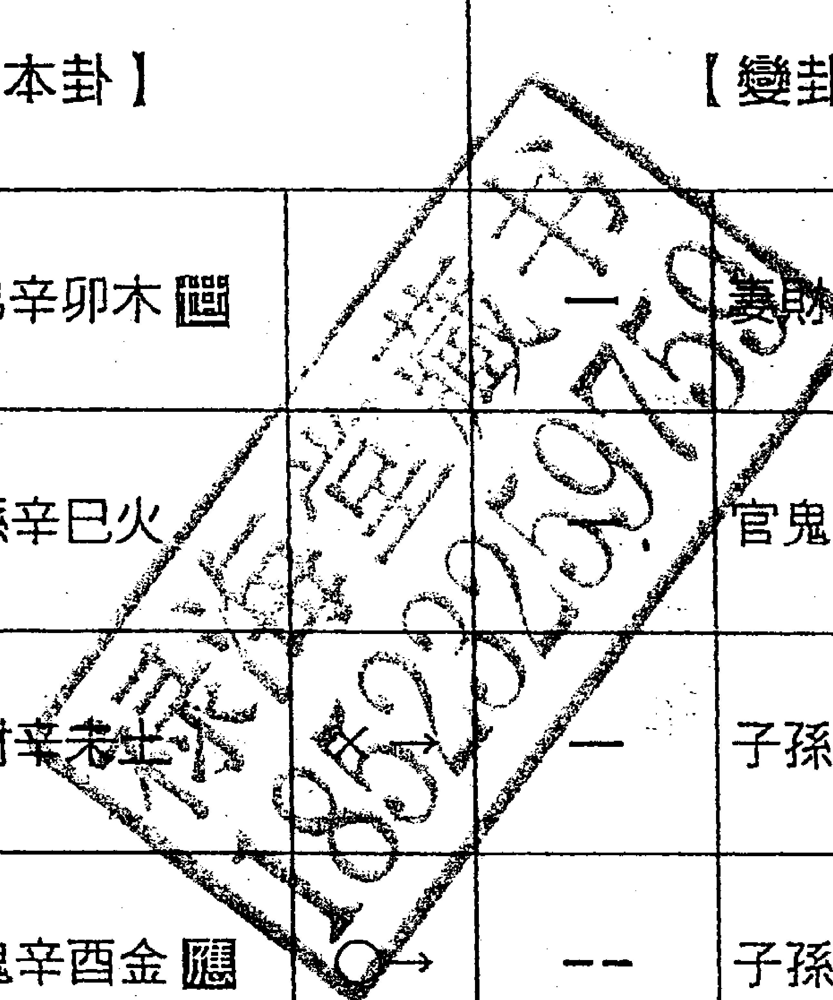

卦得六沖，本為不吉，但是財爻用神逢變爻生合，此為沖中逢合之象（卦體沖而用神合）之象，所以最後找到丟失的財物。

#### 例三

性別：男　占問：能否借到錢？

戌月甲辰日

| 卦象 | 爻辭 |
|---|---|
| 坤宮：坤為地（六沖） |  |
| 【本卦】 |  |
| -- | 子孫癸酉金（囚） |
| -- | 妻財癸亥水 |
| -- | 兄弟癸丑土 |
| -- | 官鬼乙卯木（應） |
| -- | 父母乙巳火 |
| -- | 兄弟乙未土 |

卦得世應相沖，本來不吉，但月令合世爻，日建合應爻，此為沖中逢合，為先敗後成之象。後果然在數日後借得此錢。

#### 例四

性別：男　占問：出外貿易財運如何？

年月丙辰日

| 伏神 | 【本卦】震宮：雷風恒 | 【變卦】震宮：雷地豫（六合） |
|---|---|---|
|  | -- 妻財庚戌土（應） | -- 妻財庚戌土 |
|  | -- 官鬼庚申金 | -- 官鬼庚申金 |
|  | — 子孫庚午火 | — 子孫庚午火（應） |
|  | -- 官鬼辛酉金（世） ○→ | -- 兄弟乙卯木 |
| 兄弟庚寅木 | — 父母辛亥水 ○→ | -- 子孫乙巳火 |
|  | -- 妻財辛丑土 | -- 妻財乙未土（世） |

世爻庚寅木與父相沖，為反復不順之象。幸好辰日相合世爻，此為沖中逢合，先逆後順之象。而且有應爻妻財戌土暗動生世，說明出外貿易雖然反復，但終有利。後此人去而復返三次，均在中途發貨，俱得利益。

#### 例五

性別：男　占問：何年能夠生出兒子？

酉月庚戌日

| 伏神 | 本卦（坎宮：水雷屯） | 變卦（坎宮：水澤節　六合） |
|---|---|---|
|  | -- 兄弟戊子水 | -- 兄弟戊子水 |
|  | — 官鬼戊戌土（應） | — 官鬼戊戌土 |
|  | -- 父母戊申金 | -- 父母戊申金（應） |
| 妻財戊午火 | -- 官鬼庚辰土 | -- 官鬼丁丑土 |
|  | -- 子孫庚寅木（世） ×→ | — 子孫丁卯木 |
|  | — 兄弟庚子水 | — 妻財丁巳火（世） |

（表頭含「【本卦】/【變卦】」）

取子孫寅木為用神，動爻寅木逢月令沖克，而化出之變爻卯木卻得日建相合，此為沖中逢合，先損後得之象。後得知此人婚後一直無子，而在搖了卦後的寅年卯月，此人開始得子。

##### （二）合化沖，沖化沖

卦象六合化六沖者，此為先成後散，先易後難之象。用爻在卦中逢合化沖者，也為事體先成後散，先得後失之象。

卦六沖化六沖者，此為事體受傷，遇事皆散之象。凡占官非災禍事，得合化沖、沖化沖者，只要世爻不受克太過，則為災禍消除之吉象。

註：卦得六合化六沖者即是主卦得六合，而變卦得六沖。

用爻得合化沖者即是：

- 1. 主卦得六合，而用爻得變爻或月令或日建來沖。
- 2. 用爻雖得動爻相合，而得變爻或月令或日建來沖。
- 3. 用爻雖得變爻相合，而得月令或日建來沖。
- 4. 用爻雖得月令相合，而得日建來沖。
- 5. 用爻得日月相合，而化出的變爻被月日相沖。

#### 例一

性別：男，占問：孩子上學發展如何？

五月甲寅日

| 伏神 | 【本卦】乾宮：天地否（六合） | 【變卦】乾宮：乾為天（六沖） |
|---|---|---|
|  | 一 父母壬戌土（應） | 一 父母壬戌土（世） |
|  | 一 兄弟壬申金 | 一 兄弟壬申金 |
|  | 一 官鬼壬午火 | 一 官鬼壬午火 |
|  | 一 妻財乙卯木（變） ×→ | 一 父母甲辰土（應） |
|  | -- 官鬼乙巳火 ×→ | 一 妻財甲寅木 |
| 子孫甲子水 | -- 父母乙未土 ×→ | 一 子孫甲子水 |

卦得六合，本為吉象，但不宜卦變六沖，此為合處逢沖，為先和後逆，不能長久之象。求測者問道，因何事而使之不能長久呢？答道，子孫子水無故旬空，又逢父母動爻相克，且臨勾陳，代表跌打損傷，需要防止孩子有災禍發生。後果然在兩月後，孩子因為生病而輟學，沒過多久孩子便因病去世了。

#### 例二

性別：男　占問：自己與某女能不能結成婚姻？

辰月丁酉日

| 伏神 | 【本卦】 |  |
|---|---|---|
|  | 一 | 父母壬戌土 |
|  | 一 | 兄弟壬申金 |
|  | 一 | 官鬼壬午火 |
|  | -- | 妻財乙卯木 |
|  | -- | 官鬼乙巳火 |
| 子孫甲子水 | -- | 父母乙未土 |

乾宮：天地否（六合）

卦得六合，本來為吉，可惜世爻被日建相沖，應爻被月令相沖，此為合處逢沖，先合後散之象。後來果然於本月自己得了一場大病，女方也於三月後因病去世。

#### 例三

性別：男　占問：簽合同的求財結果？

卯月乙卯日

| 伏神 | 【本卦】 |  |
|---|---|---|
|  | 一 | 兄弟己巳火 |
|  | -- | 子孫己未土 |
|  | -- | 妻財己酉金（應） |
| 官鬼己亥水 | 一 | 妻財丙申金 |
|  | -- | 兄弟丙午火 |
| 父母己卯木 | -- | 子孫丙辰土（世） |

卦得六合，本吉。現在相合世爻的財爻酉金被月日相沖，此為合處逢沖，為先順後逆之象。後果然開始簽合同，但於數日後反悔，致使合同作廢，求財不得。

#### 例四

性別：男　占問：墳地風水的吉凶？  
辰月甲子日

| 乾宮：乾為天（六沖） | 坤宮：坤為地（六沖） |
|---|---|
| 【本卦】 | 【變卦】 |
| 一　父母壬戌土㐅 | --　兄弟癸酉金㐅 |
| 一　兄弟壬申金 | --　子孫癸亥水 |
| 一　官鬼壬午火 | --　父母癸丑土 |
| 一　父母甲辰土應 | --　妻財乙卯木應 |
| 一　妻財甲寅木 | --　官鬼乙巳火 |
| --　子孫甲子水 | --　父母乙未土 |

占墳地風水者，六沖又化六沖，且卦爻俱亂動，此為大凶之象。後掘開土地一看，地下果然全是石頭，難以成其墳地。

#### 例五

性別：男　占問：出外貿易財運如何？  
未月乙亥日

| 兌宮：兌為澤（六沖） | 震宮：震為雷（六沖） |
|---|---|
| 【本卦】 | 【變卦】 |
| --　父母丁未土㐅 | --　父母庚戌土㐅 |
| 一　兄弟丁酉金　○→ | --　兄弟庚申金 |
| 一　子孫丁亥水 | 一　官鬼庚午火 |
| --　父母丁丑土應 | --　父母庚辰土應 |
| 一　妻財丁卯木　○→ | --　妻財庚寅木 |
| 一　官鬼丁巳火 | 一　子孫庚子水 |

占求財者，六沖化六沖，必然求財虧損。後果然虧本。

###### 例六

性別：男　占問：開店財運如何？  
午月丙子日

| 坤宮：雷天大壯（六沖） | 動爻 | 巽宮：巽為風（六沖） |
|---|---|---|
| 【本卦】 |  | 【變卦】 |
| —— 兄弟庚戌土 | ×→ | —— 官鬼辛卯木應 |
| —— 子孫庚申金 | ×→ | —— 父母辛巳火 |
| — 父母庚午火世 | ○→ | -- 兄弟辛未土 |
| — 兄弟甲辰土 |  | — 子孫辛酉金應 |
| — 官鬼甲寅木 |  | — 妻財辛亥水 |
| — 妻財甲子水應 | ○→ | -- 兄弟辛丑土 |

占求財者，六沖化六沖，必然求財虧損。求測者道，店面已成矣。答道：月令午火持世化未土相合，逢日沖也沖不散，但只恐今冬逢沖之時變凶。後果然在冬季之時因為店面職員惹事而關閉。

##### 二、世化用神章

- （一）世爻動化用爻者，世用爻均在月日旺相有氣，又無卦中動爻相克者，則為得象。

#### 例一

性別：男　占問：求官應試得失？  
辰月庚午日

| 伏神 | 乾宮：風地觀【本卦】 | 乾宮：天地否（六合）【變卦】 |
|---|---|---|
|  | 妻財辛卯木 | 父母壬戌土 |
| 兄弟壬申金 | 官鬼辛巳火 | 兄弟壬申金 |
|  | 父母辛未土（世） | 官鬼壬午火 |
|  | 妻財乙卯木 | 妻財乙卯木（應） |
|  | 官鬼乙巳火 | 官鬼乙巳火 |
| 子孫甲子水 | 父母乙未土（應） | 父母乙未土 |

取官爻為用，世爻動化用神，世用爻均旺相有氣，世爻又被用神回頭生合，故最終得官。

#### 例二

性別：男　占問：修改風水後自己官運如何？  
戊月己亥日

|  | 本卦 | 動爻 | 變卦 |
|---|---|---|---|
| 巽宮：火雷噬嗑 |  |  | 巽宮：天雷無妄（六沖） |
| 【本卦】 |  |  | 【變卦】 |
| 一 | 子孫己巳火 |  | 一 妻財壬戌土 |
| -- | 妻財己未土（世） | ×→ | 一 官鬼壬申金 |
| 一 | 官鬼己酉金 |  | 一 子孫壬午火（應） |
| -- | 妻財庚辰土 |  | -- 妻財庚辰土 |
| -- | 兄弟庚寅木（應） |  | -- 兄弟庚寅木 |
| -- | 父母庚子水 |  | -- 父母庚子水（應） |

取官爻為用，世爻動化用神，世用爻均旺相有氣，故最終得官。

#### 例三

性別：男　占問：求財如何？  
巳月丁巳日

| 伏神 | 【本卦】 | 【變卦】 |
|---|---|---|
|  | 坎宮：水火既濟 | 離宮：風水渙 |
|  | -- 兄弟戊子水應 ×→ — 子孫辛卯木 |  |
|  | — 官鬼戊戌土 | — 妻財辛巳火 |
|  | -- 父母戊申金 | -- 官鬼辛未土 |
| 妻財戊午火 | — 兄弟己亥水世 ○→ -- 妻財戊午火 |  |
|  | -- 官鬼己丑土 ×→ — 官鬼戊辰土應 |  |
|  | — 子孫己卯木 ○→ -- 子孫戊寅木 |  |

取財爻為用。兄弟持世者，占久遠財者，則為忌神持世，必定無財。但是此卦世爻動化用神，用神旺相有氣，且日臨火又作財星來沖世，故最終得財。

#### 例四

性別：男　占問：求財如何？  
酉月辛亥日

| 兌宮：兌為澤（六沖） | 震宮：雷水解 |
|---|---|
| 【本卦】 | 【變卦】 |
| -- 父母丁未土 | -- 父母庚戌土 |
| — 兄弟丁酉金 ○→ | -- 兄弟庚申金 應 |
| — 子孫丁亥水 | — 官鬼庚午火 |
| -- 父母丁丑土 應 | -- 官鬼戊午火 |
| — 妻財丁卯木 | — 父母戊辰土 世 |
| — 官鬼丁巳火 ○→ | -- 妻財戊寅木 |

取財爻為用。動爻化出用神，且用爻臨日旺相，故為吉。現在財爻旬空，待出空之甲寅日必然得財。後果應驗。

#### 例五

性別：男　占問：求官如何？  
子月戊寅日

| 兌宮：澤水困（六合） | 兌宮：兌為澤（六沖） |
|---|---|
| 【本卦】 | 【變卦】 |
| -- 父母丁未土 | -- 父母丁未土 世 |
| — 兄弟丁酉金 | — 兄弟丁酉金 |
| — 子孫丁亥水 應 | — 子孫丁亥水 |
| -- 官鬼戊午火 | -- 父母丁丑土 應 |
| — 父母戊辰土 | — 妻財丁卯木 |
| -- 妻財戊寅木 世 ×→ | — 官鬼丁巳火 |

取官爻為用。世爻化出用神，且世用爻臨月日旺相，故為吉。後果於次年春季升遷。

###### 例六

性別：男　占問：夫妻能否白頭偕老？  
己月丁未日

| 巽宮：天雷無妄（六沖） | 動爻 | 乾宮：風地觀 |
|---|---|---|
| 【本卦】 |  | 【變卦】 |
| 一 妻財壬戌土 |  | 一 兄弟辛卯木 |
| 一 官鬼壬申金 |  | 一 子孫辛巳火 |
| 一 子孫壬午火（世） | ○→ | -- 妻財辛未土（世） |
| -- 妻財庚辰土 |  | -- 兄弟乙卯木 |
| -- 兄弟庚寅木 |  | -- 子孫乙巳火 |
| 一 父母庚子水（應） | ○→ | -- 妻財乙未土（應） |

取妻財為用。世爻化出用神，世用交臨月日旺相，並且世用相合，故為吉。所以後來夫妻偕老到八十有餘，妻子賢良聰慧。

- （二）世爻動化用神者，如果世用爻在月日休囚無氣，逢空受傷者，則為失而不成之象。

#### 例一

性別：男　占問：求官如何？  
戌月甲寅日

| 伏神 | 巽宮：風雷益（本卦） | 變卦（兌宮：水山蹇） |
|---|---|---|
|  | 兄弟辛卯木 應 ○→ | 父母戊子水 |
|  | 子孫辛巳火 | 妻財戊戌土 |
|  | 妻財辛未土 | 官鬼戊申金（世） |
| 官鬼辛酉金 | 妻財庚辰土（動） ×→ | 官鬼丙申金 |
|  | 兄弟庚寅木 | 子孫丙午火 |
|  | 父母庚子水 ○→ | 妻財丙辰土 應 |

取官爻為用。此為世爻化用，為吉象。只是世爻月破，寅日傷爻，又被動爻來克，有克無生扶，此時世爻化官並非化官之象，而是化鬼見災之象。後果然沒有得到官職，並於次年寅月死亡。

##### 三、用神持世章

- （一）用爻持世，世爻在月日旺相有氣，又無動變爻相克者，均為成象。  
- 1. 其事為成象，再觀原神，原神旺相有氣者，其事不但能成，而且源遠流長；原神休囚無氣者，其占近期之事仍吉，占久遠之事則後繼無力。  
- 2. 用爻受旺相忌神克者，其事中途見傷。  
- 3. 用爻受破散忌神相克者，其事中途小有阻礙，待沖去忌神之時則能成事。

#### 例一

性別：男　占問：考試成績？  
申月乙巳日

| 震宮：澤風大過（遊魂） | 離宮：火風鼎 |
|---|---|
| 伏神／【本卦】 | 【變卦】 |
| —— 妻財丁未土 | —— 子孫己巳火 |
| —— 官鬼丁酉金 | —— 妻財己未土（應） |
| 子孫庚午火 —— 父母丁亥水（世） | —— 官鬼己酉金 |
| —— 官鬼辛酉金 | —— 官鬼辛酉金 |
| 兄弟庚寅木 —— 父母辛亥水 | —— 父母辛亥水（世） |
| —— 妻財辛丑土（應） | —— 妻財辛丑土 |

取父母為用，此為用神持世，為吉組合。用神旺相暗動，又得原神官爻旺生，大吉之象，故成績優異。

#### 例二

性別：男　占問：考試成績？  
亥月丙戌日

| 坎宮：雷火豐 | 坎宮：澤火革 |
|---|---|
| 【本卦】 | 【變卦】 |
| —— 官鬼庚戌土 | —— 官鬼丁未土 |
| —— 父母庚申金（世） | —— 父母丁酉金 |
| —— 妻財庚午火 | —— 兄弟丁亥水（應） |
| —— 兄弟己亥水 | —— 兄弟己亥水 |
| —— 官鬼己丑土（應） | —— 官鬼己丑土 |
| —— 子孫己卯木 | —— 子孫己卯木（應） |

取父母為用，此為用神持世，為吉組合。用神旺相化進，又得日建作官星生世，大吉之象，故成績優異。

#### 例三

性別：男　占問：能否升官？  
酉月乙巳日

| 兌宮：澤地萃 | 乾宮：天地否（六合） |
|---|---|
| 【本卦】 | 【變卦】 |
| -- 父母丁未土 | ×→ 一 父母壬戌土應 |
| 一 兄弟丁酉金應 | 一 兄弟壬申金 |
| 一 子孫丁亥水 | 一 官鬼壬午火 |
| -- 妻財乙卯木 | -- 妻財乙卯木世 |
| -- 官鬼乙巳火世 | -- 官鬼乙巳火 |
| -- 父母乙未土 | -- 父母乙未土 |

取官爻為用，此為用神持世，為吉組合。用神又臨日建旺相，為成象。且巳日沖動亥水，與發動的未土三合原神局；因卦中卯木並未發動，故在第二年的卯月合局成功之時，得到官職。

#### 例四

性別：男　占問：能否升官？  
卯月己亥日

| 坤宮：地澤臨 | 艮宮：風澤中孚（遊魂） |
|---|---|
| 【本卦】 | 【變卦】 |
| -- 子孫癸酉金 | -- 官鬼辛卯木 |
| -- 妻財癸亥水應 | -- 父母辛巳火 |
| -- 兄弟癸丑土 | -- 兄弟辛未土（應） |
| -- 兄弟丁丑土 | -- 兄弟丁丑土 |
| — 官鬼丁卯木（世） | — 官鬼丁卯木 |
| — 父母丁巳火 | — 父母丁巳火（應） |

取官父為用，此為用神持世，為吉組合。用神在月日旺相，又得原神動而生世，大吉之象，故順利得官。

#### 例五

性別：男　占問：何日得財？  
巳月戊戌日

| 巽宮：風雷益 |
|---|
| 伏神／【本卦】 |
| — 兄弟辛卯木（應） |
| — 子孫辛巳火 |
| -- 妻財辛未土 |
| 官鬼辛酉金／-- 妻財庚辰土（世） |
| -- 兄弟庚寅木 |
| — 父母庚子水 |

取財爻為用，此為用神持世，為吉組合。用神逢月令相生旺相，被日建沖之暗動，用神旺相無傷，大吉之象，故順利得財。

###### 例六

性別：男　占問：求婚能否成功？  
卯月乙丑日

| 離宮：火雷噬嗑 | 動爻 | 坤宮：坤為地（六沖） |
|---|---|---|
| 【本卦】 |  | 【變卦】 |
| 一　子孫己巳火 | ○→ | --　官鬼癸酉金應 |
| --　妻財己未土應 |  | --　父母癸亥水 |
| 一　官鬼己酉金 | ○→ | --　妻財癸丑土 |
| --　妻財庚辰土 |  | --　兄弟乙卯木應 |
| --　兄弟庚寅木應 |  | --　子孫乙巳火 |
| 一　父母庚子水 | ○→ | --　妻財乙未土 |

取妻財為用，此為用神持世，為吉組合。用神旺相暗動有氣，又得原神動來生世，大吉之象，故求婚成功。

###### 例七

性別：男　占問：考試求官  
申月癸卯日

| 伏神 | 本卦（震宮：雷風恒） | 變卦（震宮：澤風大過（遊魂）） |
|---|---|---|
|  | 妻財庚戌土應 | 妻財丁未土 |
|  | 官鬼庚申金 ×→ | 官鬼丁酉金 |
|  | 子孫庚午火 | 父母丁亥水世 |
|  | 官鬼辛酉金世 | 官鬼辛酉金 |
| 兄弟庚寅木 | 父母辛亥水 | 父母辛亥水 |
|  | 妻財辛丑土 | 妻財辛丑土應 |

取官鬼爻為用，此為用神持世，為吉組合。用神旺相暗動，又得五爻官鬼化進神相助，且又動生文書父母爻，此為大吉之象，故考試優異。

### 例八

性別：男　占問：能否得財？  
己月丁丑日

| 伏神 | 【本卦】（巽宮：風雷益） | 動爻 | 【變卦】（兌宮：澤地萃） |
|---|---|---|---|
|  | — 兄弟辛卯木應 | ○→ | -- 妻財丁未土 |
|  | — 子孫辛巳火 |  | — 官鬼丁酉金應 |
|  | -- 妻財辛未土 | ×→ | -- 父母丁亥水 |
| 官鬼辛酉金 | -- 妻財庚辰土世 |  | -- 兄弟乙卯木 |
|  | -- 兄弟庚寅木 |  | -- 子孫乙巳火 |
|  | — 父母庚子水 | ○→ | -- 妻財乙未土 |

取財爻為用，此爻用神持世，為吉組合。用神旺相逢生，又得動爻化財，雖有忌神相克，忌神休囚於月日，入庫於未土，也無力克用，只是說明中途小滯，仍為吉象，故順利得財。

### 例九

性別：男　占問：能否得財？  
己月戊戌日  
（表頭上方：巽宮：風雷益）

| 伏神 | 本卦 |  |
|---|---|---|
|  | 一 | 兄弟辛卯木應 |
|  | — | 子孫辛巳火 |
|  | -- | 妻財辛未土 |
| 官鬼辛酉金 | --- | 妻財庚辰土世 |
|  | -- | 兄弟庚寅木 |
|  | — | 父母庚子水 |

取財爻為用，此為用神持世，為吉組合。用神旬空不吉，但得當日戌土作財星沖世，使之沖空而起，故當日得財。

- （二）用爻持世，世爻在月日休囚無氣、旬空月破，又無動變爻相生救者，均為不成象。  
- 1. 用爻休囚無氣者，其為不成之象。若再受動變爻相克者，此事非但不成，更見損失災禍。  
- 2. 原神休囚無氣又受動變爻相克，占事為原神受傷，輕則難以長久，重則產生凶難災禍。

#### 例一

性別：男　占問：求財結果？  
辰月乙卯日

| 伏神 | 【本卦】離宮：風火家人 | 【變卦】艮宮：山火賁 |
|---|---|---|
|  | 一 兄弟辛卯木 | 一 兄弟丙寅木 |
|  | 一 子孫辛巳火 應 ○→ | -- 父母丙子水 |
|  | -- 妻財辛未土 | -- 妻財丙戌土 應 |
| 官鬼辛酉金 | 一 父母己亥水 | 一 父母己亥水 |
|  | -- 妻財己丑土 世 | -- 妻財己丑土 |
|  | 一 兄弟己卯木 | 一 兄弟己卯木 世 |

取財爻為用，此為用神持世。用神不僅休囚，而且旬空，不吉。而原神月休日生為中和，但動化回頭之克，此為中和受克，休囚而難以生用，故求財不得。

#### 例二

性別：男　占問：升官何處？  
年月庚寅日

| 伏神 | 【本卦】艮宮：山天大畜 | 動爻 | 【變卦】艮宮：風澤中孚（遊魂） |
|---|---|---|---|
|  | 一　官鬼丙寅木 |  | 一　官鬼辛卯木 |
|  | -- 妻財丙子水（應） | ×→ | 一　父母辛巳火 |
|  | -- 兄弟丙戌土 |  | -- 兄弟辛未土（世） |
| 子孫丙申金 | 一　兄弟甲辰土 | ○→ | -- 兄弟丁丑土 |
| 父母丙午火 | 一　官鬼甲寅木（世） |  | 一　官鬼丁卯木 |
|  | -- 妻財甲子水 |  | -- 父母丁巳火（應） |

取官父為用，此為用神持世，用神得日建比扶有氣，為吉。只是原神財爻子水受克化絕，此為原神受傷，難以生用，也難以生世。故本人不僅求官難得，自身也因生病而死。

#### 例三

性別：男　占問：升官何處？  
午月甲午日

| 左卦象 | 本卦（坤宮：地澤臨） | 變化 | 右卦象 | 變卦（坎宮：水澤節（六合）） |
|---|---|---|---|---|
|  | 【本卦】 |  |  | 【變卦】 |
| -- | 子孫癸酉金 |  | -- | 妻財戊子水 |
| -- | 妻財癸亥水（應） | ×→ | — | 兄弟戊戌土 |
| -- | 兄弟癸丑土 |  | -- | 子孫戊申金（應） |
| -- | 兄弟丁丑土 |  | -- | 兄弟丁丑土 |
| — | 官鬼丁卯木（世） |  | — | 官鬼丁卯木 |
| — | 父母丁巳火 |  | — | 父母丁巳火（應） |

取官爻為用，此為用神持世。用神休囚無力，且原神休囚化克，此謂之原神受傷，難以生用，也難以生世，所以最後此人不僅求官不得，自身也生病而死。

#### 例四

性別：男　占問：因官運有滯，而占前途如何？  
卯月辛巳日

| 伏神 | 震宮：雷風恒 | 震宮：地風升 |
|---|---|---|
|  | 【本卦】 | 【變卦】 |
|  | -- 妻財庚戌土應 | -- 官鬼癸酉金 |
|  | -- 官鬼庚申金 | -- 父母癸亥水 |
|  | — 子孫庚午火 ○→ | -- 妻財癸丑土（世） |
|  | — 官鬼辛酉金（應） | — 官鬼辛酉金 |
| 兄弟庚寅木 | — 父母辛亥水 | — 父母辛亥水 |
|  | -- 妻財辛丑土 | -- 妻財辛丑土（應） |

取官父為用，此為用神持世。用神月破，並且旬空，又有動爻來克，用神受克且世爻受克，不僅求事難成，而且本人還要有災。後果然到了陰曆五、六月，本人不僅官運有失，自身還因官入獄。

#### 例五

性別：男　占問：官司前景如何？  
丑月壬子日  
（表頭另含：乾宮：天山遯）

| 伏神 | 爻 | 本卦 |
|---|---|---|
|  | 一 | 父母壬戌土 |
|  | 一 | 兄弟壬申金（應） |
|  | 一 | 官鬼壬午火 |
|  | 一 | 兄弟丙申金 |
| 妻財甲寅木 | -- | 官鬼丙午火（世） |
| 子孫甲子水 | -- | 父母丙辰土 |

占官司取世應為用，取世爻代表自己，應爻代表對方。此卦世爻在月令休囚，又被子水沖克，所以本人當日即受官方責罰。

## 四、泄神持世章

- （一）泄爻持世，世用爻均在月日旺相有氣；又無動變爻相克者，均為得象。  
- 1. 用爻動而生世者，此為事體找我，所求之事不求自合；  
- 2. 用爻、世爻俱靜或世動者，即使世用爻旺相，此事也須自身多加努力方能成功。

#### 例一

性別：男　占問：因要去問官員索求錢財，占前景如何？  
申月丁卯日

| 離宮：天火同人（歸魂） |
|---|
| 【本卦】 |
| 一　子孫壬戌土應 |
| 一　妻財壬申金 |
| 一　兄弟壬午火 |
| 一　官鬼己亥水世 |
| --　子孫己丑土 |
| 一　父母己卯木 |

取財爻為用，此為泄神持世。此卦用神臨月令旺相，世爻得月令相生也為旺相，此為世用旺相且相生，為吉象。所以最後得到錢財。

#### 例二

性別：男　占問：將來有無官職？  
巳月己丑日

| 兌宮：兌為澤（六沖） | 離宮：天水訟（遊魂） |
|---|---|
| 【本卦】 | 【變卦】 |
| --　父母丁未土應　×→ | —　父母壬戌土 |
| —　兄弟丁酉金 | —　兄弟壬申金 |
| —　子孫丁亥水 | —　官鬼壬午火世 |
| --　父母丁丑土應 | --　官鬼戊午火 |
| —　妻財丁卯木 | —　父母戊辰土 |
| —　官鬼丁巳火　○→ | --　妻財戊寅木應 |

取官爻為用，此為沖中持世。此卦用神逢月令衝破，但化出的變爻卻逢月令生合，此為沖中逢合，先散後成。而世爻旬空，又逢日建沖空而起，謂之解救，為吉象。所以最後仍然得官。

#### 例三

性別：男　占問：攻讀某專業將來能否發達？  
酉月丙子日

| 坎宮：雷火豐 |  | 離宮：離為火（六沖） |  |
|---|---|---|---|
| 【本卦】 |  | 【變卦】 |  |
| -- | 官鬼庚戌土 | ×→ | — 妻財己巳火 應 |
| -- | 父母庚申金 世 |  | -- 官鬼己未土 |
| — | 妻財庚午火 |  | — 父母己酉金 |
| — | 兄弟己亥水 |  | — 兄弟己亥水 應 |
| -- | 官鬼己丑土 應 |  | -- 官鬼己丑土 |
| — | 子孫己卯木 |  | — 子孫己卯木 |

取官爻為用，此為洩神持世。此卦世爻在月日休囚，但得用神有氣動而生世，此為衰處逢生，為吉象。所以四年後即因此學問而求職順利。

#### 例四

性別：男　占問：求婚能否成功？  
子月癸酉日

| 伏神 | 【本卦】（震宮：雷風恆） |  | 【變卦】（離宮：火風鼎） |
|---|---|---|---|
|  | 妻財庚戌土 應 | ×→ | 子孫己巳火 |
|  | 官鬼庚申金 |  | 妻財己未土 應 |
|  | 子孫庚午火 |  | 官鬼己酉金 |
|  | 官鬼辛酉金 世 |  | 官鬼辛酉金 |
| 兄弟庚寅木 | 父母辛亥水 |  | 父母辛亥水 世 |
|  | 妻財辛丑土 |  | 妻財辛丑土 |

取財爻為用，此為世沖持世。此卦世爻臨月令旺相，又得用神有氣動而生世，此為世用旺相相生，為吉象。所以次日即得女方允婚。

#### 例五

性別：男　占問：競選官職能否成功？  
寅月丙辰日

| 乾宮：乾為天（六沖） | 巽宮：風天小畜 |
|---|---|
| 【本卦】 | 【變卦】 |
| 一　父母壬戌土▇▇ | 一　妻財辛卯木 |
| 一　兄弟壬申金 | 一　官鬼辛巳火 |
| 一　官鬼壬午火　○→ | 二　父母辛未土▇▇ |
| 一　父母甲辰土▇▇ | 一　父母甲辰土 |
| 一　妻財甲寅木 | 一　妻財甲寅木 |
| 一　子孫甲子水 | 一　子孫甲子水▇▇ |

取官父為用，此為沖神持世。此卦世爻戌土暗動，與月令用神三合用神局來生世，此為吉象。後果然於本月得官。

###### 例六

性別：男　占問：求官能否成功？  
巳月丁酉日

| 乾宮：乾為天（六沖） |  | 坤宮：水天需（遊魂） |
|---|---|---|
| 【本卦】 |  | 【變卦】 |
| 一 | 父母壬戌土▣ | ○→ -- 子孫戊子水 |
| 一 | 兄弟壬申金 | -- 父母戊戌土 |
| 一 | 官鬼壬午火 | ○→ -- 兄弟戊申金▣ |
| 一 | 父母甲辰土▣ | -- 父母甲辰土 |
| 一 | 妻財甲寅木 | -- 妻財甲寅木 |
| 一 | 子孫甲子水 | -- 子孫甲子水▣ |

取官爻為用，此為洩神持世。此卦兩個動爻三合用神局來生世，此為吉象。只是其中寅木未動，後到寅日合局成功之時，果然得到官職。

## （二）洩神持世，世爻或有一個在月日休囚無氣旬空月破，又被動變爻相克者，此為求事不成之象。

- 世爻休囚無氣旬空月破者，說明自己能力活動力欠佳。
- 用爻休囚無氣旬空月破者，說明所求之事機會不到。
- 用爻受動變爻相克者，說明其事有人競爭。用爻受克越多，競爭越大；用爻受克越少，競爭越小。
- 世爻受動變爻相克者，說明本人在所求之事上面有仇人相害。

#### 例一

性別：男　占問：索求文書能否成功？  
寅月丙申日

| 伏神 | 爻象 | 本卦 |
|---|---|---|
|  | -- | 子孫癸酉金應 |
|  | -- | 妻財癸亥水 |
|  | -- | 兄弟癸丑土 |
|  | — | 兄弟甲辰土世 |
| 父母乙巳火 | — | 官鬼甲寅木 |
|  | -- | 妻財甲子水 |

坤宮：地天泰（六合）

取父母為用，此為洩神持世。卦中世爻休囚，並且用神伏藏不現，並且旬空，不能相生世爻，所以最後文書不成。

##### 五、原神持世章

### （一）原神持世，世爻均在月日旺相有氣，又無動變爻相克者，此為做事有成之象。

- 世爻動而生用神者，說明其事需要通過自己先期拿出物質本錢投資，並且花費精力才能成。
- 用爻動而相合世爻者，說明其事為貨主上門，事不求自合。

#### 例一

性別：男　占問：考試成績如何？  
卯月甲申日

| 艮宮：艮為山（六沖） |  | 巽宮：風火家人 |
|---|---|---|
| 【本卦】 |  | 【變卦】 |
| 一　官鬼丙寅木▇ |  | 一　官鬼辛卯木 |
| -- 妻財丙子水 | ×→ | -- 父母辛巳火應 |
| -- 兄弟丙戌土 |  | -- 兄弟辛未土 |
| 一　子孫丙申金應 |  | 一　妻財己亥水 |
| -- 父母丙午火 |  | -- 兄弟己丑土▇ |
| -- 兄弟丙辰土 | ×→ | 一　官鬼己卯木 |

取父母為用，此為原神持世。世爻旺相，又暗動來相生用神，為吉象。所以後來考試成績第一。

#### 例二

性別：男　占問：能否升職？  
未月甲午日

| 坎宮：地水師（歸魂） |  | 離宮：風水渙 |
|---|---|---|
| 【本卦】 |  | 【變卦】 |
| —— 父母癸酉金應 | ×→ | —— 子孫辛卯木 |
| —— 兄弟癸亥水 | ×→ | —— 妻財辛巳火 |
| —— 官鬼癸丑土 |  | —— 官鬼辛未土 |
| —— 妻財戊午火 |  | —— 妻財戊午火 |
| —— 官鬼戊辰土 |  | —— 官鬼戊辰土應 |
| —— 子孫戊寅木 |  | —— 子孫戊寅木 |

取官爻為用，此為原神持世。用爻官鬼臨月令旺相來合世爻，此為用神合我之吉象，說明所測之事不求也自合。後果然官運亨通。

#### 例三

性別：男　占問：考試成績如何？  
戌月甲寅日

| 伏神 | 【本卦】兌宮：雷山小過（遊魂） |  | 【變卦】離宮：火山旅 |
|---|---|---|---|
|  | -- 父母庚戌土 | ×→ | — 官鬼己巳火 |
|  | -- 兄弟庚申金 |  | -- 父母己未土 |
| 子孫丁亥水 | — 官鬼庚午火（世） |  | — 兄弟己酉金（應） |
|  | — 兄弟丙申金 |  | — 兄弟丙申金 |
| 妻財丁卯木 | -- 官鬼丙午火 |  | -- 官鬼丙午火 |
|  | -- 父母丙辰土（應） |  | -- 父母丙辰土（世） |

取父母為用，此為原神持世。用神旺相並與世爻三合原神局生用，此為吉象。後果然考試一等。

#### 例四

性別：男　占問：出外貿易能否賺到錢財？  
未月戊申日

| 伏神 | 【本卦】離宮：火山旅 |
|---|---|
|  | — 兄弟己巳火 |
|  | -- 子孫己未土 |
|  | — 妻財己酉金（應） |
| 官鬼己亥水 | — 妻財丙申金 |
|  | -- 兄弟丙午火 |
| 父母己卯木 | -- 子孫丙辰土（世） |

取財爻為用，此為原神持世。用神旺相與世爻相合，世爻也旺相無傷，說明此事不求也自合。最終果然得到錢財。

#### 例五

性別：男　占問：考試成績如何？  
巳月壬子日

| 坤宮：水地比（歸魂） |  |
|---|---|
| 【本卦】 |  |
| -- | 妻財戊子水應 |
| -- | 兄弟戊戌土 |
| -- | 子孫戊申金 |
| -- | 官鬼乙卯木囚 |
| -- | 父母乙巳火 |
| -- | 兄弟乙未土 |

取父母為用，此為原神持世。用神父母臨月令旺相，雖然世爻旬空，但是旺而不空，待世爻出空之時必是成名之時。後果然於卯年成名。

### （二）原神持世，世或用爻在月日有一個休囚無氣或旬空月破者，或又被動變爻相克者，則為不成之象。

- 用爻受動變爻相克者，其事有人競爭，受克越多，競爭越大；受克越少，競爭越小。
- 用爻休囚受克者，其事非但不成，且見損失。
- 世爻受動變爻相克者，其事辛勞費力多端。

#### 例一

性別：男　占問：求財結果？  
辰月乙卯日

| 伏神 | 艮宮：火澤睽【本卦】 | 艮宮：山澤損【變卦】 |
|---|---|---|
|  | 一 父母己巳火 | 一 官鬼丙寅木應 |
| 妻財丙子水 | -- 兄弟己未土 | -- 妻財丙子水 |
|  | 一 子孫己酉金（世） ○→ | -- 兄弟丙戌土 |
|  | -- 兄弟丁丑土 | -- 兄弟丁丑土（世） |
|  | 一 官鬼丁卯木 | 一 官鬼丁卯木 |
|  | 一 父母丁巳火（應） | 一 父母丁巳火 |

取財爻為用，此為原神持世。用神財爻伏藏不現，且又旬空受克，此為不成之象。後果無財。

#### 例二

性別：男　占問：挖掘古墓能否得到錢財？  
辰月丙辰日

| 伏神 | 【本卦】 | 【變卦】 |
|---|---|---|
|  | 父母己巳火 | 官鬼丙寅木（應） |
| 妻財丙子水 | 兄弟己未土 | 妻財丙子水 |
|  | 子孫己酉金（世） | 兄弟丙戌土 |
|  | 兄弟丁丑土 | 子孫辛酉金 |
|  | 官鬼丁卯木 | 妻財辛亥水 |
|  | 父母丁巳火（應） | 兄弟辛丑土 |

取財爻為用，此為原神持世。卦中用神伏而又空，又被日月飛神克傷，卦中雖有子孫動而相生財爻，只是財爻弱極，難以受生，此為不成之象。後果無財。

#### 例三

性別：男　占問：進入某專業將來能否成名？  
酉月丙子日

離宮：天火同人（歸魂）

【本卦】

| 爻象 | 六親與地支五行 |
|---|---|
| 一 | 子孫壬戌土（應） |
| 一 | 妻財壬申金 |
| 一 | 兄弟壬午火 |
| 一 | 官鬼己亥水（世） |
| -- | 子孫己丑土 |
| 一 | 父母己卯木 |

占求名取父母為用，此為原神持世。卦中原神臨月日為旺，只是用神月破受傷，學也難成。

## 八、仇神持世

### （一）仇神持世者，都為用爻克世，說明因事而見壓力困難；只有得以下三處占事類型者，方為吉象。

- 占治病、去憂、解決官非災禍以及出門遊玩求子之事者，凡此仇神持世為吉象（占治病去憂官非災禍遊玩求子者，都取子孫為用，而仇神持世的世爻必是官鬼爻，所以得用旺克世者，必是子孫爻克世。此謂之身上鬼不去不發，為吉象。）
- 占求財索物時，用世爻均旺相有氣者，則此仇神持世為吉象（占求財索物時，財來克世者為財來找我之象，如果財爻旺相，世爻也有氣不傷者，則為吉象。）
- 測其他之事，如測求文憑證件、求房子、求官職工作、求朋友幫忙者，則此仇神持世都不吉。只有世用爻之間有動爻通關生世，化解用爻克世者，方可化凶為吉，此說明事情中間會有貴人幫助解助而成。

#### 例一

性別：男　占問：求財結果？  
未月庚子日

巽宮：風天小畜

| 伏神 | 【本卦】 |
|---|---|
|  | 兄弟辛卯木 |
|  | 子孫辛巳火 |
|  | 妻財辛未土 應 |
| 官鬼辛酉金 | 妻財甲辰土 |
|  | 兄弟甲寅木 |
|  | 父母甲子水 世 |

取財爻為用，此為仇神持世。月令助用神克世，且世爻臨日建旺相，此為世用兩旺，為吉象。後果於本月辰日得財。

#### 例二

性別：男　占問：求財結果？  
寅月庚戌日

乾宮：火天大有（歸魂）

| 【本卦】 |
|---|
| 官鬼己巳火 應 |
| 父母己未土 |
| 兄弟己酉金 |
| 父母甲辰土 世 |
| 妻財甲寅木 |
| 子孫甲子水 |

取財爻為用，此為仇神持世。月令助用神克世，為吉象。後果於本月寅日得財。

#### 例三

性別：男　占問：何月能夠重新安排官職？  
戌月辛酉日

| 伏神 | 【本卦】（兌宮：水山蹇） | 【變卦】（坤宮：水天需〈遊魂〉） |
|---|---|---|
|  | -- 子孫戊子水 | -- 子孫戊子水 |
|  | — 父母戊戌土 | — 父母戊戌土 |
|  | -- 兄弟戊申金 世 | -- 兄弟戊申金 應 |
|  | — 兄弟丙申金 | — 父母甲辰土 |
| 妻財丁卯木 | -- 官鬼丙午火 ×→ — 妻財甲寅木 |  |
|  | -- 父母丙辰土 應 ×→ — 子孫甲子水 應 |  |

取官鬼為用，此為用神克世。鬼來克世者，為大凶之象。幸好有辰土發動洩官爻之氣來生世爻，此為通關相生化煞生身，轉凶為吉。後果於本年冬季安排官職。

###### （二）仇神持世者，在測其他之事，如測求文憑證件、求房子、求官職工作、求朋友幫忙者，則此仇神持世不吉，卦中又不得動爻生世通關化解者，均說明所測之事對自己造成壓力，其事阻力難成，且見浪費傷害。

- 財爻太旺而世爻太弱者，此為身弱難以禁財，為因財致禍之象。
- 占求官求名者得官鬼動來克世者，此為大凶之象。世動化鬼回頭克者則為更凶，輕則其事難成，重則見官非傷災。

#### 例一

性別：男　占問：應徵求官情況？  
卯月戊辰日

| 離宮：離為火（六沖） |  | 坎宮：水火既濟 |
|---|---|---|
| 【本卦】 |  | 【變卦】 |
| —— 兄弟己巳火 | ○→ | —— 官鬼戊子水應 |
| —— 子孫己未土 | ×→ | — 子孫戊戌土 |
| —— 妻財己酉金 | ○→ | —— 妻財戊申金 |
| —— 官鬼己亥水應 |  | —— 官鬼己亥水世 |
| —— 子孫己丑土 |  | —— 子孫己丑土 |
| —— 父母己卯木 |  | —— 父母己卯木 |

占求官取官鬼為用，此為仇神持世。此卦世爻動化官鬼回頭克，為世動化鬼，大凶之象，不僅考試不吉，還見大凶。後來無官，本人客死於他鄉。

#### 例二

性別：男　占問：能否求到官職？  
五月庚子日

| 坤宮：地天泰（六合） | 坎宮：地火明夷（遊魂） |
|---|---|
| 伏神／【本卦】 | 【變卦】 |
|  | -- 子孫癸酉金 應 | -- 子孫癸酉金 |
|  | -- 妻財癸亥水 | -- 妻財癸亥水 |
|  | -- 兄弟癸丑土 | -- 兄弟癸丑土 世 |
|  | — 兄弟甲辰土 世 | — 妻財己亥水 |
| 父母乙巳火 | — 官鬼甲寅木 ○→ | -- 兄弟己丑土 |
|  | — 妻財甲子水 | — 官鬼己卯木 應 |

占求官取官鬼為用，此為伏神持世。世爻被官鬼相克，此謂之鬼殺克身，不僅求官不吉，還見大凶。後雖然得到官職，但次年三月即死於所往之所。

##### 七、忌神持世章

###### （一）忌神持世者，凡事多謀少成，阻力纏身，一般都是不成之象。

但也有例外的組合，其組合如下：

- 世爻動化用爻。
- 占求財時財臨月日沖世。
- 用爻動來相合世爻。
- 忌神世爻動而入墓，此為阻力消除，其事仍然可成。

#### 例一

性別：男　占問：求財結果？  
巳月丁巳日

| 坎宮：水火既濟 |  | 離宮：風水渙 |
|---|---|---|
| 伏神 | 【本卦】 | 【變卦】 |
|  | 兄弟戊子水▱ ×→ | 子孫辛卯木 |
|  | 官鬼戊戌土 | 妻財辛巳火▱ |
|  | 父母戊申金 | 官鬼辛未土 |
| 妻財戊午火 | 兄弟己亥水▱ ○→ | 妻財戊午火 |
|  | 官鬼己丑土 ×→ | 官鬼戊辰土▱ |
|  | 子孫己卯木 ○→ | 子孫戊寅木 |

取財爻為用，此為忌神持世。此卦占久遠財者，則無財也。若是求一時之財者，則世爻動化用神，用神旺相有氣，且月日臨火作用神沖世，所以最終得到錢財。

#### 例二

性別：男　占問：求財結果？  
巳月丙申日

| 伏神 | 【本卦】離宮：火水未濟 |  | 【變卦】離宮：火風鼎 |
|---|---|---|---|
|  | — 兄弟己巳火應 |  | — 兄弟己巳火 |
|  | -- 子孫己未土 |  | -- 子孫己未土應 |
|  | — 妻財己酉金 |  | — 妻財己酉金 |
| 官鬼己亥水 | -- 兄弟戊午火世 | ×→ | — 妻財辛酉金 |
|  | — 子孫戊辰土 |  | — 官鬼辛亥水世 |
|  | -- 父母戊寅木 |  | -- 子孫辛丑土 |

取財爻為用，此為忌神持世。此卦占久遠財者，則無財也。若是所求一時之財者，則世爻動化用神，且用神旺相有氣，所以最終得到錢財。

#### 例三

性別：男　占問：索求文書的結果？  
申月戊午日

| 伏神 | 【本卦】巽宮：風雷益 | 變化 | 【變卦】巽宮：風火家人 |
|---|---|---|---|
|  | 一 兄弟辛卯木 應 |  | 一 兄弟辛卯木 |
|  | 一 子孫辛巳火 |  | 一 子孫辛巳火 應 |
|  | 二 妻財辛未土 |  | 二 妻財辛未土 |
| 官鬼辛酉金 | 二 妻財庚辰土 世 | ×→ | 一 父母己亥水 |
|  | 二 兄弟庚寅木 |  | 二 妻財己丑土 世 |
|  | 一 父母庚子水 |  | 一 兄弟己卯木 |

取父母為用，此為忌神持世。此卦世爻動化用神，且用神旺相有氣，為吉象，所以最終得到文書。

#### 例四

性別：男　占問：貸款能否成功？  
未月丁卯日

乾宮：火地晉（遊魂）

| 伏神 | 本卦 |  |
|---|---|---|
|  | 一 | 官鬼己巳火 |
|  | -- | 父母己未土 |
|  | 一 | 兄弟己酉金 |
|  | -- | 妻財乙卯木 |
|  | -- | 官鬼乙巳火 |
| 子孫甲子水 | -- | 父母乙未土 |

取財爻為用，此為忌神持世。忌神持世本來凶，但喜卯日即是財星，古人言財爻沖世者必得財。此為吉象。後果於辰日得財。應於辰日者，卦中世爻暗動，動而逢合之日。

#### 例五

性別：男　占問：走失的孩子能否找回？  
申月丙子日

| 伏神 | 【本卦】乾宮：風地觀 |  | 【變卦】兌宮：澤地萃 |
|---|---|---|---|
|  | — 妻財辛卯木 | ○→ | -- 父母丁未土 |
| 兄弟壬申金 | — 官鬼辛巳火 |  | — 兄弟丁酉金（應） |
|  | -- 父母辛未土（世） | ×→ | — 子孫丁亥水 |
|  | -- 妻財乙卯木 |  | -- 妻財乙卯木 |
|  | -- 官鬼乙巳火 |  | -- 官鬼乙巳火（世） |
| 子孫甲子水 | -- 父母乙未土（應） |  | -- 父母乙未土 |

取子孫為用，此為忌神持世。忌神持世者，本為不吉，但喜世爻動而化出子孫用神，此為忌神化用，為吉象。且世爻與子孫用爻三合成局，正是自己與孩子相會之象。後果於三月後找到孩子。

###### 例六

性別：男　占問：近期財運？  
未月甲戌日

| 伏神 | 艮宮：山澤損【本卦】 | 艮宮：風澤中孚（遊魂）【變卦】 |
|---|---|---|
|  | 一 官鬼丙寅木應 | 一 官鬼辛卯木 |
|  | 二 妻財丙子水 ×→ | 一 父母辛巳火 |
|  | -- 兄弟丙戌土 | -- 兄弟辛未土 |
| 子孫丙申金 | -- 兄弟丁丑土（世） | -- 兄弟丁丑土 |
|  | 一 官鬼丁卯木 | 一 官鬼丁卯木 |
|  | 一 父母丁巳火 | 一 父母丁巳火應 |

取財爻為用，此為忌神持世。忌神持世本為不吉，但喜用神動來合世，所以最後得到錢財。

###### 例七

性別：男　占問：何日得財？  
巳月戊寅日

| 離宮：離為火（六沖）【本卦】 | 坎宮：雷火豐【變卦】 |
|---|---|
| 一 兄弟己巳火（世） ○→ | -- 子孫庚戌土 |
| -- 子孫己未土 | -- 妻財庚申金 |
| 一 妻財己酉金 | 一 兄弟庚午火 |
| 一 官鬼己亥水應 | 一 官鬼己亥水 |
| -- 子孫己丑土 | -- 子孫己丑土應 |
| 一 父母己卯木 | 一 父母己卯木 |

取財爻為用，此為忌神持世。忌神持世本為不吉，但喜忌神世爻動而入墓，無法劫財。後果然於次日得到錢財。

（二）忌臨身而多謀少成，所以除了以上所講的吉象組合外，忌神持世一般都是不成之象。

#### 例一

性別：男　占問：一生能否求到官職？  
戌月丁卯日

| 坤宮：水天需（遊魂） |  |
|---|---|
| 伏神 | 【本卦】 |
|  | -- 妻財戊子水 |
|  | — 兄弟戊戌土 |
|  | -- 子孫戊申金 |
|  | — 兄弟甲辰土 |
| 父母乙巳火 | — 官鬼甲寅木 |
|  | — 妻財甲子水 |

取官爻為用，此為忌神持世，所以此人終生無官。

#### 例二

性別：男　占問：一生有無官位  
巳月乙卯日

| 離宮：火山旅 |  |
|---|---|
| 伏神 | 【本卦】 |
|  | — 兄弟己巳火 |
|  | -- 子孫己未土 |
|  | — 妻財己酉金 |
| 官鬼己亥水 | — 妻財丙申金 |
|  | -- 兄弟丙午火 |
| 父母己卯木 | -- 子孫丙辰土 |

取官爻為用，此為忌神持世，所以此人終生無官。

#### 例三

性別：男　占問：求財結果？  
酉月戊午日

| 伏神 | 【本卦】 |
|---|---|
| 坎宮：澤火革 |  |
|  | 官鬼丁未土 |
|  | 父母丁酉金 |
|  | 兄弟丁亥水應 |
| 妻財戊午火 | 兄弟己亥水 |
|  | 官鬼己丑土 |
|  | 子孫己卯木應 |

取財爻為用，此為忌神持世，所以此人求財不得。

#### 例四

性別：男　占問：學習本專業能否成功？  
酉月丙子日

| 伏神 | 【本卦】巽宮：風雷益 | 【變卦】乾宮：風地觀 |
|---|---|---|
|  | 兄弟辛卯木應 | 兄弟辛卯木 |
|  | 子孫辛巳火 | 子孫辛巳火 |
|  | 妻財辛未土 | 妻財辛未土世 |
| 官鬼辛酉金 | 妻財庚辰土世 | 兄弟乙卯木 |
|  | 兄弟庚寅木 | 子孫乙巳火 |
|  | 父母庚子水 ○→ | 妻財乙未土應 |

取父母爻為用，此為忌神持世，所以此人學後無成。

#### 例五

性別：男　占問：夫妻將來能不能和好？  
酉月辛巳日

| 伏神 | 本卦 |  |
|---|---|---|
| 坤宮：地天泰（六合） |  |  |
| 伏神 | 【本卦】 |  |
|  | -- | 子孫癸酉金（應） |
|  | -- | 妻財癸亥水 |
|  | -- | 兄弟癸丑土 |
|  | — | 兄弟甲辰土（世） |
| 父母乙巳火 | — | 官鬼甲寅木 |
|  | — | 妻財甲子水 |

取妻爻為用，此為忌神持世，所以此人與妻子終生不和，最後離婚。

##### 八、用動生應章

凡佔有競爭之事者，雖然世爻均旺相有氣，但用爻卻動來生應而不生世爻，說明所測之事無情於我，有情於他，是利他損己之象。

#### 例一

性別：男　占問：能否得到官位？  
申月乙亥日

| 伏神 | 【本卦】震宮：水風井 | 【變卦】坎宮：水澤節（六合） |
|---|---|---|
|  | -- 父母戊子水 | -- 父母戊子水 |
|  | -- 妻財戊戌土 | -- 妻財戊戌土 |
| 子孫庚午火 | -- 官鬼戊申金 | -- 官鬼戊申金 |
|  | -- 官鬼辛酉金 ○→ | -- 妻財丁丑土 |
| 兄弟庚寅木 | -- 父母辛亥水 | -- 兄弟丁卯木 |
|  | -- 妻財辛丑土 ×→ | -- 子孫丁巳火 |

內卦巳酉丑三合用神官局而生應爻，不生世爻，正所謂用神出現而無情，此官不得。對方問道：如何不得？答：官鬼用爻相生應爻而不生世爻，此官只利他人而不利於自己。後果然選上別人。

#### 例二

性別：男　占問：自己與鄰居兩個人，哪個人能夠中獎？  
酉月辛卯日

| 伏神 | 【本卦】震宮：雷風恆 |  | 【變卦】巽宮：山風蠱（歸魂） |
|---|---|---|---|
|  | 妻財庚戌土 應 | ×→ | 兄弟丙寅木 應 |
|  | 官鬼庚申金 |  | 父母丙子水 |
|  | 子孫庚午火 | ○→ | 妻財丙戌土 |
|  | 官鬼辛酉金 世 |  | 官鬼辛酉金 世 |
| 兄弟庚寅木 | 父母辛亥水 |  | 父母辛亥水 |
|  | 妻財辛丑土 |  | 妻財辛丑土 |

若按古法來講，此卦財動福生，此獎必得。但這個卦則不同，此卦用神臨應爻，說明此財與對方有緣。卦中寅午戌合成火局相生應爻而克世爻，而卯月合應沖世，所謂出現無情於我，合局有情於他，必是對方得獎。後此獎果然被對方所得。

#### 思考

- 1. 古書中的「六親持世歌訣」是否與本章所指的「六親定位」一說理論相同？
- 2. 世爻與用爻是什麼關係？各種組合的吉凶區別來源在哪？

## 第三大技法　應期占

#### 單元學習要點

- 一、應期占的獨特理論；
- 二、病的概念；
- 三、生克動靜的快慢之別；
- 四、斷應期的六大組合。

#### 學習提示

一、應期占：  
凡占事情應驗的時間者，均稱之為應期占。  
如占孩子何時回家，天氣何時下雨，文書何時到達等一切事情的結局時間者，均指應期占。

二、應期觀病處  
應期占的要點就是看用爻與卦爻病處，卦象中不同的病處決定不同的應期時間。

三、應期占要訣  
凡占應期者，先要查用爻與卦爻的病處，然後依病尋藥，自可找出事情結果的時間。

#### 課文

本單元系統地講解了應期占的主要特點。  
讀者學習應期占的步驟如下：

- 一、取用爻；
- 二、查用爻病處；
- 三、觀病求藥，定出應期；
- 四、斷應期的五大組合。

下面詳解如下：

#### 一、取用神

用神即是事體，以用神事體在卦中的狀態來斷出事情時間。  
占求財、求物、妻子、女人之類事情的結局時間者，取妻財爻為用；占求官、求名、丈夫、男人、官員之類事情的結局時間者，取官鬼爻為用；占求名、考試、父母、長輩、車輛、工程之類事情的結局時間者，取父母爻為用；占兄弟姐妹、兄弟朋友之類事情的結局時間者，取兄弟爻為用；占孩子、旅行、快樂、遊玩之類事情的結局時間者，取子孫爻為用。

#### 二、查用爻病處

用爻病處者，即是指用爻的遺漏無力之處。如用爻或旬空，或月破，或伏藏，或逢合，或逢沖，或入墓，或獨動，或獨靜，或受忌神相剋，此均為用爻所病之處。

#### 三、觀病求藥，定出應期

既然已經查出用爻所病之處，自然可以依病尋藥，定出應期。藥者：旬空之病，出空或沖空為藥；月破之病，出月或逢合為藥；伏藏之病，沖飛或露伏為藥；逢合之病，沖開為藥；逢沖之病，相合為藥；入墓之病，沖墓沖用為藥；獨發之病，逢合或臨日為藥；獨靜之病，臨日或逢沖為藥；如受原神相生，用爻所臨之日為藥；如受忌神相剋，沖去忌神之日為藥。以上所指之藥，即是應期時間。

#### 附：應期占的五大組合

- 一、單占應期法；
- 二、事體快慢法；
- 三、卦技組合法；
- 四、病處斷應法；
- 五、進行時斷應法。

下面詳解如下：

## 一、單占應期法

單占應期者，如占孩子何時回家，父母何時下班，天氣何時下雨，電視節目何時開始等事，這些事情都是已經定出吉凶成敗之事，現在只需單占此事情的結局時間即可。

此種單占應期者，不需看用爻的旺相休囚逢生受剋，以及用神持世、忌神持世等組合，只用看用爻的病處，然後依病尋藥，即可斷出應期。

所以遇到占應期之卦者，即使斷卦者看到用爻休囚受傷，也未必就是不成，只須補上其傷，即可定出應期占準卦。學者須知，單占應期者，只是需要你斷出事情的應期，而不是讓你斷出事情的吉凶成敗。

如用爻月破為病，未必為凶，只須見破尋合尋實，可選出用爻逢合或填實之日即是應期。

#### 例一

性別：男　占問：下級職員何時回家？  
亥月甲子日

坎宮：澤火革｜坤宮：澤天夬

| 伏神 | 【本卦】 | 【變卦】 |
|---|---|---|
|  | 官鬼丁未土 | 官鬼丁未土 |
|  | 父母丁酉金 | 父母丁酉金 |
|  | 兄弟丁亥水（應） | 兄弟丁亥水 |
| 妻財戊午火 | 兄弟己亥水 | 官鬼甲辰土 |
|  | 官鬼己丑土 | 子孫甲寅木（應） |
|  | 子孫己卯木（應） | 兄弟甲子水 |

占我所管理的人員者，取財爻為用。此卦若是問職員吉凶者，必然在外大凶，難以回來。為什麼呢？財爻伏藏而被月日相剋，按本資料吉凶占來講，休囚受剋，是為凶象。但是此卦則不以此斷，此卦為占職員回家的時間，為應期占。故只須看出用爻之病處，然後依病尋藥，即可定出應期。此卦世爻旬空，按拙著《隱易千金斷》一書行人章來講，世空者行人速至。此人必回，可定巳日回家。應於巳日者，一是沖開飛神亥水，露出伏藏的用爻午火；二是巳日也是財星用爻。後果然於巳日到家。

#### 例二

性別：男　占問：伯父何時回家？  
酉月戊申日

| 伏神 | 【本卦】離宮：火山旅 |  | 【變卦】艮宮：山火賁 |
|---|---|---|---|
|  | 一 兄弟己巳火 |  | 一 父母丙寅木 |
|  | 二 子孫己未土 |  | 二 官鬼丙子水 |
|  | 一 妻財己酉金 應 | ○→ | 二 子孫丙戌土 |
| 官鬼己亥水 | 一 妻財丙申金 |  | 一 官鬼己亥水 |
|  | 二 兄弟丙午火 |  | 二 子孫己丑土 |
| 父母己卯木 | 二 子孫丙辰土 世 | ×→ | 一 父母己卯木 |

占父母長輩者，取父母爻為用。此卦若是問父母吉凶者，父母爻伏藏而被月日相剋，按本資料吉凶占來講，休囚受剋，是為凶象，必然在外大凶。但是此卦則不以此斷，此卦為占父母回家的時間，為應期占，所以此卦父母爻受剋者，只是指伯父暫時不來。後果然伯父暫時不回，在外平安。

#### 例三

性別：男　占問：父親何時回家？  
辰月戊子日

| 乾宮：乾為天（六沖） |  | 坤宮：澤天夬 |
|---|---|---|
| 【本卦】 |  | 【變卦】 |
| 一 父母壬戌土 | ○→ | 一一 父母丁未土 |
| 一 兄弟壬申金 |  | 一 兄弟丁酉金 |
| 一 官鬼壬午火 |  | 一 子孫丁亥水 |
| 一 父母甲辰土 |  | 一 父母甲辰土 |
| 一 妻財甲寅木 |  | 一 妻財甲寅木 |
| 一 子孫甲子水 |  | 一 子孫甲子水 |

占父母長輩者，取父母爻為用。此卦若是問父母吉凶者，父母爻破而化空，既無日生又無動爻相生，按本資料吉凶占來講，休囚無生，也為不吉。只是此卦則不以此斷，此卦為占父母回家的時間，為應期占。父母爻臨朱雀動而持世，為有消息之象。因為用爻月破，所以卯日相合用爻，當日得到父親消息。用爻化空，正是在出空乙未日回家。

#### 例四

性別：男　占問：安排好的批文何日能領？  
卯月壬辰日

| 伏神 |  | 【本卦】 |
|---|---|---|
|  | 一 | 官鬼丙寅木 |
|  | -- | 妻財丙子水 |
|  | -- | 兄弟丙戌土 應 |
| 子孫丙申金 | 一 | 妻財己亥水 |
| 父母丙午火 | -- | 兄弟己丑土 |
|  | 一 | 官鬼己卯木 世 |

占批文者，取父母爻為用。此卦若是問批文能否得到者，父母爻伏藏而又旬空，按本資料得失占來講，此為原神持世，世爻雖然有氣，但是用爻旬空伏藏，與世無法相生，為不得之象。幸好此卦為應期占，用爻伏藏旬空為病，伏藏的藥是露出，旬空的藥是出空。用爻的露出與出空的日子正是二日後的甲午日，所以批文的得到時間正是甲午日。

## 二、事體快慢法

因為不同的事情有不同的應驗時間，有的事情結果快，有的事情結果慢，所以其應期也應根據所測事情的不同而決定其應期單位的不同。比如占一生何年結婚，則其應期自然是以年來計；如占本年的運氣，則其吉凶得失的應期自然是以月來計；如占本月的運氣，則其吉凶得失的應期自然是以日來計；如占當日的運氣，則其吉凶得失的應期自然是以時來講。

總之，在一生中需要解決的事，其應期單位為年；在一年內需要解決的事，其應期單位為月；在一月內需要解決的事，其應期單位為日；在當日需要解決的事，其應期單位為時。

讀者需要記住，由事體快慢所定出的應期單位並非是由卦象所決定的，而是由現實情況來決定的。

#### 例一

性別：男　占問：到外地任官職吉凶如何？  
卯月壬申日

| 坤宮：水地比（歸魂） |  | 震宮：水風井 |
|---|---|---|
| 【本卦】 |  | 【變卦】 |
| -- 妻財戊子水應 |  | -- 妻財戊子水 |
| — 兄弟戊戌土 |  | — 兄弟戊戌土世 |
| -- 子孫戊申金 |  | -- 子孫戊申金 |
| -- 官鬼乙卯木世 | ×→ | — 子孫辛酉金 |
| -- 父母乙巳火 | ×→ | — 妻財辛亥水應 |
| -- 兄弟乙未土 |  | -- 兄弟辛丑土 |

此卦世爻動化回頭剋，為凶象。此為不長不短之事，故事情應於酉月，而不是酉年與酉日。

#### 例二

性別：男　占問：孩子的疾病發展如何？  
酉月壬辰日

| 伏神 | 【本卦】 |
|---|---|
|  | 妻財丁未土 |
|  | 官鬼丁酉金 |
| 子孫庚午火 | 父母丁亥水（應） |
|  | 官鬼辛酉金 |
| 兄弟庚寅木 | 父母辛亥水 |
|  | 妻財辛丑土（應） |

取子孫午火為用，用爻伏於亥水之下而受剋，月令又生助亥水，用爻休囚受剋，為凶象。只是用爻暫時旬空而不受剋，故到了甲午日其子病死。

## 三、卦技快慢法

由於卦象組合不同，所以應期時間也有快慢之分。有的卦象應驗時間來得快，有的卦象應驗時間來得慢，這些都是由於卦象所決定的。

其要點有二：

- （一）卦象三訣  
  克比生快、動比靜快、旺比衰快。  
  以上三種須結合來斷。詳解：此為斷日期快慢之法。舉例來說，如有朋友相約來訪，占其來家是遲是速。如果卦中用神動來剋世，說明朋友來家必迅速；如用神動來生世，說明朋友來家則遲；如果用神靜而生世則更遲了。更宜以用神的動靜旺衰詳加推驗，則更加萬無一錯。如用神衰弱剋世、生世，就比用神旺動剋世、生世又慢了。其他均仿此而斷。

- （二）四時快慢  
  太歲做吉凶者，吉凶現於當年；月令做吉凶者，吉凶現於當月；日建做吉凶者，吉凶現於當日；時辰做吉凶者，吉凶現於當時。  
  詳：以上斷應期之法應從長到近來斷，如先斷年應期，再斷月應期，再斷日應期，再斷時應期，以此思路來斷出的應期才能稱之為細緻入微。

#### 例一

性別：男　占問：孩子的疾病發展如何？  
寅月甲午日

| 艮宮：艮為山（六沖） | 離宮：山水蒙 |
|---|---|
| 【本卦】 | 【變卦】 |
| 一 官鬼丙寅木 | 一 官鬼丙寅木 |
| -- 妻財丙子水 | -- 妻財丙子水 |
| -- 兄弟丙戌土 | -- 兄弟丙戌土 |
| 一 子孫丙申金（應） ○→ | -- 父母戊午火 |
| -- 父母丙午火 ×→ | 一 兄弟戊辰土 |
| -- 兄弟丙辰土 | -- 官鬼戊寅木（世） |

取子孫為用神，用爻臨月破，所以本月不吉；用爻受日建剋，所以本日凶；用爻又受動爻、變爻午火都剋，所以其子本日午時因病而亡。

#### 例二

性別：男　占問：朋友的父親疾病發展如何？  
辰月甲寅日

| 伏神 | 【本卦】坎宮：水雷屯 | 【變卦】震宮：震為雷（六沖） |
|---|---|---|
|  | 兄弟戊子水 | 官鬼庚戌土 |
|  | 官鬼戊戌土 應 ○→ | 父母庚申金 |
|  | 父母戊申金 ×→ | 妻財庚午火 |
| 妻財戊午火 | 官鬼庚辰土 | 官鬼庚辰土 應 |
|  | 子孫庚寅木 | 子孫庚寅木 |
|  | 兄弟庚子水 | 兄弟庚子水 |

取父母為用，原神官鬼在當月月破，所以當月不吉；用爻在當日日破，所以當日不吉；用爻動化午火回頭剋，所以午時不吉。後來果然在當日午時因病死亡。

#### 例三

性別：男　占問：孩子的疾病發展如何？  
子月辛未日

| 伏神 | 【本卦】（艮宮：風山漸（歸魂）） | 動爻 | 【變卦】（艮宮：風澤中孚（遊魂）） |
|---|---|---|---|
|  | 官鬼辛卯木 應 |  | 官鬼辛卯木 |
| 妻財丙子水 | 父母辛巳火 |  | 父母辛巳火 |
|  | 兄弟辛未土 |  | 兄弟辛未土 |
|  | 子孫丙申金 | ○→ | 兄弟丁丑土 |
|  | 父母丙午火 | ×→ | 官鬼丁卯木 |
|  | 兄弟丙辰土 | ×→ | 父母丁巳火 應 |

取子孫為用。用爻得日建與辰土動爻相生，此為用衰逢生，為病癒之象。只是用爻持世化丑土，金庫在丑，當日未日正好沖開丑庫，所以本日未時病情好轉。

#### 例四

性別：男　占問：弟弟疾病已經危險，占最終吉凶如何？  
辰月丙申日

| 伏神 | 【本卦】坎宮：水火既濟 | 變化 | 【變卦】坎宮：澤火革 |
|---|---|---|---|
|  | -- 兄弟戊子水 應 |  | -- 官鬼丁未土 |
|  | — 官鬼戊戌土 |  | — 父母丁酉金 |
|  | -- 父母戊申金 | ×→ | — 兄弟丁亥水 應 |
| 妻財戊午火 | — 兄弟己亥水 世 |  | — 兄弟己亥水 |
|  | -- 官鬼己丑土 |  | -- 官鬼己丑土 |
|  | — 子孫己卯木 |  | — 子孫己卯木 應 |

取兄弟亥水為用。用爻得辰月剋之，所以本月身體不好，得病。當日申金生世，所以本日病情會有好轉；而且申金動爻又臨日建旺相生世，所以本日酉時其弟得名醫救治，其病好轉，後於亥日痊癒。

##### 四、病處斷應法

此即為本技法頭篇所詳解的病處斷應之法。  
斷應之法是應期占的常規大宗之法，其藥常常是由卦中病處所來的。

病藥表如下：

| 病 | 藥 |
|---|---|
| 用爻安靜 | 用爻逢值或逢沖的時候 |
| 用爻發動 | 用爻逢合或逢值或應於變爻的時候 |
| 用爻太旺 | 用爻入墓的時候 |
| 用爻衰絕 | 用爻旺相或長生的時候 |
| 用爻入墓 | 沖墓或沖用的時候 |
| 用爻逢合 | 用爻待沖的時候 |
| 月破 | 逢值或逢合的時候 |
| 用爻旺相而受剋 | 沖去剋神的時候 |
| 用爻化進 | 用爻逢值或逢合的時候 |
| 用爻化退 | 逢值逢沖時為兇險的時候 |
| 用爻發動化出變爻 | 變爻逢值的時候 |
| 用爻旬空 | 用爻出空或逢沖的時候 |
| 卦爻五爻俱動 | 取卦中靜爻地支值日的時候 |
| 卦爻五爻俱靜 | 取卦中動爻地支值日的時候 |

## 卦例

#### 例一

性別：男　占問：孩子何時能夠脫危險？  
亥月丙午日

| 伏神 | 【本卦】震宮：雷地豫（六合） | 【變卦】兌宮：雷澤歸妹（歸魂） |
|---|---|---|
|  | —— 妻財庚戌土 | —— 妻財庚戌土 應 |
|  | —— 官鬼庚申金 | —— 官鬼庚申金 |
|  | — 子孫庚午火 應 | — 子孫庚午火 |
|  | —— 兄弟乙卯木 | —— 妻財丁丑土 世 |
|  | —— 子孫乙巳火 ×→ — 兄弟丁卯木 |  |
| 父母庚子水 | —— 妻財乙未土 世 ×→ — 子孫丁巳火 |  |

取子孫為用，子孫兩現都來生世，此為用神生世，為吉象。日建午火做子孫生世安靜，二爻子孫巳火用神月破，是為病處，故告訴他孩子在巳年可以擺脫危險。後果然應驗。此乃用神多現而使用月破來斷應期，就是使用有病之爻斷應期之法。

#### 例二

性別：男　占問：何日有雨？  
未月戊戌日

| 伏神 | 【本卦】 |  |
|---|---|---|
|  | 一 | 妻財辛卯木 |
| 兄弟壬申金 | 一 | 官鬼辛巳火 |
|  | -- | 父母辛未土 世 |
|  | -- | 妻財乙卯木 |
|  | -- | 官鬼乙巳火 |
| 子孫甲子水 | -- | 父母乙未土 應 |

乾宮：風地觀

占下雨取父母為用，父母爻臨月令旺相，且日建幫扶，有雨必大。只是官鬼巳火為用神的原神，值旬空安靜而難以生用，此為病處。靜為病處，則以沖為藥；空為病處，則以出空為藥，所以必待出空又逢沖的辛亥日才能有雨。後果然在此日申酉時下了大雨。

#### 例三

性別：男　占問：父親何日從外地回來？  
巳月丙申日

| 伏神 | 【本卦】 | 【變卦】 |
|---|---|---|
|  | 官鬼丙寅木 | 兄弟壬戌土（應） |
|  | 妻財丙子水（應） ×→ | 子孫壬申金 |
|  | 兄弟丙戌土 ×→ | 父母壬午火 |
| 子孫丙申金 | 兄弟甲辰土 | 兄弟甲辰土（應） |
| 父母丙午火 | 官鬼甲寅木（世） | 官鬼甲寅木 |
|  | 妻財甲子水 | 妻財甲子水 |

取父母爻為用，卦中寅午戌三合父母局，獨有寅支被日建相沖，且絕於申日，此為病處，所以必待亥日合寅木之日方能回家。後果然在己亥日到家。此即是沖中逢合，絕處逢生之意。

#### 例四

性別：男　占問：何日能夠下雨？  
酉月丙寅日

| 伏神 | 【本卦】 |  | 【變卦】 |
|---|---|---|---|
|  | 一 兄弟丙寅木 應 |  | 一 兄弟丙寅木 |
| 子孫辛巳火 | -- 父母丙子水 |  | -- 父母丙子水 |
|  | -- 妻財丙戌土 |  | -- 妻財丙戌土 世 |
|  | 一 官鬼辛酉金 世 | ○→ | -- 子孫戊午火 |
|  | 一 父母辛亥水 |  | 一 妻財戊辰土 |
|  | -- 妻財辛丑土 |  | -- 兄弟戊寅木 應 |

取父母亥水為用，值旬空。原神酉金是用神的原神，現在被午火回頭克，暫時難以相生用神，此為原神旺而受克，是為病處。此病需要沖去克神為藥。後果然在子日下了雨。

#### 例五

性別：男　占問：批文何日能夠到手？  
巳月丁酉日

|  |  |
|---|---|
| 乾宮：乾為天（六沖） |  |
| 【本卦】 |  |
| 一 | 父母壬戌土 𨊰 |
| 一 | 兄弟壬申金 |
| 一 | 官鬼壬午火 |
| 一 | 父母甲辰土 應 |
| 一 | 妻財甲寅木 |
| 一 | 子孫甲子水 |

取父母為用：卦中父母兩現，斷應期時取旬空有病的應爻父母為用。旬空之病須待出空填實之時為藥。所以此批文果然在甲辰日到達。

###### 例六

性別：男　占問：職員近日出差，何日能夠回公司？  
午月庚辰日

| 欄位1 | 欄位2 |
|---|---|
| 離宮：離為火（六沖） |  |
| 【本卦】 |  |
| 一 | 兄弟己巳火 應 |
| -- | 子孫己未土 |
| 一 | 妻財己酉金 |
| 一 | 官鬼己亥水 應 |
| -- | 子孫己丑土 |
| 一 | 父母己卯木 |

取財爻為用。用神逢月克日生為中和。只是財爻逢旬空與日建相合，此為用神病處。旬空需出旬為藥，用神逢合需要逢沖為藥，所以最後在辛卯日職員回家。應其辛卯日者，即是用爻出空時，又是用爻逢沖時。

###### 例七

性別：男　占問：孩子在外面打工數年，占何時能夠回家？  
未月丁丑日

| 伏神 | 【本卦】離宮：火風鼎 |  | 【變卦】坤宮：水天需（遊魂） |
|---|---|---|---|
|  | 兄弟己巳火 | ○→ | 官鬼戊子水 |
|  | 子孫己未土 | ×→ | 子孫戊戌土 |
|  | 妻財己酉金 | ○→ | 妻財戊申金 |
|  | 妻財辛酉金 |  | 子孫甲辰土 |
|  | 官鬼辛亥水 |  | 父母甲寅木 |
| 父母己卯木 | 子孫辛丑土 | ×→ | 官鬼甲子水 |

取子孫丑土為用，用神逢變爻相合與原神動化回頭克，此俱說明孩子在外面暫時難以回家。

子孫用神逢變爻相合，此為病處，需待沖的時候為解藥。原神旺而受克，須待沖去克神為解藥，所以最終於午年方能回家。應於午年者，既沖開用爻，又沖去原神的克神。

### 例八

性別：男　占問：何日下雨？  
午月戊午日

|  | 震宮：地風升 | 震宮：雷風恆 |
|---|---|---|
| 伏神 | 【本卦】 | 【變卦】 |
|  | -- 官鬼癸酉金 | -- 妻財庚戌土 應 |
|  | -- 父母癸亥水 | -- 官鬼庚申金 |
| 子孫庚午火 | --- 妻財癸丑土 世 | -- 子孫庚午火 |
|  | -- 官鬼辛酉金 | -- 官鬼辛酉金 世 |
| 兄弟庚寅木 | -- 父母辛亥水 | -- 父母辛亥水 |
|  | -- 妻財辛丑土 應 | -- 妻財辛丑土 |

取父母為用。父母休囚受克為弱極，似乎為無雨之象。但是天氣不可能永遠不下雨。此為應期占，必然有個下雨的時候。觀此卦中子孫臨月日旺極，此乃太旺須墓庫收藏為藥，子孫入墓為戌日。後果然在戌日下雨。

### 例九

性別：男　占問：一個普通朋友何日來見自己？  
未月戊戌日

| 伏神 | 本卦 |  |
|---|---|---|
|  | -- | 子孫戊子水 |
|  | — | 父母戊戌土 |
|  | -- | 兄弟戊申金 |
|  | — | 兄弟丙申金 |
| 妻財丁卯木 | -- | 官鬼丙午火 |
|  | -- | 父母丙辰土 |

（表頭：兌宮：水山蹇）

占普通朋友取應爻為用。現在應爻自空為病，得日建沖起，所以在甲辰日出空之時見面。

### 例十

性別：男　占問：父親遠出，何日能夠回家？  
寅月甲辰日

| 伏神 | 【本卦】乾宮：天山遁 | 動變 | 【變卦】兌宮：雷澤歸妹（歸魂） |
|---|---|---|---|
|  | 父母壬戌土 | ○→ | 父母庚戌土（應） |
|  | 兄弟壬申金（應） | ○→ | 兄弟庚申金 |
|  | 官鬼壬午火 |  | 官鬼庚午火 |
|  | 兄弟丙申金 | ○→ | 父母丁丑土（世） |
| 妻財甲寅木 | 官鬼丙午火（世） | ×→ | 妻財丁卯木 |
| 子孫甲子水 | 父母丙辰土 | ×→ | 官鬼丁巳火 |

外卦伏吟，在外面有憂愁之象。求測者問道：父親在外是否有災呢？答：父母辰土用神臨日建旺相，又得變爻相生，此為旺相逢生，依本資料吉凶占來講是吉象。只是卦中亂動為病，只有第四爻午火安靜，應取獨靜之爻為藥應期。後其父在外面果然遇到驚嚇不安，於五月平安歸來。

##### 五、進行時斷應期法

進行時斷應期之法，即是從當年或當月或當日開始，順序地往後推算應期。如當年干支作應期不成，則順序地從次年開始往後推之，如此一直往後推算。如此則每年及每月及每日及每時的事體進展，以及順利阻力的增減，均可由此法判斷出來。

## 卦例

#### 例一

性別：男　占問：兄弟惹上官司，占最終吉凶如何？  
年月丁未日

| 兌宮：澤水困（六合） | 震宮：雷風恆 |
|---|---|
| 【本卦】 | 【變卦】 |
| 父母丁未土 | 父母庚戌土 應 |
| 兄弟丁酉金 ○→ | 兄弟庚申金 |
| 子孫丁亥水 應 | 官鬼庚午火 |
| 官鬼戊午火 ×→ | 兄弟辛酉金 世 |
| 父母戊辰土 | 子孫辛亥水 |
| 妻財戊寅木 世 | 父母辛丑土 |

（表中左側含爻畫符號，中央含動爻標記○→、×→）

取兄弟酉金為用，年月克用，未日生用，為中和狀態。但是被動爻午火相克，此為中和受克，為凶象。求測者問到：凶在何時呢？答：以進行時斷應期法來看，今年為辰年，相合用爻，所以今年無事，恐怕會危險於午年受克之時。後來果然在午年兄弟受其重刑。

#### 例二

性別：男　占問：自己的官運何時升遷？  
未月甲午日

| 坎宮 |  | 離宮 |
|---|---|---|
| 地水師（歸魂） |  | 風水渙 |
| 【本卦】 |  | 【變卦】 |
| 一一 父母癸酉金 應 | ×→ 一 | 子孫辛卯木 |
| 一一 兄弟癸亥水 | ×→ 一 | 妻財辛巳火 𦈡 |
| 一一 官鬼癸丑土 |  | 一一 官鬼辛未土 |
| 一一 妻財戊午火 𦈡 |  | 一一 妻財戊午火 |
| 一 官鬼戊辰土 |  | 一 官鬼戊辰土 應 |
| 一一 子孫戊寅木 |  | 一一 子孫戊寅木 |

世爻臨日建旺相，得月令未土作官星合世，按本資料得失占篇講是世用兩旺，用來合世，為得官之象。只是卦中用神官星兩現，一空一破，取何為斷應期的用神呢？答：以進行時斷應期法來看，今年是卯年，相克用神，必是難以得官。明年是辰年，正好是旬空的官鬼用爻出空之時，必是得官之時。後果然在次年升官。

#### 例三

性別：男　占問：考試成績如何？  
申月癸卯日

| 伏神 | 本卦（震宮：雷風恆） | 變化 | 變卦（震宮：澤風大過（遊魂）） |
|---|---|---|---|
|  | 妻財庚戌土（應） |  | 妻財丁未土 |
|  | 官鬼庚申金 | ×→ | 官鬼丁酉金 |
|  | 子孫庚午火 |  | 父母丁亥水 |
|  | 官鬼辛酉金（世） |  | 官鬼辛酉金 |
| 兄弟庚寅木 | 父母辛亥水 |  | 父母辛亥水 |
|  | 妻財辛丑土 |  | 妻財辛丑土（應） |

取父母為用，父母用神在月令旺相，又得原神官鬼申金酉金動來生世，必然考試優秀。再以進行時斷應期法來看，還不僅僅只有今年成績優秀，明年為辰年，又來合住逢沖的官鬼酉金，必然是再次成名的時候。後果應驗。

#### 例四

性別：男　占問：兄弟最近的疾病發展如何？  
寅月戊辰日

| 伏神 | 爻 | 六親 |
|---|---|---|
| 乾宮：火地晉（遊魂） |  |  |
| 伏神 | 【本卦】 |  |
|  | 一 | 官鬼己巳火 |
|  | -- | 父母己未土 |
|  | 一 | 兄弟己酉金 世 |
|  | -- | 妻財乙卯木 |
|  | -- | 官鬼乙巳火 |
| 子孫甲子水 | -- | 父母乙未土 應 |

取兄弟酉金為用。用神在今天逢日建辰土相合，近病不宜逢合；以進行時斷應期法來看，明天即交卯月；用神合處逢沖，必是吉祥之時。後果然於次日病癒。

#### 例五

性別：男　占問：自己的老師最近的疾病發展如何？  
午月辛亥日

| 爻位 | 內容 |
|---|---|
|  | 坎宮：水澤節（六合） |
|  | 【本卦】 |
| -- | 兄弟戊子水 |
| — | 官鬼戊戌土 |
| -- | 父母戊申金 應 |
| -- | 官鬼丁丑土 |
| — | 子孫丁卯木 |
| — | 妻財丁巳火 世 |

取父母申金為用，用神逢世爻巳火相合，占近病不吉。現在世爻巳火逢日建亥水相沖，使父母用爻不受巳火之合，為合處逢沖，臨危有救之象。求測者問道：危險於何日？得救於何日呢？答：用神臨金，庫於後天丑日，後天有危險。丑日後為寅日，沖發用爻申金，使之用爻合處逢沖，才是有救的時候。後果然於丑日老師昏迷不醒，寅日方好轉。

#### 思考

- 應期占中細節的區別在哪裡？
- 如何能分出應期占中各種斷法的不同之處？
- 如何將應期占能靈活使用？

### 後記

《六爻三大技法》為我在2000年左右領悟古籍精華與規則而成，十分簡單有效。希望讀者在讀本稿之前能夠先行打下部分六爻基礎，如此才能領悟其中精華，識得其中好處；也希望讀者在讀了本稿之後能夠詳加運用，並能多加參考六爻經典古籍，如《卜筮正宗》《增刪卜易》兩書，詳觀《卜筮正宗》十八問之卦例，詳加練習，如此則能很快熟習六爻，將六爻精華俱能牢固掌握，也不負本書之期望。

2007年9月19日

## 中篇　殿堂之術—三大技法現代應用

### 總論

有人說，中國文化的根源在於漢字。我想是很有道理的，漢字承載了國人的應用力與想像力。與此同時，易經占卜也同樣包含了這兩點。古人講，「卦」者，「掛」也。以卦示人，以卦擬象。我們分析卦象，一要推測吉凶，二要模擬事物的發展。

拿上文來說，《三大技法》講究的是公式與步驟，它的寫法更像是教授一門技術，教你的是推測吉凶。那麼，本篇則會主要引導大家培養自己的想像力，研究卦與社會、與事物的模擬能力。我想，如果能培養出這種思維，那麼，不僅是占卜測命，就是對學習繪畫、理解漢字、領悟中醫，都會很有幫助。

本文是以我1998年到2003年之間及今年挑選的一些卦例作為文本，部分例子用三大技法來解析結果，部分例子已經不基於三大技法來講解，而多用了取象思維。讀者閱之，可用來培養不同的解易思路與方法。

黎光  
2015年12月30日

### 提綱

### 一、三大技法總論

- （一）以吉凶占之斷法預測本人與家人吉凶；
- （二）以得失占之斷法預測本人與家人得失；
- （三）以應期占之斷法預測以上吉凶與得失的具體時間。

### 二、三大技法結合應用法

- （一）斷運氣家宅＝吉凶占（測家人身體吉凶）＋得失占（測家人社會得失）＋應期占（測以上吉凶與得失的發生時間）。
- （二）斷文書考試＝得失占（以父母爻與世爻的關係論考試得失）＋應期占（測得失的發生時間）。
- （三）斷工作官運＝得失占（以官爻與世爻的關係論工作得失）＋應期占（測得失的發生時間）。
- （四）斷戀愛婚姻＝得失占（以官或財爻與世爻關係論婚戀得失）＋應期占（測得失的發生時間）。
- （五）斷商業求財＝得失占（以財爻與世爻關係論財運得失）＋應期占（測財運得失的發生時間）。
- （六）斷是非官司＝吉凶占（以世應爻關係論是非吉凶）＋應期占（測官司吉凶發生的時間）。
- （七）斷出行行人＝吉凶占（以用爻旺衰及受生受剋論行人在外吉凶）＋應期占（測行人吉凶時間或歸家時間）。
- （八）斷疾病身體＝吉凶占（以用爻旺衰及受生受剋論病人身體吉凶）＋應期占（測病人疾病的吉凶時間）。
- （九）斷盜賊失物＝得失占（以用爻與鬼爻的旺衰與關係論失物得失與盜賊情況）＋應期占（測失物得失時間與盜賊捕獲時間）。

## 第一章　運勢占

三大技法的預測技巧：

- 一、以吉凶占之斷法預測本人與家人身體吉凶。
- 二、以得失占之斷法預測本人與家人社會得失。
- 三、以應期占之斷法預測以上吉凶與得失的具體時間。

意象的解析：

每個六親爻即代表著其相應親人，財爻代表錢財，子孫代表遊玩喜事，兄弟代表破耗，父母代表工作與辛苦，官鬼對平民而言代表是非凶事，對有公職之人而言代表官運權利。

#### 例一

性別：男　占問：劉男占次日有何事發生？  
丙子月，丙午日

| 坤宮：水天需（遊魂） |  | 坎宮：水澤節（六合） |
|---|---|---|
| 【本卦】 |  | 【變卦】 |
| -- 妻財戊子水 |  | -- 妻財戊子水 |
| — 兄弟戊戌土 |  | — 兄弟戊戌土 |
| -- 子孫戊申金 |  | -- 子孫戊申金 |
| — 兄弟甲辰土 | ○→ | -- 兄弟丁丑土 |
| — 官鬼甲寅木 |  | — 官鬼丁卯木 |
| — 妻財甲子水 |  | — 父母丁巳火 |

解析：一論吉凶占：世爻臨子孫於月日休囚，動爻逢生，吉。二論得失占：兄動生世，得象。世爻靜，申與月子、動辰合成財局，得財之象。三論應期占：申金靜為病處，申時填實，財局合成，得財之時。

回饋：此人後來沒有出行，於申時得到錢財一筆。

#### 例二

性別：女　占問：自身運氣吉凶。  
未月，辛未日

|  |  |
|---|---|
| 兌宮：澤水困（六合） |  |
| 【本卦】 |  |
| — — | 父母丁未土 |
| — | 兄弟丁酉金 |
| — | 子孫丁亥水 應 |
| — | 官鬼戊午火 |
| — | 父母戊辰土 |
| — — | 妻財戊寅木 世 |

解析：一論吉凶占：世爻得月令休囚，日建剋之，弱象，又入月日之墓，凶。第二步為應期占：以進行時斷應期法來看，下月為申月，衝破世爻，為凶事之時。

預測：占自身運氣者，取世爻為用。世爻寅木休囚入庫於月日，說明自己運氣多滯之態。世爻又為臨財休囚入庫，明現自身財運多艱。現在世爻入庫，為躲藏之意，待到下月為申月，申金衝破世爻，還防自己有出行（申沖寅，世爻之寅為申之驛馬星，驛馬者，出行之意）血光（金木相剋主血光之災，並且世爻又臨白虎受剋，明顯的是利器傷害之象）之災。

回饋：後於陰曆七月得知，此女在樹林附近被人殺害。

#### 例三

求測人：段同行

占問事宜：有一位女士卜卦測運氣，讓我看看。  
干支：乙未年，甲申月，壬午日，戊申時

| 主變卦 |  | 震為雷（震宮） |  | 雷澤歸妹（兌宮） |
|---|---|---|---|---|
| 白虎 | -- | 妻財庚戌土㙏 | -- | 妻財庚戌土 應 |
| 騰蛇 | -- | 官鬼庚申金 | -- | 官鬼庚申金 |
| 勾陳 | -- | 子孫庚午火 | -- | 子孫庚午火 |
| 朱雀 | -- | 妻財庚辰土鷹 | -- | 妻財丁丑土㙏 |
| 青龍 | -- × | 兄弟庚寅木 | -- | 兄弟丁卯木 |
| 玄武 | — | 父母庚子水 | — | 子孫丁巳火 |

預測：因為錢惹麻煩了，現在丈夫也不在身邊。自己要出門旅遊，躲避一下才行。

回饋：她丈夫被抓進去了。

卦理：兄動劫財，因財所困。官星臨驛馬星逢沖，丈夫跑遠。世爻在上爻臨白虎，坐車遠行。

#### 例四

起卦西曆：2013年8月29日20時42分  
干支：癸巳年，庚申月，丁卯日，庚戌時

|  |  |  | 乾為天（乾宮）之離為火（離宮） |  |  |
|---|---|---|---|---|---|
| 主變卦 |  |  |  |  |  |
| 青龍 | 一 |  | 父母戌土▅▅ | 一 | 官鬼巳火▅▅ |
| 玄武 | 一 | ○ | 兄弟申金 | -- | 父母未土 |
| 白虎 | 一 |  | 官鬼午火 | 一 | 兄弟酉金 |
| 騰蛇 | 一 |  | 父母辰土▅▅ | 一 | 子孫亥水▅▅ |
| 勾陳 | 一 | ○ | 妻財寅木 | -- | 父母丑土 |
| 朱雀 | 一 |  | 子孫子水 | 一 | 妻財卯木 |

台商占運氣，告訴他很多條，其中有一點：孩子下半年會辭舊逢新，住址與學校都換個新環境，言語的事多。  
他在車上問，言語指什麼？  
我說，演講，學外語。  
他說，打算以後直接出國讀書，所以下半年讓她上個雙語學校，正是換了環境，多學了語言。

卦理：卦中子女星逢生，還是吉利的。逢長生，代表有新的環境；臨朱雀，有言語，學口舌。

#### 例五

某人求測7月運氣。

干支：乙未年，癸未月，丙戌日，壬辰時

| 主變卦 |  |  |  |  |  |  |
|---|---|---|---|---|---|---|
| 主變卦 | 風澤中孚（艮宮－遊魂） |  |  | 之乾為天（乾宮） |  |  |
| 青龍 |  | 一 |  | 官鬼辛卯木 | 一 | 兄弟壬戌土應 |
| 玄武 | 妻財丙子水 | 一 |  | 父母辛巳火 | 一 | 子孫壬申金 |
| 白虎 |  | -- | × | 兄弟辛未土世 | 一 | 父母壬午火 |
| 騰蛇 | 子孫丙申金 | -- | × | 兄弟丁丑土 | 一 | 兄弟甲辰土 |
| 勾陳 |  | 一 |  | 官鬼丁卯木 | 一 | 官鬼甲寅木 |
| 朱雀 |  | 一 |  | 父母丁巳火應 | 一 | 妻財甲子水 |

預測：其中有一條，告訴他，自己占白虎星，這個月要小心意外爭鬥，及開車事故，幸好自己逢生，所以有災能夠化解。

回饋：月底自己開車門，有個年輕人騎電動車撞上，所幸都沒有大礙。

###### 例六

某人求測8月運氣。

干支：乙未年，癸未月，辛亥日，癸巳時

| 六神 | 伏神/附註 | 主卦（風地觀 乾宮） | 變卦（山雷頤 巽宮） |
|---|---|---|---|
| 騰蛇 |  | 妻財辛卯木 | 妻財丙寅木 |
| 勾陳 | 兄弟壬申金 | 官鬼辛巳火 | 子孫丙子水 |
| 朱雀 |  | 父母辛未土 | 父母丙戌土 |
| 青龍 |  | 妻財乙卯木 | 父母庚辰土 |
| 玄武 |  | 官鬼乙巳火 | 妻財庚寅木 |
| 白虎 | 子孫甲子水 | 父母乙未土 | 子孫庚子水 |

預測：其中一條是這樣講的。上交三合局生我。在古代，九五爻為天子，上交為宗廟，雖然無權，但是天子拜祭，所以當人大政協來論。上交三合局來生我，正好是代表這兩個單位合在一起組團來關照我。

回饋：本月市人大副主任帶隊考察公司。

###### 例七

8月1日晚，某人約我見個新朋友，兩位朋友做了一個茶葉集團，又做了個會所，談起來知道我會易經，便讓我卜一卦。

起卦西曆：2013年8月1日22時27分  
干支：癸巳年，己未月，己亥日，乙亥時

| 主變卦 |  |  |  | 山水蒙（離宮）之地澤臨（坤宮） |  |  |
|---|---|---|---|---|---|---|
| 勾陳 |  | 一 | ○ | 父母寅木 | -- | 妻財酉金 |
| 朱雀 |  | -- |  | 官鬼子水 | -- | 官鬼亥水 |
| 青龍 | 妻財酉金 | -- |  | 子孫戌土 | -- | 子孫丑土 |
| 玄武 |  | -- |  | 兄弟午火 | -- | 子孫丑土 |
| 白虎 |  | 一 |  | 子孫辰土 | 一 | 父母卯木 |
| 騰蛇 |  | -- | × | 父母寅木 | 一 | 兄弟巳火 |

這種卦是有點複雜的，複雜在於，對方是隨機的，並不是主動找你的，如果主動找你，那麼多數是心中有點困惑的，那麼卦中的表現會更明顯。又如果生活平淡，你也算得不溫不火，也符合他的情況，他覺得沒有重點，沒有應驗。

當時對他連寫帶劃，講了一遍：蒙卦，是個教育的卦，所以自己宣教文化類的工作，自己占福祿，無憂無慮。不管管束，即使以前有公職，最後也會辭職下海。自己的財運在西方，在秋天。父化兄弟臨騰蛇，小心項目不準，惹朋友麻煩。現在還有存物沒變成錢（世下伏財），還有固定投資與項目變成的財（父勾化財），零四到零六年生意順利，後面幾年辛苦多端，去年自己龍狗相沖，古者歲破，所以做事不順，麻煩多，後遺症多。

這人道：是呀，零四零五是賺到錢了。

旁邊的人問道：去年龍年，他犯歲破，但他不是屬狗的呀？

我說：這是按卦講的。

其他沒特別的回饋，我以為沒算到他認為的重點上。過了一周多見他倆，旁邊那人說道，其實黎師傅上次算得很準，去年他做了一下項目，生意很旺，但突然財被上面凍結了，到現在麻煩還沒了結。

我想，可能是他的生意有點擦邊球，所以面對陌生的我們，他沒有多向我透露。

世下伏財，《斷易天機》講，以貨抵財，這裡可以理解為有貨，但沒變成現財。父母爻臨蛇克我，可以分析為單位用電腦類的東西找我麻煩。去年為辰年，生合財星，所以財旺；但衝破世爻，所以自己有麻煩，有財也拿不到手。

對人不了解，對方說話又謹慎，那麼，起卦就是把形象意思講出來，就很難講得很細緻了。就好像開藥一樣，不知道對方的體質，及對方的感受，只有「望」，而無「聞」，無「問」無「切」，那開藥，也只能開些保健藥了。

### 例八

求測人：老同事　占問事宜：年運

起卦西曆：2013年3月18日13時29分

干支：癸巳年，乙卯月，癸未日，己未時

| 主變卦 |  | 離為火（離宮） |
|---|---|---|
| 白虎 | — | 兄弟巳火應 |
| 騰蛇 | -- | 子孫未土 |
| 勾陳 | — | 妻財酉金 |
| 朱雀 | — | 官鬼亥水應 |
| 青龍 | -- | 子孫丑土 |
| 玄武 | — | 父母卯木 |

噫，世臨太歲，很標準的斷語。明朝《黃金策》云：  
歲君逢劫煞，一年生意無聊。

按這個思路來分析，我邊在紙上寫結果，邊告訴他：

「你今年生意不好，很冷淡，現在手裡空虛，沒多少錢，雖然有四個股東，但意見不一。今年不僅財運不滿意，官方找麻煩，還會有口舌是非出來。」

老同事講：是這樣，現在想註冊的這個公司只是個空頭公司。

我道：退一步，別做法人。  
老同事講：我也是這樣想的。

接著分析：正月份計畫多，同夥意見多，二月份因為固定投資有意外花銷等。

然後分析：今年孩子運氣好，志氣高，辭舊逢新，抬頭見喜。

老同事問道：孩子今年要考試，不知道怎麼樣？  
我道：這是個女孩吧，她心思細密，今年成績很好。

老同事道：對，是個女孩。您看她適宜考哪個方向的學校呢？

我道，按你年運卦來看是不錯，慎重起見，你再起一卦。

### 例九

求測人：某人　占問事宜：女兒考學

起卦西曆：2013年3月18日13時35分

干支：癸巳年，乙卯月，癸未日，己未時

| 主變卦 |  |  |  |  |  |
|---|---|---|---|---|---|
| 主變卦 | 風澤中孚（艮宮・遊魂）之風天小畜（巽宮） |  |  |  |  |
| 白虎 |  | 一 | 官鬼卯木 | 一 | 官鬼卯木 |
| 騰蛇 | 妻財子水 | 一 | 父母巳火 | 一 | 父母巳火 |
| 勾陳 |  | -- | 兄弟未土 | -- | 兄弟未土 |
| 朱雀 | 子孫申金 | -- × | 兄弟丑土 | 一 | 兄弟辰土 |
| 青龍 |  | 一 | 官鬼卯木 | 一 | 官鬼寅木 |
| 玄武 |  | 一 | 父母巳火 | 一 | 妻財子水 |

（表中含部分動爻、六神與六親資訊）

野鶴老人講：兄弟持世，若臨日月或旺相，再得官父兩旺，或官動生父、父動生世，必添科名。我道：沒問題，考東南方，貴人相助，學業有成。

看了上個卦及這個卦，我道：你孩子是不是學文藝、唱歌的。黃先生講：是文藝類，畫畫的。

嗯，上卦中孩子星臨騰蛇，《易隱》云：騰蛇為九流藝術之人，這點對。而此卦臨朱雀，朱雀為口舌，所以我以為跟口舌有關的文藝，關聯最緊的是歌唱，沒想到是畫畫。或者這卦仍是以文書爻來推的，巳為字，蛇為墨，所以是美術。

### 例十

性別：男　占事：年運

西曆起卦時間：2010年2月21日11時57分

干支：庚寅年；戊寅月，壬寅日，丙午時

| 六神 | 伏神 | 本卦 | 爻 | 變卦 | 爻 |
|---|---|---|---|---|---|
| （宮位） |  | 巽宮：風火家人 |  | 艮宮：山火賁（六合） |  |
| 白虎 |  | 兄弟辛卯木 | 一 | 兄弟丙寅木 | 一 |
| 騰蛇 |  | 子孫辛巳火 應 | 一（○→） | 父母丙子水 | -- |
| 勾陳 |  | 妻財辛未土 | -- | 妻財丙戌土 應 | -- |
| 朱雀 | 官鬼辛酉金 | 父母己亥水 | 一 | 父母己亥水 | 一 |
| 青龍 |  | 妻財己丑土 世 | -- | 妻財己丑土 | -- |
| 玄武 |  | 兄弟己卯木 | 一 | 兄弟己卯木 世 | 一 |

以我的《六爻三大技法》來論，世爻臨財，月日克，為弱，受動爻生，為衰處逢生，今年為絕處逢生，正所謂「山窮水盡疑無路，柳暗花明又一春。」

世臨財受生，今年財運好，得子孫相生，可得小弟。貴人臨五爻生世，當有東南貴人幫助，財利稱心。論及貴人，當是兔遠幫，蛇近助，牛人做兄弟。兩財出現，多處收入；互沖，有投資重複矛盾的地方。

進財有兩處：

- 1. 財臨勾陳，房產建築，南方，可投資於此處。
- 2. 財臨青龍，文化事業，東北方向，可用心於此方。

兄臨玄武在初爻，有底層小弟借錢欺騙，勿上當。世下伏父，還有文章壓在手頭，等待面世，逢年月相合，三處索要，逢交相沖，事情來急；文書旺相逢沖，今年學業自相矛盾，名氣不現，力有不足。職權藏而伏於父母之下，當有幕後工作。

《火珠林》云：鬼伏而兄無制，必是賺多花多，耗費多端。

兩處桃花克世，可謂是「桃花朵朵開，終是傷心懷。」需知不義之財不可取，曖昧之色勿強求。內卦桃花克世，需防本地女人欺瞞騙盜；外卦桃花克世，需防外地仙人跳，小心床上攪屁股。

### 例十一

11月5日，河南某人從澳門回來，因出生時間不知，所以搖卦。拿三個銅錢，搖了六次，起了個風雷益之地雷復卦；卦成的時間是15時28分。

壬辰年，庚戌月，庚午日，甲申時

| 主變卦 | 風雷益（巽宮）之地雷復（坤宮） |
|---|---|
| 青龍 | 一　兄弟辛卯木 應　-- 官鬼癸酉金 |
| 玄武 | 一○ 子孫辛巳火　-- 父母癸亥水 |
| 白虎 | -- 妻財辛未土　-- 妻財癸丑土 應 |
| 騰蛇 | 官鬼辛酉金 -- 妻財庚辰土 世　-- 妻財庚辰土 |
| 勾陳 | -- 兄弟庚寅木　-- 兄弟庚寅木 |
| 朱雀 | 一 父母庚子水　-- 父母庚子水 世 |

我告訴他：你是兩千年之後開始轉折，九八年被同事搞鬼，癸落；九九年犯口舌，是最困難的兩年。兩千年開始，起死回生，新的事業開始，一拳打出新世界。零一年，外地求財，躍馬奔波。零二年，財運亨通。零三年，發如猛虎，合作添財。零四年，新業發端，集中一處。零五年，小有口舌。零六年，禍起蕭牆，內事不和。零七年，勢大力雄，破舊從新。零八年，事得圓滿。零九年後，多有難端。今年利不能來，只是休養生息，醞釀為主。

客人回言：兩千年前，同事搗亂，然後到外地從商，雖有事端，漸漸向上。零八年公司上市，零九年開始，多敗少成，一個預計兩年的項目往往拖至三四年。

接著推算：現在有兩個項目，現在還沒見效益，明年夏天開始，利潤顯現，得二十數。有外地人合作，個瘦毛長，個性偏激挑剔，可共富貴而不能共患難，所以合作會因為利益，而暫不發作。財位在東南，要先開東南門，並且東南有個電力部門，有電壓器。

客人言：前面都對，並且我這二塊地，正是先開發某南方地塊，入口在東南角，東南角左手邊正是電力所。

## 第二章　文書占

三大技法的預測技巧：

- 一、以得失占之斷法預測考試與文書的得失情況；
- 二、以應期占之斷法預測文書考試的得失具體時間。

意象的解析：  
世爻為自己，應爻為考試場地，父母爻為考分文書，官鬼爻為考試名氣，兄弟爻為對手，妻財爻為粗心破綻，子孫爻為懶惰貪玩。

#### 例一

性別：男　占問：招標一項工程，占問前景如何  
戊戌，辛丑日

| 兌宮：澤地萃 | 兌宮：澤山咸 |
|---|---|
| 【本卦】 | 【變卦】 |
| 父母丁未土 | 父母丁未土 應 |
| 兄弟丁酉金 應 | 兄弟丁酉金 |
| 子孫丁亥水 | 子孫丁亥水 |
| 妻財乙卯木 ×→ | 兄弟丙申金 世 |
| 官鬼乙巳火 世 | 官鬼丙午火 |
| 父母乙未土 | 父母丙辰土 |

解析：這個屬於得失占。原神持世，說明自己去照顧事情，多費資本與心力。另外，1.用神受克，三刑，失象；2.原神空，用神無原象相生，失象。

預測：預測此項目難以競上標。

回饋：後果然一事無成。

#### 例二

性別：女　占問：女兒高考適宜報考哪個方向。  
戊辰月丁酉日

| 巽宮：巽為風（六沖） |  | 坤宮：水地比（歸魂） |
|---|---|---|
| 【本卦】 |  | 【變卦】 |
| 一　兄弟辛卯木 | ○→ | --　父母戊子水 |
| 一　子孫辛巳火 |  | 一　妻財戊戌土 |
| --　妻財辛未土 |  | --　官鬼戊申金 |
| 一　官鬼辛酉金 | ○→ | --　兄弟乙卯木 |
| 一　父母辛亥水 | ○→ | --　子孫乙巳火 |
| --　妻財辛丑土 |  | --　妻財乙未土 |

解析：這個屬於得失占。屬於洩神持世，用神來相生照顧自己，說明事來就我，事情順利易辦。另外，1.卦象六沖，應爻得月合，沖中逢合，失而復得象；2.父母爻為用神，用克日生為中和，再逢動生為旺，現用神旺動生世，可得；第二步為應期占：學生高考，此為國家規定的應期，就不用我們再選了。

回饋：後考上大連某學院。

#### 例三

某友占卦，孩子進某大學有無希望。

起卦西曆：2013年7月4日12時9分

干支：癸巳年，戊午月，辛未日，癸巳時

| 主變卦 | 坤為地（坤宮）之 | 風地觀（乾宮） |
|---|---|---|
| 騰蛇 | -- × 子孫酉金 | — 官鬼卯木 |
| 勾陳 | -- × 妻財亥水 | — 父母巳火 |
| 朱雀 | -- 兄弟丑土 | -- 兄弟未土 |
| 青龍 | -- 官鬼卯木（應） | -- 官鬼卯木 |
| 玄武 | -- 父母巳火 | -- 父母巳火 |
| 白虎 | -- 兄弟未土 | -- 兄弟未土（應） |

坤卦卦辭說：先迷後得，西南得朋，東北喪朋。安，貞，吉。

我告訴他，這次事情的貴人往西南方向找，學校也適選西南方，不要考慮東北方。安，貞，吉，當然是指平穩心態，不要遲疑的事情。而不是告訴你聽天由命的意思。

朋友道：這學校在三水，正是廣州西南方向，而且學校所處地方就是叫西南鎮。這卦也太巧了。

#### 例四

朋友想占卜一下孩子在外面轉學的事情，得地山謙之地雷復卦。

| 地山謙（兌宮） |  |  | 地雷復（坤宮） |  |
|---|---|---|---|---|
|  | -- | 兄弟癸酉金 | -- | 兄弟癸酉金 |
|  | -- | 子孫癸亥水 | -- | 子孫癸亥水 |
|  | -- | 父母癸丑土 | -- | 父母癸丑土 |
|  | — ○ | 兄弟丙申金 | -- | 父母庚辰土 |
| 妻財丁卯木 | -- | 官鬼丙午火 | -- | 妻財庚寅木 |
|  | -- × | 父母丙辰土 | — | 子孫庚子水 |

卦辭道：君子有終。且子女星逢三合，必是前途優異。初爻講：涉大川，吉。出國求學，必然吉利。三爻講：勞謙，君子有終，吉。又象曰：勞謙君子，萬民服也。又世居君位不弱，所以，謙謙君子，不僅前途吉利，還能做個學生裡面的幹部領導。

朋友笑道：我孩子是學生會副主席。

## 第三章　工作占

三大技法的預測技巧：

- 一、以得失占之斷法預測工作與官運得失；
- 二、以應期占之斷法預測工作官運的得失具體時間。

#### 意象的解析

世爻為自己，應爻為對方，父母爻為考分、為單位，官鬼爻為領導、為工作職權，妻財爻為工資，兄弟爻為競爭對手，子孫爻為傲慢懶惰，不得領導之心。

#### 例一

性別：女　占問：丈夫的工作情況如何？

庚午月，辛丑日

|  | 兌宮：水山蹇 |  | 震宮：水風井 |
|---|---|---|---|
| 伏神 | 【本卦】 |  | 【變卦】 |
|  | -- 子孫戊子水 |  | -- 子孫戊子水 |
|  | — 父母戊戌土 |  | — 父母戊戌土（世） |
|  | -- 兄弟戊申金（應） |  | -- 兄弟戊申金 |
|  | — 兄弟丙申金 |  | — 兄弟辛酉金 |
| 妻財丁卯木 | -- 官鬼丙午火 | ×→ | — 子孫辛亥水（應） |
|  | -- 父母丙辰土（應） |  | -- 父母辛丑土 |

解析：第一步，這個屬於得失占。仇神持世，用神來克我，說明事情來給我壓力，除了求財尋人外，都不是吉象。另外，1.官星為用，動化回頭克，工作有失；2.官星克世，因公見災；第二步為應期占：此為預測長久之事，故應期以月為單位，用神臨月，正當旺運，不畏變爻之克，等到冬季亥月，變爻得勢，傷制官星，丈夫去官見災之年。

回饋：其夫是企業車隊的隊長，後於當年冬季辭職。

#### 例二

性別：男　占問：楊某近期給女兒安排工作，預測情況如何？

甲子月，庚戌日

| 巽宮：山風蠱（歸魂） |  | 巽宮：巽為風（六沖） |
|---|---|---|
| 【本卦】 |  | 【變卦】 |
| 一　兄弟丙寅木應 |  | 一　兄弟辛卯木 |
| --　父母丙子水 | ×→ | 一　子孫辛巳火 |
| --　妻財丙戌土 |  | --　妻財辛未土 |
| 一　官鬼辛酉金世 |  | 一　官鬼辛酉金應 |
| 一　父母辛亥水 |  | 一　父母辛亥水 |
| --　妻財辛丑土 |  | --　妻財辛丑土 |

解析：第一步，這個屬於得失占。用神持世，事情與我聯為一體，體用純一，事情容易辦理。另外，1.用神官星月泄日生為中和有氣；2.父母爻為輔，雖父動化絕，但父臨子水月令旺動，難以化絕，故為吉；第二步為應期占：父母爻為單位，旺於冬季，事情多在冬季辦成。

回饋：後此女安排到我市勞動局工作。

#### 例三

求測人：鄭州大姐

起卦方式：銅錢搖卦　占問事宜：女兒進第一個單位。

起卦西曆：2011年3月16日10時43分

干支：辛卯年，辛卯月，庚午日，辛巳時

| 主變卦 |  |  | 雷火豐（坎宮）之雷風恒（震宮） |
|---|---|---|---|
| 騰蛇 | -- |  | 官鬼戌土 -- 官鬼戌土應 |
| 勾陳 | -- |  | 父母申金世 -- 父母申金 |
| 朱雀 | — |  | 妻財午火 — 妻財午火 |
| 青龍 | — |  | 兄弟亥水 — 父母酉金 |
| 玄武 | -- | × | 官鬼丑土應 -- 兄弟亥水 |
| 白虎 | — | ○ | 子孫卯木 -- 官鬼丑土 |

- 1. 世臨父爻，對方有招聘計畫，自己專業對口，準備充分。
- 2. 應臨鬼動生世，對方單位有領導主動幫忙。
- 3. 初爻子動克官星，小有阻礙，但過了此月，就有進展；到了陰曆八月，沖去阻力，就能辦成。

回饋：後朋友告知，女兒在面試第一個單位時，成績前三，順利進入第一個單位工作。

#### 例四

經理測卦，與某地產公司某人合作。  
起卦西曆：2013 年 9 月 3 日 15 時 31 分  
干支：癸巳年，庚申月，壬申日，戊申時

| 主變卦 |  |  | 雷天大壯（坤宮） | 之 | 水風井（震宮） |
|---|---|---|---|---|---|
| 白虎 | -- |  | 兄弟戌土 | -- | 妻財子水 |
| 騰蛇 | -- | × | 子孫申金 | — | 兄弟戌土 |
| 勾陳 | — | ○ | 父母午火 | -- | 子孫申金 |
| 朱雀 | — |  | 兄弟辰土 | — | 子孫酉金 |
| 青龍 | — |  | 官鬼寅木 | -- | 妻財亥水 |
| 玄武 | — | ○ | 妻財子水 | -- | 兄弟丑土 |

應臨財星玄武，對方有錢，但狡猾。又沖世，不好打交道，找自己麻煩。應旺，世衰，自己不如對方所願。世應皆動，事無準實。

經理說，對方是這種性情，凡和此人打交道的人，現在都分開了。

#### 例五

經理測與某人合作。

起卦西曆：2013 年 9 月 3 日 15 時 50 分  
干支：癸巳年，庚申月，壬申日，戊申時

| 主變卦 |  |  |  | 山澤損（艮宮）之地天泰（坤宮） |  |  |
|---|---|---|---|---|---|---|
| 白虎 |  | 一 | ○ | 官鬼寅木應 | -- | 子孫酉金應 |
| 騰蛇 |  | -- |  | 妻財子水 | -- | 妻財亥水 |
| 勾陳 |  | -- |  | 兄弟戌土 | -- | 兄弟丑土 |
| 朱雀 | 子孫申金 | -- | × | 兄弟丑土 | — | 兄弟辰土 |
| 青龍 |  | 一 |  | 官鬼卯木 | 一 | 官鬼寅木 |
| 玄武 |  | 一 |  | 父母巳火 | 一 | 妻財子水 |

應雖克世，但逢月日破，對方現在境遇不能說好，所以克不動自己，還是需要自己幫忙。世下伏資本，又是財星旺地，自己能給對方帶來財源。

同上卦一樣，世應皆動，事無準實，這裡似可理解為雙方都忙，都另有事業，不常約見，約見時間亦不固定。

###### 例六

經理測進入某公司的前景。

起卦西曆：2013 年 9 月 3 日 15 時 58 分  
干支：癸巳年，庚申月，壬申日，戊申時

| 主變卦 | 艮為山（艮宮）之 | 天山遯（乾宮） |
|---|---|---|
| 白虎 | 一／官鬼寅木 | 一／兄弟戌土 |
| 騰蛇 | -- × 妻財子水 | 一／子孫申金（應） |
| 勾陳 | -- × 兄弟戌土 | 一／父母午火 |
| 朱雀 | 一／子孫申金（隱） | 一／子孫申金 |
| 青龍 | --／父母午火 | --／父母午火（世） |
| 玄武 | --／兄弟辰土 | --／兄弟辰土 |

世逢月日衝破，又臨白虎，又與太歲巳、月日（應申）、自身寅合成巳申寅三刑，這是觸犯法律、繩索扭綁之象。告訴他，千萬別去，更別接觸錢財，以防大咎。

###### 例七

經理測進入某公司合作的前景。  
起卦西曆：2013 年 9 月 3 日 16 時 4 分  
干支：癸巳年，庚申月，壬申日，戊申時

| 主變卦 |  |  |  | 風雷益（巽宮）之風火家人（巽宮） |  |  |
|---|---|---|---|---|---|---|
| 白虎 |  | — |  | 兄弟卯木（應） | — | 兄弟卯木 |
| 螣蛇 |  | — |  | 子孫巳火 | — | 子孫巳火（應） |
| 勾陳 |  | -- |  | 妻財未土 | -- | 妻財未土 |
| 朱雀 | 官鬼酉金 | -- | × | 妻財辰土（世） | — | 父母亥水 |
| 青龍 |  | -- |  | 兄弟寅木 | -- | 妻財丑土（世） |
| 玄武 |  | — |  | 父母子水 | — | 兄弟卯木 |

靜應不克動世，有監督而無衝突。世臨月日長生，是個新的起點。世下伏鬼臨朱雀，謹言行，少碰錢，還是沒問題的。

## 例八

見朋友，朋友道：  
上次考試沒晉級，錄取前十個，但我考了十七名。  
考之前起過一卦。  
起卦西曆：2013 年 7 月 6 日。  
干支：癸巳年，戊午月，癸酉日，辛酉時

| 主變卦 |  |  | 坤為地（坤宮）之火水未濟（離宮） |  |  |
|---|---|---|---|---|---|
| 白虎 | -- | × | 子孫酉金（凶） | — | 父母巳火應 |
| 騰蛇 | -- |  | 妻財亥水 | -- | 兄弟未土 |
| 勾陳 | -- | × | 兄弟丑土 | — | 子孫酉金 |
| 朱雀 | -- |  | 官鬼卯木應 | -- | 父母午火（凶） |
| 青龍 | -- | × | 父母巳火 | — | 兄弟辰土 |
| 玄武 | -- |  | 兄弟未土 | -- | 官鬼寅木 |

卦得三合，幫助的人不少；世臨虎動，白虎主快速，說明事來得較快。  
世動，白虎主計謀，自身現在操作這個事；二爻臨巳，四爻臨勾，有基層朋友幫忙，有上級副手幫忙；但官星臨朱雀，求職需要講話；官星逢破，世又克官，《三大技法》曰：忌神持世事無成。

已知她單身，告訴她最近犯桃花。

告知今晚即去相親。

## 例九

晚上 20 點 07 分收到一個朋友的短信，上面寫道：

> 尊敬的朋友，我是某公司的李某，在這裡給您拜個早年，祝您在新的一年裡身體健康！工作順利！闔家幸福！（由於工作需要，本人調回總部工作，電話號碼變更為 189 某，原號碼一個月後停止使用，我將在總部恭候您的到來！）

李先生原是某上市公司的分公司總經理，在 11 月份的時候，我們在一起吃過一次午飯，吃完飯後，他的一個下級問，他們倆家是上下樓，搬進去之後身體都不太好。我當時說道，你們的房子肯定是開門見廚灶。下級說，是這樣，而且廚房裝修的是透明玻璃。於是我告訴他該怎麼樣化解。

這個事解決了之後，李先生占問自己工作的事情，得到了一個風卦之家人卦。

- 起卦西曆：2010 年 11 月 15 日 13 時 16 分
- 干支：庚寅年，丁亥月，己巳日，辛未時

| 主變卦 |  | 艮為山（艮宮） | 之 | 風火家人（巽宮） |
|---|---|---|---|---|
| 勾陳 | 一 | 官鬼寅木 | 一 | 官鬼卯木 |
| 朱雀 | -- × | 妻財子水 | 一 | 父母巳火（應） |
| 青龍 | -- | 兄弟戌土 | -- | 兄弟未土 |
| 玄武 | -- | 子孫申金（應） | 一 | 妻財亥水 |
| 白虎 | -- | 父母午火 | -- | 兄弟丑土（世） |
| 騰蛇 | -- × | 兄弟辰土 | 一 | 官鬼卯木 |

當時大概連起卦帶斷卦花了幾分鐘，當時好像是這樣講的：肯定會調走（卦得六沖，官星受沖），時間在正二月份（官星臨月），調走之後收入會減少（財動化絕），但清閒很多（應爻臨子孫爻，子孫代表清閒），這次調動是領導重視（五爻為領導，相生自己），會調到負責風紀的部門（官為職權，臨木）。

李先生問：您說的時間與情況與自己預想的都符合，但什麼是風紀部門呢？

我想了想，告訴他：算卦的書都是從宋元明清一代一代傳下來的，所以有些話要根據現代做適應。官星臨木，在古代來說，官為職權，臨木屬於考核計算類。官星在六爻，古代稱為宗廟的位置，宗廟也就是古代官員為了維護宗法而設立的祭祀祖宗的處所。那換成現在的職務，不是屬於考核、制度、管理方面的職務嗎？

## 例十

某友發來短信：黎師傅，我想競爭一個工作，剛起一卦 ZZZ/ZZH/ZZZ/ZHH/ZZH/ZHH（Z 為字，H 為花）拜託。

起卦西曆：2010 年 9 月  
干支：庚寅年，乙酉月，戊辰日

| 主變卦 |  |  | 坎為水（坎宮） | 之 | 水天需（坤宮） |
|---|---|---|---|---|---|
| 朱雀 | -- |  | 兄弟子水 | -- | 兄弟子水 |
| 青龍 | — |  | 官鬼戌土 | — | 官鬼戌土 |
| 玄武 | -- |  | 父母申金 | -- | 父母申金 |
| 白虎 | -- | × | 妻財午火 | — | 官鬼辰土 |
| 騰蛇 | — |  | 官鬼辰土 | — | 子孫寅木 |
| 勾陳 | -- | × | 子孫寅木 | — | 兄弟子水 |

兄弟持世，跟自己水準伯仲的競爭者太多，海外的都有；官克己，領導跟自己不熟，對自己沒好感；六沖卦，事情不了了之，很快見結果。

- 一要小心妻子對自己發脾氣
- 二要小心車輛有損
- 三要小心花冤枉錢

15 日中午此友打電話：黎師傅，這個卦有海外的競爭，是怎麼從卦裡看出來的呢？

我道：競爭者在六爻，六爻代表邊境，如果你是本地競聘，那麼可能是郊區與外地的競爭者；如果是面向全國的招聘，當然代表有國外背景的人參與競爭。

此友道：我今天上午剛看到電郵，就打電話給愛人，說難怪昨晚吵架，卦都帶出來了。打完電話，我下樓開車，結果不小心把車的後保險杠撞壞了。

## 例十一

某先生占卜，道：某人小道消息告訴我，要調我到某某公司工作，不知是真是假？

西曆：2013 年 5 月  
干支：癸巳年，丁巳月，乙亥日

| 主變卦 | 風天小畜（巽宮）之地天泰（坤宮） |
|---|---|
| 玄武 | 一 ○ 兄弟辛卯木 ｜ -- 官鬼癸酉金（應） |
| 白虎 | 一 ○ 子孫辛巳火 ｜ -- 父母癸亥水 |
| 螣蛇 | -- 妻財辛未土（應） ｜ -- 妻財癸丑土 |
| 勾陳 | 官鬼辛酉金 一 妻財甲辰土 ｜ 一 妻財甲辰土（世） |
| 朱雀 | 一 兄弟甲寅木 ｜ 一 兄弟甲寅木 |
| 青龍 | 一 父母甲子水（世） ｜ 一 父母甲子水 |

先看卦辭：密雲不雨，自我西郊。我心裡有些傾向。再看爻象，應臨妻財，官星空破，外卦反吟。

我告訴他：這個消息是從一個女人或財務人員，而且可能是你西邊的人傳出來的，現在對方單位正在整頓不安之中，沒有空餘的位置，虛假消息。

他道：是女人傳出，而且對方正是在他的正西邊。這個卦叫密雲不雨，意思嘛，濃雲蔽日；但不下雨，這當然是指消息滿天，但落實不了的意思了。自我西郊，消息正是西邊傳過來的。

該友又起卦，聽說今年單位有變動，我是在原單位好，還是調出去好？得天雷無妄之天火同人。九三爻的爻辭曰：無妄之災，或系之牛，行人之得，邑人災也。象曰：行人得牛，邑人災也。我告訴他，出去（有如行人）吉利，留守（有如邑人）有災。

## 例十二

一女士占卜丈夫工作，4 月 28 日得雷火豐之澤雷隨卦。

看其卦辭，豐其沛，日中見沫。

我突然想起，明代胡宏的一個卦例。於是我寫了兩句話：與劉有緣，有馮不利。

該女士馬上笑道：我丈夫老闆就是姓劉的。

這招畫貓描虎，還是跟古人學的，換成自己，未必立刻有這個想像力。

胡宏，明朝天順間寧波人，擅長卜筮。太守陸卓邀至家中，第二日，為陸卓占卜前程，得雷火豐之地火夷卦。

> 胡宏斷道：「逢劉則滯，遇馮則止。」

不久，有同知劉文顯至，與陸卓關係很僵，幾次差點公堂相搏。第二年，海道副使馮靖彈劾陸卓私出軍糧，挪用軍餉。陸卓被發配廣西。

此例是以爻辭推論，豐卦三爻說「豐其沛」，豐沛是高祖劉邦出生地，後引申為劉氏代名詞，即「逢劉」；爻辭又說「日中見沫」，日中即是午，午為馬，見沫即為馮，所以說「遇馮」。

## 第四章　感情占

#### 三大技法的預測技巧

- 1. 以得失占之斷法預測婚戀得失；
- 2. 以應期占之斷法預測婚戀得失的具體時間。

#### 意象的解析

世爻為自己；也為自己家庭，應爻為對方家庭。男測婚以妻財爻為妻，兄弟爻為競爭對手，為女方壓力，官鬼爻為其他男人；女測婚以官鬼爻為夫，兄弟爻為競爭對手，妻財爻為其他女人。間爻為媒，父母爻為消息，為婚姻證書，為雙方父母。

#### 例一

性別：男　占問：姻緣  
戊辰月、壬子日

| 震宮：雷地豫（六合） |  | 坤宮：水地比（歸魂） |
|---|---|---|
| 【本卦】 |  | 【變卦】 |
| -- 妻財庚戌土 |  | -- 父母戊子水（應） |
| -- 官鬼庚申金 | ×→ | -- 妻財戊戌土 |
| -- 子孫庚午火（應） | ○→ | -- 官鬼戊申金 |
| -- 兄弟乙卯木 |  | -- 兄弟乙卯木（世） |
| -- 子孫乙巳火 |  | -- 子孫乙巳火 |
| -- 妻財乙未土（世） |  | -- 妻財乙未土 |

此劉姓男士在和同事聚會時認識了一個女子，心裡很仰慕，想托同事引薦，占問事情的發展如何。

解析：第一步，這個屬於得失占。  
一、用神持世，事情與我聯為一體，體用純一，事情容易辦理。  
二、主卦六合而應爻被日沖，合處逢沖，失象。

預測：此女子身邊不少男人追求，此事毫無進展。

回饋：此男士專程前往同事處，詢問起那位女子，卻被告知此女已往外地，無果而終。

#### 例二

#### 代占對方議婚談判

干支：乙未年，乙酉月，丁未日，辛亥時

| 主變卦 |  |  | 雷風恒（震宮） |
|---|---|---|---|
| 青龍 |  | -- | 妻財庚戌土應 |
| 玄武 |  | -- | 官鬼庚申金 |
| 白虎 |  | — | 子孫庚午火 |
| 騰蛇 |  | — | 官鬼辛酉金世 |
| 勾陳 | 兄弟庚寅木 | — | 父母辛亥水 |
| 朱雀 |  | -- | 妻財辛丑土 |

預測：22 號或是今天女方找自己談判。

回饋：確實。

卦理：今天未日，沖妻財丑土，丑土臨朱雀暗動，妻子發出口舌。

#### 例三

朋友問與某姑娘發展前景怎麼樣？

干支：乙未年，庚辰月，辛酉日，甲午時

| 主變卦 | 坎為水（坎宮）之天風姤（乾宮） |
|---|---|
| 騰蛇 | -- × 兄弟戊子水（應） — 官鬼壬戌土 |
| 勾陳 | — 官鬼戊戌土 — 父母壬申金 |
| 朱雀 | -- × 父母戊申金 — 妻財壬午火（應） |
| 青龍 | -- × 妻財戊午火（應） — 父母辛酉金 |
| 玄武 | — 官鬼戊辰土 — 兄弟辛亥水 |
| 白虎 | -- 子孫戊寅木 -- 官鬼辛丑土（世） |

預測：己動彼靜，現在自己主動。自己空動，還沒落實。占個騰蛇星，代表通訊電話，虛幻不實。本來應該直接講：你們沒見過面。但是覺得穩妥點好，就講：你們沒有單獨見面，只是電訊交流。

回饋：還沒見面，全是通訊聯繫。

## 第五章　求財占

#### 三大技法的預測技巧

- 一、得失占之斷法預測求財得失。
- 二、以應期占之斷法預測求財得失的具體時間。

#### 意象的解析

世爻為自己，應爻為合夥人，為顧客。如外出推銷又為所去之地。妻財爻為本錢，為貨物；父母爻為消息，為合同，如開店又為店面，為招牌執照，為名氣宣傳，為辛苦；官鬼爻為是非，為管理部門，為盜賊小人；兄弟爻為競爭對手；子孫爻為顧客，為財源。

#### 例一

性別：男　占問：轉行做銷售摩托車生意前景如何？

酉月　辛卯日

| 坎宮：雷火豐 | 坎宮：地火明夷（遊魂） |
|---|---|
| 【本卦】 | 【變卦】 |
| -- 官鬼庚戌土 | -- 父母癸酉金 |
| -- 父母庚申金 | -- 兄弟癸亥水 |
| -- 妻財庚午火 ○→ | -- 官鬼癸丑土 |
| -- 兄弟己亥水 | -- 兄弟己亥水 |
| -- 官鬼己丑土 | -- 官鬼己丑土 |
| -- 子孫己卯木 | -- 子孫己卯木 |

解析：第一步，這個屬於得失占。仇神持世，用神來克我，說明事情來給我壓力，除了求財尋人外，都不是吉象。另外：

- 1. 世爻臨月旺相，自己有能力求財；
- 2. 財動克世為財來找我，易於合法正規的勞動求財；
- 3. 財爻動而化鬼，進財後有虛耗的現象；
- 4. 第二步為應期占：財爻臨火，夏季火旺之時必是財運旺相之時。

回饋：此人聽後甚為信任，至兩千年春季之時回饋，摩托車銷售生意很是不錯，利潤可觀。

#### 例二

性別：女　占問：借出的款項何時能還？

年月，戊戌日

| 乾宮：火地晉（遊魂） | 巽宮：天雷無妄（六沖） |
|---|---|
| 【本卦】 | 【變卦】 |
| 一　官鬼己巳火 | 一　父母壬戌土 |
| --　父母己未土（×→） | 兄弟甲申金 |
| 一　兄弟己酉金 | 官鬼壬午火 |
| --　妻財乙卯木 | 父母庚辰土 |
| --　官鬼乙巳火 | 妻財庚寅木 |
| --　父母乙未土（應，×→） | 一　子孫庚子水（應） |

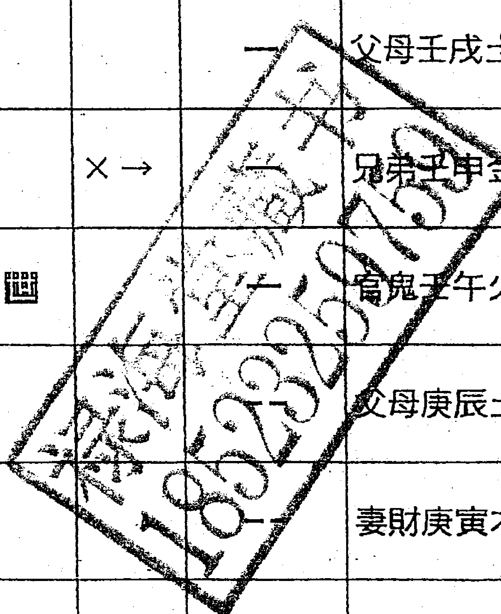

解析：這個屬於得失占。忌神持世，自己克制用神，說明人事不合，事情多有阻力，難以順利。另外，用爻雖旺，但與世爻無合，又世爻忌神不入庫，故不吉。

回饋：至今尚沒還錢。

#### 例三

性別：男　占問：王某占問引資興工廠發展情況。  
己卯月・庚寅日

| 乾宮：火天大有（歸魂） |  | 巽宮：火雷噬嗑 |
|---|---|---|
| 【本卦】 |  | 【變卦】 |
| 一 | 官鬼己巳火（應） | 一 官鬼己巳火 |
| -- | 父母己未土 | -- 父母己未土（世） |
| 一 | 兄弟己酉金 | 一 兄弟己酉金 |
| 一 | 父母甲辰土（世） | -- 父母庚辰土 |
| -- | 妻財甲寅木 | -- 妻財庚寅木（應） |
| 一 | 子孫甲子水 | 一 子孫庚子水 |

解析：這個屬於得失占。仇神持世，用神來克我，說明事情來給我壓力，除了求財尋人外，都不是吉象。另外，1. 財爻臨月日來克世爻，似為辛苦求財之象，但此卦財太旺，世爻身弱難以奈旺財，因財致禍。

預測：我在電話裡對他講：你的工廠現在很不景氣，資金很緊張，以後還要因為很多錢財的事惹官司。王某道：自己貸款了五千多萬買了這個工廠，但廠裡設備損耗嚴重，現在也沒有錢來整修，處於停產的狀態，貸款也沒有辦法償還，很是苦惱。

回饋：後於 2004 年得知，因為此廠前景不明，實在堅持不下去；此人已將此廠轉讓。

#### 例四

求測：黎光代占對方賣地

干支：乙未年，乙酉月，甲辰日，乙亥時

| 主變卦 |  |  | 坤為地（坤宮） |  | 地風升（震宮） |
|---|---|---|---|---|---|
| 玄武 | -- |  | 子孫癸酉金（世） | -- | 子孫癸酉金 |
| 白虎 | -- |  | 妻財癸亥水 | -- | 妻財癸亥水 |
| 騰蛇 | -- |  | 兄弟癸丑土 | -- | 兄弟癸丑土（應） |
| 勾陳 | -- | × | 官鬼乙卯木（應） | -- | 子孫辛酉金 |
| 朱雀 | -- | × | 父母乙巳火 | -- | 妻財辛亥水 |
| 青龍 | -- |  | 兄弟乙未土 | -- | 兄弟辛丑土（應） |

預測：想和對方簽訂合同。對方空動被沖，說話不能落實，臨時變故。因為地爻被亥沖，亥為 12 地支的豬，代表西北角、代表水，所以告訴他這個地皮西北角有水坑與三岔路，影響銷售。

回饋：假日驅車 3 個小時去實地，發現除了西北有水池，竟然連豬圈都有。

#### 例五

求测：女士起卦占还钱

干支：乙未年，乙酉月，癸卯日，己未时

| 主变卦 |  |  |  | 风泽中孚（艮宫-游魂） |  | 之风天小畜（巽宫） |
|---|---|---|---|---|---|---|
| 白虎 |  | 一 |  | 官鬼辛卯木 | 一 | 官鬼辛卯木 |
| 腾蛇 | 妻财丙子水 | 一 |  | 父母辛巳火 | 一 | 父母辛巳火 |
| 勾陈 |  | 二 |  | 兄弟辛未土（世） | 二 | 兄弟辛未土（应） |
| 朱雀 | 子孙丙申金 | 二（×） |  | 兄弟丁丑土 | 一 | 兄弟甲辰土 |
| 青龙 |  | 一 |  | 官鬼丁卯木 | 一 | 官鬼甲寅木 |
| 玄武 |  | 一 |  | 父母丁巳火（应） | 一 | 妻财甲子水（世） |

在河南省道公司的办公室里，给4个人吹吹水。有个女士问还钱。说对方现在没钱（财星藏），口蜜腹剑（朱雀劫财），所言皆虚（应临玄武星），要赶快找，不然马上跑到外地（应临驿马星），最后还是通过起诉完结。她说那个就是外地人。

我说，你这个钱是一三年下半年—一四年上半年之间借去了（财星占水，逢巳火飞神绝地，午午占岁破）。她说就是这个时间。

###### 例六

求测人：刘先生  
占问事宜：赔偿款

起卦西历：2008年8月6日19时12分

干支：戊子年，己未月，戊寅日，壬戌时

| 主变卦 |  |  | 泽地萃（兑宫）之泽山咸（兑宫） |  |  |
|---|---|---|---|---|---|
| 朱雀 | -- |  | 父母未土 | -- | 父母未土 应 |
| 青龙 | — |  | 兄弟酉金 世 | — | 兄弟酉金 |
| 玄武 | — |  | 子孙亥水 | — | 子孙亥水 |
| 白虎 | -- | × | 妻财卯木 | — | 兄弟申金 世 |
| 腾蛇 | -- |  | 官鬼巳火 世 | -- | 官鬼午火 |
| 勾陈 | -- |  | 父母未土 | -- | 父母辰土 |

刘先生的厂房被政府征用，占问赔偿数额。

财临三，为三数，最终赔偿三千万左右。

父母临月，对方修路手续已经上去。

财动生世，财会来得比较快，但化回头克，申月不现实；申月以后，今冬明春，三次进财。

应爻空，对方现在不实，说钱已到位是唬人，是为了让刘先生让步，小心。

回馈：最终赔了三千余万。

###### 例七

某日接到一个电话，是几年前认识的一个大姐打来的。这个大姐原来在单位工作，前几年见了我后，我劝她退职，她便辞去了当时的职务。她想请我到外地帮她测个卦，我说太远了，没时间去，我自己给你占一卦就行了。于是，我根据时间给她起了个卦。

- 出生：1968年
- 性别：女
- 占事：今年运气
- 西历起卦时间：2010年5月4日13时33分
- 干支：庚寅年，庚辰月，甲寅日，辛未时

| 离宫：离为火（六冲） | 离宫：天火同人（归魂） |
|---|---|
| 六神 / 伏神 / 本卦 | 变卦 |
| 玄武／兄弟己巳火 | 子孙壬戌土 应 |
| 白虎／子孙己未土（×→） | 妻财壬申金 |
| 腾蛇／妻财己酉金 | 兄弟壬午火 |
| 勾陈／官鬼己亥水 应 | 官鬼己亥水 世 |
| 朱雀／子孙己丑土 | 子孙己丑土 |
| 青龙／父母己卯木 | 父母己卯木 |

现在要问当年年运。这个卦，兄爻持世，说明与兄弟朋友合作，一荣皆荣，一损皆损；卦得六冲，今年变动比较大；虽然兄弟持世主劫财，但五爻子动化财临白虎星，有道路流转或医药之财可求，时间当在阴历六七八九；其他月份春季平常，夏季耗财，秋季进益，冬季是非。

## 例八

2013年7月10号下午，我约一老乡聊天并沐脚。中间，老乡起卦，说要收购外地一个公司，不知顺不顺利？起卦如下。

干支：癸巳年，己未月，丁丑日，戊申时

| 主变卦 |  | 坎为水（坎宫）之水风井（震宫） |  |  |
|---|---|---|---|---|
| 青龙 | -- | 兄弟子水 | -- | 兄弟子水 |
| 玄武 | — | 官鬼戌土 | — | 官鬼戌土 |
| 白虎 | -- | 父母申金 | -- | 父母申金 |
| 腾蛇 | -- × | 妻财午火 应 | — | 父母酉金 |
| 勾陈 | — | 官鬼辰土 | — | 兄弟亥水 应 |
| 朱雀 | -- | 子孙寅木 | -- | 官鬼丑土 |

卦得六冲，很难。但细看，日合世，月合应，这是标准的冲中逢合，因人成事。

我告诉他：你这事，光靠你们自己谈判很难，但这里面有当地势力部门帮忙，所以才能办成。丑未属于卦里的官星，会有官方贵人相助，所以才行。

朋友道：是这样，某某部门帮忙。然后问，对方公司收购下来有无益处？

对方临财星，明年临太岁，明年会有大发展，但现在财星化空，说明账目没资金。

朋友道：对，对方账目现在只有四万块钱。财化文书又临空，逢到阴历八月份还有合同名声能拿到。

应临腾蛇，对方公司现在虚惊困扰，不得安稳，与事实也符合。

## 例九

5月6日，我和一朋友吃过晚饭，行到半路，忽然想起来，某年轻朋友下午给我打电话，我忙着听课，没注意接听。我回给他：你中午打电话有事吗？朋友道：看了一间小店，想开餐馆，想让你帮忙看看。好吧，中途拐过去，风水倒没什么问题，人来人往，热火朝天，然后我让他起一卦。

- 求测人：某人　占问事宜：开饭店
- 西历：2013年5月6日19时57分
- 干支：癸巳年，丁巳月，壬申日，庚戌时

| 主变卦 | 雷水解（震宫） | 之 | 地水师（坎宫） |
|---|---|---|---|
| 白虎 | 妻财庚戌土 |  | 官鬼癸酉金（应） |
| 腾蛇 | 官鬼庚申金（应） |  | 父母癸亥水 |
| 勾陈 | 子孙庚午火 | ○ | 妻财癸丑土 |
| 朱雀 | 子孙戊午火 |  | 子孙戊午火（世） |
| 青龙 | 妻财戊辰土（世） |  | 妻财戊辰土 |
| 玄武 | 父母庚子水 |  | 兄弟戊寅木 |

（表内符号依原文保留）

财神临身，又有客源相生，我告诉他，没问题，可以做。他听了也高兴，就回去安排。第三天，他打电话告诉我，听别人说，这个小店之前是个诊所，里面出过医疗事故，死过人。他心里不舒服，不想做了。

这个卦，应为地头，临鬼交加腾蛇，是虚惊怪异。但福神旺动，客源不绝，一福压邪气，似乎不足为虑。但对方心里有顾忌，那就重选地址吧。只是，这样一个明显的好卦，当事人因为没做，那这个卦就是没法验证了，那算是准还是不准呢？

## 例十

朋友介绍的客户购买土地房产，占问前景如何。  
干支：癸巳年，辛酉月，癸未日，辛酉时

| 主变卦 |  |  |  | 雷泽归妹（兑宫-归魂）之雷火丰（坎宫） |  |  |
|---|---|---|---|---|---|---|
| 白虎 |  | -- |  | 父母戌土应 | -- | 父母戌土 |
| 腾蛇 |  | -- |  | 兄弟申金 | -- | 兄弟申金 |
| 勾陈 | 子孙亥水 | — |  | 官鬼午火 | — | 官鬼午火 |
| 朱雀 |  | -- | × | 父母丑土 | — | 子孙亥水 |
| 青龙 |  | — | ○ | 妻财卯木 | -- | 父母丑土应 |
| 玄武 |  | — |  | 官鬼巳火 | — | 妻财卯木 |

世冲财破，身财不安。

但现在房产形势似乎是一片大好，只好对客户说，谨慎而行了。或者说，事情不像想象的那么简单，那么有利。

现在写书的时候重新打电话询问朋友，这个人当时是参加了一个名叫“金朝阳”的所谓“理财学习班”，就是教人连借带挪，哪怕是负担高利贷，也要最大限度地放大杠杆去购买不动产。后来，“金朝阳”崩盘，连累很多人。

## 第六章　是非占

### 三大技法的预测技巧

- 一、以吉凶占之断法预测己方与对方吉凶；
- 二、以应期占之断法预测吉凶的具体时间。

#### 意象的解析

世爻为自己，应爻为对方，父爻为诉状，官鬼爻为法官，兄弟爻为证人牵连、为破财，妻财爻为道理，子孙爻为息讼调解，间爻为证人。

#### 例一

性别：男　所占事情：朋友被武警抓走，占情况发展如何？  
癸亥月，丙申日

| 六神 | 伏神 | 【本卦】震宫：地风升 |  | 【变卦】离宫：火水未济 |
|---|---|---|---|---|
| 青龙 |  | —— 官鬼癸酉金 | ×→ | — 子孙己巳火 应 |
| 玄武 |  | —— 父母癸亥水 |  | —— 妻财己未土 |
| 白虎 | 子孙庚午火 | —— 妻财癸丑土 世 | ×→ | — 官鬼己酉金 |
| 螣蛇 |  | — 官鬼辛酉金 | ○→ | —— 子孙戊午火 |
| 勾陈 | 兄弟庚寅木 | — 父母辛亥水 |  | — 妻财戊辰土 |
| 朱雀 |  | —— 妻财辛丑土 应 |  | —— 兄弟戊寅木 |

解析：第一步为吉凶占：  
1. 兄弟爻月合日冲，合处逢冲为凶象；  
2. 兄弟爻月生日克为中和，现被动爻合局来克，中和逢克伤为凶象；  
3. 幸得飞神亥水紧贴相生，最终贵人得保，凶中有救。  

第二步为应期占：凶事忌逢合，本月为亥月相合兄弟爻，本月仍难以脱灾。下月为子，再逢子巳之日，必是得脱灾难之时。

回馈：后此友果于子月子日被看守所放出，共进入看守所二十余日，中间由于打通关节花费若干钱财。

#### 例二

某男占某女性引起的麻烦事能否解决

干支：乙未年，庚辰月，乙卯日，丙子时

| 主变卦 | 本卦信息 | 动变 | 本卦纳甲 | 变卦符号 | 变卦纳甲 |
|---|---|---|---|---|---|
| 主变卦 | 离为火（离宫） | 之 | 火天大有（乾宫） |  |  |
| 玄武 | — |  | 兄弟己巳火 应 | — | 兄弟己巳火 应 |
| 白虎 | -- |  | 子孙己未土 | -- | 子孙己未土 |
| 腾蛇 | — |  | 妻财己酉金 | — | 妻财己酉金 |
| 勾陈 | — |  | 官鬼己亥水 应 | -- | 子孙甲辰土 世 |
| 朱雀 | -- | × | 子孙己丑土 | — | 父母甲寅木 |
| 青龙 | — |  | 父母己卯木 | — | 官鬼甲子水 |

年初北京朋友算年运卦，说会因为女人惹麻烦。前些天出差，他电话我，确实有点麻烦事，让我算下。

我起了一个卦，卦中女人暗动生应爻来克自己，应爻代表他人，也就是说女人通过别人来找自己麻烦。所以我微信回复他，不仅有女人参与，还有第三人参与给自己找麻烦。事后他告诉我，女人说怀孕了。仔细想一下，胎儿也是第三人，解卦也说得过去。

#### 例三

2013年7月26日下午，我见某房产开发公司的负责人。负责人道，上次我经理的事又让师傅你算准了，人已经放出来了。

起卦西历：2013年6月17日18时19分

干支：癸巳年，戊午月，甲寅日，癸酉时

| 主变卦 | 火水未济（离宫）之天山遯（乾宫） |
|---|---|
| 玄武 | 兄弟巳火 应 ／ 子孙戌土 |
| 白虎 | 子孙未土 × ／ 妻财申金 应 |
| 腾蛇 | 妻财酉金 ／ 兄弟午火 |
| 勾陈 | 官鬼亥水 × 兄弟午火 世 ／ 妻财申金 |
| 朱雀 | 子孙辰土 ○ ／ 兄弟午火 世 |
| 青龙 | 父母寅木 ／ 子孙辰土 |

- 1. 旧事复发（鬼伏世下）
- 2. 不是本地发生的事，是其他区域出现的事（鬼不在本卦）
- 3. 现在正值调查（文书正旺）
- 4. 找一武职与一文职的人帮忙（雀动虎动）
- 5. 千忧万愁化为尘，没什么大事（两个福神动）

当时被关了十几天，又过了一两个星期，总共关了一个月，终于出来了，没有刑事责任。

#### 例四

3月24日晚上，朋友给我打电话，说近来某人被双规，肯定会牵连一些人，请帮忙算算我老板有事没有？

过了一会儿，另一朋友打电话，也称某朋友最近听说犯口舌，是否有事。第二天早上，我分别起了三个卦。占某事会不会牵扯到某人。

起卦西历：2013年3月25日10时31分

干支：癸巳年，乙卯月，庚寅日，辛巳时

| 主变卦 | 天山遯（乾宫）之泽地萃（兑宫） |
|---|---|
| 螣蛇 | 一 ○ 父母戌土  -- 父母未土 |
| 勾陈 | 一 兄弟申金应  一 兄弟酉金应 |
| 朱雀 | 一 官鬼午火  一 子孙亥水 |
| 青龙 | 一 ○ 兄弟申金  -- 妻财卯木 |
| 玄武 | 妻财寅木 -- 官鬼午火世  -- 官鬼巳火世 |
| 白虎 | 子孙子水 -- 父母辰土  -- 父母未土 |

打电话告诉他：官星逢生无克，你领导不会有麻烦，到时会配合调查，最后无疾而终。

朋友道：昨天下午刚听说，老板没什么问题。

#### 例五

我有一个朋友也在这个单位工作，我自占某人是否会受牵连。

干支：癸巳年，乙卯月，庚寅日，辛巳时

| 主变卦 |  |  |  | 雷水解（震宫）之雷地豫（震宫） |  |  |
|---|---|---|---|---|---|---|
| 腾蛇 |  | -- |  | 妻财戌土 | -- | 妻财戌土 |
| 勾陈 |  | -- |  | 官鬼申金 应 | -- | 官鬼申金 |
| 朱雀 |  | — |  | 子孙午火 | — | 子孙午火 应 |
| 青龙 |  | -- |  | 子孙午火 | -- | 兄弟卯木 |
| 玄武 |  | — ○ |  | 妻财辰土 世 | -- | 子孙巳火 |
| 白虎 | 父母子水 | -- |  | 兄弟寅木 | -- | 妻财未土 世 |

官非暗动，幸好世爻克中逢生，先凶后吉！过了两天，我打电话给他，口气平常，我问起这件事，回复跟他没什么牵扯。

###### 例六

某朋友的朋友是非如何。  
干支：癸巳年，乙卯月，庚寅日，辛巳时

| 主变卦 |  |  |  | 泽火革（坎宫）之泽雷随（震宫） |  |  |
|---|---|---|---|---|---|---|
| 螣蛇 |  | -- |  | 官鬼未土 | -- | 官鬼未土 应 |
| 勾陈 |  | — |  | 父母酉金 | — | 父母酉金 |
| 朱雀 |  | — |  | 兄弟亥水 | — | 兄弟亥水 |
| 青龙 | 妻财午火 | — | ○ | 兄弟亥水 | -- | 官鬼辰土 |
| 玄武 |  | -- |  | 官鬼丑土 | -- | 子孙寅木 |
| 白虎 |  | — |  | 子孙卯木 | — | 兄弟子水 |

看完卦后，我给他发了个短信：去年被暗中查，今年阴历正月讯问，二月有强制措施，这事由两笔经济引起，现在是内部组织在查，已经通知了单位，官司逃不了，会自己意料之外往坏的发展。

过了半个小时，他电话回给我：黎师傅，情况确实是这样，前两天已经把人关起来了。过了两天，他告诉我，现在人暂时取保候审，占问会不会受牵连。我告诉他，改天你自己起一卦。

###### 例七

3月26日，此人起卦，推算是否受牵连。

起卦西历：2013年3月26日17时31分  
干支：癸巳年，乙卯月，辛卯日，丁酉时

| 主变卦 |  |  |  | 泽火革（坎宫）之泽雷随（震宫） |  |  |
|---|---|---|---|---|---|---|
| 腾蛇 |  | -- |  | 官鬼未土 | -- | 官鬼未土 应 |
| 勾陈 |  | — |  | 父母酉金 | — | 父母酉金 |
| 朱雀 |  | — |  | 兄弟亥水 世 | — | 兄弟亥水 |
| 青龙 | 妻财午火 | — | ○ | 兄弟亥水 | -- | 官鬼辰土 世 |
| 玄武 |  | -- |  | 官鬼丑土 | -- | 子孙寅木 |
| 白虎 |  | — |  | 子孙卯木 应 | — | 兄弟子水 |

我告诉他：汤武革命，顺乎于天。这卦三爻动，阳居阳位为正位，动化阴爻，阳化为阴，尊化为卑，且三爻为兄弟入库，是朋友坐牢的迹象。但世爻弱而无克，无凶象。又变卦为跟随，小女跟随，阳居四爻，为强居臣位，为五爻君位所忌，所以自己要示弱，不要出门。纪委暂时把人取保候审，也是在投石问路，千万不要主动动作，不然是自寻烦恼。

## 例八

某日接到一个香港的电话，来电者杨先生是我的一个读者，曾经在五、六年前买过我的台湾版本《六爻预测学》，因在香港汇款不方便，后专程到深圳给我汇款，占问一件关于房产的事情。

- 西历时间：2010年8月20日
- 干支：庚寅年，甲申月，壬寅日

| 六神 | 伏神 | 本卦 | 变卦 |
|---|---|---|---|
| （上方） |  | 艮宫：天泽履 | 乾宫：乾为天（六冲） |
| 白虎 |  | 兄弟壬戌土 | 兄弟壬戌土 |
| 螣蛇 | 妻财丙子水 | 子孙壬申金 | 子孙壬申金 |
| 勾陈 |  | 父母壬午火 | 父母壬午火 |
| 朱雀 |  | 兄弟丁丑土 | 兄弟甲辰土 |
| 青龙 |  | 官鬼丁卯木 | 官鬼甲寅木 |
| 玄武 |  | 父母丁巳火 | 妻财甲子水 |

黎：父母爻代表房产，居乾卦，是否在市中心？  
杨：对，在上海的市中心。  
黎：父母爻在四爻，莫非房有四层？  
杨：是三层半。  

黎：世下伏财，如若为对方欠款的话，则会拿货顶账。现世下伏财子，财子的本宫卦为艮，艮为房产，应该是房产现在对方手里，到时会顶给自己。  
杨：是解放前的祖辈旧产。  

黎：应爻为对方，临官临青龙，要有当地政府参与，并且当地人扯皮，弄虚作假。  
杨：是当地房产管理部门一直采取拖延的态度。  

黎：二爻临鬼，在占家宅来说是宅居他人。  
杨：此宅解放后被当地政府转租给多户居民。  

黎：世爻暗动，我方暗定计谋。世去克应，我需采取过硬手段方能拿到房产。  
杨：现在一些身在异乡的人士打算联合通过诉讼拿到祖产。  

黎：世能克应，诉讼能够得胜，同时卦中兄弟生己，说明一要联合众人，方占优势；二来这次诉讼要有兄弟姐妹联手参与。  
杨：对，这个祖产旧契房主写的是我姐姐的名字，所以肯定她是参与的。不知何时起诉比较合适？  

黎：世临金，当然是在秋季的时候我方气盛，争斗较为得力。明年官星临太岁冲世，自己会因为这件事而多加走动，经一季的消耗，最终明年秋季得胜。

## 第七章　行人占

#### 三大技法之出行章

- 以吉凶占之断法预测出行吉凶；
- 以应期占之断法预测出行的具体时间。

#### 意象的解析

世爻为自己，测何六亲则选此行人所属六亲为用。官鬼爻为是非，为盗贼小人，为官方；子孙爻为游玩项目，为娱乐；父母爻为辛苦，为消息，为行李；财爻为路费。

### 细节的推演

官鬼持世或克世或兄弟动来克世，必有祸患，难免破财。若逢父母持世或父母动于卦中，一路辛劳，或风雨有险，或车船延误，皆主路途不顺。若遇子孙持世，或子孙动于卦中，必定一帆风顺。

#### 三大技法之行人章

- 一、以吉凶占之断法预测行人在外吉凶。
- 二、以应期占之断法预测行人归家的具体时间。

#### 意象的解析

1. 占亲人在用神章中求之，疏者以应爻为用神。世克用神人无归志，用神克世近日回家。用爻逢墓绝空破，归信杳然；明摇暗动，已经动身回家。用爻动化进不返，用神化退则归。用动逢合有事阻隔，动化鬼在外危灾，最怕动而化回头克，还防卦变反吟，以上均为凶象。

- 2. 世爻空者，行人即至。用神靜逢休囚空破者，行人不思歸家。動空旺空者，實空沖空之月日必歸。唯恐卦變克絕及反吟卦，用神被克被沖者，皆難望其歸也。  
- 3. 來人若問行人在外平安否，須看有病無病，用神墓絕空破受傷謂之有病，說明行人在外不安，用爻無病方可斷其歸期。  
- 4. 來人若單問行人歸期，只可看卦象來與不來而斷，即使用神有病受克，也只做暫時不回之論，不能言行人在外一定有災。

#### 例一

性別：女　占問：母親占自己女兒在外情況。  
戌子月，己未日

| 坤宮：坤為地（六沖） |  | 乾宮：山地剝 |
|---|---|---|
| 【本卦】 |  | 【變卦】 |
| -- 子孫癸酉金（世） | X→ | -- 官鬼丙寅木 |
| -- 妻財癸亥水 |  | -- 妻財丙子水 |
| -- 兄弟癸丑土 |  | -- 兄弟丙戌土 |
| -- 官鬼乙卯木（應） |  | -- 官鬼乙卯木 |
| -- 父母乙巳火 |  | -- 父母乙巳火（應） |
| -- 兄弟乙未土 |  | -- 兄弟乙未土 |

解析：這個屬於吉凶占。  
1. 卦逢六沖而無合來解，近期難回，失散象；  
2. 用爻子孫動而化鬼，不需論旺衰，直定凶象。

預測：女兒在外有災，暫時難以回來。

回饋：老婦泣道，我的女兒四年前在珠海打工，之前第一年每個星期都要在家裡打電話，後來在一次電話中告知要和人合夥做生意，然後就開始失去音訊，一直到現在整整三年，一點消息都沒有。

#### 例二

4月20日下午五點，我剛下樓，接到一個朋友的電話。朋友道：「大師，我現在出差，知道雅安地震，我想去災區慰問，你看怎麼樣？」  
我道：「我現在外面，起卦不便，等半個小時，我回給你。」  
在家裡，我凝神聚氣，代他起了一卦。

西曆：2013年4月20日18時58分  
干支：癸巳年，丙辰月，丙辰日，丁酉時

| 主變卦 |  | 雷火豐（坎宮） |
|---|---|---|
| 青龍 | -- | 官鬼庚戌土 |
| 玄武 | -- | 父母庚申金 |
| 白虎 | — | 妻財庚午火 |
| 螣蛇 | — | 兄弟己亥水 |
| 勾陳 | -- | 官鬼己丑土 應 |
| 朱雀 | — | 子孫己卯木 |

看完卦，我給他回了短信：起了兩個卦，很危險，建議別去。  
他回道：知道了，謝謝！

我又詳細看了卦，又發了短信：自己占著危險，又遇鬼相連，古人說「鬼來生身，莫做吉斷」。所去之地空虛，沒有效果，沒有接待。自己風雨奔波，去那也見不到人，想法落實不了。並且自己占個旺極，旺極有災。

這個卦有個難點，就是世爻是旺的，有些算卦的人可能會覺得，世爻代表自己，逢生肯定好，肯定沒災禍的，但如果這樣看就大錯特錯了。清代《卜筮正宗》的《千金賦》云：鬼來生身，莫做吉斷。這個卦，正是兩鬼生身，應鬼又生身，豈不正應這句話？

而且，卦理同是卦，衰了當然不好，旺了當然好些，但旺極呢？古人說：物極必衰，盛極而敗，豈不也是正理？

又世爻臨五爻，五爻為君位，陰爻旺極，居於陽九之位，豈不正是古人說武則天的：母雞司晨，柔居尊位，豈不自招凶險？

而且，五爻為道路，父母爻為車輛行走，玄武為濕滑坎陷，豈不有點像車輛行走在泥濘濕滑道路上，然後陷（或掉）下去的意思？

再，應為所去之地，現在臨空，自己所去之地沒接待，沒人煙，行程成空，效果沒有。

《黃金策》出行章講：父母為辛苦勞碌之神，動之則主風雨兼程。這個卦雖然父母爻沒動，但臨玄武為陰濕，也是風雨之象。

#### 例三

某先生占問某小孩何時見面。

西曆：2013年3月31日13時33分  
干支：癸巳年，乙卯月，丙申日，乙未時

| 主變卦 |  |  | 震為雷（震宮）之地雷復（坤宮） |  |  |
|---|---|---|---|---|---|
| 青龍 | -- |  | 妻財庚戌土 | -- | 官鬼癸酉金 |
| 玄武 | -- |  | 官鬼庚申金 | -- | 父母癸亥水 |
| 白虎 | — | ○ | 子孫庚午火 | -- | 妻財癸丑土 |
| 騰蛇 | -- |  | 妻財庚辰土 | -- | 妻財庚辰土 |
| 勾陳 | -- |  | 兄弟庚寅木 | -- | 兄弟庚寅木 |
| 朱雀 | — |  | 父母庚子水 | -- | 父母庚子水 |

我告訴他：這個孩子聰明敏捷，以前和你關係很好，有說有笑，現在聯繫很少，沒有話題。孩子是2010年換了生活環境之後，你開始擔心憂慮，孩子2011年談戀愛，去年你和孩子關係很僵，隔閡很大，今年6月後關係好轉。

某先生道：真準。並且當場拿出文包裡的信件，上面是孩子出國後寫的第一封信，落款正是2010年。

#### 例四

某澳大利亞朋友占問五歲的孩子上學，搖卦得坎之節卦。

西曆：2013年3月31日13時45分  
干支：癸巳年，乙卯月，丙申日，乙未時

| 主變卦 | 坎為水（坎宮） | 之水澤節（坎宮） |
|---|---|---|
| 青龍 | －－ 兄弟戊子水 | －－ 兄弟戊子水 |
| 玄武 | — 官鬼戊戌土 | — 官鬼戊戌土 |
| 白虎 | －－ 父母戊申金 | －－ 父母戊申金（應） |
| 騰蛇 | －－ 妻財戊午火（應） | －－ 官鬼丁丑土 |
| 勾陳 | — 官鬼戊辰土 | — 子孫丁卯木 |
| 朱雀 | －－ × 子孫戊寅木 | — 妻財丁巳火（世） |

我道：父母受沖，這次上學沒有問題，但不是第一志願，會換第二個學校。子孫旺相臨朱雀，你孩子發育很好，長得高大，接受能力強，話多。

朋友：太對了。我都說我自己話多，但我老婆比我話還多，我小孩子比我們兩個加起來還話多。小孩說話的時候，我們都說他：閉嘴！

## 第八章　身體占

疾病身體章的三大技法的預測技巧：

- 1. 以吉凶占之斷法預測身體吉凶；  
- 2. 以應期占之斷法預測身體吉凶發展的具體時間。

### 測疾病發展的意象的解析：

測何親人即選此親人所屬六親為用，卦中官鬼爻、旺極與弱極卦爻所臨之五行為病症，妻財爻為飲食，兄弟爻為醫藥費，子孫爻為醫生與藥物，父母爻為辛苦勞累。

六親用神旺相者，病人身體強壯；用神休囚者，病人身體虛弱。官鬼旺相者，病情難癒，心情煩躁；官鬼休囚者，病情易治。子孫旺相者，醫藥有效，病人心情愉快；子孫休囚者，醫藥無效。兄弟旺相者，病人沒有食欲，花費錢財；兄弟休囚則反斷之。妻財旺相，尚能飲食，但動而生鬼則說明病是由飲食所引起；妻財休囚，病人飲食難進。父母旺相，治療過程中病人辛勞苦惱；父母休囚則反斷之。

### 細節的推演：

關於病症則是以卦中官鬼爻或旺極與弱極卦爻所臨之五行及爻位所在為病症之處，如官星發動，則以官鬼爻所臨五行及其所臨爻位來斷病；如果官星無力而卦中用爻受傷太過或旺極太過者，則以卦中旺極弱極之爻所臨五行來斷病。

- 1. 以官鬼爻所在卦宮論：官鬼在乾宮，主頭部或肺部有病；官鬼在兌宮，主咽喉部及飲食等；官鬼在離宮，主有熱多燥多，如目疾心疾等；官鬼在震宮，主足疾；官鬼在巽宮，主有風疾，如癱瘓之疾等，也主生殖系統，或泌尿系統，或坐骨神經系統之疾；官鬼在坎宮，主有寒多，如胃疾胃冷，水瀉畏冷及血病等，也主泌尿系統有病；官鬼在艮宮，主手部或脾胃有病；官鬼在坤宮，主腹中或脾胃有病。  
- 2. 以官鬼爻與旺極與弱極卦爻所臨五行來論：卦中官鬼爻與旺極與弱極卦爻的五行屬火，則是心經受病，表現症狀為發熱咽痛，口乾舌燥；官鬼與旺極與弱極卦爻的五行屬水，則是腎經或血液受病，表現症狀為惡寒盜汗、遺精白濁、浮腫等；官鬼與旺極與弱極卦爻的五行屬金，則是肺經受病，表現症狀為虛體咳嗽，或氣喘痰多咳血等；官鬼與旺極與弱極卦爻的五行屬木，則是肝膽受病，表現症狀為感冒風寒，四肢不和，虛黃腫水等；官鬼與旺極與弱極卦爻的五行屬土，則是脾胃有病，表現症狀為胃脘（心口）疼痛、消化不良等。  
- 3. 以官鬼爻與旺極與弱極卦爻在卦中的爻位來論，爻位表示的疾病部位如下：在初爻，代表足；在二爻，代表腿或股；在三爻，代表肝腎與腰；在四爻，代表脾胃與胸；在五爻，代表心肺與膀胱；在六爻，代表頭腦。  
- 4. 以官鬼爻與旺極與弱極卦爻所臨六神論，則有如下之疾病資訊：臨青龍，酒色過度，虛弱無力；臨朱雀，狂言亂語，身熱面赤；臨勾陳，胸滿腫脹，脾胃不和；臨騰蛇，坐臥不安，心神不寧；臨白虎，跌打氣悶，傷筋損骨，女人易得血暈及產後諸病；臨玄武，主憂鬱陰冷（官鬼臨以上諸六神，必須是發動，如不發動一般無事）。

#### 例一

性別：男　占問：某男占測自己妻子的疾病發展情況。  
己巳月，壬午日

| 坤宮：地天泰（六合） | 坤宮：地澤臨 |
|---|---|
| 【本卦】 | 【變卦】 |
| —— 子孫癸酉金應 | —— 子孫癸酉金 |
| —— 妻財癸亥水 | —— 妻財癸亥水應 |
| —— 兄弟癸丑土 | —— 兄弟癸丑土 |
| —— 兄弟甲辰土 ○→ | —— 兄弟丁丑土 |
| —— 官鬼甲寅木 | —— 官鬼丁卯木 |
| —— 妻財甲子水 | —— 父母丁巳火 |

**解析**：第一步，這個屬於吉凶占。  
1. 妻爻月破日耗，體弱；  
2. 體弱又被動爻來克，大凶。  

第二步為應期占：下月內財月破，大凶。

**預測**：  
1. 妻子腎臟有病，渾身酸痛，虛弱無力，四肢不協，心煩意亂，不思飲食。  
2. 此為久病，白天病輕，晚上病重，現在的藥物都不見效。  
3. 本人已經為了妻子治病花了不少錢，到了陰曆四五月，還會有大的花費。  
4. 陰曆五月，本人妻子大凶；如果能夠得到解救，拖得此月，則以後的病情就會趨於好轉。

**回饋**：此人道，我妻子原來是醫生，患的是尿毒症，現在腎臟已經完全失效了，每隔一個星期就要換一次血，已經換了兩三個月了，因為此病，妻子還老是生氣，已經吵架好多次了。不知妻子五月份能否活過去。作者於當日到此人家中，於風水等處做了調整。後在陰曆六月見到此人，此人道於五月妻子做了一個換腎手術，花費將近十萬，現在身體已經逐步好轉。

#### 例一

女兒問父親重病

干支：乙未年，甲申月，己未日，庚午時

| 六神 | 本卦 | 變爻 | 之卦 |
|---|---|---|---|
| 勾陳 |  | -- 子孫癸酉金 應 | -- 妻財戊子水 |
| 朱雀 |  | -- × 妻財癸亥水 | — 兄弟戊戌土 |
| 青龍 |  | -- 兄弟癸丑土 | -- 子孫戊申金 世 |
| 玄武 |  | — 兄弟甲辰土 世 | — 兄弟甲辰土 |
| 白虎 | 父母乙巳火 | — 官鬼甲寅木 | — 官鬼甲寅木 |
| 騰蛇 |  | — 妻財甲子水 | — 妻財甲子水 應 |

看了中醫，說有救。看西醫，說情況會急轉直下。所以求助於占卜。父母用神月日休囚又被動爻克，告訴她：做壞的打算。

回饋：後於26號上午10點51分離世。

#### 例三

#### 求測人問疾病發展

干支：乙未年，辛巳月，辛卯日，戊戌時

| 主變卦 |  |  | 坤為地（坤宮） |  | 地山謙（兌宮） |
|---|---|---|---|---|---|
| 騰蛇 | -- |  | 子孫癸酉金 | -- | 子孫癸酉金 |
| 勾陳 | -- |  | 妻財癸亥水 | -- | 妻財癸亥水 |
| 朱雀 | -- |  | 兄弟癸丑土 | -- | 兄弟癸丑土 |
| 青龍 | -- | × | 官鬼乙卯木應 | — | 子孫丙申金 |
| 玄武 | -- |  | 父母乙巳火 | -- | 父母丙午火應 |
| 白虎 | -- |  | 兄弟乙未土 | -- | 兄弟丙辰土 |

預測：病了四五年了，頭疼肚子疼，而且還犯血光，頭部與肚子要開刀，精神有點抑鬱，心神惶惶，有點不正常了。今天春節過後就已經犯病了，但是沒治好，這一次很危險，過倆月還有血光之災，要有手術，有空多去看看吧。頭痛，肝硬化，肺也不好，腳也腫了。

回饋：後過了兩三個月重新到上海做了手術。

#### 例四

性別：男　占事：妻子是否是癌症

西曆起卦時間：2010年3月29日17時16分  
干支：庚寅年　己卯月　戊寅日　辛酉時

| 離宮：火風鼎 | 乾宮：天風姤 |
|---|---|
| 六神／伏神／本卦／變卦 |  |
| 朱雀｜｜兄弟己巳火｜—｜子孫壬戌土｜— |
| 青龍｜｜子孫己未土（應）｜-- ×→｜妻財壬申金｜— |
| 玄武｜｜妻財己酉金｜—｜兄弟壬午火（應）｜— |
| 白虎｜｜妻財辛酉金｜--｜妻財辛酉金｜-- |
| 騰蛇｜｜官鬼辛亥水（世）｜—｜官鬼辛亥水｜— |
| 勾陳｜父母己卯木｜子孫辛丑土｜--｜子孫辛丑土（世）｜-- |

陳先生說：我今年真是流年不利，老婆的離格燒了，又得了乳腺增生，很可能是癌症！

我說道：哪有那麼容易得癌症的，不是癌症（鬼爻弱），找個大醫院檢查一次你就放心了（子孫爻代表醫院，臨君位為權威醫院），你家對面的醫院（世爻為二爻，家宅爻，醫院在五爻，二五正對）。

**回饋：**事後陳先生說媳婦的病不是癌症，還在吃藥，您又算對了。

#### 例五

求測人：黎光  
占問事宜：轉基因食品是否健康

起卦西曆：2011年2月12日0時17分  
干支：辛卯年，庚寅月，戊戌日，壬子時

| 主變卦 |  | 天風姤（乾宮） |  |
|---|---|---|---|
| 朱雀 |  | 一 | 父母戌土 |
| 青龍 |  | 一 | 兄弟申金 |
| 玄武 |  | 一 | 官鬼午火 應 |
| 白虎 |  | 一 | 兄弟酉金 |
| 騰蛇 | 妻財寅木 | 一 | 子孫亥水 |
| 勾陳 |  | -- | 父母丑土 世 |

> 西漢《焦氏易林》云：河伯大呼，津不可渡。往復爾故，乃無大悔。

白話為：河伯大聲呼喚，渡口不可過去。只有回到故地，才不會有危害。

針對這件事的解釋是：這個事不能做，只有回到過去的種植方式，才能安全。

《焦氏易林》為西漢焦延壽著，錢鍾書先生稱讚《焦氏易林》「幾與《三百篇》並為四言詩矩矱」。

按六爻卦來分析：

- 1. 技術輸入方有欺騙行為，主要是西北方的欺騙（應臨玄武在乾卦）。  
- 2. 欺騙的目的是，暫時給你點甜頭，然後讓土地減產，以此來影響經濟（世臨勾陳為土地，現臨兄庫）。  
- 3. 糧食能增產，但營養不夠，不能補充人體的免疫力。  
- 4. 導致的疾病有：咽喉痛，吞咽困難；心臟病；血液輸送困難；免疫力下降；喪失繁殖能力；腫瘤（五爻臨金月破，病爻在四爻臨火；騰蛇為血管，受克，鬼旺子衰；子孫受克；卦臨勾陳）。

###### 例六

2011年春節期間，我和一位朋友趕到福利院看望孩子。聽工作人員介紹，一些幼小的孩子都是因為腦癱而被父母遺棄，相信這些孩子被遺棄的時候，父母肯定也是心如刀絞。那麼，腦癱為什麼這麼難治，病因是什麼，需要怎麼治療？自古以來醫易相通，那就試著起一卦，分析一下吧。

求測人：黎光　占問事宜：什麼樣的卦為小兒腦癱症狀，該怎麼治療？

起卦西曆：2011年2月12日0時58分  
干支：辛卯年，庚寅月，戊戌日，壬子時

| 主變卦 | 天雷無妄（巽宮）之水雷屯（坎宮） |
|---|---|
| 朱雀 | —— ○ 妻財戌土 / -- 父母子水 |
| 青龍 | — 官鬼申金 / — 妻財戌土 |
| 玄武 | —— ○ 子孫午火 / -- 官鬼申金 |
| 白虎 | -- 妻財辰土 / -- 妻財辰土 |
| 騰蛇 | -- 兄弟寅木 / -- 兄弟寅木 |
| 勾陳 | — 父母子水 / — 父母子水 |

解析：1. 孩子有病，不至於死，胡思亂想；2. 心智被蒙（火為心智，動成病）；3. 腦袋進水，有炎症（上爻為頭部，動化水）。

脈象表現為：洪長虛動。

### 治療方法：

- 1. 心經受病，但要治腎而不可治心；  
- 2. 適宜熱療灸灸，不宜使用藥丸；  
- 3. 病多寒，需要溫劑輔之；  
- 4. 胸膈不利氣不順，藥宜調氣，須用寬中湯藥。

當然，相關卦象還有以下幾種：1. 上爻為頭部，所以如卦中上爻臨鬼、伏下有鬼、動化官鬼、或鬼來傷克者，頭部有疾；2. 本命爻帶官鬼臨木，加天刑地慶殺刑沖克害身命者必帶瘋癲。3. 鬼在乾卦者，為頭部之病。若此乾卦鬼動化木爻，或木動變鬼者，說明此為頭昏眩暈之病。

### 有個網友叫一塵居士，他針對這篇文章與我交流：

- 1. 看了您的幾部書，覺得都很不錯，剛剛看了你博客裡面關於腦癱的卦例，覺得還有一個辦法比較適合治療腦癱，愚斗膽說說自己的看法，就是子孫午火入囚墓之庫，說明心智未開，那麼愚覺得必須以馨香開竅的藥物引發開導。  
- 2. 看了您的卦只是有感，挺喜歡您的書，對愚學習六爻預測非常好。對於那個腦癱的卦略有所想，不才斗膽說說愚的想法而已。愚的理由就是庫待破，所以覺得破庫就是開竅，選馨香味道也是為了入鼻開竅而已。不知道對不對，泛泛而論。呵~~希望有用。  
- 3. 實際上臭味的東西也容易入竅，我是看見您起的卦裡面的子孫是陽爻，入囚庫，入上六爻之庫，首先陽主發散，入庫，發散不出來，且六爻妻財戌土佔據六爻，陽主實，發育健全，陰主虛，發育未完善；天雷無妄，上乾下震，乾為腦，震為肝，乾變坎為陷，坎兩陰包一陽。坎也為癘，不健全。

父母主智，妻財主愚，六爻妻財戌土化父母子水臨朱雀，朱雀主表達能力，愚覺得是智力、腦力發育不健全，腦子有問題。但是心是關鍵，所以愚選擇發散的陽氣，而不選擇臭味向下發散的巽作為引子。

無妄其實就是上實內虛。您的卦是很符合卦意了，您也說了木動變兌會發聲，這個也一樣。入庫同樣是如癡如醉，癡癡呆呆的。卦中子孫妻財齊動與月建三合火局，但是還是逃脫不了入墓庫的境地，火旺，火多本主智、言語表達，多而入庫，就好比一個人想說說不出，也沒辦法說。無妄之倒卦為大畜，大畜者集聚也。

看到您的卦讓愚想到中醫裡孕婦為什麼不能用麝香的道理。香味入竅，鼻為艮，為土，艮土生乾金。因而覺得選麝香類的藥比較好，破庫，破三合，放出子孫午火。本身子孫午火就不弱，一個說明肢體是健全的，只要用藥用得好，是可以慢慢好的。

您說的治腎，愚覺得您的預測水準是非常高了，在下就不多說了。見笑。

## 第九章　失盜占

### 占失物的三大技法的預測技巧：

- 一、以得失占之斷法預測失物得失情況；  
- 二、以應期占之斷法預測失物得失的具體時間。

### 意象的解析：

世爻為自己，測何失物即選此失物所屬六親為用，官鬼爻為是非盜賊小人，子孫爻為公安，父母爻為消息為車輛，妻財爻為錢財，兄弟爻為破費。

### 占盜賊的三大技法的預測技巧：

- 一、以吉凶占之斷法預測盜賊強弱情況；  
- 二、以應期占之斷法預測盜賊抓獲的具體時間。

### 意象的解析：

卦中無鬼或鬼臨空亡，無賊，是自己失落。子孫持世，或子孫卦中發動，具警辦案有力，賊必能制。兄鬼相合，必有窩藏之主。鬼爻入墓，盜賊深藏。鬼爻逢沖，必有他人指點線索。

#### 例一

性別：男　占問：張小姐車輛丟失，占得否找到？  
午月，庚申日

| 乾宮：風地觀 | 乾宮：天地否（六合） |
|---|---|
| 【本卦】 | 【變卦】 |
| 一 妻財辛卯木 | 一 父母壬戌土應 |
| 一 官鬼辛巳火 | 一 兄弟壬申金 |
| -- 父母辛未土世 ×→ | 一 官鬼壬午火 |
| -- 妻財乙卯木 | -- 妻財乙卯木 |
| -- 官鬼乙巳火 | -- 官鬼乙巳火 |
| 子孫甲子水 -- 父母乙未土應 | -- 父母乙未土 |

解析：這個屬於得失占。用神持世，事情與我聯為一體，體用純一，事情容易辦理。只是：  
1. 父母爻代表車輛，現動，車已被轉移；  
2. 父母爻動而化鬼合，已經被盜賊拿走；  
3. 子孫爻代表警員，現衰而受克，不能破案；  
4. 財爻入動墓，破財象；  
5. 細節占：卦中財為木，未為財庫，現自己的財庫被鬼合去，失財象。

預測：找到的希望不大。  
回饋：後至今此車沒有找到。

#### 例二

這個是網友的例子。2010年公曆1月24日下午，陰曆己丑年丁丑月甲戌日酉時，妹妹說她們公司的一隻狗丟了。當時我讓她隨機報出三個數字：315，起得火天大有之乾卦，六五發動。

己丑年、丁丑月、甲戌日

| 六神 | 【本卦】 |  | 【變卦】 |
|---|---|---|---|
|  | 乾宮：火天大有（歸魂） |  | 乾宮：乾為天（六沖） |
| 玄武 | 官鬼己巳火 應 |  | 父母壬戌土 世 |
| 白虎 | 父母己未土 | ×→ | 兄弟壬申金 |
| 螣蛇 | 兄弟己酉金 |  | 官鬼壬午火 |
| 勾陳 | 父母甲辰土 世 |  | 父母甲辰土 應 |
| 朱雀 | 妻財甲寅木 |  | 妻財甲寅木 |
| 青龍 | 子孫甲子水 |  | 子孫甲子水 |

說實話，好久沒有玩味六爻了。不過，當時覺得心無雜念，應該不會看錯的。

父母發動但被丑月沖破，動而無用；用神子水雖弱於日辰，但子酉合，變得有力了。有力而無傷，肯定能找回來。果然，乙亥日臨旺地，自己回來了。

子孫甲子臨青龍，斷白色或黑色，實際為黑白相間的蝴蝶犬。

這個是個胖胖的小狗，當時沒看對，記得黎光先生書中有相關的解釋，等有空再查查資料。

黎註：子為水，水為圓潤，所以為胖胖的小狗；水主光滑，小狗長了個水汪汪的桃花眼；子為陽爻，單眼皮男狗。

## 第十章　雜事占

此為生活中一些業餘雜事的預測，放上來供讀者參考研究。

#### 例一

性別：男　占問：一生疏的朋友托人來找劉某，劉某占問對方是何目的。

庚申月，乙卯日

| 兌宮：兌為澤（六沖） |  | 離宮：風水渙 |
|---|---|---|
| 【本卦】 |  | 【變卦】 |
| --　父母丁未土 | ×→ | —　妻財辛卯木 |
| —　兄弟丁酉金 |  | —　官鬼辛巳火 |
| —　子孫丁亥水 | ○→ | --　父母辛未土 |
| --　父母丁丑土 |  | --　官鬼戊午火 |
| —　妻財丁卯木 |  | —　父母戊辰土 |
| —　官鬼丁巳火 | ○→ | --　妻財戊寅木 |

解析：1.卦得六沖，去之不和。2.應爻旬空，對方虛假不實。3.世爻動化回頭克，見之有損。卦中應爻臨父母爻，說明對方也是搞學習之人，只是父母爻旬空，其腹內空空，無有真才實學。《隱易千金斷》求師估有云：問專何經，父屬金為春秋，土為易，木為詩，水為書，火為禮記，而此卦父母臨土，正應對方是學易之人，卦象果然神驗。

預測：去之不宜。

回饋：後劉某與對方聯繫上，對方原來也是研習易經的，正在開培訓班，希望劉某能去參加他的學習班，學費特低，劉某聽後置之不理。

#### 例二

4月19日，雷生約我見面，小吃小喝一番，向我匯報生活情況。

雷生講：黎老師，我寫的文章獲了省裡六個一等獎，積分入戶，現在已是廣州戶口；雷生又講：黎老師，我和我女朋友關係還很好，我們最該感謝你；雷生再講：黎老師，你用過《斷易鬼靈經》嗎？有效嗎？雷生還講：黎老師，你應該把自己包裝得神秘一點，我認識有巫師神婆，給人預測就說是神仙指示，是他們看到的，結果說哪是哪，客人只有聽的份，哪敢多問。哪像咱們學算卦的，別人問東問西，連大事帶小事，連宏觀帶細節，連屬相帶長相，都問個一遍，累死個人。

我是下午剛算完幾個命，又加上咽喉發炎，多聽少說，沒精沒神。過了一會兒，雷生道：黎老師，我現在想修一個功法，你幫我看一看。好吧，起一卦。

求測人：雷生　占問事宜：修煉的功法是吉是凶

西曆：2013年4月19日20時32分

干支：癸巳年，丙辰月，乙卯日，丙戌時

| 主變卦 | 水山蹇（兌宮） | 之地山謙（兌宮） |
|---|---|---|
| 玄武 | 子孫戊子水 | 兄弟癸酉金 |
| 白虎 | 父母戊戌土 | 子孫癸亥水 |
| 螣蛇 | 兄弟戊申金 | 父母癸丑土 |
| 勾陳 | 兄弟丙申金 | 兄弟丙申金 |
| 朱雀 | 官鬼丙午火 | 官鬼丙午火 |
| 青龍 | 父母丙辰土 | 父母丙辰土 |

應臨青龍，青龍為正直、為文職，我說，你修的是大法正咒。

符咒臨月令來生我，會有效果；五爻生「世」，破中逢合，說明近期無力，長遠有效；而初爻也是安靜生我，《黃金策》快慢訣云：靜來生之，慢矣。我說：你這個咒是好咒，但時間長，效果才能出來。

雷生點頭：我要修的是準提咒，這個咒南懷瑾先生推薦過。黎老師你說時間長也正確，按書上規定，要念十萬遍。

我突然想起來，問道：你上次修的道法呢？

雷生嘆了一口氣：黎老師你也知道，我原來學的東西多了，我開始學梅花易數，後來又到西藏學開天眼，連佛教的念珠預測也學了，後來才開始學六爻。上次我拜了一個老師學符咒，你曾經給我算過，說沒什麼功力。後來我真發現，他給別人用道法改運，沒一個靈的。所以就換學準提咒了。

上一次的卦，我從手機裡把它找出來。

#### 例三

求測人：雷某　占問事宜：運勢

西曆：2012年10月20日15時22分。

壬辰年，庚戌月，甲寅日，壬申時

|  |  | 火天大有（乾宮－歸魂） | 乾為天（乾宮） |
|---|---|---|---|
| 玄武 |  | 官鬼巳火 應 | 父母戌土 世 |
| 白虎 | × | 父母未土 | 兄弟申金 |
| 螣蛇 |  | 兄弟酉金 | 官鬼午火 |
| 勾陳 |  | 父母辰土 | 父母辰土 應 |
| 朱雀 |  | 妻財寅木 | 妻財寅木 |
| 青龍 |  | 子孫子水 | 子孫子水 |

當時雷生找我預測最近運勢，其中提到他有一個道法師傅，並且向那個師傅每月做供養，他問我，這個師傅的道法有用嗎？

應爻代表對方，我看應臨官鬼玄武，就是盜賊之象。父母爻代表道法，五爻代表的道法動化日破，說明道法無效，臨白虎，說明有缺陷。世爻代表道法臨月破，也是無效之象。

所以，當時告訴他，這個師傅沒什麼法力，你去修煉道法也沒什麼效果。果然，現在改換門庭了。

老子說：大象無形，大音希聲。至味只是常，花花綠綠，多為玄幻騙子。

## 下篇　筮法巔峰——《易隱》高層斷法破解

### 總論

《易隱》一書使用的是中期的六爻占卜法，所以即便是占卜普通事情，其流程與步驟已經少見。如果是占卜命運與風水，更是細緻入微，世所罕見。它以其繁複難明困擾了不少後學。現將其重新校對編排，全面整理破解解讀，貢獻給有緣的讀者。

黎光

2016年1月9日

《易隱》一書獨特斷法共可分為以下十二點：

- 一、獨特起卦法。
- 二、獨特斷卦法。
- 三、一卦多斷與細斷風水法。
- 四、神煞用法。
- 五、伏神用法。
- 六、分爻法。
- 七、起數法。
- 八、變六親法。
- 九、飛宮法。
- 十、飛限法。
- 十一、實例。
- 十二、《易隱》與他法。

下文將詳盡地講解以上各節。

## 第一節　獨特起卦法

#### 一、《易隱》以錢代蓍說

> 焦延壽曰：今人以蓍草難得，用金錢代之。法固簡易，非其類矣。求蓍之代者，太極丸其庶幾乎。考諸陰陽老少之數則合，質諸成交成卦之變則符。合二三得五，是五行之數也；計一丸得十五，是河圖中宮十五之數，洛書縱橫十五之數也。形同六合，道備三才，甚矣。木丸之似蓍草也，則猶從其類也。金錢簡易云乎哉。

#### 二、制太極丸法

用霹靂棗木，如無霹靂棗木，則可用香木玉牙，制極圓彈三丸。走盤不定者，方取面勢要平勻，如骰子形，但骰面大而此彈面小，取其圓滾之義也。每面上刻三星，底面刻二星，三面刻三，二面刻二，六面共刻十五星，三丸俱如式制。

太極丸起卦為傳統秘傳起卦法，諸書中僅在宋《皇極經世心易發微》等秘傳術數典籍中有所記載。此法以一丸而配四象五行八卦河洛之數，並且以數變卦，新穎完備。較之其他兩種起卦方法而言，古之蓍草起卦法繁瑣多端，今之金錢起卦法又過於簡易，還數這個太極丸法最為細緻有理。

## 第二節　獨特斷卦法

《易隱》一書是納甲筮法典籍中最為高深艱澀的一本書，其書的起點相當高，這從《易隱》一書與其他典籍的爻象圖比較起來就可以看出。《增刪卜易》、《卜筮正宗》等書的爻象圖中均是將六十四卦爻象圖全部附上，包括六十四卦爻象圖中的卦名、陰陽、世應、六親、地支等，而《易隱》一書中的爻象圖便沒有這麼詳盡，只顯示了本宮八卦的爻象圖，學者如要起爻象圖還須配六親與世應，這就要求學習《易隱》者，首先是在研習《易隱》之前便能夠自己起卦排卦，從這一點來說，《易隱》要求學者的基礎層次較高，如此方能理解其書的精華之處，所以說世人知《易隱》者多，通讀《易隱》者少，而能夠完全通曉《易隱》的獨特斷法者更是少之又少。

《易隱》的獨特斷法很多是出自於《京房易學》與《火珠林》的斷法，這與《卜筮正宗》、《增刪卜易》諸書顯然不同，不同之處現分列於下。

- 1.《易隱》爻象圖中的每個卦爻都是配上天干與地支，這與《卜筮正宗》等書的爻象圖中只有支而不留干顯然不同。
- 2.《易隱》在卷首中明言「習卜先讀易」，並配「取易卦辭」的斷法，此兩法是根據卦象卦辭等方法預測資訊，謂之「神靈其誠而顯告也」。這點在《卜筮正宗》中卻有相反的意見，如《正宗》十八問中某例，某人考取功名得《鼎》卦，《正宗》作者王洪緒道，此卦卦名甚好，然而吾獨重爻象而不重卦名卦意。

「習卜先讀易」是根據實際應用而來，如果斷卦時發現所起之卦的卦辭顯示的事情與所要占問的事情相符合，則可按此爻辭所顯示的事情吉凶直斷即可，這與民國易學大師《周易古筮考》的作者尚秉和先生所提倡的「學易先習卜」可相互補充。

- 3.《易隱》的身命絕卦。凡占身命得以下諸卦者，皆為一生困苦之象，此是《易隱》應用卦象卦意於身命占的一大特點。
- 4.《易隱》的化墓絕卦。此是《易隱》應用卦變預測事情的方法，此法較之《正宗》等書中的卦變回頭生、卦變回頭克更為詳細有理。
- 5.《易隱》的卦變反吟法。《正宗》等書不論上卦或是下卦，只要是單卦回頭相沖，即謂卦變反吟，而《易隱》則要求上下卦俱變回頭相沖，才可謂之卦變反吟，當然《易隱》所示之法更具準確性，其資訊提示性也會更強。
- 6.《易隱》的十六變卦。十六變卦是京房的遺法，不過後來便失傳了。在《正宗》等晚期筮法書籍中是絕對看不到的，這也是因為兩書預測方法的起點不同，而其理論也有所取捨。十六變卦現在只有臺灣的南懷瑾先生在《易經雜說》中講述京房易學時談到此處，今人早已不見使用。但在實際應用中發現，此法如果使用得當，仍有很強的資訊提示性。
- 7.《易隱》的陰陽升降圖。京房易學流傳到現代，諸多的卜筮典籍中，只有《易隱》一書傳承京房易學較為多些，而陰陽升降圖即是由京房易學中納二十四節氣法演變而來，同時《易隱》更是將其與實際預測相結合，使其更加實用。
- 8.《易隱》的納音法。《易隱》中以干支太玄數推斷出納音五行；這點除了《易林補遺》中可以看到，在其他卜筮典籍中都是難以看到的。同時《易隱》一書還提出了納音斷事法；如《易隱》占家宅中有云：初爻屬木者，說明此宅並旁有樹，庚寅辛卯松柏樹，庚申辛酉石榴樹，臨巳臨未為桂。
- 9.《易隱》的卦氣旺衰法。《易隱》以節氣判斷卦氣旺衰法較之梅花易數以四季判斷卦氣旺衰法更為細微高明，此節應用方法見於《易隱占身命》之祖業看大象章。
- 10.《易隱》中的神煞。《易隱》的身命八要中有云：「貴賤貧富看神煞」，此語充分說明了神煞的作用性。具體神煞的應用方法，請詳觀後面第四節的評註與講解。

## 第三節　一卦多斷與細斷風水法

一卦多斷是不少學易之人追求的目標，也是一些易界中人自認為的高層次，而《易隱》之所以被不少人認為是高層次的一本書，其中主要就是《易隱》一書中介紹的一卦多斷法所起到的作用。從各類事項的經驗卦斷法，到細緻入微的身命占與風水占，斷法都是詳盡非常。學者如果基礎較好，尋章摘句，自然可以應用到一卦多斷。

例如《易隱》牢獄占中共分為七個章節：一、官司起因；二、起訴情況；三、官方回應；四、調解成敗；五、開庭吉凶；六、勝負情況；七、罪責多少。當一個官司能夠從頭到尾地預測出以上全部過程，自然可以當之無愧地稱得上是一卦多斷了。當然，如果官司已經是在進行當中，則學者自然也可以選擇其中某一章節的斷法來做單一預測。如求測者言現在已經起訴，不知官方反應如何？那麼易者可直接按照第三節官方回應所顯示的推斷方法判斷出此次起訴後官方的反應吉凶。

又如《易隱》求財占中占得財何人與得何財貨，都是以財爻所臨卦宮與地支類象來進行推算，當然，如果不是單占，得財居乾卦，那麼得財君父尊長就一定會得車馬金玉之財；得財居兌卦，那麼得財少女就一定會得缸盂五金之財，這樣現實生活中也不可能，這些實際也是分占之法；如想知道得財何人，可單占一卦，由財坐乾卦可知得財於尊長；如想知道得財何物，可單占一卦，由財占巽卦可知得財草木。

《易隱》其他各章，包括《易隱》的占家宅斷法，如占廚灶、占井、占門戶等，也是既可以使用一卦將一個住宅內的所有環境斷出，也可單獨進行測算的。這點古書有云：凡來人問家宅，須究其來意，或因連年頹廢，疑家宅之不安，或因屢試不第，或因官不升轉，或因官災火盜，或因多病，或因家有響聲，皆其所疑之事而推之。若以一卦而斷全家之事者，勢必不能。卦中不過地支五行，雖有出現，難以直指一處，即如火鬼發動為惡神，家值累火多者，焉知何灶不安？如木鬼動而門戶不安，卦以四爻為門，尚值門戶多者，雖知何門不利？所以指其所疑之處而占之，無不應驗。

本書其他各章，包括《易隱》中的部分斷身命法，都是這樣的運算方法。

## 第四節　神煞用法

《易隱》一書中神煞的應用共分兩種：

- 一、依據不同的問事，應用此事相對應的神煞。  
比如占婚姻時可應用紅鸞煞，而不用查三台八座。占官運時可應用三台八座，而不用查天目天耳。占行人則可應用天目天耳推斷行人音訊，而不需用其他神煞。學者須知，神煞共有一百餘種，不同的神煞對應不同的事情，如此可免神煞累多，難以實用之感。

- 二、即使是查得測事相應的神煞，但神煞也有真假虛實之分；真神煞者能夠應驗，假神煞者不能應驗。  
卦中的神煞旺相有氣、重疊多現、並且不犯旬空者為真神煞，其做吉神煞時大吉，做凶神煞時大凶。如果卦中的神煞在四值休囚無氣、旬空月破者為假神煞，不論它是吉神煞，還是凶神煞，都難以應驗。

- 三、另外《易隱》的神煞還有幾點特別之處。  
  - 1.《易隱》神煞章的干德、干德合、干合神煞，是應用了天干之法，如果卦中沒有納上天干，則無法使用此法，此處獨傳了《京房易學》的秘法。  
  - 2.同樣是太歲所沖之支，一為歲破，一為驛馬，由此可觀神煞也須配合自身旺衰來定。卦爻在月日旺相者，逢歲沖者為驛馬，做出行之論；卦爻在月日休囚者，逢歲沖則為歲破，做歲破凶災之論。  
  - 3.現代人只知四馬；即是寅午戌馬在申、申子辰馬在寅、巳酉丑馬在亥、亥卯未馬在巳，而《易隱》的馬星則更為詳細，《易隱》的馬星共有十二位：子逢午，午逢子，丑逢未，未逢丑，寅逢申，申逢寅，卯逢酉，酉逢卯，辰逢戌，戌逢辰，巳逢亥，亥逢巳。但凡逢四時相沖者，均以馬星來論，此處依據了逢沖而動的易理。

## 第五節　伏神用法

《易隱》的取飛伏神法，在《易隱》前後論述不一。《卜筮正宗》等書認為《易隱》中所提到的「八卦陰陽互伏，故乾伏坤，坤伏乾」一說中取對宮伏神而不取本宮伏神的方法是錯誤的。但在《易隱》一書中附錄的實斷卦例中卻可以看到，《易隱》仍是採取本宮伏神來斷卦，而非取的是對宮伏神。

學者從各書的測算特點可以看出此處原因，《正宗》等書在主卦中沒有出現用神的時候才用到本宮用神，因其取用不講真假虛實，所以在本宮用神中必然是可以找到用神，根本不需用到下一步的對宮取用神法。而《易隱》則不然，《易隱》斷事講究一個真假六親，真六親可用，假六親不可用，所以在使用《易隱》斷事時直接捨棄主卦假用神而取本宮真用神，而在其測算家中親人時，更是只有本宮內卦顯示出的用神才是真正的近親；如果本宮內卦沒有所要採用的伏神方取對宮內卦伏神，如果對宮內卦沒有所要採用的伏神，再使用《易隱》獨特的飛爻變六親法，所以說《易隱》的對宮取伏神法是由於其本身獨特的身命占法所決定的，現代人中如果再有批駁《易隱》對宮取伏神之法者，讀者可知其對《易隱》的獨特斷法並非完全瞭解。

## 第六節　分爻法

《易隱》的分爻法是根據每個卦象的爻位而來，在不同的測事中，每個爻位代表不同的資訊，以供測事時使用。爻位有時代表時間，有時代表地勢，有時代表人物部位及事情的過程。根據每個爻位本身代表的吉凶，以及爻位的自身狀況、各爻位與世應用爻產生的生克組合來預測出占事中的各個環節（如占出行法）、各個部位（如占疾病法）、各個時間（如飛限運法）的吉凶狀態。

## 第七節　取數法

《易隱》中的起數方法，在流傳下來的六爻典籍中是透露最多的，我們可以將這幾種方法排列出來，以便掌握其取數的內在規律。

#### 一、干支五行取數法

此法見於《易隱》身命占貧富章：「若乃家資之多寡，則取財爻之納甲，周先天甲己子午九，乙庚丑未八，丙辛寅申七，丁壬卯酉六，戊癸辰戌五，己亥當加四之數推之，俱以本宮出現之財爻為主，不現則取伏財，如卦有二財出現則兼取之。又有大象為本宮之財者，亦取其卦之干支兼論之，如甲戌亥乾，乙癸未申坤，丙丑寅艮，辛辰巳巽，戊子……」

在坎，巳午在離，庚卯在震，丁酉在兌是也。如純乾卦，二爻甲寅為財，甲九數，寅七數，共十六數。大富則十進千，六進百，為一萬六千也。中富則十進百，六進十，為一千六百也。下富則十進十，六亦進十，為一百六十也。如小戶則但以一水二火三木四金五土之數推之，如乾宮寅木財，木三數，則一進十，乃三十兩也。

以上旺相加倍，休如數，囚死減半。若太歲貴馬福祿聚於財爻者，更益其一倍。月建貴馬福祿聚於財爻者，更益其半。太歲刑破財爻者減其半。月建刑破財爻者，減其三分之一。若貴煞合益刑破合損，更不增損，只得常數。

又如天風姤卦，六爻無財，巽為木亦乾宮之財，巽宮二爻下伏本宮甲寅財，巽卦天干辛，地支辰巳，辛七數，辰五數巳四數，共十六，又加伏爻甲寅亦十六，共三十二數。大富則三十進三千，二進二百，為三萬二千；中富則三十進三百，二進二十，為三千二百也；小富則十進十，二進二，為三百二十也，各以十倍之法增之。小戶亦以五行之數，一進十而推之，如前法，旺相加倍休如數，囚死減半。歲月貴煞與歲月刑破俱照例益損也。」

在《易隱》求財占之占錢財數目章中也簡單地描述，附錄於下：

> 「意其多者，取財爻之納甲，以甲己子午九，乙庚丑未八，丙辛寅申七，丁壬卯酉六，戊癸辰戌五，巳亥常加四之數加減之。如卦有二財，世下伏財，變爻是財，四直又是財，卦宮又是財者，並取納甲積算，旺相加倍，休加數，囚死減半，以定其數。意其少者，取財爻之支神，以一水二火三木四金五土之數，隨旺衰增損之是也。」

#### 二、世爻狀態取數法

此法見於《易隱》小試章第四名次高低節：以上名次，以世上納甲取之，甲己子午九，乙庚丑未八，丙辛寅申七，丁壬卯酉六，戊癸辰戌五，己亥當加四，世動則合變卦納甲取之，或占時四直有與世同干支者，亦合取之，積算至幾十幾名是也，此斷一二四等法也。若三等，旺則看世上支神，以一水二火三木四金五土斷之，相則以世上納甲之干支取之，休則取干支而倍之，如一十三作二十六是也，囚死則取干支而進之，如一十進一百，三進三十是也。

#### 三、世爻狀態動變結合流年斷數法

> 此法見於《易隱》朝廷占之卜國家年運章：「《易學主義》曰：凡天子自占，以世為主也。如世爻動變者，則將世爻數至變爻，以定其世與年也。如納乾卦世爻壬戌，動化澤天夬卦丁未爻，則從壬戌數至丁未，乃四十六世卜年，則四十六年也。  
> 如卦變而世不動者，則以正變二世爻數之。如乾之姤，自壬戌至辛酉世，則四十世，年則四十年也。  
> 如六爻安靜者，則自所卜之年數至世爻。如庚寅年卜，則自庚寅數至壬戌，乃三十三世也，年則三十三年也。  
> 若臣民代占者，以五爻為主也。如甲子年卜得乾卦，五爻壬申，自甲子至壬申，卜世則九世，卜年則九年也。餘仿此。」

## 四、世交流年取数法

此法见于《易隐》身命占六亲章断亡祖行位第几、亡故何年处：「断亡祖行位第几亡故何年，以本宫官鬼为用也，如庚寅年卜得火风鼎卦，本宫己亥鬼伏三爻酉金之下（不现则看伏鬼），己亥逆数至本旬甲午，乃第六位也，再从庚寅年逆数至己亥，便知某祖死五十年矣。」

## 第八节　变六亲法

卦中六亲，有有者，有无者，有真者，有假者，有真中之假，有假中之假者。如纯乾卦六亲皆有也，皆真也。如乾宫风地观卦六亲皆假也，有官鬼父母妻财，无兄弟子孙也。又如山地剥卦，外艮丙戌土为父母，丙子水为子孙，丙寅木为妻财，乾宫有戌子寅三爻，乃真中之假；内坤乙未土为父母，乙巳火为官鬼，乙卯木为妻财，乾宫无未巳卯三爻，乃假中之假。据此而推，则一本九族别于内外矣，为亲为疏别于真假矣。父母之亲疏，兄弟之真义，夫妇之偏正，子孙之嫡庶，别于真中之假，假中之假矣。然则宅居之或有或无，属人属己，莫外是而推也哉。

在使用《易隐》判断身命时，以本宫为真六亲，以本宫内卦为真近亲，本宫外卦为真远亲。如本宫内卦没有显示出真六亲时，则取飞爻飞出真六亲以便进行推算，其他也是另分远近亲疏取之，此法是《易隐》身命占中最为独特的真假六亲法。

《易隐》的变六亲飞爻法并非某些著书立说者所言，取世爻克者为妻，克世爻者为祖，这些说法是完全曲解了《易隐》的变六亲法。《易隐》的飞交法在身命章中表现得最有特色，而且比较复杂，一般读者难以通过原文了解其用法。现作者专文讲解如下：

### 一、飞交变六亲的使用条件

《易隐》的飞交变六亲法并非摇出一个身命卦，学者便开始一个一个地飞交起来，而是先取本宫六亲用神，如果本宫六亲用神没有出现，则才开始飞交取六亲。由此读者可知，只有使用飞交取六亲法，才能将自己全部的六亲推断完全。

> 例如《易隐》之断父母有云：「如主卦中没有本宫内卦的父母出现，即取内卦伏神，若又无伏，则取生世之交为父，父克之交为母，从世下一位，分一水二火三木四金五土之数飞之，亦分阴阳真假断之。」

### 二、飞交变六亲的使用方法

- 1. 先查出每个六亲的飞交之数。
- 2. 根据飞交之数在卦中的六个交位上下排，排到哪个交位，哪个交位即为那个六亲飞交。

### 第一步：先查出每个六亲的飞交之数

变六亲飞交查法：飞位以世为主而推之。生世为父，父克为母。生父为祖，祖克为祖妣。父比为伯叔，伯克为姆，叔克为婶。世比为兄弟，兄克为嫂，弟克为弟妇。世克为妻，妻克为妾，妻生为女，克女为婿，婿生为甥，女生为甥女。世生为子，长子之前交为次子，次子之前交为三子，子克为媳，子生为孙，媳生为孙女，孙克为孙媳，孙生为玄孙。以此推之，罔不周悉。飞交入生乡者吉，入忌乡者凶（如父入财方，兄入鬼交也）。休空者必远离，鬼杀者必带疾。大间小从世前一位数上去，小间大从世下一位数下去，俱以一水二火三木四金五土之数，数到之交即取为用也。

然后《易隐》又排出了一个简单的六亲分交速取用神表：

> 「世属土交，则高祖属金，曾祖属水，祖属木，伯祖叔祖属木，高祖妣木……」

从上文开始，易界人士的误区便开始产生了，读者需要注意，上文“世属土交”指的是世交临辰戌丑未地支土交的意思；而后面的高祖属金与曾祖属水类，并非是指卦中临申酉金的卦交即是高祖交，卦中临亥子水的卦交即是曾祖交。前文高祖属金与曾祖属水，以及后面那些木或火，均是隐喻的先天五行数。先天五行数者，水为一、火为二、木为三、金为四、土为五。

> 「世交临辰戌丑未地支者，则高祖为四数，曾祖为一数，祖属三数，伯祖叔祖属三数，高祖妣属三数……」

得出以上各六亲之数，则下面就可根据各六亲之数来查出每个六亲所在之交。使用飞交法须先分出是占问近亲还是远亲。如是占问近亲，则是从世交开始飞交；如是占问远亲，则是从远亲飞交表中开始飞交。

### （一）近亲飞法

长辈问晚辈，大问小者，均从世交以上之交位开始飞六亲数，飞到哪个交位，哪个交位即是此六亲位。

晚辈问长辈，小问大者，均从世爻以下之爻位开始飞六亲数，飞到哪个爻位，哪个爻位即是此六亲位。

举例来说，占问近亲者须先找身命卦的内卦，如果身命卦的内卦是本宫内卦的话，则这个内卦的三个六亲是真六亲。如果此身命卦的内卦并非是本宫内卦的话，那么此内卦中出现的三个六亲爻俱是假亲，即使内卦中出现父母爻，那么这个父母爻也并非是真父真母。但是为人者俱有父母，那么此真父真母该从哪里查到呢？如果内卦非本宫者，我们可以把本宫内卦的伏神排出来，这里面如果有父母爻者，这也是真父真母。如果本宫内卦伏神中仍没有父母爻，我们再取对宫的内卦伏神。对宫者，本宫卦所对之卦，乾坤互对，坎离互对，震巽互对，兑艮互对。但如果对宫内卦的伏神中还没有我们想找的父母爻的话，则只能用此六亲飞爻法开始飞出父母，飞出父母爻之后，即可根据那个飞爻来推断父母的相关情况了。其他六亲飞法与此相同。

比如说我们占测父母的情况，父母为近亲，故以世爻开始飞，而父母爻为自己的长辈，我们占测父母为小辈占测长辈，故从世爻开始往下飞爻。

举例如下：

|  |  |  |  |
|---|---|---|---|
| 本宫水雷屯 |  |  |  |
| 六神 | 伏神 | 【本卦】 |  |
| 白虎 | 兄弟戊子水 | —— | 兄弟戊子水 |
| 腾蛇 | 官鬼戊戌土 | — | 官鬼戊戌土 应 |
| 勾陈 | 父母戊申金 | —— | 父母戊申金 |
| 朱雀 | 妻财戊午火 | —— | 官鬼庚辰土 |
| 青龙 | 官鬼戊辰土 | —— | 子孙庚寅木 世 |
| 玄武 | 子孙戊寅木 | — | 兄弟庚子水 |

如占得水雷屯卦，而我们要占测此人的父母情况，水雷屯的内卦中并没有出现本宫父母爻，再查其本宫内卦的伏神，也没有出现父母爻，这时需要使用飞爻变六亲法。屯卦世爻属木，生我者为父，则父为生木的水，水的先天数为一，子占父者为以小推大，为往下飞，那么从世爻往下飞一个爻位，世爻居二爻，往下飞一位即飞到初爻，即初爻兄弟庚子水即是代表了父亲。父克者为母，父亲属水，水克者为火，母即属火，火的先天数为二，子占母者为以小推大，为往下飞，那么从世爻往下飞两个爻位，世爻居二爻，往下飞二位即飞到上爻，上爻的兄弟戊子水即是代表了母亲。

如此将父母的飞爻都查找了出来，即可以根据《易隐预测身命》所示推断命运了，根据父爻母爻所持六亲、六神、所临神煞、旺衰生克推断出父亲与母亲的富贵贫贱、工作性质、属相六亲等相关情况了。简单地拿此卦来说，父爻母爻俱持兄弟，说明父母均为贫寒之人，而父爻临玄武，可知父亲为人虚浮孟浪，父爻在初爻，可知父亲为底层作践之人。母交临白虎，可知母亲为人刚强不屈，母交在上交，可知母亲心高气傲。以属相来断，可初步定父母俱属鼠焉。

更加细致的推断，生母者为外公，现在母交为子水，那么生母者为我之外公，生水者为金，金为四数，以母查外公为以小推大问长辈，往下飞，所以从上交母交往下飞四交，二交的子孙庚寅木为外公交，庚为金，寅为木，此为金木相克，为车祸筋骨之家，又子孙下面伏藏官鬼戊辰为隐病，故对方回馈其外公晚年遭受车祸，导致筋骨受伤，四肢瘫痪。而外公克者为外婆，外公为金，外婆即为木，从上交母交往下飞三个交位，即知三交的官鬼庚辰土为外婆之飞交，官鬼为灾，辰为自刑，伏下戊午火又与辰土自相隐刑，说明其外婆多病，要比外公去世得早。又更可以《皇极神数》所示之法推断外公外婆之属相。

### （二）远亲飞法

| 上交 | 五交 | 四交 | 三交 | 二交 | 初交 |
|---|---|---|---|---|---|
| 曾祖 | 父 | 祖妻 | 曾祖母 | 母 | 祖父 |
|  |  | 妻 | 伯叔 |  | 姐 |
|  |  |  | 兄弟 |  | 子 |

如占高祖则从曾祖交位飞，占伯祖叔祖则从祖位飞，占堂兄弟则从伯叔交位飞，各随大小以分上下，依五行生成之数飞之以定用交。其他仿此。

为免读者理解不了，作者更举例如下：

| 六神 | 伏神 |  | 【本卦】 |
|---|---|---|---|
|  |  | 本宫水雷屯 |  |
| 白虎 | 兄弟戊子水 | —— | 兄弟戊子水 |
| 腾蛇 | 官鬼戊戌土 | — | 官鬼戊戌土 应 |
| 勾陈 | 父母戊申金 | —— | 父母戊申金 |
| 朱雀 | 妻财戊午火 | —— | 官鬼庚辰土 |
| 青龙 | 官鬼戊辰土 | —— | 子孙庚寅木 世 |
| 玄武 | 子孙戊寅木 | — | 兄弟庚子水 |

如占得水雷屯卦，而我们要占测此人的高祖情况，而《黄金策分爻表》是没有高祖这个爻位代表的，所以我们需要使用飞爻法找出一个卦爻充作高祖之爻。因高祖为远亲，故我们从与高祖血缘较近的曾祖爻位下面飞其五行数，曾祖爻在《黄金策分爻表》中是上爻，所以屯卦上爻的兄弟戊子水代表曾祖，生曾祖者为高祖，生水者为金，金的五行数为四，高祖为曾祖的长辈，此为以小推大向下飞，那么从上爻向下飞四个爻位，飞到二爻，即二爻的子孙庚寅木就是代表了高祖的情况。其他的五行飞六亲法均仿此而断。

又如我们占测伯祖与叔祖，而《黄金策分爻表》是没有伯祖与叔祖这两个爻位代表的，所以我们从与伯祖叔祖血缘较近的初爻祖父飞其五行数，伯祖叔祖与祖父平辈，与祖父同一五行数，所以屯卦初爻的兄弟庚子水代表祖父，水的五行数为一，那么我们从初爻飞一个爻位即可找出伯祖与叔祖的爻位。又因为伯祖出生在祖父之前，此为以小推大向下飞，所以我们从初爻向下飞一个爻位即是伯祖的交位，即上交兄弟戊子水代表伯祖；因为叔祖出生在祖父之后，此为以大推小向上飞，所以我们从初交向上飞一个交位即是叔祖的交位，即二交的子孙庚寅木代表叔祖。

又如我们占测堂哥与堂弟，而《黄金策分交表》是没有堂哥与堂弟这两个交位代表的，所以我们从与堂哥堂弟血缘较近的三交伯叔交位飞其五行数，堂哥堂弟为伯叔的儿子，为伯叔之相生，所以屯卦中三交官鬼庚辰土代表伯叔，土生者为金，金的五行数为四，此为以大推小为上飞，所以我们从三交向上飞四个交位即是堂哥堂弟的交位，三交向上飞四个交位是初交，即初交的兄弟戊子水代表堂哥与堂弟。至于如何区分堂哥与堂弟，则观《易隐身命占》之兄弟章。

由上文读者可知，在使用飞交法替代本宫用神时，其推断近亲与推断远亲的方法并不相同。其中的区别即在于：推断近亲是以世交为主，取出近亲的五行数，然后或上行或下行其五行数，即可取出代替近亲的那个飞交；而推断远亲却是以近亲交位为主，取出远亲的五行数，然后或上行或下行其五行数，即可取出代替远亲的那个飞交。《易隐》的高明处即在此，我有近亲，而近亲的近亲即为我的远亲，所以远亲须从近亲开始飞交。

我们将以上六亲飞出之后，即可以根据以上各交所持六亲、六神、所临神煞、旺衰生克推断出各六亲的富贵贫贱、工作性质、属相六亲等相关情况了。

根据此变六亲飞交法，我们可以将自己的所有亲戚，不仅是直系亲属，如父亲母亲兄弟姐妹妻子儿女女婿儿媳孙子孙女外孙外孙女等，甚至其远系亲属，包括高祖、伯祖叔祖、舅母、姑父、堂表兄弟姐妹等一切远近亲戚的富贵贫贱、吉凶寿夭均可根据此法断出，此法神妙莫测，远非常书所及。

## 第九节　飞宫法

前面已经说到，《易隐》传承先天易与京房易内容最多，而此飞宫法，即是游南子将紫微斗数、太乙神数、铁版神数等术数十二宫断法融合于六爻占卜学之中。

其法步骤如下：

- 1. 先将正变互三卦各爻位排定十二支神，其法是以阳世初爻起子顺行，阴世初爻起午逆行。
- 2. 算出命宫所临地支，再算出其他十一宫所临地支。
  - 1. 将此命理十二宫所临地支与正变互三卦之支神重合，即可找出命理十二宫所对应的卦爻。
  - 2. 据命理十二宫所临的卦爻旺衰、六亲六神、生克刑冲推断来人一生当中十二方面的吉凶祸福。

现详解如下：

#### 第一步：排支神

先将身命卦的主卦、变卦、互卦并排出来，然后在这三个卦里面排出十二支神。如何排支神？这是根据世爻所临爻位阴阳来定的。世爻临阳，则从主卦初爻起子顺行；世爻临阴，则从主卦初爻起午逆行。记住：主卦排六支，每爻一支；变卦排四支，取二爻三爻四爻五爻；互卦排两支，取三爻四爻。

### 阳世顺行法

| 爻位 | 主卦 | 变卦 | 互卦 |
|---|---|---|---|
| 上爻 | 六巳 |  |  |
| 五爻 | 五辰 | 十酉 |  |
| 四爻 | 四卯 | 九申 | 十二亥 |
| 三爻 | 三寅 | 八未 | 十一戌 |
| 二爻 | 二丑 | 七午 |  |
| 初爻 | 初子起 |  |  |

### 阴世逆行法

| 爻位 | 主卦 | 变卦 | 互卦 |
|---|---|---|---|
| 上爻 | 二未 |  |  |
| 五爻 | 三申 | 七子 |  |
| 四爻 | 四酉 | 八丑 | 十一辰 |
| 三爻 | 五戌 | 九寅 | 十二巳 |
| 二爻 | 六亥 | 十卯 |  |
| 初爻 | 初午起 |  |  |

### 第二步、安命宫与他宫

陈希夷安命宫法：

安命不论男女，正月起寅，顺数至生月止，即于生月上起子，逆数至本人生时安命。命宫即定，即可按下表之顺序推出其他十一宫的地支。

| 一命宫 | 二兄弟 | 三夫妻 | 四子息 | 五财帛 | 六疾厄 |
|---|---|---|---|---|---|
| 七迁移 | 八奴婢 | 九官禄 | 十田宅 | 十一福德 | 十二父母 |

如五月中午十二点出生，此为午月午时，即从午月起子时，逆数至午时，配得命宫为子，然后兄弟宫即为丑，夫妻宫为寅，子息宫为卯，财帛宫为辰，疾厄宫为巳，迁移宫为午，奴婢宫为未，官禄宫为申，田宅宫为酉，福德宫为戌，父母宫为亥。其他均仿此而排。

### 第三步、排十二宫

主变互三卦十二支神与本人命宫定出来之后，将此命理十二宫所临地支与正变互三卦之支神重合，即可找出命理十二宫所对应的卦爻。

例如本命命宫为子，而我们从主变互十二支神来看，主卦的初爻为子，那么子与子对应，主卦初爻即是命宫。本命兄弟宫为丑，而主卦的二爻支神为丑，那么丑与丑对应，主卦二爻即是兄弟宫。同理，本命夫妻宫为寅，则支神为寅的主卦三爻即是夫妻宫。主命子息宫为卯，则支神为卯的主卦四爻即是子息宫，其他均仿此类推。如此则正变互三卦，连环而数十二宫，周而复始，以定吉凶。

### 第四步、批断十二宫

《易隐》的批断十二宫，是以飞宫之爻所临的六亲六神、旺衰状态、所临神煞等共同决断吉凶，此法较之紫微斗数、太乙神数等先天易学还要出色不少。

## 《易隐》十二宫断法

| 内容 |
|---|
| 首论命宫宜旺相，贵人禄马福难量。若值休空多患难，一生颠倒惹灾殃。 |
| 兄弟宫中喜旺强，合生身世样华芳。衰空带鬼无同气，冲克身爻定不良。 |
| 夫妇宫中喜旺生，财临子值助吾身。杀刃临交多怪疾，衰空难保百年姻。 |
| 子息宫中吉曜临，子孙岐嶷有精神。冲克身世多忤逆，衰空杀刃罚伶仃。 |
| 财帛宫中忌破空，旺临财位福无穷。最怕耗神兄武劫，一生得失小人侵。 |
| 疾厄休空反称心，生身合世必相侵。身克世冲总不犯，最嫌帝旺与长生。 |
| 迁移身世坐其交，迁往无恒福业抛。吉曜临之迁则吉，凶星如值枉奔劳。 |
| 奴婢宫中喜旺兴，生身合世必多情。福德养奴财养婢，吉神会遇似陈琳。 |
| 官禄宫中要吉星，吉星生旺必荣身。休衰恶杀兼兄子，皓首依然一白丁。 |
| 田宅宫中喜土金，子孙奕业得相承。水火木星多进退，休空到老素寒人。 |
| 福德旺兴生世象，一生长得古人钦。衰空终岁身勤动，凶曜奔忙也是贫。 |
| 父母宫宜生旺临，合生身世荫垂深。衰空受克无瞻依，伤世冲身定不仁。 |

## 第十节　飞限法

此是以卦象飞限运来推断一个人的流年运气，这种方法依《易隐》作者曹九锡所言是「此法世人鲜得其传。」此法在早期的六爻占卜书，如《火珠林》《易林补遗》《易隐》等书俱有详细论述，而在《卜筮正宗》《增删卜易》却对此不以为然。《卜筮正宗》在第三章“辟《易林补遗》断终身大小限之谬”中将《易林补遗》论终身大小限之说批驳得一无是处，并附自身的终身卦加以指证，文末言道：「若依张星元之法，不过惑人，且终身卦如是推算大限小限，不比寻常小卦，酬谢宜多，究竟祸福吉凶并无之。」王洪绪此言意指术者推算大小限，不过是为了多取卦金，故而费事劳神，欺哄时人，实际并无一点准确性。而野鹤老人也在《增删卜易》第二十九章元章的第一个卦例中言道：「古以初爻管五年，二爻管五年，一卦六爻共作三十年，再占一卦又作三十年。余试四十余载，并无应验，不以为法，只以世交旺衰而断长短。欺人之法，余不为之。」古人之说，自相矛盾处甚多，但作者在实际的预测中，发现大小限有时很是准确，其中的应用卦例请参后文。在其他的现代人中，对于六爻占大小限一说，也是众说纷纭，各家学说均不一致，作者相比之下，还是以《易隐》所述的方法最为正宗，也最为详尽有理。

### 一、《易隐》身命取三限法

主卦管三十年，变卦管三十年，互卦管三十年。每交五年为一限，共九十年。

如卦值六爻安静而无变卦者，则主卦管三十年，互卦管三十年；再以主卦随阴阳时取升降作卦管三十年。如何取之：凡在子寅辰午申戌阳时卜者，升主卦初爻于上作卦，如主卦得天风姤，作泽天夬卦断之；凡在丑卯巳未酉亥阴时卜者，降上爻于下作卦，如主卦得天风姤，作天火同人卦断之。

又如乾坤二卦，无互不可升降者，动则主卦管三十年，变卦管三十年，复以变卦随阴阳时取升降作卦，如前法，管三十年。

若乾坤二卦，又逢静而无变者，则主卦管三十年。再以占人生命起卦，如甲子年五月十八日酉时生人，即从子上起正月，则五月在辰上，又于辰上起初一日，则十八日在酉上，又于酉上起子时，则酉时在午上，酉属兑，午属离，即以酉临午，得泽火革卦，管三十年。再以来占年月日時起卦，如甲子年正月十五日卯时占，便从子上起正月，则正月即在子上，又于子上起初一日，则十五日在寅上，又于寅上起子时，则卯时到巳上，卯属震，巳属巽，即以卯临巳，得雷风恒卦，管三十年，共九十年。

若年高至九旬已外者，再从主卦世爻，一年一位，以阴阳顺逆行之，以定吉凶。

凡身命卦中出现动交时可用正常的起限法，以主卦、变卦、互卦各管三十年，三卦合之共计九十年，如此可将每个人的九十年运气分析出来。如果身命卦中并无动交，则将主卦升降，重新起出一卦以充变卦，再加上互卦，依旧可以预测九十年运气。乾坤二卦并无互卦，则将变卦升降，重新起出一卦以充互卦，如此仍旧可以预测出九十年运气。如果乾坤二卦并无互卦与变卦，则将来人出生时间起卦以充变卦，将来人求测时间起卦以充互卦，如此仍旧可以预测九十年运气。此法与太乙神数的起卦法有些类似。

### 二、《易隐》大限行运法

大限五年一度，行运世应兼取，单论天干。如天山遯卦，世丙火，应壬水，火数二，水数一，共三数，则三岁起运也，即于世上起三岁至七岁，五年为一限，阳世顺行，阴世逆行（甲丙戊庚壬为阳，乙丁己辛癸为阴）。如遯卦三爻阳世，则运宜顺行，八岁至十二岁轮在三爻，十三岁至十八岁轮在四爻，余仿此。如孩提未起运之前，即于世上起一岁断之。

大限与八字预测学中的大运意思相同，而有些现代著作中只以主卦中世爻阴阳顺逆取大限，不论互变卦，不论几岁起限，而《易隐》独传以世应干数合而起岁，较之现代人所用之法更为详尽，与八字预测学相合，以便使读者达到卦命合断的地步。

### 三、《易隐》小限行运法

小限一岁一宫，亦世交起数，阳顺阴逆，亦主卦值三十年，变卦值三十年，互卦值三十年，其无互不变之卦俱从前式取之。

此法与八字预测学中的小运意思相同。

### 四、《易隐》推流年流月法

陽世初交起十一月，陰世初交起五月，正變二卦並取，共成期年之運。

此為《易隱》獨傳的推流年流月法，其原理與六爻起卦身法相同，又與道家先天易學中的河洛理數、太乙神數流月法起法相同，估計就是游南子吸收的這兩種術數之法。

#### 五、《易隱》三限飛行式

主卦、變卦、互卦各從世爻起，如卜得澤天夬卦化雷天大壯卦，互純乾卦為例。主卦世爻丁火二數，應爻甲木三數，五歲行運也。

| 爻位 | 主卦澤天夬 | 變卦雷天大壯 | 互卦純乾 |
|---|---|---|---|
| 上爻 | 三十歲至三十四 | 五十五至五十九 | 世爻六十五至六十九 |
| 五爻 | 世爻丁酉大限起五歲至九歲 | 六十歲至六十四 | 七十至七十四 |
| 四爻 | 十歲至十四歲 | 世爻三十五至三十九 | 七十五至七十九 |
| 三爻 | 十五歲至十九歲 | 四十歲至四十四 | 應爻八十至八十四 |
| 二爻 | 應爻甲寅二十歲至廿四 | 四十五至四十九 | 八十五至八十九 |
| 初爻 | 廿五歲至廿九 | 應爻五十至五十四 | 九十至九十四 |

小限每卦管三十年，亦各從世爻起一歲，不如前論五歲起運。

從《易隱》前所述的三限法可知其與八字預測學相似處甚多，如《易隱》中的大限小限與八字預測學的大運小運意義相同，而《易隱》中的流月流日流時法，更是來源於河洛理數、太乙神數等先天高層術數。

#### 六、流年太歲批斷法

流年者，即為每年之吉凶，以下所述，即是批斷流年的要點。

- 1. 若問一年之災福，但以歲月日時之生合沖克斷之。

如四直帶財生合世，必增財進祿；四直帶福生合，有婚姻孕育喜慶事；四直帶兄生合，有朋友兄弟扶持；四直帶父生合，得尊長提拔；四直帶鬼生合，必有貴人薦舉，或公門中有得意之事。

四直帶財刑沖克害世，必因貪財好色致禍；四直帶福傷世，世旺則因酒色致病，世衰則因酒色亡身也；或福動化鬼，鬼動化福傷世；更與文書同動，必因酒色致訟。要分酒色，但遇龍為酒，遇武為色也；四直帶兄傷世，主兄弟朋友爭訟破財；四直帶父傷世，主尊長屋產、墳墓船車、衣服起禍；四直帶鬼傷世或世持靜鬼，四直沖並動者，主有不測災來，以六神定其何事。

以上吉凶，在太歲則歲內事，在月將則月內事，在日辰則本日事，在時建則時下事。如不帶四直而動交生合刑沖克害世者，當分衰旺，旺相能生克休囚，休囚不能生克旺相。其為我傷我之期，以動交生旺月日定之。

如卦靜無動來生克者，則將一歲分四季。木帶吉神，春季見喜；火鬼見煞，夏季生災；金值妻財，秋宜得利；水逢兄弟，冬必破財；土交若帶吉凶，各隨司令決斷：辰三月，未六月，戌九月，丑十二月也。若值空亡，吉空則凶，凶空反吉也。

又值子孫月日，吉旺則朋儕講習，凶衰則爭競失財也。值妻財月日，吉旺則飲食宴樂，凶衰則破傷印綬。此流年之占也。

（二）太歲者，即今年為虎年，寅虎就是太歲。以下所述，乃是根據太歲地支配合六親六神旺衰推斷流年吉凶禍福的方法。

##### 1. 六親臨太歲斷法

- 入歲臨官持世身，仕途遷轉得高升。庶人身世逢沖克，獄訟徒流災禍侵。
- 太歲兄持世與身，財妻兩獲訟終贏。如來沖克應遭盜，失產傷財妻命傾。
- 太歲父母臨身世，營謀動作皆如意。沖克幼丁當損失，六畜田蠶皆不利。
- 太歲子孫持身世，後嗣榮昌財帛利。官方不擾病災消，儒塾功名難遂意。
- 太歲妻財持身世，富比陶朱倉廩備。因妻仕宦荷光榮，克害雙親禍難避。

##### 2. 六神臨太歲斷法

青龍臨太歲外動，歲內加官進財進祿，會天馬同眾喜事，加驛馬自己喜事。青龍臨太歲內動，加德合福喜者，主孕育婚姻喜慶。青龍遇凶鬼刑害克破，主官處招殃，或因花酒，或作保為媒，或行善醮，或往喜慶之家致禍，仕宦則或以公門、以升遷、薦舉、朝賀、問饋之失致禍也。

朱雀臨太歲外動，有加官進職、應舉文書之喜。朱雀臨太歲內動，有分離火驚、口舌官非事。朱雀加凶鬼刑害克破，主因怒氣生災，或文書、或寄信、或喧嘩、詞訟、或往火場、銃炮流星之類致禍。仕宦則或以宣敕、給由文移表章、申詳之失，或因議諷彈劾致禍也。

勾陳臨太歲並貴馬財祿外動，主加官祿進田產喜事。勾陳臨太歲內動，主災患纏擾，不能擺脫。勾陳加官符，必有田產婚姻之訟。勾陳加凶鬼刑害克破，主撲跌瘟疫，或改造、或安葬、或因田產、或往墓前致禍。仕宦則或以城郭、封疆、田土、錢穀之失致禍也。

騰蛇臨太歲外動，主求謀多戾，外事牽連。騰蛇臨太歲內動，主虛驚妖怪，夢寐不安。騰蛇加凶鬼刑害克破，主以動土起訟，官吏需索不已，或以驚惶患病，或見妖怪生病，或夢中魔倒。仕宦則或以已有虛詐，人有牽連致禍也。

白虎臨太歲外動，主武職升遷，諸行吉利，經營稱心。白虎臨太歲內動，主血光、孝服、刀兵橫禍。白虎加凶鬼刑害克破，主往喪家、或戰鬥宰殺之所、或虎狼之窟致禍。仕宦則以刀兵、兵亂、殺戮征巢致禍也。

玄武臨太歲外動，主舟行有盜賊之變，會吉神則斬獲賊盜，或進舟船魚鹽酒醋之財。玄武臨太歲內動，主家下陰私失脫，孕婦災咎。玄武加鬼殺刑害克破，主以水利坑廁、陰人、酒館花街、或往江湖漂洋致禍。仕宦則有渡江涉海、遭逢盜賊、淫寵侍妾、蒸漏之災（月日六神同斷）。

#### 七、三限批斷法

此是《易隱》使用三限法判斷吉凶禍福的方法，其預測方法在六爻占卜的其他典籍中從來沒有這麼詳盡地看到過。

人生貴賤貧富不恆，或先榮後落，或先寂後響，皆以其時也。

夫時者，旺衰刑德之所主也。旺相貴馬德合之爻，雖大象休囚，根基不厚，限逢旺爻吉神，亦主所為得意；凶克刑破無氣之爻，縱大象旺相，根基殷厚，亦主塞滯災危起自衰限也。故大限小限遇衰空刑破者凶，遇貴德合馬者吉。或限爻原有貴馬德合臨生旺之位，適其交動變為死墓絕胎，或變為克破刑害空亡退神，則吉化為凶，炎炎之際，忽爾寂寂，且有不測之禍；如刑沖克害、空死墓絕胎之爻，化出貴馬德合與生旺生扶退神者，是為有救，禍雖發而可解也。（按：長生訣於日辰取之，上文出自《管公口訣》）。

如寅日卜得坎宮革卦，四爻丁亥持世為兄弟，坎卦屬水，爻又水爻，寅日大象交神俱入病鄉，故其人必多病而氣稟虛弱也。至於死墓絕胎四爻，凶尤甚，若貴馬德合扶之，猶不免於太歲衰敗刑破之年有重病災厄；若有刑破而無救，則將死之期也。

蓋限之吉凶，必遇歲君相觸而始發。凡流年太歲與二限生合比和，更遇流年太歲貴馬入限旺相，則主重揚發福，凶限禍亦可輕。若限在死墓絕胎四凶之爻，更遇流年太歲臨限衰處，立便為災，更看流年太歲到處之限與世交刑破之有無。有刑破而無貴馬德合救之，不可度也。如大限在寅，太歲在亥，限交至長生處，其世雖處衰刑，亦主無事。若世在生旺貴馬德合之交，更流年太歲貴馬德合入限，其年必大發財祿。

如限在申交，其交屬四凶，流年太歲在戌，又值申金衰處，若世在辰未二位，戌年沖辰刑未，是有刑破也。其人主四月有病，為四月建巳刑申限也，世交屬土，四月土絕，故有災病。

又限在申交，居四凶之位，看其交是何親屬，有氣無氣。如值太歲無氣之年，又被太歲刑害克破者，或交屬父母，或交屬兄弟妻子，則其年先有父母兄弟妻子之憂，後有自身之災難也。

若限逢太歲旺相之年，更有流年貴馬德合入其交上，則其年先須父母兄弟子孫發達，妻妾得喜，然後福澤得及其身也（看限交上是何親）。並要與世不相刑害克破，乃為吉耳。

又如丁酉年戊申月甲申日，卜得雷天大壯卦，庚午持世，甲子臨應，庚金四數，甲木三數，共七數，乃七行運也。陽世順行，即從世上起七歲，乃午限也。申日火值病鄉，又午為剋刑，此人必多病。若飛宮六親同居此交，即斷其親屬有病也。十二歲申限，十七歲戌限，廿二歲子限，俱生旺之交為吉。廿七歲交寅限，寅木絕於日建申中，又申日刑沖克寅交，且臨官鬼，名伏刑之鬼，其人若遇太歲巳午之年，必有災凶（木病於巳，死於午也）。寅德在未，未年稍可，申年酉年，限入太歲絕胎處，若不逢流年太歲、貴馬德合解救，死更無疑。此命所以不死者，為申年驛馬在寅，酉年歲德在寅，故雖有極危之厄，瀕死而不至於死也。

又如限在午，其交無氣，又為遷刑，其人自入此限，必多憂危災病。如太歲在寅（火生）卯（沐浴）辰（冠帶）巳（臨官）午（火旺）未（火衰）申（火病）年，此數年雖行衰限，無甚危險，惟每年七月（火病）八月（火死）十月（火絕）十一月（火胎）有小災耳（九月午戌合，雖墓不凶）。為流年太歲與限交生合，未到四凶之處。若遇酉年子年，而限中本無貴馬德合相扶者，必不可度（為午死於酉，胎於子也）。戌亥之年，尤可度者，以午戌三合，午德在亥，此為勸助耳。

更看流年太歲之前後有何凶殺臨於世上，與限上或喪門吊客官符病符二耗亡劫之類，諸殺各隨其凶性言其禍福。察其限交是何親屬，即知禍福臨於何人也。如限交在午，太歲在申，吊客在歲後二辰，正值午上，申為火之病鄉。看午交是何親屬，必其人七月後有親屬之災，後有己身之災也。

又如限在巳，居四凶之交，流年太歲在未，乃火限始衰處；流年吊客在歲後二辰，正值巳上。看巳交是何親屬，必其人正月前先有親屬之憂，後有自身之憂也。

> 《歸藏易》曰：限帶休氣，必多疾病；限帶囚氣，必多獄訟。吉神主限，凶災自輕；凶神主限，禍來難免。  
> 察其臨限之六神，則知禍福何自而起。

#### 八、限運太歲合斷法

太歲之流年，禍福之更神也。蓋身命之卦，限交之吉凶，俱於占時四值上取之，以為異日禍福之驗。福伏於吉交之中，禍伏於凶交之中，伏者不觸則不發，故知禍福之發觸，以流年之太歲也。

如限交本吉旺，而流年太歲又值限之吉旺處，則吉與吉會而應其吉也。限交本凶衰，而流年太歲又值限之凶衰處，則凶與凶會而應其凶也。

此是限運結合太歲合斷流年吉凶禍福的方法。《易隱》提出伏神不觸不發，伏神為隱晦之端的易斷法則，此合斷之法精細無比，非六爻技術高超者，難以運用得當。

#### 九、結合來人本命與現實年齡批斷流年運氣法

> 《管公運限口訣》曰：老宜入墓，少則不宜。死墓之年，多惹官非孝服；胎養之歲，必見六畜成群。帝旺大宜進步，沐浴必起訟端。冠帶吉神，不宜沖克；臨官凶曜，最喜相扶。衰則逢旺而達，病則遇生而安。絕處逢生者發，墓中值破者興。生宮一旺，便可榮身；太歲與命，喜合嫌沖。太歲與運，愛生忌克，克沖相合，定見刑傷也。

## 第十一節　實例

#### 例一

《易隱》中的眾多高層斷法在身命占中表現得尤為精彩，現舉例如下：  
九八年七月作者為國內著名作家批斷身命，此人搖得坎之姤。

壬申月、甲辰日

| 六神 | 坎宮：坎為水（六沖）【本卦】 | 變化 | 乾宮：天風姤【變卦】 |
|---|---|---|---|
| 玄武 | 兄弟戊子水 | ×→ | 官鬼壬戌土 |
| 白虎 | 官鬼戊戌土 |  | 父母壬申金 |
| 騰蛇 | 父母戊申金 | ×→ | 妻財壬午火 |
| 勾陳 | 妻財戊午火 | ×→ | 父母辛酉金 |
| 朱雀 | 官鬼戊辰土 |  | 兄弟辛亥水 |
| 青龍 | 子孫戊寅木 |  | 官鬼辛丑土 |

以《易隱》高層斷法批斷身命：

總論：主卦六沖，此人早年家境貧寒，因世爻與月日合成水局，此為沖中逢合，命運先敗後成，白手起家之象。

父母爻動來生合世爻，此人文上大喜，又互交官鬼暗動相生父母爻，此為因文得名之象，又可與職權領導多加接觸。

辰年衝破變爻官鬼戌土，又與世爻動交三合水局，此年貴合忘克，文上見喜；午、未、酉年動變父母，此三年俱應文書名氣工作之喜。

##### 1. 分交論運限吉凶法

- 初交子孫寅木自處空破之地，可知其幼年必是家境貧寒，憂愁失意。
- 二交官鬼辰土組合為忌，其少年時必不得志，疾病纏身，文憑難得，阻礙重重。
- 三交臨財來沖世交，青年稍有財運，只是財星動化父母，此財求之辛苦，並為房產書籍所得。
- 四交臨父母旺來生世，中年大吉，文上有喜。父母動化妻財生身，因文進財。
- 五交官鬼發動化出父母生世，又成相生父母之勢，此時仍為氣勢不減，要名有名，要官有官。
- 六交官鬼互化，晚年口舌較多，破耗錢財，晚景不佳。上交世交動化官鬼戌土，晚年因心腦血管疾病而亡。

##### 2. 觀祖業（使用卦氣法）

大象為生時之基，大象六沖且在立秋後處於沒地，其幼時家境貧寒徹骨，毫無祖業可以繼承。

##### 3. 觀人品（使用分交法）

世交居於上位陰交，正常得位，此為恒成高尚而隱匿於林泉之象。此人心多喜靜，乃隱士之流。

##### 4. 觀陰陽

世交居於坎卦，本來說明此人性格曲折，行險有威。但因坎水無氣，故「行險有威」此條信息略去。

世交臨子水有氣，說明此人清高正直，不好姦污，智謀深遠。

世爻臨玄武有氣，此人機動多計謀。  
世爻帶合者，此人行走從容，溫和雅致，風流瀟灑。

##### 5. 觀六親（使用飛爻變六親法）

內親取本宮內卦出現的六親為真六親，內卦有官鬼爻、子孫爻、妻財爻，由此可知此三爻為本人的真實六親。其中只是不可父母兄弟爻，用飛爻六親法取出其真兄弟爻為兄弟己爻，官鬼戊辰為父，妻財戊午為母。父持鬼，可知其父疾病纏身，提前去世。母化耗身，母親辛苦。而由《易隱》結合鐵板神數，可推出其父母俱屬蛇相。

本宮內卦現出真妻爻，又臨應爻為真妻；卦中兄弟合局傷克妻爻，主克妻分離，又妻爻自刑化刑，主妻性暴躁，關係不睦，終見生離。世應相沖者，夫妻無情。世應俱動者，夫妻時常爭吵，俱為婚散之象。而妻爻與世爻遠隔，中間又有動爻隔斷，由此可知夫妻雙方家距較遠。而由《易隱》結合鐵板神數，則可推出其頭妻屬羊，二妻屬雞。

##### 6. 觀職位工作

世爻得旺父相生，可知其人為文職。官爻連生世爻，自身有職權名氣。官鬼臨辰戌有氣，此乃異途出身，非初入社會即做公事之職。其他細節資訊略。

##### 7. 觀財運

父母生身化財，財爻沖世化父者，因文得財，求財辛苦。財爻有氣沖世者，旺時必發。又財臨勾陳，日後還可用房產田產裝修類求財。財臨午火，是靠技術文化求財。

財旺於內卦，而世逢三合父母官鬼於外卦，本人揚名於外而錢財發於本國。其他細節資訊略。

##### 8. 觀運限

壬申年小限與世爻三合水局，官爻連生世爻，此年有文書名氣之喜。  
癸酉年小限值於空破之地，此年身若飄蓬，破耗錢財，子女多病。  
甲戌年變爻臨太歲克世，此年頭痛難忍，口舌破耗。

##### 9. 觀人事細節（查十二飛宮法，以斷人生十二項目）

此人按《易隱》十二飛宮來論，夫妻宮正處於空破受刑之地，正是婚姻不順、離婚之兆。其他細節資訊略。

以上小引數言，以做《易隱》批斷身命的提示參考。下面附上使用《易隱》活式神數預測六親屬相之例，以供學員參考。

#### 例二

元易使用《易隱斷法》為學員批斷六親屬相。

```text
2004-06-27
22：08：10 元易：好，我給你看看運氣。
22：12：49 彩儀：行呀
22：08：56 元易：以你的運氣，2000年行官星運，正是開始早戀之時。
```

性別：女　占事：彩儀算運氣  
干支：甲申年午月丁丑日辛亥時

| 伏神 | 坎宮：地火明夷（遊魂）【本卦】 |  | 艮宮：山澤損【變卦】 |
|---|---|---|---|
|  | -- 父母癸酉金 | ×→ | -- 子孫丙寅木 應 |
|  | -- 兄弟癸亥水 |  | -- 兄弟丙子水 |
|  | -- 官鬼癸丑土 世 |  | -- 官鬼丙戌土 |
| 妻財戊午火 | — 兄弟己亥水 | ○→ | -- 官鬼丁丑土 世 |
|  | -- 官鬼己丑土 | ×→ | — 子孫丁卯木 |
|  | — 子孫己卯木 應 |  | — 妻財丁巳火 |

22：13：46 彩儀：應該是2000年的事情。

22：20：27 元易：2001年你開始有收入，2002年收入多起來（2001年為巳年，衝開亥水，露出財爻；2002年為午年，也是財爻透出之年）。

22：26：14 彩儀：2001年以後我開始工作，有了收入。

22：22：00 元易：在你六至十歲的時候身體不好（以《易隱預測身命》的大小限來斷，一交五年，此卦初交為零歲至五歲，二交為六歲至十歲，現在二交臨鬼，鬼者，病災也）。

22：27：11 彩儀：這個再精確點。

22：22：22 元易：應該是你六七歲的時候（初交為六歲，二交為七歲，又此女六歲為丑年，正是卦中官鬼之年）跌傷腿或是被車嚇著了（四交官鬼臨白虎，白虎為傷災；二交官鬼臨勾陳，勾陳代表跌打摔倒；又二交在人體上代表小腿）。

22：27：55 彩儀：外傷，沒錯。呵呵，不容易，也不知道你是不是亂碰的，從來沒有人能把這個看出來的。

22：28：24 元易：我算算你父母屬相吧。

22：33：05 彩儀：好呀，這個有難度，非常好。你隨便估計一下，不用那麼麻煩的，估計你是不成的，算一個都不容易，算兩個，說實話，一般都會錯的。

22：31：17 元易：你等兩分鐘，我推算一下。

22：36：21 彩儀：弄著玩的，幫助你的功力，要麻煩就算了。

22：32：40 元易：官鬼己丑土，這個是你的父親（此處應用了《易隱預測身命》獨特的變六親法）。

22：37：32 彩儀：不懂呀。

22：33：23 元易：十七數是你的父親屬相數（此處應用了《皇極神數》斷生肖之法）。

22：38：18 彩儀：屬什麼嘛？

22：34：15 元易：子午卯酉裡面的，對不對？

22：34：29 元易：可能是屬子的（此處使用了《易隱預測身命》獨特的斷六親生肖法）。

22：39：24 彩儀：說得白話一點呀，我不懂地支屬相的。

22：35：11 元易：屬老鼠的。

22：40：13 彩儀：錯啦。

22：36：05 元易：屬雞的（此處將活式鐵板神數與《易隱預測身命》斷生肖法互相結合了起來）。

22：40：53 彩儀：確定嗎？

22：37：14 元易：確定。

22：42：27 彩儀：對啦，看我媽呢？

22：38：45 元易：父母癸酉金，這個是你的母親，十一數是你的母親屬相數，也是子午卯酉裡面的呀。

22：46：32 彩儀：屬什麼，說明白的。

22：42：10 元易：也是屬雞的。

22：48：17 彩儀：哇，不錯嘛，怎麼算的。兩個都屬雞，以為你算不準的，誰知道呀。

22：47：07 元易：一百四十四分之一的機會都被我查出來了。

22：52：03 彩儀：你用時辰算的還是別的算的？

22：48：30 元易：我用卦算的。

22：53：51 彩儀：呵呵，還是六爻出頭的。唉，連爸媽的屬相都出賣了。

此卦解析：《易隱預測身命》云：查六親者，以本宮內卦為至親。主卦明夷不見本宮的父母爻，故查伏神，本宮內卦的伏神為寅辰午，也不見父母用爻；再查對宮，對宮為離，也不見父母用爻，所以這時要使用飛爻變六親法。

飛位以世為主而推之，生世為父，而此卦世爻為土，生世者為火，所以火為父親爻數（注意：這個火是指數，即是火的先天數二數，而非指卦中的火爻）。小重問長輩者往下數，火數為二，所以世爻下面第二位的官鬼丑土為父爻。父克為母，因父為火，火克者為金，所以金四數為母，所以從世爻往下數四位，上爻的父母癸酉金即是母爻。

依《皇極神數》來言：父為己丑，己數為九，丑土為八，合之為十七，合十用七，七者為午，為四極子午卯酉。酉，故定父相在子午卯酉內。依《易隱預測身命》來言：丑的六合與三合為子巳酉丑，這四個屬相與四極那四個屬相只有子與酉相重合，所以初定其父屬子，對方不許，那就定酉，這個對。因為此卦父交逢月令相害，所以驗於三合而錯於六合，這是當時沒有仔細推敲所致。

母為癸酉，癸為五，酉為六，合為十一，舍十用一，一者為子，為四極，故定母相在子午卯酉內。依《易隱預測身命》來言：酉的六合與三合為辰巳酉丑，這四個屬相與四極裡那四個屬相只有酉相重合，所以斷其母屬酉，應驗。

#### 例三

淼濤使用《易隱斷法》預測屬相。

- 15：49：40 淼濤：問你個事啦，你妹妹的號碼是幾呀？
- 15：37：27 紅女士：幹嘛呀？這怎麼可以告訴你嘛，絕對不行哦，呵呵。
- 15：50：47 淼濤：為什麼不行呀？你小妹妹屬什麼的呀？
- 15：52：06 淼濤：你屬什麼的呀？
- 15：39：57 紅女士：我屬龍，你能算出來我妹妹屬什麼？
- 15：53：26 淼濤：你八字剋我呀。

- 占事：紅女士妹妹的屬相
- 西曆時間：2004年7月26日15時53分
- 干支：甲申年，辛未月，丙午日，丙申時

| 六神 | 【本卦】 | 【变卦】 |
|---|---|---|
|  | 离宫：天火同人（归魂） | 乾宫：天山遁 |
| 青龙 | 一 子孙壬戌土 应 | 一 子孙壬戌土 |
| 玄武 | 一 妻财壬申金 | 一 妻财壬申金 应 |
| 白虎 | 一 兄弟壬午火 | 一 兄弟壬午火 |
| 腾蛇 | 一 官鬼己亥水 世 | 一 妻财丙申金 |
| 勾陈 | -- 子孙己丑土 | -- 兄弟丙午火 世 |
| 朱雀 | 一 父母己卯木 ○→ | -- 子孙丙辰土 |

15：41：10 红女士：我哪里有克你啊，我干嘛要克你啊。

15：55：40 淼涛：你是丙辰年的人，正好克我这个辛酉金。

15：44：39 红女士：那也不可能每个丙辰年的人都克你吧？

15：58：08 淼涛：7253：两朵名花，一双姊妹。11354：妹属羊，数由前定。

15：47：17 红女士：还有呢？

16：01：29 淼涛：属相准不准？

15：49：04 红女士：准，我妹妹是属羊的。

15：50：16 红女士：太佩服了，你好厉害啊！

## 此卦预测六亲生肖的详细步骤

女占姐妹者取兄弟爻为用，此卦兄弟为壬午、丁壬、卯酉六，甲己子午九，合之为十五，去十用五，得辰戌丑未。依《易隐预测身命》断生肖来说，兄弟为午，取其三合六合，旺而不伤者用六合，衰而刑伤者用三合，此卦午火在月日旺相，故用六合，得未。《易隐预测身法》之未与《皇极神数》辰戌丑未中的未相重合，故定其妹属未。

#### 例四

小蛙应用《易隐断法》预测的例子。

2004 年 9 月 7 日

23：06：00 林女士：我有一事想先求卦。

23：09：32 小蛙：嗯，什么事？

23：07：01 林女士：很重要的事情，准备和人打官司，问输赢。

23：11：26 小蛙：你摇一卦，我帮你看看。

23：08：42 林女士：好。

性别：女　占事：占官司

西历时间：2004 年 9 月 7 日 23 时 12 分

干支：甲申年，癸酉月，庚寅日，丙子时

| 震宫：地风升 | 坎宫：地水师（归魂） |
|---|---|
| 六神 / 伏神 /【本卦】 | 【变卦】 |
| 螣蛇 | 官鬼癸酉金 \| 官鬼癸酉金 应 |
| 勾陈 | 父母癸亥水 \| 父母癸亥水 |
| 朱雀（子孙庚午火） | 妻财癸丑土 世 \| 妻财癸丑土 |
| 青龙 | 官鬼辛酉金 ○→ \| 子孙戊午火 世 |
| 玄武（兄弟庚寅木） | 父母辛亥水 \| 妻财戊辰土 |
| 白虎 | 妻财辛丑土 应 \| 兄弟戊寅木 |

23：21：24 小蛙：这个事情是因为钱财或誉害的事情引起。

23：19：16 林女士：是因为钱发生的，就今天决定打官司的。

23：28：00 小蛙：当初就是把钱骗走的，近的话是阴历正二月，是不是那时候把钱骗走的？

23：25：29 林女士：就今年年初的时候。也算是骗，当时说得好好的，现在全变了。

23：31：01 小蛙：钱不多，有一万五千块钱左右？

23：28：57 林女士：没有那么多，不是钱多钱少，是他这种做法太气人。

23：32：43 小蛙：还是尽量和解好了。

23：30：59 林女士：说实在的，我还不要这钱呢，这根本不算什么，是他做法太气人，他认为我们拿他没有办法了。

23：37：22 小蛙：这点小事，不值得动官司的。

23：35：23 林女士：不是动肝火，你不知道那小子，他还跟我老公翻脸，说，你能把我怎么着？我就不给了。他要说他搞坏了就算了，我们也不会要了，但是他这样不是明摆着欺负人吗？

23：40：47 小蛙：这个卦爻发动，找个中间人说一下，这个中间人是个男的。

23：38：37 林女士：是有个中间人，是男的，不想找他，就是他非要我们借他的，我跟他关系好，不想麻烦他。一分钱都可以打官司，我亲戚是律师不怕的，我让那小子连诉讼费一起出。

23：42：07 小蛙：呵呵，那你看吧，不过等四天再好好谈谈。

23：39：49 林女士：午日应该是我老公的好日子，他用神为午。

23：45：17 小蛙：这个卦是你老公摇的？他是属什么的？

23：42：28 林女士：是的，刚刚把他叫起来摇的，他属寅。

23：47：47 小蛙：他现在是在工作的。

23：47：57 小蛙：在公家大单位是吗？

23：45：18 林女士：对的。

23：48：40 小蛙：他的工作是不是比较基层。

23：50：09 小蛙：九六或九九年有婚恋的事情。

23：50：41 小蛙：2001 年换了新的工作。

23：49：51 林女士：好神啊，96 年我们认识，99 年结婚，工作很基层，一个人也管不了，2001 年换了个小单位。

23：54：10 小蛙：多管教下他，以后他容易因为打牌惹是非的。

23：52：17 林女士：原来喜欢打，是老出些事，别人总是不还钱他，然后又是无端得多许多事出来。

23：58：26 小蛙：嗯，他父母里面是不是有属鼠的？

23：58：02 林女士：全属子。

2004 年 9 月 8 日

00：01：26 林女士：知道你神，我觉得你断这些都很神的，你说下那是怎么断的。

00：04：13 小蛙：他的父亲容易有外伤或病亡。

00：02：43 林女士：易外伤，老出事，不是烫就是跌。

00：06：37 小蛙：他有两个叔伯，有一个叔伯有三个孩子。

## 家庭条件不好，出浪荡之人

00：04：56 林女士：他的叔伯是不是指他父亲的兄弟？是有一个，而且是三个孩子，家庭条件特别不好。

00：09：36 小蛙：他的外祖母是不是去世较早？原来他的外祖母是个大家闺秀，很聪明智慧的一个人。

00：07：23 林女士：很早去世了，至于是什么人不太清楚，要明天问下，没有人提起过。

00：13：00 小蛙：他有两个舅。

00：10：15 林女士：对，是二个。

00：14：35 小蛙：他的曾祖是个很有文采的人，曾祖就是他爷爷的父亲。

00：12：00 林女士：这个他也不知道，你可不可以算他自己的儿子属什么的啊？

00：15：27 小蛙：这个很难呀，让我想想。

00：18：05 小蛙：你儿子能说会道呀，现在离你很近，但你不经常见他。

00：15：52 林女士：这个对，这小子特别会说，离得近，但我们不是天天去看他。

00：19：26 小蛙：这小子经常呆到东南方？

00：17：03 林女士：经常去东南方的商场玩，一天二次。这个你也算得出来，你算得真不错，你能否看下，他今后是不是老在基层？

00：22：39 小蛙：2513：前妻生木火之子，后妻生金水之儿。12183：子属马，先天定数。

00：20：35 林女士：啊，他的铁板，你都没有他的八字怎么起的？

- 00：24：06 小蛙：只用说对不对就行了。
- 00：21：00 林女士：对的，属马。
- 00：24：45 小蛙：9024：父母全属鼠，一定之数。
- 00：21：41 林女士：对。
- 00：21：58 林女士：我想问下，你那铁板怎么起的？我觉得很准的。
- 00：33：15 小蛙：活式铁板。

#### 例五

小蛙使用《易隐断法》为网上学员推断命运。

2004 年 8 月 6 日

- 02：00：06 小蛙：你最近见什么高人没有呀？
- 02：01：42 某女士：没有啊，很少出门了，道文化明年会有个国际会议，你来不来玩？
- 02：02：08 小蛙：我又不懂，再说明年的事情，谁知道呢。
- 02：04：13 某女士：是啊。要不要看看我什么时候可以嫁出去？
- 02：05：39 小蛙：嗯，1909：一夫又一夫，命里犯刑孤。
- 02：07：33 某女士：是啊，你知道我的八字吗？
- 02：07：29 小蛙：没有呀，用卦断的。
- 02：08：35 某女士：要不要看看八字，我写给你。
- 02：08：19 小蛙：嗯。
- 02：09：33 某女士：庚戌年庚辰月己巳日乙丑时。
- 02：12：39 小蛙：你是二刻生人？父金命，母火命？
- 02：13：34 某女士：丑时头啦，父属牛母属马。
- 02：14：21 小蛙：午马为火嘛。

02：15：29 某女士：是啊是啊。

02：16：13 小蛙：你丈夫是属龙的或是属猴的？

02：17：59 某女士：对，68 年的猴子。

02：19：27 小蛙：3748：金水之年，克夫方合。

02：20：45 某女士：什么是金水之年啊？庚子、辛亥这样的么？我弄不住啊。

02：22：02 小蛙：9063：寅神照命，夫有外遇。

02：22：55 小蛙：9315：夫大二年先天注定。10783：夫命戊申生，数中注定。

02：23：57 某女士：是啊，他遇见她了，就跑了。

02：25：42 某女士：这么准啊。

02：26：11 小蛙：其实不该说属龙的，应该直接说属申的，因为如果是属土的，就应该是属龙的，与你的属相相差太大，只有申才最适合。

02：26：42 小蛙：当然准了，最近六爻都放下了，一直在研究的这个绝技呀。

02：27：32 某女士：很厉害啊。

02：28：03 小蛙：9560：五载情爱，化作轻烟。

02：29：32 某女士：正确，认识到结婚到分开 5 年。

## 第十二节 《易隐》与他法的异同

从《易隐》的论命方法来看，《易隐》提供的方法是一个定式与活式相结合方法，而且其断命方法细致入微，其中的优点可以和其他术数共同比较一下。

### 一、《易隐》论命与《四柱》论命之比较

四柱预测学自从唐代李虚中发明以来，历经千年，发展至今，初是以年月日三柱论命的形式出现，后被后人加上时柱，发展成现在四柱论命的模式。从四柱论命与《易隐》论命的比较来看，四柱有大运小运流年；而《易隐》有大限小限太岁。四柱有印比食伤等六亲，而《易隐》也有父母兄弟子孙等六亲。四柱有五行神煞，而《易隐》也有神煞论命。后期的四柱是以日元为主来论命，而《易隐》是以世爻为主来论命，名虽有异，意却相同。后世的四柱补充有十二宫神煞断命法，而《易隐》也有十二宫神煞六亲断命法。

《易隐》较之四柱独特不同的地方即在于：第一，《易隐》断命结合了八卦交象，包括应用了大象、交象、交位、交辞等，而四柱却无，从这一点来说，《易隐》断命有立体感，而四柱断命却只有平面感。第二，《易隐》断命是定式与活式相结合，其不仅可以通过人的出生时间推断命运，还可以通过摇卦来断命运，甚至可以将两者结合，共同进入卦中以断命运。读者都应该知道，定式断命的缺点就是时间不能精确，相同时辰出生之人，何止千万，虽然四柱一样，但其实际命运还是千差万别的，而《易隐》却是只用一个六爻法，定式活式互相结合，得出一个世上唯一的本命格局，从而断出本人唯一的人生命运。

### 二、《易隐》论命与紫微斗数论命之比较

《易隐》有三限，而紫微亦有三限。《易隐》的三限吉凶最终落实在世爻及其他六亲爻上，而紫微的三限吉凶最终落实到十二宫上，其法相似。《易隐》分十二宫断出命运十二方面，而紫微斗数也有十二宫断命。《易隐》的十二宫断法讲究六亲的旺衰静然状态与生克冲合，而紫微的十二宫断法讲究的是旺衰静然状态与三方四正，两法也相似。而《易隐》的八卦断法与定活式相结合的断法，这是紫微所没有的，这与四柱断法的遗漏是一样的。

### 三、《易隐》论命与太乙神数论命之比较

《易隐》有十二宫，而太乙神数亦有十二宫。《易隐》有限运法，共包括大限小限太岁流月流日流时，而太乙神数亦有限运法，共包括大运小运流年流月流日流时，这些方法两者完全一样。两者的限运法都是使用卦爻来表示的，但《易隐》的卦爻不仅应用卦爻辞，而且应用了六亲与地支间的生克刑冲等术，而太乙神数只是应用了卦爻数法（如阳九阴六）及卦爻辞断命法。

另外太乙神数在断命时确实没有《易隐》断命法讲解的那么细致入微。并且《易隐》的断命方法是定活式相结合，而太乙论命法仍是以人的出生时间起卦起局，这是太乙数不及的地方。

当然，《易隐》与太乙神数在起限运等方法上是部分相同的，这也是《易隐》吸收先天易学，包括河洛、太乙、紫微等术数的优势所在而成。

### 四、《易隐》论命与河洛理数论命之比较

《易隐》有八字起卦法，而河洛理数亦讲八字起卦法。《易隐》讲抽爻起运，而河洛理数亦讲抽爻起运。

其两者不同在于：1.《易隐》有十二宫位断法，而河洛理数则无；2.《易隐》的抽爻断运法，应用了六爻生克冲合等术，又结合了卦爻辞断法，而河洛理数的抽爻断运法则主要应用的是爻辞断法。当然，河洛理数的爻辞较之原有《周易》爻辞更加深化细致。这也说明，作为一个应用《周易》爻辞来进行实际断命的预测术，其必是要经过爻辞的深加工，才能达到实用预测的目的；3.《易隐》的断命方法是定活式相结合，其本命局是唯一的；而河洛理数却仍是数百上千人全都用一个命局，局虽相同，命却不一，这是四柱、紫微、太乙、河洛等定式命理预测理论与预测方法自相矛盾的地方。

### 五、《易隐》论命与五大神数论命之比较

五大神数者，亦南派神数与北派神数。南派神数者，以铁版神数、道藏之紫微门数为主。北派神数者，以皇极神数（又名《邵子神数》）、乾坤大传、盖子神数、北派紫微门数为主。除了南派紫微门数外，其他四门神数均在民间秘密流传，非门内中人，难以窥其容貌。世传五大神数厉害非常，通过一书在手，可将其六亲生肖、妻宫姓氏、流年运气、职业情况均可一一推断出来，神秘莫测，令人推崇备至。而五大神数的断法亦可分为两种，一为活式断法，二为定式断法；其推出条文的方法又有分为两种，一为固定规则起固定条文法；二为结合八卦滚等术活起条文法。而《易隐》一书，即是五大神数中秘传的活式断法。

前面我们已经讲解了《易隐》与紫微门数的论命比较：

- 1. 南派神数与北派神数的特点都是要考刻定分，其道：人禀天地之间，常有八字相同而命运各异，所以要将时辰之外再出刻，刻之外再出分，如此则难有相同之命造了。神数为何要如此之论？因为神数也知道，同一时辰出生之人，命运不一样的大有人在，所以才使用了更为细微的刻分之法，而《易隐》独传定活式结合之法，不需考刻定分，便可得出独一无二之命局。
- 2.《易隐》不仅可以作为神数的定式断法，还可以作为神数的活式断法，而神数的定活式断法中，也就数《易隐》所示之法最为详尽。
- 3.《易隐》一书所显示的预测方法，不仅可以使用南派神数为人批断命运，而且还可以使用北派神数为人批断命运。

《易隐》一书所树立起来的预测精度，所达到的预测高度，所提到的预测方法，这在当今的预测学中，寻常是难以达到的。《易隐》一书结合门数、八字、河洛、太乙等先天易学精华于一身，其融会贯通、海纳百川的气势，更是他书所不及。而且《易隐》与四大神数相结合，其作为《易隐》高级批断身命的独特优势所在，更是寻常术数所难以比拟的。当然，本书所示，只是公开《易隐》一些极为简单的部分高层断法，而真正的《易隐》批断身命，《易隐》预测家宅，《易隐》预测六亲属相，使用《易隐》而推导出来《邵子神数》与《铁版神数》的算命方法，更是世间少见，难有其他术数所难以比拟，难以达到它的理论高度与预测精度的。

## 大文和输入门

※爱编※

舒涵著

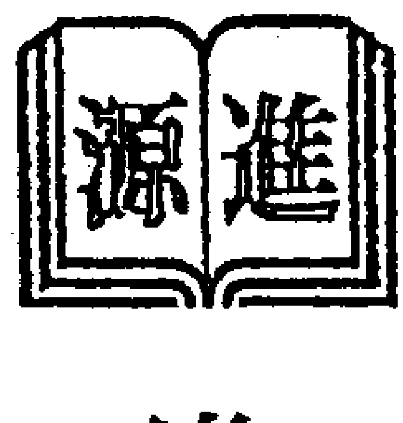

进源文化事业有限公司

## 卷篇

## 略窥门径——六爻知识入门

#### 前言

学习六爻有些年头了，经验说有也有一点了，尽管很多时候断卦仍然是很稚嫩。书也读了一些。感觉从书里学到了不少的东西。但说到底感觉对我帮助最大的还是《增删卜易》。这实在是一本学习六爻的高明教材，我愿意再次读它。

可是说实话，我希望有更多的人来关注传统文化，关注中国文化的发展，但我从内心不希望太多的人来钻研六爻预测。因为我觉得易学，尤其是预测，是易学难精的东西，真的不适合所有的人都来学习。如果看到这篇文章的人只是好奇的话，请一定记住，我会告诉您在哪里应当停住不要再读。因为玄学是一把双刃剑，请不要在这里面钻下去。

学习周易的人，有志于道者，有志于学者，有志于业者。志于道者，只在乎是否能找到真理，而不在乎能否建功立业。志于学者，只在乎学习的过程，并从中获得快乐。而志于业者，大多是为名为利为功为业来。对于志于道者，易学的道，未必是最终的道，因为道的趣味也就在于它永无止境；志于学者，学习的乐趣绝不只在易中；志于业者，算了吧，从易中成就事业的人太少了，不值得的。而如果你只是好奇的话，我倒建议去学学那些算命游戏或者是心理学，那更有意思。所以我不希望太多人来研究这些玄学，更希望有兴趣有能力的人来做这个事情。其他的朋友，请把预测当做游戏，有病治病，无病防身，无论什么时候，迷信任何东西都必然是错误的。

边想边写，希望大家多提出意见，并对作品中的问题以及我对卦的错误理解进行斧正。

版权本人专有，请勿转载。等全文修正后我会整理出完整版，我希望能够大家合力出一本周易世界论坛自己的作品。我也算是抛砖引玉了。

感谢周易论坛各位朋友的支持，感谢易水老师对我六爻的指点。我会尽量认真地进行写作，尽可能满足大家的要求。

经验有限，读书有限，理解深度有限，希望各位多多支持，多多指点，老渊在此谢过各位。

老渊（舒涵）

2008 年于武昌珞珈山

## 第一节　哲学之书

严冬，正是寒假时候，老渊的堂年交小卢放假回家来拜访老渊。

小卢在一所重点大学读本科，学的是物理学，这个学期，小卢在大学里选修了一门《易经解读》的课程，就此对《易经》有了兴趣，竟发狠要把《易经》背过，在学校已经背过了将近二十卦。

小卢知道老渊爱读史书，也多次向老渊借书，这次来访到老渊家就是来借本《易经》接着背的。

一见小卢，他张口就问：“老渊，你这里有《易经》吗？”

“笑话，诗书礼易春秋，论语孟子中庸大学，四书五经我这里哪本没有，不过版本并不算太好。这些书你们这些大学生读得越来越少喽，呵呵。”老渊笑答。

小卢一听，反倒兴奋起来：“那么，你知道易经是讲什么的吗？我选了一门课后，背了十几卦，还是不太懂。”

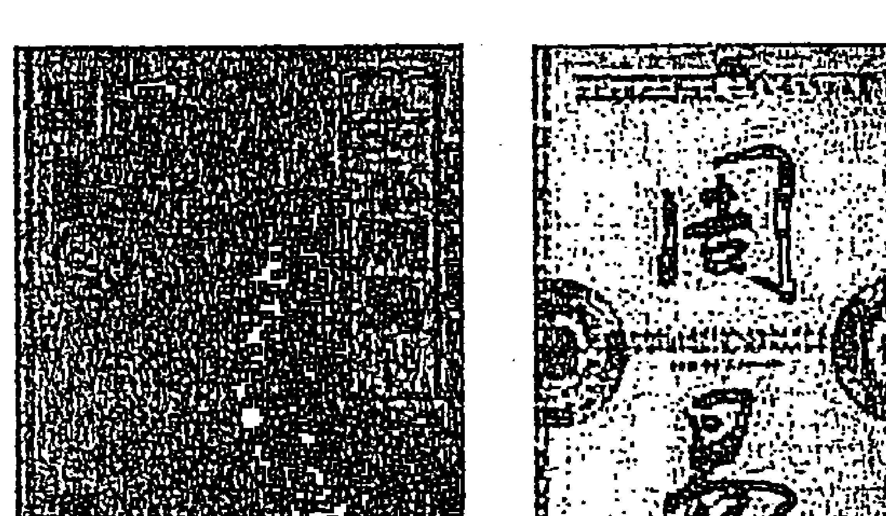

老渊笑了：“你不知道啊，那我也不知道。你不是背了十几卦还上过课吗？说来听听。”

“易经啊，这个这个，啊，”小卢心道：终于能难到你了，小卢压抑不住心中的狂喜，“最早是一本讲封建迷信的用于占卜的书，但古人在占卜的过程中把他们对天地万物的感悟也写在里面，所以里面有丰富的人生哲理。所以准确地说，《周易》应当是一本哲学书，无论政治军事人生等各个方面都挺周全的，而且我们可以从中悟到许多东西去指导我们其他方面的人生，好多学问都从易经中汲取了许多营养。”

“《周易》？哲学书？”老渊听得皱起了眉头。

“是啊，你看，天行健，君子以自强不息；地势坤，君子以厚德载物，这还是清华大学的校训呢。易经里每个卦都讲的是一类生活。比如师就是讲军队的管理，咸就是讲爱情，蒙就是讲开化，好多好多。我们老师的讲义里很详细的。”

“你们老师就把它当哲学书讲？你们老师没讲占卜吗？”老渊问道。

知识补充：关于《周易》的本质，说法不一，但简单地说可以将目前的易学认识分为两派，一派是讲究义理，就是从周易中寻找我们做人做事的道理，比如像如今常见的“易学与管理学”，“跟周易学处世”等等，这一派努力从周易中找法道理来指导人生；另一派是占技派，讲究的是从易学中阐发出阴阳五行之理，并进而用于人生的预测，如常见的八字预测，六爻预测等等，本文当然持后一种观点，但占技派常常要吸收义理派的道理学问，义理派也常常借着批判占技派来阐述自己的道理，两派仍然是有些联系的。其他派别我们暂时不作讨论。

## 第二节　大衍筮法

“你们老师就把它当哲学书讲？你们老师没讲占卜吗？”老渊问道。

小卢笑了：“讲了啊。其实我们大多数人都是冲着占卜和预测才去的，可是到了那里才听老师说所有的占卜都是迷信。周易的占卜方法在《系辞》里写得明白，我们管它叫大衍筮法，那天老师讲大衍筮法的时候，整个教室前…”前前後後連地上都坐滿了人。人人都拿著五十根牙籤數過來數過去。一直數了一節課，才算起出來一個卦。我還算是數得快了，也數了二十多分鐘。」

「大衍筮法，那肯定是很麻煩了。」老瀾笑著說，「那解得怎麼樣呢？」

「老師說讓我們按《周易本義》裡朱熹的方法解。解出來，有對應的，有不對應的，大多數人的卦是八竿子打不著的關係。所以說周易占卜，根本就是迷信嘛。」

「你們老師就這麼講的？」老瀾越聽眉頭皺得越緊。

「是啊。還能怎麼講？老師總不能上課講迷信吧。」小盧笑道。

「你們老師講沒講過納甲筮法嗎？」老瀾問。

「提到了。說是把三個錢拋六次就能成一個卦，然後用各種亂七八糟的關係來進行解卦。反正是因為關係很複雜，所以怎麼說都說得通，誰讓這是迷信呢。」

「笑話！」老瀾聽得很鬱悶，「納甲筮法是占卜的大宗之法，怎麼會是『怎麼都說得通』這麼簡單？」

「算卦的當然都是閃爍其詞了，」小盧很肯定地說，「比方說你問父母，他就說什麼父在母先亡，父親還在母親已經亡故，或者是父親在母親之前死。反正怎麼都講得通。侯寶林的相聲裡也有很多啊，什麼桃園三結義孤獨一枝，太多了。」

「得。」老瀾聽得哭笑不得，「納甲筮法怎麼會是這個樣子呢？」

「那納甲筮法能是什麼樣啊？不就是拋幾下硬幣，然後任人胡說八道嘛。」

##### 知識補充

關於大衍筮法，見於《繫辭》。起卦方法十分複雜，也十分耗時間；而且關於大衍筮法，爭議頗多，自古就有多種說法。這多種說法算起來，概率陰陽並不十分平衡，這一點有違易理，所以大多書中所寫的大衍筮法都不便於利用。近來有人指出有新的方法可以通過大衍使陰陽平衡並求出卦，但仍然耗時，且爭議頗大。但這是最古典的筮法，對後來影響頗大，而且在多數「義理派」的眼中，只有大衍筮法才是真正的「易經占卜」，其他的如納甲六爻等不過是江湖術士的「火珠林」法等等。所以大衍筮法對於易學的發展有極為重要的意義。大家可以參看其他介紹大衍筮法的文章，本文恕不詳解。

## 第三節　納甲筮法

「那納甲筮法能是什麼樣啊？不就是拿三個硬幣，隨便拋幾下，然後任人胡說八道嘛。」小盧笑道。

「算了吧。你們老師就這麼講的？」老瀾越來越覺得無奈了。

「就是這樣啊。不這樣還能是怎麼樣啊？周易真的能預測嗎？我還真不信了。我可是學物理的啊，量子力學已經在一定程度上說明了未來的不可知性了啊。」小盧也是一臉的疑惑。

「看來你真得瞭解一下納甲預測了。不管你信不信，實踐才是檢驗真理的唯一標準。」說著，老瀾轉身從書架上摸出一本書，「納甲筮法，從古到今關於它的書有很多，這本書是納甲筮法的入門教材，也是可以提高技術的教材，你拿去看看吧。」

小盧接過書：「這是什麼書啊？《增刪卜易》？幹嘛的，還提高技術？這玩意兒準不準啊，你不會真信這東西吧。」

「準與不準還要靠實踐來驗證，但對事物武斷地不信，這不是一個大學生應該持的態度吧。至少作為我們傳統文化中的一個部分，瞭解其本來面目還是很有必要的。還不知道它是什麼，就把它罵個狗血噴頭，好像不太好吧。」

「也有道理，」說著，小盧打開手中的《增刪》開始翻閱，「不會吧，全是文言文啊，有沒有白話文版的啊。」

「我還沒有看到白話版的。但這裡的古文又不難，高中生就能看得懂。」老瀾笑了，「你一個大學生，還看不懂這點文言文？」

小盧紅著臉低下了頭：「看得懂倒是看得懂，就是看不下去。我一個學理科的人，最頭痛的就是文字的東西。要不乾脆你給我講講吧。」

「我暈！」老瀾差點沒氣背過去，想了一會兒，「也行。以後這段時間反正你放假沒事，乾脆我就教你一些基本的知識。我講給你的東西你也可以挑一些告訴朋友，不要用於占卜預測。」

「不預測我學這個幹嘛啊？」小盧納悶了。

「至少你們一定要知道它是個什麼東西。你們當大學生的這些知識分子，不能一提周易太極就是迷信，那咱老祖宗傳下來的玩意兒不全給糟蹋了啊。」

##### 知識補充

納甲起於京房的納甲說，將納甲與六爻筮法結合起來，起於《火珠林》一書。後來又有《易林補遺》《斷易天機》《斷易大全》《易冒》《易隱》《卜筮正宗》《增刪卜易》等書，各書觀點不一，且多有衝突；但發展到清朝，大致以《卜筮正宗》與《增刪卜易》為基準，逐漸形成了如今的六爻預測法。納甲筮法起卦快，排卦方便，隨機性強，長於一事一斷，且多可與理、象、數、占相結合，實在是中國預測術的大宗之法。

## 第四節　《增刪卜易》

「好吧，那你先給我說說這本《增刪卜易》吧。」

「你先看看，這本書是誰寫的啊？」

小盧翻一下：「野鶴老人？誰啊？」

「《增刪卜易》，題為『野鶴老人』著，經學者考證，此書當為明末清初丁耀亢所著，但還不是太確定，現在還沒有定論。你一學理科的，我也不跟你多說什麼，反正你學的是納甲筮法又不是發展史。」

「難道這麼多年來，就這一個人把納甲筮法研究透了嗎？」

「其實他也不算研究透了，只不過這個人是個才子，又常常以卜為業，所以積累了三四十年的占斷經驗。他把它們整理出來，就有了這本《增刪卜易》，而且裡面有許多真實卦例，所以對我們研究納甲筮法真的是一本重要的參考書。」老瀾娓娓道來。

「四十年的占斷經驗？他哪來那麼大的閒功夫啊。」

「人家是以卜為業，當然就可以了。有句話叫『為先賢繼絕學，為萬世開太平』，這個野鶴先生大概也有這種氣魄吧。」

「好厲害。唉，下面這個李我平、李坦又是誰啊？」

「野鶴老人的占卜記錄不知道怎麼落到了李家這兩個人手中。他們將這占卜研究之後，覺得不應當私藏，而應將其公佈，於是將其進行了增刪之後公佈出來，而最終還是用了野鶴老人的原作者之名。當時研究周易的人就有如此德行，在今天就更是難得了。」

「如此說來，我們現在看到的這本《增刪卜易》其實是野鶴老人和兩個李氏三個人的作品，是嗎？」

「是的。也許正是因為是三個人一起的作品，所以《增刪卜易》才是六爻著作中品質較高的，也是最有參考價值的。把這本書研究透，就相當於學到了野鶴老人四十年的占驗精華，你說學起來值不值啊。」

「真值。那要學這個，要不要背易經原文啊？」

「不用。」

「啊，」小盧拉長了臉，「那我十幾卦不都白背了？」

「白背了就白背了唄，反正死記硬背，還不如買本書多讀幾遍。」

##### 知識補充

丁耀亢（1599—1669），字西生，號野鶴。明末清初的著名詩人、文學家、劇作家和小說家。他的著述甚多，詩文有《陸舫詩草》《椒丘詩》《歸山草》《鷗山亭草》《醒世姻緣傳》《天史》《續金瓶梅》等，傳奇劇本有《西湖扇》《化人遊》《赤松遊》等。因明清易代的戰亂和清王朝查禁焚書，以及有些著作署名隱晦，故三百年來使其光輝不顯，未被世人認識。（知識見百度百科，近年有考古論證《增刪》並非丁耀亢所著，在此不贅述史家之論）

## 第五節　概論《增刪》

小盧有點等不及了：「擇日不如撞日，咱們就現在開始講吧。」

老瀾：「算了，講就講吧。其實古卜這個東西，從伏羲畫了八卦，文王演成了六十四卦，周公作了卦辭，孔子寫了爻辭之後啊……慢點，你知道什麼叫爻嗎？」

小盧胸有成竹：「知道，一道或者是兩個半道都叫一個爻。」

「你算不錯了。很多人連這個字都不認識。爻，二聲。當時我學的時候很多人都問我，你這六爻的『爻』字叫什麼啊，暈死我了。還有人過來就問，你學的這個六爻預測學是個什麼東西啊，特別搞笑。」

「不會吧，伏羲、文王，那得多少年啊，好幾千年下來那得多少內容啊，我還不得學死啊。」小盧聽得發暈，有點想打退堂鼓了。

老瀾笑道：「任何學問都是可以深學也可以淺學的。你小學學數學，大學還不是一樣要學數學，十幾年數學學下來，其實覺得也並不那麼困難是吧，就是這個道理。周易當然也是有深有淺。學得深的人有神鬼不測之機，比如像傳說中的諸葛亮啊、劉伯溫啊，反正都說他們神鬼莫測了，不知道是真是假。學得淺的，只要瞭解一下它的運算機制就行了，也可以判斷一些好壞啊、吉凶啊。只要抱著一個正確的心態去看待它，也可以有一些收穫的。」

「神鬼不測，聽著怪嚇人的，我就想瞭解一下，淺淺地學一下就可以了，你先概括說一說吧。」

干支：辛亥日，丙午月，辛丑日，丁酉時

| 主變卦 |  |  | 地天泰（坤宮） |  | 地火明夷（坎宮） |
|---|---|---|---|---|---|
|  |  |  | （空亡：辰、巳） |  |  |
| 騰蛇 |  | -- | 子孫酉金 應 | -- | 子孫酉金 |
| 勾陳 |  | -- | 妻財亥水 | -- | 妻財亥水 |
| 朱雀 |  | -- | 兄弟丑土 | -- | 兄弟丑土 世 |
| 青龍 |  | — | 兄弟辰土 世 | — | 妻財亥水 |
| 玄武 | 父母巳火 | — | 官鬼寅木 | ○→ -- | 兄弟丑土 |
| 白虎 |  | — | 妻財子水 | — | 官鬼卯木 應 |

「其實六爻說簡單也簡單。就幾個步驟：先用錢搖出六個爻，把爻記錄下來；然後為爻裝上天干地支；然後根據五行的生剋安上六親；再寫上日月的干支，根據日干排上六神，這樣卦就排完了。」老瀾說得輕描淡寫。

「聽起來好像不複雜，排完卦之後呢？」

「不複雜？複雜得很呢。學會裝卦後要知道動爻啊、變爻啊、卦的六沖啊、變六沖啊，然後會取用神，然後看旬空、月破、日破，反正學會一套基本的運算機制後就行了。」

「你那些話聽得我都暈了。你舉幾個例子，我接受能力比較快。」

老瀾笑道：「你肯定得暈啊。舉個例子，比方說看官運，你要是那個表示官的那個爻代表你自己，或者卦中的情況對官爻特別有利，那麼就是成啊。如果是子孫，它是克制官爻的，如果它代表你自己的話，那麼就肯定不成了。求財也是這樣，代表錢的爻旺，而且能與代表你自己的那個爻發生關係，那麼就能拿到錢嘍。」

老瀾接著說：「還有像什麼一年的年運啊，什麼當官啊，還有財運啊，還有官司啊，反正都有相應的方法。取一個東西來象徵你的事情，然後看它在整個卦中的狀態。如果狀態好，那麼就吉；狀態差，那麼就凶，就是這麼簡單。」

小盧笑了：「鬧了半天，就這麼簡單，反正是旺就行，不旺就不行唄。」

##### 知識補充

這一節主要談的是《增刪卜易》最初的《增刪卜易序》，這裡面講到了六爻預測的基本原理，就是對應。其實這篇文章主要是淺淺地給大家講解一下六爻，如果想深學的話，還是請大家去看其他古籍或者現代人的書吧。但還是提醒大家：所有結果僅供參考，萬萬不可迷信。

## 第八節　天人感應

小盧笑了：「鬧了半天，就這麼簡單，反正是旺就行，不旺就不行唄。」

「那麼一個卦出來你怎麼判斷旺不旺呢？要是都很旺呢，都不旺呢？」老瀾笑著問。小盧摸著後腦勺：「啊？原來不是我想像的那麼簡單啊。」

「六十四卦化六十四卦，共是四千零九十六種變化，這還不包括搖卦的時間地點、問卦人的話。加上這些因素，卦真的是千變萬化，哪裡是只看個旺與衰那麼簡單。野鶴占卜了一輩子才積累了這一本經驗之談，而且我們還沒有看透。」老瀾連連搖頭。

「啊，那也太複雜了吧。哎，我有個問題，這個預測它是不是個概率問題啊？我今天卜是一個卦，我下一次再卜還是這個卦嗎？《易經》裡說什麼『三則瀆，瀆則不告』，就是說不能連著占卜，占卜多了就褻瀆神靈，神靈就不告訴你了。我們老師說這就是《易經》迷信的地方啊。」

「唉。海納百川，有容乃大。你報個大學還得多找幾個人打聽打聽，一個事怎麼就不能多斷幾次卦呢？野鶴老人就是常常讓別人多搖幾次卦，『合而決之』，並沒有什麼明顯不妥的地方。我也試過，一般來說搖兩三個卦，反映的資訊的確是基本一樣的。」

「那我乾脆一直搖卦，一直搖到出來一個吉卦不就行了？」小盧耍起了小聰明。

「你那到底是在占卜還是在拋硬幣玩啊？就好像買彩票一樣，你買一兩注、三五注那算是你猜；你要是二十三選五，你就包二十三個號，那到底是在猜號還是在燒錢玩啊？如果只搖一次，那目的是預測；如果搖一千次，那目的就成了搖一個好卦出來。目的都不同了，怎麼可能出資訊相同的卦呢？」

「這麼說，其實並不是一個概率問題囉。」

「易學裡講『天人感應』。你是學理科的，我也無法從你們理科的角度證明這些。有人說這個跟電磁場什麼的有關，解釋得也挺牽強。但既然暫時不能證實也不能證偽，乾脆你就默認在易學裡這條定律是正確的就行了。出去學馬列啊、學電學力學啊、學什麼量子論啊相對論什麼的，就別提什麼天人感應，把這個忘掉就行了。那句話叫什麼來著？即使是真理，也有一定的適應範圍嘛。」

「我不知道它的原理，那我怎麼運用啊？」

「是不是牛頓提出力學三大定律之前，我們就不會扔石頭打鳥了呢？是不是三類槓桿我們發現之前，就不會坐蹺蹺板了呢？其實實踐常常是走在原理前面的啊，不是嗎？」

「也有些道理，不過總感覺怪怪的。」

「知其然，與知其所以然，是兩回事。每個人都在用腦子思考，但沒有一個人知道我們究竟是怎樣思考的，就像這樣子。總之，不要在這上面花過多精力，只要理解『天人感應』這一思想就夠了。」

「好的。這麼複雜的東西要怎麼學呢？伏羲畫八卦，文王演為六十四卦，卦辭、爻辭……這麼說，咱們是要從八卦開始講嗎？」

##### 知識補充

關於「天人感應」這一思想，從董仲舒開始提出，之後大多的易學家大都堅持了這一思想，而且較多地與儒、釋、道三家融合，尤其對儒道產生了深遠的影響。但其原理，實在解釋不清楚。我們常常說「心誠則靈」，也常把卦不應的原因歸於心不誠，更有人由此論證可能是一種電磁波。可當代大家王虎應先生的《卦由誰來搖》卻論證出只需動念，並不需本人親自搖卦，而且以電磁波解釋從物理上也解釋不通。我們姑且將其解釋為一種信訊場，儘管仍然有濃重的唯心主義色彩，但將其作為預測學的基礎，現在看來仍是至今比較合理的。（圖：洛陽漢墓古畫《天人感應》）

## 第七節　八卦象數

「這麼說，咱們是要從八卦開始講嘍？」小盧笑問。

「那當然了，周易就是從陰陽四象八卦開始的啊。」老瀾笑道。

「八卦啊，這我熟得很。乾三連，坤六斷，震仰盂，艮覆碗，離中虛，坎中滿，兌上缺，巽下斷。」小盧背得流利之極。

| 乾三連 | 坤六斷 | 震仰盂 | 艮覆碗 | 離中虛 | 坎中滿 | 兌上缺 | 巽下斷 |
|---|---|---|---|---|---|---|---|
| 天 | 地 | 雷 | 山 | 火 | 水 | 澤 | 風 |
| 乾為父 | 震長男 | 坎中男 | 艮少男 | 坤為母 | 巽長女 | 離中女 | 兌少女 |
| ☰ | ☷ | ☳ | ☶ | ☲ | ☵ | ☱ | ☴ |

「好啊，你竟然會背這個，能背這個就會畫八個卦了，那倒省了我不少功夫啊。」

「那八個卦的最基本的類象你知道嗎？」

「乾是天，坤是地，離是火，坎是水，震是雷，巽是風，艮是山，兌是澤。」小盧對答如流。

「行啊，不錯啊。」

「不過那個先天八卦、後天八卦我不太明白。」

「先天八卦和後天八卦都是八卦的排列。先天八卦更反映的是八卦的陰陽感應，後天八卦則反映的是後天方位。在實戰中，後天八卦用得多一些，多用於定方位；而且在其他的預測術中，也多用後天八卦來定方位。後天八卦與五行的對應也是很工整的，所以總的來說，後天八卦更為實用一些。」

「那先天八卦就沒用了嗎？」

「先天八卦多用於研究易理，但在預測中，先天八卦數卻是常用的：乾一兌二離三震四巽五坎六艮七坤八。先天八卦數常常用於起卦，也常常用於定位數位。」

「哦。那是不是我還要常研究先天八卦圖和後天八卦圖呢？」

「先天八卦數是要用熟的，後天八卦圖卻要常常研究，因為它與五行、天干地支都有深深的聯繫。易學大家邵康節在預測中就是使用後天八卦圖、先天八卦數的，所以後天八卦圖還是要常常研究得好。」

「嗯，那我還得回去畫一幅。」

##### 知識補充

對於八卦的萬物類象，在六爻中用得並不是太多，但六爻與梅花易數常可參斷，而且在參斷時常常用到《梅花易數》裡的八卦萬物類象。所以如果想提高易技的話，還是多看一些萬物類象。而先後天八卦的研究，也的確像文中所說，以後天八卦圖配先天八卦數，才能說是初通八卦。

上圖為先天八卦圖，右圖為後天八卦圖。

## 第八節　搖錢點卦

「沒想到你早背過了八卦，我們可以開始搖錢了。」老瀾很開心。

「搖錢，用什麼錢？硬幣行嗎？」小盧問道。

「硬幣就行。他們有人說乾隆錢最好，說是什麼『乾』字是周易的第一卦，反正他們這麼說。我這裡還真有三個乾隆錢，咱們就用它吧。其實也不一定用乾隆錢，硬幣也能起。反正不管什麼幣，有漢字或者阿拉伯數字的一面就叫字；是花的啊、國徽啊，還有乾隆通寶那個滿文啊，都叫背。當代學者大都認為並不拘泥乾隆錢，更重要的是心靈的感應。」老瀾道。

「滿文反正咱也看不懂，那我也叫花。」小盧道。

「叫花就叫花吧，你就是個叫花子啊。」老瀾說得兩個人都笑了。

「去你的。怎麼個搖法？」

「先將三個銅錢平入於手心，兩手合扣，然後集中意念，腦子只准專想所要預測之事，反覆搖動手中銅錢，然後將銅錢擲於桌上，看銅錢的背和字的情況。」老瀾道。

「幹嘛要腦子只想這個事啊？」

「天人感應，人錢感應嘛，默認了，就這麼辦。隨意搖的卦的確有時失真的。」老瀾信誓旦旦地說。

「好吧。看字和背，怎麼記錄呢？」

| 爻位 | 一個背 | 二個背 | 三個背 | 三個字 | 記號 |
|---|---|---|---|---|---|
| 上爻 | ○一個背 | ○二個背 | ○三個背 | ⊙三個字 | --× |
| 五爻 | ○一個背 | ⊙二個背 | ○三個背 | ○三個字 | -- |
| 四爻 | ○一個背 | ○二個背 | ⊙三個背 | ○三個字 | --○ |
| 三爻 | ○一個背 | ⊙二個背 | ○三個背 | ○三個字 | -- |
| 二爻 | ○一個背 | ○二個背 | ⊙三個背 | ○三個字 | --○ |
| 初爻 | ○一個背 | ⊙二個背 | ○三個背 | ○三個字 | -- |

「一個背、兩個字，畫作『/』，為一個陽爻。兩個背、一個字，畫作『//』，為一個陰爻。三個背、沒有字，畫作『○』，是陽動爻；三個字、沒有背，畫作『×』，為陰動爻。」

「這個簡單，就跟大衍筮法裡那個餘數一樣，老陽、少陽、老陰、少陰。」

「一共搖六次，第一次為初爻，畫在卦的最下面，依次上升；第六次為第六爻，也叫上爻，畫在卦的最上邊。如遇有×、○，還要畫出變卦來。」

「還要畫出變卦？什麼意思？」

「看書。一個卦常常有兩個六爻卦，左邊的卦是主卦，右邊的卦就叫變卦，又叫之卦。你看書常常說某卦之某卦，這個『之』就是『到』的意思，就是某卦變某卦的意思。你看一個卦就明白了。」

小廬恍然大悟：「噢，原來只要把圈圈變成陰爻，又變成陽爻就行了。還什麼老陽老陰的，麻煩。」

「好了，學到這裡，你已經會搖卦了。今天回去休息吧，明天我們就要學六十四卦了。」老測笑道。

##### 知識補充

大衍筮法裡起卦複雜，而且陰陽並不平衡；梅花易數起卦又往往過於隨意，水準常常較難提高；奇門起局則常常十分複雜，而且學習起來很難，雖然現在有新的奇門起法，仍不盡如人意；而六爻起卦快而方便，而且排出的卦變化也多，能適應多種情況，所以整體來看還是更推崇六爻一些。

另外老測認為，由於電腦起卦隨意性太強，不便於六爻的預測，卦象失真的情況常常可以見到，所以還是建議有條件的易友使用硬幣手搖卦，這既是對預測師負責，更是對自己負責。

## 第九節　六十四卦

次日，小廬很早就來到了老測家：「快點開講吧，我等不及了。六十四卦，我昨晚還看了一遍的。」

「你看的是什麼？」

「我看的是昨天從你這裡拿走的《易經》原文啊，裡面有六十四卦卦序的，我勉強背過了，不過不知道是怎麼這麼排的。」小廬老實作答。

「《易經》中卦的排序始終是個謎，至今沒有很好的解釋，而且現在看到的多個版本，尤其是帛書《易經》更接近古易，排序與今本又有不同。所以今本《易經》的卦序歌不過是記憶而已，沒必要非要探究，或許就是隨機的也說不定呢。」老測笑道，「我們要學的六十四卦的排法，是按京房的八宮排列的，就是把六十四個卦按一定規律分成八組。這是漢朝的東西，是現在看到的《易經》裡所沒有的了。」

老測打開《增刪卜易》，指著裡面的八宮排列圖道：「這些，一定要背過的。」

「啊，這麼多啊，我怎麼背啊。」小廬一臉的困惑。

「沒辦法，多背就可以了。你以為學易很簡單啊。」老測不屑。

「難道我現在就要背嗎？」

「不必。先接著學。學熟了，用得多了，很快就背過了。反正昨天你已經學會了搖卦，就是點卦，一個卦點出來，應該可以按《增刪卜易》裡的六十四卦全圖來進行裝卦了。」

「不會吧，找起來很麻煩啊。有沒有簡單方法？」小廬又想省勁了。

「你這小子就是想抄近路，不告訴你。」老測笑道。

##### 知識補充

六十四卦是納甲筮法的基礎，一定要記住。六十四卦的卦名，老測也是在使用的過程中記住的，還是建議大家不要強記，多在實踐中練習。其實每天點三四個卦，一段時間也就點熟了，還是不要急躁的好。如下圖。

| 宮位 | 不變 | 一變 | 二變 | 三變 | 四變 | 五變 | 遊魂 | 歸魂 |
|---|---|---|---|---|---|---|---|---|
| 乾宮 | 乾 | 姤 | 遯 | 否 | 觀 | 剝 | 晉 | 大有 |
| 震宮 | 震 | 豫 | 解 | 恆 | 升 | 井 | 大過 | 隨 |
| 坎宮 | 坎 | 節 | 屯 | 既濟 | 革 | 豐 | 明夷 | 師 |
| 艮宮 | 艮 | 賁 | 大畜 | 損 | 睽 | 履 | 中孚 | 漸 |
| 坤宮 | 坤 | 復 | 臨 | 泰 | 大壯 | 夬 | 需 | 比 |
| 巽宮 | 巽 | 小畜 | 家人 | 益 | 無妄 | 噬嗑 | 頤 | 蠱 |
| 離宮 | 離 | 旅 | 鼎 | 未濟 | 蒙 | 渙 | 訟 | 同人 |
| 兌宮 | 兌 | 困 | 萃 | 咸 | 蹇 | 謙 | 小過 | 歸妹 |

## 第十節　八宮卦變

「你這小子就是想抄近路，不告訴你。」老測笑道。

「別啊，易學不是不易、變易，還有簡易嘛。教個簡單方法吧，你剛才都說『按一定規律分成八組』，一定有方法的。」

| 兌為澤 | 澤水困 | 澤地萃 | 澤山咸 |
|---|---|---|---|
| 父母未土 世 | 父母未土 | 父母未土 | 父母未土 應 |
| 兄弟酉金 | 兄弟酉金 | 兄弟酉金 應 | 兄弟酉金 |
| 子孫亥水 | 子孫亥水 應 | 子孫亥水 | 子孫亥水 |
| 父母丑土 應 | 官鬼午火 | 妻財卯木 | 兄弟申金 世 |
| 妻財卯木 | 父母辰土 | 官鬼巳火 世 | 官鬼午火 |
| 官鬼巳火 | 妻財卯木 世 | 父母未土 | 父母辰土 |

| 水山蹇 | 地山謙 | 雷山小過 | 雷澤歸妹 |
|---|---|---|---|
| 子孫子水 | 兄弟酉金 | 父母戌土 | 父母戌土 應 |
| 父母戌土 | 子孫亥水 世 | 兄弟申金 | 兄弟申金 |
| 兄弟申金 世 | 父母丑土 | 官鬼午火 世 | 官鬼午火 |
| 兄弟申金 | 兄弟申金 | 兄弟申金 | 父母丑土 世 |
| 官鬼午火 | 官鬼午火 應 | 官鬼午火 | 妻財卯木 |
| 父母辰土 應 | 父母辰土 | 父母辰土 應 | 官鬼巳火 |

「唉，你個懶鬼。反正只是給你簡單介紹一下納甲筮法。先別硬記了。看著：每個宮內的第一個卦是一個純卦，就是上下卦都是一樣的。第二個卦把初爻變，第三個卦再把二爻變，第四個卦把三爻變，第五個卦把四爻變，第六個卦把五爻變。第七個卦注意，再把四爻變回來；第八個卦，把下面的卦變成這個卦宮的卦。另外要知道，第七個卦叫做遊魂卦，第八個卦叫做歸魂卦，就是這個名字，別問為什麼了。」老測講得饒有興趣。

「那倒是。可是我怎麼找呢？」

「你搖出來一個卦你就順著畫，先變第一個，再變第二個，再變第三個，再變第四個，再變第五個，再變第六個，再變下面三個。什麼時候找到一個純卦了，那麼就是這個宮的。而且第幾卦也就可以找到了。」

「舉個例子嘛，好抽象啊。」

「那比如說點了一個澤地萃，怎麼辦呢？先變初爻，變成上兌下震；再變第二個爻，變成上兌下兌，這就是兌宮的了。這一宮的第三個卦，去看看，一定是。

再比如說卜了一個澤天夬卦，先變初，上兌下巽；再變二，上兌下艮；再變三，上兌下坤；再變四，上離下坤；再變五，上坤下坤，那麼這就是個坤宮第六卦了。

再比方說卜得山風蠱卦，先變一，上艮下乾，一直變到五是上乾下震，都不行；那麼再變一次四，變成了上巽下震；再把下面變回去，上巽下巽，就是巽宮的最後一卦了。」

「還是很複雜啊。」

「使用慣了，就可以直接在腦子裡走，不用再畫出來一個一個推了。也很快的啊。」

「那我還真得費點功練熟才行。有沒有更簡單的方法啊？」

##### 知識補充

以上介紹的方法只要用熟之後，比其他的口訣要好用。在下面的章節中我們會介紹一些其他的口訣，從學習的角度講，不如本方法更合乎易理，所以建議大家還是以本法為主。口訣記憶永遠不如從易的角度理解更好一些。

## 第十一節　世應通感

小廬似乎也太懶了：「這個六十四卦，我還真得費點勁練熟才行。有沒有更簡單的方法啊？」

「我靠，你也太懶了吧。不過，方法還是有的。」老測皺著眉頭。

「有方法，那就教教我吧。」小廬興高采烈。

「這個，」老測想了一會，「好吧，反正我們要引入這個新的概念了：世爻與應爻。」

「世爻與應爻？什麼意思？」

「想明白世爻與應爻，先要明白什麼叫『應』。在一個六爻卦中，初、四爻相應，二、五爻相應，三、上爻相應，因為它們都是各自單卦的下爻、中爻、上爻。每個三爻卦的下爻又叫地爻，中爻為人爻，上爻為天爻，所以是相應的關係。尤其是一陰一陽的時候，這種感應最為強烈。」老測道，「這一點不太好理解，慢慢想想。」

「我知道，就像物理裡正負電相吸、南北極相吸，一個道理，就是不知道這個是否符合電磁力定律？」

| 爻位 | 標記 |
|---|---|
| 上 |  |
| 五 |  |
| 四 | 世 |
| 三 |  |
| 二 |  |
| 初 | 應 |

「別用一種科學來解釋文化現象，這個是不同的。你能明白這個就好。明白了相應的關係之後，再來明確世爻、應爻的概念：一個卦中的世爻就代表起卦者，即卦主本人；如果是代搖的話，常常仍然代表動念者。而應爻就是與世爻相應的爻，準確地說，就是與世爻隔著兩個爻的那個爻。你看剛才我們看的兌宮八卦的圖就是了。」

「世爻代表自己，那麼應爻又代表什麼呢？」

「應爻代表的東西比較廣泛，有時代表對手、對立面，有時又代表世爻所喜歡的人等等，有時還可以代表某地方，測病的時候還可以代表醫院。在許多預測中，除了看要測的事情外，常常還要參看應爻，就是因為應爻與世爻有著千絲萬縷的聯繫。」

「哦。我明白應爻的取法了。不過，還是要告訴我記六十四卦的簡單方法啊。」

##### 知識補充

世爻與應爻是六爻預測中最常用的概念之一，所以一定要加深理解，尤其是對於應爻的理解，還需要我們在實踐中多多思考，爭取從應爻中斷出更多的內容來。

## 第十一節　尋宮安世

「不過，還是要告訴我記六十四卦的簡單方法啊。」小廬著急了。

「不要急嘛。聽著：天同二世天變五，地同四世地變初，人同遊魂人變歸，下變三世六本宮。」老測道。

「什麼天地人變的，把口訣解釋一下吧。」

「還記得我們上次講的天爻、地爻、人爻嗎？如果一個六爻卦上下卦的天爻陰陽相同，地、人爻陰陽都不同，比如天山遯、風火家人等，它們的世爻就在二爻上；如果地、人爻都陰陽相同，只有天爻不同的話，世爻就在五爻。這就叫『天同二世，天變五』。」老測講道。

| 宮位 | 不變 | 一變 | 二變 | 三變 | 四變 | 五變 | 遊魂 | 歸魂 |
|---|---|---|---|---|---|---|---|---|
| 乾宮 | 乾 | 姤 | 遯 | 否 | 觀 | 剝 | 晉 | 大有 |
| 震宮 | 震 | 豫 | 解 | 恆 | 升 | 井 | 大過 | 隨 |
| 坎宮 | 坎 | 節 | 屯 | 既濟 | 革 | 豐 | 明夷 | 師 |
| 艮宮 | 艮 | 賁 | 大畜 | 損 | 睽 | 履 | 中孚 | 漸 |
| 坤宮 | 坤 | 復 | 臨 | 泰 | 大壯 | 夬 | 需 | 比 |
| 巽宮 | 巽 | 小畜 | 家人 | 益 | 無妄 | 噬嗑 | 頤 | 蠱 |
| 離宮 | 離 | 旅 | 鼎 | 未濟 | 蒙 | 渙 | 訟 | 同人 |
| 兌宮 | 兌 | 困 | 萃 | 咸 | 蹇 | 謙 | 小過 | 歸妹 |

> 註：表格中各格另含對應卦畫（六爻符號），此處以文字卦名轉錄。

「嗯。那麼『地同四世，地變初』我也明白了。第三句呢？」

「人同遊魂人變歸。如果只有人爻相同的話，就是個遊魂卦；我們講過，一宮的第七卦為遊魂卦，其世爻在四爻。人變歸，如果只有人爻相反呢，就是歸魂卦，世爻在三爻上。」

「『下變三世六本宮』呢？」

「如果整個下卦都變了，那就是三世；如果是本宮純卦呢，世爻就在六爻。」

「嗯，好複雜啊。」

「不過這個口訣查起世、應和卦宮來是挺快的。用熟了當然和前面的方法都差不多，甚至還不如前面的。一個卦宮的本宮卦是六世，變初爻是一世，變初二爻是二世，變初到三爻是三世，變初到四爻是四世，變初到五爻是五世；再變四爻是遊魂卦，為四世；再變三爻是歸魂卦，為三世。世爻確定了，隔兩個爻就是應爻了嘛。」老測說來輕描淡寫。

「那麼尋找卦宮呢？」

「按這個口訣，本宮卦當然是不用找了；天同天變、地同地變、下變，世在下卦的話，上卦就是卦宮；世在上卦的話，那麼下卦的反卦（把爻陰陽相反變化）就是卦宮。遊魂卦呢，下卦的反卦是本宮；歸魂卦呢，下卦就是本宮。」

「所以這個口訣就可以很方便地尋找卦宮，安上世應了？」

「正是。」

「如此說來，一個卦豈不是就基本完成了？」

「基本完成了？你打開書看看，一個卦是由什麼組成的吧。」老測嘀咕道。

##### 知識補充

我一直認為這個口訣是懶人口訣，因為用這個口訣理解起概念來，遠不如一個爻一個爻變上去更深刻些。口訣方便而已，對於理論卻沒有多少實質性的幫助。任何一個學易者的成長都是從基礎入手，僅靠口訣和斷語是難以從根本上取得進步的。

## 第十二節　五行生克

「基本完成了？你打開書看看，一個卦是由什麼組成的吧。」老測嘀咕道。

小廬打開書看了一會：「上面是某月某日，然後什麼空，然後是豎著一排青龍白虎，然後一排父母兄弟妻財，然後是十二地支吧，然後一個金木水火土，然後接著一個卦，後面還有一個部分，就是你說那個變卦。前面到底寫的是什麼啊？」

「這才是一個卦的全部。上面的某月某日，是用干支表示的當月當日；後面的空是旬空；下面的青龍白虎朱雀玄武是六神；再後面的父母啊、妻財啊，是六親；再後面的十二地支呢，是這個爻的屬性，就是所謂的『納甲』了；再後面的金木水火土，就是這個地支的五行。」

「五行，對了，五行到底是什麼啊，給我介紹一下吧。」

「那我們就講講五行生克。五行指的是金水木火土五行，古人認為天地萬物都是由這五類性質構成的。注意，是五類性質，而不是像古希臘的四元素說那樣，是由四種元素按不同比例拼成的，不是那樣。我們日常生活中常常說『金木水火土』，其實說『金水木火土』才更好一些。」

「為什麼？」

「金生水，水生木，木生火，火生土，土生金。金水木火土，正好按相生順序排列的。」

「噢。那相克順序又是什麼呢？」

「金克木，木克土，土克水，水克火，火克金。」

老師對答如流：「如果你把相生畫個圓圈，再把相克的關係在圖裡用箭頭標明的話，就會得到一個五角星。」

「我畫一個。」說完，小廬畫了一個五行生克的五角星。「好了，我會了。」

（圖）

「其實原來八卦就有五行的。你知道嗎？」老師提問道。

「這個我知道。乾兌是金，離是火，震巽是木，坎是水，艮坤是土。」

「是的，這就是八卦宮的五行。通過這個五行與各爻五行的生克關係，就可以確定各爻的六親了。」

##### 知識補充

五行是陰陽二氣相激蕩的產物。五行又可以配合季節、方位等，各有妙處，具體可以配合後天八卦來研究。但如果只是瞭解六爻的話，知道基本的五行生克已經可以了。

## 第十四節　十二地支

「這就是八卦宮的五行。通過這個五行與各爻五行的生剋關係，就可以確定各爻的六親了。但在確定各爻六親之前，先要知道各爻的地支。你知道十二地支嗎？」

「天干地支，不好記啊。我倒是知道十天干十二地支，只不過具體不太清楚。」小廬皺眉。

「在納甲筮法中，天干並不那麼重要，但地支很重要，所以一定要記住地支，就是子丑寅卯辰巳午未申酉戌亥。十二地支有很多內容，首先是十二地支的陰陽：子寅辰午申戌為陽，其他六個為陰；總之單數為陽，雙數為陰。」

（圖）

「這倒很好記。陰陽五行，下面是十二地支的五行是吧？」

「嗯，十二地支的五行：亥子為水，寅卯是木，巳午是火，申酉是金，丑辰未戌是土。慢慢記慢慢記。」

（圖）

「好，我慢慢記。」小廬一邊說一邊在心中默念。

「你就把子寫到亥，寫成個圈。這個圖以後會有用的。你看，隔兩個相同的，就是一個土。隔兩個相同的，就是一個土。」老測畫個圖道。

「嗯，這樣倒是還蠻好記。」小廬笑道。

「然後就是十二地支的六沖，你在圖上畫：子午相沖，丑未相沖，一個一個畫下去，正好是對著的相沖，一直到巳亥相沖，很簡單是不是？」

「在圖上看來似乎的確不難。」

「還有十二地支的六合。我們連接子丑的中點與午未的中點，連成一條直線，以這條直線為對稱軸，子丑相合，寅亥相合，一直到午未相合，是不是也不難。」

「貌似不是太難，但聽得有點暈。」

「這就是十二地支的六沖與六合。明白了這些，才算真正進入了六爻預測的門庭。」老測笑道。

「今天講的東西太多了，我需要回去好好理一理。」

說完，小廬笑著離開，一直摸著腦袋，大概內容的確太多了。

##### 知識補充

《易隱》、《易冒》等書還是比較看重六爻中的納干，但在《增刪》和《正宗》中並不注重納干，仍然是以地支為主。老測以為從地支中已經能斷出較多的內容，在深究納支法前，過多地研究納干沒有太多實際意義，短期內仍然是以納支法為主。

這一節看似內容不多，其實六沖六合等在後面都會有很大的作用，能背熟最好。十二地支的圓圈圖更是常用，建議大家學會在腦中畫十二地支圖，我覺得這比在手上排要更方便快捷一些。

## 第十五節　六親生克

「其實學會了五行生克和十二地支的五行之後，我們就可以開始探討六親了。」

「六親，什麼是六親？」小廬總是「不恥下問」。

「六親，就是父母、兄弟、妻財、官鬼、子孫。這就是六親。」老測笑道。

「父母、兄弟，這明明是五個嘛，怎麼說是六親呢？」小廬掰了一會指頭問道。

（圖）

「這個古人也沒有介紹，大概就以六親來命名這幾種關係。但現在通常的解釋是加上卦主自己正好是六個，六親闡述的是卦主再加上這五種關係，所以一共是六親，就是勉強解釋吧。」老測笑道，「反正數幾個親意義也不大，知道是那麼回事就行了。」

「那倒也是，那麼六親就是根據與世爻的關係來定囉？」

「這倒不是，六親是根據卦宮來定的。比方說你搖出了一個乾宮卦，這個卦宮屬金，那麼卦裡的金爻就是兄弟，與自己同輩的當然是兄弟。金生水，水爻就是子孫爻了，生的一輩還不就是子孫嘛；金克木，木爻就是妻財爻了，因為財物是為我所使的，在古代女子沒有地位，認為妻子也是為我所驅使的，所以妻財爻是卦宮所克的爻。火克金，管著我的，當然一方面是官，一方面是我所怕的東西，就是鬼了，所以官鬼是克我的爻。土生金，土爻就是父母爻了。這就是六親的定法。」

「那這麼說，豈不是我按照五行的寫法寫個圖就行了？」

「不錯。父母生兄弟，兄弟生子孫，子孫生妻財，妻財生官鬼，官鬼生父母。」

「那我把它畫個圖，寫成個五角星，那就是父母克子孫，子孫克官鬼，官鬼克兄弟，兄弟克妻財，妻財克父母。」小廬畫著圖，指指點點地說道。

「是的，這就是六親的生克關係。那麼現在是不是一個卦只要出來，這個卦宮就知道了，然後就知道這個卦宮中各個五行的六親了，是不是？」

「是的。可是六親就是這一點含義嗎？我要是測件事，又不測親戚，六親怎麼用呢？」

##### 知識補充

在《增刪》之後，六親排法基本是固定的，而且大家也比較習慣於通過六親來取用。實際這樣的六親是先天六親，即以卦宮為起點決定的六親。在《易隱》以及其他易書中提到了「後天六親」，即所謂「六親通變」，可以以世爻為中心點來取六親，甚至以用爻來取六親，但務必取得巧妙。儘管現在應用不多，但卻是六爻深入研究的必經之路。

## 第十八節　六親含義

「我要是測件事，又不測親戚，六親怎麼用呢？」小廬問道。

「這就要用到六親的外延意了。我們先說說父母。父母是生我者，又是保護我的，所以像房子啊、車子啊、證件這些『生身之物』，保護我的東西都用父母來表示。」

「那麼子孫呢？」

「我生者為子孫，子孫能生財，所以子孫常常當財源……」來講，子孫能克官鬼，所以子孫是喜神，就好像你一玩起小孩來就忘了憂愁一樣，子孫使人快樂，所以常常代表藝術；子孫又能克官鬼，官鬼有疾病的意思，所以子孫常常代表藥。子孫的含義比較多，但總體看是一個好神。但如果測求官的話，子孫發動就不是件好事了。後面再講。」

「兄弟呢，這與我一起的應該是個好事了吧？」

「兄弟常常被稱為爭神，因為它與我們一樣，所以常常會與我們發生爭端。想想家裡的親兄弟還常常為一點小東西爭得不可開交，兄弟爻常常代表對手和競爭者。」

「官鬼呢，不用問了，一定是個壞東西了。」

「克制我的不一定都是個壞東西嘛。你們肯定學過絕對的自由是不存在的，官鬼大多是代表疾病，常常有不吉的資訊，而且也代表人的擔憂；但當測官運的時候，官鬼當然還是越旺越好。畢竟要當官嘛。」

「噢。就是說吉和凶還是相對的，那麼妻財又怎麼相對呢？錢多了總不是件壞事吧？」

「還真要相對地看。妻財大多是我所用之物，一般值錢的物或者是錢財，常常用妻財來表示。如果世爻是父母的話，妻財來克世，就不太好了，可以看作是為錢所累或者為女人所累。紅顏禍水雖然未必，但女人多了倒真的有麻煩，呵呵。」老測一臉的壞笑。

「我深有同感。」小盧紅著臉笑了。

「想瞭解六爻的話，簡單地知道這六親的含義就可以了。總之六爻可以從簡單的五行生克推演出去，一個卦中就可以包含很多很多的內容，這也是六爻的思路所在。」

「思路不思路的先放一放。六親怎麼排啊？」小盧又發問了。

##### 知識補充
六親是一種取象和定位的方式。不同的事件中會有具體不同的六親類象。在對易理理解到一定程度時，可以將六爻的分析方法加諸於各種事項的分析判斷。

## 第十七節　混天甲子

「六親怎麼排啊？」小盧發問了。

「想知道六親的排法，先要知道納支的方法。每個爻都有一個對應的地支，這個地支是怎麼安的，要用熟才行。這個也有一個專門的名詞，叫混天甲子定局。」

「那你就給我講講這個什麼混蛋定局吧。」小盧笑道。

「好，你個小混蛋。」

「《增刪卜易》裡有一章叫『混天甲子定局』，這就是專門講每個單卦在上卦的話它的地支怎麼排，在下卦的話地支怎麼排。比方說乾卦，乾是天啊，是老人啊，是陽吧，它起於子，子是陽的。然後隔一個是陽，這麼順著排過去，子寅辰午申戌，從下到上，六個爻的地支就安上了。震、坎、艮都是陽，它們分別起於子、寅、辰，順著往後排就行了。另外四個卦是倒著排的，陰卦嘛。從下往上，坤從未開始，未巳卯丑亥酉；巽從酉開始排，離從卯開始，兌從未開始。」（如圖所示，內卦就是下卦，外卦就是上卦，圖中所有順序都是從下向上說的。）

「這樣是不是太麻煩了啊？」

「是很麻煩，用熟了就行了啊。其實對於初學者來說，硬記這些作用並不太大。」老瀾笑道。

| 卦 | 內卦（三爻，自下而上） | 外卦（三爻，自下而上） |
|---|---|---|
| 乾 | 子水、寅木、辰土 | 午火、申金、戌土 |
| 坎 | 寅木、辰土、午火 | 申金、戌土、子水 |
| 艮 | 辰土、午火、申金 | 戌土、子水、寅木 |
| 震 | 子水、寅木、辰土 | 午火、申金、戌土 |
| 巽 | 丑土、亥水、酉金 | 未土、巳火、卯木 |
| 離 | 卯木、丑土、亥水 | 酉金、未土、巳火 |
| 坤 | 未土、巳火、卯木 | 丑土、亥水、酉金 |
| 兌 | 巳火、卯木、丑土 | 亥水、酉金、未土 |

「就是嘛，反正現在有電腦，我就不用記這個卦是怎麼排的了吧。」

「不，要記的，要記的。要不你在紙上怎麼給人斷呢？當然這是指稍專業一點的。如果你只是想瞭解一下，就別背了。像我包裡就有一張六十四卦表，用的時候直接找到那個卦斷就行了。也不用背，還更方便，連畫都省了。」

「好方便。」

「你這麼一說我倒覺得清楚多了。」

「這是要記的。不過記起來還是很麻煩。你還不如像我這樣拿一個表，六十四個卦就在一張紙上，標著世應、卦宮、六親、五行、卦名，使用起來又方便又保證不會出錯。像很多高手排起卦來也難免會出現錯誤，常常是錯卦錯斷，雖然錯卦錯斷他們說也常常應驗，但老這樣的話總是對自己技術的不負責任吧。」

「好。反正我也不打算精深地學這些東西，我就把這張表抄一遍，然後塑封一下，以後帶著它。用的時候直接查就行了。」

「是的。就這樣。主卦直接就查表，就用表上的東西。」老淵笑了。

##### 知識補充
渾天甲子這一章，就是要不斷應用。老淵當時也是畫了幾遍全圖，才把排卦時間壓縮到了一分鐘內在紙上排卦。儘管電腦十分發達，一眨眼就能排出卦來，但在畫卦過程中的思考過程卻被大大省略了，所以建議有時間也有心思的易友在實踐時還是盡可能用手寫卦，在寫卦中悟一下易理。

## 第十八節　六親排法

「有了這個納支表不就可以省下很大勁頭了嘛。」小盧笑道。

「學會納支之後，一個卦中每個爻的地支就定下來了。定下了地支，也就知道了每個爻的五行，根據它與卦宮的生克關係，當然就可以定下六親了。」

「聽著挺簡單的，估計用起來相當麻煩。」

「想記住的話，你可以把這張納支表做成六十四卦全圖。全圖上標明卦名、卦象、六親、五行、卦宮，使用起來一目了然，又方便又簡單。用什麼主卦一找就可以開始斷。」老淵又指出了新方法。

「那我乾脆弄兩張圖，一張主卦，一張變卦，直接查就行了。」

「這麼做不行。這裡有個問題：變卦的六親要根據主卦的卦宮來定。比方說你主卦搖了個乾宮的卦，土是父母，那麼變卦無論是什麼宮的卦，看到土仍然標六親是父母。」

「這是為什麼？」

「因為整個卦的大環境是憑藉主卦來確定的，當然六親要以主卦為主了。總之先這麼理解吧。畢竟幾千年來就是這個樣子的啊。一句話，變卦六親依據主卦排定。」

「噢。這麼說來，我就已經可以畫六十四卦全圖嘍？」

「差不多了。今天就講到這裡，你回去把六十四卦全圖畫一遍吧。」老瀾笑道，「會很辛苦，不過多畫幾遍很有用，要不以後我可能講不下去了。」

「不可能，我這人接受能力特別高。重點大學的高才生咯。」小盧忘不了自賣自誇。

「學易的人，天資聰穎固然是好，但還要悟性和感知能力才好一些。反正你是瞭解，那你一方面是要常研究六十四卦全圖，另一方面就是要經常運用，才會手熟。」老瀾道。

「知道了。」

##### 知識補充
變卦六親依據主卦排定，這句話雖然學會的人都知道，但對許多外行人卻是很難跨過的坎。記得老瀾當年看書的時候一直不明白，以致常常看卦看得一頭霧水，後來經老師一點，才算開始能畫卦了。所以大家還是注意讀書切勿錯過細節。其實每本書裡這句話都是一句帶過，常常被粗心者忽略，那就會吃大虧。後學者引以為戒。

## 第十九節　錦囊秘法

「今天我們來講講全圖的妙用。搖一卦後，只要看什麼持世就行了。」老瀾道。

「等會。」小盧不解，「什麼叫持世？」

「你看每個卦裡旁邊標出世應，你只要看世旁邊的那個爻是何種六親就行了。」老瀾笑道。

「這樣嗎？行嗎？」

「不管懂不懂五行生克，僅憑著看什麼持世，你就能決定三種事。」老瀾道。

「有這麼神？快給我講講。」小盧高興地跳了起來，「這也太簡單了吧？」

- 占災禍：反正不管是什麼，只要覺得是天災、事災，那麼只要是子孫持世就是好的；如果官鬼持世就要多加小心了。子孫是喜神，官鬼是憂神，我們講過的啊。  
- 占功名：當官啊、考試啊，只要是官鬼持世，就吉；子孫持世，就凶。  
- 占財：財爻持世，就吉；兄弟持世，就凶。  

「就是這麼簡單。只要把任何事情歸到這三類裡然後看就行了。」

「都這麼簡單，那麼占卜還有何神秘可言，大家都搖卦，然後只看什麼持世就行了吧。」

「可是這麼做只能斷凶吉啊。可是細節、時間等等，都斷不出來的。」

「那倒也是。我要是想知道這些，又該怎麼辦呢？」

「接著往後學唄，那還用說？但後面的東西就開始難起來了。如果你不是對這個很感興趣、想鑽研的話，講到這裡就夠了。」

「慢點，如果我一次搖不出這兩種持世的怎麼辦呢？」

「笨啊，再搖一次不就行了。」

「那倒也是。」

「野鶴老人管這叫寶錦囊秘法。你多試試吧。這個是可以教給朋友的，反正簡單得很。」

「好吧。」

##### 知識補充
這個所謂的錦囊秘法，其實在實踐中並不為大多數預測者所接受，因為很像是投硬幣，僅僅依據六親持世來斷事，似乎也太牽強了一些。而野鶴講的也好，說你學得不深才能用，學深了就不能用了；但看到這裡的人又幾個不會往深裡學下去呢，所以這裡有一點悖論在裡面。當然我個人覺得，想瞭解六爻的人，學到這裡可以為止了，六爻最基本的思想已經講完，而且也學會了一點最基本的預測術，可以給大家顯擺顯擺了。想向下學，建議大家還是把六十四卦圖看熟了再向下看，否則欲速則不達。

## 第二十節　四個因素

老爺笑道：「通過這幾天的學習，你能裝卦了吧。」

「慢點雖然慢點，但多練練，還好。」

「好。今天咱們就開始真正斷卦的學習了。今天咱們看看影響一個卦的四個因素。」

「一共四個因素？」

「主要的就是日月動變，一共四個因素。」

「講講。」小盧迫不及待了。

「首先是月建，就是月的地支，它對爻有生、克、沖、合的作用。月建管著這個月，就好像某一層的領導一樣，在這個月給你精神上的支持。月生的爻當然是旺，月克的當然就衰，月沖的呢，這叫做月破，是最衰的狀態；月合的呢，主要以旺論。月就好像你的主管，生克你當然可以理解；他沖你，你跟他對著幹你就死定了；月合呢，你跟他關係密切，當然就是很好的嘍。」

「噢，月建就是主管。日呢？」

「日就是日建，就是日支，它對爻也有生、克、沖、合的作用。它的能量與月建差不多，但它管的時間比月建要長，所以測長遠的事情要以日建為主。日建就好像是大老闆，生你克你，當然可以決定你的旺衰；但你一個小職工罵罵老闆，老闆也不會把你怎麼樣，所以日沖並不一定是破。但如果在月上是衰，日又來沖的話，你又沒有動爻來幫助，那很可能就要破了。就好像惹了老闆，主管再說點壞話，你又沒朋友幫你，當然就倒楣了。至於日合嘛，是一個絆的關係，反倒讓這個爻無法動彈，不會過多影響旺衰；但如果日合動爻的話，這個動爻會被絆住，一時動不了。就好像你想跑，老闆跟你關係不錯，喝頓酒你一激動，不跳槽了。就這個樣子。」

「有點道理。動是什麼？」

「動就是動爻。我們點卦時的老陰老陽，在變卦裡都會變成陰陽相反的爻，那個老陰老陽就是發動的爻，簡稱動爻。動爻是卦裡最活躍的，對其他的爻都有生克沖合的作用，當然力量是小一些了。」

「日月動變，這個變又是什麼？」

「變爻，就是動爻發動後變出來的那個爻。一般來說，變爻只與本位，就是同一爻位的動爻發生作用，一般不作用於其他動爻和靜爻。」

「這就是日月動變。不過這四個因素的影響怎麼區分呢？」

「這就要自己體會了。現在有各種理論，比如打分制、層次論啊，暫時沒有必要講，因為除了明顯的旺衰之外，許多旺衰即使高手也很難判定，需要在實踐中慢慢體會。」

##### 知識補充
關於變爻不作用於他位爻，各說紛紜。老衲以為可以取象，但變爻不直接作用於原局。變爻常常有一定時間概念，變爻對他爻隔一段時間再作用。另外無關的動爻常常以象看，可以用十二宮或者六親象，常有應驗。

## 第二十一節　用神取法

「簡單地說，如果上面四個因素都對我們所取的、代表這件事的那個爻有利的話，那麼就是吉。總之是看這四個因素對代表的爻，也叫用神的影響。」

「哦，用神。用神是個什麼神啊？」

「用神就是我們選出來代表所測事情的神。比方說測自己，當然要選世爻代表我自己，那麼世爻就是用神。」

「哦，用神就是『用』來代表我所測的東西的爻，是嗎？」

「不錯。」

「那我根據什麼來選代表呢？」

「一個卦出來，各個爻就好像是選人大代表一樣，選一個與我們現在狀況最為貼合的當我們的代表。父母是生我的、保護我的，所以跟這個很像的都可以取父母爻。官鬼爻代表功名啊、當官啊，還有讓我們害怕的盜賊啊、病啊，都可以取官鬼。」

「兄弟呢？」

「兄弟是與我們同輩的，比如跟我們同輩的人、跟我們同行的人、競爭的人，都可以看作是兄弟。兄弟是克妻財的，你看原來那個六親生克圖就明白了。」

「真的是這樣。」

「妻財爻，就是我管著的人，比如老婆啊，當然如果你是個妻管嚴也不妨取這個；錢啊、下屬啊、珍寶啊，都可以取。子孫嘛，就是比我們低一輩的，子女啊等等。子孫是克官鬼的，所以是很有福的。比方說醫生，治病的，克『鬼』的，所以也可以取嘛。」

「總的來說，就是根據六親來取用，是嗎？」

「大多數情況下是這樣的，特殊情況我就不給你說了。就好像學牛頓定律的時候，我說速度特別快的情況下牛頓定律不能用，然後就直接講相對論，你肯定接受不了。」

「哦。那我就不問了。可是剛才我看到六十四卦全圖裡有好多卦都沒有某個六親，或者有的一個六親出現了兩個，怎麼辦呢？」

「六親不現的時候，我們要用到伏神，這在以後會講到。用神兩現的時候，通常優先取動爻，然後是取應爻位子上的爻。當然我們的大原則是取最貼近現實狀況的爻。明白了嗎？」

「六爻就是對應，越是對應現實的，就越準，是吧？」

##### 知識補充
關於用神的取法，也有多種。以六親取用神是最常用的了。另外還有卦語用神、無極用神的說法，老涂在此不一一詳解，畢竟自己用得也不太多。但關於首先取世應還是首取動爻，各家仍有爭論。本人傾向於先取動爻，因為「神兆機於動」是野鶴反復講來的「至理」，但大的原則仍是貼近事理。如測父病，如果急急關心父親病情，當然取應爻；但如果只是問父親何日去世，甚至是有些人為爭遺產而問的話，沒有關心的話，老涂以為是不能取應爻的。總之一切記住「對應」，努力向「對應」上靠，才會取準用神。

## 第二十二節　元忌仇洩

「現在我們再看，五行在六親是父兄官子財，在六爻與用神的關係上，也有一個說法。」

「我知道了，代表我們用的就是用神。其他的幾個，我就不知道了。」

「加上用神一共是五個神。」

「五神，我就說是迷信嘛，神鬼妖狐，神怪亂力，這不是迷信是什麼。」

「這裡的神，你可以當符號來講。昨天講用神，就是有用的符號，我們用用神來代表我們要測的事情。」

「嗯。就好像是解求知數，用神就是那個X，我們通過公式解出X的值，就完成了預測，是嗎？」

「可以這麼理解。元神，就是生用神的神，是用神的元氣所在，所以就叫元神。」

「還有呢？」

「還有叫忌神，就是克元神的那個爻。比方說求官，用官鬼爻當用神，子孫爻就是忌神啦。妻財爻是元神。」

「那麼父母呢？」

「父母是仇神。有點像借刀殺人一樣，他跟你有仇，所以父母就養了子孫來克官鬼……呵呵。生忌神的爻就是仇神。」

「用元忌仇洩，可以用五行的圖來表示吧。」小盧又有了新發現。

「是的，可以。這樣是一共四個，還有一個叫做閒神，沒有很直接對用神的作用。是用神所生的爻，也叫洩神。」

「噢。這麼說來就是用神生洩神，洩神生仇神，仇神生忌神，忌神生元神，元神生用神。然後就可以畫成五行那樣的五角星啦。」小盧樂得跳起來，「不過，怎麼這麼多五角星啊。」

老師微微一笑：「不錯。元神、忌神是六爻中我們常看的爻。」

「等會，你不是說用神才是我們要測的代表嗎？元神、忌神又代表什麼呢？」小盧又迷惑了。

「元神就是幫助用神的，忌神就是傷害用神的，這樣是不是就全面得多了呢？」

「倒是這麼回事。」

##### 知識補充
用神、元神、忌神、仇神、閒神，這是從生克用神的角度去將不同的五行分為五種「神」。

## 第二十三節　爻的層次

「前幾天我們倒是講過影響爻的四個因素，我提到過層次論。雖然爭議還有一些，但《增刪卜易》中對層次論倒是比較推崇，只是說得不夠明確。當代的一些學者將其正式提出，而且又有不少學者將其進行發展，還是瞭解一下。這對推斷六爻比較有用。」老瀾笑道。

「層次論，什麼層次論？」

「層次論是來判斷爻的旺衰的方法。爻的旺衰又分旺、相、休、囚、死多種狀態，梅花易數裡分得比較清晰，六爻裡也是很重要的。」

「旺、相、休、囚，什麼意思？」

「我們把爻的狀態分為幾種：旺相平休囚死。這些狀態，它們的能量是越來越少的，這就叫爻的旺衰。旺的話，就好像很有力的人；衰的話，就好像瘦弱的人。」

「這就是爻的旺衰嗎？」

「是的。還有爻的動靜。動爻，就是老陰老陽，就好像是行動的人，他自己能動。而且《增刪卜易》裡很重要的一句話叫『神兆機於動』，一個卦的很多資訊主要都集中在動爻上表現出來的。」

「哦……神兆機於動。」

「我們一般把爻分為四個層次，分為上下層次。上一層的爻可以生克沖合下一層的爻，下一層的爻沒有任何權力生克沖合上一層的爻。這在實際的占斷中是很重要的。」老瀾講道。

「哦。四個層次，就是大官管小官是吧，可以理解。」小盧聰明。

「第一層是日月建，第二層是變爻，第三層是動爻，第四層是靜爻。剛才我們在講四個因素的時候已經把它們的作用方式講明白了。」老瀾笑道，「再不明白的話，就慢慢看卦例吧，但理論似乎也就這一些。」

「那靜爻是最低層次的爻，不就沒用了？這樣一來，我把所有的靜爻劃掉，只看動爻不就夠了？」

「不是這樣的。比如一個六爻卦，如果沒有動爻的話，那就叫六靜卦。六靜卦中旺相的爻可以生克休囚的爻，也可以用於占卜的啊。」老瀾道。

「我明白了。靜爻就這一點作用啊？」

「靜爻可不這麼簡單，靜爻有時候會變成動爻，叫做暗動，是日沖的一種作用結果；而且靜爻在空亡，後面會講到，空亡的時候也有一定的象存在。後面我們再說。」

##### 知識補充
這裡使用的是某學者的四個層次論。還有人分三個層次，有先生分四個，還有一位老師提出了六個層次論，在實踐中各有應驗，還是要以實踐為準。但層次論在《增刪》中也是寫明並多加運用的，還是多看卦例為好。

## 第二十四節　掌上地支

「還記得以前講十二地支的生克沖合嗎？我們現在要稍詳細講一下。」

「詳細講講？好啊。快講吧。」

「你還記得我們畫過的那個十二地支的圓圈嗎？我們現在就把這個圈挪到手上去。從你的無名指的最下面開始，不是指節，而是指根開始數。子，順時針，丑，中指……的指尖就是午。順著數過來就是了。這就是十二支在手上的排佈。」老測講道。

「那我們說神仙們動不動就掐指一算，就是掐著這個嗎？」

「不一樣。有的人用其他的預測學，數個神煞啊，就是一些吉凶的符號；還有的是數數來算數，各有不同。另外有一些預測學就是每個位置都有不同的意義，它數著位置來看吉凶。就好像你告訴我你生日，然後我就可以掐著手指頭推出你是哪個星座來一樣。手指是最常用的工具，但在六爻裡掐指通常就是在數地支。」

「噢。好複雜。」

「現在在手上排一下。差不多了吧。」

「現在在手指頭上講沖。沖就是對著的意思。你看，子和午是對著的吧？試著把手上的十二支看成一個圈，所以就是子午相沖。你先在手上標出來看，寫在手指上。食指根寫寅，食指尖寫巳，第二節寫辰，第三節寫卯，類推就行了。寫完之後，對著的兩個就是對沖，就是相沖的關係，共六對：子午、丑未、辰戌、申寅、巳亥、卯酉。」

「那麼沖在卦裡有什麼用呢？」

「比如說月沖為月破，日沖為日破或者是暗動，爻沖也可以衝動或者是沖散。沖主要就是兩個作用：衝動或者是沖散。沖旺的爻沖不散，所以就衝動了；沖衰弱的爻它……」經不起一沖，所以就碎了，沖空的爻反倒以暗動論。這些東西我們後面會慢慢地講。」

「沖就是這些內容吧。那再講講合吧。」

「合呢，又有六合和三合之分。六合好看，你就直接在手指上看就行了。以中指與無名指的指縫為對稱軸，那麼對應的兩個支就是六合的關係。子醜合，寅亥合，一直到上面午未合。」

「那麼卯和戌是木和土相剋，又怎麼會相合呢？」

「沖合與生剋是不同的層次。在斷卦的時候要講究層次。這樣看來，六合有兩種，那就是生合與剋合。相生而合，那麼生力就大；相剋而合，那麼剋力就大。其實兩個層次沒有必然的關係，只是有這樣的說法而已。」

知識補充：掌上排支是最常用的內容之一，熟練的預測者，應當很輕鬆地在腦子中畫出十二支圖來。在手上掐起來方便得很，腦中畫卦當然又更厲害一層了。

## 第二十五節　制化刑害

「剛才我們在手上排了生剋沖合，其實六爻之間的作用常見的有八種。」老瀾講道。

「哪八種？」

「生剋沖合制化刑害，這就是六爻作用的基礎。準確地說，是六爻裡卦爻之間作用的基礎。另外還要通過爻位啊、卦象啊，還有日月建等關係來提取資訊。」老瀾笑道。

「好，你就先給我解釋一下制化刑害吧。」

「制，說法很多。首先要明確的是六爻裡的層次關係。六爻裡的層次很重要，關於分層的方法，各家說法不同。但比較共通的是：日月高於變爻，高於動爻，高於靜爻。也就是說，高層次的爻的沖合克害等作用，可以對低層次的爻產生克制，使之發揮不了作用。這就是制。比如《增刪》中，原神被制是凶，忌神被制是吉，這就是制的作用。」

「那麼化呢？」

「化也有很多種說法，如三合局合化、六合合化（這在《增刪》裡沒有講到）。但我覺得合化屬於合的內容。化嘛，我覺得解釋為通關比較合適。在卦中有一個貪合忘克、貪生忘克的關係。比如卦中世爻為木，有金爻動來克，這個時候如果有水爻動的話，那麼就可以變成金生水再生木，金反倒成了有利因素了。水爻在這裡就起到了通關的作用。關於化，說法不一，在這裡主要是讓你明白通關這一概念。」

「刑呢？」

「關於刑，常見的說法叫三刑，《增刪》裡有三刑章，你可以看看。野鶴經驗用得很少，文中所說只有一卦是純屬用三刑來解釋的，但即使是這個卦也未必不能用動變生克來解釋。所以三刑更多的是一個傷害的意思，不是說吉凶，而在說一種受傷的象。這屬於卦的理象思維了，要分開。以後我們應該會講。」

「害呢？」

「十二支從中間作水平線，上下對稱的二支為相害，如子未相害，醜午相害等。相害更多是一種資訊，不主吉凶。野鶴認為從主吉凶的角度六害不驗，這的確也是有道理的。」

「噢。這就是傳說中的生剋沖合制化刑害啊。」

「是的，地支中的常見作用關係主要就是這一些。把這些關係在手指頭上排熟後，會對你的六爻預測有很大的幫助。」

「我們還是細細分析一下卦的內容吧。」

知識補充：關於制化刑害，的確是各家說法不一，特別是制、化兩個字。這裡更重要的是讓大家明確六爻裡爻的層次性，以及貪生忘克這一通關的概念。關於制化刑害的其他內容，歡迎大家探討。

## 第二十六節　月令旺衰

「看一個卦，首先是要看日建和月令。」

「以前講過，日月建，不就是日月的干支嘛。」

「古人把一年分成十二個月，對應十二地支，」老瀾頓了一頓，「其實是有專門的十二消息卦的，如果你學得多的話就會接觸到，《增刪》裡是不講的，我們也不提了。每個月的地支管著這一個月。你可以看一下《增刪卜易》裡的四時旺相章。」

小盧翻開書道：「四時旺相章：正月建寅，寅木旺，卯木次之；二月建卯，卯木旺，寅木次之。正、二月，木旺生火，火為相，其餘金、水、土，俱作休囚。三月建辰，辰土旺；醜未之土次之。土生金，金為相，木雖不旺，猶有餘氣，其餘水、火，俱作休囚。四月建巳，巳火旺，午火次之；五月建午，午火旺，巳火次之。四、五月，火旺生土，土為相，其餘金、木、水，俱作休囚。六月建未，未土旺，辰戌之土次之。土生金，金為相，火雖衰矣，猶有餘氣。其餘木、水，俱作休囚……」

老瀾道：「每個月它對應的地支是最旺的，那個支叫臨月而旺。比如正月，寅是木，寅爻就旺，因為它臨月。那麼卯爻也是木，它就次旺，因為它不臨月，但是月幫著它，這種關係叫拱，其實關於拱的說法有很多，這裡你也可以說是扶。比方說這個月是你當家作主，那麼你自己肯定是最旺的，那你的哥們你就可以襄幫扶一下，使他們次旺。再後面就是所生的爻，正二月木旺，那麼火爻就是再次旺，這個狀態叫相。月耗洩的爻就是休囚，就是說克月、生月的都當休囚講。克月叫月耗，生月叫月洩，這都是休囚。那麼受月克的呢，又差一些；而月沖的，就再差一些，叫月破了。月破的話很多時候這個爻用處就不大了。當然了，這裡面都有一些其他的看法。」

老瀾喝口水，接著道：「其實月建主要就是用來決定爻的旺衰，可以說是判斷一個卦中爻旺衰的起點。當然決定旺衰的有兩個：日建和月建。雖然常說日月同權同功，但月建在本月的功能是大於日建的。也就是說，判斷現在的事情，以及幾天、一個月之內的事，月建比日建的功能要大；但是如果看長久的事情，日建就要大一些。」

「月建不難，再講講日建吧。」

知識補充：關於能量起點與邏輯起點的問題，可以參看一下「藏山雷學（卜筮版）」的內容，大家應該會大有所獲。我在周易世界的典籍版裡有上傳。

## 第二十七節　日建四功

「月建不難，再講講日建吧。」小盧求道。

「日建，就是日干支。日干支作用比較大。第一，它用來定六神，我們以後會講到；但因為《增刪卜易》裡對六神要求不高，所以只需要知道怎麼起就行了，至於如何用，那就屬於中層的難度了，我們不講。」

「定六神。第二呢？」

「第二就是可以決定爻的旺衰。《增刪》裡說日月建同功同權，雖然有區別需要我們體會，但大的方面是相似的。如果月生日克，那麼這個爻也就是平平；如果月日都克，這個爻就很可能沒用了。」

「為什麼說『很可能』呢？」

「六爻是很微妙的，有很多東西需要我們自己去悟、去體會。別打岔，慢慢如果你真的學進去後你就明白了。六爻並不是簡單的公式，而是感性與理性的結合。現在的電腦無論你編軟體編得多好，也不可能把六爻卦看得很精確……因為電腦是沒有感性的，這是我的理解。但科技的進步，誰能說得準呢……不扯了。第三個功能，就是決定暗動。日沖旺爻為暗動，日沖衰爻為日破。暗動，我們以後還會講到；日破呢，就跟月破一樣，這個爻就沒多大作用了。」

「日建的第四個功能是決定旬空。比如今天的日干支是丁酉，那麼我們就順著數：戊寅、己卯、庚辰、辛巳、壬午、癸未；如果倒著數，前面是丙子、乙亥、甲戌，那麼在這十天干的十天裡，有兩個地支是沒有用到的，就是申、酉。那麼這兩個地支就叫做旬空。一旬是十天，旬空兩個地支，這就是我們常說的『旬空』。」老瀾笑笑，接著說道，「當然日建還有其他的功能，我們會慢慢提到，但主要功能就是這四個，以後我們慢慢加。」

「那麼這麼說，日建就比月建功能大嗎？」

「功能多，但能力不一定大。有很多東西是需要悟的。再說一遍，別指望在六爻裡找到萬能的公式。當然，各人說法不同，這是我的理解。」

「好了，日月建就講到這裡。日月建是六爻的第一層次，它們決定了主卦、變卦中各爻的旺衰，可以與各爻發生作用，但各爻都沒有權力去生剋日月建。OK。」

「都聽明白了，可是總覺得很糊塗。」

「慢慢悟吧……六爻學到這裡之後，不是那麼容易學的……」老瀾搖頭嘆道。

「對了，聽了好多遍六神，到底什麼是六神啊，跟六神花露水有什麼關係沒？」

**知識補充：** 日建的功能比較多，大家需要慢慢領悟。尤其是對於暗動這一概念，爭論比較多，需要多加研究才是。

## 第二十八節　六神排法

「六神，是六神花露水嗎？」小盧問道。

「鬼扯。六神就是青龍白虎朱雀玄武。這一篇，在《增刪》裡講得太明白了。只要看一下今天的日干，然後順著排上去就行了。」

「你還是說說怎麼排法吧。」小盧道，「我實在懶得……」

「六神也有五行，青龍是木，朱雀是火，勾陳和螣蛇都是土，白虎屬金，玄武屬水。排法就是在初爻排當日日干五行的六神。」老瀾講道。

「當日五行？」

「先看日干，甲乙為木，初爻起青龍；丙丁為火，初爻起朱雀；戊日初爻是勾陳，己日是螣蛇；庚辛日初爻起白虎；壬癸日初爻起玄武。定了初爻後，就按青龍、朱雀、勾陳、螣蛇、白虎、玄武的順序向上寫就行了，輪到玄武再從青龍開始寫，就夠了。」

| 甲乙 | 丙丁 | 戊日 | 己日 | 庚辛 | 壬癸 |
|---|---|---|---|---|---|
| 玄武 | 青龍 | 朱雀 | 勾陳 | 螣蛇 | 白虎 |
| 白虎 | 玄武 | 青龍 | 朱雀 | 勾陳 | 螣蛇 |
| 螣蛇 | 白虎 | 玄武 | 青龍 | 朱雀 | 勾陳 |
| 勾陳 | 螣蛇 | 白虎 | 玄武 | 青龍 | 朱雀 |
| 朱雀 | 勾陳 | 螣蛇 | 白虎 | 玄武 | 青龍 |
| 青龍 | 朱雀 | 勾陳 | 螣蛇 | 白虎 | 玄武 |

「那這就是六神的排法了。」小盧大喜。

「不錯。」

「那麼六神有什麼用呢？」小盧接著問道。

「我們必須要注意的是，六神與吉凶沒有關係，而更多是在描述物質的性質等。所以我們看以前很多版本的《增刪》並不列出六神，直接斷卦。其實野鶴對於五行生剋制化的經驗很深，但對於六神的應用，我們並沒有在卦例中感覺到太多。學六爻學多了之後你就知道，六爻預測術中有理、象、數、占之分。理就是生剋制化的道理，《增刪卜易》中已經講得很好了。可是象，《增刪》中講得並不甚詳，很多時候需要卦師的理解和把握。當然國內也有用象用得極好的老師，但我們在此就不過多介紹了。還是把注意力放到《增刪卜易》上來吧。」

「可是，我真的好想學啊……」

「呵呵……如果你真的想把六爻學好的話，就別指望像我這樣一點一點講給你啊，必須要自己去廣泛閱讀《增刪》啊、《正宗》啊、《補遺》啊，甚至旁通許多別的預測術。當然，我現在也達不到那樣的水準，只是學習而已。我給你的講解足夠讓你入門，但入門之後的下一扇門，是要你自己去打開的。」

知識補充：關於六神，在網上我們可以看到很多的六神精義，現代用象用得好的老師大都把用神用得極為靈活。六親、六神等的靈活運用，足以從卦中看出許多資訊。《增刪》中更講究一卦一斷，對於六神常常連排都不排，所以想研究六神，還是要以自己實踐為準。

## 第二十九節　生旺墓絕

「《增刪》裡有一章叫生旺墓絕章，談到了一個五行在十二地支的狀態：長生、沐浴、冠帶、臨官、帝旺、衰、病、死、墓、絕、胎、養。在六爻中，野鶴老人認為只用生旺墓絕，其他的不驗，不必用。但也有很多老師認為可以從十二長生中取到很多的象，反映出很多的資訊。」老瀾笑道。

「哦……那就說說吧。」小盧笑道。

「金長生在巳，旺在酉，墓在醜，絕在寅。木長生在亥，旺在卯，墓在未，絕在申。火長生在寅，旺在午，墓在戌，絕在亥。水、土長生在申，旺在子，墓在辰，絕在巳。」

「那這個有什麼用呢？」

「常常用的就是在日支上。比方說木這一五行，在申日測，就算絕；在亥日測就叫長生，這是在日上的用法。」

「那還有什麼呢？」

「還有變化這一說法。比如木爻化申，一方面是化回頭克，另一方面是化絕。化回頭克，這屬於卦理的範圍；化絕是象的範圍。比如斷人的話，可能就是在這個絕的日時去世，這就是象。現在六爻的發展已經有了理象數占比較明確的區分，這是很高明的。」

「哦。這是絕。那麼墓呢？」

「關於墓，有入動墓、入變墓、入日墓三種說法。如果一個靜爻遇到了墓爻發動，或者是動爻化出它的墓支，再或者是一個爻在日上見到了墓爻，那麼這個爻就算入墓了。要出墓的話，才可以受生或者受克。出墓方法有三種：沖墓、沖爻和值本爻。這些相對就複雜得多了。墓是比較複雜的用法，但在簡單應用上，只要知道入墓就失去作用就可以了。生旺絕更多的是象，墓在理和象上都有應用。」

「噢……我再看看……哎，不對啊。你看，金長生在巳，那麼巳不是克金的嘛，怎麼是長生呢？而且土和水怎麼會一起呢？」

「正是因為金長生在巳，這一克與長生合起來，就體現了理與象的區分了啊。但這也能彷彿很多問題。就好像對你好的人，也許他內心很討厭你。就好像是這個樣子嘛。都是要在實踐中理解的，話是說不清楚的。就好像你學英語，學再多的語法，也不如你真正讀上幾十篇文章提高得快。」

「倒真是這個道理。」

「當然，關於這個問題，你也可以看一下覺子的話：『金雖長生在巳，須宜金爻旺相，或日月動爻生扶，再遇巳日占卦，或是卦中動出巳爻，或是金爻動而化出巳火，皆謂之遇長生。倘若金爻休囚無氣，再遇巳午火多者，烈火煎金，則論克不論生。金爻雖墓於醜，若得未土衝動，或卦中土多生金，則論生不論墓。』他的話裡就把金長生在巳和墓於醜都講了。也就是說長生和墓都不能單獨決定吉凶，只是一個取象用的。」

「噢……對了。那麼為什麼水土同宮呢？」

「我們想想，土和水是什麼關係呢？是相剋的關係。換言之就是丈夫與妻子的關係。當然我說的是在六爻裡面，在六爻裡認為丈夫是克制妻子的，是吧……那麼他們為什麼同宮呢？夫妻同墓唄。你就這麼理解吧，反正過去看的時候，幾乎所有書中都說，經過實踐，土長生在申，墓在辰，所以就這麼講了。當然，八字裡是火土同宮的，那是另一個問題了，我們不講了。」

**知識補充：** 生旺墓絕的用法十分複雜，野鶴認為只用這四個，但十二長生像是有很多其他應用。當代有些老師對十二長生象有深入研究，大家可以去找作品研究一下。《增刪》不多講，我們也不過多涉及。

## 第三十節　三合之局

「前面我們講的生剋沖合，主要是兩個爻之間的關係。現在我們講講三個爻之間的關係，就是三合局。這個就有點難度，要認真記了。你看一下《增刪》裡的三合章。」

小盧翻開書，打到三合章念道：「申子辰合成水局。巳酉醜合成金局。寅午戌合成火局。亥卯未合成木局。」

老瀾道：「這就叫三合。關於三合，有很多條件，我們後面會慢慢講到，而且更多是要你在實踐中去體會。熟讀《增刪》固然會算卦，但要能提取多種資訊等等技術，那麼三合的關係是很重要的。而且從三合的理論中有半合等，這就比較複雜了，其他的預測術裡面是講到的。《增刪》裡不講，我們就不過多探討了。」

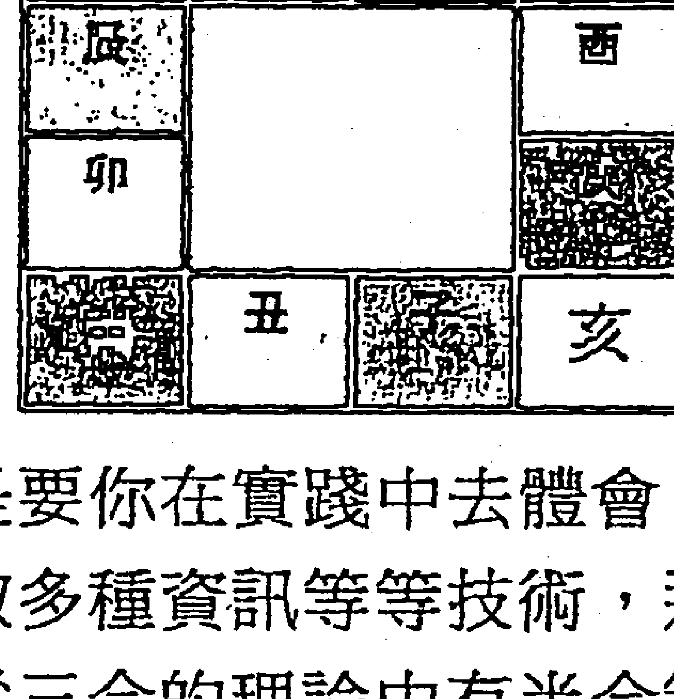

「這個三合有沒有什麼道理啊？」

「我們以申子辰合水局為例，申是不是水的長生之位啊，子是水的帝旺之位，辰是水的墓庫，三個是水的生旺墓位，正好合成水局。其他幾個也是這樣。」

「倒真是這樣，不過，為什麼沒有合土局呢？」

「一方面是水土同宮，另一方面，十二地支裡有四個土，其他地支只有兩個。六沖六合裡土的作用比較多，三合裡少個土也算是平衡一下吧。」

「哦。這是三合。三合成局的條件是什麼呢？」

「三合成局最好是三個爻都發動，或者是與日月合成局，這就是最基本的應用。但三合局最常見的是用來定應期。三合局少一個的話，這就叫虛一待用，等空的那個日月的時候就可以成局，就是應期了。」

「哦。三合局很難運用吧。」

「是的。三合局運用條件仍然有一些爭議。其實大多數情況下，即使不論三合局，也常常可以斷得差不多。」

「那我就先學著吧。」

**知識補充：** 三合局論述不多，在運用中的確爭議頗多，在一些當代老師論述中衝突之處甚多，並不甚令人滿意，還是要多以實踐為重。

## 第三十一節　明動暗動

「然後我們講講暗動。在前幾節裡，日建的功能中我們說了一個暗動。我們下面把暗動稍詳細講講。」

「好啊，你就講講吧。暗動，還真有明動不成？」

「卦裡已經現出來的動爻就是明動，有一些靜爻可以當動爻來看，就是暗動了。」

「哦。講講吧。」

「其實暗動很簡單，就是日建沖旺的靜爻，那就是暗動。比如今天是寅月巳日，那麼對於亥爻來說，月合為旺，再有日沖之，那麼就是暗動了。暗動跟普通的動爻沒有力量上明顯的不同，在吉凶斷上是可以使用的。結合上次我們說的那個層次說法，暗動與動爻都屬於第三層次，都高於靜爻，而低於變爻。」

「那麼，如果日建沖休囚的靜爻呢？」

「其實很好想，如果是一塊鐵，我用錘子給它進行衝擊，它就飛出去了；如果是個雞蛋，它就碎了。日建沖休囚靜爻，叫做日破，這個爻也就無用了。」

「哦。那麼如果日建沖動爻呢？」

「這個野鶴老人有自己的見解。在他之前的很多書上，說日沖動爻為散，就沒有作用了。可是野鶴老人認為，我們搖一個卦出來，其最重要的資訊就是體現在動爻上，如果動爻沒用了，那麼資訊怎麼表現呢？所以他一直在強調『神兆機於動』，就是說主要的資訊要圍繞動爻展開，而且他用大量的斷驗證實，動爻是不會被日沖所沖散的。」

「哦。暗動也不是太複雜嘛。」

「還有個很重要的一點，那就是沖空為暗動。日建沖旬空的靜爻，即使靜爻為休囚，只要日建不是連沖帶克這個靜爻，那麼這個靜爻仍然算是暗動的。」

「哦……那就沒什麼問題了。」

知識補充：暗動的條件，在《增刪卜易》中講得並不夠明確，有些現代人的講義解得倒是詳細，但老瀾以為尚不太妥當。暗動的情況是比較複雜的，許多老師講的內容爭議頗多，還要在實踐中去探索。

## 第三十二節　反吟伏吟

「既然沒問題，我們就進入下一段，講講反伏。」

「反覆無常我倒知道，什麼叫反伏啊？」

「反伏，是反吟和伏吟的簡稱。你應該注意到一件事，震和乾都是從子開始納，也就是如果一個乾的三爻卦變化成震的三爻卦的話，那麼所有的地支就都沒有變化。這樣看上去變了，實質卻沒有變，是不是有一點折騰人的感覺呢？這樣一種卦變地支卻不變的現象就叫伏吟，它的意思就是痛苦。」老瀾道。

|  |  |  |  |
|---|---|---|---|
| 一 | 父母戌土 世 | 一 | 父母戌土 |
| 一 | 兄弟申金 | 一 | 兄弟申金 |
| 一 | 官鬼午火 | 一 | 官鬼午火 世 |
| 一○ | 父母辰土 應 | -- | 父母辰土 |
| 一○ | 妻財寅木 | -- | 妻財寅木 |
| 一 | 子孫子水 | 一 | 子孫子水 應 |

「喔，乾和震都從子開始納，你這麼一說倒還真有點意思啊。」

「伏吟就是痛苦，在一個卦裡只要看到伏吟，常常就可以斷這個人在受折磨和痛苦。」老瀾笑道。

「陰陽平衡，為什麼乾和震納的一樣，坤和巽納的就正好是對著的呢？」

「是啊，你注意到這一點了。如果一個坤卦變成巽卦的話，是不是所有的爻都是回頭沖的呢？」

「是啊，醜未沖，巳亥沖，卯酉沖嘛，換到上卦也是這樣。」

|  |  |  |  |
|---|---|---|---|
| 一 | 父母戌土 | 一 | 父母戌土 應 |
| 一 | 兄弟申金 | 一 | 兄弟申金 |
| 一 | 官鬼午火 | 一 | 官鬼午火 |
| 一○ | 兄弟酉金 應 | -- | 妻財卯木 世 |
| 一○ | 子孫亥水 | -- | 官鬼巳火 |
| -- | 父母醜土 世 | -- | 父母未土 |

「對。這種變出來的卦，當然是指三爻卦，每個爻與之前的動爻相沖的情況就叫做反吟。」

「這樣形變質也變，而且變得很劇烈，又是什麼意思呢？」

「說得好。變得很劇烈，劇烈的變化，頻繁的變化，是不是就是反覆呢？」

「好像可以這麼講。」

「對。反吟就是反覆的意思。如果測一件事出現了反吟，那麼就意味這件事的過程中並不順利，可能會事多反覆。」老瀾道。

「原來實際應用中變化這麼多啊。好複雜。」

「我們再講伏吟。」

「不是反伏嗎？哪裡來的飛伏？」小盧問。

知識補充：關於乾震納的相同，坤巽納支相沖，有人認為這不合易理，因為父子納同支不合人道，母女相沖也不合人道。但古來就是如此納，而且有人用長子承父業、長女待弟妹如母，且多與母相對來解釋，也勉強可以通。在其他一些納支的方法中，想出了另外的方法來避免這樣的問題。但避免了這種人道與易理的差別後，卻也少了反吟、伏吟兩種應用，並不能說是種好事。而且反吟與伏吟的應驗還是比較高的。我們這裡講的反吟伏吟只是爻的反吟與伏吟，另外還有卦的反吟，《增刪卜易》中並沒過多涉及，我們也不講，《易隱》中有講的。

## 第三十三節　飛神伏神

「飛伏？不是反伏嗎？反吟與伏吟……」小盧納悶。

「不。這是飛神與伏神。」老瀾笑道。

「什麼？飛神，伏神，怎麼又來兩個神？」小盧問道。

「我們以前提到過取用神的問題。比方說測父親取什麼為用啊？」

「取父母爻啊……我學了這幾天了，總得知道了吧。」

小盧笑道。

「可是，有些卦是沒有父母爻的啊，你怎麼辦呢？」

「沒有的話……是啊，前幾天我畫六十四卦全圖的時候也想到這個問題，怎麼辦呢？」

「這就需要用到伏神了。」

「什麼叫伏神呢？」

| 乾為天（乾宮） |  | 天風姤（乾宮） |  |
|---|---|---|---|
| — | 父母戌土 世 | — | 父母戌土 |
| — | 兄弟申金 | — | 兄弟申金 |
| — | 官鬼午火 | — | 官鬼午火 應 |
| — | 父母辰土 應 | — | 兄弟酉金 |
| — | 妻財寅木 | — | 子孫亥水 |
| — | 子孫子水 | — | 父母丑土 世 |

「我們看一個例子。比方說你占得『天風姤』卦。如果占妻財，取財爻為用神。但姤卦這個卦，是乾宮的卦，乾宮是金，金克木，要以寅卯木爻為妻財，而這個卦的六爻中並沒有寅卯，也就是說，用神不上卦。那樣的話怎麼取用呢？如果是寅卯月日占，就可以在月日上取用。」

「哦……這是伏神？」

「不，這是取日月為用。如果不是寅卯月日呢？因為這是一個乾宮的卦，那麼我們就看乾卦的妻財在哪裡，在二爻，我們就可以說妻財寅木伏在二爻。這個寅木就是伏神。原卦中的二爻就是飛神。」

| 天風姤（乾宮） |  |  |
|---|---|---|
|  | — | 父母戌土 |
|  | — | 兄弟申金 |
|  | — | 官鬼午火 應 |
|  | — | 兄弟酉金 |
| 妻財寅木 | — | 子孫亥水 |
|  | — | 父母丑土 世 |

「哦……這樣就是飛神和伏神了。」

「是的。」

「那麼占出這樣一個卦，用神不上卦，要取伏神為用神的話，伏神的凶吉怎麼看呢？」小盧又問。

「首先是飛神與伏神的關係。飛神生伏神的話，當然是最好的。飛神克伏神就是差的了。其次就是看日月動變對伏神的影響。可以在飛伏關係的基礎上看伏爻的旺衰，把它當成一個靜爻來看就差不多了。」

「哦……就是說伏神還是很難掌握的了？」

「不是很難，但只是有點難度而已。對於伏神飛神，許多書有不同的爭論。野鶴老人認為乾脆再占一卦，省得還要取伏神……」

「哦……」

知識補充：關於用神不上卦，日月取用，變爻取用，伏神取用，甚至是飛爻取用，各種說法不一，而且現在見到的大多數都以伏神為用，也就是增刪的方法。但在實際的應用中還是要靈活變通，《易隱》的飛爻法，有條件的可以學一學，但不要過分迷信，畢竟《易隱》中也有很多臆想出來的東西，還是多實踐為佳。

## 第三十四節　遊魂歸魂

「我們再講一點知識，介紹一下遊魂歸魂的內容。」

「遊魂歸魂，聽起來怪嚇人的。你不是說過遊魂卦為各宮的第七卦，歸魂卦為各宮的第八卦嗎？」

「是的，這就是遊魂卦與歸魂卦。你小子倒記得很清楚。」老瀾笑道。

「名字這麼古怪，有什麼含義呢？」小盧問道。

「遊魂歸魂是從京房十六卦變裡出來的名字，主要是『遊』和『歸』兩個字，可以延伸出很多內容。」

「我知道了，占到遊魂卦人就要死了。」

「為什麼？」老瀾納悶。

「遊魂了嘛，魂遊神外，當然就是死了，上課的時候開小差也叫遊神。」

「遊魂卦和歸魂卦常常是不能單獨決定吉凶的。如果占到遊魂卦就死，占到歸魂卦就活的話，六十四卦裡有八個遊魂、八個歸魂，人還不得死去活來多少回啊！」老瀾笑道。

「是啊。」小盧也笑了。

「所以說要看吉凶仍然是要以爻為主。畢竟納甲筮法也叫做六爻預測學，說到底，六爻預測學一切以爻為主。我們說的用神、元神、忌神、仇神等都是對應的爻，其他的內容都是用來提取資訊的，不應當用來直接決定吉凶。」老瀾笑道。

「那麼遊魂歸魂應當怎麼提取資訊呢？」小盧問道。

「比方說，占到遊魂你可以從這個『遊』字上下功夫，想出很多的情況，比如剛才說的開小差啊，魂不守舍啊，比如精神空虛啊，病重昏迷啊等等。歸魂也可以從『歸』字上下功夫，想出很多。這些內容都是要自己去體會和實踐的。當然，所有的東西都必須以用神為主。」

知識補充：關於遊魂歸魂，王虎應的《六爻卦例說真》裡專門講了一些理中藏象的內容，大家可以看一下，我們的周易典籍裡都有的。雖然他的結果並不超出卦理，但斷到那麼飄逸的程度，的確是功力不淺，拋開一切懷疑，仍然是值得我們學習的。

## 第三十五節　進神退神

「咱們講講進神與退神吧。在《增刪卜易》裡野鶴老人用了很大的篇幅來講解進神退神的。」

「又來兩個神，講吧講吧。」

「進神退神呢，很簡單，比如寅化卯，同樣是木爻，順著十二地支的順序變化，而且五行不變的話，那就叫化進，也就叫化進神了。」

「哦。那麼退神就是相同五行逆著變化嘍？」

「對。對於土爻，丑化辰，未化戌是化進；戌化未，辰化丑為化退。」

「那麼，辰化未，戌化丑呢？」

「呵呵，你找一下卦，根本沒有辰化未和戌化丑的情況。所以要注意，一看到一本書裡講進神退神的時候講辰化未，那這本書就一定有很多內容是主觀臆斷，這種書還是少看為好。」

「哦。對了，亥化子和子化亥，應該怎麼看呢？」

「我個人的感覺，應該是亥化子是化進；子化亥是化退，因為子午卯酉是四正，寅巳申亥是四偏，偏化正為化進。這個在手上排的時候很清楚的。」

「哦。這麼講也有道理啊。化進化退有什麼含義呢？」

「化進呢，就是說爻的力量變大；化退呢，就是爻的力量變小，這也就是爻的進退了。」

|  |  |  |  |
|---|---|---|---|
| — | 子孫戌土 | — | 子孫戌土（應） |
| — | 妻財申金 | — | 妻財申金 |
| — | 兄弟午火（世） | — | 兄弟午火 |
| — × | 兄弟午火 | -- | 官鬼亥水（世） |
| — ○ | 子孫辰土 | -- | 子孫丑木 |
| -- | 父母寅木（應） | -- | 父母卯木 |

「另外，什麼時候看化進化退呢？」

「化進化退，按野鶴老人的說法，有大進、不進、不及進；大退、不退、不及退。一個人狀態一般，當然能退也能進；但如果這個人特別弱的話，那麼哪還有進退可言呢？如果這個爻暫時很弱但還是有氣的話，那麼就要等它旺起來再進；如果這個爻日月都在幫助著它，那麼它想退也退不了，這就是不及退。簡單地說就是這個樣子，在具體的運用中還是要自己體會才行。」老瀾道。

「哦。好複雜。」

「對，因為複雜，所以六爻要瞭解很容易，要學會就難得很了。」

知識補充：關於爻的進退，野鶴老人提出了四點，今人劉大鈞教授在其著作《納甲筮法》中將其總結為三點，這裡取的是劉教授的說法。進神與退神是六爻中常用的內容，還要多加實踐用活才好。

## 第三十八節　題頭應期

「今天我們一起把《增刪卜易》裡『各門類題頭』這一章看一下。我說你聽吧。相關的內容我們之前都已經講過了。」

「好的。」

「首先是用神的旺衰。有好幾個方面：臨日月，或遇日月動爻、變爻生扶（見『四個因素』），或用爻遇長生（見『生旺墓絕』）、逢帝旺，皆謂之旺。」

「然後我們再來看用神的變化，這有化吉和化凶之分。凡用神元神，動化回頭生、化長生、化帝旺、化日月，皆為化吉。凡用神元神，動化回頭克、化絕、化墓、化空、化鬼、化退神，皆為化凶。」老瀾喝了口水，「然後是三墓，是入日墓、入動墓、動而化墓。這些內容我們之前都講過了。現在只是系統地稍微理一下而已。」

「哦，這番話裡好像把前面很多的東西都綜合起來了。」

「是的。然後我們再來看應期。其實應期是很難的一個問題，很多題目都是談應期，但的確是很難，我見過一些高手，他們斷起應期來也常常出錯的。」

「嗯，日期和時間常常涉及到多方面的東西，相信看起卦來也會挺複雜。」

「是這樣的。但我們可以講一講最基本的應期看法。用神是靜爻的話，就是逢值逢沖；動爻的話就是逢值逢合。太旺的話，就需要入墓或者是逢沖的日子；衰絕的話，就是要遇生遇旺。如果是入了墓的話，那麼就是沖墓或者是逢值的日子。月破的爻，最好就是逢值；旬空的爻，就需要逢值或者是逢沖。如果是世爻衰，但是有元神來生，那麼我們就看元神有用的時間。依此類推就是了。應期是個大難題，慢慢悟吧……」

知識補充：關於各門類題頭，我們前面已經講得很清楚了。而應期的確是個大難題，僅憑書中的斷語很難作出比較準確的判斷。老瀾的經驗是一切以用神為準，體會卦中的陰陽變化是最重要的，僅憑斷語是斷不好卦的，老瀾再次強調一下。

#### 尾聲

小盧忽道：「且慢，我忽然發現一個問題啊，你給我講了這十幾次增刪，卻始終沒有給我分析過一個卦例，空談理論，我怎麼學得會啊……」

「呵呵，本來就是想給你介紹一下六爻筮法的基礎知識。真的學習，絕不是靠一個短短的講解就行的。而且六爻，好奇的話，你可以看一點輪廓的介紹，但不要在細節上鑽研，因為實在是博大精深。許多人認為五年才能小成，十年才能大成，而野鶴老人四十年的經驗總結出來，我們仍然看到其中有一些錯誤。」

「那麼我如果想學呢？」

「易不是好奇就能學的。每個人都這樣，當成功的時候，就會覺得一切很順；但當失意的時候，就常常懷疑自我，懷疑命運，有一種消極避世的情緒。這時候就很容易想學易，或者是讀一些佛經啊、道家的經書啊。這本來是很正常的，但這樣也是不可能學好的。學易需要的是平和的心態，而不是為了得到平和的心態而去學易。」

「那麼我到網上自己去看吧。」

「現在網上的確有許多朋友開辦了免費的六爻學習班，或者是六爻教學的QQ群等等。可是我們真正應該思考的是：我們的確有必要傳承和發展我們的六爻術，但傳承我們要做的是，讓更多的人來認識六爻和知道六爻，卻不是通過我們的努力使將來四大主課變成語文、數學、英語、六爻。我絕不希望這樣。六爻是一門學問，卻不是一門人人可以學和應該學的學問。你也是這樣。所以我可以向你介紹很多東西，卻要努力把握這個度。聽我的課，你學不會六爻，卻可以比較全面地認識六爻。呵呵。」

「那咱們還講嗎？」

「呵呵，講到這裡，你已經基本瞭解納甲筮法了。以後的學習就要以自己為主了。咱們老祖宗的東西如果讓我教成了填鴨式教學的話，那就一點意思都沒有了。」

一席話說得兩個人都笑了起來。

#### 附錄

## 黎光先生易學文章小集

### 六爻的三層功夫

讀者來信：尊敬的黎光老師，你好！您的網易博客寫得真不錯，目前市場上關於您的書籍很多，想在這裡提個小小的建議。

目前關於您書籍的盜版、翻版現象很多，這給很多讀者帶來了困惑。能否將您的書籍整理成清單，將各本書的要點及正版區別整理於您的博客，這樣豈不是方便大家購買和辨別。最好像您在博客裡面寫的個別書本一樣，告訴我們購買網址，這樣就更好了。畢竟網友和易友朋友想看您書的心情是一樣的，只是不知道真假和購買管道罷了。

另外，六爻的學習方法，還建議您專門寫個文章提示一下後學。

黎光回復：圖書的真假、要點與購買方法，詳見我的博客。

對六爻的研究學習，可參考以下幾點。學六爻占卜，初步而言，有三層功夫：一層功夫為五行生克之術，學成之後，可知吉凶，辨得失，曉應期；二層功夫為八卦形象之法，學成之後，可分陰陽，明細節，識進退；三層功夫為天人合一之學，學成之後，可通人情，修身心，登天道。

- 第一層功夫：
  1. 讀《卜筮正宗》，細閱十八問（參考《六爻三大技法》）；
  2. 買《增刪卜易》，全文細讀；
  3. 讀《卜筮正宗》的黃金策（參考《隱易千金斷》）。

- 第二層功夫：
  1. 讀《易隱》（參考《易隱高層斷法》）；
  2. 讀《六爻預測學》，通過現代卦例來學習；
  3. 讀《筮學通考》，瞭解筮學淵源；閱《易經與人生運程》，瞭解實斷與身命占法。

- 第三層功夫：
  1. 體味身內爐火之升降，觀察每日行為之正偏；
  2. 讀三言，閱二拍，知人情冷暖，曉世態炎涼；
  3. 明孔子，懂老莊，習諸子百家，嘗五味雜陳。

以上功夫，一層為術，久習可識法；二層為法，久修可成學；三層為學，久悟可入道。依此修煉，則天干地支，盡配五行；陰陽八卦，各聯曆法；春夏秋冬，暑熱寒涼，生長收藏，生老病死，盡在自身的緘默體悟之中。久而久之，則世事動遷之態，盡在其心；陰陽變化之理，盡得其妙，天下之萬事萬物，無不知矣。

二零一三年五月三日

### 六爻的三個時代

偶向江邊采白蘋，還隨女伴賽江神。眾人不敢分明語，暗擲金錢卜遠人（唐代詩人于鵠所作《江南曲》）。

自從京房易學在西漢出現以後，數千年來流傳不衰，歷代都有學者對此術進行研究、充實、修正、提高，其著作層出不窮。如晉代的《洞林》、唐宋時的《火珠林》、明代時的《斷易天機》《卜筮元龜》《易林補遺》《易冒》《卜筮全書》，以及前清的《易隱》，乾嘉之後的《增刪卜易》與《卜筮正宗》。

以上筮書雖都源於西漢京房氏，同屬火珠林法的範圍，但其各朝代的筮法風格並不相同，其筮斷風格主要可分為三個時期。現一一介紹如下。

第一時期，即是流傳於西漢以後，用的即是《京房易傳》所示的預測之法，其簡稱《京房易學》。該法將陰陽五行日月星辰納入卦中，用數學積算的模式推斷災祥。其易學體系共納陰陽五行、干支、卦變、世應、六親、星宿、節氣、五星、建候、消息、飛伏、積算於其中，天地人三才合一，為當時第一大法。

第二時期，即是流傳於晉代到前清之間，其所用即是《火珠林》所示的推斷方法，其簡稱《火珠林筮法》。其代表作為晉代的《洞林》、唐宋的《火珠林》、明代的《易林補遺》《易冒》《斷易天機》《易隱》。

第三時期，即是流傳於清代乾嘉之後，直到如今，我們的六爻學者均是用的這種推斷方法，其簡稱《納甲筮法》或《六爻筮法》。其最早的代表作即是清代出現的《增刪卜易》《卜筮正宗》二書。而現代學者所著之說，更是層出不窮。

現代學者多以為現今流行的六爻筮法即是古典的火珠林法，其實不然。古典火珠林筮斷區別於現在流行的六爻筮法的特點即是：兩者的取用神與推斷方法均有所不同。

如《火珠林》一書開篇的六親根源節中即言：卦定根源，六親為主；爻究旁通，五行而取。其意即為：根源者，乃八宮之卦主也。而原有六親旁通者，六爻之飛象也，而上下相乘。五行者，金木水火土也。而定四時六親者，六宮也。六爻，父、子、兄弟、妻財、官鬼。定一宮管八卦，七卦俱從一宮出。旁通者，上下宮飛象六爻也。蓋本宮在下為伏之六親，旁宮在上為飛之六爻，如六壬有天盤、地盤也。先看六親之下，後看六親之上，所乘得何爻，而辨吉凶存亡也。

以上所說甚為詳盡，卦定八宮，本宮為主，乃是根源，由此本宮而衍生演變出其他七卦，其他七卦之下也各伏本宮之六親爻，故其取用神用本宮，斷吉凶也用本宮。這點與現代六爻筮法只用主卦六親各爻顯是不同。而《京氏易傳》亦云：「陰陽變化往往處於隱顯、有無、往來等狀態。顯見者為飛，隱藏者為伏；有者為飛，無者為伏；來者為飛，往者為伏。」此語正是火珠林法的《六親根源說》的淵源所在。而後來的《易隱》等著作在其《身命占》中經常也是取其本宮各爻來斷卦，本宮用神為真，非本宮用神（即使其是主卦用神）為假。主卦動爻可以帶出伏下本宮各爻而動，然後以此本宮動爻來斷吉凶得失，此完全繼承的是《火珠林》的斷法。

### 以三個筮法時期的筮斷風格來看

#### 一、《京房易傳》預測體系（西漢時期）

京氏易學雖然部分書籍已經遺失，但從京氏的部分遺留可以看出其筮斷的風格。

京氏在第一封奏摺中提出：

「辛酉以來，蒙氣衰去，太陽精明，臣獨欣然，以為陛下有所定也。然少陰倍力而乘消息，臣疑陛下雖行此道，猶不得如意，臣竊憚懼……乃辛巳，蒙氣復乘卦，太陽侵色，此上大夫履湯而上意疑也。己卯庚辰之間，必有欲隔絕臣令不得乘傳奏事者。」（《漢書》京房傳）

在第三封奏摺中，京房又提出：

「乃丙戌小雨，丁亥蒙氣去，然少陰並力而乘消息……戊子益甚，到五十分，蒙氣復起，此陛下欲正消息，雜卦之氣並力而爭，消息之氣不勝，強弱安危之機不可不察。己丑夜有還風，盡辛卯，太陽復侵色。至癸巳，日月相薄，此邪陰同力而太陽為疑也。臣前白九年不改，必有星亡之異。臣願出任良試考功，臣得居內，星亡之異可去……」

「陛下不違其言而遂聽之，此乃蒙氣所以不解，太陽亡色者也。臣去朝稍遠，太陽侵色益甚，唯陛下勿難還臣而易逆天意。邪說雖安於人，天氣必變，故人可欺，天不可欺也，願陛下察焉。」

#### 二、《火珠林法》筮斷體系（唐宋元明時期）

火珠林法的主要筮斷方法即是用本宮，也即是火珠林所講的「卦定根源，六親為主，爻究旁通，五行而取」。這與現代的六爻方法顯是不同。在現代的六爻筮法中，只要主卦出現六親用神，即可直接吸收來進行推斷，只有主卦沒有用神的時候，方取本宮的用神。而火珠林這個方法卻是大為不同，在使用火珠林推斷卦象中，即使主卦出現用神與動爻，火珠林法也不用，而是直接取本宮的六親用神。學者由以下二例可知火珠林之法區別於現代六爻法的所在。

- 1. 一日占子病吉凶，得水雷屯卦。

| 本宮伏神 | 水雷屯 |  |
|---|---|---|
|  | 兄弟子水 | -- |
|  | 官鬼戌土 應 | — |
|  | 父母申金 | -- |
|  | 官鬼辰土 | -- |
|  | 子孫寅木 | -- |
| 子孫寅木 | 兄弟子水 | — |

此卦如果以近代的六爻筮法推斷，應該取二爻的子孫寅木為用神，但是因為這是宋元時代的中期火珠林筮法，所以主卦有子孫爻，卻不能去用它，還是要查閱本宮的子孫爻。本宮的子孫爻伏藏在初爻兄弟子水下面，受兄弟水相生，故斷吉利。後果然應驗。

- 2. 妻有孕，占吉凶。  
  秋月　壬午日占得蒙之升。

| 本宮伏神 | 山水蒙 | 地風升 |
|---|---|---|
| 兄弟巳火 | 父母寅木 ○ | 妻財酉金 |
| 子孫未土 | 官鬼子水 -- |  |
| 妻財酉金 | 子孫戌土 -- |  |
| 官鬼亥水 | 兄弟午火 × |  |
| 子孫丑土 | 子孫辰土 — |  |
| 父母卯木 | 父母寅木 應 -- |  |

別人說道：主卦兄弟發動克妻爻，父母發動克子爻，必定是母子都有大災。

我心裡很是恐懼，使用中期火珠林筮法查閱本宮用神，看到本宮子孫伏神與主卦的伏神五行相同，為比和吉利。本宮父母爻又沒有發動，不克本宮的子爻，而且日辰臨火，又生子爻，所以孩子必然無災。本宮妻爻伏於主卦世爻之下，受子孫土相生，為吉象，雖然也有本宮的兄弟發動，但卻得本宮三爻鬼動制之，妻爻有救，所以妻子也必然無災。

後果於九月（沖辰現本宮子丑）己卯日（沖本宮妻爻）巳時生男（子孫陽卦陽爻），母子平安。

#### 三、《納甲六爻筮法》體系（清代之後）

晚期的筮斷體系即是現今流傳的六爻筮法，如今已極為普遍，舉例如下。

求測者性別：女　所占事情：占丈夫疾病  
申月　戊辰日

| 離宮：天火同人 | 離宮：離為火 |
|---|---|
| 子孫戌土 應 | 兄弟巳火 世 |
| 妻財申金 ○→ | 子孫未土 |
| 兄弟午火 | 妻財酉金 |
| 官鬼亥水 | 官鬼亥水 應 |
| 子孫丑土 | 子孫丑土 |
| 父母卯木 | 父母卯木 |

斷卦：取官鬼亥水為用，用神逢月生為旺，又得卦中動爻相生，此為用旺逢生，所以吉而無凶。

### 京氏易、火珠林、六爻三法占卜解

研究京氏言：京房在易學史上，是一個傳奇式的悲劇人物。焦氏云：得吾道以亡身者，京生也。果然。傳世《京氏易傳》，有四部叢刊本、四庫全書本。我的四庫全書這張盤壞了，讀不了，所以僅讀四部叢刊本。民國有徐昂《京氏易傳箋》，未見。

研讀經年，心得如下：

- 1）漢代，有《連山》《歸藏》《周易》並行，這一點，從易緯可以看出來。京房納甲，應該是根據《歸藏》演算法創制的，是《周易》和《歸藏》的統一體。
- 2）荀爽言升降，虞翻言旁通，《火珠林》亦言旁通。焦循《易學三書》全以旁通升降為說，今本《周易》卦辭、爻辭、彖辭、象辭可以互證，但不取京房納甲法。
- 3）京房八宮卦，由爻變升降而來。飛伏，其本質就是旁通。換而言之，焦循的旁通，就是京房飛伏條例、虞翻旁通條例的擴展和系統化。
- 4）今本《周易》以二為中和，五為中正，是二五為君子之道也。京房儒生，繼承了這一點。所以，凡卦之吉，升降必二五先行。
- 5）《京氏易傳》有六親，無六神，但有五星二十八宿。以其五行屬性算定吉凶。故今所用之六神，來歷不詳，或為唐以後數術家添加，本非京氏所有。
- 6）京氏月建、積演算法，與今天的月建、日建不同。京房的日建，也就是積算，是動的。月建主月，積算主日。
- 7）京房卦氣說，與《乾鑿度》不同，與孟氏不同，用之皆驗。

**網友問：** 大師您能否說說，京氏積演算法，舉兩個卦例？

**研究京氏道：** 京氏古法，失傳已久，假以時日，或可研究明白。目前頭緒不多，仍待研究。

**簽者發言：** 京房是焦延壽的弟子，所以以京房易及其演變的六爻預測，加配焦氏《易林》的對斷共同分析，則是象加理，直接傳承民國尚秉和先生的斷法，使預測更為多面，比著結合周易卦辭更為合適。

**研究京氏道：** 京房法，至今仍未完全明白，慚愧。焦延壽的方法，可能跟目前的《斷易鬼靈經》是一個脈絡，完全不看占時，只以得卦論。而且《易林》的一爻動法，似乎對梅易也有影響，這幾個關係比較大。焦氏，其實跟參考梅易斷法差不多，《易林》刻板一些，梅易靈活一些。

京房的體系非常複雜，複雜到一旦要運用京房的體系去運算，會非常耗費心力。京氏易排出的卦盤，已經讓人眼花了，要加入《易林》，可不容易。不過易兄的設想非常好，只要想個辦法解決一爻動與亂動的關係即可。

**簽者言：** 易兄有時間不妨試試，京氏古法可見此例，少見應用京氏易學斷法的例子，版主可做參考。

先生在網上使用《筮學通考》一書介紹的三種納甲筮法（京房易、火珠林、當今六爻）公開為網友「易初」預測官運。

絕對的經典：梁光先生給我預測工作的回饋！！——「作者：易初」

丙午月，戊午日

| 坎宮：地水師 |  | 震宮：地風升 |
|---|---|---|
| 一 | 父母癸酉金應 | 一 父母癸酉金 |
| 一 | 兄弟癸亥水 | 一 兄弟癸亥水 |
| 一 | 官鬼癸丑土 | 一 官鬼癸丑土世 |
| 一 | 妻財戊午火○ | 一 父母辛酉金 |
| 一 | 官鬼戊辰土 | 一 兄弟癸亥水 |
| 一 | 子孫戊寅木 | 一 官鬼辛丑土應 |

中間有「X →」標記，表示卦變關係。

### 關於易初兄工作的預測結果

- 1. 使用京房易卦來斷：得鬼易，主拘泥停滯。世為卦主，居於三公之位，而得上爻宗廟政策佐之，此為政策昏暗。京房云：三公居世上爻宗廟為，應君子以待時，小人為災。所以易初占得此卦，若易初兄作君子的話當可退隱避亂，若為小人的話當可趁時而動。五星入師卦，世爻歲星木司生又主萬物，所以易兄暫當效隱士之流，敬開心懷參玄悟易，不入名利之場。歸卦辰午酉亥自刑俱見，京氏受刑見害，氣不和也。而亥水支位在五，當有領導憤恨之事，世下所伏建侯王辰辰午自刑，值於清明，故致辰月清明，易兄當因官事耗散錢財，所積算為官，財官相生，節為秋分，至時必有好處。
- 2. 用火珠林法斷：占公者以官為用，以父衛之，此卦本宮有官無父，少其護衛，在子孫寅月必有損官傷職之憂。本宮官伏兄下，主同事欺凌，人不一心多虛詐，更怕賺錢。世爻化出父母克子衛官，卦身亦在申，待申酉月必有工作喜訊傳來。世爻自動化父，至時也可自去見貴，必有好處。
- 3. 用六爻斷：兩鬼夾世，臨身多有憂，占公者有被他人謀騙之事。世得初爻生自己，得群眾好感，不得領導之心。卦中一爻兩官，或自己工作一地而涉及兩個部門業務（或金融後勤之類），內卦衰而外卦旺，當可去舊而圖新。外官下伏申金，世動化酉金，至申酉月必可圖謀成功。

以上卦是我搖的，請黎光先生為我斷的，真是厲害！首先是寅月傷官損職一事屬實，確有此事。我率領的一部門工作被合併入別人的部門。在申月己巳日我部門又重新分離出來，初步達到了我的願望，可是我個人相應的待遇還沒有恢復。

其次是在己酉月丁亥日午時得到通知：我自己又被領導安排到一個和我原部門工作不相干的部門工作，工作許可權比以前大點，而且我的待遇也恢復了，可是實在太累，去了不到十天就病了一場，這不剛有點好轉。但是無論怎麼說，領導說鍛煉也好，重用也罷，我的工作環境確實發生了變化，雖然累，是朝好的方向變化。

> 「卦中一爻兩官，或自己工作一地而涉及兩個部門業務（或金融後勤之類）。」

此斷語兄真是神斷，我目前工作崗位是全市的公用電話管理和電話卡的銷售。以前電話卡的銷售確實不在一個部門，剛合併過來，而且確實是金融之類的。我在申月想我已經遂心如意，可是在酉月連我自己也沒有想到去這個部門，呵呵，我真是佩服的……

研究京氏道：大喜大喜，初看一過，此高手所用《京氏易》，傳神之處很多，可圈可點，不過有三個主要的工具沒有使用，不知何故，就是星宿、建候、積算。若有師傳，當不致如此；若無師傳，可稱聰慧異常了。據小的所知，京氏易在明朝還流傳在民間，不知現在是否還有傳人。回頭再好好研究，多謝多謝！

研究京氏道：原來建候、積算也用在其中了，現在條例清楚，京氏斷法的奧妙，可以學到很多了，再次表示感謝！

看來黎先生斷卦，確實是京氏一脈了，必有師傳。有了此卦，京氏的奧秘，小的幾乎都明白了，呵呵。

近來忙於複習，準備考博，他日好好整理，再參考《筮學通考》一書，厘定條例用法。考證問題不大，只是實戰檢驗，尚需時日。若僥倖成功，必送易兄一份，聊表謝意。

> 以上文章引自互聯網論壇《術數縱橫》

### 《京房易》的建候與積算

魏氏來信：黎老師您好！我是95年開始接觸六爻的，2002年正式學習六爻預測。現在學習過程中確實遇到了很多的問題。歸結起來，大的方面主要有以下幾個：

- （一）關於京房易學中的建候積算在六爻中應用的問題。我仔細研讀了老師書中的那個用京房易解卦的卦例。老師主要是用世爻所臨的建候和積算干支來解卦的。我的問題是：其他爻所臨建候積算干支是否可以在預測中應用，以及如何應用？關於積算，在《易隱》中有過一個例子，似乎是推步而用。我查找了一些資料，但是還沒弄清楚，京房仙師設計建候和積算到底是做什麼用的呢？這個問題困惑我至少3年了。呵呵；後學資質愚魯，關於建候和積算的問題百思不得其解。
- （二）關於神煞在六爻和六壬中的應用的區別。從《易隱》中可以看到，《易隱》中很多處都應用了六壬理論，常常看到「軍法賦云」之類的話。但是六爻和六壬的神煞名同而推法異，不知道到底該以哪個為準繩。真誠地向老師請教和學習。

此致敬祝好

後學：魏生  
2010-12-16

黎光回復：魏先生您好！神煞的作用，我曾在2003年香港出版的《隱易千金斷》中講過，大概是用大神煞含小神煞，測某事找某神煞，做五行生克之輔，不知您有何意見。

《易隱》一書在文中及參考資料中提到了《六壬畢法賦》，這本書是宋朝凌福之撰。

> 關於這本書，文中有這樣的引用。《軍法賦》曰：病符克宅全家患，值月之生氣者尤闔家病也，值月之死氣者必死也，人口爻帶虎鬼動者尤驗。若卦內無此二用者，以分爻四五爻及官鬼爻為用也（出於《軍法賦》《應鏡藥》二書）。《軍法賦》注曰：德加爻臨身，出官貴爻者，必登高甲，德者得也，爻為天門。《軍法賦》曰：凡晝占得夜貴日脫氣，凡尊被貴人援薦也。《軍法賦》曰：天醫生世者，良醫；天醫克世者，庸醫。日辰克醫者，醫學不精；醫克日辰者，用藥不當也。世爻用爻屬金，天醫在巳者效也；世爻用爻屬木，天醫在亥者效也；世爻用爻屬火，天醫在寅者效；世爻用爻屬水土，天醫在申者效也。

因為我很早之前看過大六壬，似乎在大六壬中沒有世應卦爻之說。所以，《易隱》的引用到底是真引用，還是虛構，也請您不吝指點。

另外，《京房易》作為象數易學的早期作品，京房仙師首先將天、地、人、時間（古代節氣）、空間組成在卦裡面。京房仙師將其作為一種以易論政的學問來使用，所以我們看漢代京房的奏摺，沒有關於任何一件占測民事的例子，而都是作為一種論政的手段。所以在研究《京房易》時，我們更需要重視的是它的爻位、三公、陰陽、君臣、宗廟等，在相關京房奏摺中，我們看到的也是這樣。

> 如京房奏摺所言：辛酉以來……及辛巳……己卯庚辰之間，相信都是關於建候積演算法的應用。所以，建候積算這個構件模擬的是一個卦象中的時間，自然它也代表著一個卦的應期。

> 魏氏來信：真誠地感謝老師回復。後學曾經應用建候和積算的規則方法去斷應期。呵呵，準的是真準，不準的離題萬里了。實驗了不下幾百例，結果還是有些失望。我從京房對建候和積算的設計上看，似乎兩者也確實是斷應期之用。我想，不準的原因，可能還是自己基礎薄弱的原因多些。

關於建候，現在我看到兩種說法，一種是黃宗羲的說法：「已建，以爻值月……一卦凡六月也；曰積算，以爻值日，從建所止起日……」；末學這裡有一個問題——建候，到底建的是月呢，還是72候之候呢？如果是建「月」，又與《京房易傳》裡的內容有所衝突。如果是建候，那麼每候5日，用干支標示似乎意義不大。而積算的內容更是眾說紛紜了，有說一爻可以代表一時辰、一日、一旬、一月、一年……這和黃氏之說就離得更遠了。到底建候和積算它們所表示的時間單位是什麼呢？末學希望老師能不吝賜教。

六壬和六爻的神煞問題，末學是一頭霧水。拋除上文關於神煞起法的異同問題外，末學還有個疑問：六壬以月將加時起盤，神煞加臨其上，是否《易隱》中所提的《畢法賦》理論的用法，是先在一卦六爻之上加月將，然後再應用神煞論斷呢？我也試驗了一下這個方法，是有點準確率的。呵呵，我曾被那點準確率鼓舞過，不過，由於起法、神煞起法有異，我沒有再往下試驗。我敬佩老師對六爻之研究精深，故於上文向老師求教。

說句題外話：我懷疑火珠林法是六壬法的翻版，或者說兩者有同構之妙。在火珠林的開始——六親根源部分，作者曾舉過例子，說六親之飛伏如六壬之天盤地盤。相對《增刪》和《正宗》等其他六爻經典，我更喜歡火珠林，更信任火珠林。我看老師作品中的卦例中多用火珠林法，由此知道老師六爻已臻大成之境。

還有些問題，待後學整理後向老師一一請教。

呵呵，給老師添麻煩了，先真誠地感謝！

此致祝好

後學：魏生

黎光回復：魏先生您好！在《京房易》中，是以建候與納甲的生克刑害而論吉凶的，所以建候主要是以占斷吉凶為主。而積算是建候推算後的繼續排列，這就是以「應期」為主了。

黃宗羲的說法沒有問題，建候建的是月，也與節氣所標。而積算則是與年月日時相通。我想，這大概與近代六爻的應期占一樣：近應日時，遠應年月。

在建候中，每個卦的六爻共排列十二節氣、半年的時間，這是其中的不足。所以如果要將全部的節氣配上，那就要使用《京氏易》乾坤往復、飛伏說的內容了。這樣一來，一個卦就能排出一年二十四個節氣了，這樣才能為占斷應期提供幫助。

- 1. 《京房易》的起卦方法絕不是用銅錢或是時間起卦；
- 2. 《京房易》也未必是使用用神的。

至於您提到的，通過建候與積算來推算「應期」，我覺得如果沒有形成一個完整的體系的話，這是很困難的。

我們可以看到，《京房易》創編的起始就是京房用其議政的手段，所以其重視的是爻位偏正與阡合。如《京房易》中的否卦，世爻在三爻，為三公的位置，三公在世爻得位，居一卦之本，宗廟輔之，這是三公借政誇君的卦象，所以京房稱之為「政治為災」了。而且《京房易》中並沒有用神一說，其是以世爻為一卦之主，即一卦中陰陽變化的最前鋒。可以說，世爻就是京房易中的變爻，畢竟來說，七卦皆從一卦出，八純卦依次變爻，才轉出後面的七卦。所以在《京房易》中，爻位代表環境，如同現代斷卦中的卦名；世爻所臨五星論其進退形態；建候與納甲的生克刑害論吉凶（建候之始代表事之初，建候之末代表事之終，這樣與《大六壬》的三傳「初、中、末」有異曲同工之妙）；建候與積算變通推其應期。

就您第二個疑問來言，倒也給我不少啟發。從《京房易》建候之說的始與終，到《大六壬》三傳的「早中晚」，兩者名異而實同；並且《京房易》以建候與納甲的生克刑害論吉凶，而《大六壬》以天盤地盤的組成來論吉凶。仔細想想，建候豈不同於《大六壬》的天盤，納甲豈不同於《大六壬》的地盤？

再往後看宋朝《火珠林》的斷法，《火珠林》講「七卦皆從一卦出」「本宮伏神排出，與主卦的飛神的生克刑沖來論吉凶」，這豈不是說飛神等同於大六壬的地盤，伏神等同於大六壬的天盤？

所以我們可以得出這樣的結論：

| 漢代《京房易》 | 宋朝《火珠林》 | 《大六壬》 |
|---|---|---|
| 建候 | 伏神 | 天盤 |
| 納甲 | 飛神 | 地盤 |

以上這幾樣因素都是相通的。

您提到的《易隱》說的六爻之上加月將，由於我對《大六壬》瞭解甚少，不敢發表意見。

自從六爻占卜流傳開來後，別說是整理《京房易》的斷法，就是整理《火珠林》的斷法，現代也很少有人在做這個工作。

魏氏來信：老師好！讀您這篇留言，末學收益匪淺！

老師這句「世爻所臨五星論其進退形態；建候與納甲的生克刑害論吉凶，建候與積算變通推其『應期』」為我打開了一扇天窗啊，呵呵。萬分感謝！

我在實際預測的時候，起卦後都是主錯兩卦同看的。您說「要將全部的節氣配上，那就要使用《京氏易》乾坤往復、飛伏說的內容了。這樣一來，一個卦就能排出一年二十四個節氣了，這樣才能為占斷應期提供幫助」，我正是遵循這裡思路在做的。末學的感受是：且不說主錯卦同排24節氣，單就預測吉凶等一般事項來說，有時錯卦比主卦資訊明顯得多。這也讓我懷疑：金錢起卦和時間起卦是否要先選卦，然後再具體分析。至於何時用主卦，何時用錯卦，或者是任何時候都要兩卦並用，這個問題目前我還沒有確切的定論。我研究建候和積算，也是希望通過對二者的研究解決好這個問題。我想，如果是主錯並用，那麼很多六爻中的問題或許可以解決得更好，比如：《易隱》身命占中十二宮的排法問題，對真假六親的判斷問題，還有八宮卦系統和卦氣系統的綜合應用等等。老師對積算用於判斷應期的肯定，給了我一個更明確的方向。

我是幾年前通過一本港版的《筮學通考》知道並開始研讀老師作品的。也正是從這本《筮學通考》開始深入研讀《京氏易傳》及其他相關資料的。老師問我有沒有您的這本書，其實，老師是我研讀京房易學的領路人。老師的《筮學通考》這部作品，我覺得是對六爻預測學的一個總括，高屋建瓴，由這本書可以看出老師對六爻預測學研究之精深。

我在學習的過程中遇到的問題很多，希望能時時向您這樣的「明師」請教，只是怕耽誤老師的時間，這裡先向老師表示衷心的感謝。

此致祝好

後學：魏生  
2010年12月19日

### 沈景暘的卜卦

明朝《灌纓亭筆記》記載，永樂年間有一個江蘇人，叫沈景暘，善於用3個銅錢起卦，非常準，最風光的時候還給皇帝算過卦。

有一次，他的徒弟找他算卦，卦起出來了，他看了一下說：你剛吃過早飯沒？徒弟說：吃了。大師說：那這個卦不準，明早你再算吧。徒弟笑：我剛才騙你，沒吃。大師又說：你剛才應該坐在一個鐵亭子裡。徒弟說：沒有。那你還是明天再算吧。徒弟笑著說：我騙你的，有。大師說：如果是這樣，再過幾天你會生兒子，還有一個人給你一筆錢。等過幾天，等你生了兒子，再來感謝我吧。果然說哪兒準哪兒。最後大師死了，因為沒有兒子，他的神算也失傳了。

從這個例子可以看出三點，第一，占者可以自己起卦。第二，斷卦時需要提前驗卦，判斷這個卦是否對應。第三，面對特殊人群，伴君如伴虎，斷卦要引而不發，免得有手尾。

### 中國占卜學的前生今世

中國占卜學，按時間順序與特點來分，可分為巫、卜、筮、占、算五個時期，本文以戲說的方式，闡述其不同時期的不同特點。

#### 巫時期

在奴隸社會時期，人們便開始心理困惑，有了心理疾病，不知道自己將要走向何處；那時候也沒有心理醫生，所以只有通過部落巫師來給自己解答疑問。於是幾千年前的古人便選擇了卜占的方式來預測吉凶。

由於古人敬天畏神，預測吉凶總要給神仙上個貢品，顯得神聖點，於是一般就殺奴隸。殺完奴隸敬了天神後，就由部落巫師開始占卜吉凶。部落巫師的占卜方式就是手舞足蹈，然後通靈，開始喃喃自語，講些天神的預示。這個方法俗稱「叫魂」，是現代舞蹈的前身。

到了封建社會，朝堂上的幾個大人物開始商量了：雖說咱們還是官，但已經是封建社會了，咱們也要遵守封建社會的法律，為了長治久安，咱們算卦就不能殺人了，就從動物與植物裡面開始找吧。為了保持咱們在黎民中的神秘與權威，咱們的行為也要神秘點，咱們選擇的器材也要稀奇古怪點。由於烏龜為靈獸之一，所以成了動物中的倒楣蛋；由於筮草比較難找，所以也很不幸地從植物中找了出來。

#### 卜時期

所謂「卜」是指在龜背上灼燒出裂紋，在龜甲崩開的一瞬間，往往會隨著「卜」的一聲，然後就裂成了「卜」的紋路，這也就是我們把這種方式叫做「卜」的原因。古人觀察其走向來判斷一個事物的吉凶。

#### 筮時期

所謂「筮」則是將蓍草隨意地分開，作隨機的排列，得出不同結果的數位，再根據數位組合所代表的意義對照出吉凶的結論。

#### 占時期

卜筮的方法流傳了千把年，到了唐朝，開始有人提意見了。他對幾個算卦先生說：你們的占卜工具，從大的來說，龜雖然智商較低，但也是個生命，不能隨意殺生；而且現在都講究環保，你動不動就拔幾根草，這和國家林業政策也相違背。再從小的來說，用龜占卜，成本太高；用筮草占卜，速度太慢。

算卦先生們聽了，說：你的意見很好，特別是第二點。殺不殺生咱不管，主要是烏龜在咱們這個朝代還不太好找，龜殼用起來成本太高，一對龜殼成本就兩千塊，咱收顧客兩千塊，咱賺啥子錢；至於拔草算卦環不環保俺也不管，關鍵是用筮草占卜速度太慢，占卜一次至少要三小時，咱一天八小時的工作制，頂多幹三個活，還要加班一小時。

於是，幾個民間算卦先生一商量：咱用銅錢算卦吧。銅錢占卜用手一扔就能算卦，速度快，五分鐘一個卦，扔完之後收起來，洗洗更健康，下次還能用；只要不是品質不過關，用個百八十年是沒問題滴，而且這樣咱們也為創建回收型的循環社會做了點貢獻。於是，就有了後面驚天地泣鬼神、流傳至今的銅錢卦！

時有好事者憤而提出異議：古人說，筮草通靈，龜百歲而通靈，與龍、麒麟、鳳凰、人一樣都是靈獸，你用個五毛錢一個的銅錢能準嗎？

算卦先生正色道：汝類小輩，只識物之貴賤而不知理之正偏。銅錢占卜，此乃與時俱進之方法。銅錢外圓內方，象徵天地，喻意乾坤，外圓而天下圓，內方則心胸方，物雖小而理皆全，汝之小輩不得不察。

好事者聽後，惘然而退。

### 神秘化的銅錢卦

銅錢卦的演算法就是雙手合在一起，然後手中包著三枚銅錢，搖一搖扔在桌子上，一共扔六次。但是個別人為了保持自己的神秘感，有的是手裡拿著龜殼，龜殼裡面放著銅錢搖，還有的是用金屬特意燒個銅轱轆，然後把銅錢放裡面搖。

這點一般就是高階層的領導喜歡做這一套，像電視劇《包青天》裡的公孫策一樣，只是這種行為就像超人的內褲外穿一樣，只是個標新立異的形象。真是上廁所時，搞起來還更麻煩，所以普通的遊方先生都不會這樣。

**算時期：** 在宋朝，數學開始在民間萌芽，於是有算卦先生將其應用到了算卦當中。河南洛陽某地，有邵氏康節做「鋪地金」生意。時有人前去算卦，奇而問曰：汝之算卦，不用龜殼，不用筮草，不用銅錢，如何算卦？邵氏笑曰：你OUT了！我是手中無卦，心中有卦。你來的時間即能加減起卦，何用身外之物？君不見《西遊記》中的神仙都是手指在手心一點就能起卦嗎？

正所謂，一犬吠形，群犬吠聲。邵氏手段稀奇，眾人異之，使之生意紅火，得領算卦界一時之風騷。其方法一直流傳至今，並漸有一統天下之勢。

宋朝之後，一直到現代，在占卜方法之中，基本是沒什麼大的創新了。

## 題外話：

邵氏康節，創立《皇極經世》，講究一皇十二極，一極十二經，一經十二世，一世一百年，另將每皇每極每經每世每年每月每日每時每分每秒每須每臾都配上卦，後面的傳人可以根據其卦象來推測這一時期的世界吉凶禍福。

邵氏另有《加一倍法》流傳於世。初有大儒程頤問於邵氏，汝可知樹上有多少樹葉？邵氏答曰：一千二百六十八葉半。程儒數之果然，大驚，問：汝有何法，能知此數？邵氏對曰：吾有加一倍法，可知物之盛衰，數之多少。程儒道：何謂加一倍法？邵氏曰：加一倍法，即是一二三四五，上山打老虎。一一得一，二一得二，二二得四，二四得八，二八一十六，此為加一倍法，一數雙來配一單，十千百個無窮盡，此為後世之二進位法。

後程頤根據邵氏此法推算草木數量，一如所測，邵氏大驚，道：你怎麼算出來的？程頤說：唉，這還不是你的方法。邵氏道：老程，你怎麼這麼聰明？！（以上事蹟收錄於清江永的《河洛精蘊》）。

邵氏另有托其名的《梅花易數》《河洛理數》《鐵版神數》流傳於世。

黎註：2010年5月4日，我在看《中國全史》，看到一篇文字，不由大奇。我在前文中提到唐代有人對算卦先生提出龜卜與筮卜的不同意見，不過是臆測之語。剛才看到下面這篇文字，原來在唐代竟然真有這樣一個人說過類似的話。

> 盧李華《卜論》道：「麟、鳳、龜、龍謂之四靈，龜不傷物，呼吸元氣，於介蟲為長而壽。古之聖者，刳而灼之，觀其裂畫，以定吉凶。」

李華，開元二十三年（西元735年）考中進士，天寶年間為監察御史，「善屬文」，是古文運動先驅者之一。他著《卜論》，專門批判了龜卜迷信，史稱「通人當其言」，看來李華反卜筮的觀點並不孤立。《卜論》現存於《唐文粹》卷三十五和《全唐文》卷三一七：

李華首先分析龜卜自身存在難以解釋的矛盾。其一，龜既是人們崇拜的靈物，「靈之壽之，而天載之，脫其肉，續其骸，精氣復於無物，而貞悔發乎焦朽，不其反耶！」。將靈物殺死，使其精氣消失，然後企望從焦朽餘骸中求神明啟示，這難道不是荒唐之舉嗎？如果「靈之壽之」的龜自身難保，又怎麼會告訴人以神意吉凶呢？其二，「天地之大德曰生」，殺龜不符合大德，人不與天地合其德，用死龜殼決疑也是不可得的。並且他認為，龜在當時世所難得，如果都是殺龜占卜的話，那麼後人又將拿什麼再來占卜呢？

### 算卦的三個提示

#### 故事一

某日晚上戌時八點，黎氏正與盲人師傅談論八卦，忽有人來訪，黎氏觀其卦，恆卦之，世鬼臨龍受應生。

黎氏道：「你剛有魚水之歡，對否？」

來人大笑：「確實。」

盲人師傅這時插話：「你不僅剛有魚水之歡，而且是在河北岸的草地邊發生的，距現在有一小時左右。」

來人大驚，汗如雨下。

來人走後，黎氏問：「師傅，你用的什麼方法，斷得這麼詳細？」

盲人師傅道：「我剛在河灘擺攤，聽得此人在草地邊哼哼唧唧的聲音，我聽得他們結束後才回來。」

黎氏大窘，無言以對。

黎氏提示：算卦不僅要水準過硬，也要耳聽八方！

#### 故事二

某日盲人師父給人算命，聽得那人口音尖細。師父推出八字，拿手一掐，便道：「你的八字水旺土虛，最近必是月經不調。」

此人大怒，叫道：「我是男的！」

黎氏提示：算命不僅要耳聽八方，還要眼觀六路！

#### 故事三

某人問：「黎師傅，你能否看出我現在的愛人長得什麼樣？」

黎氏答：「按你所起的卦來看，你的妻財臨金，她必然是一個膚色白淨，身瘦小，性格剛烈的姑娘。」

某人問：「不對，他是個男的。」

黎氏疑惑：「你不是男的嗎？」

某人答：「我是個同性愛好者。」

黎氏氣結。

某人又問：「你能看出我哥的愛人長什麼樣嗎？」

黎氏答：「你哥的妻財臨木，必然是膚色青白，身高體長，妖嬈多態，性格寬慢的女士。」

某人道：「我哥也是個同性愛好者。」

黎氏怒道：「你家就沒人喜歡女性嗎？」

某人道：「我妹，她喜歡女的。」

黎氏提示：算命不僅要眼觀六路，更要與時俱進！

2010年2月21日

### 孫權卜卦殺關羽

在《三國演義》中，有幾個卜卦的內容，這些內容都有詳細的卦象與解卦。我們可以從其內容推察到羅貫中所處的元末明初的時代，當時占卜學（納甲筮法）的占卜特色，當時算卦先生們的占卜技巧，以及羅貫中的卜卦水準（本文並非歷史考據）。

《三國演義》第七十六回記述，孫權圍困關羽於麥城，說降不果。孫權曰：「真忠臣也！似此如之奈何？」呂範曰：「某請卜其休咎。」權即令卜之。範揲蓍成象，乃「地水師卦」，更有玄武臨應，主敵人遠奔。權問呂蒙曰：「卦主敵人遠奔，聊以何策擒之？」蒙笑曰：「卦象正合某之機也。關公雖有沖天之翼，飛不出吾羅網矣！」正是：龍游溝壑遭蝦戲，鳳入牢籠被鳥欺。畢竟呂蒙之計若何，且看下文分解。

第七十七回續述，孫權求計於呂蒙。權問計，令呂範再卜之。卦成，範告曰：「此卦主敵人投西北而走，今夜亥時必然就擒。」

現試把《三國演義》中的這個卜卦例子羅列出來，用卦理重新復原。

### 求測人：孫權　占事：與關羽的軍事戰爭

西曆時間：建安二十四年（219年），

| 坎宮：地水師（歸魂） |  |  |
|---|---|---|
| 六神 |  | 【本卦】 |
| 玄武 | -- | 父母癸酉金 應 |
| 白虎 | -- | 兄弟癸亥水 |
| 騰蛇 | -- | 官鬼癸丑土 |
| 勾陳 | -- | 妻財戊午火 世 |
| 朱雀 | -- | 官鬼戊辰土 |
| 青龍 | -- | 子孫戊寅木 |

- 1. 以《易經》來說，師卦「以一陽統於五陰，有大將師師之象」。此卦是戰爭之卦，其卦辭詩是：用兵須慎莫貪功，爭戰從來禍害重。統師占求當吉利，或能趨吉又避凶。
- 2. 我們以軍事典籍《三十六計》來解這個卦：在《三十六計》中，遇到師卦的話，軍事家會參考這樣兩個計策，選擇的第一個計謀為三十六計之連環計。連環計，指多計並用，計計相連，環環相扣，一計累敵，一計攻敵，任何強敵，無攻不破。此計正文的意思是如果對手力量強大，就不要硬拼，要用計使其自相牽制，藉以削弱對手的戰鬥力。

蔡註：孫權使曹操攻打關羽，使其力量削弱，並且首尾不能兩顧，可謂是連環計。

- 3. 我們以六爻占卜法來解這個卦（即文中術士「呂範」所使用的占卜方法）。
- 1. 《黃金策》論述：醫者不可執定一方，兵者不可執定一法，應該隨著具體情況的變化而變化。只能如此才是真正的好醫師，才是有才能之大將也。然而謀事在人，而又成事在天，先師早就有其妙論。察世應之旺衰，以決兩家之勝負；將福官之強弱，以分彼我之軍師。

此卦，世為我，應為彼，世旺克應，則我勝。由此斷語可知孫權方可勝。

- 2. 《易隱》論述：世克應者，可戰。由此斷語可知孫權方可主動攻擊。

世臨龍福，加將星動者，良將也。由此斷語可知呂蒙為良將。

木為舟楫之利。又應爻鬼爻生旺之方，宜避其銳，敗死絕之方宜擊其懈（黎解：子孫臨木，可得舟楫之利。應之病死方為女子方，故可攻關羽之北方。由此斷語可知孫權宜用舟楫水利攻打關羽）。

據《三國演義》言：是年十一月，呂蒙率軍隱蔽前出，進至尋陽（今湖北廣濟東北），把精銳士卒埋伏在偽裝的商船中，令將士身穿白衣，化裝成商人，募百姓搖櫓劃槳，晝夜兼程，溯江急駛，直向江陵進襲，一切都進行得十分隱蔽和詭秘。駐守江防的蜀軍士兵被偽裝的吳軍所騙，猝不及防，全部被俘虜，江陵城內空虛，陷入混亂。呂蒙先讓虞騎都尉虞翻寫信誘降駐守公安（今湖北公安北）的蜀將傅士仁，又使傅士仁引吳軍迫降守江陵的蜀南郡太守糜芳。二人平時就因為關羽對他們傲慢而心懷不滿，這次又聽說關羽回來要懲治他們，更是內心恐懼，於是在東吳大軍兵臨城下的情況下，獻城出迎。呂蒙遂率大軍進據江陵，從而一舉奪回蜀長期佔據的荊州）。

後續：按晉人陳壽的《三國志·虞翻傳》記載：關羽既敗，權使翻筮之，得《兌》下《坎》上，《節》，五爻變之《臨》，翻曰：「不出二日，必當斷頭。」果如翻言。權曰：「卿不及伏羲，可與東方朔為比矣。」

| 水澤節 |  | 地澤臨 |  |
|---|---|---|---|
| 兄弟子水囚 | -- | 子孫酉金 | -- |
| 官鬼戌土 | — | 妻財亥水應 | -- |
| 父母申金應 | -- | 兄弟丑土閒 | -- |
| 官鬼丑土 | -- | 兄弟丑土 | -- |
| 子孫卯木 | — | 官鬼卯木世 | — |
| 妻財巳火世 | — | 父母巳火 | — |

- 1. 按《易經》中的《易辭》來說，《節》卦曰：「不出戶庭無咎；不出門庭凶；不節若則嗟若無咎；安節亨；苦節貞凶悔亡。」
- 2. 按《易經》中的《爻位學說》來論，五爻為身體中的脖子，五爻動自然代表著脖子斷開。
- 3. 按《易經》中的《納甲筮學》來說，凶事逢合為大凶，世爻為關羽，入墓於五爻，五爻代表路，故在道路中遇馬絆而被擒。

註：虞翻為當時的易學大家，他是提出納甲說的始祖，寫有《周易注》十卷。

### 《易隱》的占例是真實的嗎？

在《易隱》這部大塊頭的圖書中，其中提到了兩個解說最複雜的卦，那就是國運占中全寅為明朝英宗預測國運，及陳摶為宋預測國運兩例。

其中關於全寅的例子是這樣記載的：  
明正統己巳，英宗既北狩，命全寅筮之，得乾之巽。

> 寅曰，乾若象龍，變化之物也，初四之應，龍潛躍必以秋，應以庚午，淡歲而更。庚者，更也。庚午中秋，車駕其旋乎。還則必幽，弗用故也。或躍應焉，或之者，疑之也。後七八年，必復辟，午火正丁王合也。歲丁酉，月王寅，日王子，其合乎。歲更九躍則必飛，九者究也，乾之用也。南面，子沖午也，必正南面，故大吉也。後英宗南旋及銅南內，最後奪門復辟，年月日悉符其占。

其中有關納甲筮法的相生相合先不講，我們先看，其卦是「乾之巽」，如論此講，則是初爻與四爻皆動。

但壞了，問題出來了，在《明史》的記載裡同樣有這件事，但奇怪的是，卦卻不一樣。

全寅，山西人。少警，學京房《易》，占斷多奇中。上皇在北，遣使命鎮守。太監裴當問寅，寅筮得《乾》之初九，附奏曰：

> 「大吉。龍，君象也，四，初之應也。龍潛躍，必以秋應，以庚午淡歲而更；龍，變化之物也，庚者，更也。庚午中秋，車駕其還乎！還則必幽勿用。故曰：或躍應焉。或之者，疑之也。後七八年必復位。午，火德之正也。丁者，王之合也。其歲丁酉，月王寅，日王午乎！自今歲數更，九躍則必飛。九者，乾之用也，南面子沖午也，故曰大吉。」上復位，授寅錦衣衛百戶。

有疑惑了？別急，還有個不同的例子。

據另本古書記載：明英宗被俘那年，石亨當時是大同守軍的參將。石亨這人十分關心時事，他就去向一個叫全寅（精通占卜）的人請教，詢問英宗的還期。占卦得乾之姤。

> 全寅向石亨解釋說：「乾卦四爻是初爻的應爻，初爻是潛龍，四爻是躍龍，明年（1450年）是庚午年，躍即條，庚即更新。龍一歲一躍，秋潛則秋躍，所以等到明年仲秋，潛龍聖駕必然復還。但是閑而無用，應在淵內，由遠方被放回，必然失去原有的皇位。然而龍象，其數是九，四爻近於五爻，躍近於飛。龍在躍，五曰亦舊，好像復位在午，午色是紅色，午舊於躍，好像是順，即是天順。丁象大明，屬於南方火，火長生於寅，旺相於午。到了丁酉年寅月寅日，英宗皇帝也許能夠復辟。」

石亨將全寅的話牢記在心，8年後，景帝病重。天賜良機，石亨於是冒著滅九族的風險，果真將全寅的理論變成了現實。

好了，在這篇古人記載裡，與《明史》相同，都是乾之初爻動，但此卦的當事人卻變成了石亨向全寅問卦。

歷史有時也會以訛傳訛，真相越來越辨不清楚，更包括占卜算命這樣的小技。所以，先閱讀，再考證，是正確的學習思路；研究路徑，而非特例，是正確的進階步驟。學而有疑，疑而後證，是學習的好方法。

二零一三年三月十九日

### 你算的卦準嗎？

客人問：「師傅，你算的卦準嗎？」

主人想了一下，覺得這是個很俗套的問題。雖然他想說：古人以易立行修身，但落實在現實中，仍然是以準立名。例如說，李連傑講，武術重在修身養性，但仍會有人會問：你武術能打嗎？能打就學，不能打就不學。嗯，這也是現代實用主義、速食社會的通病了。

於是，主人說道：「讓我仔細想想，準，當然是會準，但也會有個準確率的問題，這你同意嗎？」

客人道：「這點我同意，做個數學題還沒一百分呢。」

主人問：「那如果有人說，他預測準確性十之七八，你覺得怎麼樣？」

客人皺眉：「這樣的準確性不太高吧，我看有人宣傳自己百分之九十八的準確性。」

主人笑了笑：「所以，萬一遇到有錯，他可以推諉到那百分之二裡面。但你知道孔子學易嗎？」

客人道：「當然，孔子韋編三絕，讀易經把書簡都讀爛了，而且孔子注解易經，寫成十翼，我們現在都在讀。」

主人接著道：「是呀，所以漢代之後，我們學的易經，實際就是孔子理解的易經，那麼，我們也可以說，孔子再造了一個理念的易經，絕對是易經大師了吧。」

客人點頭：「當然，古人讀書用心精純，更何況孔子這位萬代之師了。」

主人道：「孔子是精通易經占卜的。有次，他自己給自己占卦算命，占得了旅卦。孔子拿著這個卦請教商瞿氏，商瞿氏道，子有聖智而無位。也就是說，你有聖人的智慧，但沒相應的地位。孔子哭泣道：天之命也！命之天也！這一切都是命呀。後來，孔子自己起了個卦，山火賁卦。看到這個卦，孔子臉色很不好看，悵然有不平之色。子張看到不解其意，問道：師父，賁是個好卦呀，怎麼你不高興。孔子道：賁卦是山下有火，但火的顏色是變幻不定的，紅中帶黃，黃中有紅，還有紫紅、青紅色，這不是正色。孔子又說，我聽說，丹漆不文，白玉不雕，質地好的事物都是用不著修飾。所以，這個有修飾的卦不是好卦呀！你說，孔子知易，又能根據現實情況以變易來解，他水準高不高？」

客人道：「那當然是高的了。」

主人道：「孔子說，是故君子所居而安者，易之序也。所樂而玩者，爻之辭也。是故君子居則觀其象而玩其辭，動則觀其變而玩其占。是以自天佑之，吉無不利。」

客人疑：「這話什麼意思呀？」

主人解釋：「孔子的意思就是，君子立身處事，當依據自己在易卦中所顯示的位序，安然而處。學易也是玩味，要從自己的切身經驗出發，反復把玩，這樣才準。」

客人點頭：「這也即是易經裡面所說的『變易』了。」

主人接著道：「孔子這麼高的水準，他自己說，我百占而七十當。」

客人問：「百占而七十當？」

主人點頭：「對，算一百個事情，能準七十個。」

客人笑：「原來這樣，照您這樣說，自稱百分之九十多準確性的，也多是吹牛了。」

主人想了想：「而且準不準，這個事該怎麼講呢？」

我給你講幾個例子，南北朝有個和尚，叫佛圖澄，他自造墳墓，問自己，我的壽命還有三年嗎？然後自答，沒有。又問，有兩年沒？有一年沒？有三月沒？有三天沒？都自答，沒有。最後對弟子說，國家將亂，我先走一步。說完就圓寂了。你說這準嗎？」

客人道：「這當然是很準的。」

主人道：「吳宓在七十年代，被批鬥得很慘，他推算自己的死亡時間是1977年7月，於是逢人就說，我還有多少天就死了，你有問題趕快問。結果，他在1978年1月17日走了，比自己的推斷晚了半年。你說這個算準嗎？」

客人道：「嗯，算死期算到某年上，這也算差不多準了。」

主人道：「16世紀，義大利有個數學家叫卡爾達諾，他用占星術算出自己在某年某月某時死亡。結果，當天還是很健康，為了不讓人笑話，他自行了斷了。你說，這算不算準？」

客人笑：「這個呀，哈哈。」

主人道：「其實按事實來看，這個也是準的，所以，準不準，在於你怎麼看了。一樣的分析，有些人認為很準，有些人認為偏差。如同醫生有醫緣一樣，占卜來說，也是有易緣的。有緣，說哪哪準；無緣，依卦直解，條條都錯，也是有的。而且，通常初次見面最準，因為這個時候，求測者心志精純，起卦更準；測者沒有私念，斷卦更準。所以，江湖人說，吃生不吃熟，又講，江湖飯，只能吃，不能攪，就是這個意思了。」

二零一三年三月十九日

### 《黃金策》的作者真是胡宏嗎？

在六爻占卜學裡，有一大篇文章叫《黃金策》，這本書修辭優美，整齊劃一，念起來朗朗上口，是學六爻占卜術必備的教材，而且被《卜筮正宗》及《卜易全書》等作者書首所引用。世傳為劉伯溫之作，其說大概最早是《卜筮全書》中流傳出來的。《卜筮全書》八卷首題目下注曰：「明誠意伯劉伯溫先生著，向為秘本，今將公諸天下」。後來又有人考據，它的原作者實際上應該是明朝的胡宏。

胡宏？胡宏是個什麼人？

好吧，帶著這個疑問，讓我幫你進入歷史的長河考評一番。

根據外事問穀歌，內事問百度的非正統學習方法，我們首先來查百度。

百度講：胡宏（西元1102-1161年）[宋]字仁仲，號五峰，人稱五峰先生，崇安（今福建崇安）人。安國子。湖湘學派創立者。以蔭補承務郎。工篆隸，其跡雜見鳳墅續法帖中。主要著作有《知言》、《皇王大紀》和《易外傳》等（《宋史本傳、書史會要》）。

喔，有《易外傳》，說明胡宏真懂《易經》，難道胡宏真是《黃金策》作者？

別急！存真破疑，是我們學習的良好態度，我們不能望文生義。讓我們再仔細分析分析。

封建社會，能夠稱得上學者的，甚至說，稍微有點一官半職的，基本都是懂周易的，這點一點都不足為奇。為什麼呢？古代科考，必讀四書五經，《周易》是必備書。就像我們高考一樣，語文數學是必考科目，你能說後來畢業的學子能寫篇小日記，就是語文大師嗎？而且如果胡宏是六爻大師，他的著作裡面絕對應該有關於六爻的論述，這是無庸置疑的。那我們就先探查一下他的作品。

謝謝新浪愛問，讓我速度地查到了胡宏集的作品。

- 書名：胡宏集
- 作者：[宋] 胡宏 著
- 頁數：360
- 出版日期：1987年06月第1版
- 出版社：中華書局

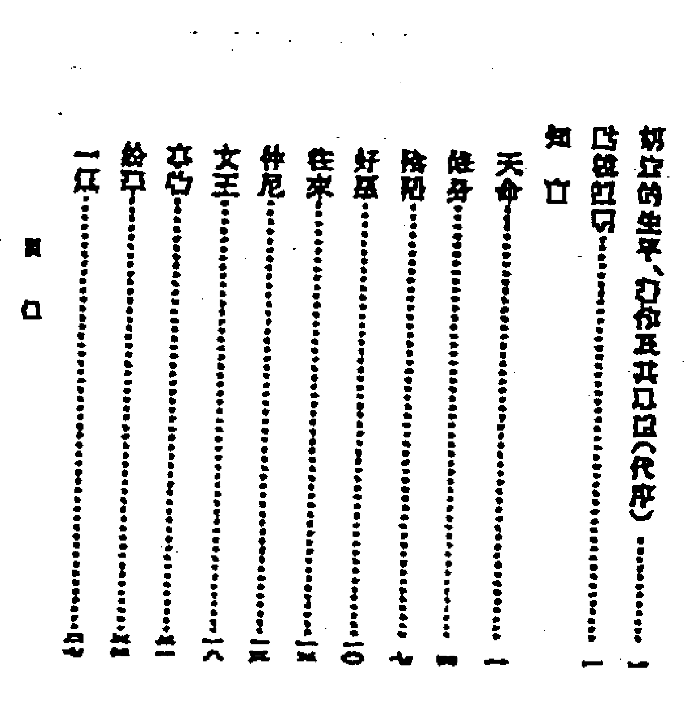

OK，中華書局的作品，還是原版影印，沒問題了。我們查下他的作品。如言，我們看到，他的目錄編排得像是莊子。我們再看內容。

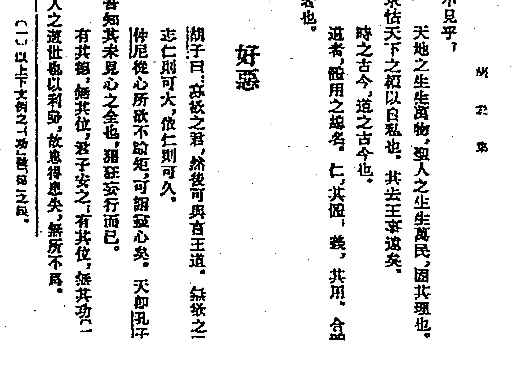

乖乖，這是時事政經議論文，按胡大師的說法，絕對可以在鳳凰衛視上個《鏗鏘三人行》，發表一下政經軍事要點，絕對比張召忠強。我們再看另一本書，《皇王大紀》。

原來這又是一本講故事的書。哎，胡專家放在今天，可以進《百家講壇》的。好了，關鍵的一本書來了，《易外傳》。

說實話，一開始聽到這本書的名字，我就沒覺得這本書與六爻占卜有關聯。為啥？黎師傅也算是六爻占卜學裡的專家大師型人物，竟然沒聽過這本書，這不是有古怪嗎？

這一拿出來，果然，這是一本講易理卜筮的書，而且很薄。我看影印本，大概只有十幾頁內容，裡面更是跟占卜八竿子打不著的。

看到這裡就怪了，作為湖湘學派胡安國的兒子，父子兩個都是儒學大家，史書裡面沒有記載其師承占卜，而且在其著作裡面也沒有占卜的一絲言語。為嘛有人說他編著了六爻占卜的經典《黃金策》呢？

好吧，我告訴你們答案：此胡宏非彼胡宏。除了這個大學者胡宏，明朝還有一個居住在福建的卦師胡宏。

在明代陸粲的《庚巳編》裡講，寧波儒生胡弘，年輕時拜江右的一位算命先生張某為師，勤苦力學命理之道。正統初年，他到杭州遊歷，遇到一位自稱來自開封的老者，老者精通易理，胡弘跟他學習，盡得其奧祕真傳，而逐漸以卜筮闖出名號。

景泰初年，他跟隨張都御史征討福建匪寇，在營中以《易經》預卜軍情，多有奇中。後來他在蘇州落腳，很多士大夫都向他請益，問前途休咎。名士杜瓊年老時，兒子一個個死去，他請胡弘卜筮，結果卜得「鼎卦初爻」，胡弘說：「子爻逢旺，您應該還會有兩位公子。」

噢，原來這個才是會算卦的胡宏，真是老鼠搬大米，硬把李鬼當李逵了。但真如有人講的，算卦經典《黃金策》是這個會算卦的胡宏寫的嗎？先不要這麼武斷，我們看下他占卜的風格。

姓名：胡宏　占事：杜瓊子息

| 伏神 | 【本卦】離宮：火風鼎 | 【變卦】乾宮：火天大有（歸魂） |
|---|---|---|
|  | 兄弟己巳火 | 兄弟己巳火 應 |
|  | 子孫己未土 應 | 子孫己未土 |
|  | 妻財己酉金 | 妻財己酉金 |
|  | 妻財辛酉金 | 子孫甲辰土 世 |
|  | 官鬼辛亥水 世 | 父母甲寅木 |
| 父母己卯木 | 子孫辛丑土（×→） | 官鬼甲子水 |

如按六爻占卜來講，子爻動化鬼，是子息病亡之象。如何如胡宏所講「子爻逢旺」呢？原來奧祕在《易經》的卦辭裡，火風鼎卦的初爻辭為：「初六：鼎顛趾，利出否，得妾以其子，無咎。」嗯，得妾以其子，沒有危害。原來這個事還不是個壞的結果，還有妾，有子。好哇，這不是《易隱》所講的「用意精深，卦象以明告」嗎？

有人說了，原來胡宏是用《易經》卦辭來解卦的，而沒有用六爻卦象，果然他是不懂六爻占卜的？做學問，千萬不要這麼武斷！

《易隱》曾經有一篇：「習卜先讀易說」。游南子曰：余閱胡雙湖所載漢晉至宋雜記占驗，及吳甘泉元明占驗錄，皆就象辭爻辭直斷，應若桴鼓。後之占者，但得易辭，既合所占之事，即不可拘泥京管，而并視四大聖人之至訓也，故習卜之功先須讀易。

游南子講：我看了胡雙湖所記載的從漢晉朝一直以來的算卦記錄，以及吳甘泉的元朝明朝算卦記錄，都是根據卦爻辭直接來斷，預測準確得像桴鼓相應一樣，一目了然。所以，你們這些學算卦的晚輩，如果遇到易辭跟對方所問的事直接對照住了，一模一樣，那麼就可以不用京房與管輅（讀路）的六爻占卜方法來算了，你就直接按編寫《易經》的四大聖人：伏羲、文王、周公、孔子給你們講的卦爻辭定結果吧。

游南子又講：如果卦辭爻辭應合所問，比如說：占求嗣，曰有子；考無咎，曰得妾以其子；曰婦孕不育，曰婦三歲不孕。諸如此類，皆神靈其誠而顯告之也，更不必揣摩臆度，別生論斷。

其白話意思就是，你心誠，感動神靈了，所以神靈就把結果非常明顯地告訴你，不讓你再自己推算猜測，明白了嗎？

有讀者聽到這裡問道：「嗯，按這樣來說，卦象明示，就可以不用再按管輅的六爻學問來推算了。但這也不能證明，胡宏不懂六爻了呀？」

嗯，讓我再接著跟你講，胡宏的第二個例子：參政祝瀛求問前程，卜得「比卦二五爻」，胡弘說：「這是君臣慶會，您日後一定是皇上身邊的寵臣，而且會轉任大藩。」後來都應驗了。

比卦六二爻辭曰：比之自內，貞吉。九五爻辭曰：顯比，王用三驅，失前禽。邑人不誡，吉。

原來又是卦象明告。

我們解釋一下這個卦。比卦上卦為坎為水，下卦為坤為地，地上有水便是比卦的卦象。水在大地上流動，泥土因為有了水而濕潤，可以養育萬物，這就像君王巡視四方，恩澤四方，群民與君王一條心，共同輔佐君王。這個卦意很好，我們再看看爻辭怎麼講。

卦象一般是由內往上排，由初往上走。比如說我們看乾卦，初爻是潛龍勿用，二爻是見龍在田，五爻就是飛龍在天，那麼斷卦的時候，有些算卦先生也會考慮這個說法。

我們看，六二：比之自內，貞吉。親善內部人員，會使自己不會受到損失。噢，難怪胡宏講，是皇帝身邊的內臣與寵臣，原來是從這點推斷來的。

那麼後一句「轉任大藩」從哪裡來呢？

我們再看九五：顯比，王用三驅，失前禽。邑人不誡，吉。最終還是吉利的，而且王用三驅，代表著皇帝驅使自己，鎮守城鎮；邑在古代指城鎮、邑地的意思，所以胡宏講，此人最後會鎮守一方，成為一個大藩，也就是大地方的封疆大吏。

我們再看第三例，某市長找胡宏算卦。這次更神，胡宏把市長遇到的兩個人的姓氏都給算出來了。

某日，胡宏為太守陸卓占卜前程，得雷火豐之地火明夷卦。胡宏斷道：「逢劉則滿，遇馮則止。」

不久，有同知劉文顯至，與陸卓關係很僵，幾次差點公堂相搏。第二年，海道副使馮靖彈劾陸卓私屯軍糧，挪用軍餉。陸卓被發配廣西。

此例也是以爻辭推論，豐卦三爻說「豐其沛」，豐沛是高祖劉邦出生地，後引申為劉氏代名詞，即「逢劉」。爻辭又說「日中見沫」，日中即是午，午為馬，見沫即為馮，所以說「遇馮」。爻辭又說「折其右肱凶」，所以說遇見劉馮不吉，故防「壞臂喪擊」之事發生。

綜上所述，胡宏如果是《黃金策》的作者，起碼作為他流傳至今的經典案例，應該有一例六爻占卜的。可翻遍史海，他除了這兩三個卦例，還有幾個測字的例子，沒有一例用的是京管之易。

此處有一點最需要注意，那就是「胡宏著有《黃金策》傳世」。這是誰寫的呢？

再查找一番，原來此文來自《周易古筮考》，原來是民國的尚秉和大師講的。

民國尚秉和《周易古筮考》卷四「爻動下」，晉關期筮晉百年大運中提到：「豈知近代如著《黃金策》之胡宏，著《易冒》之程良玉，著《增刪卜易》之野鶴，皆能以一卦定人平生之吉凶。」

只是沒憑沒據的，尚大師怎麼就能講胡宏是《黃金策》的作者呢？而且尚大師還說：「占筮一道，明、清二代，僅推許三人，胡宏、程良玉、野鶴而已。」

接著往古書裡面查，原來尚大師也是引用，他引用的估計是《古今圖書集成》這本書。

我們看《古今圖書集成》的論述。《古今圖書集成·博物彙編·藝術典》第五百六十二卷「卜筮名流列傳四」，明胡宏傳下明言「著筮書曰《黃金策》」。

所以，尚大師覺得《古今圖書集成》是個權威的書，所以引用起來也沒有問題。實際上卻是差得很遠，以後讀者如果再看到這個說法，就要注意了：胡宏是《黃金策》的作者，真還是個未知數。

### 參考資料

- 《古今圖書集成》 清朝康熙 陳夢雷
- 《易隱》 明末 曹九錫著
- 《周易古筮考》 清末 尚秉和著
- 《胡宏作品集》 中華書局
- 《中國人的命理玄機》 王溢嘉　新星出版社　2012年6月
- 《茲學通考》 黎光　香港中國哲學文化協進會　2003年

2013年1月20日

### 《易隱》答問錄

10月間，又見雷生，請教《易隱》，問答如下。

雷生問：「請教黎師傅，《易隱》究竟是哪個朝代所著，淵源在哪裡？」

黎師道：「《易隱》署名為明代曹九錫所著。中州古籍版本原來標的是清代所著，但我查閱資料，發現實際是明朝即有，這與這本書的序言作者謝三賓的經歷可以查出。其前身來源於西漢李君明的京房易學。」

雷生問：「京房易複雜嗎？」

黎師道：「西漢李君明（即後京房），上承三才之道與天人合一的思想，把陰陽五行日月星辰納入卦象之中；用數學積算的模式推斷災祥。其易學體系共納陰陽五行、干支、卦變、世應、六親、星宿、節氣、五星、建候、消息、飛伏、積算於其中，融易理、象數、術數三者為一體，而後世流行的納甲筮法即是脫胎於京房易學體系之中。」

雷生又問：「那納甲筮法與《易隱》的斷法有區別嗎？好像大家都統稱六爻預測學？」

黎師道：「當然有不同了。納甲筮法又稱為火珠林法、六爻、文王神課等，其術共傳承了京房易學的陰陽五行、世應、六親、六神、部分卦變、部分飛伏，而對於京房易學體系的其他部分均已失傳。」

雷生有疑惑：「那為何有失傳呢？」

黎師道：「究其原因，只因京房易學自漢代傳入民間以後，一直便是因為其占卜吉凶的作用而在民間流行，於是對於京房易學中關於天文曆法、人文風俗、政治災異等內容都省略了。這也是《周易》從廟堂走入民間的必然趨勢，這點在清代的納甲筮法典籍《卜筮正宗》《增刪卜易》中表現得尤為明顯。而現在能夠稱得上是傳承京房易學體系最多的，就數明代曹九錫所著的《易隱》這本書了。」

雷生問：「那傳承得多嗎？」

黎師道：「《易隱》者，『易』乃易道變化，『隱』乃隱匿深藏，合而決之，乃是傳常易不傳之秘，極盡易道變化之意。從《易隱》的內容來看，它共傳承了京房易學體系的干支、卦變、世應、六親、五星、飛伏、卦氣、部分建候、部分星宿等幾大部分。所以在《易隱》的原序中謝三賓提到：『吾友曹橫琴氏，得其家君游南子之傳，慨群迷之不旦，悼筮法之中衰，於是上究連藏，下逮京焦，旁通王甲，廣采占歌，作為《易隱》。』

此序言即是真正道出了《易隱》一書內容的全面性，這在當今京房易學體系漸趨失傳的情況下，充分顯示出了《易隱》一書的重要性。」

雷生問：「老師在2003年以《易隱》為綱，整理出版《隱易千金斷》，後來又在內地版加入破解《易隱》的內容，但並沒有完全地將《易隱》全面解讀。」

黎師道：「我在2009年白話過《易隱》，但沒有合適的出版社。這次整理，是有以下幾個原因。

首先，古本《易隱》中存在有印刷缺漏之處。比如晴雨占中有：『水動，而遇日辰動爻刑害克破者，雖雨不多也。』後面卻是『火動，而遇日辰動爻刑害克破者晴也。』你想，古代圖書，言語對仗，原文這麼講，既與卦理不合，又與修辭不合，實際應該是：『水動，而遇日辰動爻刑害克破者，雖雨不多也；火動，而遇日辰動爻刑害克破者，雖晴不久也。』」

雷生想了想，點頭道：「確實如此，這樣就合理多了。」

黎師又道：「又比如，在《易隱·家宅占》二十二墳墓章中有：『金見金臨玄武。傍有岩泉。土見土。橫路交加。』這個地方也是有明顯的遺漏。如果依其卦理來言，將其修改為：『金見金臨玄武，傍有岩泉；土見土加騰蛇，橫路交加。』這樣就合理多了。」

雷生思考了一下：「古書均以騰蛇代表道路，師傅改的也合理。」

黎師道：「此外，包括《易隱》身命占中的三限飛行式的排法，均有印刷錯誤。」

雷生皺起眉頭：「按師傅所講，如果讀者閱讀《易隱》，萬一自己層次不足，而該書又體例不清，是很容易被誤導的？」

黎師道：「是這樣。《易隱》本身是以象動人，以象解卦很容易掛萬漏一，而且《易隱》原書的編排中存在著層次不清的情況，這樣使讀者看起來不夠清晰。於是作者根據斷語的特點不同，將其重新整理分段，如在原書的一個大段落中，作者將其六神判斷部分分為一小段落，六親判斷部分分為一小段落，伏神判斷部分分為一小段落，而且將其順序而排，以分號來列，這樣使讀者閱讀起來更加清晰明瞭，學習起來更加方便快捷。」

雷生笑道：「那就像先生早年寫作的《隱易千金斷》一樣，閱讀方便，使用簡單。」

黎師點頭道：「是這樣，而且《易隱》原書的標點並不清晰。比如《易隱》廚灶章有云：『三爻合二爻。房灶相連也。臨父旺。大屋下灶。臨福旺。兩廂下灶。』此處被分為六句，其實按實際的斷法來講，只應該是一句。因為原書中的三爻合二爻，說明家中是房灶相連；然後再往下看，如果相合二爻的三爻臨父母旺相，說明是大屋下灶；如果相合二爻的三爻臨子孫旺相，說明是廂房下灶。此三句話是一個整體，而後面兩句細斷完全是由第一句總斷而來，所以原作將其並排而列，讓讀者學習起來有主次不明之感。

所以如果將其修改為：『三爻合二爻，房灶相連也，三爻臨父旺者大屋下灶，三爻臨福旺者兩廂下灶。』這樣一改，文章層次更加分明，並且在文章中直接加了一個『二』與兩個『三』，這樣讓讀者一看就明，不至於在看原書時還在考究其三爻所合之爻指的是六爻中的哪個爻。」

霍生道：「嗯，這樣就完全像個工具書，直接使用斷語就可以查了，而不像原書那樣，要看其前頭，要閱其後尾，思維要連續。」

黎師道：「現代更是一個速食型的社會，閱讀更要清朗快速為要。」

二零一二年十二月二十五日

### 丁耀亢並非《增刪卜易》的作者野鶴老人

我在網上看過一篇文章，山東諸城史志辦張清吉先生編寫了《丁耀亢全集》，並把《增刪卜易》作為其作品編入全集之中。某日我路過一地攤，看到《續金瓶梅》四個字，心道，這不就是我們卦行前輩寫的小說嗎？購買過來之後，隔了兩三個月開始閱讀，從裡面的內容發現，丁耀亢如果能和野鶴老人聯在一起的話，實在是不太可能。

在《金屋夢（續金瓶梅）》一書第四回「來安妻出首賊辯冤典恩拷問主母」中提到：「來安老婆也似信似疑的，只得罷了。終是不放心，街上去討了一卦，是白虎神經著，應主有孝服，行人血光之災。」

看到這裡，我心裡便有些疑惑。在四大名著中，皆有關於占卜的情節，但個個都有理有據，充分顯示出了當時卦學的占卜思路。雖然作者吳承恩、羅貫中、曹雪芹這些文人並非專業的卦師，然而其敘述的占卜情節充分，斷卦分析毫不失理。作為一個半生都是漂泊於江湖之上、賣卜於市井之中的老卦師，為什麼對這樣的情節卻是描述得語焉不詳，一筆帶過呢？

再看第十六回「吳月娘千里尋兒 李嬌兒鄉井逢舊」一章：「走不多時只見一個賣卦的先生，從西走來，拿著那布幫招牌，上是看陰陽、吉凶、婚葬、知八字、六壬、奇門。月娘看見是賣卦的，問道：『先生你會占課麼。』那先生道：『占課是大易渾天甲子，哪有不知的。』月娘道：『請先生在這林子樹下，替我占一課，是人口失散的卦。』那先生取出幾個銅錢，就地鋪下一片黃布，念道：『單單拆拆拆單。』把錢搖了兩搖，攤在布上。道：『是個睽卦，睽者，離也，一時不能即見。世爻屬卯，該在東南方上討信。日神是騰蛇，有小人駁雜，喜得子孫官（疑是宮）旺相，日後還有相會之期。又變了一個家人卦。這卻好了，且喜天月二德，到處有救，貴人扶持，到前面就有信了。』」

先不說那先生提到的「單單拆拆拆單」只是個咒語，不是起的卦。單說那睽卦，「睽者離也」這話在《卜筮全書》上面有這樣的解釋。但「世爻屬卯」，就不知從何而來了。

| 主變卦 |  |  | 火澤睽（艮宮） | 之 | 風火家人（巽宮） |
|---|---|---|---|---|---|
|  | 一 |  | 父母巳火 | 一 | 官鬼卯木 |
| 妻財子水 | -- | × | 兄弟未土 | -- | 父母巳火 |
|  | 一 | ○ | 子孫酉金 | -- | 兄弟未土 |
|  | -- | × | 兄弟丑土 | 一 | 妻財亥水 |
|  | 一 | ○ | 官鬼卯木 | -- | 兄弟丑土 |
|  | 一 |  | 父母巳火 | 一 | 官鬼卯木 |

我們看睽卦，世爻明明是酉金，怎麼變成了卯木？又後面說：「世爻屬卯，該在東南方上討信。」我想來，如果是「父母（消息）爻屬巳，該在東南方上討信」，這才於理相合。

但即使後人抄寫有誤，怎麼一句話四個字，就能印錯兩個字的？

「日神是騰蛇，有小人駁雜」，這話說得符合卦理。但後面提到的「喜得子孫官（疑是宮）旺相，日後還有相會之期」，又有問題了。月娘尋找孝哥，正是要觀察卦中的子孫爻，但子孫爻怎麼變成了子孫官？我想來，應該是「子孫爻」的筆誤。民間對於算命的認識，多知子孫宮、官祿宮、命宮等名詞，而少知道「爻（音搖）」這個專業字詞。原作者寫成子孫爻，後人印刷時錯成子孫官了。

只是子孫宮依舊於理不合。若是作為一個尋常作家，可能是知「宮」而不知「爻」；但作為一代占卜名家的「野鶴老人」，他又怎麼會出現如此外行詞語？

我剛才又重新翻閱了《增刪卜易》，沒有發現一例野鶴老人提到「子孫宮」「官鬼宮」「父母宮」「妻財宮」「兄弟宮」的類似相關詞句，都是「子孫爻」等。

所以，從以上兩書的內容對比來說，丁耀亢並非《增刪卜易》的作者野鶴老人。

註：丁耀亢，生於明萬曆二十七年（西元1599年），卒於清康熙八年（西元1669年），享年七十一歲。字西生，號野鶴；自稱紫陽道人，後又稱木雞道人，山東諸城人。明清兩代小說家。

2011年7月24日

### 趙烈文的六爻課——清朝國運傳說

研究晚清的歷史，不能不研究曾國藩；研究曾國藩，不能不研究趙烈文。

#### 趙烈文何許人也？

趙烈文（1832年—1894年），字惠甫，江蘇常州人，是曾國藩手下最受器重的幕僚。趙烈文年少時即有才名，實際上是一個有思想有主見的人，也是一個很有性格的人。

咸豐五年，曾國藩坐困南昌，隨行的幕僚大都遠走。周騰虎推薦趙烈文入幕。趙烈文正好賦閒在家，於十二月到了大營。

曾國藩可能也感覺到這個書生有個性，也可能是為了折一下他的傲氣，命其參觀駐紮在樟樹鎮的湘軍水陸各營，讓這個書生開開眼。沒想到，這位趙先生回到大營，不但沒被鎮住，還提了一堆意見。他居然很不客氣地說：「樟樹營陸軍營制寬懈，軍氣已老，恐不足恃。」曾國藩對這位趙先生心裡不大高興，因為曾國藩最見不得說大話的書生。也正在這個時候，趙的老母有病，趙可能也看出曾的心思，所以就以母病為由，向曾國藩辭行，曾國藩也沒有怎麼挽留。這意思已經很明白，趙烈文回家走人就是了。

如果就是這樣的話，趙烈文回家探母，曾國藩繼續操持他的軍務，也就罷了。偏偏湊巧的是，就在趙要走而未走的時候，傳來周鳳山部湘軍在樟樹大敗的消息。趙也正在這個節骨眼上向曾辭行，曾國藩請趙烈文講出為什麼看出周鳳山湘軍不可恃重的道理，這一下趙烈文假癡不癲，只是含含糊糊說一些不幸言中的話。後來趙母病逝，趙烈文回家奔喪。此事一過，以曾氏的聰明，已經對趙烈文有了一番新的看法。

趙烈文十年磨一劍，對佛學、易學、醫學、軍事、經濟之學都有涉獵，是屬於那種有實學的人。時間一長，趙在曾的大營裡越來越受曾的器重，經常商談軍事，最後到與曾無話不談，有時一日幾次。

趙烈文確實眼力非凡，他對清朝政治大局認識得清醒，見識超前。曾國藩曾就清朝氣數的問題和趙烈文數次密談，趙烈文在同治六年時就提出：「而後方州無主，人自為政，殆不出五十年矣。」同治六年為1867年，可見趙氏的預見力。

下面是趙烈文於同治六年六月九日為曾國藩占的卦。時歲在丁卯，六月九日已在小暑節氣內，到了未月。初九日辛卯天色晴朗，晨起為洙師占時局，運得《豫》之《晉》。

| 六神 | 伏神 | 本卦（震宮：雷地豫 六合） | 變卦（乾宮：火地晉 遊魂） |
|---|---|---|---|
| 勾陳 |  | 妻財庚戌土（×→） | 子孫己巳火 |
| 騰蛇 |  | 官鬼庚申金 | 妻財己未土 |
| 朱雀 |  | 子孫庚午火 | 官鬼己酉金 |
| 青龍 |  | 兄弟乙卯木 | 兄弟乙卯木 |
| 玄武 |  | 子孫乙巳火 | 子孫乙巳火 |
| 白虎 | 父母庚子水 | 妻財乙未土 | 妻財乙未土 |

上六：冥豫，成有渝，無咎。

鵲巢柳樹，鳩奪其處，任力劣薄，天命不佑。用神、原神金水休囚，忌神動爻坎旺來克，世應落……空：官交失時無權，誠非吉卦。

1866年（同治五年），曾國藩奉旨進駐周家口，以欽差大臣的重權身份，督師剿撚。

曾國藩根據撚軍行蹤不定、流動作戰的特點，採用了「重點防務、堅壁清野和劃河圈圍」的對策，但最終全部失敗。後來，他在周口西至漯河建立起「沙河百里防線」，希望借此天塹消滅撚軍。

黎註：世應皆空，事無準實。世臨白虎，兇惡意外。文書不見，線索不明。朱雀逢空，攻擊不顯。

又自占局遁得《晉》之《旅》

未月辛卯日

| 伏神 | 【本卦】乾宮：火地晉（遊魂） |  | 【變卦】離宮：火山旅 |
|---|---|---|---|
|  | 一 官鬼己巳火 |  | 一 官鬼己巳火 |
|  | -- 父母己未土 |  | -- 父母己未土 |
|  | 一 兄弟己酉金 |  | 一 兄弟己酉金 |
|  | -- 妻財乙卯木 | x→ | 一 兄弟丙申金 |
|  | -- 官鬼乙巳火 |  | -- 官鬼丙午火 |
| 子孫甲子水 | -- 父母乙未土 |  | -- 父母丙辰土 |

眾允，悔亡。  
東行西維，南北善迷。逐旅失群，亡我禰衣。  
世爻日辰動交皆沖，非靜局也。卯木財交挾王氣歲君而動，撚為得勢。然化劫財回頭克，有財而不能聚，……

黎註：內卦沖，日建沖，內憂外患，當事人謹慎行事為上。五交與應交空，落腳不實，領導不安，得勢需做失勢想。

這是同治六年，趙烈文為曾國藩占卦及診脈的記錄。曾國藩占一卦，趙烈文又自己重占一課。正占課的中間，曾國藩來到，要求趙烈文為其診脈。說明曾和趙的關係之親密，和曾對趙的信任。有時一日數次光臨趙的住所商談。

從趙氏的占卜來看，風格和其他幕僚占課的風格一樣，簡潔明快，不生枝節。和事理緊密相融，隱約可見思維之緊密快捷。

從六爻卦占卜的角度看，非常傳統，不逾規矩。《周易》爻辭，《易林》爻辭一起參研。從後來的情況看，這些卦斷應該是應驗的。

我以前寫的文章中，提到要多看幕僚的書。單從幕僚的占筮來講，幕僚的占筮不同於術士。術士要靠占卜吃飯，所以占斷內容一般比較豐富，雖然對結果的要求也很高，但是很重要的還是占斷現場的過程。而幕僚的占斷，不需要花法，只求可以指導事情，要的是結果，要實實在在去指導行動。而且幕僚本身也是當事人，責任就在自己頭上，如履薄冰，如履深淵，來不得半點模糊和花哨的東西。對占筮產生的結果和過程，感同身受。所以幕僚的占筮風格一般來講：簡潔、深沉、謹慎。

中國的幕僚靠策劃事情吃飯，靠出賣智慧生活。因此他們觀察研究事情，從始至終，研究事物發展的一個完整過程。既參與到事情當中，又是一個操作者。更由於他們位置比較超脫，更像一個旁觀者，所以造就了幕僚對事物研究認知的深刻性。尤其是輔佐成就大業的幕僚，個個都是強中手。沒有真才實學的南郭先生，也不可能混下去。這顯然是一群經過自然淘選的人，一群獨特的人。

在某種意義上，中國歷史上好多關鍵的大手筆是由這些躲在幕後的人書寫的。

2014年10月24日改編自山西鼎升之博文

### 卦與命——紅塵與因果

先生，你命犯陰差陽錯。大師，是說我婚姻不順嗎？  
不，我是說，你老是該得手的時候沒得手。大師，知音！  
女士，你命犯陰差陽錯。大師，是說我婚姻不順嗎？  
不，是說你，不該被得手的時候被得手了？大師，知己呀！

同樣陰差陽錯命，有男有女，各遇境緣。同樣是財星持世，或商或官，各有因由。拿命卜來講，取象為紅塵，生克為因果。境遇為紅塵，結局為因果。卦是紅塵，命是因果。

卦是紅塵，浮生往事，一尊還酹江月；命是因果，野草萋萋，兩處荒丘孤墳。

### 解字

#### 1. 求

求，本來是個「一水」，心靜如水，左右平均。但是多了右上角一點，導致左輕右重，前後失衡，正是對應現實裡面，有欲則有求，有求則利令智昏。

那怎麼辦呢？

或者，做無為！把右上角那一點貪欲去掉，一彎秋水，自得其樂。

或者，做有為！有求亦爭，但把左上角再加一點，使上面變成一個「平」字，心態「平」和，做事公「平」，那麼有欲有「求」，也不會惹出什麼大事。

#### 2. 美麗中國

看電視，美麗中國節目。

這幾個字基本都是左右平均，代表做什麼事情都要兼容左右，公平正直。

「美」上有兩點，如同天線。中間為胸腹部位，一橫很長。下面有兩足鼎立，也就是說，你這個人，有耳目聰明，胸襟寬廣，又能自立，這就叫美。

麗呢，蒼天穹頂之下，兩個太陽，互不爭輝，各自虛掩謙讓，有光不顯，有寵不爭，這叫麗。

中呢？一口貫通天地，你這個人說話是不是負責任，講不講信用，是不是口中一張，感天動地，這就叫中。古人講天子居中，易經有一個卦叫風澤中孚，講有孚乃信，都是說言語誠信感人的意思。

國是口中藏玉，說話是不是照顧別人的感受？說話是不是隨便吹水？

各自反省。

#### 3. 天

人能不能勝天？當然很難。天是二人，人是一人，一人怎麼打得過二人？那為什麼說人定勝天呢？這個定不是一定的定，而是安定的定。人安心定，外界的任何東西都不會造成自己的困擾，這是心境，不是物境。

#### 4. 尖

尖字，內大外小。也就是，內容廣大，外示以小。也就是守拙藏智，修煉內功。道德經講：致虛極，守靜篤。楓林先生講：高築牆，廣積糧，緩稱王。都是這個意思。尖的下面是大，「一人」鼎立為大，內心一定要強大。尖字外面是小，那一點智慧，或左或右，隨緣而定。智變通，心穩定，才是做人做事尖端突出的要點。

#### 5. 卜

卜，是占卜。「上」「下」之間，沉浮變幻，心（卜）不安全，求神問卜。那麼，心神惶惶之間，該如何做呢？大師講：遇事狐疑時，勿大進，多築基，少壓力。因為，卜字加基，為「上」。卜字加壓，為「下」。

#### 6. 色

色是什麼？色字頭上一把刀，即是刮骨鋼刀，又奪人心智。色字中間有個眼睛，就是告訴你，感情美色之中，更要懂得慧眼看人。如果是眼角看人，偏心斜視，最後難免留下手尾。

#### 7. 朋

兩月互照為朋。這個照，一是關照，二是觀照。一是講，朋友之間，互相能幫忙做些什麼。二是講，每個人都像月亮一樣，各有陰晴圓缺，各有缺點，朋友也在互相觀照，互相提醒與彌補。

#### 8. 拾得

什麼是舍？人在外，口在內，多幹少講為舍；什麼是得？與人和諧，日麗光明，寸寸丹心守中央。得字藏行，進退自求，勿念老天。

#### 9. 日中

兩個月前福建朋友找我占卜一年運氣。對辭講：宜日中。想起古人有同樣的例子，所以就講：你今年適合跟姓名中有日、中、馬及屬馬的人交往，他會幫你不少忙。旁邊的助手笑：我就是屬馬，而且名字有個春字。

### 測字

#### 1. 心

韓國的朋友說：師傅，我寫個心字，你看我明年能不能生孩子？  
我：能有一子。你看，這字就含了一個「兒」字。  
韓國人：這輩子能生5個嗎？  
我：你右邊是「5」字寫了一半，所以是一點五。  
韓國人：什麼意思？  
我：兩兒女。

#### 2. 正

正字問工作。有兩工，工作辛苦。上受阻，幾年沒提拔了。基礎穩定，但是沒變化。加一點成「玊」，努力你能在單位排第二。這個字止於一，頂多再呆一年就有變動。點為水財，現在有兩筆錢扔出去，只有一筆錢能收回來。

生字問能否生二胎。生字有二人，能生。那一豎為什麼意思？一個家庭生出來的。

#### 3. 和

客戶寫了個「和」字。左邊為十一人，你核心人員有十一個。人進口中，現在因人口舌，劍拔弩張。字字劍尾，盛氣太重，做事宜多退化。和字藏木，所以，九五年、九九年順利上行，兩千年到二零零三年，費力多端。零四零五年，先損後成，辭舊迎新。零六年之後，步步高升。二零一二年開始，阻力多端。

#### 4. 王

黎師傅：除了現在的產品，我還想做一種速食產品，將來讓它上市，我寫一個王字，你覺得怎麼樣？

1+1為王，馬上做！

#### 5. 某次演講給十幾個公司分析名字

- 一公司名字叫威，暗藏干戈，股東不和，會有女人當家。
- 名字有走字底，走得越遠越好，要做外貿。
- 商業地產項目名字帶玉，去一點則成王，搞一個高精尖的，或者是跟人合作、慢慢來的項目。
- 名字裡面帶個思，心在下被壓，最近這兩年是很勞累，事半功倍，心被房子地皮場地所累。
- 一公司名字帶個成字，也是暗藏干戈，以前有三個股東，現在只有一個人。
- 某人名字有一個進字，走字底，所以要從家鄉往外地發展。名字裡面有一個禾苗的禾字，而廣東稱粵，藏米字，是禾苗變稻穀，先播後收之象。
- 一公司名字裡面帶綿字，雖有糾纏，但右半邊，皇頭帝角，只要努力就能做大。
- 一公司名字裡面有一個金字，金字上面寫的人寫得非常大，一人獨大。
- 公司占一個滾字，這個公司是要收縮的，不能再接著擴大了，去三點則良好。
- 人名字裡面占土，零四年辭舊迎新，跟實際情況脫離單位、自己創業符合。
- 人名字有望，有言有王，原來說話是一言九鼎的，後來辭職創業，脫離行政單位。
- 公司名字裡面有一個蜜字，鳥有蟲吃，本來是好，但是名字這三個字的中間是一個蜜字，蜜的核心是必，指心被傷了一道。這公司讓你現在很煩心，是一個傷心地。老闆回答說現在就想放棄。
- 公司名字裡面帶個鑫，金水相生，03年之後走好運，07年之後業務縮減，去年今年運氣最背。

### 一命二運三風水

古人講，一命二運三風水，四積陰功五讀書，來影響一個人的命運。聽起來有點玄，那麼，把命改為人和，把運改為天時，把風水改為地利，就合理多了。

所以，看一個人能不能發達，就看這個人所處的行業是不是一個目前時興的行業，是不是一個新鮮富裕的地頭，有沒有一個優秀的團隊，自己有沒有學習心，有沒有奉獻心。

有一個，溫飽有餘；有兩個，小康之家；有三個，中產階層；有四個，富貴一時；有五個，壽祿齊全，邵逸夫第二。

### 緬懷霍斐然先生

大概前幾天，我一個朋友給我發短信，霍老不在了。其實這個消息對我來說是意外，但是也有先兆的。

前兩年，我的《九天學算卦》寫完，我發給霍老，讓他給我寫篇序。他已給我回信道，得了癌症，正在醫院裡面治療。後來就抽空給我寫了一篇序，現在想起來，這個不知道是不是他留到人間的最後一篇序言、最後一篇文字了。

我大概是1999年認識老先生的。當年我18歲，我當時看到某個網站有霍老的地址，我就給霍老寫了一封信，我說我想把《易隱》改編一下。霍老回信道：黎先生，《易隱》是占卜術中高深大宗之法，改編一下很有必要，亦渴欲拜讀全文。後來到了2000年，霍老給我發了中國哲學文化協進會的徵稿函，最終我於2003年在香港出版了《隱易千金斷》與《筮學通考》。

以這個開頭，後面一些時候，我就陸陸續續在臺灣以及國內出版了幾本書。其中有點意思的是，05年我對霍老說，我在臺灣要新出一本六爻占卜方面的書，您能否給我寫個序。霍老當時說，我對六爻不甚瞭解，不敢輕易寫。

但是到了2012年，霍老還是給我的《九天學算卦》一書寫了。這正是在他身患癌症、醫院治療的情況下，而且他寫序還是很慎重。第一他先看了我的稿子，第二，他自己親自下筆。因為我知道，有些人請前輩寫序，實際這個序還是作者寫的，前輩只是最後看了一眼。

在《九天學算卦》出版之後，我有一個朋友說，霍老的序，把你們這兩個作者稱作年輕的朋友，不夠響亮。他如果寫成，兩位作者是我極為推薦的易學專家，就更響亮些啦。我說，我沒想那麼多。我說，霍老把序言發給我之後，也對我講到，如果有寫得不到位的地方，可以修改。我說老人的序是他的本義，我一個字都不會改。

過了兩年，霍老還是走了。細想來，如果沒有霍老當時的徵稿通知，也許，我是不是能夠堅持地將這一行做到現在呢？或許，即便是做這一行，也許還是偏居小鎮，籍籍無名？從這一點上來說，霍老是我的人生貴人，感謝霍老。

霍老小學文化，十餘歲開始學藝，遍訪民間高人。在六十餘歲時社會開放，談易論玄，也可公開出版。他引言著文，漸為人知，聲譽愈老愈隆，並且自成一派，自創天地小成圖，復原了《周易》乾坤兩卦文言的解釋。現在學習小成圖者，學習易經者，都會應用與參考霍老的理念，霍老千古。

2015年8月

### 賈元春的「虎兕（兔）相逢大夢歸」之謎

《紅樓夢》第五回的人物判詞，以簡短隱晦的語言，暗示了書中幾位女子的命運。其中有關元春的判詞，過去通行的各版本中都為如下四句：二十年來辨是非，榴花開處照宮闈。三春爭及初春景，虎兕相逢大夢歸。

《紅樓夢》早期抄本中，甲戌、庚辰、北師、蒙府、戚序、甲辰、舒序諸版本皆為「虎兕相逢大夢歸」，只有己卯本和全抄本作「虎兕相逢大夢謗」。

然而在人民文學出版社1982年版的《紅樓夢》中，該判詞的文字卻有微妙的差異：前三句文字依舊，第四句作「虎兔相逢大夢歸」。「兕」與「兔」雖僅一字之易，含義卻很不一樣。由於該版《紅樓夢》是迄今最為權威的校注本之一，近年的一些紅學作品，諸如《紅樓夢》鑒賞詞典、《紅樓夢》電影文學，等等，也都依此詮釋或編撰臺詞。「虎兔相逢」之說，似已成了定論。

對於這句判詞，紅學界爭議更大。那麼紅學界爭論的焦點在哪裡？這句判詞究竟是「虎兔相逢大夢歸」還是「虎兕相逢大夢歸」，這是《紅樓夢》研究當中一個很熱門的話題。

我最近在看中央電視臺《百家講壇》的劉心武揭秘《紅樓夢》。劉先生講解元妃判詞時，也是按「虎兕相逢」來做的解釋。但黎師傅我原來看過一遍《紅樓夢》，還記得裡面的一些章節，黎師傅我仔細推敲，卻發現「虎兔相逢大夢歸」是正確的，劉心武的講解並不對頭。劉先生一是對於中國的傳統民俗易經不太瞭解，二來忽略了《紅樓夢》中關於元妃算命的一個章節。

劉先生在「賈元春判詞之謎（6）」中說高鶚對「虎兔相逢大夢歸」的解釋是胡言亂語，因為高鶚說，「是年甲寅年十二月十八日立春，元妃薨日是十二月十九日，已交卯年寅月，存年四十三歲。」劉先生就說，因為那一年是卯年，那個月是寅月，卯就是兔，寅就是虎，所以這不就是「兔虎相逢」了嗎，她就大夢歸了。

首先，這是兔虎相逢，不是虎兔相逢，應該先把年擺前頭，把月擺後頭，對不對？再加上中國人關於屬相、關於十二生肖的規定，都是衝著年說的，幾乎沒有人把一月到十二月按十二生肖來劃分的；你們家，你自己，你們家老人，老祖輩有這麼分的嗎？現在是陰曆幾月呀？屬於哪個屬相啊？有這麼問嗎？一般不這麼做。更何況，他語無倫次在哪兒呢？他自己說「是年甲寅年十二月十八日立春」，他說那是一個甲寅年，甲寅年那是虎年啊——過去也確實有一種說法，就是立春以後，可以算是另外一年了，甲寅過後是乙卯，你就說元春是死在虎年和兔年相交接的日子不就行了嗎？他又偏不按年與年說，非按年與月說，也許他的意思是到了卯年了，但月還屬於寅年的月，所以卯中有寅，算是兔虎相逢。但這樣營造邏輯，實在是說的人和聽的人都腦仁兒疼。我認為，說來說去，他就是要回避「虎兕相逢」這個概念，他一定要寫成「虎兔相逢」，這個起碼可以說它是敗筆吧。

根據我的瞭解，劉先生說錯了，按傳統干支記年月的方法，高鶚是對的。暫不提歷史真實與否，只說的是中國傳統干支曆法的正確理解及記法。

- 首先，過了立春就算下一年，也就是甲寅年十二月十八日立春；元妃薨日是十二月十九日，已交卯年沒錯，劉先生也不否認這點。
- 第二，按中國古代傳統紀年方法來說，確實有用屬相配月份的說法，古人根據「隨斗杓所指建十二月」，制定了「十一月建子、十二月建丑、正月建寅」等十二月建。特別是在中國傳統的算命術中，這種方法的運用更是極為普遍（與此呼應的是《紅樓夢》第八十六回算命先生給元妃算命那一節），其中是怎麼配的呢？即是立春後正月配寅虎，二月配卯兔，三月配辰龍，而元春死在寅虎年立春之後，所以就是卯兔年的正月，即卯年寅月，這正是兔年虎月。兔年虎月豈不也是文中講的「虎兔相逢」？

凡是一個好的作者，在自己的小說裡面都會前後呼應，劉先生在講解《紅樓夢》中也提到，這叫做「草蛇灰線，伏延千里」。「草蛇灰線，伏延千里」是中國古典小說常用的技法之一，前文為後面的情節發展埋下伏筆，作好鋪墊，後文的情節發展再與前文照應，使得故事情節的發展順理成章，合情合理。那麼我在這裡說了，元春的「虎兔相逢大夢歸」，在前文中也是有反映，也是「草蛇灰線，伏延千里」的。

我們看第八十六回算命先生給元妃算命的那一段。書中寶釵說道：「不但是外頭的訛言舛錯，便在家裡的，一聽見『娘娘』兩個字，也就都忙了，過後才明白。這兩天那府裡頭這些丫頭婆子來說，他們早知道不是咱們家的娘娘。我說：『你們那裡拿得定呢？』他說道：『前幾年正月，外省薦了一個算命的，說是很準的。老太太叫人將元妃八字夾在丫頭們八字裡頭，送出去叫他推算，他獨說：「這正月初一生日的那位姑娘，只怕時辰錯了，不然真是個貴人，也不能在這府中。」老爺和眾人說：「不管他錯不錯，照八字算去。」那先生便說：「甲申年，正月丙寅，這四個字內，有傷官，敗財，唯申字內有正官祿馬，這就是家裡養不住的，也不見什麼好。這日子是乙卯，初春木旺，雖是比肩，哪裡知道愈比愈好，就像那個好木料，愈經斧削，才成大器。」獨喜得時上什麼辛金為貴，什麼巳中正官。祿馬旺地，這叫做『飛天祿馬格』。」

又說什麼日逢尊祿，貴重得很。『天月二德』坐本命，貴受椒房之寵。這位姑娘，若是時辰準了，定是一位主子娘娘。這不是算準了麼？我們還記得說：『可惜榮華不久，只怕遇著寅年卯月，這就是比而又比，劫而又劫，譬如好木，本要做玲瓏剔透，木質就不堅了。』他們把這些話都忘了，只管瞎忙。我才想起來，告訴我們大奶奶，今年那裡是寅年卯月呢！

可知，高鶚書中給元妃安排的八字是：（年）甲申（月）丙寅（日）乙卯（時）辛巳。日柱乙卯是元妃的自身。在寄生十二宮中，卯是乙木的臨官祿地，所以說「日逢尊祿」，是一種很好的命。再如「辛金為貴」，命書指出，辛見寅為天乙貴人，貴重得很，現在時干和月支配合，就應了這命。「巳中正官，祿馬獨旺」，是說巳中庚金，為日干乙木的正官，巳支本身又為丙火的臨官祿地，加之時支巳和日支卯相逢，應了驛馬啟動的命，所以算命的說元妃的命「真是個貴人，也不能在這府中」。

高鶚在這裡用了一定量的篇幅，借寶釵的口轉述了算命先生對命理的一番分析，說明他對命理學有過研究，這是肯定無疑的。更不要說他在書中所說「可惜榮華不久，只怕遇著寅年卯月（黎註：寅年卯月正是『虎兔之交』），這就比而又比，劫而又劫，譬如好木，本要做玲瓏剔透，木質就不堅了」的這一段話，還又十分在行，超過一般算命先生的水準。

### 每個男人心中都有一個薛寶釵

在《紅樓夢》中，林黛玉所居住的瀟湘館是大觀園所有居所中地形最為複雜的一個，屋子前後都是層層環繞、曲曲折折的走廊，以及大片大片的竹子與路邊濕滑的青苔，植物之茂盛為大觀園之最。

在庭院風水有這樣的要求：花木不可太多太雜（心情煩躁、諸事不順），陰氣濕重（影響鼻子），地面不應有青苔濕氣，而黛玉的庭院正是犯了這些忌諱。林黛玉住所前後有大片的竹子，過多過雜，加上前面所說的路邊青苔，導致院落濕氣更重，對黛玉的身體健康非常不好。門前曲折複雜的道路，顯示出黛玉心思細密，思慮過多。

在建築風水中提到：好風水應該是後面有山，前面有水，而黛玉的庭院也違背了這種要求。瀟湘館背後是水，顯示出林黛玉沒有後台與靠山，而瀟湘館門前卻有一個山坡，出門見山意味著前路受阻，目標無法達成。

瀟湘館的植物以翠竹為主，後院還有梨樹和芭蕉，色調是綠白的冷調子，這樣的植物配置也體現出了林黛玉孤獨的性格特點。

而與此相反的則是薛寶釵的庭院。薛寶釵的院中一株花木全無，配上各色香草。香草雖不豔麗，但有沁人心脾的芳香，這種表面無華而暗香浮動的植物配置，很好地襯托出薛寶釵樸素大方的外表與性格。

可以說，環境會影響人的心理，心理會影響人的行為，而黛玉與寶釵兩人的居住環境不同，導致兩人性格與命運各異。

在《紅樓夢》中，寶玉不喜讀書，做事荒唐，寶釵大方得體，善解人意。那麼，是什麼原因導致他倆這種極為不同的心理呢？我們從他倆的住所與客廳看起。

賈寶玉的住宅名叫怡紅院，從字面上解釋，怡為快樂，紅為熱鬧，因此「怡紅院」天生就是演奏人生情愛悲歡離合的好地方。《紅樓夢》中描寫怡紅院是這樣的：

> 「院外粉牆環護，綠柳周垂，三間垂花門樓，四面抄手游廊……花團錦簇，剔透玲瓏，後院滿架薔薇，一帶水池。」

讀者很容易聯想到怡紅院到處都是花，從風水格局來說，住宅如果花團錦簇，很不利於學業，特別是文中提到的「滿架薔薇」最差。在風水學中，薔薇是扶架而生，是風吹是非的象徵；綠柳妖嬈如同美女林立，就這種豔麗的風水佈局養成了寶玉的風流多情。

《紅樓夢》中記載：劉姥姥在進賈寶玉的房間時，「一轉身方得了一個小門，門上掛著蔥綠撒花軟簾。劉姥姥掀簾進去，抬頭一看，只見四面牆壁玲瓏剔透，琴劍瓶爐皆貼在牆上，錦籠紗罩，金彩珠光，連地下踩的磚，皆是碧綠鑿花，竟越發把眼花了」。

從上文我們可以看出，賈寶玉居室內的顏色主調是「金碧輝煌」，更準確地說，是以綠色為主的「金碧輝煌」，而這種複雜的顏色、奢侈的擺設，正好反映出了賈寶玉性格輕佻、不務正業、聲色犬馬的一面。

而在書中第四十回有這樣的描寫：賈母因見岸上的清廈曠朗，便問「這是你薛姑娘的屋子不是？」眾人道：「是。」賈母忙命攙上岸，順著雲步石梯上去，一同進了蘅蕪苑，只覺異香撲鼻。那些奇草仙藤愈冷愈蒼翠，都結了實，似珊瑚豆子一般，累垂可愛。及進了房屋，雪洞一般，一色玩器全無，案上只有一個土定瓶中供著數枝菊花，並兩部書，茶奩茶杯而已。床上只吊著青紗帳幔，衾褥也十分樸素。

從上文我們可以看出，薛寶釵居室內的陳設極其精簡，在大片白牆的襯托下，玩器皆無，只有一案一床兩部書。這種樸素大方、接近於簡陋的佈局，正好反映出了寶釵的性格，那就是正統大氣，心胸開闊，而寶釵的房間也正是古人心目中好風水的體現。

以上內容摘自《相宅者說》，該書由臺灣武陵出版公司出版。

2010年4月11日

### 恆常與無常

朋友推薦一本書叫《正見》，裡面講了：無常與恆常的關係。朋友講，世間煩惱大概都是在這兩個之間困擾。那我想，也許世間人煩惱的，都是無法把無常變為恆常。於是，有些人，入了恆常，去了無常，入了宗教，做了隱士；有些人，應了無常，離了恆常，做了勞心勞力的匆忙者。說到底，恆常與無常，就是體與用，就是心與力的關係。

氣勢蓬勃，應付萬千，無常做到極致，就是唐宗宋祖，一代天驕。默然不語，非想非非，恆常做到頂點，就是彌陀觀音，教廷之祖。兩者都做到極致，無非是本朝的開國太祖一人。只是既能改天之道，又有奪土之能，風雲突變，電閃雷鳴，百姓孤寒，苦澀難安。正如《水滸》所謂：異人降世，萬古不安。興，百姓苦；衰，百姓苦。

2014年12月7日

## 心，人，物。

一個水準不錯的風水師做高利貸，集資2000萬，崩盤出事了。

為什麼沒預測到呢？

- 心神合一，卦以垂象，卜者明讀，必能準驗。  
- 所以，初次見面，不偏不倚，很準。  
- 心有所系，利有所率，時準。  
- 物欲上臉，貪心無厭，難準。  
- 其實，錯不在卦，在心。  
- 技術無退步，心亂了。  

習藝，  
修心，  
沉靜。

2015年5月25日

### 劃舟行

壬辰年初，寒盡暖升，冬去春來，有溪地卜師黎某，蟄伏日久，靜極生動，於是擇吉日良辰，劃舟而行，經長江，過洞庭，順流南下。

有日，舉目四望，見岸上行止攘攘，往來熙熙，問於船夫，知其已至南粵之地。黎某自忖：粵乃口中藏米，自為豐收富饒之地，且吾百姓為黎，中含禾字，不化為米，或為夏播秋收，果實累累之意。此地莫非為自己糊口營生之所？於是，停舟而駐，緩步向前，展覽四方。

行有百步，忽有聲音傳來：「先生可為豫中黎師乎？」

黎某大驚，見問者三十有餘，青衫長袖，不似惡人，遂問之：「汝為何人？」

來人長揖拜之：「吾長讀易經，現觀此船由北而來，可知為北地來人；又先生長身肥白，不似我地生人，且與吾書中肖像相彷，故試而問之，孰料一語中的。」

黎某笑曰：「先生精察細閣，非常人所及，吾雖為豫中黎氏，先生如何稱謂？」

來人回曰：「小可姓雷，八桂生人，為丙子科秀才，現得上人推舉，充任府衙文書之職。今有幸遇到黎師，可否在此地多加停留，以表我地主之情。」

黎某點頭曰：「吾觀此地，貨物充盈，百姓長豐，長官頗有無為而治之功。吾正欲盤桓數日，以解民風人情。先生熱情，自當感謝，只是不敢多加叨擾。」

雷生對曰：「不敢不敢，吾習先生之書久矣，早已以師尊之，今能與師巧遇，三生有幸。況小可習易日久，仍有不得了解之處，還需黎師指點一二。」

於是，二人尋一酒樓，素齋潤八錢，乾果三兩，水果斤餘，坐而論之。

黎師細觀其人身姿衣色，問曰：「吾觀丙子科甲之人，多已任縣府之職，而先生三十有餘，怎尚為一青衣秀才？」

雷生赧然：「小生文筆尚可，只是早年蹉跎，秀才之後，深造三載，後癡迷易經氣功之術，居內陸習梅花，往藏地開天眼，後於粵西之地經營卦館一年，只是鄉人粗鄙，營生困難，不得已，又做筆墨本行。」

黎師曰：「吉凶禍福，人所共有，故聖人作《易》，以作趨吉避凶之用。故爾將《易》用於動靜之間，浮沉之處，自有妙現。汝將《易》用於呆止之人，困乏之所，豈不若緣木求魚乎？」

雷生嘆曰：「正是如此，故而小生看到先生博客中文章《副廣副省，於我何干》一文，不由心有戚戚相近焉。」

黎師曰：「文章難富，自古皆然，且國人改革不久，重物輕才，自不虛言。吾十四習易，十八作文，二十二歲書刊《笠學通考》《隱易千金斷》十餘部。時至今日，習《易》，不可謂不久；作《易》，不可謂不專。然所遇之人，所得之資，仍是厚薄無常，亦有一卦得萬金之數，亦有一命得數錢之資。噫，人有偏正，運有寒沉，我又奈何？但轉而念之，我失之於卦資輕微，他失之於情理虧損，論其增減，仍是你得他失，又何作愁言？」

雷生轉而笑曰：「如此說來，小生倒是不昧因果。」

轉而問之：「先生自零五年之後，所著圖書，愈來愈淺，不知為何？」

黎師曰：「欲作深沉之書，作者須先有深沉潛入之態，入之愈深，腦力愈苦，作之愈難，而讀者閱之也愈加苦衷；而作輕浮之書，浮光掠影，淺嘗輒止，作者作之簡單，讀者閱之輕易，豈不兩相叫好？」

雷生嘆道：「只是，膚淺之書，讀之雖易，豈有含金量？」

黎師曰：「君不聞，其曲彌高，其和彌寡，《陽春》《白雪》無人應乎？」

雷生疑而問之：「陽春白雪，合為一詞，黎師怎分而讀之？」

黎師曰：「《陽春》《白雪》《下里》《巴人》為古樂四曲，現代人不明就裡，不加分辨，合而讀之，尚不知錯在何處。」

雷生又問：「小可觀黎師一零年後並無新書刊行，不知何故？」

黎師曰：「吾與一友，經二年雕琢一書，以為傳世之作。然去年恰逢我朝殿慶，奉天承運，凡宣傳舊朝文藝之書，一律謹慎刊行。故爾，停滯至今。汝可知，我朝尚紅，前朝尚青，舊朝尚黃，三色五顏悅人眼，不相爾。」

雷生嗤道：「朝廷又謂之，封建迷信。」

黎師嚴曰：「封建為古代之分封建制，迷信為人群之心理態度，如何虛實相加，竟成貶語？」

雷生展顏笑曰：「先生所言，甚為有理。只是，先生不作易書，卻作何事？」

黎師曰：「算命卜卦，以糊其口；咬文嚼字，以培其智。」

雷生又問：「小可入衙日久，公文熟練，只是嚴謹有餘，活潑不足，下員常有輕嘲，曰：公文亦為八股，拼拆補湊。不知先生有何良策？」

黎師曰：「用字當要七分熟。」

雷生疑之：「何謂七分熟？」

黎師曰：「行文之字，不宜重（chóng），更不宜熟。如：火光沖天；火光燭天，汝以為哪個好？」

雷生試而念之：「似為燭天更佳。」

黎師曰：「正是，人人皆喜新鮮，閱讀亦是如此。沖天隨處可見，燭天見之不多，此即為七分熟。且沖勢速，燭勢緩，正是速以快消，緩以慢存，燭字更為深刻長久。又火光沖天，四字多為平音；火光燭天，四字有升有平，念之自然順口。國人講，語文語文，當語在文前。」

雷生繼問：「若尋古書，當從何處看之？」

黎師曰：「左傳閱細節，國語看順序，水滸找故事，文心察技巧，蘭亭讀美感，詞話悟境界，聖嘆觀脈絡，聖經尋癲狂。噫，聖經僅需和合本，不宜直譯本。」

雷生咕噥，又問之：「先生精習易經，可否就小可面相指點一二。」

黎師曰：「汝眼眉尾離合不定，勞燕分飛之象。」

雷生驚而坐起：「先生果然神察。」轉而嘆道：「夫妻之道，本應夫唱婦隨，舉案齊眉，惜今朝道德滑坡，物欲橫流。小可以寫字為職，也有一二文集刊印出版，然妻子道：汝作文印書何用，尚不及隔壁貨郎有比亞迪推車一輛。熱諷冷嘲，難以和合，竟至分離。」唏噓之處，不能自已。

黎師嘆道：「文以載道，文即難興，道尚存焉？」轉而吟曰：「雲山不知處，哪裡尋人家。苔深不能掃，落葉秋風早。」

雷生閉目片刻，似有所悟：「謝謝師父指點。」轉而問之：「黎師現有何安排？」

黎師道：「吾欲在此閉關一月，默察人情，體悟冷暖，如機緣湊合，或可在此垂簾賣卜，先以術搏衣食口糧，後以述延身後學脈。如此以『術』養『述』，或可為先賢傳經典，為往聖繼絕學，不負我前生辛苦也。」

### 洗心錄

時逢夏至，蟬噪人乏，黎師居於南粵業已季餘。有日，事無聊賴，約八九朋友小聚。

有友問曰：「吾聽雷兄講，黎師欲在南粵以術養述，今已歷三月有餘，不知情景如何？」

黎師笑道：「吾通易理，曉人情，謹言行，故以術養身，又有何難？」

又有友曰：「黎師居於北方久矣，今忽入粵地，尚可適遂？」

黎師回道：「南北差異甚大。北方財輕政重，做事勾肩搭背，呼兄叫弟，然大事來時，猢猻各走，速作鳥獸之散。南方重規視矩，利之所在，眾所熙熙，然各有所長，各行其是，有如世間生命，看似紛雜，實則萬物翱翔競自由。吾在北方，處處落虛；居於南方，件件成實。」

一友搖頭道：「吾亦有疑未解，常日雖見黎師與人卜卦，多有應驗，然愈加應驗，愈加懷疑。若卦之越準，人越驚奇，末了，豈不唯卦是從，不得自我？」

黎師慢道：「孔子作《易傳》，曰：『以此洗心，退藏於密』。即習易首以修身普眾，次則推論吉凶。有如李連傑之言武術，首在規心養性，而非僅僅爭強好勝。若然不懂洗心修身，循卦而動，只為預測，得吉而沾沾自喜，見凶即垂頭喪氣，則離題遠矣。」

有友憂曰：「君公開傳授絕學，萬一落入匪人之手，不論善惡，見得即進，遇失便退，豈不授人以柄，貽害無窮？」

黎師對曰：「易為君子謀，不為小人謀。子牙卜卦，非以凶卦而止征伐；王莽占命，非以命吉而行惡事。易道，以易佐人倫，以道證情理。君習《易經》，豈不聞：積善之家，必有餘慶；積不善之家，必有餘殃？」

有友接曰：「小可亦習易久年，但凡卦書，似均以得失吉凶而論，未見勸導善惡之處？」

黎師嚴曰：「君不見野鶴老人為布衣斷卦，吾觀其人才情非凡，又卦象財官相生，故而卯年得居縣宰之位，此豈非以人情來證卦理？君不見《易靈》有云：身居劫煞，持家必要節流；財木休囚，求利須藉仁德，此豈不為以卦理來輔人情？」

某友疑曰：「今歲以來，吾亦聽聞，有高官顯貴者，得其吉卦而不能善終，此莫非卦有不驗？」

黎師細道：「吾自言，凡行事傾覆者，莫不為淺能而攀高位，細口而貪巨餌。其人力雖不強，然甘守平庸，何來奇災？若非其大張旗鼓，行事不良，豈有後來敗亡之果？此為人誤，豈是卦失！再如乾卦之言，吉亦在於元亨利貞；坤卦之言，吉亦在於厚德載物。不然，即使起得乾坤吉卦，若然做事乖張，行事無理，不明剛柔，不識進退。卦來善誘，人去反施，焉能成吉？」

此友又問：「吾亦常見，有通易識理者，然寒酸魄落，不見發達，此為何理？」

黎師嘆曰：「改革以來，世以成敗論英雄，以高低定才情久矣。吾十年之前，水準高現任十倍有餘，然囊中蕭索，遭人白目多矣。此時也命也，不值一提。」

又有友云：「吾觀黎師，十年之前，清寒伶傯。如今，大腹便便，行事慵懶，看似富貴，實則失神，小可心甚憂之。」

黎師嘆曰：「若無前程往事俱已往，豈有今生浪蕩夢裡行！吾十載之前，年值弱冠，行囊者其三五餐金，居館憂其百十宿費。室不足五方，金不及千數。然心志堅貞，力無竭處，念之所至，不眠不休，亦當完成。如今，衣食雖然有餘，卻一日之工，每每拖至月餘。子輿曰：生於憂患，死於安樂。吾亦警醒，亂花漸欲迷人眼，此遠非吾之本心，更遠非吾之前程。吾近日規範身心，只願速速脫離此等險境。」

又有友問之：「君曾言，以術養道，如今術已養身，道待何時？」

黎師正色道：「師者，答疑解惑傳道也。吾暫能生息平穩，自當休養為上，以待生時。楓林先生曰：高築牆，廣積糧，緩稱王。吾亦自謂，根基不穩，僅能自濟，若要渡人，尚有不逮，故爾，講述之事，暫緩施行。」

此友再問：「先生暫隱絕學，雖是無奈，定然有因。然，若晚輩自習，有何吩咐？」

黎師笑曰：「以術入世者，術有盡而道無窮。事有百味，終不出五行三界。因果禍福，皆不過一念之間。術者若明此理，以善馭術，以誠待人，引其良念，勸其修為，則妻賢子孝，業力諧和，進退之間，無往而不利矣。」

子虛生

某日，百無聊賴，黎生漫步向前，游於光孝古寺。抬眼相看，忽見熙熙攘攘之中，有一清清冷冷之處，中蹲一不惑之男，作鋪地金買賣，觀其面有菜色，落魄酸寒。黎生閉目暗憶，似有相熟。不由自主，行步向前，見其鋪地紅布上，有算盤一，卦筒二，銅錢三。男子見有關注，忙作招攬。

男子問：「先生可有疑惑？」

黎生答：「初入南粵，不知前途，特來問卜。」

男子道：「先生可知生時？」

黎生道：「八一年某月某日某時。」

男子蹙眉道：「君生此時，劫財多現，故爾出身寒薄，然能勤力逢生，以名取勝。」

黎生笑曰：「先生所述此話，雖然有理，卻太平常。世人皆知，無財者，以智勝；無智者，以力存。世間寒薄出身者，若無點滴之技，豈有糊口之能？」

男子思索片刻：「君之命造，子午相沖，必是他鄉自立。又《易》曰：財臨四極，必是高藝在身。」

黎生道：「不敢不敢，稍有薄技，唯手相熟。」

男子又道：「君之雙親，可是蛇豬屬相？」

黎生一驚：「確然。」

男子再曰：「君之雙親，近來心緒不寧，不能安眠，君可知否？」

黎生大驚：「確知。」

男子嘆道：「君有智謀，有技藝，然心胸狹隘，遇事推委，錯己怨人，君可知否？」

黎生赧顏：「知，知。」

男子又嘆：「君之八字，虛拱貴星。雖無台座之名，卻有官貴之護。」

黎生敬道：「可否明道其詳？」

男子道：「君之生時，正印生身，可知其聲名兩旺。又財星暗藏，互不相擾，可知其名利雙收。然身旺無洩，不見流通，故爾，名之愈高，氣之愈盛。遇其順時，尚不見虧，知書識理，人道其儒；遇其逆時，迎頭一棒，卒損敗壞，友親皆避。」

黎生汗如雨下，不能言語。

男子道：「君出身單薄，勤儉成性。然今觀衣飾，腰金帶魚，多有不菲，此豈為君之本性？君之財星屬木，如有餘錢，施行仁道，豈非利人助己？」

黎生囁道：「吾於往昔，稍有積蓄之時，也能微濟貧寒。然窮酸苦久，稍聚資財，便有如項羽所思，夜行錦衣，光耀其鄉。」

男子笑曰：「君之生時，劫煞多現，然遷移之宮，科祿名會，雖不敢妄言富貴逼人，也是下人擁，上人敬。何必再入往昔的敗亡之所。」

黎生蹙眉斂目，咬牙不語。

男子嘆道：「寶地之所，勢利相聚，人皆識財而不能識才。君之才技，非為一般，然屈於舊所，豈不如明珠落凡塵，哪堪草輾塵？」

黎生回想舊事，心如刀絞。

男子道：「君之年運，正行好時，自當盤固根基，乘勝追擊。若然攜金回鄉，起屋修造，燒包任意，豈不又復項羽之後轍？」

黎生長揖拜之：「先生所語，提醒正時。小可自當聽從，只是，近日尋屋未果，心思不寧。有友云，一步到位，雲景安家；有友云，新城置業，日日增值。小可與人建議之時，心存滿盈，言動其心。今落於自身，卻委委心牽，猶豫猶豫。」

男子笑道：「君有技熟，而無心熟。旁人購別墅，君尚勸之，人少屋大為五虛，居之不宜。今輪到自己之事，卻又心性兩端，此豈不為虛榮作怪？」

黎生汗顏，又道：「另有友云，黎師技術高端，置房自需別墅高配；若是狹門窄室，則寒酸襲人，形象盡失。」

男子再笑：「吾行走江湖，光棍日久，若遇女子稍有姿色，吾便有如蚊蚋見血，常貼耳謂之曰：汝美貌驚人，怎作現今行當，自當銀幕之上，眾人仰視，星光籠罩。噫，此為男子泡妞的風騷之言，君也當真？」

黎生虛汗淋漓，愧然不語。

男子接道：「古人有言，利令智昏。虛榮亦令智昏，不多見矣。」

黎生拜服：「若如先生所言，當置何處？」

男子道：「小隱在山，大隱在朝。君之居所，不宜在山也。君之個性，有如八字，五情不開，阻塞不和。若於人情熱鬧之地，煙花喧照之所，自是開懷暢笑，顧盼生鮮。若於清冷寂薄，煙氣飄渺之地，定是怪異叢生，血堵氣滯，於身於心，多有不利。」

黎生動容：「君之所語，句句刺心，字字點醒。吾平日讀書亦有，易亦小通，但較先生之才，差之太遠。不知先生居於何處，吾有多友，疑難未解，欲請先生指點。」

男子笑道：「吾觀自命，有才而無運，伏而不能起，只宜流浪為家，博其一時口食。身弱財旺，財旺克身，吾不敢矣。君之命局，較我高明多矣。只是憂鬱上臉，不合其命也。吾觀君命，貴人多現，然貴人多助，助亦在於君之助他也。君之引人入勝者，在於清淨；若然貪財好色，五欲上臉，清淨一去，靈氣全消，得小而失大，不堪行矣。」

說畢，男子扭頭便走，口中吟道：「君行不見君，路有哪神人。白雲深處隱身形，不見靈丹真藥。」

黎生聽罷，木楞當場。及至回神，卻發現已是傍晚時分，恍惚當中，事之真假難分，惘然之中，哪裡有人有物？

### 大師

月冷星寒。黎師行於南越古地，與眾友匯於越秀公園。暢談正酣，忽見烏雲蓋頂，黎師面有不悅，眾人閉氣息聲。

半晌，一人問道：「可有怪異？」

黎師謂嘆：「如今社會，漸趨開放，習風水古學者，日益眾多。然良莠不齊，心甚憂之。」

一人問之：「何謂良，何為莠？」

黎師曰：「風水之學，上參國運，下理民宅。惜派別眾多，水準參差不齊。以外人看之，仍如一團亂局。」

一人曰：「吾習風水，已有年餘，也懂開門見灶，錢財多耗；也懂房屋缺角，受人鄙擾。此為良為莠？」

黎師曰：「汝可知，紫白飛星，金鎖國寶？」

此人面有難色。

黎師搖頭：「此亦尋常愛好者所學，不值提也。」

一友昂然曰：「吾懂一六同宮，準發科甲之名；五黃入乾，長上有憂。」

黎師道：「汝可知面南而望，天一地二？」

此人枉立當場。

黎師嘆道：「汝知技而不識《易》，知末而不識根，僅為高級技工，不堪大用也。」

一人大笑：「我識卦濟，通乾坤，又明玄空八宅、過路陰陽、天人相應，辨析全身，若論良師，非我莫屬！」

黎師聽罷，蹙眉不語。過一分，又道：「汝可知儒道綱常？汝可知非想非非？汝可知名可名說？」

此友大叫：「此三道九流，亦屬易經風水之說？」

黎師苦笑，搖頭曰：「夫大師者，上明天道，下通地理，中辦人情。升，可尋莫測之機；沉，可查百姓日用。朝為田舍郎，暮登天子堂。孔子云：吞雲吐霧，猶如龍忽。若然只懂專科，見識狹窄，既無虛實體悟，又無氣象萬千，談何大師？」

眾人沉默不語。

片刻，忽一人譏笑道：「吾懂耳朵聽字，又懂美女摸骨，旗袍馬褂，一臉正氣，觀言察行，尋隙而上，可否稱之良手？」

黎師大驚，沉吟一下：「此非良手，僅為技熟。運闇如詩，尖腔並用，賽似神仙。汝之技術，雖非全真，於現今社會，卻有大用。如與吾二人結合，汝作先鋒，眩人眼……」

> 曰：吾做後盾，實渡陳倉。如此虛實結合，天下無敵矣！

二零一四年十二月三十一日

### 清源之作

自古以來，占卜命理類圖書，作為教外別傳之類，以憑名聲顯赫之用，多有故作玄虛之語。一者，自稱九天玄女耳授、周公遺傳、劉伯溫親撰、諸葛亮秘著等。二者，百不失一，神鬼莫辨。此類妄言幌語，遍眼俱是。

在此中間，《增刪》可謂是良心平實之作。而鼎升先生編著的這本《校注》，更可稱作正氣之作。

一者，聚二十餘版本於一身，集中校勘，促其正本，不至於點錯一字而後學妄生異議。

二者，《增刪》一書，卜者與問者身份隱而未發，學而無根，徒見猜測。今鼎升兄遍察史家，馬跡細尋，剝絲抽繭，還原出一個歷史的占卜觀。於此而往，則由占卜觀歷史、觀風土、觀人情，盡在其中。司馬光曰：以易解史，以史證易。讀者細細品之，可收東瀛《高島易斷》提點之同效。

在歷史的拐角處，風雲叱咤，笑盡英雄。一個孤獨的卜者，於泥濘的小路中孑然而行，以自己獨有的方式，體悟著世事如棋，人生寒暖，並由此編著了一代占卜經典《增刪卜易》，這就是野鶴。

數載寒窗，初心不改，繁複推敲，清源如水，校正出一個最細緻的《增刪》版本，這就是鼎升。

致鼎升之《校注增刪》

黎光

2015年11月25日

### 鐵版神數學的命

2009年的時候，一個甘肅的讀者給我打電話，他自稱是《鐵版神數》的傳人，並用祖傳的口訣為我算了命，得出以下詩詞：

> 二七之數連五五，中間還加四四差。財源福祿隨身有，只欠朝服掛烏紗。君若要問為何般，祖墳風水有欠佳。東北之處為高墳，只因左邊水一差。強齡不強意不至，虹光一現照年華。高婆老祖益扶助，莫教楊柳倒插秧。

2015年的時候，一個叫楚辭的朋友按他的方法解釋了一番。2755的中間兩位數減去44，等於2315。對應某神數圖書，內容為：丑山玄關乾與乙，乙高乾闊水流坤。坎山秀峰高大位，醫卜星相屬大名。

感謝同道抬舉。

2010年1月31日

### 風水學中的水龍

這是正常地圖，找到了嗎？

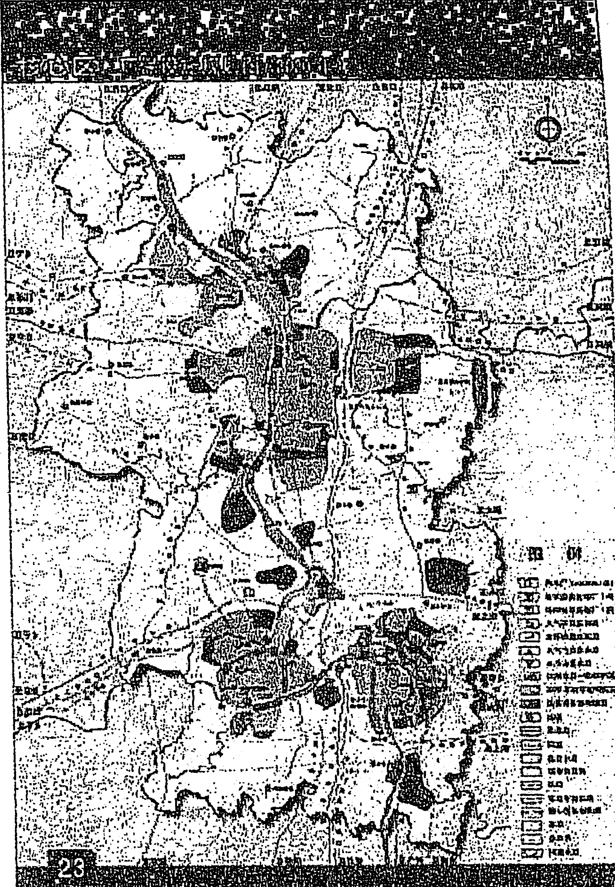

如果你沒找到，那麼我把它轉過來，你總該看到了吧？

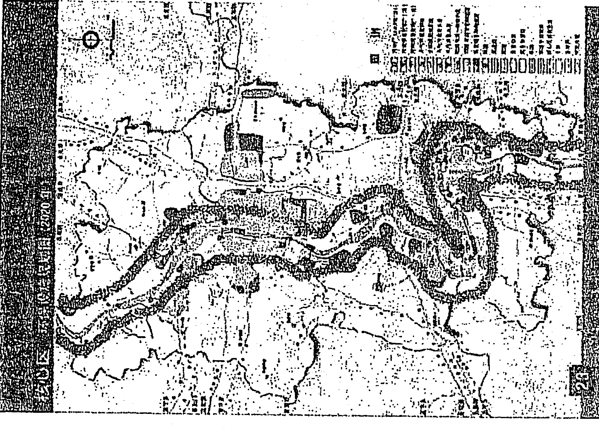

你還沒看到？那就看下一幅吧。

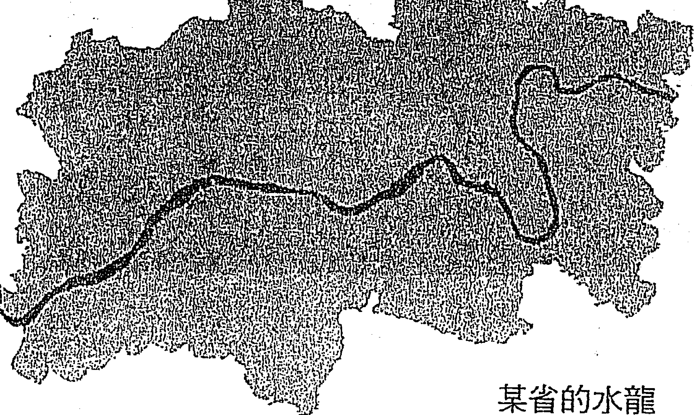

某省的水龍

黎註：戊戌變法時期，某日人考察中國，謂之曰：今後中國之情勢，不在皇室，唯在湘人。此湖南的水龍地理可證其前瞻說法。

二零零八年十月十九日

### 《六爻預測學》面授提綱

- 第一章　六爻預測學基礎知識
  - 一、六爻預測學的實用性
  - 二、起卦與排卦方法
  - 三、特種規則
- 第二章　六爻預測學象理分析（思路篇）
- 第三章　六爻利器三大技法（斷卦篇）
- 第四章　各類測事的技法組合（細斷篇）
- 第五章　現實事例分析講解（實斷篇）
- 結語

### 黎光先生簡介與服務項目

黎光先生自幼研習易經，經二十餘年努力專研，盡得《周易》心得，並從多年領悟中發展出一套活用於現今社會的《易學》心法。現客居廣州，並兼任多家知名公司客席顧問。

黎先生十八歲在雜誌上發表文章，並獲全國預測優勝獎，二十二歲開始著書立說。現任（香港）周易經學經世研究院副院長、中國哲學文化協進會專家委員、國際易學聯合中心理事等專業職務。

黎先生在研究和查閱大量筮法古籍後，首次提出並劃分了京房占卜學的三個歷史階段，整理了京房易、火珠林的失傳斷法，創編了《六爻三大技法》的占卜體系，補充了《易隱》的高層斷法，繼承了九星飛門的相宅方法。

#### 主要著作

- 《筮學通考》 2003年香港中國哲學文化協進會出版
- 《隱易千金斷》 2003年香港中國哲學文化協進會出版
- 《六爻預測學》 2005年臺灣武陵出版社出版
- 《商業易經占卜指南》 2006年臺灣武陵出版社出版
- 《易經實用指南》 2009年中國物資出版社出版
- 《起名者說》 2010年中國物資出版社出版
- 《相宅者說》 2010年臺灣武陵出版社、中國物資出版社同步出版
- 《皇極經世神數》 2010年大陸面世
- 《易經與人生運程》2010年中國物資出版社出版
- 《易經萬年曆》2010年中國商業出版社出版
- 《九天學算卦》2014年臺灣進源書局出版
- 《黎氏・後天易數》2015年臺灣進源書局出版
- 《六爻三大技法》2016年臺灣進源書局出版

#### 主要服務項目

- 六爻占卜諮詢
- 公司個人改名及嬰兒起名
- 人生開運設計、化煞旺財與法器安裝
- 陽宅陰宅風水的鑒定及指導改運
- 人生命運的策劃與指導
- 開運印章刻制
- 諸事擇吉日
- 合婚及擇吉日
- 企業顧問諮詢

#### 不定期開班教授以下內容

- 六爻占卜術
- 陽宅開運設計
- 姓名學
- 擇日學
- 人生命理預測

#### 聯繫方式

電話：+86-18620534736  
電子郵箱：yuanyi81212@163.com  
網址：搜索“黎光易學”（http://yuanyi81212.blog.163.com）

### 進源書局圖書目錄

Zin Yuan Publishing Company Index

| 編號 | 書名 | 裝訂/備註 | 價格 |
|---|---|---|---|
| 1001 | 陽宅傳薪燈（鄭照煌著） | 平裝 | 350元 |
| 1002 | 大三元廿四山六十四卦祕本全書（陳建利著） | 平裝 | 600元 |
| 1003 | 大三元順子局逆子局祕本全書（陳建利著） | 平裝 | 600元 |
| 1004 | 正宗三合法廿四山至寶全書（陳建利著） | 平裝 | 500元 |
| 1005 | 正宗九星法廿四山至寶全書（陳建利著） | 平裝上下冊 | 800元 |
| 1007 | 地理統一全書（古本） | 精裝4鉅冊 | 7000元 |
| 1008 | 三元九宮紫白陽宅入神祕旨全書（陳建利著） | 平裝 | 500元 |
| 1011 | 陽宅大全（周繼著・崇仰編集）POD | 平裝 | 400元 |
| 1012 | 風水二書形氣類則［歐陽純］POD | 平裝 | 600元 |
| 1013 | 地學形勢集（上、下）POD | 平裝 | 1200元 |
| 1014 | 地理捷徑祕斷（張哲鳴著） | 精裝 | 500元 |
| 1015 | 廿四山造葬祈福便訣（林靖欽藏書） | 平裝 | 500元 |
| 1016 | 天學洞機（林靖欽藏書） | 平裝 | 300元 |
| 1017 | 正宗三元法廿四山至寶全書（陳建利著）POD | 平裝 | 500元 |
| 1018 | 正宗風水讖頭理氣至寶全書（陳建利著）POD | 精裝 | 600元 |
| 1019 | 六十仙命廿四山安葬擇日入神祕旨全書（陳建利著）POD | 平裝 | 500元 |
| 1020 | 陽宅佈局神位實例圖解（姜健賢著） | 彩色平裝 | 600元 |
| 1021 | 陽宅寶鑑與水晶靈力應用（姜健賢著） | 彩色平裝 | 750元 |
| 1022 | 陰宅墓相學與環境地質應用（姜健賢著） | 彩色平裝 | 600元 |
| 1023 | 地理名墓與斷訣（姜健賢著） | 平裝 | 450元 |
| 1024 | 陽宅崇府寶鑑（劉文瀾著・金靈子校訂） | 平裝 | 250元 |
| 1025 | 三元三合簡易羅經圖解使用法（天星居士著） | 平裝 | 500元 |
| 1026 | 渾天星度與透地六十龍（天星居士著） | 平裝 | 400元 |
| 1027 | 陽宅與寶石（姜健賢著） | 平裝 | 600元 |
| 1028 | 三元玄空註解（姜健賢著） | 平裝 | 400元 |
| 1029 | 剋擇講義註解（天星居士著） | 平裝 | 600元 |
| 1030 | 陽宅個案發微（陳彥樺著） | 平裝 | 300元 |
| 1031 | 堪輿洩秘（清．熊起磻原著） | 平裝 | 600元 |
| 1032 | 地理鐵案（宋．司馬頭陀原著） | 平裝 | 350元 |
| 1033 | 天元五歌陽宅篇註（易齋．趙景羲著） | 平裝 | 300元 |
| 1034 | 地理尋龍點穴法訣（姜健賢編著） | 平裝 | 250元 |
| 1035 | 陽宅公寓、店舖、街路圖實際斷法（天星居士著） | 平裝 | 700元 |
| 1037 | 蔣氏玄空學探真（于東輝著） | 平裝 | 300元 |
| 1038 | 嫁娶擇日無師自通（天星居士著） | 平裝 | 500元 |
| 1039 | 陰宅精要（王士文著） | 平裝 | 300元 |
| 1040 | 造葬擇日無師自通（天星居士著） | 平裝 | 500元 |
| 1041 | 羅經分層使用精典—增訂本（林琮學著） | 平裝 | 350元 |
| 1042 | 造墓劣者地理法（戴仁著） | 平裝 | 300元 |
| 1043 | 精簡陽宅學（王士文著） | 平裝 | 300元 |
| 1045 | 天機地理提要（松林山人著） | 平裝 | 380元 |
| 1046 | 玄空地理真原發財祕旨（蔡一良著） | 平裝 | 500元 |
| 1047 | 陽宅改運DIY要訣（松林山人著） | 平裝 | 380元 |
| 1048 | 各派陽宅精華（鍾茂基著）上下冊不分售 | 平裝 | 600元 |
| 1049 | 地理撮要祕訣（吳水龍編修） | 平裝 | 250元 |
| 1050 | 新三元法—堪輿驗證實例（姜健賢編著） | 平裝 | 300元 |
| 1051 | 撼龍經疑龍經發揮（黃榮泰著） | 平裝 | 500元 |
| 1052 | 地理祕論全書（蕭有用著）上下冊不分售 | 平裝 | 500元 |
| 1053 | 玄空八宅經緯（黃榮泰著）POD | 平裝 | 450元 |
| 1054 | 天機地理鈞玄（松林山人著） | 平裝 | 380元 |
| 1055 | 你真的懂陽宅嗎？（陳龍羽著） | 平裝 | 300元 |
| 1056 | 玄空風水問答（陳澄謨著） | 平裝 | 300元 |
| 1057 | 八運陽宅吉凶推斷（陳澄謨著） | 平裝 | 300元 |
| 1058 | 八運陽宅論財運（陳澄謨著） | 平裝 | 320元 |
| 1059 | 八運陽宅論疾病（陳澄謨著） | 平裝 | 450元 |
| 1060 | 堪輿真妙（王祥安著） | 平裝 | 500元 |
| 1061 | 乾坤國寶透析（劉賁編著） | 平裝 | 600元 |
| 1062 | 陽宅三要透析（劉賁編著） | 平裝 | 650元 |
| 1063 | 五術築基（劉賁編著） | 平裝 | 400元 |
| 1064 | 八宅明鏡透析（劉賁編） | 平裝 | 600元 |
| 1065 | 陳哲毅教你看陽宅技巧（陳哲毅・陳旅得合著） | 彩色平裝 | 350元 |
| 1066 | 陽宅指南白話圖文註解（蔣大鴻原著・陳龍羽註解） | 平裝 | 300元 |
| 1067 | 玄空大卦透析（劉賁編）上下冊不分售 | 平裝 | 1200元 |
| 1068 | 八宅明鏡（顧吾廬原著・劉賁精校） | 平裝 | 250元 |
| 1069 | 陽宅三要（趙九峰原著・劉賁精校） | 平裝 | 250元 |
| 1070 | 陽宅實務非看不可（黃蓮池著） | 平裝 | 550元 |
| 1071 | 精義祕旨評註—駱氏挨星透析（劉賁評註） | 平裝 | 800元 |
| 1072 | 易經風水母法—國學經典（沈朝合・謝翊芸合著） | 平裝 | 350元 |
| 1073 | 各派陽宅診斷現象、化解（黃恆瑋・李羽宸） | 平裝 | 350元 |
| 1074 | 陰宅造葬實務非看不可—基礎斷法大公開（黃蓮池） | 平裝 | 550元 |
| 1075 | 陽宅形家透析（劉賁編） | 平裝 | 550元 |
| 1076 | 陽宅形家透析—內巒頭（劉賁編） | 平裝 | 500元 |
| 1077 | 沈氏玄空學評註（上冊）（劉賁評註） | 平裝 | 500元 |
| 1078 | 沈氏玄空學評註（下冊）（劉賁評註） | 平裝 | 700元 |
| 1079 | 形家長眼法陽宅陰宅風水上課講義[二]（劉賁卿著） | 精裝 | 2500元 |

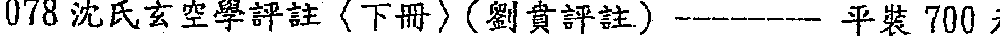

| 編號 | 書名 | 裝訂/備註 | 價格 |
|---|---|---|---|
| 2040 | 手相改運彩色圖鑑（松林山人著） | 平裝 | 450元 |
| 2041 | 五術津梁（洪富連著）POD | 平裝 | 230元 |
| 2042 | 手掌訣淺釋與應用（松林山人著） | 平裝 | 350元 |
| 2043 | 金玉六爻神卦（方金玉著） | 平裝 | 300元 |
| 2044 | 斗數四化元氣（法廣居士著） | 平裝 | 300元 |
| 2045 | 掌訣識玄機（蔡一良著） | 平裝 | 380元 |
| 2046 | 文王聖卦廿四籤【鳥仔卦】附說明書 |  | 2000元 |
| 2047 | 文王聖卦一般票・求財透解（陳龍羽著） | 平裝 | 250元 |
| 2048 | 葫蘆神數—生活易經占卜（沈朝合・謝翊芸著） | 平裝 | 300元 |
| 2049 | 奇門遁甲傳薪燈（鄭照煌著） | 平裝 | 350元 |
| 2050 | 梅花易數實證集錄白話本（劉壅坤著） | 平裝 | 350元 |
| 2051 | 卜卦傳薪燈（鄭照煌著） | 平裝 | 320元 |
| 2052 | 卦爻理用透析（一）—卦爻教科書（劉賁編著） | 平裝 | 500元 |
| 2053 | 卦爻理用透析（二）—占卦例篇（劉賁編著） | 平裝 | 400元 |
| 2054 | 卦文理用透析（三）—占卦例篇（劉賁編著） | 平裝 | 450元 |
| 2055 | 火珠林評註（劉賁評註） | 平裝 | 450元 |
| 2056 | 六爻神卦實證集錄（劉璧坤著） | 平裝 | 450元 |
| 2057 | 黃金策評註（劉基原著．劉賁評註） | 平裝 | 450元 |
| 2058 | 三才筮法（閑雲老叟著） | 平裝 | 350元 |
| 2059 | 承先啟後卜藝（一點青米著） | 平裝 | 400元 |
| 2060 | 元昭老漢簡易錄—詳解64卦袖珍本（楊典昭著） | 活頁本 | 400元 |
| 2061 | 野鶴占卜全書（劉賁整編） | 平裝 | 450元 |
| 2062 | 卜筮正宗（王洪緒原著．劉賁整編） | 平裝 | 350元 |
| 2063 | 九天學算卦（黎光．舒涵） | 平裝 | 500元 |
| 2064 | 卜筮全書新編（明 姚際隆／原著，劉賁／整編） | 平裝 | 500元 |
| 2065 | 易隱新編（清 曹九錫／原著，劉賁／整編） | 平裝 | 450元 |
| 2066 | 卦爻歌訣集釋［劉賁／編著］ | 平裝 | 500元 |
| 2067 | 卜卦真傳［林琮學著］ | 平裝 | 320元 |
| 2068 | 黎氏・後天易數（黎光著） | 平裝 | 450元 |
| 2069 | 卦理說真—股票、財運篇［石世明］ | 平裝 | 320元 |

### 符咒叢書

| 編號 | 書名 | 裝幀 | 價格 |
|---|---|---|---|
| 3001 | 靈寶大法（虛明真人編撰） | 精裝 | 400元 |
| 3002 | 神法秘術大全（真德大師全著） | 精裝 | 500元 |
| 3004 | 實用神符精通（真德大師等全著） | 精裝 | 500元 |
| 3005 | 法師專用符法（真德大師等全著）POD | 平裝 | 500元 |
| 3006 | 萬教符咒施法（真德大師等全著） | 精裝 | 500元 |
| 3007 | 萬教符咒作法（真德大師等全著） | 精裝 | 500元 |
| 3008 | 辰州符咒大全（張天師真人祕傳） | 平裝 | 600元 |
| 3009 | 辰州真本靈驗咒全書（余哲夫著） | 精裝 | 500元 |
| 3011 | 祕傳茅山符鑑（永靖大師著） | 平裝 | 500元 |
| 3012 | 真傳鳳陽符咒（永靖大師著）POD | 平裝 | 500元 |
| 3013 | 道法指印總解（法玄山人著） | 彩色平裝 | 1000元 |
| 3014 | 道壇符咒應用祕鑑（法玄山人著） | 平裝 | 500元 |
| 3015 | 符咒應用妙法全書（法玄山人著） | 平裝 | 500元 |
| 3016 | 萬教指印神訣（永靖大師著） | 彩色精裝 | 1000元 |
| 3017 | 萬教宮壇符鑑（永靖大師著） | 平裝 | 500元 |
| 3018 | 閭山正宗科儀寶典（法玄山人著） | 彩色平裝 | 800元 |
| 3019 | 閭山正宗開光安神總解（法玄山人著） | 彩色平裝 | 1000元 |
| 3020 | 道法指印真傳祕笈（法玄山人著） | 彩色精裝 | 1500元 |
| 3021 | 閭山正法（法玄山人編著）POD | 彩色平裝 | 1000元 |
| 3022 | 道壇解冤救結科儀（法玄山人著） | 彩色平裝 | 1000元 |
| 3023 | 中元普渡科儀（法玄山人著） | 彩色平裝 | 1000元 |
| 3024 | 仙道活訣竹人寸（法行士著） | 彩色平裝 | 800元 |
| 3025 | 溫帥血脈家傳符法（佚名著） | 平裝 | 300元 |
| 3026 | 六甲附餘天道神書（佚名著） | 平裝 | 500元 |
| 3027 | 抄本祕藏丁甲奇門符籙（佚名著） | 平裝 | 300元 |
| 3028 | 天心符法祕旨（佚名著） | 平裝 | 300元 |
| 3029 | 茅山符咒制煞祕笈（華元大師著） | 平裝 | 500元 |
| 3030 | 閭山法門祕旨（永靖大師、真德大師編著） | 平裝 | 500元 |
| 3031 | 安龍奠土科儀（法玄山人著） | 彩色平裝 | 800元 |
| 3032 | 祈安禮斗科儀（法玄山人著） | 彩色平裝 | 800元 |
| 3033 | 閭山八卦收魂法科（永靖大師、真德大師編著） | 彩色平裝 | 600元 |
| 3034 | 道門祭將關煞法科（永靖大師、真德大師編著） | 平裝 | 500元 |
| 3035 | 閭山乩童咒語祕法（永靖大師、真德大師編著） | 彩色平裝 | 600元 |
| 3036 | 符法真訣—研究報告（許道仁編著） | 彩色平裝 | 500元 |
| 3037 | 埔里符法講義（許道仁編著） | 平裝 | 300元 |
| 3038 | 綜合符咒講義（許道仁編著） | 平裝 | 300元 |
| 3039 | 正統茅山下三茅法門珍藏版（方俊人編著） | 平裝 | 300元 |
| 3040 | 茅山入門正邪符籙（方俊人編著） | 平裝 | 350元 |
| 3041 | 茅山精華集（方俊人編著） | 平裝 | 350元 |
| 3042 | 降頭・古曼童祕法大公開（鄭鴻謙著） | 平裝 | 350元 |
| 3043 | 五鬼運財・養鬼祕術（謝任芳著） | 平裝 | 350元 |
| 3044 | 祭改陰邪煞寶典（林吉成著） | 彩色平裝 | 800元 |
| 3045 | 招桃花開運寶典（林吉成著） | 彩色平裝 | 800元 |
| 3046 | 陰邪破解開運訣（林吉成著） | 彩色平裝 | 800元 |
| 3047 | 招財神・旺生意訣（林吉成著） | 彩色平裝 | 800元 |

- 3048 鎮商店・居宅旺財訣（林吉成著）—— 彩色平裝 800 元  
- 3049 吊菀晚鎮災煞訣（林吉成著）———— 彩色平裝 800 元  
- 3050 斬桃花祭驛馬要訣（林吉成著）———— 彩色平裝 800 元  
- 3051 符令速解指南秘鑑（林吉成著）——— 彩色平裝 800 元  
- 3052 婚姻感情和合秘訣（林吉成著）——— 彩色平裝 800 元  
- 3053 祭改陰邪煞纏身實例大公開（林吉成著）—— 彩色平裝 800 元  
- 3054 閭山安神祭改秘訣大公開手抄本（張進福著）—— 彩色平裝 500 元  
- 3055 中國符咒秘訣［高銘德／編著］—————— 平裝 450 元  
- 3056 中國道教法師傳承講義［陳文生／法名羅昇著］上下冊不分售—— 平裝 600 元  
- 3057 大師珍藏符咒秘笈［永靖大師宗師著］——— 平裝 500 元

### 擇日叢書

- 5001 擇日秘本萬年通書（洪潮和著）—————— 平裝 230 元  
- 5002 擇日講義（洪潮和著）—————————— 平裝 230 元  
- 5003 日課秘論全書（蕭有用著）上下冊不分售—— 平裝 500 元  
- 5004 胡蘆墩萬年曆 25 開（沈朝合著）———— 彩色平裝 450 元  
- 5005 胡蘆墩萬年曆 50 開（沈朝合著）———— 彩色平裝 350 元

### 命理叢書

- 6001 命理秘論全書（蕭有用著）上下冊不分售—— 平裝 500 元  
- 6002 子平八字十神因果論（吳政憲著）———— 平裝 450 元  
- 6003 子平真詮評註（徐樂吾評註）—————— 平裝 250 元  
- 6004 八字煉丹爐・高手秘笈（陳哲毅著）POD —— 平裝 350 元  
- 6005 八字自話全記錄（陳昱勳著）—————— 平裝 300 元  
- 6006 子平粹言（徐樂吾評註）———————— 平裝 300 元  
- 6007 八字傳薪燈（鄭照煌著）———————— 平裝 300 元  
- 6008 八字的玄機（謝武藤著）———————— 平裝 250 元  
- 6009 窮通寶鑑（徐樂吾評註）———————— 平裝 200 元  
- 6010 訂正滴天髓徵義（徐樂吾增註）—————— 平裝 300 元  
- 6011 論命出奇招（沈朝合・謝翎合著）———— 彩色平裝 380 元  
- 6012 四柱薪燈——八字傳薪燈續集（鄭照煌著）—— 平裝 320 元  
- 6013 正宗子平——博士論文（劉金財著）———— 平裝 350 元  
- 6014 起用神學八字——窮通寶鑑白話本（陳哲毅・陳力瀚合著）—— 平裝 550 元

### 國家圖書館出版品預行編目資料

六爻三大技法／黎光著—初版.—臺北市：進源文化，2016.06  
面；公分.—（相卜叢書：2070）  
ISBN 978-986-92172-7-9（平裝）  
1. 易占  
292.1  
105007865

◎相卜叢書 2070

# 六爻三大技法

- 作者／黎光  
- 出版者／進源文化事業有限公司  
- 發行人／林俊廷  
- 法律顧問／黃沛聲律師  
- 社址／台北市華西街 61-1 號  
- 電話／(02)2304-2670・2304-0856・2336-5280  
- 傳真／(02)2302-9249  
- http://www.chinyuan.com.tw  
- E-mail：juh3344@ms46.hinet.net  
- 郵政劃撥／台北 50075331 進源書局帳戶  
- 電腦排版／茼陽工作室  
- 印刷／原振企業社（國科）  
- 出版日期／二〇一六年六月（一刷）  
- 定價／平裝新台幣 600 元  

著作權所有・翻印必究  
◎本書如有缺頁破損或裝訂錯誤，請寄回本書局調換

掃一掃 關注微信

電話：18523259759  
微信：  
QQ：863003339