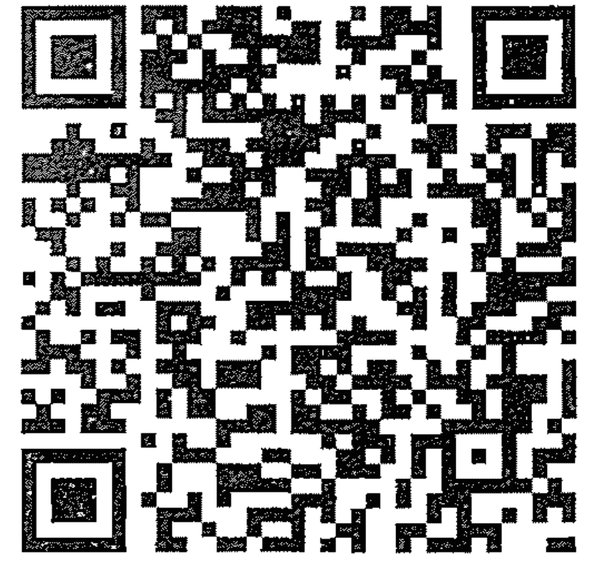
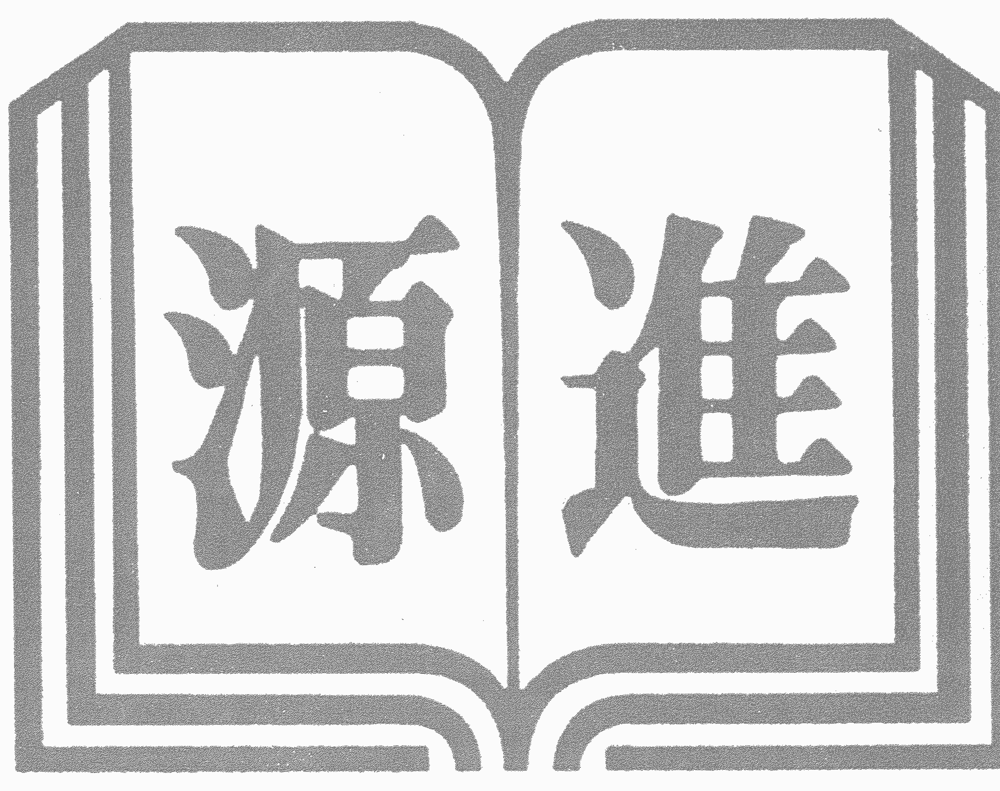
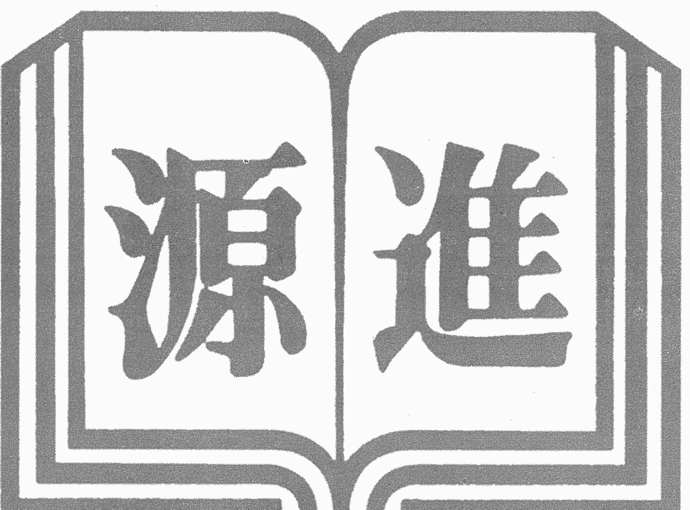

# ◎相卜叢書2086◎

王虎應、劉鐵卿／著

學易者要懂得通過一些生活中的沖刑合、生旺墓、六沖、三合、三會、三刑、六害等概念來理解易理。

# 六爻預測的世界

王虎應・劉鐵卿 著

進源文化事業有限公司出版

# 作者簡介

王虎應，國際著名易學專家、易作家、八宅易陣風水傳人，日本六爻占術創始人。1986 年畢業於山西大學日語專業，原就職於山西省考古研究所。

先後從事風水、相術、命理、佛學、中醫及煉丹術等的研究。80 年代開始潛心研究易經，以六爻、八字、風水、道家養生為研究重點，運用易學原理破譯了企業 logo 吉凶的奧秘，並為國內外眾多知名企業指導策劃。

自 96 年開始在全國遍訪民間術數奇人博採眾長，創立了自己完整的理論體系。多次應邀遠赴新加坡、日本、韓國等地講學，常年為企業進行國學培訓。學生遍及中國大陸、香港特別行政區、新加坡、美國、英國、日本、韓國、紐西蘭、馬來西亞等多個國家和地區。

# 主要出版著作

日本有：《八宅易陣風水》、《六爻占術奧義》、《六爻占術改運法》、《生活中的六爻占術》、《神奇應驗的六爻占術》、《外應預測》、《六爻預測三摩地》等。

香港有：《六爻卦例說真》、《六爻預測疾病新探》。

新加坡有：《增刪卜易評釋》、《六爻卦象解密》、《六爻疑惑指迷》、《六爻預測誤中悟》、《六爻分類占驗技法》、《六爻預測自修寶典》、《六爻測病分科詳解》。

臺灣有：《細說六爻預測學》、《六爻疾病預測學》、《六爻姻緣預測學》、《初學六爻預測》、《六爻經濟預測學》、《六爻風水預測學》、《住宅環境与疾病》、《占卜故事奇談》。

**劉鐵卿**，女，出生於平遙古城。自幼秉持家風，於 2005 年對祖國傳統文化易學產生濃厚興趣，其後拜師於國際易學名家王虎應和民間高手李登雲門下，開始系統化地學習易經知識。

2012 年成立了自己的易學工作室——劉鐵卿演易堂，為求測者指導、調整、化解。由於準確到位，求測的客戶絡繹不絕，有的客戶甚至也喜歡起易學來，拜師於門下。劉鐵卿對徒弟傾囊相授，百問不厭，真知真傳，培養出了很多人才，就連她的部分徒弟也已經開闢了周易工作室。

經過十餘載孜孜不倦的學習驗證，積累了大量的學術精華與寶貴經驗，在八字、六爻、風水上預測詳盡，受到學術界的廣泛讚譽，在國內外易學界逐漸名聲鵲起。多次應邀到日本、韓國講學。

與其師父王虎應合著有《六爻經濟預測學》、《六爻風水預測學》、《住宅環境與疾病》、《占卜故事奇談》。

# 目 錄

序 言 ............................................................................013

第一章 六爻預測中的因果觀............................................014

- 魚從魚缸裡跳出來你就懷孕了 ............................................018
- 竟然是自然災害影響了生意................................................022
- 竟然是自然災害救了生意....................................................024
- 夢到前世的妻子與兒子吉凶如何 ............................................026
- 問題出在宿舍 ....................................................................028

第二章 古代關於因果的占卜案例............................................031

- 烏鴉叫聲辨吉凶 ....................................................................036
- 死去的爺爺在作怪 ....................................................................038
- 孩子啞巴禍在白骨 ....................................................................040
- 夫妻突然身體不好是什麼原因？ ............................................042

第三章 人與自然的結構類似............................................044

- 動土引起情緒波動 ....................................................................046
- 人與周圍環境相關 ....................................................................048
- 墓地後面有大坑 ....................................................................052

第四章 同氣相求....................................................................054

- 有鳥飛來更吉祥 ....................................................................056
- 店鋪買賣怎麼樣？ ....................................................................058
- 如果要及格，快點修房頂 ....................................................060

第五章 人與自然通過象而關聯 ............................................063

- 一杯水放後來精神 ....................................................................064
- 和人一起在外面尿了一泡................................................066
- 子嗣有無.................................................................068

第六章 卦象與生活同理................................................071

- 流水擺件對應腎臟......................................................072
- 漏水多漏財.................................................................074
- 西北灶的問題.............................................................076

第七章 數與吉凶也有對應............................................079

- 睡不著覺是中邪了嗎？................................................080
- 為什麼一直懷孕不了？................................................084

第八章 判斷因果的六親取象........................................086

- 去了圍牆的鐵絲網......................................................090
- 嬰兒的魂壓在了下麵..................................................092
- 你有房子沒有蓋完......................................................094
- 廚房地面動了管子......................................................096
- 家裡佛像影響了身體..................................................098
- 打井造成的...............................................................102
- 你家拆大門重新修了..................................................104
- 兒子會高高興興上學嗎？..........................................106
- 管道上開個洞.............................................................108
- 最近動了佛像.............................................................110
- 供佛供錯了.................................................................112
- 家有五尊佛像.............................................................114
- 搬家影響了財運.........................................................118
- 你參加了朋友的葬禮..................................................120
- 色欲過渡引起病.........................................................124
- 漏水不利職工.............................................................126

第九章 判斷因果的五行取象……………………………………132

- 老鷹風箏的力量………………………………………………130
- 你摸了墓地水池上的石頭……………………………………134
- 動了魚缸得濕疹………………………………………………136
- 動了下水道引起的………………………………………………138
- 運氣不順是何原因？………………………………………………140
- 下水道堵了 ……………………………………………………142
- 動了床，或者桌子引起的……………………………………144
- 得病多與風水對應………………………………………………146
- 移灶引起的問題………………………………………………148
- 奶奶得病是什麼原因？………………………………………………150
- 孩子為什麼會哭鬧？………………………………………………152
- 鄰居的吊籃影響自己………………………………………………154
- 兩塊石頭惹的禍………………………………………………156
- 扔掉一堆碎紙片 …………………………………………………158
- 魚缸是兒子的靈魂………………………………………………160
- 水也有害人的時候………………………………………………162
- 我家有個夜哭郎………………………………………………164
- 原來是一個木球在作怪………………………………………………166
- 取了旁邊的土………………………………………………168
- 原來是拉水回家………………………………………………170
- 木雕佛像影響風水………………………………………………172
- 東南有植物影響………………………………………………174
- 動了墓碑影響的………………………………………………176
- 砍樹影響了眼睛………………………………………………178
- 下水道堵了 ……………………………………………………180
- 女兒在姥姥家長大………………………………………………182

第十章 判断因果的六神取象

- 小时候的玩伴上吊死了
- 家里光线不足
- 祸起砍树
- 不要再喝酒
- 为什么不长个？
- 吃了供品引起的
- 平常吃太烫的东西

第十一章 判断因果的爻位取象

- 上天入地
- 一卦同断阴阳宅
- 平安才是当务之急
- 父母双亡
- 女儿眼睛近视的原因？

第十二章 判断因果的卦象取象

- 都是道士惹的祸
- 孙子发烧久而不退的原因
- 出远门丢魂了
- 丙戌年动了房顶

第十三章 人体本身引起的因果

- 女儿尿血是什么原因？
- 头痛的原因
- 肺结核导致遗精
- 孩子为什么不听话？
- 原因在颈椎
- 原来是蛋白流失
- 手淫导致的
- 子宫肌瘤引起的................................................244
- 不孕不育........................................................246
- 我為什麼老得快？................................................248
- 我為什麼會生氣？................................................250

第十四章 陰陽宅不好引起的不利

- 水沖祖墳不利婚................................................252
- 玄武有坑難生兒................................................254
- 生女不生男....................................................256
- 弄巧成拙......................................................258
- 牽一髮而動全身................................................260
- 下水道影響財運................................................262
- 光線不足不利男................................................264
- 哥哥的運氣....................................................266
- 白虎張口要吃人................................................268
- 獨發可以反復取象..............................................270
- 河水流到住宅邊................................................272
- 小孩不說話是風水的原因嗎？....................................274
- 女兒斜視能不手術嗎？..........................................276
- 財運不好是風水的問題嗎？......................................278
- 皮膚乾裂有原因................................................280
- 漏水就漏財....................................................282
- 夫妻是冤家....................................................284
- 風水影響財運嗎？..............................................286
- 問題出在漏水..................................................288
- 病因來自風水..................................................290
- 他有牢獄之災..................................................292
- 西北有水不好..................................................294
- 風水影響身體..................................................296

- 修造影响儿子 ........................................................................ 298
- 孩子为什么发育不好？ ............................................................ 300
- 噩梦的原因 ............................................................................ 302
- 西面的店影响了你 ................................................................ 304
- 被岳父母刁难 ........................................................................ 306
- 受人牵连了 ............................................................................ 308
- 八宅风水与卦的结合 ............................................................ 310
- 养猪场赔钱 ............................................................................ 312
- 儿子肚子疼，原因在房子 .................................................... 314
- 小人是个退伍的 .................................................................... 316
- 例假不正常 ............................................................................ 318
- 你家祖坟找不到了 ................................................................ 320
- 祖坟影响生儿子 .................................................................... 322
- 风水是疾病的催化剂 ............................................................ 324
- 腰疼因为修补墙 .................................................................... 326
- 东北厕所影响财运 ................................................................ 328
- 修造引起的病 ........................................................................ 330
- 原来是对门在改造 ................................................................ 332
- 邻居孩子为什么突然不能走路了？ .................................... 334
- 风水可以反推 ........................................................................ 336
- 邻居修造也影响你 ................................................................ 338
- 土地下沉财不旺 .................................................................... 340

第十五章 生活中物品引起的不利

- 动土引起的 ............................................................................ 342
- 金鱼戏睡莲 ............................................................................ 344
- 家里有佛像 ............................................................................ 346
- 与一根红绳有关系 ................................................................ 348
- 祸自洗漱品 ............................................................................ 350

## 第十六章 做了某件事引起的不利

- 魚缸壞了 352
- 魚缸讓女兒性格變了 354
- 鬼由形來 356
- 遙遠的心 358
- 半夜裡孩子鬧騰怎麼辦？ 360
- 院子裡面有棵樹 362
- 都是陽臺上玻璃惹的禍 364
- 惡鬼又來了 368
- 手上串珠引來病 370
- 撤掉佛像可以賣了 372
- 床頭有個保溫杯 374
- 你家的閥門出問題了 376
- 趕快清理油煙機 378
- 兒子會笑了 380
- 皮膚為什麼起疹子？ 382
- 原來是化解物沒了 384
- 葬禮引發噩夢 386
- 貓咪怎麼了？ 388
- 洗澡受涼了 390
- 耳朵進水引起的 392
- 手指開裂怎麼辦 394
- 喉嚨不能發聲是什麼原因？ 396
- 砍了樹又種了 398
- 頭痛皆因一枝花 400
- 玻璃上有個神佛像 402
- 動了窗戶禍及身體 404
- 小人告密 406
- 曾經打死一條蛇 408
- 會發聲的東西原來是隻雞 410
- 去了烈士陵園 412
- 藥渣倒到西北了 416

## 第十七章 陰性物質引起的不利

- 有鬼的地方玩不得 418
- 眾神在作怪 420
- 鬼魂回家鬧騰 422
- 念佛引來了魔鬼 424
- 祖上殺業太多 426
- 死掉的兒子加害丈夫 428
- 兒子每天哭泣是什麼原因？ 430
- 女兒和同學合不來怎麼辦？ 432
- 鬼魂到你家了 434
- 睡了死人屋 436
- 給父親燒點紙錢吧 438
- 打胎的因果 440

## 序 言

六爻預測術發展到今天，通過大家的研究與發展，已經不是一個只用來進行判斷吉凶的方法了，更多的人想通過六爻預測找到原因與解決問題的方法，這就需要我們的預測水準上昇一個高度，進一步拓展六爻預測術的思路。

六爻預測雖然不是萬能的，但大量的實踐證明對我們人生與生活的指導還是有一定的幫助，要想解決問題就需要先找到問題的原因和對應點，這就好比找醫生看病一樣，需要做檢查，查出原因，才能對症下藥。

利用六爻預測術分析問題的原因與對應點具有很大的難度，不是簡單的衰旺生剋可以判斷出來的，需要學會取象思維，通過十二地支的生沖剋合、爻位、六神、六親、空亡、月破等諸多六爻基本概念的組合，把這樣抽象的概念演變成與實際能夠對應的具體東西或者事情來才是，判斷不能信口開河，需要與實際對應才能肯定分析結果是對還是錯的。驗證後才能進入下一步的階段。

我近 30 年的預測生涯，積累了一些這方面的心得，不敢自珍，寫成書公佈於世，名為《六爻預測的因果世界》與廣大愛好者共勉，驗證的案例非常多，因為篇幅有限，未能全部錄入。

王虎應

## 第一章 六爻预测中的因果观

因果一词源于佛教，是建立在轮回理论上的一种说法，佛教认为现在人们所感受到的幸福与痛苦都是因为前世所做过的一切才造成。而现在所做的一切又是来世幸福和痛苦的根源。用一个简单的概念来讲，因就是原因、起因、因素，果就是结果、果报。

宇宙世界纷繁复杂，做为生活在宇宙天地间的人会受到方方面面的制约，并不是单一地孤立存在。宇宙的变化与运动是一个整体，宇宙中任何一种事物，都是紧密相连，相互作用，环环紧扣，有一种无形的能量弥漫在过去、现在、未来，把宇宙所有的一切东西贯穿在了一起，牵一发而动全身，某一个点的变化会引发无数个其他点的变化，所以一个事情的结果，是由诸多因素造成的，只有寻找出与事物方方面面的关联点，才能把握住事物的本质。

六爻预测经过我几十年的研究与完善，已经是一种比较成熟、系统的预测方法了。通常预测的目的就是趋吉避凶，如果卦中出来的结果好，就不需要化解了，但是出来不好的结果，大部分人都想通过化解达到改变结果的目的。

宇宙世界是有序發展的，不會因為一個人的改變亂了秩序。所以六爻化解顯然不是萬能的，受諸多方面因素的限制，只能在一定程度上得到改善，不過從大量驗證的案例來看，還是有相當可觀的效果。六爻化解，不是千篇一律、固定不變的套路，中醫給人看病講對症下藥，六爻化解也是如此，需要搞清楚不利的原因和相關對應問題，然後找出化解的方法。因此根據卦象分析判斷事物的原因、起因、相關對應非常重要。

當然，一個事物吉凶的發生、發展原因不是單一的，是多方面的，複雜的。不過原因再多，總會有一個直接的原因，或者與其緊密相關的原因存在。比如，一個人有心臟病，某一天到商場買東西與售貨員發生衝突，一激動心臟病發作死了，那麼你說心臟病是死亡的原因呢？還是與人吵架造成的原因呢？還是逛商場買東西的原因呢？還是商場風水的原因？還是死者自己家裡住房風水不好引起的呢？還是死者命中的定數呢？

如果從六爻卦象論，卦中可能會顯示出這些裡面其中的一個原因，或者幾個原因。也許與這些原因都沒有關係，而是顯示他在某個階段做過某一件事情，比如砍了一棵樹，或者撿了一塊石頭回家，或者打死一隻鳥，或者扔了家裡的某個東西引起的等等，六爻卦象所展示的原因，往往是從五行，多維空間角度來體現的，與我們主觀上認為的角度不同。所以六爻裡面所論述的因果，並非佛教的因果概念，因可以是原因、起因、命裡帶的，果可以是導致的結果，或者事情發生後，周圍環境以及生活中會有某些現象出現，因此六爻裡的因果更多的是人與事物、行為等關聯的對應，雖然常人不容易理解，卻可以得到證實。

人們平常肯說這樣一句話：「**壓死駱駝的最後一根稻草**」，難道一根稻草就能壓死一頭駱駝嗎？我想恐怕一捆稻草也不會壓死駱駝的，一定是其他方面諸多因素造成了不利於駱駝的狀態，快要到了難以承受的極限，而這根稻草放在身上的時候，好像成了直接的原因，巨大的身軀一下子倒下了。六爻預測顯示出來的原因應該就是這樣一種情況。

六爻預測對宇宙的認識是宏觀與微觀的統一體，跨越時空、跨越維度的，非常人肉眼直觀論世界，所以六爻卦象體現事物因果的時候，是用五行的生沖剋合等方法來進行。

## 比如我驗證過的案例：

## 魚從魚缸裡跳出來你就懷孕了

2009 年的一天，我有事出差到青島。當時還在青島工作的我的學生孫曉罡帶來了他的一位女同事，說是想預測一下什麼時候能有孩子？

卯月甲戌日（旬空：申酉）

| 六神 | 伏神 | 【本 卦】 | 【變 卦】 |
| :--- | :--- | :--- | :--- |
| 玄武 | 官鬼 己巳火 | — ○→ | 父母 庚戌土 -- |
| 白虎 | 父母 己未土 | -- | 兄弟 庚申金 -- |
| 螣蛇 | 兄弟 己酉金 | — 世 | 官鬼 庚午火 — 應 |
| 勾陳 | 妻財 乙卯木 | -- | 妻財 乙卯木 -- |
| 朱雀 | 官鬼 乙巳火 | -- | 官鬼 乙巳火 -- |
| 青龍 | 子孫 甲子水 父母 乙未土 | -- 應 | 父母 乙未土 -- 世 |

此女生於 1975 年，年齡 35 歲了，已經做了六次試管嬰兒都沒有成功，她很怕同學聚會，因為大家一見面就問，你的孩子多大了等等，想要生一個孩子成了自己的心病。

我當時斷到：你是 2000 年領證（官鬼入墓在變爻，庚辰年衝開墓庫），2001 年結婚（官鬼獨發，應所值之年），你不是沒有懷孕能力，應該是曾經懷孕過流產了（子孫子水臨青龍，主懷孕，獨發絕之，又沒有了）。時間大約在 2001 年或者 2002 年，如果是 2001 年懷孕，月份大約是陽曆 8 月（辛巳年絕子孫，壬午年衝子孫出來被絕，8 月為申，獨發逢合應之）。結果他回答是在 2001 年 8 月懷孕，因為工作的原因，沒有要這個孩子，墮胎了（官鬼是工作，絕了子孫故應此）。到 2006 年想要孩子的時候，再也不能懷孕。

我又斷到：你曾經把沒有燃燒完的蠟燭扔到了垃圾箱裡面（六爻巳火獨發，表示原因。火可以是光，可以是燈，月建卯木，亥卯未驛馬在巳，驛馬為動態的，電燈一般是靜止不動的，油燈，蠟燭火苗才會晃動，現在已經沒有油燈了，所以判斷是蠟燭。六爻為退休之爻，表示不用了，廢棄了。入墓在變爻，玄武主髒東西，故而如此判斷），現在是心情煩躁，有抑鬱症，壓力很大，輸卵管不通。

以上的判斷得到驗證後，提出了化解方案：海邊找長石頭九塊放家的東南，彈簧四個放西面。西南養一條魚，魚缸要淺，水要滿，養魚後不要換水，等什麼時候魚從魚缸裡跳出來後你就懷孕了。

過了十來天後問：魚在魚缸裡面不往外跳怎麼辦？我說不要急，等等再說。又過了幾天，一天下班回家，突然看見魚缸裡的魚沒有了，找了半天，發現魚不知道什麼時候跳出來，已經曬乾了。於是馬上到醫院檢查，醫院說是陽性，她懷孕了。最後生了一個兒子。真人真事，毫不誇張。

## 竟然是自然灾害影响了生意

这是 2011 年的例子。日本人求测自己 3 月份开店营业额如何？寅月丙辰日（旬空：子丑），摇卦得泽天夬变地天泰。

| 六神 | 伏神 | 坤宫：泽天夬【本卦】 | 坤宫：地天泰（六合）【变卦】 |
| :--- | :--- | :--- | :--- |
| 青龙 | | 兄弟 丁未土 -- | 子孙 癸酉金 -- 应 |
| 玄武 | | 子孙 丁酉金 —— 世○→ | 妻财 癸亥水 -- |
| 白虎 | | 妻财 丁亥水 —— ○→ | 兄弟 癸丑土 -- |
| 螣蛇 | | 兄弟 甲辰土 —— | 兄弟 甲辰土 —— 世 |
| 勾陈 | 父母 乙巳火 | 官鬼 甲寅木 —— 应 | 官鬼 甲寅木 —— |
| 朱雀 | | 妻财 甲子水 —— | 妻财 甲子水 —— |

以妻財為用神。妻財亥水得月合雖然有氣，但抵不過日辰來剋，又是入墓，不吉。

世爻發動生妻財，表示自己努力經營，但是妻財原本根基淺薄，世爻又被日辰合住，貪合忘生，本人無能為力，更不好者，妻財化空亡，化回頭剋，去生應爻，此為無情。生意慘澹，營業不利，尤其到乙丑日會急轉直下。

誰知3月11日變爻丑土出空，竟然發生大地震，店鋪陷入停止營業的狀態，沒有一點營業額。

## 竟然是自然灾害救了生意

無獨有偶。這是 2011 年一月份的時候另外一個日本人開了三個餐飲店，因為不景氣，資金緊張而求測運氣如何，店能不能再繼續經營下去？搖卦如下。

丑月戊子日（旬空：午未）

| 六神 | 伏神 | 震宮：雷水解【本卦】 | 艮宮：火澤睽【變卦】 |
|---|---|---|---|
| 朱雀 | | 妻財庚戌土 -- ×→ | 子孫己巳火 —— |
| 青龍 | | 官鬼庚申金 -- 應 | 妻財己未土 -- |
| 玄武 | | 子孫庚午火 —— | 官鬼己酉金 —— 世 |
| 白虎 | | 子孫戊午火 -- | 妻財丁丑土 -- |
| 螣蛇 | | 妻財戊辰土 —— 世 | 兄弟丁卯木 —— |
| 勾陳 | 父母庚子水 | 兄弟戊寅木 -- ×→ | 子孫丁巳火 —— 應 |

以妻財為用神。妻財兩現，以妻財戌土為用神。另外一個做參考。

初看此卦，用神雖然月幫扶動化回頭生為吉，但用神生應爻無情。又兄弟旺相發動剋妻財好像不吉，足夠可以說飯店經營不景氣了，雖然有營業額，最後所剩無幾。

可是日沖卦中兩個午火，雖然空亡休囚，卻被沖實，形成暗動，足夠化解掉兄弟的力量，更妙的是，成了子孫三合局，妻財也不生應爻了，無情變成有情，反而生了世爻的財。所以我判斷有特殊轉機，可以改變現在不景氣的狀況，飯店財運好起來。

當得到回饋後回頭再看此卦，真是玄妙。有人歡喜有人憂啊。災禍也可以成好事。

回饋：因為網路的修復用了三個月的時間致使現在才回饋，敬請原諒。當時您說有特殊轉機，我和妻子兩個人還在猜這猜那的，想到底是什麼事情可以帶來轉機，想不到3月11日發生地震引發的海嘯給我的店帶來轉機。我店裡的店員有五個人的房子在這次海嘯中被沖走了，我的房子還算不錯，得以倖存。海嘯死了很多人，但我的家人和店員沒有一個死亡的。因為災禍的出現，抗災需要大量的便餐，我的三個店都忙碌起來，結果比以前任何時候收入都好，再也不需要為錢周轉不靈發愁了。太感謝您的預測了。

## 夢到前世的妻子與儿子吉凶如何

这是 2016 年我的六爻徒弟让我看过的一个卦，一个人常常梦到前世的妻子与儿子，吉凶如何？于巳月甲寅日（旬空：子丑），得水山蹇之风地观。

| 六神 | 伏神 | 兌宮：水山蹇【本卦】 | 乾宮：風地觀【變卦】 |
|---|---|---|---|
| 玄武 | | 子孫 戊子水 -- ×→ | 妻財 辛卯木 —— |
| 白虎 | | 父母 戊戌土 —— | 官鬼 辛巳火 —— |
| 螣蛇 | | 兄弟 戊申金 -- 世 | 父母 辛未土 -- 世 |
| 勾陳 | | 兄弟 丙申金 —— ○→ | 妻財 乙卯木 -- |
| 朱雀 | 妻財 丁卯木 | 官鬼 丙午火 -- | 官鬼 乙巳火 -- |
| 青龍 | | 父母 丙辰土 -- 應 | 父母 乙未土 -- 應 |

沒有特定的用神。看卦的組合變化。前世的人就是不在自己生活範圍內的人，不管前世的妻子、兒子存在不存在，前世對於自己來說已經是歷史了。六爻子孫子水化妻財卯木臨玄武發動，六爻為祖，為過去，玄武為幻覺、幻象，子孫是孩子，妻財是老婆，六爻發動，就是夢裡的資訊。世爻臨螣蛇，螣蛇為夢，暗動生六爻，就是做這樣的夢了。

此卦還有一個動爻，三爻兄弟申金臨勾陳化妻財卯木，三爻為門，臨金是鐵門，勾陳主修造，動而逢合，在癸巳年一定動了鐵門。（果然在癸巳年換了鐵門。）

發動被日沖，世爻與三爻一樣，也被沖，四爻也是門，兄弟也為門，值今年太歲，主今年再次動了門。（驗，今年春天給門上塗了灰色的油漆。）

三爻動化子孫死地，又六爻子孫空亡化死地，主有小孩或者寵物死亡之象。實際上在癸巳年更換大門一個星期後，死了兩條狗。

而此人在第二次動門後就病了，變得神經過敏。此皆動氣引起不利。

## 問題出在宿舍

我大學的同學突然有一天在微信上找我，說她正月十五的時候做飯燙了右手，2月18號爬山回家下坡又崴了腳，右腳骨折，在搖卦的當天上午切蘋果傷了左手小拇指，於是測是什麼原因引起的？於巳月壬戌日（旬空：子丑），得澤水困之雷水解。

| 六神 | 伏神 | 兌宮：澤水困（六合）【本卦】 | 震宮：雷水解【變卦】 |
|---|---|---|---|
| 白虎 | 父母 | 丁未土 -- | 父母 庚戌土 -- |
| 螣蛇 | 兄弟 | 丁酉金 — ○→ | 兄弟 庚申金 -- 應 |
| 勾陳 | 子孫 | 丁亥水 — 應 | 官鬼 庚午火 — |
| 朱雀 | 官鬼 | 戊午火 -- | 官鬼 戊午火 -- |
| 青龍 | 父母 | 戊辰土 — | 父母 戊辰土 — 世 |
| 玄武 | 妻財 | 戊寅木 -- 世 | 妻財 戊寅木 -- |

以世爻為用神。她說的幾件事情卦裡都有的。兄弟酉金在外卦發動，兄弟為手足，化退剋世爻，正月是寅月，世爻值月被剋，兄弟在外卦是手，世爻寅木返卦為艮，艮為手。世爻臨玄武是水，月上巳火刑，為火，或者熱的。所以是寅月手被燙傷。

五爻為路，化退合二爻宅爻，是回家的途中。剋世爻，世爻在初爻是腳，金為骨骼，所以是腳骨折。左為陽，右為陰，世爻臨陰爻，所以右腳骨折。而今日左手小拇指傷是忌神兄弟發動化退，日沖辰土暗動，合住酉金不退剋了世爻。陽爻獨發，陽為左。把整個卦當一隻手看，初爻為小拇指。（在我的〈六爻預測疾病新探〉裡面有論述）金為刀，剋妻財，妻財主飲食，所以是切吃的東西的時候。臨玄武，玄武為水，所以是水果。

以上都是事後諸葛，意圖在讓大家打開思路。目前預測的目的是找原因。

**神兆機於動**：獨發的其中一個作用就是表示原因。獨發化退，應期多在變爻，應丙申年。酉金為生水的五行，臨螣蛇就是細長的供水管，獨發又合了二爻的辰土，二爻為宅，就是有管子接到了家裡。

辰土為水庫，辰土臨青龍，青龍為新的、裝修、打扮、漂亮，暗動就是在房間裡移動了水箱，或者浴池等。

因為多年沒有見面，平常也不聯繫，我不熟悉她的情況。結果她回饋，她住在香港公司的宿舍裡。丙申年8-9月裝修，搬到了隔壁。2017年5月11日搬回到自己宿舍的。因為在丙申年宿舍漏水才裝修的。水管不通了，臨時從外面拉了一根水管進來。裝修完後才知道，原來衛生間的熱水器和淋浴換了地方。

**化解方法：** 水邊草8片，放西面高處。隨身帶黑豆六顆。（化解後，至今平安無事，各方面順了。）

## 第二章
古代關於因果的占卜案例

古代能夠巧妙判斷出前因後果，利用時空化解的預測家很多，管輅就是其中一位。管輅，字公明，三國時期魏國平原（今山東平原縣）人，生於西元210年，雖然有高超的占卜本領，但長相丑陋不堪，喜歡喝酒，調侃開玩笑，所以鄉鄰四舍喜歡他，卻不尊敬他，後來就到了他父親任職的利漕縣。

來到利漕縣後管輅的名聲很快就響亮起來。利漕有郭恩三兄弟很多年前得了腿疼的毛病，走路一拐一拐的變成了瘸子，多方求醫治療不好，沒有一個人能夠說出病因來，聽說管輅占卜水準高超就前來求測病因。

管輅判斷說：卦象顯示你家祖墳裡面埋了一個女人，已經變成厲鬼，不是你伯母就是你嬸娘。很多年前鬧饑荒，糧食非常精貴，有人為了她手中的幾升米把她推落水井中。她在井裡拼命呼救，推她下去的人不但不救，反而拿起大石頭向井裡砸，結果石頭砸在頭上一命嗚呼了。她死了後變成孤魂野鬼，仍舊頭疼不止，向天帝申冤，天帝就說他們這樣迫害你，就讓他們腿疼吧。

這個時候郭恩在旁邊已經泣不成聲，承認了此事是他們兄弟三人幹的，對過去的所作所為後悔不已。

管輅占卜的名氣越來越大，傳到了太守王基的耳朵裡，因為太守府衙不安寧，就被請去預測。

**管輅判斷道**：你這府衙有些怪異，有三件事情發生。第一，有個下女生了一個男嬰，剛剛生下來就會走路，自己跑到爐灶裡面燒死。第二，有一條大蛇口中含有一支筆出現在您的床上，大家都可以看見，過一會就自動消失了。第三，有一隻烏鴉飛進房間與燕子搏鬥，最後燕子被打死，烏鴉飛走。

太守一聽非常害怕，怎麼會發這樣的怪事？府衙豈不是成了凶宅嗎？

**管輅說**：您這府衙是早年修蓋的，太舊了，陰氣重，所以產生這種現象。剛生下的孩子就會走路，其實並不是他自己走，是有妖邪的東西把他放到了爐灶裡面。大蛇口中含著毛筆，其實是以前死了的老書吏作怪，而烏鴉與燕子搏鬥是屋頂上的老風鈴在作怪。管輅的預測一一出現發生，大家都驚嘆他預測的水準。

當時信都縣令聽說了管輅占卜的神奇，因為家裡女眷連年得病，心神不寧，經常夢中驚醒，多方求醫無效，就請求管輅預測一下。

**管輅判斷**：您的房子是修蓋在了一座墳墓上面。墳墓在房子的北側，裡面埋了兩個死去的男人，一個男人手裡拿著一把矛，另外一個男的手裡拿了一把弓箭。頭在牆壁裡，腳在牆壁外，拿矛的正好對著頭部，所以有的女眷頭疼，抬不起脖子，拿弓箭的對著肚子，所以有的女眷肚子疼，不能吃東西。兩個鬼魂白天出去遊蕩了，所以病人白天不怎麼難受，到了晚上鬼魂回來作怪，所以夢裡害怕，影響入睡，病情加重。

縣令命人挖開地基勘驗，果然如管輅所說。清理出兩具屍體，移到了郊外掩埋後，家裡的人身體都好了。

清河縣的縣令王經被免去官職後回家，就去見管輅求他預測說：我最近發生一件怪事，覺得不太好，想請先生看看怎麼樣？

**管輅起卦後回答**：從卦象看不是凶事，所以不用放在心上。您是不是前幾天晚上在窗戶前站著的時候，突然有一個像燕子一樣發光的東西鑽到了您的懷裡，嗡嗡嗡地叫著，把您嚇了一跳，急忙解開衣服尋找，又叫過來尊夫人幫忙？

王經大笑：先生判斷的很對，猶如親眼所見。

管輅接著說：此卦為吉，三天內必有升官之事，等著驗證吧。

果然，第二天收到了上任的文書，王經被任命為江夏太守。

有一天，管輅又來到了郭恩的家裡，這時有一隻斑鳩飛落到房子頂上淒慘地叫著。管輅說：明天有一個年紀大的客人要從東方來你府上，手裡拿著一個豬頭，一壺好酒，這雖然是喜事，但會有一個小小的意外發生。

第二天果然客人拿著豬頭和美酒來了，郭恩很高興讓家裡人準備殺只雞招待，但將近中午，雞都樹枝上休息，他兒子自告奮勇用弓箭射雞，結果雞沒有射中，卻把在那裡玩耍的鄰居家的小女孩的手射傷了。

關於管輅預測的故事還有很多，不再一一描述。如果預測水準到一定程度，的確可以分析出事情的前因後果來，從而達到解決問題的目的，這也是我寫此書的初衷，拋磚引玉，開拓大家解讀六爻卦象的思維，讓六爻這門預測術很好地傳承下去。

## 我驗證過的部分案例：

## 筆 記 欄

## 烏鴉叫聲辨吉凶

這是2011年的例子。某女早上出門的時候，門口對面有烏鴉叫了幾聲，感覺心裡不好。因為民間一直傳流著一種有烏鴉叫不好的說法，於是測烏鴉叫聲吉凶，於巳月壬申日（旬空：戌亥）

坎宮：雷火豐

| 六神 | 伏神 | 【本 卦】 |
| :--- | :--- | :--- |
| 白虎 | 官鬼 | 庚戌土 -- |
| 螣蛇 | 父母 | 庚申金 -- 世 |
| 勾陳 | 妻財 | 庚午火 — |
| 朱雀 | 兄弟 | 己亥水 — |
| 青龍 | 官鬼 | 己丑土 -- 應 |
| 玄武 | 子孫 | 己卯木 — |

以世爻為中心，綜合判斷。世爻被月刑剋臨騰蛇，主心情不安，心緒不寧。世爻臨日旺相，六爻安靜，平安沒有凶事。

月建剋世爻，世爻在五爻，主道路，巳火入卦變成午火臨勾陳，勾陳為建築施工，主附近有改造修路。

六爻官鬼戌土臨白虎空亡，六爻為高處，土主建築，水泥磚瓦，空亡主失去離開，合到初爻，主高空有水泥磚瓦落下。戌土緊鄰世爻，六爻又為鄰居，可能是附近的建築物。

三爻亥水空亡，主家裡停水漏水。臨朱雀，為飲用水。

回饋：水箱被堵塞不出水了，清理了一下。我們房子正面有路，這個月因為修理下水道挖開了舊路，修好後正在鋪油路。午月到未月的時候，西臨的四層樓醫院被拆，水泥紛紛落下。申月的時候西南另外一座醫院又被拆了。一年下來，自己平安無事。

## 死去的爺爺在作怪

這是2016年的例子。某男測女兒病，於壬辰月戊辰日（旬空：戌亥），得天風姤之巽為風。

| 六神 | 伏神 | 【本 卦】 | 【變 卦】 |
| :--- | :--- | :--- | :--- |
| 朱雀 | | 父母 壬戌土 —— | 妻財 辛卯木 —— 世 |
| 青龍 | | 兄弟 壬申金 —— | 官鬼 辛巳火 —— |
| 玄武 | | 官鬼 壬午火 —— 應○→ | 父母 辛未土 - - |
| 白虎 | | 兄弟 辛酉金 —— | 兄弟 辛酉金 —— 應 |
| 螣蛇 | 妻財 甲寅木 | 子孫 辛亥水 —— | 子孫 辛亥水 —— |
| 勾陳 | | 父母 辛丑土 - - 世 | 父母 辛丑土 - - |

以子孫為用神。子孫亥水臨螣蛇空亡，入墓在日月，螣蛇主驚恐、捲曲，空亡為走神，水為智慧，亥水對應乾，主腦子思維，入墓主昏迷，卦在乾宮為頭。此為抽搐，腦子發癲之病，腦子發愣。（果然是癲癇、抽搐、發愣、走神。）

官鬼午火獨發，獨發表示性質、原因等，女兒可能是屬馬的，官鬼午火臨玄武，玄武主陰氣，官鬼為死去的人，化父母在乾宮，與長輩有關係。（驗，女兒屬馬）

女兒命爻與官鬼一體，那就是被鬼魂纏繞，盯住了。六爻戌土為官鬼墓庫，日月衝破，六爻為祖墳，臨戌土返卦為乾為頭，主有長輩因為頭部破裂而死之人，此人影響了孩子，所以孩子得病也出現在腦部。（驗，孩子的爺爺被人打破頭而死。）

獨發午火臨玄武化未土，玄武為水，午火為南面，主南面有水，戌土空亡，主墳地有坑，獨發化未土，主不是南就是西南有坑。（驗，南面是大海，墳地西南因為取土挖了一個坑。）

看來你父親，不喜歡你女兒，所以死後還在作怪。（驗，因為卦主父親是獨生子，卦主也是獨生子，生前就曾經對卦主說過，你一定要給我生一個兒子，不能斷了香火。）

六爻戌土被日月沖，主在丙戌年動過祖墳。午火化父母未土與動爻官鬼合，合官鬼為合葬墓，合處應沖。己丑年也應該動過。世爻丑土可以暗示，與丑年也有關係。（驗，2006年因為修路，不得不搬遷墳地，在2009年因為奶奶死了，合葬的時候再次動了墳地。）

後雖然做了化解，但效果不明顯。

## 孩子哑巴祸在白骨

這是2015年學生問過我的一個例子。他朋友的孩子辛卯年生，一直不會說話？測原因，於子月庚申日（旬空：子丑），得風天小畜之巽為風。

| 六神 | 伏神 | 巽宮：風天小畜【本卦】 | 巽宮：巽為風（六沖）【變卦】 |
|---|---|---|---|
| 螣蛇 | | 兄弟 辛卯木 —— | 兄弟 辛卯木 —— 世 |
| 勾陳 | | 子孫 辛巳火 —— | 子孫 辛巳火 —— |
| 朱雀 | | 妻財 辛未土 —— 應 | 妻財 辛未土 —— |
| 青龍 | 官鬼 辛酉金 | 妻財 甲辰土 —— | 官鬼 辛酉金 —— 應 |
| 玄武 | | 兄弟 甲寅木 —— | 父母 辛亥水 —— |
| 白虎 | | 父母 甲子水 —— 世○→ | 妻財 辛丑土 —— |

以子孫為用神。子孫巳火月剋日不幫扶為休囚。雖然有寅木暗動來生，無根之火，生扶不起。

此卦主要是問原因。因此獨發爻非常主要，書云，神兆基於動，動爻就是原因。白虎為醫藥，子水又是子孫胎地，化妻財，主老婆，懷孕期間吃藥過多，此是其一。二是父母在初爻臨白虎發動，化出官鬼墓庫，主宅基附近有白骨影響了孩子。

結果回饋，卦主父親過世以後，竟然停放十年才下葬。這正是空亡臨白虎的父母持世，主這個資訊。空亡等於死了，白虎主喪，持世主一直在身邊。陰魂沒有散盡，影響了孩子。

## 夫妻突然身體不好是什麼原因？

這是2018年的例子。某女測自己和丈夫突然身體不好了，是什麼原因？於辛酉月甲辰日（旬空：寅卯），得天雷無妄之澤雷隨。

| 六神 | 伏神 | 【本 卦】 | 【變 卦】 |
| :--- | :--- | :--- | :--- |
| 玄武 | 妻財 壬戌土 | ○→ | 妻財 丁未土 應 |
| 白虎 | 官鬼 壬申金 | —— | 官鬼 丁酉金 —— |
| 螣蛇 | 子孫 壬午火 | —— 世 | 父母 丁亥水 —— |
| 勾陳 | 妻財 庚辰土 | — — | 妻財 庚辰土 — — 世 |
| 朱雀 | 兄弟 庚寅木 | — — | 兄弟 庚寅木 — — |
| 青龍 | 父母 庚子水 | —— 應 | 父母 庚子水 —— |

官鬼為丈夫，世爻為自己，看卦的組合變化。

世爻臨午火日月不幫扶為休囚，身體比較弱，元神寅在二爻空亡，腸炎，肚子疼，世爻入墓在獨發的戌土，主頭暈，腦子迷糊。世爻所值的午月，獨發所值的戌月，退神的未月都不好。（驗，午月開始拉肚子，未土到戌月開始頭暈。戌月又肚子疼。而且牙齦化膿。）

官鬼申金日月幫扶為旺相，但元神在六爻獨發化退，主精神不足，感到疲勞。獨發沖了三爻的妻財辰土，月建酉金官鬼是病合到了三爻辰土，三爻土為胃，消化系統，此方面出問題。辰返卦為巽，巽為肝膽，肝膽不利。（驗，沒有精神，胃不好，膽囊炎手術，而且走路摔傷。）

他們夫妻的病，醫院查不出原因，此卦主要是測原因的。神兆機於動，獨發就是原因。六爻土獨發，六爻為牆，土也為牆，化退者，牆皮脫落之象。（驗，洗澡間、衛生間的牆皮掉了。）

獨發臨玄武，玄武為水象，寅木空亡了，二爻為宅，木為傢俱，木制的東西。牆皮受潮，木空則朽，玄武又為腐爛，獨發表示性質。家裡有木制的東西腐爛了。（驗，洗衣機漏水，泡爛了木地板。）

後經過化解本人的身體好了。但丈夫的膽，沒有改變，癌變了。

## 第三章
人與自然的結構類似

《黃帝內經》是我國古人從中醫的角度全面論述人體疾病原理、原因、以及治療手段、保養方法等的一本珍貴著作，提出天人合一的概念，把人與自然緊密結合起來論述，是世界上最完美的醫學理論。人天結構類似是《黃帝內經》天人合一觀最粗淺的層面。《黃帝內經》認為人的身體結構體現了天地的結構。

例如《靈樞·邪客》說：「天圓地方，人頭圓足方以應之。天有日月，人有兩目。地有九州，人有九竅。天有風雨，人有喜怒。天有雷電，人有音聲。天有四時，人有四肢。天有五音，人有五藏。天有六律，人有六府。天有冬夏，人有寒熱。天有十日，人有手十指。辰有十二，人有足十指、莖、垂以應之；女子不足二節，以抱人形。天有陰陽，人有夫妻。歲有三百六十五日，人有三百六十節。地有高山，人有肩膝。地有深谷，人有腋膕。地有十二經水，人有十二經脈。地有泉脈，人有衛氣。地有草蓂，人有毫毛。天有晝夜，人有臥起。天有列星，人有牙齒。地有小山，人有小節。地有山石，人有高骨。地有林木，人有募筋。地有聚邑，人有蜰肉。歲有十二月，人有十二節。地有四時不生草，人有無子。此人與天地相應者也。」

它把人體形態結構與天地萬物一一對應起來。人體的結構完全可以在自然界中找到相對應的東西，人體就是天地的縮影。充分強調人的存在與自然存在的統一性。

所以通過六爻預測判斷事物吉凶的原因應該像《黃帝內經》中所說的一樣，把事物的吉凶建立在人與自然的對應關係上才能找出問題所在，才能找到比較合理的、接近問題的方法。

比如我驗證過的部分案例。

## 動土引起情緒波動

這是2018年的例子。某男（戊寅年生）自言眼睛疲勞，測身體，於壬戌月戊戌日（旬空：辰巳），得雷澤歸妹之地火明夷。

| 六神 | 伏神 | 【本 卦】 | 【變 卦】 |
| :--- | :--- | :--- | :--- |
| 朱雀 | | 父母 庚戌土 -- 應 | 兄弟 癸酉金 -- |
| 青龍 | | 兄弟 庚申金 -- | 子孫 癸亥水 -- |
| 玄武 | 子孫 丁亥水 | 官鬼 庚午火 — ○→ | 父母 癸丑土 -- 世 |
| 白虎 | | 父母 丁丑土 -- 世 ×→ | 子孫 己亥水 — |
| 螣蛇 | | 妻財 丁卯木 — ○→ | 父母 己丑土 -- |
| 勾陳 | | 官鬼 丁巳火 — | 妻財 己卯木 — 應 |

以世爻為用神。世爻丑土得日月幫扶，二爻又化出丑土，四爻午火發動又化丑土，六爻又是戌土，疊疊旺相物極必反，反為休囚。

四爻午火返卦為離，離為眼睛，入墓在日，壬辰年衝開墓庫，午火生世爻不利，此年眼睛開始出問題。（驗）

父母持世臨白虎朱雀，朱雀為學習，白虎是快，本人愛學習，學習速度快，父母多現，知識面廣。（驗）

過旺反為弱，現在學業停滯，化遊魂，已經不學習了。（驗，休息在家。）

元神午火臨玄武入墓，心情不好，壓抑，此是抑鬱症的特點。而世爻臨白虎主脾氣不好，一會煩躁不安，一會不想理人。（驗）

世爻為土在三爻，過旺了，反為弱，四爻化丑土，代表了眼睛，而二爻又化出丑土一定也是病，臨螣蛇為細長的，綜合起來主腸胃不好。（驗）

二爻木化土，二爻為宅，土木互化主土木工程，一定是因為動了宅子，房子引起的。午火和卯木都化丑土，二者必然有關聯。變爻父母丑土為房子，那麼兩個動爻就是時間，不是辛卯年午月動了宅子，就是甲午年卯月動了宅子。（驗，壬午年卯月爺爺拆房子翻修動土了，而且砍了幾棵樹。原來只是眼睛疲勞，甲午年卯月以後得抑鬱症，越來越嚴重，無法上學了。）

**化解：沒有記錄，但化解後好轉了。**

## 人與周圍環境相關

這個是2011一位日本女子預測自己辛卯年運氣的案例，於卯月乙丑日（旬空：戌亥）

| 六神 | 伏神 | 【本 卦】 | 【變 卦】 |
| :--- | :--- | :--- | :--- |
| 玄武 | | 兄弟 丙寅木 —— | 子孫 己巳火 —— 世 |
| 白虎 | 子孫 辛巳火 | 父母 丙子水 - - | 妻財 己未土 - - |
| 螣蛇 | | 妻財 丙戌土 - - 世 ×→ | 官鬼 己酉金 —— |
| 勾陳 | 官鬼 辛酉金 | 妻財 庚辰土 - - ×→ | 父母 己亥水 —— 應 |
| 朱雀 | | 兄弟 庚寅木 - - | 妻財 己丑土 - - |
| 青龍 | | 父母 庚子水 —— 應 | 兄弟 己卯木 —— |

2011年日本發生大地震，不久她預測自己當年運氣。此卦世爻雖然月剋，但是剋中帶合，月合有情，又得日辰幫扶，自身應當平安。只是世爻臨螣蛇空亡，化破，三爻辰土來沖，三爻為床，螣蛇主夢，空亡主不安，睡眠不好而已，不會有大的災禍。

妻財戊土持世空亡，到手的錢花出去，主花銷多。

妻財兩個發動，剋父母子水，五爻父母子水臨白虎，五爻為道路，白虎主血光之災，日合剋父母子水，需防午月未月合處逢沖，家中長輩車禍受傷。父母子水兩現，初爻子水臨應爻，也可能應在長輩親戚身上。巽為大腿，初爻為腳，多應傷在腿腳。

三爻妻財辰土水庫臨勾陳化空亡，勾陳主建築設施，要注意年內家中有地方漏水。或者與水有關的東西損壞。

**化解方案：** 因為她說家有母親健在，所以化解主要針對母親進行。讓其母親帶一個圓形石頭，圓形石頭代表酉金，這樣一來可以讓世爻實破，二可以合住辰土妻財不沖世爻，也不剋父母，三來可以生父母子水，增強父母的力量。

結果其母親午月的時候，沒有發生車禍，家裡用了多年的表不走了（此為妻財辰土之應，辰表示時間），損壞不能使用。

電話也從外面打不進來，只好請人修理，此為辰土化空亡，空亡在父母。

母親房間剛買的電視機畫面上出現粉色條碼，請人維修。此為戊土臨騰蛇空亡化破之應。

房子的南面草坪有很多螞蟻通過它家門前進行大搬遷，搬到了房子的北面，此應子午沖。

到未月本家婶子因骑摩托车摔倒腿骨折住院，其婶子住在她家北面。

未月她家东南方向的水稻田，突然漏水，浇灌后不一会就没有水了。此应勾陈辰土化空亡之应。

灌溉用的水泵也不能泵水了。在使用机器除草的时候，竟然弹出石子，弹到旁边母亲的汽车上打坏了车上的玻璃。此也应克父母子水。

在酉月的时候，母亲带的化解物没有了，于是又找一个新的带上。到丑月丁卯日，母亲开车被另外一辆车撞了，但好在只是脚轻微疼痛，没有大碍。母亲撞车在她家西面，自己原本有失眠症，但化解后好了。可是到年底认为判断过的很多事情已经应验了，就撤下了化解物，求测者本人的失眠症又犯了。

细细品味上述回馈，不能不感叹宇宙五行力量之神奇。

## 筆 記 欄

## 墓地後面有大坑

某男預測自己命裡有沒有兒子。於 2015 年卯月癸未日（旬空：申酉），搖得天地否之澤地萃。

| 六神 | 伏神 | 【本 卦】 | 【變 卦】 |
| :--- | :--- | :--- | :--- |
| 白虎 | 父母 壬戌土 | 應○→ | 父母 丁未土 -- |
| 螣蛇 | 兄弟 壬申金 | —— | 兄弟 丁酉金 —— 應 |
| 勾陳 | 官鬼 壬午火 | —— | 子孫 丁亥水 —— |
| 朱雀 | 妻財 乙卯木 | —— 世 | 妻財 乙卯木 —— |
| 青龍 | 官鬼 乙巳火 | —— | 官鬼 乙巳火 —— 世 |
| 玄武 | 子孫 甲子水 | 父母 乙未土 —— | 父母 乙未土 —— |

以子孫為用神。子孫子水伏藏，月不幫扶，日剋用神，元神空亡安靜不動，忌神獨發，命裡難有兒子。

從日月角度看，子孫已經休囚，可以說明問題了，但為什麼忌神還要獨發？而且是動而化退？必然主原因。六爻為祖上，戌土為官鬼墓庫，官鬼為死人，墓庫就是墳墓，臨白虎主喪，那就是祖墳了。父母戌土化退，土化退，土地下沉，必然墳後有坑，退神值太歲，坑一定很大。為什麼是墳後，因為子孫伏藏在退神入爻的未土下麵被剋。又臨玄武，玄武主後面。

**結果回饋**：墳後因為磚廠取土挖了一個巨大的土坑。

## 第四章 同氣相求

漢代是我國歷史上哲學思想最為繁榮的時期之一，很多學者大談天人與古今，尋求宇宙與人，過去與現在相互對應相關聯的規律，更加深入地論述了人與自然的關係。

> 《漢書·董仲舒傳》曰：「天人之征，古今之道也。孔子作春秋，上揆之天道，下質諸人情，參之於古，考之於今。」《素問·氣交變大論》曰：「善言天者，必應於人。善言古者，必驗於今。善言氣者，必彰於物。善言應者，因天地之化。善言化言變者，通神明之理。」

在中國古代哲學中，天人與古今總是連在一起，其實這是宇宙時空觀的一種樸素思想。但《黃帝內經》所強調的人天同類更加接近真理。《素問·金匱真言論》、《素問·陰陽應象大論》等篇中的五行歸類，是根於事物內在的運動方式、狀態或顯象的同一性。

> 如《素問·金匱真言論》曰：「東方青色，入通於肝，開竅於目，藏精於肝，其病發驚駭；其味酸，其類草木，其畜雞，其谷麥，其應四時，上為歲星，是以春氣在頭也，其音角，其數八，是以知病之在筋也，其臭臊。
> 南方赤色，入通於心，開竅於耳，藏精於心，故病在五臟；其味苦，其類火，其畜羊，其穀黍，其應四時，上為熒惑星，是以知病之在脈也，其音徵，其數七，其臭焦。
> 中央黃色，入通於脾，開竅於口，藏精於脾，故病在舌本；其味甘，其類土，其畜牛，其穀稷，其應四時上為鎮星，是以知病之在肉也，其音宮，其數五，其臭香。
> 西方白色，入通於肺，開竅於鼻，藏精於肺，故病在背；其味辛，其類金，其畜馬，其穀稻，其應四時，上為太白星，是以知病之在皮毛也，其音商，其數九，其臭腥。
> 北方黑色，入通於腎，開竅於二陰，藏精於腎，故病在溪；其味鹹，其類水，其畜彘，其穀豆，其應四時，上為辰星，是以知病之在骨也，其音羽，其數六，其臭腐。」

這是將在天的方位、季節、氣候、星宿、生成數，在地的品類、五穀、五畜、五音、五色、五味、五臭，在人的五藏、五聲、五志、病變、病位等進行五行歸類，這樣就可以通過類別之間「象」的普遍聯繫，來識別同類運動方式的共同特徵及其相互作用規律。是「同氣相求」，而不是物質結構的等量齊觀。

因此六爻預測在尋求問題所在原因的時候也是本著同氣相求的思維把五行生剋的作用對應於日常生活中的事物來判斷原因、剋應等的。

## 比如我驗證的案例：

## 有鳥飛來更吉祥

這是 2011 年的例子。某女母親得糖尿病，測到立冬前的吉凶？於乙未月癸未日（旬空：申酉）

巽宮：巽為風（六沖）

| 六神 | 伏神 | 【本 卦】 |
| :--- | :--- | :--- |
| 白虎 | 兄弟 | 辛卯木 —— 世 |
| 螣蛇 | 子孫 | 辛巳火 —— |
| 勾陳 | 妻財 | 辛未土 - - |
| 朱雀 | 官鬼 | 辛酉金 —— 應 |
| 青龍 | 父母 | 辛亥水 —— |
| 玄武 | 妻財 | 辛丑土 - - |

預測母親以父母為用神。父母亥水在二爻被日月剋，亥水臨青龍可以主糖尿病。用神休囚，說明病情嚴重。巽為股，已經影響到腿部。好在元神雖然空亡，安靜不動。立冬前問題不大，怕立冬後不利。

**化解：** 元神酉金空亡，隨身帶圓形麥飯石一個。巽為雞，酉金為雞，臨朱雀為鳥，如果能有鳥飛到你家院子，你母親身體就會有意想不到的改變。臨應爻生二爻父母，自動飛來才好。

**當年9月27日回饋：** 以前母親臉歪，化解後糾正過來了。申月血糖下降，醫生都感到奇怪。我家出現一個怪現象，每天晚上有幾隻斑鳩到屋簷下來住。我母親嫌他們亂拉屎，要趕走，我說他們是來救你的，不讓趕，就順其自然了。到酉月的時候，我母親可以做飯，下地裡幹活了。

## 店鋪買賣怎麼樣？

這是 2018 年的例子。某男測自己的買賣運氣，於丁巳月丁巳日（旬空：子丑），得水風井之地山謙。

| 六神 | 伏神 | 【本 卦】 | 【變 卦】 |
| :--- | :--- | :--- | :--- |
| 青龍 | | 父母 戊子水 -- | 官鬼 癸酉金 -- |
| 玄武 | | 妻財 戊戌土 —— 世○→ | 父母 癸亥水 -- 世 |
| 白虎 | 子孫 庚午火 | 官鬼 戊申金 -- | 妻財 癸丑土 -- |
| 螣蛇 | | 官鬼 辛酉金 —— | 官鬼 丙申金 —— |
| 勾陳 | 兄弟 庚寅木 | 父母 辛亥水 —— 應○→ | 子孫 丙午火 -- 應 |
| 朱雀 | | 妻財 辛丑土 -- | 妻財 丙辰土 -- |

以妻財為用神。妻財兩現，以世爻發動的妻財戌土為用神。初看妻財持世在五爻，日月生為發大財的資訊，但世爻發動化日破月破，主財運不好。（驗）

妻財破在父母，父母為房子、店鋪，主風水的問題引起不利。用神的變爻父母亥水出現在卦中臨二爻宅爻，臨勾陳發動，勾陳主建築，是改造店鋪而引起了不利。動而逢合，破也應合，庚寅年改造店鋪而財運下降。（驗，庚寅年改造了店鋪。）

火不上卦，入墓在戌土，絕在亥水，兩個動爻都針對火產生不利的作用，家裡光線不好。（庚寅年改造房子的時候，也改了窗戶，外面做了防雨的挑簷，造成了光線不足。）

朱雀為前，爻位低，醜土空亡，主店的前面低。（驗）

水爻破，主店裡有漏水的地方。（驗，本年移動蓄水箱後水龍頭出現漏水，但已經修好了。）

二爻為店鋪，月破了是被子孫衝破的，子孫代表動物，化子孫午火又補充說明了一下，防白蟻咬壞、老鼠挖洞。（驗，隔壁是飯店，老鼠打洞到了這邊店裡，後來堵上了洞。）

化解：樹枝三根塗抹成紅色的放店鋪西北。

## 如果要及格，快點修房頂

這是 2009 年的一個例子。某人 8 月份要參加國家認可的入職資格考試，測能否及格？搖卦如下。

辰月癸巳日（旬空：午未）

| 六神 | 伏神 | 乾宮：山地剝【本卦】 | 乾宮：火地晉（遊魂）【變卦】 |
|---|---|---|---|
| 白虎 | | 妻財 丙寅木 —— | 官鬼 己巳火 —— |
| 螣蛇 | 兄弟 壬申金 | 子孫 丙子水 —— 世 | 父母 己未土 —— |
| 勾陳 | | 父母 丙戌土 —— ×→ | 兄弟 己酉金 —— 世 |
| 朱雀 | | 妻財 乙卯木 —— | 妻財 乙卯木 —— |
| 青龍 | | 官鬼 乙巳火 —— 應 | 官鬼 乙巳火 —— |
| 玄武 | | 父母 乙未土 —— | 父母 乙未土 —— 應 |

以官鬼為用神，參考父母。此卦雖然子孫持世，但是子孫在五爻，官鬼在應爻，此為六爻卦裡的一種特殊組合，喜官鬼旺相。不喜子孫入墓，被合住。

卦中官鬼臨日旺相，本是吉，不宜父母戌土臨勾陳發動化兄弟酉金，發動一定有原因的，所謂神兆機於動。乾宮為高處，父母為建築，勾陳主風水，月破主損壞，化酉金主金屬瓦片之類，戌土對應西北。西北方向屋頂定有破損，需要及時修理，否則影響考試。

勾陳主遲鈍，乾為頭，世爻水主智慧，會因為風水的影響，思維不敏捷，腦子糊塗做錯題。

此人於是檢查屋頂，發現西北屋頂因為梅雨的影響，屋頂的金屬板有些腐蝕剝落了，立刻找來維修人員進行了修理。

當年11月回饋：考試合格了。剛開始做錯了題，後來發現錯誤，馬上進行了修改，最後在考試結束時修改完畢，取得了好成績。

## 筆 記 欄

## 第五章 人與自然通過象而關聯

從「天人合一」觀念出發的易學文化與中醫學都表現為重道、重形、重和諧、重勢，其核心則是「象數理」，如果對「象數理」不清楚，則意味著對高層次易學的無知。

所謂「象」，指的是生活環境中可以對應的事物的現象，物體形狀，動靜變化，人體行為等。「象」的特徵是動態的，是全息的，與萬事萬物息息相關。中醫裡面的藏象系統就是通過生命活動之象的變化和取象比類的方法說明五藏之間以及與其他生命活動方式之間的相互聯繫和相互作用規律的理論。

六爻的取象則是通過五行生剋，卦、爻位、六神、地支等之間的相互關係進行資訊提取，找出對應的事情、物體、變化、人事等。

象法分卦象、爻象、六神象、地支象、五行象等等，需要建立在一個矛盾的思維上去解卦象才能把握好。

## 一杯水放後來精神

這是 2016 年的例子。某男測自己身體不舒服幾個月了，於未月甲午日（旬空：辰巳），得巽為風之風山漸。

| 六神 | 伏神 | 【本 卦】 | 【變 卦】 |
| :--- | :--- | :--- | :--- |
| 玄武 | 兄弟 辛卯木 —— 世 | 兄弟 辛卯木 —— 應 |
| 白虎 | 子孫 辛巳火 —— | 子孫 辛巳火 —— |
| 螣蛇 | 妻財 辛未土 - - | 妻財 辛未土 - - |
| 勾陳 | 官鬼 辛酉金 —— 應 | 官鬼 丙申金 —— 世 |
| 朱雀 | 父母 辛亥水 —— ○→ | 子孫 丙午火 - - |
| 青龍 | 妻財 辛丑土 - - | 妻財 丙辰土 - - |

以世爻為用神。世爻在六爻，六爻為頭，入墓在月，主腦子迷糊。精神不足。未土入卦臨螣蛇，螣蛇主睡眠，動不動就想躺下睡。（驗）

二爻亥水發動生世爻，二爻為宅，主你在家里精神足，而世爻在六爻主外面，休囚入墓，主在外面沒有精神，官鬼為忌神，不想工作。（驗，現在幾乎不到單位了，出去就沒有精神）

獨發臨朱雀，沖了病地巳火，朱雀為火，化午火為火，巳火被沖也是火，主發燒。（高燒一個月，不知道原因。）

五爻巳火為病地暗動，主心臟不好。（醫院查出先天心臟不好，但本人沒有感覺。）

水被月剋，生世爻不足，水主腎耳，水生不到六爻頭上，朱雀主聲音，為耳鳴。（驗）

二爻水臨朱雀動，動而逢合，正月的時候，動過暖氣。（回饋是動過水龍頭）

化解：於亥日在西北倒一杯熱水，然後放到東面去，讓水自己揮發。化解後當下有了精神，當天就上班了。

## 和人一起在外面尿了一泡

這是 2016 年的例子。徒弟的老婆脖子難受，去醫院治療沒有效果，然後請我化解，於辛卯月辛亥日（旬空：寅卯），得天山遯之火雷噬嗑。

| 六神 | 伏神 | 【本 卦】 | 【變 卦】 |
|---|---|---|---|
| 螣蛇 | | 父母 壬戌土 —— | 官鬼 己巳火 —— |
| 勾陳 | | 兄弟 壬申金 —— 應○→ | 父母 己未土 —— 世 |
| 朱雀 | | 官鬼 壬午火 —— | 兄弟 己酉金 —— |
| 青龍 | | 兄弟 丙申金 —— ○→ | 父母 庚辰土 —— |
| 玄武 | 妻財 甲寅木 | 官鬼 丙午火 —— 世 | 妻財 庚寅木 —— 應 |
| 白虎 | 子孫 甲子水 | 父母 丙辰土 —— ×→ | 子孫 庚子水 —— |

以世爻為用神。世爻月生日剋，衰旺平衡。首先已經說出脖子難受，那麼根據六爻爻位元資訊取象方法，五爻的申金就是這個資訊。五爻為脖子，金為骨骼，申金是世爻病地，臨勾陳是增生，綜合起來就是頸椎增生。

三爻申金也是世爻病地發動了，三爻為腰，又世爻被水剋，三爻為腰，水為腰，腰也不好。（驗，每天低頭賣東西，屬於職業病。）

初爻臨白虎化忌神。忌神在子孫，白虎為血，子孫為子宮，辰土為子孫墓庫也是子宮，內卦為內，而世爻在二爻是子宮，臨玄武是私密，綜合起來是例假不正常，月經不調。（驗，一直不正常。）

忌神三合局在變爻，變爻為外，三合局不是一個人。主曾經和他人一起在外面其他地方小便過。（驗，和姐姐一起在一個村子小便過。）

化解方法，沒有記錄。

## 子嗣有無

這是 2019 年的例子。某女（屬羊，丈夫屬龍）占子嗣，於卯月甲寅日（旬空：子丑），得天風姤之雷風恒。

| 六神 | 伏神 | 【本 卦】 | 【變 卦】 |
| :--- | :--- | :--- | :--- |
| 玄武 | 父母 壬戌土 | ○→ | 父母 庚戌土 應 |
| 白虎 | 兄弟 壬申金 | ○→ | 兄弟 庚申金 |
| 螣蛇 | 官鬼 壬午火 | 應 | 官鬼 庚午火 |
| 勾陳 | 兄弟 辛酉金 | | 兄弟 辛酉金 世 |
| 朱雀 | 妻財 甲寅木 子孫 辛亥水 | | 子孫 辛亥水 |
| 青龍 | 父母 辛丑土 世 | | 父母 辛丑土 |

以子孫為用神，看卦的組合變化。子孫亥水日月不幫扶，又是忌神持世，初看根本沒有子嗣。但世爻臨青龍，青龍主胎孕，在初爻，初爻為孩子，空亡了，而命爻未土沖實，主會懷孕。但世爻不是用神，外卦伏吟，只是保不住胎。（驗，結婚 8 年，和丈夫同房馬上就懷孕，但妊娠高血壓需要吃藥，吃藥就死胎。）

六爻戌土為官鬼墓庫，六爻為祖墳，官鬼墓庫為墳地，伏吟剋子孫，主祖墳人丁不旺。（驗，丈夫的弟弟結婚十年才生一個女兒，現在他們夫妻結婚8年了，一直無法生孩子。）

月建卯木合六爻戌土，卯木為樹，墳上長樹了。（驗）

父母為墳，兩現，世爻也為墳穴，空亡了，墳看上去好像有洞。（驗，看上去像防空洞。）

乾宮卦，乾為高，主墳地比較高。（驗，在高坡上。）

父母日月剋休囚，臨玄武主潮濕，木為草，墳地，雜草叢生，比較破舊。（為了驗證，專門去了一次墳地，周圍都是草，比較破舊。）

丈夫命爻辰土為子孫亥水朱雀墓庫，子孫為快樂，朱雀主語言，主丈夫不愛說話。官鬼也為丈夫，臨騰蛇入墓，主膽子小。（驗，不愛多說話。膽子小。）

官鬼臨火旺相，主丈夫脾氣不好。（驗）

三爻兄弟酉金月破，三爻為兄弟，官鬼爻高於兄弟爻，主小叔子，也就是丈夫的弟弟，金主聲音，月破了，日絕，休囚無氣，小叔子也不愛說話。（驗）

月破臨勾陳白虎，勾陳主顛仆，白虎主骨折，小叔子骨折過。（驗）

官鬼午火旺相在乾宮，乾為高貴之象，主丈夫工作單位不錯。（驗）

官鬼午火返卦為離，離為文書，日月生旺相，主文章俊秀，學歷高。（驗）

本人身體看世爻，世爻被日月卯木寅木剋，休囚不旺，但因為不是預測身體的卦，所以輕斷，身體不好。（自述，腎結石、血脂高。）

化解方法沒有記錄。

## 第六章 卦象與生活同理

人與自然既然息息相關，那麼分析卦象的時候就應該把生活中的道理揉入卦中來進行分析判斷。只要是天地中存在的現象都有可能對我們產生作用，都會在卦中反映出來，關鍵是如何通過卦象來找出這種對應關係。需要我們對基礎知識非常熟悉，打開思路，學會聯想，合情合理提取資訊。

一般來說水渠、河流、水塔、水池、水管、下水、閥門、龍頭、流水、魚缸、下雨等多應用於腎臟或者泌尿系統。

火、灶、廚房、燈泡、電線、燈籠、電器、西北灶、煙筒、灶具、紅色的，光線等多對應於心臟、眼睛等。

土壤、房子、山丘、墳地、土地、動土、挖掘、修蓋、磚瓦、古董、瓷器、陶器、泥塑等對應於脾胃、皮膚。

石頭、鐵器、玻璃、金屬器物、螺絲、門鎖、刀劍、兵器、剪刀、鐵絲、錐子等對應於肺、腸、骨頭。

木頭、樹、花草、牌匾、傢俱、桌椅、筷子、繩索、木雕、字畫、床等對應於肝膽、毛髮。

這些規律不是生搬硬套，而是根據爻位元、六神、五行卦宮等靈活提取資訊。

## 比如我驗證的案例：

## 流水擺件對應腎臟

這是 2017 年我徒弟問過我的例子。他得了腎炎，測病之吉凶，於巳月戊戌日（旬空：辰巳），得震為雷之雷火豐，

| 六神 | 伏神 | 【本 卦】 | 【變 卦】 |
| :--- | :--- | :--- | :--- |
| 朱雀 | 妻財 | 庚戌土 -- 世 | 妻財 庚戌土 -- |
| 青龍 | 官鬼 | 庚申金 -- | 官鬼 庚申金 -- 世 |
| 玄武 | 子孫 | 庚午火 —— | 子孫 庚午火 —— |
| 白虎 | 妻財 | 庚辰土 -- 應×→ | 父母 己亥水 —— |
| 螣蛇 | 兄弟 | 庚寅木 -- | 妻財 己丑土 -- 應 |
| 勾陳 | 父母 | 庚子水 —— | 兄弟 己卯木 —— |

以世爻為用神。腎炎在卦裡的資訊顯示一般多是在坎宮，或者用神臨水被剋，或者水為忌神來剋。或者與辰土的關係密切，因為辰土為水庫。

此卦世爻臨日，月生旺相，按理說，問題不大。而三爻辰土獨發，沖世爻化出亥水就是玄機，天人感應，人與自然息息相通，很多病都對應於我們生活的環境。神兆機於動，獨發的六個功能裡面其中一個就是表示原因的。

**我判斷道：**你住的地方有流水的東西不流水了，而且這個東西滿是水垢。因為辰土為水庫，就是裡面儲存有水，化出亥水就是裡面有水流出，但辰土空亡，裡面已經沒有水了，而化出的水絕在月建，被月衝破，水一定乾了。火為發紅的東西，巳火臨月衝破亥水就是水垢、鐵鏽之類的東西。

結果他發來了一張照片，說是東南方向有流水的擺件，因為長時間外出，裡面的水乾了。今天回來才剛剛倒上水。仔細琢磨，辰土空亡，今日沖實，辰土不空亡了，就是當天剛剛加上水，卦的組合真是玄妙。

後建議撤走。原來他喘不上氣，他剛剛把此物撤走，身體一下就發熱，舒服了很多。後經過長時間的調理身體，得到了好轉。

## 漏水多漏財

這是 2011 年的例子，某女測財運如何？於丑月己巳日（旬空：戌亥），得風火家人。

| 六神 | 伏神 | 【本 卦】 |
| :--- | :--- | :--- |
| 勾陳 | | 兄弟 辛卯木 —— |
| 朱雀 | | 子孫 辛巳火 —— 應 |
| 青龍 | | 妻財 辛未土 - - |
| 玄武 | 官鬼 辛酉金 | 父母 己亥水 —— |
| 白虎 | | 妻財 己丑土 - - 世 |
| 螣蛇 | | 兄弟 己卯木 —— |

以妻財為用神。初看妻財丑土持世臨月，日生旺相，但妻財兩現，月破的未土才是用神。雖然有日生，但被月衝破，而日沖父母亥水引起暗動，亥水是生兄弟的，說明日沒有起了好作用，日幫扶妻財的力量減弱，財運不好，而月建入卦在世爻在二爻，世爻為自己，自己運氣不好，二爻為宅，住的地方風水也不好。（驗，財運不好。）

亥水空亡，水空則流，家裡有地方漏水，空亡的亥水暗動生兄弟，漏水必然就漏財。（驗，北側洗浴間漏水，後來在辰月的時候，竟然水龍頭斷了。）

父母休囚，父母為房子，房間已經陳舊。（已經蓋了有40年。）

父母空亡，主房子不是自己的，應爻臨日沖空，是別人租給自己的。（驗）

三爻四爻為門，三爻空亡，四爻月破，主門有損壞。（驗，門的下方壞。）

四爻為大門，臨未土，未土對應西南，主大門在西南。（驗）

官鬼酉金伏藏被日剋，官鬼為丈夫，主丈夫身體不好。飛神暗動洩氣，又是病地，水在三爻為腰，主腰腎不好。（驗，丈夫腰疼。）

**化解：修補不好的地方。**

## 西北灶的問題

這是 2015 年我的徒弟問過我的例子。他老婆搖卦測自己身體，於亥月庚寅日（旬空：午未），得澤風大過之雷風恆。

| 六神 | 伏神 | 【本 卦】 | 【變 卦】 |
| :--- | :--- | :--- | :--- |
| 螣蛇 | | 妻財 丁未土 -- | 妻財 庚戌土 -- 應 |
| 勾陳 | | 官鬼 丁酉金 — ○→ | 官鬼 庚申金 -- |
| 朱雀 | 子孫 庚午火 | 父母 丁亥水 — 世 | 子孫 庚午火 — |
| 青龍 | | 官鬼 辛酉金 — | 官鬼 辛酉金 — 世 |
| 玄武 | 兄弟 庚寅木 | 父母 辛亥水 — | 父母 辛亥水 — |
| 白虎 | | 妻財 辛丑土 -- 應 | 妻財 辛丑土 -- |

以世爻為用神。世爻臨月為旺相，日是病地合世爻，主有病在身。五爻官鬼酉金獨發，神兆基於動，酉金是世爻元神，動而化退，五爻為胸，金主呼吸系統，化退是減弱，一定是肺上出問題了。（果然發現肺部有陰影，醫生懷疑是癌症。）

世爻旺相，絕對不是癌症。元神臨勾陳化退，勾陳為建築，也臨青龍，主飲食，勾陳青龍合起來是廚房。世爻下伏藏午火，火為灶，朱雀為火，病地臨日來合，入卦藏在二爻，又世爻替身在二爻，二爻為灶，亥水對應西北，你家的廚房在西北。（果然應驗）

徒弟問：為什麼家裡其他人沒有事？我回答：你老婆應該是屬豬的，才會這樣。（果然屬豬）

我進一步分析判斷：震宮卦，震為木，為纖維，可能是肺纖維化，當時告訴他有治療這個病的方法，不需要做手術。但他老婆和家裡人怕是癌症，按醫院建議做了手術，結果是肺纖維化。

## 筆 記 欄

## 第七章
數與吉凶也有對應

《左傳》言：「物生而後有象，象而後有滋，滋而後有數。」《黃帝內經》認為生命運動與自然一樣，有理、有象、有數。六爻預測通過取象比類，可與數對應。

「數」是物質作用的一種量化形式，與時間和空間緊密相連，變化莫測，不容易定出，但總體也離不開五行數、卦數範圍先天數、爻位數、地支排列數等。中醫裡的用藥量就是根據病情與人體的強弱、季節等加減達到治療的目的，而六爻的預測也會根據事物的大小、時代、地域環境的不同提取數字進行分析判斷，化解的時候也是根據實際情況利用數的對應加強或者減弱五行的力量。

數的對應分很多方面，有對應於兄弟個數、排行的，有對應於年齡的，有對應於脈搏呼吸快慢的，有對應於物體數量的，有對應於錢數的，有對應於事情發生次數的，有對應於時間的，有對應方向某物體的，有對應於長短的，有對應於大小的，有對應於高低的等。

因此如果你解讀出卦象數位與實際吻合的時候，可以通過數位的變化而改變事物發展的趨勢，從而達到趨吉避凶的目的。或者是數的量不夠的時候，通過補足其數也可以改變某些事物的發展方向。

## 比如我驗證過的案例：

## 睡不著覺是中邪了嗎？

這是我的徒弟找我分析過的一個卦。他的一位朋友為女性，大約有一個星期了，到凌晨一點都睡不著，找神婆看後，說是中邪了，跟上不乾淨的東西了，覺得有點不靠譜，於是找他搖了一卦，他怕自己判斷失誤，就讓我分析，申月辛酉日（旬空：子丑）得風山漸之水風井。

| 六神 | 伏神 | 【本 卦】 | 【變 卦】 |
|---|---|---|---|
| 螣蛇 | | 官鬼 辛卯木 — 應○→ | 妻財 戊子水 -- |
| 勾陳 | 妻財 丙子水 | 父母 辛巳火 — | 兄弟 戊戌土 — 世 |
| 朱雀 | | 兄弟 辛未土 -- | 子孫 戊申金 -- |
| 青龍 | | 子孫 丙申金 — 世 | 子孫 辛酉金 — |
| 玄武 | | 父母 丙午火 -- ×→ | 妻財 辛亥水 — 應 |
| 白虎 | | 兄弟 丙辰土 -- | 兄弟 辛丑土 -- |

以世爻為用神，世爻得日月幫扶為旺相，有病無妨。世爻在三爻被父母午火剋制，三爻為床，正是睡不著的資訊。如果說是中邪，初看此卦，六爻官鬼卯木臨螣蛇動，

可以理解為吊死鬼，父母午火臨玄武，可以理解為邪氣。好像神婆說的有道理。但是細細想想，一般中邪有幾個特徵，一是後背發沉，二是人沒有精神，腦子迷糊，而此卦中根本沒有體現出這些資訊來。

二爻臨玄武，玄武為晚上，火化水，火為白天，水為晚上，是晝夜交替的資訊，應二爻已經反映了她睡不著的資訊，那麼六爻動爻可能就是原因所在。

六爻官鬼卯木發動，官鬼多主原因。此卦內卦為艮，主山丘，世爻在內卦的三爻，就是在山丘上，外卦為巽，巽為木，就是山丘上的植物，因卯木休囚，就可以理解為草。卯木在六爻為頭，又是巽木最上面的爻，那麼就是梢了，化空亡，草的梢沒有了，類似於頭落下來了。日月分別來剋，就是草被折斷兩根，臨騰蛇，屬於那種細長的，或者藤蔓性質的植物，主卦在艮宮，艮為手，就是用手扯斷了。

通過徒弟轉來此女的回饋：出去到外面玩的時候，扯斷了兩根狗尾草。

二爻為灶，遇到火更主灶。動化亥水回頭剋，是水沖灶了，風水上講，水井不能對火灶，對了火灶，婦女多得病。此卦正是反映這個資訊。回饋說是灶的對面有個水管子，每天漏水。

以上判斷驗證後，讓其把三片樹葉包起來放在床下。

因為樹葉為木，包起來就是未土，二爻為床下，未土可以讓官鬼入墓，合住忌神午火，生世爻，一舉多得。

回饋：化解當天，明顯改善，十點半就睡了，半夜被雷驚醒。但之後一直睡眠很好。

## 筆 記 欄

## 為什麼一直懷孕不了？

這是甲午年冬天的卦例。某女（1970 年生）求測，能不能懷孕。在 2013 年的時候，她曾經做過三次體外受精，都沒有成功。為了懷孕的事情，喝了長達半年的中藥都沒有效果，從 9 月份開始不喝中藥了。因為自己已經 45 虛歲，馬上就進入更年絕經期，所以心裡很是著急。於是於乙亥月丙戌日（旬空：午未）

| 六神 | 伏神 | 兌宮：澤山咸【本卦】 | 兌宮：澤水困（六合）【變卦】 |
|---|---|---|---|
| 青龍 | | 父母丁未土 -- 應 | 父母丁未土 -- |
| 玄武 | | 兄弟丁酉金 — | 兄弟丁酉金 — |
| 白虎 | | 子孫丁亥水 — | 子孫丁亥水 — 應 |
| 螣蛇 | | 兄弟丙申金 — 世○→ | 官鬼戊午火 -- |
| 勾陳 | 妻財丁卯木 | 官鬼丙午火 -- ×→ | 父母戊辰土 — |
| 朱雀 | | 父母丙辰土 -- | 妻財戊寅木 -- 世 |

以子孫爻為用神。子孫亥水得月建幫扶，日剋，衰旺抵消。世爻發動生子孫，自己非常迫切希望有自己的孩子。世爻臨騰蛇化空亡，為此事心情煩躁，焦慮不安。

世爻為子孫元神，雖然得日生旺相，但是動化空亡回頭剋，二爻又有官鬼午火發動來剋，元神受剋制，不能生子孫，所以無法懷孕。

三爻、二爻皆為子宮爻位，子孫元神代表子宮，二爻官鬼午火化出的辰土是子孫墓庫也代表子孫，臨勾陳，勾陳為腫脹、瘤子，辰土是水庫，所以判斷有卵巢囊腫。世爻被兩個午火剋制，囊腫不是一個。

果然有子宮囊腫，有時候不是經期都出現子宮出血。此女直到現在還沒有懷孕。

## 第八章
判断因果的六亲取象

六亲是六爻预测里面最基础的概念，也是取用神的必要依据，每一个六亲都包含了多种含义，预测的内容不同，意思取象也不同，结合五行、爻位、以及六神缩小了定性的范围，这样才能细化概念，从而达到提取资讯，判断因果的目的。

**父母含义**：代表父母、爷爷、奶奶、姥姥、姥爷、姑妈、姑夫、姨妈、姨夫、舅妈、舅舅、老师、义父、义母、岳父、岳母、长辈、老人、天地、土地、坟墓、城池、围墙、房舍、建筑、工程、自行车、汽车、火车、船、飞机等交通工具，雨、雪、雨衣、雨伞、衣服、鞋帽、布匹、头巾、口罩、报告、文章、文件、书籍、报纸、信件、合同、资讯、消息、信号、学校、医院、头、面部、胸、背、腹、臀部、病房、被褥、床单、工作单位、衙门等。

**父母在六爻**：多主祖坟、老人、围墙、天堂、佛龛、邻居、飞机、帽子、头巾、口罩、眼镜、雨伞、屋顶、祖先、灵感、无线通讯、疗养院、养老院、医院、旧字画、面部、头等意思。

父母在五爻：多主車、橋、口罩、面具、路邊店、旅館、長者、家長、父親、重要崗位、重要文件、獎狀、法規、中心建築、廣場、背心、胸罩、夾克、上衣、圍巾、圍脖。

父母在四爻：多主母親、上衣、夾克、坎肩、胸罩、大廳、窗簾、大門、門樓、門衛、人事文件等。

父母在三爻：多主臥室、守門老人、佛堂、佛龕、門簾、被褥、床單、席子、臺布、褲子、圍裙、肚兜、腰帶、睡衣等。

父母在二爻：多主房子、屋內、廚房、櫥櫃、家庭、建築圖紙、褲衩、內衣、護膝、護墊、衛生巾、紙尿褲、房契等。

父母在初爻：多主地基、鄰居、水井、地窖、地下室、基礎設施、基層單位、農村、鄉下、郊區、鞋、襪子等。

父母五行爲土：多主房子、建築、土地、土壤、墳墓、寺院、廟宇、住居、圍牆、場地、塔、橋樑、土地證、房產證、院落、菜窖、地道、溝渠、山丘、城隍廟等。

父母五行爲金：多主頭盔、護甲、盔甲、圍欄、柵欄、鐵絲網、面具、車、飛機、機器、金屬礦、採石場、鋼鐵廠、玻璃廠等。

父母五行爲木多：多主草坪、草場、牧場、林場、果園、林園、木材廠、木屋、木柵欄、植物牆、報紙、檔、印刷品、紙張、書本、書店、印刷廠等。

父母五行爲水：多主游泳場、游泳池、水處理廠、水庫、河流、橋樑、水井、水塔、水箱、雨傘、洗衣店、洗浴中心、海濱沙灘、魚缸、水管、龍王等。

父母五行爲火：多主磚窯、冶煉廠、燈具城、煤礦、廚房、發光的建築、霓虹燈廣告、文字、資訊、網路、電器、發電廠、加熱站、加油站等。

父母臨青龍：多主本家長輩、家裡的老人、慈祥老人、貴人、裝修公司、新房子、酒店、餐飲店、飯店、娛樂場所、酒吧、酒廠、銀行、重要文件、貴族身份、公務員機構、學校、書院、糧食局、糧庫等。

父母臨朱雀：多主文件、文書、字據、書報、學校、圖書館、資訊中心、電話、電報、資訊、契約、合同、證書、許可證、結婚證、文章、條文、書本、書店、廣播電臺、歌廳、劇院等。

父母臨勾陳：多主建築、房子、房地產、墳墓、橋樑、山丘、土地、土壤、農村、土地局、農場、腫瘤醫院、辦公室、機關單位、衙門、監獄等。

父母臨騰蛇：多主偏僻之地、鬼異之地、恐怖地帶、狹長地帶、網路、虛假契約、合同有詐、藝術院、地震、奇裝異服、長城等。

**父母臨白虎：** 多主橋樑、車禍、老人得病、醫院、藥店、骨傷醫院、藥物管理局、格鬥場、體育場、軍營、管理局、律師事務所、法院、血庫等。

**父母臨玄武：** 多主潮濕之地、水處理廠、妓院、陰暗的房子、私人房產、私人會所、隱蔽場所、秘密基地、陰邪之地、私下盟約等。

## 去了圍牆的鐵絲網

這是 2018 年的例子。某女測自己的三個孫子呆在家裡，不能自立，如何是好？於甲寅月庚辰日（旬空：申酉），得地火明夷之艮為山。

| 六神 | 伏神 | 【本 卦】 | 【變 卦】 |
| :--- | :--- | :--- | :--- |
| 螣蛇 | | 父母 癸酉金 -- ×→ | 子孫 丙寅木 — 世 |
| 勾陳 | | 兄弟 癸亥水 -- | 兄弟 丙子水 -- |
| 朱雀 | | 官鬼 癸丑土 -- 世 | 官鬼 丙戌土 -- |
| 青龍 | 妻財 戊午火 | 兄弟 己亥水 — | 父母 丙申金 — 應 |
| 玄武 | | 官鬼 己丑土 -- | 妻財 丙午火 -- |
| 白虎 | | 子孫 己卯木 — 應○→ | 官鬼 丙辰土 -- |

以子孫為用神。世爻為求測人，子孫卯木在初爻化官鬼辰土剋世爻，初爻為晚輩，子孫代表孫子，化官鬼為有問題，剋世爻為揪心。

子孫卯木臨白虎化官鬼，官鬼為病，白虎為病，也是跌打損傷，孫子們多病，多外傷。（驗，都受傷過，而且體質不好動不動就感冒。）

地火明夷卦，太陽入地之象，卦裡沒有火，主前途黑暗，看不到光明。世爻臨朱雀主嘮叨，但子孫剋世爻，孫子們不聽話。（驗）

六爻忌神父母酉金臨螣蛇空亡發動來剋，六爻為圍牆，酉金主金屬的，螣蛇為細長，纏繞，空亡主鏤空，有鐵絲網之象，剋子孫，鐵絲網的氣困住了孫子們，所以他們呆在家裡不出去。（驗，雖然住樓房，但社區的圍牆都是鐵絲網，而自己也沒有權利去除掉。）

那麼只好在家裡化解。西面牆上掛小豬的布偶六個。後來如何，沒有回饋。

## 嬰兒的魂壓在了下麵

這是 2018 年我的一個六爻徒弟問我的一個卦，某女丈夫得病兩年了，經常高燒，北京、西安、銀川各大醫院都看了，中西醫無效，就是高燒不退，現在又住院了，凌晨 3 點測原因，於寅月丁亥日（旬空：午未），得天地否之天雷無妄。

| 六神 | 伏神 | 乾宮：天地否（六合）【本卦】 | 巽宮：天雷無妄（六沖）【變卦】 |
| :--- | :--- | :--- | :--- |
| 青龍 | | 父母 壬戌土 —— 應 | 父母 壬戌土 —— |
| 玄武 | | 兄弟 壬申金 —— | 兄弟 壬申金 —— |
| 白虎 | | 官鬼 壬午火 —— | 官鬼 壬午火 —— 世 |
| 螣蛇 | | 妻財 乙卯木 —— 世 | 父母 庚辰土 —— |
| 勾陳 | | 官鬼 乙巳火 —— | 妻財 庚寅木 —— |
| 朱雀 | 子孫 甲子水 | 父母 乙未土 —— ×→ | 子孫 庚子水 —— 應 |

女測丈夫病，以官鬼爲用神。官鬼午火月生日剋，衰旺相當，臨白虎爲病，空亡不受元神來生，是免疫力低下。

此卦主要是問原因的。初爻父母未土獨發化子孫子水，神兆機於動，此是玄機。初爻爲地基，二爻巳火臨勾陳暗動生初爻父母，二爻爲宅，勾陳爲建築，暗動生父母就是搞修建，父母爲房子，獨發合了官鬼午火，斷乙未年出空鋪了院子後開始身體不好。（驗）

父母發動剋子孫，二爻暗動臨勾陳白虎生旺父母，初爻爲小口，伏藏的子孫子水爲孩子，被剋了，動而逢值逢合，甲午年或者乙未年流產了一個小孩。（流產過，本人也記不住是 2014，還是 2015 年了。）

子孫子水伏藏在初爻父母未土下，父母未土壓住了子孫，是鋪院子的時候把這個死去的小孩的魂壓在了下面。日沖官鬼巳火暗動，日也是子孫，是小孩魂魄在作怪。初爻化出子孫子水，小孩想要從下面出來。

妻財卯木持世月幫扶日生爲旺相，掙錢不少。但入墓在獨發，錢難回來。（實際發財千萬，要不回來。）

## 你有房子没有盖完

這是 2018 年的例子。某男測自己運氣，於寅月辛卯日（旬空：午未），得山雷頤之風雷益。

| 六神 | 伏神 | 【本 卦】 | 【變 卦】 |
| :--- | :--- | :--- | :--- |
| 螣蛇 | | 兄弟 丙寅木 —— | 兄弟 辛卯木 —— 應 |
| 勾陳 | 子孫 辛巳火 | 父母 丙子水 —— ×→ | 子孫 辛巳火 —— |
| 朱雀 | | 妻財 丙戌土 —— 世 | 妻財 辛未土 —— |
| 青龍 | 官鬼 辛酉金 | 妻財 庚辰土 —— | 妻財 庚辰土 —— 世 |
| 玄武 | | 兄弟 庚寅木 —— | 兄弟 庚寅木 —— |
| 白虎 | | 父母 庚子水 —— 應 | 父母 庚子水 —— |

運氣看卦的組合變化。世爻臨朱雀，朱雀為口舌，日月剋世爻，勾陳獨發，獨發主性質原因，勾陳為建築、牢獄，有牢獄之象。（驗，現在正在調查他。）

父母臨勾陳發動，修造之象。化巳火，癸巳年裝修房子了。動化絕，房子沒有修蓋完。說明風水氣散，沒有收住氣，導致了出現現在這個事情。（驗，癸巳年開始蓋房子，到戊戌年還沒有蓋完。）

獨發剋了世爻的元神，元神巳火伏藏在五爻，火為心臟，心臟不好。（驗）

**化解：**紅背心一個，紅褲衩一個。東面和東北各放七根紅繩。

後審查一段時間，最後不予追究。

## 厨房地面动了管子

这是 2017 年的例子。我徒弟问他女儿脚突然肿了，是什么原因引起的？于酉月庚子日（旬空：辰巳），得天 地否之风雷益。

| 六神 | 伏 神 | 【本 卦】 | 【变 卦】 |
| :--- | :--- | :--- | :--- |
| 螣蛇 | 父母 壬戌土 —— 应 | 妻财 辛卯木 —— 应 |
| 勾陈 | 兄弟 壬申金 —— | 官鬼 辛巳火 —— |
| 朱雀 | 官鬼 壬午火 —— ○→ | 父母 辛未土 - - |
| 青龙 | 妻财 乙卯木 - - 世 | 父母 庚辰土 - - 世 |
| 玄武 | 官鬼 乙巳火 - - | 妻财 庚寅木 - - |
| 白虎 | 子孙 甲子水 父母 乙未土 - - ×→ | 子孙 庚子水 —— |

以子孫爲用神。子孫子水伏藏在初爻月生日幫扶爲旺相，有病無妨。

初爻父母未土臨白虎螣蛇發動化子水剋用神，初爻爲地面，土爲土，白虎爲路，螣蛇爲細長，化水與水有關係，四爻午火發動合，火爲熱的東西，與廚房地面管道有關係。一定是動土引起的。

果然前幾天在廚房地面穿暖氣管道打洞了。

## 家裡佛像影響了身體

這是 2017 年的例子。某女測自己身體，於申月丙寅日（旬空：戌亥），得山水蒙之地火明夷。

| 六神 | 伏神 | 【本 卦】 | 【變 卦】 |
| :--- | :--- | :--- | :--- |
| 青龍 | | 父母 丙寅木 —— ○→ | 妻財 癸酉金 - - |
| 玄武 | | 官鬼 丙子水 - - | 官鬼 癸亥水 - - |
| 白虎 | 妻財 己酉金 | 子孫 丙戌土 - - 世 | 子孫 癸丑土 - - 世 |
| 螣蛇 | | 兄弟 戊午火 - - ×→ | 官鬼 己亥水 —— |
| 勾陳 | | 子孫 戊辰土 —— ○→ | 子孫 己丑土 - - |
| 朱雀 | | 父母 戊寅木 - - 應×→ | 父母 己卯木 —— 應 |

以世爻為用神，月不幫扶日剋，身體比較弱。
離宮卦，離為心臟、眼睛，蒙為懵懂，變卦明夷，失去光明之象，世爻空亡不受火來生，臨白虎為血，心臟供血不好。（驗，心臟難受，右眼模糊。）
六爻初爻發動剋世爻，六爻為頭、手，初爻為腳，四肢不好。（驗，右胳膊不舒服，膝蓋疼。）

忌神雖然月破，日又實破，初爻忌神化進神，身體發展趨勢不好。雖然元神發動了，但元神化空亡，化回頭剋，心臟是最大的問題。世爻戌土返卦為乾，乾為頭，有腦梗前兆。（本人擔心的就是這個。）

元神午火化官鬼，又六爻神佛位臨青龍寅木，父母為庇護我者、保佑我者，剋世爻，家裡南面或者東北有神佛像影響了身體。（驗，南面有藥師佛。）

**化解：把藥師佛送到寺院。**

**官鬼含義：**代表丈夫、男人、功名、權利、管理、名次、名字、官府、公安、官司、公家、司法部門、上級領導、雷電、霧、煙、鬼神、盜賊、壞人、逃犯、亂党、災禍、憂愁、官位、工作、升學、職業、主人、疾病、屍體、死者、病灶、病毒、雜念，煩惱等。

**官鬼在六爻：**多主神佛、鬼魂、死屍、枯骨、阿修羅、不被重用、清閒工作、後勤、退休、退居二線、退休幹部、頭部疾病、祖先、佛堂、祠堂、寺院等。

**官鬼在五爻：**多主領導、重要崗位、官員、神佛像、公務員、霸氣、名聲遠揚、管理、負責人、男子漢主義、地位顯赫、五官病、胸部疾病等。

**官鬼在四爻：**多主人事工作、部門管理、秘書、二把手等。

## 官鬼在三爻
多主佛堂、門神、門衛、保衛科、處長、會計、睡眠不好、腰疼、腎病、胃病、婦科病等。

## 官鬼在二爻
多主丈夫、辦公室工作、公務員、腸病、腿病、肝膽病、生殖系統病等。

## 官鬼在初爻
多主枯骨、基層工作、普通員工、職員、土地爺、腳氣、雞眼等。

## 官鬼臨土
多主土地爺、地藏王、城隍廟、土地管理、臨時修蓋的建築、簡易建築、瘟疫、脾胃病、皮膚病、甲狀腺病等。

## 官鬼臨金
多主士兵、軍警、部隊工作、播音員、歌唱家、鋼鐵工人、器械工作人員、車床工作、銅質神佛像、石頭雕刻的神佛像、關公像、枯骨等、墓碑、肺病、呼吸系統病、腸病、骨病等。

## 官鬼臨木
多主林業工作、園林工作、木匠、農科院工作、木材廠工作、護林員、印刷廠工人、木雕神佛像、神佛畫像、神佛照片、火神廟、肝膽病、腸病、四肢病等。

## 官鬼臨火
多主冶煉廠工作、燈具廠工作、電工、發電廠工作、供電局工作、廚房工作、鐵匠、燒制工作、文字工作、舞蹈工作、心臟病、眼病、腸病等。

## 官鬼臨水
多主流動性的工作、水產工作、餐飲工作、自來水工作、龍王、觀音菩薩、腎病、糖尿病、前列腺病、尿頻、尿毒癲等。

## 官鬼臨青龍
多主公務員、高級職務、酒色之徒、神佛、餐飲工作、後勤工作、炊事員、廚師、體面工作、高級管理、糖尿病、富貴病、酒色病、產後病、飲食方面的病等。

## 官鬼臨朱雀
多主教師、翻譯、律師、歌手、播音員、文字工作者、編輯、作家、出版社工作、仲介、炎症、熱病、發燒、咳嗽、官司口舌等。

## 官鬼臨勾陳
多主辦公室工作、公務員、土地方面的工作、鄉鎮工作、機關單位工作、農業方面的工作、房地產工作、癌症、腫瘤、囊腫、修造出問題等。

## 官鬼臨騰蛇
多主工作不安多變、藝術方面的工作、鬼怪、妖怪、陰邪、靈異、噩夢、腸病、怪病等。

## 官鬼臨白虎
多主法律方面的工作、公檢法部門上班、軍警、公安、交警、醫務工作者、手術、骨折、血病、車禍、跌打損傷、血光之災等。

## 官鬼臨玄武
多主保密工作、地下工作者、夜總會工作、夜間值班、私密部位病、潰瘍、寒證、泌尿系統病、抑鬱症、陰邪、邪氣、邪靈、廁所、水窖水池等帶來問題等。

## 打井造成的

這是 2018 年我一個老鄉問我的卦，奶奶（86 歲）胸腔積液，醫院不給看病，某人測是什麼原因造成的？於申月庚寅日（旬空：午未），得地水師之坤為地。

| 六神 | 伏神 | 坎宮：地水師（歸魂）【本 卦】 | 坤宮：坤為地（六沖）【變 卦】 |
|---|---|---|---|
| 螣蛇 | 父母 | 癸酉金 -- 應 | 父母 癸酉金 -- 世 |
| 勾陳 | 兄弟 | 癸亥水 -- | 兄弟 癸亥水 -- |
| 朱雀 | 官鬼 | 癸丑土 -- | 官鬼 癸丑土 -- |
| 青龍 | 妻財 | 戊午火 -- 世 | 子孫 乙卯木 -- 應 |
| 玄武 | 官鬼 | 戊辰土 — ○→ | 妻財 乙巳火 -- |
| 白虎 | 子孫 | 戊寅木 -- | 官鬼 乙未土 -- |

以父母為用神。父母酉金月幫扶日不剋為旺相，獨發生合用神有病無妨。辰土水庫獨發化忌神為原因。二爻為宅，臨玄武為水，辰土為水庫，在院子裡一定打井，或者挖坑聚水了。

果然，最近半個月在院內修造，在東南方向挖了一個3米深的水井。

## 你家拆大門重新修了

夫妻二人在太原服裝城做買賣，同時來測財運如何？我用新銅錢六爻通寶讓男客人搖卦，於辰月庚辰日（旬空：申酉），得水火既濟之地山謙。

| 六神 | 伏神 | 坎宮：水火既濟【本卦】 | 兌宮：地山謙【變卦】 |
|---|---|---|---|
| 螣蛇 | | 兄弟 戊子水 -- 應 | 父母 癸酉金 -- |
| 勾陳 | | 官鬼 戊戌土 —— ○→ | 兄弟 癸亥水 -- 世 |
| 朱雀 | | 父母 戊申金 -- | 官鬼 癸丑土 -- |
| 青龍 | 妻財 戊午火 | 兄弟 己亥水 —— 世 | 父母 丙申金 —— |
| 玄武 | | 官鬼 己丑土 -- | 妻財 丙午火 -- 應 |
| 白虎 | | 子孫 己卯木 —— ○→ | 官鬼 丙辰土 -- |

以妻財為用神。妻財午火不上卦，伏藏在三爻兄弟亥水下，日月不幫扶為休囚，卦裡子孫卯木雖然發動來生，但被官鬼戌土合住，貪合忘生，戌土又讓妻財入墓，又是兄弟持世，主財運不好。

日月不幫扶妻財，已經顯示財運不好了，為什麼還來兩個動爻再次表示？一定是卦在表達原因。

初爻為地基，木化土，主土木工程，卯木對應2011年，斷你家在2011年蓋房子了。（驗，蓋了一間房子）

五爻戌土臨勾陳發動，勾陳司田土、建築，主動土了，被月衝破，主拆了東西，卯木發動又合了，解破，顯然是拆了重新蓋，在外卦，臨五爻，五爻為路，路不是自己的，不可能拆路，那就是通往大路的大門。月破應衝破，應該是在2012年。（驗，因為大門窄進不去車，拆了一部分）

從此開始財運走入下坡，2013年沖妻財飛神，幫扶妻財，2014年伏藏的妻財午火出現，財運還湊合，勉強維持。（驗）

但到2015年妻財伏藏被合，子孫入墓，2016年子孫被剋，兄弟得旺不利，一直到現在，財運走入低谷，生意很不好。（驗）

官鬼剋世爻，不但財運不好，而且不好，而且煩心，煩惱的事情一大堆，如此下去，往後幾年都難翻身。

## 兒子會高高興興上學嗎？

某女的兒子 10 歲了，不喜歡上學，也不去結交朋友，強行帶到學校，就喊著要去死，實在沒有辦法了，求測如何才能讓兒子高高興興地去上學？於 2011 年卯月丙寅日（旬空：戌亥），搖得風地觀之風水渙。

| 六神 | 伏神 | 乾宮：風地觀【本卦】 | 離宮：風水渙【變卦】 |
|---|---|---|---|
| 青龍 | | 妻財 辛卯木 —— | 妻財 辛卯木 —— |
| 玄武 | 兄弟 壬申金 | 官鬼 辛巳火 —— | 官鬼 辛巳火 —— 世 |
| 白虎 | | 父母 辛未土 —— 世 | 父母 辛未土 —— |
| 螣蛇 | | 妻財 乙卯木 —— | 官鬼 戊午火 —— |
| 勾陳 | | 官鬼 乙巳火 —— ×→ | 父母 戊辰土 —— 應 |
| 朱雀 | 子孫 甲子水 | 父母 乙未土 —— 應 | 妻財 戊寅木 —— |

這是孩子主觀方面的問題，相當於疾病，以子孫為用神。子孫子水不得日月幫扶為休囚，伏藏初爻父母未土下，父母為學業，臨朱雀更是學業，飛剋伏，飛神是應爻，應為他人，兒子不喜歡和其他人交流一起學習。伏藏為迴避、躲避、逃避。元神申金也伏藏不上卦，元神主思維，臨玄武，主憂慮，孩子有自閉症傾向。

日沖元神，說明孩子情緒不穩定，思想容易波動。官鬼巳火獨發，絕子孫爻，獨發可以表示性質、原因。二爻為宅，臨勾陳，勾陳主建築，化父母，父母為房子，風水影響了兒子的身體與情緒。二爻為火，主廚房，灶台，辰巳都是東南，東南方向可能是廚房，影響了兒子。果然東南方向是廚房。

**化解方法：** 在家裡的北方放一個瓶子，裡面放上冰塊，等冰塊融化，融化後再加，每天加放一次，任其瓶子裡面的水流出。

**2011年5月23日回饋：** 自從化解後，兒子的情緒穩定了，也不再尋死覓活的，每天開始上學了。我們夫妻鬆了一口氣。

## 管道上開個洞

這是 2007 年的例子。李某，男，為某副省長的秘書，剛剛分到一套房子，測搬家的日子，於寅月戊子日（旬空：午未），得水風井之澤風大過。

| 六神 | 伏神 | 震宮：水風井【本卦】 | 震宮：澤風大過（遊魂）【變卦】 |
|---|---|---|---|
| 朱雀 | | 父母 戊子水 -- | 妻財 丁未土 -- |
| 青龍 | | 妻財 戊戌土 — 世 | 官鬼 丁酉金 — |
| 玄武 | 子孫 庚午火 | 官鬼 戊申金 -- ×→ | 父母 丁亥水 — 世 |
| 白虎 | | 官鬼 辛酉金 — | 官鬼 辛酉金 — |
| 螣蛇 | 兄弟 庚寅木 | 父母 辛亥水 — 應 | 父母 辛亥水 — |
| 勾陳 | | 妻財 辛丑土 -- | 妻財 辛丑土 -- 應 |

當官之人測搬家的日子，官鬼最為重要。官鬼申金獨發臨玄武化父母亥水是關鍵。此卦官鬼申金月不幫扶，被月衝破，主此宅不利於升官。（驗，原來此宅是另外一個副省長的秘書住著，住了10年沒有升官，丙戌年剛搬出去就升官，也因為別人搬出去了，才分給了自己。）

官鬼申金月破，申金是水的長生，又化亥水就是流水的管道，臨玄武了，玄武主髒、污濁，官鬼玄武在四爻可以是廁所。月破就是廁所有根管道破了，開了口子。（驗，廁所有根管道開了一個口子，裝修家的時候自己用鐵皮補上了。）

官鬼獨發化遊魂卦，主工作要變動。化亥水，亥水返卦為乾，乾為領導，主因為領導即副省長的工作變化自己也會跟著動。時間在申月，或者亥月。（驗，當時候說，目前副省長沒有要動的消息。後於亥月隨領導調到北京。）

當時選定搬家的日子為申日，同時也進行了化解。在西南放鐵鍊一條，小石子9塊。

## 最近動了佛像

這是 2017 年的例子。某女（乙丑年生），測住宅風水如何？於午月乙酉日（旬空：午未），得風澤中孚之水火既濟。

| 六神 | 伏神 | 【本 卦】 | 【變 卦】 |
|---|---|---|---|
| 玄武 | | 官鬼 辛卯木 —— ○→ | 妻財 戊子水 —— 應 |
| 白虎 | 妻財 丙子水 | 父母 辛巳火 —— | 兄弟 戊戌土 —— |
| 螣蛇 | | 兄弟 辛未土 —— 世 | 子孫 戊申金 —— |
| 勾陳 | 子孫 丙申金 | 兄弟 丁丑土 —— ×→ | 妻財 己亥水 —— 世 |
| 朱雀 | | 官鬼 丁卯木 —— ○→ | 兄弟 己丑土 —— |
| 青龍 | | 父母 丁巳火 —— 應 | 官鬼 己卯木 —— |

世爻為穴，也為本人。空亡了，主此宅讓你心神不寧。（驗）

世爻月生日不剋，雖然旺相，但卦中兩個官鬼發動剋世爻，此宅不利。六爻官鬼為神佛，家裡有佛像。發動剋世爻，日沖，沖也是推動，最近動了佛像。（驗，原來在西北，最近移到東面了。）

二爻為宅、為廚房，臨朱雀與火有關係是廚房，廚房不利於身體。（驗，廚房在東面，自己住二層，一層下面對應的位置正好是廚房。）

三爻子孫墓庫沖世爻，三爻為子宮，子孫墓庫也是子宮，二爻為子宮，子孫胎地卯木化丑土剋世爻，勾陳為瘤子，婦科不好，一定會有子宮肌瘤或者卵巢囊腫之類的病。（驗，是輸卵管腫瘤。）

六爻卯木是妻財死地，兄弟發動剋妻財，兄弟持世不利財。六爻為牆，化破為裂縫，家裡牆不好，裂縫，影響財運。（驗，北面的牆裂縫了。）

初爻巳火是世爻元神，搬入到東南方向的房間住有利於健康。後於酉日搬了房間。原來黑白顛倒，晚上不睡，早上起不來、換房間後，按時起居了，身體慢慢在恢復。

## 供佛供錯了

這是 2019 年的例子。某女牙不好，計畫去看牙醫，想讓自己快速好了，就供一尊佛保佑自己，結果，一年下來，不但牙沒有好，反而口腔長出瘤子來了，測是不是佛像的問題？於丁丑月辛酉日（旬空：子丑），得水火既濟之地火明夷。

| 六神 | 伏神 | 坎宮：水火既濟【本 卦】 | 坎宮：地火明夷（遊魂）【變 卦】 |
|---|---|---|---|
| 螣蛇 | | 兄弟 戊子水 -- 應 | 父母 癸酉金 -- |
| 勾陳 | | 官鬼 戊戌土 —— ○→ | 兄弟 癸亥水 -- |
| 朱雀 | | 父母 戊申金 -- | 官鬼 癸丑土 -- 世 |
| 青龍 | 妻財 戊午火 | 兄弟 己亥水 —— 世 | 兄弟 己亥水 —— |
| 玄武 | | 官鬼 己丑土 -- | 官鬼 己丑土 -- |
| 白虎 | | 子孫 己卯木 —— | 子孫 己卯木 —— 應 |

以世爻為用神，看卦的組合變化，看官鬼對世爻的作用。

世爻為自己，月克日生衰旺相當。五爻官鬼戌土獨發化亥水克世爻，五爻為尊位，官鬼為佛，戌亥返卦為乾也是佛，顯然是佛像引起不利。

官鬼為病，臨勾陳為腫瘤，化亥水，補充說明，水在五爻為口腔，就是口腔內長了疙瘩、瘤子。

另外一個官鬼丑土是月建入卦在二爻，也克世爻，而三爻為子宮，兄弟亥水是子孫的長生也可以理解為子宮，根據移神辨爻也臨勾陳，那麼就會有子宮肌瘤。（驗）

世爻替身子水在六爻被官鬼戌土克，六爻為頭，戌亥返卦為乾為頭，騰蛇為忘記，子為智慧，主記憶，空亡主腦子裡一片空白，化游魂為忘記，記憶力減退。（驗）

五爻為道路，勾陳為鼓起來的，路鼓起來就是坡，戌亥為西北，主西北有坡。（驗）

五爻戌土臨勾陳發動，五爻為路，勾陳土發動為動土，路上有工程，修路。（驗，二車道改四車道。）

初爻子孫卯木臨白虎暗動合住戌土，戌土也合住卯木，初爻為腳，白虎為路，來克世爻，目前因為修路，出入不方便。（驗）

二爻官鬼丑土臨玄武空亡了，二爻為宅，玄武為空，空亡則漏水。日是沐浴地，就是洗澡的地方，浴室。（驗，下水道不通，用的時候水亂流。）

化解：需要把佛像送到寺院裡去。

## 家有五尊佛像

這是 2018 年的例子。某女因財運不好，測是不是家裡有什麼東西影響的？於巳月丁巳日（旬空：子丑），得雷山小過之離為火。

| 六神 | 伏神 | 【本 卦】 | 【變 卦】 |
|---|---|---|---|
| 青龍 | | 父母 庚戌土 -- ×→ | 官鬼 己巳火 —— 世 |
| 玄武 | | 兄弟 庚申金 -- | 父母 己未土 -- |
| 白虎 | 子孫 丁亥水 | 官鬼 庚午火 —— 世 | 兄弟 己酉金 —— |
| 螣蛇 | | 兄弟 丙申金 —— | 子孫 己亥水 —— 應 |
| 勾陳 | 妻財 丁卯木 | 官鬼 丙午火 -- | 父母 己丑土 -- |
| 朱雀 | | 父母 丙辰土 -- 應 ×→ | 妻財 己卯木 —— |

以妻財為用神，看卦的組合變化。妻財卯木伏藏在二爻，被官鬼午火壓住了，日月不幫扶休囚無法生世爻，又官鬼臨月衝破妻財元神子孫，所以財運不好。日月是官鬼，卦中官鬼兩現，六爻又化官鬼，官鬼入墓在六爻，六爻為神佛，官鬼墓庫為佛龕，日月以及卦中一共有五個官鬼，斷家裡有五尊佛，龍多不治水，佛像太多了。

她說家裡有四尊佛，不是五尊。我說化出的官鬼巳火，不在視線範圍，再找一找。後於癸亥日找到另外一尊，果然有五尊佛像。

初爻辰土發動化妻財，辰土為水庫，臨朱雀是熱的，化妻財為飲食，家裡有熱水器。戌土合妻財卯木，臨青龍也主飲食，初爻的辰土變爻與戌土合，卦用戌土表達了佛龕的時候，無法再去表達其他意思，就用辰土變化來代替，但辰土又代表不了西北，所以用組合的形式表達西北有熱水器。

果然，西北有熱水器。此也是火燒乾金之意。

**兄弟含義**：代表兄弟、姐妹、朋友、同事、阻隔、競爭、破財、破耗、風雲、門戶、廁所、牆壁、貪財、賭博、搶劫、爭奪、手臂、胳膊、腿、腳、牙、胃、肩、膀胱、飲食不納、消化不良等。

**兄弟在六爻**：多主手、胳膊、兄弟朋友關係疏遠、遠方朋友、兄弟姊妹各自一方、曾經的夥伴、圍牆、牆壁、牙齒、口腔、肩膀、貸款等。

**兄弟在五爻**：多主哥哥姐姐、有地位的朋友、最重要的朋友、兄弟姊妹做官、朋友有權、主要競爭對手、競爭對手勢力大、牙、肩膀等。

**兄弟在四爻**：多主堂兄、表姐、肩膀、胃病、肺病等。

**兄弟在三爻**：多主兄弟姊妹、膀胱病、肝膽病、膝蓋疼痛、胃病等。

**兄弟在二爻**：多主關係近的朋友、家裡破財、腿病、腸病、生殖器方面的病、子宮病等。

**兄弟在初爻**：多主腳病、小時候的朋友、阻力來自下屬等。

**兄弟臨土**：多主牆壁、圍牆、土坑、土洞、雞窩、狗屋、馬廄、牛棚等。

**兄弟臨金**：多主石頭、鐵器、粉碎器、磨面機、斧頭、剪刀、朋友講義氣、牙病等。

**兄弟臨木**：多主朋友心眼多、野草、野生植物、小樹、木頭等。

**兄弟臨火**：多主朋友急性子、窗戶、因火災破財等。

**兄弟臨水**：多主泌尿系統病、口腔疾病、玻璃、窗戶、因水災而破財等。

**兄弟臨青龍**：多主親戚朋友、酒肉朋友、有地位的朋友、有錢的朋友、因為酒色破財、因為飲食而得病等。

**兄弟臨朱雀**：多主口舌、兄弟姊妹不和。

**兄弟臨勾陳**：多主貸款、老朋友、或者因為田產而破財。

**兄弟臨騰蛇**：多主被人騙錢、被人糾纏、虛情假意的朋友等。

**兄弟臨白虎**：多主因病破財、因為打架鬥毆而破財、當兵、選手、權利打壓等。

**兄弟臨玄武**：多主欺騙、賭博、炒股破財、投機破財等。

## 搬家影響了財運

這是 2016 年的例子。某男（庚子年生）測財運如何？於未月乙卯日（旬空：子丑），得澤山咸之澤地萃。

| 六神 | 伏神 | 兌宮：澤山咸【本卦】 | 兌宮：澤地萃【變卦】 |
|---|---|---|---|
| 玄武 | | 父母丁未土 -- 應 | 父母丁未土 -- |
| 白虎 | | 兄弟丁酉金 — | 兄弟丁酉金 — 應 |
| 螣蛇 | | 子孫丁亥水 — | 子孫丁亥水 — |
| 勾陳 | | 兄弟丙申金 — 世○→ | 妻財乙卯木 -- |
| 朱雀 | 妻財丁卯木 | 官鬼丙午火 -- | 官鬼乙巳火 -- 世 |
| 青龍 | | 父母丙辰土 -- | 父母乙未土 -- |

以妻財為用神。妻財卯木伏藏在二爻下，月不剋，日幫扶，為旺相。乙酉年沖出伏藏妻財，戊子年衝開飛神，這兩年發財了。（驗）

世爻兄弟發動，五爻兄弟酉金暗動，說明日幫扶妻財的力量減小，目前財運不好。（驗）

兄弟發動剋妻財化妻財，主財來財去。臨勾陳化妻財，主靠借錢周轉。五爻兄弟暗動，債臺高築。（驗，債務幾千萬。）

世爻臨勾陳發動，世爻是自己呆的地方，勾陳主建築，發動主搬家，自從搬家後運氣開始下降。（驗，09年搬家後，再也沒有好過。）

妻財伏藏在二爻下，被午火壓住，又是勾陳之爻剋妻財，主風水不利，需要調整風水才有可能改變，否則此生難以再有翻身日子。

## 你参加了朋友的葬禮

這是 2014 年的例子。某女預測自己身體，於丁卯月癸未日（旬空：申酉），得水澤節之風澤中孚。

| 六神 | 伏神 | 【本 卦】 | 【變 卦】 |
|---|---|---|---|
| 白虎 | 兄弟 | 戊子水 -- ×→ | 子孫 辛卯木 —— |
| 螣蛇 | 官鬼 | 戊戌土 —— | 妻財 辛巳火 —— |
| 勾陳 | 父母 | 戊申金 -- 應 | 官鬼 辛未土 -- 世 |
| 朱雀 | 官鬼 | 丁丑土 -- | 官鬼 丁丑土 -- |
| 青龍 | 子孫 | 丁卯木 —— | 子孫 丁卯木 —— |
| 玄武 | 妻財 | 丁巳火 —— 世 | 妻財 丁巳火 —— 應 |

以世爻為用神。六合卦，如果用神旺相，主氣血平和，今用神被剋，主氣血緩慢。元神主人之精神，入墓在日，不能生世爻，主精神不足，懶洋洋的。水主寒，世爻臨玄武也主寒，火被剋，主新陳代謝不好（此思維需要結合中醫），元神卯木入墓在日，生世爻受阻，不能生火。容易長肉，平常所謂的啤酒肚就是這個原理。（這個判斷也結合了來人發胖的外形）

火主眼睛，玄武主昏暗，被水剋，主眼睛不好。（答：眼睛疼了幾個月了。）

獨發之爻就是玄機，就是原因。獨發看五行的流向，子水是忌神合丑土，又丑土日沖，鬼為病，病在萌動，忌神合處病落根。三爻為床，臨朱雀騰蛇，主睡眠不好，又三爻為子宮，二爻主生殖器的子孫入墓在日，婦科一定有問題，白虎為血，合在了三爻，主例假不正常。（答：睡眠不好，痛經，例假不正常。）

水臨白虎為橋，遇合為橋。臨兄弟，兄弟為朋友，白虎主死，化死地為死，動剋世爻，一定是參加過朋友的葬禮，路過一座橋而影響了身體，獨發應合，當在丑月。（答：此判斷真奇，我在陽曆一月的時候參加了朋友的葬禮，正好路過一座橋。）

化解思路：隨身帶木馬一個。馬為午火沖去子水，木為元神生世爻。

4月11日回饋：化解後有了精神，可以到處走動了，身體方面有所改善，只是眼睛疼痛還沒有好。

妻財含義：代表妻子、愛人、女性、戀愛對象、女友、奴僕、保姆、傭人、隨從、雇員、財產、資金、經濟、價格、錢幣、器物、倉庫、糧食、灶、廚房、植物、貨物、嫁妝、俸祿、工資、收入、報酬、費用、道理、辭物、裝載物品、珠寶、首飾、日用品、晴天、毛髮、飲食、血液、呼吸、眼淚、屎尿、汗水、乳汁、鼻涕、津液、腰、肛門等。

**妻財在六爻**：多主存款、積蓄、貸款、倉庫、備用資金、珠寶、古玩、頭髮、祖業、遺產、垃圾、毛髮等。

**妻財在五爻**：多主金銀珠寶、首飾、貴重物品、大財、高收入、公理、唾液、眼淚、口水、飲食、呼吸、財務主管、銀行等。

**妻財在四爻**：多主財務、乳汁、呼吸、胃液、汗水、飲食等。

**妻財在三爻**：多主屎尿、臥室的裝飾物、飲食、腰、財務、女人等。

**妻財在二爻**：多主妻子、財產、廚房、灶、糧食、家用、家產、屎尿等。

**妻財在初爻**：多主水井、糧食、部下、保姆、傭人、植物等。

**妻財臨土**：多主土地、田產、房子、家產、倉庫、窩棚、儲物間、磚瓦、陶瓷器、腸胃等。

**妻財臨金**：多主珠寶、金銀器、玉器、金屬、樂器、礦產、錢幣、牙齒、骨骼等。

**妻財臨木**：多主糧食、植物、紙張、印刷品、蔬菜、瓜果、肝膽、毛髮等。

**妻財臨火**：多主電器、電燈、電線、熱飯、熱飲、爐灶、廚房、心臟供血、腸等。

**妻財臨水**：多主眼淚、唾液、口水、屎尿、血液、水產品、下水道、自來水、水渠、飲料等。

**妻財臨青龍**：多主貴重物品、化妝品、飲食、食品、美食、糧食、酒、腸胃、衣服、服飾、宴會等。

**妻財臨朱雀**：多主熱的食品、飲食、糧食、音響、喇叭、廚具、灶具、宣傳品等。

**妻財臨勾陳**：多主過期的東西，醃制的東西、古董、老物件、吃飯慢、肥膩的東西、貸款、房地產、血液粘稠、高血脂等。

**妻財臨螣蛇**：多主細長的東西、繩索、線頭、罕見物品、怪物、假冒品、仿製品、植物等。

**妻財臨白虎**：多主血液、經血、生冷的，發脆的東西、刀具、利器、武器、手術刀等。

**妻財臨玄武**：多主尿、性感女人、妓女、贓物、垃圾、污濁的東西、寒涼的東西、水產等。

## 色欲過渡引起病

這是 2008 年的例子。某男尿血半年多了，一直沒有好轉，測吉凶，巳月癸丑日（旬空：寅卯）

| 六神 | 伏神 | 【本 卦】 | 【變 卦】 |
| :--- | :--- | :--- | :--- |
| 白虎 | 官鬼 己巳火 — 應 | 妻財 丙寅木 — 世 |
| 螣蛇 | 父母 己未土 -- | 子孫 丙子水 -- |
| 勾陳 | 兄弟 己酉金 — ○→ | 父母 丙戌土 -- |
| 朱雀 | 父母 甲辰土 — 世 | 兄弟 丙申金 — 應 |
| 青龍 | 妻財 甲寅木 — ○→ | 官鬼 丙午火 -- |
| 玄武 | 子孫 甲子水 — ○→ | 父母 丙辰土 -- |

以世爻為用神。從日月上看，月生日幫扶世爻沒有問題。但是從卦裡的動爻看，寅木得子水生扶而剋世爻，雖然不旺相，但也一樣可以作用世爻。

世爻辰土為水庫，主膀胱，臨朱雀主炎症，被剋而為病，是膀胱炎。忌神臨青龍，妻財為尿，主尿的時候有疼痛的感覺。

玄武臨初爻子水發動生忌神，忌神臨青龍在二爻剋世爻，二爻為生殖器，青龍主色欲，玄武主曖昧，忌神動化官鬼剋世爻，妻財主女人，主色欲過渡引起的疾病。

忌神原本休囚，未土暗動，忌神入墓，酉金發動剋忌神，子水被日合住，貪合忘生，又入墓在變爻，生寅木力量小，有病無妨。用一圓石頭放廚房東北就可以了。

**6月8日回饋**：經醫院精密儀器檢查得知，是膀胱炎，膀胱底部有些潰爛。吃了一點藥後，現在已經完全康復。

## 漏水不利職工

這是 2004 年的例子。朔州孫某（某單位領導）測運氣，於巳月甲寅日（旬空：子丑），得雷天大壯。

| 六神 | 伏神 | 【本 卦】 |
| :--- | :--- | :--- |
| 玄武 | 兄弟 | 庚戌土 -- |
| 白虎 | 子孫 | 庚申金 -- |
| 螣蛇 | 父母 | 庚午火 — 世 |
| 勾陳 | 兄弟 | 甲辰土 — |
| 朱雀 | 官鬼 | 甲寅木 — |
| 青龍 | 妻財 | 甲子水 — 應 |

世爻臨騰蛇，主最近心情不好，火為動，六沖為動，比較忙。臨父母因為文書，項目合同的事情在忙。父母值月，有上級領導支持參與。（驗，省長參與。）

子孫申金臨白虎太歲在五爻犯三刑。最近有不順之事。初爻妻財為部下、員工，空亡絕於月，主有職工凶死之象。五爻為路，絕地是火，應車禍、火災等。（驗，本月電擊燒死一個人，且單位發生車禍。）

初爻子水空亡，主公司、單位有地方漏水。因此引起職工不利，也不利於財運。（驗，有一個水塔漏水。）

**子孫含義**：代表兒女、子孫、孩子、嬰兒、晚輩、後代、侄女、侄兒、外甥、良將、僧道、出家人、教徒、士兵、公安、福神、財源、道路、走廊、動物、日、月、星、辰、晴天、飲酒、快樂、娛樂、無憂無慮、醫生、營養、藥品、乳房、五官、小便、咒符、氣功師、巫婆、神漢、食道、呼吸道、氣管、眼、耳、口、鼻、血管、毛孔、腸、生殖器、骨髓等。

**子孫在六爻**：多主過繼人、老生子、出家人、教徒、日月星辰、巫婆、隱士、五官、馬等。

**子孫在五爻**：多主五官、呼吸道、食道、乳房、掌上明珠、良將、主持、道路、走廊、過道、高級藥品、牛等。

**子孫在四爻**：多主乳房、淋巴、食道、呼吸道、守門員、羊等。

**子孫在三爻**：多主生殖器、子宮、輸尿管、輸卵管、腸、豬等。

**子孫在二爻**：多主生殖器、子宮、腸，輸卵管、輸尿管、胎兒、過道、廚房、貓狗等。

**子孫在初爻**：多主孩子、胎兒、晚輩、少年、動物、昆蟲、雞鴨鵝、水井等。

**子孫臨土**：多主鼻子、道路、橋梁、過繼人、狗窩、雞窩等。

**子孫臨金**：多主玉器把件、唱歌、音樂、蟲子、念佛、真言、密咒、咒語、降魔利器、鎮宅寶劍、呼吸道、腸、骨骼、造血等。

**子孫臨木**：多主毛髮、眼睫毛、眉毛、血管、生殖器、木偶、玩具、種子、樹苗等。

**子孫臨火**：多主多眼睛、心臟血管、腸、火連子、火花、鞭炮、煙火、焰火等。

**子孫臨水**：多主喉嚨、眼屎、耳垢、唾液、口水、尿液、奶水、魚類、酒水、噴泉等。

**子孫臨青龍**：多主娛樂、飲酒、喜悅、孩子搞物件、子女結婚、寵物、食道、生殖器等。

**子孫臨朱雀**：多主唱歌、牙牙學語、附件炎、乳腺炎、尿道炎、念經、蟲鳴、鳥鳴、雞叫、狗叫等。

**子孫臨勾陳**：多主、孩子懶惰、子宮肌瘤、乳腺增生、食道癌、腸癌、尿道結石、鳥巢、雞豬狗窩等。

**子孫臨騰蛇**：多主孩子貪玩、孩子孤僻、邪術、蛇、爬蟲、玩具、遊戲等。

**子孫臨白虎**：多主醫藥、藥品、手術、士兵、公安、武器、血管、孩子受傷等。

**子孫臨玄武**：多主孩子自閉症、孩子抑鬱症、生殖器方面的疾病、水族、下水道等。

## 比如我驗證的部分案例：

### 老鷹風箏的力量

這是 2003 年的例子。日本某女測兒子不肯上學是什麼原因？於巳月壬寅日（旬空：辰巳），得艮為山之火地晉。

| 六神 | 伏神 | 【本 卦】 | 【變 卦】 |
| :--- | :--- | :--- | :--- |
| 白虎 | 官鬼 | 丙寅木 —— 世 | 父母 己巳火 —— |
| 螣蛇 | 妻財 | 丙子水 — — | 兄弟 己未土 — — |
| 勾陳 | 兄弟 | 丙戌土 — — ×→ | 子孫 己酉金 —— 世 |
| 朱雀 | 子孫 | 丙申金 —— 應○→ | 官鬼 乙卯木 — — |
| 青龍 | 父母 | 丙午火 — — | 父母 乙巳火 — — |
| 玄武 | 兄弟 | 丙辰土 — — | 兄弟 乙未土 — — 應 |

六沖卦化遊魂，子孫申金日沖，書云：旺馬遊魂翹課兒。這個就是兒子不肯上學的資訊。子孫臨朱雀是學習，但沖剋世爻，世爻日月子孫逢三刑，是因為孩子的事情心情不好，苦惱。（驗）

子孫在三爻發動化官鬼，三爻為床，官鬼為病，兒子身體不好。日上官鬼寅木沖刑子孫，入卦在六爻，六爻為頭，木主神經，白虎為病，主腦子有問題，精神狀態不好。（驗，神經衰弱。）

三爻為腸胃，艮宮卦艮為胃，元神戌土在四爻被日剋，也是胃不好。（驗）

戌土臨勾陳發動，主甲戌年蓋房子了。（驗）

初爻辰土空亡，也是子孫元神被日剋，初爻是地基，臨玄武主後面，房子後面地基有縫隙，或者洞。（驗，有三個地方裂縫了。有一個地下室的通風口在地基後面。）

三爻子孫申金化卯木，朱雀主電，卯木主細長之物，子孫為動物，臨朱雀主叫聲，申對應西南，臨應爻，三爻為門，應是外面，門外西南是否有樹或者電線杆，上面常常落鳥，嘰嘰喳喳叫個不停。（驗，植物隔成的牆外西南方向有電線杆，麻雀常常落在上面叫。不過電線杆是水泥做的，二樓的窗戶外面還有麻雀窩。）

**化解：** 做老鷹的風箏，掛在電線杆和窗戶上。（後麻雀很少再來。兒子的身體也慢慢恢復健康，可以上學了。）

## 第九章 判断因果的五行取象

六爻里面五行除过有生克的作用以外，其本身就具有归类事物性质的功能。古人把纷繁复杂的世界所有的物质归纳成了金木水火土五种元素，因此六爻卦中五行本身的变化就会以这种形式来传递事物吉凶的因果资讯，再加上六亲与六神爻位等的参考，就可以判断出一个大概的轮廓来，预测的时候灵感好，状态好的时候甚至可以判断的很具体。

**五行为土代表的含义有**：房子、建筑、土地、山丘、陶瓷、砖瓦、泥土、修造、土木工程、装修、搬迁、农田、土地爷、城隍庙、地府、坑洼、墙壁、皮肤、脾胃、肉类、灰烬、黄色的东西等。

**五行为金代表的含义有**：石头、金属、矿产、金钱、刀具、铁锅、铁制品、铜制品、金银首饰、锁子、玻璃、白色的东西等。

**五行为木代表的含义有**：植物、花草、树木、木头、木雕、根雕、家俱、床、桌子、凳子、纸张、柴火、绿色的东西等。

**五行為火代表的含義**：爐灶、燈泡、電器、電線、變壓器、煙筒、廚房、煤炭、易燃物、光線、紅色的東西等。

**五行水代表的含義有**：水池、魚缸、水管、水渠、下水道、浴池、河流、水缸、液體、潮濕、寒氣，黑色的東西等。

### 你摸了墓地水池上的石頭

這是 2015 年我的一個海外學生問過我的一個例子。他幫人看完陰宅回來後突然噁心的要吐，測是什麼原因？於子月丙子日（旬空：申酉）得火天大有之山天大畜。

| 六神 | 伏神 | 【本 卦】 | 【變 卦】 |
| :--- | :--- | :--- | :--- |
| 青龍 | 官鬼 己巳火 — 應 | 妻財 丙寅木 — | |
| 玄武 | 父母 己未土 -- | 子孫 丙子水 -- 應 | |
| 白虎 | 兄弟 己酉金 — ○→ | 父母 丙戌土 -- | |
| 螣蛇 | 父母 甲辰土 — 世 | 父母 甲辰土 — | |
| 勾陳 | 妻財 甲寅木 — | 妻財 甲寅木 — 世 | |
| 朱雀 | 子孫 甲子水 — | 子孫 甲子水 — | |

以世爻為用神，看卦的組合變化。

世爻日月沒有剋，也不幫扶，雖然休囚，沒有大凶。卦中兄弟酉金獨發，書云：神兆基於動，這個就是關鍵。此卦主要是測原因的，因此動爻往往就是表達原因的。獨發的其中一個功能就是表達原因。

兄弟酉金臨白虎發動合世爻，金為石頭，白虎主喪，不是石碑就是墓地的石頭，外卦化艮，艮為手，兄弟也為手足，合世爻了，就是接觸到了，因此判斷他用手摸了墓地的石頭。

辰土為水庫，是盛水的東西，酉金合，就是盛水的東西上面放了一塊石頭。我判斷墓地有個水池，水池上放著一塊石頭，結果是墓地有一個水缸，水缸上放了一塊石頭，他說正是摸了這塊石頭，後來還拍照片給我。照片我現在一直保留著。

### 動了魚缸得濕疹

某男子測兒子皮膚病如何？於戌月己巳日（旬空：戌亥），得山天大畜之巽為風。

| 六神 | 伏神 | 艮宮：山天大畜【本卦】 | 巽宮：巽為風（六沖）【變卦】 |
|---|---|---|---|
| 勾陳 | | 官鬼 丙寅木 —— | 官鬼 辛卯木 —— 世 |
| 朱雀 | | 妻財 丙子水 — — 應×→ | 父母 辛巳火 —— |
| 青龍 | | 兄弟 丙戌土 — — | 兄弟 辛未土 — — |
| 玄武 | 子孫 丙申金 | 兄弟 甲辰土 —— | 子孫 辛酉金 —— 應 |
| 白虎 | 父母 丙午火 | 官鬼 甲寅木 —— 世 | 妻財 辛亥水 —— |
| 螣蛇 | | 妻財 甲子水 —— ○→ | 兄弟 辛丑土 — — |

以子孫為用神。子孫申金伏藏在辰土之下。月生日剋，好像平衡，但月衝破了元神辰土，伏藏又不喜歡合，說明病比較嚴重。飛神喜破，伏神得出，主有病不要命。元神為土，一空一破，土為皮膚，臨青龍玄武，主皮膚發青、發紫（醫生定性是急性濕疹）。

卦裡兩個子水為用神死地發動，與用神、元神都沒有生剋關係，必主原因。是動了與水有關係的東西引起的。五爻子水休囚化絕，初爻子水化合住。五爻者尊貴之位，與水有關聯就是寵物魚，化絕魚死了。初爻子水回頭剋，就是處理掉了。（回答說：養的魚死了後，就把魚缸扔掉了。）

**化解：** 黑豆一把，包起來放在小孩旁邊。這樣辰土實破，戌土出空，子水入墓，生子孫爻，幾樣問題都解決了。

### 動了下水道引起的

這是 2018 年我徒弟問我的例子。她剛剛搬家後突然腰疼，測是不是風水不好引起的？於巳月庚子日（旬空：辰巳），得水雷屯之坤為地。

| 六神 | 伏神 | 坎宫：水雷屯【本卦】 | 坤宫：坤為地（六冲）【變卦】 |
|---|---|---|---|
| 螣蛇 | | 兄弟 戊子水 -- | 父母 癸酉金 -- 世 |
| 勾陳 | | 官鬼 戊戌土 == 應○→ | 兄弟 癸亥水 -- |
| 朱雀 | | 父母 戊申金 -- | 官鬼 癸丑土 -- |
| 青龍 | 妻財 戊午火 | 官鬼 庚辰土 -- | 子孫 乙卯木 -- 應 |
| 玄武 | | 子孫 庚寅木 -- 世 | 妻財 乙巳火 -- |
| 白虎 | | 兄弟 庚子水 == ○→ | 官鬼 乙未土 -- |

雖然測病，以世爻為用神，但此主要是問原因，看組合變化才對。

五爻官鬼戌土臨勾陳發動，勾陳主動了宅子，戌土發動，即是戌日搬家。然動而化出世爻元神，不能論是風水的問題。（驗，戊戌日搬家。）

初爻子水發動化官鬼，初爻為低處，即是下水道，回頭剋了元神子水，子水返卦是坎，坎為腰，是動了下水引起的。（驗，因為廁所下水不通，婆婆捅了幾下。好靈驗，變爻未土返卦為坤是母，從官鬼演變而來，官鬼為丈夫，此坤即是婆婆。卦化坤，也是主女性長輩。）

### 運氣不順是何原因？

這是 2019 年我徒弟問我的例子。他說近日運氣不順，測什麼原因，於辰月乙酉日（旬空：午未），得風雷益之風澤中孚。

| 六神 | 伏神 | 巽宮：風雷益【本卦】 | 艮宮：風澤中孚（遊魂）【變卦】 |
|---|---|---|---|
| 玄武 | | 兄弟 辛卯木 —— 應 | 兄弟 辛卯木 —— |
| 白虎 | | 子孫 辛巳火 —— | 子孫 辛巳火 —— |
| 螣蛇 | | 妻財 辛未土 - - | 妻財 辛未土 - - 世 |
| 勾陳 | 官鬼 辛酉金 | 妻財 庚辰土 - - 世 | 妻財 丁丑土 - - |
| 朱雀 | | 兄弟 庚寅木 - - ×→ | 兄弟 丁卯木 —— |
| 青龍 | | 父母 庚子水 —— | 子孫 丁巳火 —— 應 |

書云：神兆機於動，兄弟寅木在二爻臨朱雀發動化進神剋世爻妻財辰土，兄弟臨朱雀為口舌，剋了妻財，財運不好。（驗，當日口舌，三四次破財。）

二爻為宅，木臨朱雀為花，化進神，一定是當日動了花。（驗，他不在家裡不知道家裡的情況，問家裡情況後得知，家裡人把花搬到院子裡曬太陽了。）

化解：隨身帶7號電池兩個。

## 下水道堵了

這是 2018 年我徒弟問過我的例子。他測妻子咳嗽一直不好是什麼原因？於子月壬辰日（旬空：午未），得地雷復之山地剝。

| 六神 | 伏神 | 【本 卦】 | 【變 卦】 |
| :--- | :--- | :--- | :--- |
| 白虎 | 子孫 | 癸酉金 -- ×→ | 官鬼 丙寅木 —— |
| 螣蛇 | 妻財 | 癸亥水 -- | 妻財 丙子水 -- 世 |
| 勾陳 | 兄弟 | 癸丑土 -- 應 | 兄弟 丙戌土 -- |
| 朱雀 | 兄弟 | 庚辰土 -- | 官鬼 乙卯木 -- |
| 青龍 | 父母 乙巳火 | 官鬼 庚寅木 -- | 父母 乙巳火 -- 應 |
| 玄武 | 妻財 | 庚子水 —— 世○→ | 兄弟 乙未土 -- |

以妻財為用神，看卦的組合變化。妻財兩現以發動之爻妻財子水為用神，另外一個做參考。

妻財子水在初爻臨玄武發動化回頭剋，玄武為髒的，初爻為底層，水被剋，不能流，斷家裡下水道堵了引起的。（驗，下水道裡堵了很多頭髮。）

六爻酉金動化官鬼寅木，酉金為元神，化鬼為病，化絕不能生妻財，又被日合絆住，也不能生妻財，臨白虎為血，主頭部供血不足。（驗，經常頭暈。）

白虎主生氣，主因為身體問題引起性格變化，愛發脾氣。（驗）

金為肺，主聲音，不能生用神，主呼吸不暢、咳嗽。另外五爻妻財亥水被日剋，五爻亥水返卦為乾，乾為肺。也是這個資訊。

日辰忌神辰土入卦在三爻，三爻為子宮、婦科，主月經不調。（驗）

### 動了床，或者桌子引起的

這是 2019 年我徒弟問過我的例子。她肩膀不舒服快 20 天了，按摩熱敷都沒有效果，特別是晚上睡時，非常嚴重，測是什麼原因導致的？子月甲辰日（旬空：寅卯），得巽為風之風澤中孚。

| 六神 | 伏神 | 【本 卦】 | 【變 卦】 |
|---|---|---|---|
| 玄武 | 兄弟 辛卯木 —— 世 | 兄弟 辛卯木 —— | |
| 白虎 | 子孫 辛巳火 —— | 子孫 辛巳火 —— | |
| 螣蛇 | 妻財 辛未土 - - | 妻財 辛未土 - - 世 | |
| 勾陳 | 官鬼 辛酉金 —— 應○→ | 妻財 丁丑土 - - | |
| 朱雀 | 父母 辛亥水 —— | 兄弟 丁卯木 —— | |
| 青龍 | 妻財 辛丑土 - - ×→ | 子孫 丁巳火 —— 應 | |

## 得病多與風水對應

這是 2014 年的例子。某男家裡來電話說父親病了，測父親（84 歲）吉凶，於丑月丙午日（旬空：寅卯）。得地雷復之地火明夷。

| 六神 | 伏神 | 坤宮：地雷復（六合）【本卦】 | 坎宮：地火明夷（遊魂）【變卦】 |
| :--- | :--- | :--- | :--- |
| 青龍 | | 子孫 癸酉金 -- | 子孫 癸酉金 -- |
| 玄武 | | 妻財 癸亥水 -- | 妻財 癸亥水 -- |
| 白虎 | | 兄弟 癸丑土 -- 應 | 兄弟 癸丑土 -- 世 |
| 螣蛇 | | 兄弟 庚辰土 -- ×→ | 妻財 己亥水 —— |
| 勾陳 | 父母 乙巳火 | 官鬼 庚寅木 -- | 兄弟 己丑土 -- |
| 朱雀 | | 妻財 庚子水 —— 世 | 官鬼 己卯木 —— 應 |

以父母為用神。父母雖然伏藏，但月不剋日幫扶為旺相，不會大凶。用神父母巳火伏藏臨勾陳，獨發之爻辰土水庫化忌神，此為病症。勾陳為腫脹，辰土為水庫，忌神為水，泌尿方面之病，乃前列腺肥大。（驗）

獨發為原因，辰土騰蛇為管道，化水為流出水，合了六爻，六爻為外，家裡有向外流出的管道堵塞了。（驗，家裡有一個淨水器，向外抽水的管子堵塞了，流不出水。）

馬上修理後，父親的病好了，於酉日出院。

## 移灶引起的問題

這是 2015 年的例子。某女測自己的弟弟發病的時候為什麼老是欺負自己和女兒？於辰月癸丑日（旬空：寅卯），得雷水解之山澤損。

| 六神 | 伏神 | 震宮：雷水解【本卦】 | 艮宮：山澤損【變卦】 |
|---|---|---|---|
| 白虎 | | 妻財 庚戌土 -- ×→ | 兄弟 丙寅木 —— 應 |
| 螣蛇 | | 官鬼 庚申金 -- 應 | 父母 丙子水 -- |
| 勾陳 | | 子孫 庚午火 —— ○→ | 妻財 丙戌土 -- |
| 朱雀 | | 子孫 戊午火 -- | 妻財 丁丑土 -- 世 |
| 青龍 | | 妻財 戊辰土 —— 世 | 兄弟 丁卯木 —— |
| 玄武 | 父母 庚子水 | 兄弟 戊寅木 -- ×→ | 子孫 丁巳火 —— |

此卦不是預測病的吉凶的，而是找原因。書云：神兆基於動。卦裡的動爻就是這個資訊。兄弟代表弟弟，世爻代表自己，子孫代表孩子。

兄弟寅木在初爻發動臨玄武空亡化三刑來剋世爻，主弟弟和自己過不去不是出自本心，而是犯病引起的。因為休囚空亡，不是真正的剋，與變爻三刑，巳火為病地，主犯病。玄武主腦子迷糊。

至於欺負女兒的資訊，因為兄弟永遠生子孫，不能看兄弟與子孫的關係，而是看六爻戌土，六爻戌土化兄弟，讓子孫入墓就是這個資訊。當然戌土是月破的，造不成大的傷害。

但這個卦主要是求測原因的。兄弟病在巳火，說明與火有關，而外卦三合火局臨勾陳，勾陳為修造，火局發動是廚房，火灶大搬遷，大改動。

果然家裡的灶由西面搬遷到了東面。

## 奶奶得病是什麼原因？

這是 2018 年徒弟問過我的例子。他測奶奶病了是什麼原因？於辰月辛卯日（旬空：午未），得雷地豫之震為雷。

| 六神 | 伏神 | 【本 卦】 | 【變 卦】 |
| :--- | :--- | :--- | :--- |
| 螣蛇 | | 妻財 庚戌土 -- | 妻財 庚戌土 -- 世 |
| 勾陳 | | 官鬼 庚申金 -- | 官鬼 庚申金 -- |
| 朱雀 | | 子孫 庚午火 — 應 | 子孫 庚午火 — |
| 青龍 | | 兄弟 乙卯木 -- | 妻財 庚辰土 -- 應 |
| 玄武 | | 子孫 乙巳火 -- | 兄弟 庚寅木 -- |
| 白虎 | 父母 庚子水 | 妻財 乙未土 -- 世 ×→ | 父母 庚子水 — |

如果預測奶奶的吉凶則以父母為用神，但此卦主要是問原因的，所以看卦的組合變化。此卦初爻未土空亡獨發，化父母子水，古人云：神兆機於動，獨發表示原因，此即是玄機。

初爻為地面，地基，土空則陷，一定是地面有洞的資訊，所以斷院子地面開洞了，往裡面滲水。

果然，院子裡有兩個洞眼，天下雨的時候就往裡面漏水。

**化解：** 處理好洞，然後西南低處放石子 9 個，西南高處放黑豆 11 顆，東南放圓石頭，石頭上寫一個「明」字。後來如何，沒有回饋。

## 孩子為什麼會哭鬧？

這是 2018 年我徒弟問過我的例子，他說今天早上孩子起來就哭鬧，現在一直處於沒有精神的狀態，看上去不是感冒，於是搖卦測原因，於巳月戊戌日（旬空：辰巳），得澤風大過之澤水困。

| 六神 | 伏神 | 【本 卦】 | 【變 卦】 |
| :--- | :--- | :--- | :--- |
| 朱雀 | | 妻財 丁未土 -- | 妻財 丁未土 -- |
| 青龍 | | 官鬼 丁酉金 — | 官鬼 丁酉金 — |
| 玄武 | 子孫 庚午火 | 父母 丁亥水 — 世 | 父母 丁亥水 — 應 |
| 白虎 | | 官鬼 辛酉金 — ○→ | 子孫 戊午火 -- |
| 螣蛇 | 兄弟 庚寅木 | 父母 辛亥水 — | 妻財 戊辰土 — |
| 勾陳 | | 妻財 辛丑土 -- 應 | 兄弟 戊寅木 -- 世 |

此卦主要是測原因，所以不能完全看子孫爻，子孫爻只是做參考。

子孫伏藏在父母亥水下，水臨玄武主寒，雖然有受寒的意思，但原因更注重於獨發。三爻官鬼酉金獨發化子孫午火回頭剋，此即是玄機。

三爻為門，金臨白虎主刀槍，所以判斷可能是在門口附近動了刀，或者工具一類的東西，而引起的。

**其回饋**：昨晚到一樓放水，發現防盜門沒有關嚴，以為有人進來了，就到廚房拿了一把刀，到門口看了一眼，發現沒事就把刀放回去了。

聽了他的回饋，突然明白卦要表達的意思。三爻為門，官鬼為盜賊，金為金屬，化回頭剋，剋盜賊就是防盜門。白虎為刀槍，又臨青龍了，青龍為飲食，就是菜刀，做飯用的。入墓在丑，放在廚房東北位。

他說我們做飯天天用菜刀啊。天天用屬於正常，但是拿刀到門口，等於動了殺氣，白虎為哭泣，防盜，就是剋官鬼，剋官鬼的是子孫，自然氣延伸到孩子了，孩子感應到了一股氣，就害怕了。而做飯動菜刀是愉悅的，不一樣。

## 鄰居的吊籃影響自己

這是 2015 年的例子。某 QQ 好友問自己頸椎、腰椎、坐骨都損壞了，是什麼原因？於辰月丙辰日甲午時（旬空：子丑），得風地觀之風山漸。

| 六神 | 伏神 | 本卦 | 變卦 |
| :--- | :--- | :--- | :--- |
| 青龍 | | 妻財 辛卯木 —— | 妻財 辛卯木 —— 應 |
| 玄武 | 兄弟 壬申金 | 官鬼 辛巳火 —— | 官鬼 辛巳火 —— |
| 白虎 | | 父母 辛未土 —— 世 | 父母 辛未土 —— |
| 螣蛇 | | 妻財 乙卯木 —— ×→ | 兄弟 丙申金 —— 世 |
| 勾陳 | | 官鬼 乙巳火 —— | 官鬼 丙午火 —— |
| 朱雀 | 子孫 甲子水 | 父母 乙未土 —— 應 | 父母 丙辰土 —— |

以世爻為用神，看卦的組合變化。先看卦裡有沒有病的資訊，驗證卦的資訊對不對？世爻臨白虎為有病在身，得日月幫扶，世爻旺相，不是要命的病。忌神在三爻發動，三爻為腰，為坐骨，另外一個忌神在六爻，六爻為頭部、脖子，資訊與實際吻合。

古人云：神兆基於動。忌神卯木獨發，雖然休囚化回頭剋，但辰月木有餘氣，還是有力量剋世爻。此卦重點在原因，吉凶生死並不是要點。卯木臨螣蛇緊挨世爻來剋，木為植物，螣蛇為細長，彎曲纏繞的東西，一定有这样的植物影響到了自己。此卦世應一樣，而卯木歸屬在應爻所在的卦，又與世爻相鄰，就是鄰居了，是鄰居有藤蔓的植物影響了自己。

果然鄰居家有一兩米高的吊籃，透過窗戶沖射到自己家裡。當時他還拍了一張照片讓我看。為什麼是吊籃？木臨螣蛇為吊。

## 兩塊石頭惹的禍

這是 2016 年的例子。我徒弟的朋友，某女自覺胸部難受，喘不上氣，但到醫院檢查，沒有任何問題。於是於申月辛未日（旬空：戌亥）測病，得山天大畜之山火賁。

| 六神 | 伏神 | 【本 卦】 | 【變 卦】 |
| :--- | :--- | :--- | :--- |
| 螣蛇 | | 官鬼 丙寅木 —— | 官鬼 丙寅木 —— |
| 勾陳 | | 妻財 丙子水 — — 應 | 妻財 丙子水 — — |
| 朱雀 | | 兄弟 丙戌土 — — | 兄弟 丙戌土 — — 應 |
| 青龍 | 子孫 丙申金 | 兄弟 甲辰土 —— | 妻財 己亥水 —— |
| 玄武 | 父母 丙午火 | 官鬼 甲寅木 —— 世○→ | 兄弟 己丑土 — — |
| 白虎 | | 妻財 甲子水 —— | 官鬼 己卯木 —— 世 |

以世爻為用神。世爻寅木臨玄武被月沖剋，又入墓在日，主心情壓抑，有抑鬱症傾向了。（驗，因為疾病，心情很不好。）

從表面看，金衝破世爻，金為肺，為呼吸系統。符合目前的症狀。但月建申金沒有入卦，臨青龍伏藏在三爻，青龍主美觀，金為石頭，伏藏可以是收藏，山天大蓄，蓄為留。一定是家裡收藏了好看的石頭。

世爻臨玄武為水象，世爻替身在六爻，六爻為保存，儲蓄，木為酸，螣蛇為蟲子、微生物等，是酸菜的意思。所以判斷，一定是從外面撿了兩塊石頭，一塊放在魚缸裡面，一塊放在酸菜缸裡面了。（果然，從外面撿了兩塊石頭，一塊放魚缸裡面，一塊放在酸菜缸裡面了。）

化解：把兩塊石頭取出，到郊外挖一個土坑埋掉，燒香祈禱一下就可以了。

如此化解後病好了。

## 扔掉一堆碎紙片

這是 2015 年的例子。我的一個學生讓我預測過的一個例子。他測他家孩子晚上哭鬧是什麼原因？於未月丁酉日（旬空：辰巳），得雷澤歸妹之震為雷。

| 六神 | 伏神 | 【本 卦】 | 【變 卦】 |
| :--- | :--- | :--- | :--- |
| 青龍 | | 父母 庚戌土 -- 應 | 父母 庚戌土 -- 世 |
| 玄武 | | 兄弟 庚申金 -- | 兄弟 庚申金 -- |
| 白虎 | 子孫 丁亥水 | 官鬼 庚午火 — | 官鬼 庚午火 — |
| 螣蛇 | | 父母 丁丑土 -- 世 | 父母 庚辰土 -- 應 |
| 勾陳 | | 妻財 丁卯木 — ○→ | 妻財 庚寅木 -- |
| 朱雀 | | 官鬼 丁巳火 — | 子孫 庚子水 — |

以子孫為用神。子孫亥水伏藏四爻官鬼午火下，子孫伏藏為睡覺之象，被官鬼壓住，睡下後不舒服。臨白虎，白虎為哭泣，就是夜啼。

此卦吉凶在其次，主要是問原因的。二爻妻財卯木獨發化退，書云：神兆基於動，這就是玄機，這就是原因。

二爻為宅，木為植物，纖維性的東西，日月不幫扶為休囚，日沖剋，為撕碎之象，化木為多，化退為不在家裡了，扔掉了。因此斷最近家裡扔掉了很多碎紙片。

果然扔掉了屬於小孩的紙質的東西。

## 魚缸是兒子的靈魂

這是 2016 年的例子。某男測 1 歲 4 個月的孩子發育情況，於辰月戊寅日（旬空：申酉），得水地比之風地觀。

| 六神 | 伏神 | 【本 卦】 | 【變 卦】 |
| :--- | :--- | :--- | :--- |
| 朱雀 | 妻財 戊子水 -- 應×→ | 官鬼 辛卯木 —— | |
| 青龍 | 兄弟 戊戌土 —— | 父母 辛巳火 —— | |
| 玄武 | 子孫 戊申金 -- | 兄弟 辛未土 -- 世 | |
| 白虎 | 官鬼 乙卯木 -- 世 | 官鬼 乙卯木 -- | |
| 螣蛇 | 父母 乙巳火 -- | 父母 乙巳火 -- | |
| 勾陳 | 兄弟 乙未土 -- | 兄弟 乙未土 -- 應 | |

以子孫為用神。子孫申金空亡，臨玄武，子孫空亡，主孩子走神，性格自閉。六爻獨發洩了用神的氣，六爻為高處，為天，主孩子的注意力在天空。（驗，孩子發育遲緩，有自閉症傾向，不會用手指指東西，叫名字不回頭，抱的時候，一個勁朝屋頂看。）

六爻子水獨發化官鬼死地，子水為魚，六爻為退位，死地是不活，官鬼也是死，曾經養魚老死魚，就不養了。化木，魚缸裡面還有水草。（驗，上一年9月養過魚，裡面放有水草，但養不活，魚死後就把魚缸扔掉了。隨後，兒子高燒，眼睛開始無神。）

化解：建議重新買魚缸一個，可以不養魚，但需要加入水，放入水草。己卯日子時放。如此化解後，庚辰日兒子會朝大人笑了，辛巳日帶兒子散步的時候，兒子突然指著草葉子說話了。

## 水也有害人的時候

這是 2011 年的例子。某男從 2003 年開始開養生堂，一直效益不好，測今後發展如何？於卯月戊辰日（旬空：戌亥），得地水師之澤水困。

| 六神 | 伏神 | 坎宮：地水師（歸魂）【本卦】 | 兌宮：澤水困（六合）【變卦】 |
|---|---|---|---|
| 朱雀 | 父母 | 癸酉金 -- 應 | 官鬼 丁未土 -- |
| 青龍 | 兄弟 | 癸亥水 -- ×→ | 父母 丁酉金 — |
| 玄武 | 官鬼 | 癸丑土 -- ×→ | 兄弟 丁亥水 — 應 |
| 白虎 | 妻財 | 戊午火 -- 世 | 妻財 戊午火 -- |
| 螣蛇 | 官鬼 | 戊辰土 — | 官鬼 戊辰土 — |
| 勾陳 | 子孫 | 戊寅木 -- | 子孫 戊寅木 -- 世 |

以妻財為用神。妻財臨白虎持世，白虎主醫藥，與實際經營資訊吻合。用神雖然得月來生，但是四爻官鬼臨玄武發動，化兄弟亥水，那麼此官鬼就不是為了制兄弟，而是泄了世爻妻財的氣了，五爻兄弟亥水發動又剋妻財，加上坎宮主水，附近有與水有關係的設施影響了該店的風水。風水上雖然有水為財之說，但你這個店，水反而是害你的東西。

回饋：店的生意一直不好，特別是 8 月的時候，和停業幾乎差不多，沒有什麼客人。東面有一個淨水廠，有管道一直延伸到自己店的附近。

## 我家有個夜哭郎

這是 2011 年的例子。某女的女兒一到晚上就害怕睡不著覺，哭喊著起來多次。問女兒原因，又說不清楚，求測怎麼辦？於是讓其女兒搖卦，於巳月癸亥日（旬空：子丑），得火天大有之雷天大壯。

| 六神 | 伏神 | 【本 卦】 | 【變 卦】 |
| :--- | :--- | :--- | :--- |
| 白虎 | 官鬼 己巳火 —— 應○→ | 父母 庚戌土 - - | |
| 螣蛇 | 父母 己未土 - - | 兄弟 庚申金 - - | |
| 勾陳 | 兄弟 己酉金 —— | 官鬼 庚午火 —— 世 | |
| 朱雀 | 父母 甲辰土 —— 世 | 父母 甲辰土 —— | |
| 青龍 | 妻財 甲寅木 —— | 妻財 甲寅木 —— | |
| 玄武 | 子孫 甲子水 —— | 子孫 甲子水 —— 應 | |

以世爻為用神。世爻在三爻，三爻為床，有睡覺的信息。

官鬼巳火在六爻發動，雖然生世爻，但日剋，又入墓在變爻，六爻為頂棚，火為燈，受剋則滅，入墓則暗，家裡有燈老出問題。（母親代替回答：我們家的燈泡經常壞。）

化解方法：第一找品質好的燈安裝上。第二去西北方向找個土坑，把周圍的土填到土坑就可以了。

當年7月14日回饋：按上述方法做了以後，女兒再也不夜哭了，而且膽子也變大了。

## 原來是一個木球在作怪

這是徒弟問過我的一個卦例。他母親腿疼，吃藥不見效果，測是什麼原因造成的？於丁丑月辛亥日（旬空：寅卯），得火風鼎之山風蠱。

| 六神 | 伏神 | 離宮：火風鼎【本卦】 | 巽宮：山風蠱（歸魂）【變卦】 |
| :--- | :--- | :--- | :--- |
| 螣蛇 | | 兄弟 己巳火 —— | 父母 丙寅木 —— 應 |
| 勾陳 | | 子孫 己未土 —— 應 | 官鬼 丙子水 —— |
| 朱雀 | | 妻財 己酉金 —— ○→ | 子孫 丙戌土 —— |
| 青龍 | | 妻財 辛酉金 —— | 妻財 辛酉金 —— 世 |
| 玄武 | | 官鬼 辛亥水 —— 世 | 官鬼 辛亥水 —— |
| 白虎 | 父母 己卯木 | 子孫 辛丑土 —— | 子孫 辛丑土 —— |

以父母為用神。父母卯木伏藏在初爻，月不剋日生為旺相，有病無妨。初爻為腿腳，卯木空亡不得元神來生，忌神來剋，所以為腿疼。另外卯木返卦為震，震為足，也是這個資訊。

伏藏之爻喜獨發沖出。酉金雖然剋父母，但獨發沖不能完全為忌。今卯木伏藏，伏藏就是看不見的東西，木就是木頭植物類的東西，酉金臨朱雀，朱雀為口，所以我判斷家裡是不是有牙籤，或者筷子一類的東西落到了犄角旮旯，氣與母親相連，天人合一，才造成了腿疼。

次日壬子，打掃家的時候從沙發後找出了一個圓形的木球。隨即他母親的腿不疼了，而且感到非常輕鬆，真是玄妙！

## 取了旁邊的土

這是 2019 年徒弟問我的例子。她丈夫測遷墳，去了幾次墳地後開始腿疼，吃藥不好，是什麼原因？於丙子月丁未日（旬空：寅卯），得兌為澤之雷地豫。

| 六神 | 伏神 | 【本 卦】 | 【變 卦】 |
| :--- | :--- | :--- | :--- |
| 青龍 | 父母 | 丁未土 -- 世 | 父母 庚戌土 -- |
| 玄武 | 兄弟 | 丁酉金 — ○→ | 兄弟 庚申金 -- |
| 白虎 | 子孫 | 丁亥水 — | 官鬼 庚午火 — 應 |
| 螣蛇 | 父母 | 丁丑土 -- 應 | 妻財 乙卯木 -- |
| 勾陳 | 妻財 | 丁卯木 — ○→ | 官鬼 乙巳火 -- |
| 朱雀 | 官鬼 | 丁巳火 — ○→ | 父母 乙未土 -- 世 |

以世爻為用神，看卦的組合變化，從中提取資訊找原因。

世爻月不剋，臨日為旺相。臨青龍，青龍為痛，二爻卯木臨勾陳化官鬼來剋，勾陳為墳地，化官鬼補充說明，官鬼為死人，更是墳地。二爻為腿，卯木返卦為震，震為足，此即因為墳地引起腿疼之象。（自述）

**分析原因**：妻財卯木空亡，臨勾陳化官鬼巳火，木為植物，空亡為消失，勾陳為舊的，變爻補充說明，官鬼為死去的，火鬼為發黃乾枯，被金剋，一定是清理了乾枯的草木。（驗）

元神巳火被月剋休囚，兄弟酉金發動阻隔，元神不能生世爻，五爻金臨玄武為肩膀疼，或者脖子不舒服。（驗，肩膀、脖子疼，後背發冷。）

**分析原因**：金為石頭，化退者，離開之象，把石頭一類的東西從墓地清理走了。（驗）

世爻青龍為飲食，被空亡的妻財剋，就是沒有食慾而難受。（驗，此原因與青龍草木有關係。）

世爻替身在三爻臨丑土，丑為腹部，三爻也為腹部，勾陳卯木來剋，勾陳為脹，主腹脹、肚子脹。（驗）

**分析原因**：三爻丑土被日沖，日即是世爻，臨應爻，應是他處。沖即是動，把其他地方的土取來用了。（驗，判斷的時候沒有得到證實，丑月的時候我徒弟親自去墳地看，結果把一棵樹周圍的土取了很多，樹根都露在外面了。）

**化解**：三張黃紙在東方燒掉。化解後好轉很多。

## 原來是拉水回家

這是 2017 年徒弟問過我的例子。他測自己腰疼，於酉月癸卯日戌時（旬空：辰巳），得澤雷隨之水雷屯。

| 六神 | 六親 | 世應 |
|---|---|---|
| 白虎 | 妻財 未土 | 應 |
| 螣蛇 | 官鬼 酉金 | |
| 勾陳 | 父母 亥水 ○ | 官鬼 申金 |
| 朱雀 | 妻財 辰土 | 世 |
| 青龍 | 兄弟 寅木 | |
| 玄武 | 父母 子水 | |

以世爻為用神。月合得氣，日剋，三爻辰土水庫為腰，資訊明顯。世爻辰土空亡，主腎氣不足。

然而，父母亥水獨發，與二爻寅木合就是問題。

古人云：神兆機於動，水為腰腎，獨發一定是表示原因的。二爻為宅，顯然有水從外面進來了。我分析判斷動了水管，把水管引到家裡了。因為亥水臨勾陳，主動工程。

結果是家裡就沒有自來水，從外面拉水回家用。八宅風水論宅有五虛，井灶不備為一虛，就是對應這個情況。家裡無水腎不足。

## 筆 記 欄

## 木雕佛像影響風水

這是 2018 年的例子。某女測住宅風水如何？於戊午月丁亥日（旬空：午未），得風澤中孚之坎為水。

| 六神 | 伏神 | 【本 卦】 | 【變 卦】 |
|---|---|---|---|
| 青龍 | | 官鬼 辛卯木 —— ○→ | 妻財 戊子水 — — 世 |
| 玄武 | 妻財 丙子水 | 父母 辛巳火 —— | 兄弟 戊戌土 —— |
| 白虎 | | 兄弟 辛未土 — — 世 | 子孫 戊申金 — — |
| 螣蛇 | 子孫 丙申金 | 兄弟 丁丑土 — — | 父母 戊午火 — — 應 |
| 勾陳 | | 官鬼 丁卯木 —— | 兄弟 戊辰土 —— |
| 朱雀 | | 父母 丁巳火 —— 應○→ | 官鬼 戊寅木 — — |

沒有特定的用神，看卦的組合變化。月是火生世爻，卦裡又有明暗兩個火來生，家裡燈火通明。（驗，喜歡常年不關燈。）

四爻為大門，兄弟為門，臨白虎主路，未土對應西南，從西南入宅。（驗，從西南進院子。）

妻財子水伏藏，臨玄武，主屎尿，月破了，主廁所有損壞，影響財運。（驗，廁所下水多次出問題，財運不好。）

妻財月破，死絕之地發動，此宅對財運非常不利，六爻官鬼臨青龍與勾陳化妻財，一定有借貸。（驗，有銀行貸款，經濟很緊張。）

日是水沖剋五爻巳火，臨玄武，玄武主暗，五爻火是眼睛，生世爻不足，主對人眼睛不好。（驗，家裡人眼睛都不好，而且口臭。）

水對應於膀胱、腎、尿等，五爻為尊位，父母主老人，老人在此方面不利。（驗，父親糖尿病。）

世爻被官鬼卯木剋，青龍為痛，六爻為頭，頭疼。二爻官鬼忌神雖然安靜，但世爻返卦為坤，坤為腹部，主人門，注意子宮肌瘤等。（驗，有子宮肌瘤和卵巢囊腫。左腹經常疼。）

六爻為神佛，官鬼臨青龍發動更是，木為木雕一類。剋世爻，神佛不利。化月破剋，佛像一定有裂縫，裂口。（驗，家裡供了藥師佛，藥師如來左手的放藥法器有兩個豁口。）

化解：佛像送寺院供養，其他方面用風水調整。

## 東南有植物影響

這是 2017 年的例子，某女測父母的身體，於未月丁未日（旬空：寅卯），得澤水困之兌為澤。

| 六神 | 伏神 | 【本 卦】 | 【變 卦】 |
| :--- | :--- | :--- | :--- |
| 青龍 | 父母 | 丁未土 -- | 父母 丁未土 -- 世 |
| 玄武 | 兄弟 | 丁酉金 —— | 兄弟 丁酉金 —— |
| 白虎 | 子孫 | 丁亥水 —— 應 | 子孫 丁亥水 —— |
| 螣蛇 | 官鬼 | 戊午火 -- | 父母 丁丑土 -- 應 |
| 勾陳 | 父母 | 戊辰土 —— | 妻財 丁卯木 —— |
| 朱雀 | 妻財 | 戊寅木 -- 世 ×→ | 官鬼 丁巳火 —— |

以父母為用神。父母兩現，以陽爻父母辰土為父親，陰爻父母未土為母親。用神日月幫扶旺相，忌神獨發來剋，但忌神入墓在日月，空亡力量小，有病無妨。

二爻父母辰土為水庫主泌尿系統，臨勾陳為腫脹，是前列腺有問題，前列腺肥大。（驗）

父母未土在六爻被剋，六爻為頭，臨青龍主疼。母親頭疼。（驗）

父母未土也臨勾陳，勾陳主緩慢，與土結合為愚笨，有些老年癡呆，六爻為手，行動遲緩。（驗，手腳疼痛，不靈活。）

獨發看流向，獨發寅木合亥水，水臨白虎為河流，在應爻，應爻為前，主房子前面有條河。（驗）

初爻木臨朱雀發動又化巳火，家裡必然有花。木來剋化巳火東南，東南有植物請移開為好。（驗，從東到南種有各種開花的樹，已經長了40多年，無法移動。）

**化解：** 水邊找四個鵝卵石，放東北低處。（目前沒有回饋）

## 動了墓碑影響的

這是 2018 年徒弟問過我的例子。某男測膝蓋痛是什麼原因？子月乙未日（旬空：辰巳），得雷火豐之兌為澤。

| 六神 | 伏神 | 坎宮：雷火豐【本卦】 | 兌宮：兌為澤（六沖）【變卦】 |
|---|---|---|---|
| 玄武 | 官鬼 | 庚戌土 -- | 官鬼 丁未土 -- 世 |
| 白虎 | 父母 | 庚申金 -- 世 ×→ | 父母 丁酉金 — |
| 螣蛇 | 妻財 | 庚午火 — | 兄弟 丁亥水 — |
| 勾陳 | 兄弟 | 己亥水 — ○→ | 官鬼 丁丑土 -- 應 |
| 朱雀 | 官鬼 | 己丑土 -- 應 ×→ | 子孫 丁卯木 — |
| 青龍 | 子孫 | 己卯木 — | 妻財 丁巳火 — |

以世爻為本人，卦的組合變化是原因。世爻月不剋日生為旺相，但元神丑土在二爻臨朱雀發動化回頭剋，二爻為膝蓋，朱雀為炎症，化出卯木返卦為震，震為足，就是腿上膝蓋發炎出問題了。

三爻亥水臨勾陳發動化出官鬼丑土，勾陳為連接，水為積液，官鬼為毛病，是膝蓋地方有了積液引起疼痛。

父母申金臨白虎發動化進神，父母為長輩，白虎為死亡，金為石頭，入墓在官鬼，就是墓碑，可能是動了墓碑引起的。（驗，戌月改了一個墓碑的方向。為什麼應在戌月，一是因為丑土化卯木回頭剋，戌月合住卯木，丑土不被剋而生父母申金，二是申金化酉金，戌為連茹應期。）

## 砍樹影響了眼睛

這是 2019 年的例子。某女測母親一隻眼看不見了？是什麼原因引起的？於戌月戊戌日（旬空：辰巳），天地否之山天大畜。

| 六神 | 伏 神 | 【本 卦】 | 【變 卦】 |
| :--- | :--- | :--- | :--- |
| 朱雀 | 父母 壬戌土 | — 應 | 妻財 丙寅木 — |
| 青龍 | 兄弟 壬申金 | — ○→ | 子孫 丙子水 — — 應 |
| 玄武 | 官鬼 壬午火 | — ○→ | 父母 丙戌土 — — |
| 白虎 | 妻財 乙卯木 | — — 世 ×→ | 父母 甲辰土 — |
| 螣蛇 | 官鬼 乙巳火 | — — ×→ | 妻財 甲寅木 — 世 |
| 勾陳 | 子孫 甲子水 | 父母 乙未土 — — ×→ | 子孫 甲子水 — |

父母代表母親，但卦的組合變化才是她要知道的資訊。卦中父母兩現，以發動的父母未土為用神。

天地否為乾宮卦，乾為頭，卦講述的是頭部的資訊，元神兩現，一個巳火一個午火，對應的是兩隻眼睛。巳火午火，一陰一陽，正好對應左右眼睛。巳火空亡，入墓也有視力不好的資訊，右為陰，但化回頭生，右眼問題不大。午火為陽，左為陽，入墓主昏暗，臨玄武，也為暗，左眼比較嚴重。（驗）

世爻為穴，為宅，臨卯木白虎化月破化空亡。空亡月破在父母，父母為宅，木為樹木，白虎為刀，又是忌神，木以化空破的形式剋了父母，就是院子裡砍了樹引起的，（驗，本卦主砍了院子裡的樹。）

妻財代表飲食，妻財卯木化空破，不思飲食。（驗）

**化解：** 讓母親隨身帶紅繩兩根，西南高處放牙籤三根。

寫一封道歉的信在砍了樹的地方燒掉。

化解後有了食慾，眼睛開始一點一點地看見了。

## 下水道堵了

這是 2019 年徒弟問過我的例子。他的一位師兄肩膀酸脹，胸口憋悶，感覺像東西壓住一樣，睡眠不好，測是什麼原因？卯月丁卯日（旬空：戌亥），得火風鼎之火天大有。

| 六神 | 伏神 | 離宮：火風鼎 【本 卦】 | 乾宮：火天大有（歸魂） 【變 卦】 |
| :--- | :--- | :--- | :--- |
| 青龍 | | 兄弟 己巳火 —— | 兄弟 己巳火 —— 應 |
| 玄武 | | 子孫 己未土 — — 應 | 子孫 己未土 — — |
| 白虎 | | 妻財 己酉金 —— | 妻財 己酉金 —— |
| 螣蛇 | | 妻財 辛酉金 —— | 子孫 甲辰土 —— 世 |
| 勾陳 | | 官鬼 辛亥水 —— 世 | 父母 甲寅木 —— |
| 朱雀 | 父母 己卯木 | 子孫 辛丑土 — — ×→ | 官鬼 甲子水 —— |

此卦不是問吉凶，或者症狀，而主要是問原因，卦的組合變化非常重要，尤其獨發，表示原因者居多。

世爻臨亥水勾陳空亡，書云：水空則流，本為流水，漏水之象，但勾陳為阻塞、堵塞，初爻為下水道，化水更是，獨發沖未土，未土暗動，兩個土剋一個水，水被土剋，則不能流，是下水道堵塞了。

果然。衛生間地漏堵了。後從下水道裡掏出很多黑泥。

## 女儿在姥姥家长大

这是 2019 年的例子，某女测女儿（辛巳年生）不肯上学，于子月壬辰日（旬空：午未），得泽山咸之雷山小过。

| 六神 | 伏神 | 兑宫：泽山咸【本卦】 | 兑宫：雷山小过（游魂）【变卦】 |
|---|---|---|---|
| 白虎 | | 父母 丁未土 -- 应 | 父母 庚戌土 -- |
| 螣蛇 | | 兄弟 丁酉金 —— ○→ | 兄弟 庚申金 -- |
| 勾陈 | | 子孙 丁亥水 —— | 官鬼 庚午火 —— 世 |
| 朱雀 | | 兄弟 丙申金 —— 世 | 兄弟 丙申金 —— |
| 青龙 | 妻财 丁卯木 | 官鬼 丙午火 -- | 官鬼 丙午火 -- |
| 玄武 | | 父母 丙辰土 -- | 父母 丙辰土 -- 应 |

此類屬預測疾病，以子孫為用神。子孫臨亥水，水主智，孩子聰明，臨勾陳為不動之象，入墓在日，比較懶散。（驗）

墓庫入卦在初爻，初爻為小時候，父母為長輩。辰土生世爻，也是卦主長輩，初爻為大地，主母，陰爻為女人，生世爻，也是生卦主的人，女兒小時候在姥姥家。子孫元神為生子孫者，獨發合辰土，在姥姥家成長。（驗，小時候在姥姥家長大）

女兒命爻剋世爻刑世爻，女兒對你有意見，不融洽。（驗）

女兒命爻沖子孫亥水，主沒有常性、多變，十分鐘熱度。（驗）

獨發主原因，酉金在五爻臨螣蛇化退合初爻，金為金屬，螣蛇為細長，化退下垂，合初爻，向地面下垂，說明家裡有鐵鍊下垂需要去掉。（驗，家裡有鐵鍊吊的燈。）

此為我徒弟的同學讓我看到的卦。

化解方法：
1. 換燈。
2. 白布包一勺子鹽放正西高處。
3. 孩子枕頭下放銅鑰匙環。現在孩子整體狀況還可以。

## 第十章 判断因果的六神取象

六神在六爻预测中虽然不能主宰事物的吉凶，但在判断因果方面却是不可缺少的依据之一。主要用来类别、归纳事物、人和疾病性质、特点、程度、原因等。应用的时候需要结合预测内容的不同，与六亲的搭配以及爻位、卦宫等综合取象，提取资讯。

**青龙的含义：** 代表出身名门、高贵、富有、亨通、财帛、吉祥、吉庆、喜悦、娱乐、亲属、亲戚、酒席、宴会、饮食、走亲探友、仁义、慈祥、高雅、端庄、美丽、漂亮、华丽、装饰、打扮、化妆、和睦、心软、聪明、有礼貌、左侧、生育、好色、色情、发痛、发痒等。

**朱雀的含义：** 代表印信、文书、文章、公函、奖状、档案、言辞、资讯、消息、电信、唱歌、文字、书籍、以讲话为职业、喋喋不休、话多、善言、微笑、巧辩、诘责、口舌、口角、争吵、生气、愤怒、诅咒、官非、诉讼、火灾、火烛、炽热、赤黄、狂言乱语、嘈杂、噪音、呻吟、炎症、前方，学习、教育，红色、前方等。

**勾陈的含义：** 代表官讼、公安、衙门、牢狱、政府机关、公务员、办公室、田地、田产、建筑、房地产、农作物、室內、牽掛、牽連、連累、老實、愚笨、遲鈍、緩慢、拖延、死板、生硬、不熟悉、不輕易表態、中央、中間、腫脹、突出、浮腫、跌撲、癌症疙瘩、塊狀、肥膩、陳舊的、積壓等。

**呈蛇的含義**：代表貪婪、虛偽、少信、說話不算數、猜忌、吝忌、吝嗇、囉嗦、不爽快、缺少、難對付、官司、陰邪、小人暗算、棘手、麻煩、難纏、纏綿難解、抓住不放、驚異、吃驚、意外、驚恐、依附、心亂、波動、忘記、變化、孤僻、少見、驚嚇、不多、臃腫、繩索、細長、捲曲、側面等。

**白虎的含義**：代表果斷、心狠、兇猛、豪爽、怨仇、兇殘、厲害、刑戳之事、脾氣暴躁、威武、威權、刀槍、道路、露骨、不加遮掩、右邊、傷亡、喪事、臨產、血、生育、血災、血光、打架鬥毆、跌打損傷、骨折、車禍、哭泣、手術、病災、醫藥、生硬、快速、右側等。

**玄武的含義**：代表暗中、暗昧、偷盜、奸盜、不祥、詐騙、陰謀、狡猾、賭徒、投機、奸詐、陰私、騙子、欺瞞、失脫、不知不覺、廁所、骯髒、後側、背地裡、黑色、邪氣、風濕、潮濕、寒涼、寒冷、私下、鬱悶、淫邪、淫亂、內心、難以啟齒、羞恥等。

## 小時候的玩伴上吊死了

這是 2017 年某 QQ 易友問我的例子。他測自己尿毒癥原因以及吉凶。於申月庚午日（旬空：戌亥），得山天大畜之地天泰。

| 六神 | 伏神 | 【本 卦】 | 【變 卦】 |
| :--- | :--- | :--- | :--- |
| 螣蛇 | | 官鬼 丙寅木 —— ○→ | 子孫 癸酉金 —— 應 |
| 勾陳 | | 妻財 丙子水 —— 應 | 妻財 癸亥水 —— |
| 朱雀 | | 兄弟 丙戌土 —— | 兄弟 癸丑土 —— |
| 青龍 | 子孫 丙申金 | 兄弟 甲辰土 —— | 兄弟 甲辰土 —— 世 |
| 玄武 | 父母 丙午火 | 官鬼 甲寅木 —— 世 | 官鬼 甲寅木 —— |
| 白虎 | | 妻財 甲子水 —— | 妻財 甲子水 —— |

以世爻為用神。官鬼持世是久病，被月衝破，月為長久，不是剛得的。（回答：得病已經一年多了）

雖然有兩個子水暗動來生世爻，但世爻被月沖剋，病很難一下子就好了。子水臨白虎勾陳，勾陳為古老的、傳統的，白虎為醫藥，水為湯藥，那就是中藥。說明喝了不少中藥。（回答：多處喝中藥無效。）

六爻官鬼寅木臨螣蛇獨發化回頭剋。寅木與世爻一樣，為世爻替身。六爻為頭，艮宮卦為脖子，木是梁，細長之物，螣蛇為勒住，月是絕地日是死地，有一個與你同齡的人上吊死了，艮為老家，就是老家的，小時候的玩伴。（驗，是姑奶的兒子，和本人同歲，十幾年前上吊死了。不久自己得了腎炎，一年多前，發展成尿毒癥。）從迷信的說法上論，那個玩伴孤獨是在叫他一起去，從科學的角度論，是兩個人的磁場互相有關聯，自己受到了干擾。

**化解方法：** 北面地面放藿香正氣水一瓶，高處放冰一塊，另外黑豆六顆，黑豆上寫「明」字，隨身帶上。他見化解物讓寫一個「明」字，就說上吊的人名字裡就帶一個明字，叫張德明，其實此明非彼明。

後結果如何，沒有回饋。

## 家裡光線不足

這是 2010 年的一個例子。某女 43 歲，求測住宅風水如何？得卦如下。於酉月辛酉日（旬空：子丑）

| 六神 | 伏神 | 【本 卦】 | 【變 卦】 |
| :--- | :--- | :--- | :--- |
| 螣蛇 | 妻財 戊子水 -- 應×→ | 官鬼 辛卯木 —— | |
| 勾陳 | 兄弟 戊戌土 —— | 父母 辛巳火 —— | |
| 朱雀 | 子孫 戊申金 -- | 兄弟 辛未土 -- 世 | |
| 青龍 | 官鬼 乙卯木 -- 世 | 官鬼 乙卯木 -- | |
| 玄武 | 父母 乙巳火 -- | 父母 乙巳火 -- | |
| 白虎 | 兄弟 乙未土 -- | 兄弟 乙未土 -- 應 | |

沒有特定的用神，看卦的組合變化。

二爻為宅，父母巳火玄武臨之，日月不幫扶，又被子水獨發來剋，玄武為黑暗，火為光線，說明房子光線不好。光照不足。應為案山，朝向，臨子水動，房子朝向為北。（果然是坐南朝北的房子，門朝北開，光線不好。）

初爻見土為宅基地，臨白虎又是官鬼墓庫，白虎主死亡，官鬼為屍體，宅基地埋有屍骨。（回饋說是數年前埋過一隻自己家養死的貓。）

對於女性來說，官鬼代表男人。官鬼雖然持世，但被日月沖剋，婚姻不利。（實際一男友和自己同居多年，自己一直想結婚，對方就是不答應。）

六爻子水空亡化月破，六爻為屋頂，屋頂有漏水現象。（回饋說，下雨天漏水，但已經做過處理。）

三爻為床，月破了，床板有縫隙，影響睡眠。元神空亡臨螣蛇在六爻，頭部供血不好，心情不安。（回饋說心情鬱悶，睡不著，頭暈。）

**化解方法：** 補住床上縫隙，枕頭旁邊放豆子 10 顆。

化解完後回饋，心情好轉，能夠安穩睡覺了。頭也不暈了。

## 禍起砍樹

這是 2011 年的例子。某女測父親夏天的健康如何？
於午月壬辰日（旬空：午未），得山天大畜之地天泰。

| 六神 | 伏神 | 【本 卦】 | 【變 卦】 |
| :--- | :--- | :--- | :--- |
| 白虎 | | 官鬼 丙寅木 —— ○→ | 子孫 癸酉金 — — 應 |
| 螣蛇 | | 妻財 丙子水 — — 應 | 妻財 癸亥水 — — |
| 勾陳 | | 兄弟 丙戌土 — — | 兄弟 癸丑土 — — |
| 朱雀 | 子孫 丙申金 | 兄弟 甲辰土 ——— | 兄弟 甲辰土 ——— 世 |
| 青龍 | 父母 丙午火 | 官鬼 甲寅木 ——— 世 | 官鬼 甲寅木 ——— |
| 玄武 | | 妻財 甲子水 ——— | 妻財 甲子水 ——— |

以父母為用神。父母午火，臨月旺相有病無妨。伏藏在二爻，二爻為宅，空亡主不想在家裡呆著。艮宮卦，艮為手足，元神在六爻化回頭剋，六爻為胳膊、手，主手胳膊活動不能自如，二爻為腿，臨青龍主腿疼。申月要注意有所不利。

獨發主原因，木臨白虎回頭剋，白虎為刀槍，木為樹，主院子裡面有樹被砍。外卦為艮，對應東北，樹在東北。日上辰土合旺變爻酉金，辰月砍樹。

化解：筷子八根固定在東北牆上，同時讓父親隨身帶上馬的工藝品飾物。

當下回饋：實際父親胳膊抬不起來，腰腿疼，今年辰月砍了東北的幾棵樹，隨後開始身體不對了。9月26日再次回饋：父親只有騎自行車出遠門的時候才肯帶化解物。平常就放在枕頭旁邊。自從化解後，睡得很香，頭腦清醒。申月的時候，臉腫了。找醫生看，說是牙周炎引起的，幾天就好了。雖然腰腿和手沒有多大的改變，但不影響到地裡幹活，而且還可以騎自行車外出。

## 不要再喝酒

這是 2015 年的例子，某男感覺到背和肩胛骨疼，測健康，於子月丁丑日（旬空：申酉），得水地比之澤地萃。

| 六神 | 伏神 | 坤宮：水地比（歸魂）【本卦】 | 兌宮：澤地萃【變卦】 |
| :--- | :--- | :--- | :--- |
| 青龍 | 妻財 | 戊子水 -- 應 | 兄弟 丁未土 -- |
| 玄武 | 兄弟 | 戊戌土 —— | 子孫 丁酉金 —— 應 |
| 白虎 | 子孫 | 戊申金 -- ×→ | 妻財 丁亥水 —— |
| 螣蛇 | 官鬼 | 乙卯木 -- 世 | 官鬼 乙卯木 -- |
| 勾陳 | 父母 | 乙巳火 -- | 父母 乙巳火 -- 世 |
| 朱雀 | 兄弟 | 乙未土 -- | 兄弟 乙未土 -- |

以世爻為用神。世爻卯木月生日不幫扶也不剋為旺相。雖然沒有性命之憂，但獨發申金絕世爻剋世爻，馬虎不得，好在申金空亡，沒有到要命的時候。然申金日生，未土暗動生，世爻又入墓在未土，危機重重。

世爻在三爻臨卯木被剋，三爻為肝膽，卯木也為肝膽，臨陰爻多為肝，可能是肝出問題了。忌神為子孫，子孫有喝酒的意思，化出妻財，妻財主飲食，水的五行多為酒，又變爻妻財返到卦裡成妻財子水，臨青龍了，青龍主酒，說明你本人喜歡喝酒。

果然平常喜歡喝酒，到醫院查得是肝有問題。後開始戒酒，2017年見到他的時候，活蹦亂跳的，好像什麼病也沒有。

## 為什麼不長個？

這是 2016 年我的學生問過我的一個例子。測同學的弟弟的女兒為什麼不長個（乙未年生）？寅月丁卯日（旬空：戌亥），得地風升之地山謙。

| 六神 | 伏神 | 震宮：地風升【本卦】 | 兌宮：地山謙【變卦】 |
| :--- | :--- | :--- | :--- |
| 青龍 | | 官鬼 癸酉金 -- | 官鬼 癸酉金 -- |
| 玄武 | | 父母 癸亥水 -- | 父母 癸亥水 -- 世 |
| 白虎 | 子孫 庚午火 | 妻財 癸丑土 -- 世 | 妻財 癸丑土 -- |
| 螣蛇 | | 官鬼 辛酉金 — | 官鬼 丙申金 — |
| 勾陳 | 兄弟 庚寅木 | 父母 辛亥水 — ○→ | 子孫 丙午火 -- 應 |
| 朱雀 | | 妻財 辛丑土 -- 應 | 妻財 丙辰土 -- |

以子孫為用神。子孫午火伏藏在四爻丑土下，雖然日月生，但獨發臨勾陳剋用神，勾陳主緩慢，就是不長個的資訊。

古人云：神兆基於動，忌神臨二爻勾陳獨發，一般會判斷是因為房子風水的問題影響了生長。但六爻官鬼酉金暗動生父母亥水，這個暗動不能忽視。亥水對應丁亥年，勾陳司田土，六爻官鬼為祖上、祖墳。那麼就是動祖墳了。（果然在丁亥年遷墳了。）

其次二爻父母亥水空亡了，二爻為宅，水空則流，主家裡漏水。（驗）

既然是這些問題引起的，就需要解決這些問題。
化解：就讓我的學生去做了。

## 吃了供品引起的

這是我徒弟問過我的一個例子。測孩子出生1歲多了，突然不吃東西，哭鬧，發燒是什麼原因？於酉月壬戌日（旬空：子丑），得澤山咸之澤風大過。

| 六神 | 伏神 | 兌宮：澤山咸【本卦】 | 震宮：澤風大過（遊魂）【變卦】 |
|---|---|---|---|
| 白虎 | | 父母丁未土 -- 應 | 父母丁未土 -- |
| 螣蛇 | | 兄弟丁酉金 — | 兄弟丁酉金 — |
| 勾陳 | | 子孫丁亥水 — | 子孫丁亥水 — 世 |
| 朱雀 | | 兄弟丙申金 — 世 | 兄弟辛酉金 — |
| 青龍 | 妻財丁卯木 | 官鬼丙午火 -- ×→ | 子孫辛亥水 — |
| 玄武 | | 父母丙辰土 -- | 父母辛丑土 -- 應 |

以子孫為用神。日剋月生，衰旺相當。書云：神兆基於動。官鬼午火臨青龍獨發就是原因。青龍主飲食，二爻青龍多主灶，但獨發先看流向，與六爻父母未土合，六爻為墳，臨白虎父母更是。孩子是吃了祭奠墳地的供品引起的。

實際上剛立碑，供了一下，然後孩子吃了供品就出現目前情況。

**化解方法：沒有記錄。**

## 平常吃太燙的東西

這是 2019 年徒弟問過我的例子。他測伯父右側脖子上長一腫物，而且鼻腔裡也有，吉凶如何？於亥月戊辰日（旬空：戌亥），得山澤損之風澤中孚。

| 六神 | 伏神 | 艮宮：山澤損【本卦】 | 艮宮：風澤中孚（遊魂）【變卦】 |
|---|---|---|---|
| 朱雀 | | 官鬼 丙寅木 —— 應 | 官鬼 辛卯木 —— |
| 青龍 | | 妻財 丙子水 — — ×→ | 父母 辛巳火 —— |
| 玄武 | | 兄弟 丙戌土 — — | 兄弟 辛未土 — — 世 |
| 白虎 | 子孫 丙申金 | 兄弟 丁丑土 — — 世 | 兄弟 丁丑土 — — |
| 螣蛇 | | 官鬼 丁卯木 —— | 官鬼 丁卯木 —— |
| 勾陳 | | 父母 丁巳火 —— | 父母 丁巳火 —— 應 |

以父母為用神。父母巳火臨勾陳在初爻臨勾陳被月建衝破，勾陳為腫物、腫瘤，月建沖帶剋，日沖戌土暗動，用神入墓，忌神獨發在五爻再剋，用神處於不利狀態。

五爻為脖子，外卦艮既是脖子，也是鼻子。病的信息全然入卦。獨發有表示原因的作用。臨青龍化巳火剋用神，青龍為飲食，化火為熱的。平常喜歡吃滾燙的東西導致了現在的病情。（驗，平常就喜歡吃太燙的東西）

今巳火月破，子水為來年太歲獨發，防次年庚子年巳月不利。（後吉凶如何，沒有回饋）

## 第十一章
## 判断因果的爻位取象

爻位在六爻预测中起着至关重要的作用，它是判断事物性质、原因、方位、部位、变化过程等的依据之一。爻位具备时间性与空间性。也是反映事物结构与发展变化过程的一张示意图。

初爻表示一个事物的开端与起点，是一个物体的下部与内部，随着爻位的升高，时间慢慢向以后推移，物体则是向上部、顶端变化，到六爻则变成事物的最后阶段，或者物体的外部与顶部了。

如果用爻位定性人的一生，那么初爻就是刚刚出生，表示婴儿、小时候、儿童时代、少年，到六爻则变成晚年、离开现实生活的祖先、历史人物、或者虚无缥缈的另外一个世界。

如果用爻位定性距离，初爻则近、表示附近、邻居、旁边、当地，六爻则远、为外乡、外地、国外、边远地区等。

如果从爻位元定等级，初爻则是最低级的、最下层的、最渺小的，新手、初出茅庐之人。而六爻则是从最高退下来的、已经不作为的、退居二线的、享清闲的、不被重用的人。

如果是一棵樹，初爻則是根，六爻則是梢，如果是一張桌子，初爻則是腿，六爻則是面。如果是一個人，初爻則是腳、六爻則是頭。如果是宇宙、初爻則是大地、六爻則是天。如果是一個建築、初爻則是地基、六爻則是屋頂。總之就看你把一個卦當什麼來看，描述的物件不同，卦象就會根據其事物的不同顯示出其發展變化的特點來。

在此把六爻預測中應驗率較高的爻位含義歸納如下。

## 初爻具有的含義

民眾、市民、小學生、孩子、童年、晚輩、奴隸、老百姓、職員、雇員、部下、科員、基層、保姆、雞鴨、長翅膀的、腳、腳氣、雞眼、腳後跟、腳脖子、腳趾、踝骨、腳心。心事、想法、內心、方案、意念、思路、思考。農村、鄉下、郊區、幼稚園、水井、地基、基礎、溝渠、河流、橋、鄰居、隔壁、周邊、附近、鄰居、旁邊。土壤、土地、大地、地平線、根部、樹根、草根、底部、器物的腿、鞋、襪子、輪胎、開始、開端、起步、行走、運動、踩踏等。

## 二爻具有的含義

科長、股長、處長、公務員、夫妻，胎兒、貓狗、腿、膝、肛門、生殖器，膀胱、腎臟、十二指腸、幽門、大腸、直腸、子宮，肝膽、關節、鎮子、社區、家，房子、屋内、廚房、院子、房間、娘家、褲子、護膝、褲衩、內衣、駕駛室等。

## 三爻具有的含義

處長、副廳長、主任、廠長、中學生、兄弟、姐妹、心臟、肺、腰、肚臍、腹部、臀部、脾胃、腸、大腿、肝膽、腎、膀胱、子宮、市政府、城市、門、床、臥室、過廳、桌椅、凳子、內佛堂、內褲、褲衩、裙子、腰裙、圍裙、豬等。

## 四爻具有的含義

市長、廳長、處長、助理、人事領導、高中生、母親、叔叔、嬸母、舅舅、胸、背、乳房、心口、心臟、脾胃、肺、腎、肩膀、賁門、食道、大門、窗戶、廁所、衛生間、大城市、省政府、高校、上衣、內衣、服裝、胸飾、羊等。

## 五爻具有的含義

首相、主席、總理、領導、經理、上司、家長、父親、帝王、人口、五官、脖子、臂、胸、背、手、肺、咽喉、心臟、氣管、食道、胸腔、甲狀腺、道路、首都、一流大學、中心、旅店、外衣、乳罩、圍巾、眼鏡、口罩、項飾、高級、優越、重要、關鍵、核心、牛等。

## 六爻具有的含義

退休人員、老人、祖先、神、佛、天主、香火、宇宙、太空、天上、空中、高處、頭、頭髮、面部、臉頰、兩鬢、手、大腦、腦神經、頭顱、頭骨、肩膀、甲狀腺、國外、邊境、邊疆、遠方、宗廟、祠堂、棟樑、牆垣、屋頂、鄰居，祖墳、頭巾、帽子、蓋頭、頭飾、髮卡、歷史、閒置、退位、退休、休息、不動、積累、儲存、馬等。

## 比如我驗證過的案例：

## 上天入地

這是 2016 的例子。某女預測婚姻如何？於辰月壬戌日（旬空：子丑），得水山蹇之風山漸。

| 六神 | 伏神 | 【本 卦】 | 【變 卦】 |
| :--- | :--- | :--- | :--- |
| 白虎 | 子孫 | 戊子水 -- ×→ | 妻財 辛卯木 — 應 |
| 螣蛇 | 父母 | 戊戌土 — | 官鬼 辛巳火 — |
| 勾陳 | 兄弟 | 戊申金 -- 世 | 父母 辛未土 -- |
| 朱雀 | 兄弟 | 丙申金 — | 兄弟 丙申金 — 世 |
| 青龍 | 妻財 丁卯木 | 官鬼 丙午火 -- | 官鬼 丙午火 -- |
| 玄武 | 父母 | 丙辰土 -- 應 | 父母 丙辰土 -- |

以官鬼為用神。官鬼午火不得日月幫扶為休囚，入墓在日，被獨發沖剋，婚姻不好。

世爻為求測人，臨金爻勾陳，勾陳為實在，金主義，日月生旺相，主你是一個講義氣的人，為人實在，吃苦能幹。（驗）

應為夫位，臨辰土玄武暗動生世爻，玄武主機敏、欺騙，辰土為水庫、盛水器物，表面看丈夫對你非常好，端茶倒水伺候你，但實際上是一個十足的騙子。妻財卯木伏藏在官鬼午火下，你們家的錢都讓他掌控了。（驗，女的掙了很多錢，都被丈夫熱情的外表迷惑，全部糊弄走了。）

官鬼臨青龍，主好色，伏藏了一個妻財卯木，卯木為日上桃花，見獨發為沐浴地，你丈夫犯桃花有了外遇。獨發子孫子水衝開官鬼午火，伏藏的妻財暴露出來，丈夫犯桃花的事情被你發現了，子水空亡，主2008年出空，子水代表孩子，2008年的時候，他和相好的女的生了孩子被你發現了。（回饋：就是那一年被我發現的，生的孩子是侏儒。他給女的又是買車，又是買房。）

子孫子水在六爻空亡休囚臨白虎化死地，他和這個女的生的孩子短命，子孫在六爻為天，入墓初爻辰土，辰土臨應爻，客死他鄉，上天入地。化出妻財卯木·空亡入墓，說不定母子兩個都出事。（驗，你斷的真對，在去年2月那個侏儒兒子和她媽一起出臺灣旅遊，飛機出事，兩個人從天上掉下來死了。）

子孫子水空亡，又化妻財卯木，變爻卯木日合得旺，相好的女的死了，但你丈夫的桃花沒有斷，又會出現新的桃花。（驗，他又和一個女鄰居搞到一起了。）

女問：我的命為什麼是這個樣子？
我回答：命歸命，根據我的判斷，是因為祖墳引起的。六爻為祖墳。

女問：是我娘家祖墳？還是我丈夫家的祖墳引起的？

我回答：都可能有。六爻臨白虎空亡，就是有人沒有歸了祖墳。六爻子孫剋官鬼，如果是丈夫家的祖墳，剋我者為官，一定是有長輩客死他鄉，臨子孫白虎，子孫為士兵，白虎為刀槍，是當兵客死他鄉的。（驗，他伯伯參加革命，死在了四川，沒有歸祖。）

如果是你娘家祖墳，世爻是金，六爻為我生者，就是晚輩，年輕的，世爻與子水辰土三合局，就可能是同輩了。也應該有一個沒有歸了祖墳。（驗，是我二哥，過繼給我姑姑家了，40 多歲得癌症死了，就葬在了姑姑姑夫家的祖墳。）

我繼續斷道：這兩個人婚姻都不好，應該都是二婚。（驗，丈夫的伯伯因為婚姻是家裡包辦的，沒有感情，自己後來又娶了偏房。而過繼給人的二哥兩次婚姻。）

獨發之爻是世爻所生，你很想離婚。但空亡不能剋，遲遲不做決定。剋官鬼的同時，也衝開飛神，讓妻財出來。你主要是想和丈夫離婚，要回你的錢。（驗，我就是想要回我的錢，那都是我掙的，給了我錢就離婚。）

你屬猴，世爻就是申猴，你丈夫屬馬，官鬼就是午馬，一切都是命。你手腕上有念珠，應該是學佛了吧？能放下就放下，從新開始自己的事業和新的生活吧。

## 一卦同斷陰陽宅

庚辰年甲申月丙寅日（旬空：戌亥），某男測問父母的墳地對自己有無影響？得山風蠱之山天大畜。

| 六神 | 伏神 | 【本 卦】 | 【變 卦】 |
| :--- | :--- | :--- | :--- |
| 青龍 | | 兄弟 丙寅木 —— 應 | 兄弟 丙寅木 —— |
| 玄武 | 子孫 辛巳火 | 父母 丙子水 - - | 父母 丙子水 - - 應 |
| 白虎 | | 妻財 丙戌土 - - | 妻財 丙戌土 - - |
| 螣蛇 | | 官鬼 辛酉金 —— 世 | 妻財 甲辰土 —— |
| 勾陳 | | 父母 辛亥水 —— | 兄弟 甲寅木 —— 世 |
| 朱雀 | | 妻財 辛丑土 - - ×→ | 父母 甲子水 —— |

我斷道：「你父母的墓是合葬墓，不是新選的墳地，是葬在了別人家的墳地裡，墳墓在山林地帶，坐西北朝東南，墓穴土質為沙石，別人葬此地很好，你家未必。墳地前有一條岔路，一條通向東北，一條通向西北，此岔路不利求官。墳地的西北方向有個大土坑，影響你的財運，所以你財官都不好。東北方原有樹林，被人砍了，砍了後你兄弟中有人出了車禍，但是樹林子自己又長了起來，壞事變好事，那個出車禍的兄弟現在發大財了。」

他說所斷都對。父母的墳是葬在朋友家的墳地裡的。周圍環境所斷非常正確，自己的財運官運都不好。88年下葬，89年有人砍了東北方的樹林，他的一個哥哥就出了車禍。不過出車禍的那個哥哥現在非常有錢。

此卦是這樣看的。以父母為用神，兩現，以臨勾陳者為用，因勾陳為突出，鼓突出，鼓脹之意，墳為土堆，所以取臨勾陳的父母亥水為用。父母亥水與日相合，合為合葬墓。父母與應爻作合，應為他人，所以葬在別人家的墳地裡。卦在巽宮，巽為山林，又外卦艮為山，內卦巽為樹木，所以墳墓在山林地帶。世爻為墓穴，臨金為砂質、砂石，應臨青龍，他人好。

父母子水在五爻，五爻為路，初爻丑土動而合之又與變爻相合，變爻與五爻相同，所以也可以理解為路，兩條路相互合於丑土，乃兩條路交叉之象。用神父母亥水在二爻，丑土緊鄰用神，六爻中以下為前，以上為後，所以斷墳前有條岔路。父母子水為路，合妻財丑土，丑為東北，化成乾卦，乾為西北，所以斷一條路通往西北，一條通往東北。

官鬼持世，但元神被變爻父母子水相合，合則為絆，貪合忘生，所以不利於官運。西北方向有個大坑，是因為妻財戌土空亡，土空為坑，戌為西北所以斷之。臨財空不生世，所以影響財運。六爻寅木為東北，也為樹木，月破，被人砍伐。但日辰實破，又長了出來。臨兄弟，必應兄弟之事，兄弟寅木為驛馬，所以應車禍。但兄弟寅木實破，臨青龍，青龍主財，所以出過車禍的兄弟發財了。

我又斷：「你老婆身體不好，常作惡夢。小孩考學校還行，剛夠錄取分數線。不過小孩的身體也不算太好，多傷災，背部有病。」

此人回饋說要是早找我斷卦就好了，能少花三千元冤枉錢。他兒子已考上了中專，當時覺得考得不好，送禮三千元求人通融，結果成績下來後，他兒子的分數剛剛夠錄取分數線，白白送了人三千元。前幾天兒子從床上掉下來，碰掉幾顆牙，背上長了一個瘤子。老婆的病也說的很對。

此是這樣看的。妻子以財爻為用，兩現，以發動之爻丑土為用，丑為官鬼墓庫，體內必然有病。官鬼在三爻，三爻為床，臨螣蛇，螣蛇主夢，所以其妻子會做惡夢。小孩看子孫爻，子孫巳火伏父母子水之下，飛剋伏，與日月成三刑，所以身體不好，多傷災。父母為胸背，在五爻剋之，五爻也為胸背，陽為胸，陰為背，所以背上有病。子孫伏在父母爻之下，飛神與朱雀所臨之爻相合，父母為文書，朱雀也主文書，是小孩正上學的信息。官鬼父母旺相，但父母亥水空亡，考試成績不會很高，財爻丑土發動生官鬼，古人云：「財動生官，僥倖得名」，所以剛剛過了錄取分數線。

他又細問他老婆身體，我斷道：「你老婆腰腿不好，有風寒病，眼睛不好，看不清東西，平常總是頭疼。而且脾氣不好，兄妹五人，她本人為老大，朋友很少，好管閒事。」結果一一皆應。

此是這樣看的。官鬼酉金在三爻，逢金為腰，又財在初爻，初爻為腿腳，所以腰腿不好，在巽宮，巽為風，所以為風寒病。財爻元神伏五爻，五爻為五官，火主眼睛，被飛爻剋為眼睛有病，臨玄武，玄武為暗中，所以眼睛看不清東西。又忌神臨六爻，六爻為頭，木和所臨青龍主痛，所以有頭痛病。脾氣不好，是財爻丑土臨朱雀，另一財爻戌土臨白虎，朱雀主口舌，白虎主鬥狠，所以脾氣不好。好管閒事。以丑土為用，戌土為比和五行，可以看成朋友，臨空亡，沒有朋友。用神丑土動合五爻，五爻為尊位，領導地位，說了話算數，他老婆在兄弟中是坐領導交椅的，所以為老大。兄妹五人是財爻多現為妻子兄妹多，土為五數，所以斷之。

他又問及住宅風水，我斷到：「你家住的是樓房，你住在第三層。該樓房地基不好，偷工減料，地基用的鋼筋不好，樓房蓋好後，牆壁出現裂縫，曾經補修過。」結果完全正確。

上卦父母亥水臨二爻，二爻為宅，父母也主房子，日辰合之，上合下為樓房。世爻在三爻，所以住在第三層。初爻為房基，被日剋，地基有毛病，丑為官鬼墓庫，官鬼為問題，毛病，丑土藏官鬼，即為地基有問題，官鬼為金，金為鋼筋，所以斷之。六爻為牆壁，月破為牆壁裂縫，但日實破，又為修復。

## 平安才是當務之急

這是 2018 年的例子，某男占升遷如何？於丑月癸卯日（旬空：辰巳），得坎為水之水地比。

| 六神 | 伏神 | 坎宮：坎為水（六沖）【本卦】 | 坤宮：水地比（歸魂）【變卦】 |
|---|---|---|---|
| 白虎 | 兄弟 | 戊子水 -- 世 | 兄弟 戊子水 -- 應 |
| 螣蛇 | 官鬼 | 戊戌土 —— | 官鬼 戊戌土 —— |
| 勾陳 | 父母 | 戊申金 -- | 父母 戊申金 -- |
| 朱雀 | 妻財 | 戊午火 -- 應 | 子孫 乙卯木 -- 世 |
| 青龍 | 官鬼 | 戊辰土 —— ○→ | 妻財 乙巳火 -- |
| 玄武 | 子孫 | 戊寅木 -- | 官鬼 乙未土 -- |

以官鬼為用神，官鬼兩現，以發動之爻官鬼辰土為用神。用神雖然月幫扶，但日剋衰旺相當，但用神空亡化空亡不宜，升遷很難。

世爻臨白虎，主本人脾氣不好。（驗）

癸巳年，巳火出空生官鬼，此年有升遷機會。（驗，此年升官。）

官鬼發動不但不生世爻，反而剋世爻，世爻被日刑，世爻入墓在官鬼，沒有口舌是非就算不錯了，此卦應該是保平安才是。（驗，因為本單位幾個領導建了一個群，在裡面玩撲剋發紅包被人舉報，受了處分。）

官鬼辰土臨青龍發動，青龍為裝修，二爻為宅，壬辰年出空，此年裝修家埋下的禍根。（驗，此年裝修了家。）

官鬼辰土發動剋世爻，但現在空亡不能剋，防甲辰年出空不利。世爻臨白虎，主血，戌土被獨發沖暗動剋世爻，注意心腦血管方面的病。（待驗。目前已經有高血壓，心臟不好。）

## 父母雙亡

這是 2015 年的例子。己酉年生的女子測健康，於亥月丁巳日（旬空：子丑），得艮為山之山風蠱。

| 六神 | 伏神 | 【本 卦】 | 【變 卦】 |
| :--- | :--- | :--- | :--- |
| 青龍 | 官鬼 | 丙寅木 —— 世 | 官鬼 丙寅木 —— 應 |
| 玄武 | 妻財 | 丙子水 - - | 妻財 丙子水 - - |
| 白虎 | 兄弟 | 丙戌土 - - | 兄弟 丙戌土 - - |
| 螣蛇 | 子孫 | 丙申金 —— 應 | 子孫 辛酉金 —— 世 |
| 勾陳 | 父母 | 丙午火 - - ×→ | 妻財 辛亥水 —— |
| 朱雀 | 兄弟 | 丙辰土 - - | 兄弟 辛丑土 - - |

## 女兒眼睛近視的原因？

這是 2019 年我徒弟測他女兒問我的卦例。於丁卯月癸丑日（旬空：寅卯），得地水師之坤為地。

| 六神 | 伏神 | 坎宮：地水師（歸魂）【本卦】 | 坤宮：坤為地（六沖）【變卦】 |
|---|---|---|---|
| 白虎 | 父母 | 癸酉金 -- 應 | 父母 癸酉金 -- 世 |
| 螣蛇 | 兄弟 | 癸亥水 -- | 兄弟 癸亥水 -- |
| 勾陳 | 官鬼 | 癸丑土 -- | 官鬼 癸丑土 -- |
| 朱雀 | 妻財 | 戊午火 -- 世 | 子孫 乙卯木 -- 應 |
| 青龍 | 官鬼 | 戊辰土 —— ○→ | 妻財 乙巳火 -- |
| 玄武 | 子孫 | 戊寅木 -- | 官鬼 乙未土 -- |

女兒雖然看子孫爻，但此卦側重點在原因，卦的組合變化才是關鍵。他本人判斷，官鬼辰土獨發，二爻為宅，官鬼精怪，是邪氣引起的。

我斷：二爻為宅，官鬼辰土臨青龍獨發，神兆機於動，獨發主原因。這個就是問題所在。青龍者，尊貴之象，此官鬼不是邪氣，而是被人尊敬，摩拜之神。獨發看流向，獨發合六爻酉金，六爻為退位，閒置之爻，家裡有佛像一類的東西，沒有供奉起來，而是閒置在某個地方。（驗，戊戌年初，請了一尊關公像，沒有合適的地方放，就用紅布包起來放箱子裡面了。）

辰土化巳火，返卦在巽，巽為眼睛，故有此應。子孫寅木雖然空亡，但月幫扶，近視不是很嚴重。

化解方法：把關公像取出來上香供上。後結果如何，沒有回饋。

## 第十二章 判断因果的卦象取象

八卦是六爻预测在因果判断方面也是提取资讯、取象的必看条件之一。有以卦宫提取资讯，有以六亲所在的内卦，或者外卦，或者变卦，或者地支返卦（把地支演变成卦）进行的，主要常用的含义如下。

乾：为父亲、老人、男性、丈夫、领导、出家人、首都、主要部门、政府机构、公务员、国营的、神、佛、天、高大、高处、圆形、金玉、玻璃、金属、果核、头部、贵重、肺部、呼吸道、骨骼、结肠、大肠、寺院、西北、马、龙、王、霸气等。

坤：为母亲、妇女、大众化的、肉、柔软、包容、顺从、包、布匹、牛、脾胃、皮肤、腹部、生育、肚子、大地、平地、平原、土地、方形、西南，车等。

震：为长子、竹子、树木、园林、花草、植物、木头、腿脚、肝胆、发怒、变化、振动、移动、车、桥、东方、细长的、龙等。

巽：为长女、树木、树林、林园、花草、绳子、肝胆、细长、大腿、肩膀，风寒、中风、进入、蛇、狐狸、鸡、诱惑、东南等。

坎：為低窪、下陷、偷盜、環形、河流、水渠、水庫、中男、老二、腰腎、膀胱、泌尿系統、糖尿病、北方、豬、水中物、潮濕等。

離：為中女、二女兒、心臟、眼睛、電、火光、陽光、南面等。

艮：為少男、小兒子、男孩、山頭、高山、山丘、土堆、礦產、橋樑、寺觀、桌子、墳墓、脾胃、皮膚、乳房、脖子、背、手、東北、狗、狼等。

兌：為少女、小女、女孩、翻譯、神婆、發言人、講師、肺部、口腔、牙齒、骨骼、腸、口舌、語言、缺損、金屬、利器、口腔、西方、寺院、歌廳、羊等。

## 都是道士惹的祸

這是 2004 年的例子。北京某婦女測女兒（30 歲左右）病，我於午月乙酉日（旬空：午未），搖得雷山小過之火地晉。

| 六神 | 伏神 | 【本 卦】 | 【變 卦】 |
| :--- | :--- | :--- | :--- |
| 玄武 | | 父母 庚戌土 -- ×→ | 官鬼 己巳火 —— |
| 白虎 | | 兄弟 庚申金 -- | 父母 己未土 -- |
| 螣蛇 | 子孫 丁亥水 | 官鬼 庚午火 —— 世 | 兄弟 己酉金 —— 世 |
| 勾陳 | | 兄弟 丙申金 —— ○→ | 妻財 乙卯木 -- |
| 朱雀 | 妻財 丁卯木 | 官鬼 丙午火 -- | 官鬼 乙巳火 -- |
| 青龍 | | 父母 丙辰土 -- 應 | 父母 乙未土 -- 應 |

以子孫為用神。子孫亥水臨螣蛇伏藏了，亥水返卦為乾、為頭，螣蛇主心亂、刺激，忌神父母戌土在六爻發動，旺相剋用神，六爻也為頭、戌土返卦為乾為頭，是精神，思維出了問題。（驗）

六爻為神佛，官鬼墓庫也為神佛，兌宮卦，兌為寺院，玄武為宗教，戌土返卦為乾為出家人，用神被官鬼壓住，主病來自於道觀、寺院等。子孫亥水伏藏。丙子年沖飛神。用神出現被剋，受害起於 1996 年。（驗，丙子年的時候女兒到北京白雲觀，被一道士引誘看邪書，產生幻覺，最後辭去工作。隨即又被另外一道士誘騙發生男女關係，肚子越來越大，道士說人好比氣球一樣，肚子大起來就可以得道成仙了，到天上了。結果到癸未年年底，生下孩子後，才明白被騙，道士已經逃之夭夭，受了刺激就神經錯亂了。）

雖然化解，但是沒有效果。後沒有再繼續治療。

## 孫子發燒久而不退的原因

這是 2018 年徒弟問過我的一個例子。爺爺測孫子發燒很長時間了，一直好不了，到底是什麼原因引起的？於巳月辛酉日（旬空：子丑），得山火賁之艮為山。

| 六神 | 伏神 | 【本 卦】 | 【變 卦】 |
| :--- | :--- | :--- | :--- |
| 螣蛇 | | 官鬼 丙寅木 —— | 官鬼 丙寅木 —— 世 |
| 勾陳 | | 妻財 丙子水 - - | 妻財 丙子水 - - |
| 朱雀 | | 兄弟 丙戌土 - - 應 | 兄弟 丙戌土 - - |
| 青龍 | 子孫 丙申金 | 妻財 己亥水 —— | 子孫 丙申金 —— 應 |
| 玄武 | 父母 丙午火 | 兄弟 己丑土 - - | 父母 丙午火 - - |
| 白虎 | | 官鬼 己卯木 —— 世○→ | 兄弟 丙辰土 - - |

初看好像是測孫子疾病的，但側重點在原因。此類卦需要看組合變化。世爻臨官鬼卯木臨白虎發動，古人云：「神兆機於動」，此獨發就是玄機。
世爻臨官鬼白虎，官鬼為死屍，白虎主死亡，獨發看流向，合應爻就是到了別人處，外卦艮，艮宮卦，世爻發動化艮，變卦又是艮為山，艮為墳墓，這個是他本人到了別人的墳地裡把不好的東西帶回來了。（驗，其本人是搞風水的，去山地給人看墳地風水，回來後孫子出現高燒不退。）

世爻臨白虎，本人脾氣不好，性子急。（驗）

世爻臨白虎為血，元神子水空亡不能生，供血不足。（驗）

妻財主飲食，臨青龍勾陳生世爻，青龍也主飲食，為吃飯，但世爻化兄弟，剋了妻財，主消化快，剛吃飯不一會肚子就餓了。（驗）

世爻在初爻臨白虎，初爻為腿腳，白虎主骨折，日沖剋，主腿腳受過傷。（當下不驗，這種情況要預防以後發生）

元神亥水在三爻月破，生世爻不得力，三爻為床，主睡眠不好。（驗）

山火賁，賁者飾也，世爻合應爻，應爻是別人。把自己推銷給別人，好面子、好顯擺。（驗）

子孫為其孫子，子孫申金伏藏在三爻，三爻為床，伏藏就是躺在床上。月建臨火剋，火為發燒，日辰幫扶子孫，子孫旺相，有病無妨。

## 出遠門丟魂了

這是 2018 年的例子。某女測弟弟病，於午月辛卯日（旬空：午未），得火水未濟之雷水解。

| 六神 | 伏神 | 離宮：火水未濟【本卦】 | 震宮：雷水解【變卦】 |
| :--- | :--- | :--- | :--- |
| 螣蛇 | | 兄弟 己巳火 — 應○→ | 子孫 庚戌土 - - |
| 勾陳 | | 子孫 己未土 - - | 妻財 庚申金 - - 應 |
| 朱雀 | | 妻財 己酉金 — | 兄弟 庚午火 — |
| 青龍 | 官鬼 己亥水 | 兄弟 戊午火 - - 世 | 兄弟 戊午火 - - |
| 玄武 | | 子孫 戊辰土 — | 子孫 戊辰土 — 世 |
| 白虎 | | 父母 戊寅木 - - | 父母 戊寅木 - - |

以兄弟為用神。卦中兄弟兩現，以發動之爻為用神。兄弟持世，是自己關心弟弟，空亡是擔憂，而用神巳火在六爻獨發臨螣蛇入墓在變爻了，神兆機於動是關鍵。

用神月幫扶日生為旺相，有病無妨。但六爻為退位，化墓庫，六爻為頭，主腦中迷糊，記憶力下降，精神不足，丟三落四。（驗，正是此病。）

六爻為遠方，臨應爻也為遠方。離宮為南方，最近到了一趟南方，是把魂丟了。

三爻也是兄弟，三爻為床，空亡了，不得元神木來生，睡眠不好。肝主睡眠，藏魂，肝出問題不能藏魂，所以搞丟了魂。（驗，睡眠不好，帶乙肝。）

**化解方法：** 沒有記錄。斷完弟弟的卦後，她又問，你看看我家裡最近有什麼事？

我見三爻臨青龍空亡了，青龍為喜，三爻為門，三天後甲午日出空，斷三天後家裡有喜事臨門。（驗，三天後丈夫從監獄回家。官鬼伏藏三爻下，獨發沖出。）

## 丙戌年動了房頂

這是 2012 年的例子。某女原來頭疼讓化解過，後來好了，覺得沒有問題了，就把化解的石頭扔掉了，結果又開始頭疼，於是重新找了石頭放上，沒有作用，還是疼得厲害。於是再次求測自己頭疼復發能好嗎？於己酉月己卯日（旬空：申酉），得風火家人之水地比。

| 六神 | 伏神 | 【本 卦】 | 【變 卦】 |
| :--- | :--- | :--- | :--- |
| 勾陳 | 兄弟 辛卯木 —— ○→ | 父母 戊子水 - - 應 | |
| 朱雀 | 子孫 辛巳火 —— 應 | 妻財 戊戌土 —— | |
| 青龍 | 妻財 辛未土 - - | 官鬼 戊申金 - - | |
| 玄武 | 官鬼 辛酉金 父母 己亥水 —— ○→ | 兄弟 乙卯木 - - 世 | |
| 白虎 | 妻財 己丑土 - - 世 | 子孫 乙巳火 - - | |
| 螣蛇 | 兄弟 己卯木 —— ○→ | 妻財 乙未土 - - | |

以世爻為用神。日月不幫扶世爻，屬於休囚，卦中卯木在內卦三合局剋世爻，六爻卯木化父母臨勾陳來剋，六爻為房頂，勾陳主建築，變爻父母主房子，一定是在丙戌年動了房頂。（驗，丙戌年換了瓦。）

內卦木臨螣蛇三合局發動剋世爻，三合局為多，木為植物，螣蛇主細長的，一定是動過很多樹。巽宮卦，也是樹木。（驗，近兩年拔了院子的很多樹。）

**化解：** 黃紙五張，上面畫上太極圖在院子的東面燒掉。

如此做了一次，沒有效果，又做了一次，還沒有效果，直至做了第三次後，頭疼好了！

## 第十三章 人體本身引起的因果

## 女兒尿血是什麼原因？

因為女兒在學校體檢的時候發現了血尿，醫生說是過段時間讓再去複查，會是嚴重問題嗎？父親搖卦如下。於申月丙辰日（旬空：子丑）

| 六神 | 伏神 | 【本 卦】 | 【變 卦】 |
| :--- | :--- | :--- | :--- |
| 青龍 | 父母 | 丁未土 -- 世 | 父母 丁未土 -- |
| 玄武 | 兄弟 | 丁酉金 — | 兄弟 丁酉金 — |
| 白虎 | 子孫 | 丁亥水 — | 子孫 丁亥水 — 應 |
| 螣蛇 | 父母 | 丁丑土 -- 應 | 官鬼 戊午火 -- |
| 勾陳 | 妻財 | 丁卯木 — | 父母 戊辰土 — |
| 朱雀 | 官鬼 | 丁巳火 — ○→ | 妻財 戊寅木 -- 世 |

以子孫為用神。用神子孫亥水月生日剋，衰旺相當，臨白虎，是尿帶血的資訊。官鬼巳火臨朱雀獨發沖用神，官鬼為病，朱雀臨火主炎症，是上火引起的。只要多喝水就沒有問題了。此為利用飲食取水而剋火之象。

子孫入墓在日辰父母，父母為學習，孩子是一個喜歡學習，一心埋頭讀書本的人。臨白虎，好動，喜歡體育活動。

果然全年級學習第一，每天參加體育活動。後第二次檢測，血尿沒有了。

## 頭痛的原因

這是 2011 年的例子。某女求測自己頭痛的原因，於卯月壬申日（旬空：戌亥），搖得地雷復之坤為地。

| 六神 | 伏神 | 坤宮：地雷復（六合）【本卦】 | 坤宮：坤為地（六沖）【變卦】 |
|---|---|---|---|
| 白虎 | | 子孫 癸酉金 -- | 子孫 癸酉金 -- 世 |
| 螣蛇 | | 妻財 癸亥水 -- | 妻財 癸亥水 -- |
| 勾陳 | | 兄弟 癸丑土 -- 應 | 兄弟 癸丑土 -- |
| 朱雀 | | 兄弟 庚辰土 -- | 官鬼 乙卯木 -- 應 |
| 青龍 | 父母 乙巳火 | 官鬼 庚寅木 -- | 父母 乙巳火 -- |
| 玄武 | | 妻財 庚子水 — 世○→ | 兄弟 乙未土 -- |

以世爻為用神。世爻妻財子水月不剋，日生為旺相。初爻雖然為心事的爻位，有時候也可以主頭，但元神在六爻月破，六爻為頭，這才是頭痛的信息。臨白虎，主血液，頭部供血有問題，水也主血液，世爻臨玄武騰蛇，細長之象，主血管，獨發合丑土，臨勾陳，丑土為忌神，勾陳主腫塊，堵塞，頭部血栓堵塞引起。

二爻官鬼暗動，世爻水化回頭剋，二爻為腿，膝蓋，水受剋，主腿，膝蓋內有水，積液不能出，因為玄武主寒濕，青龍主疼。（答：膝蓋疼。）

**化解：** 兩個圓石頭，石頭上寫「明」字。分別放在西面和西南。

**2011年11月1日回饋：** 隨後通過精密儀器檢查，發現頭部腦血栓三處。化解後，頭痛開始減輕，慢慢不疼了。血栓現在如何，因為再沒有到醫院檢查，不清楚。卯月到醫院抽出膝蓋積液，但還是感到不舒服，直到戌月才感覺大好。不過偶然還有一點不舒服。

## 肺結核導致遺精

這是 2018 年的例子。某易友問，因為遺精，服用藥物，停藥三天如何？子月庚子日（旬空：辰巳），得澤風大過之雷風恆。

| 六神 | 伏神 | 【本 卦】 | 【變 卦】 |
| :--- | :--- | :--- | :--- |
| 螣蛇 | 妻財 丁未土 -- | 妻財 庚戌土 -- 應 |
| 勾陳 | 官鬼 丁酉金 — ○→ | 官鬼 庚申金 -- |
| 朱雀 | 子孫 庚午火 父母 丁亥水 — 世 | 子孫 庚午火 — |
| 青龍 | 官鬼 辛酉金 — | 官鬼 辛酉金 — 世 |
| 玄武 | 兄弟 庚寅木 父母 辛亥水 — | 父母 辛亥水 — |
| 白虎 | 妻財 辛丑土 -- 應 | 妻財 辛丑土 -- |

以世爻為用神。世爻為亥水，得日月幫扶，為旺極，世爻替身又出現在二爻，水為腎，主精液，精滿自溢，遊魂卦，向外之象。故有遺精之應。

世爻旺相，不是大問題，元神獨發化退才是關鍵。五爻金為肺，是肺部，呼吸體現不利。從中醫角度論，水為腎，肺為金，肺為腎之母，是母出問題而導致。元神休囚化退，停藥自然不行。

果然是因為肺結核引起遺精的，停藥就不行了。

## 孩子為什麼不聽話？

這是 2019 年的例子，某女問丙申年生的孩子能不能聽話，好好吃飯、睡覺？於丑月癸亥日（旬空：子丑）午時，得火風鼎之火山旅。

| 六神 | 伏神 | 【本 卦】 | 【變 卦】 |
|---|---|---|---|
| 白虎 | 兄弟 己巳火 — | 兄弟 己巳火 — | |
| 螣蛇 | 子孫 己未土 -- 應 | 子孫 己未土 -- | |
| 勾陳 | 妻財 己酉金 — | 妻財 己酉金 — 應 | |
| 朱雀 | 妻財 辛酉金 — | 妻財 丙申金 — | |
| 青龍 | 官鬼 辛亥水 — 世○→ | 兄弟 丙午火 -- | |
| 玄武 | 父母 己卯木 子孫 辛丑土 -- | 子孫 丙辰土 -- 世 | |

以子孫為用神，看卦的組合變化。
子孫兩現，都安靜，以臨應爻的子孫未土為用神，另外一個做參考。子孫未土臨螣蛇在五爻，元神巳火在六爻暗動，五爻為道路，螣蛇主舞動、變化、貪玩，顯然是兒童多動症，兒子一刻也不停地動。（驗）

元神為思維，六爻為退位，休息，但暗動，主不能歇一歇，自控能力差。（驗）

六爻為頭，臨白虎主跌打損傷。日沖剋，近期要注意碰頭。獨發亥水又來剋，尤其寅月要注意。（驗，剛剛碰破頭。）

五爻為家長，尊位，子孫未土臨五爻，也是應爻，未土返卦為坤，坤為母，主孩子的奶奶，應爻是丈夫家，即自己的婆婆，孩子經常在奶奶家。尤其在奶奶家不聽話。（驗）

另外一個子孫丑土在內卦，與世爻，宅爻緊鄰，初爻為腳，空亡主不走路，兒子在自己家裡不怎麼折騰。（驗）

二爻官鬼亥水臨青龍化午火獨發，沖剋元神巳火，獨發主原因。二爻為宅，為廚房，青龍為飲食，午為火，離宮就是有火的地方，官鬼為神，主家裡供有灶王爺，引起不利。（驗，供了灶王爺。）

化解：廚房西北放紅繩三根。西北正好是水管子，就系上面了。放後不一會，樓下的上來說他們家的水管子堵了。難道是化解物引起的變化嗎？

## 原因在頸椎

這是 2018 年的例子。某男突然覺得右胳膊右手麻木，過了幾天，左右腿都開始麻木，而且發現右手食指對溫度沒有感覺了（戊子日），測是什麼原因？於子月庚寅日（旬空：午未），得山水蒙之風水渙。

| 六神 | 伏神 | 離宮：山水蒙【本卦】 | 離宮：風水渙【變卦】 |
| :--- | :--- | :--- | :--- |
| 螣蛇 | | 父母 丙寅木 —— | 父母 辛卯木 —— |
| 勾陳 | | 官鬼 丙子水 —— ×→ | 兄弟 辛巳火 —— 世 |
| 朱雀 | 妻財 己酉金 | 子孫 丙戌土 —— 世 | 子孫 辛未土 —— |
| 青龍 | | 兄弟 戊午火 —— | 兄弟 戊午火 —— |
| 玄武 | | 子孫 戊辰土 —— | 子孫 戊辰土 —— 應 |
| 白虎 | | 父母 戊寅木 —— 應 | 父母 戊寅木 —— |

以世爻為用神，看卦的組合變化。

世爻月不幫扶日剋，日辰寅木為忌神，入卦臨六爻和初爻，六爻為胳膊、手，初爻為腿腳，木主麻木，這正是卦表現出他的症狀。

五爻獨發臨勾陳生忌神剋元神，又是官鬼，官鬼獨發表示原因。五爻為脖子，外卦艮，艮為脖子，忌神寅木返卦為艮，也是脖子，勾陳為連接，增生，一定是頸椎增生壓迫導致的。

戊子日嚴重，正是獨發的應期，變爻癸巳，起病於癸巳年。（驗，癸巳年曾經發生過一次手腳麻木。）

**化解：** 做頸椎保健操。癸巳年就是做頸椎保健操好的，好了後不做了。這次患病後再次做保健操又好了。

## 原來是蛋白流失

這是 2018 年的例子。某男測外甥身體？於午月丙子日（旬空：申酉），得火山旅之山火賁。

| 六神 | 伏神 | 【本 卦】 | 【變 卦】 |
| :--- | :--- | :--- | :--- |
| 青龍 | | 兄弟 己巳火 — | 父母 丙寅木 — |
| 玄武 | | 子孫 己未土 -- | 官鬼 丙子水 -- |
| 白虎 | | 妻財 己酉金 — 應○→ | 子孫 丙戌土 -- 應 |
| 螣蛇 | 官鬼 己亥水 | 妻財 丙申金 — | 官鬼 己亥水 — |
| 勾陳 | | 兄弟 丙午火 -- | 子孫 己丑土 -- |
| 朱雀 | 父母 己卯木 | 子孫 丙辰土 -- 世×→ | 父母 己卯木 — 世 |

## 手淫導致的

這是 2019 年的例子。某男測自己尿道感染，於丙寅月辛巳日（旬空：申酉），得山雷頤之山水蒙。

| 六神 | 伏神 | 【本 卦】 | 【變 卦】 |
| :--- | :--- | :--- | :--- |
| 螣蛇 | | 兄弟 丙寅木 —— | 兄弟 丙寅木 —— |
| 勾陳 | 子孫 辛巳火 | 父母 丙子水 —— | 父母 丙子水 —— |
| 朱雀 | | 妻財 丙戌土 —— 世 | 妻財 丙戌土 —— 世 |
| 青龍 | 官鬼 辛酉金 | 妻財 庚辰土 —— | 子孫 戊午火 —— |
| 玄武 | | 兄弟 庚寅木 —— ×→ | 妻財 戊辰土 —— |
| 白虎 | | 父母 庚子水 —— 應○→ | 兄弟 戊寅木 —— 應 |

以世爻為用神。看卦的組合變化。

世爻戌土月剋日生衰旺相當，月建入卦在二爻臨寅木，玄武化妻財辰土剋世爻是根本原因和問題。

世爻朱雀為炎症，二爻為生殖器，玄武主曖昧，偷偷摸摸，化辰土為水庫、膀胱、尿道等。忌神臨月，得病時間長了。初爻子水來生忌神化忌神，此病由來已久。多方治療沒有效果。

寅木返卦為艮，變爻妻財為女人，玄武為偷偷摸摸，而辰土與世爻沖，非女朋友。是手淫太多導致的。

後告訴其用維 C 加氧氟沙星治療，治好了尿道感染。

## 子宫肌瘤引起的

這是 2018 年的例子。某女因月經出血一個月了還止不住，測原因，於丙辰月丙子日（旬空：申酉），得水火既濟之地火明夷。

| 六神 | 伏神 | 坎宫：水火既济【本卦】 | 坎宫：地火明夷（游魂）【变卦】 |
| :--- | :--- | :--- | :--- |
| 青龙 | | 兄弟 戊子水 -- 应 | 父母 癸酉金 -- |
| 玄武 | | 官鬼 戊戌土 —— ○→ | 兄弟 癸亥水 -- |
| 白虎 | | 父母 戊申金 -- | 官鬼 癸丑土 -- 世 |
| 螣蛇 | 妻财 戊午火 | 兄弟 己亥水 —— 世 | 兄弟 己亥水 —— |
| 勾陈 | | 官鬼 己丑土 -- | 官鬼 己丑土 -- |
| 朱雀 | | 子孙 己卯木 —— | 子孙 己卯木 —— 应 |

世爻為自己。看卦的組合變化。世爻亥水月剋日幫扶，衰旺相當。但官鬼戌土獨發，需要看這個。

官鬼戌土獨發剋世爻為不利，但官鬼被月衝破，又去合子孫卯木，官鬼為病，子孫為解憂之神，疾病會趨於穩定。

二爻官鬼丑土被日合起剋世爻，二爻為子宮，世爻亥水是子孫的長生點也是子宮，勾陳為瘤子，是有子宮肌瘤影響的。

五爻官鬼戌土化亥水剋世爻，亥水在五爻為喉嚨，主喉嚨也不好。

**化解：** 子孫卯木臨朱雀，木見朱雀可以是花，卯木為桃花、桃木，所以用桃木三根，瘦豬肉三兩，熬湯喝。

元神申金臨白虎空亡，安靜不動，白虎為刀槍，金為利器，需要手術才能治好，出空生了世爻。

後於 2019 年 1 月回饋，醫院查得子宮肌瘤，但沒有手術。喝桃木湯後，流血止住了。後又做了喉嚨手術，喉嚨也好了。

## 不孕不育

這是 2019 年某女（乙丑生），測不孕不育，於寅月丙戌日（旬空：午未），得水天需。

坤宮：水天需（遊魂）

| 六神 | 伏神 | 【本 卦】 |
| :--- | :--- | :--- |
| 青龍 | 妻財 | 戊子水 -- -- |
| 玄武 | 兄弟 | 戊戌土 —— |
| 白虎 | 子孫 | 戊申金 -- -- 世 |
| 螣蛇 | 兄弟 | 甲辰土 —— |
| 勾陳 | 父母 乙巳火 | 官鬼 甲寅木 —— |
| 朱雀 | 妻財 | 甲子水 —— 應 |

以子孫為用神。子孫申金持世，命爻為子孫墓庫，一定懷孕過，只是無法等到生下來。子孫申金月破，臨白虎為血神，流產之象。應期多在申年。（甲申年懷孕過，甲午、丙申試管嬰兒懷孕，但兩個月後停止發育。）

世爻臨白虎被官鬼臨月衝破，是導致不孕的原因，官鬼為丈夫，在很大程度上為丈夫的問題。當然，世爻月破，本人也有問題。（前夫弱精，現夫精子不活躍。本人排卵不正常。）

辰土被日沖暗動生子孫，一定會有孩子的。

**化解方法：** 沒有記錄，沒有後續回饋。

## 我為什麼老得快？

這是 2018 年的例子。某女測自己為什麼老得快？於辛酉月丁卯日（旬空：戌亥），得風雷益之火澤睽。

| 六神 | 伏神 | 【本 卦】 | 【變 卦】 |
| :--- | :--- | :--- | :--- |
| 青龍 | 兄弟 辛卯木 — 應 | 子孫 己巳火 — | |
| 玄武 | 子孫 辛巳火 — ○→ | 妻財 己未土 -- | |
| 白虎 | 妻財 辛未土 -- ×→ | 官鬼 己酉金 — 世 | |
| 螣蛇 | 官鬼 辛酉金 妻財 庚辰土 -- 世 | 妻財 丁丑土 -- | |
| 勾陳 | 兄弟 庚寅木 -- ×→ | 兄弟 丁卯木 — | |
| 朱雀 | 父母 庚子水 — | 子孫 丁巳火 — 應 | |

以世爻為用神，看卦的組合變化。世爻辰土臨螣蛇，是自己心神不安，土庫在辰，世爻為世爻的墓庫，說明很在意自己的身體。（驗）

三爻為床，世爻在三爻被日剋，一是睡眠不好，身體得不到充分的休息。（驗）

元神巳火本來發動化妻財生世爻，卻被四爻的未土發動截胡，又四爻化出官鬼酉金，吸收功能差，因為財主飲食，巳火化妻財生世爻就是吃東西，但巳火生了未土，沒有生了世爻，就是吃的東西身體沒有得到吸收。（驗）

世爻休囚，螣蛇為細長，這就是身體瘦弱的體現。三爻土為胃，忌神木在二爻，木為腸，螣蛇為腸，腸胃吸收不好。（驗，嘴唇乾裂，嘴唇就是脾胃的體現。）

日辰入卦在六爻，六爻為頭，木為發，月破剋世爻，破為斷裂，就是掉頭髮。（驗）

**化解：穿紅褲衩。多吃白蘿蔔和番茄。**

**2019年1月2日回饋：化解三個星期後肚子不舒服的毛病好了，大便正常，嘴唇也好了，感覺人有了精神。**

## 我為什麼會生氣？

這是 2019 年的例子。某女動不動就生氣，無法控制，測是什麼原因造成的？於卯月己酉日（旬空：寅卯），得地水師。

坎宮：地水師（歸魂）

| 六神 | 伏神 | 【本 卦】 |
| :--- | :--- | :--- |
| 勾陳 | | 父母 癸酉金 -- 應 |
| 朱雀 | | 兄弟 癸亥水 -- |
| 青龍 | | 官鬼 癸丑土 -- |
| 玄武 | | 妻財 戊午火 -- 世 |
| 白虎 | | 官鬼 戊辰土 —— |
| 螣蛇 | | 子孫 戊寅木 -- |

以世爻為用神，看卦的組合變化。世爻臨火，火主脾氣不好，臨玄武，玄武主壓抑，心情不暢。

元神寅木臨螣蛇空亡，被日剋，木主肝，螣蛇主焦慮不安，初爻代表心事，臨子孫，臨陰爻，陰爻為女，也知道她有一個女兒，所以斷因為女兒的事，心情不好，煩躁，所以動不動就發脾氣。此肝氣不梳之體現。（驗）

她又問體檢說自己血糖高，要緊不要緊？

坎宮卦雖然有糖尿病的資訊。但世爻與水，辰土沒有絲毫關係，官鬼辰土雖然代表糖尿病，但月剋日不生，休囚無氣，不以病論。可能與體現之前吃過發甜的東西有關，沒有糖尿病。（後到醫院查，沒有問題。）

二爻為夫位，辰土被月剋，官鬼為丈夫，反而是你老公有糖尿病。（驗）

又問女兒考博如何？看官鬼丑土，臨青龍，青龍為貴，有博士的命，但休囚無氣，又父母酉金月破日實破，父母為文書，月破，不利，實破了，再次考才能。（驗，幾次考試差一點，後於當年考上博士。）

## 第十四章 陰陽宅不好引起的不利

### 水沖祖墳不利婚

這是 2016 年的例子。張家口人，辛酉年生男，測祖墳吉凶，於辛卯月庚子日（旬空：辰巳），得山火賁之風火家人。

| 六神 | 伏神 | 【本 卦】 | 【變 卦】 |
|---|---|---|---|
| 螣蛇 | | 官鬼 丙寅木 —— | 官鬼 辛卯木 —— |
| 勾陳 | | 妻財 丙子水 —— ×→ | 父母 辛巳火 —— 應 |
| 朱雀 | | 兄弟 丙戌土 —— 應 | 兄弟 辛未土 —— |
| 青龍 | 子孫 丙申金 | 妻財 己亥水 —— | 妻財 己亥水 —— |
| 玄武 | 父母 丙午火 | 兄弟 己丑土 —— | 兄弟 己丑土 —— 世 |
| 白虎 | | 官鬼 己卯木 —— 世 | 官鬼 己卯木 —— |

沒有特定用神，根據卦的組合變化進行分析。父母為墳地，父母午火伏藏在二爻，五爻又化父母巳火，都可以作為參考。五爻子水生世爻化父母，自己受祖墳的影響很大。艮宮卦，外卦又是艮，艮為山，主墳地多山。（驗，四周都是山）

五爻為人，化出的父母巳火空亡，主墳地裡有人不是本宗，或者有衣冠塚。（驗，太爺爺是過繼過來的。）

五爻子水獨發沖伏藏的父母午火，日上子水也沖，主墳地有兩股水沖墳地。子水臨日化空亡，化絕，以前水多，現在水少了。獨發合臨玄武的丑土，玄武為髒的，污濁之象，而且水比較髒。（驗，的確是兩股水，原來水流大，現在少了，而且被污染。）

子水生世爻，但化巳火空亡了，癸巳年出空，一定發財。（驗，癸巳年發財了。）

甲午沖妻財子水，財運開始不穩定。乙未年剋妻財，一定破財。（驗，甲午開始不穩定，後半年不好了，乙未年破財40萬。）

妻財子水化空亡生世爻不得力，主老婆不關心你。合兄弟丑土，兄弟丑土臨玄武，主你老婆外面有人了。（驗，老婆有了外遇想離婚。）

墳地對你身體也不好。元神子水化空亡，五爻水為喉嚨，主喉嚨幹。世爻白虎為血，水也是血液，空在巳火，主心臟供血不足，心慌，血壓不穩定。外卦艮，艮為鼻子，主犯鼻炎。化巳火空亡，主東南低。（驗，完全符合實際。）

化解方法：略。

### 玄武有坑難生兒

這是 2016 年的例子。某男測已經有三個女兒，妻子後來幾次懷孕做 B 超都是女孩就沒有要，但一心想要兒子，測為什麼沒有兒子？於辰月戊辰日（旬空：戌亥），得山火賁之地水師。

| 六神 | 伏神 | 【本 卦】 | 【變 卦】 |
| :--- | :--- | :--- | :--- |
| 朱雀 | 官鬼 丙寅木 | —— ○→ | 子孫 癸酉金 —— 應 |
| 青龍 | 妻財 丙子水 | —— | 妻財 癸亥水 —— |
| 玄武 | 兄弟 丙戌土 | —— 應 | 兄弟 癸丑土 —— |
| 白虎 | 子孫 丙申金 | 妻財 己亥水 —— ○→ | 父母 戊午火 —— 世 |
| 螣蛇 | 父母 丙午火 | 兄弟 己丑土 —— ×→ | 兄弟 戊辰土 —— |
| 勾陳 | 官鬼 己卯木 | —— 世○→ | 官鬼 戊寅木 —— |

以子孫為用神。子孫申金雖然有日月幫扶，但伏藏在三爻下，六爻官鬼化子孫，六爻為祖墳，臨官鬼，官鬼是屍骨，臨勾陳朱雀，也是墳，因為祖墳有問題，所以影響了有兒子。元神戌土臨玄武空破，玄武主背後，土空破主墳地後面有大坑。（驗，墳地後面有個巨大的坑。）

世爻為子孫胎地，發動去合月破的戌土，想方設法想有自己的兒子。

**化解方法：** 取西北遠處山上土五斤，倒入墳後坑內。同時用易陣風水補氣方法讓玄武方旺起來。

數月後懷孕，八次 B 超顯示的是兒子，後於丙申年臘月生下了兒子，年底帶著兒子的錄影和照片來感謝我。已經能跑會說話了。（因為天冷了，怕兒子凍著，沒有親自帶兒子來。）

### 生女不生男

某女求測祖墳吉凶，搖卦如下。申月己未日（旬空：子丑）

| 六神 | 伏神 | 【本 卦】 | 【變 卦】 |
| :--- | :--- | :--- | :--- |
| 勾陳 | | 父母 庚戌土 -- | 兄弟 癸酉金 -- 世 |
| 朱雀 | | 兄弟 庚申金 -- | 子孫 癸亥水 -- |
| 青龍 | 子孫 丁亥水 | 官鬼 庚午火 — 世○→ | 父母 癸丑土 -- |
| 玄武 | | 兄弟 丙申金 — ○→ | 妻財 乙卯木 -- 應 |
| 白虎 | 妻財 丁卯木 | 官鬼 丙午火 -- | 官鬼 乙巳火 -- |
| 螣蛇 | | 父母 丙辰土 -- 應 | 父母 乙未土 -- |

世爻為穴場，午火持世臨青龍，火主光明，陽光、青龍為美麗，墓地是一個陽光明媚的地方。

父母為墳墓，父母兩現，以六爻父母戌土臨勾陳者為用，因為官鬼為屍骨，墓庫為墳墓，勾陳主土堆，戌土必然是墳墓。六爻又是祖墳之爻位，臨戌土，主戌年建造。（實際 1982 年壬戌立的墳。）

青龍為男，休囚化空亡，主此墳左側低陷，不利男，又子孫青龍伏藏官鬼下，生女而不生男。（實際沒有哥哥弟弟，只有一個妹妹，自己招女婿結婚，生下的孩子全是清一色的娘子軍。）

三爻申金化卯木，與世爻緊鄰，為穴前。金為石頭，木主草。主墳墓附近有石頭與草圍繞。臨玄武在北側，影響兄弟姊妹不和，財運。（實際北側有一塊石頭，長滿了許多草。）

兄弟臨玄武朱雀動，主口舌，世爻又剋兄弟，主兄弟姊妹不和，兄弟化妻財，變爻補充說明，主因為財產而不和。妻財伏藏在二爻，二爻為宅是家產，合六爻父母，六爻為祖上，乃是爭奪祖業。（實際妹妹與自己爭祖上留下的財產。）

卦中父母旺相，青龍持世，主出讀書人。（與實際符合，求測人和妹妹都是大學畢業）

世爻逢合，合在父母，父母為墳，主合葬之象。化出丑土空亡，己丑年出空，此年動墳地了。（此處本為爺爺的墳，09 年奶奶死了，啟開墓進行了合葬。）

世爻也是本人，臨午火化空亡，四爻為心臟，化空，元神休囚伏藏，臨白虎，白虎主血，表示本人心臟供血不好，有心慌的毛病。（正是）

### 弄巧成拙

一位移居美國的日本人找我預測，他懷疑自己的風水有問題，入住該房子半年了，諸多方面出現不順，房子出問題，車出問題，郵局包裹出問題，連續發生不愉快的事情。於是搖卦得山水蒙。申月癸丑日（旬空：寅卯）

| 離宮：山水蒙 |
| :--- |
| 六神 伏 神 【本 卦】 |
| 白虎 父母 丙寅木 —— |
| 螣蛇 官鬼 丙子水 —— |
| 勾陳 妻財 己酉金 子孫 丙戌土 —— 世 |
| 朱雀 兄弟 戊午火 —— |
| 青龍 子孫 戊辰土 —— |
| 玄武 父母 戊寅木 —— 應 |

官鬼子水雖然月生旺相，但被日合住，而且子孫持世，子孫旺相，應該是無憂之象。臨勾陳，主建築，預測風水的影響，應該是小的影響，不會是風水引起的大問題。

父母寅木兩現，月破空亡，雖然父母是世爻的忌神，但因為問到風水的事情，父母有房子的意思，那父母一定與房子關係密切了。初爻父母臨應爻，以此為重點。臨玄武加白虎。玄武為水，髒東西，初爻為低處，白虎為路，一合起來就是下水管道。空亡月破，就是有損壞、裂縫，有裂縫一定漏水。因為官鬼為水，水才是不安的因素。

世爻勾陳，主其精神不足，有懶惰情緒。官鬼被日剋合，主事業工作停滯不前，妻財雖然旺相，但伏藏入墓在日，財來的慢，三爻兄弟午火臨之，三爻為門，兄弟也是門，門朝南開，沖五爻，出門有路直沖。

**化解方法：** 把下水管道修好，然後在北面再安置一匹工藝品的馬。

他在申月丁巳日自己修理廚房的排水管道，同時在北面放了工藝品的馬。結果辛酉日與鄰居又發生新的糾紛，不得不搬出現在住的地方，因為鄰居投訴他了。他修排水管道的時候，搞的漏水，熱水管道也不通了。也許這就是運氣吧，本來是要化解的，找專業修理工就解決了，誰知道自己動手修，反而被迫搬家。弄巧反拙了。

### 牽一髮而動全身

某人預測住宅風水影響財運不？得卦如下。午月丁未日（旬空：寅卯）

| 六神 | 伏神 | 【本 卦】巽宮：風天小畜 | 【變 卦】坎宮：水澤節（六合） |
| :--- | :--- | :--- | :--- |
| 青龍 | | 兄弟 辛卯木 —— ○→ | 父母 戊子水 - - |
| 玄武 | | 子孫 辛巳火 —— | 妻財 戊戌土 —— |
| 白虎 | | 妻財 辛未土 - - 應 | 官鬼 戊申金 - - 應 |
| 螣蛇 | 官鬼 辛酉金 | 妻財 甲辰土 —— ○→ | 妻財 丁丑土 - - |
| 勾陳 | | 兄弟 甲寅木 —— | 兄弟 丁卯木 —— |
| 朱雀 | | 父母 甲子水 —— 世 | 子孫 丁巳火 —— 世 |

整個卦就是家宅，妻財的吉凶就是風水的吉凶。

六爻兄弟卯木化回頭生來剋妻財，臨青龍勾陳，青龍為左，勾陳為連接，外卦六爻為外面，屋子外面有與電有關的東西影響財運，在房子的左側。卯木為長，空亡為中間空，在巽宮也是細長，房子外面左側一定有電線杆影響財運。三爻妻財辰土化退，土為建築物，院子裡一定有低矮的小屋子，影響風水。

實際一出門口，左側就有一個電線杆。院子的東面有個低矮的屋子。

**化解方法：** 電線杆上紅筆劃兩個圓圈。小屋子那裡放一塊圓石頭。

**後來回饋：** 他自己經營著一家義大利餐館，但越來越不景氣，老顧客也不來了。化解完不久，原來的老顧客都回頭來吃，家庭也和睦了，數個月以後更是有意外驚喜。店開在火車站前面，市政工程改造完後，把他的店當站前亮點，向全國宣傳，一下增加了很多客人，而且因為本市與義大利某市結成姊妹城市，市政府把他的店指定為義大利友好店。目前生意興隆，這一切都是喜從天降。

本來是化解了家裡的風水，結果經營的店也變了。真是牽一髮而動全身。

### 下水道影響財運

這是 2009 年的例子。某女求測未婚夫看上一處空著的店鋪，想租下來做自助餐形式的烤肉店，能否掙錢？搖卦如下。酉月己卯日（旬空：申酉）。

| 六神 | 伏神 | 【本 卦】 | 【變 卦】 |
|---|---|---|---|
| 勾陳 | 妻財 | 戌子水 -- | 子孫 癸酉金 -- |
| 朱雀 | 兄弟 | 戌戌土 — ○→ | 妻財 癸亥水 -- |
| 青龍 | 子孫 | 戌申金 -- 世 | 兄弟 癸丑土 -- 世 |
| 玄武 | 兄弟 | 甲辰土 — | 子孫 辛酉金 — |
| 白虎 | 父母 乙巳火 | 官鬼 甲寅木 — | 妻財 辛亥水 — |
| 螣蛇 | 妻財 | 甲子水 — 應○→ | 兄弟 辛丑土 -- 應 |

以妻財為用神。卦中妻財兩現，以發動之爻妻財子水為用神。用神月生日不剋為旺相，但是發動化回頭剋合了。

初爻為下，臨水為下水，騰蛇為細長的東西，就是管道，合而絆住，不通暢之象。所以這個店的下水管道堵塞，不太暢通，影響財運，需要修理。

父母為契約，伏藏在二爻，說明還沒有簽約，臨白虎，白虎為道路，主店在路邊，而不是在樓上。世爻空亡信心不足。

五爻兄弟化妻財，被日合住，欲化不得，說明手頭緊，需要借錢才能開這個店。

從卦裡看，妻財旺相雖有錢掙，但世爻空亡，兄弟發動，妻財化合剋，經營時好時壞。

預測完後，到店鋪一看，發現下水管道比通常的細很多，出水口比管道高起，形成倒流，看來需要改造。

因為需要給店主押金，裝修也需要費用，資金不足，就向朋友借錢了。後來於 12 月 9 日簽訂合同，29 日正式開業。

## 光線不足不利男

一位女士求測住宅風水如何，得卦如下。卯月乙酉日（旬空：午未）

| 六神 | 伏神 | 坎宮：水雷屯【本卦】 | 坎宮：水澤節（六合）【變卦】 |
|---|---|---|---|
| 玄武 | | 兄弟 戊子水 -- | 兄弟 戊子水 -- |
| 白虎 | | 官鬼 戊戌土 — 應 | 官鬼 戊戌土 — |
| 螣蛇 | | 父母 戊申金 -- | 父母 戊申金 -- 應 |
| 勾陳 | 妻財 戊午火 | 官鬼 庚辰土 -- | 官鬼 丁丑土 -- |
| 朱雀 | | 子孫 庚寅木 -- 世 ×→ | 子孫 丁卯木 — |
| 青龍 | | 兄弟 庚子水 — | 妻財 丁巳火 — 世 |

父母申金為房子，日幫扶，月不剋，但獨發絕地，臨騰蛇，主房子窄小，面積不大。

二爻臨朱雀，主廚房。木動生火，廚房光線好，比較敞亮。

二爻為宅，木動化進神。主家裡有很多植物。

妻財午火空亡，伏藏在三爻，三爻為門，火為光線，進門的地方比較暗。一是不利財運，二是不能生官鬼土，不利男的。

二爻子孫動化進神，剋應爻官鬼戌土，應爻官鬼是丈夫，官鬼戌土在五爻，五爻是道路，臨白虎主血光之災，要注意車禍。

**化解**：當時判斷符合實際，於是根據要求進行化解。化解方法為：在進門的地方安裝燈調亮光線。

**後來回饋**：在辰月庚子日，丈夫騎自行車過馬路，被一輛路過的卡車撞倒了。不知道什麼原因，那個卡車的車門突然開了，掛倒了她的丈夫。隨後被送到醫院，左大腿、肩膀、肘子，都被蹭傷。幸虧當時沒有其他車輛過來，沒有造成二次車禍。此應官鬼戌土靜而逢沖。如果照原來卦看，子孫旺相，官鬼休囚，幸虧提前做了化解，救了一命。

## 哥哥的運氣

2010年1月的一天，天色已經黑了，我和弟子郭曉剛正在北京某道觀和道長喝茶，道長突然接到一個電話，說是有人想預測，他讓求測者一會到道觀裡來。

不一會客戶到了，是一個大約30多歲的男子，道長給來人介紹了一下我以後，就藉口和郭曉剛離開，到側殿看電視去了。我問客人想預測什麼，他說預測一下哥哥的運氣，於是搖卦於丑月乙亥日（旬空：申酉）得風水渙變風地觀。

| 六神 | 伏神 | 離宮：風水渙【本卦】 | 乾宮：風地觀【變卦】 |
|---|---|---|---|
| 玄武 | | 父母 辛卯木 —— | 父母 辛卯木 —— |
| 白虎 | | 兄弟 辛巳火 —— 世 | 兄弟 辛巳火 —— |
| 螣蛇 | 妻財 己酉金 | 子孫 辛未土 - - | 子孫 辛未土 - - 世 |
| 勾陳 | 官鬼 己亥水 | 兄弟 戊午火 - - | 父母 乙卯木 - - |
| 朱雀 | | 子孫 戊辰土 —— 應○→ | 兄弟 乙巳火 - - |
| 青龍 | | 父母 戊寅木 - - | 子孫 乙未土 - - 應 |

我掃了一眼卦後對來人說，你哥哥犯官司，被抓起來了。這是07年的事情，現在東窗事發了。受一個領導的牽連進去的，是領導索賄，他行賄領導引起的。你哥哥家的風水有點問題，西北方向有一條路直沖他家的房子。問題不大，趕正月就可以出來了。不到兩分鐘，我就把客人打發走了。預測完到側殿的時候，道長和郭曉剛還在選電視節目，沒有定下來看哪個台呢，他們覺得我可能會預測很長時間。其實看一個卦，要點也就幾句話，時間長，只是把斷語展開了而已。

以上的判斷我是這樣分析的：以兄弟為用神，兄弟兩現，都可以當用神看。三爻兄弟午火臨勾陳，自帶刑，日上亥水，獨發辰土，合了酉金，四刑全，又主官司口舌的朱雀獨發，官鬼臨日來剋，而官鬼亥水入卦臨勾陳，就是牢獄。伏藏在兄弟下，伏剋飛，就是潛藏的危機，臨日了，就是目前爆發，東窗事發了。兄弟巳火在五爻出現，五爻為官位，說明和當官的在一起，被日上官鬼沖剋，就是受當官的牽連了。臨白虎，主道路，五爻也是道路，被亥水沖剋，亥對應西北，就是西北有路沖不利。應爻為他人，獨發合妻財酉金，就是有他人要錢，合伏藏的妻財，當然不是公開的錢，自然是索賄。妻財空亡，那當然是錢已經出去了，就是行賄了。馬上就進入庚寅年，兄弟得生，合住官鬼亥水，正月就出來了。當場判斷都正確，後來結果，沒有回饋。

## 白虎張口要吃人

2015年4月的一天，某女由她哥哥带到我家求测身体，于辰月戊辰日（旬空：戌亥）摇得山雷颐。

巽宫：山雷颐（游魂）

| 六神 | 伏神 | 【本卦】 |
|---|---|---|
| 朱雀 | | 兄弟 丙寅木 —— |
| 青龙 | 子孙 辛巳火 | 父母 丙子水 —— |
| 玄武 | | 妻财 丙戌土 —— 世 |
| 白虎 | 官鬼 辛酉金 | 妻财 庚辰土 —— |
| 螣蛇 | | 兄弟 庚寅木 —— |
| 勾陈 | | 父母 庚子水 —— 应 |

以世爻為用神。世爻妻財戌土被日月衝破，幸醜土與土沖，雖然兇險，只要過了危險期，就又可以延緩。世爻月破，2011年辛卯合世爻，此年得病。

回答：2011年得病。

日月入卦在三爻，臨白虎勾陳，是腫瘤癌症之類的病，辰土為水庫，必然是膀胱、腎等泌尿系統的病。

回答：2011年得腎癌手術，割去一個腎，現在又查出膀胱癌了。

辰土臨日月在三爻衝破世爻，三爻為床，睡眠不好。

回答：常常鬼壓身。

探究原因，與住宅有一定關係。辰土是世爻墓庫，可以當住宅看。辰為水庫，院子裡有水池。

回答：有一個一米見方的水泥池子。

辰土臨白虎旺相，主白虎方強，衝破世爻，白虎吃人，山雷頤，卦為張口之象，是白虎張口。因為其不懂得什麼青龍白虎，給此女解釋後回饋：大門在東南，東廂房短，西廂房長出一截，且開門對著大門口，正是風水上的白虎張口。

世爻戌土空亡，土空則陷，西北有坑。

回答：有一口菜窖。

## 獨發可以反復取象

這是2015年2月的例子。某男在2月20日早上，感覺到腹部隱隱作痛，於是測身體如何？於寅月丁卯日（旬空：戌亥），搖得水風井之水山蹇。

| 六神 | 伏神 | 震宮：水風井【本卦】 | 兌宮：水山蹇【變卦】 |
|---|---|---|---|
| 青龍 | | 父母 戊子水 -- | 父母 戊子水 -- |
| 玄武 | | 妻財 戊戌土 — 世 | 妻財 戊戌土 — |
| 白虎 | 子孫 庚午火 | 官鬼 戊申金 -- | 官鬼 戊申金 -- 世 |
| 螣蛇 | | 官鬼 辛酉金 — | 官鬼 丙申金 — |
| 勾陳 | 兄弟 庚寅木 | 父母 辛亥水 — 應○→ | 子孫 丙午火 -- |
| 朱雀 | | 妻財 辛丑土 -- | 妻財 丙辰土 -- 應 |

以世爻為用神。世爻戌土在五爻被日月剋制，為休囚。土為胃，五爻也可以是胃，應該是胃病。戌土也可以是心臟，心臟也不好。（實際做胃鏡後，發現有輕微的潰瘍，平常有心慌的毛病。）

卦中亥水獨發，臨勾陳青龍合伏藏的寅木，寅木正好是忌神，勾陳為腫脹，木主肝，青龍主酒，是脂肪肝、酒精肝的信息。（實際有脂肪肝）

震宮卦，震為腿，二爻也為腿，兄弟為腿，勾陳主浮腫，也是腿腫的資訊。（實際腿腫。）

獨發往往表示原因，二爻為宅，父母亥水空亡，水空則流，化午火，住家的西北或者南面有漏水現象。（實際西北軟管老化漏水。）

忌神入卦伏藏，疾病已經潛藏，只是現在沒有完全爆發出來，需要多加保養調理。

## 河水流到住宅邊

這是甲午年的例子。美國的某女士求測父親病因，於申月壬子日（旬空：寅卯），搖得地天泰之兌為澤。

| 六神 | 伏神 | 【本卦】 | 【變卦】 |
|---|---|---|---|
| 白虎 | 子孫 | 癸酉金 -- 應 | 兄弟 丁未土 -- 世 |
| 螣蛇 | 妻財 | 癸亥水 -- X→ | 子孫 丁酉金 — |
| 勾陳 | 兄弟 | 癸丑土 -- X→ | 妻財 丁亥水 — |
| 朱雀 | 兄弟 | 甲辰土 — 世○→ | 兄弟 丁丑土 -- 應 |
| 青龍 | 父母 乙巳火 | 官鬼 甲寅木 — | 官鬼 丁卯木 — |
| 玄武 | 妻財 | 甲子水 — | 父母 丁巳火 — |

以父母為用神。父母巳火伏藏在二爻之下，月合日剋，算是休囚。卦裡忌神妻財亥水化回頭生來剋，說明病情比較嚴重。用神伏藏，臥病不起。元神空破，元神代表思維，說明意識不清醒。世爻兄弟臨朱雀發動，因為父親的事情，與人有口舌之爭。（答：父親癱瘓在床，腦子痴呆，但醫院根本沒有方法，而且態度不好，所以發生了爭吵。）

四爻兄弟丑土臨勾陳化出忌神，勾陳主建築、修造，化丁亥水主丁亥年，因此年動土改造而種下禍根。（答：2007年搬家到現在的地方，開始裝修家，蓋了一個車棚。）

五爻亥水臨螣蛇玄武發動化回頭生，所以附近有一條河流，水入墓在世爻，世爻為自己的房子，主水流到了房子這裡。（答：附近有條河流，流到了房子的背後。父親在2012年就病倒住院。此正應辰土發動，隔山化爻，連續化到五爻的水。）

綜合以上判斷，父親的病與風水有一定的關係。具體化解方法：略，因為沒有回饋化解後的情況就省略了。

## 小孩不說話是風水的原因嗎？

2015年正月的例子，某女測2歲八個月的孩子還不會說話，是不是風水的原因？於寅月己未日（旬空：子丑），搖得風雷益之巽為風。

| 六神 | 伏神 | 巽宮：風雷益【本卦】 | 巽宮：巽為風（六沖）【變卦】 |
|---|---|---|---|
| 勾陳 | | 兄弟 辛卯木 —— 應 | 兄弟 辛卯木 —— 世 |
| 朱雀 | | 子孫 辛巳火 —— | 子孫 辛巳火 —— |
| 青龍 | | 妻財 辛未土 - - | 妻財 辛未土 - - |
| 玄武 | 官鬼 辛酉金 | 妻財 庚辰土 - - 世 ×→ | 官鬼 辛酉金 —— 應 |
| 白虎 | | 兄弟 庚寅木 - - ×→ | 父母 辛亥水 —— |
| 螣蛇 | | 父母 庚子水 —— ○→ | 妻財 辛丑土 - - |

以子孫為用神。子孫巳火在五爻，臨朱雀被初爻父母子水剋，朱雀主語言，被剋主語言有障礙，初爻是小時候，子水是胎地，不能排除有天生的成分。但子水被變爻合住，使子水貪合忘剋，休囚沒有力量剋子孫，可是變爻被日再衝開，子水就剋用神了，日同時也讓元神卯木寅木入墓，妻財未土才是問題的關鍵。未土入卦，在四爻臨青龍，青龍主飲食，妻財也主飲食，那麼很可能與廚房有關係。二爻寅木化父母亥水，二爻為廚房，寅木是火的長生點，也可以當廚房看，被變爻父母亥水合住不能生子孫，也是廚房有問題。

為什麼會有兩個地方來表達與廚房有關係呢？四爻也為窗戶，而四爻緊鄰世爻，世爻代表自己，那麼四爻就是鄰居了，既然妻財未土是廚房，就是廚房窗戶外有鄰居的東西影響了。寅木入墓，不能生火，火主光線，就是鄰居的房子遮擋住了自己家廚房的光線。從而影響了孩子聲帶的發育。（果然廚房西邊窗戶外面鄰居的牆壁太近，影響採光。細細琢磨，西方為兌，兌為口，正好主語言說話。）

**化解思路：** 衝開墓庫未土，合住父母子水，只有丑土才可以做到。囑其在西南放一小碗大米，但大米不能超過碗的邊沿。

**9月6日回饋：** 化解後過了一段時間，帶孩子去看唱歌，想誘導孩子說話，孩子突然啊地叫了一聲，開始學著唱歌，雖然發音不行，但唱出了聲音，讓我們很是吃驚，堅信經過努力，一定會有改變。

後來孩子會說話了，只是有點自閉。

## 女兒斜視能不手術嗎？

這是2011年的例子。某女求測女兒眼睛斜視，不想手術，有無其他方法治療？於未月癸酉日（旬空：戌亥），得山澤損之火澤睽。

| 六神 | 伏神 | 【本卦】 | 【變卦】 |
|---|---|---|---|
| 白虎 | | 官鬼 丙寅木 — 應 | 父母 己巳火 — |
| 螣蛇 | | 妻財 丙子水 -- | 兄弟 己未土 -- |
| 勾陳 | | 兄弟 丙戌土 -- ×→ | 子孫 己酉金 — 世 |
| 朱雀 | 子孫 丙申金 | 兄弟 丁丑土 -- 世 | 兄弟 丁丑土 -- |
| 青龍 | | 官鬼 丁卯木 — | 官鬼 丁卯木 — |
| 玄武 | | 父母 丁巳火 — | 父母 丁巳火 — 應 |

以子孫爲用神。子孫申金伏藏在三爻兄弟丑土之下。月生日幫扶爲旺相，用神伏藏飛神月破爲美，但不宜元神戌土空亡，生子孫力量不足。

戌土臨勾陳獨發，合宅爻卯木，而讓父母巳火入墓。世爻爲自己，內卦父母巳火生世爻，就是自己的房子。四爻爲外大門，臨勾陳主建築，一出大門有一個建築物。二爻爲宅，戌土合宅爻，就是宅上加東西，有加層建築。火主光線，讓父母入墓，就是遮蔽住了自己家的陽光，因此而影響了女兒的眼睛，搬家吧。

答：我們居住的是租來的公寓房，前面是蓋有圓形頂子沿街商鋪，頂子很高擋住了我們窗戶的視線，原來是風水的原因啊。

## 財運不好是風水的問題嗎？

這是2011年的例子。某男財運不好，求測是不是風水的原因？於酉月癸未日（旬空：申酉），得山地剝之風地觀。

| 六神 | 伏神 | 乾宮：山地剝【本卦】 | 乾宮：風地觀【變卦】 |
|---|---|---|---|
| 白虎 | | 妻財 丙寅木 —— | 妻財 辛卯木 —— |
| 螣蛇 | 兄弟 壬申金 | 子孫 丙子水 —— 世×→ | 官鬼 辛巳火 —— |
| 勾陳 | | 父母 丙戌土 —— | 父母 辛未土 —— 世 |
| 朱雀 | | 妻財 乙卯木 —— | 妻財 乙卯木 —— |
| 青龍 | | 官鬼 乙巳火 —— 應 | 官鬼 乙巳火 —— |
| 玄武 | | 父母 乙未土 —— | 父母 乙未土 —— 應 |

以妻財為用神，再看卦裡動爻以及組合進行判斷。妻財卯木月破入墓在日，財運的確很不好。

世爻獨發化絕，世爻代表自己，生妻財不得力，自己的運氣本身就不好。絕地納入主卦，臨二爻，二爻為宅，臨青龍，主裝修過房子。妻財卯木在三爻被月衝破，三爻為門，主改換門庭。三爻也為床，或者是移動了床影響了財運。（回答：改過門，也移動過床。好像就是從那個時候開始財運不好了。）

**化解**：床的東面貼一張兔子的畫，同時隨身帶一個魚的布偶。目的在實破卯木，與日上未土成三合妻財局。

**11月14日回饋**：化解後不到一個星期，突然收到哥哥寄來父親的存款遺產6萬元。10月份在單位會餐的時候，我抽獎得到一款數碼相機。

## 皮膚乾裂有原因

這是2011年的例子。某己酉年生男自述，自己皮膚發癢、乾裂，能否治好？於巳月己巳日（旬空：戌亥），得水火既濟之澤天夬。

| 六神 | 伏神 | 坎宮：水火既濟【本卦】 | 坤宮：澤天夬【變卦】 |
|---|---|---|---|
| 勾陳 | | 兄弟 戊子水 -- 應 | 官鬼 丁未土 -- |
| 朱雀 | | 官鬼 戊戌土 — | 父母 丁酉金 — 世 |
| 青龍 | | 父母 戊申金 -- ×→ | 兄弟 丁亥水 — |
| 玄武 | 妻財 戊午火 | 兄弟 己亥水 — 世 | 官鬼 甲辰土 — |
| 白虎 | | 官鬼 己丑土 -- ×→ | 子孫 甲寅木 — 應 |
| 螣蛇 | | 子孫 己卯木 — | 兄弟 甲子水 — |

以世爻為用神。世爻被日月巳火衝破，火主乾燥，月破主破裂，合起來就是乾裂。忌神官鬼丑土臨白虎剋世爻，土臨白虎主皮膚病，資訊比較明顯。月主長久，衝破世爻主病的時間很長了，日再衝破，日為近期，主皮膚還在不斷開裂。元神父母申金臨青龍化破，青龍主癢，破在亥水，主體內水分不足，不能滋養皮膚。（答：都想不起什麼時候得病的了，多年皮膚不好，發癢就撓，結果皮膚都變了顏色。）

三爻亥水也主腰，休囚主腎氣不足，腰也不好。水空則流，主尿頻。（腰上沒有力量，不能搬東西。一用勁腰就疼，小便多。）

三爻兄弟為門，空亡月破主門上有裂縫。二爻為宅，官鬼丑土發動，使金入墓，白虎主打鬥，附近有與金屬有關的鋼鐵加工廠等。丑土化寅木，大約在東北。（答：東北以及北側有鐵藝公司。）

申金為尖形硬物，巳火為電線、電波，日月巳火來合，主互相交錯，申金貪合忘生世爻，巳火又衝破世爻，主附近有鐵塔，或者電線杆影響身體。（答：附近沒有鐵塔，東南有電線杆。）

化解方法：亥日西北放兩個杯子，裡面放入冰塊，讓其自動融化。2011年5月30日回饋：如此化解後，第二天發癢就減輕了許多。

## 漏水就漏財

這是2010年的例子。男測美容按摩店的生意，於丑月丙寅日（旬空：戌亥），得山風蠱之巽為風。

| 六神 | 伏神 | 【本卦】 | 【變卦】 |
|---|---|---|---|
| 青龍 | | 兄弟 丙寅木 — 應 | 兄弟 辛卯木 — 世 |
| 玄武 | 子孫 辛巳火 | 父母 丙子水 -- ×→ | 子孫 辛巳火 — |
| 白虎 | | 妻財 丙戌土 -- | 妻財 辛未土 -- |
| 螣蛇 | | 官鬼 辛酉金 — 世 | 官鬼 辛酉金 — 應 |
| 勾陳 | | 父母 辛亥水 — | 父母 辛亥水 — |
| 朱雀 | | 妻財 辛丑土 -- | 妻財 辛丑土 -- |

以妻財為用神。卦裡妻財兩現，妻財戌土空亡，丑土雖然臨月，但被獨發的子水合住，貪合忘生，財到不了世爻，說明店的生意不好，財運差。（答：生意不好。）

獨發子水臨玄武，定然與水的關係密切，化絕，水沒有了，二爻為店，父母亥水空亡，是店裡有漏水的地方。水在五爻發動，漏水的地方在高處。（答：店裡沒有漏水。）

按卦看是有，如果有就需要修理好。如果沒有就這樣化解：找一個瓶子裡面裝上水，蓋好蓋子，放在北面。取辰土之象，子水入墓，沖實戌土，幫扶丑土，臨財生世爻。

**2011年4月28日回饋**：昨天（27日）突然發現淋浴間頂棚裡面有點漏水，你說漏水，一直以為是水箱、管子等，沒有想到漏水的地方在頂棚裡面。我已經通知房東修理了。

## 夫妻是冤家

這是2010年的例子。未月戊寅日（旬空：申酉），某女測如何改善夫妻關係，得水地比之澤地萃。

| 六神 | 伏神 | 坤宮：水地比（歸魂）【本卦】 | 兌宮：澤地萃【變卦】 |
|---|---|---|---|
| 朱雀 | 妻財 | 戊子水 -- 應 | 兄弟 丁未土 -- |
| 青龍 | 兄弟 | 戊戌土 — | 子孫 丁酉金 — 應 |
| 玄武 | 子孫 | 戊申金 -- ×→ | 妻財 丁亥水 — |
| 白虎 | 官鬼 | 乙卯木 -- 世 | 官鬼 乙卯木 -- |
| 螣蛇 | 父母 | 乙巳火 -- | 父母 乙巳火 -- 世 |
| 勾陳 | 兄弟 | 乙未土 -- | 兄弟 乙未土 -- |

以官鬼為用神。官鬼卯木持世，心裡對丈夫有情義，不想離婚。用神得日幫扶，月沒有剋，根基沒有動搖。卦裡雖然子孫發動剋官鬼，主卦歸魂，又獨發合父母巳火，說明夫妻不和是暫時的，不會鬧得要離婚。子孫空亡，日沖實，時鬧時不鬧。

世爻在內卦入墓於月，內卦為家，本人基本上在家，外出不多。白虎持世，有些脾氣不好，性子急。忌神子孫本來空亡，但被日沖實，日為官鬼，卯木臨白虎，官鬼為屍骨，臨白虎更是，持世，離住宅近，住宅附近有墳墓，初爻鬼庫臨勾陳也是這個資訊。（答：的確是這樣。祖墳就在住宅東邊不遠的地方，西北是別人家的墳地。）（卯木持世為自己家的祖墳，世爻旁邊的爻化出，是鄰居、別人家的。獨發化亥水主西北，所以西北是別人家的墳地。）

**化解：** 黑豆一把撒在家的西南。意在用子水化解申金之剋。

**回饋：** 化解後夫妻爭吵還有，但是卦主再沒有爭辯之心，因為她有一個可愛的女兒，她不想因為夫妻不和，讓女兒在一個不好的環境裡成長。

## 風水影響財運嗎？

這是 2010 年的例子。某女預測風水如何？於子月戊戌日（旬空：辰巳），得坤為地之水雷屯。

| 六神 | 伏神 | 【本 卦】 | 【變 卦】 |
| :--- | :--- | :--- | :--- |
| 朱雀 | 子孫 | 癸酉金 -- 世 | 妻財 戊子水 -- |
| 青龍 | 妻財 | 癸亥水 -- ×→ | 兄弟 戊戌土 — 應 |
| 玄武 | 兄弟 | 癸丑土 -- | 子孫 戊申金 -- |
| 白虎 | 官鬼 | 乙卯木 -- 應 | 兄弟 庚辰土 -- |
| 螣蛇 | 父母 | 乙巳火 -- | 官鬼 庚寅木 -- 世 |
| 勾陳 | 兄弟 | 乙未土 -- ×→ | 妻財 庚子水 — |

以妻財為用神，結合卦的組合變化判斷。妻財亥水雖然得月幫扶，但日剋，動化回頭剋，初爻發動來剋，主財運不好，掙下的錢攢不住，很快就會被花掉。

二爻為宅，臨父母更是房子的信息。巳火休囚空亡，火主光線，空亡主光線不好，採光差。三爻為門臨白虎，白虎為道路，月建刑之，水入卦五爻，五爻也為路，六沖卦，主有路沖。

子孫持世在六爻，六爻為退爻，子孫剋官鬼，主自己不想工作，沒有進取心。初爻官鬼墓庫發動，主地基內有屍骨，基地原來是墳地。初爻未土臨勾陳玄武化子水，西南有污水設施。六沖卦，主心神不安。

**化解：** 西北西南各放九顆石子。

當時判斷符合實際情況。

**2011年5月1日回饋：** 丑月自己決定上班了。雖然每天外出上班，但有時還有恐懼心理，多次想辭職，但還是堅持過來了。現在掙工資了，收入增加了。我記得你曾經說過女人的月經和財運有一定的關係，化解後我的例假週期明顯加快了。財運不好的時候例假老是推後，好像真是這樣，也許是我想多了。

## 問題出在漏水

這是 2004 年的例子。某男預測自己家的風水對財運的影響，於乙亥月戊午日（旬空：子丑），得水澤節。
（家庭成員：本人、母親、姐姐。）

坎宮：水澤節（六合）

| 六神 | 伏神 | 【本 卦】 |
| :--- | :--- | :--- |
| 朱雀 | 兄弟 | 戊子水 -- |
| 青龍 | 官鬼 | 戊戌土 — |
| 玄武 | 父母 | 戊申金 -- 應 |
| 白虎 | 官鬼 | 丁丑土 -- |
| 螣蛇 | 子孫 | 丁卯木 — |
| 勾陳 | 妻財 | 丁巳火 — 世 |

此卦表面看好像是預測風水，其實主要是預測財運，只是從風水角度找原因而已。妻財巳火在初爻被月衝破，很明顯，財運受水的五行之害。初爻代表開始，勾陳代表陳舊，月破了，主財剛到手就要出去，攢不住錢，難有積蓄。（答：的確是這樣，財來財去，沒有積蓄。）

六爻子水暗動剋世爻妻財，日沖引起暗動，說明日幫扶世爻妻財的力量小，世爻妻財屬於休囚。子水空亡為漏水的資訊，漏水就是漏財。六爻為屋頂，主屋頂漏水，日沖引起，日月如天，主下雨就漏水。世爻月破，六合卦，應爻合世爻解破，應為他人，主借錢才能生活。（答：我們家的房子已經30多年了，下雨就漏水。錢不夠用，周轉不動的時候常常借錢。）

家庭成員沒有父親，六爻子水暗動是父母死地，主丙子年父親不利。元神丑土在三爻空亡，丑土為肝，主肝病去世。（答：父親的確是在1996年肝癌去世的。）

**化解方法：** 修好屋頂。房子北面放烏龜工藝品一個。東南放長形石頭一塊。

**2009年3月19日回饋：** 2005年底結婚了，2006年離開原來的住房。我母親和姐姐還住在老房子裡面。化解後姐姐升職了，工資和獎金增加了。母親的日子也沒有以前緊巴，過得好些了。

## 病因來自風水

這是 2007 年的例子。一直以來被病魔困擾，某男測得病的原因？於壬子月戊寅日（旬空：申酉），得雷風恆之雷山小過。

| 六神 | 伏神 | 震宮：雷風恆【本卦】 | 兌宮：雷山小過（遊魂）【變卦】 |
|---|---|---|---|
| 朱雀 | | 妻財 庚戌土 -- 應 | 妻財 庚戌土 -- |
| 青龍 | | 官鬼 庚申金 -- | 官鬼 庚申金 -- |
| 玄武 | | 子孫 庚午火 — | 子孫 庚午火 — 世 |
| 白虎 | | 官鬼 辛酉金 — 世 | 官鬼 丙申金 — |
| 螣蛇 | 兄弟 庚寅木 | 父母 辛亥水 — ○→ | 子孫 丙午火 -- |
| 勾陳 | | 妻財 辛丑土 -- | 妻財 丙辰土 -- 應 |

以世爻為用神。世爻在三爻臨白虎空亡，白虎為血，空不受元神來生，主血液循環不好。二爻獨發為世爻病地，臨騰蛇主細長，世爻金也是腸子，主腸不好，水主瀉，容易拉肚子。二爻為宅，父母又是宅，獨發，是風水引起的身體不好。（答：真厲害，我就是常年拉肚子，醫生說我血液循環不好，尤其是冬天的時候。）

五爻官鬼暗動，周圍環境也影響了身體。申金對應西南，空亡休囚主低窪，所以尤其是西南方向比較低窪。日辰寅木沖實了申金，主低窪的地方長有花草樹木。（答：我們家地勢高，西南鄰居相對較低，他們家有一棵大樹。）

二爻亥水化破，主家裡有地方漏水。獨發騰蛇，主干擾、鬧騰，世爻酉金空亡，五爻申金也空亡，金空則鳴，主有噪音干擾，也影響了身體。（答：我家淨水器的連接不好，常常漏水，在處理水時，發出很大的聲音，屋子外面水泵電機老化了，也有聲音。）

**化解：** 修理好漏水的地方，盡量消除噪音，西北放三盆花。

後回饋：修理了漏水的地方，換了新的電機。西北也放了花。四個月後身體好轉，又過了兩個月，朋友推薦了一種藥，開始服用，身體一天比一天好，一年以後完全恢復健康，食慾增加，連我們家的寵物小狗的身體也好了。

## 他有牢獄之災

這是 2014 年的例子。北京某女想測丈夫的運氣？我搖卦於丁卯月丙申日（旬空：辰巳），得艮為山之山風蠱。

| 六神 | 伏神 | 【本 卦】 | 【變 卦】 |
| :--- | :--- | :--- | :--- |
| 青龍 | 官鬼 | 丙寅木 —— 世 | 官鬼 丙寅木 —— 應 |
| 玄武 | 妻財 | 丙子水 - - | 妻財 丙子水 - - |
| 白虎 | 兄弟 | 丙戌土 - - | 兄弟 丙戌土 - - |
| 螣蛇 | 子孫 | 丙申金 —— 應 | 子孫 辛酉金 —— 世 |
| 勾陳 | 父母 | 丙午火 - - ×→ | 妻財 辛亥水 —— |
| 朱雀 | 兄弟 | 丙辰土 - - | 兄弟 辛丑土 - - |

以官鬼為用神。官鬼月幫扶日剋，衰旺相當。但是日剋中帶刑，又父母午火臨勾陳獨發，古人云：神兆機於動，獨發為官鬼死地，父母為文書，主訴狀，勾陳主牢獄，所以判斷其丈夫被抓起來了。果然。

父母午火在二爻臨勾陳發動化亥水回頭剋，二爻為宅，勾陳也主房屋建築，發動主搬遷，回頭剋，合住變爻父母不被剋時候，即庚寅年搬家後，風水引起不利。果然是在 2010 年搬家的。

子孫申金在三爻被獨發之爻剋制，三爻為床，騰蛇主不安，主睡眠，孩子住此房子睡眠不好。應驗。

世爻在六爻為頭，被沖剋，主頭暈。又二爻為世爻死地，二爻為子宮，勾陳主瘤子，斷其有子宮肌瘤。皆驗。

二爻臨火為灶，二爻也是廚房的爻位，化妻財，妻財主飲食，更是灶、廚房的資訊。艮卦，艮為東北，主廚房在東北。

官鬼死地化亥水，至亥年剋去父母午火，官鬼得長生才有利於官鬼，所以判斷其丈夫可能判刑五年左右，到亥年才能回家。後來判了幾年，沒有回饋，其他都在當時應驗。

## 西北有水不好

這是 2014 年的例子。某男測自己的旅行社通過某公司辦理的到臺灣的包機不能走了，什麼原因？於戊辰月戊申日（旬空：寅卯），得水雷屯之地雷復。

| 六神 | 伏神 | 坎宫：水雷屯【本卦】 | 坤宫：地雷复（六合）【变卦】 |
| :--- | :--- | :--- | :--- |
| 朱雀 | | 兄弟 戊子水 -- | 父母 癸酉金 -- |
| 青龙 | | 官鬼 戊戌土 — 应○→ | 兄弟 癸亥水 -- |
| 玄武 | | 父母 戊申金 -- | 官鬼 癸丑土 -- 应 |
| 白虎 | 妻财 戊午火 | 官鬼 庚辰土 -- | 官鬼 庚辰土 -- |
| 螣蛇 | | 子孙 庚寅木 -- 世 | 子孙 庚寅木 -- |
| 勾陈 | | 兄弟 庚子水 — | 兄弟 庚子水 — 世 |

以父母為用神。父母申金月生日幫扶本為旺相，但是應爻臨元神月破，不能生父母，主對方的原因，導致了飛機不能飛行。

世爻臨子孫騰蛇空亡，子孫主旅遊快樂，空亡主不喜，騰蛇主煩惱，因為此事不開心，空亡不能生妻財，妻財主飲食，妻財不上卦，為此事，吃飯也不香了。

應爻臨青龍發動化兄弟亥水，青龍主裝修、裝飾，也為新，應爻長生在日，主對方是一個新公司。獨發有玄機，應該風水有點問題。戌土代表西北，化出亥水，主對方西北有水的裝飾，魚缸或者噴水之類的東西。（答：對方是新成立的公司，成立不到半年。他們專門請人看了風水，聽說是巽門坎主，很吉的，怎麼會不好呢？這個公司西北有一個流水景觀。）

風水西北最忌有水（八宅理論，不是過路陰陽觀點），我建議讓你合作的這個公司把西北的噴水去掉。後再三勸說下，去掉了噴水。才得以和航空公司溝通好，包機成功。

## 風水影響身體

這是 2014 年的例子。某女測財運以及身體如何？於己巳月丁亥日（旬空：午未），得雷風恒之地山謙。

| 六神 | 伏神 | 震宮：雷風恒 【本 卦】 | 兌宮：地山謙 【變 卦】 |
| :--- | :--- | :--- | :--- |
| 青龍 | 妻財 庚戌土 -- 應 | 官鬼 癸酉金 -- | |
| 玄武 | 官鬼 庚申金 -- | 父母 癸亥水 -- 世 | |
| 白虎 | 子孫 庚午火 —— ○→ | 妻財 癸丑土 -- | |
| 螣蛇 | 官鬼 辛酉金 —— 世 | 官鬼 丙申金 —— | |
| 勾陳 | 兄弟 庚寅木 父母 辛亥水 —— ○→ | 子孫 丙午火 -- 應 | |
| 朱雀 | 妻財 辛丑土 -- | 妻財 丙辰土 -- | |

財運看妻財，身體看世爻。妻財兩現，有月生，屬於旺相，但因為有其他動爻，妻財安靜氣就慢了，財運可以，但錢來的慢。（驗）

世爻在三爻臨騰蛇，三爻為床，騰蛇主夢、睡眠，見亥水為病，主睡眠不好。兩個動爻圍繞世爻剋洩交加，主精神不足、氣血虛。因為白虎主血，水化火為氣，臨勾陳主緩慢。（驗）

世爻在三爻，病在水，水為腰，三爻也為腰，主腰痛。病地水在二爻化空亡，水空則流，主尿頻。（驗）

二爻為宅，病地在二爻發動，化空亡了，空亡在火，勾陳主建築，主光線不好，風水影響身體，也影響財運，因為亥水剋了子孫，子孫不能生妻財了。（驗）

應為夫位，臨妻財青龍，妻財主飲食，青龍也主飲食，靜而生世爻，主丈夫做飯給你吃。子孫臨白虎空亡發動化丑土，子孫陽爻，外卦震，主你有個兒子，子孫旺相又是火爻發動，主兒子活潑好動，白虎主體育，愛好體育。（驗，非常喜歡打籃球。）

## 修造影響兒子

這是 2014 年的例子。某男測兒子身體？於午月丙寅日（旬空：戌亥），得地天泰之地火明夷。

| 六神 | 伏神 | 【本 卦】 | 【變 卦】 |
| :--- | :--- | :--- | :--- |
| 青龍 | 子孫 | 癸酉金 -- 應 | 子孫 癸酉金 -- |
| 玄武 | 妻財 | 癸亥水 -- | 妻財 癸亥水 -- |
| 白虎 | 兄弟 | 癸丑土 -- | 兄弟 癸丑土 -- 世 |
| 螣蛇 | 兄弟 | 甲辰土 — 世 | 妻財 己亥水 — |
| 勾陳 | 父母 乙巳火 | 官鬼 甲寅木 — ○→ | 兄弟 己丑土 -- |
| 朱雀 | 妻財 | 甲子水 — | 官鬼 己卯木 — 應 |

子孫酉金在六爻，月剋日不幫扶為休囚，六爻為頭病在頭部。（答：腦子裡放電，動不動就暈倒。）（按：火為電）

二爻為子孫絕地，獨發可以表示原因。二爻為宅，勾陳主建築修造，木化土，主土木工程，官鬼寅木臨二爻獨發化丑土，寅木對應寅年，斷你家在 2010 年裝修家了。（驗）

世爻臨騰蛇不安之象。木剋世爻，三爻土為胃，主你心慌，腸胃不好。（驗）

子孫休囚，病很難治好。

## 孩子為什麼發育不好？

某女測孩子（3 歲）發育遲緩，是什麼原因？於午月辛未日（旬空：戌亥），得地山謙之地風升。

| 六神 | 伏神 | 兌宮：地山謙【本卦】 | 震宮：地風升【變卦】 |
|---|---|---|---|
| 螣蛇 | | 兄弟 癸酉金 -- | 兄弟 癸酉金 -- |
| 勾陳 | | 子孫 癸亥水 -- 世 | 子孫 癸亥水 -- |
| 朱雀 | | 父母 癸丑土 -- | 父母 癸丑土 -- 世 |
| 青龍 | | 兄弟 丙申金 — | 兄弟 辛酉金 — |
| 玄武 | 妻財 丁卯木 | 官鬼 丙午火 -- 應×→ | 子孫 辛亥水 — |
| 白虎 | | 父母 丙辰土 -- | 父母 辛丑土 -- 應 |

以子孫為用神。子孫亥水在五爻持世，五爻為尊位，孩子是你的心頭肉。用神臨水空亡，水主智慧，空亡了，主智力低下。勾陳為呆板、愚笨，也是主智力低。

子孫休囚被日剋，五爻為高大，休囚被剋，勾陳主遲緩，孩子身體不長個。

世爻空亡，主你為了孩子的事情，心情鬱悶，不安。

二爻官鬼午火獨發化子孫，二爻為宅，玄武主邪氣，鬼化子孫不吉。獨發可以表示原因。房子裡邪氣比較重。午火為光線，化空亡了，玄武主暗，家裡光線不好。

果然孩子不長個，智力遲緩，家裡光線不足，而且常常可以看見黑影子。

## 噩夢的原因

這是 2014 年的例子。我的學生問他孩子總做噩夢如何？未月庚辰日（旬空：申酉），得火天大有之乾為天，

| 六神 | 伏神 | 【本 卦】 | 【變 卦】 |
| :--- | :--- | :--- | :--- |
| 螣蛇 | 官鬼 己巳火 — 應 | 父母 壬戌土 — 世 |
| 勾陳 | 父母 己未土 -- ×→ | 兄弟 壬申金 — |
| 朱雀 | 兄弟 己酉金 — | 官鬼 壬午火 — |
| 青龍 | 父母 甲辰土 — 世 | 父母 甲辰土 — 應 |
| 玄武 | 妻財 甲寅木 — | 妻財 甲寅木 — |
| 白虎 | 子孫 甲子水 — | 子孫 甲子水 — |

以子孫為用神。有些例子無所謂用神衰旺，找到根源就是預測成功，因為目的在占原因，做噩夢而已，涉及不到生命的問題。

此卦雖然日月剋子孫，子孫又入墓在日，忌神發動再來剋，但不能判斷為凶。這倒不是什麼忌神過旺過弱的問題，而是這個動爻在傳遞引起問題的原因。古書云：神兆機於動。獨發就是玄機。

父母未土在五爻臨勾陳發動，又化申金，未土申金都為西南，父母為建築，勾陳主修造，此明顯在告訴是因為西南方向蓋房子影響了兒子的睡眠。

果然他家的西南方向正在蓋房子。

後讓其在床的西南方向放一個銅鑼，得以改善。

## 西面的店影響了你

這是 2014 年的例子。一個老客戶又來預測，他的店被調整以後好了一段時間，現在突然又不好了。於未月己丑日（旬空：午未），得天火同人之澤雷隨。

| 六神 | 伏神 | 【本 卦】 | 【變 卦】 |
| :--- | :--- | :--- | :--- |
| 勾陳 | 子孫 | 壬戌土 —— 應○→ | 子孫 丁未土 —— 應 |
| 朱雀 | 妻財 | 壬申金 —— | 妻財 丁酉金 —— |
| 青龍 | 兄弟 | 壬午火 —— | 官鬼 丁亥水 —— |
| 玄武 | 官鬼 | 己亥水 —— 世○→ | 子孫 庚辰土 —— 世 |
| 白虎 | 子孫 | 己丑土 —— | 父母 庚寅木 —— |
| 螣蛇 | 父母 | 己卯木 —— | 官鬼 庚子水 —— |

以妻財為用神。妻財申金日月生為旺相，但是卦裡的動爻才是真正的玄機。

我看了卦後，我說你現在出現生意下降有兩個原因，第一，你店門口的魚缸出問題了。因為三爻亥水化回頭剋了。（我知道有魚缸，他回答，魚缸不小心打了，又換了一個。）

第二，西面的店正在裝修，影響了你店的生意。（我知道他的店是東西並排的）因為應爻子孫臨勾陳發動化退，應爻為別人，化退不能生妻財，勾陳主修造，戌為西北，但店是東西向排列，所以判斷是西面。

果然西面隔壁的店正在改造。

**化解思路：** 西北放藤條8根，魚缸下壓柳樹葉三片。後生意又好轉一些。

## 被岳父母刁難

這是 2014 年的例子。某男測與岳父母關係？於戌月辛酉日（旬空：子丑），得澤天夬之地天泰。

| 六神 | 伏神 | 【本 卦】 | 【變 卦】 |
| :--- | :--- | :--- | :--- |
| 螣蛇 | 兄弟 丁未土 -- | 子孫 癸酉金 -- 應 |
| 勾陳 | 子孫 丁酉金 — 世○→ | 妻財 癸亥水 -- |
| 朱雀 | 妻財 丁亥水 — ○→ | 兄弟 癸丑土 -- |
| 青龍 | 兄弟 甲辰土 — | 兄弟 甲辰土 — 世 |
| 玄武 | 父母 乙巳火 官鬼 甲寅木 — 應 | 官鬼 甲寅木 — |
| 白虎 | 妻財 甲子水 — | 妻財 甲子水 — |

世爻代表自己，應爻以及父母爻代表岳父母。世爻在五爻尊位，本來是地位很高，但是化妻財了，妻財亥水隔山化空亡，娶了老婆後，地位不行了。（某名牌大學研究生畢業，在政府部門上班，但因為掙工資上班，岳父母勢利眼，嫌收入少。）

父母巳火伏藏，臨玄武剋世爻，應爻又是世爻絕地，伏藏為暗中，剋為刁難，岳父母處處刁難他。（總會找各種理由指責他）

世爻臨勾陳，主本人本分，有原則，雖然生妻財，掙的是分內的錢。（有很多機會撈錢，就是不去做。）

妻財亥水化空亡，生合到了應爻，你住的房子漏水，水流到了別人的家裡。說明住的地方風水不好，影響了財運。（驗，果然發生漏水，流到鄰居家。）

父母為房子，伏藏在應爻下，房子不是你的，應爻在二爻，應飛入宅，主有外人同居，父母巳火藏應爻下，和岳父母住一起。（驗，自己沒有房子，和岳父母住一起。）

官鬼臨玄武為廁所，在內卦，內卦為乾，主西北，西北廁所風水大忌，事業不能發達，也主男人沒有地位，被損壞名聲。（家裡岳母主事，常常挖苦諷刺卦主，事業不順，一直得不到升遷。）其實五爻子孫，應爻官鬼旺相就可以發達，是特殊組合，但此卦官鬼休囚，事業隔山化空亡不利。

後建議自己租房子住，離開了岳父母，這樣避免了日常生活中每天的衝突。

## 受人牽連了

這是 2014 年的例子。某女測丈夫（壬寅年生）平安否？於亥月戊子日（旬空：午未），得雷山小過之雷火豐。

| 六神 | 伏神 | 【本 卦】 | 【變 卦】 |
| :--- | :--- | :--- | :--- |
| 朱雀 | | 父母 庚戌土 -- | 父母 庚戌土 -- |
| 青龍 | | 兄弟 庚申金 -- | 兄弟 庚申金 -- 世 |
| 玄武 | 子孫 丁亥水 | 官鬼 庚午火 — 世 | 官鬼 庚午火 — |
| 白虎 | | 兄弟 丙申金 — | 子孫 己亥水 — |
| 螣蛇 | 妻財 丁卯木 | 官鬼 丙午火 -- | 父母 己丑土 -- 應 |
| 勾陳 | | 父母 丙辰土 -- 應 ×→ | 妻財 己卯木 — |

以官鬼為用神。卦中官鬼午火兩現，以世爻官鬼午火為用神，二爻午火做參考。官鬼午火在二爻空亡，二爻為宅，空亡表示離開了家，臨螣蛇，捆綁之象，午火自帶刑，獨發主性質，勾陳獨發牢獄象，你丈夫是被公安抓走。了。（驗）

命爻寅木生用神，你丈夫自我保護意識很強。用神臨騰蛇，也是一個膽小怕事的人。（對，他平常很少要別人送的錢，就怕出事。）

獨發也表示原因，應爻獨發化妻財，應為他人，妻財代表經濟，這是因為別人有經濟案件影響到了他，他受人牽連了。應爻臨勾陳化回頭剋，被妻財剋，別人因為經濟問題入獄了，這才涉及到他。（驗，一個領導出了事被抓，丈夫是財務主管。）

獨發化卯木，這是今年3月的事情（即卯月）（驗，3月30日丈夫被抓。）

父母辰土獨發化卯木，父母為單位，勾陳主建築風水，主你愛人工作環境變了後辦公室風水不好，引起不利。應該是2011年4月的事情，應辛卯年辰月。（驗，果然是這個時候調了工作，換了單位。）

**化解方法：** 西北放三根筷子，筷子上寫「明」字，大米裝瓶子裡，蓋好後放北面，七根紅蠟燭放床下南面，另外七根紅蠟燭放門口。

官鬼午火持世，丈夫遲早會回到你的身邊。但現在官鬼休囚空亡，他現在被帶到什麼地方了，你一無所知。（驗，公安沒有通知。）

## 八宅風水與卦的結合

這是 2014 年一個學生問過我的例子。某女測病，於亥月乙酉日（旬空：午未），得兌為澤之澤雷隨。

| 六神 | 伏神 | 【本 卦】 | 【變 卦】 |
| :--- | :--- | :--- | :--- |
| 玄武 | 父母 | 丁未土 -- 世 | 父母 丁未土 -- 應 |
| 白虎 | 兄弟 | 丁酉金 — | 兄弟 丁酉金 — |
| 螣蛇 | 子孫 | 丁亥水 — | 子孫 丁亥水 — |
| 勾陳 | 父母 | 丁丑土 -- 應 | 父母 庚辰土 -- 世 |
| 朱雀 | 妻財 | 丁卯木 — ○→ | 妻財 庚寅木 -- |
| 青龍 | 官鬼 | 丁巳火 — | 子孫 庚子水 — |

以世爻為用神，世爻未土，日月不幫扶為休囚，用神空亡，死地獨發，凶多吉少，為癌症。世爻臨玄武勾陳，勾陳也主癌症，玄武為私密，隱秘，也主心情抑鬱。說明此病對她壓力很大。

二爻為宅，也為女性生殖器，結合私密的意思，為子宮癌。

既然二爻為宅，死地獨發引起不利，那麼一定是風水問題導致了疾病。一般得癌症的風水，根據八宅驗證不是絕命，就是五鬼，而且光線不足。

此卦世爻被木剋了，世爻父母未土持世，世爻就是自己呆的地方，父母為房間，房屋，臨未土，有可能就是西南了，那麼木剋世爻，入戶門大體應該在東南，因為東南屬於木，與臥室是五鬼的關係。果然臥室在西南，門在東南。

元神巳火月破，日是死地，火為光線，家裡光線一定不足。果然，是這樣。而這個學生跟我學了八宅風水，他也判斷出了這些。

此卦乙未年凶。風水與卦的應期都一致。我結合八宅風水，驗證過很多從卦裡反推風水的例子，但這個需要熟悉八宅風水。

後吉凶如何，沒有回饋。

## 養豬場賠錢

這是 2011 年我學生問過我，後於 2014 年回饋的例子。測養豬場能否賺錢？於子月庚戌日（旬空：寅卯），得地天泰之水火既濟。

| 六神 | 伏神 | 坤宮：地天泰（六合）【本 卦】 | 坎宮：水火既濟【變 卦】 |
|---|---|---|---|
| 螣蛇 | 子孫 | 癸酉金 -- 應 | 妻財 戊子水 -- 應 |
| 勾陳 | 妻財 | 癸亥水 -- ×→ | 兄弟 戊戌土 — |
| 朱雀 | 兄弟 | 癸丑土 -- | 子孫 戊申金 -- |
| 青龍 | 兄弟 | 甲辰土 — 世 | 妻財 己亥水 — 世 |
| 玄武 | 父母 乙巳火 | 官鬼 甲寅木 — ○→ | 兄弟 己丑土 -- |
| 白虎 | 妻財 | 甲子水 — | 官鬼 己卯木 — |

以妻財為用神。妻財兩現，以發動之爻妻財亥水為用神。雖然用神有月幫扶，但是日剋，又發動化日辰回頭剋，剋多生少不吉，又用神被官鬼寅木合到空亡上，一定會賠錢。

妻財臨勾陳發動，又被宅爻的官鬼寅木合去，勾陳為建築，二爻為養豬場地，風水一定不利。五爻為路，生合宅爻養豬場，為來路，來路一定有河流，動而逢合為應，春天屬於木，剋制兄弟，春季水多。雖然妻財臨月得氣，但日剋，化日回頭剋，主目前水減少了。（驗）

亥水生合寅木，寅木為東北，主河流流向東北方向。卦裡妻財兩現，亥水在外卦的坤，坤為西南，主西南也有河流。官鬼為濁，玄武為髒，合住亥水，主河流被污染，像臭水溝一樣。（驗）

**2014 年回饋：** 2012 年虧損 50 萬，2013 年持平，2014 年虧損，到丑月的時候，資金十分困難了。

## 兒子肚子疼，原因在房子

這是 2014 年的例子。某男的兒子肚子疼，到各大醫院檢查，找不到問題，於是測是什麼原因？於子月丁丑日（旬空：申酉），得澤水困之澤地萃。

| 六神 | 伏神 | 【本 卦】 | 【變 卦】 |
| :--- | :--- | :--- | :--- |
| 青龍 | 父母 | 丁未土 -- | 父母 丁未土 -- |
| 玄武 | 兄弟 | 丁酉金 — | 兄弟 丁酉金 — 應 |
| 白虎 | 子孫 | 丁亥水 — 應 | 子孫 丁亥水 — |
| 螣蛇 | 官鬼 | 戊午火 -- | 妻財 乙卯木 -- |
| 勾陳 | 父母 | 戊辰土 — ○→ | 官鬼 乙巳火 -- 世 |
| 朱雀 | 妻財 | 戊寅木 -- 世 | 父母 乙未土 -- |

以子孫為用神。從衰旺角度看，子孫月幫扶日剋，動爻再剋，屬於休囚不利，但此卦主是預測原因的，吉凶在其次。

古人云：神兆基於動，父母辰土在二爻臨勾陳發動，去合空亡的兄弟酉金，此是玄機。二爻為宅，為房子，土為土建，勾陳為房子，合了空亡的爻，是房子動土了，沒有了。辰土化巳火，大約是在 2012 年到 2013 年的時候。

結果回饋在 2012 年的時候鏟土機把房子抓踏了。

## 小人是個退伍的

這是 2015 年的例子。某男測工作，於巳月戊戌日（旬空：辰巳），得澤風大過之澤天夬。

| 六神 | 伏神 | 【本 卦】 | 【變 卦】 |
| :--- | :--- | :--- | :--- |
| 朱雀 | | 妻財 丁未土 -- | 妻財 丁未土 -- |
| 青龍 | | 官鬼 丁酉金 — | 官鬼 丁酉金 — 世 |
| 玄武 | 子孫 庚午火 | 父母 丁亥水 — 世 | 父母 丁亥水 — |
| 白虎 | | 官鬼 辛酉金 — | 妻財 甲辰土 — |
| 螣蛇 | 兄弟 庚寅木 | 父母 辛亥水 — | 兄弟 甲寅木 — 應 |
| 勾陳 | | 妻財 辛丑土 -- 應 ×→ | 父母 甲子水 — |

以官鬼為用神。世爻月破臨玄武，主事業不順，心情鬱悶，本人受外界影響，排擠。（驗）

衝破世爻者為子孫，子孫入卦伏藏，為暗中對自己不利，伏藏在世爻下，是身邊小人。午火返卦為離，主甲胄，子孫為士兵，是一個轉業軍人和你過不去。（驗，因知道其不是在部隊，那麼與軍人有關係，一定是轉業軍人。）

巳火在月建也主陽臺，勾陳獨發，與動了陽臺有一定關係。（驗，最近修了東面的陽臺上窗戶。）

又初爻應爻臨勾陳獨發，初爻為小時候，應爻為外地，他處，勾陳主建築，剋父母化父母，本人又在外地，因此此為家裡人拆舊蓋新房子的資訊。（驗，哥哥在老家拆了老宅，蓋新房了。）

合處應沖，此事，應該是去年開始進行的，今年太歲衝開，還在進行。（驗，甲午年拆了舊房子，本年清明後開始動工蓋房子，還沒有完工。）

化解思路：陽臺上放長石頭一塊，家的東北方向放圓形石頭一塊。

## 例假不正常

這是 2015 年的例子。某女預測自己的疾病，於巳月庚戌日（旬空：寅卯），得天風姤之火山旅。

| 六神 | 伏神 | 本卦 | 變卦 |
| :--- | :--- | :--- | :--- |
| 螣蛇 | | 父母 壬戌土 — | 官鬼 己巳火 — |
| 勾陳 | | 兄弟 壬申金 — ○→ | 父母 己未土 - - |
| 朱雀 | | 官鬼 壬午火 — 應 | 兄弟 己酉金 — 應 |
| 青龍 | | 兄弟 辛酉金 — | 兄弟 丙申金 — |
| 玄武 | 妻財 甲寅木 | 子孫 辛亥水 — ○→ | 官鬼 丙午火 - - |
| 白虎 | | 父母 辛丑土 - - 世 | 父母 丙辰土 - - 世 |

以世爻為用神。世爻得月生日幫扶為旺相，不是有關生死的疾病。世爻白虎為血，日刑為痛苦。二爻子孫臨玄武發動化官鬼，官鬼為病，子孫為生殖器，二爻也為子宮，玄武為私密，綜合判斷就是子宮有病，例假不正常了。（驗，每次例假時間需要三個星期，而且出血多。）

兄弟申金臨勾陳化父母，是因為修造改造房子而得病。動而應合，大約在癸巳年。（有改造房子的事情，但不記得具體時間了。）

子孫也為醫藥，月破化官鬼，吃藥不但沒有效果，而且有副作用。子孫臨水，為中藥。（驗，果然不定期吃中藥，但沒有效果。）

子孫化官鬼午火，午火為上一年太歲，例假不正常是從去年開始的。（驗）

## 你家祖墳找不到了

這是 2015 年的例子。某女測兒子（庚辰年生）身體，於午月癸酉日（旬空：戌亥），得乾為天之風澤中孚。

| 六神 | 伏神 | 【本 卦】 | 【變 卦】 |
| :--- | :--- | :--- | :--- |
| 白虎 | 父母 | 壬戌土 —— 世 | 妻財 辛卯木 —— |
| 螣蛇 | 兄弟 | 壬申金 —— | 官鬼 辛巳火 —— |
| 勾陳 | 官鬼 | 壬午火 —— ○→ | 父母 辛未土 -- 世 |
| 朱雀 | 父母 | 甲辰土 —— 應○→ | 父母 丁丑土 -- |
| 青龍 | 妻財 | 甲寅木 —— | 妻財 丁卯木 —— |
| 玄武 | 子孫 | 甲子水 —— | 官鬼 丁巳火 —— 應 |

以子孫為用神。世爻臨白虎空亡，主你心煩，心不能靜，急躁，一說話就想發火。（驗）

子孫子水在初爻日生被月衝破，初爻為小時候，臨玄武入墓在三爻主自閉。（驗）

初爻為心事，水為智慧，被鬼衝破，主小孩非常聰明，但思維異於常人，和普通孩子思維不一樣，不合群。午火衝破子水，主從 2002 年開始就這樣犯病了。（驗）

主卦六沖，主與現代生活不接軌，安靜入墓為靜，逢沖為動，主孩子有時候靜，有時候狂躁。（驗）

用神月破應在合，又忌神發動化丑土，主在丑年，2009 年的時候嚴重了。（驗）

日生用神子水，主最近有所好轉。（驗）

父母朱雀化退，父母為文書，朱雀主學習，化退了。又官鬼午火被變爻合住不能生父母，主不愛學習。（驗）

官鬼勾陳發動，官鬼為死人，勾陳主墳堆，與祖墳有一定關係。六爻為祖墳，官鬼墓庫也為墳，臨白虎更是，空亡了，主祖墳找不到了。（驗，果然孩子爺爺的墳已經找不到了，找了 20 年也沒有找到。）

三爻為門，辰土為子孫墓庫，父母為建築，子孫墓庫就是孩子待的地方，臨朱雀是學校，附近有個學校。動化退，學校的房子是低下去的。（驗）

乾為神佛，世爻臨戌土，官鬼墓庫為寺院，六爻也是寺院，主你信教。（驗）

子孫在初爻被胎地臨月衝破，孩子出生來歷不一般，他的思維異於常人，是從阿修羅道來的。（孩子平常不說話，有時候突然對他們說一句話，你們買 XX 股票吧，結果一買就漲，就掙錢。）

通過化解後現在正常了，做了司機。

## 祖墳影響生兒子

這是 2015 年的例子。某男測不生兒子是什麼原因？
於午月癸未日（旬空：申酉），得坤為地。

坤宮：坤為地（六沖）

| 六神 | 伏神 | 【本 卦】 |
| :--- | :--- | :--- |
| 白虎 | 子孫 | 癸酉金 -- 世 |
| 螣蛇 | 妻財 | 癸亥水 -- |
| 勾陳 | 兄弟 | 癸丑土 -- |
| 朱雀 | 官鬼 | 乙卯木 -- 應 |
| 青龍 | 父母 | 乙巳火 -- |
| 玄武 | 兄弟 | 乙未土 -- |

以子孫為用神。子孫酉金持世在六爻空亡，月剋日生，衰旺相當。丑土暗動來生，必有玄機。
世爻在六爻空亡，主自己是過繼給人的。（驗，此人爺爺是過繼的，父親是過繼的，本人又是過繼的。）
臨白虎子孫空亡，主你流產過小孩，也主你有孩子給了人。（驗，生了三個女兒，最小的過繼給了人，後妻子懷孕，做 B 超是女孩就打胎，連續打胎六七次。）

酉金空亡，卯月沖，今年卯月又流產過一次。（驗）

白虎為死亡，六爻為祖墳，臨子孫空亡，主要是祖墳有問題，才導致好幾代沒有子女，一直過繼。

六爻入墓在四爻丑土，主你家的祖墳在半山腰偏上一些。六沖卦，飛沙走石，坤為土，主在墳地裡塵土飛揚。（驗）

青龍爻父母巳火月幫扶旺相，剋白虎爻，主青龍過高，高於白虎很多。白虎爻空亡，主白虎方地陷。（驗）

卦中水爻休囚，六爻空亡，六爻為水口，主水口敞開，沒有收緊。雖然有財，走失的很快。（驗）

勾陳為墳，丑土暗動生子孫，主因為生孩子動過祖墳。（驗）

世爻臨白虎，主你性子急，白虎為血，六爻為頭，主血壓高，頭暈。辛卯年沖空亡，主此年得病。（驗）

**化解：在屋頂放圓形石頭一塊。**

後生得一個兒子。他家住在路邊，多年來一直平安無事，但自從生了兒子後，常常發生貨車撞他家房子的事情，有一次車竟然衝破牆，直接向兒子睡的地方沖去，多虧他妻子抱起孩子跑開了，否則凶多吉少。後因為此事再次化解，才得以相安，車不再撞房子了。

## 風水是疾病的催化劑

這是 2015 年的例子。我的學生測腿浮腫是什麼原因？於申月壬戌日（旬空：子丑），得天山遯之天風姤。

| 六神 | 伏神 | 乾宮：天山遯【本卦】 | 乾宮：天風姤【變卦】 |
|---|---|---|---|
| 白虎 | | 父母 壬戌土 — | 父母 壬戌土 — |
| 螣蛇 | | 兄弟 壬申金 — 應 | 兄弟 壬申金 — |
| 勾陳 | | 官鬼 壬午火 — | 官鬼 壬午火 — 應 |
| 朱雀 | | 兄弟 丙申金 — | 兄弟 辛酉金 — |
| 青龍 | 妻財 甲寅木 | 官鬼 丙午火 -- 世×→ | 子孫 辛亥水 — |
| 玄武 | 子孫 甲子水 | 父母 丙辰土 -- | 父母 辛丑土 -- 世 |

以世爻為用神。世爻雖然不得日月幫扶，但也沒有被剋，休囚而沒有壞了根基。

世爻在二爻獨發化亥水回頭剋，二爻為腿為宅，水為腎，二爻也為腎，是因為腎的原因引起的。

初爻父母辰土暗動，風水方面也有問題。後通過圖看其風水，為乾震組合，乾為男，震為腿，風水組合使然，加速了身體的不利。

己巳日得知，醫院在尿檢中查得微量蛋白，是腎的問題。

後化解治療，康復。

## 腰疼因為修補牆

這是我學生問過我的一個例子。他測自己腰疼如何？
於申月癸亥日（旬空：子丑）、得艮為山之山風蠱。

| 六神 | 伏神 | 【本 卦】 | 【變 卦】 |
|---|---|---|---|
| 白虎 | 官鬼 | 丙寅木 —— 世 | 官鬼 丙寅木 —— 應 |
| 螣蛇 | 妻財 | 丙子水 - - | 妻財 丙子水 - - |
| 勾陳 | 兄弟 | 丙戌土 - - | 兄弟 丙戌土 - - |
| 朱雀 | 子孫 | 丙申金 —— 應 | 子孫 辛酉金 —— 世 |
| 青龍 | 父母 | 丙午火 - - ×→ | 妻財 辛亥水 —— |
| 玄武 | 兄弟 | 丙辰土 - - | 兄弟 辛丑土 - - |

以世爻為用神。世爻臨白虎為病，月衝破，日生合了，不嚴重。

書云：神兆基於動。獨發臨父母在二爻化亥水，變爻為日，說明近日疼痛。二爻為宅，父母為建築，青龍主裝飾，獨發看流向，沖了五爻子水，又化了亥水，最近必然動了與水有關的地方。五爻子水空亡，水空則流，滲水、漏水，沖實了，就是修補。

果然動了北面外牆，做防水處理了。

## 東北廁所影響財運

這是 2015 年的例子。某女測工作，於申月辛未日（旬空：戌亥），得地天泰。

| 六神 | 伏神 | 坤宮：地天泰（六合）【本 卦】 |
| :--- | :--- | :--- |
| 螣蛇 | | 子孫 癸酉金 -- 應 |
| 勾陳 | | 妻財 癸亥水 -- |
| 朱雀 | | 兄弟 癸丑土 -- |
| 青龍 | | 兄弟 甲辰土 —— 世 |
| 玄武 | 父母 乙巳火 | 官鬼 甲寅木 —— |
| 白虎 | | 妻財 甲子水 —— |

以官鬼為用神。官鬼被月衝破，入墓在日，主目前沒有工作。（驗）

世爻臨青龍，青龍主胎產，合六爻子孫，主懷孕生孩子。（驗，剛生了一個女兒，有9個月了。）

妻財亥水雖然有月生，但日剋，而且空亡，四爻兄弟丑土暗動剋妻財，四爻為廁所，兄弟也是廁所，丑土為東北，主東北有廁所影響財運。（驗，果然東北有個廁所。）

兄弟持世，正是花錢的時候，手頭錢財緊張。（驗）

## 修造引起的病

這是我徒弟問過的一個例子。男測眼病，於辰月戊午日（旬空：子丑），得水地比之水雷屯。

| 六神 | 伏神 | 坤宫：水地比（歸魂）【本卦】 | 坎宫：水雷屯【變卦】 |
|---|---|---|---|
| 朱雀 | 妻財 | 戊子水 -- 應 | 妻財 戊子水 -- |
| 青龍 | 兄弟 | 戊戌土 — | 兄弟 戊戌土 — 應 |
| 玄武 | 子孫 | 戊申金 -- | 子孫 戊申金 -- |
| 白虎 | 官鬼 | 乙卯木 -- 世 | 兄弟 庚辰土 -- |
| 螣蛇 | 父母 | 乙巳火 -- | 官鬼 庚寅木 -- 世 |
| 勾陳 | 兄弟 | 乙未土 -- X→ | 妻財 庚子水 — |

以世爻為用神。日月不剋，辰月木有餘氣，但仍屬於休囚。官鬼白虎臨身，病不容易好。

卦中未土臨勾陳獨發，古人云：神兆基於動，一定有玄機。獨發之爻可以主原因，勾陳為建築，土為土，磚瓦等等，所以應該是動土引起的。動爻與日合，衝開是應期，判斷是 09 年己丑衝開未土，此年動土引起的。

果然是在 09 年得病，當時候找人給房子做了防水處理。（為什麼是防水處理？因為化出子水是空亡的，水空則流，主漏水，臨勾陳，是關於漏水的工程。日沖實了，就是不讓漏水，自然就是防水了。）

## 原來是對門在改造

這是 2015 年的例子。某男（辛未年生）測財運如何？於戌月甲子日（旬空：戌亥），得地水師之水天需。

| 六神 | 伏神 | 【本 卦】 | 【變 卦】 |
| :--- | :--- | :--- | :--- |
| 朱雀 | 父母 | 癸酉金 -- 應 | 兄弟 戊子水 -- |
| 青龍 | 兄弟 | 癸亥水 -- ×→ | 官鬼 戊戌土 — |
| 玄武 | 官鬼 | 癸丑土 -- | 父母 戊申金 -- 世 |
| 白虎 | 妻財 | 戊午火 -- 世×→ | 官鬼 甲辰土 — |
| 螣蛇 | 官鬼 | 戊辰土 — | 子孫 甲寅木 — |
| 勾陳 | 子孫 | 戊寅木 -- ×→ | 兄弟 甲子水 — 應 |

以妻財為用神。妻財午火雖然持世，但月不幫扶日剋為休囚，說明財運不好。兄弟亥水發動剋世爻妻財，但初爻寅木合住亥水不能剋，又生妻財，還不至於很差，但辛卯年合兄弟亥水化出的變爻，亥水無制，直剋妻財，財運不利。（驗，辛卯年破財。）

## 第十五章
生活中物品引起的不利
动土引起的

这是2016年我徒弟让我看过的一个例子。儿子贪玩，记忆力不好，无论是在学校还是家里，都是注意力不集中。测原因，于辰月己未日（旬空：子丑），得地火明夷之雷火丰。

坎宫：地火明夷（游魂） 坎宫：雷火丰
六神 伏 神 【本 卦】 【变 卦】
勾陈 父母 癸酉金 -- -- 官鬼 庚戌土 -- --
朱雀 兄弟 癸亥水 -- -- 父母 庚申金 -- -- 世
青龙 官鬼 癸丑土 -- -- 世×→ 妻财 庚午火 ——
玄武 妻财 戊午火 兄弟 己亥水 —— 兄弟 己亥水 ——
白虎 官鬼 己丑土 -- -- 官鬼 己丑土 -- -- 应
腾蛇 子孙 己卯木 —— 应 子孙 己卯木 ——

卦中官鬼丑土在四爻独发，神兆基于动，独发表示原因。四爻为门，临土爻独发，就是动土了，丑土对应东北，东北门口动土了。（化解风水的时候，把土放在门口了。）

至于儿子的资讯，从子孙爻可以看出，腾蛇主贪玩，临腾蛇入墓主脑子迷迷糊糊，记忆力不好。鬼动不安，外卦官鬼丑土临青龙，青龙主读书，在学校不能安定，二爻宅爻官鬼丑土暗动，二爻为宅，在家里也不能安定，这就是注意力不集中的资讯。

## 金鱼戏睡莲

这是2011年的例子。某男预测鼻炎能好吗？辰月己未日（旬空：子丑），得水风井之水山蹇。

| 六神 | 伏神 | 震宫：水风井 【本 卦】 | 兑宫：水山蹇 【变 卦】 |
| :--- | :--- | :--- | :--- |
| 勾陈 | | 父母 戊子水 -- | 父母 戊子水 -- |
| 朱雀 | | 妻财 戊戌土 —— 世 | 妻财 戊戌土 —— |
| 青龙 | 子孙 庚午火 | 官鬼 戊申金 -- | 官鬼 戊申金 -- 世 |
| 玄武 | | 官鬼 辛酉金 —— | 官鬼 丙申金 —— |
| 白虎 | 兄弟 庚寅木 | 父母 辛亥水 —— 应○→ | 子孙 丙午火 -- |
| 螣蛇 | | 妻财 辛丑土 -- | 妻财 丙辰土 -- 应 |

以世爻为用神。世爻临朱雀妻财戌土在五爻被月冲破日来刑，五爻为五官，朱雀为炎症，土为鼻子，刑主难受。综合起来就是因为鼻炎鼻子难受。

独发主性质原因等，也看五行流向。独发父母亥水与伏藏的寅木相合，寅木纳在艮，艮为鼻子，亥水主液体，临白虎主血，流鼻涕、流鼻血。又二爻为宅，亥水为鱼，化子孙更是鱼，合寅木，主水草，宅中有鱼和水草不利身体。（答：鼻子常常出血，家里有一个钵，里面有一朵睡莲，养有鱼和水草。）

**化解：**问题就出在这里，尽快撤掉此物。

**回馈：**撤掉放睡莲的钵后，鼻炎好了，呼吸也畅通了。

## 家里有佛像

这是2011年的例子，女测孩子皮肤过敏能好了吗？
于癸巳月戊子日（旬空：午未），得山地剥。

| 六神 | 伏神 | 【本 卦】 |
| :--- | :--- | :--- |
| 朱雀 | | 妻财 丙寅木 —— |
| 青龙 | 兄弟 壬申金 | 子孙 丙子水 —— 世 |
| 玄武 | | 父母 丙戌土 —— |
| 白虎 | | 妻财 乙卯木 —— |
| 螣蛇 | | 官鬼 乙巳火 —— 应 |
| 勾陈 | | 父母 乙未土 —— |

以子孙为用神。子孙临青龙，青龙主痛痒，忌神两现，未土空亡力小，戌土有力量，月生旺相克子孙，土为皮肤，外卦艮为手，主要是手上严重，土在巳月火旺而干，土克水了，主皮肤水分不足而干燥。官鬼临月，必是久病。

乾宫卦，乾为神佛，戌土为官鬼墓库，旺而克子孙，主家里有神佛像。二爻官鬼巳火值月，二爻为宅，也主家里有神佛像，临腾蛇主家宅不安，应该送到寺院供养，内卦坤，在家里的西南方向。

化解：1、把佛像送庙里。
2、东南厨房放长形石头一块。

回馈：孩子的病有十年了，生下后就有。在西南方向我奶奶房间找出了佛像的张贴画和水晶观音像吊坠。我家以前养的狗死了，就给狗立了一个排位，这些佛像都和狗的照片放奶奶房间供养起来了。我把佛像的张贴画和报纸一起扔掉，把水晶观音像送庙里了。东南也放了长石头，本来看见开始好转了，但是突然有一天火星溅到孩子的手上，皮肤开始感染，从手腕向上蔓延，反而更加严重了。

> （按：不该把张贴画的佛像扔掉。）

## 与一根红绳有关系

这是2020年我日本徒弟问我的例子。他自己健忘，做事不在状态，和人约好的事情就忘记了，影响到了公司的业务，测如何办好？于寅月壬辰日（旬空：午未），得山地剥之风地观。

| 六神 | 伏神 | 乾宫：山地剥【本卦】 | 乾宫：风地观【变卦】 |
|---|---|---|---|
| 白虎 | | 妻财 丙寅木 —— | 妻财 辛卯木 —— |
| 螣蛇 | 兄弟 壬申金 | 子孙 丙子水 —— 世 ×→ | 官鬼 辛巳火 —— |
| 勾陈 | | 父母 丙戌土 —— | 父母 辛未土 —— 世 |
| 朱雀 | | 妻财 乙卯木 —— | 妻财 乙卯木 —— |
| 青龙 | | 官鬼 乙巳火 —— 应 | 官鬼 乙巳火 —— |
| 玄武 | | 父母 乙未土 —— | 父母 乙未土 —— 应 |

以世爻为用神。我们看看他自己说的状况卦中有没有？

世爻为本人，临腾蛇主不安，心神不宁，不在状态。腾蛇也为忘记，化官鬼，主烦恼。

世爻入墓在日辰，脑子迷迷糊糊的，记不住东西。子孙本是生妻财的，今休囚入墓化绝，无力生妻财，因为身体的问题影响了业务。

另外天人合一，看看家里有没有对应的东西。子孙为孩子，与孩子有关系的，腾蛇为细长的，化巳火为红色的，乾宫为头，接近于你头部高低的地方，是否有红绳一类的东西缠绕，或者悬挂着？

应：就在与本人（徒弟）头部高低的位置上挂着儿子的照片，照片上吊有一根红丝带。照片在东北方向。

化解：马上撤掉。

撤掉后瞬间胸口一下子轻松了。

## 祸自洗漱品

这是2011年的例子。男测二女儿25岁了，怀疑得了卵巢瘤，打算下个月手术，测吉凶如何？于申月乙巳日（旬空：寅卯），得雷火丰。

坎宫：雷火丰

| 六神 | 伏神 | 【本 卦】 |
| :--- | :--- | :--- |
| 玄武 | 官鬼 | 庚戌土 -- |
| 白虎 | 父母 | 庚申金 -- 世 |
| 螣蛇 | 妻财 | 庚午火 —— |
| 勾陈 | 兄弟 | 己亥水 —— |
| 朱雀 | 官鬼 | 己丑土 -- 应 |
| 青龙 | 子孙 | 己卯木 —— |

以子孙为用神，子孙卯木不得日月生扶，反被月克为休囚。临青龙空亡，怕将来不会有生育能力了。日是病地，冲亥水暗动生子孙，病中得救。

分析病因，一是用神临青龙被克，青龙主美容、清洁等，与平常用的洗漱用品有一定关系。二是忌神临白虎在五爻，五爻为路，白虎为路，月建入卦，日合起忌神，与住宅附近的道路变化有一定关系。

当年10月8日回馈：医院检查证明，主要是由于平常使用洗头膏、肥皂、化学洗涤用品等引起的疾病。在当年4、5月份的时候，住宅附近铺油路了。9月3日做开腹手术，摘除了一个10厘米大的卵巢瘤子。她原来在美容院工作，手术后，于9月23日辞去了工作。

## 鱼缸坏了

这是2014年的例子。某男预测店里的财运如何？于午月甲寅日（旬空：子丑），得水地比之水泽节。

| 六神 | 伏神 | 坤宫：水地比（归魂）【本卦】 | 坎宫：水泽节（六合）【变卦】 |
|---|---|---|---|
| 玄武 | 妻财 | 戊子水 -- 应 | 妻财 戊子水 -- |
| 白虎 | 兄弟 | 戊戌土 — | 兄弟 戊戌土 — |
| 螣蛇 | 子孙 | 戊申金 -- | 子孙 戊申金 -- 应 |
| 勾陈 | 官鬼 | 乙卯木 -- 世 | 兄弟 丁丑土 -- |
| 朱雀 | 父母 | 乙巳火 -- ×→ | 官鬼 丁卯木 — |
| 青龙 | 兄弟 | 乙未土 -- ×→ | 父母 丁巳火 — 世 |

以妻财为用神。妻财子水被月冲破，日不帮扶，又空亡，属于休囚，兄弟再来克，财运一定不好。月破应逢合，2009年开始财运下降。（验）

妻财子水临玄武月破，玄武主水，本来子水生三爻的世爻，但月破空亡不能生，询问店里是否养鱼了，如果养鱼这个鱼缸必然破损。（验，店里一进门就是鱼缸，正好在北面，员工给鱼换水的时候，不小心打破了鱼缸，又换了一个新的。）

水为肾，不能生三爻的世爻，三爻为腰，事情必然与身体会有所对应，肾水不足，不能到达腰部，一定腰痛。又巳火为世爻病地，二爻店爻，主身体与店的风水关系密切。（验，前几天腰痛的厉害。）

后在西南放石子，让其只养一条黑鱼，生意稍有所好转。

## 鱼缸让女儿性格变了

这是2014年的例子。某女的女儿性格突然大变，医生说是抑郁症的前兆，测到底是什么原因引起的？于甲戌月甲子日（旬空：戌亥），得水天需之水风井。

| 六神 | 伏神 | 坤宫：水天需（游魂）【本卦】 | 震宫：水风井【变卦】 |
|---|---|---|---|
| 玄武 | | 妻财 戊子水 -- | 妻财 戊子水 -- |
| 白虎 | | 兄弟 戊戌土 — | 兄弟 戊戌土 — 世 |
| 螣蛇 | | 子孙 戊申金 -- 世 | 子孙 戊申金 -- |
| 勾陈 | | 兄弟 甲辰土 — | 子孙 辛酉金 — |
| 朱雀 | 父母 乙巳火 | 官鬼 甲寅木 — | 妻财 辛亥水 — 应 |
| 青龙 | | 妻财 甲子水 — 应○→ | 兄弟 辛丑土 -- |

以子孙为用神。子孙申金临腾蛇，主怪异，戌土空亡，辰土月破，元神为思维，思维想法变了。

此卦的目的在测原因，初爻妻财子水独发化合，书云：神兆基于动，此是原因。青龙为装饰，妻财为物件，临水为水，发动为移动，合住为搬回原地。此为水缸，或者鱼缸的资讯。子水临日旺相，初爻又为宠物之爻，鱼缸的可能性大。（验，原来家里有一个鱼缸，搬来搬去的，放在哪里也觉得不合适。那个时候就开始性格不对了。）

兄弟一个空亡，一个月破，主没有什么朋友。（几乎不与人交往。）

## 鬼由形来

这是2019年某男求测的例子。梦里有两个女人来与他发生关系，此为梦交，是什么原因？丑月甲寅日（旬空：子丑），得雷风恒之雷山小过。

| 六神 | 伏神 | 【本 卦】 | 【变 卦】 |
|---|---|---|---|
| 玄武 | | 妻财 庚戌土 -- 应 | 妻财 庚戌土 -- |
| 白虎 | | 官鬼 庚申金 -- | 官鬼 庚申金 -- |
| 螣蛇 | | 子孙 庚午火 — | 子孙 庚午火 — 世 |
| 勾陈 | | 官鬼 辛酉金 — 世 | 官鬼 丙申金 — |
| 朱雀 | 兄弟 庚寅木 | 父母 辛亥水 — ○→ | 子孙 丙午火 -- |
| 青龙 | | 妻财 辛丑土 -- | 妻财 丙辰土 -- 应 |

没有特定的用神，看卦的组合变化。

官鬼酉金持世在三爻，五爻官鬼申金被日辰寅木冲引起暗动，三爻为床，官鬼为邪气，此为鬼爻。两个官鬼对应梦里的两个女人。

父母亥水独发泄世爻之气，长期下去一定会影响身体。二爻为宅，临朱雀为声音，家里应有响动。

父母为文书，字画，亥水返卦为乾，乾为珠宝玉器。化子孙午火，子孙为玩乐，返卦午火为离为纹样。此为古玩字画之象，独发合伏藏的寅木，正是引起官鬼暗动的寅木，伏藏者藏匿之象，寅木为东北，此物在东北。

而实际上东北方向放了有美女的古瓷器。

快递给他打的电话说：你家里怎么摁门铃里面有两个女人一个劲在问我，谁呀？我说是送快递的，但就是不停地问谁呀谁呀的，不来开门，到底是怎么回事？

其实当时家里谁也不在。后来搬走古瓷器后梦爻没有了，也没有声响了。此即物为形，化气所至。

## 遙遠的心

這是 2014 年的例子。某女（近 50 歲的樣子）測婚姻，於未月乙未日（旬空：辰巳），得兌為澤之澤天夬。

| 六神 | 伏神 | 【本 卦】 | 【變 卦】 |
| :--- | :--- | :--- | :--- |
| 玄武 | 父母 | 丁未土 -- 世 | 父母 丁未土 -- |
| 白虎 | 兄弟 | 丁酉金 — | 兄弟 丁酉金 — 世 |
| 螣蛇 | 子孫 | 丁亥水 — | 子孫 丁亥水 — |
| 勾陳 | 父母 | 丁丑土 -- 應×→ | 父母 甲辰土 — |
| 朱雀 | 妻財 | 丁卯木 — | 妻財 甲寅木 — 應 |
| 青龍 | 官鬼 | 丁巳火 — | 子孫 甲子水 — |

以官鬼為用神。官鬼在初爻，世爻在六爻，雖然官鬼生世爻，但是六爻為天，初爻為地，夫妻之間有距離，加上官鬼空亡，乃貌合神離。

應爻為夫位，獨發沖世爻化空亡，臨勾陳玄武了，主男的有外遇，和其他女人有曖昧關係。因為父母為結婚證，臨玄武遇空亡，多為外遇。（驗，果然丈夫外遇，分居已經10來年了）

書云：神兆機於動，丑土獨發化辰土空亡，辰為水庫，勾陳主建築、風水，家裡水庫就是魚缸，空亡了，家裡有魚缸，但裡面沒有魚。（驗，的確有一個沒有魚的魚缸。）從八宅風水角度上看，魚缸是外遇的標誌之一。

妻財卯木休囚，入墓在日月，財運也不好，經濟周轉不靈。（驗）

世爻在六爻臨玄武勾陳，玄武為鬱悶，勾陳為不動，主自己心情不好，活得累，世爻是財庫，主心裡惦記著錢，掙錢是唯一開心的事情。

## 半夜裡孩子鬧騰怎麼辦？

2014年正月的一個例子。我徒弟的徒弟，兒子每天晚上哭鬧，半夜起來又打人又鬧騰的，不知如何是好。於寅月辛卯日（旬空：午未），得火雷噬嗑之山雷頤。

| 六神 | 伏神 | 【本 卦】巽宮：火雷噬嗑 | 【變 卦】巽宮：山雷頤（遊魂） |
| :--- | :--- | :--- | :--- |
| 螣蛇 | 子孫 | 己巳火 —— | 兄弟 丙寅木 —— |
| 勾陳 | 妻財 | 己未土 —— 世 | 父母 丙子水 —— |
| 朱雀 | 官鬼 | 己酉金 —— ○→ | 妻財 丙戌土 —— 世 |
| 青龍 | 妻財 | 庚辰土 —— | 妻財 庚辰土 —— |
| 玄武 | 兄弟 | 庚寅木 —— 應 | 兄弟 庚寅木 —— |
| 白虎 | 父母 | 庚子水 —— | 父母 庚子水 —— 應 |

以子孫為用神，子孫巳火臨螣蛇，螣蛇主不安，鬧騰，臨火，如火焰般的，不停地鬧騰。世爻空亡，主求測人，即孩子的母親很擔憂。子孫得日月生為旺相，從性命的角度看，沒有問題。

卦裡官鬼酉金獨發，古人云：神兆基於動，這個獨發就是原因。獨發為子孫死地，看上去很凶，但是獨發先看能量的流向，沒有沖合的時候才看這個。

此卦官鬼酉金獨發合三爻的辰土，辰土在內卦臨青龍了，內卦為家，青龍主裝修、擺飾、飾物、娛樂、觀賞，辰土為水庫，那麼這個辰土就是魚缸了。酉金臨朱雀獨發合辰土，有兩個象，金臨朱雀為聲音，合辰土就是聲音與魚缸有關係，說明這個魚缸發出聲響，第二，子午卯酉為圓，金為金屬，主魚缸上有一塊圓的金屬，合辰土，是覆蓋在魚缸上的。果然，魚缸發出聲響，上面有一塊金屬圓片。

**化解方法：** 去掉金屬圓片，然後在魚缸的西側放一瓶打開口的藿香正氣水。理由是直接就地取材，取卦裡子水，水臨白虎為藥，子水為一，用一瓶，藿香正氣水，金死在子，所以把藥水放在魚缸西側。

如此化解後，第二天上午十點二十回饋：孩子一晚上沒有鬧騰，一直睡到現在（回饋時）還沒有醒來。

## 院子裡面有棵樹

這是 2014 年的例子。某女測身體是否是家宅（自家一個獨院）風水影響的，於甲戌月甲戌日（旬空：申酉），得地天泰之震為雷。

| 六神 | 伏神 | 坤宮：地天泰（六合）【本卦】 | 震宮：震為雷（六沖）【變卦】 |
|---|---|---|---|
| 玄武 | 子孫 | 癸酉金 -- 應 | 兄弟 庚戌土 -- 世 |
| 白虎 | 妻財 | 癸亥水 -- | 子孫 庚申金 -- |
| 螣蛇 | 兄弟 | 癸丑土 -- X→ | 父母 庚午火 —— |
| 勾陳 | 兄弟 | 甲辰土 —— 世○→ | 兄弟 庚辰土 -- 應 |
| 朱雀 | 父母 乙巳火 | 官鬼 甲寅木 —— ○→ | 官鬼 庚寅木 -- |
| 青龍 | 妻財 | 甲子水 —— | 妻財 庚子水 —— |

身體看世爻，世爻被日月衝破，為休囚，內卦伏吟，主身體不好，心情鬱悶，活得不開心。世爻辰土為水庫，是膀胱、腎臟、子宮等信息，辰土合子孫，又是子孫元神，為子宮，臨勾陳為瘤子，有子宮肌瘤。（驗）

官鬼在二爻剋世爻，二爻為宅，木為植物，主院子裡面有樹。這棵樹影響了身體。

二爻也為夫妻位，官鬼寅木發動跨過三爻於四爻，與外卦的妻財亥水相合，三爻四爻為門戶，院子裡面的樹長得伸到了外面去了，妻財為女人，此樹也影響了夫妻，你丈夫外面有人了。（驗）

**化解：砍掉此樹。**

## 都是陽臺上玻璃惹的禍

這是 2015 年的例子。某女測女兒研究生論文被審核小組不予通過，測能否化解改變結果？另外女兒想戶口留在北京能否成功？於巳月丙申日（旬空：辰巳），得水火既濟之澤火革。

| 六神 | 伏神 | 坎宮：水火既濟【本卦】 | 坎宮：澤火革【變卦】 |
|---|---|---|---|
| 青龍 | | 兄弟 戊子水 -- 應 | 官鬼 丁未土 -- |
| 玄武 | | 官鬼 戊戌土 — | 父母 丁酉金 — |
| 白虎 | | 父母 戊申金 -- ×→ | 兄弟 丁亥水 — 世 |
| 螣蛇 | 妻財 戊午火 | 兄弟 己亥水 — 世 | 兄弟 己亥水 — |
| 勾陳 | | 官鬼 己丑土 -- | 官鬼 己丑土 -- |
| 朱雀 | | 子孫 己卯木 — | 子孫 己卯木 — 應 |

兩個問題都是父母爻，以父母為用神。父母申金月合得氣，臨日雖然旺相，但發動化破是問題所在。四爻為窗戶，兄弟也為窗戶，間爻又是窗戶，火為陽光，在月為外，就是陽臺，水為透明，月破，那麼就是陽臺上有玻璃裂縫了。巳火衝破，玻璃是在 2013 年癸巳年破的。（驗，果然，是在 2013 年擦窗戶的時候，發現有一塊玻璃裂縫了，但一直沒有換掉。）

巳火不但衝破了父母申金的變爻，也衝破了世爻與子孫的元神，因此此裂縫對各個方面都造成一定的影響。

世爻臨螣蛇，主心情煩躁，三爻為床也主睡眠不好。（驗）

世爻也臨青龍，青龍為飲食，世爻被財衝破，財為飲食，主食欲不振。（驗）

火衝破水爻，主脾氣不好，動不動就發火生氣。臨螣蛇，主情緒不穩定。元神臨白虎，也是主脾氣不好。（驗）

元神化破不能生世爻亥水，水又絕在月，被火衝破，主不出汗，得了狂躁抑鬱症。（驗）

火為心臟，剋元神，衝破世爻，主心臟也不好。（驗）

亥水也是子孫的元神，主女兒的性格與身體和你完全一樣，複製照搬。（果然，完全一樣。）

世爻元神獨發臨白虎化破，合了月上的世爻絕地，又亥水自刑，主有些想不開。（驗，曾經想跳樓自殺過。）

妻財伏藏，兄弟持世，世爻被財衝破，主財運不好。

月建巳火為外界，妻財為女人，主因為外界女人的影響，讓自己痛苦不堪。

官鬼戌土為妻財墓庫，又臨玄武，玄武為曖昧，丈夫有外遇。因為外遇而讓自己痛苦不堪。以六親轉換看，亥水就是官鬼的妻財，戌亥同宮，與世爻關聯，這個女人與卦主相互認識。（驗，丈夫的外遇女人竟然是卦主單位的同事。）

後讓其更換玻璃，陽臺上放一塊寫有明字的長形石頭。

後於6月9日，論文審核小組突然換人，重新審核論文，她女兒的論文被通過了。（6月10日是論文合格通過的最後期限，好懸。而其他20多個和女兒一起被否決的論文都沒有通過。）時隔不久，她到北京看望女兒，與一個老鄉吃飯閒了，談到女兒曾經申請到某公司上班，因為是國家機構，可以得到北京戶口，但被公司以專業不對口拒絕了。結果這個老鄉說，她和這個公司上級部門的領導是絕對關係，打個招呼就可以，女兒也順理成章，進入了被拒絕過的公司，成了北京戶口。

## 筆 記 欄

## 惡鬼又來了

這是 2015 年的例子。此人曾經因為念地藏經招來惡魔鬼，化解好了以後，過了一段時間後又開始噩夢不斷，無法入睡了，測怎麼辦？於午月己巳日（旬空：戌亥），得天火同人之天風姤。

| 六神 | 伏神 | 【本 卦】 | 【變 卦】 |
| :--- | :--- | :--- | :--- |
| 勾陳 | 子孫 | 壬戌土 —— 應 | 子孫 壬戌土 —— |
| 朱雀 | 妻財 | 壬申金 —— | 妻財 壬申金 —— |
| 青龍 | 兄弟 | 壬午火 —— | 兄弟 壬午火 —— 應 |
| 玄武 | 官鬼 | 己亥水 —— 世 | 妻財 辛酉金 —— |
| 白虎 | 子孫 | 己丑土 -- ×→ | 官鬼 辛亥水 —— |
| 螣蛇 | 父母 | 己卯木 —— ○→ | 子孫 辛丑土 -- 世 |

以世爻為用神。世爻在三爻臨玄武空亡，世爻亥水主晚上，三爻為床，休囚被剋又空亡，主躺在床上睡不著。

二爻為宅，發動化官鬼亥水，官鬼為惡鬼，化水鬼，主家裡添置了與水有關係的東西。（驗，因為空調乾燥，在家裡南面放了一盆水。為什麼是南面？內卦為離之故。）

**化解：**隨身帶海螺一個，睡覺的時候放枕頭邊。25日回饋，此日找下海螺，化解後開安穩睡覺了。

後來此人好像也開始學六爻了。

## 手上串珠引來病

這是 2015 年的例子。某男測妻子（屬虎）得病原因？於子月癸亥日（旬空：子丑），得地山謙之火山旅。

| 六神 | 伏神 | 【本 卦】 | 【變 卦】 |
|---|---|---|---|
| 白虎 | | 兄弟 癸酉金 -- ×→ | 官鬼 己巳火 — |
| 螣蛇 | | 子孫 癸亥水 -- 世 | 父母 己未土 -- |
| 勾陳 | | 父母 癸丑土 -- ×→ | 兄弟 己酉金 — 應 |
| 朱雀 | | 兄弟 丙申金 — | 兄弟 丙申金 — |
| 青龍 | 妻財 丁卯木 | 官鬼 丙午火 -- 應 | 官鬼 丙午火 -- |
| 玄武 | | 父母 丙辰土 -- | 父母 丙辰土 -- 世 |

以妻財為用神。妻財卯木伏藏在二爻官鬼午火下，雖然飛神被月衝破，但忌神三合局來剋，疾病不容忽視。
官鬼休囚月破，到醫院裡是查不出毛病的。（驗）
三合局來沖剋，主有一股力量影響老婆。臨青龍伏藏，青龍主生活，主不能快快樂樂生活。六爻為頭，神情恍惚。（果然心慌，精神恍惚。）

忌神變爻巳火日破，癸巳實破，成三合局臨白虎剋妻財，白虎主跌打損傷，主癸巳年妻子受過外傷。（實際小時候手腕受傷，在癸巳年做了手術。）

妻子命爻合世爻，你們夫妻感情非常好。（驗）

六爻為手，三合金局來剋，金主石質的，酉金為圓，三合局是一串，斷你老婆手上有一串玉石之類的珠子影響了她的身體。又三合局也在變爻，主除過手上帶的珠子以外，家裡還有類似的一樣的串珠。（驗，老婆自己加工了好幾串珠子，手上戴了一串，家裡還存好幾串。）

問如何處理，我說送人。他問不送人，也不戴可以嗎？（估計珠子貴重，捨不得送人。）那就先不戴，看看變化如何。（因為我在外地出差，臨時從他處趕過去找我預測的，不熟悉此人，後沒有回饋。）

又問本人運氣，世爻日月幫扶旺相，三合局來生，身體健康，沒有問題。（驗）

雖然世爻在五爻是特殊組合，但官鬼休囚月破，沒有官運。（驗）

妻財旺相伏藏在二爻，二爻為宅，青龍主富貴，又子孫持世，所以腰纏萬貫，財運很好。（驗）

## 撤掉佛像可以賣了

這是 2014 年的例子。某男測想賣房子，賣了一年了，沒有人要，測降價是否能賣掉？亥月甲申日（旬空：午未）。得地雷復之艮為山。

| 六神 | 伏神 | 【本 卦】 | 【變 卦】 |
| :--- | :--- | :--- | :--- |
| 玄武 | 子孫 | 癸酉金 -- ×→ | 官鬼 丙寅木 — 世 |
| 白虎 | 妻財 | 癸亥水 -- | 妻財 丙子水 -- |
| 螣蛇 | 兄弟 | 癸丑土 -- 應 | 兄弟 丙戌土 -- |
| 勾陳 | 兄弟 | 庚辰土 -- ×→ | 子孫 丙申金 — 應 |
| 朱雀 | 父母 乙巳火 | 官鬼 庚寅木 -- | 父母 丙午火 -- |
| 青龍 | 妻財 | 庚子水 — 世○→ | 兄弟 丙辰土 -- |

以父母為用神。父母巳火伏藏在二爻官鬼寅木下，月破日不幫扶，休囚無氣，房子已經破舊，二爻寅木暗動生父母，二爻為宅，做過一些修補。（驗，房子舊了，牆壁出問題，修補過。）

妻財三合局持世剋父母，臨青龍了，價格的確有些偏高，降價才能賣了。因為降價等於忌神變弱，入墓在兄弟也是降價的意思。六爻子孫酉金化官鬼寅木生忌神，合住兄弟不能剋忌神了，六爻為神佛的爻位，官鬼為神佛，寅木對應東北，外卦變艮也是東北，東北方向是否有佛像，撤掉為好，影響賣房子。（驗，東北冰箱上放了一尊佛像。）

撤掉放像，又打出降價的旗號後，有人聯繫買房子了，後於子月壬申日賣掉了。

## 床頭有個保溫杯

這是 2017 年的例子。此是我徒弟的客戶想化解，我正好在徒弟那裡，就讓我化解財運，於卯月乙卯日（旬空：子丑），得坎為水之風地觀。

| 六神 | 伏神 | 坎宮：坎為水（六沖）【本卦】 | 乾宮：風地觀【變卦】 |
|---|---|---|---|
| 玄武 | 兄弟 | 戊子水 -- 世×→ | 子孫 辛卯木 — |
| 白虎 | 官鬼 | 戊戌土 — | 妻財 辛巳火 — |
| 螣蛇 | 父母 | 戊申金 -- | 官鬼 辛未土 -- 世 |
| 勾陳 | 妻財 | 戊午火 -- 應 | 子孫 乙卯木 -- |
| 朱雀 | 官鬼 | 戊辰土 — ○→ | 妻財 乙巳火 -- |
| 青龍 | 子孫 | 戊寅木 -- | 官鬼 乙未土 -- 應 |

以妻財為用神。雖然是化解財運，不能不做簡單判斷。

妻財午火日月生旺相，財運應該不錯，但是世在六爻臨玄武兄弟發動化子孫，六爻為頭，子孫主生財，玄武主投機，兄弟玄武為賭博、期貨、炒股等投機性的事情，空亡入墓二爻的辰土，空亡發動主飄飄然，入墓主腦子迷糊，貪而不能收手，就賠進去了。（果然，她說自己做期貨，本來每次都是掙錢的，收手可能就可以了，結果一貪心就賠錢了。而心裡明白，不能自拔。都聽不進去別人的勸告。做完就後悔。）

**化解方法：**七根紅繩兩頭系住成環狀，隨身帶上，在廚房的西面放圓形石頭一塊。

我本來還在疑惑這個二爻辰土發動的玄機對應什麼呢？結果她問，圓石頭是放我住的地方，還是男朋友住的地方？我聽到此問，馬上判斷，你男朋友床頭放一個保溫杯，需要把保溫杯拿走，這個也影響你的。石頭就放在男朋友那裡。她說男朋友每天晚上要喝熱水，離不開保溫杯的。我說移到床尾就可以了。

為什麼這樣判斷？因為官鬼辰土臨朱雀化出妻財巳火讓世爻入墓了。官鬼就是男朋友，辰土為水庫就是放水的東西，臨朱雀是熱的，或者是與飲食有關係，化出火的妻財，妻財為飲食，火是熱的，就是熱水。妻財巳火返回卦裡在三爻，三爻為床，而讓六爻入墓，六爻為頭，聯想生活中很多人有在床頭櫃放東西的習慣，就是床頭放了保溫杯。

## 你家的閾門出問題了

這是 2017 年的例子。某女測腎尿素氮高了是什麼原因？於巳月丙午日（旬空：寅卯），得火雷噬嗑之山火賁。

| 六神 | 伏神 | 【本 卦】巽宮：火雷噬嗑 | 【變 卦】艮宮：山火賁（六合） |
| :--- | :--- | :--- | :--- |
| 青龍 | 子孫 | 己巳火 — | 兄弟 丙寅木 — |
| 玄武 | 妻財 | 己未土 -- 世 | 父母 丙子水 -- |
| 白虎 | 官鬼 | 己酉金 — ○→ | 妻財 丙戌土 -- 應 |
| 螣蛇 | 妻財 | 庚辰土 -- ×→ | 父母 己亥水 — |
| 勾陳 | 兄弟 | 庚寅木 -- 應 | 妻財 己丑土 -- |
| 朱雀 | 父母 | 庚子水 — | 兄弟 己卯木 — 世 |

以世爻為用神。世爻日月生旺相，卦裡兩個動爻，而且世爻替身發動，動爻又化土，土有些過多，物極必反，需要及時治療。

世爻過旺，火為忌神，身體很容易上火。從中醫上論，腎的氣化功能弱了，引起心腎不交。（驗）

書云：神兆機於動。兩個動爻很關鍵。一般來說腎的問題多對應與水有關係的家裡相關東西，辰土臨螣蛇發動化亥水了，辰土是水庫，螣蛇為細長的東西，就是水管子，化破了就是管子裂開了，化水就滲水。水休囚不是大漏水。而官鬼酉金合住辰土，官鬼為管理，化戌，戌返卦為乾，乾也是領導，管理，合辰土就是管管道的，那麼就是閥門了。說明問題出在管道閥門。玄武移神過來，就是鏽跡斑斑，處理好身體就容易治療了。（驗，完全符合實際。）

## 趕快清理油煙機

這是 2017 年徒弟問過我的一個例子。他岳母頭暈，測是否貧血？於巳月戊申日（旬空：寅卯），得雷澤歸妹之地澤臨。

| 六神 | 伏神 | 【本 卦】 | 【變 卦】 |
| :--- | :--- | :--- | :--- |
| 朱雀 | | 父母 庚戌土 -- 應 | 兄弟 癸酉金 -- |
| 青龍 | | 兄弟 庚申金 -- | 子孫 癸亥水 -- 應 |
| 玄武 | 子孫 丁亥水 | 官鬼 庚午火 — ○→ | 父母 癸丑土 -- |
| 白虎 | | 父母 丁丑土 -- 世 | 父母 丁丑土 -- |
| 螣蛇 | | 妻財 丁卯木 — | 妻財 丁卯木 — 世 |
| 勾陳 | | 官鬼 丁巳火 — | 官鬼 丁巳火 — |

以父母為用神。父母兩現，白虎為病，以臨白虎持世父母丑土為用神。官鬼午火獨發臨玄武勾陳化父母，父母旺相，不需要來生，此獨發一定是表示原因。

火為爐灶，在外卦多是煙筒，而現在社會住樓房，就是油煙機、排煙管道。玄武主髒，勾陳主積壓，合起來是油膩，所以我判斷油煙機長時間沒有清理了。油煙機在人的頭部上方，廚房代表女人，另外一個父母戌土在六爻，六爻為頭，戌土是官鬼墓庫，午火既然是油膩，那麼腦子裡一定血脂高。（果然，油煙機油膩很多）

快速清理油煙機，人與自然息息相關，很多身體都有對應，如果明白這個道理，根據六爻組合判斷，非常靈驗。

## 第十六章 做了某件事引起的不利

### 兒子會笑了

這是 2016 年的例子。某男測兒子 1 歲多了，叫名字好像聽不見一樣，沒有反應，也不說話，如何化解？於壬辰月戊辰日（旬空：戌亥），得天風姤之乾為天。

| 六神 | 伏神 | 本卦 | 變卦 |
|---|---|---|---|
| 朱雀 | | 父母 壬戌土 — | 父母 壬戌土 — 世 |
| 青龍 | | 兄弟 壬申金 — | 兄弟 壬申金 — |
| 玄武 | | 官鬼 壬午火 — 應 | 官鬼 壬午火 — |
| 白虎 | | 兄弟 辛酉金 — | 父母 甲辰土 — 應 |
| 螣蛇 | 妻財 甲寅木 | 子孫 辛亥水 — | 妻財 甲寅木 — |
| 勾陳 | | 父母 辛丑土 -- 世×→ | 子孫 甲子水 — |

以子孫為用神。子孫亥水入墓在日月，主孩子自閉。丑土獨發，金入墓不能生子孫，金為聲音，就是聽不見別人說話，也主注意力在其他地方。

子孫亥水空亡臨螣蛇，水空則流是動態的，螣蛇主玩，孩子玩了與水有關係的東西，獨發化子水回頭合，獨發主原因。一定是動了與水關聯的東西。（驗，讓孩子玩了一瓶礦泉水，滾動玩。）

化解：東北放石頭一塊，西北放豆子 16 顆。化解後，於甲戌日，孩子突然咿咿呀呀開始學說話，會對著我們大人笑了。後來我見到了孩子，孩子已經很正常了，而卦主也成立了兒童康復公司，開始做幫人治療類似的兒童。

## 皮膚為什麼起疹子？

這是 2015 年夏天的例子。某男突然滿身起了疹子，疼痛難忍，於是搖卦測看是什麼原因，午月己巳日（旬空：戌亥），得澤火革之澤山咸。

| 六神 | 伏神 | 坎宮：澤火革 【本 卦】 | 兌宮：澤山咸 【變 卦】 |
| :--- | :--- | :--- | :--- |
| 勾陳 | | 官鬼 丁未土 -- | 官鬼 丁未土 -- 應 |
| 朱雀 | | 父母 丁酉金 — | 父母 丁酉金 — |
| 青龍 | | 兄弟 丁亥水 — 世 | 兄弟 丁亥水 — |
| 玄武 | 妻財 戊午火 | 兄弟 己亥水 — | 父母 丙申金 — 世 |
| 白虎 | | 官鬼 己丑土 -- | 妻財 丙午火 -- |
| 螣蛇 | | 子孫 己卯木 — 應○→ | 官鬼 丙辰土 -- |

以世爻為用神，世爻臨青龍，青龍主痛癢，符合實際。世爻雖然不得日月生扶休囚，但臨空亡，近病逢空則愈，問題不算嚴重，搖卦的目的主要是問原因的，所以側重點還是看獨發。

子孫卯木臨初爻獨發化官鬼辰土，初爻為地面，卯木休囚為草，騰蛇主彎彎曲曲、雜亂，那就是雜草，官鬼為病，那就是因為地面雜草引來的疹子。

其回答說：昨天（戊辰日）做義務勞動，到公園裡面幫助清除草去了。那麼一定是某些草過敏，或者草中的蚊蟲叮咬引起的疹子。後到醫院看醫生，醫生說是蚊蟲叮咬引起的，塗抹了一些皮膚軟膏就好了。

## 原來是化解物沒了

這是 2015 年的例子。是通過我的徒弟轉來預測的。
某女測丈夫被紀檢委帶走，吉凶如何？於辰月己未日（旬空：子丑），得風雷益之風澤中孚。

| 六神 | 伏神 | 【本 卦】 | 【變 卦】 |
| :--- | :--- | :--- | :--- |
| 勾陳 | | 兄弟 辛卯木 — 應 | 兄弟 辛卯木 — |
| 朱雀 | | 子孫 辛巳火 — | 子孫 辛巳火 — |
| 青龍 | | 妻財 辛未土 -- | 妻財 辛未土 -- 世 |
| 玄武 | 官鬼 辛酉金 | 妻財 庚辰土 -- 世 | 妻財 丁丑土 -- |
| 白虎 | | 兄弟 庚寅木 -- ×→ | 兄弟 丁卯木 — |
| 螣蛇 | | 父母 庚子水 — | 子孫 丁巳火 — 應 |

以官鬼為用神。官鬼酉金伏藏，是丈夫已經不在家裡的資訊。日月生官鬼本為旺相，主吉。但是二爻寅木獨發化進神，獨發為用神絕地主不吉。臨白虎，白虎為法律，臨勾陳主牢獄，書云：神兆基於動，牢獄之災難免。

細看此卦，因為木在宅爻化進神，斷其家裡近期有木質傢俱搬走，或者扔掉了。其回答，沒有。

寅木不旺相，那麼就是木質的小東西。其回答，兩個月前她丈夫曾經也通過徒弟讓我預測化解過，當時紀檢委連續找丈夫談話一個月，每天談話結束後讓他回家，我囑其在家的東面放樹枝三根，放了以後，紀檢委再沒有找他談話。

時隔兩個月本來覺得沒有事了，誰知紀檢委突然把她丈夫帶走，再也沒有回來。所以妻子來求測。

後回饋，雇傭的家政來家裡打掃衛生，以為東面放的樹枝是垃圾，就把化解的樹枝扔掉了，結果第二天她丈夫就被紀檢委帶走。後被判刑。

## 葬禮引發噩夢

這是 2016 年的例子。某女測身體，於辰月丁丑日（旬空：申酉），得風水渙之天水訟。

| 六神 | 伏神 | 【本 卦】 | 【變 卦】 |
| :--- | :--- | :--- | :--- |
| 青龍 | | 父母 辛卯木 —— | 子孫 壬戌土 —— |
| 玄武 | | 兄弟 辛巳火 —— 世 | 妻財 壬申金 —— |
| 白虎 | 妻財 己酉金 | 子孫 辛未土 - - ×→ | 兄弟 壬午火 —— 世 |
| 螣蛇 | 官鬼 己亥水 | 兄弟 戊午火 - - | 兄弟 戊午火 - - |
| 勾陳 | | 子孫 戊辰土 —— 應 | 子孫 戊辰土 —— |
| 朱雀 | | 父母 戊寅木 - - | 父母 戊寅木 - - 應 |

以世爻為用神。世爻不得日月幫扶為休囚，但也沒有被剋，不是要命的病。世爻臨玄武，一是心情壓抑，二可以是陰氣重。需要看整體組合。

古人云：神兆基於動。獨發就是玄機。子孫未土臨白虎勾陳獨發，獨發先看沖合，再看生剋，合三爻午火，三爻午火臨螣蛇了，三爻為床。螣蛇為夢，主睡臥不安，噩夢連連。（驗，做吃死人東西的夢。）獨發生白虎的妻財，妻財主飲食，白虎主死亡，空亡為虛幻的。就是這個資訊。

世爻的元神入墓在獨發，元神主思維，精神，休囚入墓，初爻六爻為腿腳，主渾身上下沒有精神，沒有力氣。（驗）

父母為長輩，入墓在獨發，白虎為死亡，勾陳主墳地，是有長輩下葬，看來是參加的長輩的葬禮引發的。（驗，回老家參加了丈夫長輩的葬禮。突然就沒有精神，開始噩夢。）

化解：三片草葉，八根牙籤隨身帶上。化解後，症狀消失了。

## 貓咪怎麼了？

這是 2011 年的例子。家裡的小貓突然不吃不喝，嘔吐了一晚上，某男測是什麼原因？於巳月甲戌日（旬空：申酉），得兌為澤之地天泰。

| 六神 | 伏神 | 【本 卦】 | 【變 卦】 |
| :--- | :--- | :--- | :--- |
| 玄武 | 父母 | 丁未土 -- 世 | 兄弟 癸酉金 -- 應 |
| 白虎 | 兄弟 | 丁酉金 — ○→ | 子孫 癸亥水 -- |
| 螣蛇 | 子孫 | 丁亥水 — ○→ | 父母 癸丑土 -- |
| 勾陳 | 父母 | 丁丑土 -- 應 ×→ | 父母 甲辰土 — 世 |
| 朱雀 | 妻財 | 丁卯木 — | 妻財 甲寅木 — |
| 青龍 | 官鬼 | 丁巳火 — | 子孫 甲子水 — |

以子孫爻為用神。子孫亥水月破日剋為無根，卦裡忌神兩現，子孫動化回頭剋，忌神發動化進神，為忌神過旺。元神酉金發動來生，反而不喜，好在元神空亡化破，凶中有救，有病無妨。兌宮卦，兌為口，用神子孫亥水臨螣蛇，螣蛇主異樣，一定是小貓吃了特別的東西引起的。

後於 5 月 23 日（戊寅）住進寵物醫院。24 日用 X 光透視發現，小貓吃進去了一團棉花，堵在了腸胃之間。25 日（庚辰），異物和大便一起排出，26 日小貓出院。

## 洗澡受凉了

這是 2009 年的例子。某女測自己肩膀痛，於巳月甲戌日（旬空：申酉），得水天需之地澤臨。

| 六神 | 伏神 | 【本 卦】 | 【變 卦】 |
| :--- | :--- | :--- | :--- |
| 玄武 | 妻財 戊子水 -- | 子孫 癸酉金 -- | |
| 白虎 | 兄弟 戊戌土 — ○→ | 妻財 癸亥水 -- 應 | |
| 螣蛇 | 子孫 戊申金 -- 世 | 兄弟 癸丑土 -- | |
| 勾陳 | 兄弟 甲辰土 — ○→ | 兄弟 丁丑土 -- | |
| 朱雀 | 父母 乙巳火 官鬼 甲寅木 — | 官鬼 丁卯木 — 世 | |
| 青龍 | 妻財 甲子水 — 應 | 父母 丁巳火 — | |

以世爻為用神。世爻月剋日生，衰旺相當。卦中元神兩動，五爻戌土化亥水月破是其不足，三爻辰土化退也是不足。世爻空亡不得元神來生又是不足。

兩個動爻雖然都生世爻，但不足，就是原因。辰土是水庫，主浴池，戌土是火庫化亥水，因為水而破，亥水返到卦裡面一個臨玄武，一個臨青龍，玄武為水，青龍主美容、乾淨，那就是洗澡引起的了。

**化解：** 申金騰蛇對應項鍊，脖子上帶項鍊一條，讓申金出空，然後就可以受生兩個動爻。

回饋說，兩天前的 5 月 27 日洗溫泉去了，回來後就開始肩膀疼。實際是洗溫泉的時候毛孔開了，寒氣入體引起的。後於 6 月 5 日痊癒。

## 耳朵進水引起的

這是 2008 年的例子。某男預測自己的身體如何？於亥月丙寅日（旬空：戌亥），得澤火革之雷火豐。

| 六神 | 伏神 | 坎宮：澤火革【本卦】 | 坎宮：雷火豐【變卦】 |
| :--- | :--- | :--- | :--- |
| 青龍 | | 官鬼 丁未土 -- | 官鬼 庚戌土 -- |
| 玄武 | | 父母 丁酉金 — ○→ | 父母 庚申金 -- 世 |
| 白虎 | | 兄弟 丁亥水 — 世 | 妻財 庚午火 — |
| 螣蛇 | 妻財 戊午火 | 兄弟 己亥水 — | 兄弟 己亥水 — |
| 勾陳 | | 官鬼 己丑土 -- | 官鬼 己丑土 -- 應 |
| 朱雀 | | 子孫 己卯木 — 應 | 子孫 己卯木 — |

以世爻為用神。世爻亥水得月建幫扶不算休囚。日也不剋，沒有大病。但是世爻臨白虎，白虎為病，世爻空亡不受元神來生，元神發動化退就是問題。

坎宮卦，坎為耳朵，金主聲音，主耳鳴、耳聾。酉金是世爻沐浴地，臨玄武，玄武主水，應當是洗澡的時候耳朵進水引起的。日沖變爻申金，退神逢沖而止。

水空則流，世爻亥水被日合住，合為絆住，主耳朵裡面有水沒有流出來。

**化解：** 用棉花捻成細長條，取巳火象，插入耳朵，衝開被日合住的亥水，沖實世爻，吸乾水分就可以了。如此進行，果然好了。

## 手指開裂怎麼辦

這是 2010 年的例子。某女右手手指開裂出血多年，醫院治療無效，測如何是好？於酉月己卯日（旬空：申酉），得地風升之地天泰。

| 六神 | 伏神 | 【本 卦】 | 【變 卦】 |
| :--- | :--- | :--- | :--- |
| 勾陳 | | 官鬼 癸酉金 -- | 官鬼 癸酉金 -- 應 |
| 朱雀 | | 父母 癸亥水 -- | 父母 癸亥水 -- |
| 青龍 | 子孫 庚午火 | 妻財 癸丑土 -- 世 | 妻財 癸丑土 -- |
| 玄武 | | 官鬼 辛酉金 — | 妻財 甲辰土 — 世 |
| 白虎 | 兄弟 庚寅木 | 父母 辛亥水 — | 兄弟 甲寅木 — |
| 螣蛇 | | 妻財 辛丑土 -- 應 ×→ | 父母 甲子水 — |

以世爻為用神。但是卦裡初爻丑土獨發化子水，官鬼兩現旺相暗動，這些才是資訊的焦點。六爻為頭，被沖引起鬼動，是頭暈的資訊。三爻官鬼酉金空亡暗動，是睡眠不好。

世爻土被日剋，土為皮膚，丑土返卦為艮，艮為手，主手指皮膚開裂。初爻獨發化子水，動爻與世爻相同，主自己接觸水，又官鬼臨玄武暗動，玄武為水，是因為長期接觸水的原因引起的。

**其回答：** 我的工作就是給殘疾人和病人洗澡。很多人在這裡被戲弄、虐待，長期無法幹住，而我的工資高，又沒有人欺負我，已經在這裡幹五年了。

**化解方法：** 把黃土放鍋裡炒熱，然後用黃土洗手。冷卻後再次加熱洗手。一天至少洗30分鐘。

**11月29日回饋：** 按你說的方法洗手，不久手開裂的地方重新長出了新肉，也不痛，手指也可以彎曲了，可以做飯了。

## 喉嚨不能發聲是什麼原因？

這是 2014 年的例子。某女在 2013 年 12 月 28 日早上喉嚨突然不能發出聲音了，到 2 月份的時候才有所好轉，開始能說話。於丁卯月戊子日（旬空：午未），測自己得病原因，得澤雷隨之水雷屯。

| 六神 | 伏神 | 【本 卦】 | 【變 卦】 |
| :--- | :--- | :--- | :--- |
| 朱雀 | | 妻財 丁未土 -- 應 | 父母 戊子水 -- |
| 青龍 | | 官鬼 丁酉金 — | 妻財 戊戌土 — 應 |
| 玄武 | 子孫 庚午火 | 父母 丁亥水 — ○→ | 官鬼 戊申金 -- |
| 白虎 | | 妻財 庚辰土 -- 世 | 妻財 庚辰土 -- |
| 螣蛇 | | 兄弟 庚寅木 -- | 兄弟 庚寅木 -- 世 |
| 勾陳 | | 父母 庚子水 — | 父母 庚子水 — |

以世爻為用神。世爻月剋日不幫扶為休囚，說明喉嚨問題很嚴重。卦裡父母亥水獨發，古人云：神兆機於動，亥水臨玄武化官鬼，獨發表示原因和性質。玄武為寒，官鬼為病，水主液體，必定是風寒引起的。獨發合了兄弟寅木，兄弟寅木是世爻的忌神，忌神為病，那麼就是寒氣導致了疾病的發生。

進一步分析，亥水發動，世爻為水庫，世爻白虎主運動，為身體活動引起出汗，毛孔張開受寒了。根據求測人自己回憶在 12 月 26 日曾經大量出汗，27 日喉嚨有些發痛，接著又去唱了卡拉 OK，28 日早上就不能發聲了。

原因查清楚了，於是囑其每天早上喝姜棗湯，大約兩個月的時候，喉嚨完全恢復了正常。

## 砍了樹又種了

這是 2014 年的例子。某男求測運氣，由我的老客戶帶來，來自汾陽。於申月戊辰日（旬空：戌亥），得地水師之地火明夷。

| 六神 | 伏神 | 坎宮：地水師（歸魂）【本卦】 | 坎宮：地火明夷（遊魂）【變卦】 |
|---|---|---|---|
| 朱雀 | | 父母 癸酉金 -- 應 | 父母 癸酉金 -- |
| 青龍 | | 兄弟 癸亥水 -- | 兄弟 癸亥水 -- |
| 玄武 | | 官鬼 癸丑土 -- | 官鬼 癸丑土 -- 世 |
| 白虎 | | 妻財 戊午火 -- 世 X→ | 兄弟 己亥水 — |
| 螣蛇 | | 官鬼 戊辰土 — ○→ | 官鬼 己丑土 -- |
| 勾陳 | | 子孫 戊寅木 -- X→ | 子孫 己卯木 — 應 |

整體看卦的組合變化。世爻妻財不得日月幫扶為休囚，動化回頭剋，化空亡，主財運不好，煩心事情多，心緒不寧。世爻臨太歲化空亡，今年運氣一樣不能好轉。（驗）

妻財臨太歲，臨白虎動，白虎主喪亡，主戴孝。寅木月破，寅月實破，生起妻財，今年正月有老人過世了。（驗：正月十八，老人去世。但到底是父親還是母親，我沒有問，對方也沒有說。大家分析吧，不過沒有答案。）

初爻為地面，寅木臨勾陳月破化進神，我斷在 2010 年的時候，你院子裡砍了樹又種了樹，而且樹是剛出地面就分叉的。（驗：他說在院子的西南方向，剛長出地面就分叉了，長得不好，於是就砍了，重新種了樹。）

二爻辰土化丑土，二爻為宅，辰土合父母酉金，又化土主建築，騰蛇為虛假，臨日為短暫的。辰土對應於 2012 年，斷其在此年院子裡蓋了一個簡易的棚子。（驗）

以上分析皆對財運不利。寅木破生妻財力量不足，官鬼泄妻財的氣。風水引起財運不好。

又世爻臨午火化空亡，有心慌的毛病。（驗）

回去後拆掉簡易的棚子，在東北補種三棵樹即可。

## 頭痛皆因一枝花

這是 2014 年的例子。一女求測自己頭痛多年原因？
於申月甲戌日（旬空：申酉），得水火既濟之水天需。

| 六神 | 伏神 | 坎宮：水火既濟【本卦】 | 坤宮：水天需（遊魂）【變卦】 |
|---|---|---|---|
| 玄武 | | 兄弟 戊子水 -- 應 | 兄弟 戊子水 -- |
| 白虎 | | 官鬼 戊戌土 — | 官鬼 戊戌土 — |
| 螣蛇 | | 父母 戊申金 -- | 父母 戊申金 -- 世 |
| 勾陳 | 妻財 戊午火 | 兄弟 己亥水 — 世 | 官鬼 甲辰土 — |
| 朱雀 | | 官鬼 己丑土 -- ×→ | 子孫 甲寅木 — |
| 青龍 | | 子孫 己卯木 — | 兄弟 甲子水 — 應 |

以世爻為用神。世爻月生日剋，衰旺相當。然卦中忌神丑土發動化寅木來剋世爻，問原因，這個獨發的爻就是表原因。

二爻為宅，化破木剋世爻，就是玄機。丑土代表2009年己丑，木臨朱雀為花，月破，斷其在2009年的時候折斷過一枝花，從此開始頭痛。

其回答，的確是因為在陽臺上拉窗簾的時候，折斷過一枝花。但不記得是什麼時候的事情了。幾天後打來電話，說突然翻出了當年頭痛住院的病歷本，上面有日期，正好是2009年。

對方已經告訴是頭痛了，大家可以思考一下。這個卦裡什麼代表頭痛。

## 玻璃上有個神佛像

這是 2014 年的例子。我老家的朋友問我一個卦，說某男的兒子得紫癜了，吉凶如何？於丑月丁酉日（旬空：辰巳），得風山漸之澤山咸。

| 六神 | 伏神 | 【本 卦】 | 【變 卦】 |
| :--- | :--- | :--- | :--- |
| 青龍 | 官鬼 辛卯木 | 應○→ | 兄弟 丁未土 -- 應 |
| 玄武 | 妻財 丙子水 父母 辛巳火 -- | | 子孫 丁酉金 -- |
| 白虎 | 兄弟 辛未土 -- ×→ | | 妻財 丁亥水 -- |
| 螣蛇 | 子孫 丙申金 -- 世 | | 子孫 丙申金 -- 世 |
| 勾陳 | 父母 丙午火 -- | | 父母 丙午火 -- |
| 朱雀 | 兄弟 丙辰土 -- | | 兄弟 丙辰土 -- |

以子孫為用神。子孫申金月生日幫扶旺相，不會有生命危險。

外卦三合官鬼局，此為表示原因。木為紙張，青龍為裝修，裝飾，三合局表示很多，六爻為屋頂，他家屋頂貼了很多紙。（驗，房頂貼了很多牆紙。）

元神未土在四爻月破，也是官鬼的墓庫，四爻為窗戶，化亥水為玻璃，官鬼在六爻為神佛，四爻為官鬼墓庫，表示玻璃上貼了神佛像。（驗，玻璃上貼了財神。）

**化解方法：把貼的東西都清理乾淨。**

## 動了窗戶禍及身體

這是 2015 年的例子。某女測自己身體，於巳月癸未日（旬空：申酉），得坤為地之雷地豫。

| 六神 | 伏神 | 坤宮：坤為地（六沖）【本 卦】 | 震宮：雷地豫（六合）【變 卦】 |
| :--- | :--- | :--- | :--- |
| 白虎 | 子孫 | 癸酉金 -- 世 | 兄弟 庚戌土 -- |
| 螣蛇 | 妻財 | 癸亥水 -- | 子孫 庚申金 -- |
| 勾陳 | 兄弟 | 癸丑土 -- ×→ | 父母 庚午火 — 應 |
| 朱雀 | 官鬼 | 乙卯木 — 應 | 官鬼 乙卯木 -- |
| 青龍 | 父母 | 乙巳火 -- | 父母 乙巳火 -- |
| 玄武 | 兄弟 | 乙未土 -- | 兄弟 乙未土 -- 世 |

以世爻為用神。月剋日生，獨發又來生，沒有性命之憂。世爻在六爻臨白虎空亡，六爻為頭，白虎為血，主貧血，低血壓。（驗）

妻財亥水月破休囚，世爻空亡入墓不能生妻財，主食慾不旺，不想吃飯。（驗）

忌神臨月入卦在二爻，二爻為子宮，世爻子孫也是子宮，青龍主痛，因婦科引起腹痛。（驗）

用神入墓已經有日衝開。但墓庫臨勾陳，勾陳為建築，墓庫是自己呆的地方，身體多與住房風水有關係。

四爻兄弟勾陳獨發，神兆基於動。勾陳為建築，臨土發動，主有修造，改造房子的資訊。兄弟為窗戶、門戶，四爻也為窗戶、門戶，身體不好與動了此處有一定關係。（驗，半年內修過三次天窗，因為漏雨，沒有修好。連續幾天動土，而且平常也喜歡收拾院子，一收拾身體就不舒服。）

囑其帶一塊圓石頭。後身體好轉，打算搬家不想在現在的地方住了。

## 小人告密

這是 2015 年的例子。某女測丈夫工作，於巳月甲申日（旬空：午未），得火水未濟之雷水解。

| 六神 | 伏神 | 【本 卦】 | 【變 卦】 |
| :--- | :--- | :--- | :--- |
| 玄武 | | 兄弟 己巳火 — 應○→ | 子孫 庚戌土 - - |
| 白虎 | | 子孫 己未土 - - | 妻財 庚申金 - - 應 |
| 螣蛇 | | 妻財 己酉金 — | 兄弟 庚午火 — |
| 勾陳 | 官鬼 己亥水 | 兄弟 戊午火 - - 世 | 兄弟 戊午火 - - |
| 朱雀 | | 子孫 戊辰土 — | 子孫 戊辰土 — 世 |
| 青龍 | | 父母 戊寅木 - - | 父母 戊寅木 - - |

以官鬼為用神。官鬼被月衝破，月建入卦在六爻，臨玄武獨發，入墓在變爻，兄弟為同事，玄武主私下，暗地裡，入墓也主私下、隱蔽，此是犯小人，有人告密舉報了。（驗，有人寫了舉報信。）

官鬼伏藏在世爻下，官伏世下終不脫，官鬼有日生旺相，官職不會丟的。

書云：神兆基於動。六爻巳火獨發化墓庫，與日上申金合，六爻為最外邊，火主光明，巳火對應東南，主你家東南有個陽臺。巳火臨玄武勾陳發動，玄武主髒的，勾陳主改造收拾，合日上妻財，妻財為東西，日為外面，主收拾陽臺，把陽臺上的很多東西扔了，引起氣場變化，引起不利。（驗，正月的時候收拾了東南的陽臺，把很多不用的東西扔掉了。）

化解：找一細長石頭，上寫一個明字，放東南陽臺上。後舉報之事找不到證據，平安度過，到現在仍在職為官。

## 曾經打死一條蛇

這是 2015 年的例子。某男（屬龍，妻子屬羊。）測命中能否有兒子？於戌月己巳日（旬空：戌亥），得坎為水之水澤節。

| 六神 | 伏神 | 坎宮：坎為水（六沖）【本卦】 | 坎宮：水澤節（六合）【變卦】 |
|---|---|---|---|
| 勾陳 | 兄弟 | 戊子水 -- 世 | 兄弟 戊子水 -- |
| 朱雀 | 官鬼 | 戊戌土 — | 官鬼 戊戌土 — |
| 青龍 | 父母 | 戊申金 -- | 父母 戊申金 -- 應 |
| 玄武 | 妻財 | 戊午火 -- 應 | 官鬼 丁丑土 -- |
| 白虎 | 官鬼 | 戊辰土 — | 子孫 丁卯木 — |
| 螣蛇 | 子孫 | 戊寅木 -- ×→ | 妻財 丁巳火 — 世 |

以子孫為用神。卦中子孫寅木獨發也不生世爻，也不剋世爻，不得日月幫扶為休囚，主命中無子，只能是生女兒。

獨發去沖臨青龍的申金，青龍主胎產，甲申年有胎產之象。（驗，此年生一女兒。）

世爻子水是元神，月剋日絕，臨勾陳，在六爻，主老化，精子不行，沒有再次生育的能力，需要化解才可以。（驗）

子孫在初爻為動物，化巳火，和暗動的申金成三刑，螣蛇有蛇象，巳火為蛇，刑主傷害，是曾經打死蛇的資訊，這就是不能生兒子的外在原因。逢合為應期。（驗，乙亥年的時候，在家的附近，看見玩耍的孩子旁邊一條蛇，擔心傷及到孩子們，就打死了。）

妻財午火在三爻，命爻未土合妻財，命爻為官鬼，主妻子身體不好。未土是子孫墓庫，為子宮，主老婆有子宮肌瘤。（驗）

又問工作。看官鬼，官鬼辰土月破，子孫獨發剋，主工作事業不順，從壬辰年開始不利。（果然，以前順利，此年開始不順。）

化解方法：沒有記錄，不記得什麼方法了。但 2017 年回饋，又生了一個女兒。

## 會發聲的東西原來是隻雞

這是 2015 年的例子。我徒弟問孩子夜啼是什麼原因？於戌月甲戌日（旬空：申酉），得天火同人之離為火。

| 六神 | 伏神 | 【本 卦】 | 【變 卦】 |
| :--- | :--- | :--- | :--- |
| 玄武 | 子孫 | 壬戌土 — 應 | 兄弟 己巳火 — 世 |
| 白虎 | 妻財 | 壬申金 — ○→ | 子孫 己未土 - - |
| 螣蛇 | 兄弟 | 壬午火 — | 妻財 己酉金 — |
| 勾陳 | 官鬼 | 己亥水 — 世 | 官鬼 己亥水 — 應 |
| 朱雀 | 子孫 | 己丑土 - - | 子孫 己丑土 - - |
| 青龍 | 父母 | 己卯木 — | 父母 己卯木 — |

以子孫為用神。子孫兩現，子孫戌土臨日月很旺，獨發又化出子孫為過旺。獨發表示性質，白虎為哭泣，此是夜啼的信息。

獨發也主原因，五爻申金臨空亡生世爻，妻財為財，空亡了，就是花錢了，生世爻，就是花錢買東西回來了。他回答買藥品了。

白虎是有藥的意思，但申金空亡，我覺得不是藥的問題，我說應該是一個會發聲的東西。所謂金空則鳴。他說岳母買了兩隻雞回來，讓他老婆補身體，結果雞掙扎脫了，抓的時候發出叫聲。

原來如此，會發聲的東西是雞！細細品味此卦，正是岳母買東西回來的意思。申金化未土，都納在坤，坤為母，在外卦就是岳母，所謂外卦他宮，而申金是妻財，為老婆，轉換成坤土，也就是妻子的母親，也是岳母。為什麼是雞呢？因為化離為火了，離為野雞。卦裡很多資訊都有，只是我們判斷的時候沒有看破。

化解方法：略。

## 去了烈士陵園

這是 2017 年的例子。某女測女兒（丙戌年生）身體，通過微信於辰月辛巳日（旬空：申酉），得山火賁之地火明夷。

| 六神 | 伏神 | 【本 卦】 | 【變 卦】 |
| :--- | :--- | :--- | :--- |
| 螣蛇 | 官鬼 丙寅木 | — ○→ | 子孫 癸酉金 -- |
| 勾陳 | 妻財 丙子水 | -- | 妻財 癸亥水 -- |
| 朱雀 | 兄弟 丙戌土 | -- 應 | 兄弟 癸丑土 -- 世 |
| 青龍 | 子孫 丙申金 | 妻財 己亥水 — | 妻財 己亥水 — |
| 玄武 | 父母 丙午火 | 兄弟 己丑土 -- | 兄弟 己丑土 -- |
| 白虎 | 官鬼 己卯木 | — 世 | 官鬼 己卯木 — 應 |

此人在找我之前，找她朋友看過，我就沒有讓再搖卦，把她朋友讓搖的卦拿來進行了分析判斷。

以子孫為用神。子孫申金伏藏在三爻妻財亥水下，月生用神，主孩子身體原來的底子不錯。但用神伏藏空亡，此是問題。而鬼爻獨發絕子孫，又官鬼化子孫，不吉，古人云：鬼化子，子化鬼，百無一活。那是因為古代醫療不普及，遇不到高水準的醫生，現在社會不能死套用這個。（回饋，看外表可以。但實際愛感冒，咽喉炎，今年大病。）

感冒為肺的問題，符合用神為金的特點。獨發的寅木來衝子孫，木主風寒，有此信息。飛神病地，官鬼六爻發動又合到了飛神，六爻為頭，亥水為喉嚨，故而主之。這些是客戶說出來的，我們從卦裡尋找資訊而已。

我分析：官鬼在六爻獨發，六爻為頭，合住飛神亥水，亥水返卦為乾也是頭，臨螣蛇，主亂，沖就是腦子晃動，有眩暈之象，說明腦子迷糊。子孫伏藏，主沒有精神。（驗，回饋今年是這樣。頭暈。）

子孫伏藏在三爻，三爻為床，伏藏就是趴著，所以斷孩子趴著睡覺。（孩子以前有這個習慣。）

元神戌土被月衝破，戌土為心包，在四爻，日是巳火剋子孫，火為心臟，主心臟不利，月沖是一種起伏，所以判斷心跳快速。（回饋，前段時間胸悶。）

元神為戌土月破了，官鬼也剋了二爻和四爻的元神，四爻土為胃，二爻為腸，所以腸胃也不好。艮宮也為胃。（回饋，以前能吃，現在不行了。吃了就不舒服。）

命爻臨戌土月破在外卦，外卦為艮，艮為皮膚，土也是皮膚，用神臨青龍主痛癢，戌土臨玄武朱雀，朱雀為紅色的，玄武為潰爛，綜合分析，斷皮膚起疹子。（驗，就在這幾天。她皮膚一直過敏。春天就要起。）

官鬼獨發衝子孫申金，一定還有問題的。子孫占了三刑，（日，動爻，用神）主痛苦難受，金為骨骼，判斷造血功能有些問題了。（客戶回饋是腎炎，從中醫角度論腎主骨也對，但卦裡飛神亥水暗動是病地，這個才是腎的資訊。）

官鬼在六爻獨發化子孫酉金，也化空亡了。獨發表示原因。得病一定與此有關。艮為墳為寺院。六爻為神佛，官鬼也是神佛，化出子孫，一定是到過寺院的。又官鬼為死去的人，化太歲空亡，太歲代表政府、國家，空亡在子孫，子孫為士兵，螣蛇加白虎，螣蛇為怪異，死亡，白虎為喪，也為刀槍，一定是為國捐軀，為了國家而死的，所以判斷還到過烈士陵園。（回饋，到了一個古鎮的道教寺院鹽神廟。也去了烈士陵園。）

地磁場干擾引起疾病，也就是老百姓說得邪氣了。鹽不就是水主腎嗎？鹽神廟，自然與腎的關係密切了。客戶說女兒晚上害怕，客戶感覺到晚上窗戶外面有響動，下半夜就沒有了。女兒剛剛得病的時候在夢裡說修山（當地人稱墳為山，就是修墳的意思。）那天晚上女兒去廁所，怕老鼠，探頭先看廁所，結果說一個女生問她，你是誰？女兒的病反反覆覆的，一次比一次嚴重，卦主有些絕望了。在丙申年還好好的，什麼問題都沒有。

我繼續分析，在外面對應寺院墳地等，在家裡就會對應佛堂，一定是家裡有佛堂，放的位置不對了。（果然家裡供佛了）

六爻官鬼寅木化酉金，酉金返卦為兌，對應少女，可以對應其女兒，酉金返到卦裡沒有，用伏藏的申金代替，三爻為門，門一定朝西開。那麼，佛像一定在五鬼位了。（驗，門朝西開，佛像在凶位。）

後從風水上進行了調整，移動佛像與床的位置。因為涉及到易陣風水的內部內容，具體調整方法略。圖也不能公佈，請大家理解。調整後，女兒感到有了精神，臉色也沒有那麼黑了。願她女兒健康幸福。

## 藥渣倒到西北了

這是 2017 年的例子。某大夫開有診所，生意倒是很好，但就是有人找麻煩，測什麼原因？於辰月丁卯日（旬空：戌亥），得水澤節之風雷益。

| 六神 | 伏神 | 【本 卦】 | 【變 卦】 |
| :--- | :--- | :--- | :--- |
| 青龍 | 兄弟 戊子水 -- ×→ | 子孫 辛卯木 — 應 |
| 玄武 | 官鬼 戊戌土 — | 妻財 辛巳火 — |
| 白虎 | 父母 戊申金 -- 應 | 官鬼 辛未土 -- |
| 螣蛇 | 官鬼 丁丑土 -- | 官鬼 庚辰土 -- 世 |
| 勾陳 | 子孫 丁卯木 — ○→ | 子孫 庚寅木 -- |
| 朱雀 | 妻財 丁巳火 — 世 | 兄弟 庚子水 — |

沒有特定的用神，看卦的組合變化。妻財巳火持世月不剋日生，卦裡雖然有兄弟發動，但子孫也發動，成連續相生，這就是生意好的資訊。

然世爻臨朱雀主口舌，子孫卯木化退，不能生世爻，兄弟雖然休囚，發動一定有作用，剋世爻就是找麻煩，休囚是小麻煩。

六爻是鄰居，也是退位，化子孫有兩說，子孫代表醫藥，也代表員警、公安。六爻退位，就是看過病的人找麻煩。再有就是附近的員警找麻煩。（實際正是。）

二爻子孫化退不能生世爻，子孫為藥，臨化退是淘汰的藥，臨勾陳，勾陳是舊的，也就是藥渣，動而與官鬼戌土合，五爻官鬼戌土是尊位，臨玄武了，玄武主髒的，垃圾。一定是把藥渣倒到了西北，從風水角度論，是乾金被污染引起的。（果然，是每天把大量藥渣倒西北了。）

後經過化解（風水方法化解，具體方法略），轉入平靜。找麻煩的病人也不找了，員警當天又來，他心裡又忐忑不安，結果是來道歉的。

## 第十七章 阴性物质引起的不利

### 有鬼的地方玩不得

2010年3月26日，某男子想为儿子求测身体。在本月20日（己巳日）那天儿子和他的朋友外出，到传说中有鬼的地方去玩了。回来后情形就不对了，好像换了一个人。眼神怪怪的，眼角上吊，而且性格变的易怒，也不去上班，也不吃饭，一个人躲在黑暗的屋子里，不停地喝水，样子很是吓人。其摇卦如下。卯月乙亥日（旬空：申酉）

乾宫：风地观
六神 伏 神 【本 卦】
玄武 妻财 辛卯木 ——
白虎 兄弟 壬申金 官鬼 辛巳火 ——
螣蛇 父母 辛未土 — — 世
勾陈 妻财 乙卯木 — —
朱雀 官鬼 乙巳火 — —
青龙 子孙 甲子水 父母 乙未土 — — 应

以子孫為用神。子孫子水伏藏在初爻父母未土之下。雖然飛來剋伏，但月不剋用神，有日幫扶為旺相，涉及不到性命之憂。

元神兄弟申金休囚空亡，不上卦，元神主人的思維，也代表靈魂，空亡不出現，就是魂丟了。官鬼巳火兩現暗動合住元神申金，又絕用神，官鬼為鬼魂、幽靈，很明顯是鬼魂附體了。元神金空不生水，用神水臨青龍，青龍主飲食，官鬼又是絕水的，一定是兩個渴死鬼附體了。符合他兒子目前的這種病狀。

**化解方法：** 找九塊石頭，塗上朱砂，放院子的東南方向。

求測人馬上去照辦。在回去的路上撿了九塊石頭，剛放到院子的東南，兒子突然就出現在他的面前，眼神、表情馬上恢復了正常。當他塗抹上朱砂的時候，兒子深深地給他鞠了一個躬。

隨後兒子打電話叫來朋友，高興地在房間開始喝酒，一切歸於正常。

### 眾神在作怪

這是 2014 年的例子。某女母親突然失去意識，像植物人一樣，測是什麼原因？於丙寅月己巳日（旬空：戌亥），得澤風大過之天澤履。

| 六神 | 伏神 | 【本 卦】 | 【變 卦】 |
| :--- | :--- | :--- | :--- |
| 勾陳 | | 妻財 丁未土 -- ×→ | 妻財 壬戌土 — |
| 朱雀 | | 官鬼 丁酉金 — | 官鬼 壬申金 — 世 |
| 青龍 | 子孫 庚午火 | 父母 丁亥水 — 世 | 子孫 壬午火 — |
| 玄武 | | 官鬼 辛酉金 — ○→ | 妻財 丁丑土 -- |
| 白虎 | 兄弟 庚寅木 | 父母 辛亥水 — | 兄弟 丁卯木 — 應 |
| 螣蛇 | | 妻財 辛丑土 -- 應×→ | 子孫 丁巳火 — |

以父母為用神。父母亥水兩現，地支一樣，都可以做用神。父母亥水持世是關心母親，臨青龍空亡了，青龍主飲食，因為母親的事情，沒有心情吃飯，也主母親已經不能飲食。二爻父母亥水臨白虎是病，月是病地合父母，母親早就有病了。（驗，原來有老年癡呆）

六爻忌神發動剋用神，六爻為神佛，與得罪神佛有關係。內卦三合官鬼局，得罪的神佛不是一個。（驗，曾經把七尊神像扔掉了。）

用神月合得旺，空亡有日沖實。忌神發動，元神三合局來生，沒有性命之憂，但很難一下好了。後吉凶如何，沒有回饋。

### 鬼魂回家鬧騰

這是 2018 年的例子。某女大約 50 歲左右，測自己身體，於甲寅月庚辰日（旬空：申酉），得澤山咸之澤天夬。

| 六神 | 伏神 | 兌宮：澤山咸【本卦】 | 坤宮：澤天夬【變卦】 |
|---|---|---|---|
| 螣蛇 | | 父母丁未土 -- 應 | 父母丁未土 -- |
| 勾陳 | | 兄弟丁酉金 — | 兄弟丁酉金 — 世 |
| 朱雀 | | 子孫丁亥水 — | 子孫丁亥水 — |
| 青龍 | | 兄弟丙申金 — 世 | 父母甲辰土 — |
| 玄武 | 妻財丁卯木 | 官鬼丙午火 -- ×→ | 妻財甲寅木 — 應 |
| 白虎 | | 父母丙辰土 -- ×→ | 子孫甲子水 — |

測自己病，以世爻為用神。世爻申金被月衝破，日生，衰旺相當，不好定奪吉凶，需要看卦裡其他動爻的作用。卦中二爻官鬼午火旺相來剋世爻為不利，好在日辰辰土入卦發動，解了午火之剋，成連續相生，有病可以得到控制。

世爻在三爻，三爻為床，空亡不受元神來生，是睡眠不好。（驗，因為病痛無法入睡。）

世爻臨青龍，青龍為痛，兄弟為手足，被衝破了，又元神未土和辰土，分別在初爻與六爻被月剋，六爻為手，初爻為腿腳，是四肢疼痛。（驗，尤其是晚上。）

根據移神辯爻方法，世爻也臨了勾陳，痛且浮腫。（驗）

土臨白虎也主皮膚，皮膚也不好。（驗）

二爻官鬼臨玄武剋世爻，二爻為宅，玄武為邪氣、陰氣，官鬼為鬼魂，是有鬼魂入宅影響到了你。官鬼的變爻就是衝破世爻的寅木，沖者，不和之象，此鬼在生前與你不和。三爻為兄弟的爻位，又臨兄弟，你可能有一個兄弟姐妹死了，其鬼魂回來找你鬧騰。（驗，上個月妹妹死了，鬼魂回來鬧騰，搞的家裡不寧，而自己的手腳開始莫名其妙地浮腫、疼痛起來。）

化解：細長石頭一塊，上寫一個「明」字，隨身帶上。牙籤三根黃布包起來放家裡的南面。外塗抹一些朱砂。

4月5日回饋：化解後精神狀態一下子改變了，10年來從來沒有過的舒服，我女兒也感覺到心情舒暢，還是原來那個生活空間，覺得好像變了一樣，身體得到了大的改善。

### 念佛引來了魔鬼

這是 2015 年的例子。我徒弟的一個朋友預測自己睡眠不好是風水的問題，還是念佛的問題？於午月庚申日（旬空：子丑），得雷澤歸妹之雷水解。

| 六神 | 伏神 | 【本 卦】 | 【變 卦】 |
| :--- | :--- | :--- | :--- |
| 螣蛇 | | 父母 庚戌土 -- 應 | 父母 庚戌土 -- |
| 勾陳 | | 兄弟 庚申金 -- | 兄弟 庚申金 -- 應 |
| 朱雀 | 子孫 丁亥水 | 官鬼 庚午火 — | 官鬼 庚午火 — |
| 青龍 | | 父母 丁丑土 -- 世 | 官鬼 戊午火 -- |
| 玄武 | | 妻財 丁卯木 — | 父母 戊辰土 — 世 |
| 白虎 | | 官鬼 丁巳火 — ○→ | 妻財 戊寅木 -- |

以世爻為用神。世爻旺相臨青龍，善良之輩。世爻也臨了騰蛇，主不安，世爻在三爻，三爻為床，空亡不得元神來生，就是睡眠不好。

官鬼巳火臨白虎朱雀獨發在初爻，書云：神兆基於動。朱雀為聲音，念佛，白虎為死亡，初爻為地，又逢三刑，那就是念地藏經。

白虎為路，五爻為路，兄弟為窗戶，獨發合五爻兄弟申金，窗戶外面就是路。官鬼巳火化妻財生世爻，世爻臨青龍，主財運不錯。（入住後，財運不錯）

巳火為元神被日合住，貪合忘生，巳火臨白虎朱雀，還是念佛引起的睡眠不好。白虎臨鬼，為亡靈，是亡靈搗亂。（其在 2013 年念佛的時候，突然感覺到後面有長頭髮，白衣沒有臉的人。當時是夏天，卻感到寒氣逼人。此後財運好轉。念佛常常聽到有人打牆。）

**化解**：洋蔥一個切碎放床的東北。路邊草三根放西南。化解後，可以入睡，怪異現象都消失了。但過了一段時間後又復發。

### 祖上殺業太多

這是 2016 年 1 月的例子。某女測女兒（己巳年生）病？於丑月丁未日（旬空：寅卯），得澤火革之澤雷隨。

| 六神 | 伏神 | 坎宮：澤火革【本卦】 | 震宮：澤雷隨（歸魂）【變卦】 |
|---|---|---|---|
| 青龍 | | 官鬼 丁未土 -- | 官鬼 丁未土 -- 應 |
| 玄武 | | 父母 丁酉金 — | 父母 丁酉金 — |
| 白虎 | | 兄弟 丁亥水 — 世 | 兄弟 丁亥水 — |
| 螣蛇 | 妻財 戊午火 | 兄弟 己亥水 — ○→ | 官鬼 庚辰土 -- 世 |
| 勾陳 | | 官鬼 己丑土 -- | 子孫 庚寅木 -- |
| 朱雀 | | 子孫 己卯木 — 應 | 兄弟 庚子水 — |

以子孫為用神。子孫日月不剋，也不生，屬於休囚，但沒有性命之憂。子孫入墓在日，主腦子迷糊，日是官鬼，被魔鬼控制，或者附體了。而元神臨螣蛇化墓，元神主思維，初爻也主思維，入墓主腦子迷糊，是精神世界出問題了。（驗，女兒臉色慘白，不吃不喝，以過世了的人的口气说话，讲过世了的人发生的事情。）

元神独发在三爻，临腾蛇主睡眠，入墓不能生子孙，就是不睡觉的资讯，妻财不上卦，就是不吃东西的资讯，妻财绝地在水，就是不喝。子孙临朱雀，就是主说话讲话。而日上官鬼入卦临六爻了，六爻为祖先，就是祖上过世的人附体了。

命爻冲元神，思维乱了章法。独发主原因，临腾蛇白虎，化官鬼，化墓库，白虎主死亡，刀枪，官鬼为祖，祖上杀业太多了，亥水被剋，主杀猪，杀鱼之类的。（验，祖上一直以杀猪捕鱼为生。而且有凶死之人。）

三爻水为腰，主女儿腰不好。（验，女儿在丁亥年因腰做过手术。）

亥水独发剋妻财，妻财伏藏，你本人丁亥年开始财运不好。（验，女儿做完手术开始，家里连年破财。）

08年戊子冲出妻财被独发兄弟剋，癸巳年冲开飞神妻财出现被剋，甲午年伏藏逢出现被兄弟剋，此三年财运非常不好。（验，这三年因为丈夫破财百万。）

先化解女儿病：大米一包，外写一个明字，放西南高处。圆石头一个放床下东南。家的东面养鱼六条。后结果如何，目前没有回馈。

## 死掉的儿子加害丈夫

这是 2018 年的例子。日本某女（壬寅年生）测丈夫（癸巳年生）是不是旧病复发？酉月癸亥日（旬空：子丑），得天火同人之山天大畜。

| 六神 | 伏神 | 【本 卦】 | 【变 卦】 |
| :--- | :--- | :--- | :--- |
| 白虎 | 子孙 | 壬戌土 —— 应 | 父母 丙寅木 —— |
| 螣蛇 | 妻财 | 壬申金 —— ○→ | 官鬼 丙子水 —— 应 |
| 勾陈 | 兄弟 | 壬午火 —— ○→ | 子孙 丙戌土 —— |
| 朱雀 | 官鬼 | 己亥水 —— 世 | 子孙 甲辰土 —— |
| 青龙 | 子孙 | 己丑土 —— ×→ | 父母 甲寅木 —— 世 |
| 玄武 | 父母 | 己卯木 —— | 官鬼 甲子水 —— |

以官鬼为用神。官鬼亥水持世临日，是旧病复发了。忌神丑土在二爻发动剋官鬼，丑土空亡，上次得病大约是 2015 年冲空的时候。（验，说是 2015 年得肝癌手术好了。）

丑土为肝，二爻三爻为肝，这是肝病的资讯。命爻巳火冲用神，测病不吉，魂离肉体之象。求测人命爻寅木做变爻剋忌神丑土，本人一心想救丈夫。（验）

官鬼月生日帮扶，为旺相，又有元神申金在五爻发动来生，不一定是肝癌，只是一般肿瘤。申金被临勾陈的午火剋，有申金化官鬼，五爻金为肺，为生水的，临腾蛇也主血管，长东西了。（验，肺和淋巴上也有瘤子了）

二爻子孙丑土空亡，临青龙化回头剋，二爻为胎，青龙主胎产，子孙为孩子，曾经流产过一胎，动剋官鬼，此胎儿的魂魄来干扰，影响了丈夫的身体。（验，有一个儿子刚生下不久就死掉了，然后火化把骨灰放家里供养，每天上香。）

兄弟午火化子孙生忌神丑土剋元神申金，午火起了不好的作用。变爻为补充说明，此火就是为儿子烧的，就是每天上香的资讯。这样对丈夫的病不利。需要尽快把儿子骨灰入土，再随身带老鼠的布偶一个。东北、南面也各放一个。

化解后能吃东西了，11月6日到东京检查，肝上的瘤子原来三个，消失了一个，肺上和淋巴瘤已经缩小。

## 儿子每天哭泣是什么原因？

这是 2016 年的例子。某女测儿子 2 岁多了，每天哭泣，已经持续半年，查出不什么原因？午月丙子日（旬空：申酉），得坎为水之泽风大过。

| 六神 | 伏神 | 坎宫：坎为水（六冲）【本卦】 | 震宫：泽风大过（游魂）【变卦】 |
|---|---|---|---|
| 青龙 | 兄弟 | 戊子水 -- 世 | 官鬼 丁未土 -- |
| 玄武 | 官鬼 | 戊戌土 — | 父母 丁酉金 — |
| 白虎 | 父母 | 戊申金 -- ×→ | 兄弟 丁亥水 — 世 |
| 螣蛇 | 妻财 | 戊午火 -- 应×→ | 父母 辛酉金 — |
| 勾陈 | 官鬼 | 戊辰土 — | 兄弟 辛亥水 — |
| 朱雀 | 子孙 | 戊寅木 -- | 官鬼 辛丑土 -- 应 |

以子孙为用神。子孙月不克日生为旺相，虽然没有性命之忧，但元神在六爻月破，元神为思维，为灵魂，六爻为祖先，是受死了的人影响的。

月建入卦在三爻发动，腾蛇主害怕也主噩梦，化出父母是长辈，长辈影响儿子。而世爻在六爻被午火临月冲破，也影响自己，会有相应的梦出现。

父母申金临白虎空亡发动，日是死地，父母临阴爻是母亲，四爻为母，申金反卦为坤也是母，主死去的母亲影响了家里。

而实际上母亲去世半年多了，母亲的旧物一直没有处理，母亲在梦里托梦给卦主，说被褥没有收到。

## 女儿和同学合不来怎么办？

这是 2018 年的例子。女测女儿与学校的同学合不来，很痛苦怎么办好？于戌月乙未日（旬空：辰巳），得火雷噬嗑之坤为地。

| 六神 | 伏神 | 【本 卦】 | 【变 卦】 |
| :--- | :--- | :--- | :--- |
| 玄武 | 子孙 己巳火 — ○→ | 官鬼 癸酉金 - - 世 |
| 白虎 | 妻财 己未土 - - 世 | 父母 癸亥水 - - |
| 螣蛇 | 官鬼 己酉金 — ○→ | 妻财 癸丑土 - - |
| 勾陈 | 妻财 庚辰土 - - | 兄弟 乙卯木 - - 应 |
| 朱雀 | 兄弟 庚寅木 - - 应 | 子孙 乙巳火 - - |
| 青龙 | 父母 庚子水 — ○→ | 妻财 乙未土 - - |

以子孙为用神，兼看应爻与兄弟爻。子孙巳火临玄武空亡入墓在月，玄武主心情郁闷，空亡主心神不安。女儿处于一种心情郁闷、焦虑的状态。子孙化官鬼是忧虑，子孙三合成官鬼局，就不是一个忧虑了，看来是很多同学合不来。

巽宫卦，元神又为木，木主仁慈，女儿本性是善良的。但值火爻，主脾气不好，性子急。（验）

应爻兄弟寅木临朱雀，兄弟是朋友同学，临朱雀主学习，更是同学。朱雀也为口舌，子孙与官鬼合成三合局剋应爻兄弟寅木，就是好与同学争辩，吵架。（验）

子孙巳火在六爻，空亡主心里空虚，六爻为退位，主女儿孤独、寂寞。（验）

子孙临玄武化官鬼，又合成三合局，玄武主阴气，腾蛇主诡异，女儿见鬼，被鬼附体，而同学吵架是身不由己，因此搞坏了与同学的关系。（验，女儿经常看见家中有鬼，晚上经常一个人哭。）

初爻子水化妻财临青龙剋元神，初爻为小时候，妻财为饮食，青龙为饮食，也主发痒，小时候就吃东西过敏。（验，从小吃东西过敏。）

化解：卧室北面低处放一个瓦，瓦下面扣桃核一个。随身带红绳两根、牙签八根。

2018年11月26日回馈：按方法化解后，当天晚上女儿没有再哭，心情好了很多，两天后心情更好，和同学的关系变好，玩得很开心。

## 鬼魂到你家了

这是 2018 年的例子。我徒弟的徒弟家里的狗一个劲地对着一个地方叫，测是什么原因？因为看不懂卦，就问我，亥月辛酉日（旬空：子丑），得坤为地之地水师。

| 六神 | 伏神 | 【本 卦】 | 【变 卦】 |
| :--- | :--- | :--- | :--- |
| 螣蛇 | 子孙 | 癸酉金 -- 世 | 子孙 癸酉金 -- 应 |
| 勾陈 | 妻财 | 癸亥水 -- | 妻财 癸亥水 -- |
| 朱雀 | 兄弟 | 癸丑土 -- | 兄弟 癸丑土 -- |
| 青龙 | 官鬼 | 乙卯木 -- 应 | 父母 戊午火 -- 世 |
| 玄武 | 父母 | 乙巳火 -- ×→ | 兄弟 戊辰土 — |
| 白虎 | 兄弟 | 乙未土 -- | 官鬼 戊寅木 -- |

子孙虽然为狗，但不是测狗的吉凶，需要看卦的组合变化。

子孙持世，是家里养狗的资讯，临腾蛇主狗有些焦躁不安。父母巳火临玄武独发，玄武主阴气，临宅爻剋子孙，有阴性的东西进入了家里，被狗看见了，所以狗叫。

世爻酉金临日冲应爻官鬼卯木引起暗动，世爻为自己，三爻为门，官鬼为死人，是自己出门遇到了办丧事的。临青龙是喜，为老死之人，因为老人死了为喜丧。

内外卦一样，死的人是本社区的。玄武化兄弟辰土，鬼魂来到了家里厕所。

果然，他说当日卯时外出，发现本社区设了一个灵堂，就上去看了一眼，然后外出了。回来的时候，就发现狗对着厕所不停地叫。

## 睡了死人屋

这是 2019 年的例子。某女测嫂子家的孩子（2017 年生），吐了一上午，没有精神，是什么原因造成的？于子月戊子日（旬空：午未），得水风井之水山蹇。

| 六神 | 伏神 | 震宫：水风井【本卦】 | 兑宫：水山蹇【变卦】 |
| :--- | :--- | :--- | :--- |
| 朱雀 | | 父母 戊子水 -- | 父母 戊子水 -- |
| 青龙 | | 妻财 戊戌土 — 世 | 妻财 戊戌土 — |
| 玄武 | 子孙 庚午火 | 官鬼 戊申金 -- | 官鬼 戊申金 -- 世 |
| 白虎 | | 官鬼 辛酉金 — | 官鬼 丙申金 — |
| 螣蛇 | 兄弟 庚寅木 | 父母 辛亥水 — 应○→ | 子孙 丙午火 -- |
| 勾陈 | | 妻财 辛丑土 -- | 妻财 丙辰土 -- 应 |

以子孙为用神，看卦的组合变化。

子孙午火伏藏在四爻官鬼申金下，被玄武鬼压住，玄武鬼为阴性东西，又命爻值官鬼爻，独发腾蛇主怪异之物。

神兆机于动，二爻父母亥水临腾蛇独发化空破，二爻为宅，腾蛇为死，父母为长辈，空破就是从宅子里消失了。所以一定是住死了长辈的屋子引起的。

果然，睡在过世老太太的屋子里。

## 给父亲烧点纸钱吧

这是 2019 年的例子。某女测父亲已经死了七年，骨灰存放在寺院里，自己和丈夫身体不好，是不是因为骨灰放的不对？于丁卯月丙午日（旬空：寅卯），得地风升之地天泰。

| 六神 | 伏神 | 【本 卦】 | 【变 卦】 |
| :--- | :--- | :--- | :--- |
| 青龙 | | 官鬼 癸酉金 -- | 官鬼 癸酉金 -- 应 |
| 玄武 | | 父母 癸亥水 -- | 父母 癸亥水 -- |
| 白虎 | 子孙 庚午火 | 妻财 癸丑土 -- 世 | 妻财 癸丑土 -- |
| 螣蛇 | | 官鬼 辛酉金 — | 妻财 甲辰土 — 世 |
| 勾陈 | 兄弟 庚寅木 | 父母 辛亥水 — | 兄弟 甲寅木 — |
| 朱雀 | | 妻财 辛丑土 -- 应 ×→ | 父母 甲子水 — |

官鬼为丈夫，世爻为自己。

世爻临白虎土爻，虽然有日生但被月剋，土主皮肤、脾胃，木为肠，主皮肤肠胃不好。（验）

官鬼酉金被月冲破，日剋，两现，三爻为床，主睡眠不好，六爻为头主头晕、头痛。（验）

初爻妻财丑土独发化父母子水，临朱雀化合，朱雀为语言、说话、资讯。父母为文书，妻财为钱，独发主原因。这是父亲没有钱花了，传递资讯向你要钱。

**化解：** 给你父亲烧些纸钱，上上香吧。

**回馈：** 3月16日给父亲去上香，烧纸钱。结果带的火柴点不着，又买打火机。正要点的时候，突然大晴天来了乌云，下起大雨。然后继续烧纸钱。天气突然一瞬间又晴了，天空出现佛光。丈夫站在一旁，我们两个人突然觉得身体轻快了。

## 打胎的因果

这是 2019 年的例子。某女测父亲（丙申年生）病，于巳月辛亥日未时（旬空：寅卯），得地水师之雷泽归妹。

| 六神 | 伏神 | 坎宫：地水师（归魂）【本卦】 | 兑宫：雷泽归妹（归魂）【变卦】 |
| :--- | :--- | :--- | :--- |
| 螣蛇 | 父母 | 癸酉金 -- 应 | 官鬼 庚戌土 -- 应 |
| 勾陈 | 兄弟 | 癸亥水 -- | 父母 庚申金 -- |
| 朱雀 | 官鬼 | 癸丑土 -- ×→ | 妻财 庚午火 — |
| 青龙 | 妻财 | 戊午火 -- 世 | 官鬼 丁丑土 -- 世 |
| 玄武 | 官鬼 | 戊辰土 — | 子孙 丁卯木 — |
| 白虎 | 子孙 | 戊寅木 -- ×→ | 妻财 丁巳火 — |

以父母为用神。父母酉金在六爻，六爻为天，月剋日是病地不利。酉金返卦为兑，兑为呼吸系统，为肺，亥水病地，入卦在五爻，五爻为肺，亥水返卦为乾也是肺，休囚临勾陈，勾陈为癌症，是肺癌。（实际得小细胞肺癌。）

用神入墓在动爻丑土，主呼吸不畅。（验）

忌神午火持世，临青龙主饮食，木发动化巳火来生火，巳火是月建，月建主过去，主原来喜欢抽烟，现在寅木空亡被日合住，贪合忘生，日为当下，现在不能生妻财午火了，主现在不抽烟，戒烟了。（验）

元神辰土在二爻，临玄武主泌尿系统，被寅木剋，主泌尿系统不好。今空亡被日合住，剋的力量减弱，现在问题不是主要的了。（验，前段时间得过前列腺之类的病。）

初爻子孙寅木临白虎空亡，白虎为血，初爻为以前，也是小口，子孙代表孩子，空亡主没有，是打胎的资讯，化妻财巳火，与世爻五行一样，变爻起补充说明，那么被打的胎与世爻同辈，父母以前一定打过胎。（验，母亲怀孕过，当时国家是计划生育，只允许生一胎，就处理掉了。）

初爻化出父母的忌神，临白虎，白虎为生气，不高兴，此胎阴灵复仇，报复父亲，所以现在得了肺癌。（只是推断，无法证实，但判断出父母打胎是事实。）

初爻子孙寅木空亡，子孙为宠物，寅木为猫，寅木返卦为艮，艮为狗，主有养的猫狗死亡，或者丢失。（验，丢过两只狗。）

初爻寅木得日生旺相，临白虎绝父母，剋父母元神，白虎主跌打损伤，或者死亡，空亡应出空，或者冲空，合也应冲。所以判断庚寅年，或者丙申年家里有人磕碰、受伤，或者病灾。（庚寅年没有，丙申年外婆去世。而本人此年寅月洗澡摔倒。）

世爻午火在三爻，三爻为床，被日剋，又元神寅木空亡生世爻不足，主本人睡眠不好。（验，三年前很好，后来起夜多，无法睡。）

世爻为火，元神临白虎化火生火，白虎主不高兴，脾气急躁。（验，脾气越来越不好。）

父母休囚，大凶之象。子月合住丑土，冲去元神的变爻，又是父母死地，需防病变。

化解：牙签三根黄布包起来放东北低处。东南放九个螺丝钉。

后来如何，没有回馈。

## 笔 记 栏

## 國家圖書館出版品預行編目資料

六爻預測的因果世界 / 王虎應. 劉鐵卿著. -- 初版. -- 臺北市 : 進源文化事業有限公司, 2022.01
面 ; 公分. -- (相卜叢書 ; 2086)
ISBN 978-986-99635-8-9(平裝)
1. 易占
292.1 110018631

◎相卜叢書 2086

## 六爻預測的因果世界

作 者／王虎應. 劉鐵卿合著
出 版 者／進源文化事業有限公司
發 行 人／林 俊 廷
法律顧問／江 皇 樺 律師
社 址／台北市華西街 61-1 號
電 話／(02)2304-2670・2304-0856・2336-5280
傳 真／(02)2302-9249
http://www.chinyuan.com.tw
WeChat ID: chinyuanbooks
Line ID: @fhq0021u
E-mail: juh3344@ms46.hinet.net
郵政劃撥／台北 50075331 進源書局帳戶
電腦排版／旭豐數位排版有限公司
印 刷／肯定設計印刷有限公司
出版日期／二〇二二年二月(初刷)
定 價／平裝新台幣 600 元

著作權所有・翻印必究
◎本書如有缺頁破損或裝訂錯誤，請寄回本書局調換

