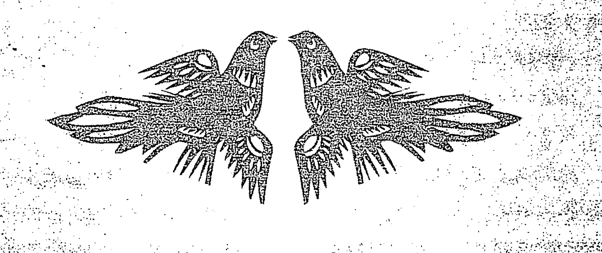
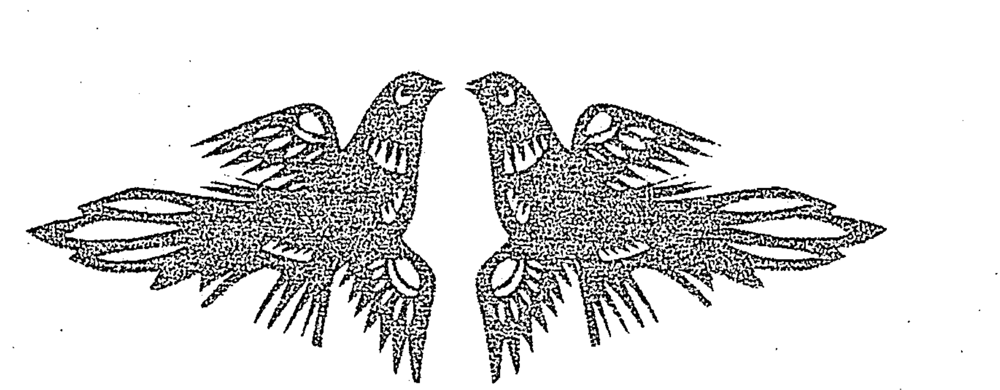

# 六爻姻缘预测学

◎王虎應 著

六爻姻缘预测第一书！

悟古验今，权威断卦，精辟辩证，活学灵用！

# 六爻中国预测学

王虎應 著

國家圖書館出版品預行編目資料

六爻姻緣預測學 / 王虎應 著.
-- 初版. -- 台北市 :
滾石出版 : 天府書屋發行, 2008.10
面 ; 公分. -- (易理乾坤 ; 17)
ISBN 978-986-84441-6-4 (精裝)
1.易占
292.1

97019916

## 易理乾坤 17

## 六爻姻緣預測學

作 者 : 王虎應
發 行 人 : 鄧屏南
發 行 所 : 天府書屋
地 址 : 台北市嘉興街216巷16弄10號1樓
電 話 : (886-2)2733-4586
傳 真 : (886-2)2733-9048

出 版 者 : 滾石出版社
企劃編輯 : 徐菊英
文字編輯 : 牛奕凱
美術編輯 : 陳秋霞
地 址 : 台北市嘉興街216巷16弄10號1樓
電 話 : (886-2)2733-4586
傳 真 : (886-2)2733-9048
e-mail : a93739373@yahoo.com.tw

經 銷 商 : 建中書報社
電 話 : (886-2)8512-4067
地 址 : 台北縣三重市中興北街186號5樓
版 次 : 2008年10月初版
售 價 : 360元
ISBN : 978-986-84441-6-4 (精裝)
郵政劃撥 : 19801291
戶 名 : 滾石出版社

版權所有 · 翻印必究
本書如有破損或裝訂錯誤，請寄回更換

## 目 錄

序言 …………………………………………………… 5

## 第一篇 基礎篇 ………………………………………… 7

- 第一章 預測婚姻的用神 ……………………………… 8
- 第二章 爻位在預測婚姻中的用法 …………………… 18
- 第三章 六親在預測婚姻中所代表的含義 …………… 26
- 第四章 六神在預測婚姻中的取象 …………………… 34
- 第五章 六親互化在預測婚姻中的取象 ……………… 42
- 第六章 用神兩現的含義 ……………………………… 51
- 第七章 用神伏藏的含義 ……………………………… 58
- 第八章 進神與退神的含義 …………………………… 66
- 第九章 月破的含義 …………………………………… 74
- 第十章 空亡的含義 …………………………………… 81
- 第十一章 六沖和六合的含義 ………………………… 89
- 第十二章 反吟與伏吟的含義 ………………………… 97
- 第十三章 遊魂與歸魂的含義 ………………………… 104
- 第十四章 五行生滅十二狀態在預測婚姻中的應用 … 112

## 第二篇 技巧篇 ……………………………………… 121

- 第一章 性格的判斷方法 ……………………………… 122
- 第二章 相貌的判斷方法 ……………………………… 130

## 序言

大家都知道家庭是社會的最基本構成單位，一個個的家庭個體構成了我們的整個社會，而婚姻是維繫家庭的重要紐帶。正所謂「孤陰不生，孤陽不長」。當一個人長大成人以後就要去尋找自己的另一半，通過婚姻去組建屬於自己的家庭，家庭在人類繁衍生息的過程中擔負著重要的角色。

從古至今，在中國的傳統文化中對婚姻是十分看重的，被稱為“終身大事”。由此可見其在人們心目中的位置。古人的婚姻在父母之命、媒妁之言、三綱五常等傳統倫理道德的約束下相對是穩定的。隨著時代的發展，傳統的倫理道德不斷的受到西方思想的衝擊，人們的價值觀、婚姻觀在潛移默化的發生著變化，離婚率呈逐年上升的趨勢。

美滿的婚姻是家庭幸福的基本保障，是每個人都希望擁有的。但是並不是所有的人都能如願，不幸的婚姻在我們的生活中比比皆是。在我的預測生涯中求測姻緣的人占了很大的一部分。由此可見，人們對婚姻的重視及感情問題對大家的困擾程度。一個不幸的結局，一定是源於一個錯誤的開始。如何預知結局，就要靠源於易經原理的六爻預測學。六爻預測學可以通過其超時空的預測機理，客觀的反應出事物的發展過程及結局。可以為大家在姻緣的選擇方面提供寶貴的參考意見。

我通過長期大量的實踐，發現了六爻在姻緣預測中的很多規律與方法，同時也更正了古人在這方面的一些錯誤認識。但是仍然有許多問題需要繼續研究，希望更多的有識之士加入到這個研究的行列裏來，讓有千年歷史的六爻預測學為構建和諧家庭、和諧社會多作貢獻。

王虎應
戊子年

## 楚辞选注

## 基础篇

## 第二章 预测婚姻的用神

六爻预测婚姻根据男女的不同用神也不相同。男士预测婚姻以妻财为用神。女士预测婚姻则以官鬼为用神。应爻代表对方的情况和对方家庭的情况。不管是自己来测，还是家人、朋友来测，代表男方来测就以妻财为用神，代表女方来测就以官鬼为用神。

预测父母的婚姻，则以父母为用神。

预测婚外情也是根据男女的不同，男以妻财为用神，女以官鬼为用神。

如果是预测某个人的情况，则以世爻代表这个人，而不看妻财、官鬼。

预测结婚证，则以父母为用神。

预测媒人的作用，则以应爻为用神。

预测对方家庭情况和态度，则以应爻为用神。

总的来说用神喜旺相，喜被日月动爻来生扶，喜化回头生。忌神发动，要看忌神的力量如何，休囚只是暂时不利而已，待忌神被制服的时候就会出现好的转机，不过用神也怕过旺，过旺则物极必反，也是婚姻不好的资讯。

## 第一章 婚姻预测的用神

【例一】乙酉年巳月辛丑日（旬空：辰巳），某人测女儿婚事，得地山谦之地水师。

| 六神 | 伏神 | 六亲 | 世应 | 变爻 |
| :--- | :--- | :--- | :--- | :--- |
| 螣蛇 | | 兄弟 酉金 | -- | |
| 勾陈 | | 子孙 亥水 | -- | 世 |
| 朱雀 | | 父母 丑土 | -- | |
| 青龙 | | 兄弟 申金 | O | 官鬼午火 |
| 玄武 | 官鬼午火 | 官鬼 午火 | X | 应 父母辰土 |
| 白虎 | | 父母 辰土 | -- | |

◎判断：
以官鬼为用神。官鬼午火得月帮扶为旺相，婚事可成。用神下伏妻财卯木，表示对方有女朋友，或者结婚。用神动化父母，父母为结婚证，表示是已婚之人，但化出父母空亡，表示快要离婚了。
世爻子孙亥水代表其女儿。被月上官鬼巳火冲破，官鬼为男子，冲破子孙就表示女儿已经破身，不是处女。巳火冲破，月破可以再应冲破，所以判断是辛巳年失身。
反馈：果然其女儿是在辛巳年失身。现在交的男友是有老婆的，后于三天后那个男子和老婆离婚。

## 基礎篇

【例二】午月丁丑日（旬空：申酉），女測婚姻，得風雷益之火雷噬嗑。

| 六神 | 六親 | 納甲 | 爻辭 | 世應 | 變爻 |
| :--- | :--- | :--- | :--- | :--- | :--- |
| 青龍 | 兄弟 | 卯木 | — | 應 | |
| 玄武 | 子孫 | 巳火 | ○ | | 妻財未土 |
| 白虎 | 妻財 | 未土 | × | | 官鬼酉金 |
| 螣蛇 | 官鬼酉金 | 妻財 | 辰土 | .. | 世 |
| 勾陳 | 兄弟 | 寅木 | .. | | |
| 朱雀 | 父母 | 子水 | — | | |

◎判斷：
以官鬼為用神。香閨寅木、卯木休囚入墓，官鬼空亡不上卦，表示結婚證的父母月破，說明還沒有結婚。但是官鬼伏藏在世爻下，表示已經有了男朋友。
世爻生官鬼酉金，但是官鬼酉金空亡不受生，伏藏又表示迴避，說明這個男子態度不積極，不在乎她的愛意。世爻臨螣蛇，螣蛇主煩躁，說明她現在情緒不好。四爻未土動化官鬼，表示現在又出現了一個男子。所以自己猶豫不定了。
反饋：實際上正是這樣。

## 第一章 婚姻预测的用神

【例三】酉月戊戌日（旬空：辰巳），男测侄女婚姻，得山天大畜之火雷噬嗑。

| 六神 | 伏神 | 六亲 | 纳支 | 变卦 | 世应 | 变爻 |
| :--- | :--- | :--- | :--- | :--- | :--- | :--- |
| 朱雀 | | 官鬼 | 寅木 | — | | |
| 青龙 | | 妻财 | 子水 | -- | 应 | |
| 玄武 | | 兄弟 | 戌土 | X | | 子孙酉金 |
| 白虎 | 子孙申金 | 兄弟 | 辰土 | O | | 兄弟辰土 |
| 螣蛇 | 父母午火 | 官鬼 | 寅木 | O | 世 | 官鬼寅木 |
| 勾陈 | | 妻财 | 子水 | — | | |

◎判断：
以官鬼为用神。卦中官鬼两现，以发动之爻为用神。官鬼持世表示已经有了男朋友，父母午火伏藏而入墓，墓库临玄武，父母为结婚证，伏藏入墓表示不能公开，玄武又主隐秘，所以判断俩人没有领结婚证，但已经住在了一起。
用神被月克休囚，内卦伏吟，俩人不和，不能长久。
反馈：果然同居在一起，但不和，无法沟通，后分手。

## 基 礎 篇

【例四】酉月甲辰日（旬空：寅卯），女測和丈夫離婚成嗎？得火山旅之火地晉。

| 六神 | 伏神 | 六親 | 世應 | 變爻 |
|---|---|---|---|---|
| 玄武 | | 兄弟 | 巳火 | -- |
| 白虎 | | 子孫 | 未土 | -- |
| 螣蛇 | | 妻財 | 酉金 | -- 應 |
| 勾陳 | 官鬼亥水 | 妻財 | 申金 | O 父母卯木 |
| 朱雀 | | 兄弟 | 午火 | -- |
| 青龍 | 父母卯木 | 子孫 | 辰土 | -- 世 |

◎判斷：
以官鬼為用神。官鬼亥水伏藏，丈夫不常回家。飛神妻財申金獨發，在三爻生官鬼，妻財為女人，三爻為床，表示丈夫有外遇了。妻財申金化出父母空亡，表示這個女子是離過婚的。
世爻為忌神，表示自己想和丈夫離婚。但是官鬼得月生，動爻生為旺相，無法離婚。

反饋：結果此女一直沒有離成婚。

## 第一章 婚姻预测的用神

【例五】寅月甲寅日（旬空：子丑），女测和某男发展如何？得火风鼎之雷风恒。

| 六神 | 本卦 | 变卦 | 动爻 | 世应 | 变爻 |
|---|---|---|---|---|---|
| 玄武 | 兄弟 巳火 | ○ | | 子孙戌土 |
| 白虎 | 子孙 未土 | -- | 应 | |
| 螣蛇 | 妻财 酉金 | — | | |
| 勾陈 | 妻财 酉金 | — | | |
| 朱雀 | 官鬼 亥水 | — | 世 | |
| 青龙 | 父母卯木 子孙 丑土 | -- | | |

◎判断：
以官鬼为用神。官鬼亥水持世，俩人已经在一起了，巳火临玄武独发，独发表示性质，玄武主暧昧，所以是同居关系。官鬼日合，日为父母表示对方已经结婚。
独发以象为主，绝地独发，不能长久。
反馈：果然对方有妻子，在本月己卯日分手。

## 基 礎 篇

【例六】寅月庚申日（旬空：子丑），男測同學（女）婚姻如何？得火天大有。

| 六神 | 六親 | 納爻 | 爻辭 | 世應 |
|---|---|---|---|---|
| 螣蛇 | 官鬼 | 巳火 | — | 應 |
| 勾陳 | 父母 | 未土 | -- | |
| 朱雀 | 兄弟 | 酉金 | — | |
| 青龍 | 父母 | 辰土 | — | 世 |
| 玄武 | 妻財 | 寅木 | — | |
| 白虎 | 子孫 | 子水 | — | |

◎判斷：
以官鬼為用神。世爻可以代表他的同學，世爻辰土，應爻官鬼為巳火，為同宮，都納在巽卦，所以判斷兩口子不是親戚，就是同學。
反饋：是一個學校畢業的。

官鬼與日相合，日為兄弟，表示對方丈夫有外遇，和其他女人好上了。但是官鬼生世爻，同時也還愛他的這位女同學。世爻與兄弟酉金相合，女同學本人也有外遇。用神旺相，兩人離婚不成。
反饋：果然二人都各自有外遇，女同學想離婚，但其丈夫不同意。

## 【例七】寅月丁卯日（旬空：戌亥），女测领结婚证如何？得雷风恒之山风蛊。

| 六神 | 六亲 | 纳支 | 世应 | 变爻 |
|---|---|---|---|---|
| 青龙 | 妻财 | 戌土 | X | 应 | 兄弟寅木 |
| 玄武 | 官鬼 | 申金 | -- | | |
| 白虎 | 子孙 | 午火 | O | | 妻财戌土 |
| 螣蛇 | 官鬼 | 酉金 | -- | 世 | |
| 勾陈 | 兄弟寅木 | 父母 | 亥水 | -- | |
| 朱雀 | 妻财 | 丑土 | -- | | |

◎判断：
虽然父母爻为结婚证书，但成不成要看官鬼爻。
此卦官鬼两现，以月破之爻官鬼申金为用神。官鬼月破不得日辰生扶为休囚，卦中又三合子孙局，克用神。此婚不成，不可能领到结婚证。更何况代表结婚证书的父母亥水空亡，又被卦中妻财戌土所克。妻财临应克父母，应为对方，是对方不想结婚。
此卦子孙三合局克用神的同时，也克了世爻。子孙临白虎，白虎主病症、血光之灾。防本人有不测灾祸。
子孙午火动而化戌土空亡，出空则有力量作用，所以要注意，需防疾病发生。子孙午火为2002年的太岁，2002年不能掉以轻心。

反馈：结果此人和那个男人不但没有结成婚，还在2001年的戌月发现了子宫癌，经多方治疗无效，于2002年的戌月病故。

## 基礎篇

【例八】辰月丙午日（旬空：寅卯），某男測網上聊天認識的某女（31歲）情況，得山水蒙。

| 六神 | 六親 | 伏神 | 世應 |
|---|---|---|---|
| 青龍 | 父母 | 寅木 | — |
| 玄武 | 官鬼 | 子水 | — |
| 白虎 | 妻財酉金 | 子孫 戌土 | — | 世 |
| 螣蛇 | 兄弟 | 午火 | — |
| 勾陳 | 子孫 | 辰土 | — |
| 朱雀 | 父母 | 寅木 | — | 應 |

◎判斷：
如果是預測對方的吉凶，以應爻為用神，如果是預測對方和自己能不能有發展，以妻財為用神。但現在只是問對方情況如何，則以世爻為用神。
世爻戌土臨白虎，白虎主急躁，所以脾氣不好，性子急。土主胖，身體發胖。
反饋：性子急，長得胖。

應爻父母寅木空亡，父母為結婚證，戌寅年出空，此年結婚。
反饋：1998年結婚。

子孫戌土臨白虎月破，子孫為孩子，白虎主血、流產，月破損傷，所以曾經流產過小孩。
反饋：對。是流產過。

## 第一章 婚姻预测的用神

子孫戌土月破，1999年己卯合破，這一年生孩子。

反饋：對，生了個兒子。

官鬼子水休囚，子孫持世婚姻不好，夫妻不和。己卯年世爻子孫戌土合破有力剋官鬼，1999年開始夫妻不和。

反饋：1999年分居了。

## 第三章 爻位在预测婚姻中的用法

爻位在六爻预测婚姻中虽然没有预测疾病和预测风水应用广泛，但仍然是必不可少的参考资讯之一。爻位的主要作用在于判断职业、距离远近、发展程度、相貌等。

- 初爻：为邻居、后代、刚开始、初步、最初、土地，个体、老百姓、基层、脚、乡下等。
- 二爻：为夫妻、宅、房子、家中、老家、室内工作、腿、肚子等。
- 三爻：为会计、门、床、出口、老乡等。
- 四爻：为老乡、外地、室外、郊区等。
- 五爻：为道路、领导、家长、干部、重要、首都、大城市、喜欢等。
- 六爻：为外地、国外、远方、结束、退出等。

虽然我列举了一些爻位的意思，但不能拘泥，也可以把预测其他方面的爻位含义用到预测婚姻上来。同时可以结合六神、月破、空亡、冲合等进行判断就能够把握准确了。

## 第二章 爻位在预测婚姻中的用法

【例一】庚辰年丑月乙未日（旬空：辰巳），男（29岁）测什么时候有婚姻，得天地否。

| 六神 | 六亲 | 纳甲 | 爻画 | 世应 |
|---|---|---|---|---|
| 玄武 | 父母 | 戌土 | — | 应 |
| 白虎 | 兄弟 | 申金 | — | |
| 螣蛇 | 官鬼 | 午火 | — | |
| 勾陈 | 妻财 | 卯木 | -- | 世 |
| 朱雀 | 官鬼 | 巳火 | -- | |
| 青龙 | 子孙子水 | 父母 | 未土 | -- |

◎判断：
以妻财为用神。妻财卯木不得日月帮扶为休囚，又入墓在日表示晚婚。床帐子水被日月剋伤为休囚，又不上卦，说明目前没有结婚。
父母未土临日，以父母爻判断结婚的应期。父母未土月破，所以需要合破实破。壬午年父母未土逢合，癸未年实破，必然会在此两年内结婚。
妻财卯木在三爻临勾陈，三爻为门户，表示把关的地方，勾陈为办公室，临木为生火之五行，火主文字、文书，所以判断是会计。又父母未土为财库，也表示结婚的人可能是管钱财的。
用神合应爻父母戌土，应在六爻，六爻为外地，表示女方的父母在外地，女子是外地人。但妻财入墓在初爻，初爻为本地，父母为户口、文书，表示是当地户口。

反馈：后得知于2002年壬午年结婚，找的女子在银行工作。

## 基礎篇

【例二】卯月丙子日（旬空：申酉），女測夫妻緣分，得風山漸之天山遁。

| 六親 | 伏神 | 本卦 | 變卦 | 世應 | 變爻 |
|---|---|---|---|---|---|
| 青龍 | | 官鬼 | 卯木 | -- | 應 |
| 玄武 | 妻財子水 | 父母 | 巳火 | -- | |
| 白虎 | | 兄弟 | 未土 | X | 父母午火 |
| 螣蛇 | | 子孫 | 申金 | -- | 世 |
| 勾陳 | | 父母 | 午火 | -- | |
| 朱雀 | | 兄弟 | 辰土 | -- | |

◎判斷：
以官鬼為用神。官鬼卯木在六爻臨青龍，得月幫扶日來生為旺相，兩人不會離婚。六爻為退休的爻位，說明丈夫在家裏沒有地位，不主事。用神臨木，丈夫性格軟弱。
用神入墓在獨發之爻，表示丈夫被控制，發動之爻為世爻元神，元神表示思維，想法，就是她想把丈夫牢牢控制住。世爻剋用神，表示她對丈夫不好。世爻臨金空亡，金空則鳴，主聲音，表示她常常罵丈夫。
二爻父母午火暗動剋制世爻，使世爻剋用神的力量減小，二爻為宅，為家，父母為雙親，就是娘家的父母不讓她罵丈夫，對丈夫不好。
反饋：以上判斷完全和實際情況相同。

## 第二章 爻位在预测婚姻中的用法

【例三】乙酉年巳月乙卯日（旬空：子丑），女（丁未年生）测感情困惑，得火泽睽之火天大有。

| 六神 | 伏神 | 本卦 | 变卦 | 世应 |
|---|---|---|---|---|
| 玄武 | | 父母 巳火 | -- | |
| 白虎 | 妻财子水 | 兄弟 未土 | -- | |
| 螣蛇 | | 子孙 酉金 | -- | 世 |
| 勾陈 | | 兄弟 丑土 | X | 兄弟辰土 |
| 朱雀 | | 官鬼 卯木 | -- | |
| 青龙 | | 父母 巳火 | -- | 应 |

◎判断：
以官鬼为用神。官鬼卯木得日帮扶临二爻，二爻为夫妻的爻位，用神归位，表示丈夫是很称职，很顾家。用神为木，丈夫心地善良。
然而三爻丑土发动，空亡不生世爻，三爻为床，又为香闺，表示室内空虚，夫妻在一起的时间少。日上卯木也是官鬼，冲世爻，冲为追求，官鬼为男子，日为目前，表示目前又有一个男子追求自己，使自己动心。
香闺在三爻空亡动而化进，三爻为床，空床旁边又加一张床，感情出轨，就是和另外的男子同居了。子孙持世，香闺又为子孙墓库，有怀孕之象，但是子孙墓库空亡，又为堕胎的信息。所以一定是和同居的男子怀孕堕过胎。
官鬼冲世爻，心中不安，世爻临螣蛇，螣蛇又主不安，说明和这个男子往来已经让她心有余悸了。子孙持世暗动，子孙表示解忧，高兴，快乐，自己很想结束这样的局面，求测生活的安定。

## 基礎篇

反饋：果然是這樣。此女結婚已經十幾年了。丈夫的情況正如所斷，因為生孩子以後丈夫沒有像以前那樣關心她了，這個時候突然有個男子闖入了她的生活，和她好了起來，結果懷孕了。當懷孕以後才發現這個男人是有老婆的，於是她就把胎墮掉了。但是這個男人還是抓住她不放，讓她做他的二奶，此女心裏很害怕，很想擺脫這樣的局面。

【例四】亥月庚子日（旬空：辰巳），某男測婚，得山澤損之山水蒙。

| 六神 | 六親 | 本卦 | 變卦 | 世應 |
| :--- | :--- | :--- | :--- | :--- |
| 螣蛇 | 官鬼 | 寅木 | -- | 應 |
| 勾陳 | 妻財 | 子水 | -- | |
| 朱雀 | 兄弟 | 戌土 | -- | |
| 青龍 | 子孫申金 | 兄弟 | 丑土 | 世 |
| 玄武 | 官鬼 | 卯木 | -- | |
| 白虎 | 父母 | 巳火 | O | 官鬼寅木 |

◎判斷：
以妻財為用神。妻財子水在五爻得日月幫扶為旺相，床帳子水旺相和用神相同，表示已經結婚了。但是父母巳火獨發，父母為結婚證，月破空亡，婚姻如同虛設，結婚證是空紙一張。
用神在五爻，五爻為尊位，表示女子霸道，想在這個家中說話算數，合世爻，要把自己管的死死的，獨攬家庭大權。
世爻為土，主自己老實，臨青龍，和善而有禮貌。獨發以象為主，父母絕用神，離婚是必然的了。用神為子水，子月離婚，又父母巳火月破，應出月。
反饋：果然應驗。

## 【例五】甲申年卯月壬子日（旬空：寅卯），女測和某男發展如何？得山水蒙。

| 六神 | 六親 | 納支 | 爻畫 | 世應 |
| :--- | :--- | :--- | :--- | :--- |
| 白虎 | 父母 | 寅木 | — | |
| 螣蛇 | 官鬼 | 子水 | -- | |
| 勾陳 | 妻財酉金 | 子孫 | 戌土 | -- | 世 |
| 朱雀 | 兄弟 | 午火 | -- | |
| 青龍 | 子孫 | 辰土 | — | |
| 玄武 | 父母 | 寅木 | -- | 應 |

◎判斷：
以官鬼為用神。官鬼子水在五爻，五爻為領導的爻位，對方是個當官的。初爻父母寅木臨玄武空亡，兩人已經有同居關係。用神安靜，壬午年沖用神，此年認識。用神得日幫扶，可以長久發展。
反饋：果然在壬午年認識，兩人相處很好。

## 基础篇

【例六】壬午年戊月壬子日（旬空：寅卯），女测和丈夫离婚成否？得水天需。

| 六神 | 六亲 | 世应 | 爻位 | 变爻 |
| :--- | :--- | :--- | :--- | :--- |
| 白虎 | 妻财 | 子水 | -- | |
| 螣蛇 | 兄弟 | 戌土 | — | |
| 勾陈 | 子孙 | 申金 | -- | 世 |
| 朱雀 | 兄弟 | 辰土 | — | |
| 青龙 | 父母巳火 | 官鬼 | 寅木 | — | |
| 玄武 | 妻财 | 子水 | — | 应 |

◎判断：
以官鬼为用神。官鬼寅木在二爻空亡，二爻为家，空表示不在，丈夫常常不在家。用神见日上子水为沐浴，丈夫好色，游魂卦，心不在自己身上。
子孙持世游魂卦，自己想和丈夫离婚。但是官鬼日生，元神两现，所以离婚难成。而世爻元神月破，防丙戌年寅破有灾。
反馈：一直没有离婚，结果在丙戌年因为吃人参过多而死。

## 第二章 爻位在预测婚姻中的用法

【例七】子月庚申日（旬空：子丑），男测和女友会分手否？得山天大畜之雷泽归妹。

| 六神 | 六亲 | 纳支 | 世应 | 变爻 |
| :--- | :--- | :--- | :--- | :--- |
| 螣蛇 | 官鬼 | 寅木 | ○ | 兄弟戌土 |
| 勾陈 | 妻财 | 子水 | -- | 应 |
| 朱雀 | 兄弟 | 戌土 | × | 父母午火 |
| 青龙 | 子孙申金 | 兄弟 | 辰土 | ○ | 兄弟丑土 |
| 玄武 | 父母午火 | 官鬼 | 寅木 | -- | 世 |
| 白虎 | 妻财 | 子水 | -- | |

◎判断：
以妻财为用神。卦中妻财两现，以应爻妻财子水为用神。父母午火临玄武不上卦，入墓在动爻戌土，这个组合就表示俩人已经同居。
用神妻财子水临五爻空亡，五爻为道路，空不生二爻，二爻为家，表示女友常常在外面走动，不想回到自己身边来。忌神兄弟两动，用神入墓在兄弟辰土，表示女友已经投入了别人的怀抱。兄弟戌土临朱雀动，俩人关系已经不好，常常吵架。
反馈：实际上同居的女友因为和他发生口角，他就把对方赶走了。赶走后又想让她回来，回来后又争吵，女友就离开他和别人好了，他打电话也不接，而且让一个男人打电话骂他。

## 第三章 六亲在预测婚姻中所代表的含义

六亲是六爻预测中分辨具体意思、提取资讯的重要依据，根据预测的内容不同六亲的含义也不同，所以熟悉六亲的含义对于判断细节方面非常重要。

- 父母：长辈、父母、结婚证、消息、房子、媒人等。
- 官鬼：男人、工作、政府、疾病，男朋友、丈夫等。
- 妻财：钱财、女人、女朋友、妻子等。
- 子孙：孩子、子女、喜悦、女子不利婚姻的资讯等。
- 兄弟：阻力、男子不利婚姻的资讯、第三者，朋友、兄弟等。

【例一】丑月丙午日（旬空：寅卯），男测女儿（35岁）什么时候结婚？得水雷屯。

| 六神 | 六亲 | 纳甲 | 爻卦 | 世应 |
| :--- | :--- | :--- | :--- | :--- |
| 青龙 | 兄弟 | 子水 | -- | |
| 玄武 | 官鬼 | 戌土 | — | 应 |
| 白虎 | 父母 | 申金 | -- | |
| 螣蛇 | 妻财午火 | 官鬼 | 辰土 | -- |
| 勾陈 | 子孙 | 寅木 | -- | 世 |
| 朱雀 | 兄弟 | 子水 | — | |

◎判断：
以官鬼为用神。卦中官鬼两现，得月帮扶日又来生为旺相，说明结婚的机会很多。但是子孙寅木在二爻临勾陈空亡，子孙代表他的女儿，二爻为宅，代表家里，勾陈为不动之象，水雷屯卦，有安营扎寨的意思，是他女儿呆在家里不喜欢外出的资讯，想一辈子住在家里不嫁人。
子孙持世，表示很关心女儿的婚姻，为了女儿操心不少。子孙持世空亡，表示他不想把女儿一辈子留在身边。
反馈：他女儿性格内向，下班后就马上回家闭门读书，很少上街，也没有什么朋友沟通。虽然有不少人给她介绍对象，但女儿从来不去相亲，所以女儿的婚姻成了他的心病。

【例二】酉月癸丑日（旬空：寅卯），男测和女友发展如何？得兑为泽之泽火革。

| 六神 | 六亲 | 世应 | 爻 | 变爻 |
| :--- | :--- | :--- | :--- | :--- |
| 白虎 | 父母 | 未土 | -- | 世 |
| 螣蛇 | 兄弟 | 酉金 | -- | |
| 勾陈 | 子孙 | 亥水 | -- | |
| 朱雀 | 父母 | 丑土 | X | 应 | 子孙亥水 |
| 青龙 | 妻财 | 卯木 | O | | 父母丑土 |
| 玄武 | 官鬼 | 巳火 | -- | |

◎判断：
以妻财为用神。妻财卯木不得日月帮扶为休囚。世爻暗动使用神入墓，自己从内心裏喜欢女友。但是用神空亡，女友摇摆不定。
用神被月建冲克，月为兄弟，兄弟为其他男子，竞争者，月破主感情出现破裂，这个组合就是因为其他人的介入，女友和自己会拉开距离。
但是应爻父母丑土临日，主婚期，动而逢值逢合，子月还是要和他订婚的。
反馈：女友在谈恋爱中途和其他男子往来，摇摆不定，但是还是最后下决心和他和好，在子月订婚。

【例三】丑月丙辰日（旬空：子丑），女测弟弟结婚选日，得坎为水之地泽临。

| 六神 | 六亲 | 纳支 | 爻辞 | 世应 | 变爻 |
| :--- | :--- | :--- | :--- | :--- | :--- |
| 青龙 | 兄弟 | 子水 | -- | 世 | |
| 玄武 | 官鬼 | 戌土 | ○ | | 兄弟亥水 |
| 白虎 | 父母 | 申金 | -- | | |
| 螣蛇 | 妻财 | 午火 | -- | 应 | |
| 勾陈 | 官鬼 | 辰土 | — | | |
| 朱雀 | 子孙 | 寅木 | X | | 妻财巳火 |

◎判断：
以妻财为用神。坎为水为八纯卦，坎为中男，说明是为她二弟弟结婚选日。兄弟持世，自己很关心弟弟，空亡表示担心。妻财午火虽然不得日月帮扶，但也不被克，初爻子孙寅木发动来生，为吉。
妻财入墓于动爻戌土，戌土为官鬼，官鬼为男，表示此女子曾经和别的男子在一起，但被日冲开墓库，主离婚，是二婚。
初爻寅木动化妻财，初爻为小口，子孙又代表孩子，表示女方带有孩子。
世爻空亡，所以选冲世爻，妻财得旺的午日为好。
反馈：预测完全符合实际情况。

【例四】申月戊辰日（旬空：戌亥），女测和某男姻缘，得艮为山之山风蛊。

| 六神 | 六亲 | 纳支 | 爻象 | 世应 | 变爻 |
| :--- | :--- | :--- | :--- | :--- | :--- |
| 朱雀 | 官鬼 | 寅木 | — | 世 | |
| 青龙 | 妻财 | 子水 | -- | | |
| 玄武 | 兄弟 | 戌土 | -- | | |
| 白虎 | 子孙 | 申金 | — | 应 | |
| 螣蛇 | 父母 | 午火 | X | | 妻财亥水 |
| 勾陈 | 兄弟 | 辰土 | -- | | |

◎判断：
以官鬼为用神。官鬼持世，用神和世爻同在一爻，表示俩人一心一意，感情很好。父母午火休囚，入墓于暗动的戌土，父母为结婚证，休囚为没有，入墓表示拿不出，墓库临玄武，主暧昧，就是私订盟约，这个组合就是与人非法同居的资讯。
用神临朱雀，朱雀主语言表达，男方很会说话，口才好。用神为木，主瘦高个，但休囚，斟酌取数，艮为7数，判断为1米77。
用神月破不吉，六冲卦主散，独发为用神死地，也表示不能长久。
反馈：预测完全正确，后于寅月被人使坏分手。

【例五】戊月丁卯日（旬空：戌亥），女测女儿（36岁）婚姻，得水风井之地山谦。

| 六神 | 伏神 | 六亲 | 世应 | 爻象 | 变爻 |
| :--- | :--- | :--- | :--- | :--- | :--- |
| 青龙 | | 父母 | 子水 | -- | |
| 玄武 | | 妻财 | 戌土 | O | 世 | 父母亥水 |
| 白虎 | 子孙午火 | 官鬼 | 申金 | -- | |
| 螣蛇 | | 官鬼 | 酉金 | — | |
| 勾陈 | 兄弟寅木 | 父母 | 亥水 | O | 应 | 子孙午火 |
| 朱雀 | | 妻财 | 丑土 | -- | |

◎判断：
以官鬼为用神。卦中官鬼两现，以暗动之爻官鬼酉金为用神。用神临驿马，表示丈夫在外地，二爻空亡用神不生二爻，丈夫很少回家。用神暗动生应爻，应为他人，丈夫对他人有情，应空不受其生，对方并不喜欢他。
世爻空亡不生官鬼，世爻可以代表她女儿，女儿已经对丈夫没有什么感情了。世爻临玄武动化父母亥水空，玄武主暧昧，父母为结婚证，空亡表示未婚同居，日又克合世爻，表示女儿也有了外遇。
女儿另外的外遇之人可以用官鬼申金来分析判断。申金为世爻的长生，此男对女儿很好，官鬼申金下伏藏子孙午火，子孙代表孩子，对方是有孩子的。世爻与官鬼申金爻位相邻，俩人走得很近。世爻被日合住不能生官鬼申金，有阻力使两人不能相爱。日为兄弟是竞争对手，那就是对方的老婆。因为对方不能离婚，所以两人走不到一起。

摇卦人又问自己身体。
以世爻为用神判断。世爻在五爻空亡被克，妻财主呼吸、饮食，空被合绊，呼吸不畅通，胃口不好。官鬼旺相为病，三爻、四爻都是官鬼，临金，主呼吸系统和肠道方面的病。
反馈：以上判断全部应验。

【例六】酉月乙卯日（旬空：子丑），一位日本男子测与女友能结婚吗？得水泽节之震为雷。

| 六神 | 六亲 | 伏神 | 本卦 | 变卦 | 变爻 |
| :--- | :--- | :--- | :--- | :--- | :--- |
| 玄武 | 兄弟 | 子水 | -- | | |
| 白虎 | 官鬼 | 戌土 | O | | 父母申金 |
| 螣蛇 | 父母 | 申金 | X | 应 | 妻财午火 |
| 勾陈 | 官鬼 | 丑土 | -- | | |
| 朱雀 | 子孙 | 卯木 | O | | 子孙寅木 |
| 青龙 | 妻财 | 巳火 | — | 世 | |

◎判断：
以妻财为用神。妻财巳火持世，表示自己很喜欢女友，临青龙，青龙主快乐，和她在一起很开心。用神不得月帮扶，但得日生为旺相。
应爻父母申金发动来合世爻，应为对方家庭，父母主长辈，合就是要把自己身边的女友拉回去，表示对方父母不同意。
元神子孙卯木发动月破化退不吉。好在五爻官鬼戌土合住子孙，此合有两个意义，一可以解月破，二可以拉住卯木不退。所以五爻的戌土很关键。五爻为家长，关键在对方的家长。
反馈：对方家长反对婚事，后在戊月对方父亲提出女儿出嫁后不能改姓氏，如果答应就同意结婚。终于有了转机。日本有个婚俗，女子出嫁后要改成丈夫的姓氏。反馈回来我恍然大悟，官鬼为名字、姓氏。古代留下的预测术竟然可以根据地域风俗的不同，传递各种资讯，可惜解卦不精，当初未能看出。

【例七】巳月辛丑日（旬空：辰巳），女测弟弟家庭婚姻，得山泽损之风水涣。

| 六神 | 伏神 | 六亲 | 世应 | 变爻 |
| :--- | :--- | :--- | :--- | :--- |
| 螣蛇 | | 官鬼 寅木 | — | 应 | |
| 勾陈 | | 妻财 子水 | × | | 父母巳火 |
| 朱雀 | | 兄弟 戌土 | — — | | |
| 青龙 | 子孙申金 | 兄弟 丑土 | — — | 世 | |
| 玄武 | | 官鬼 卯木 | — | | |
| 白虎 | | 父母 巳火 | ○ | | 官鬼寅木 |

◎判断：
以妻财为用神。妻财子水发动合世爻，从表面来看妻子和弟弟很好，但是用神动而化空、化绝，妻子常常失去踪影。变爻为父母巳火，父母爻代表父母，妻子常常不在家，住在娘家。
妻财子水休囚，应期为长生，所以为甲申年结婚。子孙申金不上卦有两个意思，一是表示伏藏应出现，甲申年有的孩子。二是表示现在孩子也不在家，和妻子在一起。
反馈：果然是这样。后经过化解，妻子回家来了。

## 第四章 六神在预测婚姻中的取象

六神在婚姻预测中主要是表示事物的原因性质。多用在性格、相貌、关系程度、态度等上。

- 青龙：主开始、美貌、漂亮、化妆、高贵、高雅、酒色、高兴、新的、怀孕、打扮、酒席、贵重、富有、喜悦、豪华等意思。
- 朱雀：主说话、善言、笑脸、言谈、谈论、吵架、纷争、议论、笑咪咪、官司、诉讼、消息、表态、文书等意思。
- 勾陈：主老实、懒惰、本分、憨厚、笨拙、稳重、鼓起、鼓胀、关联、房子、修造、发胖、迟缓、迟钝、愚昧等意思。
- 螣蛇：主狡猾、害怕、担心、胆子小、不安、罗唆、孤僻、孤独、少见、罕见、财迷、小气、缺少、细长、弯曲等意思。
- 白虎：主急躁、忙碌、脾气不好、生气、急性子、快速、流产、打架、伤害、殴打、厉害、严格、严厉、威武、威猛等意思。
- 玄武：主性感、淫乱、暧昧、发黑、私下、暗中、偷偷摸摸、背地里、偷盗、赌博、投机、欺瞒、欺骗等意思。

【例一】亥月甲午日（旬空：辰巳），男测某女目前状况如何？得火天大有之山天大畜。

| 六神 | 六亲 | 纳支 | 父卦 | 世应 | 变爻 |
| :--- | :--- | :--- | :--- | :--- | :--- |
| 玄武 | 官鬼 | 巳火 | — | 应 | |
| 白虎 | 父母 | 未土 | -- | | |
| 螣蛇 | 兄弟 | 酉金 | ○ | | 父母戌土 |
| 勾陈 | 父母 | 辰土 | — | 世 | |
| 朱雀 | 妻财 | 寅木 | — | | |
| 青龙 | 子孙 | 子水 | — | | |

◎判断：
测某个人的状况，以世爻为被测者。世爻为土，土主稳重，临勾陈，勾陈又主老实、稳重。但是世爻辰土空亡，反断，所以判断此女表面稳重，但实际上性子急，沉不住气。卦在乾宫主高傲，世爻辰土为子孙墓库，子孙为艺术，又螣蛇所临之爻独发合世爻，螣蛇主艺术，所以判断她有艺术细胞。
官鬼巳火临应爻月破，独发之爻又为官鬼死地，丈夫虽有如无。世应都空，夫妻互不信任。世爻辰土与应爻巳火同纳巽宫，夫妻不是同事，就是同学关系。应爻临玄武，主丈夫有诈骗行为、或者偷盗行为。独发之爻临螣蛇化出官鬼墓库，独发可以表示性质，螣蛇为绳索，墓库主关闭，有牢狱象。
反馈：判断果然正确，此女为艺术专业毕业，夫妻是同学，丈夫曾经坐过监狱。

【例二】酉月辛亥日（旬空：寅卯），男测什么时候才能见到在妻子身边的孩子？得天山遁。

| 六神 | 六亲 | 爻支 | 世应 |
| :--- | :--- | :--- | :--- |
| 螣蛇 | 父母 | 戌土 | — |
| 勾陈 | 兄弟 | 申金 | — 应 |
| 朱雀 | 官鬼 | 午火 | — |
| 青龙 | 兄弟 | 申金 | — |
| 玄武 | 妻财寅木 | 官鬼 | 午火 | — — 世 |
| 白虎 | 子孙子水 | 父母 | 辰土 | — — |

◎判断：
以子孙为用神。子孙子水伏藏不上卦，又天山遁卦，为藏匿之象，表示妻子把儿子藏起来不让他见。妻财寅木空亡不上卦，空表示失去，伏藏表示离开自己身边，说明已经和妻子离婚了。世爻临玄武，主心情郁闷，很不高兴。
反馈：果然是这样。

【例三】酉月癸丑日（旬空：寅卯），女测婚姻如何？得山风蛊之火风鼎。

| 六神 | 六亲 | 纳支 | 爻象 | 世应 | 变爻 |
| :--- | :--- | :--- | :--- | :--- | :--- |
| 白虎 | 兄弟 | 寅木 | — | 应 | |
| 螣蛇 | 子孙巳火 | 父母 | 子水 | -- | |
| 勾陈 | 妻财 | 戌土 | X | | 官鬼酉金 |
| 朱雀 | 官鬼 | 酉金 | — | 世 | |
| 青龙 | 父母 | 亥水 | — | | |
| 玄武 | 妻财 | 丑土 | -- | | |

◎判断：
以官鬼为用神。香闺戌土旺相生世爻，用神官鬼酉金得月扶日生，旺相持世，说明已经结婚。戌土动化官鬼，在1994年甲戌结婚。元神独发生世爻，夫妻和睦。用神临朱雀，朱雀主语言、文字、教育等，丈夫为老师。
反馈：果然在甲戌年结婚，夫妻和睦，丈夫为教师。

【例四】卯月壬子日（旬空：寅卯），女测和情人分手如何？得离为火之火雷噬嗑。

| 六神 | 六亲 | 纳支 | 爻卦 | 世应 | 变爻 |
| :--- | :--- | :--- | :--- | :--- | :--- |
| 白虎 | 兄弟 | 巳火 | — | 世 | |
| 螣蛇 | 子孙 | 未土 | -- | | |
| 勾陈 | 妻财 | 酉金 | — | | |
| 朱雀 | 官鬼 | 亥水 | ○ | 应 | 子孙辰土 |
| 青龙 | 子孙 | 丑土 | -- | | |
| 玄武 | 父母 | 卯木 | — | | |

◎判断：
以官鬼为用神。官鬼亥水临朱雀冲克世爻，朱雀主语言，冲为不和，克为反感，说明两人没有共同语言，谈不来。
六冲卦，用神独发化墓，下个月就会分手。
反馈：果然在辰月分手。

【例五】壬午年戊月辛亥日（旬空：寅卯），女测婚姻，得天水讼之天地否。

| 六神 | 伏神 | 六亲 | 纳支 | 世应 | 变爻 |
| :--- | :--- | :--- | :--- | :--- | :--- |
| 螣蛇 | | 子孙 | 戌土 | -- | |
| 勾陈 | | 妻财 | 申金 | -- | |
| 朱雀 | | 兄弟 | 午火 | -- | 世 |
| 青龙 | 官鬼亥水 | 兄弟 | 午火 | -- | |
| 玄武 | | 子孙 | 辰土 | O | 兄弟巳火 |
| 白虎 | | 父母 | 寅木 | -- | 应 |

◎判断：
以官鬼为用神。官鬼亥水不上卦，伏藏在兄弟午火之下，月克日扶，衰旺难分。父母寅木合日，父母为结婚证，合日主婚期，表示结婚的资讯，但卦中子孙辰土发动，又是游魂卦有离婚的资讯。辰土月破，庚辰年实破，判断在庚辰年离婚了。
但是玄武独发，官鬼入墓在二爻，二爻为宅，表示家里进了男人。玄武为暧昧之象，独发多主未婚同居。表示现在又和某男同居。但是用神伏藏在兄弟午火下，兄弟为竞争者，与世爻相同就是另外的女人，说明这个男子不是有妻子，就是又和别的女人好上了。
子孙辰土月破，日不来生为休囚，动化巳火，休囚不以绝论，为回头生，二爻为胎位，又为子宫，子孙代表孩子，化回头生就是怀孕孩子了，临玄武为私生子。但是子孙月破，主不想要这个孩子，实破则克官鬼，所以判断将会打胎而分手。
反馈：果然同居男子和其他女人好上了，但她已经怀孕，再三交涉不能和好，就堕胎了。

## 【例六】壬午年午月己酉日（旬空：寅卯），男测官运和婚姻，得地山谦。

| 六神 | 伏神 | 六亲 | 世应 |
|---|---|---|---|
| 勾陈 | | 兄弟 酉金 | -- |
| 朱雀 | | 子孙 亥水 | -- 世 |
| 青龙 | | 父母 丑土 | -- |
| 玄武 | | 兄弟 申金 | — |
| 白虎 | 妻财卯木 | 官鬼 午火 | -- 应 |
| 螣蛇 | | 父母 辰土 | -- |

◎判断：
预测官运，以官鬼为用神。官鬼午火得月帮扶为旺相，世爻子孙亥水在五爻，五爻为领导的爻位，说明本人官职在身。世爻为亥水，是副职。
世爻克应上官鬼而临了五爻，应为他人，是剥夺了别人的官到了领导的位置上的，所以这个官是斗争得到的。
预测婚姻，以妻财为用神。世爻临亥水生妻财，亥水对应于1995乙亥年，应是此年结婚。此应休囚逢长生。
妻财卯木伏藏在官鬼午火下，表示妻子有外遇，卯木对应于己卯年，所以判断在1999年妻子红杏出墙。日辰冲用神妻财，被人撞见了。
飞神官鬼为那个男人。临月临白虎，官鬼临月为公检法，白虎又主执法，所以此男应该在政法部门。

反馈：果然是某机关的副经理。妻子在1999年外遇被他抓住。对方正是法制部门的领导，对方官大，敢怒不敢言。

## 第四章 六神在预测婚姻中的取象

【例七】子月戊寅日（旬空：申酉），女测丈夫要和她离婚，会吗？得兑为泽之天泽履。

| 六神 | 六亲 | 纳支 | 交卦 | 世应 | 变爻 |
|---|---|---|---|---|---|
| 朱雀 | 父母 | 未土 | X | 世 | 父母戌土 |
| 青龙 | 兄弟 | 酉金 | -- | | |
| 玄武 | 子孙 | 亥水 | -- | | |
| 白虎 | 父母 | 丑土 | -- | 应 | |
| 螣蛇 | 妻财 | 卯木 | -- | | |
| 勾陈 | 官鬼 | 巳火 | -- | | |

◎判断：
以官鬼为用神。官鬼巳火月克日生，衰旺虽然难分，但是用神生世爻，说明丈夫对自己还是有感情的。
兑宫卦，兑为口舌，又世爻临朱雀，朱雀主口舌，独发表示性质等，俩口子只是吵架而已，不会离婚的。更何况世爻为财库，你掌握着家里的财权，他不会离婚的。
反馈：果然因为吵架，丈夫生气说要离婚，但不是真的。她在丈夫的公司担任会计，四年后还又生了个儿子。

## 基础篇

## 第5章 六亲互化在预测婚姻中的取象

在六爻预测中，动爻为事物之发端，变爻为事物之结果。六亲互化辨别吉凶有化回头生、回头克、化绝、化墓、化空、化破、化合、化冲等，这些都是爻位变化表现出的资讯。除此之外动爻与变爻的六亲也可以表达一定的含义和资讯，都可以附和用神而取象判断。

### 父母

- 父母化父母：需要看进退，化进神婚约可成，化退神毁约。
- 父母化官鬼：父母、长辈介绍男友。
- 父母化妻财：父母、长辈介绍女友，或者毁约。
- 父母化兄弟：男测婚，撕毁婚约。
- 父母化子孙：女测婚，撕毁婚约。

## 第五章 六亲互化在预测婚姻中的取象

### 官鬼

- 官鬼化官鬼：需要看进退，女测婚，官鬼化进神，未婚，男子追求，感情渐渐深厚，已婚者，感情疏远。
- 官鬼化退神：女测婚，未婚者，悔婚，感情疏远。离婚者，破镜重圆，重归于好。
- 官鬼化父母：女测婚，男有公婆。男测婚，中间人主婚。
- 官鬼化妻财：女测婚，男有外遇，男子变心。男测婚，有妻之人来欺。
- 官鬼化兄弟：阻力重重。
- 官鬼化子孙：男有孩子，或者女测婚不利。

### 妻财

- 妻财化妻财：男测婚，妻财化进神，女朋友追求，感情深厚。
- 妻财化退神：感情变淡，远离自己。
- 妻财化官鬼：男测婚，妻子出现外遇，或者妻子生病，身体不好。
- 妻财化兄弟：男测婚，婚姻不利。
- 妻财化子孙：女友可靠，感情深厚，女带孩子来。
- 妻财化父母：有过婚姻，或者能吃苦耐劳。

## 基础篇

### 子孙

- 子孙化子孙：化进神，女测不利婚姻。化退神，阻力减少。男子测，女友感情变淡。
- 子孙化子孙：化进神，女测不利婚姻。化退神，阻力减少。男子测，女友感情变淡。
- 子孙化父母：流产。
- 子孙化官鬼：男朋友有孩子。想离婚再嫁人。
- 子孙化兄弟：女子测不利婚姻。男子测婚姻久长。

### 兄弟

- 兄弟化兄弟：阻力大，有第三者。
- 兄弟化父母：父母，长辈反对。
- 兄弟化官鬼：朋友介绍男友。
- 兄弟化妻财：朋友介绍女友。
- 兄弟化子孙：男子测，因为孩子家庭不和。

以上只是简单地论述了一下，意在开拓思路。实际预测中还要根据爻与爻之间的生克冲合，空亡月破，六神等灵活判断才是。

## 第五章 六亲互化在预测婚姻中的取象

【例一】庚辰年酉月丁丑日（旬空：申酉），女测儿子什么时候结婚，得地雷复之山火贲。

| 六兽 | 六亲 | 纳爻 | 支卦 | 世应 | 变爻 |
|---|---|---|---|---|---|
| 青龙 | 子孙 | 酉金 | X | | 官鬼寅木 |
| 玄武 | 妻财 | 亥水 | -- | | |
| 白虎 | 兄弟 | 丑土 | -- | 应 | |
| 螣蛇 | 兄弟 | 辰土 | X | | 妻财亥水 |
| 勾陈 | 父母巳火 | 官鬼 | 寅木 | -- | |
| 朱雀 | 妻财 | 子水 | -- | 世 | |

◎判断：
以妻财为用神。卦中妻财两现，以日合之爻妻财子水为用神。三爻兄弟辰土临太岁发动化出妻财亥水，妻财为媳妇，所以今年儿子一定会有女朋友。现在已经是酉月了，动爻应年，变爻就应月，所以亥月出现。
元神子孙酉金空亡，又被合住不能生妻财，代表结婚证的父母伏藏，明年伏藏逢出现，卯月冲实子孙酉金，又是冲开，明年卯月可以结婚。
子孙空亡动化官鬼，又被临螣蛇的辰土合住，合住表示失去自由，螣蛇主绳索，子孙代表孩子，化官为见官，这个组合就表示她儿子曾经坐过监狱。

反馈：果然她儿子曾经因为盗窃入狱，所以婚姻迟迟不成。后于亥月认识一女孩，丑月同居，次年卯月举行婚礼。

## 基础篇

【例二】寅月乙亥日（旬空：申酉），男测本年有无桃花运，得山水蒙之火风鼎。

| 六兽 | 六亲 | 纳甲 | 爻卦 | 世应 | 变爻 |
|---|---|---|---|---|---|
| 玄武 | 父母 | 寅木 | -- | | |
| 白虎 | 官鬼 | 子水 | -- | | |
| 螣蛇 | 妻财酉金 | 子孙 | 戌土 | X | 世 | 妻财酉金 |
| 勾陈 | 兄弟 | 午火 | X | | 妻财酉金 |
| 朱雀 | 子孙 | 辰土 | -- | | |
| 青龙 | 父母 | 寅木 | -- | 应 | |

◎判断：
以妻财为用神。妻财酉金伏藏在世爻下，世爻又动化妻财酉金，妻财夹住世爻，三爻午火又化出妻财酉金，为许多女子围绕自己之象。但是用神不得日月帮扶，而且空亡，虽然多而不能长期相处。

反馈：果然此男年内有四个女子和他有肉体关系，但是都没有成为知己。

## 第五章 六亲互化在预测婚姻中的取象

【例三】申月丙寅日（旬空：戌亥），男测家庭婚姻，得水天需之山天大畜。

| 六神 | 六亲 | 综爻 | 变爻 | 世应 | 变爻 |
|---|---|---|---|---|---|
| 青龙 | 妻财 | 子水 | X | | 官鬼寅木 |
| 玄武 | 兄弟 | 戌土 | O | | 妻财子水 |
| 白虎 | 子孙 | 申金 | -- | 世 | |
| 螣蛇 | 兄弟 | 辰土 | -- | | |
| 勾陈 | 父母巳火 | 官鬼 | 寅木 | -- | |
| 朱雀 | 妻财 | 子水 | -- | 应 | |

◎判断：
以妻财为用神，卦中妻财两现，以发动之爻妻财子水为用神。用神得月生为旺相，但是游魂卦，主分离，用神动而化破，又在六爻，六爻为退去，退休，表示妻子不能白头到老。
五爻兄弟戌土动化妻财子水，临玄武，玄武为暧昧之象，兄弟化财，预测财运的时候是合伙求财，但在预测婚姻的时候，就是和别人共同用一个老婆。因为用神化破，破在官鬼，所以妻子和自己离婚一定会是因为妻子有外遇引起。
父母旺相本主结婚，但是伏藏不上卦又入墓在戌土，入墓主收藏起来，伏藏也主不见了，就是离婚的资讯。戌土空亡，辰土冲空克妻财而使父母入墓，所以判断在辰月离婚了。
世爻暗动生用神，自己现在还爱着妻子。

反馈：果然是这样。

## 基础篇

【例四】乙酉年戊月辛巳日（旬空：申酉），男（32岁）测什么时候结婚？得山地剥之风地观。

| 六神 | | 六亲 | 本卦 | 变卦 | | 变爻 |
|---|---|---|---|---|---|---|
| 螣蛇 | | 妻财 | 寅木 | -- | | |
| 勾陈 | 兄弟申金 | 子孙 | 子水 | X | 世 | 官鬼巳火 |
| 朱雀 | | 父母 | 戌土 | -- | | |
| 青龙 | | 妻财 | 卯木 | -- | | |
| 玄武 | | 官鬼 | 巳火 | -- | 应 | |
| 白虎 | | 父母 | 未土 | -- | | |

◎判断：
以妻财为用神。卦中妻财两现，以月合之爻妻财卯木为用神。用神不得日月生扶，婚姻晚。床帐申金空亡不上卦，到现在还没有结婚。世爻在五爻临驿马发动，五爻为道路，表示自己在外奔波，无固定地方而不能成家。
子孙子水独发生妻财，判断当在戊子年结婚。子孙动化官鬼巳火，巳火对应于辛巳年，判断曾经和女子同居，在此年流产小孩。
反馈：果然在辛巳年流产小孩，结婚的应期还没有反馈。

## 第五章 六亲互化在预测婚姻中的取象

【例五】甲申年甲戌月庚辰日（旬空：申酉），女（29岁）测婚姻，得火风鼎之乾为天。

| 六神 | 六亲 | 纳支 | 世应 | 变爻 |
|---|---|---|---|---|
| 螣蛇 | 兄弟 | 巳火 | -- | |
| 勾陈 | 子孙 | 未土 | X | 应 | 妻财申金 |
| 朱雀 | 妻财 | 酉金 | -- | |
| 青龙 | 妻财 | 酉金 | -- | |
| 玄武 | 官鬼 | 亥水 | -- | 世 |
| 白虎 | 父母卯木 | 子孙 | 丑土 | X | 官鬼子水 |

◎判断：
以官鬼为用神。官鬼亥水持世在二爻，二爻为宅，持世表示拥有，用神被日月克伤，忌神在五爻发动来克，初爻又来克，用神过弱，所以说明已经结婚。元神空亡，婚姻不牢靠。
世爻临玄武，父母卯木伏藏入墓在动爻未土，此为婚外情的组合。表示自己和丈夫以外的男子有肉体关系。初爻子孙丑土临白虎动化官鬼，子孙代表孩子，白虎代表流产，官鬼代表死亡，判断曾经流产过孩子。化出官鬼也表示别的男人，也是有婚外情的资讯。

反馈：果然是这样。曾经在19岁的时候与人发生关系怀孕流产，己卯年结婚，目前和一个已婚的男子有婚外情。

## 基础篇

【例六】丁亥年午月甲午日（旬空：辰巳），几个朋友到某酒店吃饭，其中一位朋友喝多了，带着醉意非要给旁边服务的女服务员预测不可，女服务员也请求，于是摇了一卦，得坤为地之艮为山。

| 六神 | 六亲 | 街爻 | 变卦 | 世应 | 变爻 |
|---|---|---|---|---|---|
| 玄武 | 子孙 | 酉金 | X | 世 | 官鬼寅木 |
| 白虎 | 妻财 | 亥水 | -- | | |
| 螣蛇 | 兄弟 | 丑土 | -- | | |
| 勾陈 | 官鬼 | 卯木 | X | 应 | 子孙申金 |
| 朱雀 | 父母 | 巳火 | -- | | |
| 青龙 | 兄弟 | 未土 | -- | | |

◎判断：
没有特定预测方向，根据卦的变化进行判断。
官鬼卯木在三爻动化回头克，判断甲申年，乙酉年克官鬼工作不顺。丙戌年合住官鬼卯木，不再化回头克，才有了稳定的工作。
六爻酉金化官鬼，判断乙酉年开始有男朋友，但是，子孙动克官鬼又化官鬼，这个组合就表示现在已经和原来的男朋友分手，又出现了新的男朋友。
反馈：果然应验。

## 第六章 用神两现的含义

六爻预测中有时候会遇到用神两现的情况，或者更多。一般来说是选取其中的一个做为用神来展开事情的判断，但是婚姻预测比较特殊，两现常常暗示着更微妙的含义。有应两次婚姻者，有应三角恋者，有应外遇者，有应过去未来资讯者，有应对方的综合情况者，也有时候与应期有关。所以不能单纯地舍弃一个选择一个进行判断。

## 基础篇

【例一】甲申年未月甲寅日（旬空：子丑），女测婚外情，得水风井之泽风大过。

| 六神 | 伏神 | 六亲 | 世应 | 变爻 |
|---|---|---|---|---|
| 玄武 | | 父母 子水 | -- | |
| 白虎 | | 妻财 戌土 | -- | 世 |
| 螣蛇 | 子孙午火 | 官鬼 申金 | X | 父母亥水 |
| 勾陈 | | 官鬼 酉金 | -- | |
| 朱雀 | 兄弟寅木 | 父母 亥水 | -- | 应 |
| 青龙 | | 妻财 丑土 | -- | |

◎判断：
以官鬼为用神。卦中官鬼两现，一般取其中一个为用神。但是有时候根据预测的情况不同，两个用神各有所用。动爻官鬼申金为婚外的男人，静爻官鬼酉金为她的丈夫。香闺子水亥水两现，同时与两人同居。亥水临应，应为他人，与日合，日表示目前，说明她现在更热衷于外面的男人。
用神官鬼申金临本年太岁发动，表示和这个男人是今年才认识的。用神临驿马动化父母，驿马为车，化出父母也主车，临螣蛇主技术，对方会开车。世爻生用神，自己很喜欢这个男人。世爻临妻财在五爻，五爻为老板，妻财为生意，说明自己是个个体老板。
官鬼酉金临勾陈，勾陈为老实，丈夫是个老实人。
用神官鬼申金被日上兄弟寅木冲，又合入香闺亥水，兄弟为争夺者、与自己竞争者，合入自己的香闺，就是有另外的女人来争婚外情人。冲也表示来争夺。用神被冲又表示被人撞见了。用神生应爻，此为无情，表示婚外情人现在对别人好，冷落了自己。
世爻临白虎，白虎主生气，说明自己心情不好，很生气。

反馈：果然是这样。婚外情人是政府机关的一个司机，自己是个服装店老板。常常给情人花钱，很喜欢对方。丈夫很老实，管不了她外面的事，她和情人的关系是公开的。但前几天邻居发现她的情人和另外的女人在一起，就告诉了她，所以她很生气，但对方根本不理会她。

## 第六章 用神两现的含义

【例二】甲申年壬申月己巳日（旬空：戌亥），男测与某女发展关系如何？得雷风恒。

| 六神 | 六亲 | 世应 |
|---|---|---|
| 勾陈 | 妻财 戌土 | 应 |
| 朱雀 | 官鬼 申金 | |
| 青龙 | 子孙 午火 | |
| 玄武 | 官鬼 酉金 | 世 |
| 白虎 | 兄弟寅木 父母 亥水 | |
| 螣蛇 | 妻财 丑土 | |

◎判断：
以妻财为用神。卦中妻财两现，一般以空亡之爻妻财戌土为用神，但是另外还有一个妻财丑土，根据卦的组合变化，灵活取象，做为参考。
世官鬼酉金在三爻临玄武，酉金为桃花，玄武主暧昧，又父母亥水暗动空亡，暗藏文书，这些组合就可以表示所问之女不是正式的恋爱关系，而是情人关系，那么丑土就是他的妻子了。
用神得日生为旺相，但是空亡，丙戌年出空，就会分手。

反馈：果然在丙戌年分手。

## 基础篇

【例三】申月癸卯日（旬空：辰巳），女测夫妻姻缘，得地火明夷之水山蹇。

| 六兽 | 六亲 | 纳支 | 爻象 | 世应 | 变爻 |
|---|---|---|---|---|---|
| 白虎 | 父母 | 酉金 | -- | | |
| 螣蛇 | 兄弟 | 亥水 | X | | 官鬼戌土 |
| 勾陈 | 官鬼 | 丑土 | -- | 世 | |
| 朱雀 | 妻财午火 | 兄弟 | 亥水 | — | |
| 青龙 | 官鬼 | 丑土 | -- | | |
| 玄武 | 子孙 | 卯木 | O | 应 | 官鬼辰土 |

◎判断：
以官鬼为用神。卦中官鬼两现，以世爻官鬼丑土为用神。用神持世，表示自己拥有丈夫，但是月不生日来克，日表示目前，用神休囚就是夫妻感情不好了。
子孙卯木发动来克官鬼，1993年癸酉为父母，冲去忌神卯木，这一年结婚。但是主卦游魂，表示分离，初爻为心事，子孙卯木临初爻克官鬼化官鬼，这个组合就是现在打算和丈夫离婚和其他男人结婚。
五爻亥水动化官鬼，亥水为本年太岁，官鬼代表男子，表示今年有了自己喜欢的人。

反馈：果然是这样。

## 【例四】午月己亥日（旬空：辰巳），女测婚姻，得雷火丰之地山谦。

| 六神 | 世应 | 爻辞 | 世应 | 变爻 |
|---|---|---|---|---|
| 勾陈 | 官鬼 | 戌土 | -- | |
| 朱雀 | 父母 | 申金 | -- | 世 |
| 青龙 | 妻财 | 午火 | O | 官鬼丑土 |
| 玄武 | 兄弟 | 亥水 | -- | |
| 白虎 | 官鬼 | 丑土 | -- | 应 |
| 螣蛇 | 子孙 | 卯木 | O | 官鬼辰土 |

◎判断：
以官鬼为用神。卦中官鬼两现，以应爻官鬼丑土为用神。二爻为宅，也是夫妻的爻位，官鬼得月生旺相入宅，父母持世，表示已经结婚了。
官鬼丑土临白虎，白虎主生气，表示丈夫脾气不好，子孙卯木临螣蛇来克，螣蛇主绳子、捆绑，丈夫曾经进过监狱。
六爻又一官鬼，又妻财午火临青龙动化官鬼，自己有了外遇。青龙主饮食、酒色，婚外情的男子是在娱乐场所认识的。
官鬼戌土为婚外情男子。临勾陈，长得很胖。世爻临驿马又在五爻，五爻为道路，驿马为动，自己到处乱跑，官鬼丑土是世爻墓库，丈夫不让她乱跑。
初爻子孙动化官鬼，想和丈夫离婚和自己喜欢的人结婚。

反馈：判断果然符合实际情况。

## 基础篇

【例五】戊月庚申日（旬空：子丑），男测以前女友，得火风鼎之泽山咸。

| 六神 | 本卦 | 纳甲 | 爻辞 | 变卦 | 变爻 |
|---|---|---|---|---|---|
| 螣蛇 | 兄弟 | 巳火 | ○ | 子孙未土 | |
| 勾陈 | 子孙 | 未土 | × | 应 | 妻财酉金 |
| 朱雀 | 妻财 | 酉金 | — | | |
| 青龙 | 妻财 | 酉金 | — | | |
| 玄武 | 官鬼 | 亥水 | ○ | 世 | 兄弟午火 |
| 白虎 | 父母卯木 | 子孙 | 丑土 | -- | |

◎判断：
以妻财为用神。卦中妻财两现，一般以其中一个为用神，但是两个相同，所以都可以兼看。三爻妻财酉金临青龙，青龙主美貌，表示女友长得很漂亮，四爻妻财酉金临朱雀，表示性格外向，很善言谈。
父母卯木不上卦，入墓在动爻未土，两人曾经同居过。但是世爻动化兄弟，世爻动自己有变，化兄弟甩掉女友。

反馈：判断果然正确。

## 【例六】壬午年卯月乙未日（旬空：辰巳），女测女儿婚姻，得天
地否之山地剥。

| 六神 | 六亲 | 爻支 | 变爻 | 世应 | 变爻 |
|---|---|---|---|---|---|
| 玄武 | 父母 | 戌土 | — | 应 | |
| 白虎 | 兄弟 | 申金 | ○ | | 子孙子水 |
| 螣蛇 | 官鬼 | 午火 | ○ | | 父母戌土 |
| 勾陈 | 妻财 | 卯木 | — | 世 | |
| 朱雀 | 官鬼 | 巳火 | — | | |
| 青龙 | 子孙子水 | 父母 | 未土 | — | |

◎判断：

以官鬼为用神。卦中官鬼两现，以发动之爻为用神。用神得月生为旺相，与日合，合为得到，日为父母，主结婚证，表示女儿现在已经有男友，并且领了结婚证。

官鬼午火动化墓库，入墓应冲开，男友是在庚辰年认识的。子孙代表她女儿，伏藏在初爻，与官鬼不见，又父母旺相，不临空亡，没有同居资讯，表示她女儿还是处女。世爻为来测者，虽然生用神，但是入墓在日，表明自己犹豫不定，还没有接纳女儿现在的男友。

另外二爻又有一官鬼巳火，临空亡，表示女儿曾经分手过一个男友。

反馈：以上判断果然和实际一样。

## 第七章

## 用神伏藏的含义

用神伏藏的时候根据预测的内容不同和卦的变化，具有各种各样的含义。用神伏藏，有不露面、回避、见不到，不常在家、不在一起、离去、外出、暗中交往、私下往来等。同时也要看伏神与飞神的关系。飞神对伏神有压抑、压制、控制、属于等意思。

女测婚姻，官鬼伏藏在妻财、兄弟、以及和世爻五行相同的爻位下，男测婚姻，妻财伏藏在官鬼、兄弟，和世爻相同五行的爻位下，多主对方有其他异性，或是已经结婚，或是出现第三者，或是曾经有过婚姻和谈过对象等。具体的区别需要结合空亡、月破、长生十二宫等。

## 第七章 用神伏藏的含义

【例一】辰月辛未日（旬空：戌亥），女测儿子与某女的婚姻，得天山遁之火天大有。

| 六神 | 伏神 | 六亲 | 纳支 | 爻卦 | 世应 | 变爻 |
| :--- | :--- | :--- | :--- | :--- | :--- | :--- |
| 螣蛇 | | 父母 | 戌土 | — | | |
| 勾陈 | | 兄弟 | 申金 | ○ | 应 | 父母未土 |
| 朱雀 | | 官鬼 | 午火 | — | | |
| 青龙 | | 兄弟 | 申金 | — | | |
| 玄武 | 妻财寅木 | 官鬼 | 午火 | × | 世 | 妻财寅木 |
| 白虎 | 子孙子水 | 父母 | 辰土 | × | | 子孙子水 |

◎判断：
以妻财为用神。妻财寅木不上卦伏藏在二爻官鬼午火之下，临玄武，玄武主黑，表示该女子皮肤比较黑。
世爻压住用神，用神入墓在日，休囚不能出，表示自己反对这门婚事，不想让他们成。应上兄弟申金为忌神在五爻发动克用神。应爻为对方家庭，五爻为家长，也因为对方家长的问题影响此婚事。但是兄弟得日月生，化回头生，初爻动来生，兄弟两现，兄弟过旺，反不克财，所以是阻挡不住这门婚事的。
反馈：实际上该女脸黑，女方的母亲有精神分裂症，所以自己不同意他们相处。

## 基础篇

【例二】卯月辛亥日（旬空：寅卯），女测与某男相处结果，得风雷益之风地观。

| 六神 | 伏神 | 六亲 | 世应 | 变爻 |
|---|---|---|---|---|
| 螣蛇 | | 兄弟 卯木 | -- | 应 |
| 勾陈 | | 子孙 巳火 | -- | |
| 朱雀 | | 妻财 未土 | -- | |
| 青龙 | 官鬼酉金 | 妻财 辰土 | -- | 世 |
| 玄武 | | 兄弟 寅木 | -- | |
| 白虎 | | 父母 子水 | O | 妻财未土 |

◎判断：
以官鬼为用神。官鬼酉金不上卦伏藏在世爻辰土之下。
世爻生官鬼，表示自己很喜欢他。用神与世爻相合，表示他也喜欢接近自己。用神伏藏在世爻下，就是想把对方永远留在自己身边。世爻与用神同在一个爻位临青龙，青龙主喜悦，表示两人在一起很开心、快乐。
用神被月建冲破，月是兄弟主竞争者，入到卦中临应爻，应为他人，表示有人捷足先登了。又初爻父母子水独发为用神死地，独发以象为主，死地不成。父母主结婚证，和他没有结婚的缘分。死地化妻财，妻财代表女人，是和其他女人结婚。
反馈：果然对方是有妻子的人，从寅月开始不再联系了。

## 【例三】辛巳年寅月庚子日（旬空：辰巳），女测本年是否会有男朋友？得风雷益之坎为水。

| 六神 | 六亲 | 纳支 | 爻辞 | 世应 | 变爻 |
| :--- | :--- | :--- | :--- | :--- | :--- |
| 螣蛇 | 兄弟 | 卯木 | ○ | 应 | 父母子水 |
| 勾陈 | 子孙 | 巳火 | — | | |
| 朱雀 | 妻财 | 未土 | — — | | |
| 青龙 | 官鬼酉金 | 妻财 | 辰土 | — — | 世 | |
| 玄武 | 兄弟 | 寅木 | × | | 妻财辰土 |
| 白虎 | 父母 | 子水 | ○ | | 兄弟寅木 |

◎判断：
以官鬼为用神。官鬼酉金不上卦，伏藏在世爻妻财辰土之下。用神不得日月帮扶为休囚，世爻生官鬼，表示自己想找男朋友，空亡表示因为找不到男朋友而担心。
卦中三处发动没有一处对用神产生有利的作用，兄弟旺相剋世爻，世爻无力生官鬼，用神不上卦，表示见不到男朋友，所以本年不会出现男朋友。
反馈：果然当年没有出现男朋友。

## 【例四】乙酉年子月丁丑日（旬空：申酉），女测家庭婚姻，得山雷颐之地火明夷。

| 六神 | 伏神 | 六亲 | 纳支 | 本卦 | 世应 | 变卦 |
| :--- | :--- | :--- | :--- | :--- | :--- | :--- |
| 青龙 | | 兄弟 | 寅木 | ○ | | 官鬼酉金 |
| 玄武 | 子孙巳火 | 父母 | 子水 | -- | | |
| 白虎 | | 妻财 | 戌土 | -- | 世 | |
| 螣蛇 | 官鬼酉金 | 妻财 | 辰土 | X | | 父母亥水 |
| 勾陈 | | 兄弟 | 寅木 | -- | | |
| 朱雀 | | 父母 | 子水 | — | 应 | |

◎判断：
以官鬼为用神。官鬼酉金不上卦，伏藏在妻财辰土之下，空亡入墓于日，父母临朱雀入墓，又游魂化游魂，这样的组合就表示已经离婚了。因为用神不上卦，表示丈夫不见了。空亡也表示没有了。用神入墓，表示结束了。父母临朱雀为结婚证，入墓就是收拾起来了。游魂主分开，化游魂更是。
用神伏藏又临空亡，被辰土合住，伏藏应冲，空亡也可以应冲，合住可以应冲开，所以判断是在1999年己卯年离婚的。因为用神和妻财辰土合，妻财辰土与世爻冲，妻财为女人，合为勾引，冲为冲突，表示丈夫是被其他女人勾引走了。
妻财戌土持世，得日帮扶为旺相，兄弟寅木发动来克，本为财运不好，但是癸未年兄弟入墓，帮扶妻财，此年开始有转机。甲申年冲去兄弟寅木，又上一个台阶。本年乙酉，兄弟的变爻出空，兄弟被克净，财运更好。更何况流年合住妻财辰土也表示得财。

反馈：果然丈夫在1999年被一女人勾引离婚，使她处于痛苦之中，到2003年，突然发奋自己开公司，到甲申年发了不少财，乙酉年一年就挣得500万元。

## 【例五】卯月辛巳日（旬空：申酉），男测家庭婚姻，得天风姤之泽风大过。

| 六神 | 本卦 | 六亲 | 纳甲 | 爻象 | 世应 | 变爻 |
| :--- | :--- | :--- | :--- | :--- | :--- | :--- |
| 螣蛇 | | 父母 | 戌土 | ○ | | 父母未土 |
| 勾陈 | | 兄弟 | 申金 | — | | |
| 朱雀 | | 官鬼 | 午火 | — | 应 | |
| 青龙 | | 兄弟 | 酉金 | — | | |
| 玄武 | 妻财寅木 | 子孙 | 亥水 | — | | |
| 白虎 | | 父母 | 丑土 | -- | 世 | |

◎判断：
以妻财为用神。妻财寅木得月帮扶，但不上卦，伏藏在二爻子孙亥水之下。主卦天风姤，姤为遇的意思，说明夫妻想要相见。用神不上卦，就是夫妻见不上面，也就是两地分居了。
独发父母戌土临螣蛇化游魂，独发表示原因等，螣蛇主烦恼，游魂主分心，表示和妻子不能在一起总是让他牵挂。
明年甲申冲出妻财可以团聚。

反馈：他说自己在部队工作，结婚好几年了，但夫妻两地分居的问题一直解决不了，现在部队已经答应解决此事。

## 基础篇

【例六】寅月己丑日（旬空：午未），男（47岁）测婚姻，得风山渐之风火家人。

| 六神 | 伏神 | 六亲 | 世应 | 变爻 |
|---|---|---|---|---|
| 勾陈 | | 官鬼 卯木 | 应 | |
| 朱雀 | 妻财子水 | 父母 巳火 | | |
| 青龙 | | 兄弟 未土 | | |
| 玄武 | | 子孙 申金 | 世 | |
| 白虎 | | 父母 午火 | | |
| 螣蛇 | | 兄弟 辰土 | X | 官鬼卯木 |

◎判断：
男子预测婚姻以财为用神。妻财子水不上卦。月不生，日辰剋中带合，又入墓于动爻，一看就知道婚姻不好，但到底是结婚离婚呢？还是迟迟结婚不成呢？
用神休囚无气，就是与女人的缘分浅，财不上卦，就是他生活中没有女人。入墓于动爻辰土，也是出现不了女人的资讯，财被日合，日合为绊，伏而被绊住更是出现不了。
再看世爻，月破入墓，月破没有力量生用神，入墓被困，也不能生用神，入墓临玄武，表示性格内向，不会谈恋爱。卦名风山渐，迟缓之象，所以是婚姻晚，老大难。如果要判断什么时候有婚姻，只能是财出现的时候，也就是戊子年。

反馈：实际上他是播音员，在工作中口若悬河，很会讲话，但一见女孩子就语无伦次，不会谈恋爱。

## 【例七】子月丁丑日（旬空：申酉），女测和丈夫缘分？得风水涣之天地否。

| 六神 | 伏神 | 六亲 | 世应 | 动爻 | 变爻 |
| :--- | :--- | :--- | :--- | :--- | :--- |
| 青龙 | | 父母 | 卯木 | — | |
| 玄武 | | 兄弟 | 巳火 | — | 世 |
| 白虎 | 妻财酉金 | 子孙 | 未土 | X | 兄弟午火 |
| 螣蛇 | 官鬼亥水 | 兄弟 | 午火 | — | |
| 勾陈 | | 子孙 | 辰土 | O | 应 | 兄弟巳火 |
| 朱雀 | | 父母 | 寅木 | — | |

◎判断：
以官鬼为用神。用神官鬼亥水伏藏在兄弟午火之下。用神与世爻冲克，表示两人争吵；伏藏，表示离家出走。伏藏在兄弟下，到了另外女人的怀抱。
应爻辰土在二爻发动，应为他人，二爻为宅，此为应飞入宅，鸠占鹊巢。就是有人插入这个家庭。官鬼入墓在辰土，丈夫被这个女人勾引走了。用神亥水，应在亥月。
用神虽然得月帮扶，但是日克，忌神两动，离婚是迟早的事情。

反馈：果然是因为第三者插足夫妻吵架，丈夫就出走了。

## 第八章

## 进神与退神的含义

进神与退神需要根据预测的内容不同吉凶含义也不一样。

没有成婚之前，用神喜化进神，表示关系渐渐加深、追求的紧、越来越相爱、感情深厚等，忌神喜化退神，忌神化退，表示不利的因素减少、婚姻出现好的转机，反对的人开始不反对等。

结婚以后，用神不喜化退，用神化退，就表示感情变淡、开始冷漠、失去热情、离开、分手、远离、退缩、回避等。

如果离婚，或者分手之后来测，与没有矛盾，没有成之前的意思相反。用神化进神，表示没有回旋的余地、对方下决心离开、两人的感情越来越差。如果用神化退，反而是去后又返回、和好、回到身边、重婚、悔过等。

## 【例一】未月乙卯日（旬空：子丑），女测如何和离婚了的丈夫断绝关系？得泽火革之乾为天。

| 六神 | 伏神 | 六亲 | 世应 | 变爻 |
| :--- | :--- | :--- | :--- | :--- |
| 玄武 | | 官鬼 未土 | X | 官鬼戌土 |
| 白虎 | | 父母 酉金 | — | |
| 螣蛇 | | 兄弟 亥水 | — | 世 |
| 勾陈 | 妻财午火 | 兄弟 亥水 | — | |
| 朱雀 | | 官鬼 丑土 | X | 子孙寅木 |
| 青龙 | | 子孙 卯木 | — | 应 |

◎判断：以官鬼为用神。官鬼两现，都发动了，以二爻官鬼丑土为用神。用神临朱雀克世爻，又逢空亡，朱雀主说话，空亡表示说假话，克世爻就是丈夫欺骗自己，对自己不好。

用神丑土在二爻月破空亡日克，化回头克，二爻为空，空表示不在家，这个就是丈夫离婚离开家的资讯，既然离开了家，所以这些就是以前的资讯，离婚后就要看另外一个官鬼。

官鬼未土在六爻发动化进神，六爻为退休的爻位，表示这个就是离开家里，已经没有婚姻关系的丈夫的资讯。官鬼未土来克世爻，离婚还来找她的麻烦。化进神，不断地找麻烦，一次又一次地来。官鬼未土合妻财午火，合财表示要钱，临玄武主骗。

反馈：实际情况正是这样。虽然离婚了，还来找她借钱，借了也不还，连孩子的抚养费都不管。

## 基础篇

【例二】戌月戊辰日（旬空：戌亥），男测与某女是否可以发展成婚外情？得天地否之泽地萃。

| 六神 | | 六亲 | 本卦 | 变卦 | | 应/世 | 变卦六亲 |
|---|---|---|---|---|---|---|---|
| 朱雀 | | 父母 | 戌土 | ○ | | 应 | 父母未土 |
| 青龙 | | 兄弟 | 申金 | — | | | |
| 玄武 | | 官鬼 | 午火 | — | | | |
| 白虎 | | 妻财 | 卯木 | — | | 世 | |
| 螣蛇 | | 官鬼 | 巳火 | — | | | |
| 勾陈 | 子孙子水 | 父母 | 未土 | — | | | |

◎判断：
以妻财为用神。妻财卯木得月合为有气，但日月不帮扶，又用神被应爻独发合去，所以没有机会成情人。用神临世爻只是自己想对方罢了，而不是对方来到自己身边。
六爻父母戌土临朱雀独发，独发往往是资讯的焦点。六爻为天，也为国外，父母主资讯、语言，朱雀也主语言、讲话，空亡就是无线的，延伸为电话，所以判断这个女人常常给他打电话。
戌土为官鬼墓库，官鬼为烦恼，表示对方心里不好受，有许多苦闷和心事，临空亡，就是把心里的烦恼吐出来，所以打电话的目的就是找你诉苦，而不是喜欢你。六爻为退休的爻位，应爻代表对方，父母主结婚证，说明对方打算离婚。
父母戌土动而化退，因为空亡暂时不能化退，一旦出空就可以。所以根据这个思维判断，当对方心情好转，没有苦需要诉说的时候，就不会再给你打电话了。

反馈：果然是这样，两人从网上聊天认识，此女在国外，常常打电话来和他诉苦，说自己的婚姻不幸福，想离婚，这个男子以为对方喜欢自己，就想预测看能不能成为自己的情人，后来女方离婚了，心病解决了，也就不再给他打电话了。

## 【例三】丙戌年亥月甲寅日（旬空：子丑），女测儿子（1976年生）婚姻，得泽风大过之天风姤。

| 六神 | 六亲 | 伏神 | 本卦 | 变卦 | 世应 |
|---|---|---|---|---|---|
| 玄武 | 妻财 | 未土 | X | 妻财戌土 | |
| 白虎 | 官鬼 | 酉金 | -- | | |
| 螣蛇 | 子孙午火 | 父母 | 亥水 | -- | 世 |
| 勾陈 | 官鬼 | 酉金 | -- | | |
| 朱雀 | 兄弟寅木 | 父母 | 亥水 | -- | |
| 青龙 | 妻财 | 丑土 | -- | 应 | |

◎判断：
以妻财为用神。卦中妻财两现，以发动之爻妻财未土为用神。父母亥水持世，与日合，日合父母表示婚期，持世就是已经结婚。
动而逢值逢合，2002年壬午，与妻财未土相合，判断此年结婚。流年地支午火为子孙爻，又用神动化子孙墓库，表示此年如果结婚就是有可能已经怀孕有孩子了。
代人预测，子孙可以代表她儿子，世爻也可以代表她儿子，用神妻财未土在六爻，六爻为老，用神为世爻养地，说明这个女子比她儿子年龄大。
用神妻财未土合子孙动剋世爻，说明这个女子比较刻薄，把她

## 基础篇

儿子管得很紧。化进神一点也不放松。
反馈：实际上正是在2002年结婚的，女方比她儿子大8岁，因为同居怀孕，就结婚了，女方好吃醋，把她儿子管得很紧。

【例四】甲申年戊月壬申日（旬空：戌亥），男测和分居的妻子离婚成否？得兑为泽之天雷无妄。

| 六神 | 六亲 | 本卦 | 变卦 | 世应 | 变爻 |
|---|---|---|---|---|---|
| 白虎 | 父母 | 未土 | X | 世 | 父母戌土 |
| 螣蛇 | 兄弟 | 酉金 | — | | |
| 勾陈 | 子孙 | 亥水 | — | | |
| 朱雀 | 父母 | 丑土 | — | 应 | |
| 青龙 | 妻财 | 卯木 | O | | 妻财寅木 |
| 玄武 | 官鬼 | 巳火 | — | | |

◎判断：
以妻财为用神。妻财卯木在二爻动化退神，二爻为宅，已经分居的情况，喜用神动化进神，而现在用神动而化退，表示妻子要回来的资讯，反不容易离婚。
世爻临父母在六爻动化空，六爻为退休的爻位，父母主结婚证，化空表示和妻子要撕毁结婚证，坚定主意要离婚。六冲化六冲，夫妻很难和好，但要离婚，需到寅年才可。
反馈：实际上妻子非要回来和好，不肯离婚，后到丁亥年反馈，仍然没有离婚。

## 第八章 进神与退神的含义

【例五】戊月己卯日（旬空：申酉），女测和某男能结婚吗？得雷火丰之泽天夬。

| 六神 | 六亲 | 约支 | 爻卦 | 世应 | 变爻 |
|---|---|---|---|---|---|
| 勾陈 | 官鬼 | 戌土 | -- | | |
| 朱雀 | 父母 | 申金 | X | 世 | 父母酉金 |
| 青龙 | 妻财 | 午火 | -- | | |
| 玄武 | 兄弟 | 亥水 | -- | | |
| 白虎 | 官鬼 | 丑土 | X | 应 | 子孙寅木 |
| 螣蛇 | 子孙 | 卯木 | -- | | |

◎判断：
以官鬼为用神。官鬼两现，以发动之爻官鬼丑土为用神。用神临应爻，自己很喜欢对方。入墓于用神，自己完全被对方迷住了。
世爻临空亡，自己心里不踏实，没有把握。临朱雀空亡，又是金，金空则鸣，心里常常念道对方的名字。动化进神，心里的担心越来越重。
用神虽然得月帮扶，但被日剋，又化回头剋，婚姻不成。
反馈：果然对方和另外一个女人结婚。

## 基础篇

【例六】申月己巳日（旬空：戌亥），男测和女友缘分，得雷泽归妹之兑为泽。

| 六神 | | 六亲 | 本卦 | 变卦 | 世应 | 变爻 |
| :--- | :--- | :--- | :--- | :--- | :--- | :--- |
| 勾陈 | | 父母 | 戌土 | -- | 应 | |
| 朱雀 | | 兄弟 | 申金 | X | | 兄弟酉金 |
| 青龙 | 子孙亥水 | 官鬼 | 午火 | -- | | |
| 玄武 | | 父母 | 丑土 | -- | 世 | |
| 白虎 | | 妻财 | 卯木 | -- | | |
| 螣蛇 | | 官鬼 | 巳火 | -- | | |

◎判断：
以妻财为用神。妻财卯木月剋，日不帮扶为休囚。忌神兄弟持世化进神，表示两人的关系越来越紧张，临朱雀，口舌不断，争吵会加剧。今日合兄弟难剋用神，到亥月冲开，分手无疑。
反馈：后果然在亥月分手。

【例七】壬午年戌月辛亥日（旬空：寅卯），男测和某女发展如何？得地泽临之地雷复。

| 六神 | 六亲 | 本卦 | 变卦 | 世应 | 变爻 |
| :--- | :--- | :--- | :--- | :--- | :--- |
| 螣蛇 | 子孙 | 酉金 | -- | | |
| 勾陈 | 妻财 | 亥水 | -- | 应 | |
| 朱雀 | 兄弟 | 丑土 | -- | | |
| 青龙 | 兄弟 | 丑土 | -- | | |
| 玄武 | 官鬼 | 卯木 | O | 世 | 官鬼寅木 |
| 白虎 | 父母 | 巳火 | -- | | |

## 第八章 進神與退神的含義

◎判斷：
以妻財為用神。用神得日幫扶生世爻，目前兩人感情很好。世爻臨玄武，曖昧之象，父母入墓在月，應該是未婚同居。
世爻空亡，動化退神，自己會變心，離開女友。甲申年沖退神為應期。
反饋：果然在甲申年分手。

【例八】未月辛卯日（旬空：午未），女測男友和自己分手了，還會和好嗎？得地澤臨之震為雷。

| 六神 | 六親 | 本卦 | 動爻 | 應世 | 變卦 |
| :--- | :--- | :--- | :--- | :--- | :--- |
| 螣蛇 | 子孫 | 酉金 | -- | | |
| 勾陳 | 妻財 | 亥水 | -- | 應 | |
| 朱雀 | 兄弟 | 丑土 | X | | 父母午火 |
| 青龍 | 兄弟 | 丑土 | -- | | |
| 玄武 | 官鬼 | 卯木 | O | 世 | 官鬼寅木 |
| 白虎 | 父母 | 巳火 | -- | | |

◎判斷：
以官鬼為用神。官鬼卯木得日幫扶為旺相，用神臨世爻化退，分手化退表示可以回來，持世就是回到自己身邊。馬上就要進入申月，正好是退神的應期。
反饋：果然在申月回來和好。

## 第九章 月破的含义

月破在预测婚姻的时候要看是落在什么六亲上，世爻，应爻，用神等，月破的位置不同所提取的含义也不同。

月破主要有破裂、分开、意见、心灵受伤、破坏、破相、分手、决裂、残疾、分居、离婚等意思。

【例一】丙戌年亥月乙卯日（旬空：子丑），女（40岁）测身体和什么时候结婚？得火天大有。

| 六神 | 六亲 | 世应 | | |
|---|---|---|---|---|
| 玄武 | 官鬼 | 巳火 | — | 应 |
| 白虎 | 父母 | 未土 | -- | |
| 螣蛇 | 兄弟 | 酉金 | — | |
| 勾陈 | 父母 | 辰土 | — | 世 |
| 朱雀 | 妻财 | 寅木 | — | |
| 青龙 | 子孙 | 子水 | — | |

◎判断：
身体看世爻，结婚看官鬼。世爻辰土在三爻被日克，三爻为胃，土也主胃，是胃不好。元神在六爻被月冲破，六爻为头，在乾宫也为头，月破为病，临玄武主晕眩，所以有头晕的毛病。
用神官鬼巳火虽然有日来生，但被月冲破，又在六爻，六爻为老，表示婚姻来的晚。官鬼为元神月破，元神代表内心世界，月破表示排斥，说明在一定程度上是主观上影响了婚姻。临玄武，性格内向，有忧郁症倾向，也怕和男人接触。
反馈：果然是这样，有人一介绍对象就害怕。

【例二】子月丁丑日（旬空：申酉），女测与某男今后感情如何？
因为在车上问此事，没有地方摇卦，所以我就用口袋抓得水山蹇之水风井。

| 六神 |  | 六亲 | 纳甲 | 爻卦 | 世应 | 变爻 |
| :--- | :--- | :--- | :--- | :--- | :--- | :--- |
| 青龙 |  | 子孙 | 子水 | -- |  |  |
| 玄武 |  | 父母 | 戌土 | — |  |  |
| 白虎 |  | 兄弟 | 申金 | -- | 世 |  |
| 螣蛇 |  | 兄弟 | 申金 | — |  |  |
| 勾陈 | 妻财卯木 | 官鬼 | 午火 | X |  | 子孙亥水 |
| 朱雀 |  | 父母 | 辰土 | -- | 应 |  |

◎判断：
以官鬼为用神。官鬼午火月破，不得日辰生扶，又化回头克，两人的关系不会持续下去。月破，表示关系破裂了。月破应实破，判断是在庚午日两人闹矛盾了。

用神官鬼午火下伏藏着妻财卯木，对方是有妻子的。
反馈：果然对方是有妻子的，两人在庚午日发生争执分手，后来也没有和好。

【例三】卯月己亥日（旬空：辰巳），女测夫妻感情，得山雷颐之天泽履。

| 六神 | 伏神 | 六亲 | 本卦 | 变卦 |
|---|---|---|---|---|
| 勾陈 | | 兄弟 | 寅木 | — |
| 朱雀 | 子孙巳火 | 父母 | 子水 | X | 官鬼申金 |
| 青龙 | | 妻财 | 戌土 | X | 世 | 子孙午火 |
| 玄武 | 官鬼酉金 | 妻财 | 辰土 | -- | |
| 白虎 | | 兄弟 | 寅木 | X | 兄弟卯木 |
| 螣蛇 | | 父母 | 子水 | — | 应 |

◎判斷：
以官鬼為用神。官鬼酉金不上卦，伏藏在三爻妻財辰土之下。用神不上卦，又是遊魂，表示丈夫不在家，常常外出。
用神官鬼酉金被月建沖破，遊魂卦，表示心情不好，空虛。破需要合，而飛神妻財辰土合住用神，妻財為其他女人，說明丈夫在心情空虛的時候，有別的女人乘虛而入。用神臨玄武，玄武主淫亂，丈夫也好色把握不住。
世爻發動生官鬼，自己喜歡丈夫，想對丈夫好些，挽回丈夫的心。

反饋：實際上丈夫到外地工作，和當地的一個女人好上了，自己知道此事後，也離開家和丈夫住到了一起，想挽回丈夫的心。

【例四】癸未年酉月甲午日（旬空：辰巳），女（41岁）测家庭婚姻，得地雷复之雷泽归妹。

| 六神 | 六亲 | 纳支 | 父母 | 世应 | 变爻 |
|---|---|---|---|---|---|
| 玄武 | 子孙 | 酉金 | -- | | |
| 白虎 | 妻财 | 亥水 | -- | | |
| 螣蛇 | 兄弟 | 丑土 | X | 应 | 父母午火 |
| 勾陈 | 兄弟 | 辰土 | -- | | |
| 朱雀 | 父母巳火 | 官鬼 | 寅木 | X | 官鬼卯木 |
| 青龙 | 妻财 | 子水 | -- | 世 | |

◎判断：
以官鬼为用神。官鬼寅木在二爻发动化进神、化破，二爻为宅，为房子，发动为移动，表示有搬家的资讯。但是正好是用神化破，所以搬家后气场变化，影响了婚姻。月破，夫妻感情有了裂痕。临朱雀，吵闹不休。
香闺巳火落在了父母上，空亡伏藏，表示私下又和别人同居，应上兄弟丑土动合世爻，用六亲转换思维，克我者为官鬼，又世爻见月上酉金为沐浴，自己红杏出墙了。
官鬼寅木发动合妻财亥水，妻财代表别的女人，丈夫也开始有外遇。世爻暗动生官鬼，暗动主内心世界，初爻又为心事，所以从内心裹自己还是很爱丈夫的。
六合卦化归魂，两人都不想离婚。
反馈：果然是这样。

【例五】亥月甲戌日（旬空：申酉），男测与某女今后如何？得雷水解之火水未济。

| 六神 |  | 六亲 | 纳支 | 世应 | 变爻 |
| :--- | :--- | :--- | :--- | :--- | :--- |
| 玄武 |  | 妻财 | 戌土 | X | 子孙巳火 |
| 白虎 |  | 官鬼 | 申金 | -- | 应 |
| 螣蛇 |  | 子孙 | 午火 | — |  |
| 勾陈 |  | 子孙 | 午火 | -- |  |
| 朱雀 |  | 妻财 | 辰土 | — | 世 |
| 青龙 | 父母子水 | 兄弟 | 寅木 | -- |  |

◎判断：
以妻财为用神。卦中妻财两现，以发动之爻妻财戌土为用神。世爻在二爻临妻财辰土，二爻为宅，家里有妻子。所以妻财戌土就是妻子以外的其他女子。
戌土临玄武，玄武主淫乱，这个女子不是正经女子。戌土为子孙墓库，表示怀孕，但化子孙月破，表示怀孕流产过。动而冲世爻上妻财辰土，就是要冲去辰土，说明这个女人想让他和妻子离婚。
反馈：果然是在歌厅认识的小姐，和他怀孕流产，而现在又称说怀孕了，逼他和妻子离婚。

【例六】丁亥年壬子月丙子日（旬空：申酉），女測與某男結果如何？得火山旅之火水未濟。

| 六神 | 伏神 | 六親 | 世應 | 變爻 |
| :--- | :--- | :--- | :--- | :--- |
| 青龍 | | 兄弟 | 巳火 | — |
| 玄武 | | 子孫 | 未土 | — — |
| 白虎 | | 妻財 | 酉金 | — | 應 |
| 螣蛇 | 官鬼亥水 | 妻財 | 申金 | ○ | 兄弟午火 |
| 勾陳 | | 兄弟 | 午火 | × | 子孫辰土 |
| 朱雀 | 父母卯木 | 子孫 | 辰土 | — — | 世 |

◎判斷：
以官鬼為用神。官鬼亥水不上卦，伏藏在妻財申金之下，一般來說這樣的組合應該是對方有女人，或者妻子的資訊。但是飛神申金空亡，動化月破，就表示對方是離婚之人。
用神得日月幫扶為旺相，世爻為官鬼墓庫，表示自己很想得到對方。但是間爻兄弟午火發動，表示中間有人阻隔，挑唆。用神伏藏，表示對方在躲避自己。
反饋：果然此男和妻子離婚後和自己認識了，本來處的很好，但因為對方的朋友在中間挑唆沒有成。

【例七】午月甲午日（旬空：辰巳），男測某女現在情況如何？得天澤履。

| 六神 | 六親 | 納支 | 爻象 | 世應 |
|---|---|---|---|---|
| 玄武 | 兄弟 | 戌土 | — | |
| 白虎 | 妻財子水 | 子孫 | 申金 | — | 世 |
| 螣蛇 | 父母 | 午火 | — | |
| 勾陳 | 兄弟 | 丑土 | -- | |
| 朱雀 | 官鬼 | 卯木 | — | 應 |
| 青龍 | 父母 | 巳火 | — | |

◎判斷：
以妻財為用神。用神子水不上卦，表示這個人在遠方。用神被日月沖破，日月為父母，父母主結婚證，月破日破，表示離婚兩次。
世爻生用神，自己想對方，但是卦中父母巳火空亡，父母主消息，目前沒有聯繫。
反饋：果然離婚兩次，很長時間沒有和他聯繫了。

## 第十章 空亡的含义

空亡在预测婚姻中无论是用在判断吉凶上还是判断细节取象上都是非常重要的一环。用神、元神不喜空亡，忌神、仇神则喜空亡。空亡关系到婚姻的成败和应期，需要根据爻的衰旺进行分析判断，不能只以空亡判断结果。

空亡具有动摇、不安、害怕、心猿意马、摇摆不定、虚情假意、回避、躲避、见不到、不在、欺骗、失去、不成熟、不稳重、漂浮不定、不在家、出差、离别、分手、没有、缺少等含义。

世爻空亡：为自己担心、自己心不诚实、自己不愿意、自己改变主意、自己躲避等，应爻空亡，为对方心不诚实、对方回避、对方变卦、对方犹豫不定等。世爻应爻动化空也是。

父母空亡：表示没有领结婚证、没有媒人、没有房子、没有父母、没有家长主事、没有户口等，根据卦的变化灵活判断。

妻财空亡：没有女朋友、见不到女朋友、没有收入、收入少、妻子不在、妻子死亡、嫁妆少等。

官鬼空亡：没有男朋友、失去男朋友、丈夫死亡、丈夫常不在家、没有压力等。

兄弟空亡：朋友少、阻力小、花钱少等。

子孙空亡：没有孩子、流产小孩、心情不好等。

临青龙空亡：为空欢喜、白高兴。

临白虎空亡：为没有脾气、不忙、不强迫。

临朱雀空亡：不善于言谈、不爱说话、很少笑、不高兴。

临勾陈空亡：不老实、坐不住、好动、不踏实。

临螣蛇空亡：心神不安、欺瞒、不信任。

临玄武空亡：没有吸引力、没有羞耻等。

不过这个组合也不是死的，要根据卦的组合变化灵活判断。

【例一】午月丁丑日（旬空：申酉），男测夫妻感情，得火水未济。

| 六神 | 六亲 | 变爻 | 世应 |
|---|---|---|---|
| 青龙 | 兄弟 | 巳火 | 应 |
| 玄武 | 子孙 | 未土 | |
| 白虎 | 妻财 | 酉金 | |
| 螣蛇 | 官鬼亥水 | 兄弟 | 午火 | 世 |
| 勾陈 | 子孙 | 辰土 | |
| 朱雀 | 父母 | 寅木 | |

◎判斷：
以妻財為用神。妻財酉金空亡，月剋，入墓於日與世爻是相剋的關係。世爻臨騰蛇，騰蛇為煩惱、孤獨，本人心情很煩，三爻為床，一个人独守空床。世克用神，自己对妻子很不满意。

用神临白虎，白虎主生气，表示妻子脾气不好。临空亡不与二爻合，二爻为家，表示妻子不恋家，总往外跑。入墓在日，墓主痴迷、沉溺，日为子孙，子孙主玩乐，贪恋玩乐。

反馈：实际正如所断。

【例二】午月丁丑日（旬空：申酉），女测与丈夫感情，得火雷噬嗑。

| 六神 | 世应 | 六亲 | 本卦 | 变卦 |
| :--- | :--- | :--- | :--- | :--- |
| 青龙 | | 子孙 | 巳火 | — |
| 玄武 | 世 | 妻财 | 未土 | — |
| 白虎 | | 官鬼 | 酉金 | — |
| 螣蛇 | | 妻财 | 辰土 | — |
| 勾陈 | 应 | 兄弟 | 寅木 | — |
| 朱雀 | | 父母 | 子水 | — |

◎判断：

以官鬼为用神。官鬼酉金月克，入墓于日，空而不受世爻所生，两人关系不好。世爻暗动生用神表示自己从内心裏喜欢丈夫，但是官鬼空不受生，丈夫不接受她的爱。

官鬼入墓在日，日为妻财，妻财为女人，墓主痴迷，丈夫迷恋别的女人。

反馈：果然是这样。

【例三】戊月癸酉日（旬空：戌亥），男測與女友發展如何？得山地剝之天雷無妄。

| 六神 | 六親 | 本卦 | 變卦 | 世應 | 變爻 |
|---|---|---|---|---|---|
| 白虎 | 妻財 | 寅木 | -- | | |
| 螣蛇 | 兄弟申金 | 子孫 | 子水 | X | 世 | 兄弟申金 |
| 勾陳 | 父母 | 戌土 | X | | 官鬼午火 |
| 朱雀 | 妻財 | 卯木 | -- | | |
| 青龍 | 官鬼 | 巳火 | -- | 應 | |
| 玄武 | 父母 | 未土 | X | | 子孫子水 |

◎判斷：
以妻財為用神。卦中妻財兩現，以暗動之爻妻財卯木為用神。世爻發動生用神，自己很喜歡女友。
但是日上兄弟沖用神引起暗動，兄弟為其他男子，因為其他男子的介入，使女友心猿意馬，感情產生波動。
用神合空亡戌土，表示女友感情會出現盲區。戌土為月建，合旺用神，這個盲區反而會使女友堅定和他發展的信心。

反饋：果然女友中途和其他男子相好，後來回心轉意，在子月和他訂婚。

【例四】午月癸未日（旬空：申酉），女測和情人的將來如何？得澤天夬之地風升。

| 六獸 | 六親 | 納支 | 爻象 | 世應 | 變爻 |
|---|---|---|---|---|---|
| 白虎 | 兄弟 | 未土 | -- | | |
| 螣蛇 | 子孫 | 酉金 | ○ | 世 | 妻財亥水 |
| 勾陳 | 妻財 | 亥水 | ○ | | 兄弟丑土 |
| 朱雀 | 兄弟 | 辰土 | -- | | |
| 青龍 | 父母巳火 | 官鬼 | 寅木 | -- | 應 |
| 玄武 | 妻財 | 子水 | ○ | | 兄弟丑土 |

◎判斷：
以官鬼為用神。官鬼寅木臨應爻，自己很喜歡對方。用神與妻財亥水相合，對方是有老婆的人。用神為木，對方個子高，臨青龍，人和藹。
世爻空亡臨螣蛇，空主不安，螣蛇為煩惱，說明現在心情不穩定，情緒不佳。用神休囚，不得日月幫扶，兩個元神都動化回頭剋，不能長久。入墓在日，表示要結束兩人的關係，日表示目前，兩人分手的時間為期不遠。

反饋：果然正如所測，對方因為工作的原因，馬上就要調離到很遠的地方，提出斷絕關係，所以她心情很是不好。後在酉月分手，應世爻出空剋官鬼。

【例五】辰月乙酉日（旬空：午未），男測前去相親如何？得水山蹇之水火既濟。

| 六神 | 六親 | 爻支 | 變卦 | 世應 | 變爻 |
|---|---|---|---|---|---|
| 玄武 | 子孫 | 子水 | -- | | |
| 白虎 | 父母 | 戌土 | -- | | |
| 螣蛇 | 兄弟 | 申金 | -- | 世 | |
| 勾陳 | 兄弟 | 申金 | -- | | |
| 朱雀 | 妻財卯木 | 官鬼 | 午火 | -- | |
| 青龍 | 父母 | 辰土 | X | 應 | 妻財卯木 |

◎判斷：
以妻財為用神。妻財卯木伏藏在官鬼午火之下，這樣的組合一般可以判斷對方有和其他男子往來的資訊，但是官鬼空亡，古人說，財伏空鬼望門寡，說明這個女人的男人不在了，是個寡婦。用神休囚被日剋，父母雖然合日，但化回頭剋，不成。
反饋：去後經過瞭解，對方果然是個寡婦，因為人家看不上他，所以沒成。

【例六】戌月庚寅日（旬空：午未），女測家庭婚姻，得火水未濟之山澤損。

| 六神 | 六親 | 納支 | 爻象 | 世應 | 變爻 |
| :--- | :--- | :--- | :--- | :--- | :--- |
| 螣蛇 | 兄弟 | 巳火 | — | 應 | |
| 勾陳 | 子孫 | 未土 | -- | | |
| 朱雀 | 妻財 | 酉金 | O | | 子孫戌土 |
| 青龍 | 官鬼亥水 | 兄弟 | 午火 | -- | 世 | |
| 玄武 | 子孫 | 辰土 | — | | |
| 白虎 | 父母 | 寅木 | X | | 兄弟巳火 |

◎判斷：
以官鬼為用神。官鬼亥水不上卦，表示丈夫不經常在家。初爻父母寅木合用神，初爻為足，表示走路，臨白虎主道路，父母為車，說明丈夫不常在家是外出搞運輸。
但是用神在三爻臨青龍，三爻為床，青龍為酒色，有妻財酉金發動來生，酉金為沐浴地，說明丈夫在外面和別的女人有關係。
世爻空亡在三爻，三爻為床，空亡表示床上沒有人，自己獨守空房，也主心裏不安，煩惱。寅木在初爻合官鬼，初爻為心事，為世爻的元神也主自己的想法。合住為留，父母來合，父母為結婚證，表示自己不想離婚，初爻又為孩子的爻位，表示因為孩子的問題不想離婚。
反饋：判斷果然和實際符合。

【例七】午月癸酉日（旬空：戌亥），女测与情人分手如何？得天风姤之水风井。

| 六神 | 伏神 | 六亲 | 世应 | 变爻 |
| :--- | :--- | :--- | :--- | :--- |
| 白虎 | | 父母 戌土 | ○ | 子孙子水 |
| 螣蛇 | | 兄弟 申金 | — | |
| 勾陈 | | 官鬼 午火 | ○ | 应 兄弟申金 |
| 朱雀 | | 兄弟 酉金 | — | |
| 青龙 | 妻财寅木 | 子孙 亥水 | — | |
| 玄武 | | 父母 丑土 | -- | 世 |

◎判断：
以官鬼为用神。官鬼午火得月帮扶为旺相，发动生世爻，对方很喜欢自己。六爻戌土发动，用神入墓，六爻为头，主思维，墓库为思维狭窄，墓库空亡，空亡表示消失，临白虎，白虎主死亡，这个就是想不开的资讯。所以很难分手。
反馈：果然提出分手，对方以自杀威胁，所以不敢分手。

## 第十一章 六冲和六合的含义

六合和六冲是六爻预测的基础概念，在实际应用中非常重要，关系到事物的吉凶，应期和取象。六冲主散，六合主成，这是最简单的判断。预测婚姻喜六合，不喜六冲。

六合：多主见面、相处、结合、团聚、在一起、碰面、勾挂、交往、成事、和睦、和好、勾引、关联、得到等。

六冲：多主分离、分开、破坏、离异、矛盾、不和、挑拨、撞见、破裂、外出、移动、交换等。

## 基礎篇

【例一】未月戊戌日（旬空：辰巳），女測家庭婚姻以及財運，得山火賁之地雷復。

| 六神 | 伏神 | 六親 | 世應 | 動爻 | 變爻 |
| :--- | :--- | :--- | :--- | :--- | :--- |
| 朱雀 | | 官鬼 | 寅木 | ○ | 子孫酉金 |
| 青龍 | | 妻財 | 子水 | -- | |
| 玄武 | | 兄弟 | 戌土 | -- | 應 |
| 白虎 | 子孫申金 | 妻財 | 亥水 | ○ | 兄弟辰土 |
| 螣蛇 | 父母午火 | 兄弟 | 丑土 | -- | |
| 勾陳 | | 官鬼 | 卯木 | — | 世 |

◎判斷：
婚姻以官鬼為用神，財運以妻財為用神。卦中官鬼兩現，以發動之爻官鬼寅木為用神。官鬼不得日月幫扶為休囚，動化回頭剋，夫妻感情不好。
用神在六爻，六爻為閒置的爻位，元神亥水在三爻動化墓庫、化空亡，又被日月剋制，沒有力量生用神，三爻為床，空亡表示床上沒有人，入墓表示把床收拾起來不用了，這個卦象就是夫妻不同床的資訊。香閨午火不上卦，入墓在日也表示同樣的資訊。
官鬼發動與妻財亥水相合，妻財為女人，表示丈夫有外遇，和別的女人在一起。妻財亥水被官鬼寅木合住不能生世爻，也表示家中錢財被丈夫把持，自己花不上。
妻財雖然兩現，但被日月剋傷，無力生世爻，表示自己經濟狀況不好。世在初爻，初爻為腳，主奔波，掙錢很辛苦。
三爻妻財亥水為世爻的元神，臨白虎被剋，動化墓庫、化空亡不能生世爻，白虎主血，妻財也主血，三爻為子宮，所以是月經不調。六爻官鬼發動為病，六爻為頭，木主痛，有頭疼的病。
反饋：以上果然應驗。

【例二】乙酉年子月丁亥日（旬空：午未），女測婚姻如何？得雷天大壯之山地剝。

| 六神 | 本卦 | 納支 | 動爻 | 世應 | 變卦 |
|---|---|---|---|---|---|
| 青龍 | 兄弟 | 戌土 | X | | 官鬼寅木 |
| 玄武 | 子孫 | 申金 | -- | | |
| 白虎 | 父母 | 午火 | O | 世 | 兄弟戌土 |
| 螣蛇 | 兄弟 | 辰土 | O | | 官鬼卯木 |
| 勾陳 | 官鬼 | 寅木 | O | | 父母巳火 |
| 朱雀 | 妻財 | 子水 | O | 應 | 兄弟未土 |

◎判斷：
以官鬼為用神。官鬼寅木得日月生扶為旺相，但是此卦五個爻發動，忌神子孫獨靜，婚姻一定不好。主卦六沖，一生婚姻不穩定，很難有個溫暖的家。
二爻官鬼，三爻動化官鬼，六爻又化官鬼，父母為結婚證，父母午火三合局，又月破，二爻化出父母巳火日破，一生多次結婚，多次離婚之象。
1999年戊寅，官鬼寅木所值，此年結婚。甲申年，申子辰三合局沖破父母午火，又沖剋官鬼，第一次離婚。乙酉年因為兄弟辰土動化官鬼卯木，動而逢合，乙酉年再次結婚。但本年官鬼也受克制，婚姻不能長久。父母臨月破，本月離婚。明年丙戌，應六爻戌土動化官鬼，又有婚姻出現。
此卦父母以三合局空亡入墓，一個入墓便是同居，三合局空而入墓，就表示會和許多男子同居。判斷流年，辛巳年官鬼寅木的變爻寅破，丙戌年父母入墓，丁亥年官鬼寅木逢合都有可能出現。
反饋：此女果然是1998年結婚，2001年和上司發生曖昧關係，夫妻產生不和，2004年離婚，2005年又與另外一男子結婚，同年又與另外一男子發生婚外情，當年離婚。丙戌年又與一男子同居，後分手，在丁亥年又與一男子同居。

【例三】酉月戊申日（旬空：寅卯），女測與某男關係發展如何？得澤天夬之艮為山。

| 六神 | 六親 | 爻支 | 爻象 | 世應 | 變爻 |
|---|---|---|---|---|---|
| 朱雀 | 兄弟 | 未土 | X | | 官鬼寅木 |
| 青龍 | 子孫 | 酉金 | O | 世 | 妻財子水 |
| 玄武 | 妻財 | 亥水 | O | | 兄弟戌土 |
| 白虎 | 兄弟 | 辰土 | — | | |
| 螣蛇 | 父母巳火 | 官鬼 | 寅木 | O | 應 | 父母午火 |
| 勾陳 | 妻財 | 子水 | O | | 兄弟辰土 |

◎判斷：
以官鬼為用神。官鬼寅木不得日月幫扶，被日月剋傷，休囚無根，又臨空亡，兩人沒有前途可言，不會成為夫妻。父母巳火休囚不上卦，與日合，父母合日本主婚期，但是伏藏而合不是正式婚期，此為秘密同居的資訊。
用神空亡臨螣蛇入墓在未土，空亡主害怕，螣蛇也主害怕，入墓主膽子小，這個男人膽子小，和她交往是戰戰兢兢的。獨靜卦，靜爻為兄弟，兄弟主阻力，又為競爭者，所以兩人的事情有人阻隔不成。妻財亥水發動來合，說明對方是有妻子的。
用神休囚空而日破，忌神持世化六沖卦，六沖主散，兩人沒有好結果。
反饋：果然對方有妻子，被對方妻子發現，妻子不肯離婚，自己看到沒有希望就放棄往來。

【例四】辛巳年戊月庚申日（旬空：子丑），女（29歲）測婚姻，得天雷無妄之火雷噬嗑。

| 六神 | 世應 | 六親 | 卦宮 | 本卦 | 變卦 |
| :--- | :--- | :--- | :--- | :--- | :--- |
| 螣蛇 | | 妻財 | 戌土 | — | — |
| 勾陳 | | 官鬼 | 申金 | ○ | 妻財未土 |
| 朱雀 | 世 | 子孫 | 午火 | — | — |
| 青龍 | | 妻財 | 辰土 | — | — |
| 玄武 | | 兄弟 | 寅木 | — | — |
| 白虎 | 應 | 父母 | 子水 | — | — |

◎判斷：
以官鬼為用神。父母子水臨應爻空亡，父母為結婚證，應為夫位，空亡表示沒有結婚，又香閨辰土月破，也表示沒有結婚。
用神官鬼申金得月生日扶，又化回頭生為旺相，但是忌神子孫持世，本人對男子反感，有抵觸情緒。六沖卦，沒有定心想成家。
世爻為火，又是六沖卦，表示自己性子急。世爻入墓在月，月建入卦在六爻，六爻為寺院，戌土為子孫墓庫也是寺院，自己已經皈依佛教。世爻臨朱雀，朱雀主語言、說話，喜歡念經。月建成土沖破妻財辰土，因為與寺院的關係而影響財運。
反饋：果然因為自己信佛而對男人沒有興趣，每天在寺院幫忙幹活，八年了沒有掙一分錢。

【例五】壬午年丑月甲申日（旬空：午未），女測什麼時候出現意中人？得雷天大壯之地天泰。

| 六神 | 本卦 | 變卦 | 世應 |
|---|---|---|---|
| 玄武 | 兄弟 戌土 | -- | |
| 白虎 | 子孫 申金 | -- | |
| 螣蛇 | 父母 午火 | O | 世 兄弟丑土 |
| 勾陳 | 兄弟 辰土 | -- | |
| 朱雀 | 官鬼 寅木 | -- | |
| 青龍 | 妻財 子水 | -- | 應 |

◎判斷：
以官鬼為用神。世爻父母午火空亡臨螣蛇，又是六沖變六合卦，空亡為空虛，螣蛇主不安，六沖為心亂，六合主安定，所以目前心神不寧，內心空虛，想安定下來，真正需要的男人不一定要有錢，而是要一個能讓自己開心的精神支柱。
官鬼寅木被日沖暗動生世爻，現在就有男人暗中追求，但是世爻空不受生，自己看不上對方。
反饋：此女有幾千萬的資產，果然有男人追求，但她不喜歡對方。擔心所有的男人都是看上了她的財產。五年過去了還是孤身一人。

【例六】辛巳年亥月庚辰日（旬空：申酉），男測和未婚妻如何？得天雷無妄之天風姤。

| 六神 | 六親 | 本卦 | 變卦 | 世應 | 變爻 |
| :--- | :--- | :--- | :--- | :--- | :--- |
| 螣蛇 | 妻財 | 戌土 | — | | |
| 勾陳 | 官鬼 | 申金 | — | | |
| 朱雀 | 子孫 | 午火 | — | 世 | |
| 青龍 | 妻財 | 辰土 | X | | 官鬼酉金 |
| 玄武 | 兄弟 | 寅木 | X | | 父母亥水 |
| 白虎 | 父母 | 子水 | O | 應 | 妻財丑土 |

◎判斷：
以妻財為用神。初爻父母子水動化妻財丑土，動而逢合，丁丑年合子水，又變爻是丑土，所以丁丑年認識的未婚妻。妻財戌土逢沖可以應合，妻財辰土發動與變爻合住，己卯年沖開合神，己卯年訂婚。
但是妻財辰土臨日動化官鬼，表示未婚妻現在又和其他男人好上了。應爻發動，也表示對方有變。六沖卦主分手，想退婚。
兄弟寅木得月生動化回頭生，剋妻財，分手無疑。
反饋：後解除婚約。

【例七】酉月癸丑日（旬空：寅卯），男測婚姻，得天雷無妄之澤地萃。

| 六神 | 六親 | 本卦爻 | 變爻 | 世應 | 變卦爻 |
|---|---|---|---|---|---|
| 白虎 | 妻財 | 戌土 | ○ | | 妻財未土 |
| 螣蛇 | 官鬼 | 申金 | — | | |
| 勾陳 | 子孫 | 午火 | — | 世 | |
| 朱雀 | 妻財 | 辰土 | — | | |
| 青龍 | 兄弟 | 寅木 | — | | |
| 玄武 | 父母 | 子水 | ○ | 應 | 妻財未土 |

◎判斷：
以妻財為用神。卦中妻財多現，都可以做為用神判斷。六爻妻財戌土動化妻財未土，三爻妻財辰土，日辰妻財丑土，初爻又化出妻財未土，交往女人無數。
卦中辰土與月上官鬼酉金相合，其中的一個女人是有丈夫的。臨朱雀，口才好。
反饋：是個播音員。
六爻妻財戌土，六爻為外地，邊遠，其中有一個女人是外地的。世爻入墓在六爻妻財戌土，自己被此女迷住，傾心於這個女人。
六沖卦，六爻妻財戌土化退，婚姻很難有穩定的時候。
反饋：果然當時相處有兩個女人。實際情況正如判斷。五年以後，雖然又處過好幾個，但此人還是孤身一人。

## 第十二章 反吟與伏吟的含義

反吟與伏吟在六爻預測中多是不好的資訊，預測婚姻時更是不好。

伏吟：多主心情不好、情緒不佳、內心痛苦、呻吟、鬧矛盾、吵架、沒有進展、不順利、猶豫不定、外遇引起的苦惱、不和、孤獨等。

反吟：多主事情反覆、分手又和好、時好時壞、不順、多次失敗、吵鬧、不和、打架、爭吵、情緒不穩定、主意不堅定、態度不明朗等意思。

【例一】甲申年未月丙申日（旬空：辰巳），女（1977生）測婚姻，得天山遁之雷風恒。

| 六親 | 納支 | 世應 | 變爻 |
|---|---|---|---|
| 青龍 父母 | 戌土 ○ | | 父母戌土 |
| 玄武 兄弟 | 申金 ○ | 應 | 兄弟申金 |
| 白虎 官鬼 | 午火 — | | |
| 螣蛇 兄弟 | 申金 — | | |
| 勾陳 妻財寅木 官鬼 | 午火 × | 世 | 子孫亥水 |
| 朱雀 子孫子水 父母 | 辰土 -- | | |

◎判斷：
以官鬼為用神。卦中官鬼兩現，以發動之爻官鬼午火為用神。用神得月合為旺，但是畢竟不得日月幫扶，不能算旺相。
官鬼持世在二爻，為早婚。用神動化回頭剋，入墓在戌土，庚辰年周歲23歲，剋制變爻亥水，又沖開墓庫，同時又是父母辰土實空之年，所以判斷此年結婚。
然而用神動而化回頭剋，外卦伏吟，表示痛苦，婚姻不順。世爻臨勾陳為不動之象，入墓在戌土，墓庫為受困，受限制，隨鬼入墓，就表示自從結婚以後就失去自由，被管制起來。
世爻臨勾陳，勾陳表示不動，懶惰，入墓又表示不動，說明自己懶惰。墓庫臨青龍，主飲食，妻財也主飲食，不上卦，伏藏在二爻之下，二爻為廚房、為灶，世爻為妻財死地，表示自己不怎麼會做飯。
反饋：果然是在庚辰年結婚，婚後生活不如意，常常被丈夫關在家裏不讓她隨便出門。本人懶惰，也不會做飯。

【例二】丑月甲辰日（旬空：寅卯），女測與某男緣分，得山風蠱之火地晉。

| 六神 | 六親 | 納支 | 父干 | 世應 | 變爻 |
| :--- | :--- | :--- | :--- | :--- | :--- |
| 玄武 | 兄弟 | 寅木 | — | 應 | |
| 白虎 | 子孫巳火 | 父母 | 子水 | -- | |
| 螣蛇 | 妻財 | 戌土 | X | | 官鬼酉金 |
| 勾陳 | 官鬼 | 酉金 | O | 世 | 兄弟卯木 |
| 朱雀 | 父母 | 亥水 | O | | 子孫巳火 |
| 青龍 | 妻財 | 丑土 | -- | | |

◎判斷：
以官鬼為用神。官鬼酉金持世，得日月生扶為旺相本吉，但是內卦反吟，用神動而化空，表示兩人若即若離。
歸魂化游魂，剛在一起不久就又要分開。官鬼酉金為桃花，日上辰土合用神，辰土為妻財，表示其他女人，說明這個男人不是丈夫，而是情人，對方是有妻子的。
反饋：實際情況正是這樣。

【例三】未月癸丑日（旬空：寅卯），女測婚外情，得地天泰之震為雷。

| 六神 | 伏神 | 六親 | 納支 | 世應 | 變爻 |
|---|---|---|---|---|---|
| 白虎 | | 子孫 | 酉金 | 應 | |
| 螣蛇 | | 妻財 | 亥水 | | |
| 勾陳 | | 兄弟 | 丑土 | X | 父母午火 |
| 朱雀 | | 兄弟 | 辰土 | 世 | 兄弟辰土 |
| 青龍 | 父母巳火 | 官鬼 | 寅木 | O | 官鬼寅木 |
| 玄武 | | 妻財 | 子水 | — | |

◎判斷：
以官鬼為用神。官鬼寅木不得日月幫扶為休囚，用神空亡，表示情人變心，內卦伏吟，說明自己心情不好，非常痛苦。六合變六沖，兩人將會分手。合妻財亥水，情人喜歡上了別的女人。
反饋：果然是情人不喜歡她了，和別的女人好上。

【例四】午月乙丑日（旬空：戌亥），男測追求某女成否？得雷山小過之天風姤。

| 六神 | 伏神 | 六親 | 納支 | 世應 | 變爻 |
|---|---|---|---|---|---|
| 玄武 | | 父母 | 戌土 | X | 父母戌土 |
| 白虎 | | 兄弟 | 申金 | X | 兄弟申金 |
| 螣蛇 | 子孫亥水 | 官鬼 | 午火 | 世 | |
| 勾陳 | | 兄弟 | 申金 | — | |
| 朱雀 | 妻財卯木 | 官鬼 | 午火 | X | 子孫亥水 |
| 青龍 | | 父母 | 辰土 | 應 | |

◎判斷：
以妻財為用神。妻財卯木不上卦，伏藏在二爻官鬼午火之下。表示追求的這個女人是已經結婚，有丈夫的。因為父母戌土發動合用神，又飛神為官鬼。
用神不得日月幫扶，不成。用神伏藏，表示對方在迴避、躲避。外卦伏吟，表示多次追求而不成，自己心情不好。
反饋：果然是這樣。

【例五】卯月乙酉日（旬空：午未），女測和某男可結婚否？得風山漸之地風升。

| 六神 | 伏神 | 六親 | 世應 | 變爻 |
|---|---|---|---|---|
| 玄武 | | 官鬼 卯木 | ○ | 應 | 子孫酉金 |
| 白虎 | 妻財子水 | 父母 巳火 | ○ | | 妻財亥水 |
| 螣蛇 | | 兄弟 未土 | -- | | |
| 勾陳 | | 子孫 申金 | -- | 世 | |
| 朱雀 | | 父母 午火 | × | | 妻財亥水 |
| 青龍 | | 兄弟 辰土 | -- | | |

◎判斷：
以官鬼為用神。用神官鬼卯木月扶，日剋衰旺難分。內卦父母午火空亡動而化絕，父母為結婚證，空亡表示沒有，化絕也表示沒有，但午火卻是世爻沐浴地，世爻在三爻得沐浴，表示兩人沒有領結婚證而同居。
外卦反吟，主事情反覆，兩人合而分，分而合。
反饋：兩人都是離婚之人，沒有領結婚證就同居在一起，但是因為對方的孩子總是回家來，使她不得不離開他，這樣反反覆覆的，心裏很是苦惱。

【例六】子月辛亥日（旬空：寅卯），男測追求某女成否？得巽為風之地澤臨。

| 六神 | 本卦 | 約支 | 變卦 | 世應 | 變爻 |
| :--- | :--- | :--- | :--- | :--- | :--- |
| 螣蛇 | 兄弟 | 卯木 | ○ | 世 | 官鬼酉金 |
| 勾陳 | 子孫 | 巳火 | ○ | | 父母亥水 |
| 朱雀 | 妻財 | 未土 | -- | | |
| 青龍 | 官鬼 | 酉金 | ○ | 應 | 妻財丑土 |
| 玄武 | 父母 | 亥水 | -- | | |
| 白虎 | 妻財 | 丑土 | X | | 子孫巳火 |

◎判斷：
以妻財為用神。卦中妻財兩現，以發動之爻妻財為用神。世爻卯木臨螣蛇空亡，螣蛇主不安，空亡也為不安，表示本人因為這個女人坐臥不安。
外卦反吟，多次反覆向對方示愛。然而用神不得日月生扶，動化日破，女方不想往來，臨白虎，主對方很生氣。用神三合成官鬼局剋世爻，對方已經結婚，拒絕往來。
反饋：果然應驗。

【例七】戊月壬申日（旬空：戌亥），女測戀愛，得水地比之水風井。

| 六神 | 六親 | 納支 | 本卦 | 世應 | 變爻 |
|---|---|---|---|---|---|
| 白虎 | 妻財 | 子水 | -- | 應 | |
| 螣蛇 | 兄弟 | 戌土 | -- | | |
| 勾陳 | 子孫 | 申金 | -- | | |
| 朱雀 | 官鬼 | 卯木 | X | 世 | 子孫酉金 |
| 青龍 | 父母 | 巳火 | X | | 妻財亥水 |
| 玄武 | 兄弟 | 未土 | -- | | |

◎判斷：
以官鬼為用神。官鬼卯木持世，表示卯月有了男朋友。但是內卦反吟，主不順利，日剋化回頭剋，中途分手。未月用神入墓，未月分手。目前月建把用神合旺，現在倆人又重新和好。
但是世爻臨朱雀，用神被剋，倆人在一起口舌不斷。世爻動化回頭剋官鬼，自己不想再相處下去。
反饋：實際上正是這樣。

## 第十三章 遊魂與歸魂的含義

在六爻預測婚姻中，遊魂卦和歸魂卦也顯示著一定的資訊。

遊魂：主分手、分離、分開、外地、距離遠、神魂顛倒、花心、貌合神離、三心二意、分居、離婚、開放、猶豫不決等。

歸魂：主回心轉意、老鄉、本地、恢復、重婚、眷戀、守舊、保守、穩重、回娘家、同居、和好等意思。

雖然遊魂和歸魂擁有這些意思，但不能只憑藉這個就隨便下斷語，預測的時候一定要根據卦的變化和用神的衰旺才能定其性質，遊魂和歸魂只是判斷時提取資訊的參考之一而已。

【例一】午月丁丑日（旬空：申酉），女測與男友能恢復關係嗎？得風澤中孚之雷澤歸妹。

| 六神 | 六親 | 納支 | 爻象 | 世應 | 變爻 |
|---|---|---|---|---|---|
| 青龍 | 官鬼 | 卯木 | ○ | | 兄弟戌土 |
| 玄武 | 妻財子水 | 父母 | 巳火 | ○ | 子孫申金 |
| 白虎 | 兄弟 | 未土 | × | 世 | 父母午火 |
| 螣蛇 | 子孫申金 | 兄弟 | 丑土 | -- | |
| 勾陳 | 官鬼 | 卯木 | -- | | |
| 朱雀 | 父母 | 巳火 | -- | 應 | |

◎判斷：
以官鬼為用神。遊魂變歸魂先離後合之象。卦中官鬼兩現，以發動之爻官鬼卯木為用神。用神不得日月幫扶，又在六爻，六爻為退休、末端之爻，表示二人關係到了盡頭。遊魂主分開，兩人分開了。但是變入歸魂，表示還有可能再次走到一起。
世爻為用神墓庫，表示自己想得到對方。但是用神剋世爻，表示對方絕情，不喜歡她。父母巳火雖然發動可以成連續相生，父母主語言、文字交流等，又為世爻元神，元神主思維，想法，說明自己想通過聊天溝通二人的敵對關係，但是父母化空，又被變爻合住不能引化，所以話不投機。
反饋：果然在本月和男朋友又聯繫上了，但是沒聊幾句話，對方不高興，不想和她再往來。

## 基礎篇

【例二】午月丁丑日（旬空：申酉），女測婚姻，得澤風大過。

| 六神 | 六親 | 爻支 | 爻象 | 世應 |
|---|---|---|---|---|
| 青龍 | 妻財 | 未土 | -- | |
| 玄武 | 官鬼 | 酉金 | — | |
| 白虎 | 子孫 | 午火 | 父母 | 亥水 | — | 世 |
| 螣蛇 | 官鬼 | 酉金 | — | |
| 勾陳 | 兄弟 | 寅木 | 父母 | 亥水 | — | |
| 朱雀 | 妻財 | 丑土 | -- | 應 |

◎判斷：
以官鬼為用神。官鬼有兩現，上下夾住世爻，說明現在有兩個男人圍著自己轉。空亡，和哪個人都沒有確定關係。遊魂卦，自己猶豫不定，不知道選擇哪個好。
反饋：果然是這樣。

【例三】寅月乙亥日（旬空：申酉），一婦女測兒子（40歲）什麼時候結婚，得地風升之山風蠱。

| 六神 | 六親 | 爻支 | 爻象 | 世應 | 變爻 |
|---|---|---|---|---|---|
| 玄武 | 官鬼 | 酉金 | X | | 兄弟寅木 |
| 白虎 | 父母 | 亥水 | -- | | |
| 螣蛇 | 子孫 | 午火 | 妻財 | 丑土 | -- | 世 |
| 勾陳 | 官鬼 | 酉金 | — | | |
| 朱雀 | 兄弟 | 寅木 | 父母 | 亥水 | — | |
| 青龍 | 妻財 | 丑土 | -- | 應 | |

## 第十三章 遊魂與歸魂的含義

◎判斷：
以妻財為用神。卦中妻財兩現，以世爻妻財丑土為用神。用神不得日月幫扶，被月剋傷不吉。子孫為她兒子，這樣大的年齡還沒有結婚就需要看他兒子的情況。
子孫午火臨螣蛇，伏藏在世爻之下，螣蛇為孤僻、古怪，官鬼酉金在六爻獨發，獨發可以表示原因，六爻為頭，官鬼為病，說明她兒子腦子有問題。
子孫伏藏在世爻下，世爻代表自己，表示兒子離不開她，化歸魂卦，歸魂不出家，表示她兒子自己不能到外面的世界闖蕩，獨立性差。

反饋：果然是兒子生活不能自理，她想給兒子找個媳婦，要不她死了，兒子就沒有人照顧了。

【例四】乙酉年戊月丙戌日（旬空：午未），女測和某男戀愛能成否？得山雷頤之天雷無妄。

| 六神 | 伏神 | 六親 | 爻辭 | 變卦 | 世應 | 變爻 |
|---|---|---|---|---|---|---|
| 青龍 | | 兄弟 | 寅木 | — | | |
| 玄武 | 子孫巳火 | 父母 | 子水 | X | | 官鬼申金 |
| 白虎 | | 妻財 | 戌土 | X | 世 | 子孫午火 |
| 螣蛇 | 官鬼酉金 | 妻財 | 辰土 | — | | |
| 勾陳 | | 兄弟 | 寅木 | — | | |
| 朱雀 | | 父母 | 子水 | — | 應 | |

◎判斷：
以官鬼為用神。官鬼酉金伏藏在三爻妻財辰土之下，日月生之，世爻發動又去生之，飛神也去生用神，元神太多，反而不好。說明有很多和自己一樣的女孩子都在追求他，很難成功。
世爻生用神，表示自己很喜歡對方，遊魂卦，喜歡得有些神魂顛倒。五爻子水動化官鬼申金，子年才能見到自己的心上人。
反饋：果然向對方示愛，被拒絕。因為對方有女朋友。

【例五】亥月壬戌日（旬空：子丑），女測本周內和男朋友的發展如何？得水天需之地天泰。

| 六神 | 伏神 | 六親 | 約爻 | 變卦 | 世應 | 變爻 |
|---|---|---|---|---|---|---|
| 白虎 | | 妻財 | 子水 | -- | | |
| 螣蛇 | | 兄弟 | 戌土 | O | | 妻財亥水 |
| 勾陳 | | 子孫 | 申金 | -- | 世 | |
| 朱雀 | | 兄弟 | 辰土 | -- | | |
| 青龍 | 父母巳火 | 官鬼 | 寅木 | -- | | |
| 玄武 | | 妻財 | 子水 | -- | 應 | |

◎判斷：
以官鬼為用神。官鬼寅木得月生為旺相。父母巳火不上卦，入墓於日和動爻戌土，這個組合表示兩人是未婚同居關係。
月建為財，合官鬼爻，表示這個男友是有妻子的。應爻空亡，對方不能真心相處，主卦遊魂，遊魂主分離，分開，說明對方想和自己分手。兄弟辰土臨朱雀暗動，表示現在兩人發生了爭吵。元神空亡，仇神發動，關係不能長久。
反饋：他的男友果然有妻子，不想和妻子離婚，想和她斷絕關係，所以就吵了起來。後兩人分手。

【例六】丙戌年卯月己亥日（旬空：辰巳），男測與妻子吵架如何？得地火明夷之地天泰。

| 六神 | 六親 | 納支 | 本卦 | 世應 | 變爻 |
|---|---|---|---|---|---|
| 勾陳 | 父母 | 酉金 | -- | | |
| 朱雀 | 兄弟 | 亥水 | -- | | |
| 青龍 | 官鬼 | 丑土 | -- | 世 | |
| 玄武 | 妻財 | 午火 | 兄弟 | 亥水 | — | |
| 白虎 | 官鬼 | 丑土 | X | | 子孫寅木 |
| 螣蛇 | 子孫 | 卯木 | — | 應 | |

◎判斷：
以妻財為用神，妻財午火不上卦，伏藏在三爻兄弟亥水之下。用神月生，日剋，衰旺難分。飛神剋用神，不吉。用神伏藏，又為遊魂卦，伏藏為躲避，遊魂為外出，說明妻子生氣離開了這個家。
官鬼丑土臨白虎獨發，獨發表示原因，白虎為打架，毆打，說明他打了妻子，妻子才外出的。獨發也表示應期，丑土動化寅木，所以判斷夫妻矛盾是上年丑月激化的，而到了本年寅月妻子出走。
父母酉金月破入墓，父母主資訊、消息，現在和妻子聯繫不上，電話打不通。
遊魂卦，表示現在自己沒有精神，少氣無力。元神主思維、心思，元神為用神，說明所有心思都在妻子身上。元神為火被日剋，在三爻主心臟，心臟不舒服。
妻財伏藏生世爻，妻子其實也想回家，但是飛神兄弟亥水剋伏神，伏神不能出來，三爻為兄弟的爻位，兄弟又為兄弟姐妹，所以家裏的兄弟姐妹不讓她回來。今年兄弟不旺無妨，明年丁亥飛神得旺，離婚難免。
反饋：上述判斷果然正確，在丁亥年離婚了。

【例七】癸未年卯月己亥日（旬空：辰巳），一女子和某離婚的男子本來同居，但是一直跟隨他妻子生活的兒子和母親鬧了矛盾，要回來和他住在一起，所以自己不得不離開他，測什麼時候再能回到他的身邊？得地水師。

| 六神 | 六親 | 本卦 | 爻變 | 應世 |
|---|---|---|---|---|
| 勾陳 | 父母 | 酉金 | -- | 應 |
| 朱雀 | 兄弟 | 亥水 | -- | |
| 青龍 | 官鬼 | 丑土 | -- | |
| 玄武 | 妻財 | 午火 | -- | 世 |
| 白虎 | 官鬼 | 辰土 | — | |
| 螣蛇 | 子孫 | 寅木 | -- | |

◎判斷：
以官鬼為用神。世爻臨玄武在三爻，未婚同居之象。卦中官鬼兩現，以空亡官鬼辰土為用神。世爻生官鬼，自己很想和他住在一起。但是用神空亡，現在不能了。忌神月扶日生，用神休囚，短期內不能實現自己的想法。
歸魂卦，總有住在一起的一天。長期看以年做應期，辰土空亡，丙戌年沖實才有可能。
反饋：後來在丙戌年才又住到一起。

【例八】子月庚申日（旬空：子丑），男測追求某女如何？得山雷頤之風雷益。

| 六神 | 六親 | 經度 | 交卦 | 世應 | 變爻 |
|---|---|---|---|---|---|
| 螣蛇 | 兄弟 | 寅木 | — | | |
| 勾陳 | 子孫 | 巳火 | 父母 | 子水 | X | 子孫巳火 |
| 朱雀 | 妻財 | 戌土 | — — | 世 | |
| 青龍 | 官鬼 | 酉金 | 妻財 | 辰土 | — — | |
| 玄武 | 兄弟 | 寅木 | — — | | |
| 白虎 | 父母 | 子水 | — — | 應 | |

◎判斷：
以妻財為用神。卦中妻財兩現，世爻為自己，所以以世爻以外的妻財辰土為用神。應爻也為對方的資訊，臨父母空亡，父母為結婚證，空亡表示沒有結婚。
妻財戌土持世，妻財為女人，表示自己已經結婚。用神辰土下伏桃花官鬼酉金，兄弟寅木又兩現暗動剋用神，此女已經不是處女，有多人捷足先登。遊魂卦，表示此女很開放。
父母子水獨發剋元神，元神為火，主眼睛，剋的同時又化出火，這個組合就表示這個女子眼睛不好戴有眼鏡。

反饋：判斷果然符合實際情況。

## 第十四章 五行生滅十二狀態在預測婚姻中的應用

长生十二宫是六爻预测中不可缺少的部分，预测婚姻更是离不开它。在预测婚姻方面主要用来判断性格、关系、年龄等。

长生者：为五行生灭十二状态的起点，用于辨象主要意思有帮助、依靠、靠山、哺育、源泉、根子、原始、产生、寻找、得到、发生、开始、年轻、得到等。

沐浴者：在预测婚姻方面用于取象，主要意思有洗澡、入水、裸体、淫乱、淫亵、脱衣、恩泽、好处、有利、暴露、光秃秃、光溜、光滑、享受、坦诚、睡觉、破败、难看、无耻、外遇、好色、滋润、照顾等。

冠带者：预测婚姻用于取象，主要意思有穿衣、整装、和衣、打扮、包装、装饰、衣服、戴帽、遮盖、掩盖、外表、高贵等。

临官者：预测婚姻用于取象，主要意思有官府、有病、灾祸、有男人在身边、当官、有地位、公务员、自力更生、自我努力、成长、快要成功、国营、危险等。

帝旺者：預測婚姻用於取象主要意思有榮發、發達、得意、精神、興奮、神氣、有力、雄壯、高大、擅長、強大、輝煌、欣欣向榮、騰達、有權、極限、高潮、頂點、強壯、年輕等。

衰者：預測婚姻用於取象主要意思有無力、軟弱、衰弱、弱小、不景氣、弱智、敗落、力小、倒楣、退縮、沒靠山、弱點、膽小、虛弱、矮小、無能、沒本事、不學無術、高不成低不就、不敢反抗、年齡小等。

病者：預測婚姻用於取象主要意思有疾病、病灶、討厭、憎恨、仇人、仇視、不足之處、缺點、欠缺、毛病、弱點、漏洞、把柄、要害、心病、問題等。

死者：預測婚姻用於取象主要意思有死亡、鑽牛角尖、不靈活、不能變通、滯留、終結、完蛋、認死理、沒有餘地、無生氣、無活力、呆板、笨拙、想不開、心胸狹窄、無退路、寂靜、安靜、可怕、失敗等。

墓者：預測婚姻用於取象主要意思有包容、收藏、關閉、收拾、存放、管制、屬於、控制、操縱、指揮、包含、囊括、陷阱、不自由、入迷、受管束、隱藏、保護、護衛、許可權、昏沉、糊塗、黑暗、不流暢、不暢通、結束、阻力等。

絕者：預測婚姻用於取象主要意思有無退路、分手、斷絕、失望、心灰意冷、死心、無能為力、無情、冷酷、不通融、停止、消失、無影無蹤等。

胎者：預測婚姻用於取象主要意思有懷胎、醞釀、初步打算、計畫、形成、先天的、與生俱來的、天生的、本性難移、初級、勾連、牽掛、操心、想法、幼稚、弱小、年齡小、起步等。

養者：預測婚姻用於取象主要意思有出生、生長、寄託、收養、依靠、營養、滋養、扶助、懷疑、不放心、不踏實、心虛、操心、過繼、培養、養育、弱小、扶持等。

【例一】癸未年卯月丙申日（旬空：辰巳），女測婚姻，得乾為天之風天小畜。

| 六神 | 六親 | 約爻 | 文字 | 世應 | 變爻 |
|---|---|---|---|---|---|
| 青龍 | 父母 | 戌土 | — | 世 | |
| 玄武 | 兄弟 | 申金 | — | | |
| 白虎 | 官鬼 | 午火 | ○ | | 父母未土 |
| 螣蛇 | 父母 | 辰土 | — | 應 | |
| 勾陳 | 妻財 | 寅木 | — | | |
| 朱雀 | 子孫 | 子水 | — | | |

◎判斷：
以官鬼為用神。應爻父母辰土空亡，應為夫位，父母為結婚證，空亡表示失去，就是離婚的資訊。說明她現在離婚了。辰土對應於庚辰年，此年離婚。
官鬼午火獨發生世爻，目前有男人對自己好。官鬼見月上卯木為沐浴，香閨臨玄武，玄武主曖昧，所以和這個男人是情人關係。官鬼化出父母相合，父母為文書、結婚證，表示這個男人是有家庭的。變爻為本年太歲，表示是今年認識的。卦在乾宮主官，表示這個男人是政府官員。
反饋：果然在庚辰年離婚，本年寅月遇到某領導，成了情人關係。

【例二】申月乙丑日（旬空：戌亥），男測女友和自己分手了，能否恢復關係？得澤山咸之雷山小過。

| 六神 | 伏神 | 六親 | 世應 | 變爻 |
|---|---|---|---|---|
| 玄武 | | 父母 | 未土 | -- | 應 | |
| 白虎 | | 兄弟 | 酉金 | ○ | | 兄弟申金 |
| 螣蛇 | | 子孫 | 亥水 | -- | | |
| 勾陳 | | 兄弟 | 申金 | -- | 世 | |
| 朱雀 | 妻財卯木 | 官鬼 | 午火 | -- | | |
| 青龍 | | 父母 | 辰土 | -- | | |

◎判斷：
以妻財為用神。妻財卯木不上卦，伏藏在二爻官鬼午火之下。午火為床帳，父母未土臨玄武暗動來合，表示同居，忌神發動，寅月沖退神，所以判斷在寅月和女友認識同居。
忌神兄弟發動，但入墓於日，未月沖開墓庫，又妻財入墓，所以判斷女友是在未月離開他的。用神休囚，月剋，日不扶，忌神獨發，兩人很難再恢復關係。
忌神在五爻發動來剋，五爻為家長，主要是因為對方家長阻擾。六爻父母未土臨玄武暗動，用神入墓，玄武為曖昧，六爻為老人、族人，父母又主長輩，根據這些資訊，判斷女友和父親關係不一般。

反饋：果然是在寅月認識開始同居，到未月女友離他而去。女友的確和父親有肉體關係，在2001年就有了，是女友親口告訴他的。

【例三】戊月庚辰日（旬空：申酉），女（24歲）測婚姻，得天澤履之離為火。

| 六獸 | 六親 | 納支 | 本卦 | 世應 | 變爻 |
|---|---|---|---|---|---|
| 螣蛇 | 兄弟 | 戌土 | — | | |
| 勾陳 | 妻財 | 子水 | 子孫 | 申金 | ○ | 世 | 兄弟未土 |
| 朱雀 | 父母 | 午火 | — | | |
| 青龍 | 兄弟 | 丑土 | × | | 妻財亥水 |
| 玄武 | 官鬼 | 卯木 | ○ | 應 | 兄弟丑土 |
| 白虎 | 父母 | 巳火 | — | | |

◎判斷：
以官鬼為用神。官鬼卯木臨應爻，應為夫妻、異性朋友的爻位，表示現在已經有了目標。用神臨玄武，主此男長得很性感。見日上辰土為衰地，表示男方年齡比較大。
用神與月上戌土相合，表示對方已經有女人，月又為時間長，表示早就有女朋友，或者有妻子了。用神動化兄弟，表示對方花錢很大方。
世爻臨子孫申金剋應爻官鬼卯木，應為別人，就是想把別人手裏的男人搶過來。但世爻空亡，自己沒有把握。用神休囚，很難成功。

反饋：果然是看上一個有女友的男子，對方和女友已經相處十年了，感情深厚，面對她的追求不加理會。

【例四】亥月甲寅日（旬空：子丑），女問家庭婚姻，得山風蠱之巽為風。

| 六神 | 六親 | 納支 | 世應 | 變爻 |
|---|---|---|---|---|
| 玄武 | 兄弟 | 寅木 | 應 | |
| 白虎 | 子孫 | 巳火 | | |
| 螣蛇 | 父母 | 子水 | X | 子孫巳火 |
| 勾陳 | 妻財 | 戌土 | | |
| 朱雀 | 官鬼 | 酉金 | 世 | |
| 青龍 | 父母 | 亥水 | | |
| | 妻財 | 丑土 | | |

◎判斷：
以官鬼為用神。官鬼酉金持世，表示心裏還有丈夫。但是用神不得日月幫扶為休囚，不吉。更不吉者，父母子水獨發，獨發以象為主，用神逢死地，表示婚姻走進了死胡同，無法維持了。
父母為結婚證，用神死在父母就表示要離婚，子水為桃花，就表示丈夫因為有外遇要和她離婚。用神休囚逢死地，化六沖，離婚已經成定局。

反饋：果然是丈夫喜歡上了一個國外的女人，要和她離婚。

【例五】巳月辛丑日（旬空：辰巳），男测与某女成否？得火泽睽之雷泽归妹。

| 六神 | 伏神 | 六亲 | 爻变 | 变爻 | 世应 | 变爻 |
|---|---|---|---|---|---|---|
| 螣蛇 | | 父母 | 巳火 | ○ | | 兄弟戌土 |
| 勾陈 | 妻财子水 | 兄弟 | 未土 | -- | | |
| 朱雀 | | 子孙 | 酉金 | -- | 世 | |
| 青龙 | | 兄弟 | 丑土 | -- | | |
| 玄武 | | 官鬼 | 卯木 | -- | | |
| 白虎 | | 父母 | 巳火 | -- | 应 | |

◎判断：
以妻财为用神。用神妻财子水伏藏在兄弟未土下，不得日月帮扶为休囚。用神伏藏，表示对方在回避两人的事情。日合用神，日为兄弟，有竞争者。父母巳火独发，用神临绝，两人没有好的结局。

反馈：果然女方已经喜欢上别人和他分手了。

【例六】亥月辛巳日（旬空：申酉），男測家庭婚姻，得巽為風之天澤履。

| 六神 | 六親 | 納支 | 動爻 | 世應 | 變爻 |
|---|---|---|---|---|---|
| 螣蛇 | 兄弟 | 卯木 | — | 世 | |
| 勾陳 | 子孫 | 巳火 | — | | |
| 朱雀 | 妻財 | 未土 | × | | 子孫午火 |
| 青龍 | 官鬼 | 酉金 | ○ | 應 | 妻財丑土 |
| 玄武 | 父母 | 亥水 | — | | |
| 白虎 | 妻財 | 丑土 | × | | 子孫巳火 |

◎判斷：
以妻財為用神。卦中妻財兩現，以發動化合之爻妻財未土為用神。妻財未土動化桃花，與桃花相合，妻子是個放蕩的女人。動而生應爻，妻子喜歡別的男人。應爻三合官局，喜歡的男人不只是一個，而是很多。
世爻卯木臨螣蛇，本人心眼小。入墓在妻財未土，對妻子十分投入。用神臨驛馬生了空亡的應爻，妻子離家出走了。
官鬼酉金臨青龍剋世爻，世爻在六爻，六爻為事物的盡頭，青龍主毒，又世爻入墓主思想狹窄，想不開。此為服毒自殺的資訊，自己曾經因為妻子的事情自殺過。

反饋：果然因為妻子不回家和好幾個男人鬼混，他兩次服毒自殺被救。六沖卦，妻心難留。實際情況正是這樣，後離婚。

【例七】子月庚申日（旬空：子丑），男測與情人如何？得地水師之雷水解。

| 六獸 | 六親 | 納甲 | 爻象 | 世應 | 變爻 |
|---|---|---|---|---|---|
| 螣蛇 | 父母 | 酉金 | -- | 應 | |
| 勾陳 | 兄弟 | 亥水 | -- | | |
| 朱雀 | 官鬼 | 丑土 | X | | 妻財午火 |
| 青龍 | 妻財 | 午火 | -- | 世 | |
| 玄武 | 官鬼 | 辰土 | — | | |
| 白虎 | 子孫 | 寅木 | -- | | |

◎判斷：
以妻財為用神。用神月破，表示倆人已經分手。歸魂卦，對方又想回到自己身邊。獨發表示性質等。獨發的丑土為用神養地，表示情人的年齡很小。

反饋：果然此女比卦主小十幾歲，分手後又想和好。

# 越巫

## 技巧篇

## 第一章 性格的判断方法

每个人都想有一个和睦、美满的婚姻，而性格在一定程度上影响着夫妻的关系，所以在寻找人生伴侣的时候了解对方的性格非常重要。

但是并非每个人都是先知先觉的，不可能提前知道对方的情况，直到在一起生活上一段时间后才发现对方的许多毛病和缺点，与自己性格不合，能忍的凑合着过，不能忍的大吵大闹，最后走向离婚，不欢而散。

因为性格的不和，夫妻之间大打出手，有的遭到对方的虐待，使身心受到极大的伤害，更有严重者，遭到另一方的杀害，酿造出人间悲剧。因此在预测婚姻时，性格的判断就成了六爻预测中一个重要的组成部分。

用六爻预测学判断人的性格是依据用神所临五行和六神以及用神所在卦宫来进行判断的。性格分阴阳两个方面，根据用神的衰旺和具体预测内容而灵活取舍。

### 依卦宫来判断性格

用神在乾宫的情况：积极地判断，为有气质、有威严、受人尊敬、胸怀大志、有风度。消极地判断，为骄傲自大、傲慢、高傲、与人不合群等。

用神在坤宫的判断：积极地判断，为稳健、老实、守信用、心胸宽广、包容一切。消极地判断，不爱说话、软弱、受人虐待、没有志气、无主见等。

用神在坎宫的判断：积极地判断，为聪明、机灵、有智慧。消极地判断，为狡猾、鬼点子多、不老实、说话不算数等。

用神在离宫的判断：积极地判断，为活泼、有活力、性格开朗。消极地判断，为性急、易生气、虎头蛇尾等。

用神在震宫的判断：积极地判断，为名声大，好动。消极地判断，为易怒，脾气不好，性格急躁，做事缺少考虑等。

用神在巽宫的判断：积极地判断，心地善良、有慈悲心。消极地判断，性格优柔寡断、立场不坚定等。

用神在艮宫的判断：积极地判断，为保守、稳健、好安静。消极地判断，懒惰、胆子小。

用神在兑宫的判断：积极地判断，为乐天、好说、善言、喜欢喝酒。消极地判断，唠叨、喋喋不休、啰嗦等。

### 依五行判断性格

用神为金：积极地判断，为有男子汉气概、讲意气、讲信用、有正义感、好音乐。消极地判断，为好与人争斗、好色、脾气不好、性子急、凶狠等。

用神为木：积极地判断，为心地善良、正直、慈悲、宽容。消极地判断，懦弱、软弱等。

用神为水：积极地判断，为聪明、机智、清高、智力高。消极地判断，为狡猾、淫乱、轻浮、不守信用等。

用神为火：积极地判断，为充满活力、活泼、外向性格。消极地判断，为易怒、脾气不好、性子急躁等。

用神为土：积极地判断，为稳健、老实、讲信用。消极地判断，为死板、不活套、傻头傻脑、迟钝等。

### 依六神来判断性格

青龙：心地善良、有礼貌、彬彬有礼、大度宽容、慈善、好色、爱美、爱干净、好打扮、高雅等。

朱雀：好说、喋喋不休、善言谈、絮絮叨叨、啰嗦、笑咪咪、健谈、谩骂等。

勾陈：正直、老实、迟钝、懒惰、不灵活、好静、慢性子、稳重、死板等。

螣蛇：小气、吝啬、财迷、不守信、诡秘、孤僻、不合群、古怪、新奇、特别、胆子小等。

白虎：生气、易怒、有威严、好勇斗狠、凶残、强硬、调皮、干脆利索、直肠子、耿直、性子急等。

玄武：狡猾、好色、淫乱、阴险、有智谋、内向性格、不开朗、忧郁、寡言等。

【例一】寅月丁卯日（旬空：戌亥），女测自己现在喜欢的一个男人的情况，得山水蒙之火水未济。

| 六兽 | 六亲 | 纳支 | 世应 | 变爻 |
|---|---|---|---|---|
| 青龙 | 父母 | 寅木 | -- | |
| 玄武 | 官鬼 | 子水 | -- | |
| 白虎 | 妻财 | 酉金 | 子孙 | 戌土 | X | 世 | 妻财酉金 |
| 螣蛇 | 兄弟 | 午火 | -- | |
| 勾陈 | 子孙 | 辰土 | -- | |
| 朱雀 | 父母 | 寅木 | -- | 應 |

此例是为了验证六爻预测学的准确性，通过网络为日本人进行预测的。

◎判断：
以官鬼子水为用神。
用神在离宫，对方比较活泼，在五爻，五爻为尊位，独立性强，有自己的事业。
反馈：很活泼，几年前独立开始了自己的事业。

用神为水临玄武，聪明，脑子好。
反馈：脑子非常好用。

用神临水加玄武，对方非常性感，让你喜欢。
反馈：是的。虽然40多岁了，但体形还是很好，屁股小，腿长，正是我喜欢的类型，初次见面的时候就被吸引了。

子孙持世，你自己已经有孩子了。
反馈：是的，我的孩子已经一岁八个月了，是男孩。

子孙戌土空亡临白虎，空亡主失去，白虎主出血、流产，你本人曾经流产过孩子。
反馈：竟然可以看出这个？对！对！我在21岁的时候流产过。

官鬼子水不得日月帮扶，子孙持世发动，两人难有缘分。
反馈：我只是单相思。六爻好神奇，在英国伦敦摇卦，时差有八、九个小时，一样也不影响信息的准确性。

【例二】寅月壬申日（旬空：戌亥），女测自己喜欢的男子，得风天小畜之乾为天。

| 六神 | 六亲 | 纳支 | 爻卦 | 世应 | 变爻 |
|---|---|---|---|---|---|
| 白虎 | 兄弟 | 卯木 | — | | |
| 螣蛇 | 子孙 | 巳火 | — | | |
| 勾陈 | 妻财 | 未土 | × | 應 | 子孙午火 |
| 朱雀 | 官鬼 | 酉金 | 妻财 | 辰土 | — | | |
| 青龙 | 兄弟 | 寅木 | — | | |
| 玄武 | 父母 | 子水 | — | 世 | |

此例是为了验证六爻预测学的准确性，通过网络为日本人进行预测的。

◎判断：
以官鬼为用神。官鬼酉金不上卦，伏藏在三爻妻财辰土之下。
官鬼酉金在巽宫，他是一个比较善良的人。
反馈：是的，人很好，心地善良。

用神为金，很讲义气，得日帮扶，身体很健壮。
反馈：的确是一个讲义气的人，身体强壮，是搞体育的，在俱乐部担任职务。

用神临桃花，伏藏在妻财下，应上妻财动生官鬼，应为他人，妻财为女人，追求他的女人多。
反馈：是的，追求他的女人很多。

用神临朱雀，他是个乐观的人，常常把笑挂在脸上的。
反馈：是的，他很乐观，很少见他生气。

【例三】寅月丙寅日（旬空：戌亥），男测女友，得泽风大过。

| 六神 | 六亲 | 纳支 | 爻卦 | 世应 |
|---|---|---|---|---|
| 青龙 | 妻财 | 未土 | -- | |
| 玄武 | 官鬼 | 酉金 | — | |
| 白虎 | 子孙 | 午火 | 父母 | 亥水 | — | 世 |
| 螣蛇 | 官鬼 | 酉金 | — | |
| 勾陈 | 兄弟 | 寅木 | 父母 | 亥水 | — | |
| 朱雀 | 妻财 | 丑土 | -- | 應 |

此例是为了验证六爻预测学的准确性，通过网络为日本人进行预测的。

◎判断：
以妻财为用神。卦中妻财两现，应上妻财丑土为用神。
用神为土，主她老实，本分。临朱雀，笑口常开，乐呵呵的。
反馈：非常老实，老实得很容易被人骗。不但自己快乐，也能给别人带来快乐。

世爻与日月相合，日月为兄弟，主朋友，表示本人交往广，朋友多。
反馈：的确朋友很多。

世爻空亡，游魂卦，本人心浮气躁，震宫卦主动，空亡反断，主喜欢一个人清静。
反馈：判断正确。

【例四】寅月乙亥日（旬空：申酉），女测婚姻，得风地观之风山渐。

| 六神 | 伏神 | 六亲 | 纳支 | 爻画 | 世应 | 变爻 |
| :--- | :--- | :--- | :--- | :--- | :--- | :--- |
| 玄武 | | 妻财 | 卯木 | — | | |
| 白虎 | 兄弟申金 | 官鬼 | 巳火 | — | | |
| 螣蛇 | | 父母 | 未土 | -- | 世 | |
| 勾陈 | | 妻财 | 卯木 | X | | 兄弟申金 |
| 朱雀 | | 官鬼 | 巳火 | -- | | |
| 青龙 | 子孙子水 | 父母 | 未土 | -- | 应 | |

◎判断：
以官鬼为用神。官鬼两现以二爻官鬼巳火为用神。用神得月生旺相临二爻，二爻为宅，表示有男进家，说明已经结婚。但是官鬼暗动，元神动化回头克，婚姻不稳定，两官暗动生世爻，怕自己有第三者出现。
世爻临螣蛇，螣蛇主孤僻、变化，说明自己性格独来独往，急躁，变化无常。官鬼为火临朱雀，丈夫也是脾气不好，喜欢骂人。
世爻为财库，在四爻为乳房，被月和动爻克，表示有乳房疾病，勾陈独发来克，就是乳腺增生。
反馈：果然判断和实际符合。

【例五】丑月辛亥日（旬空：寅卯），女测与男友发展如何？得火雷噬嗑之火地晋。

| 六神 | 六亲 | 世应 | 变爻 |
| :--- | :--- | :--- | :--- |
| 螣蛇 | 子孙 | 巳火 | — |
| 勾陈 | 妻财 | 未土 | — — | 世 |
| 朱雀 | 官鬼 | 酉金 | — |
| 青龙 | 妻财 | 辰土 | — — |
| 玄武 | 兄弟 | 寅木 | — — | 应 |
| 白虎 | 父母 | 子水 | ○ | 妻财未土 |

◎判断：
以官鬼为用神。官鬼酉金临朱雀，表示男友口才好，能说会道。五爻为官位，月破不生官鬼，表示男友没有官运。父母子水独发，独发可以表示性质、原因等，临白虎，表示脾气不好。
世爻月破，自己将来会变心，独发为用神死地，化游魂，将来分手。

反馈：性格等正如判断，后因为总是吵闹，无法沟通而分手。

## 第二章 相貌的判断方法

预测婚姻的时候求测者常常问到对方长的如何？虽然心灵美是社会提倡的择偶建言，但能找到才貌双全的伴侣更是锦上添花。至少有半数人注重择偶的长相，所以相貌、谈吐、举止等对见面时的第一印象起着重要作用。

用六爻预测人的相貌可以从头到脚进行分析判断，但六爻预测不是格式化，要根据卦的变化和信息取象分析才更准确些。六爻预测人的相貌主要是借助卦宫、五行、六神、六亲，爻位、以及爻位之间的生克冲合、月破、空亡等来综合分析。

### 依爻位来判断

- 六爻：头发、发饰、手、肩膀、帽子等。
- 五爻：耳朵、眼睛、鼻子、口、脸面、髭须、喉咙、眼镜等。
- 四爻：胸口、乳房、背部等。
- 三爻：腹、臀部、肚子、腰等。
- 二爻：大腿、膝盖，腿部等。
- 初爻：足、步子等。

### 体形的判断

依据用神所临的五行来判断。
用神为金时：旺相为体格强壮、魁梧、结实、白净、声音洪亮、高嗓门，休囚为瘦弱、皮包骨头等。
用神为木时：旺相为苗条、高大、个子高、腰板直，休囚为瘦弱、单薄等。
用神为水时：旺相为水灵、体态轻柔、矫健、灵活、好动等。
用神为火时：体大头小、走路摇摆不定、脸面发红、头尖等。
用神为土时：旺相为个头高且胖，休囚为矮低发胖等。

### 头发的判断

依据六爻的六神判断。旺相发浓密，休囚发稀疏。
临青龙：头发整齐、美观、漂亮、发饰新颖。
临朱雀：头发发红、或头发蓬松。
临玄武：头发乌黑。
临白虎：头发硬、或有白发。
临勾陈：头发略黄、不修边幅。
临螣蛇：为蛇：为卷发，烫发等。

### 脸部的判断

子午卯酉为圆脸，寅申巳亥为长脸、瓜子脸，辰戌丑未为国字脸、四方脸。

五行月破：长相丑陋或脸有伤痕。

临青龙：貌美。

临朱雀：面色发红或常带笑容。

临勾陈：表情呆板，没有表情，傻头傻脑。

临螣蛇：或有伤疤，或多皱纹，或眉目不舒展。

临白虎：表情严肃，让人生畏。

临玄武：或有黑痣，或脸发黑，或长得性感。

预测时也可以结合卦宫分析：乾圆、坤方、巽长、震晃、兑为口、牙，艮为鼻子、离为目、坎为耳朵。

面部细分：火为眼睛，水为喉咙、口，土为鼻子，金为耳朵、牙齿，木为头发，眉毛、髭髯。

火被克，眼睛近视，火被合、入墓，戴有眼镜，逢冲多眨眼，空亡，眼窝下陷，临青龙，眼睛美丽，临螣蛇，咪咪眼，或眼睛倾斜、临玄武，眼睛昏暗、临勾陈、眼睛突出、临朱雀、眼睛笑眯眯、临白虎，眼睛有神。

水被合紧闭嘴唇，逢冲嘴巴歪斜，入墓临朱雀，喜欢掩口而笑。墓在日月天包地，墓在下地包天。临青龙美唇，临勾陈嘴巴突出，或嘴唇厚等。

土被合鼻孔小，逢冲鼻子歪斜，逢空，鼻子塌陷。临青龙，鼻子挺立，临朱雀发红，临勾陈，鼻子大，临螣蛇，鼻子细长等。

金月破，牙缝大，逢空，耳鸣，耳朵聋，临螣蛇，牙齿难看，空加螣蛇为虫牙，临青龙，牙整齐等。
木空头发少，逢冲头发飘动，入墓戴有帽子等。

### 身高的判断

如果要判断对方的身高，以用神的衰旺判断。用神为木、金、水时相对高些，为火、土时相对低些。这是从五行的性质来判断的。同时再结合用神旺衰做出综合分析。用神旺相身材高大，休囚身材矮小。另外从长生十二宫的角度也可以看，逢胎、养、衰、病、死、绝地个低，逢长生、冠带、临官、帝旺地个高。
具体的数字可以从卦数结合动爻，用神爻位等求取。
乾一、兑二、离三、震四、巽五、坎六、艮七、坤八。
一般取数，从一米以后取数。也可以结合范围先天数判断。
甲己子午九，乙庚丑未八，丙辛寅申七，丁壬卯酉六，戊癸辰戌五，巳亥常数四。
取数判断身高没有严格的规定，根据衰旺斟酌取就可以了。

【例一】酉月乙卯日（旬空：子丑），男测和自己的女友能结婚吗？得水泽节之震为雷。

| 六神 | 六亲 | 纳支 | 爻象 | 世应 | 变爻 |
| :--- | :--- | :--- | :--- | :--- | :--- |
| 玄武 | 兄弟 | 子水 | -- | | |
| 白虎 | 官鬼 | 戌土 | O | | 父母申金 |
| 螣蛇 | 父母 | 申金 | X | 应 | 妻财午火 |
| 勾陈 | 官鬼 | 丑土 | -- | | |
| 朱雀 | 子孙 | 卯木 | O | | 子孙寅木 |
| 青龙 | 妻财 | 巳火 | -- | 世 | |

◎判断：
以妻财为用神。妻财巳火持世，得日生为旺相。用神在坎宫，人比较聪明，用神为火，活泼，外向性格。身材为体大头小，个子不高。用神为巳火，脸是长形，临青龙，有礼貌，为人和善。
二爻元神卯木月破化退，二爻为子宫，木主痛，有痛经的毛病。
用神入墓在五爻，五爻为家长，婚姻受家长的约束，又应上父母为对方的父母，合住用神，表示对方父母不同意两人的婚事，要把女儿从自己身边拽回去。
反馈：实际情况正是这样。

【例二】酉月戊戌日（旬空：辰巳），女测婚，得雷水解。

| 六神 | 六亲 | 纳支 | 交卦 | 世应 | 变爻 |
|---|---|---|---|---|---|
| 朱雀 | | 妻财 | 戌土 | -- | |
| 青龙 | | 官鬼 | 申金 | -- | 应 |
| 玄武 | | 子孙 | 午火 | — | |
| 白虎 | | 子孙 | 午火 | -- | |
| 螣蛇 | | 妻财 | 辰土 | — | 世 |
| 勾陈 | 父母子水 | 兄弟 | 寅木 | -- | |

◎判断：
以官鬼为用神。父母子水不上卦，结婚证不现，又世在二爻空亡，二爻为家，空主孤独，独自守家之象，所以没有结婚。香闺子水不上卦也表示没有结婚。
官鬼为金，月建临官鬼，对方是军人。临青龙，长得很帅，月扶日生，为旺相，说明个子高。
世爻暗动生用神，从内心裹喜欢对方。六爻元神戌土生官鬼，六爻为头，土主黄，朱雀主红色，对方头发发红。世爻空亡临螣蛇，空亡主不安，螣蛇也主不安，自己很担心。用神旺相可成。
反馈：原来男朋友是个美国人，在警备队工作。

【例三】甲申年午月乙卯日（旬空：子丑），女测婚外情，得泽风大过之火风鼎。

| 六亲 | 纳甲 | 六神 | 本卦 | 变卦 |
| :--- | :--- | :--- | :--- | :--- |
| 妻财 | 未土 | 玄武 | X | 子孙巳火 |
| 官鬼 | 酉金 | 白虎 | O | 妻财未土 |
| 父母 | 亥水 | 螣蛇 | -- | 世 |
| 官鬼 | 酉金 | 勾陈 | -- | |
| 父母 | 亥水 | 朱雀 | -- | |
| 妻财 | 丑土 | 青龙 | -- | 應 |

◎判断：
以官鬼为用神。卦中官鬼两现，以发动之爻官鬼酉金为用神。用神在五爻临白虎化妻财未土，五爻为领导，表示是做官的，临白虎，白虎主刀枪，所以判断是在公安等系统工作。用神临驿马，驿马主商，化财，后来下海做生意了。
用神发动，动而应合，判断是在本年辰月认识的。用神临白虎，主脾气不好，酉金为圆，脸是圆的。用神生世爻，对方对自己很好，但官鬼月克日冲为休囚，生世爻力量不足，所以对方现在发展不好，照顾不上自己多少。
此女说：“你判断的很对，你看他身上有什么缺陷？”
我见元神在六爻被日克，六爻为手，外卦为兑主缺，土为中央，所以判断这个男人少一个中指。这一判断使在场的好几个人很惊讶。
反馈：反馈说：“他在公安打枪的时候被伤，缺了半截中指。”

【例四】亥月丙午日（旬空：寅卯），女测恋爱如何？得火风鼎之地风升。

| 六神 | 六亲 | 纳支 | 爻卦 | 世应 | 变爻 |
| :--- | :--- | :--- | :--- | :--- | :--- |
| 青龙 | 兄弟 | 巳火 | ○ | | 妻财酉金 |
| 玄武 | 子孙 | 未土 | -- | 應 | |
| 白虎 | 妻财 | 酉金 | ○ | | 子孙丑土 |
| 螣蛇 | 妻财 | 酉金 | -- | | |
| 勾陈 | 官鬼 | 亥水 | -- | 世 | |
| 朱雀 | 父母 | 卯木 | 子孙 | 丑土 | -- | |

◎判断：
以官鬼为用神。官鬼亥水持世得月帮扶为旺相，外卦元神三合局来生，恋爱一定可以成功。用神旺相，个子高，亥水为长形脸。主卦8数，判断身高为178CM。应爻也为对方的信息，在五爻临玄武，玄武主暗，表示眼睛近视，日临火来合，戴有眼镜。
反馈：果然应验。

【例五】寅月癸亥日（旬空：子丑），女测和丈夫的缘分，得地火明夷之山泽损。

| 六神 | 伏神 | 六亲 | 纳支 | 世应 | 变爻 |
| :--- | :--- | :--- | :--- | :--- | :--- |
| 白虎 | | 父母 | 酉金 | X | 子孙寅木 |
| 螣蛇 | | 兄弟 | 亥水 | -- | |
| 勾陈 | | 官鬼 | 丑土 | -- | 世 |
| 朱雀 | 妻财午火 | 兄弟 | 亥水 | O | 官鬼丑土 |
| 青龙 | | 官鬼 | 丑土 | X | 子孙卯木 |
| 玄武 | | 子孙 | 卯木 | -- | 應 |

◎判断：
以官鬼为用神。卦中官鬼两现，以发动之爻官鬼丑土为用神。用神在二爻，二爻为家，丈夫还在家里。但是空亡，已经在自己心目中不重要了。世爻官鬼空亡，也表示心里已经没有丈夫了。
游魂卦，主分离，又官鬼动化回头克，自己想和丈夫离婚。卦在坎宫，丈夫是一个很机敏的人。空亡，是个靠不住的人，在二爻空亡，心不在家里。用神为土，主四方脸。用神为土休囚，个子低而胖。土又为鼻子，空亡表示鼻子通，鼻子灵。
三爻动化官鬼丑土，三爻为床，官鬼主男人，自己又有新的意中人了。

反馈：果然是这样。

## 技巧篇

【例六】寅月壬申日（旬空：戌亥），女（57岁）测和某男能结婚否？得水山蹇之水火既济。

| 六神 | 六亲 | 纳甲 | 爻象 | 世应 | 变爻 |
| :--- | :--- | :--- | :--- | :--- | :--- |
| 白虎 | 子孙 | 子水 | -- | | |
| 螣蛇 | 父母 | 戌土 | — | | |
| 勾陈 | 兄弟 | 申金 | -- | 世 | |
| 朱雀 | 兄弟 | 申金 | — | | |
| 青龙 | 妻财卯木 | 官鬼 | 午火 | -- | |
| 玄武 | 父母 | 辰土 | X | 应 | 妻财卯木 |

◎判断：
以官鬼为用神。官鬼午火得月生为旺相。用神临青龙，长相不错，临驿马，不稳重。下伏妻财被日克，是离婚之人。
应爻也为对方，父母辰土临玄武独发在初爻化出桃花。初爻表示心事，父母临玄武独发为未婚同居的资讯，生世爻，表示对方不想结婚，只想同居。
五爻父母戌土为世爻元神，元神主思维，内心想法，空亡表示犹豫不定。
反馈：果然是这样。

## 第二章 相貌的判斷方法

【例七】辰月己未日（旬空：子丑），男測某女情況？得火水未濟之雷風恆。

| 六親 | 納支 | 世應 | 變爻 |
|---|---|---|---|
| 勾陳 | 兄弟 巳火 ○ | 應 | 子孫戌土 |
| 朱雀 | 子孫 未土 -- | | |
| 青龍 | 妻財 酉金 -- | | |
| 玄武 | 兄弟 午火 X | 世 | 妻財酉金 |
| 白虎 | 子孫 辰土 -- | | |
| 螣蛇 | 父母 寅木 -- | | |

◎判斷：
測某人的情況，以世爻為某個人。世爻臨玄武，長得性感。用神為火，秀氣。元神為木主毛髮，休囚入墓在日，是短髮，而且喜歡戴帽子把頭髮遮住。
反饋：正確。

* * *

官鬼不上卦，丈夫常常不在家。
反饋：外出做生意。

* * *

兄弟持世動化妻財，財運不錯。六爻兄弟動，花錢多。
反饋：正確。

## 技巧篇

【例八】辰月甲子日（旬空：戌亥），一男问与自己的女友能长久处下去吗？得风天小畜。

| 六兽 | | 六亲 | 纳支 | 世应 |
|---|---|---|---|---|
| 玄武 | | 兄弟 | 卯木 | — |
| 白虎 | | 子孙 | 巳火 | — |
| 螣蛇 | | 妻财 | 未土 | — | 应 |
| 勾陈 | 官鬼酉金 | 妻财 | 辰土 | — |
| 朱雀 | | 兄弟 | 寅木 | — |
| 青龙 | | 父母 | 子水 | — | 世 |

◎判断：
看与女友交往吉凶，以妻财爻为用神。卦中财爻两现，以临应爻者为用神。另一个财爻做为参考。如果要判断对方的体形和长相，就要从卦的整体入手。
妻财未土临螣蛇，螣蛇为少见，孤僻，此女性格与常人不大相同，个性很强。另一财爻临勾陈，勾陈为发胖，说明此女长得肥胖。
用神在巽宫，是一个意志不坚定的人。月为用神墓库，用神入墓，为被人控制，没有自主权，说明此女是个没有主见的人。
五爻为元神，五爻为五官的爻位。子孙巳火临之，子孙为五官，火为眼睛，被日克伤，又临白虎，白虎具有病的意思，说明她的眼睛不好，有毛病，推断为近视眼，爻位为阳，左为阳，断其为左眼近视。
子孙为医药，白虎主手术，巳火为水之绝地，水为口为喉咙，遇绝，喉咙少了一点，可断喉咙做过手术。

## 第二章 相貌的判斷方法

六爻為頭髮的爻位，木為毛髮，臨六爻其意更強。六爻兄弟卯木得日辰生扶為旺相，斷其頭髮長。臨玄武，玄武主黑，為黑髮。

斷到這裏，對方反饋，性格判斷很正確，眼睛也為近視，但不知道是哪隻眼不好，也不知喉嚨是否做過手術。隨即打電話一問，推斷全部正確。

此卦中用神雖然旺相，但元神休囚被剋，問長期交往必須看元神，旺或有氣長久，休囚被剋不長久。又卦名風天小畜，乃在此小住之意，二人不長久。

反饋：預測時二人如膠似漆，相處得非常好。但是一到戌月，她原來的男友又來找她，猶豫不決，不知選擇誰好。求測者讓她與前男友斷交，但她優柔寡斷，遲遲不下決心，結果，求測者與女友拒絕往來而分手。

【例九】未月癸未日（旬空：申酉），一男測與自己分手的女友狀況如何？得水澤節。

| 六神 | 六親 | 世應 | 爻辭 | 伏神 |
| :--- | :--- | :--- | :--- | :--- |
| 白虎 | 兄弟 | 子水 | -- | |
| 螣蛇 | 官鬼 | 戌土 | -- | |
| 勾陳 | 父母 | 申金 | -- | 應 |
| 朱雀 | 官鬼 | 丑土 | -- | |
| 青龍 | 子孫 | 卯木 | -- | |
| 玄武 | 妻財 | 巳火 | -- | 世 |

## 技巧篇

◎判斷：
妻財雖為戀人，但已經分手，目的在於預測其情況，無須看吉凶，只從卦的整體資訊分析女友情況即可。
如果測戀人之吉凶，以妻財為用神，但今問其人情況，整個卦即是被問人的資訊，故看財爻的同時兼看世爻，世爻也為被測對象。卦得六合，該女為豐滿之人。世爻為巳火，寅申巳亥為尖，此女為瓜子臉。臨玄武，又為六合卦，此女長得很性感，很能吸引人。
五爻官鬼臨螣蛇，五爻為面，土主鼻子，官鬼主有毛病，螣蛇主疤痕，故斷鼻子處有疤。五爻戌土為火庫，火主眼睛，墓庫為官鬼，必主眼睛近視。眼鏡以父母爻為用神，父母申金空亡，不受五爻所生，主雖然近視也沒有戴眼鏡。
四爻為胸，父母臨之更主胸，子孫為乳房，父母申金為子孫絕地，子孫又衰，斷此女乳房小。父母在四爻可主乳罩，臨勾陳主又鼓又大，但空亡，說明裏面是空的，故斷此女乳房雖小，戴的乳罩卻很大。
世爻為火主眼睛，遇六合為雙眼皮，火在內卦，為內雙眼皮。
三爻丑土月破，有分瓣之象，又為陰爻主背後，故丑土為屁股，日沖之為動，故斷其在走路時屁股一扭一扭的。
反饋：結果所斷皆驗。

## 【例十】未月癸未日（旬空：申酉），當場另一男子見預測非常精細，也請求測他以前的女友狀況，得風山漸。

| 六神 | 六親 | 納支 | 爻辭 | 世應 |
|---|---|---|---|---|
| 白虎 | 官鬼 | 卯木 | — | 應 |
| 螣蛇 | 妻財子水 | 父母 | 巳火 | — |
| 勾陳 | 兄弟 | 未土 | -- | |
| 朱雀 | 子孫 | 申金 | — | 世 |
| 青龍 | 父母 | 午火 | -- | |
| 玄武 | 兄弟 | 辰土 | -- | |

◎判斷：
以妻財為用兼看世爻，卦的整體資訊就是被測人的情況。
財為子水，為圓臉。卦在艮宮，為保守型，古典型的女性。用神子水伏在五爻父母巳火之下，五爻為五官，火主眼睛，被火絕，眼睛為近視眼。父母巳火為陽，主要是左眼近視。
世爻臨子孫申金朱雀，朱雀主講話，語言，聲音，子孫為快樂，娛樂之意，空亡，金空則鳴，原來的女友喜歡唱歌。
子孫也有乳房的意思，臨空亡，乳房部位為空的，說明乳房小。子孫臨三爻，三爻為子宮的爻位，子孫又主生殖器，財為月經，空而不生財爻，月經流量小。
父母具有服裝的意思，父母午火臨二爻，二爻為腿，父母臨腿即為褲子。午火為世爻沐浴之地，沐浴有裸露之意，本應解釋為穿短褲，但午火與日月相合，合為遮蓋，故斷其原來的女友喜歡穿長褲子，不喜歡穿裙子。
反饋：以上推斷果然正確。

## 技巧篇

## 第三章

## 香閨與床帳

預測男女是已婚還是未婚，二人是否發生肉體關係，其中之一就是看香閨和床帳。女看香閨，男看床帳，旺相出現為同居或已婚，休囚空破為未婚或未同居。床帳、香閨為父母主已婚，臨父母空破，主離異。臨子孫，同居會懷孕。臨用神，婚姻可成。香閨和床帳是從卦身推演出來的，因此要求得香閨和床帳，先需求出卦身。

卦身的求法：先看世爻之陰陽，世爻為陽，從子上按十二地支順時針方向數，數到世爻是哪個地支，哪個地支就是卦身。世爻為陰，則從午上數，數的順序和方法相同。古有口訣，其口訣為：
陽世則從子上起，陰世則從午上生，
俱從初爻數至世，便知何支為卦身。

## 卦身一覽表：

| 世爻 | 六爻 | 五爻 | 四爻 | 三爻 | 二爻 | 初爻 |
|---|---|---|---|---|---|---|
| 陽 | 巳 | 辰 | 卯 | 寅 | 丑 | 子 |
| 陰 | 亥 | 戌 | 酉 | 申 | 未 | 午 |

求出卦身後，卦身所剋之爻為香閨，也稱之為閨房，卦身所生之爻為床帳。預測時不須同時求之，根據來人性別，求取所需即可。

## 卦身與香閨及床帳一覽表：

| 卦身 | 子亥 | 寅卯 | 巳午 | 申酉 | 辰戌丑未 |
|---|---|---|---|---|---|
| 香閨 | 巳午 | 辰戌丑未 | 申酉 | 寅卯 | 子亥 |
| 床帳 | 寅卯 | 巳午 | 辰戌丑未 | 子亥 | 申酉 |

香閨和床帳並不是決定一切的主要判斷依據，同時必須結合六親、六神和用神的生合情況才能做出正確的判斷，否則準確率不高。

## 技巧篇

【例一】寅月丙寅日（旬空：戌亥），女测自己婚外恋追求的目标情况，得水山蹇之地山谦。

| 六神 | 六亲 | 纳支 | 爻辞 | 世应 | 变爻 |
|---|---|---|---|---|---|
| 青龙 | 子孙 | 子水 | -- | | |
| 玄武 | 父母 | 戌土 | O | | 子孙亥水 |
| 白虎 | 兄弟 | 申金 | -- | 世 | |
| 螣蛇 | 兄弟 | 申金 | -- | | |
| 勾陈 | 妻财卯木 | 官鬼 | 午火 | -- | |
| 朱雀 | 父母 | 辰土 | -- | 应 | |

◎判断：
此例是为了验证六爻预测学的准确性，通过网络为日本人进行预测的。以官鬼为用神。
用神在兑宫，此男子善言，性格开朗，乐观。用神又临火，社交能力很强。
反馈：是的，他嗓子好，很爱说笑，性格开朗。社交能力很强。

* * *

用神为火，日月生为旺相，性子急，有脾气。
反馈：是的。他发脾气的时候很吓人，就像燃烧的火一样。我就是喜欢他这个性格。

* * *

用神旺相临勾陈，身体壮实。
反馈：他从事体力活动，因此肌肉发达。顺便说一句，他毛发也发达。

## 第三章 香閨與床帳

* * *

用神為火，身子大而頭小。

反饋：我和他認識十年了，他不是胖子，但身材特別魁梧，腦袋小。

* * *

用神為午火，臉接近圓型。

反饋：是的。臉是圓型的。

* * *

床帳子水不得日月幫扶，被戌土剋制為休囚，父母戌土空亡，他還沒有結婚。但是父母戌土空亡臨玄武，官鬼下伏藏妻財，有女子和他同居。

反饋：是有女人和他同居，也許不只一個。看來他走桃花運啊。他很有女人緣，所以我迷戀他。

* * *

世爻臨驛馬，你本人活潑，很少在同一個地方長期停留。

反饋：完全正確。

* * *

父母戌土空化空來生世爻，世爻被日月沖破，破主破身，父母為結婚證，空化空表示離婚，所以你本人多次與男子有關係，而且離過婚。

反饋：我離婚不只一次了。

## 技巧篇

【例二】寅月丙寅日（旬空：戌亥），男测自己喜欢的女子，得泽雷随之天水讼。

| 六神 | 六亲 | 爻支 | 变卦 | 世应 | 变爻 |
| :--- | :--- | :--- | :--- | :--- | :--- |
| 青龙 | 妻财 | 未土 | X | 应 | 妻财戌土 |
| 玄武 | 官鬼 | 酉金 | — | | |
| 白虎 | 子孙午火 | 父母 | 亥水 | — | |
| 螣蛇 | 妻财 | 辰土 | — | 世 | |
| 勾陈 | 兄弟 | 寅木 | X | | 妻财辰土 |
| 朱雀 | 父母 | 子水 | O | | 兄弟寅木 |

◎判断：
此例是为了验证六爻预测学的准确性，通过网络为日本人进行预测的。以妻财为用神。
用神在震宫，她的性格有点急，但用神为土，不是轻浮之人。
反馈：她比较任性，做事情不稳当，也许因为是独生子女的缘故吧，不过心眼很好。

* * *
用神在六爻，土加青龙，土主皮肤，青龙为美貌，所以皮肤好很漂亮。元神为火，主眼睛，不上卦，眼窝深。
反馈：她眼窝是深，眼睛大大的，长得很美。

* * *
二爻兄弟寅木为忌神，临勾陈克用神。二爻为腿，腹部，勾陈主鼓胀。
反馈：她很在乎肚子上的肉，觉得有点多余，腿上倒是不胖。

## 第三章 香閨與床帳

* * *

用神在六爻，又臨應爻。六爻為邊遠，國外，應爻又為他鄉，所以她不是本地人。
反饋：她是個外國人。

* * *

澤雷隨卦，有附和、跟隨的意思，說明你本人不是她的第一個男朋友。
反饋：我問她，她說別問我。據說已經不是處女了。

* * *

世爻臨驛馬，你本人活潑好動。
反饋：是否活潑，我本人也不能肯定，但是比較急躁常常盲目做事。

* * *

世爻臨騰蛇，主孤獨，床帳子水休囚，你本人還是單身，沒有和對方同居。
反饋：我是一個超孤獨的人，血型為A型，單身，沒有結過婚，和她也沒有上過床。

* * *

天水訟為遊魂卦，主分開。用神被日月剋傷，動化空亡，兩人會產生不和分手。
反饋：我們是有些矛盾，她比我小20歲，我儘量不和她吵架。

## 技巧篇

【例三】壬午年丑月己卯日（旬空：申酉），女测与某男发展如何？得雷泽归妹之水火既济。

| 六神 | 六亲 | 本卦 | 动爻 | 世应 | 变卦 |
|---|---|---|---|---|---|
| 勾陈 | 父母 | 戌土 | -- | 应 | |
| 朱雀 | 兄弟 | 申金 | X | | 父母戌土 |
| 青龙 | 子孙亥水 | 官鬼 | 午火 | O | 兄弟申金 |
| 玄武 | 父母 | 丑土 | X | 世 | 子孙亥水 |
| 白虎 | 妻财 | 卯木 | O | | 父母丑土 |
| 螣蛇 | 官鬼 | 巳火 | -- | | |

◎判断：
以官鬼为用神。官鬼午火得日生为旺相，用神生世爻，这个男人对自己很好。香闺为卯木，临日辰，主目前，又世爻临玄武在三爻受官鬼之生，三爻为床，玄武主暧昧，俩人已经有了肉体关系，而且目前正是难舍难分的时候。
官鬼午火动而化申金空亡，化出兄弟，此男将来会和别的女人好上，离开自己，事情应该在两年后的甲申年。
反馈：果然此女在当年寅月认识一男，很快就同居在一起，每天形影不离。但到了甲申年此男又喜欢上别人和她分手了。

## 【例四】子月甲寅日（旬空：子丑），男测妻子出走如何？得風火家人之風山漸。

| 六神 | 六親 | 納支 | 世應 | 變爻 |
|---|---|---|---|---|
| 玄武 | 兄弟 | 卯木 | -- | |
| 白虎 | 子孫 | 巳火 | -- | 應 |
| 螣蛇 | 妻財 | 未土 | -- | |
| 勾陳 | 官鬼酉金 | 父母 | 亥水 | -- |
| 朱雀 | 妻財 | 丑土 | -- | 世 |
| 青龍 | 兄弟 | 卯木 | O | 妻財辰土 |

◎判斷：
以妻財為用神。卦中妻財兩現，以世爻妻財丑土為用神。用神持世在二爻，二爻為家，本是妻子在身邊，在家的資訊，但是臨了空亡，表示離家出走了。
床帳酉金休囚不上卦，已經和妻子分居。初爻兄弟動化妻財，為與人合夥擁有一個女人，這個組合就是妻子有外遇了。用神休囚被日剋，動爻來剋，離婚無疑。
反饋：果然妻子有了外遇被他發現，他打了妻子，妻子就出走，後和他離婚。

## 技巧篇

【例五】壬午年戊月己卯日（旬空：申酉），男测1999年发生过什么事情？得坤为地之水山蹇。

| 六神 | 六亲 | 纳支 | 爻卦 | 世应 | 变爻 |
|---|---|---|---|---|---|
| 勾陈 | 子孙 | 酉金 | -- | 世 | |
| 朱雀 | 妻财 | 亥水 | X | | 兄弟戌土 |
| 青龙 | 兄弟 | 丑土 | -- | | |
| 玄武 | 官鬼 | 卯木 | X | 应 | 子孙申金 |
| 白虎 | 父母 | 巳火 | -- | | |
| 螣蛇 | 兄弟 | 未土 | -- | | |

◎判断：
没有特定的用神，要看卦的变化和流年地支的作用如何来判断。1999年为己卯，太岁入卦在三爻，临玄武发动了。世爻空亡暗动生妻财，但是空不能生，而此年太岁冲实，就去生妻财。同时妻财亥水化回头克，太岁合住变爻不再受克。
三爻为床，玄武主暧昧、色情，妻财为女人，又卯木为床帐，所以判断他此年和一个女人同居了。但是妻财亥水月克，日不生，化回头克，六冲卦，不能长久。
反馈：结果反馈他此年结婚又离婚。

## 第四章 桃花與驛馬

## 桃花

桃花常常用來判斷男女對愛情的態度和其人對男女關係的看法如何。異性緣多而強的時間段，稱之為交了桃花運，六爻預測學在判斷男女愛情時，往往把桃花作為其判斷男女姻緣的依據之一，時有應驗。

桃花的資訊提取是從日月來入手的。

桃花口訣為：申子辰桃花在酉，寅午戌桃花在卯，
巳酉丑桃花在午，亥卯未桃花在子。

也就是說當申月、子月、辰月，或申日、子日、辰日預測，卦中出現酉金時，酉金即為桃花，餘仿此。

桃花一覽表：

| 月日 | 子 | 丑 | 寅 | 卯 | 辰 | 巳 | 午 | 未 | 申 | 酉 | 戌 | 亥 |
| :--- | :---: | :---: | :---: | :---: | :---: | :---: | :---: | :---: | :---: | :---: | :---: | :---: |
| 桃花 | 酉 | 午 | 卯 | 子 | 酉 | 午 | 卯 | 子 | 酉 | 午 | 卯 | 子 |

## 技巧篇

桃花是用來判斷男女關係情況的，並非全是不好的資訊。
桃花主人風流、好色、多淫、性感、漂亮、美麗等。

## 驛馬

驛馬乃由古代的交通制度演變而來。古代遠行多用馬匹，馬匹也是古人用來傳遞信件和消息的主要工具。因為古代的道路不好，距離又遠，所以沿途需要休息和替換馬匹，這種供馬匹以及主人休息和替換馬匹的地方稱之為驛站。而專門用來替換的馬匹就是驛馬。
古人把驛馬引進了六爻預測，用它來表示遙遠、奔走、中途、交通工具、經商、外出、離開、分離、移動快速等意思。
驛馬和桃花一樣也從月建和日辰上提取。
其方法為：申子辰驛馬在寅午戌，寅午戌驛馬在申子辰，亥卯未驛馬在巳酉丑，巳酉丑驛馬在亥卯未。為使大家一目了然，列表如下。

驛馬一覽表：

| 月日 | 寅午戌 | 巳酉丑 | 亥卯未 | 申子辰 |
| :--- | :--- | :--- | :--- | :--- |
| 驛馬 | 申子辰 | 亥卯未 | 巳酉丑 | 寅午戌 |

## 【例一】寅月丙寅日（旬空：戌亥），男测女友，得地火明夷之泽天夬。

| 六神 | 六亲 | 纳支 | 世应 | 变爻 |
|---|---|---|---|---|
| 青龙 | 父母 | 酉金 | -- | |
| 玄武 | 兄弟 | 亥水 | X | 父母酉金 |
| 白虎 | 官鬼 | 丑土 | X | 世 | 兄弟亥水 |
| 螣蛇 | 妻财午火 | 兄弟 | 亥水 | -- | |
| 勾陈 | 官鬼 | 丑土 | X | 子孙寅木 |
| 朱雀 | 子孙 | 卯木 | -- | 应 |

◎判断：
此例是为了验证六爻预测学的准确性，通过网络对日本人进行预测的。
以妻财为用神。妻财午火不上卦，伏藏在三爻兄弟亥水之下。
用神在坎宫，她很聪明。
反馈：是的，她脑子很好。

* * *
用神临火，她是一个比较活泼的人。
反馈：是的，非常活泼，充满了活力。喜欢和人交往，常常笑嘻嘻的，是人见人爱型。

* * *
用神临螣蛇，有艺术细胞。
反馈：她歌唱的好，以前靠唱歌挣过钱。

## 技巧篇

应爻为元神，临桃花，她长得很美，很性感。
反馈：是的。就连她自己也为好看的长相得意。

* * *

两个官鬼发动，世爻临白虎被日月克，求测人曾经发生过大伤。
反馈：是的，那还是在高中的时候，发生了大的事故，报纸上都刊登了，直到现在脸上还留有伤疤。

* * *

两官鬼发动，夹住用神，她应该经过两次婚姻。应临子孙，她有自己的孩子。
反馈：是的。她已经离婚过一次了。有自己的孩子。是在摇卦的时候一个劲地想着她，还怕信息不准确呢，你的判断全部正确，六爻预测真好。

【例二】寅月壬申日（旬空：戌亥），女测自己喜欢的男子，得火风鼎之雷火丰。

| 六神 | 六亲 | 本卦 | 变卦 | 世应 | 变爻 |
| :--- | :--- | :--- | :--- | :--- | :--- |
| 白虎 | 兄弟 | 巳火 | O | | 子孙戌土 |
| 螣蛇 | 子孙 | 未土 | -- | 应 | |
| 勾陈 | 妻财 | 酉金 | -- | | |
| 朱雀 | 妻财 | 酉金 | -- | | |
| 青龙 | 官鬼 | 亥水 | O | 世 | 子孙丑土 |
| 玄武 | 父母卯木 | 子孙 | 丑土 | X | 父母卯木 |

## 第四章 桃花与驿马

◎判断：
此例是为了验证六爻预测学的准确性，通过网络对日本人进行预测的。

官鬼持世，对方在自己心里有很重要的位置。
反馈：是的。自己很喜欢对方。

* * *

卦在离宫，对方是个很活泼的人。
反馈：是的。他朋友多，很健谈。

* * *

用神为水临青龙，是个美男子。
反馈：是的，长得很帅。

* * *

妻财酉金两现，临桃花生官鬼，很受女人的欢迎。但官鬼亥水空亡不受生，很少受女人的诱惑。
反馈：是的。他很受女人的欢迎。不过他对一般的女人不屑一顾。

* * *

用神空亡化回头克，怕与他难有姻缘。
反馈：我也担心与他成不了。

## 技巧篇

【例三】寅月丙寅日（旬空：戌亥），男测相思中的女人，得水山蹇之水火既济。

| 六神 | 伏神 | 六亲 | 世应 | 动爻 | 变爻 |
| :--- | :--- | :--- | :--- | :--- | :--- |
| 青龙 | | 子孙 | 子水 | -- | |
| 玄武 | | 父母 | 戌土 | -- | |
| 白虎 | | 兄弟 | 申金 | -- | 世 |
| 螣蛇 | | 兄弟 | 申金 | -- | |
| 勾陈 | 妻财卯木 | 官鬼 | 午火 | -- | |
| 朱雀 | | 父母 | 辰土 | X | 应 | 妻财卯木 |

◎判断：
此例是为了验证六爻预测学的准确性，通过网络为日本人进行预测的。
以妻财为用神。妻财卯木不上卦，伏藏在二爻官鬼午火之下。
世爻逢驿马，但驿马月破，你本人有时候好动，有时候不好动。

反馈：是的。我的情绪起伏比较大，情绪高涨的时候非常活泼，低落的时候就懒得动。

* * *

用神临桃花，相思中的女人长得漂亮。

反馈：长得很美，非常可爱。

* * *

用神在兑宫，常常乐呵呵的。

反馈：她很随和。

* * *

用神为木旺相，身材苗条而高。
反馈：她的身材就像用刀子切割过一样，非常苗条。

* * *

用神伏官鬼午火下，她已经有了别人。
反馈：是的，她有男朋友了，我是单相思。

## 【例四】午月乙卯日（旬空：子丑），女测和某男缘分，得水风井之风水涣。

| 六神 | 伏神 | 本卦 | 变卦 | 世应 |
| :--- | :--- | :--- | :--- | :--- |
| 玄武 | | 父母 子水 X | 兄弟卯木 | |
| 白虎 | | 妻财 戌土 — | 世 | |
| 螣蛇 | 子孙午火 | 官鬼 申金 — | | |
| 勾陈 | | 官鬼 酉金 O | 子孙午火 | |
| 朱雀 | 兄弟寅木 | 父母 亥水 — | 应 | |
| 青龙 | | 妻财 丑土 — | | |

◎判断：
以官鬼为用神。卦中官鬼两现，以发动之爻官鬼酉金为用神。用神月克，化回头克，日冲，和此男缘分不深。父母子水空亡临玄武，表示和这个男人已经同居，发生了肉体关系。
世爻生用神，自己喜欢对方，但是用神月上，变爻两见沐浴，表示这个男人花心，不能和自己用心相处。子水为桃花，被月冲破，因为此男和其他女人好，而断绝和她同居。
反馈：果然她和这个男人同居两年，但这个男人却又喜欢上了一个比他大好几岁的女人，提出和她分手，所以来测。

## 技巧篇

【例五】甲申年午月壬戌日（旬空：子丑），男测运气，得雷泽归妹之坤为地。

| 六神 |  | 六亲 | 本卦 |  | 世应 | 变卦 |
| :--- | :--- | :--- | :--- | :--- | :--- | :--- |
| 白虎 |  | 父母 | 戌土 | -- | 应 |  |
| 螣蛇 |  | 兄弟 | 申金 | -- |  |  |
| 勾陈 | 子孙亥水 | 官鬼 | 午火 | O |  | 父母丑土 |
| 朱雀 |  | 父母 | 丑土 | -- | 世 |  |
| 青龙 |  | 妻财 | 卯木 | O |  | 官鬼巳火 |
| 玄武 |  | 官鬼 | 巳火 | O |  | 父母未土 |

◎判断：
没有特定的用神，看卦的变化判断。
妻财卯木发动合应爻，妻财为资金，合应就是把钱放到其他地方，所以判断他要做投资。财得日合，为合伙求财。世爻空亡，自己有些担心。
1995年乙亥，财得长生，是财运起步的时候。财生官，官生世爻，生意主要是靠当官的发展。财被日合住，2000年庚辰冲开合神，此年财运最好。
妻财卯木为桃花，临青龙克世爻，青龙主美貌，妻财为女人，有个长得很漂亮的女人在追你。合处逢冲，是在庚辰年出现的。财合日上父母，这个女人是结了婚的。
反馈：判断果然正确。

## 【例六】申月癸酉日（旬空：戌亥），男测和妻子闹矛盾，是否会离婚？得火风鼎。

| 六神 | 六亲 | 纳支 | 爻卦 | 世应 |
|---|---|---|---|---|
| 白虎 | 兄弟 | 巳火 | — | |
| 螣蛇 | 子孙 | 未土 | -- | 应 |
| 勾陈 | 妻财 | 酉金 | — | |
| 朱雀 | 妻财 | 酉金 | — | |
| 青龙 | 官鬼 | 亥水 | — | 世 |
| 玄武 | 父母卯木 | 子孙 | 丑土 | -- |

◎判断：
以妻财为用神。卦中妻财酉金两现，妻财得日月帮扶为过旺，物极必反，说明妻子比较软弱，没有主见。应为女家，克世爻，她家里人对他不好。
世爻亥水在二爻临驿马空亡，二爻为家，空亡主不在家，离开家里，驿马也主离开，亥月出空，自己会离开家和妻子分居。用神虽然过旺不吉，但元神休囚，所以夫妻不和也是一时的，夫妻不会离婚。

反馈：谁知道在亥月离婚，在丑月又重婚。过旺而应了入墓转吉。

## 技巧篇

【例七】未月庚子日（旬空：辰巳），男测和妻子缘分？得山雷颐之风雷益。

| 六神 | 六亲 | 纳支 | 世应 | 变爻 |
| :--- | :--- | :--- | :--- | :--- |
| 螣蛇 | 兄弟 | 寅木 | — | |
| 勾陈 | 子孙巳火 | 父母 | 子水 | X | 子孙巳火 |
| 朱雀 | 妻财 | 戌土 | -- | 世 | |
| 青龙 | 官鬼酉金 | 妻财 | 辰土 | -- | |
| 玄武 | 兄弟 | 寅木 | -- | | |
| 白虎 | 父母 | 子水 | — | 应 | |

◎判断：
以妻财为用神。卦中妻财两现，以空亡之爻妻财辰土为用神。用神临三爻空亡，三爻为床，空亡表示不在，已经和妻子分居了。用神下合官鬼酉金，酉金为桃花，妻子有了外遇和他人好上了。
父母子水临桃花克元神，元神不上卦，夫妻感情不能维持长久，一定会离婚。子水为桃花，就是因为外遇而离婚。游魂卦，也主分离之象。
反馈：果然因为妻子喜欢上了别人而离婚。

## 第五章 姻缘的方位

姻缘方位的预测主要是以用神的地支、用神的变爻、用神的合处以及用神所在的卦宫来判断的。

子为北方，丑寅为东北，卯为东方，辰巳为东南，午为南方，未申为西南，酉为西方，戌亥为西北。

根据八卦来判断，乾为西北，坤为西南，震为东方，巽为东南，坎为北方，离为南方，艮为东北，兑为西方。

【例一】卯月壬子日（旬空：寅卯），男测婚外情，得风泽中孚之水泽节。

| 六神 | 伏神 | 六亲 | 约爻 | 世应 | 变爻 |
|---|---|---|---|---|---|
| 白虎 | | 官鬼 | 卯木 | ○ | 妻财子水 |
| 螣蛇 | 妻财子水 | 父母 | 巳火 | -- | |
| 勾陈 | | 兄弟 | 未土 | -- | 世 |
| 朱雀 | 子孙申金 | 兄弟 | 丑土 | -- | |
| 青龙 | | 官鬼 | 卯木 | -- | |
| 玄武 | | 父母 | 巳火 | -- | 应 |

## 技巧篇

◎判断：
以妻财为用神。用神妻财子水伏藏在父母巳火下，伏藏应冲出，午月就会出现。
六爻官鬼卯木空亡，动化妻财子水，六爻为退休的爻位，官鬼为男人，化出为出现，官鬼在六爻空亡，表示和丈夫离婚。
主卦游魂表示是外地人。用神为子水，北方人。
反馈：果然在午月认识一个北方的女子，正是离过婚的。

【例二】酉月戊子日（旬空：午未），女测女儿婚姻，得雷地豫之雷火丰。

| 六神 | 六亲 | 本卦 | 变卦 | 世应 |
|---|---|---|---|---|
| 朱雀 | 妻财 | 戌土 | -- | |
| 青龙 | 官鬼 | 申金 | -- | |
| 玄武 | 子孙 | 午火 | -- | 应 |
| 白虎 | 兄弟 | 卯木 | X | 父母亥水 |
| 螣蛇 | 子孙 | 巳火 | -- | |
| 勾陈 | 父母子水 | 妻财 | 未土 | X | 世 | 兄弟卯木 |

◎判断：
以官鬼为用神。官鬼申金临青龙在五爻得月帮扶为旺相，官为金，临月为军人，五爻为官，临青龙也主官，所以断定她女儿找的是个军官。用神临申金，对应于西南，男方为西南方向人。
世爻空亡，动化回头克不生用神，世爻为问卦人，自己不同意这门婚事。子孙午火临应爻暗动，应为他乡，子孙为女儿，女儿要跟上这个男人到外地，远走他乡。世爻合子孙，不想让女儿走。

反馈：果然女儿的男友是个军官学校的学生，西南方向的四川人，毕业后要带她女儿回老家，所以她不同意。

## 【例三】戊月乙亥日（旬空：申酉），男测与某女发展如何？得天山遁之天水讼。

| 六神 | 伏神 | 六亲 | 初爻 | 世应 | 变爻 |
|---|---|---|---|---|---|
| 玄武 | | 父母 | 戌土 | -- | |
| 白虎 | | 兄弟 | 申金 | -- | 应 |
| 螣蛇 | | 官鬼 | 午火 | -- | |
| 勾陈 | | 兄弟 | 申金 | O | 官鬼午火 |
| 朱雀 | 妻财寅木 | 官鬼 | 午火 | X | 世 | 父母辰土 |
| 青龙 | 子孙子水 | 父母 | 辰土 | .. | |

◎判断：
以妻财为用神。妻财寅木不上卦，又化游魂，该女子为远方之人。寅木为东北，伏藏在艮宫下也为东北，所以此女为东北方向之人。
用神与日相合，此女交往的人很多。卦中官鬼两现，三爻又动化官鬼，兄弟两现，三爻兄弟申金冲克用神，兄弟官鬼都主男子，三爻为床，冲克为强迫，所以该女子与多名男子有关系，最初是被人强奸的。
妻财寅木得日生旺相，个子高，临朱雀，笑口常开，喜欢和人斗嘴。父母辰土月破，官鬼休囚，表示还没有结婚。
用神伏藏在世爻下，你本人也和这个女人有关系。但是两个动爻为用神死绝之地，不能长久。

反馈：果然应验。

## 技巧篇

【例四】壬午年亥月己丑日（旬空：午未），男测妻子出走结果，得雷地豫之火水未济。

| 六神 |  | 六亲 | 本卦 | 变爻 |  | 变卦 |
| :--- | :--- | :--- | :--- | :--- | :--- | :--- |
| 勾陈 |  | 妻财 | 戌土 | X |  | 子孙巳火 |
| 朱雀 |  | 官鬼 | 申金 | -- |  |  |
| 青龙 |  | 子孙 | 午火 | -- | 应 |  |
| 玄武 |  | 兄弟 | 卯木 | -- |  |  |
| 白虎 |  | 子孙 | 巳火 | X |  | 妻财辰土 |
| 螣蛇 | 父母子水 | 妻财 | 未土 | -- | 世 |  |

◎判断：
以妻财为用神。卦中妻财两现，以发动之爻妻财戌土为用神。世爻未土空亡，临螣蛇，空亡为不安，螣蛇也主不安。因妻子出走坐卧不安。
巳火月破化妻财，辛巳年实破而化，两人是在辛巳年结合在一起的。用神动化驿马，妻子喜欢乱跑。化出巳火。巳火为东南，妻子到了东南方向。用神动而与三爻兄弟卯木相合，兄弟为争夺者，三爻为床，临玄武为暧昧，妻子和另外一个男人住在一起。
巳火为元神，和世爻元神相同，本表示俩人可以想到一块，但是月破，表示俩人的想法不能一致，有分歧。世应空亡，不能长久。

反馈：果然在东南方的一个地下室找到了妻子，和一个男人住在一起。无论如何不肯回来，后离婚。

## 第五章 姻缘的方位

【例五】戊月壬戌日（旬空：子丑），男测与情人发展如何？得风山渐之风水涣。

| 六兽 | | 六亲 | 纳支 | 爻辞 | 世应 | 变爻 |
|---|---|---|---|---|---|---|
| 白虎 | | 官鬼 | 卯木 | — | 应 | |
| 螣蛇 | 妻财子水 | 父母 | 巳火 | — | | |
| 勾陈 | | 兄弟 | 未土 | -- | | |
| 朱雀 | | 子孙 | 申金 | ○ | 世 | 父母午火 |
| 青龙 | | 父母 | 午火 | × | | 兄弟辰土 |
| 玄武 | | 兄弟 | 辰土 | -- | | |

◎判断：
以妻财为用神。妻财子水不上卦，伏藏在五爻巳火之下。日月克，又逢空亡，不能长久。世爻动生妻财，自己喜欢对方，但是世爻动化回头克，二爻又动来克，自己也是阻力重重，不能顺利交往。
用神为子水，对应于北方，为北方之人。
反馈：果然是北方人。

## 技巧篇

【例六】亥月辛丑日（旬空：辰巳），男测与某女能否成为情人？
得天地否之天水讼。

| 六神 | 六亲 | 纳支 | 世应 | 变爻 |
| :--- | :--- | :--- | :--- | :--- |
| 螣蛇 | 父母 | 戌土 | 应 | |
| 勾陈 | 兄弟 | 申金 | | |
| 朱雀 | 官鬼 | 午火 | | |
| 青龙 | 妻财 | 卯木 | 世 | |
| 玄武 | 官鬼 | 巳火 | X | 父母辰土 |
| 白虎 | 子孙子水 | 父母 | 未土 | |

◎判断：
以妻财为用神。妻财持世，又是六合卦，主这个女人早就认识了。用神为卯木临青龙得月生，主身材苗条，长得好看。
巳火独发，独发可以表示某种信息。巳火对应于东南，女子是东南方向的人。六合卦本主对方夫妻和睦，但是二爻官鬼巳火独发，空化空，二爻为家，官鬼主丈夫，家庭夫妻出现了不和，巳火发动主事情发生在巳月。
空亡月破，官鬼临玄武化出空亡父母，主丈夫有外遇引起。化游魂，最后走向离婚。世爻在三爻临青龙持用神，三爻为床，青龙主色，表示两人有一段姻缘。但是化游魂，不能长久。
反馈：果然是东南方向的人，是他的大学同学，对方夫妻在巳月不和。后来他只和此女发生一夜情，没有发展下去。

## 第五章 姻缘的方位

【例七】未月壬午日（旬空：申酉），男测和女友能结婚吗？得泽天夬之水火既济。

| 六神 | 六亲 | 约爻 | 世应 | 变爻 |
|---|---|---|---|---|
| 白虎 | 兄弟 | 未土 | -- | |
| 螣蛇 | 子孙 | 酉金 | -- | 世 | |
| 勾陈 | 妻财 | 亥水 | O | 子孙申金 |
| 朱雀 | 兄弟 | 辰土 | -- | |
| 青龙 | 父母巳火 | 官鬼 | 寅木 | O | 应 | 兄弟丑土 |
| 玄武 | 妻财 | 子水 | -- | |

◎判断：
以妻财为用神。卦中妻财两现，以发动之爻妻财亥水为用神。亥水代表西北方，所以女友为西北方人。
用神虽然动化回头生，但是日月不帮扶，月克，月为对方父母，对方父母不同意。应爻官鬼寅木发动来合用神，官鬼为男人，应为他人，也为对方家，对方父母为她介绍了别的男人。二人婚姻不成。

反馈：果然对方父母反对，因为两人工作不在一个县里，对方的家正好在他的西北方。后女友和另外的男人结婚了。

## 技巧篇

【例八】未月乙巳日（旬空：寅卯），女测和某男缘分如何？得水山蹇。

| 六神 | 六亲 | 纳支 | 爻辞 | 世应 |
|---|---|---|---|---|
| 玄武 | 子孙 | 子水 | -- | |
| 白虎 | 父母 | 戌土 | — | |
| 螣蛇 | 兄弟 | 申金 | -- | 世 |
| 勾陈 | 兄弟 | 申金 | — | |
| 朱雀 | 妻财卯木 | 官鬼 | 午火 | -- | |
| 青龙 | 父母 | 辰土 | -- | 应 |

◎判断：
以官鬼为用神。官鬼为火，这个男人性格活泼外向。卦在兑宫，主口、语言，讲话，兑为西方，也主翻译，临朱雀，又主说话，所以判断这个男人英语水准高。
反馈：外语学院英语专业毕业。

* * *

官鬼午火下伏妻财卯木，表示有妻子，但空亡，已经离婚。
反馈：已经离婚。

* * *

用神为午火主南方，在艮卦，主东北，所以判断这个男人是南方人，现在在东北方向做事。
反馈：是的。

* * *

月建为父母合官鬼午火，用神在二爻，二爻为房子，父母也为房子，这个男人有房子。应爻也为对方的信息，临父母在初爻，父母为车，初爻又为地面，所以判断还有车。
反馈：是的，他有车，有房子。是个企业老板。我和他能成吗？

* * *

世爻临螣蛇，螣蛇主心烦意乱。所以主要在你自己决定。工作和这个男人只能选一样。舍弃工作就可以，不舍弃就不能。因为官鬼可以代表工作和这个男人。卦中只有一个，所以二者不能兼得。
反馈：我工作二十年了，他让我辞去工作到他公司，万一辞去工作他不想和我结婚的话，我的工作不是也没有了吗？所以犹豫不定。

* * *

日上巳火也是官鬼，合世爻，你现在还和另外一个男人交往。日也合三爻的兄弟申金，这个男人是有妻子的。日合为绊住，表示不能走，我觉得你不一定走。
反馈：癸未年预测，到戊子年也没有走，和那个有妻子的男人一直保持关系。

## 技巧篇

## 第六章 姻缘的远近

用神出现在内卦、临世爻近者、归魂卦、伏藏在世爻下者，为近处，本土之人。在外卦、临应爻、游魂卦、伏藏不现者，为远方、他乡之人。世爻与用神中间有其他爻发动谓之隔断，也表示是远方之人。

世爻与用神同宫为认识的人。所谓同宫者就是世爻和用神的地支都纳在相同的卦宫为“同宫”。

同宫有同事、亲戚、同学、老乡、邻居、同行、共同信仰等含义。

具体分辨看世爻、或者用神所临六神判断。

青龙为亲戚朋友，朱雀为同学，勾陈为同事老乡，腾蛇为同行、共同爱好者，白虎为同路人，玄武为共同信仰。也可以参考长生十二宫提取信息。

另外方局也表示两人原来有某种关联。

所谓“方局”就是寅卯辰东方局，巳午未南方局，申酉戌西方局，亥子丑北方局。

方局也表示同事、亲戚、同学、老乡、邻居、同行、共同信仰。

## 第六章 姻緣的遠近

等，判斷多以世爻的六神為主。靜卦中，旺相的爻、以及日月都可以湊合成方局，有動爻的情況，動爻、變爻、暗動的爻、日月等都可以湊合成方局。

此外還有兩個特殊的組合就是“方合”，午與未為南方合，子與丑為北方合，也表示有連帶關係。分辨方法可以參考方局和同宮。

【例一】戊寅年申月壬辰日（旬空：午未），女（1963年生）測婚姻，得山風蠱之山水蒙。

| 六神 | 伏神 | 六親 | 世應 | 變爻 |
|---|---|---|---|---|
| 白虎 | | 兄弟 寅木 | -- | 應 |
| 螣蛇 | 子孫巳火 | 父母 子水 | -- | |
| 勾陳 | | 妻財 戌土 | -- | |
| 朱雀 | | 官鬼 酉金 | O | 世 | 子孫午火 |
| 青龍 | | 父母 亥水 | -- | |
| 玄武 | | 妻財 丑土 | -- | |

◎判斷：

以官鬼為用神。官鬼酉金持世，得月幫扶日來生為旺相，持世表示擁有，說明是已婚之人。官鬼酉金獨發，判斷應期為動而逢值、逢合，再結合年齡推斷應當為88年戊辰結婚。子孫巳火伏藏，伏藏應出現，89年己巳生孩子。

然官鬼酉金發動化回頭剋、化空，應爻夫位月破，婚姻很難到頭。

卦中官鬼酉金為桃花與日上辰土相合，妻財戌土暗動生官鬼，妻財為女子，暗動為暗地有女人喜歡他，這說明是因為第三者插足造成婚姻不好。

世爻酉金、暗動之爻戌土與月建申金成申酉戌方局，我判斷插入她家庭的第三者是她的同學。此因世爻臨朱雀，為文書、學習之意，所以是同學。

妻財戌土暗動生官鬼，戌土對應甲戌年，她的同學是在94年甲戌偷偷和她男人好上的。應爻夫位月破，95年乙亥合破，又代表結婚證書的父母亥水入墓於日，表示亥水所值之年把結婚證書收藏起來了，故斷她已於95年離異。

本年應爻實破，雖有對象，但為官鬼絕地難成。今官鬼酉金與日相合，99年己卯沖開，當有再婚之喜，但官鬼動化回頭剋，化空，很難有如意婚姻。

反饋：判斷完後問之，其夫果然是被常去她家的同學勾跑了，88年結婚，89年生兒子，94年丈夫外遇，95年和她離異。98年雖有介紹對象的，但不合心意未成。對99年判斷，後無反饋，不知結果。

【例二】丙子年卯月甲寅日（旬空：子丑），女（1964年生）测夫妻缘分，得风水涣之巽为风。

| 六神 | 伏神 | 六亲 | 纳支 | 爻辞 | 世应 | 变爻 |
|---|---|---|---|---|---|---|
| 玄武 | | 父母 | 卯木 | -- | | |
| 白虎 | | 兄弟 | 巳火 | -- | 世 | |
| 螣蛇 | 妻财酉金 | 子孙 | 未土 | -- | | |
| 勾陈 | 官鬼亥水 | 兄弟 | 午火 | X | | 妻财酉金 |
| 朱雀 | | 子孙 | 辰土 | -- | 应 | |
| 青龙 | | 父母 | 寅木 | -- | | |

◎判断：
以官鬼为用神。用神官鬼亥水伏在三爻午火之下，不得日月帮扶休囚无气，夫妻缘分薄。用神伏藏，丈夫已不在家。求香闺为亥水，与官鬼同爻伏藏，乃是丈夫离家以后，一个人在家过的资讯。
父母寅木和日辰相同，以父母爻为判断结婚的应期。父母寅木安静，以应期规律来看，静而逢值逢冲，应该是在申年结婚，同时又用神官鬼亥水休囚，申年也为用神长生之年，所以一定是申年结婚。1992年为壬申年，断其是在1992年结婚的。
官鬼亥水与日上父母寅木相合，父母为结婚证书，说明求测人的丈夫有过结婚经历，找的是个二婚的。官鬼伏藏在兄弟午火下，兄弟为同性，又与世爻五行相同，也表示有过婚史。
世爻为巳火，应爻为辰土，辰巳同纳巽卦，官鬼临勾陈，入墓在二爻，二爻为宅，是住家附近，所以夫妻二人为同乡。即古人所谓的“亲上加亲同一宫”。
1994年为甲戌年是克制官鬼之年，当在1994年离婚。

反饋：此女1992年與一個老家的鄰居結婚，對方是個二婚，後夫妻不和，於1994年離婚。

【例三】午月辛酉日（旬空：子丑），女測和自己喜歡的男人結果如何？得兌為澤之天山遁。

| 六神 | 本卦 | 變卦 |
|---|---|---|
| 螣蛇 | 父母 未土 X 世 | 父母 戌土 |
| 勾陳 | 兄弟 酉金 — | |
| 朱雀 | 子孫 亥水 — | |
| 青龍 | 父母 丑土 X 應 | 兄弟 申金 |
| 玄武 | 妻財 卯木 O | 官鬼 午火 |
| 白虎 | 官鬼 巳火 O | 父母 辰土 |

◎判斷：
以官鬼為用神。官鬼動化父母辰土，父母為結婚證，對方為已婚之人。應爻空亡，對方猶豫不決。世爻在六爻為天，用神在初爻為地，世爻與用神相隔很遠，說明兩個人住的地方距離很遠。
用神得月幫扶動生世爻，說明對方對自己也有好感，但是六沖卦，表示不能密切相處，總是感到有距離。世爻臨螣蛇，心中忐忑不安。

反饋：實際情況正是這樣。

【例四】癸未年未月戊子日（旬空：午未），女（1972年生）测婚姻，得山火贲之地山谦。

| 六神 | 六亲 | 纳支 | 爻卦 | 世应 | 变爻 |
| :--- | :--- | :--- | :--- | :--- | :--- |
| 朱雀 | 官鬼 | 寅木 | ○ | | 子孙酉金 |
| 青龙 | 妻财 | 子水 | -- | | |
| 玄武 | 兄弟 | 戌土 | -- | 应 | |
| 白虎 | 子孙申金 | 妻财 | 亥水 | — | |
| 螣蛇 | 父母午火 | 兄弟 | 丑土 | -- | |
| 勾陈 | 官鬼 | 卯木 | ○ | 世 | 兄弟辰土 |

◎判断：
以官鬼为用神。卦中官鬼两现，都发动了，以世上发动之爻官鬼卯木为用神。官鬼持世得日生为旺相，表示自己是有丈夫的。
但是六爻又有一官鬼寅木发动，世爻见日上子水为沐浴，所以自己红杏出墙，出现情人。官鬼寅木与妻财亥水相合，妻财为女人，说明情人是有老婆的。官鬼寅木，官鬼卯木与世爻化出的变爻辰土成东方木局，世爻临勾陈，勾陈为办公室，说明情人和自己是一个单位的。
应爻也为对方的资讯，应爻戌土为父母墓库，父母主文书，临玄武主秘密，说明对方在单位是管档案等的。官鬼寅木动化回头克，两人不会长久。

反馈：一切果如所断。

【例五】癸未年午月辛亥日（旬空：寅卯），女测儿子（1969年生）婚姻，得风水涣之风天小畜。

| 六神 | 伏神 | 六亲 | 世应 | 变爻 |
| :--- | :--- | :--- | :--- | :--- |
| 螣蛇 | | 父母 卯木 | -- | |
| 勾陈 | | 兄弟 巳火 | -- 世 | |
| 朱雀 | 妻财酉金 | 子孙 未土 | -- | |
| 青龙 | 官鬼亥水 | 兄弟 午火 | X | 子孙辰土 |
| 玄武 | | 子孙 辰土 | -- 应 | |
| 白虎 | | 父母 寅木 | X | 官鬼子水 |

◎判断：
以妻财为用神。妻财酉金不上卦，伏藏在子孙未土之下。用神不得日月生扶，婚姻不顺。
卦中兄弟午火发动，为用神沐浴地，沐浴地也为子孙胎地，动化子孙，表示所找妻子风流，有堕胎史。用神在四爻，四爻为乡，表示所找女子为老乡，本地人。用神伏在子孙未土下，未土为太岁，子孙为她儿子，表示儿子现在就和这个女人在一起。
世爻暗动克用神，说明自己暗地里反对儿子的婚事。父母合日定婚期，床帐在用神，表示儿子和这个女人是非成不可。父母空亡两现，儿子一生结婚两次，应一切顺其自然。
用神伏藏休囚，表示晚婚。根据儿子的年龄，庚辰年30周岁，当有结婚机遇，壬午年为卦中兄弟午火之应，婚姻出现危机离异。真正的婚姻，应该在甲申冲实父母寅木和冲合日的时候。

反馈：反馈说，儿子早就喜欢这个女人了，但这个女人和其他男人同居流产过小孩，所以家里人反对。此女为本地人，大家都知道她的底子。無法隔開他們，就讓兒子當兵去了，兒子走後此女嫁人了，兒子回來一看沒有希望了就在2000年結婚，過了兩年因為不和，於是在2002年離婚了。今年原來的那個女人也離婚了，兒子又和那個女人住在了一起，非要結婚不可。

【例六】未月丙寅日（旬空：戌亥），女測和某男姻緣，得兌為澤之天澤履。

| 六神 | 六親 | 約支 | 交卦 | 世應 | 變爻 |
|---|---|---|---|---|---|
| 青龍 | 父母 | 未土 | X | 世 | 父母戌土 |
| 玄武 | 兄弟 | 酉金 | -- | | |
| 白虎 | 子孫 | 亥水 | -- | | |
| 螣蛇 | 父母 | 丑土 | -- | 應 | |
| 勾陳 | 妻財 | 卯木 | -- | | |
| 朱雀 | 官鬼 | 巳火 | -- | | |

◎判斷：
以官鬼為用神。用神官鬼巳火得日生為旺相，用神生世爻，此男對自己很好。但是世爻在六爻，用神在初爻，兩爻相隔太遠。六爻為天，初爻為地，是天地之隔。說明這個男人不是本地人，離自己很遠。
反饋：是外省的。他很捨得為自己花錢。

世爻在六爻動化空亡，世爻化空，自己變心，六爻為退休的爻位，表示自己要退出兩人世界。六沖卦，又為兌卦，六沖不和，兌為口舌，世爻被日剋，說明自己現在處於不利的地位，和人發生衝突，不得不分手。
反饋：這個男人是有家庭的，外面的事被他老婆發現了，不知道對方能不能離婚。

世爻臨月沖破應上父母，父母為結婚證，臨應爻是對方的。說明會因為自己的原因導致對方夫妻離婚。但是日為妻財生官鬼，對方的妻子目前是不願意離婚的。
反饋：是的，對方的妻子不想離婚。什麼時候離？

官鬼為巳火旺相暫時不能離婚，本年乙酉，對用神沒有剋的作用，需要到丁亥年沖剋用神的時候才能離婚。但是世爻化空，到時候怕自己不想和這個男人結婚了。
反饋：不會的。我是很喜歡他的，他要是離婚了，我馬上就和他結婚。

世爻未土發動使妻財入墓，其實你是看上他有錢。假如他沒有錢了你還愛他嗎？
反饋：當然。
但是在丁亥年那個男人和老婆離婚了，所有的財產都歸了老婆。隻身一人來找這個女人，結果這個女人已經又和另外一個有錢的男人好上了。

【例七】辛巳年戊月庚申日（旬空：子丑），女（33歲）測婚姻，得水風井。

| 六獸 | 六親 | 納支 | 爻卦 | 世應 |
|---|---|---|---|---|
| 螣蛇 | 父母 | 子水 | -- | |
| 勾陳 | 妻財 | 戌土 | — | 世 |
| 朱雀 | 子孫午火 | 官鬼 | 申金 | -- |
| 青龍 | 官鬼 | 酉金 | — | |
| 玄武 | 兄弟寅木 | 父母 | 亥水 | — | 應 |
| 白虎 | 妻財 | 丑土 | -- | |

◎判斷：
以官鬼為用神。官鬼兩現，以臨日官鬼申金為用神。官鬼得月生日扶為旺相，說明已經結婚。初爻元神空亡，1991年辛未沖實，此年結婚。
世爻臨勾陳又是土，本人老實，靜而生用神，不會用浪漫的方式表達自己的愛意。世爻在五爻。臨妻財，五爻為老闆，妻財為錢，自己是個個體老闆。
世爻與應爻同納在乾宮，世爻臨勾陳，自己和丈夫是老鄉關係。用神生應爻，丈夫情向別人。世爻的元神不上卦，伏藏在官鬼申金之下。元神主思維，伏藏表示自己現在的心思也不在這個家了。飛神為官鬼，官鬼主煩惱，現在心情不好很煩。世爻為子孫墓庫，就是心裏放不下孩子。
反饋：果然是這樣。因為夫妻感情一般，她想出家。

【例八】寅月癸亥日（旬空：子丑），男测與情人如何？得山水蒙。

| 六獸 |  | 六親 | 納支 | 變卦 | 世應 |
| :--- | :--- | :--- | :--- | :--- | :--- |
| 白虎 |  | 父母 | 寅木 | —— |  |
| 螣蛇 |  | 官鬼 | 子水 | —— |  |
| 勾陳 | 妻財酉金 | 子孫 | 戌土 | —— | 世 |
| 朱雀 |  | 兄弟 | 午火 | —— |  |
| 青龍 |  | 子孫 | 辰土 | —— |  |
| 玄武 |  | 父母 | 寅木 | —— | 應 |

◎判斷：
以妻財為用神。妻財酉金伏藏在世爻下，表示這個女人離自己不遠，三爻、四爻為老鄉，又世爻臨勾陳也主老鄉。應臨玄武剋世爻，兩人不能經常住在一起。
反饋：果然應驗。

【例九】午月甲寅日（旬空：子丑），女測婚姻，得兌為澤之澤天夬。

| 六獸 | 六親 | 納支 | 爻卦 | 世應 | 變爻 |
|---|---|---|---|---|---|
| 玄武 | 父母 | 未土 | -- | 世 | |
| 白虎 | 兄弟 | 酉金 | -- | | |
| 螣蛇 | 子孫 | 亥水 | -- | | |
| 勾陳 | 父母 | 丑土 | X | 應 | 父母辰土 |
| 朱雀 | 妻財 | 卯木 | -- | | |
| 青龍 | 官鬼 | 巳火 | -- | | |

◎判斷：
以官鬼為用神。官鬼旺而生世，父母持世，父母為結婚證書，說明已經結婚。世應相沖，夫妻感情不是很融洽。卦為兌，兌為缺，婚姻不完美。
世在六爻，官鬼在初爻，兩爻相隔甚遠，所以斷其和丈夫不常在一起，為兩地分居。三爻父母丑土空亡，動而入變爻墓庫，父母空而入墓，乃為無證同居之象。月建也為官鬼，合世又世臨玄武，玄武主曖昧，另有男人同居。

反饋：一切果如所測。她的丈夫在外地工作，自己一個人守家，她的高中男同學常常來找她，於是倆人就好上了。

## 第七章 婚姻的早晚

结婚的早晚是相对而言的，要根据地域情况灵活把握，有时同样的年龄在这个地区为晚婚，但到另外一个地方则不算晚婚，所以判断上一定要兼顾到地域文化的差异。

一般来说，用神上卦为早婚，用神伏藏为晚婚，用神旺相为早，用神休囚为晚婚。用神持世为早婚，忌神持世为晚婚。用神在初爻、二爻为早婚、用神或者世爻在六爻为晚婚。用神发动为早婚，用神安静为晚婚。逢冲为早婚，逢合为晚婚。

【例一】庚辰年戊月乙丑日（旬空：戌亥），男（1958年生）测婚姻，得山泽损之火水未济。

| 六神 | 六亲 | 纳支 | 爻性 | 世应 | 变爻 |
|---|---|---|---|---|---|
| 玄武 | 官鬼 | 寅木 | — | 应 | |
| 白虎 | 妻财 | 子水 | -- | | |
| 螣蛇 | 兄弟 | 戌土 | X | | 子孙酉金 |
| 勾陈 | 子孙申金 | 兄弟 | 丑土 | -- | 世 |
| 朱雀 | 官鬼 | 卯木 | — | | |
| 青龙 | 父母 | 巳火 | O | | 官鬼寅木 |

◎判断：
以妻财为用神。妻财子水在五爻日月来克用神休囚，日上丑土合住，又是忌神持世，一定是晚婚。床帐子水休囚表示没有结婚，父母为结婚证，入墓于戌土，表示没有结婚证，说明他目前还是单身。
用神被日月克伤，兄弟持世，兄弟又在卦中发动，初爻父母动来生忌神，所以此为用神过弱，说明有机会结婚。
用神安静逢合，应期在冲，所以判断他会在2002年壬午年结婚。此年流年冲用神又生旺兄弟爻。因为日是兄弟合用神，兄弟为其他男子，说明找的女子已经和其他男人发生过关系，所以判断为找的女人为二婚之人。
反馈：结果在辛巳年亥月认识一个离婚的女子，丑月领结婚证，壬午年举行了婚礼。

【例二】辛巳年寅月壬戌日（旬空：子丑），女（1974年生）测婚姻，得火雷噬嗑之火地晋。

| 六神 | 六亲 | 本卦 | 变卦 | 变爻 |
|---|---|---|---|---|
| 白虎 | 子孙 | 巳火 | -- | |
| 螣蛇 | 妻财 | 未土 | -- | 世 |
| 勾陈 | 官鬼 | 酉金 | -- | |
| 朱雀 | 妻财 | 辰土 | -- | |
| 青龙 | 兄弟 | 寅木 | -- | 应 |
| 玄武 | 父母 | 子水 | ○ | 妻财未土 |

◎判断：
以官鬼为用神。官鬼酉金月不生日来生为旺相，但是父母子水独发，用神逢死地，婚姻不顺。香闺正好是父母子水，父母代表结婚证，休囚空亡表示目前没有结婚。
用神在外卦逢死地，婚姻晚，应克世爻，也表示婚姻晚。官鬼得日生，表示有交男朋友的机会。但是死地在初爻，表示刚一开始就不行了，水为一数，所以判断以前虽然有过男朋友，但谈恋爱不会超过一个月。
世爻在五爻，表示自己高傲，火雷噬嗑有争执之象，螣蛇为变化，主脾气变化无常。
反馈：以上判断果然符合实际情况。

【例三】甲申年午月乙亥日（旬空：申酉），女測什麼時候結婚？得風山漸。

| 六獸 | 六親 | 納支 | 世應 |
|---|---|---|---|
| 玄武 | 官鬼 | 卯木 | 應 |
| 白虎 | 妻財子水 | 父母 | 巳火 |
| 螣蛇 | 兄弟 | 未土 | |
| 勾陳 | 子孫 | 申金 | 世 |
| 朱雀 | 父母 | 午火 | |
| 青龍 | 兄弟 | 辰土 | |

◎判斷：
以官鬼為用神。官鬼卯木在六爻，六爻為事物的末端，又忌神子孫申金持世，婚姻比較晚。世爻空亡，心情不好，苦惱、著急。官鬼臨應，想找一個自己喜歡的人。
五爻父母巳火暗動合住世爻，五爻為家長，父母主父母，合表示控制、把持，家裏的大人想包辦自己的婚姻。
用神卯木得日生為旺相，安靜不動，乙酉年沖用神可結婚。

反饋：果然預測的時候已經27歲了，一直找不到合適的，心裏很是著急。想找個自己喜歡的人，但母親在小時候找神婆測過她的婚姻，非要按照神婆說的標準替她找。最後結果如何，還沒有反饋。

【例四】巳月庚午日（旬空：戌亥），男测婚姻，得地雷复之地山谦。

| 六神 | 六亲 | 纳支 | 动爻 | 世应 | 变爻 |
| :--- | :--- | :--- | :--- | :--- | :--- |
| 螣蛇 | 子孙 | 酉金 | -- | | |
| 勾陈 | 妻财 | 亥水 | -- | | |
| 朱雀 | 兄弟 | 丑土 | -- | 应 | |
| 青龙 | 兄弟 | 辰土 | X | | 子孙申金 |
| 玄武 | 父母巳火 | 官鬼 | 寅木 | -- | |
| 白虎 | 妻财 | 子水 | O | 世 | 兄弟辰土 |

◎判断：
以妻财为用神。卦中妻财两现，以发动之爻妻财子水为用神。用神不得日月帮扶，动化回头克，三爻又有兄弟辰土来克，床帐寅木休囚，所以婚姻很晚。六合卦，也表示晚婚。
反馈：实际上此人44岁了还是单身。

【例五】巳月壬戌日（旬空：子丑），男测婚姻，得水雷屯。

| 六神 | 六亲 | 纳支 | 动爻 | 世应 | 变爻 |
| :--- | :--- | :--- | :--- | :--- | :--- |
| 白虎 | 兄弟 | 子水 | -- | | |
| 螣蛇 | 官鬼 | 戌土 | — | 应 | |
| 勾陈 | 父母 | 申金 | -- | | |
| 朱雀 | 妻财午火 | 官鬼 | 辰土 | -- | |
| 青龙 | 子孙 | 寅木 | -- | 世 | |
| 玄武 | 兄弟 | 子水 | — | | |

## 第七章 婚姻的早晚

◎判断：
以妻財為用神。妻財午火雖然得月幫扶，但是不上卦，入墓於日，所以晚婚。
反饋：實際上此人40歲了還是單身。

【例六】辰月乙亥日（旬空：申酉），女測婚姻，得風雷益之風澤中孚。

| 六神 | 伏神 | 六親 | 世應 | 變爻 |
|---|---|---|---|---|
| 玄武 | | 兄弟 卯木 | -- | 應 |
| 白虎 | | 子孫 巳火 | -- | |
| 螣蛇 | | 妻財 未土 | -- | |
| 勾陳 | 官鬼酉金 | 妻財 辰土 | -- | 世 |
| 朱雀 | | 兄弟 寅木 | X | 兄弟卯木 |
| 青龍 | | 父母 子水 | -- | |

◎判断：
以官鬼為用神。官鬼酉金雖然得月生扶，但是空不上卦，兄弟寅木獨發，用神處於絕地，又絕地為香閨，所以婚姻晚。
反饋：實際上36歲了還沒有結婚。

## 技巧篇

【例七】辰月己丑日（旬空：午未），男测婚姻，得地水師之雷地豫。

| 六神 | 六親 | 本卦 | 變卦 | 世應 | 變爻 |
|---|---|---|---|---|---|
| 勾陳 | 父母 | 酉金 | -- | 應 | |
| 朱雀 | 兄弟 | 亥水 | -- | | |
| 青龍 | 官鬼 | 丑土 | X | | 妻財午火 |
| 玄武 | 妻財 | 午火 | -- | 世 | |
| 白虎 | 官鬼 | 辰土 | O | | 妻財巳火 |
| 螣蛇 | 子孫 | 寅木 | -- | | |

◎判斷：
以妻財為用神。妻財午火不得日月幫扶為休囚，用神空亡，床帳亥水又被日月剋壞，所以也是晚婚。用神被上下官鬼發動夾住洩氣，說明自己身邊認識的女孩子與自己無緣，都跟其他男人走了。
反饋：實際上43歲了還是單身。

【例八】申月乙酉日（旬空：午未），男測婚姻，得艮為山之風山漸。

| 六神 | 六親 | 本卦 | 變卦 | 世應 | 變爻 |
|---|---|---|---|---|---|
| 玄武 | 官鬼 | 寅木 | -- | 世 | |
| 白虎 | 妻財 | 子水 | X | | 父母巳火 |
| 螣蛇 | 兄弟 | 戌土 | -- | | |
| 勾陳 | 子孫 | 申金 | -- | 應 | |
| 朱雀 | 父母 | 午火 | -- | | |
| 青龍 | 兄弟 | 辰土 | -- | | |

◎判断：
以妻財為用神。妻財子水雖然得日月生扶，但是獨發化絕，世爻被月沖破，臨六爻得財來生，也是晚婚的資訊。
反饋：實際上30歲了還沒有結婚。

【例九】寅月癸巳日（旬空：午未），男測婚姻，得水天需之兌為澤。

| 六神 | 六親 | 世應 | 變爻 |
|---|---|---|---|
| 白虎 | 妻財 子水 | -- | |
| 螣蛇 | 兄弟 戌土 | — | |
| 勾陳 | 子孫 申金 | X | 世 | 妻財亥水 |
| 朱雀 | 兄弟 辰土 | O | | 兄弟丑土 |
| 青龍 | 父母巳火 官鬼 寅木 | — | |
| 玄武 | 妻財 子水 | — | 應 | |

◎判断：
以妻財為用神。卦中妻財兩現，以應爻妻財子水為用神。用神雖然在初爻，但是不得日月幫扶為休囚。更有兄弟發動剋用神，用神入墓，世爻臨元神月破生用神力量不足，怕一生婚姻難就。
反饋：實際上46歲了還是單身。

## 技巧篇

【例十】卯月丙辰日（旬空：子丑），女测婚姻，得山水蒙之山风蛊。

| 六神 | 六亲 | 纳支 | 动爻 | 世应 | 变爻 |
| :--- | :--- | :--- | :--- | :--- | :--- |
| 青龙 | 父母 | 寅木 | — | | |
| 玄武 | 官鬼 | 子水 | — | | |
| 白虎 | 妻财 | 酉金 | 子孙 | 戌土 | — | 世 | |
| 螣蛇 | 兄弟 | 午火 | X | | 妻财酉金 |
| 勾陈 | 子孙 | 辰土 | — | | |
| 朱雀 | 父母 | 寅木 | — | 應 | |

◎判断：
以官鬼为用神。官鬼子水不得日月帮扶，入墓于日，用神空亡，忌神子孙戌土持世暗动，很难早早结婚。
反馈：实际上31岁了还没有结婚。

【例十一】癸未年巳月己丑日（旬空：午未），女（1979年生）测婚，得火泽睽之离为火。

| 六神 | 六亲 | 纳支 | 动爻 | 世应 | 变爻 |
| :--- | :--- | :--- | :--- | :--- | :--- |
| 勾陈 | 父母 | 巳火 | — | | |
| 朱雀 | 妻财 | 子水 | 兄弟 | 未土 | — | | |
| 青龙 | 子孙 | 酉金 | — | 世 | |
| 玄武 | 兄弟 | 丑土 | X | | 妻财亥水 |
| 白虎 | 官鬼 | 卯木 | O | | 兄弟丑土 |
| 螣蛇 | 父母 | 巳火 | — | 應 | |

◎判断：
以官鬼为用神。官鬼卯木虽然休囚，但是在二爻发动冲世爻，用神归位、入宅，早婚之象。世爻入墓在三爻，三爻为床，临玄武，玄武主私下，不公开，就是不领结婚证而同居。墓库为丑土，表示事情发生在丁丑年。细推丁丑年，她才18周岁。

官鬼入墓在暗动的兄弟未土，兄弟为其他女人，就是这个男人投入其他女子的怀抱，但未土空亡，又表示离开了，同时父母临月表示对方结婚，说明她的男朋友是离婚之人。

官鬼动化兄弟，兄弟动化长生，这种动爻变化的组合在六爻中称为隔山化爻，等于官鬼动化长生。但不是直接化出的，而是间接化出的，表示中间通过某种环节了。官鬼化长生一般表示有了男朋友，但隔兄弟而化，兄弟为其他女人，就表示她已经不是他的第一个女人了。日月、卦中以及变爻四个兄弟，就表示他已经和好几个女人有过关系。

五爻暗动生忌神子孙，五爻为家长，表示家里人不同意她和这个男人往来。官鬼临白虎冲世爻，冲为冲突，白虎主打架，说明此男对她不好，常常打她。

子孙持世，克官鬼，表示自己也不想和他继续维持。

反馈：实际上她正是1997年18岁的时候开始和这个男人同居的。父母一个劲地反对。这个男人离婚三次了，比她大14岁。因为此男总是打她，后来下决心分手，离开了那个男人。

## 第八章 婚姻的应期

一般情况下，应期的判断是围绕用神来进行的，但是婚姻预测比较特殊，除过用神之外，有时候是以父母爻来进行应期的判断。这是因为父母代表结婚证。尤其是父母临日，或者与日相合的时候，多以父母爻来判断应期。

【例一】甲申年未月癸巳日（旬空：午未），男测和情人关系长久吗？得山地剥之火地晋。

| 六神 | 甲戌月癸巳日 | 山地剥 | | | 火地晋 | |
| :--- | :--- | :--- | :--- | :--- | :--- | :--- |
| 白虎 | | 妻财 | 寅木 | -- | | |
| 螣蛇 | 兄弟申金 | 子孙 | 子水 | -- | 世 | |
| 勾陈 | | 父母 | 戌土 | X | | 兄弟酉金 |
| 朱雀 | | 妻财 | 卯木 | -- | | |
| 青龙 | | 官鬼 | 巳火 | -- | 应 | |
| 玄武 | | 父母 | 未土 | -- | | |

◎判斷：
以妻財為用神。卦裏妻財兩現，以逢合之爻妻財卯木為用神。卯木不得日月幫扶為休囚，化遊魂，不能長久。父母戌土獨發合住用神卯木，暫時可維持關係，但是明年乙酉沖剋用神，將分手。
反饋：果然在乙酉年分手。

【例二】申月甲辰日（旬空：寅卯），女測婚姻與美容院財運，得地天泰之地風升。

| 六神 | 六親 | 納支 | 爻畫 | 世應 | 變爻 |
| :--- | :--- | :--- | :--- | :--- | :--- |
| 玄武 | 子孫 | 酉金 | -- | 應 | |
| 白虎 | 妻財 | 亥水 | -- | | |
| 螣蛇 | 兄弟 | 丑土 | -- | | |
| 勾陳 | 兄弟 | 辰土 | — | 世 | |
| 朱雀 | 父母 | 巳火 | 官鬼 | 寅木 | — | |
| 青龍 | 妻財 | 子水 | ○ | | 兄弟丑土 |

◎判斷：
婚姻以官鬼為用神，財運以妻財為用神。官鬼寅木空亡月破，戊寅年實空實破，當有機遇結婚，但是神兆機於動，元神子水獨發，生官鬼，但是被變爻合住，又入墓於日不能生官鬼，所以判斷壬午年沖開元神之合，又沖出墓庫而結婚。
但是用神空破，有等於無，婚姻不順，夫妻不和。
說到財運，妻財兩現，以發動之爻妻財子水判斷。妻財子水臨青龍，青龍主美貌，打扮，正好與其開美容院求財符合。財得月生日剋，衰旺難分。但是動化回頭剋，這樣財運就不好了。又是兄弟持世，經營不好。

反饋：反饋說在戊寅年差點結婚，最後還是在壬午年結婚，但夫妻不和。美容院經營不好，後來關閉。

【例三】乙酉年子月己卯日（旬空：申酉），男測家庭婚姻，得山澤損之山水蒙。

| 六神 |  | 六親 | 世應 | 爻辭 |  | 變爻 |
| --- | --- | --- | --- | --- | --- | --- |
| 勾陳 |  | 官鬼 | 寅木 | -- | 應 |  |
| 朱雀 |  | 妻財 | 子水 | -- |  |  |
| 青龍 |  | 兄弟 | 戌土 | -- |  |  |
| 玄武 | 子孫申金 | 兄弟 | 丑土 | -- | 世 |  |
| 白虎 |  | 官鬼 | 卯木 | -- |  |  |
| 螣蛇 |  | 父母 | 巳火 | O |  | 官鬼寅木 |

◎判斷：
以妻財為用神。妻財午火得月建幫扶為旺相本吉，但是父母巳火獨發，獨發以象為主，父母主結婚證，絕用神，必然離婚。
世爻為土，表示本人老實本分。妻財子水在五爻臨桃花，五爻為家長，領導，表示妻子霸道、刻薄，想在家裏主管一切。水為水性，加桃花，就會和其他男子往來，不守婦道。
2002年壬午，沖妻財子水，所以判斷已經和妻子在2002年離婚了。

反饋：一切果然所測。

【例四】乙酉年子月壬午日（旬空：申酉），女（30歲）測什麼時候結婚，得水地比。

| 六神 | 六親 | 本卦爻 | 變爻 | 世應 |
|---|---|---|---|---|
| 白虎 | 妻財 | 子水 | -- | 應 |
| 螣蛇 | 兄弟 | 戌土 | -- | |
| 勾陳 | 子孫 | 申金 | -- | |
| 朱雀 | 官鬼 | 卯木 | -- | 世 |
| 青龍 | 父母 | 巳火 | -- | |
| 玄武 | 兄弟 | 未土 | -- | |

◎判斷：
以官鬼為用神。官鬼卯木持世，得月生為旺相，應爻元神子水暗動來生一定可以結婚，子水暗動來生，戊子年結婚。
反饋：後於丁亥年有了男朋友，定在戊子年結婚。

【例五】壬午酉月丁未日（旬空：寅卯），男測什麼時候結婚？得風山漸之天雷無妄。

| 六神 | 六親 | 本卦爻 | 變爻 | 世應 | 變爻 |
|---|---|---|---|---|---|
| 青龍 | 官鬼 | 卯木 | -- | 應 | |
| 玄武 | 妻財 | 子水 | 父母 | 巳火 | -- | |
| 白虎 | 兄弟 | 未土 | X | | 父母午火 |
| 螣蛇 | 子孫 | 申金 | O | 世 | 兄弟辰土 |
| 勾陳 | 父母 | 午火 | -- | | |
| 朱雀 | 兄弟 | 辰土 | X | | 妻財子水 |

◎判断：
以妻财为用神。妻财子水不上卦，伏藏在五爻父母巳火之下。月生日克，难分衰旺。再看卦里，兄弟两动，财不上卦，表示婚姻晚。
世动生妻财，自己很想结婚，但兄弟发动缘不到，兄弟虽然发动，子孙动而可以连续相生，所以一定有结婚的机会。
财伏藏，需到亥年冲去飞神才能结婚。
反馈：后果然在丁亥年酉月结婚。

【例六】庚辰年甲申月辛丑日（旬空：辰巳），女测什么时候结婚？得天水讼之火水未济。

| 六神 | 伏神 | 六亲 | 世应 | 动爻 | 变爻 |
| :--- | :--- | :--- | :--- | :--- | :--- |
| 螣蛇 | | 子孙 | 戌土 | — | | |
| 勾陈 | | 妻财 | 申金 | ○ | 子孙未土 |
| 朱雀 | | 兄弟 | 午火 | — | 世 | |
| 青龙 | 官鬼亥水 | 兄弟 | 午火 | — — | | |
| 玄武 | | 子孙 | 辰土 | — — | | |
| 白虎 | | 父母 | 寅木 | — — | 应 | |

◎判断：
以官鬼为用神。官鬼亥水月生日克，衰旺难分，但是五爻申金独发，生用神，生多克少，一定可以结婚。独发卦，独发可以表示应期，动而逢值逢合，第二年辛巳，合独发之爻，又冲出用神，所以判断2001年辛巳结婚。
反馈：果然在2001年结婚。

【例七】丁亥年巳月丙寅日（旬空：戌亥），女测结婚，得山雷颐之火雷噬嗑。

| 六神 | 伏神 | 六亲 | 纳支 | 爻卦 | 世应 | 变爻 |
| :--- | :--- | :--- | :--- | :--- | :--- | :--- |
| 青龙 | | 兄弟 | 寅木 | — | | |
| 玄武 | 子孙巳火 | 父母 | 子水 | -- | | |
| 白虎 | | 妻财 | 戌土 | X | 世 | 官鬼酉金 |
| 螣蛇 | 官鬼酉金 | 妻财 | 辰土 | -- | | |
| 勾陈 | | 兄弟 | 寅木 | -- | | |
| 朱雀 | | 父母 | 子水 | — | 应 | |

◎判断：
以官鬼为用神。用神官鬼酉金伏藏，月克日不生扶为休囚，但是世爻独发化出官鬼酉金，又生用神，所以可成。戌土动化酉金，表示戌月酉日可成。从用神来看，戌月冲开飞神，酉金出现，也应该是戌月酉日。

反馈：果然在戌月酉日结婚。

【例八】丁亥年申月丙申日（旬空：辰巳），网上某女（辛亥年生）测婚姻，得坎为水之水风井。

| 六神 | 世应 | 六亲 | 本卦 | 变卦 |
| :--- | :--- | :--- | :--- | :--- |
| 青龙 | 世 | 兄弟 | 子水 | -- |
| 玄武 | | 官鬼 | 戌土 | -- |
| 白虎 | | 父母 | 申金 | -- |
| 螣蛇 | 应 | 妻财 | 午火 | X |
| 勾陈 | | 官鬼 | 辰土 | -- |
| 朱雀 | | 子孙 | 寅木 | -- |

◎判断：
以官鬼为用神。卦中官鬼两现，以空亡之爻官鬼辰土为用神。六冲卦，用神不得日月帮扶，又逢空亡，婚姻不顺，至少二次婚姻。
此卦父母申金临日，以父母爻判断婚期。忌神妻财午火发动克父母申金，丙子年虚岁25岁，正是适婚年龄，冲去午火，判断此年结婚。
官鬼辰土空亡，丙戌年冲空则实，又元神入墓，丙戌年离婚。
世爻临青龙，本人好打扮，六冲卦，元神临白虎，脾气不好。世爻旺相，个子高。
子孙被日月冲克，孩子腿不好。被金克，肺也不好。
再次的婚姻应该在戊子年。

反馈：除再婚时间需要等待验证外，其他判断都对。

## 鸳鸯双喜

## 实战篇

### 第二章 恋爱

恋爱预测分男女，判断的内容主要是自己和对方的心里状态，性格，对方和自己家庭的态度，最后的结果等。

预测恋爱，不仅仅是用神旺相的问题，还需要看应爻的状况，应爻衰旺关系不大，但不宜空破，生合世爻为佳，即使不生合世爻，生合用神也佳。

用神和应爻不宜动化空破，也不宜间爻发动阻隔。用神旺相生合世爻易成，休囚被克，空破不能成。

### 第一章 恋爱

【例一】丙戌年寅月丁亥日（旬空：午未），女测与男朋友恋爱结果如何？得地风升之火山旅。

| 六神 | 伏神 | 六亲 | 纳支 | 爻卦 | 世应 | 变爻 |
| :--- | :--- | :--- | :--- | :--- | :--- | :--- |
| 青龙 | | 官鬼 | 酉金 | X | | 子孙巳火 |
| 玄武 | | 父母 | 亥水 | -- | | |
| 白虎 | 子孙午火 | 妻财 | 丑土 | X | 世 | 官鬼酉金 |
| 螣蛇 | | 官鬼 | 酉金 | -- | | |
| 勾陈 | 兄弟寅木 | 父母 | 亥水 | O | | 子孙午火 |
| 朱雀 | | 妻财 | 丑土 | -- | 应 | |

◎判断：
以官鬼为用神。卦中官鬼两现，以发动之爻官鬼酉金为用神。世爻丑土动生官鬼，自己喜欢这个男朋友。世爻是用神的墓库，说明自己想得到他，和他结婚。用神入墓，应冲墓，恋爱是在癸未年谈上的。
地风升卦，为争夺之卦。世爻和应爻都是官鬼的墓库，为两女争一男。父母临日辰本为结婚的资讯，但是父母动化空亡，又表示结婚落空。月建合父母，此一般为对方与他人结婚的资讯，看来男朋友变心与他人结婚。
子孙午火得月长生，伏藏在世爻下，世爻发动为子孙养地，养为生养，表示自己和恋人会怀孕。

反馈：实际上，三年前两人开始谈恋爱，自己怀孕了，本以为可以和自己喜欢的人结婚，谁知对方却在乙酉年和另外一个女人结婚了。自己到法院起诉，但是法院不受理。

【例二】寅月辛卯日（旬空：午未），女測戀愛如何？得澤天夬之雷天大壯。

| 六神 | 六親 | 納支 | 爻辭 | 世應 | 變爻 |
| :--- | :--- | :--- | :--- | :--- | :--- |
| 螣蛇 | 兄弟 | 未土 | -- | | |
| 勾陳 | 子孫 | 酉金 | O | 世 | 子孫申金 |
| 朱雀 | 妻財 | 亥水 | -- | | |
| 青龍 | 兄弟 | 辰土 | -- | | |
| 玄武 | 父母 | 巳火 | 官鬼 | 寅木 | 應 | |
| 白虎 | 妻財 | 子水 | -- | | |

◎判斷：
此例是我的一位學生問我的卦例，我做了以下判斷：
以官鬼為用神。官鬼寅木得日月幫扶為旺相。用神臨應爻，自己喜歡對方。但是日也是官鬼來沖世爻，說明又有一個男人闖入了自己的生活。
忌神子孫酉金臨世爻剋用神，表示自己想和男朋友分手，但是動而化退，又剋的力量減少，表示自己猶豫不定，不知道是分手好，還是不分好。到辰月合住酉金，酉金得旺不退，必剋用神，到那個時候就下決心分手了。
反饋：判斷完全符合實際情況，但後來結果如何，沒有反饋。

【例三】戊月甲申日（旬空：午未），男测與女友發展如何？得火雷噬嗑之山雷頤。

| 六神 | 六親 | 納支 | 變卦 | 世應 | 變爻 |
|---|---|---|---|---|---|
| 玄武 | 子孫 | 巳火 | -- | | |
| 白虎 | 妻財 | 未土 | -- | 世 | |
| 螣蛇 | 官鬼 | 酉金 | O | | 妻財戌土 |
| 勾陳 | 妻財 | 辰土 | -- | | |
| 朱雀 | 兄弟 | 寅木 | -- | 應 | |
| 青龍 | 父母 | 子水 | -- | | |

◎判斷：
以妻財為用神。卦中妻財兩現，以月破逢合之爻妻財辰土為用神。世爻空亡，表示心裏擔心，很在意和女友的將來。
用神被月沖破，雖然得日來長生，但畢竟不生扶用神，所以還是會出現不利的一面。用神逢沖破，必然會有分手的事情發生。四爻官鬼獨發與用神相合，官鬼為男人，說明有別的男子來勾引女友，女友和別人好上了。
但是用神月破，被酉金合住反而也有好的一面，等於解了月破。床帳正好是酉金，旺相合住月破的用神，所以最後女友還是和自己成婚。

反饋：女友的確是和另外的一個男子好上了，但是最後還是在子月癸未日和自己訂婚了。

## 實戰篇

【例四】壬午年酉月乙巳日（旬空：寅卯），男測和本單位的某女能成戀人嗎？得火地晉之火山旅。

| 六神 | 六親 | 內支 | 變爻 | 世應 | 變爻 |
|---|---|---|---|---|---|
| 玄武 | 官鬼 | 巳火 | -- | | |
| 白虎 | 父母 | 未土 | -- | | |
| 螣蛇 | 兄弟 | 酉金 | -- | 世 | |
| 勾陳 | 妻財 | 卯木 | X | | 兄弟申金 |
| 朱雀 | 官鬼 | 巳火 | -- | | |
| 青龍 | 子孫 | 子水 | 父母 | 未土 | -- | 應 |

◎判斷：
以妻財為用神。妻財卯木不得日月幫扶，被月沖破，臨空亡發動又化回頭剋，一定不成，用神與世爻相沖，與自己根本沒有緣分。
遊魂卦，又化火山旅，遊魂主離開，火山旅也有離開的意思，所以此女會離開這個單位。將來怕是連見面的機會也沒有了。

反饋：該女和本單位的另外一個人談過幾天戀愛，與自己根本就沒有建立戀愛關係，後來該女在次年的6月調走了，再也沒有見到她。

【例五】乙酉年丑月戊申日（旬空：寅卯），女測和男友發展如何？得火水未济之雷水解。

| 六神 | 伏神 | 六親 | 地支 | 世應 | 變爻 |
|---|---|---|---|---|---|
| 朱雀 | | 兄弟 | 巳火 | ○ | 應 | 子孫戌土 |
| 青龍 | | 子孫 | 未土 | -- | | |
| 玄武 | | 妻財 | 酉金 | — | | |
| 白虎 | 官鬼亥水 | 兄弟 | 午火 | -- | 世 | |
| 螣蛇 | | 子孫 | 辰土 | — | | |
| 勾陳 | | 父母 | 寅木 | -- | | |

◎判斷：
以官鬼為用神。官鬼亥水不上卦，月克日生，衰旺難分。用神雖然伏藏在世爻下，但是臨白虎克世，白虎主脾氣不好，克世爻對自己不溫和。巳火獨發，絕用神，不能長久。
反饋：後果然在辰月分手。

【例六】申月壬午日（旬空：申酉），女測女兒18歲了，相處了八個月的男朋友提出分手，說一個月以後再談繼續交往與否，結果如何？得地水師之天水訟。

| 六神 | 本卦 | 變卦 |
|---|---|---|
| 白虎 | 父母 酉金 X 應 | 官鬼戌土 |
| 螣蛇 | 兄弟 亥水 X | 父母申金 |
| 勾陳 | 官鬼 丑土 X | 妻財午火 |
| 朱雀 | 妻財 午火 -- 世 | |
| 青龍 | 官鬼 辰土 -- | |
| 玄武 | 子孫 寅木 -- | |

◎判斷：
以官鬼為用神。卦中官鬼兩現，以發動之爻官鬼丑土為用神。用神不得月建幫扶，但得日生，又動化回頭生，一定可以和好繼續交往。
反饋：果然在酉月己巳日又和好。

【例七】子月庚申日（旬空：子丑），男測和某女談戀愛如何？得澤水困之天水訟。

| 六神 | 六親 | 伏神 | 父母未土 | 世應 | 變爻 |
|---|---|---|---|---|---|
| 螣蛇 | 父母 | 未土 | X | | 父母戌土 |
| 勾陳 | 兄弟 | 酉金 | — | | |
| 朱雀 | 子孫 | 亥水 | — | 應 | |
| 青龍 | 官鬼 | 午火 | -- | | |
| 玄武 | 父母 | 辰土 | — | | |
| 白虎 | 妻財 | 寅木 | -- | 世 | |

◎判斷：
以妻財為用神。妻財寅木臨白虎，白虎主醫藥，對方是個醫務工作者。用神得月生日克，衰旺難分。但是父母未土獨發，用神入墓，又化遊魂，遊魂主分離，所以不成。
反饋：果然沒有談成。於丑月分手，應沖開墓庫。

【例八】戊月甲申日（旬空：午未），男測與女友的發展如何？得火雷噬嗑之山雷頤。

| 六神 | 六親 | 納支 | 爻卦 | 世應 | 變爻 |
|---|---|---|---|---|---|
| 玄武 | 子孫 | 巳火 | -- | | |
| 白虎 | 妻財 | 未土 | -- | 世 | |
| 螣蛇 | 官鬼 | 酉金 | O | | 妻財戌土 |
| 勾陳 | 妻財 | 辰土 | -- | | |
| 朱雀 | 兄弟 | 寅木 | -- | 應 | |
| 青龍 | 父母 | 子水 | -- | | |

◎判斷：
以妻財為用神。卦中妻財兩現，以月破妻財辰土為用神。世爻空亡，表示自己心情不好，擔心兩人的結局。火雷噬嗑，主爭吵，世爻臨白虎，主生氣。
化遊魂卦，女友見異思遷。官鬼酉金動來合用神，官鬼為男，酉金為桃花，有男人勾引。官鬼酉金化妻財戌土來合，這個男人是有妻子的。

反饋：果然女友和有妻子的男子好上了，自己很生氣。

【例九】子月己巳日（旬空：戌亥），女測向某男請求建立戀愛關係成嗎？得山澤損之山火賁。

| 六神 | | 六親 | 本卦 | | 世應 | 變卦 |
|---|---|---|---|---|---|---|
| 勾陳 | | 官鬼 | 寅木 | — | 應 | |
| 朱雀 | | 妻財 | 子水 | -- | | |
| 青龍 | | 兄弟 | 戌土 | -- | | |
| 玄武 | 子孫申金 | 兄弟 | 丑土 | X | 世 | 妻財亥水 |
| 白虎 | | 官鬼 | 卯木 | O | | 兄弟丑土 |
| 螣蛇 | | 父母 | 巳火 | — | | |

◎判斷：
以官鬼為用神。世爻動而化空，表示自己擔心，沒有把握。官鬼卯木得月生為旺相，發動克世爻，可能會被對方拒絕。
反饋：果然向對方示愛被拒絕，對方後來和別的女人結婚了。

【例十】辰月丁卯日（旬空：戌亥），女測戀愛，得雷澤歸妹之水澤節。

| 六神 | | 六親 | 本卦 | | 世應 | 變卦 |
|---|---|---|---|---|---|---|
| 青龍 | | 父母 | 戌土 | -- | 應 | |
| 玄武 | | 兄弟 | 申金 | X | | 父母戌土 |
| 白虎 | 子孫亥水 | 官鬼 | 午火 | O | | 兄弟申金 |
| 螣蛇 | | 父母 | 丑土 | -- | 世 | |
| 勾陳 | | 妻財 | 卯木 | — | | |
| 朱雀 | | 官鬼 | 巳火 | — | | |

◎判斷：
以官鬼為用神。官鬼兩現，以發動之爻官鬼午火為用神。用神發動生世爻，現在已經有男朋友，而且對自己不錯，但是世爻臨螣蛇，螣蛇主煩躁，和他相處覺得很煩。
官鬼午火臨白虎，白虎主生氣，這個男朋友脾氣不好。動化兄弟申金表示交往朋友，但五爻兄弟申金化空化破，這樣的組合叫做隔山化爻，朋友慢慢遠離他去，所以為人不好，朋友少。
官鬼午火臨驛馬，隔爻化空，表示工作等事業變動。戊土落在了應爻，應為他鄉，在六爻主遠方，所以到外地去了。
初爻官鬼巳火得日生，初爻為剛開始，日生也表示剛開始，現在又有了新的男朋友。臨朱雀，口才不錯，合兄弟申金，喜歡結交朋友，朋友很多。
反饋：實際情況正是這樣。

【例十一】午月甲寅日（旬空：子丑），女測婚姻，得水雷屯之風雷益。

| 六神 | | 六親 | 本卦 | | 變卦 | |
|---|---|---|---|---|---|---|
| 玄武 | | 兄弟 | 子水 | X | | 子孫卯木 |
| 白虎 | | 官鬼 | 戌土 | -- | 應 | |
| 螣蛇 | | 父母 | 申金 | -- | | |
| 勾陳 | 妻財午火 | 官鬼 | 辰土 | -- | | |
| 朱雀 | | 子孫 | 寅木 | -- | 世 | |
| 青龍 | | 兄弟 | 子水 | -- | | |

◎判斷：
以官鬼為用神。父母申金月剋，卦中又沒有動爻來幫扶，日沖為日破，父母為結婚證，說明現在還沒有結婚。官鬼戌土辰土兩現，現在有兩個男朋友。
兄弟子水臨玄武獨發生世爻，為世爻沐浴地，本人已經不是處女。元神代表思維，空亡月破，又子孫持世，三心二意，不能真心對待婚姻，一生婚姻不順。
反饋：果然是這樣，常常同時交兩個男朋友，覺得不合適就換。

【例十二】申月丁卯日（旬空：戌亥），男測戀愛如何？得山風蠱之雷澤歸妹。

| 六神 | 六親 | 本卦 | 變卦 | 世應 | 變爻 |
|---|---|---|---|---|---|
| 青龍 | 兄弟 | 寅木 | ○ | 應 | 妻財戌土 |
| 玄武 | 子孫 | 巳火 | 父母 | 子水 | -- | |
| 白虎 | 妻財 | 戌土 | × | | 子孫午火 |
| 螣蛇 | 官鬼 | 酉金 | ○ | 世 | 妻財丑土 |
| 勾陳 | 父母 | 亥水 | -- | | |
| 朱雀 | 妻財 | 丑土 | × | | 子孫巳火 |

◎判斷：
以妻財為用神。卦中妻財兩現，以逢合之爻妻財戌土為用神。
世爻臨螣蛇，主現在心情不好，很煩躁。三合官鬼局，所有的煩惱都集中在了一塊。妻財戌土本生世爻，女友喜歡自己，但是臨空亡，又有些猶豫不定。日上兄弟卯木合住用神，此為貪合忘生，兄弟為爭奪之人，表示目前出現一個男人把女友的心拉住，使她不知道如何選擇。
日上兄弟在卦中尋找，沒有相同的卯木，可以用寅木來代替提取資訊，兄弟寅木在六爻來剋妻財，六爻為退休之爻，動化空亡，表示這個人是以前和女友分手的那個男子。
用神雖然化回頭生，但日月不幫扶，所以不成。
反饋：果然是女友以前的男朋友找回來了，發生爭吵，後來分手。

【例十三】寅月丁酉日（旬空：辰巳），男測和某女談戀愛成否？得風火家人之山火賁。

| 六神 | | 六親 | 伏神 | 爻卦 | 世應 | 變爻 |
|---|---|---|---|---|---|---|
| 青龍 | | 兄弟 | 卯木 | — | | |
| 玄武 | | 子孫 | 巳火 | ○ | 應 | 父母子水 |
| 白虎 | | 妻財 | 未土 | — | | |
| 螣蛇 | 官鬼酉金 | 父母 | 亥水 | — | | |
| 勾陳 | | 妻財 | 丑土 | — | 世 | |
| 朱雀 | | 兄弟 | 卯木 | — | | |

◎判斷：
以妻財為用神。卦中妻財兩現，以世爻妻財丑土為用神。用神不得日月幫扶，月剋為休囚。應爻發動生用神，女方比較喜歡自己。
但是空亡發動，表示對方有變，臨五爻動化父母回頭剋，五爻為家長，父母也主家長，臨應是對方的，所以對方父母不同意。怕是難成。巳火正在避空之地，巳月出空就不行了。
妻財得巳火來生，巳火對應於東南，女友來自東南方向。元神在五爻獨發，獨發表示性質，五爻為五官，火主眼睛，臨玄武主性感、美麗，女友眼睛長得漂亮。空亡，就像印度人一樣眼窩深陷。元神被水克，水主黑，又臨玄武，玄武也主黑，皮膚稍微黑。

反饋：果然在巳月因為對方父母極力反對而分手。

【例十四】亥月甲辰日（旬空：寅卯），女測妹妹和某男戀愛如何？得山天大畜之火風鼎。

| 六神 | 六親 | 納支 | 爻卦 | 世應 | 變爻 |
|---|---|---|---|---|---|
| 玄武 | 官鬼 | 寅木 | — | | |
| 白虎 | 妻財 | 子水 | — | 應 | |
| 螣蛇 | 兄弟 | 戌土 | X | | 子孫酉金 |
| 勾陳 | 子孫申金 | 兄弟 | 辰土 | — | |
| 朱雀 | 父母午火 | 官鬼 | 寅木 | — | 世 |
| 青龍 | 妻財 | 子水 | O | | 兄弟丑土 |

◎判斷：
以官鬼為用神。卦中官鬼兩現，以世爻官鬼寅木為用神。官鬼寅木得月幫扶為旺相，持世，對對方有好感。但是世爻空亡，表示她妹妹猶豫不定。
官鬼持世臨朱雀空亡，倆人在一起說話不多。應爻為對方的情況，臨妻財入墓在日，又被兄弟戌土動來克，對方家庭窮，沒有錢。所以猶豫不定。今壬午年，需到甲申年沖實用神，元神三合局才能結婚。
反饋：果然因為對方家窮，猶豫不定。但人不錯，談了一年多戀愛後在甲申年結婚。

【例十五】戌月丁卯日（旬空：戌亥），男（20多歲）測和女友戀愛如何？得水地比之風山漸。

| 六神 | 六親 | 約爻 | 變爻 | 世應 | 變爻 |
|---|---|---|---|---|---|
| 青龍 | 妻財 | 子水 | X | 應 | 官鬼卯木 |
| 玄武 | 兄弟 | 戌土 | -- | | |
| 白虎 | 子孫 | 申金 | -- | | |
| 螣蛇 | 官鬼 | 卯木 | X | 世 | 子孫申金 |
| 勾陳 | 父母 | 巳火 | -- | | |
| 朱雀 | 兄弟 | 未土 | -- | | |

◎判斷：
以妻財為用神。世爻臨螣蛇，螣蛇為不安，心情不好。妻財子水動化官鬼，女友又和其他男人相好。妻財動生世爻，女友對他還沒有完全斷絕關係，但是月建剋用神，日不幫扶，關係難以維持。
反饋：果然女友又和一個男人好上了，他生氣而爭吵。

【例十六】戌月癸未日（旬空：申酉），男測什麼時候有對象？得天水訟之水地比。

| 六神 | 六親 | 約爻 | 變爻 | 世應 | 變爻 |
|---|---|---|---|---|---|
| 白虎 | 子孫 | 戌土 | O | | 官鬼子水 |
| 螣蛇 | 妻財 | 申金 | -- | | |
| 勾陳 | 兄弟 | 午火 | O | 世 | 妻財申金 |
| 朱雀 | 官鬼亥水 | 兄弟 | 午火 | -- | |
| 青龍 | 子孫 | 辰土 | O | | 兄弟巳火 |
| 玄武 | 父母 | 寅木 | -- | 應 | |

◎判斷：
以妻財為用神。妻財申金空亡，世爻動化妻財申金，次日即出空，所以判斷次日就有對象。兄弟持世動化妻財，是自己的朋友為他介紹。
反饋：明天真的有人要給我介紹一個對象，對方情況如何呢？

用神在五爻為申金，長得臉型長，是個尖下巴。空亡，金空則鳴，說話聲音洪亮。

問：「能否再詳細些？」

卦在離宮主甲胄，子孫戌土臨月臨白虎來生，白虎主執法，女方在政法部門上班。火剋用神，眼睛不好，戌土為火庫，可以當眼鏡來看，生用神，戴眼鏡。
子孫辰土月破發動在二爻來生用神。二爻為夫妻爻位，辰土為官鬼墓庫，表示結過婚，月破為離異。子孫也為子孫墓庫，兄弟午火合日上子孫化妻財，對方會帶孩子來。用神在五爻，女方有官職。
遊魂卦，兄弟持世剋用神，自己猶豫不定不想成。

次日反饋：女方在安全部工作，曾經當過兵。離婚了，有個兒子。戴眼鏡。是個科級幹部。臉長長的，尖下巴。自己有點不想談，但女方願意交往。

【例十七】酉月丁未日（旬空：寅卯），男測戀愛如何？得澤地萃之澤火革。

| 六神 | 六親 | 本卦 | 變卦 |
|---|---|---|---|
| 青龍 | 父母 | 未土 | -- |
| 玄武 | 兄弟 | 酉金 | -- 應 |
| 白虎 | 子孫 | 亥水 | -- |
| 螣蛇 | 妻財 | 卯木 | X 子孫亥水 |
| 勾陳 | 官鬼 | 巳火 | -- 世 |
| 朱雀 | 父母 | 未土 | X 妻財卯木 |

◎判斷：
以妻財為用神。妻財卯木月破空亡，又入墓於日，戀愛不成。用神為木休囚，個子高而身材苗條。用神在三爻臨螣蛇，三爻為腰，腰很細。
用神三合局，已經和好幾個女孩談戀愛不成了。

反饋：果然和這個女孩沒有成，在此以前已經談了十幾個都沒有成。

【例十八】丑月丁未日（旬空：寅卯），男測什麼時候才能找到合適的對象？得風水渙之山天大畜。

| 六神 | 伏神 | 六親 | 納支 | 父卦 | 世應 | 變爻 |
|---|---|---|---|---|---|---|
| 青龍 | | 父母 | 卯木 | — | | |
| 玄武 | | 兄弟 | 巳火 | ○ | 世 | 官鬼子水 |
| 白虎 | 妻財酉金 | 子孫 | 未土 | -- | | |
| 螣蛇 | 官鬼亥水 | 兄弟 | 午火 | × | | 子孫辰土 |
| 勾陳 | | 子孫 | 辰土 | — | 應 | |
| 朱雀 | | 父母 | 寅木 | × | | 官鬼子水 |

◎判斷：
以妻財為用神。世爻為火，脾氣不好，動化官鬼，官鬼為壞人，主本人粗魯，在五爻，不給人留情面，常有理。
兄弟持世，又有兄弟在卦中發動，用神妻財酉金被克，金主四數，至少需要談四次戀愛才能成功。飛神為日來生伏神，剛剛又交了一個女朋友。
世爻休囚，父母在初爻發動來生，父母為世爻的喜神，陰爻為母親，初爻為小時候，所以從小得到父母的照顧，戀母，離不開母親。

反饋：到目前已經吹了三個對象，現在剛認識第四個女友。從小戀母，所以喜歡找比自己年齡大的女孩。而自己脾氣不好，很難有女孩子和他相處融洽。

【例十九】酉月戊戌日（旬空：辰巳），男測和某女戀愛結果如何？得火水未濟之火天大有。

| 六神 | 伏神 | 六親 | 本卦 | 變爻 | 世應 | 變卦 |
|---|---|---|---|---|---|---|
| 朱雀 | | 兄弟 | 巳火 | -- | 應 | |
| 青龍 | | 子孫 | 未土 | -- | | |
| 玄武 | | 妻財 | 酉金 | -- | | |
| 白虎 | 官鬼亥水 | 兄弟 | 午火 | X | 世 | 子孫辰土 |
| 螣蛇 | | 子孫 | 辰土 | -- | | |
| 勾陳 | | 父母 | 寅木 | X | | 官鬼子水 |

◎判斷：
以妻財為用神，妻財酉金得月幫扶日生為旺相。但是兄弟午火持世，與初爻寅木，日辰戌土成三合局，怕是不成。應爻為對方，對方沒有心思交往。

反饋：約會四次後在寅日巳時，對方來電話，提出分手。

## 第二章 相親

預測相親無論是自己親自求測，還是家裏人代測，男方以妻財為用神，女方以官鬼為用神判斷。同時也參考應爻。應爻是對方的心態和家庭情況。

用神和應爻都不喜空亡、月破，用神喜化回頭生，不喜化回頭剋、化空、化絕、化墓。也不喜被日、變爻、動爻合住。

應爻發動化空破，主對方有變，不願意，對方無心，應爻剋世爻，被對方拒絕。世爻動化空破，自己不願意。間爻發動剋用神，中間有人破壞。

用神合空破的父母爻，對方為離婚之人，世爻合空破父母，自己曾經有過婚史。用神合兄弟，合與世爻五行相同者對方有可能是二婚，或者有過對象，或者將來變心。

兄弟化用神，朋友兄弟介紹，父母化用神長輩介紹，應爻化用神，對方熟人介紹。

成與不成，要看用神和應爻的衰旺情況。用神生世爻，對方願意，世爻生應爻，或者用神，自己願意。世爻和用神都發動相生合，雙方都願意。

## 實戰篇

關於長相和性格的判斷可以參考本書的有關章節。

【例一】午月戊辰日（旬空：戌亥），一男子求測有人給他介紹對象，會帶女孩來否？得雷地豫之雷火豐。

| 六獸 | 六親 | 本卦 | 變卦 | 世應 | 變爻 |
|---|---|---|---|---|---|
| 朱雀 | 妻財 | 戌土 | -- | | |
| 青龍 | 官鬼 | 申金 | -- | | |
| 玄武 | 子孫 | 午火 | -- | 應 | |
| 白虎 | 兄弟 | 卯木 | X | | 父母亥水 |
| 螣蛇 | 子孫 | 巳火 | -- | | |
| 勾陳 | 父母子水 | 妻財 | 未土 | X | 世 | 兄弟卯木 |

◎判斷：
以妻財為用神。卦裏財爻兩現，以發動之爻妻財未土為用神。本來用神得月建生合，日扶為旺，又用神臨世，應該可以表示會來。但是用神動化回頭剋，間爻兄弟動剋財爻，中間有人插入影響了介紹對象，所以不會來。

反饋：結果是半路殺出程咬金，又有人給這個女孩子介紹了另外一個男朋友，女方覺得對方條件更好，就和那個搞上了，所以沒有來這裏相親。

【例二】申月辛未日（旬空：戌亥），女測相親，得天澤履之天水訟。

| 六神 |  | 六親 | 納支 | 爻卦 | 世應 | 變爻 |
|---|---|---|---|---|---|---|
| 螣蛇 |  | 兄弟 | 戌土 | -- |  |  |
| 勾陳 | 妻財子水 | 子孫 | 申金 | -- | 世 |  |
| 朱雀 |  | 父母 | 午火 | -- |  |  |
| 青龍 |  | 兄弟 | 丑土 | -- |  |  |
| 玄武 |  | 官鬼 | 卯木 | -- | 應 |  |
| 白虎 |  | 父母 | 巳火 | O |  | 官鬼寅木 |

◎判斷：
以官鬼為用神。官鬼卯木被月克，又入墓於日，休囚無氣不成。用神臨應爻，應爻為他處，所以是外地人。父母為媒人、主婚人，動化官鬼，媒人的資訊更強，合世爻，媒人與自己沾親帶故。
父母又為結婚證，動合世爻，表示自己有過婚姻。但父母巳火動而化破，表示離婚了。父母午火合日，也表示婚期，合應沖開，1996年丙子沖父母午火，判斷此年結婚。父母巳火動化破，1998年戊寅寅破，判斷此年離婚。化出的官鬼寅木月破，入墓在日，又臨白虎，白虎主死亡，所以判斷丈夫在和他離婚後死亡了。子孫持世，見日為養地，表示現在有孩子，自己養活著孩子。
反饋：果然全部應驗。

【例三】寅月癸亥日（旬空：子丑），女測乾媽給她介紹一對象如何？得水山蹇之風天小畜。

| 六神 | 六親 | 世應 | 變爻 |
|---|---|---|---|
| 白虎 | 子孫 子水 | X | 妻財卯木 |
| 螣蛇 | 父母 戌土 | - | |
| 勾陳 | 兄弟 申金 | -- | 世 |
| 朱雀 | 兄弟 申金 | - | |
| 青龍 | 妻財卯木 官鬼 午火 | X | 妻財寅木 |
| 玄武 | 父母 辰土 | X | 應 | 子孫子水 |

◎判斷：
以官鬼為用神。官鬼得月生日剋，衰旺難分。官鬼下伏財，又動化財，表示這個男人到處是錢，很富有。
父母辰土為乾媽。臨玄武動化桃花子水，乾媽是個風流的女人。官鬼發動生應爻，這個男人和乾媽關係不一般，是情人關係。應爻父母辰土生世爻，乾媽極力想成就此婚。
世爻月破，子孫發動，怕是難成。

反饋：果然是這樣，乾媽做生意，這個男人很有錢，和乾媽關係曖昧，乾媽為了籠絡這個男人，就想把她介紹給這個男人。

【例四】亥月乙巳日（旬空：寅卯），女測有人給弟弟介紹對象如何？得火山旅之雷天大壯。

| 六獸 | 六親 | 納支 | 世應 | 變爻 |
|---|---|---|---|---|
| 玄武 | 兄弟 | 巳火 | ○ | 子孫戌土 |
| 白虎 | 子孫 | 未土 | -- | |
| 螣蛇 | 妻財 | 酉金 | — | 應 |
| 勾陳 | 官鬼亥水 | 妻財 | 申金 | — | |
| 朱雀 | 兄弟 | 午火 | X | 父母寅木 |
| 青龍 | 父母卯木 | 子孫 | 辰土 | X | 世 | 官鬼子水 |

◎判斷：
以妻財為用神。卦中妻財兩現，以日合妻財申金為用神。用神不得月建幫扶，日辰剋合為休囚。卦中兄弟兩現發動剋用神，不能相中。

反饋：果然沒有成。

【例五】午月癸亥日（旬空：子丑），男測相親如何？得雷地豫之地雷復。

| 六獸 | 六親 | 世爻 | 世應 | 變爻 |
|---|---|---|---|---|
| 白虎 | 妻財 | 戌土 | -- | |
| 螣蛇 | 官鬼 | 申金 | -- | |
| 勾陳 | 子孫 | 午火 | O | 應 | 妻財丑土 |
| 朱雀 | 兄弟 | 卯木 | -- | |
| 青龍 | 子孫 | 巳火 | -- | |
| 玄武 | 父母子水 | 妻財 | 未土 | X | 世 | 父母子水 |

◎判斷：
以妻財爻為用神。妻財爻兩現，以發動之爻妻財未土為用神。子孫午火臨應爻生世爻之財，應為他人，生用神，可以理解為媒人。是有人介紹女友。
但世爻發動，化月破和空亡，本人不想去。子孫巳火臨二爻暗動生世爻之財，二爻為宅，家裏人催著讓去相對象。子孫巳火是由日辰亥水沖動的，亥水和父母爻五行相同，父母為雙親，是父母催著讓去相親。
對方情況，以財爻為中心判斷。玄武臨用神，對方的臉長得有些黑。子孫巳火在第四爻得月建比扶為旺相，四爻為乳房的爻位，子孫又有乳房之意，臨勾陳，勾陳為鼓脹，女方的乳房長得特別大。
官鬼申金在第五爻，五爻為五官之爻位，金在五爻為牙齒，官鬼為病，毛病，臨螣蛇，螣蛇主古怪難看，女方的牙長得難看，像獠牙一樣。
對方身高，妻財為土，得月生扶旺相，女方長的中等個。
世應俱動，動而化空，世應俱空終退悔。此次相親不成。
反饋：一切果如所測。

【例六】午月乙酉日（旬空：午未），女測前去相親如何？得天水訟之風水渙。

| 六神 | 伏神 | 六親 | 世應 | 變爻 |
|---|---|---|---|---|
| 玄武 | | 子孫 | 戌土 | — |
| 白虎 | | 妻財 | 申金 | — |
| 螣蛇 | | 兄弟 | 午火 | ○ | 世 | 子孫未土 |
| 勾陳 | 官鬼亥水 | 兄弟 | 午火 | — — |
| 朱雀 | | 子孫 | 辰土 | — |
| 青龍 | | 父母 | 寅木 | — — | 應 |

◎判斷：
以官鬼爻為用神。官鬼亥水不上卦，伏在三爻兄弟午火之下。官鬼見日辰酉金為沐浴之地，對方很重視這次相親，專門梳洗打扮了一番。
官鬼臨勾陳，對方是個老實人，官鬼伏而不現，卦遇游魂，對方膽子小，一見女人就魂不附體，不敢看，這次相親怕是連對方的臉都看不到。世爻臨螣蛇空亡，自己心裏七上八下，心情較亂，動化子孫未土，怕自己不滿意對方。
反饋：後此女前去相親，對方果然梳洗打扮了一番，但由於對方膽小，嚇得連頭也沒敢抬，直至相親結束也沒看清對方的樣子，後來嫌對方太老實，不願意。

【例七】丑月乙酉日（旬空：午未），女測相親如何？得天風姤之風水渙。

| 六神 | 伏神 | 六親 | 世應 | 變爻 |
|---|---|---|---|---|
| 玄武 | | 父母 | 戌土 | — | |
| 白虎 | | 兄弟 | 申金 | — | |
| 螣蛇 | | 官鬼 | 午火 | ○ | 應 | 父母未土 |
| 勾陳 | | 兄弟 | 酉金 | ○ | | 官鬼午火 |
| 朱雀 | 妻財寅木 | 子孫 | 亥水 | — | |
| 青龍 | | 父母 | 丑土 | -- | 世 | |

◎判斷：
以官鬼為用神。三爻兄弟酉金動化官鬼，兄弟為朋友，是朋友介紹的。應上官鬼午火動化父母未土，父母主結婚證，相合表示有結婚證，但空破，表示對方為離婚之人。
應生世爻，對方雖然願意和自己交往，但空亡，動化空破，不是真心相處。應空不生世爻的父母，父母代表資訊等，對方不會主動打電話聯繫自己。錢財不上卦，又休囚，應臨螣蛇，主對方小氣，連禮物都不會買給她。
用神空化空，又休囚，不成。

反饋：果然對方是離婚之人，見面後一點也不主動，一起上街都不為她買任何東西，後分手。

## 第三章 未婚同居

隨著時代的變遷，未婚同居的現象越來越多，從法律的角度來講是不贊同的，但其並沒有違反自然法則，陰陽交合，男女之道乃天地自然之生成。

在中國，人們把這種現象風趣地稱之為“無證經營”，不管你做的如何隱蔽，卦裏是包不住實情的，這些資訊都會在卦中表現的暴露無遺。

這些斷卦訣竅也是我多年在預測中發現的規律之一，有好多種組合：

- 一、父母爻伏藏臨玄武，乃是未婚同居。
- 二、父母爻伏藏空亡入墓，乃是未婚同居。
- 三、父母爻出現，臨玄武入墓，是未婚同居。
- 四、父母爻空亡臨玄武，與世爻相合，是未婚同居。
- 五、父母爻發動化空亡，同時入墓，是未婚同居。
- 六、父母爻臨玄武獨發，是未婚同居。
- 七、父母爻伏藏入墓，是未婚同居。
- 八、父母爻入墓，墓庫臨玄武，是未婚同居。
- 九、父母爻臨玄武發動與空亡之爻相合，是未婚同居。
- 十、父母爻被臨玄武的爻發動來合，再加空亡，是未婚同居。
- 十一、世爻入墓在三爻，三爻發動，世爻、或者墓庫臨玄武，是未婚同居。
- 十二、父母爻發動，與空而伏藏的地支相合，是未婚同居。
- 十三、世爻臨玄武發動，男與妻財合，女與官鬼合是未婚同居。
- 十四、男測婚，妻財伏藏臨玄武，女測婚，官鬼伏藏臨玄武，世爻空亡，是未婚同居。
- 十五、世爻臨玄武動化父母，父母空亡，是未婚同居。
- 十六、男測婚，妻財臨玄武發動化父母來合世爻，女測婚，官鬼發動臨玄武化父母來合世爻，是未婚同居。

【例一】午月丁丑日（旬空：申酉），女測和男友今後的發展如何？得地風升之水風井。

| 六神 | 伏神 | 六親 | 世應 | 變爻 |
|---|---|---|---|---|
| 青龍 | | 官鬼 酉金 | -- | |
| 玄武 | | 父母 亥水 | X | 妻財戌土 |
| 白虎 | 子孫午火 | 妻財 丑土 | -- | 世 |
| 螣蛇 | | 官鬼 酉金 | -- | |
| 勾陳 | 兄弟寅木 | 父母 亥水 | -- | |
| 朱雀 | | 妻財 丑土 | -- | 應 |

◎判斷：
以官鬼為用神。卦中官鬼兩現，以臨世爻近者為用神。所以三爻官鬼酉金就是她現在相處的男子。用神月剋，入墓在日，又臨空亡不吉。

酉金見月上午火為沐浴，此為好色、花心的信息。又獨發之爻臨玄武，獨發可以表示性質、原因，玄武主淫亂，所以這個男子比較花心。入墓在日，日是妻財主女人，墓主迷戀，說明他迷戀其他女人。

獨發之爻為父母，臨玄武，父母主結婚證、婚約，玄武主私自、暗地裏，所以這個組合就是沒有結婚而同居的資訊。

六爻也是官鬼酉金，六爻為退休、淘汰的爻位，空而被剋入墓，墓庫表示結束、停止，說明本人曾經有過婚姻。父母兩現，也表示多次婚姻。

反饋：果然已經離婚一次，和現在相處的男子同居，但在辰月發現這個男子和另外一個女人往來，於是預測今後的發展情況。後兩人分手。

【例二】未月乙未日（旬空：辰巳），男測和女友的關係，得火澤睽之雷天大壯。

| 六神 | 六親 | 納支 | 爻象 | 世應 | 變爻 |
|---|---|---|---|---|---|
| 玄武 | 父母 | 巳火 | ○ | | 兄弟戌土 |
| 白虎 | 妻財子水 | 兄弟 | 未土 | -- | |
| 螣蛇 | 子孫 | 酉金 | — | 世 | |
| 勾陳 | 兄弟 | 丑土 | × | | 兄弟辰土 |
| 朱雀 | 官鬼 | 卯木 | — | | |
| 青龍 | 父母 | 巳火 | — | 應 | |

◎判斷：
以妻財為用神。妻財子水不上卦，伏藏在五爻兄弟未土之下，飛來剋伏，日月剋用神，兄弟丑土又動化進神來剋，六爻動化兄弟，卦中、變爻、日月兄弟一共六重，為兄弟過旺，反不剋財，婚姻可成。
六爻父母巳火臨玄武空而入墓，已經和女友同居。
反饋：果然已經同居，後來兩人真的結婚了。

【例三】申月丙戌日（旬空：午未），與未婚夫一起買房子如何？得雷天大壯之震為雷。

| 六神 | 本卦 | 變卦 | 世應 |
|---|---|---|---|
| 青龍 | 兄弟 戌土 | -- | |
| 玄武 | 子孫 申金 | -- | |
| 白虎 | 父母 午火 | -- | 世 |
| 螣蛇 | 兄弟 辰土 | ○ | 兄弟辰土 |
| 勾陳 | 官鬼 寅木 | ○ | 官鬼寅木 |
| 朱雀 | 妻財 子水 | -- | 應 |

◎判斷：
以父母為用神。父母午火雖然持世，但不得日月幫扶，空而入墓於日，內卦伏吟不吉，怕到頭來房子與自己沒有絲毫關係。
此卦雖然是問買房子的卦，但是父母空亡入墓，表示兩人雖然沒有登記，但已經同居在一起。二爻官鬼伏吟化官鬼，被月沖破，說明為兩次婚姻，自己曾經離過婚。
反饋：果然是未婚同居，自己是二婚。

【例四】戊月庚辰日（旬空：申酉），女測和男友發展如何？得地澤臨。

| 六神 | 六親 | 納支 | 爻卦 | 世應 |
|---|---|---|---|---|
| 螣蛇 | 子孫 | 酉金 | -- | |
| 勾陳 | 妻財 | 亥水 | -- | 應 |
| 朱雀 | 兄弟 | 丑土 | -- | |
| 青龍 | 兄弟 | 丑土 | -- | |
| 玄武 | 官鬼 | 卯木 | — | 世 |
| 白虎 | 父母 | 巳火 | — | |

◎判斷：
以官鬼為用神。官鬼卯木不得日月幫扶，元神被日月克傷，根基不牢，感情也就不能深厚。父母巳火不得日月幫扶，入墓在月，父母為結婚證，休囚入墓為未婚同居。又用神臨玄武在二爻，玄武主曖昧，二爻為宅，也非光明正大而住在一起的資訊。
用神與月上戌土相合，月為兄弟，主爭奪者，說明男友外面還和別的女人往來，靜而逢沖，事情發生在上個月，即酉月。
反饋：果然兩人已經同居了，但是她在上個月發現男友和一個賣淫的小姐勾搭在一起，所以很擔心自己的將來。

【例五】甲申年戊月庚辰日（旬空：申酉），女測婚姻，得雷水解之雷澤歸妹。

| 六神 | 本卦 | 納支 | 六親 | 世應 | 變爻 |
|---|---|---|---|---|---|
| 螣蛇 | | 妻財 | 戌土 | -- | |
| 勾陳 | | 官鬼 | 申金 | -- | 應 |
| 朱雀 | | 子孫 | 午火 | — | |
| 青龍 | | 子孫 | 午火 | -- | |
| 玄武 | | 妻財 | 辰土 | — | 世 |
| 白虎 | 父母子水 | 兄弟 | 寅木 | X | 子孫巳火 |

◎判斷：
以官鬼為用神。官鬼申金在應爻得日月生扶為旺相，應為夫位，表示有了丈夫，但是又臨空亡，獨發為用神絕地，說明現在又沒有丈夫了。空應出空，申金又是本年太歲，所以判斷在申月已經和丈夫離婚了。
父母子水日月剋，休囚不上卦，入墓在日，此為未婚同居，或者有外遇的資訊。而辰土入卦持世，世爻臨玄武，玄武主淫亂，墓庫兩現，說明她和好多男人同居。
反饋：果然先後和五個男人同居，丈夫很生氣在申月離婚了。

【例六】癸未年丑月壬寅日（旬空：辰巳），女測家庭婚姻，得火水未濟之天風姤。

| 六神 | 伏神 | 六親 | 納支 | 世應 | 變爻 |
|---|---|---|---|---|---|
| 白虎 | | 兄弟 | 巳火 | 應 | |
| 螣蛇 | | 子孫 | 未土 | X | 妻財申金 |
| 勾陳 | | 妻財 | 酉金 | — | |
| 朱雀 | 官鬼亥水 | 兄弟 | 午火 | X | 世 | 妻財酉金 |
| 青龍 | | 子孫 | 辰土 | — | |
| 玄武 | | 父母 | 寅木 | — | |

◎判斷：
以官鬼為用神。官鬼亥水不上卦，表示丈夫不常在家。用神伏藏在世爻下，父母寅木臨日表示還沒有離婚。
父母寅木臨玄武，入墓在動爻未土，這個組合為自己沒有結婚證而同居的組合，已經有家庭的人就是自己有外遇的資訊了。
世爻發動生忌神子孫，自己不想和丈夫過日子了。子孫未土發動，臨本年太歲，本年鬧過離婚，子孫未土月破沒有力量剋官鬼，表示沒有成功。子孫月破，世爻動而合破，臨朱雀，朱雀主官司口舌，表示是通過法院進行離婚的。
用神官鬼亥水合住日上父母，父母為結婚證，合住就是抓住結婚證不放，丈夫不想離婚。用神休囚，元神入墓在月，絕在日，元神主思維，遇墓絕就是想不開，這樣的組合是自殺的資訊，所以用自殺來抗議。
官鬼亥水成了丈夫，外遇的對方就以應爻判斷。世爻和應爻都為火，表示有共同連帶關係，世爻臨朱雀，朱雀為文書、學習，婚外情的對方是自己的同學。
綜合分析只有到用神出現的丁亥年才能離婚。
反饋：除最後的離婚應期沒有反饋外，其他判斷全部正確。

【例七】巳月甲申日（旬空：午未），女（20歲）測婚姻，得澤山咸之澤地萃。

| 六神 |  | 六親 | 伏神 | 世應 |  |  |
|---|---|---|---|---|---|---|
| 玄武 |  | 父母 | 未土 | -- | 應 |  |
| 白虎 |  | 兄弟 | 酉金 | -- |  |  |
| 螣蛇 |  | 子孫 | 亥水 | -- |  |  |
| 勾陳 |  | 兄弟 | 申金 | O | 世 | 妻財卯木 |
| 朱雀 | 妻財卯木 | 官鬼 | 午火 | -- |  |  |
| 青龍 |  | 父母 | 辰土 | -- |  |  |

◎判斷：
以官鬼為用神。官鬼得月幫扶為旺相，臨二爻，二爻為家，表示有男人進家。父母未土臨玄武空亡，此為未婚同居的信息。說明現在有男人同居。
應爻可以是對方的資訊，臨父母空亡，有兩種解釋，一是沒有結婚，二是已經離婚。官鬼下伏妻財卯木，表示對方有妻子，結合應爻父母未土空亡，就是表示對方為離婚之人。
反饋：一切果如所斷。

【例八】戊月庚寅日（旬空：午未），女測婚姻，得天澤履之風澤中孚。

| 六神 | 六親 | 納支 | 爻卦 | 世應 | 變爻 |
|---|---|---|---|---|---|
| 螣蛇 | 兄弟 | 戌土 | — | | |
| 勾陳 | 妻財子水 | 子孫 | 申金 | — | 世 | |
| 朱雀 | 父母 | 午火 | ○ | | 兄弟未土 |
| 青龍 | 兄弟 | 丑土 | — — | | |
| 玄武 | 官鬼 | 卯木 | — | 應 | |
| 白虎 | 父母 | 巳火 | — | | |

◎判斷：
以官鬼為用神。官鬼卯木得日幫扶為旺相。官鬼與月建相合，月建為兄弟，表示對方是有妻子的人。用神臨應爻，自己喜歡對方。
世爻在五爻剋應上官鬼，五爻為家長，應為他人，自己想做一家之主，奪別人的男人。父母午火空亡入月墓，表示倆人已經同居。

反饋：果然是這樣。

## 實戰篇

【例九】丑月甲辰日（旬空：寅卯），女測婚姻，得乾為天之天山遁。

| 六神 | 六親 | 約爻 | 爻辭 | 世應 | 變爻 |
|---|---|---|---|---|---|
| 玄武 | 父母 | 戌土 | — | 世 | |
| 白虎 | 兄弟 | 申金 | — | | |
| 螣蛇 | 官鬼 | 午火 | — | | |
| 勾陳 | 父母 | 辰土 | — | 應 | |
| 朱雀 | 妻財 | 寅木 | ○ | | 官鬼午火 |
| 青龍 | 子孫 | 子水 | ○ | | 父母辰土 |

◎判斷：
以官鬼為用神。世爻臨父母戌土暗動，使官鬼入墓，父母為結婚證，在六爻，六爻為結束的爻位，又六沖卦，主有離婚的信息。
但世爻父母戌土臨玄武入墓在日，這個組合又是沒有結婚與人同居的資訊。四爻官鬼午火臨螣蛇，主該男子小氣。二爻寅木又化官鬼午火，同時腳踏兩條船。
反饋：果然同時和兩個男子同居。

【例十】辰月庚申日（旬空：子丑），男测與女友發展如何？得水山蹇之水風井。

| 六神 | 六親 | 納爻 | 本卦 | 世應 | 變爻 |
| :--- | :--- | :--- | :--- | :--- | :--- |
| 螣蛇 | 子孫 | 子水 | -- | | |
| 勾陳 | 父母 | 戌土 | -- | | |
| 朱雀 | 兄弟 | 申金 | -- | 世 | |
| 青龍 | 兄弟 | 申金 | -- | | |
| 玄武 | 妻財卯木 | 官鬼 | 午火 | X | 子孫亥水 |
| 白虎 | 父母 | 辰土 | -- | 應 | |

◎判斷：
以妻財為用神。妻財卯木不上卦，伏藏在官鬼午火之下。表示女友有過婚姻，但官鬼動化絕，已經離婚了。
玄武所臨之爻獨發，壓住用神，獨發表示性質，獨發之爻為世爻沐浴地，兩個人已經住在了一起。獨發也表示吉凶，獨發為用神死地，不能長久。獨發也表示應期，午月會分手。
反饋：果然在午月丙寅日出現矛盾，而分手。在午月出現矛盾的時候，此人又測，和女友能和好否？如下：

【例十一】午月癸酉日（旬空：戌亥），得地澤臨之雷澤歸妹。

| 六神 | 六親 | 本卦 | 世應 | 變卦 |
|---|---|---|---|---|
| 白虎 | 子孫 | 酉金 | -- | |
| 螣蛇 | 妻財 | 亥水 | -- | 應 |
| 勾陳 | 兄弟 | 丑土 | X | 父母午火 |
| 朱雀 | 兄弟 | 丑土 | -- | |
| 青龍 | 官鬼 | 卯木 | -- | 世 |
| 玄武 | 父母 | 巳火 | -- | |

◎判斷：
以妻財為用神，妻財亥水雖然得日來生，但是用神空亡，表示對方猶豫不定，不能下決心和好。兄弟忌神為間爻獨發，化父母回頭生，表示對方家的兄弟和父母都反對再往來。
反饋：果然是這樣，沒有再和好。

## 第四章 夫妻百味

夫妻是陰陽相合的見證，但是陰陽不可能是永遠處於平衡狀態的，所以夫妻之間難免出現這樣那樣的矛盾。有百對夫妻，就有百樣的家庭生活。

這個章節等於許多章節的綜合判斷。有夫妻恩愛，但其中一方遇到不幸的，有表面雖然是夫妻卻各懷鬼胎的，有一方忠誠，另外一方背叛的，有因為性格變化的，有因為第三者插足不和的，有打罵、家庭暴力的。在此無法一一細論，希望大家從卦例中體會其中的微妙變化和差異，從卦例中學到各方面的技巧和思路。

【例一】早年戀人再重逢，同是天涯淪落人。
乙酉年午月乙亥日（旬空：申酉），女測弟弟婚姻，得地天泰之地澤臨。

| 六神 | 伏神 | 六親 | 世應 | 變爻 |
| :--- | :--- | :--- | :--- | :--- |
| 玄武 | | 子孫 酉金 | -- | 應 |
| 白虎 | | 妻財 亥水 | -- | |
| 螣蛇 | | 兄弟 丑土 | -- | |
| 勾陳 | | 兄弟 辰土 | O | 世 | 兄弟丑土 |
| 朱雀 | 父母巳火 | 官鬼 寅木 | -- | |
| 青龍 | | 妻財 子水 | -- | |

◎判斷：
以妻財為用神。卦中妻財兩現，月破之爻妻財子水為用神。用神得日幫扶為旺相，臨青龍主喜悅，在初爻為早婚。但是被月上父母沖破，父母主結婚證，所以早婚必然失敗，會導致離婚。
床帳巳火月建幫扶為旺相，正好是父母爻，父母主結婚證，表示結婚了，但是床帳不上卦，又表示離婚了。五爻又有一妻財亥水，二婚的信息。亥水臨日，日主目前，二婚的人選就在眼前。
世上兄弟可以代表她弟弟，發動使妻財亥水入墓，就是她弟弟很喜歡這個女人，想得到對方。妻財亥水在五爻，五爻為尊位，家長的爻位，表示那個女人在家裏是頂樑柱。兄弟持世化退，表示弟弟要離開自己的家，動合應爻，到女方家裏去落戶，做上門女婿。
反饋：實際上正是。弟弟在甲申年亥月離婚，有四個孩子，孩子小由父母照顧。最近遇到了中學時候的女友，那個女人也是甲申年離婚了，兩人一見就分不開了，弟弟是家裏的長子，需要繼承家業，而那個女人已經接替了父母的養雞場，不能下嫁過來，所以讓弟弟去做上門女婿，弟弟決定辭去現在的工作，到她的養雞場。家裏人都反對弟弟的這種行為。

【例二】只許州官放火，不許百姓點燈。

辰月己未日（旬空：子丑），女測夫妻感情，得水風井。

| 六神 | 伏神 | 六親 | 納支 | 爻斷 | 世應 |
|---|---|---|---|---|---|
| 勾陳 | | 父母 | 子水 | -- | |
| 朱雀 | | 妻財 | 戌土 | — | 世 |
| 青龍 | 子孫午火 | 官鬼 | 申金 | -- | |
| 玄武 | | 官鬼 | 酉金 | — | |
| 白虎 | 兄弟寅木 | 父母 | 亥水 | — | 應 |
| 螣蛇 | | 妻財 | 丑土 | -- | |

◎判斷：
以官鬼為用神。卦中官鬼兩現，以月合之爻官鬼酉金為用神。卦中世爻為戌土，用神為酉金，同時又有申金旺相出現，成西方局，世爻臨朱雀，表示丈夫和自己是同學。
世爻生用神，說明自己對丈夫還有感情，但是世爻被月上妻財辰土沖破，生官鬼的力量小了，財為女人，說明其他女人引起了自己對丈夫感情的減弱。初爻妻財丑土暗動，用神臨玄武入墓，玄武主曖昧，入墓主迷戀，丈夫被別的女人迷住。月上妻財合用神，也表示丈夫和其他女人有曖昧關係。
卦裏官鬼兩現，與世爻成方局，表示自己也有外遇，官鬼申金臨青龍主官，爻位比官鬼酉金高，所以和自己相好的男子比丈夫的官大。
世爻戌土月破，1994年甲戌寅破生官鬼，斷其在1994年結婚。

反饋：果然是在1994年結婚，近一段時間發現丈夫電話號碼不同尋常，就按號碼撥了過去，是一個女人接的電話。她就懷疑有問題，在再三的追問下，丈夫只承認是網上認識的，在一起吃過幾次飯而已，發誓以後不再往來。但她不相信丈夫的話。
而她自己則有情人，丈夫為處級幹部，情人為副廳級幹部。

【例三】有狗無妻，有妻無狗。

戌月癸巳日（旬空：午未），男測養狗財運和婚姻，得震為雷之地澤臨。

| 六神 | 六親 | 本卦 | 變卦 | 世應 | 變爻 |
|---|---|---|---|---|---|
| 白虎 | 妻財 | 戌土 | -- | 世 | |
| 螣蛇 | 官鬼 | 申金 | -- | | |
| 勾陳 | 子孫 | 午火 | O | | 妻財丑土 |
| 朱雀 | 妻財 | 辰土 | -- | 應 | |
| 青龍 | 兄弟 | 寅木 | X | | 兄弟卯木 |
| 玄武 | 父母 | 子水 | — | | |

◎判斷：
如果測財，財爻戌土持世，得月扶日生，卦中雖然有兄弟寅木動來剋，但子孫午火也動，成連續相生，有錢可賺。但子孫午火空亡，父母子水在初來剋，一定有狗死亡。
而預測婚姻也是看財，不過應當看應上財爻辰土。應上財爻被月令戌土沖破，戌為狗，養狗與婚姻一定有衝突。有狗無妻，有妻無狗。如果養狗，婚姻定難維持，就會因為婚姻之事破財。

反饋：自己養狗，狗生了許多小狗，本來可以賣個好價錢，買主都從數百里外來求購，但他老婆看見小狗可愛，硬是不讓他賣，把買狗人一個一個趕走了，結果狗也沒賣成，得病都死了，他一氣之下和老婆離婚了。

【例四】癡心女子負心漢。

午月丙戌日（旬空：午未），女測丈夫還愛自己嗎？得雷水解之雷風恆。

| 六神 | 六親 | 世爻 | 變爻 |
|---|---|---|---|
| 青龍 | 妻財 | 戌土 | -- |
| 玄武 | 官鬼 | 申金 | -- 應 |
| 白虎 | 子孫 | 午火 | -- |
| 螣蛇 | 子孫 | 午火 | X 官鬼酉金 |
| 勾陳 | 妻財 | 辰土 | -- 世 |
| 朱雀 | 父母子水 | 兄弟 | 寅木 -- |

◎判斷：
以官鬼為用神。看用神和世爻的關係。官鬼申金臨應爻，世爻辰土暗動生官鬼，說明自己從內心裏深深地愛著自己的丈夫，用神在五爻，五爻為尊位，丈夫在她的心目中很重要。
月剋用神，日生用，生剋相抵。三爻午火為間爻，獨發剋用神，間爻為中間加入的人，午火為沐浴地，表示風流，又用神臨玄武，也主風流，說明有人插足，影響了丈夫和自己的感情。
忌神空亡，現在還沒有到離婚的地步，但香閨子水不上卦，又月破日剋，說明和丈夫已經分居了。香閨被午火沖破，和自己分居的原因就是那個第三者引起的。世爻暗動，引化忌神，自己想努力和好，維持婚姻。
反饋：果然是丈夫離家出走，和別的女人同居在一起了。

【例五】同床異夢。

辛巳年午月丙午日（旬空：寅卯），女測夫妻緣分，得山風蠱之水風井。

| 六神 |  | 六親 | 伏神 | 變卦 |  | 本卦 |
|---|---|---|---|---|---|---|
| 青龍 |  | 兄弟 | 寅木 | ○ | 應 | 父母子水 |
| 玄武 | 子孫巳火 | 父母 | 子水 | × |  | 妻財戌土 |
| 白虎 |  | 妻財 | 戌土 | -- |  |  |
| 螣蛇 |  | 官鬼 | 酉金 | -- | 世 |  |
| 勾陳 |  | 父母 | 亥水 | -- |  |  |
| 朱雀 |  | 妻財 | 丑土 | -- |  |  |

◎判斷：
以官鬼為用神。官鬼酉金持世，被日月剋壞，夫妻關係已經很不好了。父母子水月破日破，又化回頭剋，父母為結婚證，月破主撕毀，表示已經離婚。
但是官鬼持世在三爻，持世表示在身邊，三爻為床，說明雖然離婚還睡在一張床上。臨螣蛇主夢，此為同床異夢，各有各的打算。
應爻寅木空亡化出父母月破，戊寅年出空，表示在這一年離婚了。用神休囚，動爻又是死絕之地，沒有可能再重婚。
反饋：後果然各自成家。

【例六】重男輕女，拋棄結髮之妻。

丙戌年戊月癸未日（旬空：申酉），男測事業、婚姻，命中有無兒子？得火雷噬嗑之山雷頤。

| 六神 | 六親 | 純支 | 爻變 | 世應 | 變爻 |
| :--- | :--- | :--- | :--- | :--- | :--- |
| 白虎 | 子孫 | 巳火 | — | | |
| 螣蛇 | 妻財 | 未土 | -- | 世 | |
| 勾陳 | 官鬼 | 酉金 | O | | 妻財戌土 |
| 朱雀 | 妻財 | 辰土 | -- | | |
| 青龍 | 兄弟 | 寅木 | -- | 應 | |
| 玄武 | 父母 | 子水 | — | | |

◎判斷：
預測事業，要看卦的組合特點，生意人以財為事業，搞藝術的人則以名聲為事業。此卦世爻在五爻，臨妻財，五爻為老闆、領導的爻位，妻財為錢財，所以這個卦的組合就是個體老闆。
既然是做生意，事業就需要以妻財為用神展開，卦中妻財兩現，以月破之爻妻財辰土為用神。用神月破，表示這幾年財運不好。而卦裏官鬼酉金動來合妻財辰土，解了月破，酉金對應於上一年乙酉，所以判斷從乙酉年開始好轉。同時酉金動化妻財，也表示酉年得財。
世爻臨妻財在五爻本來是自己為老闆的組合，但是財的用神卻不是世爻上的妻財，而是三爻辰土，三爻為床，那就是和他同床的妻子，所以判斷做生意一直是以妻子為主，而他只不過是名譽上的老闆而已。酉金發動合財，合也有要，爭奪，得到的意思，所以判斷他在乙酉年把經營權拿回來了。

父母子水在初爻，被日月剋傷，初爻表示小時候，父母代表父親母親，所以判斷他從小父母雙亡。

看婚姻也以妻財辰土為用神展開。用神月破，世爻應爻相剋，夫妻關係不好。火雷噬嗑有爭吵的意思，說明夫妻不和。化遊魂，打算和妻子離婚。用神月破，酉金發動合住，夫妻好像和好了，但是酉金月破，是貌合神離，不能是真正的和好。

獨發之爻酉金為世爻沐浴地，日月為妻財，世爻為妻財，三爻為妻財，酉金又化妻財，又父母子水休囚臨玄武，這些組合都反映出他有外遇，婚外戀。酉金在乙酉年出空化妻財，所以發生在乙酉年。

子孫為巳火，火主二數，表示命中兩個孩子。子孫為陽，本主男孩，但是酉金獨發為死地，表示不能有兒子，生兒子必死，所以有兩個女孩。

但是子孫在六爻，六爻為外地，邊遠的爻位，入墓在月建，日月為卦外，又化遊魂卦，所以其中一個孩子有過繼人的跡象。

兄弟寅木，木主三，兄弟三人。

妻財元神休囚，用神月破，又合空亡，化遊魂，和妻子離婚是遲早的事情。

反饋：以上判斷除了說有子女過繼他人的一條外，當場反饋全部正確。這是我的一個學生的同學求測的。他在回家的路上才把實情告訴了我的學生。他妻子懷孕生了個兒子沒有活成，後又懷孕生了女兒。但他一心想要個兒子，因為夫妻關係惡化，妻子不再和他同居，於是出現了婚外情。他遇到了以前的初戀女友，初戀女友的丈夫不在家，在外地工作。於是他產生讓初戀女友給他生兒子的想法，結果生下後是個女孩，就讓初戀女友給他養活，沒有要回。可憐的初戀女友丈夫還蒙在鼓裏。
此人後來在丁亥年和妻子離婚。

【例七】婆婆守寡，空虛把兒當做夫。

壬午年亥月己亥日（旬空：辰巳），女（38歲）測家庭婚姻，得水風井。

| 六神 |  | 六親 | 納支 | 爻象 | 世應 |
|---|---|---|---|---|---|
| 勾陳 |  | 父母 | 子水 | -- |  |
| 朱雀 |  | 妻財 | 戌土 | — | 世 |
| 青龍 | 子孫午火 | 官鬼 | 申金 | -- |  |
| 玄武 |  | 官鬼 | 酉金 | — |  |
| 白虎 | 兄弟寅木 | 父母 | 亥水 | — | 應 |
| 螣蛇 |  | 妻財 | 丑土 | -- |  |

◎判斷：
以官鬼為用神。卦中官鬼兩現，以臨驛馬者官鬼酉金為用神。用神不得日月幫扶，在三爻臨玄武生應爻，應為他人，丈夫的感情傾向於別人。
應爻為父母亥水在二爻，二爻為家，喜歡的人是家裏的人，父母可以主長輩，應臨日月，日月如天主父母，所以丈夫喜歡的是他的母親。
父母亥水得日月幫扶，卦中父母兩現為過旺，過則為衰，必然孤獨。
世爻戌土臨朱雀，剋應爻，朱雀主口舌，自己和婆婆不和。
反饋：果然婆婆因為守寡，嫉妒兒子和妻子在一起，因此婆媳產生不和，兒子是獨生子，生性懦弱，從小和母親睡一個被窩，雖然成家，還是離不開母親，而母親也離不開兒子。

【例八】想成神仙獨自修，丈夫寂寞把情偷。

卯月戊午日（旬空：子丑），女（45歲）測婚姻，得雷澤歸妹之天澤履。

| 六神 | 六親 | 爻 | 變爻 | 世應 | 變爻 |
|---|---|---|---|---|---|
| 朱雀 | 父母 | 戌土 | X | 應 | 父母戌土 |
| 青龍 | 兄弟 | 申金 | X | | 兄弟申金 |
| 玄武 | 子孫亥水 | 官鬼 | 午火 | — | |
| 白虎 | 父母 | 丑土 | — | 世 | |
| 螣蛇 | 妻財 | 卯木 | — | | |
| 勾陳 | 官鬼 | 巳火 | — | | |

◎判斷：
以官鬼為用神。卦中官鬼兩現，以逢合之爻官鬼巳火為用神。官鬼得月生日扶為旺相，用神生世爻，丈夫對自己好。但是世爻丑土在三爻空亡不受用神來生，三爻為床，空亡為迴避，就是自己不和丈夫同房。
元神為思維、內心世界，世爻元神官鬼午火臨玄武，玄武主宗教，官鬼為神佛，入墓在六爻，六爻為天，就是自己想升天做神仙。外卦伏吟，墓庫臨朱雀，每天持咒修煉。
五爻兄弟申金動合官鬼巳火，青龍主色，有女子來找丈夫，丈夫耐不住寂寞出現外遇。二爻妻財卯木合應爻，二爻為家，妻財為錢，就是家中錢財。應為夫位，家裏的錢財都歸丈夫。

反饋：果然是這樣。此女天生就有特異功能，也有名氣，所以每天修煉，為了效果不和丈夫同房，而丈夫就和外面的女人開始出現婚外情。

【例九】河東獅子吼。

辛巳年亥月乙亥日（旬空：申酉），男（35歲）測婚姻，得風山漸之水風井。

| 六獸 | 伏神 | 六親 | 納支 | 世應 | 變爻 |
|---|---|---|---|---|---|
| 玄武 | | 官鬼 | 卯木 | ○ | 應 | 妻財子水 |
| 白虎 | 妻財子水 | 父母 | 巳火 | -- | | |
| 螣蛇 | | 兄弟 | 未土 | -- | | |
| 勾陳 | | 子孫 | 申金 | -- | 世 | |
| 朱雀 | | 父母 | 午火 | × | | 妻財亥水 |
| 青龍 | | 兄弟 | 辰土 | -- | | |

◎判斷：
以妻財為用神。妻財子水雖然伏藏，但得日月幫扶旺相。用神在五爻臨白虎，五爻為家長，所以在家裏是妻子厲害，說了話算數。白虎主脾氣不好、鬥毆，妻子比較霸道。
世爻生用神，自己喜歡妻子。但是世爻空亡臨勾陳，空亡生妻財力量不足，勾陳主懶惰，所以自己關心妻子不夠，不懂得體貼妻子，而且懶惰，在家什麼也不做。
二爻父母午火臨朱雀剋世爻，二爻為家，朱雀主口舌、謾罵，本人在家是受氣包。
反饋：實際正是這樣，常常被妻子打罵。

【例十】活寡婦。

癸未年亥月壬辰日（旬空：午未），女測婚姻，得雷山小過之地水師。

| 六神 | 伏神 | 六親 | 世應 | 變爻 |
|---|---|---|---|---|
| 白虎 | | 父母 戌土 | -- | |
| 螣蛇 | | 兄弟 申金 | -- | |
| 勾陳 | 子孫亥水 | 官鬼 午火 | ○ 世 | 父母丑土 |
| 朱雀 | | 兄弟 申金 | ○ | 官鬼午火 |
| 青龍 | 妻財卯木 | 官鬼 午火 | × | 父母辰土 |
| 玄武 | | 父母 辰土 | -- 應 | |

◎判斷：
以官鬼為用神。卦中官鬼兩現，以二爻官鬼午火為用神。用神官鬼午火在二爻空亡，二爻為家，空亡表示丈夫不在家。用神之下，伏藏妻財卯木，丈夫有外遇不回家。
兄弟申金臨朱雀發動，倆人只要在一起就吵架。用神月剋，日不生，婚姻已經無法維持。雖然官鬼午火持世，表示自己還有丈夫，但是空亡被月剋，有等於無，自己是在守活寡。
應爻臨日沖動戌土，使用神入墓，墓庫是結束的意思，應爻為對方，丈夫想離婚。但是世爻臨午火發動幫扶用神，自己不想離婚。用神臨午火空亡，去年壬午倆人已經分居了。辛巳年，太歲合住兄弟申金，兄弟為奪標者，第三者，丈夫在2001年開始有了外遇。用神休囚，離婚是遲早的事。

反饋：果然丈夫在2001年出現外遇，壬午年分居和情人住在了一起，已經不再回家，要和她離婚，但她不同意，所以一個人孤獨的生活著。

## 【例十一】天堂並不能得到幸福

壬午年午月壬戌日（旬空：子丑），女（40多歲）測婚，得艮為山之澤天夬。

| 六神 | 六親 | 本卦 | 變卦 | 世應 | 變爻 |
|---|---|---|---|---|---|
| 白虎 | 官鬼 | 寅木 | ○ | 世 | 兄弟未土 |
| 螣蛇 | 妻財 | 子水 | × | | 子孫酉金 |
| 勾陳 | 兄弟 | 戌土 | × | | 妻財亥水 |
| 朱雀 | 子孫 | 申金 | — | 應 | |
| 青龍 | 父母 | 午火 | × | | 官鬼寅木 |
| 玄武 | 兄弟 | 辰土 | × | | 妻財子水 |

◎判斷：
以官鬼為用神。三合父母局，官鬼持世，已經結婚。但是子孫獨靜，婚姻不好。用神在六爻，六爻為事物的盡頭，又動而化墓，墓庫主結束，婚姻已經走到了盡頭。
世爻臨白虎，白虎主毆打，獨靜臨應爻剋世爻，應爻為夫位，丈夫毆打自己。世爻休囚，在六爻化墓，六爻為頭，主思維，化墓主思維封閉，想不開。又元神主思維，月破入墓，主自殺，為了婚姻尋短見，想解脫婚姻。

兄弟重重生忌神子孫，兄弟為朋友，周圍朋友都在勸其離婚。世爻元神子水空亡，主自己猶豫不定。

反饋：預測人聽了判斷，大聲痛哭，說自己已經自殺三次被救。

## 【例十二】割捨不了的父子情。

申月己酉日（旬空：寅卯），某男測婚，得天山遁之天火同人。

| 六神 | 伏神 | 六親 | 世應 | 變爻 |
|---|---|---|---|---|
| 勾陳 | | 父母 戌土 | -- | |
| 朱雀 | | 兄弟 申金 | -- | 應 |
| 青龍 | | 官鬼 午火 | -- | |
| 玄武 | | 兄弟 申金 | -- | |
| 白虎 | 妻財寅木 | 官鬼 午火 | -- | 世 |
| 螣蛇 | 子孫子水 | 父母 辰土 | X | 妻財卯木 |

◎判斷：
以妻財為用神。父母辰土發動合日為結婚的標誌。但是動而化空，妻財寅木空亡不上卦，妻子已經離開家分居了。用神休囚月破，空不上卦，離婚是遲早的事情。

子孫子水也不上卦，說明孩子不在自己身邊，入墓在父母辰土，辰土生應爻，應爻為妻子家，父母辰土就是妻子的父母，所以孩子在姥姥家。

子孫墓庫臨螣蛇獨發，螣蛇主心煩，牽掛，墓庫為收藏，表示想要回孩子。

丙戌年父母辰土合处逢冲，变爻又被合住，有再婚的可能。

反饋：果然夫妻分居，妻子把小孩帶走住在了岳母家，自己想見而見不上。後來結果如何沒有反饋。

## 【例十三】天涯隔不斷對丈夫的情意。

癸未年未月壬寅日（旬空：辰巳），女（44歲）測婚姻家庭，得山地剝之坤為地。

| 六神 | | 六親 | 本卦 | | 世應 | 變卦 |
|---|---|---|---|---|---|---|
| 白虎 | | 妻財 | 寅木 | ○ | | 兄弟酉金 |
| 螣蛇 | 兄弟申金 | 子孫 | 子水 | -- | 世 | |
| 勾陳 | | 父母 | 戌土 | -- | | |
| 朱雀 | | 妻財 | 卯木 | -- | | |
| 青龍 | | 官鬼 | 巳火 | -- | 應 | |
| 玄武 | | 父母 | 未土 | -- | | |

◎判斷：
以官鬼為用神。官鬼巳火得日生月不克為旺相，但是用神在二爻空亡，二爻為家，空亡表示不在，說明丈夫不在家。官鬼巳火臨驛馬，驛馬為商，又青龍主財，表示丈夫外出掙錢不在家。

妻財寅木發動生官鬼，但是動化回頭克，1987年丁卯，沖去變爻酉金生起官鬼，此年結婚。官鬼臨應爻，自己很喜歡丈夫，但是官鬼空亡，丈夫不懂得家庭的重要。世爻臨螣蛇，主自己心情不安。

獨發之爻生官鬼，不會離婚。最好的方法就是到丈夫身邊生活。

反饋：後辭去工作也到了外地和丈夫生活在一起。

## 【例十四】人在身邊，心在天涯。

戊月丁丑日（旬空：申酉），男測朋友婚姻，得火風鼎之雷山小過。

| 六神 | 本卦 | 變卦 | 世應 |
|---|---|---|---|
| 青龍 | 兄弟 巳火 ○ | 子孫 戌土 | |
| 玄武 | 子孫 未土 -- | 應 | |
| 白虎 | 妻財 酉金 — | | |
| 螣蛇 | 妻財 酉金 — | | |
| 勾陳 | 官鬼 亥水 ○ | 世 | 兄弟 午火 |
| 朱雀 | 父母 卯木 子孫 丑土 -- | | |

◎判斷：
以妻財為用神。卦中妻財兩現，以離世爻近者妻財酉金為用神。妻財得日月生扶為旺相，但是用神空亡不生世爻，說明妻子的心已經不在自己身上。用神臨三爻，三爻為床，空亡不生世爻，已經很少有夫妻生活。二爻為家，妻財空亡不生二爻，也很少回家。

應爻未土臨玄武暗動生妻財，應為他人，玄武主曖昧，主暗中有人喜歡他老婆。世爻動化忌神兄弟午火，自己有離婚的念頭，化遊魂，兄弟巳火發動剋妻財一定離婚。今酉金空亡，出空則離。乙酉年將離婚。

反饋：果然妻子不常在家，一星期只回家一次。倆人感情淡化，想離婚，但猶豫不定，朋友們也勸他離婚。後結果如何，沒有反饋。

## 【例十五】喜怒無常，難有妻子到白頭。

戊月戊寅日（旬空：申酉），男（50多歲）測婚姻，得坤為地之風雷益。

| 六神 | 六親 | 納支 | 本卦 | 世應 | 變爻 |
|---|---|---|---|---|---|
| 朱雀 | 子孫 | 酉金 | X | 世 | 官鬼卯木 |
| 青龍 | 妻財 | 亥水 | X | | 父母巳火 |
| 玄武 | 兄弟 | 丑土 | -- | | |
| 白虎 | 官鬼 | 卯木 | -- | 應 | |
| 螣蛇 | 父母 | 巳火 | -- | | |
| 勾陳 | 兄弟 | 未土 | X | | 妻財子水 |

◎判斷：
以妻財為用神。妻財亥水不得日月幫扶，六沖卦，兄弟發動來剋，本主沒有婚姻。但是外卦反吟，主事體反覆，所以不是沒有婚姻，而是娶而離婚，離婚再娶，婚姻不穩定之象。
世爻酉金發動生妻財，本人喜歡女人，對結婚比較關切。但是世爻空亡，反吟，不懂得關心女人，一會冷一會熱的。世爻臨朱雀臨金，金空則鳴，朱雀主口舌，主常常罵人，沖剋應爻，應爻臨白虎，白虎主鬥毆，還有打妻子的毛病。反吟主性格反覆無常。
初爻發動化妻財，五爻妻財亥水合官鬼，和自己生活的女子不是離過婚的，就是容易出現外遇。世爻在六爻空亡，子孫動化官鬼，六爻為事物的盡頭，所以到老孤獨一人，沒有孩子和妻子。

反饋：果然此人結婚好幾次，都因為他打罵妻子，一個一個地離開了他。第一個妻子和別的男人好上後離婚，第二個妻子被打跑好幾次找回，後又和別人好上而離婚。第三位妻子是二婚，因為他打罵妻子，對方和他離婚。

## 第五章 婚外情

一般的家庭都是一夫一妻制的，這是法律規定的。但是從陰陽的角度來看，未必是如此。男女的姻緣十分複雜，由於受宇宙的影響，具有多樣性，並不能用世俗的觀點來衡量。有的男人同時有幾個女人，有的人一生連一個女人都沒有，女人也是一樣，有的女人和幾個男人有關係，有的則一輩子也找不到對象，這都是受宇宙的影響所致。

宇宙是一個時間和空間的組合體。命運也和宇宙一樣，隨著時間和空間的不同，而產生變化。因為每個人出生的時間和空間各不相同，因此才會有不同的命運，演繹出許多各種各樣的人生戲劇來。但即使命運如何千差萬別，卻有一個共同的規律在裏面，那就是陰陽之道。因此精通陰陽的人就可以測自己和他人的命運，在一定程度上就可以利用時間和空間來改變人的命運。

六爻預測在預測戀愛和男女姻緣時，卦中出現這樣的組合就為三角關係。

女人測婚時，卦中出現這幾種情況為丈夫有外遇的資訊：

- 一、妻財伏在官鬼之下。
- 二、官鬼發動與兄弟爻相合。
- 三、兄弟爻發動與官鬼相合。
- 四、官鬼發動與財爻相合。
- 五、財爻發動與官鬼相合。
- 六、官鬼發動與世爻相同的五行相合。
- 七、與世爻相同的五行發動與官鬼爻相合。
- 八、兄弟發動化官鬼。
- 九、官鬼伏藏在妻財下。
- 十、官鬼伏藏在與世爻五行相同的爻下。
- 十一、日月為兄弟，與官鬼相合。
- 十二、官鬼發動生應爻。
- 十三、官鬼臨玄武發動化出空亡的父母。
- 十四、官鬼入墓在兄弟爻、或者妻財爻。
- 十五、官鬼臨玄武發動使妻財、或者兄弟入墓。
- 十六、官鬼發動使臨玄武空亡的父母入墓。

女人預測婚姻時，卦中出現這幾種情況為自己有外遇的資訊：

- 一、卦中已有官鬼，但又有動爻化出官鬼者。
- 二、卦中官鬼兩現，應爻以外的官鬼發動和世爻相合。
- 三、官鬼兩現，世爻發動與應爻以外的官鬼相合。
- 四、卦中已有官鬼，世爻與日月作官鬼相合。
- 五、父母空亡臨玄武入墓。
- 六、世爻發動臨玄武化出空亡的父母。
- 七、世爻臨玄武，入墓於官鬼、或者應爻。
- 八、世爻在三爻臨玄武與他爻產生相合的關係。
- 九、世爻臨玄武、桃花和應爻相合。
- 十、世爻發動臨玄武使官鬼入墓。

男人預測婚姻時，卦中出現這幾種情況為妻子有外遇的資訊：

- 一、官鬼伏在妻財爻下。
- 二、妻財發動與官鬼相合。
- 三、官鬼發動與妻財相合。
- 四、妻財發動與兄弟爻相合。
- 五、兄弟爻發動與妻財爻相合。
- 六、與世爻相同五行發動與妻財相合。
- 七、妻財發動與世爻相同的五行相合。
- 八、妻財伏在官鬼下。
- 九、妻財伏藏在與世爻五行相同的爻下。
- 十、妻財臨桃花、玄武與日月相合。
- 十一、妻財臨玄武或見沐浴，發動生應爻。
- 十二、妻財臨玄武，入墓於官鬼、兄弟、和世爻五行相同者。
- 十三、兄弟化妻財。
- 十四、妻財臨玄武發動，化出父母空亡。
- 十五、妻財臨玄武與應爻相合。

男人預測婚姻時，卦中出現這幾種情況為自己有外遇的資訊：

- 一、卦中已有妻財，又有動爻化出妻財者。
- 二、卦中妻財兩現，世爻發動與應爻以外的妻財相合。
- 三、卦中妻財爻兩現，應爻以外的妻財發動與世相合。
- 四、卦中已有妻財，世爻與日月上財星作合。
- 五、父母空亡臨玄武入墓。
- 六、世爻發動臨玄武，化出空亡的父母。
- 七、世爻臨玄武，入墓於妻財、或者應爻。
- 八、世爻在三爻臨玄武與他爻產生相合的關係。
- 九、世爻臨玄武、桃花和應爻相合。
- 十、世爻發動臨玄武使妻財入墓。

以上規律雖然應驗率很高，但切不可死搬硬套，一部分為以前之妻子、丈夫，和戀愛對象的資訊，要仔細辨別。如果所合之爻空亡，就有可能不成立，也有可能是過去的資訊。因此在判斷時，同時參考桃花，沐浴之地，玄武，青龍等才會把握準確，不至於出錯。

## 【例一】乙酉年巳月丙辰日（旬空：子丑），女（戊午年生）測夫妻緣分，得澤天夬之水天需。

| 六親 | 納甲 | 爻辭 | 世應 | 變爻 |
|---|---|---|---|---|
| 青龍 | 兄弟 | 未土 | -- | |
| 玄武 | 子孫 | 酉金 | -- | 世 |
| 白虎 | 妻財 | 亥水 | O | 子孫申金 |
| 螣蛇 | 兄弟 | 辰土 | -- | |
| 勾陳 | 父母巳火 | 官鬼 | 寅木 | -- | 應 |
| 朱雀 | 妻財 | 子水 | -- | |

◎判斷：
以官鬼為用神。官鬼寅木臨二爻，又是應爻，二爻應爻都是夫妻爻位，本是用神歸位，和美的標誌。但是用神休囚，不得日月幫扶，元神月破入墓於日，生用神力量被破壞，所以不能白頭到老，感情出現了問題。元神被父母臨月沖破，父母主結婚證，感情破裂到要離婚的地步。
官鬼寅木和動爻妻財亥水相合，妻財為女人，丈夫已經和別的女人好上了。世爻為桃花，臨玄武和日合，自己也有相好的男子。世爻為本年太歲，被日合住，卯月沖開剋官鬼，卯月夫妻關係最差。但是忌神臨太歲被合，本年怕是難以離婚。要到丙戌年沖開合世爻的辰土才能成功。
日上辰土是自己交往的男友。入到卦中在三爻臨螣蛇，辰土為財庫，螣蛇主吝惜、小氣，把錢把得很緊。
反饋：以上現狀的判斷完全和實際情況一樣，後來什麼時間離婚，沒有反饋。

## 【例二】子月丁卯日（旬空：戌亥），男測和本單位的女子發展關係如何？得火山旅之火風鼎。

| 六神 | 六親 | 納支 | 世應 | 變爻 |
|---|---|---|---|---|
| 青龍 | 兄弟 | 巳火 | - | |
| 玄武 | 子孫 | 未土 | - | |
| 白虎 | 妻財 | 酉金 | 應 | |
| 螣蛇 | 官鬼亥水 | 妻財 | 申金 | - |
| 勾陳 | 兄弟 | 午火 | X | 官鬼亥水 |
| 朱雀 | 父母卯木 | 子孫 | 辰土 | 世 |

◎判斷：
以妻財為用神。卦中妻財兩現，以應上妻財酉金為用神。午火發動，用神見沐浴，應爻為桃花，暗動與世爻相合，女方願意和自己往來，且有肉體關係。只是用神臨白虎，脾氣不太好。世爻臨朱雀，自己滿肚子牢騷。
二爻兄弟午火得日生，發動克用神。兩人不能長久。今兄弟午火動化回頭克，防寅月合住亥水，午火得生無制服而克用神。

反饋：後二人分手，但實際分手時間不清楚。

## 【例三】丑月癸亥日（旬空：子丑），女（壬子年生）測婚姻，得坎為水之澤地萃。

| 六神 | 六親 | 爻支 | 爻象 | 世應 | 變爻 |
|---|---|---|---|---|---|
| 白虎 | 兄弟 | 子水 | -- | 世 | |
| 螣蛇 | 官鬼 | 戌土 | -- | | |
| 勾陳 | 父母 | 申金 | X | | 兄弟亥水 |
| 朱雀 | 妻財 | 午火 | -- | 應 | |
| 青龍 | 官鬼 | 辰土 | O | | 妻財巳火 |
| 玄武 | 子孫 | 寅木 | -- | | |

◎判斷：
以官鬼為用神。卦中官鬼兩現，以發動之爻官鬼辰土為用神。用神在二爻臨青龍發動，二爻為宅，也為夫妻爻位，青龍主喜慶，男帶喜氣入宅、歸位，此為結婚的信息。
動而逢值逢合，世爻與用神遠隔，世爻在六爻，為晚婚的信息。辰土對應於庚辰年，此年28周歲，在晚婚範圍，判斷此年結婚。
但是卦中官鬼兩現，世爻為桃花，月建又是官鬼，與世爻相合，此為婚外情的信息。子丑合為方合，表示婚外情人和自己原來就認識。
世爻子水在六爻空亡，六爻為頭，表示自己精神、思想空虛。世爻入墓在二爻官鬼辰土，官鬼為丈夫，二爻為生殖器，青龍主色，入墓主苦惱、被困，說明苦惱來自於和丈夫的性生活。一定是因為不和諧情緒不好。官鬼辰土化出巳火被日沖去，力量減弱，因為青龍主色，所以就是表示丈夫陽痿。

壬午年沖實世爻，表示空虛的時候得到了補充，所以判斷是在壬午出現外遇的。

主卦六沖，六沖主不安，世爻空亡，空亡為心煩，表示現在心情不好，很煩惱。世爻空亡，在避空之地，六爻為退休的爻位和清閒的爻位，說明現在自己在迴避婚外情，想清靜一下，覺得很累了。臨白虎，主生氣，情緒急躁。月上官鬼丑土合空亡加白虎的爻，空亡主死，白虎也主死，合世爻上的空亡，就是以死威脅她。

世爻在六爻空亡，不得元神來生，六爻為頭，水主血液，白虎也主血，表示貧血，入墓主眩暈，所以其本人有因為貧血引起的頭暈現象。

反饋：果然是在庚辰年結婚，婚後丈夫性功能減退，而自己很強，不能滿足，心裏很是空虛。正好在壬午年遇到自己以前認識的一個男子，那個男子的老婆被人拐走，所以兩人一拍即合，成了情人。誰知道這個男子逼她和丈夫離婚，而她本人沒有打算離婚，男子就用頭撞牆尋死，讓她左右為難。身體的判斷也正確。反饋以後，突然悟出，六爻即是牆，白虎主毆打，怪不得出現用頭撞牆的事情。

## 【例四】卯月辛巳日（旬空：申酉），男測婚外情，得雷山小過之火山旅。

| 六神 | 伏神 | 六親 | 納支 | 變爻 | 世應 | 變爻 |
|---|---|---|---|---|---|---|
| 螣蛇 | | 父母 | 戌土 | X | | 官鬼巳火 |
| 勾陳 | | 兄弟 | 申金 | -- | | |
| 朱雀 | 子孫亥水 | 官鬼 | 午火 | -- | 世 | |
| 青龍 | | 兄弟 | 申金 | -- | | |
| 玄武 | 妻財卯木 | 官鬼 | 午火 | -- | | |
| 白虎 | | 父母 | 辰土 | -- | 應 | |

◎判斷：
以妻財為用神。妻財卯木伏藏在官鬼午火之下，官鬼為男人，又父母文書合用神，表示這個女人結婚了，是有丈夫的。
用神得月幫扶旺相生世爻，此女非常喜歡問卦人。父母戌土在六爻獨發，兌宮卦，兌為寺院，六爻也為寺院，官鬼墓庫為寺院，用神合戌土而使世爻入墓，是在某個寺院裏認識，讓自己對她著迷的。

反饋：果然是這樣。

## 【例五】酉月庚戌日（旬空：寅卯），男測婚外情，得雷風恒之雷天大壯。

| 六神 | 六親 | 納支 | 本卦 | 世應 | 變爻 |
|---|---|---|---|---|---|
| 螣蛇 | 妻財 | 戌土 | -- | 應 | |
| 勾陳 | 官鬼 | 申金 | -- | | |
| 朱雀 | 子孫 | 午火 | — | | |
| 青龍 | 官鬼 | 酉金 | — | 世 | |
| 玄武 | 兄弟寅木 | 父母 | 亥水 | — | |
| 白虎 | 妻財 | 丑土 | X | | 父母子水 |

◎判斷：
以妻財為用神。卦中妻財兩現，以發動之爻妻財丑土為用神。世爻酉金臨青龍在三爻，入墓于用神丑土，青龍主色，三爻為床，入墓就是在床上鑽到女人懷裏，說明兩人已經發生肉體關係了。
用神動而化出父母子水相合，父母為結婚證，表示這個女人已經結婚。初爻表示思維，思考，丑土獨發使官鬼入墓，五爻申金為她的丈夫，入墓就是結束，所以現在正打算和丈夫離婚。

反饋：果然是這樣。

## 【例六】巳月丙申日（旬空：辰巳），男測妻子是否有外遇？得兌為澤之雷天大壯。

| 六神 | 六親 | 本卦 | 變卦 | 世應 | 變爻 |
|---|---|---|---|---|---|
| 青龍 | 父母 | 未土 | -- | 世 | |
| 玄武 | 兄弟 | 酉金 | O | | 兄弟申金 |
| 白虎 | 子孫 | 亥水 | -- | | |
| 螣蛇 | 父母 | 丑土 | X | 應 | 父母辰土 |
| 勾陳 | 妻財 | 卯木 | -- | | |
| 朱雀 | 官鬼 | 巳火 | -- | | |

◎判斷：
以官鬼為用神。官鬼巳火雖然得月幫扶，但逢空亡，空亡表示沒有，又六沖化六沖，說明妻子沒有外遇。

反饋：後此人多方打聽跟蹤沒有發現妻子有外遇。

## 【例七】癸未年丑月戊子日（旬空：午未），男測自己會有婚外情嗎？得天水訟之澤水困。

| 六神 | 六親 | 本卦 | 變卦 | 世應 | 變爻 |
|---|---|---|---|---|---|
| 朱雀 | 子孫 | 戌土 | O | | 子孫未土 |
| 青龍 | 妻財 | 申金 | -- | | |
| 玄武 | 兄弟 | 午火 | -- | 世 | |
| 白虎 | 官鬼亥水 | 兄弟 | 午火 | -- | |
| 螣蛇 | 子孫 | 辰土 | -- | | |
| 勾陳 | 父母 | 寅木 | -- | 應 | |

## 第五章 婚外情

◎判断：
以妻財為用神。妻財申金為次年太歲，得月生，動爻來生，會有婚外情。世爻空亡，午月可有。但是元神化退，兄弟持世暗動，不會長久。
反饋：果然在次年午月出現情人，但是到戌月就分手了。

【例八】丑月戊子日（旬空：午未），男測自己會有婚外情嗎？得地澤臨之山澤損。

| 六神 | 六親 | 本卦 | 變卦 | 變爻 |
|---|---|---|---|---|
| 朱雀 | 子孫 | 酉金 | X | 官鬼寅木 |
| 青龍 | 妻財 | 亥水 | -- | 應 |
| 玄武 | 兄弟 | 丑土 | -- | |
| 白虎 | 兄弟 | 丑土 | -- | |
| 螣蛇 | 官鬼 | 卯木 | -- | 世 |
| 勾陳 | 父母 | 巳火 | -- | |

◎判断：
以妻財為用神。妻財亥水得日幫扶，子孫酉金獨發來生，又是沐浴地，會出現婚外情。獨發為元神，次年用神得長生，酉月為獨發之應，就會出現。但是元神動而化絕，不能長久。
反饋：果然在酉月出現情人，但是不到一個月就分手了。

## 實戰篇

【例九】寅月辛亥日（旬空：寅卯），女（35歲）測和男朋友如何？得雷天大壯之火澤睽。

| 六神 | 六親 | 本卦 | 變卦 | 世應 | 變爻 |
| :--- | :--- | :--- | :--- | :--- | :--- |
| 螣蛇 | 兄弟 | 戌土 | X | | 父母巳火 |
| 勾陳 | 子孫 | 申金 | -- | | |
| 朱雀 | 父母 | 午火 | -- | 世 | |
| 青龍 | 兄弟 | 辰土 | O | | 兄弟丑土 |
| 玄武 | 官鬼 | 寅木 | -- | | |
| 白虎 | 妻財 | 子水 | -- | 應 | |

◎判斷：
以官鬼為用神。官鬼寅木在二爻，得月幫扶日生為旺相，二爻為宅，主男人到家。臨玄武，非公開。又父母入墓在動爻戌土，所以未婚同居。
六沖卦，倆人不和。三爻兄弟辰土發動，兄弟為奪標者，有阻隔。官鬼寅木空亡，心不真，臨玄武與日合，男友同時還和其他女人往來，腳踏兩隻船。官鬼臨月，男友是個警員。

反饋：實際情況正是這樣。

【例十】寅月辛亥日（旬空：寅卯），男测夫妻感情，得水雷屯之泽雷随。

| 六神 | 六亲 | 纳支 | 爻主 | 世应 | 变爻 |
| :--- | :--- | :--- | :--- | :--- | :--- |
| 螣蛇 | 兄弟 | 子水 | -- | | |
| 勾陈 | 官鬼 | 戌土 | -- | 应 | |
| 朱雀 | 父母 | 申金 | X | | 兄弟亥水 |
| 青龙 | 妻财午火 | 官鬼 | 辰土 | -- | |
| 玄武 | 子孙 | 寅木 | -- | 世 | |
| 白虎 | 兄弟 | 子水 | -- | | |

◎判断：
以妻财为用神。妻财午火不上卦，伏藏在三爻官鬼辰土之下。妻财不卦，妻子常年在外走动。世爻空亡，自己很不放心。临玄武，吃醋。
用伏官鬼下，妻子外面有人，临青龙，是个当官的。父母月破化兄弟，月建和世爻相同，冲破父母，父母为结婚证，自己真想离婚。但是空亡，犹豫不定。
世爻在二爻，空不能生妻财，又化归魂，主在家，自己每天在家没有收入，靠妻子养活。所以没有决心离婚。
反馈：果然是这样的情况。

## 實戰篇

【例十一】亥月丙申日（旬空：辰巳），男測妻子是否有外遇？得乾為天之天火同人。

| 六神 | 本卦 | 變卦 | 世應 |
|---|---|---|---|
| 青龍 | 父母 戌土 | 世 | |
| 玄武 | 兄弟 申金 | | |
| 白虎 | 官鬼 午火 | | |
| 螣蛇 | 父母 辰土 | 應 | |
| 勾陳 | 妻財 寅木 | ○ | 父母丑土 |
| 朱雀 | 子孫 子水 | | |

◎判斷：
以官鬼為用神。官鬼午火月剋，日不幫扶為休囚，說明妻子沒有外遇。妻財寅木臨驛馬發動，表示妻子到處亂跑。
反饋：果然是妻子到處亂跑，所以懷疑妻子是否有外遇。但觀察很長時間也沒有發現。

【例十二】巳月丙申日（旬空：辰巳），男測什麼時候有婚外情？得水火既濟。

| 六神 | 本卦 | 變卦 | 世應 |
|---|---|---|---|
| 青龍 | 兄弟 子水 | 應 | |
| 玄武 | 官鬼 戌土 | | |
| 白虎 | 父母 申金 | | |
| 螣蛇 | 妻財午火 兄弟 亥水 | 世 | |
| 勾陳 | 官鬼 丑土 | | |
| 朱雀 | 子孫 卯木 | | |

## 第五章 婚外情

◎判断：
以妻財為用神。妻財午火不上卦，但是伏藏在世爻之下，得月幫扶為旺相，午火為桃花，所以會有婚外情出現。午月用神伏藏逢出現，午月即有。
反饋：果然在午月和一女發生婚外情。

【例十三】巳月甲辰日（旬空：寅卯），男（50歲）測婚姻，得山雷頤之地雷復。

| 六神 | 伏神 | 六親 | 本卦 | 變卦 | 變爻 |
|---|---|---|---|---|---|
| 玄武 | | 兄弟 | 寅木 ○ | | 官鬼酉金 |
| 白虎 | 子孫巳火 | 父母 | 子水 -- | | |
| 螣蛇 | | 妻財 | 戌土 -- | 世 | |
| 勾陳 | 官鬼酉金 | 妻財 | 辰土 -- | | |
| 朱雀 | | 兄弟 | 寅木 -- | | |
| 青龍 | | 父母 | 子水 — | 應 | |

◎判断：
以妻財為用神。卦中妻財兩現，可都做為用神。卦中玄武所臨之爻獨發，獨發表示性質，玄武主曖昧，父母子水兩現休囚，入墓在日，表示同時和兩個女子非法同居。
玄武寅木獨發化出官鬼酉金剋世爻，官鬼酉金為桃花伏藏在三爻下，三爻為生殖器，因為女人而得性病。世爻被剋的同時，三爻妻財辰土也被剋傷，説明性病也傳染給了同居的女子。官鬼酉金臨勾陳在三爻，合辰土，辰土為水庫，主泌尿系統，説明有前列腺肥大。

## 實戰篇

遊魂卦，主猶豫不定。

反饋：果然此人同時和兩個女子同居，感染性病，因為治療，幾年內花了很多錢，後又得前列腺病。

【例十四】辰月庚午日（旬空：戌亥），女測婚姻，得震為雷之火澤睽。

| 六獸 | 六親 | 納支 | 爻辭 | 世應 | 變爻 |
|---|---|---|---|---|---|
| 螣蛇 | 妻財 | 戌土 | X | 世 | 子孫巳火 |
| 勾陳 | 官鬼 | 申金 | -- | | |
| 朱雀 | 子孫 | 午火 | -- | | |
| 青龍 | 妻財 | 辰土 | -- | 應 | |
| 玄武 | 兄弟 | 寅木 | X | | 兄弟卯木 |
| 白虎 | 父母 | 子水 | -- | | |

◎判斷：

以官鬼為用神。官鬼月生日剋，衰旺難分。世爻空破，不生官鬼，自己已經不喜歡丈夫，世爻在六爻，六爻為退休的爻位，自己想離開這個家。世爻動化子孫，想離婚。

但是世爻為子孫墓庫，子孫為孩子，心裏想著孩子，世爻空亡臨螣蛇，表示猶豫不定。

兄弟寅木臨玄武發動沖官鬼，玄武主曖昧，兄弟為爭奪者，說明丈夫另外有其他女人。應爻臨妻財，臨月建沖破世爻，應爻為夫位，丈夫因為別的女人打傷了自己。

六沖卦，主分離，父母子水日破，兄弟動化進神，元神空破，定主分離。

反饋：後果然在申月離婚。

## 第五章 婚外情

【例十五】亥月丙戌日（旬空：午未），男测什么时候有外遇？得泽水困之天水讼。

| 六神 | 六亲 | 纳支 | 世应 | 变爻 |
|---|---|---|---|---|
| 青龙 | 父母 | 未土 | X | 父母戌土 |
| 玄武 | 兄弟 | 酉金 | - | |
| 白虎 | 子孙 | 亥水 | - | 應 |
| 螣蛇 | 官鬼 | 午火 | -- | |
| 勾陈 | 父母 | 辰土 | - | |
| 朱雀 | 妻财 | 寅木 | -- | 世 |

◎判断：
以妻财为用神。妻财寅木持世，得月生为旺相，表示能够有。但是父母未土临太岁发动，用神入墓，表示本年出现不了。独发可以表示应期，上年壬午，合住动爻，所以判断壬午曾经有过。
太岁合住空亡的父母未土做应期，父母为结婚证，空亡表示离婚，所以壬午交过的女人是个离婚之女。再有外遇，入墓需要冲出，次年甲申冲用神，就会出现。
反馈：果然是壬午出现过，是一个离婚的女子，甲申年午月又与另外一个离婚之女产生婚外情。

## 實戰篇

【例十六】癸未年亥月丙戌日（旬空：午未），男測婚外情，得地風升之水天需。

| 六獸 | | 六親 | 爻支 | 世應 | 變爻 |
|---|---|---|---|---|---|
| 青龍 | | 官鬼 | 酉金 | -- | |
| 玄武 | | 父母 | 亥水 | X | 妻財戌土 |
| 白虎 | 子孫午火 | 妻財 | 丑土 | -- | 世 |
| 螣蛇 | | 官鬼 | 酉金 | — | |
| 勾陳 | 兄弟寅木 | 父母 | 亥水 | — | |
| 朱雀 | | 妻財 | 丑土 | X | 應 | 父母子水 |

◎判斷：
以妻財為用神。卦中妻財多現，五爻父母亥水化出妻財戌土，妻財丑土持世，初爻妻財丑土又發動，這是遍野桃花的組合。說明此人到處留情，婚外情不只是一個。
初爻丑土動化合，上年壬午沖開應之，壬午有過婚外情。本年沖開丑土，也有婚外情。五爻亥水臨月建化出，本月就有。
反饋：果然在壬午有婚外情，預測的當月又出現一個。

【例十七】未月丁酉日（旬空：辰巳），男测婚外情，得兑为泽之水雷屯。

| 六神 | 六亲 | 纳支 | 爻卦 | 世应 | 变爻 |
| :--- | :--- | :--- | :--- | :--- | :--- |
| 青龙 | 父母 | 未土 | -- | 世 | |
| 玄武 | 兄弟 | 酉金 | — | | |
| 白虎 | 子孙 | 亥水 | ○ | | 兄弟申金 |
| 螣蛇 | 父母 | 丑土 | -- | 应 | |
| 勾陈 | 妻财 | 卯木 | ○ | | 妻财寅木 |
| 朱雀 | 官鬼 | 巳火 | — | | |

◎判断：
以妻财为用神。妻财卯木动而化退，女方已经离开了自己，但是子孙亥水和月建未土与用神成三合局，月建和世爻一样，代表世爻，所以虽然离开，还没有断绝关系。
子孙临白虎长生用神，情人快要生孩子了。

反馈：果然两人已经分开，酉月情人生下孩子，还发来短信说一直忘记不了他。

## 實戰篇

【例十八】午月壬午日（旬空：申酉），女測與情人什麼時候分手？得澤天夬之澤山咸。

| 六獸 | 六親 | 納支 | 變卦 | 世應 | 變爻 |
|---|---|---|---|---|---|
| 白虎 | 兄弟 | 未土 | -- | | |
| 螣蛇 | 子孫 | 酉金 | -- | 世 | |
| 勾陳 | 妻財 | 亥水 | -- | | |
| 朱雀 | 兄弟 | 辰土 | -- | | |
| 青龍 | 父母巳火 | 官鬼 | 寅木 | O | 應 | 父母午火 |
| 玄武 | 妻財 | 子水 | O | | 兄弟辰土 |

◎判斷：
以官鬼為用神。官鬼寅木不得日月幫扶為休囚。用神臨青龍，青龍為酒色，情人喜歡喝酒。用神發動絕世爻，喝酒後常常會和自己鬧矛盾。
用神下伏父母，又動化父母，父母為結婚證，情人是已婚男人。世爻臨忌神，自己想分手。臨螣蛇，心情不好，猶豫不定。用神化月建為化旺，暫時不能分手。但是元神月破，又動化回頭剋，遲早會分手的。

反饋：預測與實際相符，後沒有反饋結果。

## 第五章 婚外情

【例十九】午月甲申日（旬空：午未），男测婚外情，得水火既济之地火明夷。

| 六兽 | 六親 | 納支 | 爻象 | 世應 | 變爻 |
| :--- | :--- | :--- | :--- | :--- | :--- |
| 玄武 | 兄弟 | 子水 | -- | 應 | |
| 白虎 | 官鬼 | 戌土 | ○ | | 兄弟亥水 |
| 螣蛇 | 父母 | 申金 | -- | | |
| 勾陳 | 妻財午火 | 兄弟 | 亥水 | — | 世 |
| 朱雀 | 官鬼 | 丑土 | -- | | |
| 青龍 | 子孫 | 卯木 | — | | |

◎判斷：
以妻財為用神。妻財午火伏藏在世爻下，得月幫扶為旺相，但是用神空亡，入墓於官鬼戌土，官鬼為男人，表示女方是有丈夫的，被丈夫看得很緊。官鬼發動剋世爻，會因為婚外情引來災禍。
反饋：果然被女方丈夫發現，找他算賬。

## 實戰篇

【例二十】午月甲申日（旬空：午未），女測與情人如何？得山水蒙之火地晉。

| 六神 | 六親 | 世爻 | 變爻 |
|---|---|---|---|
| 玄武 | 父母 | 寅木 | -- |
| 白虎 | 官鬼 | 子水 | -- |
| 螣蛇 | 妻財酉金 | 子孫 | 戌土 | X | 世 | 妻財酉金 |
| 勾陳 | 兄弟 | 午火 | -- |
| 朱雀 | 子孫 | 辰土 | O | 兄弟巳火 |
| 青龍 | 父母 | 寅木 | -- | 應 |

◎判斷：
以官鬼為用神。官鬼子水雖然得日生，但被月沖破，忌神子孫戌土持世發動剋用神，自己不想繼續相處下去了。二爻又是子孫發動，剋多生少，分手無疑。
反饋：後分手。

## 第六章 同性戀

同性戀雖然被世人不理解，但它也是現實中存在的婚姻形式之一。因為遇到的卦例不多，所以暫時不能有十分明確的定論，但起碼從現有的卦來分析，還是有一定規律的。

男子預測婚姻，往往妻財持世，臨螣蛇玄武，元神與官鬼相合者，或者世爻合官鬼者，有同性戀傾向。或者妻財為世爻忌神，或者世爻動合官鬼，兄弟爻者有同性戀傾向。

女子預測婚姻，則是官鬼持世，臨螣蛇合妻財爻，或者子孫持世合妻財爻、兄弟者，有同性戀傾向。

## 實戰篇

【例一】卯月癸卯日（旬空：辰巳），男測什麼時候能有“他”，得風雷益之水天需。

| 六神 | 六親 | 納支 | 爻象 | 世應 | 變爻 |
|---|---|---|---|---|---|
| 白虎 | 兄弟 | 卯木 | ○ | 應 | 父母子水 |
| 螣蛇 | 子孫 | 巳火 | — | | |
| 勾陳 | 妻財 | 未土 | — | | |
| 朱雀 | 官鬼酉金 | 妻財 | 辰土 | × | 世 | 妻財辰土 |
| 青龍 | 兄弟 | 寅木 | × | | 兄弟寅木 |
| 玄武 | 父母 | 子水 | — | | |

◎判斷：
以官鬼為用神。官鬼酉金伏藏在世爻下，日月來沖，為日破月破。妻財持世，但空亡，說明自己對女人不感興趣，動而合官鬼，官鬼為男，對男子感興趣。
內卦伏吟，每天生活在痛苦之中。用神休囚不得日月幫扶，怕難找到自己的意中人。世爻空亡，主膽子小，不敢追求自己喜歡的人。

反饋：乙酉年向本單位的一個同事求愛，但因為膽子小，對方不明白是什麼意思沒有成功。而自己也覺得不好在這裏繼續呆下去，就辭去了工作。

【例二】午月丁卯日（旬空：戌亥），男测婚姻，得雷天大壮之泽雷随。

| 六神 | 六亲 | 纳支 | 爻卦 | 世应 | 变爻 |
|---|---|---|---|---|---|
| 青龙 | 兄弟 | 戌土 | -- | | |
| 玄武 | 子孙 | 申金 | X | | 子孙酉金 |
| 白虎 | 父母 | 午火 | -- | 世 | |
| 螣蛇 | 兄弟 | 辰土 | O | | 兄弟辰土 |
| 勾陈 | 官鬼 | 寅木 | O | | 官鬼寅木 |
| 朱雀 | 妻财 | 子水 | -- | 应 | |

◎判断：
以妻财为用神。妻财子水月破，不得日帮扶为休囚。妻财子水临初爻，初爻表示小时候，妻财为世爻忌神，从小对女人就没有兴趣。
五爻子孙申金发动生妻财，五爻为长辈，父母非要给自己找对象。
内卦伏吟，为了婚姻的问题自己很痛苦，坐卧不安。元神为官鬼，官鬼为男人，元神代表内心世界，心中更喜欢男人。
反馈：实际上正是同性恋。

## 實戰篇

【例三】戊月丁丑日（旬空：申酉），男測婚姻，得地山謙之艮為山。

| 六神 | 六親 | 約爻 | 世應 | 變爻 |
|---|---|---|---|---|
| 青龍 | 兄弟 | 酉金 | X | 妻財寅木 |
| 玄武 | 子孫 | 亥水 | -- | 世 |
| 白虎 | 父母 | 丑土 | -- | |
| 螣蛇 | 兄弟 | 申金 | -- | |
| 勾陳 | 妻財卯木 | 官鬼 | 午火 | -- | 應 |
| 朱雀 | 父母 | 辰土 | -- | |

◎判斷：
以妻財為用神。但是妻財卯木不上卦，不得日月幫扶為休囚。世爻臨玄武，應爻本是妻子的爻位，臨官鬼，心中的婚姻對象是男子。兄弟臨酉金生世爻，元神為思維，內心世界，兄弟為同類，所以有同性戀傾向。
反饋：實際上正是同性戀。

【例四】未月丁未日（旬空：寅卯），女测婚姻，得风水涣之风山渐。

| 六神 | 伏神 | 六亲 | 世应 | 变爻 |
| :--- | :--- | :--- | :--- | :--- |
| 青龙 | | 父母 卯木 | -- | |
| 玄武 | | 兄弟 巳火 | -- 世 | |
| 白虎 | 妻财酉金 | 子孙 未土 | -- | |
| 螣蛇 | 官鬼亥水 | 兄弟 午火 | X | 妻财申金 |
| 勾陈 | | 子孙 辰土 | O 应 | 兄弟午火 |
| 朱雀 | | 父母 寅木 | -- | |

◎判断：
一般情况以官鬼为用神。但是这个卦日月克官鬼，官鬼亥水休囚不上卦，应爻为婚姻配偶的爻位，但是子孙临应爻，世爻巳火又是官鬼绝地，自己拒绝男人，不喜欢男人。配偶爻位动而与伏藏的妻财酉金相合，妻财为女子，所以喜欢女人，是同性恋。
反馈：实际上正是同性恋

## 第七章 不幸的婚姻

夫妻之間如果因為性格不合，或者感情發生變化離婚也在情理之中，但是最不幸者，與自己的愛人死別，造成婚姻上大的創傷才是痛苦的。有的人幾次婚姻都處於失敗，不是配偶死亡就是被對方拋棄。

一般來說卦中用神休囚，臨白虎動化回頭剋，化官鬼，化空亡，多為死別的資訊。又根據爻位和六神，五行生剋判斷是疾病死亡，還是意外事故等。

【例一】午月乙亥日（旬空：申酉），女测今后生活如何？得山风蛊之山泽损。

| 六神 | 六亲 | 纳支 | 世应 | 变爻 |
|---|---|---|---|---|
| 玄武 | 兄弟 | 寅木 | 应 | |
| 白虎 | 子孙巳火 | 父母 | 子水 | |
| 螣蛇 | 妻财 | 戌土 | | |
| 勾陈 | 官鬼 | 酉金 | 世 | 妻财丑土 |
| 朱雀 | 父母 | 亥水 | | |
| 青龙 | 妻财 | 丑土 | | 子孙巳火 |

◎判断：
世爻空亡，表示心情不好，犹豫不决在人生的十字路口徘徊。官鬼持世，拥有丈夫，同时父母临日主有了婚约，表示是结了婚的人。香闺丑土旺相，也表示已经结婚。
但是官鬼酉金被月克，日不生，临勾陈空亡动而化墓，婚姻不吉。空亡表示失去，入墓主结束，见病地是因为疾病，说明丈夫得病离开了她，勾陈为癌症，是得癌症死的。
世爻生二爻，二爻为娘家，又归魂卦，主回家，现在想回娘家。

反馈：果然是在前一天死了丈夫，不知道如何是好，想暂时回母亲家生活。

## 實戰篇

【例二】乙酉年戊月壬午日（旬空：申酉），男（43歲）測婚姻，得天火同人之山火賁。

| 六神 | 本卦 | 爻辭 | 變爻 | 應世 | 變爻 |
|---|---|---|---|---|---|
| 白虎 | 子孫 | 戌土 | -- | 應 | |
| 螣蛇 | 妻財 | 申金 | O | | 官鬼子水 |
| 勾陳 | 兄弟 | 午火 | O | | 子孫戌土 |
| 朱雀 | 官鬼 | 亥水 | -- | 世 | |
| 青龍 | 子孫 | 丑土 | -- | | |
| 玄武 | 父母 | 卯木 | -- | | |

◎判斷：
以妻財為用神。妻財申金得月生日剋，衰旺相抵。但不宜用神空亡，被動爻午火來剋，又自身動化官鬼。用神被剋最多是夫妻不和，嚴重些離婚，如果化官鬼就表示是死別了。
用神空亡，甲申年實空，正好被剋化鬼，所以判斷他妻子在甲申年去世了。如果想再婚，需要到戊子年沖去兄弟午火才有可能。
反饋：果然他妻子在甲申年丑月得骨癌去世。再婚的判斷還需要等待反饋。

## 第七章 不幸的婚姻

【例三】壬午年戊月壬戌日（旬空：子丑），瑞典某女测婚姻，得雷山小过。

| 六神 | 伏神 | 六亲 | 世应 |
|---|---|---|---|
| 白虎 | | 父母 戌土 | -- |
| 螣蛇 | | 兄弟 申金 | -- |
| 勾陈 | 子孙亥水 | 官鬼 午火 | 世 |
| 朱雀 | | 兄弟 申金 | -- |
| 青龙 | 妻财卯木 | 官鬼 午火 | -- |
| 玄武 | | 父母 辰土 | 应 |

◎判断：
以官鬼为用神。官鬼午火两现，都可以做为用神。游魂卦，一生漂浮不定。世爻入墓于日月，主思想负担重，处于困难状态，无法摆脱生活的束缚。官鬼代表工作，休囚入墓，工作不稳定，没有大的发展。
妻财卯木不上卦，不得日月帮扶，虽有月合，但日合又为绊住，经济周转不好，财运平平，不能有积蓄。
官鬼两现，至少有两次婚姻。游魂卦，主所有的丈夫都要离开自己。四爻官鬼午火临勾陈，勾陈主牢狱，又入墓，主其中一位丈夫有过牢狱之灾。又入墓在父母，父母主车，表示被车结束生命，主其中一位车祸死亡。二爻官鬼下伏藏妻财卯木，表示第二位丈夫是二婚之人。
世爻入墓在日月，入墓主昏沉，所以有眩晕病。元神卯木不上卦，被日合住，在兑宫为缺，妻财主血，所以供血不好。二爻官鬼午火为子孙胎地，二爻又为子宫，临青龙主生育的地方，表示子宫有病，世爻临勾陈，勾陈主肌瘤，所以是子宫肌瘤。但入墓在日，表示结束，又为被治疗好的信息。午火表示时间在庚午年。卦在兑宫，主饮食、胃，所以肠胃不好。

反饋：果然第一任丈夫入獄她救出來後就離婚了，第二任丈夫是二婚，對他很好，但不幸車禍死亡。身體的判斷也很正確。

她又問第三個丈夫如何？

我從前面的卦中利用六爻太極裂變法演變出新的一卦如下。

戌月壬戌日（旬空：子丑），得山火賁之山雷頤。

| 六獸 | 伏神 | 本卦 | 變卦 | 世應 | 變爻 |
|---|---|---|---|---|---|
| 白虎 | | 官鬼 | 寅木 | -- | |
| 螣蛇 | | 妻財 | 子水 | -- | |
| 勾陳 | | 兄弟 | 戌土 | -- | 應 |
| 朱雀 | 子孫申金 | 妻財 | 亥水 | O | 兄弟辰土 |
| 青龍 | 父母午火 | 兄弟 | 丑土 | -- | |
| 玄武 | | 官鬼 | 卯木 | -- | 世 |

◎判斷：

這個卦相當於她的第三位丈夫自己搖出的卦，所以世爻代表她的丈夫。

此卦父母午火休囚不上卦，入墓在日月，這個組合表示所謂的第三位丈夫實際上是未婚同居的男子。世爻臨玄武，又在內卦，表示這個丈夫性格內向。六合卦，好靜而不好動。

世爻官鬼日月卦中三合成戌土，官鬼代表工作，所以判斷到目前為止已經從事過三個工作。官鬼休囚，表示沒有官運，臨初爻，初爻為老百姓，所以這個男人只是一個普通人。
日月卦中以及變爻一共五個兄弟，說明兄弟共有五人。世爻元神兩現，生我者為父母，可以利用六親轉換的原理把元神當母親看，表示不是一個母親，三爻亥水化出兄弟，五個兄弟非一母所生。

妻財子水空亡，亥水被日月剋傷，動化回頭剋，但辰土月破，庚辰年實破，所以這年開始財運不好。財臨朱雀被剋，因官司口舌而破財。妻財亥水代表同居的女人，也就是問卦人，次年辰月辰土實破，兩人就要分手。

反饋：果然全部應驗。2000年庚辰這個男人開的店鋪被盜，又因為開車撞人，被吊銷駕照和賠錢。兩人在次年辰月分手。

【例四】戊月戊戌日（旬空：辰巳），男（44歲）測婚姻，得地山謙之地澤臨。

| 六神 | 六親 | 納支 | 爻辭 | 世應 | 變爻 |
|---|---|---|---|---|---|
| 朱雀 | 兄弟 | 酉金 | -- | | |
| 青龍 | 子孫 | 亥水 | -- | 世 | |
| 玄武 | 父母 | 丑土 | -- | | |
| 白虎 | 兄弟 | 申金 | O | | 父母丑土 |
| 螣蛇 | 妻財卯木 | 官鬼 | 午火 | X | 應 | 妻財卯木 |
| 勾陳 | 父母 | 辰土 | X | | 官鬼巳火 |

◎判斷：
以妻財為用神。妻財卯木不上卦，伏藏在官鬼午火之下。用神得月合為有氣，但是終歸日月不生為休囚。飛神發動為用神死地，忌神兄弟申金臨白虎旺相發動，白虎主死亡，婚姻不幸，與妻子死別之象。

兄弟申金為世爻元神，元神主思維，內心，動而化墓，表示悲傷的心情到現在還沒有解脫，內心鬱悶，說明妻子死亡時間離現在不久。上月酉月沖剋伏藏的用神為應期，酉月妻子去世了。

二爻午火動化妻財卯木，二爻為宅，午火為死地，死地動化妻財，表示妻子死了後家中再來妻子。

反饋：此人果然在當年臘月又結婚了。

## 【例五】巳月甲午日（旬空：辰巳），女測家庭婚姻，得風天小畜之水天需。

| 六神 | 伏神 | 六親 | 世應 | 變爻 |
|---|---|---|---|---|
| 玄武 | | 兄弟 卯木 | ○ | 父母 子水 |
| 白虎 | | 子孫 巳火 | -- | |
| 螣蛇 | | 妻財 未土 | -- | 應 |
| 勾陳 | 官鬼 酉金 | 妻財 辰土 | -- | |
| 朱雀 | | 兄弟 寅木 | -- | |
| 青龍 | | 父母 子水 | -- | 世 |

◎判斷：
以官鬼為用神。官鬼酉金不得日月幫扶，被日月剋傷不吉。飛神雖然空亡，但桃花卯木獨發，世爻逢刑，官鬼被沖，因為第三者的原因，倆人感情不好。化遊魂，主分離，二人不能白頭到老。

妻財辰土與官鬼相合，家庭的主要經濟掌握在丈夫的手裏。子孫巳火旺相，子孫為子女，火主二數，有兩個孩子。日月剋官鬼，忌神在卦中落在了五爻，五爻為道路，防丈夫有車禍發生。卯木獨發，防戌月發生。

反饋：果然夫妻感情不和，各自有外遇，有兩個兒子。後於當年戌月庚申日丈夫車禍死亡。數百萬家產因為丈夫的死亡不知道了下落。

## 第八章 結婚

一般以用神的衰旺來判斷。
男看妻財，女看官鬼。
旺相生合世爻可成，休囚空破，或者生合應爻不成。
父母臨日，合日易成，父母臨月不宜成。

【例一】甲申年未月戊戌日（旬空：辰巳），男測結婚，得澤水困。

| 六神 | 本卦 | 地支 | 爻象 | 應世 |
|---|---|---|---|---|
| 朱雀 | 父母 | 未土 | -- | |
| 青龍 | 兄弟 | 酉金 | — | |
| 玄武 | 子孫 | 亥水 | — | 應 |
| 白虎 | 官鬼 | 午火 | -- | |
| 螣蛇 | 父母 | 辰土 | — | |
| 勾陳 | 妻財 | 寅木 | -- | 世 |

◎判斷：
以妻財為用神。妻財寅木持世，說明已經有了女朋友。日辰是父母，沖父母辰土暗動，父母為結婚證，父母臨日主婚期，表示打算結婚，但是辰土空亡，暫時不能。
父母辰土在二爻空亡，二爻為宅、為房子，空亡稍微力量不足，所以不能馬上結婚的原因是沒有房子。我判斷次年乙酉，父母辰土逢合，亥月長生妻財，那時候就可以結婚了。
反饋：他反饋，兩人早就想結婚了，就是沒有房子，所以一直推遲到現在，前段時間剛剛交付房子的集資款，明年蓋好就可以舉行婚禮了。

【例二】丙戌年未月戊辰日（旬空：戌亥），男測和女朋友能結婚嗎？得澤雷隨之震為雷。

| 六獸 | 六親 | 納支 | 爻辭 | 世應 | 變爻 |
|---|---|---|---|---|---|
| 朱雀 | 妻財 | 未土 | -- | 應 | |
| 青龍 | 官鬼 | 酉金 | ○ | | 官鬼申金 |
| 玄武 | 子孫午火 | 父母 | 亥水 | -- | |
| 白虎 | 妻財 | 辰土 | -- | 世 | |
| 螣蛇 | 兄弟 | 寅木 | -- | | |
| 勾陳 | 父母 | 子水 | -- | | |

◎判斷：
以妻財為用神。卦中妻財兩現，以臨日世爻妻財辰土為用神。用神持世，自己心裏有對方，很喜歡這個女朋友，澤雷隨卦，有附和，隨從之意。說明這個女朋友以前有過男朋友，自己不是第一任。也表示自己很寵愛對方，什麼都由她的性子來。
用神被獨發的酉金合住，丙戌年沖開，卯月沖去合神，是今年卯月開始談上的。但是此卦不吉。官鬼酉金動化退神來合用神，官鬼為其他男人，化退就表示返回來，合就是和好，所以怕以前的男朋友又來找她。
反饋：果然原來的男朋友又來找她，於是這個女孩就和他分手了。

【例三】癸未年子月己巳日（旬空：戌亥），男測給某女介紹跨國婚姻能成嗎？得山火賁之山地剝。

| 六神 |  | 六親 | 世應 |  |  |  |
| --- | --- | --- | --- | --- | --- | --- |
| 勾陳 |  | 官鬼 | 寅木 | -- |  |  |
| 朱雀 |  | 妻財 | 子水 | -- |  |  |
| 青龍 |  | 兄弟 | 戌土 | -- | 應 |  |
| 玄武 | 子孫申金 | 妻財 | 亥水 | O |  | 官鬼卯木 |
| 白虎 | 父母午火 | 兄弟 | 丑土 | -- |  |  |
| 螣蛇 |  | 官鬼 | 卯木 | O | 世 | 兄弟未土 |

◎判斷：
以官鬼為用神。卦中官鬼兩現，以發動之爻官鬼卯木為用神。
用神成三合局，月來生，一定可以成婚。
反饋：經過幾年考驗，於乙酉年結婚。

【例三】亥月丁未日（旬空：寅卯），女測和某男能結婚嗎？得坤為地之火水未濟。

| 六神 | 六親 | 本卦 | 變爻 | 世應 | 變卦 |
|---|---|---|---|---|---|
| 青龍 | 子孫 | 酉金 | X | 世 | 父母巳火 |
| 玄武 | 妻財 | 亥水 | -- | | |
| 白虎 | 兄弟 | 丑土 | X | | 子孫酉金 |
| 螣蛇 | 官鬼 | 卯木 | -- | 應 | |
| 勾陳 | 父母 | 巳火 | X | | 兄弟辰土 |
| 朱雀 | 兄弟 | 未土 | -- | | |

◎判斷：
以官鬼為用神。官鬼卯木雖然得月生扶，但是入墓於日，忌神子孫酉金三合局動剋用神，又是六沖卦，用神空亡，結不了婚。
反饋：果然沒有成婚。

【例四】酉月辛亥日（旬空：寅卯），男測自己和女友能結婚嗎？得雷火豐。

| 六神 | 六親 | 本卦 | 變爻 | 世應 |
|---|---|---|---|---|
| 螣蛇 | 官鬼 | 戌土 | -- | |
| 勾陳 | 父母 | 申金 | -- | 世 |
| 朱雀 | 妻財 | 午火 | -- | |
| 青龍 | 兄弟 | 亥水 | -- | |
| 玄武 | 官鬼 | 丑土 | -- | 應 |
| 白虎 | 子孫 | 卯木 | -- | |

◎判斷：
以妻財為用神。妻財午火不得日月幫扶，被日剋傷為休囚，用神為午火，對應於壬午，所以判斷女友是在2002年認識的。
元神卯木在初爻，月破空亡，初爻為心思，元神為思維，主女友的內心世界。空亡表示猶豫不定，月建為父母，一般主對方的父母，被父母沖破，就表示女友沒有主見任由父母擺佈，難成。
反饋：果然女友沒有主見，對方父母找人預測說是兩個人不合婚，不同意成親。

【例五】壬午年酉月丁未日（旬空：寅卯），男測什麼時候結婚？
得風山漸之天雷無妄。

| 六神 | 六親 | 納支 | 爻辭 | 世應 | 變爻 |
|---|---|---|---|---|---|
| 青龍 | 官鬼 | 卯木 | -- | 應 | |
| 玄武 | 妻財子水 | 父母 | 巳火 | -- | |
| 白虎 | 兄弟 | 未土 | X | | 父母午火 |
| 螣蛇 | 子孫 | 申金 | O | 世 | 兄弟辰土 |
| 勾陳 | 父母 | 午火 | -- | | |
| 朱雀 | 兄弟 | 辰土 | X | | 妻財子水 |

◎判斷：
以妻財為用神。妻財子水不上卦，日剋，兄弟在卦中兩動，婚姻晚。世爻發動生妻財，自己想結婚。用神得月生，2007年丁亥沖開飛神可以結婚。
反饋：後於丁亥年酉月結婚。

## 【例六】子月丙子日（旬空：申酉），女測和某男能結婚嗎？得巽為風之山雷頤。

| 六獸 | 六親 | 納甲 | 爻象 | 世應 | 變爻 |
|---|---|---|---|---|---|
| 青龍 | 兄弟 | 卯木 | — | 世 | |
| 玄武 | 子孫 | 巳火 | ○ | | 父母子水 |
| 白虎 | 妻財 | 未土 | -- | | |
| 螣蛇 | 官鬼 | 酉金 | ○ | 應 | 妻財辰土 |
| 勾陳 | 父母 | 亥水 | ○ | | 兄弟寅木 |
| 朱雀 | 妻財 | 丑土 | × | | 父母子水 |

◎判斷：
以官鬼為用神。用神不得日月幫扶為休囚。用神臨應爻，世爻相沖，逢沖對面不相逢，兩人根本就沒有見過面。用神空亡，對方無心，動化妻財辰土合，對方已經有了女友。六沖化遊魂不成。
反饋：果然是網路上認識的，沒有見過面，對方已經有了女友。

【例七】壬午年子月戊辰日（旬空：戌亥），女測什麼時候結婚？
得地雷復之天火同人。

| 六神 | 伏神 | 六親 | 世應 | 變爻 |
|---|---|---|---|---|
| 朱雀 | | 子孫 酉金 | X | 兄弟戌土 |
| 青龍 | | 妻財 亥水 | X | 子孫申金 |
| 玄武 | | 兄弟 丑土 | X | 應 父母午火 |
| 白虎 | | 兄弟 辰土 | X | 妻財亥水 |
| 螣蛇 | 父母巳火 | 官鬼 寅木 | -- | |
| 勾陳 | | 妻財 子水 | 世 | |

◎判斷：
以官鬼為用神。官鬼寅木得月生日不剋為旺相。臨二爻，表示有男人進家，又父母巳火不上卦，應臨玄武化父母，已經有男人同居。
用神與妻財亥水相合，主男人另外有女人，空亡表示又沒有了。應爻為對方資訊，化出父母主對方結過婚，化月破又離婚了，所以現在相處的這個男人是離過婚的。
妻財亥水空亡，1995年乙亥出空，主這個男人是在此年離婚的。動化回頭生，主離婚後當年又和另外一個女人相處。兄弟丑土動剋妻財，1997年丁丑，對應於丑土，主1997年又和另外一個女人分手。
妻財亥水為元神，空亡，2001年辛巳，沖實亥水，主自己和這個男人認識同居。世爻生官鬼，自己喜歡對方。
但是元神空亡，日剋，兩個動爻剋，生世爻力量小，元神代表思維，這個男人心並不在自己這裏，怕是不成。
地雷復有重複之象，需要再找一個男人才成。亥水空亡，丁亥年出空可成。

反饋：果然和那個男人在第二年就分手了。後在丁亥年找了個二婚的。

## 【例八】寅月乙丑日（旬空：戌亥），女測和某男能結婚嗎？得風山漸之天地否。

| 六神 | 伏神 | 六親 | 世應 | 變爻 |
|---|---|---|---|---|
| 玄武 | | 官鬼 卯木 | -- | 應 |
| 白虎 | 妻財子水 | 父母 巳火 | -- | |
| 螣蛇 | | 兄弟 未土 | X | 父母午火 |
| 勾陳 | | 子孫 申金 | O | 世 | 官鬼卯木 |
| 朱雀 | | 父母 午火 | -- | |
| 青龍 | | 兄弟 辰土 | -- | |

◎判斷：
以官鬼為用神。官鬼卯木得月幫扶為旺相。官鬼入墓在兄弟未土，兄弟未土化出父母午火，兄弟為競爭者，同性人，入墓主在別人的懷抱裏，父母為結婚證，表示這個男人結婚，是有妻子的。
日辰沖開墓庫，得以解放，表示不久他就和妻子離婚。世爻申金在三爻被月上官鬼沖破，入墓在日，三爻為床，官鬼為男人，沖破就表示自己已經不是處女，入墓，表示現在已經和此男同居在一起。
子孫申金持世得日生，動爻生，旺相發動，怕不成，動而化出官鬼，是和另外一個男人成。

反饋：癸未年預測，該男不久和妻子離婚，但倆人只是同居一直沒有結婚，後分手，和另外一個男人結婚。

【例九】酉月丙午日（旬空：寅卯），男測運氣和婚姻如何？得水地比。

| 六神 | 六親 | 經皮 | 爻辭 | 世應 |
|---|---|---|---|---|
| 青龍 | 妻財 | 子水 | -- | 應 |
| 玄武 | 兄弟 | 戌土 | — | |
| 白虎 | 子孫 | 申金 | -- | |
| 螣蛇 | 官鬼 | 卯木 | -- | 世 |
| 勾陳 | 父母 | 巳火 | -- | |
| 朱雀 | 兄弟 | 未土 | -- | |

◎判斷：
財運看妻財，官運看官鬼，婚姻綜合判斷。
妻財子水得月生日沖為旺相，形成暗動生世爻，但是世爻空破，財生不到世爻上，所以是看見很多錢卻抓不住，常常是功虧一簣，現在運氣很不好。
官鬼空破，不得日月幫扶，根本就沒有官運。妻財子水在六爻，又為應，娶外地之女。婚姻比較晚。父母臨日，丁亥年沖父母巳火可成。
世爻臨空亡螣蛇，螣蛇主變化，空亡主不踏實，所以本人做事虎頭蛇尾，常常半途而廢。只有改了這些缺點才能把握住發財的機遇。

又問：「練拳如何？」
世爻臨螣蛇主變化，元神暗動生世爻，元神主思維，意念。所以學的是形意拳。但世爻空亡，不得要領，而且不能每天堅持練習。

反饋：除結婚的結果沒有反饋以外，其他判斷全部正確。

【例十】辰月壬申日（旬空：戌亥），某婦女請我到她家為她女兒預測婚姻，正巧剛到她家，她女兒就從美國打來電話，因為女兒不在場，於是我搖卦得雷風恆之火山旅。

| 六獸 | 六親 | 世應 | 爻辭 | 世應 | 變爻 |
|---|---|---|---|---|---|
| 白虎 | 妻財 | 戌土 | X | 應 | 子孫巳火 |
| 螣蛇 | 官鬼 | 申金 | -- | | |
| 勾陳 | 子孫 | 午火 | -- | | |
| 朱雀 | 官鬼 | 酉金 | -- | 世 | |
| 青龍 | 兄弟寅木 | 父母 | 亥水 | O | 子孫午火 |
| 玄武 | 妻財 | 丑土 | -- | | |

◎判斷：
以官鬼為用神。世爻官鬼酉金臨朱雀，金主聲音，朱雀也主講話，所以判斷她女兒平常是個很能說話的人。但是應爻戌土空亡月破不能生臨朱雀的官鬼，所以判斷要是涉及到談戀愛的時候就沒有什麼話可講了。

反饋：是這樣的。平常說話還行，就是見了男人就不會說話了。

六爻妻財戌土為子孫墓庫，子孫為僧道，墓庫就是寺院，六爻又是廟宇的爻位，又戌土亥水兩動，戌土亥水納乾卦，乾為神佛，所以判斷她女兒信佛。

## 實戰篇

反饋：對，我們家的人都信佛。

世爻臨官鬼，官鬼主男人，白虎為威嚴，動生世爻，女兒的性格是男人性格。
反饋：是的，和假小子一樣。

世爻在三爻，三爻為床，戌土空亡不生三爻的世爻，睡覺晚。
反饋：是的。每天睡得很晚。

世爻臨朱雀，主文字，變卦化入離宮，古人說朱雀入離能寫字，所以判斷她女兒字寫得很好。
反饋：是，女兒書法水準很高。

戌土為世爻的元神，空亡月破臨白虎，白虎主疾病，在六爻主面，土主皮膚，鼻子有問題。病地亥水發動臨青龍，青龍主癢，水為液體，所以常流鼻涕。
反饋：有過敏性鼻炎。

去年丙戌，應爻戌土實破實空，但還是力量不足，所以到戌月的時候生官鬼，應該有談戀愛的機遇。戌土在六爻，六爻主國外，臨應爻，應又為他鄉，所以找過一個外國人，臨白虎，主白種人。臨人。臨驛馬，驛馬為商，這個外國人是做生意的。但就怕把握不好。
反饋：她是交了白種人，人家追她，她不積極，所以人家放棄了。

用神安靜，需要沖，元神空破，需要合破，所以判斷她女兒在辛卯年才能結婚。
結果需要等待應驗。

## 【例十一】甲申年巳月己亥日（旬空：辰巳），男測兒子什麼時候結婚？得雷澤歸妹之雷水解。

| 六神 |  | 六親 | 納甲 | 世應 | 變爻 |
| :--- | :--- | :--- | :--- | :--- | :--- |
| 勾陳 |  | 父母 | 戌土 | -- | 應 |
| 朱雀 |  | 兄弟 | 申金 | -- |  |
| 青龍 | 子孫亥水 | 官鬼 | 午火 | — |  |
| 玄武 |  | 父母 | 丑土 | -- | 世 |
| 白虎 |  | 妻財 | 卯木 | — |  |
| 螣蛇 |  | 官鬼 | 巳火 | ○ | 妻財寅木 |

◎判斷：
以妻財為用神。妻財卯木月不剋，日來生，又官鬼巳火臨月動化妻財，月建表示時間長，所以兒子已經有了女友，而且時間不短了。巳火空亡，只是沒有確定正式關係而已。用神臨白虎，白虎主醫療，女友為醫務工作者。
用神卯木安靜，明年乙酉沖用神，明年就可以結婚。子孫亥水月破，日實破，丁亥年對應於子孫亥水，丁亥年生孩子。
反饋：果然兒子已經有了女友，是個學醫的。後於當年酉月訂婚，第二年結婚，丁亥年丑月生男孩。

## 【例十二】辰月壬申日（旬空：戌亥），女測和某男能結婚嗎？得地火明夷之地風升。

| 六獸 | 伏神 | 六親 | 納支 | 變爻 | 世應 | 變爻 |
|---|---|---|---|---|---|---|
| 白虎 | | 父母 | 酉金 | -- | | |
| 螣蛇 | | 兄弟 | 亥水 | -- | | |
| 勾陳 | | 官鬼 | 丑土 | -- | 世 | |
| 朱雀 | 妻財午火 | 兄弟 | 亥水 | -- | | |
| 青龍 | | 官鬼 | 丑土 | X | | 兄弟亥水 |
| 玄武 | | 子孫 | 卯木 | O | 應 | 官鬼丑土 |

◎判斷：
以官鬼為用神。卦中官鬼兩現，以發動之爻官鬼丑土為用神。用神得月建幫扶本吉，但是動而化空，又忌神卯木發動來剋，又是遊魂卦，主分離，所以不成。
反饋：後果然沒有結成婚。

## 【例十三】癸未年亥月丙戌日（旬空：午未），男测什么时候结婚？得雷山小过之地风升。

| 六神 | 伏神 | 六亲 | 爻卦 | 世应 | 变爻 |
|---|---|---|---|---|---|
| 青龙 | | 父母 | 戌土 | -- | |
| 玄武 | | 兄弟 | 申金 | -- | |
| 白虎 | 子孙亥水 | 官鬼 | 午火 | ○ | 世 | 父母丑土 |
| 螣蛇 | | 兄弟 | 申金 | — | |
| 勾陈 | 妻财卯木 | 官鬼 | 午火 | × | | 子孙亥水 |
| 朱雀 | | 父母 | 辰土 | -- | 应 | |

◎判断：
以妻财为用神。妻财卯木得月生，日合妻财，表示目前正有女友往来。用神伏藏在官鬼午火下，本主女友有过婚史，但是官鬼午火空亡入墓在日，表示没有形成事实，所以判断女友曾经差点和别人结婚。
用神不在卦中，世爻又空亡，表示自己还是处男，没有和女友同居在一起。用神为卯木，女友身材苗条，旺相，个子高。用神与日上父母相合，落到卦中在六爻，六爻为寺院，在兑宫又主寺院，所以女友是个宗教徒。
妻财卯木对应于1999年己卯，伏藏逢出现，世爻动化父母，本人在此年也差点结婚。
父母辰土临日暗动，乙酉年合父母辰土，冲出妻财卯木就可以结婚。

反馈：果然在当年酉月认识现在的女友，女友和别人订婚，后分手。自己也在1999年差点结婚。现在的女友，为天主教徒。后结果如何没有反馈。

## 【例十四】癸未年酉月癸丑日（旬空：寅卯），男測什麼時候結婚？得地天泰之地水師。

| 六神 |  | 本卦 |  |  | 變卦 |  |
|---|---|---|---|---|---|---|
| 白虎 |  | 子孫 | 酉金 | -- | 應 |  |
| 螣蛇 |  | 妻財 | 亥水 | -- |  |  |
| 勾陳 |  | 兄弟 | 丑土 | -- |  |  |
| 朱雀 |  | 兄弟 | 辰土 | O | 世 | 父母午火 |
| 青龍 | 父母巳火 | 官鬼 | 寅木 | -- |  |  |
| 玄武 |  | 妻財 | 子水 | O |  | 官鬼寅木 |

◎判斷：
以妻財為用神。妻財兩現，以發動之爻妻財子水為用神。用神得月生為旺相，但是動而化空，日來剋，目前沒有女朋友。
世爻為用神墓庫，發動使用神入墓到世爻，本人急切想結婚。妻財與日上兄弟相合，將來找的是二婚。用神為子水，戊子年才有可能結婚。
反饋：果然在戊子年辰月結婚。

## 第九章 離婚

離婚和結婚正好相反，用神旺相不能離婚，用神休囚離婚可成。

又看世爻的六親，忌神持世多為自己要離婚，應爻臨忌神，多為對方要離婚。

間爻為其他人的情況。幫扶忌神者，有人鼓動離婚，生合用神，剋制忌神者，有人調解，阻止離婚。

## 【例一】卯月己亥日（旬空：辰巳），女測丈夫要離婚，結果如何？得山風蠱。

| 六獸 | 六親 | 納甲 | 世應 |
|---|---|---|---|
| 勾陳 | 兄弟 | 寅木 | 應 |
| 朱雀 | 子孫 | 巳火 | 父母 | 子水 |
| 青龍 | 妻財 | 戌土 |
| 玄武 | 官鬼 | 酉金 | 世 |
| 白虎 | 父母 | 亥水 |
| 螣蛇 | 妻財 | 丑土 |

◎判斷：
以官鬼為用神。官鬼酉金被月沖破，日不來幫扶，元神休囚無助，離婚是預料之中的事情。本月不離，下月必離。
反饋：果然在當月離婚。

## 【例二】寅月辛酉日（旬空：子丑），女測丈夫要和自己離婚，自己十分擔心，結果如何？得坤為地之火地晉。

| 六獸 | 六親 | 納甲 | 世應 | 變爻 |
|---|---|---|---|---|
| 螣蛇 | 子孫 | 酉金 | X | 世 | 父母巳火 |
| 勾陳 | 妻財 | 亥水 | -- | |
| 朱雀 | 兄弟 | 丑土 | X | | 子孫酉金 |
| 青龍 | 官鬼 | 卯木 | -- | 應 | |
| 玄武 | 父母 | 巳火 | -- | |
| 白虎 | 兄弟 | 未土 | -- | |

◎判断：
女测离婚，一般以官鬼为用神。但是因为担心而测，需要根据卦的变化而判断。子孙持世成三合局，得日帮扶为旺相，子孙为解忧之神，反喜旺相，虽然是六冲卦，但离不了。
反馈：果然闹了很长时间也没有离婚。

## 【例三】午月庚寅日（旬空：午未），女测和丈夫离婚可成否？得风泽中孚之乾为天。

| 六神 | 伏神 | 六亲 | 爻辞 | 变爻 | 世应 | 变爻 |
| :--- | :--- | :--- | :--- | :--- | :--- | :--- |
| 螣蛇 | | 官鬼 | 卯木 | — | | |
| 勾陈 | 妻财子水 | 父母 | 巳火 | — | | |
| 朱雀 | | 兄弟 | 未土 | X | 世 | 父母午火 |
| 青龙 | 子孙申金 | 兄弟 | 丑土 | X | | 兄弟辰土 |
| 玄武 | | 官鬼 | 卯木 | — | | |
| 白虎 | | 父母 | 巳火 | — | 应 | |

◎判断：
以官鬼为用神。卦中官鬼两现，以二爻官鬼为用神。用神得日帮扶，临日克世爻，离婚不顺利。世爻空亡，化出父母午火也是空亡，合世爻，父母为结婚证，空亡表示虚约，非正式，游魂卦，表示不是和丈夫，而是和外面的人。所以这个资讯组合就表示她外面有人，与其他男人有同居关系，所以才想离婚。
父母午火临月合世爻，午未合为方合，表示有某种关联，月来合，月建为久长，说明和她同居的男子早就认识了。
反馈：果然是乘丈夫外出的时候和自己从前的男朋友又好上了，想离婚又离不了。

## 【例四】乙酉年戊月辛未日（旬空：戌亥），女測和丈夫能離婚嗎？得火風鼎之澤天夬。

| 六神 |  | 六親 | 本卦 | 變爻 |  | 變卦 |
| :--- | :--- | :--- | :--- | :--- | :--- | :--- |
| 螣蛇 |  | 兄弟 | 巳火 | ○ |  | 子孫未土 |
| 勾陳 |  | 子孫 | 未土 | × | 應 | 妻財酉金 |
| 朱雀 |  | 妻財 | 酉金 | — |  |  |
| 青龍 |  | 妻財 | 酉金 | — |  |  |
| 玄武 |  | 官鬼 | 亥水 | — | 世 |  |
| 白虎 | 父母卯木 | 子孫 | 丑土 | × |  | 官鬼子水 |

◎判斷：
以官鬼為用神。官鬼亥水在二爻持世空亡，二爻為宅，持世表示在家在身邊，但是空亡，說明丈夫現在不在身邊，也不在家裏。
世爻臨玄武，父母卯木不上卦，伏藏又入墓在動爻未土，沒有結婚證與人同居的組合。初爻子孫丑土剋用神而動化官鬼，說明想和丈夫離婚後和另外一個男人結婚。今用神空亡，不能離婚，需要到丁亥年出空才能。

反饋：果然丈夫已經外出兩年，自己又和另外一個男人好上，想離婚。最後結果沒有反饋。

## 【例五】亥月戊申日（旬空：寅卯），女测哥哥和嫂子会离婚吗？得火泽睽。

| 六神 | 伏神 | 六亲 | 爻辞 | 世应 |
|---|---|---|---|---|
| 朱雀 | | 父母 | 巳火 | — |
| 青龙 | 妻财子水 | 兄弟 | 未土 | -- |
| 玄武 | | 子孙 | 酉金 | — | 世 |
| 白虎 | | 兄弟 | 丑土 | -- |
| 螣蛇 | | 官鬼 | 卯木 | — |
| 勾陈 | | 父母 | 巳火 | — | 应 |

◎判断：
以妻财为用神。妻财子水在五爻临青龙，青龙表示美貌，嫂子长得有姿色。
用神伏藏在兄弟未土下，伏藏表示在外面，兄弟为争夺者，表示嫂子外面有人了。二爻卯木空亡，用神不生二爻，说明嫂子回家不多。但是用神月扶日生为旺相，忌神安静，所以不会离婚。
反馈：果然，4年过去了也一直没有离婚。

## 【例六】申月丁亥日（旬空：午未），女測和丈夫離婚成嗎？得坎為水之澤風大過。

| 六獸 | 六親 | 納支 | 爻辭 | 世應 | 變爻 |
|---|---|---|---|---|---|
| 青龍 | 兄弟 | 子水 | -- | 世 | |
| 玄武 | 官鬼 | 戌土 | -- | | |
| 白虎 | 父母 | 申金 | X | | 兄弟亥水 |
| 螣蛇 | 妻財 | 午火 | X | 應 | 父母酉金 |
| 勾陳 | 官鬼 | 辰土 | -- | | |
| 朱雀 | 子孫 | 寅木 | -- | | |

◎判斷：
以官鬼為用神。卦中官鬼兩現，以臨世爻近者官鬼戌土為用神。用神臨玄武剋世爻，玄武主風流，丈夫風流，對自己不好。戌土為妻財墓庫，妻財臨應爻，妻財為女人，應為他人，說明丈夫心裏只想別的女人。六沖卦主夫妻不和，但是官鬼沒有被日月剋壞，雖然夫妻關係不好，也很難離婚。化遊魂，三爻空不生用神，三爻為床，表示兩人分居不同床。
反饋：果然分居，但一直沒有離婚。

## 【例七】丙戌年丑月辛亥日（旬空：寅卯），女测自己的情人什么时候会和他妻子离婚？得山火贲之山天大畜。

| 六神 | 六亲 | 纳支 | 爻卦 | 世应 | 变爻 |
| :--- | :--- | :--- | :--- | :--- | :--- |
| 螣蛇 | 官鬼 | 寅木 | — | | |
| 勾陈 | 妻财 | 子水 | — — | | |
| 朱雀 | 兄弟 | 戌土 | — — | 应 | |
| 青龙 | 子孙申金 | 妻财 | 亥水 | — | |
| 玄武 | 父母午火 | 兄弟 | 丑土 | X | 官鬼寅木 |
| 白虎 | 官鬼 | 卯木 | — | 世 | |

◎判断：
以妻财为用神，卦中妻财两现，以临日之爻妻财亥水为用神。用神虽然得日帮扶，但被月克，衰旺难分。而卦中兄弟独发，离婚已成定局，只是时间问题。判断时间，用神正值次年太岁，次年丁亥必离婚。
寅月和卯月兄弟受制，没有力量克用神，到辰月得旺，用神入墓是离婚的时间。但是此卦世爻空亡，自己不一定和情人结婚。

反馈：果然对方在丁亥年辰月和妻子离婚，但她又有了其他男友，也没有和原情人结婚。

## 【例八】辰月壬戌日（旬空：子丑），女測丈夫和自己會離婚嗎？得地雷復之地澤臨。

| 六神 |  | 六親 | 五行 | 爻象 |  |  |  |
|---|---|---|---|---|---|---|---|
| 白虎 |  | 子孫 | 酉金 | -- |  |  |  |
| 螣蛇 |  | 妻財 | 亥水 | -- |  |  |  |
| 勾陳 |  | 兄弟 | 丑土 | -- | 應 |  |  |
| 朱雀 |  | 兄弟 | 辰土 | -- |  |  |  |
| 青龍 | 父母巳火 | 官鬼 | 寅木 | X |  | 官鬼卯木 |  |
| 玄武 |  | 妻財 | 子水 | — | 世 |  |  |

◎判斷：
以官鬼為用神。官鬼寅木臨二爻動化進神。二爻為宅，化進為遠去之象，離婚是遲早的事情。官鬼寅木動與妻財亥水合，丈夫有了別的女人。
世爻空亡不生用神，自己已經不再愛丈夫。用神不得日月生扶，世應空亡，兩人都有離婚的意思。
申月用神被沖剋，申月離婚。
反饋：果然在申月亥日離婚。

## 【例九】戊月丁巳日（旬空：子丑），女测丈夫要离婚，结果如何？得水风井之地风升。

| 六神 | 伏神 | 六亲 | 世应 | 变爻 |
| :--- | :--- | :--- | :--- | :--- |
| 青龙 | | 父母 子水 | -- | |
| 玄武 | | 妻财 戌土 | ○ | 世 | 父母 亥水 |
| 白虎 | 子孙 午火 | 官鬼 申金 | -- | |
| 螣蛇 | | 官鬼 酉金 | — | |
| 勾陈 | 兄弟 寅木 | 父母 亥水 | — | 应 |
| 朱雀 | | 妻财 丑土 | -- | |

◎判断：
以官鬼为用神。卦中官鬼两现，以合日之爻官鬼申金为用神。世爻发动生官鬼，自己喜欢丈夫，不想离婚。
用神与日相合，主丈夫贪恋、好色。但日为子孙，非妻财，非兄弟爻，所以有花心而没有桃花运。用神旺相，离不了婚。

反馈：果然丈夫看上了一个有丈夫的女人，每天追求人家，还说要和自己离婚，但是对方拒绝他的追求，于庚申日和自己和好。

## 【例十】亥月己丑日（旬空：午未），男測與妻子離婚，得雷水解。

| 六獸 | 六親 | 納支 | 爻辭 | 世應 |
|---|---|---|---|---|
| 勾陳 | 妻財 | 戌土 | -- | |
| 朱雀 | 官鬼 | 申金 | -- | 應 |
| 青龍 | 子孫 | 午火 | — | |
| 玄武 | 子孫 | 午火 | -- | |
| 白虎 | 妻財 | 辰土 | — | 世 |
| 螣蛇 | 父母子水 | 兄弟 | 寅木 | -- |

◎判斷：
以妻財為用神。妻財兩現，以世爻妻財辰土為用神。用神在二爻，二爻為家，得日辰幫扶為旺相，用神旺相，反難以離婚。
反饋：果然四年過去了還沒有離成婚。

## 第十章 重婚

以用神的衰旺來判斷。
用神旺相，動而化退，歸魂卦，六沖化六合重婚易成。
休囚空破，動化進神，六沖化六沖，遊魂卦，不宜成。

## 【例一】丁亥年酉月己酉日（旬空：寅卯），女（77歲），測重婚，得山天大畜之水澤節。

| 六神 | 六親 | 納支 | 世應 | 變爻 |
|---|---|---|---|---|
| 勾陳 | 官鬼 | 寅木 | ○ | 妻財子水 |
| 朱雀 | 妻財 | 子水 | × | 應 | 兄弟戌土 |
| 青龍 | 兄弟 | 戌土 | -- | |
| 玄武 | 子孫申金 | 兄弟 | 辰土 | ○ | 兄弟丑土 |
| 白虎 | 父母午火 | 官鬼 | 寅木 | -- | 世 |
| 螣蛇 | 妻財 | 子水 | -- | |

◎判斷：
以官鬼為用神。卦中官鬼兩現，以發動之爻官鬼寅木為用神。用神雖然動化回頭生，但是空亡，又被日月剋壞為無根之木生扶不起。怕是難有重婚的機會。
世爻空亡，內心空虛之象，在二爻空亡，一個人在家裏很孤獨。用神動化子水回頭生，一定是午年沖去子水而離婚。

反饋：果然是壬午年離婚。現在想重婚，但丈夫一直沒有表決。

## 【例二】辰月乙卯日（旬空：子丑），女測和丈夫重婚，得山雷頤之山澤損。

| 六神 | 伏神 | 六親 | 世應 | 變爻 |
|---|---|---|---|---|
| 玄武 | | 兄弟 寅木 | -- | |
| 白虎 | 子孫巳火 | 父母 子水 | -- | |
| 螣蛇 | | 妻財 戌土 | -- | 世 |
| 勾陳 | 官鬼酉金 | 妻財 辰土 | -- | |
| 朱雀 | | 兄弟 寅木 | X | 兄弟卯木 |
| 青龍 | | 父母 子水 | -- | 應 |

◎判斷：
以官鬼為用神。官鬼酉金伏藏，丈夫不在身邊。應爻為夫位，臨空亡，丈夫位子空著沒有人。山雷頤，張口求人之象，她想請丈夫重婚。但世爻月破臨螣蛇，螣蛇主不安，說明自己為此事很是煩惱。
兄弟寅木在二爻獨發，為官鬼絕地，二爻為宅，用神絕在宅爻，丈夫不會回家，又主卦遊魂，主分離，所以一定不會再聚在一起，此事不成。

世爻月破，表示自己心靈已經破碎，日上兄弟來合解破，日合中帶剋，剋我者官鬼，這個兄弟也可以看成是男人，可以解自己破碎的心靈，出月不破，下個月就會出現。但這個兄弟在合破的同時也剋世上財，所以出現的這個人是花自己錢的。

反饋：果然沒有和丈夫重婚成，在巳月認識一個比自己小20歲的男孩，倆人同居在一起，她掙錢養活對方。

## 【例三】申月辛卯日（旬空：午未），女測和丈夫重婚成嗎？得山天大畜之地水師。

| 六神 | 伏神 | 六親 | 世應 | 變爻 |
| :--- | :--- | :--- | :--- | :--- |
| 螣蛇 | | 官鬼 寅木 | ○ | 子孫酉金 |
| 勾陳 | | 妻財 子水 | -- | 應 |
| 朱雀 | | 兄弟 戌土 | -- | |
| 青龍 | 子孫申金 | 兄弟 辰土 | ○ | 父母午火 |
| 玄武 | 父母午火 | 官鬼 寅木 | — | 世 |
| 白虎 | | 妻財 子水 | ○ | 官鬼寅木 |

◎判斷：
以官鬼為用神。卦中官鬼兩現，以發動之爻官鬼寅木為用神。用神雖然得日幫扶，但是被月沖破，又化回頭剋不成。初爻動化官鬼，將來會和其他人結婚。

反饋：果然重婚不成。

## 實戰篇

【例四】巳月辛亥日（旬空：寅卯），男測重婚成否？得坎為水之天地否。

| 六神 | 六親 | 納支 | 世應 | 變爻 |
| :--- | :--- | :--- | :--- | :--- |
| 螣蛇 | 兄弟 | 子水 | 世 | 官鬼戌土 |
| 勾陳 | 官鬼 | 戌土 | | |
| 朱雀 | 父母 | 申金 | | 妻財午火 |
| 青龍 | 妻財 | 午火 | 應 | |
| 玄武 | 官鬼 | 辰土 | | 妻財巳火 |
| 白虎 | 子孫 | 寅木 | | |

◎判斷：
以妻財為用神。妻財午火雖然得月幫扶，但被日剋，衰旺難分。而兄弟持世，卦中忌神子水三合成局，又是六沖卦，重婚不成。

反饋：果然不成。

【例五】卯月戊午日（旬空：子丑），女测重婚，得火泽睽之火天大有。

| 六神 | 六亲 | 纳支 | 爻卦 | 世应 | 变爻 |
|---|---|---|---|---|---|
| 朱雀 | 父母 | 巳火 | — | | |
| 青龙 | 兄弟 | 未土 | -- | | |
| 玄武 | 子孙 | 酉金 | — | 世 | |
| 白虎 | 兄弟 | 丑土 | X | | 兄弟辰土 |
| 螣蛇 | 官鬼 | 卯木 | — | | |
| 勾陈 | 父母 | 巳火 | — | 应 | |

◎判断：
以官鬼为用神。官鬼卯木虽然得月帮扶为旺相，但是元神子水不上卦，空亡休囚，仇神独发合住元神不能生官鬼，世爻被官鬼临月冲破，表示丈夫不答应，对自己反感。重婚不成。
反馈：果然没有成。

【例六】卯月戊辰日（旬空：戌亥），女測重婚，得火澤睽之火天大有。

| 六神 | 六親 | 納爻 | 世應 | 變爻 |
|---|---|---|---|---|
| 朱雀 | 父母 | 巳火 | | |
| 青龍 | 兄弟 | 未土 | | |
| 玄武 | 子孫 | 酉金 | 世 | |
| 白虎 | 兄弟 | 丑土 | X | 兄弟辰土 |
| 螣蛇 | 官鬼 | 卯木 | | |
| 勾陳 | 父母 | 巳火 | 應 | |

◎判斷：
以官鬼為用神。用神得月幫扶為旺相，元神子水休囚不上卦，仇神兄弟丑土獨發不好。世爻被月上官鬼沖破，但是日合又為不破，化歸魂卦，勉強可成。但元神無力不能維持。
反饋：果然重婚後又要離婚。

## 第十一章 終身孤獨

預測婚姻，如果忌神持世，用神休囚空破，遇死墓絕，子孫也空破，世爻在六爻，臨螣蛇等者多為終身孤獨的命運，難有婚姻。

【例一】辰月乙亥日（旬空：申酉），女測一生，得澤山咸之風山漸。

| 六神 | 六親 | 世應 | 變爻 |
|---|---|---|---|
| 玄武 | 父母 未土 | X | 應 妻財卯木 |
| 白虎 | 兄弟 酉金 | — | |
| 螣蛇 | 子孫 亥水 | O | 父母未土 |
| 勾陳 | 兄弟 申金 | — | 世 |
| 朱雀 | 妻財卯木 官鬼 午火 | — | |
| 青龍 | 父母 辰土 | — | |

◎判斷：
世爻空亡，不得元神來生，應上元神未土在六爻動化回頭剋，不能生世爻，六爻為老年，到老無靠，孤獨之命。

子孫亥水雖然有日幫扶，但月剋，父母未土發動來剋，又動化回頭剋，世爻空亡不能生子孫，是無子女的資訊。

官鬼午火不得日月幫扶，被日剋傷，卦中亥水發動又來剋，也沒有婚姻。

綜合分析就是終身孤獨的資訊。

反饋：實際上正是這樣。

【例二】卯月己未日（旬空：子丑），女測一生，得坤為地之山雷頤。

| 六神 | 六親 | 內爻 | 動靜 | 世應 | 變爻 |
|---|---|---|---|---|---|
| 勾陳 | 子孫 | 酉金 | X | 世 | 官鬼寅木 |
| 朱雀 | 妻財 | 亥水 | -- | | |
| 青龍 | 兄弟 | 丑土 | -- | | |
| 玄武 | 官鬼 | 卯木 | -- | 應 | |
| 白虎 | 父母 | 巳火 | -- | | |
| 螣蛇 | 兄弟 | 未土 | X | | 妻財子水 |

◎判斷：

世在六爻月破，元神化空不生世爻，六爻為老年，初爻為小時候，從小到老不得別人幫助。六沖卦，一生不能安定。

子孫月破化官鬼，元神化空，終身沒有孩子。

忌神子孫持世，官鬼入墓於日，又入墓於動爻未土，六沖卦，妻財休囚沒有力量生官鬼，婚姻難就。

世爻被官鬼沖破，又動化官鬼，世爻在六爻主頭，木主神經，元神主思維，在初爻動化空，初爻又主思維，所以思維不能正常進行。

反饋：實際上父母早亡，有精神病，孤獨一人。

【例三】寅月戊寅日（旬空：申酉），男測一生，得地天泰之山澤損。

| 六神 | 六親 | 納支 | 爻象 | 世應 | 變爻 |
| :--- | :--- | :--- | :--- | :--- | :--- |
| 朱雀 | 子孫 | 酉金 | X | 應 | 官鬼寅木 |
| 青龍 | 妻財 | 亥水 | -- | | |
| 玄武 | 兄弟 | 丑土 | -- | | |
| 白虎 | 兄弟 | 辰土 | O | 世 | 兄弟丑土 |
| 螣蛇 | 官鬼 | 寅木 | -- | | |
| 勾陳 | 妻財 | 子水 | -- | | |

◎判斷：
兄弟持世，妻財休囚，被日月合住，元神空亡，化絕，又絕在日月，生妻財力量不足，一生婚姻難成。
子孫酉金不得日月幫扶，空亡化鬼，世爻化退，被日月剋壞，無力生子孫，也是沒有孩子的資訊。
綜合分析是孤獨一生。

反饋：實際上57歲了還是孤身一人。

【例四】午月丙辰日（旬空：子丑），男（47歲）測什麼時候結婚？得坎為水之水風井。

| 六神 | 本卦 | 變卦 | 動爻 | 世應 | 變爻 |
|---|---|---|---|---|---|
| 青龍 | 兄弟 子水 | -- | 世 | | |
| 玄武 | 官鬼 戌土 | -- | | | |
| 白虎 | 父母 申金 | -- | | | |
| 螣蛇 | 妻財 午火 | X | 應 | 父母酉金 | |
| 勾陳 | 官鬼 辰土 | -- | | | |
| 朱雀 | 子孫 寅木 | -- | | | |

◎判斷：
以妻財為用神。妻財午火得月幫扶為旺相，但是用神獨發化死地不吉。世爻子水在六爻空亡，六爻為老，退休的爻位，空亡表示孤獨，獨發爻臨螣蛇，螣蛇又主孤獨，六爻主無緣，世爻被財沖破，獨發之爻又是子孫死地，是妻子子女全沒有的資訊，孤獨終身。

反饋：實際上當時確實孤獨一人。

【例五】辛巳年子月丁未日（旬空：寅卯），女（49岁）测自己终身大事，得地山谦之地火明夷。

| 六神 | 六亲 | 纳甲 | 爻象 | 世应 | 变爻 |
|---|---|---|---|---|---|
| 青龙 | 兄弟 | 酉金 | -- | | |
| 玄武 | 子孙 | 亥水 | -- | 世 | |
| 白虎 | 父母 | 丑土 | -- | | |
| 螣蛇 | 兄弟 | 申金 | — | | |
| 勾陈 | 官鬼 | 午火 | -- | 应 | |
| 朱雀 | 父母 | 辰土 | X | | 妻财卯木 |

◎判断：
以官鬼为用神。官鬼午火月破，元神空亡不上卦，婚姻难就，子孙被日克，独发入墓，子女难有。父母临日主婚期，独发化死地，终身难有婚姻。香闺亥水入墓，也表示没有婚姻。
世爻子孙亥水临玄武，玄武主忧郁，入墓于独发之爻辰土，表示生活封闭和外界交流不多。墓库为父母，临朱雀，父母为长辈，朱雀主语言，表示受长辈说教、唠叨。

反馈：果然因为姨妈无人照料，自己一直不能嫁人，伺候姨妈。但姨妈常常唠叨，自己苦闷非常。

【例六】辛巳年子月戊午日（旬空：子丑），女（48歲）測終身大事，得澤天夬之澤風大過。

| 六神 | 六親 | 納支 | 世應 | 變爻 |
|---|---|---|---|---|
| 朱雀 | 兄弟 | 未土 | -- | |
| 青龍 | 子孫 | 酉金 | 世 | |
| 玄武 | 妻財 | 亥水 | -- | |
| 白虎 | 兄弟 | 辰土 | -- | |
| 螣蛇 | 官鬼 | 寅木 | 應 | |
| 勾陳 | 妻財 | 子水 | O | 兄弟丑土 |

◎判斷：
以官鬼為用神。官鬼寅木雖然得月生為旺相，但是子孫酉金持世，香閨子水空亡化空亡，表示結婚證的父母巳火不上卦，子水空化空，不能生官鬼，子孫死在獨發之爻，是沒有丈夫和孩子的資訊。孤獨之命。
甲寅年正值21歲，在她那個年代是適婚年齡，與用神地支一致，應該有過婚姻機遇。

反饋：實際上在甲寅年和同學談戀愛，但沒有成，對方和別人結婚，她就一直等這個男人，在庚辰年同學聚會，又想起初戀，所以想測有沒有再續前緣的可能。

## 第十二章 婚姻的流年分析

婚姻流年的判斷和一般的判斷不同，需要根據流年地支對用神的生剋，沖合，喜忌來分析判斷。需要把流年的地支也換算成六親來進一步取象判斷，流年的六親是根據卦中的六親變化的。

流年的判斷不能逐年點滴不漏地進行判斷，而是要根據卦中的動爻變化，用神的空破，沖合，圍繞用神的生剋，利用應期規律判斷才能準確。

這是因為卦在表現資訊的時候反映的是最強烈的資訊，不重要的資訊，和與預測內容不相關的資訊卦一般不做反映，卦應大而不應小，應近而不應遠，只有強烈的資訊，卦中才有體現。

【例一】甲申年末月庚子日（旬空：辰巳），女（1970年生）測婚姻，得雷火豐之雷天大壯。

| 六神 | 六親 | 本卦 | 變卦 | 世應 | 變爻 |
|---|---|---|---|---|---|
| 螣蛇 | 官鬼 | 戌土 | -- | | |
| 勾陳 | 父母 | 申金 | -- | 世 | |
| 朱雀 | 妻財 | 午火 | -- | | |
| 青龍 | 兄弟 | 亥水 | -- | | |
| 玄武 | 官鬼 | 丑土 | X | 應 | 子孫寅木 |
| 白虎 | 子孫 | 卯木 | -- | | |

◎判斷：
以官鬼為用神。卦中官鬼兩現，以發動之爻官鬼丑土為用神。官鬼丑土被月沖破，動化回頭剋，婚姻不好。用神在二爻，本主早婚，但休囚被剋，所以稍微遲些，但不算很晚。官鬼兩現，破又被日合解破，所以婚姻失敗以後還會有第二次婚姻。
官鬼丑土動化寅木回頭剋，1995年乙亥，合住變爻不剋用神，判斷她在本年結婚。
但是用神為丑土月破化回頭剋，1997年丁丑，用神實破，化回頭剋，所以判斷她在此年離婚。
1998年戊寅，1999年己卯都是忌神年，用神受剋，沒有機會再婚，或者處男朋友。
2000年庚辰，沖官鬼戌土，有談婚的跡象，但是沒有解決用神不利的問題，所以不成。
2001年辛巳，2002年壬午都是生官鬼的年，雖然有機遇，但不是標準的應期年，所以也不成。
2003年癸未，官鬼丑土合日被冲开，表示有机遇谈婚，但是冲开反被变爻克制，所以只是谈谈而不成。
本年甲申，冲去变爻寅木，用神不再受克，今年应当再婚。
官鬼丑土为第一任丈夫，官鬼戌土为第二任丈夫。官鬼戌土为妻财墓库，判断现在的丈夫比较有钱。临螣蛇，螣蛇主变化，表示脾气变化无常。
二爻官鬼丑土为世爻元神，在二爻被克月破，临玄武，二爻为生殖器、子宫，玄武主难以启齿，子孙又为子宫，元神被子孙克就是妇科病。木主痛，所以判断她有痛经。玄武又主寒冷，所以判断有宫寒。
反馈：以上判断全部应验，丝毫不差。

【例二】乙酉年寅月丙子日（旬空：申酉），女（1968年生）测婚姻，得雷火丰。

| 六神 | 世应 | 六亲 | 卦爻 | 变爻 |
| :--- | :--- | :--- | :--- | :--- |
| 青龙 | | 官鬼 | 戌土 | -- |
| 玄武 | 世 | 父母 | 申金 | -- |
| 白虎 | | 妻财 | 午火 | — |
| 螣蛇 | | 兄弟 | 亥水 | — |
| 勾陈 | 应 | 官鬼 | 丑土 | -- |
| 朱雀 | | 子孙 | 卯木 | — |

◎判断：
以官鬼为用神。卦中官鬼两现，以日合之爻官鬼丑土为用神。用神不得日月帮扶，月克，日合为晚婚。但是用神在二爻，又是应爻，应为夫妻爻位，二爻也为夫妻爻位，所以综合分析，不算很晚。
用神逢合，多應沖開。1990年庚午21周歲，沖開子水，又是午火暗動之應，用神得生扶，是開始出現戀愛的年份。但世爻空破，流年沒有解決空破的問題，所以只能是戀愛而已，不能成功。

1991年辛未年用神丑土合處逢沖，也是應期之一，此年也有戀愛機遇，但未土又把暗動的元神午火合住，所以戀愛不能長久。

1992年壬申，世爻出空實破，申金為父母文書，表示婚姻，但空臨玄武，這個組合是同居的組合，所以該年認識男友而同居。

1993年癸酉，沖去忌神卯木，父母申金到帝旺之年，正式領結婚證，舉行婚禮。

1994年，流年太歲合住子孫卯木，生下孩子。子孫為陽，當是男孩。

但是用神官鬼丑土休囚，被月剋傷，忌神子孫卯木，月扶日生旺相，旺相之爻可以剋休囚之爻，所以婚姻不穩定，官鬼兩現，二次婚姻難免。

1997年丁丑，為用神所值被剋，此年必然會鬧離婚，但是卦中用神原本被合住，合主拖延的意思，所以不能順利離婚。

世爻父母為結婚證，空而月破，看來離婚也需要應出空實破之年。2004年甲申，元神午火進入空亡，用神再無力量維持，當離婚。

在此期間，2002年壬午，世爻行到沐浴之年，應午火暗動生官鬼，也是官鬼合而被沖開，暗動生官鬼，就是暗中有男人，此年當有外遇。

反饋：以上推斷除了孩子的性別不對以外，其他全部正確。

【例三】丙戌年卯月甲辰日（旬空：寅卯），女（31岁）测什么时候结婚，得地火明夷之地天泰。

| 六神 | 六亲 | 纳支 | 爻象 | 世应 | 变爻 |
|---|---|---|---|---|---|
| 玄武 | 父母 | 酉金 | -- | | |
| 白虎 | 兄弟 | 亥水 | -- | | |
| 螣蛇 | 官鬼 | 丑土 | -- | 世 | |
| 勾陈 | 兄弟 | 亥水 | — | | |
| 朱雀 | 官鬼 | 丑土 | X | | 子孙寅木 |
| 青龙 | 子孙 | 卯木 | — | 应 | |

◎判断：
以官鬼为用神。卦中官鬼两现，以发动之爻官鬼丑土为用神。用神月克日扶，衰旺难分，但是用神动化回头克，婚姻不好。父母酉金虽然月破，但得日合，主将来定有婚姻。
用神丑土发动，动而逢值，1997年丁丑，应该有恋爱的机会，但是化回头克不成。
2004年甲申，冲去变爻寅木又有机会，但是寅木空亡，有冲实之嫌，所以也不稳定。
到2007年丁亥，合住变爻，用神不再受克，又有机会恋爱。
2008年戊子，合官鬼为应期，此年可结婚。
反馈：果然在1997年恋爱不成，2004年又恋爱又不成，2007年又恋爱，到2008年订婚。

【例四】甲申年午月乙亥日（旬空：申酉），女測疾病，得艮為山之水地比。

| 六神 | 本卦 | 變卦 | 動爻 | 世應 | 變爻 |
|---|---|---|---|---|---|
| 玄武 | 官鬼 寅木 | ○ | 世 | 妻財子水 |
| 白虎 | 妻財 子水 | × | | 兄弟戌土 |
| 螣蛇 | 兄弟 戌土 | -- | | |
| 勾陳 | 子孫 申金 | ○ | 應 | 官鬼卯木 |
| 朱雀 | 父母 午火 | -- | | |
| 青龍 | 兄弟 辰土 | -- | | |

◎判斷：
此卦本來是預測疾病的，但因為預測疾病準確，所以又問婚姻，結果也應驗。
疾病以世爻為用神。這個女子是剛從醫院出來就找我預測的。世在六爻得日生，又化回頭生，五爻動來生，為旺相。但三爻子孫申金發動剋世爻，又化出官鬼卯木。對世不利就是病，化出官鬼來也是病。
三爻為子宮，子孫也是子宮，化出官鬼為子孫胎地，更是子宮。臨勾陳主肌瘤，所以判斷有子宮肌瘤，木主三，斷有三塊。
這個判斷使她非常驚訝，說比醫院還快，還準確。她剛查得有子宮肌瘤三塊。
世在六爻為頭，元神子水臨白虎月破，世爻也化月破，水主血液，白虎又為血，判斷頭部供血不足，臨玄武主眩暈，有頭暈的毛病。五爻為水也主喉嚨，月破化回頭剋，喉嚨也不好。判斷果然應驗。

接著她請求預測自己的婚姻。

問其年齡為甲辰年生人。預測婚姻以官鬼為用神。1988年為戊辰，申子辰三合局來生官鬼，又沖去子水變爻戌土，元神得救，此年24周歲，適合結婚年齡，於是判斷這一年結婚。

卦中子孫申金發動，1989年己巳，合住子孫，判斷這一年生孩子。艮為山卦，艮為少男，子孫為陽爻，生的是男孩。

此卦雖然官鬼持世得日生而旺相，持世表示擁有，但是臨六爻，六爻為退休的爻位，又化月破，表示雖有若無，退居二線，分居了。判斷時間，子孫申金發動來剋，但是空亡，1992年壬申，子孫出空剋官鬼，這年開始不和。

1994年甲戌，為元神變爻之應，元神子水空化回頭剋，不能生官鬼，又代表結婚證的父母文書入墓，判斷在這一年分居。

世爻化月破，元神也月破，元神代表思維、心情，月破表示心靈破碎，世爻臨玄武，玄武主憂鬱，表示心情不好，不開心。卦中三爻子孫動化官鬼卯木，世爻動化沐浴地，又臨玄武，玄武主曖昧，所以判斷她會出現婚外情。

卦中忌神子孫申金動剋官鬼，2001年辛巳，合住申金官鬼不再受剋，又子孫申金化官鬼，動而逢合是應期，所以判斷2001年出現了情人，但她不承認有。

我繼續判斷：「這一年出現的男子很想和你結婚，這個人有個特點，喜歡唱歌，而且水準不錯。」判斷到這裏才認可。說這年是有個男人追求自己，想和自己結婚，唱歌水準很高，但自己不想結婚，所以處了一段時間就分手了。為什麼這樣判斷？因為這一年為辛巳，合子孫申金，巳火為父母，父母主結婚證，合住忌神子孫不讓剋官鬼，所以是想結婚。合也為喜歡，申金空亡，又是子孫，子孫為娛樂，金空則鳴，表示唱歌。
卦中子孫申金化官鬼，但空不能化，本年甲申，申金出空化官鬼，所以又有新的情人出現。
她問：「今年的這個男人如何？」
判斷：申金化出卯木官鬼，申金代表了本年太歲，卯木就是月份，所以判斷卯月出現了情人。官鬼持世主有憂愁，甲申年子孫出空，沖去身邊之鬼，所以判斷自己很喜歡這個男人，和他在一起很開心。但子孫出空去生財，而財化回頭剋，所以判斷和這個男人交往倒貼錢，常常給他錢花。
反饋：以上判斷全部應驗。

【例五】丙戌年丑月甲子日（旬空：戌亥），男測婚姻，得天火同人之天山遁。

| 六神 | 世應 | 爻支 | 動爻 | 世應 | 變爻 |
| :--- | :--- | :--- | :--- | :--- | :--- |
| 玄武 | 子孫 | 戌土 | -- | 應 | |
| 白虎 | 妻財 | 申金 | -- | | |
| 螣蛇 | 兄弟 | 午火 | -- | | |
| 勾陳 | 官鬼 | 亥水 | -- | 世 | |
| 朱雀 | 子孫 | 丑土 | -- | | |
| 青龍 | 父母 | 卯木 | ○ | | 子孫辰土 |

◎判斷：
以妻財為用神。應爻為妻位，空亡，現在還沒有結婚。
世爻應爻戌亥同宮，都納在乾卦，世爻臨勾陳，勾陳為不動之象，可以表示固定的場所，或者辦公地點，所以判斷相處過的對象

## 第十二章 婚姻的流年分析

不是老乡就是同事。

初爻父母卯木发动，可以对应1999年己卯，与应爻夫妻爻位相合，此年交过女朋友。太岁卯木作用，该年的女友是个瘦高个子，苗条身材。合住了玄武所临的戌土爻，玄武主性感，说明这个女孩长得很漂亮，很有气质。合的是子孙，子孙为艺术，主此女孩有艺术细胞。戌土为驿马，主此女孩多走动、出差多。戌土在六爻，六爻主头，玄武主黑，头发黑黑的。木主毛发，卯木在初爻合到六爻，头发留得很长。六爻为面部，土主鼻子，旺相，鼻子高挺。

反馈：是同事，细节判断都对。

2000年庚辰，冲实应爻戌土，此年又有一女孩出现。因为卦中初爻卯木化出辰土，所以判断此年交的女孩与己卯年有关，是己卯年就认识的。庚辰纳音为白蜡金，主此女孩长得白净。金为财，主此女是做生意，或者搞金融的。太岁庚辰为世爻的墓库，也是官鬼墓库，官鬼为男人，墓库为管理，主此女好管制男人，见了男人喜欢发号施令。

反馈：是在1999年处了一段时间后分手，在2000年又找回来的。女方为老乡。长得白净，自己开公司，习惯了管人，所以对男人喜欢发号施令。求测人竟然没有经过她的同意在她父母面前宣布要结婚，她很生气就分手了。

2001年辛巳，冲实世爻，又合住了五爻的妻财申金。申金为妻财，此年也有女友出现。申金临五爻，五爻为道路，此年的女孩是半路上认识的。巳火为妻财的长生地，所以判断该女孩是搞金融的。

反馈：2001年的女孩是在火车上认识的，正好和自己坐在同一个包厢。在银行工作。

判断到这里他说：“前面判断得都对，你不需要一年一年地判断了，看什么时候可以结婚？”

世爻空亡，不得妻财来生，丁亥年世爻出空，可以成。

反馈：后果然在丁亥年底结婚。

【例六】癸未年戊月癸亥日（旬空：子丑），女测弟弟（戊午年生）婚姻，得地火明夷之山天大畜。

| 六神 | 伏神 | 六亲 | 世应 | 变爻 |
|---|---|---|---|---|
| 白虎 | | 父母 酉金 | X | 子孙寅木 |
| 螣蛇 | | 兄弟 亥水 | -- | |
| 勾陈 | | 官鬼 丑土 | -- | 世 |
| 朱雀 | 妻财午火 | 兄弟 亥水 | -- | |
| 青龙 | | 官鬼 丑土 | X | 子孙寅木 |
| 玄武 | | 子孙 卯木 | -- | 应 |

◎判断：

以妻财为用神。妻财午火休囚不上卦，表示目前还没有结婚。2001年辛巳，冲开飞神，用神出现，太岁又是妻财，所以此年有女朋友。妻财巳火虽然生世爻，但是又与父母酉金、官鬼丑土三合成局，和父母酉金成了一体，所以不成。父母临白虎，父母为车，白虎主道路，酉金又是驿马，组合起来就是司机的信息，所以判断这个女友最后和一个司机好上了。

反馈：女友被一出租车司机勾引走了。

2002年壬午，为用神伏藏逢出现，临朱雀，主聊天而认识。壬午纳音，杨柳木，太岁又为妻财，主身材苗条好看，很有女人味。但午火本身伏藏在兄弟下，又入墓在月上的官鬼戌土，表示此女不正经，与多个男人有关系。太岁克子孙胎地酉金，酉金临白虎化绝，主有流产迹象。

反馈：是上网聊天认识的。这个女孩长得很漂亮，曾经和别人同居，因为宫外孕流产过。

本年癸未，冲实世爻，又合妻财午火，所以又有机会谈女朋友。而且有可能是属羊的。因为未土为羊。太岁与世爻的五行都是土，主熟人介绍。世爻空亡主犹豫不定，不愿意，被冲实主在别人劝说下又愿意。太岁为官鬼，主丑陋。看来就是和这个女子成家了。

反馈：是邻居，也是朋友介绍的。他嫌女孩不好看，不愿意。但是在介绍人的劝说下同意了。这个女孩正是属羊的。后来在当年腊月结婚。

【例七】丁亥年辰月壬申日（旬空：戌亥），男（庚戌年生）测什么时候结婚？得天地否之水山蹇。

| 六神 | 六亲 | 纳甲 | 世应 | 变爻 |
|---|---|---|---|---|
| 白虎 | 父母 | 戌土 | ○ | 应 | 子孙子水 |
| 螣蛇 | 兄弟 | 申金 | — | | |
| 勾陈 | 官鬼 | 午火 | ○ | | 兄弟申金 |
| 朱雀 | 妻财 | 卯木 | × | 世 | 兄弟申金 |
| 青龙 | 官鬼 | 巳火 | — | | |
| 玄武 | 子孙 | 子水 | 父母 | 未土 | — |

◎判断：
以妻财为用神。世爻被父母戌土合住，表示自己的婚姻主要是父母操纵，大人说了算。妻财卯木不得日月帮扶，日克，化回头克，又是六合卦，主婚姻比较晚。

反馈：是的，结婚对象必须父母点头才行。现在38岁了，当然是晚婚。

世爻临朱雀，朱雀为教育、文书，动而合文书父母，主自己能写会画的，应该从事过教师的工作。

反馈：我是学美术的，曾经当过教师，但后来辞去工作了。

世爻合六爻父母戌土，六爻为庙宇，戌土为官鬼墓库，官鬼为神佛，墓库就是寺院，所以判断和寺院关系密切，缘分很深。

反馈：这个很对，我在寺院里住过9年，在那里绘画。

2000年庚辰年冲实应爻，应为夫妻爻位，又用神妻财卯木被戌土合住，此年冲开，所以此年开始和女性接触，算是走入了婚姻的运气。但没有用，戌土也是月破，应爻被太岁冲破，婚姻不能成。

反馈：这一年提亲的很多，但都没有正式谈。

用神卯木动化回头克，2001年辛巳年，合住申金，用神不再受克，也是婚姻年。但日上是申金，变爻是申金，合住只是机遇而已，不能成。太岁合的都是兄弟申金，日月、卦中以及变爻三个申金，兄弟为朋友，所以这年交往的女孩子社交能力太强，朋友多，所以不成。

反馈：是的。那个女孩子交往太广，我妈觉得这样的女孩靠不住，所以不同意。

2003年癸未，用神入墓，2004年用神被克，正是忌神得力的时候，这两年没有什么女朋友的。

反馈：是的，这两年没有女朋友。

2005年乙酉，妻财卯木被合，太岁来到冲开，这一年算是正式开始谈恋爱。卯木被六爻戌土合住，这年冲开了，六爻为国外，冲开不合了，就表示从国外回来了。所以这年出现的女朋友是从国外回来的。但是太岁酉金为兄弟，冲克妻财，这年的女朋友太能花钱，不懂得节约过日子。

反馈：对。好奇怪这年交了两个女朋友一个是从日本回来的，一个是从新加坡回来的。我觉得也不错，就是太能花钱，我妈妈不同意。

2006年丙戌，应爻寅破，寅空，又合住妻财卯木，也有女朋友。但是父母文书在卦里原本空亡，所以太岁到来也只表示时间而已，这一年遇到的女朋友根本就不会谈到结婚的问题，就是相处而已，结婚的意识不强。

反馈：是的，这年见过几个女孩子，本来觉得不错，但人家不想马上结婚，说交往几年再说，我年纪大了不能等啊，所以无法处。

本年丁亥，用神休囚得长生了，所以也有女朋友的。正月为寅月，冲去变爻忌神，所以一到正月就有对象了。长生为初期阶段，表示不成熟，所以本年交的女孩都比自己年纪小很多。

反馈：今年交过两个，年龄都比我小十几岁，很不匹配，而且2005年的那个女孩又找回来了，我妈妈都不同意。你说我还要等到什么时候啊？

2010年戊寅冲去变爻申金，这年才能结婚。这个需要等待应验。

## 易理乾坤 ②

## 四柱命理正源

刘文元 著／定价380元

结构新颖，观念正确，分析透彻，心得独具！

本书最大的优点是作者无私地将多年来苦心研究的核心学术成果，毫无保留地奉献给读者，对目前四柱队伍存在的一些混乱现象，无疑将起到正本清源的作用。本书结构独具一格，至简至易。针对各种具体信息类象，精选从实践预测中得到的典型案例，从理论上进行详细的分析，使读者易学易懂，处处予人以新鲜有益的启迪。

## 命理人生 ③

## 八字启示录——命理过三关

孙海义、宋宛凝 著／定价360元

“旺衰格局关”、“原局取象关”、“岁运作用关”，构成了本书的命学架构。本书在“旺衰格局关”中以最简单的作用关系图，来判断日主的旺衰，用形象的图式说明问题。“原局取象关”以十神、六亲与宫位结合，根据作用关系与位置组合，直接提取丰富的六亲信息。而“岁运作用关”观原局吉凶组合，察岁运作用与引发，直接断出吉凶应期。详细论述了大运、流年与命局组合的应验问题，简洁易懂。过了此三关，断大运流年将不再含糊，不会出现无法断定吉凶情况，相信此书对于命理学的初学者及徘徊在命理学厅堂无法进入内室的同好，会得到不同程度的启迪。

## 命理人生⑤

## 八字与用神

朱祖夏 著／定价660元

以“实际应用”做为主轴，贯穿全书！全书共用了500多个命例指导您具体分析和运用。其特殊之处，是将命局看成一个家庭，把八字组合和其间的生克视为家庭成员之间的关系，因此不但能了解命主一生的大致趋势，更能在运程中找出吉凶祸福的引发点。作者以丰富的实战经验，对生克制化、合冲刑害八个字在批命中的具体运用以理论链接实际状况，做了最深入的剖析。其深刻细致又紧扣实际地论述，在当前问世的四柱命理书中是首见的。内容丰富、立论正确，由浅入深，条理分明，是由入门向进阶过渡的好教材。

## 易理乾坤②

## 八字密码

曾朝松 著／定价350元

> 专致知命，进而造命；取其精髓，为己所用；知己知彼，百胜不殆！

本书理论架构严谨，实用是其最大的特色；理性、效率与科学是编辑过程中所抱持的态度，书中详尽说明各种推命的技巧与秘诀，使读者可以迅速提升命理的功力。其中基础篇、进阶篇、应用篇是推命的内功心法，学习命理所需具备的相关知识尽在其中，依其篇章逐步建立理论基础，相信很快地您将会是一位八字高手！

## 易理乾坤⑨

## 六爻预测指迷——基础理论篇

王炳中 著／定价380元

《六爻预测指迷》可谓六爻预测法的大成之作。本书在尊重古法的同时，在起卦、断卦等方面提出了许多个人的观点，其中一些观点是古今尚无人触及的。而书中的每一个观点，都是经过作者多年、大量的实践检验，绝无哗众取宠、标新立异之嫌。基础理论篇论基础，讲通俗，对于未入周易门槛的周易爱好者，可以成为教材式的入门工具书。

## 易理乾坤⑩

## 六爻预测指迷——高级应用篇

王炳中 著／定价450元

《六爻预测指迷》可谓六爻预测法的大成之作。本书在尊重古法的同时，在起卦、断卦等方面提出了许多个人的观点，其中一些观点是古今尚无人触及的。而书中的每一个观点，都是经过作者多年、大量的实践检验，绝无哗众取宠、标新立异之嫌。在应用方面，倡导与时俱进，使六爻预测具有丰富的时代特征。书中近300个卦例除三二个引用古籍的卦例说明问题之外，都是作者多年亲自预测的实例。高级应用篇重点诠释六爻预测的高级要领。论精深，讲玄机，本书对于徘徊于六爻预测外堂多年，迟迟不能登堂入室的同仁们，也会起到正本点睛的作用，快速拿到六爻预测神秘殿堂的金钥匙！

## 易理乾坤 ①

## 形势派风水学 扛鼎著作

## 宅 运

孟东篱 著／定价299元

本书打破风水迷思，认为“风水”是经验法则的验证，是影响事物的众多因素之一，它帮助我们以更科学的角度来揭示环境和人相互作用的规律，试图解释出变化的因果关系。

住宅是我们生活中一个重要的“场”，旺宅可以提供正性能量，提升居住者的运势，所以更应该运用过往经验和已经掌握的风水学知识来趋吉避凶，营造旺宅！

## 易理乾坤 ②

## 听风观水

李功超 著／定价380元

## 选宅、装修的实战指南

本书作者精通风水，结合几十年的理论研究和实践经验，抛开种种迷信的说法，阐述了风水的科学原理，将复杂的风水理论以最浅显的图文作解说。相信看了本书，您会觉得风水并不神秘，而且易学易用。

本书传授趋吉避凶、破煞转运的绝招，是改变人生运程的风水圣经！

## 易理乾坤⑤

## 飞星阳宅风水——基础操作篇

朱祖夏 著/定价390元

作者以通俗易懂的文字解说，并搭配大量的图表和实例，将推算风水吉凶的法窍、要诀逐一展现在读者的眼前，将神而且玄的风水学转化为普通易学的一门学科。

基础理论篇：主要论述飞星的原理和布局飞星的方法，使初学者有门可进，有法可依。

操作布局篇：详细分析具体操作应用的方法，并介绍了阳宅风水调理之法，以便于工作中达到发现问题，并能解决风水的目的。

真正揭示了风水学之真谛，是现代人居家购宅不得不读之物！

## 易理乾坤⑥

## 飞星阳宅风水——点窍应用篇

朱祖夏 著/定价280元

作者以通俗易懂的文字解说，并搭配大量的图表和实例，将推算风水吉凶的法窍、要诀逐一展现在读者的眼前，将神而且玄的风水学转化为普通易学的一门学科。

特别针对初学风水者的疑难问题，例如罗盘的安置方法、气口的作用与虚实、商店如何选址与布局及拔砂方法等详细解说。作者并将其多年经验所得、不传之秘都尽述于书中。

真正揭示了风水学之真谛，是现代人居家购宅不得不读之物！

## 命理人生

## 细说姓名学

孙嘉郁 著／定价360元

常言道：“千秋老字号，万古好名声。”名字对人的影响力可见一斑！

本书从汉字的起源入手，融易理、医理、相理、命理、风水于一体，通过实例验证，总结出姓名学的九大要素--形音义，象数理，气位势，即一个核心--体用之道。了解“体”与“用”的关系，利用文字形音义本身的力量，与环境气位势的影响，可决定姓名好坏。

本书诀法并重，又系统地整理各家学说，深入释疑，浅显易懂。书中并附有名片开运法，阳宅属相催运法，食物改运法，借运改命法等。

本书注重实践与运用，没有奢谈空洞的理论；有缘之人，细心咀嚼必有所悟，必有所得！

## 易理乾坤

## 细说面相学

曾朝松 著／定价380元

相学为五术之一，与医学并列，是一门相当实际、好用的学问，可以透过研究一个人的额、眉、眼、鼻、耳等各部位和气色来判断他的性格、运气、祸福、吉凶。事实上，从相学除了可以探究自己的能力，了解发展未来人生的最佳途径之外，在识人方面，更是扮演重要的功能。

本书以精准、广博与实用为前提，一方面力求将面相学的基础理论完整详实地呈现给读者，让学者容易了解、学会。另一方面针对面相学的实务技巧，本书亦列举丰富的实例并附图样，加上深入浅出的说明，使读者对于富、贵、福、寿、感情、职业、六亲、健康、个性、考运、灾厄等各方面的推断，都能轻易上手、运用自如，进而掌握自己的成功与幸福！