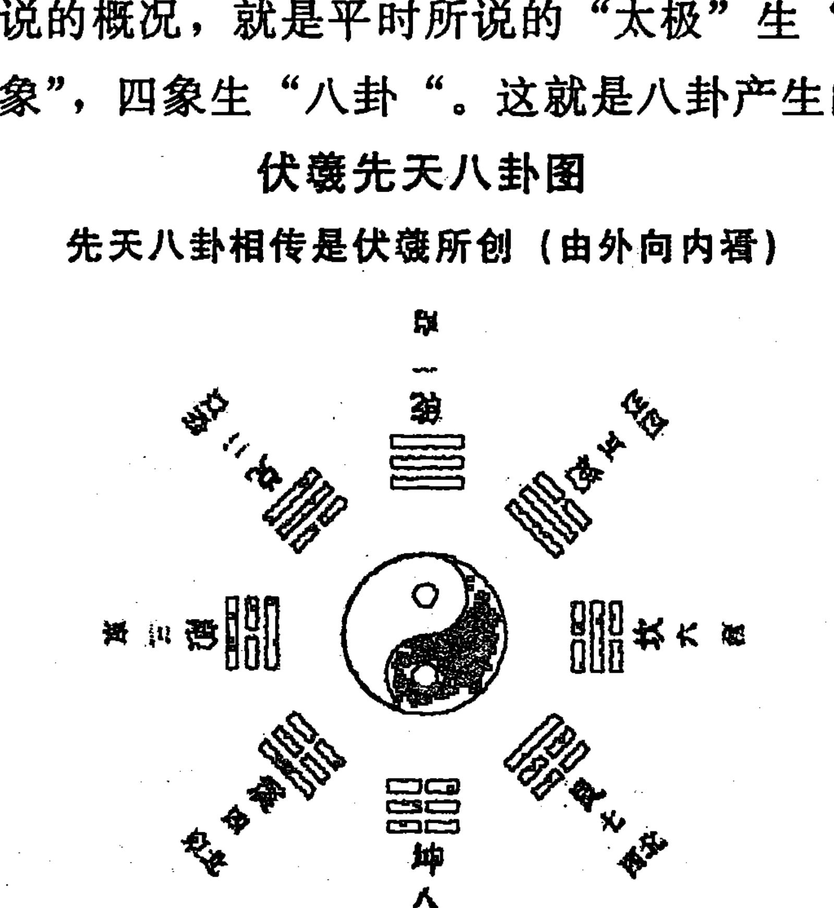
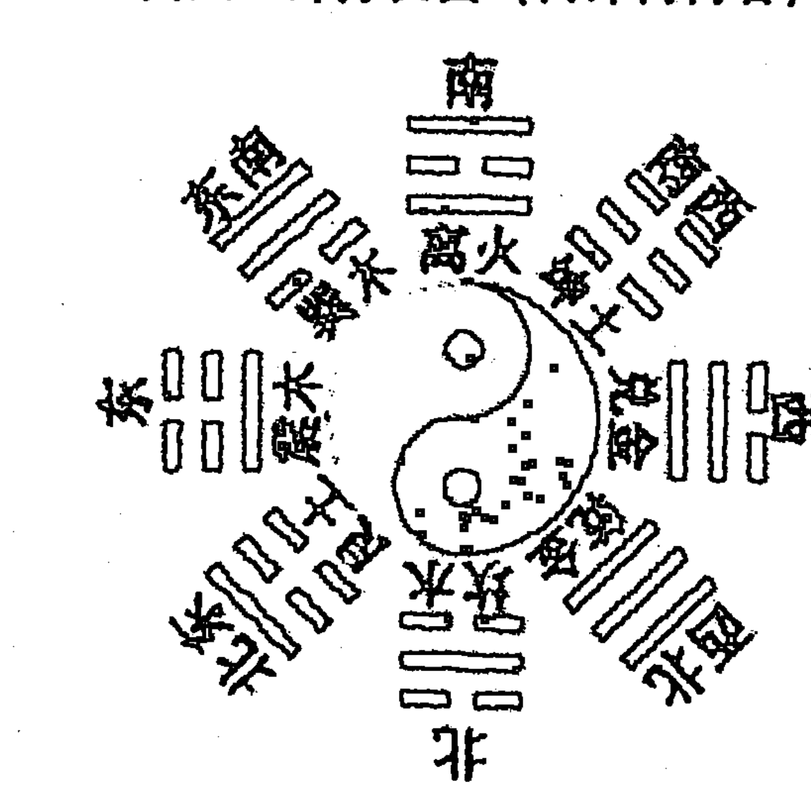

# 六爻实战大全

## 序 文

近距离接触涵博先生是：壬辰年5月在哈市举办的东北易经学论坛期间，因俩人共居一室，更方便于交流，故而相互间探讨了预测学诸多方面的话题……

梁先生文底润绵，治学严谨，又极谦恭、煌蔼、为人低调、为事忆映；吾为能在雄博精邃的易海中结识涵博先生深感至幸！

涵博先生早年曾任职文教界，县府机关，从事过诸多文笔工作；他自幼饱润家庭文德的熏陶，对中华的传统文化尤为痴迷；自1992年以来，开始潜心研习易学八卦、八字命理、梅花易数、阴阳宅风水、姓名学三才等等学科，在易经文化这片土地上躬耕不辍。

梁先生本次著文的《六爻实战大全》体现了其六爻理论的系统性、完整性、质薄性，足见其治学的严谨及呕心沥血的真功底！

当今中国偶见一些“易学”狂徒，口泛滥言他（们）的所谓学说是“天下第一”，纵观人类的社会，凡自称“老大“者，从来结局都不太好——在大浪淘沙之后，早已不见踪影……

古夜郎王，自以为桐梓霸子大的天，是”世界第一”，他是真不知天外有天；而某些“易学”波旬子孙们则是知而咒其不夷！我们还是学点“程门立雪”的精神，或是日后为人为事能有些许进步……

言易是中华诸经之首；是人类文明史上的明珠瑰宝；上古“花莆”中的珍异奇葩，都不为之过……

易学在预测领域的应用，要求百分之百的准确无误，尽善尽美，那是不客观的——因为时下我们对客观世界的认识还有限；因我们现在还不是完人！我们还在研习、挖掘、继承、创新中……

- 放眼浩瀚宇宙；
- 品味古今文明；
- 祈愿：
    - 醍醐玄络，
    - 钩深致远！
    - 般若清源，
    - 彼岸同登！

祈祝涵博先生的文著，给研习者以阶梯、拱桥，给初学者以启迪、增睿！

牡丹江地区易研会会长
孙楠迪
13945307444
甲午年立夏午时

孙楠迪先生生于1937年，上世纪六十年初毕业于哈尔滨工业大学，是从事航天高科技研究的高级工程师，八十年代初开始研究周易，老先生德易双修，技精德高，备受世人推崇。

## 内容简介

本书是以周易为基本原理，研究六爻预测实用方法的专著。全书共分三篇 38 章。上篇为启蒙篇共 3 章，主要介绍阴阳、五行、八卦、起卦、配卦等基础知识。此篇内容是学习八卦、六爻的入门与向导。中篇为易理篇共 16 章，主要讲述用神的选取、六亲变动、卦爻旺衰、卦爻冲合墓空，生克制化等重要原理，以阐述易理为主，理中有象，此篇是全书的重点与核心。下篇是易象篇共分 19 章，主要讲述八卦、六爻的象义，以取象为主，象中寓理。此篇是提升断卦水平与技巧的必修之课。

本书的独特之处有以下六点：

1. 体系的新颖性。本书内容按启蒙篇、易理篇、易象篇三大板块编写，循序渐进，逐步升高，编写思路新颖，不落俗套，在同类作品中独树一帜，前所未有。
2. 层次的逻辑性。本书层次分明，条清缕晰，具有较强的逻辑性，便于理解、记忆和运用。
3. 语言的简明性。语言简明，不重复，不啰嗦；开门见山，直击主题，不转弯绕圈，迂回曲折；概念明确，不含混其词，模棱两可。
4. 内容的实用性。章章节节内容详实具体，没有空话废话，很多技法都是诸书没有披露，没有写清楚明白或没有写具体的。
5. 技法的可操作性。本书技法运用逻辑思维如同数学公式，可按图索骥，对号入座，进行辩证分析，有规律可循，有章可行。
6. 广泛的适应性。本书即适合于文化程度不高的易学爱好者学习，也可供较高层次的易界学人研读；既适用于有一定周易基础欲深读钻研的学者，也适用于刚刚步入易学之门的初学者。

## 读者来信选登

河北省 吕明海

梁老师，你好！有幸拜读你所著的《六爻实战宝典》一书，感受良多。在传承古今先贤的理论精髓的基础上，又有你自己实践经验的结合。把自己多年来对六爻卦的感悟及见解，毫无保留地奉献给广大读者，实乃读者之幸，易界之幸。

宝典中独特的理论体系和断卦风格深深地吸引了我，在实践应用中立杆见影，受益良多。书中章节循序渐进，条理清晰，一切从实践出发，没有花架子，一学就会，另外，书中没有罗列大量的基础知识，节省了空间，增加了有实用意义的技法，来诠释卦例，让读者学习起来更加快捷简便。

梁老师再出新作，完善其著作，更加全面的阐述六爻的理论和技法，为读者深层次的研究六爻体系再上一层楼，实乃广大易学爱好者的幸事。

吕明海
13831767559

吉林省 高源

《易经》作为群经之首，中华民族传统文化的精髓，为历代学者奉为珍宝，其中趋吉避凶的预测功能，更是让人敬畏有加。

梁涵博老师把自己多年研究的成果著成《六爻实战宝典》一书，毫无保留地奉献给广大读者。既有对先人理论精华的继承，又有自己的完善与创新。书中阐述了卦爻的四个层次理论、卦爻的旺衰与生克权，大道至简，把复杂的道理简明化。初学者系统全面的掌握论断法则，又能快速运用实断技巧；水平较高的研易者亦能从实战技法中得到启迪。纵观全书，其论断法则规范，论断范围广泛，论断事物详尽，预测结果准确。

梁先生的《六爻实战宝典》一书面市后，备受广大易友的喜爱，深得易学界的推崇与欢迎，确是一本学习六爻筮法的难得好书。

白城市 高源：15043693629

甲午年戊辰月

安徽省 杨登茗

梁老师，你好！我是一名六爻爱好者，自从看到你的《六爻实战宝典》一书后，很受启发，收效良多。你的这本书打破了传统的格局，把六爻的绝招经典全部奉献给了广大读者，很多实践经验和招绝是别人从来没有透露的。这确实是一本不可多得的好书。同时也体现了你的宽阔胸怀和谦虚的为人品格，你淡泊名利，实事求是，确实是大家的良师益友。祝梁老师事业昌盛，愿你的续书圆满出版。

肖县 杨登茗
13665577498

黑龙江省 刘城庚

梁老师，你好！你的《六爻实战宝典》一书，与众不同，看后大看眼界。有了宝典，断卦就有了方法，有了主心骨。象尺子一样定性准确，吉凶分明，太好了。给易学爱好者开了一扇大门。相信你的新作更精彩。我一定跟你学习，拜你为师。

学生 刘城庚
15174656494

山西省 孙玉文

梁老师，你好！我是一名周易业余爱好者。数十年来一直接触相关书籍，但是很多地方还是模模糊糊，自从拜读你的大作《六爻实战宝典》一书，让我豁然开朗，有拨云见日之感。这本书真是打开易学大门的一把钥匙。是通往易学殿堂的一盏明灯，我热切期盼你写出更多更好的易书，让易学同道分享。

山西省 孙玉文

山西省 池居尚

梁老师，看了你的《六爻实战宝典》一书后，使我受益匪浅。特别是你那无私奉献的精神，严谨的治学态度，宅心仁厚，不误学子，受人尊敬，被人称道。我代表应县的易学爱好者向你致敬，并期盼你再写下集，为我们导航引路。

山西省应县职业卦师 池居尚
18935481658

黑龙江省 孙清福

读了梁老师的《六爻实战宝典》一书，感触颇深。这本书由浅入深，简单明了，易理、卦理、事理、环环扣紧，读后受益匪浅，经久不能忘怀。

梁老师，研易多年，在易学领域刻苦钻研，日积月累，不断发展丰富自己。这本书是他多年实践经验的总结。
相信梁老师在易学领域有更多好书陆续面市，欲穷千里目，更上一层楼，我们翘首以盼。

孙清福 13763734391

沈阳市 李多武

《六爻实战宝典》一书，条理分明，由浅入深，拓展面广，此书思路清晰，编撰缜密，通俗易懂，是初学者的良师益友。本人恭读此书，深感作者易学造诣深厚。

13900811307

## 自 序

易经是中华民族聪明智慧的结晶，被世人称为群经之首，宇宙的代数学，智慧中的智慧，在几千年的历史长河中，经久不衰。今天这颗古老的国学明珠，更加生机盎然，光彩四射。易学事业的繁荣与发展，又迎来了新的春天。

2012年，我的《六爻实战宝典》一书出版后，在社会上引起了强烈的反响，纷纷来电表示祝贺与鼓励。一致认为是一部内容详实、说理透彻、语言精炼的好书；是一部一看就懂一学就会的创新佳作。应广大读者的一再要求，笔者对《六爻实战宝典》一书进行了修改与完善，在原来的基础上增添了很多实用内容。同时对编排体系进行了调整，按上篇、中篇、下篇三个板块进行科学编排。上篇为启蒙篇，内容主要是面向初学者。介绍阴阳五行，起卦装卦方面的基础知识和基本要领。这部分内容尽量作到通俗易懂，简而不烦。中篇是易理篇，下篇是易象篇。易有四法，象理数占，其中易理和易象是构建周易的基本原理，所谓易理就是判断吉凶的主要依据，而易象是用象征的方法来模拟宇宙中万事万物的形象，是判断形成吉凶成败的具体过程和细节。中篇以易理为主，说理透彻，确切，理以象载，理中有象。下篇以易象为主，象中寓理，内容详实具体。

本书内容既有古今先贤的理论精华，又有千古流传下来的成功经验；既有本人长期实践的总结，又有借鉴同道研究成果后发挥与拓展；既有古今名家的心血结晶，又有本人在实际预测中所悟出的独到见解。

本书既适合于文化程度不高的易学爱好者阅读，也可供较高层次的易学达人参考；既适用于有一定周易基础而欲进一步深造之人，也适用于刚刚步入易学之门的初学者。初学者学习此书，可以得到一个完整清晰的思路，快速掌握六爻预测的实用技法，踌躇不前的久困志士研读此书，可以柳暗花明，别有洞天，顺利登上易学的大雅之堂。

将自己多年苦学所得总结出来，公诸于世，是笔者的真实愿望，为广大易友奉献一点实实在在的东西是笔者的追求，本书能对易界有所启迪，成为易林苍海中的一点水，为弘扬周易尽一点绵薄之力，是笔者的渴望。尽管笔者竭尽全力，但由于学识所限，难免有管孔之见，纰漏之处，还望易道同仁，高明君子赐予指正，笔者定会深表感谢。学识渊博、德高望重的孙楠迪老先生在百忙之中，为此书作序，笔者在此躬身致敬，表示深深的谢意。

黑龙江省庆安县梁涵博
电话：13212859681
2014年4月

## 上篇 启蒙篇

# 第一章 阴阳五行

## 第一节 阴阳五行学说

### 1. 阴阳学说

阴阳五行学说是八卦六爻预测的理论依据，所以研习八卦、六爻预测必须首先掌握阴阳五行生克制化的基本法则。

阴阳学说认为，一切事物的形成发展和变化，全在于阴阳二气的运动。阳具有刚健、向上、生发、展示、伸展、明朗、积极、好动等特征；阴具有柔弱、向下、收敛、隐蔽、内向、收缩、含蓄、消极、喜静等特征。任何庞大的事物都逃不出阴阳的范畴，任何微小的事物都具有阴阳两个方面。

自然界的万物万象，其内部都同时存在着相反的两种属性，即存在着相互对立的阴阳两个方面，两个方面不仅对立、矛盾，而且相互依存，彼此为用，双方都以对方作为自己存在的前提，即没有阴就没有阳；没有阳就没有阴，没有阳阴也不存在。阴阳对立的双方在一定条件下可以相互转化，阴可以转化为阳，阳也可以转化为阴，阴阳互相转化，是事物发展的必然规律。

### 2. 五行学说

五行学说认为，天地万物都是由金、木、水、火、土五种最根本的物质构成的。五行之间存在着相生相克的规律，则是自然界的必然规律。相生含有互相滋生、促进助长的意思；相克含有互相制约，克制抑制的意思。

五行相生：木生火、火生土、土生金、金生水、水生木；
五行相克：木克土、土克水、水克火、火克金、金克木。

## 第二节 天干地支

1. 天干

天干，也称十天干，共有十个，依次为：甲、乙、丙、丁、戊、己、庚、辛、壬、癸。

①天干与阴阳

甲、丙、戊、庚、壬为奇数属阳；
乙、丁、己、辛、癸为偶数属阴。

②天干与五行

甲乙为木，甲为阳木，乙为阴木。
丙丁为火，丙为阳火，丁为阴火。
戊己为土，戊为阳土，己为阴土。
庚辛为金，庚为阳金，辛为阴金。
壬癸为水，壬为阳水，癸为阴水。

2. 地支

十二地支依次为：
子、丑、寅、卯、辰、巳、午、未、申、酉、戌、亥。
子、寅、辰、午、申、戌属阳；
丑、卯、巳、未、酉、亥属阴。

①地支与五行

寅卯属木，寅为阳木，卯为阴木。
巳午属火，午为阳火，巳为阴火。
申酉属金，申为阳金，酉为阴金。
亥子属水，子为阳水，亥为阴水。
辰戌丑未属土，辰与戌为阳土，丑与未属阴土。

②地支与方位

寅卯“东方”木，巳午“南方”火，申酉“西方”金，亥子“北方”水，辰戌丑未“四季”土，分别在每季的最后一个月。

③地支与四季

寅、卯、辰为春季。巳、午、未为夏季。申、酉、戌为秋季。亥、子、丑为冬季。

④地支与六合

子与丑合，寅与亥合，卯与戌合，辰与酉合，午与未合，巳与申合。

⑤地支与三合

申、子、辰三个字合化为水局
亥、卯、未三个字合化为木局
寅、午、戌三个字合化为火局
巳、酉、丑三个字合化为金局

三合局合化以中间字的五行为准例如：“申”字属金，“子”字属水，“辰”字属土，三个字合在一起，中间字，“子”字属水，所以申、子、辰合为水局，其余类推。

十二地支三合局附图

⑥地支与六冲

子午相冲，丑未相冲，寅申相冲，卯酉相冲，辰戌相冲，巳亥相冲。

相冲的规律是“对冲”，从方向来说，是南北相冲，东北与西南相冲，西北与东南相冲，东面与西面相冲。

十二地支相冲附图

⑦地支相刑

三刑：子刑卯，卯刑子，为无礼之刑；巳刑申，申刑寅，寅刑巳，为恃势之刑；丑刑戌，戌刑未，未刑丑，为无恩之刑。是指对恩人无义之刑。

自刑：辰午酉亥，辰遇辰，午遇午，酉遇酉，亥遇亥，为自刑。

刑为麻烦祸患之意。相刑之中，有生克关系，也有冲合这些不同关系，表明不同性质和程度的麻烦祸患。

⑧地支与月建

正月建“寅”，二月建“卯”，三月建“辰”，四月建“巳”，五月建“午”，六月建“未”，七月建“申”，八月建“酉”，九月建“戌”，十月建“亥”，十一月建“子”，十二月建“丑”。

月建在纳甲预测中十分重要，名曰“月建为万象之提纲”。应该熟记。

⑨地支与时辰

古人记时和现在不同，以两个小时为一时辰。

- 子时：23点——1点
- 丑时：1点——3点
- 寅时：3点——5点
- 卯时：5点——7点
- 辰时：7点——9点
- 巳时：9点——11点
- 午时：11点——13点
- 未时：13点——15点
- 申时：15点——17点
- 酉时：17点——19点
- 戌时：19点——21点
- 亥时：21点——23点

⑩地支与生肖

子鼠、丑牛、寅虎、卯兔、辰龙、巳蛇、午马、未羊、申猴、酉鸡、戌狗、亥猪。

以农历计算人的属相
子年生人属：“鼠”，丑年生人属“牛”，寅年生人属：“虎”，卯年生人属“兔”，辰年生人属“龙”，巳年生人属“蛇”，午年生人属“马”，未年生人属“羊”，申年生人属“猴”，酉年生人属“鸡”，戌年生人属“狗”，亥年生人属“猪”。

⑪地支与旬空

旬空的操作法
古人把一个月分为三旬，每旬十天；两个月共为六旬六十天，正好是一个花甲子。旬空是用两个月来计算的。

第一行，从甲子日开始，顺数乙丑、丙寅、丁卯、戊辰、己巳、庚午、辛未、壬申，最后是癸酉日，全都属于甲子旬。

第二行，从甲戌日一直到癸未日，都属于甲戌旬。
第三行，从甲申日一直到癸巳日，都属于甲申旬。
第四行，从甲午日一直到癸卯日，都属于甲午旬。
第五行，从甲辰日一直到癸丑日，都属于甲辰旬。
第六行，从甲寅日一直到癸亥日，都属于甲寅旬。

因为天干有十个，地支有十二个，配完一旬十天之后，还剩两个地支，这两个地支就是空亡。

旬空口诀：
甲子旬中戌亥空，甲戌旬中申酉空，
甲申旬中午未空，甲午旬中辰巳空，
甲辰旬中寅卯空，甲寅旬中子丑空。

凡在甲子旬中的任何一日起卦，如果卦中地支出现戌与亥的，此戌亥两爻就为旬空。其他仿此。

空亡表

| | 甲子旬 | 甲戌旬 | 甲申旬 | 甲午旬 | 甲辰旬 | 甲寅旬 |
|---|---|---|---|---|---|---|
| 甲 | 甲子 | 甲戌 | 甲申 | 甲午 | 甲辰 | 甲寅 |
| 乙 | 乙丑 | 乙亥 | 乙酉 | 乙未 | 乙巳 | 乙卯 |
| 丙 | 丙寅 | 丙子 | 丙戌 | 丙申 | 丙午 | 丙辰 |
| 丁 | 丁卯 | 丁丑 | 丁亥 | 丁酉 | 丁未 | 丁巳 |
| 戊 | 戊辰 | 戊寅 | 戊子 | 戊戌 | 戊申 | 戊午 |
| 己 | 己巳 | 己卯 | 己丑 | 己亥 | 己酉 | 己未 |
| 庚 | 庚午 | 庚辰 | 庚寅 | 庚子 | 庚戌 | 庚申 |
| 辛 | 辛未 | 辛巳 | 辛卯 | 辛丑 | 辛亥 | 辛酉 |
| 壬 | 壬申 | 壬午 | 壬辰 | 壬寅 | 壬子 | 壬戌 |
| 癸 | 癸酉 | 癸未 | 癸巳 | 癸卯 | 癸丑 | 癸亥 |
| 空亡 | 戌亥 | 申酉 | 午未 | 辰巳 | 寅卯 | 子丑 |

## 第三节 五行旺衰

1. 五行与十二宫

十二长生即五行的十二种运势：长生、沐浴、冠带、临官、帝旺、衰、病、死、墓、绝、胎、养。称十二运为十二长生，是以起首之“长生”代表整个十二运。

十二长生描述了“生老病死”的一生，也用来比喻天下万事万物产生、发展、衰败消亡的整个过程。

长生：长生为出生，生长之意，婴儿刚出世，或新事物刚产生时具有欣欣向荣的气息，为开始发展成长上升阶段。

沐浴：又称“败”。婴儿降生后须洗去污垢；新事物初登台，很不完善。

冠带：从小儿到青年，可以穿衣带帽，显得仪表堂堂；新事物也进入了华秀的阶段。

临官：又称进禄。人长成后，可以出仕做官，或挣钱养家；新事物也已成熟，地位日益巩固。

帝旺：人到壮年，身体和智力都到了鼎盛阶段，最能全面发挥一个人的作用；是最旺，旺极阶段。然而旺极必衰，无论是人是事，到了顶峰阶段，也同时播下了衰败的种子。

衰：这是一个质的变化期，人至此感到气衰神弱，力不从心；新事物至此已成旧事物，将面临其他新事物的挑战了。

病：人逐渐衰老，便要百病丛生；旧事物死亡后遗迹被送进历史博物馆，或被收藏于仓库。

死：人衰老之后，气绝身亡，生命终结，是事物走向消亡的阶段。

墓：人和事物死亡之后，进入坟墓，毫无生机可言。
绝：是彻底消失，是事物消亡的最彻底阶段。
胎：胎即受胎，指人受孕时，或万物在地中萌芽时。
养：就是成形，人在母腹中成形，万物在地中成形。

十二长生中，长生、冠带、临官、帝旺代表旺盛的运势，称为“四旺运”。败、死、墓、绝代表恶劣的运势，称之为“四恶运”。衰、病、胎、养代表平淡的运势。

五行长生诀：

木长生在亥，火长生在寅，金长生在巳，水土长生在申。

诀中的木火金水土是指卦中六爻地支的五行属性：寅卯属木，巳午属火，申酉属金，亥子属水，辰戌丑未属土。诀中寅申巳亥四字是指占卦那一日的日支。如亥日占卦，某爻的地支是寅或卯，该爻便处于生长的运势中。知道了五行各长生于某日，然后把日支的顺序与十二长生的顺序逐一配对，即可得知五行在其余十一日处于何种气势状态。如木长生在亥，子日便是沐浴，丑日冠带，寅日临官，卯日帝旺，辰日衰，巳日病，午日死，未日墓，申日绝，酉日胎，戌日养。余仿此。

五行十二长生表

| 五行 \ 十二运 | 长生 | 沐浴 | 冠带 | 临官 | 帝旺 | 衰 | 病 | 死 | 墓 | 绝 | 胎 | 养 |
|---|---|---|---|---|---|---|---|---|---|---|---|---|
| 木 | 亥 | 子 | 丑 | 寅 | 卯 | 辰 | 巳 | 午 | 未 | 申 | 酉 | 戌 |
| 火 | 寅 | 卯 | 辰 | 巳 | 午 | 未 | 申 | 酉 | 戌 | 亥 | 子 | 丑 |
| 金 | 巳 | 午 | 未 | 申 | 酉 | 戌 | 亥 | 子 | 丑 | 寅 | 卯 | 辰 |
| 水土 | 申 | 酉 | 戌 | 亥 | 子 | 丑 | 寅 | 卯 | 辰 | 巳 | 午 | 未 |

在十二长生运中，最主要的是四种，即生、旺、墓、绝。

除五行十二长生外，还有一种十干十二长生，因六爻预测法中不用，所以就不赘述了。

2. 五行旺相休囚死

五行旺相休囚死，又称五行四时旺衰是指五行在春夏秋冬四季中所处的状态。

- 春：木旺，火相，水休，金囚，土死。
- 夏：火旺，土相，木休，水囚，金死。
- 秋：金旺，水相，土休，火囚，木死。
- 冬：水旺，木相，金休，土囚，火死。
- 四季：土旺，木相，火休，木囚，水死。

正月寅，二月卯，为春：四月巳，五月午，为夏；七月申，八月酉，为秋；十月亥，十一月子，为冬。三月辰，六月未，九月戌，十月丑，为四季。

辰戌丑未虽同为四季土月，但因为它们分别属于春夏秋冬四时，所以其五行衰旺也要根据时令的不同而有些例外：

三月辰，前十二天，木有余气，不以囚论，后十八天方以囚论。

六月未，前十二天，火有余气，不以休论，后十八天方以囚论。

九月戌，前十二天，金有余气，不以休论。

十二月丑，前十二天，水有余气，不以死论，后十八天方以死论。

五行旺相休囚死，是根据生克关系来定的。当令者为我，我当令为旺，生我者为相，我生者为休，我克者为囚，克我者为死。

如正、二月占卦，卦中的寅卯支处于旺的状态，巳午支处于相的状态，亥子支处于休的状态，申酉支处于囚的状态，辰戌丑未支处于死的状态。

旺，事物发展至鼎盛时期的状态。如木在春季，得时秉令为一年四季最旺之时。

相，事物达到鼎盛之前的阶段，其势蒸蒸日上，不可阻挡。如木于冬季水旺之时，为生长发育提供了条件，处于次旺状态。

休，事物因生另一事物泄气而衰败。

囚，事物失去了生的源泉，又克制不了当令的事物，导致自身力量比休更弱。

死，事物被力量极旺的另一事物重克，元气伤尽，走向灭亡的状态。如冬季火被旺水重克而趋于熄灭。

旺相休囚死的旺衰次序为：旺为最旺，相为次旺，休为小衰，因为中衰，死为最衰。

余气处于比“相”衰，比“休”旺的状态。

旺与相，一般合称“旺相”：休、囚、死，一般合称“休囚”。

# 第二章 八卦

## 第一节 八卦基础知识

爻是构成八卦的最基本单位和符号。爻分阳爻和阴爻，阳爻为“——”一横，阴爻“— —”中间断开，阳爻代表天，阴爻代表地。

将阴爻和阳爻以三为单位进行组合起来，可以得到八种组织方式。换则言之，阴阳两种力量的不同组织结构，产生了八大自然现象：

- 乾坤震艮
- 巽坎离兑

这八大自然现象，就是八卦，又称为八经卦。经卦都是由三个爻组成的，所以也叫三爻卦。

八个经卦以二为单位进行组合，可以得到六十四种组合方式。换句话说，八大自然现象的两两相撞，产生了六十四种新的现象，就是六十四卦，六十四卦都是由两个经卦组成的，叫做复卦。因为复卦有六个爻，所以叫做六爻卦。纳甲法所用的卦，就是六十四复卦。我们通常所说的卦，也就是指复卦而言的。

为了避免经卦和复卦的混淆，以后再谈到前者时，就专用“经卦”一词，凡是只称卦和八卦的，就是八个复卦。

组成复卦的两个经卦，位于下面的叫做内卦或下卦，位于上面的称为外卦或上卦。

八卦与阴阳
乾坎艮震四卦为阳卦，巽离坤兑四卦为阴卦。

八卦与五行
乾兑属金，离属火，震巽属木，坎属水，艮坤属土。

八卦与方位（后天八卦）
乾为西北，兑为西方，离为南方，震为东方，巽为东南，坎为北方，艮为东北，坤为西南。

八卦与数字（先天八卦）
乾一、兑二、离三、震四、巽五、坎六、艮七、坤八。

## 第二节 八卦取象

1. 乾卦☰
乾三连就是三横在一起，记号乾三连，不仅是乾的记号，同时也是圆天的记号，古以太阳代表天，在日光照耀下，草木初出之状，正表达了太阳和天的作用。

2. 坤卦☷
坤六断就是将三横分开，形成六个断折，这不仅是坤的记号，也是地的记号，土位在坤，地中之物出于形也，可知植物由地生出，土被分裂之状。

3. 艮卦☶
艮覆碗好像是一只碗反扣的形象，艮为山，又象山之形，艮与根同。植物有根，使植物上长，山由地生出与根的作用是一致的。

网址:http://bolg.sina.com.cn/u/3506369785

### 4. 兑卦☱

兑上缺形象如上面有个缺口，兑为泽，好像沼水池的水外溢，卦名兑，象名泽。

### 5. 震卦☳

震仰盂仿佛象一个痰盂仰放着，卦名震，象名雷。震者，如雷震之声，故名表示雷。

### 6. 巽卦☴

巽下断下面一横切开，巽为风，好像下面一根绳子被风吹断，象巽字下面两笔分开。

### 7. 坎卦☵

坎中满象征中间是满满的，象满满的一沟水，水多了将两边堤岸冲开，“坎”是“欠”，“土”二字并凑，如两边堤不固，被满满一沟水冲开。

### 8. 离卦☲

离中虚象征着中间是一条虚线，又象一棵木头中间空缺，离为中女，象内有女之象也。

## 八卦取象歌

乾三连☰ 坤六断☷ 离中虚☲ 坎中满☵
震仰盂☳ 艮覆碗☶ 兑上缺☱ 巽下断☴

## 第三节 八卦与六十四卦

八卦由两个简单符号构成，也就是阴爻和阳爻，阳爻代表天，阴爻代表地，这就是两仪，两仪既代表阴和阳，也代表天和地。

由于两仪的重叠，就演变成了太阳，太阴，少阳，少阴。也就是说两个阳爻重叠为太阳，两个阴爻重叠为太阴，一阳爻在一阴爻之上为少阳，一阴爻在一阳爻上为少阴。

这就是人们所常说的“四象”。四象代表东、西、南、北四个方向，也代表春、夏、秋、冬四季。

再由阳爻分别与太阳、少阳、少阴、太阴相重叠（重叠时注意：阳爻必须在下方），就演变成了乾卦、兑卦、离卦、震卦。由阴爻分别与太阳、少阴、少阳、太阴相重叠（重叠时注意：阴爻必须在最下方），就变成巽卦、坎卦、艮卦、坤卦，前后一共有八个卦，八卦代表八个方向。

从上面的八卦顺序不难看出：（一）《乾》（二）《兑》（三）《离》（四）《震》（五）《巽》（六）《坎》（七）《艮》（八）《坤》。这八个数字（按序数的数）叫做“先天八卦数”。它是由《易经》最早的发明人伏羲氏所创。

前面所说的概况，就是平时所说的“太极”生“两仪”，“两仪”生“四象”，四象生“八卦”。这就是八卦产生的过程。

## 伏羲先天八卦图

先天八卦相传是伏羲所创（由外向内看）



巽

伏羲八卦次序图由外向内看：
“乾一、兑二、离三、震四、巽五、坎六、艮七、坤八”。

## 文王八卦

文王八卦方位图（由外向内看）



文王八卦以离南坎北震东兑西为方向，此图为后天八卦，文王所作。

## 第四节 六十四卦名称

乾为天，天风姤，天山遁，天地否，风地观，山地剥，火地晋，火天大有。（乾宫八卦皆属金）

坎为水，水泽节，水雷屯，水火既济，泽火革，雷火丰，地火明夷，地水师。（坎宫八卦皆属水）

艮为山，山火贲，山天大畜，山泽损，火泽睽，天泽履，风泽中孚，风山渐。（艮宫八卦皆属木）

震为雷，雷地豫，雷水解，雷风恒，地风升，水风井，泽风大过，泽雷随。（震宫八卦皆属木）

巽为风，风天小畜，风火家人，风雷益，天雷无妄，火雷噬嗑，山雷颐，山风蛊。（巽宫八卦皆属木）

离为火，火山旅，火风鼎，火水未济，山水蒙，风水涣，天水讼，天火同人。（离宫八卦皆属火）

坤为地，地雷复，地泽临，地天泰，雷天大壮，泽天夬，水天需，水地比。（坤宫八卦皆属土）

兑为泽，泽水困，泽地萃，泽山咸，水山蹇，地山谦，雷山小过，雷泽归妹。（兑宫八卦皆属金）

每宫的第一卦称为本宫或首卦、纯卦，每宫的第七卦为游魂卦，第八卦为归魂卦。重卦共有六十四组，称为六十四卦。

## 第五节 巧记卦名

将乾卦安在食指上端，坤卦安在食指根部，坎卦安在中指上端，离卦安在中指根部，震卦安在无名指上端，兑卦安在无名指根部，艮卦安在小指上端，巽卦安在小指根部。然后用每一卦作上卦，与其它七卦相配就得出：

- 乾为天 1161
- 天泽履 1257
- 天火同人 1333
- 天雷无妄 1445
- 天风姤 1511
- 天水讼 1643
- 天山遁 1721
- 天地否 1831
- 火天大有 3131

- 泽天夬 2262
- 兑为泽 2158
- 泽火革 2346
- 泽雷随 2434
- 泽风大过 2544
- 泽水困 2612
- 泽山咸 2732
- 泽地萃 2822
- 雷天大壮 4148

| 火泽睽 | 3247 | 雷泽归妹 | 4232 |
|---|---|---|---|
| 离为火 | 3363 | 雷火丰 | 4356 |
| 火雷噬嗑 | 3455 | 震为雷 | 4464 |
| 火风鼎 | 3523 | 雷风恒 | 4534 |
| 火水未济 | 3633 | 雷水解 | 4624 |
| 火山旅 | 3713 | 雷山小过 | 4742 |
| 火地晋 | 3841 | 雷地豫 | 4814 |
| 风天小畜 | 5115 | 水天需 | 6148 |
| 风泽中孚 | 5247 | 水泽节 | 6216 |
| 风火家人 | 5325 | 水火既济 | 6336 |
| 风雷益 | 5435 | 水雷屯 | 6426 |
| 巽为风 | 5565 | 水风井 | 6654 |
| 风水涣 | 5653 | 坎为水 | 6666 |
| 风山渐 | 5737 | 水山蹇 | 6742 |
| 风地观 | 5841 | 水地比 | 6838 |
| 山天大畜 | 7127 | 地天泰 | 8138 |
| 山泽损 | 7237 | 地泽临 | 8228 |
| 山火贲 | 7317 | 地火明夷 | 8346 |
| 山雷颐 | 7445 | 地雷复 | 8418 |
| 山风蛊 | 7535 | 地风升 | 8544 |
| 山水蒙 | 7643 | 地水师 | 8636 |
| 艮为山 | 7767 | 地山谦 | 8752 |
| 山地剥 | 7851 | 坤为地 | 8868 |

其代码的含义是：第一位数是上卦，第二位数是下卦，第三位数是世爻，第四位数为卦宫序号。

# 第三章 装卦

## 第一节 起卦

六爻预测的起卦方法最主要的是摇卦法，是一种传统的起卦方法，也是六爻预测应用最多的占卜方法。卦由心生，心动信息则发，人体所发射的信息实际上就是一种具有能量的电磁波，借助某种工具，以某种形式反映出这种信息。用铜钱摇卦可以预测各种信息，其原理就在于此。用铜钱摇卦，就是将三枚铜钱（以乾隆钱最佳）用双手合扣，将求测的意念传导到铜钱上，共摇六次而成卦。

摇卦法最关键的是在摇卦时首先要心平气和，将三枚铜钱平放手心，两手合扣，约一分钟，使铜钱与电磁场和人脑的意念相同，犹如电视台发布信息，电视机接受节目一样。因此，只有求测人的意念集中在铜钱上才能正确的传导和反馈信息，从而达到预测的目的。

铜钱的使用方法是：

铜钱有字面为正，也称为字，无字的一面为背，在摇卦时只看背就行了，三个铜钱有一个背，则记一点“、”为少阳为单；有两个背则记两点“、、”为少阴为折；出现三个背，用“O”表示为老阳，为重；出现三个字用“X”表示，为老阴为交。

所谓少阴少阳，就是稚阳稚阴，其阳气阴气还在成长发展阶段，不会发生质的变化，所谓老阳老阴，是指阳气或阴气发展至顶点，物极必反，所以老阳要变老阴，老阴要变成老阳。

每个卦，皆由六个爻组成，称为六爻卦，老阳和老阴在六爻卦中称为动爻，表示此爻位要发生变化，阳动变阴，阴动变阳。变出来的爻称为变爻，摇出的卦称为主卦，变化后得到的卦，称为变卦或之卦。

摇卦时从下往上点，第一次摇的结果为初爻，第二次摇的结果为二爻，依次排列最后一次为上爻即六爻。

## 第二节 纳甲

给摇出的卦的六个爻位，配上天干地支。因为天干之首为甲所以称纳甲装卦。

装卦以八个经卦为单位，看其处于内卦还是外卦，配以不同的干支。

乾坎艮震四阳卦需配阳干阳支，巽离坤兑四阴卦需配阴干阴支。阳支顺行，阴支逆行。顺行者，如阳支的次序是子寅辰午申戌，装卦照此排列即可。阴支的顺序本来是丑卯巳未酉亥，但装卦却得逆行，变成丑亥酉未巳卯。

十天干纳甲是，乾卦纳甲壬，内卦纳甲，外卦纳壬，坤卦纳乙癸，内卦纳乙，外卦纳癸，坎卦纳戊，离卦纳己，震卦纳庚，巽卦纳辛，艮卦纳丙，兑卦纳丁。

在实际预测中，天干应用较少，因此在装卦时常常省略，只纳入地支。

## 八卦纳十二地支图

| 八卦爻位 | 乾 | 坎 | 艮 | 震 | 巽 | 离 | 坤 | 兑 |
|---|---|---|---|---|---|---|---|---|
| 外卦六爻 | 戌 | 子 | 寅 | 戌 | 卯 | 巳 | 酉 | 未 |
| 外卦五爻 | 申 | 戌 | 子 | 申 | 巳 | 未 | 亥 | 酉 |
| 外卦四爻 | 午 | 申 | 戌 | 午 | 未 | 酉 | 丑 | 亥 |
| 内卦三爻 | 辰 | 午 | 申 | 辰 | 酉 | 亥 | 卯 | 丑 |
| 内卦二爻 | 寅 | 辰 | 午 | 寅 | 亥 | 丑 | 巳 | 卯 |
| 内卦一爻 | 子 | 寅 | 辰 | 子 | 丑 | 卯 | 未 | 巳 |

纳甲筮法就是将八卦纳入十二地支，然后，以五行生克原理进行分析判断。十二地支可谓纳甲筮法的主要内容。整个纳甲筮法尽管有诸多规定及运算法则，但归根结底，是通过上图中四十八个地支进行运算的。

八卦纳十二地支，有歌诀如下：

> 乾震子午坎寅申 艮土辰戌顺行真
> 巽木丑未离卯酉 坤未丑兑巳亥循

意思是说：乾震两卦在内卦装地支从子起，外卦从午起。
坎卦在内卦装地支从寅起，外卦从申起。
艮卦在内卦装地支从辰起，外卦从戌起。
以上都是顺行，按地支顺序隔位取一地支配在卦爻上。
巽卦在内卦装地支从丑起，外卦从未起。
离卦在内卦装地支从卯起，外卦从酉起。
坤卦在内卦装地支从未起，外卦从丑起。
兑卦在内卦装地支从巳起，外卦从亥起。

现举说明：

坤 — — — — 癸酉    乾 — — 壬戌
为 — — — — 癸亥    为 — — 壬申
地 — — — — 癸丑    天 — — 壬午
地天泰卦  天地否卦
乾 — — 甲辰    坤 — — — — 己卯
为 — — 甲寅    为 — — — — 乙巳
天 — — 甲子    地 — — — — 乙未

在地天泰卦中，经卦乾在内，所以纳子寅辰；在天地否卦中，经卦乾在外，所以纳午申戌。经卦坤在地天泰中处于外卦，故纳丑亥酉；在天地否卦中处于内卦，故纳未巳卯。

## 第三节 认世寻宫

### 1. 安世应

卦占出后，装好干支，接下来就是装世、应爻了。关于世应的装法，诸书都要求学者，先背熟每一卦是哪宫的第几卦，然后再按次序装出世应爻来，这种方法非常复杂，很多易学爱好者，学易多年，就是不能突破这个难关，无法背诵六十四卦中各自所在的八卦宫位和卦序。见于这种情况，笔者特在此书中介绍装世、应爻的简便快捷方法。

这个方法是：将一个经卦的三爻分为天、地、人爻，即上爻为天爻，中爻为人爻，下爻为地爻。因为一个重卦是由内、外两个经卦组成的，所以内卦分天、地、人三爻，外卦也分天、地、人三爻，这样一来，每一个重卦就有两个天爻，即内卦第三爻为内天爻，外卦上爻为外天爻；有两个地爻，即内卦初爻为内地爻，外卦下爻（也就是四爻），为外地爻；有两个人爻，即内卦中爻为内人爻，外卦中爻为外人爻。如《水泽节》的天、地、人爻位如下图所示：

- - 外卦天爻
外卦 —— 外卦人爻
- - 外卦地爻
- - 内卦地爻
内卦 —— 内卦人爻
- - 内卦地爻

装世爻口诀如下：
天同二世天变五，地同四世地变初。
本宫六世三世异，人同游魂人变归。

“天同二世”的含义是：一个卦如果两天爻相同，其两人爻和两地爻均不同，则世爻就在二爻位上，就是二世卦。如《风火家人》《泽地萃》卦就是二世卦。

风火家人          泽地萃
——              - -
——应            ——应
- -              ——
——              - -
- -世            - -世
——              - -

“天变五”的含义是：一卦的两地爻，两人爻均相同，而两天爻不同，即为天变，这样卦的世爻就在五爻位上，叫做五世卦。如《山地剥》《地山谦》等卦就是五世卦。

山地剥
-- --
- - 世
- -
- -
- - 应
- -

地山谦
- -
- - 世
- -
-- --
- - 应
- -

“地同四世”的含义是：上下两卦的地爻相同，而两天爻和两人爻均不同，其世爻就在四爻位上，即为四世卦，如《地风升》、《泽火革》等就是四世卦。

地风升
- -
- -
- - 世
-- --
-- --
- - 应

泽火革
- -
-- --
-- -- 世
-- --
- -
-- -- 应

“地变初”的含义是：上下两卦的地爻不同。其人爻天爻均相同，则世爻就在初爻位上，即为一世卦。如《天风姤》、《泽水困》等就是一世卦。

天风姤
-- --
-- --
-- -- 应
-- --

泽水困
- -
-- --
-- -- 应
- -

“本宫六世”指的是每一宫的首卦的世爻都在第六爻上，叫做六世卦。如《乾为天》、《巽为风》等就是六世卦。

乾卦
— — 世
— —
— —
— — 应
— —
— —

巽卦
— — 世
— —
— —
— — 应
— —
— —

“三世异”就是说，上下两卦的天爻、人爻、地爻都不相同的卦，则世爻就一定在三爻上，叫做三世卦。如《天地否》、《风雷益》等就是三世卦。

天地否
— — 应
— —
— —
- - 世
- -
- -

风雷益
— — 应
— —
- -
- - 世
- -
— —

“人同游魂”是说上下二卦天爻，地爻各不相同。只有人爻相同，那么这种卦就是游魂卦，它的世爻在四爻上，即为四世卦。如《火地晋》、《山雷颐》等就是四世卦。

火地晋 山雷颐
— — — —世
— — — —
— — — —
— —应 — —应

“人变归”就是说：上下两卦的天爻和地爻相同，而人爻却不同，这样的卦就是归魂卦，归魂卦的世爻在三爻位上，即为三世卦。如《火天大有》《山风蛊》等就是归魂卦。

火天大有 山风蛊
— —应 — —应
— — — —
— — — —
— —世 — —世
— — — —
— — — —

世爻确定之后，与世爻相隔两位便是应爻。世爻如在初爻，应爻便在四爻，世爻如在三爻，则应爻必在上爻。总之世爻与应爻相隔两爻。

### 2. 八卦寻宫诀：

- 一二三六外卦宫
- 四五游魂内变更
- 归魂内卦是本宫

“一二三六外卦宫”，是说初爻持世的卦，二爻持世的卦，三爻持世的卦以及上卦持世的卦，它们的外卦就是该卦所属的宫位。如《天风姤》初爻持世，外卦为乾，故《天风姤》就是乾宫八卦，又如《火水未济》三爻持世，外卦为离，故《火水未济》就是离宫八卦。

“四五游魂内变更”，是指四爻持世的卦，五爻持世的卦，游魂卦，只要将它们的内卦三爻全部由阳变阴或由阴变阳，得出一个新卦，这个新卦就是原来卦的宫位。《风地观》四爻持世，下卦为坤，将三阴爻全部变成阳爻就得出乾卦，因此《风地观》就是乾宫八卦。又如《泽风大过》是游魂卦，他的下卦为巽，把巽卦阳爻变阴，阴爻变阳，得出震卦，所以《泽风大过》是震宫八卦。

“归魂内卦是本宫”，就是说，归魂卦的内卦是何卦，则这归魂卦就是这个内卦宫中的卦。如《火天大有》是归魂卦，下卦为乾卦，因此《火天大有》就是乾宫八卦。又如《雷泽归妹》是归魂卦，而下卦为兑卦，所以《雷泽归妹》是兑宫八卦。

## 第四节 安六亲

六亲是指：父母、兄弟、妻财，子孙、官鬼。实际是五种，因为连我自己，所以称为六亲。

六亲是以本卦所在卦宫的五行为我，以地支与卦宫的生克关系来定六亲，看我与其他地支间是什么关系，就可以定出每爻的具体六亲来，具体方法如下：

生我者为父母，我生者为子孙，克我者为官鬼，我克者为妻财，同我者为兄弟。

“我”就是指该卦所属之宫的属性。如坎宫八卦皆属水，离宫八卦皆属火，凡是占测逢坎宫卦的，我字便指水，凡是占测逢离宫卦的，我字便指火，其余类推。

例如：天地否、乾宫卦属金

父母 、 戌（土）
兄弟 、 申（金）
官鬼 、 午（火）
妻财 、、 卯（木）
官鬼 、、 巳（火）
父母 、、 未（土）

天地否是乾宫卦，乾宫八卦属金，所以天地否也属金，此金便是六亲中的我。然后看六个地支与金的关系。

初爻未土，土生金，生我者为父母；
二爻巳火，火克金，克我者为官鬼；
三爻卯木，金克木，我克者为妻财；
四爻午火，火克金，克我者为官鬼；
五爻申金，金同金，同我者为兄弟；
六爻戌土，土生金，生我者为父母。

当卦中有动爻时，就要出现变卦，变卦六亲按主卦的宫位装六亲。

例如

| 主卦 | 天雷无妄 | 变卦 | 雷泽归妹 |
|---|---|---|---|
| 妻财 | 戌土○ | 妻财 | 戌土、、 |
| 官鬼 | 申金○ | 官鬼 | 申金、、 |
| 子孙 | 午火、 | 子孙 | 午火、 |
| 妻财 | 辰土、、 | 妻财 | 丑土、、 |
| 兄弟 | 寅木× | 兄弟 | 卯木、 |
| 父母 | 子水、 | 子孙 | 巳火、 |

主卦天雷无妄为巽宫卦，变卦雷泽归妹的六个地支仍以与巽宫的生克关系论六亲，主卦以土为财，变卦仍是以土为财，主卦以金论官鬼，变卦仍以金论官鬼，而不以雷泽归妹的卦宫论六亲，其他仿此类推。

## 第五节 安六神

六神是指古代传说中六种兽。象征四方之神，星名分别为：青龙、朱雀、勾陈、螣蛇、白虎、玄武。卦中六爻，每爻配一种神，都有一定的吉凶含义，可以辅助断卦。

六神具有五行的属性：青龙属木、朱雀属火、勾陈属阳土、螣蛇属阴土、白虎属金、玄武属水。

安六神歌诀：
甲乙起青龙，丙丁起朱雀，戊日起勾陈。
己日起螣蛇，庚辛起白虎，壬癸起玄武。

六神的配法，是根据占卦那一日的天干来决定的。如逢甲日乙日占卦，甲乙属木。无论占得何卦，其初爻都是配上青龙，二爻配朱雀，三爻配勾陈，四爻配螣蛇，五爻配白虎，上爻配玄武，依此类推。

六神配卦举例

例一：火地晋乾宫卦属金 午月 甲申日从青龙起。

官鬼——巳 玄武
父母- -未 白虎
兄弟——酉 螣蛇 世
妻财- -卯 勾陈
官鬼- -巳 朱雀
父母- -未 青龙 应

例二：午月丙戌日《泽火革》卦、坎宫卦属水（丙丁日从朱雀起）

雀起）。

官鬼- -未 青龙
父母— —酉 玄武
兄弟— —亥 白虎 世
兄弟— —亥 螣蛇
官鬼- -丑 勾陈
子孙— —卯 朱雀 应

六神配卦的方法是固定的，随着日干行走，天天变化，只要用心记住，很容易掌握。

## 六神与天干关系图

| 日天干\爻位 | 甲乙 | 丙丁 | 戊 | 己 | 庚辛 | 壬癸 |
| :--- | :--- | :--- | :--- | :--- | :--- | :--- |
| 六爻 | 玄武 | 青龙 | 朱雀 | 勾陈 | 螣蛇 | 白虎 |
| 五爻 | 白虎 | 玄武 | 青龙 | 朱雀 | 勾陈 | 螣蛇 |
| 四爻 | 螣蛇 | 白虎 | 玄武 | 青龙 | 朱雀 | 勾陈 |
| 三爻 | 勾陈 | 螣蛇 | 白虎 | 玄武 | 青龙 | 朱雀 |
| 二爻 | 朱雀 | 勾陈 | 螣蛇 | 白虎 | 玄武 | 青龙 |
| 一爻 | 青龙 | 朱雀 | 勾陈 | 螣蛇 | 白虎 | 玄武 |

## 第六节 配卦身

卦身查法，阳世从子起，阴世从午生。

凡是阳爻持世的卦，则从卦的初爻上起子、二爻起丑、三爻起寅、四爻起卯，五爻起辰，六爻起巳，一直数到世爻为止。如初爻正好是子，又是世爻，那么初爻子水就是卦身；二爻持世丑土即是卦身；三爻持世，寅木就是卦身；四爻持世，卯木就是卦身，五爻持世，辰土就是卦身；六爻持世，巳火就是卦身。

凡是阴爻持世的卦，则从初爻上起午，二爻起未，三爻起申，四爻起酉，五爻起戌，六爻起亥，一直数到世爻为止。如果初爻正好是午火持世，那么初爻午火就是卦身，数到世爻未土时，未土即是卦身，数到世爻申金，申金就是卦身。

现举例如下

坤为地

火人家

、、 酉 子 世

、 卯 兄

、、 亥 财 卦身

、 巳 子 应

、、 丑 兄

、、 未 财 卦身

、、 卯 官 应

、 亥 父

、、 巳 父

、、 丑 财 世

、、 未 兄

、 卯 兄

坤为地，阴爻持世，从初爻未土起午，二爻巳火起未……数至六世爻酉金为亥，卦身为亥，故第五爻亥水为卦身。

风火家人卦，阴爻持世，初爻卯木起午，二爻丑土起未，二爻正好是世爻，故卦中未土是卦身。其他卦仿此。

离为火 山风蛊

、 巳 兄 世 卦身 、 寅 应 卦身
、、 未 子 、、 子
○ 酉 财 、、 戌
、 亥 官 应 、 酉 世
× 丑 子 、 亥
○ 卯 父 、、 丑

离为火卦，阳爻持世，从初爻起子，数至世爻巳火，巳火就是卦身。

山风蛊卦，阳爻持世，从初爻起子，数至世爻为寅，所以上爻寅木就是卦身。

卦身的情况有四种，一是有卦身，二是一卦有两个卦身，三是以伏神为卦身，四是全无卦身。

卦身之吉凶断法和用神一样，离不开阴阳五行生克制化的法则。卦身旺相，生卦身者，则吉；反之则凶。在运用时，可根据自己的情况，善用者则用之，不善用者可不用。测事取用神为主，卦身为辅。

## 第七节 六十四卦纳甲装卦全图

我了加快初学者对六十四卦的认识，现将六十四卦全图载录于下，以便装卦时有不明之处按图查对。

作者：梁涵博 电话：13212859681

## 乾宫八卦（属金）

| 乾为天 | 天风姤 | 天山遁 | 天地否 |
|---|---|---|---|
| 父母——戌土<br>世<br>兄弟——申金<br>官鬼——午火<br>父母——辰土<br>应<br>妻财——寅木<br>子孙——子水 | 父母——戌土<br>兄弟——申金<br>官鬼——午火<br>应<br>兄弟——酉金<br>子孙——亥水<br>父母——丑土<br>世 | 父母——戌土<br>兄弟——申金<br>应<br>官鬼——午火<br>兄弟——申金<br>官鬼——午火<br>世<br>父母——辰土 | 父母——戌土<br>应<br>兄弟——申金<br>官鬼——午火<br>妻财——卯木<br>世<br>官鬼——巳火<br>父母——未土 |
| 风地观 | 山地剥 | 火地晋<br>（游魂） | 火天大有<br>（归魂） |
| 妻财——卯木<br>官鬼——巳火<br>父母——未土<br>世<br>妻财——卯木<br>官鬼——巳火<br>父母——未土<br>应 | 妻财——寅木<br>子孙——子水<br>世<br>父母——戌土<br>妻财——卯木<br>官鬼——巳火<br>应<br>父母——未土 | 官鬼——巳火<br>父母——未土<br>兄弟——酉金<br>世<br>妻财——卯木<br>官鬼——巳火<br>父母——未土<br>应 | 官鬼——巳火<br>应<br>父母——未土<br>兄弟——酉金<br>父母——辰土<br>世<br>妻财——寅木<br>子孙——子水 |

网址:http://bolg.sina.com.cn/u/3506369785

## 坎宫八卦（属水）

| 坎为水 | 水泽节 | 水雷屯 | 水火既济 |
|---|---|---|---|
| 兄弟- -子水<br>世<br>官鬼- -戌土<br>父母- -申金<br>妻财- -午火<br>应<br>官鬼- -辰土<br>子孙- -寅木 | 兄弟- -子水<br>官鬼- -戌土<br>父母- -申金<br>应<br>官鬼- -丑土<br>子孙- -卯木<br>妻财- -巳火<br>世 | 兄弟- -子水<br>官鬼- -戌土<br>应<br>父母- -申金<br>官鬼- -辰土<br>子孙- -寅木<br>世<br>兄弟- -子水 | 兄弟- -子水<br>应<br>官鬼- -戌土<br>父母- -申金<br>兄弟- -亥水<br>世<br>官鬼- -丑土<br>子孙- -卯木 |
| 泽火革 | 雷火丰 | 地火明夷<br>（游魂） | 地水师<br>（归魂） |
| 官鬼- -未土<br>父母- -酉金<br>兄弟- -亥水<br>世<br>兄弟- -亥水<br>官鬼- -丑土<br>子孙- -卯木<br>应 | 官鬼- -戌土<br>父母- -申金<br>世<br>妻财- -午火<br>兄弟- -亥水<br>官鬼- -丑土<br>应<br>子孙- -卯木 | 父母- -酉金<br>兄弟- -亥水<br>官鬼- -丑土<br>世<br>兄弟- -亥水<br>官鬼- -丑土<br>子孙- -卯木<br>应 | 父母- -酉金<br>应<br>兄弟- -亥水<br>官鬼- -丑土<br>妻财- -午火<br>世<br>官鬼- -辰土<br>子孙- -寅木 |

作者：梁涵博 电话：13212859681

## 艮宫八卦（属土）

| 艮为山 | 山火贲 | 山天大畜 | 山泽损 |
|---|---|---|---|
| 官鬼——寅木<br>世<br>妻财- -子水<br>兄弟- -戌土<br>子孙——申金<br>应<br>父母- -午火<br>兄弟- -辰土 | 官鬼——寅木<br>妻财- -子水<br>兄弟- -戌土<br>应<br>妻财——亥水<br>兄弟- -丑土<br>官鬼——卯木<br>世 | 官鬼——寅木<br>妻财- -子水<br>应<br>兄弟- -戌土<br>兄弟——辰土<br>官鬼——寅木<br>世<br>妻财——子水 | 官鬼——寅木<br>应<br>妻财- -子水<br>兄弟- -戌土<br>兄弟- -丑土<br>世<br>官鬼——卯木<br>父母——巳火 |
| 火泽睽 | 天泽履 | 风泽中孚（游魂） | 风山渐（归魂） |
| 父母——巳火<br>兄弟- -未土<br>子孙——酉金<br>世<br>兄弟- -丑土<br>官鬼——卯木<br>父母——巳火<br>应 | 兄弟——戌土<br>子孙——申金<br>世<br>父母——午火<br>兄弟- -丑土<br>官鬼——卯木<br>应<br>父母——巳火 | 官鬼——卯木<br>父母——巳火<br>兄弟- -未土<br>世<br>兄弟- -丑土<br>官鬼——卯木<br>父母——巳火<br>应 | 官鬼——卯木<br>应<br>父母——巳火<br>兄弟- -未土<br>子孙——申金<br>世<br>父母- -午火<br>兄弟- -辰土 |

## 震宫八卦（属木）

| 震为雷 | 雷地豫 | 雷水解 | 雷风恒 |
|---|---|---|---|
| 妻财- -戌土<br>世<br>官鬼- -申金<br>子孙- -午火<br>妻财- -辰土<br>应<br>兄弟- -寅木<br>父母- -子水 | 妻财- -戌土<br>官鬼- -申金<br>子孙- -午火<br>应<br>兄弟- -卯木<br>子孙- -巳火<br>妻财- -未土<br>世 | 妻财- -戌土<br>官鬼- -申金<br>应<br>子孙- -午火<br>子孙- -午火<br>妻财- -辰土<br>世<br>兄弟- -寅木 | 妻财- -戌土<br>应<br>官鬼- -申金<br>子孙- -午火<br>官鬼- -酉金<br>世<br>父母- -亥水<br>妻财- -丑土 |
| 地风升 | 水风井 | 泽风大过<br>（游魂） | 泽雷随<br>（归魂） |
| 官鬼- -酉金<br>父母- -亥水<br>妻财- -丑土<br>世<br>官鬼- -酉金<br>父母- -亥火<br>妻财- -丑土<br>应 | 父母- -子水<br>妻财- -戌土<br>世<br>官鬼- -申金<br>官鬼- -酉金<br>父母- -亥水<br>应<br>妻财- -丑土 | 妻财- -未土<br>官鬼- -酉金<br>父母- -亥水<br>世<br>官鬼- -酉金<br>父母- -亥水<br>妻财- -丑土<br>应 | 妻财- -未土<br>应<br>官鬼- -酉金<br>父母- -亥水<br>妻财- -辰土<br>世<br>兄弟- -寅木<br>父母- -子水 |

作者：梁涵博 电话：13212859681

## 巽宫八卦（属木）

| 巽为风 | 风天小畜 | 风火家人 | 风雷益 |
|---|---|---|---|
| 兄弟——卯木<br>世<br>子孙——巳火<br>妻财- -未土<br>官鬼——酉金<br>应<br>父母——亥水<br>妻财- -丑土 | 兄弟——卯木<br>子孙——巳火<br>妻财- -未土<br>应<br>妻财——辰土<br>兄弟——寅木<br>父母——子水<br>世 | 兄弟——卯木<br>子孙——巳火<br>应<br>妻财- -未土<br>父母——亥水<br>妻财- -丑土<br>世<br>兄弟——卯木 | 兄弟——卯木<br>应<br>子孙——巳火<br>妻财- -未土<br>妻财- -辰土<br>世<br>兄弟——寅木<br>父母——子水 |
| 天雷无妄 | 火雷噬嗑 | 山雷颐<br>（游魂） | 山风蛊<br>（归魂） |
| 妻财——戌土<br>官鬼——酉金<br>子孙——午火<br>世<br>妻财- -辰土<br>兄弟- -寅木<br>父母——子水<br>应 | 子孙——巳火<br>妻财- -未土<br>世<br>官鬼——酉金<br>妻财- -辰土<br>兄弟- -寅木<br>应<br>父母——子水 | 兄弟——寅木<br>父母- -子水<br>妻财- -戌土<br>世<br>妻财- -辰土<br>兄弟- -寅木<br>父母——子水<br>应 | 兄弟——寅木<br>应<br>父母- -子水<br>妻财- -戌土<br>官鬼——酉金<br>世<br>父母——亥水<br>妻财- -丑土 |

## 离宫八卦（属火）

| 离为火 | 火山旅 | 火风鼎 | 火水未济 |
|---|---|---|---|
| 兄弟——巳火<br>世<br>子孙- -未土<br>妻财——酉金<br>官鬼——亥水<br>应<br>子孙- -丑土<br>父母——卯木 | 兄弟——巳火<br>子孙- -未土<br>妻财——酉金<br>应<br>妻财——申金<br>兄弟- -午火<br>子孙- -辰土<br>世 | 兄弟——巳火<br>子孙- -未土<br>应<br>妻财——酉金<br>妻财——酉金<br>官鬼——亥水<br>世<br>子孙- -丑土 | 兄弟——巳火<br>应<br>子孙- -未土<br>妻财——酉金<br>兄弟- -午火<br>世<br>子孙——辰土<br>父母- -寅木 |
| 山水蒙 | 风水涣 | 天水讼（游魂） | 天火同人（归魂） |
| 父母——寅木<br>官鬼- -子水<br>子孙- -戌土<br>世<br>兄弟- -午火<br>子孙——辰土<br>父母- -寅木<br>应 | 父母——卯木<br>兄弟——巳火<br>世<br>子孙- -未土<br>兄弟- -午火<br>子孙——辰土<br>应<br>父母- -寅木 | 子孙——戌土<br>妻财——申金<br>兄弟——午火<br>世<br>兄弟- -午火<br>子孙——辰土<br>父母- -寅木<br>应 | 子孙——戌土<br>应<br>妻财——申金<br>兄弟——午火<br>官鬼——亥水<br>世<br>子孙- -丑土<br>父母——卯木 |

## 坤宫八卦（属土）

| 坤为地 | 地雷复 | 地泽临 | 地天泰 |
|---|---|---|---|
| 子孙- -酉金<br>世<br>妻财- -亥水<br>兄弟- -丑土<br>官鬼- -卯木<br>应<br>父母- -巳火<br>兄弟- -未土 | 子孙- -酉金<br>妻财- -亥水<br>兄弟- -丑土<br>应<br>兄弟- -辰土<br>官鬼- -寅木<br>妻财——子水<br>世 | 子孙- -酉金<br>妻财- -亥水<br>应<br>兄弟- -丑土<br>兄弟- -丑土<br>官鬼——卯木<br>世<br>父母——巳火 | 子孙- -酉金<br>应<br>妻财- -亥水<br>兄弟- -丑土<br>兄弟——辰土<br>世<br>官鬼——寅木<br>妻财——子水 |
| 雷天大壮 | 泽天夬 | 水天需（游魂） | 水地比（归魂） |
| 兄弟- -戌土<br>子孙- -申金<br>父母——午火<br>世<br>兄弟- -午火<br>官鬼——寅木<br>妻财——子水<br>应 | 兄弟- -未土<br>子孙——酉金<br>世<br>妻财——亥水<br>兄弟——辰土<br>官鬼——寅木<br>应<br>妻财——子水 | 妻财- -子水<br>兄弟——戌土<br>子孙- -申金<br>世<br>兄弟——辰土<br>官鬼——寅木<br>妻财——子水<br>应 | 妻财- -子水<br>应<br>兄弟——戌土<br>子孙- -申金<br>官鬼- -卯木<br>世<br>父母- -巳火<br>兄弟- -未土 |

网址:http://bolg.sina.com.cn/u/3506369785

## 兑宫八卦（属金）

| 兑为泽 | 泽水困 | 泽地萃 | 泽山咸 |
|---|---|---|---|
| 父母- -未土<br>世<br>兄弟- -酉金<br>子孙- -亥水<br>父母- -丑土<br>应<br>妻财- -卯木<br>官鬼- -巳火 | 父母- -未土<br>兄弟- -酉金<br>子孙- -亥水<br>应<br>官鬼- -午火<br>父母- -辰土<br>妻财- -寅木<br>世 | 父母- -未土<br>兄弟- -酉金<br>应<br>子孙- -亥水<br>妻财- -卯木<br>官鬼- -巳火<br>世<br>父母- -未土 | 父母- -未土<br>应<br>兄弟- -酉金<br>子孙- -亥水<br>兄弟- -申金<br>世<br>官鬼- -午火<br>父母- -辰土 |
| 水山蹇 | 地山谦 | 雷山小过<br>(游魂) | 雷泽归妹<br>(归魂) |
| 子孙- -子水<br>父母- -戌土<br>兄弟- -申金<br>世<br>兄弟- -申金<br>官鬼- -午火<br>父母- -辰土<br>应 | 兄弟- -酉金<br>子孙- -亥水<br>世<br>父母- -丑土<br>兄弟- -申金<br>官鬼- -午火<br>应<br>父母- -辰土 | 父母- -戌土<br>兄弟- -申金<br>官鬼- -午火<br>世<br>兄弟- -申金<br>官鬼- -午火<br>父母- -辰土<br>应 | 父母- -戌土<br>应<br>兄弟- -申金<br>官鬼- -午火<br>父母- -丑土<br>世<br>妻财- -卯木<br>官鬼- -巳火 |

## 第八节 九种起卦方法

### 1. 时间起卦法

①按年月日时数起卦

以年月日数相加之和除以 8，余数的先天八卦数作上卦，以年月日时数相加之和除以 8，余数的先天八卦数作下卦，整除为 8。以年月日时数相加之和除以 6 的余数作动爻，整除为 6 爻动。

年支序数是子年为 1，丑年为 2……亥年为 12。月支序数是正月为 1，二月为 2……，12 月 12，月支数以交节计算。日支数按阴历的实际数计算。时支数按子时为 1，丑时为 2……，亥时为 12。

如 2014 年阴历 2 月 15 日巳时，甲午年支，序数为 7，月数为 2，日数为 15，时为 6，计算卦是：

上卦 7+2+15/8—余 0，上卦为坤
下卦 7+2+15+6/8—余 6，下卦为坎
得卦为地水师，变泽水困
动爻 7+2+15+6/6—余 0，动爻为 6

②按问卦当时的时间起卦

以时针数为上卦，超过 8 用除以 8 的余数作上卦，以分针数为下卦，超过 8 用除以 8 的余数作下卦，以时针数与分针数之和除以 6，余数作动爻。

如 12 点 25 分
上卦 12/8—余 4 震
下卦 25/8—余 1 乾
动爻 12+25/6—余 1 一爻动
得卦为雷天大壮 变雷风恒

### 2. 报数起卦法

①两数起卦法。用前一个数做上卦，后一个数作下卦，两个数之和除以 6 的余数作动爻。

②三数起卦法，以第一数为上卦，第二个数为下卦，第三个数为动爻。

③六数起卦法

求测人报 6 个数（10 以内）奇数为阳，偶数为阴，所报之数凡小于 6 的数均为少，凡 6 以上（包括 6）的数均为老，因此

- 1. 3. 5 为少阳 、
- 0. 2. 4 为少阴 、、
- 7. 9 为老阳 ○
- 6. 8 为老阴 ×

第一个数为初爻，第二个数二爻，第六个数为上爻……

### 3. 姓名起卦法

以姓氏笔画除以 8 余数作上卦，以名字的笔画除以 8 余数作下卦，以姓名笔画之和除以 6 作动爻。

### 4. 按字起卦法

①单字按上下、左右、内外分成两部分，将两部分的笔画数分别定为上下卦，总笔画除以 6 为动爻。

②两字，将两字的笔画分别作上下卦，总笔画数除以 6 为动爻。

③多字起卦

把字分成两部分，前部分要少于或等于后部分的字数，把前部分字的笔画之和除以 8 作上卦，将后部分笔画之和除以 8 余数

作者：梁涵博 电话：13212859681

作下卦，将总笔画数除以 6 的余数作动爻。

### 5. 问话起卦法

以问话的前半部分字数作上卦，以问话的后半部分字数作下卦，以字的总数除以 6 作动爻。

### 6. 后天象位起卦法

以物或人所取之象为上卦，以其所在的后天八卦方位作下卦，以上下卦之和除以 6 作动爻。

以物取卦，如东南方有一园球，园球为乾取为上卦，东南后天方位为巽，取为下卦，乾一巽五之和 6 为动爻。

以人取卦，如一中年女子前来问卦，可取中年女子为离作上卦，坐西方可取兑卦为下卦，将离兑先天八卦之和 5 作动爻。

### 7. 日时支起卦法

以求测时的时辰地支所在卦宫为上卦，以求测当日日支所在卦宫为下卦，以上下卦先天卦数之和除以 6 为动爻。

如甲子日午时占测，午为离卦为上卦，子为坎卦为下卦，组成火水未济卦，离坎之和除以 6 余数 3 作动爻。

### 8. 按电话号码起卦

不管手机号，还是座机号，都取后四位数，以前两位数之和除以 8 余数为上卦，后两位数之和除以 8，余数为下卦，四个数之和除以 6 余数作动爻。

### 9. 按车牌号起卦

去掉车牌号中的英文字母和地区标志部分，只用数字部分，其取卦方法与电话号码方法同。

以上的九种取卦方法是一般常用的取卦方法，其他还有按人物取象，按物体取象，按方位、动作、声音、颜色、尺寸，斤两，取卦方法等等，不一而足。

# 中篇 易理篇

# 第一章 卦爻的四个层次

卦爻的四个层次，是指把卦爻的生克冲合权力分为四个层次。卦爻四个层次的理论，在先贤的易著中没有提及，是当代易学大师们在预测实践中提炼和总结出来的，经过众多实践的验断，确实可行。有的大师把卦爻分为三个层次，有的大师把卦爻分为四个层次，但内容基本一致，分为四个层次，线条更加分明。我们运用六爻进行预测，首先必须判定用神的旺衰，而卦爻的四个层次的理论，是断定卦爻旺衰的基础。

## 第一节 爻的第一层次

在六爻预测中，日辰、月建是各个卦爻旺衰的来源。各个卦爻生克权的大小主要以据卦爻在日月建所处的旺衰状态。日月对卦中的任何一爻都有生克拱合作用，而卦中的动爻、变爻、静爻却不能生克日月建。

如乙酉月乙卯日占测得
山地剥　　山水蒙
、寅财　　　、寅财玄
、、子子世　　、、子子虎
、、戌父　　　、、戌父蛇
、、卯财　　　、、午官勾
×巳官应　　、辰父朱
、、未父　　　、、寅财龙

月建酉金可以克妻财寅木，可以生子孙子水，可以泄父母戌土，可以冲克妻财卯木，可以泄父母未土，可以合变爻父母辰土。

日建卯木可以助妻财寅木，可以泄子孙子水，可以合父母戌土，可以助妻财卯木，可以生官鬼巳火。

但父母辰土合不住月建酉金，妻财卯木冲不了月建酉金，父母戌土合不住月建卯木。

## 第二节 爻的第二层次

卦中有动爻，动而必变，变爻对本位动爻有生克冲合作用，因为它与本位动爻最近，所以就有优先生克权，这时它只对本位动爻产生作用，而不对其它爻产生作用，或者说对其它爻虽有影响，但作用力很小，可以乎略不看。当变爻对本位动爻没有生克冲合关系时，就会对主卦中的其它爻产生生克冲合作用，变爻受制于日月建，不能生克日月建。

例如：山水蒙　　风水涣

、寅父　　　　、卯父
×子官　　　　、巳兄
、、戌子世　　、、未子
、、午兄　　　　、、午兄
、辰子　　　　、辰子
、、寅父应　　、、寅父

此卦五爻官鬼子水发动化兄弟巳火，由于巳火对子水没有生克冲合关系，所以兄弟巳火对主卦其他旁爻就有作用力，巳火可以生主卦辰、戌土，可以助兄弟午火，可以泄父母寅木的力量。

例：巽为风　风天小畜

、卯兄世　　、卯兄
、巳子　　　、巳子
、、未财　　　、、未财
、酉官应　　、辰财
、亥父　　　、寅兄
×丑财　　　、子父

此卦初爻妻财丑土发动，化父母子水，由于子丑有相合的关系，子水将丑土合住，丑土与本位爻发生了合的关系，丑土便不再与主卦中的其它爻发生作用，只论子丑合便可以了。

## 第三节 爻的第三个层次

卦爻的第三个层次是动爻、暗动之爻。动爻在主卦中能生克冲合同层次的动爻，也能生克冲合主卦中的静爻。但动爻受制于日月建及变爻，尤其是本位变爻，动爻无权生克日月建及变爻。动爻无论旺衰均能生克静爻，但静爻再旺相也不能生克动爻，暗动与动爻同。

例：乾为天　天泽履

、戌父世　　、戌父
、申兄　　　、申兄
、午官　　　、午官
○辰父应　　、、丑父
、寅财　　　、卯财
、子子　　　、巳官

动爻辰土可以冲戌土，生申金克子水，也就是收子水入墓，可以盗泄午火，耗寅木力量。如果辰化酉，辰就被酉合住了，就不能与其它爻发生作用，辰土就相当于静爻，子水也不入辰土之墓，也不冲戌。丑土为变爻，可以克合子水，生申金，盗泄午火。

## 第四节 爻的第四个层次

爻的第四个层次就是卦中的静爻，包括伏藏之爻。

1. 卦中静爻受制于日月建、动爻、变爻，只能生克同层次的静爻，而不能生克动爻、变爻、日月建。当动爻被克时，静爻根本不能起到通关作用，既使静爻临日月建相当于第一层之爻，也不能生克日月建、动变之爻。
2. 静卦中旺相的静爻，可以生克休囚之爻。反之休囚之爻既不能生，也不能克。
3. 静爻与静爻之间相生，有阻隔就不能生，除非阻隔之爻逢空入墓。如卦中全是静爻，如申、戌、子，申金生不了子水，因有戌土阻隔，除非戌土旬空、入墓才行，申金才能直接生子水。

静爻子水与静爻午火有阻隔也不能直接相冲克。

水山蹇　水火既济
、、子子　　、、子子
、戌父　　　、戌父
、、申兄世　　、、申兄
、申兄　　　、亥子
、、午官　　　、、丑父
×辰父应　　、卯财

卦中午火为静爻，它再旺也不能生父母辰土，但辰土动，可以盗泄午火的力量。

## 第五节 日月入卦

卦中之爻，无论是动爻、变爻、静爻，有时也值日建或月建，称之为日月入卦。这时的静爻、动爻、变爻的层次也随之发生改变，相当于第一层次之爻。但值日月建之静爻不发动，对卦中动爻也无生克权，也不被动爻变爻所克伤。动爻值日月建，也不被变爻所克伤。当日月建改变，主克之爻上升为第一层次之爻时，也可以克伤原卦值日月建的第一层之爻。

卦爻间的生克原则是上层次之爻有权生克下层次之爻。而下层次之爻无权生克上层次之爻，上层次之爻对下层次之爻有生克的主动权。卦中同层次爻间可以相互发生生克冲合作用。当上层次之爻介入时，他们之间的生克合冲让位于上层次之爻。

例 1：测财运，巳月、丁酉日（辰巳）

火水未济　火风鼎
、巳兄应　　、巳兄龙
、、未子　　　、、未子玄
、酉财　　　、酉财蛇
×午兄世　　、酉财蛇
、辰子　　　、亥官勾
、、寅父　　　、、丑子朱

①兄弟发动有投资求财或合伙求财之象。世动化财，就是自己求财。

②午火克主卦财爻酉金，但克不伤，因酉值日建，相当于第一层次之爻，午火是第三层次之爻。

③到午月、午火上升为第一层次之爻，就可以克伤原卦第一层次之爻的酉金，因此午月破财。

例2：测姐姐外出治病吉凶

丙子年 辛卯月 庚戌日（寅卯）

坎为水　泽地萃
、、子兄世　　、、未官蛇
、戌官　　　　、酉父勾
×申父　　　　、亥兄朱
、、午财应　　、、卯子龙
○辰官　　　　、、巳财玄
、、寅子　　　　、、未官虎

断：

①此卦用神兄弟子水在月休囚，在日受克，说明现在的境况不是很好。看人的生死还要看太岁，看流年支。流年支子水，对兄弟子水有帮扶作用，说明在丙子年不会有危险。

②此卦从内因组合看，官鬼辰土发动化回头生，克兄弟子水，但有申金发动可以通关，官鬼戌土暗动，克兄弟子水，又有月建卯木合戌土。这样分析，人不会有危险，后果验。

# 第二章 卦爻的旺衰及生克权

卦爻的旺衰及有无生克权是预测事情成败的关键。确定不了卦爻的旺衰，掌握不准卦爻的生克权，就难以正常断卦。

日月属于第一层次之爻，日月同功同权，日月是卦爻旺衰的主要来源。

判断一个卦爻的旺衰，最简易最直接的办法是确定动爻、变爻、静爻的临界状态。凡是在临界状态以上就有生克权、就为旺。凡是在临界状态以下的就是休囚，就为衰弱，无生克权。

## 第一节 静爻的生克权

卦中静爻层次最低，它只在同层次爻间相互生克，它不能主动生、克动爻及日月建。

1. 静爻在日月双方都休因为临界状态，处在有生克权与无生克权之间，有无生克权关键看卦中动爻对其向背。
如卯月寅日，卦中子水为临界状态。
2. 静爻在日月一方受克，一方休囚无生克权。
3. 静爻在日月双方都受克，更无生克权。
4. 静爻在日月一方受生，一方受克，有生克权。
5. 静爻在日月一方受克，一方值临有生克权。
6. 静爻入动变日月之墓，暂无生克权，出墓后有无生克权，看在日月建的状态。
7. 静爻旬空，暂无生克权，出空后，冲空后，有无生克权看在临界状态的上线还是下线。
8. 静爻被日月动爻合住，暂无生克权，解合后有无生克权，看在临界状态的上线还是下线来判断。

如子月卯日占得坤卦

、、酉子世
、、亥财
、、丑兄
、、卯官应
、、巳父
、、未兄

丑土被月建子水合，在月休囚，在日受克，本身处临界状态的下线，解合后也无生克权。

9. 静爻得日月生合，叫合起，静爻有生克权，相当于动爻，但条件须是日和月为主生方，如果日月为被生方不行。

辰月、亥日占得山火贲卦

、寅官
、、子财
、、戌兄应
、亥财
、、丑兄
、卯官世

寅木得亥日生合，寅木相当于暗动。

## 第二节 动爻生克权

1. 动爻在日月双方都休囚但不受克，处于临界状态，至于有无生克权，关键看动、变爻对其向背。若卦中有动爻生扶，则有生克权，若有动爻克泄耗，则无生克权。

若看变爻对此动爻的向背，则看自己变出之爻对自己的向背，若化回头生，化进神，则有生克权。若化退化墓化绝化回头克等，总之所化之五行为克泄耗，则无生克权。

如丑月丑日占得《风天小畜》卦

○卯兄
、巳子
、、未财应
、辰财
、寅兄
、子父世

此卦兄弟卯木发动在月日均休囚，但不受克，处于临界状态。若变午火或寅木则无生克权；若化申金回头克，或未土入墓也无生克权；若巳火发动耗泄它同样无生克权。若卯木化子水回头生，则卯木有生克权。

2. 动爻被变爻日、月合住，合而不化，生克权降低，相当于静爻。
3. 动爻在日月一方受克，一方休囚，无生克权。
4. 动爻在日月一方受生，一方受克，有生克权。
5. 动爻入墓，旬空，暂无生克权，至于出墓，出空有无生克权，看它在临界状态的上线，还是下线。

## 第三节 变爻的生克权

变爻在日、月一方休囚，一方受克为临界状态，但还是有点生克权。

变爻在日、月双方都休囚，有生克权。

变爻在日、月双方都受克，没有生克权。

变爻旬空，入墓，逢合与动爻道理相同。（逢合指被日、月建合住）冲、破等与动爻道理也相同。

例 1. 寅月 庚子日（辰巳）测财运

水风井
、、子父蛇
、戌财世勾
、、申官朱
、酉官龙
、亥父应玄
、、丑财虎

世爻在月受克，在日休囚，没有生克权。财爻持世，财与世都无生克权，求财艰难。

例 2. 戊子月 丙辰日（子丑）占财运　天地否

、戌父应龙
、申兄玄
、午官虎
、、卯财世蛇
、、巳官勾
、、未父朱

财爻持世，财世在日月一方得生，一方休囚，为有生克权。

例 3. 壬辰月 壬辰日（午未）占求财

火山旅　山地剥
、巳史　　、寅父朱
、、未子　　、、子官龙
○酉财应　　、、戌子玄
○申财　　　、、卯父虎
、、午兄　　、、巳兄蛇
、、辰子世　　、、未子勾

世爻值日月建，财爻申酉金在日月双方得生，有生克权。

# 第三章 六爻取用

六爻取用，实际就是找卦中的对应点，找与所求之事有关的人事物在卦中的对应点，找出在卦中相对应的爻。只有找准对应点，才能有针对性地判断事情的吉凶成败，如果对应点找不对，用神取不准，那就很难判断准事物的吉凶成败。

## 第一节 六亲对应的事象

要取准用神，首先必须明确六亲对应的事象，这是取准用神的关键。

1. 父母爻：凡能保护我的人事物都以父母爻为用神。
对应的人：父母、祖父母、长辈、相当于长辈的亲属、师长。
对应的事：教育、学习、学业、升学、知识、签合同、拿订单、通讯、信息、消息。
对应的物：凡能保护我的物品都用父母爻代表，城池、墙垣、房舍、车船、衣物、雨具、文章、书籍、案卷、证书、证件、票据、字据、合同、法律条文、工作单位。
对应的地域：文化、教育、通讯、交通等单位场所；工商、审计、打字、印刷等单位场所；学校、敬老院、慈善机构、佛道院等。
体现的性情：知识渊博、老成死板、有经验、不善变通。

2. 官鬼爻：凡制约我的人事物都以官鬼为用神。
对应的人：长官上司；警察、法官；小人、仇人；盗贼、歹徒；丈夫、情人、男友。
对应的事：官职、官位；名誉、名气、地位；恐吓、打击、报复、陷害、诬蔑、诽谤；牢狱、诉讼；疾病、灾难；口舌是非。
对应的物：尸首；野兽；鬼怪；枪弹、凶器；毒品。
对应的地域：政府管理机关、公检法机关、监狱；酒店、舞厅、色情场所、刑场、凶杀现场等。
体现的性情：狡猾、阴险、歹毒；功名、荣誉、责任。

3. 兄弟：
对应的人：兄弟、姐妹；朋友、同行、同事等与我同辈之人、对手、经营伙伴。
对应的事：破财；克妻；分离、分手、分散；阻碍；竞争、争斗、争端、争执、打架；分夺、抢占、劫掠、诈骗；帮助、合伙、合作等等。
对应的物：假肢、假牙；扶手、栏杆；健身运动器具等。
对应的地域：体育运动比赛场所等。
对应的性情：自尊心强、固执己见、独断专行；我行我素不受约束；好争斗；热情好客、好交友；求财心切。

4. 财妻爻：凡受我支配的人事物都属于妻财的范围。
对应的人：妻子、情人、女友；仆人、下属员工；广义上的女人。
对应的事：求财、求婚；物价、工资、报酬；经济往来。
对应的物：财产、财宝、贵重物品；粮食、食物；货物；工具、餐具等。
对应的地域：证券、金融、财政等单位场所；粮油、劳务等场所。
对应的性情：重视物质、钱财、实际；注重财色；脚踏实地。

5. 子孙爻：凡受我庇护的人、事、物都以子孙为用神。
对应的人：小孩、子孙、晚辈；学生、徒弟；下属仆人；医生；公安检察人员；僧侣。
对应的事：财源；玩乐、娱乐、运动；与领导对立之事，散忧避祸；缉拿罪犯。
对应的物：玩、音响等供玩乐的用品；健身器材；医疗、医药；家禽、六畜。
对应的地域：游乐场所、色情场所；酒店；公检法等单位。
对应的性情：好动、好歌舞、好玩乐；好说、好讲；灵活善变。

## 第二节 无亲属关系的测人取用

六爻取用分两种：一种是测人，一种是测事测物。

测人的取用也分两种：一种是有亲属关系的，要分内外六亲来取用；另一种是无亲属关系的，不需分内外六亲。

凡是测与求测者无亲属关系，不熟悉，无工作关系的人，取应爻为用神，包括认识但无深交的人。凡是与求测者无亲属关系但有工作关系，有交情的人，应以工作关系和交情关系来取用。

一般来说，测同事、同学等同辈之人，以兄弟爻为用神；测父母辈、老师、尊长、以父母爻为用神；测下属、弟子、学员、小辈、以子孙爻为用神；测情人、仆人、佣人、员工等为我所控制，受我差使，为我所用之人，都以财爻为用；测盗贼、领导、上司、官方、小人神鬼、怪邪等具有管束我、约束我、管理我、使我胆怯、令我恐惧之人事物以官鬼爻为用神。

## 第三节 有亲属关系的测人取用

对于测有亲属关系的六亲时，有时需要辨别真假六亲，按真假六亲取用；有时则无需辨别真假六亲，直接按卦中的六亲取用。

一般来说，假六亲代表此六亲的精神、思维、思想方面，真六亲代表身体方面，象征实在的肉体。当测有关六亲身体健康、平安、疾病、性命等等方面上与肉体有关之事时，必须分真假六亲来取用。当测六亲的事业、前程、财运、婚姻等事情时，凡不涉及身体方面之事时，则不必分真假六亲，按常规直接取用。

在区分六亲真假时，首先应区分是内六亲还是外六亲，因为内外六亲真假用神的取法不一样。在与自己有亲属关系的六亲中，大致分为两种，一种是内六亲：即爷爷、奶奶、父母、叔伯、兄弟、姐妹、儿女、子孙、妻子、丈夫等，通常所说的门内六亲。另一种就是外六亲：即外公、外婆、岳父、岳母、舅舅、姨姨、表兄弟、姐夫、妹夫、内弟、内兄等外外姓六亲，俗称门外六亲。

卦中真六亲不现，如何取真六亲呢，方法有两种：一是飞宫六亲，二是飞爻六亲。下面介绍如下：

1. 飞宫六亲：

占测内六亲取用时，是以本宫内卦出现的六亲为真六亲，外卦出现的六亲为假六亲。如果内卦不是本宫，没有要取的真六亲时，要看内卦伏神有无取用的六亲，有则取之为用。如果内卦伏神没有所取的真六亲，那就用飞宫法，即以世爻为基点，根据所求测之人与世爻的实际关系来取用。即以世爻所生之爻为子孙，以世爻所克之爻为妻财，以与世爻比和为兄弟，以克世之爻为官鬼，以生世之爻为父母，此为飞宫六亲。

例：卯月 甲辰日（寅卯）测妹妹病情发展态势

地火明夷　水火既济
、、酉父　　、、子兄玄
×亥兄　　　、戌官虎
、、丑官世　　、、申父蛇
、亥兄　　　、亥兄勾
、、丑官　　　、、丑官朱
、卯子应　　、卯子龙

测妹妹身体，要按真假六亲取用，妹妹为内六亲，内六亲取用方法是先看本宫内卦有无真六亲，地火明夷卦是坎宫卦，内卦为离火，不是本宫，因此三爻兄弟亥水不是真六亲，为假六亲。再看本宫内卦伏神有无欲取之六亲。内卦伏神依次是子孙寅木、官鬼辰土、妻财午火，内卦伏神没有兄弟爻，所以伏神也没有要取六亲。最后要以所测之人与世爻实际关系取用。

世爻与所测之人是同辈兄弟关系，与世爻是比和关系。世爻为土，取土爻官鬼为用神代表妹妹，卦中有两个官鬼爻，世爻为巳，二爻官鬼自然代表妹妹。

二爻官鬼丑土月克日扶，为有生克权，卯月过后，辰月，巳月、午月、未月都是用神旺月。所以可断妹妹暂时病重，但无

### 2. 飞爻六亲

飞爻六亲的取法也是以世爻为太极点，运用五行生克，取活变六亲，然后依据活变六亲五行的生数，从世爻上飞爻。

首先要搞清求测是大问小，还是小问大。如果是小问大，如问父亲、母亲、哥哥、姐姐，从世爻往下飞。如大问小，如问妻子、子女、弟弟、妹妹从世爻往上飞。如世爻五行属木，生世者父母为火，世克者妻财为水，世生者子孙为金，克世者丈夫为木，比和者兄弟为土。飞爻的爻数，按河图数的生数算，即水一、火二、木三、金四、土五。

例：测父母身体情况，得水雷屯卦

```
、、 子 子
、 戌 官 应
、、 申 文
、、 辰 官
、、 寅 子 世
、 子 兄
```

水雷屯的内卦中没有出现本宫父母爻，本宫内卦的伏神也没有出现父母爻，这时需要使用飞爻六亲法。水雷屯卦世爻属木，生我者为父，生我者五行为水。

## 第四节 用神两现的取用

### 1. 先贤关于用神两现的取用

舍其无权，而用日月；舍其休囚，而用旺相；舍其安静，而用发动；舍其闲爻，而用持世；舍其不空，而用旬空；舍其不破，而用月破。总的原则是，有病取病爻，无病则取旺而吉者，取动者。

### 2. 根据实际取用

凡涉及到内外之事，用神两现，依据用神在内在外，结合实际来取舍。如测兄弟出行，卦中出现两个兄弟，因兄弟在外地，以外卦兄弟为用神，内卦兄弟只作参考。测求财，如财爻两现，可能是两笔财，这时两个财爻都要看，不可只取其一。如到外地求财，财爻两现，就取外卦的财爻为用。到外地谋求发展，用神两现，就看外卦用爻。测求官升职官爻两现，一般取爻位高的官爻为用，不取爻位低的为用，因求官升职，是求的高官位。测流年，忌神克用在外卦发动，应灾在外地，需在内地避灾，如忌神在内卦发动，表明灾在内地，需到外地躲避。

例 1. 未月 庚子日 测求财（辰巳）

风天小畜

```
、 卯 兄
、 巳 子
、、 未 财 应
、 辰 财
、 官 兄
、 子 父 世
```

此卦财爻未土、辰土两现、辰土旬空，依据舍其不空而用旬空的原则取辰土为用神。

例 2. 亥月 丙午日 占儿子（寅卯）

雷地豫 雷泽归妹

```
、、 戌 财
、、 申 官
、 午 子 应
、、 卯 兄
× 巳 子
× 未 财 世
```

```
、、 戌 财 龙
、、 申 官 玄
、 午 子 虎
、、 丑 财 蛇
、 卯 兄 勾
、 巳 子 朱
```

此卦午火临日建，巳火月破，取巳火为用神。

## 第五节 具有双方对立性质的取用

预测具有你我双方矛盾对立性质的人事物，则以世爻为我方，应爻为彼方。如测官司，世爻代表求测者一方，应爻代表打官司的另一方；测婚姻，世爻代表求测者，应爻为对方、对象；测合伙生意，世爻为我方，应爻为合伙的另一方；测竞争、比赛，世爻为我方，应爻为对方。

例 1. 寅月、丁丑日（申酉）测开饭店财运

山火贲 风山渐

| 、 | 寅 | 官 | 、 | 卯 | 官 龙 |
|---|---|---|---|---|---|
| × | 子 | 财 | 、 | 巳 | 父 玄 |
| 、、 | 戌 | 兄 应 | 、、 | 未 | 兄 虎 |
| 、 | 亥 | 财 | 、 | 申 | 子 蛇 |
| 、、 | 丑 | 兄 | 、、 | 午 | 父 勾 |
| ○ | 卯 | 官 世 | 、、 | 辰 | 兄 朱 |

世爻对应着求测者，世爻临月建旺相，有生克权。

应爻为求财环境，为店铺，临兄弟，兄弟代表竞争，破财纷争。

子孙爻申金代表客户、财源、空又破。

月建官鬼寅木为官方收费、税收、罚款，官合财爻亥水，是盗泄财。

父母代表店面，没上卦，说明店面现在没有找着。

财爻子水临玄武为暗昧之财，表明卦主求的是违法性的暧昧之财。

例 2. 甲午月丁卯日（戌亥）占官司

火泽睽 山泽损

```
、 巳 父 、 寅 官 龙
、、 未 兄 、、 子 财 玄
○ 酉 子 世 、、 戌 兄 虎
、、 丑 兄 、、 丑 兄 蛇
、 卯 官 、 卯 官 勾
、 巳 父 应 、 巳 父 朱
```

世爻子孙酉金代表我方，月克日冲；
应爻父母巳火，月临日生，应旺世衰，官司难赢；
父母巳火代表证据，起诉书；
官鬼卯木代表法庭、法官；
兄弟丑未土代表费用和耗费。

例 3. 酉月 巳卯日（申酉）测合伙求财

水地比 天泽履

```
× 子 财 应 、 戌 兄 勾
、 戌 兄 、 申 子 朱
× 申 子 、 午 父 龙
、、 卯 官 世 、、 丑 兄 玄
× 巳 父 、 卯 官 虎
× 未 兄 、 巳 父 蛇
```

①世值日建，月冲为暗动，旺相，表明世爻有担财能力。
②应爻子水月生日休，发动化兄弟回头克，表明对方改变主意，有破财之象。
③财源子孙申金逢空，发动化回头克，动爻巳火合克申金，申金通不了兄弟未土克财爻子水之关。
④世应相克，双方意见不统一，世临玄武，主自己心怀不轨。

可以推断合伙不成，即使合伙也赚不到钱。

## 第六节 用神转换

1. 因实际功能和目的不同，而引起用神转换。

以电脑为例，如买电脑为了上网聊天、游戏、消遣、娱乐，应以子孙爻为用神；如买电脑为了听新闻、了解社会、增强知识、开阔视野，则以父母为用神；如果电脑被盗、丢失，占测能否找回，则电脑对应着财物，应以妻财为用神；如商家测电脑销售情况，电脑对应着商品，应以子孙爻为用神。

以房子为例，如测买房，为了居住，房子体现使用功能，因此以父母爻为用神；当测卖房时，房子具有商业性质，体现的是价值，因此重点看财爻。

以打井为例，村民打井为了吃水和浇灌，为了生产和生活，测打井以父母爻为用神；打井队打井为了追求利润，测打井情况，应取财爻为用神。

2. 因求测角度不同而引起用神转换

如弟弟是教师，测身体状况应以兄弟为用神，而不能以父母为用神。

如弟弟是你手下员工，测外出为公司办事能否成功，应以财爻为用神，而不能以兄弟爻为用神。

如朋友是部门领导，测其疾病，应以兄弟为用神；测工作则以官鬼为用神；测合伙经商，则应以应爻为用神。

测官司，不论与何人打官司，世爻都对应着我方，应爻则对应着另一方。

如卦中财爻受克制，财为假六亲，则为破财；财为真六亲，则主妻子有灾。

3. 因求测者的心态不同而引起用神转换

如出租车司机测一天的运气如何，官鬼爻对应着交警和灾祸。

如测某地治安管理，社会安定情况，子孙爻对应着公安人员，官鬼爻对应着犯罪分子。

如犯罪分子测在外逃避躲藏情况，则把官鬼爻对应着公安人员。

4. 因求测的实质内容不同，取用活变六亲而引起用神的转换

依据求测的人事物的实际作用和实质关系，以所测人事物为立极点，以生我者为父母，克我者为官鬼，我生者为子孙，我克者为妻财，与我比和者为兄弟的原则，把原卦六亲进行合理通变，再产生新的六亲复合之象。

如测坑害自己的小人真面目，不可以官鬼为用，而是以冲克世爻的五行为用。看冲克世爻的五行是何六亲，若是兄弟爻，则这小人就是自己的同事、朋友，兄弟姐妹，竞争对象等。若是官鬼克世，则小人可能是自己的上级领导、仇人、丈夫等人；若是财爻克世，则小人可能是女人，管钱财之人，妻子，自己下属；如子孙爻克世，则小人可能是自己的晚辈，游手好闲之人，自己的下属等；如父母爻克世，小人可能是父辈，有文化之人、司机、文秘人员等。卦中的原六亲只体现人事物的表面现象，变化后的六亲才体现事物的本质之象。

因求测的阶段不同，而引起用神的转变。

用神不是一成不变的，而是随着事情的发生发展过程而改变，如测婚，正处对象之人占测能否成婚，与男友的关系如何，取应爻为用神。测成家后的婚姻状况如何，以官爻为用神。这时的用神就会发生改变，主要看官爻与世爻的关系，兼看应爻。

## 第七节 广义用神

传统的六亲取用之法，一般只取一个用神，比如预测财运，就取财爻为用神，预测疾病就取官鬼为用神。这种单一的取用之法是狭义的用神取法，是六爻断测的入门之法。

广义的用神取法是把卦中的六亲和所测的人事物一一对应，全盘皆用。这样对应点越多，信息就越丰富，断出的事情就越多，越具体，越精彩。不但断出事情的成败吉凶，还断出事情的来龙去脉，增强占者的可信度，提高卦师的知名度。

下面就把各种预测事项的人事物的对应关系，列举出来，供读者参考。

### 阳宅六亲定位

- 父母：房屋、正屋、家庭，整体套间或各个房间。
- 官鬼：客厅、餐厅。
- 子孙：为走廊、道路，宅外为路。
- 兄弟：为门户，大门口、窗户、墙垣、厕所等意象。
- 妻财：为厨房、仓库、饮食。

### 求名六亲定位

- 用神：官父
- 世爻：自己
- 兄弟：竞争对手
- 子孙：忌神（不利因素）
- 应爻：所问之事
- 妻财：考试不能财生官，只能财克父母，升官选举可以以财资助，以财贿赂。

### 求财六亲定位

- 用神：妻财
- 元神：子孙
- 兄弟：独动，劫财耗财，损财。兄弟动＋子孙动，为朋友帮助。兄弟爻：竞争对手，合作伙伴。
- 财爻：钱
- 子孙爻：财源，具体做的事情。
- 父母：合同，方案。
- 应爻：公司、店铺。
- 官鬼：官方，定单。
- 世爻：自己或是本公司。

### 工作六亲定位

- 财爻：薪水、工资。
- 官鬼：地位，官位。
- 子孙：忌神，不利因素。
- 兄弟：是非、耗财、竞争对手。
- 父母：工作单位、批文、调令。
- 应爻：就职环境。

### 婚姻六亲定位

男测：
- 世爻：自己或是自己的家庭。
- 应爻：正配，对方家庭。
- 配偶星：第一任妻子。
- 官鬼：情敌、阻碍、祸害、另外的男人。
- 父母：女方的家长、田宅、小家庭、结婚证。
- 妻财：妻子、金钱、女人、肉体。
- 间爻：媒人
- 兄弟：情敌

女占：
- 世爻：自己
- 应爻：男方家庭。
- 官鬼：丈夫、男人、情人。
- 父母：女方的家长、田宅、小家庭、结婚证。
- 间爻：媒人

### 天气六亲定位

- 子孙：晴朗、日月
- 父母：雨、霜、雪
- 妻财：有云的晴朗天空
- 官鬼：浓云闪电，雾气
- 兄弟：云、雾、风

### 阴宅六亲定位

- 世爻：主山、主穴，还有一种说法，二爻为正穴、腾蛇为次穴。
- 子孙：福神，后代
- 父母：坟地
- 官鬼：伏尸
- 间爻：名堂
- 应爻：宾山也叫向山，内卦是主山，外卦是朝山
- 六爻：水口
- 青龙白虎定左右，朱雀玄武定前后
- 世前一爻：案山
- 外卦：主对哪一房好

### 出行六亲定位

- 父母：行李
- 妻财：钱财
- 应爻：要去的地方
- 世爻：自己
- 间爻：经过的地方、伴侣、同行者
- 官鬼：不稳定因素

### 官司诉讼六亲定位

- 世爻：自己
- 应爻：对方
- 官：法官，官司大小
- 年官：最高法院
- 月官：高等法院
- 日官：地方法院
- 官在五爻，也是最高法院
- 父母：诉文、诉状、理由
- 子孙：律师、福神、和解
- 间爻：证人
- 财：金钱、理田，以财疏通。
- 兄：花钱

### 疾病六亲定位

- 世爻：自己，身体。
- 应爻：医生、医院、药单。
- 兄弟：花钱
- 子女：医药、医疗器械、喜悦。
- 财：食物
- 官鬼：疾病
- 父母：不利因素。

### 人体对应六亲定位

- 父母：头、腹部、胸、元气。
- 兄弟：手、足、肩膀、胃。
- 子孙：五官、生殖器、肠、食道、呼吸道、乳房、血管。
- 妻财：血液、呼吸、粪便、尿、月经、骨髓、眼泪、精子、卵子、汗、毛发。

### 考试六亲定位

- 官鬼：是名次，成绩
- 父母：是试卷试题
- 兄弟爻：是竞争者
- 子孙：是考不好的原因，子孙就是不好的因素，比如考试的时候，走神。
- 妻财：是勤奋、精力、灵感，比较灵活的解题思路等等。

### 预测彩票六亲定位

- 世爻：代表自己。
- 妻财：代表买彩票的本钱，是投资额。
- 官鬼：是庄家，是彩票发行中心，是游戏规则的制定者，是管理者，是资金的收集者。
- 父母：代表彩票，是领奖凭据，属于证件，也是彩票发行中心公布的结果。
- 兄弟：代表彩民，是和世爻共同买彩票的人。
- 子孙：代表彩票投资，是购买的号码，代表投资收益。
- 兄弟生扶子孙，含义，买彩票号码。
- 子孙生扶妻财，含义，买彩票花钱。
- 妻财生扶官鬼，含义，给彩票发行者资金。
- 官鬼生扶父母，含义，开出所买号码的凭据。

### 预测到医院治病六亲定位

- 应爻为医生，子孙爻为医药，
- 财爻为饮食，兄爻为医费，
- 父爻为医院。

# 第四章 六亲持世

六爻占测最喜用神原神持世，用神原神持世，有利求测。忌神持世，不利求测。

## 第一节 父母爻持世

前人论六亲持世：
世爻旺相最高强，作事亨通大吉昌，
谋望诸般皆遂意，用神生合妙难量，
旬空月破逢非吉，克害刑冲遇不良，
父母持世主身劳，求嗣妾众也难招，
官动财旺宜赴试，财摇谋利莫心焦，
占身财动无贤妇，有恐区区寿不高。

父母爻为辛苦之神，主奔波劳碌。父母持世利文书，利学习，利学业，利文凭。
测年运，主辛苦，劳碌，烦心事多。
测事业，官生世，利工作，利官运，利名气。
测学业，父母持世，利学习、学业、文凭。
测财运，财爻克世，世旺财来找我，财利可得，得而迅速，世衰，因财生灾。
测婚姻：男测未婚，财爻克世，婚事难成；已婚财爻克世，夫妻不和。女测未婚，官爻生世，婚事易成；已婚官爻生世夫妻恩爱和谐。
测官讼：父母为诉讼、案卷，父母持世主我证据充分，理由充足，不空不破，定能胜诉。父母持世主我诉他。
测疾病：父母克子孙，不利求医，不利问药，不利病人。
测行人：主有书信。
测田产：主有房产、田地。
测子女：父母持世，克子孙，求儿育女难如心愿。
测寿数：克子孙，寿数难永。

例 1. 测企业经营前景

巳卯 壬申 巳亥日（辰巳空）

泽风大过 火风鼎

```
× 未 财 、 巳 子 勾
○ 酉 官 、、 未 财 朱
、 亥 父 世 、 酉 官 龙
、 酉 官 、 酉 官 玄
、 亥 父 、 亥 父 虎
、、 丑 财 应 、、 丑 财 蛇
```

断：

①办厂以父为用神，卦中父母两现，以世爻父母亥水为用神。
②父母亥水得日月建生助，又得官鬼发动相生，用神有力。
③用神旺相，表明厂房是新建近建的。
④五爻为君位，为上级领导，临官鬼发动生世，表明办厂得到了上级领导的大力支持。
⑤测企业前景、经济效益，以妻财为用神。卦中妻财未土，在月休囚，虽发动化子孙巳火回头生，但子孙旬空，月破，需待时临旺才能发挥作用。
⑥2000年、2001年、2002年、2003年都是妻财，子孙临旺之地，经济效益一定会好。

例2 测财运

庚辰 丁亥 己丑（午未空）

雷天大壮

```
、、戌 兄 勾
、、申 子 朱
、 午 父 世 龙
、 辰 兄 玄
、 寅 官 虎
、 子 财 应 蛇
```

断：

①父母午火持世，月克日休衰弱至极。财爻子水临月建旺而冲克世爻；不是财来寻我求财易得，而是身弱不胜财。
②卦中兄弟辰戌土旺而克财，日建丑土临兄弟旺合财爻子水，财被他合走，于我无益，我无财利可图。
③世爻旬空，有财难得。

例3 酉月 乙卯日 测工作调动

雷火丰 水火既济

```
、、戌 官          、、子 兄 玄
× 申 父 世        、 戌 官 虎
○ 午 财          、、申 父 蛇
、 亥 兄          、 亥 兄 勾
、、丑 官 应　　　　　、、丑 官 朱
、 卯 子　　　　　　　、 卯 子 龙
```

断：
①世爻父母申金得月建拱扶，旺动化官鬼回头生，工作调动定能成功。
②卦中财爻午火发动，克父母，必因经济问题，暂调不成，必待子月冲去午火方能调成。后果因财经手续一时难以交清，直到子月才调成。

## 第二节 子孙爻持世

子孙持世事无忧，功名切记坐当头，
避乱许安失可得，官讼从今了便休，
有生无克诸般吉，有克无生反见愁，
子孙持世利求财，财动合世定可得，
子孙化财财临应，财富要被他人夺。

子孙为平安之神，福德之神，百事无忧。

测年运，平民百姓主平安吉祥，百事无忧；从政人员，不利官职事业。
测事业：子孙爻克官，求官求名最不利。
测学业：子孙主玩乐，因玩乐影响学业。
测财运：主财有源头，财路广，子孙代表技艺，代表讲话，子孙持世靠技艺求财，或靠说话求财。
测婚姻：男测未婚主婚事可成；已婚美满幸福。女测未婚婚事难成：已婚夫妻纷争，离异分手。
测官讼：子孙发动或旺相，官司可自行调解，了却。
测失物：失物可寻，容易找回。
测出行：平安吉祥。
测行人：在外安全。
测疾病：利求医问药，药有效。
测避险：平安无事。

例1 一男士问婚姻

己卯 壬申 癸巳（午未）

天泽履 火泽睽

```
| 、 戌 兄 | 、 巳 父 虎 |
| ○ 申 子 世 | 、 未 兄 蛇 |
| 、 午 父 | 、 酉 子 勾 |
| 、 丑 兄 | 、 丑 兄 朱 |
| 、 卯 官 应 | 、 卯 官 龙 |
| 、 巳 父 | 、 巳 父 玄 |
```

断：
①世爻与日建巳火合，又与初爻天合地合，合多有多婚之象，说明他有外遇，婚姻不顺。
②壬申临月令，与世爻同，为另一个男人，比他能力强，在他恋爱时常有人与他竞争。

例2 一女士测婚姻

辛巳 壬辰 戊辰（戌亥）

水雷屯 水火既济

```
| 、 子 兄 | 、 子 兄 朱 |
| 、 戌 官 应 | 、 戌 官 龙 |
| 、 申 父 | 、 申 父 玄 |
| × 辰 官 | 、 亥 兄 虎 午财 |
```

```
、、寅 子 世　　　　　、、丑 官 蛇
、 子 兄　　　　　　　、 卯 子 勾
```

断：

①世爻衰弱临驿马，说明本人心神不定，对婚姻失去信心。
②世应相克，夫妻不和，应爻官鬼旬空，表明丈夫已无真情，婚姻名存实亡。
③卦中官多为多夫之象。
④官鬼发动，官下伏财，表明丈夫有外遇。

## 第三节 官鬼爻持世

官鬼持世事难安，占身不病也遭官，
财物时时防失脱，功名最喜世当权，
入墓愁疑无散日，逢冲转祸变成欢。

官鬼为忧患之神，遇之难安。

测年运：从政为官者，事业吉祥；平民百姓不吉，主疾病官非忧患。
测工作：大吉，官爻持世，临旺地，求官必得。
测财运：财生官，财生世，财来生我最利求财。
测学业：利学业，利升学，利名誉地位。
测婚姻：男测未婚，主女方主动，态度积极，婚事可成；已婚夫妻恩爱，家庭幸福。女测未婚，表明两人一心一意，或有同居的可能。
测官讼：本人无理，或有罪责。
测失物：主失物难寻，破财，被盗。
测出行：为带鬼出行主忧虑。

作者：梁涵博 电话：13212859681

测疾病：病情缠绵，久治难愈。子孙旺盛，可好转，日后复发根难消。

测房宅：则表示损失钱财，身心不安。

例1 癸巳月 丁丑日 测生意

天火同人 泽火革（申酉）

○ 戌 子 应 … 未 子 龙
、 申 财 … 酉 财 玄
、 午 兄 … 亥 官 虎
、 亥 官 世 … 亥 官 蛇
、、 丑 子 … 丑 子 勾
、 卯 父 … 卯 父 朱

①谈生意看世应关系，经济效益看财爻。世爻月破，日克，表明本人实力不足，条件不具备。

②应爻克世，难以合作。

③财居五爻旬空，入日墓，又被月建合克，有财难得。可断：生意难以谈成，纵谈成也无财可求。

例2 某女士测婚成否

辛巳 辛卯 乙未（辰巳）

泽地萃 泽风大过

、、 未 父 … 未 父 玄
、 酉 兄 应 … 酉 兄 虎
、 亥 子 … 亥 子 蛇
× 卯 财 … 酉 兄 勾
× 巳 官 世 … 亥 子 朱
、、 未 父 … 丑 父 龙

断：

①女测婚，官爻持世，世临驿马动及世变反吟，婚姻不顺。
②应爻为配偶宫，世应相克，此婚难成。

## 第四节 妻财爻持世

财爻持世益财荣，兄若交重在克逢，
更遇子孙明暗动，利身克父丧文风，
求官问讼宜财托，动变兄官万事凶。

- 测年运：利求财。
- 测工作：利求官。
- 测财运：大吉财利多，称心如意。
- 测学业：不利学业，学习平常。
- 测婚姻：女测财爻持世，与婆母不和。
- 测官讼：主我方有理，宜静不宜动，动克父，有理无证。
- 测失物：主财物未失。
- 测身命：主一生财运好，不缺钱，不缺女人。

例 1. 一老板测房地产生意
己卯 己巳 壬午（申酉）
雷水解 泽地萃

| 六神 | 本卦 | 变卦 |
| :--- | :--- | :--- |
| 青龙 | 妻财戌土 ‖ | 妻财未土 ‖ |
| 玄武 | 官鬼申金 ‖ 应 | 官鬼酉金 ‖ |
| 白虎 | 子孙午火 ‖ | 子孙亥水 ‖ |
| 螣蛇 | 子孙午火 × | 官鬼酉金 ‖ |
| 勾陈 | 妻财辰土 ○ 世 | 子孙亥水 ‖ |
| 朱雀 | 兄弟寅木 × | 妻财丑土 ‖ |

断：

①世爻动化回头生，月生日扶，旺相有力。
②应爻月破，日克，衰败无力。
③财爻持世，动化回头生，财源不断。
④子孙爻动，生财有力。
⑤可断：生意兴隆，财源广进。

作者：梁涵博 电话：13212859681

①占求财，取财爻为用，看世爻与财爻的关系及财爻的旺衰。

②现财爻持世，得日月建生，发动化子孙回头生，表明财源旺，财运好。

③卦中官鬼发动化进神泄世爻之财，官居五爻君位，表明对方掌有实权之人，索要钱财，但日月建入卦克官鬼，对方的欲望受到限制。

### 例2 测本月是否有财

辛巳 壬辰 己亥（辰巳空）

泽水困 水泽节

| 、未 父 | 、子 子 勾 |
| 、酉 兄 | 、戌 父 朱 |
| ○亥 子 应 | 、申 兄 龙 |
| 、午 官 | 、丑 父 玄 |
| 、辰 父 | 、卯 财 虎 |
| ×寅 财 世 | 、巳 官 蛇 |

断：

①测本月有无外财，是短期求财，着重考虑月日建的力量，太岁和时辰对卦爻的作用不大，可忽略不看。

②测财运取财爻寅木为用，现财爻持世发动在月建有余气，得日建生之。表明财旺。

③应爻子孙亥水发动化申金回头生，表明财源旺，求财环境好，本月可得外财。

### 例3 某男士测婚姻

辛巳 辛卯 丙子（申酉空）

雷地豫 山地剥

| ×戌 财 | 、寅 兄 龙 |
| 、申 官 | 、子 父 玄 |
| ○午 子 应 | 、戌 财 虎 |
| 、卯 兄 | 、卯 兄 蛇 |
| 、巳 子 | 、巳 子 勾 |
| 、未 财 世 | 、未 财 朱 |

断：

①此卦财多合多，主世爻异性缘份好。应爻为配偶宫动而生合世爻，表明正有一个女孩追求他。

②世应午未阴阳相合，且又是应生合世爻，此女一心一意地爱着他。

③上爻戌土发动化寅木与应爻成三合火局，上爻与世爻同为财爻且与世爻阴阳相同，说明正有一个男子追求他的女友，如不珍惜女友，也有被他人夺走的可能。

## 第五节 兄弟爻持世

兄弟持世莫求财，官兴须虑祸将来，
朱雀并临防口舌，如动必定损妻财，
父母相生身有寿，化官化鬼有奇灾。

测年运：

①不利求财

②主官非口舌。兄临朱雀发动必有口舌之争，临寅卯木更验；官鬼旺制兄弟，须防官非口舌；世爻旺，没有官非，也须防灾。

测财运：

①兄弟为劫财之神，不利求财，多破耗；
②投资求财，合伙求财；
③投资大，花销多，财利小；
④兄弟发动，必有争财之事，或合伙者来分财。

测婚事：

①主求婚心切，家中不富裕；
②男测未婚主婚事难成，已婚主夫妻不睦；

测官讼：

①主打官司耗财破财，若旺相或发动，破财更大，破而无功；
②不利已讼，目前忧愁没散，还有新的不顺。

测出行：兄弟持世须防口舌。

测文书：兄弟持世利从文，因父母生兄弟，生世爻。

测失物：失物难寻。

测性情：兄弟持世为人大方。

### 例1 某地产商测投资房地产前景

庚辰 甲申 乙丑（戌亥）

巽为风 火风鼎

| 、卯 兄 世 | 、巳 子 玄 |
| ○巳 子 | 、未 财 虎 |
| ×未 财 | 、酉 官 蛇 |
| 、酉 官 应 | 、酉 官 勾 |
| 、亥 父 | 、亥 父 朱 |
| 、丑 财 | 、丑 财 龙 |

断：

①巽为风，大象六冲卦，谋划难成。

②兄弟持世，有投资求财之象。
③世爻在月休囚，在日受克，衰弱至极，表明实力不足。
④应爻克世，求财环境不利，双方难以合作。
⑤子孙爻财爻发动连续生应爻官鬼，财利于应方不利我方，投资必将破财。

### 例2 某女士测婚

辛巳 癸巳 癸巳 庚申（午未）

泽山咸 天地否

| ×未 父 应 | 、戌 父 虎 |
| 、酉 兄 | 、申 兄 蛇 |
| 、亥 子 | 、午 官 勾 |
| ○申 兄 世 | 、卯 财 朱 |
| 、午 官 | 、巳 官 龙 |
| 、辰 父 | 、未 父 玄 |

断：

①兄弟申金持世发动与年月日支相合，明显本人外遇，对方为有妇之夫。因巳火既合世爻又合时支，时支申金为对方之妻。
②卦中官鬼午火为巳夫，官下伏财且生官，说明丈夫也有外遇。
③官爻午火临空化退，表明丈夫对已不实，且对婚姻失去信心。
④世应相生，应动化进神生世爻，又可通官鬼与世爻之关，化干戈为玉帛，虽有外遇，婚姻仍可维持下去。

### 附：测身运

兄弟持世，克妻破财，一生不聚财。世爻旺相贫而好义，衰则多病而招是非。得日月生扶，贫而快乐。日月临财合世爻，富而骄横。

官鬼持世，衰而无破公门或异术之人，休囚无气乃疾病缠绵、残疾。

财爻持世，财福旺者，财运亨通，经商致富，财衰而遇日月动爻生世合世，暴发而家兴旺。

子孙持世，虽无官但一生高尚，一生身不犯刑。

父母持世，得日月动爻生助，虽艰辛仍可丰足。

# 第五章 六亲发动

## 第一节 父母爻发动

父母发动克子孙，病人无药主昏沉，
姻亲子息难得到，买卖劳心利不存，
观望行人书信至，论官下状理先分，
士人科举登金榜，失物逃亡要诉讼。

父母爻动则克子孙，占疾病无良医良药，不利治病求医。
占年运，父兄同动主有口舌。
占工作，父母发动主工作住宅变动。
占婚事，男测不利。
占求财，父母发动求财艰难。
占买卖，劳心费力，难盈利。
占经营，父母动，费用大，开支多。
占行人，父动则音书至。
占科考，父动金榜提名，名列前茅。
占官讼，父动则事难平息；代表诉状、主有理。
占失物，动则盗贼已经躲藏，难以追寻。
占孕产，动则子息难活。
占子女，子女有灾。

## 第二节 子孙爻发动

子孙发动伤官鬼，占病求医身便愈。
行人买卖身康泰，婚姻喜美是前缘。
产妇当生子易养，词讼私和不到官。
谒贵求名休进用，劝君守分听乎天。
子孙动则克官鬼，利求医问药。
占出行，行人在外平安。
占求财，旺相发动，表明财源绵绵不绝，且持久。
占经营，生意顺遂。
占婚姻，男测天赐良缘，幸福美满，女测则伤夫。
占求官，最不利，谋事难成。
占官讼，子孙克制官鬼，代表讲和，子孙旺动，有人和解，双方宜私了，官事必散。

## 第三节 官鬼爻发动

官鬼发动克兄弟，占婚不利生疑滞病，
病困门庭祸祟来，耕种蚕桑皆不利，
外出逃亡必有灾，词讼官非有囚系，
买卖财轻赌博输，失脱难寻多暗昧。
占年运，鬼动克世，主疾病，灾祸。
占求官，旺相发动，生扶父母，主文书易成，其职必易。
占工作，主工作调动。
占经营，开支大，利润小，且易赔本。
占婚事，易生枝节反复周折，对方心存疑虑。
占疾病，主疾病缠身，难以根治。
占官司，定输无疑恐有牢狱之苦，官父同动，定有官讼。
占失物，钱物难寻。
占赌博，定输，官动克世，有被警察抓捕之忧。
占出外逃亡，必有灾咎。

## 第四节 妻财爻发动

财爻发动克文书，应举求名总是虚，
将本经营为大吉，亲姻如意乐天虞，
行人在外身将动，产妇求产子易养，
失物安静家未出，病人伤胃更伤脾。
占升学科考最不利，财爻发动克父母，科举求名一场空。
占求财经营，大吉之象，可获大利。
占婚姻，美满如意。
占失物，财物未出家门。
占官讼，临世发动，我必有理，事易调停。
占疾病，主脾胃不好。
占行人，行人在外即将动身。

## 第五节 兄弟爻发动

兄弟爻重克了财，病人难愈未离灾，
应举夺标为忌客，官非阴贼耗钱财，
若带吉神为有助，出路行人便未来，
货物经商消折本，卖婢求妻事不谐。
占求官，或是遭遇小人，或是耗费钱财。
占求财，主劫财破财。
占买卖，经商主亏损，赔本。
占婚事，不论男女都忌兄弟发动，为障碍为有人从中作梗。
临世发动，恐日后伤妻。
占疾病，兄弟发动，病难愈，且多灾。
占孕产，兄弟发动，恐伤妻儿。
占失物，兄弟发动，财物四散，难以追回。
占官讼，兄弟发动损耗钱财，在间爻发动，主证人索要钱财。
占应试，兄弟为竞争对手，最忌发动。

### 例1 测求财

辛巳 壬辰 乙丑（戊亥）
火天大有 火风鼎

| 、巳 官 应 | 、巳 官 玄 |
| 、未 父 | 、未 父 虎 |
| 、酉 兄 | 、酉 兄 蛇 |
| 、辰 父 世 | 、酉 兄 勾 |
| 、寅 财 | 、亥 子 朱 |
| ○子 子 | 、丑 父 龙 |

断：
①父母辰土持世临月日建，世旺说明自己实力强。
②父母未土日冲暗动克子孙，截断财源，为不吉之象。
③初爻子孙子水动化父母丑土回头克合，也是财源受制不吉之象，因此求财宜慎重。

### 例2 测求财

辛巳 丁酉 壬辰（午未）

火天大有 水天需

| ○巳 官 应 | 子 子 虎 |
| ×未 父 | 戌 父 蛇 |
| ○酉 兄 | 申 兄 勾 |
| 、辰 父 世 | 辰 父 朱 |
| 、寅 财 | 寅 财 龙 |
| 、子 子 | 子 子 玄 |

断：此卦官爻发动生父母，父母发动生兄弟，兄旺财弱，无财可求。

### 例3 巳月 戊辰日（戌亥空）占求财

泽地萃 水山蹇

| 、未 父 | 子 子 朱 |
| 、酉 兄 应 | 戌 父 龙 |
| ○亥 子 | 申 兄 玄 |
| ×卯 财 | 申 兄 虎 |
| 、巳 官 世 | 午 官 蛇 |
| 、未 父 | 辰 父 勾 |

断：财爻发动化兄弟，主破财

### 例4 男士测处对象

戌月 壬辰日（午未）

雷山小过 雷风恒

| 、戌 父 | 、戌 父 虎 |
| 、申 兄 | 、申 兄 蛇 |
| 、午 官 世 | 、午 官 勾 |
| 、申 兄 | 、酉 兄 朱 |
| ×午 官 | 、亥 子 龙 |
| 、辰 父 应 | 、丑 父 玄 |

断：测处对象，世爻代表本人，应爻代表对方，官爻午火代表另一男人，发动生应爻辰土，说明还有一男士追求对方。

# 第六章 六亲动变

## 第一节 变爻的几种形式

有动则有变，变爻大致有以下几种形式：

1. 变爻地支与本爻地支相同，如子水化子水，午火化午火，申金化申金等，出现这种情况为伏吟，动爻化出伏吟，诸事不顺，处境艰难，尤其是用神伏吟，更为显著。
2. 变爻地支与本爻地支同五行，又分为两种情况：
①金、木、水、火化出的同类，有进神、退神之分，如申化酉、亥化子，为动爻化进神。动爻化进神，其势日增，就是处休囚之地，也有力量，如果旺相，威力更大。原神用神临之为吉，忌神仇神临之为凶。
酉化申，子化亥，卯化寅，午化巳为动爻化退神，如果临用神、原神是好景不长之兆，处于下降之趋势，如果临忌神、仇神好比敌人力量衰减，其势不可怕。
②土化土，既有进退神之象，又有反吟之说。丑化辰，辰化未，未化戌，戌化丑为动爻化进神。辰化丑，未化辰，戌化未，丑化戌是化退神，如果丑化未，未化丑，辰化戌，戌化辰，就不以进神论，而是以变爻与本爻相冲论，为反吟，反吟之爻不宜临用神。
3. 变爻地支生本爻地支，为动化回头生，如寅木化子水，即是动化回头生，是变爻回头生，生助本爻，动化回头生力量大，用神原神临之则吉，忌神仇神临之则凶。
4. 变爻地支克制本爻地支为动化回头克，如本爻地支为水，变爻地支为土，土克水，就叫动化回头克。变爻回头克制本爻，本爻受克无力，临用神、原神为凶，临忌神、仇神为吉。
5. 动爻中变爻地支不生不克本爻，如变爻为火或木，本爻为水等情况。

## 第二节 变爻揭示的信息之象

变爻不但在卦中体现它的生克职能，同样也揭示一定的信息之象，有信息体现的变爻有两种：一种是动爻直接变化出来的本位变爻；另一种是主卦静爻随卦变而产生的本位变爻。在实际断卦中，动爻产生的本位变爻所起的作用较大，体现的信息较明显，而静爻随卦变产生的变爻，所揭示的信息是间接形式的。

变爻与动爻，是一种互为因果关系，动爻有时体现的是事情起因信息，而变爻则体现它的结果信息；或者动爻体现的是结果，而变爻则体现的是起因信息。

动变之爻在卦中都有一定的暗示作用，暗示着要有何事发生，暗示着吉凶的应期，暗示着事情的结果。

世爻化回头克是卦主本人的原因所致，是对本爻最不利的变化，犹如回马枪。

动爻化空，是好事变空，坏事变没。
动爻化冲，冲凶则吉，冲吉则凶。
动爻化合，一般是暂时失去力量，两情相悦。
动爻化刑，则小心有刑诉之事发生，是一种克制作用。

## 第三节 变爻的具体信息

### 1. 父母动化

①父母化父母
测工作，主辛苦劳碌。
测财运，主得辛苦之财。
测婚姻，因父母干预而进展缓慢。
测子孙，怀孕有流产之兆。
测信息，化进消息易得，化退书信没有，化伏吟信息重重。

②父母化兄弟
测工作，辛苦劳碌，且薪水低。
测财运，因合同纠纷而造成破耗。
测婚姻，因父母长辈而引起是非破耗，或婚事难成。
测平安，主口舌是非，临白虎在五爻有伤痛之忧。

③父母化妻财
测工作，或因文书长辈而获利，或因辛苦努力而获利。
测财运，因长辈或合同而获利，或因房产而得财。
测婚事，因长辈父母的介人而成婚。
测平安，不利长辈，必有病伤之忧。

④父母化子孙
测婚姻，男测因父母或长辈的介人而成婚。
女测因父母或长辈的干预而分手。
测子息，添人进口。
测官司，官司合解之象。
测财运，因合同或房地产而获利，或因长辈的帮助而获利。
测工作，经辛勤努力工作而获得成功。
测平安，忧愁消散。

⑤父母化官鬼
测工作，因政绩卓著有升迁之喜。
测财运，因合同漏洞或官方的勒索而破财。
测疾病，治疗不及时易形成慢性病。

### 2. 兄弟动化

①兄弟化父母
测工作，竞争是非，薪水微薄。
测婚事，男测不利婚姻。
测财运，财运不佳。
测父母，有不顺之事。
测兄妹，有利。

②兄弟化兄弟
凡占不利，化退灾祸减轻，化进破财加大。
占婚姻，婚事反复难成，成而必有纷争。
占财运，财运不利，亏多赚少。
占流年，主口舌是非。

③兄弟化妻财
测婚姻，女测易有竞争，从而产生感情烦恼。
测工作，经努力奋斗而获丰厚回报。
测财运，经努力奋斗而获利，或因兄弟朋友之助而得财。

④兄弟化子孙
测工作，竞争激烈，求谋反复。
测财运，因朋友之助或自己的不懈努力而获利。
测婚事，男测因朋友而促成婚事。
女测因朋友而导致婚姻的失败。
测疾病，先反复而后痊愈。

⑤兄弟化官鬼
测工作，因朋友而得工作，或有口舌之争。
测财运，求财艰难，有耗损，无财可求，兄弟持世化鬼有险。
测婚事，男测有竞争对象，情事反复。
女测感情不专，与多人相恋。

### 3. 妻财动化

①妻财化父母
测工作，用钱财换来固定工作。
测财运，先挣钱后购房屋或车辆，或先易后难。
测婚姻，先同居而后领证。

②妻财化兄弟
测工作，先成后败，薪水由高变低。
测财运，财化回头克，破财大凶，聚而又散。
测婚姻，男测女有退悔之忧；
女测因兄弟朋友而失败。
测疾病，逐渐减轻。
测妻子，妻子有病。

③妻财化妻财
测工作，工作可得且薪水高。
测财运，财运亨通，大吉大利，财源不断，滚滚而来。
测婚姻，男测婚事易成，
女测易发生竞争三角恋爱。

④妻财化子孙
测工作，薪水增加，小人增多。
测财运，财源广进，大吉大利。
测婚事，男测婚事易成，或女方未婚先孕。
女测另有女性插足。

⑤妻财化官鬼
测工作，先轻松，后劳碌，或需花钱方可找到工作。
测财运，财运不吉，被官方或黑社会勒索。
测婚事，男测对方另有男友或妻有外遇。
女测或本人另有新欢，或第三者插足。
测疾病，病情加重。
测平安，主忧虑不安。

### 4. 子孙动化

①子孙化父母
测工作，先轻松，后劳碌。
测财运，财运不吉，破财。
测婚姻，男测因长辈或家庭原因致使婚事受阻。
测子孙，病患夭亡，大不吉。

②子孙化兄弟
测工作，求职犯小人难成。
测财运，先得后失，先赚后赔。
测婚姻，男测因朋友之助而成婚，或因朋友引起是非。
女测婚姻易失败。
测疾病，服药立愈。

③子孙化妻财
测工作，求职花钱可办成事。
测财运，大吉大利，利润大增。
测婚事，男测大吉，异性缘佳。
女测婚事难成，有人相争。
测疾病，服药不灵，病情反复加重。

④子孙化子孙
测工作，犯小人，求职难成。
测财运，福禄绵绵。
测婚事，男测婚事大吉。
女测多败少成，成而又散。
测疾病，服药立愈。
测平安，吉祥。
子孙化退，主泄气，占身、占财皆不如意。

⑤子孙化官鬼
测工作，因晚辈之助而得工作，先犯小人，后得顺畅。
测财运，破财亏损。
测婚事，男测反复不定。
女测先忧后喜。
测疾病，病情加重，药不对症
测孕产，大凶

### 5. 官鬼动化

①官鬼化父母
测工作，求职易成。
测学业，如意。
测财运，财运不佳，破耗难免。
测婚事，女测婚事易成，多得他人之爱。
测官讼，官化父，父化官，恐有争讼。
测疾病，病重且易转成慢性病而难根治。

②官鬼化兄弟
测工作，工作上有是非口舌。
测财运，连连破财，且带官非。
测婚姻，婚事不利，多败少成。
测疾病，反反复复。
测平安，易有伤灾。
测家宅，家庭不睦。
测求谋，办事有阻。

③官鬼化妻财
测工作，步步高升，富贵双得。
测财运，得官方之财，或因官方之助而得财。
测婚事，女测对方另有新欢。
测疾病，病情加重，病危。

④官鬼化子孙
测工作，求职难成，多犯小人，退职。
测财运，财源广进。
测婚事，男测先忧后喜。
女测婚事难成，已婚则有生离死别之忧。
测疾病，逐渐而愈。
测年运，灾祸消失。

⑤官鬼化官鬼
测工作，吉祥，有职有官之人。
测婚事，婚事反复不顺。
测财运，因官方或黑社会或疾病而耗财。
测疾病，疾病连绵，病情反复加重。
测工作，化进神，求官求工作来得快，宜快办。
化退神，半途生变，官职丢失。

### 例1 占工作

庚辰 甲申 戊申（寅卯）

天地否 火山旅

| 、戌 父 应 | 、巳 官 朱 |
| ○申 兄 | 、未 父 龙 |
| 、午 官 | 、酉 兄 玄 |
| ×卯 财 世 | 、申 兄 虎 |
| 、巳 官 | 、午 官 蛇 |
| 、未 父 | 、辰 父 勾 |

断：

①世爻被日月建克，动爻克，工作压力大。
②财爻衰弱至极，经济效益不好。
③世动化回头克，表明占者对现有工作无信心，不愿留在原单位。

### 例2 癸巳月 乙卯日（子丑空）测平安

水泽节 地泽临

| 、子 兄 | 、酉 父 玄 |
| ○戌 官 | 、亥 兄 虎 |
| 、申 父 应 | 、丑 官 蛇 |
| 、丑 官 | 、丑 官 勾 |
| 、卯 子 | 、卯 子 朱 |
| 、巳 财 世 | 、巳 财 龙 |

断：

作者：梁涵博 电话：13212859681

①官化兄，兄化官，易有伤害

②官鬼临五爻临白虎，动化兄弟，在路上出过险事。

例 3. 丙戌月 乙酉日（午未空）测平安

震为雷 泽火革

、、戌 财 世
× 申 官
、 午 子
× 辰 财 应
、、寅 兄
、 子 父

、、未 财 玄
、 酉 官 虎
、 亥 父 蛇
、 亥 父 勾
、、丑 财 雀
、 卯 兄 龙

断：官临五爻，官化官，临白虎，易有车祸。

例 4. 丙戌月 乙酉日（午未空）测求财

坤为地 雷风恒

、、酉 子 世
、、亥 财
× 丑 兄
× 卯 官 应
× 巳 父
、、未 兄

、、戌 兄 玄
、、申 子 虎
、 午 父 蛇
、 酉 子 勾
、 亥 财 朱
丑 兄 龙

断：兄弟发动化回头生，主破财。

# 第七章 六亲与占测

## 第一节 父母爻的用忌吉凶

生我者为父母，能吉能凶，凡以父母爻为用者，遇财爻旺动则伤本体；逢官鬼则增辉而锦上添花。父母爻发动则克伤子孙，能生扶兄弟。须观察父母爻的动静旺衰、生扶拱合、刑冲克害在卦中的情况，才可避免误断。

占身命，父母动于卦中，则有无子孙之忧。

占婚事，父母为婚期，为嫁妆，父母空则无主婚人自由婚恋，或无彩礼。父母为证书、测婚父母不上卦，无结婚证。

占孕产，为伤鬼杀，动则子息难活。

占求官，父母为印绶或文书，旺相并带贵人，表明功名有望，逢空墓死绝虽有官位也轮不到自己。

占官讼，父母为诉状案卷，动则事难平息。我诉他父母宜旺，他诉我父母宜衰；旺则事大，衰则事轻。父母旬空表明还没起诉；已经起诉，父母空，则表明证据不足，或没有头绪。

占失物，父母为窝藏，发动则贼人已经躲藏，难以追寻。

占求财，父母为绝源杀，发动财源已断，求财艰难。

占经营，父母为耗财，为投资费用。父母旺动，表明经营费用多，开销大。父母为证书，测经营，父母不上卦，主无证照，父母代表管理、代表事物头绪，父母旺动，表明事物头绪混乱，管理不善，导致财物流失。

占交易，为合同、契约。
占出行，为行李，旺相多，休囚少，空亡无。
占行人，父母为音信，带吉神主平安，加凶神主凶信将至，空亡墓绝则杳无音信。
占家宅为屋宇，旺相为深宅大院，无气狭小低矮，逢冲则塌毁破败，加青龙为新房，带白虎为旧宅。
占疾病动则用药不灵。
占父母为用神，宜旺不宜空，空则父母有危。
占子孙为恶杀，宜静不宜动，动则伤子女。

## 第二节 兄弟爻的用忌吉凶

从五行生克关系看，兄弟爻为比和之物，它即不为吉，也不会大凶，兄弟发动克伤妻财，但扶持子孙爻。
占身命，在内卦为兄弟，在外卦为朋友，与世爻相生相合，表明在家兄弟和睦，在外有良朋益友；与世爻相冲克，必克妻破财。
占婚事为费用，为诡诈，为虚伪。兄弟爻发动为阻碍，为竞争，有人从中作梗。临世发动，恐日后伤妻。在间爻发动，恐媒妁诡诈欺骗。
占孕产为伤儿杀，加大杀发动妻儿难得，兄爻休囚无气则轻。
占官运为阻神，为耗财、为竞争、为嫉妒。旺相发动，事必有阻，需耗钱财，还代表对手竞争激烈，再临玄武须防小人嫉妒相害。

占讼事，为耗神，发动克世，我方必耗钱财，克应他方破财，旺相临朱雀必牵涉多人，加玄武恐事有假，暗耍阴谋。兄弟持世主官司耗费钱财，发动更甚。兄弟间爻发动，间爻为证人，表明证人索要钱财。

占失物，为散财，若发动，财物已四散，难以追回。

占求财，兄弟代表劫财、破财、阻力，代表竞争、口舌、争执。兄弟持世以本求财，投资求财，合作求财；兄弟持世发动，必有争财之事，或合伙分财；兄临朱雀发动，必有口舌是非；兄动克世，必有破财之患。卦中子孙爻与兄弟爻同动反为财源长远，因得朋友同事帮助而进财。

占出行，旺相伴侣多，休囚伴侣少。不宜发动，动则耗散财钱。

占家宅为破败，旺相发动，辛苦勤劳，但财力微薄。

占兄弟朋友为用神，旺相生世，朋友兄弟和睦，冲克世爻老友成仇。

占妻子为忌杀，旺相发动必伤妻子。

## 第三节 子孙爻用忌吉凶

凡我生者为子孙，为卦中福神，最为吉利，卦中有，有益无害，动者生财，克伤官鬼。

占身命为福德，持世则一生衣食有余，遇险化夷，逢凶也不为害。

占婚姻，代表子孙，卦中无福必无子。但不宜发动，动则伤夫。

占孕产，子孙为用爻、临阳旺相生男，临阴休囚定生女，若逢空亡，有子难养。

占求官为忌神，子孙发动谋事难成，在任动则剥官退爵。

占官讼，为解神，为劝和之人，旺相发动，官事必散，如世应比和再有子孙发动，定有人调解而罢讼。

占失物，为捕捉，旺相发动，必然捉获盗贼。

占财主为财源，旺相发动，表明财源绵绵不绝且可持久，子孙不上卦或落空亡，乃无顾客。财爻纵然旺，也只许一度，再难成就，子孙代表技艺，子孙持世，或是靠技艺求财，或是靠嘴求财。

占出行，为伴侣，为钱财，发动路逢好侣伴，财本无虑。

占行人，在外吉，发动克世，归期已近。

占家宅，为人丁，旺相人丁兴旺，衰绝人丁稀少。旺相带青龙必有高贵之子，加白虎玄武羊刃者，必有凶顽之儿。

测家宅，又为宅神，持世其家清安获福，官灾不染，盗贼潜消。

占种养，占种植，子孙代表种植物，子孙旺衰代表种植物的生长状况；占养殖，子孙为养植物，子孙旺衰代表养植物的健康状况，成长速度。

占疾病，为医疗，当令发动其病自安，卦无此神服药无效。

## 第四节 妻财爻的用忌吉凶

我克者谓之妻财，诸事逢之无不为吉，唯占父母文书不宜见之。财遇兄弟则妻财有损，遇子孙财源有根，逢官鬼则泄财气。

占身命，表示一生之衣禄，在本卦内三爻逢生旺，主中年发福生财。

占婚姻，为女人为对象，旺相临青龙表明对方品貌端庄，不宜发动，动则伤公婆。

占孕产，为产妇，旺而不受制，则妇婴平安。

占求官，为薪俸，旺则薪酬丰厚，空则难得，动则文书难成。

占官讼，为解神，临世发动我必有理，事易调停。

占失脱，为所失之物，安静不空，其物可寻。

占财运，为用神，一卦之主宰，宜持世生世，空亡无气，财利难得。

占经营，财为利润，财临日建表明生意可天天进财。

占出行，为旅费，旺相多，墓绝少，空则无，若逢劫杀，须防被人劫骗。

占行人，为财利，旺相必满载而归，若不经商，也一路平安。

占家宅，为财帛，旺则其财必丰。财旺临金多金帛。财旺临木宜五谷田地，财旺临火宜养殖，财旺临水利养鱼贩商。

占耕种，财旺则收成好。

占疾病，为饮食，旺有口福，衰则脾胃虚弱，茶饭不思，动则吐泄难安。

占妻妾为用爻，旺相带吉神，妻子温柔贤淑。

占人事，财爻发动克世，表明受妻子或女人制约，或受财物制约限制。

## 第五节 官鬼爻的用忌吉凶

克我者官鬼，凶多吉少，动则克伤兄弟，生扶父母，虽官鬼为凶，但不可缺少，宜静不宜动。

占身命，带贵人当为费用，加凶杀乃作鬼推，遇吉必进禄加官，加凶必疾病丧亡。

占年运，鬼动克世，主疾病伤灾，盗贼、灾祸加临，世官两旺主口舌官司，世衰官旺主疾病。灾祸或来自官方，或起于小人，若得官爻生世，则有吉事临门。

占婚姻为丈夫，旺相带青龙吉神，男定聪明俊雅，临贵人更非一般。

占孕产，六爻遇之皆不吉，三爻临鬼空亡，因病堕胎。

占求官，为用神，旺相发动，生扶父母，文书易成，其职必显。

占工作，官鬼化回头克主自动辞职。

占失物，为盗贼，在初爻为家贼，二三爻为邻里，在外卦为外地之贼，在六爻为远处之贼，带羊刃劫杀为劫抢。

占求财为耗神，官鬼是盗泄财爻的费用支出，为官方收缴的各种费用，如税收、罚款、房屋租金等，凡卦中官鬼旺动，则主费用大，或有人捣鬼。

占经营，官鬼旺动，财爻休囚，必因官鬼泄财，而导致效益下滑，经济衰退。

占出行为阻滞，临世多去不成。

占行人为鬼，若克害用爻在路上疾病官非，失物。

占家宅，官带青龙贵人为财神旺相得地，主钱财积累多。官临白虎，须防疾病丧亡，带朱雀须防官非口舌，临玄武必有盗贼相侵，临腾蛇发动必有怪异虚惊。

占移居，为恶客，发动迁移必有灾殃。
占种养，为祸害，六爻逢之，皆主不吉。
占疾病，为病症，旺则病重，衰则病轻。
占风水，为伏尸，看临何神，便知落于何处。
占讼事，为法官，发动克用克世不利，我必输。

总之，任何六亲本身是中性的，都有吉凶两个方面的信息，就看六亲是向着世爻和用神，还是背着世爻和用神。向着世爻和用神就提取吉的方面信息，背着世爻和用神就提取凶的方面信息。

### △附无鬼之宜忌

鬼者，卦中不可无，宜静不宜动。
占身命无鬼资财聚散无常。
占婚无鬼婚事难成，纵成夫有夭折之忧。
占官无官，功名难就，命无官星，谋望难成。
占失脱无鬼，必有遗失，不然贼亦难获。
求财无鬼，兄弟必专权。
占家宅无鬼无气，必主破耗多端，资财不聚。
占官讼无鬼必无人受理，告之无门。
占病无鬼，其病难医。
惟占生育，出行，种植无鬼乃是大吉。

例1：测开饭店财运如何？
寅月 丁丑日（申酉）
山火贲 风山渐
、 寅 官 、 卯 官 龙
× 子 财　　　　　　　　　、 巳 父 玄
、、 戌 兄 应　　　　　　　、 未 兄 虎
、 亥 财　　　　　　　　　、 申 子 蛇
、、 丑 兄　　　　　　　　　、 午 父 勾
○ 卯 官 世　　　　　　　　、 辰 兄 朱

断：

开饭店为求财，首先要分析世爻，应爻，财爻，还要分析官爻，兄爻，父母爻和子孙爻。

①世爻临月建旺相，表明有生克权，世爻官鬼临阳爻发动，表明已经开始运作了。世爻临朱雀，朱雀主口舌，官鬼主忧虑不安，官司，世爻化兄弟，表明有破财之象。

②应爻为求财环境，为店面，临兄弟。兄弟代表竞争，破财，纷争。因此，求测者面临的是一种竞争、破财、纷争的环境。

③财爻临五爻发动化父母，表明为开饭店投入了经费。日建兄弟合财爻子水，一是为开饭店投资和花费，二是兄弟代表同行竞争者，表明饭店这个财，被同行争去，是破财之象。

④官爻代表收费、税收，月建官鬼合财爻亥水，为官方所收缴的费用及罚款。

⑤子孙申金代表客户，财源。空又破，表明财源不旺，客户不多，子孙爻不上卦，或休囚入墓，制不住官鬼，官鬼发动必然盗泄钱财。

⑥父母爻代表店面，父母爻的旺衰，代表店面的新旧或租金高低，此卦父母爻旺相，表明租金高。父母爻不上卦，表明现在还没有找到店面，或还没有订下来。

⑦卦中兄弟两现表明竞争对手多。兄弟旺相表明，竞争对手强，兄弟丑土为子孙申金之墓，子孙申金客户一出现，就进入丑土饭店，这个饭店与求测者开的饭店只隔一道门，隔门者，世爻卯木与二爻丑土相邻，表明距离很近。从地支丑寅卯排列来看，丑卯中间只隔寅木，相当隔了一个门。

经过综合分析，可以断定这个饭店经营不会兴旺，事实上，不长时间，就关闭停业了。

### 例2：某女测流年

寅月 辛丑日（辰巳）

山天大畜 地火明夷

○ 寅 官 …… 酉 子 蛇
…… 子 财 应 …… 亥 财 勾
…… 戌 兄 …… 丑 兄 朱
、 辰 兄 、 亥 财 龙
○ 寅 官 世 …… 丑 兄 玄
、 子 财 、 卯 官 虎

断：

①测流年，先看世爻，看何爻持世，临何之神，看动变之爻克到何爻，则该爻所代表的人事物会有不利的事情发生，同时也看发动之爻生到何爻，那么就会在何方面有好处，至于是何事，要结合六神、爻位、六亲进行合理判断。

自己或六亲被发动的白虎所克以及某一爻位临白虎被克，都是病伤灾的显著信息，至于是谁的灾看被克的是何六亲。

②事业

测流年运气，官鬼持世，对当官之人来说有利，但对没有官位之人来说，多主忧虑不安，由于占测者不是当官之人，故一年不安心，不宁静，心中不踏实，且世爻临玄武，多主暧昧之事。

③财运

世爻官鬼动化兄弟丑土，临日建，主一年都旺，兄弟丑土旺，可合克卦中财爻子水，财爻子水在日月休囚，所以财爻无用。逢辰戌丑未土月便有破财之事，卦中财爻无用逢申酉亥子月也生扶不起，财爻无用没有生克权，主一年无财。

④自身平安及其他方面运气

官鬼持世，官鬼为灾祸之神，主病灾伤灾，官非口舌。上爻之变爻酉金克世爻，所以身体会有病伤之灾，但世爻临月建旺相不会有大灾。

上爻官鬼寅木动化子孙酉金，克官鬼世爻。由于官鬼旺，不服子孙克，必然引起官非口舌。

卦中财临勾陈为丈夫的旧情人（财爻代表女人，情敌，勾陈主旧，因此为丈夫的旧情人）表明丈夫与他的旧情人有勾连之事，被求测者发现而引起口舌是非。

初爻子水临白虎有凶象。初爻在人体位置上为足，子水在初爻也为足，白虎主病伤，被变爻兄弟丑土合克，表明在丑月兄弟临月令旺时脚有病伤。

⑤六亲方面

官鬼发动克兄弟，可能是兄弟会有灾，但兄弟没临白虎很可能是兄弟姐妹人事上的灾祸，不是病灾。

上爻官鬼化回头克，表明丈夫会有突发灾难，但官鬼不临白虎，不是病灾，可能是其他方面的灾祸。

实际卦主一年没有挣着钱，申酉月因丈夫外遇与丈夫打架，闹离婚打官司，五月脚被车压伤，花费不少，辰未戌丑月也有破财耗财之事，总之一年不安心，不得安稳。

### 例3：某女士测离婚

甲申年 壬申月 乙亥日（申酉）

## 雷天大壮

、、戌 兄 玄
、、申 子 虎
、午 父 世 蛇
、辰 兄 勾
、寅 官 朱
、子 财 应 龙

断：

①此卦是六冲卦，世应天克地冲，应爻为丈夫临青龙说明丈夫在外花天酒地的胡闹，二爻官鬼寅木与日建亥水相合，说明丈夫在外有女人，为此夫妻间闹得不可开交。
②现在想离婚，孩子不同意离婚，是因五爻申金子孙制住了官鬼。
③卦逢六冲，逢冲则散，离不了。

### 例4：李先生测婚姻

亥月 辛亥日（寅卯）

## 天风姤

、戌 父 蛇 戌
、申 兄 勾 申
、午 官 应 朱 午
、酉 兄 龙 辰
、亥 子 玄 寅 财
、、丑 父 世 虎 子

断：

①测婚最忌《天风姤》卦。

②妻财寅木伏于二爻子孙亥水之下，临玄武，与飞神、日月建相合，此为多合，争合，况与子孙合，子孙代表玩乐，可断其妻是个风流放荡之妇，追求性欲上享乐，与很多人有姘和之事。

③财爻不上卦，又逢空表明此人的妻子经常不回家。
财爻克世，表明妻子看不上自己，离婚是早晚之事，在财爻出现之时离婚。

④世爻休囚，表明自己对妻子没有办法，只能听之任之。
世爻临白虎，白虎主病，表明自己身体有病。

⑤离婚后，孩子跟谁，就看子孙爻与谁合，与谁距离最近，财与子孙爻合，表明孩子跟妻子，由妻子抚养。

# 第八章 论六冲

冲是指卦爻依靠自己的力量，猛烈撞击对方，是冲突、冲撞、冲犯、对冲之意。

六冲即子午冲、丑未冲、寅申冲、卯酉冲、辰戌冲、巳亥冲。子午相冲、卯酉相冲为四正位之冲，寅申相冲、巳亥相冲为驿马位之冲，辰戌相冲、丑未相冲为土库位之冲。相冲就是对冲、冲散之义。相冲有卦与卦冲、爻与爻冲之分。冲的结果冲散、冲掉、冲破、冲伤、冲动，最终体现为散、伤、破、动。

冲的力量大于克的力量，与制的力量接近相当。冲和制都能使对方受伤，而失去生克权，而克一般情况下是牵制对方。

六冲卦就是一个卦中六个爻相互冲克。如八纯卦，乾坎艮震巽离坤兑，还有天雷无妄、雷天大壮都是六冲卦。

卦中出现六冲的形式有日月冲爻，卦逢六冲，六合变六冲，六冲变六冲，动爻化冲，爻与爻冲。

从卦爻的层次看，卦爻相冲有两种形式，即同层次爻相冲和高层次爻冲低层次爻两种。由于相冲形式不同，卦爻的本身旺衰不同，对被冲之爻的生克权的影响就大不相同。

## 第一节 静爻逢冲

### （一）静爻逢日建冲

1. 日建冲旺相的静爻为暗动，因冲而动。暗动之爻与动爻为同一层次之爻。
2. 日建冲休囚静爻，要进行具体分析。从日建对静爻的冲克看，有的只冲不克，有的连冲带克；从静爻的休囚程度看，有的静爻在日月建只休囚而不受克，有的静爻在日月建一方或双方受克。
3. 日建对静爻连冲带克，不管静爻处于什么状态，都为冲败；日建对静爻只冲不克，要具体看静爻在日月建有气还是无气。静爻在日月建只休囚而不受克，为有气之爻。日建对其只冲不克，要看卦中之爻对其向背，根据实际情况而具体分析。对于在日月建受克而无气之爻，日建对其只冲不克，也为冲败，永无生克权。

### （二）静爻逢月建冲

1. 月建冲休囚的静爻为彻底冲破，永无生克权。
2. 月建冲旺相的静爻，在月内为月破，暂无生克权，逢合、值日及出月有生克权。
3. 月建冲值日建之静爻，不但不论破，反为暗动为冲旺。

### （三）静爻逢动变爻冲

1. 动爻冲旺相的静爻为暗动，为冲起。动爻冲休囚的静爻为彻底冲破，永无生克权。
2. 变爻有条件冲静爻时，与动爻同。

### （四）静爻冲静爻

静爻与静爻相冲，在有动爻或暗动之爻的卦中，一般不看，因静爻没有发动，只有冲象而无冲力。在六静卦中，静爻相冲，一般双方谁也冲不败谁，除非一方特别弱。

## 第二节 动变爻逢冲

### （一）日月建冲动爻

1. 月建冲旺相的动爻，在月为破，出月有生克权，值日或逢合之日也有生克权。
2. 日建冲旺相的动爻为冲脱，有生克权但减力。
3. 月建冲休囚但不受克之动爻，出月有生克权，在月为破。月建冲休囚受制的动爻，为月破，永无生克权。
4. 日建冲休囚的动爻为冲散永无生克权。

### （二）变爻冲动爻

1. 本位动爻休囚，被变爻冲为散，失去生克权。
2. 本位动爻旺相，变爻对动爻只冲不克时，本位动爻减力，但仍有生克权，变爻对本位动爻连冲带克，不论动爻旺衰，动爻都无生克权。
3. 本位动爻临日月建，本位动爻不受伤有生克权。
4. 变爻有条件冲旁爻时，与本位动爻同。

### （三）动爻冲动爻

1. 旺者胜，衰者败。旺者照样有生克权，衰者因冲而散。
2. 两方都旺、相冲，双方均减力，但主克方减力小，被克方减力大。
3. 双方都休囚，为两败俱伤，都无生克权。
4. 日月建冲变爻与动爻同。

## 第三节 冲的信息之象

冲与合是对立的，合主聚，冲主散；合主气场融合，一团和气，冲主气场不和，斗争激烈。冲主破裂，决裂，冲有撞击，冲击之象，力量来得猛烈。

1. 冲有冲散、冲脱之意，好事喜事，怕冲散，忌冲。忧愁恐惧之事喜冲，一冲忧愁便散。

2. 六冲的种类

子午相冲为道路驱逐，男女争交，谋为变迁，举动有失。此冲身心不安，主水灾火光。问病主脑血管，血栓之类疾病。

卯酉冲为分异失脱，更改门户，临玄武淫乱奸私，也主四肢受伤，车祸凶灾。背信失约、色情纷争。

寅申冲邪鬼作祟，夫妇离异。

巳亥冲顺去逆来，重求轻得。

丑未冲弟兄失意，谋望难成，也主冤仇诅咒，语言冲突事多阻逆。

辰戌冲恶喜不明，奴仆逃走，争讼斗打。克妻伤子，短寿。

寅申巳亥相冲，职业住地均变；子午卯酉相冲，居住地变，职业不变；辰戌丑未相冲，职业之变。

3. 六冲与占测

测思绪主思想矛盾，冲动变化。

测平安世被父母爻冲，主有车祸之象。木爻冲克世爻，有被棍棒击伤之象。金爻冲克世爻，有被刀具、刃器与金属刺伤迹象。

测合伙生意世应相冲，未合者合伙不成，已成者，会有矛盾。

# 第九章 论合

## 第一节 三合局

1. 三合局的基本形式

三合局即申子辰合化水局，巳酉丑合化金局，寅午戌合化火局，亥卯未合化木局。三合局中中间这个字称为中神，是合局的核心。三合局的中神，前面有长生，后面有墓库收藏，前呼后拥，聚集成一股强大的力量，所以三合局比单独一个中神的力量强大、稳固。

三合局在卦中出现有四种，有一爻发动而成的合局；有两爻发动一爻不动而成的合局；内卦初三爻动与变出之爻而成的合局；外卦四六爻动与变出之爻而成的合局。

2. 三合局成局的条件

三合成局，必须三字全者，才能成局，多一字，少一字都不能成合局。三合局分两种，有实合局和待合局。实合局就是三个爻都动，或日月变爻与卦中动爻形成三合局。待合局也称虚合局，就是三个爻中有一个爻不动，或逢空待值日填空之时成局。

缺一字，待填实之日月而成局；多一字待日月合去多余之字而成局。

3. 三合局成化条件

①必须在日建或月建上有化神，且日月任何一方不得为化神之克神。三合局合化成功后以化出之五行论生克。

②三合局合而不化论绊住，暂时失去生克权，待上层次爻解合冲开方有生克权。

同层次爻作合，合而不化，双方均减力。如果作合一方特旺，一方不旺，则不旺一方失去生克权。高层次爻同低层爻作合，低层次一方便失去生克权。

## 第二节 六合

六合有子与丑合，寅与亥合，卯与戌合，辰与酉合，巳与申合，午与未合六种。

1. 六合在卦中常见的形式：

日月建合爻，日月建合爻分为静爻与日月建合，和动爻与日月建合，合成之后就是休囚之爻得旺相。

爻与爻合，又分卦爻发动化合，或两个爻动而相合两种情况。

卦逢六合，是卦的内三爻与外三爻自行相合。如天地否卦的内外三爻就自行相合。

六冲变六合，是指主卦为六冲卦，变卦为六合卦，含义是先冲而后和好。

六合变六合，是指主卦为六合卦，变卦也是六合卦，含义是先好后更好。

2. 六合成化

①必须卦中两个爻都动，或卦中动爻与本位变爻之合。

②必须日或月建为化神，且日月任何一方不为克化神之五行。

③凡日或月建与卦中之爻相合都为合而不化。凡动爻逢日或月建合无论旺衰都为绊住，暂时失去生克权，但用神动爻逢生合，不论绊住为增力。而原神、忌神、仇神、闲神无论生合克合都为绊住，暂时失去生克权。

④静爻逢日月建合，当静爻旺相逢生合为合起，相当于动爻，当静爻逢克合时，无论旺衰都不论合起。

3. 六合类别

相合为合好，其中又分合中有克或合中有生两种。如子丑合，丑土克子水，意象是先好后坏，先合后分。合中有生如寅亥合，亥水生寅木，意象是越来越好。

两爻相合，日月建或动爻变爻又来合其中的一个爻，为脱合，如同第三者插足。相合之爻必因外力强而与原来相合之爻脱离关系。

两爻相合，日月建或动爻变爻来相害为害合，主彼此合谋，暗中相害，谁害谁看卦中的生克关系。

两爻相合，其中一爻临空地，则为空合，主彼此先好后恶，有始无终，或虚情假意。

两爻相合，合中有刑为刑合，主先好后相争，如巳与申合。

两爻相合，有日建月建动爻或化出之爻又冲其中一爻为冲合，主彼此先合后离。

日月合爻，但卦中有两个同样的爻为争合，如二女争一夫。

无动爻的静卦中的静爻可以相合，但在有动爻的卦中静爻间不能相合，只有合意，而无实合。

空合、墓合必须出空、冲墓后才能论合，反之只论有合意而无实合。

四值合动爻合中助力，合旺相的静爻是待时而用，合休囚的静爻是合走。

六合卦以合论，高于爻合的层次，但六合化六合小心合久必分。

4. 六合的具体信息

子丑合为邻近之合，合中有克，问事先好后坏，问婚姻不美满，不情愿，上辈老人易患肾病，家出服毒之人。

辰酉合，为同心之合，夫妻称心。还有暗合，私下定情，不公开等意象。

卯戌合，为神交之合，好比两个神交之人，虽未谋面，事已在办。卯戌合还属淫合，自焚之象。卯为草本，戌为火库，卯去合戌进了火库，岂不自焚。卯木太旺主无自控能力，意志不坚定，问婚主未婚同居。卯戌合，上辈老人或姊妹有二婚之人。

寅亥合，为长生之合，宜合伙经营。上辈老人有少亡残疾之人。

午未合，亲密之合，两情如火、主公开、实心实意，毫不遮掩。午未合，主上辈老人有重婚，下代出文人。

巳申合为刑合，合美之中出争执，彼此各不循理，有矛盾意见大。巳申合六亲中易有驼背之人，下代出当兵之人。

## 第三节 合在断卦中的具体运用

合也是生克，合是生克的一种特殊的表现形式，合有合好，合住、合起、绊住之意。

1. 三合局包含共同、一起、会合、合聚、聚集、合作、合伙、团结、群体、集体等含义。

会局表示同事朋友、同学伙伴等含义，表现的是一种会聚力量，团伙工作关系。

合局有主观性质，为某个共同目的而形成结盟，或团体；会局有客观性质，不约而同，不请自来。

2. 六合包含会合、相见、缠住、挽留、留住、拖累、牵挂、和好、相好、合作、重迭等含义。

3. 相合有种吸引力，相聚力，测人事关系喜合，合多表明人缘好、朋友多，人与人之间团结和谐。

测喜庆之事，测官运、财运、婚姻、测求谋、开业经营宜合不宜冲。

4. 合变合，好上加好，六冲变六合，先忧后喜，先难后易，先散后成。

5. 合局生世利我，合局生应爻利对方利别人，用神发动生世、合世为用神有情于我，谋事易成，用神动而不生合世爻，反去生合应爻或他爻，为利人不利己之象。

6. 占功名，身旺合成官局主官旺，合成财局财生官，身弱有灾，合成子孙局剥官。

7. 占求财，合成财局主得财，合成子孙局财利百倍，合成兄局破财阻隔。

占合伙生意，世应相合，表明双方凝聚力强，能够同心协力合作。

8. 占婚，世应相合，双方情意相投，成婚之象。测情感，相合有相好之象，主阴私和外遇。

9. 占出行，世用被合，有被合住之象。至于因何事缠身，需看被何爻合住，如被爻父母合住，必因父母所代表的人事物不能成行。

占行人，用神合在局内，行人在外不归。

10. 占官司，世应相合，官司有和解之象。

占官司，未讼之前，合为和解；诉讼之后，合为缠讼。

11. 测疾病，近病逢合必死。

例1：申月 丙子日 测出行

地火明夷 雷山小过

、、 酉 父          、、 戌 官 龙
、、 亥 兄          、、 申 父 玄
× 丑 官 世          、 午 财 虎
、 亥 兄          、 申 父 蛇
、、 丑 官          、、 午 财 勾
、 卯 子 应          、、 辰 官 朱

断：世爻发动被日辰子水合住，必有事绊住不能动身，因何而绊，看应爻和其它动爻。该卦应爻子孙卯木发动化官鬼，申月卯木处死地，又有日建子来刑卯，定是儿子出事而不能出行。

例2：未月 丁巳 测能否复婚

离为火 火山旅（子丑空）

、 巳 兄 世          、 巳 兄 龙
、、 未 子          、、 未 子 玄
、 酉 财          、 酉 财 虎
、 亥 官 应          、 申 财 蛇
× 丑 子          、、 午 兄 勾
、 卯 父          、、 辰 子 朱

断：离卦是六冲卦，火山旅是六合卦，六冲变六合，先坏后好，先散后聚。于次年三月复婚。

例3：卯月 己未日 测求功名

乾为天 天风姤 子丑空

| 、 戌 父 世 | 、 戌 父 勾 |
| 、 申 兄 | 、 申 兄 朱 |
| 、 午 官 | 、 午 官 龙 |
| 、 辰 父 应 | 、 酉 兄 玄 |
| 、 寅 财 | 、 亥 子 虎 |
| ○ 子 子 | 、、 丑 父 蛇 |

断：求功名，取官鬼爻为用神，此卦用神官鬼午火在四爻，忌神子水发动冲克，为不吉，但子水发动化回头克合，形成合忘克，故此人在巳午月官旺之可得功名。

例4：丑月 戊午日 测母病吉凶

离为火 地火明夷（子丑）

| ○ 巳 兄 世 | 、、 酉 财 朱 |
| 、、 未 子 | 、、 亥 官 龙 |
| ○ 酉 财 | 、、 丑 子 玄 |
| 、 亥 官 应 | 、 亥 官 虎 |
| 、、 丑 子 | 、、 丑 子 蛇 |
| 、 卯 父 | 、 卯 父 勾 |

断：测母疾病以父母卯木为用神。卦中四爻酉金动化丑土，上爻巳火动化酉金，形成巳酉丑三合局为忌神来克卯木用神。但丑土逢空，所以旬内病情无妨，乙丑日出空填实之时危险，后果死于丑日。

# 第十章 论入墓

## 第一节 墓库的象义

辰戌丑未为四墓库，辰为水库，戌为火库，丑为金库，未为木库，土墓库在辰。墓库的本意具有收藏、收敛、收容、装载、躲避之意。休囚无气之爻逢墓库为入墓，如坟墓、牢狱、病房等。旺相之爻逢墓库为入库，好比生活中的仓库、车库、财库等，具有收藏收留作用，可以进入也可以出来，具有一定得保护功能，卦爻在入库期间不受其它爻克，自己也不能克其它爻，总之自由受到一定的限制，它既限制入库之爻，也保护入库之爻。

在实际生活中，凡是具有收藏、收敛、收容、装载、保护、限制、管制等双向功能性质的物像，可视为墓库。如车辆、飞机可以容人、装载人可视为一种库；监狱、收容所、医院一类场所，收容限制人，也可称为墓库；各种仓库、容器、盒子、箱子，也是一种墓库；还有袋子衣兜、杯子、抽屉，也可视为库；水库、水井、池塘、水缸等可以容水装水是水墓库；银行、储蓄所、保险柜等是金钱的墓库。

## 第二节 入墓

1. 卦爻只入高于自己层次爻之墓，不入与自己同层次及低层次爻之墓。静爻、动爻、变爻逢日月为墓，必入墓；主卦静爻可入卦中动爻之墓，而不入主卦静爻之墓；动爻可入变爻、日月入墓，动爻只入本位变爻之墓，而不入其它变爻之墓；当变爻受制，冲合失去生克权，动爻不入变爻之墓。

2. 卦爻入墓期间失去生克权，但也不受其他爻的生克。

## 第三节 出墓

1. 出墓形式：冲墓、合墓、冲爻。

2. 静爻、动爻、变爻入日月之墓，出墓方式只是冲爻，而不能冲日月；静爻入动爻之墓，动爻入变爻之墓，冲墓、合墓、冲爻都可以解墓。

3. 世用旺相入墓，冲开墓库之年月应吉；世用休囚空破入墓，冲开墓库年月必有凶险。

## 第四节 入墓在占测中的实际作用

1. 问功名，世旺得地冲墓库年月成名；世爻空破休囚，终身无成。

2. 问财运，世用旺相入墓，必待冲墓之日月而进财；空破休囚逢冲，财难把握。

问财运，财爻旺相入库，为把钱存入银行，休囚无气入墓为无钱之象。

3. 问婚事，世旺得地，财爻有气生合世爻，但入墓，冲开墓库年月而成婚；世爻空破休囚难结良缘。

4. 问出行，用神旺相逢墓，安全吉祥，冲墓之日月必称心如意；用神休囚无气逢墓，多为去而又返，凶而不吉。

5. 问行人，用神临墓库难以行动，休囚入墓者被人控制，旺相入库者也无归意，冲开墓库时才能回家，空破休囚，或临游魂卦病死他乡或沦落天涯，临归魂卦死于本地。

6. 问官司、牢狱，世爻旺相，出墓平安无事；世爻休囚入墓，必枷锁临身，有牢狱之灾。

7. 问逃犯，用神在初二爻墓地，难逃法网，在库地则藏形匿影，踪迹难寻。

8. 问疾病，世用旺相，冲墓日月病必愈，世用休囚冲墓日月病情加重。

9. 问孕产，财爻为产妇，子孙为胎儿。若入墓，旺者冲墓之日月生孩子，财爻空破休囚；母有产厄，子孙空破休囚，胎儿危亡。

10. 问谋事，旺相得地，冲墓之年月如愿，空破休囚不成。

11. 问家宅，世旺得地，财爻生世冲开之年月家业昌盛，空破休囚，冲墓之年月衰败。

12. 随鬼入墓，即世爻用神临官鬼而逢墓，测疾病，测凶危之事最忌。

总之，世爻旺相，冲开墓库年月吉星高照，世爻休囚无气空破而入墓，冲开墓库年月必招凶险。

例1：子月 辛未日 测子病如何

风山渐 风泽中孚 戌亥空

、 卯 官 应 、 卯 官 蛇
、 巳 父 、 巳 父 勾
、、 未 兄 、、 未 兄 朱
○ 申 子 世 、、 丑 兄 龙
× 午 父 、 卯 官 玄
× 辰 兄 、 巳 父 虎

断：用神子孙申金得日建生为旺，化出丑土为化库。日建未土冲开墓库，午火发动生辰土，辰土动来生申金，形成连续相生。当日未时病愈，后果应验。

例2：午月 戊辰日 测夫凶灾

火风鼎 火水未济 戌亥空

、 巳 兄 、 巳 兄 朱
、、 未 子 应 、、 未 子 龙
、 酉 财 、 酉 财 玄
○ 酉 财 、、 午 兄 虎
、 亥 官 世 、 辰 子 蛇
、、 丑 子 、、 寅 父 勾

断：用神官鬼亥水，休囚于月建，入日墓，原神酉金发动来生，但酉金被月建克，动化回头克，故不能生亥水用神，所以定有牢狱之灾。后果被判死缓。

例3：申月 丙辰日 测弟病吉凶

水火既济 雷火丰 子丑空

、、 子 兄 应 、、 戌 官 龙
○ 戌 官 、、 申 父 玄
× 申 父 、 午 财 虎
、 亥 兄 世 、 亥 兄 蛇
、、 丑 官

# 第十一章 空亡

## 第一节 空亡

1. 假空，旬空有真空假空之分

①旺不为空，动不为空，有日建动爻生扶者不为空，凡旬空之爻只要旺相，或发动，或有日建动爻来生扶，或值长生帝旺都为假空。

②动而化空、伏而旺者不为空。凡动爻变出之爻逢空，为假空，凡伏神旺相而逢空者为假空。

③假空者，为暂时之空，待出空、填空、冲空仍然有用，而且力量更大。

2. 真空

①春土夏金秋木三冬逢火为真空。春天占卦、卦内土爻逢空（辰土除外）；夏天占测，卦中金爻逢空；秋天占测，卦中木爻逢空；冬天占测，卦中火爻逢空，辰未月水爻逢空，都为真空。

②月破为空，休囚为空，伏而被克为空，凡爻逢月破，休囚之爻，伏神被伤克之爻逢旬空为真空。

③真空者为永远之空，无论出不出空都无生克权为彻底之空。

## 第二节 解空

1. 静爻旬空，若本身旺相有气，逢冲时可发挥一半作用，出旬后可正常发挥生克职能。

2. 动爻旬空，冲空时也可以发挥生克职能。

3. 动爻本身不空，但变爻空，动爻也不能正常发挥作用，待变爻出空时才有生克权，冲动爻，冲变爻都无用。

4. 动爻空，动爻之变爻也逢空，待出空时才能有生克权，冲动爻、冲变爻都不能正常发挥生克权。

5. 伏神逢空，若伏神有气为假空，出空逢值之时发挥作用。若无气逢冲也无用，伏神逢空，冲空冲飞都无用。

6. 出空，旬空只限于一旬之内，过了此旬，为出旬，就是出空。

填空，出旬后，旬空之爻逢日建为填空，如卦中寅卯空出旬后逢寅卯日，即为填空之日。

冲空，日辰冲旬空之爻，如寅卯空，逢申酉日冲为冲空。冲空则实，为有用。

7. 出空原则

测月内之事，一般按日推出空；

测当日之事，按时辰推出空；

测流年运气，按月推出空；

测终身运气，按年推出空。

## 第三节 空亡在占测中的具体应用

1. 旬空之爻无论旺衰，旬空期间都无生克权，也不受其它爻的生克，只有出空、填空、冲空之时才有生克权。
2. 避空，休囚之爻在旬空期间为避空，用神避空不受忌神克伤，出空受忌神克伤而应凶。
3. 求谋，父母爻空，事无头绪，办事不随心。
4. 求财，财爻逢空，若是真空则无财可求，旺相逢空是有钱一时拿不到手，钱在别人手中。
5. 测经营，子孙为产品，子孙空无产品。父母为设备，父母空无设备。
6. 测讨债，应爻逢空，或是对方不诚，或对方躲避不在家；世爻逢空，表明自己讨债心里没底。世爻逢空在未出空期间去讨债必是空手而归。
7. 测工作，官鬼逢空，主没有固定工作，没有找到工作或工作没落实；已有工作官鬼逢空，主权力被架空或单位职位空缺。父母空工作已空，不上班。
8. 测找工作，父母爻逢空，主单位没有落实，或单位不尽人意，徒有虚名。
9. 测孕产，子孙爻或胎爻逢空，主没有怀孕。
10. 测合伙生意，世为自己，应爻为对方，哪方逢空，哪方有不实之象，没有诚意，或心里没底。
11. 测交易，财爻逢空交易难成，或钱财方面有虚假之象，须防假币、假货等欺诈行为。
12. 测财运，子孙为财源，子孙空不利求财。
13. 测行人，用神逢空主无音讯。
14. 测出行，父母爻逢空有坐飞机出行之象。
15. 测风水，父母爻在五爻逢空，可能是架空建筑。测风水，初、二爻逢空主有地洞、山洞、地下室等。
16. 测子女，子孙空为无子之象。
17. 测疾病，子孙为医疗、医药、医生，求医问药、子孙空，为无医生、无药品，或医术不佳，治不好病。
18. 测家宅，六亲空亡主应灾殃。男值空亡，不利运行，女值空亡，将有病灾发生。
19. 测讼事，官鬼空亡，讼事停止。
20. 忌神最喜空亡，祸不为祸，灾不成灾。喜用神逢空，纵吉不吉。

### 17. 真空假空的信息之象

真空反应的卦象是虚假不实根本不存在，假空有一定能力或实力，但暂时发挥不出来，也代表心里没底，不踏实。测生意应爻假空生合世爻，反应的是对方想合作，因某些原因暂时不能合作，待出空之时，才能合作。

例1：巳月 戊戌日 测求财
风雷益（辰巳空）

```
、 卯 兄 应 龙
、 巳 子 朱
、、 未 财 玄
、、 辰 财 世 虎
、、 寅 兄 蛇
、 子 父 勾
```

断：求财卦取财爻为用神，三爻辰土财爻持世，因值旬空，待戌日得财，即当日得财，这是因为财爻辰土得日月建生扶旺相，被日建成土冲起，旺不为空，冲不为空，后果然当日得财。

例2：申月 丁卯日 测求财
天火同人 戌亥空

```
、戌 子 应 龙
、申 财 玄
、午 兄 虎
、亥 官 世 蛇
、、丑 子 勾
、卯 父 朱
```

断：见贵求财取官鬼为用神，此卦亥水官星持世旬空，月建财爻生世，旺相逢空，出空有用，必财利称心。

例3：子月 癸酉 一男子测婚
雷风恒 火风鼎 戌亥空

```
×戌 财 应 、巳 子 虎
、、申 官 、、未 财 蛇
、午 子 、酉 官 勾
、酉 官 世 、酉 官 朱
、亥 父 、亥 父 龙
、、丑 财 、、丑 财 玄
```

断：官鬼持世，应爻临财，应财世鬼，夫唱妇随。应爻戌土临空，但发动化巳火回头生，不以空断。必待其出空之时可成，后果谈成。

# 第十二章 进神退神

## 第一节 进神退神的信息之象

进神者，是指卦爻发动而化进，化进即是寅化卯，巳化午，申化酉，亥化子，丑化辰，辰化未，未化戌，戌化丑。

退神者，是指卦爻发动而化退，化退即是卯化寅，午化巳，酉化申，子化亥，辰化丑，丑化戌，戌化未，未化辰。

卦爻发动化进，是增强力量的表现，即或休囚之爻也有变旺的趋势，发动化退是减少力量的表现。

进神表示前进、发展、努力、上进、上台阶，代表事物不断向前发展，长远长进之象。

退神表示退缩、退让、后退、退悔、减弱、害怕，代表事物倒退之象。

用神原神化进为喜，化退为凶，忌神仇神化进为凶，化退为吉。

用神，原神化进，可谓一片生机；忌神化进，敌人力量加倍。用神原神化退，无成无得，忌神化退摆脱危机。

## 第二节 化进化退具体运用

1. 进神
   - ①动爻旺相化进，表示化者意志坚定，向前发展，乘势而进，应事急速。
   - ②动爻休囚化进，测久远之事有用，测近期之事无用，因尚未摆脱休囚状态。
   - ③动爻、变爻有一空亡，待填实之日而进。动爻、变爻有一休囚，待旺而进。

2. 退神
   - ①旺相发动化退，占近期之事不退，还有用，因化退还有个过程。
   - ②休囚化退，表示化者退缩，退而急速。
   - ③动爻、变爻有一旺相者，待休囚之时而退。
   - ④所测之事为中长期之事，则预示着始成终败，问吉不吉，问凶不凶。

例1：申月 辛卯日 占求官成否
雷风恒 泽风大过（辰巳空）

```
、、戌 财 应　　　　　　、、未 财 蛇
　申 官　　　　　　　、酉 官 勾
、午 子　　　　　　　、亥 父 朱
、酉 官 世　　　　　、酉 官 龙
、亥 父　　　　　　　、亥 父 玄
、、丑 财　　　　　　　、、丑 财 虎
```

断：求官取官爻为用神，今官爻两现，取五爻发动的申金为用，官临月建旺相，且动而化进，是乘势而进。后果遂其愿。

例2：卯月 乙丑日 一男子占求婚
火雷噬嗑 水地比 戌亥空

```
○巳 子 …、子 父 玄
×未 财 世 、 戌 财 虎
○酉 官 、、申 官 蛇
、、辰 财 、、卯 兄 勾
、、寅 兄 应 、、巳 子 朱
、子 父 、、未 财 龙
```

断：男测婚取财爻为用神，本卦财爻持世动而化进神，上爻巳火原神动来生助用神未土，但原神巳火动化子水回头克，须午日冲去子水。且午日与世爻未土相合，其婚可成。

例3：申月 己巳日（戌亥） 男测与女友缘分
雷泽归妹 兑为泽

```
、、戌 父 应 、、未 父 勾
×申 兄 、 酉 兄 朱
、午 官 、 亥 子 龙
、、丑 父 世 、 丑 父 玄
、卯 财 、 卯 财 虎
、巳 官 、 巳 官 蛇
```

断：①男测婚以妻财为用神，妻财卯木月克日休。
②忌神兄弟发动化进神表示两人关系越来越紧张，临朱雀、口舌不断，争吵加剧。
③卦变六冲，断分手无疑。

例4：男测与某女友关系发展
戌月 辛亥日（寅卯）
地泽临 地雷复

```
、、酉 子　　　　　　　　、、酉 子 蛇
、、亥 财 应　　　　　　、、亥 财 勾
、、丑 兄　　　　　　　　、、丑 兄 朱
、、丑 兄　　　　　　　　、、辰 兄 龙
、卯 官 世　　　　　　　、、寅 官 玄
、巳 父　　　　　　　　、子 财 虎
```

断：①以妻财为用神，用神得日之助，生世，表明目前两人感情很好。
②世临玄武发动合月建，表明此男还与她人相恋，且关系密切，有夫妻之实。
③世爻旬空，动化退神，表明此男会变心，离开女友。后果然分手。

# 第十三章 飞神伏神

## 第一节 论伏神

伏神是指求测之事的用神，在卦中没有出现，按着八宫首卦排列出现的哪个用神，就是伏神，伏神所对应爻位上的六亲，又称为飞神。伏神藏于飞神之下，飞神又为伏神的掩体，伏神想发挥作用，就必须冲出掩体，如果伏神出不了掩体，就不能发挥作用，也叫不得出。飞神一方面象牢笼一样囚住伏神，另一方面又起保护伏神的作用。因此伏神想得出，发挥正常的作用，一是需要伏神旺相得力，冲出掩体，二是需要飞神休囚衰弱，逢墓破，被冲克。

1. 伏神得出的条件
   伏神旺相且不受伤易得出，伏神休囚受伤则不得出。
   - ①伏神得日月生助；
   - ②伏神得动爻生助；
   - ③伏神得飞神生助；
   - ④日月建动爻冲克飞神；
   - ⑤飞神逢空破墓绝。

2. 伏神不得出的因素
   - ①伏神休囚无气；
   - ②伏神被日月动爻克害；
   - ③伏神被旺相飞神克害；
   - ④伏神墓绝于日月。
   - ⑤伏神值旬空月破。

## 第二节 伏神在占测中的具体应用

1. 伏神、伏藏之意，有躲藏、掩盖、隐伏、埋伏、藏匿不露面等信息之象。飞神，是在伏神之上起隐藏遮掩作用，飞神有压制，控制、制约、庇护、包庇、笼罩等寓意。
2. 测失物，用神伏藏主失物未在明面，失物上面有物遮掩，看何物遮掩，主要依据飞神所临六亲及五行来论，如伏在父母下，失物可能隐藏在父母爻所代表的人事物中。
3. 测求财，财爻不上卦为伏神，说明财不是天天见到，只有引拔之时才出现，因此这种生意，不是天天进钱的行业。测财运，财爻未上卦，说明暂时没有效益，来财的形式具有阶段性。
4. 测人或动物走失，用神伏藏，有躲藏之象，不想露面，不想让别人看见。用神伏于何飞爻之下，则就藏匿在飞神所代表的处所中。
5. 测追捕，用神伏藏，就有到处躲藏，隐匿之象，不见踪影，没有线索。如果用神入飞神之库，表明有人包庇，包庇之人为何人，看飞神所临何六亲。
6. 测婚姻，官伏财下，财下伏官，有外遇或有异性朋友，有婚姻关系之象。男测婚，卦中有财，世下伏财，说明脚踏两只船，还有异性朋友，已婚主本人有外遇，暗地里有女人。女测婚，卦中有官，世下伏官，亦然。
7. 伏神，还有一种信息之象，就是占测之人有苦不堪言之隐，所以用神才不显露。
8. 用神伏藏，原神发动得出应吉，用神伏藏忌神发动，伏神得出应凶，伏神不出就不应凶。
9. 伏神得出的应期
   - ①伏神临值；②冲出伏神；③冲去飞神。

例1：卯月 丙辰日 占父病吉凶
地雷复 子丑空

```
、、 酉 子 龙
、、 亥 财 玄
、、 丑 兄 应 虎
、、 辰 兄 蛇 卯
、、 寅 官 勾 巳 父
、 子 财 世 朱 未
```

断：测父病取父母为用神，该卦父母爻不上卦，看伏神，二爻寅木所伏巳火父母为用神，寅木作飞神。伏神巳火得寅木来生，为飞来生伏得长生，是吉利之象，巳日巳火伏神得出病情定会好转，后果于次日病好。

例2：一男士测婚
己卯 辛未 丁丑（申酉）
天泽履 火泽睽

```
、 戌 兄　　　　　　　、 巳 父 龙
子财○ 申 子 世　　　、 未 兄 玄
、 午 官　　　　　　　、 酉 兄 虎
、 辰 兄 应　　　　　、 亥 子 蛇
、 寅 官　　　　　　　、 丑 父 勾
、 子 财　　　　　　　、 卯 财 朱
```

断：男测婚取财爻为用神，此卦财爻不上卦，伏于三爻辰土兄弟之下，飞神旺相克伏神，伏神不得出，婚难成。

# 第十四章 反吟、伏吟

## 第一节 反吟

1. 反吟的形式
   反吟有两种形式，即卦之反吟和爻之反吟。
   （1）卦之反吟具体是乾与巽，坤与艮，坎与离，兑与震，四对互变。可以看出卦变反吟则是卦变六冲，而且在方位上则是两两相对。除艮和坤之外的另外三对卦还是卦变互克。卦之反吟可分内卦反吟，外卦不变者和外卦反吟内卦不变者。内卦反吟外卦不动，如坤为地与地风升。外卦反吟内卦不动，如风水涣与地水师。内外卦同时反吟者，如地风升与风地观。
   （2）爻之反吟，子与午、丑与未、寅与申、卯与酉、辰与戌、巳与亥六对互变，爻变反吟即是爻变六冲。

2. 反吟在占测中的具体应用
   反吟多表示事情反复，不安，不顺。
   （1）用神不临反吟，谋事虽有波折，终能有成；用神临反吟，化回头克者，谋事主凶。
   （2）内卦反吟，内有不宁，外卦反吟，外有不宁。
   （3）测财运，聚散不定，测生意兴衰起伏。
   （4）测疾病，反反复复。
   （5）测婚事，反复难成。
   （6）测出行，中途而返。测行人，外卦反吟主行人必归。
   （7）测工作事业，用神旺主升迁，用神休囚则遭贬降。
   （8）测天气，晴而有雨，雨后又晴。

## 第二节 伏吟

1. 伏吟的形式
   所谓伏吟，即卦之伏吟，是指卦变其六爻地支不变，有内外卦伏吟，内卦伏吟，外卦伏吟三种情况。
   内外卦伏吟有乾为天与震为雷，天雷无妄与雷天大壮。
   外卦伏吟的卦有雷风恒与天风姤，雷山小过与天山遁，雷火丰与天火同人，天水讼与雷水解，天地否与雷地豫。
   内卦伏吟有水雷屯与水天需，地天泰与地雷复，火天大有与火雷噬嗑，泽雷随与泽天夬，风天小畜与风雷益，山天大畜与山雷颐。
   （1）只有主卦之爻动，才有可能变出伏吟，主卦爻不发动，变卦与主卦即便是一样的卦，也不是伏吟。卦有伏吟，爻没有伏吟。
   （2）卦中大象伏吟，主忧虑呻吟之象，伏吟主办事不如意，不顺，不得力、不易成功，不吉之象，但不为大凶。
   （3）卦逢伏吟，用神再受克则表明会有大凶，卦象伏吟用神旺相，不受克，则不会大凶。

2. 伏吟在占测中的具体应用
   - （1）占测世应相对，你我双方之事，内卦伏吟，主我有忧患之事，心中不安；外卦伏吟，主对方难以宁安。
   - （2）占功名，长久困顿，在仕途上无进展。会在官场上遇麻烦受上级指责，下属围攻，官场争斗。
   - （3）占财运，财源耗尽，无利可图，损失赔钱，乃至破财。
   - （4）占疾病，长久不愈，痛苦呻吟。
   - （5）占官非，最忌伏吟，表明官司久拖不决，没完没了。
   - （6）占出行，因事羁绊，难以成行。
   - （7）占行人，在外有忧郁之事。
   - （8）占婚事，未婚婚事难成，已婚情感纠葛，充满忧郁。

例1：寅月 乙卯日 人在外测妻子在家平安否
雷地豫 天地否（子丑）

```
× 戌 财 、 戌 财 玄
× 申 官 、 申 官 虎
、 午 子 应 、 午 子 蛇
、、 卯 兄 、、 卯 兄 勾
、、 巳 子 、、 巳 子 朱
、、 未 财 世 、、 未 财 龙
```

断：占妻子平安否取财爻为用神，六爻戌土财化财为伏吟，而且日月齐来克戌土财爻，妻有大凶，但日建卯木合戌土，眼下无事，辰月戌土逢冲，难逃劫难。

例2：未月 丁巳日 测妻子病吉凶
山地剥 坤为地（子丑）

```
○ 寅 财 、、 酉 兄 虎
、、子 子 世　　　　　、、亥 子 玄
、、戌 父　　　　　　、、丑 父 虎
、、卯 财　　　　　　、、卯 财 蛇
、、巳 官 应　　　　　、、巳 官 勾
、、未 父　　　　　　、、未 父 朱
```

断：占妻病取财为用神，由于外卦艮变坤，成为卦之反吟，说明病情好坏反复。财爻寅木动化酉金回头克，又入墓于月建未土，至申月寅申相冲，病情加重，人有危险。

例3：戌月 壬申 一女士 测处对象前景
水地比 水风井（戌亥）

```
、、子 财 应　　　　　、、子 财 虎
、　戌 兄　　　　　　　、　戌 兄 蛇
、、申 子　　　　　　　、、申 子 勾
×　卯 官 世　　　　　、　酉 子 朱
×　巳 父　　　　　　　、　亥 财 龙
、、未 兄　　　　　　　、、丑 兄 玄
```

断：女测婚以官鬼为用，内卦反吟，主不顺利，日建申金克官爻卯木，卯木发动又化回头克，主中途分手。未月用神入墓，于未月分手。官鬼持世临朱雀两人口舌不断。

例4：某一官员占测可否升职
庚辰 甲申 辛酉（子丑）
火风鼎 火地晋

```
、　巳 兄　　　　　　　、　巳 兄 蛇
、、未 子 应　　　　　、、未 子 勾
、　酉 财　　　　　　　、　酉 财 朱
○　酉 财　　　　　　　、、卯 父 龙
○　亥 官 世　　　　　、、巳 兄 玄
、、 丑 子　　　　　　　、、 未 子 虎
```

断：
- ①测能否提职，以官爻为用，看世官关系，卦中官爻亥水持世发动，有想动之象。
- ②官爻亥水持世得日月建强金相生，表明此人能力强。
- ③但内卦发动变反吟，主事情反复，升迁难成。
事实到 2001 年上半年仍未提职。

# 第十五章 世爻、应爻、卦身

## 第一节 世爻

1. 世爻代表本人，是人生命运的特定宫。世爻的旺衰代表着求测者目前的状态，也表明了求测者的外貌、身体、体形、精力、性情、情绪。也体现了人生的顺利与险阻，疾病与健康，幸运与灾难。
2. 凡测与己有关的人或物，除用神外还要兼顾世爻，并要分析世爻和用神的关系。因为世爻永远代表自己，而用神只是代表自己所想测的某件事。如求财以财爻为用神，除了考虑用神的旺衰生克冲合外，还要看财爻与世爻的五行关系。
3. 世爻兴旺，谋事称意，世逢旬空、月破休囚无气不吉，再受刑冲克害，凶上加凶。
4. 世临用神，为世爻与用神同，求谋有利；世临忌神，所求之事多为不利。
5. 克世克用一般为凶，但也有例外情况：
   - ①测行人用神克世人即回，用神不克世，人不返回。
   - ②测官讼之事，以官鬼为用神，官鬼受克，不但不凶，反而为吉。
   - ③测运气，官鬼持世，日月动爻来克世反而为吉（公职人员除外）。
6. 世为自己，应为他人，世应相生则吉，冲克则凶；世应比和谋事可成；世若空亡，谋事难成；世应俱空，双方皆不实在。
   世应相生，须他来生我，相克反宜我去克他。如果世去生扶他爻，则泄自己之气。世爻受制不利自己之谋，应位遭伤不利他人之事。

## 第二节 应爻、间爻

1. 应爻
   - ①应爻对应着世爻，代表世爻所对应的人事物。求测者求测不在六亲之内的信息，皆以应爻代表。占测具有对立性、竞争性、涉及双方的求断之事上，世爻对应着本人一方，应爻对应着另一方。在测没有竞争性无彼此之分之类的事情上，世爻对应着自己，应爻则对应着所求之事的环境。
   - ②测比赛、竞争，应爻对应着彼方、对方、对手；测人际关系，应爻对应着朋友、对头、仇人、敌人；测交易，应爻对应着顾客、客户、成交者、伙计；测官司，应爻代表着对方；测婚姻，未婚应爻代表着女方；测求财，应爻对应着要去的目的地，所去的地方；测出行，应爻对应着要去的地方，目的地；测风水，应爻对应着朝山、朝向。

2. 间爻
   间爻就是世爻和应爻之间的两个爻。间爻代表事物发展过程中的中间环节。
   间爻发动，所求之事多有阻隔，要知何人阻碍，须以六亲推知。
   间爻是断婚事、合同、合作等事的障碍。

例1：测投资经商前景
庚辰 甲申 戊申（寅卯）
雷水解 雷风恒

```
、、 戌 财　　　　　　　　、、 戌 财
、、 申 官 应　　　　　　、、 申 官
、 午 子　　　　　　　　、 午 子
× 午 子　　　　　　　　、 酉 官
、 辰 财 世　　　　　　、 亥 父
、、 寅 兄　　　　　　　　、、 丑 财
```

断：
- ①财爻持世临太岁，子孙动而生之，说明在资金上有人支持他，他有投资能力。
- ②卦中世应相生本为吉相，可惜世生应。于己无益。尤其应爻临官鬼，旺泄财爻，若投资，受益的将是对方，自己无利可图。

例2：测合作求财
辛巳 丁酉 壬辰（午未）
山地剥 水地比

```
○ 寅 财　　　　　　　　、、 子 子 虎
× 子 子 世　　　　　　、 戌 父 蛇
、、 戌 父　　　　　　　　、、 申 兄 勾
、、 卯 财　　　　　　　　、、 卯 财 朱
、、 巳 官 应　　　　　　、、 巳 官 龙
、、 未 父　　　　　　　　、、 未 父 玄
```

断：
世动生财，财动生应，为人作嫁之象，不利自己求财。

例3：占打工讨薪
庚辰 丁亥 己卯（申酉）
水天需 水火既济

```
、、 子 财　　　　　　　　　、、 子 财 勾
、　戌 兄　　　　　　　　　　、　戌 兄 朱
、、 申 子 世　　　　　　　　、、 申 子 龙
、　辰 兄　　　　　　　　　　、　亥 财 玄
、　寅 官　　　　　　　　　　、、 丑 兄 虎
、　子 财 应　　　　　　　　、　卯 官 蛇
```

断：
- ①世弱逢空，对讨债不利。
- ②世弱生应，得不到工钱。
- ③官动化兄，兄爻克合应爻之财，破财之象，因此要不回钱。

# 第十六章 断应期

## 第一节 断应期的一般原则

1. 断应期就是确定所测之事在卦中的致病点，致病点多体现在用神或世爻上。世用之病得治之时为吉的应期，忌神之病得治之时为凶的应期。
2. 测吉事，多以进行时世用得生临旺之时为应期。测凶危之事，多以忌神得生临旺，用神严重受制之时为凶的应期。
3. 凡测转危为安，转凶化克之事，多以进行时逢忌神化忌为应期。（忌神休囚死墓绝空）
4. 事情的吉凶成败，多数由卦中的原象来定，应期以进行时来推。
5. 动旺应速，取近期相关之日。衰静应迟，取远期相关之日。
6. 阳爻发动主过去，阴爻发动主未来，有时阴爻发动也主过去。
7. 理论应期与实际应期相结合，理论应期超前与落后于办事时限的，都主事情不能成功。

## 第二节 断应期的常用断语

1. 用神弱，待旺相之日月为应期。（用神只能稍弱，而不是太弱）
2. 用神旺相安静，待日月冲动之时为应期。
3. 用神旺动，逢合之时为应期。
4. 用神太旺，待合或逢墓库之日月为应期。
5. 用神逢冲，待合之日月为应期。
6. 用神逢合，待冲动之日月为应期。
7. 用神入墓，待出墓之时为应期。
8. 用神旬空，待冲空出空之时为应期。
9. 用神伏藏，待引拔出现之时为应期。
10. 用神受制，制杀之时为应期。
11. 用神休囚受克而入墓，破墓之时，受忌神围克为应凶之期，用神休囚受克而伏藏，伏神得出之时而应凶。
12. 用神临日辰发动无制，用神发动化日辰无制，或原神发动临日辰，当日为应期。
13. 一爻独动的卦的应期多在动爻变爻所值之日月。
14. 用神致病点，不至一个而有两个或多个，待致病点逐一解决之后才为应期。

例1：午月 丁亥日（午未） 测弟外出何日归
火地晋 地水师

○ 巳 官 .. 酉 兄 龙
.. 未 父 .. 亥 子 玄
○ 酉 兄 世 .. 丑 父 虎
、、 卯 财　　　　　　 、、 午 官 蛇
× 巳 官　　　　　　 、 辰 父 勾
、、 未 父 应　　　　 、、 寅 财 朱

断：测兄弟归期，关键看用神兄弟酉金在卦中有何病，在兄弟爻之病得治之时就是应期。

此卦原有巳酉丑三合局，由于日建亥水冲巳，破了三合局，对兄弟爻酉金来说，可以看作入变爻丑土之墓，因此只有待兄弟爻出墓之时才能回。

断子日合丑土墓爻兄弟回，兄弟果于子日回。

例 2：测邮件何日到

亥月　己未日（子丑）

水天需

、、 子 财　　勾
、 戌 兄　　朱
、、 申 子 世　龙
、 辰 兄　　玄
父巳、 寅 官　　虎
、 子 财 应　蛇

断：用神父母巳火休囚伏藏待出现值日之时，巳日可以收到。

例 3：辛未月　辛巳日（申酉）测父近病何时愈

山天大畜　　山火贲

、 寅 官　　　　　　 、 寅 官 蛇
、、 子 财 应　　　　 、、 子 财 勾
、、 戌 兄　　　　　　 、、 戌 兄 朱
、 辰 兄　　　　　　 、 亥 财 龙
父午○ 寅 官 世 、、丑 兄 玄
、 子 财 、 卯 官 虎

断：父母爻临日建旺相，有病可以治愈。父母爻伏藏，得日建引拔，已经得出。此卦只有一个爻动，可按动变爻所值之日断应期。断丑日出院，果于丑日出院。

例 4：测找牛

辰月 丙午日（寅卯）
天风姤 风水涣

、 戌 父 、 卯 财 龙
、 申 兄 、 巳 官 玄
○ 午 官 龙 、 未 父 虎
○ 酉 兄 、、午 官 螣
、 亥 子 、 辰 父 勾
、、丑 父 世 、、寅 财 朱

断：
①测失物，应生世，物品不失。
②用神子孙亥水随卦变父母辰土，临二爻在内卦，内卦主内地，辰土为东南方。
③原神酉金发动，被午火克为病，以原神酉金得救为应期，未日合住午火，或戌日午火入墓，不克酉金之时为应期，可断未日或戌日。

例 5：测邮购的书籍何日能收到

亥月，巳未日（子丑）
水天需，坤

、、子 财 勾
、戌 兄 朱
、、申 子 世 龙
、辰 兄 玄
、寅 官 虎 巳 父
、子 财 应 蛇

断析：
用神父母爻巳火休囚，月破伏藏，待出现逢值不破之时为应期。断巳日收到，果然在巳日收到。

例 6：测弟在外何日归

丙寅月 巳酉日（寅卯）
泽水困，兑，水天需

、、未 父　　　　　、、子 子 勾
、酉 兄　　　　　、戌 父 朱
○、亥 子 应　　　、、申 兄 龙
×、、午 官　　　、辰 父 玄
、辰 父　　　　　、寅 财 虎
×、、寅 财 世　　、子 子 蛇

断析：
以兄弟酉金为用神。午火发动变出辰土，用神酉金，戌日冲辰，破辰酉之合，午火入墓，又不克酉金，兄弟自然回来。

# 下篇 易象篇

# 第一章 八卦取象

## 第一节 八卦取象原理

八卦是《周易》最基本的组成结构，也是六爻预测的基本组成结构，所以，八卦万物类象，是六爻预测中一个主要的取象方法，八卦取象的原则有两种，一种是依据卦的形象，比如离卦的卦象是中间一个阴爻，而上下两个阳爻，阴爻为柔软，阳爻为坚硬，所以在《周易》中，用离卦来象征龟、鳖、蟹等外硬内软的甲壳类动物。这种方法类似于汉字的象形结构。是易学中一种很常用的取象方法。

另外一种主要的取象方法，是依据每个卦的性质，进行类比取象，比如说乾卦，它的基本取象是天，而天的性质，是高高在上的，用类比的方法，确定乾卦为君，因为君王是高高在上的统治者，和天的性质相近，乾又为头，头处于身体的最高处，同时又是主宰一身的关键，是人的首领，所以也用乾卦来象征。这种方法类似与汉字的会意方法。有学者认为，《周易》的卦象就是中国最早的汉字，汉字本身就是从卦象的模式演变而来的，二者是相通的。大家可以借用汉字的特点，来理解周易取象的原理。

### （一）八卦的基本取象

#### 1. 八卦自然取象

乾为天、坤为地、震为雷、巽为风、坎为水、离为火、艮为山、兑为泽。

#### 2. 八卦身体取象

乾为首、坤为腹、震为足、巽为股、坎为耳、离为目、艮为手、兑为口。

#### 3. 八卦人物取象

乾为父、坤为母、震长男、巽长女、坎中男、离中女、艮少男、兑少女。

#### 4. 八卦性情取象

乾为健、坤为顺、震为动、巽为入、坎为险、离为丽、艮为止、兑为悦。

#### 5. 八卦动物取象

乾为马、坤为牛、震为龙、巽为鸡、坎为猪、离为雉、艮为狗、兑为羊。

#### 6. 八卦方位取象

乾西北、坤西南、震东方、巽东南、坎北方、离南方、艮东北、兑西方。

### （二）八卦取象的原理（《周易. 说卦》注解）

#### 1. 乾卦

乾为天、为圆、为君、为父、为玉、为寒、为冰、为大赤、为良马、为老马、为瘠马、为驳马、为木果。

原理说明：

乾卦纯阳，本象为天，因为天体纯阳，以易理来说，天主要指的是时间节律，而时间节律循环往复，所以象圆（也就是说，中国古代的天圆地方说，本质的含义并不是指天地的形状，而是指天地的性质，时间节律循环往复，首尾相接，所以为天圆，而空间方位划分为四方，所谓为地方）；天高高在上，主宰万物，象君王统治万民，所以为君；父为一家之主，所以象父；天刚健不息，所以象金玉等坚硬之物。乾后天方位为西北，为寒冷的方位，所以为寒；寒而坚硬，所以象冰；马健行，与天之健而不息类似，所以象马；树上的果实，如天上的星辰，又形状多为圆，所以又象果实。

#### 2. 坤卦

坤为地、为母、为布、为釜（锅）、为吝啬、为均、为子母牛、为大舆（大车）、为文、为众、为柄，其于地为黑。

原理说明：

坤卦纯阴，本象为地，因为地为纯阴，大地孕育万物，母亲养育儿女，所以象母，坤性质柔顺，而布为柔软之物，所以象布；坤卦中虚，象锅中空，所以为锅；阳大阴小，阳为慷慨，阴为吝啬；地养育万物而不偏不倚，所以为均；牛性格柔顺，与坤之柔顺类似，所以象牛；大地载物，大的车子也是用来载物的，所以为车；地上有万物生息繁衍，所以为众：地操纵万物，所以为柄；乾为纯阳为昼，地为纯阴为夜，所以为黑。

#### 3. 震卦

震为雷、为龙、为玄黄、为布施、为大涂（大路）、为长子、为决躁（决断）、为苍筤竹（青竹）、为芦荻、其于马为善鸣、为注足（后左腿为白色的马）、为作足（脚步快速的马）、为的颡（额头为白色的马）、其于稼也，为反生（果实在根部）、其究为健、为蕃鲜。

原理说明：

震卦一阳初生于下，必然要发展壮大，但是有两阴压制于上，所以是一种面临动荡、变化之象。本象为雷，震动天下，而传说中龙行雨布雷，所以象龙。震为天地交合，天玄地黄。所以震为玄黄。雷动天下，意味着云行雨施，泽润万物，所以为布施。震为春天，是万物萌生生长的途径，所以为大路。阳气初生，锐意进取，所以为决断。震为木，五行为青色，卦形上虚下实，是中空之象，所以为青竹、为芦荻。雷动有声、刚健震动，所以为善鸣，为马。震卦上虚下实，所以为果实在根部的植物，震卦为阳气初生，所以有乾的刚健，为春天，所以繁茂初生。

#### 4. 巽卦

巽为木、为风、为长女、为绳直、为工、为白、为长、为高、为进退、为不果、为臭、其于人也，为寡发、为广颡、为多白眼、为近利市三倍、其究为躁卦。

原理说明：

巽卦一阴初生于下，阳为刚健，阴为柔顺，所以巽卦象风之柔顺，风无形体，无穴不入，所以巽卦的性质为入。木质柔顺，所以又为木。女人为阴而柔顺，巽卦又是阴气初生，所以为长女。木成器物，需要工匠用绳墨以规矩，所以为工匠、为绳直。风无色，所以为白。树木都向上生长，所以为长、为高。风向常变，飘忽不定，所以为进退、犹豫不果断。而气味也由风传送，所以为臭。风吹叶落，所以人的头发稀少，脑门宽大。色白，所以为多白眼，乾卦为金玉，初爻变而成巽，巽卦为进入，有金玉进入，所以为利市三倍。巽卦的总体性质是躁动不安，和风的属性相同。

#### 5. 坎卦

坎为水、为沟渎、为隐伏、为矫揉、为弓轮、其于人也，为加忧、为心病、为耳痛、为血卦、为赤。其于马也，为美脊、为巫心、为下首、为薄蹄、为曳。其于舆也，为多眚。为通、为月、为盗、其于木也、为坚多心。

原理说明：

坎卦两阴夹一阳，与汉字水的古代写法相同，本象为水，月为水之精，所以又为月。水流而成沟渎。水润下，能渗入地底，所以为隐伏。水性柔，随地势而成形，弯曲流动，而弓和轮都是弯曲的，所以为弓轮。对于人来说，坎水为险阻、隐伏、娇柔，代表心中思虑重重，所以为忧虑，为心病。坎为耳，所以为耳病。人体的血液象水，所以为血。坎卦中阳，形状象背部，所以为美脊。坎水为险阻，所以车、马有艰辛之象，垂头丧气，心中烦躁，马蹄磨薄，车子损坏等，水有缝隙就能流通，即能在地上流动，也在地下流动，所以为通，水为隐伏，所以为盗贼。坎卦中阳，所以象木心坚实。

#### 6. 离卦

离为火、为日、为电、为中女、为甲胄、为戈兵、其于人也，为大腹、为乾卦。为鳖、为蟹、为蠃、为蚌、为龟。其于木也，为科上槁。

原理说明：

离卦本象为太阳，太阳炎热象火，所以为火。离卦的形象为外阳内阴，外部坚硬而内部柔软，所以象甲胄、戈兵、以及鳖、龟、蟹等甲壳类的动物，离卦中虚，所以象人的腹部大。而对于树木来说，象中间已经腐烂的朽木。

#### 7. 艮卦

艮为山、为径路、为小石、为门阙、为果蓏、为阍寺、为指、为狗、为鼠、为黔喙之属，其于木也，为坚多节。

原理说明：

艮卦一阳在上，本象为山，山安静不动，阻断交通，所以为止，为险阻、为困难，一阳在两阴之上，为小路。山多石，所以为小石头。艮卦的卦形有门的象，所以象门，以及看门人。艮卦为止，而手能止物，所以为手，为手指。狗能看门户，所以象狗。黔喙是黑色的口，即猛兽，而猛兽与老鼠都是牙齿锐利，于艮卦的形状相似，所以用艮卦取象。艮卦最外为阳爻，所以象征多节的树木。

#### 8. 兑卦

兑为泽、为少女、为巫、为口舌、为毁折、为附决。其于地也，为刚卤。为妾、为羊。

原理说明：

兑卦的形状是上爻为阴，象蓄水的池子，所以兑卦本象为泽。兑卦是乾坤最后所生的阴卦，所以为少女，兑卦上阴为缺口，象人头部之口，所以为口舌。巫以口舌为业，所以兑卦为巫。兑卦上有缺口，象器物有损坏，所以为毁折。又兑为秋天，草木凋零，也是毁折之象。秋天附着在枝头的果实掉落，所以为附决。对于地来说，泽干涸后土地干裂，咸卤，所以为刚卤。兑为阴卦，性柔顺，所以为悦，为羊。

## 第二节 八卦类象

八卦是六爻的源头和基础，六爻是八卦的衍生和发展。在六爻预测中，经常应用八卦的基础知识，因此学习和研究六爻预测，必须了解掌握八卦类象。

### 一、乾

三个阳爻，纯阳刚建，如天体周而复始，运动不止，形象如天，高大宽广，明亮健全，高高在上，无所不包，主宰万物。

象意：原始、起始、向上、核心、强盛、强制、规范、恩惠、仁德、主观、威严、永久、吉利、道德、决断、统帅、扩大、惩罚、制裁、冷酷、过份。

- 人物：①首脑、领袖、专家、名流；②当权者、执法者、政府工作人员、公安干警、军人、教师、医生、会计、司机；③厂长、经理、老板；④祖父、父亲、家长、长辈、大夫；⑤地痞、黑社会头子。
- 性格：①正直、自尊、威严、重义气；②专横、霸道、傲慢；③有头脑、办事圆满。
- 形态：高档的、精致的、坚硬的、圆的、大的、高的、老实的。
- 人体：头、胸部、大肠、左腿、男性生殖器。
- 疾病：头面之疾，肺、肠、腿部疾病，老病。
- 物象：①金玉、珠宝、金钱；②飞机、火车、轿车；③圆形的金属制品、高大的物品；④钟表、眼镜、文物。
- 动物：龙、狮、象、虎、马。
- 食物：①头肉、排骨；②圆的蔬菜、白菜、辣椒、茄子；③圆的水果、桔子、苹果、李、梨、柿、西瓜。
- 天象：①天、太阳、宇宙、大自然、晴天；②冰、雹、寒冷。
- 地域：①京都、省城、大城市；②政府机关、公检法部门、大学、邮局；③楼堂馆所、大厦、会堂、办公楼；④车站、广场；⑤机械加工厂、五金商店。
- 时间：有利：庚、辛、申、酉、辰、戌、丑、未之年、月、日、时；不利：丙、丁、巳、午年、月、日、时，次忌壬、癸、亥、子年、月、日、时。
- 方位：喜：西方、西北方、东北方、西南方；忌：南方、北方。
- 颜色：喜：黄色、白色；忌：红色、黑色。
- 数目：先天数一，后天数六、河图数四、九。
- 姓字：带金旁姓氏。
- 五味：辛辣。

### 二、兑

一阴爻在上，两阳爻在下，其数为二，五行属金，居西方，色白，味辛辣。

象意：喜悦、吵闹、议论、讲演言谈、音乐、娱乐、毁谤、笑骂、雄辩、口舌。

- 人物：①女孩、少女、美女、小人；②从事与说有关的职业、教师、讲解、播音、律师、导游、巫师；③色情娱乐业、二奶、情人、小姐、娱乐业人员、演艺界人员；④外科医生、牙医；⑤副职、二把手；⑥销售人员。
- 性格：①开朗、热情、爱说、喜歌舞；②重感情、重义气；③奉承拍马。
- 形态：坚硬的、顽固的、不动的、向下发展的、变化的。
- 人体：①口舌、牙齿、咽喉、肺、气管；②右肩、右臂；③女性生殖器。
- 疾病：①舌、齿、口腔部位疾病；②气管、肺、呼吸系统疾病；③泌尿系统、妇科、皮肤病、性病；④头部外伤，破相，手术。
- 物象：①小型金属制品，玻璃制品；②头有破损之物，上面开口之物，敞开的器物；③外柔内刚，外虚内实的物品。
- 动物：羊、兔、猴、沼泽之物。
- 食物：羊肉、辛辣之物。
- 天象：雨泽、新月、星。
- 地域：①水泽之地、湿地、洼地、河湖、水井；②洞穴，凹地；③废墟、旧宅；④路口、门口；⑤游乐、娱乐、色情场所；⑥会议室、饭店、酒家。
- 时间：有利：庚、辛、申、酉、金、戊、巳、辰、丑、戌、未、土之年、月、日、时；不利：丙、丁、巳、午年、月、日、时，次忌壬癸、亥、子、水年、月、日、时。
- 方位：喜：西方、西北方、东北方、西南方；忌：南方、北方。
- 颜色：喜白色、黄色；忌红色、黑色。
- 数目：先天二，后天七，河图四九。
- 姓字：带口、带金字旁姓氏。
- 五味：辛辣。

### 三、离

两阳爻居外，内包一阴爻居中，五行属火，居南方，红色，味苦。

象意：光明、文明、前进、上升、华丽、鲜艳、礼仪、明察、磊落、外强中干、热燥不安、轻浮、花言巧语、撒谎、干枯、枯燥、空虚、文饰、美术、文学、文章、巧言、聪明。

- 人物：①中女、美女；②文人、学者、名流、贤达、读书人、公众人物、纪检监察、财会人员；③演艺人员、画家、美容师、目疾之人。
- 性格：①性急、冲动、发脾气；②为人热情、热心肠；③聪明好学，知书达理。
- 形态：明亮的、鲜艳的、发光的、中柔的、美丽的、膨胀的、可燃的、冒火的、中空的。
- 人体：头面、眼睛、心脏、血液。
- 疾病：①眼病、血液、心脏病；②发热、炎症、烧伤、烫伤；③妇科病；④火被克，心病、心理压力大，心事重重。
- 物象：①文书、证件、合同、文凭、书报、文章；②文科、文学艺术、医科；③机车、车辆、火炉、汽灶、锅炉；④摄录机、影视、复印、手机、电话、家电、灯具。
- 动物：雉、孔雀、金鱼。
- 食物：雉肉、熟肉、烤肉。
- 天象：晴天、烈日、彩虹、闪电。
- 地域：①公检法机关、学校、医院、火车站、金融证券场所；②图书馆、阅览室、博物馆、展览馆、影剧院、教堂、会堂、书店；③炉冶之所、电工工厂、矿厂、窑场；④电视塔、广告牌、立交桥；⑤向阳宅舍，向阳建筑。
- 时间：有利：丙、丁、巳、午、火、甲、乙、寅、卯、木年、月、日、时；不利：壬、癸、亥、子水年、月、日、时。
- 方位：喜：东方、东南方、南方。忌：北方，次忌东北方、西南方。
- 颜色：喜红色，绿色。忌黑色，次忌黄色，灰色。
- 数目：先天数一，后天数九。河图数二七。
- 五味：苦。

### 四、震

数为四，五行属木，居东方，色碧青，味酸。

象意：奋进，积极，上升，果断，决断，虚惊、惊恐，多动，发怒，性急，冲突，向上发展、向外发展，动荡，振动。

- 人物：①长男，长子，青年；②警察，保安，法官，工商税务交通管理人员。司机，副职；③黑社会。
- 性格：①仁慈、直爽、倔强；②性急、易怒、好动；③勤奋才干。
- 形态：外虚内实，向外发展的，生长的，高速的，振动的，竞争的，激烈的，愤怒的，急燥的。
- 人体：头、腿、胳膊、神经、肝。
- 疾病：头、神经类疾病；腿、四肢；肝病；外伤。
- 物象：①树木、花草、蔬菜；②车类；③电话、手机、音响等有声响的物品。
- 动物：龙、蛇、昆虫。
- 食物：肉、鱼、蔬菜。
- 天象：雷鸣、雷雨、地震。
- 地域：①树林、山林、野地、田园草地；②公园庭院、菜市场、停车场、车站、机场、歌舞。

### 五、巽

其数为五，五行属木，居东南方，色白，味酸。

象意：直爽、营业生意、言语、书信、捷报、忧疑、散步、进退、消息、空虚、流动。

- 人物：①长女、处女、寡妇；②教师、医生、读书人、科技人员；③商人、工匠、宗教人士。
- 性格：①仁慈、善良、心肠软、直爽、脾气倔；②反复不定、性格多变多疑、遇事拿不定主意。
- 形态：飘浮不定的，虚假多变的，多疑猜忌的，长形，条形。
- 人体：腿、胳膊；头发神经；气管、肠道。
- 疾病：①腰腿病、四肢残疾；②神经系统；③肝、胆、气管、肠；④妇科病。
- 物象：①木材、树木、花草、庄稼；②木制品、床、桌、椅、纤维制品。
- 动物：鸡、鸭、鹅、猫、蛇。
- 食物：鸡、鸭、鹅肉、蔬菜、青菜、面条。
- 天象：风。
- 地域：①草地、庄稼地，果园、菜园、园林、草木、旺盛之地；②自由市场、菜市场；③影院、网吧、证券交易所；④坟墓。
- 时间：有利时间：甲、乙、寅、卯、壬、癸、亥、子之年、月、日、时；不利时间：庚、辛、申、酉之年、月、日、时，次忌丙、丁、巳、午之年、月、日、时。
- 方位：喜东方、东南方、北方；忌：西方、西北方、次忌南方。
- 颜色：喜黑色、绿色；忌白色、次忌红色。
- 数目：先天数五，后天数四，河图数三八。
- 姓字：草木旁姓者。
- 五味：酸。

### 六、坎

外柔而内刚，五行属水，居北方，色黑、味咸。

象意：险陷、隐伏、曲折、多变、外柔内刚、漂泊、欺诈、盗贼、阴谋、聪明、智慧、密谋、坎坷、丢失。

- 人物：①中男、娼妇、病人；②劳务者、贫困者、受灾者；③犯罪分子、盗贼、匪徒、骗子。
- 性格：①聪明、多智谋、多心计、城府深；②阴险、奸诈。
- 形态：流动的、多变的、阴暗的、狡诈的、黑色的、聪明的。
- 人体：肾脏、膀胱、泌尿系统、性器官；血液；身。
- 疾病：血液疾病；肾脏、泌尿系统疾病、性病；耳病。
- 物象：①水、液体物品；②圆形、弓形物品；③货车、车轮。
- 动物：猪、鱼、水中之物。
- 食物：猪肉、鱼、酒。
- 天象：雨雪、寒冷、阴湿。
- 地域：①江河湖海，池沟泡等有水之处；②与水有关的营业场所；③牢狱、地下室、桥梁。
- 时间：有利时间：庚、辛、壬、癸、申、酉、亥、子年、月、日、时；不利时间：辰、戌、丑、未年、月、日、时，次忌甲、乙、寅、卯年、月、日、时。
- 方位：喜西方、西北方、正北方；忌西南方、东北方，次忌正东方，东南方。
- 颜色：喜黑色、白色；忌黄色、绿色。
- 数目：先天数六，后天数一，河图数一六。
- 姓字：带水旁之姓者。
- 五味：咸、酸。

### 七、艮

五行属土，居东北方，色黄，味甘，数为七。

象意：静止、诚实、慎重、稳定、终止、阻挡、禁止、不通界限、困难、至少、顶多。

- 人物：①少男、儿童；②法官、犯人、小人；③房地产商、木匠。
- 性格：①保守、固执；②诚实、守信、憨厚。
- 形态：实在的，高高在上，静止的，固执不变的。
- 人体：鼻、脾胃、手脚。
- 疾病：①脾胃、皮肤病；②肿瘤。
- 物象：①假山、坟墓、土堆；②监狱、医院、学校；③房地产、房屋；④床、桌、凳、柜、箱、门。
- 动物：狗、狼、虎、熊。
- 食物：猪蹄、熊掌、土豆、蘑菇。
- 天象：有云无雨，多云向阴，气候转折点。
- 地域：①坟墓、土包、土堆、假山、洞穴、矿山；②围墙、监狱、仓库、大楼；③银行、车站；④山区、山城、山村、寺庙。
- 时间：有利时间：戊、巳、辰、戌、丑、未、丙、丁、巳、午年、月、日、时；不利时间：甲、乙、寅、卯年、月、日、时。次忌庚、辛、申、酉年、月、日、时。
- 方位：喜正南、西南方，东北方；忌东方、东南方，次忌西方、西北方。
- 颜色：喜红色、黄色、灰色；忌绿色、次忌白色。
- 数目：先天数七，后天数八，河图数五、十。
- 姓字：带土字旁姓氏。
- 五味：甘、无甘。

### 八、坤

三个阴爻，其数为八，五行属土，居西南方，色黄、黑味甘。

象意：柔顺、厚载、平稳、包容、谦让、消极、沉默、寡断、卑贱、丑陋。

- 人物：①祖母、老母、老妇、妻子；②老板娘、女首领、女主人；③老农、农村人、众人、老百姓；④乡村干部、小人、土匪；⑤房地产商、建筑工。
- 性格：①正直、本分、老实、厚道、人缘好；②温厚柔顺、忍耐、沉默包容；③勤奋、节俭、小气。
- 形态：平和静止的，厚德载物的，伏藏疑惑的。
- 人体：脾、胃、腹。
- 疾病：①胃肠疾病；②妇科病；③皮肤病、慢性病。
- 物象：①方形之物；②柔软之物；③车轮。
- 动物：牛、马。
- 食物：牛羊肉、腹脏之物、豆腐、马铃薯。
- 天象：阴云、潮湿、雾气。
- 地域：①大地、田野、旷野、广场、空地、坟墓；②耕林、牧场、庄稼地；③农贸市场；④乡村郊外；⑤平房、农舍、鸡舍，猪舍，粮库。
- 时间：有利时间：戊、己、辰、戌、丑、未、丙、丁、巳、午之年、月、日、时。不利时间：甲、乙、寅、卯、庚、辛、申、酉、之年、月、日、时。
- 方位：喜西南方、东北方、南方。忌东方、东南方、西方、西北方。
- 颜色：喜红色、黄色，忌绿色、白色。
- 数字：先天数八，后天数二，河图数五、十。
- 五味：甘。

## 第三节 八卦变象

### 乾 卦

生合得令，为刚明正直之事，贵重成器之金；刑克耗气，为公门非横之事，铜铁不贵之器。故乾，见乾其物贵重而刚圆，见坎晦光而沈溺，见艮非矿石即带土之金，见震钟鼓有声之物，见巽刀斧有柄之物，见离乃中虚成器之物，见坤为上衣下裳，见兑为铜铁之器、损坏之物。初爻动变巽，乃金刀削过之木；二爻动变离，乃火锻过之金；三爻动变兑，乃五金废坏之器，虽圆而损缺也。

### 兑 卦

生合得令，为欢喜和悦之事，铜铁成器之物；刑克耗气，为暗昧谗谤之虞，粗鄙损坏之物。故兑，见乾先损而后益，见坎为泽中之物，见艮为金石之废器，见震为刀钤，见巽为箭簇或琢削之类，见离为金钗之类，见坤为土中沈埋之器具。初爻动变坎，为酒壶、酒盏；二爻动变震，为乐器、铜铁钉成之物；三爻动变乾，乃整旧为新之贵物也。

### 离 卦

生合得令，为文书印信之事，中虚华丽之物；刑克耗气，为忧疑争斗之事，窑灶炉冶之物。故离，见离为灯笼火烛之类，见坤为瓦碟磁器，见兑为锻炼之金，见乾为文书诏旨，见坎为废坏或水火激搏之物，见艮为瓦器或夜行之具，见震为甲胄戈矛，见巽为文章书籍。初爻动变艮为砚石瓦器，二爻动变乾为水火锻炼而成之器，三爻动变震为旗号长钤之属。

### 震 卦

生合得令，为科名征召之举，蕃鲜竹木之具；刑克耗气，为虚惊忧闷之事，动作不宁之虞。故震，见震为有声之器，见巽为工巧之具，见离为纸笔文书之属，见坤为柔软之类，见兑为有声可击之物而损缺也，见乾为钟磬有声之物圆全而无伤，见坎为生意或水火应用之物，见艮为俯覆之物。初爻动变坤为土中生长之物，二爻动变兑为刀斧有柄之物，三爻动变离为灯笼果盒之类。

### 巽 卦

生合得令，为升迁文书之事，布帛丝绵之类；刑克耗气，为进退不果，交易利市之为。故巽，见巽为工巧竹木之器，见离为文书笼罩，见坤为土中生长之物，见兑为称衡或琢削之物，见乾为钟鼓刀剑，见坎为舟楫弓矢，见艮为笔墨之类，见震为有声之物。初爻动变乾为金刀削过之木或刀柄，二爻动变艮为木槌或上上之木器，三爻动变坎为蔬菜香蕈木耳之类。

### 坎 卦

生合得令，为矫揉隐伏之事，鱼盐酒货之物；刑克耗气，为忧生、曲折，水中之物。故坎，见坎为江湖河汉流而不息，见艮为滋润之土石，见震巽为水桶盆甑，或竹木所生香蕈木耳之类，见离为水火交结之物，见坤为水土造成之器，见兑为有口之物；见乾上为公庭诉讼，下为酒筵器具。初爻动变兑乃盛酒盛水之物，缺而坏也；二爻动变坤乃土中之物，谷粟之类；三爻动变巽，大则舟楫，小则瓢杓盆桶之类。

### 艮 卦

生合得令，为田园、坟墓、瓦器、磁缸；刑克耗气，为行事多疑，动止不一，又为瓦石器皿。故艮，见艮为刚硬之土石，见震为木带土之类，见巽为草木，见离为瓦瓶瓦盒，见坤为土块石头，见兑为缺物，见乾为刚硬成器之物，见坎为河岸田埂。初爻动变离为火烧成之器，二爻动变巽为锄头耒耜，三爻动变坤为田地山坡。

### 坤 卦

生合得令，为阴私鄙吝之事，谷粟布帛之物；刑克耗气，为舆釜瓦器陶冶之具。故坤，见坤为衣为布，见兑为出土之金，见乾为方圆之器、可贵可重之物，见坎为水土所成之器，见艮为坚刚之土石，见震巽为文书田契，见离为炉冶窑灶。初爻动变震为锄头犁头陶冶之器，二爻动变坎为水火相并之物，三爻动变艮为砖瓦土石之类。

以上八卦，以静为主，以动为物。

凡卦象生旺逢合，为可食可用及贵重成器之物；卦象刑克逢衰，为不可食，及破碎损坏之物。生体者众，为贵物；克体者众，为贱物；泄体者众，为废坏之物。用卦看其形色。互卦看其数目，卦旺如数断之，卦衰减半断之；如互得艮卦，先天七数，后天八数，亦不出八数之外也。互变卦中无生旺之气者，为不入五行之物也；若五六爻动者，是能飞能走之物也。又如全卦中阳卦阳爻多为刚硬之物，阴卦阴爻多为柔软之物。

# 第二章 六十四卦取象

## 乾 宫

1. 乾为天：
    - ①卦象六爻全是阳爻，乾有刚硬之象，二者迭加刚建不弯之象，阳刚之气最足；
    - ②象征政府机关，公检法等部门，或与之相关的人、事、物。

2. 天风姤：
    - ①卦象乾在上，巽在下，乾为老男，巽为长女之象，为不正之配；
    - ②邂逅相遇，不是理想的终生伴侣；
    - ③姤卦一阴五阳，一女五夫之象，占婚遇之主女人不正，淫荡不贞；
    - ④有交媾、约会之意，易有外情，暧昧之事。

3. 天山遁：
    - ①遁有逃亡、逃走、逃跑、躲避、隐遁之象；
    - ②占行人为躲避、躲藏、出走之象；
    - ③主刑伤，手脚有伤。

4. 天地否：
    - ①否定闭塞，阴阳不交，万物不长生；
    - ②夫妻不和分居分离；
    - ③处境不利，小人得势、君子受排斥；
    - ④无端生灾祸。

5. 风地观：
    - ①上卦巽为风，下卦坤为地，风在地上，万物滋生国运昌盛；
    - ②观看、观望、等待、请求；
    - ③外出旅游、观光；
    - ④事情临近；
    - ⑤拘留所、拘留。

6. 山地剥：
    - ①剥落掉下，侵蚀，阴盛阳衰，阴阳不均衡，小人得势，宜隐忍待机而动；
    - ②测官运遇之，有剥官、降职、降薪之象；
    - ③事物败坏、剥落；
    - ④从高处坠落、摔伤；
    - ⑤牢房、寺庙。

7. 火地晋：
    - ①前进、晋升、晋级、进见、进一步发展；
    - ②升官晋级；
    - ③扩大事业规模。

8. 火天大有：
    - ①金玉满堂、日丽中天、大的收获，大有希望；
    - ②富有；
    - ③触犯法律，丢官罢职。

## 坎 宫

1. 坎为水：
    - ①卦象一阳陷入两阴之中，且重迭，有重重险阻之意；
    - ②坎为陷，有陷阱、陷入、危险之象；
    - ③坎为水，水多曲折，向下、坎坷，但水又源远流长；
    - ④阴虚阳实，象征心中实在，说话办事将诚信。

2. 水泽节：
    - ①水流入凹地被截流、收容之象；
    - ②节省、节约；
    - ③有度、有节制、适可而止。

3. 水雷屯：
    - ①停顿、屯积之意；
    - ②有集货、囤积之象；
    - ③万物刚刚形成、生成。

4. 水火既济：
    - ①已经成功，已经完成或即将完成；
    - ②所求必从，所欲必遂。

5. 泽火革：
    - ①改革、改变、革新，废除旧的、老的、原有的、谋求新的；
    - ②改行换业、占工作调动工作、经商要改变原来的经营项目；
    - ③哑巴吃黄连，有话说不出。

6. 雷火丰：
    - ①日丽中天，背暗向明之象；
    - ②丰收、收获、占财运吉。

7. 地火明夷：
    - ①夷，有伤之意；
    - ②占吉凶遇之受伤、伤灾、得病手术；
    - ③牢狱之灾；
    - ④伤心之事。

8. 地水师：
    - ①卦象一阳居二爻，其他皆为阴爻，且坤主众多，阴爻也代表众多之象；
    - ②占测遇之，主多人参与，大有势不可挡之象；
    - ③主忧虑。

## 艮 宫

1. 艮为山：
    - ①两山重迭，障碍重重，难以前行，故为止也；
    - ②止住、停止、静止停顿；
    - ③在上卦为最多，在下卦为最少。

2. 山火贲：
    - ①化妆、粉饰、装饰、打扮、包装；
    - ②占人事，主包装、粉饰自己；
    - ③占职业，多为包装、化妆、礼品、鲜花等行业；
    - ④坟头烧纸之象。

3. 山天大畜：
    - ①大畜，为大的积蓄、积累；
    - ②测财运为大的积蓄，富有；
    - ③出行，有被人挽留、拘留之象。

4. 山泽损：
    - ①缺口、漏洞、减少、损失、损坏、亏损；
    - ②占财运、为买卖亏损；
    - ③占物品为损失、损坏；
    - ④手脚受伤；
    - ⑤占处所为歌舞厅、色情场所、中小学校。

5. 火泽睽：
    - ①睽，背也，相互背离，分散别离；
    - ②占婚，多主离婚；
    - ③占合伙生意，散伙之象；
    - ④测行人，不归。

6. 天泽履：
    - ①一阴五阳，占婚女人不正；
    - ②如履薄冰；
    - ③下岗、退休。

7. 风泽中孚：
    - ①中孚，忠诚之意；
    - ②腿部受伤。

8. 风山渐：
    - ①渐进、前进；
    - ②女子出嫁，女子品行端正；
    - ③行人将归；
    - ④手脚有伤。

## 震 宫

1. 震为雷：
    - ①震者，震动；
    - ②测婚不顺；
    - ③性情直率、脾气暴。

2. 雷地豫：
    - ①豫为喜悦、快乐；
    - ②教育、学习。

3. 雷水解：
    - ①瓦解、消散；
    - ②解决困难、解决问题；
    - ③恶事消散，官司消散。

4. 风雷恒：
    - ①长久、持久、永恒；
    - ②利婚姻。

5. 地风升：
    - ①上升、上进、发达、上涨；
    - ②晋职、晋升、升学、升官；
    - ③占疾病，人死人土之象。

6. 水风井：
    - ①陷阱、无端生灾、官司；
    - ②交易，交易场所。

7. 泽风大过：
    - ①过头、过失、过错、发生错误、受处分；
    - ②转折变化；
    - ③牢狱。

8. 泽雷随：
    - ①随为顺，有随从、跟随、顺从之象；
    - ②占出走，是跟别人一起出走；
    - ③占工作，顺从之象；
    - ④占人事，同意、顺从。

## 巽 宫

1. 巽为风：
    - ①巽主经济，测财运，有投机求财之象；
    - ②占婚不顺。

2. 风天小畜：
    - ①小的积蓄、停留、阻碍、停顿；
    - ②占婚夫妻反目。

3. 风火家人：
    - ①占事主家庭内部之事；
    - ②利婚、利财；
    - ③同伙、一家人。

4. 风雷益：
    - ①益，益处、利益、收益；
    - ②占行人，速归。

5. 天雷无妄：
    - ①胆大妄为、妄动、乱动；
    - ②勿要妄动、动则有灾。

6. 火雷噬嗑：
    - ①主口舌，官司诉讼、刑罚；
    - ②测婚，离婚居多。

7. 山雷颐：
    - ①占测主找工作，自求生活出路；
    - ②拘留所。

8. 山风蛊：
    - ①腐败、人心涣散；
    - ②家中供仙的多；
    - ③横死，短寿。

## 离 宫

1. 离为火：
    - ①光明、美丽、利文凭、文章、学历；
    - ②分离、分手、分散；
    - ③测婚，主离婚。

2. 火山旅：
    - ①主外出旅行，走动，经商；
    - ②测婚主对婚事随意；
    - ③测事业，主工作调动。

3. 火风鼎：
    - ①鼎者、食器、鼎新；
    - ②测官运，官鬼持世利求官；
    - ③测赛事、竞争必胜；
    - ④折足；
    - ⑤主三角关系。

4. 火水未济：
    - ①主事情没有完成，没有头绪；
    - ②车祸；
    - ③测住宅，主风水不好。

5. 山水蒙：
    - ①蒙为启蒙，蒙昧、启蒙教育；
    - ②主事情刚刚有打算，或刚要开始，为事情的初始阶段；
    - ③学校、医院。

6. 风水涣：
    - ①涣主涣散、破裂、离散；
    - ②测人事主人心涣散，四分五裂；
    - ③测婚主离婚；
    - ④测讼事，患难将消、狱讼平息；
    - ⑤测住宅，主风水不好。

7. 天水讼：
    - ①讼为争诉，诉讼；
    - ②占事遇之，主有口舌是非，重者官司诉讼。

8. 天火同人：
    - ①主季节，和同；
    - ②同姓之人，同命之人，同行之人，也主多人。

## 坤 宫

1. 坤为地：
    - ①大车、大地；
    - ②宽容、节俭、小气。

2. 地雷复：
    - ①复，复归、归来、反复之意；
    - ②翻车；
    - ③占婚，夫妻不和谐，夫妻反目；
    - ④房屋拆迁。

3. 地泽临：
    - ①情况紧急、来临、面临；
    - ②居官进升。

4. 地天泰：
    - ①泰，亨通、太平；
    - ②求谋顺遂。

5. 雷天大壮：
    - ①大壮、壮大、昌盛；
    - ②主受伤、伤残。

6. 泽天夬：
    - ①决裂、决断；
    - ②头上破损、有伤。

7. 水天需：
    - ①需为踌躇，期待，也有需要、需求之意；
    - ②前面存险阻，需等待时机。

8. 水地比：
    - ①比为相亲、相依附，为比邻、攀比，比肩之意；
    - ②和平共处，友好亲善。

## 兑 宫

1. 兑为泽：
    - ①泽为喜悦、残缺、缺少、口舌；
    - ②旺为喜悦，衰为官非口舌；
    - ③少女；
    - ④歌舞厅。

2. 泽水困：
    - ①困住、穷困、贫困、困难、困境；
    - ②困扰、困住、拘留。

3. 泽地萃：
    - ①萃为聚集、荟萃；
    - ②占人事遇之，有相聚、相约、汇聚、集合之意。主处事圆滑，上下级关系好；
    - ③破财。

4. 泽山咸：
    - ①咸为感应，下卦艮为少男，上卦兑为少女，象征少男追求少女；
    - ②占测遇之，多有男女情感之事；
    - ③艮为止，兑为悦，表明爱情专一，利婚姻。

5. 水山蹇：
    - ①蹇为困难，跛脚之意，下卦艮为山，上卦坎水为险，山高水深，前途艰难，止步不前；
    - ②测事遇之，多因某些原因绊住或蹩脚，谋划难以实施。

6. 地山谦：
    - ①谦为谦逊、谦和、谦让；
    - ②敬老爱幼，和谐共存。

7. 雷山小过：
    - ①过，过度、过失、过错；
    - ②占测遇之，宜下不宜上，宜退不宜进；
    - ③高处坠落摔伤。

8. 雷泽归妹：
    - ①归妹为嫁娶，长男配少女，婚姻不顺；
    - ②不宜改旧变新，宜保持现状。不利变化及外出；
    - ③手脚伤残。

### 例 1 刘先生测合伙经营可成否

庚寅月，乙亥日（申酉）

艮为山

、 寅 官 世 玄
、、 子 财 虎
、、 戌 兄 蛇
、 申 子 应 勾
、、 午 父 朱
、、 辰 兄 龙

### 断析：

测合伙经营看世应关系，应爻申金，冲克世爻，表明对方不

### 例 2：张先生测与妻子的婚姻趋势。

亥月 亥日（寅卯）

天风婚

| 、 | 戌 | 父 | 蛇 |
| 、 | 申 | 兄 | 勾 |
| 、 | 午 | 官 | 应 朱 |
| 、 | 酉 | 兄 | 龙 |
| 、 | 亥 | 子 | 玄 寅 |
| 、、 | 丑 | 父 | 世 虎 |

断析：

测婚最忌天婚卦，主女人不正经，有一女五夫之象。

此卦财爻寅木伏于二爻亥水之下，临玄武，与飞爻合，日月建相合，此为争合，多合，不专一之合，与子孙合，子孙代表玩乐，从卦象看其妻风流放荡。

财爻寅木不上卦，又逢空，表明妻子经常在外不回家。

财爻克世，妻子看不上自己，后离异。

### 例 3 一女士测打官司

戌月 甲寅日（子丑）

天山遁 乾 风火家人

| 、 | 戌父 | | 、 | 卯 | 财 | 玄 |
| 、 | 申 | 兄 | 应 | 、 | 巳 | 官 | 虎 |
| ○ | 午 | 官 | | | | | |

应爻为在外的环境，应爻临财玄武发动，生官爻在外有钱财或女人的不正当之事。

大象山天大畜，内卦官爻，临勾陈，有被扣押之象。

真实情况是当男子在哈市打工，因顺手牵羊拎走女人的提包，而被警察拘留后罚款放出。

### 例5：一老太婆，占测其子外出吉凶

壬戌月 甲戌日（申酉）

天水讼 离 泽水困

○、戌 子 …… 未 子 玄
、 申 财 …… 酉 财 虎
、 午 兄 世 …… 亥 官 蛇
…… 午 兄 …… 午 兄 勾
、 辰 子 …… 辰 子 朱
…… 寅 父 应 …… 寅 父 龙

断析：

此卦以其子外出的时间起卦，以世爻代表外出之人。卦中兄弟午火持世，休囚于日月建，入日、月动爻之墓，墓为监狱牢房，有关押之象。

世爻兄弟临螣蛇，螣蛇为绳索，为捆绑，有被拘留之象。

大象天水讼，变泽水困，为官司争讼，牢狱之象。

实际情况是，其子为一机关干部由贪污公款而被公安机关抓去，一直关在监狱里。

# 第三章 六亲取象

## 一、父母爻

对应的人：长辈（例如爷爷、奶奶、大伯、叔叔、父母等）、老师、岳父母等等相当卦主的父母辈及父母辈以上的亲属。在具体运用过程中，父母爻还泛指比自己年龄大的人。例如在测人事关系时，如果父母爻生合世爻，说明比自己年龄大的人尤其是父母辈以上的人对自己比较关照，关系处得融洽。

对应的事：学习、学业、知识、通讯、信息、教育、教诲、爱护、关照、保护、承载、容忍、包涵等等，凡是体现保护、培养、包容功能的事，都以父母爻为对应点。

体现在人的特性上：知识渊博、死板、守成、不善变通、老成、有经验等特点。读者可以把四柱中的印星心性类化到六爻中来，照样实用。

对应的物：城池、墙垣、房舍、车船、衣物、雨具、文章、文书、案卷、证书、证件、票据、字据、契约、合同书，法律条文、规章等具有保护功能的物件，都以父母爻为对应点。

对应地域：文化事业单位、教育单位、通讯单位、场所、交通局、工商管理所、审计局、打字印刷单位场所、设计院、学校、敬老院、慈善机构、佛道院等等一切与文化、文字、证件、信仰、慈善、保护有关的机构和场所都可以用父母爻作对应点。

## 二、官鬼爻

对应的人：长官、领导、法官、小人、凶手、歹徒、盗贼、具有黑社会性质之类人物、鬼怪邪祟等；还有能制约、限制我或陷害我，使我恐惧的人都可以用官鬼爻作对应点；女测以官鬼爻对应丈夫、情人、男友；在六爻中官鬼爻还代表广义上的男人。

对应的事：名誉、求名气、求地位、求官职、求官位、荣誉、表扬、奖励等一切使我荣身、扬眉吐气之事，都以官鬼爻为对应点。这是官鬼爻体现好的一方面；另一方面对应一些凶的信息：官司诉讼、牢狱之灾、口舌是非、吸毒、发雷霆之火、鬼神邪祟之事、恐吓、打击报复、陷害、诬蔑、诽谤、疾病、灾祸、忧郁之事等等，凡是能毁坏我的声望、使我恐惧害怕、限制我约束我之类的事都可以官鬼爻作对应点。在测工作中，官鬼爻还对应着工作。

体现在人的特性上：狡猾、深藏不露、阴险、歹毒、好功名、雄心壮志、有荣誉感、有责任感等一些心性。官鬼爻的心性与四柱中的官杀有相通之处，读者可把四柱的十神信息之象，延伸到六爻中。

对应的物：奖状、毕业证书、荣誉证书、尸首、凶猛的野兽、鬼祟、凶器、枪支弹药、毒药、白粉、摇头丸等等。

对应的地域：法院、检察院、公安局、法庭等法制机构。还有政府机关、事业单位、监狱、工商管理所等等官家（公家）单位和机构。另外还对应着色情场所、酒店、舞厅、赌场、刑场、凶事（出事）现场等等。

##### 三、兄弟爻

对应的人：兄弟姐妹、朋友、同辈之人、同行、同事、股东等等一类与我同辈之人。

对应的事：劫财、破财、克妻、分离、分手、分散、阻碍、阻隔、阻拦、争斗、争端、争执、分夺、掠夺、劫掠、抢占、帮助、帮扶、资助、携手、合伙、合作等等。

体现在人的特性上：自尊心强、固执己见、唯我独尊、我行我素、喜自由、不愿受制约、求财心切、做什么事都有一种心情迫切的心态。还有死要面子、好争夺、好斗，也有热心好客、好交友的特点等等。这与四柱中的比肩、劫财心性大致相同二者可通用。

对应的物：假肢、假牙、扶手、栏杆、健身器具、运动器具等等。

对应的地域：体育馆、体委、竞争场所、运动场、比赛场、与我所经营从事的业务相同场所或单位。例如你开酒店，那么你周围的其它酒店就可以兄弟爻来代表；如果养鱼，那么其他养鱼户就可以兄弟爻来代表，因为他是你的同行，他与你竞争。

## 四、妻财爻

对应的人：男测婚，代表妻子、情人、女友。对应着兄嫂弟媳；妻财爻还对应着仆人、下属、工人、职员等等一切为我所用受我驱使之人都可以用财爻代表；另外，财爻还代表广义上的女人。

对应的事：财务、利欲、欲望、享受、色欲、情欲、感情被控制、受指使、使用、求财利、求婚姻、经济往来、钱财得失等等。

体现在人的特性上：重视钱财利欲、重视实际、重视物质、重视财色、能够脚踏实地去生活等等具有四柱中正偏财所具有的特性。

对应的物：金钱、金银财宝、财物、财产、贵重物品、粮食、食物、工具、碗筷、盘子、器皿、车辆等等一切为我使用之物及是我养命之源之类东西都可以用妻财爻来对应。

对应的地域：证券交易场所、金融财政单位、银行、储蓄所、粮油单位、劳务场所等等和金钱财物有关的单位和场所都可以财爻为对应点。

## 五、子孙爻

对应的人：晚辈、小孩、子孙、儿女、女婿、侄儿等等凡属儿女辈之人都可以子孙爻为对应点；另外下属、兵卒、徒弟、仆人、忠臣良将、医生、僧道、公安人员、检察机关人员等等都以子孙爻为对应点。

对应的事：寻欢作乐、吃喝嫖赌、唱歌、跳舞、旅游运动、发表著作、发表演说、抑制官司、克官、与领导有矛盾、顶撞领导、和气生财、生财之道、财源、展览、展示、绘画、艺术创作等等。

对应人的特性：好动、好歌唱、好跳舞、好玩乐、好幻想、幼稚、灵活机变、图新鲜、有来钱之道、会经营、会享受、好说、好表达等等。这与四柱中的食伤特性相似。

对应的物：收音机、录音机、鼓乐器等供开心欢乐之物；对应六畜禽兽、玩具、运动器材、欢乐器具、性药、药物、趋吉避凶器具等等。

对应的地域：游乐场所如公园、动物园；酒店、酒吧、色情场所、剧院、电影院、检察院、纪检委等等。

# 第四章 论六神

## 第一节 六神吉凶

六神俗称六兽，即青龙、朱雀、勾陈、螣蛇、白虎、玄武。

六神在具体断卦中主要是用来体现一种信息之象，一般不主吉凶。六神发动时体现的信息之象明显；安静时体现的不明显。体现的信息之象为吉还是为凶，主要依据喜忌来分。当生世用为原神时，多体现吉象，为忌仇神时多体现为凶象。

灵活运用六神辅助断卦，往往能活灵活现地断出许多神奇之卦。六神虽有其独特功用，但也要结合爻位、爻象、动变爻的喻意，提取与用神所包涵的信息类象中相通相符那一部分内容才会灵验。

六爻断卦，五行生克是根本。事情的吉凶祸福完全是根据用神旺衰、五行生克结果推断出来的，六神的作用在于辅助，主要是分清事物的性质、类别和形象。

青龙主吉庆之事，但克世克用神，定是乐中生悲；朱雀主文印，雄辩，为害则有口舌官非；勾陈主田土之争、牢狱之灾；螣蛇乃麻烦纠缠、虚惊怪异之事；白虎主血光伤灾、丧亡孝服；玄武主阴暗暧昧，盗匪猖獗。六神起预测的参考作用，卦遇吉者，逢青龙更吉；卦之凶者，逢虎蛇则更凶。

## 第二节 六神类象（一）

六神者，青龙、朱雀、勾陈、螣蛇、白虎、玄武是也。六神实际是借星座之名来区别事物的类象，如东方为青龙座，西方白虎座，南方朱雀座，北方玄武座，中央勾陈座等。

### （一）青龙

青龙者，水木之神也，在天为左丞相，雷部中做甘雨之神，为东方青帝九阳，其五行属木，色青绿。

1. 代表的人：官贵、富人、君首、贵人；国家公职人员，公检法人员；酒色之徒，赌徒，嫖客、妓女。
2. 代表的性情：慈祥、仁义、和气，善良；正直、正义、光明磊落；聪明、美丽、清秀、清廉。
3. 代表的事：吉祥、顺利、喜庆、喜悦、喜事；装修、打扮、粉饰；酒色、酒食、宴会；新的；钱财、财富；色情，歌舞娱乐；情恋、婚姻、婚恋，怀孕，生育。
4. 代表的物：高大且直的物品，如树木、大树、电柱、庄稼；大雨、河流等。
5. 代表的地域：国家企事业机关；酒店、舞厅、歌厅、娱乐场所；左边、左方。

### （二）朱雀

朱雀位居南方，在雷部招风行火，俗称红嘴朱雀，是正部火神。乃凶神也。五行属火，色红。

1. 代表的人：教师、翻译、律师；从事宣传、广播、推销、靠说讲为职业的人。
2. 代表的性情：热情、活泼、有礼；急躁急切；爱说好说、善表达，口才好，能言善辩。
3. 代表的事：说话、演讲；争辩、争吵、骂人、流言、诽谤、口舌是非；官司；文途，学业，文书文印；电信、声响、信息；红色、光明；热闹场面。
4. 代表的物：能发声之物；电工、电灯、电话、电器；文章、文件、纸张；易燃易爆物品；火、火灾。
5. 地域：前面、前方、热闹场面。

### （三）勾陈

勾陈属北极星座，在天为左部雷神，乃是天宫杀罚持令将军。五行属土，色黄。

1. 代表的人：熟人，有拐弯抹角关系的人；官方、警方、警察、狱警；僧人、道士；屠夫。
2. 代表的性情：稳重、敦厚；保守、约束性强；诚实、守信；处事生硬死板，不圆滑；行动迟缓，喜静不喜动；相貌黑丑。
3. 代表的事：主旧的，旧事；主老；牵连、牵扯、纠缠，缠住；团伙，多人参与；官司诉讼、牢役、拘留审查；专业技术；手术。
4. 代表的物：土建工程，临土临金更主土建；文章、契约、合同；慢性疾病；农作物、粮食；房屋、土地、宅地、田园；牢狱、手铐。
5. 区域：测风水主中间地带、拐弯抹角的地方，拐弯抹角的路；山岗、土堆、坟墓；奇观；家中室内；方位中央。

### （四）螣蛇

螣蛇在天为天乙车骑都雷部鞭驭之神，东西南北任意而游，谓自由之神。属凶多怪异之神。

1. 代表的性情：虚伪、虚浮、轻狂；狡猾、奸诈、老谋深算；内心猜忌、多疑；反复、诡异；多用心机、缺少信实，不真实；恶毒、狠毒、中毒；相貌丑陋、手段高明，处事圆滑、八面玲珑。
2. 代表的事：文书、信息、电话；怪异惊恐之事，烦闷心神不宁，夜梦；依附，缠绕、缠绵难解、棘手之事；阴邪侵袭，小人设圈套暗算；捆绑、环绕、困扰；手铐、牢狱之灾；口舌是非；受牵连。
3. 代表的物：细长之物、卷曲之物、曲线、绳索。
4. 地域：风水上代表小路，拐弯抹角的小路。

### （五）白虎

白虎在天为廷尉卿，雷部霹雳之神。庚申在旺，乃西方太白金星大帝是也。五行属金，其色白。

1. 代表的人物：军人、武职、警方、警察；高层领导，贵客；医生，律师，屠夫。
2. 代表的性情：凶猛、凶残、心狠、面恶、严肃、杀气、气势汹汹；果断性急、刚强、勇猛；争强好胜、志短少谋、行事外露、不圆滑；体胖、白净。
3. 代表的事：凶事、凶灾、横祸、疾病、伤残、伤损、丧事丧亡；打斗、砍杀、血光；诉讼、刑罚、牢狱；逃亡；轰轰烈烈、气势宏大。
4. 代表的物：金属、刀剑、枪、兵器、凶器、猛兽。
5. 代表的地域：道路；祠庙、神堂；右方、右边。

### （六）玄武

玄武为镇守北方壬癸正神，也为雷部中的苦雨神。五行属性为水，其色黑。

1. 代表的人物：盗贼、赌徒、骗子；黑道之人，违法犯罪之人；风流不正之人；中年男子、妇女；阴鬼。
2. 代表的性情：聪明、多智、计谋；狡猾、奸诈；轻浮、虚伪、说话不实、做事无信；明一套，暗一套。
3. 代表的事：偷盗、抢劫、诈骗、违法犯罪之事；暗昧不明之事，不光明之事，难以讲出之事；不义之财、投机之财；失物、走失；阴谋、背地捣鬼；奸情、淫邪、阴私；水灾；疾病、肾病、性病。
4. 代表的物：图书；衣物；珠玉；与水有关的物。
5. 地域：江河湖海、沟渠、河流、泉井、湿地；风月等娱乐场所。

## 第三节 六神类象（二）

### 青龙 属木

持世：有官、发财、有喜事、迎新、有学问

青龙主吉：吉庆、吉神、吉祥、顺利。

青龙主喜：喜庆、喜神、喜气、喜悦、喜欢、高兴、快乐、喜事，凶则乐中生悲。

青龙主婚：主男女情感之事。

青龙主孕：怀孕、生孩子、添丁。

青龙主色情：感情顾恋，情迷意乱，迷花恋色，色欲、房事、好色、色情、嫖客、妓女等。

青龙主赌：好赌、赌博、赌博成性。

青龙主财：钱财、财富、富有、富人、富贵等。凶则为损失。

青龙主贵：丈夫、出生名门、高贵、贵人、尊贵、官贵、或君首之类。

青龙主聪：聪明、聪颖、工巧晓事。

青龙为口：嘴善吟（善吟诗词名句之类）。

青龙主新：新的、性喜清新、有光明之性。

青龙为清：清色、清秀、俊秀、清廉、清高、意向高远，性喜自然。

青龙主雅：雅致、雅观、优雅、和雅、高雅等。

青龙主端庄、美丽、漂亮，也代表爱美、打扮、华丽。

青龙主和善：和气、和善、和言悦色、和谐、心软、慈祥、多礼仪、礼貌、仁慈。

青龙为左：左、左边、左方、左面等。

青龙为木：林木、稼穑、粮食、五谷。

青龙主直：为人光明磊落、正直、公正不阿、一心为公或多为公职。

青龙为酒：酒、好酒、酒食、宴会、酒宴。

青龙为龙蛇地震。

青龙为雨。

### 朱雀 属火

持世：有口舌、好说、以口谋生、有口舌、官司、火灾，有学问、文书通信职业、发怒、上火。

朱雀主口舌唇齿。

朱雀为口吃食物：美食、酒宴。

朱雀为声音：声音、声响、唱歌等。

朱雀为说：为说话、为言辞、从言从语以口为业，善言、巧辩、喋喋不休。

朱雀为号令呼叫：号令、呻吟、呼叫。

朱雀主口舌是非：口舌是非，人事竞争。

轻则：口舌争吵、造谣诽谤流言飞语咀咒。

重则：打斗、血光、伤灾、讼狱。

朱雀为电类：电灯、电话、电器、发电、供电。

朱雀主文书纸类：文章、文才、书画。

朱雀为电信、信件、信息、消息、邮局、邮车、邮员、汇寄信件、邮包。

朱雀为前：前面、前方。

朱雀为飞：飞鸟、飞行、空中之物。

朱雀主火：易燃易爆、木火多现时防火灾。

朱雀为红为光明：红色、赤黄、光明之象。

朱雀为热：热足、热身、热心肠。

朱雀为急、为活泼：性急活泼难安宁、燥急如马不停息。

### 勾陈 属土

持世：谋事有阻、进展不大、信心不足、做事拖拉、灾气、官司、跌打损伤、肿瘤、瘟病、传染病、安葬、土地房产、管理、保卫、保险、军警律师、农民。

勾陈为田土：田、土、田园、田产、田地、家、家里、室内、宅地、住宅、房屋、办公室、山地等。

勾陈为兴土木工程、起造、建造、动土、拆迁、修建坟墓等。

勾陈为农作物、五谷、粮、食业等。

勾陈为敦厚稳重：保守、不显示自己、性顽、规矩、死板、生硬、约束力强、但不够圆滑。性格喜欢安定、安宁、不喜欢变动，为人多有固定的职业或专业。

勾陈为黑丑而诚实：其貌不扬，黑丑诚实、老实。

勾陈为隐伏、隐伏不动、或不敢动，不轻易表态。

勾陈为迟缓、行事迟缓、拖拉、迟滞、迟钝、迟久、时间拖的很久。

勾陈为勾、勾子、勾连、牵连、牵扯、牵挂、人事多缠身、象勾子勾着勾住、主难脱身受牵连、连累而陷入困境。

勾陈为中、中间、中央等。

勾陈为跌倒。

勾陈为肿胀、突出。占病凶则为癌症等。

勾陈为官方牵扯拘留、讼狱之事，如对执、争讼、词讼、兴讼、捕盗。喻指警察、公安、官方、衙门、拘捕令、关押、牢狱、劳改场等等。

勾陈为战斗、打斗等。

勾陈为陈、姓名为陈、秀等。

### 螣蛇 属土

持世：虚惊、妖怪、恶梦、虚诈、烦躁不安、忧虑重重、惊恐、担惊受怕、有事缠身、受牵连、象蛇一样、虚空少实信不真实、狡诈、奸诈忧疑多、虚假、虚言虚信、虚无难凭、虚情假意、虚诈、其人虚伪、狡猾、说话不算数。

螣蛇为多用心机。

螣蛇为内心猜忌、担心、多疑。

螣蛇为忧、忧疑、忧思缠绕、心中烦闷、烦躁、心乱如麻。

螣蛇主性情善于隐藏、不露真象、不为人知、不吐露真象。

螣蛇为绳、绳子、绳索、带子之类。

螣蛇为长、长形物体、长而曲。卷曲着、转来转去。

螣蛇为难解难分，主缠绵难解、缠住、牵扯住、难缠之人、抓住不放、八面玲珑、手腕高明。

螣蛇为丑、丑陋、外貌不美观。

螣蛇为光滑、润泽。

螣蛇为毒、毒素、毒气、毒液、毒药等，多发生中毒事件。

螣蛇为毒、狠毒、恶毒。

螣蛇为毒蛇、象征恶毒之口。

螣蛇为变、多变、变幻；诡异多端、性情难测难解；怪、怪异、奇怪、妖邪、魔鬼之类；善于作怪、行事怪异，少见多怪；喜爱神秘。

螣蛇为惊、吃惊、意外、惊异、惊心、惊吓、惊骇、惊恐，惊魂；令人坐立不安、心神不宁、心乱如麻。

螣蛇为阴、阴暗、夜里、阴私、阴邪、防小人暗算。

螣蛇主梦、多梦、怪梦、常在梦中惊醒；难睡、难眠、常失眠。

螣蛇为黄色、黑白色。

螣蛇为路。

### 白虎 属金

持世：官司、伤病、血光、死亡、孝服、凶狠、具攻击性、有杀气。

白虎为性狠、狠毒、残暴不仁：性狠、心狠、猖狂、凶猛、凶悍、凶残、暴虐、心毒、少仁慈、利武职。

白虎为性急、刚强、强悍、勇、好勇、果断、豪爽、专制、脾气暴躁、强暴、性野难驯、气势汹汹、不知礼仪、志短少谋（旺则城府深沉、善工心计）、行事露骨、不加遮掩；身体强壮发胖。

白虎为冲突，好强好胜、喜战好斗、打架、斗殴、动武、动手、打手、暴卒、军人、武官、虎将、大将军。

白虎主口舌、词讼、刑法：好战喜斗、词讼、刑法；有权势或掌管兵权；行军作战、兴师动众、常有惊人惊众之举；为官方、警察、警卫、保安人员、律师、高层领导人员等。

白虎主攻击性动物：野兽、虎狼、狗、病虫害。

白虎主凶、恶、灾殃：主凶、凶事、凶象；主恶、恶事；主灾、灾殃；主危、危险等。

白虎主口、口咬、被动物咬伤：主伤、损伤、伤残、破败、破坏、破旧等。

白虎为金：主刀伤，如动手术、开刀、刀剑子弹等。

白虎主丧：主死亡、丧亡、丧命等；引申为防人口、老辈凶灾丧亡、孝服、丧事、哭泣、悲伤，因此花费大量钱财、故言白虎主损失、丧失。

白虎主病医：轻则身体不舒服、体力差、小病小痛；重则为病、疾病、病灾；看医生、上医院检查、看病、再重则为重病不起。

白虎主杀、宰杀、专司兵戈斗乱：为兵器、刀剑、砍杀、杀生之事；发动战争、造成战乱、屠杀、凶杀、伤杀、伤亡及丧亡等凶暴事件。

白虎为血、见血、血光、血神、流血事件。女性则多血、为月经、生育、临产、流产。

白虎为金、金属、金钱、金银铜铁等，或姓金、姓名中带金。

白虎为白。

白虎为右、右边、右面、右侧、道路。

作者：梁涵博 电话：13212859681

白虎为水源、风、风神、风波、台风等。

### 玄武 属水

持世：破财、丢失、暗中打小算盘、遇小人盗贼、水灾、离别。

玄武为与水有关的人或事物：江河湖海、波浪、水流、水利、阴沟、厕所、卫生间、洗澡、雨、湿、水灾、水险；凡与水有关的行业，如水电、行船、船员、船业、水上运输、各种洗涮、清洁性等行业。

玄武为睡、睡觉、睡神：主神志不清、神思昏倦、懒动、想睡、贪睡。

玄武主失去功能：瞎眼、耳聋。

玄武为阴、阴暗、阴私、私情；为黑、黑色、黑暗、暗昧，代表暗中、黑暗里、不明不白、不光明、不公正、不易发现、不易察觉，常在黑暗里做不明不白，不公正，不光明的事，例如奸诈、欺瞒、骗子、诈骗、不真不实、伪造假、卖假产品、赌徒、走私、贪污等。要防止上当受骗、防阴谋密算、防暗害、暗算等，例如常出现违反国家利益和违反国家法律之事、损害国家利益，触犯法律、招来词讼、拘留、刑狱等。

玄武为失、遗失、走失、失踪、在黑暗中消失、不知不觉中消失；忘、遗忘、忘怀、在不知不觉中遗忘了；偷、偷偷摸摸、盗、小偷、流氓、匪徒、抢劫者。因此时常出现走失、失物、捕盗、抓流氓、抓匪徒之事。

玄武为聪明、多智、善计谋、善于心里策划。

玄武为忧郁、忧闷在心、阴沉等。

玄武多欲、主情感、情欲；对异性感兴趣、色欲缠身、迷花恋色，男女之间多暧昧关系；为色、色欲、或风流好色，耍流氓、强奸、乱伦等，风月场所。

玄武为脏、不洁、不清洁、不干净、不卫生等，例如垃圾、污水等。

玄武为后、后面、后头、后方等。

玄武为肾、占病为失眠、性器官、遗精、性病、肾虚、肾病等。

玄武姓名为：三点水、雨、雷、泉、子、孔、孙等。

玄武为冷、天气冷、下雨、水灾等，同时也代表冷淡、冷清、冷冷清清、不景气等。

玄武为毒药，特别是临水。

## 第四节 六神与地支

#### 1. 青龙

- 临子，蛇鳝形状之物，如弯曲的小路，蜿蜒的水流、食物。
- 临亥子，人海翻江，多财喜主亨通。
- 临丑，为泥鳅，所求不就。
- 临寅，有外出走动之象，贵人。
- 临卯，远方信息，文上喜事，求财得利。
- 临辰，有不测之灾。
- 临巳，为小人争财，忧愁。
- 临午，损财且仕途不顺（病龙在午）。
- 临未，病伤。
- 临申，持世宜在家中，外出办事不利。
- 临酉，有官司争斗（龙被虾戏）。
- 临戌，神佛、贵人，考试不中。
- 临亥，车、马。

#### 2. 朱雀

- 临子，在乾宫，防伤眼目。
- 临丑，在三爻，必有惊天动地的信息。
- 临寅卯，书信迟滞。
- 临辰戌，书信丢失。
- 临巳，信息远方来（临巳朱雀高翔）。
- 临午，口舌牢狱，动而克世，必有其灾，动而生世，主有喜讯。
- 临未，求财可得。
- 临申，主有惊恐诡异信息。
- 临酉，口舌、疾病、降职（日落酉时朱雀鸣）。
- 临亥，宜静不宜动。

#### 3. 勾陈

- 临子，发动，因斗讼受责罚。
- 临丑，新宅不安，田土之争。
- 临寅，必遭囚禁。
- 临卯，临门争斗，家内起祸端，身边有小人。
- 临辰，主反复，牢狱之灾。
- 临巳，主笑颜。
- 临午，朋友反目相仇。
- 临未，婚灾、再嫁。
- 临申，刑伤、逃亡。
- 临酉，腿脚有病（酉金临勾陈，克寅木，在初二爻可断病在腿脚）。
- 临戌，坟墓、争斗。
- 临亥，田土、庄园争执，家有病人，丢官罢职。
- 辰戌丑未临勾陈，田土官灾尤甚。

#### 4. 螣蛇

- 临子，解忧吉祥。
- 临丑，失火、诅咒、仇人，占病怪异之病。
- 临寅，求名、求利可得。
- 临卯，盗贼惊扰，有官灾，人口受伤，临卯见戌，主路上有车祸。
- 临辰，官讼、田土、家畜之争。
- 临巳，重病、鬼怪。
- 临午，官事，火灾。
- 临未，失财。
- 临申，在外伤亡。
- 临酉，阴私。
- 临戌，冤事忧伤。
- 临亥，讼事、贼扰。
- 螣蛇临四正，与女人有牵连。

#### 5. 白虎

- 临子，官讼纠缠、重病、逃亡。
- 临丑，打伤、争诉。
- 临寅，杀伤、凶死。
- 临卯，如虎进门，死亡。
- 临辰，争讼、死亡。
- 临巳，血光之灾，手术。
- 临午，凶宅、病患、官灾。
- 临未，争执。
- 临申，武官、贵人，血光刀伤。
- 临酉，为白虎临门，不明之灾，伤损人口，出行不利。
- 临戌，邪鬼、尸骨，家宅不宁。
- 临亥，刑伤、诉讼。

#### 6. 玄武

- 临子，鬼贼。
- 临丑，诅咒、文书。
- 临寅，文书、诉状、争诉。
- 临卯，瓜果、官讼、被盗。
- 临辰，争斗。
- 临巳，鬼邪、口舌。
- 临午，官司伤灾。
- 临未，鬼神、失财。
- 临申，军人争讼逃亡。
- 临酉，投井、死亡、官司。
- 临戌，坟墓、争讼。
- 临亥，死里逃生。
- 玄武临鬼与盗贼。
- 临子，北方找必得。
- 临丑，明理说好话，暗地虚诈。
- 临寅，贼寇入林，难寻。
- 临卯，盗贼至门前。
- 临辰，盗贼不捉自破。
- 临巳，盗贼偷后看热闹。
- 临午，半路李鬼假名扬（打着别人的旗号打劫）。
- 临未，酒后被捕。
- 临申，伤足伤身。
- 临酉，盗贼动刀，物不失，贼逃走。
- 临戌，贼遭擒，防放出遭报复。
- 临亥，安赃他地。

## 第五节 六神与五行

- 青龙临水爻与卦身合，求官定会遂意；临财爻主有身孕，利经商和田土；临木旺相来生世，谋事定能成功；青龙临火为火烧身主家庭口舌；临土家中有事；临金发动主有悲伤之事。
- 朱雀入火爻，官司将来，临金主因钱财之事发生口舌，临土因公事有信来催，临木对身体健康无影响，临水不为灾祸。
- 勾陈临土防灾祸，临木有山林宅地之争，临火须防妇夫受伤害，临金主田地，临水主疾病。
- 白虎临金孝服重迭，逢水不利同官方办事，临土因田宅而引发灾祸，临火凶灾不会发生。
- 玄武临水有盗贼侵扰，临火防失财，临土家有病人，临木不利孕产，临金有外财，或有盗贼侵扰。

附：《断易大全》关于六神的论述，供参考。

### 六神与所临五行

凡考周书分卦象，先就六神仔细推，
始看世应兼身位，次将吉凶逐爻支。
青龙入水身世合，必定求官事事宜。
若临财爻妻有孕，交易田土不须疑。
入木值旺来生世，不值空亡尽可为。
求婚须得财爻有，占问行人定主归。
龙爻入火烧身，占宅常忧人口灾。
动临身世须遭否，入木须知喜事生。
入土惊来家有丧，逢金发动忌悲声。
更被空亡须有滞，不论老少尽遭刑。
朱雀入火官事来，又惊女妇有伤胎。
入金有财防口舌，入土公事有信催。
入木不妨身体健，水爻临伤不为灾。
勾陈入土公文起，田地勾陈有横殃。
入木争山非弟宅，见火须防女妇伤。
入金进田忧孝服，入水口舌有瘫疮。
腾蛇入土梦邪精，入火须防小口屯。
值金女人嫌孝服，见木迁移定不贞。
入水孕妇多迟滞，不然宅会有悲声。
白虎入金服重重，逢水须忧事见公。
入土有灾田宅起，入火宅灾财不中。
玄武入水忧盗贼，入火终是失盗财。
入土家中有疾病，入木产妇有非灾。
值金有财须外得，不然人送盗将来。
堪喜戏水之青龙，可畏唧刀之白虎。
朱雀趁火而招祸，玄武绕身为失财。
退产为勾陈隐树，朱雀投江塞翁失马。腾蛇入火而牧人梦鱼。贼爱玄武之临河，病情勾陈之献宝。卜商丧子，皆因虎渡南河，庄子克妻，盖为龙翻丽水。朱雀含金忧唇齿，腾蛇入火虎婴孩，莫逢探海之勾陈，勿遇拔枝之玄武。
见龙在田，陶朱在喜，遇虎啸岩，冯妇添忧。腾蛇鼓浪以施威；朱雀衔泥而作毒。勾陈喷火，杨妃有害齿之忧。玄武贪财，郭巨有得金之喜，渴龙烧屋，父母多忧，饿虎入林，门庭灾变，讼怕勾陈之塞墓，病嫌玄武之登墙。螣蛇贪宝以非宜，朱雀巢林而尚可。

### 六神持世

- 青龙持世喜事来，求婚得遂有横财，若遇营谋须大利，添人进口没非灾。
- 朱雀持世主官非，财来财去事不济。病者休怕冲土地，婚姻交易总难期。
- 勾陈持世主勾连，官灾疾病却相缠。若发此爻临世上，田土山林事不然。
- 螣蛇持世梦魂惊，四时怪异到门庭。作事远行难合意，最宜守家且安宁。
- 白虎持世主刑伤，妇女儿孙见血光。宅舍不宁车孝服，畜牲长养不为良。
- 玄武持世主失财，诸般灾祸入门来。若有动爻人偷弄，不然人口暗伤怀。

### 六神发动

- 发动青龙万事通，进财进禄福无穷。临凶遇杀都无碍，惟忌临金与落空。
- 朱雀交重文印旺，杀神相并没劳功。是非口舌皆因此，持水临空却利公。
- 勾陈发动忧田土，累岁屯禀与杀逢。持水落空方脱离，纵绕安静也迷蒙。
- 螣蛇发动忧萦绊，怪梦阴魔暗里攻。持木落空方始吉，交重旺相必然凶。
- 白虎交重丧事恶，官司病患必成凶。持金坐世妨人口，遇火临空便不同。
- 玄武动摇多暗昧，若临旺相贼交攻。土爻相并邪无犯，带杀依然咎在躬。

又云：

- 青龙爻动喜事来，婚姻和合笑颜开。君子求官须有位，小人谋用得资财。
- 朱雀爻动主官方，文书口舌恐相当。只利求官须有喜，行舟水路忌刑伤。
- 勾陈爻动主勾连，口舌文书有相牵。宅舍住时不安稳，亦忧惊怪恐相缠。
- 腾蛇爻动主忧惊，怪梦邪魔亦不真。只有蛇虫来作怪，鼠儿夜里作蝉鸣。
- 白虎爻动主刑伤，争讼须忧见血光。占宅不然防灾孝，病人之上语凄惶。
- 玄武爻动贼要防，阴人口舌恐相当。更防失财并克剥，行船水路总刑伤。

六神内动诀：

- 青龙内动多喜庆，朱雀内动口舌兴，勾陈内动原告休，腾蛇内动怪异来，白虎内动忧疾病，玄武内动忧远行。

六神外动诀：

- 青龙外动官职会，朱雀受惊他自忧，勾陈发动言谋证，腾蛇故云忧在外，白虎外摇忧远行，玄武须云损失愁。

例 1：未婚男士测婚
子月 庚戌日（寅卯）

地火明夷 山火贲

× 酉 父　　　　　　　、 寅 子 蛇

、、 亥 兄　　　　　　　、、 子 兄 勾

、、 丑 官 世　　　　　　、、 戌 官 朱

、 亥 兄　　　　　　　、 亥 兄 龙

、、 丑 官 世　　　　　　、、 丑 官 玄

、 卯 子 应　　　　　　、 卯 子 虎

断：未婚处对象，世爻代表自己，应爻代表对方，父母酉金发动冲克应爻卯木，表明父母不同意。父母临螣蛇，表明父母想方设法缠住世爻，不让世爻与女友相处。应爻临卯木，临白虎主女方长头发，面色白晰。

例2：某女士问婚姻

辛巳 壬辰 己酉（寅卯）

火天大有 火泽睽

、 巳 官 应　　　　　、 巳 官 勾

、、 未 父　　　　　　、、 未 父 朱

、 酉 兄　　　　　　、 酉 兄 龙

○ 辰 父 世　　　　　　、、 丑 父 玄

、 寅 财　　　　　　、 卯 财 虎

、 子 子　　　　　　、 巳 官 蛇

断：

①世应相生，夫妻表面关系好。

②性格不合，双方都有点疑神疑鬼，官爻巳火临太岁，主性急，世动临玄武主暗昧，应临勾陈主疑虑。

③世爻动而化退，自己对此婚动摇，信心不足，有离婚之念，世合日辰酉金，有异性正在追求。

例 3：女测婚姻吉凶

壬午月 癸未日（申酉）

风泽中孚 风天小畜

| 卦爻 | 六亲 | 世应 | 变爻 | 六亲 | 六神 |
|---|---|---|---|---|---|
| 、卯 | 官 | | 、卯 | 官 | 虎 |
| 、巳 | 父 | | 、巳 | 父 | 蛇 |
| 、、未 | 兄 | 世 | 、、未 | 兄 | 勾 |
| ×丑 | 兄 | | 、辰 | 兄 | 朱 |
| 、卯 | 官 | | 、寅 | 官 | 龙 |
| 、巳 | 父 | 应 | 、子 | 财 | 玄 |

断：

①兄弟丑土临朱雀在内卦发动，且化进神，为朱雀衔泥，家中口舌不断，且有愈演愈烈之势。

②卦中两官，多婚之象，兄爻持世，官世相克婚姻不顺。

③大象卦变风天小畜，夫妻反目，婚姻难以长久。

例 4：一女士测破财

甲申月 乙酉日（午未）

坎为水 风水涣

| 卦爻 | 六亲 | 世应 | 变爻 | 六亲 | 六神 |
|---|---|---|---|---|---|
| ×子 | 兄 | 世 | 、卯 | 子 | 玄 |
| 、戌 | 官 | | 、巳 | 财 | 虎 |
| 、、申 | 父 | | 、、未 | 官 | 蛇 |
| 、、午 | 财 | 应 | 、、午 | 财 | 勾 |
| 、辰 | 官 | | 、辰 | 官 | 朱 |
| 、、寅 | 子 | | 、、寅 | 子 | 龙 |

断：

①兄弟持世临玄武发动，主有失财之事。

②兄弟得日月建之生旺相发动，财爻午火休囚，被旺相兄弟冲克，必有破财之事。

③大象坎为水，变风水涣，坎卦，为盗贼险恶之卦，涣主财物耗散，巽主生意，也主被盗失财之兆。实际情况是此女士是个体经商户，被骗 1000 多元。

# 第五章 六神取象

## 第一节 六神与六亲

### （一）青龙

青龙旺，诸事和谐。
青龙空，家虚喜。
青龙持世，功名大。
青龙动事业易成，青龙主讼事和平解决，调解成功。龙喜所临之爻动，有怀孕之喜；青龙发动生世用主晋职进财、婚庆，孕育之喜；青龙发动克世用，主受政府和执法执纪人员惩戒；青龙临世用被克主酒色之灾。
青龙临日月临三爻家有喜事。
青龙居兑宫，会吟诗，有雄辩之才。

#### 1. 青龙临官鬼

代表法律、法规、正义的管束；代表执法人员；代表酒色；也代表神位、仙位。
青龙临官，家荣子贵；青龙临鬼为忌，酒色过度；青龙临空鬼，主堕胎。

①占官运，官运亨通，事业顺遂；占官职，多为文官、文职。

②占学业，考试得中。

③测婚，为正夫。

④测家宅，代表神仙、神位，青龙临金鬼代表佛堂、佛教。

⑤占盗，青龙临官鬼，难捕捉。

⑥青龙临官鬼克世，因酒色惹是非，生病，易有性病。

#### 2. 青龙临父母

代表文书、证件、法律条文、合同、发票、字据、账目、经文；
代表企事业单位、学校；
代表亲生父母；

①占父母，旺相，主父母慈祥、善良。

②占学业，旺相，主学业优秀、文凭高。

③青龙临父母生世，有建房、买房、升学等喜事。

#### 3. 青龙临兄弟

代表兄弟姐妹，正义、正直的朋友；
代表文书合同纠纷。
为喜，主兄弟朋友有喜庆之事；
为忌，因酒色误事，或因兄弟朋友，或因酒色相争。

#### 4. 青龙临财

①代表正道之财，工资收入，正常经营之财，酒色之财。
②青龙临财动，因妻致富。
青龙助财官，男富贵，女有福。
青龙临财空，无妻。
③占婚为结发之妻，爱打扮之女。
④占财最喜青龙临财福。
⑤为喜，正常经营，酒楼生意；为忌，因酒、因财、因妻子发生争执。

#### 5. 青龙临子孙

①代表子女、晚辈；代表酒色、玩乐娱乐。
代表著作，宣传材料、广告广播、语言表达。
②占子女，青龙临子孙旺相，子女有出息。
③占平安，青龙临子孙发动制官鬼灾祸远离，官讼平息。
④占病，青龙临子孙动，良医好药，病虽重但无危。
⑤为喜，儿女秀美；为忌，因玩乐乐极生悲。

### （二）朱雀

朱雀主文书、文件、亦主口舌是非。
朱雀坐离宫，才华飞扬。
朱雀内动为口舌，外动为文书。
朱雀临日月建动爻主火灾。
占讼事，朱雀动双方各执一词，互不相让。

#### 1. 朱雀临官鬼

①为喜，主文上有喜，考试得中，职称晋级。
为忌，主官非口舌，鬼动月内必有官司口舌在三爻更验。
②朱雀临火鬼，临月建冲克世爻宅爻，主失火。火朱雀临世爻、宅爻动化鬼亦主火灾。
③测疾病，为心脏病、高烧、胡说。
④测凶灾，火鬼为火灾，水鬼为水灾。
⑤测风水，为火形杀。

#### 2. 朱雀临父母

①代表书信、电话、邮件等信息；代表音像、光盘；
代表诉状、供词；代表教师、交通、通讯、宣传、演讲、文学等行业。
②为喜，文上有成，口才好。
为忌，口舌是非，言词攻击；火灾、烧伤、烫伤。
③占信息，朱雀临父母信息至。

#### 3. 朱雀临兄弟

①代表争执、争辩、吵架、口舌是非；代表演说；代表兄弟纷争。
②为喜，热闹、繁华；宣传、竞争；喜讯、捷报。
为忌，口舌是非，临人爻动必有口舌，临三爻口舌到门；持世发动，口舌必至。

#### 4. 朱雀临财爻

①代表汇款、存款、存折；代表靠嘴说口讲的挣钱的行业。
②为喜，得文上之财或靠口说获利得财。
为忌，因财或女人引来口舌是非。
③测婚主女方好说爱唱，能言善讲。

#### 5. 朱雀临子孙

①代表歌舞等娱乐场所；代表说唱类行业；代表技艺技术；代表宠物、猪犬禽畜。
②为喜，主文上有财源。
为忌，主因玩乐而引发是非。
③占子女，主子女文章秀美，才华出众，学业优秀。

### （三）勾陈

勾陈主田地房产之事，勾陈克世主田土房产争诉或牢狱之灾。

#### 1. 勾陈临官鬼

①代表土地房屋；代表官司；代表勾连；代表监狱、拘留所。
②占职业为房地产、或劳教、拘留所方面的行业。
③为忌因房地产而招来官司或牢狱之灾。
④测病为慢性病、传染病、胃病、肿胀。
⑤占官司，时间拖得长，没完没了，没头绪。
⑥占婚，主男方脚踏两只船，或男方有旧情人。

#### 2. 勾陈临父母

①勾陈临父母为房地产、文书；临艮宫为房产，临坤宫为地产。
②临喜，建房买房、广置田产。
临忌，因房屋田土招来官司是非，受到牵连。
③占出行，主劳苦。

#### 3. 勾陈临兄弟

①勾陈临兄弟代表朋友、同事、熟人、合伙人，也代表拉帮结派的团伙。
②临喜，因兄弟朋友之助成家立业。
临忌，因竞争引来官司是非，因兄弟朋友带来是非纠纷。
③测官司，勾陈临兄弟有团伙作案之象。
④测求财，因同事、朋友、熟人而招致破财。

#### 4. 勾陈临财爻

①临喜，因经营房地产而赚钱。
临忌，因女人和钱财而引来是非。
②男测婚，主女方脚踏两只船。
女测婚，为情敌，为男方的旧情人。
③占财运，为田土房产之财，为靠技艺得来之财。
财临勾陈而克世，月内必进财，或广置田产。
④测运气，财临勾陈旺动克世，受熟悉的女人之害。

#### 5. 勾陈临子孙

①临喜，投资房地产获利。
临忌，受牵连罢官丢职。
②占工作，靠技艺挣钱的行业。
③占病，主慢性病、传染病。
④勾陈临子孙受克，主子女有病或牢狱之灾。

### （四）螣蛇

螣蛇生世用，代表高兴兴奋，事情来得快，来得突然，有意想不到之喜。
螣蛇克世用虚惊、怪异、手铐、绳锁之灾。
蛇临世用多有不吉。

#### 1. 螣蛇临官鬼

①主虚惊，怪异之事，意外之事，事情来得突然、迅速、意想不到。
②螣蛇临木鬼，家有上吊之人。
③螣蛇临官鬼在内卦发动，主小孩离家出走，常往外跑。
在外卦发动，主失窃、盗贼。
④临喜，有意外的提升。
临忌，主怪异、恶梦。
⑤占官司为凶灾，发动克世，主有牢狱之灾。
占运气，发动克世，主有小人设圈套陷害。
占家宅，主有怪异之事发生，有异常动静。
占病主怪异之病、神经方面之病、诊断不出之病。

作者：梁涵博 电话：13212859681

邪祟心惊，坐卧不宁。
占婚为命中注定的丈夫。

#### 2. 螣蛇临父母

- ①临喜，有意想不到的收获和惊喜。
  临忌，凶事传来，惊吓恐惧多有意外事故发生。
- ②测合同，为无效合同，虚假证件，或对方设置圈套坑害自己。
- ③测平安，螣蛇克世用，主有车祸。

#### 3. 螣蛇临兄弟

螣蛇临兄弟主诈骗、恐吓、诽谤。

- ①临喜，得朋友相助。
  临忌，因受兄弟朋友欺骗或受他人牵连破财。
- ②测官司，克世用，主有牢狱之灾。
- ③测合伙生意，须防对方设置圈套坑害自己。
- ④蛇临兄弟在五爻主车祸。

#### 4. 螣蛇临财

- ①临喜，可得非物质方面之财。
  临忌，受女人牵连和陷害。
- ②测财运，为靠智慧手段巧得之财，应得之财。
  蛇临财旺而相生求财必得。
- ③测运气，财爻克世，被女人捉弄，受女人之害，或因钱被骗破财。
- ④测婚为命中之妻，不易离婚。
- ⑤测财运，财爻持世临蛇财利必得。

#### 5. 螣蛇临子孙

- ①占子女，子孙临螣蛇受克，主疾病缠身或有牢狱之灾。

### （五）白虎

白虎主凶丧血光，白虎空，既主人已故去，又主疾病可愈。虎动迁移大凶，虎临凶家有丧亡之事。

- 1. 白虎临官鬼
  ①白虎临鬼带刑，主血光、手术之象。
  ②白虎临官鬼在五爻，主在路上出过险事。
  ③测家宅风水为喜临二爻且旺相，主家中有掌生杀大权之人，休囚主家中有暴死、凶死之人。
  ④测运气，主伤灾、血光、牢狱之灾，重者死亡。

- 2. 白虎临父母
  ①白虎临父动伤子。
  ②白虎临父母空亡或受克伤，主父母已故去。
  ③测家宅，主家中有丧事孝服，临二爻主家中发生过凶事，发动更验。
  ④白虎临父家出宗教信徒。
  ⑤测职业，白虎临父母临金爻为外科医生或屠夫。

- 3. 白虎临兄爻
  ①兄临白虎动，伤妻；主有血光，打斗。
  ②测财运，兄临白虎为劫财、持刀、抢劫之象。

- 4. 白虎临财爻
  ①占婚财爻旺相主女方体态丰满白净，财爻休囚主女方有病。
  ②占财运，白虎临财生世，主有横财，暴发之财。

- 5. 白虎临子孙
  ①白虎临子孙临申酉金动，主手术。
  ②测财运，主靠宣传、靠声势得财。

作者：梁涵博 电话：13212859681

③测子女，子孙旺相得生主子女优秀，人才出众；子孙爻休囚受克，主子女疾病、伤残、凶灾、牢狱、血光，亦主顽皮不服管教。

### （六）玄武

#### 1. 玄武临官鬼

- ①为赌徒、盗贼、骗子、黑道之人违法犯罪之人。
- ②玄武临鬼被盗失财，家出溺水之人，居二爻防走失。
- ③测婚主夫风流不正。
- ④测病，易有肾病、性病。
- ⑤测出行，防被盗破财。
- ⑥测交易，须防诈骗。
- ⑦临喜，暗中得官场之助，暗中提职。

#### 2. 玄武临父母

- ①临喜，暗中得长辈之助，得文书之喜。
  临忌，背地遭流言蜚语。
- ②测文书，玄武临父克世用，主文书有假或证件有伪。
- ③测诉讼，主证据有假，伪证。
- ④测购车，车辆来历不明，手续有假。

#### 3. 玄武临兄弟

- ①主盗窃、欺诈、赌博。
- ②测财运，兄临玄武，主财物被骗，暗中破财，或钱花在暧昧之事上。

#### 4. 玄武临财

- ①为不公开之财，赌博、盗窃、黑道、贪污受贿、走私、贩毒、偷漏税、非法之财，不正道之财，暧昧之财。
- ②测财运，财临玄武生世，说明得非法之财，非正道之财；
  克世，因非法之财而带来灾祸。亦主水财。
- ③测婚，对象风流淫乱，生旺张扬，休囚隐藏。
- ④测人际关系，财临玄武生世，得女人暗中喜欢；
  克世，因男女私情而生祸端。

#### 5. 玄武临子孙

- ①主寻欢作乐、男女私情。
- ②生世，代表寻欢作乐之事；
  克世，遭人背地诋毁。
- ③测小辈
  临喜，子女机智聪明；
  临忌，子女有偷盗、暧昧等违法行为。

### （七）六亲与六神组合

#### 1. 青龙

| 组合 | 含义 |
|---|---|
| 青龙＋子孙 | 添人进口喜事来临 |
| 青龙＋父母（旺相） | 屋宇更新 |
| 青龙＋妻财 | 妻有孕 |
| 青龙＋兄弟 | 玩乐、交友 |
| 青龙＋桃花（子午卯酉） | 漂亮、风流、好色 |

#### 2. 朱雀

| 组合 | 含义 |
|---|---|
| 朱雀＋官鬼（临世） | 口舌讼事 |
| 朱雀＋兄弟 | 口舌破财 |

#### 3. 勾陈

| 组合 | 含义 |
|---|---|
| 勾陈＋官鬼 | 久病、官司、牢狱 |
| 勾陈＋父母 | 田产、房屋、坟地 |
| 勾陈＋桃花 | 勾引、外遇 |

#### 4. 螣蛇

- 腾蛇＋官鬼 欺诈怪异、凶灾、人畜不安
- 腾蛇＋兄弟 小人伪君子
- 腾蛇－临木 被火烧、痘疹、传染病

#### 5. 白虎

- 白虎＋父母（旺） 屋宇破败
- 白虎＋官鬼 凶杀、血光、孝服病危
- 白虎＋官鬼 六畜有损
- 白虎＋空亡 六亲亡
- 白虎临六亲被克 六亲有灾
- 白虎克六亲 六亲有灾

#### 6. 玄武

- 玄武＋官鬼（临世） 犯小人
- 玄武＋官鬼（临应） 失物
- 玄武＋财爻 失衣物
- 玄武＋官鬼（水）二爻 投水、溺水身亡
- 玄武＋桃花 偷情外遇
- 玄武＋兄弟 赌博小人

## 第二节 六亲与六神

### （一）父母

#### 1. 父母临青龙

- ①代表证件、证书、文书；
- ②代表法律、法规、管理条例、规章制度；
- ③代表合同契约、票据、账目、经文；
- ④代表企事业单位、代表学校；
- ⑤代表亲生父母；
- ⑥代表建房、买房、买车、升学等吉事喜事。

#### 2. 父母临朱雀

- ①代表书信、电话、邮件等信息；
- ②代表供词、诉状；
- ③代表音像制品；
- ④测工作代表交通、通讯、宣传、演讲、文化教育等行业；
- ⑤为吉主有文上之喜，利从政从文；
  为忌主言词攻击、口舌是非；火灾、烧伤、烫伤；合同纠纷。

#### 3. 父母临勾陈

- ①代表田地、房屋；
- ②代表合同契约；
- ③占出行主劳苦，有拖累；
- ④占求谋，主迟滞，长时间办不成；
- ⑤父母临勾陈为吉，主有建房、买房，购置固定资产等吉事；
  为忌，会因房屋土地合同等事情招引是非官司，蒙受损失，受到牵连。
  发动克子孙，恐子女有牢役之灾。

#### 4. 父母临螣蛇

- ①须防票据、票证、证件、合同、车牌照有假；
- ②测合同父母临螣蛇须防对方设圈套坑害自己，须防合同证件有假；
- ③测父母，主父母有怪病，虚病，思虑过度等神经系统疾病；
- ④测平安，父母临腾蛇，主有车祸之灾；
- ⑤临吉主有意想不到的喜讯或惊喜，临忌多意外事故发生。

#### 5. 父母临白虎

- ①测父母，主有病伤之灾；
- ②测家宅，主有丧事孝服，白虎临二爻主家中有凶死之人；
- ③测事业，白虎临申酉金，可能是屠夫，可能是外科医生。

#### 6. 父母临玄武

- ①测文书，玄武临父母克世用，主文书证件有假；
- ②测官司，主证据有假，做伪证；
- ③测购车、车辆来历不明，手续有假。

### （二）兄弟

#### 1. 兄弟临青龙

- ①代表正义，正直的朋友、兄弟姐妹；
- ②代表文书合同的纷争；
- ③或因喜庆之事而花费，或因开创事业而投资。

#### 2. 兄弟临朱雀

- ①主争辩、争执、争端，口舌是非；
- ②兄弟持世，兄弟发动，必有口舌争端。

#### 3. 兄弟临勾陈

- ①主朋友、同事、熟人、合伙人，或拉帮结派的团伙；
- ②求财因兄弟朋友、同事熟人而破财；
- ③测官司主团伙犯罪之象。

#### 4. 兄弟临腾蛇

- ①测官司，克世用主有牢狱之灾；
- ②测合伙生意防对方设圈套来坑害自己；

#### 5. 兄弟临白虎

- ①兄临白虎发动主有打斗血光之灾；
- ②测财运兄临白虎主持刀抢劫；
- ③测兄弟、姐妹朋友，兄临白虎主争斗，疾病，伤灾，血光之灾。

#### 6. 兄弟临玄武

- ①主盗窃、欺诈、赌博；
- ②测财运，兄临玄武主财物被骗，暗中破财，或因暧昧之事而破财；
- ③测兄弟朋友主有难言之隐。

### （三）子孙爻

#### 1. 子孙临青龙

- ①主酒色、玩乐、娱乐；
- ②主广告、宣传、语言表达；
- ③主亲生子女；
- ④为吉主财源广进，为忌因娱乐而乐极生悲。

#### 2. 子孙临朱雀

- ①主歌舞、玩乐等娱乐场所；
- ②测工作行业代表主播、导游、说唱类工作；
- ③代表宠物、畜禽；
- ④主靠宣传、演讲、口说而得财，主靠技艺技术而得财。

#### 3. 子孙临勾陈

- ①占求测子孙临勾陈主靠技艺挣钱，或靠串连、宣传挣钱；
- ②占子女，子孙临勾陈受克，或父母临勾陈克子女主子女有病，或有牢狱之灾；
- ③临吉，主投资房地产获利，临忌受牵连罢官丢职。

#### 4. 子孙临螣蛇

- ①子孙持世临螣蛇主心眼多，说的好听而心里不实；
- ②占财主靠手腕，交际筹划而得财获利；
- ③占子女有无，为命中注定有子女；
  占子女吉凶，子孙临螣蛇受克，主疾病缠身，有牢狱之灾。

#### 5. 子孙临白虎

- ①测求财，生世主得横财；
- ②测官运，发动克世主剥官丢职，或有凶灾；
- ③测子女、主子女有病伤；主子女顽皮不听话，不服管；休囚受克主有牢狱血光之灾；子孙旺相受生、主子女优秀，才华出众。

#### 6. 子孙临玄武

- ①主寻欢作乐，男女私情，阴私、暧昧、赌博；
- ②占财主暧昧之财、违法之财、不正当之财；
- ③占子女，小孩有走失之象；子女有偷窃、暧昧等违法行为；如受克有被拘之象。

### （四）妻财

#### 1. 妻财临青龙

- ①测婚主结发之妻；
- ②测财主正道之财、喜庆之财，正常经营所得之财；
- ③为吉主正当经营，酒楼生意；为忌因酒色因财因妻发生争端。

#### 2. 妻财临朱雀

- ①代表汇款、存款、支票；
- ②测工作主嘴说口讲的行业；
- ③测婚，主女方好说爱唱，或有小孩；
- ④为吉得文上之财，或靠宣传、信息、语言而得获利，为忌因财或女人招来口舌是非。

#### 3. 妻财临勾陈

- ①测婚主女方脚踏两只船，男方有情人；
- ②占财为田土、房屋、技术方面之财；
- ③测运程，财临勾陈旺动克世因受熟悉的女人牵连而破财，因田土、房屋而破财。

#### 4. 妻财临螣蛇

- ①占婚为命中之妻；
- ②占生意为应得之财，必得之财；
- ③测病，主妻有虚病；
- ④测官司，妻有牢狱之灾；
- ⑤测运气，生世靠智慧，手腕交际中而得财；克世因受女人之害而破财。

#### 5. 妻财临白虎

- ①占婚主女方有病，财旺主女方体态丰满、白净；
- ②生世，主得暴发之财，横财、丧事之财；
  克世，因妻有病而破财且来得突然。

#### 6. 妻财临玄武

- ①为不公开之财、不正道之财、暧昧之财、赌博之财、黑道之财、贪污受贿、走私贩毒、偷漏税等非法之财；
- ②测婚，主女方或对象风流；
- ③占求财，生世会得非正道之财，克世会因非法之财带来灾祸；
- ④测人际关系，生世会有女人暗中喜欢，克世会因男女私情而带来麻烦。

作者：梁涵溥 电话：13212859681

### （五）官鬼

- 1. 官临青龙：
  ①代表法律、法规、管理规章条例；
  ②代表公检法人员；
  ③测家宅官临青龙代表神位、仙位，青龙临金鬼代表佛堂；
  ④测官运，生世官运亨通，克世会因违法违规而受政府机关的惩罚，官旺灾大，官休灾小；
  ⑤测学业考试得中。

- 2. 官临朱雀
  ①测凶灾，主官非口舌、火灾；
  ②测疾病，主心脏病、高烧；
  ③测风水，官临朱雀克世用主火形杀、火灾；
  ④生世，主考试得中，职称晋级，文上有喜；
  克世，官非口舌，鬼动临三爻更验。

- 3. 官临勾陈
  ①代表房屋、土地；官司、监狱、拘留所；慢性疾病；
  ②占生意为熟悉的客户；
  ③占婚，主男方脚踏两只船，或男方与她人有勾连之象；
  男测婚为情敌；
  ④占官司，主纠葛，官司没完没了，没有头绪；
  ⑤占病，主传染病，慢性病；
  ⑥占职业，主房地产、监狱、看守所等方面职业；
  ⑦克世，因房地产而招引官司，且官司没完没了，时间长。

- 4. 官临螣蛇
  ①占病，为虚病，精神类疾病或医院诊断不出的怪病；
  ②占婚为命中注定的丈夫；
  ③占家宅，主有异常声音、动静，或怪异之事；
  ④占凶灾，发动克世用，主有牢狱之灾；
  ⑤占运气，发动克世，主有小人设圈套耍手腕陷害自己。

- 5. 官临白虎
  ①主口舌官司、伤灾、横祸，牢狱之灾；
  ②占运气发动克世主有血光之灾、横祸、牢狱之灾，严重者有性命之忧；
  ③占风水，官临白虎在二爻为喜用旺时，主家中有军警武职要员、休囚主家中有暴事凶死之人；
  ④官临白虎在五爻主车祸。

- 6. 官临玄武
  ①为盗贼、赌徒、骗子、黑道之人、违法犯罪之人；
  ②测婚，主夫不正，风流；
  ③测疾病，为肾病，性病；
  ④测风水，主受水害；
  ⑤测交易，须防诈骗；
  ⑥测运气，克世有被盗之象。

例1：寅月 戊子日（午未）测运气

艮为山 火水未济

、 寅 官 世
、、 子 财
× 戌 兄
○ 申 子 应
× 午 父
、、 辰 兄

、 巳 父 朱
、、 未 兄 龙
、 酉 子 玄
、、 午 父 虎
、 辰 兄 蛇
、、 寅 官 勾

断：

作者：梁涵溥 电话：13212859681

### 例5：壬午月 癸未日 一女子占断近期婚姻

风泽中孚 风天小畜（申酉）

| 卦爻 | 六亲 | 世应 | 变爻 | 六亲 | 六神 |
|---|---|---|---|---|---|
| 、卯 | 官 | | 、卯 | 官 | 虎 |
| 、巳 | 父 | | 、巳 | 父 | 蛇 |
| 、、未 | 兄 | 世 | 、、未 | 兄 | 勾 |
| ×丑 | 兄 | | 、辰 | 兄 | 朱 |
| 、卯 | 官 | | 、寅 | 官 | 龙 |
| 、巳 | 父 | 应 | 、子 | 财 | 玄 |

断：

- ①变卦风天小畜，为夫妻反目之象。
- ②三爻兄弟丑土临朱雀发动，为朱雀衔泥，在内卦发动，主家中有口舌之事。
- ③官鬼卯木入墓，无子孙冲克，可断为生离之象。

实际情况是此女士与丈夫经常吵架，在不久前已办离婚手续。

网址:http://bolg.sina.com.cn/u/3506369785

# 第六章 五行取象

五行是阴阳观念的细化。把世界概括成金木水火土五种原素，自然界万物的运动和发生，也都是这五种原素相互作用的结果。六爻卦也是如此。各爻间的变化均是由五行间的生克制化作用而成。因此了解五行的属性及其意象，是断准卦的重要基础。

## 第一节 五行与外貌

1. 木
   主人物修长，须发美，眉目秀，肤色白，坐立身多倚斜，声音畅快，音调较高。
   木气如死绝休囚，则身材瘦小，发稀少，焦枯，眉眼不正，颈长喉凸，皮肤干燥，声音柔细，坐立行止不稳定。

2. 火
   主人面貌上尖下阔，肉多，印堂窄，眉毛浓，鼻露窍，头小脚长，背部厚实，腹部宽大。
   太过则血气旺，眉毛粗浓，面带红色，说话语速快好动。不及则身体瘦小偏黑，脸色略黄，语无伦次。

3. 土
   主人头圆，面阔，鼻大，口方，面色黄，眉毛淡，背厚腰粗，大腹，声音浊重，静多动少。
   土旺矮胖，衰则短小。
   休囚死绝则面常带忧愁之相，体格单薄。

4. 金
   主人脸形方圆，肤色白晰，眉高眼深，鼻直口正，声音清亮，体质健壮。
   太旺则体态略肥，不及休囚则瘦小丑陋。

5. 水
   主人眉目清秀，圆脸，肩窄，身体摇摆不定，语音清和，皮肤细白。
   太旺则肥大，死绝则矮小黑丑。

## 第二节 五行与性情

1. 木
   仁慈、忠厚、理智、有主见、虚心、举止稳妥端庄，潇洒。
   寅木为阳有向上进取之心，正直，有情义，有责任心，敏捷，有应变力。卯木为阴，柔顺和蔼，有同情心，外表谦虚，内心有占有欲。
   太旺则粗暴、偏执、固执、妒嫉、宁折不弯、难以与人相处。死则忧柔寡断，意志薄弱，随波逐流，无主见，心眼小，斤斤计较。

2. 火
   喜修饰、装扮、作风严谨、尊长爱幼，谦和淳朴，大方聪敏，有文采，有奋发精神，不畏艰辛。
   巳火为阳，性格外向，稍显急燥，自尊心强，喜自我表现，爱争辩；午火为阴，思维细密，性情和顺，聪明而富有同情心，多疑。
   太旺则性情暴戾，易冲动而失去理智，做事不计后果而后悔。死绝则生性喜阿谀谄媚、奸诈、狡辩，做事虎头蛇尾，无恒心，不变通，惹人烦。

3. 土
   稳重，忠诚，守信，心胸宽广，有度量。敬信神佛；自信喜安静，坚韧，有耐心，随和。
   阳土沉稳，阴土有内涵，才气。
   太旺则愚钝、食古不化，执迷不悟，反应慢，喜独处，乖僻固执。死绝则胆小怕事，自私吝啬，不通事理，不得众情，虚伪狡诈。

4. 金
   处事多能，好学上进，威武坚贞，果断，有情义，仗义疏财，明辨善恶，重名声，通情达理，光明正大，有才华，善交际。
   申金为阳、粗犷豪放、好胜。酉金为阴重感情，温润秀气，自尊但虚荣。
   太旺则有勇无谋，义气行事，冲动妄为，爱打杀、喜淫欲。死绝则只在嘴上讲义气而行动上难以做到，犹疑不定，寡言、坐失良机，做事受挫折。

5. 水
   聪慧，思维缜密，胸襟宽广，善良，目光远大，有学问，有见识，有经济头脑，足智多谋。
   亥水为阳，乐观外向，勇敢多智，纵欲任性；子水为阴内向、柔顺、疑心大，不务实，心不满足，偏执。
   太旺则诡计多端，喜淫欲，好动，不拘小节，不守礼教感情不专，心常愁绪，感觉敏锐，死绝反复无常，胆小怕事。

## 第三节 五行与人体

木：肝胆、头颈、眼睛、眉发、四肢、关节、神经、筋脉。
火：心脏、小肠、眼睛、舌、血管、血液、神经。
土：脾胃、肋、肠、肚腹、后背、鼻面、皮肤、皮肉。
金：肺、大肠、骨骼、齿、头、胸、气管、鼻。
水：肾、膀胱、泌尿系统、生殖系统、耳、血液。

## 第四节 五行与疾病

1. 木
   太弱或受克伤：头晕眼花、神经病、筋骨疼痛、手足麻木、手脚易有伤灾、肝胆之疾、中风、眼病。
   木被金克，头面有伤、破相、旺被金伤，主筋骨腰胁疼痛。
   木遭强金冲克，有肝胆疾病，须防车祸外伤。
   木太旺入病地（卦宫或墓库）居六爻、临青龙、腾蛇、悬梁自缢。木被火旺泄，神经衰弱，精神不好。

2. 火
   火太弱受克伤：心脏病、心肌梗塞、贫血、肠胃病、神经、肌肉、疼痛、眼疾。
   火在离宫临五爻、遭水克，眼目昏暗。
   巳火太旺神经衰弱。
   木火相生而太旺，在五爻有心脏病、精神不好。

网址:http://bolg.sina.com.cn/u/3506369785

火弱入库易患心脏病、逢刑冲因心脏病而开刀。
火弱土强在五交易患高血压，或心脏病。
巳火逢酉金、牙病；遇卯木口舌生疮；申巳双加臂肢有疾。

### 3. 土

土太弱或受伤：消瘦、体弱、四肢无力、胃肠病、疮毒、皮肤病、肛门疾病。
辰丑土遇旺木，家中患四肢风病之人，瘫痪、卧病在床之人。
未戌土无气，多水多金，眼目昏花。
两辰冲戌或两戌冲辰，易患脾胃病。
两丑冲未，或两未冲丑，易患肝脾疾病。
火土过旺发秃眼盲，土虚木盛有伤残。
土太弱面黄，肢体怠倦，严重有皮肤病。
土弱金旺，泄气太过，胃下垂，火旺土衰，或水多土弱易患皮肤疾病。

### 4. 金

金太弱或受克伤：肺、呼吸系统疾病，易感冒、脊椎病、关节病。
火克金，大肠有病，申酉金冲克，有血光之灾，肢体伤残。
木助火克金，经常感冒。
金弱逢旺火克，上呼吸道感染。金遇旺水泄，伤筋骨。
强木冲申金骨伤，强木冲酉金牙齿有病。

### 5. 水

水太弱或受克伤：肾脏、膀胱、泌尿生殖系统有病，遗精阳萎，妇科病，耳病。
金水枯伤肾必虚，金水太旺哮喘咳嗽。
水旺金衰或木旺水衰糖尿病。
水为用神太旺人病地（卦官）或库地、溺水而死。
亥水多有风湿病；子水代表生殖、泌尿系统，水缺土盛易患肾脏、膀胱疾病。

# 第五节 五行与行业

木：文职、教师、作家、教育界、文化事业、出版、书店、文具店、文艺、书籍、纸张、宗教活动用品、香料、布匹、花木、家具、装潢、种植业、医药、中草药、公务界、政界、司法、军警。
火：化工、照明、电力、电器、热食、加工制造、加油站、油库、电厂、易燃品、理发、化妆品业、美容业。
土：建筑、土产、土地交易、农畜产品、饲料、水泥厂、石器、防水材料、基础设施、经济人、企业顾问、管理、秘书。
金：金银加工、制造、开矿、银行、金融、五金、机械、汽车。
水：渔业、水产、水利、海产品、航海、冷饮、冷冻、旅游、记者、导游、演员、搬家业、清洁业、外交。

# 第六节 五行颜色旺衰变化

| | 旺 | 相 | 休 | 囚 | 死 |
|---|---|---|---|---|---|
| 木 | 青 | 红 | 白 | 黑 | 黄 |
| 火 | 红 | 黄 | 黑 | 青 | 白 |
| 土 | 黄 | 白 | 青 | 红 | 黑 |
| 金 | 白 | 黑 | 红 | 黄 | 青 |
| 水 | 黑 | 青 | 黄 | 白 | 红 |

# 第七节 五行与灾祸

金主刀刃、利器刑伤；又主车祸。水主溺水而死；
木主悬梁自缢；或遭毒蛇猛兽侵噬；
火主夜眠颠倒、蛇伤、火灾；
土主山石崩压、泥陷墙崩等。

# 第七章 地支类象

地支类象都是根据地支的形象，属性意向等来取象，从取象上融入了六爻、八字、六壬等预测类象原则，大大的丰富了干支取象的细节。

## 第一节 人物类象

子：丫环、女人；儿童、少男、艺人；盗贼、好色之人，旅游者、科研人员、文化事业、化学行业、秘书、会计、水上工作人员、运输人员、黑衣人、公务员、军警、流动性行业。
丑：牧人、耕夫、领导、房地产经纪人、采矿人员、长者、父母、僧人、教徒、侄子、瘸子、驼背之人、金融与金融相关的行业。
寅：领导、官员、管理员、公务员、朋友、家长、丈夫、女婿、老男、文化人、医生、药品商、教徒、木匠、艺人、教师。
卯：司机、长子、富贵女人、丈夫、母亲、姑母、教徒、偷贼、兄弟、妇女、手艺人。
辰：渔翁、黑社会、流氓、公检法人员、军人、杀人犯、病人、医生、律师、寡妇、孕妇、胖子。
巳：炉灶、精神病患者、怪异之人、流血受伤人、讨债人、文艺工作者、罪犯、虚伪狡诈之人、厨师、歌手、少女、美女、乞丐、妇人。
午：马夫、富商、名人、经理、第三者、善良之人、教徒、烧伤之人、工矿冶炼、电业、文化人、导演、演员、少女、少妇。
未：园丁、花匠、胖子、好打扮者、厨师、父母、老人、姑嫂、教师、寡妇、老夫、放羊人。
申：驿站、军人、公检法人、旅游者、金属加工、汽车制造、财务人员、商人、医生、屠户。
酉：婢妾、娼妓、商人、经理、女人、少女、女友、第三者、戴金银手饰之人、歌星、律师、教师、金融工作者。
戌：兵丁、奴仆、军人、狱警、门卫、长者、教徒、猎人、恶人、黑社会、强盗、乞丐、善人、小孩、舅舅、妹妹、医巫、农民、信佛人。
亥：道士、医生、儿童、军人、醉汉、乞丐、艺人、淫荡之人、下流之人、阴险之人、少女、盗贼。

## 第二节 腑脏类象

子：膀胱、肾、精神、血液、血管、大脑、脚趾、生殖系统、精液、经血。
丑：脾、胃、肠、血管、大脑、神经、足、面部、眼睛、子宫、阴茎、结肠、脾脏、肛门、嘴唇。
寅：胆、发、口眼、筋、手、指甲、腿。
卯：肝、手指、毛发、肝、胆、四肢、脖子、手腕、踝、膝盖、肩头。
辰：膀胱、肠、胃、胸、眼睛斜视、臀、脾、项背、坐骨神经。
巳：三焦、小肠、血液、心、面部、口腔、咽喉、齿、唇、小肠、眼睛、肛门。
午：心、口、目、血液、神经、小肠、头、舌。
申：大肠、右胸、左臂、骨、肺、食道、气管。
酉：肺、右肋手臂、口、耳、嘴、鼻、肛门、尿道、阴道、手、骨骼、精血、小肠。
戌：脾、命门、膀胱、足、腿、胃、脾、臀、胸。
亥：肾、眼、头发、膀胱、阴道、血液、体液、肛门、脚。

## 第三节 饮食类象

亥子：鱼虾、海鲜、水产、老鼠、田鼠、鸟类、鱼类、蝙蝠。
寅卯：蔬菜、瓜果、春季所生之物。
巳午：瓜果、飞虫、飞鸟、蛇、马、鹿、獐。
申酉：坚果、榛子、核桃、松子、胡桃、葱、姜、大蒜、辣椒等辛辣食物。
辰戌丑未：地瓜、马铃薯、山药、面食。

## 第四节 器物类象

子：书画、乐器、珠宝、玉器、手饰、筐笼、绳索、杯碗、桶、瓶、盆、布匹、茶、糖、盐、饮料、车、船、交通工具。
丑：帽、腰带、鞋、首饰、柜子、珠宝、文书。
寅：桌子、椅、梁柱、电杆、炉灶、盆、桥梁、蔬菜、花木、食品、书籍、鞋袜、衣物、文书、票据、财帛、狐仙。
卯：家具，木器、床、柜、窗、茶几、车、船、被、毯、衣物、药材、书报、纸张、花草、小树、果树、林木、黄仙。
辰：瓷盆、瓦、罐、钱物、衣服、药品、香纸。
巳：炉、文字、文书、书画、证件、票据、砖瓦、瓷器、烟囱、电视机、手机、电话、电器、发热物体、火灾、蛇仙。
午：书画、电话、手机、文章、电视机、枪弹、裤子、烟花、布料、电器。
未：餐具、布匹、帽子、衣服、印信、酒器、乐器、食品、药品、医疗器械、木库。
申：碾、磨、刀剑、武器、药品、金银、铁器、汽车、飞机、金属制品、水泥制品、锐气、小刀、尖刀、手术刀、自行车、神像。
酉：金银珠宝、首饰、玻璃制品、金属制品、玉石制品，镜子、宝剑、小刀、手术刀、洗衣机、瓜果蔬菜、石碑、农具、佛像。
戌：印章、服装、鞋、刀剑、手铐、刑具、农具、钥匙、锁头、碾磨、瓦器、炉灶、变压器、尸骨、冶炼厂、锅炉、烟囱、火库、佛家用品。
亥：图书、雨具、笔墨、布匹、毛皮、盐、酱、醋、饮料。

## 第五节 动物类象

子：鼠、燕、蝙蝠、喜水动物。
丑：牛、龟、蜈蚣、鸭鹅。
寅：狮、虎、豹、猫。
卯：鱼、狐狸、驴骡、蝴蝶。
辰：龙、鱼、虾、鳖、昆虫类。
巳：蛇、蟒、蝉、飞虫、飞鸟。
午：马、鹿、獐、麝、鸟类。
未：羊、鹿、雁。
申：猴子、猩猩。
戌：狗、狼、鹰、雁。
亥：猪、熊、鱼、虾、水生动物。

## 第六节 地理类象

子：湖、海、塘、江、河渠、道路、水管、喷泉、水池、水厂、饮料厂、井、卫生间、厕所。
丑：园圃、河流、桥梁、礼堂、寺庙、仓库、田园、草地、监狱、死尸、坟墓、官署、金库、湿地、沼泽、堤岸。
寅：山林、桥梁、花园、草坪、果园、丘陵、办公室、寺院、塔、草房、茅舍、公务员。
卯：林木、舟车、桥梁、道路、大街、树木、森林、花园、菜园、草坪、门窗、婚介所、花街柳巷。
辰：坟墓、山领、走廊、寺观、沟渠、土堆、山洞、池塘、山包、高岗、庄稼地、医院、公检法机关、帅府、水井、水库。
巳：炉台窑灶、公共娱乐场、砖厂、化工厂、弯曲的河流、道路、电器店。
午：建筑物、大厅、厨房、炉灶、窗户、电影院、山领、娱乐场、商店、炉冶、高岭、田园、道路、鸟笼。
未：村寨、井泉、院子、墙、坑、低洼处、沼泽、湖泊、监狱、厨房、坟墓、田野、砖厂、庙宇、酒店、仓库、菜园、果园、学校、书店。
申：湖、池、河、灵柩、神堂、佛堂、机械厂、旅店、大路、桥梁。
酉：街巷、门、窗、路、停车场、平坦之地、酒店、房屋、车辆、乐器、铁塔、寺庙、佛像。
戌：田地、坟丘、高岗、山领、寺观、学校、监狱、冶炼厂、化工厂、坟墓、厕所、变压所、油库、矿山、监狱、看守所。
亥：江河、庭院、草园、洼地、湖海、仓库、寺院、楼台、饮料、酒厂。

## 第七节 地支形态、性情、方位、天时、色彩类象

子：
方位：正北
天时：雨、雪、雾、霜
色彩：黑色
形态：面黑眼大、头大、体圆
性情：可方可圆，处世圆滑，聪明

丑：
方位：北偏东
天时：阴天、多云、雨天
色彩：黄色
形态：丑陋、矮子、瘸子、驼背、秃发、眼睛、鼻子、嘴有毛病、精神病
性情：忠厚、贤良、爱骂人

寅：
方位：东北
天时：风、云
色彩：绿色
形态：方脸、面色青白、额头大、身材魁梧
性情：仁慈、虚伪

卯：
方位：东方
天时：风云
色彩：绿色
形态：面长、脸色青白、大脑门、身体细长
性情：冲动、直白、性急

辰：
方位：东偏南
天时：台风、浓云密布
色彩：黄色
形态：圆脸、色黄、严肃冷酷

巳：
方位：南偏东
天时：炎热
色彩：红色
形态：大嘴、黄头发、眼目不正、水蛇腰、走路时摇摆
性情：狡猾、善变、虚伪怪异

午：
方位：正南
天时：火热、太阳
色彩：红色。
形态：目圆、面赤、身材高大
性情：急燥

未：
方位：南偏西
天时：多云、燥热
色彩：黄色
形态：肥胖、丰满、唇厚
性情：豪爽好饮、乐观性直、知书达理

申：
方位：西偏南
天时：闪电霹雳
色彩：白色
形态：圆脸、圆眼、短脖、身材肥大
性情：严肃、急燥、不怒而威。

酉：
方位：西
天时：霜、雪
色彩：白
形态：形貌端庄、面色黄白
性情：文静、文雅、谈吐不凡

戌：
方位：西偏北
天时：云、阴天
色彩：黄色
形态：方脸、眼泡大、嘴唇厚
性情：慈祥、宽厚

亥：
方位：北偏西
天时：阴雨
色彩：黑色、蓝色
形态：长脸、头大、面黑
性情：精神衰弱、聪明伶俐、风流淫荡

# 第八章 爻位类象

爻位是对人事物的空间模拟，它可以确定物体的所在位置，判断事物的运行轨道。它可以丰富我们的断卦内容，提高断事技巧，把所测之事清晰明了的展现在我们面前，尤其是在断疾病断风水方面，爻位更是不可缺少的分析要素，要想预测水平达到高层次，必须准确的运用爻位时空元素。

## 第一节 爻位与占测

| 项目 | 天时 | 家宅 | 居住 | 家庭 |
|---|---|---|---|---|
| 六爻 | 天 | 栋梁墙壁 | 京都 | 祖辈 |
| 五爻 | 雨 | 路 | 州府 | 父亲 |
| 四爻 | 雷 | 大门 | 县廓 | 母亲 |
| 三爻 | 风 | 门床 | 镇 | 兄弟 |
| 二爻 | 露 | 灶 | 市井 | 夫妻 |
| 一爻 | 云 | 宅基 井 | 乡村 | 子女 晚辈 |

| 项目 | 职务 | 企业员工 | 行人外 | 出经商 |
|---|---|---|---|---|
| 六爻 | 中央 | 上级主管 | 地头 | 旅舍 |
| 五爻 | 省部级 | 总经理 | 路 | 道路 |
| 四爻 | 市厅级 | 部门经理 | 大门 | 车船 |
| 三爻 | 县处级 | 分厂负责人 | 内门 | 货物 |
| 二爻 | 科级 | 车间主任 | 身 | 伙伴 |
| 一爻 | 公务员 | 员工 | 足 | 己身 |

| 项目 | 盗贼 | 逃亡 | 斗殴 | 书信 |
|---|---|---|---|---|
| 六爻 | 外省外地 | 外省外界 | 官司 | 吉信 |
| 五爻 | 省市 | 省界 | 刀枪 | 喜信 |
| 四爻 | 县市 | 县界 | 棍棒 | 仆信 |
| 三爻 | 乡镇市场 | 街 | 拳手 | 书信 |
| 二爻 | 邻居 | 市井 | 辱骂 | 口信 |
| 一爻 | 家贼 | 乡村 | 口舌 | 飞信 |

| 项目 | 车辆 | 器物 | 田土 | 坟墓 |
|---|---|---|---|---|
| 六爻 | 车头 | 盖子 | 山岗 | 祖墓 |
| 五爻 | 发动机 | 腹 | 林树 | 父墓 |
| 四爻 | 变速器 | 腹 | 高田 | 母墓 |
| 三爻 | 车箱 | 腹 | 平原 | 兄弟墓 |
| 二爻 | 挂斗 | 底 | 低田 | 夫妻墓 |
| 一爻 | 轮胎 | 足 | 湖塘 | 子墓 |

| 项目 | 官讼 | 谋望 | 失物 |
|---|---|---|---|
| 六爻 | 高层 | 国事 | 珠宝 |
| 五爻 | 高级 | 官事 | 金银 |
| 四爻 | 省级 | 人事 | 金属 |
| 三爻 | 地市 | 家事 | 绫罗 |
| 二爻 | 县市 | 身事 | 丝绸 |
| 一爻 | 乡里 | 心事 | 布鞋 |

| 项目 | 人物 |
|---|---|
| 六爻 | 元老 富豪 皇室人员 退休者 |
| 五爻 | 主席 总统总理 国务委员 |
| 四爻 | 地市省级官员 |
| 三爻 | 工矿企业者 专科学生 |
| 二爻 | 一般管理人员、官吏 |
| 一爻 | 普通职工 平民百姓 小学生 |

| 项目 | 人体外形 |
|---|---|
| 六爻 | 头 头发 面部 脸颊 |
| 五爻 | 五官 脖子 臂 肱 背 手 |
| 四爻 | 胸背 乳房 心口 |
| 三爻 | 腰 肚脐 腹部 股部 生殖器 |
| 二爻 | 腿 膝 肛门 生殖器 |
| 一爻 | 脚 脚指 |

| 项目 | 人体内脏 |
|---|---|
| 六爻 | 大脑 脑神经 头颅 头骨 |
| 五爻 | 肺 咽 喉 心脏 气管 食道 胸腔 |
| 四爻 | 心脏 脾胃 肺 |
| 三爻 | 脾胃 肝胆 肾 膀胱 女性生殖系统 |
| 二爻 | 膀胱 直肠 子宫 男性生殖系统 |
| 一爻 | 腿、神经 |

| 项目 | 自然灾害与人体 |
|---|---|
| 六爻 | 人灾、人体老化、自然死亡 |
| 五爻 | 日晒、雨淋、中暑、车祸 |
| 四爻 | 雷击、触电 |
| 三爻 | 烟雾、烧伤、中毒 |
| 二爻 | 风湿、烧伤、外伤、关节炎 |
| 一爻 | 风寒、中风、脚气 |

| 项目 | 居住环境 |
|---|---|
| 六爻 | 宗庙、祠堂、栋梁、墙垣、屋顶、邻居 |
| 五爻 | 住户、家主、楼梯、走廊 |
| 四爻 | 大门、窗户、厕所、客厅 |
| 三爻 | 里门、过厅、床、桌子 |
| 二爻 | 宅、屋内、正屋 |
| 一爻 | 地基、水井、下水道、河流、桥、邻居 |

| 项目 | 是非与爻位 |
|---|---|
| 六爻 | 官司致病、受处分、降职 |
| 五爻 | 持刀致伤、凶伤、出血 |
| 四爻 | 持杖、木器致伤 |
| 三爻 | 打架斗殴、拳打、内伤 |
| 二爻 | 辱骂、诅咒 |
| 一爻 | 口舌、生气、发怒 |

| 项目 | 病人与医院 |
|---|---|
| 六爻 | 医院、太平间 |
| 五爻 | 院长、专家、高级主治医师、通道 |
| 四爻 | 主任、主治医师、护士长、卫生间 |
| 三爻 | 医师、护士、麻醉师 |
| 二爻 | 护士、医护人员、住院部、药房 |
| 一爻 | 实习医生、见习生、后勤人员 |

| 项目 | 人体服饰 |
|---|---|
| 六爻 | 帽子、头巾、头饰、发卡 |
| 五爻 | 外衣、围巾、眼镜、口罩、项链 |
| 四爻 | 上衣、内衣、服装、胸饰 |
| 三爻 | 内裤、裙子、腰带 |
| 二爻 | 裤子 |
| 初爻 | 鞋、袜 |

## 第二节 爻象爻位释义

### 1. 爻象

①阳爻为天，为昼，为日，为男；阴爻为地，为夜，为月，为女。
②阳爻为刚强，活力，高贵，圆满，完整，君子；阴爻为阴柔，懦弱，消极，贫贱，黑暗，残缺，缺少，分裂、众多，顺从，小人。
③阳爻代表口，孔，洞，硬，圆，外表；阴爻代表方，长，口子，内部。
④阳爻也是伤痕符号，占病在人体对应部位受过伤，扎过针，动过手术，留有疤痕；阴爻代表树叉，交叉路口，交叉的封条，交叉捆绑之象。
⑤阳爻引申为圆满、完成、结束；阴爻引申为禁止，错误，未完成，未圆满。
⑥阳爻是事物成败已定的符号，代表已经发生之事，有已经结束之意；阴爻是事物发展中将要形成的符号，代表未来将要发生之事，发生何事，通过老阴所代表的具体六亲事象而断。

### 2. 爻位

①天位、人位、地位：卦有单卦、重卦，单卦共三个爻，上爻为天，中爻为人，下爻为地，又称天爻、天位，人爻、人位，地爻、地位。一个重卦六个爻，按三才分，五六爻为天位，三四爻为人位，初二爻为地位。初、三、五为地人天的正位。
②上位、中位、下位：一卦之上爻为上位，上卦之中爻和下卦之中爻为中位，初爻为下位。
③阳位、阴位：一卦六个爻，以初、三、五为阳位，二、四、六为阴位。
④同位：一卦六个爻，内外卦都有上中下的爻位。初爻居内卦之下，四爻居外卦之下，是下位；二爻居内卦之中，五爻居外卦之中是中位；三爻居内卦之上，上爻居外卦之上，同在上位。
⑤贵贱之位：每卦的初爻为卑位，贱位，表示一个人的社会地位低下，或运气处于低潮。二爻和五爻为中正之位，但二爻居下卦，为地位，臣为下官，二爻也为卑位和贱位，五爻为天位，君位，尊位，贵位，阳居五爻为阳居尊位，阴居五爻为阴居尊位，尊位象征人居帝王之位。五爻为贵位、二爻为贱位。五爻为天子之贵，二爻为小人之贱。
⑥阴阳得位与不得位：一卦之初、三、五爻为阳位，二、四、六爻为阴位。阳居阳位，阴居阴位，为得位。如阴爻居阳位，阳爻居阴位，为不得位，失位。得位表示人所处的地位、环境有利，或人之才能与地位相当，与职位相当。否则不当、不利。
⑦阴阳相应与不相应：初爻与四爻相应，二爻与五爻相应，三爻与上爻相应，相应者，阴阳相应，阴阳合和。阳与阳，阴与阴为不相应，为阴阳不和。
⑧阴阳相柔：卦中阳爻太过则太刚、太燥、易走向反面。阴爻太多则阴气太重，是软弱无能、凶险之象。

### 3. 六爻

初爻之象，是事物的开始阶段，代表的人物为生活在底层的普通职工，平民百姓，房宅为地基，心事。时间为子时，阴历十一月。颜色为黑色。

二爻之象，象征事物的变化阶段，属于进取阶段，人物为班组长，略有身份的人，时间应在阴历一、二月份，八九点钟，颜色为绿色。

三爻之象，象征事物已得到发展，此阶段事情已有了眉目，可能变好，也可能变坏，应小心谨慎防止灾咎。

四爻之象，象征事物已经得到了进一步发展，已更上一层楼，应更加小心。代表的人物，可能是秘书、司机、单位的副职领导。

五爻之象，象征事物成功阶段，此阶段已到功德圆满时。人物为领导、上级主管机关等。

上爻之象，象征事物发展到了尽头，防止物极必反。

## 第三节 天地人爻的具体应用

一个六爻卦，按三才理论之分法，可以分成天爻、人爻、地爻、五六爻为天爻、三四爻为人爻、一二爻为地爻。

### 1. 天爻

表示的是天，比如天意、天象、天时、天灾。
表示高处，如高地、高贵、高层领导、首脑地位、京都。

作者：梁涵博 电话：13212859681

表示外，如外部、外地、外市县、外省、外国。
表示远，远地、远方。
表示上，在人体上代表上部、头部等。

测生意，天爻临财发动生合世爻，主得外地之财，天时之财，天意之财，天时之财是指受节令影响之财，受天气影响之财。

测调动工作，如天爻为用神旺相生世，会有升迁或到外地工作之喜。

测职位，官在天爻主官位高，在地爻主官职低。

测工作，五君爻生世用，或是当官之人，或得上级领导提拔、重用。

测求财，求官、求名，用神、原神临五君爻，可断用神，原神的尊卑层次。

测平安，天爻发动冲克世用，主有天灾，或在外地有灾。如世用在天爻受克也主人在外地有灾，或在高空、高处有危险。

测出行，父母爻在天爻发动，临青龙驿马，可断乘飞机出行。父母爻主车船、交通工具。

测收成，父母爻旺相在天爻冲克子孙爻，表明有自然灾害，子孙爻代表农作物。

### 2. 人爻

表示人事、人和、人灾人祸、人事纠纷，人为因素。
表示中间、中点、中等、中介等。
方位上表示不上不下、不高不低、不远不近等。
地域在本市县、乡镇之间。
人体表示中间部位、胸部、腰部。
在人事上，主中间人，中介组织，主人事方面的事。

网址:http://bolg.sina.com.cn/u/3506369785

测流年人爻发动主有人事方面之事，若人爻发动克世爻，主有人事方面的纠纷、灾难、不顺，或受小人迫害。如人爻发动生合世爻表明有人事方面的喜事，有贵人，得他人之助。如人爻遭克伤，会有人事方面的灾难，如伤病亡之灾、牢狱之灾。何人有灾，要看被克之爻临何六亲。

测行人，用神临人爻，人未出本市县或本市县所辖区域。

测失物，用神在人爻，物品在不上不下的位置，或常有人活动的地方。

### 3. 地爻

表示地，地面、如地质、矿山、矿场、与地有联系的地方。

表示地下暗处，如墓穴、洞穴、地基、地窖、暗地。

表示下，下边、人体的下肢、腿脚。

表示低，低洼、低处、低贱。

表示近，主近地、本地、家里。

表示下级，基层、如平民百姓、下级职员、基层干部、基层单位、农村、乡下。

测工作，父母爻在地爻说明工作单位在本地或与地质矿产部门有关。

测出行，父母爻临地爻，可断乘坐地面的交通工具。

测求财，若财临土金在地爻，说明所求之财与地矿有关，或本地之财、内地之财。

测平安，地爻发动克世，是地质上的灾祸，或在本地发生的灾祸。

例 1：测出行平安否
己卯月 乙卯日（子丑）
坤为地 水山蹇

271

作者：梁涵博 电话：13212859681

、、 酉 子 世　　　　　　　　　、、 子 财 玄
× 亥 财　　　　　　　　　　　、 戌 兄 虎
、、 丑 兄　　　　　　　　　　　、、 申 子 蛇
× 卯 官 应　　　　　　　　　　、 申 子 勾
、、 巳 父　　　　　　　　　　　、、 午 父 朱
、、 未 兄　　　　　　　　　　　、、 辰 兄 龙

断：

- ①世爻休囚，日破月破。
- ②五爻为道路，亥水财爻动化回头克，临白虎，主在路上因钱财有凶险之事，或有交通不顺。
- ③应爻为目的地，要去的地方，为所求之事的环境，应爻卯木临官鬼，与日月建构成三卯冲一酉，表明环境对世爻不利。官鬼代表凶灾、祸患，官鬼临勾陈，表示牵连、团伙，不止一人。官鬼在四爻，四爻代表人事，主人员有灾。
- ④世爻临六爻，上爻为头，头被冲克；玄武为水，主头部受伤流血；上爻为天，为外，主灾祸发生在外地。后经证实，因在外乘车，发生重大车祸，多人死亡受伤。

### 例2：测阳宅风水

丁卯月　辛酉日（子丑）

山水蒙　山地剥

、 寅 父　　　　　　　　　　　、 寅 父 蛇
、、 子 官　　　　　　　　　　　、、 子 官 勾
、、 戌 子 世　　　　　　　　　、、 戌 子 朱
、、 午 兄　　　　　　　　　　　、、 卯 父 龙
○ 辰 子　　　　　　　　　　　、、 巳 兄 玄
、、 寅 父 应　　　　　　　　　、、 未 子 虎

272

断：

- ①初爻为子女之位，初爻临父母、父母克子孙，初爻又为地墓，表明宅基不利子女小辈。父母没有发动，表明克性不大。只是子女不成器。
- ②二爻为宅，五爻为人，二爻克五爻，宅克人表明宅不利人。

### 例 3：测找猪

辰月 丙午日（寅卯）

天风姤 风水涣

| 、 戌 父 | 、 卯 财 龙 |
| 、 申 兄 | 、 巳 官 玄 |
| ○ 午 官 应 | 、、 未 父 虎 |
| ○ 酉 兄 | 、、 午 官 蛇 |
| 、 亥 子 | 、 辰 父 勾 |
| 、、 丑 父 世 | 、、 寅 财 朱 |

断：
- ①测失物应生世物品不失。
- ②用神子孙亥水随卦变父母辰土，临二爻在内卦，二爻为内地附近，辰土为东南方。

作者：梁涵博 电话：13212859681

# 第九章 阴阳取象

阴阳为《周易》的根本，易学最根本的概念就是阴阳，也就是我们反复强调的二元体系。阴阳有共生的特点，易学中“孤阴不生，独阳不长”，“万物负阴而抱阳”，“天依形、地附气”，“一阴一阳谓之道”等等说法，都是在阐述阴阳共生的二元宇宙观。以整个宇宙来说，时间和空间是二元共生，以地球来说，天（大气层）和地是二元共生，以万物来说，形体和意识又是二元共生，以生态体系来说，相互依赖和相互制约也是二元共生。

所以说阴阳是易学中非常重要的概念，是易学的基础概念，阴阳概念最早的含义是向阳与背阳，向阳为阳，背阳为阴。而在易学中，阴阳的本体是昼夜。按照辩证法的说法，阴阳就是对立统一的一对矛盾。这是宇宙最基本的构成模式。其中：

- 以宇宙来说，阳为时间节律，阴为空间分布。
- 以时间来说，阳为昼，阴为夜、阳为春夏、阴为秋冬。
- 以空间来说，阳为上，阴为下，阳为外，阴为内。
- 以气候来说，阳为暑热，阴为寒凉。阳为干燥，阴为湿润。
- 以性质来说，阳为轻清之气，阴为重浊之物。
- 以人体来说，阳为意识思维，阴为物质形体。
- 以明暗来说，阳为光明，阴为晦暗。
- 以运动来说，阳为上升，阴为下降。阳为动，阴为静。阳为进，阴为退。
- 以性别来说，阳为男，阴为女。

在六爻预测中，阴阳还有一个比较重要的取象方法，那就是阴动和阳动的区别。其中：

阳动，也就是卦中出现的老阳，符号为“o”，代表的是已经发生的事情。

阴动，也就是卦中出现的老阴，符号为“ ”，代表的是将要发生的事情。

阳动和阴动的这种区别，是由阴阳的性质而来的，阳为显，阴为晦，所以阳动代表事情已经显现，也就是已经发生了；而阴动代表事情还不明朗，所以是将要发生的事情，这是六爻取象一个很有用的方法。

例 1：某女士测家庭内部关系状况

巳月 丁亥日（午未）

天雷无妄 巽 风地观

、 戌 财 、 卯 兄 龙
、 申 官 、 巳 子 玄
○、午 子 世 、、未 财 虎
、、辰 财 、、卯 兄 蛇
、、寅 兄 、、巳 子 勾
○、子 父 应 、、未 财 朱

断析：

世为自己，应爻父临父母为公婆，应爻子水为阳，为公公。

世应分别得日月建帮扶，有气旺相，世临白虎气汹汹，应临朱雀喋喋不休。世应都临阳爻发动相冲克，双方矛盾公开暴发，争斗激烈，互不相让，打得不可开交。

275

作者：梁涵博 电话：13212859681

实际情况是此女士与公公因家庭财产发生纠纷，造成矛盾。

### 例 2：王先生测与朋友的合伙经营情况如何

申月 甲子（戊亥）

水地比 坤 风地观

×、、 子 财 应
×、、 申 兄
×、、 午 官
、 卯 官
、 巳 父
、 未 子 世

断：

- ①世爻未土，月建申金泄气，日建子水耗气，世爻衰弱。
- ②应爻子水，月建申金生之，日建子水临之，应爻旺相。
- ③应爻子水发动，化出申金，申金为世爻之子孙，子孙为财之原神，生世爻，表明合伙经营对世爻有利。
- ④应爻子水发动，化出申金，申金为世爻之子孙，子孙为财之原神，生世爻，表明合伙经营对世爻有利。
- ⑤应爻子水发动，化出申金，申金为世爻之子孙，子孙为财之原神，生世爻，表明合伙经营对世爻有利。

（注：此处原文重复，按原文保留）

实际情况是王先生与朋友合伙经营，获利丰厚。

# 第十章 十二长生取象

长生：主要意思有帮助、依靠、靠山、哺育、源泉、根子、原始、产生、寻找、得到、发生、开始、年轻、得到等。

沐浴：主要意思有洗澡、入水、裸体、淫乱、淫亵、脱衣、恩泽、好处、有利、暴露、光秃秃、光溜、享受、坦诚、睡觉、破败、难看、无耻、外遇、好色、滋润、照顾等。

冠带：主要意思有：穿衣、整装、和衣、打扮、包装、装饰、衣服、带帽、遮盖、掩盖、外表、高贵等。

临官：主要意思有官府、有病、灾祸、有男人在身边、当官、有地位、公务员、自力更生、自我努力、成长、快要成功、国营、危险等。

帝旺：主要意思有荣发、发达、得意、精神、兴奋、神气、有力、雄壮、高大、擅长、强大、辉煌、欣欣向荣、腾达、有权、极限、高潮、顶点、强壮、年轻等。

衰者：主要意思有无力、软弱、衰弱、弱小、不景气、弱智、败落、力小、倒霉、退缩、没靠山、弱点、胆小、虚弱、矮小、无能、没本事、不学无术、高不成低不就、不敢反抗、年龄小等。

病者：主要意思有疾病、病灶、讨厌、憎恨、仇人、仇视、滞留、不足之处、缺点、欠缺、毛病、弱点、漏洞、把柄、要害、心病、问题等。

死者：恐怖、危险、黑暗、冷酷、灵异、死亡、屠宰、毁坏、死板、死气沉沉、教条、墨守陈规、保守、执行、悲伤、沉静、静止、稳重、休息。

墓者：主要意思有包容、收藏、关闭、收拾、失望、心灰意冷、死心、无能为力、无情、冷酷、不通融、停止、消失、无影无踪等。

胎者：主要意思有怀胎、酝酿、初步打算、计量、形成、先天的、与生俱来的、天生的、本性难移、初级、沟通、牵挂、操心、想法、幼稚、弱小、年龄小、起步等。

养者：主要意思有出生、生长、寄托、收养、依靠、营养、滋养、扶助、怀疑、不放心、不踏实、心虚、操心、过继、培养、养育、弱小、扶持等。

例1 一男士测妻子何时可以怀孕

巳月 巳亥日（辰巳）

泽火革，坎 水火济

、、 未 官 …… …… 、 酉 父 …… …… ○、 亥 兄 世 …… …… 、 亥 兄 …… …… 、、 丑 官 …… …… 、 卯 子 应 …… ……

作者：梁涵博 电话：13212859681

后果于酉月怀孕，酉月者子孙卯木旺静逢冲应期。

### 例 2：一老者测运气

卯月 丁酉日（辰巳）

地泽临 坤 坤为地

```
,, 酉 子                          龙
,, 亥 财 应                        玄
,, 丑 兄                          虎
,, 丑 兄              ,, 卯 官    蛇
○ 卯 官 世            ,, 已 父    勾
○ 已 父              ,, 未 兄    朱
```

断析：

1. 测运气以本人吉凶安危为第一项目。以世爻为用神，看其吉凶。
2. 世爻临月建，被日建酉金冲克。世爻发动化已火临病地，必有伤病之灾。
3. 初二爻都为病地，初爻为脚，二爻为腿，有老年腿疼病。
4. 病为父母，父母又为车，还有车祸、变爻已火，已月出空，结果于已月发生车祸。

### 例 3：王先生测婚介所介绍对象成否

辛酉日，乙酉日（午未）

地泽临 坤 山泽损

```
×、、酉 子              、 寅 官    亥
,, 亥 财 应            ,, 子 财    虎
,, 丑 兄              ,, 戌 兄    蛇
,, 丑 兄                          勾
、 卯 官 世                        朱
、 巳 父 龙
```

断析：

应爻为对方，应临财为婚介所介绍的女人，财爻亥水在日月建动爻三处临沐浴。又与临玄武的变爻官鬼相合，有为财钱到处裸体与人交合之象。

实际情况是婚姻所介绍的是卖淫小姐。

### 例 4：测怀孕

庚午月 己酉日（寅卯）

天水讼 离宫

```
、 戌 子 勾
、 申 财 朱
、 午 兄 世 龙
、、 午 兄 玄
、 辰 子 虎
、、 寅 父 应 蛇
```

断析：

此卦青龙胎爻午火持世，临月建，明显怀孕之象，经检查，确已怀孕。

### 例 5

午月庚申日一女测夫妻关系

地山谦 兑 地火明夷

```
、、 酉 兄 蛇
、、 亥 子 世 勾
、、 丑 父 朱
、 申 兄 、 亥 子 龙
、、 午 官 应 、 丑 父 玄 卯
×、辰 父 、 卯 财 虎
```

断析：

世临子孙亥水，应临官爻午火世应相克，夫妻不和，吵架。

应爻官下伏财爻卯木，卯木是午火的沐浴之地，再加玄武，主其夫外有情人，致使夫妻不和，矛盾冲突。

# 第十一章 纳音取象

## 六十甲子纳音诀

| 甲子 | 乙丑 | 海中金 | 丙寅 | 丁卯 | 炉中火 | 戊辰 | 己巳 | 大林木 |
| --- | --- | --- | --- | --- | --- | --- | --- | --- |
| 庚午 | 辛未 | 路傍土 | 壬申 | 癸酉 | 剑锋金 | 甲戌 | 乙亥 | 山头火 |
| 丙子 | 丁丑 | 涧下水 | 戊寅 | 己卯 | 城头土 | 庚辰 | 辛巳 | 白蜡金 |
| 壬午 | 癸未 | 杨柳木 | 甲申 | 乙酉 | 泉中水 | 丙戌 | 丁亥 | 屋上土 |
| 戊子 | 己丑 | 霹雳火 | 庚寅 | 辛卯 | 松柏木 | 壬辰 | 癸巳 | 长流水 |
| 甲午 | 乙未 | 沙中金 | 丙申 | 丁酉 | 山下火 | 戊戌 | 己亥 | 平地木 |
| 庚子 | 辛丑 | 壁上土 | 壬寅 | 癸卯 | 金箔金 | 甲辰 | 乙巳 | 佛灯火 |
| 丙午 | 丁未 | 天河水 | 戊申 | 己酉 | 大驿土 | 庚戌 | 辛亥 | 钗钏金 |
| 壬子 | 癸丑 | 桑柘木 | 甲寅 | 乙卯 | 大溪水 | 丙辰 | 丁巳 | 沙中土 |
| 戊午 | 己未 | 天上火 | 庚申 | 辛酉 | 石榴木 | 壬戌 | 癸亥 | 大海水 |
| 甲子 | 乙丑 | 海中金 | 丙寅 | 丁卯 | 炉中火 | 戊辰 | 己巳 | 大林木 |
| 庚午 | 辛未 | 路傍土 | 壬申 | 癸酉 | 剑锋金 | 甲戌 | 乙亥 | 山头火 |
| 丙子 | 丁丑 | 涧下水 | 戊寅 | 己卯 | 城头土 | 庚辰 | 辛巳 | 白蜡金 |
| 壬午 | 癸未 | 杨柳木 | 甲申 | 乙酉 | 泉中水 | 丙戌 | 丁亥 | 屋上土 |
| 戊子 | 己丑 | 霹雳火 | 庚寅 | 辛卯 | 松柏木 | 壬辰 | 癸巳 | 长流水 |
| 甲午 | 乙未 | 沙中金 | 丙申 | 丁酉 | 山下火 | 戊戌 | 己亥 | 平地木 |
| 庚子 | 辛丑 | 壁上土 | 壬寅 | 癸卯 | 金箔金 | 甲辰 | 乙巳 | 佛灯火 |
| 丙午 | 丁未 | 天河水 | 戊申 | 己酉 | 大驿土 | 庚戌 | 辛亥 | 钗钏金 |
| 壬子 | 癸丑 | 桑柘木 | 甲寅 | 乙卯 | 大溪水 | 丙辰 | 丁巳 | 沙中土 |
| 戊午 | 己未 | 天上火 | 庚申 | 辛酉 | 石榴木 | 壬戌 | 癸亥 | 大海水 |

纳音是命理预测中一个很重要的知识点，纳音技法主要是用来取象的。我们在预测的过程中一定要好好把握和运用。

海中金：珍珠、顽矿、金库、海船、石油，石油产品，海底文物宝藏、死绝为沉船。

炉中火：炉炭、灶、炉烟、厨房、死树木、柴草、炼钢厂、火盆、炊具、饭馆、街边小吃摊、大排档、火锅城。

大林木：山野、杂木、乔木、山花、野草、森林、神农架、林场、姓林、电线杆、木材批发部、苗圃。

路旁土：阡陌、干土、沃地、果实、街道、马路、路霸、街道清洁工、建筑工、垃圾堆。土匪、泥瓦匠、建筑工、街道马路。

剑锋金：宝剑、戈戟、剑柄、凶器、晨练者、古董店、军队、手术刀。

山头火：夕阳、燎原、热气、烽火台、信息战，火山、高层霓虹灯广告、热电厂、烟囱。

涧下水：池湖、云、灯油、自来水、自来水管、自来水厂、喷泉、酒店、小桥流水、小别墅、郊外、水的源头处、冷饮供应部。

城头土：堤防、城廓、山岳、败垣、城墙、高层宾馆、住宅、保卫国土、高楼大厦、广告业、户外广告、八达岭、长城旅游、雕堡。

白腊金：锡、蜡、玉、矿石、珠、手术刀、保安、首饰、护肤膏、化妆品、假首饰、伪币，假枪、保安、熔化、化学。

杨柳木：杨柳树、柔木、花草、花园、灌木丛、没立场、搔首弄姿的风骚女人、牙签、春天、公园、姓杨、姓柳、舞女。

泉中水：水井、溪沟、山泉、喷泉、湿润处、矿泉水、桶装水、打井、油井、（离卦）矿井、姓名如：李井泉。地名如：酒泉。泉州。济南（趵突泉）。

屋上土：墩阜、瓦器、平原、砖瓦、飞贼、瓦片、墙壁、房子，装修业、广告业，房子盖了一半（烂尾楼）、坟墓。

霹雳火：雷、烟火、闪电、电焊、铁匠铺、高压电杆、火车、火箭、爆米花作业、闪电打雷、发电厂、高压线、变压器、火山（艮）、地震（坤）、恐怖分子（携带炸药）、火车（雷霆万钧）、天上：火箭升空、导弹发射、油田爆炸、恐怖事件、火爆脾气、喷气飞机。

松柏木：松树、柏树、电杆、铁塔、烈士陵园、墓地、千古不朽、长寿、坚强、刚直、在公司、单位是栋梁之材。

长流水：河流、溪水、水沟、珠江、河流、银行、工厂流水作业、爆水管（月破）、馋流口水（小孩贪吃）。

沙中金：钻石、纯金、硬金属、合金、沙雕、淘金业、小首饰、沙漠、人才（沙里淘金）。

山下火：野火、路灯、萤火、香火、土窑，砖瓦窑，热电厂，炉灶。

平地木：梁栋、树木、建材业（平的铺地板的木）、枕木、木桥。

壁上土：屋宇、洞壁、坟墓、墙壁、装修业、壁画挂历、飞贼（飞檐走壁的土匪）、不管闲事（作壁上观）、壁上涂料、户外广告、招牌、玻璃窗（空亡、在四五六爻）。

金箔金：金饰、描金、镀金、铃铎、环钮、冥器店、装饰器、首饰、纸钱、表面风光。

佛灯火：灯烛、清风、灯光、电筒、佛堂、寺庙、灯火闪烁的舞厅、晚上的夜游神、路灯、电筒。

天河水：月轮、雨、水光、瀑布、水塔、晴朗的夏夜、牛郎织女（银河相隔感情好）、地名：天河区，加沙中土为沙河、大雨。

大驿土：稻田、大路、秋禾、坦途、空旷地、高速公路、马路边、路边土匪（路霸）、操场、球场、国道。

钗钏金：钗钏、首饰、钟鼎、珠宝、文物、古董市场、礼品商店、真首饰、金屋藏娇、唱戏者、首饰加工店、文物古董。

桑柘木：怕湿的树木、怕燥的树木、假山、养蚕业，丝绸，高档衣服，故乡（桑里）。

大溪水：雨水、河流、露珠、圳沟、洪水、大江、郊游、淋浴冲凉、水运。

沙中土：河谷、冲积平原、堤岸、湿泥、砂土、煲汤、海滩、阳光浴、沙浴，沙雕、紫沙壶、好喝茶、沙漠、穿山甲、古文物、埋没人才、埋没前程。

天上火：太阳、月亮、桂花、烈日高照、打雷闪电、空难、空战、恐怖事件、殒石、流星、火箭、飞来横祸、现代战争。

石榴木：石榴、打麻将、结石、牙齿、女孩、好色（石榴裙）、牙痛、牙医及其诊所、假牙、夜总会、水果店、各种结石病（视在何卦何爻位）、肿瘤、青春痘、鱼卵。

大海水：海洋、浊水、渊海、百川、清水、游泳池、远洋轮、飘洋过海、放生、海量、酒量大、海派、上海、海南。

### 例1 杨女士占疾病

亥年 亥月 癸卯日（辰巳）

风火家人 巽 水雷屯

```
、 卯 兄 、、 子 父 虎
、 辛 巳 子 应 、 戌 财 蛇
、、 未 财 、、 申 官 勾
、 亥 父 、、 庚辰 财 朱 辛酉
、、 丑 财 世 、、 寅 兄 龙
、 卯 兄 、 子 父 亥
```

断析：

三爻之下伏酉金官鬼，辛酉纳音为石榴木，石榴木形似结石，三爻为肾脏、膀胱部位，可断有肾结石，如在四爻则为肝胆结石。

三爻临太岁发动，表明结症今年严重。

五爻辛巳为白蜡金，为手术刀，日生月冲克为暗动，手术刀动则要动手术，三爻亥水动化辰土，纳音为庚辰白蜡金，石榴木化白蜡金，也为手术之象。

实际情况其人十月做手术。

### 例2 李纯文老师卦例

庚午月 癸丑日（寅卯）

乾为天 地泽临

```
○、 壬戌 父 世 、、 癸酉 兄 虎
○、 申 兄 、、 亥 子 蛇
○、午 官 、丑 父 勾
○、辰 父 应 、、丑 父 朱
、寅 财 、卯 财 龙
、子 子 、巳 官 玄
```

断析：99年5月李纯文老师为一青年测年运。李老师给他当了好几条，其中一条是你眼下就有伤灾，如没发生要多加注意。小伙子说当日在工地干活，被木头砸伤了肩膀，险些砸伤头部。

李老师的卦理推断是世爻临白虎，壬戌纳音大海水化癸酉纳音剑锋金，克日建癸丑桑柘木，卦爻克不动日建，反被日建所伤，伤灾应在当日，被木头砸伤，丑戌相刑为头部。

### 例3 李纯文老师卦例

辛未月 辛丑日（辰巳）

地天泰 坤雷风恒

```
、、癸酉 子 应 、、庚戌 兄 蛇
、、亥 财 、、申 子 勾
×、、丑 兄 、午 官 朱
、辰 兄 世 、酉 子 龙
、寅 官 、亥 财 玄
○、子 财 、、丑 兄 虎
```

断析：2004年李老师为一中年妇女测卦，其中一条是，其丈夫脾气比较暴躁，爱打架，头部有伤疤。其推理是应爻为丈夫，癸酉剑锋金化庚戌钗钏金，金主坚硬刚暴，所以爱打架，酉戌相害，六爻为头，头部有伤疤，对方反馈说，与别人打架，被对方在头上砍了一刀，留下一条大伤疤。

### 例4 李纯文老师卦例

辛未月 壬寅日（辰巳）

雷地豫 震 水泽节

```
、、 庚戌 财　　　　　　　、、 戊子 父 虎
、、 庚申 官　　　　　　　、 戊戌 财 蛇
○、 庚午 子 应　　　　　、、 戊申 官 勾
、、 巳卯 兄　　　　　　　、、 丁丑 财 朱
、、 己巳 子　　　　　　　、 丁卯 兄 龙
、、 己未 财 世　　　　　、 丁巳 子 玄
```

断析：这是 2004 年李老师为一位女士占测的卦，其中一条是出生地的东南方有水湖或水库，西南有树，在离家不远的东边有桥，实际果如所断。

李老师的推理是世爻乙未沙中金，化出丁巳沙中土逢空，表明东南有大坑，初爻伏子水，坑里必有水。三爻乙卯大溪水，化出丁丑涧下水，伏辰土为水库，辰已在东南，东南方是天然的大湖。西南有树，也看初爻未土，未临月建又旺在坤宫，未为木库，实际西南一片树林。三爻乙卯大溪水，五爻为路临庚申石榴木化戊戌平地木，路上有平放的木头故为桥。实际是东方有木头小桥。

# 第十二章 卦宫取象

## 卦宫的信息取象

卦宫是指一卦的总卦，如地天泰为坤宫卦，卦宫为坤，上卦为坤，下卦为乾，对于卦宫来说又称为单卦。

1. 卦宫就是两个单卦的环境处所。卦宫对每个单卦影响力的大小，取决于卦宫场态能量大小。卦宫若得日月建生扶，说明卦宫的场态能量大，对单卦制约力大；卦宫在日月建若处休囚状态，说明卦宫场态能量小，对单卦的制约力小。
2. 在实际预测中，卦宫的场态相当于所测之事的大环境，大气候，如国情、地区形势、天气、自然界、政策环境等。
3. 测工作，世爻所在的单卦代表着求测者的工作环境，即工作单位。如果单卦受卦宫克制，表明工作环境受市场经济、国家形势、政策等制约。即使此单卦临日月旺相，只能说明眼下单位经营状况、经营效益好，但受大气候、大环境限制难有大的发展，最终要被大气候所淘汰。若卦宫生扶世爻所在的单卦说明此单位发展适合市场要求，得到国家政策等因素扶持，即使在月不旺，眼下经营状况不良，也不会倒闭。
4. 测婚 世爻所在的单卦代表求测者家庭状况，应爻所在单卦，代表对方的家庭情况。哪个旺相说明谁的家庭状况好，或者说家庭对本人的婚姻影响大。若单卦克世，不是自己的家庭状况不好，就是家庭对自己的婚姻制约性强。

若单卦生世爻，表明家庭与自己意见统一，或者对自己成婚起到有利影响，应爻同论。
5. 预测疾病 卦宫大象可视为病人的身体素质，大象旺相用爻有力，表示病人的抗病力强，大象休囚，用神无力，表示病人的身体素质差。
6. 判断卦数，如物价多少，得财多少，里程远近，有以地支定数的，有以卦象卦数相加的，都有一个旺衰之分。大象临月建旺地，其数就往上断或加倍。大象休囚，其数只能断在多少以内或减半。

卦宫可以影响单卦，单卦可以影响卦爻。

### 例1 某男士占测别人给自己介绍对象可成否

巳月 壬辰日（午未）

坤为地，地水师

```
,, 酉 子 世          ,, 酉 子 虎
,, 亥 财          ,, 亥 财 蛇
,, 丑 兄          ,, 丑 兄 勾
,, 卯 官 应          ,, 午 父 朱
X,, 巳 父          , 辰 兄 龙
,, 未 兄          ,, 寅 官 玄
```

断析：世为自己，应为对方

世爻临坤宫，得卦宫之生，表明卦主有单位，坤宫在日月都旺相，表明单位经济效益好。

应爻临坤宫，但不生应爻，表明女方单位效益不好，或没有单位（女方没有具体工作）。

世应的旺衰代表各自自身素质与条件，世爻比应爻旺，说明男方的自身条件比女方强。

看家庭条件如何，要看世应所在的单卦的旺衰，本卦世应都临坤卦，上下卦比和，说明双方家庭条件相差无比，都在同一水准线上，小卦宫临日月旺相，表明他们两家的生活条件比较好。

世爻克应爻，表明卦主有些看不上女方。此卦父母独动克世，父母巳火在应爻所在的卦中，表明对方的母亲不同意相处，主卦六冲，也主婚事难成。

实际情况正是如此。

### 例 2：杨女士测与某小伙的姻缘

巳月 丙子日（申酉）

火地晋，乾

```
、 巳 官 龙
、、 未 父 玄
、 酉 兄 世 虎
、、 卯 财 蛇
、、 已 官 勾
、、 未 父 应 朱
```

断析：

未婚测姻缘，不以财官为用，应以应爻代表对方。应爻父母临朱雀，得月生，父母代表文凭、文书、朱雀也代表文书、文凭，因此，此小伙有文凭，有学识，且深得上级领导的赏识。

世应所在的单卦，也代表着双方的家庭状况。世居离卦得月建助，旺相无疑，应居坤卦得月令，旺相。说明双方家庭条件都较好，但世爻方要比应方稍强一些。

应爻生世，但未发动，说明对对方有爱慕之心，但没有表露出来。世爻真空，表明心中不踏实，三心二意，世下又伏一官爻午火，表明还有一个男子追求。

世爻空，空不受生，这桩婚事没成。

# 第十三章 旺衰取象

## 旺衰信息之象

1. 测比赛，旺衰代表实力、体力、技能等竞技水平的高低。
2. 测求财，财的旺衰代表财的大小及有无，世的旺衰代表求财能力，担财能力的大小。
3. 测合伙经营，世应旺衰代表各方的实力，对合伙生意的诚意、信心、态度等。
4. 测疾病，世爻或用神旺衰代表病人与疾病作斗争的信心与能力，如果世爻或用神休囚无气，表明病人被疾病压倒，毫无力气，精神颓危，旺则表示病轻或病人精神还好，抵抗疾病能力强，易于医治。
5. 测运气，世爻旺衰，代表自身的素质，运气高低，财爻旺衰，代表财富多少。
6. 测官司，世爻旺衰，代表各方打官司的实力，气势大小，也代表输赢程度，旺者赢，衰者输。
7. 测住宅，父母爻或宅爻旺衰程度代表宅的新旧程度。
8. 测灾祸，忌神旺衰代表灾祸的危害程度。
9. 测天气，父母爻旺衰代表雨雪量的大小及有无，父母爻旺，表明雨量大，衰表明雨量小或无。
10. 测事情成败，用神旺衰在某种程度上揭示着事情成败，忌神旺衰在某种程度也揭示着求事阻力大小。

### 例1

王某大学毕业，在一事业单位上班，欲调往一新的单位，欲占工作调动后好还是不好。

卯月 丙子日（申酉）

风泽中孚 艮 坎为水

```
○、 卯 官 、、 子 财 龙
、 巳 父 、 戌 兄 玄 子财
世、、 未 兄 、 申 子 虎
、、 丑 兄 、、 午 父 蛇
、 卯 官 、 辰 兄 勾
应○、 巳 父 、、 寅 官 朱
```

断析：

占工作调动，世爻对应着求测者，应爻对应着要去的单位，官爻对应着官运前途，也对应着单位领导，财爻对应工资、薪水。

先看世爻，世爻在日月休囚表明卦主没有积极努力争取，或者信心不是很足。

再看应爻，应爻为要去的单位，临父母发动生世，表明单位主动要他，应爻父母巳火旺相且化回头生，表明单位兴旺，效益好，又化回头生，表明单位以后还会有发展。

官爻。官爻代表着名望、前途和官运。旺相发动生父母，父母又生世爻，形成连续相生，表明在此单位工作，以后会有官运、前途。

官爻还对应着单位的领导，间接生世，表明单位领导会重用他，会有发展的机会与空间。

最后看财爻。财爻子孙伏于五爻父母之下，临日建旺相，表明工资薪水较高。
实际情况是卦主工作调过去后，一切如愿，如卦象所测一般。

### 例 2：一农村妇女占仔猪跑失，能否找回。

亥月 巳丑（午未）

乾为天，火天大有

```
、 戌 父 世          、 已 官 勾
○、申 兄              、、未 父 朱
、 午 官              、 酉 兄 龙
、 辰 父 应 玄
、 寅 财 虎
、 子 子 蛇
```

断析：
用神子孙子水在月建旺相，又有申金发动相生。用神子水在本宫内卦，表明猪不会丢。
主卦六冲说明猪在外边乱跑，日建丑土合子水，冲中逢合，表明猪被人拴住跑不了。
后果然找到。

### 例 3：某女士占狗丢失，可找回

丁亥月 己巳日（戌亥）

地水师 坎 地雷复

```
、、 酉 父 应          勾
、、 亥 兄              朱
、、 丑 官              龙
、、 午 财 世          、、 辰 官 玄
```

# 第十四章 生克取象

## 生的信息之象

1. 测婚，未婚者求测，应爻生世，说明对方喜欢自己，有爱慕之心，有相处之意。已婚，财（男）官（女）生世，说明配偶喜欢、关心、爱护自己，世爻生对方，表示自己喜欢关心对方。

2. 测人际关系，应爻生世，说明对方爱护自己，真心帮助自己，兄弟生世，表明兄妹、朋友、同事，可以帮助自己，得他们之力。若官鬼生世，表明得官贵之人，男人的帮助，得他们之力。若子孙生世，则说明子女小辈等子孙爻所代表的人事物对自己有益。总之，不论何六亲生世，表示此六亲所代表的人事物对自己有助益。若世爻生应爻或它爻，表明自己关心、帮助别人，何人以六亲而定。生有付出、奉献、给予之意。

3. 测求财，财爻生世，为财来找我，求财易得。如财爻发动生世，是财主动找上门来。财与鬼是相生关系，如果卦中官鬼发动，财爻不动，实质是官鬼盗泄财爻力量，是官鬼所代表的人事物，要耗财。如租金、税费、送与消费消耗等。

4. 测运气，世爻得动爻之生，就会得到该爻所代表的人事物的助益。

5. 测能否得到某人的助益，就看某人所对应的卦爻是否生合世爻，如生合世爻，表明可以得到，否则得不到。还要看应爻与世爻的关系。

6. 测欲做某件事的利弊，要看卦中有无动爻生克世爻，如果有动爻生世爻，就会得到此爻所代表的人事物等方面的益处。如果只有克世之爻发动，而无生世之爻发动，就会因此爻所代表的人事物而引起灾难或祸患，如果世爻所生之爻发动，说明世爻要损失或付出一定的代价。

## 克的信息之象

1. 克有管制、制约、限制、压制、防害、打击、阻挠、阻碍等方面的含义。克有利时，克为吉，克不利时，克为凶。

2. 测婚姻，未婚男女求测，应爻克世，说明对方不满意，相不中，不想相处，或者说明对方挑剔大。世克应，说明自己没有看上对方，不如愿，不称心。这里的克是不愿意，不满意，挑剔的意思。

3. 测运气，世爻受动爻之克，表明求测者要受此动爻所代表的人事物的限制或制约，或受其害。官鬼发动克世，这官鬼就代表灾祸、小人、官司，卦主就会有这些方面的祸患。兄弟发动克世，就会破财伤身，就会有来自朋友、或兄妹等方面的灾难。财爻克世，世衰弱，就会因财或女人方面之事而遭殃。父母发动克世，就会发生父母爻所代表的人、事、物带来灾祸，有时灾祸信息之象是由被克之爻体现出来的，如父母发动克子孙，那么子孙爻所代表的人事物会有灾，子孙爻发动克官鬼，那么官鬼所代表的人事物会有损害，如损官损名声。要结合具体所求测之事来论。

4. 测求财，兄弟爻发动，如子孙安静，那么财爻就要受兄弟爻之克，这兄弟就会劫财，致使世爻破财，这克就是抑制劫夺、克破之义。

5. 测合伙经营，应爻克世，说明在合伙中，自己受对方制约与牵制，得听对方的，反之对方是受自己制约与牵制，主对方听自己的。测合伙经营，世应相克，相互欺害，不能同心协力。

6. 测人事关系，克世之爻所代表的人就是小人，发动说明小人公开露面与己对着干，暗动是暗地背后使坏，不发动，只是心存怀恨之心，而无实际行动。

7. 测某人对己的向背，以应爻为对应点看应爻与世爻的关系，如应爻克世，说明对方对自己不满意，有恨意，如果发动克世，就有损害自己的言行，会妨害，压制自己，不发动只是心存恨意，却无坑害世爻的行为。

例1 测打官司
戊月 丁卯日（戊亥）
地天泰 坤
、、 酉 子 应 龙
、、 亥 财 玄
、、 丑 兄 虎
、 辰 兄 世 蛇
、 寅 官 勾
、 子 财 朱

断析：
官司占测的根本方法是以官爻与世应的关系来定输赢，卦中官爻旺动生世或克应，法官向着我方，我方必胜。官爻旺动生应或克世，法官向着对方，我方必败。此卦应爻旺相，世爻休囚又被月破，更有日建临官爻克世，明显是受官方打击之象，因此我方官司必输。

例2 测官司
酉月 戊午日（子丑）
风雷益、巽、风水涣
、 卯 兄 应 朱
、 巳 子 龙
、、 未 财 玄
、、 辰 财 世 、、 午 子 虎 酉
×、、 寅 兄 、 辰 财 蛇
○、 子 父 、、 寅 兄 勾

断析：
兄爻发动化出财爻，兄弟代表口舌是非，化财说明因钱财而打官司。父母为诉状，在世卦中发动，阳动主过去，说明我方已经起诉。卦中官爻临月建，合世爻冲克应爻，官方明显向着我方，打击对方，因此我方定会胜诉。实际情况是因经济纠纷，被对方骗钱而打官司，最终胜诉。

例3 测当月运气
乙酉月 癸卯日（辰巳）
水泽节 坎 水天需
| | | | | |
|---|---|---|---|---|
| 、、 | 子 | 兄 | | 虎 |
| 、 | 戌 | 官 | | 蛇 |
| 、、 | 申 | 父 | 应 | 勾 |
| 、、 | 丑 | 官 | 、辰 | 官 朱 |
| 、 | 卯 | 子 | 、寅 | 子 龙 |
| 、 | 巳 | 财 | 世 | 、子 | 兄 玄 |

断析：
财爻持世，子孙卯木临日建受月建酉金冲，视为暗动，子孙暗动生世，本月财运很好。官爻发动化进神，但官爻丑土、辰土、月休、日克，且有卯木暗动克土，官爻被制，无灾。事实是，本月收入了一笔钱。

# 第十五章 动静取象

## 动的信息之象

动是事态的明显显象。

1. 测工作调动，世爻发动，往往是自己主动，积极要求工作变动，如世爻不发动所产生的工作变动是被动的。
2. 测心态，动主不安定，不甘现状，为人处事积极，是一个动态的形象。
3. 测婚姻，哪方动，哪方就对婚姻态度明朗，就主动进取或主动退出。
4. 动是产生卦变的根源，何爻动，就因何爻所代表人事物的原因产生卦变。
5. 动爻是一卦的中心点，一卦中有几个动爻就有几个头绪，动爻越多，事情就越纷繁复杂，越混乱。
6. 卦中动爻多，还体现一种信息，如果求测者在占测过程中，有三个以上甚至六爻全动，说明卦主所测之事，目前还不明朗，头绪很乱，受多种烦事困扰，或是卦主求测时心态不稳定，意念不集中。

## 静的信息之象

1. 静爻是事情的被动参与者，测合伙生意，如果应爻静，世爻发动，表明自己积极主动去找对方。
2. 爻静，变化小，变化少，凡事所求持之以恒，保持现状，稳定发展，如果有变故，都不是自己主动，而是由于外界原因招致的。
3. 占测世爻旺衰代表自己的决心与信心的大小，也代表运气的好坏与高低，世静要静观其变，世动要积极争取，立马行动。

例1 某男士测与女友感情发展趋势
辰月 甲申日（午未）
泽山咸 兑 风山渐
| | | | | | | |
|---|---|---|---|---|---|---|
| ×、 | 未 | 父 | 应 | 、 | 卯 | 财 | 玄 |
| 、 | 酉 | 兄 | | 、 | 巳 | 官 | 虎 |
| ○、 | 亥 | 子 | | 、 | 未 | 父 | 蛇 |
| 、 | 申 | 兄 | 世 | | | | 勾 |
| 、 | 午 | 官 | | | | | 朱 |
| 、 | 辰 | 父 | | | | | 龙 |

断析：
应爻发动生世，生是一种爱慕，发动者，是事情的主动参与者。谁发动，谁就主动。应临玄武生世，是向世爻主动献身。世静，是事情的被动参与者。亥卯未三合财局，未土旬空，未月出空，阴历六月正式订婚。

例2：一考生占能否上大学
申月 巳亥日（辰巳）
泽风大过，震 山风蛊
| | | | | | | |
|---|---|---|---|---|---|---|
| ×、 | 未 | 财 | | 、 | 寅 | 兄 | 勾 |
| ○、 | 酉 | 官 | | 、 | 子 | 父 | 朱 |
| ○、 | 亥 | 父 | 世 | | 、、戌 | 财 | 龙 |
| 、 | 酉 | 官 | | | | | 玄 |
| 、 | 亥 | 父 | | | | | 虎 |
| 、、 | 丑 | 财 | 应 | | | | 蛇 |

断析：
测升学须看世爻、官爻、父母爻。此卦父母持世，官父两旺发动，推断可以升学。世爻发动化回头克，虽世临日建克不动，但成绩要受影响。未土发动，是拿钱升学之象。后上自费高校。

例3：测升迁
寅月 乙未日（辰巳）
水地比 坤 风地观
×、、 子 财 应 、 卯 官 玄
、 戌 兄 、 巳 父 虎
、、 申 子 、、未 兄 蛇
、、 卯 官 世 勾
、、 巳 父 朱
、、 未 兄 龙

断析：
官爻持世临月建，表明有背景，有靠山。财临玄武动而生世，是花钱疏通关系之象，财化官是花钱买官之象。实际情况是果如所愿。

# 第十六章 月破暗动取象

## 月破的信息之象

1. 月破为破坏、破损，还代表冲突、冲撞、争执殴斗，车祸等。月破是断灾祸、病患、生死寿夭的关键，断凶事要看月破。
2. 测官运，用神旺相逢月破，出月求官可得，休囚逢破无官。
3. 测行人，用神逢月破，破而逢合之日到。
4. 测婚，用神逢月破，婚破不成。
5. 求财逢月破，月内无财，唯四库财逢冲可得。
6. 测阴宅，逢月破为凶地。
7. 测家宅，逢月破房子破漏，或住不长久。
8. 测官讼，逢月破，官司不了了之，或很快结案。
9. 测平安，逢月破，为损伤，为流血。

## 暗动的信息之象

1. 暗动，就是暗里行动，背地作事，表面一套，背地一套，还有表面平静，实际内心动荡不已之象。
2. 暗动之爻克世，将有预料不到的祸事发生，有意想不到的危险临头。暗动之爻生世就会得到他人暗地里的帮助，或有好运不知不觉降临。
3. 测婚暗动之爻生世用，则有人暗地帮助，暗动克世用，则有人暗地破坏。
4. 占事业暗动之爻生世用，则暗中有人帮助，暗动之爻克世，则有人嫉妒，背地里说坏话，暗地破坏。
5. 占讼事，暗动之爻生世用，有人背地庇护自己，暗动克世用，有人暗中谋害。
6. 占财用神暗动，所得之利丰厚，忌神暗动，须防暗中失财，暗中被骗。
7. 占出行，忌神暗动，应防不测之灾。占出行，吉则心欲动人未行，凶则暗中有阻。
8. 占家宅，吉则福至而不知，凶则祸来而未觉。
9. 占失脱，吉则捕捉可获，凶则暗昧难寻。

例1 某副县长测升迁
乙卯月，癸酉日（戌亥）
雷风恒 震 火天大有
| ×、 | 戌 财 应 | 、 | 巳 子 虎 |
| 、 | 申 官 | 、 | 未 财 蛇 |
| 、 | 午 子 | 、 | 酉 官 勾 |
| 、 | 酉 官 世 | 、 | 辰 财 朱 |
| 、 | 亥 父 | 、 | 寅 兄 龙 |
| ×、 | 丑 财 | 、 | 子 父 玄 |

断析：
官爻持世，本人有官运，此卦官爻旺相临日建，又有财动来生，有望升迁。但卦中官爻持世逢月破，非常不吉，月建为上级领导，月建冲克世爻，上级领导对己不满意、不认可，未能提升。

例2 占学艺，可成否
酉月 丙子日（申酉）
天火同人 离
| | | | |
|---|---|---|---|
| 、 | 戌 子 | 应 | 龙 |
| 、 | 申 财 | | 玄 |
| 、 | 午 兄 | | 虎 |
| 、 | 亥 官 | 世 | 蛇 |
| 、 | 丑 子 | | 勾 |
| 、 | 卯 父 | | 朱 |

断析：
占学艺，以父母为用神，用神父母卯木，虽得日建子水的生助，但卯木被月建酉金冲遭月破，学艺难成。

例3 巳月 乙未日（辰巳）自占病
泽风大过，震 火风鼎
| | | | | | | |
|---|---|---|---|---|---|---|
| ×、 | 未 财 | | | 、 | 巳 子 | 玄 |
| ○、 | 酉 官 | | | 、 | 未 财 | 虎 |
| 、 | 亥 父 | 世 | | 、 | 酉 官 | 蛇 |
| 、 | 酉 官 | | | | | 勾 |
| 、 | 亥 父 | | | | | 朱 |
| 、 | 丑 财 | 应 | | | | 龙 |

断析：
自占病以世爻亥水为用，未土动生酉金，酉金动生世爻亥水，连续相生，化凶为吉。但亥水月冲日克，值月破而被克，虽有生扶不起，如树无根，寒谷难以回春，元神有力也难生。后果卒于癸卯日。

例4：王某占与刚见面的女士，婚事可成否。
酉月 癸酉日（戊亥）
地泽临，坤 地山谦
、、 酉 子 虎
、、 亥 财 应 蛇
、、 丑 兄 勾
×、、 丑 兄 、 申 子 朱
○、 卦 官 世 、 午 父 龙
○、 巳 父 、 辰 兄 玄

断析：
世爻代表求测者，应爻为女方，应爻虽生世，但空难生世，是一种假意之生，应爻为静，静爻也不能生动爻。世爻逢日月双破，表明自身条件差，素质不高，不如女方。世用逢月破，破败之象。此婚不久，双方告吹。

# 第十七章 游魂归魂取象

## 一、游魂卦

在六十卦中，每宫都有一个游魂卦，具体是火地晋，地火明夷，风泽中孚，泽风大过，山雷颐，天水讼，水天需，雷山小过。游的本意是变化不固定，魂的本意是飘忽不定，游魂卦的主要特点是变，不论预测何事，变是其主象。

1. 凡占图谋之事，卦逢游魂所图谋之事容易发生变化，因而一定要在短期内办完。
2. 测婚逢游魂卦，婚姻易发生变化。
3. 占行人卦逢游魂，行人在外因变化而不能返回。
4. 占出行，卦逢游魂，会因变化而没有计划，行踪不定，东游西转。
5. 占阳宅，卦逢游魂，有迁居之象。
6. 占阴宅，卦逢游魂，会因多变而使亡灵难安。
7. 测病，多主病情不稳，病情反复，生命垂危。

占测卦逢游魂，吉凶祸福关键看用神，用神旺相就有利，用神休囚就不利。

## 二、归魂卦

归魂卦与游魂卦正相反，其象是不变之意，具体是：火天大有，地水师，风山渐，泽雷随，山风蛊，天火同人，水地比，雷泽归妹。

1. 预测事物的发展，图谋事情的成功，卦逢归魂，是心有定向，不变更之象。
2. 预测出行逢归魂，出行则会难以启动，如硬要出行则不顺。
3. 测行人，何时归，如逢归魂卦，必归之象。

例1：午月 丁丑日 女测与男友能否恢复关系
风泽中孚 雷泽归妹（申酉）
○ 卯 官 …… 戌 兄 龙
○ 巳 父 …… 申 子 玄
× 未 兄 世 …… 午 父 虎
…… 丑 兄 …… 丑 兄 蛇
、 卯 官 …… 卯 官 勾
、 巳 父 应 …… 巳 父 朱

断：
①女测婚以官鬼为用神，官鬼两现以发动之官鬼为用神。
②用神卯木不得日月帮扶，又临六爻为末端，表示二人关系已经到了尽头。
③游魂变归魂，先离后合表示还有可能走到一起。

例2：午月 丁丑日 女测婚
泽风大过（申酉）
…… 未 财
、 酉 官
、 亥 父 世
、 酉 官
、 亥 父
、、丑 财 应

断：
①女测婚以官鬼为用神，官鬼两现夹世爻表明两个男人追求。
②官鬼逢空，表明没有确定关系。
③卦逢游魂，主犹豫不定，不知选择哪个好。

例3：亥月 壬戌日 女测与男友的关系发展如何
水天需 地天泰 （子丑）
、、 子 财 | 、、 酉 子 虎
○ 戌 兄 | 、、 亥 财 蛇
、、 申 子 世 | 、、 丑 兄 勾
、 辰 兄 | 、 辰 兄 朱
、 寅 官 | 、 寅 官 龙
、 子 财 应 | 、 子 财 玄

断：
①女测婚以官鬼为用，官鬼寅木得月生为旺相，月建财合官鬼，表示这个男友有妻子。
②应爻空亡，主对方不能真心相处。游魂卦主分离分开。说明对方想和自己分手。
③兄弟辰土临朱雀暗动，表示两人发生了争吵。

例4：卯月 己亥日 男测与妻子吵架如何
地火明夷 地天泰 （辰巳）
、、 酉 父 | 、、 酉 父 勾
、、 亥 兄 | 、、 亥 兄 朱
、、 丑 官 世 | 、、 丑 官 龙
财午、 亥 兄 | 、 辰 官 玄
× 丑 官 、 寅 子 虎
、 卯 子 应 、 子 兄 蛇

断：
①男测婚以财爻为用神，财爻午火不上卦，伏于三爻兄弟亥水之下。飞神克用神不吉，用神伏藏，又为游魂卦，说明妻子生气离出家走。
②官鬼丑土临白虎独发，独发表原因，白虎为打架、殴打、说明他打了妻子。
③妻财伏藏生世爻，表明妻子想回家。但飞神兄弟亥水克伏神，兄弟又为兄弟姐妹，可断家中兄弟姐妹不让她回来。

# 第十八章 论神煞

古代，在周易预测中，神煞占了不小的比例。在六爻预测中，神煞也可作为辅助信息。但在运用时要注意以下几点：

一是只能作为参考，不能作为主象，而它的参考价值，与六神相比，远不及六神的作用；二是它只是为了进一步印证而取用，无其它相近的内容，并不为取；三是它不能与其它爻发生作用，只是所在爻中的一个符加属性。神杀名目繁多，这里只把六爻预测中常用的三种介绍如下：

## 第一节 天乙贵人

甲戊庚牛羊，乙己鼠猴乡，丙丁猪鸡位，壬癸兔蛇藏，六辛逢虎马，此是贵人方，以日干起，以年干起，以日干为主。

1. 贵人逢之能逢凶化吉，化险为夷。贵人若临用神、原神，作用更大，临忌神，可以减轻凶灾的程度。
2. 贵人落财爻，男测妻子美丽、漂亮；贵人落官爻，女测丈夫英俊。
3. 贵人主富贵，或是是当官掌权之人，或是有钱之人，即或是普通百姓，对己也有所帮助。
4. 世爻逢贵人，自己是富贵之命，且乐于助人。
5. 女测卦中多个贵人，不能认为是吉兆，反有淫乱之嫌，是应酬多，周旋于众多男人间，缺乏贞操观念。

## 第二节 驿马

申子辰马在寅，寅午戌马在申，巳酉丑马在亥，亥卯未马在巳，由此构成四驿马：寅申巳亥。以日支起，或年支起。

1. 驿马主奔波、走动、外出、旅行、搬家、转职等与移动有关的事项。星逢值或逢冲主外出、调动、搬迁。
2. 卦中有多个马星、主心意不定、东奔西走、四处飘泊。
3. 世旺官爻父爻有气逢驿马，主事业环境有所变动，或外出时间较长，比如出差、旅行、或变换工作等。
4. 女测卦逢驿马，社会活动多，并有红杏出墙的可能，卦中再有咸池则为淫荡之妇；男测卦逢驿马临财，表明妻子勤快，同时表明可能会娶远方之妻，妻子常在外奔波。如世爻旺兄爻坐驿马，与兄弟姐妹各在一方；马临父爻，少年求学在远方，成年搬迁次数多。
5. 驿马持世临申酉官，为马头带剑，主名震边疆，多是当兵或警察。马在震宫为惊马，出外常有虚惊，不辞而别突然出走；马在乾宫为天马，天马行空无拘无束，远可行回海；马在巽宫为飞马，飞马如风，来去无阻；马在坤宫为马奔大道一日千里；马在兑宫为马行受伤、跛马难行；马在坎宫为大河阻马，寸步难行；马在艮宫为高山上马；马在离宫为马行赤地，劳累不堪。用神临马，须看马临何宫何卦，方知马的出行环境上是喜是忌。

## 第三节 桃花

1. 桃花又称咸池，五行临沐浴之地为风流之星，主男欢女爱，主有花心。对异性感兴趣，也易吸引异性。
2. 世用临桃花，安静无冲合，主漂亮。桃花临青龙、玄武主风流好酒色。桃花逢合主风流。
3. 桃花临官星为桃花杀，临兄弟为桃花劫，因色致祸，因色丧命。桃花临兄弟，且伏财，主受人欺骗、敲诈、因色破财。男测财临桃花，对象长得漂亮，财带桃花合他爻，小心对象与人私通。男测子孙临桃花在二爻，女测子孙临桃花在三爻易得性病。
4. 桃花临水，淫不可言，男嫖女娼。桃花临沐浴，或化沐浴，为裸体桃花为娼妓嫖客。桃花入库，难以自拔，逢冲库之时，才可了结。桃花临三爻主色情，临玄武更验。桃花受克制，为有克制、爱面子。桃花在内卦没有问题，夫妻感情好上加好，桃花在外卦，必有外情，为何人，以六亲而定，临世为本人。
5. 桃花与季节
春季（正月—三月）为桃花开放的季节，为桃花春，为真桃花。辛卯为死桃花，癸卯己卯为活桃花，乙卯为仁慈桃花；丁卯为淫欲桃花。死桃花不易开放，活桃花易开放，仁慈桃花心地善良，无恶毒之心，淫欲桃花言谈举止低俗下流，以淫见长。
夏季（四月—六月）是桃花结果的时候，名为桃花扇，以午为桃花之人，文雅洒脱，壬午为死桃花，甲午为活桃花，丙午为礼仪桃花，戊午为枯萎桃花，庚午为金钗桃花。
秋季（七月—九月）金当令，为桃花刀，酉为真桃花刀，癸酉、丁酉主淫欲桃花，带此桃花者，肾功能特别强。乙酉为无根桃花，己酉为活桃花，凡带桃花刀之人婚姻或恋爱时易造成争斗。
冬季（十月—十二月）为桃花酒，此桃花最为淫欲，壬子为真桃花酒，最为厉害，庚子次之，丙子、戊子为死桃花，甲子为仁义桃花，带桃花酒者，肾功能强有淫欲之心。

例1：癸未月 癸巳日 一女孩测卦

风泽中浮 风水涣（午未）

、 卯 官
、 巳 父
、、 未 兄 世
、、 丑 兄
、 酉 子
○ 巳 父 应

、 卯 官 虎
、 巳 父 蛇
、、 未 兄 勾
、、 午 父 朱
、 辰 兄 龙
、、 寅 官 玄

断：日建癸巳，壬癸兔蛇藏，巳、卯为贵人，卦中两巳一卯，日建一巳，共有四个贵人，贵人众多，兄官多现，故断此人男女之间必然混乱，与多个男人有染。

例2：壬午 丙午 丙子（申酉） 一女子求测

天水讼 火水未济

、 戌 子
、 巳 兄 龙
○ 申 财

# 第十九章 常用名词解释

1. 用神：就是所求事情的六亲，它是卦中的关键。如占问财运如何，卦中就以财爻为用神，占问升学，就以父母爻为用神，妻子占问丈夫就以官爻为用神。
2. 原神：生用神的卦爻就是原神，原神是用神的根基，对用神起积极有利的作用。如用神为戌土，生成戌土者是巳午火，则巳午就是原神。
3. 忌神：克用神的卦爻就是忌神，是与我所占之事为敌的，忌神是用神的克星，对用神有克制有害的作用，如卦中午火为用神，水来克火，亥子水就是午火的忌神。
4. 仇神：克制原神反生忌神的卦爻称为仇神。仇神可理解为朋友的敌人，敌人的朋友，间接对用神产生不利的影响。如卦中用神是戌土，忌神是寅卯木，原神是巳午火，则亥子水既生寅卯木，又克巳午火，故亥子水就是仇神。
5. 日辰：占卦当天的干支叫日辰，也称日建。日辰为一日之主宰，对断卦起着重要的作用。日辰能克制动爻、变爻、静爻，也能生助衰弱休囚之爻。日辰可以判断卦爻是否旬空，也能衡量卦爻的生旺墓绝。对一卦的影响贯通始终。
6. 月建：就是占卦当月的月份干支。月建也称月令，掌一月之权。以月建为标准定卦中各爻的旺相休囚，称之为万象提纲。
7. 太岁：就是占卦当年的干支，是断卦不可忽视的重要方面，太岁克世主一年不顺，生世主一年大顺。
8. 主卦、变卦：第一次形成的卦为主卦，也称前卦、正卦，主卦为开始之事，变卦为后来之事。在有动爻的卦中，第二次形成的卦为变卦，也称后卦、之卦。
9. 静爻、动爻：静爻是指不变之爻，动爻是指卦中有 O 或 X 符号的卦爻。
10. 间爻：卦中世爻和应爻之间的两个爻为间爻。
11. 生：相生相助，关爱，爱护，喜生代表对方对自己的关爱是帮助自己；忌生代表溺爱、过火的爱护，令你反感，卦中用神原神遇生则吉，忌神仇神遇生则凶。
12. 克：是控制、抑制、限制、管束、制约、约束、制裁、管教。卦中用神原神遇克不利，忌神仇神遇克则吉。
13. 拱、扶：就是辅助、帮助、协助。拱其规定为子拱亥，卯拱寅，辰拱丑，午拱巳，未拱辰，酉拱申，戌拱未。扶其规定为亥扶子，寅扶卯，辰扶未，巳扶午，未扶戌，申扶酉。
14. 冲：即六冲，主打击、主动、冲撞、冲击、快速、分离、敌对、冲动、离开、走动、冲开、果断利落、迅速、激进。凡卦爻相冲则主散，也象征互相仇恨，排斥，驱散。日冲则动，空冲则实，动冲则散，化冲则失（化回头冲）。冲败：高层次爻冲低层次爻；同层次爻二冲一；同层次爻休囚衰弱被冲；动化回头冲克；六冲卦；卦变回头冲。
15. 合：凝聚、合作、和好、一起、共同。六合：地支六合即子丑合、寅亥合、卯戌合、辰酉合、巳申合、午未合。六合主合好、合作、合睦、缠扰、束缚、关系暧昧。卦爻相合，象征互相爱慕，吸引纠缠，难舍难分。三合：即寅午戌三合火局，巳酉丑三合金局，亥卯未三合木局，申子辰三合水局。三合代表多方合作，多人参加。静合为起，合起是卦中的静爻被日月建合为合起，为暗动；动合为合绊，合绊是指卦中动爻被日月建合为合绊；化合为伏；自合为好。
16. 刑：即寅巳申、丑戌未三刑，子卯相刑，辰午酉亥自刑，刑代表痛苦，被人陷害，冤枉。即使是好事也会有烦恼。好事有多大，痛苦就有多大。
17. 并：卦爻地支与日辰相同为之并，卦爻与日辰相并也称日辰临之，可作旺论。
18. 卦身：以世爻阴阳而论，世爻为阳爻从地支子开始起头，地支为阴爻从地支午起头，由初爻向上数至世爻。
19. 引拔：引是指日辰月建拱扶并之伏爻，拔是指是日月建冲飞爻，伏爻得以引拔可以出现，断近日之事用日辰，断远期之事用年月。
20. 月破：就是与月建相冲之爻，叫月破，月破之爻逢用神、原神不吉，忌神、仇神临之为吉。
21. 冲突：旬空之爻与日辰相冲为冲突，尤其旺相旬空之爻得冲则实，不作空论。
22. 值日：旬空之爻待到出空，遇到该地支值日的那一天为值日。如甲子旬中戌亥空，如卦中戌为旬空，占卦为壬申日，两天以后为甲戌日，戌为值日。
23. 暗动：旺相的静爻逢日建冲为暗动，休囚的静爻逢日建冲不为暗动为日破。暗动之爻相当于动爻，可与动爻组成三合局。
24. 回头生、回头克：动爻得化爻生之为回头生，动爻受化出之爻克为回头克。
25. 逢合、逢值：如果用神子水发动，待到丑日子日应事。丑日子丑合为逢合，子日为逢值。
26. 静而逢值、逢冲：静是不动，逢值是值日，冲是冲起，如用神子水，安静不动，逢子日为逢值，逢午日为逢冲、冲起。
27. 旬空填实：如丙寅日占事用神临戌土。丙寅日在甲子旬中，甲子旬戌亥空，待到甲戌日，为戌土填空。
28. 论墓：木墓在未，火墓在戌，金墓在丑，水土墓在辰，故辰戌丑未四土为五行之墓。墓多为凶地，故有墓为坟墓，为牢房、为医院、为洞穴等说法。
29. 空亡：建不为空，爻临月建而旬空不为空；动不为空，动爻逢空不为空；旺不空，旺相之爻逢空不为空；旬空之爻逢日建冲为冲空，冲空则实。
30. 进神、退神：进神就是卦之动爻化进的含义，即亥化子，寅化卯，巳化午，申化酉，丑化辰，辰化未，未化戌，戌化丑。退神就是卦中之动爻化退的含义，即子化亥，卯化寅，午化巳，酉化申，辰化丑，丑化戌，戌化未，未化辰。
31. 飞神、伏神：卦中有用神爻的，为用神不缺。无用神爻的，为用神不上卦，或用神不现。如所需之爻临月日，就取月日为用神。如果日月不临用神，就在八纯卦中去寻找用神，找来写在主卦对应爻旁。这种借来的用神就称为伏神，伏神旁边的卦爻叫做飞神。
32. 反吟、伏吟：反吟有卦之反吟、爻之反吟，卦之反吟是指卦变相冲，如乾变巽，巽变乾，坎变离，离变坎，坤变艮，艮变坤，震变兑，兑变震。爻之反吟是爻变相冲，如子变午，午变子，丑变未，未变丑，寅变申，申变寅等。伏吟是指变爻与本爻地支相同，如寅动化寅，辰动化辰。
33. 本宫内卦、本宫外卦
六十四卦共分八个宫，乾卦在乾宫为本宫，兑卦在兑宫为本宫，离卦在离宫为本宫，其它依此类推。在八宫六十四卦中，有的内卦是本宫卦，有的外卦是本宫，有的卦里没有本宫卦，如离为火卦，本宫内卦是离卦，本宫外卦也是离卦。凡一宫的首卦，本宫内外卦都有，而火水未济是离宫卦此卦上卦为离，下卦为坎，此卦外卦是本宫，内卦不是本宫。此卦只有本宫外卦，没有本宫内卦。再如山水蒙，也是离宫卦，此卦内都没有离卦，内外卦都不是本宫。而天火同人卦，是离宫卦，内卦是本宫，外卦不是本宫，所以此卦只有本宫内卦，没有本宫外卦。其他各卦宫道理与此相同。
34. 克处逢生绝处逢生
克处逢生，如酉日占卦，卦中寅爻被克，卦中有子水发动生寅木，寅木就为克处逢生。卦爻一方面被动爻变爻克制，另一方面又有日月动爻生助，也叫克处逢生。
绝处逢生，卦爻如绝于日辰，卦中动爻又生助该爻，该爻就是绝处逢生，如巳日占卦，卦中亥水绝于日辰巳火，卦中有金爻发动而生亥水则说亥水就是绝处逢生。卦爻一方面绝于变爻，另一方面，又得日月动爻生助也叫绝处逢生。
克处逢生，绝处逢生在应用中为有解救之象。用神原神临之为先凶而后见吉，转败为胜，忌神临之先吉而后凶。
35. 合处逢冲、冲中逢合：合处逢冲有三种情况：一是卦中静爻相合，其中一爻与日月相冲，二是卦爻相合，其中相合的动爻与日月相冲，三是动爻与本位变爻相合，变爻又与日月相冲。合处逢冲是先合而后又相冲，卦遇合处逢冲谋事多为不利，多为先成而后散。冲中逢合也有三种情况，与合处逢冲一样，只是冲中逢合是先相冲而后又相合，冲中逢合为先难后易，谋事先散而后成。
36. 生旺墓绝是卦中五行木火土金水十二地支的几个阶段，它来源于长生之说。长生是由长生至胎养划分成十二阶段，组成了一个由十二地支表示循环周期，其十二阶段是：长生、沐浴、冠带、临官、帝旺、衰、病、死、墓、绝、胎、养。在预测中如何分析生旺墓绝呢？一是以日建地支为对应；二是动爻以本位变出之爻为对应；三是伏爻以本位飞爻为对应。如卦中用神子水，日建是申，那么用神子水即长生于日辰。如动爻巳火的变爻为寅木，火长生在寅，即可称巳火动而化长生，如子水伏于巳火之下，伏爻子水即为绝于飞爻。长生比作生长阶段，很有发展潜力，其力渐增，吉神临之则吉，凶神临之则凶；帝旺比作正处在旺盛阶段，力量很大；墓绝是两个衰败阶段，世用不宜临墓绝。十二地支长生在实践应用中最主要分析长生、帝旺、墓绝几个阶段，其他如冠带、胎养都不怎么重要。
37. 独静独发：卦中六爻，有五爻发动，一爻不动为独静。卦中六爻，有五爻安静，只有一爻发动为独发，独发之爻不论旺相休囚，不受其他卦爻的克制。反而能克制生扶其他卦爻，这是一个特殊性。在卦中独静独发之爻力量很大，但不能克制日月，反而受日月控制。
38. 大象吉而被克，须到忌神受克。此话是指凡爻有生扶者，但遇克制，须要克忌神之日应事；大象凶而受克，要防克处逢生。此断语是指用神无有生扶者，又受克为凶，应在生忌神之日应凶。
39. 克与制
克是牵制、制约、限制、使克者不能正常发挥作用，但没有使对方完全失去生克权，只是减少他的生克能力，在实际应用中有压制、陷害、打击、阻挠、阻碍等方面的含义。
制是使对方完全丧失生克权，是要对方的命，把对方制于死地，要达到制的程度，须具备以下几点：一是受上层次爻的伤克，而无上一层次爻的救助、能使对方失去生克权；二是受同层次卦爻多个围攻，可以达到制的程度，如两个寅木动克一个动爻未土为制；三是形成合局克一个爻，也为制。同层次爻一个对一个是克不伤的，双方均减力，主克方减力小，被克方减力大，最终有无生克权，还须看它们在日月的状态。
40. 卦爻的旺衰
旺的特征：①卦爻临月建为最旺，为第一层次之爻，不受其他爻之克；②卦爻得月令之生为第二旺；③卦爻在月令得余气为第三旺。寅卯在辰月有余气，巳午在未月有余气，亥子在丑月有余气，申酉在戌月有余气。
衰的特征：①月破之爻为最衰，其中申月寅、酉月卯、亥月巳、子月午为彻底之破；寅月申、卯月酉、巳月亥、午月子为中度之破；辰戌丑未月受冲一方，因为同五行为最轻，但仍属于最衰；②克月令之爻为囚地为第二衰；③生月令之爻为休地为第三衰。

## 办班服务说明

### 一、办班教学

1. 项目及费用
    (1) 六爻班：以《六爻实战大全》为主要内容，把传统六爻与民间秘传绝学相结合，把断成败吉凶与多重取象相结合，把基础理论、基础知识与分类预测相结合，形成自己的独特体系和风格。收费标准：六爻函授班，1000元；六爻面授班，2000元。
    (2) 四柱班：以易界公认的《滴天髓》为主要内容，融汇各派精华。收费：2000元。
    (3) 姓名班：讲授五格剖象起名法，八字用神起名法，天地人三才起名法，阴阳五行起名法，干支生克起名法，音韵五行起名法，字义生克起名法。收费：1500元。
    (4) 择吉班：讲授最具权威的择吉易书《钦定协纪辨方书》的择吉原则与方法，讲授建除择吉法，讲授二十八宿择吉法，讲授奇门择吉法，讲授民间的择吉方法。收费1500元。
2. 其他事项
    (1) 办班教学讲授基础知识与分项预测相结合，理论与实际命例相结合，讲授与答疑相结合，集中讲解与个别指导相结合，让学员高兴而来，满载而归。
    (2) 每期7天左右，本期没有学懂弄通，下期可以免费学习，直至学会为止。
    (3) 包教保会，让学员学到真本领，真东西，参加学习的学员经过消化，熟练掌握后可以独立开馆预测。
    (4) 欢迎参加过辅导学习没有学会的易界朋友，欢迎踌躇满志久困不前的易界朋友前来学习。

### 二、预测服务

热诚为社会各界提供优质服务，项目有四柱命理、六爻八卦、阴阳风水（包括企业策划和调整）、命名（个人、企业）、择吉（婚嫁、搬迁、开业、上梁、婴儿出生时间择吉等）、破解等。

联系地址：黑龙江省庆安县国东小区
电话：0455——6569681 13212859681
农行卡号：622 848 266 074 500 6014 梁广忠

## 六爻面授班讲授的具体内容

### 基础理论部分

除《六爻实战大全》的主要内容外，还有书中没有，广大易友普遍关心的问题。其中有：
①断卦的具体程序；②不用看用神的断卦方法；③如何看一件事的开头和结尾；④吉凶成败的断定；⑤卦爻逢冲；⑥土爻逢冲；⑦月破；⑧暗动；⑨论合；⑩合冲的先后顺序；⑪多爻发动的断卦方法；⑫用神克世应吉的特例；⑬用神两现的取用；⑭论动变；⑮旬空；⑯墓库；⑰金逢丑土为生还是为墓；⑱官鬼持世之象；⑲官鬼持世受克为吉还是为凶；⑳官鬼之分；㉑财爻何时为财，何时为妻子；㉒天干的信息之象；㉓论三才，等等三十多项内容。有些题目书中虽有，但与书中的内容完全不一样。

### 分项预测部分

#### 第一讲 测财运（一）

##### 一、财爻
1. 财爻旺衰；2. 财爻发动；3. 财爻动化；4. 财爻伏藏；5. 爻动化财；6. 财爻两现、重迭；7. 财临四值；8. 财爻逢库；9. 三合财局；10. 财旺反而破财的特例。

##### 二、子孙爻
1. 子孙爻旺衰动静；2. 子孙动化。

##### 三、兄弟爻
1. 兄弟旺衰；2. 兄弟发动；3. 兄临六神。

##### 四、官鬼爻
1. 官爻发动；2. 官爻生世合世；3. 官动化出。

##### 五、父母爻
1. 父母发动；2. 父母动化。

##### 六、六亲持世
1. 财爻持世
    ①财爻持世与财运；②财爻持世动化。
2. 子孙持世。
3. 兄弟持世
    ①兄弟持世的寓意；②兄弟持世得财的条件；③兄弟持世求财不忌的前提；④兄弟持世动化。
4. 官鬼持世
    ①官鬼持世与财运；②官鬼持世动化。
5. 父母持世
    ①父母持世与财运；②父母持世动化。

##### 七、世应及其他
1. 世爻、应爻；2. 冲合；3. 三合财局；4. 反吟、伏吟；5. 大象。

##### 八、得财种类
1. 以财爻的五行断；2. 以财爻所临卦宫断；3. 以财爻所临三才断；4. 以财爻所临六神断；5. 以世爻所克之五行断。

##### 九、得财时间
##### 十、得财方位
##### 十一、得财数额

#### 财运（二）
1. 企业经营前景；2. 经营求财；3. 经商开业；4. 长期求财；5. 短期求财；6. 合伙求财；7. 空手求财；8. 经营行业。

#### 第二讲 测婚姻

##### 一、用神的选取
##### 二、世应关系
##### 三、用神与世爻的关系
1. 用神生世合世；2. 用神冲克世爻；3. 用神旺衰。
##### 四、未婚未恋者处对象的时间
##### 五、对方情况
1. 年龄预测；2. 对方性情；3. 对方相貌；4. 对方身高。
##### 六、对方家庭
1. 对方家庭条件；2. 对方家居远近、方向；3. 亲友对婚事的态度。
##### 七、测孕产
1. 能否受孕；2. 产后平安与否；3. 怀孕生男生女；4. 未孕生男生女的选择。
##### 八、离异丧偶
1. 用神的两现；2. 用神休囚；3. 用神化凶；4. 用神被克；5. 用神被合；6. 用神克世；7. 用神空伏；8. 用神临虎；9. 兄子持世；10. 兄子发动；11. 用神入墓；12. 世应。
##### 九、外遇
1. 用神临桃花玄武；2. 用神两现；3. 用神逢合；4. 伏藏；5. 动爻。

#### 第三讲 测疾病

##### 占疾病用神的选取

###### 一、疾病的部位
1. 官鬼所临五行与疾病；2. 卦宫与疾病部位；3. 六神与疾病；4. 爻位与疾病；5. 六亲与疾病部位；6. 实病与虚病；7. 肿瘤；8. 病因。

###### 二、六亲与疾病的状态
1. 官鬼爻；2. 父母爻；3. 子孙爻；4. 应爻。

###### 三、有治之病
###### 四、不治之病
###### 五、代占用神的选取
###### 六、求医问药

#### 第四讲 测官运、事业

##### 一、世爻与官运
##### 二、六亲持世与官运
##### 三、六亲与官运
##### 四、任职情况
1. 官职大小；2. 正职副职；3. 任职单位及方向；4. 工作处境；5. 人际关系。

##### 五、工作调动
1. 调动成功；2. 难以调动；3. 调动原因；4. 动后好坏；5. 工作有利方位；6. 工作调动的方位。

##### 六、求职
##### 七、下岗、退休、复职

作者：梁涵博 电话：13212859681

## 第五讲 学业预测

- 一、用神的取用
- 二、六亲与考学
- 三、平时学业
- 四、考试成绩
- 五、录取学校
- 六、学历

## 第六讲 占出行

- 一、能否成行
- 二、出行平安与否
- 三、六亲与出行
- 四、出行方位、交通宜忌

## 第七讲 占行人

- 一、行人能否归来
- 二、行人归来的状态
- 三、行人不归来的原因
- 四、行人所在的吉凶安危
- 五、行人所在的方位、处所、距离、音信
- 六、应期

## 第八讲 官司诉讼

- 一、官司诉讼的对应点
- 二、官司胜负
- 三、世应关系
- 四、六亲与诉讼
- 五、官司起因
- 六、受案
- 七、和解
- 八、官司能否打起来
- 九、刑事诉讼

## 第九讲 失物

- 一、失物用神的选取
- 二、物品自己遗失的卦象
- 三、物品被盗的卦象
- 四、失物可寻
- 五、失物难寻
- 六、失物与处所

## 破案擒贼

- 一、盗贼
- 二、盗贼与失主的关系
- 三、盗贼外貌、性别、人数
- 四、盗贼的特性
- 五、知情人的断定
- 六、赃物与盗贼隐藏的处所及方位
- 七、破案擒贼

## 第十讲 凶灾

- 一、凶灾与官鬼、兄弟
- 二、凶灾与卦象
- 三、致灾原因
- 四、水灾、火灾、车祸
- 五、趋吉避祸

## 第十一讲 断流年

- 一、断流年要点
- 二、流年与六亲

## 第十二讲 杂占

1. 用人交友的占测
2. 测人际关系
3. 测单位领导对自己的看法
4. 公司老板对员工的配置使用
5. 测小人
6. 断靠山
7. 六亲持世与人际关系
8. 断父母健在还是过世
9. 兄弟姐妹数的看法
10. 论子女
11. 占属相
12. 看寿命长短
13. 寻医问药
14. 测车辆及车祸
15. 看佛看仙
16. 占鬼神
17. 如何看人的才能品行
18. 测托人办事
19. 测求谋能否成功
20. 测竞争、比赛
21. 测出国留学
22. 测讨债
23. 贷款
24. 签订合同
25. 卖房
26. 外出打工
27. 测行情
28. 占赌牌