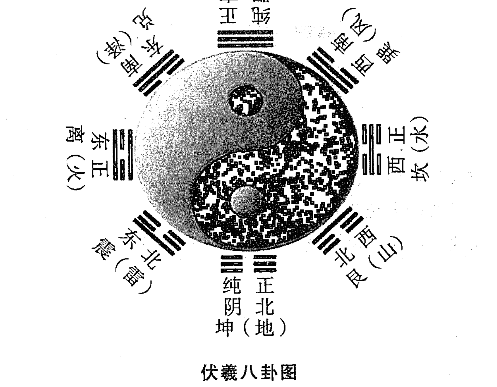
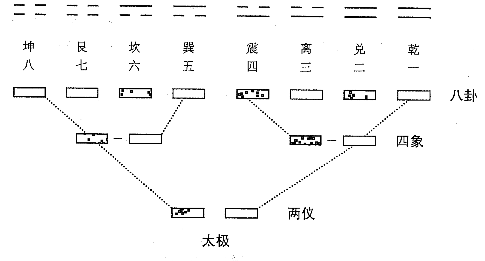
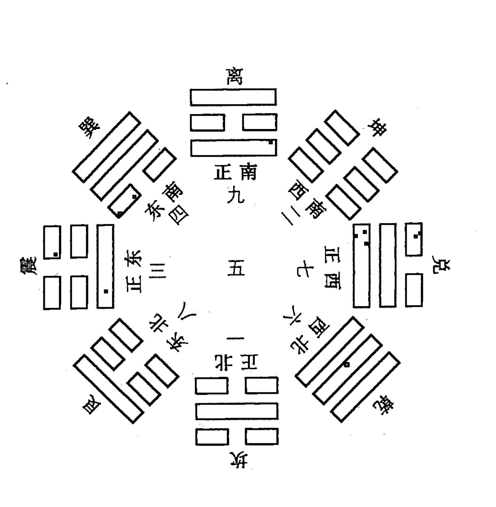
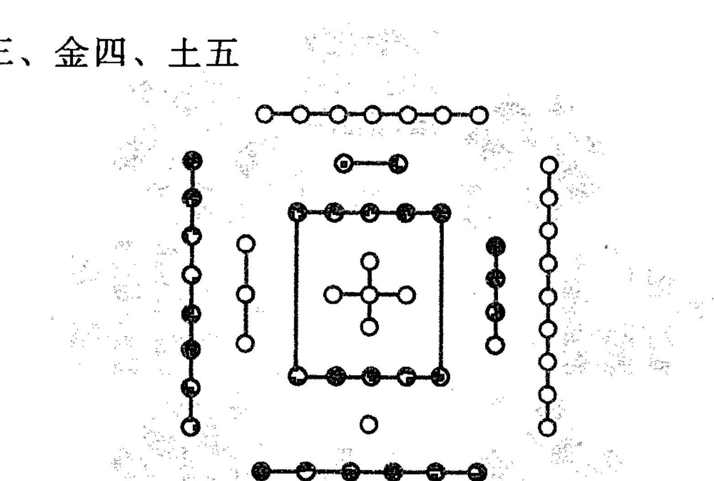
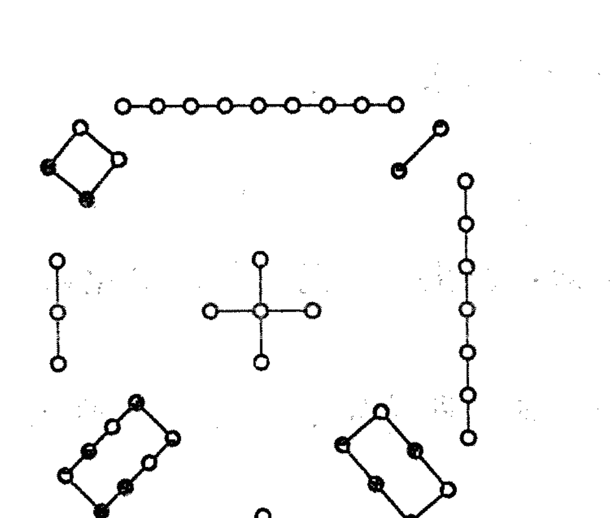
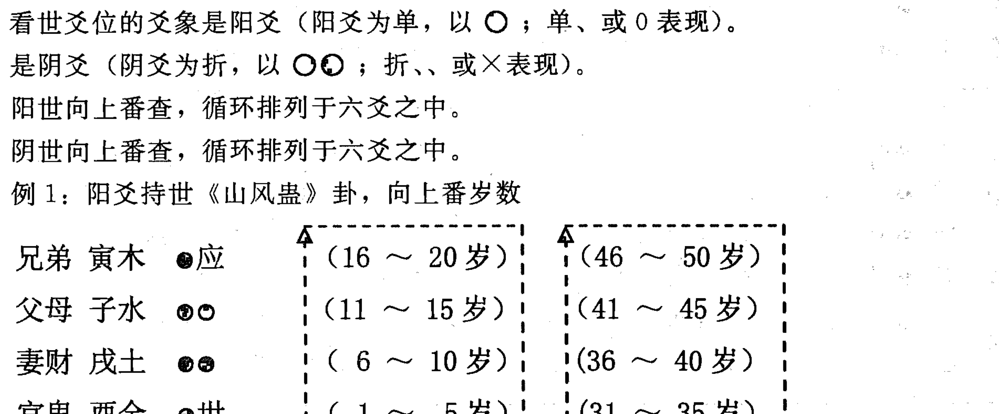

# 六爻实战点窍

# 自 序

《周易》是我中华民族文化宝库中的精华，为群经之首，几千年来备受世人的重视。今世《易》学的博大精深及科学原理，已被国内外学者肯定。从古至今，无数先哲先贤对《易》学尽其毕生精力，去学习她、探究她、开拓她的用途，从其中启发聪明才智，用于生活、生产、科研、制造、经济、哲学、信息、天文、力学、文学、美学、遗传、电脑、保健、量子学、医学、生态学等等方面。造福人类，大放光彩。

人生活在天地之间，人有灵性，在自然界里各类物体也有灵性，这种灵性与大自然及天体的运动息息相关，时时刻刻对生死存亡以及一切活动有着影响。《易》学是阴阳学。

‘阴’是指人类肉眼看不到的事物，看不到不等于不存在，如早先没有电话、电视、手机，而今天有了，并且人人都会使用了。是什么能量传递的信息呢？又谁能看到传递者是什么在起作用！再如：白天是阳，夜间为阴，夜间看不见人与物体的形相；水的分子式 H₂O，在无水的地方是氢与氧分子分离开了，所以看不见水的存在，但在空气中它们各自仍然存在着，只有它们结合成功了，才能见到水；又如：我国发射的“悟空”号上宇宙去干什么去了？是去宇宙中收集用肉眼看不见的物质去了，等等。这个阴，被称谓“暗物质”。

‘阳’是指人类肉眼能看到的事物，如：型体、颜色、大小、多少、尺寸、长短、刚柔等。这个阳，被称谓“明物质”。

本人研《易》三十多年之余，开始学习时也和众多易友一样，凡是有关易学方面的书籍都要购买，买来之后都要看一遍，什么知识都想学到，但后来发现这样的学习方法不对头，需要改变学习的方法和态度。上大学分系，有文科系、理科系、哲学系……等等；到医院去请医看病，也分内科、外科、神经科、脑系科……等等。《周易》也有系，也分科，其中分六壬、奇门、八字、六爻、梅易、风水、手面相、紫微斗数、姓名学、铁板神数……等等。

若无的放矢学习，没有目标走下去，势必会浪费了时间，花费了精力，到头来定无所得。就算再聪明的人当你把易学中的全部科系都掌握了，读得了博士学位、摘取了“皇冠”哪时的你年龄老了、精力有限了，快交户口本了，所学得“学富五车”又怎能派上用场呢？于是学习态度要改变，要静下来，不可躁、不可走马观花，要下马观花，要安家落户地去接近它、研究它，读懂它。方法要改变，作战要有目标，十个碉堡要有所选择，各个击破，万万不可贪多贪大。采取集中兵力、物力、时间、了解双方战斗力，全面做好作战方案才有出奇制胜的把握。学《易》也应抱定这样的态度，方法如同作战，此便是我本人学易的心得路径。拿出上大学的时间和精力，四到五年的时间专攻读某一门课程，于是选择了《六爻》之后又选择了《玄空风水》、《姓名学》。

今撰写的《六爻点窍》从第一章至第九章，是应知启蒙教程，供初学易之人入门启智。自第十章开始，是分类预测，是由初级逐渐进入中级、高级、深层次的预测实例。是笔者多年在实践中为众人预测的真实记载，今分类分项整理成册，向易友汇报，供深层研究者鉴别并敬请同道、同仁赐教为我愿！

作者：马志川 戊戌年乙卯月于石家庄市

## 第一章 应知启蒙

### 第一节 八卦类象

☰ 乾三连
☷ 坤六断
☳ 震仰盂
☶ 艮覆碗
☲ 离中虚
☵ 坎中满
☱ 兑上缺
☴ 巽下断

> 《易经·辞传上》中说：“易有太极，是生两仪，两仪生四象，四象生八卦，八卦定吉凶，吉凶生大业。”

> 《易经·系辞传下》中说：“八卦成列，象在其中矣。因而重之，爻在其中。刚柔相推，变在其中矣。”

> “古者包羲氏之王天下也，仰则观象于天，俯则观法于地，观鸟兽之文，与地之宜，近取诸物，于是始作八卦，以通神明之德，以类万物之情。”

> “易之为书也，广大悉备，有天道焉，有人道焉，有地道焉。兼三才而两之，故六。天者非它也，三才之道也。道有变动，故曰爻；爻有等，故曰物；物相杂，故曰文；文不当，故吉凶生焉。”

> 《易经·说卦传》中说：“乾为天，故称乎父；坤地也，故称母；震一索而得男，故谓之长男；巽一索而得女，故谓之长女。坎再索而得男，故谓中男；离再索而得女，故谓中女；艮三索而得男，故谓少男；兑三索而得女，故谓之少女。”

### 第二节 先天八卦

什么叫八卦呢？《系辞》中说：“易有太极，是生两仪，两仪生四象，四象生八卦。”

太极，是指阴阳未分，天地浑沌时期。是因为大到极点，故称“太极。”物极必反，太极了，就会出现分化，故阴阳分离形成了天与地。

阴阳分，两仪成。两仪指天与地。以阳爻“—”代表天，以阴爻“--”代表地。阳爻和阴爻是组成八卦的基本符号。

两仪生四象，是阴阳爻相重交合而致，如阳爻与阳爻相重“=”为太阳；阳爻与阴爻交合“=”为少阴；阴爻与阳爻交合“=”为少阳；阴爻与阴爻交合“=”为太阴。故纯阳为太阳，纯阴为太阴，一阴在一阳之上为少阴，一阳在一阴之上为少阳。古人以四象来象征四方，也代表一年的春、夏、秋、冬四季，即谓四时。

四象生八卦，实际上还是阴阳相重、相合而成。少阳、老阳、少阴、老阴象征四时，八卦是在此四种象基础上构成的。如阳爻分别与太阳、少阴、少阳、太阴相重，而成乾、兑、离、震四卦。阴爻分别与太阳、少阴、少阳、太阴相重，而成为巽、坎、艮、坤四卦。故乾一、兑二、离三、震四、巽五、坎六、艮七、坤八称为先天卦数。

先天八卦方位

《说卦》中说：“天地定位，山泽通气，雷风相薄，水火不相射。”是指先天八卦而言。

在先天八卦中，其卦配方位为：

乾南、坤北、坎西、离东、震东北、巽西南、艮西北、兑东南。

### 第三节 文王后天八卦图

《说卦》中说：“帝出乎震，齐乎巽，相见乎离，致役乎坤，说言乎兑，战乎乾，劳乎坎，成言乎艮。”

后天八卦，以乾坤为父母卦，震、坎、艮、巽、离、兑为六子卦。故震长男得乾卦的初爻、坎中男得乾的中爻、艮少男得乾卦的上爻；巽长女得坤卦的初爻、离中女得坤卦的中爻、兑少女得坤卦的上爻。

后天八卦序数是：

坎一、坤二、震三、巽四、中五、乾六、兑七、艮八、离九

八卦中阴爻阳爻的作用及代表性：

八卦是由阴爻和阳爻组成的，阴阳是天地万物万事矛盾的两个方面，既对立，又统一，万事万物都有阴阳，都有矛盾，也都有统一性。如：天为阳、地为阴；男为阳、女为阴；化学上的阳离子、阴离子；数学中的正数与负数；电学中的阳极、阴极……等等，万事万物都含有阴阳。

阴阳符号不仅体现了任何事物都有阴阳两个方面，还说明一个事物中，阴中有阳、阳中有阴这样一个辨证法的观点。就人来说，男人为阳、女人为阴；就身体而言，头为阳、身为阴；背为阳、胸为阴；手背为阳、手掌为阴等等。如阴阳鱼，阴鱼中有一白点为阳象鱼眼、阳鱼有一点黑为阴，就体现了阳中有阴，阴中有阳这一观点。

为什么阳卦多阴，阴卦多阳呢？阳卦是指震、坎、艮三卦只有一个阳爻而有两个阴爻；阴卦多阳，是指巽、离、兑三个卦有一个阴爻有二个阳爻。对此，《系辞》中的回答是：“阳一君而二民，君子之道也；阴二君而一民，小人之道也。

### 第四节 河图洛书

#### (一) 河图

水一、火二、木三、金四、土五

关于“河图”、“洛书”有种种神奇的传说。相传我国原始社会，民族部落的领袖伏羲时代，有龙马出自黄河，背负“河图”；有神龟出自洛水，背负“洛书”。伏羲得到后，就根据‘河图’、‘洛书’上的阴阳点而画成八卦。到后来，朱熹把‘河图’、‘洛书’说成天地自然之《易》。

对“河图”、“洛书”，先秦的《尚书》与孔子的《论语》以及《系辞》中都确有记载。经多方考证，后人得出：‘河图’中五十五个黑白点的分布，恐怕是启于《系辞》。《系辞》中说：“天一、地二；天三、地四；天五、地六；天七、地八；天九、地十。天数五地数五，五位相得而各有合。天数二十有五，地数三十。凡天地之数，五十有五，此所以应变化而行鬼神也。”这一论证，看来是有理的。

天地之数出于天干中的五阳干和五阴干，即：甲、丙、戊、庚、壬五个数为阳，正是天数二十有五。乙、丁、己、辛、癸是阴数，正是地数三十。两数相合，也是五十有五。天地之数虽合出五行和方位，与天干化合有出入，但化合的方法与天干相同。如：天地数是一六水，正是甲己合土；二七合火，正是乙庚合金；三八合木，正是丙辛合水；四九合金，正是丁壬合木；五十合土，正是戊癸合火。

河图中的白点代表阳，黑点代表阴，即：一、三、五、七、九是奇数为阳，称天之象；二、四、六、八、十是偶数为阴，称地之象。此天地之数各自相合，正是五十有五。

五十五数为天地之数，不仅是八卦的大衍之数，而且也是合为五行之数。即：一六水；二七火；三八木；四九金；五十土。天地万物分属木、火、土、金、水的五行。

#### (二) 洛书

“洛书”中的白点为阳，黑点为阴。一、三、五、七、九为奇数为阳；二、四、六、八、为偶数为阴。以上之数也称为天地之数。戴九履一，左三右七，二四为肩，六八为足。正好与后天八卦相符。

洛书还可以这样来表示：

| 四 | 九 | 二 |
|---|---|---|
| 三 | 五 | 七 |
| 八 | 一 | 六 |

### 第五节 术语解释

**主卦：** 无论用什么方法所起得动卦还是静卦，这个卦的卦象就代表求测人与事物的现时之象。

**变卦：** 变卦是由主卦中的动爻动化出来的卦象。其代表人、事、物最终变化之象。

**互卦：** 将主卦的上爻和初爻去掉，用二爻、三爻、四爻组成下卦之象；用三爻、四爻、五爻组成上卦之象，这个重叠的六爻卦象称之谓互卦。互卦代表着人、事、物的中间变化过程。

**纯卦：** 指八个宫的首卦而言。即：乾、兑、离、震、巽、坎、艮、坤卦。

**卦象：** 每个卦所代表事物的形象。请参阅八卦类象。

**爻象：** 每个卦有六个爻，每一个爻都有爻象，象征着人事物之象。用神或忌神之象。

**爻位：** 六爻卦中，初爻、三爻、五爻为阳爻者叫做位正或称得正位。二爻、四爻、上六爻为阴爻者也叫做位正或称位正、得位。初爻、三爻、五爻、为阴爻者；二爻、四爻、上六爻为阳爻者叫位不正，或叫不得位。

**纳干：** 给卦分别配上十天干。

**纳支：** 给六个卦爻分别配上十二地支。

**六亲：** 以五行相生相克拟人法分别设出父母、兄弟、子孙、妻财、官鬼，用以提取用神、忌神。

**动爻：** 卦中有阴阳两种爻，阳爻动画“0”、阴爻动画“×。”

**变爻：** 主卦中阳爻发动，在变卦中变为阴爻；主卦中阴爻发动，在变卦中变为阳爻。但必须是同爻位阴阳互变。

**六神：** 是借星座之名，卦配六神，可分别事类，参断吉凶。

**用神：** 是所测人事物在卦中的代表。

## 六爻透解点窍

**原神：** 生用神的哪个五行或六亲。

**忌神：** 克制用神的五行或六亲。

**仇神：** 生忌神的五行或六亲。

**进神：** 卦中动而化进，即：寅化卯、巳化午、申化酉、亥化子、丑化辰、辰化未、未化戌、戌化丑。

**退神：** 指卦中动而化退，即：卯化寅、午化巳、酉化申、子化亥、辰化丑、丑化戌、戌化未、未化辰。

**飞神：** 指用神不上卦，从首卦中借来的用神伏在某个爻位之下，主卦中用神所伏在的爻位叫飞神。

**伏神：** 用神不上卦，从首卦中借来的用神叫伏神。伏在某爻之下的用神称谓伏神。

**用神两现：** 在卦中出现两个用神。

**暗动：** 卦中旺象的静爻被日辰所冲，为暗动。

**独发：** 卦中只有一个爻发动，其它五个爻均安静。

**独静：** 卦中有五个爻发动，只有一个爻安静。

**月破：** 月建所冲的休囚之爻谓月破。

**爻反吟：** 指卦爻变冲、变克。

**爻伏吟：** 指动爻的纳支与变爻的纳支完全相同。

**卦反吟：** 指卦象变冲、变克。

**卦伏吟：** 指卦象变了，但所纳地支没有变。分三种情况：

1. 内卦伏吟；2. 外卦伏吟；3. 内外卦伏吟。主不称心如意。

**日破：** 休囚之爻被日辰所冲所克。

**游魂：** 往之意。指每宫的第七卦。

**归魂：** 回归之意。指每宫的第八卦。

**卦身：** 是一卦的灵魂。定卦身的方法是：阴世则从午月起，阳世则从子月生，如欲得知卦中意，从初数至世方真。

**福神：** 指子孙爻而言。也称福德之神，是财之源。

**通关：** 用神休囚，忌仇神旺相动克用神，在卦中又有另一种五行能动克、合绊、化泄忌仇神，又生用神，这个五行就叫通关，对用神起救应作用。

## 第二章 基础知识

### 第一节 十天干

#### （一）八宫所属

乾、兑属金；震、巽属木；坎属水；离属火；坤、艮属土。

#### （二）十天干

甲乙东方木、丙丁南方火、戊己中央土、庚辛西方金、壬癸北方水。

甲乙同属木，甲为阳，乙为阴。

丙丁同属火，丙为阳，丁为阴。

戊己同属土，戊为阳，己为阴。

庚辛同属金，庚为阳，辛为阴。

壬癸同属水，壬为阳，癸为阴。

#### （三）十天干属性

甲木：纯阳之术，名为大林木，有参天之势，性坚质硬，栋梁之材，故为阳木。

乙木：纯阴之木，名为花草之木，有装扮之美，性柔质软，故为阴木。

丙火：纯阳之火，名为太阳大火，有普照万物之功，性情刚烈，故为阳火。

丁火：纯阴之火，名灯浊之火，有照亮万户之功，性柔质弱，故为阴火。

戊土：纯阳之土，名为城墙土，为万物之司命，其性高质硬而向阳，故为阳土。

己土：纯阴之土，名为田园土，有生育万物之功，培木溶水之能，其性湿软，低洼向阴，故为阴土。

庚金：纯阳之金，名为剑戟之金，有刚健肃杀之力，其性刚质硬，故为阳金。

辛金：纯阴之金，为为饰金，有增艳之美，其性软洁净，故为阴金。

壬水：纯阳之水，名江河海洋大水，随地球运转周流不息，故为阳水。

癸水：纯阴之水，名雨露坑涧之水，气化而得，其性静弱，兹生万物，故为阴水。有形无体，随变而变，一生飘流。

#### （四）十天干配四时方位

甲乙木：为春，为东方，名甲乙东方木。

丙丁火：为夏，为南方，名丙丁南方火。

庚辛金：为秋，为西方，名庚辛西方金。

壬癸水：为冬，为北方，名壬癸北方水。

戊己土：四季之末，位中央，又主每个季节的最后十八天，名为戊己中央土。

#### （五）十天干与人体的关系

甲头乙项丙肩求，丁胸戊肚己脐腹。

庚为腰间辛为肋，壬是股部癸四肢。

#### （六）十天干与脏腑的关系

甲胆乙肝丙小肠，丁心戊胃己脾乡。

庚是大肠辛主肺，膀胱之焦在壬方。

若问肾水心包处，二者皆在癸中藏。

#### （七）十干生克

天干相生：甲乙木生丙丁火、丙丁火生戊己土、戊己土生庚辛金、庚辛金生壬癸水、壬癸水生甲乙木。

天干相克：甲乙木克戊己土、戊己土克壬癸水、壬癸水克丙丁火、丙丁火克庚辛金、庚辛金克甲乙木。

### 第二节 十二地支

#### （一）地支数目

子一、丑二、寅三、卯四、辰五、巳六、午七、未八、申九、酉十、戌十一、亥十二。

#### （二）地支生肖与五行

子鼠水、丑牛土、寅虎木、卯兔木、辰龙土、巳蛇火、午马火、未羊土、申猴金、酉鸡金、戌狗土、亥猪水。

#### （三）地支阴阳

子、寅、辰、午、申、戌为六阳支。

未、巳、卯、丑、亥、酉为六阴支。

#### （四）地支阴阳及五行属性

子为阳水、亥为阴水、寅为阳木、卯为阴木、午为阳火、巳为阴火、申为阳金、酉为阴金、辰戌为阳土、丑未为阴土。

#### （五）地支与方位

寅卯东方木，巳午南方火，申酉西方金，亥子北方水，辰戌丑未中央土。

#### （六）地支与四季

寅卯辰春季，巳午未夏季，申酉戌秋季，亥子丑冬季。每个季节末日为土月，最后十八天土旺。

#### （七）地支与人体部位的关系

子丑为腿脚、寅亥为腰膝、卯戌为臀部、辰酉为两臂、巳申为肩、午未为头面。

#### （八）地支与脏腑的关系

子属膀胱水道耳，丑为肚脐及脾胃。
寅胆目疾脉两手，卯为十指内肝方。
辰土为脾肩胸痰，巳面齿咽小肠肚。
午火心脏并眼光，未土胃脾并脊梁。
申金大肠经络肺，酉金咽喉及气管。
戌土命门腿踝足，亥水发骨尿道肾。

#### （九）地支与月份的关系

正月为寅月建为寅；二月为卯月建为卯；三月为辰月建为辰；
四月为巳月建为巳；五月为午月建为午；六月为未月建为未；
七月为申月建为申；八月为酉月建为酉；九月为戌月建为戌；
十月为亥月建为亥；十一月为子月建为子；十二月为丑月建为丑。

#### （十）地支六合与化合

子与丑合，化土。寅与亥合，化木。卯与戌合，化火。
辰与酉合，化金。巳与申合，化水。午与未合，化土。
相合，为合好之意。又分合中有生、合中有克。合中有生，越合越好，越来越好。
如：寅与亥合、辰与酉合、午与未合。寅为木，亥为水，亥水生寅木；辰为土，酉为金，
辰土生酉金；午为火，未为土，午火生未土，故谓合中有生。
合中有克，主先好后不好、先热后冷、先合后分。如：子与丑合，子为水，丑为土，
丑土克子水；卯戌合，卯为木，戌为土，卯木克戌土；巳与申合，巳为火，申为金，巳火
克申金。

#### （十一）地支三合局

申子辰合水局，亥卯未合木局，
寅午戌合火局，巳酉丑合金局。

#### （十二）地支相冲

子午相冲    丑未相冲    寅申相冲
辰戌相冲    卯酉相冲    巳亥相冲
相冲，又叫对冲，是相克之意。卦中逢冲有吉有凶，冲喜事用神者为凶；冲凶事、冲
忌仇神反为吉。

#### （十三）地支相刑

丑刑未，未刑戌，戌刑丑为无恩之刑。
子刑卯，卯刑子，为无礼之刑。
寅刑巳，巳刑申，申刑寅为持势之刑。
辰、午、酉、亥自刑。

#### （十四）四废

春：庚申、辛酉。夏：壬子、癸亥。秋：甲寅、乙卯。冬：丙午、丁巳。
春金、夏水、秋树木、三冬逢火谓四废。

#### （十五）十二地支配时辰

| 时辰 | 子 | 丑 | 寅 | 卯 | 辰 | 巳 |
|---|---|---|---|---|---|---|
| 时间 | 23～1 | 1～3 | 3～5 | 5～7 | 7～9 | 9～11 |

| 时辰 | 午 | 未 | 申 | 酉 | 戌 | 亥 |
|---|---|---|---|---|---|---|
| 时间 | 11～13 | 13～15 | 15～17 | 17～19 | 19～21 | 21～23 |

#### （十六）五行旺相休囚

春：木旺、火相、土死、金囚、水休。
夏：火旺、土相、金死、水囚、木休。
秋：金旺、水相、木死、火囚、土休。
冬：水旺、木相、火死、土囚、金休。

#### （十七）地支合冲刑害一览表

| 地支 | 子 | 丑 | 寅 | 卯 | 辰 | 巳 | 午 | 未 | 申 | 酉 | 戌 | 亥 |
|---|---|---|---|---|---|---|---|---|---|---|---|---|
| 子 | | 合 | | 刑 | 三合 | | 冲 | 害 | 三合 | | | |
| 丑 | 合 | | | | | 三合 | 害 | 刑冲 | | 三合 | 刑 | |
| 寅 | | | | | | 刑害 | 三合 | | 刑冲 | | 三合 | 合 |
| 卯 | | | | | 害 | | | 三合 | | 冲 | 合 | 三合 |
| 辰 | 三合 | | | | 害 | 自刑 | | | 三合 | 合 | 冲 | |
| 巳 | | 三合 | 刑害 | | | | | | 合刑 | 三合 | | 冲 |
| 午 | 冲 | 害 | 三合 | | | | 自刑 | 合 | | | 三合 | |
| 未 | 害 | 刑冲 | | 三合 | | | 合 | | | | 刑 | 三合 |
| 申 | 三合 | | 刑冲 | | 三合 | 合刑 | | | | | | 害 |
| 酉 | | 三合 | | 冲 | 合 | 三合 | | | | 自刑 | 害 | |
| 戌 | | | | 合 | 冲 | | | | | 害 | | |
| 亥 | | | 合 | 三合 | | 冲 | | 三合 | 害 | | | 自刑 |

### 第三节 六十甲子

用十天干与十二地支相配，天干从“甲”开始，地支从“子”开始，每一个天干配一个地支，就得出甲子、乙丑、丙寅……直到癸亥。干与支的最小公倍是六十，所以组合出六十个不同的干支，称其为六十花甲子。具体组合情况见下表：

| 甲子 | 乙丑 | 丙寅 | 丁卯 | 戊辰 | 己巳 | 庚午 | 辛未 | 壬申 | 癸酉 |
| 甲戌 | 乙亥 | 丙子 | 丁丑 | 戊寅 | 己卯 | 庚辰 | 辛巳 | 壬午 | 癸未 |
| 甲申 | 乙酉 | 丙戌 | 丁亥 | 戊子 | 己丑 | 庚寅 | 辛卯 | 壬辰 | 癸巳 |
| 甲午 | 乙未 | 丙申 | 丁酉 | 戊戌 | 己亥 | 庚子 | 辛丑 | 壬寅 | 癸卯 |
| 甲辰 | 乙巳 | 丙午 | 丁未 | 戊申 | 己酉 | 庚戌 | 辛亥 | 壬子 | 癸丑 |
| 甲寅 | 乙卯 | 丙辰 | 丁巳 | 戊午 | 己未 | 庚申 | 辛酉 | 壬戌 | 癸亥 |

#### （一）天干纪年

在我国古代，由于没有统一的历法，各地的诸侯均以本国王侯的称号纪年，使得各地年号不一样，非常混乱。为了便于交流和编史，人们创造了用六十甲子纪年的方法，就是干支纪年法。用甲子作为开始的第一年，第二年是乙丑，第三年是丙寅……，第六十年是癸亥。第六十一年又从甲子开始，这样往复循环，连绵不断，一直传承至今。按照这种排法，每六十年循环一次叫一个花甲。术数家把一个花甲称作“一元”，每元又分上、中、下三元，180年循环一次。如从公元1864年甲子至1923年癸亥是上元；从1924年甲子至1983年癸亥是中元；从1984年甲子至2043年癸亥是下元，所以现在处于下元时期。

#### （二）干支纪月

农历的十二个月份分别对应着十二个地支中的一个字，由于每年的月数与地支都是12个，所以每月都对应一个固定的地支，这个固定的地支，就是所谓的“月建”。如：正月建寅、二月建卯……，即是。但每个月的天干是变化的，月干的变化规律可以据年上的干支来确定，这个方法叫作“年上起月干法”。其口诀是：“甲己之年丙作首，乙庚之岁戊为头，丙辛之年寻庚上，丁壬壬寅顺行流，若问戊癸何处起，甲寅之上好追求”。

要想知道每个月的天干是何干，就必须先知道年干是那个，口诀中指的是每年正月份的天干，其它月份的天干依序按月份顺推便知。例如：2012年是壬辰年，按口诀“丁壬壬寅顺行流”，正月为壬寅、二月为癸卯、三月为甲辰、四月为乙巳、五月为丙午、六月为丁未、七月为戊申、八月为己酉、九月为庚戌、十月为辛亥、十一月为壬子、十二月为癸丑。

#### 年上起月表

| | 甲己 | 乙庚 | 丙辛 | 丁壬 | 戊癸 |
|---|---|---|---|---|---|
| 正月 | 丙寅 | 戊寅 | 庚寅 | 壬寅 | 甲寅 |
| 二月 | 丁卯 | 己卯 | 辛卯 | 癸卯 | 乙卯 |
| 三月 | 戊辰 | 庚辰 | 壬辰 | 甲辰 | 丙辰 |
| 四月 | 己巳 | 辛巳 | 癸巳 | 乙巳 | 丁巳 |
| 五月 | 庚午 | 壬午 | 甲午 | 丙午 | 戊午 |
| 六月 | 辛未 | 癸未 | 乙未 | 丁未 | 己未 |
| 七月 | 壬申 | 甲申 | 丙申 | 戊申 | 庚申 |
| 八月 | 癸酉 | 乙酉 | 丁酉 | 己酉 | 辛酉 |
| 九月 | 甲戌 | 丙戌 | 戊戌 | 庚戌 | 壬戌 |
| 十月 | 乙亥 | 丁亥 | 己亥 | 辛亥 | 癸亥 |
| 十一月 | 丙子 | 甲子 | 庚子 | 壬子 | 甲子 |
| 十二月 | 丁丑 | 乙丑 | 辛丑 | 癸丑 | 乙丑 |

在实际进行预测时，每个月的干支是按24节气中的“节”来划分的。如：正月以立春节之后为正月（并非从正月初一开始）、从惊蛰节起算二月、从清明节起算三月……依次类推。农历的闰月对月干支没有影响。

#### 对应二十四节气速查表

| 月份 | 正月 | 二月 | 三月 | 四月 | 五月 | 六月 |
|---|---|---|---|---|---|---|
| 节 | 立春 | 惊蛰 | 清明 | 立夏 | 芒种 | 小暑 |
| 气 | 雨水 | 春分 | 谷雨 | 小满 | 夏至 | 大暑 |

| 月份 | 七月 | 八月 | 九月 | 十月 | 十一月 | 十二月 |
|---|---|---|---|---|---|---|
| 节 | 立秋 | 白露 | 寒露 | 立冬 | 大雪 | 小寒 |
| 气 | 处暑 | 秋分 | 霜降 | 小雪 | 冬至 | 大寒 |

#### 二十四节气歌

春雨惊春清谷天，夏满芒夏两暑连，
秋处露秋寒霜降，冬雪雪冬小大寒。
每月节气不变更，最多相差一两天。
上半年是六、廿一，下半年来八、廿三（阳历）。

#### （三）干支纪日

干支纪日，每六十天一个循环。从甲子开始至癸亥。一般查每日的干支，最好身边有本万年历，可随时查知每天的干支是什么。

#### 日上起时干表

| 时 | 甲己日 | 乙庚日 | 丙辛日 | 丁壬日 | 戊癸日 |
| :--- | :--- | :--- | :--- | :--- | :--- |
| 子（23～1） | 甲子 | 丙子 | 戊子 | 庚子 | 壬子 |
| 丑（1～3） | 乙丑 | 丁丑 | 己丑 | 辛丑 | 癸丑 |
| 寅（3～5） | 丙寅 | 戊寅 | 庚寅 | 壬寅 | 甲寅 |
| 卯（5～7） | 丁卯 | 己卯 | 辛卯 | 癸卯 | 乙卯 |
| 辰（7～9） | 戊辰 | 庚辰 | 壬辰 | 甲辰 | 丙辰 |
| 巳（9～11） | 己巳 | 辛巳 | 癸巳 | 乙巳 | 丁巳 |
| 午（11～13） | 庚午 | 壬午 | 甲午 | 丙午 | 戊午 |
| 未（13～15） | 辛未 | 癸未 | 乙未 | 丁未 | 己未 |
| 申（15～17） | 壬申 | 甲申 | 丙申 | 戊申 | 庚申 |
| 酉（17～19） | 癸酉 | 乙酉 | 丁酉 | 己酉 | 辛酉 |
| 戌（19～21） | 甲戌 | 丙戌 | 戊戌 | 庚戌 | 壬戌 |
| 亥（21～23） | 乙亥 | 丁亥 | 己亥 | 辛亥 | 癸亥 |

#### （四）干支纪时

每天24小时，每个时辰为2小时，故一天有12个时辰。每个时辰的地支是固定不变的，而时干是变动的。要想知道每个时辰的天干是何干，就从每天的日干上可推出来。日上起时干的口诀是：“甲己还加甲，乙庚丙作初，丙辛从戊起，丁壬庚子居，戊癸何方发，壬子是真途。”用此诀推出的天干加到子时上，余之时辰顺推，便知某时辰的天干是什么了。

## 第三章 常用神煞

### 第一节 神与煞

所谓神，是指对所测事起吉利的好作用者。
所谓煞，是指对所测事起坏的、凶的作用者。

#### 1. 天乙贵人

贵人，是说当自己遇到危难之时，某人帮助自身解除危难，走出困境，称所帮己之人为贵人。
查贵人的方法是据年干、日干而查。年干上的贵人作用大于日干的力量。
天乙贵人诀：

> 甲戊见牛（丑）羊（未），乙已鼠（子）猴（申）乡。
丙丁鸡（酉）猪（亥）位，壬癸兔（卯）蛇（巳）藏。
庚辛逢马（午）虎（寅），此是贵人章。

| 年、日干 | 甲戊 | 乙已 | 丙丁 | 壬癸 | 庚辛 |
| :--- | :--- | :--- | :--- | :--- | :--- |
| 贵 人 | 丑未 | 子申 | 酉亥 | 卯巳 | 午寅 |

#### 2. 十干禄

禄，指福、禄之征而言。以日干而查。

| 日 干 | 甲 | 乙 | 丙戊 | 丁己 | 庚 | 辛 | 壬 | 癸 |
| :--- | :--- | :--- | :--- | :--- | :--- | :--- | :--- | :--- |
| 禄（地支） | 寅 | 卯 | 巳 | 午 | 申 | 酉 | 亥 | 子 |

#### 3. 驿马

又称马星。卦爻中有马星者，主好走动。今出国、调动、经常外出人员、经商之人宜见马星。
马星不宜多见，多见者主无定处、身心不安。马星逢合为绊住。查马星的方法是从年支、日支而查。

| 年、日支 | 申子辰 | 寅午戌 | 巳酉丑 | 亥卯未 |
| :--- | :--- | :--- | :--- | :--- |
| 马 星 | 寅 | 申 | 亥 | 巳 |

驿马星歌诀：

申子辰马在寅，寅午戌马在申，
巳酉丑马在亥，亥卯未马在巳。

#### 4. 羊刃

羊刃为劫杀，有善有恶。怕多逢见，多见主多灾祸。卦中世爻若得羊刃之生者，则主重权在握。以日干而查。

| 日干 | 甲 | 乙 | 丙戊 | 丁己 | 庚 | 辛 | 壬 | 癸 |
| :--- | :--- | :--- | :--- | :--- | :--- | :--- | :--- | :--- |
| 羊刃 | 卯 | 寅 | 午 | 巳 | 酉 | 申 | 子 | 亥 |

#### 5. 华盖

华盖是星名，主聪明好学，多才多艺。气傲、性孤、信佛，信道，喜欢预测。以年支、日支而查。

| 年支、日支 | 寅午戌 | 巳酉丑 | 申子辰 | 亥卯未 |
| :--- | :--- | :--- | :--- | :--- |
| 华 盖 | 戌 | 丑 | 辰 | 未 |

如在寅午戌年或日测事，卦中有“戌”爻发动，又为喜用神此便为逢华盖星。

#### 6. 桃花（又名咸池）

桃花有吉有凶之分。为吉时主人漂亮、聪明好学、慷慨大方。为凶时主风流轶事、淫乱。以年、日支而查。

| 年支、日支 | 寅午戌 | 巳酉丑 | 申子辰 | 亥卯未 |
| :--- | :--- | :--- | :--- | :--- |
| 桃 花 | 卯 | 午 | 酉 | 子 |

子午卯酉为桃花。如在寅午戌年或日测事，卦中有卯爻发动而旺相，又为喜用神者，以吉断。若为忌神、仇神，又临玄武发动，则主暗昧、奸盗之事。

#### 7. 天赦

天赦主在犯刑法之后能得到宽大处理。虽有从宽之喜，还是守法为上。

| 四季 | 春 | 夏 | 秋 | 冬 |
| :--- | :--- | :--- | :--- | :--- |
| 赦星 | 戊寅 | 甲午 | 戊申 | 甲子 |

如在春季测事，卦中有戊寅爻为喜用神，生合世爻为吉。若为忌仇神，制克世爻为凶。

#### 8. 空亡

空亡者，没有生克之权，不能发挥作用。喜神用神怕逢空亡。忌神仇神宜逢空亡。

甲子旬中戌亥空，甲戌旬中申酉空，
甲申旬中午未空，甲午旬中辰巳空，
甲辰旬中寅卯空，甲寅旬中子丑空。

喜用神或者是忌仇神，在轮入空亡前为旺相者，是在十天旬期之内不能发挥生克作用，一但出空便可发挥作用了。所以说，旺不为空、动不为空、有生扶不为空。春金、夏水、秋树木、三冬逢火谓真空。用神旺相者出空应吉；用神休囚者出空应凶。忌仇神休囚逢空，出空也不能发挥作用；忌仇神旺而逢空出空便能制克用神，应凶。

## 八卦图象

图象：（画卦图象时由下爻往上爻画）

| 八 卦 | 口 诀 | 人 物 | 卦 象 |
| :---: | :---: | :---: | :---: |
| ☰ | 乾三连 | 老父 | 乾卦三个阳爻 |
| ☷ | 坤六断 | 老母 | 坤卦三个阴爻 |
| ☳ | 震仰盂 | 长男 | 震引一阳二个阴爻 |
| ☶ | 艮覆碗 | 少男 | 艮卦二阴一个阳爻 |
| ☲ | 离中虚 | 中女 | 离卦一阴二个阳爻 |
| ☵ | 坎中满 | 中男 | 坎卦一阳二个阴爻 |
| ☱ | 兑上缺 | 少女 | 兑卦二阳一个阴爻 |
| ☴ | 巽下断 | 长女 | 巽卦一阴二个阳爻 |

## 第四章 起卦方法

起卦的方式方法很多，有：

- 1. 按年、月、日、时起卦法；
- 2. 用铜钱摇卦起卦法；
- 3. 报数起卦法；
- 4. 按来人方位起卦法；
- 5. 按字的笔画数起卦法；
- 6. 按声音起卦法；
- 7. 按颜色起卦法；
- 8. 按生肖和时辰起卦法；
- 9. 以姓名起卦法；
- 10. 按字数起卦法；
- 11. 按地名加时辰起卦法；
- 12. 以日柱单柱起卦法；
- 13. 太玄数起卦法。等等。

无论用哪种方式方法起卦，都要心诚问事，信息都是同步的。你习惯用什么方法你就使用它。这里重点讲解一下‘摇卦法’和‘年月日时’以及‘报数’起卦的方法。

### 第一节 摇卦起卦法

摇卦是一种最常用的起卦法，就是用三个铜钱（用乾隆钱最佳），把铜钱平放在手心，两手合扣约一分钟，摇卦人要集中意念，去想心中所测之事。然后摇动铜钱，共摇六遍，每遍记下所得爻象。

无汉字的一面为背，代表阳；有汉字一面为交，代表阴。三个铜钱全为汉字时，为交，记作“×”，为老阴动。三个铜钱全为背，记作“○”，为老阳动。三个铜钱有一个背，记作“一”或“·”，为单为阳爻。三个铜钱有两个交，记作“- -”或“··”为拆为阴爻。

画爻象时，一定要从初爻开始依次向上画，不可从上爻向下画去。

| 六爻 | ○ | △ | 第六次所摇出的爻象 |
| 五爻 | ○ | | 第五次所摇出的爻象 |
| 四爻 | ●● | | 第四次所摇出的爻象 |
| 三爻 | ○ | | 第三次所摇出的爻象 |
| 二爻 | ○ | | 第二次所摇出的爻象 |
| 初爻 | ○ | | 第一次所摇出的爻象 |

铜钱摇卦起卦法，卦中有时多个爻动、有时一个爻动、有时都不动为静卦。有动爻者就有变卦。六个爻都不动者为静卦，无变卦。

### 第二节 年月日时起卦法

- 1. 以年柱的地支数与农历月份数及日数相加之和数除以8，取余数作上卦。无余数者画为坤卦。
- 2. 以年月日的和数再加时辰数之和数除以8，取余数作为下卦。无余数者画作坤卦。
- 3. 以年月日时的总和数除以6，取余数为动爻。无余数者为上六爻动。

逢阳爻动画“○”，逢阴爻动画“×”。

例如：在2002年11月10号上午10：30测事。查万年历这天是农历的壬午年、十月、初六日、巳时，然后写出干支历：

| 壬午年 | 辛亥月 | 壬午日 | 乙巳时 |
| :---: | :---: | :---: | :---: |
| 7 | 10 | 6 | 6 |

然后在干支历的地支下面标出数字：
在年支下标“7”，是从地支子位起顺数至午为7数；
在月支下标“10”，代表月建序数；
在日支下标“6”，代表这天是初六；
在时支下标“6”，是从子时起顺数至巳时为6数。

求上卦：7＋10＋6＝23÷8＝2……余7，取7作上卦艮。
求下卦：23＋6＝29÷8＝3……余5，取5作下卦巽。
求动爻：29÷6＝4……余5，取5数为动爻。

得《蛊》变《巽》卦

用年月日时方法起卦，卦中只有一个动爻。

### 第三节 报数起卦法

#### 1. 报一个数起卦

以地支顺序数为依据：

| 子 | 丑 | 寅 | 卯 | 辰 | 巳 | 午 | 未 | 申 | 酉 | 戌 | 亥 |
|---|---|---|---|---|---|---|---|---|---|---|---|
| 1 | 2 | 3 | 4 | 5 | 6 | 7 | 8 | 9 | 10 | 11 | 12 |

如：在辰时测事，来者报“7”数。
求上卦：7为艮象。
求下卦：辰时为5，5为巽象。
求动爻：上卦7＋下卦5＝12 12÷6＝2 除尽，上六爻动。

《山风蛊》变《地风升》

#### 2. 报两个数起卦

以先天卦序数为依据：

| 乾 | 兑 | 离 | 震 | 巽 | 坎 | 艮 | 坤 |
|---|---|---|---|---|---|---|---|
| 1 | 2 | 3 | 4 | 5 | 6 | 7 | 8 |

如：求测人报出3、8两个数。

## 六爻透解点窍

求上卦：3 数卦象为离，作上卦。
求下卦：8 数卦象为坤，作下卦。
求动爻：3+8=11 11÷6=1……余 5，取余数 5 为五爻动。

#### 3. 报三个数起卦

仍以先天八卦的序数为依据：
如：求测人报出 3、7、1 三个数。
求上卦：取 3 数为离象，作上卦。
求下卦：取 7 数为艮象，作下卦。
求动爻：直接取尾数 1 作动爻，初爻动（尾数大于 6 时减去 6 数）。

#### 4. 报四个数起卦

仍以先天八卦的序数为依据：
如：求测者报出 8341 四个数。
求上卦：8 + 3 = 11 11÷8 = 1……余 3，取余数 3 为离卦。作上卦。
求下卦：4 + 1 = 5 不够 8 除，直接取 5 数作巽卦，为下卦。
求动爻：1 + 5 = 6 直接取 6 为上六爻动（和数大于 6 减去 6 取余数作动爻）。

《火风鼎》变《雷风恒》

○ 阳爻动变为阴爻 ○○

●● ●●

● ●

○ ○

○ ○

○○ ○○

#### 5. 手机号码数起卦法

手机号码现在大多是十一位数码，其中的信息量也很大。

求上卦：把前 5 位数码相加，和数÷8＝……余 V 取余数作上卦。除尽无余数时，上卦作坤卦。

求下卦：把后边的 6 位数码相加，和数÷8＝……余 V 取余数作下卦。除尽无余数时，下卦作坤卦。

求动爻：把 11 位数码相加之和数÷6＝ 取余数为动爻。逢和数被 6 除尽无余数时，计为上六爻动。

如：机号是 13386543922

求上卦：1 + 3 + 3 + 8 + 6＝21 21÷8＝2……余 5 取余数 5 画巽作上卦。

求下卦：5 + 4 + 3 + 9 + 2 + 2＝25 25÷8＝3……1 取余数 1 画乾作下卦。

求动爻：21 + 25＝46 46÷6＝7……余 4 取余取 4 四爻动。

《巽为风》变《乾为天》

○ ○

● ○

× 动变为阳爻 ○

● ○

● ○

× 阴爻动变为阳爻 ○

## 第五章 如何装卦

无论用哪种方法起卦，对所得出的卦都要纳天干、纳地支、配六亲、定世应、定空亡、定六神。把这些内容装到卦中去，称谓装卦。

### 第一节 纳支

所谓纳支，就是把十二地支纳入到卦中去。八卦之中分阳卦、阴卦两类：
阳卦：乾、坎、艮、震。纳阳支：子、寅、辰、午、申、戌。
阴卦：坤、兑、离、巽。纳阴支：未、巳、卯、丑、亥、酉。
在纳地支时，阳卦、阴卦都是从初爻开始，依次向上个爻排纳。不可从上六爻向下个爻排纳。

如得阳卦纳：子、寅、辰、午、申、戌阳支

| 《乾》 | 《坎》 | 《艮》 | 《震》 |
|---|---|---|---|
| 戌土○ | 子水○○ | 寅木○ | 戌土○○ |
| 申金○ | 戌土○ | 子水○○ | 申金○○ |
| 午火○ | 申金○○ | 戌土○○ | 午火○ |
| 辰土○ | 午火○○ | 申金○ | 辰土○○ |
| 寅木○ | 辰土○ | 午火○○ | 寅木○○ |
| 子水○ | 寅木○ | 辰土○○ | 子水○ |

如得阴卦纳：未、巳、卯、丑、亥、酉阴支

| 《坤》 | 《兑》 | 《离》 | 《巽》 |
|---|---|---|---|
| 酉金○○ | 未土○○ | 巳火○ | 卯木○ |
| 亥水○○ | 酉金○ | 未土○○ | 巳火○ |
| 丑土○○ | 亥水○ | 酉金○ | 未土○○ |
| 卯木○○ | 丑土○○ | 亥水○ | 酉金○ |
| 巳火○○ | 卯木○ | 丑土○○ | 亥水○ |
| 未土○○ | 巳火○ | 卯木○ | 丑土○○ |

这是八个宫首卦纳地支的规律，其它五十六卦也是这个规律。

如得《地天泰》卦

酉金○○
亥水○●
丑土●●
辰土○
寅木○
子水○

上卦

下卦

如得《天地否》卦

戌土○
申金○
午火●
卯木○○
巳火○○
未土○○

上卦

下卦

《泰》卦，上卦为坤卦，纯阴卦，纳支仍按坤卦的纳支没变，纳丑、亥、酉地支。下卦为《乾》卦，纯阳卦，纳支也仍按乾卦的纳支没变，纳子、寅、辰地支。
《否》卦，上卦为乾卦，纯阳卦，纳支仍按乾卦的纳支没变，纳未午、申、戌地支。下卦为坤，纯阴卦，纯阴支，纳支也仍按坤卦的纳支没变，纳未、巳、卯地支。
其它卦的纳支方法可依此类推。

### 第二节 定世应位

每一个卦都有世位、应位。世位、应位是如何认定的呢？

#### 1. 以阴阳爻互变定世应位

六十四卦分八个宫，每宫都有八个卦，每个宫的首卦都是在上六爻位按世位，隔两个爻即在三爻位按应位。
以乾宫卦为例：

《乾》 《姤》 《遁》 《否》 《观》 《剥》 《晋》 《大有》

○世 ○ ● ● 应 ● ● ● ○ 应
○ ● ● 应 ● ○ ○○世 ○○ ○○
○ ● 应 ● △○○世 ●○ ○ 世 ○
●应 ● ● △○○世 ○○ ●○ ○ 世▽
● ● ▲○○世 △○● ●○ ●●应 ○○ ○○
○ ▲○○世 △○● ○● ●●应 ○○应 ○

记忆口诀：
八卦之首六世当，以下初爻世上扬。游魂八封四爻立，归魂八卦三爻详。
《乾》卦，为乾宫首卦，六个爻全为阳爻，世爻在上六爻，应爻在三爻位。
《姤》卦，为乾宫第二卦，把乾卦初爻的阳爻变为阴爻而得。若把姤卦的初阴爻再变为阳爻，就会显示出上下一致的乾卦象。据此，就在初爻安世，在四爻位安应。
《遁》卦，为乾宫第三卦，把姤卦二爻的阳爻变为阴爻而得。若再把遁卦初爻、二爻阴全变为阳爻，就会显示出上下一致的乾卦象。据此、就可在二爻位安世，在五爻位安应。

《否》卦，为乾宫第四卦，把遁卦三爻的阳爻变为阴爻而得。若把否卦的初爻、二爻、三爻的阴爻全变为阳爻，就会显示出上下一致的乾卦象。据此，就可在三爻位安世，在上六爻位安应。

《观》卦，为乾宫第五卦，把否卦四阳爻变为阴爻而得。若把观卦的初爻、二爻、三爻、四爻的阴爻全变为阳爻，就会显示出上下一致的乾卦象。据此、就可在四爻位安世，在初爻位安应。

《剥》卦，为乾宫第六卦，把观卦五阳爻变为阴爻而得。若再把初爻、二爻、三爻、四爻、五爻的阴爻全变为阳爻，就会显示出上下一致的乾卦象。据此、就可在了五爻位安世，在二爻位安应。

无论卦属何宫，都从初爻起进行阴阳互变。变至五爻位，就不再变上六爻了，因为上六爻代表天、祖上……，这时反过头来向四爻位变去。

每个宫的第七变通称‘游魂’卦。《晋》卦，是乾宫的第七卦，就是个游魂卦。它是从《剥》卦四爻位的阴爻变为阳爻而得来的。复变晋卦的初爻、二爻、三爻、五爻的阴爻成阳爻，就会显示出上下一致的乾卦象。据此，就在四爻位安世，在初爻位安应。

每个宫的第八变通称‘归魂’卦。《大有》卦，是乾宫的第八卦，就是个归魂卦。它是变《晋》卦的初爻、二爻、三爻的阴爻为阳爻而得来的。据此，就在三爻位安世，在上六爻位安应。

以上是乾宫系列世应用阴阳爻互换之法定位，其余七宫方法同此。

#### 2. 以天人地阴阳同异定世位应位

口诀：

天同二世天异五，地同四世地变初。人同游魂人变归，本宫六世三世异。归魂内卦是本宫。一二三六外卦宫，四爻游魂内变更。

解释：

六爻卦中，三爻、上六爻谓天；二爻、五爻谓人；初爻、四爻谓地。

“天同二世天异五”、指三爻位、上六爻位而言。这两个爻位同为阳爻或同为阴爻，谓天同。就在二爻安“世”，隔2位安“应”。“天异五”是指三爻、上六爻位一个是阴父、一个是阳爻，为天异，就是说阴阳不同。就在五爻位安“世”、在二爻位安“应”。

“地同四世地变初”，指初爻、四爻位而言。这两个爻位代表地。如果同是阳爻或同是阴爻，谓地同。就在四爻位安“世”，隔2位在初爻安“应”。“地变初”是指初爻、四爻位一个是阴爻、一个是阳爻，谓地异，就是说阴阳不同。就在初爻位安“世”，在四爻位安“应”。

“人同游魂人变归”，是指二爻、五爻位代表人爻，这两个爻位同为阳爻或同是阴爻时，就谓人同。就在四爻位安“世”，在初爻位安“应”。“人变归”是指二爻位、五爻位一个是阳爻，一个是阴爻，谓人异，就是说阴阳不同。就是归魂卦。就在三爻位安“世，在上六爻安“应”。

“本宫六世三世异”，是指八个宫的首卦：乾、兑、离、震、巽、坎、艮、坤卦。“世”爻都安在上六爻位，“应”爻都安在三爻位。“三世异”，是指天、人、地爻位阴阳都不相同。如得：《泰》、《否》、《益》等卦。就在三爻位安“世”，在上六爻位安“应”。

“归魂内卦是本宫”，每个宫的第八个卦称“归魂卦”，有《大有》、《师》、《渐》、《随》、《蛊》、《同人》、《比》、《归妹》卦。只要看它的内卦就知道它的宫属了。“世”在三爻，“应”在上六爻位。

“一二三六外卦宫”，是指一二三六爻持世的卦，它们的外卦就是本宫的卦。知道了宫属也就知道了卦的五行属性。这是因为从一世到三世，都是从初爻起一个爻一个爻阴阳互变上去的，它们的卦象没有变，仍是本宫的卦象。如：“姤”、“遁”、“否”、卦，归乾宫辖属，五行属金。又如：“履”、“临”、“泰”卦，归坤宫辖属，五行属土。这样按卦的纳支六亲称谓也就随之定出来了。

“四爻游魂内变更”，是指四爻持世的卦称游魂卦。它们的下卦三个爻都已变化了，阴爻变成了阳爻，阳爻变成了阴爻。用抽爻换象法，再把下卦的三个爻进行阴阳互换，下卦就回复到未变之前本宫的原卦象了，这就是“内变更”的真正含义。还原过来的卦象就是本宫五行属性，可用以确定六亲关系。

熟悉了给世应定位，弄懂了某个卦归何宫辖属，也就知其五行了。确定不了五行属性，就难以定六亲，进而便会难以取用神。

为了快捷学会安世应，才用了一定的篇幅讲解。在实践中测事时，起出卦之后安世应很快。前边介绍了两种方法，你习惯用哪种就用哪种。智知见智，仁者见仁。

### 第三节 确定六亲

六亲是指卦中的：父母、兄弟、子孙、妻财、官鬼，加求测者自身。

纳了天干和地支、安了世应，接下来就是定六亲。六亲是按卦宫的五行属性给每个爻位所纳的地支定出个称谓，叫六亲。以生我者谓父母、比和者为兄弟、我生者为子孙、我克者为妻财、克我者为官鬼。定亲的目的是为了提取用神，为测事切中率高而所设。主、互、变卦在定六亲时，一律依主卦的宫属五行来定。

如得：《水地比》坤8变《水雷屯》

| 妻财戊子水●○应 | 妻财戊子水○● |
| 兄弟戊戌土● | 兄弟戊戌土○ 应 |
| 子孙戊申金●● | 子孙戊申金○○ |
| 官鬼乙卯木●○世 | 兄弟庚辰土○○ |
| 父母乙巳火●● | 官鬼庚寅木○○ 世 |
| 兄弟乙未土× ---------> 妻财庚子水○ |

主卦《比》归坤宫辖属，五行属土。定六亲，初爻未土与我比和为‘兄弟’、二爻巳火生我为‘父母’、三爻卯木克我为‘官鬼’、四爻申金是我生为‘子孙’、五爻戌土与我比和为‘兄弟’、上六爻子水是我克为‘妻财’。
定变卦中的六亲时，仍按主卦的宫属五行土定六亲，不可按《坎》卦定。初爻子水是我克为‘妻财’、二爻寅木克我为‘官鬼’、三爻辰土与我比和为‘兄弟’、四爻申金是我生为‘子孙’、五爻戌土与我比和为‘兄弟’、上六爻子水是我克为‘妻财’。

### 第四节 爻配六神

六神又称六兽，指：青龙、朱雀、勾陈、腾蛇、白虎、玄武。配六神的方法以日干而定，从初爻起配。
《千金赋》中说：“虎兴而遇吉神，不害其吉；龙动而逢凶曜，难掩其凶。”
在断卦时，六神为附合之神，不可专以六神而独断吉凶，还是以用神五行生克为主。喜神遇爻凶，难免其凶；凶神逢吉爻，不损其吉。可以参考六神性情或事物的性质及方位。

| 干\爻 | 甲乙日 | 丙丁日 | 戊日 | 己日 | 庚辛日 | 壬癸日 |
|---|---|---|---|---|---|---|
| 上爻 | 玄武（水） | 青龙（木） | 朱雀（火） | 勾陈（土） | 腾蛇（土） | 白虎（金） |
| 五爻 | 白虎（金） | 玄武（水） | 青龙（木） | 朱雀（火） | 勾陈（土） | 腾蛇（土） |
| 四爻 | 腾蛇（土） | 白虎（金） | 玄武（水） | 青龙（木） | 朱雀（火） | 勾陈（土） |
| 三爻 | 勾陈（土） | 腾蛇（土） | 白虎（金） | 玄武（水） | 青龙（木） | 朱雀（火） |
| 二爻 | 朱雀（火） | 勾陈（土） | 腾蛇（土） | 白虎（金） | 玄武（水） | 青龙（木） |
| 初爻 | 青龙（木） | 朱雀（火） | 勾陈（土） | 腾蛇（土） | 白虎（金） | 玄武（水） |

甲乙日：初爻配青龙、二爻配朱雀、三爻配勾陈、四爻配腾蛇、五爻配白虎、六爻配玄武。
丙丁日：初爻配朱雀、二爻配勾陈、三爻配腾蛇、四爻配白虎、五爻配玄武、六爻配青龙。
戊日：初爻配勾陈、二爻配腾蛇、三爻配白虎、四爻配玄武、五爻配青龙、六爻配朱雀。
己日：初爻配腾蛇、二爻配白虎、三爻配玄武、四爻配青龙、五爻配朱雀、六爻配勾陈。
庚辛日：初爻配白虎、二爻配玄武、三爻配青龙、四爻配朱雀、五爻配勾陈、六爻配腾蛇。
壬癸日：初爻配玄武、二爻配青龙、二爻配朱雀、四爻配勾陈、五爻配腾蛇、六爻配白虎。

青龙：属木，称吉神。其性淳厚、仁慈、有亡巨恶。附用神旺相，进财禄。龙动有喜，但附在凶爻难掩其咎。

朱雀：属火，称诈神。主是非、好讼、辨才、文印。克世爻招口舌，生用神音信至。

勾陈：属土，称阴神。主田产、工程、牢狱。性情憨厚，遇事勾连不清。勾陈克玄武宜捉捕贼盗。

腾蛇：属土，称惊神。主虚惊、怪异、有始无终、少信用。主家中香火。持木空亡休道吉，逢冲之日莫逃凶。

白虎：属金，称血神。强暴之神。主丧事、好勇逞强、有勇无谋。动遇吉神不害其吉。临金而多者叫白虎衔刀，持金则伤人口。遇火生身则无妨。

玄武：属水，称盗神、淫神。主盗贼、暗昧私情、好雄、因小失大。

### 第五节 标明空亡

甲子旬中戌亥空，甲戌旬中申酉空。
甲申旬中午未空，甲午旬中辰巳空。
甲辰旬中寅卯空，甲寅旬中子丑空。

每十天为一句，天干十个，地支十二个，干支组合相配，没被组合的十天当中有两个地支，轮空的两个地支谓空亡，又叫旬空。

旺不为空、动不为空、有月建或动爻生扶者不为空、动而化空扶而旺相不为空。

月破为空、有气不动为空、伏而被克为空、真空为空。真空是指春土、夏金、秋树木、三冬逢火是真空，为无用之神。

## 第六章 选取用神

装完卦之后，开始断旺衰的第一步，就是从卦中选取用神。所谓用神，就是对所测之事从卦中选取出来代表。卦中六亲就是为提取用神而设，是拟人化的阴阳五行之气的变化。用神取得准与不准，对断卦至关重要，用神若是取错，百无一准，就失去了论断事物的准确性。

### 第一节 父母爻

测父母、长辈、祖父母、伯叔、姑姨、干爹、干娘、乳母、岳父、岳母、师付、师长，仆测主人均取父母爻为用神。
测天地、城池、墙垣、宅舍、屋宇、舟车、衣服、雨具、绸缎、布匹、毡货、奏章、文章、书馆、文契、身份证、出国护照、文凭等，凡一切能起庇护我身者，均取父母爻为用神。

### 第二节 兄弟爻

测兄弟、姐妹、姐夫、妹夫、结拜兄弟、族中兄弟等均取兄弟爻为用神。
兄弟为同辈之人，得志则欺凌，见财则动夺。故测财物为劫财之神。测谋为，为阻隔之神。测妻妾婢仆，为刑伤克害之神。测表兄弟不验，以应爻取用。

### 第三节 子孙爻

测儿子、女儿、孙子、孙女、女婿、门徒、学生、忠臣、良将、医人、僧道、兵卒、六畜、禽鸟等均取子孙爻为用神。
子孙爻为福德之神，为财爻原神。又是解忧之神。是官鬼爻的忌神，为剥官鬼之神，故谓福神。测诸事见之为喜。唯独测功名忌见其动。

### 第四节 妻财爻

测妻妾、婢仆、下役、货财、珠宝、金银、仓库、粮食、什物、器皿等，凡我驱使之人、凡我使用的一切财物，均取妻财爻为用神。唯测父母之事财爻为忌神，动必克父母。

### 第五节 官鬼爻

测功名、官府、雷雹、鬼神、妻测夫、疾病、乱臣、贼盗、邪祟等，凡一切拘束我身者，均取官鬼爻为用神。测功名宜见旺动生合世身。测父母之事为原神。测其余之事为忌神。

### 第六节 爻位取用

| 事爻 | 家宅 | 迁移 | 疾病 | 婚姻 | 谒贵 |
|---|---|---|---|---|---|
| 六爻 | 祖妣、奴婢、宗、梁栋、墙篱、马 | 省道 | 头 | 祖宗 | 大贵 |
| 五爻 | 父、宅长、香火、道路、人口、牛 | 州府 | 心肺 | 父母 | 中贵 |
| 四爻 | 妻、坑厕、外户、羊 | 县郭 | 脾脏 | 外氏 | 朝贵 |
| 三爻 | 伯叔、兄弟、正门、闺房、床、猪 | 场镇 | 肝肾 | 婿妇 | 省贵 |
| 二爻 | 母、宅母、学堂、灶、猫犬 | 市井 | 腿 | 媒人 | 县贵 |
| 初爻 | 子孙、宅基、沟、井、鸡鸭 | 乡村 | 足 | 自身 | 乡贵 |

六爻卦以六亲取用为主，爻位取用为附。今整理归纳如下，仅供参考：

| 事爻 | 逃亡 | 武试 | 育蚕 | 官禄 | 地位 | 六畜 | 求财 | 谋望 |
|---|---|---|---|---|---|---|---|---|
| 六爻 | 外省 | 终场 | 茧 | 执政 | 主管上级 | 马、主人 | 店舍 | 国事 |
| 五爻 | 州 | 主考 | 簇 | 朝仕 | 单位正职 | 牛、人力 | 道路 | 官事 |
| 四爻 | 县 | 监督 | 筐 | 监官 | 厂级领导 | 羊、马、牛 | 车马 | 人事工作 |
| 三爻 | 镇 | 策论 | 人、叶 | 长官 | 车间主任 | 猪、水草 | 行李 | 家事 |
| 二爻 | 市 | 步射 | 苗 | 曹官 | 班组长 | 猫犬黎鞍 | 伴侣 | 身事 |
| 初爻 | 乡 | 马射 | 种 | 吏人 | 职工 | 鸡鸭鹅栏 | 己身 | 心事 |

# 六爻透解点窍

| 事\爻 | 行人 | 出行 | 遗失 | 赴任 | 胎产 | 贸易 | 舟行 | 开店 | 盗贼 |
|---|---|---|---|---|---|---|---|---|---|
| 六爻 | 地头 | 地头 | 珠玉 | 任所 | 公姑 | 店舍 | 梢棚 | 财路 | 省道 |
| 五爻 | 路车 | 旅店 | 金玉 | 宾师 | 收生 | 道路 | 夹节 | 主人 | 州道 |
| 四爻 | 门马 | 门户 | 铜铁 | 车马 | 夫身 | 舟车 | 火仓 | 店屋 | 县道 |
| 三爻 | 同伴 | 伴侣 | 绫罗 | 家眷 | 看生 | 行李 | 中仓 | 基业 | 市镇 |
| 二爻 | 身 | 己身 | 绸绢 | 伴侣 | 胞胎 | 伴侣 | 头仓 | 伴侣 | 邻里 |
| 初爻 | 足 | 足 | 布帛 | 行李 | 产母 | 己身 | 船头 | 心事 | 家贼 |

| 事\爻 | 人物 | 国政 |
|---|---|---|
| 上爻 | 皇室 元老 休干 功军 富翁 | 人大 政协 总理 |
| 五爻 | 内阁 国委 将帅 主席 相 | 元首 主席 总统 |
| 四爻 | 局级 高干 工矿企业家 大企业家 | 国家部长级 |
| 三爻 | 处级 厂级 学者 成家者 专科 | 地方政府官员 |
| 二爻 | 科级 一般干部 | 乡镇基层领导 |
| 初爻 | 职员 群众 小学生 市民 无职游民 | 村级领导 |

| 类\爻 | 现代家宅 | 家庭 |
|---|---|---|
| 上爻 | 屋顶 瓦梁 天棚 | 祖父 |
| 五爻 | 人口 达道 走廊 | 父、丈夫、长子、长女 |
| 四爻 | 大门 院门 | 妻 妇女 |
| 三爻 | 宅门 内门 房门 床、灶、墙 | 兄弟 |
| 二爻 | 宅 屋内 空间 | 母 |
| 初爻 | 地面 地基 井 水 | 子孙 晚辈 |

## 第六章 选取用神

| 事爻 | 地理、国家、区域 | 企业人事 | 人体 | 六亲坟茔定位 |
|---|---|---|---|---|
| 上爻 | 远地、远方、外省、外市 | 股东、合作者 | 头 | 祖坟、曾祖坟 |
| 五爻 | 首都 | 董事长 | 心、胸 | 父、妻父坟 |
| 四爻 | 省级市 | 上层领导、处长级 | 腹 | 妻坟、祖坟 |
| 三爻 | 地级市 | 中层领导、管事科长 | 腰、臀 | 兄、叔伯、曾祖母坟 |
| 二爻 | 县城 | 职员、班组长 | 腿 | 母坟 |
| 初爻 | 乡村、乡镇、本地 | 职工、临时工 | 足 | 子坟、祖母坟 |

| 事爻 | 人物 | 五谷树艺 |
|---|---|---|
| 上爻 | 皇室、元老、功军、休干、富翁 | 田夫、晚禾、水 |
| 五爻 | 内阁、国委、主席、将相 | 收成、早禾、天 |
| 四爻 | 局级、高干、大企业家、工矿企业家 | 秋苗、大麦、豆、牛 |
| 三爻 | 处级、厂级、成家者、学者、专科 | 夏苗、小麦、棉花、人工 |
| 二爻 | 科长、一般干部 | 央苗 |
| 初爻 | 小学生、群众、无职、游民 | 谷种 |

| 事爻 | 身体 | 身命 | 天气 |
|---|---|---|---|
| 六爻 | 头发 | 乐隐 | 天、日 |
| 五爻 | 耳目口鼻面须人中、手肩项 | 谋为 | 雨、月 |
| 四爻 | 胸、乳、背 | 发达 | 雷、虹 |
| 三爻 | 臀、腰、腹、小便 | 竖立 | 风、霞 |
| 二爻 | 腿 | 成童 | 电、露 |
| 初爻 | 脚 | 胎养 | 云、云 |

## 第七章 断卦程序

装完卦之后开始断卦。如何断？从何处下手切入？取那个爻为用神？以及为吉、为凶？应期？

### 第一节 先从内部看生克制化

起出卦象后，要排出主卦、互卦、变卦、纳干、纳支、六亲、世应、六神、空亡。并标明测事的月干支、日干支，必要时还要写明年干支、时干支来。这就是整体卦象。

接下来，就要从卦中选取所测事物的用神，看用神在何爻位，视用神在月、在日具体旺衰状态，为阴爻还是为阳爻，是否逢空亡。

如：王某想谈一笔生意，求测能否成功？

辛卯月 己卯日（子丑空）

《火山旅》离2

兄弟己巳火○
子孙己未土●○
妻财己酉金● 应
妻财丙申金●
兄弟丙午火○●
子孙丙辰土●① 世

《旅》卦是个六合静卦，按古法说，做生意逢六合卦为吉，生意能够谈成。究竟能否成？我们先从内部条件看用神、原神、忌神、仇神的旺衰状况，再做结论。

1. 取世爻辰土为用神，代表王某。辰土在月、在日受卯木之克，为衰极之象，辰土岌岌可危。虽卦中辰与应爻酉金相合，最利谈生意，可卦理与现实生活同一道理，处绝地，哪里能去生财呢？故断生意谈力不足，此事不成。
2. 再看原神。卦中午火是生世爻辰土的原神，午火受月建、日辰卯木之生，确实为旺相。可是午火临兄弟爻，兄弟是劫财之神，幸好没有发动，如果发动了那就劫财了。
3. 进而看忌神。克用神者叫忌神，用神是辰土，克辰土者是木，木就为忌神。卯木在月、在日风华正茂当令旺极，对世爻用神辰土有强大的制克力度，为用神受克。
4. 卦中应爻代表要与王某谈生意之人。应爻酉金虽在卦中两现，又有辰未土生金，但生金的二土两个原神受日月建的制克，身受死地，自身不保哪里能去生金呢！应爻还逢日破月破，说明有心无力谈这笔生意。

通过对该卦用神、对谈生意的对方分析，表明世应双方都是心有余而力不足，断此生意谈不成。

### 第二节 用、原、忌、仇神相生相克与特殊规定

在一个卦中有用神、原神、忌神、仇神，很明显地看出有两个对立的阵营。一方是用神原神、另一方是忌神和仇神。两个阵营之间的相生相克，谁方能取胜，就决定所测事项成与败。有时在卦中因组合以及旺衰发动层次之间区别，忌神也会转化成喜用神，有时某个神因逢休囚衰弱就根本不受生。除了我们直观的相生相克形式外，还有其它的相生相克的表现形式。如：卦中有合、合中带克、冲中逢合、化回头合、化回头冲等具体情况，这些合与冲，直接影响到卦爻之间的相生相克的程度。

另外，还要注意到卦爻中的特殊规定。如：入墓、旬空、伏吟、反吟、化进、化退、飞神、伏神等。

看一个整体卦象时，须先从卦的内部入手，内部包括内容有：

1. 给卦中所用的用、原、忌、仇神定位。
2. 看直观的相生相克。
3. 看卦中的合与冲。
4. 还要考虑卦的特殊规定。

一般来说，掌握了以上几条，就可以较全面地将用神的旺衰情况把握住了。这就容易把卦的内部条件带入到外部条件当中去了。内部情况是内因，外因是指太岁、月建、日辰、时表，外因是变化的条件，内因是变化的根据。

再举一例，我们来分析卦的内部条件：

| 《天水讼》离游7 | 《雷水解》 |
| --- | --- |
| 子孙壬戌土○ | 子孙庚戌土○○ |
| 妻财壬申金○ | 妻财庚申金○○应 |
| 兄弟壬午火●世 | 兄弟庚午火○ |
| 兄弟戊午火○●伏官鬼亥水 | 兄弟戊午火○○ |
| 子孙戊辰土● | 子孙戊辰土● 世 |
| 父母戊寅木○○应 | 父母戊寅木○○ |

该卦五、六爻都发动，上卦是乾变震，为卦变伏吟。在伏吟中受影响最大的是上六爻位戌土变成土、五爻位申金变申金。

上六爻戌土发动，可生五爻位申金、又冲二爻位辰土。亥水为伏神暂时克不着。

五爻位申金受动爻戌土之生而增力，申金可冲初爻位寅木。

世爻位午火没动，为四层次爻，不能克动爻申金。午火与二爻辰土是同层次之爻，故午火可生辰土。

伏神官鬼亥水能否得出，关键看月日。

二爻辰土不发动，若不是用神，为暂时无用。

初爻父母寅木，因受五爻申金发动冲克，失去了生克权，全看月或日对申金爻的制克冲合了。

卦中初、二、三、四爻不发动为静爻，对五、六爻的动爻无生克权。

发动的五爻、上六爻，如在月建、日辰不能对它们制克的情况下，那这两个动爻对其它的爻位就有生克权力。

### 第三节 外部条件对卦爻的制约

主卦与变卦、世爻与应爻、用神与忌神，都是卦的内部条件。

月建、日辰乃至太岁与时辰则是外部条件。

主卦与变卦是所测的事物在未做出决断之前的内部条件的变化，决定了事物的成与败。这个变化，就是主卦与变卦之间的变化，也是用、原、忌、仇神之间的变化；就是爻变回头相生、相克、相合、相冲、相刑的变化。而这些变化，都是由月、日这个外部条件决定谁旺谁衰、有力无力、有权无权、是成是败。

总而言之，断卦时必须首先观察掌握卦的内部条件变化情况，然后再依月日对卦爻的制约生扶，即相生相克的总规律，去决定卦爻的旺衰以及生克情况。

如：王某谈对象问能成否？

壬戌月 戊午日（子丑空）

《雷天大壮》坤5 变 《雷泽归妹》 六神

兄弟庚戌土○○ 兄弟庚戌土○○世 朱雀
子孙庚申金○○ 子孙庚申金○○ 青龙
父母庚午火○ 世 父母庚午火● 玄武
兄弟壬辰土○阳动变阴爻 兄弟丁丑土●●应 白虎
官鬼壬寅木○ 官鬼丁卯木● 腾蛇
妻财壬子水○ 应 父母丁巳火● 勾陈

首先分析内部条件

1. 取世爻父母午火为用神代表王某。午火对应月令戌为入月墓，临日辰午火为旺相。因午火没有发动为静爻，说明态度消极。卦中虽有初爻子水为世爻的忌神来冲午火用神，但用神和忌神都是第三层次之爻，相比起来世爻有日辰午火的帮扶为旺，而子水在月休囚在日逢日破又逢空亡，故子水忌神冲不了午火，这个忌神暂时发挥不了作用。
2. 取应爻妻财子水为用神代表女友。我们来看，子水在月受戌土之制克、在日处死地、又逢空亡、还受动爻辰土之克、又六神临勾陈土克，表示力量很小，不好的因素全让应爻占全了。
3. 男测女，应爻代表对方。财临勾陈，表示女方另有情人。
4. 主卦中兄弟辰土发动，虽有日辰午火之生，但临月建成土来冲，又动化退神丑土，兄爻是劫财之神，说明此爻动来凑热闹的，但又凑不成。凑不成是因为一逢月冲；二是动化退神。退神丑土对本位辰土无生克冲合关系，就回头去与主卦中的初爻子水相合，子水代表的是其女友，说明女友脚踏两只船。
5. 卦中世应相冲，又为六冲卦，两人分手只是早晚的事。
6. 忌神子水眼下暂时无能力，当外部条件使其增力受益之时，它自身旺相之时，情况就会产生变化。到了子月，子水当旺就能冲用神世爻午火，这一冲就会出现相反之象，两人的关系到此完全终止。

年、月、日、时是外部条件。所代表的五行力量也是随着四时旺相休囚死而发生变化的。所测之事是以用神、原神的力量做代表，看在月在日是旺是衰。忌神和仇神的旺衰也完全由月日来决定。因而，所测事情的成与败，是看条件有利于用神还是不利于用神；有利于忌神还是不利于忌神。还有卦中的冲与合等等，都是与月日旺衰而同步。简而言之，用原忌仇神的旺衰同系于月日。

卦中所有的卦爻都与日月同步。用神和原神旺于月日，所测之事就吉利；忌神和仇神若旺于月日，所测之事就为凶不吉利。这就是一般规律。

如：苏某之父病重，求测可愈否？

庚午月 辛丑日（辰巳空）

《风雷益》巽4 变 《天雷无妄》 六神

兄弟辛卯木○ 应 妻财壬戌土○ 螣蛇
子孙辛巳火○ 官鬼壬申金○ 勾陈
妻财辛未土× 阳动变阳爻 子孙壬午火○世 朱雀
妻财庚辰土○○世（伏官鬼申金） 妻财庚申金○○ 青龙
兄弟庚寅木○○ 兄弟庚寅木○○ 玄武
父母庚子水○ 父母庚子水○ 白虎

断卦：1、脾胃之疾。2、防辰日不测。

解卦：测父病，先给诸神定位。取初爻父母子水为用神，申金为原神。取辰、未、丑、戌、勾陈土为忌神，巳午火为仇神。世爻代表问卦人。

1. 据何断是脾胃之疾？
取初爻父母为用神，用神在卦中为四层次之静爻，在月逢月破、在日受合克休囚无力。卦中忌神未土发动化午火回头生、又得月日生扶，与卦中辰土戌土联手，齐克用神子水，未土在四爻位发动，未土在人体上代表脾胃，故而断之。

2. 为何断防辰日不测？
断语有“久病逢冲则死”之说。变卦为事之终，又是六冲卦，为结果。在丑日测事，以延序时来看第二天是寅日，用神子水仍临月破又休囚，但寅木可制动爻忌神未土，这便缓解了未土对用神制克。第三天为卯日，子水仍临月破休囚，日辰卯木可制忌神未土，又缓解了土克水。第四天是辰日，用神子水不但临月破还入日辰之墓受克；另一方面日辰又扶起了卦中忌神未土、辰土、戌土、勾陈土，再加月建午火生忌神联手齐制用神子水于死地，无一点生还之处。果在辰日辰时病故。

### 第四节 卦爻的层次制约是核心

第一层次之爻：是指年、月、日、时，是卦中各爻旺衰的来源。
第二层次之爻：是卦中的变爻，可生、克、制、化、刑、冲、合、害动爻。
第三层次之爻：是指卦中的动爻，可生克合制静爻、同层次之爻、伏藏之爻。
第四层次之爻：是指静爻、伏藏之爻。

如：单位领导层变动，问科长有无升职可能？

戊子年 庚申月 己亥日（辰巳空）

《水风井》震6 变 《水泽节》 六神

妻财戊戌土○○世 妻财戊戌土○○ 勾陈
父母戊子水○ 父母戊子水● 朱雀
官鬼戊申金○● 官鬼戊申金○○应 青龙
官鬼辛酉金○ 阳爻动变为阴爻 妻财丁丑土○○ 玄武
父母辛亥水● 应 兄弟丁卯木○ 白虎
妻财辛丑土×阴爻动变为阳爻 子孙丁巳火○世 螣蛇

解卦：

1. 取父母亥水为用神代表科长。用神亥水得月建申金之生，在日得到亥水帮扶，在卦中还得动爻酉金之生，是旺上加旺之象，显示出这位科长的工作能力很强。
2. 取动爻丑土为忌神。丑土在月在日处休囚状态，虽在卦中发动欲克用神亥水，但在下卦当中丑土与变爻和动爻酉金成“巳酉丑三合金局”，合局之金生用神亥水的力度更大，并把忌神丑土转化为生原神酉金的喜神，这对用神亥水十分有利。
3. 从内外条件来看都对用神亥水有利，为锦上添花，故为吉断能够得到提升。
月建是第一层次之爻，对应现实生活代表单位上级机关领导，表示领导层很赏识这位科长的才能和能力。
日辰亥水也是第一层次之爻，代表着这位科长的直接领导，表示他与直接领导之间的关系不错，配合默契，工作协调合作的也很好。
4. 既断有提职的信息，就有个应期问题随之而出。什么时候落实呢？至酉月。酉金在卦中是第三层次爻，待酉月上升至第一层次，酉金是亥水的原神代表上级，生亥水有力。故断等到酉月可升职。后来信息反馈果在酉月升为经理。

### 第五节 现在时与进行时

现在时是指求测问事的月日时间，进行时是指今后的时间变更。

熟练地掌握了生、克、制、化、刑、冲、合、害，以及卦中各种内在的规定，再结合进行时，就能断出所测事项的现在、过去、未来吉凶祸福。

如：易友拿来一卦问求财？

丁未月 壬申日（戌亥空）

| 《地山谦》兑5 | 变 | 《水山蹇》 | 六神 |
|---|---|---|---|
| 兄弟乙酉金○○ | | 子孙戊子水○○ | 白虎 |
| 子孙乙亥水 × 世 | | 父母戊戌土○ | 腾蛇 |
| 父母乙丑土○○ | | 兄弟戊申金○○世 | 勾陈 |
| 兄弟丙申金○ | | 兄弟丙申金○ | 朱雀 |
| 官鬼丙午火○○ 应（伏妻财卯木） | | 官鬼丙午火○○ | 青龙 |
| 父母丙辰土○○ | | 父母丙辰土○○应 | 玄武 |

解卦：

1. 世爻亥水为向卦求财之人。亥水发动在旬中不为空亡，但动化戌土回头克，戌土为忌神得月未土帮扶而旺，化回头克不吉。世爻亥水又得日辰申金之生，一克一生扯平。
2. 求财就取财爻为用神。可是财爻不上卦，就得去首卦兑宫去借，借来的财星卯木伏在二爻官鬼午火之下。财星卯木月休日克，又去生飞神午火，用神卯木泄气而弱极。断当日无财可求。
3. 近期何日有财呢？就用进行时来推：
酉日：卯木伏藏不得出，在未月休囚，对应酉日为破，无财。
戌日：财爻卯木仍休囚不得出，无财。
亥日：日辰亥水生扶财爻卯木，卯木得上升但被飞神午火所泄会，无财。
子日：日辰子水冲破飞神午火，财星卯木得出，日辰子水又生扶卯木而增力，这时卯木旺相。世爻亥水、财爻卯木、月建未土形成了“亥卯未”三合木局助财爻，世爻合财爻，该日有财可求。

从以上分析的过程中，可以看出只要所测之事没有完结，就可按卦的内部条件用延续时去分析，看对所测之事是有利无利了。

## 第八章 确定应期

任何事物都有吉凶，有成有败，有生有死，有旺有衰，都有相对性、统一性、可能性。它们都是依自身的内部条件与外部客观条件而存在或不存在。吉事、好事与凶事、坏事在测事当中最重要最关键一个环节，就是确定事情发生的时间，这个时间被称谓“应期”。

应期定得准与否，是体现一个预测师水平高低的评判结论。对求测者来说一方面想知道事情是吉是凶，另一方面更想知道事情会在什么时间段可能会发生，做好心理准备或采取什么措施，以达损失最小的目的。

作为预测师，应快而准确地定出事情的吉凶，并且应该告知求测人事情的应期在什么时段，怎么迎吉防凶。

### 第一节 生用神或世爻的应期

凡测吉事，如：结婚、开张、宴请、升职、乔迁、寿诞、新居等。用神或世爻喜临月建、日辰、旺相、回头生。

应期的定法：

期在什么时间发生，为人趋吉避凶提供可靠的信息保证。

六爻卦定应期的方法有很多种，不仅复杂而且不同事情又有独特定应期之方法。大体上归纳了以下几种方法：

（1）生克应期

每一个卦都有六亲，为选取用神而设。世爻代表问事者，应爻代表他人他事。所取出用神为求测人所问人、事、物的代表。定应期主要依用神或世爻为主。看是何亲何爻生用神或世爻。测吉凶之事，用神或世爻宜逢生扶、宜用神旺相，原神能生扶用神为吉。用神或世爻受制克为凶。若忌仇神旺相发动冲克用神为祸不小。

①测近期之事，用神或世爻宜临月、日旺相，六神临吉神者，应期为值月或值日。
②世爻或用神不发动，又不临日月建，用神或世爻不受制克，待用神或世爻临值或原神临值为应期。
③卦中原神为变爻能回头生用神或世爻，但原神被月日制克，为待时而用，到原神受生扶或当值为应期。
④原神入月墓、入日墓，待冲墓之日月为应期。
⑤用神或世爻旺相入月、日之墓，待出月出日後不受制克为应期。
⑥原神虽旺相但不发动，待後临月日为应期。

### （2）克用神、克世爻的应期

逢克用神或克世爻者必为忌神。从广义上讲忌神宜受制克，不宜受生扶。但也要看测什么事，又不能把克用神、克世爻之神都统统为凶。如：测行人用克世爻为行人即归；测近病用神受冲则病愈；测诉讼逢冲表示官司打不起来等等，就不能那么看待了。

- ①忌神临月、临日旺相发动，当月、当日为应期。
- ②忌神在卦中没发动，但它与用神或世爻为同一层次之爻，逢仇神生忌神的月、日忌神增力为应期。
- ③忌神化进神，克制用神或世爻，以变爻定应期。
- ④忌神化退神，又有动爻冲忌神的变爻，以冲变爻之神定应期。
- ⑤测凶危之事，忌神宜逢库、化库、入库、休囚、化退、死地、绝地、化绝、化死、化合绊为好。

### 第二节 旬空应期

旬空，有吉有凶。测吉事，用神或世爻若逢旬空，所办之事在出旬、填实之年、月、日、时，定应期。

测凶事，忌神在出空、填实之年、月、日、时定应期。

- ①用神或世爻在卦中发动临旬空，出旬值班定应期。
- ②用神或世爻动而逢空不为空，或动而化空，原在卦中受生或有日月建生扶者为旺而不空，逢原神当值为应期；用神在卦中休囚受制克出空逢忌为凶应期。
- ③用神空而逢合，待冲开合用神哪个合神月、日而应吉、应凶。
- ④用神空而逢制克，待出空之时或制煞之时应吉、应凶。
- ⑤用神空而入库，待冲开库之日应吉、应凶。

### 第三节 逢合应期

逢合，指三合、六合。合有吉有凶。喜事宜逢合；忧疑、祸患、出行、行人之事则不宜逢合，因凶事逢合难解难结。行人为绊住不能动，变合是想回因有事给绊住不能走开。

卦逢合、爻逢合、世爻逢合、用神逢合，生世、生用为吉。若三合、六合克用、克世为凶。用神、原神合入局中为吉利；忌神、仇神合入局中为凶。

## 六爻透解点窍

- ①卦中动爻或用神与月、日构成三合局时，以当月、当日为应期。
- ②三合成局，局中有一爻被冲破，待后逢合之月、日为应期。
- ③三合成局，局中有两个动爻、一个静爻，待静爻临值为应期。
- ④三合成局，其中静爻逢空或动爻化空，待出空之日为应期。
- ⑤三合成局，一爻空而逢合，一爻静而逢合，待冲掉合神为应期。
- ⑥三合成局，有一爻入库或动而化库，待冲库之时为应期。
- ⑦三合成局，有一爻动而化绝地，或有一爻本身就处在绝地，待这个爻生旺之时为应期。

以上用神或世爻必须在三合局之内方可，或是三合局生用神或世爻为吉。制克用神世爻为凶。

遇六合，用神发动，后逢合支神时为应期。如用神寅木发动，后逢亥日就为寅亥合，日辰生合用神，测喜庆之事，用神得生合为吉，该日就为应期。

### 第四节 逢冲应期

冲是指地支六冲，有喜有忌。喜庆之事不宜逢冲，因冲主散主破为凶。如果是测官讼、测忧愁之事哪反而宜逢冲，反凶为吉。测近病逢冲冲散冲破的是病神，冲之则愈。但久病就不宜逢冲了，逢冲必死。

- ①用神逢冲，后逢合之日为应期。测吉事被冲应凶。测凶事被冲反应吉。
- ②用神逢空被冲，填实之日为应期。

### 第五节 逢刑应期

刑，主灾祸之事，一般不遇为好。

- ①用神逢刑，临值之日为应期。
- ②卦中动爻、用神、与日月构成三刑，有一爻旬空，出空填实为应期。
- ③逢三刑，有一爻入墓，冲墓之时为应期。
- ④逢三刑，有一爻休囚，待该爻生旺之时为应期。

### 第六节 伏神应期

- ①有用的伏神，临月、临日生扶为应期。
- ②有用的伏神，得飞神生扶之时为应期。
- ③有用的伏神，在月、日能制克忌神、飞神之时为应期。
- ④有用的伏神，逢被飞神制克，待飞神临月破、日破、逢合、空亡、入墓、化绝、化回头克之时为应期。

### 第七节 外应

外应，就是在测事时，现场与身边人、事、物的有关信息的诸方面因素。预测师如能凭灵感及时地有效捕捉到有关信息，加以悟性断卦，就叫外应。

有关外应的卦例很多，许多书籍中和刊物都有介绍及记载，易友喜欢善用者可参使用。用不用外应取决于自己，在此不详加介绍了。

## 第九章 五行生克

### 第一节 五行

水、火、木、金、土。
相生：水生木、木生火、火生土、土生金、金生水。

### 第二节 相生的表现形式

- 1. 月建生。
- 2. 日辰生。
- 3. 动爻生。
- 4. 动化回头生。

用神、原神宜逢生。忌神、仇神不宜逢生。
相克：土克水、水克火、火克金、金克木、木克土。

### 第三节 相克的表现形式

- 1. 月建克。
- 2. 日辰克。
- 3. 动爻克。
- 4. 动化回头克。

用神、原神不宜受克，若受克又无他爻生扶为凶兆。忌神、仇神受克反而由凶转吉兆。

### 第四节 克处逢生

克处逢生，是指受此处之克，得彼处之生。用神吉。
卦中逢克处逢生，好比人遇灾难之事得他人相救助而呈祥，走出困境、绝境、转危为安。一定要与五行生克互断，方通卦理。
克处逢和原神以受生为吉，以受克为凶。忌神和仇神不宜受生，以受克为生卦例：

辰月 丙申日（辰巳空） 兄测弟病

| 《水火既济》坎4 | 变 | 《泽火革》 | 六神 |
|---|---|---|---|
| 兄弟戊子水○○应 | | 官鬼丁未土○○ | 青龙 |
| 官鬼戊戌土○ | | 父母丁酉金○ | 玄武 |
| 父母戊申金× 阴爻动变阳爻 | | 兄弟丁亥水○世 | 白虎 |
| 兄弟己亥水○世 | | 兄弟己亥水○ | 腾蛇 |
| 官鬼己丑土○○ | | 官鬼己丑土○○ | 勾陈 |
| 子孙己卯木○ | | 子孙己卯木○应 | 朱雀 |

测弟病，世爻亥水为求测人。取卦中三爻位兄弟亥水为用神。取四爻位父母申金为原神。以辰戌丑未土为忌神。用神亥水在月受辰土忌神之克，但受卦中动爻申金之生，又得日辰申金之生，此就谓克处逢生。弟虽病危但显示有救。断明日酉时有名医救治，至亥日全愈，果验。

### 第五节 明动、暗动

- 1. 明动：是指卦中有发动的卦爻，阳爻动画“○”，阴爻动画“×”。
- 2. 暗动：是指卦中某个爻自身旺相，但没发动为静爻，被日辰所冲，为暗动。若日辰冲的是休囚之爻，则为日破。

如：得《乾为天》卦二爻发动，就变为《天火同人》卦

如：得《坤为地》卦四爻发动，就变为 《雷地豫》

既有明动之爻，又有暗动之爻：如在寅月戊申日（寅卯空）得《地雷复》卦变《震为雷》卦。

四爻位阴爻明动变为阳爻。二爻位虽没发动为静爻，但在月为旺，虽有日辰申金来冲但不为破，实为暗动之爻。

所谓静卦，是指卦中既无明动爻、又无暗动之爻。

如：测事得《恒》卦。

### 第六节 补救月破

卦中被月建所冲之爻称谓“月破”。古法说：“爻逢月破如悖时，是枯根朽木，逢生不起，逢伤更伤，虽现如无。伏于卦中，终难透露。虽有日生，也不能生。动而为忌，不能为害。若为变爻，不伤动爻”。

逢月破之爻在什么情况下无法补救？

(1) 月破之爻为静爻，无法补救。
(2) 月破之爻发动，再逢日辰、变爻、动爻伤克、无法补救。
月破之爻在什么情况下可以得补救呢？
月破之爻必须为发动之爻，又没有动爻、变爻、日辰制克，才能得以补救。虽可得救，但是出月才为不破，才为有派上用场。在月内期暂为无用之爻。

每个月的破日是：
正月申破 二月酉破 三月戌破 四月亥破
五月子破 六月丑破 七月寅破 八月卯破
九月辰破 十月巳破 十一月午破 十二月未破

例如：周先生求测升职。

亥月 己丑日（午未空）
《兑为泽》兑金1 变 《天水讼》
父母丁未土× 世 化进神 父母壬戌土●
兄弟丁酉金○ 兄弟壬申金●
子孙丁亥水○ 官鬼壬午火● 世
父母丁丑土○○应 官鬼戊午火●●
妻财丁卯木○ 父母戊辰土●
官鬼丁巳火○ 回头生 妻财戊寅木●●应

卦中世爻代表求测人周先生。测能否升职取官鬼爻为用神。官爻巳火用神在初爻发动，月上亥水冲巳火用神，此就为用神临月破。再仔细分析，巳火虽逢月破，却没有其它的爻再来制克用神，只一次被月建冲破受伤，而且巳火在卦中发动化变爻寅木回头生。上六爻未土发动对用神巳火欲泄，但未土在旬空期一不能泄巳火，二在是旬内还因空不受生。对应日辰丑未不为克。从用神巳火所处的内外环境条件看，可以得到补救。断他到来年四（巳）月，官爻填实不破旺相之时，有升官的机会。后来信息反馈，果在巳月升为处级。

### 第七节 用神原神

用神：是指所测之事在卦中六亲所代表的哪个爻位。
原神：是指能生用神的五行六亲之爻。
无论测何事，都须先从卦中选取代表所问之事物的用神。确定了用神之后，须看用神旺衰，只有旺相的用神才有生克权力、休囚死绝墓空的用神无生克之权。若所出的用神处在衰的状态，就须看有无原神来生扶用神。

- (1) 原神能生扶用神的条件是：
  - ①原神须旺相，或临日月，或得动爻生扶原神。
  - ②原神动化回头生、或化进神。
  - ③原神长生或帝旺于日辰。
  - ④原神与忌神同动与卦中。
  - ⑤原神旺动，临空化空。

符合以上五条为原神有力，能生扶用神，诸测皆吉。

古法以原神临空、化空为无用。应知动不为空，旺不为空。逢旺相的原神临空亡，大都应于冲空填实而有用，故以吉断。

（2）原神虽现，也有不能生扶用神的情况：

- ①原神休囚不动或动而休囚，又被克伤。
- ②原神休囚又逢旬空、月破。
- ③原神休囚动而化退。
- ④原神衰绝。
- ⑤原神入墓。
- ⑥原神休囚动而化绝、化克、化破、化散。

逢以上六条，原神虽现如无，不能生扶用神，为无用之神。

### 第八节 忌神仇神

忌神：是指克用神之爻。

仇神：制克原神爻谓仇神。仇神对忌神起生扶作用，对原神起制克作用。

如：卦中所取用神是金，火克金火就为忌神。生忌神火者是木，木就是用神金的仇神。

（1）忌神能克用神的条件：

- ①忌神旺相，或逢日月、动爻生扶忌神。
- ②忌神动化回头生、或化进神。
- ③忌神旺而发动、临空化空。
- ④忌神临长生、帝旺于日辰。
- ⑤忌仇神同动。

测事逢以上五种情况为忌神旺相，诸测为凶。

（2）忌神不能制克用神的情况有七个条件：

- ①忌神休囚不动，或动而休囚、或被日月、动爻克伤者。
- ②忌神静临空破者。
- ③忌神入墓。
- ④忌神衰动化退神者。
- ⑤忌神衰而又绝者。
- ⑥忌神与原神同动者。
- ⑦忌神动化绝、化空、化克、化破、化散者。

以上七条，在论断时须看原神与忌神谁个有力、无力，仍要以用神有力受生扶有气为吉。用神无根，被看作原神有力也难以生扶。若忌神无力也不足为喜。

### 第九节 通关救应

用神在卦中衰弱，在月在日又不得生扶。卦中忌神旺相发动而克用神，卦中又有另一个五行旺相发动，对忌神起化泄作用还能生用神，这个五行就叫通关之神。

- 水克火 用木通关；
- 火克金 用土通关；
- 金克木 用水通关；
- 木克土 用火通关；
- 土克水 用金通关。

### 第十节 月日同权

诸书均说“日月同功同权”。但又都没有讲清它们为什么同功同权。
我的理解是，农历一年360天计年，每年共分12个月，每月30天。地支有12个，每一个月地支轮流对应月令上岗值班当值管30天，过月失权。360天每日一个地支值班的次数累计起来也是30天。四时常旺。
由此得知，十二地支对应月、对应日上岗值班的次数以一年的时间为准，都是30天。故说日月同功同权。

#### 一、月建

月建又称月令、月将。掌一月之权，司三旬之令。一个月三十日内掌权得令。

- 月建：正月建寅 二月建卯 三月建辰 四月建巳
- 五月建午 六月建未 七月建申 八月建酉
- 九月建戌 十月建亥 十一月建子 十二月建丑。

月建操万卜之提纲，巡察六爻之善恶，能助卦中衰弱，能挫父象的旺强，能制服动变的爻，能扶起飞伏之用。

- 对衰弱的爻，能生、能合、能比、能拱、能扶、衰而增旺。
- 对强旺的爻，能冲、能克、能刑、能破、由旺转衰。
- 卦中有变爻克制动爻者，月建能制服变爻。
- 卦中有动爻克制静爻时，月建能制服动爻。
- 逢用神伏藏，伏神被飞神压住时，月建能冲飞神，生扶神为有用之神。
- 爻被月合而有用，爻逢月破为无力。月建不入卦爻仍为有用，月建进入卦爻愈见刚强。卦中无用神月建上有不必寻伏神。

月建入卦爻为原神时又发动，为吉为福更大；发动为忌神时为实为祸更深。不入卦爻时较缓。

爻值月建旺相当权，逢空不空，逢伤无害。逢空出旬为应。旺相出空应吉；衰弱者出空应凶。为忌神者应凶。被它爻所克叫逢伤。

所取出的用神旺衰先看月建。用神衰弱时，月建能给于生合拱扶，虽衰转旺。忌神若旺相，月建能刑克冲破，由旺转衰。有动爻伤克静爻时，月建能制服动爻。逢伏神被飞神压住时，月建能克飞神生伏神，使伏神成为有用之的用神。爻临月建为旺逢空亡者在旬内仍为空，出旬不为空，为用神应福，为忌神应祸。如用神休囚无气又有制者为真空，出旬后受伤。用神临月建但对应日辰为绝墓却冲克，可以相抵扯平，无吉无凶，若再有动爻来生扶为吉兆；若有动爻来制克，虽临月建用也难敌众。

在夏季测事所取用神是水，谓“穷”，在秋月问卦水就为相。夏令问卦用神为火就是旺，为“满”，到冬月火就会被旺水所灭而破败。“物穷则变，器满则倾”。

#### 二、日辰

断卦必须看日辰，日辰主宰六个爻，司四时旺衰，与月建同功同权。日辰生合用神就为旺，克用神就为衰。不知用神旺衰百占不灵。

| 子 | 丑 | 寅 | 卯 | 辰 | 巳 |
|---|---|---|---|---|---|
| 水 | 土 | 木 | 木 | 土 | 火 |
| 午 | 未 | 申 | 酉 | 戌 | 亥 |
| 火 | 土 | 金 | 金 | 土 | 水 |

日辰又称日建。日辰所冲的旺相静爻叫‘暗动’，就愈得其力。日辰所冲衰静的爻叫‘日破’就愈加无用。

对衰弱的卦爻，日辰能生合拱扶，如时雨滋苗。
对旺强的卦爻，日辰能克害刑冲，似秋霜杀草。
对旬空的卦爻，受日辰冲为起而有用叫“冲空则实”。
对被合住的卦爻，遇日辰冲开叫“合处逢冲”。吉神被合不宜逢冲；凶神被合喜逢冲。
日辰对衰弱的卦爻可生、可合，使衰爻增旺加力。对同类的卦爻可比、可扶。对旺强的卦爻可刑、可冲、可克、可绝、可墓。

> “爻旺而动，冲之愈动；爻衰而动，受冲则散”。说的是爻逢月建其爻为旺，有日辰来冲不为散，反为旺动。若被日辰所冲的爻不当月令，就是衰爻被冲，这便为受日冲而散，既散当然也就不能发挥该爻的生克作用了。

> “逢月破而不破，遇冲克以无伤”。是说卦爻临日辰逢月冲不为破，月克也不受纷；逢动爻克也不怕；化回头克也不为殃。但是，一定要看受冲的这个爻是生多克多？生多克少为锦上添花。克多生少，尽管爻临日建，逢月建、动爻、变爻联手齐来克用神，寡不敌众，为破为伤。

旬内逢空，出旬不空之例：
寅月 庚戌日（寅卯空）测求财？

## 第九章 五行生克

《火天大有》乾8
官鬼己巳火● 应
父母己未土○○
兄弟己酉金●
父母甲辰土● 世（求测人）
妻财甲寅木● （用神空亡）
子孙甲子水●

六神
腾蛇
勾陈
朱雀
青龙
玄武
白虎

取二爻妻财寅木为用神代表所求之财。世爻代表求测人。财爻克世，此财必得。但在甲辰旬问事，寅木财爻逢空亡，这个寅木在月得帮扶为旺相，是有用之神。可是正在旬中期内，仍为逢空，只为旺相有气不为真空，要等到甲寅日出空填实上岗值班，上升到第一层次才可得财。果于甲寅日得财。古法逢空为空，非也。若在旬内仍为空亡，旺而有气不为空，出旬当值为应期。

### 第十一节 三合六合

#### 一、三合局

申子辰三合水局 巳酉丑三合金局 寅午戌三合火局 亥卯未三合木局。

##### （一）三合成局的表现形式

- ①卦内有三个爻动成合局。
- ②卦内有两个爻动，一个爻不动也为合成局。
- ③内卦初爻、三爻动，与变出的爻成三合局。
- ④外卦四爻、上六爻动，与变出的爻成三合局。
- ⑤三个爻有两个动爻，须待以后月日凑齐才成三合局。
- ⑥三合局中有一个爻空、破，后待月日填实成局。
- ⑦一爻明动、一爻暗动，看做两个爻动。
- ⑧三合中有一爻人墓，待后日冲开墓之日成局。

##### （二）三合局功效

测功名：合成官局旺官。合成财局生官。合成子孙局剥官。局生世利我，局生应利他人。

测 财：合成财局财胜，叫财库。合成子孙局生财。合成兄弟局破耗财。财局生世利我，生应利他。

测阴阳宅：宜父母爻合在局内。

测婚姻：宜财官两旺合在局内。

测喜庆之事、久远之事：形成合局永远牢固。
测官讼：逢三合局难以消释，终身固结其心。
三合成局，月建、日辰有一个合在局内为旺局更吉。有世爻在局内为美，若世爻不在局内，合局生世为吉。合局克世为凶。
测出行：用神被合在局内为绊留住。
测行人：用神被合在局内为人不回。
三合又分内卦成局、外卦成局。如测家宅，外卦三合成局不宜克内卦；在外卦成三合局，宜生外卦。因为内卦代表宅，外卦代表人。宅生人吉，人生宅为内耗散。又如测彼此，内为我，外为他，外卦合局生内卦为吉，外克内为凶。
按三合成局的规定，从层次上来讲，三者都为第一层次、第二层次、第三层次的爻。不是动变之爻，就是月令、或与日辰组合成局。
接十二长生来说，合局的第一个字为“长生”；合局的第二个字为“帝旺”；合局的第三个字为“墓库”的关系。
四个三合局都是使其中某个支减力，某个支增力受益，其个支受克。
通过下表，看各个三合局，因不同的支在月、日值班而出现的差异：

| | 月或日 | 合支旺衰 | 合支旺衰 | 整体合局的力量 |
|---|---|---|---|---|
| 长生支为月日 | 寅 | 午受生 | 戌受克 | 木火两旺 |
| | 申 | 子受生 | 辰 休 | 金水两旺 |
| | 巳 | 酉受克 | 丑受生 | 火土两旺 |
| | 亥 | 卯受生 | 未 囚 | 水木两旺 |
| 中神为月日 | 子 | 申 休 | 辰 囚 | 水独旺 |
| | 午 | 寅 休 | 戌受生 | 火土两旺 |
| | 卯 | 亥 休 | 未受克 | 木独旺 |
| | 酉 | 巳 囚 | 丑 休 | 金独旺 |
| 墓库支为月日 | 辰 | 子受克 | 申受生 | 土金两旺 |
| | 戌 | 午 休 | 寅 囚 | 土独旺 |
| | 丑 | 酉受生 | 巳 休 | 土金两旺 |
| | 未 | 卯 囚 | 亥受克 | 土独旺 |

三合局中的某个支在月或在日值班时，最多只有两个合支旺相。一个为旺，一个为相，必是为旺相之爻增加了力量，是生旺两支旺，就比一个支旺增加了三倍力量，具有合局的威力。
凡五行独旺的，合局力量就小，只合而无合化之力。
搞清楚它们的差别，是为了在实际测事中，不要只从表面看用神已合在局内，问题是用神受益了没有。若接表中所提示，认为只要三合局成立，对局中的每个爻都有好处，就会严重地影响断卦的准确性。比如说，当库墓支“戌”爻为月日的时候，卦中寅木和午火同动，而组合成寅午戌三合火局。如午火为用神的话，这时的午火不但没有因合局给其增力，反倒使午火因‘戌’为月令或日辰，出现了三个不利的因素：

- ①午火入戌墓；②午火休囚之象；③寅虽发动，在戌也为休囚。

据以上分析可以得出以下结论：

- （一）在长生之爻值班时：三合局合化有力，但不是参合的支都受益。
- （二）在中神值班时：只有火局中是火土两旺。其它三个合局只有中神旺，有两个合支不受益，难以合化。
- （三）在库墓四土值班时：是土金两旺，只有金受益、土受益，其余的都不受益，也难以合化。
- （四）有某个支不动时：三合局也可成立，只是不能合化。并不影响对合人之支的绊住及减力作用。值得注意的是！高对低层次、旺动对静爻的合力更大。
- （五）合局的中神：中神比合局外旺相的爻支力大。三合之力大于

例一、兄测弟外出何时归？

午月 丁亥日（午未空）
《火地晋》乾7 变 《地水师》 六神
官鬼己巳火○----------> 兄弟癸酉金○○ 应 青龙
父母己未土○○ ----------> 子孙癸亥水○○ 玄武
兄弟己酉金○ 世 ----------> 父母癸丑土○○ 白虎
妻财乙卯木○○ 官鬼戊午火○○ 世 腾蛇
官鬼乙巳火× ----------> 父母戊辰土○ 勾陈
父母乙未土○○应 妻财戊寅木○○ 朱雀

这是测行人的卦。兄测弟何时归，世爻代表求测之人。取四爻兄弟酉金为用神，该爻就有了两重含义，既为兄又为弟。上六上巳火发动、用爻酉金发动与变爻丑土形成了己、酉、丑三合金局。用神酉金被合在局内，为因事绊住走不脱。对应月令午火用神酉金受克、对应日辰用神酉金休囚，但得变爻丑土回头生合。亥日冲巳火，合局破，表明其弟正在路途中。父母主信息，临未土空亡，虽现故无信息。人在外平安已动身。断明日（子日）可归。果验。

例二、测同事外出何时归？

午月 丁亥日（午未空）
《雷地豫》震2 变 《泽火革》 六神
妻财庚戌土○○ 妻财丁未土○○ 青龙
官鬼庚申金×----------> 官鬼丁酉金○ 玄武
子孙庚午火○ 应 父母丁亥水○ 世 白虎
兄弟乙卯木×----------> 父母己亥水○ 腾蛇
子孙乙巳火○○ 妻财己丑土○○ 勾陈
妻财乙未土× 世----------> 兄弟己卯木○ 应 朱雀

## 六爻透解点窍

测同事外出，取应爻子孙午火为用神代表出行的同事。在下卦当中初爻未土、三爻卯木及变爻亥水，形成了“亥、卯、未”三合木局。合化之神“木”为用神午火的原神，生用神有力。日辰亥水生合局木，增力吉。断子日必归。

例1、例二所测的对象其实是同一个行人，只不过是一个测亲弟弟，一个是测同事，问归期。两卦之间只不过是取用神有所不同。所测对象相同，预测日期也相同，虽卦象不一致，但结果是一致的，说明信息是同步的。

#### （二）六合

六合是指：子丑合、寅亥合、卯戌合、辰酉合、巳申合、午未合。因在十二地支中有六组相合，故谓六合。

（1）六合在卦中的表现形式有六种：

- ①日月合爻。
- ②爻与爻合。
- ③动爻化合。
- ④卦逢六合。
- ⑤六冲变六合。
- ⑥六合变六合。

日月合爻：是指测事时，月建或日辰与卦中的爻相合。如：丑月测事得《乾》卦，丑与卦中初爻子水，就是六合关系。

爻与爻合：是说在卦中有两个爻都动，这两个爻又有相合的关系。有一个爻不动，就不为相合。如得《否》卦，世爻卯木与应爻戌土两个爻都发动，就为卯与戌合，即是。

动爻化合：是指动爻与变化之爻有相合的关系。如得《姤》卦，初爻世丑土发动，化出子水，丑与子有相合关系即是。

卦逢六合：得《泰》、《复》、《节》、《困》、《旅》、《豫》、《否》卦，卦的内外爻自相为合的关系即是。不发动也为六合。

六冲变六合：是指所得主卦为六冲卦，变卦为六合卦。如得《乾》卦，外卦三个爻都动，变卦为《泰》卦，就为六冲变六合。

六合变合：是指主卦本身为六合卦，变卦又是个六合卦。如得《旅》卦，初爻辰土发动、四爻酉金发动，变为《贲》卦，主、变卦都是六合卦。

（2）六合的含义

- ①爻与爻合，静而逢合谓合起，谓合好。
- ②动而逢合为绊住。
- ③动爻化合，谓化扶。
- ④静爻得日月动爻相合者，为合起，爻休也为旺。
- ⑤动爻逢与日月动爻合者，谓绊住，不动之意。
- ⑥动爻与动爻相合，为他来合我，是合好之意。

用神有气逢合，测名名成；测利利就；测婚必成；测身发迹；测宅兴旺；测风水藏风聚气；测求谋合意。然而，用神休囚失陷无益。

何谓合中有生？合中有生是指：寅与亥合、辰与酉合、午与未合，这三组叫生合。在相合中，主生一方为月日，被生的爻就是受生受益，是因合而旺并受益。逢生合可论合化，就可以论两个地支相合的整体力量是因合而旺。

何谓合中有克？是指：子与丑合、卯与戌合、巳与申合，这三组叫克合。从克合中看，不管是主克方为日月，还是受克方为月日，参合的卦爻都没有受益，所以说这种克合不但没有因合而旺，反而是因合受损、因合减力。在实际断卦时，只论克，不论合化。然而，合支为日辰，而月令恰恰是该组的化神，两个合支有成化的条件，可以论成化。成化之后的力量，对参合的卦爻是否得益有利，就看该爻是否与月令同步了。

如：测打官司。

戊月 丁卯日（戊亥空）

《地天泰》坤4 六合卦 六神

子孙乙酉金●● 应 青龙

妻财乙亥水●● 玄武

兄弟乙丑土●● 白虎

兄弟壬辰土● 世 腾蛇

官鬼壬寅木● 勾陈

妻财壬子水● 朱雀

断卦：求测者必输，对方胜出得志。

据何断对方胜？应爻代表对方，酉金对应月令得戌土之生，日辰卯来冲应爻酉金为暗动，泄世爻辰土之气力，必胜。

世爻辰土代表问事之人，辰土在月被戌土冲破，又被日辰卯木来克，逢伤更伤，雪上加霜。世爻失陷，虽逢六合无益，必输。

### 第十二节 三刑六冲

#### 三刑

寅刑巳、巳刑申、申刑寅。

子刑卯、卯刑子。

丑未戌相刑。

辰午酉亥自刑。

(1) 刑的含义

刑之义为刑罚。是指在测讼、伤、病、灾及其它凶事时，而出现犯法、受伤、患病、灾祸等凶兆。

刑又分生刑、克刑两种。克刑为真刑，生刑为假刑。所谓刑，实则是相克的一种表现形式。

①寅刑巳：为生刑，是假刑，是寅木生巳火，巳火受益。

②巳刑申：为克刑，是真刑，也是合刑，巳火克申金，是申金受伤。

③申刑寅：为克刑，是真刑，是申金克寅木，是寅木受伤。

有的书说，见两个字不为刑，只有三个字齐全才为刑。刑，能不能起到刑的作用，不在它齐全不齐全，而在于它们三支各自是为喜用神、还是为忌仇神之间力量的大小。

子卯相刑：是生刑，是假刑，相见论生不论刑克。

丑未戌三刑：三者都是土，是土集结起来的一种强大力量，这种力量足可使一方被制服，若受制克一方为用神或原神，那就当然对所测之事有伤无益了。反之，要是受克一方为忌仇神，自然而然就对所测之事有益无损了，就是真刑。

#### （2）相刑举例

郑先生测母病重

辛卯月

辛卯月 丁亥日（午未空）

《地火明夷》坤8 变 《地山谦》 六神

官鬼癸酉金●● 官鬼癸酉金●● 青龙

父母癸亥水●● 父母癸亥水●● 世 玄武

兄弟癸丑土●● 兄弟癸丑土●● 白虎

兄弟己亥水○ 兄弟丙申金○ 腾蛇

官鬼己丑土× 官鬼丙午火● 应 勾陈

子孙己卯木○ 世 父母丙辰土● 朱雀

断卦：其母病重，危在旦夕。

取二爻官鬼丑土为用神，代表母亲。用神丑土在月建卯木为休囚，日辰亥水为耗。卦中动爻卯木发动克用神，动爻亥水发动耗用神，用神丑土又动化回头生，看似有救，实则无益。因用神丑土在月建休囚，日辰耗，动爻卯木克，动爻亥水耗，四面楚歌，虽有回头生，也是远水解不了近渴。且卦中动爻卯木与用神丑土形成卯丑相刑，为真刑，用神受伤，故断其母病重，危在旦夕。果验。

### 第十三节 爻逢日冲

古法，以日辰冲动爻谓冲散。又以动爻冲爻也谓散。

- (1) 旺相之爻冲之不散。
- (2) 有气之爻冲之不散。
- (3) 休囚者，被冲谓散，后逢值日不散。

神兆机于动，动必有因，参悟动静变化，方不失误。

### 第十四节 卦变生克

卦有变生、变克、变墓、变绝、变比和。只要卦逢化克，不看用神的旺衰，都以凶推。

(1) 卦动化生之例：《巽》变《坎》，为回头生，以吉断。

(2) 卦动变克之例：《震》变《乾》，为回头克，以凶断。

(3) 化克不克之例：比如兑金克震木，称化去。主卦兑金代表求测者自身，我去克他不为凶。

(4) 化回头克之例：比如巽木化乾金，称回头克。谓化绝。为凶兆。

### 第二十节 反吟、伏吟

(1) 反吟

1) 反吟举例：指卦象变，内外动而反吟。如：

2) 爻反吟举例：爻变，内外卦反吟。如：

3) 外卦反吟，内卦不动举例：如

六爻透解点窍

4）内卦反吟，外卦不动举例：如

反吟，主不安之。内卦反吟主内不安。外卦反吟主外不安宁。内外卦一齐反吟，主内外都不安宁之象。均主成而败、败而成。有即无、无而有。得而失、失而得。来而去、去而来。散而聚、聚而散。动而思静、静而思动。

测财物：主聚散不常。买卖经营，兴废往来不定。

测功名：用爻旺相，迁而又迁，升往他处，仍复升来。用神休囚失陷，或降或升，或失或得。

测婚姻：反复难成。

测天时：晴而即雨，雨而又晴。

测疾病：愈而又病。

测出行：行至中途又返，到达目的地也一事无成。

测行人：外卦反吟，用神旺相必归，或移他处。人在外测家宅，内卦若反吟，主家中人口不安。

测彼此：内反吟，主我乱他定。外反吟，主他乱我安。

测盗贼、官司：见而又见。

测坟茔、宅舍：欲迁不迁，或迁之又迁，或目下就有迁移之事。

测以往久远之事：主目前就有变动。

以上只要所选的用神旺相，不犯煞、不犯冲克，虽逢反吟，事之必成。只怕用神化回头遭冲克，逢者就是卦变大凶之象。

例如：心存事有变化，摇卦得《明夷》变《家人》。

辛未月 戊戌日（辰巳空）

《地火明夷》坎7 变 《风火家人》 六神

父母乙酉金×<----(回头冲)----子孙辛卯木● 朱雀

兄弟乙亥水× (回头冲) 妻财辛巳火● 应 青龙（道路）

官鬼乙丑土○○世 官鬼辛未土○○ 玄武

兄弟己亥水○ 兄弟己亥水○ 白虎

官鬼己丑土○○ 官鬼己丑土○○ 腾蛇

子孙己卯木○ 应 子孙己卯木● 世 勾陈

该卦为反吟卦。五爻位亥水动化巳火回头冲，上六爻位父母酉金动化回头冲，构成外卦反吟。五爻位代表道路，受冲主不通。父母爻代表车，在巳时受克为弱，说明道路有问题，车开不过去而去不成，卦逢反吟主反复。

换个角度看，《明夷》变《家人》也主始凶终吉，下午酉时再去。后来得知，这天确因道路堵车，下午疏通。乘车前往。

（2）伏吟

> “外卦伏吟外不安，内卦伏吟内不宁”。学易之人都熟悉这句话。

#### 1. 伏吟卦组合的表现形式：

- ①外卦伏吟：午申戌复变午申戌。它们有：《恒》变《姤》；《小过》变《履》；《归妹》变《履》；《丰》变《同人》；《讼》变《解》；《否》变《豫》。
- ②内卦伏吟：子寅辰复变子寅辰。它们有：《屯》变《需》；《泰》变《复》；《大有》变《噬嗑》；《随》变《夬》；《大畜》变《颐》；《小畜》变《益》。
- ③内外卦伏吟者有：《乾》变《震》；《无妄》变《大壮》。

#### 2. 伏吟卦的特点：

凡逢伏吟卦，都是内卦或外卦的上两个爻发动而成。用神发动，忌神也随之发动，构成了“用”、“忌”同动，就为伏吟卦的特点。

- 主忧郁、呻吟、不安宁、难伸张等。
- 测功名；主久困宦途，仕途淹留。
- 测财利：主财源耗散，车利消乏。
- 测婚姻：主忧而不乐。
- 测出行：难移动。
- 测行人：主在外忧郁。
- 测疾病：主久病呻吟。
- 测坟茔：宅舍，想迁不能迁、守而不利。
- 测彼此：内卦为我，外卦为他。用神若受克，得祸不轻。伏吟卦，用神旺相待冲开年、月则伸其志。用神休囚，冲开年、月之时，忧郁而已。忌神弱而受制克之时、用神旺而逢生之时，自会由凶转吉。

六爻透解点窍

伏吟卦举例：测当月出行办事吉否？

庚午月 壬申日（戌亥空）

《天雷无妄》巽5 变 《震为雷》 六神
妻财壬戌土○ 妻财庚戌土●● 世（空） 白虎
官鬼壬申金○ 官鬼庚申金●● 腾蛇
子孙壬午火● 世 子孙庚午火● 勾陈
妻财庚辰土●● 妻财庚辰土●● 应 朱雀
兄弟庚寅木●● 兄弟庚寅木●● 青龙
父母庚子水● 应 父母庚子水● 玄武

世爻为出行办事之人，找官方办事取五爻官鬼申金为用神。该卦外卦伏吟（上六爻戌化戌、五爻申化申、四爻午化午）。六爻戌土发动欲克用神申金，虽动不为空，但化空亡，故不克申金。申金也在卦中发动，又得日辰申金帮扶为旺，大吉。世爻午火临月建而旺，下午申、酉时去办事最适宜。果当天一切顺利。

### 第二十一节 卦爻旬空

旬空，也叫空亡。是六爻卦的一种特殊规定。

甲子旬中戌亥空 甲戌旬中申酉空
甲申旬中午未空 甲午旬中辰巳空
甲辰旬中寅卯空 甲子旬中子丑空

爻旬空，是依据测事当日的干支而定。对旬空的规定，不单在于每旬轮空之后出现的空亡，更重要的是在断卦时，空亡有它实用的特殊性质和意义。

（1）空亡在实际运用中的意义

对于旬空的卦爻，在实际断事中，在旬空期间如没有日辰来冲这个爻，一般情况下这个旬空的卦爻就为无用之爻。既然在旬空期间没有用，它在出旬出空之后就会出现下列情况：

- ①用神或原神旺相旬空，在空期因空而无用，待出空之后就有了生克的权力，就以吉断。
- ②忌神或仇神旺相旬空，同样是在旬空期间因空而无用，当出空之后就有了生克的权力，就以凶断。
- ③旬空之爻休囚无气，若为用神或原神，在旬空期之内为避空。虽为避空避凶，如无生扶，出空后应凶。
- ④忌神或仇神旬空休囚无气，同为避空。一般情况下为无用之爻，出空后应吉。
- ⑤用神原神旺相之爻旬空，没有出空逢日辰冲之，该爻为有用之爻，可应事。近病或小病，冲日辰冲病会有好转。
- ⑥休囚之爻逢旬空，旬空期间逢日辰冲爻，为无用之爻。为散为破。
- ⑦飞神之父逢旬空，在旬空期受日辰冲为冲动，伏神可出。
- ⑧静爻旬空，没出空逢日辰之冲，所示只有一半之力。有用无用看测何事。求财可得一部份财。测来人有来之象。
- ⑨变爻旬空，须变爻出空，中之无用，不能解空。

以上几条，原则上是在旬空期间无用，待逢冲、出旬出空时才能派上用场。

（2）空亡的具体用法

把空亡的卦爻分成两类：旺相爻旬空、休囚爻旬空。

①旺相之爻旬空为待时而用。

旺相之爻待时而用就是由旬空到不空，不分用神还是忌神。这一类爻出空，必能正常发挥生克职能作用。在没出空之前仍为暂时无用之爻。

②休囚之爻旬空，出空受克。

休囚之爻，是指它无生克之权，出空而无用，为真空、到底空。

休囚旬空卦例：袁女士测与夫的婚姻状况？

寅月 庚寅日（午未空）

《火雷筮嗑》巽6 变 《坎为水》 六神

子孙己巳火○ ---------> 父母戊子水●● 世 腾蛇

妻财己未土× 世 ---------> 妻财戊未土● 勾陈

官鬼己酉金○ ---------> 官鬼戊申金●● 朱雀

妻财庚辰土●● 子孙戊午火●● 应 青龙

兄弟庚寅木× 应 ---------> 妻财戊辰土● 玄武

父母庚子水○ ---------> 兄弟戊寅木●● 白虎

女测婚，五爻位世爻未土代表问事人，四爻官鬼酉金代表其夫。主卦中有五个爻发动，唯独三爻位的妻财辰土安静不动，该静爻与四爻位官鬼酉金暗合，两财夹一鬼，这种卦象正是夫妻反目之象。第三者辰土静观其变。

世爻未土按说可以生官鬼酉金，未土动化进神表明不愿离婚，可是未土临旬空，又受月、日寅木双重之克，为休囚旬空。虽有上六爻子孙巳火发动来生未土，但因休囚的未土旬空不受生，这便说明袁女士已无力挽回局面。放到现实生活当中，就是她怎么对老公好，老公都不买帐，不接受其爱。

官鬼酉金代表她的老公，在卦中发动，化退神，临朱雀，表明无理，经常大吵大闹，闹的目的就是为了离婚。酉动与静父暗合，显示她老公有外遇。

子孙巳火发动生世爻，说明子女与她难舍之象。

世爻化进神，临勾陈，表明她不想离婚。勾为绊之意，无奈世爻休囚又旬空无力。

测婚，变卦为事之终，逢六冲，冲为散。

虽父母子水发动，在月、在日休囚，显示父母干着急使不上劲。

兄弟寅木发动，在月、在日旺相，帮的是倒忙。

静爻辰土不动，静观其变。

通过以上分桥，有离异之兆。果然时间不长就离了婚。

六爻透解点窍

#### (3) 走出空亡的误区

古书只讲旺不为空、冲不为空、合不为空、填实可解空。并没有说清这种空为什么不为空。还有口诀：“春金、夏水、秋树木、三冬逢火是真空”。使得后学易者弄不清怎样正确对待并实际运用空亡，进入了误区。

实际上，种种旬空的形式不同，但在旬空期之内毕竟旬空。有用、无用全在于旺衰，因旺有用而不空，为假空，出旬出空有用而应事，为用神者应吉；为忌神者应凶。休囚无力衰弱者，为无用，为真空，出旬也无用武之地。为用者应凶，为忌者反为吉。

### 第二十二节 库墓有别

库墓之说，有人认为入墓为吉利的象征，也有人认为是凶的一种标志，为区分吉凶，分开来说：

#### (1) 各五行的库墓规定

金库墓在丑；木库墓在未；火库墓在戌；水、土库墓在辰。也就是说，辰、戌、丑、未为四库墓。

#### (2) 入库墓的含义

- ①测功名：用神旺相入墓，待冲开墓之年、之月成名得官。用神休囚入墓，无功名。
- ②测婚姻：用神旺相入墓，世应相生相合，待冲开墓之年、月、日可成婚。
- ③测出行：用神旺相逢墓，为安全而吉的标志。用神休囚无气逢墓，为凶兆信息。
- ④测求财、测谋事：用神旺相逢墓，待冲开出墓的月、日可成事。休囚的用神逢墓，无财，谋事不成。
- ⑤测官灾、忧患之事：用神旺相逢墓，待冲墓之时转吉。用神休囚逢墓，冲墓之时转凶。

对入库墓的种种说法可以看出其含义：

1. 卦爻入墓是六爻卦的一种特殊规定。
2. 卦爻入墓，不论旺衰，逢月、日、变爻、飞爻为墓时，都为入墓。
3. 入墓之爻如同人被拘禁一样，在入墓期间失去了它生克的权利。
4. 旺相的五行入墓期间无生克权，只有到破墓後出墓才有生克权。
5. 休囚的五行入墓，到出墓时，会被另一旺相的五行爻制克，就会应凶。
6. 卦爻化回头克、卦中大象克、卦中休囚化墓之爻，又无生扶，反而有克；或有生扶但在日辰为墓，待入月墓、入日墓之时应凶。

#### (3) 卦爻入墓的表现形式

- ①入日辰之墓。
- ②入月建之墓。
- ③入变爻之墓。
- ④伏神入飞神之墓。
- ⑤用神入延续时之墓。
- ⑥原神入墓。
- ⑦用神随鬼入墓。

1. 人日墓之例：妻问夫何日归？

丁亥月 庚戌日（寅卯空）

《天风姤》乾2 变 《天水讼》 六神

父母壬戌土○ 父母壬戌土○ 腾蛇

兄弟壬申金○ 兄弟壬申金○ 勾陈

官鬼壬午火○ 应 官鬼壬午火○ 世 朱雀

兄弟辛酉金○ 官鬼戊午火○○ 青龙

子孙辛亥水○ 父母戊辰土○ 玄武

父母辛丑土○○世 妻财戊寅木○○应 白虎

该卦取应爻官鬼午火为用神代表其夫，世爻代表求测人。用神午火在月休囚，在日为入日辰之墓，断其夫暂时不回。

断其夫辰日可动身，巳日到家。为何此断？日表冲戌，火墓破开。到巳日是火临进气而旺之故。

2. 人月建之墓例：李某问出国可否去成？

戊辰月 癸酉日（戌亥空）

《坎为水》坎宫1 变 《水地比》

兄弟戊子水○○ 世 兄弟戊子水○○ 应

官鬼戊戌土○ 官鬼戊戌土○

父母戊申金○○ 父母戊申金○

妻财己午火○○ 应 子孙乙卯木○ 世

官鬼己辰土○ 妻财乙巳火○○

子孙己寅木○○ 官鬼乙未土○○

卦中取世爻为用神，世爻子水在月为入墓，但在日受酉金生为旺相，卦中虽有辰土发动来克用神子水，但因子水旺相，只能算入墓。旺而入墓是表示求测者在积极争取，而入暮则说明官方办理护照等手续，可能会在这些方面不顺利。既是办手续会出现问题，就需在破墓时才能办成手续。据此断他短期内不可能出国，所以断他戌月可成功。戌月能成功之因，是戌冲开月墓，用神旺相所以成功。

3. 人变爻之墓例：父测子近疾吉凶？

六爻透解点窍

子月 辛未日（戊亥空）

《风山渐》艮8归 变 《风泽中孚》 六神

官鬼辛卯木○ 应 官鬼辛卯木● 腾蛇

父母辛巳火○ 父母辛巳火○ 勾陈

兄弟辛未土○○ 兄弟辛未土●● 世 朱雀

子孙丙申金○ 世 动入变爻之墓 兄弟丁丑土○● 青龙

父母丙午火× 官鬼丁卯木○ 玄武

兄弟丙辰土× 父母丁巳火● 应 白虎

父测子，取卦中子孙爻为用神。子孙申金持世，世爻既代表其子，又代表问事人。用神申金发劝，在月休囚，在日得未土之生为旺相。申金动入变爻之墓。断今日未时好转。果验。

据何而断？变爻丑土被日辰未土冲破，用神申金旺相出墓应吉。断语有：“近病逢冲则愈”之说。

4. 伏人飞神之墓例：父测子在外吉凶？

申月 癸丑日（寅卯空）

《山泽损》艮4

官鬼丙寅木● 应

妻财丙子水●●

兄弟丙戌土●○

兄弟丁丑土●○ 世 伏子孙申金

官鬼丁卯木●

父母丁巳火○

父测子，取卦中子孙爻为用神。《损》卦中无子孙爻，子孙爻不上卦，只好从艮宫当中去借。子孙申金在艮卦的三爻位，今借来之后个仍伏在三爻位兄弟丑土之下。损卦的三爻丑土为飞神，申金伏在其下谓伏神。飞神丑土为伏神申金之墓库，虽用神申金在月得帮扶为旺，在日又为库墓。综合分析归期难断。

求测人说：“听说孩子在路上出了事，这才来测算的”。

5. 用神人延续时之墓例：高厂长突然患病住院，问吉凶？

## 第九章 五行生克

己月 辛亥日（寅卯空）

《水泽节》坎2

- 兄弟戊子水○●
- 官鬼戊戌土●
- 父母戊申金●● 应
- 官鬼丁丑土○○
- 子孙丁卯木○
- 妻财丁巳火● 世

取应爻父母申金代表高厂长，申金在月受巳火合克，在日休囚，用神衰弱。主卦为六卦，月建又与用神合，近病怕逢合，为凶象。所幸日辰亥水冲初爻巳火忌神，此为冲解合，为有救。

我们以进行时来看：

- 子日：用神申金休囚，受合克，病危。
- 丑日：用神申金入日墓，病重。但土又生申金，有救。
- 寅日：日辰寅冲用神申金破合，转危为安。

6. 原神入墓之例：

生用神者谓原神，原神是用神的根。如用神旺相，原神休囚不动，或动而变墓、变绝、变兑、变破、变退，或受日月制克，便不能生用神，就为用神的根受伤，非但无益，反而有损。小李测兄与人打官司，问吉凶？

申月 辛酉日（子丑空）

《天火同人》离8归 变 《天地否》 六神

- 子孙甲戌土● 应 子孙壬戌土● 应 螣蛇
- 妻财甲申金● 妻财壬申金● 勾陈
- 兄弟甲午火● {用神} 兄弟壬午火● 朱雀
- 官鬼己亥水○ 世 -------> 父母乙卯木●○世 青龙
- 子孙己丑土●●（空） 兄弟乙巳火○○ 玄武
- 父母乙卯木○ 原神动入变爻之墓 子孙乙未土○○ 白虎

取卦中兄弟午火为用神代表其兄。午火在月、在日休囚无力。卦中初爻父母卯木为午火的原神，发动本想生用神午火，但动入了变爻未土为原神入墓。原神木还临日破。原神不能生用神，午火的根受伤，不吉。

应爻代表对方，静而伏吟，示有病呻吟之象，临螣蛇主怪异。

官爻亥水代表问事人小李，还代表法官，在月、在日受生而旺，动变日破，不能生父母卯木，父母代表文书讼状，示暂时没有写诉状，并表明官方还没受理。

变卦代表事之终，为六合卦，表示私下调解为宜，官司打不起来。

7. 用神随鬼入墓之例：

六爻透解点窍

随鬼入墓，是指卦逢官鬼持世而入墓。如：入日墓、入月墓、动入变爻之墓、化墓，均为不吉利的信息。

世爻休囚无气被克而入墓，定见凶危。
世爻官爻旺相，并得生扶，此为有救。
墓爻空破，待墓爻填实之年、月、日而应事。用、世旺应吉，休囚应凶。

王某测近期运气：

| 酉月 | 戊辰日（戌亥空） | |
| :--- | :--- | :--- |
| 《艮为山》艮1 | 变 | 《泽山咸》 | 六神 |
| 官鬼丙寅木○世 随鬼入变爻之墓 | → | 兄弟丁未土○○应 | 朱雀 |
| 妻财丙子水×动化回头生，但入日墓 | → | 子孙丁酉金○ | 青龙 |
| 兄弟丙戌土× | → | 妻财丁亥水○ | 玄武 |
| 子孙丙申金○应 | | 子孙丙申金●世 | 白虎 |
| 父母丙午火●○ | | 父母丙午火●● | 腾蛇 |
| 兄弟丙辰土○○ | | 兄弟丙辰土○● | 勾陈 |

测运气，取运限为用神，王某今年31岁行上六爻运限，官鬼爻持世，大小限都在六爻位。世爻寅木发动，在月、在日休囚，动随鬼入变爻未土之墓。子水为生木的原神，虽发动化酉金回头生，但动入日墓，用神无根又临朱雀动，主有口舌之事，凶。官爻代表的是事业、名气。休动入墓又无根，示官运受阻，事业有损。主卦为六冲卦，也主不吉。

> 王某说：“很对。因与同事发生口舌争之不下打了起来，事后被降职”。

#### （4）破墓的规则

- 1. 逢合可破墓。卦逢三合、六合，只要能合住库墓成化，就可破墓。此是因合化使库墓原来的五行性质发生了质变，而成为另一种五行之故。此法适用于变爻之墓和飞神之墓。
- 2. 冲可破墓。
- 3. 逢冲可出墓。指日辰冲入墓之爻。入墓为收藏，受冲好比硬把入墓的用神从墓中拉出来。
- 4. 日过墓自破：日辰若为卦中有关爻位的库墓，必是入当日之库墓。一旦过了当日就可出墓。入月墓之爻出月自破墓同理。休囚之爻出墓应凶，旺相之爻出墓应吉。一定要变通。如用神动化出来的墓是自带墓，不同于入月、日墓。只有逢月、日合的时候才可开墓。
- 5. 六亲受克者休囚，入墓应凶：卦中所代表的六亲爻在月、在日休囚入墓，何亲入墓该亲一般是凶多吉少。

## 部分入墓之爻破解表

| 入墓之爻 | 日（三合局可解） | 日（六合可解） | 日冲可解 |
| :--- | :--- | :--- | :--- |
| 子入辰墓 | 申 | 酉 | 戌 午 |
| 午入戌墓 | 寅 | 卯 | 辰 子 |
| 卯入未墓 | 亥 | 午 | 丑 酉 |
| 酉入丑墓 | 巳 | 子 | 未 卯 |

说部分入墓，是因金中还有申、火中还有巳、水中还有亥、木中还有寅、土中还有辰戌丑未。破解原则参照此表。

逢先入墓后合墓，合支又不化者，不为出墓。

冲出，是指日辰把入墓之爻冲出来。

冲开，是指日辰把库墓冲开。

（5）库墓的结论：

1. 旺相的爻入库墓，为有用之爻。因其有气，可视它为入“库”，出库之日就有了生克权。为喜用神者多应吉。为忌仇神者多应凶。
2. 休囚的爻入库墓，因没有原神生扶，为无气，可视为入“墓”，出墓之日也无生克权。为忌仇神者多应吉。为喜用神者多应凶。
3. 逢入月库墓者，月内无权生克，出月之有生克权；入日墓者当日内无生克权，日过墓自破，就有了生克权。
4. 逢入变爻墓、入飞爻墓、入鬼爻墓者，为全过程入墓，以凶推断。

### 第二十三节 卦爻旺衰

六爻卦预测法在具体运用时，卦爻的旺衰是由十二地支来做代表的。金木水火土五行本身各自的旺衰也是由十二地支来做代替的。大自然每年都有春夏秋冬四季，四时的变化各五行就有了旺衰的不同状态。

#### 一、月令与卦爻的关系

正月为寅月，寅木最旺。卯木得帮扶也旺。巳午火得生而为相（旺）。辰戌丑未土受克为死。申酉金爻处绝地而囚，其中申爻因被月建寅冲为月破。亥子水爻虽是生木的原神，因木自旺不用生，故水为休。

二月为卯月，卯木最旺。寅木爻得帮扶也同旺。巳午火爻得生而为相（旺）。辰戌丑未土爻受克为死。申酉金爻因原神土爻处死地不生金故金处绝地，其中酉金爻因被月建卯冲为临月破。亥子水爻为休。

三月为辰土，辰土爻最旺。丑未土爻得辰土的帮扶也旺，唯有戌土受辰土之冲为月破。寅卯木爻因有余气仍为旺相。申酉金爻受土生为相（旺）。巳午火爻处休地。亥子水受土克入墓处死地。

四月为巳月，巳火爻最旺。午火得帮扶也旺。辰戌丑未土爻受火生为相（旺）。寅卯木退气休囚。申酉金爻受火之克处死地。亥子水爻无力处囚地，其中亥爻为临月破。

五月为午月，午火最旺。巳火爻得帮扶也旺。辰戌丑未土爻受午火之生为相（旺）。寅卯木爻休。申酉金爻处死地。亥子水无力克火为囚，其中子水受月建午火之冲，为临月破。

六月为未月，未土最旺。辰戌土得未土帮扶也为旺，丑土受月建未冲为临月破。申酉金得土生为相（旺）。巳午火爻因有余气仍为旺相。亥子水受土克处死地。寅卯木爻在月为入墓地。

七月为申月，申金最旺。酉金爻得帮扶也同为旺。辰戌丑未土为休。亥子水爻得金之生为相（旺）。寅卯木被金克为死，其中寅木爻被月建申冲为临月破。巳午火为囚。

八月为酉，酉金最旺。申金得帮扶也同旺。亥子水因得金之生为相（旺）。辰戌丑未土爻为休。寅卯木爻受金克处死地，其中卯木爻受月建酉金之冲为临月破。巳午火爻处囚地。

九月为戌月，戌土最旺。丑未土爻得帮扶也同旺，唯辰土爻受月建成之冲为临月破。申酉金爻受生为相（旺）。亥子水爻受土克处死地。寅卯木爻为囚。巳午火爻为休并入墓。

十月为亥，亥水最旺。子水得帮扶也同旺。寅卯木爻得生扶为相（旺）。辰戌丑未土爻为囚。申酉金爻为休。巳午火爻受克为处死地，其中巳火爻受月建亥水之冲为临月破。

十一月为子，子水最旺。亥水爻因得帮扶也同旺。寅卯木爻受水生为相（旺）。辰戌丑未土爻为囚。申酉金爻为休。巳午火受克为处死地，其中午火爻受月建子水之冲为临月破。

十二月为丑，丑土最旺。辰戌土爻因得帮扶也同旺。申酉金爻得生为相（旺），但申酉金休囚无气或被克伤，则为入墓。亥子水爻因有余气为旺相，如在日水处绝地，同视为受克。巳午火爻为休。寅卯木爻为囚。唯未土爻受月建丑土之冲临月破。

①卦爻与月令五行阴阳一致，谓爻临月建或谓月建入卦爻，该爻最旺，是第一旺爻。他爻克不动。
②卦爻得月令帮扶，为第二旺爻。因是同类但不同气（阴阳气不同）。
③卦爻得月令生，谓相，第三旺。
④卦爻在月令有余气者，为第四旺。寅卯木在三月（辰）有余气；巳午火在未月有余气；亥子水在丑月有余气。最关键是取决于日辰旺与不旺，受日辰制克而伤不为旺，以衰定。

#### 二、衰爻序列：

月破的卦爻最衰。

①寅月申爻、卯月酉爻、辰月戌爻、巳月亥爻、午月子爻、未月丑爻、申月寅爻、酉月卯爻、戌月辰爻、亥月巳爻、子月午爻、丑月未爻。

②受克爻处死地者，为第二衰。如：午月的申酉爻；申月的卯寅爻等等。
③克月令的爻，为第三衰爻。
④生月令的爻为休，为第四衰爻。

以月令为我：同我者旺，我生者相，生我者休，克我者囚，我克者死。

#### 旺相休囚死表

| 月\五行 | 寅正月 | 卯二月 | 辰三月 | 巳四月 | 午五月 | 未六月 | 申七月 | 酉八月 | 戌九月 | 亥十月 | 子十一月 | 丑十二月 |
|---|---|---|---|---|---|---|---|---|---|---|---|---|
| 水 | 休 | 休 | 死 | 囚 | 囚 | 死 | 相 | 相 | 死 | 旺 | 旺 | 死 |
| 木 | 旺 | 旺 | 囚 | 休 | 休 | 囚 | 死 | 死 | 囚 | 相 | 相 | 囚 |
| 金 | 囚 | 囚 | 相 | 死 | 死 | 相 | 旺 | 旺 | 相 | 休 | 休 | 相 |
| 火 | 相 | 相 | 休 | 旺 | 旺 | 休 | 囚 | 囚 | 休 | 死 | 死 | 休 |
| 土 | 死 | 死 | 旺 | 相 | 相 | 旺 | 休 | 休 | 旺 | 囚 | 囚 | 旺 |

特别提示：
月破受克之爻，与休囚不旺的爻有很大的区别。如是动爻，月破之爻受克制而伤，失去了生克的权利。而休囚之爻发动并没受伤，仍有生克之权。
入墓之爻同空亡、伏藏一样，是暂时无生克的权力，当其出墓之后，按它本身旺衰去推论。

例：小李参加学习班，看学易收获如何？

己未月 壬申日（戌亥空）

《坎为水》坎1 变 《雷水解》

兄弟戊子水●●世 官鬼庚戌土○○
官鬼戊戌土○ ——————▶父母庚申金○○ 应
父母戊申金× ——————▶妻财庚午火○
妻财戊午火○○应 妻财戊午火○○
官鬼戊辰土○ 官鬼戊辰土● 世
子孙戊寅木●● 子孙戊寅木●●

取卦中世爻子水为用神代表小李，用神子水得卦中父母申金原神发动之生，又得日辰申金相生，这说明他听老师的授课有收益，不断地在提高自己的水平。
官鬼戌土为子水的忌神，也在卦中发动，受变爻申金化泄，又有父母申金发动泄鬼通关，申临日辰生身有力，对学习的阻力化泄很大，使他学习有很大进步。小李说是这样。
从该卦可以看出，卦爻的旺衰在于四时，旺与衰的程度决定于在月、在日所处的状态及卦爻的动化，以及受生受克的内在环境和外在环境。而不取决于长生十二宫。

#### 三、日辰与月建的关系

月令分别在十二个月中四时而旺值班，以地球围绕太阳运转一周为交换值，正好是十二个月，即一年。

日辰值班是在当日轮值，这不同月令值一个月的班去展现四时。日辰的旺衰不受月令的影响，正好是地球自转一周为交换值。不分哪个月份，以自身的五行而旺而衰，所以一年四时都旺。

说月日同功同权，说日辰比月令重要，这是对所测的事因日辰每天在更换，对事情因日辰的变化而对卦爻产生了变化。而月令一个月不变，所办的事在一个月内可办成，当然就在近期为应了，从这个角度来讲，当然是日辰比月令重要了。若测长远之事，这就应该是月令比日辰重要了，还有太岁更重要了。我们从不同的角度去论月令、日辰的重要性。

说日辰一年四时都旺，是指当天值班的那个五行，而不是其余不当值的全都旺。

当月令与日辰是同一五行值班时，对卦爻的旺衰影响是一致的。如月日不是同一五行，出现矛盾时对卦爻的旺衰又该如何论断呢？

1. 当月与日是同一种五行值班时，对卦爻旺衰影响是一致的。
假如：寅月，卦中的卯爻得帮扶就为旺，卦中辰戌丑未土爻受克为衰；
寅日，卯爻同样是得帮扶为旺，辰戌丑未土爻受克为衰。
2. 在月与日为不同是一种五行值班时，还同功同权平起平坐吗？
①月克日生（不是冲）。
②月生日克（得生、不同气得帮扶）。
③月日相冲相克（冲不论冲、克不论克，但卦爻却是以月日的旺衰来决定自身状态的）。
④月日相合（只有合象，不影响对卦爻行使权利）。

逢以上四种情况，断卦爻旺衰应参考动爻、变爻，以及整体卦象决断。

例如：兄测妹急病住医院有无危险？

辰月 戊申日（寅卯空）
《水火既济》坎4 变 《泽火革》
兄弟戊子水○○ 应
官鬼丁未土○○
官鬼戊戌土○
父母丁酉金○
父母戊申金×
兄弟丁亥水○ 世
兄弟己亥水○ 世
兄弟己亥水○
官鬼己丑土○○
官鬼己丑土○○
子孙己卯木○
子孙己卯木○ 应

兄测妹病，取三爻位兄弟亥水为用神代表其妹，该爻也代表求测者。取卦中动爻父母申金为原神。取辰戌丑未土为忌神。火为仇神。

用神亥水在下卦伏吟，为有病呻吟之象。亥水在月受辰土之克，在日得申金之生，又得卦中动爻申金原神生扶。卦中忌神官鬼戌土代表病神，没有发动受月建辰土之冲临月破，并且初爻卯木又与戌土有相合的关系，戌土两次受伤。加之申金动爻发动泄戌土，忌神三次受伤，失去了生克权。但是月建辰土帮扶了二爻官鬼丑土为旺相，这个丑土克用神亥水有力不为吉。这就是月克日生，以扯平而断。在这种情况下就看原神了，原神申金不但发动，在月受辰土之生，在日得日辰申金帮扶很是旺象，并泄忌神通关，是为吉象。显示病情很快会好转。断其到亥日当值而旺病愈，果验。

#### 四、动爻、变爻与日月的关系

在月令、日辰是同一种五行时，卦中的动爻与变爻受生、受克都是一致的。
也就是说月日的五行一致，卦中的动爻、变爻的旺衰也是相同的。
当月令、日辰是两种五行时，卦中的动爻、变爻可能在月受生，而在日受克；也可能是在日受生，在月受克。逢此，对卦爻来说是平局。在最后给卦爻定旺衰时，便取决于其它动变爻的组合而定。凡是卦爻在月、在日一处得生扶该爻即为旺相，就为根有力。
动爻、变爻是所测事物在发展过程中用忌神旺相。用神旺或受生，就有生克权，若受克制则无权生克，忌神也是如此。对动变之爻来说，即使在月、在日休囚，只要不是受制，那这个爻就有生克权。
总之，看卦爻的旺衰，是从月、日、动、变之处去看，得生、得扶为旺，受到克泄耗为衰。旺相者有生克权；衰弱之爻生克之权减小或失去生克的能力。另外也要看刑冲合化的影响。

### 第二十四节 用神两现

用神两现，是指在测事时卦中同时出现了两个相同的六亲。如测父母之事，卦中出现两个父母爻；测丈夫之事卦中出现两个官鬼爻……等，这就为用神两现。
按古法，用神两现取哪个为用神呢？
舍其休囚，而用旺相；
舍其静爻，而用动爻；
舍其月破，而用不破；
舍其旬空，而用不空；
舍其被伤，而用不劣。
现代习易者，在逢用神两现时大多是：
舍闲用世；
舍无权用日月；
舍静用动；
舍不破而用破；
舍不空而用空。
天机尽泄于有病之间，断法总在医药之处。

例如： 未月 庚子日（辰巳空） 测求财

《风天小畜》巽2

兄弟辛卯木 ●

子孙辛巳火 ○

妻财辛未土 ●● 应

妻财甲辰土 ●

兄弟甲寅木 ○

父母甲子水 ○ 世

测求财，卦中出现了两个财爻，世爻代表问事人。财爻为所求的财利，财土克世爻水，许之必得。未土财爻旺于月建，辰土财逢空亡，究竟取哪个财爻为用神呢？两个答案，一个人说取应爻未土为用，理由是明天是辛丑值班，冲之必得；

另一个人说应该取辰土为用，理由是辰土现在旬空之中，到辰日出空填实为不空为应期而得财。

实际情况是在辰日得财。正应“舍其不空而用旬空”。

又例：陈女士母久病，测吉凶？

壬午年 壬子月 庚午日（戌亥空）

《山雷颐》巽7游 变 《火雷噬嗑》 六神

兄弟丙寅木○ 子孙己巳火○ 腾蛇

父母丙子水○○ 妻财己未土●○世 勾陈

妻财丙戌土× 世 官鬼己酉金● 朱雀

妻财庚辰土○○（伏原神酉金） 妻财庚辰土○○ 青龙

兄弟庚寅木○○ 兄弟庚寅木○○应 玄武

父母庚子水○ 应 父母庚子水● 白虎

1. 为父母测病，取卦的父母爻为用神。卦中父母爻两现，取初爻子水呢还是取五爻位子水呢？当取五爻位子水为用神，理由有两个：①为母测病，取阴爻为用。②五爻父母距世爻近。为何不取初爻父母子水呢？理由也有两个：①初爻子水是阳爻代表其父。②初爻子水临白虎，为其父已故。取酉金为原神。克用神者是土，卦中辰戌丑未土为忌神。生忌神土者是火，年、日午火、卦中巳火为仇神。

2. 看用神的旺衰情况。用神子水在月为旺，在日、在年逢两个午火冲一个子水，子水两次受伤为年破、日破。用神还临化爻未土回头之克三次受伤。临勾陈土克四次受伤。年命丑土联臂辰、戌、未土之克七次受伤，所以说用神子水虽临月令旺但为假旺，实为衰弱。实际生活中已卧床两年多的病人为久病之人，身体也不可旺强，为凶兆。

3. 用神弱极，看能否得原神及同类五行的生扶。原神酉金没上卦，借来伏在三爻位忌神辰土之下，原神不上卦本身就不为吉，借来伏在年、在日受冲克，在月休囚，也是弱极状态，自身难保，所以说原神不能生扶用神子水。看能否得同类五行的帮扶？初爻子水与用神五行同类，同样面临年破、日破，也不能帮扶用神子水，该爻还代表其父，临白虎，实为已故之父。原神帮扶无力，为大凶之兆。

4. 看动爻，卦中忌神妻财戌土发动，表面看戌土在空亡期内，实际上它并不逢空。为什么呢？①、动不为空。②、在年、在日受午火仇神之生旺相，旺不为空。该忌神戌土不仅不空旺相，还与辰、丑（年命）、未、勾陈土拉手联臂成强党，对用神子水由克升级变为制。用神面临强大压力，七次受伤，为大凶信息。

5. 什么病？病在何位？症状如何？依据忌神戌土在四爻位发动，四爻位代表胸部，戌土在体内主脾胃，断是脾胃之疾。土克水，水在人体上主血液，受克临五爻主吐血。

6. 应期。在午日问卦，次日是未日上岗值班，更加大了忌神戌土克用神子水的力度，用神受克无生扶应大凶。

实际情况是，问卦日病人大口吐血，申时不吐不语，酉时用救护车送至和平医院急诊室，输液止血、做CT检查，后观察病态情况，夜间一切平安。到未日卯时，病人呼吸伴有痰鸣。7：30分医护人员为病人抽痰，当抽痰管插入口腔内后，血一下子猛冲而出，四处飞溅，心跳缓慢，医护人员快速抢救了大约50分钟，病人的心脏停止跳动，于8：50分去世。

### 第二十五节 卦爻相害

相害，是指地支中午与丑害、申与亥害、戌与酉害、子与未害、卯与辰害、寅与巳害。因有六组，故谓六害。

六害之中分害中有生、害中有克两种情况，其中：
午与丑、申与亥、寅与巳，因是相生关系，故谓害中有生，一般情况下论生不论克。
子与未、卯与辰、戌与酉（戌以火克酉论），因是相克关系，故谓害中有克。

相害是克、泄、耗，是减力受损之意，使对方受伤害之意。至于相害它有什么作用，《卜筮正宗》中说：“卦中有三刑而不动，用神不伤损且有生扶，三刑之灾从无应验。三刑且如此，六害更是不验”。从生克制化刑冲合害八个字排列看，害列到最后一位。在实际测事时逢害中有克用神时，把它表述为逢“小人”即可。

### 第二十六节 合中带克

“合中带克”、“合中有克”同一个意思。在第24节中已提到过。如：子丑合、卯戌合、巳申合这三组地支相见为是。合只占三，克占七。

1. 旺相者得日、月、动爻生扶帮比，作合论。
2. 休囚失令者，受日、月、动爻之克者，作克论。
3. 申金化巳火，如无日、月、动爻生扶帮比，论合。不作克论。如在寅月或寅日测事，按三刑论，申被寅冲为凶。

### 第二十七节 合处逢冲

合处逢冲是指：1. 六合卦变六冲卦。2. 日或月冲卦爻。3. 动爻变相冲。

例如：(1) 六合卦变六冲卦之例：

《地天泰》坤4 变 《巽为风》
子孙 癸酉金 × 应 官鬼 辛卯木 ○ 世
妻财 癸亥水 × 父母 辛巳火 ●
兄弟 癸丑土 ○○ 兄弟 辛未土 ○○
兄弟 甲辰土 ○ 世 子孙 辛酉金 ● 应
官鬼 甲寅木 ○ 妻财 辛亥水 ●
妻财 甲子水 O----------> 兄弟 辛丑土 ○○

《泰》主卦是个六合卦，变卦《巽》是个六冲卦。这就是六合变六冲，为合处逢冲。主先吉后凶，先合后散。因合在先，冲在后，故谓合处逢冲。

例如摇得：(2) 日或月冲卦爻之例：

己卯年 丁卯月 己巳日（戊亥空） 己巳时
《山风蛊》巽8归 之 《艮为山》
兄弟 丙寅木 ● 应 兄弟 丙寅木 ○ 世
父母 丙子水 ○○ 父母 丙子水 ●●
妻财 丙戌土 ○○ 日冲 妻财 丙戌土 ●●
官鬼 辛酉金 ● 世 官鬼 丙申金 ● 应
父母 辛亥水 O^ 动化绝地 子孙 丙午火 ○○
妻财 辛丑土 ○○ 妻财 丙辰土 ○●

《蛊》卦中的父母亥水虽发动，欲克子孙午火。但在日受巳火之冲，又无生扶之爻，所以动而无用。

例如摇得：3. 动爻变相冲之例：

《地风升》震5 之 《风山渐》
官鬼 癸酉金 ○○ 兄弟 辛卯木 ● 应
父母 癸亥水 × 动变回头冲 子孙 辛巳火 ●
妻财 癸丑土 ○○ 世 妻财 辛未土 ●●
官鬼 辛酉金 ○ 官鬼 丙申金 ● 世
父母 辛亥水 ○ 子孙 丙午火 ○○
妻财 辛丑土 ○○ 应 妻财 丙辰土 ○●

《升》卦中的父母亥水动变回头冲。

### 第二十八节 冲中逢合

(1) 冲中逢合是指六冲变六合。2. 日月合爻。3. 动爻变合。

《天雷无妄》巽5 变 《风雷益》

| 妻财 壬戌土 ○ | 兄弟 辛卯木 ● 应 |
| 官鬼 壬申金 ○ | 子孙 辛巳火 ● |
| 子孙 壬午火 ○ 世 动而逢合 | 妻财 辛未土 ○● |
| 妻财 庚辰土 ○○ | 妻财 庚辰土 ○○ 世 |
| 兄弟 庚寅木 ○● | 兄弟 庚寅木 ○ |
| 父母 庚子水 ○ 应 | 父母 庚子水 ● |

主卦《无妄》是个六冲卦，卦变《益》。卦中子孙午火发动，与变爻未土相合，为冲中逢爻之合。主先凶后吉，先失后得。因冲在前，合爻在后，故谓冲中逢合。

(2) 日月合爻之例摇得：

壬子月 戊子日（午未空）

《水风井》震宫6

| 父母 戊子水 ○○ | |
| 妻财 戊戌土 ● | |
| 官鬼 戊申金 ○○ 世 | |
| 官鬼 辛酉金 ○ | |
| 父母 辛亥水 ● | |
| 妻财 辛丑土 ○○ 应 | |

得《井》静卦，父母亥子水爻旺，土、金休囚。初爻财星丑土被月建子水、日辰子水合绊，不能生世爻申金。

(3) 动爻变合之例：

《震为雷》震宫1 之 《火风鼎》

| 兄弟 庚寅木 ○○ 世 | 子孙 己巳火 ● |
| 父母 庚子水 ○○ | 妻财 己未土 ○● 应 |
| 妻财 庚戌土 ○ | 官鬼 己酉金 ● |
| 妻财 庚辰土 ○○ 应 | 官鬼 辛酉金 ● |
| 兄弟 庚寅木 × 动变回头合 | 父母 辛亥水 ○ 世 |
| 父母 庚子水 ○ | 妻财 辛丑土 ●○ |

得《震》卦，二爻寅木动变回头生合，亥水为寅木增力，助世爻。

### 第二十九节 绝处逢生

金绝于寅，木绝于申，水、土绝于巳，火绝于亥。
绝处逢生之例：

壬寅月 甲午日（辰巳空） 测子病？

《火泽睽》艮5 变 《火天大有》

父母 己巳火 ●
兄弟 己未土 ●●
用神 子孙 己酉金 ● 世
兄弟 丁丑土 × 化进神
官鬼 丁卯木 ○
父母 丁巳火 ○ 应

父母 己巳火 ○ 应
兄弟 己未土 ●●
子孙 己酉金 ●
兄弟 甲辰土 ○ 世
官鬼 甲寅木 ○
妻财 甲子水 ○

测子病，取子孙爻酉金为用神，酉金在月处绝地，在日处死地。幸有原神丑土在卦中发功化进神，在日有午火生原神，虽目下病重但有救应。从日干查贵人，诀曰：“甲戊见牛羊”。牛即丑，其兄属牛，得兄弟之助。断辰日可愈，果验。应于辰日是原神出空值班之日。

### 第三十节 克处逢生

- 1. 克处逢生，主凶后见吉。

克处逢生之例： 壬午月 癸酉日（戌亥空）

《水雷屯》坎3

兄弟 戊子水 ●●
官鬼 戊戌土 ○ 应
父母 戊申金 ●○
官鬼 庚辰土 ●●
用神 子孙 庚寅木 ●● 世
兄弟 庚子水 ○

得日生（日生月冲暗动）

该卦世爻寅木代表求测人，用神寅木在月处休囚之地，在日受酉金之克。所幸卦中初爻原神子水得日上酉金之生旺相有根气，虽月令午火来冲子水，子水原神为暗动生用神寅木，此为克处逢生。

### 第三十一节 进神退神

- 1. 所谓进神，是指动爻的地支与变化之爻的关系：
亥化子、丑化辰、寅化卯、辰化未、巳化午、申化酉、戌化丑为化进神。爻变进神，吉凶之力倍增。
- 2. 所谓退神，也是指动爻的地支与变化之爻的关系：
子化亥、戌化未、酉化申、未化辰、午化巳、辰化丑、卯化寅、丑化戌为化退神。爻变退神，吉凶之力渐减其威力。

### 第三十二节 安月卦身

卦身之爻代表所测人、事、物之主。无卦身则事无头绪。卦身若受伤，其事难成。

- 1. 阴世则从午月起。
- 2. 阳世还从子月生。欲得识其卦中意，从初数至世方真。

安卦身之例：

《雷火丰》 坎6
官鬼 庚戌土 ●● （卦身）
父母 庚申金 ●● 世
妻财 庚午火 ●
兄弟 己亥水 ●
官鬼 己丑土 ●● 应
子孙 己卯木 ●

《丰》卦是阴爻持世，安月卦身时就从初爻起数午、二爻数未、三爻数申、四爻数酉、五爻数戌持世止，在上六爻安卦身。

《山天大畜》 艮3
官鬼 丙寅木 ○
妻财 丙子水 ●● 应
兄弟 丙戌土 ●●
兄弟 甲辰土 ●
官鬼 甲寅木 ● 世
妻财 甲子水 ●

六爻透解点窍

《大畜》卦是阳爻持世，安月卦身时就从初爻起数到世爻止。初爻数子、二爻数丑止。卦中无丑，没有卦身。

《泽火革》坎5
官鬼 丁未土 ○○
父母 丁酉金 ●
兄弟 丁亥水 ○ 世
兄弟 己亥水 ○
官鬼 己丑土 ○○
子孙 己卯木 ○ 应（卦身）

《革》卦是阳爻持世，安月卦身时就从初爻起数到世爻止。初爻数子、二爻数丑、三爻数寅、四爻数卯止。卦中初爻有卯、就在初爻安卦身。

### 第三十三节 走出误区

在确定卦爻旺衰时，有人按长生十二宫论，有人按五行四时同步论。究竟应以哪个为准呢？

#### 1. 对金长生在巳的探讨

长生之意即旺相。以十二宫论卦爻旺衰，金逢巳论长生。古卦书中说，金虽长生在巳，须宜金爻旺相或日月动爻生扶，再遇巳日占卦或是卦中动出巳爻，或是金爻动而化出巳火，皆谓遇长生。倘若金爻休囚无气再遇巳午火多者，烈火煎金，论克不论生。
以五行四时同步论卦爻旺衰，以月、日为我：同我者旺、我生者相、生我者休、克我者囚、我克者死。金见巳午火应是“我克者死”而不是长生。

例：同事倒卖假烟会被查吗？
乙巳月 丁卯日（戌亥空）
《火山旅》离2
兄弟 己巳火 ●
子孙 己未土 ●●
妻财 己酉金 ● 应
妻财 丙申金 ○
兄弟 丙午火 ○○
子孙 丙辰土 ○● 世

取卦中应爻酉金代表同事。酉金在月受巳火之克处死地，在日逢破。断其会被查处。后果被查而拘留。

该卦如按酉金在巳月为长生为旺相，就不会被查拘。
小结：确定申酉金的旺衰，看来应以五时四时同步论断最为适宜。

#### 2. 对土生金的探讨

按五行相生之规则，土可生金。辰戌丑未土都可生金吗？什么土可以生金？什么土它不生金反而克金呢？

白天与黑夜在地球上形成了阴阳两面，一面是白天，一面是黑夜。十二地支中的卯与酉是阳面和阴面的过渡线。从地支方位图当中我们可以看出，真正的阳面应是辰时到申时，是太阳从地平线上升起到将落山为阳面，辰时是白天温度最低的时段，太阳在辰方位时地面温度最低，从这点来论辰土可以晦火生金。

拿未土来说，未时、未月都是温度最高，所以未土比巳午火的温度更高，未土自然就克金了。

为阴面之中的戌土是一夜之中地表温度最高的时段，阴为冷，冷中之热就为阴中之阳，又据地支对冲性质相反的原理，可知阳中之阴的辰土因温度低生金，此阴中之阳的戌土因是火之库就会克金。这就与八字排大运，阳男阴女都是顺排的原理一致。

为阴面之中的丑土，丑时、丑月阴冷，温度最低。丑为湿土，金遇丑虽说谓入库有躲藏、保护之意，又有相生之理，丑土可论生金了。

小结：未戌土是燥土不生金。丑辰土是湿土可生金。土生不生金是与时令及温度和阴阳决定了辰戌丑未土的五行特性。

例：测女儿近病何日愈？

亥月 庚午日（戌亥空）
《风山渐》艮8归 变 《风泽中孚》
官鬼 辛卯木 ● 应 官鬼 辛卯木 ●
父母 辛巳火 ● 父母 辛巳火 ●
兄弟 辛未土 ●● 兄弟 辛未土 ●● 世
子孙 丙申金 ○ 世 兄弟 丁丑土 ●●
父母 丙午火 × 官鬼 丁卯木 ○
兄弟 丙辰土 × 父母 丁巳火 ○ 应

为女儿测病，取卦中子孙甲金为用神。世爻与用神同爻位，该爻有两重含义。
1. 代表问事人。2. 代表其女儿。取父母爻午火为忌神，官鬼卯木为仇神。兄弟丑土为原神。

分析卦中内部情况：
忌神午临日辰旺相发动化仇神卯木回头生，为病重的信息。
用神申金在月、在日休囚受克，发动入丑土库墓。
初爻原神辰土发动化巳火回头生，辰土晦忌神午火通关有力来生扶用神申金。看来是芜处逢生有救应，疾能有好转。
如以用神申金动化入丑土之墓库断，那就为人墓暂不受生，病情会更加严重，应以凶断。

名果认定申金动化丑库，有原神辰土通关是有根气、有救应，有可愈之象。再换延续时去推理，明日是未日，未能把忌神午火合绊住、未能冲变爻丑土，使用神申金从墓中走出来。近病逢冲则愈，故断其女儿未日病好转。

#### 3. 对土爻旺衰应用的探讨

以十二宫与四时论旺衰作对比，看土爻的实际效用如下：

| 十二宫论土 | 自然四时同步论土 |
|---|---|
| 土见申为长生 | 生我者休，实为土生金，泄土气力。 |
| 土见酉为沐浴 | 生我者休，实为土生金，泄土气力。 |
| 土见戌为冠带 | 同我者旺，逢丑未土为帮扶，逢辰土为冲。 |
| 土见亥为临官 | 克我者休，实为土克水，泄土气力。 |
| 土见子为帝旺 | 克我者休，实为土克水，泄土气力。 |
| 土见丑为衰 | 同我者旺，实为见土为帮扶、或冲。 |
| 土见寅为病 | 我克者死，实为土受克，土处死地。 |
| 土见卯为死 | 我克者死，实为土受克，土处死地。 |
| 土见辰为墓 | 同我者旺，辰见辰为入墓、伏吟；丑化辰为化进；未化辰为化退；戌化辰、辰化戌为化回头冲。 |
| 土见巳为绝 | 我生者为旺相。 |
| 土见午为胎 | 我生者为旺相。 |
| 土见未为养 | 同我者为旺，实为土得帮扶或冲。 |
| 通过对比可以看出，以四时同步法定土爻的旺衰依据可靠。分清化进、化退、帮扶、入墓即可。 | |

例：赵女士测让弟帮办之事成否？

壬寅月 丁巳日（子丑空）

《泽天夬》坤6 变 《泽雷随》

兄弟丁未土○○ 兄弟丁未土●● 应
子孙丁酉金○ 世 子孙丁酉金●
妻财丁亥水○ 妻财丁亥水●
兄弟甲辰土○ -------> 兄弟庚辰土●● 世
官鬼甲寅木○ 应 -------> 官鬼庚寅木●●
妻财甲子水○ 妻财庚子水●

卦中世爻酉金代表赵女士，酉金在月、在日休囚处死地。取动爻兄弟辰土为用神代表其弟。辰土发幼又在日辰得原神巳火的生扶为旺并生合世爻酉金，表示其弟愿意帮忙，後果然帮办成功。

该卦如按辰土发动入变爻辰土的墓库，哪就为不吉利的信息了。其弟就不会帮办此事。世爻休囚受克原神不生扶，世爻也不会受帮。

该卦用的是四时同步定旺衰法，辰见辰为帮扶之象，不为入墓库，这个卦断得较应验。

### 第三十四节 占筮歌诀

#### 一、纳甲装卦歌（从初爻装起）

乾金甲子外壬午，爻为子寅辰午申戌。
坎水戊寅外戊申，爻纳寅辰午申戌子。
艮土丙辰外丙戌，爻纳辰午申戌子寅。
震木庚子外庚午，爻纳子寅辰午申戌。
坤土乙未外癸丑，爻纳未巳卯丑亥酉。
兑金丁巳外丁亥，爻纳巳卯丑亥酉未。
离火己卯外己酉，爻纳卯丑亥酉未巳。
巽木辛丑外辛未，爻纳丑亥酉未巳卯。

#### 二、安世应诀

八卦首宫世六当，以下初爻轮上扬，
游魂之卦四爻世，归魂之卦三爻详。

#### 三、六神歌（从初爻装起）

甲乙起青龙，丙丁起朱雀，戊日起勾陈，
己日起腾蛇，庚辛起白虎，壬癸起玄武。

#### 四、安卦身诀

阴世则从午月起，阳世还从子月生，
欲得识其卦中意，从初数至世方真。

#### 五、天乙贵人诀（以日干、年干查之）

甲戊见牛羊，乙己鼠猴乡，丙丁鸡猪位，
壬癸兔蛇藏，庚辛逢马虎，此是贵人方。
申子辰合成水局。巳酉丑合成金局。
寅午戌合成火局。亥卯未合成木局。

#### 六、禄马羊刃歌（从日上起。占家宅，终身从本命年上起）

甲禄在寅，卯为刃。乙禄在卯，辰为刃。丙戊禄巳，午为刃。庚禄居申，酉为刃。
辛禄在酉，戌为刃。壬禄在亥，子为刃。癸禄居子，丑为壬。
申子辰马在寅，巳酉丑马在亥，
寅午戌马在申，亥卯未马在巳。

#### 七、三刑六害歌

寅刑巳，巳刑申，丑戌相刑未并臻。
子刑卯，卯刑子，辰午酉亥自相刑。
六害子未不堪亲，丑害午兮寅巳真、
卯害辰兮申害亥，酉戌相害转见深。

#### 八、间爻歌

世应当中两间爻，忌神发动莫相交。
元辰与用当中动，生世扶身事事高。

#### 九、碎金赋

子动生财不宜父摆，兄动克才子动能解；
财动生官切忌兄摇，子动克鬼财动能消；
父动生兄忌财克父，鬼动克兄父动能泄；
官动生父忌子爻动，财动克父鬼动能中；
兄动生子忌鬼摇扬，父动克子兄动无妨；
子兴克官父动无妨，若然兄动鬼必遭伤；
财动克父兄动无忧，若然子动父命难留；
父动克子财动无事，若是鬼兴其子必死；
鬼动克兄子动可救，财若交重兄弟不久；
兄兴克财官兴无碍，若是父兴财遭克害。

这段话的意思是说，卦中的六亲之间相互相生、相克、相制、相化的情况。究竟谁的力量大呢？哪就完全在于月日给谁增力，使谁减了力。此是因为月日是旺与衰的来源。

另外，你若死记硬背这段话，你必吃力，深感烦琐头痛。但你换一种记忆的方式方法，是否感到轻松了呢？

五星外围的虚线，表示六亲之间的相生关系，实线隔一表示相克的关系。你只要记住相克是“隔一”、相生是“连续”的就可以理解碎金赋这段话的意思了。这与五行相生相克是一致的。

#### 十、世应生克空动静诀

世名相生则吉，世应相克则凶，世应比和事却中，作事谋为可用。
应动他人反变，应空他意难同，世空世动心却慵，只恐自家懒动。

#### 十一、诸爻持世诀

世爻旺相最为强，作事亨通大吉昌，谋望诸般皆遂意，用神生合妙难量，旬空月破逢非吉，克害刑冲遇不良。

父母持世主身劳，求嗣妾众也难招，官动财旺宜赴试，财摇谋利莫心焦，占身财动无贤妇，又恐区区寿不高。

兄弟持世莫求财，官兴须虑祸将来，朱雀并临防口舌，如摇必定损妻财，父母相生身有寿，化官化鬼有其灾。

子孙持世事无忧，求名切忌坐当头，避乱许安失可得，官讼从今了便休，有生无克诸般吉，有克无生反见愁。

财爻持世益财荣，兄弟爻动不可逢，更遇子孙明暗动，利身克父丧文风，求官问讼宜财托，动变兄官万事凶。

官爻持世身难安，占身不病也遭官，财物时时忧失脱，功名最喜世当权，入墓愁疑无散日，逢冲转祸变成欢。

#### 十二、忌神歌

看卦须先看忌神，忌神宜静不宜兴，忌神急要逢伤克，若遇生扶用受刑。

#### 十三、卦身喜忌诀

身临福德不见官，所忧必竟变成欢，目前凶事终须吉，紧急还来渐渐宽。
身临原用与青龙，定期喜事入门中，若逢驿马身爻动，出路求谋事事通。
身爻切忌入空亡，作事难成且守常，刑伤破绝皆为忌，劝君安分守家邦。

#### 十四、飞伏生克吉凶歌

伏神克飞为出暴（凶而快）。飞神克伏反伤身（凶）。
伏神生飞为泄气（耗损）。飞神生伏得长生（旺相）。
爻逢伏克飞无事。用见飞伤伏不宁。
飞伏不和为无助。伏藏出现审来因。

#### 十五、断卦勿泥神煞

断卦阴阳在变通，五行生克妙无穷，
时人须辩阴阳理，神煞休将定吉凶。

#### 十六、六爻安静诀

卦遇六爻安静，当看用与日辰，日辰克用及相刑，做事宜当谨慎。更在世应推究，忌神切莫加临，世应临用及原神，做事断然昌盛。

#### 十七、六爻乱动诀

六爻乱动事难明，须向宫中看用神，
用若休囚遭克害，须知此事费精神。

#### 十八、原神歌

原神发动志扬扬，用伏藏兮也不妨，
须要生扶兼旺相，最嫌化克及逢伤。

#### 十九、用神不上卦诀

正卦如无变又无，就将首卦六亲攻，动爻生用终须吉，若遇交重克用凶。

#### 二十、用神空亡诀

发动逢冲不谓空，静空遇克却为空，忌神最喜逢空去，用与原神不可空。
春土夏金秋之木，三冬逢火是真空，旬空又值真空象，再遇爻伤到底空。

#### 二十一、用神发动诀

用爻发动在宫中，纵值休囚亦不凶，
更得生扶兼旺相，管教做事永亨通。

#### 二十二、日辰诀

问卦先须看日辰，日辰克用不堪亲，
日辰与用相生合，做事何愁不趁心。

#### 二十三、六亲发动诀

父动当头克子孙，病人无药主昏沉，姻亲子息应难得，买卖劳心利不存，观望行人书信动，论官下状理先分，士人科举登金榜，失物逃亡要诉讼。
兄弟发动克财妻财，病人难愈未离灾，应举夺标为忌客，官非阴贼耗钱财，若带吉神为有助，出路行人便未来，货物经商消折本，买婢求妻事不谐。
子孙发动伤官鬼，占病求医身便痊，行人买卖身康泰，婚姻喜美是前缘，产妇当生子易养，词讼私和不见官，谒贵求名休进用，劝君守分听乎天。
财爻发动克文书，应举求名总是虚，将本经营为大吉，亲姻如意乐无虞，行人在外身将动，产妇求产身脱除，失物安静家未出，病人伤胃更伤脾。
官鬼动来克兄弟，婚姻未就生疑滞，病困门庭祸祟来，耕种蚕桑皆不利，外出逃亡定见灾，词讼官非有囚系，买卖财轻赌博输，失脱难寻多暗昧。

#### 二十四、八卦相配

乾为老父坤老母，震为长男巽长女，
坎为中男离中女，艮为少男兑少女。

#### 二十五、六亲变化歌

父母化父母，进神文书许，化子泌伤丁，化官应迁举，化财宅长忧，化兄为泄气。
兄弟化退神，凡占无所忌，化父妻奴惊，化财财未遂，化官弟有灾，化子却如意。
子孙化退神，人财不称情，化父田蚕败，化财加倍荣，化鬼忧生产，化兄谓得生。
妻财化进神，钱财入宅来，化官忧戚戚，化子笑嘻嘻，化父克家长，化兄当破财。
官化进神禄，求官应疾速，化财占病凶，化父文书遂，化子必伤官，化兄家不睦。

#### 二十六、六神歌

青龙发动附用通，进财进禄福无穷，临仇遇忌都无益，酒色成灾在此中。
朱雀发动文印旺，煞神相并没劳功，是非口舌皆因此，动出生身却利公。
勾陈发动忧田土，冲岁遭灾为忌逢，生用有情方是吉，若然安静不迷蒙。
腾蛇鬼克忧萦绕，怪梦阴魔暗里攻，持墓落空休道吉，逢冲之日莫逃凶。
白虎发动丧恶事，官司病患必成凶，持金动克妨人口，遇火生身便不同。
玄武发动多暗昧，若临官鬼贼交攻，有情生世邪无犯，仇忌临之奸盗凶。

#### 二十七、日月建传符

日建加青龙，财禄喜重重，
朱雀宜施用，勾陈事未通，
腾蛇多怪异，白虎破财凶，
玄武阴私忧，应在日时中，
月建如临此，断法亦相同。

以上这些歌诀朗朗上口，能起到帮助记忆。并在占断事物中，起到断吉、断凶的快速判断作用。

#### 二十八、六十花甲纳音表

| 1 | 甲子 乙丑 海中金 | 6 | 甲戌 乙亥 山头火 | 11 | 甲申 乙酉 泉中水 | 16 | 甲午 乙未 沙中金 | 21 | 甲辰 乙巳 佛灯火 | 26 | 甲寅 乙卯 大溪水 |
|---|---|---|---|---|---|---|---|---|---|---|---|
| 2 | 丙寅 丁卯 炉中火 | 7 | 丙子 丁丑 涧下水 | 12 | 丙戌 丁亥 屋上土 | 17 | 丙申 丁酉 山下火 | 22 | 丙午 丁未 天河水 | 27 | 丙辰 丁巳 沙中金 |
| 3 | 戊辰 己巳 大林木 | 8 | 戊寅 己卯 城墙土 | 13 | 戊子 己丑 霹雳火 | 18 | 戊戌 己亥 平地木 | 23 | 戊申 己酉 大驿土 | 28 | 戊午 己未 天上火 |
| 4 | 庚午 辛未 路旁土 | 9 | 庚辰 辛巳 白腊金 | 14 | 庚寅 辛卯 松柏木 | 19 | 庚子 辛丑 壁上土 | 24 | 庚戌 辛亥 钗钏金 | 29 | 庚申 辛酉 石榴木 |
| 5 | 壬申 癸酉 剑锋金 | 10 | 壬午 癸未 杨柳木 | 15 | 壬辰 癸巳 长流水 | 20 | 壬寅 癸卯 金箔金 | 25 | 壬子 癸丑 桑柘木 | 30 | 壬戌 癸亥 大海水 |

#### 纳音信息意象

使用纳音用六爻卦预测，也能提供大量的具体信息。这就须看纳音具体象什么，要结合六亲、六神、爻位、干支、五行、阴阳、三才、外应、所处在主、变、互卦何位，下面举些纳音所代表的意象：
为何甲子、乙丑纳音是海中的金？子属水，又是湖，又是水旺的地方，并且水是金所生，子旺母衰，且金死于子，墓于丑，水旺而金死墓，所以叫海中金。

海中金意象：海船、石油、石油产品、海底文物宝藏、死绝的沉船。

为何丙寅、丁卯纳音是炉中火？寅为三阳，卯为四阳，火既然得地方，又有寅卯木来生成，此时天地开炉，万物开始生发，所以叫炉中火。

炉中火意象：炼钢厂、火盆、炊具、饭店、小吃摊、大排挡、火锅城。

为何戊辰、己巳纳音是大林木？辰是原野，巳是六阳，木到六阳则枝繁叶茂，以茂盛之木生长在广阔的原野上，所以叫大林木。

大林木意象：森林、神农架、林场、电线杆、木材批发部、苗圃。

为何庚午、辛未纳音是路旁土？未中之木产生午位的旺火，火旺则土焦，未能生育万物如同路边的土一样，所以叫路旁土。

路旁土意象：泥瓦匠、建筑工、街道、马路、街道清洁工、垃圾堆、土匪。

为何壬申、癸酉纳音是剑锋金？申、酉是金的正方位兼临官申、帝旺酉，金既然生旺则刚强就形成了，刚强则没超过于剑锋，所以叫剑锋金。

剑锋金意象：晨练者、古董店、军队、凶器。

为何甲戌、乙亥纳音是山头火？戌亥是天门，火照天门，它的光亮很高，所以叫山头火。

山头火意象：信息战、烽火台、山火、高处霓虹灯广告、热电厂烟囱。

为何丙子、丁丑纳音是涧下水？水旺在子，衰在丑，兴旺后反而衰弱，不能成为江河，所以叫涧下水。

涧下水意象：小桥流水、小别墅、郊外、水源处、自来水厂、喷泉、冷饮部、自来水管、酒店。

为何戊寅、己卯纳音是城头土？天干戊己属土，寅为艮，山土集积而形成山，所以叫城头土。

城头土意象：保卫国土、高楼大厦、高层宾馆、广告业、外户广告、长城旅游、碉堡。

为何庚辰、辛巳纳音是白腊金？金养在辰中，生在巳，形质刚形成未能坚硬锋利，所以叫白腊金。

白腊金意象：护肤膏、化妆品、假首饰、伪币假钞、防冷涂物。

为何壬午、癸未纳音是杨柳木？木死在午，墓于未，木已经死、墓了，虽然用天干壬癸的水能使它复活，但终因柔弱，所以叫杨柳木。

杨柳木意象：没立场、搔首弄姿的女人、牙签、春天、公园、姓杨姓柳。

为何甲申、乙酉纳音是泉中水？金临申是临官、帝旺在酉，既金生旺，则水因此也生成，但刚生时力量并不强大，所以叫泉中水。

泉中水意象：打井、油井、矿泉水、桶装水、矿井（离卦）、姓名如李井泉、地名如：酒泉、泉州、泉城（济南）。

为何丙戌、丁亥纳音是屋上土？天干丙丁属火，戌亥为天门，火既然在上，那土就不会在下生成，所以叫屋上土。

## 六爻透解点窍

**屋上土意象：** 瓦片、墙壁、房子、装修业、广告业、烂尾楼、飞贼、坟墓。

为何戊子、己丑纳音是霹雳火？丑属土，子属水，水处在正方位而纳音是火，水中的火不是神龙则不会有，所以叫霹雳火。

**霹雳火意象：** 闪电、打雷、发电厂、高压线、火山（艮）、地震（坤）、恐怖分子、火车、火箭升空、爆米花作业、油井、油田爆炸（天爻）、喷气机、爆脾气。

为何庚寅、辛卯纳音是松柏木？木临官在寅，帝旺在卯，木既生长盛旺则不是柔弱的样子，所以叫松柏木。

**松柏木意象：** 烈士陵园、墓地、千古不朽、长寿、坚强、刚直、栋梁之材。

为何壬辰、癸巳纳音是长流水？辰是水库，巳是金长生的方位，金生成则水性已然存在了，库水和生成的金相遇则泉源永不会衰竭，所以叫长流水。

**长流水意象：** 珠江、河流、银行、流水作业、水管爆破（月破）、贪吃流口水。

为何甲午、乙未纳音是砂中金？午是火旺盛的地方，火旺则金衰败，未是火衰弱的地方，火衰弱则金冠带，败亡于方，冠带不能盛满，所以叫沙中金。

**沙中金意象：** 沙雕、淘金业、小首饰、沙漠、埋没人才。

为何丙申、丁酉纳音是山下火？申为地户，酉为日人之门，日到申时就失去光亮，所以叫山下火。

**山下火意象：** 土窑、砖瓦窑、炉灶、热电厂。

为何戊戌、己亥纳音是平地木？戌是原野，亥是木产生、生长的方位，木生在原野就不是一根一株的样子，所以叫平地木。

**平地木意象：** 建材业、枕木、木桥。

为何庚子、辛丑纳音是壁上土？丑虽处在土的正方位，而子水在水旺之处，土遇水则大多成为稀泥，所以叫壁上土。

**壁上土意象：** 装修业、壁画、挂历、壁上涂料、户外广告、招牌、走壁飞贼、玻璃窗（四五六爻空亡）。

为何壬寅、癸卯纳音是金箔金？寅卯是木旺盛的方位，木旺则金衰，金又绝于寅，胎在卯，金没有力量，所以叫金箔金。

**金箔金意象：** 冥器店、装饰器、首饰、纸钱、表面风光。

为何甲辰、乙巳纳音是佛灯火？辰是食时，巳是隅中，日将到中午，骄阳使天下光明，所以叫佛灯火。

**佛灯火意象：** 庙宇、闪烁舞厅、路灯、电筒、夜游神、萤火虫。

为何丙午、丁未纳音是天河水？丙丁属火，午是火旺的方位且纳取水音，水从火出，不是银河不能是这样，所以叫天河水。

**天河水意象：** 瀑布、水塔、朗夏夜、牛郎织女、大雨。地名如：天河区。

为何戊申、己酉纳音是大驿土？申在坤方，坤为地，酉为兑，兑是泽地，戊己土加在坤泽之上，不是其它浮荡的土，所以叫大驿土。

**大驿土意象：** 国道、高速路、路匪。

为何庚戌、辛亥纳音是钗钏金？金到戌就衰弱，到亥就病，金既然衰病就实在柔弱了，所以叫钗钏金。

**钗钏金意象：** 真首饰、金屋藏娇、唱戏者、打金店、文物古董、礼品店。

为何壬子、癸丑纳音是桑柘木？子属水，丑属金，水刚生木，就被金伐，如同桑柘木一样，所以叫桑柘木。

**桑柘木意象：** 养蚕业、丝绸、高档衣服、故乡（桑里）。

为何甲寅、乙卯纳音是大溪水？寅处东北维，卯是正东方，水向正东方向流则刚好顺应它的本性而川润，沼泽之水都汇集在一起，所以叫大溪水。

**大溪水意象：** 洪水、大江、郊游、淋浴冲凉、水运。

为何丙辰、丁巳纳音是砂中土？辰是土库、水库，绝是巳，而天干丙丁之火到辰是生成，已是临官，土既然库、绝旺，火就使它再生，所以叫沙中土。

**沙中土意象：** 煲汤、海滩、阳光浴、沙浴、紫砂壶、好喝茶、彭加木、沙漠、兵马俑、埋没人才、穿山甲、人面狮身。

为何戊午、己未纳音是天上火？午是火旺盛的方位，未中的木又使它复活，火本来就炎烈而再加上重生的方位，所以叫天上火。

**天上火意象：** 烈日高照、打雷闪电、空难、空战、恐怖事件、陨石、流星、火箭、飞来横祸、现代战争、宇宙飞船。

为何庚申、辛酉纳音是石榴木？申是七月，酉是八月，此时木已经衰败了，只有石榴木反而结实，所以叫石榴木。

**石榴木意象：** 女孩、好色（石榴裙）、牙痛、牙医诊所、假牙、打麻将、夜总会、水果店、结石症、肿瘤、青春痘、鱼卵。

为何壬戌、癸亥纳音是大海水？水在戌长成，在亥是临官，水临官、长成则力量就大了，并且亥是江，不是别的水可相比的，所以叫大海水。

**大海水意象：** 游泳池、海洋、远洋轮、飘洋过海、放生、海量（酒量大）、海派。地名：上海、海南。

#### 二十九、六十四卦速查表

##### （一）乾卦对应八卦表

| 上卦 | 乾 | 兑 | 离 | 震 | 巽 | 坎 | 艮 | 坤 |
|---|---|---|---|---|---|---|---|---|
| 下卦 | 乾 | 乾 | 乾 | 乾 | 乾 | 乾 | 乾 | 乾 |
| 卦名 | 《天》 | 《夬》 | 《大有》 | 《大壮》 | 《小畜》 | 《需》 | 《大畜》 | 《泰》 |
| 六爻 | 父壬戌○世 | 兄丁未○○ | 官己巳○应 | 兄庚戌○○ | 兄辛卯○ | 财戊子○○ | 官丙寅○ | 孙癸酉○○应 |
| 五爻 | 兄壬申● | 孙丁酉○世 | 父己未○○ | 孙庚申○○ | 孙辛巳○ | 兄戊戌○ | 财丙子○○应 | 财癸亥○○ |
| 四爻 | 官壬午○ | 财丁亥○ | 兄己酉○ | 父庚午○世 | 财辛未○○应 | 孙戊申○○世 | 兄丙戌○○ | 兄癸丑○○ |
| 三爻 | 父甲辰○应 | 兄甲辰○ | 父甲辰○世 | 兄甲辰○ | 财甲辰○ | 兄甲辰○ | 兄甲辰○ | 兄甲辰○ 世 |
| 二爻 | 财甲寅○ | 官甲寅○应 | 财甲寅○ | 官甲寅○ | 兄甲寅○ | 官甲寅○ | 官甲寅○ 世 | 官甲寅○ |
| 初爻 | 孙甲子● | 财甲子● | 孙甲子○ | 财甲子○应 | 父甲子○ 世 | 财甲子○ 应 | 财甲子○ | 才甲子○ |
| 备注 | 乾1 六冲 | 坤6 无父 | 乾8 归魂 | 坤5 六冲 | 巽2 无官 | 坤7 无父游魂 | 艮3 无父 无父无子 | 坤4 六合无父 |

##### （二）兑卦对应八卦表

| 上卦 | 乾 | 兑 | 离 | 震 | 巽 | 坎 | 艮 | 坤 |
|---|---|---|---|---|---|---|---|---|
| 下卦 | 兑 | 兑 | 兑 | 兑 | 兑 | 兑 | 兑 | 兑 |
| 卦名 | 《履》 | 《泽》 | 《睽》 | 《归妹》 | 《中孚》 | 《节》 | 《损》 | 《临》 |
| 六爻 | 兄壬戌○ | 父丁未○○世 | 父己巳○ | 父庚戌○○应 | 官辛卯● | 兄戊子○○ | 官丙寅○ 应 | 孙癸酉○○ |
| 五爻 | 孙壬申○世 | 兄丁酉● | 兄己未○○ | 兄庚申○○ | 父辛巳○ | 官戊戌○ | 财丙子●○ | 财癸亥○○应 |
| 四爻 | 父壬午○ | 孙丁亥○ | 孙己酉○应 | 官庚午○ | 兄辛未○○世 | 父戊申○○应 | 兄丙戌○○ | 兄癸丑○○ |
| 三爻 | 兄丁丑○○ | 父丁丑○○应 | 兄丁丑○○ | 父丁丑○○世 | 兄丁丑○○ | 官丁丑○○ | 兄丁丑○○世 | 兄丁丑○○ |
| 二爻 | 官丁卯○应 | 财丁卯● | 官丁卯● | 财丁卯● | 官丁卯○ | 孙丁卯● | 官丁卯● | 官丁卯● 世 |
| 初爻 | 父丁巳○ | 官丁巳○ | 父丁巳○应 | 官丁巳○ | 官父丁巳○ 应 | 财丁巳○ 世 | 父丁巳● | 父丁巳● |
| 备注 | 艮6 无财 | 兑1 六冲 | 艮5 无财 | 兑8 归魂无子 | 艮7 游魂 无子无财 | 坎2 六合 | 艮4 无子 | 坤3 |

##### （三）离卦对应八卦表

| 上卦 | 乾 | 兑 | 离 | 震 | 巽 | 坎 | 艮 | 坤 |
|---|---|---|---|---|---|---|---|---|
| 下卦 | 离 | 离 | 离 | 离 | 离 | 离 | 离 | 离 |
| 卦名 | 《同人》 | 《革》 | 《火》 | 《丰》 | 《家人》 | 《既济》 | 《贲》 | 《明夷》 |
| 六爻 | 孙壬戌○应 | 官丁未○○ | 兄己巳○世 | 官庚戌○○ | 兄辛卯● | 兄戊子●○应 | 官丙寅● | 父癸酉○○ |
| 五爻 | 财壬申○ | 父丁酉○ | 孙己未○○ | 父庚申●○世 | 孙辛巳● 应 | 官戊戌○ | 财丙子●○ | 兄癸亥○○ |
| 四爻 | 兄壬午○ | 兄丁亥○世 | 财己酉○ | 财庚午○ | 材辛未○○ | 父戊申○○ | 兄丙戌○○应 | 官癸丑○○世 |
| 三爻 | 官己亥○世 | 兄己亥○ | 官己亥○应 | 兄己亥○ | 父己亥● | 兄己亥○ 世 | 财己亥● | 兄己亥● |
| 二爻 | 孙己丑○○ | 官己丑○○ | 孙己丑○○ | 官己丑○○应 | 财己丑○○世 | 官己丑○○ | 兄己丑○○ | 官己丑○○ |
| 初爻 | 父己卯○ | 孙己卯○应 | 父己卯● | 孙己卯○ | 兄己卯● | 孙己卯● | 官己卯● 世 | 孙己卯○ 应 |
| 备注 | 离8 归魂 | 坎5 无财 | 离1 六冲 | 坎6 | 巽3 无官 | 坎4 无财 | 艮2 无父 | 坎7 游魂无财 |

##### （四）震卦对应八卦表

| 上卦 | 乾 | 兑 | 离 | 震 | 巽 | 坎 | 艮 | 坤 |
|---|---|---|---|---|---|---|---|---|
| 下卦 | 震 | 震 | 震 | 震 | 震 | 震 | 震 | 震 |
| 卦名 | 《无妄》 | 《随》 | 《噬嗑》 | 《雷》 | 《益》 | 《屯》 | 《颐》 | 《复》 |
| 六爻 | 财壬戌○ | 财丁未○○应 | 孙己巳● | 财庚戌●○世 | 兄辛卯● 应 | 兄戊○○ | 兄丙寅● | 孙癸酉●○ |
| 五爻 | 官壬申○ | 官丁酉○ | 财己未○○世 | 官庚申○○ | 孙辛巳● | 官戊○ 应 | 父丙子○○ | 财癸亥●○ |
| 四爻 | 孙壬午○ 世 | 父丁亥○ | 官己酉● | 孙庚午● | 财辛未○○ | 父戊●○ | 财丙戌○○世 | 兄癸丑○○应 |
| 三爻 | 财庚辰○○ | 财庚辰○○世 | 财庚辰●○ | 财庚辰○○应 | 财庚辰○○世 | 官庚辰○○ | 财庚辰●○ | 兄庚辰●○ |
| 二爻 | 兄庚寅○○ | 兄庚寅○○ | 兄庚寅○○应 | 兄庚寅●○ | 兄庚寅○○ | 孙庚寅○○世 | 兄庚寅●○ | 官庚寅●○ |
| 初爻 | 父庚子○ 应 | 父庚子● | 父庚子○ | 父庚子● | 父庚子● | 兄庚子○ | 父庚子○ 应 | 财庚子● 世 |
| 备注 | 巽5 六冲 | 震8 归魂无子 | 巽6 | 震1 六冲 | 巽4 无官 | 坎3 无财 | 巽7 游魂 无官无子 | 坤2 六合无父 |

## 第九章 五行生克

##### （五）巽卦对应八卦表

| 上卦 | 乾 | 兑 | 离 | 震 | 巽 | 坎 | 艮 | 坤 |
|---|---|---|---|---|---|---|---|---|
| 下卦 | 巽 | 巽 | 巽 | 巽 | 巽 | 巽 | 巽 | 巽 |
| 卦名 | 《姤》 | 《大过》 | 《鼎》 | 《恒》 | 《风》 | 《井》 | 《蛊》 | 《升》 |
| 六爻 | 父壬戌○ | 财丁未○○ | 兄己巳● | 财庚戌○○应 | 兄辛卯●世 | 父戊子●世 | 兄丙寅●应 | 官癸酉●○ |
| 五爻 | 兄壬申○ | 官丁酉○ | 孙己未●○应 | 官庚申●○ | 孙辛巳● | 财戊戌●● | 父丙子●● | 父癸亥○● |
| 四爻 | 官壬午○ 世 | 父丁亥○ 世 | 财己酉○ | 孙庚午● | 财辛未○○ | 官戊申● | 财丙戌●● | 财癸丑●●世 |
| 三爻 | 兄辛酉○ | 官辛酉○ | 财辛酉○ | 官辛酉● 世 | 官辛酉○应 | 官辛酉● | 官辛酉●世 | 官辛酉○ |
| 二爻 | 孙辛亥● | 父辛亥○ | 官辛亥○ 世 | 父辛亥● | 父辛亥● | 父辛亥●应 | 父辛亥● | 父辛亥● |
| 初爻 | 父辛丑○○世 | 财辛丑○○应 | 孙辛丑●○ | 财辛丑●● | 财辛丑●● | 财辛丑●● | 财辛丑●● | 财辛丑●●应 |
| 备注 | 乾2 无财 | 震7 游魂 无兄无子 | 离3 无父 | 震4 无兄 | 巽1 | 震6 无兄无子 | 巽8 归魂 无子 | 震5 无兄无子 |

##### （六）坎卦对应八卦表

| 上卦 | 乾 | 兑 | 离 | 震 | 巽 | 坎 | 艮 | 坤 |
|---|---|---|---|---|---|---|---|---|
| 下卦 | 坎 | 坎 | 坎 | 坎 | 坎 | 坎 | 坎 | 坎 |
| 卦名 | 《讼》 | 《困》 | 《未济》 | 《解》 | 《涣》 | 《水》 | 《蒙》 | 《师》 |
| 六爻 | 孙壬戌○ | 父丁未●○ | 兄己巳○ 应 | 财庚戌○○ | 父辛卯○ | 兄戊子●●世 | 父丙寅● | 父癸酉●●应 |
| 五爻 | 财壬申● | 兄丁酉○ | 孙己未●● | 官庚申●○应 | 兄辛巳●世 | 官戊戌● | 官丙子●● | 兄癸亥●● |
| 四爻 | 兄壬午○ 世 | 孙丁亥○ 应 | 财己酉○ | 孙庚午○ | 孙辛未●○ | 父戊申●○ | 孙丙戌●●世 | 官癸丑●○ |
| 三爻 | 兄戊午○○ | 官戊午○○ | 兄戊午●●世 | 孙戊午●● | 兄戊午●● | 财戊午○●应 | 兄戊午●● | 才戊午●●世 |
| 二爻 | 孙戊辰○ | 父戊辰○ | 孙戊辰○ | 财戊辰● 世 | 孙戊辰●应 | 官戊辰● | 孙戊辰● | 官戊辰● |
| 初爻 | 父戊寅○○应 | 财戊寅●○世 | 父戊寅●● | 兄戊寅●● | 父戊寅●● | 孙戊寅●● | 父戊寅●●应 | 孙戊寅●● |
| 备注 | 离7 游魂无官 | 兑2 六合 | 离4 无官 | 震3 无父 | 离6 无财无官 | 坎1 六冲 | 离5 无财 | 坎8 归魂 |

##### （七）艮卦对应八卦表

| 上卦 | 乾 | 兑 | 离 | 震 | 巽 | 坎 | 艮 | 坤 |
|---|---|---|---|---|---|---|---|---|
| 下卦 | 艮 | 艮 | 艮 | 艮 | 艮 | 艮 | 艮 | 艮 |
| 卦名 | 《遁》 | 《咸》 | 《旅》 | 《小过》 | 《渐》 | 《蹇》 | 《山》 | 《谦》 |
| 六爻 | 父壬戌○ | 父丁未●○应 | 兄己巳● | 父庚戌●● | 官辛卯●应 | 孙戊子●● | 官丙寅●●世 | 兄癸酉●○ |
| 五爻 | 兄壬申● 应 | 兄丁酉○ | 孙己未●● | 兄庚申●○ | 父辛巳● | 父戊戌● | 财丙子●● | 孙癸亥●●世 |
| 四爻 | 官壬午○ | 孙丁亥○ | 财己酉● 应 | 官庚午● 世 | 兄辛未●○ | 兄戊申●●世 | 兄丙戌●● | 父癸丑●○ |
| 三爻 | 兄丙申○ | 兄丙申● 世 | 财丙申● | 兄丙申● | 孙丙申●世 | 兄丙申● | 孙丙申●应 | 兄丙申● |
| 二爻 | 官丙午●○世 | 官丙午●○ | 兄丙午○● | 官丙午●● | 父丙午●● | 官丙午○● | 父丙午●● | 官丙午○●应 |
| 初爻 | 父丙辰○○ | 父丙辰●● | 孙丙辰●●世 | 父丙辰○●应 | 兄丙辰○○ | 父丙辰○●应 | 兄丙辰●● | 父丙辰●● |
| 备注 | 乾3 无财无子 | 兑4 无财 | 离2 六合无父 | 兑7 游魂 无子无财 | 艮8 归魂无财 | 兑5 无财 | 艮1 六冲 | 兑6 无财 |

##### （八）坤卦对应八卦表

| 上卦 | 乾 | 兑 | 离 | 震 | 巽 | 坎 | 艮 | 坤 |
|---|---|---|---|---|---|---|---|---|
| 下卦 | 坤 | 坤 | 坤 | 坤 | 坤 | 坤 | 坤 | 坤 |
| 卦名 | 《否》 | 《萃》 | 《晋》 | 《豫》 | 《观》 | 《比》 | 《剥》 | 《地》 |
| 六爻 | 父壬戌○ 应 | 父丁未○○ | 官己巳◎ | 财庚戌○◎ | 财辛卯○ | 财戊子○○应 | 财丙寅○ | 孙癸酉○○世 |
| 五爻 | 兄壬申◎ | 兄丁酉○ 应 | 父己未○◎ | 官庚申○○ | 官辛巳◎ | 兄戊戌○ | 孙丙子○○世 | 财癸亥○○ |
| 四爻 | 官壬午○ | 孙丁亥◎ | 兄己酉○ 世 | 孙庚午○ 应 | 父辛未○○世 | 孙戊申○○ | 父丙戌○○ | 兄癸丑○○ |
| 三爻 | 财乙卯○○世 | 财乙卯◎○ | 财乙卯◎◎ | 兄乙卯○◎ | 财乙卯○○ | 官乙卯○○世 | 财乙卯○○ | 官乙卯○○应 |
| 二爻 | 官乙巳○◎ | 官乙巳○○世 | 官乙巳○○ | 孙乙巳○◎ | 官乙巳○○ | 父乙巳○○ | 官乙巳○○应 | 父乙巳○○ |
| 初爻 | 父乙未○◎ | 父乙未○◎ | 父乙未○○应 | 财乙未○○世 | 父乙未○○应 | 兄乙未○○ | 父乙未○○ | 兄乙未○○ |
| 备注 | 乾4 六合无子 | 兑3 | 乾7 游魂无子 | 震2 六合无子 | 乾5 无兄无子 | 坤8 归魂 | 乾6 无兄 | 坤1 六冲 |

## 第十章 分类预测

### 一、预测求财

例一：近日求财何日得？
谷女士摇卦问近日何时得财？

己丑月 癸卯日（辰巳空）

| 卦象 | 《火雷噬嗑》巽宫 6 | 六神 |
|---|---|---|
| | 子孙 己巳火 ○（空） | 白虎 |
| | 妻财 己未土 ●○世（月破） | 腾蛇 |
| | 官鬼 己酉金 ○ | 勾陈 |
| | 妻财 庚辰土 ●●（空） | 朱雀 |
| | 兄弟 庚寅木 ○○ | 青龙 |
| | 父母 庚子水 ○ | 玄武 |

信息判断：
1. 今日无财。2. 明日得财。

分析依据：
（1）据何断今日无财？
此卦六个爻安静，卦中财爻两现，财爻持世，世爻虽妻财持世，但这个财爻未土被月建丑冲破，又受日辰卯木之克，巳火逢空不生未土之财，此财爻有克无生，故舍其月破用其不破。再看财爻辰土，辰土在旬内逢空，巳火原神也空亡不生辰土财星，是暂不受生。此便两个财爻一破一空，造成无财之象。故断今日无财。
（2）为什么断明日得财呢？
两个财爻一空一破。次日进入甲辰旬，寅卯木忌神逢旬空，辰土财星不受制克。辰土财星上岗值班，在世爻未土帮扶之下，辰日而得财。此谓“舍空破用其不空”。

信息反馈：
第二天谷女士得了财，拿来糖果表示感谢。

例二：摇测近日何时有财
田先生摇卦求测近日何时有财？

## 六爻透解点窍

己卯月 甲戌日（申酉）

卦象 《地山谦》兑宫6 《雷地豫》 六神

兄弟 癸酉金 ●●（空） 父母 庚戌土 ○○ 玄武

子孙 癸亥水 ●○世 化空 兄弟 庚申金 ○○（空） 白虎

父母 癸丑土 ● 动化回头生 官鬼 庚午火 ○ 应 腾蛇

兄弟 丙申金 ●（空） 妻财 乙卯木 ○● 勾陈

（伏妻财卯木）官鬼 丙午火 ●●应 自化退 官鬼 乙巳火 ○○ 朱雀

父母 丙辰土 ●● 父母 乙未土 ○○世 青龙

信息判断：

1. 你这几天无财可求。
2. 从今天起，第六天有财可求。
3. 得财数目约八百元左右。

分析依据：

（1）据何断其这几天无财可求？

近期求财，取卦中财爻为用神，财爻妻财卯木不上卦，从八纯卦兑宫中去借，兑宫中卯木财星在二爻位，借来之后仍标在《谦》卦的二爻位官鬼午火之下。这个伏神生飞神午火，此谓“伏来生飞为泄气”，是因为午火耗损财星卯木。

（2）据何断第六天有财可求？

第六天是己卯日，月建、日辰均临财星旺相，为财星卯木有用。财星卯木与世爻能构成相生关系。

（3）何知得八百元之财数？

按太玄数而断，“寅卯三八木”。卯木旺相，故取八数。断其可得八百元左右之财。

信息反馈：

田某后来反馈，果真在卯日得财八百元。

例三：某女报数测财运，后边财运渐渐来

某女报3、8两数。

乙未年 己丑月 乙未日（辰巳空）

卦象 《水地比》坤宫8

妻财 戊子水 ●● 应

兄弟 戊戌土 ●

子孙 戊申金 ●○

官鬼 乙卯木 ●○ 世

父母 乙巳火 ○●（空）

兄弟 乙未土 ●●

信息判断：

1. 本年度入秋后生意不错。10月、11月生意最好。
2. 明年下半年财运更好。
3. 后年下半年财运也好。

分析依据：

(1) 据何断她本年度生意不错？十月、十一月更好？
该卦是个静卦。官鬼卯木持世，代表求测人。测财运，取上六爻妻财子水应爻为用神，财爻生世爻，为得财之象。断其10月、11月生意最好，是据财爻子水旺相，财能生世卯木。

(2) 又据什么断其明年下半年财运更好呢？
明年是丙申年，远应年月，太岁申金可生财爻子水。下半年入秋后金旺，财爻得生扶，且应爻还代表客户，此便加大了生扶世爻的力度。

(3) 怎知后年下半年财运也好？
以进行时推知，后年为丁酉年。太岁酉金生扶财爻子水，子水为世爻的原神，下半年入秋后金旺，世爻卯木喜得生扶，为得财之象。

信息反馈：
该女说：“所断正确。只是明年、后年财运有待验证。”

例四：货主订了一批货，测问何日能得货
孙某问测，自己定了一批货物，看何日到货？

午月 己酉日（寅卯空）

卦象 《火水未济》离4 《火泽睽》
兄弟 己巳火 ● 应 兄弟 己巳火 ○
子孙 己未土 ●● 子孙 己未土 ○○
妻财 己酉金 ● 妻财 己酉金 ○ 世
兄弟 戊午火 ●● 世 子孙 丁丑土 ○○
子孙 戊辰土 ● 父母 丁卯木 ○ (空)
父母 戊寅木 × (动生巳火) 兄弟 丁巳火 ○ 应

信息判断：
1. 第六天寅日得货。

分析依据：

(1) 据何断寅日得货？
兄弟午火持世，世爻代表问卦人孙某。取卦中父母寅木为原神，代表货物。午火临月建而旺，又得卦中父母寅木发动爻之生（动不为空）。第六天头上是寅日，进入甲寅旬，寅临日辰而旺，故断其寅日得货。

(2) 若问求财可得否？
如问近期求财，不可得。因为卦中妻财酉金为财利，酉金在午月受克，并在卦中伏吟。世与财爻构不成联系。又因兄弟爻过旺必劫财。

(3) 何时有财可求呢？
入秋之后金旺，兄爻休囚可得财。

信息反馈：
孙某果于寅日得货。

例五：兄爻旺而入墓，财爻受冲得财
老李问何日得财？

巳月 戊寅日（申酉空）

卦象
《离为火》离宫 1
兄弟 己巳火 0 世 （动而入墓）
子孙 己未土 ○○
妻财 己酉金 ○（空）
官鬼 己亥水 ○ 应
子孙 己丑土 ○○
父母 己卯木 ●

《雷火丰》
子孙 庚戌土 ●●
妻财 庚申金 ●● 世
兄弟 庚午火 ●
官鬼 己亥水 ●
子孙 己丑土 ●● 应
父母 己卯木 ●

信息判断：
1. 明天卯日得财。

分析依据：
（1）主卦兄弟持世临月建旺，又得寅日之生而发动，怎得财？
虽兄弟爻巳火持世，动化入戌墓，不能克财，故不能发挥劫财之能。
（2）为何断卯日得财呢？
明天是己卯日，求财本取主卦中妻财酉金为用神，用神安静不动，卯日冲动用神酉金，逢冲不为空，得财。

信息反馈：
第二天下午，老李打来电话说果真得财了。

例六：卖货求财可否成，财生合世爻把利盈
远亲郑某求测卖货求财，看可否成？

寅月 己酉日（寅卯空）

卦象
《山火贲》艮宫 2
官鬼 丙寅木 ○（空）
妻财 丙子水 ●●
兄弟 丙戌土 ●● 应
妻财 己亥水 ○
兄弟 己丑土 ●●
官鬼 己卯木 ●

信息判断：
1. 今去卖货正得时宜，可去。
2. 脱货约收入四千元左右。

分析依据：

(1) 据什么断今去卖货正得时宜？
测卖货，得《贲》卦，是个六合卦。取妻财亥水为用神，用神亥水得月合日生，故断其今去脱货正是当时得令。可以前往。

(2) 何以断收入约四千元左右？
世爻卯木在寅月得帮扶为旺，受日辰酉金之冲为暗动，不谓空。财星亥水得月合日生，亥水转而生世爻卯木，财生世为得财之象。按太玄数计，“巳亥单数四”，故有此断。

(3) 卦中财爻两现，为何不取妻财子水为用呢？
一是近地求财，取内卦财爻为用神。二是财爻亥水距世爻近。外卦财爻代表外地，距世爻远，故舍其不取。

信息反馈：

第二天郑某来电告知，昨天卖货收入三千九百元。

例七：赌博求财看世应，财爻生谁谁能赢
小李问今日打麻将能赢否？

子月 己巳日（戌亥空）

卦象

| 《坤为地》坤宫 1 | 六神 |
| --- | --- |
| 子孙 癸酉金 ○○ 世 | 勾陈 |
| 妻财 癸亥水 ○○ (空) | 朱雀 |
| 兄弟 癸丑土 ○○ | 青龙 |
| 官鬼 乙卯木 ○○ 应 | 玄武 |
| 父母 乙巳火 ○○ | 白虎 |
| 兄弟 乙未土 ○○ | 腾蛇 |

信息判断：

1. 此去必输无赢。
2. 争吵而散伙。

分析依据：

(1) 怎知去玩必输？
所得《坤》卦是个六冲卦。上六爻子孙酉金世爻代表小李，三爻官鬼卯木应爻代表牌友。玩牌世克应，世爻胜；应克世，应必胜。卦中妻财亥水为赌金，虽在日辰逢空亡，但不宜日辰巳火冲亥，冲空不为空。这个财爻受冲后去生应爻卯木，据应爻官鬼临玄武，是牌友玩中做了手脚。

(2) 何知起争财而散伙？
财爻临朱雀暗动，朱雀代表争吵。逢六冲卦定然不终局。

信息反馈：

后来小李反馈说，那天玩牌开始我赢了，后来发现他人做鬼，牌场不欢而散。我真的输了，但输的不多。

例八：开业求测世受克，六冲兄动定劫财

刘某开张日已定，问吉凶？

寅月 辛酉日（子丑空）

卦象 《艮为山》艮宫1 《地火明夷》
官鬼 丙寅木 0 世 （动化回头克） 子孙 癸酉金 00
妻财 丙子水 ●● （动而化退） 妻财 癸亥水 ●●
兄弟 丙戌土 00 兄弟 癸丑土 ●● 世
子孙 丙申金 ○ 应 妻财 己亥水 ●
父母 丙午火 ●● 兄弟 己丑土 00
兄弟 丙辰土 × （动化回头克） 官鬼 己卯木 ○ 应

信息判断：

1. 当下开张可许来往人员不少，热闹。
2. 终散财人离。
3. 店主应防六月患病求医。

分析依据：

（1）何断开张后当下可许热闹？
取上六世爻代表求测人刘某，寅木临月建而旺，当下可许热闹。

（2）据何断终散财人离？
主卦《艮》是个六冲卦，世虽得月令，但犯日辰酉金克世，并且动化二层次变爻酉金回头之克。又五爻财星子水自化退。初爻兄弟辰土发动嫌动化官鬼卯木回头克，视为财散人离的信息。

（3）怎知店主六月患病求医？
六月为未月，未为世爻寅木之库，又临腾蛇动，主有不测之灾。入库为住医院，寅卯为肝胆，六爻为头部，以鬼为病，“官鬼持世身不安，无病也遭官”。

信息反馈：

开业后一段时间确实很热闹，但到三月份客户稀少了，盈利减少。到四、五月份亏损严重。六月份因患肝病入医院治疗，八月份店内被合伙人偷盗光，店内空空，毫无盈利到手。

例九：屯货求财想赚钱，时机不对损大半
贾先生欲订一批存货，择机抛货赚钱

寅月 己巳日（戌亥空）

卦象

《山雷颐》巽7游

兄弟 丙寅木 ○
父母 丙子水 ●●
妻财 丙戌土 ○○ 世（空）
妻财 庚辰土 ○○
兄弟 庚寅木 ○○
父母 庚子水 ○ 应

信息判断：

1. 建议别购买此批货物，不可屯收。
2. 若此货到手难以脱手。

分析依据：

（1）卦中两个财爻，为何别购买此货？
虽显示有两个财爻，测进货以财爻为用神，财衰宜买进，这个卦中辰、戌两个财爻逢衰，还得不到生扶，为无根之用神。
（2）何知买进后难以脱手？
因无根无生扶的财星时间长了容易朽烂，不会卖到高价位。

信息反馈：

过了大半年，所屯之货大多朽烂掉了，贾某不想亏本。后来见到他，他奥悔地说：“当初没听你的话，此货白白烂掉了，分文没赚到。”

例十：朋友摇卦测财气，生意求财能否成功
朋友王某，测做一笔生意，摇卦问能成功否？

巳月 辛巳日（申酉空）

卦象

《天风姤》乾宫2

《泽山咸》

父母 壬戌土 ○-------化退-------父母 丁未土 ○○ 应
兄弟 壬申金 ●（空） 兄弟 丁酉金 ○（空）
官鬼 壬午火 ○ 应 子孙 丁亥水 ○
兄弟 辛酉金 ○（空） 兄弟 丙申金 ○ 世（空）
（伏妻财寅木）子孙 辛亥水 ○ 化绝 官鬼 丙午火 ○●
父母 辛丑土 ●● 世 父母 丙辰土 ○●

信息判断：

1. 你目前很辛苦，忙里忙外，对这笔生意信心十足。
2. 这笔生意难以成功，不利求财。
3. 近期内这笔财不易求得。

分析依据：

（1）怎知他目前很辛苦？又对这笔生意信心十足呢？
卦中父母丑土世爻代表求测人王某，丑土得月生日生旺相，说明他目前忙里忙外很是辛苦。

（2）据何断这笔生意难做成功？

做生意为赚钱，取卦中的财爻为用神，可是财爻不上卦，去乾宫主卦中去借，乾宫中妻财寅木在二爻位，借来之后仍伏在二爻位下。这个财星虽得飞神子孙亥水之生合，但飞神亥水临月破、日破，又被卦中发动的六爻位戌土克伤亥水，生财星的原神是申酉金，可申酉金逢空亡，不能生扶亥水。财星亥水发动化绝地。不难看出，这个飞神不能生扶用神财星寅木。虽有“飞来生伏得长生”诀，但终因财星寅木不得生扶，表明这笔生意不利求财。

（3）为什么断近期这笔财不易求得？
用进行时推断，午月用神财爻寅木休囚不得出；未月用神财爻寅木休囚而入月墓；申月用神寅木逢月破又处死地，世爻丑土休而泄气；酉月与申月同。

信息反馈：

过了几个月，王某来电告知，这笔生意果真一直没有成。

例十一：巧立名目敛钱财 八卦预测生慧眼

1995至1998年社会上流行起一股传销风。1997年9月23日中午11：00，我接到高女士的电话，说她已加入88游戏直销网，劝我也参加。她说：“入网的规定为入网者须交900元入网费。每一个入网会员再发展三个会员，就可从这三个会员交纳的2700元入网费中可收回900元（每发展一个会员收回300元）的好处费。这三个会员再发展三个会员，就可得到1800元。如此一层又一层的发展下去，得立无穷！”

放下电话，对此信息起卦进行预测，得《谦》之《坤》卦。

丁丑年 己酉月 戊辰日（戌亥空） 戊午时

| 卦象 | 《地山谦》兑宫6 | 《坤为地》 | 六神 |
|---|---|---|---|
| 兄弟 癸酉金 ○○ | 兄弟 癸酉金 ○○世 | 朱雀 |
| 子孙 癸亥水 ○○世（空） | 子孙 癸亥水 ○○ | 青龙 |
| 父母 癸丑土 ○○ | 父母 癸丑土 ○○ | 玄武 |
| 兄弟 丙申金 ○ （兄动克财） | 妻财 乙卯木 ○○应 | 白虎 |
| 官鬼 丙午火 ○○应 | 官鬼 乙巳火 ○○ | 腾蛇 |
| 父母 丙辰土 ○○ | 父母 乙未土 ○○ | 勾陈 |

信息判断：

1. 此信息属实。
2. 以敛财为目的，卖空买空。
3. 不为官方所为。
4. 明年官方会加大管理的力度。

分析依据：

取卦中父母爻代表信息。取官爻代表官方。取应爻代表敛财之人。以兄爻代表行诈之人。取财爻代表钱财。

（1）何断此信息属实？
卦中父母爻代表信息。初爻父母辰土在年、在日得帮扶而旺相，还自化进神，表示信息属实，确实有这么一个组织。

（2）怎看出此举是以敛财为目的？是卖空买空？
兄弟爻是劫财之神。兄弟临申金发动，动变妻财卯木，六神临白虎、虎主刑伤，最终受伤者是财爻。可看出这么做的目的是为了敛财。主卦中无财，表明没有具体的货物，为花钱买空卖空。主变卦中有三重兄爻，临六神朱雀，花言巧语，能说会道。

（3）何知此事不为官方所为？而是某些人所为？
卦中的官爻代表官方，政府工作者。官爻午火在年、在月、在日休囚无力，还自化退神，不能对劫财者进行克制的信息，显示没有相应的管理制度。变卦中的财爻受月建酉金之冲，财临月破，官方休囚不受财生，凭此而断不为官方所为。
应爻代表着他人它事。官不受生，财必生他人，午火在时上虽旺帮鬼，为一时旺相，做暗事都是暗地里行事，不敢明着做，临腾蛇主此事怪异。

（4）何知明年官方会加大管理力度？
明年是1998戊寅流年，太岁寅木值班，太岁寅木生扶官方的午火力度大，也冲制卦中的动爻兄弟申金，申金逢破受克制便不能劫财了。

信息反馈：
我把所测结果告诉了高女士，此事不可为，你若入了网请设法尽快退出来。这是买空卖空诈骗敛他人钱财。并告知她政府明年定会有相应的法规出台限制此事。1998年国务院颁布了禁止传销的有关文件。

#### 求财要点

测求财，实则是看所做的一切工作有无经济效益。测财应先搞清卦中各个爻各自代表着什么人、什么事、什么物。然后依据人和事物的旺衰、相生、相克、空亡、入墓等情况，才可做出综合判断。

★ 看财爻在求财的过程中能否派上用场，财爻代表是消极因素还是积极因素？取准用神是至关重要的第一步，再去考虑忌神、原神、仇神它们各自的旺衰。
★ 首先，财爻必须与求测人（世爻）能构成一定的联系，这种联系是财爻持世或财爻与世爻合并成相生、财爻克世爻，实际上是求财过程中，是求财人与经济效益的关系。
★ 如卦中财爻不现（财爻不上卦），或伏藏不得出，或财爻的原神（子孙爻）也不上卦，一般情况下是求财无什么希望。此是因为卦中无财，财与求测人（世爻）无法构成一定关系。
★ 依五行论，不管世爻是哪种五行，世爻必须与其它的五行构成相生、相克、或相同。有了这三种关系，不等于表示世爻与财爻之间就构成了一定的关系。因为在断卦中，虽财爻可生世爻，但财爻衰弱、空亡、入墓、贪合忘生等等情况，实际上财爻并不能生世爻。也就警示着财爻与世爻暂时无一定的联系。没有联系就不会得财。
★ 遇到暂时不能切断这种无财可求时候，可以因年、月、日、时令，即用神的旺衰改变（进行时）再看对财爻、世爻作用力是否回复。当财爻可以生、合世爻，世爻可以克、生财爻之时，也就是得财的应期到了。

☆ 无论为公还是为私求财，或以自己的技能求财，以及奖项、受馈、借贷、继承遗产、开店等等，均是求财求利。在预测时都取财爻为用神作为代表。

☆ 依六亲论：

（1）财爻，在卦中生世、合世、克世、持世，都可看做是得财之象。因为生世、合世、持世是财与我相生相合，故为得财之象。财爻克世，是财来找我，只要相克适宜，将其牵制住而不是作为忌神克，也为得财之象。如：卦中财爻克世，子孙爻发动、兄弟爻也发动，这种情况虽兄弟爻发动欲劫财，但子孙爻的发动而使兄弟爻贪合忘克财爻，反使子孙爻增力去给财爻加力，财爻克世而得财。

世爻，代表求测者，财爻克世是财来找我，世爻克财是我去找财。

财爻在卦中受月、日克害，处在休囚衰弱状态，又不得根不得气，表示财不旺，相当于无财可求，对求财不利。但财爻在卦中逢旬空、入墓、伏藏，若财爻旺相，待出空、出墓、得出之时，还是可以得财，但必须是结合其它生克情况，视求财长远、近期而定。

（2）子孙爻，是财爻的原神，代表着财爻的源泉，子孙爻旺而生财，则财旺，但最后得不得财，关键是看财爻与世爻的生克关系。

（3）父母爻，父母爻代表着耗财之神，在卦中旺动，必耗财爻，又克制财爻的源神子孙爻，必劫财源。父母持世动而化财、化兄弟，主求财辛苦，但仍可得财。这点应综合整体卦象去判断。

（4）兄弟爻，兄弟爻代表劫财之神，是财爻的忌神。卦中的兄爻旺相发动必劫财；若兄爻休囚无力利于求财；若兄爻多现，包括月日兄弟，都是破财之象。若卦中官鬼爻能制住兄爻时，或在该得财时兄爻恰恰逢入墓，仍可求财之象。但官鬼爻发动在制克世爻的情况下，反不利求财，此是因为官鬼阻挡了世爻进取的力量。

（5）官鬼爻，在卦中充当着正反两面的角色，既可为吉也可为凶。主要看卦的组合。如官鬼爻持世，必是财爻是源神，是生世爻，官又护财，其财必得。不是官爻持世，世爻在其它爻位上，官爻反成为求财的阻碍。因为财动必去生官，生了它爻，生世之力必减，必对求财不利。官爻不宜发动冲克世爻，发动克世世必有凶祸。财爻为用神，因所测项目不同也会有变化，如：测联合经营、合股合资，取世爻代表我方，取应爻代表他方，世应双方都应与财爻构成真正相生相克的关系，这才有利双方共同进取，共同取利的长远目标。卦中的兄弟爻不再当忌神看，因为合股经营，就是为了瓜分利润。此时卦中的兄爻宜静不宜动，若兄动，必然要产生纠纷，合营就不会长久。测合营最宜世应相合，财爻旺相。

再如，测店铺经营，以财爻为效益，为钱财的代表。把子孙爻、应爻看做为财爻的源神。因子孙爻代表本钱，收入来自顾客。若卦中兄弟爻发动，主动劫财，因兄爻代表同行业竞争对手，激励自己努力敬业。临时性经营活动中，卦中官鬼爻临玄武发动克世爻，就要防被骗被盗。卦中世应之间两个爻位谓“间爻”，代表中间经纪人，动来克世，要防经纪人诈骗。

##### 一、有财可求

1. 做生意，取财爻为用神，子孙爻为财源。财、子二者临生旺，不逢制克或伤，财爻生世、财爻克世、财爻合世者，公私求财必得。
2. 福神旺动财万贯。测财，喜得卦中子孙爻旺相而发动，动而生财、合财，财又生世、合世、克世，示财源滚滚。
3. 福旺临龙动合财。子孙爻临月、日而旺，临青龙发动生合财爻，世旺得地，主财运亨通。
4. 财爻、世爻在月、日二者旺或相，主得财。
5. 求财难易看福神。卦中子孙爻动来生财，或子动化财，或财动化子回头生，主易得财，财源丰厚。
6. 世与财、子合财局。世爻与财爻、子孙爻三合成财局、或三合成子孙局，生世、公私求财得万倍大利。
7. 官爻化财利公财。卦中官鬼爻发动，化财爻，财爻生世爻，最利公家官方求财。
8. 九流求财官为主。江湖九流之人求财，以官鬼爻为主，官爻发动生合世爻，主称心满意。
9. 福动无伤财不断。卦中子孙爻发动无伤，示财源不断。有兄爻发动更棒。
10. 财爻生世多得利。财爻生世，一生多得利。财爻无气，但世爻得地，逢财旺之年必发。世入库，逢冲库之年而发，但必应有福神生之。
11. 财克世爻财找我。卦中逢财爻发动克世爻，或月、日为财克世爻，皆为财来找我之象，得财。
12. 财多而旺墓收藏。卦中财临月、日入爻，又得动爻之生，为财星太旺。或动爻变爻都是财爻，月、日又为财星，此为财重叠，求而可得。但须财入库之日，财方能到手。如：金为财星，丑日可得；木为财星，未日可得；水、土为财星，辰日可得；火为财星，戌日可得。
13. 财官持世财宜得。卦中逢财爻持世，有子孙发动生、合世爻，或逢官鬼爻持世，有财爻动来生、合世爻，主求财易得。
14. 世衰财旺终可求。世爻在月、日逢休囚，但卦中财爻却旺相。待世旺之时求财可得。
15. 卦逢六合财旺吉。遇六合卦，财爻又旺相，或世与财官相合，主可得财。
16. 兄多人库财到手。卦中兄弟爻多现，且月、日同为兄弟，但财爻得地，后逢兄爻入墓库之日，兄爻便不能劫财，所求之财可到手。
17. 财合日辰指日待。卦中财爻与日辰合，与世爻合，与子孙爻合，皆指日可待。逢库墓之时财可到手。
18. 得财应期看财况。断得财应期，财动遇绝地，待生旺之日得，逢冲合日得。财爻安静，逢冲之日得。财动入墓、合住，冲开之日得。动逢月破，填实逢合之日得。旬空，出空值日得。
19. 得财多少需纳甲。取财爻纳甲，以旺、相、休、囚、死定倍数。财多、财爻旺相，取财爻纳甲数进行加减：
甲己子午九、乙庚丑未八、丙辛寅申七、丁壬卯酉六、戊癸辰戌五、巳亥单数四。
如卦中有两个财爻，变爻又是财爻，年、月、日、时又是财爻，此为财旺、财多之象。逢此，取纳甲数积算，以定其得财数；旺相数加倍。休如数定。囚、死数减半。

财少也可取财爻的支神而定，一水、二火、三木、四金、五土之数，随旺衰情况进行加减以定其数。

##### 二、无财可求

- 1. 财世无关财难得。卦中的财爻与世爻没有相互之间的一定联系。这种联系是指动、生、合、克的关系，则求财难得。
- 2. 主卦有财变卦无。逢主卦中有财爻，但在变卦中没财爻，主不利求财。因为主卦为求财之初，卦中看似有财，但变卦中为事之终，变卦无财，终为无财之象。
- 3. 兄动而旺必劫财。卦中兄弟爻临日月发动，必劫克财爻，使财爻与世爻失去了联系，无财可求。
- 4. 福神不动财无源。卦中的子孙爻是财爻的原神，若静而不动，无财可求。
- 5. 应爻安静不生世。做生意，应爻代表客户，安静与世爻构不成联系，无人问津。

### 二、测流年运气的方法

第一种方法：
传统六爻测运的方法，只是单一地看流年太岁（地支）与卦中世爻的生克制化、刑冲合害的关系，论断吉凶，虽有一定的准确性，但仍不能具体地为求测人的流年所行运在何爻定位，所以不够全面。
此法是用六爻卦流年新法，测一个人每年的运气的一种方法。该法区别查大运、一爻管五年、看纳支是阴爻还是阳爻定出运程。使用该法可测出一个人的终身大事，可知生人的节律循环数，还可知求测者的来意。

#### 一、原理

依据六爻卦每一爻位管五年；天干五合；时家奇门；紫微斗数；洛书九宫都是隔四逢五的规律，综合排布出六爻卦中的流年行运在何爻位进行具体定位。

#### 二、规律

人生的节律数是隔 4 逢 5 循环。据此规律把六爻卦中的六十四卦分为两大类，即：阳爻持世或阴爻持世。阳爻持世是指世爻是“单”、阴爻持世是指世爻是“折”。并非指地支为阴为阳。

- （1）阳爻持世，从世爻起 1 岁，向上翻隔 2 爻（应爻）为 2 岁，依序推之。
- （2）阴爻持世，从世爻起 1 岁，向下翻隔 2 爻（应爻）为 2 岁，依序推之。
- （3）至 100 岁延序数每逢个位数为 1 数时，隔 2 个爻位，为 2 数。
- （4）至 100 岁延序数每逢个位数为 6 数时，也隔 2 个爻位，为 7 数。
- （5）图中每组有五个数，每排的数隔 4 而定。每组数字的个位数为 1、5、9、13、17 或为 6、10、4、8、12。组与组之间的首与首位相差 30 年，第一组的尾数与第二组首数相差 14 年。

#### 三、特点

此法适合任何六爻卦所起出的卦象，简捷。

#### 四、使用须知

- ①行运图中所标为虚岁。
- ②看流年虚岁在卦中临何爻位！该爻位干支是什么？结合六神所主，就是来意。
- ③根据流年行运爻位的地支与流年太岁的生克制化、刑冲合害的作用关系，并视其作用关系对世爻能起什么作用，便知当年运气吉凶。
- ④分项测事时，以流年所行运爻为座标原点，看对世爻产生什么作用而断。如测财运，若世爻衰弱，而流年行运为财旺，能生扶世爻，说明可以补救。测官运，流年行旺官运，能生合世爻，说明得官或事业有成；反之，如官为忌神，制克世爻有力则以凶论。测其它事项仿此。
- ⑤年干、日干查出的神煞也可以应用。
- ⑥以卦宫、以世爻定出的六亲都可以应用。
- ⑦逢干德合，为应吉事。

#### 五、大运的查法

看世爻位的爻象是阳爻（阳爻为单，以 ○ ；单、或 0 表现）。
是阴爻（阴爻为折，以 ○● ；折、、或 × 表现）。
阳世向上番查，循环排列于六爻之中。
阴世向上番查，循环排列于六爻之中。

例 1：阳爻持世《山风蛊》卦，向上番岁数

例 2：阴爻持世《风地观》卦，向下番岁数

六爻透解点窍

| 爻位 | 世应 | 数字序列 |
| :--- | :--- | :--- |
| 妻财 卯木 ○ | | 21 ~ 25岁, 51 ~ 55岁 |
| 官鬼 巳火 ○ | | 26 ~ 30岁, 56 ~ 60岁 |
| 父母 未土 ○○ | 世 | 1 ~ 5岁, 31 ~ 35岁 |
| 妻财 卯木 ○○ | | 6 ~ 10岁, 36 ~ 40岁 |
| 官鬼 巳火 ○○ | | 11 ~ 15岁, 41 ~ 45岁 |
| 父母 未土 ○○ | 应 | 16 ~ 20岁, 46 ~ 50岁 |

以上两例可以看出每五年行一个爻位，五年为一大运。对于世爻来说，实际上只是1、5、31、35岁时才行其岁运。这种排布方法把2、3、4、32、33、34岁同行一个运不可能涵括进去，为此表明只有一半的准确率。

#### 六、小运的查法

小运，就是流年的运气。一年中运气如何，以所得到的卦象为其各个爻位给岁运定准位，这样一直观，二方便快捷。今将六十四卦百岁流年行运图全勃排列出，每卦均从1岁到100岁。

例如：得《坎为水》卦，为阴爻持世，在排小运时，从世爻为1岁，逆时针方向下番，隔2爻（应爻）为2岁；二爻为3岁；初爻为4岁；六爻为5岁；五爻为6岁；隔两个爻，在二爻位为7岁；初爻位为8岁，依序下番。每逢个位数逢1时，隔两爻位安2；逢个位数为6时，也隔二位安7。这样就可排出1——100岁。

| 爻位 | 世应 | 数字序列 |
| :--- | :--- | :--- |
| 坎为水 子 ○○ | 世 | 1, 5, 9, 13, 17, 31, 35, 39, 43, 47, 61, 65, 69, 73, 77, 91, 95, 99 |
| 戌 ○ | | 6, 10, 14, 18, 22, 36, 40, 44, 48, 52, 66, 70, 74, 78, 82, 96, 100 |
| 申 ○○ | | 11, 15, 19, 23, 27, 41, 45, 49, 53, 57, 71, 75, 79, 83, 87 |
| 午 ○○ | 应 | 2, 16, 20, 24, 28, 32, 46, 50, 54, 58, 62, 76, 80, 84, 88, 92 |
| 辰 ○ | | 3, 7, 21, 25, 29, 33, 37, 51, 55, 59, 63, 67, 81, 85, 89, 93, 97 |
| 寅 ○○ | | 4, 8, 12, 26, 30, 34, 38, 42, 56, 60, 64, 68, 72, 86, 90, 94, 98 |

| 爻位 | 世应 | 数字序列 |
| :--- | :--- | :--- |
| 水泽节 子 ○○ | | 4, 8, 12, 26, 30, 34, 38, 42, 56, 60, 64, 68, 72, 86, 90, 94, 98 |
| 戌 ○ | | 3, 7, 21, 25, 29, 33, 37, 51, 55, 59, 63, 67, 81, 85, 89, 93, 97 |
| 申 ○○ | 应 | 2, 16, 20, 24, 28, 32, 46, 50, 54, 58, 62, 76, 80, 84, 88, 92 |
| 丑 ○○ | | 11, 15, 19, 23, 27, 41, 45, 49, 53, 57, 71, 75, 79, 83, 87 |
| 卯 ○ | | 6, 10, 14, 18, 22, 36, 40, 44, 48, 52, 66, 70, 74, 78, 82, 96, 100 |
| 巳 ○ | 世 | 1, 5, 9, 13, 17, 31, 35, 39, 43, 47, 61, 65, 69, 73, 77, 91, 95, 99 |

从《坎》、《节》这两个卦的百岁流年小运图中，不难看出，世爻每逢1、5、9、13、17虚岁时，这五个年龄都行世爻所临地支运，空隔14年又行31、35、39、43、47岁运，再空隔14年行61、65、69、73、77运……。

世爻行流年小运如上，其它的爻位代表的岁数也是这个规律。从而可知，人生的节律数是隔4逢5循环。这个节律数既同“九宫时家奇门”的循环局、又同“天干五合”、“地支三合”、“紫微斗数”的一、五、九宫为主线；“河图”、“洛书”的一、五、九宫相吻合，都是隔4逢5。

依据流年小运位在六爻卦中的爻位干支，看与流年干支的作用关系，对世爻是生扶还是制克刑冲，便可知当年运气的吉凶。吉凶的应期以流月推之。

#### 百岁流年六十四卦行运图

方法一：

##### （一）乾宫辖属

**乾为天**

| 爻位 | 世应 | 数字序列 |
| :--- | :--- | :--- |
| 戌 ○ | 世 | 1, 5, 9, 13, 17, 31, 35, 39, 43, 47, 61, 65, 69, 73, 77, 91, 95, 99 |
| 申 ○ | | 4, 8, 12, 26, 30, 34, 38, 42, 56, 60, 64, 68, 72, 86, 90, 94, 98 |
| 午 ○ | | 3, 7, 21, 25, 29, 33, 37, 51, 55, 59, 63, 67, 81, 85, 89, 93, 97 |
| 辰 ○ | 应 | 2, 16, 20, 24, 28, 32, 46, 50, 54, 58, 62, 76, 80, 84, 88, 92 |
| 寅 ○ | | 11, 15, 19, 23, 27, 41, 45, 49, 53, 57, 71, 75, 79, 83, 87 |
| 子 ○ | | 6, 10, 14, 18, 22, 36, 40, 44, 48, 52, 66, 70, 74, 78, 82, 96, 100 |

**天风姤**

| 爻位 | 世应 | 数字序列 |
| :--- | :--- | :--- |
| 戌 ○ | | 6, 10, 14, 18, 22, 36, 40, 44, 48, 52, 66, 70, 74, 78, 82, 96, 100 |
| 申 ○ | | 11, 15, 19, 23, 27, 41, 45, 49, 53, 57, 71, 75, 79, 83, 87 |
| 午 ○ | 应 | 2, 16, 20, 24, 28, 32, 46, 50, 54, 58, 62, 76, 80, 84, 88, 92 |
| 酉 ○ | | 3, 7, 21, 25, 29, 33, 37, 51, 55, 59, 63, 67, 81, 85, 89, 93, 97 |
| 亥 ○ | | 4, 8, 12, 26, 30, 34, 38, 42, 56, 60, 64, 68, 72, 86, 90, 94, 98 |
| 丑 ○○ | 世 | 1, 5, 9, 13, 17, 31, 35, 39, 43, 47, 61, 65, 69, 73, 77, 91, 95, 99 |

**天山遁**

| 爻位 | 世应 | 数字序列 |
| :--- | :--- | :--- |
| 戌 ○ | | 11, 15, 19, 23, 27, 41, 45, 49, 53, 57, 71, 75, 79, 83, 87 |
| 申 ○ | 应 | 2, 16, 20, 24, 28, 32, 46, 50, 54, 58, 62, 76, 80, 84, 88, 92 |
| 午 ○ | | 3, 7, 21, 25, 29, 33, 37, 51, 55, 59, 63, 67, 81, 85, 89, 93, 97 |
| 申 ○ | | 4, 8, 12, 26, 30, 34, 38, 42, 56, 60, 64, 68, 72, 86, 90, 94, 98 |
| 午 ○○ | 世 | 1, 5, 9, 13, 17, 31, 35, 39, 43, 47, 61, 65, 69, 73, 77, 91, 95, 99 |
| 辰 ○○ | ↓ | 6, 10, 14, 18, 22, 36, 40, 44, 48, 52, 66, 70, 74, 78, 82, 96, 100 |

**天地否**

| 卦象 | 爻位 | 世应 | 数字序列 |
| :--- | :--- | :--- | :--- |
| ☰ | 戌 | 应 | 2, 16, 20, 24, 28, 32, 46, 50, 54, 58, 62, 76, 80, 84, 88, 92 |
| ☰ | 申 | | 3, 7, 21, 25, 29, 33, 37, 51, 55, 59, 63, 67, 81, 85, 89, 93, 97 |
| ☰ | 午 | | 4, 8, 12, 26, 30, 34, 38, 42, 56, 60, 64, 68, 72, 86, 90, 94, 98 |
| ☷ | 卯 | 世 | 1, 5, 9, 13, 17, 31, 35, 39, 43, 47, 61, 65, 69, 73, 77, 91, 95, 99 |
| ☷ | 巳 | | 6, 10, 14, 18, 22, 36, 40, 44, 48, 52, 66, 70, 74, 78, 82, 96, 100 |
| ☷ | 未 | | 11, 15, 19, 23, 27, 41, 45, 49, 53, 57, 71, 75, 79, 83, 87 |

**风地观**

| 卦象 | 爻位 | 世应 | 数字序列 |
| :--- | :--- | :--- | :--- |
| ☴ | 卯 | | 3, 7, 21, 25, 29, 33, 37, 51, 55, 59, 63, 67, 81, 85, 89, 93, 97 |
| ☴ | 巳 | | 4, 8, 12, 26, 30, 34, 38, 42, 56, 60, 64, 68, 72, 86, 90, 94, 98 |
| ☷ | 未 | 世 | 1, 5, 9, 13, 17, 31, 35, 39, 43, 47, 61, 65, 69, 73, 77, 91, 95, 99 |
| ☷ | 卯 | | 6, 10, 14, 18, 22, 36, 40, 44, 48, 52, 66, 70, 74, 78, 82, 96, 100 |
| ☷ | 巳 | | 11, 15, 19, 23, 27, 41, 45, 49, 53, 57, 71, 75, 79, 83, 87 |
| ☷ | 未 | 应 | 2, 16, 20, 24, 28, 32, 46, 50, 54, 58, 62, 76, 80, 84, 88, 92 |

**山地剥**

| 卦象 | 爻位 | 世应 | 数字序列 |
| :--- | :--- | :--- | :--- |
| ☶ | 寅 | | 4, 8, 12, 26, 30, 34, 38, 42, 56, 60, 64, 68, 72, 86, 90, 94, 98 |
| ☶ | 子 | 世 | 1, 5, 9, 13, 17, 31, 35, 39, 43, 47, 61, 65, 69, 73, 77, 91, 95, 99 |
| ☷ | 戌 | | 6, 10, 14, 18, 22, 36, 40, 44, 48, 52, 66, 70, 74, 78, 82, 96, 100 |
| ☷ | 卯 | | 11, 15, 19, 23, 27, 41, 45, 49, 53, 57, 71, 75, 79, 83, 87 |
| ☷ | 巳 | 应 | 2, 16, 20, 24, 28, 32, 46, 50, 54, 58, 62, 76, 80, 84, 88, 94 |
| ☷ | 未 | | 3, 7, 21, 25, 29, 33, 37, 51, 55, 59, 63, 67, 81, 85, 89, 93, 97 |

**火地晋**

| 卦象 | 爻位 | 世应 | 数字序列 |
| :--- | :--- | :--- | :--- |
| ☲ | 巳 | | 11, 15, 19, 23, 27, 41, 45, 49, 53, 57, 71, 75, 79, 83, 87 |
| ☲ | 未 | | 6, 10, 14, 18, 22, 36, 40, 44, 48, 52, 66, 70, 74, 78, 82, 96, 100 |
| ☲ | 酉 | 世 | 1, 5, 9, 13, 17, 31, 35, 39, 43, 47, 61, 65, 69, 73, 77, 91, 95, 99 |
| ☷ | 卯 | | 4, 8, 12, 26, 30, 34, 38, 42, 56, 60, 64, 68, 72, 86, 90, 94, 98 |
| ☷ | 巳 | | 3, 7, 21, 25, 29, 33, 37, 51, 55, 59, 63, 67, 81, 85, 89, 93, 97 |
| ☷ | 未 | 应 | 2, 16, 20, 24, 28, 32, 46, 50, 54, 58, 62, 76, 80, 84, 88, 92 |

**火天大有**

| 卦象 | 爻位 | 世应 | 数字序列 |
| :--- | :--- | :--- | :--- |
| ☲ | 巳 | 应 | 2, 16, 20, 24, 28, 32, 46, 50, 54, 58, 62, 76, 80, 84, 88, 92 |
| ☲ | 未 | | 11, 15, 19, 23, 27, 41, 45, 49, 53, 57, 71, 75, 79, 83, 87 |
| ☲ | 酉 | | 6, 10, 14, 18, 22, 36, 40, 44, 48, 52, 66, 70, 74, 78, 82, 96, 100 |
| ☰ | 辰 | 世 | 1, 5, 9, 13, 17, 31, 35, 39, 43, 47, 61, 65, 69, 73, 77, 91, 95, 99 |
| ☰ | 寅 | | 4, 8, 12, 26, 30, 34, 38, 42, 56, 60, 64, 68, 72, 86, 90, 94, 98 |
| ☰ | 子 | | 3, 7, 21, 25, 29, 33, 37, 51, 55, 59, 63, 67, 81, 85, 89, 93, 97 |

##### （二）兑宫隶属

**兑为泽**

| 爻位 | 世应 | 数字序列 |
| :--- | :--- | :--- |
| 未 ●● | 世 | 1, 5, 9, 13, 17, 31, 35, 39, 43, 47, 61, 65, 69, 73, 77, 91, 95, 99 |
| 酉 ● | | 6, 10, 14, 18, 22, 36, 40, 44, 48, 52, 66, 70, 74, 78, 82, 96, 100 |
| 亥 ● | | 11, 15, 19, 23, 27, 41, 45, 49, 53, 57, 71, 75, 79, 83, 87 |
| 丑 ●● | 应 | 2, 16, 20, 24, 28, 32, 46, 50, 54, 58, 62, 76, 80, 84, 88, 92 |
| 卯 ● | | 3, 7, 21, 25, 29, 33, 37, 51, 55, 59, 63, 67, 81, 85, 89, 93, 97 |
| 巳 ● | | 4, 8, 12, 26, 30, 34, 38, 42, 56, 60, 64, 68, 72, 86, 90, 94, 98 |

**泽水困**

| 爻位 | 世应 | 数字序列 |
| :--- | :--- | :--- |
| 未 ●● | | 6, 10, 14, 18, 22, 36, 40, 44, 48, 52, 66, 70, 74, 78, 82, 96, 100 |
| 酉 ● | | 11, 15, 19, 23, 27, 41, 45, 49, 53, 57, 71, 75, 79, 83, 87 |
| 亥 ● | 应 | 2, 16, 20, 24, 28, 32, 46, 50, 54, 58, 62, 76, 80, 84, 88, 92 |
| 午 ●● | | 3, 7, 21, 25, 29, 33, 37, 51, 55, 59, 63, 67, 81, 85, 89, 93, 97 |
| 辰 ● | | 4, 8, 12, 26, 30, 34, 38, 42, 56, 60, 64, 68, 72, 86, 90, 94, 98 |
| 寅 ●○ | 世 | 1, 5, 9, 13, 17, 31, 35, 39, 43, 47, 61, 65, 69, 73, 77, 91, 95, 99 |

**泽地萃**

| 爻位 | 世应 | 数字序列 |
| :--- | :--- | :--- |
| 未 ●● | | 11, 15, 19, 23, 27, 41, 45, 49, 53, 57, 71, 75, 79, 83, 87 |
| 酉 ● | 应 | 2, 16, 20, 24, 28, 32, 46, 50, 54, 58, 62, 76, 80, 84, 88, 92 |
| 亥 ● | | 3, 7, 21, 25, 29, 33, 37, 51, 55, 59, 63, 67, 81, 85, 89, 93, 97 |
| 卯 ●● | | 4, 8, 12, 26, 30, 34, 38, 42, 56, 60, 64, 68, 72, 86, 90, 94, 98 |
| 巳 ●● | 世 | 1, 5, 9, 13, 17, 31, 35, 39, 43, 47, 61, 65, 69, 73, 77, 91, 95, 99 |
| 未 ●● | | 6, 10, 14, 18, 22, 36, 40, 44, 48, 52, 66, 70, 74, 78, 82, 96, 100 |

**泽山咸**

| 爻位 | 世应 | 数字序列 |
| :--- | :--- | :--- |
| 未 ●● | 应 | 2, 16, 20, 24, 28, 32, 46, 50, 54, 58, 62, 76, 80, 84, 88, 92 |
| 酉 ● | | 11, 15, 19, 23, 27, 41, 45, 49, 53, 57, 71, 75, 79, 83, 87 |
| 亥 ● | | 6, 10, 14, 18, 22, 36, 40, 44, 48, 52, 66, 70, 74, 78, 82, 96, 100 |
| 申 ● | 世 | 1, 5, 9, 13, 17, 31, 35, 39, 43, 47, 61, 65, 69, 73, 77, 91, 95, 99 |
| 午 ●● | | 4, 8, 12, 26, 30, 34, 38, 42, 56, 60, 64, 68, 72, 86, 90, 94, 98 |
| 辰 ●● | | 3, 7, 21, 25, 29, 33, 37, 51, 55, 59, 63, 67, 81, 85, 89, 93, 97 |

**山水蹇**

| 爻位 | 世应 | 数字序列 |
| :--- | :--- | :--- |
| 子 ●● | | 3, 7, 21, 25, 29, 33, 37, 51, 55, 59, 63, 67, 81, 85, 89, 93, 97 |
| 戌 ● | | 4, 8, 12, 26, 30, 34, 38, 42, 56, 60, 64, 68, 72, 86, 90, 94, 98 |
| 申 ●● | 世 | 1, 5, 9, 13, 17, 31, 35, 39, 43, 47, 61, 65, 69, 73, 77, 91, 95, 99 |
| 申 ● | | 6, 10, 14, 18, 22, 36, 40, 44, 48, 52, 66, 70, 74, 78, 82, 96, 100 |
| 午 ●● | | 11, 15, 19, 23, 27, 41, 45, 49, 53, 57, 71, 75, 79, 83, 87 |
| 辰 ●● | 应 | 2, 16, 20, 24, 28, 32, 46, 50, 54, 58, 62, 76, 80, 84, 88, 92 |

六爻透解点窍

## 地山谦

| 爻位 | 符号 | 数字序列 |
| :--- | :--- | :--- |
| 酉 | ⊕○' | 4 8 12 26 30 34 38 42 56 60 64 68 72 86 90 94 98 |
| 亥 | ○●世1 | 5 9 13 17 31 35 39 43 47 61 65 69 73 77 91 95 99 |
| 丑 | ○○ | 6 10 14 18 22 36 40 44 48 52 66 70 74 78 82 96 100 |
| 申 | ○ | 11 15 19 23 27 41 45 49 53 57 71 75 79 83 87 |
| 午 | ●●应2 | 16 20 24 28 32 46 50 54 58 62 76 80 84 88 92 |
| 辰 | ○○ | 3 7 21 25 29 33 37 51 55 59 63 67 81 85 89 93 97 |

## 雷山小过

| 爻位 | 符号 | 数字序列 |
| :--- | :--- | :--- |
| 戌 | ⊕○ | 11 15 19 23 27 41 45 49 53 57 71 75 79 83 97 |
| 申 | ○● | 6 10 14 18 22 36 40 44 48 52 66 70 74 78 82 96 100 |
| 午 | ●世1 | 5 9 13 17 31 35 39 43 47 61 65 69 73 77 91 95 99 |
| 申 | ○ | 4 8 12 26 30 34 38 42 56 60 64 68 72 86 90 94 98 |
| 午 | ○● | 3 7 21 25 29 33 37 51 55 59 63 67 81 85 89 93 97 |
| 辰 | ●○应 | 2 16 20 24 28 32 46 50 54 58 62 76 80 84 88 92 |

## 雷泽归妹

| 爻位 | 符号 | 数字序列 |
| :--- | :--- | :--- |
| 戌 | ○●应 | 2 16 20 24 28 32 46 50 54 58 62 76 80 84 88 92 |
| 申 | ○● | 3 7 21 25 29 33 37 51 55 59 63 67 81 85 89 93 97 |
| 午 | ● | 4 8 12 26 30 34 38 42 56 60 64 68 72 86 90 94 98 |
| 丑 | ○○世1 | 5 9 13 17 31 35 39 43 47 61 65 69 73 77 91 95 99 |
| 卯 | ⊕ | 6 10 14 18 22 36 40 44 48 52 66 70 74 78 82 96 100 |
| 巳 | ● | 11 15 19 23 27 41 45 49 53 57 71 75 79 83 87 |

##### （三）离宫辖属

## 离为火

| 爻位 | 符号 | 数字序列 |
| :--- | :--- | :--- |
| 巳 | ●世1 | 5 9 13 17 31 35 39 43 47 61 65 69 73 77 91 95 99 |
| 未 | ⊕⊕ | 4 8 12 26 30 34 38 42 56 60 64 68 72 86 90 94 98 |
| 酉 | ● | 3 7 21 25 29 33 37 51 55 59 63 67 81 85 89 93 97 |
| 亥 | ●应 | 2 16 20 24 28 32 46 50 54 58 62 76 80 84 88 92 |
| 丑 | ⊕⊕ | 11 15 19 23 27 41 45 49 53 57 71 75 79 83 87 |
| 卯 | ⊕ | 6 10 14 18 22 36 40 44 48 52 66 70 74 78 82 96 100 |

## 第十章 分类预测

| 卦象 | 爻位 | 数字序列 |
| :--- | :--- | :--- |
| 火山旅 | 巳 | 10 14 18 22 36 40 44 48 52 66 70 74 78 82 96 100 |
| | 未 | 11 15 19 23 27 41 45 49 53 57 71 75 79 83 87 |
| | 酉 | 2 16 20 24 28 32 46 50 54 58 62 76 80 84 88 92 |
| | 申 | 3 7 21 25 29 33 37 51 55 59 63 67 81 85 89 93 97 |
| | 午 | 4 8 12 26 30 34 38 42 56 60 64 68 72 86 90 94 98 |
| | 辰 | 1 5 9 13 17 31 35 39 43 47 61 65 69 73 77 91 95 99 |

| 卦象 | 爻位 | 数字序列 |
| :--- | :--- | :--- |
| 火风鼎 | 巳 | 3 7 21 25 29 33 37 51 55 59 63 67 81 85 89 93 97 |
| | 未 | 2 16 20 24 28 32 46 50 54 58 62 76 80 84 88 92 |
| | 酉 | 11 15 19 23 27 41 45 49 53 57 71 75 79 83 87 |
| | 酉 | 6 10 14 18 22 36 40 44 48 52 66 70 74 78 82 96 100 |
| | 亥 | 1 5 9 13 17 31 35 39 43 47 61 65 69 73 77 91 95 99 |
| | 丑 | 4 8 12 26 30 34 38 42 56 60 64 68 72 86 90 94 98 |

| 卦象 | 爻位 | 数字序列 |
| :--- | :--- | :--- |
| 火水未济 | 巳 | 2 16 20 24 28 32 46 50 54 58 62 76 80 84 88 92 |
| | 未 | 3 7 21 25 29 33 37 51 55 59 63 67 81 85 89 93 97 |
| | 酉 | 4 8 12 26 30 34 38 42 56 60 64 68 72 86 90 94 98 |
| | 午 | 1 5 9 13 17 31 35 39 43 47 61 65 69 73 77 91 95 99 |
| | 辰 | 6 10 14 18 22 36 40 44 48 52 66 70 74 78 82 96 100 |
| | 寅 | 11 15 19 23 27 41 45 49 53 57 71 75 79 83 87 |

| 卦象 | 爻位 | 数字序列 |
| :--- | :--- | :--- |
| 山水蒙 | 寅 | 3 7 21 25 29 33 37 51 55 59 63 67 81 85 89 93 97 |
| | 子 | 4 8 12 26 30 34 38 42 56 60 64 68 72 86 90 94 98 |
| | 戌 | 1 5 9 13 17 31 35 39 43 47 61 65 69 73 77 91 95 99 |
| | 午 | 6 10 14 18 22 36 40 44 48 52 66 70 74 78 82 96 100 |
| | 辰 | 11 15 19 23 27 41 45 49 53 57 71 75 79 83 87 |
| | 寅 | 2 16 20 24 28 32 46 50 54 58 62 76 80 84 88 92 |

| 卦象 | 爻位 | 数字序列 |
| :--- | :--- | :--- |
| 风水涣 | 卯 | 6 10 14 18 22 36 40 44 48 52 66 70 74 78 82 96 100 |
| | 巳 | 1 5 9 13 17 31 35 39 43 47 61 65 69 73 77 91 95 99 |
| | 未 | 4 8 12 26 30 34 38 42 56 60 64 68 72 86 90 94 98 |
| | 午 | 3 7 21 25 29 33 37 51 55 59 63 67 81 85 89 93 97 |
| | 辰 | 2 16 20 24 28 32 46 50 54 58 62 76 80 84 88 92 |
| | 寅 | 11 15 19 23 27 41 45 49 53 57 71 75 79 83 87 |

# 六爻透解点窍

## 天水讼

| 爻位 | 符号 | 数字序列 |
| :--- | :--- | :--- |
| 戌 | ○ | 11 15 19 23 27 41 45 49 53 57 71 75 79 83 87 |
| 申 | ○ | 6 10 14 18 22 36 40 44 48 52 66 70 74 78 82 96 100 |
| 午 | ○ | 世1 5 9 13 17 31 35 39 43 47 61 65 69 73 77 91 95 99 |
| 午 | ○○ | 4 8 12 26 30 34 38 42 56 60 64 68 72 86 90 94 98 |
| 辰 | ○ | 3 7 21 25 29 33 37 51 55 59 63 67 81 85 89 93 97 |
| 寅 | ○○ | 应2 16 20 24 28 32 46 50 54 58 62 76 80 84 88 92 |

## 天火同人

| 爻位 | 符号 | 数字序列 |
| :--- | :--- | :--- |
| 戌 | ○ | 应2 16 20 24 28 32 46 50 54 58 62 76 80 84 88 92 |
| 申 | ○ | 11 15 19 23 27 41 45 49 53 57 71 75 79 83 87 |
| 午 | ○ | 6 10 14 18 22 36 40 44 48 52 66 70 74 78 82 96 100 |
| 亥 | ○ | 世1 5 9 13 17 31 35 39 43 47 61 65 69 73 77 91 95 99 |
| 丑 | ○○ | 4 8 12 26 30 34 38 42 56 60 64 68 72 86 90 94 98 |
| 卯 | ○ | 3 7 21 25 29 33 37 51 55 59 63 67 81 85 89 93 97 |

##### （四）震宫辖属

## 震为雷

| 爻位 | 符号 | 数字序列 |
| :--- | :--- | :--- |
| 戌 | ○○ | 世1 5 9 13 17 31 35 39 43 47 61 65 69 73 77 91 95 99 |
| 申 | ○○ | 6 10 14 18 22 36 40 44 48 52 66 70 74 78 82 96 100 |
| 午 | ○ | 11 15 19 23 27 41 45 49 53 57 71 75 79 83 87 |
| 辰 | ○○ | 应2 16 20 24 28 32 46 50 54 58 62 76 80 84 88 92 |
| 寅 | ○○ | 3 7 21 25 29 33 37 51 55 59 63 67 81 85 89 93 97 |
| 子 | ○ | 4 8 12 26 30 34 38 42 56 60 64 68 72 86 90 94 98 |

## 雷地豫

| 爻位 | 符号 | 数字序列 |
| :--- | :--- | :--- |
| 戌 | ○○ | 6 10 14 18 22 36 40 44 48 52 66 70 74 78 82 96 100 |
| 申 | ○○ | 11 15 19 23 27 41 45 49 53 57 71 75 79 83 87 |
| 午 | ○ | 应2 16 20 24 28 32 46 50 54 58 62 76 80 84 88 92 |
| 卯 | ○○ | 3 7 21 25 29 33 37 51 55 59 63 67 81 85 89 93 97 |
| 巳 | ○○ | 4 8 12 26 30 34 38 42 56 60 64 68 72 86 90 94 98 |
| 未 | ○○ | 世1 5 9 13 17 31 35 39 43 47 61 65 69 73 77 91 95 99 |

## 雷水解

| 爻位 | 符号 | 数字序列 |
| :--- | :--- | :--- |
| 戌 | ○○ | 3 7 21 25 29 33 37 51 55 59 63 67 81 85 89 93 97 |
| 申 | ○○ | 应2 16 20 24 28 32 46 50 54 58 62 76 80 84 88 92 |
| 午 | ○ | 11 15 19 23 27 41 45 49 53 57 71 75 79 83 87 |
| 午 | ○○ | 6 10 14 18 22 36 40 44 48 52 66 70 74 78 82 96 100 |
| 辰 | ○ | 世1 5 9 13 17 31 35 39 43 47 61 65 69 73 77 91 95 99 |
| 寅 | ○○ | 4 8 12 26 30 34 38 42 56 60 64 68 72 86 90 94 98 |

## 第十章 分类预测

| 卦象 | 爻位 | 数字序列 |
| :--- | :--- | :--- |
| ☳雷 ☴风 ☳恒 | 戌 ○○应2 | 16 20 24 28 32 46 50 54 58 62 76 80 84 88 92 |
| | 申 ○○ | 11 15 19 23 27 41 45 49 53 57 71 75 79 83 87 |
| | 午 ● | 6 10 14 18 22 36 40 44 48 52 66 70 74 78 82 96 100 |
| | 酉 ● 世1 | 5 9 13 17 31 35 39 43 47 61 65 69 73 77 91 95 99 |
| | 亥 ○ | 4 8 12 26 30 34 38 42 56 60 64 68 72 86 90 94 98 |
| | 丑 ●○ | 3 7 21 25 29 33 37 51 55 59 63 67 81 85 89 93 97 |

| 卦象 | 爻位 | 数字序列 |
| :--- | :--- | :--- |
| ☷地 ☴风 ☳升 | 酉 ●○ | 3 7 21 25 29 33 37 51 55 59 63 67 81 85 89 93 97 |
| | 亥 ●○ | 4 8 12 26 30 34 38 42 56 60 64 68 72 86 90 94 98 |
| | 丑 ○○世1 | 5 9 13 17 31 35 39 43 47 61 65 69 73 77 91 95 99 |
| | 酉 ○ | 6 10 14 18 22 36 40 44 48 52 66 70 74 78 82 96 100 |
| | 亥 ● | 11 15 19 23 27 41 45 49 53 57 71 75 79 83 87 |
| | 丑 ○○应2 | 16 20 24 28 32 46 50 54 58 62 76 80 84 88 92 |

| 卦象 | 爻位 | 数字序列 |
| :--- | :--- | :--- |
| ☵水 ☴风 ☵井 | 子 ●○ | 6 10 14 18 22 36 40 44 48 52 66 70 74 78 82 96 100 |
| | 戌 ○ 世1 | 5 9 13 17 31 35 39 43 47 61 65 69 73 77 91 95 99 |
| | 申 ●○ | 4 8 12 26 30 34 38 42 56 60 64 68 72 86 90 94 98 |
| | 酉 ● | 3 7 21 25 29 33 37 51 55 59 63 67 81 85 89 93 97 |
| | 亥 ○ 应 | 2 16 20 24 28 32 46 50 54 58 62 76 80 84 88 92 |
| | 丑 ●○ | 11 15 19 23 27 41 45 49 53 57 71 75 79 83 87 |

| 卦象 | 爻位 | 数字序列 |
| :--- | :--- | :--- |
| ☱泽 ☴风 ☱大过 | 未 ○○ | 11 15 19 23 27 41 45 49 53 57 71 75 79 83 87 |
| | 酉 ● | 6 10 14 18 22 36 40 44 48 52 66 70 74 78 82 96 100 |
| | 亥 ●世1 | 5 9 13 17 31 35 39 43 47 61 65 69 73 77 91 95 99 |
| | 酉 ○ | 4 8 12 26 30 34 38 42 56 60 64 68 72 86 90 94 98 |
| | 亥 ○ | 3 7 21 25 29 33 37 51 55 59 63 67 81 85 89 93 97 |
| | 丑 ○○应 | 2 16 20 24 28 32 46 50 54 58 62 76 80 84 88 92 |

| 卦象 | 爻位 | 数字序列 |
| :--- | :--- | :--- |
| ☱泽 ☳雷 ☳随 | 未 ○○应 | 2 16 20 24 28 32 46 50 54 58 62 76 80 84 88 92 |
| | 酉 ○ | 3 7 21 25 29 33 37 51 55 59 63 67 81 85 89 93 97 |
| | 亥 ● | 4 8 12 26 30 34 38 42 56 60 64 68 72 86 90 94 98 |
| | 辰 ○○世1 | 5 9 13 17 31 35 39 43 47 61 65 69 73 77 91 95 99 |
| | 寅 ●○ | 6 10 14 18 22 36 40 44 48 52 66 70 74 78 82 96 100 |
| | 子 ● | 11 15 19 23 27 41 45 49 53 57 71 75 79 83 87 |

六爻透解点窍

##### （五）巽宫辖属

## 巽为风

| 爻位 | 符号 | 数字序列 |
| :--- | :--- | :--- |
| 卯 | ○世 | 1 5 9 13 17 31 35 39 43 47 61 65 69 73 77 91 95 99 |
| 巳 | ○ | 4 8 12 26 30 34 38 42 56 60 64 68 72 86 90 94 98 |
| 未 | ○○ | 3 7 21 25 29 33 37 51 55 59 63 67 81 85 89 93 97 |
| 酉 | ○ 应 | 2 16 20 24 28 32 46 50 54 58 62 76 80 84 88 92 |
| 亥 | ○ | 11 15 19 23 27 41 45 49 53 57 71 75 79 83 87 |
| 丑 | ○○ | 6 10 14 18 22 36 40 44 48 52 66 70 74 78 82 96 100 |

## 风天小畜

| 爻位 | 符号 | 数字序列 |
| :--- | :--- | :--- |
| 卯 | ○ | 4 26 30 34 38 42 56 60 64 68 72 86 90 94 98 |
| 巳 | ○ | 3 21 25 29 33 37 51 55 59 63 67 81 85 89 93 97 |
| 未 | ○○应 | 2 16 20 24 28 32 46 50 54 58 62 76 80 84 88 92 |
| 亥 | ○ | 11 15 19 23 27 41 45 49 53 57 71 75 79 83 87 |
| 寅 | ○ | 6 10 14 18 22 36 40 44 48 52 66 70 74 78 82 96 100 |
| 子 | ○ 世 | 1 5 9 13 17 31 35 39 43 47 61 65 69 73 77 91 95 99 |

## 风火家人

| 爻位 | 符号 | 数字序列 |
| :--- | :--- | :--- |
| 卯 | ○ | 11 15 19 23 27 41 45 49 53 57 71 75 79 83 87 |
| 巳 | ○ 应 | 2 16 20 24 28 32 46 50 54 58 62 76 80 84 88 92 |
| 未 | ○○ | 3 7 21 25 29 33 37 51 55 59 63 67 81 85 89 93 97 |
| 亥 | ○ | 4 8 12 26 30 34 38 42 56 60 64 68 72 86 90 94 98 |
| 丑 | ○○世 | 1 5 9 13 17 31 35 39 43 47 61 65 69 73 77 91 95 99 |
| 卯 | ○ | 6 10 14 18 22 36 40 44 48 52 66 70 74 78 82 96 100 |

## 风雷益

| 爻位 | 符号 | 数字序列 |
| :--- | :--- | :--- |
| 卯 | ○ 应 | 2 16 20 24 28 32 46 50 54 58 62 76 80 84 88 92 |
| 巳 | ○ | 3 7 21 25 29 33 37 51 55 59 63 67 81 85 89 93 97 |
| 未 | ○○ | 4 8 12 26 30 34 38 42 56 60 64 68 72 86 90 94 98 |
| 辰 | ○○世 | 1 5 9 13 17 31 35 39 43 47 61 65 69 73 77 91 95 99 |
| 寅 | ○○ | 6 10 14 18 22 36 40 44 48 52 66 70 74 78 82 96 100 |
| 子 | ○ | 11 15 19 23 27 41 45 49 53 57 71 75 79 83 87 |

## 天雷无妄

| 爻位 | 符号 | 数字序列 |
| :--- | :--- | :--- |
| 戌 | ○ | 11 15 19 23 27 41 45 49 53 57 71 75 79 83 87 |
| 申 | ○ | 6 10 14 18 22 36 40 44 48 52 66 70 74 78 82 96 100 |
| 午 | ○ 世 | 1 5 9 13 17 31 35 39 43 47 61 65 69 73 77 91 95 99 |
| 辰 | ○○ | 4 8 12 26 30 34 38 42 56 60 64 68 72 86 90 94 98 |
| 寅 | ○○ | 3 7 21 25 29 33 37 51 55 59 63 67 81 85 89 93 97 |
| 子 | ○ 应 | 2 16 20 24 28 32 46 50 54 58 62 76 80 84 88 92 |

## 第十章 分类预测

火雷噬嗑

| 爻 | 符号 | 数字 |
|---|---|---|
| 巳 | ○ | 4, 8, 12, 26, 30, 34, 38, 42, 56, 60, 64, 68, 72, 86, 90, 94, 98 |
| 未 | ○○世 | 1, 5, 9, 13, 17, 31, 35, 39, 43, 47, 61, 65, 69, 73, 77, 91, 95, 99 |
| 酉 | ○ | 6, 10, 14, 18, 22, 36, 40, 44, 48, 52, 66, 70, 74, 78, 82, 96, 100 |
| 辰 | ○○ | 11, 15, 19, 23, 27, 41, 45, 49, 53, 57, 71, 75, 79, 83, 87 |
| 寅 | ○○应 | 2, 16, 20, 24, 28, 32, 46, 50, 54, 58, 62, 76, 80, 84, 88, 92 |
| 子 | ○ | 3, 7, 21, 25, 29, 33, 37, 51, 55, 59, 63, 67, 81, 85, 89, 93, 97 |

山雷颐

| 爻 | 符号 | 数字 |
|---|---|---|
| 寅 | ○ | 3, 7, 21, 25, 29, 33, 37, 51, 55, 59, 63, 67, 81, 85, 89, 93, 97 |
| 子 | ○○ | 4, 8, 12, 26, 30, 34, 38, 42, 56, 60, 64, 68, 72, 86, 90, 94, 98 |
| 戌 | ○○世 | 1, 5, 9, 13, 17, 31, 35, 39, 43, 47, 61, 65, 69, 73, 77, 91, 95, 99 |
| 辰 | ○○ | 6, 10, 14, 18, 22, 36, 40, 44, 48, 52, 66, 70, 74, 78, 82, 96, 100 |
| 寅 | ○○ | 11, 15, 19, 23, 27, 41, 45, 49, 53, 57, 71, 75, 79, 83, 87 |
| 子 | ○ 应 | 2, 16, 20, 24, 28, 32, 46, 50, 54, 58, 62, 76, 80, 84, 88, 92 |

山风蛊

| 爻 | 符号 | 数字 |
|---|---|---|
| 寅 | ○ 应 | 2, 16, 20, 24, 28, 32, 46, 50, 54, 58, 62, 76, 80, 84, 88, 92 |
| 子 | ○○ | 11, 15, 19, 23, 27, 41, 45, 49, 53, 57, 71, 75, 79, 83, 87 |
| 戌 | ○○ | 6, 10, 14, 18, 22, 36, 40, 44, 48, 52, 66, 70, 74, 78, 82, 96, 100 |
| 酉 | ○ 世 | 1, 5, 9, 13, 17, 31, 35, 39, 43, 47, 61, 65, 69, 73, 77, 91, 95, 99 |
| 亥 | ○ | 4, 8, 12, 26, 30, 34, 38, 42, 56, 60, 64, 68, 72, 86, 90, 94, 98 |
| 丑 | ○○ | 3, 7, 21, 25, 29, 33, 37, 51, 55, 59, 63, 67, 81, 85, 89, 93, 97 |

（六）坎宫辖属

坎为水

| 爻 | 符号 | 数字 |
|---|---|---|
| 子 | ○○世 | 1, 5, 9, 13, 17, 31, 35, 39, 43, 47, 61, 65, 69, 73, 77, 91, 95, 99 |
| 戌 | ○ | 6, 10, 14, 18, 22, 36, 40, 44, 48, 52, 66, 70, 74, 78, 82, 96, 100 |
| 申 | ○○ | 11, 15, 19, 23, 27, 41, 45, 49, 53, 57, 71, 75, 79, 83, 87 |
| 午 | ○○应 | 2, 16, 20, 24, 28, 32, 46, 50, 54, 58, 62, 76, 80, 84, 88, 92 |
| 辰 | ○ | 3, 7, 21, 25, 29, 33, 37, 51, 55, 59, 63, 67, 81, 85, 89, 93, 97 |
| 寅 | ○○ | 4, 8, 12, 26, 30, 34, 38, 42, 56, 60, 64, 68, 72, 86, 90, 94, 98 |

水泽节

| 爻 | 符号 | 数字 |
|---|---|---|
| 子 | ○○ | 4, 8, 12, 26, 30, 34, 38, 42, 56, 60, 64, 68, 72, 86, 90, 94, 98 |
| 戌 | ● △ | 3, 7, 21, 25, 29, 33, 37, 51, 55, 59, 63, 67, 81, 85, 89, 93, 97 |
| 申 | ○○应 | 2, 16, 20, 24, 28, 32, 46, 50, 54, 58, 62, 76, 80, 84, 88, 92 |
| 丑 | ○○ | 11, 15, 19, 23, 27, 41, 45, 49, 53, 57, 71, 75, 79, 83, 87 |
| 卯 | ○ | 6, 10, 14, 18, 22, 36, 40, 44, 48, 52, 66, 70, 74, 78, 82, 96, 100 |
| 巳 | ○ 世 | 1, 5, 9, 13, 17, 31, 35, 39, 43, 47, 61, 65, 69, 73, 77, 91, 95, 99 |

## 六爻透解点窍

水雷屯

| 爻 | 符号 | 数字 |
|---|---|---|
| 子 | ○○ | 11, 15, 19, 23, 27, 41, 45, 49, 53, 57, 71, 75, 79, 83, 87 |
| 戌 | ○ 应 | 2, 16, 20, 24, 28, 32, 46, 50, 54, 58, 62, 76, 80, 84, 88, 92 |
| 申 | ○○ | 3, 7, 21, 25, 29, 33, 37, 51, 55, 59, 63, 67, 81, 85, 89, 93, 97 |
| 辰 | ○○ | 4, 8, 12, 26, 30, 34, 38, 42, 56, 60, 64, 68, 72, 86, 90, 94, 98 |
| 寅 | ○○世 | 1, 5, 9, 13, 17, 31, 35, 39, 43, 47, 61, 65, 69, 73, 77, 91, 95, 99 |
| 子 | ○ ↓ | 6, 10, 14, 18, 22, 36, 40, 44, 48, 52, 66, 70, 74, 78, 82, 96, 100 |

水火既济

| 爻 | 符号 | 数字 |
|---|---|---|
| 子 | ○○应 | 2, 16, 20, 24, 28, 32, 46, 50, 54, 58, 62, 76, 80, 84, 88, 92 |
| 戌 | ○ | 11, 15, 19, 23, 27, 41, 45, 49, 53, 57, 71, 75, 79, 83, 87 |
| 申 | ○○ | 6, 10, 14, 18, 22, 36, 40, 44, 48, 52, 66, 70, 74, 78, 82, 96, 100 |
| 亥 | ○ 世 | 1, 5, 9, 13, 17, 31, 35, 39, 43, 47, 61, 65, 69, 73, 77, 91, 95, 99 |
| 丑 | ○○ | 4, 8, 12, 26, 30, 34, 38, 42, 56, 60, 64, 68, 72, 86, 90, 94, 98 |
| 卯 | ○ | 3, 7, 21, 25, 29, 33, 37, 51, 55, 59, 63, 67, 81, 85, 89, 93, 97 |

泽火革

| 爻 | 符号 | 数字 |
|---|---|---|
| 未 | ○○ | 11, 15, 19, 23, 27, 41, 45, 49, 53, 57, 71, 75, 79, 83, 87 |
| 酉 | ○ | 6, 10, 14, 18, 22, 36, 40, 44, 48, 52, 66, 70, 74, 78, 82, 96, 100 |
| 亥 | ○ 世 | 1, 5, 9, 13, 17, 31, 35, 39, 43, 47, 61, 65, 69, 73, 77, 91, 95, 99 |
| 亥 | ○ | 4, 8, 12, 26, 30, 34, 38, 42, 56, 60, 64, 68, 72, 86, 90, 94, 98 |
| 丑 | ○○ | 3, 7, 21, 25, 29, 33, 37, 51, 55, 59, 63, 67, 81, 85, 89, 93, 97 |
| 卯 | ○ 应 | 2, 16, 20, 24, 28, 32, 46, 50, 54, 58, 62, 76, 80, 84, 88, 92 |

雷火丰

| 爻 | 符号 | 数字 |
|---|---|---|
| 戌 | ○○ | 4, 8, 12, 26, 30, 34, 38, 42, 56, 60, 64, 68, 72, 86, 90, 94, 98 |
| 申 | ○○世 | 1, 5, 9, 13, 17, 31, 35, 39, 43, 47, 61, 65, 69, 73, 77, 91, 95, 99 |
| 午 | ○ | 6, 10, 14, 18, 22, 36, 40, 44, 48, 52, 66, 70, 74, 78, 82, 96, 100 |
| 亥 | ○ ↓ | 11, 15, 19, 23, 27, 41, 45, 49, 53, 57, 71, 75, 79, 83, 87 |
| 丑 | ○○应 | 2, 16, 20, 24, 28, 32, 46, 50, 54, 58, 62, 76, 80, 84, 88, 92 |
| 卯 | ○ | 3, 7, 21, 25, 29, 33, 37, 51, 55, 59, 63, 67, 81, 85, 89, 93, 97 |

地火明夷

| 爻 | 符号 | 数字 |
|---|---|---|
| 酉 | ○○ | 3, 7, 21, 25, 29, 33, 37, 51, 55, 59, 63, 67, 81, 85, 89, 93, 97 |
| 亥 | ○○ | 4, 8, 12, 26, 30, 34, 38, 42, 56, 60, 64, 68, 72, 86, 90, 94, 98 |
| 丑 | ○○世 | 1, 5, 9, 13, 17, 31, 35, 39, 43, 47, 61, 65, 69, 73, 77, 91, 95, 99 |
| 亥 | ○ | 6, 10, 14, 18, 22, 36, 40, 44, 48, 52, 66, 70, 74, 78, 82, 96, 100 |
| 丑 | ○○ | 11, 15, 19, 23, 27, 41, 45, 49, 53, 57, 71, 75, 79, 83, 87 |
| 卯 | ○ 应 | 2, 16, 20, 24, 28, 32, 46, 50, 54, 58, 62, 76, 80, 84, 88, 92 |

## 第十章 分类预测

地水师

| 爻 | 符号 | 数字 |
|---|---|---|
| 酉 | ○○应 | 2, 16, 20, 24, 28, 32, 46, 50, 54, 58, 62, 76, 80, 84, 88, 92 |
| 亥 | ○○ | 3, 7, 21, 25, 29, 33, 37, 51, 55, 59, 63, 67, 81, 85, 89, 93, 97 |
| 丑 | ○○ | 4, 8, 12, 26, 30, 34, 38, 42, 56, 60, 64, 68, 72, 86, 90, 94, 98 |
| 午 | ○○世 | 1, 5, 9, 13, 17, 31, 35, 39, 43, 47, 61, 65, 69, 73, 77, 91, 95, 99 |
| 辰 | ○ | 6, 10, 14, 18, 22, 36, 40, 44, 48, 52, 66, 70, 74, 78, 82, 96, 100 |
| 寅 | ○○ | 11, 15, 19, 23, 27, 41, 45, 49, 53, 57, 71, 75, 79, 83, 87 |

##### （七）艮宫辖属

艮为山

| 爻 | 符号 | 数字 |
|---|---|---|
| 寅 | ○世 | 1, 5, 9, 13, 17, 31, 35, 39, 43, 47, 61, 65, 69, 73, 77, 91, 95, 99 |
| 子 | ○○ | 4, 8, 12, 26, 30, 34, 38, 42, 56, 60, 64, 68, 72, 86, 90, 94, 98 |
| 戌 | ●○ | 3, 7, 21, 25, 29, 33, 37, 51, 55, 59, 63, 67, 81, 85, 89, 93, 97 |
| 申 | ●应 | 2, 16, 20, 24, 28, 32, 46, 50, 54, 58, 62, 76, 80, 84, 88, 92 |
| 午 | ○○ | 11, 15, 19, 23, 27, 41, 45, 49, 53, 57, 71, 75, 79, 83, 87 |
| 辰 | ○○ | 6, 10, 14, 18, 22, 36, 40, 44, 48, 52, 66, 70, 74, 78, 82, 96, 100 |

山火贲

| 爻 | 符号 | 数字 |
|---|---|---|
| 寅 | ○ | 4, 8, 12, 26, 30, 34, 38, 42, 56, 60, 64, 68, 72, 86, 90, 94, 98 |
| 子 | ○○ | 3, 7, 21, 25, 29, 33, 37, 51, 55, 59, 63, 67, 81, 85, 89, 93, 97 |
| 戌 | ○○应 | 2, 16, 20, 24, 28, 32, 46, 50, 54, 58, 62, 76, 80, 84, 88, 92 |
| 亥 | ○ | 11, 15, 19, 23, 27, 41, 45, 49, 53, 57, 71, 75, 79, 83, 87 |
| 丑 | ○○ | 6, 10, 14, 18, 22, 36, 40, 44, 48, 52, 66, 70, 74, 78, 82 |
| 卯 | ●世 | 1, 5, 9, 13, 17, 31, 35, 39, 43, 47, 61, 65, 69, 73, 77, 96, 100 |

山天大畜

| 爻 | 符号 | 数字 |
|---|---|---|
| 寅 | ● | 3, 7, 21, 25, 29, 33, 37, 51, 55, 59, 63, 67, 81, 85, 89, 93, 97 |
| 子 | ○○应 | 2, 16, 20, 24, 28, 32, 46, 50, 54, 58, 62, 76, 80, 84, 88, 92 |
| 戌 | ○○ | 11, 15, 19, 23, 27, 41, 45, 49, 53, 57, 71, 75, 79, 83, 87 |
| 辰 | ● | 6, 10, 14, 18, 22, 36, 40, 44, 48, 52, 66, 70, 74, 78, 82, 96, 100 |
| 寅 | ●世 | 1, 5, 9, 13, 17, 31, 35, 39, 43, 47, 61, 65, 69, 73, 77, 91, 95, 99 |
| 子 | ● | 8, 12, 26, 30, 34, 38, 42, 56, 60, 64, 68, 72, 86, 90, 94, 98 |

山泽损

| 爻 | 符号 | 数字 |
|---|---|---|
| 寅 | ●应 | 2, 16, 20, 24, 28, 32, 46, 50, 54, 58, 62, 76, 80, 84, 88, 92 |
| 子 | ○○ | 3, 7, 21, 25, 29, 33, 37, 51, 55, 59, 63, 67, 81, 85, 89, 93, 97 |
| 戌 | ○○ | 4, 8, 12, 26, 30, 34, 38, 42, 56, 60, 64, 68, 72, 86, 90, 94, 98 |
| 丑 | ○○世 | 1, 5, 9, 13, 17, 31, 35, 39, 43, 47, 61, 65, 69, 73, 77, 91, 95, 99 |
| 卯 | ○ | 6, 10, 14, 18, 22, 36, 40, 44, 48, 52, 66, 70, 74, 78, 82, 96, 100 |
| 巳 | ● | 11, 15, 19, 23, 27, 41, 45, 49, 53, 57, 71, 75, 79, 83, 87 |

## 六爻透解点窍

火泽睽

| 爻 | 符号 | 数字 |
|---|---|---|
| 巳 | ○ | 11, 15, 19, 23, 27, 41, 45, 49, 53, 57, 71, 75, 79, 83, 87 |
| 未 | ○○ | 6, 10, 14, 18, 22, 36, 40, 44, 48, 52, 66, 70, 74, 78, 82, 96, 100 |
| 酉 | ○ 世 | 1, 5, 9, 13, 17, 31, 35, 39, 43, 47, 61, 65, 69, 73, 77, 91, 95, 99 |
| 丑 | ○○ | 4, 8, 12, 26, 30, 34, 38, 42, 56, 60, 64, 68, 72, 86, 90, 94, 98 |
| 卯 | ○ | 3, 7, 21, 25, 29, 33, 37, 51, 55, 59, 63, 67, 81, 85, 89, 93, 97 |
| 巳 | ○ 应 | 2, 16, 20, 24, 28, 32, 46, 50, 54, 58, 62, 76, 80, 84, 88, 92 |

天泽履

| 爻 | 符号 | 数字 |
|---|---|---|
| 戌 | ○ | 6, 10, 14, 18, 22, 36, 40, 44, 48, 52, 66, 70, 74, 78, 82, 96, 100 |
| 申 | ○ 世 | 1, 5, 9, 13, 17, 31, 35, 39, 43, 47, 61, 65, 69, 73, 77, 91, 95, 99 |
| 午 | ○ | 4, 8, 12, 26, 30, 34, 38, 42, 56, 60, 64, 68, 72, 86, 90, 94, 98 |
| 丑 | ○○ | 3, 7, 21, 25, 29, 33, 37, 51, 55, 59, 63, 67, 81, 85, 89, 93, 97 |
| 卯 | ○ 应 | 2, 16, 20, 24, 28, 32, 46, 50, 54, 58, 62, 76, 80, 84, 88, 92 |
| 巳 | ○ | 11, 15, 19, 23, 27, 41, 45, 49, 53, 57, 71, 75, 79, 83, 87 |

风泽中孚

| 爻 | 符号 | 数字 |
|---|---|---|
| 卯 | ○ | 3, 7, 21, 25, 29, 33, 37, 51, 55, 59, 63, 67, 81, 85, 89, 93, 97 |
| 巳 | ○ | 4, 8, 12, 26, 30, 34, 38, 42, 56, 60, 64, 68, 72, 86, 90, 94, 98 |
| 未 | ○○ 世 | 1, 5, 9, 13, 17, 31, 35, 39, 43, 47, 61, 65, 69, 73, 77, 91, 95, 99 |
| 丑 | ○○ | 6, 10, 14, 18, 22, 36, 40, 44, 48, 52, 66, 70, 74, 78, 82, 96, 100 |
| 卯 | ○ | 11, 15, 19, 23, 27, 41, 45, 49, 53, 57, 71, 75, 79, 83, 87 |
| 巳 | ○ 应 | 2, 16, 20, 24, 28, 32, 46, 50, 54, 58, 62, 76, 80, 84, 88, 92 |

风山渐

| 爻 | 符号 | 数字 |
|---|---|---|
| 卯 | ○ 应 | 2, 16, 20, 24, 28, 32, 46, 50, 54, 58, 62, 76, 80, 84, 88, 92 |
| 巳 | ○ | 11, 15, 19, 23, 27, 41, 45, 49, 53, 57, 71, 75, 79, 83, 87 |
| 未 | ○○ | 6, 10, 14, 18, 22, 36, 40, 44, 48, 52, 66, 70, 74, 78, 82, 96, 100 |
| 申 | ○ 世 | 1, 5, 9, 13, 17, 31, 35, 39, 43, 47, 61, 65, 69, 73, 77, 91, 95, 99 |
| 午 | ○○ | 4, 8, 12, 26, 30, 34, 38, 42, 56, 60, 64, 68, 72, 86, 90, 94, 98 |
| 辰 | ○○ | 3, 7, 21, 25, 29, 33, 37, 51, 55, 59, 63, 67, 81, 85, 89, 93, 97 |

##### （八）坤宫辖属

坤为地

| 爻 | 符号 | 数字 |
|---|---|---|
| 酉 | ○○ 世 | 1, 5, 9, 13, 17, 31, 35, 39, 43, 47, 61, 65, 69, 73, 77, 91, 95, 99 |
| 亥 | ○○ | 6, 10, 14, 18, 22, 36, 40, 44, 48, 52, 66, 70, 74, 78, 82, 96, 100 |
| 丑 | ○○ | 11, 15, 19, 23, 27, 41, 45, 49, 53, 57, 71, 75, 79, 83, 87 |
| 卯 | ○○ 应 | 2, 16, 20, 24, 28, 32, 46, 50, 54, 58, 62, 76, 80, 84, 88, 92 |
| 巳 | ○○ | 3, 7, 21, 25, 29, 33, 37, 51, 55, 59, 63, 67, 81, 85, 89, 93, 97 |
| 未 | ○○ | 4, 8, 12, 26, 30, 34, 38, 42, 56, 60, 64, 68, 72, 86, 90, 94, 98 |

## 第十章 分类预测

### 地雷复

| 酉 | ●○ | 4 8 12 | 26 30 34 38 42 | 56 60 64 68 72 | 86 90 94 98 |
| 亥 | ○○ | 3 7 | 21 25 29 33 37 | 51 55 59 63 67 | 81 85 89 93 97 |
| 丑 | ●○应 | 2 | 16 20 24 28 32 | 46 50 54 58 62 | 76 80 84 88 92 |
| 辰 | ●● | 11 15 19 23 27 | 41 45 49 53 57 | 71 75 79 83 87 | |
| 寅 | ●○ | 6 10 14 18 22 | 36 40 44 48 52 | 66 70 74 78 82 | 96 100 |
| 子 | ●世 | 1 5 9 13 17 | 31 35 39 43 47 | 61 65 69 73 77 | 91 95 99 |

### 地泽临

| 酉 | ●○ | 3 7 | 21 25 29 33 37 | 51 55 59 63 67 | 81 85 89 93 97 |
| 亥 | ●○应 | 2 | 16 20 24 28 32 | 46 50 54 58 62 | 76 80 84 88 92 |
| 丑 | ●● | 11 15 19 23 27 | 41 45 49 53 57 | 71 75 79 83 87 | |
| 辰 | ●● | 6 10 14 18 22 | 36 40 44 48 52 | 66 70 74 78 82 | 96 100 |
| 寅 | ●世 | 1 5 9 13 17 | 31 35 39 43 47 | 61 65 69 73 77 | 91 95 99 |
| 子 | ○ | 4 8 12 | 26 30 34 38 42 | 56 60 64 68 72 | 86 90 94 98 |

### 地天泰

| 酉 | ○○应 | 2 | 16 20 24 28 32 | 46 50 54 58 62 | 76 80 84 88 92 |
| 亥 | ●● | 11 15 19 23 27 | 41 45 49 53 57 | 71 75 79 83 87 | |
| 丑 | ●● | 6 10 14 18 22 | 36 40 44 48 52 | 66 70 74 78 82 | 96 100 |
| 辰 | ●世 | 1 5 9 13 17 | 31 35 39 43 | 61 65 69 73 77 | 91 95 99 |
| 寅 | ● | 4 8 12 | 26 30 34 38 42 | 56 60 64 68 72 | 86 90 94 98 |
| 子 | ● | 3 7 | 21 25 29 33 37 | 51 55 59 63 67 | 81 85 89 93 97 |

### 雷天大壮

| 戌 | ○○ | 11 15 19 23 27 | 41 45 49 53 57 | 71 75 79 83 87 | |
| 申 | ●● | 6 10 14 18 22 | 36 40 44 48 52 | 66 70 74 78 82 | 96 100 |
| 午 | ●世 | 1 5 9 13 17 | 31 35 39 43 47 | 61 65 69 73 77 | 91 95 99 |
| 辰 | ● | 4 8 12 | 26 30 34 38 42 | 56 60 64 68 72 | 86 90 94 98 |
| 寅 | ● | 3 7 | 21 25 29 33 37 | 51 55 59 63 67 | 81 85 89 93 97 |
| 子 | ●应 | 2 | 16 20 24 28 32 | 46 50 54 58 62 | 76 80 84 88 92 |

### 泽天夬

| 未 | ●○ | 6 10 14 18 22 | 36 40 44 48 52 | 66 70 74 78 82 | 96 100 |
| 酉 | ●世 | 1 5 9 13 17 | 31 35 39 43 47 | 61 65 69 73 77 | 91 95 99 |
| 亥 | ● | 4 8 12 | 26 30 34 38 42 | 56 60 64 68 72 | 86 90 94 98 |
| 辰 | ● | 3 7 | 21 25 29 33 37 | 51 55 59 63 67 | 81 85 89 93 97 |
| 寅 | ●应 | 2 | 16 20 24 28 32 | 46 50 54 58 62 | 76 80 84 88 92 |
| 子 | ● | 11 15 19 23 27 | 41 45 49 53 57 | 71 75 79 83 87 | |

## 六爻透解点窍

### 水天需

| 爻 | 符号 | 数字序列 |
|---|---|---|
| 子 | ○○ | 3 7 21 25 29 33 37 51 55 59 63 67 81 85 89 93 97 |
| 戌 | ○ | 4 8 12 26 30 34 38 42 56 60 64 68 72 86 90 94 98 |
| 申 | ○○世 | 1 5 9 13 17 31 35 39 43 47 61 65 69 73 77 91 95 99 |
| 辰 | ○ | 6 10 14 18 22 36 40 44 48 52 66 70 74 78 82 96 100 |
| 寅 | ○ | 11 15 19 23 27 41 45 49 53 57 71 75 79 83 87 |
| 子 | ○应 | 2 16 20 24 28 32 46 50 54 58 62 76 80 84 88 92 |

### 水地比

| 爻 | 符号 | 数字序列 |
|---|---|---|
| 子 | ○○应 | 2 16 20 24 28 32 46 50 54 58 62 76 80 84 88 92 |
| 戌 | ○ | 3 7 21 25 29 33 37 51 55 59 63 67 81 85 89 93 97 |
| 申 | ○○ | 4 8 12 26 30 34 38 42 56 60 64 68 72 86 90 94 98 |
| 卯 | ○○世 | 1 5 9 13 17 31 35 39 43 47 61 65 69 73 77 91 95 99 |
| 巳 | ○○ | 6 10 14 18 22 36 40 44 48 52 66 70 74 78 82 96 100 |
| 未 | ○○ | 11 15 19 23 27 41 45 49 53 57 71 75 79 83 87 |

#### 用太玄数测流年

男命：1941年十一月十二日申时生
八字：辛巳年 庚子月 辛亥日（寅卯空） 丙申时
7 4 8 9 7 4 7 7
7+4=11 8+9=17 7+4=11 7+7=14
11+17+11=39÷8=4……余7上卦
39+14=53÷8=6……余5下卦
53÷6=8……余5动爻

卦象 《山风蛊》巽宫8归 《巽为风》 六神
兄弟丙寅木 ○应 （卦身）（24岁）（28岁） 兄弟辛卯木 ⊙世 螣蛇
父母丙子水 × （23岁） 子孙辛巳火 ○ 勾陈
妻财丙戌土 ○○ （22岁） 妻财辛未土 ○○ 朱雀
官鬼辛酉金 ○世 （17岁） 官鬼辛酉金 ○应 青龙
父母辛亥水 ⊙ （38岁） 父母辛亥水 ○ 玄武
妻财辛丑土 ○○ （21岁） 妻财辛丑土 ○○ 白虎

六亲定位：
卦中三爻位世爻官鬼酉金代表命主自身。
四爻位妻财丙戌土代表其妻。
二爻位父母辛亥水代表其父。
五爻位父母丙子水代表其母。
六爻位兄弟丙寅木代表兄弟姐妹。
变卦五爻位子孙巳火代表其子女。

#### 信息判断：

1. 你 1956 年参加工作。
2. 无高文凭。
3. 1962 年工作变动，该年结婚。
4. 1968 年工作又变动。
5. 1979 年工作又变动，门庭有喜。
6. 1995 年父去世。
7. 兄弟姐妹四人。

#### 分析依据：

1. 怎知命主 1956 年参加工作？
卦中官鬼辛酉金持世，代表他本人，行 17 岁流年运。官爻代表事业（工作）、名气。1956 流年丙申，年干丙与世爻纳干辛金相合，是天干五合的关系。该年太岁申金助世爻纳支酉金之力，六神临青龙必应吉。

2. 依据什么断他文凭不高？
断文凭高低看父母爻。取卦中五爻位父母丙子为用神，在卦中发动但动化绝地，虽受月建、日辰之助，但临六神勾陈土之克，故有此断。

3. 何知他 1962 年工作变动？该年结婚？
断其工作变动，是据流年马星而断。1962 流年壬寅，寅为马星。该年行四爻位 22 岁流年运，卦中五爻为卦身、太岁寅木填实了空亡不为空，时支申金冲寅，马星受冲，为马头带剑，应是应征入伍参军。
断其 1962 年结婚，是据四爻位妻财丙戌土为用神，生世爻官鬼辛酉金，又天干丙辛合而断。

4. 何知其 1968 年再次工作变动？
1968 流年戊申，命主行上六爻兄弟寅木运，寅又是卦身，流年太岁冲寅卦身，寅受冲，故工作再次变动。该年复员。

5. 何知其 1979 年再次工作变动？门庭有喜？
1979 流年己未，行二爻 38 岁运，世爻与运爻是金生水的关系，父母辛亥为工作单位，故断其工作再次变动。亥水是第四层次之爻，受太岁未土之克，虽有动爻子水欲帮，终因子水动化绝也帮不了亥水，幸有太岁生世爻酉金来通关，酉生亥水，表示这次变动是命主自愿的。
断其门庭有喜，是据流年未土生世爻酉金，又帮扶了四爻位戌土，戌土增力可生扶世爻。具体应于其妻身上，世爻也受益。正应“得太岁生合，门庭有喜。”

6. 怎知命主 1995 年父去世？
1995 流年乙亥，行六爻位寅木运，流年干支与命局中的干支形成天克地冲辛与乙相克，巳与亥相冲逢之不伤自身定伤他人，其灾应于其父身上。

7. 据何断命主兄弟姐妹四人？
取主卦上六爻兄弟丙寅木代表兄弟姐妹，虽寅木逢空，但在月受子水而生，旺不为空，寅化卯为自化进神。主卦与变卦有寅卯两个兄弟爻，旺相加倍断，故断有 4 人。

#### 信息反馈：

> 命主反馈说：“所断都对。我本人 1956 年参加工作，确实没有高文凭，高小毕业，1962 年结的婚，这年应征入伍，爱人下放回农村，1968 年复员当工人，1979 年自愿调动工作，这年又落实政策，妻子和儿女返城一家人团圆，妻子重新参加了工作。父于 1995 年亡故，兄弟姐妹四人。”

附：太玄数
甲己子午9 乙庚丑未8 丙辛寅申7
丁壬卯酉6 戊癸辰戌5 巳亥单数4
每组天干是相合关系，地支是相冲关系。

#### 测高考能否成功

赵女士1998年7月12日10：15摇卦，求测高考能否考中？
三奇应事卦例。
戊寅年 己未月 庚申日（子丑空） 辛巳时

卦象 《泽山咸》兑宫4 《泽地萃》 六神
父母丁未土 ○○应 父母丁未土 ○○ 螣蛇
兄弟丁酉金 ○ 兄弟丁酉金 ○ 应 勾陈
子孙丁亥水 ○ 子孙丁亥水 ○ 朱雀
兄弟丙申金 ○ 世 17岁------> 妻财乙卯木 ○○ 青龙
官鬼丙午火 ○○ 官鬼乙巳火 ○○世 玄武
父母丙辰土 ○○ 父母乙未土 ○○ 白虎

信息判断：
断她能考上大学。

分析依据：
六爻卦中的纳干，与年、月、日、时构成了‘三奇’必应吉。甲、戊、庚为天三奇；壬、癸、辛为人三奇；乙、丙、丁为地三奇。
测高考，卦中父母爻丁未土代表录取的学校，也代表考试成绩，还代表考卷字迹是否工正清洁。取应爻丁未为主用神。
卦中二爻官鬼丙午火代表名望。
卦中三爻兄弟丙申金持世，代表求测人。
申、酉、辰、未为喜神。
巳、午、亥、卯为忌神。

1. 据何断她能考上大学？
依据主卦与变卦中的纳干有乙、丙、丁构成了地三奇，必应吉。又据父母爻未土主文书、成绩、校址临月建旺象能生扶世爻申金，世爻临日旺动受生，表明考试分数高。父母爻旺主学校名气高，实力强。这年十七岁，行运于三爻位，必应吉。

信息反馈：
之后她被四川美院录取。

#### 天德合应事之例

天德合之例：某男31岁，1999年8月9日9：20摇卦，问测何时能找到工作？
己卯年 壬申月 癸巳日（午未空） 丙辰时

#### 卦象

| 《水风井》震宫 6 | 六神 |
| --- | --- |
| 父母戊子水 ●● | 白虎 |
| 妻财戊戌土 ○ 世（31岁） | 螣蛇 |
| 官鬼戊申金 ●● | 勾陈 |
| 官鬼辛酉金 ○ | 朱雀 |
| 父母辛亥水 ○ 应 | 青龙 |
| 妻财辛丑土 ●● | 玄武 |

信息判断：
九月份可找到工作。

分析依据：
所得的卦象是静卦。卦中五爻位妻财戊戌土为世爻，代表求测人，他的流年运 31 岁又世爻位。四爻位官鬼申金代表事业（工作）。二爻父母辛亥水代表工作单位。

1. 据何断戌月可找到工作？
代表问事者的世爻在五爻位，该爻位纳干为戊，纳支为戌。世爻天干戊与问事日的天干癸为“日德合”关系。表明必应好的信息。这年九月干支为甲戌月，太岁卯木与世爻纳支戌构成“卯戌合”，太岁合身主吉。

2. 为何申酉月找不到工作？
世爻妻财戊戌土持世，在月休囚，不生官鬼申酉金，而且太岁卯合戌世爻，贪合忘生申酉金。申酉月仍休囚，故难以找到工作。

信息反馈：
到了九月（戌），他果然找到了工作。
天德合，是指年、月、日、时的天干，与六爻卦中世爻的纳干相合，就叫“天德合”。若相合，不论化与否，必应吉。干与干、支与支合更吉。干合支不合也吉。

#### 两人求测、卦同运不同

两个人同时求测，所摇得卦象相同之例：
1994年3月7日8：30两男同时摇测，刘某30岁，赵某28岁。
甲戌年 丁卯月 壬辰日（申酉空） 甲辰时

| 卦象 | 《山地剥》乾宫6 | 《艮为山》 | 六神 |
| --- | --- | --- | --- |
| 妻财丙寅木 ● | （30岁） | 妻财丙寅木 ●世 | 白虎 |
| 子孙丙子水 ●●世 | | 子孙丙子水 ●● | 螣蛇 |
| 父母丙戌土 ●● | | 父母丙戌土 ●○ | 勾陈 |
| 妻财乙卯木 × | <---- | 兄弟丙申金 ●应 | 朱雀 |
| 官鬼乙巳火 ●●应 | （28岁） | 官鬼丙午火 ○○ | 青龙 |
| 父母乙未土 ●● | | 父母丙辰土 ●○ | 玄武 |

#### 信息判断：

你们二人都因破财而求测。

#### 分析依据：

主卦中五爻位子孙丙子水分别代表刘某、赵某。刘某30岁，行上六爻妻财丙寅木运。赵某28岁，行二爻官鬼巳火运。二爻官鬼巳火也代表盗贼。三爻妻财卯木代表被盗的财物。

1. 据何断两个人是因破财而求测？
主卦《剥》，三爻妻财乙卯木发动，虽临月建而旺，但动化绝地。这个财爻不能帮扶刘某30岁的流年寅木运；也不能去生扶赵某28岁的流年巳火运。据此而断。

2. 刘某因何事破财？
刘某30岁，流年行上六爻妻财寅木小运，卦中三爻位妻财乙木动化绝地。虽有月建卯帮这个财爻，运爻泄世爻子孙丙子水之力，世爻子水本来在年月日时就衰弱，还入日时之库，运爻六神临白虎，虎主金，主丧亡，木被金克。因是子孙爻持世，所以伤的不是世爻自身，必伤他人，故断因伤他人而破财。

3. 赵某因何事破财？
赵某28岁，流年行二爻官鬼巳火小运，主卦中三爻位动爻妻财卯木动化绝地，不生官鬼乙巳火小运。虽得月建卯木来生扶小运，小运自化午火，为逢贼盗煞（卯月测事，小运逢午为贼盗煞。）又逢官鬼临运爻，故断他是丢失而破财。

4. 破财的数目怎么断？
《剥》为剥落，为损失。按财爻所纳的地支旺衰来判断财数，按太玄数寅卯三八木，财临月建为旺，取旺数来断，每人均破财在八千元左右。

#### 信息反馈：

刘某说：“我是因工人被砸伤而破财。”赵某说：“贼将我的彩电、录放机偷了，而破财。”

#### 附：盗贼煞的查法表

| 测事月份 | 寅 | 卯 | 辰 | 巳 | 午 | 未 | 申 | 酉 | 戌 | 亥 | 子 | 丑 |
| :--- | :--- | :--- | :--- | :--- | :--- | :--- | :--- | :--- | :--- | :--- | :--- | :--- |
| 小运爻临 | 辰 巳 丑 | 酉 午 子 | 寅 未 亥 | 未 申 戌 | 子 酉 | 巳 戌 申 | 戌 亥 子 | 卯 子 午 | 申 丑 巳 | 丑 寅 辰 | 午 卯 | 亥 辰 寅 |

小运爻遇之，主丢失财物、上当受骗、玩牌输钱。

#### 第二种方法：

测流年运气，以世爻为中心，重为各爻六亲定位。主要内容大体上分五个方面：

1. 看求测人一年内的平安。（包括伤、病、灾状况）。
2. 看事业。
3. 看财运。
4. 看六亲的一年内的平安否。（包括伤、病、灾状况）。

卦中分喜事；凶事。具体应于何人，应给求测人以明示。

#### 一、从所起出的卦中‘世爻’看旺衰

1. 世爻旺相，就有生克之权。就有能力在一年之内主动去做事，就有把事做成功的条件。
2. 世爻衰休，就无生克之权，为无用。主一年内不能成事。与财与官无缘份，得益不大。
3. 其它各爻的看法也同世爻的看法一样，也分旺衰。
4. 原卦展示的是现在时，是一年的吉凶利弊的信息，都从这个坐标点出发结合月份、六亲、爻位、六神对世爻为喜为忌综合参断。

总之在原卦中有生克权，就为有用之爻，就能发挥其生克职能，产生吉凶祸福。逢流月出现之时，所应的吉凶就是应期。
无生克权就为无用之爻，逢流月之时吉凶之事也无法兑现。

例一：世衰理财投期货，血本无归赔光光。
段先生与其妻前来测近期财运。摇卦得《无妄》之《益》。
乙未年 癸未月 己丑日（午未空） 甲戌时

卦象 《天雷无妄》巽宫5 《风雷益》 六神
妻财 甲戌 ● 孙 兄弟 辛卯木 ● 父 应 勾陈
官鬼 甲申 ● 财 子孙 辛巳火 ● 兄 朱雀
子孙 甲午 ○ 世（空）动而化合化空 妻财 辛未土 ●● 孙 （空）青龙
妻财 庚辰 ●● 孙 妻财 庚辰土 ●● 孙 世 玄武
兄弟 庚寅 ●● 父 兄弟 庚寅木 ●● 父 白虎
父母 庚子 ● 官 应 父母 庚子水 ● 官 腾蛇

#### 信息判断：

1. 你近期财运不佳，在财上有损失。
2. 破财数目与五数有关。

分析依据：
测近期财运，以世爻为中心点，为各爻六亲重新定位，之后按新定的六亲去分出用、原、忌、仇神。求测者要求的是测近期财运，当取五爻位的原来官鬼申金为用神。理由是：以世爻午火所克者为财，午火克申金，申金当做财星来看待。
看世爻旺衰状况，世爻午火在卦中发动与变爻未土相合减力，一次受伤；在未月休囚，二次受伤；在日休囚无力，三次受伤；并逢空亡，四次受伤。世爻无原神内外生扶，示身弱不担财之象。
从财星申金来看，自化巳火回头合克并且临朱雀，示有口舌，又入了日辰丑库，不能与世爻发生联系。
从大象来分析，上卦金克下卦木，不吉。

1. 何知他近期财运不佳？财上有损呢？
世爻衰而无力，不能发挥午火的生克之权，示其不能担财。主用神财星申金自化兄弟巳火回头合克、并临朱雀，表示有口舌之争，在丑日入库，示财上有损。

2. 破财数目怎断出来的？
按太玄五行财星申金为4数，火星巳为2数。4＋2＝6 取折中5数。

信息反馈：
卦一断完，其妻就眼泪汪汪地说：“马老师，你测对了！老公他把家中仅有的五十万元全部都拿出来投到期货上去了。一心想靠理财赚大钱，也不和我商量，这下可好，全部被套死崩盘，现在与他吵架也没用。你说这日子今后咋过呀！”
劝其今后行事一定要三思而行，千万不可盲目从事。家中有事多与妻协商，不可自做主张，吸取这次教训。

例二：年运吉凶卦中现，六亲运用要通变。
苗先生求测年运吉凶，摇卦得《同人》之《旅》。
庚寅月 己丑日（午未空）

卦象 《天火同人》离宫8归魂 《火山旅》 六神
子孙 壬戌土 ● 应官 兄弟 己巳火 ● 财 勾陈
妻财 壬申金 ○ 父 动化回头生 子孙 己未土 ○○官（空） 朱雀
兄弟 壬午火 ○（空）财 妻财 己酉金 ● 应父 青龙
官鬼 己亥水 ● 世 妻财 丙申金 ●父 玄武
子孙 己丑土 ○○官 兄弟 丙午火 ○○财 白虎
父母 己卯木 ○ 孙 动而克土 子孙 丙辰土 ●○世官 腾蛇

信息判断：
1. 寅月：世爻亥水休囚，无生克权。虽父爻申动欲生世亥水，但化空，且日辰冲未变爻未土临日破，不生世爻。初爻子孙卯木在月旺相发动克官鬼，泄世，表示无大灾。寅月平淡。
2. 卯月：世爻亥水休囚，无生克权。运气同寅月。

### 三、预测婚姻

例一：某男测求婚可成否？

戊子月 癸酉日（戌亥空）

卦象 《雷风恒》震4 《火风鼎》

妻财 庚戌土 × 应 （动化回头生）子孙 己巳火 ○
官鬼 庚申金 ●● 妻财 己未土 ○○ 应
子孙 庚午火 ○ 官鬼 己酉金 ○
官鬼 辛酉金 ● 世 官鬼 辛酉金 ●
父母 辛亥水 ● 父母 辛亥水 ● 应
妻财 辛丑土 ●● 妻财 辛丑土 ●●

信息判断：

1. 明日（戌日）巳时去求婚必成。

分析依据：

（1）卦中妻财两现，取哪个为用神呢？
当取上六爻应爻，财爻戌土为用神。此为舍静取动。
（2）卦中何爻代表测事人呢？
取世爻代表求测人。
（3）据何断明日巳时前去求婚必成？
测事在甲子旬癸酉逢空，但戌土发动不为空。明日出空进入甲戌旬，戌土填实并动化巳火回头生，应爻动生世爻，求婚必成。

信息反馈：

其男第二天巳时前去求婚，果应婚。

例二：中男摇卦测求婚 想知对方允不允

1996年3月29日，有位刘姓的中年男子来求测，说他想前去求婚，但不知对方应允否？于是让他摇了一卦，得《噬嗑》变《比卦》。

辛卯 乙丑日（戌亥空）

卦象 《火雷噬嗑》巽宫6 变 《水地比》

子孙 己巳火 ○ （动化回头克） 父母 戊子水 ●● 应
妻财 己未土 × 世（动而化进） 妻财 戊戌土 ● （空）
官鬼 己酉金 ○ （动而化退） 官鬼 戊申金 ●●
妻财 庚辰土 ●● 兄弟 乙卯木 ●● 世
兄弟 庚寅木 ●●应 子孙 乙巳火 ●●
父母 庚子水 ○ （动化回头克） 妻财 乙未土 ●●

信息判断：

1. 今天去求婚应允性很小。
2. 其父母对这桩婚事持不同意见。
3. 媒人从中有阻隔之意。
4. 待午日去对方会允婚。

分析依据：

男测婚，取卦中世爻代表求测人。取应爻代表女方、女家。取父母爻代表对方父母。取间爻代表媒人。

（1）何知今天去求婚应允性很小？
主卦中世爻妻财未土代表刘某，这个未土在月受克休囚无力，为一次受伤。未土又受日辰丑土之冲，二次受伤。从表象来分析虽在卦中发动化进神，但实为化空亡。未土不得生扶而弱。原神巳火动化绝地不能生扶未土。
应爻寅木代表女方家庭，在月旺象，又得动爻子水之生，增力后的寅木直克用神未土。据此断应允的可能性很小。

（2）怎知对方父母对这桩婚事持不同意见？
主卦中初爻父母子水代表对方父母，这个子水因发动生忌神兄弟寅木为仇神。子水虽在月休囚，与日辰丑土为合的关系，为“合中有克”，动化未土回头克，可是得卦中动爻酉金之生，这个酉金是间爻，间爻代表媒人，表明其父母听了媒人之言，故有此断。

（3）据何断媒人有阻隔之意？
间爻酉金代表媒人。这个酉金在月休囚，受月建卯木之冲逢月破，本发挥不了作用，动入日库藏了起来。在现实生活中就是暗地里行事。酉金一方面泄未土之力，另一方面生仇神子水，它起的是坏作用。

（4）依什么说午日去求婚对方会允婚？
主卦上六爻子孙巳火为用神未土的原神。发动化绝地，在月得卯木之生，但化空，表明变爻子水暂时还克不了巳火，巳火尚可待时而有用。到午日原神上岗值班，生合未土有力，增力后的未土一举冲破变爻子水，解放了巳火，巳火也生扶用神未土，增力后的未土加大了制初爻子水的力度，使子水逢日破的前提下不生忌神寅木，酉金受制也不能发挥它的作用。据此而断会允婚。

信息反馈：

刘某后来午日午时前去求婚，对方愉快的允了婚。

例三：某男测问已与妻离婚，还能复婚吗？

己未月 丁巳日（子丑空）

卦象 《离为火》离宫 1 《火山旅》

兄弟 己巳火 ○ 世 兄弟 己巳火 ○
子孙 己未土 ●● 子孙 己未土 ●●
妻财 己酉金 ○ 妻财 己酉金 ○ 应
官鬼 己亥水 ● 应 妻财 丙申金 ●
子孙 己丑土 ○○ 兄弟 丙午火 ●●
父母 己卯木 0 (父动克子孙) 子孙 丙辰土 ●● 世

信息判断：
能够复婚。

分析依据：
(1) 据何断能够复婚？
主卦《离》是个六冲卦，变卦《旅》是六合卦，是离而复合之象。初爻阳爻发动，又为六冲卦，代表着以前过去之象，逢冲主散、主破，符合问事的原象。变为六合卦，变卦为事之终象，测婚逢合为吉，说明能够复婚。
从整体去看，父母卯木发动生世爻巳火，临日辰而旺，巳火生未、丑土，土可生酉金财星，酉金又生官鬼亥水，构成了连续相生良性循环局面。卦变六合，世应相合，据此断能够复婚。

信息反馈：
后果然在第二年元月复婚。

例四：1997年6月2日，一位中年妇女来我家测夫妻关系
摇卦得：《需》变《大过》。

乙巳月 己亥日（辰巳空）

卦象 《水天需》坤 7 《泽风大过》

妻财 戊子水 ●● 兄弟 丁未土 ●●
兄弟 戊戌土 ○ 子孙 丁酉金 ●
子孙 戊申金 ×世 (申动生亥) 妻财 丁亥水 ● 世
兄弟 甲辰土 ○ (空) 子孙 辛酉金 ○
官鬼 甲寅木 ○ 妻财 辛亥水 ●
妻财 甲子水 0 应 (子动合丑) 兄弟 辛丑土 ●● 应

信息判断：
1. 你与丈夫的关系不和睦。
2. 你丈夫可能有外遇。
3. 你们可能分手。

分析依据：
女测婚，世爻子孙申金代表求测人。取卦中二爻官鬼寅木代表他的丈夫。取初爻妻财寅木代表情人。

（1）怎知夫妻关系不和睦？
女测婚，忌逢子孙持世。所得主卦之中子孙申金持世为不吉。申金为第三层次之爻，发动克官鬼寅木，申金成了官鬼寅木的忌神，妻克夫为夫妻反目成仇之象，故断夫妻关系不好。

（2）据何断出她丈夫有外遇？
卦中官鬼寅木代表她的丈夫。寅木虽为第四层次之爻，由于得日辰亥水的生合而旺相，并得初爻子水发动而生，还动化亥水的回头之生合。虽变爻亥水临月建巳火之冲，因临日旺不怕冲，反为冲旺不为破，仍可生寅木，没有其它爻可对亥水造成伤害，此变卦之爻亥水为其夫的情人，寅与亥合为暗合，故有此断。

（3）据什么断他们可能要分手？
世爻申金现处衰死之地，到立秋之后旺相。而官爻寅木立秋后处死绝之地。旺相的申金界时冲克寅木有力，冲为散为破，据此而断他们可能要分手。

信息反馈：
该女士说：“我们的夫妻关系已破裂。他有外遇我有耳闻，老师你全说对了。”

例五：袁女士测婚姻问吉凶？
1998年3月8日，袁女士要求预测婚姻状况？摇卦得《噬嗑》变《坎》。
戊寅年 乙卯月 庚寅日（午未空）

卦象 《火雷噬嗑》巽宫6 《坎为水》 六神
子孙 己巳火 0 （动化回头克） 父母 戊子水 ●● 世 腾蛇
妻财 己未土 X世（空）（动化进神） 妻财 戊戌土 ● 勾陈
官鬼 己酉金 0 （动而化退） 官鬼 戊申金 ●● 朱雀
妻财 庚辰土 ●● 子孙 戊午火 ●● 应 青龙
兄弟 庚寅木 X应（动而劫财） 妻财 戊辰土 ● 玄武
父母 庚子水 0 （动而化休囚） 兄弟 戊寅木 ●● 白虎

信息判断：
1. 你丈夫提出要与你离婚。
2. 你不想离婚。与孩子难舍难分。
3. 极可能有第三者插足。
4. 父母着急没办法，帮不上忙。
5. 你应有思想准备，到三月份分手可能性很大。

分析依据：
女测婚，取卦中世爻代表求测人。取官鬼爻代表其夫。取父母爻代表父母。取子孙爻代表孩子。以妻财辰土代表第三者。
（1）据何断她丈夫提出要离婚？
主卦中四爻位官鬼酉金代表着其夫。酉金在年月日休囚无力，发动化退神，六神朱雀临位。这一切都表示出其夫在家无理取闹，常大吵大叫。闹离婚。

（2）从何处看出她不想离婚？与孩子难分离。

卦中五爻位妻财未土世爻代表袁女士。未土在年月日休囚无力受克，还逢旬空。未土发动化进神临勾陈，表明她对丈夫还有爱心。按生克之理讲，未土应该可生酉金，还有个巳火发动来生扶未土，问题是未土因逢旬空不受生，所以未土想生酉金好比是有心无力，临勾陈有绊住挽回之意。

卦中子孙巳火代表她的孩子。巳火发动虽化绝地，但因子水休囚无力，既制克不了巳火。而且巳火得动爻寅木之生，还得年月日的生扶，巳火能发挥它的生克职能。这样来看巳火可生未土，这是一种与孩子难分难舍的信息。

（3）有第三者插足怎么看出来的？

主卦中有五个动爻，唯有三爻位的妻财辰土独静不动，该爻与袁女士的丈夫酉金是既生又合的关系，为暗合，就是不正大光明，暗地里偷偷做事。断卦规则中有乱动观静之说，据此而断卦中三爻位的静爻辰土就是第三者。

（4）怎知父母着急帮不上忙？

初爻父母子水代表父母，虽在卦中发动但化寅为化休囚之地。子水在年月日也休囚，水的原神酉金化退又休囚无力生扶子水，表示着急使不上劲，帮不上忙。

（5）据何断到三月有分手信息？

三月份为辰月，是土旺之月，代表第三者辰土在静观其变的前提下，临月而旺生合酉金的力度更大，势必登台亮相，加大力度达到蓄谋已久之目的。未土因空亡，变卦为六冲卦，为事之终，冲为散、为破。

信息反馈：

袁女士说：（丈夫是提出要离婚，我总是想孩子都大了，何必使孩子少爹无娘的。我也知道他有外遇了，为了孩子我一忍再忍，只要能保住这个家就行了，随他去吧！谁知他总是吵呀！闹啊！这日子真的不好过下去了，弄得我与他离也不是，不离也不是）。后来碰见袁女士，说与丈夫已离了婚。

例六：工友带侄女测婚姻。

2000年4月9日，工友庞师付带领她侄女来测婚姻。她侄女摇卦得《否》变《遁》卦。

信息判断：

1. 你现在有对象，正在热恋中，男友个头较高。
2. 你本人持不同的想法，有变之意。
3. 立秋后你们可能要分手。

分析依据：

女问婚，取卦中世爻卯木代表求测人。未婚者取应爻戌土代表男友。
（1）怎知她现有男朋友？男友个头较高？
主卦《否》是个六合卦，月干庚与世爻纳干乙是相合的关系。日干丁与应爻纳干壬也是相合的关系。测婚逢合为吉。世爻纳支卯木与应爻纳支戌是六合的关系（合中有克）。据此而知她正在热恋中。应爻代表男友，在乾宫临青龙。乾主高大，青龙属木，据此断男友个头高大。
（2）怎知她有变之意？
世爻卯木发动变回头克一次受伤，在月休囚还受日辰酉金之冲，两次受伤，临腾蛇主怪异，阴爻发动主未来将要发生之事，世爻合冲，故断她有反悔之意。
（3）据什么断到立秋后他们将分手？
代表男友的应爻戌土，受月建辰土之冲暗动，逢月破受伤，这个戌土同世爻卯木同为三层次之爻，都是合中逢冲。测婚逢合为吉，但先合后冲此就吉事不为吉了，是先好后不好的信息。到了申月忌神申金上岗值班，克制卯木有力，戌土界时休囚无力，卯戌不能再合。据此断他们可能会分手。

信息反馈：

求测者说：（我现确实有个男朋友，高高的个头。我考虑如结合在一起是否能过得来，生活的怎样？应不应结合。）测完后她们就走了。后来见到庞师付她说：（我侄女真的叫你给说中了，她们果真后来分手了，你真神！）我说：（不是我神，是老祖宗留给后人的八卦可以用来测事，我只不过是在学习。）

例七：下卦伏吟为心忧，应爻生世婚宜求。
小郭是个爱面子的人，喜欢上了一位姑娘，就是不敢开口表示出来，生怕遭对方拒绝。2002年1月5日来求测，想前去求婚。摇得《恒》变《鼎》卦。

庚子月

癸酉日（戌亥空）

卦象 《雷风恒》震4 《火风鼎》

妻财 庚戌土 × 应 （动化回头生）子孙 己巳火 ○
官鬼 庚申金 ●● 妻财 己未土 ○○ 应
子孙 庚午火 ○ 官鬼 己酉金 ○
官鬼 辛酉金 ● 世 官鬼 辛酉金 ●
父母 辛亥水 ● 父母 辛亥水 ● 应
妻财 辛丑土 ●● 妻财 辛丑土 ●●

信息判断：

1. 你心中没底数，怕遭拒绝。
2. 明日巳时前去求婚，对方会允婚。

分析依据：

（1）怎知他心中没底数？

主卦的下卦为巽，变卦的下卦也为巽，此谓‘下卦伏吟’。下卦主内，表明问事人内心忧虑重重，心中没有底数之象。这也正表明了他的来意。

（2）据什么断明日前去求婚必允？

在癸酉日测事，代表女方的戌土逢旬空，明日为甲戌旬，戌土出空上岗值班，并发动化巳火回头生，使戌土受益增力。戌土与问事人酉金是相生的关系。据此而断明日巳时前去必允婚。

信息反馈：

测完后小郭记下了我的电话号码。他说明天巳时就去求婚。到1月12日，小郭打来电话说：“马老师，我按你说的1月6日去她家求婚，对方愉快地应了婚事。等我们结婚时一定请你喝喜酒。”

例八：面带忧色神恍惚，六合逢冲有隐情。

2002年9月10日，一位刘姓中年男子据我朋友介绍，我慕名而来想测一下婚姻。摇得《地天泰》卦。

信息判断：

1. 你与妻关系感情疏远。2. 你妻看上了另外一个男人。3. 恐怕十月份你们分手。

分析依据：

男测婚，忌兄弟爻持世，兄弟爻持世为不利婚姻的一种信息标志。卦中辰土世爻代表求测人。财爻两现，取五爻亥水为用神，代表其妻。

（1）因何断他夫妻关系感情疏远？

世爻辰土在月休囚，在日得巳火之生有根气，一是逢兄弟持世不吉，兄弟为劫财之神，忌神青龙临位不吉。辰土与代表其妻的亥水是相克的关系。亥水得月生为旺，受日辰巳火之冲暗动，逢勾陈土之克。据此断夫妻感情不好。

（2）怎知其妻看上了另一个男人？

代表其妻的亥水月生日冲暗动，去生合卦中二爻位的官鬼寅木，寅木临玄武，与其妻有爱昧关系。

（3）为何不取初爻子水代表其妻呢？

断卦规则中有“舍静取动”之说。初爻寅木为静爻，舍之不取。五爻亥水受日建之冲暗动为动爻，在层次上为三层次之爻，高于静爻初爻子水这个四层次之爻。

（4）怎知到十月有分手的可能？

十月为亥月，代表其妻的亥水临月建而旺，官鬼寅木逢亥为长生，亥水生合寅木，贪合忘克。世爻辰土面对亥月休囚无力，是无力阻挡亥水的信息。以日建而查，“巳酉丑”马在亥，亥为驿马，马受冲跑得更快。凭此而断。

信息反馈：

刘某真的在十月份离了婚。

例九：报数预测什么时候能处上对象。

大龄青年徐某，现年 30 岁了，过完年就进入 31 岁。父母及家人都为他的终身大事很操心。他自己为婚事也很伤脑筋。经人介绍的对象算起来可是不能算少，一见面不是对方看不上他，就是他对人家不满意。一拖再拖，没有对象。得知他姨哥要来我家，说什么也要跟来让我给他测一下，看何时能处上对象？让他报数，他报 4、7 两个数。按数起得《小过》变《咸》卦。

乙丑月 丙午日（寅卯空）

卦象 《雷山小过》兑宫 5 《泽山咸》 六神
父母 庚戌土 ○● 父母 丁未土 ●● 应 青龙
兄弟 庚申金 × （动而化进） 兄弟 丁酉金 ● 玄武
官鬼 庚午火 ● 世 31 子孙 丁亥水 ● 白虎
兄弟 丙申金 ● 兄弟 丙申金 ○ 世 腾蛇
官鬼 丙午火 ●● 伏卯财 官鬼 丙午火 ●● 勾陈
父母 丙辰土 ●● 应 父母 丙辰土 ○○ 朱雀

信息判断：

1. 你在 2003 年的夏至至秋初谈过一个对象。此女能说会道，文化程度比你高点。脸上有点点，略为丰满，个头约 1．6 米左右。你很喜欢她，但后来分手了。分手是她看上了别的男孩。
2. 今春会有人给你介绍对象，介绍人个性刚强，说一不二，有一定威望。
3. 二月份你就可以与对象见面，此女个头不高，肤色偏黄，很可能结过婚，带有一个女儿。
4. 女方会愿意嫁给你。你们进展顺利，五一节前后可能结婚。

分析依据：

未婚男子测婚，取世爻代表求测人。取应爻代表所谈过的恋人。

（1）据什么断出他夏末秋初谈过一个对象？

依据世爻午火与应爻辰土而断。世爻午火在夏季为旺相，又得月建巳午火的帮扶更旺，可生应爻辰土。应爻代表着对方及它人它事。

（2）怎样断出该女能说会道？

应爻辰土临朱雀主能说会道。

（3）怎看出该女孩的文化程度比他高点？

以父母爻为用神。应爻辰土得月建的帮扶，又得日辰午火的生扶而旺，临朱雀火也可生父母爻，父母爻旺相主文化程度高。生辰土，据此而断有点文化。

世爻午火与应爻辰土相比，午火化亥水临白虎是遇克耗，官爻不如应爻的状况好。

（4）怎知他所处的女孩脸上有点点？

是据应爻临朱雀而断。一般朱雀临用神之人，脸上都有点点。

（5）所处对象略为丰满如何断出来的？

据应爻辰土旺相，土主敦厚丰满。

（6）所处女孩的身高是怎样断出来的？

是据卦数与爻位地支的五行数合而断得。上卦震数4，下卦艮数7，应爻地支辰数5，7+4+5=1.6米。

（7）怎么看出他们后来分手了？

主卦《小过》为游魂卦，主事体不定。又据午火生辰土是一厢情愿。卦中兄弟爻动化进神是劫财的信息。巳午月申金休囚，但随着日月的变化，申金到秋后旺起来就可劫财了。应爻与申金之间为暗生合的关系，表明该女脚踩两支船。至申月午火休囚，不再生辰土了。至酉月兄弟酉金当值与应爻辰土相生合，是女方爱上了另一男孩的信息。至戌月午火入库时他们分手了。

（8）何断到春季会有人给他介绍对象？

以年干“癸”查，“壬癸兔蛇藏”，兔即卯，贵人卯木不上卦，这个卯木也是用神午火的原神，还在旬空之中。去借来后伏于二爻位之下，形成了伏生飞，主耗损。待到二月卯木原神这个贵人临值时，由于临月而旺得出，不怕午火的耗泄，反而为“吐秀”，有能力生扶午火，界时可以充分发挥好的作用。从这个贵人、原神所临的爻位在二爻，世应之间两个爻为间爻，间爻为媒人，据此断会有人给他介绍对象。

（9）贵人性刚有威望从何断？

贵人卯木，木性直而刚，木生官爻午火的能力，以官护身服众。

（10）据何断二月可以与对象见面？女方个头不高，结过婚并带有一女孩，进展顺利？

此是依据整体卦象中逢“乙、丙、丁”地三奇齐全，必应吉。又据原神不上卦伏于二爻位官爻之下，也可看做问事人未来之妻。到二月临月而旺，与求测人形成相生的关系，可为见面的信息。

断此女个头不高，是据卯木临勾陈而断。

断此女结过婚，是据“财伏官下，有夫之妇”而断。

断此女带有一女孩，是据下互卦为巽为女而断。

断此女肤色偏黄，是据临勾陈土而断。

断其进展顺利，是据卯木生世爻午火。

信息反馈：

卦断完后，徐某惊喜地说：“马叔，我的往事您好象亲眼所见一样。不瞒您说，先前别人也给我测过，只说我30岁前结不了婚。没碰到过像你这样直言断测的。我2003年夏秋间确实谈了个对象，正如你所测的那样，该女能说会道，个头不高，脸上有点点，略丰满，高中文化。但不知为什么入秋后逐渐就不与我来往了，至今我还想着她。您测她另有男友了，我祝她好运，祝她幸福。至于您说今春会有人给我介绍对象这事，说实话确有人说过等年后让我们见面，女方是结过婚带有一女孩。等我定婚之后我一定带对象一同来拜谢您。”

#### 测婚姻要点

##### 一、婚姻美满

- 1. 阴阳得位为吉。阴阳得位，夫妻之道。男测女，世爻宜为阳，应爻宜为阴；女测男，世爻宜为阴，应爻宜为阳。
- 2. 官爻财爻分用神。男测女，取妻财爻为用神。女测男，取官鬼爻为用神。宜生旺，宜相生。不宜休囚死绝，刑冲破害。
- 3. 两官两财应为正。男测女，卦中有两个财爻，以应爻之妻财为正妻，他爻之财为偏房。女测男，卦中有两个官鬼爻，以应爻之官鬼为正夫，他爻官鬼为偏夫。若两官两财都不在应位，就以旺者为正，衰者为偏。
- 4. 是应相生吉宜成。不沦初婚还是已婚者，凡世爻与应爻相生、相合、比和者，婚姻宜成而吉利。
- 5. 财官两空看测何。男测女，官鬼爻逢空亡不妨。女测男，妻财爻逢空亡不妨。若是世爻与应爻财、官分明，夫唱妻和。
- 6. 官旺生世，白头到老。财旺相生定白头。男测女，逢妻财爻生世爻为吉祥，婚姻美，白头偕老。女测男，逢官爻旺生世爻为吉祥，婚姻美，白头偕老。
- 7. 应爻临财必内助，应爻官鬼必称心。男测女，卦中应为财爻，说明得妻内助，善持家，还获外财。女测男，卦中应爻为官爻，说明称心如意。如官爻有他爻生扶、月日生扶为财旺，吉祥。
- 8. 用生世爻相亲爱。男测女，取妻财爻为用神，财爻生合世爻，婚宜成而恩爱，家庭和睦。女测男，取官鬼爻为用神，官爻生合世爻，婚宜成而恩爱，家庭和睦幸福。
- 9. 卦逢六合最为吉。测婚姻逢六合卦最为吉祥。是指地支六合而言。男测，卦中逢合，主秀气。女测，卦中逢合，主多淫。
- 10. 财鬼不空为大吉。男测女，财爻不空；女测男，官爻不空。都临旺地，必大吉。
- 11. 男才女貌看用神。金为用神：临生旺之地，主男清女秀好仪容。木为用神：临生旺之地，主身高秀丽。土为用神：临生旺之地：主多敦厚，肥而不高。火为用神：临生旺之地，主红润，发少面赤黄。水为用神：临生旺之地，主心性聪慧多巧。
- 12. 财官都旺必身肥。不分男女，卦逢妻财、官鬼爻都临旺地，主身肥。若临衰主瘦小。逢勾陈主丑，面黑而诚实。逢腾蛇丑，脾气怪异，旺聪明乖巧，衰粗鲁。逢白虎，丑，旺脾气暴，衰随和。
- 13. 用临青龙贵多妆。不分男女，妻财爻青龙临位，主女方嫁资必多，又财星得位，主因妻致富。世生应，男求女。财爻化进神主嫁资多。应爻生世，女方贪财。财爻化子孙，为带儿女来。世旺克衰应爻，男方嫌贫爱富。

女测男，官鬼爻临青龙，男方必贵。官爻得位，夫唱妇随。应爻、官爻生世爻，男求女，世爻生官爻，女求男。

- 14. 应爻财旺得貌全。男测婚，逢应爻妻财旺相生，主妻貌美而德重。
- 15. 实与不实看世应。男测女，世方空亡，男方自己不实；应爻空亡，对方不实。化退必退婚，化进退而又成。女测男，世爻空亡，女方自己不实，应爻空亡，对方不实。化退必退婚，化进退而又成。
- 16. 他来合我看世应。卦中动爻与动爻相合，主他来与我和好。
- 17. 父母为文又主婚。卦中的父母爻为文书，为结婚证的用神。为主婚之人，也代表着父母亲。卦中没有父母爻主无头绪、无证书。卦中财爻发动、暗动克父母爻，主与父母参商。
- 18. 婚期看父合，财生必成家。日辰与父母爻作合，或日辰临父母爻，为婚期已定。卦中财动生合世爻，必应成家之年。
- 19. 正妻再娶卦中分。应爻为正妻，逢应爻妻财被日、月动爻冲克及动而化凶者，主丧元配之妻。如逢卦中化爻之妻财爻旺相，或动而化吉，或他爻变出的财旺相及生合世爻者，主再婚之妻能白头。若财不临应爻，以正卦之财为妻，以变卦之财为再娶。
- 20. 财官两旺婚宜吉。男测女财要旺；女测男官要兴。财官两旺婚吉，财官休囚死绝终不幸。
- 21. 应宜安静宜生世。测求婚宜逢应爻安静，必允诺。
- 22. 亲上加亲同一宫。世应两爻比和，官财两爻又同为一宫，必为亲上加亲。
- 23. 间动有媒，父动为子。世应之间两爻谓间爻为媒人，世应比和，得日辰合世，间爻动来生合世爻，主得媒人之力。有两个间爻都动，说明两媒相争。卦中有两个父母爻，主争盟。卦中父母爻动，子孙爻逢墓绝，主为子求婚。
- 24. 用神旺衰看贫富。妻财爻旺相，为富家贤良发福之女，休囚必是贫家之人。官爻旺相，男家富，休囚必为贫生。男测应爻旺，女家富。女测应爻旺，男家富，休囚贫寒。
- 25. 蛇临用神礼资少。男测婚，世爻临兄弟临腾蛇，主男家礼资不多，应爻旺，女家富。女测婚，世临兄临腾蛇，主女家礼资少，应爻旺主男家富。

##### 二、不利之婚

- 1. 纯阳不顺，纯阴难成。凡测婚，不分男女，遇纯阳卦（乾、坎、艮、震）或纯阴卦（坤、兑、离、巽），皆主不宜。此是因纯阴不生，纯阳不长，为阴阳难合之象。
- 2. 《姤》及《小畜》难白头。男测婚遇姤卦，卦辞有“勿用此女”，因有一女五夫之象。不分男女测婚遇小畜卦，必主夫妻反目之患。
- 3. 卦逢六冲婚必散。测婚忌逢六冲卦，因冲必散，成之必败。
- 4. 财官休囚终不利。卦中逢财、官爻休囚空破死绝，主不是破散之婚，即是贫寒夭折。官爻是财爻的卫护之神，财爻若没有官爻的护卫，就没有流通的渠道，故不吉。
- 5. 世应都空皆不利。世爻，应爻都临空破，主徒劳费力，成而终悔。
- 6. 兄临玄武防骗局。不分男女测婚，卦中兄爻临玄武动，防诈骗。
- 7. 夫妻反目看刑冲。卦中财爻与官爻，或世爻与应爻逢相刑、相冲，主夫妻反目生离。
- 8. 财爻化破为病懒。卦中财爻化冲、化破、化空、化绝，主不懒则病。财爻若克世爻，忘恩负义之徒。财爻化进主忠心实意。
- 9. 财官不宜多出现。男测婚，卦中不宜逢妻财爻多现，主不生离就为再娶，必为多婚之象。女测婚，卦中不宜逢官爻多现，主不再嫁，即为有外遇之兆。
- 10. 间动冲克为阻隔。间爻若冲克世爻，为不顺，是有人在中间做梗、阻挡。若为忌神、仇神，动而冲克世爻，其又旺相，是有人在中间进行破坏婚事。
- 11. 财官逢空终不吉。男测婚不宜妻财爻逢空亡；女测婚不宜官鬼爻逢空亡。逢之，男主失妻，女主夫亡。
- 12. 官鬼化鬼有反覆。女测婚，卦中官鬼爻为用神，宜静不宜动。如若官爻发动化官鬼，主不为官非必婚有反复。
- 13. 兄爻化兄有阻隔。不分男女测婚，卦中兄弟爻发动化兄爻，主有阻隔。因兄弟爻劫财，为阻隔之神，兄化兄终不成。
- 14. 阴阳相错妻掌权。女测逢官鬼持世；男测逢妻财持世，此为阴阳失位，主妻夺夫权。
- 15. 六爻安静家和睦。测婚宜六个爻安静。如财爻发动，主与公婆不和；官爻发动与兄弟妯娌不和；父母发动与子侄不和；兄弟发动与夫妻不和。
- 16. 六冲变合散而复。主卦得六冲卦，变卦为六合卦，主散而合，离而复。
- 17. 早娶早嫁看受克。妻财受克无早娶，官爻受克无早嫁。若财、官休囚死绝也同理。
- 18. 身败名裂财化沐。测婚财爻动化沐浴，主败门风；兼克主因奸杀身；沐浴杀持世化生，主贪色败名，克世因色丧命。如世爻有救，死里逃生。
- 19. 有妻有夫看伏神。男测婚，卦中官鬼爻伏在财爻之下，主此人必有妻在家。女测婚，财伏在官鬼爻之下，此女定为有夫之妇。
- 20. 背夫背妻世化退。卦中逢世爻化退神、化冲，主婚后必背妻背夫。
- 21. 男忌兄世女忌子。男测婚逢兄弟爻持世，主伤妻二婚。女测婚逢子孙爻持世，主伤夫再嫁。已婚者，必刑伤，不死则生离。
- 22. 财官休囚主破散。官爻休囚空破墓绝，主不能白头到老。财爻逢之必破散。
- 23. 官星两旺卦无财。女测婚，卦现两个官鬼爻而旺，但无财爻，主不可成婚。已婚者不死则生离。
- 24. 防鬼克世日冲财。官鬼爻克世，不能为婚，还应防祸殃临身。卦中鬼动，日辰又冲克财爻，主再娶再嫁。
- 25. 财官重叠再嫁娶。卦中官爻两现或财爻两现，主再娶再嫁之象，或各有所欢。
- 26. 兄爻持世必伤悲。兄弟爻持世，卦中财爻发动化凶、化鬼、化回头克、化破、化墓、化空、化绝，必有悲剧。
- 27. 世兄财旺两相敌。兄弟爻持世，卦中现两财爻而旺相，主相见如仇。
- 28. 财旺兄衰定生离。卦中财爻旺，兄弟爻休囚，主反目成仇。
- 29. 日月冲克丧元配。逢月建、日建入卦爻又发动冲克世爻、或动而化兄，主丧元配之灾。
- 30. 财鬼互化定不吉。卦中逢财化鬼、鬼化财、财化兄、兄化财，主不丧夫定伤妻。
- 31. 财克逢墓主夭亡。卦中逢财动克世，遇休囚墓绝、空亡、动而化凶、随鬼入墓，逢其一条主不夭则亡。
- 32. 财子两爻临墓地。卦中逢财爻、子孙爻临墓绝空亡，主为克妻丧子之兆。
- 33. 兄世虎动必有凶。兄弟爻持世临白虎发动，主丧妻之灾。
- 34. 财官两冲定生离。卦中妻财爻与官鬼爻相互冲，主生离。
- 35. 日月合财女再嫁。女命测婚，月建、日辰或动爻临月、日而旺者，财临玄武被合，主重婚、夫死再嫁。
- 36. 财伏空鬼为望门。女测婚，财爻伏在逢空亡的鬼爻之下，示为订婚之女，未嫁而夫亡。
- 37. 虎动财伏是丧夫。女测婚，逢财爻伏空鬼之下，卦中又白虎爻发动，是夫亡之象。

##### 三、择偶与方位

测婚姻，财官相生，相合为吉。但择偶与方位是有一定的内在联系的。

预测配偶的方位，以问事人的生辰八字为准，从本人生月的月建起数初一，数到出生日为止。看落在何位。以该位配方方位，与这个方位对冲之位，即为配偶的方位。例如：某人是农历二月十六日生人，二月的月建是卯，就从卯位起初一，数到午位为十六日止。午方为正南方位，与午对冲的方位必是子，子代表正北方位。该人择偶，应择他（她）出生地南北方位的异性为佳。今人出生多在医院，就按医院所在方位为中心点，去推测。此说的方位不论远近，找个外国配偶也是推定的方位。就是在同一个医院同一个产房出生，也分方位。并非指祖籍或现住之家的方位。但这并非绝对，是指大多数人而言。

### 四、预测官运事业

在六爻卦中，名气、名望及职务都是以官鬼爻为主用神。因而官爻就成为名气、名望、职务的象征。

一、看官爻在年、月、日的旺相休囚，有无根气。二、看其它因素（他爻组合情况对官爻的生克制化，刑冲合害。）

例一：郑某摇测能否评上高级工程师？

庚辰月 乙卯日（子丑空）

卦象 月冲 《山天大畜》艮宫3

《雷天大壮》 六神

官鬼 丙寅木 ○ （木动克土） 兄弟 庚戌土 ○○ 玄武

妻财 丙子水 ●● 应 子孙 庚申金 ○○ 白虎

兄弟 丙戌土 × （动回头生） 父母 庚午火 ○ 世 腾蛇

兄弟 甲辰土 ○ 生 兄弟 甲辰土 ○ 勾陈

官鬼 甲寅木 ○ 世伏父母午火 官鬼 甲寅木 ○ 朱雀

妻财 甲子水 ● 妻财 甲子水 ● 应 青龙

#### 信息判断：

- 1. 你在单位有一定的名望。但对评职称心无底数。
- 2. 你的论文曾在国内重要刊物刊载。
- 3. 你能被评上高级工程师。

#### 分析依据：

取二爻世爻代表求测人郑某。取二爻官鬼寅木为用神代表名气。取父母午火代表单位领导、论文及证书。

（1）何知他在单位有一定的名望。但对评职称心无底数？
取世爻代表求测者，取官鬼爻代表名气。世爻与官鬼爻同位，官爻在月有余气，得日辰帮扶，还得上六爻寅木发动帮扶，显示他在单位有一定的名望。
断他对这次评职称心无底数，是据下卦伏吟，爻位伏吟。

（2）怎知他的论文曾在国内重要刊物发表过？
取卦中父母爻代表论文。父母爻虽不上卦，借来后伏于二爻官鬼寅木之下，此谓飞来生伏得长生，为有用。这个伏神午火又得日辰卯木之生，临朱雀旺而有用。过几天就进入了四月，临旺地。下卦为内，据此而断。

（3）怎断能够被评上高级工程师？
卦中的父母爻不仅代表论文，还代表单位和上级机关。父母午火在日得原神卯木之生，表明单位与上级领导同意郑某评为高级工程师。

#### 信息反馈：

后来郑某果真被评上了高级工程师。

例二：公司要提拔分公司经理，胡先生认为自己应在人选之内，求测是否有望？报两个4数。

甲申月 乙丑日（戌亥空）

卦象 《震为雷》震宫1 《雷地豫》

| 妻财 甲戌土 ●● 世（空） | 妻财 甲戌土 ●●（空） |
| --- | --- |
| 官鬼 甲申金 ●● | 官鬼 甲申金 ●● |
| 子孙 甲午火 ● | 子孙 甲午火 ○ 应 |
| 妻财 壬辰土 ●● 应 | 兄弟 癸卯木 ●○ |
| 兄弟 壬寅木 ●○ | 子孙 癸巳火 ●○ |
| 父母 壬子水 ○（阳动化阴） | 妻财 癸未土 ●● 世 |

申子辰三合水局

#### 信息判断：

- 1. 这次提拔经理希望不大。
- 2. 与你竞选的人有希望。

#### 分析依据：

取卦中上六爻妻财戌土代表胡先生。取应爻妻财辰土代表竞选之人。取五爻位官鬼申金代表名气。

（1）据何断他这次提拔经理希望不大？
代表胡某的世爻戌土在月休囚，在日虽得丑土帮扶，但在旬内逢空亡，并自化空亡，为衰弱不受帮扶。世爻虽为财星，无力生扶官爻申金。

（2）据何断他人有希望入选？
看应爻，应爻代表他人，应爻辰土同为妻财，在旬内不空，又受日辰土的帮扶。并且与月建申、动爻子水构成申子辰三合，虽没有合化成功为虚局，表明有合之象。既有合象，辰土就能生官爻申金，申金生子水，子水为父母，父爻主文书，代表证书、调令、聘书。此便是他人入选的理由。

#### 信息反馈：

后来胡某未能入选，果如所测。

例三：朱某摇卦求测何时能找到工作？

壬辰月 戊午日（子丑空）

卦象 冲破 《雷火丰》坎宫6 《泽雷随》 六神

| 官鬼 庚戌土 ●●（破） | 官鬼 丁未土 ●● 应 | 朱雀 |
| --- | --- | --- |
| 父母 庚申金 × 世（动化进神） | 父母 丁酉金 ● | 青龙 |
| 妻财 庚午火 ● | 兄弟 丁亥水 ● | 玄武 |
| 兄弟 己亥水 ○（动而入库） | 官鬼 庚辰土 ●● 世 | 白虎 |
| 官鬼 己丑土 ●● 应（空） | 子孙 庚寅木 ●● | 腾蛇 |
| 子孙 己卯木 ● | 兄弟 庚子水 ●（空） | 勾陈 |

#### 信息判断：

- 1. 你暂时找不到工作。
- 2. 你五月份能找到工作。

#### 分析依据：

取卦中五爻位的世爻申金代表求测人朱某。取卦中官鬼爻为用神。

（1）怎知他暂时找不到工作？

官爻两现，上六爻官爻戌土被月建辰土冲，逢月破；二爻官鬼丑土在旬中逢空亡，官爻一破一空，不生申金，断其暂时找不到工作。

（2）又据何断其五月份能找上工作？

待生官爻的原神午火出现时，便能生土。受生之土便能生申金了。

#### 信息反馈：

后来某公司于四月二十四日发聘书通知朱某，令其六月六日到公司报到。查万年历，六月五日交芒种节（五月节），六月六日已进入五月了。

例四：某村小李听说要选村干部，前来求测能否候选？

摇卦得《蹇》之《需》卦。

| 戊戌月 | 辛酉日（子丑空） |
| --- | --- |
| **卦象** | **《水山蹇》兑宫5** | **《水天需》** |
| | 子孙 戊子水 ●● （空） | 子孙 戊子水 ●● （空） |
| | 父母 戊戌土 ● | 父母 戊戌土 ● |
| 生 | 兄弟 戊申金 ●● 世 | 兄弟 戊申金 ●● 世 |
| 世 | 兄弟 丙申金 ● | 父母 壬辰土 ● |
| | 官鬼 丙午火 × （动化回头生） | 妻财 壬寅木 ● |
| | 父母 丙辰土 × 应（动而克水） | 子孙 壬子水 ● 应（空） |

#### 信息判断：

- 1. 你必被当选。

#### 分析依据：

测候选，取官鬼爻为用神。卦中世爻代表求测人李某。妻财爻为官爻的原神。父母辰土是世爻申金的原神。

（1）二爻午火发动，化寅木回头生克制世爻申金，还能当选吗？

虽二爻午火发动化回头生克世爻，是凶象。但初爻辰土也发动了，使午火贪生忘克申金。应爻表他人，辰土受生增力，这个父母爻发动化子水空亡，转而生世。

（2）为何断必被当选？

卦中的子孙爻当下旬空，临月当值为不空。子孙爻是财爻寅木的原神，子月当值生寅木，寅去生官，官生父，父生兄构成良性循环。故必被当选。

#### 信息反馈：

到了十一月，李某来电说他已被当选为村长。

例五：王某测官运，看何时能提职。

报3、5两数。

壬午年 癸丑月 丙戌日（午未空）

卦象 《火风鼎》离3 《火山旅》

兄弟 己巳火 ● 兄弟 己巳火 ●

子孙 己未土 ●● 应（空） 子孙 己未土 ●●（空）

妻财 己酉金 ● 妻财 己酉金 ● 应

妻财 辛酉金 ● 妻财 丙酉金 ●

官鬼 辛亥水 ○ 世（化空绝） 兄弟 丙午火 ●●（空）

子孙 辛丑土 ●○（伏父卯木） 子孙 丙辰土 ●● 世

#### 信息判断：

- 1. 今年不能提职。
- 2. 你现是个副科级。
- 3. 明年酉月可提为正科级。

#### 分析依据：

测升职，取卦中的官鬼爻为用神，世与用神同位，二爻即代表两重含义。以财爻为原神。以子孙爻为忌神。以兄弟爻为仇神。

（1）怎知今年不能升职？
虽世持官鬼发动利测官运，但化空、化入绝地，又无原神来生扶。在年在月又不得生扶。

（2）何知他现是个副科级？
据“寅申巳亥为副职”、官在二爻位，阳爻居阴位，位不正。为名与位不相称而断是个副科级。

（3）怎知他明年酉月可升为正科级呢？
据“远应年月，近应日时而断”。来年是未年，太岁未土生扶官爻原神妻财酉金，酉可生水，八月酉旺当值，生水有力，官爻世爻旺，可生父母卯木。五行流通无阻碍。
又据主卦与变卦的下卦纳干“丙辛合水”而断。

#### 信息反馈：

第二年九月王某告知，确是升为正科级了。

例六：工作想调动，遥测成不成。
李某从北京打来电话，说儿子摇了一卦，是为他未婚妻工作调动看能否成？

## 六爻透解点窍

辛酉月
癸巳日（午未空）

卦象
《艮为山》 艮宫 1
《风雷益》

官鬼 丙寅木 ● 世
官鬼 辛卯木 ● 应
妻财 丙子水 × （动而化绝）
父母 辛巳火 ●
兄弟 丙戌土 ●●
兄弟 辛未土 ●● （空）
申子辰
子孙 丙申金 ○应 （动化回头生）
兄弟 庚辰土 ●● 世
三合水局
父母 丙午火 ●●
官鬼 庚寅木 ●●
兄弟 丙辰土 × （兄动劫财）
妻财 庚子水 ●

#### 信息判断：
1. 暂时调动不成。
2. 到十月立冬后有希望。
3. 需花点钱。
4. 有贵人相助。

#### 分析依据：
取世爻官鬼寅木有双重含义，1. 代表问事人；2. 代表工作。取五爻妻财子水代表未婚妻，又为官爻寅木的原神。以二爻兄弟辰土为财爻之忌神。以子孙申金为财星的原神。

1. 何断暂调不成？
主卦《艮》为六冲卦，逢冲为散、为破，为暂调不成的信息。北京位于石家庄的东北方位，来电表明符合事体之意向。

2. 据何说十月立冬后有希望呢？
主用神官鬼爻既代表工作、事业、又代表名声、名望。寅木在酉月处死地，在日休囚，寅木难克艮土，艮为止，为不动之象。逢六冲卦为散、为破。卦中忌神子孙爻金旺发动制官有力。
主卦中申、子、辰发动三合水局，助官爻的原神财星子水，待十月立冬后财旺可生官星，身旺财旺，有望调成。

3. 据何断要花点钱？
据原神财星而断。子水在酉月临沐浴，按河洛数水为一、六数。按太玄数子午为九数，综合而断在一万元左右。

4. 何知有贵人相助？
按日干而定。卯在变卦中，诀“壬癸兔蛇藏”。寅木自化进卯木进神变官星，卯在亥月受生增力，可帮扶寅木，卯即兔，临白虎即有权势之人。

#### 信息反馈：
当把所测结果告诉她后，对方说：“你和我所测结果一样，我只怕测得不准，这才特意让你再帮测一下。”

例七：妻测夫工作调动问吉凶？
小吴摇卦得《泽雷随》之《地雷复》。

丙子年 乙未月 庚戌日（寅卯空）

| 卦象 | 《泽雷随》震宫8归 | 《地雷复》 | 六神 |
| --- | --- | --- | --- |
| 妻财 丁未土 ●● 应 | 官鬼 癸酉金 ●● | 腾蛇 |
| 官鬼 丁酉金 ○ （官动生父） | 父母 癸亥水 ●● | 勾陈 |
| 父母 丁亥水 ○ （动化回头克） | 妻财 癸丑土 ●● 应 | 朱雀 |
| 妻财 庚辰土 ●● 世 | 妻财 庚辰土 ●● | 青龙 |
| 兄弟 庚寅木 ●● （空） | 兄弟 庚寅木 ●● | 玄武 |
| 父母 庚子水 ○ | 父母 庚子水 ● 世 | 白虎 |

#### 信息判断：
1. 你老公的工作眼下动不了。
2. 待立秋后可调成。
3. 去正西方位。
4. 是单位调动他的。
5. 此次调动是升为正职。
6. 去后时间不长会复调回来。
7. 你们夫妻关系和谐。

#### 分析依据：
世爻辰土代表求测者。官鬼酉金代表她老公。父母亥水代表其夫的工作单位。月建未土代表上级、单位领导。兄弟寅木代表竞争者。土为喜神。火为忌神。

（1）何知眼下调动不成？
代表他爱人的官鬼酉金，临勾陈发动，表示绊住，暂因事动不了。

（2）怎知立秋后可调动成？
测事在戌日，寅、午、戌马在申，立秋之后为申月，马临月建帮扶用神酉金，身旺官旺，走马荣升。

（3）怎知调往正西方？
用神酉金代表正西方位，坐兑卦之中，兑象也代表正西方位，据此而断。

（4）何知是单位调动他的呢？
月建未土为喜神，代表着单位的领导、上级。未土旺生扶用神酉金，酉坐在兑宫，变卦坤土也生扶酉金，酉金可生父母亥水，亥水代表其夫的工作单位。可见单位对她老公的重视。这也说明其夫他本人能干，能胜任这项工作，并与上司的关系好。

（5）何知去后升为正职？
用神酉金居五爻位，为君位，说明名声大。又子、午、卯、酉为正职，朱雀发动文印旺。

（6）怎知调去后时间不长会复调回来？
据主卦《随》为归魂卦，变卦《复》九五爻辞“广施诚信于美善之人，吉祥。”又变卦为六合卦为事之终。六五爻辞为“反初复始……沿一定规律回规，经七日反复一次，利所往。”

（7）夫妻关系和谐怎看断？
世爻辰土代表问事人吴某，与用神官鬼是生合的关系，酉为其夫，合中有生，为夫妻恩爱和谐。

#### 信息反馈：
小吴说：“马老师，不瞒你说，我老公让别人测了一下，和你说的基本上一样，只是没有你说的这么详细。所以今天又求你来了。”

例八：耿女士测求职，看是否被应聘。
摇卦得《噬嗑》之《损》。
戊午月 癸巳日（午未空）

卦象 《火雷噬嗑》巽宫6 《山泽损》 六神
子孙 己巳火 ● 兄弟 丙寅木 ● 应 白虎
妻财 己未土 ●● 世（空） 父母 丙子水 ●● 腾蛇
官鬼 己酉金 ○ （动化回头生） 妻财 丙戌土 ●● 勾陈
妻财 庚辰土 ●● 妻财 丁丑土 ●● 世 朱雀
兄弟 庚寅木 × 应（动化进神） 兄弟 丁卯木 ● 青龙
父母 庚子水 ● 子孙 丁巳火 ● 玄武

#### 信息判断：
1. 你前去求职成功的希望不大。
2. 你的文凭不高。
3. 你的脾气性格怪异。

#### 分析依据：
测求职以官鬼爻为第一用神。取世爻代表求测人。取父母爻为第二用神代表文凭。以应爻代表其它参聘人员。以子孙爻为忌神。

（1）为何断她前去求职成功的希望不大？
用神官爻酉金对应月、日休囚，因在月在日火太旺，这种克变成了‘制’，表示官爻弱极受制。虽酉金发动化变爻戌土回头生，终因弱极不受生。这对求测人所求职之事是不利的信息。
世爻未土一逢旬空，二被月建午火合绊住，世与官爻构不成生与合的关系，同为求职不利的信息。
卦中应爻代表其它参聘人员，寅木发动化进神，为第三层次之爻，克制世爻未土，显示他人的能力强。

（2）怎知她的文凭不高？
卦中父母爻子水代表文凭。子水对应月、日休囚无力，受月建午火之冲又自化绝地，与世爻构不成生合关系，是文化程度不高的信息。

（3）怎知她脾气性格怪异？
世爻临腾蛇，主其性格怪异。

参加考试。招工单位要求大学文凭，她是高中文凭。

例九：官旺动而生世爻，求职被聘乐淘淘。
战友董某的女儿丽丽大学毕业后找不到适合自己的工作，见广告某一家公司招聘文秘人员，特跑来摇卦得《丰》之《夬》。
丙戌月 癸卯日（辰巳空）

卦象 | 《雷火丰》坎宫6 | 《泽天夬》 | 六神
官鬼 庚戌土 ○○ | 官鬼 丁未土 ●● | 白虎
父母 庚申金 × 世（动化进神） | 父母 丁酉金 ● 世 | 腾蛇
妻财 庚午火 ● | 兄弟 丁亥水 ○ | 勾陈
兄弟 己亥水 ○ | 官鬼 壬辰土 ○ （空） | 朱雀
官鬼 己丑土 × 应（动化回头克） | 子孙 壬寅木 ○ 应 | 青龙
子孙 己卯木 ● | 兄弟 壬子水 ○ | 玄武

#### 信息判断：
1. 你明天前去必被应聘。
2. 考试成绩优秀，答卷字迹工整。

#### 分析依据：
取卦中官鬼爻为第一用神，官爻代表问事人的事业、名气。以子孙爻为忌神。取父母爻为第二用神，代表招聘单位及试卷。以财爻为忌神。卦中世爻代表求测人。

（1）为何断明日前去必被应聘？
官爻为用神，丑土得月建成土的帮扶在卦中发动而旺，丑土来生世爻，阴动主将发生之事，对求职有利。

（2）怎断成绩优秀，字迹工整？
父母持世有双重含义：①父母爻代表答卷，也代表考试成绩。世爻持父母申金发动化进神，临腾蛇动主聪明，表示她有高文凭。申金在月得戌土生扶为旺相，表示她本人学习用功辛苦。②世爻代表求测人。父爻旺显示字迹工整，考试成绩很理想。

（3）忌神卯木在日为何不克世爻？
卯木虽在日为旺，但不发动为四层次之爻。低层次之爻克不了高层次之爻。又因为月建成与卯合绊住，此便不能去克官爻。明日是辰日，忌神卯木在月在日休囚无力，克不了丑土。
用神丑土受月戌土、日辰辰土帮扶增力，世爻受益，被应爻接纳应聘就在情理之中了。

#### 信息反馈：
丽丽打来电话说：“我第二天去应聘，果然被录用。马伯伯，看来八卦真的可以测事。这次多亏了您给我预测，要不然我真的就错过这次机会了，谢谢您。”

例十：官爻生谁谁当官，不生不合官无缘。
小毕是一名普通科员，最近听说要选拔干部，特来求测能否提干。摇得《井》之《节》。

## 六爻透解点窍

| 卦象 | 癸酉月 | 戊子日（午未空） | 六神 |
| :--- | :--- | :--- | :--- |
| | 《水风》震宫5 | 《水泽节》 | |
| | 父母 戊子水 ●● | 父母 戊子水 ●● | 朱雀 |
| | 妻财 戊戌土 ○ 世 | 妻财 戊戌土 ○ | 青龙 |
| | 官鬼 戊申金 ●●伏子午火空 | 官鬼 戊申金 ○○应 | 玄武 |
| 三合局生父母应爻 | 官鬼 辛酉金 ○（动而入库） | 妻财 丁丑土 ○○ | 白虎 |
| | 父母 辛亥水 ○ 应 | 兄弟 丁卯木 ○ | 腾蛇 |
| | 妻财 辛丑土 ×（动而回头生） | 子孙 丁巳火 ○ 世 | 勾陈 |

#### 信息判断：
1. 这次升职的希望不大。
2. 你无高文凭。

#### 分析依据：
测提干，取卦中官鬼爻为第一用神，代表官运、名气、名望。以子孙爻为官爻的忌神。以世爻代表求测人。取父母爻代表学历。财爻为父爻的忌神。

（1）何断这次升职希望不大？
用神官鬼酉金发动入库，并且财爻丑土也发动化回头巳火来生，此便两个动爻与变爻巳火构成了巳、酉、丑三合水局，日建临子，合化成功。月建酉又生三合水局，三合水局生扶应爻亥水，应爻为他人，亥临日辰拱扶而旺，得动爻酉金、月建酉金、三合局的帮扶，显示别人的名望、能力、成绩比他突出，为入选提干对象。
世爻与官爻构不成生合关系，官爻酉金对世爻戌土为‘泄’，此表示他本人虽爱岗敬业精神好，平日认真工作，在领导面前听话，随和。无奈世爻在月在日休囚无力，能力上差了点。

（2）怎知他无高文凭？
卦中父爻两现，取上六爻父母戊子水为用神。为何取戊子呢？因距世爻近，虽在日得帮扶，但不发动，还自化伏吟，又被初爻财星丑土发动合绊住，故断其无高文凭（实为高中文化）。

#### 信息反馈：
后来碰见小毕，他说自己没有被提干。我勉历他不要泄气，等以后有机会再争取。

例十一：同仁登门磋易技，毫无保留揭卦秘。
王某是某武警干部，是位《周易》爱好者。登门交流易技。让我为他测测官运如何？报3、5两个数。

壬午年 癸丑月 丙戌日（午未空）

卦象 《火风鼎》离宫 3 《火山旅》 六神

兄弟 己巳火 ● 兄弟 己巳火 ● 青龙
子孙 己未土 ●●应 子孙 己未土 ●● 玄武
妻财 己酉金 ● 妻财 己酉金 ● 应 白虎
妻财 辛酉金 ● 妻财 丙申金 ● 腾蛇
官鬼 辛亥水 ○世（动而化绝地） 兄弟 丙午火 ●●（空） 勾陈
子孙 辛丑土 ●● 子孙 丙辰土 ●○世 朱雀

#### 信息判断：
1. 你 1995 年提的职，现为副职。
2. 今年你可能离职。
3. 离职后月收入 1800 元左右。

#### 分析依据：
测官运，取卦中官鬼爻为用神，主卦《鼎》官世同爻同位，二爻就有两层含义，既代表官运也代表王某本人。取财爻为原神。取子孙爻为忌神。以火为仇神。

（1）何知他 1995 年提的职？现为副职？
1995 年流年乙亥，太岁亥水帮扶官爻、世爻亥水，用神亥水受益增力。因为官爻持世，受益的当然是问事人和他的官运了。官爻代表官运、提职、事业、名气、名声等信息。官爻得太岁生扶，主门庭有喜，他问的是官运，必应所问。
现为副职，是据官世同爻同位同亥，“寅申巳亥”为副职而断。又据二爻若为阴爻为得位，卦中为阳爻是位不正。今阳爻发动为已发生之事，综合断其为副职。

（2）怎看出他问事年要离职呢？
问事之年是壬午流年，虽在问事日内午火逢空亡，但年支太岁不论空亡。卦中的官鬼亥水发动化午火绝地，亥水又受月建丑土、日辰戌土、六神勾陈土重重之克，亥水弱极。从原神酉金财星来分析看能否生扶亥水呢？月丑、日戌、应爻未三重土构成三刑，不生亥水，又为第四层次之爻、还伏吟不动，所以不能生原神酉金。用神不得生扶，帮比无力，处于被制状态怎不离职？

（3）月收入如何断得？
用卦数相加法而断。离为 3 数、巽为 5 数，变卦上卦离数 3、下卦艮 7 数。3＋5＋3＋7＝18 18×100＝1800 元。

#### 信息反馈：
王某说：“你测得很对，我确实是 1995 年提的职，现为政治处副主任。目前正在办理离队手续。离队后月薪一千八百元。正自谋职业。”

#### 测官运要点

在六爻卦中，官鬼爻为主用神，以官爻代表着名气、名望、职务、地位的象征。无官之人则代表着事业成败。
（1）主要看官爻在年、月、日的旺相休囚，有无根气（有气才能官气通身）。
（2）看其它因素对官爻的生克制化、刑冲合害。
一般而言，测官运、事业，以近期为主，或称阶段性预测。

##### 一、有官
1. 世爻为求测人自己，如逢官爻持世，并且旺相，卦中无动爻克伤，表明为提职升迁之信息。
2. 世爻、官爻两者都旺象，主有名气与职位。
3. 卦中官鬼爻发动来生世爻、合世爻、官爻又旺，表明为升迁之信息。如在卦中又有财爻发动生官爻，主名利双收，既得官又有财。
4. 父母爻代表任命书、文章、证书、学历等。父母爻旺相，表示是提职或出科研成果的信息。
5. 预测工作及职务变动时，逢财爻发动或暗动，财爻可将卦中的忌神化泄，生官爻，是利于求官信息显示。
6. 妻财爻是官爻的原神，卦中财爻旺相，为当官升级有根基。
7. 测工作及职务升迁时，太岁为求测人所在单位的最高领导，月建为直接领导，日辰为部门基层有关领导或有关之人。看三层领导与世爻、官爻的相生相合关系。构成生合关系，没有他爻或忌神发动阻隔，为升迁信息。
8. 职务高低看官爻、世爻的旺衰而定，又看爻位而定。
9. 正职副职看地支是阳、是阴而定。子午卯酉一般为正职；寅申巳亥一般为副职；辰戌丑未为杂职。还应看得位不得位。

##### 二、无官
1. 官爻在卦中休囚、无根、无气。
2. 官爻在年、月、日及卦中被动爻制克、刑、冲、合、害，不能生合世爻。
3. 官爻在卦中入墓、化墓、逢破、逢空、遇绝。
4. 世爻、官爻两者有一个衰弱或空破，不为吉。
5. 官爻与世爻之间不相关，主与官无缘。
6. 卦中逢官爻动化子孙爻，主降职之象。
7. 卦中官爻化退神，同为职务下降之信息。
8. 卦中官爻动而冲克世爻，主求测人将遭不幸，为工作不稳定或降职的信息。
9. 世爻衰弱无助，工作辛苦，处境不佳，或无力当官。
10. 卦中父母爻衰弱，主无高文凭，无成果。父母爻休囚受克、空、伏、墓、破，是不吉之兆。
11. 卦中兄弟爻发动，必克官爻之原神，说明竞争激烈之象，不利升官升职。
12. 工作及职务动变时，年月日及卦中动爻最怕逢子孙爻旺相而动，或子孙爻化回头生之、化进神，主求测人有降职之信息。此是因为子孙爻是官爻的最大忌神。
13. 财爻为官爻的原神，财爻在卦中衰弱，为官无根基，与官无缘。财爻逢空、破、休、囚，主升迁无益。卦中有官爻但衰弱，有旺相之财爻生扶，主在升迁上要耗财。实为拿钱买官。
14. 世爻旺，官爻逢空、破或休、囚受伤，是降职的信息。世爻休囚子孙爻旺，不利当官。

### 五、预测疾病
首先看是为何人测病，然后取准用神。
1. 为自己测病，取世爻为用神代表自我；以官鬼爻为忌神。
2. 测父母之病，取父母爻为用神代表父母；以财爻为忌神。
3. 测兄弟姐妹之病，取兄弟爻为用神代表兄弟姐妹；以官鬼爻为忌神。
4. 测丈夫之病，取官鬼爻为用神代表丈夫；以子孙爻为忌神。
5. 测妻子之病，取妻财爻为用神代表妻子；以兄弟爻为忌神。
6. 测子女之病，取子孙爻为用神代表子女；以父母爻为忌神。
7. 测朋友、同事之病，取应爻为用神代表朋友、兄弟；以克应爻五行者为忌神。

例一：杨某为侄子求测病情。
摇得《明夷》之《谦》卦。
己巳月 壬辰日（午未空）

卦象 《地火明夷》坎宫 7 游魂 《地山谦》
父母 癸酉金 ●● 父母 癸酉金 ●●
兄弟 癸亥水 ●● 兄弟 癸亥水 ●● 世
官鬼 癸丑土 ●● 世 官鬼 癸丑土 ●●
兄弟 己亥水 ● 父母 丙申金 ●
官鬼 己丑土 ●● 妻财 丙午火 ●● 应（空）
子孙 己卯木 ○ 应（用神动克鬼） 官鬼 丙辰土 ●●

#### 信息判断：
1. 你侄子的病在腿脚之处。
2. 此病不好医治。

#### 分析依据：
测侄子病，取初爻子孙卯木为用神代表其侄。取兄弟亥水为原神。以父爻申、酉金为忌神。以官鬼丑、辰土为仇神。

（1）据什么断病在腿脚之处？
用神居初爻卯木，卯木在巳月休囚，在辰日有点余气，但很弱。虽然发动难以克制辰土、丑土，反而有悔之意。二爻官鬼丑土临位，按爻位断二爻代表腿部，这个官鬼自化午虽为空，但有月建巳火为鬼爻增力，还得日辰土之帮扶而旺。

（2）为何说此病不好医治呢？
用神卯木有双重含义，一代表病者，二又代表医生、医药。因在月在日很弱，三是卦中的父爻酉金忌神与鬼爻土同为四层次之爻，有日辰土生合酉金，卯被酉冲而破。故断其不好医治。

（3）卦中的亥水是用神的原神能否生扶用神呢？
亥水虽为卯木之原神，可是在卦中伏吟不动，又在月处死地，在日入墓地，不能生扶卯木。

#### 信息反馈：
杨某说：“他的病是在腿部，是风湿性关节炎，已卧床很长时间了。”

例二：真旺假旺要拿准，用神也有假旺时。
陈女士之母患病两年了，卧床不能自理。摇测安危。得《颐》之《噬嗑》卦。母亲属牛。

| 壬午年 | 壬子月 | 庚午日（戌亥空） |
|---|---|---|
| 卦象 | 《山雷颐》巽宫 7 游魂 | 《火雷噬嗑》 | 六神 |
| 兄弟 | 戊寅木 ○ | 子孙己巳火 ○ | 腾蛇 |
| 用神 | 父母 戊子水 ○○ | 妻财己未土 ○○ 世 | 勾陈 |
| （空）妻财 | 戊戌土 × 世 （动而生鬼） | 官鬼己酉金 ● | 朱雀 |
| 妻财 | 庚辰土 ○○ | 妻财庚辰土 ○○ | 青龙 |
| 兄弟 | 庚寅木 ○○ | 兄弟庚寅木 ○○ 应 | 玄武 |
| 父母 | 庚子水 ○ 应 | 父母庚子水 ○ | 白虎 |

#### 信息判断：
1. 你母亲患的是脾胃病。
2. 防次日辰时辰时有不测。

#### 分析依据：
为父母测病，取卦中父母爻为用神，父母爻两现，有两个子水，取初爻还是取五爻呢？当取五爻子水为用神。理由有两个：①为母测病，取阴爻为用神；②五爻距世爻近。为何不取初爻父母子水呢？初爻距世爻远，为阳爻临白虎，代表已故之父。取酉金为子水的原神。看忌神，以五爻妻财戌土为忌神。以巳午火为仇神。世爻代表求测者。

（1）从何处断其母是脾胃之疾？
用神父母子水在五爻位，在月旺相，在日逢午火冲子水，子水临日破一次受伤；在年受太岁午火之冲，二次受伤；还得卦中四爻位忌神妻财戌土发动之克，三次受伤；用神子水自化未土之克四次受伤；临勾陈土克五次受伤；病人属牛，牛为土，又克子水，六次受伤；戊土联臂卦中辰土、未土构成强党，七次受伤。对用神由克变为制，由旺转衰，为大凶之象。
依据妻财戊土临四爻位发动，四爻位代表胸部，戊土在体内主脾位，土克水，水主血液受克，用神在五爻位主脖喉，主吐血。

（2）看能否得原神的生扶？
原神酉金，在年受克、在月休囚，在日受克，弱极之象，不能生扶用神子水。虽卦中还有个初爻子水，同样临年破、日破，不能帮扶子水。

（3）何断次日辰时防不测？
问事日是在午日，次日是未日。日辰之未与卦中的戊、辰、未及年命丑土联成强党，直制用神子水，用神受制无生扶，应凶。

#### 信息反馈：
实际情况：问卦日的未时，病者大口吐血。家人赶忙取样送医院化验，断是胃出血。申时不吐、不语，酉时用救护车送至和平医院急诊室，输液止血，做CT检查，后观察病态情况，夜间一切平安。到未日卯时病人呼吸短促伴有气鸣。7：50分医护人员为病者抽痰，当抽痰管插人口腔内之后，血一下子猛冲而出，弄得四处飞溅，心跳缓慢，医护人员速抢救，一直抢救了大约50分钟，心脏停止跳动，病人于8：50分去世。

例三：近病逢冲则愈之例。
王女士测夫近病。

| 庚申月 | 戊辰日（戊亥空） |
| :--- | :--- |
| **卦象** | **《天火同人》离宫8归** | **《离为火》** | **六神** |
| 旺 | 子孙 甲戌土 ● 应（空） | 兄弟 己巳火 ● 世 | 朱雀 |
| | 妻财 甲申金 ○（动化回头生） | 子孙 己未土 ●● | 青龙 |
| 生扶 | 兄弟 甲午火 ● | 妻财 己酉金 ● | 玄武 |
| | 官鬼 己亥水 ● 世（空） | 官鬼 己亥水 ● 应（空） | 白虎 |
| | 子孙 己丑土 ●● | 子孙 己丑土 ●● | 腾蛇 |
| | 父母 己卯木 ● | 父母 己卯木 ● | 勾陈 |

#### 信息判断：
1. 你丈夫明天的病就好转了。
2. 患尿路之疾。

#### 分析依据：
女测夫病，取卦中官鬼亥水为用神代表其夫。以子孙爻为忌神。取卦中妻财申金为原神。以兄弟爻为财爻之忌神。以父母爻为仇神。世爻为求测人。

（1）据何断其夫的病明天就好转了？
女测夫病取官鬼亥水爻为用神代表其夫，用神亥水在月得申金之生为旺相、在辰日为入墓之象，自化伏吟临白虎空亡，按常规断实不为吉。
但看有无原神来生扶用神亥水呢？原神妻财申金在卦中发动，动化未土回头生，临月建申金的帮扶，还受辰日的生扶，财爻旺相，可生亥水。但亥水逢空亡，不受申金之生，

## 六爻透解点窍

第二天是巳日，待用神受冲之日时为应期。变卦《离》为六冲卦，为事之终，诀有“近病逢冲则愈”之断语，故断明日好转。

（2）卦中忌神子孙戌土暗动化巳火回头生，能制克用神亥水吗？
虽忌神子孙爻戌土暗动化巳火回头生，但戌土在月休囚，在日受辰土之冲临日破、还逢空亡，为弱而无力，制克不了用神亥水。又因动爻申金泄了戌土，起通关好作用，来生亥水，化敌为友了。

（3）何知患尿路之病？
用神在三爻位代表人体的腰部，亥水对应人体为尿路，为病。

信息反馈：
第二天巳日巳时果然病好转了，特来告知。

例四：久病逢冲则死之例。
郁先生测父久病，抽扑克牌号数2、1两数，得《夬》卦。

壬申月 癸亥日（子丑空）

卦象 | 《泽天夬》坤宫6 | 六神
---|---|---
日 | 兄弟 丁未土 ○○ | 白虎
冲 | 子孙 丁酉金 ○ 世 | 腾蛇
| 妻财 丁亥水 ● | 勾陈
| 兄弟 壬辰土 ● | 朱雀
伏父母巳火 | 官鬼 壬寅木 ●● 应 | 青龙
| 妻财 壬子水 ● （空） | 玄武

信息判断：
1. 你父患的是尿毒症。不便行走。
2. 目前病情正在加重，防农历十月不测。

分析依据：
子测父病，取卦中父母爻为用神。得《夬》卦，是个静卦，用神不上卦，去坤宫首卦中去借，坤卦中父母巳火在二爻位，借来之后仍伏在夬卦的二爻位官鬼寅木之下。形成飞生伏。取官鬼爻为原神。以财爻子水为忌神。以子孙酉金为仇神。

（1）怎知其父患尿毒症呢？
据《夬》卦中忌神子水而断。这个忌神在月受申之生，在日得帮扶旺象，旺不为空。子水对应人体为尿、为血液。静卦六个爻均为四层次之爻，互有生克关系。看似子水可生寅木，但寅木原神受月建之冲临月破，月破之爻逢生不起，虽有日辰亥水生合也旺不起来，寅木不能生用神巳火，原神无力，子水直克用神巳火。
以爻位断，二爻为腿部，病重不便行动。

（2）怎知病情加重？何断防十月不测？
用神巳火在月休囚、在日受冲，没有原神生扶、帮比无力，断为病重。十月建为亥，亥与用神巳火是相冲的关系，断语有“久病逢冲则死”之说，据此而断。

分析依据：
郁某说：“我父确实是患尿毒症，行走困难。现病重，特请您给预测。”之后果在十月病故。

例五：近病逢合即死之例。

朋友周某求测岳母近病问安康？报8、5两数。

乙酉月 庚辰日（申酉空）

卦象 《地水师》坎8归魂 ……合 《地风升》

| 动 | 克 | 父母 癸酉金 ●● 应（空） | 父母 癸酉金 ●●（空） |
|---|---|---|---|
| | | 兄弟 癸亥水 ●● | 兄弟 癸亥水 ●● |
| | | 官鬼 癸丑土 ●● | 官鬼 癸丑土 ●● 世 |
| | | 妻财 戊午火 × 世（动化克） | 父母 辛酉金 ●（空） |
| | | 官鬼 戊辰土 ● | 兄弟 辛亥水 ● |
| | | 子孙 戊寅木 ●● | 官鬼 辛丑土 ●● 应 |

信息判断：

1. 你岳母患心脑血管病。
2. 本旬不会有事。
3. 防出空值酉日卯时不测。

分析依据：

测岳母之病、仍取父母为用神。上爻父母酉金代表他岳母。取官鬼丑土、辰土为原神。以妻财午火为忌神。以子孙寅木为仇神。

（1）何断患心脑血管病？
忌神财爻午火发动克用神父母酉金，午火主心脏、酉金在上六爻位主头部。用神酉金在月得帮扶而旺，在日得辰土生合。综合而断。

（2）为何断本旬无事？
本旬在甲戌旬，用神酉金旬中空亡。所以无事。

（3）何断出空值酉日卯时有不测？
问事日是在甲戌旬，第五天进入甲申旬，第六天是乙酉日，用神酉金出空填实为不空。卦中午火忌神持世发动克用神，内外夹攻必病危。酉日卯时忌神午火得卯木之生加大了克制用神的力度，卯又冲酉，必然有不测之事发生。

信息反馈：

周妻在一星期之后告知，母亲确是患心脑血管病，到酉日发病，家人速用速效救心丸服用，后又让救护车送往医院，卯时在途中死亡。

例六：用神衰弱逢空，出空应凶之例。

李女士说姐在天津病危，摇卦问吉凶？得《遁》之《旅》卦。

辛卯月 壬午日（申酉空）

卦象 月合 《天山遁》乾宫 3 日克 《火山旅》 ?合 六神

父母 壬戌土 ● 克 官鬼 己巳火 ○ 青龙

兄弟 壬申金 ○ 应（空）（动化回头生）父母 己未土 ○● 玄武

官鬼 壬午火 ● 兄弟 己酉金 ● 应 白虎

兄弟 丙申金 ● 兄弟 丙申金 ● （空）腾蛇

官鬼 丙午火 ●●世 官鬼 丙午火 ●● 勾陈

父母 丙辰土 ●● 父母 丙辰土 ○●世 朱雀

信息判断：

1. 你姐的病在肺部。
2. 目前病重，已无药治。
3. 九日内大凶。

分析依据：

妹测姐病，取世爻代表问事人。取五爻位兄弟申金为用神。生用神土为原神。克申金之午火为忌神。以子孙爻为药为医。

（1）据什么断病在肺部？
据病神鬼爻午火临居四爻位而断。四爻位代表人体的胸部，用神申金代表肺部，在月休囚，在日受午火之克，虽动不为空，但休囚无力。表象动化未土回生，但日辰午火将未合绊住，未土贪合忘生不生申金，在旬内用神申金弱而空不受生。月卯日午对忌神午火一生一扶增力，加大了对用神的克制力度。

（2）何知其姐病重无药治？又无药可治呢？
据病神鬼爻午火在月得生，在日得帮扶而旺，对用神申金构成了制的状态。治鬼者是子孙爻，为医为药，子孙爻不上卦，借来伏在二爻鬼下，伏来生飞，反临日破。

（3）何知九日内大凶？
用神申金弱极又逢空，是暂时避克的一种象，总有出空之日。当用神申金一出空，遇到冲克就会应凶。第九天头是寅日，日与用神申是相冲关系，寅又是忌神午火的原神，为忌神午增力，必应凶。

信息反馈：

李女士说：“我姐患肺结核病已多年，你说病在肺部是对的。经多方诊治已是晚期了，确实无药可医治了。”
李请假赴津探姐。三月二十六日回来后说：“我姐二十一日（庚寅日）的临晨4：30分去世。”

例七：原神受制为应期，灵丹妙药也难医。
小蔡急问大娘病能好吗？按时间起卦得《蒙》之《涣》卦。

丙子年 乙未月 己巳日（戌亥空） 庚午时

卦象 月《山水蒙》离宫5 日《风水涣》 六神
父母 丙寅木 ● 绝 父母 辛卯木 ○ 勾陈
官鬼 丙子水 × （原神动而化绝） 兄弟 辛巳火 ● 朱雀
子孙 丙戌土 ●● 世（空）（伏忌财酉金） 子孙 辛未土 ○○ 青龙
兄弟 戊午火 ●● 兄弟 戊午火 ●● 玄武
子孙 戊辰土 ○ 子孙 戊辰土 ● 白虎
父母 戊寅木 ○○ 应（用神） 父母 戊寅木 ○○ 腾蛇

信息判断：

1. 病人的病在胫部以上。
2. 手足不能动了。是二次复发。
3. 已无药治。做好后事准备。大约在第六天。

分析依据：

测大娘之病，仍以父母爻为用神，卦中父母爻两现，取谁为用呢？当取初爻为用，理由是：①初爻为阴爻，位正。②下卦为离、代表中女。取五爻官鬼为原神。以财爻为忌神。以子孙辰戌未为仇神。世爻为问事人。

（1）怎断病在胫部以上呢？
据五爻位代表人体的胫部以上，也代表肩、头、手。卦中原神子水发动化绝地，在月为害，在日为绝地，不能生扶用神寅木。

（2）怎知是二次复发？
以“体”、“用”法而断。主卦《蒙》上卦艮土为用，下卦坎水为体，艮土在月日时旺相，坎水在月日时休囚无力，旺土制克弱水，形成用克体，主卦为事之初，暗示病已发生过一次。
又依据互卦《复》而断。复卦的卦辞有“返初复始，复来，复归。”互卦显示的是事情中间状态的信息。互卦中的土克体卦坎水，坎水受用双重之克，据此断是二次发病。

（3）已无药医治了怎看出？何断六天头上应凶？
父母寅木伏寅而弱，原神丙子水动而化绝地，在月逢害，在日绝地，不能生扶用神寅木。
按卦数而断。主卦上卦艮为7数，下卦坎为6数，又因问事人心急不安，以速应而断，6＋7＝13÷2＝6．5天。
在巳日问事，以进行时分析：午日病情更重；未日仇神临值，寅木入库不吉；申日冲用神寅木病危；酉日寅处绝地；到戌日仇神临值，原神子水彻底受制，再也不能生用神寅木了。用神失去了原神之时为应凶之信息。从巳日到戌日为六天。

信息反馈：

小蔡说：“您测得很对，我大娘是脑瘤病，确是二次发病，手脚都不能动了，目前食道插管进流食维持生命，已经无药可治了。”8月5日上午10：15分去世。

例八：原神逢空不生用，临蛇而动病怪异。

1997年10月26日11：40分，女儿问公爹病能康复吗？按时间起卦得《归妹》之《睽》卦。

丁丑年 庚戌月 辛丑日（辰巳空） 甲午时
卦象 《雷泽归妹》兑宫8归魂 《火泽睽》 六神
父母 庚戌土 × 应（动而化空） 官鬼 己巳火 ○（空） 腾蛇
兄弟 庚辛金 ●● 父母 己未土 ●● 勾陈
官鬼 庚午火 ● 兄弟 己酉金 ● 世 朱雀
父母 丁丑土 ●●世 父母 丁丑土 ●● 青龙
妻财 丁卯木 ● 妻财 丁卯木 ● 玄武
官鬼 丁巳火 ● （空） 官鬼 丁巳火 ● 应（空） 白虎

信息判断：

1. 很可能是胃或肺癌。2. 恐病已转移扩散。3. 今年的十二月份（丑）应倍加关注。

分析依据：

问公爹病，卦中父母两现，取哪个为用神呢？当取上六爻父母戌土为用神，理由有两个：①戌土发动；②戌土在震宫代表男性。以官爻巳午火为原神。以财爻卯木为忌神。以子孙爻为仇神。

（1）何断是胃肺癌症？病已扩散？

用神戌土发动化空，是原神巳火逢空不生用神戌土之象。初爻巳火伏吟又空，还临白虎仍为不吉。戌土对应人体在体内代表胃，不能生金，金代表肺、辛金临勾陈是癌症之象，表示病已转移扩散。

（2）为何至丑月要倍加关注？

以进行时推论：问事在戌月，用神不得原神之生。至亥月、子月，仇神水旺，原神巳火处死绝之地，三冬逢火谓真空，水旺土流，病加重。至丑月丑刑戌，金入月库应凶。

信息反馈：

测事后第二天，与老伴同往医院前去探望亲家，经医院确诊为肺癌，病已扩散到胃，正卧床输液维持生命，已无药治。

病人卒于1998年2月3日晨时2：00。查知还没立春，应按十二月（丑）计。

例九：易友来电磋技能，令侄摇卦测父病。

2008年9月3日，易友白女士来电让测其兄之病，她侄子摇卦得《晋》之《丰》卦。

戊子年 庚申月 丙午日（寅卯空） 乙未时
卦象 《火地晋》乾宫7游魂 《雷火丰》 六神
官鬼 己巳火 ○ （动而入库） 父母 庚戌土 ●● 青龙
父母 己未土 ●● 兄弟 庚申金 ●●世 玄武
兄弟 己酉金 ● 世 官鬼 庚午火 ● 白虎
妻财 乙卯木 ×（空）（动化回头生） 子孙 己亥水 ● 腾蛇
官鬼 乙巳火 ●● 父母 己丑土 ●●应 勾陈
父母 乙未土 ×应 妻财 己卯木 ● （空） 朱雀

信息判断：

1. 病人患肝胆之疾。
2. 现在医院之中。
3. 无生命之忧。
4. 很可能做手术。
5. 病从十年前开始。
6. 病人头部与脚也有轻微病兆。
7. 应到西方就医。
8. 医疗费约三万元左右。
9. 八月份康复出院。

分析依据：

卦中世爻代表其侄。取五爻位父母未土为用神代表求测人的父亲。用神两现为何不取初爻为用呢？此因上卦离化震，震为阳而定。初爻代表问事人的姑妈、坐坤为阴化离有女人之象。取三爻妻财卯木为忌神为病位，卯木代表人体内肝胆。以子孙亥水为仇神。以申酉金代表就医方位及医生。

（1）据何断是肝胆之病？
据忌神妻财卯木居坤宫发动化亥水回头生合而断。卯五行为木，坤卦象代表人体之腹，三爻位代表人体腰腹。病神卯木虽在旬内空亡，但发动不空、化回头生不为空，是为病重的标志。断语有甲寅为胆、乙卯为肝之据。

（2）怎知病人现住医院？
主用神父母未土与病神卯木、仇神亥构成了三合木局，未土随忌神而质变、入时支未库，入库为病人入院。何不断入墓呢？是因库旺之故，未土有日支午火生合，故为旺。衰才为墓。

（3）何断无生命之忧？
五爻父母未土代表病者，六爻位原神巳火发动有情来生扶未土，但动而入戌库，幸有日辰午火来生合未土，为用神增力，故断无生命之忧。

（4）怎知很可能要做手术？
以卦中酉金为医生，酉可制克忌神卯木。酉金得月建申帮扶而旺，与三合木局相比暂为弱势（三合力度 > 六合），酉金待上岗值班之日可一举冲破三合局的中神卯木，三合破局。申为小刀，酉临白虎有大刀之象，据此推理可能要做手术医治。

（5）怎看出病人的病在十年前开始的？
此是据病神卯木在卦中发动化回头生为卯增力。在戊子年测事，上卦离为3数，下卦坤为8数，3+8=11年。

（6）怎知患者头、脚有轻微病兆？
据爻位而断。初爻代表人体之脚，未土发动化空，只要卯木出空填实就能克未土。六爻位代表人体之头部，原神巳火发动而入戌库。

（7）为何到西方就医？
四爻位酉金代表西方位，酉能冲克忌神卯木，冲的是病不是冲人。酉还代表医生，酉临月建，表示医术高明，有能力治愈病。

（8）何知医疗费在三万元左右？
据三爻位的妻财卯木代表钱财，太玄数“寅卯三八木”，卯对应月日为衰，取三数。又据用神未土居离宫，离泄木耗财，离为三数。

（9）何知八月可康复出院？
据问事时的日期而断。问事日是在七月的丙午日，这天是八月初四，还没有交八月白露节，交节之后才算正式进入八月。待酉金临月建，上升为第一层次，一举冲去病神卯木，病者康复出院。

信息反馈：
白女士在电话中说她哥的病为胆结石，现住院治疗，后天（申日）可能做手术。其它事项待验证吧！

#### 测病要点

★ 取准用神，至关重要。
★ 用神代表病人，在卦中宜旺相，不宜衰弱。宜得月日生扶、宜得卦中动爻生扶、化回头生。用神旺相表示身体素质好，有病好的快。
★ 用神不受伤，忌神安静不动或休囚克不了用神，表示病好的快、是病轻。若忌能克伤用神，示病情严重。
★ 用神化回头克、化反伏吟、化墓化绝，是病情越加严重的标志。
★ 当用神逢旬空、入墓、破受伤时，看卦中有无通关救应。有救应为有治化险，无通关救名，其象则凶。
★ 除测父母、长辈之病外，测其它六亲之病，以鬼爻为忌神代表疾病，结合爻位、五行而断。鬼爻旺相病重；鬼爻休囚病轻，视其与用神的作用关系。
★ 自占病，最忌鬼爻持世，为病与人形影相随，不好医治，时好时坏。最忌随鬼入墓，大凶。
★ 子孙爻为医、为药，因子孙是克制鬼爻的。卦中福神宜旺相有力，不宜衰弱，若衰弱表示求医不得力或用药不对症，或假医假药。福神不宜动化退神、不宜空、墓、绝、破。
★ 父爻是子孙爻的忌神，父爻旺相不利求医求药。
★ 测兄弟姐妹之病时，子孙爻旺相，利医病治病。如是测父母之病，若子孙爻旺动生财爻，必克官鬼爻，官爻是父爻的原神，父母原神受克，此对病人便不利了。

测病，必须首先了解卦中各个五行以及每个爻位都代表什么病，才可进一步根据爻的旺衰去查找其病，最后才可定论。

一般情况下，官鬼爻所代表的五行，其反映的病及部位如下：

1. 鬼爻属火，心经有病。表现症状为发热、咽喉干、口舌燥。
2. 鬼爻属木，肝胆之病。表现症状为感冒风寒、四肢不和、虚黄浮水等。
3. 鬼爻属水，肾经或血液之疾。表现症状为恶寒盗汗、遗精、白浊、浮肿等。
4. 鬼爻属金，肺经之病。表现症状为虚怯、咳嗽、气喘、痰多、咳血等。
5. 鬼爻属土，脾胃皮肤之病。表现症状为肚涨、厌食、恶心、脓、痒、过敏等。

鬼爻弱为病轻，如旺相则病重。发动烦燥，不动则安静。

还应看鬼爻所临的卦宫论证疾病信息：

1. 鬼在乾宫，主头部或肺部之疾。
2. 鬼在兑宫，主咽喉、饮食部位有疾。
3. 鬼在离宫，主热多、燥多、心疾、目疾。
4. 鬼在震宫，主有足疾。
5. 鬼在巽宫，主风疾、瘫痪、泌尿系、生殖系、坐骨神经系之疾。
6. 鬼在坎宫，主寒症、胃疾、水泻、怕冷、血症。
7. 鬼在艮宫，主手、脾、胃之疾。
8. 鬼在坤宫，主腹疾、脾、胃之疾。

鬼临六神发动论证疾病信息：

1. 鬼临青龙动，主酒色过度，体虚无力。
2. 鬼临朱雀动，主狂言乱语、身热、面赤。
3. 鬼临勾陈动，主胸满肿胀、脾胃不和。
4. 鬼临腾蛇动，主坐卧不安、心神不宁、多梦虚惊。
5. 鬼临白虎动，主跌打、气闷、伤筋、损骨、血晕、产后症。
6. 鬼临玄武动，主忧郁。

按鬼爻所临的爻位论证疾病信息：

1. 鬼在初爻动，主足疾。
2. 鬼在二爻动，主腿疾、股病。
3. 鬼在三爻动，主肝、肾、腰疾。
4. 鬼在四爻动，主心、肺、脾、胃疾。
5. 鬼在五爻动，主脖胫、肩病、手疾。
6. 鬼在六爻动，主头部有疾。

##### 一、新病：

1. 有“新病逢冲则愈”之断语。
2. 又有“新病怕合”之断语。

##### 二、久病：

1. 有“久病逢冲则死”之断语。
2. 有“久病逢合不凶”之断语。

新病、久病，不可泥于按断语。不能死搬硬套，务必慎重。

### 六、预测失物

财物，有得有失，分两种情况，有公、有私。有自失、有被盗被劫之分。

例一：邻居小宋衣袋中一百元钱不见了。

摇得《乾》之《履》卦。

己巳月 壬寅日（辰巳空）

卦象 | 《乾为天》乾宫 1 | 《天泽履》
---|---|---
父母 壬戌土 ● 世 | 父母 壬戌土 ○
兄弟 壬申金 ○ | 兄弟 壬申金 ○ 世
官鬼 壬午火 ● | 官鬼 壬午火 ○
父母 甲辰土 ○ 应（动化退神） | 父母 丁丑土 ○○
妻财 甲寅木 ●（用神） | 妻财 丁卯木 ○ 应
子孙 甲子水 ● | 官鬼 丁巳火 ○

信息分析：

1. 你的钱没有丢。
2. 是家里人拿去了，能找到。

分析依据：

测钱丢失，取卦中妻财寅木为用神，寅木在日旺相有气自化进神，宜寻。财在主卦本宫之内，是家人拿了。

（1）据什么断钱没有丢失？

二爻位财星用神在日而旺，并自化进神卯木，表示财星有气。财旺克世爻戌土，没丢失能找到。

（2）何知是家里人拿去了？

用神财星在本宫内卦之中，代表是在自己家里找不到，也表示家里人拿了。

信息反馈：

等孩子放学回家后，一问得知是孩子拿去交了书杂费。

例二：用神旺得回头生，临值生世为应期。

小刘要去拉货，忘拿货单。车在楼下回家取货单，下楼后车没有了。摇得《损》之《蒙》卦。

丁卯月 乙丑日（戊亥空）

卦象 《山泽损》艮宫4 《山水蒙》

官鬼 丙寅木 ○ 应（盗贼） 官鬼 丙寅木 ●

妻财 丙子水 ●● 妻财 丙子水 ●●

兄弟 丙戌土 ○○ （空） 兄弟 丙戌土 ○○ 世（空）

生..▷ 兄弟 丁丑土 ○○ 世 父母 戊午火 ●●

官鬼 丁卯木 ○ 兄弟 戊辰土 ○

父母 丁巳火 ○ （车）（动化回头生）官鬼 戊寅木 ○○ 应

◄-------------------

信息判断：

1. 你的车可以找回。
2. 车被两个人盗走，盗贼为青壮年人。
3. 车现在东北方位。
4. 第5天有消息找到车。

分析依据：

测汽车丢失，取卦中父母巳火为用神，代表所丢失的车。卦中世爻代表小刘。取卦中两个官鬼爻代表盗贼。

（1）据何断车可以找回？
用神父母巳火发动，化寅木回头之生，巳火又在月得卯之生为旺相，物不失之象。巳火动生世爻失宜找回。

（2）凭什么断车被两个青壮年人盗走？
代表车的用神父母巳火在内卦他宫（兑宫），是车被人偷走。以官鬼寅木为盗贼，寅木在月旺相，显示是青壮年人。卦中有两个官鬼爻，表明为两个人作案。

（3）何知车现在东北方位？
以父母爻巳火代表着信息。巳火动化寅木，寅代表东北方位。

（4）怎知第5天有消息找到车？
在丑日测事，第五天是个巳日，用神巳火临日当值旺相，为第一层次，帮扶三层次巳火。

信息反馈：

测完后小刘组织人手到东北方位去找车，果然发现自己的汽车被丢弃在路边。

例三：张某家被盗，案发在辛卯月庚午日，测问能否破案找回失物？

## 六爻透解点窍

辛卯月 庚午日（戊亥空）

| 卦象 | 《山地剥》乾宫6 | 《山水蒙》 | 六神 |
| --- | --- | --- | --- |
| 妻财 丙寅木 ○ | 日 | 妻财 丙寅木 ○ | 腾蛇 |
| 子孙 丙子水 ○○世 | 破 | 子孙 丙子水 ●● | 勾陈 |
| 父母 丙戌土 ○○ （空） | | 父母 丙戌土 ●○世（空） | 朱雀 |
| 妻财 乙卯木 ●○ | | 官鬼 戊午火 ○● | 青龙 |
| 官鬼 乙巳火 × 应 | | 父母 戊辰土 ○ | 玄武 |
| 父母 乙未土 ○○ | | 妻财 戊寅木 ○○应 | 白虎 |

#### 信息判断：

1. 你家值钱的东西放在最高处。
2. 小偷共两人，从东南方向进来的，后又从东南方向走。其中一人脸色偏黑，另一个脸色偏黄。个子瘦小，身高约1.57米左右。
3. 贼从东南方位来，又从东南方位走的。
4. 公安人员目前无线索、无目标。到阴历三月能破案。
5. 能追回部分物品。

#### 分析依据：

取卦中世爻子水代表求测人张某。以二爻位官鬼巳火代表小偷。以子孙子水代表公安人员。取妻财寅木代表钱财。

（1）何知他家值钱的东西放在最高处？
是据卦中上六爻财星寅木为主用神而断，财临月建卯木而旺；六爻位为最高处。

（2）怎知是两人做案？脸色怎么判断？
据卦中有两个鬼爻。主卦中鬼爻巳火在坤卦中，土为黄色脸偏黄；另一个鬼爻在坎卦中，脸偏黑。

（3）贼的身高如何判断？
据上卦艮为7数，下卦坤为8数，7＋8＝15，再加上卦数7故断贼的身高在1.57米左右。

（4）何知贼从何方来去？
据鬼在二爻巳火，变爻辰土而断。辰、巳均代表东南方位。

（5）为何断公安人员目前无线索？
此是据卦中的世爻子孙子水同位，该爻双重含义，既代表求测人张某，也代表公安人员。子水在午日临日破，暂时无力。

（6）据什么断到三月能破案？
三月辰土临月建，辰能冲戌土，戌为火库，冲开了戌库、贼神巳火入戌库，是小偷被抓被关的信息。

（7）何断能追回部分物品？
是据子孙持世物不失。但世爻临日破，有一部份被贼挥霍，不能全部追回。

#### 信息反馈：

后来果然在三月破了此案，抓住了案犯两人，追回部份财物。

例四：老赵的自行车在自家门口丢了，问能否找回？

己卯月 庚申日（子丑空）

卦象 《坎为水》坎宫1 《水地比》

兄弟 戊子水 ●● 世（空） 兄弟 戊子水 ●● 应（空）

官鬼 戊戌土 ● 官鬼 戊戌土 ●

用神 ▶父母 戊申金 ●● 父母 戊申金 ●●

妻财 戊午火 ●● 应 子孙 乙卯木 ●● 世

官鬼 戊辰土 ○（动化回头生） 妻财 乙巳火 ●●

克 ◀ 子孙 戊寅木 ●● 官鬼 乙未土 ●●

信息判断：

1. 你的自行车是新车。
2. 是一个青壮年人所偷。身高约1.8米左右，身穿一身黑衣。脸色偏黄。
3. 第七天能破此案。

分析依据：

取父母申金为用神，代表丢失的自行车。以世爻子水代表丢车人老赵。以初爻子孙寅木代表公安人员。

（1）怎知车为新车？
用神父母申金在日旺相有气，旺相为新车。
（2）何知贼是青壮年人？
官鬼辰土在坎宫发动，坎为中男。
（3）身高如何看出？
身高上坎6，下坎6数，再加上坎6，6×3＝1.8米。
（4）穿衣、脸色如何看出？
坎为水，色为黑，穿黑衣。辰土色黄，脸偏黄。
（5）据什么断七天能破此案？
以卦中初爻子孙寅木代表公安人员。寅木在卯月有气，第七天临日当值，旺相制官鬼辰土，将贼抓获。

信息反馈：

后来果在第七天公安人员将贼抓获，并将车物归原主。

例五：财旺冲世又生鬼，奖金无翼插翅飞。

幼儿园贾老师说刚发的奖金丢了，问能否找回？按时间起得《坎》之《比》。

## 六爻透解点窍

乙亥年 己卯月 丙午日（寅卯空） 乙未时

卦象 《坎为水》坎宫1 《水地比》 六神

兄弟 戊子水 ●● 世 冲 兄弟 戊子水 ●● 应 青龙
官鬼 戊戌土 ● 世 官鬼 戊戌土 ● 玄武
父母 戊申金 ●● 父母 戊申金 ●● 白虎
妻财 戊午火 ●● 应 用神 子孙 乙卯木 ●● 世（空）腾蛇
官鬼 戊辰土 ○ （动化回头生） 妻财 乙巳火 ●● 勾陈
子孙 戊寅木 ●● （空） 官鬼 乙未土 ●● 朱雀

信息判断：

1. 丢的钱数约 90 元左右。
2. 是内部人所偷。
3. 钱难以找回。

分析依据：

测钱丢失，取卦中妻财午火为用神。以子孙寅卯木为原神。以兄爻子水为忌神。以鬼爻辰土为小偷。世爻代表求测人。

（1）怎知钱数为 90 元左右？
此据《坎》卦中的用神财爻午火而断。午火在月得生，在日得帮而旺。又据太玄数“甲己子午九”而断，取九数。

（2）何知是内部人所偷？
鬼爻代表小偷。鬼爻辰土发动化巳火回头之生，阳爻动示已发生之事，求测之事属实。鬼在本宫内卦动，为内贼。临勾陈发动，偷钱人肤色偏黄。

（3）据什么断钱难找回？
所得主卦《坎》是个六冲卦，测失物逢冲为散。又据财爻午火在月在日旺相并动化巳火回头生，去生鬼爻辰土，鬼又克世爻。财生鬼钱难找回。

信息反馈：

后来不了了之，始终钱不知下落。

例六：官空财弱不生世，兄旺化进钱自失。

3 月 23 号 18：00 时左右，工会干事王某说他的钱丢了，问能否找回？摇得《临》之《泰》卦。

乙亥年 己卯月 癸丑日（寅卯空）

卦象 《地泽临》坤宫 3 《地天泰》 六神

子孙 癸酉金 ●● 子孙 癸酉金 ●●应 白虎

妻财 癸亥水 ●● 应 用神 妻财 癸亥水 ●● 腾蛇

兄弟 癸丑土 ●● 兄弟 癸丑土 ●● 勾陈

兄弟 丁丑土 × （动而化进神） 兄弟 甲辰土 ● 世 朱雀

官鬼 丁卯木 ● 世 （空） 官鬼 甲寅木 ● （空） 青龙

父母 丁巳火 ● 妻财 甲子水 ● 玄武

#### 信息判断：

1. 你把钱装在上衣口袋中。
2. 是你自己在路上丢的。
3. 钱数约 250 元。
4. 难以找回。

#### 分析依据：

测钱丢失，取财爻为用神。以子孙爻为原神。以兄爻为忌神。世爻代表求测人。鬼爻为贼。

（1）怎知钱在上衣口袋中？
用神财爻在五爻位伏吟不动，五爻为人体的胸部以上，在坤宫，坤有衣象，据此而断。

（2）何断是在路上自己丢的？不为贼偷？
世临空亡自化退安静不动，自丢失。鬼空安静，不为贼偷。据财星在五爻位，五爻代表道路。

（3）钱数据何断？
据卦数相加而断。上卦坤数为8，下卦兑数为2，上互坤数8，下互震数4，加5爻动。8＋2＋8＋4＋5＝270元。

（4）何断难以找回？
卦中忌神丑土发动化进神，又得日辰丑土帮扶，忌神旺相兄弟临位主劫财，为拾钱者，世空财弱，财不生世。

#### 信息反馈：

王说：“你断的钱数差不多。今天来上班时我明明记得把钱装在上衣口袋里，可能是在上班的路上自己掏兜时掉了不知道。”后终无找回。

例七：卦逢六冲财化空，世爻贪合物无踪。

退休老工人孙师付，说她昨晚在街上练街舞时把手表给丢了，问能否找回？按问事时间起得《坤》之《剥》卦。

## 六爻透解点窍

乙亥年 己卯月 丙辰日（子丑空） 乙未时

卦象 《坤为地》坤宫1 《山地剥》 六神

子孙 乙酉金 × 世（动化休囚） 官鬼 丙寅木 ○ 青龙

妻财 乙亥水 ○○ 用神 妻财 丙子水 ○○ 世（空）玄武

兄弟 乙丑土 ○○ （空） 兄弟 丙戌土 ○○ 白虎

官鬼 癸卯木 ○○ 应 官鬼 癸卯木 ○○ 腾蛇

父母 癸巳火 ○○ 父母 癸巳火 ○○ 勾陈

兄弟 癸未土 ○○ 兄弟 癸未土 ○○ 朱雀

#### 信息判断：

1. 你的手表找不回来了。
2. 表盘为黑色。
3. 表价在 200 多元。
4. 被一个年龄偏大的女人拾到。

#### 分析依据：

测表丢失，取卦中财爻为用神代表失物。以兄爻为忌神。以父母爻为仇神。世爻为求测人。应爻代表拾表者。

（1）为何断表找不回来了？
据用神财爻代表丢失之物。财星亥水临月破，逢六冲卦为散为破，自化空亡，又被日建辰土制克为弱。为无气之物，为旧表。虽世爻酉金发动，但动化休囚，还被月建卯冲逢月破，日合绊住，世爻贪合忘生用神亥水。

（2）表盘颜色据何断？
据用神财星五行而断。亥、子、玄武均代表水，水色黑，黑盘。

（3）表的价位如何断出呢？
按卦数加用神所临爻位而断。上卦坤数 8、下卦坤数 8、再加动爻数 5。8＋8＋5＝21
21×10＝210 元。

（4）怎知找不回来了？
用神亥水生应爻卯木，应爻代表它人，为拾得物品之人。坤为老龄女人。

#### 信息反馈：

孙师付说：“对，是个黑色表盘，花二百伍拾元买的。是个旧表。”事后多日也没找到。

例八：财物丢失心难安，求借八卦心坦然。

邻居老杨妻子刚过完 60 大寿，孩子们为她买的金项链第二天晨练就丢了，问能否找回？摇卦得《巽》之《讼》。

## 第十章 分类预测

辛巳年 庚寅月 戊戌日（辰巳空）

| 卦象 | 《巽为风》巽宫 1 | 《天水讼》 | 六神 |
|---|---|---|---|
| | 兄弟 辛卯木 ● 世 三刑 | 妻财 壬戌土 ● | 朱雀 |
| | 子孙 辛巳火 ● （空） | 官鬼 壬申金 ● | 青龙 |
| 用神 → | 妻财 辛未土 × （动化回头生） | 子孙 壬午火 ● 世 | 玄武 |
| 拾物人 → | 官鬼 辛酉金 ○ 应 （动化回头克） | 子孙 戊午火 ●● | 白虎 |
| | 父母 辛亥水 ● | 妻财 戊辰土 ● （空） | 腾蛇 |
| | 妻财 辛丑土 ●● （空） | 兄弟 戊寅木 ●● 应 | 勾陈 |

#### 信息判断：

1. 不用着急，八天后你的项链可以到手。
2. 被一个女人拾到，此人个头不高，身高 1.60 米左右，较白静，头发稀，性格刚，道德品质好。

#### 分析依据：

测丢项链，取妻财爻为用神，用神两现，当取动爻为用，取四爻位未土，取动舍静。以子孙爻为原神。以兄爻为忌神。以父爻为仇神。世爻代表失物者。应爻代表拾物者。

（1）何断八天后可复得项链呢？
看东西是否真的丢了。主卦《巽》是个六冲卦，逢之不为吉，因为冲为破散。又日辰戌、动爻未、初爻丑构成了三刑。为东西真的是丢了。
能否复得呢？变卦《讼》是个六合卦，测财逢合是丢而复得之象。再看世爻卯木旺衰情况，卯木得月建寅木的帮扶而旺相，身旺就可担财。进一步再看财星的旺衰情况，财爻发动为有气，有气财不失可寻。并动而化午火回头生合、还得日辰戌土的帮扶。从财星未土所处的内外环境分析，财星为旺。世旺、财旺，世爻克财，为可复得之信息。
卦中应爻代表拾到项链之人。应爻酉金在月休囚，动化回头克，一次受伤；动变午火又与月建寅，日辰戌三合火局，二次受伤；虽未土发动欲生酉金，但两次受伤的酉金不受生，不受生未土力不减，不受生的酉金为身弱不担财，这种不担捡来之财就可以说道德品质好，拾金不昧，不贪非份之财。
综上分析，失物有复得的信息。在戌日问事，原神巳火逢空，待八天头上是乙巳日，巳火出空当值，一方面生扶未土，另一方面又帮扶变爻午火生未土。本弱的酉金在日受巳火制克，在月休因为留不住财的信息。在巳日巳时将项链归还失主。

（2）如何知拾物人的体貌特征？
据应爻居下卦巽，巽象为长女，发疏。纳支酉金临白虎，为肤色白性刚。身高按巽数加动爻而断。上卦 5，加下卦 5，重加下卦 5，再加三爻动。5+5+5+3=1.58 米。

#### 信息反馈：

乙巳日中午，杨妻拿着项链来我家，一见面她高兴地说：“老马，你真神了，全让你给说对了。这不，果真拾物人个头不高，长的白静，头发稀。她今天送来项链，我给她一百元答谢费，说什么人家也不收。”

例九：欢欢走失心难安，借问八卦觅爱犬。

## 六爻透解点窍

刘老太太的爱犬‘欢欢’不见了，急问能否找到？摇得《乾》之《兑》卦。
癸未年 戊午月 庚戌日（寅卯空）

卦象 | 《乾为天》乾宫1 | 《兑为泽》 | 六神
父母 壬戌土 ○ 世 （动化退神） | 父母 丁未土 ○○ 世 | 腾蛇
兄弟 壬申金 ● | 兄弟 丁酉金 ○ | 勾陈
官鬼 壬午火 ○ | 子孙 丁亥水 ● | 朱雀
父母 甲辰土 ○ 应 （动化退神） | 父母 丁丑土 ○○ 应 | 青龙
妻财 甲寅木 ● （空） | 妻财 丁卯木 ○ （空） | 玄武
子孙 甲子水 ● 用神 | 官鬼 丁巳火 ○ | 白虎

#### 信息判断：

1. 欢欢去了东南方位。
2. 难以找回，恐已死亡。

#### 分析依据：

测动物及飞禽走兽，取卦中的子孙爻为用神。该卦取初爻子水为用神。辰、戌、丑、未土为忌神。以巳、午火为仇神。申、酉金为原神。世爻代表刘老太。

（1）怎知欢欢到东南方去了？
用神子水自化巳火，巳代表东南方位。

（2）何断已死亡？难找回？
据用神子水在月受午火之冲，临月破一次受伤；在日受戌土之克，二次受伤；用神衰弱。并自化巳火绝地，三次受伤；主变卦均是六冲卦，四次受伤。内外环境无救应，临白虎，主死亡。

#### 信息反馈：

刘老太满面忧色，随她前来的女儿安慰她说：“欢欢既已死亡，咱就别在费心思找它了。等我再给您弄一只。”刘老太把寻狗的小广告顿时拿出来就撕了。

例十：财动把鬼生，鬼动贼得逞。

小王着急问，说其父去胜利路买编织袋，把手机给丢了。问是否能找回？报数6、5两数。得《井》之《升》卦。
丁卯月 辛丑日（辰巳空）

卦象 | 《水风井》震宫6 | 《地风升》 | 六神
用神、问事人 | 父母 戊子水 ●● | 官鬼 乙酉金 ○○ | 腾蛇
妻财 戊戌土 ○ 世 （土动克水） | 父母 乙亥水 ●● | 勾陈
官鬼 戊申金 ○● （暗动） | 妻财 乙丑土 ○○ 世 | 朱雀
官鬼 辛酉金 ○ （暗动） | 官鬼 辛酉金 ○ | 青龙
父母 辛亥水 ○ 应 | 父母 辛亥水 ○ | 玄武
妻财 辛丑土 ●● | 妻财 辛丑土 ○○ 应 | 白虎

#### 信息判断：

1. 手机被两个小偷盗走了。
2. 手机的价位约 1600 元。
3. 找回的希望不大。

#### 分析依据：

丢失手机，取卦中财爻为用神代表手机，财爻两现，取动舍静，故取五爻戌土为用神。世又临五爻位，该爻有双重含义，一是代表丢失的手机，二是代表问事人小王。六爻位父母子水贴世爻，代表小王的父亲。三爻、四爻官鬼代表小偷。

（1）怎知是被盗？
卦中有两个官鬼爻，代表有两个小偷。这两个申、酉金被日辰丑土之生为旺相不衰，青年。酉金虽受月建卯之冲，因旺不为破，为暗动。下互卦是兑卦，为少女，少女偷了手机后交给了另一个贼（上互为离，代表中女）。财爻戌土发动生贼，戌在五爻位发动为手机放在上衣口袋中。贼得逞。

（2）手机价位怎断出？
五爻戌土代表丢失的手机。在月得卯木之合，在日得丑土助之带刑，为旺，为新机。按卦数加动爻合而断之。上坎为 6 数，下巽为 5 数，财爻在五爻位为五数。6＋5＋5＝16
16×10＝1600 元。

（3）何断找回的希望不大？
子孙爻不上卦，鬼爻旺而无制。变卦上下伏吟主呻吟之象。难以找回。

#### 信息反馈：

刚断完卦，王总经理就推门进了屋。王总说：“今天去胜利路买编织袋布，在买布时曾打过一次电话，随手放入自己的上衣口袋。再想给家里打个电话，发现手机不见了，搜遍全身也找不到。是用公用电话给儿子打的。”又说：“这个手机刚买了 10 天左右，1500 元，内存话费 100 元。共计 1600 元。”小王马上拨通了电信局，通知挂失停机。

#### 测失物要点

凡测失物，不分自失、盗抢劫，要以用神而论，用神取错了，当然就测不准了。失物可按六亲分类：
凡是对人能起保护作用的，如：舟船、车、衣物、雨具、帽子、锦缎、布匹、图纸、字画、证件等，均取父母爻为用神。
凡是为人所用的资财，如：财宝、钞票、手表、耳环、项链、玉制品、名贵器皿等，取财爻为用神。
凡测六畜、飞禽、走兽等，以子孙爻为用神。

##### 一、失物可寻

1. 用神旺而有气不衰，为物可寻。
2. 所失之人或物，遇到冲中逢合之象，表明失而复得。
3. 用神在本宫内卦，表明失物在家中，可仔细寻找。
4. 用神休囚衰破，而有气，发动与日辰合，待冲开之日其物可寻。
5. 鬼爻不上卦，或卦中鬼爻逢空亡、衰弱休囚或入墓，世爻发动表明是自失，不为被盗。
6. 财爻逢日辰，或财爻被日辰冲动，鬼爻衰而静，表示不为被盗，是自己着急，一时半时找不到。
7. 用神旺相伏藏，得出之日可寻到。
8. 用神旺相入墓、化墓，待日辰冲开墓爻，失物可寻。
9. 用神虽安静，但旺相持世、克世、合世、生世，表示失物能寻到。
10. 失物在何方，一般以用神爻的五行判断方向和地方。

用神属水爻：方位为北方，地点在与水有关之地；
用神属金爻：方位为西，地点在与金有关之地；
用神属土爻：方位以辰戌丑未论，地点在土包、土丘、荒山野地、屋地、路上有关；
用神属火爻：方位为南，地点与火与电有关之地；
用神属木爻：方位为东，失物在与木、树林、木箱、木堆有关之处。

##### 二、失物难寻

1. 用神受克、旬空、化空、休囚、无气，表示难寻。
2. 兄弟爻发动劫财，难寻。
3. 财爻发动化鬼爻，难寻。
4. 财爻受刑、冲、克、害，难寻。
5. 卦逢合处逢冲，难寻。
6. 卦中鬼爻与世爻相合，表明贼与失者为熟人的关系。
7. 卦中有两个鬼爻，说明不是一个贼。如外卦鬼爻发动，内卦鬼爻不动，示自家人有知情者。若内卦鬼爻发动，外卦鬼爻不动，是自家人拿给了外人。若内卦外卦两个鬼爻都发动，表示里应外合之象。
8. 卦中世爻冲鬼爻，表示失主有所察觉。卦中应爻冲鬼爻，示有外人发现。
9. 贼人年龄看旺衰。A、鬼爻旺相，是壮年贼。B、鬼爻休囚衰弱，是老年贼。C、鬼爻不旺不衰，是少年贼。
10. 男贼女贼分阴阳。鬼爻是阳爻，男子偷。鬼爻是阴爻，女人偷。鬼爻动阳化阴爻，是男贼偷后给了女贼；鬼爻阴动化阳爻，是女贼偷后给了男贼。还应结合卦象为阴为阳而定。
11. 鬼爻与世爻刑、冲，示盗贼是仇人。鬼爻动临勾陈，表示贼与失主沾亲带故。
12. 日辰冲克鬼爻，是贼将被抓之象。日辰合鬼爻，是贼被同伙匿藏。鬼在卦中受克，待冲开合爻之日，可抓获盗贼。
13. 以卦中子孙爻代表公安人员，子孙爻旺，财爻不空破，贼可抓住，失物复得。
14. 卦中无鬼看玄武。盗贼抢劫之事，鬼爻不上卦，就看玄武临何爻位，玄武也代表盗贼。
15. 卦无子孙看白虎。卦中无子孙爻，此时看白虎临何爻位，白虎代表公安人员。

### 七、预测阳宅

例一：宅主欲购新住宅，求测是买还是舍。
广州郁先生求测住宅吉凶？摇卦得《鼎》之《履》。

丁卯月 乙亥日（申酉空）

卦象 | 《火风鼎》离宫3 | 《天泽履》 | 六神
兄弟 己巳火 ○ | 子孙 壬戌土 ● | 玄武
子孙 己未土 × 应（动而化空） | 妻财 壬申金 ● 世（空） | 白虎
妻财 己酉金 ●（空） | 兄弟 壬午火 ● | 腾蛇
妻财 辛酉金 ○（空）（动化丑土入墓） | 子孙 丁丑土 ●● | 勾陈
官鬼 辛亥水 ● 世 | 父母 丁卯木 ● 应 | 朱雀
伏父母卯木 子孙 辛丑土 × （动化巳火回头生） | 兄弟 丁巳火 ● | 青龙

信息判断：

1. 你现在住的房子不为吉。
2. 你想买的新宅也不为吉宅。
3. 你欲所买的宅，现资金不足。
4. 1997年（丁丑），你的腿部做过手术。

分析依据：

测阳宅，取父母爻为用神，主卦代表过去和现在。变卦代表着将来。主卦中没有父母爻，到离宫去借，借来之后伏于初爻丑土之下。主卦的下卦为宅，上卦为人，并兼看爻位。二爻为宅，五爻为人，互看生克关系。又要看世爻在何位。以官爻为原神。以财爻为忌神。以子孙爻为仇神。

（1）怎断现住的房子不为吉？

用神父母卯木伏在初爻子孙丑土之下，初爻克飞神，飞神发动化巳火回头之生。用神卯木又与五爻（人）相克并入未土之墓，宅克人，为人丁不旺的信息。

二爻为宅，官鬼亥水持世，在月休囚，一次受伤；在日亥亥自刑，二次受伤；伏神卯木和月建卯木又泄亥水之气，三次受伤；还受六爻位的巳火之冲，四次受伤；五爻子孙未土临白虎发动与初爻丑土动来克世爻之鬼，五次受伤。三爻为门，酉金临位显示房门朝西。

## 六爻透解点窍

开，四爻为大门，也是酉金临位，显示大门与房门正对，酉酉自刑，酉动入丑墓，损财。

看内外环境。内卦代表内环境，外卦代表外环境。初爻为房基，丑为东北方位，未为西南方位，房基有坟、东北方西南方都有坟。冲二爻者为路，六爻位巳火冲二爻位亥水；五爻位也代表道路，子孙未土动而化泄化空临白虎，又初爻丑土动化兄弟巳火与变卦五爻申金相合，显示西南方有路正对大门，不利子孙不利财。

（2）何知欲买的新宅也不为吉宅

变卦代表将来之事，以变卦为主，主卦为辅参断。变卦世持申金，应临卯木，世应相克、午丑相害，不为吉。

（3）怎知他买宅的资金不足？

取财爻为用神，财爻酉金两现，三爻财星酉金虽发动，临空亡而入丑墓；四爻财星酉金弱而逢空，自化午火回头克。子孙为财的原神，看丑未二土，初爻丑土在月在日衰弱，还受伏神卯木之克，无力生扶酉金；五爻位未土虽发动但化空，原神不能生扶酉金。酉金临空，故断他资金不足。

（4）何知他腿部做过手术？

二爻位代表人体腿部，鬼爻持世临位代表疾病。

信息反馈：

郁某说：“先生所测都对。现住的房子东北、西南方是有坟。房基下面原是坟地。西南方有路正对大门。妻子因病求医问药耗财。本人1997年因腿病做过手术。的确买新宅的钱不足。”

例二：欲租门脸做生意，求测宅运问吉凶。

冯先生想租一门脸做生意，看此宅运的吉凶？摇得《大壮》之《风》卦。

丙午月 丙子日（申酉空）

卦象 《雷天大壮》坤宫5 《巽为风》
外卦震木人 {兄弟 庚戌土 × （动化回头克） 官鬼 辛卯木 ● 世
{子孙 庚申金 ×（空）（动化回头克）父母 辛巳火 ●
{父母 庚午火 ○ 世（动而化生合） 兄弟 辛未土 ●●
内卦乾金宅 {兄弟 甲辰土 ● 子孙 辛酉金 ● 应（空）
{官鬼 甲寅木 ● 妻财 辛亥水 ●
{妻财 甲子水 ○ 应 （动而化克合）兄弟 辛丑土 ●●

信息判断：

1. 短期内租用算为一般。
2. 此宅不宜长期租用。
3. 防申月关门。

判断依据：

以大卦象看外卦震木代表人。内卦乾金代表所租之房。主卦与变卦均是六冲卦不吉。

（1）何断短期内租用为一般？

外卦震木代表经营者，在月休囚，在日得生扶，算为一般。

内卦乾金代表所租的门脸。金在月在日休囚逢空，毫无生气，不适合租此房。

（3）怎断到申月关门？

至申月，代表宅运的乾金当旺，制克外卦震木，木处死地无力应对，造成旺金制克死木。从另一角度审视，主卦与变卦均为六冲卦，冲为散为破，无力经营下去。

信息反馈：

后来果然到申月因赔钱而关门。

例三：开办火锅店，测问赔与赚。

赵某的火锅店已开张两个多月，摇测该店铺效益如何？得《既济》之《升》卦。

壬子月 庚子日（辰巳空）

卦象 《水火既济》坎宫4 《地风升》 六神
兄弟 戊子水 ●●应 父母 乙酉金 ●● 腾蛇
官鬼 戊戌土 ○ （动而遭反克） 兄弟 乙亥水 ●● 勾陈
父母 戊申金 ●● 官鬼 乙丑土 ●● 世 朱雀
伏财午火 兄弟 己亥水 ● 世 父母 辛酉金 ● 青龙
官鬼 己丑土 × （动而遭反克） 兄弟 辛亥水 ○ 玄武
子孙 己卯木 ○ （动而克官） 官鬼 辛丑土 ●● 应 白虎

信息判断：

1. 赚不到钱。
2. 有官司、口舌及牢灾。

分析依据：

测店铺风水，取二爻位丑土代表所租之房。取财爻代表利润。以子孙爻代表财源。世爻亥水代表问事人。以兄弟爻代表同行业竞争对手。以官爻代表司法机关。

（1）何断他赚不到钱？

开设店铺是为了求财，故取卦中的财爻为用神。生财爻者为财的原神。克财爻者为忌神。看财爻能否与世爻构成联系。财爻午火不上卦，从坎宫借来之后伏于三爻位兄爻亥水之下，这个财星在月在日受冲双破，两次受伤，还受飞神亥水之旺克，三次受伤，处于死绝之地。再看生财星的原神能否派上用场？卯木虽在卦中发动，有情去生扶财星午火，但三次受伤的午火破而逢绝，一是逢生不起，二是整体卦中有六个水刑卯木，水多木漂，原神受伤哪里还能生用神午火呢！求财就怕子孙爻受伤。财爻与世爻构不成生、合、克的联系，主生意折本，故断他赚不到钱。

从另一个角度看，兄爻为求财的忌神，卦中兄爻四重，在月在日旺相，忌神多而旺表明同行竞争激烈，同为赚不到钱的信息。

（2）怎么看出有官司、口舌及牢灾呢？

二爻丑土代表所租之房，在月在日休囚无力，五爻位代表人，在月在日也休囚无力，宅与人之间构成‘丑’、‘戌’相‘刑’的关系。卦中勾陈、玄武、官鬼发动，为伤病灾的标志。官鬼丑、戌阴阳土同动克世、同化出世爻，表明世爻有官灾。阳动主以往之事；阴动主未来之事，二爻为阴，断其丑月应灾。

#### 信息反馈：

到了丑月债主们找上门来，把店中冰柜、冰箱等设施和库存物品全部抢空，并追讨债务。2000流年庚辰，赵某被拘留审查。一审判他诈骗罪，并判有期徒刑13年。后经多次反复上诉才被改判无罪释放。

例四：卦逢六合为吉宅，藏风聚气好风水。

钱某摇卦问新宅风水吉凶？得《旅》之《遁》卦。

戊午月 戊子日（午未空）

卦象 《火山旅》离宫2 《天山遁》 六神
用火 {兄弟 己巳火 ● 子孙 壬戌土 ● 朱雀
{子孙 己未土 × （子动生财） 妻财 壬申金 ○ 应 青龙
生 {妻财 己酉金 ● 应 兄弟 壬午火 ○ 玄武
体土 {妻财 丙申金 ○ 妻财 丙申金 ○ 白虎
{兄弟 丙午火 ●● 兄弟 丙午火 ●● 世 腾蛇
{子孙 丙辰土 ●●世 子孙 丙辰土 ●● 勾陈

#### 信息判断：

1. 此宅是个吉宅，能藏风聚气。
2. 财能留住，利宅主，利子女。

#### 分析依据：

测宅风水，逢六合卦为吉。从体用关系看，用生体，以吉断。看世爻与动爻的关系，相互比和为吉。看环境，看应爻是否“财气通门户。”看门向与门位，门是气口，门吸纳的是什么气。看人爻、看道路、看宅爻。

（1）怎看出此宅能藏风聚气？
主卦《旅》为六合卦，测宅风水逢六合为吉。从月日及整体卦象察看，没有破合、冲合、不遇空亡。从体用角度看，用生体以吉断。故断能藏风聚气。

（2）看世爻与动爻的关系。世爻代表问事人，子孙爻持世，说明他是搞经济工作的。五爻未土发动六亲临子孙，土与土比和，二土得月建午火之生合为旺。卦中辰土、未土、戌土同聚得月生为旺，这些土均为子孙爻，子孙爻的功能一是生财，二是制克官鬼。说明什么呢？说明世爻旺相，宅主可能开公司并有朋友相助。

（3）看环境。看应爻，应爻在四爻位，代表着大门，六亲财临门位，财为喜用神。财星酉金安静为四层次之爻，得世爻辰土之生合，又得动爻未土之生，得化爻申金之助，为旺相。虽受月建午火之克，但受动爻未土之合，火生土，土生金，有未土通关，把午火化敌为友了。财气旺，且为喜用神临门，说明财气能留住。也可表述为“财气通门户”。

（4）看门位与门向。“合二爻者为门”。二爻位纳支‘午’，与午合者是‘未’，说明门的位置在未方，门向是申方。看门向又看世爻，世纳辰，辰代表东南方，显示东南方也有一个门。

（5）看道路。“冲二爻者为路”。二爻位纳支‘午’，冲午者是‘子’，子代表正北方位，显示正北方有条路。五爻代表道路，五爻纳‘未’，动化申，显示未方、申方也有路，故断此宅周围有三条路：北边一条路，左边（青龙方）两条路，其中一条还拐了一个弯（临勾陈代表拐弯抹角）。路代表着财气。

（6）看人爻，看五爻位。五爻未土代表宅内所居之人，又代表着道路。五爻卦象是离，阴爻代表中女。六神青龙临位代表左边有路，路对所居之人来说为财，财又旺相，显示路能给居住的人带来财气。六亲子孙临位，表示对女儿有利。

（7）看宅爻。二爻代表宅，纳支午火。五爻子孙未土发动与宅爻兄弟午火相生合。生合的作用结果是未土受益增力。从中可以看出把产气的子孙爻合入了宅之中，同时因旺相表明为新宅大屋。

**信息反馈：**
宅主人居三年之后成为富翁。女儿成为博士。

例五：综合推断宅风水，化煞增吉笑微微。
武先生摇卦测阳宅风水问吉凶？得《旅》之《剥》卦。

庚辰年 壬午月 癸卯日（辰巳空）

| 卦象 | 《火山旅》离宫 2 | 《山地剥》 | 六神 |
| :--- | :--- | :--- | :--- |
| | 兄弟 己巳火 ○ | 父母 丙寅木 ○ | 白虎 |
| | 子孙 己未土 ○○ | 官鬼 丙子水 ○○ 世 | 腾蛇 |
| | 妻财 己酉金 ○ 应（动化回头生） | 子孙 丙戌土 ○○ | 勾陈 |
| | 妻财 丙申金 ○ （动而化休囚） | 父母 乙卯木 ○○ | 朱雀 |
| | 兄弟 丙午火 ○○ | 兄弟 乙巳火 ○○ 应 | 青龙 |
| | 子孙 丙辰土 ○○ 世 | 子孙 乙未土 ○○ | 玄武 |

**信息判断：**
1. 此宅坐南朝北。
2. 宅在山坡之下的南边或东南方。
3. 北边、南北都有路。
4. 宅后、东南方有污水沟或坑池。
5. 宅下宅后有古坟。
6. 前后、左右有邻宅。
7. 宅前几家是发财户。
8. 原来此宅能藏风聚气，居者平安，求事多成。
9. 现在此宅风水被破坏了。门前被高大建筑物挡住了，对老人不利，不利求财。不利仕途。

**分析依据：**
依据卦象，爻位，变卦，六亲，六神，动变综合运用分析。分别取出用神、忌神、原神及仇神。

（1）怎知此宅坐南朝北？
二爻代表宅爻，居艮宫，纳支午火自化巳火，午代表南方位，据此而断。

（2）何知此村在山坡之下的南边或东南方？
据下卦艮，艮象为山，宅爻午火在下卦之中，午为南方，化巳火，巳代表东南方。

（3）如何看出北方、南北有路？
冲宅爻午火者是子水，子为北方，北边有条路。五爻也代表道路，纳未为西南方，变爻纳子为北方冲二爻，故断南北方向也有条道路。

（4）怎看出宅后、东南方有污水沟或坑池？
初爻玄武临位，玄武代表宅后。初爻纳支辰，辰为湿土、水库。

（5）宅下宅后有古坟如何看出？
初爻纳支辰，代表宅基，辰为鬼爻子水之墓，辰代表东南方面。故断宅下、及东南方位有古坟。

（6）从何处看知该宅前后、左右有邻？
二爻为宅，三爻朱雀临位代表宅前，动化出卯木代表房。六爻动化出父母寅木代表房。世爻临玄武代表宅后，巳为辰之后，故断前后有邻房。断其左右有邻，是据二爻午火，主卦为右，变卦为左。巳火在主卦六爻位为右；变爻巳火在变卦坤卦中为左。

（7）何断宅前几家是发财户？
主卦《旅》代表该村的全体居民。卦中有两个财爻，两个子孙爻，子孙是财的原神，财临三爻四爻，在宅前邻居之家。

（8）何断原来此宅能藏风聚气？
看主卦《旅》，初爻子孙持世为气之源，可生财。门向、门位好，可接纳吉气财气，能藏风聚气，平安无灾，求事多成。世爻与财相生相合。宅前宅后及道路能产气聚气，山水相朝聚。1991至1994年发财、进财。

（9）何断现在此宅风水被破坏了？
看变卦《剥》，四爻位变爻为戌土，与主卦世爻辰土相冲。日辰卯木入变卦三爻位，卯木冲主卦四爻财星酉金，四爻为大门，卯为父母，父母代表房，故断门前被高大的房挡住。主卦中无父母爻，不得出。当出现时易有灾。不利求财、日辰卯木冲四爻位酉金，破坏了辰与酉之合。1998至1999年破财。不利老人、不利仕途、财运较坏。易患肝病、肾病及血液有关之疾。

**宅病之因：**
门前或对面有电网、变压器为煞气，冲散了宅的风水。

**调理风水：**
用“八卦调理镜”，一可吸纳煞气，二可化煞生宅，起通关救应作用。

**信息反馈：**
武先生深表惊奇：“真是太神奇了！一点都不错，你就好象亲眼看见我家似的。91至94年进财，98、99年破财，老人有灾。”

例六：前高后低凶事多，流年查看信息波。
崔女士摇卦测住宅风水吉凶？得《噬嗑》之《豫》卦。

## 第十章 分类预测

丙寅月 己巳日（戌亥空）

卦象 《火雷噬嗑》巽宫6 《雷地豫》 六神
子孙 己巳火 ○ （动而入库） 妻财 庚戌土 ●● （空） 勾陈
妻财 己未土 ●● 世 官鬼 庚申金 ●● 朱雀
官鬼 己酉金 ● 子孙 庚午火 ● 应 青龙
妻财 庚辰土 ●● 兄弟 乙卯木 ●● 玄武
伏父亥水 兄弟 庚寅木 ●● 应 子孙 乙巳火 ●● 白虎
父母 庚子水 ○ （动化回头克） 妻财 乙未土 ●● 世 腾蛇

#### 信息判断：

1. 此宅坐北向南，前高后低，是旧宅，宅中人灾多。
2. 大门在巽位向南开，门前有个大铁桥。犯官灾、口舌、破财。
3. 宅的东南方有个大烟囱。家人患头痛病、心脏病、肝病。家无高文凭之人。
4. 房后有条河，你父去世的早，对读书人不利。
5. 宅西南是个坟场，伤损小口。
6. 大门东边有个小花园。
7. 你的右邻是个寡妇，其夫死于 98 年，有一小男孩。
8. 宅为三室一厅，两个大屋一个小屋，厕在左，厨在西北方。
9. 你有偏头痛病、腰痛、眼也有病、切除了子宫。
10. 你一母两父。生父死的早，坟在东北方位，坟旁有大树。你母与继父葬在一起。
11. 你丈夫 98 年有生死大灾。你有一儿，体弱多病，并有劳役之灾。

#### 分析依据：

世爻未土代表崔女士。测阳宅逢五爻持世，或逢归魂卦，可把二爻看为门向。此卦官临绝地、子孙动入库临勾陈，前高后低，内外环境对宅主不利。

（1）何知宅坐北向南？前高后低？且是旧房呢？
据初爻父母子水代表宅。子为北为坐基，冲子者是午，午为南，朝南。前高后低是据五爻，以下卦为前，上卦为后。下卦卦象震木主高大，上卦象为后离象主低，三角地。震变坤卦，坤为后、为低。此宅型俗称“棺材房”，主凶多吉少。父母子水在月在日休囚，为旧房。

（2）怎看出大门坐巽向南开？门前有大铁桥？主什么事？
此据五爻持世，可以二爻为门。二爻寅化巳代表门前，巳代表东南方位，故断门向南开。
据变卦三爻卯木与上六爻戌土相合，戌土坐变卦震主桥。卯木代表铁器、钢筋、铁栏杆。变卦二爻巳火代表门前，虎临位形成龙虎相战，又叫“龙折足”。主宅中之人犯官司、口舌、破财。

（3）何看出宅的东南方有个大烟囱？暗示着什么？
此据主卦中子孙巳火在离宫中发动，临上六爻化入戌，成为火库坐震，震主高大，戌在旬内逢空，高而大之象为烟囱。已为大门的前方本为吉。现有烟囱直射吉门，吉门被克吉不就，形成了“火蛇煞”，以凶断。暗示着人头痛（六爻为头）、易患心脏病（离为心脏）、肝病（寅巳刑）。忌神勾陈临位，示有牢灾。

（4）怎知宅后有条河？对居者有何影响？

初爻子水临蛇发动入坤宫。因宅坐北朝南，子为北为后方，临蛇有弯曲之象。子水入坤宫为流破先天，此是因为后天的坎位原是先天的坤位，流破先天主损人丁。父母临爻位代表长辈，示长辈有灾。因父母爻又代表着学历，受坤土之克，寅木之泄视为受制，故断该宅居人不会有高文凭。

（5）怎看出西南方位是个坟场？暗示着什么？

据初爻父母子水动化妻财未土回头克害，未土是寅木的库。二爻兄弟寅木化子孙巳火临白虎主刑伤。五爻未土化申金，申为长生为旺，未与申代表西南方位，故断西南方是个大坟场。暗示小口损伤。

（6）从哪看出大门东边有个小花园？

据变卦三爻卯木坐坤宫而断。卯代表东方位，临月而旺，坤象代表花园。

（7）怎断右邻是个寡妇，其夫死于98年，有一小男孩？

据主卦中四爻位官鬼酉金而断。酉金在主卦中为右，在变卦中的官鬼为左。酉金自化午火回头克，还在月在日处死地，官化子孙为凶，化入震宫，震有车象，临龙也代表车象，断其死于车祸。98流年戊寅，岁寅与卦中午、戌三合火局，杀伤酉金，该年丧命。子孙午火坐变卦震宫，震为男。

（8）宅中内环境怎看出来的？何为“宅病”？

主变卦中财爻代表卧室，有两个未土、一戌土、一辰土。辰土在世应爻之间，间爻代表厅，两未土、一戌土代表房间，为三室。厕在门的左侧是据三爻兄弟卯木临玄武而断。厨房在西北方位，是据二爻为灶，子孙巳火库于戌，戌为西北方位。

宅之病的是灶位在西北方乾位，乾为金，灶为火，火克金。金代表宅中老男人、掌门人，对男人不利。

（9）她有哪方面的病咋看出来的？

断其有偏头痛病，是据上六爻代表人体头部。巳火发动化戌、化库、化空，巳火代表脑血管，卦中寅巳相刑为病，显示她脑血管供血不足。戌在变卦的上六爻位，代表左边。木与火两旺无制，又寅巳申三刑，财星巳火与官星申金相刑合，均示她有阵发性偏头痛。

断她腰痛，取变卦坤象，坤主腹。下卦震为木，木当旺克坤土，有腰痛病。

断她切除了子宫是据爻位而断。二爻位代表人体的腿、小腹，对女人而言代表着生殖器。寅木化巳火为化泄、化刑，为有伤。临白虎主血光、主大刀，显示她的小腹做过大手术。

断她眼有疾是据爻位而断。五爻为目位，财星未土化鬼申金，申与月巳日寅构成了三刑，刑主病。

（10）如何看断她的家庭成员？

据世爻重新给六亲定位。断她一母两父，“生我者为父母”。世持未土，生土者是火，巳火在离宫中发动，此巳火可生未土。巳火、离象均为离象为阴火，据此选定巳火代表其母。“克母者为父”，母为火，水克火，故选定水为其父。主卦中无本宫之父，去巽宫去借，借来的父母亥水伏在二爻之下，巳与亥为冲克关系，取本宫之父为生父。从飞伏组合角度看，伏生飞对伏神是一种耗损；从变爻来看为冲克关系；从日辰来看也是冲克关系；从月令来看亥水休囚无力；从旬内来看还逢空亡；从六神来看临白虎主伤亡。亥水六次受伤无生扶，显示其父早已去世。

主卦中子水代表其继父。子水为震宫之水，为它宫之水，子水也能克巳火，故把子水定为继父。子水虽在卦中发动，但受变爻未土之克一次受伤；在月休囚二次受伤；在日处绝地三次受伤；无生扶临腾蛇，不能发挥生克职能，显示也去世了。

代表其母的巳火，虽在卦中发动，有心生未土，但动入戌库；还临勾陈；在月逢刑伤，显示也不在人世间了。

代表她丈夫取“克我者为夫”。故取卦中寅木为其夫。寅木自化巳火临白虎，化刑、化伤亡，无原神来解救，又为第四层次之爻，在卦中形成寅巳申三刑。水不能生木，主有秘尿系统之疾；受巳火之刑，主有心脏病、高血压。流年戊寅，寅午戌三合火局，泄身太过，开车拉货，心脏病突发死亡。

（11）何断她儿子体弱多病，并有劳役之灾？

以世爻未土所生者，“我生者为子孙”。故取变卦中的申金代表其子。申坐震卦主男。申被月令寅冲破；在日受巳火的合刑；又与卦中构成了寅、巳、申三刑；受离宫火克；受动爻子水之泄，这些显示其子元气不足体弱多病之象。申对应人体代表经络、大肠。巳代表心脏。子代表肾。木代表肝。以上部位均示有病。六亲临朱雀，表示嘴巴好使，能说会道。2000流年庚辰，申子辰三合水局，泄身太过，辰又冲开戌这个火库，放出火来克申金，勾陈动入牢狱。

（12）怎知其母与继父葬在一起呢？

此据爻位而断。二爻为母位，五爻为父位。五爻未土是寅木的正库位。初爻子水动化未土而又生二爻寅木，但受变爻未土的克害。未土又得应爻午火的生合。

另外，还可从卦中看出她生父的坟在东北方位。亥水为巽宫本宫之父，伏于二爻寅木之下，寅代表东北方位。又据下卦震卦的倒象为艮，艮也代表东北方位。坟旁有棵大树，是据寅为木，在月当令而旺，故断高大。上六爻巳火与寅木是刑泄关系，六爻位代表人体的头部，显示树根已入侵到棺木之中。寅木生刑巳火，巳火动冲亥水，水又生合寅木形成恶性循环。此主水法破，阴人不安。建议迁坟到正西方位，这是因为世的下一爻为酉金，该位临青龙为真正的地气、地脉。酉位又是先天坎卦之位，亥水得先天水的生扶而旺，亥水旺又能生青龙木，坐酉向卯，酉主武，卯主文，文武双全。

**信息反馈：**

断完卦，崔女士泪流满面地说：“您所断都对，好象亲眼看见我家一样，我确是一母两父。生父死的早。我母与继父葬在一起。我丈夫98年因心脏病突发去世。我儿2000年入狱。我生父的坟是在东北方位，我回去后按您指点的方位迁移。我的病您断的也都对。”

例七：宅爻坐鬼家不宁，财爻受克运不济。

刘女士摇卦测宅运，得《复》之《随》卦。

六爻透解点窍

庚戌月
甲午日（辰巳空）

| 卦象 | 《地雷复》坤2 | 《泽雷随》 | 六神 |
| :--- | :--- | :--- | :--- |
| | 子孙 癸酉金 ●● | 兄弟 丁未土 ●● | 玄武 |
| | 妻财 癸亥水 ×（动化回头生） | 子孙 丁酉金 ● | 白虎 |
| | 兄弟 癸丑土 × 应（动而克财） | 妻财 丁亥水 ● 世 | 腾蛇 |
| | 兄弟 庚辰土 ●●（空） | 兄弟 庚辰土 ●●（空） | 勾陈 |
| 伏父巳火（空） | 官鬼 庚寅木 ●● | 官鬼 庚寅木 ●● | 朱雀 |
| | 妻财 庚子水 ● 世 | 妻财 庚子水 ● 应 | 青龙 |

信息判断：

1. 此宅坐北朝南。
2. 大门坐坤向西。
3. 西南有条路、西边也有路，西北有条河。
4. 你的前邻宅下坐坟墓。
5. 家中阴气盛，你丈夫腿脚行动不方便。

分析依据：

世爻代表问事人。初爻代表宅基。二爻为宅，合二爻者为门，冲二爻者为路。五爻代表人口、道路。下卦震为宅，上卦坤为人，宅克人。间爻代表前邻。

（1）怎看出该宅坐北朝南？
父母爻不上卦，借来伏于二爻之下。巳火为主卦坤宫六亲父母，临日建午火而旺，又得飞神寅木之生，旺不为空。临朱雀火为南方，为朝向。初爻子水为坐，为北方。

（2）怎知大门坐坤向西开呢？
“合二爻者为门”，巳火与申合，申在坤宫，代表西南方位，门向西开。

（3）何知宅周围有三条路？西北方有河流？
“冲二爻者为路”，二爻临巳，冲巳者是亥，示西北方有条路；按爻位五爻代表道路，亥水动化酉金回头生，临白虎是水泥路，示西方有条路；朱雀代表南方，临二爻，示正南方有条路，共三条路。亥为西北方位，亥为水，示西北方有河流。

（4）怎知他的前邻宅下坐坟墓？
此据间爻而断。鬼雀坐宅爻，该爻有两层含义：①代表前邻；②代表本宅的明堂之地。鬼爻寅木有卦中亥水，太岁亥水双重生合而旺。寅为木，库于未，示为坟墓。

（5）怎知家中阴气重？
《复》卦虽为六合卦，一阳五阴爻，但合住的为阴气，不为吉祥。

（6）何断其夫腿脚行动不方便？
“克我者为夫”。应爻为夫妻宫，丑土临应爻，丑与世爻子为合中有克的关系，丑即为其夫。二爻代表人体的腿部，坐震化震，震为足，鬼旺为病。

信息反馈：

刘女士说：“我家的坐向和环境你都说对了。早先我家这块宅地是生产队的牲口圈，当时挖掘平整土地时确实挖出了人头骨，但是否完全清理干净了就不知道了。我丈夫的腿是行动迟缓不方便，你有什么方法给调理一下？”告诉她调理化解方法后，她回去照办，效果很好。

例八：守旧迁新两不决，求借八卦定吉凶。

来者问卦，有新旧两宅，迁守难决。摇得《夬》之《大过》卦。

戊寅年 戊寅月 癸亥日（子丑空）

| 卦象 | 《泽天夬》坤空6 | 《泽风大过》 | 六神 |
| :--- | :--- | :--- | :--- |
| | 兄弟 丁未土 ●● | 兄弟 丁未土 ●● | 白虎 |
| | 子孙 丁酉金 ● 世（宅爻）新宅 | 子孙 丁酉金 ● | 腾蛇 |
| | 妻财 丁亥水 ● | 妻财 丁亥水 ● 世 | 勾陈 |
| | 兄弟 甲辰土 ● | 子孙 辛酉金 ● | 朱雀 |
| 伏父巳火 | 官鬼 甲寅木 ● 应（人爻）旧宅 | 妻财 辛亥水 ● | 青龙 |
| | 妻财 甲子水 ○（动逢合克） | 兄弟 辛丑土 ●● 应（空） | 玄武 |

信息判断：

1. 不宜搬迁。
2. 宜守旧居。

分析依据：

取卦中世爻代表问事人，居五爻位，该爻又代表新宅，新宅取酉金为用神，以生扶酉金之土为原神。以克、泄、耗金者为忌神。取二爻伏之父母巳火为旧宅做用神。以寅木为原神，以水为忌神。

（1）新宅为何不宜迁居？
新居子孙虽持世，但酉金在卦内伏吟还临腾蛇。又在年在月在日休囚无气。还被初爻子水动而泄气，示新宅不为吉宅。

（2）何断宜守旧宅呢？
二爻位代表旧宅，父母巳火借来后伏于二爻之下，形成飞生伏得长生。飞神寅木在卦内自化亥水生合，又得动爻子水之生；在年在月得帮扶，在日得生合，生用神巳火有力。显示旧宅有气为吉宅。

（3）财星子水逢空又化丑土回头合克还能生二爻寅木吗？
虽子水在旬内逢空亡，又动化丑土合克，但动不为空，有日建亥水帮扶不为空，丑土在旬内逢空，在年在月休囚受克为真空，真空就不能克财劫财。财爻子水不空就有能力生扶二爻寅木，寅木又生巳火用神，成良性循环。

（4）守居旧宅有什么好处呢？
居旧宅利财、利官。主卦财星亥水坐门户，在日旺相，与二爻寅木相生相合，示财气通身。官爻寅木在卦内部得子水、亥水之生，在外部得年得月之帮扶，还得日建亥水之生为旺，生寅木巳火有力。官代表仕途、事业、名气，身旺能胜任，故利官。

信息反馈：

问事人后来仍守旧居，为当地一乡长。

例九：常年在外做生意，预测家宅吉不吉？
诸先生常年在外地做生意，问家中老宅吉凶？摇卦得《需》之《乾》。

庚寅月 己亥日（辰巳空）

| 卦象 | 《水天需》坤宫7游魂 | 《乾为天》 |
| :--- | :--- | :--- |
| | 妻财 戊子水 × （动化回头克） | 兄弟 壬戌土 ○ 世 |
| | 兄弟 戊戌土 ○ 人爻 | 子孙 壬申金 ○ |
| | 子孙 戊申金 × 世（动化回头克） | 父母 壬午火 ○ |
| | 兄弟 甲辰土 ○ | 兄弟 甲辰土 ○ 应 |
| | 官鬼 甲寅木 ○ 宅爻 | 官鬼 甲寅木 ○ |
| | 妻财 甲子水 ○ 应 | 妻财 甲子水 ○ |

信息判断：

1. 你家房屋宽大。
2. 但是对子孙、妻子不利。
3. 应防五月不测。

分析依据：

从爻位看二爻为宅爻，五爻为居住之人。二爻官鬼寅木临月建寅木，得日建亥水之生合旺为旺。五爻为人爻，代表所居之人。在月在日休囚无力。

（1）怎知其家宅房屋宽大？
二爻为宅爻，官鬼寅木临月建寅木，得日建亥水之生合旺为旺。表示房屋宽大。

（2）为何说对家中子孙、妻子不利？
卦中子孙申金虽发动，但化午火回头克，这个午火为二层次之爻，申金是三层次之爻，再者午火得月建寅木之生增力，回头克申金的力度更大。
卦中妻财子水虽也发动，但也遭戌土回头克。因戌土在月在日休囚，暂时无力克子水，就怕戌土旺相时，就能发挥它的生克职能了。

（3）何断防五月不测呢？
五月，月建为‘午’，官鬼午火旺而当值，对子孙申金来说是处于绝地，午火是申金的仇神，午火帮扶变爻午火增大力度，这种克变为了‘制’，使休囚之金无力反抗，使申金在危难之时又被踏上一只脚。
再看妻财爻，卦中子水动化戌土回头克，临五月，午火对子水构成了反冲，临月破，午火生成土使戌土由休囚转为旺相，为戌土增力，加大了戌土克子水的力度。子水必应不测之灾。

信息反馈：

劝其速回按排暂搬出老房。诸某先生没当回事，一拖再拖。后来果然在午月妻子、儿子得重病。

例十：六冲变六冲，居者为病忧。
岳先生因妻患病，求测住宅风水？摇得《无妄》之《乾》卦。

乙卯月 丙寅日（戌亥空）

| 卦象 | 《天雷无妄》巽宫5 | 《乾为天》 |
| :--- | :--- | :--- |
| 上卦乾金 | 妻财 壬戌土 ○ | 妻财 壬戌土 ● 世 |
| | 官鬼 壬申金 ● | 官鬼 壬申金 ● |
| | 子孙 壬午火 ○ 世 | 子孙 壬午火 ○ |
| 下卦震木 | 妻财 庚辰土 × （动化伏吟） | 妻财 庚辰土 ○ 应 |
| | 兄弟 庚寅木 × （动化伏吟） | 兄弟 庚寅木 ○ |
| | 父母 庚子水 ○ 应 | 父母 庚子水 ○ |

信息判断：

1. 你的妻子因病卧床不起。

分析依据：

从卦象看，上卦象乾金代表居住之人，下卦象震木代表宅，是金克木之象，断此宅不为吉。

从爻位看，二爻位宅爻临月日发动，与五爻人爻相冲，并化伏吟不吉。

从六亲角度看，兄爻发动克劫辰、戌妻财；妻财发动克父母子水。

从整体卦象看，主卦是个六冲卦；变卦又是六冲卦，六冲变六冲不吉。上下伏吟、爻也伏吟，有病呻吟之象。

（1）怎看出妻病卧床？
从各个角度去衡量，此宅不为吉宅。尤以财爻分析，①、代表其妻，②、代表钱财。③、三爻代表床。其妻辰土在月在日休囚自化伏吟并自刑，还动冲六爻财星戌土，刑为病、伏吟为有病呻吟之象。三爻位代表宅门，六亲为财，受六爻戌土冲，为门户受冲，冲为破、为散，是因病泄财的信息。

例十一：迁居前来测吉凶，劝其勿迁君不听。

孙某欲迁新居，求测吉凶。摇卦得《谦》之《明夷》。

庚午月 丙辰日（辰巳空）

| 卦象 | 《地山谦》兑宫6 | 《地火明夷》 |
| :--- | :--- | :--- |
| 父动克世 | 兄弟 癸酉金 ●● | 兄弟 癸酉金 ○● |
| | 子孙 癸亥水 ○○ 世 | 子孙 癸亥水 ○● |
| | 父母 癸丑土 ○○ | 父母 癸丑土 ○○ 世 |
| | 兄弟 丙申金 ○ | 子孙 己亥水 ○ |
| | 官鬼 丙午火 ○○ 应 | 父母 己丑土 ○○ |
| | 父母 丙辰土 × （父动化回头克） | 妻财 己卯木 ● 应 |

信息判断：

1. 不宜迁往新居。
2. 秋后有大灾。

分析依据：

测迁居，仍以父母爻为用神。取财爻为忌神。以子孙爻为仇神。以五爻位为宅内所居之人。

（1）新宅为何不宜迁居？
取初爻父母辰土为用神，在卦内发动化财爻卯木回头克，示为不吉的信息。虽父爻辰土目前在月得生扶、在日得帮扶而旺相，眼下无事，但动而克五爻人口不吉。

（2）何断秋后有灾？
七月月建为申，申为金，金旺可生水，水为仇神，仇神水生扶卦中忌神卯木，忌神克用神，用处休囚之地，又耗损力气，经不起克制，故应灾。

信息反馈：

宅主没听劝告，按原计划迁入新居。至立秋后因遇地震房屋倒塌，家人被受伤害。

测阳宅要点

风水学测宅方式方法多种多样，用六爻卦测住宅风水是其中一种方法。

一、以卦象看阳宅

卦象分别有上卦、下卦、变卦之分。整体卦象包括主卦、变卦、动爻、六亲、六神及年月日时而言。务必分清，不可混淆。

①内卦代表宅，外卦代表居住者。
②看旺衰，内外卦都旺相，示宅和人旺相兴隆之象，百事遂意，房价增值。
③内外卦都休囚死者，人丁不旺、居人耗损，宅无生气，家无大进展和发达。
④内卦、外卦相生；相合；比和者，主事遂而平安。
⑤内卦、外卦为相冲；相克者，主凶。

二、用爻位和六亲看阳宅

就是通过所得卦中的六个爻，去看各自代表的六亲之间的生克关系，看人与居所的吉凶。

①二爻代表住宅，五爻代表所居之人。
②五爻（人爻）克宅爻（二爻）主吉。示房子建造规整，室内摆放整齐。宅为我用。
③宅爻（二爻）克人爻（五爻）主凶。示居者不兴旺，或易有灾。什么灾？应在受克六亲身上。
④宅爻（二爻）旺相，示房屋宽大；休囚，示房屋窄小或旧房。
⑤人爻（五爻）旺相，示人旺人多；休囚，示对居人不利。
⑥人爻（五爻）与二爻（宅爻）比和，主对居者吉利。
⑦人爻（五爻）与二爻（宅爻）相冲、相克、相刑，主对居者不利。
⑧宅爻（二爻）冲、克人爻（五爻），为宅克人，不吉。五爻克二爻主耗力泄气。
卦爻还有诸多之象，如：初爻为井、为房基，二爻为灶、为宅，三爻为床、为门户，四爻为门户、为发达，五爻为人、为道路，六爻为围墙、为梁栋等等，均可参照作用。

三、从六亲看，一般有下列之象

①世爻为测事问卦人，应爻为配偶。
②父母爻代表父母，其中阳爻为父，阴爻为母。
③子孙爻代表儿女，其中阳爻为儿子，阴爻为女儿。
④兄弟爻代表兄弟姐妹，阳爻为兄弟，阴爻为姐妹。
⑤妻财爻代表妻子，阴财代表保姆、佣人。
⑥女性官爻代表丈夫，祖辈，阳官为祖父、阴官为祖母。

以上六亲之爻如旺相，或得太岁、月、日相生，为吉。如休囚、空亡、死、伏、入墓者不吉。六亲之爻若为忌神有制、有克，但有解无妨。但有制、有克而无解，则凶。

四、门灶相配大吉

乾门配坤灶大吉。坎门配巽灶大吉。
艮门配兑灶大吉。震门配离灶大吉。
巽门配坎灶大吉。离门配震灶大吉。
坤门配乾灶大吉。兑门配艮灶大吉。

五、看宅新旧的标志

● 二爻、父母爻旺相为新宅。
● 二爻、父母爻得年月日时生合为新宅。
● 五爻克二爻，新宅，建造整齐。

六、宅大的标志

● 二爻旺相无伤，二爻逢生气者为宅大。
● 父母爻旺相，重重出现者为宅大。
● 财官同动，生合二爻、父母爻者，为宅大。

七、宅小的标志

● 二爻、父母爻逢衰休为宅小。
● 父母爻逢蛇、虎者为茅屋宅小。
○ 父旺朱雀休者为瓦草小宅。

八、旧宅的宅大、宅小的标志

⊙ 二爻、父母爻休囚，或逢空、死、墓、绝、胎者为旧宅。
⊙ 二爻、父母爻受日月的刑冲克害者为旧宅。
⊙ 二爻、父母爻加蛇、虎、亡、劫杀动者为旧宅且破败。
○ 卦中虽土多，但土逢休囚者为旧宅。
○ 二爻临火鬼与勾陈组合者，卦无子孙，鬼无制克者为旧宅，破壁残墙。

九、半新半旧宅的标志

⊙ 二爻、父母爻虽旺相，但所临的六神衰弱，为新旧相接之宅。
○ 父母爻衰，二爻旺相者，为半新半旧之宅。
⊕ 二爻、父母爻旺相化衰者，为前新后旧之宅。
⊙ 财爻动化旺父母者，为拆旧换新之宅。

十、吉宅的标志

○ 二爻、父母爻旺相，得年月日时的生合，或带贵、马、龙、喜、德、禄、财、福动者，主新建整齐而吉祥。
○ 贵人、福德临宅爻，主世代名家。
○ 华盖、文昌临宅爻，主当代名宦。
⊕ 水逢金值父母，雍穆之家。
○ 二爻旺相，主荣昌。
○ 水见火临兄弟，为和合之门。
⊙ 禄马官贵临二爻，主出贵。
⊕ 财禄福喜临二爻，主发富。

十一、“病”与“药”

这里的病，是指阳宅通过预测之后发现的问题。如人到医院请大夫诊病一样。大夫按“医”学诊病；阳宅按“易”学诊病。医易同源共宗。
这里的药，是指对宅病的化解物而言。有病就要请医，确诊病性后就要施药治病。风水术中也同样需要对宅病施药。这种药指化解用的物品。所用之物品皆需开光、否则无效。

☆ 病名：五黄大煞（又名戊己大煞）
五黄为凶星，不论生克俱凶。宜静不宜动，逢其动轻则疾病，重则破财、官非、诉讼、意外伤灾、损人丁。
这种大煞看不见、摸不着，但可以运用玄空法来看它飞入何宫何方位。它是不可触犯的大煞星，它比三煞、岁破的凶性大得多。凡五黄星所到之处，决不可开基、建房、施工，只要有动象必祸至。
五黄的种类有：大运五黄、山盘五黄、向盘五黄、以及年月日时等五黄。其中数流年五黄的威力最大，速度也比较快。流年五黄煞若与流月、流日、流时五黄组合在一起，就会产生加重凶气。五黄的本位是在中宫，随着流年的变化，它会飞到不同的方位。当它飞到门位、窗位、灶位、床位之时，只要有动象就会有一定的灾难发生。
【用药】：当流年五黄煞飞到大门或窗口方位时，用一化煞罗盘，对准子午线后，选六白金到日、到时、所到方位，贴于门或窗上。也可用铜质麒麟或貔貅一对，头向外置于门楣之上或窗台上。
当灶犯五黄煞时，易使家人健康受损。用六帝古钱六个，置在灶下。（六帝钱指：顺治、康熙、雍正、乾隆、嘉庆、道光。依次排放。）
当高物位犯五黄煞时，在五黄所在之方放一化煞罗盘。

☆ 病名：病符星（二黑星）
二黑星称病符星，也叫巨门星。其凶性仅次于五黄大煞。二黑星的本位在坤宫，遇动象就会影响到家人的健康。它若与五黄大煞组合在一个宫位，便会增大加重五黄的煞气，对犯者更为不利。
【用药】：与化解五黄的方法、择日相同。

☆ 病名：三煞
三煞，指岁煞、灾煞、劫煞，统称三煞。阴阳宅都用。建阳宅，向方如为三煞方，动土兴建就会使三煞旺起来，灾祸立至。阴宅选穴、造葬也都不可用。
三煞的坏作用表现为：破财、疾厄、滞运、是非、官讼。神位向三煞方位，煞方又旺也不吉利，会使得力助手背叛、驶车会发生意外事故、甚至有血光之灾。
按年支推算岁煞的方法：寅午戌年，煞在丑方；申子辰年，煞在未方；
亥卯未年，煞在戌方；巳酉丑年，煞在辰方。
按年支推算灾煞的方法：寅午戌年，煞在子方；申子辰年，煞在午方；
亥卯未年，煞在戌方；巳酉丑年，煞在卯方。
按年支推算劫煞的方法：掌上掐住流年位地支，后退四位即为劫煞位。
子年酉为劫；丑年戌为劫；寅年亥为劫；卯年子为劫；辰年丑为劫；巳年寅为劫；午年卯为劫；未年辰为劫；申年巳为劫；酉年午为劫；戌年未为劫；亥年申为劫。
【用药】：用铜质麒麟三只，头向门外、窗外置放。
择化泄三煞之日：煞在北方，就择寅、卯日；
煞在南方，就择辰、戌、丑、未日；
煞在东方，就择巳、午日；
煞在西方，就择亥、子日。

☆ 病名：八煞黄泉
按宅的坐与向定八煞黄泉之位。煞位不可开门、放水、见水、见井、见高物，也不要有动象，犯者灾祸立见。
壬山丙向 黄泉方位在，巽。 寅山申向 黄泉方位在，坤。
子山午向 黄泉方位在，辰。
癸山丁向 黄泉方位在，坤。
丑山未向 黄泉方位在，坤。
艮山坤向 黄泉方位在，庚。
巽山乾向 黄泉方位在，辛、壬。
巳山亥向 黄泉方位在，辛、壬。
丙山壬向 黄泉方位在，乾。
午山子向 黄泉方位在，亥。
丁山癸向 黄泉方位在，艮。
未山丑向 黄泉方位在，艮。
坤山艮向 黄泉方位在，甲、癸。
甲山庚向 黄泉方位在，庚。
卯山酉向 黄泉方位在，坤。
乙山辛向 黄泉方位在，乾。
辰山戌向 黄泉方位在，乾。
申山寅向 黄泉方位在，艮。
庚山甲向 黄泉方位在，艮。
酉山卯向 黄泉方位在，艮。
辛山乙向 黄泉方位在，巽。
戌山辰向 黄泉方位在，巽。
乾山巽向 黄泉方位在，巳、丙。
亥山巳向 黄泉方位在，巳、丙。
【用药】：在犯煞方位放置一个化煞罗盘。选择地解日，日合时放置。
按年支而定地解日：
子、丑年 未日为解日； 寅、卯年 申日为解日；
辰、巳年 酉日为解日； 午、未年 戌日为解日；
申、酉年 亥日为解日； 戌、亥年 午日为解日。
按地支六合，定日合时：
未日午时；申日巳时；酉日辰时；戌日卯时；亥日寅时；子日丑时；丑日子时；寅日亥时；卯日戌时；辰日酉时；巳日申时；午日未时。

★ 病名：岁破（又叫犯太岁）
指大门方位与流年太岁相冲，叫岁破。

| 流年太岁 | 大门方位 | 流年太岁 | 大门方位 |
| :---: | :---: | :---: | :---: |
| 子 | 午 | 午 | 子 |
| 丑 | 未 | 未 | 丑 |
| 寅 | 申 | 申 | 寅 |
| 卯 | 酉 | 酉 | 卯 |
| 辰 | 戌 | 戌 | 辰 |
| 巳 | 亥 | 亥 | 巳 |

【用药】：用玉制十二生肖制品，选择合太岁日，将所选物品挂在大门的门楣之上。
子年用玉牛；丑年用玉鼠；寅年用玉猪；卯年用玉狗；辰年用玉鸡；巳年用玉猴；午年用玉羊；未年用玉马；申年用玉蛇；酉年用玉龙；戌年用玉兔；亥年用玉虎。

★ 病名：同宫煞
九宫之中有运盘、有山盘、有向盘。所谓同宫，是指在某一个宫位之中，山盘与向盘飞入的两个星组合在同一个宫位，有的产生好作用，有的组合起坏作用。起坏作用者为煞、为病。
（1）2与1同宫：二黑属土，一白属水，二者同宫土克水，水受土制（一白当运水旺除外）。这种组合会使居者健康受损。主易患肾病、血液病、妇科症。
【用药】：用铜质化煞罗盘一支、选六白金日到宫、到时。置在犯煞方位上。
（2）5与1同宫：五黄属土，一白属水，二者同宫土克水，水受土制。这种组合会引发疾病或钱财方面的祸患。
【用药】：与1 2组合相同。
（3）1与8同宫：一白属水，8白属土，二者同宫土克水，这种组合会引发肾病、血液病、漏胎、妇科病。
【用药】：与1 2组合相同。
（4）1与9同宫：一白属水、9紫属火，一白水制克九紫火。水火相战会引发头部、腿部之疾，并破财。
【用药】：选择四绿日，用铜质化煞罗盘置在犯煞处。
（5）2与3、3与2、3与8、8与3同宫：
二黑与三碧或三碧与二黑组合同宫，二黑属土，代表牛，三碧属木，谓蚩尤，两星同宫名“斗牛煞”。木克土产生煞气，易引发家庭相争、夫妻斗气、官兵不和、主仆成仇、相斗。
【用药】：用红色物品通关化解。
三碧与八白或八白与三碧组合同宫。三碧属木为好斗的蚩尤，八白属土，木土相遇木克土相战。易引发土的凶气，对应人体代表脾胃，易发病。
【用药】：择九紫火到宫日，用化煞罗盘置于犯煞宫位。
（6）2与4同宫：二黑属土，四绿属木，两星同宫，木制克土，会引发二黑的凶气，主损人丁。
【用药】：用红色物品通关化解。
（7）2与5同宫：二黑属土，五黄属土，二土重叠大凶。二黑是病符星，五黄是毒药星，二五交加伤宅主。
【用药】：用化煞罗盘对准子午线后，选六白到日、到宫、到时，置于犯煞方位。
（8）3与6同宫：三碧属木，六白属金，金克木，金木相战，蚩尤性凶不服制克，激发凶性，招致灾厄。
【用药】：用化煞罗盘一个，择一白水日到宫、到时，置于犯煞方位。
（9）3与7同宫：又名叫“穿心煞”。三碧属木，为蚩尤、盗匪。七赤属金，代表破军、刀剑。3 7同宫为刀光匪劫之象。有官场相斗、财被盗、子成贼、落为寇、沙场混战、夫妻相斗之象。逢旺星飞临旺位尤烈。遇太岁飞临到位有血光之灾。遇二黑，五黄到位有刀伤、脚跛。
【用药】：化解方法同三六组合。
（10）5与5同宫：两个五黄飞到同一个宫位，力量增强。会使五黄大煞的凶气更盛，因而致灾。
【用药】：化解方法同二五组合。
（11）5与9同宫：5与9、9与5同宫都为凶。九紫属火，五黄属土，火生土，五黄是“毒药星”，受火生强化了五黄大煞的凶气，会引发大的灾难。
【用药】：用化煞罗盘一个，对准子午线，在盘背面贴上五帝钱。选六白日到宫、到时。

## 六爻透解点窍

时，放置于犯煞方位上。

（12）6与7同宫：名叫“交剑煞”。六白、七赤均属金，六白代表枪、马，七赤代表刀、剑。两金同宫两强相斗，有刀光剑影之象，又有强男悍女相斗、权力之争、口角相拼之象。

【用药】：用化煞罗盘一个，对准子午线，选一白水到日、到宫、到时，置于犯煞方位上。

（13）9与6同宫：九紫属火，六白属金，两星同宫相遇，火金相战。六白代表头、腿、脚、老男人，易引发病难。

【用药】：用化煞罗盘一个，选八白日，到时置于犯煞方位上。

（14）高物犯五黄：五黄大煞飞到高大的物体方位之上，会引发灾难。

【用药】：用化煞罗盘一个，选六白金日，到时，置于犯煞方位上。

☆ 病名：宅室内“阴气不足”

指室内光线太亮，造成阳气过足，阴阳不平衡。

【用药】：用质地较厚的窗帘挡住光线。

☆ 病名：宅室内“阳气不足”

指室内阴气太盛，昏暗。

【用药】：点一盏长明灯，白天也开着来化解。

☆ 病名：“财源不聚”

在“零神方”见水为妙。正神方不宜见水。

【用药】：有条件者可在零神方位挖个水池养鱼。备条件不具备者，可在室内零神方位养六尾黑色金鱼化解。

☆ 病名：人丁不旺：

旧时多指男子，今男女都一样。但想生男孩，只要有生育能力的夫妻，可用此法。

【用药】：把床头调置到每个月的六白金方。也可用送子观音、送子麒麟布局。

☆ 病名：灶病、厕病

不论城市、农村，柴灶、液化气灶、煤气灶、天然气灶，所置方位不对，会影响家人的健康。

浴厕方位不利，也会影响家人的健康。

【用药】：用黄色反光纸贴在厨房内，或用六帝古钱放在灶下，可化解。

浴厕内贴绿色反光纸，可化解。

☆ 病名：悬针煞

是指床、书桌、灶的上方有横梁者，谓犯悬针煞。主人的记忆力衰退、多梦、病患。

【用药】：移离横梁位，把床、桌、灶迁置到吉位。

【用药】：改变灶位或水龙头相冲位置。

☆ 病名：门冲煞

自家的大门对着别人家的大门，或对着长走廊。主争执、破财。

【用药】：做一门槛，内藏五帝钱一套，可解冲。

☆ 病名：门对窗煞

大门对着窗口，会使气场不聚、财不聚。

【用药】：把窗口做一落地帘。如若厅与房间有走廊，在厅门处加挂一个珠帘。最好在厅与房间走廊位的下门脚处藏五帝钱一套可化解。

☆ 病名：刃煞

刃，指刀型。卧室墙角冲射睡床者为犯刃煞。主易犯病痛。

【用药】：选十二建除日，在门楣上挂一个葫芦可解。

☆ 病名：浴厕煞

浴厕正对着大门或灶位、或设在宅的中央，均为不明之举。主伤丁、多病、败财。

【用药】：增加浴厕的空气流通量。在厕内放置竹炭、水晶袋。

☆ 病名：楼梯煞

打开大门便见楼梯，主不聚财。

【用药】：在门入口处与楼梯间摆放观叶植物，来增加气场循环。也可在楼梯的转角处墙上，挂边缘发光的画框，起折射气流的作用。也可在自家门前挂一凹镜来化解。

☆ 病名：床位煞

床头、床尾正对门口、窗口，谓床位煞。主精神不稳定，身易患病。

【用药】：把床移到天医位、生气位。

☆ 病名：神位煞

家中供有神位者，若把神位设置在进门的两旁，主家中有夜哭之人。

【用药】：将神位移到生气、延年、天医吉位方。

☆ 病名：冰火煞

冰箱的冷气与灶相对放，与灶火相克，主易发生火灾。

【用药】：冰箱与灶错开置放。

☆ 病名：抬轿煞

宅顶建小房者，前后留有空地；另一种是宅型中间高两边低，成山字型。此等屋形易犯灾难、家庭生乱、事业失败、常生意外、破财。

【用药】：未建者不可取此型。已建者最好改成同高平等型。

☆ 病名：白虎煞

按宅的坐向而定，左青龙，右白虎。虎边较长、较高均为白虎探头煞。主意外、车辆致祸、受伤、灾难等。

【用药】：把右边长或高度裁剪，或加高左边长度或高度。

☆ 病名：背袋煞

不论在宅旁任何方位，加建一间鸡舍、狗窝、储藏室、工作间、车库等，均为犯背袋煞。距离越近，对宅主影响越大。主伤残、流产、夭折等。

【用药】：最好不要加建。已建者尽早拆除。

## 六爻透解点窍

☆ 病名：火星煞
指三角型。地基、建筑物、围墙，宅的对面有三角型的山、建筑物，均为犯火星煞。主火灾、是非、官司等。
【用药】：加建围墙成六角形。或用八卦调理镜化解。

☆ 病名：尖角煞
宅的正面它房的墙角正对自家的门口、窗口、且高度比自家宅高。距离越近影响越大。主火灾、开刀、伤灾、流产等。1至3年为应期。
【用药】：对准尖角挂兽头牌或化煞镜。

☆ 病名：乱磁煞
宅近高磁波场、高压电塔磁波从上至下产生影响，范围在45度内。长期居住者会使体内细胞分裂、内分泌失调、免疫系统失调等症。重者致癌。
【用药】：阴阳宅同理。最好搬离。若不能搬迁，可用纳音六水化解。

☆ 病名：庙冲煞
宅右前方与庙宇衔接、庙比自宅高或平、庙角与自宅成45度角、庙距自宅在30米之内，庙煞越庞大影响越大。主家庭不安、精神不安、伤人、绝后。
【用药】：购房、建房远离庙宇、寺观。至少百米之外。

☆ 病名：屋脊煞
房的最高棱线处叫屋脊。如自宅与它宅屋脊衔接，就会形成追撞气体运动。久居者易有意外、车祸、血光之灾。
【用药】：用化煞镜化解。

☆ 病名：天堑煞
自家之宅正对两幢高大建筑物中间空档的风道之处。距离越近影响越大。主刀厄、血光、车祸、灾难。
【用药】：择天解日，日合时，用化煞铜葫芦一对，或用铜麒麟一对，置于门、窗台，头向外放。
选择天解日：正月戌日卯时；二月亥日寅时；三月子日丑时；四月丑日子时；五月寅日亥时；六月卯日戌时；七月辰日酉时；八月巳日申时；九月午日未时；十月未日午时；十一月申日巳时；十二月酉日辰时。

☆ 病名：双水射煞
宅前有水，水又向左右两边流走（不分方位）。主贫穷、人口不安。
【用药】：用八卦化煞凹镜，选地解日、日合时挂在门楣之上。
选择地解日、日合时：正月午日未时；二月申日巳时；三月戌日卯时；四月子日丑时；五月寅日亥时；六月卯日戌时；七月午日未时；八月申日巳时；九月酉日辰时；十月子日丑时；十一月寅日亥时；十二月卯日戌时。

☆ 病名：丘煞
宅前有像犁头形状的土丘（不分方位）射向大门者，主火灾、婚灾、退财。
【用药】：用八卦化煞凹镜，择天解日，日合时，挂在门楣上。

☆ 病名：路冲煞
宅前有道路直冲自家，当财星失令时，主有凶灾、破财、损伤人口。

【用药】：用青石一块，长二尺四寸，宽八寸，厚二寸四分。在最上边刻上后天八卦图，在八卦图下方刻“泰山在此”四个大字。刻图的时间应选在寅月的寅时。刻好后须开光。择地解日，日合时挂在门楣上。

## ☆病名：井路煞

住宅四周有井字形道路重重围困自宅，多主官讼，久居者家境凋零。

【用药】：用石狮子一对，择天解日，日合时立于大门两旁。或用八卦化煞镜，择天解日，日合时挂于门楣之上。

## ☆ 病名：反弓煞

宅前有反弓水或反弓路，主财运不好，有凶祸。

【用药】：用化煞罗盘一个，择地解日，日合时挂于门楣之上。

## ☆ 病名：枯干煞

在大门的任何看得见的方位，如有枯干、大树为煞。主宅运败退，家人疾病不断。

【用药】：用铜葫芦一对，或用化煞凹镜一面，择天解日，日合时挂在内门楣上。

## ☆ 病名：破屋煞

宅前有无人居住的破旧房，叫“停尸屋”。主宅主破财、损丁、血光之灾。

【用药】：最好拆除。也可在朝破屋方，或大门门楣上挂一化煞凹镜，镜后贴五帝钱。择天解日，日合时施工。

## ☆ 病名：白岩煞

大门对着白面岩崖为煞。主宅内人口不平安、退财、疾病缠身。

【用药】：用石狮子一对置于门前两旁。或用化煞罗盘一个，挂在门楣上方。施工择天解日、日合时。

## ☆ 病名：孤阳煞

家近钢铁厂、炼油厂、电厂、电站、变压器、燥火之地、大型机房等地，谓孤阳煞。主易犯脾气暴躁、因财失义、破财、重病等。

【用药】：最好迁居。不能迁居者在犯煞位上挂一个化煞罗盘，盘后贴上五帝古钱。择地解日，日合时施工。

## ☆ 病名：孤阴煞

宅近坟场、火葬场、寺院、神殿、旧官衙、教堂、医院等地为是。主疾病缠身、脾气无常、口舌、司讼等。

【用药】：用铜质大象一只，头向外置。或用化煞罗盘一个，盘后贴上五帝古钱。择生气日，日合时施工。

## ☆ 病名：穿心煞

在住宅的下面有地铁、隧道、地洞、下水道穿过者，即犯此煞。主易犯重病、血光之灾、财运衰败。

【用药】：用化煞罗盘一个，或用化煞铜葫芦一对。择地解日，日合时施工，置于犯煞位地埋好。

## ☆ 病名：反弓煞

宅前有池塘、桥梁、高架桥、道路、楼房，成反弓状冲射自宅。主有血光之灾、财运不济。

【用药】：用化煞罗盘一个，择天解日，日合时，挂在犯煞方位。

☆ 病名：冲射煞
自家门、窗受他人门、窗、楼梯、楼道口冲射。主家人不和、是非口舌、财运败退。
【用药】：在犯煞的门、窗之上，用红纸黑墨书写“天官赐福”四个大字，选五富日张贴。

推定五富日：正月亥日；二月寅日；三月巳日；四月申日；五月亥日；六月寅日；七月巳日；八月申日；九月亥日；十月寅日；十一月巳日；十二月申日。

☆ 病名：犯水煞
在住宅的凶方位上，有江、河、湖、池、井者主损丁、破财。
【用药】：与路冲法化解方法相同。

☆ 病名：刺面法
宅门或窗被突出的参差不齐山石、残垣断壁冲射。主易招盗贼、疾病、血光之灾。
【用药】：用铜质大象一对，头向煞方置放。也可用化煞八卦凹镜一个，对准煞方置放。选地解日、日合时施工。

☆ 病名：鱼骨煞
电视天线、雷达天线冲射自家门窗，为犯此煞。主对身体有害。
【用药】：用化煞凹镜，背面贴五帝钱，挂在犯煞的门窗上。选天解日，日合时施工。

☆ 病名：飞刃煞
墙角、房角、人造兽头、房脊、物体的尖角，直冲门窗者为犯此煞。主易患怪病、意外伤害、血光之灾、重病、破财。
【用药】：用化煞凹镜，背面贴五帝钱，挂在犯煞的门窗上。选天德日，日合时施工。

天德日、日合时：正月壬日丁时；二月己日甲时；三月丁日壬时；四月丙日辛时；五月寅日亥时；六月己日甲时；七月戊日癸时；八月亥日寅时；九月辛日丙时；十月庚日乙时；十一月申日巳时；十二月乙日庚时。

☆ 病名：顶心煞
门前如有高压电杆、铁塔、水泥柱、旗杆等高直物者为犯此煞。主病症缠身、人口伤亡、财运败退。
【用药】：用化煞凹镜，背面贴五帝钱，挂在犯煞的门窗上。选天德日，日合时施工。

☆ 病名：难背煞
自家后门被高大物逼压为犯此煞。主财运不聚、破财。
【用药】：用铜质大象一对，头向煞方置放。也可用化煞八卦凹镜一个，对准煞方置放。选天解日、日合时施工。

☆ 病名：压腰煞
邻宅或左或右高昂，逼压自家之宅者为犯此煞。主疾病、破财。
【用药】：用铜牛一只，牛头向煞方。择天解日、日合时施工。

☆ 病名：气味煞
宅近垃圾场、公厕、臭水沟、污水池地，空气污染严重，为犯此煞。不利健康。
【用药】：在厅内放置一对铜质貔貅。择地解日置放。

### 八、预测阴宅

例一：财爻持世动回生，三合火局定发福。
古例：摇卦测坟墓，得《颐》之《无妄》。

甲寅月 …… 戊午日（子丑空）

| 卦象 | 《山雷颐》巽宫7游 | 《天雷无妄》 | 六神 |
| :--- | :--- | :--- | :--- |
| 兄弟 丙寅木 ● | 三合火局 | 妻财 壬戌土 ○ | 朱雀 |
| 父母 丙子水 × | (空)(动化回头生) | 官鬼 壬申金 ○ | 青龙 |
| 妻财 丙戌土 × 世 | (动化回头生) | 子孙 壬午火 ○ 世 | 玄武 |
| 妻财 庚辰土 ○○ | | 妻财 庚辰土 ○○ | 白虎 |
| 兄弟 庚寅木 ○○ | | 兄弟 庚寅木 ○○ | 腾蛇 |
| 父母 庚子水 ● 应 (空) | | 父母 庚子水 ○ 应 (空) | 勾陈 |

信息判断：

- 1. 此地距水源近。春、夏有水，秋、冬季干涸。
- 2. 此地藏风聚气，用后会发福。

分析依据：

测阴宅，取卦中世爻为穴。六亲生世爻者为原神。克原神者为仇神。克世爻者为忌神。

（1）怎知此地距水源近。春夏有水，秋冬干涸呢？
妻财戌土持世，在月本休囚无力，幸动化子孙午火回头相生，午火在月、在日旺相可生成戌土。六神临玄武，示左后方有水并距穴近。
官鬼申金临月破，水受土克，并受日冲，示此地春夏有水，秋冬干涸。

（2）何知用此地会发福呢？
月建寅、日辰午与世爻戌构成了三合火局生世爻，世爻并动化午火相生，子孙生财。财爻持世主财荣。卦中三合局生世爻，为藏风聚气之地。《黄金策》中说：“三世四世，后世主富贵荣华兴旺。”

（3）五爻位父母子水动化申金回头生，能泄耗财星吗？
子水本为仇神，虽动化回头生，但子水在月休囚，在日临日破，虽动不为空又化回头金生。但申金在月逢寅冲临月破，不能生子水，仇神动而无力。

信息反馈：

葬后家中发福，果然应验。

例二：使用纳音断阴宅，纳甲有用不可裁。
《火珠林》古例，占葬地：

#### 卦象

天风《姤》乾 2

《火风鼎》

| | |
| :--- | :--- |
| 父母 壬戌土 ○ | 官鬼 己巳火 ⊖ |
| 兄弟 壬申金 ○ （纳音剑锋金） | 父母 己未土 ○○应（纳音天上火） |
| 官鬼 壬午火 ○ 应 | 兄弟 己酉金 ⊖ |
| 兄弟 辛酉金 ● | 兄弟 辛酉金 ○ |
| 子孙 辛亥水 ○ | 子孙 辛亥水 ⊖ 世 |
| 父母 辛丑土 ○○世（纳音壁上土） | 父母 辛丑土 ○○ |

伏子孙甲子（纳音海中金）

#### 信息判断：

- 1. 掘地五尺土中有石。
- 2. 其色大赤。
- 3. 离穴四十步。
- 4. 西南有柳树。
- 5. 当有伏尸。
- 6. 葬刀伤之人。
- 7. 并有火灾。

#### 分析依据：

- 1. 占坟地，以世爻为穴。世持辛丑，纳音壁上土，以正五行为准，土计五数，故断掘地五尺，地下有石。
- 2. 石为赤色，是据初爻伏甲子，纳音为海中金，金为赤色。
- 3. 离穴四十步，西南方位有柳树，是据主卦五爻位动化未土，土数为五，丑、未二土相加为 10 数，并动爻申金，金数为四，10×4 ＝40 步。
- 4. 又据何断西南方位有柳树呢？是据五爻申动化未，未与申为西南方位。
- 5. 怎知有伏尸呢？动爻壬申纳音剑锋金，化己未纳音天上火回头克，火在主卦乾宫辖属的《姤》卦中为官鬼，以鬼为伏尸。
- 6. 据何断为刀伤之人？此是据壬申的纳音剑锋金为刀。
- 7. 据何断有火灾？是据变爻己未土的纳音天上火，克伏在初爻下的伏神纳音海中金。

#### 信息反馈：

主家认可。

#### 测阴宅要点

- ☆以世爻为穴，鬼爻为亡人。世爻逢空亡者，示还未葬人。
- ☆官爻发动，示此坟迁葬。以阴阳定是已迁还是未迁，阴爻鬼动为改迁。
- ☆卦遇三合、六合生扶世爻，主藏风聚气之地。
- ☆卦中的子孙爻代表后代人丁多少。旺者多，衰者少。
- ☆内卦为坟，外卦为人。内外卦互生示吉，相克为凶。
- ☆看坟的建造规模大小，世爻旺表示大；世爻衰表示小。
- ☆世爻为穴，应爻为朝山，间爻为明堂，鬼爻为死者。并看何六神临位。
- ☆看坟内死者是何人，以世爻生克定六亲。生世爻者为父母，阳父、阴母；世爻所克者为妻子；克世爻者为祖父母或丈夫；与世爻比和者为兄弟；世生者为子孙。
- ☆ 坟冢以安静为好。
- ☆ 初世出官、二世为良、三世平稳、四世安康。
- ☆ 卦逢游魂，主后代经商。
- ☆ 卦得乾坤无忌讳，万物都在此中藏。
- ☆ 世旺卦身得生扶、鬼爻入墓，子孙代代做官。
- ☆ 葬高葬低看卦身。身在初、二爻，葬于低处；身在三、四爻，葬在平处；身在五、六爻，葬在高处。
- ☆ 应爻为对案峰峦，须查五行属性。
- ☆ 六神看左右前后地貌。青龙代表左侧峰峦，白虎代表右边地貌。朱雀临子水，示前方有河、塘、沟。天干纳甲乙示河上有桥。玄武代表坟后，纳干癸亥示坟后有河、塘。勾陈临世，示一路来龙奋起。蛇临吉神旺相与吉神同爻，为真龙穴的。
- ☆ 鬼爻在局中，定有伏尸或古墓。

##### 一、阴宅吉利

- 1. 卦遇三合、六合生扶世爻，主藏风聚气之地。
- 2. 世旺卦身得生扶、鬼爻入墓，子孙代代做官。
- 3. 应爻生合世爻主吉利。
- 4. 左、右喜与世爻生合主有情。
- 5. 勾陈临世爻，主一路来龙奋起。
- 6. 应爻临朱雀，主两重对案逢迎。
- 7. 穴临腾蛇，旺相与吉神同爻，才是真龙。
- 8. 查水爻旺相且缠绕，示生合有情。
- 9. 卦相内外相生、比和为大吉。
- 10. 鬼爻不发动，示亡灵吉祥。

##### 二、阴宅不利

- 1. 五世六世都不吉祥。
- 2. 发动属于反常现象。
- 3. 卦逢坎卦家不昌。
- 4. 卦逢归魂，只有三分好处。
- 5. 六冲主水走沙飞。
- 6. 青龙发动克世，须防嫉主；刚强白虎逢冲，切忌昂头。
- 7. 空亡临左右，主凹陷招风。
- 8. 空亡、墓绝共临穴位，示为绝穴。
- 9. 应爻高耸世爻逢空，主贪峰峦而失正穴。
- 10. 日辰与动爻冲世爻或墓爻，示会重新埋葬。
- 11. 游魂卦中的子孙逢空冲，示后代流荡和逃亡。

### 九、预测出行

例一：卦得游魂财动旺，外出旅游利观光。
工友白某想到外地旅游，求测该不该去？安全否？天气情况如何？摇卦得《颐》之《大畜》。

丙子年 甲午月 戊戌日（辰巳空）

| 卦象 | 《山雷颐》巽7游 | 《山天大畜》 | 六神 |
| :--- | :--- | :--- | :--- |
| 兄弟 丙寅木 ○ | 兄弟 丙寅木 ○ | 朱雀 |
| 父母 丙子水 ○○ | 父母 丙子水 ○○ 应 | 青龙 |
| 妻财 丙戌土 ○○ 世 | 妻财 丙戌土 ○○ | 玄武 |
| 妻财 庚辰土 ×（空）（动而伏吟） | 妻财 甲辰土 ○ （空） | 白虎 |
| 兄弟 庚寅木 ×（动而伏吟） | 兄弟 甲寅木 ○ 世 | 腾蛇 |
| 父母 庚子水 ○ 应 | 父母 甲子水 ○ | 勾陈 |

信息判断：

- 1. 此次出行的目的地有两个。
- 2. 可以去旅游。
- 3. 你妻与你一起去。
- 4. 目的地在千里之外。
- 5. 途中顺利。
- 6. 消费在五千元左右。
- 7. 天气清朗。

分析依据：

测出行，卦中世爻代表问事人。间爻辰土代表同行人。应爻为目的地、世爻也为目的地。间爻还代表途中。官鬼爻为凶阻忌神。子孙爻生合世爻表示顺利。父母爻代表信息；并为阴雨用神及住所。

（1）怎知他有两个目的地？
卦中的应爻为目的地。应爻父母子水在月被午火反冲，在戌日休囚无力逢月破，此地本月不宜去。

有“财行福地主吉祥”断语。财爻戌土持世，戌受月建午火之生，得日戌土的帮扶为旺，戌代表西北方位，去戌地吉。

（2）何断可以去旅游？

《颐》卦为游魂卦，是宜旅行的信息标志。妻财与兄弟虽在卦中发动，财辰土动而逢空化辰土伏吟，不生官鬼。忌神兄爻寅木发动在月在日休囚无力，在间爻虽为阻碍之神，但发挥不了坏作用。

（3）怎知他与妻同行？

三爻位的妻财辰土代表其妻。财处在世应之间爻位，示为同行人。辰土在月得午火之生为旺，受日辰戌土之冲为冲旺，为旺而逢空。辰土发动冲世爻戌土表示妻与他的意见不一致，对所去的目的地有争议。毕竟戌土比辰土旺相有力，犟不过戌土，只好服从丈夫的按排。

（4）怎知目的地在千里之外？

据所去的‘戌’地断，辰戌丑未数为五，旺加倍，5＋5＝10×10＝1000。又据主卦数相加，上卦艮7数，下卦震4数，7＋7＝11×100＝1100里。

（5）何知途中顺利？

看间爻和鬼爻。鬼爻金为忌神，不上卦为利出行的信息。间爻代表途中，虽有兄弟寅木发动，因在月在日休囚无力，动而伏吟，它的坏作用不能发挥。故断顺利。

（6）据什么断要消费五千元左右呢？

此据财星而断。三爻辰土辰戌丑未是5数，又财爻持世，5×1000＝5000，可以承受。

（7）出行之间内天气如何看？

卦中父母爻主雨。问事在戌日，打算亥日出行。从亥日起以进行时逐日推断：

亥日：父母子水临月破，虽日辰亥水帮扶子水，子水因月破不受帮扶，主晴。

子日：父母子水仍临月破。日辰子水帮扶卦中父母子水，夜间子时天气为阴，过子时后晴。

丑日：父母子水月破受日辰合克，无雨。

寅日：父母子水月破并受日辰寅木耗泄，无雨。

卯日：父母子水月破并受日建卯木之刑，无雨。

信息反馈：

小白说计划去大同的云岗石窟，他妻想去北载河旅游，两人意见不一致。最后决定去大同。卯日旅游归来，见到我说他这次出行顺利，总计消费了四千七百五十元。

例二：兄爻发动钱财破，临雀逢冲有口舌

小吴的女儿在保定农大上学，寒假过后送孩子返校，摇测途中顺利否？得《损》之《睽》卦。

## 六爻透解点窍

庚寅月 庚子日（辰巳空）

| 卦象 | 《山泽损》艮 4 | 《火泽睽》 | 六神 |
|---|---|---|---|
| 官鬼 丙寅木 ● | 应 | 父母 己巳火 ○ | 螣蛇 |
| 妻财 丙子水 ●● | | 兄弟 己未土 ○○ | 勾陈 |
| 兄弟 丙戌土 × | (兄临雀动) | 子孙 己酉金 ○ 世 | 朱雀 |
| 兄弟 丁丑土 ●● 世 | | 兄弟 丁丑土 ○○ | 青龙 |
| 官鬼 丁卯木 ● | | 官鬼 丁卯木 ○ | 玄武 |
| 父母 丁巳火 ● | (空) | 父母 丁巳火 ● 应 (空) | 白虎 |

#### 信息判断：

1. 这次出行有口舌之争。
2. 破损钱财。
3. 但出行安全。

#### 分析依据：

测出行，世爻代表问事人。应爻为目的地。间爻代表途中。财爻代表钱财。官鬼寅木为忌神。

(1) 怎知有口舌之争？
卦中兄弟戌土临朱雀发动，朱雀代表口舌之争。上互卦为坤象，坤为胖女人，是与老妇有口舌。

(2) 怎知破损钱财？
兄爻发动主劫财。兄爻的职能一是劫财；二是生子孙。过春节期间行人多，火车、汽车票都涨价。据此而断。

(3) 何断出行安全？
卦中的间爻代表出行途中。世爻丑土在月休囚受月建寅木之克，在日休囚被子合绊，幸有卦中戌土动来帮扶世爻，六亲之间是比和关系，五行也是比和，世爻受帮增力，身旺出行安全顺利。

#### 信息反馈

小吴送女儿回来后说她这次送孩子返校，途中与一位胖女人为了一句话不投机而发生了口舌。过节期间车票涨价多花了点钱。但往返路上还是很安全顺利的。

例三：外销产品问平安，心中忧虑来测算
小吕是制药集团股份有限公司的产品营销员，原与贵阳市某药店口头上谈过供销一批药品，近日来电让前去核实。问路上安全否？能否谈成？

## 第十章 分类预测

壬辰月 癸巳日（午未空）

| 卦象 | 《火风鼎》离宫3 | 《天风姤》 | 六神 |
|---|---|---|---|
| | 兄弟 己巳火 ● | 子孙 壬戌土 ● | 白虎 |
| | 子孙 己未土 × 应（空）（子动生财） | 妻财 壬申金 ● | 腾蛇 |
| | 妻财 己酉金 ● | 兄弟 壬午火 ● 应（空） | 勾陈 |
| | 妻财 辛酉金 ● | 妻财 辛酉金 ● | 朱雀 |
| | 官鬼 辛亥水 ● 世 | 官鬼 辛亥水 ● | 青龙 |
| 伏父卯木 | 子孙 辛丑土 ●● | 子孙 辛丑土 ●● 世 | 玄武 |

#### 信息判断：

1. 此次出行平安顺利。
2. 对方有变异的想法，速去。
3. 最好在酉日与对方签合同，利坐西方。

#### 分析依据：

世爻亥水代表问事人小吕。应爻未土代表对方，也为出行的目的地。间爻代表途中。财爻代表产品。父母爻代表合同。

（1）何断出行平安顺利？
看间爻，间爻代表途中。安静不动示途中平安顺利。

（2）怎看出对方有变异想法？
应爻未土代表对方。在月得辰土之助，在日得巳火之生，为旺而逢空，发动不为空，为暂时空。出空就能发挥生克职能。临蛇发动，蛇动主怪异不定。

（3）为何要速去？
趁未土还不能充分发挥生克职能之时，抓住商机前去谈判，对己有利。

（4）为何要在酉日签订合同？坐西方？
从问卦日到酉日为第五天，卦中酉金本为第四层次，酉日上岗值班，上升到第一层次，操生克大权。三、四爻位财星酉金，得月生合、得日帮扶而旺，能生扶世爻亥水，财生世爻，世爻受益增力得利。坐西方，西为酉。父母卯木代表所签的供销合同，借来后伏于初爻子孙之下，为四层次之爻，形成伏克飞。卯木在月休囚，在酉日逢日破。

#### 信息反馈：

小吕当日起程，两天后到达贵阳市，一路劳顿休息了一天，申日与对方接洽。酉日坐西方签订供销合同，内容包括包装规格、价位、发货时间、付款方式等。拿下了40万元订单。

例四：父到外地去办事，子问父亲何日归
小周的父亲外出去办公事，求测父亲哪天能归来？报1、2两个数。得《履》卦。

## 六爻透解点窍

己丑月 庚午日（戌亥空）

#### 卦象

《天泽履》艮宫6 六神
兄弟 壬戌土 ○ （空） 螣蛇
子孙 壬申金 ○ 世 勾陈
父母 壬午火 ○ 朱雀
兄弟 丁丑土 ○○ 青龙
官鬼 丁卯木 ○ 应 玄武
父母 丁巳火 ○ 白虎

#### 信息判断：

1. 你父今日申时必到家。

#### 分析依据：

子测父，取卦中父母爻为用神。以世爻为问卦人。得静卦，无动爻。
（1）依据什么断其父今日申时必到家？
取卦中父母午火为用神代表其父。以子孙申金代表问事人小周。断卦诀中有“用神克世人必归”。在午日问事，用神午火临日辰旺相克世爻申金，故断其父今日申时到家。

#### 信息反馈：

第二天小周告诉说，他父亲果真在当天的下午申时到家。

例五：保姆请假回了家，世爻逢空人速归
郑某母病卧床多年，雇一保姆理侍。因家中有事请假回家，盼其速回。特来问询。摇得《革》之《夬》卦。

乙亥月 甲子日（戌亥空）

#### 卦象

《泽火革》坎宫5 《泽天夬》
官鬼 丁未土 ○○ 官鬼 丁未土 ○○
父母 丁酉金 ○ 父母 丁酉金 ○ 世
兄弟 丁亥水 ○ 世（空） 兄弟 丁亥水 ○
伏财午火 兄弟 己亥水 ○ 官鬼 甲辰土 ○
官鬼 己丑土 × （动化回头克） 子孙 甲寅木 ○ 应
子孙 己卯木 ○ 应 兄弟 甲子水 ○

#### 信息判断：

1. 仆人6天头上巳时回来。

#### 分析依据：

主测仆，取卦中财爻为用神。财不上卦，去主卦坎宫去借，借来之后伏于三爻亥水之下，形成飞克伏。用神财爻在月在日受克、并受飞神亥水之克，不得出派不上用场。世爻代表问事人。
（1）何断保姆第六天回来？
主测仆人，取妻财爻为用神。财不上卦，借来伏于三爻位兄弟亥水之下，不得出。用神受月、日、飞神三重制克。卦中世爻逢空，第6天是个己巳日，日辰巳火一举冲卦中世爻亥水、飞神亥水，午火得出。

#### 信息反馈：

到己巳日，保姆果然如所测回来了。

例六：丈夫外出无音信，妻测问夫何日归

彭女士的丈夫因公外出，求测夫君何日归？摇卦得《困》之《兑》。

庚子月 庚寅日（午未空）

卦象 《泽水困》兑宫 2 《兑为泽》
父母 丁未土 ○○ （空） 父母 丁未土 ○○ 世（空）
兄弟 丁酉金 ○ 兄弟 丁酉金 ○
子孙 丁亥水 ● 应 子孙 丁亥水 ○
官鬼 戊午火 ○○ （空） 父母 丁丑土 ○○ 应
父母 戊辰土 ○ 妻财 丁卯木 ●
伏官巳火 妻财 戊寅木 × 世（财动生官） 官鬼 丁巳火 ○

#### 信息判断：

1. 你丈夫今日 10：00 归来。

#### 分析依据：

妻测夫外出，取官爻为用神。《困》卦中的官鬼午火逢空，又非本宫之官，实为坎宫之官鬼，舍其不用。去兑宫借来本宫官鬼，借来后伏于寅木之下，形成飞来生伏。世爻代表彭女士，寅木动化生巳火本宫之官。

（1）为何不取三爻官星午火为用神呢？
三爻午火在旬内逢空亡，还逢月破又非本宫官爻。故舍其不用。

（2）何知今日巳时归来？
用神官星巳火伏在世爻财星之下，形成飞来生伏得长生，为有气。财星独发化生巳火。从寅日子时按进行时推算，每 10 分钟为一个时辰：

子时：子水旺，克巳火；
丑时：丑土旺，泄巳火；
寅时：寅木旺，刑巳火；
卯时：卯木旺，月建子水刑巳火；
辰时：辰土旺，泄巳火；
巳时：巳火自旺，有动爻、日辰生扶用神，必归。

#### 信息反馈：

其夫果于巳时回到家中。

#### 测出行要点

出行，就是外出。因公、因私外出都希望旅途中安全到达目的地，更希望所办之事马到成功。现今社会是市场经济，外出的机率很多，也越来越大，故应掌握出行的预测方法。

##### 一、外出有利

1. 取准用神至关重要，以六亲取用。
2. 世爻代表将要出行的求测人自己。世爻宜旺相，世爻克应爻，子孙持世，世动化回头生，世爻化进神，都是外出有利的信息。
3. 行人在外，用神克世人即归。
4. 世爻逢空人速归。
5. 间爻代表途中，安静不动示途中安全。

##### 二、外出不利

1. 世爻休囚衰弱。
2. 官鬼持世。
3. 世动化官鬼。
4. 世爻随鬼入墓。
5. 世爻化回头克、月破、旬空、卦逢六冲、应爻克世等，皆不宜外出。
6. 世、应同动，要快行，否则见不到对方。
7. 世爻被冲合，因事绊住不能出行。
8. 间爻发动，途中受阻。
9. 应爻空亡，找不到要找的人或事办不成。
10. 卦中鬼爻发动无制克，克世，不利出行。
11. 兄爻发动防破财。
12. 朱雀发动防口舌。
13. 白虎发动防灾伤、血光之灾。

### 十、预测词讼

例一：卦逢六合变六冲，讼必事息人也宁
邻居老宋摇卦问测打官司能否赢？

## 第十章 分类预测

庚午月 戊子日（午未空）

卦象 《山火贲》艮宫 2 《离为火》

官鬼 丙寅木 ○ 父母 己巳火 ○ 世
妻财 丙子水 ●● 兄弟 己未土 ●●
兄弟 丙戌土 × 应（兄动生子） 子孙 己酉金 ○
妻财 己亥水 ● 妻财 己亥水 ○ 应
兄弟 己丑土 ●● 兄弟 己丑土 ○○
官鬼 己卯木 ○ 世 官鬼 己卯木 ○

信息判断：
1. 你的官司打不起来。

分析依据：
主卦是个六合卦，为事之起因，有合绊之意，也有没完没了的意思。变卦为六冲卦，为事之终，事逢冲为事散之意。六合在先，六冲在后，先合后冲，合又示合解，当然官司就打不起来了。世爻代表问事人老宋，应爻代表对方。父母爻代表诉状。
（1）何断官司打不起来？
打官司是凶事，凶事逢冲宜散。主卦六合是开始，变卦六冲是结果。此为先合后冲。官鬼卯木持世，代表老宋，应爻兄弟戌土代表对方。卯木在月休囚，在日得生旺相。应爻得月建之生，在日休囚。双方半斤八两，相互气壮，觉着各自占理。卦中虽应爻发动，但动化生子孙为泄气，表明有合解之意。父母爻不上卦，说明还没写诉状。下卦伏吟，示问事人心对此事无底数，

信息反馈：
卦一断完，老宋就说：“算了吧！官司不打了。”

例二：债主讨债问吉凶，索债不还要诉讼
武先生测索债，不还债就打官司。报数7、4，得《颐》之《益》五爻动。

庚申月 己酉日（寅卯空）

卦象 《山雷颐》巽宫 7 游魂 《风雷益》 六神

兄弟 丙寅木 ○ （空） 兄弟 辛卯木 ● 应（空）白虎
父母 丙子水 × （父动克子） 子孙 辛巳火 ○ 腾蛇
妻财 丙戌土 ●● 世 妻财 辛未土 ○○ 勾陈
妻财 庚辰土 ●● 妻财 庚辰土 ○○ 世 朱雀
兄弟 庚寅木 ●● （空） 兄弟 庚寅木 ○● （空） 青龙
父母 庚子水 ● 应 父母 庚子水 ○ 玄武

信息判断：
1. 你目前有事被拖住。
2. 对方无钱还债。
3. 对方患了水灾。

## 六爻透解点窍

#### 分析依据：

测讨债，世爻戌土代表讨债人。应爻子水为对方。妻财辰、戌土为钱财。卦无官鬼爻但临月日，既代表官方，又代表天气的雷霆电雾。

（1）怎知讨债人目前有事被绊住？
妻财戌土持世，代表讨债人武先生。戌土在月在日休囚，在卦内伏吟并自化退神，还临勾陈为有其它事动不了身，无原神来生扶，据此而断。

（2）怎知欠债方无钱还债？
看卦中财爻。三爻辰土、四爻戌土，静而不动，戌土自化退、辰土伏吟，在月在日土星休囚，无力克应爻，财星与应爻无联系，水旺成灾，土被水反克，水大土流，土为财星，故断对方无能力还债。

（3）何知对方患了水灾？
父母子水应爻代表欠债方。父母临位主辛苦，临玄武犯伏吟。卦中五爻子水动而帮扶应爻，月、日两个官星生扶应爻，子水旺极。旺极必成水患成灾。

#### 信息反馈：

武先生说：“你所断都对，目前我真的有事，不能出行。我来你这里之前与对方通了电话，说他们哪里正闹水灾，把钱都拿出去用在救灾上，厂里一点钱都没有了，请求宽限一下。我原计划去一趟试试看，想要回一部份，经你预测后知道了对方的情况，我就不去了，去也是白跑一趟还搭上时间，就不跑冤枉路了。”

例三：世逢月破日又克，官司定输必受责
赵先生测问打官司能否胜讼？摇卦得《泰》卦。

戊戌月 丁卯日（戌亥空）

#### 卦象

《地天泰》坤 4
子孙 乙酉金 ○○ 应
妻财 乙亥水 ●●
兄弟 乙丑土 ●○ 日克
兄弟 甲辰土 ● 世
官鬼 甲寅木 ●
妻财 甲子水 ●

#### 信息判断：

1. 你若打这场官司必输。劝你别打了，若仍坚持必被问责。
2. 对方胜讼。

#### 分析依据：

测讼事，世爻代表问事人。应爻代表对方。
（1）怎知问事人打官司要输？
兄爻持世，代表赵某。虽得六合卦，但世爻辰土在月休囚受戌之冲，为逢月破，在日又受日建卯木之克，示为行船偏遇顶头风。必输。

(2) 何断对方胜讼？
应爻代表被告方。酉金在月受生为旺相，在日受卯冲为暗动。示对方得胜讼。

(3) 怎知要被问责？
世爻临腾蛇，性格怪异，认为自己有理，不听劝告，仍坚持要打这场官司，结果被判无理。

信息反馈：
后经法院调解，双方不同意。最后判赵某无理，并被问责罚金一万元。

例四：问事所得六冲卦，卦变六冲因为啥
剧先生问测不言来意，摇卦得《巽》之《坤》。

庚申月 乙卯日（子丑空）

卦象 《巽为风》巽1 《坤为地》
兄弟 辛卯木 ○ 世（动化回头克） 官鬼 癸酉金 ○○ 世
子孙 辛巳火 ○ （动化回头克） 父母 癸亥水 ○○
妻财 辛未土 ○○ 妻财 癸丑土 ○○（空）
官鬼 辛酉金 ○ 应（官动克兄） 兄弟 乙卯木 ○○ 应
父母 辛亥水 ○ （父动克子） 子孙 乙巳火 ○○
妻财 辛丑土 ○○（空） 妻财 乙未土 ○○

信息判断：
1. 你本人与你儿子都因犯法曾被问罪。

分析依据：
主卦六冲，变卦又为六冲，内卦爻又反吟乱冲。世爻兄弟卯木代表问事人，在卦中发动化官酉金回头冲克。五爻子孙巳火代表其子，在卦中发动也遭父母亥水回头冲克。显示他父子二人都不为吉象。六冲卦逢测事本主破、主散，但不宜变六冲内外爻反吟乱冲。

(1) 怎知父子二人曾被官方问罪？
世爻卯木代表问卦之人，在月受克一次受伤，动化酉金回头克二次受伤，受三爻酉金发动之克三次受伤，六神临玄武为贼，显示因偷盗被问罪。
五爻子孙巳火代表其子，在卦中发动化父母亥水回头克一次受伤，又被二爻父母亥水发动之克二次受伤，五爻临白虎性暴。
父子二人因偷盗罪后被官方捉拿，判有期徒刑8年。

信息反馈：
剧先生不语，脸红着伸出大拇指比化了一下默认。

例五：民房纠纷起争讼，问测是输还是赢
钟先生因民房之事要打官司，摇卦得《坤》之《小过》。

## 六爻透解点窍

甲午月 乙酉日（午未空）

卦象 《坤为地》坤宫1 《雷山小过》

子孙 乙酉金 ○○世 兄弟 庚戌土 ○○
妻财 乙亥水 ○○ 子孙 庚申金 ○○
兄弟 乙丑土 × （动化回头生） 父母 庚午火 ○ 世（空）
官鬼 癸卯木 × 应（动化回头克） 子孙 丙申金 ●
父母 癸巳火 ○○ 父母 丙午火 ○○（空）
兄弟 癸未土 ○○（空） 兄弟 丙辰土 ○○应

#### 信息判断：

1. 官司你胜，对方败讼。

#### 分析依据：

测诉讼，世爻代表问卦人钟先生。酉金在日旺相，又得原神生扶。应爻代表对方。动化回头克，在月休囚，在日受冲克无力。

（1）何断原告方胜讼？
子孙酉金持世，在日旺相，自化戌土回头生，又得三爻丑土动化午火回头生增力生世爻，有能力克应爻对方。

（2）怎知被告方败讼？
应爻代表被告方。在卦中发动化申金回头克，又受世爻酉金之冲，在月在日休囚无力，还临勾陈。必败讼。

#### 信息反馈：

后来果然钟先生胜讼。

例六：卦逢六冲均安静，诉讼之事定消停
鲍某前些天因在路上骑车与人相撞，双方打斗，心存忧虑怕对方报复，求测是否对方会告他。报4、1两数，卦得《大壮》。

癸巳月 戊申日（寅卯空）

卦象 《雷天大壮》坤宫5

兄弟 庚戌土 ○○
子孙 庚申金 ○○
父母 庚午火 ○ 世
兄弟 甲辰土 ○
官鬼 甲寅木 ○（空）
妻财 甲子水 ○ 应

#### 信息判断：

放心吧！对方不会告你！

#### 分析依据：

卦得六冲，六个爻安静不动，冲为破散。世爻午火代表求测人鲍某，应爻代表对方。

1. 为何断对方不会告他？

世爻午火在月旺相，应爻在日得生，双方势均力敌，虽逢六冲卦，但六爻安静不动。官爻空破。

信息反馈：

测后一直平安无事。

例七：卦逢六冲变六合，鬼动必输是后果

姜女士摇卦测官讼，卦得《兑》之《困》。

戊申月 丁酉日（辰巳空）

卦象 《兑为泽》兑宫1 《泽水困》

父母 丁未土 ○○ 世 父母 丁未土 ○○

兄弟 丁酉金 ○ 兄弟 丁酉金 ○

子孙 丁亥水 ● 子孙 丁亥水 ● 应

父母 丁丑土 ○○ 应 官鬼 戊午火 ○○

妻财 丁卯木 ○ 父母 戊辰土 ○ （空）

官鬼 丁巳火 ○ （动化回头生） 妻财 戊寅木 ○○ 世

信息判断：

1. 你是为房产纠纷而要诉讼。

2. 劝你别打官司了，若讼必输。

分析依据：

测诉讼，卦中世爻代表原告。应爻代表被告。得六冲变六合卦，官动化回头生，必败诉。

（1）怎知是为房产纠纷要诉讼？

主卦世与应爻都是父母土爻，主房屋之事，世应相冲，示为房屋之事冲突引发纠纷。

（2）何断原告会输呢？

世爻为原告，应爻为对方。从表面看二土似乎旗鼓相当。实际应爻巳火动化寅木回头生，官鬼巳火增力生应爻丑土。因受生的官鬼巳火距世爻又近，所以增大了应爻冲世爻的力度。

再看世爻，在主卦中受冲，一次受伤；卦变伏吟，父母代表合同，示因所签的含有病，二次受伤；在月在日休囚无力，三次受伤；六神临青龙木克四次受伤。由此而断，若诉讼必输。

信息反馈：

姜女士说：“的确是为房屋纠纷引起的。”后来原告败诉。

例八：世持鬼爻入月墓，原神空破无生扶

剧某求测诉讼输赢？摇卦得《贲》之《颐》。

## 六爻透解点窍

乙未月 己巳日（戌亥空）

卦象 《山火贲》艮宫2 《山雷颐》

官鬼 丙寅木 ○ 日生 日破 官鬼 丙寅木 ○

妻财 丙子水 ○○ 妻财 丙子水 ○○

兄弟 丙戌土 ○○ 应（空） 兄弟 丙戌土 ○○ 世（空）

妻财 己亥水 ○ （动而入库）（空） 兄弟 庚辰土 ○○

伏父午火 兄弟 己丑土 ○○ 官鬼 庚寅木 ○○

官鬼 己卯木 ○ 世 妻财 庚子水 ○ 应

信息判断：

1. 你为房产而争讼的。
2. 这官司你败诉。

分析依据：

以世爻为求测人剧某。以应爻为对方。看卦中动爻。

1. 怎知为房产而争讼？

卦中三爻妻财亥水发动，财动克父。父母代表房屋，在月被月建未合起为旺，在日得巳火的帮扶，旺而得出，与应爻兄弟戌土生合。据此而断。

2. 何知官司败诉？

世爻代表求测人。世持鬼卯木，在内自化子水之刑一次受伤；在月入墓二次受伤；在日休囚衰败三次受伤无力。原神亥水动而入辰库，子水衰而无力生扶世爻。

应爻代表对方。戌土虽临空，但在月得未土之帮扶，在日得巳火之生，旺不为空。得伏神父母午火之生强旺有力。世衰弱难以克应，故败诉。

信息反馈：

测后原告官司败诉。

例九：子孙持世讼事停，千灾万祸化安宁

姚某测问讼事是否会重起？

丙戌月 丙寅日（戌亥空）

卦象 《坤为地》坤宫1 《山地剥》 六神

子孙 癸酉金 × 世 （动而克官） 官鬼 戊寅木 ○ 青龙

妻财 癸亥水 ○○ 妻财 戊子水 ○○世 玄武

兄弟 癸丑土 ○○ 兄弟 戊戌土 ○○ 白虎

官鬼 乙卯木 ○○ 应 官鬼 乙卯木 ○○ 腾蛇

父母 乙巳火 ○○ 父母 乙巳火 ○○应 勾陈

兄弟 乙未土 ○○ 兄弟 乙未土 ○○ 朱雀

信息判断：

你们的官司会平息下来，不会再起了。

#### 分析依据：

测讼事，世爻代表问事人，应爻代表对方。

1. 何知官司会平息下来？

子孙临世爻，在卦中发动，在月得戌土之生旺相。再看对方，官鬼临应爻，在日得帮扶而旺相。双方旗鼓相当，势均力敌。主卦是个六冲卦，测讼为凶忧之事，喜逢冲，逢冲必散。

#### 信息反馈：

自姚某问测之后，双方私下合解，再也没提起打官司之事。

#### 测词讼要点

- ★ 朱雀和官鬼克宅爻、世爻者，示为宅屋而诉讼。旺相则有官司、衰示有口舌。
- ★ 父母化官鬼、官鬼化父母，或朱雀和官鬼冲克三爻、四爻者，不论属阴属阳，示家中有事起词讼。
- ★ 朱雀临父母发动，示因文书或尊长而诉讼。
- ★ 朱雀临子孙发动，示因少年或僧人、道士而诉讼。
- ★ 朱雀临妻财发动，示因女人和钱财而诉讼。
- ★ 朱雀临兄弟发动，示因兄弟姐妹或朋友而诉讼。
- ★ 朱雀临官鬼发动化官鬼，示因疾病与诉讼相加。或示一件官司又惹一件官司。在本宫主家事；在它宫主外事。如临太岁，讼事必持续到二年。
- ★ 官伏兄下暗动克世爻和卦身，示因牵连而来的诉讼。
- ★ 官伏财下临阴爻，而与用神相合，示因与妇人牵连诉讼。临阳爻，示因钱财牵连的诉讼。
- ★ 测词讼，一律以世爻代表求测人，不论原告还是被告，以应爻代表对方。
- ★ 测讼宜逢冲，不宜逢合。先合后冲主合解；先冲后合定词讼。
- ★ 动爻与它爻构成三合局，合局生世己胜；克世己败诉。
- ★ 动爻与它爻构成三合局，合局生应他胜；克应他败诉。

##### 一、词讼有利

1. 世爻自化回头生，月生日扶定胜讼。
2. 世爻得月、或得日生旺相定胜讼。
3. 动爻与它爻构成三合局，合局生世己胜。

##### 二、词讼不利

1. 卦宜逢冲，不宜逢合。先合后冲主合解；先冲后合定词讼。
2. 动爻与它爻构成三合局，合局生世已胜；克世已败诉。

### 十一、卦爻纳甲

纳甲筮法创自西汉易学家京房氏。其法是把六十四卦按八卦分成八个宫，每宫之中排列八个卦，再给每个卦配上天干。甲为十干之首，故谓“纳甲”。各个卦爻纳有地支，谓“纳支”。称“六爻卦法”。因这种筮法有理可推、有象可查、有数可演，论断准确率高而传承至今，无人能改变其法则，而成为中国古代易学预测体系中的经典之学，又被称谓易学预测中的“大众之法”。

“纳甲”法在传承过程中，六十甲子没有被完全配到六十四卦的 384 爻当中去，造成六十四卦纳甲在爻位中排列不全。这可能是在流传之中的不慎遗失和保守等因素所造成的。目前习易之人只纳地支而不纳天干。有的人说纳甲没用，其实并非如此。目前所使用的纳甲（支），只使用了 48 对，并没有把甲午、甲甲、甲戌、壬子、壬寅、壬辰、乙酉、乙亥、乙丑、癸未、癸卯、癸巳。这 12 组干支排列到卦爻当中去。少了五分之一对宇宙万物中的信息量的论断依据。

使用完整的纳甲法有什么好处呢？纳甲法的创始功能，正如京房氏说的：
夫三才者，天干为上，能占九天之外，日月星辰，风雷云雨阴晴之事；
地支为中，能占九地之上，山川草木，人伦吉凶，否泰康寿存亡之事；
纳音为下，能占九泉之下，幽冥虚无。

把六十甲子生成而配到六十四卦的卦爻中去，变化行鬼神，故天干管天文，地支管人事，纳音管地理。

不完备的纳甲会使论断的切中率降低。干支之间生克合化等法就难以对各类事物的信息去拓展论证，难以求证出爻与爻之间深层次的关系，难以求证出起运年限。会使“大家之法”的地位大打折扣。

现以“变易立节”进行归纳，重新完备，规范京房易始创的纳甲筮法的论断依据全貌，使六爻纳甲法在今后的传承、实践甲重新再进一步得到应用，确定它在易学界“大家之法”的断验地位。

完善的纳甲口诀应是：
壬甲从乾数，二至上下游。 坤卦纳癸乙，二至颠倒流。
庚在震上立，辛向巽卦走。 戊从坎处出，已配离卦头。
丙纳艮卦位，丁向兑家流。

#### 归纳后的纳甲（支）表

| 卦 | 乾卦 | | 震卦 | 坎卦 | 艮卦 | 坤卦 | | 巽卦 | 离卦 | 兑卦 |
|---|---|---|---|---|---|---|---|---|---|---|
| 爻 | 冬至后 | 夏至后 | | | | 冬至后 | 夏至后 | | | |
| 六爻 | 壬戌 | 甲戌 | 庚戌 | 戊子 | 丙寅 | 癸酉 | 乙酉 | 辛卯 | 己巳 | 丁未 |
| 五爻 | 壬申 | 甲申 | 庚申 | 戊戌 | 丙子 | 癸亥 | 乙亥 | 辛巳 | 己未 | 丁酉 |
| 四爻 | 壬午 | 甲午 | 庚午 | 戊申 | 丙戌 | 癸丑 | 乙丑 | 辛未 | 己酉 | 丁亥 |
| 三爻 | 甲辰 | 壬辰 | 庚辰 | 戊午 | 丙申 | 乙卯 | 癸卯 | 辛酉 | 己亥 | 丁丑 |
| 二爻 | 甲寅 | 壬寅 | 庚寅 | 戊辰 | 丙午 | 乙巳 | 癸巳 | 辛亥 | 己丑 | 丁卯 |
| 初爻 | 甲子 | 壬子 | 庚子 | 戊寅 | 丙辰 | 乙未 | 癸未 | 辛丑 | 己卯 | 丁巳 |

#### 实践应用

纳甲法的实践应功能，正如京房氏说的：夫三才者，天干为上，能占九天之外，日月星辰，风雷云雨晴之事；地支为中，能占九地之上，山川草木，人伦吉凶，否泰存亡之事；纳音为下，能占九泉之下，幽冥虚无。

为了求证纳甲的实践应用独特性，特摘取了以下断验方法。

例一：某老板订于二〇一六年7月20日上午10：30时开业庆典，特打来电话让前去参加。据地名加时辰，起卦测天气。

石家庄 甲申年 乙未月 癸卯（辰巳空）丁巳时

21 9 6 17 6

卦象 《风火家人》巽宫3 《山火贲》 六神

天 {兄弟 辛卯木 ○ 松柏木 泄 兄弟 丙寅木 ○ 白虎
子孙 辛巳火 ○ 应 白腊金 涧下水 父母 丙子水 ○○ 腾蛇

人 {妻财 辛未土 ○○ 路旁土 屋上土 妻财 丙戌土 ○○ 勾陈
父母 己亥水 ○ 丙辛合水 朱雀

地 {妻财 己丑土 ○○世 青龙
兄弟 己卯木 ● 玄武

#### 信息判断：

当天必有大雨。

#### 判断依据：

五爻、六爻为天，三才代表九天之上，五爻纳音为白腊金阳爻发动，化涧下水泄。从纳干来看，辛金与变爻丙合化水。从纳支看巳火动化子水回头克。从三合局来看，年支申与变爻子及空亡的日辰（巳时出空不为空），成水局。六神又临腾蛇。种种信息显示水旺无疑，必有大雨。

#### 信息验证：

果然该日倾盆大雨，路面雨水成河，汽车泡水，行人受阻。

## 六爻透解点窍

#### 例二：测人生定大限运程

如：某男摇卦得《遁》卦。

乙丑月 丙午日

#### 卦象

《天山遁》乾宫3

- 父母 壬戌土 ○ 13～17岁
- 兄弟 壬申金 ○水1 应 18～22岁
- 官鬼 壬午火 ○ 23～27岁
- 兄弟 丙申金 ● 28～32岁
- 官鬼 丙午火 ●○火2 世 3～7岁
- 父母 丙辰土 ○○ ↓ 8～12岁

#### 判断依据：

阴爻持世逆行，世爻丙火，应爻壬水。火数二、水数一相加共三数，故三岁行运。即从世爻上起排3～7岁，五年为一限，阴爻持世逆行，8～12岁在初爻、13～17岁在六爻、18～22岁在五爻、23～27岁在四爻、28～32岁在三爻。

又如：某女摇卦得《临》卦。

戊辰月 乙酉日

#### 卦象

《地泽临》坤宫3

- 子孙 癸酉金 ○○ ↑ 23～27岁
- 妻财 癸亥水 ○○水1 应 18～22岁
- 兄弟 癸丑土 ○○ 13～17岁
- 兄弟 丁丑土 ○○ 8～12岁
- 官鬼 丁卯木 ○ 火2 世 3～7岁
- 父母 丁巳火 ○ 28～32岁

#### 判断依据：

阳爻持世顺行，世爻丁火，应爻癸水。火数二、水数一相加共三数，故三岁行运。即从世爻上起排3～7岁，五年为一限，阳爻持世顺行，8～12岁在三爻、13～17岁在四爻、18～22岁在五爻、23～27岁在六爻、28～32岁在初爻。

占葬地：得《姤》之《鼎》卦：(摘自《火珠林》)

#### 卦象

《天风姤》乾宫2之 《火风鼎》

- 父母 壬戌土 ○ 官鬼 己巳火 ●
- 兄弟 壬申金 ○ 剑锋金 父母 己未土 ●○应 天上火
- 官鬼 壬午火 ○ 应 兄弟 己酉金 ● 西南方
- 兄弟 辛酉金 ○ 兄弟 辛酉金 ○
- 子孙 辛亥水 ○ 子孙 辛亥水 ● 世
- 伏甲子金 父母 辛丑土 ○○世壁上土 父母 辛丑土 ●○

#### 信息判断：

掘地五尺土中有石，其色大赤。离穴四十步，西南近柳树。当有伏尸。葬刀伤之人。并主火灾。

#### 分析依据：

1. 世持辛丑，土下伏甲子金，示土中有石。巽下伏乾，示乾为大赤色。
2. 五爻壬申纳音剑锋金发动，化己未土纳音天上火回头克，火克本宫为鬼，是伏尸鬼。
3. 申化未示西南方。
4. 掘五尺见石，以世爻持丑土，土数为五。
5. 离穴四十步有伏尸，壬申金，金为四数，加丑五、未五数。4×（5＋5）＝4×10＝40。
6. 出刀伤人，壬申纳音剑锋金。
7. 有火灾，示己未纳音天上火冲世爻辛丑壁上土。
8. 旁有柳树，己未火鬼与壬午合纳音为楊柳木。

#### 信息反馈：

经验证，全部果验。

### 十二、身份职业

例一：官爻生世又生身，临虎发动公门人
某男摇得《乾》之《小畜》卦。

戊戌月 丁丑日（申酉空）

卦象 《乾为天》震宫1 之 《风天小畜》 六神
官 父母 甲戌土 ○ 世（身） 兄弟 辛卯木 ○ 青龙
爻 兄弟 甲申金 ⊘（空） 子孙 辛巳火 ○ 玄武
生 官鬼 甲午火 ○ 动而逢合 妻财 辛未土 ○○ 应 白虎
世 父母 壬辰土 ○ 应 父母 壬辰土 ○ 腾蛇
妻财 壬寅木 ○ 妻财 壬寅木 ○ 勾陈
子孙 壬子水 ○ 子孙 壬子水 ○ 世 朱雀

#### 信息判断：

你在公检法部门工作。

#### 分析依据：

卦中四爻位官鬼午火发动，生世爻戌土、和卦身，官并与变爻财星未土相合临白虎，官动代表工作、名气，白虎属金，性刚。

## 六爻透解点窍

信息反馈：
是的。是个司机。

例二：火库朱雀相并临，定是园丁教书人
某女报4数，得《震》卦。

乙卯月
戊午日（子丑空）

卦象
《震为雷》震宫1
妻财 庚戌土 ●● 世
官鬼 庚申金 ●●
子孙 庚午火 ●
妻财 庚辰土 ○○ 应
兄弟 庚寅木 ●●
父母 庚子水 ● （空）

六神
朱雀
青龙
玄武
白虎
腾蛇
勾陈

信息判断：
妳是一位教育工作者。

分析依据：
《震》卦是个六冲卦，妻财戌土持世，在月得合，在日得生。戌为火库，六神朱雀为火并临，是靠口才、讲演之类工作的。

信息反馈：
所言极是，本人确是某中学的一名教师。

例三：子午卯酉官临龙，四值生扶官运盛
某男测官运，摇得《遁》卦。

癸巳年
丁巳月
壬午日（申酉空）

卦象
《天山遁》乾宫3
父母 壬戌土 ●
兄弟 壬申金 ○ 应（空）
官鬼 壬午火 ○
兄弟 丙申金 ● （空）
官鬼 丙午火 ○○世
父母 丙辰土 ●●

六神
白虎
腾蛇
勾陈
朱雀
青龙
玄武

信息判断：
你是正科级干部。这几年你官运旺盛，有升职的机遇。

分析依据：
官爻午火持世，六神临青龙木生火。年上巳火，在月巳火，在日午火均帮扶世爻。世爻旺相，子、午、卯、酉为正职，世居二爻位，断其为正科级干部。

信息反馈：
一点都不错，本人目前确是正科级。

#### 例四：官鬼带虎生世爻，救死扶伤职医道

某女测事业，摇得《大壮》之《丰》卦。

壬午月 己卯日（申酉空）

卦象 《雷天大壮》坤宫5 之 《雷火丰》 六神
兄弟 庚戌土 ○○ 兄弟 庚戌土 ●● 勾陈
子孙 庚申金 ○○ （空） 子孙 庚申金 ●● 世（空）朱雀
父母 庚午火 ○ 世 父母 庚午火 ● 青龙
兄弟 甲辰土 ○ 妻财 己亥水 ● 玄武
官鬼 甲寅木 ○ 木动克土 兄弟 己丑土 ●● 应 白虎
妻财 甲子水 ○ 应 官鬼 己卯木 ● 腾蛇

#### 信息判断：

妳的职业是医生。

#### 分析依据：

父母午火临青龙持世，在月旺相，在日得生。卦中官鬼寅木在日受帮扶而旺，并带白虎发动生扶世爻，据此而断。

#### 信息反馈：

我是河北医大毕业的，确实是位医生。

#### 例五：二五马星持父母，逢坎象显搞运输

某中男摇卦测工作，得《丰》卦。

甲申月 乙丑日（戌亥空）

卦象 《雷火丰》坎宫6 六神
官鬼 庚戌土 ●● （空） 玄武
父母 庚申金 ●● 世 白虎
妻财 庚午火 ● 腾蛇
兄弟 己亥水 ○ （空） 勾陈
官鬼 己丑土 ○○ 应 朱雀
子孙 己卯木 ○ 青龙

#### 信息判断：

你的职业是搞运输的司机。

#### 分析依据：

父母申金临白虎居五爻位，申金在月而旺，在日得生。五爻代表道路，申为马星。坎宫卦为水、为车。综合其象是搞运输的司机。

#### 信息反馈：

正是！我确实是一名跑运输的汽车司机。

#### 例六：财并勾陈生世爻，身为公务是杂职

某男求测职业，摇卦得《同人》之《离》卦。

壬申月 庚子（辰巳空）

卦象 | 《天火同人》离宫归8 之 《离为火》 | 六神
子孙 壬戌土 ○ 应 | 兄弟 己巳火 ○ 世（空） | 腾蛇
妻财 壬申金 ○ 动化回头生 | 子孙 己未土 ○○ | 勾陈
兄弟 壬午火 ○ | 妻财 己酉金 ○ | 朱雀
官鬼 己亥水 ○ 世 | 官鬼 己亥水 ○ 应 | 青龙
子孙 己丑土 ○○ | 子孙 己丑土 ○○ | 玄武
父母 己卯木 ○ | 父母 己卯木 ○ | 白虎

信息判断：
你在公务部门工作。为一般杂职人员。

分析依据：
官爻亥水持世，在月在日旺相，又得妻财申金并勾陈发动来生世，申金在月旺相能生世爻亥水，故断其是一位一般公务人员。

信息反馈：
是的，本人是公安厅内部的物业维修人员。

例七：财带青龙生世爻，娱乐圈内把职找
某女试测易学的准确性，带有考验性的问：你算算我是干什么工作的？摇得《临》卦。

乙卯月 戊子日（午未空）

卦象 | 《地泽临》坤宫3 | 六神
子孙 乙酉金 ●● | 朱雀
妻财 乙亥水 ●○ 应 | 青龙
兄弟 乙丑土 ●● | 玄武
兄弟 丁丑土 ●○ 卦身 | 白虎
官鬼 丁卯木 ● 世 | 腾蛇
父母 丁巳火 ● | 勾陈

信息判断：
妳的工作应是搞服务性的、娱乐性的老板。

分析依据：
世爻在兑卦中，兑为少女，官鬼卯木持世临腾蛇，示求测人性情怪异多变，狡诈。卯为桃花，女测不宜官鬼持世。五爻妻财亥水带青龙在日旺相，可生世爻官鬼亥水。卦身丑土处死地。应爻又代表客户，坤为阴，兑为阴，显示阴神聚集寻欢作乐。这种场所显象为歌舞厅、夜总会之象。

信息反馈：
你还真的算对了。

#### 例八：财并玄武生初世，示为风水地理师

有位中年男子前来测卦，开口便问宜干啥？摇得《艮》卦。

己亥月 己卯日（申酉空）

卦象 | 《山火贲》艮宫 2 | 六神
官鬼 丙寅木 ○ | 勾陈
妻财 丙子水 ○○ | 朱雀
兄弟 丙戌土 ○○ 应 | 青龙
妻财 己亥水 ○ | 玄武
兄弟 己丑土 ○○ | 白虎
官鬼 己卯木 ○ 世 | 腾蛇

#### 信息判断：

你是个风水师。

#### 分析依据：

初爻官鬼持世，在月得生，在日旺相。三爻位妻财亥水并玄武在月旺相，有能力生初爻卯木。按天、人、地三才来看，五爻六爻为天，三爻四爻为人，初爻二爻为地，天水帮人水生地木；下卦离火生上卦艮土。艮卦是个六合卦。互卦是个《解》卦，六合能藏风聚气。综合显示该人是从事地理风水职业者。

#### 信息反馈：

来者双手抱拳连声说：“老兄！谢谢！我就是看风水的，六爻卦的功能真了不起！看来以后我也要认真学习一番。老兄的造诣不浅，今后要讨教了。”

#### 例九：世在二爻财玄生，必为小偷勿错定

某男来测问前程，双目鼠眼乱视，摇得《临》之《节》卦。

丙申月 丁酉日（辰巳空）

卦象 | 《地泽临》坤宫 3 之 《水泽节》 | 六神
子孙 癸酉金 ○○ | 妻财 戊子水 ○○ | 青龙
妻财 癸亥水 × 应 动化回头克 | 兄弟 戊戌土 ○ | 玄武
兄弟 癸丑土 ○○ | 子孙 戊申金 ○○ 应 | 白虎
兄弟 丁丑土 ○○ | 兄弟 丁丑土 ○○ | 腾蛇
官鬼 丁卯木 ○ 世 | 官鬼 丁卯木 ○ | 勾陈
父母 丁巳火 ○ （空） | 父母 丁巳火 ○ 世（空） | 朱雀

#### 信息判断：

你的行为应检点，手头不干净，谋生手段不良，今后应改正。不然下个月受刑。

#### 分析依据：

官鬼卯木持世，审卦时去官看鬼，鬼在月休囚，在月日破，休囚无力并伏吟。幸得五爻妻财亥水并玄武发动来生扶世鬼。玄武代表小偷，专以他人财物维生，损人利己，干些见不得人的勾当。二爻为宅爻，临鬼示人室偷盗，行为众人唾弃。下月酉月世临月日双破无生扶，故断为应期。

#### 信息反馈：

来者被看破身份，面红耳赤走了。贼性难改，果在酉月被抓审。

例十：财带桃花居阴三，玄武并临是妓女
一位青年女子前来求测婚姻，摇得《否》卦。

己酉月 己巳日（戊亥空）

| 卦象 | 《天地否》乾宫 4 | 六神 |
| :--- | :--- | :--- |
| 月破 | 父母 甲戌土 ● 应（空） | 勾陈 |
| | 兄弟 甲申金 ● 卦身 | 朱雀 |
| | 官鬼 甲午火 ○ | 青龙 |
| 用神 | 妻财 乙卯木 ●● 世 | 玄武 |
| | 官鬼 乙巳火 ●● | 白虎 |
| | 父母 乙未土 ●● | 腾蛇 |

#### 信息判断：

你的职业不干净，身边男子不少，还是洗手改业为好。

#### 分析依据：

虽是个六合卦，但用神妻财卯木持世居三爻位，三爻得阳爻为正位，否卦却阴居三爻不得位，且六神玄武并临。卯木在月逢月破，在日休囚，无生扶，卦身旺克世爻。综合分析，该人是个烟花妓女。

#### 信息反馈：

该女说：“我无其它本事维生，目前在足浴打工，只为多挣点钱不得不做这种事。”最后劝其从良，这样对自己身心有益，对婚姻、后代都好。

### 十三、预测比赛

测赛事，是以世爻代表我方，以应爻代表对方。专看何方力量强大而论事，谁得天时谁胜出，往往时辰非常重要，因赛事都是在某一个时辰内进行的，所以日辰、时辰对比赛影响力很大。

例一：朱朝辉摩托飞跃壶口瀑布能成功吗？
据新华社发布消息：说黄河壶口摩托车大飞跃于1999年6月20日在黄河壶口两岸举行。驾驶员是在黄河边上长大的人 朱朝辉。前提是：让摩托车在无保护设施的情况下完成飞跃。笔者按时间起得《师》之《解》卦。

己卯年 庚午月 癸卯日（辰巳空） 丁巳时

4 5 7 6

| 卦象 | 《地水师》坎归8 | 之 | 《雷水解》 | 六神 |
| --- | --- | --- | --- | --- |
| | 父母 乙酉金 ●● | 三合金局 | 官鬼 庚戌土 ●● | 白虎 |
| | 兄弟 乙亥水 ●● | | 父母 庚申金 ●● 应 | 腾蛇 |
| | 官鬼 乙丑土 × 动化回头生 | | 妻财 庚午火 ● | 勾陈 |
| 用神 | 妻财 戊午火 ●● 世 | | 妻财 戊午火 ●● | 朱雀 |
| | 官鬼 戊辰土 ● （空） | | 官鬼 戊辰土 ● 世（空） | 青龙 |
| | 子孙 戊寅木 ●● | | 子孙 戊寅木 ●● | 玄武 |

#### 信息判断

1. 飞跃黄河能够成功。
2. 须反复几次。
3. 车要受损。
4. 人要摔个跟头，但无危险。

#### 分析依据：

1. 何断飞跃黄河能够成功？
用神妻财午火持世，在月旺相，在日受生，在时得助，临朱雀火助，显示朱的心理准备好、驾车本领高、不畏坚险，勇往直前，定能成功。

2. 据何断须反复几次？
据互卦而断。互卦《地雷复》代表事情的中间状态。显示须反复几次试测才能战无不胜。

3. 从何处看出车要受损？
上六爻父母酉金临应爻代表赛车，酉金在月受午火之克，在卯日受冲克，在巳时得合，且临白虎主刑伤。幸得巳时与酉金及动爻丑三合金局之助，又自化戌土回头之生，故断车要受损。

4. 怎知人要摔个跟头，但无危险？
据四爻位官鬼丑土临勾陈发动，化午火回头生。勾陈动主跌打损伤、拐弯抹角。丑土泄耗世爻。
又据五爻代表道路，兄弟亥水临位，临腾蛇主虚惊。在巳时与亥相冲，显示道路不平造成人摔倒。因世爻旺相，有惊无险。

#### 信息反馈：

飞跃结束，圆满成功。正如所测，在中国乃至世界产生了很大的反响，朱朝辉以英雄壮举向国庆成立五十周年和澳门回归献了大礼。

例二：中国女足能否拿到金牌？
中央电视台，1999年7月1日播出，我国女子足球队在美国参加世界杯比赛。预测能否胜出？能否拿到金牌？按时间起得《离》之《大有》卦。

## 六爻透解点窍

己卯年 庚午月 甲寅日（子丑空）甲戌时

卦象 《离为火》离宫1 之 《火天大有》 六神
中国队 兄弟 己巳火 ○ 世 兄弟 己巳火 ○ 应 玄武
子孙 己未土 ○○ 子孙 己未土 ●● 白虎
妻财 己酉金 ○ 妻财 己酉金 ○ 腾蛇
官鬼 己亥水 ○ 应 子孙 壬辰土 ○ 世 勾陈
子孙 己丑土 ×（空）动化回头克 父母 壬寅木 ○ 朱雀
父母 己卯木 ● 官鬼 壬子水 ●（空）青龙

信息判断：

- 1. 世在上六爻，代表中国女足队。从主、互、变卦中看，上互为兑，兑为金，金为四数，显示能进入四强，要进行四场比赛，才能决出胜负。
- 2. 中国女足在离宫，火为二数，只能得亚军。

分析依据：

- 1. 如何看中国女足进入了四强？
世爻巳火从卦象看在离宫之中，从爻象看又是巳火，巳火得太岁、日辰之生，又得月建午火之助，示为旺相。离卦是个六冲卦，巳火得天时反制克应爻亥水（对方）。经过多个回合，进入了四强。
- 2. 何断只能得亚军呢？
中国女足获得了四分之一的决赛权，还要进行两场才能拿到决赛权。7月4日中国与挪威队在波士顿以5：0狂胜挪威队，取得决赛权。同一天美国队与巴西队进行半决赛，以2：0胜出，取得决赛权。
此便决定在7月10中国队与美国队进行冠亚军决赛。经过120分钟苦战，最终以点球决胜负。中国队以4：5惜败。
另外，世爻巳火在卦中伏吟，在戌时入火库，也为不利因素。

信息反馈：

果如所测，中国女足得亚军。

例三：李娜在澳网公开赛能否夺冠？

癸巳年 乙丑月 丙申日（辰巳空）丙申时

卦象 《地雷复》坤宫2 之 《明夷》 六神
子孙 乙酉金 ●● 子孙 乙酉金 ●● 青龙
妻财 乙亥水 ●● 妻财 乙亥水 ●● 玄武
布尔科娃 兄弟 乙丑土 ○○ 应 兄弟 乙丑土 ●● 世 白虎
兄弟 庚辰土 ×（空）兄动劫财 妻财 己亥水 ○ 腾蛇
官鬼 庚寅木 ●● 兄弟 己丑土 ●● 勾陈
李娜 妻财 庚子水 ● 世 官鬼 己卯木 ● 应 朱雀

信息判断：

- 1. 第一局，李娜胜。
- 2. 第二局，李娜完胜。

分析依据：

《复》卦是个六合卦。卦中世爻代表李娜；应爻代表布尔科娃。日辰申，时辰申生世爻子水，世爻旺相利前往参赛夺冠。

（1）据何断第一局李娜胜？
第一回合是在申日的申时开战，天时两个申金生世爻子水，世爻增力旺相。打成1：3领先科娃。对方奋力博击，追成3：3、5：5、6：6。逼李反手远角扣杀，以7：6胜第一回合。

（2）何断第二局李娜再胜？
第二回合是在17～19时进行，已入酉时。时辰酉与动爻辰土相合绊，不再帮扶应爻丑土。反而时辰酉金生世爻子水，为世爻增力。战局速趋明朗化，李娜连连频打出高水平攻球，科娃接连失手。以6：0胜第二回合。最终以总比分2：0完胜夺得了冠军。

信息反馈：

比赛结束，果如所测，李娜夺得冠军。

例四：亚运会女乒赛郭跃能否胜出？

丙戌年 庚子月 庚午日（戌亥空）乙酉时

卦象 《火地晋》乾宫游7 之 《泽地萃》 六神
官鬼 己巳火 ○ 官动生父 父母 丁未土 ○○ 腾蛇
父母 己未土 × 父动生兄 兄弟 丁酉金 ○ 应 勾陈
郭跃 兄弟 己酉金 ○ 世 子孙 丁亥水 ○ （空）朱雀
妻财 癸卯木 ○○ 妻财 癸卯木 ○○ 青龙
官鬼 癸巳火 ○○ 官鬼 癸巳火 ○○ 世 玄武
亚娜 父母 癸未土 ○○ 应 父母 癸未土 ○○ 白虎

信息判断：

郭跃，此次亚运会能够夺冠。

分析依据：

世爻酉金代表郭跃，卦中世爻酉金得动爻巳火生父母，父母生酉金，构成连续相生，又得时辰酉金之助，显示旺相，精力旺盛，技能过硬。应爻未土代表对方亚娜，在卦中伏吟，在日被午合绊，在时休囚无力，不敌对手。

信息反馈：

酉时决赛开始，郭跃得天时之利，经过几番攻杀，战胜对手亚娜，获得亚运女乒单打冠军。

例五：国际象棋女子世界冠军赛谢军能否夺冠

1999年8月，国际象棋女子世界冠军赛第十五局比赛在沈阳举行，我国国际象棋特级大师——谢军，与俄罗斯选手加里亚莫娃对决。

己卯年 辛未月 庚寅日（午未空）甲申时

卦象 《泽火革》坎宫5 之 《泽山咸》 六神
官鬼 丁未土 ●● （空） 官鬼 丁未土 ●● 应 腾蛇
父母 丁酉金 ○ 父母 丁酉金 ● 勾陈
谢军 兄弟 丁亥水 ● 世 兄弟 丁亥水 ● 朱雀
兄弟 己亥水 ● 父母 丙申金 ● 世 青龙
官鬼 己丑土 ●● 妻财 丙午火 ●● （空） 玄武
对方 子孙 己卯木 ○ 应 动而化克 官鬼 丙辰土 ●● 白虎

信息判断：
这次参赛谢军必能再夺桂冠。

分析依据：
卦中世爻兄弟亥水代表谢军。虽在卦中伏吟，又生扶应爻（对方），但得申时之生而旺相。再看应爻，应爻代表对手加里亚莫娃，卯木在卦中发动克辰土，又泄世爻亥水之力，但受申时之克处死地，动而无益。

信息反馈：
谢军以8.5比6.5比分获得冠军，再度夺得国际女子象棋大赛桂冠，为国人争了光！

### 十四、判断来意

来意，是指前来求测问事者自身能感到的事情，已发生的事情，心中想到的或未想到的事情，将要发生什么事情等，求测者带着什么信息前来求测？
预测人能测出来意又能断准应期，历来都被《易》学研究者认为是个最难的一个课题，但能断准来意，能使来者惊讶称奇，而能断准应期既是求之难得又是预测人感到自豪的一个方面。
断准来意和应期，说难也不难，说难还真难。说谓难，是因习卦人没搞清楚整体卦象的内在规律，这是断不准来意的。说谓不难，只有习卦人搞清楚了整体卦象的内在规律，联系实际，断卦水平就会达到出神入画的层次。
依据先贤的《何知章》断来意，有的语句因时代的发展失去了它原来的意义，但大部分仍有借鉴的价值。

例一：何知人家父母疾，白虎临爻兼刑克。
来人摇得《离》之《明夷》卦测久病。

## 第十章 分类预测

己丑月 庚午日（戌亥空）

卦象 《离为火》离宫1 之 《地火明夷》 六神
兄弟 己巳火 ○ 世动而化合 妻财 乙酉金 ○○ 腾蛇
子孙 己未土 ●● 官鬼 乙亥水 ●● （空）勾陈
妻财 己酉金 ○ 动化回头生 子孙 乙丑土 ○○ 世 朱雀
官鬼 己亥水 ○ 应 （空） 官鬼 己亥水 ● （空）青龙
子孙 己丑土 ●● 冲 子孙 己丑土 ○○ 玄武
父母 己卯木 ● 克 父母 己卯木 ○ 应 白虎

信息判断：
你是因父病而测。

分析依据：
卦中四爻位妻财酉金发动化丑土回头生，六爻位兄弟巳火发动与酉金相合，又巳、酉、丑三合金局，对初爻父母卯木制克。卯木在月在日休囚无力，并伏吟还临白虎之克，主大凶。从主卦是六冲、互、变、六神、六亲、时空、三合局整体卦象综合分析，皆对父母爻不利，故知是因父病而测。

- （1）其父何病？
肝病。（卯为肝）
- （2）其病能康复吗？
断语有“久病逢冲则死”之说，故难以康复。
- （3）危期在何时？
第四天是个酉日，日建酉金冲休囚用神卯木，酉时有不测。

信息反馈：
果然病人在酉日的酉时死亡。

例二：何知人家父寿高，椿旺无克在卦爻。
某人问测父能否高寿？摇得《姤》卦。

丙戌月 庚子日（辰巳空）

卦象 《天风姤》乾宫2 六神
用神 父母 壬戌土 ● 腾蛇
兄弟 壬申金 ● 勾陈
官鬼 壬午火 ● 应 朱雀
兄弟 辛酉金 ● 青龙
子孙 辛亥水 ● 玄武
父母 辛未土 ●● 世 白虎

信息判断：
- 1. 你父今在世，且长寿。
- 2. 你母已去世。

分析依据：
取上六爻阳爻父母戌土为用神，代表其父。《姤》卦无动爻，六个爻安静。用神戌土在月受助为旺相，必寿高。
取初爻阴爻父母未土为用神代表其母，未土在月受戌之刑，在日休囚，临白虎表示已过世。

信息反馈：
父今90岁健在。母早已去世。

例三：何知人家兄弟亡，用落空亡白虎伤。
朋友王某求测弟病何时康复？摇得《观》卦。

辛巳月 甲戌日（申酉空）

卦象 《风地观》乾宫5 六神
伏兄弟壬申金（空） 官鬼 辛巳火 ● 白虎
克 父母 辛未土 ●● 世 腾蛇
妻财 癸卯木 ●● 勾陈
官鬼 癸巳火 ●● 朱雀
父母 癸未土 ●● 应 青龙

信息判断：
- 1. 你弟患的是心肺病。
- 2. 已无药治。可能已死亡。

分析依据：
《观》卦上木克下土，外卦克内卦，并伏吟。取卦中兄弟为用神，用神不上卦借来后伏于五爻官鬼之下，形成“飞来克伏反伤身。”巳火合克用神申金，凶。一次受伤；临白虎凶神，二次受伤；用神申金随鬼入日墓，三次受伤；用神在月受巳火之克，四次受伤。未土为原神受日建之刑受伤不生申金。子孙水为医药，不上卦示无药可治。

- 1. 怎知患的是心肺病？
用神申金伏于五爻位，五爻对应人体为心肺，申金为肺，据此而断。
- 2. 何断已无药治，已死亡呢？
子孙爻代表医药，不上卦示无药治。随鬼入日墓示已死亡。

信息反馈：
来人反馈说：确是因心肺病已死亡。

例四：何知人家子孙灾，父母爻动来相克。
某人在外，来者问子病吉凶？摇得《艮》之《蒙》卦。

甲寅月 甲午日（辰巳空）

卦象 《艮为山》艮宫1 之 《山水蒙》 六神
月破 官鬼 丙寅金 ○ 世 官鬼 丙寅金 ○ 玄武
妻财 丙子水 ●● 妻财 丙子水 ●● 白虎
兄弟 丙戌土 ○○ 兄弟 丙戌土 ○○ 世 腾蛇
克子 子孙 丙申金 ○ 应动化回头克 父母 戊午火 ○○ 勾陈
父母 丙午火 × 父动生兄 兄弟 戊辰土 ○ （空） 朱雀
兄弟 丙辰土 ○● （空） 官鬼 戊寅木 ○○ 应 青龙

信息判断：

- 1. 你的孩子患大肠之疾。
- 2. 再有两个时辰，子命难保。

分析依据：

从主、变卦的内部情况看，主卦是个六冲卦，三爻位子孙申金发动化父母午火回头克一次受伤；二爻位父母午火在月在日旺相，发动贴克申金有力，二次受伤；从时空来看，申金在月逢月破，三次受伤；从日辰来看，申金受日建之克，四次受伤。看能否有原神来生扶申金？初爻辰土是申金的原神，在旬内逢空亡，不生子孙申金。有克无救应，难保性命。

（1）怎知患大肠之疾？
申金对应人体为经络、大肠，居三爻位代表大肠。

（2）何断两个时辰后性命难保？
在午时间卦，以进行时推，第一个时辰是未时，未土还能生扶申金；未时过后是申时，病重受克加剧，性命难保。

信息反馈：

求测人急忙回家，还未到家子于申时结束了生命。

例五：何知人家无子孙，六爻不见福德临。

福德，是子孙爻的别称。旧时多指男丁，男丁可传宗接代，增加劳动力。如今生男生女都一样，男女社会地位平等，不必过于追求生男丁。

但是，有的人想不开，认为家中没有男孩面子上不光彩，心理上感到有缺憾，祖业无人继承，被视为‘绝户头’。

某中男问自己能否有儿子？摇得《遁》卦。

甲辰月 戊午日（子丑空）

卦象 《天山遁》乾宫3 六神
月帮旺相 父母 壬戌土 ○ 朱雀
兄弟 壬申金 ● 应 青龙
官鬼 壬午火 ◐ 玄武
兄弟 丙申金 ○ 白虎
官鬼 丙午火 ◐○ 世 腾蛇
父母 丙辰土 ○○ 勾陈

伏子孙子水（空）

信息判断：

恐无儿子。

分析依据：

测能否有儿子，取卦中子孙爻为用神。《遁》卦中无子孙爻，到乾宫去借，借来之后伏于初爻位父母之下，形成飞神克伏神。用神子水在月处休囚，在日受日建午火反冲临日破。而月建辰土帮扶父母辰土，日建午火入卦二爻午火生辰土，增大了辰土制克子水的力度，故断其恐无儿子。

（1）卦中兄弟申金得月建辰土之生而旺能生子水吗？
申金虽从理论上讲虽是子水的原神，但不能生子水。因为二爻四爻两个官鬼夹克申金这个原神。又因为用神子水逢空亡不受生。

信息反馈：

本人说确实无儿子。

例六：何知人家有子孙，青龙福德爻中论。
某男求测自己是否能有儿子？摇得《萃》卦。

乙亥月 己未日（子丑空）

卦象 《泽地萃》兑宫3 六神
父母 丁未土 ◐● 勾陈
兄弟 丁酉金 ◐ 应 朱雀
子孙 丁亥水 ◐ 青龙
妻财 乙卯木 ◐○ 玄武
官鬼 乙巳火 ◐● 世 白虎
父母 乙未土 ◐● 腾蛇

信息判断：

你有儿子。

分析依据：

测有无儿子，取卦中子孙（福德）爻为用神，卦中子孙亥水居四爻位并临青龙喜神，在月得帮扶而旺相。卦中连续通关相生，化忌为喜，无克用神之处，示此孙聪明贤慧。

信息反馈：
本人确实有个儿子。

例七：何知人家妻有孕，青龙临财逢喜神。
某男测妻何时孕？摇得《临》卦。

乙酉月 戊子日（午未空）

卦象 《临》坤宫3 六神
子孙 癸酉金 ●○ 朱雀
用神 妻财 癸亥水 ●○ 应 青龙
兄弟 癸丑土 ●○ 玄武
兄弟 丁丑土 ●○ 白虎
官鬼 丁卯木 ○ 世 腾蛇
父母 丁巳火 ● 勾陈

信息判断：
你妻已怀孕。

分析依据：
取妻财亥水为用神，用神亥水在卦中得酉金之生，在月得酉金之生，在日得子水帮扶而旺相，六神临青龙为喜神，主其妻已怀有身孕。

信息反馈：
求测人回家后得知妻确实已怀了身孕。

例八：何知人家损妻房，财爻带鬼落空亡。
朋友董某问测妻久病，摇得《巽》之《大有》卦。

乙亥月 甲申日（午未空）

卦象 《巽为风》巽宫1 之 《火天大有》 六神
兄弟 辛卯木 ● 世 子孙 己巳火 ○ 玄武
子孙 辛巳火 ○ 动而化空 妻财 己未土 ●○ 应（空） 白虎
用神 妻财 辛未土 ×（空）动而化泄 官鬼 己酉金 ○ 腾蛇
官鬼 辛酉金 ● 应 妻财 甲辰土 ○ 勾陈
父母 辛亥水 ● 兄弟 甲寅木 ● 世 朱雀
妻财 辛丑土 × 动而逢合 父母 甲子水 ○ 青龙

信息判断：
- 1. 你妻患脾脏之疾。是旧病。
- 2. 即日防之不测。

分析依据：
测妻病，取卦中妻财未土为用神，用神在四爻位临蛇发动逢空，被旺金所泄。在月在日休囚无力。原神巳火逢月破并化空，不能解救用神未土。主卦是个六冲卦，久病逢冲即死，必应凶。

- 1. 怎知是患脾脏之疾？
用神未土居四爻位，代表人体的胸部，未主脾脏。
- 2. 何知亡于即日？
久病卦逢六冲不吉，初爻丑冲用神未大凶。

信息反馈：
果于申时死亡。

例九：何知人家旺六丁，六亲有气吉神临。
从卦中看家人吉凶。六丁泛指家人父、兄、子、财、夫用爻分别取用。六亲只要旺相有气，不在受制、受克、死、绝状态，或有通关救应，都为吉象。
赵某常年在外经商，问家中老幼安康否？摇得《否》卦。

甲寅月 癸亥日（子丑空）

卦象 《天地否》乾宫2 六神
父母 壬戌土 ● 应 腾蛇
兄弟 壬申金 ● 勾陈
官鬼 壬午火 ● 朱雀
兄弟 辛酉金 ○ 世 青龙
子孙 辛亥水 ○ 玄武
父母 辛丑土 ●● 白虎

信息判断：
- 1. 得六合静卦吉，阳宅能藏风聚气。
- 2. 家中人口平安和谐。

分析依据：
二爻父母辰土得三爻官鬼之生与五爻兄弟酉金生合，父母吉祥。三爻代表宅门，门生二爻宅爻，为半新半旧之宅，吉。
初爻妻财寅木在月旺，得日建亥水生合，并得四爻位子孙亥水生合，吉祥。四爻代表大门，门前有弯曲的河流。（临勾陈代表拐弯抹角）聚财。
上六爻父母未土，得三爻午火之生合，吉祥。未土生五爻酉金，五爻代表道路、人口平安。
四爻位子孙亥水得五爻酉金之生，在日而旺，在月与寅合，生扶初爻财星寅木，子女安康。
卦中五行齐全，六亲连续相生，显示家人平安和谐。

信息反馈：
赵某说：“家中平安我就放心了。”

例十：何知人家讼事休，官鬼空亡又休囚。
郑某问讼事输赢？摇得《讼》之《涣》卦。

丙戌月 戊辰日（戌亥空）

卦象 《天水讼》离宫游7 之 《风水涣》 六神
子孙 甲戌土 ●（空） 父母 辛卯木 ○ 朱雀
妻财 甲申金 ● 兄弟 辛巳火 ● 世 青龙
问卦人 兄弟 甲午火 ○ 世 动而逢合 子孙 辛未土 ●● 玄武
伏官亥水(空) 兄弟 戊午火 ●● 兄弟 戊午火 ●○ 白虎
子孙 戊辰土 ○ 子孙 戊辰土 ● 应 腾蛇
对方 父母 戊寅木 ○○应 父母 戊寅木 ●● 勾陈

信息判断：
你是为讼事而测，但你的官司打不起来。

分析依据：
卦中世爻代表求测人，午火持世，动化未土逢合，又在月在日休囚无力。应爻代表对方。初爻寅木自化伏吟，在月在日休囚无力。
卦中官鬼代表官方，官爻不上卦，借来后伏于三爻午火之下，逢空亡，为官方不立案，不想过问之象。

信息反馈：
后来果然握手言和，官司没打起来。

例十一：何知人家讼事多，虎雀持世鬼来扶。
刘某求测摇得《乾》之《大壮》卦。

甲戌月 癸卯日（午未空）

卦象 《乾为天》乾宫1 之 《雷天大壮》 六神
问卦人 父母 壬戌土 × 世 动化伏吟 父母 庚戌土 ●● 白虎
动生父 兄弟 壬申金 × 动化伏吟 兄弟 庚申金 ●● 腾蛇
官鬼 壬午火 ●（空） 官鬼 庚午火 ● 世（空） 勾陈
对方 父母 甲辰土 ● 应 父母 甲辰土 ● 朱雀
妻财 甲寅木 ○ 妻财 甲寅木 ● 青龙
子孙 甲子水 ○ 子孙 甲子水 ● 应 玄武

信息判断：
你为讼事而测。你的官司暂时为胜，但对方不服，仍要申诉。恐有反复。

分析依据：
测讼事，取世爻为问事人，应爻代表对方，官爻代表官方。主、变卦均是六冲变六冲，符合问事之意。世爻戌土临白虎发动，在月旺相，又得卦中官爻午火（有日生又发动不为空）之生扶，暂时胜讼。
应为对方，父母辰土临朱雀，在月逢破，在日受克，但受官爻动而生之，暂不受生。待来年辰月，辰土旺相必重新上诉要求重审。

信息反馈：
果于次年辰月对方上诉要求重审。

例十二：何知人家进人口，青龙得位临财守。
田某求测摇得《临》卦。

辛亥月 戊申日（寅卯空）

卦象 《地泽临》坤宫3 六神
子孙 癸酉金 ●● 朱雀
旺 妻财 癸亥水 ●● 应 青龙
兄弟 癸丑土 ●● 玄武
生 兄弟 丁丑土 ●● 白虎
官鬼 丁卯木 ● 世（空） 腾蛇
父母 丁巳火 ● 勾陈

信息判断：
恭喜你家添丁进人口。

分析依据：
卦中妻财亥水在月旺相，在日得生扶，六神青龙喜神临位，为吉。五爻代表人口。子孙酉金临日而旺临六爻位生亥水，为添丁进口。财旺生官，世得生为旺不空。

信息反馈：
是的，妻子生了个女孩。

例十三：何知人家大豪富，财爻旺相又居库。
李某摇得《复》之《小畜》卦。

戊辰月 甲子日（戌亥空）

卦象 《地雷复》坤宫2 之 《地山谦》 六神
子孙 癸酉金 × 子动克官 官鬼 丙寅木 ● 世 玄武
妻财 癸亥水 ●● （空） 妻财 丙子水 ●● 白虎
兄弟 癸丑土 ●● 应 兄弟 丙戌土 ●● 腾蛇
兄弟 庚辰土 ● 子孙 丙申金 ● 应 勾陈
官鬼 庚寅木 ●● 父母 丙午火 ●● 朱雀
妻财 庚子水 ○ 世 财动入库 兄弟 丙辰土 ●● 青龙

信息判断：
你是个大财家。在当地是首富。

分析依据：
卦中财爻子水持世，子水临日帮扶旺相，财临青龙发动入库，显示该人是个有钱之人。断卦诀有：财爻持世主财崇之语。

信息反馈：
经他人证实，该人是个房地产大老板。

例十四：何知人家田土增，勾陈并土子孙临。
赵某摇得《同人》之《解》卦。

## 第十章 分类预测

丙午月 丁卯日（戊亥空）

卦象 《天火同人》离宫3 之 《雷水解》 六神

子孙 壬戌土 ○ （空）兄动伏吟 子孙 庚戌土 ●● （空） 青龙

妻财 壬申金 ○ 应 财动伏吟 妻财 庚申金 ●● 应 玄武

兄弟 壬午火 ● 兄弟 庚午火 ● 白虎

官鬼 己亥水 ○ （空）官动化绝地 兄弟 戊午火 ●● 腾蛇

子孙 己丑土 × 世 子动化进神 子孙 戊辰土 ● 世 ☺ 勾陈

父母 己卯木 ○ 父动化退神 父母 戊寅木 ●● 朱雀

信息判断：
你近来得到了田土增进。

分析依据：
世爻持子孙丑土化辰土进神，并临勾陈，子孙是财的原神，得月建午火之生为旺相，
丑、辰二土各为五数，5＋5＝10×10＝100。土生金，金为财，财为养命之源。

信息反馈：
是的，我承包了一百多亩土地，期限五十年。

例十五：何知人家进产业，青龙临财旺相说。
周某摇得《恒》卦。

庚戌月 乙酉日（午未空）

卦象 《雷风恒》震宫4 六神

旺 妻财 庚戌土 ●● 应 玄武

官鬼 庚申金 ●● 旺 白虎

帮 生 子孙 庚午火 ● （空） 腾蛇

扶 官鬼 辛酉金 ● 世 勾陈

生 父母 辛亥水 ● 生 朱雀

妻财 辛丑土 ●● ☺ 青龙

信息判断：
你最近增添了房产。

分析依据：
卦中财官两旺，内外之财皆生扶世爻酉金，特别是初爻财星丑土得帮扶临青龙喜神，
丑土生扶世爻酉金，世官生二爻亥水，二爻为房，房为产业。

信息反馈：
是的。

例十六：何知人家进外财，外卦龙临财福来。
曹某摇得《临》卦。

壬申月 戊子日（午未）

卦象

《地泽临》坤归魂 3

六神

生 旺 ▲ 子孙 癸酉金 ⊖○

朱雀

△ 妻财 癸亥水 ○○ 应

青龙

兄弟 癸丑土 ⊖○

玄武

兄弟 丁丑土 ○○

白虎

官鬼 丁卯木 ⊖▲ 世

腾蛇

父母 丁巳火 ○

勾陈

信息判断：

你近期得了外财。

分析依据：

妻财亥水得月之生，在日得帮扶并临青龙喜神在外卦，官爻卯木持世，得日之生为旺可担财。

信息反馈：

对，买彩票中奖了。

例十七：何知人家富贵昌，逢财旺福青龙上。

某男 40 岁求测年运，得《鼎》卦。

戊辰月 辛亥日（寅卯空）

卦象

《鼎》离宫 3

六神

生 兄弟 己巳火 ⊖

腾蛇

子孙 己未土 ○○ 应

勾陈

帮 妻财 己酉金 ⊖

朱雀

妻财 辛酉金 ⊖

青龙

生 ▲ 官鬼 辛亥水 ⊖ 世

玄武

子孙 辛丑土 ⊖○

白虎

信息判断：

你的财运当头，富贵荣昌。

分析依据：

测年运，先给岁数定位。求测者报 40 岁，阳爻持世上行，一爻五岁，返至世爻 35 岁，再行到三爻是 40 岁。三爻位妻财酉金临青龙喜神，受月建辰土之生，旺相可生世爻亥水。初爻子孙丑土生财金，亥水在日而旺，世爻官星得内外两重之财来生，主富贵荣昌。

信息反馈：

来者说：本人家庭比别人经济条件好些，基本上步入了小康。

例十八：何知人家为贫穷，财爻带耗休囚见。

某女摇得《姤》卦。

丙午月 戊申日（寅卯空）

卦象 《天风姤》乾宫2 之 《天水讼》 六神

父母 壬戌土 ○ 父母 壬戌土 ○ 朱雀

兄弟 壬申金 ● 兄弟 壬申金 ● 青龙

官鬼 壬午火 ○ 应 官鬼 壬午火 ○ 世 玄武

兄弟 辛酉金 ○ 兄弟 戊午火 ○○ 白虎

伏妻财寅木（空）子孙 辛亥水 ○ 动而入库 父母 戊辰土 ○ 腾蛇

父母 辛丑土 × 世 妻财 戊寅木 ○○ 应（空） 勾陈

信息判断：

你是个劳累，为贫苦之人。

分析依据：

主卦《姤》中财星不上卦，借来之后伏于二爻亥水之下，亥动入辰库，不生寅木，并且寅木还逢空不受生。财星无原神，又空亡，还被旺官所耗泄，没有一点力气。父母丑土持世，主辛苦劳累，为贫苦之人

信息反馈：

来者说：你测对了，我就是一个拾破烂的人。

例十九：何知人家无依倚，卦中子孙落空亡。

某女求测摇得《晋》卦。

己未月 丙辰日（子丑空）

卦象 《火地晋》乾宫游7 六神

官鬼 己巳火○ 青龙

父母 己未土○○ 玄武

兄弟 己酉金○ 世 白虎

妻财 乙卯木○○ 腾蛇

官鬼 乙巳火○○ 勾陈

伏子孙子水（空） 父母 乙未土○○ 应 朱雀

信息判断：

你无后代。

分析依据：

《晋》卦中无子孙，借来后伏于初爻父母之下，形成飞神克伏神主凶。在月、在日齐为忌神助力，更加重了制克伏神的力度。再看伏神子孙子水，在月在日受克，无原神生扶并且还临空亡。

信息反馈：

是的，俺有妇科病，不能生育。

例二十：何知人家灶破损，玄武带鬼二爻捆。
艾某摇得《蹇》卦。

辛丑月 庚子日（辰巳空）

卦象 《水山蹇》兑宫 5

六神

子孙 戊子水 ●● 腾蛇

父母 戊戌土 ● 勾陈

兄弟 戊申金 ●● 世 朱雀

兄弟 丙申金 ○ 冲 青龙

灶 官鬼 丙午火 ●● 克 玄武

父母 丙辰土 ●● 应（空） 白虎

信息判断：
你家的锅灶出了问题。

分析依据：
在风水学中，二爻位主灶，也主房。灶为火，二爻玄武并临，是旺水制克火灶，二爻临鬼，鬼为破坏之神，故有锅灶破损之象。

信息反馈：
艾某惊呀的说：是有这事，昨天我家的高压锅炸了！这你也能测出来！

例二十一：何知人家屋宇新，父入青龙旺相真。
郁某摇得《恒》卦。

辛酉月 癸亥日（子丑空）

卦象 《雷风恒》震宫 4

六神

妻财 庚戌土 ●● 应 白虎

官鬼 庚申金 ●● 腾蛇

子孙 庚午火 ○ 勾陈

官鬼 辛酉金 ● 世 朱雀

父母 辛亥水 ● 青龙

妻财 辛丑土 ●●（空） 玄武

信息判断：
你家的房子是新房。

分析依据：
风水学二爻位代表宅，亥水得月生日旺，父母临青龙是新盖、新购之宅屋。

信息反馈：
是的，我刚搬进新楼宅。

例二十二：何知人家屋宇败，父入白虎休囚坏。
老孙测老家宅屋得《井》卦。

乙丑月 己巳日（戊亥空）

卦象

《水风井》震宫6

六神

父母 戊子水 ●●

勾陈

妻财 戊戌土 ● 世（空）

朱雀

官鬼 戊申金 ●●

青龙

官鬼 辛酉金 ●

玄武

父母 辛亥水 △ 应（空）

白虎

妻财 辛丑土 ○○

腾蛇

信息判断：

你有两处方屋，老家一处，屋子西墙已坏漏水。外边这套是半旧半新之宅。

分析依据：

测家宅，以二爻代表住宅，卦中有两处父母爻，父母居内卦二爻位，为老家的旧宅，在月休囚受克，在日受冲，并临白虎，显示败坏之象。现住之宅在上六爻位，是外地之宅，父母子水与月建丑合，在日处绝地并临勾陈，其象显示是半新半旧之宅。

信息反馈：

所测极对，外边这套是半新半旧房，老家一套是老旧房，无人居住。

例二十三：何知人家投水，玄武入水并临鬼。

魏女士测家人得《离》卦。

戊辰月 己巳日（戊亥空）

卦象

《离为火》离宫1

之

《火雷噬嗑》

六神

兄弟 己巳火 ● 世

兄弟 己巳火 ●

勾陈

子孙 己未土 ●●

子孙 己未土 ○○世

朱雀

妻财 己酉金 ●

妻财 己酉金 ●

青龙

官鬼 己亥水 ○ 应（空）动入库

子孙 庚辰土 ●●

玄武

子孙 己丑土 ●●

父母 庚寅木 ○○应

白虎

父母 己卯木 ●

官鬼 庚子水 ●

腾蛇

信息判断：

你的家人有人投水自缢。

分析依据：

《离》卦是个六冲卦，测家人主凶。卦中官鬼亥水临玄武发动，亥水在月休囚在日受冲，动入变爻入鬼墓。并受忌神旺克，还逢空亡，大凶之象。

信息反馈：

是我丈夫想不开，他投河身亡了。

例二十四：何知人家有吊颈，腾蛇木鬼世爻临。

某女问卦测家中发生何事得《比》卦。

乙未月 丁巳日（子丑空）

卦象 《水地比》坤宫归魂 8

六神

妻财 戊子水 ○○ 应 （空）

青龙

兄弟 戊寅木 ○

玄武

子孙 戊申金 ○○

白虎

官鬼 乙卯木△○○ 世

腾蛇

父母 乙巳火 ○○

勾陈

兄弟 乙未土 ○○

朱雀

信息判断：

你的家人有吊颈而亡之人。

分析依据：

《比》卦官鬼卯木持世临腾蛇，蛇有绳之象，卯为木在月在日休囚无力并入月未墓，其象为上吊自溢。

信息反馈：

丈夫上吊自亡，是因钱财引起的。

例二十五：何知人家孝服来，动爻白虎临鬼排。

冯女士测母病得《剥》卦。

戊子月 己亥日（辰巳空）

卦象 《山地剥》乾宫 6 之 《地风升》

六神

妻财 丙寅木 ○

兄弟 癸酉金 ○○

勾陈

子孙 丙子水 ○○ 世

子孙 癸亥水 ○○

朱雀

父母 丙戌土 ○○

父母 癸丑土 ○○ 世

青龙

妻财 乙卯木 ○○

兄弟 辛酉金 ○

玄武

官鬼 乙巳火 ×△ 应（空）动化回头克

子孙 辛亥水 ○

白虎

父母 乙未土 ○○

父母 辛丑土 ○○ 应

腾蛇

信息判断：

将穿孝服。你母患的是脾胃病（未）兼妇科病。防辰日辰时不测。

分析依据：

测母病，但未言何病。取初爻父母为用神，未土在卦内自化退神，在月遇害休囚无力，在日处死地。原神巳火动而逢空，三冬为真空，在日受冲，还化回头克，并鬼临白虎凶神，不能生扶未土。防辰日辰时，辰是土库，用神未土入库。

信息反馈：

果然在辰日辰时驾鹤西去。

壬戌月 甲寅日（子丑空）

卦象 《地雷复》坤宫 2 之 《雷地豫》 六神
子孙 癸酉金 ○○ 兄弟 庚戌土 ○○ 玄武
妻财 癸亥水 ●● 子孙 庚申金 ●● 白虎
兄弟 癸丑土 × 应（空）动化回头生 父母 庚午火 ● 应 腾蛇
兄弟 庚辰土 ○○ 官鬼 乙卯木 ●● 勾陈
官鬼 庚寅木 ○○ 父母 乙巳火 ●● 朱雀
妻财 庚子水 ○ 世（空）动化回头克 兄弟 乙未土 ●● 世 青龙

信息判断：
你所等的人不会到来的。

分析依据：
测来人，以世爻代表求测人，以应爻代表来人。在甲寅旬测问，世应俱动而空，故断所等的人不会来的。

信息反馈：
果然所等的人没有到来。

#### 测来意的要点

测准来意也是取用神的一种方法，我称这种用神为“暗用神”。然后再判断出是吉是凶，再定准应期，提醒对方对凶事的化解方法。测准来意，就要熟记六亲、六神、爻位，把这三者了然于胸，有机结合起来，也不是什么太难作到的事。此取“暗用神”一旦熟练了，就能助你提高卦技水平。方法是：

-   1. 取出的用神先分清卦内的用、原、忌、仇，生、克、制、化、刑、冲、合、害的情况。以及空亡、化进、化退、休囚、化绝、化库墓等。
-   2. 再看外部（指年月日时）对用神及其它的原神、忌神、仇神是增旺了还是减力了，就可判断吉凶成败。不当之处还望同仁、高手不吝赐教！

### 十五、一卦多断

古法大多是一事一断，能否一卦多断呢？笔者通过实践证实了一卦可以多断。
例一：一卦多断行不行，牛刀初试验己功
彭某摇得《比》静卦，测阳宅风水。

辛亥月 癸酉日（戊亥空）

《水地比》坤8归魂

六神

妻财 戊子水 ●● 应

白虎

兄弟 戊戌土 ● （空） 月 日

腾蛇

子孙 戊申金 ●● 生 冲

勾陈

官鬼 乙卯木 ●● 世 （暗动）

朱雀

父母 乙巳火 ●●

青龙

兄弟 乙未土 ●●

玄武

亥卯未三合木局

#### 信息判断：

-   1. 此宅为新房。座东向西。
-   2. 是座二层三间楼房。
-   3. 家门向东南方开。大门向西南方位开。
-   4. 西北方有条大路，东南方有河也有一条路。
-   5. 厨房坐西向东，下水道向西出水。
-   6. 房的西南方、及房基下有坟。
-   7. 房的北方有个变压器。
-   8. 楼顶北边墙漏水。
-   9. 你是文职工作，是位教师。
-   10. 头胎是个女孩。
-   11. 你爱人长相漂亮，瓜子脸，单眼皮，身高1·60米左右，能说会道，是公门之人。
-   12. 此宅利仕途、利财、利子孙，唯阴气较重，女人易闹病。

#### 分析依据：

（1）怎看出是坐东向西的新房？
世爻为坐基，卯木持世坐在坤宫，得月建亥水之生为旺相，受日辰酉金之冲为暗动。卯木与月建亥、初爻未成三合木局，合局帮扶世爻卯木为旺，故断是新房。

（2）何知是座二层三间楼房？
应爻为案山，坐在坎宫。坎为水，坤为土，卯为木，水、土、木三者比较，水主低、土木主高，卯木在高土之上，其形是楼房。二爻父母代表房间，世下坐父母，又卯生巳相生，月亥，世卯初未三合木局生宅爻父母，故断是二层三宅室楼房。

（3）如何看出门向东南方开？大门在西南方位？
看风水，三爻为门，卯坐三爻为东，为门向，卯生巳火，巳为东南。亥卯未三合又生巳火，故断门向东南方开。四爻申金临位代表大门，申在西南方位。

（4）西北方有条大路，东南方有河也有一条路怎看出的？
冲二爻者为路，（不论卦中有与无。），五爻代表道路，戌土临蛇，戌在乾宫，乾宫内有戌、乾、亥，乾代西北方位，蛇有弯曲之象，据此断西北有条大路。东南方有河，是据巳为东南方位，东南方含辰、巽、巳，辰为水库，青龙临位，有河之象。又青龙也代表路。

（5）怎看出厨房坐西向东，下水道向西出水？
戌代表火库为厨房。为西北，卯戌合火为坐西向东。玄武代表下水道，临未土，未为坤宫为西南，五爻戌土空居坐坎宫水为低，戌空不阻水，合而断之下水道向西出水。

（6）何断房的西南方、及房基下有坟？
据鬼爻卯木坐坤宫，坤为西南方位，初爻未土是鬼卯木之墓也是房基。故断西南及房基下有坟。

（7）又怎知北方有个变压器？
四爻位申坐坎宫，申得五爻戌土之生并得日辰酉金之助旺相，金高水低，申为金，戌为火库，坎为北方，故断北方有个变压器。

（8）怎知房顶漏水呢？
此是按六爻位代表方顶，子水临位，又临白虎属金，月帮日生为旺。显示房顶有问题，子为北、坎为北方，故断是北墙房顶漏水。

（9）何知他的职业是教师？
官爻代表职业，三爻官卯木坐坤宫，坤主文，临朱雀是以口才为讲演，是教师。

（10）怎看出头胎是个女孩？
此是看坤宫为腹，巳火是世爻卯木的子孙，阴爻阴位为女孩。

（11）他爱人的长相、身高、职业怎断出的？
取应爻子水为用神，妻财子水代表其妻，子水坐坎宫，在月在日得助得生旺极，子为桃花，是个相貌漂亮的女人。子在坎宫为单眼皮（亥为双眼皮。）身高是按水的五行河洛数1·6。1·6×10＝1·60米。子水得子孙申金之生，子孙代表着公门中的公检法工作人员。临白虎是个能干的人。

（12）何断此宅利仕途、利财、利子孙？
此宅利仕途，是据世持官为事业临门庭，世又得应爻财来生，又与五爻合临朱雀，必出官人。断此宅利财，是据官能护财，应财生世，月帮日生财旺利财。利子孙是据子孙申金得五爻戌土贴生，又得日建之帮扶，并与二爻（宅爻）巳火相合，故利子孙。

（13）此宅有缺点吗？
有。《比》卦一阳五阴，阴盛阳衰。六爻代表人体的头部，水旺临虎，水受五爻戌土之克，头易有病，休息不好。

**信息反馈：**
卦刚断完，彭某说：哎呀！神奇！你如同所见。你所断我家基本完全对头，房下有坟这事还真不知道！房顶漏水之事是防水工作没做好。老婆总是睡不好觉也时有发生，请你能给化解一下可以吗？之后我告诉他化解的方法。

例二：测婚六合变六冲 恋爱虽多婚难成
某女电话测婚姻，自摇得《贲》之《巽》卦。

#### 信息判断：

-   1. 你属鸡，有气质，聪明漂亮，苗条，个头高，学历高。
-   2. 你在国营单位工作，有收入，是个正科级。
-   3. 从 1996 年至 1998 年你谈过三个对象，但都没有谈成。
-   4. 从 1999 年失恋后你一至没谈过对象，现唯一就是为婚姻这事忧虑。
-   5. 2006 年你的姻缘到了，2007 有成婚之喜并是双喜临门。
-   6. 你的妇科方面有疾病，不用怕，多是良性的。请到医院检查一下。

#### 分析依据：

（1）其人属相、外貌、气质、等怎断出来的呢？
世爻持卯与酉金对冲，酉即是其生肖。有气质，世爻卯木得月建亥水、日建子水之生旺相，气质好。卯为桃花，坐离宫，人的长相漂亮。坐离主文，化巽大象回头生，主有文化。

（2）何知她在国营单位工作，有一定收入，是正科级？
看工作，取官爻为用神，代表名气、职称。再看父母爻代表单位，父伏兄下持午火，在离宫是热力、电力单位。子午卯酉是正职，世持官卯木，得动爻亥子丑汇局之生，又得月和日水之生为旺。

（3）怎知 1996 年至 1998 年谈过三个对象没谈成？
1996 流年子水 28 岁，她大限行三爻亥水，小限行四爻戌土，主卦是个六合卦，世卯与应戌相合，应爻成为夫宫，按说这是婚姻应谈成的事，但世爻发动化出丑土，出现“亥子丑”三汇北方水局，水太旺了，世爻卯木漂浮，水多刑木，木受伤，这个卯木为她自身也为男朋友。男友戌土与龙相冲，故断属龙。后来分了手。
1997 流年丑土 29 岁，大限亥水，小限子水，依然是“亥子丑”三汇水局，汇局刑世爻卯木，世爻发动化丑土，丑为太岁，小限子化巳火逢空，六合变六冲，先好后分手。
1998 流年寅木 30 岁，六爻官星寅木当值动化进神卯木，大限行三爻亥水，小限行六爻寅木，水旺木旺有恋爱信息。1999 流年卯木，大限行四爻戌土，小限行初爻卯木，世卯逢太岁发动化丑土，丑与应爻夫妻宫戌土及化爻未土，构成了丑、未、戌三刑，夫宫受伤，所以失恋。

（4）怎知她从 1999 年以后没再谈过对象？心情不好？
用流年进行时推断，2000 年庚辰、2001 年辛巳、2002 年壬午、2003 年癸未、2004 年甲申、2005 年乙酉，这几个流年都是土、火、金旺之年，世与官星均弱，不得机缘，心情也不好。

（5）何知 2006 年他的姻缘到了？并双喜临门？
2006 流年丙戌 38 岁，夫宫‘戌’当值，世爻所持卯木与戌相合，大限又行四爻戌，小限行二爻丑位，丑动化亥，亥生世爻官星卯木，此便世官两旺，世应相合，六合主恋情，是命中之缘。
2007 流年丁亥 39 岁，太岁亥水入变卦二爻生扶世爻卯木，大限行四爻戌土，小限行三爻亥水六神青龙临位，该年有结婚之第一大喜。第二喜是三爻财星亥水自化子孙酉金回头生，有当年怀孕之喜。故断该年有双喜临门。

（6）何断她的妇科有病且为良性？
二爻位发动不吉，二爻位代表生殖器，四爻戌动化出未土构成了“丑未戌”三刑为疾病。丑为湿土、为肉，为小肌瘤。

#### 信息反馈：

对方反馈：“老师！你真神奇！你所测很对，你真的如同看见我的一行一动，并且连我心中所想都给测出来了。我的相貌如你所测，自我满意。工作也测对了，本人在电力部门任财务科长。确实从 1996 年至 1998 年谈过三个对象，但都没谈成，连男方的属相你都测出来了。为恋爱之事我确实心里烦闷。不过你测我 2007 年能够结婚并怀孕，哪可太好了！真的好好谢谢你了。我在体检时医生层告知我有子宫小肌瘤，我会常去检查。再次谢谢您！”

### 十六、日课择吉

卦象起法：

-   1. 求上卦：以年、月、日之数相加，总数除以 8，取余数做上卦。
-   2. 求下卦：以年、月、日、时之数相加，总数除以 8，取余数做上卦。
-   3. 求动爻：以年、月、日、时之数相加，总数除以 6，取余数做动爻。除尽无余数为上六爻动。

#### 第一节 开张日课

张老板书店坐亥山巳向，让我为其他选个开张吉日。

例一：书店开张选吉日 生意红火心欢喜

课格： 壬午 戊申 丁卯（戌亥空） 庚子时
7 7 19 1

## 六爻透解点窍

上卦：7+7+19=33÷8=4……余1 取余数1 乾为天
下卦：7+7+19+1=34÷8=4……2 取余数2 兑为泽
动爻：34÷6=5……4 取余数4 爻发动

卦象：《天泽履》艮宫6 之 《风泽中孚》

兄弟 壬戌土 ⊖ 官鬼 辛卯木 ⊖
伏妻财壬子水 子孙 壬申金 ○ 世 父母 辛巳火 ○
用神 父母 壬午火 ○ ——父动生兄——→ 兄弟 辛未土 ⊖● 世
兄弟 丁丑土 ○● 兄弟 丁丑土 ○○
官鬼 丁卯木 ○ 应 官鬼 丁卯木 ⊖
父母 丁巳火 ● 父母 丁巳火 ● 应

#### 信息判断：

1. 印星父母午火发动化合兄弟未土，对书店发展有利。
2. 世爻克应爻，大吉。
3. 旺飞神生伏神财星，利财。

#### 分析依据：

(1) 此课尽知对书店有利？
开书店取父母爻为用神，父母午火得日卯木之生旺相发动，与变爻未土相生合，将劫财之神合绊住了，利求财。

(2) 世克应何为吉？
世爻代表求测人，临子孙申金持世，在月为旺。应爻为他人，应虽临日而旺，但犯伏吟，又子旺制克官鬼。故吉。

(3) 财星不上卦，财从何来？
财星子水不上卦，借来后伏于世爻申金之下，构成了飞神生伏神。子水在申月处长生，为财旺。

#### 信息反馈：

开张之后每天客户盈门不断。

例二：选择吉日能招财，老板得意乐开怀
王老板的店铺坐申山寅向，让我给他选个开张吉日。为他选定一九九七年四月初六日卯时开张。

课格：丁丑 乙巳 甲寅（子丑空） 丁卯时
2 4 6 4

上卦：2+4+6=12÷8=1……余4 取余数4 震为雷
下卦：2+4+6+4=16÷8=2……无余数 坤为地
动爻：16÷6=2……余4 取余数4 四爻动

## 第十章 分类预测

卦象：《雷地豫》震宫2 之 《坤为地》

妻财 庚戌土 ○○ 官鬼 癸酉金 ○○ 世
官鬼 庚申金 ○○ 父母 癸亥水 ○○
子孙 庚午火 ○ 应 子动化财 妻财 癸丑土 ●●
兄弟 乙卯木 ○○ 兄弟 乙卯木 ○○ 应
子孙 乙巳火 ○○ 子孙 乙巳火 ○○
妻财 乙未土 ●○ 世 妻财 乙未土 ○○

信息判断：

1. 世爻持未土财得应爻子孙发动之生合，财旺。
2. 应爻子孙午火得月帮，日生，可发财。

分析依据：

（1）何断此日课老板能发财？
应爻子孙午火得月帮，日生，来生合世爻，老板发财。

信息反馈：

自用此日课之后，王老板至今发财数十万。

例三：吉日财星化进神，得月生扶定兴隆
任女士开美食店，坐辰山戌向。让笔者为她选个开张吉日，选定二，选定二〇〇〇年四月二十五日丑时开张。

课格：庚辰 辛巳 丙戌（午未空） 己丑时
5 4 25 2

上卦：5＋4＋25＝34÷8＝4……余2 取余数2 兑为泽
下卦：5＋4＋25＋2＝36÷8＝4……余4 取余数4 震为雷
动爻：36÷6＝6……无余数 上6爻动

卦象：《泽雷随》震宫8归 之 《天雷无妄》

妻财 丁未土 × 应 动化进神 妻财 庚戌土 ○
官鬼 丁酉金 ○ 官鬼 庚申金 ○
伏子孙午火 父母 丁亥水 ○ 子孙 庚午火 ○ 世
妻财 庚辰土 ●○ 世 妻财 庚辰土 ●○
兄弟 庚寅木 ●● 兄弟 庚寅木 ○○
父母 庚子水 ● 父母 庚子水 ○ 应

信息判断：

1. 用此日课，财化进神能够发财。

分析依据：

（1）何断此日课老板能发财？
财爻持世，世爻代表任老板。日冲月生为暗动，大吉。
（2）财爻未土在月得生，在日帮扶，动化进神，主发财。

信息反馈：

自开张日起生意一直兴隆。

#### 开张有益

财为命之源，凡是公司、企业、店铺开张，都希望生意红火兴隆，财源广进。皆取财爻为主用神。

1. 世爻代表店主，世爻要旺才能担财
2. 财临世爻或生世爻。
3. 财爻发动化进神或化回头生。
4. 财爻与月或日辰相合。
5. 财与动爻相合或与卦爻三合成财局，合局生或助世爻。
6. 应爻代表顾客，要旺相。应生世爻或生财，生意兴隆。
7. 忌神宜化退、化合、化回头克。
8. 忌神宜逢月破、日破或受月日之克。动化死墓绝。
9. 世爻的五行与店铺坐山五行要符合“日课与立局吉凶”的要旨。

#### 开张无益

1. 劫神临世，无财可求，反而退财。
2. 劫神临应、官鬼临应均不利求财。
3. 劫神受月日之生而旺，制克财星。
4. 劫神化进、化回头生、临长生、临帝旺，不利求财。
5. 世应逢月破、日破。
6. 财星、世、应在日为死、墓、绝。
7. 财星动化泄气、化回头克、化破、化死、墓、绝。
8. 财星不上卦，借来后受飞神之克；或伏神生飞神泄气，不利求财。

#### 第二节 建宅日课

选建宅日课，只用卦象与坐山立向相配，只要吉利就可使用。不忌五黄三煞，对人没有冲犯。若课中冲吉则凶，冲凶则吉。要求丁财两旺平安则可用。

例一：课中无财日月有，用后必发不用愁

陈某建宅，立申山寅向，择用一九九五年十一月初二申时。

课格：乙亥 戊子 戊子（午未空） 庚申时
12 11 2 9

上卦：12＋11＋2＝25÷8＝3……余1 取余数1 乾为天
下卦：12＋11＋2＋9＝34÷8＝4……余2 取余数2 兑为泽
动爻：34÷6＝5……余4 取4爻动

卦象：《天泽履》艮宫6 之 《风泽中孚》

兄弟 壬戌土 ○ 官鬼 辛卯木 ○
伏妻财子水 子孙 壬申金 ● 世 父母 辛巳火 ●
父母 壬午火 ○ 动而化合泄 兄弟 辛未土 ●● 世
兄弟 丁丑土 ○○ 兄弟 丁丑土 ○○
官鬼 丁卯木 ○ 应 官鬼 丁卯木 ○
父母 丁巳火 ● 父母 丁巳火 ● 应

信息判断：
用此日课必发财。

分析依据：
（1）何知用此课必发财？
世爻申金代表问事人，在时而旺，与坐山相同。受动爻忌神父母之克，但动而生兄未土，午与未合，忌神化合泄，贪合忘克用神申金，吉。午火临空，又受月、日子水之冲，为月日双破，吉。
（2）财星虽不上卦，伏于世爻之下，又得月、日之生旺相，大吉。

信息反馈：
宅主用此日课后，逐年发财，如今出国经商。

例二：动爻克世祸非轻，宅主重病把命送
韩某请一位名师择日建宅，戌山辰向，择于一九八六年七月初一午时。

课格：丙寅 乙未 壬午（申酉空） 丙午时
3 7 1 7

上卦：3+7+1=11÷8=1……余3 取余数3 离为火
下卦：3+7+1+7=18÷8=2……余2 取余数2 兑为泽
动爻：18÷6=3……无余数 上六爻动

卦象：《火泽睽》艮宫5 之 《雷泽归妹》

父母 己巳火 ○ 火动入库 兄弟 庚戌土 ○○ 应
伏妻财子水 兄弟 己未土 ●○ 子孙 庚申金 ○○
子孙 己酉金 ● 世 父母 庚午火 ●
兄弟 丁丑土 ●● 兄弟 丁丑土 ○○ 世
官鬼 丁卯木 ○ 官鬼 丁卯木 ●
父母 己巳火 ● 应 父母 己巳火 ○

信息判断：
用此日课之后，宅主必贫穷。

分析依据：
此课虽然子孙持世，但在日处死地，还被应爻巳火克之。并自化午火回头克，不能生伏神子水，故贫穷。

信息反馈：

最终家中因贫困无钱就医，得重症而亡。

#### 建宅吉课

1. 世爻持财星，子孙临应爻。或财化回头生、化进神。或日月为子星。
2. 世爻持财星，得月日生扶或相合，有子孙旺相发动。
3. 卦中三合成子孙局生财星，忌神父、官、兄皆安静。
4. 世爻持财星，有兄爻发动，而子孙旺或得日辰之冲暗动，泄劫神之气，速发。
5. 子孙持世，得月日生或合，父爻安静。
6. 子孙持世动化回头生，或化进神。或财伏福神之下。
7. 有官之人，可逢官星持世，但要生旺。子旺而安静，主后代人丁旺。
8. 所择的日课必须与立局相配为吉。

#### 建宅凶课

1. 无官之人，遇官鬼持世，有凶祸。
2. 宅主有官，世持官鬼，忌子动克世。
3. 世爻受日月之克；或化退；化墓；化破；化绝。
4. 官动化回头生；化进神；或克世爻。
5. 卦爻成三合鬼局。
6. 劫神持世，三合成兄局，主破财。
7. 世爻克坐山。
8. 子孙伏而入飞神之墓。

#### 第三节 结婚择吉

结婚是人生必经之事，婚姻是否美满，所择的日课起着一定的重要作用。日课选择的好，夫妇相敬如宾，白头偕老，举案齐眉。日课选择的不好，则夫妻反目成仇，妻离子散，各奔东西。

传统结婚日课的择法大都是据女方的八字，看夫星、子星、财星来择吉，又所用的日课不能刑冲男方的八字。

今结婚择吉日课，仍是以女方的八字为主，看世应，看食伤只要属阳皆可用。

例一：子动不受父克，世应相为生大吉

杨女士结婚，让本人为其选个吉日，选用一九九八年三月初六日午时。

课格：戊寅 乙卯 己卯（申酉空） 庚午时
3 3 6 7

上卦：3＋3＋6＝12÷8＝1……余4 取余数4 震为雷
下卦：3＋3＋6＋7＝19÷8＝2……余3 取余数3 离为火
动爻：19÷6=3……余1 取余数1 初爻发动

卦象：《雷火丰》坎宫6 之 《雷山小过》

官鬼 庚戌土 ○○ 官鬼 庚戌土 ○○
父母 庚申金 ○○ 世 父母 庚申金 ○○
妻财 庚午火 ○ 妻财 庚午火 ○ 世
兄弟 己亥水 ○ 父母 丙申金 ○
官鬼 己丑土 ○○ 应 妻财 丙午火 ○○
子孙 己卯木 ○ _子动克官_ → 官鬼 丙辰土 ○○ 应

信息判断：

用此日课大吉。

分析依据：

(1) 世爻父母申金代表杨女士，在月在日休囚且空亡，初爻子孙卯木发动，临月日而旺，不受忌神父母之克。子旺主后代吉祥。
(2) 世、应相生，夫妻和睦。

信息反馈：

婚后夫妇相敬如宾，白头偕老，举案齐眉。

例二：劫神动而化退神，财丁俱旺家温馨

彭先生让给他选个结婚吉日，用一九八二年三月十二日午时。

课格：壬戌 甲辰 戊午（子丑空） 戊午时
11 3 12 7

上卦：11+3+12=26÷8=3……余2 取余数2 兑为泽
下卦：11+3+12+7=33÷8=4……余4 取余数4 乾为天
动爻：33÷6=5……余3 取余数3 三爻动

卦象：《泽天夬》坤宫6 之 《兑为泽》

兄弟 丁未土 ○○ 兄弟 丁未土 ○○ 世
子孙 丁酉金 ○ 世 子孙 丁酉金 ○
妻财 丁亥水 ○ 妻财 丁亥水 ○
兄弟 甲辰土 ○ 兄动化退神 兄弟 丁丑土 ○○ 应
官鬼 甲寅木 ○ 应 官鬼 丁卯木 ○
妻财 甲子水 ○ 父母 丁巳火 ○

信息判断：

用此日课夫妻和睦，丁财两旺。

分析依据：

(1) 劫神兄弟甲辰土动化退神，吉。子孙酉金持世，得月建辰土生合而旺，吉利。世旺克应爻官鬼吉利。

信息反馈：

夫妻和睦，丁财两旺。

#### 结婚吉课

1. 世应旺相相生。六亲不可逢月破、日破。
2. 官星临世，财临应爻生世。
3. 财星、官星均得月日或得卦爻旺相生之。
4. 世爻动化进神或化回头生。
5. 有三合局生官星或财星。
6. 子孙爻旺主人丁旺。宜静不宜动，动则克官。
7. 兄爻宜安静，宜动化墓，化绝，化合。化进克财、化退则当日主家有难。
8. 父爻宜安静，太旺克子孙，过弱化退主长辈有灾。
9. 喜财旺生官，主妻持家有方，因妻致富。

#### 结婚凶课

1. 不可择用《天风姤》、《风天小畜》、《火泽睽》三卦象做日课。
2. 子孙持世，官爻逢破、空亡。化退主人丁不旺。
3. 官伏在子孙爻下。
4. 官化退神，化死墓绝。或入日墓。
5. 财星被三合局克，或月日之破，或化退、化死墓绝。财爻化沐浴。
6. 父爻逢破长辈有忧。
7. 兄爻（劫财之神）不宜化进，或得月日生扶，或三合成兄局。
8. 不宜应爻克世。
9. 两官两财皆不宜，婚后有变。

#### 第四节 造葬日课

人故有一死，死后要安葬。安葬要依时选向，因地域风俗不同，故葬法不同，有土葬；有火葬；有水葬；有天葬等等葬法，如何选择造葬日课？是研《易》人员的一项研究课题。

例一：选择吉课修祖坟，财丁两旺喜事临

二〇〇四年农历二月廿一日，王某约本人前去为其祖父母迁坟一事现场考察，测得祖墓为辛山乙向，坐《火山旅》卦初爻。后来为其改变为《泽山咸》。并选择在三月廿一日子时修坟立碑。

课格：甲申 己巳 戊子（午未空） 子时
9 3 21 1

上卦：9＋3＋21＝33÷8＝4……余1 取余数1 乾为天
下卦：9+3+21+1=34÷8=4……余2 取余数2 兑为泽
动爻：34÷6=5……余4 取余数4 4爻动

卦象：《天泽履》艮宫6 之 《中孚》

| 伏财星子水 | 兄弟 壬戌土 ○ | 官鬼 辛卯木 ○ |
| --- | --- | --- |
| | 子孙 壬申金 ○ 世 | 父母 辛巳火 ⊕ |
| | 父母 壬午火 ○ 动而化合 | 兄弟 辛未土 ○⊕ 世 |
| 印星两现、得官生扶 | 兄弟 丁丑土 ○○ | 兄弟 丁丑土 ○⊕ |
| | 官鬼 丁卯木 ○ 应 | 官鬼 丁卯木 ⊕ |
| | 父母 丁巳火 ○ | 父母 丁巳火 ⊕ 应 |

信息判断：

1. 子孙持世，旺扶坐山，与月令合，主人丁平安。
2. 财星子水伏世下，得飞神申金之生，主旺财。
3. 两印挟一官，印临月建而旺，受日冲暗动，又动化未土合，贪合忘克主后代平安，出文人秀士。
4. 官星得日之生，旺而生印，必显贵。

分析依据：

(1) 何断人丁平安？
子孙世爻申临太岁为旺，不受动爻之克，主人丁平安。
(2) 何断旺财？
财伏世下得长生，并临日而旺，主旺财。
(3) 怎知后代平安，出文人秀士？
印星虽动，一个贪生忘克，一个旺静不动，印不克子孙，子孙持世主平安。
(4) 何知日后显贵？
官星卯木得日生为旺静，日后必显贵。

信息反馈：

王某用此日课之后发财千万。儿子考取了博士学位。

例二：三合水局克世爻，伤丁破财官司到

姚某葬父，选择二〇〇〇年十二月初三辰时，庚山甲向。

课格：庚辰 戊子 庚申（子丑空） 庚辰时
5 12 3 5

上卦：5+12+3=20÷8=2……余4 取余数4 震为雷
下卦：5+12+3+5=25÷8……余1 取余数1 乾为天
动爻：25÷6=4……余1 取余数1 4爻动

卦象：《雷天大壮》坤宫5 之 《雷风恒》

兄弟 庚戌土 ○○ 月 兄弟 庚戌土 ○○ 应
子孙 庚申金 ●● 破 子孙 庚申金 ○○
父母 庚午火 ● 世 父母 庚午火 ○
兄弟 甲辰土 ● 兄弟 辛未土 ○ 世
官鬼 甲寅木 ● 妻财 辛亥水 ○
妻财 甲子水 ○ 应 动化回头合克 兄弟 辛丑土 ○○

信息判断：

1. 不利人丁。
2. 家中破财。
3. 有官司口舌。

分析依据：

（1）何断不利人丁？
父爻持世克山家，世又逢月破，主不利人丁。
（2）何断破财？
初爻财星子水发动，化兄丑回头合克，主家中破财。申、子、辰三合财局克世。
（3）怎知有官司口舌？
二爻官星寅木得月子水之生为旺，受日辰申金之冲暗动，主有官司口舌。

信息反馈：

用此日课之后，家中不安，破财、病伤不断、与别人打官司、死了牛。

#### 造葬吉课

1. 世爻生坐山。
2. 应爻生世爻。
3. 世爻克应爻。财星临世爻。月、日生扶爻。
4. 财星临世爻。月、日生扶爻。
5. 世爻化进神。世旺得日冲。
6. 有官者官临世爻逢子、午、卯、酉，或官化进神。
7. 无官者子孙持世，官化退神。官受月、日之破。官动化死、墓、绝。
8. 父动化合。
9. 兄化退神。
10. 财爻持世。财星化进神。财得月、日生扶。化子生财。
11. 三合成世局。
12. 三合生世爻。

#### 造葬凶课

1. 无官者，官临世爻。
2. 山生世爻。
3. 世逢月、日破。
4. 世被月、日克。
5. 世生应爻。
6. 应爻克世。
7. 子动化泄。
8. 子动化退。
9. 子动化破。
10. 子动化死、墓、绝。
11. 兄动化退神。
12. 兄动化进神。
13. 三合成局克世爻。
14. 三合局成兄局。
15. 财动化退神。
16. 财动化破。
17. 财动化泄气。
18. 财动化死、墓、绝。

#### 造葬反断

1. 父母持世，主文印旺。子动化进神不利。
2. 父母持世，月日为子星。
3. 父母持世，三合成子孙局。
4. 父母持世，兄动化合或化回头生，子爻暗动，主辛苦。
5. 父母持世，官爻发动，子爻暗动，原神受克。
6. 父母持世，月日扶世，子爻暗动或化进神。
7. 父母持世，官化进神，财星暗动，子爻成三合局，联续相生，吉。
8. 兄爻持世，财动化进，子爻暗动。
9. 兄爻持世，财动化进或化回头生。
10. 兄爻持世，官动化死墓绝或化破，日月为财星。
11. 兄爻持世，官爻化破，子财旺相。
12. 兄爻持世，子动化进神或回头生，泄世爻。
13. 兄爻持世，爻与世合成三合财局。
14. 兄爻持世，父动化合，子爻旺相。
15. 兄爻持世，官爻发动，子爻暗动。
16. 兄爻持世，官爻化合，或爻三合成财局。
17. 官爻持世，子爻得月或日生扶，三合成财局，父动化合。主丁财贵印俱旺。
18. 官爻持世，月日为兄弟，子爻暗动。
19. 官爻持世，兄动化进或化回头生，卦中爻三合成财局。
20. 官爻持世，兄得月、日之扶，子孙旺相。