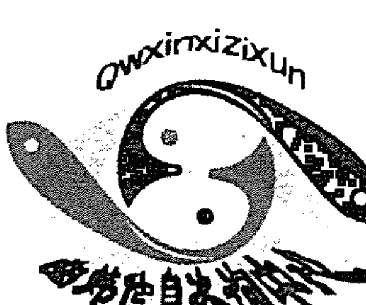

# 六爻特训班讲义

# 前言

此《六爻特训班讲义》是在笔者的六爻特训班讲课基础上整理出来的，其内容大纲是《六爻详真》一书，此书中披露了大量原《六爻详真》没有披露的断卦诀窍，是《六爻详真》的深化，其中对各种事物的预测规则和方法作了详细而系统的阐述，使读者根据书中所述，可以很快知道怎样断各种事物。

另外，在本讲义中，又有新的研究成果推出，可以说，此书的理论性、系统性、实用性更强。很多以前没有公开的断卦诀窍，在此也毫不保留地全盘托出。

只要读者认真参演此书，六爻预测便是轻而易举之事。

曲 炜
2003年10月

# 关于印发《关于进一步规范和加强中央企业采购管理工作的指导意见》的通知

各中央企业：

为深入贯彻落实党中央、国务院关于深化国有企业改革的决策部署，进一步规范和加强中央企业采购管理工作，提升采购效率和效益，防范采购风险，促进中央企业高质量发展，现就有关事项通知如下：

一、总体要求

（一）指导思想。以习近平新时代中国特色社会主义思想为指导，全面贯彻党的二十大精神，坚持市场化改革方向，完善采购管理制度，强化采购监督，推动中央企业采购工作规范化、标准化、信息化，提高采购管理水平和价值创造能力。

（二）基本原则。坚持依法合规、公开透明、竞争择优、协同高效的原则，建立健全采购管理体系，优化采购流程，加强供应商管理，提升采购质量和效率。

二、主要任务

（三）完善采购管理制度。中央企业应建立健全采购管理制度体系，明确采购范围、方式、程序和监督机制，确保采购活动有章可循、有据可依。

（四）规范采购方式。根据采购项目特点，合理选择公开招标、邀请招标、竞争性谈判、询价等采购方式，确保采购过程公平、公正、公开。

（五）加强供应商管理。建立供应商准入、评价和退出机制，加强对供应商的动态管理，确保供应商质量。

（六）推进采购信息化建设。利用现代信息技术，建设采购管理信息系统，实现采购流程线上化、数据化，提高采购效率和透明度。

三、保障措施

（七）加强组织领导。中央企业要高度重视采购管理工作，加强组织领导，明确责任分工，确保各项要求落到实处。

# 第一章 梅花易断

## 第一节 八卦类象

阴阳之道：太极生两仪，两仪生四象，四象生八卦，八卦定吉凶。万物均有两面性，即阴阳。

- 阳—天—男—白
- 阴—地—女—黑
- 阳主动，阴主静。

在生克上，阳主克，阴主生。意思是凡阳爻发动，主克（因阳象征男性主好斗、寻求刺激）；阴爻发动，主偏向于生，不喜欢克（因阴象征女性有生育功能）。这就是阴阳的本性。

如寅木动趋向于克，卯木动趋向于生。又如庚为阳，第一选择是去克，在没有克的情况下才去生；辛金在生克中，第一选择是生，如没有生的情况下才去克。

但这种特性，是在合冲之后。如没有合冲情况下，卦中午火发动，午火首先克申金；如有未土发动，先论午未合，午火就不克申金，因合在先。

### 八卦类象

乾为天：宝物、镜子、圆形水果、贵重物、天鹅（天上飞）、硬物，为马、具有阳刚性之人物、老人、政府机关人物、父亲等等。

兑为泽：但它属金、为沼泽、残缺的东西、乐器、代表喜悦，兑为口、巫师、医生、律师、老师，这些都靠口表达的人事物等全是兑卦之象。

离为火：为中女，凡是两面硬中间空或软之物都可用离卦代表，或外刚内柔；离为火、太阳、为文。

震为雷：为声音、为有声无形之物（如电话）、长男、木材；震为动，动则有声音，如测风水时，遇震卦代表城市、喧闹、有嘈杂声。

巽为风：巽为长女，属木、花草、果园的树木，为风，无孔不入。巽主经济（做买卖的只要有利可图就钻空子），为长物、寡发、为鸡等等。

坎为水：卦象俯视图象车，所以坎为车；坎为带核之物、水、水产品等；坎为险，有君子被小人包围之象，阴爻代表软物，代表阴险狡诈，阳爻代表硬物，象征阳刚正直。坎卦卦象阴包阳，有君子陷入小人包围之象。

艮为山：为少男、东北方、床、桌椅、沙发。上实下空，上硬下软一类的物象。

坤为地：为老阴、代表粮食、土地、老母，也代表众人、大车，也代表小人，主静。

有关八卦类象简单介绍到此，这方面内容很多梅花易数之书都有详细介绍。

## 第二节 梅花易断法

卦气：
梅花易数注重卦气，以卦气旺衰和体用生克为主要依据来推断吉凶。

春季巽、震卦气旺，离卦为相。（辰月，木旺，土也旺，所以坤、艮卦在辰月也旺，乾、兑卦在辰月为相，巽卦有余气。）

夏季离卦气旺，坤、艮卦为相。（未月，坤、艮旺，离卦有余气。）

秋季乾、兑卦气旺，坎为相。（戌月坤、艮旺，乾、兑相。）

冬季坎旺，震、巽为相。（丑月，坤、艮旺，乾、兑相，坎有余气。）

梅花易数起卦法有两种：

### 一、先天起卦法：

1. 先得数后起卦。
2. 只以卦象推论吉凶，不用爻辞。
3. 用后天卦方位先天数。
4. 起卦时不加时辰数。
5. 以卦气定克应。

### 二、后天起卦法

先有象，如取老年人为乾卦，为上卦，以老人来的方向做下卦等，还有根据衣服颜色起卦等。

1. 先得卦再以卦起数。
2. 根据卦象、爻辞、卦辞定吉凶。
3. 起卦时必加时辰数。
4. 以动静状态，如走行立卧等结合成卦之数定克应。

区别：先天起卦法只以体用、动静定应期，不需看爻辞、卦辞，后天起卦法需看爻辞参断。

这两种都能应用外应辅助断卦，但这外应是次要的。如果外应凶，卦象也凶，主大凶；如卦吉，外应凶，主总体是好事，但在办事过程中，恐有不顺，或犯小人等。如外应吉而卦象凶，表面是吉，大体上是凶的。

### 定应期方法：

#### 一、根据卦数定应期诀窍：

测生意时定应期，就用主卦上下卦数相加。
测人走失的应期，以主卦加动爻数为应期。
测病以主互变卦总数定应期。

上面这是基础数，站着问卦，按原数论；跑着问卦得数除2；坐着半快半慢如数或得数乘1.5，这要结合人的心情急缓情况而定；躺着问卦得数乘2。

#### 二、利用克应定应期

如果出现用卦生体卦的定应期方法是：就以生体之卦定应期。

比如《风水涣》，如体是巽，坎水生体，应期在壬、癸、亥、子水的日、月。

如果出现克体卦就以克体之卦定凶的应期。如《小畜》假设巽为体，乾为用，凶的应期就是用卦所代表五行庚、申、辛、酉的日、月。

用代表他人、他事，体代表自己。在具体判断上还要看体用旺衰，以及看所测事情的长短期。一般体卦旺不怕克。体宜旺，用宜衰，但用生体，用越旺越好。体衰为自己不行，运气不好。

用卦旺生体好，总之利于体卦好。

体生用，我耗气、耗力，是自己给予他人，或我买东西等，不属于大灾现象。

如用克体，辰月得渐、艮为体，这样木、土都旺，这时易有灾，什么灾？看巽克体，巽为长女、主经济等等，就是巽代表事象引起的灾。

如离生体，就是离代表的人事物对自己有利。

如体衰，用旺，体克用，没什么灾，也得不到什么，必耗力量。体旺，用衰，体克用，这时较好。体衰用旺，用克体，易有灾。

测失人、失物、行人，用卦的变卦往往是所去的方向。测失物，则表示失物的方向、地理环境。测失物去向如内卦动，在家内，外卦动就是看方向、环境。

测物能不能丢失，以体卦为主，看用生不生体，是否比和。体克用物可寻，应期慢；用生体主快，易于找寻；体用比和可寻；用克体、体生用都难寻。用克体变用生体也找不着；如体旺相，用克体能找到，但慢。

至于失物在什么方位，什么环境，还得看变卦。如变坤卦代表处在粮食、饮食的地方，软物、方形物等附近。

用卦生体卦体现的事象：

乾生体：主政府机关、功名上的喜悦、进益或得领导的赏识、得带金字姓氏人的好处、职务提升；如测官司，代表官司胜诉，或得金银财宝之物，或得长辈的利益，总之是乾卦所代表的人、事、物方面的益处。

坤生体：主田土、房屋上的好事，如粮食、来自乡下人的利益、女性、母亲辈的女人帮助，也代表布匹、衣服方面的利益。

震卦生体：主有山林进益、来自东方人的好处；也主变动方面的喜悦，还有木材、姓李、姓林、长子方面人事物的好处。

巽生体卦：主有山林、果木、蔬菜、养鸡、长女之利、生意方面的财或做生意的利益。

坎卦生体：主有北方获利、得江、河、湖、海方面的利益，或得点水旁姓氏之人的利益，还有桃李等带核水果方面的利润。

离卦生体：可进南方财，文卷方面之喜，利于文化、考学、炉冶场所等，或得火姓人如耿、秋姓氏或得中年女人方面的帮助。

兑卦生体：来自西方或得食物、金玉、律师、酒店、舞厅等方面利益。

艮卦生体：主有东北方财利、来自山林土产利益、少男、小儿喜事，来自王、庄、赵、周姓氏人的财利、好处等等。

如有克体卦情况下，会有什么象？

乾克体：主有公家事的麻烦，或者有家事烦恼，或钱财损失，得罪长辈、尊人，或长辈训斥，或得罪富贵人、公门人（国家机关，公检法）。

坤卦克体：有田土、地产（房屋）之类的纷争、损失；坤为众、为小人，受小人加害。有大腹之人的制裁，或有女性人、老女人欺凌，或饮食、布匹方面有损失。

震克体：主多有虚惊、恐惧之事，或自己不能安逸静养，或住宅有异常现象，或受带草木姓氏人的暗算、制裁，可能有山林方面损失，也可能因歌舞厅方面的事而遭灾。

巽克体：主有带草木姓氏的人加害，或有果园、菜园方面的损失，还可能有树木、山林、经济方面的损失，以及东南方人的侵害，或因长女、女人而遭殃。

坎卦克体：主受盗贼侵扰或江、河、湖、海等水域方面之人的侵害，或你到水边受害，或因酒色遭灾，或因带点水姓氏人而遭灾，还有受北方人的侵害，或有水灾之象等等。

离克体：因文书、契约等引起纠纷，或主失火遭灾，或来自南面的灾祸，或有带火姓氏人的陷害。

艮克体：会遭受山林、田土、房屋、地产方面的损失，或带土姓之人侵害，如周、赫。

兑卦克体：受女人等陷害，物件有损，带金字旁姓氏之人引起灾祸，或受西方人侵害。

总之，哪卦都有方向，都可代表相应的人、事、物或姓氏等。

## 第三节 梅花易分类预测

### 一、测天气

梅花易测天气根本不用看体用关系，只需看体、用、互、变以及阴阳五行就可以了，如离卦主晴，就看离卦多少。

离属火，主光明、晴朗；坎主雨，冬雪；坤为地，主阴，阴晦之象；乾为天，多主晴天；震卦多，雷声隆隆；巽多主风；艮卦多，古书云：久雨遇艮主晴，久晴遇艮必雨；兑卦多，秋天主晴，其它季节主雨，即使不下雨，也会阴晦不明。夏天占离多而无坎，主赤日炎炎，干旱，冬季占无离，则主大雪飘飘。

特训班上现场测癸未年阴历二月十五日（以子时起卦）天气状况：

以当地地名笔划加所测年、月、日时：

未年8数；二月，2数；十五日，15数；子时，1数；当地地名取“瓦”、“市”两个字，“瓦”4画，“市”5画。

```
8+2+15+4+5=34÷8余2为上卦兑；
8+2+15+4+5+1=35÷8余3为下卦离；
```

以上下卦数之和除以六取动爻：（取数、取动爻，可以随心所欲，不必拘于书上言论。）

2+3=5÷6不够除，仍以5作为动爻。

| 主卦 | 互卦 | 变卦 |
| :--- | :--- | :--- |
| 《泽火革》 | 《天风姤》 | 《雷火丰》 |
| — — | ——— | — — |
| ——— | — — | ——— |
| ——— | ——— | ——— |
| — — | ——— | — — |
| ——— | — — | ——— |
| — — | — — | — — |

分析：主卦上卦为先，为兑，为泽，泽有水雾之象；互卦有巽为风，但被上卦乾抑制，有风不大；互为中间之应，所以断中午有风，但风力不大；主卦、变卦有两离，又有雷木生，故离卦是最多、最旺，离主晴。

所以推断：早晨天蒙蒙亮时能有点雾，雾散变晴，中午有点风，总体是晴天。

实际：所测结果完全正确。

### 二、测人事得分、用关系。

体卦为我，用卦代表对方。

用卦克体为不吉，体卦克用为吉利。

用生体有进收利益之喜。

体生用则有损失耗费之忧。

体用比和，这样遇事顺利。

此外应注意互、变、卦气，辨别体用旺衰，如用克体，但用衰克不动，主无事。

### 三、占家宅

以体为主，为我，用卦为家宅。

体克用卦，主家宅吉利；用克体，主家宅多凶险之事；体卦生扶用卦，主多有损耗家财的忧患，或防失盗；用生体，主多进收利益，或有人送礼之喜；体用比和主家宅吉祥安稳。

### 四、占婚姻以体为主。

用生体，婚易成，或因婚有得，得对方利益。
体生用，婚难成，会因婚有失。
体克用，可成，但成婚迟缓。
用克体，不可成，成也有害。
体用比和，婚易成，门当户对，双方条件、背景差不多。占婚体为求测者之家，用为对方之家，体卦旺，主求测者门户胜，用卦旺主对家势力大，如生体则得婚姻之财，或彼此有相救之意。
体生用，求婚必要花费多方可，否则就不成。
若体用比和，彼此相就，良缘天成。

根据用卦看对方体貌、特性：
临乾卦：主端正而高，也主瘦，主义气。
临坎：黑、邪人、嫉妒、奢侈、也主聪明、圆滑。若坎卦克体不好，就主对方狡猾。
艮卦：黄色多巧。
震卦：主貌美、难犯（难以接触）、长头发。
巽卦：发稀少、丑陋、贪心、好财、贪财。
临离卦：短发、色红、性格多变，旺也主漂亮、文明有礼。
坤卦：貌丑、大腹而黄、主静（若生体卦主人稳重），若克体卦也主是小人，一肚子花花肠。
兑卦：主好说话、爱笑、色白、会歌善舞，若兑休囚个头中等，可能有残缺。

测婚姻，与测其它事有些不同，因为婚姻是男女结合，阴阳结合，所以看婚姻成否除看体用生克外，还要注重体用的阴阳性。
例如：若体用都是艮卦，按理是比和卦，主婚姻可成，但艮为少男，为两阳，两男能成婚吗？阴阳失衡，不能成婚；还有两离，离有主离开、分离之意，离为两女之象，两女也不能成婚；

### 五、占生育

以体卦为母体，用代表分娩，体用都宜旺相，不宜衰弱，体用宜相互生扶，不宜互相克制。如体克用，不利孩子；用克体不利于母亲；体克用，用因克而衰，孩子难以完好（有残，多病）；用克体，母体难以保全（剖腹、大流血等）；用生体，母体安康，体生用卦分娩顺利；体用比和，生育过程顺利。

如测生男生女：在主卦中仔细观察，阳卦阳爻多，主生男孩，阴卦阴爻多，主生女孩。阴阳卦相叠情况下，就看当时在场男女数情况而定，男多是生男孩，女多是生女孩。有时看在场人数单双数来定，单数生男，双数生女。

### 六、占饮食

以体为主，用代表饮食。

- 用生体，饮食必丰盛，体生用，饮食难得。
- 体克用，饮食就有阻拦，用克体饮食必全无。
- 体用比和，饮食丰盛、富足。
- 如有坎必有酒、汤、稀粥等。
- 有兑主有饮食。
- 卦中无坎、兑，酒食全无。
- 兑、坎生扶体卦，自然酒足饭饱。

测吃了什么食物，要根据卦象代表食物的信息提取。

如震为蹄、为山林野味等；遇坎卦有鱼。等等，可根据各卦的万类物象所代表的饮食来判断。

### 七、求谋

求某就是对自己想做的事，进行运筹、策划，制订方案。以体为主，用为谋事的克应。

- 体克用，虽可成，但成功迟缓。
- 用克体，谋划不成功，免强去谋划，反而有害。
- 用生体，一般能顺利成功，有人帮助。
- 体生用，谋划虽多，但得付出耗损方能成功。
- 体用比和，则顺利如意。

### 八、求名（仕途）

凡占求名，以体为主，用为名。

- 体克用，功名虽可成，但迟缓（说明自己去努力，付出多）。
- 用克体卦，功名不能有成就。
- 体生用，因功名有损失。
- 用生体，功名易成，因功名有得。
- 体用比合，功名自然顺心如意。

看应期，看哪卦生扶体卦，如坎生体，冬季；离生体，四、五月；震生体，春季。

在任占卜官运，如出现用克体，就有降职、免职的可能。应期是以克体之卦来论，乾克体就应在秋季申、酉、戌月；坎卦克体应在冬季。其余依此类推。

### 九、求财

以体为主，用代表所求的财。

- 体克用，主有进财之喜。
- 用克体，就主无财之忧。
- 体生用，有财产损耗之患。
- 用生体，得财顺利。
- 体用比和，财利可求。

要断得财日期，以生扶体卦的卦气为应期。例如乾卦生体，短期就是申、酉日，长期求财就是秋季。

如体生用或用克体，就以克体的卦气来定应期。

### 十、交易占（就是生意求财）

以体为求财者，用为交易对方。

体克用，交易虽成，但成迟。

用克体，交易不成。

体生用，交易难成，或因交易有所损失。

用生体，主交易立即可成，并必有财利。

体用比和，交易易成。

### 十一、出行

以体为主（代表要出行的人）用卦为出行的克应（吉凶）。

体克用，可出行，所到之处大都顺利得意。

用克体，有灾。

体生用，有破费、损失隐患。

用生体，有意外财利。

体用比合，出门顺心。

体卦得震、乾，主动，利于出行。

体卦得坤、艮，坤、艮属土主静，出行不利，或难以出行。

体卦得巽，最好坐船。

体卦得离，宜于路行。

体卦得坎，利于水上。

### 十二、占人行踪

以体卦为主，用为行人。

体克用，行人归迟。

用克体，行人不归。

体生用，行人未归。

用生体，行人立即归。

体用比和，归期速。

用卦为行人，逢生在外顺利，受克衰弱，在外遭殃。震多不宁，艮受克多有阻，坎衰可能被盗，兑衰受克有纷争。

### 十三、拜见

以体为主，用卦代表要拜见的人。
体克用，可晋见。
用克体，就不要晋见，勉强晋见也会碰壁。
体生用，难以晋见，即使勉强会晤也无益处。
用生体，可晋见，或因晋见有所收获。
体用比和，双方相见欢颜。

### 十四、占失物

以体为主，用代表失物。
体克用卦，丢失的物可寻，但寻回较迟。
用克体，失物难寻。
体生用，失物也难寻。
用生体，失物易寻。
体用比和，失物会失而复得。

失物丢什么方向，看变卦所代表的地方。

变卦为乾：在西北方向，失物在公共场所、楼房或在金属乱石之间，或在圆形物中，或高而干燥地方。若在家中丢失，也可看家庭中的圆形器物、金属物、镜子处、老人房间、父亲房间等。

变卦为坤：应向西南方向寻，丢失物在田野、仓库、或与粮食之物，或农家劳动之所或土穴洞中，泥瓦器物或方形器物附近。

变卦为震：在山林、柴草之间，或有声响的乐器、电视、音响地方或闹市、大街之象。

变卦为巽：可在东南方、山林、寺庙、道观或在菜园、果园、舟船、竹木器之内，也可以说在长女房。

变卦为坎：往北方寻找，失物多在水边，或在酒店。

变卦为离：往南方寻找，在厨房或炉火之旁，向阳窗户间，空房之内或在诗歌古迹旁（书）或在生火生烟处。

变卦为艮：东北方、山林、道路旁、岩石左右、土穴之中、家中门附近、与狗近处。

变卦为兑：西方、沼池、废弃水井、残崖断壁、音乐、收录机旁，兑为西，西方是佛界的代表，所以兑也主佛像，所以可能在供奉佛像处。

一般来说，测失物，若失物在外有方向性，可以根据变卦确定方向，若失物在家中，不具有方向性，所以这时就必须根据变卦所代表的物象来寻找。

### 十五、占疾病

以体卦代表病人，用卦代表病症。
体卦宜旺，不宜衰，体宜生扶不宜克制。
用生体，病易好转，好治（不治而愈）。
用克体，疾病难愈。
体卦被克，而体卦又衰就存活不久。
想知能否转危为安，看生体之卦为期，卦凶就找克体日子为凶日。

如想推究治病药物属性，详端生体之卦。如离生体，易用热性（电疗等）；坎生体，用凉性药（打吊瓶）；艮生体，适宜温补；乾、兑生体，适应凉性药物或针灸。

### 十六、占官司诉讼

以体为主，用为对方。
体宜旺，不宜衰。
体宜用生，不宜生用，有耗损。
用宜生体不宜克体。
体克用，我方胜。
用克体，他方胜。
体用比合，有和解之象。
用生体，不但得理，而因官诉有所得。

## 第四节 外应取象注意事项

外应是一种预兆，在运用外应时，应注意以下几点：

1. 必须是在断卦刚开始或中间阶段，突然出现的某种征兆，方可视为外应现象。如在未起卦前，某些正常现象不可视为外应。例如正月十五晚测卦，就不能取爆竹声响做外应，因为按我国风俗习惯，正月十五都要放爆竹，这声响到处都有，而且此起彼伏，不是突然现象，外应有一个关键要素就是突然现象。
2. 所取得外应信息，必须与所测的事物有关连，要取有关连那种象。
3. 外应取象要以近的、明显的为原则，远的或不明显的征兆，不能视为外应。
4. 运用外应辅助断事时，决不能完全抛弃卦理，弃卦不用，而取外应，这是本末倒置。当然求测者问事在没有起卦时，或限于某种境况不允许或无法起卦时，则可完全以外应论断。当然遇这种情况不能说以后也可以专用外应而不起卦，因为大道随自然，是那种境况限制你不能起卦只能用外应，所以这时用外应断卦反而顺其自然，若勉强起卦倒未免正确。当然在有条件起卦而不起卦，专门去等待外应则不行。如果已经起好卦，突然出现外应不可以弃卦而专取外应。这时外应是辅助作用，外应吉，卦象吉，则万事大吉；若外应吉，卦象凶，是凶中有吉，总体是不利的，但还会有点有利的事。若外应凶卦象吉，则是吉中藏凶，事情大体是吉利的，但总有些不尽人意之处；若卦象凶外应凶，则应大凶。
5. 不要刻意去寻找外应，只有顺其自然，抓住突如其来的预兆，才能应验。

# 第二章 六爻占断法

## 第一节 断卦的基本规律规则

一、刑、冲、合、害

刑、冲、合、害也是生克的一种特殊表现形式。如子卯刑就是子水生卯木；子未害，就是未克子。在所有五行生克关系中首论合与冲。一般在同层次爻首论合、冲，再论刑，接着论害，最后才论没特殊关系的。

合>冲>刑>害>无特殊关系。

同层次爻间的刑冲合害，都得让位于高层次爻。

合、冲是最紧密的，只有高层次的爻才能解原局中的合、冲。

例如：

《遁》
父 戌、
兄 申、应
官 午、
兄 申、
官 午×世
父 辰、、

午火先生戌土，因有午戌半合，如午火有力量情况下才能生辰土，且生力只能有2－3成。

《水风井》
父 子、、
才 戌、世
官 申、、
官 酉、
父 亥、应
财 丑×

丑土动，首论合冲，丑土动先克子水，亥水不受伤。因为先论子丑合，实质就是丑土克子水，由于丑与亥没有特殊关系，所以丑土克亥水力量小，只能产生20－30%力量。如果卦中没有子水，丑土就以100%的力量克亥水。

在进行时寅、卯、辰、巳、午、未日，午冲子解合，但子水照受伤；未日冲丑解合，如遇子日与丑土合，解卦中子水与丑土之合。

《既济》
兄 子、、应
官 戌、
父 申、、
兄 亥、 世
官 丑×
子 卯、

如果求竞争官位，世爻旺的时候，官丑土动与应爻合，是应爻得官，说明官与人家对方有联系。

求财也一样，如丑是财爻，是应方得财。如果应爻不是子水，丑动克世爻亥水，世旺也行，不旺就有灾了。

《损》
官 寅、应
财 子×
兄 戌、、
兄 丑×世
官 卯○
父 巳、

先论合，子丑合，子水不生寅木了，子水也不克巳火。那么子水与卯木的关系是相刑，子水被动爻丑土合住不生卯木，子丑动合相当于静爻。而卯木可盗泄子水，卯木照样有权克丑土。

爻的第一层次：日、月建；爻的第二层次：变爻；爻的第三层次：动爻；爻的第四层次：静爻。

一般卦中爻的旺衰来源都来自日、月建。

1. 日、月建对卦中的每个爻，都具有生、克、合、冲作用。
2. 卦中变爻对主卦中的爻有生、克、合、冲作用。但变爻对本位动爻有生克冲合作用时，不再与主卦中其它旁爻发生作用，当变爻对本位动爻没有生克冲合作用时，变爻就与主卦中其它旁爻发生作用。

《蒙》

| 父 | 寅、 | 卯 |
| :--- | :--- | :--- |
| 官 | 子× | 巳 |
| 子 | 戌、、世 | 未 |
| 兄 | 午、、 | 午 |
| 子 | 辰、 | 辰 |
| 父 | 寅、、应 | 寅 |

变爻巳火对本位动爻子水没有生、克、冲、合作用，所以巳火可以生主卦中戌、辰土。

如戌土动化未，未对戌没有生、克、合、冲作用，只是化退，未可合主卦午火，也可克主卦中子水（因主卦中的午火是第四层次爻合不住第二层次未土）。

高层次爻可以合住低层次爻，低层次爻合不住高层次爻，高层次爻照样可以与其它爻发生作用。

变爻与变爻生克合冲不看，所有变出的爻，都看对主卦的影响。

《乾》

| 父 | 戌、世 | 戌 |
| :--- | :--- | :--- |
| 兄 | 申、 | 申 |
| 官 | 午、 | 午 |
| 父 | 辰○应 | 丑 |
| 财 | 寅、 | 卯 |
| 子 | 子、 | 巳 |

动爻辰土可冲戌土、生申金、克子水，也就是收子水入墓，可盗午火，耗寅木力量。如测官司，辰土动了，主起诉；若辰化酉就合住了，就不能与其它爻发生作用，辰土相当于静爻，子水也不入墓，也不冲戌。

丑土为变爻，可克合子水、生申金、盗泄午火。

《巽》

- 兄 卯、 世
- 子 巳、
- 财 未、、
- 官 酉、 应 财 辰
- 父 亥、 兄 寅
- 财 丑× 父 子

因丑动变子水，子水合住丑土，所以官星酉金不入丑土墓，因动爻丑土被合了，层次降低，丑土也不冲未土、不克亥水了。

如丑动变寅木，寅木回头克丑土，寅木对其它爻的力度小了，可以忽略不计。

变爻对本位动爻发生作用，对主卦中其它爻作用就小，可忽略不计。这时就看旺衰，旺就对其它爻有点作用，衰就没有作用。

动爻能生、克、合、冲同层次的动爻，也能生、克、合、冲静爻，但动爻受制于日、月建和变爻，尤其是本位变爻，动爻无权生克日、月及变爻。

卯月 甲午日

《节》

《兑》

- 兄 子、、 官 未
- 官 戌、 父 酉
- 父 申×应 兄 亥
- 官 丑、、 官 丑
- 子 卯、 子 卯
- 财 巳、世 财 巳

兄弟子水在日、月休囚，不受克。这种日冲子水介于在暗动与月破的临界点。这时就看卦中动爻向背，看申能否生子水，如申已合，因已没动，申合住已火，变爻亥冲可解。假如申动，卯木爻也动，这时卯临月而盗泄子水力量，这时就为破了。

爻的第四层次是静爻、伏藏之爻，它受制于其它层次爻。静爻与静爻可以相生相克，不能主动生克动爻，当动爻被克时，静爻根本不能起通关作用，即使静爻临日、月建相当于第一层次爻也无奈。

| 卯月 | 亥日 | （若子日） |
| :--- | :--- | :--- |
| 《蹇》 | 《既济》 | |
| 子 子、 | 子 子 | |
| 父 戌、 | 父 戌 | |
| 兄 申、、世 | 兄 申 | |
| 兄 申、 | 兄 亥 | |
| 官 午、、 | 父 丑 | |
| 父 辰× 应 | 财 卯 | |

父辰土动化卯回头克，又受月克，午火为静爻，通不了关。辰土动化克，无力盗泄午火力量。

假如换成子日，午火暗动，能主动生辰土。辰土化回头克，无生克权，冲不了戌土。

静爻与静爻之间相生，有阻隔就不能生了，如上例卦中如全是静爻，申金生不了子水，因有戌阻隔，除非戌土空、入墓才行，这样申才可直接生子水。

静爻子水与午火也不能直接相冲克。

爻的层次转换：

卦中的动、变、静爻有时也临日、月建，叫日、月入卦，相当于第一层次爻。但值日、月建的静爻，对卦中的动爻也无主动生克权，也不被动、变爻所克伤。同理，动爻值日、月建，也不被变爻所克伤（这是暂时原象），待日、月建改变，主克之爻上升为第一层次爻时，也可以克伤原象值日、月建之爻。

◎王某测财运：

巳月 丁酉日 （辰巳）
《未济》 《鼎》
兄 巳、应 兄 巳
子 未、、 子 未
财 酉、 财 酉
兄 午×世 财 酉
子 辰、 官 亥
父 寅、、 子 丑

1. 兄弟发动有投资求财或合伙求财之象。
2. 世化出财，就是自己投资求财。
3. 午火克主卦酉金之财，但克不伤，因酉值日建，相当于第一层次爻，午火是第三层次爻。
4. 到午月，午火上升为第一层次爻，就可以克伤原象为第一层次爻的酉金，所以午月破财。

这就是断应期的窍门，午火兄弟发动就是要劫财，动就破财。如果未土动了，午未合，就是午火生未土，未土生金，起到通关作用，反而主发财。

◎例：男测谈朋友发展情况。

戌月 壬辰日 （午未）
《小过》 《恒》
父 戌、、 父 戌 白虎
兄 申、、 兄 申 螣蛇
官 午、 世 官 午 勾陈
兄 申、 兄 酉 朱雀
财卯 官 午× 子 亥 青龙
父 辰、、应 父 丑 玄武

1. 世爻休囚逢空且入月墓，说明心里无底，自身条件不好。
2. 应爻辰土暗动，临日建，能力强、漂亮、有文化。
3. 二爻午火官鬼发动，是又出现一个男的主动与应爻辰土相生。午火发动变出子孙亥水临青龙，主玩乐。由于官鬼午火下伏财爻，说明这男的，原来有妻子或女人。
4. 世爻午火入父母戌土之墓，说明家庭条件不好，受家庭、父母因素影响、限制。
5. 应爻临父母辰土随着卦变化退，也说明女方父母也不同意。世爻在震宫，临日、月休囚，主家庭条件不好，也代表工作单位。女方在艮宫，临日、月旺相，主家庭条件好。世、应爻的旺衰主自身条件。应爻暗动，主动权掌握在女方手中。

所以此婚不成。

◎男测婚，未婚。

子月 庚戌日（寅卯）

《明夷》 《贲》

| 父 酉× | 子 寅 | 螣蛇 |
| :--- | :--- | :--- |
| 兄 亥、、 | 兄 子 | 勾陈 |
| 官 丑、、世 | 官 戌 | 朱雀 |
| 兄 亥、 | 兄 亥 | 青龙 |
| 官 丑、、 | 官 丑 | 玄武 |
| 子 卯、应 | 子 卯 | 白虎 |

1. 月建子水把世爻丑土合住，日建戌土把应爻卯木合住，各自因合而联系不上，主婚不成。
2. 应爻逢空没有生克权，说明对方心里没底，或者主对方不实。
3. 卦中父母爻发动，发动是事情的主动参与者，由于父母酉金发动冲克应爻卯木。说明父母主动参与，有不同意之象，父母爻变出寅木克世爻丑土，也是因父母爻的发动，使上卦产生卦变，世爻也跟着化退，所以可以推断世爻是由于父母的介入而要退出。父母爻临腾蛇主父母想方设法缠住世爻，不让世爻跟那女友相处。
4. 卯木临应为长发，临白虎，主白色，所以可以推断女方为长头发，面色白皙。

测婚姻，有一方没有生克权，就不能成，因为成婚时牵扯到双方的事，只有两方都有生克权，并且双方意见一致时才能成，并且必须构成某种联系，没有联系是不能成的。

◎例：测姐姐外出治病吉凶。

丙子 辛卯月 庚戌日（寅卯）

| 《坎》 | 《萃》 |
| :--- | :--- |
| 兄 子、、世 | 官 未 |
| 官 戌、 | 父 酉 |
| 父 申× | 兄 亥 |
| 财 午、、应 | 子 卯 |
| 官 辰○ | 财 巳 |
| 子 寅、、 | 官 未 |

这卦是《六爻详真》书中一例，其实这一例主要看用神在卦中是否危而有救。一般来说，测疾病卦起出后，用神临日、月旺衰状态，其实就是一个基础，一个底，代表着现在时，揭示着现在状态，只要现在人没有死，再弱也说明人还活着，判断吉凶是在这个底的基础上来评定的。

此卦用神是兄弟子水，现在兄弟子水在月休囚，在日受克，所以现在境况很不好。看人的生死还要看太岁，看流年支，流年支是子水，对兄弟子水是帮扶作用，说明在丙子年不会有危险，总是有流年太岁照应，况还有个关键，就是用神子水在坎卦坎宫，这卦宫也是一个气场，是兄弟子水一个生存环境，这环境对子水来说是帮扶。

看人的吉凶，还有更关键的就是看卦中的内因组合，此卦官鬼辰土发动化回头生，克兄弟子水，这是内因出现的毛病，幸有父母申金发动通关，所以父母申金是否有能力通关就是关键中的关键，如果能通关则人有救，若通不了关，则人即使躲过今年明年也难保。

现在来看只有理顺好各种生克关系，才能评断出申金的通关能力。

申金在月休囚，在日受生，还是有生克权，但卦中有这样几处毛病必须理顺清楚：

A、辰土动化巳火合申金，若真是能合住申金，申金就失去生克权，不能通关，所以要看巳火能否合住申金，现在巳火入日墓，巳火无权合申金，这病解决了。
B、辰在月受克，日冲为冲脱，辰土失去正常生克权。
C、戌土被动爻辰土冲为暗动，克子水，申金可通一个土之关，一个申金难通两土之关，所以起码得制住一个土才行，不然你一个申金只能通一个关，另一个便越过申金直克用神，所以这个问题也得解决。幸月建卯木合住戌土，只剩一个辰土，无妨。

这样详细分析下来可以判定：人不会有危险。

结果也就是没有危险，到现在人还活着，医院给人诊断错了，误诊为肠癌，后来到别的地方检查说不是肠癌，做手术好了。

## 第二节 冲对生克权的影响

爻逢冲有两种形式：一种是同层次爻相冲；另一种是高层次与低层次爻相冲。

一、同层次爻相冲有四种：
1. 第一层次爻相冲。
2. 卦中动爻与动爻相冲。
3. 静爻与静爻相冲。
4. 变爻与变爻相冲。

动爻与动爻相冲必须得考虑，静爻与静爻相冲在六静卦中得考虑，在有其它动爻的情况下，一般来说只有冲象没有冲力。

动爻与动爻相冲：

### 一、高层次爻冲低层次爻有六种：

- 1、日、月建冲变爻。
- 2、日、月建冲动爻。
- 3、日、月建冲静爻。
- 4、变爻冲主卦中静爻。
- 5、变爻冲主卦中动爻。
- 6、动爻冲静爻。

上层次爻冲下层次爻，容易把下层次爻冲散，冲脱失去正常生克权。

◎例：测合同能否签成否。

寅月 乙未日（辰巳）

| 《颐》 | 《无妄》 |
| --- | --- |
| 兄 寅、 | 财 戌 玄武 |
| 合同……父 子× | 官 申 白虎 |
| 卦主……财 戌×世 | 子 午 螣蛇 |
| 财 辰、 | 财 辰 勾陈 |
| 兄 寅、 | 兄 寅 朱雀 |
| 对方……父 子、应 | 父 子 青龙 |

测签合同之事，必须双方有诚意，有生克权才行，有一方条件欠缺，就难以签成。

- 1、世爻临日发动，积极主动，临螣蛇主想方设法要促成此事。
- 2、应爻为对方临青龙主正义，阳爻临阳位也是位正，应爻没有发动，不是事情的主动参与者，说明只是世爻一方想主动合作。
- 3、世爻化午火冲应爻子水，想冲起子水，说服子水与自己合作，但日建未土合住午火，午火不能冲子水。说明世爻的努力无效。
- 4、应爻休囚，说明对方无诚意，对合作持消极态度。

卦中父母子水发动化申金回头生，父母子水代表合同，化回头生好像是有希望，但申金月冲为破，所以申金已无生克权，这父母爻便成了无源之水，况在日月休囚受克，也毫无生克权。

另外此卦变卦为六冲卦，六冲主散，尤其是测合伙、合作、婚姻等合和之事，逢冲必散。

所以无论从哪一点来看合同是签不成。

### ◎例：测买房子可成否？

辛丑月 甲午日（辰巳）

| 《遁》 | 《需》 |
|---|---|
| 父 辰○ | 子 子 玄武 |
| 财 寅、应 | 父 戌 白虎 |
| 子 子○ | 兄 申 螣蛇 |
| 兄 申、 | 父 戌 勾陈 |
| 官 午×世 | 兄 申 朱雀 |
| 父 辰× | 官 午 青龙 |

> （注：此卦采用修正后乾卦六亲装支法。）

测买房子可成否，指看暂时这房能不能买成，不是指永远，主要看能不能把房价拉下来。卦主本意能讲到心中确定好的价格就买，若讲不下来价，就不能买。

世爻发动化兄弟申金冲寅木妻财，说明想讲价，但申金入月墓，申金暂时失去生克权，所以讲不下价。

兄弟申金冲克财爻寅木，兄弟就是压制财爻价格的，所以从这个角度提取世爻要讨价的信息。

现父母爻空，也主买不成。

如果问房什么时候能买成，父母出空就可买成。所以断卦关键看问法，问法不同断法就不一样。

### 一、月建冲动爻

日、月建冲动爻，动爻便被冲散或冲脱，失去正常生克权。

如果动爻旺相，日、月建冲有生克权，但生克权减小。动爻如果旺，月冲，如日合了，可解，照样有生克权。

月建冲动爻，动爻无论旺衰，都为月破。旺相之动爻，或虽休囚不受克之动爻逢月冲，在爻值日或逢合之日，就有生克权，出月也有生克权。

休囚动爻又受制，月破永无生克权。

变爻遇月冲与此同理。

月建冲值日建之动爻，动爻照样有生克权，因为爻值日建相当于第一层次，这时与月建为同一层次，层次相同是冲不败的。

这里得交代一下用词，很多学易的将“值”与“临”混为一谈，认为“值”就是“临”。其实二者是有区别的，在笔者的易学著述中很注重专业用语，在运用这些专业用语是很注意分寸，所以读者在学习时一定要掌握这些专业用语的含义，区分开这些看是近似的用语，才能迅速掌握断卦要领，所以笔者倡导一些关键性专业用语在易学界要统一化，只有这样无论易学爱好者看哪家的易学著述，都会很快入门，否则乱用易学用语，易学普及起来就更难，学易之人掌握起来也摸不到头脑。在此笔者仅就“值”、“临“二者的本质区别谈一谈。“值”就是卦中的爻与月、日建是同一字，而“临”则是与日或月建是同五行不同字。值的力量比临大得多。爻值日、月就好比上级领导第一把手亲自到下面视察；而临则是上级领导委派其他人下来视察，是代表他来，虽有一定力度，但比领导亲自视察还是差得多。爻值月或日建，此爻就相当于第一层次爻，爻的层次上升，而爻临日、月建只是得日或月建辅助，层次还是原来层次。

### 二、月建冲静爻

- 1、月建冲休囚静爻，只冲不克，待旺相岁月也有用。如连冲带克，彻底没有用，永无生克权。
- 2、月建冲旺相静爻，不管连冲带克还是只冲不克，月内为月破无生克权，但逢合、值日及出月便有生克权。
- 3、月建冲值日之静爻为暗动。例如：
    - A、卯月酉日，酉爻，为暗动。
    - B、申月寅日，寅爻，也为暗动。
    - C、辰月戌日，戌爻，暗动。
    遇这种情况，就当动爻看。

> 学员问：暗动爻当动爻看，那么暗动爻之变爻对这暗动爻、对主卦这些爻有没有作用？
答：一般情况由这种暗动而产生的变爻，由于不是卦变，所产生力量不大，可不看，就看暗动爻对其它爻的作用就可以了。

### 三、日建冲爻

- 1、日建冲旺相动爻，为冲脱，有生克权，但生克权减小。
- 2、日建冲休囚动爻，为冲散，动爻无生克权。
- 3、日建冲旺相静爻，为暗动，静爻生克权加大，由静变动，爻的层次上升，与动爻为同一层次。
- 4、日建冲休囚静爻，有两种情况：如果日建对静爻连冲带克或虽是只冲不克，但爻在月建受克都为日破，静爻无生克权；若日建对静爻只冲不克，而静爻在月建只是休囚不受克，静爻处在临界状态，即处在有生克权与无生克权之间。这时就要看卦中动爻的向背，若卦中有动爻生扶，就为暗动，若卦中无动爻生扶反而有动爻克、泄、耗之，则为日破。
- 5、土爻日冲有特殊性，土爻在月只是休囚不受克，日建冲之为暗动，因为土爻相冲，只是本气相激，本身并没有实质受伤。土爻在月受克日建冲之，为临界状态，是否暗动看卦中动爻的向背。

例如：
卯月 巳日 亥爻
亥是临界状态，若卦中有克、耗、泄的爻发动则为破，若有动爻生扶则为暗动。

土爻的特性：
申（酉）月 辰日 戌爻，戌土为暗动。
如换成寅、卯月，辰日，戌爻为临界状态，就看其它爻向背。
其它土爻相冲都如此。

丑月、酉日、卯爻，日连冲带克，为破。
巳月、申日、寅爻休囚，日连冲带克，为日破。

### 四、变爻冲主卦中的动爻

一是冲本位爻；二是冲主卦中其它动爻。
由于变爻的层次比动爻高，它对动爻有主动生克权，这是由它地位决定的，并不是由它力量决定的。
那么变爻有没有能力冲动爻，主要取决于日、月对它的作用。
如变爻被日、月合，冲散、冲脱，总之是被制住了，变爻就无权去冲动爻和其它旁爻。

当变爻有能力冲动爻时：
- 1、当变爻与本位动爻有冲的关系时，变爻只与本位动爻冲，对其它爻的生、克、冲、合的作用就不论了。这时当：
    - A、本位动爻休囚时，被变爻冲就冲散，失去生克权。
    - B、当本位动爻旺相，变爻对本位动爻只冲不克时，本位动爻减力，但仍有生克权。
    - C、当变爻对本位动爻连冲带克时，不论动爻旺衰，动爻无生克权。（如动爻值、临月、日建除外，这种情况，测近期事不妨，长期事不行）。

◎例如：测外出求财。

午月 辰日

| 《恒》 | 《豫》 |
|---|---|
| 财 戌、、应 | 财 戌 |
| 官 申、、 | 官 申 |
| 子 午、 | 子 午 |
| 官 酉○ 世 | 兄 卯 |
| 父 亥○ | 子 巳 |
| 财 丑、、 | 财 未 |

一般来说，官爻持世求财，当财爻发动生世或世爻发动盗泄财爻才可以，否则不但求不了财，还主不安、忧虑。

测求财，必须财、世都有生克权才行，若一方无生克权，便求不到财。

此卦财爻戌土在月受生，在日逢冲，为暗动，可以生世爻官鬼酉金，这叫财生世求财易得，但到底能否得财，还得看世爻有无生克权，若世爻无生克权说明你没这运气和能力，你没有得财的权利，它不受生，自然就得不到财。现在世爻化卯木回头冲，幸这卯木在日月休囚，对世爻是只冲不克，所以世爻虽减力，但照样有生克权。

另外，卯爻只对本位动爻酉金冲，不与主卦其它动爻发生关系。卯木便不能去合住戌土。世爻化回头冲这是反吟，所以求财求事必得反复。

实际卦主经过几次反复，求到了财。

### 五、变爻对主卦中其它旁爻之冲

变爻与本位动爻有生、克、合、冲作用时，就不与主卦其它旁爻发生作用。当没有这些关系时，变爻对旁爻就有生、克、合、冲作用。变爻对其它旁爻有冲的作用时，道理等同于变爻对本位动爻之冲。在此不再赘述。

### 六、变爻冲主卦中的静爻

当变爻对本位动爻无生、克、冲、合关系时，变爻才能对主卦其它静爻发生作用。变爻冲旺相静爻，静爻为暗动，上升为第三层次爻。冲休囚静爻为破，或为临界状态（道理同日建冲静爻）。

### 七、动爻冲静爻

动爻冲旺相静爻时，静爻为暗动，为冲起。
动爻冲休囚静爻时，同于日建冲静爻。
至于动爻是否有能力冲静爻，得看日、月、变爻对其制约情况。其实就是一句话，动爻有生克权就可冲静爻，动爻无生克权就不能冲。

◎例：测被骗钱财能否追回？
（这是笔者中学老师摇的卦）
癸丑月 辛巳日（申酉）

| 《乾》 | 《履》 |
|---|---|
| 父 戌、世 | 父 戌 螣蛇 |
| 兄 申、 | 兄 申 勾陈 |
| 官 午、 | 官 午 朱雀 |
| 父 辰○应 | 父 丑 青龙 |
| 财 寅、 | 财 卯 玄武 |
| 子 子、 | 子 巳 白虎 |

应爻发动冲世爻，说明是对方主动行骗，主动找的她，世爻临日、月旺相，被辰土动爻冲，为冲起，说明被对方巧设的骗局，被对方的语言打动。世爻暗动，是心里状态。土爻、父爻都主信，越旺越信。如世爻休囚被冲破，就不会信，也无实力去买，自然就不会被骗。

世爻在乾宫被冲，说明在西北方向被骗的。
反馈：是在西北早市上被骗的。
主卦为乾主男，变卦有泽，泽为女，所以骗子大概有三、四个人，其中有一女的。

反馈：骗子有三人，一个谎称说是公安，一个是银行人，另一个假装卖钻石。把一个假钻石卖给她，骗了五万七千元，事后感觉不对劲，到公安派出所报案。顺便来测测钱能追回否？

子孙爻为公安，休囚安静，说明公安人员没有追查的行动，或者说行动不得力，办案力度不强，财爻休囚无气，所以钱财难以追回。

实际至今也没追回。

### 八、静爻与静爻冲

只要卦中有动爻就不论静爻间的相冲，静卦有暗动也不论。只有在静卦中论静爻与静爻相冲。

◎例如：测流年运气。

寅月 丁卯日 （戌亥）

| 《坎》 | 《困》 |
|---|---|
| 兄 亥、、世 | 官 未 青龙 |
| 官 戌、 | 父 酉 玄武 |
| 父 申× | 兄 亥 白虎 |
| 财 午、、应 | 财 午 螣蛇 |
| 官 辰、 | 官 辰 勾陈 |
| 子 寅、、 | 子 寅 朱雀 |

动爻申金动本可冲起寅木使其暗动，但申金休囚逢冲为破，不能冲动寅木。父母申金发动，但月破，又化亥水逢空，为泄气，父母爻在四爻，四爻为人爻，很可能是人员方面的事，父母爻代表父母，休囚月破临白虎，白虎主病伤之灾，实际正、二月父母有病。

卦中有辰、戌相冲，但辰、戌都未发动，只有冲象没有冲力，所以不会激起土气，自然辰、戌土就没有多大力量克世爻，因此世爻本身就不会有大灾。财爻午火有气，财运还行。世爻不受克，内因没有克世爻的就无大灾。

实际也正如所测。

## 第三节 爻逢合生克权判断

爻逢合主要是三合、六合。合局成化条件：

- 1、必须是六合两个爻，三合三个爻都动，或者一方是日、月，或是变爻（这变爻必须是本位动爻变出的）。
- 2、必须在日或月上有化神。且日、月任何一方不得为化神之克神，如出现克神，为合而不化，为绊住减力，暂时失去生克权（待日、月冲开任何一字，都为冲开）。如同层次爻作合，合而不化，双方均减力。如作合一方特别弱，就降低层次。

在六爻中，静爻与静爻只有合象，而没有合力（只能提取信息之象，就如两个人好，谁也没说）。

三合、六合合化成功后，都以合化出之五行论生克。

例如：卯月 子日

```
财 戌
官 申
子 午
兄 卯× 亥
子 巳、、
财 未×
```

亥、卯、未三合木局，在月建有化神，日建又生化神，所以合木局成功，合化成功后实际木力量增大，土受克，亥被盗泄受伤。

如合而不化，低层次爻或衰弱之爻，暂时失去生克权，待上层次爻冲开时，方能有生克权。

六合成化条件：

- A、必须两个爻都动，或者动爻与本位变爻之合。
- B、必须日、月建为化神，且日、月任何一方不得为克化神之五行。

例如：

1、未月 午日

戌×
卯○
戌合化火成功，若卯不动，不能合化成功。若月令改为亥月，则合而不化。

2、申月 巳日
戌×
卯×
日建为化神，月令不克化神，卯戌合火成功。

3、如申月 巳日
寅○
亥×
寅月破，无生克权，寅合不住亥，寅亥合化不成，巳日冲亥解合，亥照样有生克权。
上例如换成寅、卯月日就合化成功。

- A、在六合中，日或月与卦中动爻相合，绝大多数为合而不化为绊住。
- B、凡动爻逢日合或月合，无论旺衰，都为绊住，层次降低生克权降低，相当于静爻。
- C、但用神爻发动逢生合，不为绊住，为增力（照样有生克权）而原、忌、仇、闲神无论生合克合都为绊住。（也是暂时降低生克权）。
- D、静爻逢生合，旺相时为合起，克合都合不起。

例如：
卯日 戌爻，克合合不起
辰日 酉爻为合起，合起的静爻相当于动爻。
生合若合起必须是日或月建是生方才可，而爻为受生方，若爻为主生方则不行。

◎例如：母测女儿因何未来电话？
条件：女儿在外地（山东）经商，以前每天都给家来电话，这一连几天没来电话，不知何因。

卯月 癸酉日 （戊亥）

### 《讼》

| 子 | 戌、 | 应 | 白虎 |
| 财 | 申、 | | 螣蛇 |
| 兄 | 午、 | | 勾陈 |
| 兄 | 午、、 | 世 | 朱雀 |
| 子 | 辰、 | | 青龙 |
| 父 | 寅、、 | | 玄武 |

看此类事情，首先要清楚求测者最关心的是什么，如果我们设身处地站在对方角度来考虑，卦主自然是最关心的是女儿的平安问题了，所以首先要看人身平安问题。

取子孙戌土为用，兼看子孙辰土爻，子孙戌土在日、月虽休囚，但因旬空不受克。这是其一；其二，卦中没有动爻克子孙爻，这就是说，外部因素日、月虽对用神不利，但卦的内部因素没有给用神造成伤害，外因要制约某爻，是要靠内因起作用的，且此卦原神兄弟爻旺相，子孙爻生源不断，故断人安全。仅凭六神及在日、月处休囚，而不注重卦的内因组合是断不好卦的。

既然人安全，那下一步便是看因何事阻碍没来电话。月建卯合子孙戌土，卯为父母爻，为电话、通讯、文书、房屋之事；日建酉合子孙辰土，酉为财爻主钱财、经济、费用等。这两组合都为合而不化，为绊住，二者揉合在一起，便可推出是因通讯、钱财之类事而绊住，所以断因手机欠费就顺理成章了。

断卦要有联想思维，要善于把零碎的信息组合在一起，理出头绪，依据社会常理，结合要测的具体事，合理提取信息之象。要提取符合常理，符合所测之事实实际情况那一部分信息。

此例中，父母合子孙爻，父母还代表房子、车辆，如果你提取因车辆、房屋之事没来电话，显然是不太符合实际，因为车辆、房屋方面出现问题不致于导致不来电话，而只有通讯方面发生问题不来电话更切合实际。同理，财爻合子孙爻，推断欠费，更符合社会实际。

所以断其女儿在外绝无凶险，平安无事，是因钱财和通讯之类事情所困而没来电话，再进一步说，很可能是手机欠费而没有给家来电话。明日是戌日，子孙用神出空，又冲动二爻子孙辰土，必会有音信。

果然，第二天戌日中午，其女儿给家来电话，说手机欠费，在外地没法交款，又回到本市交费后又匆匆赶到外地去，这才给家来电话。

◎例：陈女士测手腕不知何因老痛，摇卦测测。

甲寅月 庚申日（子丑）

| 《谦》 | 《井》 |
|---|---|
| 兄 酉、、 | 子 子 螣蛇 |
| 子 亥×世 | 父 戌 勾陈 |
| 父 丑、、 | 兄 申 朱雀 |
| 兄 申、 | 兄 酉 青龙 |
| 官 午×应 | 子 亥 玄武 |
| 父 辰、、 | 父 丑 白虎 |

自测病关键看世爻状态，世爻旺相病易治，衰弱受克难治。此卦世爻亥水被月建合，虽然是生合，但世爻是主生方，其实世爻减力，被合住，测近病逢合病难愈，且世爻又化回头克，看来不妙，但日建申金冲月建寅木，解了寅亥合，近病逢冲则好，况世爻在申日得日建之生，旺相。

那么为什么手腕没有受伤还老痛呢？世爻发动化回头克就是病因，原因就是父母爻临勾陈克世。这又是什么象呢？父母代表长辈，父母爻在日、月休囚无气，且临勾陈，勾陈代表田土，所以可以推断是田土中的无气长辈在克她，自然就是死去的长辈，在作怪了。

待用当地土办法验证是死去的奶奶作怪。于是用土办法应了愿。那么这病何时能好呢？戌日不行，亥日能好。因为亥值日建，相当于第一层次爻，休囚的戌土克不动。

后果然亥日不药而愈。

三合局：1、实合局：实合局是三爻都动且不空。

2、待合局也是虚合局就是三合三个爻当中有一爻不动或逢空、缺一字。

多一字也不能成局，多一字必须是动爻，这种情况下必须日、月合去一字才算合化成功。

能否合化成功，与前面讲的道理是一样的。

◎例：测官运。

申月 辛卯日（午未）

| 《大畜》 | 《中孚》 |
|---|---|
| 官 寅、 | 官 卯 螣蛇 |
| 财 子×应 | 父 巳 勾陈 |
| 兄 戌、、 | 兄 未 朱雀 |
| 兄 辰○ | 兄 丑 青龙 |
| 官 寅、世 | 官 卯 玄武 |
| 财 子、 | 父 巳 白虎 |

测求官或其它事，用神旺原神不受制就有成事的希望，若原神发动被制反而不成，若原神发动不被制是好事。

世爻代自己，官爻代表官位，卦中财爻发动生世，但有辰土发动克财不利。现在卦中辰、子爻与月建申金形成三合局，申子辰若合化水成功，这官就能升上，若合而不化则不成功。此申子辰合化无化神不成功，那么财被绊住，被辰克合。官的原神被克，就不吉，所以推断近期升不上，况世爻还临月破，自然与官无缘。

实际也是如此，没有升上官。

六爻中的合冲互解互破顺序：

先有主卦合与冲，变卦合与冲可解；变卦与主卦有合冲，月建可解；月建与主卦或变卦合与冲，日建可解；日建与卦中合与冲，进行时的月、日可解。这个顺序不能反解。

◎例如：测到大连办事能走成否？

戊月 己酉日 （午未）

| 《旅》 | 《贲》 |
|---|---|
| 兄 巳、 | 父 寅 勾陈 |
| 子 未、、 | 官 子 朱雀 |
| 财 酉○应 | 子 戌 青龙 |
| 财 申、 | 官 亥 玄武 |
| 兄 午、、 | 子 丑 白虎 |
| 子 辰×世 | 父 卯 螣蛇 |

如问何时能走成？这是直接找应期法，合待冲，可推冲日走成。一般不用看世爻或用神的旺衰与生克权的问题。如求测者问的是成败（吉凶）。问出去平安否？或问能走成否？这是问吉凶成败，必须看世爻或用神有没有生克权。若世爻逢合、逢空、入墓或休囚无气，就难以走成或主出行不利。问法不一样，推断方法就不同。

所以在断卦时一定要注意是问吉凶成败还是问应期。这很关键，很多易友都忽略这些。若问成败主要看卦的原象。如果是问应期，就按看进行时去看，依着衰待旺、动待合、合待冲、墓待出墓、静待冲、空待出空，这些断应期原则直接去推断就可以了。

此卦问的是吉凶成败，不是问应期，所以一定要看世爻有没有生克权，世爻是否被合或逢空等。若有一种情况这种原象就决定事情不能成。本卦世爻先被主卦酉金合，被月建成土及变爻戌土冲开，最后又被日建合住。这是最终的结果，也是卦的原象，这种原象最后的结果是被合住了。合住了就走不成。

所以问吉凶成败，主要看卦中原象，不要按进行时去推吉凶。我曾在《六爻详真》一书中说过：事情的吉凶成败是依据卦中原象来判断的，而不能以进行时来推吉凶成败。在此我已点明了这句话的实质含义，希望学员细细体味！

实际：此人因为一桩经济合同没完成，而未走成。至于为何因经济合同问题未走成，请学员看看《六爻详真》中有关此例的解说。本学习班的教学教程是以《六爻详真》为纲，虽然很多例子和内容都是原书中没有的，或没有详细讲解的，也有很多例子和程序是按着此书讲的，但各有侧重点，在《详真》书中有详细说明的在此也不重复论述，所以学员在参加此班时，一定要事先看看书。结合原书和我现在讲的，就会学得更快。

## 第四节 入墓对生克权的影响

入墓也是一种特殊规定，爻无论旺衰，遇上层次墓都入墓。学员必须知道，爻不入同层次爻的墓，只入它的高层次爻之墓。爻入墓，无论旺衰，在入墓期间，都暂时失去生克权，入墓之爻不能去生克别的爻，其它爻也生克不到它。爻旺相入墓的出墓有用，爻休囚入墓，出不出墓都无用，都无生克权，所以爻的旺衰是决定它生克权的根本。爻入墓、逢合、逢空等等，只能暂时限制它的生克权，当解了这些墓、合、空等是否有生克权，关键还是看它自身的旺衰。

### 一、爻入墓形式：

爻入墓形式有三种：

- 1、入日、月墓：无论动变静爻，逢日、月为墓，都入日、月墓。
- 2、入动爻墓：静爻可入卦中动爻之墓，而不入静爻之墓，动爻也不入动爻之墓，因为爻层次相同。
- 3、入变爻墓：动爻可入本位变爻之墓。动爻只入本位变爻之墓，不入旁爻变出之墓，静爻不入变爻之墓，无论是本位还是异位之墓都不入。

综合举例说明：
己未月 戊子日

《蒙》 《师》
父 寅○ 财 酉
官 子、、 官 亥、
子 戌、、世 子 丑
兄 午、、 兄 午
子 辰、 子 辰
父 寅、、应 父 寅

父寅木入月建未土之墓，寅化回头克，这时克不着，什么时候能克到？近日如逢申日，把寅冲出，寅木就会受克。为什么不说丑日，因丑日，酉金爻也入墓了，酉金暂时失去生克权，不能克寅木。

动爻入动爻墓，可冲墓、冲爻，都可解墓，唯独入日、月墓，只可冲爻，而不能冲日、月解墓。为什么？因日、月相当于区域大空间气场，冲不到它，而卦中的爻是代表一些具体实物体，可以冲到。

辰月 巳日 （酉日或午日）

《晋》 《否》
官 巳、 父 戌
父 未× 兄 申
兄 酉、 世 官 午
财 卵、、 财 卯
官 巳、、 官 巳
父 未、、应 父 未

此卦卯入动爻未土之墓。如酉日，卯入未土墓，又被酉日建冲出来，已经出墓。

午日，午未合住未土，未土降低层次，除非动爻未土是用神，生合不为绊住，否则都为绊住，卯不入未土之墓，卯反而入初爻未土墓，因午未合将初爻未土起，初爻未土层次上升相当于动爻。

壬寅月 丙辰日（子丑）

《困》 《随》
父 未、、 父 未
兄 酉、 兄 酉
子 亥、应 子 亥
财 午、、 父 辰
父 辰○ 财 寅
财 寅×世 子 子

此卦对于子孙亥水来说，有世爻寅木相合，又入动爻辰土之墓，又被月建合，这些关系都如何论？是论入墓呢？还是论合？这很关键。学员必须明确：墓、空为先，墓、空是一种特殊规定在其它生克关系之前。此卦亥水论入辰墓，月建合不着不能发生关系。亥水入墓躲起来，见不着面，如何能合到？入墓冲能解，合墓爻可解。酉日可合辰解亥。这一卦若将日建换成壬寅日，辰土虽发动，但化回头克，动爻克，日、月建又克之，辰土无生克权，象这样亥水不入墓。因为墓爻必须有生克权而且层次比入墓之爻高，才能限制入墓之爻，才能使爻入其墓。就像要限制某人的行动，你得有能力，层次比他高才行，若不如他，你限制不了他，他自然不会受你控制，自然就不入你的墓了。

巳月 亥日
《大壮》 《渐》
兄 戌× 官 卯
子 申× 父 巳
父 午○世 兄 未
兄 辰、 子 申
官 寅○ 父 午
财 子○应 兄 辰

此卦父母爻午火，是论被变爻未土合，还是论入戌土之墓呢？此卦午火不能论入戌土之墓，原因是戌土与午火都是动爻，二者层次相同，爻只入它的高层次之墓，不入同层次及低层次墓。再者兄弟戌土化卯木回头合，戌土被变爻合住，层次降低，相当于静爻，更无权收午火，即使算午火入墓，墓爻被合也是出墓了，所以此卦最终还是论午未合。

有学员问：此卦初爻子水发动，不是将午未合冲开了吗，怎么能说最终是午未合呢？

答：此卦初爻子水动入变爻辰土之墓。子水入墓，无权冲午火，只有待子水出墓时才能有权利冲午火，但这卦的原象是没有权利冲午火，如当子水有权冲午火时，那么寅能否通关子与午相冲呢？通不了关，因为在五行生、克、合、冲中，首论冲、合，生克在后，所以先论子冲午，而寅生午火，帮午火忙，子照冲午。这种情况就像有人陷害，但有贵人帮，灾照样要有，但有救应，不属通关。通关就是你生我，我又转生你，它克不到你，或者说不冲克你，你一点灾都没有，所以通关和救应是两个概念，这应分清。

### 二、解墓方式：

解墓方式一是冲墓；二合墓；三冲入墓之爻。

一般爻入墓必须合、冲来解，由于爻的入墓方式不同，解墓方式就不同。

- 1、静爻、动爻、变爻入日或月墓的，只能冲爻来解。不能冲墓、合墓。（因日、月代表空间气场，也代表地区的区域）。
但特殊情况是：日或月墓入卦，可以冲墓来解。

◎例：测朋友病。

辰月 己未日（子丑）

| 《蛊》 | 《师》 |
| :--- | :--- |
| 兄 寅○应 | 官 酉 勾陈 |
| 父 子、、 | 父 亥 朱雀 |
| 财 戌、、 | 财 丑 青龙 |
| 官 酉○世 | 子 午 玄武 |
| 父 亥、 | 财 辰 白虎 |
| 财 丑、、 | 兄 寅 螣蛇 |

原断七月申月，兄弟亡故。

为什么不断申日而断申月呢？申日冲寅木，虽然寅木被冲出墓，而受变爻酉金之克，但是在辰月木有余气，这种情况可能申日病情加重。而申月金旺，申金将寅木冲出库，又受变爻酉金之克，木临绝地无气再被冲克自然灾大。

- 2、静爻入动爻之墓，解墓方式：合墓、冲墓、冲爻都可解。
（合墓是墓爻被合，使墓爻降低层次，使墓爻与静爻变成同一层次没有权利限制静爻。）

- 3、动爻入变爻之墓，解墓方式：冲墓、合墓、冲爻都可以。

◎例：测弟外出何日回。
申月 丙午日（寅卯）

| 《丰》 | 《震》 |
| :--- | :--- |
| 官 戌、、 | 官 戌 青龙 |
| 父 申、、世 | 父 申 玄武 |
| 财 午、 | 财 午 白虎 |
| 兄 亥○ | 官 辰 螣蛇 |
| 官 丑、、应 | 子 寅 勾陈 |
| 子 卯、 | 兄 子 朱雀 |

这是问应期的卦，直接就可根据卦中的病找应期，其实断应期就是找“病”，看卦中用神有何“病”，在病得治之时就是应期。

此卦兄弟亥水为用，动入变爻辰土之墓，这入墓便成了兄弟回来主要的病。入墓待出墓，此是入变爻之墓，解墓的方式有：冲爻，即巳火冲亥水；冲墓，即戌土冲辰土之墓；合墓，即酉金合辰土之墓。

有这三种解墓方式。
所以断兄弟酉日回。

学员问：“为什么只断是酉日回，而不断戌日、巳日回呢？”
答：“虽然巳和戌都可解墓，但在断应期时有一个窍门：就是在进行时推应期当中，先遇哪个哪个就是应期。本卦从午日往下推：

- 午日解不了墓，所以不是应期。
- 接下来是未日，未土也解不了墓。
- 申日，也解不了墓。
- 酉日，酉金合辰土之墓，可以解墓，所以断酉日。而往后戌日、巳日虽也可解墓，但在后，应以先者为准。
- 实际正是酉日回。

旺相之爻入墓，在入墓期间没有生克权，待出墓有生克权，休囚之爻入墓不受生克，出墓受生克。

### ◎某人测明日有无危险？

未月 癸巳日 （午未）

| 《家人》 | 《小畜》 | |
| :--- | :--- | :--- |
| 兄 卯、 | 兄 卯 | 白虎 |
| 子 巳、应 | 子 巳 | 螣蛇 |
| 财 未、、 | 财 未 | 勾陈 |
| 父 亥、 | 财 辰 | 朱雀 |
| 财 丑×世 | 兄 寅 | 青龙 |
| 兄 卯、 | 父 子 | 玄武 |

看人平安否？关键看卦中有没有克世爻，若有就说明有危险，没有说明平安。

此卦世爻发动化出寅木回头克，看似有危险，但也得看这寅木有没有权利去克世爻，若有那定是有危险，若没有生克权，那还无妨。此卦寅木入月建未土之墓，暂时没有生克权，不克世爻，明日是午日，寅木没有出墓，也没有生克权，所以没有危险。

实际第二日，日主果然平安无事。

> 学员问：“第二日没有事，是不是待寅木出墓时就会有事？”
答：“测卦关键看人家求测者的问法，人家问的是明日，你不要去断以后，因为他的意念就是明天，明天以后不在意念之内，此卦只体现的是明天的信息，不是永久信息，若看以后需另起一卦。凡是只问明天的问题，或某一天的问题，都是暗藏着这一天应了事就应了事，过了所问的期限求测者就不关心了，也不重要了，你也不必去说，若去说只能是画蛇添足，问此答彼。”

### ◎测这次卖房子能否卖出？条件：有一个买主要买。

未月 癸卯日 （辰巳）

《大有》

- 官 巳、应
- 父 未、、
- 兄 酉、
- 父 辰、世
- 财 寅、
- 子 子、

测卖房子能否卖出，是问成败，所以关键看世爻与用神有没有生克权，以及二者能否有联系，只有二者都有生克权，并且二者构成一定联系才能卖出房子，二者能构成实质生克冲合关系就是一种联系，如果有一方逢空或入墓等，就不能构成联系，也就卖不出房子。

本卦还有一个关键性的问题，就是取用，此卦应取财爻为测事物的主用神，因为卖房子实质房子作为一种商品，具有价值交换功能，钱到手了，也就意味着房子卖出了，所以关键看财爻。世爻为求测者自己，应爻代表买主。

此卦应爻逢空，说明买主不实；世爻逢空说明自己心里没底，不踏实，所以来求测。再看财爻，临日建旺相，但入月墓，暂时失去生克权，世爻又逢空，也暂时失去生克权，所以财、世二者构不成联系，自然就卖不出去。

后来反馈：果然没卖出去。

如再问什么时候能卖出去，得重摇一卦，不能以此卦来断，因为卦主只是把意念锁定在这次交易之上，这是笔者经过多年实践总结出来的。如果以此卦勉强来断何时能卖出，必然待财爻出墓，世爻出空之时，然而从测卦到现在近两年了，卦主此房也没卖出去，在这两年期间内也会有世爻出空的机会，及财爻出墓的岁月，为何没有卖出？即使卖出去了，也不关本卦的事，不能以此卦之理来推应期，即使卖出房的日期与本卦应期一致，那很可能只是巧合。此中道理是笔者经过多次血的教训总结出来的。不要想当然，认为此卦既然人家是为了卖房子求测，就应该反映这次交易不成何时能交易成的信息，这种思维是错误的。

## 第五节 空亡对生克权的影响

空亡也是一种特殊规定，爻逢空都有空象，在所有生克关系中最先看特殊规定，看有没有空、墓。
旬空之爻无论旺衰，在旬空期间都无生克权，也不受其它爻的生与克，只有出空、填实或者冲空时才有生克权。
休囚之爻在旬空期间为之避空，出不出空都无生克权。
空有什么象：
不实、落空、虚伪、虚假、不踏实等等信息之象。比如测钱币真假，财爻逢空就意味着是假；如测合伙生意，应空主对方不实，世空主自己不实，或者心里没底。
解空的方式：1、出空 2、冲空（就是冲旬空之爻）。
一般爻旬空如静爻空，冲空只能发挥一半力量，只有出空时才能发挥全部力量。如测要账，冲空能要回一半；如测来人，就不能来，因为人不可能来一半不来一半，上身来了下身没来，所以冲静空之爻到底能否应事关键要结合实际。
爻旺相发动逢空，冲空可全发挥力量。
推出空原则及经验：
一般测月内事，按日推出空。
测当日事，按时辰推出空。
测流年运气，按月推出空。
测终身运气，按年推出空。
这要根据具体所测之事，变通去看。

由于爻旬空的形式不同，解空的方式就不同：

- 1、静爻旬空，待冲静爻时，若静爻旺相有气，可发挥一半力量，待出空时，才能正常发挥生克职能。
- 2、动爻旬空，冲空、出空都能正常发生生克职能。
- 3、动爻本身不空，但变爻旬空，这属于变空，动爻不能正常发挥生克权，待变爻出空时才有生克权，冲动爻、冲旬空的变爻都没用。
- 4、动爻空，动爻之变爻也空，待出空之时才有生克权，冲动爻，冲变爻都无用。
- 5、伏神逢空，若伏神有气为假空，必须出空逢值之时有用（是值而不是临），冲空亡的伏神，冲飞神都不能解空。
伏神不空，飞神空，这个伏神就易于引拨。

### ◎林某测官运：
申月 甲子日（戌亥）

| 《涣》 | 《升》 |
| :--- | :--- |
| 父 卯○ | 财 酉 |
| 兄 巳○世 | 官 亥 |
| 子 未、、 | 子 丑 |
| 兄 午× | 财 酉 |
| 子 辰、应 | 官 亥 |
| 父 寅、、 | 子 丑 |

测官运，关键看世爻与官爻二者有没有生克权，二者能否构成某种联系，都有生克权，并且能构成联系才行，否则有一方出现问题都不能升官。

- 1、看自己世爻的旺衰，世爻的旺衰揭示求测者个人能力、素质及运气的优劣与好坏。此卦世爻休囚无气，说明能力差或者运气不好，个人能力与运气是当官的关键。
- 2、看官的旺衰，此卦官旺，身弱官就制身了，身官力量严重失衡，所以官运不佳，官对世爻来说是一种威胁和克害，必有官灾。卦中官旺，暂时逢空，现在没克着世爻，官爻出空就能克世，所以会有官灾。

实际：戌月隔离审查，因巳火入墓，亥月被免职了。

### ◎测妹妹何日来？

亥月 己丑日（午未）

| 《乾》 | 《大有》 |
|---|---|
| 父 戌、世 | 官 巳 |
| 兄 申○ | 父 未 |
| 寅 午、 | 兄 酉 |
| 父 辰、应 | 父 辰 |
| 财 寅、 | 财 寅 |
| 子 子、 | 子 子 |

用神兄弟申金动化空又入墓，只有这两个病逢进行时的日、月都得到解决才是应期。申金随变爻而空，在未日前都空，第二天寅日冲申出不了空，只有在变爻出空，用神逢冲出墓之时才是应期，所以得第十三天壬寅日，妹妹才会到来。

后果然在壬寅日到来。

### ◎测丈夫外出何日回？

酉月 丙辰日（子丑）

| 《节》 | 《小畜》 |
|---|---|
| 兄 子× | 子 卯 |
| 官 戌、 | 财 巳 |
| 父 申、、应 | 官 未 |
| 官 丑× | 官 辰 |
| 子 卯、 | 子 寅 |
| 财 巳、世 | 兄 子 |

取官鬼丑土为用，我的经验是：用神两现时，在断应期时专找有病的那爻个来推断。

此卦很明显丑土逢空为病，只有在解空之时才是丈夫回来的应期。未日冲动爻丑土解空，丈夫就会回来。

实际：丈夫正是未日回来。

### ◎测买房子可成否？

辛巳年 辛丑月 甲午日（辰巳）

《遁》 《需》
父 辰○ 子 子
财 寅、应 父 戌
子 子○ 兄 申
兄 申、 父 戌
官 午×世 兄 申
父 辰× 官 午

此卦如问何时能买房子？可断第二年辰月，父母辰土出空之时。但这卦是问这回房子能否买成，这是问吉凶成败，关键看卦中原象，以卦中原象定成败。此卦用神父母辰土逢空，就是这个空象，所以买不成。

实际：没有买成。

### ◎章某求测落实工作可成否？

子月 癸酉日（戌亥）

《豫》 《颐》
财 戌× 兄 寅 白虎
官 申、、 父 子 螣蛇
子 午○应 财 戌 勾陈
兄 卯、、 财 辰 朱雀
子 巳、、 兄 寅 青龙
财 未×世 父 子 玄武

这是章某求一镇领导帮助落实工作，想看看对方能答应否？

应爻为镇领导，动而生世是能答应之象，但应爻月破自顾不暇，又化空，实际没有生克权，不能真正帮多少忙，只是口头答应。世爻而化父母，是想把自己档案关系转进镇政府。

测卦卦中有原神发动生扶世爻，就怕原神被克或无生克权，此卦应爻无生克权且化空，是不想给世爻真心办，所以我劝其最好另谋出路，此路不通。卦主说，我想试试，你看什么时候去能好些？这位镇领导很忙，怕他不在，帮选个好日子试试。我说卦中吉凶已定，很难化解，我这就给你选个较吉利的日子，我让他丑月卯日去，到丑月午火不破，至卯日，戌土出空，卯戌合解墓，午火不入墓，可以见着面，兴许会有好的结果。

结果卦主丑月卯日去，果然见到镇领导，镇领导也口头答应先在镇里试用一段时间，档案关系、工作关系，不能立即转。结果卦主在此镇里干了不长时间，由于此镇领导就是不给他落实工作关系和档案关系，不到两个月，自己不干了，又去另一个镇里谋职。

### ◎测房子何时能卖出？

酉月 辛未日（戊亥）
《需》 《大过》
财 子、、 兄 未
兄 戌、 子 酉
子 申×世 财 亥
兄 辰、 子 酉
官 寅、 财 亥
财 子○应 兄 丑

测房子何时卖出，这是测应期，直接在卦中找病就可以了，只有病解决了，也就是卖房子的应期。测卖房子，以财爻为用，世爻代表自己，应爻代表买主，关键看这三者，能否构成联系，有联系，房子才能卖出。此卦财爻临应，说明只要与应爻构成联系，二者都有生克权时，就会把房子卖给买主，也就得到应方之财。

此卦世应两旺，应爻发动化回头合，为病，而被日建冲开，解了，所以现在应方没有病。只是世爻变空，没有生克权，便与应爻之财构不成联系，这是病的关键。必然在病得制之时才是应期。

按前面讲的推出空原则，应该是在亥日，亥水出空，世爻便有生克权，就能与应爻构成联系，但很多学员会忽略一个关键性的问题“连续逢空”。乙亥日变爻虽出空，但世爻在甲戌旬中又逢空，世爻有暂时失去生克权，还是不能与应爻构成联系，这是在进行时中又出现新的病，所以必待世爻再出空之时，世爻与应爻才能构成联系，这样卖主与买主才能见面，也就与应爻之财有联系，房子才能卖出。

所以推断第13天的甲申日，世爻出空之时房子可以卖出。

后果然在此日将房子卖出。

### ◎测饭店风水可调否？

戌月 乙卯日（子丑）

| 《履》 | 《归妹》 |
|---|---|
| 兄 戌○ | 兄 未 玄武 |
| 财 子 申○世 | 子 酉 白虎 |
| 父 午、 | 财 亥 螣蛇 |
| 兄 丑、、 | 兄 丑 勾陈 |
| 官 卯、应 | 官 卯 朱雀 |
| 父 巳、 | 父 巳 青龙 |

看饭店风水其实就是看财，看能否调出财来。

财子水伏在世爻之下，又逢空。子水在戌月卯日，休囚无气，是真空，虽兄子同动生财，但休囚之爻出空也无用，难以受生，所以这个店风水不好，戌未丑三刑土旺克财，因兄弟戌土之变爻未土冲三爻丑土，丑土暗动。应爻官鬼临朱雀，说明这家饭店的前面可能有个大的公家企业，吸纳了财。全卦最旺爻又最多是兄弟土爻，最弱的是水爻——财。

假如子水不真空，也不能调，因为子空，接下来戌空（因戌是申的原神），戌出空，接下来是申、酉空，子水生源没有了，接下来又是未空，申金的生源也没有了，这样得40多天逢空，这么长时间不会有效果，自然调也无用，况且子水财爻在月、日休囚，是真空，更是难以调出财来，所以此风水不能调。

### ◎测要账，年前可要来否？

丙子月 壬戌日（子丑）

| 《中孚》 | 《困》 |
| :--- | :--- |
| 官 卯○ | 兄 未 |
| 父 巳、 | 子 酉 |
| 兄 未×世 | 财 亥 |
| 兄 丑、、 | 父 午 |
| 官 卯、 | 兄 辰 |
| 父 巳○应 | 官 寅 |

看讨债，主要看如下三点：

- 1、看世爻旺衰，代表讨债能力、运气。
- 2、看对方想不想还，想还易讨，不想还难讨。
- 3、看对方有没有钱。

此卦应爻发动生世爻，说明对方想给，但应爻入墓，没有生克权，实际生不到世爻，这种生只是口头上，说一定会还的，财爻逢空说明暂时无钱。

所以断年前要不来。

果然对方说现在的确没钱，有钱就还。

### ◎测朋友今日能否来电话？

丁丑月 丙寅日（戌亥）

| 《升》 | 《大畜》 |
| :--- | :--- |
| 官 酉× | 兄 寅 青龙 |
| 父 亥、、 | 父 子 玄武 |

财 丑× 应 父 子 朱雀

测能否来电话看父母爻。
父母亥水为电话，逢空，在日、月休因为真空，无生克权，断不能来电话。
反馈：果然没有来电话。

◎测儿子官司能否打起来：
丁丑 己巳日（戊亥）

《井》 《坎》
父 子、、 父 子
财 戌、 世 财 戌
官 申、、 官 申
官 酉○ 子 午
父 亥、 应 官 辰
财 丑、、 兄 寅

测官司，不管谁测，世爻代表我方，应爻为对方。
A、父母爻为证据。
B、官爻为官方，都旺发动官司能打起来。
在没打官司前这两方面缺一都打不起来。
1、应爻休囚逢空，有点证据，但证据不足，立不了案。
2、官爻动化回头克，说明官方不想管，官爻又入月墓必然不了了之。
3、卦中两个父母爻，说明证据多，但都没有力度，不足以立案。
所以断官司打不起来。
结果正是如此，卦中两官确实有两次要打官司，这是第二次，也没打起来。

◎测联系一桩生意，对方何时有信？

丁丑月 癸酉日（戌亥）

| 《巽》 | 《姤》 |
|---|---|
| 兄 卯、世 | 财 戌 |
| 子 巳、 | 官 申 |
| 财 未× | 子 午 |
| 官 酉、应 | 官 酉 |
| 父 亥、 | 父 亥 |
| 财 丑、、 | 财 丑 |

这是测应期，直接找病就可以了，测信息看父母爻，父母亥水逢空，出空可有信，即乙亥日会有消息。

那么这个音信好坏呢？主要看世爻的运气了，运气好是好信，运气差就是坏信。

世爻日破，说明运气差，希望破灭，信肯定不好，而且这个信是由对方发出的，应爻又冲克世爻，不成。应爻官鬼临日旺相，说明是公家、官方单位，旺说明对方有势力。

后果然乙亥日来信，告之事情不成，对方领导（官家）不同意合作。

# 第三章 卦爻旺衰及生克权的判断

爻的旺衰最直接、最根本的来源是日、月建。
变爻是动爻的一个旺衰来源，动爻是静爻的一个旺衰来源。
动、变爻这两个旺衰来源，对爻旺衰影响只起辅助性作用，
而日、月起决定性作用。

### 一、卦中静爻有无生克权的判断：
静爻只在同层次爻间相互生克，它不能主动生、克动爻及日、月。

判断爻的旺衰，有一个窍门，就是记住动、静、变爻的临界状态，凡是在临界状态以上，就是旺，在临界状态以下，就是休囚，旺衰是有无生克权的最基本、最主要因素。

- 1、静爻在日、月两方都休囚为临界状态，处在有生克权与无生克权之间的临界状态。
例：卯月，寅日，卦中子水为临界状态。
- 2、静爻在日、月一方受克，一方休囚无生克权。
- 3、静爻在日、月双方都受克，更无生克权。
- 4、静爻在日、月一方受生，一方受克，处临界状态上线（有生克权）。
- 5、静爻在日、月一方受克，一方值临有生克权。
- 6、静爻入动、变、日、月墓，暂无生克权，出墓后有没有生克权，看在日、月状态。在日、月都休囚是临界状态下线，无生克权，如有动爻相生，这时在进行时，临日、月就有生克权。
- 7、静爻旬空，暂无生克权，出空后、冲空后有无生克权看在临界状态的上线还是下线来判断。

巳火在卯日子月为有气，巳火月克，日生，属临界上线，有点生克权。如改亥月，就为月破，无生克权，如午日，巳火为旺相（生为有气）。

- 8、静爻被日、月、动爻合住了，暂无生克权，解合后看有无生克权，在临界状态的上线还是下线来判断。

子月 卯日

《坤》

子 酉、、世
财 亥、、
兄 丑、、
官 卯、、应
父 巳、、
兄 未、、

丑土被月建子水合，在日休囚在月受克，本身处在临界状态下线，解合后也无生克权。

- 9、静爻得日、月生合，这叫合起，这个静爻有生克权，相当于动爻，但条件必须是月和日为主生方，如是日、月为被生方不行。

辰月 亥日

《贲》

官 寅、
财 子、、
兄 戌、、应
财 亥、
兄 丑、、
官 卯、 世

寅木逢亥日合，寅木相当于暗动。

### 二、动爻生克权的判断

- 1、动爻在日、月双方都休囚不受克，临界状态，至于有无生克权，关键看动、变爻对它的向背，若卦中有动爻生扶，则有生克权；若有动爻克泄耗之，无生克权。

这是看动爻的向背，若看变爻对此动爻的向背，则看自己变出之爻对自己的向背，若化回头生、化进神则有生克权；若化退、化绝、化墓、化回头克等等，总之所化之五行是克泄耗它的，则无生克权。

丑月 丑日

《小畜》

兄 卯○
子 巳、
财 未、、应
财 辰、
兄 寅、
父 子、 世

此卦兄弟卯木发动在月、日均休囚，但不受克，处在临界状态。若变午或寅木则无生克权；若化申金回头克或化未土入墓也无生克权；若巳火发动耗泄它同样无生克权；若卯木化子水回头生，则卯木有生克权。

- 2、动爻被变爻、日、月合住，合而不化，生克权降低，相当于静爻。
- 3、动爻在日、月一方受克，一方休囚，无生克权。
- 4、动爻在日、月一方受克，一方受生，有生克权。
- 5、动爻被日、月、变爻冲破，无生克权。
- 6、动爻入墓、旬空也暂无生克权，至于出墓、出空有无生克权，看它在临界线的上线还是下线。

### 三、变爻生克权判断：

- 1、变爻在日、月一方受克，一方休囚，为临界状态，但还是有点生克权。
- 2、变爻在日、月双方都休囚，还是有生克权。
- 3、变爻在日、月双方都受克，就没有生克权。
- 4、变爻旬空、入墓、逢合与动爻道理相同。（逢合指日、月建合住。）冲、破等与动爻道理也相同。

动、变、静爻日破，都是彻底无生克权，因为只有爻是在月休囚无气了，逢日建又冲破，才能为日破，如有气被冲就不论破，但月破就不一定，有气的月破不是彻底破，如日建生助出月就有生克权。

变爻的生克权受制于日、月。

卦中所有的爻都是这样判断的，无论喜、忌、仇、原神，日、月对它们没有阶级性，都一视同仁对待。

制在卦中表现：

制与克是有区别的，制是使被制者完全丧失生克权。而克则是对被克者有情的克抑，只是一种制约，没有使对方完全失去生克权，只是减小它的生克能力。当然达到一定的力量时，也可以完全制服对方就是制。

总之一句话：制就是使对方完全失去生克权，克则没有使对方完全失去生克权。

- 1、上层次爻对下层次爻的冲克，可达到制的作用，能使对方失去克权。
- 2、同层次爻是多个同层次爻克一个单独爻可以达到制。如卦中两个申金动爻克一个动爻卯叫制。
- 3、通过合局力量，克一个单独爻，也叫制。
- 4、同层次爻一个对一个是克不伤，双方均减力，主克方减力小，被克方减力大，但二者可以照样有生克权。到底有没有生克权，还得看它们在日、月的状态。

◎测养虾财运：

寅月 庚子日 （辰巳）

### 《井》

| 父 子、、 | 螣蛇 |
|---|---|
| 财 戌、世 | 勾陈 |
| 官 申、、 | 朱雀 |
| 官 酉、 | 青龙 |
| 父 亥、应 | 玄武 |
| 财 丑、、 | 白虎 |

1、世爻在日、月双方一方休囚，一方受克，没有生克权，财爻持世，财与世都无生克权。

2、财源子孙午火没上卦。测求财子孙爻不上卦或被克入墓都不行，求财很难。

3、财爻丑土，被日建父母合去，父母为费用、成本等，丑土也没生克权。

所以无论怎么看，养虾是不能赚钱，甚至还会破财。建议他不能投资。

结果：卦主不听劝告，投资养虾赔了几万元。

◎测合伙生意能成否？

丁丑月 辛未日（戌亥）

| 《讼》 | 《否》 |
|---|---|
| 子 戌、 | 子 戌 螣蛇 |
| 财 申、 | 财 申 勾陈 |
| 兄 午、 世 | 兄 午 朱雀 |
| 兄 午、、 | 父 卯 青龙 |
| 子 辰○ | 兄 巳 玄武 |
| 父 寅、、应 | 子 未 白虎 |

兄弟持世一般有两种象：

1、是合伙求财。因为兄弟爻代表的象是：帮助、合作、分红，有分红、分财的求财自然是合伙生意。

2、是将本求财，就是拿本钱投资求财。因为兄弟爻代表花费、破费、投资等。

一般测求财遇兄弟持世，这两种信息必有其一，或者两者都有。

测合伙生意关键要看以下几个方面：

- 1、世、应双方关系。
- 2、世、应双方生克权。
- 3、财爻的旺衰。
- 4、看财爻向着哪方。

测合伙世爻被日月合了，有改变主意，另有打算或与别人合伙之象。此卦世爻休囚，被日合走；应爻休囚入日墓，无生克权。世应双方构不成联系，没有联系就不能合伙。

实际：以后又与别人合伙了。

◎测租房子可成否？

丁丑月 丙子日（申酉）

| 《师》 | 《坤》 |
|---|---|
| 父 酉、、应 | 父 酉 青龙 |
| 兄 亥、、 | 兄 亥 玄武 |
| 官 丑、、 | 官 丑 白虎 |
| 财 午、、世 | 子 卯 螣蛇 |
| 官 辰○ | 财 巳 勾陈 |
| 子 寅、、 | 官 未 朱雀 |

1、父母爻代表房子，也代表对方，空，说明没人住或人不在。应爻临空，也主对方不实，应爻入月墓无生克权。

2、世爻月破，失去生克权。

世、应这两方面都不行，一个入墓，一个无生克权，二者构不成联系，没有联系自然就租不成房子。对方空，说明心无底，卦中官鬼辰土动与父母酉金合，官鬼为客户，为另一租房者，临阳爻发动，说明此房已经有了租用者。

后来反馈：果然没有租成，要租的房子原来已经被人租住，由于租房之人到外地好长时间（近一个月）没回来，房主打算再租给别人，可巧原来租房者不肯退房，还要继续租用，所以房主只好租给原来客户。

◎测租房谈得差不多，看有变化否？

丁丑 丁丑日（申酉）

| 《节》 | 《蹇》 |
|---|---|
| 兄 子、、 | 子 青龙 |
| 官 戌、 | 戌 玄武 |
| 父 申、、应 | 申 白虎 |
| 官 丑× | 申 螣蛇 |
| 子 卯○ | 午 勾陈 |
| 财 巳○ 世 | 辰 朱雀 |

1、世爻在日、月休囚但不受克，有动爻卯木生，所以世爻有生克权。

2、应爻空，又入日、月墓，无生克权。世、应构不成联系，光自己有生克权，而对方不想与你联系，有什么用？

3、父母申金——房子入卦中丑土之墓，相当于房子进入丑土的囊中，可能被丑土租去，卦主租不着。

实际：此卦与上一卦是同一个人，测同一件事。

◎看房身地如何？

癸未月 丙戌日（午未）

| 《比》 | 《益》 |
|---|---|
| 财 子× 应 | 官 卯 青龙 |
| 兄 戌、 | 父 巳 玄武 |
| 子 申、、 | 兄 未 白虎 |
| 官 卯、、世 | 兄 辰 螣蛇 |
| 父 巳、、 | 官 寅 勾陈 |
| 兄 未× | 财 子 朱雀 |

看房身地如何，就看利不利财和人。此卦兄弟爻最旺且发动，财爻最弱，首先不利妻财。兄弟发动临朱雀，主有口舌是非；兄弟化财，是因钱财女人方面有口舌。

此宅地势：前低后高，左低右高。尤其前面特别低，因为未土临朱雀逢空，土空则陷，所以前面低，空化出水，说明下面能积点水；后面玄武临戌土高，左面或东面青龙临子水休囚，所以较低；白虎临申金旺相，说明右面或西面高；中间高低不平，因勾陈、腾蛇为中间，勾陈临巳旺，为高，腾蛇临卯木入墓主低，所以中间高低不平。

此宅基地，不利人和财，所以最好不选为好。

知识点：六爻测风水遇空爻，越旺越低。有关六爻测风水详细内容请参加本中心的“六爻风水面授班”或购买李洪成老师的《六爻风水录音纪实》。

◎测何时能找到工作。

丙子月 壬戌日（子丑）

| 《晋》 | 《归妹》 |
|---|---|
| 官 巳○ | 父 戌 白虎 |
| 父 未、、 | 兄 申 腾蛇 |
| 兄 酉、世 | 官 午 勾陈 |
| 财 卯、、 | 父 丑 朱雀 |
| 官 巳× | 财 卯 青龙 |
| 父 未×应 | 官 巳 玄武 |

一般找工作，一方面为名声、事业，另一种是为了养家糊口，也为挣点钱。找工作的主要目的不同，所取得用神也不同，当然找工作都有为了挣钱这个目的，不能说都可取财爻为用，要看他找工作的主要目的是什么，以主要目的为准取用。此人找工作主要目的是为了声名，因为在他当地年轻人不出去找工作，会被人瞧不起，所以他找工作目的主要是让人看得起，因此应取官鬼爻为用。

测何时能找到工作？这是找应期，关键是找“病”，病得治了就是应期。

- 1、一看世爻自己，在月休囚，在日受生，卦中又有未土发动相生，有生克权，世爻这方面没有病。
- 2、用神官爻巳火两动在日、月均休囚，且都入日墓，暂时失去生克权。，所以官鬼爻休囚是病，官鬼爻入墓也是病。只有官鬼爻出墓、旺相之时，才是应期。

那么从进行时往下推：
本月子月巳火出不了墓，故还是找不到工作。
丑月依然出不了墓。
第二年寅月，官鬼爻旺相，但还是出不了墓。
卯月，卯为巳火生地，巳火旺相，卯合戌解墓，巳火出墓，所以卯月可找到工作。
实际正是卯月找到工作。

有的学员问：官鬼巳火入日墓，不是合日墓解不了墓吗？
答：一般来说入日、月墓必待冲爻才可解墓，而合墓冲墓都解不了墓。但有一种特殊情况是例外的，就是当日或月这个墓爻入卦时，爻入日或月墓也相当于入卦中之爻的墓，这时解墓方式可以按入卦中墓爻来解墓。
此卦上爻官鬼巳火入变爻戌土之墓，日建值临变爻，所以可以合墓、冲墓来解墓。

学员问：亥月冲巳火，辰月冲戌土，巳火都可出墓，为什么只断是卯月，而不断亥、辰月？
答：断出墓为应期，逢进行时先遇着哪个就以哪个为应期，这也是断应期的诀窍，此卦先是遇见卯就断卯月，而辰与亥都在后面。

◎测兄弟出海安全否？

乙酉月 辛卯日（午未）

《旅》 《小过》

兄 巳○ 子 戌 螣蛇
子 未、、 财 申 勾陈
财 酉、 应 兄 午 朱雀
财 申、 财 申 青龙
兄 午、、 兄 午 玄武
子 辰、、世 子 辰 白虎

测平安，类似这方面的问题，关键就看卦中有没有克用神的，若有，安全就会有问题，若没有，则安全方面就没问题。

此卦用神是外卦动爻兄弟巳火，日生旺相有气，化墓，但墓被日建卯合，巳火已出墓，就是不被合不出墓也没关系，因为爻入墓受保护。

卦中没有其它动爻克火的，所以兄弟必然安全。

后来反馈：果然安全无恙。

◎测坟地风水如何？

戌月 癸卯日（辰巳）

《否》 《晋》

父 戌、 应 官 巳 白虎
兄 申○ 父 未 螣蛇
官 午、 兄 酉 勾陈
财 卯、、世 财 卯 朱雀
官 巳、、 官 巳 青龙
父 未、、 父 未 玄武

六爻测风水与正常卦一样看。

看坟如何，以世爻为坟场。

兄弟爻动克世爻之财，兄弟申金在五爻化父母未土，父爻为车，五爻为道路。兄弟旺相有气，世爻也旺相，两旺相战，所以有伤灾、破财之患。因此坟场不利，是个破财伤身之场地。阳动显示已经发生了，是阴历七月发生的，他在九月来测，八月也要有车祸。卯木为四肢，所以腿部伤重。

实际：卦主在七月出车祸，在酉月又出车祸，她妻子也在车上，也被伤着，幸两次车祸不大，只是上肢及腿部受伤严重些。

◎测官司能否打起来

戌月 癸卯日（辰巳）

| 《益》 | 《观》 |
|---|---|
| 兄 卯、 应 | 兄 卯 白虎 |
| 子 巳、 | 子 巳 螣蛇 |
| 财 未、、 | 财 未 勾陈 |
| 财 辰、、世 | 兄 卯 朱雀 |
| 兄 寅、、 | 子 巳 青龙 |
| 父 子○ | 财 未 玄武 |

- 1、没打官司之前看父爻，若父爻被财爻克住，肯定官司打不起来，因为父母爻为诉状，父母爻被克，主没有诉状，就不会上诉。
- 2、财爻持世，财主理，财爻空，说明虽有理，但理不充足。世爻空，说明心里没底，代表担心害怕。
- 3、官鬼爻没上卦，没有官管，是一种不经官之象。
- 4、应爻临兄，测官司哪方临兄哪方就有破财之象，应爻临兄，所以只要对方拿点钱，这官司就不打，父母子水动化财爻回头克，就是拿钱抑制官司诉状。

实际：卦主遭了车祸，但由于与肇事车主认识，再加上肇事时间也长了，想通过法院解决多要点赔偿钱，但心里不踏实，怕告不成，如果官司拖拉，不知何年月能下判决，因为有这担心所以求测告好还是不告好。

从卦象看，官司难以打起来，可以与对方协商解决，让对方再多赔点钱算了。

结果通过协商，对方又多给点钱就没告。

知识点：

- 1、测打官司谁临兄弟，谁都有破财之象。
- 2、没打官司前，父爻休囚被克，官司打不起来。
- 3、父爻诉状动化财或财爻发动克父母爻，可以用钱财来抑制官司诉状。

◎测摸奖有财否？

卯月 己卯日（申酉）

| 《豫》 | 《震》 |
|---|---|
| 财 戌、、 | 财 戌 勾陈 |
| 官 申、、 | 官 申 朱雀 |
| 子 午、应 | 子 午 青龙 |
| 兄 卯、、 | 财 辰 玄武 |
| 子 巳、、 | 兄 寅 白虎 |
| 财 未×世 | 父 子 螣蛇 |

世爻临财，为财利、奖品，动化父爻，父母爻为奖券，就有靠摸奖得财利的寓意。

世爻代表自己，戌土财爻在六爻天位代表天财。能否摸到奖关键看财爻与世爻是否都有生克权，二者能否有联系。此卦世爻与财爻均休囚无生克权，所以难以摸到奖。

卦中戌土财爻被月、日建卯木兄弟合走，这兄弟为同行、为竞争者，这里的兄弟也可以代表除自己以外的摸奖者，所以奖项会被别人摸去，与自己无缘，世爻休囚是自己摸奖运气不佳。

实际什么也没摸着。

◎测猪何日可卖出？

丑月 戊辰日（戌亥）

| 《小畜》 | 《损》 |
|---|---|
| 兄 卯、 | 兄 寅 |
| 子 巳○ | 父 子 |
| 财 未、、应 | 财 戌 |
| 财 辰○ | 财 丑 |
| 兄 寅、 | 兄 卯 |
| 父 子、 世 | 子 巳 |

测猪何日能卖出，与测其它商品何日可卖出道理一样，取财爻为用，看财爻是否有病，财爻之病得治就是卖猪的应期。

测应期用神两现，要专找有病的断应期。

先看财爻原神巳火：化子水回头克，但子水入日墓解决了的子孙爻被克之病。

再看财爻辰土：辰土动旺相没有病。

最后看财爻未土，被月冲带点破，但土逢冲不是真破，但不管怎样，还是有破这个象。什么时候解决未土的破象这个病，就是应期。

我们知道，爻不是彻底破，逢值、逢合、出月，都可有用，所以推断逢值日的未日卖出。

果然在未日卖出。

◎测猪何日卖出？

己丑月 己巳日（戌亥）

《大畜》 《蛊》
子 酉、 应 子 酉
财 亥、、 财 亥
兄 丑、、 兄 丑
兄 辰、 世 子 酉
官 寅、 兄 亥
财 子○ 兄 丑

（注：此卦装错，后来才发现，但错卦错断，反而准确。）

测卖货，一般兄弟持世，主这货物不好卖难脱手。

找卦中财爻之病，病得治就是应期。

此卦财爻之病有：

1、初爻妻财子水被月及变爻合是病。

2、五爻妻财亥水逢空是病。
主要是这两大方面的病。
财子水动化丑合，合待冲，所以未日可卖出。
亥水逢空，空待出空，甲戌日亥水出空也可卖出。
实际：未日卖出1头，甲戌日卖出5头。
财在初爻和五爻，初爻为1，五爻为5。初爻加五爻数正好是六，所以共卖六头猪，也正是未日解决初爻病，卖出一头，戌日解决五爻病，而卖出五头。可见天机尽泄于卦象中。

◎男测婚（条件：刚对象）。
庚寅 己亥日 （辰巳）

| 《损》 | 《归妹》 |
|---|---|
| 官 寅○ 应 | 兄 戌 勾陈 |
| 财 子、、 | 子 申 朱雀 |
| 兄 戌× | 父 午 青龙 |
| 兄 丑、、 世 | 兄 丑 玄武 |
| 官 卯、 | 官 卯 白虎 |
| 父 巳、 | 父 巳 螣蛇 |

断：这桩婚姻不能成，原因：
1、世爻休囚无生克权，说明自身素质不是太好，也说明自己对这桩婚姻自信心不足，所以不行。
2、应爻克世，说明对方看不上世爻，应爻旺相发动，说明婚姻成败的主动权在应方，应爻旺相说明对方自身条件比世爻强。
3、应爻在卦中构成寅午戌三合象，说明对方还有2－3个男朋友。
所以世、应相克，且应克世，世、应旺衰严重失衡，这种现象婚姻不会成。

世、应的旺衰在测婚时代表的象：
A、自身素质的高低。
B、对婚姻的态度。有时休囚还代表对婚姻态度消极。
C、世应所在各自单卦临日、月旺衰状态，代表各自家庭条件。件。休囚家庭条件不好，旺相主家庭条件好。此卦应爻值艮卦，艮在月、日休囚受克，说明对方家庭条件不好，但应爻旺相说明自身素质好。而世爻临兑卦，兑在月日也休囚，说明世爻家庭条件也不好。

### ◎测何日能下雨

午月 寅日

| 《鼎》 | 《临》 |
|---|---|
| 兄 巳○ | 财 酉 |
| 子 未、、应 | 官 亥 |
| 财 酉○ | 子 丑 |
| 财 酉○ | 子 丑 |
| 官 亥、 世 | 父 卯 |
| 卯木 子 丑× | 兄 巳 |

测何日能下雨，就是找用神——父母爻的病，病得治时就是应期。

此卦用神父母爻没上卦，伏在初爻丑土之下。伏待出现、待引拔。

所以推断本日或明天卯日，就会有雨。

实际：当晚子时下雨。

### 知识点：

如果伏神只是值临日得引拔，过了这日，仍然为伏神。不是伏神得日、月引拔出来后，就永远出来了，过了引拔的日、月照样为伏神。

若测求财如果财爻伏：就有按月发工资的信息，隔一段时间才能见到钱，如一个月发一次工资等，属于阶段出现财的性质。再如做阶段性生意、搞经营，也不是天天可以拿到钱，是一段时间才能见到钱。

所以伏有伏象，可以利用伏神帮助我们判断他从业倾向或求财方式。

# 第四章 六爻取用

六爻取用，实际就是找对应点，找与求测事有关的人事物的对应点，在卦中找出实际要测之事的所对应的爻。只有找准了对应点，才能有针对性地根据五行生克之理来判断事情的吉凶成败。如果用神取不准，对应点找错了，自然就很难断准事情的吉凶成败。

六爻取用分两种：一种是测人，二是测事、物。

测人取用也分两种：一种是有亲属关系的，要分内、外六亲来取用；另一种是无亲属关系的人但有工作或其它关系，这不需分内、外六亲。

有关取用除了在此论述，还请仔细阅读《六爻详真》一书，那里已经论述得很明确。

六爻预测中，一般主要对应点有两个：世为自己，另一个是求测事的对应点，但涉及到人事多时，对应点就更多。

如测合作、合伙求财，世为我，应为对方，第三个就是财爻利润。

如测打官司、竞争、比赛，就是世与应，这两个都为主用神，其它一些都为辅助用神。测事首先要找主要用神，即找主要对应点，若想看更多的事象，就需将更多的人事物一一对应到卦中，从卦中找出与此事有关的更多对应点，这样才能推测出更多的事象。

## 第一节 世、应

世爻对应自己为我，代表我方、我单位等等；应爻为彼方。如测官司，世爻代表求测者一方，应爻代表打官司的另一方；测婚，世爻代表求测者，应爻为对象；测合伙，世为我方，应为合伙另一方。

测竞争比赛，世为我方，应为对方。如测其它两方的竞争比赛，不含我求测者自己一方的情况下（与自己无关的两方）可自定一方为我方，以世爻为代表（或从感情色彩向着哪一方）。这是具有两方竞争对应性质的，有你我之别，都有世、应的对立性。在不分你我情况下，如测求财，世为自己，应为求财环境，或求测环境（求财环境与求测环境有区别，但也有联系，二者是相通的，如测事，应临白虎，说明求测环境就是个口舌、官非及风波病伤灾的环境。）。

### ◎测开饭店有财否？

寅月 丁丑日（申酉）

| 《贲》 | 《渐》 |
| :--- | :--- |
| 官 寅、 | 官 卯 青龙 |
| 财 子× | 父 巳 玄武 |
| 兄 戌、、应 | 兄 未 白虎 |
| 财 亥、 | 子 申 螣蛇 |
| 兄 丑、、 | 父 午 勾陈 |
| 官 卯○ 世 | 兄 辰 朱雀 |

世爻对应求测者，世爻临月旺相，有生克权，财被合与世没发生关系。子孙爻申金代表客户、财源，空又破。测求财最怕子孙爻不上卦或休囚入墓，抑制不住官鬼。

月建官鬼寅木合财爻亥水，官为官方收费、税收、罚款，因为官合财是盗泄财。

日建兄弟合财爻子水，兄弟爻代表同行竞争者（如测工作就为同志），代表另外的饭店，说明子水这财，被别的饭店争去。

应爻为求财环境、为店面，临兄弟，兄弟代表竞争、破财、纷争，所以求测者面临的是一种竞争、破财、纷争的环境。

世爻官鬼临阳动，说明已经开始运作了；世爻官鬼临朱雀，朱雀主口舌，官鬼主不安、忧虑、官司；世爻化兄，有破财象。

卦主反馈：实为想开饭店发生口舌了。

五爻财动化父爻，说明钱花在租房、办各种证件及经费上。

子水财被合有两种象：一种是投资；二是被同行争去、破财之象。

官爻代表收费、税收等，同时也代表房主。

月建寅木官鬼爻把亥水合去，寅在月上，为官方收费税及罚款；子孙代表财源、顾客；父母爻代表店面，没上卦，说明店面现在没找着，正在找，或现没订下来。

再者卦中兄弟爻两现，说明竞争对手多，而且竞争力强，争财嘛。若子孙申金——客户一出现，先进丑土兄弟饭店，因为申金入丑土之墓，且这个饭店与求测者的饭店是隔着一道门。隔门者，世爻临卯，二爻兄弟丑土仅贴世爻，说明距离很近，从地支五行排序来看丑、寅、卯，中间隔一寅木，所以世与丑的距离，只隔一字，相当于隔一个门。

父母爻的旺衰，代表店面的新旧或租价高低。此卦父母爻旺相说明租价高。

财爻子水临玄武为暗昧之财，子又刑卯，刑为一种罚，说明卦主求的是违法性的暧昧之财。

实际：后来包了饭店，开了不长时间，因不正当经营（嫖宿暗娼）被查封、罚款。

### ◎测到某地办一摊位，能批准否？

寅月 庚戌日（寅卯）

| 《屯》 | 《节》 |
|---|---|
| 兄 子、、 | 兄 子 螣蛇 |
| 官 戌、应 | 官 戌 勾陈 |
| 父 申、、 | 父 申 朱雀 |
| 官 辰、、 | 官 丑 青龙 |
| 子 寅×世 | 子 卯 玄武 |
| 兄 子、 | 财 巳 白虎 |

测与官方打交道的事，一般子孙爻持世，大多事难成，因为子孙爻克官鬼，与官方气场不和，有冲突，你想想与官方不和，你求官方办事能成吗？

- 1、世爻旺衰代表自己能力、运气、实力。
- 2、应爻对应着要办的摊位，应爻临官，同时也对应着官方，即管此事的部门。看办摊位行不行，关键看官方同不同意。
- 3、看批文、手续、证件。父母爻代表手续证件等，父母爻也代表审批的项目。

此卦世爻逢空，子孙持世，世与应爻相克的关系，说明气场不和、意见不统一，因此官方不同意，父母爻克世爻说明世爻的想法与父母爻所要申请的项目是相冲突的。

应爻也为要审批地点的环境，应爻临官鬼戌土，说明所要审批的地点环境与官鬼戌土有关。官鬼代表官方、公家、疾病等，戌土为墓库，墓库可以引申为医院、牢房、看守所、变电所等等。应在五爻，五爻为道路，所以在道边。应临勾陈，勾陈主拐弯抹角，所以摊位在道路拐弯处。

实际：就是在医院附近道路的拐弯处，想审批一个卖水果的摊位，结果有关部门不同意，没办成。

### ◎测合伙作桩生意可否？

丁卯月 戊辰日（戊亥）

| 《同人》 | 《噬》 |
| :--- | :--- |
| 子 戌、应 | 兄 巳 朱雀 |
| 财 申○ | 子 未 青龙 |
| 兄 午、 | 财 酉 玄武 |
| 官 亥○世 | 子 辰 白虎 |
| 子 丑、、 | 父 寅 螣蛇 |
| 父 卯、 | 官 子 勾陈 |

断：不能成功。

- 1、世爻休囚、旬空又入变爻及日墓，完全失去生克权。
- 2、应爻为去做生意的环境、场所。旬空、日破，所以说做不成。

## 第二节 测人的取用方法

在本章开篇讲过，六爻取用分两种：一种是测人，二是测事物。

测人取用也分两种：一种是有亲属关系的，要分内、外六亲来取用；另一种是无亲属关系的人但有工作或其它关系，这不需分内、外六亲。

### 一、无亲属关系取用方法

凡是测与求测者无亲属关系、不熟悉、无工作关系的这样人取应爻为用神（包括认识而无深交的人），凡是与求测者无亲属关系但有工作关系、有交情的人，应以工作关系和交情关系来取用。

一般来说，测同事、同学等同辈之人，以兄弟爻为用神；测父母辈、老师、尊长（自己的尊长）以父母爻为用；测下属、弟子、学员、小辈（自己小辈）、僧道以子孙爻为用神（子孙爻为下属是因为子孙能生出财来，下属能为我创造财富）；测情人、仆人、佣人、员工等由我所控制、受我差使、为我所用之人，都以财爻为用；测盗贼、领导、上司、官方、小人、神鬼、天精怪物等具有管约束我的、管理我、使我胆怯的、令我恐惧之人事物以官鬼爻为用。

当求测者出于关心角度，有亲属关系的，就以实际六亲关系来取用，而不能取他的社会地位、官位来代表。比如你朋友是某地官员，他病了，取兄弟爻为用，尽管他是官员，也不能取官爻为用；如果不是测病，这朋友是你的领导从工作关系求测，不应以实际六亲取用，而以工作关系来论，这时以官鬼爻为用神；假如是朋友又有经营合伙关系，这时就以应爻为用神代表朋友；如测这朋友身体如何？这时应看兄弟爻，以兄弟爻代表朋友，这就是六爻的用神转化原理。

这关键看求测者的求测角度。如测合伙生意，都以应爻为对方，代表合伙的另一方，不管合伙者是你的父母还是兄弟姐妹、朋友等，一律以应爻代表，因为测合伙生意是从合伙这个角度来看的，是有你我方之分的。若在合伙过程中，合伙另一方有病，你想测他的病情，这时是从情感角度来测的，应以卦主与被测者的实际关系来取用。

个中道理学员还要细细体味，只有完全理解到这个层次，你的六爻取用才能过关，你的六爻预测思维才真正具有辩证思维。

比如你与兄弟赛跑，测比赛输赢，以世为我，以应爻为对方——兄弟，这时从兄弟俩对立、对抗、比拼这个角度来看的。在赛场上兄弟就是对手，在场下没有比赛只有兄弟的亲属关系，所以在不同场合和环境，兄弟的角色是变化的，在家里是兄弟，在赛场上则是竞争对手。人生本来就是这样多角色多变化的。比如你是孩子的父亲，孩子叫你爸爸，你妻子称你为丈夫，而你父母又管你叫儿子，你的学生叫你老师……等等，你又是丈夫、又是爸爸、又是儿子、又是老师……，不同场合、不同环境、不同条件下，其实都是一个你，由于这些人看你的角度不同，对你的称呼就不同，这些称呼都是对的，也都是你。一个人在社会是多重角色，由于角色不同，自然在不同场合、不同情形下对你的称呼、看法就有所不同，那么求测时所取的用神就必然不同。

又如测公安干警，老百姓测以子孙爻为用，而犯罪分子测则以公安人员为官鬼爻。同样是公安干警，由于求测者的求测角度不同，对公安干警的认识和看法就不一样。老百姓测是从社会平安角度来测的，因为公安干警可以抑制社会不安隐患，克制官鬼——盗贼、歹徒等，保证社会和人民安居乐业，所以是从公安干警的社会作用和职能这个角度来测的。

又如有人测能否有牢狱之灾，就看卦中有无克世爻。以克世爻的五行为灾祸，而不能取官鬼爻为灾祸，这时从世爻能否受制这个角度来看的。如取官鬼爻为用，若官鬼爻生世，这祸患怎能生世？怎么会有益于世爻？所以这时必须以实际生克关系来取用才是正理。再如，有人被害，测看是什么样人杀害的，这时就把应爻作为被杀害人，克应爻的就为凶手。这也是从实际残害应爻这个角度来确定对应点的，若出现三合局克应爻，则是有团伙作案的信息之象，克应爻之五行衰弱、休囚，凶手为老弱病残之人，旺相的凶手则是年轻人。如兄爻克应，是应爻的朋友、兄弟等；若官爻克应，则是盗贼、歹徒、领导、上司等；财爻克应则是女人、与应爻有经济来往的人所为。

又如测对自己不利的小人是谁？这就以世为自己，以克制世爻的为小人。如财爻克世，则小人是女人，或是管钱财之人、下属等财爻所代表的人；若是兄弟爻克世，则小人是朋友、兄弟姐妹、同行、同事等，兄弟爻所代表的人。

这要辩证看问题，关键看求测者的求测角度，求测者的求测角度不同，用神也随之变化。

#### ◎例：程女士测儿子之事对弟弟有无危害？

条件：卦主的儿子在弟弟领导的公家企业里因经济问题犯点错误，受到上级主管部门的审查，卦主求测这事弟弟能否受到牵连。

丁丑月 己巳日（戌亥）

| 《节》 | 《中孚》 |
| :--- | :--- |
| 兄 子× | 子 卯 勾陈 |
| 官 戌、 | 财 巳 朱雀 |
| 父 申、、应 | 官 未 青龙 |
| 官 丑、 | 官 丑 玄武 |
| 子 卯、 | 子 卯 白虎 |
| 财 巳、世 | 财 巳 螣蛇 |

虽弟为锅炉厂厂长，也不能取官鬼爻为用神，从关心她弟的角度，也是为兄弟的事，所以取兄弟爻为用神。

兄爻为用神动化子孙爻卯木克官，属于自己克官，所以笔者推断是兄弟自己趋于压力，自己不干了。

兄弟子水被月克合，有被领导审查之象，化卯木子孙爻临勾陈，勾陈主牵连，也暗示是因子孙的事受牵连。

五爻官空也主兄弟官位会失去，对兄爻危害最大的是月建丑土，这是来自外界的、上层次的，幸卦内没有官鬼爻发动克之，若有这是内因不利，必有大灾。

所以推断会因自己儿子的事牵连到兄弟的官运及职位，但兄弟不会有大灾，他自己会自动辞职不干，事情也就不了了之。

后果然其兄弟自己不干了，没有遭到刑事处罚。

### 二、有亲属关系取用方法

对于测有亲属关系的六亲时，有时需要辨别真、假六亲，按真、假六亲来取用，有时也无需辨别真假六亲，可以直接根据卦中的表面六亲来取用。这一点很重要，笔者在《六爻详真》中没有详细说明这个问题，在此明确地告诉大家，真六亲代表什么意思？假六亲又有什么意义？什么时候该分真假六亲取用，什么时候不必分真假六亲直接取用？

一般来说，假六亲代表此六亲精神、思想、思维、内心方面，真六亲代表身体方面，象征实实在在的肉体。

当测有关六亲的身体、健康、性命等方面与肉体有关之事时，必须得分真假六亲来取用。比如测父母身体、寿命、疾病等，要分真假六亲来看；当测六亲的事业、前程、回归等，不太涉及身体方面之事时，不必分真假六亲，按常规直接取用就可以。

所以学员不要一见求测有亲属关系的六亲，就一律分真假，其实真有真的象，假有假的象，即使在必须分真假六亲时，也不能完全不看原来假六亲，其实原来假六亲也有用，它代表着此六亲精神、思想的象，二者都不可偏废。在测六亲的人事方面的事时，不用分真假，可以完全以卦中表面六亲来看，当测六亲的身体、疾病、生命安全之事时，必须得分真假六亲，找出卦中真六亲为用。在分六亲真假时一定要区别是内六亲还是外六亲，因为内、外六亲真假用神取法不一样。

我们知道，与自己有亲属关系的六亲中，大致分两种：一种是内六亲即：爷爷、奶奶、父母、叔、伯、兄弟姐妹、儿女、孙子、孙女、妻子、丈夫等，俗称门内六亲；另一种就是外六亲，即外公、外婆、岳父、岳母、姑姑、姨、表兄弟姐妹、姨夫、妹夫、姐夫、舅舅、小舅子等外姓六亲，俗称门外六亲。由于内外六亲有别，取用方法就有所差别。

在找真假六亲时，一定要弄清什么是本宫？什么是本宫内卦？什么是本宫外卦？

我们知道，八八六十四卦，共分八个宫，乾卦在乾宫为本宫，兑卦在兑宫为本宫，离卦在离宫为本宫，其它依此类推。在八宫六十四卦中，有的内卦是本宫卦，有的外卦是本宫卦，有的宫里没有本宫卦。例如：《离为火》卦，本宫内卦是离卦，本宫外卦也是离卦。凡是每一宫的首卦，本宫内、外卦都有；而《火水未济》卦，是离宫卦，此卦上卦为离，下卦为坎，此卦外卦是本宫，内卦不是本宫。说白了此卦只有本宫外卦没有本宫内卦；再如《山水蒙》卦，也是离宫卦，此卦内外卦都没有离卦，内、外卦都不是本宫；而《天火同人》卦，是离宫卦，外卦是乾，不是本宫，内卦是离，为本宫，所以此卦只有本宫内卦，没有本宫外卦。其它各个卦宫道理与此相同不再赘述。

占测内六亲取用时是以本宫内卦出现的六亲为真六亲，外卦出现的六亲为假六亲。

那么内卦不是本宫，没有取用之真六亲怎么办？看内卦之伏神有无取用之六亲，有则取之为用；若还无，那则以世爻为基点，根据所求测之人与世爻（我）实际关系来取用。即：以世爻所生的为子孙，以世爻所克的为妻财，以世爻比和的为兄弟，以克世爻的为官鬼，以生世爻的为父母。

#### ◎例：冯某测妹妹病情发展势态。

卯月 甲辰日 （寅卯）

《地火明夷》 《水火既济》

| 父 酉 、、 | 兄 子 、、 玄 |
| 兄 亥 × | 官 戌 、 白 |
| 官 丑 、、 世 | 父 申 、、 螣 |
| 财午 兄 亥 、 | 兄 亥 、 勾 |
| 官辰 官 丑 、、 | 官 丑 、、 朱 |
| 子寅 子 卯 、 应 | 子 卯 、 青 |

这是测妹妹身体，所以要分真假六亲取用。

按以往的取用方法，测妹妹取兄弟爻为用神，卦中用神两现，取动爻的为用神，兄弟亥水在五爻动化回头克，临白虎，是病重凶象，日冲为日破，原神父母酉金月破，以此来看妹妹定有凶危。

若按真假六亲取用，妹妹为内六亲，内六亲取用之法，看本宫内卦有无真六亲，由于《地火明夷》卦是坎宫卦，内卦为离，不是本宫，所以三爻兄弟亥水不是真六亲，为假六亲。再看本宫内卦伏神有无欲取之六亲，内卦伏神从初爻到三爻依次是（见卦象左侧）：子孙寅木、官鬼辰土、妻财午火。内卦伏神没有兄弟爻，所以伏神也没有欲取之六亲。最后就以所测之人与世爻实际关系取用。世爻与所测之人是同辈兄弟关系，与世爻是比和关系，由于世爻为土，所以取土爻官鬼为用神代表妹妹。卦中有两官鬼爻，世爻代表自己（卦主），二爻官鬼丑土自然代表妹妹。

从卦上看二爻官鬼丑土月克日生，处在有生克权和无克权的临界点。卯月过后为辰月是用神旺地，接着巳、午、未月都是用神旺月，所以断妹妹暂时病重，但无妨，三月就好。

后果然三月康复。

若取五爻兄弟亥水和三爻兄弟亥水为用，辰、巳、午月都是用神受克之月，病情会加重与实际不符，所以说，在测六亲取用时，真假六亲之别是值得我们认真探讨的，有的读者会问：假六亲就一点用都没有吗？笔者认为假六亲是代表一种事物的象，是代表人的表面的，精神的。例如：能力、地位、态度、性格等等，而真六亲则是真正代表此六亲的肉体、身体。所以，我们在断卦过程中，某六亲爻受制，若此六亲爻是假六亲则说明是代表一种事物之象，而不是具体的人。如财爻受克制，若财爻为假六亲，则表示是有破财之灾，而不是妻子有灾，若是真六亲受克制则表示此六亲爻代表的人有灾，当然也包括财物有损。

上卦兄弟爻亥水临白虎化回头克，日冲为日破，毫无生还之气，给人一种外象是：妹妹有病，逢进行时辰月、巳月、午月、未月对用神都不利，表面看来无药可救，看来活不多久，没有多大希望，而实际真正代表肉体的真用神处在有、无生克权的临界点上，也代表着其妹处在生死的临界点上，即阴阳两界的分界线上，但进行时都是用神旺地，是危而有救之象。

六爻配有六亲即妻财爻、父母爻、官鬼爻、子孙爻、兄弟爻，这些六亲既代表人，又代表了无限的万事万物。我们在测指定的人、事、物时，可以有对应地取之为用，但要是测来意、测流年、测风水等等，如果某一爻受克严重，是断人有灾还是事物上有灾？很难区分得开，我们利用真假六亲取用之法，就可以把人和事物区分开来，若是假六亲受克，那可能是事物方面的问题，若是真六亲受克那很大程度是人的安全方面有问题了。

#### ◎例：陈先生测年运。

癸卯月 庚申日（子丑）

| 《山地剥》 | 《坤为地》 |
| :--- | :--- |
| 妻 寅○ | 兄 酉、、螣 |
| 子 子、、世 | 子 亥、、勾 |
| 父 戌、、 | 父 丑、、朱 |
| 妻 卯、、 | 妻 卯、、青 |
| 官 巳、、应 | 官 巳、、玄 |
| 父 未、、 | 父 未、、白 |

此卦一个明显征兆是上爻妻财寅木动化回头克，看来今年妻财爻所代表的人、事、物要有所损害。那么到底是人还是事或物呢？若是人得是真六亲，按真假六亲取用方法，真六亲妻子既不是二爻妻财卯木，也不是上爻妻财寅木。真六亲妻子未上卦，伏在二爻官鬼之下，说明没有妻子或妻子常年不在家。实际此人没有妻子，所以上爻妻财寅木代表是事物，应是钱财、经济方面之事，会是什么花钱破财呢？要结合爻位、卦象综合推断。

有关此卦的具体推断的方法请见笔者的《六爻详真》一书，那里有很详细的论述，在此不必重复，因为来参加本特训班的，都有《六爻详真》一书。

关于外六亲取用法理同于此，即取外卦本宫出现的六亲为真六亲，如本宫外卦没有欲取之六亲，则看外卦的伏神，若伏神也没有，那还是以世爻为基点，看所测之人与世爻的关系来寻找用神。

笔者在此只想给读者开拓一下思维，开阔一下预测视野。本文所谈的六亲取用之法，善用者用之，不善用者可以不用，当您去断六亲时如果按以往的思维方法取用推断与实际不相符之时，不妨试试用真假六亲取用之法，也许会对您有所帮助。

但在一定情况下，假也可变真，这要看实际灵活运用，比如测兄弟疾病，本应以本宫内卦的兄弟爻为用，而外卦兄弟爻为假六亲，但如果兄弟是在外地，这外卦的兄弟爻就由假变真，此时则以外卦的兄弟爻为用，不管外卦的兄弟爻是否是本宫。

### 《雷地豫》

财 戌、、
官 申、、
子 午、 应
财辰 兄 卯、、
子 巳、、
财 未、、世

这卦如测妻子吉凶，看伏神辰土，为真妻子，凡这种情况，是妻子与自己朋友在一起。

涉及到吉凶，如测人生死，一定要分清真假。

如上卦，世爻持财，表面妻子与自己在一起，实肉体被朋友占有。

有时人的精神思想支配肉体，按假六亲也能断出。

有的说身体没事，精神倒了，就是从真、假六亲上区分的。

外六亲，以本宫外卦出现的六亲为真六亲，如本宫外卦没有要取的真六亲，也得从外卦的伏神找，伏神没有，仍以世爻为中心点找真六亲。一般测流年卦时，需看真假六亲，如父母爻是假六亲被克，是事物上的事，但也有时是父母精神上的事，如真假六亲都受伤，那就是父母的身体会有损伤，假六亲就是事，其它同理。

综合举例如下：

#### ◎占朋友父病重：

辰月 甲寅日 （子丑）

| 《屯》 | 《震》 |
|---|---|
| 兄 子、、 | 官 戌 |
| 官 戌○ 应 | 父 申 |
| 父 申× | 财 午 |
| 官 辰、、 | 官 辰 |
| 子 寅、、世 | 子 寅 |
| 兄 子、 | 兄 子 |

象这种事，属代测卦，不属于自己亲属关系的六亲，不用看真假六亲，可直接用父母爻。

用神父母申金动日冲为冲脱，又化回头克。戌土动，欲生申金，由于日克，月冲为月破，所以戌土已经失去生克权，无法生助申金。所以凶象已定。

实际：当日午时朋友的父亲就去世了。

#### ◎某人测妻回娘家说今日要回来，测今日何时回。

未月 丙寅日 （戊亥）

《大畜》 《贲》

官 寅、 官 寅
财 子、、 应 财 子
兄 戌、、 兄 戌
兄 辰、 财 亥
官 寅○ 世 兄 丑
财 子、 官 卯

测六亲何日回，这类不涉及六亲身体吉凶之事，不用分真假六亲，可以用卦中原六亲直接去推断就可以了。
应爻子水为妻子，静待冲时回，所以断午时回。
果然其妻在当日午时回来。
这种已知当日能回，不必看旺衰，如问能回否？这种用神休囚就不能回。

#### ◎测父亲身体状况。

寅月 丁未日（寅卯）

《大有》 《大畜》

官 巳、应 财 寅
父 未、、 子 子
兄 酉○ 父 戌
父 辰、世 父 辰
财 寅、 财 寅
子 子、 子 子

知识点：真六亲父辰土是本宫为用神，由于是乾宫，兄酉金动与辰合，是一种盗泄的关系，辰土父亲虽无大病，但被盗泄，身体能差些。相合，酉金动与辰土合，就是辰土生酉金，实是辰土之气被酉金盗泄走。
实际：卦主父亲果无大病，只是身体稍差些。
另外，象父测儿女工作，测儿女婚姻、升学、应聘、考工之类，尽可以放弃子孙爻，及找真假用神之法，就以世爻代表子女，因为此类事属代测之卦，代测之卦尽可以世爻代表要测之人。

## 第三节 测事、物的取用方法

### 父母爻取用原则：
具有承载、保护、抚育、滋润、生养、保障、证明这样作用与性质的人、事、物，以及文化、文书、通讯之类，以父母爻为用。

总之凡符合这类性质和功能的，都以父母爻为用。如测天、地、宅舍、教师、城墙、文章、电话、信件、契约、票据、证件；如灌溉的井、信息、消息；拐杖可为父母爻，也可为兄弟爻；菩萨也为父母爻，佛院的项连、长命锁等起保护作用，也以父母爻为用。

#### ◎例：看盖章能否盖上？
辰月 戊戌日（辰巳）

| 《大畜》 | 《贲》 |
| :--- | :--- |
| 官 寅、 | 官 寅 朱雀 |
| 财 子、、应 | 财 子 青龙 |
| 兄 戌、、 | 兄 戌 玄武 |
| 兄 辰、 | 财 亥 白虎 |
| 官 寅○ 世 | 官 丑 螣蛇 |
| 财 子、 | 子 卯 勾陈 |

测这类事情，首先要弄清盖章这事的实质是什么？我们知道盖章主要是起到证明作用，所以应取父母爻为用。

凡测这样事，先看世应关系。印章取父母爻为用神。应生世，说明对方答应了，但入墓，父母爻伏藏又入墓，这说明不是人不在就是章不在，所以推断盖不上章。

实际：果然没有盖上。

#### ◎例：自行车丢了看能找到否？（摘选）

乙亥月 辛酉日 （子丑）

《离》 《噬嗑》

兄 巳、世 兄 巳
子 未、、 子 未
财 酉、 财 酉
官 亥○应 子 辰
子 丑、、 父 酉
父 卯、 官 子

测车辆，以父母爻为用（可参看财爻旺衰情况）。
父母爻卯木日冲暗动，旺相生世爻，暗动，逢合为应期，断第二天戌日的晚上亥时用神生世，车可找回。
兄爻持世，逢空、逢破是好事，说明不劫财。
后果然如此。

#### ◎例：测邮递员今天能否来？

未月 甲午日（辰巳）

《剥》 《旅》

财 寅、 官 巳
子 子、、世 父 未
父 戌× 兄 酉
财 卯× 兄 申
官 巳、、应 官 午
父 未、、 父 辰

测邮递员来不来，实际就是看信来不来，邮递员为送信的，以父母爻为用，父母戌土爻动为用，但卦中卯木发动合之，幸父母戌土变酉金，冲卯木，破了卯戌合。
卯戌合，变爻酉冲而破合，父母戌土动，说明当日能到。酉时变爻酉金值临，断酉时邮递员送信来。
果然当日酉时邮递员送信来。

### 官鬼爻取用原则：

凡是具有约束我、陷害我、限制我、对我不利、令我恐惧的人、事、物以及能给我带来名声、地位、名誉等事都以官鬼爻为用。如官司、名气、名声，又如测鬼怪、测官位、官职等；又如上山林测有没有狼，就以官鬼爻代表狼；测小人、盗人、仇人、上司、警察、法官；女测丈夫，以官鬼爻为用。

官也代表牢狱、诉讼、疾病、灾难；好的方面信息如官位、工作、地位，这些是可以誉身的。

### 兄弟爻取用原则：

凡是与竞争、争夺、分割、劫掳，还有阻隔及能帮助我、与我同类、同辈的人、事、物都以兄弟爻为用。

同行、对手、经营伙伴、假肢、假牙（能帮我吃东西）、拐杖（能帮助我走路）、眼镜（能帮助我看东西）等等都以兄弟爻为用神，还有测风云、风波、骗、劫、打仗等也是兄弟爻所代表的象。

#### ◎例：陈某人测钻井能否遇到硬石头？

条件：陈某想打一眼井供自家浇灌用，担心选择打井的地方下面有硬石头，如果有硬石头，这井就打废了，所以求测这地方会不会有硬石头。

卯月 乙巳日（寅卯）

《晋》

官 巳 、

父 未 、、

兄 酉 、 世

财 卯 、、

官 巳 、、

父 未 、、 应

测这类事情关键看求测目的，看求测实质是什么？抓住了实质，再根据取用原则、原理选取用神，也就是找出对应点来。

钻井看地下有没有石头，有石头阻碍就挖不下去了。所以看地下有没有硬石头其实就是看打井有没有阻碍，因此应取兄弟爻为用神，因为兄弟爻为阻隔之神。

此卦兄弟爻酉金月破、日克，说明有点石头，但不多、零散起不到实质阻碍作用，所以推断没有问题。

实际：果然在此打井没有遇到多少硬石头，顺利地将井打好了。

### 子孙爻取用原则：

凡是娱乐、开心、自由、放荡、靠口、靠技艺、展示演艺、运动及求平安、解灾祸一类人、事、物都可以子孙爻为用。（以去抑制官鬼的角度去解除灾祸，就可以子孙爻为用，属于解灾角度。而父母爻角度，是从保护上、通关的。这是从佛教上讲的，佛教不画符，道教好画符）。

另外还有令我开心的宠物以及家中的六畜，都以子孙爻为用。

#### ◎例：测猫不见了，看能否找着？

丁卯月 己巳日（戌亥）

《随》

| 财 未、、应 | 勾陈 |
| 官 酉、 | 朱雀 |
| 子午 父 亥、 | 青龙 |
| 财 辰、、世 | 玄武 |
| 兄 寅、、 | 白虎 |
| 父 子、 | 螣蛇 |

猫为家中六畜之列，应以子孙爻为用。

猫生死，看旺衰。能否回来，看用神与世爻的关系。

卦中子孙午火未上卦，伏在四爻父母之下，用神旺相，说明猫没有死，用神生世，说明猫可以回来。

伏待出，断当晚子时就能回或第二天午日回。

结果：半夜后一翻身发现猫在被窝里，不知什么时候猫回来了。

这一卦还可以提出这些信息：

用神伏在父母爻下，父母爻不旺，一是主旧房子；二是主还没有盖好的房子。父母爻空临青龙主新，所以这猫很可能在还没有盖好的新房中，因为父母爻空还没住人。

父母爻临亥，所以在亥方。亥为西北，实质在家西北方向有一个未盖好的空房。

### 妻财爻取用原则：

凡是测受我指使、被我制约、受我控制、为我使用这一类的人、事、物都以妻财爻为用。另外，还有钱财、资金、款项等有价财物、贵重物品也都以妻财爻为用。

例如：工具、钱财、工资、利润、效益、下属、佣人、保姆等等，都属妻财爻的取用范围。

#### ◎例：测瓶启子在何处？

丁丑月 丁卯日（戌亥）

《噬嗑》 《鼎》

子 巳、 子 巳 青龙

财 未、、世 财 未 玄武

官 酉、 官 酉 白虎

财 辰× 兄 卯 螣蛇

兄 寅× 应 子 巳 勾陈

父 子○ 财 未 朱雀

（注：此卦内卦之变卦装错，后来才发现。）

瓶启子，就是用来开启啤酒瓶盖的工具，所以应取财爻为用。

用神在三爻，动化卯木，变巽宫，巽为长木。卯木又临螣蛇，螣蛇有细长之象，所以瓶启应在三爻高下的位置，与细长木制品之类的物体临近。

三爻代表床、帐之象；三爻为门户，靠门近。

所以推断瓶启在靠门附近的木制炕沿周围。

果然在门附近炕沿边的炕被下找到。

注：在我们当地农村，都有火炕，在火炕的边沿大多用一个长长的厚木条作边沿，当地称之为“炕沿帮”。

#### ◎例如：有人求测猪何日卖出？

丁卯月 庚午日（戌亥）

| 《噬嗑》 | 《大壮》 |
| :--- | :--- |
| 子 巳○ | 财 戌 |
| 财 未、、世 | 官 申 |
| 官 酉、 | 子 午 |
| 财 辰× | 财 辰 |
| 兄 寅× 应 | 兄 寅 |
| 父 子、 | 父 子 |

卖猪实质就是一种交易求财，这同卖货是一样道理，钱到手了，也就说明猪卖出去了，所以取财爻为用神。如看猪长势、品质看子孙爻，子孙爻旺，说明猪长势好。

此卦子孙爻入墓，说明猪还在圈中。

测猪何时能卖出？就是断应期，断应期实质就是找“病”，找用神、原神及世爻的病。原神不动不用找原神的病，原神动就先找原神的病。此卦原神巳火动入墓，卯月合戌解合，巳火入墓之病在原象中解决了。

世爻未土临用神安静被合是病，午日建合虽是生合，但也有合这种象。静待冲，合也待冲，所以断丑日猪可卖出。

后果然，丑日卖出。

#### ◎例：测打麻将输赢。

丙寅月 己亥日（辰巳）

| 《中孚》 | 《履》 |
| :--- | :--- |
| 官 卯、 | 兄 戌 |
| 财子 父 巳、 | 子 申 |
| 兄 未×世 | 父 午 |
| 兄 丑、、 | 兄 丑 |
| 官 卯、 | 官 卯 |
| 父 巳、应 | 父 巳 |

这是几年前一位易友一早晨自己摇出的卦，要我看看打麻将输赢。

我根据卦象断：“能赢！”他有些不理解问：“兄弟持世，又发动这么旺，而财爻又没上卦，怎么能赢呢？”我说：“你可以试试，如果输了我给你拿钱，咱们验证验证这一卦。”

这位易友说：“好！反正在学易，就拿实践去验证。”

结果正如笔者所测，赢了100元。

因为测赌博实质也是一种短期求财，有关短期求财具体断法详见后面“分类预测”的求财章节。

断卦主能赢的理由：
断赌博关键看财爻用神及世、应的力量。

1.  世爻旺相化回头生有力，表示我有能力求财，表示我的竞争力强。
2.  应爻巳火空，日冲只能发挥一半作用，说明对方空，不能赢多少钱。
3.  财伏在空下，易出，又日建引拔，旺相得出。

赢100元者，是主卦加变卦之数。

## 第四节 用神两现的取用方法

用神两现如何选取？
笔者认为取用神应符合实际，根据实际取用，结合实际来选取。

比如测行人，测兄弟外出，用神两现，要以外卦兄爻为用，因实际兄弟在外，内卦的兄爻也只是个参考作用。

如测求财，如财爻两现，可能是两笔财，用神两现，一般有内、外两笔财，这时这两个财爻都为用神，不可只取其一。

还有求官，官爻两现，往往取爻位高的那个为用，不能取爻位低为用，因为求官是求升官，求的是高官位。

再如到外地求财，财爻两现，就取外卦的财为用；到外地谋职，就看外卦官爻。

另外看年卦，克神在外卦发动，在外应灾，需在内地躲避灾祸，不宜外出；如克神在内卦，就说明这灾在内地、本地，应到外地躲避，这是避灾的办法。

凡涉及到内、外的事，用神两现，就看用神在内在外，来结合实际取舍，而绝不能象有的书中所云：“取旺的、离世爻近的……”，专往好的那个爻取，这种主观取法不符合自然之理，读者不要受此影响。

### ◎测竞选市长。

辰月　　己卯日（申酉）

《节》　　　《中孚》
兄　子×　　　子　卯
官　戌、　　　财　巳
父　申、、应　官　未
官　丑、、　　官　丑
子　卯、　　　子　卯
财　巳、世　　财　巳

这一卦是竞争官位，取官鬼爻为用，官爻两现，以五爻官鬼戌土为用神，三爻官鬼丑土为原来的官职。

五爻戌土官月破，日合，变爻卯木也合克之，说明五爻的官职与世无缘，世爻难以选上。

后果然没有选上。

### ◎例如：测哪天能下雨？

丙午　　己丑日（午未）

### 《随》 《无妄》

财 未× 应 财 戌
官 酉、 官 申
父 亥、 子 午
财 辰、、世 财 辰
兄 寅、、 兄 寅
父 子、 父 子

测下雨父母爻为用，用神两现时，以内卦父母爻为用神，即初爻子水为用。

现在内卦父母爻有两处病：

1.  父母子水被日建合。
2.  未土动而克之。

只有逢进行时将这两个病都治了，才是应期。

所以推断午日会有点小雨。

因午冲子水，解了丑子之合，午火又合住未土，使未不能克子，因子水休囚，所以是小雨。

果然在午日子时下点小雨。

# 第五章 爻象、爻位

## 第一节 爻 象

根据六爻的爻象、位象往往能提取出很多信息之象。

比如测家宅：初爻为房基，二爻为宅，三爻为门户（内门），四爻为大门，五爻为道路，六爻为户外。这从家的内外角度讲，从高度角度来看：初为地面，二爻为灶，三爻为床，四爻为房中间之处，五爻为梁，六爻为顶棚。

从社会官位来看：初爻最低为临时工，二爻为班长或职工，三爻为科长，四爻为局长，五爻为一把手。

爻象从“×”、“○”爻的形象上，可以提取很多信息之象，阴为阴柔，阳代表阳刚之气。

“○”代表圆形之物等，象征圆满、结束、过去的事，因为它象句号，有完成、结束之意。

“×”代表未来、危险标志、禁止标志。

### 一、卦位、卦象：

1、卦位：六爻卦是由上、下两卦相叠、相重而成的，所以叫复卦。

上卦代表上部、外地、高处、高档、高贵、顶端、表面、外面、远处等。

下卦代表心理、内里、深层次、内涵、下部、地面、地下、被压抑等。

如求财，外卦财，为外地之财；内卦之财为内地之财。提取信息之象要符合实际、符合社会常理。

2、卦象：如乾为天、为园、园形的物体容易滚动，所以乾主动；乾为金，代表坚硬物质，乾卦由三个阳爻组成，阳刚之气最足。凡具阳刚、实心、宁折不弯的人事物，都可以用乾卦来代表，所以乾代表政府机关、公安机关。乾有天象。

坤为地、为母、众、为小人（卦象有分裂、断开这种象），因此人事上寓意：分裂、决裂；阴也主虚、不实、柔软、有承载性，也有为大车之象，坤为方，主静。

震卦，象口朝上的碗及钵，所以说震仰盂。有振动之象、有动之象。震为足，人脚主走，又为声响，为电话，所以一切有声响、震动的都可用震卦来代表。

巽卦，上实，下虚，象有垫脚的箱柜之类；巽为木、为草生之物、为果园；巽为风（木多则风生），巽代表孔洞（空越窄，风越大，洞小妖风大）；巽为鸡，在山上代表山鸡、野鸡，可以引申为鸟类。

坎，为水，有流动之象，象征盗贼、邪淫之事（因水往下流，就有无耻、下流之意）。水善流动、变化，也主有智谋；坎为中男、为陷。坎卦象是两阴爻包围一阳爻，阴爻象征小人，阳爻象征君子，所以坎卦为陷，如君子陷于小人包围之中的象。表示人的性格为外柔内刚之性格，也有表面不实，内心实在的象，与离相反，离表面是君子，实质是小人，表面坚强，内心空虚。

离中虚，凡两头硬或外硬里软，都可用离卦代表；离为中女、为光明、文明、文化、文章、书籍之类。

艮卦，如倒扣的碗，艮卦的象，如桌、床、门坎。艮为山、为止之象，也为狗、为山洞（上实硬，里面空为阴爻）。

兑上缺，缺就为不实、缺口、破损之象；兑为口，口能说话、吃喝、吵吵嚷嚷、为说、为唱歌、为餐饮、酒食，一切像上软下硬，而且软的小，硬的大，都可为兑卦之象；为泽就是上面有缺口、凹陷容易积水，所以为泽。人则主靠口生存、工作之人，如：唱歌、翻译、教师、演说、律师，也代表官司、口舌之象。

## 第二节 爻 位

下面讲爻位，至于什么是天、地、人爻，请详见笔者的《六爻详真》一书。

人爻发动是人事上的事，天爻为天象，地爻为地象。

### 一、天爻的具体应用：

天爻在上，主高处、远处、外来、外地、外国、外省、外县市。代表京都、高位、高层次、居首脑地位。主天象、天意等等。

如果父母爻在五、六爻发动克世，主在外地有灾，或因雨而有灾。比如运货，运的是怕湿的货，如果五、六爻临父母发动克世，这是主天灾，父母爻主雨，很可能会因雨遭灾。

因天爻造成的灾往往是天灾。比如测一年收成，如父母爻旺相在天爻冲克子孙爻，说明有自然灾害，子孙爻代表农作物（可能涝死），这父母爻在天爻的情况下，就是天灾，也代表人命不可违之事；如果测人体代表上部、头部、额部；如测生意，天爻发动生世，有可能得外财，得天时之财。比如卖伞生意，赶上阴雨连绵的季节，卖伞的生意就好，主要是得天时。再比如夏天卖风扇、空调等等都是天时之财，是受节令影响之财，或天意之财（中奖等）。有很多生意受节令、天时影响很大。至于好影响还是不利影响，这主要看天爻是生世还是克世。

测工作调动，天爻相生，就有调到外地或进升之喜。如测行人，父爻在天爻动，有乘飞机的信息；测平安，天爻动冲克世爻，主有天灾；如世爻在天爻受克，也主在外地有灾，从事行业不要上高空，主在高处有危险；如测官职，官爻在天爻主官位高，在地爻主官位低。

### 二、人爻的具体应用：

人爻在中间，地理上主不远不近之处，中等距离，在本市、县、区、镇之间。主中间的、中等的、地位不高不低。主中间人、中介、主人事。

### 三、地爻的具体应用：

地爻主地理、主近、本地、家里、为低处、下边、地面、地基、代表人的下肢：如腿、脚。测官在初二爻为官位低（基层干部），按国家、本单位、家里看，代表身份低下。地理上代表农村、乡里、矿山、地质；如地爻发动克世，也主因地理上的变故遭灾，为暗地、地下；如测工作，父爻在地爻，说明工作单位在本地，或是土产、地质、矿场等这方面，总之与地爻有关，如挖煤、测量、测绘方面的工作；测出行，父母爻临地爻，是坐地面交通工具；测求财，若土爻、金爻为财临地爻，说明是求土产品、矿产之财，或本地、内地之财；测灾殃、灾祸，地爻发动克世，是地上、土上之灾，如地震、泥石流；测地震，官鬼或青龙、螣蛇在坤卦、坤宫，并在地爻发动，主有地震，因坤主地，如在外卦临坤有动，说明在外地、远地有地震。

总之，卦显示的事无限大，无限小。三才的运用，也必须结合六神、六亲参看灵活地运用。

◎例如：某人测店面生意。

癸酉月 己巳日（戌亥）

| 《渐》 | 《益》 |
|---|---|
| 官 卯、应 | 官 卯 勾陈 |
| 财子 父 巳、 | 父 巳 朱雀 |
| 兄 未、、 | 兄 未 青龙 |
| 子 申○世 | 兄 辰 玄武 |
| 父 午、、 | 官 寅 白虎 |
| 兄 辰× | 财 子 螣蛇 |

应爻为店面、为求财环境。在六爻为天爻主外，为外地，说明店面在外地。应爻卯临官鬼月破，不好，说明店面萧条、破落的景象。实际：现在店面生意不景气。

世爻临子孙，应爻临官鬼，又临勾。官鬼主病，勾陈主慢，子孙是克制官鬼的，所以推断卦主这个店面是卖治慢性病的药店之类。反馈是卖治慢性病的药店、柜台。

应爻店面在上爻，临勾陈为拐弯处。实际就在拐弯处。

子孙爻临玄武，子孙爻代表药物，玄武为暧昧、为不光明正大，偷偷摸摸，为什么不能光明正大？有两种信息：一是药物有假；二可能是治性病或卖性药之类。

反馈：什么药都买，以性药和治慢性病为主，药品的进货渠道不明。

父母巳火临朱雀值日建，有为宣传广告之类花钱多之象。财爻在外卦为真六亲（此卦财在外卦是由假变真），是妻在外经营，也为财。子孙持世在内卦，说明他自己与孩子在家。

子孙爻申被日合，财源被合住，子孙爻代表药品，动是要卖之象，但被合住又不动了，所以药卖不动。

子孙爻旺相说明货多，兄弟爻发动生子孙给子孙加力、加量这是不断进货的象。原来的货卖不动，还要不断地进新货。此卦关键兄弟爻发动，子孙被合，子孙爻不能生财，财爻一出现，就会被兄弟爻劫去，因子孙爻通不了关，所以此店面生意很难有好转，必然破财无疑。

后来反馈说破了九万余元。正应财子水10数左右。

◎例：一青年测年运。

辛巳年 辛卯月 己巳日（戌亥）

| 《大壮》 | 《归妹》 |
|---|---|
| 兄 戌、、 | 兄 戌 勾陈 |
| 子 申、、 | 子 申 朱雀 |
| 父 午、世 | 父 午 青龙 |
| 兄 辰○ | 兄 丑 玄武 |
| 官 寅、 | 官 卯 白虎 |
| 财 子、应 | 父 巳 螣蛇 |

兄弟爻发动克财爻，主财上的事，是财上有破损。阳爻发动主过去，去年为庚辰，流年太岁值临兄弟辰土，所以推断去年破财。反馈正是如此。

兄在人爻动，为人事上的事，财爻临应，财为妻子，应为对方，兄弟化丑土临玄武与财爻相合，所以也有人被合走，即妻子被领跑与别人有暖昧关系的象，所以推断妻不在自己家，跟人跑了。反馈：正是如此。

## 第三节 爻位的细分法

六爻有同位爻，就是一四、二五、三六爻都为同位爻。每卦的天、地、人都为同位爻。

- 1、同位爻：所谓同位爻就是它的地位、层次相比邻都是人爻、地爻、天爻，它们在天、地、人位中都属同一类。
- 2、爻的贵贱位：上卦的爻与下卦的爻都为人位，由于上卦有组合，上卦的人爻在五爻，下卦的人爻在二爻，在整体卦五爻为天位，二爻为低位。五爻为高贵，二爻为低贱。如：测升迁，五爻生二爻，会得国家领导、首脑的重视提拔。

### 3、阴阳爻之位：

一卦，其中一、三、五为奇数位，为阳之位；二、四、六是偶数位，为阴位。

一般，阳居阳位为得位，阴居阴位为得位，反之不得位。如阴居阳位，阳居阴位，为位不当，为失位，位不正、言不顺。

得位主人所处的地理环境、处地位、职位、相当、相称。如不得位或者说位不当，说明有能力没有发挥，有的能力不高居高位，有的能力高却处低位，这都叫位不正，不相称。

如五爻是阴爻临位，说明位不正，如五爻临官说明做官名不正言不顺。因五爻为阳位本应是阳爻临之才是位正。如测官司，官爻位不正，若官爻生世，是法官袒护你；如克你就是偏袒别人（不管偏袒谁，都为不正）。卦中财为理，父母爻主证据，财克父，打不赢。

又如世在五爻得位，官在二爻，官在二爻为阳爻，说明人正，官不得位，不正主此人德才高，但官在二爻不得位，说明这官不相当，是人品高而官位低。

总之看人才能、品行，主要看世爻是否旺相，临何六神，位正不正来综合看。位正说明品行端正，旺相与否，代表能力，即才能高低。如位正旺相说明品行端正、能力高；如旺相，位不正，说明能力高，品行不端。世爻旺衰也代表自信心、能力高低，位不正说明阴险、狡诈；休囚说明无实力、无才能。如官爻旺，世爻衰，说明无能力，而坐高官；如官爻衰，世爻旺，说明有能力，做小官，大才小用了。

位正、位不正只是体现信息之象，而代表不了实质吉凶。就像社会上，有些人品行能力虽高，按理说应该唯才是举，但并不一定他就会有相应的地位，而有些人竟搞歪门邪道的，而他却会如愿以偿，所以吉凶成败不能从位正不正来看。

◎例：坐车到外地顺利否？（摘选）

己卯月 乙卯日（子丑）

| 《坤》 | 《蹇》 |
|---|---|
| 子 酉、、世 | 财 子 玄武 |
| 财 亥× | 兄 戌 白虎 |
| 兄 丑、、 | 子 申 螣蛇 |
| 官 卯× 应 | 子 申 勾陈 |
| 父 巳、、 | 父 午 朱雀 |
| 兄 未、、 | 兄 辰 青龙 |

断：到外地不顺利，必有破财伤身之忧。

- （1）世爻休囚，日破、月破。
- （2）五爻为道路，亥水动泄世爻之力。又财爻休囚变兄戌土回头克，临白虎主凶。恐在道路上为钱财或交通事故不顺。
- （3）应为要去地方，为所求测事的环境，应爻临官鬼值日、月发动冲世爻酉金，形成三卯冲一酉，说明这是对世爻不利的环境，官鬼爻冲世，这官鬼爻就代表灾祸、祸患，临勾陈，主有牵连，不止一人有祸患。
- （4）世临玄武，玄武为水主血，在上爻受冲，冲有冲击之象，上爻为头，恐头部有伤流血之象。

官鬼卯木在四爻，四爻为人爻，人爻代表人员，所以人员要有祸患。

世爻在六爻为天爻，为外，都主外地灾祸。

所以劝卦主不要去，有车祸，他没去，解了灾。

当日电视报道，他要坐的那次车发生重大车祸，死17人。

### 4、六爻各爻位所代表的人、事、物

- 1、从测地理上看：上爻为远地、远方、外省、外国、外市。
- 2、从国家看：五爻为首都，四爻为省级，三爻为市级，二爻为县级，初爻为乡村、乡镇，上爻为外省。
- 3、测企业人事：上爻为股东、入股、合作者，五爻为董事长，四爻为上层领导，三爻为中层领导，二爻为职员中班组长，初爻为最低层的劳动者、临时工。
- 4、从国政上看：上爻为人大、政协、总理这一级，五爻为国家元首、主席、总统、天王，四爻为国部长级，三爻为地方首脑代表，二爻为基层领导，初爻为百姓、村长。
- 5、从家庭上看：上爻为祖父母，五爻为父亲、丈夫、长子、长女，四爻为妻、妇女，三爻为丈夫、为兄弟，二爻妻子、女孩，初爻为子孙、晚辈。
- 6、从家宅上看：上爻为屋顶、房梁、天棚、房盖，五爻为人、过道、走廊，四爻为门户、大门、院门，三爻为家门、内门、房门、围墙、为床、为炕、为炉灶，二爻为宅，这个宅指房内空间。父母爻代表房子指房子的框架。宅代表空间，是无形的气场，看这空间气场是否对人有利；初爻为地面、为地基、水井（水井院内，如在家内不好，有虚耗多病，或钱攒不住，就看主人能不能顶住，井不好填，填井弄不好就填人，往往有枯井没人填，井不好可以用盖子盖上，不用就可以了。）。

坟地不宜与人居住的村庄离得太近，人死入土为安，村庄经常有人及六畜吵闹，打扰入土之阴灵使其不安，必然会影响人。立坟也得照顾阴阳平衡、潮、燥、静、吵等等。这些知识虽不是六爻中要讲的内容，但对我们预测者都有用，将来可能都用得上，因为预测学这门学科涉及到的知识领域很广，仅掌握一门是不够用的。

- 7、从人体上看：上爻为头，五爻为胸（心脏位置），四爻为腰腹部，三爻也为腰部、小腹、臂部，二爻为大小腿部，初爻为小腿、脚。

如果从内外看，五、六爻为外部、表皮，三、四爻为内脏。

所以事有多大，卦就有多大。卦爻代表万事万物，根据所测之事找对应点，信息围绕所测之事提取。

◎例如：测房子风水。

丁卯月 辛酉日（子丑）

| 《蒙》 | 《剥》 |
|---|---|
| 父 寅、 | 父 寅 螣蛇 |
| 官 子、、 | 官 子 勾陈 |
| 子 戌、、世 | 子 戌 朱雀 |
| 兄 午、、 | 父 卯 青龙 |
| 子 辰○ | 兄 巳 玄武 |
| 父 寅、、应 | 子 未 白虎 |

初爻父母寅木虽没动，但初爻为子女位置，而却被父母爻占据，父母爻克子孙爻，初爻还为宅基，说明这宅基地不利子女小辈。幸父母爻没有发动，克性不大，只是子女不成器。

二爻为宅，五爻为人。二爻克五爻人，说明宅克人，宅不利人。二爻子孙发动想生财，但生不到，因为财爻不现。子孙化兄临玄武，为赌博，这说明二爻宅这个家就这么个气场，因子女多花费破费。

实际：长子读不少书，本来分配了一个工作，但不正经干，将工作辞了，现在无工作，整天玩，到处赌博。

三爻为兄弟爻，没发动，不属破财，这指花费，三爻的门不太利；四爻为大门，临子孙戌土，可聚一部分财，临朱雀，主火、电。

实际：有个电线杆，这个电线杆对卦主影响不太大，因没发动。

总体这卦财没上卦，不是见财，得七、八月申、酉金财爻出现才见财。

实际：这是个农民家，四、五月耗财，只有申、酉月秋收以后，才见财利。

这个卦没有大灾，只是内耗多。

◎例：测找牛。

辰月 丙午日（寅卯）

| 《姤》 | 《涣》 |
|---|---|
| 父 戌、 | 财 卯 青龙 |
| 兄 申、 | 官 巳 玄武 |
| 官 午○ 应 | 父 未 白虎 |
| 兄 酉○ | 官 午 螣蛇 |
| 子 亥、 | 父 辰 勾陈 |
| 父 丑、、世 | 财 寅 朱雀 |

测事物，无论是动物、人或其它物品，卦遇应生世物不失。用神子孙亥水随着卦变父母辰土，临二爻在内卦，方向东南方。二爻为内卦，主内地。

什么时候能找到？这是断应期，断应期有一个窍门：

原神发动的情况下，就找解决原神的病，此卦用神的原神酉金动，被午火克是病，所以只有解决午火这病才是应期。因此断未日，合住午火，或戌日午火入墓，不克酉金之时能找到，凡断这类事情，可说未日找不到戌日就可找到。

实际：正是未日找到。

◎例如：看母病如何？

子月 戊午日（子丑）

| 《泰》 | 《坎》 |
|---|---|
| 子 酉、、应 | 财 子 螣蛇 |
| 财 亥× | 兄 戌 勾陈 |
| 兄 丑、、 | 子 申 朱雀 |
| 兄 辰○ 世 | 父 午 青龙 |
| 官 寅、 | 兄 辰 玄武 |
| 财 子○ | 官 寅 白虎 |

忌神发动了，看忌神有没有制。原神动了，看原神能否发挥作用，看原神受不受克。原神不发动不用看原神。

此卦，忌神发动，但克不到用神巳火，因为忌神亥水动回头克，忌神子水动有辰土发动克制，所以无妨。

后果然，母亲的病得以治愈。

◎例如：看合伙经营效益如何？

未月 辛卯日（午未）

| 《升》 | 《蛊》 |
|---|---|
| 官 酉× | 兄 寅 螣蛇 |
| 父 亥、、 | 父 子 勾陈 |
| 财 丑、、世 | 财 戌 朱雀 |
| 官 酉、 | 官 酉 青龙 |
| 父 亥、 | 父 亥 玄武 |
| 财 丑、、应 | 财 丑 白虎 |

财源空，不上卦，世爻月破，虽财爻持世，但休囚月破，说明是因自己本钱不多，所以才合伙。

卦中内因官鬼酉金动，又有暗动，都盗泄世爻之财，主耗费、收费等，官动化兄就是劫财之象。

应爻为要经营的项目或者说是要求的财，在初爻，为地爻，财爻又临土爻，根据笔者的“两象定一象原理”，这个求财项目是土里的和土地、矿产有关。

实际是合伙开矿淘金。

内因的组合，是无子孙爻，子孙爻是财源，代表要挖的金子，无，说明没有，或者说少，挖到了也不是你的。另外官爻又盗泄财爻，这子孙爻可以克官鬼，生世爻之财，可惜此卦内因没有子孙，就是出现子孙爻，也制不了官爻，因为官鬼发动，子孙爻出现也属于静爻，它无权克动爻。

我看卦就看内因，只要内因没有克的就是官鬼无制。

思维是关键，生克权也是很重要的一方面，卦的内、外因同样很关键。外因若克用神，而内因没有克用神无妨，若发动的卦爻越旺，卦中被其克之爻的灾就越大。

# 第六章 六神信息之象

六神即：青龙、朱雀、勾陈、螣蛇、白虎、玄武。
作用：主要区分事物的类别，揭示一种信息之象。
如有白虎克世，就代表风波、血光；如生世爻，主轰轰烈烈；
白虎临世，有雄心壮志。关键是看所临之爻是生用还是克用来论
它的喜忌。又如勾陈临某爻克世，就主田土牢役之患。
任何六神都具有两面信息，就看其（指六神所临的爻）生克
世、用。
六神亦称为六兽，一般可以辅助我们区分发生的事象。

## 一、青龙

青龙代表东方，属木，代表大木、代表大树、直的、正直的、
主正，具条达之性。如柱子、电线杆、粗而直之物。代表蛇、大
雨、河流（天上龙主雨，地下龙主江、海）。青龙也主喜庆之事、
主酒色之意。另外青龙属甲木，甲木主偏财性质，偏财主女人、
享受。测工作、人性、职业时，青龙临世用，主此人有从事公职、
国家企事业机构工作，所从事工作比较合法，也有酒店、舞厅、
装饰、装修、爱打扮、主正义、耿直、光明磊落，这些特性。如
休因为人固执己见、死板。

青龙临不同六亲也就组合成不同的信息类象：

- 1、青龙临官鬼爻：代表法律，主正义的管束、法律、官级、证书（毕业名誉），代表治安条例、法律法规、规章条文。女测婚为正夫，代表警察、法官、公安、公检法等人员，也代表酒色；测家宅官鬼临青龙，代表神位、仙位这种象；青龙临金爻官鬼，代表佛堂、佛教；青龙临鬼，代表祖上牌位。如测家宅在二爻就如此断，如二爻临螣蛇就是地仙一类。
- 2、青龙临父母爻：代表文书证件、法律条文、治安条例（这就是信息定位）合同、契约、发票、字据、帐目、经文（龙主木，主慈善信仰），代表亲生父母（主正的），代表国有企事业单位，代表学校等。

### 3、青龙临兄弟爻：

为同胞兄弟姐妹，为正义的朋友，或正直的兄弟姐妹，伙伴朋友，或者主固执己见，代表有文书上，法律上的纷争，或契约上的纠纷，青龙也主文书这种信息。

### 4、青龙临财爻：

为正道之财，为酒色喜庆之财；男占婚为结发之妻，如有青龙临财生合世爻，有青龙之女或好打扮之女人。如占运程就有福禄之财，福气等；测财运可是工资，靠正常经营所得之财。

### 5、青龙临子孙爻：

为亲生子女、为嫡系晚辈、为酒色玩乐、娱乐、为著作、演示、宣传材料、为广告、广播、为开心、为言语表达、为文采等等属于艺术、技术方面的著作。

## 二、朱雀

朱雀主口舌官非，为南方，五行属火、主声响、主文书、主文明、主信息。也代表广义的鸟、代表信息、通讯事物、能发出声音之类事物。如歌声、电话、说话、演讲、靠口，靠声音表达之事物。如测工作代表翻译、老师、律师、传教士、预测师等。朱雀主文印，主口舌，世临朱雀，表示此人性格象火一样急切、热情多礼，为人爱说、口才好、善于表达、好说好笑。其职业适于老师、宣传、推销、广播等靠口、文化这方面事业工作。

### 朱雀临不同六亲组合的不同信息之象：

### 1、朱雀临官鬼爻：

就主官非口舌，若测灾，如火官临朱雀，主火灾。水官临朱雀，主水灾，如测地区火灾、水灾不一定是对世爻威胁，水灾是地区性的。

测风水，朱雀临官克世用，为火形煞，为火灾，或者为声煞，为官非。

### 2、朱雀临父爻：

代表书信、电报、电话、邮寄、代表诉状、供词、唱片、磁带、光碟、录音带、录象带、BP机。测工作，为教师、演说家、文人墨客、演艺界、录音师、通讯、交通、文化事业、邮递工作，或靠口、文化、文字之类的行业。

### 3、朱雀临兄弟爻：

发动有口舌争端，兄动有纷争，主吵架、辩论、演说，主多是非争斗。

### 4、朱雀临财爻：

代表汇款、存款、支票（有文字的财），工作方面是动嘴的，靠口挣钱的营生；男测婚，很可能对方有小孩，或主女方好说，好歌唱，口无遮挡、能言善辩。

### 5、朱雀临子孙爻：

代表音乐、歌曲、玩乐的场所，如歌舞厅、酒吧、娱乐场等工作方面，为广播员、解说员、导游、歌星、笑星、说书的、唱戏的、算命的等，吃口食之类职业，还代表宠物，狗、猪、鸟，也主念佛、讼经、宣传、叫声、喊声、鸣笛声等。子孙爻本身也代表说道的意思，子孙爻还代表技艺、技术。

◎某女测官司。

亥月 丙寅日（戊亥）

| 《姤》 | 《讼》 |
|---|---|
| 父 戌、 | 父 戌 青龙 |
| 兄 申、 | 兄 申 玄武 |
| 官 午、 应 | 官 午 白虎 |
| 兄 酉○ | 官 午 螣蛇 |
| 子 亥、 | 父 辰 勾陈 |
| 父 丑、、世 | 财 寅 朱雀 |

1、世爻为自己，在月休囚，受日辰克，又随卦变回头克，不利之象。

2、世爻父母临朱雀，为诉状、证据。休囚，说明诉状写得不太好证据不充分。日辰寅木临财克世爻丑土，是理由不太充分之象。

3、应爻官鬼午火生世爻，说明法官偏袒世爻一方。对方临白虎日建生之，说明对方有势力、有后台。

4、兄酉金动变出午火生世爻丑土。兄动就主花钱、花费，所以世爻得花钱把这场官司能平稳。或者世爻通过朋友关系找法官、法院。兄动就劫财。兄动就是拿钱给对方。

结果：判给对方9千元。没给，对方还要起诉。

## 三、勾陈：

方位代表中央，属土。勾陈主田土牢役，拘留审查之象，勾陈代表牵连，有多人参与之象，勾陈还主慢，测病主慢性病。还主文章、契约。勾陈还主土建工程（若勾陈临土、金爻更主土建），勾陈还有一种信息主旧、主老的，引申为熟人、主旧事；在测风水上勾陈主中间地带，还主拐弯抹角；测性格职业方面，勾陈临世用主专业技术、主合作伙伴；性格是为人处事死板呆板，不够圆滑，自我约束力强，勾陈有捆绑之意，所以主自我束缚。

勾陈临不同六亲组合信息之象：

- 1、勾陈临官爻：如测生意，为熟悉的客户。女占婚，主男方有脚踏两只船之象，主其男友与其他女人有勾连相好之象。男测婚为情敌；占官司为纠葛、官司没完没了，没有头绪（主慢）；占人性格，也主慢，代表丑；占忧郁苦恼时间长；占病，主温疫、主慢性病、主传染病；测职业为房地产工作、房地产之官、也可为拘留所、看守所、监狱这方面的职业官位。
- 2、勾陈临父母爻：占申请主迟滞，很长时间办不下来，主担搁；占出行，主劳苦，有拖累（因父爻为行李之故）、有停留；占生育主难产（勾陈有捆绑之意）。

### 3、勾陈临兄弟爻：

勾陈为朋友、同事、老熟人、为合伙人、同伙、也主拉帮结派、团伙。测官司，勾陈临兄弟爻动有团伙作案之象；测求财，兄临勾陈发动，说明因同事朋友或熟人引起破财，或因老熟人引起破财。

### 4、勾陈临财爻：

男占婚主女方有脚踏两只船之象；女占婚为情敌，为男方的旧情人；占求财为土财、为房地产之财、为技艺得来之财；测运气世爻休囚，财爻临勾陈旺动克世，主受女人之害，或受自己熟悉的女人牵连而招祸，若生你就得女人这方面之助益。

### 5、勾陈临子孙爻：

占工作为靠技术、手艺挣钱（子孙为财源，勾陈主技艺），靠拉拢、宣传（子孙爻代表宣传）而得财。勾陈临子孙爻受克，或它爻临勾陈克子孙爻，都主有病或牢狱之灾。还为牵来领去随人走的宠物。如测病，子孙爻临勾陈主慢性病或传染病，这是指测子女病时。

## 四、螣蛇：

方位中央己土性质，螣蛇主虚惊怪异之事，也主牢狱之灾。螣蛇代表的事物：蛇、蟒、神、鬼、仙、妖、怪事、奇事（难以理解之事）、代表细而长之物、有卷曲形状之物，如绳子、线、软管、能缠绕之物；代表小雨、小河。在风水学上代表路（为小路，拐弯抹角崎岖小路），蛇主捆绑环绕、困扰、缠绕、有带手铐之象。

### 螣蛇临不同六亲组合的信息之象：

### 1、螣蛇临官鬼爻：

占官司为凶灾，若发动克世爻、用神，主有牢狱之灾。测运气，若官爻发动克世，说明有小人或男人设圈套，耍手段陷害。螣蛇临世，主人手腕高，八面玲珑；占梦，主有恶梦、令人怪异、虚惊之梦；占家宅，主有怪异之事发生（临官爻）有妖、仙、鬼怪，或有异常声音动静（官爻在二、三、四爻者主家门里）；占病，为虚病、怪病，医院诊断不出之怪病，还有神经方面的病症。女占婚，官鬼爻临螣蛇，主命中注定之丈夫（因为有捆绑之意）。

### 2、螣蛇临父母爻：

克世为受文书、契约所束缚，受合同所牵制；测父母，主父母有怪病、怪事或神经不正常，有虚病，思虑过重、多疑；测合同，若父爻临螣蛇克世爻，也主所签合同，在内容上对方巧设圈套坑害自己或者是无效合同、凭证，为虚假证件等（就是不实，内容有虚）；测平安，螣蛇临父爻发动克世爻或克用神，主有车祸之灾（螣蛇为路，父爻为车之故）。

### 3、螣蛇临兄弟爻：

占官司克世、用，主有牢狱之灾；测合伙生意，防对方故意巧设圈套坑害自己。

> ◎某女问谈与刚见面的对象可成否？

庚午 庚戌日（寅卯）

| 《离》 | 《丰》 |
|---|---|
| 兄 巳○世 | 子 戌 螣蛇 |
| 子 未、、 | 财 申 勾陈 |
| 财 酉、 | 兄 午 朱雀 |
| 官 亥、应 | 官 亥 青龙 |
| 子 丑、、 | 子 丑 玄武 |
| 父 卯、 | 父 卯 白虎 |

断：不能成，离卦六冲，也主不成。

1、世爻旺，临月旺动，入变爻、日墓。
2、应爻在月休囚在日受克，无生克权。故这桩婚事不成。
3、世爻旺相说明个人素质好。世临离卦，离卦得月令，说明自己家条件比较好。
4、应爻官鬼在日月休囚，说明男方自身条件不好，应爻也临离卦，家庭条件与女方差不多。
5、应爻临青龙，休囚，说明对方为固执己见。
6、世临螣蛇发动说明卦主，处事灵活，八面玲珑，有手腕。
7、世爻发动变子孙戌土克应爻，世爻发动为主动参与者，主动权掌握在世爻手中，说明自己将来会改变主意，主动提出与对方分手。

后果然没成，女方主动提出分手。

### 4、螣蛇临财爻：

男占婚为命中之妻（不易离婚）；占生意为应得之财（注定）、为巧取，为靠手段，靠机智得来之财；测病（测妻病），主有虚病；如测官司，妻有牢狱之灾；测运气，如财爻克世，就有受女人之害，被女人捉弄或因钱财方面有虚假，致使世爻受坑害、欺骗。如财爻持世临螣蛇，就有这方面信息。

### 5、螣蛇临子孙爻：

占有无子女时，为注定有子女，如占子女吉凶，如临螣蛇受克，一方面有病缠身，另一方面也主子女有牢狱之灾（因螣蛇有拘留、捆绑之象）。子孙持世临螣蛇，主这人心机多，虚夸不实（子孙代表说，螣蛇主虚，合起来就有这种象），另一方面也可以说手段高明、处事圆滑、八面玲珑，适于外交接待工作。

## 五、白虎：

白虎为西方，属金，虎猛烈、勇敢、轰轰烈烈、气势宏大。白虎主凶灾横祸、主病伤之灾、牢狱之灾、血光之灾、主风波或者来势凶猛之势。白虎持世主人性格沉稳、城府深、善于心计，为人严肃有杀气。职业有可能为医生、律师、屠夫。白虎还代表坚硬之物、金属物、为猛兽、凶器。白虎主孝服、丧事。测人体，白虎临世用，主体胖（旺相时）、面恶、白净。为人做事有棱角、不圆滑、性急。

### 白虎临不同六亲组合的信息之象：

### 1、白虎临官爻：

测运气发动克世，主有血光之灾、牢狱之灾，严重者有死亡之灾；测风水，二爻临白虎值官爻，旺为喜用时，主家中有掌生杀大权之人（公检法、军队），休囚主家中有爆死、凶死之人。白虎临任何爻克世爻也是如此。

### 2、白虎临父爻：

主跌打损伤，测长辈主长辈有病伤之灾（若世爻临官临白虎，主自身受损）；测家宅，主有丧事、孝服，临二爻也可能有白事，如白虎临金爻，又临父母爻（父克子孙），可能为屠夫（也可能是外科手术大夫）。

### 3、白虎临兄爻：

占平辈有凶灾、病伤缠身、血光之灾、争夺争斗之事。如兄爻临白虎，劫财是劫大财（就有持刀抢劫之象），这是测财运或运气时，就有这种象。兄临白虎发动，主有血光之灾，打斗见血。

### 4、白虎临财爻：

占平安为有钱，但有病（财为钱，白虎主多），男占婚，主女方有病，如旺相时主女方体态丰满、白净；白虎临财生世，主爆发或得横财，得丧事、横事之财（家有丧事有人赶礼，还有花圈店，看坟地风水等得到的钱，都属丧事之财。青龙主喜事之财、玩乐之财、结婚照相等）。白虎临财还主得危险性操作之财（做特技动作、抓获歹徒、抗洪救灾等）。

### 5、白虎临子孙爻：

主子女小辈有病伤亡现象，主小孩调皮不服管，也主小孩长得虎头虎脑。如受克有牢狱、血光之灾。如白虎临子孙生财，主靠宣传、轰动得财，宣传面火爆。白虎发动生世用就有好的方面信息，克世用就不好，有坏的方面信息。测子孙如旺相受生就主好的方面，出人才。如子孙爻休囚受克或逢空，就主死亡、凶灾横祸。

## 六、玄武

玄武代表北方，属水，主暧昧不明、阴私、盗贼、不能光明正大去做之事；有违法性，主暗地里、心里、主隐形之事物、不易被察觉之事物。玄武持世主人轻浮（测人性情时），说话华而不实，做事没信用，明一套暗一套。

### 玄武临各六亲组合而成信息之象：

1、临官鬼爻：为盗贼，如克世爻为被盗之象。世临官鬼临玄武，自己为梁上君子（梁上君子实际就是小偷），或是为黑道之人、走私贩毒、违法之人。女测婚主夫不正、风流；测风水主受水害，易有性病、肾病。

2、玄武临父爻：测文书，玄武临父克世用，主文书有假，有不实之象或证件有伪；测官司，父母临玄武，主证据有假，有做伪证之象；如测购车等事，主车的手续、来历等有做假，或隐瞒事实现像（或车有病，翻新的谎称是新的，也可能是盗来之车）；测长辈，主长辈有难言之隐，受到一些不能公开之事困扰。

3、玄武临兄弟爻：主欺诈、欺骗、蒙蔽、盗窃；测财，兄爻临玄武，钱花在暧昧之事；测兄弟朋友，主兄弟朋友有难言之隐，兄弟朋友可能为盗贼，被克可能被盗或因赌博输钱等等。

4、玄武临财：这财是不能公开之财、不是正道之财、暧昧之财、赌博之财、黑道之财、贪污受贿之财、走私贩毒之财、偷漏税等非法之财。如测婚主妻或对象风流（应临玄武），有偷情之事。若世爻临玄武，自己也是有隐私之事。若测婚，财、官、应临玄武有暧昧之事，临勾陈属脚踏两只船；测求财，如财临玄武生世爻，说明得这方面的财，若克世爻，说明因这些方面遭殃，若世临这些方面的，说明是干这方面的行当。（说明你的财有违法性、来路不明）。

5、玄武临子孙爻：代表寻欢作乐（阴暗的角落），有不正当的性行为。如玄武生世，代表心情舒畅，得小辈暗地给钱财，如玄武临子孙生世爻，或许会有寻欢作乐之事。如测小辈，可能小孩丢失、走失之象，如所测小辈年龄大些，可能有违法行为、有偷盗行为、有暧昧、有不可告人的秘密；如受克，可能被拘留。子孙临玄武克世，可能有人在背地说自己坏话（子孙爻代表说），若生世说明背地里说好话，子孙代表行动、运动，也可能暗地行动。

综合举例如下：

◎例：某人测近期运气。

未月 乙亥日（申酉）

| 《随》 | 《无妄》 |
|---|---|
| 财 未× 应 | 财 戌 玄武 |
| 官 酉、 | 官 申 白虎 |
| 父 亥、 | 子 午 螣蛇 |
| 财 辰、、世 | 财 辰 勾陈 |
| 兄 寅、、 | 兄 寅 朱雀 |
| 父 子、 | 父 子 青龙 |

此卦详细推断思路请见笔者《六爻详真》一书，在此不重复论述。在此仅就关键性问题做一解释。

这一卦基本属于断来意，首先抓住卦中动爻，因为神机尽泄于动、变之间，其次看世爻，再看应爻。紧紧抓住这三个主要环节，然后结合所临的六神提取信息之象。

此卦财临玄武发动变财爻戌土冲动世爻，是钱财上有暧昧、不正当之财冲动了世爻。那么世爻呢？临勾陈，主拘促不安。应爻代表环境，应临财值玄武，说明这个环境是非正当钱财之环境，所以推断前些天收了人家的贿赂而内心感到不安。

断戌日收了人家的贿赂，是因为变卦之戌财，正是临过去时，测卦是亥日，而戌日刚过去。虽戌土临阴爻动，也可以断是头几天的事。这里有个窍门，一般来说，某卦爻发动临所测之日、月的过去时，不论这个卦爻是阴动还是阳动，都主是已经发生的事。当然日月的十二地支是循环往复的，哪个都可认为是过去时，哪个也可看作将来时或说是进行时。怎样划定这是过去时与进行时呢？笔者的经验是：以四天为界限，某爻发动临已过去的日或月四天以内，为过去时，四天以外一般不能认定为过去时。

有时某爻虽是阳动，但在四天以内的进行时，也就应以未来日子算，而不能以过去时算，此时阳动也不主过去，也主未来。这是测短期事情，以日子推，若长期事情以月令推，道理与此相同。至于推日还是推年、月、时必须结合实际事情的长短期来论。

#### ◎测女儿在商场租柜台情况如何？

子月 癸丑日（寅卯）

| 《履》 | 《乾》 |
|---|---|
| 兄 戌、 | 兄 戌 白虎 |
| 子 申、世 | 官 申 螣蛇 |
| 父 午、 | 子 午 勾陈 |
| 兄 丑× | 兄 辰 朱雀 |
| 官 卯、应 | 官 寅 青龙 |
| 父 巳、 | 财 子 玄武 |

有关此卦详细推断思路请读者仔细阅读《六爻详真》一书，没有必要再次重复论述。

兄弟发动临朱雀，定有纷争、口舌争端。世临螣蛇，为耍手腕；父爻巳火合世爻申金，临玄武，也为暗地里之象，父母爻为柜台，临玄武主柜台有隐私行为。

其实是租卖手机柜台，父爻两现，说明柜台分两处。初爻、四爻临父母爻爻位数相加得5，主、变卦数加也为5数，所以可定5数。断最后可能少一些，因午火月破，就为不足数。

断事端是从对方挑起的，道理阳爻持世事物从下往上发展，若阴爻持世，事物从上往下发展的。此卦阳爻持世，事物从初爻往上爻发展。断口舌已经发生了，因丑土兄弟临朱雀值日建。

# 第七章 如何具体断卦

## 第一节 联系实际找对应

起完卦如何着手，十分关键。未断卦前先联系实际，这很重要，因为事不同，在社会实际中处理的方式就不同，所经过的程序和手续就有些差异，因此断卦方式有所不同。所以要想断好某一事，首先要结合实际想想这事经过哪些环节？要办好此事都需什么条件？把这些环节与所需条件一一对应到卦中，看哪个环节和条件符合要求，哪些不符合要求？能否有补救？有补救就能成，无补救就难以成功。所以必须有这样一个预测思维，有了这个思维，才能知道如何去断这事，否则就无从下手。

断卦方法也是随着社会发展而变化的，比如说，在70年代要出国，国家要求办的手续多，要经过层层把关，规定限制的条件也多，那时测卦必然在卦中要找的对应点要多，从卦中要看的条件也多。现在国家对出国要办的手续简化了，限制条件也少了，符合各种最基本要求的条件就行，所以我们测这方面事就不能按以往那种方法来看，也是将断卦程序简化，只有这样才能测准现实的事。出国是如此，断其他事情也是如此，都要随着时代改变而改变。千万不能死搬硬套，千篇一律。

如测升学，关键看父母爻与世爻；其次得看官鬼爻。因为实际升学中，要升上学得自身学习、考试成绩好，学习、考试成绩看父爻旺衰。另外还得看临场发挥水平如何？自己的竞争力如何？这方面在卦中看世爻的旺衰。若世爻旺相入墓，说明没发挥好，应爻为考试环境，父爻代表入学通知书，官爻为名气，考上有名气，考不上就无名气。世爻是否入墓、逢空，代表临场发挥如何？世爻的旺衰代表自己状况、自信心等。旺相入墓，说明发挥不好；世爻休囚说明自信心不足，自己平常学习成绩不好、竞争力差，这是关键因素之一。只有这两方面都旺相才能如愿，有一方面不行，那就很难考上。

如在外国，有些全民大学，不管你学习成绩如何，一律都可升入大学。这样你就不用看考试成绩——父母爻了，主要看世爻的状态。看世爻想不想念，有没有钱念，只要想念有钱，那就可以去念，所以国别的不同，国家规定不同，看卦方法就不同，这些你都得了解。只有了解社会、了解现行国家政策、法规，了解各种事务的办事原则，才能真正断好各种事。

有关各种事情的具体预测方法详见后面的分类预测一章。那里归纳了当今现实生活中各种事情的预测思路与具体方法。

再比如测买房，要看如下几点：

1、看世爻旺衰，有没有能力买，想不想买。
2、看财爻旺衰，有没有那么多钱去买及看价格划不划算。
3、看父母爻，父母爻旺衰代表能否找到合适的房，以及房子的手续全不全。

还有测讨债时关键看如下几点：

1、看世爻，世爻的旺衰代表讨债能力、方法、运气、技巧，代表自身运气，这一条很关键。
2、得看对方想不想还？有没有还钱能力？

### ◎测与外贸局签合同能否签成？

条件：样品已拿去检验。

壬子 乙卯日（子丑）

| | 《蒙》 | 《蛊》 |
|---|---|---|
| 合同— | 父 寅、 | 父 寅 |
| | 官 子、 | 官 子 |
| 求测— | 子 戌、世 | 子 戌 |
| 朋友— | 兄 午× | 财 酉 |
| 样品— | 子 辰、 | 官 亥 |
| 外贸— | 父 寅、应 | 子 丑 |

要断好这一卦，首先要结合实际找对应关系。

正常要办好此事，第一要样品合格，符合规定要求；第二自己要有合作能力即实力，要有一定的可信度；第三得到外贸局的同意、认可。这三条是事情成败的关键，有一条不行事情就办不成。现实生活中，要办成一件事，必须要由多方面符合要求才行。若想事情不成，有一条不符合要求就足够了。所以不要认为卦中有两、三个因素都很好，只有一个因素不行，便认为还是有成的希望，这是很多易友好犯的通病。实际它根本也不能成，只看用神旺衰，而忽略其它关键条件是最初级的断卦方法。

1、样品——子孙爻休囚，质量不符要求或矿产的储藏量小，难以达到合作的规定。
2、世爻休囚，自身运气、能动性差。世爻戌被日合，无生克权，临螣蛇想耍手腕，但被合住动不了，又耍不了手段。
3、应爻——外贸局，旺相临青龙，说明正直，按规办事，是国家大单位、有实力。应爻克子孙爻，表示外贸局对样品不满意，对卦主也不信任。
4、朋友为兄弟爻临勾陈，为熟人，想通关世与应爻相克，但自身月破，根本没有说服、通关能力。兄弟变财，说明朋友要帮忙的目的是为了钱。
5、父爻旺相为合同，但没有用，因为其它条件不符合要求，父母爻再旺对你来说也没用，这合同不是你的。

### ◎测到深圳做海鲜生意是否好？（摘选）

巳月 辛卯日（午未）

| 《地天泰》 | 《地泽临》 |
|---|---|
| 子 酉、、应 | 子 酉 螣蛇 |
| 财 亥、、 | 财 亥 勾陈 |
| 兄 丑、、 | 兄 丑 朱雀 |
| 兄 辰○ 世 | 兄 丑 青龙 |
| 官 寅、 | 官 卯 玄武 |
| 财 子、 | 父 巳 白虎 |

世爻兄弟爻动就是要投资或合伙的意思。

1、世爻动，又有月建生助，为旺相有气，说明自己求财心切，信心十足。
2、应爻为求财环境，月克，日冲为破，说明不好，财源破无财可求。
3、看财，以五爻之财为外为远方所求之财，日破，所以去深圳做海鲜生意前景不好。

所以从财与财源，即子孙与财爻这两个角度看，一个月破一个日破，必然求不到财，这种情况下，你世爻再旺，你再有雄心壮志也不行，只能是你信心十足，投入越大越破财，若听劝告不去投资，自然就不会有事。

### ◎测求财，入股一个公司是否会上当受骗？（摘选）

辰月 甲辰日（寅卯）

| 《离》 | 《噬嗑》 |
|---|---|
| 兄 巳、世 | 兄 巳 玄武 |
| 子 未、、 | 子 未 白虎 |
| 财 酉、 | 财 酉 螣蛇 |
| 官 亥○应 | 子 辰 勾陈 |
| 子 丑、、 | 父 寅 朱雀 |
| 父 卯、 | 官 子 青龙 |

分析：世爻代表自己，应爻代表对方。世被应爻冲克有对方欺骗自己之象。财爻酉金生应爻，钱财向着应方，被人家拿去或把握住。世临玄武被应爻官鬼克，就是受骗之象。这个钱如投上，就叫人家给把住了，世爻再想要回就很难了，更别说分红了。

下面详细分析一下卦象信息：

1、世爻在月、日进气，但不旺又临玄武是卦主对此事信心不太足，又有气说明还想试试看，只是怕上当受骗。
2、应爻官鬼亥水变入辰墓，亥水又入月、日之墓。应爻是要入股的那个公司，化回头克或者说化墓，说明这个公司早晚要倒闭或被查封。
3、应爻临勾陈，说明是认识的熟人，也可能是熟人认识这公司企业老板。是靠熟人或亲戚联系上的，是对方发动人主动找世爻的，因为应爻发动，世爻安静。

卦象的分析与实际的结果完全相符。

## 第二节 卦的内、外因

卦的主、变卦为内因。年、月、日、时以及进行时的年月日时为外因。

内因环境的优劣决定事情的吉凶成败。外因利弊是吉凶成败的引发因素（就是导火线）。内因与外因的关系就是主体与客体的关系、作用与被作用的关系。内因是主体，外因是客体，客体作用于主体，外因得靠内因起作用、起变化。内因是决定性因素，象社会上的人，自身素质是决定性因素。内因不行如自己能力差，就是有后台，有熟人帮也不行，提不起来，难以成大器，自身素质是决定因素。机遇是给有准备、有素质的人，这机遇就是外因。如果内因好，外因上有人帮或者说有机遇，他就能把握住，从而成大事；如自己本身内因素质就不行，连加减乘除都不懂，即使现在有很多单位招聘会计师，虽然有很多就业机会，但限于自身素质你也把握不住。

有关内、外因方面的道理很多易友也都明白或者说知道一些，但具体如何运用到断卦当中来，很多人都不知道，并且根本也不会运用，往往理论与实际脱轨。

一卦外因再差，但内因组合好，终是有救应，就无事。如日、月建都克世爻，但内因没有克世爻，就不一定有坏事，只是感觉不太好，有点不顺，不会有大灾。也就是说内因若有克害世爻的隐患，终究是病，虽日、月建生世爻，说明现在风光，暂时没事，如果卦中有休囚动爻克世用，虽休囚，但随日月进行时，休囚之爻变旺时，这时就要有灾祸。

主卦就代表现在时，世、用爻临日月的旺衰就代表现在时，如日、月克世、用，就只能说明现在时的运气不太好，但不一定有大灾。

◎如陈女士测运气。

卯年 卯月 辛酉日（子丑）

| 《升》 | 《蹇》 |
|---|---|
| 官 酉、、 | 父 子 螣蛇 |
| 父 亥× | 财 戌 勾陈 |
| 财 丑、、世 | 官 申 朱雀 |
| 官 酉、 | 官 申 青龙 |
| 父 亥○ | 子 午 玄武 |
| 财 丑、、应 | 财 辰 白虎 |

陈女士测运气，虽年、月都克世爻，但卦中无动爻克世，只是两个父母亥水动，父母爻动就是主辛苦操劳。五爻的父亥动变戌财，为九月可以收入些钱财。二爻父亥水变子孙午火生世爻之财，为会得子孙方面的财利。由于卦主是农村妇女，所以很可能卖猪、鸡等卖点钱。

实际：卦主一年也没大灾，只是有些辛苦不顺，一年主要靠秋收和卖猪、鸡赚点钱。

如不懂得内外因作用原理，这年、月克世爻，世爻休囚，很可能误断有大灾或破财。

◎一女测大排档生意如何？

亥月 辛未日（戌亥）

| 《比》 | 《坎》 |
|---|---|
| 财 子、、应 | 财 子 |
| 兄 戌、 | 兄 戌 |
| 子 申、、 | 子 申 |
| 官 卯、、世 | 父 午 |
| 父 巳× | 兄 辰 |
| 兄 未、、 | 官 寅 |

1、世爻入日墓，无生克权。

2、最大的原因就是父动变兄弟克财爻子水（父兄同动一场空）。

这就是内因的作用，内因财源子孙被克，就不利于求财，且父动化兄弟劫财，这也是内因变化出来的不利于财爻的信息。

实际破了十万元。

有的学员问：此卦财爻这么旺，怎么还破财？一般来说，财爻的旺衰只代表财的多少，并不代表财的有无，财在内因被克，财越旺破财越多。

◎测包车搞货运可行否？

丙寅月 丙辰日（子丑）

| 《讼》 | 《否》 |
|---|---|
| 子 戌、 | 子 戌 青龙 |
| 财 申、 | 财 申 玄武 |
| 兄 午、 世 | 兄 午 白虎 |
| 兄 午、、 | 父 卯 螣蛇 |
| 子 辰○ | 兄 巳 勾陈 |
| 父 寅、、应 | 子 未 朱雀 |

分析：想包两个车搞货运，看吉凶，有财否？

财爻月破说明现在还没包下来，还没见到财。财爻申金月破为外因，内因没有冲克财爻申金。世临兄，说明开始接手时要花钱。最主要内因子孙爻动，临日辰生财爻，子孙爻化巳火回头生，巳火就不去合克申金。

所以虽是外因财爻月破，不利财但内因财爻有源，得生扶，所以包车搞货运不会有问题的。日、月外因是暂时的，内因是长久的，过了正、二月，三月财运就能好转。三、四月好，五月能有点消耗；七月最好，八月也可以，但不如申月，因卦中内因无酉字。

以上两卦，上卦是动爻的变爻克用神财，这是内因的力量，起决定性作用。下卦是动爻为子孙爻，变兄爻回头生子孙爻，子孙爻生财爻，兄弟爻就不去克财爻。

所以卦内因动、静变化，要仔细观察，在掌握好断卦的各种规律、规则基础上，才能做出正确的判断。

◎测宅风水。

巳月 己卯日（申酉）

| 《归妹》 | 《兑》 |
|---|---|
| 父 戌、应 | 父 未 勾陈 |
| 兄 申× | 兄 酉 朱雀 |
| 官 午、 | 子 亥 青龙 |
| 父 丑、世 | 父 丑 玄武 |
| 财 卯、 | 财 卯 白虎 |
| 官 巳、 | 官 巳 螣蛇 |

1、二爻为宅，临财爻卯木旺，值白虎，说明此宅出有钱、有权之人。

2、官鬼巳火在初爻为宅基，临螣蛇，说明宅基下有古墓，好在官鬼生世，不会对世爻有不利的影响。

3、卦的内因五爻兄弟临朱雀动化进，冲克二爻财卯木，五爻为路，申化酉说明西或西南有路带声煞冲进宅了。朱雀主有声音，使居家不安，又破财克女人之事，此宅伤女性，因为财被冲克，财代表广义上的女人。

实际：西南方有路，路上来往车带有汽笛声对人的精神情绪造成影响，导致破财。

4、兄动临朱雀，为口舌、争执。这也是内因显示的信息。

结果为孩子打仗与邻居不和。

好的风水布局：东高；西平或低；南低；北靠（就是高）。

东西都高：宜东高于西，这样的宅，容易出文、武之才。东为文，西为武。

北风烈寒，北面高点能挡住寒风，所以从中国地理季风角度看，北面有山好；南面来的风都为暖风，如南面高挡住了暖气，是暖气进不来，必然不利家运。北如低，或者住宅房后低这叫无靠，不能当官，即使当官也不稳。后面有水，不好……。

有关风水方面基本知识，学员也要掌握一些，在此不一一详论，大家可以看有关风水方面的书。

## 第三节 卦象信息定向锁定原理

易书有云：“八卦包罗万象，一卦可以测万事。”我们如何理解这一句话真正含义呢？是否真像有些易友所说的，只要起出一卦，就可以反映出卦主方方面面的事情呢？用这一卦就可以断万事万物呢？只要有点辩证思维的人，便会发现这种思维是不符合实际的。如果一卦可以断万事，那么你一生只要摇一卦就可以了，什么事都可以根据这卦断出来，这显然是不现实的。

其实“一卦可测万事”的本质含义，是指无论求官、求财、求婚等等千千万万之事，起出乾卦或其它卦，这一卦可以测出这些事的成败。并不是说本来是测求官得出一卦，可以用来兼断婚姻、父母、子女、学业等等千千万万之事。

八卦就像一面镜子，它可以照任何景物。所以镜子可以照万物，就像八卦可以测万事一样。但镜子朝哪个方向照的时候，就只体现这一方向的物象，镜子后面以及不在镜子辐射范围内的景物就体现不出来。所以说镜子可以照万物，是指镜子有照万物这种功能，但并不是这镜子往那儿一放，世界万事万物尽在眼底，它就可以照到你想看的所有景物。因此八卦、六爻可以测万事，是指它有测万事的功能，而并不是说只要起出一卦，卦主的所有信息都能体现出来，就可以用这一卦来兼断其它更多的事情，这是不现实的。

镜子照物，是有一定目标和方向性的，八卦测事，也是定向预测的。你想测婚姻，你的意念是婚姻的事，那么卦象就反映有关婚姻方面的信息，其它与此无关的信息就体现不出来。所以当求测者的意念定向时，卦象的信息也定向锁定。所有卦爻所体现的信息，都是围绕有关婚姻这件事而进行信息定位的，而不含与此事无关联其它信息。这就是卦象信息定向锁定原理。断一个卦可以围绕所求测的事，在卦中挖掘与此事有关的多方面信息，这叫一卦多断，但不能一卦兼断（就是测出与求测事无关的信息）。

如测考试，世的旺衰，就代表自己的能力水平；财爻旺衰就是影响成绩的因素与阻力，这是测考试。测工作，所有的卦爻信息都是围绕工作这方面取象。又如测考试成绩，父母爻休囚被克，只能代表考试成绩的不好，而这父母爻就只定向于学习成绩，不能代表父母，不能以此卦论断父母有病或有灾。在现实生活中，如果论断你成绩不好，同时你父母也有灾，总之凡是父母爻所代表的事物都不好，这显然是不符合实际的。

周易是一门实实在在的科学，它是揭示自然规律和社会规律的一门学科，所以它的思维方式是辩证的，是符合实际的，并不是想当然的玄学。玄就是暗昧不明，让人不能理解，不符合正常科学轨迹，让人摸不着头绪和规律。

笔者一向很严谨地对待易学这门学科，以严谨、求实的态度来阐述对易学方面的认识与体会。因为科学来不得半点虚假，科学的态度是严谨，科学的方法是求实。笔者不想故弄玄虚将易学神秘化、复杂化，这是不利于易学发展与研究的。

◎伯父在外打电话说要回来。问能否回来？

未月 辛未日（戌亥）

| 《巽》 | 《中孚》 |
|---|---|
| 兄 卯、世 | 兄 卯 螣蛇 |
| 子 巳、 | 子 巳 勾陈 |
| 财 未、、 | 财 未 朱雀 |
| 官 酉○应 | 财 丑 青龙 |
| 父 亥、 | 兄 卯 玄武 |
| 财 丑× | 子 巳 白虎 |

问伯父能否回，就围绕伯父能否回来这件事断，父母爻旺相有生克权，就表示伯父能回来。若无生克权就不能回来，不必考虑世爻入日、月墓等等。此卦父母爻休囚又逢空为真空，无生克权，所以断，伯父不能回。

有人见此卦巳酉丑合局冲克世爻卯木，会断自己有灾或兄弟有灾，实际人家好好的，什么灾都没有。

断卦问吉凶成败的事，必须考虑生克权。问应期的事，就可以往进行时推，不必考虑旺衰状态，直接按着断应期原则来论，即：动待合、冲待合、静待冲、合待冲、入墓待出墓、逢空待出空……。按这些原则来推就可以了。这是笔者多年实践经验总结，在此毫无保留全盘托出，在实践中有些卦例没测准，有很多是求测者的问法没弄明白，将问吉凶成败与直接问应期混为一谈，没有注重这些细节，其实问法十分关键，可以说在六爻预测理论达到一定水准时，预测水平的高低，有50%取决于问法。

很多人包括一些预测大师，都不注重问法，其实预测很多天机都隐藏在问法里，这是笔者经过千百次的实践总结出来的，希望读者要引起重视。

◎占何日得财

巳月 戊寅日（申酉）

| 《离》 | 《丰》 |
|---|---|
| 兄 巳○世 | 子 戌 |
| 子 未、、 | 财 申 |
| 财 酉、 | 兄 午 |
| 官 亥、应 | 官 亥 |
| 子 丑、、 | 子 丑 |
| 父 卯、 | 父 卯 |

如问能否得到财，这是问吉凶成败结果的，必须根据旺衰来断。可断得不到财，因财休囚、逢空，就是得不到财之象。

若求测者开始直接问何日可得财？这是问应期，就不用考虑财旺衰（财爻旺衰只代表得财多少），直接在卦中找财爻和世爻的病，在病得治时就是得财的应期。此卦财爻空，可在冲空、出空时得财。卯日冲空，为得财，可得一半。这时财爻虽休囚被冲，也不要说冲破了无财可得，只能说得财少，但少也是得。

此卦如问妻子何日回？可断出空人就回来，逢冲的卯日回不来，因为静爻逢空，遇冲只能发挥一半力量，因人不能回来一半另一半没回来。断卦要结合实际，要符合社会常理。钱财物可以分半付出，人不能分半行动，不能是左半身回来了右半身还在原地方，或者是头回来了而身子没回来，这是不可能的事，活人不可能出现这种现状。

◎某人测上山采药，看药能否有效。

卦主说自己听说山上有一种药材，对治肺病有疗效，看看用它来治“非典”是否有效。笔者根据卦象在特训班上现场演示讲解。

辰月 壬申日（戌亥）

| 《雷水解》 |
|---|
| 财 戌、、 |
| 官 申、、应 |
| 子 午、 |
| 子 午、、 |
| 财 辰、 世 |
| 兄 寅、、 |

采药是为了治病，病在卦中以官鬼爻定位，制官鬼的就是子孙爻，所以以子孙爻为药。

看药有无效用，关键看子孙爻能否抑制住官鬼，子孙爻的旺衰代表药力的大小，越旺药力越大。

官鬼申金值日建为第一层次，子孙午火在卦中安静为第四层次爻，低层次爻无权克高层次爻，况子孙爻午火在月虽为有气，而在日休囚，刚过临界状态上线，但官鬼申金在月旺相且值日，午火克申金为无力，子孙爻午火既无权又无力，所以药无效果。故此药对治“非典”来说没有药力。

俗语说“卦不妄成”，卦里就透着天机，就看你善不善于提取。金为肺，以酉金为正肺，申金为非正肺。此卦只有申金而无酉金，所以这病可理解为非典型肺炎。

原象定吉凶成败，这卦中的原象子孙爻克不了官鬼爻，也就决定这药物对治非典无效。而绝不能以进行时定吉凶成败。说现在子孙爻休囚，待巳、午月子孙爻旺相官鬼爻休囚时，子孙不就有力量能制官鬼吗？那时药物就会有效，其实这药没效就是没效，待多长时间也不会有效。

# 第八章 测来意

断来意这是六爻预测最难的一项，它能够全面考核预测师的预测功底。

断来意技巧主要看四个方面：

- 1、看世爻。
- 2、看动爻、变爻。
- 3、看应爻。
- 4、看六神。

这四个方面是卦象信息的根本体现，所有卦的信息都逃不出这四个方面，无论是否是断来意的卦，它的信息都在这四个方面之内，所以抓住了这四个方面，也就抓住了断来意的脉络，依据这四个脉络结合求测者给你带来的感观信息（例如男女、年龄、是农村还是市里等等），仔细分析便可断出求测者的来意。

为什么说这四个方面是卦象信息的根本体现呢？

①因世爻代表求测者，为一卦的中心，一般世爻就体现求测者心理、心态等状况。世爻临日、月建旺衰程度，以及临何六神及它的动、变情况，直接反映求测者的处境、状态以及心思、行为。

②应爻为所求之事的环境，也是一个场，是所求测事的环境，也是求测者的环境，所谓环境就是一种气场（上面测药物有效否的卦例，是官鬼申金临应爻，这个场就是病的场，病的环境）。应爻旺衰代表这个环境气氛浓淡，有时应爻代表的不是求测者的环境，往往是所求事的环境。

③动爻是一卦中心点，“卦不妄成，爻不妄动，天机尽泄于动、变之间。”动爻往往揭示发生了何事（也就是求测者要问事表面的象）。变爻往往揭示事情的起因和结果（如财动变兄，是因为兄弟、朋友破财。兄弟代表劫财，是破财，也是结果。又如财动化父母，也是因车、房等花钱，也可能办证件、学习花钱。）。有时候动爻与变爻是互为因果的关系；有时动爻是起因，变爻是结果；有时变爻是起因，动爻是结果；有时动、变爻二者本身既是起因也是结果。

④六神是揭示事物的性质与类别的，结合六神临上述三个爻位，可以辅助区分事物的类别、性质，起具体定向作用。它是一种表面信息体现，体现一种象。

◎例：一个三、四十岁左右的女人求测，没告诉测何事。

丙戌月 丁未日（寅卯）

| 《家人》 | 《巽》 |
|---|---|
| 兄 卯、 | 兄 卯 青龙 |
| 子 巳、应 | 子 巳 玄武 |
| 财 未、、 | 财 未 白虎 |
| 父 亥、 | 官 酉 螣蛇 |
| 财 丑×世 | 父 亥 勾陈 |
| 兄 卯○ | 财 丑 朱雀 |

我们从上面说的四个切入点着手分析：

- 1、看应爻：应爻为所求测事的环境，应爻子孙爻代表为讨个说法，临玄武为不明不白。说明这个环境是有何事没弄明白、没弄清楚，或其它隐私之事，而要讨个说法。
- 2、看世爻：世爻临财动，一般是为钱财之事。在二爻变父爻，二爻为宅，父母爻也为宅，临勾陈也主房产、契约。根据笔者的“两象定一象原理”，推断可以肯定卦主是要因房子之事花钱。
- 3、看动爻：初爻卯木临兄动克世，又临雀，有发生口舌争执之象。初爻为地基，二爻为住宅，就可断定是为房子的事而发生争执。

将这三处信息串联起来，结合六神所体现的信息之象：推断是因房子产生口舌争执，因房子方面有些问题没闹清楚要讨个说法，因这方面的事需要花钱。

结果是因盖房地基界限不清，发生争执，要上告，讨个说法。另外盖房钱不够，还想借些钱。

◎笔者在举办此次特训班期间，从沈阳慕名来了4位求测者，要求笔者亲自给他们预测，其中有一位女士摇了一卦说：我想办点事，你看能行吗？笔者随口问了声：你想测什么事？她说：你能否看出是什么事？

看来是有意要考考在下，不得不给人断来意了。

丙辰月 己未日（子丑）

| 《家人》 | 《既济》 |
|---|---|
| 兄 卯○ | 父 子 勾陈 |
| 子 巳、 应 | 财 戌 朱雀 |
| 财 未、、 | 官 申 青龙 |
| 父 亥、 | 父 亥 玄武 |
| 财 丑、、世 | 财 丑 白虎 |
| 兄 卯、 | 兄 卯 螣蛇 |

分析判断：

1、看动爻，卦中兄弟爻独动，神爻岂妄动？肯定和兄弟爻所代表的人事物有关。卦名为《风火家人》，家人卦，往往主家庭内部之事，家里人嘛，所以推断是为家里人之事有关，卦中兄弟爻发动，自然这兄弟就主兄弟姐妹了。

对方反馈：是想为妹妹看点事，看看我妹妹最近运气如何？

2、世爻临白虎，主风波、官司、伤病灾。

3、应爻为所求测之事的环境，临朱雀，说明是个口舌是非或官非的环境。

4、用神兄弟爻临勾陈且入日墓，勾陈有拘留、牢狱、束缚之象。用神入墓生克权受到限制，不能自由活动，入墓有进牢房、进医院、进坟地的信息。但此卦兄弟卯木在月有余气，又化回头生，所以不是死象，不至于入坟地。

基于以上分析，笔者已经心里有数，从卦象上看，其妹妹进监狱的信息比较明显，但为了慎重起见，笔者断：其妹有两院之灾，不进医院就进法院，现在已经失去自由。

对方反馈：完全正确，妹妹已经判刑了，要笔者看看自己花些钱找找人能否提前弄出来。

笔者说，待2005年乙酉冲卯，卯木兄弟出墓方可。

◎例：某人摇卦说测点事，没告诉是何事。

卯月 癸酉日（戌亥）

| 《乾》 |
|---|
| 父 戌、世 白虎 |
| 兄 申、 螣蛇 |
| 官 午、 勾陈 |
| 父 辰、应 朱雀 |
| 财 寅、 青龙 |
| 子 子、 玄武 |

分析判断：

1、看世爻：世爻临父母休囚，值白虎，又空，说明运气低落，心里空虚没有底，卯月建临财合克世爻，世爻休囚怕合克。白虎主风波、官司之类。

2、看应爻：应爻父母辰土临朱雀，求测者的求测环境就是个口舌或官司环境。应爻为父母爻，父母爻临朱雀为有文字的口舌，自然是起诉书、诉状。

3、卦中没有动爻，也没有暗动之爻，不用看。

阳爻持世，事情从初爻开始的，是对方先起诉世爻的。

结果：世爻是个村干部，收受贿赂，被人告发。

笔者在实践预测中发现：一般不告诉你求何事让你断来意，大多是怕人事、难于启齿的事或是外遇、贪赃枉法之事。总之卦主不想这事让人知道，若你测出来了就对你说实话，求你帮指点迷津，若你测不出来，他（她）多数情况下也不会说出来。这个经验很重要，可以帮助我们缩小测事范围，对我们断来意有个提示作用。象这样的经验，一般预测师都有体会，但他们大多不会告诉别人，只是作为个人悟道的一点心得，而保留在内心。什么是真传？这就是真传，传你别人不想传的真诀窍。

知道这些窍门，学员还要善于联想，熟练掌握六神、六亲所代表的事象和意义，利用这些基础知识来灵活组象。组象很关键，会不会组象，能否把零碎的信息合理地串联起来，提取出一些符合常理和实际的信息，是一个预测师的实践预测水平真正体现。当然信息组象，不是一天两天就可练出来的，是要经过长期不断地思索、不断地体悟，时间一长自然而然地就能灵活组象了。

比如：下面几组联想组象：

- 父母爻临白虎，父母代表文书，白虎代表风波。组合在一起就是是文书、文字上、书面上的风波。如起诉书等。
- 兄弟爻临白虎，兄弟主争端、争夺，白虎主风波、主血光、主凶恶。组合在一起：主打斗、争端、流血等方面的风波。
- 官鬼临白虎，官鬼主病伤灾、主官司、官方，白虎主风波、牢狱和血光之灾。组合在一起：是口舌官司方面的风波。

应爻是一种场，是求测者的求测环境，看发生何事，要结合这场来看，看求测者面临的是一种什么样的气场、环境。应爻临朱雀就是口舌方面的场，临父母为文字、文书父母爻所代表的人事物这方面的场。应爻临子孙，是为说法，朱雀也是口舌，也可能为子孙方面的事这种场。

抓住主卦、变卦的原象这是关键，因为主卦、变卦原象代表了现在时。世爻旺相得生扶一般多是吉事，世爻休囚或被克多是有忧心、不顺之事。

读者在练习断来意和信息组象时，可以找一些自己以往的预测卦例，不论是否是断来意的卦，都可拿来练习，因为这些卦都有验证，你可以根据已知的事实，往卦理上联想，看看卦中哪些爻的组象能提取出这些已知的信息。如果想象不出来，很可能你对六神、六亲的含义及它们所代表的万物类象掌握得不全面，这时你就要回头仔细阅读和理解这些六神、六亲的含义。只有这样反复练习，才能功到自然成。如不想下苦功夫，只想浮皮潦草看一下，纯靠自己的所谓“悟性”，一辈子也难以将这门预测技术学得精深。

# 第九章 断应期

断应期是最关键的一环，也是最难定夺的一项硬功夫，因为应期没断准，只能说断对了一半。

应期大致有两种：
一种是可以推断出具体年、月、日、时的。
二种是不可以用具体日期来确定的，往往预测结果同时也是应期。

比如前面测药有作用否，断出无效用，即是结果也是应期。又如测婚，失恋了，有问什么时候能忘却对方，这是没法推测出的具体日期，不能说你会在2003年7月12号3点12分忘记对方。有的学员在笑，为什么要笑？因为大家都知道感情这东西是无形的，它无法用具体时间来确定。它只能渐渐消失、渐渐忘却、渐渐淡化。不可能一下子就像一刀切的那样齐刷刷地断开。感情问题是无法用具体时间表示的，说时间也只能是个大致时间，不可能太具体，离婚可以有具体的时间。

另外还可结合社会常理进行应期推测，如近期事，按日推，长期事按月、年推。如办出国手续，应期超前、落后都不行，理论应期和实际应期应相结合，应期超前也主事情办不成，如摸奖，在午到未日这段期间是摸奖期间，而理论应期是在巳日或申日才能摸到奖，其它日子都不行。巳日应期超前，申日应期落后。这不符合实际摸奖期限，这种理论应期超前、落后现象，都难以摸到奖。

测有时间限制之事，理论应期超实际办事时效以外的，主事情办不成。如果理论应期少于办事情实效期，也主事情办不成。（这就是应期超前或落后），这种应期超前或落后于办事时限的情况，无论卦的组合如何好，也主事情办不成。

◎预测能否中奖？



www.zhouyiqw.com 六爻特训班讲义

子月 甲辰日（寅卯）

| 《贲》 | 《家人》 |
|---|---|
| 官 寅、 | 官 卯 玄武 |
| 财 子× | 父 巳 白虎 |
| 兄 戌、、应 | 兄 未 螣蛇 |
| 财 亥、 | 财 亥 勾陈 |
| 兄 丑、、 | 兄 丑 朱雀 |
| 官 卯、 世 | 官 卯 青龙 |

财子水入日墓，与世爻见不着面。世爻卯木逢空，无生克权。
巳日，子水可以不入墓，但世爻卯仍是空。
午日，午冲子水，如卯木不空可以摸着奖，现在卯空说明摸不着。
未日，卯木入墓，也不能摸着奖。
酉日，冲卯木世爻出空，本可摸着奖，但摸奖日期已过。这就是理论应期超过摸奖时限，断摸不着奖。

应期是应事的日期，应事有两种结果：一种是吉，一种是凶。吉的应期与凶的应期，判断方法大致道理相同，但也存在着一些差异。现在就这两个方面的应期判断方法叙述如下：

## 一、吉的应期推断方法

断应期，实质就是找所测之事在卦中出现的病，多数体现在用神或世爻上的病，在病得治之时就是吉的应期。凶的应期，也是忌神病得治时就是凶的应期。
事情的吉凶成败绝大多数由卦中的原象来定，应期以进行时来推。
治病是需要对症下药的，病的种类不同，用药的方法和药的类别就有所区别。
下面将六爻中病的体现形式和种类作一介绍，并将对症下药的药和治愈方法一同列出：
断应期总结出这样简单的几句话是：

“动待合，静待冲；衰待旺，旺待墓；冲待合，合待冲；空待出，墓待破；伏待引，吟待冲”

什么意思呢？

动待合：就是用神动，待合来解。以合来定应期，看何日、月合住用神，解了这个动的原象，这个合用神的地支所代表的日、月就是应期。

静待冲：静为病，待冲来解。以冲来定应期，看何日、月冲用神或冲合用神的爻解了这个静的原象，这个冲用神及冲合用神爻的地支所代表的日、月就是应期。

衰待旺：衰为病，待旺相才是应期，因为用神或世爻休囚，没有生克权，只有在旺相有生克权之时才能应事。这种应期断法一般在测运气和事情发展状况时使用。

旺待墓：确切地说旺待合、待墓，这个旺不是一般的旺，指的是太旺，待入墓、待合的日、月才是应期。

冲待合：用神或世爻逢冲，待合的日、月解除原象的冲就是应期。

合待冲：用神或世爻被合，待冲的日、月解除原象的合就是应期。

空待出：用神或世爻逢空为病，待冲空、出空之时为应期。

墓待破：用神或世爻入墓为病，待破墓、出墓之时为应期。

伏待引：用神伏藏，待引拔得出之时为应期。

吟待冲：指的是卦遇伏吟，并且世爻或用神也在伏吟之内，待冲之时为应期。因为伏吟卦变相同的五行，就好像没有实质的变化，只有待冲破这种伏吟的原象，有了新的发展和变化才是应期。

这是指卦中只有一处病的断应期是这样的，卦中要有多处病，仍按上述方法去治，只有将卦中用神与世爻所有的病都治好时就为应期。

这是指用神或世爻有病，笔者经过长期实践预测还发现，有时候还要看用神的原神，是否受伤、受制或逢空入墓，总之一句话，还要看原神有无生克权，而有的时候根本不用看用神的原神。

那么什么时候得看用神的原神来定应期呢？什么时候不必看原神直接根据用神状态来判定呢？

这十分关键，笔者经过大量实践终于悟出了其中的诀窍。为了抑制盗版，保护在本中心直接购书读者的切身利益，这一诀窍不在此公开。凡买正版书的读者可以来信、来电咨询，笔者将毫无保留地免费点破其中的奥秘。

联系地址：辽宁瓦房店市鹏程家园9号楼一单元201室
邮编：116300。收件人：曲宝兵。电话：0411－5675001。
凡买盗版书的读者，恕不奉告，请谅解。

还有一种特殊断应期方法，就是如果卦中只有一个动爻，有时候这个动爻或变爻所值的日、月便是应期。

### 综合举例：

◎测何时能拿到款？
己巳月 庚辰日（申酉）

| 《雷火丰》 | 《泽山咸》 |
| :--- | :--- |
| 官 戌、、 | 官 未 螣蛇 |
| 父 申× 世 | 父 酉 勾陈 |
| 财 午、 | 兄 亥 朱雀 |
| 兄 亥、 | 父 申 青龙 |
| 官 丑、、应 | 财 午 玄武 |
| 子 卯○ | 官 辰 白虎 |

问待何日能拿到款，就可以按进行时往前推。
应爻生世，说明对方能给。世爻临日得生为有气，但世爻旬空为病。用神财爻午火临月旺相，又有动爻卯相生，但用神午火安静，待世爻出空后，再遇子日冲用神午火，便是应期。
世爻发动为病，出空就解了，出空自己就能去拿，但世爻化进神，说明款可提前拿到。
此卦的详细推论过程和结果，请见《六爻详真》一书。

#### ◎测弟出外何日回？

午月 丁亥日（午未）

| 《火地晋》 | 《地水师》 |
|---|---|
| 官 巳○ | 兄 酉 |
| 父 未、、 | 子 亥 |
| 兄 酉○ 世 | 父 丑 |
| 财 卯、、 | 官 午 |
| 官 巳× | 父 辰 |
| 父 未、、应 | 财 寅 |

关键看用神兄弟酉金在卦中有何病，在兄弟爻的病得治之时就是应期。

此卦原有巳酉丑三合局，由于日建亥冲巳，破了三合局，巳酉丑不能合成局，对兄弟爻酉金来说，可以看作是入丑土变爻墓，所以经过冲合的结果卦中原象是兄弟爻入墓这个病，因此只有待兄弟爻出墓时才能回来。

断：子日合墓兄弟便可回。

果然兄弟子日回。

#### ◎ 测邮购书籍何日能收到？

亥月 己未日（子丑）

| 《水天需》 | |
|---|---|
| 财 子、、 | 勾陈 |
| 兄 戌、 | 朱雀 |
| 子 申、、世 | 青龙 |
| 兄 辰、 | 玄武 |
| 官 寅、 | 白虎 |
| 财 子、 应 | 螣蛇 |

用神父爻巳火休囚、伏藏，待出现值日之时。断己巳日可收到。

果然在己巳日收到。

用神为伏神的应期：

1、伏神值临日。
2、冲伏神。
3、冲飞神。

在确定具体应期时，这三种方式哪个近，哪个就是应期。

◎测儿子出走何日回？

申月 丙子日（申酉）

| 《既济》 | 《雷地豫》 |
|---|---|
| 兄 子、、应 | 官 戌 白虎 |
| 官 戌○ | 父 申 螣蛇 |
| 父 申× | 财 午 勾陈 |
| 兄 亥○ 世 | 子 卯 朱雀 |
| 官 丑、、 | 财 巳 青龙 |
| 子 卯○ | 官 未 玄武 |

1、以子孙爻卯木为用神，得日建生旺相有气。卦中官、父、兄、子连续动相生，说明儿子安全。

2、子孙卯木动与变爻未土还有应爻形成亥卯未三合局，将用神子孙合住。丑日冲未土破合，儿子可回。

果然儿子在丑日回来。

学员问：亥卯未合而不化或合化成功，如何论？合待冲，冲哪个爻？冲卯、冲未还是冲亥？

答：冲哪个都行，哪个冲为先就以哪个为应期。

◎测同事外出何时回？

条件：已知同事当天就可回。

辰月 辛丑日（辰巳）

| 《坤》 | 《地水师》 |
|---|---|
| 子 酉、、世 | 子 酉 螣蛇 |
| 财 亥、、 | 财 亥 勾陈 |
| 兄 丑、、 | 兄 丑 朱雀 |
| 官 卯、、应 | 父 午 青龙 |
| 父 巳× | 兄 辰 玄武 |
| 兄 未、、 | 官 寅 白虎 |

测同事以应爻卯木为用神，在三月为有余气。安静待逢冲之时，就是酉时。在这个大范围确定后，再详细断到分令时上。酉时冲卯，为动，动待合待墓便可回来。所以在酉时的未分令时（为墓）即：6：11－20分；及戌分令时（为合）即：6：40－50分，可回。

果然在酉时的未分令时人回来了。

有关分令时的分化请详见笔者的《六爻详真》一书。

#### ◎测弟在外何日回？

丙寅月 己酉日（寅卯）

| 《困》 | 《需》 |
|---|---|
| 父 未、、 | 子 子 勾陈 |
| 兄 酉、 | 父 戌 朱雀 |
| 子 亥○应 | 兄 申 青龙 |
| 官 午× | 父 辰 玄武 |
| 父 辰、 | 财 寅 白虎 |
| 财 寅×世 | 子 子 螣蛇 |

分析：测兄弟何日回，以兄弟爻酉金为用神，看兄弟爻酉金状态，只要打破原有的状态，人就能回来。

很多学员都断卯日人回来，原因是酉金安静待逢冲之时人就回来，这种想法和思维总体上是对的，但实际不是卯日回，而是戌日回？

很多学员不理解为什么是戌日回而不是卯日回？

这一卦有些难度，很多学员都判断错了，究其原因就是六爻内部生克冲合关系没有熟练，忽视变爻的合冲作用。但我一点破就十分简单。

此卦三爻午火发动辰土合住用神酉金，动爻午火也克酉金。只有戌日，冲辰破了酉辰之合，午火又入墓不克兄弟酉金，兄弟自然就回来了。这卦主要矛盾是辰土合酉金，午火克酉金是次要矛盾，一般来说，主要矛盾得到解决，就可视为应期。

有的学员会问：既然如此，断卯日也对呀，卯冲酉也破辰酉之合，而为什么是戌日不是卯日？

答：这个问题很简单，因为按着进行时推，戌日在卯日前面，先经戌后经卯，前面讲过，先遇到哪个哪个就是应期。

◎陈某测父病，父近期得病。

辛未月 辛巳日（申酉）

| 《大畜》 | 《贲》 |
|---|---|
| 官 寅、 | 官 寅 螣蛇 |
| 财 子、、应 | 财 子 勾陈 |
| 兄 戌、、 | 兄 戌 朱雀 |
| 兄 辰、 | 财 亥 青龙 |
| 官 寅○ 世 | 兄 丑 玄武 |
| 财 子、 | 官 卯 白虎 |

此卦只有一个爻独动，用神父母午火虽伏，但得日建引拔，已经得出，父母爻临日建旺相，所以父亲病不大，可以很快治愈。

这卦可谓“神兆基于动”，可以按动变爻所值的日子来推应期，所以断丑日出院。

果然在丑日出院。

这卦可断寅日或丑日为应期，哪个在先就先论哪个，由于丑日在先，所以断丑日出院，果验。

◎测女婿何时到，已知条件是下午7：00还没到。

丁丑月 丁丑日（午未）

| 《大壮》 | 《临》 |
|---|---|
| 兄 戌、、 | 子 酉 |
| 子 申、、 | 财 亥 |
| 父 午○世 | 兄 丑 |
| 兄 辰○ | 兄 丑 |
| 官 寅、 | 官 卯 |
| 财 子、应 | 父 巳 |

子孙申金为用，申金入日、月墓为病，入墓待出墓。断戌时的寅分令时冲申出墓，人可到。即：7：20－30分。实际是7：29来到。

断卦的应期应灵活运用，要根据所测事的现实去断卦，如测年内之事，能断到月就不错了；如测一天的事可精确到时上，如测一个时辰之内的事，可精确到分令时上。

## 二、凶的应期推断方法

一般多数在忌神旺相，用神严重受克之时，为凶的应期，有时卦中原神动而生用，逢原神被制时为凶的应期，有时不吉之事是不可以确定具体日期的。如测工作能不能调成，你推断出调不成，即是结果也是应期，此类事情无法确定是哪日办不成。

另外除了以病药为总原则推断应期外，有许多卦应期与病药用神没有太大关联，从理论上看很难理解，这种特殊情况有些特殊规律，有待于我们进一步研究，有70%卦例利用病药原理可判断出应期；有20%左右的卦例是根据特殊规律推断应期的。另外有10%左右的卦例应期没有任何规律性，或者说我们暂时还没有掌握它们的应期规律。经过大量实践发现，只有一个动爻的卦中，应期往往就是动爻、变爻所值的日月，正应了古人一句话，“神兆基于动”。卦中多爻动就只能用正常病药原理断应期。

◎自测病情发展。

酉月 戊午日（子丑）

| 《遁》 | 《鼎》 |
|---|---|
| 父 戌、 | 官 巳 朱雀 |
| 兄 申○应 | 父 未 青龙 |
| 官 午、 | 兄 酉 玄武 |
| 兄 申、 | 兄 酉 白虎 |
| 官 午×世 | 子 亥 螣蛇 |
| 父 辰、、 | 父 丑 勾陈 |

此卦内因世爻化子孙回头克，这是最不利的因素。一般来说，最怕世爻或用神发动化回头克，这是最不利的变化，凡是这种情况往往后患无穷。

现在世爻午火临日建为第一层次，变爻亥水暂时克不动午火。待日、月改变，午火层次降低，变爻亥水升为第一层次时，必有凶险。

所以推断亥月有凶。

实际：亥月便死了。

# 第十章 分类预测

在实际断卦中，所测的事物类别不同，预测方法就不同，每种事物都有它相应的预测方法（看卦的方法，要符合实际办事的方法），比如测合伙，除看世爻、财的力量外，还要看应爻，这与单独求财方法不同，必须得看对方——应爻，关键看世应双方的力量与关系，还要看财爻向着谁等等。

总之，所测的事物种类不同，预测方法不尽相同。本章节将对各类事物的预测方法和技巧作一论述。

本书又补充了很多种事物的预测方法，涉及面很广，无论对于初学者还是有一定预测功底的读者，都是具有很大的借鉴作用。在本书笔者明确地指出了对每一类事物的具体预测方法，是读者能够迅速掌握断各种事的基本要领，不再对有些事物的预测感到无从下手，不知道该怎样预测。

相信本章会给很多学员带来更大的助益，从而真正意义上懂得如何测更多的事物。

## 第一节 预测求财

### 一、如何看能否得财

首先看财之有无，由于实际中求财方式不同，预测方式也各异，看法也不同。

求财方式大致有：以生意求财、合伙求财、空手求财（靠手艺、出劳力、技艺、动口、动手、不投资）、讨债、借代、中介等。

按期限分：有长期求财与短期求财两种。

#### （一）长期求财

必须具备的条件：财与世爻两旺或有气外，必须是财爻生合世爻或持世，可得财。

因为要长期求财，必须与客户、财的关系搞好，才能常来常往，这样方可有财可求。若父爻持世测长期求财要得财，需财、官同动；若兄爻持世需兄、子同动，也就是说，若财与世相克必须有通关的五行发动才可以。

总之长期求财，须财与世相生相合或持世，相克须有通关才行，同时必须财、世两旺或有气。

##### ◎某女测经营建材零件财运

巳月 壬辰日（午未）

| 《火风鼎》 | 《地风升》 |
|---|---|
| 兄 巳○ | 财 酉 白虎 |
| 子 未、、应 | 官 亥 螣蛇 |
| 财 酉○ | 子 丑 勾陈 |
| 财 酉、 | 财 酉 朱雀 |
| 官 亥、 世 | 官 亥 青龙 |
| 子 丑、、 | 子 丑 玄武 |

笔者在六爻培训班期间，当地一女子求测刚接手建材店面生意如何。

世爻官鬼亥水月破入墓，无生克权，说明世爻管理水平不行，业务素质不熟练。

对方反馈：这小店刚接手，所以对很多器材的用途，不了解。

巳酉丑合成财局，生世爻，但世爻现在无生克权，不受生，待申月世爻进气了，担财能力就能提高，自己业务熟练了，自然财运就会好起来，现在还不行。

卦中兄巳火动化出财爻酉金，是动钱进货之象，酉动化子孙，是来点财就变成货了。

此卦内因好，内因合成财局生世，这是十分有利的组合。内因是事情成败决定性因素，所以生意会好转。

后来反馈：果然到申月生意好起来。

#### （二）短期求财

就是指一次性的生意，属于投机性的求财。如打麻将、赌博等。短期求财与长期求财的看法有所不同，短期求财只要财世两旺，无论是财爻冲克生合世爻，只要财爻与世爻能发生某种生克关系就能得财（就是世与财得有联系，如财、世有一方有空、墓等，构不成联系就难以得财），因短期求财是一次性的，它不需要凭关系好坏。抢一把、骗一下就走，就一锤子买卖。

#### （三）生意求财

生意求财都是自己有资金投入的，也叫将本求财，所以给人预测时，要慎重（轻则破财，重则家破人亡），所以不管什么卦，不能下绝对语，只能是一个参考意见，看出百分之百把握，也不能说百分之百，凡事给自己留有余地。因为世界上的事物不是绝对的。

生意求财，世爻代表求测者，应爻代表客户以及求财环境，财代表财力，子孙代表货物、产品。世爻的旺衰，代表自己的担财能力、运气高低。再一个是财爻的旺衰代表财的多少、大小及有无。财爻旺，说明财多，如财休囚，再逢空就是没有，有也少。

子孙爻的旺衰，代表货物的多少；兄弟代表货源。若子孙多旺，财衰，说明货物多，没卖出去；若子孙爻入墓，货物是积压现象；子孙旺货多，子孙衰货少，墓代表库，说明库存积压；若子孙爻空指存货少、没有积压货随来随走，货源紧俏。

父爻、官爻是耗财的因素，官爻发动耗财是管理上有漏洞、损失或税费租金高。

如财爻休囚，卦中官、父动而耗泄财爻，多是管理不善，费用开支过大而效益不好。应注意管理，减少费用和开支。还有财爻旺、父爻也旺同样需要加强管理节约开支，若兄动劫财，这种情况加强管理也白费。

因兄动导致破财的原因有：

- ①错误投资；②生意选择上的错误，投资时机不适当；③遇上天灾人祸。这三种情况，不但不挣钱，反而要赔钱。

若兄子同动，有通关，表示财源广、财源不断。

学易人要有辨证思维，还要了解社会，多看看有关社会方面的书，看思想、人事关系方面的书、社交方面的书。

##### ◎测一测做生意能否赚到钱。

庚申月 己未日（子丑）

| 《谦》 | 《同人》 |
|---|---|
| 兄 酉× | 父 戌 勾陈 |
| 子 亥× 世 | 兄 申 朱雀 |
| 父 丑× | 官 午 青龙 |
| 兄 申、 | 子 亥 玄武 |
| 官 午、、应 | 父 丑 白虎 |
| 父 辰× | 财 卯 螣蛇 |

世爻亥水旺动又变回头生，卦中父兄子同动，说明世爻有担财能力。但卦中无财爻，伏在二爻官鬼午火之下，即使出现也是月克、入日墓。应爻为求财环境，官爻耗泄财爻，故断此桩生意不行。结果破了几万。

此卦财爻没上卦伏在二爻官鬼午火之下，且休囚无气不得出，所以仅凭这一点便可直断做生意赚不到钱。

伏神无气不得出有这样的信息：

- 1、所办的事根本办不成或所求财求不着。
- 2、是无影的事，不会发生的事。

##### ◎看一看近期财运如何？

壬戌 丁巳日（子丑）

| 《需》 | 《地火明夷》 |
|---|---|
| 财 子、、 | 子 酉 青龙 |
| 兄 戌○ | 财 亥 玄武 |
| 子 申、、世 | 兄 丑 白虎 |
| 兄 辰、 | 财 亥 螣蛇 |
| 官 寅○ | 兄 丑 勾陈 |
| 财 子、 应 | 官 卯 朱雀 |

分析：

1、世爻子孙申金临白虎，子孙代表技术、技艺，所以卦主可能有技术，求财有雄心壮志。

2、卦中财爻休囚无气逢空，又兄动劫财，又有官动泄财。官动变兄弟丑土合克财爻子水，说明破财，所以断目前财运不济。

原因：兄弟戌土临值月建、日生又发动就有投资之象。变出亥水之财，日破临玄武，说明这财可能因有朋友、兄弟欺诈，蒙骗了自己或者是有暧昧之事而消耗破财。日建临父母巳火合克世爻申金，父母主证件、文书、车辆等，所以也有可能在这些方面有什么风波不吉之事而破财。

兄弟戌土值月建发动，代表一种时间的量，所以就是这个月破的财。

结果：近期破财共10万左右。一是向官方捐款；二是生意不景气，投资破财。

#### （四）空手求财

空手求财是指不需要什么资金投入，靠信息、中介、技艺、或体力劳动挣钱。

如果靠技艺挣钱，关键看官爻旺衰（官旺名气越大），当然也要兼看世爻、财爻旺衰。世爻的旺衰也代表自己技艺高低。世爻也代表自己运气高低，运气不济也挣不着。这是靠技艺、名气挣钱的。

靠体力挣钱的，主要看世爻旺衰，世旺说明身体好，如果财、世均旺相可得财。如果财爻无气休囚、空、破主白搭功夫不挣钱。

空手求财一般情况下，不能破财，因无资金投入。

#### （五）合伙求财

合伙求财，世爻代表自己，应爻代表对方。这种情况：

- 1、看世应关系。
- 2、看财爻旺衰。
- 3、看是财爻向着世爻还是应爻。

##### 合伙经营

世爻空，说明自己不实，应爻空说明对方不实。（不实就是不诚心）。

世爻克应爻，说明自己能牵制对方。

应克世爻，说明自己受对方牵制。

世应相冲有反目成仇或合伙必散，或合不成，或合伙不长久，属于不成功的合作。

合伙宜世应相生相合或比和。应生世，是利于自己；世生应，说明自己利于对方。

在合伙中，世临财，应临兄，谨防上当受骗。

如应临玄武或螣蛇发动，克世爻防止对方耍手段，暗作文章，巧设圈套。

在合伙卦中，世临官、兄者或应临官、兄者，主各怀鬼胎，互相算计，不能同舟共济。

测合伙经营，世爻临官鬼或勾陈，主自己心中担心或害怕，有惊恐不安心态，应爻临勾陈也如此。

合伙经营，应爻被日、月、动、变爻或被合、或冲破，主对方会改变主意，合伙不成。世爻遇之同样，说明自己会改变主意。

合伙经营中，应爻克世爻，必因账目不清而生是非。

合伙经营忌兄弟发动临朱雀，必有口舌是非争端。

测合伙生意若世爻化回头克、化空、破、墓或化退，主自己有退毁，不想合伙之意。应爻逢之，主对方如此。

长期求财，主要看三个方面，即世爻、财爻、应爻。这三方面如何具体看呢？

- A、首先利于世、应相生相合或比和或世克应（属于不欢而散，世爻占点便宜）。
- B、世、应旺相有气，不被合冲、不逢空、不化退、化墓、化绝、化空破。
- C、财爻得旺相，因财爻旺衰代表财利的大小及有无。旺相财大，休囚财小，真空则无财。
- D、财爻利于生合世爻，持世也可以，不宜生合应爻。若财生合应爻，说明财被人家把握，人家得财。若财既生世，又生应爻，说明双方均得力。至于谁得的多，看财爻生合哪方力量大。

这几个方面都要参考，方能做出正确判断。

##### 测合伙办厂能否赚钱？

酉月 己卯日（申酉）

《水地比》 《天泽履》
财 子× 应 兄 戌 勾陈
兄 戌、 子 申 朱雀
子 申× 父 午 青龙
官 卯、、世 兄 丑 玄武
父 巳× 官 卯 白虎
兄 未× 父 巳 螣蛇

- 1、世爻值日建，月冲为暗动，旺相，说明世爻有担财能力。
- 2、应爻月建酉金生之，在日休囚。但不宜发动变兄弟回头克，说明不是对方改变主意，就是破财之象，因为应爻也是财爻，它代表钱财利润。
- 3、财源子孙申金逢空，且不宜发动变回头克，动爻巳火也合克申金，申金降底层次无权通兄弟未土克财爻子水之关。
- 4、世应相克，主双方意见不统一，难以同心协力共创大业。世官临玄武，主自己心怀不轨，有点不地道。应临勾陈说明对方也是担心害怕。

所以推断合伙不成，双方各有各的算盘，即使合伙也赚不到钱。

后果然没有合伙成功，对方改变主意。

##### 测合伙求财，看有财否？

酉月 庚辰日（申酉）

《火地晋》 《地雷复》
官 巳○ 兄 酉 螣蛇
父 未、、 子 亥 勾陈
兄 酉○世 父 丑 朱雀
财 卯、、 父 辰 青龙
官 巳、、 财 寅 玄武
父 未×应 子 子 白虎

- 1、世爻临酉金，卦中巳酉丑合兄弟局，日辰生合酉金，其实合成个破财的兄弟局，又临朱雀主有口舌之争的局面。
- 2、应爻未土动，财爻卯木入应爻未土之墓。说明钱财一出现，就会进入对方的腰兜收藏起来。
- 3、财爻月破，也被卦中兄局冲破是无财之象。

断合伙生意求不到财，还要破财。
实际合伙破财了。

#### （六）贷款与讨债

##### 1、借、贷款：
测借、贷款主要看世爻、应爻、财爻。世爻旺说明信誉度高、有实力。应爻为银行，为发货单位或借贷人，财爻代表要借贷的钱财。
能借到款必须具备的条件是：
- A、世、应都得有生克权。
- B、必须世应相生相合或比和。若相克必须有通关才行。
- C、必须财爻旺相有气。有一个条件不成，都主借贷不成。
（如财无生克权或世、应有逢空、破、墓、绝，就是没有生克权）
如果应生世，可以借贷到手，若应爻冲克世爻，说明对方不想借贷；世爻旺衰说明自己的实力；财的旺衰代表借款数额的大小。如起卦看财爻空、破、休囚无气，就会借贷不成。

##### 2、讨债：
讨债主要看三个方面：一看世爻；二看世爻与应爻的关系；三看财爻的旺衰及有无。
世爻的旺衰代表自己的讨债能力，讨债方法高不高明，世爻克应爻，说明能迫使对方还债。

世爻与应爻相生相合，说明对方有还钱的意思，至于能否还上钱，主要看对方有无钱。财爻旺相说明有钱，能还，财爻休囚是想还但无钱还债。

若应爻冲克世爻，说明对方根本不想还钱，自己也没办法。这种情况下若财爻无生克权，说明无钱也不想还，若财爻旺相说明有钱也不还。

### 二、如何看得财数目多少

在断得财破财的数目时，最好运用笔者的“两象定一象”原理。利用多种方法取数，如果有两种取数方法相一致，就取相一致这个数为得、破财的数目。

得财之数少则百、十元，多则百、千万等，要根据实际而定。在六爻预测中有很多取数方法，各种取数方法不尽相同，看哪种所取之数目符合实际就取哪个。

下面介绍几种取数方法：

- 1、取财爻的纳甲之数
  - ①甲己子午九、乙庚丑未八、丙辛寅申七、丁壬卯酉六、戊癸辰戌五、巳亥常加四。
  - ②取财爻的地支数：子一、丑二、寅三、卯四、辰五、巳六、午七、未八、申九、酉十、戌十一、亥十二。
  - ③以卦数定，乾一、兑二、离三、震四、巽五、坎六、艮七、坤八。
    - A、以主卦的上下卦数之和定财数。
    - B、以主卦加变卦数定财数。
    - C、主互变卦数加一起定财数。
  - ④根据财爻的爻位数，定财数。

这四种方法，哪个得出的数符合实际，就取哪个。

### 三、如何看得何财？

以财爻地支五行属性及财爻在什么卦来断，并结合财爻在卦中的位置（天、地、人爻）及所值六神，辅助参断（例如勾陈临土财，为建筑）。

#### 1、以财爻的地支来断

- ①如财临亥、子水，得水性之财、流动性的财。出租车属流动性，又可得油性质的财，还可得黑色物质之财。
- ②财爻临（子孙爻）辰戌丑未土，得土性之财、固定不动之财（例如土产、土豆、玉米等粮食作物）、畜牧业（羊、猪）、矿厂、砖厂等。可根据地支、爻位、六神、动爻“×”、“○”的形象取象来辅助判断。

若做生意求财，有具体的货物看子孙爻，如无具体货物看财爻。如空手求财、建筑、出租车。如上班工作的要看财爻，只要有产品，要看子孙爻。

- ③财爻临金，得金属性质之财，得硬物类质之财。如钢材、金属、器具、打造、铸造，得白色物质之财，还主味道辛辣之财等等。
- ④财爻临木，得木性质之财。如树木、草料、植物花草、蔬菜、纸张、绿色方面的财，也主酸性物质的财。
- ⑤财爻临火，得文书、燃料、液化器、灯具、光明、理发店、装饰、装修（属亮丽）、文字印刷，这样一类的火性之财。

#### 2、是以财爻所临的卦来断：

如确定有产品了，就看子孙爻，如是工作、上班之类看财爻。
财临乾卦，就以乾卦之类的物质如金属、为经济、政府、司法、公安、银行、财政等。从货物上看就是与金有关的类象，乾为天，空中之财，例如航空。
坤卦，得地财，软性质的财。农产品之财、畜牧业之财、方形器具之财等等。
总之不一一详细介绍，只要熟练掌握八卦的万类物象，依着万类物象推断就可以了。

#### 3、以财爻的位置来参断

财在五、六爻是天位，为外面、远方、高位。可断得天财，如不劳而获、季节性之财，可断远方之财、空中之财如架工作业；在五爻可能是动中之财，也有飞行员、航天事业、卫星、通讯、电话等运输之财；在日、月建上，也主外面、远方、外省市，也主天财、运气之财。受日期、节令影响之财。

财在三、四爻，为门户、为人爻。可得人事方面之财（办事得财）、信息之财、得不远不近之财、门户上的财（如装修等）。

财爻在初二爻为地爻，那就可得地爻信息之象的财，也主近地财、土产、地面、土建方面的财。

上面这几个因素要综合分析，通过“两象定一象”原理缩小取象范围。

#### 4、以六神来判断：

- 财临青龙，主喜庆方面财、酒色、玩乐（青楼）、得文书方面之财、诉讼得胜。青龙主木性质之财，得直而长物性质之财；青龙主装饰、装修这方面，青龙有装饰、打扮之意。
- 朱雀临财爻，或临子孙爻，可得火性之财、代表说、口语表达之财。如演艺、为声音之性质，如乐器、唱歌、磁带、教师、动嘴的、信息通讯、信件、文化、教育、还有得官司方面的财（胜方），这是带声响方面的。
- 勾陈临财爻，是土性财，为契约、合同、房产、技艺性、土产之财；还主勾连，如中介等；还有合伙之财（勾连性质）、土建等。如上班之财也代表工作性质为拘留人的公、检、法、看守所、监狱。
- 螣蛇临财，主靠手段、手腕、靠交际、化灾、画符、巫婆、主虚妄之财；螣蛇象长型物、线、电线、绳，还有神象、佛象等，临青龙也主这方面，另外螣蛇也主土，也有带土产物之财。
- 白虎临财，白虎主孝服，得丧事之财，如风水、人死后分家产、收礼、开花店、寿衣、殡仪馆的工作人员；得血光之财，如杀猪宰羊；得金属物硬物之财，得凶灾牢狱这方面之财（如公安、医院、法院、律师等专门得这方面的财）。
- 玄武临财，得违法性质的财；得嫖娼、卖淫之财；得黑色性质之财；得赌博、诈骗之财；得违法经营偷漏税，靠营私舞弊、行贿受贿之财。

##### 测经营前景

戊寅月 己酉日（寅卯）

《地天泰》 《明夷》
子 酉、、应 子 酉 勾陈
财 亥、、 财 亥 朱雀
兄 丑、、 兄 丑 青龙
兄 辰、 世 财 亥 玄武
官 寅○ 兄 丑 白虎
财 子、 官 卯 螣蛇

世爻休囚月克，日辰酉金合之，无生克权，财爻亥子水在日受生为有气，但卦内因不利财爻。二爻官寅木值月建旺动合亥财，变出兄弟丑土合克子水财，也能克亥水之财。说明该店有破财之象，财在日受生属旺象，财越旺时破财数目越多，破财数在10万左右。（一部分在税费上被收走或罚款，一部分被兄劫走，是经营不景气破财）。

是长期求财，世爻弱不得财。经营项目：朱雀主口，亥水为水，子孙爻为货物，临酉加三点水，就是酒。是开酒店，生意不景气。世爻临兄变财临玄武，主求财不明，暗昧之财。官鬼临白虎发动克世，要有官灾。

现在官鬼爻逢空，出空之时必有灾。

实际：卦主是开酒店的，开到二月就完了。因违法经营被勒令停止经营、并罚了款，赔了10万余元。

##### 一人测要账，问不打官司钱什么时候能要来？

巳月 壬午日（申酉）

《大畜》 《明夷》
官 寅○ 官 卯 白虎
财 子、、应 父 巳 螣蛇
兄 戌、、 兄 未 勾陈
兄 辰、 财 亥 朱雀
官 寅○ 世 兄 丑 青龙
财 子、 官 卯 玄武

笔者在六爻特训班培训期间，从外地打来电话求测要账何时能要来？她说自己前几年做了一笔生意，挣了些钱，但这钱款都两、三年了只要来一部分，问何时能全部要回？

根据主卦卦数艮7加乾1为8数，断她这一笔生意总共是8打头的数，对方反馈：这是与村里合作生意，总共是8万，对方答应给我3万。

从卦上的卦数来分析，卦中有两个财爻，就揭示这款需要多次讨要，才能分期支付。财爻子水数为1，卦中两个子水，合起来就是2，从主卦加变卦数总和为19来看，也接近2打头的数，所以推断应该还有2万没给。

对方说确实已经支付了一万，还有两万没给，看能否给？

应爻为欠款方即村里，它临财生世爻，但休囚，所以对方不是不想给，是没有钱给。对方回答是这样的，是村里有人把款挪用了，现在的确没钱给。

断得申月或子月可以要来一部分。后来果然在申月又要来5千元（子月待验）。

##### 张某测当日有财否？

丙寅月 己亥日（辰巳）

《中孚》 《履》
官 卯、 兄 戌
父 巳、 子 申
兄 未×世 父 午
兄 丑、、 兄 丑
官 卯、 官 卯
父 巳、应 父 巳

测短期求财，投机性一次性的，只要财与世能发生生、克、刑、冲、合、害在财与世能构成联系，双方均有气便可得财。

世爻在月、日休囚，且月克之这是外因不利。幸内因世爻动了，变午火回头生，这是内因世爻的能动性加强，内因的变化对世爻有利，说明有担财能力，可求到财。

能得多少数？子水是1数，主变卦数之和为10。所以得财之数应为1打头之数。由于世爻不旺，根据求财规模，可断得财100元左右。

果然当天得了整整100元。

##### 测合伙短期求财有财否

丙寅月 戊戌日（辰巳）

《夬》 《乾》
兄 未× 兄 戌 朱雀
子 酉、世 子 申 青龙
财 亥、 父 午 玄武
兄 辰、 兄 辰 白虎
官 寅、应 官 寅 螣蛇
财 子、 财 子 勾陈

世应都旺相，世克应，应爻临月建为第一层，世爻克不动，财爻休囚，财生的是应爻。所以合伙世爻难以得财，财被对方把握。

卦中财爻一个临玄武，一个临勾陈，主非法之财、令人担心之财。兄临朱雀动化进神，主口舌、争执、破财。应临螣蛇，又值临官鬼，主对方耍手腕、设圈套坑害世爻，所以世爻必因合伙破财。

主卦加变卦数之和为5数，所以推断会破财5000元左右。

果然这次合伙生意世爻赔了5000元。

#### （四）看得哪方之财

关于求财方位，是以本人居住地为基点来看。

看求财方位有三种方法：

- 1、以财爻之支论方位。
  如子在北方；丑、寅为东北；卯为东方；午在南方；辰、巳在东南；未、申西南；酉正西方；戌、亥西北。

- 2、以世爻上看
  以世爻为基点，以世爻所克的方位为求财方向（如世爻为土，财在北，世爻为金，财东方）。

- 3、以财爻所值的卦看求财方位
  财在巽为东南；在坤主西南方；财在乾在西北方；财在兑卦在西方；财在坎卦方位在北方；财在艮卦方位在东北方；财在离卦在南方；财在震卦，方位在东方。

以上三种方法综合参考，如有两种是一致的，就取这一致的方向定之，若三种方法各不相同，说明此求财无方向性，流动性较大，求财方位不固定。

## 第二节 测婚姻

测婚姻分两种：一种是已婚，另一种是未婚。二者的判断方法有所不同

未结婚之前，只要未确立结婚，就以世代表求测者，应代表对方，也可参看一下财、官。

已经结婚的，主要看世爻与配偶星来判断。

### （一）未婚的看法：

世爻代表求测者，世爻的旺衰代表自身条件、能力，就是自身素质及对婚姻的态度、信心。世爻旺，说明自己信心强，自身素质好、条件好。

应爻代表对方，它的旺衰与世爻代表有含义相同。

未婚测婚可成否：

世应双方相生相合或比合为好，婚姻可成。

世应相冲相克，就有不同意或有一方看不上另一方的信息。

这种情况下，婚姻难成，除非有通关化解。

世生应，说明卦主爱慕对方；应生世说明对方喜欢卦主；世应相合是说明彼此爱慕；若比和，是基本同意双方互有好感，都意见统一。

世应相冲、相克主婚不成，如世应都是阴爻，主关系能慢慢冷淡；若世应都是阳爻发动相克，主一谈即崩。

若世爻或应爻与日月或与其它爻相合，说明另有选择，脚踏两只船。哪方有与别爻相合，则主哪方另有选择。

男测婚，世宜阳，女测婚世宜阴，这样阴阳得位，如果阴阳反错，除非男方倒插门，或女的主持家政婚姻才顺利，否则不行。

若世爻发动化空、化回头克、化退、化墓等，说明是因自己的原因不能成；若应爻发动也化回头克、空墓绝。主对方亦是如此。

在测婚姻中，发动之方为主动方，有主动去爱、去退婚等信息。

世应双方不宜化退、化空，空就不实之象。

### （二）已婚的看法：

主要看世爻与财、官的关系。

男测婚世与财相生相合；女测婚世爻与官爻相生相合，主夫妻感情好。测婚姻忌卦中有两财、两官，主有外遇。还忌财、官与世爻相冲相克，主有生死别离之兆。

有时世与财、官相生，而卦中出现两财、两官，这属于夫妻感情好，但有外遇。或男的与财爻相合，或与日、月是财相合了，都说明外面有女人。而女的同样，卦中有两官，女方有男友。

世爻临玄武或勾陈，均主有外遇；还有世或应临桃花，世有红杏出墙。

总之一句话，谁临玄武，谁就有暧昧之事，谁临勾陈谁就有勾连之象。

测婚无论未婚、已婚，最忌六冲，凡这样的卦即使成了，也不出三年也得散。（有通关的情况下，是有人从中说话撮合成）。

测婚男忌兄持世，女忌子孙持世，未婚主不成，已婚主生死别离之忧。

男测婚兄持世临白虎发动，主男方对妻凶，好动手打妻子。

女子孙持世临虎，发动主动手打丈夫。若不动临朱雀，主骂夫，有口角。

男测婚官爻为情敌（指世爻以外之官），因官爻代表广义男人。

卦中官鬼临勾陈，说明妻子有旧情人（如自己官持世，临勾陈说明自己有旧情人）。

若财爻发动与官合，是妻主动勾引别人，若官发动合财爻说明别人主动勾引妻子。（发动之爻是事情的主动参与者）。

女测婚若官爻发动与财爻合，是丈夫主动找别的女人；若财爻发动与官合，是别的女人主动勾引自己丈夫。

女测婚，财爻为情敌，若财临勾陈，主丈夫有旧情人；财临玄武，主丈夫与其他女的有暧昧关系。

如男测婚官爻临玄武，主妻子有外情。

不论男女兄弟爻持世，都有离散之象，婚姻不能长久。若兄爻持世临朱雀，主双方争吵不休。

男测婚，财爻临朱雀冲克世爻，主妻子唠叨，好骂夫，纠缠不休，挑丈夫毛病。

女测婚，官爻临朱雀冲克世爻，也主丈夫唠叨，好骂妻，纠缠不休，挑妻子毛病。

若夫妻星临朱雀生合世爻，说明有说不完的话，经常有语言上的感情交流，主有好的气场。

男测婚，财临玄武，主妻子风流、不正或好赌。若财爻持世主自己如此。女测婚，官爻临玄武，主丈夫风流不正，好吃喝、好赌，官鬼持世临玄武主自己如此。

男测婚，财临青龙，主妻子正派，如财临青龙空，又与官爻合或与临玄武的爻相合，说明是假正经（空是虚假之象）。

女测婚如上一样，若世爻临青龙逢空与玄武、官爻、财爻合，主卦主是假正经。

测婚，男官爻持世，女财爻持世，主位正，吉利。若男财爻持世，女官爻持世为位不正，这种情况利于世爻休囚才好，旺相反而还不好。还有这种情况也行，即必须女方说了算才行，如若不然，必有争执不和。

### （三）怎样看双方条件

世爻与应爻的旺衰代表各自的自身素质，旺说明自身素质、能力、文化高，休囚低。

世爻或应爻所临卦的旺衰，说明双方家庭条件的好坏（这是指未婚而言）。世爻所在的卦旺说明世方的家庭条件好，若休囚，说明世方的家庭条件差。应方也同论。

### （四）看双方相貌：

未婚以应爻为主代表对方，临子午卯酉为俊俏、端正（看相貌是与世爻对比，不是跟别人比）；临木主个高，旺相主长发，休囚中等身材、发秀、发黑厚；临子水为单眼皮，临亥为双眼皮（阳为单，阴为双）；如临辰戌丑未主敦实，相貌较丑（土为杂气之故）；寅申巳亥，主聪明长相一般；如应爻值日、月建，不论是何地支，都主长的好或能力强。

还得结合六神参断：

- 应爻临青龙，主端正、个高，好穿着打扮。
- 临朱雀，主面红或有麻痣、雀斑。
- 临勾陈，主丑，为人死板、不灵活，如再临土更丑。
- 临螣蛇，主高瘦，这样人虚晃不定，鬼头、机灵。
- 临白虎，主体胖，面白。
- 临玄武：主黑，主机灵、多智谋、多阴险。

看一个人的相貌，有时第一印象很好，但越看越觉得丑，而有的人第一印象觉得并不好看，但时间一长觉得越看越好看。这方面的信息怎样从卦中看出？

第一印象的好坏，主要看应爻临的字是主丑还是俊。第二印象的好坏，主要看应爻所临的六神是主丑还是俊。

### （五）看对象距离远近

男的财爻为主，女以官爻为准。

- 1、男财世女官世，必主娶近地之妻或嫁近地之夫，或有可能二人未婚已经同房了。
- 2、财爻、官爻与世爻在同一卦中（指单卦里）也主近地之配偶。比如男测世爻与财爻都在上卦或都在下卦这种情况。
- 3、如财、官与世不在同一卦里，一个在上卦，一个在下卦，主对象是远地的，不能经常见面。
- 4、财、官与世爻被日月动变爻隔断者，必主对象是外市、外省。

如男测婚：

```
父 戌、世
兄 申、
官 午、
父 辰、应
财 寅、
子 子、
```

用神财与世爻之间的爻任何一爻发动就为隔断，或日、月建值财与世之间的爻，虽没有爻动，但也主远。

此卦世与财寅木之间的申、午、辰任何一爻发动都为隔断。如发动被合住就不为隔，暗动的爻也算隔。

- 5、财与官爻不上卦，主对象为远方之人，（男测看财，女测看官）。

### （六）看对象在何方向上

未婚，主要看应爻在何卦上，或应爻临何支，以所值的卦定方向，如乾在西北等，再看支所临方向，这两个方向一致就可以定位，如不一致不能确定方位。

如果男或女无对象，来求测看对象是哪方向上，就以财、官来看方向。

### （七）看年龄差距

主要有两种：未婚主要看应爻；已婚看财、官。

一是看世爻与用神所临的地支之差来定。

二是配合地支纳甲之数，看年龄之差，以及序数之差作为参考依据。

以上两种方法要结合看，灵活运用之。

另外还要结合世爻与用神所处的卦来看，乾为老男，坤为老妇，兑为少女，艮为少男，离为中女，坎为中男，巽为长女，震为长男。这是多指排行。

已婚也是看财爻、官爻处什么卦，看法同样。另外老阳“○”主大，老阴“×”主小。

就是老阳“○”比静阳爻大。

老阴“×”比静的阴爻小。

如世爻为阳，应爻也为阳，说明年龄相仿，但发动临“○”的一方大。如世爻为阴，应爻用神也为阴，说明二者年龄也相仿，但若一方发动临“×”说明这方小。

### （八）看家中排行

主要看用神临何地支，再结合所临的卦综合参断。

如用神临辰戌丑未，是长男、长女。

如用神临子午卯酉，中男中女。

如用神临寅申巳亥，为老三。

再配合所临的卦，临乾卦，说明岁数小。这是个反劲，道理你父亲的年龄越大，所生的孩子就越小；临坤卦也是一样，也是最小的，与乾卦同样道理；临兑、艮卦就是小；临坎、离居中；临震、巽为最大的。

如果地支所主长幼与所临的卦的长幼相一致，就可定论在家中长幼排行。

如果用神所临的卦与地支长幼不一致则可为居中。例如从卦上看主中女，支却主长女。不是老大，可能是老二（假老大）。这需灵活运用不能死板锭钉。

综合举例如下：

◎某男测看对象能成否？

酉月 癸酉日（戌亥）

《临》 《谦》
子 酉、、 子 酉 白虎
财 亥、、应 财 亥 螣蛇
兄 丑、、 兄 丑 勾陈
兄 丑× 子 申 朱雀
官 卯○ 世 父 午 青龙
父 巳○ 兄 辰 玄武

世爻日月破，无生克权。应爻旺相逢空临螣蛇，说明对方不实、比较狡猾机灵。世爻临阳爻“○”，又发动为大。阳爻主大，阳又发动更大，应爻为阴就小。所以断男方比女方年龄大得很多。（反馈：的确卦主比女方大很多。）

卦中兄弟爻发动就是成婚的阻碍，兄丑土动临朱雀，化子孙申金主说，由于申金克世爻，所以这兄弟所代表的人说世爻的坏话。所以他们会因女方的朋友或兄弟姐妹的阻拦，而使婚事不成。

后果然是因女方朋友阻拦，二人分手了。

◎某女问婚姻（未婚）：

寅月 丁酉日（辰巳）

《夬》 《革》

兄 未、、 兄 未 青龙

子 酉、世 子 酉 玄武

财 亥、 财 亥 白虎

兄 辰、 财 亥 螣蛇

官 寅○应 兄 丑 勾陈

财 子、 官 卯 朱雀

1、世应各自临日、月都有气，有生克权。说明双方的自身素质相仿。

2、应爻发动变出丑土兄弟临勾陈，生世爻酉金，也合财爻子水。说明男方有旧情人，和别的女人有勾连有脚踏两只船之象。

3、世克应，兄为阻隔，此婚不能成。

4、女测婚，子孙持世，未婚也主不成。

所以推断此婚不能成。后果然没成。

◎某女士测婚姻前景，条件：已婚者。

丁丑年 癸丑月 癸丑日 壬戌时（寅卯）

《小畜》

兄 卯、 白虎

子 巳、 螣蛇

财 未、、应 勾陈

官酉 财 辰、 朱雀

兄 寅、 青龙

父 子、 世 玄武

分析判断：《小畜》卦为夫妻反目之象。用神官鬼没上卦，伏在三爻妻财辰土之下，官鬼酉金生世爻子水，说明丈夫对卦主还有点情。世爻休囚说明拿丈夫没办法。

1、女测婚，财爻为情敌，应财暗动临勾陈，说明丈夫有旧情人主动勾引，有勾连之象。

2、财爻辰土下伏官酉金相合，又临螣蛇，也有女人纠缠。

3、官又入日、月财丑土之墓，也有进入别的女人家之象，或者说投入别的女人怀抱。

4、女测婚官爻不现，有生离死别之象。

实际：第二年卯月离了，是男方主动提出的，说丈夫有8个女人之多。

◎一女士测婚，条件：已婚。

丁丑年 癸丑月 甲寅日（子丑）

《颐》 《复》
兄 寅○ 官 酉 玄武
父 子、、 父 亥 白虎
财 戌、、世 财 丑 螣蛇
官酉 财 辰、、 财 辰 勾陈
兄 寅、、 兄 寅 朱雀
父 子、 应 父 子 青龙

1、这一卦也是官爻没上卦，已婚女人占婚，官不上卦，说明已离婚或丈夫不在身边。

2、已婚女占婚，财爻为情敌，卦中财多、财旺，说明情敌多，说白了就是丈夫女人多。

3、官鬼酉金伏在三爻妻财辰土之下并与之相合，又临勾陈，是此女主动勾引官鬼酉金。官鬼酉金也入年、月财爻丑土之墓，说明丈夫也到别的女人家。

4、上爻兄弟寅木发动，变官鬼酉合辰财临玄武，说明有些女的是世爻的朋友、同事或认识的人。

5、世爻还是生官爻，用神酉金与世戌相害相生，就是爱中也有骂骂咧咧之事，世爻、官爻都有气，变《复》卦是六合卦，所以不能离婚。

卦主反馈确实是这样，双方都不想离婚，只能维持这样过吧。

◎女测婚，条件：未婚。

戊寅年 丙辰月 庚戌日（寅卯）

《火天大有》 《丰》

| 官 巳○应 | 父 戌 螣蛇 |
| 父 未、、 | 兄 申 勾陈 |
| 兄 酉、 | 官 午 朱雀 |
| 父 辰、世 | 子 亥 青龙 |
| 财 寅○ | 父 丑 玄武 |
| 子 子、 | 财 卯 白虎 |

1、世爻辰土暗动，旺相临青龙，说明自身素质、文化程度挺高，工作单位也是国家政府机关或企事业单位。家庭条件较好（世爻在乾卦旺相）。
2、应爻官巳火发动，虽生世爻，但入日墓，无生克权。巳火在离宫，火也是旺相，说明对方家庭条件及自身素质也行，只是应爻入墓，才能没有完全发挥出来，或者说对世爻的感情没有全部投入。
3、二爻妻财发动化父母（虽空，但有余气）克世爻，临玄武，二爻为家里人，说明是父母辈或家里人在暗地里不想让世爻与此男朋友成婚，
4、应爻入墓不能生世，世爻被日建冲，世爻最终与此男友也会分手。凡测婚姻者属于合和之事，最忌冲，逢冲必散。所以推断这桩婚姻主不能成。

反馈：果然最终没有成。

## 第三节 测失物

取用时要看丢失的是什么物，如文件证书类，取父母爻为用；六畜丢失看子孙爻……，根据前面取用一章来取用。但不论为何物，凡是贵重之物都以财爻来看。
这里有个思维，就是问法，问法很关键。

如问看东西放哪儿，说明没丢，你就不用看能否找到，直接根据卦象看放在哪儿就可以了；若问东西能否丢失？这是断吉凶，必须看用神的生克权，以及应爻、用神与世爻的关系来综合判断。

### 一、失物可寻之象：

1、用神在本宫内卦无伤、无劫，不被克，失物没出门。
2、用神旺相安静、持世或合世爻，失物可寻。
3、用神宜安静，不宜动，动则地点有变。静则不动，易寻找。
4、鬼爻不上卦，或官鬼爻落空或官衰入墓，不动，失物非人偷。
5、世应相生相合，失物不是人偷，特别是应生合世爻，失物可寻。
6、鬼爻临日、月建，不是人偷，是自己丢失（日月建是露在外面的，不是暗地里的）。
7、卦遇游魂，多属忘记，不是丢失。
8、用临应爻或伏于应下，是借给别人自己忘记了。至于借给谁，看应临何六亲来定。如临兄、平辈、朋友等，临父、长辈。

总之关键点，用神得旺相有气才不能丢，如休囚得无动爻克它的才行。若用神旺生合世爻，那肯定丢不了。

### 二、失物难寻之象。（一般这是测能否找到时用）

1、用神空或动化空，难寻。
2、用神在外宫、外卦旺相发动，失物转移不定，难以寻找。
3、用神不宜动，动则难寻。
4、总归一句话，用神无生克权，就难寻，这是最根本的。如入墓、空、绝、休囚等，就是无生克权。不用看世爻的旺衰有没有生克权。因为这不是求财，丢失之物本来就是卦主的，即使世爻休囚也是他的，不管他有没有担财能力。就看用神与世爻的关系生、合、比和都行。

如丢汽车，取父母爻是看车的去向，看卦宫、父爻所临的支。因为车辆也是财产的一部分，是贵重物，所以还要取财爻为用，看车能找到否。取财爻为用就看是否能破财，如财休囚被克，车难找，就是找着也得花若干钱。

如测小动物丢失，就看子孙爻。

如牛等有价值的东西，既看子孙爻，也看财爻的旺衰。就看值不值钱，值钱的东西必须看财爻的旺衰来断定能否丢失。

### 三、看失物在何处？

1、用神在内卦本宫在家中丢失。
2、用神在外卦本宫，在家外丢失（家的外面）。
3、财在外宫，也就是用神在外宫，丢失在外面。

#### （一）按宫位论：

用在乾卦在西北，或在寺庙、楼房。（乾为金，金克头发，头发为木，乾为纯阳，也主寺庙）或金属旁镜子、光头。总之是乾所代表的事、物、圆形物、金、玉、马、高处等，要灵活运用。

用在坤卦，方位在西南，或坟墓、文书、车辆、母亲屋，若坤在外卦又为岳父母、软形物、箱子等。又如农村、田野、人员众多的地方。

用神在震卦，在有声响地方。震为足，在放鞋的地方、木材、长男、有声响的地方，如电话、BP机、电视机等。

用神在巽卦，在东南、市场、菜园、果园、寡发的地方，即代表寺庙、长女、长木（擀面杖之类）的地方。

用神在坎卦，方位在北面，坎卦的地方，如水缸、水龙头或者有核水果之类的地方。远的地方如江、河、湖、海等；坎为水、为酒店、是流动性的事、物之场所。

用神在艮卦，为东北或在山林、坟地、山边、路边、床等，沙发、门坎、少男的房中。

用神离卦，方位在南方，离的物象，书、窗、有阳光地方、冶炼场所、闹市、有太阳图画等化妆品之事物旁、装修场所、小型车等地方。

用神在兑卦，方位在西方、为泽、酒店、歌舞厅，有音乐声场所，也为金属物之类，能发出声响乐器之类的物象跟前。

#### （二）失物在卦中为伏神的信息：

主要看用神伏在哪爻下：用神伏子孙爻下，物在寺院或禽畜附近，或门院处（子孙爻代表口），及小辈、僧道之处，如近地如花园、歌舞厅、游乐场所。

用神伏在父母爻下，在房屋中、衣服包中、在书架中、车辆等父母爻所代表的象。

用伏兄下，在兄弟姐妹家处、门边、墙下处，兄弟爻代表墙，同辈屋中。

用伏财下，与妇人有关，财代表粮食等物、仓库，在六爻中财爻代表厨房。

用神伏官爻之下，官代表客厅、在客厅里；也代表军役之人或曾当兵或有官职人，或有病人的地方，或神佛处，或与司法、检查机关有关的地方。

#### （三）按爻位分：

用神在上爻，为本宫位，在屋顶、天棚、梁柱之间。若在上爻他宫失物在远地，在庙宇庭间。

用神在五爻，在本宫位、家中箱柜、桌边，人常走动的地方。如在他宫，就为道路边或在办公室边；如果用神发动，失物就更远了。

用神在四爻，本宫在门前不远处，四门为大门，在大门的前后左右。四爻也可在与人腰部高低等同的地方。如在他宫，财在自家外面或办公室外面，在不高不低处。

用神在三爻，本宫，是在门内附近，处于床、桌大致的高度，三爻在外宫，在屋外门边，腰高低处。

用神在二爻，如本宫与灶不相上下，也可视为与床的高度大致相同，在它宫寻与离地面近的地方。

用神在初爻，本宫，在家屋内的地面上，被物遮盖。

用神在初爻，或用神伏着，或用神被合，都有被物盖着，被何物盖着，就看伏在何爻下，何爻合用神，或初爻临什么六亲五行去分析，或看所临的是什么卦象来找信息。

#### （四）其它信息之象：

用神入墓、化墓、伏墓下，是在某物体中，就是能装这东西的地方，或在某固定的地方。所处的墓就是什么地方，如辰墓装水之处，水库之处，戌墓为锅灶，装电这一类等。

用神不入墓，而临墓爻，说明在器皿边，看墓爻临何五行，何六亲之墓，如临辰墓，可能在水缸边，用神临鬼墓，失物在神庙跟前。（人的墓：家、医院），家中神佛前，或坟地附近。如临墓又临螣蛇，在神图、神庙等地。

用爻发动被日辰合住，必然有物遮掩。

用神发动化子孙，或子孙动化用神，物易在禽畜处及动物穴的洞中（或被狗、老鼠等叼去）。

卦无官鬼，或官鬼空，世爻发动，是自己遗失，不是人偷，要知何因失落，以世爻临何六神断之：

A、世临青龙，在酒店、饭店或参加喜庆之事而失落。
B、世临白虎，因探病，或到医院、丧事、或跌倒而失，或因风波之事而丢失。
C、世临勾陈，因起落走路或工作、干活而失（勾为劳累，跌扑），以及与朋友、熟人、聚合而失。
D、世临螣蛇与应爻相冲克者，是打架、打闹等而失。
E、世临朱雀，是在口舌竞争、唱歌、或者演讲、吵闹中丢失。
F、世临玄武，就主被人偷。
G、如用神伏，逢日辰、动爻暗冲，若鬼爻安静，是有人移动或隐藏起来，是何人移动，看日辰及相冲之爻是何六亲。

看谁拾到失物，一看兄弟，二看官鬼。

兄弟官鬼在外卦动，是外人得，不认识，兄弟，官鬼在内卦动是家人及熟人拾到的。

### 四、丢失财物的知情人

以子孙爻为丢失财物的知情人，但必须子孙爻发动才有知情人，不发动是没有知情人，或找不到知情人。

子孙临子水发动，是穿黑衣之人或秃顶男人，或与水有关的人，例如挑水打担的人、打鱼的、属鼠的。

子孙临丑土发动，是农民、放牧的、上坟的、路边的人或属牛的人。

子孙临寅木发动，是小孩或与木有关的人、属虎之人及山间、山野之人。

子孙临卯木发动，穿青衣之人、妇女、属兔之人或种园、种菜或与花草有关之人，或理发之人。

子孙临辰土发动，穿黄衣人、男子、肩挑手提之人，或住水库旁边的人，或属龙之人、无妻（辰为孤辰寡宿）或有宗教信仰之人。

子孙临巳火发动，穿红衣女人、或闲人、小顽童（火的性质）、玩蛇、属蛇之人、好说话的人。

子孙临午火发动，穿红衣、男人、牵马人、属马人等。

未土发动，土字旁的姓氏、土部首的姓、种花、种菜的人。

临申金发动，穿白衣之人、男子、军警、属猴、耍猴人，申为路，为开车的人。

子孙临酉金发动，也是穿白衣人、女子、做针工、织衣、酒店、养鸡、属鸡、医务之人。

子孙临戌土动，是狱官、犯过法之人（戌辰为宰杀之地）、养狗、属狗、烧窑、信佛烧香之人。

子孙临亥水发动、穿黑衣人、女子、与水有关之人，或带“氵”或“冫”水之人、赶猪之人。

### 五、看贼及拾物者的方位远近：

看贼及拾物者以发动的官鬼爻或兄弟爻为准。

旺相就是年轻人，休囚是年老人，岁数大的，临胎养长生为小孩（从日支查）。

#### 1、看贼或拾物者在何方：

主要看兄、鬼在何卦发动，在乾西北；坤西南；兑西；离南；坎北；震东；巽东南；艮东北。

#### 2、看贼的远近：

兄、鬼在本宫内卦发动，为家贼或亲邻之人；兄、鬼在本宫外卦发动，为本地之人；兄、鬼在外宫外卦，贼是外地人；兄、鬼在五、六爻，为远地人；兄、鬼在三、四爻，不远不近，未出市县区；兄、鬼在初、二爻，为本地。

#### 3、看贼的相貌：

以发动的兄、鬼为准来看，看发动的兄、鬼所临地支及所临六神参断。

A、临水主黑、金主白、土主黄、木主青、火主红色，这是看肤色。

B、以地支字型看脸型。

“子”为圆形脸，中间显鼓；“丑”字长形脸，“寅”为短圆形脸；“卯”为上宽下窄瓜子脸；“辰”为方型脸；“巳”为大致方型脸；“午”为上宽下尖形脸；“未”为长方形脸；“申”是上宽下尖形脸；“酉”为方形脸，“国”字脸；“戌”为方形脸；“亥”为圆形脸。

C、根据官、兄临六神看身形、面貌。

青龙主高大挺直；朱雀主脸有麻痣，个不太高，中等身材，面赤；勾陈个矮、面黄，面目拘促或驼背；临螣蛇，瘦高，腰弯曲；临白虎主体胖，色白，面凶恶；临玄武，体圆而黑。

以上方法要灵活应用，根据地理环境，不能死板硬套。

◎测钥匙放在哪里？

这是特训班一学员摇的卦，说早晨发现家门的钥匙不见了，自己记不清放在哪儿，在家找了好长时间也没找到，于是摇了一卦，在课堂上，笔者当场给予预测。

丁巳月 辛丑日（辰巳）

《蹇》 《谦》

子 子、、 兄 酉 螣蛇
父 戌○ 子 亥 勾陈
兄 申、、世 父 丑 朱雀
兄 申、 兄 申 青龙
官 午、、 官 午 玄武
父 辰、、应 父 辰 白虎

测钥匙，取何爻为用？这个问题难倒了不少学员，用神取不出，那就无法看钥匙在哪儿。

笔者取子孙爻代表钥匙。因为钥匙是用来开锁头的，锁头的作用是为了防止贼人劫财的。即起到抑制兄弟劫财作用，所以将锁头定位于官鬼爻。由于钥匙是开锁头的，能解除锁头的防御作用，它可以抑制锁头。所以将钥匙定位于子孙爻。很多用神的取法都是根据他的实际功用这个角度来取的。

既然用神找到了，就可根据用神在卦中的位置，来推断钥匙的位置。

①子孙爻在上爻，为天爻。天爻主高处，说明钥匙在空中悬着即卦在半空中，或者说在某物的上面，不在地面。
②子孙爻临螣蛇，螣蛇有线、绳之象，所以推断钥匙拴着线绳。（反馈：的确是拴着线绳。）
③五爻父母戌土发动，化出用神子孙亥水，神机泄于动。戌土为火库，所以很可能会在厨房那里。
④子孙爻是水爻，所以也有可能钥匙靠水很近。
⑤子孙爻被日建合，钥匙好像被何物遮挡或覆盖，一眼看不到。

结果：卦主在家中找了好长时间也没找到，后来在家中厨房内的暖气管道的挂钩上找到，是自己随手挂在那儿，忘记了。钥匙是在半空悬挂着。

◎测牛走失。

这一卦例，在笔者的《六爻详真》一书中，已经有过详细的论述。此卦对信息的提取，对冲的含义拓展又很多启发作用。在本书不需要再作重复解析，读者可以详细阅读《六爻详真》一书。本书只是对此卦做以提示性解释。

辛未月 乙亥日（申酉）

| 《豫》 | 《解》 |
|---|---|
| 财 戌、、 | 财 戌 玄武 |
| 官 申、、 | 官 申 白虎 |
| 子 午、 应 | 子 午 螣蛇 |
| 兄 卯、、 | 子 午 勾陈 |
| 子 巳× | 财 辰 朱雀 |
| 财 未、、世 | 兄 寅 青龙 |

用神两现，静态子孙爻，是牛原来的状态；动态的子孙爻是牛变后的发展势态。

- 提示一：用生世，物不失，所以可以肯定牛不能丢。
- 提示二：世、用相合，相合有拉近之象，说明原来牛就拴在离家不远的地方。
- 提示三：动爻子孙巳火，为现在动态的牛，在内卦，在地爻，都主是近地、本地，说明牛还是没走远，就在本村离家很近的地方。
- 提示四：子巳火发动，又被日冲为冲脱，灵活将“冲脱”这一专业用语，用在形象断卦中，既合情又合理。
- 提示五：用动生世，应期必速，所以断很快会找到。

注《六爻详真》一书中其它的测失物的卦例，也论述得很详细具体，没有必要再赘述。读者一定要自己认真参研原书。

## 第四节 六爻测疾病

卦一出，把整个卦代表一个人体：上爻为头，五爻为项，四爻代表胸腹部，三爻为腹部，二爻为腿，初爻为脚。结合五行代表的身体部位，依据笔者的“两象定一象原理”来综合参断。

木代表四肢、肝胆、神经；水代表耳朵、肾、血液、泌尿系统；火代表心脏、眼目、精神系统等；土代表脾、胃、皮肤、肌肉消化系统等；金代表肠、肺、经络、呼吸系统等。

用笔者的断病理论方法，既简单又直观，即从卦中寻找哪爻最衰，哪个爻最旺。往往卦中最旺之五行，以及被最旺之五行克制的五行，就是病症所在，再结合爻位所代表的身体及五行所代表身体器官来综合判断。

卦中最旺五行不发动，卦中没有克、耗、泄之，此最旺的五行本身就会憋出病。如果卦中最旺之五行发动了，就能克其它五行，这时就是被克的五行所代表的身体部位会有病。

卦中最弱之五行，是人身体上的薄弱环节，所以此最弱之五行所代表的身体器官往往会有病。

还有被动爻及日、月建冲的位置所代表的身体部位会有病，再结合六神参断。

看病能否好及应期，关键看用神救应程度及原神，这与其它判断方法一样。

总之关键一点：太旺和不及都是病。不论自测病还是代测病，从整体卦象、卦爻的旺衰生克上推断疾病的类别，从用神的救应程度来断病的轻重能治愈与否及应期。

这是指看实病，是指肉体有病灶，通过仪器可以检查出来，通过打针吃药可治疗的。还有一种病，通过医疗器具查不出什么病，人体器官也无病灶，但人觉得某些方面不适，病人觉痛苦难忍，这就是所说的虚病。

在八卦中如何区分实病与虚病呢？

一般来说，实病是用神（代测病）或世爻（自测病）受克，或休囚无气（旺相受克也是实病）。

虚病是用神（代测病）或世爻（自测病）不受克，或临螣蛇、玄武主有虚病。

如用神或世爻临玄武或螣蛇受克，那则是实病、虚病二者皆有。

上面这些对六爻断疾病的阐述，不同于以往的断疾病论法，此是笔者经过大量实践总结出来的断病新论，可谓一字千金，读者一定要细细体会。

◎例儿媳看老公公的病。

辰月 乙巳日（寅卯）

| 《家人》 | 《明夷》 |
| :--- | :--- |
| 兄 卯○ | 官 酉 玄武 |
| 子 巳○ 应 | 父 亥 白虎 |
| 财 未、、 | 财 丑 螣蛇 |
| 父 亥、 | 父 亥 勾陈 |
| 财 丑、、世 | 财 丑 朱雀 |
| 兄 卯、 | 兄 卯 青龙 |

分析判断：

①此卦最弱的是亥水，日冲为破，亥水主肾，又居三爻相当于人体的腰部，所以亥水必主肾脏。所以推断肾脏系统必有病。（反馈：现在患肾结石。）

②上爻兄卯木在月有点气，动化回头克，临玄武，木为风疾，玄武主迷糊，上爻为头，所以头脑会有病，比如脑中风、脑血栓之类。（反馈：患有脑中风。）

③巳火虽化亥水回头克，亥入月墓，不克巳火，所以心脏暂时不要紧不会有大病。（反馈：心脏系统没大病）

◎于女士自测病。

巳月 戊寅日（申酉）

《小畜》

《节》

兄 卯○

父 子 朱雀

子 巳、

财 戌 青龙

财 未、、应

官 申 玄武

财 辰○

财 丑 白虎

兄 寅、

兄 卯 螣蛇

父 子、世

子 巳 勾陈

有时候白虎所临的爻位，也主相应的身体部位会有病。卦中水受克，三爻临白虎，三爻为腰腹部，水在腰、腹部被克，所以推断是肾病。

反馈：是肾结石。

初爻子受克，初爻为脚，被白虎爻克，笔者断脚会有病伤。

反馈：当时脚没病，后来到午月到沈阳去，在上下楼梯时脚扭伤了。

卦中最大的病是财爻辰爻发动克世爻，幸有兄卯木动克财爻，这叫有病得制。这兄弟卯木相当一种药，卯木相当于世爻的子孙爻，就相当于药。

一般生世爻的是补药，克制忌神的是抑制病灶的药。

由于上爻兄弟卯木值“○”发动，临朱雀代表说话、声音。所以笔者提供一组数据，通过象数疗法。结果她念叨念叨这几组数据就不药而愈了。

重点提示：笔者的经验，一般来说，白虎主病伤之灾，白虎所临的爻位代表的身体容易有病，若白虎爻发动，那么被白虎爻所冲克的五行或爻位所代表的身体器官也会有病伤。

◎某人自测身体情况？

癸未 丙戌日（午未）

《解》

《坤》

财 戌、、

官 酉 青龙

官 申、、应

父 亥 玄武

子 午○ 财 丑 白虎

子 午、、 兄 卯 螣蛇

财 辰○ 世 子 巳 勾陈

兄 寅、、 财 未 朱雀

（提示：着手最旺、最弱的、被旺克的。）

测病勾陈主慢性病，旧病。勾陈还主温疫，螣蛇也主温疫、缠绕之象。

最旺的是土，脾胃不好。被克的水，卦中没有就克不到自然就没病。卦中午火休囚临四爻，月合、入日墓，又化土爻盗泄，有被动爻辰土盗泄，所以午火被盗泄严重，而受伤，四爻的午火代表心脏的意义大些，所以推断心脏功能不好。

反馈：正是心脏功能不好，有心脏病，脾胃功能不佳，有胃病。

重点提示：本例被化泄严重造成五行受伤而致病，是最容易忽视的，很多易友只关注于冲与克，却很少注意泄的作用性。提醒读者五行所有的生克关系都应当灵活使用，多注意生克中的特殊现象。

◎父摇测儿子病。

申月 辛未日（戌亥）

《巽》 《观》

兄 卯、世 兄 卯 螣蛇

子 巳、 子 巳 勾陈

财 未、、 财 未 朱雀

官 酉○应 兄 卯 青龙

父 亥○ 子 巳 玄武

财 丑、、 财 未 白虎

最旺的五行是金，酉金。酉金发动了，首先冲克卯木，卯木被冲克，卯木代表的是肝，所以他儿子患的是肝病。

有的学员问：卦中有亥水发动，不是能通酉金克卯木之关吗？

卯木怎能受克呢？

答：很多易友都会忽视这样一个问题：合冲在先，有合冲的关系要先看合冲，所以先论酉金冲卯木，这亥水动生卯木在后，不能通关而是救应。

有的学员问：金在卦中最旺，为什么不是金本身五行所代表的身体有病？

答：金虽然最旺，由于发动了，因发动了有克处，它的力量有消耗之处，那么本身五行所代表的身体器官就不会憋出病。所以金代表的器官无病。

## 第五节 测出行

测出行注意一定要弄清是问平安，还是问能否走成。问法不同，预测方法就不同。

问能否走成，如用神被合，就有走不成之象，以及用神无生克权、入墓、逢空，都是走不成的信息。

如问外出财运、平安等，逢合并不主走不成，你也不用看能否走成，直接看有无财运或平安与否就可以了。

如人在外，问能否回来，休囚受克，是不能回来的信息，但不能说有灾。如问在外平安否？若休囚受克就主有灾了。所以最主要是看求测者最关心的是什么？要听他的语气，从听中领会他最关心、最主要求测目的是什么？

若日、月冲用神或世爻，一般主外界的高层次的指令叫你动，不以个人的意志为转移。若卦中的爻发动，是自己想动，不是外界、政府的指令。

### 一、测外出

世爻为求测者，应爻要去的目的地。应爻旬空，说明去地方衰败冷落。应爻旺，说明要去的地方大，热闹。

父母爻为行李、包裹，旺相带东西多，休囚少，空没带。若旺相逢空，是带了许多不值钱的东西。

父母爻被刑冲克害，说明带东西为旧物，临勾陈多个包连在一起，因勾陈也主旧、主勾连。

间爻为伴侣，间爻空说明没有伴侣，自己单独出去。

父母爻持世，路上辛苦劳累、颠波，疲惫不堪。

测出行是从世爻出发，经过间爻到应爻目的地。如间爻发动冲、克或合用神或世爻，出行的路上必有阻碍，如生世无妨，如泄世爻，花费要多点。最忌兄弟在间爻发动，容易有阻碍或破财、口舌纷争等事。

占出行，世爻安静不发动，主行期没定。世爻发动说明行期已定，如同时应爻发动，说明有人催促世爻出行。

官鬼爻持世，出行不安，疑虑重重。

世爻如安静，被动爻冲、日辰冲暗动时，是给他人办事或为单位办事，是有人指派、委托外出办事。

如世爻发动被日辰、动爻、变爻合住，主不能走成。

世爻旬空，出行不成，如硬要去也不顺（入墓，被合，一句话，就是无生克权，去不成。）

动爻与动爻相合，是同层次，一般合不住，如果力量差别大，世爻若旺，能走成，若世衰，被别的旺相动爻合，则难以走成。最主要看力量的级别而论。

占出行，玄武临官鬼冲克世爻，容易发生失盗，财物有失，若兄弟爻临朱雀发动主有口舌争斗（不冲克世爻也有这象）。兄弟爻临白虎，或官鬼爻临白虎冲克世爻，主跌打损伤及风波之事。

财爻发动克世爻，若世休囚无气（财代表女人），因财或女人招灾。（子孙爻持世不利见官，不宜找官办事，因子孙就克官鬼，办事办不成。最利出外求财、旅游玩乐，必然平安快乐。）

看出行能否走得了，最怕日、月、动、变合住用神，必因事走不了。因什么事走不了，就看合住用神临什么六亲而论。官爻合住，因领导或因什么灾祸走不了；子孙爻合是因孩子等事。

测出行注意问法，问何日可走（这是问应期的），与问能否走成（这是问成败吉凶），断法不一样。

问何日能起成？静待冲；休囚待旺相；入墓得出墓；逢空得冲空、出空。

若问能否走成？世爻逢空、逢合、入墓、休囚等无生克权就走不成。

◎问到上海能否走成？

酉月 丁巳日（子丑）

《蹇》 《咸》

| 子 子、、 | 未 |
| 父 戌、 | 酉 |
| 兄 申× 世 | 亥 |
| 兄 申、 | 申 |
| 官 午、、 | 午 |
| 父 辰、、应 | 辰 |

断走不成，世爻逢合了，这原象已经定吉凶。
实际也没走成。
若问什么时候能走成？
那就可断寅日，或亥日。

过去的书都提到，日辰是六爻的主宰，月建是提纲。宰就是有宰杀之权。卦爻逢临日旺相的，只要所测之事没有结束，都是旺相的，都有用。而逢月旺相的爻，过月则不旺。

### 二、测行人（指人在外面）

测安不安全，和能不能回是两种概念
测能不能回，用神有生克权就能回，无生克权就难回，如测问安全，卦中有爻克用神就不利，有爻生用神就有利。生就有所得，克用神必有所害，不生不克一般化。
用神发动，卦中日、月都无财，是无盘缠不能回。
测归期，就看卦中用神有何病，在病得治之时就是应期。如衰待旺；动待合；冲待合；墓待出墓；伏待出现；空待出空、冲空等。

◎测妻何时回？
丁巳月 庚子日（辰巳）

《雷地豫》 《师》

| 财 戌、、 | 官 酉 螣蛇 |
| 官 申、、 | 父 亥 勾陈 |
| 子 午○ 应 | 财 丑 朱雀 |
| 兄 卯、、 | 子 午 青龙 |
| 子 巳× | 财 辰 玄武 |
| 财 未、、世 | 兄 寅 白虎 |

以上爻戌土之财为妻，旺相安静，子孙巳火动变辰冲戌，断当日辰时回（7－9点），果然其妻7点多钟回来。

◎测伯父能否回？条件：伯父打电话说近期要回来。

未月 辛未日（戌亥）

《巽》 《中孚》

| 兄 卯、世 | 兄 卯 螣蛇 |
| 子 巳、 | 子 巳 勾陈 |
| 财 未、、 | 财 未 朱雀 |
| 官 酉○应 | 财 丑 青龙 |
| 父 亥、 | 兄 卯 玄武 |
| 财 丑× | 子 巳 白虎 |

以父母爻为用，现在父母爻休囚逢空，无生克权，所以断其伯父近期不能回来。

后反馈：果然没有回来。

官酉金动，想生用神，就是因领导、工作的变化，促使他想回来，这是酉金原来的领导与他挺好的，这动入墓，因换领导，他自己想回来。

结果没回来，用神父母亥水无生克权，人不能回来，亥水月日克，又逢空，酉动入墓不生亥。

### 三、测来人

测来人有两种：一有六亲关系的，以六亲为对应点；二是无六亲关系的，以应爻为用神。

断人能否来，很简单：即用神有生克权能来，无生克权就不能来。

如告诉能来，测什么时候能来，就找用神在卦中的病。按断应期的原则，如合待冲等来推断应期。

◎旅顺一求测者要来，测何时能来到？

条件：上午10点多钟来电话说要过来。

未月 辛未日（戊亥）

《鼎》 《旅》

| 兄 巳、 | 兄 巳 |
| 子 未、、应 | 子 未 |
| 财 酉、 | 财 酉 |
| 财 酉、 | 财 申 |
| 官 亥○ 世 | 兄 午 |
| 子 丑、、 | 子 辰 |

以应爻为用神，应爻值日、月未土，也代表一个时间量，应未土旺相安静。断当日的未时丑分令时到（1点10分至20分这段期间）。因为应爻未土安静，待冲时必到。

结果1点12分，顾客到了。正是未时的丑分令时。

重点提示：用神值日、月也代表时间量，就是这日或这时辰的时间量。

◎看三姐能否来？

巳月 丁丑日（申酉）

《益》 《复》

| 兄 卯○ 应 | 官 酉 |
| 子 巳○ | 父 亥 |
| 财 未、、 | 财 丑 |
| 财 辰、、世 | 财 辰 |
| 兄 寅、、 | 兄 寅 |
| 父 子、 | 父 子 |

兄弟卯木本身没有多少生克权，又化空，推断不能来。结果没来。

### 四、测人走失

#### （一）看人去何方向的判断方法：

凡测行人所去方向，看用神所属之方，用神临申金，为西南方，酉金为西方，这是指用神安静，就是用神所值五行方向。
如用神发动，用神所值之五行为先去之方，变爻之五行为后去之方（也是最终的地方），或者是变爻五行所对冲的方向，到底是变爻的方向还是对冲方向，以变爻所在的卦去决断。比如变爻是未土，可能是西南方，也可能是东北方，如变卦为坤卦，就是西南方了。如变卦是艮卦，这就可能是东北方。
如果用神伏，方向在飞神所在卦中所指的方向。如飞神发动，则在飞神变爻所值的五行方向。如用神独动，用神所属的五行为先去之方，变爻为后去之方，若变卦为各宫的首卦，则可能是首卦所属的方向。
若用神爻不动，其它爻动，则以用神之变爻为先去之方，以动爻变出爻为后去之方；若用神之变爻恰为用神之墓，就是墓的方向；用神不动，有其它两爻动，或多爻动，就是用神的变爻之方向。

#### （二）看人离家之距离

用神在内卦本宫，人走不远，定在本地范围内。
用神在本宫外卦，在本市县区、镇范围内。
用神在外卦宫，主出市区。
至于具体里数，看卦数以及产生变卦数的总体看。

#### （三）看人在外所处的人事状况：

- 1、遇大畜卦，是被人留住、扣押之象。
- 2、用神在艮卦，在山上庙宇之中。
- 3、用神在乾、震，是在城里、市区。
- 4、用神在坤卦，在内宫，可能在农村。
- 5、用动或不动入墓，可能在医院、洞穴、牢狱之中。
- 6、用入官鬼之墓，又临勾陈、玄武受克是被抓坐牢之象。若用神无气入墓则是死了不能回来。
- 7、用神动变艮卦，很可能在山上在寺庙之处。
- 8、如遇“风地观”卦，可能人去游山玩水。
- 9、如遇“天山遁”卦，人有逃走、跳跑之象。
- 10、卦遇六冲居无定所。
- 11、遇六合卦，人走不远。
- 12、用神伏兄下，可能出去赌博；兄临朱雀有口舌争斗；临白虎有风波；临玄武在外可能有盗窃行为、赌博行为。
- 13、用伏子孙爻下，可能因喝酒或玩乐或被女人或被僧道、小辈留住。
- 14、用伏父母爻下，就可能因文书所阻或长辈、艺人阻留，或因车辆不通难以回来。
- 15、用神伏在财下，是因得钱财而忘返，若临玄武，是在外贪色忘归，如伏空财下，或兄动，因生意折本不能回，若伏应爻阴爻下，被招婿，阳爻下，为人掌财。
- 16、用神临库、化库或者是入库，或伏在官鬼的库下，是因有病不能回来，如鬼临白虎必在狱中。
- 17、用神临玄武动而与财爻相合，或用伏财下临玄必是贪色不归。
- 18、用神伏在官鬼爻下，又临玄武，其人在外做贼。
- 19、卦遇游魂，用神又发动，行人在外东奔西跑，四处流浪。
- 20、用神伏在勾陈所临的爻下，主跌打损伤；伏螣蛇主惊恐；伏在白虎又临土鬼，卧病不归；伏在玄武爻下，不为盗狙定为贪色。
- 21、卦中无财（动、变、日、月都无财爻出现），是因无路费而不能回。
- 22、用神临四库，在辰为水边，戌在寺庙。用神动入墓或伏墓下受克，是生病，如用伏鬼下临白虎，主因刑罚拘留而回不来。
- 23、父母发动有音信，财爻动则无音信，财持世也无音信。
- 24、用神伏在五爻官鬼之下，必因港口、关卡不通有阻。
- 25、用神在兑卦也为寺庙、观院之中。
- 26、用临库、绝、空、破、杳无音信，化合有阻，化鬼有灾，化克有凶。

◎测朋友的孩子出走。

在笔者举办特训班期间，有位客户，求测朋友的孩子（二十六、七岁）因和父母闹矛盾而生气出走，都三、四天了毫无音讯。

丁巳月 辛巳日（申酉）

《姤》 《巽》

| 父 戌、 | 财 卯 勾陈 |
| 兄 申、 | 官 巳 朱雀 |
| 官 午○ 应 | 父 未 青龙 |
| 兄 酉、 | 兄 酉 玄武 |
| 子 亥、 | 子 亥 白虎 |
| 父 丑、、世 | 父 丑 螣蛇 |

取应爻为用，应爻午火发动，临月、日旺相，说明人在外安全。

既然安全没问题，那么人在什么地方？什么时候能回来呢？

用神独动，就在用神变爻的方向上，所以断在南面或西南方向。

由于用神在外卦，说明人走得较远，已经离开本市，在外省市。

什么时候能回来呢？用神被变爻合住，待冲时就可回来。断合待冲，戊子日能回来。

反馈：果然这天回来了，人到了山东，在瓦房店市的西南方向。

## 第六节 测官司诉讼

以世爻代表我方，应爻代表对方，这是不管与谁打官司都是这种对应关系。

官司输赢，是看谁旺相谁赢。如果世爻克应爻，不一定是我胜，是我欺人之象。同理，应克世，也不一定他胜，是对方欺我之象（克就引申为欺）。

日、月建都为贵人，日建为小贵人，月建为大贵人，如果世爻得日、月建生，主有贵人帮忙，应爻得之亦如此。

测诉讼，世爻发动是我想方设法出点子对付应方，如果化回头克是聪明反被聪明误，出了馊主意反而害了自己。应爻遇之也如此。

测官司，财就是理，财爻持世为我有理，财临应爻对方有理（但有理如弱也不行，得旺相，得有贵人）。

世爻旬空，我心不实，没底，想撤诉，对方应爻遇之也同样，谁旬空，谁都打不赢，事与愿违，一场空。

子孙爻在卦中旺动，有人从中调和，如果应爻生世爻，是他想求和解，世爻生应爻，是我想求和解。如官爻发动，是想和解，但官方不让。

父母爻为文书诉状，如果休囚或卦中无父母主证据不足，不能立案，官司打不起来，如父爻休囚多现，是证据多，但无力量。

还没打官司，摇看官司能否打起。如财爻发动，主打不起来，或父爻空，属无证据，起诉书没写，打不起来。卦中官鬼两重，有官司反复、重告之象。卦中两官，权不一，主经反复方能结案。卦中无官鬼，属无官管事，这官司也难打。

原告被告看父母爻，父爻持世是我告他或申诉。应临父母爻是他告我。

世应双方都不临父母爻，谁先发动谁是原告。若世应都是父母爻，有可能原告变被告，两次诉状。

间爻为证人，间爻旬空主无人做证，间爻发动有人做证，克谁主证词不利于谁，生谁就有利于谁。

兄弟在间爻，主官司牵连人众多，如果兄弟爻在间爻动，冲克世爻，证人向我勒索钱物，冲克应爻向对方要钱（间爻兄弟发动临玄武、腾蛇旬空，就有做伪证现象，如临青龙是正义的）。

兄弟爻代表耗财，世爻临兄，主打官司我耗财，应临兄弟对方耗财大。

测官司，逢六冲卦，主官司了解得快（冲主快刀斩乱麻），输赢看双方旺衰。

遇六合卦，主官司拖拉，不易了结。

测官司世应双方力量接近时，关键看官爻向着哪方，官爻生哪方，哪方胜，克哪方哪方败。

世应比合，有官司和解之象，如果一方旬空，是一种假意讲和，只不过是缓兵之策。

### 一、官司的起因是什么？

官司起因主要从三个方面把握：

- （一）就是某六亲临朱雀发动。
- （二）是某六亲发动变成官鬼，也是官司一个起因。
- （三）是官鬼爻临某六神发动。

朱雀临某六亲发动与某六亲发动变官鬼，官司起因是一样的。

- 1、兄弟爻发动临朱雀，或兄弟发动变官鬼，一般说官事发生的原因与兄弟爻所代表的事象有关，如朋友、同事、伴侣、中介、中保、替人担保、打架、斗殴、经济纠纷、赌博、竞争、意气之争等引起的官事口舌。
- 2、财爻发动临朱雀，或财爻发动变官鬼，此官司起因与财爻代表的事象有关，因财、女人、妻子、下属等这是人方面，在事方面，主经济、家产、租借、财物等。
- 3、子孙爻动临朱雀，或子孙爻发动变官鬼，此官司起因与子孙爻代表的事象有关，如吃喝玩乐引起纠纷，如暗娼、嫖宿、男女情事；还有信誉、名声（子孙爻是克官鬼，损名声，有名誉权），为人担保、市场买卖、（因子孙爻生财的）、投资、为某件事讨个说法、公安、医院、产权、版权受侵等引起的口舌官非。
- 4、父母爻发动临朱雀，或父动变官鬼，起因是与父母爻所代表的事象有关系，如父母尊长、领导、上级、单位、厂家、文书合同、契约、房屋、车辆、地产、坟地、考试应聘、工作调动等。

第三个方面官鬼爻临某六神发动的官司起因：

- 1、官鬼临青龙发动，且官鬼爻去刑冲克害世爻或应爻，官司起因必是因婚姻酒色、喜事庆典、盈利分红、乔迁新居等青龙所代表的事象引起的。
- 2、官鬼爻临玄武发动，且官鬼爻冲克世或应爻，是因水产、水利、液体的物质、奸淫、失盗、男女情事、贪污、受贿、营私舞弊、走私贩毒等不正当违法违规之事引起的官司。
- 3、官临勾陈发动，且官鬼爻又冲克世或应爻，起因必是因房屋、田产、产权、契约、团伙争斗、熟人相害、无故侵害。
- 4、官鬼爻临螣蛇动，且官又冲克世应者，起因必是积怨结恨、株连告发、无理取闹等事而引起的口舌官非。
- 5、官鬼爻临白虎动，且官又冲克世或应，其官司必因丧事、病伤、死亡、屠宰、捕猎、车祸、暗杀、谋害、争斗等事引起的官非。
- 6、官鬼临朱雀发动，且官鬼又冲克世或应，起因是口舌、传话或与人争斗或声音的干扰、文字材料等问题（官临雀，就是账目、文书）、通讯、信件、火灾、电力、名誉受侵、违法宣传等事而引起的口舌官非。
- 7、若官鬼爻不上卦，但被日辰冲之暗动克世或应爻的，必是因他人牵连而引发的官司，因什么事牵连，看飞神六亲所代表的象。

### 二、和谁打官司？

如在本宫发动，多与家中亲属引起的口舌官非；在外宫，是邻里、单位、同事、朋友间引起的口舌官非；在内卦但非本宫，多为邻近之人引起的口舌官非；在外卦、外宫，为远方人引起的，与远方人打官司。

### 三、测官司能否打起来？

在官司没有打起来时，测官司能否打起来断法如下：

- 1、财爻发动克制父母爻，主官司打不起来。
- 2、看父爻旺衰，若父母爻休囚主没起诉，没写诉状。
- 3、卦无官鬼爻主无官主事，官司难以告成，官爻休囚逢空也如此，主官方不想管此事。
- 4、子孙爻在卦中旺动，主有人调和，是和解之象。卦中世应相生、相合、比和，也主官司有和解之象。

◎测官司能否打起来？
丙戌月 丙寅日 （戌亥）

| 《坤》 | 《剥》 |
| :--- | :--- |
| 子 酉× 世 | 官 寅 青龙 |
| 财 亥、、 | 财 子 玄武 |
| 兄 丑、、 | 兄 戌 白虎 |
| 官 卯、、应 | 官 卯 螣蛇 |
| 父 巳、、 | 父 巳 勾陈 |
| 兄 未、、 | 兄 未 朱雀 |

测官司能否再起，父母爻入墓，主诉状被押下。子孙持世最有利，并且发动抑制官爻。卦逢六冲，测忧愁事，逢冲必散，所以打不起来。

后果然官司没有打起来。

◎测朋友官司发展趋势。
丙戌月 丙寅日（戌亥）

| 《小过》 | 《晋》 |
| :--- | :--- |
| 父 戌× | 官 巳 青龙 |
| 兄 申、、 | 父 未 玄武 |
| 官 午、 世 | 兄 酉 白虎 |
| 兄 申○ | 财 卯 螣蛇 |
| 官 午、、 | 官 巳 勾陈 |
| 父 辰、、应 | 父 未 朱雀 |

应临父母爻，所以对方为原告，朋友是被告。
世爻午火入月墓，也等于入动爻墓、官方墓，墓临青龙，世临白虎，主风波。说明人已经被抓起来了。
父母爻为证据，父母爻戌土空，应爻父母辰土月破，证据一个空，一个破，主要证据不足，很难判刑。
兄弟发动，就涉及到钱财，财伏在官爻下，变出的财与月合，就是钱财被控制之象，实际账户被查封。
断：戊辰日能放出。
后来果然戊辰日被放出来了，没有判刑。

## 第七节 测竞争比赛

无论对方是何人、何单位，都以世爻为我方。
六爻测竞争比赛不是以谁克谁论输赢。是以世应的旺衰力量决定胜负。力量相差无几，可能就平局，测比赛当时的时辰很重要。测比赛，月令代表天时，日辰代表地利，时辰代表人和。
天时是指天气、气候，比如天气风大，逆风踢球和顺风踢球，肯定不一样；地利是指地理环境，比如主、客场比赛，主场就得地利；人和，指内部人员的团结与否，人气是否足，观众的气势等。这三者也是决定比赛的一个重要因素，世爻得哪方生助，就得哪方面之利，应爻也是如此。
官鬼爻为裁判，官鬼爻发动了，起作用大，生哪方则向着哪方，克哪方就背着哪方。越旺相作用力大越大。不发动的向背性不大，说明裁判比较公平。
父母爻代表教练，父爻生世，教练临场指挥有力，如父爻冲克世爻，属于指导安排有误。如父爻不发动，教练影响力不大，发动就有影响力。

间爻代表观众，间爻生哪方，观众对哪方有利，克哪方则对哪方不利。世爻的旺衰，代表竞争力大小、实力强弱、自信心高低，也代表自身运气，如旺相被合、入墓都是运气不佳，得势不得分之象。

凡是有竞争对比的例如测竞争、选举，也应根据世、应的力量对比方来决胜负。

## 第八节 测官运

- 1、测升职，以世爻代表求测者，官爻代表官职。官、世两旺，求官易得，有一方休囚无生克权就不行。
- 2、最忌子孙爻持世，因子孙爻克官鬼，求官不易得。这是一般来说，如求的是管官的官，如公检法、纪检委等，还有技艺、艺术、演出性的官，子孙爻持世也可能得官。求普通官，最忌子孙爻发动，有剥官之嫌。
- 3、财爻发动生官，是拿钱买官之象。
- 4、如果兄弟爻持世求官，官、世两旺，也可以得官，但说明有竞争、有口舌，也有耗财之象。
- 5、求官最宜父爻持世，因官生世，所以求官易得。

◎何某测这次改选能否选上局长。

辰月 癸亥日（子丑）

| 《火山旅》 | 《天山遁》 |
| :--- | :--- |
| 兄 巳、 | 子 戌 白虎 |
| 子 未× | 财 申 螣蛇 |
| 财 酉、 应 | 兄 午 勾陈 |
| 官 亥 财 申、 | 财 申 朱雀 |
| 兄 午、、 | 兄 午 青龙 |
| 子 辰、、世 | 子 辰 玄武 |

此卦子孙爻独动，官爻不上卦，伏在三爻，虽值日建，为第一层次爻，但内因用神的克星子孙爻发动，必然不利求官，况子孙爻持世，也不利求官，所以推断选不上局长。

后来，果然没有选上局长。

◎侯某测升官有望不？

未月 庚午日（戌亥）

| 《蛊》 | 《艮》 |
| :--- | :--- |
| 兄 寅、应 | 兄 寅 |
| 父 子、、 | 父 子 |
| 财 戌、、 | 财 戌 |
| 官 酉、世 | 官 申 |
| 父 亥○ | 子 午 |
| 财 丑、、 | 财 辰 |

官鬼持世，临月令旺相，忌神子孙爻未上卦，这是最有利的因素，且财爻丑土月冲不为破，为暗动，因土有特殊性，丑土在日建得生，冲不破。这是官的原神发动，是最有利的因素，财爻发动生官，有拿钱买官之象，所以推断卦主已经为了官职拿钱送礼了，这官可以求到。父母爻为调令，现在逢空，待出空之时便可正式就职。

反馈：的确是拿钱送礼了，后来在亥月正式如愿升了官。

## 第九节 测升学考试

世代表自己，世爻的旺衰代表考试竞争力的大小、自信心程度。

父爻代表成绩，父母爻的旺、衰代表考试成绩的好、坏。旺分高，弱分低。父爻也代表入学通知书。

官鬼爻代表名气，考上自然就有名气。

测升学最利世爻、官爻、父爻都旺相，必榜上有名。

忌子孙爻持世，克名气，但如考艺术学校、公、检、法学校反而利于子孙爻持世。如画、歌唱、律师、旅游、广播等都利于子孙爻持世。

官稍微衰弱，如财爻发动生官爻，或是财爻持世也有可能拿钱去念书，多是自费升学。

考重点或名牌大学，世爻、官爻、父爻，有一个没有生克权也不行，如空、破、墓、合，一句话就是无生克权就不行。若考一般学校，可不必看官爻，只看世爻与父母爻就可以了。

## 第十节 测天气

六亲在测天气中的信息定位：
取父母爻为雨、雪；子孙爻代表晴天；妻财爻代表晴天；官鬼爻为雷；兄弟爻为风、云。

测天气，卦中父爻发动主有雨。雨大小，看父母爻的旺衰；父爻发动变退，说明雨量由大变小，比如大雨转小雨；父爻发动变进神，说明雨由小变大，比如小雨转中到大雨之类；卦中父爻动，财爻也动或子孙爻发动，会出现边下雨，边晴天，叫太阳雨，或主下一段雨，晴一段，晴、雨不定。

财爻或子孙爻发动，主晴天无雨，若兄弟要发动，主有风或多云。

兄弟发动主多云或有风，兄爻越旺风越大。兄弟爻值日建和月建发动，主有台风，若临青龙或腾蛇发动，主有龙卷风，若同时父母爻也发动，主有暴风雨；若兄弟爻只临日或月建发动，主有6—9级大风。

若测风何时停，若兄爻空，刮大风，兄爻出空风则停；同样，若连续下雨，若问雨何时停，若父爻空，出空则停；若干旱问何时有雨，父母爻逢空，则出空有雨。这就是断应期的原则。这是断有没有雨的时候，看天晴，就看财爻为主，子孙爻与财爻同动，万里晴空，父兄同动，风雨交加，暴风雨。

官、父同动，主雷、雨交加，若有火的官鬼，不但雷声响，闪电也多。

子孙爻代表植物、庄稼之类，如果父爻旺动，克子孙爻有发洪水，吞没庄稼之象。

◎测2003年5月18号天气如何？

条件：牟先生预计在2003年5月18日这天结婚，在正月里要笔者提前预测结婚那天天气如何？

甲寅月 甲寅日（子丑）

| 《火风鼎》 | 《天风姤》 |
| :--- | :--- |
| 子 巳、 | 财 戌 玄 |
| 财 未×应 | 官 申 虎 |
| 官 酉、 | 子 午 蛇 |
| 官 酉、 | 官 酉 勾 |
| 父 亥、世 | 父 亥 雀 |
| 财 丑、、 | 财 丑 龙 |

测天气，不管测哪一天，时间间隔有多长，就看当日卦中原象，不用看要测那天的日、月建，只要财爻发动就是晴天，若父母爻发动就主有雨，兄弟爻发动就主有风，风雨的大小，看原象中父母爻和兄弟爻的旺相程度。

此卦财爻独动，虽然在日、月建休囚受克并不旺，但日、月建只是外因，而内因只有财爻发动，兄弟爻也没上卦，抑制不了妻财爻，也说明这一天无雨也无大风，另外父爻休囚也是无雨之象。

假如这卦父爻亥水独动，就主有雨，由于被日、月的木爻合，可能有时下雨，有时晴，晴雨不定。

后来果然结婚这天万里晴空，没有多大风。

◎测2003年5月17日这天天气。

5月17日是牟先生结婚正日的前一天，按当地习俗女方家为姑娘出嫁要办事，牟先生的未婚妻，也摇了一卦测测17日这天天气如何？

甲寅月 丁巳日（子丑）

| 《渐》 | 《井》 |
| :--- | :--- |
| 官 卯○应 | 财 子 青龙 |
| 父 巳、 | 兄 戌 玄武 |
| 兄 未、、 | 子 申 白虎 |
| 子 申、世 | 子 酉 螣蛇 |
| 父 午× | 财 亥 勾陈 |
| 兄 辰、、 | 兄 丑 朱雀 |

此卦官、父同动，官主雷声。父爻午火动，主有雨，但变财爻亥水回头克，主晴，主卦代表当天开始阶段，变卦代表当天后来变化阶段。

所以笔者推断，17号这天，早晨会有雷雨，而且雨还挺大，不过父母爻化回头克，天气会转晴，虽然有雨但不会影响办事，问题不大。

实际在16日这一天后半夜至17日这天早晨7点钟有雷阵雨，但7点多钟后就雨停了，天也晴了。

如果看近期天气如何，就得看进行时的日建与卦爻的关系。

如看一年的天气情况，就看每个月的月建对卦中各爻的影响来判断天气情况。

测天气趋势，以当日的天气为基点，按断应期的原则推。

## 第十一节 测行情

测行情，不同于测财运，它与测财运是两种思维。在测行情中，财旺不等于行情会上涨，财休囚不等于行情会降落。

测行情以财爻代表行情、价格；以子孙爻代表价格上涨的因素；兄弟爻代表价格下跌的因素。

财爻临日、月在原卦中的旺衰状态，代表现在时的基准线（基础线），代表现在行情，测行情变化，就是在此基础上看财随着进行时的旺衰变化来推断行情的涨落。

财爻旺，说明现在的行情高，将来有下滑趋势，财爻越旺，价越高，就更有下跌的趋势。如日、月、动、变全生财爻，说明行情已经是达到极点，更有下降的趋势。

相反，如日、月、动、变全克财爻，说明基线较低，说明价格较低，行情已经落到最低的极点，随着进行时的发展，财爻得生扶之时，就有上涨的趋势。

测行情，关键看内因，如果内因有兄弟爻发动，则行情有下降的趋势，兄爻越旺下降幅度越大，兄弟爻越休囚，下降幅度越小。

子孙爻发动，说明有上涨的趋势，上涨多少，看子孙爻旺衰，越旺上涨幅度越大，休囚上涨幅度就小。如果兄弟爻没有发动，若官、父发动都是耗财的因素，也主下降，但降低很小，这只能是一种浮动。

若父动化兄或兄动化父，会因宣传、广告、信息、国家政策等因素影响价格，而导致价格有下降。

如果卦中没有动爻，就看进行时的日、月，生助财爻的日、月价格上涨，克、泄、耗财爻的日、月，价格会下降。有动爻的也是如此看法，近看日建、远看月建。这是一般规律，特殊规律还要结合卦中的具体组合来具体分析，不能一概而论。

◎测原料价格走势。

求测当时原料的价格是：9800元／吨。

寅月 丙寅日（戌亥）

| 《风雷益》 | 《涣》 |
| :--- | :--- |
| 兄 卯 、 | 兄 卯 青龙 |
| 子 巳 、 | 子 巳 玄武 |
| 财 未 、、 | 财 未 白虎 |
| 财 辰 、、世 | 子 午 螣蛇 |
| 兄 寅 × | 财 辰 勾陈 |
| 父 子 ○ | 兄 寅 朱雀 |

父兄同动，代表降价，由于兄寅木发动，值月代表时间的量，所以推断从现在起正、二月就开始降价。兄弟寅木化辰土，暗示到辰月行情会达到最低点，由于辰土又是助财的，所以在三月达到最低点后，行情在三、四月（巳月通关，盗泄兄寅木，生财爻辰土，价格还会有反弹）会上升。接着五月同样上涨，六月财爻未土值临，兄弟寅木入月墓，行情仍是涨浮；七月申月冲克寅木，兄弟寅木是卦中显示降价信息的主要因素，申金冲克寅木，价格自然就能有较大幅度的上涨。8月酉月也是冲克寅、卯木，所以八月不会降价，可以保持七月的行情。

后来验证：正、二月行情降的幅度大，到三月底降到6100元/吨。已降到最低价格，还没入巳月，就反弹，巳、午月行情总体上渐渐上涨，六月上涨幅度较大，到六月底行情在7500－7800元/吨之间徘徊。到阴历七月价格上涨到8500元/吨。

由于卦主最关心是在阴历八月以前这段期间行情，这段期间是他进货、加工期间，过了这段期间在本年度里不再进货生产，以后行情的涨落对他影响就不太大。卦是反映求测者的内心实质，有时候，最关心哪段期间，卦象信息就主体反映哪段期间，对这段期间信息体现得比较明显，至于不太关心的那些期间，信息反应就弱些，所以我们预测者应该知道这个理，不能以这个卦再断明年行情如何如何。

◎测原料行情走势。

此卦与上例是一个人求测的，说原料行情已降到6300元/吨，现在打算开始进货，看看还能不能降，能降多少？测一测做到心中有数，以此来帮助决断一下该不该进货。

丙辰月 壬戌日（子丑）

| 《小过》 | 《咸》 |
| :--- | :--- |
| 父 戌、 | 父 未 |
| 兄 申× | 兄 酉 |
| 官 午、 世 | 子 亥 |
| 兄 申、 | 兄 申 |
| 财 卯 官 午、 | 官 午 |
| 父 辰、 应 | 父 辰 |

分析判断：
兄弟发动化进神，就是价格还要落。但财爻不现，难以克到，下降幅度不会太大。丁壬卯酉六，财爻卯木伏在二爻，在此基础上还能降200元左右。
巳月能有反弹，主要巳申合住兄爻，而不克财爻，所以降价因素得到抑制，就不会再降价，自然就会有稍微的涨浮现象。
所以断可以降到六千元至六千一、二。现在价格已经贴近低谷，可以进货。
后来反馈：最低价格降到6100元／吨。自己在6300元这个行情进了100吨，在6100元这个行情又进了50吨。今年产品价格竞争激烈，幸亏自己进货价格比别人都低，利润比别人高些，有些厂家进货价格高，根本就不挣钱。有的甚至赔钱。
所以用六爻推断原料行情，对企业的经济发展是十分必要的，据此原理来推断股票行情也同样适用。

## 第十二节 测工作调动

测工作调动主要看官爻、世爻，以世爻为主，代表自己，官爻代表工作，世爻发动是自己想调动。若问能否调成，必须是世爻与官爻两旺，才能调成，若有一方逢空、休囚、入墓、被合，无生克权，那就主调不成。
测工作调动，子孙爻持世，或世爻发动，都主自己想调动。

如果其它爻发动冲克世爻或官鬼爻，这是自己不想动，而被迫调动的，限于某种压力才被迫调动工作。

看调动后的情况工作好坏，生世爻就好，克世就不利，如果卦中有动爻克世，但世爻旺相，这是暂时可以，长远则不利。如问看调后怎样，关键看发动之爻是否利于世爻、官爻为主，也包括财爻能否生到官爻。如调动工作的目的是想工作顺利点，生世爻就好。如是为了多挣钱，就看世爻与财爻。只要对世爻有好处就行。

还有问我能否找到工作？这一类事情断法是：以世爻为求测者，如找工作目的是为前途、事业、官运、地位、名声者，以官鬼爻为用；如果找工作就是为了生存，就以生世爻的为用神；如找工作是为多挣点钱，则是以财爻为用神（财、世两旺可行）。

用神和世爻有一方休囚就难以找到工作。大学毕业找工作，必以官鬼爻为用神，因为他们找工作主要目的是为了前途、事业、名声。

问什么时候能找到工作，世爻或用神有病，就按病药原理断应期。

## 第十三节 测破案

1、看作案分子藏身何处？

公安机关来测破案，以官鬼爻代表作案分子，子孙爻代表公安机关。

如官鬼爻发动旺相，说明作案分子是年青力壮的人，以官鬼爻的阴阳判断男、女。如官鬼爻临勾陈是团伙作案。

鬼动化财，是携钱款或携女人、妻子一起逃。

测破案利于官鬼爻休囚、安静，易于抓获。官鬼爻如发动，地点常变，难以捕捉，如旺相也难于捕捉。

官鬼爻伏藏，说明犯罪分子躲避在他处。

至于躲在何方，看飞神所在的卦，如飞神发动有可能在飞神的变卦方向。

如看躲在何人家何地，就看飞神临何六亲。飞临父母爻，在长辈处；飞临兄爻，在平辈处；飞临子孙爻，在小辈、寺庙、游乐场所；飞临财爻，在女人、妻、情人有关的人家中；如飞临墓库，临辰土可能在有水的附近；临戌土，在寺庙、洞穴、窑矿之中、坟墓处；临丑土，在矿山、矿场、金属、器械场所、坟墓之所；临未土，有在木库、花园、果园、木场等处。

官鬼爻入墓逢合，说明有人窝藏，至于窝藏何处，就看墓爻、合它的爻临何六亲去看。

如官鬼爻逢空、入墓，是一种杳无音讯之象，公安机关对此无线索。

官鬼爻化回头克，属于自动落网之象，易于捕捉。
官鬼爻去合子孙爻，或化退，有投案自首现象。

2、看作案分子的相貌：

以官鬼爻所临地支看相貌，再结合所临六神综合判断。

官鬼临寅木高大，短园形脸，临青龙主高大挺直，临寅木可能有两撇胡须。

官鬼临金，主白净，申属尖下巴，猴脸型；酉金为国字型、酉字型脸。

- 临白虎主白胖、面恶，面露凶恶。
- 临螣蛇，主细高，较瘦。
- 临玄武，长得黑。
- 临勾陈，个不高，面部拘促，甚至驼背。
- 临朱雀，面红，有麻、斑、痣。

3、看盗贼是何方人

以官鬼爻所临的卦以及所临地支综合参断。按“两象定一象”的原则去判断。

4、公安机关的侦查捕捉能力

子孙爻代表公安机关，旺相说明公安机关追捕能力强，积极抓捕，休囚差。

若子孙爻发动，说明公安机关积极主动破案。

破案利于孙爻旺相发动，官鬼爻安静，利于捕捉。

子孙爻入墓、逢合、逢空，必因某事而耽误捕捉，或另有其他公务难以继续捕捉。

父母爻为头绪、为证据。父爻旺，说明案情有头绪，基本差不多，若父母爻休囚主案情无头绪。利于父爻旺相但要安静，若发动克子孙，反而不利于捕捉。

5、何时能破案？

如官鬼爻化回头克，就以化克的那个日、月断应期；官爻空，出空之时被捉。官入墓、空、伏得出墓、出空、出现之日、月能破案；官爻逢合，不用冲开，合就是抓住之象。

子孙爻逢合待冲开，子孙爻病治了，并且子孙爻得旺相。这两个得有实质生克、能联系上就能抓住；如果子孙爻临日、月建，主破案迅速；子孙爻休囚得旺相时。

子孙爻发动临朱雀，最好靠舆论、宣传、通辑令、发动群众协助破案。

子孙爻暗动临玄武，利于暗地行动、夜间捕捉，不易宣传，造成声势，以至于打草惊蛇。

## 第十四节 测托人办事

- 1、以世爻代表自己，应爻代表受托之人，宜世应相生，尤其利于应生合世爻，说明对方诚心为自己办事。
- 2、如世生应，说明自己在财、物上有付出，办事人有所得。
- 3、看能否办成事，得看应爻旺相，如应爻空、墓、休囚、破无生克权，说明对方无办事能力，托之无益，如旬空、入墓，说明对方不诚心办事。
- 4、如应爻冲克世爻，说明办事之人不但办不好，还有害于世爻。如发动损害更大。
- 5、如应爻临兄弟，主办事人赚自己钱财，从中谋利。
- 6、应爻临螣蛇、玄武，说明对方耍手腕，搞暗箱操作，明一套，暗一套。
- 7、如对方发动旺相生合世爻，说明对方有能力、有实力办事。诚心诚意为世爻办事。
- 8、世爻发动，说明自己主动找人办事，应爻发动是对方主动找自己。
- 9、应爻发动生合世爻，说明对方为世爻办事积极。若休囚、安静、入墓是一种办事消极的态度。

## 第十五节 测出国

出国形式有多种：比如出国考察、出国旅游、出国探亲、劳务出国、出国留学等等。

在此仅就求测率较高的出国劳务和出国留学的预测方法给大家介绍一下。

1、出国劳务：

出国劳务，主要看世爻、财爻、父母爻、应爻。世爻为自己，财爻代表钱财，父母爻为证件、签证，应爻为对方（指给办出国手续的人或单位）。必须得财、世、应同旺以及父母都旺。世爻逢合难以去成，空、墓、绝等凡无生克权都难以去成；如有动爻冲克世爻，或应爻冲克世爻者，说明因出国之事而有失；如兄爻发动，会有破财或被骗、受坑害之象；如应爻旬空、入墓临螣蛇、玄武冲克世爻，主对方有弄虚作假，有欺骗行为。

如果各方面办得差不多，问何时出国？

主要看世爻与父母爻，世爻代表自己，父爻为护照及手续，父爻有病，代表手续没办完，找双方的病，也看世爻的病，在病得治之时就是应期。

如出国手续已经办完，看何时走成。这时就看世爻，不用看父母爻。世爻的病如合待冲，静待冲，入墓得出墓，空则出空，冲空等这种推应期方法来推断就可以了。

### 2、测出国留学

主女看官、父、世爻，官代表名气，代表一种工作，世代表学历；父母爻代表成绩和签证等。

利于三个爻都旺相，就有出国之象，有一休囚都有点困难，难以如愿。若问能不能出国，有一方被合住了，都难动，最忌的是合。

如世爻、父爻、官爻临马星，是走的一种象，被合也不行。

应爻是要去的国家（出国要求条件多，同样预测时条件也需要多）。

应爻旺相，要去的学校、国家知名度高，或较繁华、发达、名气大。

应爻休囚，出国的地方，国家一般，不是名校、或不是有名的国家。

如应爻发动冲克世爻，能因出国有失，休囚空、破、墓，说明所去的学校有假、没被公认，如临玄武、螣蛇，都是一种假象，或有动爻冲克世爻都不太好。

同样若问何时能去，也是找世爻的病，或父母爻的病，得治之时便是应期。这样问说明已经办的差不多了，就看父爻、世爻，这时官爻就不用看了。

## 第十六节 测怀孕

### 一、如问怀孕否？

子孙爻没上卦，以及子孙爻休囚、空、破、没怀孕。总之就是子孙爻无生克权，都是没怀孕之象。

### 二、如问何时能怀孕？

以子孙爻为用神，看子孙爻的病，伏待出；空待出空。如要问能不能有孩子？看世爻和子孙爻，如有一方无生克权，都难以怀孕，尤其子孙爻如无生克权就难怀孕。

### 三、看怀孕生男生女

主要看动爻：
一爻动者，阳动为女，阴动为男。
二爻动者，看上爻，是阳动为女，阴动为男的原则。
三爻动看中爻，是阳动为女，阴动为男的原则。
多爻动者，看子孙爻，若动就阳动变女，阴动变男，若不动就以原来的阴阳定男、女。

还有一种是卦中两个子孙爻，可能是双胞胎，一动一静主一男一女。如其它爻动，子孙爻没动，就按上述办法推断，可能是双男，双女。

若子孙动化父、化旺、化进神，主有孩子；若动化回头克、化空、化墓、化绝，主孩子难保。

### 四、测生产平安顺利否？

世爻代表自己，子孙爻代表孩子。宜于世爻、子孙爻两旺，卦中无动、变爻克世克子孙爻，主母子平安。

如有动爻克世爻，说明母不保，主难产。
如有动爻克子孙爻，说明不利孩子。

世爻与子孙爻哪方衰弱，哪方体质就衰弱，不旺兴。如世爻、子孙都休囚被克两遭凶。

◎某女测怀孕否？（担心怀孕）
看怀孕：1、看子孙爻 2、看世爻有无生克权。

午月 戊申日（寅卯）

| 《讼》 | 《遁》 |
| --- | --- |
| 子 辰、 | 子 辰 |
| 父 寅、 | 父 寅 |
| 官 子、 世 | 官 子 |
| 兄 午× | 财 申 |
| 子 辰○ | 兄 午 |
| 父 寅、、应 | 子 辰 |

（注：乾卦采用新法装卦）

分析：她不要孩子，由于子孙辰土动，子孙是她一种压力。世爻月冲为破，世爻月破没有生克权，就没有孩子。另外测忧愁事，喜冲，逢冲为散。

后来反馈：果然没有怀上孩子。

#### ◎测怀孕是男是女孩？

乙酉月 乙未日（辰巳）

| 《复》 | 《震》 |
| --- | --- |
| 子 酉、、 | 兄 戌 |
| 财 亥、、 | 子 申 |
| 兄 丑×应 | 父 午 |
| 兄 辰、、 | 兄 辰 |
| 官 寅、、 | 官 寅 |
| 财 子、世 | 财 子 |

一爻动，阳动为女，阴动为男。
二爻动者，看上爻的动爻。
三爻动者，看中间，
另看卦中阴阳卦多少，参看。按着上述原则来看。
三个震卦主男，一个坤卦主女。说明生男机率大，一爻动，是阴动，变男，以此论断也是男孩。

所以推断是男孩，由于子孙酉金入动爻丑墓，丑变午火也克酉金。所以此胎保不住。

后来反馈：打胎了，是个男孩。

#### ◎测怀孕是男是女

乙酉月 丙申日（辰巳）

| 《水天需》 | 《家人》 |
|---|---|
| 财 子× | 官 卯 |
| 兄 戌、世 | 父 巳 |
| 子 申、、 | 兄 未 |
| 兄 辰、 | 财 亥 |
| 官 寅○应 | 兄 丑 |
| 财 子、 | 官 卯 |

两个爻动看上面的爻，阴动为男。实际是卦主与上面之卦是一个人，第二天又摇一卦。

## 第十七节 测信息

测信息以父母爻为用神，代表信息、信件、电话、手机、消息、通知书、音讯、书信来往、邮递等方面。
父母爻旺相，说明有音信、有信息，如发动是对方主动来音信、信息。
若世爻发动，父爻静，是世爻主动询问打听消息。
如父爻逢空、墓、绝，无生克权，主无音信。这是测有无音信。
如测何时有音信，有电话或何时有消息等，以父爻为用神，看父爻的病，父母爻病得治之时为应期。
消息、信息是好是坏，有没有利，主要看父爻是克世还是生世。如克世是不好消息，生世爻就为好消息。
如父临勾陈，主耽搁、主慢、迟缓的意思，说明信件在途中有耽搁，被积压。父爻入墓，主信息被收藏，押在哪里，没发出去。父爻逢冲破，主信件有损，恐怕有被人打开之嫌。

## 第十八节 测当兵、参军

一、不管自测或父母代测，都以世爻为自己，宜世爻旺相。世爻衰弱说明体质不行，难以过关。测当兵最忌逢合，如原象在日、月逢合没解，必因某事走不了。利于世爻旺相发动，旺而逢冲。利于世爻发动，但动而化空，去不成，动而化退，有去不成之象，去也有退回之象。动化进神，是能去成之象。若世爻临白虎休囚或受克，必因身体某方面不符合要求而不能参军。

二、如问何时走，这是指已经检上，就看世爻的病，在世爻病得治之时便是走的应期。

三、何兵种？

1、看是何兵种，以世爻为主，临土、金都属于陆军；世临火，空军或炮兵；临水是海军；临木也可能是海军。世临戌土是炮兵；世临火在五、六爻为空军；世临土在地爻为陆军。

四、到何方参军，主要看应爻，应爻为目的地。

应爻旺相所去地方繁华、热闹，是大的城市。

应爻衰败无气，是僻远地区，人少。

应爻是本宫去的地方不太远，应爻居外宫，是外地远处。

方向：看应爻所值的卦，或所值的五行。若应爻所值的五行与所临的卦方向一致好断。另外可按断行人一章中测找人方向的原理去看，有动爻看动爻。

## 第十九节 测躲灾、避难

如测有灾，需要躲避灾祸。总之是躲避人、事、物，对自己的伤害，打击追踪等，如何根据八卦躲灾避难呢？

在摇卦时让求测者加上这样的意念：“到何方躲避或如何躲避安全。”

1、如起出的卦有动爻冲克世爻，内卦有动爻冲克世爻，宜到外地躲避。如外卦有动爻冲克世爻宜在本地或家内躲避。

2、躲避方向：宜于躲在生世爻的方向，起通关作用。比如午火生世，到南方躲避。

3、躲在合克忌神的方向，这是次吉方，如要躲在克忌神方向上，需得忌神弱才行，旺相还是不行。

4、最忌去的地方是冲克世爻的方向，去了易有灾。

5、躲时间的长短，看卦中忌神的旺衰，在忌神休囚入墓时可回来。对违法犯罪者不予指点，这对国家、对社会有利，劝其投案自首方为上策。

6、如有工作单位，又脱离不了工作，摇卦见忌神在内卦有冲克世爻的，要躲灾，必然得有破费、付出，大灾大付出，大破费，通过破费、付出来转化灾的形式。

7、有血光之灾，可输血、献血。

8、破财，就要提前善破、花钱。

9、有病灾，已经得了不可能化解。

## 第二十节 占鬼神

测是否有邪祟作怪？

1、一般官鬼爻无生克权，官鬼爻不上卦，都不是鬼神邪祟作怪。如官鬼爻逢空、不上卦这两种现象，都不是邪祟之事。如官鬼爻上卦了，不逢空，尤其发动临螣蛇、玄武，就有邪祟作怪这种象。如休囚安静也主不是邪祟作怪，休囚发动就有邪祟之事。官鬼爻旺相为神，休因为鬼。

2、看何神何鬼，要配合六神。看五行所临地支及六神参断。临螣蛇，是蛇仙；临青龙为蟒仙，尤其辰、巳临螣蛇、青龙，就更可定位了，因辰为龙，巳为蛇。如果是申、酉金，酉金旺相为佛，临青龙，主正，为佛。申金有狐仙之象。

如官鬼临土，如辰戌丑未，在初爻、二爻，为土地神、土地庙。土鬼临勾陈，是土的鬼怪，也主黄鼠狼、黄仙作怪。

如鬼临亥、子水，是投河死的鬼怪，或是河里的鬼怪、神灵；临子水为井，可能是落井死的鬼；亥水是流动的水，可能江河湖海里的鬼；若亥子水鬼临玄武，可能是落水死或服毒死的，或是不明不白而亡的冤死鬼，或服药而亡；鬼临勾陈是跌打损伤而死的鬼。

官鬼临金爻（申、酉金），临白虎主横死、牢狱之灾死、车祸之死。

如果世爻休囚，弱时，就容易让鬼煞打了。如果世爻弱、休囚临白虎，或官鬼爻临白虎发动克世爻，最好不参加丧事葬礼，这时你的运气不好，点气低容易被阴性物质乘虚而入，若世爻旺，自己的精、气、神足，那就会百邪不侵。

官鬼爻临寅、卯木，尤其是临寅木，又临螣蛇，又临阳爻发动，为吊死鬼。卯木官鬼临螣蛇可能是牢狱之灾而死之鬼，若临阳爻发动也有上吊而死之象。

官鬼临午火，有时叫灯神，或者为天神，灶王爷，或者是武将、门神之类，临白虎是门神之类，临朱雀是灶君之类。

如官鬼爻在宅爻动，是家里的鬼，在六爻是自己死去的祖上作怪。

鬼在本宫内卦的，是自家亲属、家门内的鬼。

鬼生世是长辈；鬼持世为平辈；克世也属于长辈，象爷爷、奶奶了；被世爻所克的属于妻财、女性的，也可能属于小辈，如与世爻相冲相克，可能是自己的仇家对头。

如在外宫外卦，不是本门内的六亲，是无亲属关系的鬼。

如官鬼在三四爻，是出门撞见鬼，在内卦为本地，在外卦主在外地撞见鬼，在五、六爻也是在外地撞见鬼。

遇游魂卦，则是孤魂野鬼。

如觉得是鬼祟作怪，还有一种看法，不是看官鬼爻，是专看螣蛇之爻，这种方法可与上面方法参断，若一致就可定位，若不一致，可以询问求测者来得到相关的信息，来区别判断。

利用螣蛇具体判断方法如下：

看哪爻临螣蛇，或临螣蛇合世爻的，这爻代表的六亲就是。
如父爻临螣蛇合世，为长辈，阳男，阴女；如螣蛇临官鬼爻是爷爷辈，临螣蛇的爻合世爻或冲克世爻的六亲，也是阳男，阴女；
如兄弟爻临蛇，冲克世爻，合世爻为同辈；如子孙爻为小辈；如临财爻是妻子或小辈。

如果是代占的：那就看哪爻临螣蛇冲克用神，合用神。看是哪方的鬼神按世爻为基点找。

## 第二十一节 安神位

神位在哪安合适，是有方向性，有很大的讲究的。要处理好各种神的关系。分清安佛、道、仙、家里祖辈位、财神都如何按，一般来说佛、仙、神一家不能同时安，但祖辈牌位不忌。

1、安佛堂，宜在西面，宜安静场所，清洁，不宜安在存放酒肉的地方，保身体平安、财运。
2、祖上牌位宜在北面，坐北朝南。
3、安财神得通过卦决定。财神分文财神，武财神。

若从文、做文市生意，宜请文财神。从武的，或做武市生意，生意请武财神，例如：加工业、公安、检查等武职的。

通过摇卦安神位：财神安在财与官所值的地支五行方向上。如亥水在西北，卯在东方。绝对不能安在子孙方位，或兄弟的位置。财神不能与其它神位放在一起，尤其不宜放在过道、门口，或进门一眼就能看到的地方。门口主动，财宜静不宜动。

其它神位安法道理与此相同。

## 第二十二节 占寿元

看用神为基准，如自己占以世爻为主，还得看父母爻，父母为寿元星，宜父母爻安静，不宜动，宜旺相，不宜休囚。若父爻发动，就是旺相发动，也主寿不长，或者父爻休囚、空、破都是寿禄不长，这主没有病时，不是危机时刻看自己寿元有多长是这样断。若自己有病时，测自己的寿元，以世爻为基准，按正常的推断应期原则来论就可以了。

世爻宜旺相有气，说明寿禄长。得日、月生，忌一卦中有动爻冲克世爻，或忌动化回头克，如有动爻克世爻，或世爻动化回头克，应期在动爻或变爻的月、日、年。

如忌神发动逢合，冲开为应期；空，则出空；入墓为出墓；合待冲。

同样，世爻逢空、入墓等忌神克不到，就是忌神能克到用神时，是应凶日期。

如卦中无动爻克世或用神，但有动爻泄用神，在泄神旺时为凶期。

世爻或用神休囚，但卦中原神发动生用，原神也不太旺，逢原神受制时便是应期。

用神不动，其它爻值临日、月建动，条件是只有一个动爻，这个动、变之爻就代表一种时间的量，动、变之爻往往揭示着应期。如寅月，动爻寅木动变戌，可能是戌日，或是在戌月。如是冲克世爻、用神的，可能是本日的戌时或是戌日，若不是克你世爻的，可能是戌月。

还有一种用神太旺的，尤其是老年人，或得重病症之人。一种是在给用神加力之时，或是用神入墓之时，或是受冲克之时。哪个在先，就论哪个为应期。

2、还有问何时死：就找用神的病，静待冲，动待合，入墓待出墓，逢空待出空。

占寿元要注意年龄，注意在月令有没有余气，凡有余气就不能死。起马在本月就不能死。
主要看卦中的内因决定期限。
3、如问能活几年，就往年度推。
如问哪天能不好，就可推日子，如问能活几年，可往年上推。

## 第二十三节 测拜师学艺

测拜师学艺有两种看法：
1、没拜前，如何看老师行不行，水平如何？真不真诚，以应爻为对应点。
2、已拜师学习，看父母爻为对应点。

### 一、没拜师时看应爻。
应爻旺说明水平高，有素质有能力。
如临螣蛇、玄武，有耍手段、弄虚作假之象。这得是发动冲克世爻才这样论，如生世爻，问题不大，对世爻还是有助益的，只不过对你藏些心眼，没有全部传授给你知识和技艺。
若应爻临青龙是主对方正直，但克世，虽正直也不行，也主不能传你技艺。
如应爻休囚生合世爻或与世爻比和，说明实力不行，但真心教你。
如旺逢空，说明有不实在地方，好说大话、空话。
如发动克世爻，这就不利，不但学不到东西，反而有害。
若卦中应爻或有动爻生世爻，都能学到东西，它爻生，是有引见，从其它方面学到技艺或知识。
卦中有克世爻的，就主不好。
如果应爻衰，世爻旺，说明老师还不如学生。

### 二、已经拜了，看能否学到知识或技艺。
以父母爻为对应点，代表老师或师傅。父母爻旺相生合世爻，说明师傅水平高，能够以诚相待，真心教你知识或技艺。

若父母爻休囚说明老师无水平。

如旺相发动克世爻，主有水平不教你。

若父爻临玄武、螣蛇，主老师耍手段，若生世爻则无妨，若克世爻必会受其蒙骗。

世爻逢空、休囚、入墓，而父爻旺相生世，说明老师水平高，又诚心教，但自己不受生说明自己接受力差。

看自己学习能否有成绩，能否有进展？

1、看卦中有没有发动生世爻的，有生世爻的就主有进展，若卦中有爻发动克世就不利。
2、如果父母爻生世就更好，如父爻与世爻合、比和、不克世爻，卦中又有它爻生世，对世要来说也会受益匪浅。
3、如果父母爻或应爻（指没拜师）安静，虽克世爻，但没发动，问题不大。如发动但有通关的五行也发动，这反而是好事，对世爻更加有利。
应爻也如此看，只有一个独爻动可不行。
4、如世爻发动冲克父母爻，说明自己有办法，迫使师傅教出东西。

有关拜师求学的看法，就简单介绍到此，学员一定要灵活运用，不可死搬硬套。笔者将此法讲出来，主要目的就是让广大读者，利用卦理去辨别老师的水平及人品等等，以便于帮助自己选好求学方向。现在各种歪理邪说充斥着易学界，没有分辨能力的易友很容易误入歧途不能自拔。所以在选择跟谁学习上，一定要慎重。

笔者在此敢教给大家这些辨别老师优劣的方法，就不怕学员们测我如何。因为笔者的实力及一贯的为人，经得起易学界各位易友的检验与选择。俗话说“真金不怕火炼”，笔者敢于教你们测我们的方法，看我们的实力与水平，看我们的为人，总之笔者相信自己的实力，笔者对别人对我的预测和选择都很坦然，心里无私天地宽，又有什么不敢让大家预测一下呢？

到现在为止，凡是经过笔者培训出来的学员，尤其是特训班上有过系统培训的学员，都是对笔者的实力与水平，及以诚待人、毫无保守的风格而感叹！在中级以上的培训班上，笔者采用现场学员的命例，进行批断演示，进行这种面对面的实战演习。虽然笔者对所有学员命例的批断准确率没有达到100%，偶尔也有些失误，但更多的精彩论断，却令他们叹为观止！

## 第二十四节 测国情

初二爻为百姓，三四爻为国家省市级，五爻为首脑，六爻为人大，政协。

子孙爻代表百姓、小卒；财爻代表国家经济、国家财政情况；官鬼爻如发动，代表灾祸；父母爻代表国家法令、政策，持世代表劳苦、奔波、艰辛；兄弟爻代表破财、纷争（经济纠纷等）。

测国政也利于六亲都上卦，安静，安就是国泰民安，动多，就主有变动。

如官鬼爻发动，主有灾祸，临金、临虎发动，易有战事，动兵；如在五、六爻，逢空，临白虎发动，可能有飞机失事等事，不空可能有外敌侵入；在三、四爻可能有战争之事，临白虎，临官鬼，临金，主战，临火也可能有火灾，再临朱雀，肯定有火灾发生。

官鬼在初、二爻发动，易有车祸；官鬼爻临土爻发动，代表瘟疫、地震，可能有虫灾、旱灾、滑坡、煤矿倒塌等灾祸。

官鬼爻临水爻，主发洪水，如再临白虎、玄武，主水灾。

官鬼爻临木，有翻船之象；官鬼临蛇，主有怪异现象；官鬼临木爻，有风灾，越旺灾祸越大。

兄弟发动，主有风云争端，主经济困顿、亏损，多投资、破耗、财政赤字、争夺、断交、关系恶化等。临朱雀更主争执。临玄武财有暗失，经济暗损。

财爻发动，主经济往来，化进神，化回头生，说明财有进入。如财爻生合初二爻，说明这钱流入百姓家里；生合五爻，说明流入国家、交入国库，如生合世爻也属于交国家。

如财爻化回头克，就主投资大回收少，人民生命财产受到损失，如发动化回头克也不行。

子孙爻发动国泰民安，子孙代表福神，是克官鬼爻的，发动生财，说明财源广进，四海声平。

如有应爻发动冲克世爻，有外国欺我国之象，利于世应相生相合，也利于六合卦，从国内到国外康泰和平。

年代表天时，月代表地利，日代表人和。

看世爻得年生助为得天时，世爻得月建生助，为得地利，世爻得日生助，为得人和。其它六亲，也是一样道理。

# 第十一章 测阴阳宅风水

## 第一节 测阳宅

以五爻代表人，二爻代表宅。利于人、宅两旺，人旺（五爻）主人气旺，宅旺主宅气旺。

宜人克宅，最好是宅生人（二爻生五爻），相生相合，比和也可以。

忌宅克人，或人生宅，宅克人，人易有灾害，人生宅，耗气大，积攒不下钱财。

测宅最好六亲都上卦，说明家庭和睦，利于安静，最好六合卦，一般六合就主藏风聚气，最忌是六冲，主散，住不长久，不管人气、宅气就容易破散。

测宅与正常卦一样看，忌兄、鬼发动，兄动不利女人、钱财，男的不利妻子。兄弟就属破气之神，因为财爻主气，兄弟爻克财。兄弟动临朱雀，主有口舌是非争端，有破耗之事。

兄弟临玄武发动，防失盗，有财暗失。

官鬼爻发动，官鬼主灾祸，越旺灾越大，家中多有忧虑之事。

父母爻发动，主家中有烦恼事，如世临父持世发动，主自己多烦心事，主辛苦疲劳。

忌财爻发动，也就是财不宜动，动多花费多，钱财难以积存，但如动化子孙爻，反而是好事，子孙能生财，如化兄有破财，投资失财之象。

最利于子孙爻发动，主平安，又生财，又保平安，因能制官鬼，但只是不利当官人遇之。

五爻也为道路，合二爻为门（合二爻为门，这代表门的方向），冲二爻为路，不管卦中有没有这爻。如二爻为官鬼寅木，合亥水，亥为财，这门能聚来财，如兄弟爻合进二爻，是破财之门。冲二爻为路。为路也是一样，冲二爻的若是子孙与财爻冲进二爻，就主这路为生财的路。如兄弟爻、官鬼爻冲二爻、合二爻主这道是路劫财或耗财之道。也有可能财爻发动克世爻，或子孙发动克世爻，是好地方，但世爻无福气担财，是无福之人，这个聚财的地方世爻消受不起。

初爻代表地面，二爻床，三爻为炕（农村），二、三爻为灶，四爻为腰的高度，五爻为梁，六爻为天棚、房盖。如六爻临父爻发动，有漏雨现象，尤其父爻发动临水爻，更主漏雨；五爻旺相，为梁结实；三爻为床，临财临龙尤其是临卯木，旺为新；二、三爻临玄武，主宅脏乱。

宅的新旧看旺衰，破损与否看冲、破。

初爻被冲破，主地面有破损，若是只休囚没有被冲破，主旧，但不一定破损。

二爻代表宅的空间；初爻代表宅基、代表子女、小辈；三爻代表内门；四爻代表外门、大门；五爻为人的位置，为宅主之房、长子、长女，五爻也为走廊；六爻代表棚顶、代表祖上牌位。

如父爻临初爻，说明房基地有伤小口之灾，发动临白虎必有伤小口之事。

父母爻代表房框架，二爻代表房空间，看宅新旧，主要看父母爻。如父母爻受冲克，易有缺角或破损。

看空气、气场能量的大小，看二爻的旺衰。子孙爻临二爻，利于求财，不利当官（如有财动可解），因财生官可以通关；二爻临财如克世，利财、利女人，不利自己。

兄弟爻临宅爻，主不利求财，是破财之宅，兄弟临二爻，家中不聚财，发动更主破财。

二爻临官鬼，临青龙旺，主宅出当官或有声望之人；临白虎休囚主有横死、爆死的破败之宅。

父爻临二爻，从文职可以，其它都不利，如经商，主耗费大。

财爻临二爻发动，如临白虎，虽能发财，但不利长辈，多灾多难。若不临白虎能差一些，若是真六亲，或人爻受克，或克五爻，也代表人有灾，克父母。

三爻为门，旺主新，休囚主旧，四爻同样。如旺，临青龙，主新，又发动冲克三、四爻，主有破损。

三、四爻都为兄弟，说明门门相对，或门窗成一条线，发动为穿心煞，主破损，有点财进就得破，主门不纳财。

如三爻临兄弟，能合财可以，能把财合进来，但合财也不宜发动。

宅爻或三、四爻，临螣蛇、官鬼发动有虚惊怪异现象、闹邪。

五爻如临财，说明道路聚钱财。五爻宜旺，说明人气旺。如临青龙、临官，主长子、长女、家长主贵，有当官之象。

宅爻、父母爻逢冲或发动，有修房、打屋、修造、搬迁的信息之象。

初爻动，主地基不稳，如临子水不宜动，动有老鼠洞，空主进水，主家人易做恶梦，被惊醒，或有脑神经之病。断坟墓也是一样。

测房宅，世爻为求测人，如有爻克世，说明对自己不利。如财克世，不利自己挣钱。官鬼爻克世，易遭病伤灾、口舌之灾。初、二爻，临官鬼之墓，主此宅基下有古墓，如官鬼临白虎在初、二爻，说明宅基下有伏尸，若空，主已弄出去了。

### 例一、大连曲女士来测住宅风水，得《家人》之《需》卦：

庚辰年 戊寅月 乙巳日（寅卯空）

| 《风火家人》 | 《水天需》 | 六神 |
| :--- | :--- | :--- |
| 兄弟卯木○ | 父母子水、、 | 玄武 |
| 子孙巳火、应 | 妻财戌土、 | 白虎 |
| 妻财未土、、 | 官鬼申金、、 | 螣蛇 |
| 父母亥水、 | 妻财辰土、 | 勾陈 |
| 妻财丑土×世 | 兄弟寅木、 | 朱雀 |
| 兄弟卯木、 | 父母子水、 | 青龙 |

析断：

1、住宅是坐东南向西北。（看世爻上爻，上爻与世爻相克，故是坐东南向西北。反馈：正确。）
2、家居闹市之中。（世爻处离宫，且临朱雀主吵闹。反馈：确实如此。）
3、住宅的西南方有大路。（冲二爻为路，冲丑者是未，故路在西南。反馈：正确。）
4、房子前、后、左、右地势较为平坦。（卦中玄武、白虎、青龙、朱雀之爻旺度相差无几。反馈：正确。）
5、进屋得转好几道弯。（三爻为门，临勾陈。反馈：家住一楼，进房门必转楼梯。）
6、房子后面有架空的物体形成煞气，不利财运，钱财常耗散。（兄弟卯木临玄武动，逢空，克财爻。实际：自搬入此宅后财运不好，常有破财之事，破过冤枉财。）
7、房子前面有电线杆或变压器形成火形煞，还有声煞，影响自己的工作、财运及身体健康，又影响本人情绪，使家中夫妻感情不好，多口舌。98、99年破财不聚。（世爻动，变兄弟寅木回头克，且又临朱雀。对方说，太对了！我家前后都有电线杆子，变压器正对窗口，房前面正是停车场整天响声不断，自98年搬入此房后什么都不顺，情绪不好，动不动就发无名火，夫妻老吵架。）
8、此宅不利老人，不宜老人居住，易有灾。因为路上或高处有光煞，对宅不利。（父母亥水为长辈，日建巳火冲破亥水，巳火又为灯光，巳火临日建主高处，子孙巳火爻主道路。实际：婆婆今年春来此住不多日，便摔伤了腿脚。路上及高处的确有灯光射入宅内。）

### 例二、某女士测住宅风水，得《坎》之《困》卦

庚辰年 戊寅月 庚子日（辰巳空）

| 《坎为水》 | 《泽为困》 | 六神 |
| :--- | :--- | :--- |
| 兄弟子水、、世 | 官鬼未土、、 | 螣蛇 |
| 官鬼戌土、 | 父母酉金、 | 勾陈 |
| 父母申金× | 兄弟亥水、 | 朱雀 |
| 妻财午火、、应 | 妻财午火、、 | 青龙 |
| 官鬼辰土、 | 官鬼辰土、 | 玄武 |
| 子孙寅木、、 | 子孙寅木、、 | 白虎 |

析断：

1、此宅是散气之宅。风水学讲藏风聚气，逢六冲卦必主砂飞水走，乃破散之象。
2、家中多有钱财耗损之事，多暗昧之事。丈夫作风不正，不是打麻将输钱，就是泡女人损财。（二爻为宅，官鬼在二爻临玄武。反馈：丈夫作风不正，家中的积存大多被丈夫鬼混和打麻将破费掉。）
3、此宅不利财，又不利子女，有破财损伤子女之事。原因是大门前有一个能发出声音的物体形成煞气，影响财运，危害子女。（四爻为大门，父爻动临朱雀主门前，父动克子孙。子孙又临白虎是有灾之象，且父动化兄又劫财。朱雀主前，又主声音。实际：家中门前正对大门不到十米内有一个电线杆子，整天嗡嗡作响。二儿子于99年中秋车祸丧生。）
4、房子的右边是进气、产财之地，可惜被破坏掉。（子孙寅木临白虎，主产财源之地在右边。被申金冲散，而破了财源。）
5、房子后面有沟，不利家运。（二爻临玄武主后面，逢空，有沟之象。实际：房后有条大沟，家中财运不好，曾养虾赔了不少钱。）
6、在房子的西北方有一条路，拐弯而来，此路弯弯曲曲，坎坷不平，一是不利家运，二是不利夫妻感情。（五爻为人，也为路，临勾陈，官鬼居五爻，人位被鬼占据，故居家必不宁。实际：西北方有一条路正如上所测。他们夫妻常打架，家里不得安宁。）
7、95年乙亥年，家里曾破过财，96年财运也不好。（兄弟临旺地必劫财。实际：95年破财，96年一年未挣着钱。）

### 例三、某女士从远地慕名而来，求测住宅风水吉凶，摇得《贲》之《明夷》：

庚辰年 戊寅月 庚子日（辰巳空）

| 《山火贲》 | 《地水明夷》 | 六神 |
| :--- | :--- | :--- |
| 官鬼寅木○ | 子孙酉金、、 | 螣蛇 |
| 妻财子水、、 | 妻财亥水、、 | 勾陈 |
| 兄弟戌土、、应 | 兄弟丑土、、 | 朱雀 |
| 妻财亥水、 | 妻财亥水、 | 青龙 |
| 兄弟丑土、、 | 兄弟丑土、、 | 玄武 |
| 官鬼卯木、世 | 官鬼卯木、 | 白虎 |

析断：

1、此宅藏风聚气，是个风水宝地。（卦逢六合，主风藏气聚，卦主说，此宅是请风水先生选定的。）
2、此宅最大优点是利财，财旺。（财爻旺，生世爻。实际：卦主是某地有名的富婆。）
3、住宅在把头处，在此处有一条路在宅侧拐弯，你家在拐弯内侧。（世爻在初爻为把头处，五爻为路临勾陈主拐弯，世爻在内卦，故在拐弯内侧。）
4、这条拐弯路，对你家财运非常有利，是难得的生财之路。（实际住宅如我所测。）
5、你家自左面拐进的小门或房门是聚财之门。从前面进来的大门有些损财气，但有制不为大碍。（三爻为小门，财爻亥水临青龙在三爻，所以是从左拐入的小门。四爻为大门，四爻兄弟戌土临朱雀，主前门损耗财气，但兄弟不旺且被官鬼及世爻合制住，故无大碍。）
6、你家的财源本地、外地都有，可能是水财或土财及黑色物质生出的财。（水财者，财临亥水；断土者，财爻临勾陈；断黑色物质生出的财者，是水主黑色。实际：自家拥有一个大型翻砂厂，砂土正是黑色，产品内地、外地都有销售。）
7、你的住宅总体上是好的。但房子也有些毛病。第一，官鬼持世临白虎在初爻说明此房基不净，主自己有病。（实际：自己有妇科病。）
8、你丈夫身体也不太好，是家中摆设不好。可能是你家供的神位方向不对，只利财不利人。神位是不是在你家西边？对方说，太对了，神位是放在西屋。怪不得我和丈夫体格都不太好，老是有病。（官鬼寅木临螣蛇主神位。动化酉金子孙是财源，但又克官鬼，主不利丈夫。且酉为西，故神位在西面。另外官鬼卯木也可看成是神位，临白虎，也主西面。）

有关阳宅的详细断法，不是本书的重点内容。要断好阳宅，仅凭此章是远远不够的，这只是阳宅的大概断法。

详细的断法必须参加本中心举办的阳宅培训班才行。

## 第二节 测阴宅

内卦为山头（坐山）外卦为朝向；世爻为穴场，如果世爻在初二爻，则穴场在山脚，如世爻在二、三爻，得山头之气，最好在山半腰靠下些，就是二、三爻的位置，越往高处，如四、五、六爻，只能得山的余气，越往高处越不好。得山头余气，就是平凡普通的层次，如是在二、三爻得地理之气时，能出王候将相。

看世爻在哪，就知你祖坟在什么位置。四爻为山腰偏上；三爻为山腰偏下；二爻为半腰靠下点。选的坟地要让死者安息，生者满意才行。

测坟地，遇六合卦主吉，主山环水抱，忌六冲卦，冲则砂飞水走。（北风吹不行，东风恶，一般东西高，有挡风的，南面来的风是暖风，有暖风吹进来吉利）。

如内卦亥子水临子孙，或亥子临财爻，在内卦与世爻相生相合，因子孙为产气的地方，相合为环抱，为山环水抱。（水有实水，真水为实水，道路为虚水，无水有道路也行）。

环抱又叫玉带河，路也行。但反弓路都不好。

如火、水发动，这坟地离村庄近不好。入土为安，有人闹，不利发动，如发动不安稳。

逢六冲卦，日月冲到世爻，主坟地有搬迁之象，卦内冲是自己想移坟，日、月冲是受政府指令迁移。

五爻为道路，如五爻冲克世爻，说明这个穴场，有道路破气，如反弓路等；如临螣蛇发动，冲克世爻，说明有小道冲破坟墓气场；如生合世爻，说明有道路环抱穴场，如临水，有河环抱穴场。

其实坟后和房后有路都不吉，不利后代和财运。

还有的把房盖在道上（千人万人踩的地不好）。（住在西边的住户，把房盖高了，对已对人都不好，东面高好）。

如世爻在五、六爻，主后代易到外地闯荡。

如世爻临官鬼发动，又变官鬼，或临白虎发动，主棺上加棺，主凶。

如何断吉凶呢？

测坟地利于六爻安静、六合卦，六亲都上卦为吉。子孙发动对后代财源有利，说明后代兴旺发达。财爻发动克父母，主家人不长寿，利财不利人。财爻静，旺相为好。父母爻发动克子孙，如子孙爻不上卦，易绝子嗣。官鬼发动祸事多，临青龙也可能出当官的，但也主祸事。

兄弟发动，主破财克妻，主家人多纷争，临朱雀，破财不聚。官鬼临朱雀发动多官司。

断坟的各方面吉凶，实际就是看这坟利不利后代之人，关键看卦中的人、财、官的利弊，这与正常断卦是一样的。

# 第十二章 测流年

测流年主要以世爻为主，一看平安，卦主及其他六亲的平安；二看财运，包括自己的事业。

首先，看世爻是否有生克权，实质就是看世爻的旺衰。

世爻旺就有用，就具备能动性，所以一年之中就能主动去做事情，也就具备成事的首要条件。若世爻休囚又不成从象，肯定一年与财、官无缘了。

其它官鬼、兄弟休囚也同样，有生克权称之为有用之爻，无生克权，称之为无用之爻，有用之爻就能发挥本爻的能力，无用之爻就不能发挥本爻作用，它的吉凶就不能兑现，有用之爻就能兑现吉凶，财在卦中无用，出现也无用，为忌不忌，为喜不喜了。

旺相有气属有用，旺入墓、逢空、逢合都是待用，休囚无气无用，即使逢值的月也没有用。

一卦起出，各爻的旺衰状态，就是一个底线，代表现在状况，一年的利弊，吉凶都是在根据这个基础底线来论，至于一年各月会发生何事，结合六亲类象、爻位、六神相对世爻是喜是忌等来综合论断。

父母爻在卦中受克，说明父母爻所代表的人事物要有灾，到底是人灾还是事物上的灾，这要结合父母爻是在天、地、人爻的哪个位置，在五、六爻和初、二爻可能是事物上的灾，如车辆、契约、工作等，如是真六亲可能是人上的灾，也有可能人和事物都有灾。

如兄弟爻发动，就有克妻、克财之事，是人或事看在天、地、人爻、真假六亲来参断，如临白虎，有克妻之事，有风波、争斗、打斗之象。

兄弟临雀，必有口舌争端；兄临勾陈，必会因熟人、兄弟、朋友而破财，或合伙而破财；兄临勾陈克世爻，说明原来好朋友变成仇敌，或受熟人、朋友陷害，因他们遭灾；兄弟临青龙，会因喜庆之事花费大，或因喜庆事投资，或为自己开发事业投资，总之为喜庆、酒宴等花费大，例如搬迁、上学等，就看兄弟变什么，变什么可能就为什么花钱，变父爻，为车、房、学习；变官鬼，为工作；变财为投资；变子孙为小辈、玩乐；兄弟临玄武发动，防被暗地骗盗，暗地流失；兄弟临螣蛇，防有人要手段坑害自己钱财。

如官鬼爻发动，主一年多虚耗，若发动生世，有利于从文、从事公职，有加官晋职之象。如官鬼发动，不是生世爻，如经商、务农、搞私营企业方面，则不利，主多虚耗，会因官税多而耗破钱财，或因灾祸等妄花钱财。

如官鬼发动临玄武，防盗贼或防水灾；官动临勾陈，防流行病，瘟疫，防熟悉的男人，坑害自己。

官动临青龙克世，会受国家政府机关的惩罚、罚款等，官鬼旺相灾大，有违法、违规之事，官休囚灾小。

官鬼临螣蛇，会有怪异之事发生，如招鬼、招邪等。如克世，有病缠身也可能有邪事，也有牢狱之灾之象。

官鬼临白虎，主风波，如克世主自己也可能有病伤、牢狱之灾（世爻旺相防横祸伤灾、牢狱之灾，休囚主病）。世与官爻相战，应期不是在官爻所临的月就是助世爻的月份，如官爻旺相，可能在世爻旺相的月份，如世爻旺相，可能在官爻旺的月，如官爻逢合是在冲开的月份；官爻空，出空的月份。世爻也同样。

官鬼临朱雀，定有官非口舌，如官鬼临火爻，会有火灾。从文、从政，生世主好，克世照样主不吉或有凶。

妻财爻发动，主此年有动用钱财之事，或妻子有变化、变动之象。

如财爻发动生世会得妻、得财。

财临青龙发动生世爻，有结婚之喜、得喜庆之财、有发财之事或者得酒色之财、喜庆之财。如克世，相反会因上述原因花费投入、破财。

财爻发动临玄武生世，会得暗昧、贪污、赌博之财。总之一句话，得非正常经营之财，如偷漏税，非法倒卖，会得违法之财。如克世，会因这方面而有灾、犯事。财爻发动临玄武生合其它爻，或有妻有外遇或有行贿、被骗或被盗损失。

财爻临勾陈生世，会得田土、房屋、契约、技术方面的财，或得熟悉的女人之财。若克世就会因这方面的事有害自己。

财爻临螣蛇生世，就会因自己手腕高明，靠自己的交际能力而得财，如克世，就会因别人耍手段而坑害了自己，或是某女人耍手段坑害自己。

财爻临白虎生世，会得血光之财、白事之财、得横财，财来的猛。如克世，会因妻有病破财，或自己伤祸破财，这财破得突然、猛烈。

财临朱雀生世，会因言语表达得财、得信息之财、得汇款等靠口、宣传之财，也主得官司之财，或得火与信息之财。如克世就会因官司破财、言语破财或遭妻之骂，或与女人有争端、争执。

父母爻发动所主事，必克子孙。

父母临白虎发动克子女，必有灾，发动克世爻，可能主车祸，父爻代表车，白虎主血。

父爻发动主辛苦劳累，主一年事绪多，烦心事多。

如父爻发动生世爻，这时利于从政、从文，如不从文从政者测就会有因房子、车辆等父爻所代表的人事物的花费。

父临青龙生世，有盖新房、或升学、买新车等象。

父爻临朱雀，易有灾祸及文书合同上的纠纷、说道，当然若生世爻，从政、从文为好，不然要有花费。

父爻临勾陈发动，会因田土、房屋方面事花费，如契约等。如克世会因这方面的事而有损失。如克子女，恐子女有牢役之灾。

父爻临螣蛇发动，防有虚假票证、票据或假钱、伪证，虚假合同等方面不利之事。

父母爻临玄武，主父母辈有难言之隐，或文书证件有假，有伪造等象，买车，恐有虚假，防骗。

子孙爻发动，子孙为平安之神，但不利当官，因子孙爻发动有剥官削职之象，若有财爻发动，就为好事。

子孙爻发动临青龙，有得子女之喜，或财源广进。

子孙临朱雀发动，有靠宣传、演说方面而得财，或者靠技艺、动口得财。

子孙爻临勾陈，会得到原经营过的财源，或曾经有过挂连过的财源。

子孙爻临螣蛇，这财靠手腕、交际、计谋、谋划得来的财源。

子孙爻临白虎发动克官鬼，如克世爻易剥官削职或自己有灾，若生世主得横财。

子孙临玄武，会得暧昧之财，或吃喝玩乐之财，或者挣违法行为之财，不正当之财。如克世，反而会因这方面而遭殃。

主要看世爻，若无生克权，一年难有大的发挥。

财爻无生克权，主财上难有进益。

子孙爻无生克权，财源难以扩展、拓展。

一般来说一个流年卦，若世旺、财旺，一年财较丰厚，逢财旺岁运，财利最厚。

如有忌神克世或财，逢忌神之月易有灾或破财之患，这个时间是按月推出空，出墓或合待冲。

如有生世爻，若财生世，就是财旺的月进财。

测流年卦如世爻逢空，主一年运气不佳，必待出空的月有所作为，或有所收获，世爻逢空事与愿违，因无生克权，难以实现。空逢冲也能发挥点作用。

官鬼爻持世，主一年忧心重重，官鬼持世身不安，但如用财动生世，反而还好。当官的有利于官爻持世，平民百姓不利于官鬼爻持世，当官的官爻休囚也不行。官鬼爻持世，但子孙爻发动也不行。

测流年卦关键看内因，世爻在日月休囚，甚至有克的，但卦中无动爻克世爻，就无大灾大难，只不过有小的不顺，只能说运气点低，有小灾小难。

同样，财在日月休囚受克，内因没有兄弟发动不主破财，内因若有兄弟爻发动，主破财。内因有克终是祸，外因有克不一定是祸。

特训班的另一部分内容，基本与笔者的《六爻多重取象》一样，基本上照原书讲解的，所以不必再次重复，读者可以详细阅读《六爻多重取象》一书。