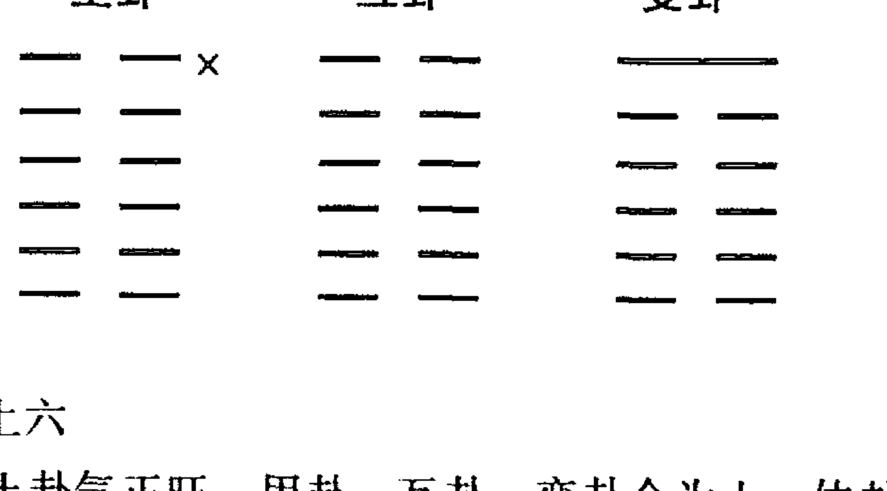
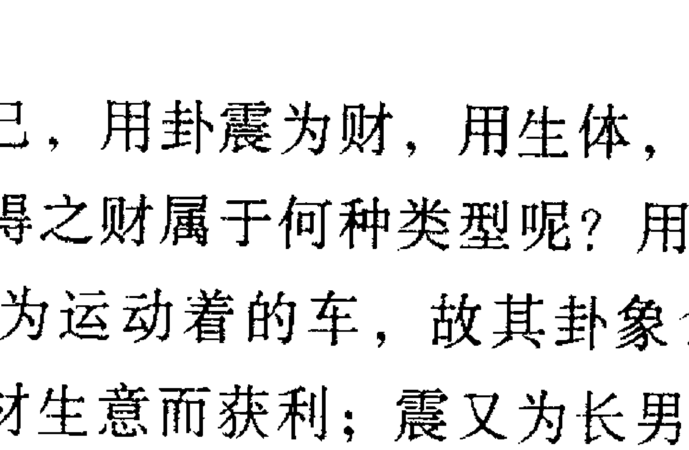
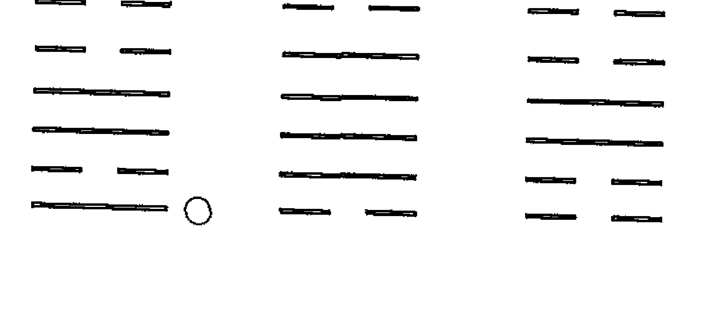
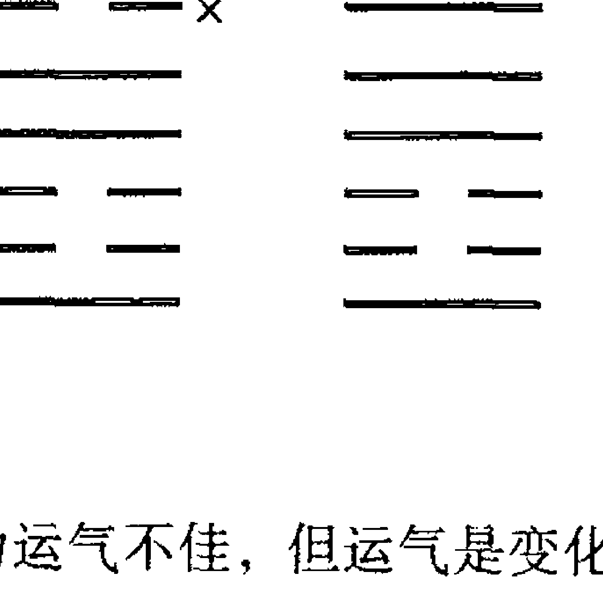
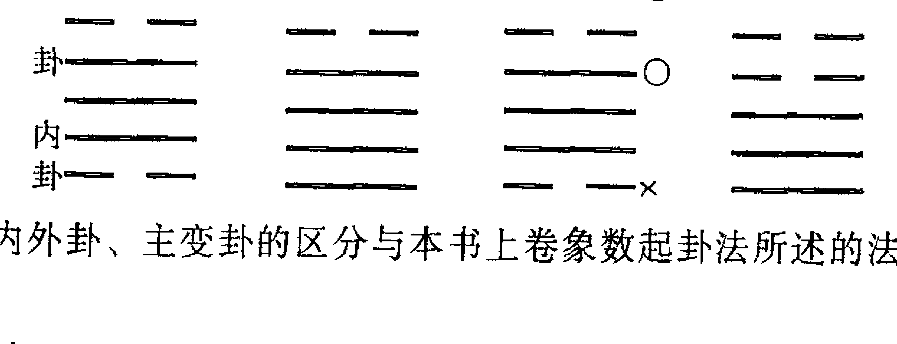
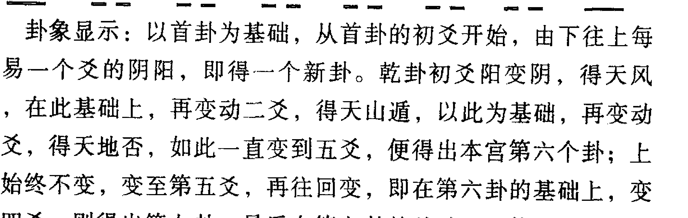

# 中国古代哲学研究文萃（3）

## 六爻玄机（八卦推断详解）

李顺祥 著  
主编：张志春  
新疆人民出版社

> 中华民族在创造灿烂文化的历史上，曾经产生了一批杰出的艺术大师，他们以自己的智慧，丰富了人类文化的宝库。

纵观古今八卦纳甲预测典籍，断卦皆只用月建日辰衡量卦爻五行旺衰强弱，虽多有准验，但不够精微，且时有误断。作者经过长期大量实践，创立了年月日时综合断卦法，使断卦的准确率提高到一个新的层次。八卦六爻纳干，历来是只会纳不会用，实际上，纳干在断卦中具有非常重要的作用，许多难断之卦，玄机正藏于此，这个千古之谜，也被当今预测学家李顺祥先生揭开。本书还将命理知识融于八卦预测中，在八卦生克制化理论中，历来只论三合不论三会，而实践证明，三会在八卦预测中同样存在。这些研究成果，在学术上弥补了八卦预测学的缺陷，进一步丰富和完善了八卦预测理论，在易学发展史上堪称一大贡献。上述研究成果均在本书首次公诸于世。

ISBN 7-288-08782-8  
总定价：（全五册）135.00元

## 图书在版编目（CIP）数据

六爻玄机／张志春主编．—乌鲁木齐：新疆人民出版社，2004.6  
（中国古代哲学研究文萃）

ISBN 7-288-08782-8

I. 六…　II. 张…　III. 周易－研究　IV. B221.5  
中国版本图书馆 CIP 数据核字（2004）第046838号

- 责任编辑：丁璇
- 责任校对：庞坤
- 封面设计：流野
- 出版：新疆人民出版社
- 地址：乌鲁木齐市解放南路348号
- 邮编：830001
- 发行：新疆人民出版社
- 印刷：广东科普印刷厂
- 开本：880×1230毫米 1/32
- 印张：62
- 字数：200千字
- 版次：2004年6月第一版
- 印次：2004年6月第一次印刷
- 印数：1-8000

ISBN 7-288-08782-8（全五册）总定价：135.00元

（如有印装质量问题影响阅读请与销售书店调换）

## 主编导言

党中央、国务院提出在二十一世纪实现中华民族伟大复兴的口号，许多专家都认为，伟大复兴不仅仅是在经济上、科技上、社会管理的进步上，首先应是民族文化的复兴上。因为文化是一个民族区别于另一个民族最稳定、最能体现民族性格的主要特征。而作为自然科学与社会科学高度概括与抽象的哲学，正是一个民族文化的灵魂和智慧的结晶。故而要复兴中华民族的优秀文化，必须首先弘扬中国古代哲学中的精华。

中国古代哲学的主干，是以《周易》为代表几千年来形成的易学思维科学体系。这种思维科学，或叫思维哲学，不仅从理论上作为指导思想、作为世界观、方法论，曾经在中国古代社会大的政治实践、经济实践、军事实践、科技文化实践等各个领域发挥过重要作用；同时，我们的祖先还依据象、数、理、用的独特思维方式，构建了许多预测思维模型，用于老百姓日常生活百事，以检验易学思辨理论的正确程度和准确率。这不能不说是中国古代哲学，或直接叫易学思维科学的一个重要特征。

二十世纪八十年代改革开放以来，在中国大地上掀起了学习、研究中国古代哲学、中国易学思维科学的热潮，出版了大量研究、用易的新作、新著。为了向海内外展示这二十余年来，中华民族批判继承传统优秀文化，研易、用易的新成果、新水平，我特地选择了九部有代表性的学术论著，编成《中国古代哲学研究文萃》，供广大读者学习、研究和收藏。

张志春  
2003年9月

## 自序

八卦上测天文、下测地理、中测人事，无所不能。精于此术者，胸藏玄机，时时事事皆能知己知彼，胜券在握。古曰：“运筹帷幄之中，决胜千里之外”，实非虚言。周易八卦，乃我国预测科学之精华，千古诸贤之智慧结晶，被有识者誉为宇宙代数学——以至二进制的创立、计算机的发明皆根源于八卦。其预测天文、地理、人事的神奇功能，更是现代高科技也望尘莫及。而无知者却视之为迷信，大肆反对，虽不如十六世纪法兰西教会扼杀哥白尼“日心说”那样惨烈，却也给预测科学的发展设置了很大的障碍。但科学的光辉是罩不住的，八卦预测的神奇功能有力地证明了自身的道理，吸引着千万学者，以至近年来迅速在海内外掀起了空前的周易热潮。可以预言：八卦预测和其他各门类的术数预测科学将会如雨后春笋般地发展，它将渗透社会科学、自然科学和社会民众的日常生活，成为人们行动的高参，成为经济建设和社会发展之舟的航标。预测科学的发展，必将为其他各门科学注入新鲜的健康血液，并起到先导作用。

然而，八卦预测科学虽然古老，却由于种种偏见，始终未能登上科学的大雅之堂，全赖历代少数预测学家苦心维系，得以薪火相传。但因自古的门派观念，难免相互保守，以致许多宝贵的预测精华鲜为人知。当今易学热潮乍起，各种术数预测书籍如汗牛充栋，纷纷应市，但大多杂而不精，使初学者不得要领；更有惟利是图者，靠抄袭和东拼西凑而粗制滥造出所谓预测经典书籍，充斥书市，沽名钓誉，误人子弟，实为可恶。不可掩饰，八卦预测尚有许多新的学术项目急需开发研究，古人的某些理论亦需进一步完善，个别错误尚待纠正。纵观目前易学队伍，学习热情甚高，求索精神可嘉，但大多因既无适宜自学的教科书，又无明师指导，所以即使久学却也是会而不精，欲进不易，欲弃不舍。笔者在二十年来的专业预测中经常碰到这类彷徨的同行。多年来，承蒙了解笔者的众多易学同好错爱，对笔者的预测风格和预测思路备加推崇，纷纷要求我将自己的八卦预测思维方法及研究所得编成系统的资料公开发表，以解广大易学同好欲学无门之难。为了满足大家的要求，笔者于繁忙的预测工作中拼命挤出一些时间编成本书，但愿拙著能给广大易学爱好者在断卦思路上以有益的启发和诱导，更希望由此而使读者的卦技产生一个飞跃。

本著在编著过程中，深得弟子陈炫圻的大力协助，弟子罗建军也做了一些工作，在此一并表示感谢！

著者：李顺祥

## 目录

- 主编导言……张志春（1）
- 自序……李顺祥（3）

## 上卷 阴阳五行学说

- 第一章 阴阳五行基础知识（3）
  - 第一节 概说（3）
  - 第二节 五行特性（4）
  - 第三节 五行生克（6）
- 第二章 天干地支及五行旺衰（11）
  - 第一节 天干（11）
  - 第二节 地支（12）
  - 第三节 地支生克（14）
  - 第四节 干支纪时法（21）
  - 第五节 五行旺衰（25）
  - 第六节 八卦与五行生克旺衰（27）

## 中卷 象数预测法

- 第一章 象数基础知识（31）
  - 第一节 八卦释义（31）
  - 第二节 八卦万物类象（33）
  - 第三节 六十四重卦（45）
  - 第四节 卦位含义（47）
  - 第五节 爻数与爻位（48）
  - 第六节 卦的变化形式（49）
  - 第七节 先天八卦与后天八卦（52）
- 第二章 象数预测方法（53）
  - 第一节 起卦方法（53）
  - 第二节 体用互变生克法（57）
  - 第三节 卦气与生克（59）
  - 第四节 卦气克旺（59）
  - 第五节 体用生克与卦象含义（61）
  - 第六节 古法分类占断借鉴（64）
  - 第七节 外应（71）
  - 第八节 卦爻辞占断（77）

## 下卷 纳甲预测法

- 第一章 起卦纳甲（81）
  - 第一节 摇卦法（81）
  - 第二节 列卦法（82）
  - 第三节 八宫卦序（83）
  - 第四节 世应（86）
  - 第五节 纳支（90）
  - 第六节 纳干（99）
- 第二章 六亲 六神（101）
  - 第一节 六亲划分（101）
  - 第二节 六亲持世（102）
  - 第三节 六亲发动（104）
  - 第四节 六亲变化（104）
  - 第五节 六神（105）
- 第三章 用神 原神 忌神 仇神（108）
  - 第一节 用神（108）
  - 第二节 原神 忌神 仇神（109）
  - 第三节 伏神 飞神（121）
  - 第四节 用神两现（125）
- 第四章 月建 日辰（127）
  - 第一节 月建（127）
  - 第二节 月破（131）
  - 第三节 日辰（133）
  - 第四节 旬空（135）
- 第五章 动静 生克 冲合（138）
  - 第一节 动静（138）
  - 第二节 本爻与变爻生克（140）
  - 第三节 暗动与月破（142）
  - 第四节 动静之多寡（143）
  - 第五节 进退（146）
  - 第六节 爻之六合（149）
  - 第七节 爻之六冲（150）
  - 第八节 合冲并见（152）
  - 第九节 三合局（153）
  - 第十节 三会局（155）
- 第六章 卦爻特殊信息标志（159）
  - 第一节 游魂卦、归魂卦（159）
  - 第二节 六冲卦、六合卦（161）
  - 第三节 反吟（163）
  - 第四节 伏吟（165）
  - 第五节 三刑（168）
- 第七章 先贤纳甲预测精华借鉴（171）
  - 第一节 《黄金策·千金赋》注释（172）
  - 第二节 《碎金赋》《通玄赋》注释（190）
- 第八章 用神旺衰强弱与吉凶的判断（194）
- 第九章 纳甲预测法断卦步骤（198）
- 第十章 纳甲分类占断方法及实例（202）
  - 第一节 天气（204）
  - 第二节 财运（213）
  - 第三节 婚姻（226）
  - 第四节 功名 职业（236）
  - 第五节 疾病（246）
  - 第六节 应试（263）
  - 第七节 出行（267）
  - 第八节 行人（276）
  - 第九节 失物（283）
  - 第十节 官非 词讼（292）
  - 第十一节 流年运（301）
  - 第十二节 小结（312）

附录：按课卦例选登（314）

## 上卷 阴阳五行学说

### 第一章 阴阳五行基础知识

#### 第一节 概说

阴阳五行学说是八卦预测的理论依据，所以，研习八卦预测必须首先掌握阴阳五行生克制化的基本法则。

阴阳包括五行，五行含有阴阳。宇宙间的一切事物，根据其属性，可分为两大类，即阴类和阳类。“阳”具有刚健、向上、生发、展示、外向、伸展、明朗、积极、好动等特性；“阴”具有柔弱、向下、收敛、隐蔽、内向、收缩、含蓄、消极、喜静等特性。任何一个具体的事物又同时具有阴阳的两重性，即阴中有阳，阳中有阴。比如人分男女，男为阳，女为阴；男性阳刚，但同时又有脆弱的一面，即外刚内柔；女性阴柔，但同时又具有刚强抗争的性格，即外柔内刚。任何庞大的事物都逃不出阴阳的范畴，任何微小的事物又具有阴阳的两个方面。阴阳在一定条件下是可以相互转化的，物极必反的现象就是阴阳转化的一种表现形式。

阴阳学说是我国古代哲学的源流和基础。今天的唯物辩证法中的对立统一观点，与阴阳学说相一致。阴阳学说原理广泛应用于社会生活的每个领域，人们经常用它，只是有的不自知罢了。宇宙间万事万物，根据其特性，可以系统地分为五大类——金、木、水、火、土。这五类事物统称为五行。金、木、水、火、土并非指具体的五种单一事物，而是对宇宙间万事万物五种不同属性的抽象概括。读者必须跳出狭窄的“五行”圈子，全面领会五行的真正内涵，否则，在今后的术数研究中，就会受到狭隘思维的局限，穿凿附会，误入歧途。阴阳五行是一个抽象的概念，它是中国术数预测学的精髓。没有真正透彻地理解阴阳五行学说，就不可能达到术数预测的高深境界。对阴阳五行学说的理解和术数预测的实践是分不开的，二者相互补益；预测技术提高一步，对阴阳五行学说的理解就深一步；反过来说，对阴阳五行学说的理解越深，就越有利于预测技术的提高。许多术数研习者学到一定程度，就很难再上一个台阶，要害之一就在于没有透彻理解和掌握阴阳五行学说的精髓。须知：一切术数预测的理论基础皆是阴阳五行学说，基础不牢，是绝不可能达到玄妙之境的。希望读者扎扎实实地练好基本功，以后学起来障碍就少了。

#### 第二节 五行特性

五行特性是研究术数预测学必须掌握的基础课，它对研习八卦预测同样起着重要作用。命理与八卦同源于阴阳五行，在预测上有许多相似之处，如果能将命理知识融会于八卦预测中，可以大大提高八卦预测的具体性、细微度和准确度，望读者不要忽略这一点。五行特性有助于断卦时剖析人的性格特征，描述人的精神状态。

- 一、木的特性  
  木曰“曲直”。曲者，屈也；直者，伸也。故木有能屈能伸之性。木纳水土之气，可生长发育。故木又具有生发、条达、向上、修长、柔和、仁慈之性。木主仁。

- 二、火的特性  
  火曰“炎上”。炎者，热也；上者，向上也。故火有发热、温暖、向上之性。火具有驱寒、除湿、煅炼金属之能。火生于木，其势急，其情恭。火主礼。

- 三、土的特性  
  土曰“稼穑”。播种为稼，收获为穑。土具有载物、生化、藏纳之能，故土载四行，为万物之母，具贡献、厚重之性。土主信。

- 四、金的特性  
  金曰“从革”。从者，顺从、服从也；革者，变革、改革也。改革、变革必施以威折，故金具有能柔能刚、延展、变革、肃杀的特性。金主义。

- 五、水的特性  
  水曰“润下”。润者，湿润也；下者，向下也。故水具有滋润、向下、淹藏的特性。水主智。

五行特性在八卦预测中有辅助作用。读者可根据某一五行的特性进行模仿性的联想、发挥、举一反三，这样就能打开思路，诱发智慧，推导出更多、更细的信息。

#### 第三节 五行生克

- 一、概述

五行之间存在着相生相克的关系。生克是矛盾的两个方面，也就是阴阳的两个方面，所以说五行含有阴阳。相生相克是事物的普遍规律，是事物内部不可分割的两个方面。生克是相对的，没有克，也就无所谓生。有生无克，事物就会无休止地发展而走向极端，造成物极必反，由好变坏；有克无生，事物就会因被压制过分而丧失元气，走向衰败或灭亡。只有当生克达到相对平衡时，才有利于事物的稳步发展。

五行生克的相对平衡，就是事物矛盾的对立统一。这种平衡被打破，则“统一”也就随之被破坏。这一法则适用于宇宙间的万事万物。比如说民主和集中也是一对生克：民主是自由是生，集中是约束是克；过分自由就是无政府主义，势必导致社会混乱；约束过分，民众无半点自由，就会导致反抗，动摇社会制度。生克平衡为贵的例子，举不胜举。希望读者对五行生克有一个比较明确、全面的认识。生与克不过是两种概念、两种名称，千万不要把生与吉划等号，也不要把克与凶划等号。需要生时，生就是吉；需要克时，克也是吉；不宜克时，克就是凶；不宜生时，生也是凶。生与克就是阳与阴的关系，我们不能说阳都为吉，阴都为凶。阴阳生克与吉凶的判断标准只能看是否符合需要，是否适宜。学过命理的人是懂得这个道理的，但许多人往往却不会把这个道理用在八卦预测学上，以致片面认为八卦用神逢生为吉，遇克为凶，也不分析是否生得过分或克得适宜，结果预测中难免出些错误，却又找不到原因。在此提示读者在思路上要开阔一些，再往后学，你就会知道命理用于八卦中的妙处。

- 二、五行相生

五行之生，是五行中某一行（如木）对另一行（如火）具有促进、助长性的施与作用。这两行又分主生者（如木）和受生者（如火）。主生者力量被泄弱，受生者力量得到加强；主生者施与，受生者吸纳。

五行相生的关系是：木生火、火生土、土生金、金生水、水生木。

五行相生分真生和假生。

真生，指主生者有力量生受生者，同时受生者也有力量吸纳主生者的施与。这必须是主生者和受生者都不太弱，主生者的力量不能过分超过受生者的力量。木能生火，必须是木、火皆有气，这样的木生火才是真生。如果火太弱接近熄灭，火就无力吸纳木之气而使火旺。这就好比一个年老体衰、濒临死亡的重病者，纵有玉液琼浆或珍贵良药，他也难以吞咽，故只有渐渐等死。主生者力量太弱无力生受生者，或受生者力量太弱无力吸纳主生者之气，这两行之间的生为假生。这就是人们常说的“心有余而力不足”。

受生者相对太弱而不受生者，按五行归类则为：

- 木赖水生，水多木漂；
- 水赖金生，金多水浊；
- 金赖土生，土多金埋；
- 土赖火生，火多土焦；
- 火赖木生，木多火塞。

主生者太弱，受生者太旺，则又表现为：

- 木能生火，火多木焚；
- 火能生土，土多火晦；
- 土能生金，金多土虚；
- 金能生水，水多金沉；
- 水能生木，木多水缩。

由此可知，主生者与受生者力量悬殊太大，都是假生。假生实质上等于克，是克的一种特殊表现形式。一般初学者对真生的理解和运用较为容易掌握，但对假生的理解、掌握和运用就稍微难一些。首先必须搞清楚什么程度为太旺，什么程度又为太弱。希望读者仔细体悟，深刻理解并牢牢掌握上述假生的十种形式和实质，为今后的实际预测打好坚实的基础。

##### 三、五行相克

五行之克，就是一行对另一行的制约（牵制、抑制等）作用，克也分主克与受克。主克者制约对方，受克者受制于对方。主克者的力量因行克而被消耗，受克者的力量因受克而被抑制、损失。相对来说，主克者消耗的力量较小，受克者损失的力量较大（反克例外）。比如用刀砍木，刀主克，木受克，刀比木硬，刀不过把刃砍钝，而木却被砍折，二者的受损程度悬殊很大。

木克土、土克水、水克火、火克金、金克木。

克又分正克、反克和重克。正克是指主克者力量克制受克者，就是通常所说的木克土、土克水、水克火、火克金、金克木。反克是指主克者本身力量大小根本不足以克制对方，而反被对方所制约。比如水是克火的，但要用一杯水去浇灭熊熊大火，不但止不住火势，泼进去的水反而一下子就被大火烧干，化为乌有。这就是人们常说的以强敌弱的道理。

木本克土，土重木折；土本克水，水多土流；水本克火，火多水干；火本克金，金多火熄；金本克木，木坚金缺。

重克，是指主克者太强，受克者太弱，克的结果，使受克者遭到极其严重的损伤，造成毁灭性的结局。因为太弱的五行，好似风中残烛，遇上狂风席卷，岂有不灭之理。重克归纳起来表现为：

木弱逢金，必被砍折；金弱逢火，必见消熔；火弱逢水，必至熄灭；水弱逢土，必为淤塞；土弱逢木，必遭倾陷。

##### 四、五行亢旺

事物发展到了旺盛的极点，就会朝着相反的方向转化，这就是物极必反。在五行学说中，我们把它称为“亢旺”。导致亢旺的条件，必须是自身旺盛至极，又无别的力量对其进行有效的制约。旺与亢旺的界限，有时很难区分，往往只是毫厘之差，但若不能精确判别，在预测中就会得出错误的结论。亢旺的规律，主要是用于八卦预测学中的特殊卦例和命理学的特殊格局，这是比较复杂的问题。只有牢固掌握基础知识，在弄通五行生克制化的基础上，才能真正领悟特殊情况下关于亢旺的特殊规律。五行亢旺的表现形式为：

木过则顽；火炽则烈；土厚则壅；金刚则折；水狂则溢。

##### 五、五行生克小结

从前述的五行生克中可以看出，在生克这个对立统一的矛盾中，无论是生得过分还是克得过分，都会因对立而打破统一，或者叫做打破五行生克的相对平衡。打破平衡，事物就会向一方倾斜发展。为了维持相对平衡，生与克要相互牵制。当不能相互牵制时，平衡被打破，这时事物就出现了新的变化，这种变化就是人们常说的吉凶。

五行生克是八卦预测学的最基础也是最重要的理论，是八卦的中枢。所以，读者务必细心体悟，牢固掌握，不可放过一字一句。五行取象于实际生活，五行生克学说自然也与实际生活中的事理相吻合。所以，建议读者将五行生克之理与实际生活中的各种事理有机地结合起来，细心地比较、模仿，开通思路，展开联想。宇宙万事万物皆逃不出阴阳五行的范畴。

## 第二章

## 天干地支及五行旺衰

#### 第一节 天干

天干共十位——甲、乙、丙、丁、戊、己、庚、辛、壬、癸，所以称之为十天干。天干和地支一起，参与生克作用，八卦预测重地支，四柱预测则干支并重。纵观古今，一般研习八卦的人，都纯粹抛开天干，其实这是一种很大的疏失。

天干与阴阳五行的关系为：

- 甲、丙、戊、庚、壬为阳干，乙、丁、己、辛、癸为阴干；
- 甲乙属木，甲为阳木，乙为阴木；
- 丙丁属火，丙为阳火，丁为阴火；
- 戊己属土，戊为阳土，己为阴土；
- 庚辛属金，庚为阳金，辛为阴金；
- 壬癸属水，壬为阳水，癸为阴水。

天干的生克与五行生克一致。即：甲乙木生丙丁火；丙丁火生戊己土；戊己土生庚辛金；庚辛金生壬癸水；壬癸水生甲乙木。

甲乙木克戊己土；丙丁火克庚辛金；戊己土克壬癸水；庚辛金克甲乙木；壬癸水克丙丁火。

人们都熟悉物理学上同性相斥、异性相吸的规律，五行也有这个规律。所谓同性，就是阴见阴（如乙见乙，乙见丁等）、阳见阳（如甲见甲，甲见丙等）；异性就是阳见阴（如甲见乙，甲见丁等）、阴见阳（乙见甲，乙见丙等）。同性相克力较大（克力+斥力），异性相克力相对较小（克力-吸力）。

#### 第二节 地支

地支共十二：子、丑、寅、卯、辰、巳、午、未、申、酉、戌、亥。故统称为十二支。

##### 一、地支序数

- 子 1
- 丑 2
- 寅 3
- 卯 4
- 辰 5
- 巳 6
- 午 7
- 未 8
- 申 9
- 酉 10
- 戌 11
- 亥 12

##### 二、地支阴阳五行

奇为阳，偶为阴。故子、寅、辰、午、申、戌为阳；丑、亥、酉、未、巳、卯为阴。

寅卯属木，巳午属火，申酉属金，亥子属水，辰戌丑未属土。

##### 三、地支与四时方位

寅卯属东方木，巳午属南方火，申酉属西方金，亥子属北方水，辰戌丑未为四隅之土。

寅卯辰司春之令，巳午未司夏之令，申酉戌司秋之令，亥子丑司冬之令。

##### 四、十二支配月建

正月建寅，二月建卯，三月建辰，四月建巳，五月建午，六月建未，七月建申，八月建酉，九月建戌，十月建亥，十一月建子，十二月建丑。这里的月份以农历（夏历）为准。农历月份又是以十二节令来划分的。不要把每月初一至三十（小月廿九）看成八卦预测学上的某一月。比如九七年正月初一至二十七属寅月，正月二十七交惊蛰，故二十七至三十属卯月。上一个节令起至下一个节令止为一个月，如立春起至交惊蛰止为正月。十二月与节令的对应关系如下表：

| 月份 | 正月 | 二月 | 三月 | 四月 | 五月 | 六月 | 七月 | 八月 | 九月 | 十月 | 冬月 | 腊月 |
|---|---|---|---|---|---|---|---|---|---|---|---|---|
| 月建 | 寅 | 卯 | 辰 | 巳 | 午 | 未 | 申 | 酉 | 戌 | 亥 | 子 | 丑 |
| 节令 | 立春 | 惊蛰 | 清明 | 立夏 | 芒种 | 小暑 | 立秋 | 白露 | 寒露 | 立冬 | 大雪 | 小寒 |

##### 五、十二支与生肖、时辰及人体器官的对应关系

| 地支 | 生肖 | 每日时间 | 内五行 | 外五行 |
|---|---|---|---|---|
| 子 | 鼠 | 23—1 | 膀胱三焦 | 耳 |
| 丑 | 牛 | 1—3 | 脾 | 胞肚 |
| 寅 | 虎 | 3—5 | 胆 | 手 |
| 卯 | 兔 | 5—7 | 肝 | 指 |
| 辰 | 龙 | 7—9 | 胃 | 肩胸 |
| 巳 | 蛇 | 9—11 | 心 | 面、咽齿 |
| 午 | 马 | 11—13 | 小肠 | 眼 |
| 未 | 羊 | 13—15 | 脾 | 脊梁 |
| 申 | 猴 | 15—17 | 大肠 | 经络 |
| 酉 | 鸡 | 17—19 | 肺 | 精血 |
| 戌 | 狗 | 19—21 | 胃 | 命门腿足 |
| 亥 | 猪 | 21—23 | 肾、心包 | 头 |

#### 第三节 地支生克

五行之间的作用归结起来就是生克。十二支属于五行的范畴，相互之间的作用自然不外乎生克。由于地支中藏干较多，其气不专一，地支间的生克就表现出许多形式。自古以来，把这些形式分别称作：生、克、泄、耗、刑、冲、合、害、会、拱、扶（助）、制、化；后来简称为“生克制化刑冲合害”或“生克制化”，这个法则在纳甲预测法中十分重要。

##### 一、地支生克

寅卯生巳午火，巳午火生辰戌丑未土，辰戌丑未土生申酉金，申酉金生亥子水，亥子水生寅卯木。  
寅卯木克辰戌丑未土，辰戌丑未土克亥子水，亥子水克巳午火，巳午火克申酉金，申酉金克寅卯木。

十二支生克与五行生克之理完全一致。只是这种生或克不像天干那样单纯，由于地支藏干五行不一致，故往往生中有克，克中有生。

##### 二、地支合会

###### （一）地支六合

子丑合化土，寅亥合化木，卯戌合化火，辰酉合化金，巳申合化水，午未合化土，共六组，故称为六合。

地支相合也是阴阳相合。合分为生合与克合。丑与子、卯与戌、巳与申为克合，合中有克。克合有强行相合的意思。丑土凭借自己强旺之力克制子水，子水受到制约不得不从；卯戌合、巳申合道理一样。在克合中，由于二者异性相吸，虽五行相克，却是对立统一，虽有怨，亦有情。亥寅、辰酉、午未之合为生合，二者异性相吸，而且五行相生，可谓情投意合，如胶似漆。在五行力量相等的条件下，生合比克合更牢固，合力更大，而且生合也比克合更容易成化。

地支六合中，相合二支的藏干皆具有相生相助之干。丑中辛癸生助子中癸水，亥中壬甲生助寅中甲木，卯中乙木生戌中丁火，辰中戊土生酉中辛金，巳中庚金生助申中壬水，午中丁己生助未中己土。这含有“同气相求，同声相应”之意。

地支合化，实质上就是一支对另一支五行力量的生助、抑制或引化。如子丑合化土，子水的力量被丑土抑制；寅亥合化木，亥水生助寅木，亥的力量就被寅木引化。六合的结果，使相合两支的力量与未合时发生改变，所以合的实质仍不外乎是生克。

###### （二）地支三合局

寅午戌三合火局，亥卯未三合木局，申子辰三合水局，巳酉丑三合金局。

寅中藏丙火，寅为火长生之地，午乃火之本气，为火帝旺之所，戌中藏丁火，为火之墓库。从初生（长生）到帝旺至墓库收藏，是事物发生、发展、归宿的三个主要环节。这三个环节自始至终有利于事物本身，故“生旺墓”一气构成三合局。寅午戌三合局如此，其余三合木局、三合水局道理一样，只是三合金局稍有不同。

三合局的中间这个字称为“中神”，是合局的核心。三合局的中神，前面有长生，后面有墓库收藏（储蓄力量），前呼后拥，聚集成一股强大的力量，所以三合局比单独一个中神的力量强大、稳固。

地支合局里还有一种形式，称为半合。寅午半合，寅为午长生之地，故称为生地半合；戌为午之墓地，故称为墓地半合。生地对中神有生之力，而墓地对中神有收敛作用，故在一般情况下，生地半合之力大于墓地半合之力（但半合金局的“酉丑”墓地半合之力通常大于“巳酉”生地半合）。半合局实际上是残缺的合局，所以其力量小于完整的三合局。

无中神者不为半合局（如寅戌），但当中神（如午）出现时则可以构成三合局（寅午戌）。寅戌之类，可称为“闸局”或“拱局”。

###### （三）地支三会局

寅卯辰三会东方木局，巳午未三会南方火局，申酉戌三会西方金局，亥子丑三会北方水局。

如木旺于春，寅司孟春之令，为木之本气。三者一气相连，将木之旺气会聚在一块，不需水来生，就十分强旺，好比群英聚会，故称为三会东方木局。其余三会局同理。

三会局（如寅卯辰）的力量大于同类三合局（如亥卯未）的力量。

###### （四）合化

即地支合会以后其原来的特性有所变化。这种变化分为抑制和转化（引化）两种。如申子辰三合水局成化后，申、辰原来的特性被转化为水的特性，与子合成旺水，加强了水的特性。亥卯未三合木局成化后，亥的特性被转化为木的特性，未的特性受到木的抑制而不能显现出未土原来的特性。其他六合、三会成化后的道理一样。

##### 三、地支之冲

子午相冲，丑未相冲，寅申相冲，卯酉相冲，辰戌相冲，巳亥相冲，共六组，故称为六冲。

地支六冲与天干冲的道理一样，也是同性相斥、五行不和、方位对冲。如午火属阳位南，子水属阳居北，二者同性相斥，水火相克，南北对冲。

冲为对立、排斥、相击之意。六冲本身两支相克，再加上对立、相击的排斥力，所以冲比克力量大。这大出的力量来自于同性之间的排斥力。假设子的力量为10，午的力量为6，异性合力为1，同性斥力为1，则子克午后子水余力=10－6＋1=5，子冲午后子水余力=10－6－1=3，主冲者耗去的力量比主克者耗去的力量大。反过来说，被克者受损较小，被冲者受损较大。这里举这么一个例，假设的数字只是为了形象说明冲与克的力量差异，请不要把子冲午之力看作比子克午之力就刚好大“2”，这个“2”到底代表多少，应针对具体的节令和整个卦的组合来定。

为了加深理解，我们可以把相克比作夫妻（异性）相斗，手下留情；把冲比作情敌（同性）相见，分外眼红。

##### 四、地支六害

子与丑合，午冲子而破合，此为午害丑；午与未合，丑冲未而破合，此为丑害午，故丑午相害。同理可推出其余五组相害。地支六害为：

- 子未相害
- 丑午相害
- 寅巳相害
- 卯辰相害
- 申亥相害
- 酉戌相害

##### 五、地支相刑

子卯相刑，为无礼之刑；寅刑巳、巳刑申、申刑寅，为恃势之刑；丑刑戌、戌刑未、未刑丑为无恩之刑；辰见辰、午见午、酉见酉、亥见亥为自刑。

刑的意义，解释之一。我根据地支相刑的五行关系和大量的实际命例卦例分析总结出，刑就是一种克。有人会问，子生卯，寅生巳，丑未戌同类为相助，辰午酉亥自见也为比和，这些都是生，为何说是克？这实质上就是前面“五行相生”一节里讲的假生，假生反而为克。也就是说，当两者力量太悬殊时，主生者太弱不能生，或受生者太弱不受生。子生卯，子水太强卯木太弱为水多木漂，卯木太强子水太弱则为木多水缩；寅刑巳的道理一样。丑未戌三刑、辰午酉亥自见皆为同类相助，当其本身已经很强旺时，再遇相助而增大力量，就导致了物极必反即亢旺，亢旺在一般情况下为克。至于巳刑申、申刑寅，本身就是一种五行相克的关系，容易理解。

综上所述，刑就是克，是克的一种又一特殊表现形式。当刑旺忌神时，刑的结果会导致命运走向凶的一面。这样的刑便是一种妨害。产生刑的根源是五行力量的强弱悬殊或亢旺。因此，当相刑的两支或三支（巳刑申、申刑寅除外）力量不太悬殊时，以生助论而不以刑论；巳申相刑又相合，当合力较大时也论合不论刑。这一点在实际预测中十分重要，希读者一定牢牢掌握，否则差以毫厘，谬之千里。

由于刑的结果使五行严重失衡，因此容易导致灾祸，或伤残病亡，或官司牢狱。

子为卯之母，母子相刑，有失礼教，故为无礼之刑。子卯相刑而无制，为人不讲孝道，不遵礼节，六亲无情。

寅、巳、申各为木、火、金的临官之地，各持力量强旺而相刑，故称为恃势之刑。犯寅巳申三刑之人，多主性情操烈，不容他物，以强欺弱，孤独怪僻，幸灾乐祸。

丑未戌皆为土，同类应相亲相助，但同类又为比劫，有争竞之性，彼此争竞，激起旺气，各不相让，以至兄弟失和，恩将仇报，故称为无恩之刑。

辰午酉亥自见，为同类聚集，物极必反。主人贫贱暴虐，外善内毒，偏激自私，往往为达到自己的某种私欲而惹祸上身。

##### 六、地支的泄、耗、扶（助）、拱、制、化

- 【泄】如子生寅，子被泄气，即主生者泄气。
- 【耗】如申克卯，申需耗费力量，故为耗气，即主克者耗气。
- 【扶（助）】寅与卯，寅与寅，卯与卯相见，同属于木，故可相扶相助，故同类相见为相扶或相助。
- 【拱】三合局、三会局缺中间一字者为拱局。如申辰拱子，亥丑拱子。
- 【制】就是制约、牵绊、牵制、抑制之意。如子丑合而不化，但相互间因有合力而相互牵绊。又如子生寅，有戌克子，则子被戌制而削弱生寅之力；子冲克午，有未制子而削弱冲克午之力。再如原本有寅亥合，但又有申冲寅或旺土克亥水等，则会影响寅亥的合化，这种复杂的制约关系就是制，制就是克。
- 【化】通关、转化或化解之意。比如金木相战，有水通关，则金木相战的局势被化解，转而变成金生水、水生木的流通之势。这时的金不但不克木，反而生木的原神水，所以金就成了木之原神的原神。金就由木之敌变为了木之友。金克木无水通关，若有火能够克制金，就解了木受金克之围，火就起了化解金木相战之势的作用。当然这种化解不及通关转化好，因为火虽可制金但火同时又泄木之气，而不像水通关那样可以使木非但不受金克反而受益于金。其他五行之间的化同理。

化也是五行力量转换的一种损益形式，也就是生克。

从上述地支间的十三种关系中可以看到，任何一种关系都不外乎损益的范畴：损就是克，益就是生。比如泄、耗、刑、冲、害、制都属于损的范畴，为克；合、会、拱、扶（助）、化都属于益的范畴，为生。损益是相对一个主体而言的，这个主体受益，相对它的客体必然受损；而主体受损，相对的客体有的会受益，有的则同时受损（如子午冲）。所以上述地支间的各种关系和作用归纳起来就是生克。在以后具体分析一个卦时，把各种复杂的关系划分为生克两类，则许多复杂问题就可得到简化而条理分明，这样，吉凶也就易于判断了。

#### 第四节 干支纪时法

八卦是对时空的描述，八卦预测离不开时间因素。在阴阳五行学说中，是以干支进行纪时的，即以天干地支作为记录年、月、日、时的符号。十干与十二支配合共可组成六十对干支，常称为“六十甲子”。见下表：

| 十位\个位 | 1 | 2 | 3 | 4 | 5 | 6 | 7 | 8 | 9 | 10 |
|---|---|---|---|---|---|---|---|---|---|---|
| 0 | 甲子 | 乙丑 | 丙寅 | 丁卯 | 戊辰 | 己巳 | 庚午 | 辛未 | 壬申 | 癸酉 |
| 1 | 甲戌 | 乙亥 | 丙子 | 丁丑 | 戊寅 | 己卯 | 庚辰 | 辛巳 | 壬午 | 癸未 |
| 2 | 甲申 | 乙酉 | 丙戌 | 丁亥 | 戊子 | 己丑 | 庚寅 | 辛卯 | 壬辰 | 癸巳 |
| 3 | 甲午 | 乙未 | 丙申 | 丁酉 | 戊戌 | 己亥 | 庚子 | 辛丑 | 壬寅 | 癸卯 |
| 4 | 甲辰 | 乙巳 | 丙午 | 丁未 | 戊申 | 己酉 | 庚戌 | 辛亥 | 壬子 | 癸丑 |
| 5 | 甲寅 | 乙卯 | 丙辰 | 丁巳 | 戊午 | 己未 | 庚申 | 辛酉 | 壬戌 | 癸亥 |

六十甲子纪年可直接从万年历上查得。如1924年为甲子，1925年为乙丑，1926年为丙寅……每隔60年循环一次，则又1984年为甲子，1985年为乙丑，1986年为丙寅……

知道了年干，要推算这年各月的干支就容易了。因为每年十二个月的地支是固定的，所以只需给各月地支配上天干就行了。先看下表：

##### 年上起月表

| 月\年 | 甲己 | 乙庚 | 丙辛 | 丁壬 | 戊癸 |
|---|---|---|---|---|---|
| 正月 | 丙寅 | 戊寅 | 庚寅 | 壬寅 | 甲寅 |
| 二月 | 丁卯 | 己卯 | 辛卯 | 癸卯 | 乙卯 |
| 三月 | 戊辰 | 庚辰 | 壬辰 | 甲辰 | 丙辰 |
| 四月 | 己巳 | 辛巳 | 癸巳 | 乙巳 | 丁巳 |
| 五月 | 庚午 | 壬午 | 甲午 | 丙午 | 戊午 |
| 六月 | 辛未 | 癸未 | 乙未 | 丁未 | 己未 |
| 七月 | 壬申 | 甲申 | 丙申 | 戊申 | 庚申 |
| 八月 | 癸酉 | 乙酉 | 丁酉 | 己酉 | 辛酉 |
| 九月 | 甲戌 | 丙戌 | 戊戌 | 庚戌 | 壬戌 |
| 十月 | 乙亥 | 丁亥 | 己亥 | 辛亥 | 癸亥 |
| 冬月 | 丙子 | 戊子 | 庚子 | 壬子 | 甲子 |
| 腊月 | 丁丑 | 己丑 | 辛丑 | 癸丑 | 乙丑 |

只要知道了某年的年干，在表上就可直接查出该年任何一个月的月干。如1992年为壬申年，1997年为丁丑年，要查这两年三月（辰月）的月干，在表中查得为甲辰。经常在表上查，也不方便。于是，古人便总结出一个年上起月的歌诀：

> 甲己之年丙作初，乙庚之岁戊为头，  
> 丙辛之年寻庚上，丁壬壬寅顺水流，  
> 若问戊癸何处起，甲寅之上去寻求。

用这个歌诀在手掌上推月干很方便。比如甲戌年（1994年），以丙为该年第一个月（寅月）的月干，即正月为丙寅月。按照本书前面介绍的掌诀图，先在掌上寅位（食指第三指节下部）起丙，其余月份天干依序顺推为：卯月配丁，辰月配戊，巳月配己，午月配庚，未月配辛，申月配壬，酉月配癸，戌月配甲，亥月配乙，子月配丙，丑月配丁。其余年份各月的天干仿此。要推哪一个月，只要在手指上一掐就知道了。

月支又叫月令。令者，掌权司令也。它是衡量干支五行衰旺的首要标准。由于月令具有主宰一月五行的生杀之权，居统率地位，所以又叫提纲。

每日的干支也可直接从万年历查得。

每日十二个时辰的地支数也是固定不变的，按日干配上时辰天干即得十二时辰干支。见下表：

| 时\日 | 甲己 | 乙庚 | 丙辛 | 丁壬 | 戊癸 |
|---|---|---|---|---|---|
| 子 | 甲子 | 丙子 | 戊子 | 庚子 | 壬子 |
| 丑 | 乙丑 | 丁丑 | 己丑 | 辛丑 | 癸丑 |
| 寅 | 丙寅 | 戊寅 | 庚寅 | 壬寅 | 甲寅 |
| 卯 | 丁卯 | 己卯 | 辛卯 | 癸卯 | 乙卯 |
| 辰 | 戊辰 | 庚辰 | 壬辰 | 甲辰 | 丙辰 |
| 巳 | 己巳 | 辛巳 | 癸巳 | 乙巳 | 丁巳 |
| 午 | 庚午 | 壬午 | 甲午 | 丙午 | 戊午 |
| 未 | 辛未 | 癸未 | 乙未 | 丁未 | 己未 |
| 申 | 壬申 | 甲申 | 丙申 | 戊申 | 庚申 |
| 酉 | 癸酉 | 乙酉 | 丁酉 | 己酉 | 辛酉 |
| 戌 | 甲戌 | 丙戌 | 戊戌 | 庚戌 | 壬戌 |
| 亥 | 乙亥 | 丁亥 | 己亥 | 辛亥 | 癸亥 |

#### 第五节 五行旺衰

五行四时旺衰强弱，是判断卦中五行（尤其是用神）的根据。

五行是宇宙万事万物的抽象概括，它将宇宙万事万物分为五大类。每一类事物都有其自身的发生、发展、壮大、衰败、灭亡的过程，各类事物在不同的宇宙时空状态下其存在的状态也不同。

按照这一宇宙间客观的自然规律，人们通过长期观察、总结、验证，发现了如下规律：

##### 五行四时旺衰表

| 四时\五行 | 木 | 火 | 水 | 金 | 土 |
|---|---|---|---|---|---|
| 春 | 旺 | 相 | 休 | 囚 | 死 |
| 夏 | 休 | 旺 | 囚 | 死 | 相 |
| 季 | 囚 | 休 | 死 | 相 | 旺 |
| 秋 | 死 | 囚 | 相 | 旺 | 休 |
| 冬 | 相 | 死 | 旺 | 休 | 囚 |

为了便于读者理解、记忆，作如下解释：

旺——事物发展至鼎盛时期的状态。如木在春季，得时乘令，为一年四季最旺之时。

相——事物处于受生受益时期，正适宜发展的状态。如木于冬季水旺之时，吸纳水气（进气）而受益，为生长发育提供了条件，处于次旺状态。

休——事物因生另一事物而被泄其气而衰败。

囚——事物失去生的源泉又克制不了当令之事物，导致自身力量比“休”更弱的状态。如夏天之水，生水的金被当令之旺火重克，使水失去金之生助；水克火耗水之气，但又战不过旺火，故以失败告终，像战俘一样反被囚禁起来。

死——事物被力量极强旺的另一事物重克，元气伤尽，走向灭亡的状态。如冬季火被旺水重克而趋于熄灭。

旺、相、休、囚、死的旺衰次序为：旺为最旺，相为次旺，休为小衰，囚为中衰，死为最衰。

记忆规律：当令者旺，令生者相，生令者休，克令者囚，令克者死。

旺相休囚死的含义，读者可以从实际生活中的事理推导，就能加深理解，领悟其实质意义。

表中除春、夏、秋、冬四时外，还有一个“季”字，它是指辰、戌、丑、未四个月。辰、戌、丑、未土的性质和力量是有所别的，如水在辰、丑湿土之月的力量就比在戌、未燥土之月的力量大，其余木火金的力量在不同的土月也不一样，这将在以后详论。

#### 第六节 八卦与五行生克旺衰

##### 一、八卦与五行

乾兑属金，离属火，震巽属木，坎属水，艮坤属土。

##### 二、八卦生克

八卦相生关系：

震巽（木）生离（火），离（火）生艮坤（土），艮坤（土）生乾兑（金），乾兑（金）生坎（水），坎（水）生震巽（木）。

八卦相克关系：

震巽（木）克艮坤（土），艮坤（土）克坎（水），坎（水）克离（火），离（火）克乾兑（金），乾兑（金）克震巽（木）。

##### 三、八卦旺衰

卦气旺衰是推断吉凶的依据之一，八卦的卦气旺衰取决于时令和方位。其关系如下表所示：

| 八卦 | 五行 | 时令 | 方位 |
|---|---|---|---|
| 震 | 木 | 春 | 东 |
| 巽 | 木 | 春 | 东南 |
| 离 | 火 | 夏 | 南 |
| 坤 | 土 | 四季之月 | 西南 |
| 兑 | 金 | 秋 | 西 |
| 乾 | 金 | 秋 | 西北 |
| 坎 | 水 | 冬 | 北 |
| 艮 | 土 | 四季之月 | 东北 |

注：表中“四季之月”指辰、戌、丑、未月。

卦气同时受时令（季节）和方位的影响，如乾卦旺于秋季，若在西方占测得西方之金气则更旺；若在南方受方位之火克，卦气有所削减；在北方、东方卦气也有所减弱，但减弱的程度比南方低。反过来说，乾卦衰于夏季，若在南方更衰，居于西方则有所补益。

## 中卷

## 象数预测法

## 第一章

## 象数基础知识

#### 第一节 八卦释义

关于八卦的起源，在诸多易学书籍中都有介绍，本书就不再赘述。

严格地说，八卦是指八经卦。所谓经卦，是指由三个“—”或“--”符号组合成的卦。“—”称为阳爻，“--”称为阴爻。经卦的组成方式，可以是三个阳爻组合，可以是三个阴爻组成，也可以是两个阳爻一个阴爻或两个阴爻一个阳爻组成。这四种组合方式共能（也只能）组成八个不同的象，因而称之为八经卦。

对“卦”的释义，许慎《说文解字》云：“卦，所以筮也，从卜，圭声。”由此可知卦是具有占筮功能的。所谓筮，就是占卜，以预知未来之意。《周易正义》的作者孔颖达进一步解释了“卦”的含义：“卦者，挂也。言挂物象以示于人，故谓之卦。”就是说通过物象而告知人以整体，即用象寓义以示人。八经卦取象于宇宙间八大自然物象——天、地、雷、风、水、火、山、泽。

象征天，谓之乾；象征地，谓之坤；象征雷，谓之震；象征风，谓之巽；象征水，谓之坎；象征火，谓之离；象征山，谓之艮；象征泽，谓之兑。以上八大物象是从宏观的角度象征整个宇宙。宇宙是一个大天体，宇宙间的万事万物又分为无数的小天体。八卦可以象征宇宙这个大天体，也同样可以象征宇宙无数的小天体，这就是八卦“远取诸物，近取诸身，其小无内，其大无外”的功能。人也是一个小天体，所以八卦也可以取象于人事。《易经·说卦传》对此有比较具体的分类描述：

乾，健也；坤，顺也；震，动也；巽，入也；坎，陷也；离，丽也；艮，止也；兑，说也。

乾为马，坤为牛，震为龙，巽为鸡，坎为豕，离为雉，艮为狗，兑为羊。

乾为首，坤为腹，震为足，巽为股，坎为耳，离为目，艮为手，兑为口。

乾天也，故称乎父；坤地也，故称乎母；震一索而得男，故谓之长男；巽一索而得女，故谓之长女；坎再索而得男，故谓之中男；离再索而得女，故谓之中女；艮三索而得男，故谓之少男；兑三索而得女，故谓之少女。

乾为天、为圆、为君、为父、为玉、为金、为寒、为冰、为大赤、为良马、为老马、为瘠马、为驳马、为木果。

坤为地、为母、为布、为釜、为吝啬、为均、为子母牛、为大舆、为文、为众、为柄，其于地也为黑。

震为雷、为龙、为玄黄、为施舍、为大涂、为长子、为决躁、为苍莨竹（小青竹）。其于马也，为善鸣，为作足，为的颡。其于稼也，为反生。其究为健，为蕃鲜。

巽为木、为风、为长女、为绳直、为工、为白、为长、为高、为进退、为不果、为臭。其于人也，为寡发、为广颡、为多白眼，为近利市三倍，其究为躁卦。

坎为水、为沟渎、为隐伏、为矫揉、为弓轮。其于人也，为加忧、为心病、为耳痛、为血卦、为赤。其于马也，为美脊、为亟心、为下首、为薄蹄、为曳。其于舆也，为多眚。为通、为月、为盗。其于木也，为坚多心。

离为火、为日、为电、为中女、为甲胄、为戈兵。其于人也，为大腹，为乾卦（干燥之卦的意思）。为鳖、为蟹、为蠃、为蚌、为龟。其于木也，为科上槁。

艮为山、为径路、为小石、为门阙、为果蓏、为门阙、为指、为狗、为鼠、为黔喙之属，其于木也，为坚多节。

兑为泽、为少女、为巫、为口舌、为毁折、为附决。其于地也，为刚卤。为妾，为羊。

#### 第二节 八卦万物类象

宋代易占宗师邵康节对八卦万物类象进行了详细分类，为历代用卦象占测者所遵从和许多易占之书所辑录。熟悉并掌握八卦万物类象，是熟练运用卦象进行预测的基础环节，掌握的万物类象越多，预测时就越能得心应手，准确占断出既丰富又具体的信息。为存其原貌，现将邵康节《梅花易数·八卦万物类象》辑录于下：

##### 乾卦

- 【天时】天、冰、雹、霰。
- 【地理】西北方、京都、大郡、形胜之地、高亢之所。
- 【人物】君、父、大人、老人、长者、宦官、名人、公门人。
- 【人事】刚健勇武、果决、多动少静。
- 【身体】首、骨、肺。
- 【时序】秋、九十月之交，戊亥年月之时，五金年月日时。
- 【动物】马、天鹅、狮子、象。
- 【静物】金玉、宝珠、圆物、木果、刚物、冠、镜。
- 【屋宿】公府、楼台、高堂、大厦、驿宿、西北向之居。
- 【家宅】秋占宅兴隆，夏占有祸，冬占冷落，春占吉利。
- 【婚姻】贵官之眷，有声名之家，秋占宜成，冬夏不利。
- 【饮食】马肉珍味、多骨、肝肺、干肉、木果、诸物之首、圆物、辛辣之物。
- 【求名】有名，宜随内任、刑官、武职、掌权、天使、驿官，宜向西北之任。
- 【谋望】有成，利公门，宜动中求财，夏占不成，冬占多谋少遂。
- 【交易】宜金、玉、宝珠贵货，易成，夏占不利。
- 【求利】有财，金玉之利，公门中得财，秋占大利，夏占损财，冬占无财。
- 【出行】利于出行，宜入京师，利西北之行，夏占不利。
- 【谒见】利见大人，有德行之人，宜见贵官，可见。
- 【疾病】头面之疾，肺疾、筋骨疾、上焦疾，夏占不安。
- 【官讼】健讼，有贵人助，秋占得胜，夏占失理。
- 【坟墓】宜向西北，宜乾山气脉，宜天穴，宜高，秋占出贵，夏占大凶。
- 【方道】西北。
- 【五色】大赤色、玄色。
- 【姓字】带金旁者，商音，行位一四九。
- 【数目】一、四、九。
- 【五味】辛、辣。

##### 坤卦

- 【天时】阴云、雾气、冰霜。
- 【地理】田野、乡里、平地、西南方。
- 【人物】老母、后母、农夫、乡人、众人、老妇人、大腹人。
- 【人事】吝啬、柔顺、懦弱、众多、小人。
- 【身体】腹、脾、肉、胃。
- 【时序】辰戌丑未月、未申年月日时，八五十月日。
- 【静物】方物、柔物、布帛、丝绵、五谷、舆、釜、瓦器。
- 【动物】牛、百兽、牝马。
- 【屋宿】西南方、村店、田舍、矮屋、土阶、仓库。
- 【家宅】安稳、多阴气，春占宅舍不安。
- 【饮食】牛肉、土中之物、甘味、野味、五谷之味、芋笋之物、腹脏之物。
- 【婚姻】利于婚姻，宜税产之家、乡村之家，或寡妇之家，春占不利。
- 【生产】易产，春占难产，有损或不利于母，坐宜西南方。
- 【求名】有名，宜西南方或教官、农官守土之职，春占虚。
- 【交易】宜利交易，宜田土交易，宜五谷利、贱货、重物、布帛，静中有财，春占不利。
- 【求利】有利，宜土中之利、贱货重物之利，静中得财，春占无财，多中取利。
- 【谋望】利求谋、邻里求谋、静中求谋，春占少遂，或谋于妇人。
- 【出行】可行，宜西南行，宜往乡里行，宜陆行，春不宜。
- 【谒见】可见，利见多人，宜见亲朋或阴人，春不宜见。
- 【疾病】腹疾、脾胃之疾、饮食停滞、谷食不化。
- 【官讼】理顺，得众情，讼当解散。
- 【坟墓】宜向西南之穴、平阳之地、近田野，宜低葬，春不可葬。
- 【姓字】宫音带土姓人，行位八五十。
- 【数目】八、五、十。
- 【五味】甘。
- 【五色】黄、黑。

##### 震卦

- 【天时】雷。
- 【地理】东方、树木、闹市、大途、竹林、草木茂盛之所。
- 【身体】足、肝、发、声音。
- 【人物】长男。
- 【人事】起动、怒、虚惊、鼓噪、多动少静。
- 【时序】春二月、卯年月日时、四三八月日。
- 【静物】木竹、苇、乐器（竹木）、花草繁鲜之物、核。
- 【动物】龙、蛇、百虫、马鸣。
- 【屋舍】东向之居，山林之处，楼阁。
- 【家宅】宅中不时有虚惊，春冬吉，秋占不利。
- 【饮食】蹄、肉、山林野味、鲜肉、果酸味、菜蔬、鲤鱼（鱼）。
- 【婚姻】可，有成，声名之家，得长男之婚，秋占不利。
- 【求利】山林竹木之财，动处求财，或山林、竹木茶货之利。
- 【求名】有名，宜东方之任，施号发令之职，掌刑狱之官，有茶木税课之任，或闹市司货之职。
- 【生产】虚惊，胎动不安，头胎必生男，坐宜向东，秋不吉。
- 【疾病】足疾、肝经之疾、惊恐不安。
- 【谋望】可望可求，宜动中谋，秋占不遂。
- 【交易】利于成交，秋占难成，动而可成，山林、木竹茶货之利。
- 【官讼】健讼，有虚惊，行移取勘反复。
- 【谒见】可见，有宜山林之人，利见有声名之人。
- 【出行】宜行，利东方，利山林之人，秋占不宜行，但恐虚惊。
- 【坟墓】利于东向，山林中穴，秋不利。
- 【姓字】带木姓人，行位四八三。
- 【数目】四、八、三。
- 【方道】东。
- 【五味】酸味。
- 【五色】青、绿、碧。

##### 巽卦

- 【天时】风。
- 【地理】东南方之地，草木茂秀之所，花果菜园。
- 【人物】长女、秀士、寡妇之人、山林仙道之人、僧道。
- 【人事】柔和、不定、鼓舞，利市三倍，进退不果。
- 【身体】肱、股、气、风疾。
- 【时序】春夏之交，二五八之时月日，三月，辰巳月日时、四月。
- 【静物】木香、绳、直物、长物、竹木、工巧之器、臭、鸡毛、帆、扇、白。
- 【动物】鸡、百禽、山林中之禽、虫、蛇。
- 【屋舍】东南向之居、寺观楼台、山林之居。
- 【家宅】安稳利市，春占吉，秋占不安。
- 【饮食】鸡肉、山林之味、蔬菜酸味。
- 【婚姻】可成，宜长女之婚，秋占不利。
- 【生产】易生，头胎产女，秋占损胎，宜向东南坐。
- 【求名】有名，宜文职有风宪之力，宜为风宪，宜茶果竹木税货之职，宜东南之任。
- 【求利】有利三倍，宜山林之利、竹货木货之利，秋不利。
- 【交易】可成，进退不一，交易之利，山林交易，山林木茶之利。
- 【谋望】可谋望，有财可成，秋占多谋小遂。
- 【出行】可行，有出入之利，宜向东南行，秋占不利。
- 【谒见】可见，利见山林之人，利见文人秀士。
- 【疾病】股肱之疾、风疾、肠疾、中风、寒邪气疾。
- 【姓字】草木旁姓氏，行位五三八。
- 【官讼】宜和，恐遭风宪之责。
- 【坟墓】宜东方向，山林之穴，多树木，秋占不利。
- 【数目】五、三、八。
- 【方道】东南。
- 【五味】酸味。
- 【五色】青绿、碧、洁白。

##### 坎卦

- 【天时】月、雨、雪、露、霜、水。
- 【地理】北方、江湖、溪涧、泉井、卑湿之地、沟渎、池沼、有水之处。
- 【人物】中男、江湖之人、舟人、盗贼、匪。
- 【人事】险陷卑下、外示以柔、内存以利、漂泊不成、随波逐流。
- 【身体】耳、血、肾。
- 【时序】冬十一月、子年月日时、一六月日。
- 【静物】水带子、带核之物、弓轮、矫揉之物、酒器、水具、工栋、丛棘、藜、桎梏、盐、酒。
- 【动物】猪、鱼、水中之物、狐、水族。
- 【屋舍】向北之居、近水、水阁、江楼、茶酒肆、宅中湿地之处。
- 【饮食】猪肉、酒、冷味、海味、汤、酸味、宿食、鱼、带血、淹藏、有带核之物、水中之物、多骨之物。
- 【家宅】不安、暗昧、防盗、匪。
- 【婚姻】利中男之婚、宜北方之婚，不利成婚，不可在辰戌丑未月婚。
- 【生产】难产有险，宜次胎，男，中男，辰戌丑未月有损，宜北向。
- 【求名】艰难，恐有灾险，宜北方之任，鱼盐河泊之职，酒兼醋。
- 【求利】有财防失，宜水边财，恐有失陷，宜鱼盐酒货之利，防阴失、防盗。
- 【交易】不利成交，恐防失陷，宜水边交易，宜鱼盐货、酒之交易，或点水人之交易。
- 【谋望】不宜谋望，不能成就，秋冬占可谋。
- 【出行】不宜远行，宜涉舟，宜北方之行，防盗匪；恐遇险阻陷溺之事。
- 【谒见】难见，宜见江湖之人，或有水旁姓氏之人。
- 【疾病】耳痛、心疾、感染、肾疾、胃冷、腹泻、涸冷之疾、血病。
- 【官讼】有阴险，有失因讼、失陷。
- 【坟墓】宜北向之穴、近水傍之墓，不利葬。
- 【姓字】羽音点水旁之姓氏。
- 【数目】一、六。
- 【方道】北方。
- 【五味】咸、酸。
- 【五色】黑。

##### 离卦

- 【天时】日、电、虹、霓、霞。
- 【地理】南方、干亢之地、窑、灶、炉冶之所、刚燥厥地、其他面阳。
- 【人物】中女、文人、大腹、目疾人、甲胄之士。
- 【人事】文化之所、聪明才学、相见虚心、书事、美丽。
- 【身体】目、心、上焦。
- 【时序】夏五月、午火年月日时、三二七日。
- 【静物】火、书、文、甲胄、干戈、槁衣、干燥之物。
- 【动物】雉、龟、鳖、蚌、蟹。
- 【屋舍】南舍之居、阳明之宅、明窗、虚室。
- 【家宅】安稳、半善，冬占不安，克体主火灾。
- 【饮食】雉肉、煎炒、烧灸方物、干脯之体、熟肉。
- 【婚姻】不成，利中女之婚，夏占可成，冬占不利。
- 【生产】易生，产中女，冬占有损，坐宜向南。
- 【求名】有名，宜南方之职、文官之任，宜炉冶坑场之职。
- 【求利】有财宜南方求，有文书之财，冬占有失。
- 【交易】可成，宜有文书之交易。
- 【谋望】可以谋望，宜文书之事。
- 【出行】可行，宜动向南方，就文书之行，冬占不宜行，不宜行舟。
- 【谒见】可见南方人，冬占不顺，秋见文书考案才士。
- 【官讼】易散，文书动，词讼明辨。
- 【疾病】目疾、心疾、上焦、热病，夏占伏暑、时疫。
- 【坟墓】南向之墓、无树木之处、阳穴，夏占出文人，冬不利。
- 【姓字】带火字旁姓氏，行位三二七。
- 【数目】三、二、七。
- 【方道】南。
- 【五色】赤、紫、红。
- 【五味】苦。

##### 艮卦

- 【天时】云、雾、山岚。
- 【地理】山径路、近山城、丘陵、坟墓、东北方、门阙。
- 【人物】少男、闲人、山中人、童子。
- 【人事】阻隔、守静、进退不决、反背、止住、不见。
- 【身体】手指、骨、鼻、背。
- 【时序】冬春之月、十二月、丑寅年月日时、七五十月日、土年月日时。
- 【静物】土石、瓜果、黄物、土中之物、间寺、木生之物、藤生之瓜。
- 【动物】虎、狗、鼠、百兽、黔啄之物、狐。
- 【家宅】安稳、诸事有阻、家人不睦、春占不安。
- 【屋舍】东北方之居、山居近石、近路之宅。
- 【饮食】土中物味、诸兽之肉、墓畔竹笋之属、野味。
- 【婚姻】阻隔难成，成亦迟，利少男之婚，宜对乡里婚，春占不利。
- 【求名】阻隔无名，宜东北方之任，宜土官山城之职。
- 【生产】难生，有险阻之厄，宜向东北，春占有损。
- 【交易】难成，宜山林田土之交易，春占有失。
- 【谋望】阻隔难成，进退不决。
- 【出行】不宜远行，有阻，宜近陆行。
- 【谒见】不可见，有阻，宜见山林之人。
- 【疾病】手指之疾、胃脾之疾。
- 【官讼】贵人阻滞，官讼未解，牵连不快。
- 【坟墓】东北之穴、山中之穴、近路旁有石，春占不利。
- 【姓字】带土字旁之姓氏，行位五七十。
- 【数目】五、七、十。
- 【方道】东北方。
- 【五色】黄。
- 【五味】甘。

##### 兑卦

- 【天时】丽泽、新月、星。
- 【地理】泽、水际、缺池、废井，山崩破裂之地，其地为刚卤。
- 【人物】少女、妾、歌妓、伶人、译人、巫师、奴仆婢。
- 【身体】舌、口、喉、肺、痰、涎。
- 【时序】秋八月，酉年月日时，金年月日，二四九月日。
- 【静物】金刃、金类、乐器、废物、缺器之物、带口之物、毁折之物。
- 【动物】羊、泽中之物。
- 【屋舍】西向之居、近泽之居、败墙壁宅、户有损。
- 【家宅】不安、防口舌、秋占喜悦、夏占家宅有祸。
- 【饮食】羊肉、泽中之物、宿味、辛辣之味。
- 【婚姻】不成、秋占可成、有喜、主成婚之吉、利婚少女、夏占不利。
- 【生产】不利、恐有损胎、或则生女、夏占不利、宜坐向西。
- 【求名】难成、因名有损、利西之任、宜刑官、武职、伶官、译官。
- 【求利】无利有损，财利主口舌，秋占有财喜，夏占不利。
- 【出行】不宜远行、防口舌、或损失、宜西行，秋占有利宜行。
- 【交易】难有利、防口舌、有竞争、秋占有交易之财、夏占不利。
- 【谋望】难成、谋中有损、秋占有喜、夏占不遂。
- 【谒见】利行西方、见有咒诅。
- 【疾病】口舌、咽喉之疾、气逆喘疾、饮食不餐。
- 【坟墓】宜西向、防穴中有水、近泽之墓、或葬废穴、夏占不宜。
- 【官讼】争讼不已、曲直未决、因讼有损、防刑、秋占为体得理胜讼。
- 【姓字】带口带金字旁姓氏、行位四二九。
- 【数目】四、二、九。
- 【方道】西方。
- 【五色】白。
- 【五味】辛辣。

万物类象是根据预测的需要对宇宙万物进行合理取象的，随着社会的发展，《梅花易数·八卦万物类象》已远远不能概括现代社会纷繁复杂的物象及人事之象了，所以需要进一步的引申充实：

- 【乾卦】总统、首相、主席、总理、董事长、总经理、书记、厂长、独裁者、单位一把手、首府、政府机构、大城市、高级建筑、高级轿车、飞机、火车。
- 【兑卦】副手、少女、少妇、音乐界及演艺界人士、讲师、教授、广告公司、宣传器具、饭店、冷饮店、垃圾站、上端开口的物品、会场、刀具、枪械。
- 【离卦】中年妇女、法官、法院、文艺界人士、医生、医院、学校、书刊、报社、出版社、教会、中层干部、弹药、爆炸物品、女用化妆品。
- 【震卦】将领、军队、兵营、大炮、火箭、治安人员、公安局、派出所、足球、足球爱好者、飞机、飞行员、年轻人、电台、停车场。
- 【巽卦】寡妇、尼姑、教师、指挥者、技术员、气功、特异功能、练功者、商店、水果、菜园、木材站、花草树林、机场、码头、香烟、鸡肉。
- 【坎卦】中年男子、思想家、发明家、穷困者、匪盗、恶势力、劳教者、劳改场所、囚犯、囚室、酒店、冷饮店、下水道、水运、船舶、游泳者、游泳池、浴室。
- 【艮卦】青少年、官僚、僧尼、寺庙、台阶、丘陵、高楼、库房、矿山、监狱看守。
- 【坤卦】慈母、柔顺者、孕妇、农村、田地、民房、农民、群众、房地产及其经营者、农产品、农贸市场、野味。

这些八卦类象都是根据社会生活中物象和人事进行推衍出来的。事实上，大千世界，万事万物难以统计，读者在具体运用卦象预测时可根据八卦的基本卦象含义充分发挥联想，对任何事物都能配上相应的卦象。

#### 第三节 六十四重卦

以上仅仅是从八卦的角度而言，由于宇宙万物的多样性、变化性，仅仅用八经卦是远远不足以推测和描述宇宙万物纷繁复杂的运动变化情况的，所以易学先贤又将八经卦两两相重而衍生出更多内涵的卦象，称之为“别卦”或“重卦”。八经卦两两相重，共能（也只能）组成六十四个不同的卦象，故称之为六十四重卦，简称六十四卦。今天我们习惯称谓的八卦预测实际上是指用六十四重卦预测，六十四卦也被习惯称之为八卦，因为六十四卦中的任意一个卦总是由八个经卦中的某一个或两个卦象重叠而成，所以习惯上称之为八卦也说得过去。

重卦的称谓方法是在重卦卦名之前冠以上下经卦的卦象，如上卦为离下卦为艮的“旅”卦，因离象征火，艮象征山，故称之为“火山旅”；同理，上乾下坤的否卦，因乾象征天，坤象征地，故称之为“天地否”，如此等等。在六十四卦中，有八个重卦，其内外卦相同而不杂，叫做八纯卦，其称谓方法则以经卦与重卦之名合称，如两个乾经卦重叠称之为“乾为天”，两个坤经卦重叠称之为“坤为地”，其余仿此。八纯卦分别为：“乾为天、兑为泽、离为火、震为雷、巽为风、坎为水、艮为山、坤为地。”

关于六十四卦的排列次序《易经·序卦传》有很详细的解说，其次序为：

|  |  |  |  |
|---|---|---|---|
| 1 乾为天 | 2 坤为地 | 3 水雷屯 | 4 山水蒙 |
| 5 水天需 | 6 天水讼 | 7 地水师 | 8 水地比 |
| 9 风天小畜 | 10 天泽履 | 11 地天泰 | 12 天地否 |
| 13 天火同人 | 14 火天大有 | 15 地山谦 | 16 雷地豫 |
| 17 泽雷随 | 18 山风蛊 | 19 地泽临 | 20 风地观 |
| 21 火雷噬嗑 | 22 山火贲 | 23 山地剥 | 24 地雷复 |
| 25 天雷无妄 | 26 山天大畜 | 27 山雷颐 | 28 泽风大过 |
| 29 坎为水 | 30 离为火 | 31 泽山咸 | 32 雷风恒 |
| 33 天山遁 | 34 雷天大壮 | 35 火地晋 | 36 地火明夷 |
| 37 风火家人 | 38 火泽睽 | 39 水山蹇 | 40 雷水解 |
| 41 山泽损 | 42 风雷益 | 43 泽天夬 | 44 天风姤 |
| 45 泽地萃 | 46 地风升 | 47 泽水困 | 48 水风井 |
| 49 泽火革 | 50 火风鼎 | 51 震为雷 | 52 艮为山 |
| 53 风山渐 | 54 雷泽归妹 | 55 雷火丰 | 56 火山旅 |
| 57 巽为风 | 58 兑为泽 | 59 风水涣 | 60 水泽节 |
| 61 风泽中孚 | 62 雷山小过 | 63 水火既济 | 64 火水未济 |

还有从其他不同的角度进行排列卦序的方法，如“伏羲六十四卦次序图”“伏羲六十四卦方位图”等，读者可参看有关易经典籍。在实际预测中，六十四卦次序一般不常用，但用纳甲法进行预测，却离不开按“乾兑离震巽坎艮坤”八宫进行划分的编排次序，将在后面详细介绍。

#### 第四节 卦位含义

##### 一、方位

重卦的上下卦位置，在实际预测中有着重要的作用，根据卦位的不同，可以挖掘出许多具体详细的信息。如上卦位代表外面、远处、高处、上方、前面、明显等，则下卦位对应地代表里面、近处、低处、下方、后面、隐藏等；若把上卦位看成左，下卦则代表右。总之，上下卦位所代表的方位是一种相反的对应关系。比如测地震，外卦受月日之克，而内卦不受克，说明外地或远处有地震而内地或近处无地震；测身体之病，上卦受克而下卦得生，则病患部位多为上半身。当然，这也不是绝对的，还要参考上下卦的类象进行综合分析判断。

##### 二、阴阳刚柔动静

乾、坎、震、艮为阳卦，坤、离、巽、兑为阴卦，阳主刚主动，阴柔主静，所以上下卦有阴阳刚柔之别。如“地天泰”卦，上坤下乾，为外柔内刚、外阴内阳；“雷地豫”卦则为外阳刚内阴柔。如果内外卦阴阳属性相同，则内外属于一种平衡或平行关系。

卦的阴阳刚柔属性是推断人事动静刚柔特性的重要参考依据。

#### 第五节 爻数与爻位

##### 一、爻数

一个重卦由两个经卦组成，每个经卦三个爻，故一个重卦有六个爻，从下往上数，分别称为初爻、二爻、三爻、四爻、五爻、上爻。这种分法没有考虑爻的阴阳属性，如果按阴阳属性划分，则阴爻称“六”，阳爻称“九”。如“乾”卦，六个爻皆为阳爻，分别称为初九、九二、九三、九四、九五、上九；“既济”卦的六个爻从下往上分别称为初九、六二、九三、六四、九五、上六。

##### 二、爻位

重卦的内外卦有卦位之别，在一个重卦中，细分下来，还有爻位之别。

- 1. 天、地、人位：八卦是“天人合一”思想的形象反映，每个卦都有天位、地位、人位之分。在经卦中，上爻为天位，下爻为地位，中爻为人位；在重卦中，上面两爻为天位，下面两爻为地位，中间两爻为人位。天、地、人位分别又称为上、下、中位。
- 2. 阴阳之位：一个重卦有六个爻，初爻、三爻、五爻为阳位，因初、三、五为奇数，奇为阳；同理，二爻、四爻、上爻为阴位。爻位的阴阳与爻象的阴阳并不是一个含义，爻位阴阳以位置定，爻象阴阳以本身的属性定。一个卦中爻位与爻象的阴阳同步时，称阴阳得位，不同步时则称不得位。如“水火既济”卦，初、三、五爻为阳爻皆居阳位，二、四、上爻为阴爻皆居阴位，就为六爻阴阳皆得位。“乾”卦初、三、五爻为阳爻居阳位，为得位，二、四、上爻为阳爻居阴位，皆不得位。六十四卦中，只有“水火既济”卦六爻皆得位，“火水未济”卦六爻皆不得位，其余六十二卦则有的爻得位，有的爻不得位。在生克和旺衰一样的情况下，得位之爻的力量优于不得位之爻，用神得位增吉，忌神得位增凶，用神不得位减吉，忌神不得位减凶。
- 3. 贵贱之位：一卦中五爻为君位，为尊贵之位，与之对应的二爻则为卑贱之位。二者所代表的信息之象不同。
- 4. 对应之位：易经讲求同声相应，同气相求，一卦中，初爻与四爻相对应、二爻与五爻相对应、三爻与上爻相对应。凡六合卦，皆为初与四、二与五、三与上爻对应相合，就是这种关系的爻位体现。

其他还有一些爻位关系，在八卦预测中应用较少，就不列出。

#### 第六节 卦的变化形式

“变易”是《易经》的三大特点之一，宇宙万物无时无刻不在运动变化，而卦象的相应变化正是对宇宙复杂多变的事物的形象描述，因此，学习八卦预测法，必须知道卦象的一些基本变化形式。

##### 一、主卦、变卦

一般情况下，按照八卦的起卦方法（后有详述），通常都会得到两个重卦，首先得出的卦为主卦或本卦，根据动爻变化而得出的卦为变卦或之卦。比如按年月日时起得“火天大有”卦，四爻动，动则变，四爻阳变为阴，则得出一个新的卦为“山天大畜”。“火天大有”卦就为主卦，“山天大畜”卦就为变卦。

主卦代表事之始，变卦代表事之终（结果）。

##### 二、体卦、用卦

在主卦中，无动爻的经卦为体卦，有动爻的经卦为用卦。主卦代表测事的主体，用卦代表所测的事或客体。主体可为人、为物，客体为与主体有关的人或物或事。如一人起得主卦为“天地否”，初爻动，则上卦乾为体卦，下卦坤有动爻为用卦，“乾”就代表该人，“坤”就代表该人所测的事。又如某人起卦占房屋质量，得“天地否”卦，也是初爻动，上卦“乾”为体卦，下卦“坤”为用卦，但体卦就代表房屋而不代表人，用卦就代表房屋的质量。体用代表的具体人、事、物必须以具体的占测目标而定，切不可搞错。严格地说，除体卦以外的卦都可看作用卦。

##### 三、互卦

在一个重卦中，取三、四、五爻为一个新的上卦，再取二、三、四爻为新的下卦，重叠而组成一个新的重卦，称之为互卦。如“否”卦，取三、四、五爻得巽经卦为上卦，取二、三、四爻得艮经卦为下卦，则组成一个互卦：“渐”。互卦的上卦称为上互或外互，下卦称为下互或内互，根据上下互卦与体用的对应位置又有体互、用互之分。

互卦代表事情进行的中间过程。

##### 四、综卦

将一个重卦颠倒过来，就得到一个综卦。如“无妄”的综卦为“大畜”；“家人”的综卦为“睽”。在六十四卦中，共有二十八对五十六个综卦，剩下的八个卦颠倒之后卦象不会改变，称为错卦，这八个错卦为：乾、坤、离、坎、颐、小过、中孚、大过。

##### 五、旁通卦

一卦六个爻的阴阳全部改变所得出的卦称为旁通卦。如“天风姤”的旁通卦为“地雷复”，“水火既济”的旁通卦为“火水未济”。旁通卦有相反相成相通之内在联系，通过这些关系可挖掘卦中的深层次信息。

##### 六、大象卦

将一个重卦的六个爻按两爻一组划分，可得上中下三组，如果每组之内的两个爻阴阳各自相同，则可将两爻看成一个爻，于是就可以得出一个新的“经卦”，由于这个“经卦”实际上并非三个爻而有六个爻，所以称为大象卦。如“小过”为大坎卦，“中孚”为大离卦，“临”为大震卦。大象卦与八经卦有相似之含义，但程度上比八经卦更深。

以上这几种卦的变化形式在实际预测中较常用，尤其是主卦、体卦、用卦、互卦、变卦用得最多。

#### 第七节 先天八卦与后天八卦

先天八卦传说为伏羲所创，其八卦的序数为乾1、兑2、离3、震4、巽5、坎6、艮7、坤8，称为先天八卦数；八卦方位为乾南、坤北、离东、坎西、兑东南、艮西北、巽西南、震东北。因其为伏羲所创，故又称为伏羲八卦。后天八卦传说为周文王所创，所以也称为文王八卦。其八卦序数为坎1、坤2、震3、巽4、中5、乾6、兑7、艮8、离9，称为后天八卦数。

先后天八卦原来并无图形，后来宋代大易学家邵康节根据《易经》对八卦的文字描述而绘制成图，则又进行了改制，取的是先天八卦序数、后天八卦方位合成的。为什么要这样配合，邵康节在《皇极经世》中解释说：“先天非后天，则无以成其变化；后天非先天，则不能以自行也。”就是取先天之根本加上后天之变化相互融合之意，即先天为体，后天为用。

### 第三章 象数预测方法

#### 第一节 起卦方法

有卦才可预测，预测必先起卦。起卦方法按大类分有两种：一是以数起卦，二是以象起卦。细分下去，具体的方法很多，下面是常用的一些起卦方法：

- 一、按时间起卦

此法最常用，并且方便、准确。以夏历为准，将年、月、日三数之和除以8，取余数为上卦数；将年、月、日、时四数之和除以8，取余数为下卦数。若余数为0，则作8数。按先天八卦数对应之卦则可得出上下卦。为了分别上下卦的体用，需求出一动爻，动爻所在之经卦为用卦，无动爻的经卦为体卦。动爻的算法是：以年、月、日、时四数之和除以6，其余为动爻数。若余数为0，视为6数。如动爻数为1或2、3，则下卦为用卦；若动爻数为4或5、6，则上卦为用卦。动则变，动爻的阴阳属性改变，则会得出一个新的卦象来，即为变卦。年数取年支数：

子-1，丑-2，寅-3，卯-4，辰-5，巳-6，午-7，未-8，申-9，酉-10，戌-11，亥-12。如甲戌年，年数为11。

月数取月份数：正（寅）月-1，二（卯）月-2，三（辰）月-3……十一（子）月-11，十二（丑）月-12。

日数取日期数，如三月二十八日，取数为28；十二月二十八日，取数也为28。时数取时支数，与年数取法相同，如子时为1数，丑时为2数……戌时为11数，亥时为12数。

例：以夏历一九九七年十一月初八戌时起卦，年干支为丁丑，丑为2数，月、日、时数依次为11、8、11。（2+11+8）÷8余5，为上卦数，5数代表巽；（2+11+8+11）÷8余0，0作8算为下卦数，8数代表坤，则主卦为“风地观”；（2+11+8+11）÷6余2，二爻动，爻在下卦，坤为用卦，巽为体卦；变卦为“风水涣”，互卦为“山地剥”，艮为体互，坤为用互。

时间起卦取数以月份为主，但断卦必须以夏历节令为准。如上例，一九九七年十一月初八十点零二分交大雪节，若在该月初八十点整起卦，月份取11数，断卦则以亥月为准。若在该日或时起卦如上例，月份数仍取11数，断卦时以子月为准。时间起卦年支数以当年支为准。断卦用的年干支以立春划分。如一九九〇年正月初九十点十五分立春，起卦时一九九〇年正月初八仍取一九九〇年地支午即7数，断卦则应以一九八九（己巳）年干支为准；又如一九九〇年腊月二十日十六点零四分又是一九九一年立春，故一九九〇年腊月二十日十六点零四分之后的当年其余10天，起卦时的年支数都算作一九九〇年，年支午7数，断卦时则应取一九九一年干支辛未。日期数因不考虑地支因素，仍按实际数直接取。

> （注：日期交接以亥时为准。如取夜子时卦，日数取当日之数而不取次日之数。）

- 二、按数字起卦

一组数若数字个数为偶数，则平分为二，以前一半数字之和除以8取余数得上卦，以后一半数字之和除以8取余数得下卦，上下卦数加时辰数除以6取余数为动爻数。若一组数其数字个数为奇，则分时前部分数字比后部分少一个数字。

例：按2856起卦，（2+8）÷8余2，（5+6）÷8余3，得“泽火革”卦；按28567起卦，（2+8）÷8余2，（5+6+7）÷8余2，得“兑为泽”卦，若时辰为酉时，（2+2+10）÷6余2，二爻动，变卦为“泽雷随”卦。

- 三、按字数起卦

- 1. 一个字起卦：按字的结构拆成两部分，按汉字规范写法计算笔画数（写什么字即以什么字计算笔画数，不拘繁体、简体），以上下（或左、右）部分的笔画数求上卦，另一部分的笔画数求下卦，以字的总笔画数求动爻。如“弄”字，上半部4画，下半部3画，总画数为7，得“雷火丰”之“雷山小过”卦。一般来说，字要写得规范、易辨，在结构上易拆分。
- 2. 多个字起卦：凡一个字以上，按字数平分为两组，不能平分时，前一组少取一个字。分别以前后两组字数求卦。如“请你测此事如何？”前3后4，得“火雷噬嗑”卦；又如“心情很好”，前后各2，得“兑”纯卦。

- 四、按静象起卦

杯置长桌上，上兑下巽，得“泽风大过”卦；老男睡觉，上乾下艮，得“天山遁”卦。

- 五、按动象起卦

少女骑车行驶，得“泽水困”卦，或“泽雷随”卦；江水流动，得“水雷屯”卦；灯光闪烁，得“火雷噬嗑”卦。

- 六、按颜色起卦

如见一人红衣青裤，上离下巽，得“火风鼎”卦；二人同行，前者穿黑衣，后者着黄衣，上坎下坤或上坎下艮，得“水地比”或“水山蹇”卦。

- 七、按度量单位数起卦

以较大的度量单位整数求上卦，零星数求下卦。3斤2两，得“火泽睽”；5丈3尺，得“风火家人”卦。3斤2两之“3”也可算30，5丈3尺之“5”也可算作50。总之起卦时以当时的意念随意取象，不要刻意追求，过分拘泥，反不可靠。

- 八、按声音起卦

如鸣笛，先闻2声，稍后又闻3声，得“泽火革”卦。敲门三下，得离卦。

- 九、按方位起卦

以所测之对象为上卦，其所在方位为下卦。如风从东方刮来，得“风雷益”卦；少年从南方走来，得“山火贲”卦；北方见闪电，得“火水未济”卦。

以上有些方法中未谈及动爻的求法，一般可以上下卦数和加当时的时辰数求得。

起卦方法，实际并不止于上述内容。只要懂得有数则可起卦、有象亦可起卦的道理，就可随心所欲地提取万事万物的象数进行起卦。但起卦应遵循一个原则：心动则起，无事不占。象数的提取，最注重于瞬间第一意念，顺其自然，不要去刻意冥想，“数由心生，卦由心起”，法无定法，灵活即法。

#### 第二节 体用互变生克法

根据体卦与他卦之间的生克关系断卦的方法称之为体用互变生克法。这里所说的体用法，指体卦为主体，其他卦为客体。

如：谋职如得“雷火丰”之“离为火”，主卦的下卦离为体，上卦震为用，互卦为“泽风大过”，变用为离经卦，震、巽皆生体，离又助体，所以求职易得。再如一人占病得“泽风大过”之“天风姤”，巽经卦为体，既被用卦兑金克，又被互卦“乾为天”之乾金克，还被变卦之乾金克，有克无生，必死之象。

上述两例的生克比较单纯。实际预测中，有许多情况是生克并见的，或者用克体，但互卦生体，变卦又克体；或者用卦互卦都克体，变卦却生体；或者互卦之中既有克体者又有生体者。这种情况下，就要分别看生体之卦与克体之卦对体卦的合力。生体之卦力量强于克体之卦，则凶中有救，可化凶为吉；克体之卦力量大于生体之卦则挽救无力，难逃其凶。

体用互变之间的生克与吉凶有如下对应关系：主卦为事之初始阶段，互卦为事之中间过程，变卦为事之终极状态。主卦用生体，互、变克体，表示先吉后凶，先易后难；主卦用克体，但互、变皆生体，则表示先难后易，先凶后吉，为凶中有救；主、变皆生体，而互克体，则事的起始阶段和结局吉。利，但中途却难免有困难阻隔，甚至出现小凶。在主、互、变卦中，吉凶之判别以主卦、变卦为主，互卦为次。

上述生克吉凶的关系都是以体卦为核心、为主体而言的，事实上，主、互、变卦中对体卦的生克作用并不是直接的、简单的，它们各自必须首先承受月日之力和他卦与本身生克合力，然后才能依照自身实际拥有的力量对体卦起到生或克的作用。比如“雷火丰”之“地火明夷”卦，体为离，用为震，用互为兑，体互为巽，变为坤，用震生体离，但用又被用互兑克，又被变卦坤耗气，所以用生体之力并不大；如果此卦是“雷火丰”变成“离为火”卦，则变卦为离，虽然离泄震之气，但变卦离火终究扶助体卦，与上卦为离、坤土泄体卦之气的情况就大不一样。从体卦所受的生克之力看，一负一正，形成剪刀差。两卦相比，互卦不变，但“丰”之“明夷”卦用互兑得变坤生，有力可克用震，而“丰”之“离”卦用互兑被变离克，实力与前种情形相比，也是剪刀差的下降，克用之力大大减小。如果月建日辰又为木火，则用互兑金就自身难保，根本谈不上去克别的卦了。这种情况下，就可以把用互兑金所受的生克合力看成是负数，而用卦、变卦所受的生克合力为正数。合力为正数可施生克之力，为负就无力可施了。对体卦有克之性无克之力的卦可以看作形存实亡，一般不考虑，生体之卦无力时同理。因此，在具体分析卦象时，必须首先确定用、互、变卦的实际力量，然后才能判定对体卦的生克大小，从而判定吉凶以及吉凶的先后、大小。

## 第三节　卦气与生克

卦的生克力量之大小，除与卦的体用多少有关外，卦气的旺衰也是很重要的因素。所谓卦气，就是在所处的时令状态下卦本身所含五行之气的力量大小。不同五行属性的卦，其所含的五行之气随时令的变化而改变。卦的五行属性与月建相同者，卦气最旺；卦受月建生者次旺，被月建泄耗者卦气休囚，被月建克者卦气最衰（详见第一章第六节）。

卦气旺者生克之力大，卦气衰者生克之力小。如果体卦旺相，克体之卦衰弱，则体卦虽受损但不严重；当然，如果克体之卦众多，而体卦孤立无援，则克体之卦虽衰弱也可克制旺相之体卦，因为将众多弱小的力量集中起来就会变得强大。

体卦衰弱，被旺相之卦克，以弱抗强，有以卵击石之危，多易发生凶祸；但若体党众多，共同对敌，则可与之抗衡，待克体之卦卦气转衰时，就可渡过难关，由凶转吉。

体卦受生或受克的程度，取决于生体或克体之卦的卦气旺衰及其党众多少而定。

## 第四节　卦气亢旺

在第一章第三节讲过五行生克有亢旺的规律。事物发展到极点必然向相反的方向转化，这种转化改变了原来的方向和性质。八卦生克也不例外，同样遵循物极必反的规律。如果体卦正当月令，又得用卦、互卦、变卦之生助，则会导致过旺，物极必反，本来大吉事反而变成大凶。

例：丁丑年丁未月己巳日，一人求测自己病体何日康复，得“坤”之“剥”卦。



动爻：上六

未月坤土卦气正旺，用卦、互卦、变卦全为土，体卦坤当令又得众土相助，全卦无一克泄，实在是旺过了头。这种情况下，体卦旺不应看作身体好，而应看作病情重，且全卦阴气太重，变卦一阳又处上爻，皆为物极必反之象；变卦艮土为止，乃生命停止之意，艮为7，故断第七日必死。后果于第七日死亡。这就是卦气亢旺导致的凶灾。

卦气亢旺与卦气旺相既有相似之处，又有本质区别。相似之处在于：卦气都旺；但旺相是旺得适宜，没到达旺的极限，旺相的结果是引导或促使事物朝着吉的方向发展，而亢旺则是旺过了头，其力量太大，推动制衡（也无法制衡）以不正常的速度和趋势向前发展，到了极点也不停止，最后只好朝着下坡滚动，直至跌入深渊，所以就导致了凶祸的发生。它与旺相导致的最后结果在吉凶上是完全相反的，这是二者的不同之处。因此，必须正确划分旺相与亢旺的界限。一般地说，在体用互变卦中，体卦得月建之生或临月建，为卦气旺；如果在用互变卦中又得生助，但同时又有克体或泄体耗体之卦，则一般不致于亢旺；若体卦当令或得令生，又得用、互、变卦皆来生助，则为亢旺。

## 第五节　体用生克与卦象含义

从体卦所受他卦的生克情况可推断人事之吉凶，但仅仅能推出吉凶是不能令人完全满意的，还需要进一步推断吉凶的类别以至更详明具体的细节。这便使断卦走向了较深入的层次，这比断吉凶较为复杂和困难一些，但这并非办不到的事。在一个卦中，体卦与用互变卦除了生克关系之外，还有更深一层的意象性、表意性的含义，而且这种含义有着具体性。八卦类象涵盖宇宙万事万物，我们通过体卦与互变卦之间的物象含义来挖掘这种具体的信息。

例：一人求测当年财运，得“丰”之“离”卦：



断：体卦离为己，用卦震为财，用生体，有进益之喜，求财可得，为吉。但所得之财属于何种类型呢？用震为木，代表木材之类，震又为动，为运动着的车，故其卦象含义为以车运输木材，为此断其做木材生意而获利；震又为长男，引申为领导，所以断其得林场当权者帮助；震为东，旺于春季，故春季在东方最佳。互卦为大坎为水，秋后水得生克体不吉；变卦为离，与体卦比和，但又泄用卦之气，与体比和者有帮助之意，过旺又有竞争之意，离火旺于夏季，则夏季生意难做。互卦中用互兑金克体互巽木，秋季不吉。把整个卦象的含义综合起来就是：春季在东方动用汽车运输木材做生意，得到林场领导帮助，财利很大；夏季生意场上竞争对手太多，财运不佳；秋季货源太少（金克木），求财辛苦；冬季有破耗或意外之灾（水克体火）。

至年底，上述占断全都逐一如期应验。

根据不同的卦象和卦象组合，可以挖掘出各自不同的较为详细的信息，但同类卦象又有如下普遍规律可循。

##### 一、生体卦象的寓义

- 1. 乾卦生体：则主公门中有喜，或功名上有喜，或因官有财，或词讼得理，或有金玉之利，或者老人进财，或尊长惠送，或有官贵之喜。
- 2. 坤卦生体：主有田土之喜，或因田土进财，或得乡人之益，或得阴人（女人）之利，或有果谷之进，或有布帛之喜。
- 3. 震卦生体：则主山林之益，或因山林得财，或进东方之财，或因动中有喜，或木货交易之利，或因草木姓氏人称心。
- 4. 巽卦生体：亦主山林之益，或因山林得财，或于东南得财，或因草木姓氏人而进利。或以茶果得利，或菜果蔬疏馈送之喜。
- 5. 坎卦生体：有北方之喜，或受北方之财，或水边人进财，或因点水人称心，或因鱼盐酒货、文书交易之利，或有馈送鱼盐酒之喜。
- 6. 离卦生体：主有南方之财，或有文书之喜，或有炉冶场之利，或因火姓人而得财。
- 7. 艮卦生体：有东北方之财，或山田之喜，或因山林田土获财，或带土人之财，财物安稳，事有始终。
- 8. 兑卦生体：有西方之财，或喜悦事，或食物金玉货利之源，或金音之人或带口之人欣逢，或主珠宝之乐，或朋友讲习之喜。

##### 二、克体卦象的寓义

- 1. 乾卦克体：主有公事之忧，或门户之忧，或有财宝之失，或于金谷有损，或有怒于尊长，或得罪贵人。
- 2. 坤卦克体：主有田土之忧，或于田土有损，或有小人之害，或有阴人之侵，或失布帛之财，或丧谷粟之利。
- 3. 震卦克体：主有震惊，常多恐惧，或身心不能安静，或家宅见灾，或草木姓氏之人相侵，或于山林有所失。
- 4. 巽卦克体：亦有草木姓氏人相害，或于山林生忧，谋事乃东南方之人，忌妇人之害，小口（小孩）之厄。
- 5. 坎卦克体：主有阴陷之事，或盗匪之害，或失意于水边人，或生灾于酒店。或点水人（姓或名中有三点水、二点水等）相害，或北方人见殃。
- 6. 离卦克体：主文书之忧，或失火之惊，或有南方之忧，或火姓人相害。
- 7. 艮卦克体：诸事多逆，百谋中阻，或有山林田土之失，或带土人（姓名字中有土）相侵，防东北人祸害，或忧坟墓不甚安稳。
- 8. 兑卦克体：不利西方，主口舌之事纠纷，或带口人相侵，或有毁折之患，或因饮食而生忧。

上述寓义只是其中一部分，实际运用中可以举一反三，引申充实。

## 第六节　古法分类占断借鉴

《梅花易数》集象、数、理、占于一体，堪称占卜经典，书中将占测分为十八类，占卜方法和占卜经验进行了分类总结，值得后学者借鉴。

##### 一、天时

凡测天时，不分体用，全观诸卦，详推五行：离多主晴，坎多主雨，坤乃阴晦，乾主晴明，震多则春夏雷轰，巽多则四时风烈，艮多则久雨必晴，兑多不雨则阴。夏占离多而无坎，则亢旱炎炎；冬占坎多而无离，则雨雪飘飘。

全观诸卦者，谓互变卦。五行谓离属火，主晴；坎为水，主雨；坤为地气，主阴；乾为天，主晴明；震为雷，巽为风，秋冬震多无制，亦有非常之雷，有巽佐之，则为风撼雷动之应。艮为山云之气，若雨久，得艮则雨止，艮者止也，亦土克水之意。兑为泽，故不雨则阴。

夫以造化之辨固难测，理之妙亦可凭。是以乾象晴天，四时晴明；坤体乎地，一气惨然。乾坤两同，晴雨时变；坤艮两并，阴晦不常。卜数有阴有阳，卦象有奇有偶，阴雨阳晴，奇偶暗重。坤为老阴之极，而久晴必雨；阴气而久雨必晴。若逢重坎重离，亦日时晴时雨。坎为水，必雨；离为火，必晴。乾兑之金，秋明晴；冬雨凛冽。坤艮之土，春雨泽，夏火炎蒸。易曰：“云从龙，风从虎。”又曰“艮为云，巽为风。”艮巽重逢，风云际会，飞沙走石，蔽日藏山，不以四时，不必一用。坎在艮上，布雾兴云；若在兑上，凝霜作雪。乾兑为霜雪雹霰，离火为日电虹霓。震为雷，离为电，重会而雷电俱作。坎为雨，巽为风，相逢而风雨骤兴。震卦重逢雷惊百里；坎爻叠现，润泽九坟。故卦体之两逢，亦爻象之总断。地天泰，水天需，皆蒙之象；天地否，水地比，黑暗之域。八纯离，夏必旱，四季皆晴；八纯坎，冬必寒，四时多雨。久雨不晴，逢艮必止；久晴不雨，得比亦然。又若水火既济，火水未济，四时不测风云。风泽中孚，泽风大过，三冬必然雨雪。水山蹇，山水蒙，百步必须执盖；地风升，风地观，四时不可行船；离在艮上，暮雨朝晴；离互艮宫，暮晴朝雨。巽坎互离，虹霓乃现；巽离互坎，造化亦同。又须推测四时，不可执途一理。震离为电为雷，应在夏天；乾兑为霜为雪，验在冬月。天地之理大矣哉，理数之妙至矣哉。得斯文者，当敬宝之。

##### 二、人事

人事之占，详观体用。体卦为主，用卦为宾。用克体不宜，体克用则吉。用生体有进益之喜；体生用有耗失之灾。体用比和，谋为吉利。更详观互卦、变卦，以断吉凶，复究盛衰，以明体用。

人事之占，则以全体用总章，同决吉凶。若有生体之卦，即看前章八卦中生体之卦有何吉；又看克体之卦有何凶，即看前章克体之卦。无生克，只断本卦。

##### 三、家宅

凡占家宅，以体为主，用为家宅。体克用则家宅多吉，用克体则家宅多凶。体生用多耗散或防失盗之忧；用生体多进益或有馈送之喜。体用比和，家宅安稳。如有生体之卦，即以前章人事占断之。

##### 四、屋舍

凡占屋舍，以体为主，用为屋舍。体克用，居之吉；用克体，居之凶。体生用，主资财冷退；用生体，则门户兴隆。体用比和，自然安稳。

##### 五、婚姻

占婚以体为主，用为婚姻。用生体，婚易成或因婚有得；体生用，婚难成或因婚有失。体克用可成，但成之迟；用克体，不可成或成亦有害。体用比和，婚姻吉利。

占婚，体为所占之家，用为所婚之家。体卦旺则此家门户胜；用卦旺，则彼家资胜。用生体，则得婚姻之财，或彼有相就之意；体生用则无嫁妆之资，或此去求婚方谐。若体用比和，则彼此相就，良配无疑。

乾端正而长。坎淫邪黑色，嫉妒奢侈。艮色黄多巧。震美貌难犯。巽发少稀疏，且贪心。离短赤色，性不正常。坤貌丑，大腹而黄。兑高长，语话喜悦，白色。

##### 六、生产

占生产以体为母，用为生。体用俱宜乘旺，不宜乘衰；宜相生，不宜相克。体克用，不利于子；用克体，不利于母。体克用，而用卦衰，则子难保。用克体，而体卦衰，则母难保。用生体，易于母；体生用，易于生；体用比和，生育顺快。或欲辨其男女，当于前卦审之：阳卦阳爻多者，则生男；阴卦阴爻多者，则生女；阴阳交相杂，则察所占左右之人奇偶以证之。如欲决之其日辰，则以用卦之气数参决日期。用卦之气数者，即看何为用卦，于八卦时序之类决之。

##### 七、饮食

凡占饮食，以体为主，用为饮食。用生体，饮食必丰；体生用，饮食难就。体克用，饮食有阻；用克体，饮食必无。体用比和，饮食丰足。又卦中有坎，则有酒；有兑，则有食；无坎无兑，则皆无。坎兑生身，酒醉肉饱。欲知所食何物，以饮食推之。欲知席上何人，以互卦人事推之。

饮食人事类者，即依前八卦内万物属类而定。

##### 八、求谋

占求谋，以体为主，用为所谋之应。体克用，谋虽可成，但成迟；用克体，求谋不成，成亦有害。用生体，不谋而成；体生用，则多谋少遂。体用比和，求谋称意。

##### 九、求名

凡占求名，以体为主，用为名。体克用，名可成但成迟；用克体，名不可成。体生用，名不可就或因名有失；用生体，名易成，或因名有得。体用比和，功名称意。

欲知名成之日，生体之卦气详之。欲知职任何处，变卦之方道决之。若无克体之卦，则名易就，只看卦体时序之类，以定日期。若在任占卜，最忌见克体之卦。如卦有克体者，则居官见祸，轻则上责罚，重则削官退职。其日期，克体之卦气者，于八卦万物所属时序类中断之。

##### 十、求财

占求财，以体为主，以用为财。体克用有财，用克体无财。体生用，财有损耗之忧；用生体，则有进益之喜。体用比和，财利快意。欲知得财之日，生体之卦气定之。欲知破财之日，克体之卦气定之。

又若卦中有体克用之卦，及生体之卦，则有财，此卦气即见财之日。若卦中有克体之卦，及体生用之卦，则破财，此卦气即破财之日。

##### 十一、交易

占交易，以体为主，用为交易之应。体克用，交易成迟；用克体，不成。体生用，难成，或有交易之失；用生体即成，成必有财。体用比和，易成交易。

##### 十二、出行

占出行，以体为主，用为所行之应。体克用，可行，所至多得意；用克体，出则有祸。体生用，出行有破耗之失；用生体，有意外之财。体用比和，出行顺利。

又凡出行，体宜乘旺，诸卦宜生体。体卦乾震多主动，坤艮多主不动，巽宜船行，离宜陆行，坎防失脱，兑主纠纷之应。

##### 十三、行人

占行人，以体为主，用为行人。体克用，行人归迟；用克体，行人不归。体生用，行人未归；用生体，行人即归。体用比和，归期不日矣。

又以用卦为行人之盈旺，逢生在外顺快，逢衰受克在外灾厄。震多不宁，艮多有阻，坎有险难，兑主纠争之应。

##### 十四、谒见

占谒见，以体为主，用为所见之人。体克用，可见；用克体，不可见。体生用，难见，见之而无益。用生体，可见，见之有得。体用比和，欢然相见。

##### 十五、失物

占失物，以体为主，用为失物。体克用，可寻，还得；用克体，不可寻；体生用，失物难见；用生体，物易寻。体用比和，物不失。

又以变卦为失物所在。如变乾，则是觅于西北，或公廨、楼阁之所，或金石之傍，或圆器之中，或高亢之地。

变卦是坤，则觅于西南方，或田野之所，或仓廪之处，或稼穑之处，或土窑穴藏之所，或仓库方器之中。

震则寻于东方，或山林之所，或丛棘之中，钟鼓之傍，或闹市之地，或大途之所。

巽则寻于东南方，或山林之所，或寺观之地，或菜蔬之园，或舟车之间，或木器之内。

坎寻于北方，多藏水边，或渠井沟溪之所，或酒醋之边，或鱼盐之地。

离则寻于南方，或厨灶之间，或炉冶之旁，或在明窗，或遗虚室，或在文书之侧，或在烟火之地。

艮则寻于东北方，或山林之内，或近路边，或岩石旁，或藏在土穴。

兑则寻于西方，或居泽畔，或败垣破壁之内，或废井缺沼之中。

##### 十六、疾病

凡占疾病，以体为病人，用为病症。体卦宜旺不宜衰。体宜逢生，不宜见克；用宜生体，不宜克体。是故体克用，病易安；体生用，病难愈。体克用者，勿药有喜；用克体者，虽药无功。若体逢克而乘旺，犹为庶几。体遇克而更衰，断无存日。欲知凶中有救，生体之卦存焉。体生用者，迁延难愈；用生体者，即愈；体用比和，疾病易安。

若究和平之日，生体之卦决之；若详危厄之期，克体之卦定之。

若论医药之属，当审生体之卦。如离卦生体，宜服热药；坎卦生体，宜服冷药；如艮温补，乾兑凉药。

##### 十七、官讼

占官讼，以体为主，用为对辞之人与官讼之应。体卦宜旺，用卦宜衰。体宜用生，不宜生用；用宜生体，不宜克体。是故体克用者，己胜人；用克体者，人胜己。体生用，非为失理，或因官有所丧。用生体，不止得理，或因讼有所得。体用比和，官讼最吉，非但扶持之力，必有主和之义。

##### 十八、坟墓

占坟墓，以体为主，用为坟墓。体克用，葬之吉；用克体，葬之凶。体生用，葬之主冷退；用生体，葬之主兴隆，有荫益后嗣。体用比和，永为吉地。大宜安葬，葬之吉昌。

上述可谓占卜经验之谈，但占卜的精髓在于“灵活”二字，所以可借鉴却不可教条照搬，我们应该从中领悟占断的思维方法，而不要去死记照搬断语。

## 第七节　外应

占卜必是在某一时空状态下进行的，任何一种时空状态都包含着时令、方位，其中有某种因素会在占断时突出地予以显示，这种因素可以用卦来描述，称为卦外之卦，也就是通常所说的断卦中出现的“外应”。

外应可以说是对占断的一种信息提示，是一种“兆机”。它包括的范围很广，大致可分以下十类：

- 1. 天时之应：如占得体卦为乾，天气晴朗，外应卦为乾，与体卦比和；烈日当空，外应卦为离，克体；下雨天气，外应卦为坎，泄体之气；遇风吹拂，外应卦为巽，耗体之气；诸如此类，这种天时之外应卦对体卦具有损益作用。
- 2. 地理之应：即占断时特定的地理自然物象。如见林木茂盛之所，则外卦为震，震巽为体，比和为吉；坤艮为体，受克不吉；乾兑为体且卦气强旺，则外应卦为体卦之财，乾兑卦气衰弱，外应卦则耗气不吉。
- 3. 人事之应：占断瞬间所见的人或事。如见老男为乾，老妇为坤，少男为艮，少女为兑，见盗贼为坎，见伤者为兑之象，皆可视为外应卦。
- 4. 时令之应：即体卦在月建日辰之卦气旺衰。得令者旺，失令者衰。
- 5. 方位之应：即方位之卦对体卦的作用。如占一老人之事，体卦为乾，若自南方来，则外应卦为离，克体；自西方来，扶体；自坤方艮方来则生体。
- 6. 动物之应：即见马为乾，见羊为兑，见狗为艮，见鸡为巽之类，可以视为外应卦，看与体卦的生克关系。
- 7. 静物之应：如见文书笔砚为离，见刀剑为兑，见砖瓦为艮、坤，见木器为震、巽之类。
- 8. 言语之应：言官非讼事，恐有纠纷之应；谈婚嫁升迁，多为喜事之兆；言农事播种，主可投资；谈收割领薪，主有财进。如此等等，但须结合所占之事，依理而推。
- 9. 声音之应：闻欢声笑语，主快意之事；哭泣之声，多主忧愁；雄鸡高唱为佳音；乌鸦号啼主灾咎。若依卦象论，则雷声为震，风声为巽，雨水之声为坎，钟铃之声为乾兑。
- 10. 颜色之应：见青绿碧色为震巽，白色为乾兑，红紫色为离，黑色为坎，黄色为艮坤。

以上十应是常见的类型。外应作为一种兆机，可以对占断者予以提示，但这种兆机必须是与所占之卦的易理相符，所以外应毕竟只是起辅助作用，对断卦者的思维起一个引导作用。

对同一个卦，用外应与不用外应所推出的结论是有粗细疏密之分的。如果占断者当时准确地捕捉到外应并且正确地运用了外应，那么，占断就会出神入化，令人感到神奇微妙；如果抛开外应，把这个卦给另一个卦技相当者推断，即使分析推断的思路毫无毛病，但推出的结论总不如前者细微准确。所以，外应的恰当运用有助于提高断卦的层次。

值得一提的是，外应中方位之应和时令之应具有相对固定性，断卦时皆需纳入分析推断的思维范畴，其余八种外应是占断瞬间所得，随机性极强，这种外应必须在当时当地才能捕捉到，离开了占断时的特定时空状态，就失去了捕捉外应的时空条件，也就无所谓外应。

外应的获得必须遵循顺其自然的原则，绝不可刻意追求。在起卦或断卦过程中，某种信息兆机忽然在瞬间自然而然地涌进占断者的思维中，这种兆机才是外应。如果在占断过程中，刻意寻求外应，所得的反而不是外应。周围的事物多得很，如果刻意寻求，可能什么东西都会是“外应”，那么多的“外应”，你到底用哪一种呢？反而叫你无所适从，甚至被不是外应的“外应”将预测思路引入歧途。

初学者不要刻意去寻求外应，卦技纯熟后，只要占断时意念高度集中，排除杂念，达到虚灵的心境，外应就可能自然而入。这是需要有一定预测功底才能达到的。

一般情况下，不用外应也都能较为准确细致地推断所测之事的全过程，所以卦为根本，外应为枝叶，切不可本末倒置。有的一见外应就纯粹将卦抛开，这未免舍本逐末，失去占断的可靠根据。

总之，外应可起锦上添花的作用，但离开了锦，花就虚无缥缈。断卦还是应紧紧抓住象数理的根本，然后才能得出准确细微的占断。外应来了就灵活地用，无外应就不必刻意追求。

#### 象数预测断卦实例

##### 例一

丁丑年己酉月己卯日，一求测者走进预测室，要求测事，我问他测何事，他回答说：“不告诉你能测出什么？”我见他态度不合作，便当即以其身穿绿色上装和红棕色下装起得“雷火丰”卦，见其双手抱于腹部，即以艮为变爻，艮数为七，动爻为初九，故得：



我根据卦象断了以下几条：

- 1. “你脾胃有病。”（双手抱腹，腹部必病弱而需护持，此为直观外应信息；今酉月金旺土虚，木值日克土，土为腹部之脾胃，受克必病，外应卦象相参）。
- 2. “你腿部受过伤。”（互卦“泽风大过”初爻和上爻为阴爻，为缺损之象，且兑为金器，有克伤他物之能，兑又正当酉月可克木，巽为下互，为身体下部，为股（大腿），巽虽值日但不及兑当月令帝旺之力，金木相战，木被伤，故断其腿部受伤。而兑金既无太过之嫌，又无不及之弊，且面测可当场观看，未见其头部有伤痕，故未断头部之伤，此为灵活运用，正确把握）。
- 3. “你儿子鼻上有病。”（艮为少男为其儿子，艮为鼻，遭震木之克，又遭酉月之泄，主其儿子鼻有病。求测者回答道：“有鼻窦炎”）。
- 4. “你家里曾来过一条蛇，被家里女人打死。”求测者惊奇地瞪大眼睛，呆了一会儿才说：“家里是来过一条蛇，被老婆用锄头打死。”（当时我看他一排上衣纽扣之斑纹，很像蛇皮斑纹，再看互卦，下巽正好代表蛇，遭上互兑之克，兑上巽下，蛇被击而死。但当时没想到“大过”卦为金短木长（巽为长）之象，故未断出蛇是被锄头、铁锹之类的金短木长之物打死。兑为女人，故断蛇被女人打死。“大过”卦，兑居上克下巽，表示此女人在家居领导地位，而这样的女人理应为家庭主妇，为其妻子。但当时却未想到这一点）。
- 5. “在兄弟姐妹中你排行不是老大。”回答：“对！”（震为体为求测者，震木本为长男，但震虽值日，却仍不免受月令之金所克，且体生用泄气，互体为兑金又克体卦，震气受损不够强，故不为长男）。
- 6. “你妻子向庙里许过愿未还。”（变用艮由主用离变出，离为中女为妻，艮为庙，艮遭下互巽之克，故断其妻曾向庙里许愿未还。他说与事实完全符合）。

从以上可以看出，梅花易数关键在于联想丰富，掌握大量的万物类象，灵活取用，这种断卦方法要注意形象思维、循环思维和综合思维，相当于看图说话。

##### 例二

1997年壬子月癸未日，一位年轻顾客到广东邵伟华信息咨询服务有限公司找到我和另外一位预测师给他调风水。同时，某公司副经理要求这位预测师给他测运气。该预测师叫他报出四柱八字，那位副经理说：“你是预测师，我不报八字你就没办法测了吗？”该预测师一下被难住了，难堪得下不了台。这位顾客的要求的确是有些苛刻，辩白和沉默都不是办法。他听别人介绍过我，于是又问我能不能测。其实在他问那位预测师的时候，我就起卦算出了他近几年的运气概况。我说：“你1992、1993年运气很差，办事难成，1995年开始交上好运，至今都不错，单位上的当权者赏识你，明年（1998年）正、二月你会有晋升之喜。”他说：“李顺祥先生，你算得很对。我读书毕业后从1992年到1994年一直工作不顺，很窝囊；1995年参加工作后直到现在，各方面都比较顺心，公司一把手确实比较器重我；明年能不能晋升，就有待验证了，但我认为有这种可能。”今年（1998年）正月，他高兴地打电话告诉我：“我于正月被提升为经理，谢谢您的预测。”

我当时根据他的坐向起得“泽雷随”之“天雷无妄”卦：



##### 推断思路

- 1. 用克体，本为运气不佳，但运气是变化的，不能一见用克体便断自始至终运气不佳。用卦能克体卦之年，运气才差；用卦克不了体卦，而太岁反而生助体卦之年，则运气就好。
- 2. 体卦震木在子月为寒木，需火暖，幸日辰未土藏火，恰好起卦时室内地毯也为红色属火。
- 3. 体卦震木得月建之生，用卦虽动，水可通关。所以逢属水的流年运气不错，1995年至1997年，流年为亥子丑北方水，故断其运气不错；木可扶助体卦抗金克，所以逢属木的流年运气也好，而且金为木之官，体木力量强大时反而喜金，正所谓强木得金方能成器，所以断1998（戊寅）年正（寅）、二（卯）月，木旺之时有晋升之喜。1992年、1993年，流年申、酉金当值；1994年，流年甲戌，戌中藏金，戌土又生金，所以这三年运气很差。
- 4. 用卦兑变乾，乾代表掌权者，为体卦之领导，也为体卦之官星。体卦得水年通关，形成金生水，水生木，生则为信任，所以断单位领导赏识他。

#### 第八节 卦爻辞占断

在古代的筮案中，有不少用卦辞、爻辞断卦的例子。没有动爻卦一般用卦辞来断，一爻动的则用动爻辞来断。这里摘选的几个古今筮例，读者从中可略见一斑：

- 1. 一次，邵康节先生见一少年喜形于色，问到底有何喜事，少年回答说：“没有。”邵先生感到这是一种预兆，于是起得“贲”卦五爻动，其动爻辞曰：“贲于丘园，束帛戋戋，吝，终吉。”爻辞已见其吉，卦象又为“贲”之“家人”婚喜之象，故断少年十七日内有定亲之喜。果然如期应验。
- 2. 《左传·庄公二十年》：陈侯让史官为陈公子完的前途中算，得“观”之“否”卦，“观”之四爻辞曰：“观国之光，利用宾于王。”史官认为，这意味着公子完的后代能够在别人处拥有国家而使陈国得以延续。后来的事实证明：公子完到齐国，经过几代人的发展，最后终于夺得齐国的政权。
- 3. 唐代董元范的母亲得了一种怪病，每天晚上就发作。卜士朱郁为之占得“解”卦上六爻动，其动爻辞曰：“公用射隼于高墉之上，获之，无不利。”于是他告诉董元范：今日暮色过午之时，有个带着弓箭的人从你家附近经过，你可请他帮忙，便能治好你母亲的病。董照朱的嘱咐，果然在路旁得到当地猎人李楚宝，于是把猎人请到家中，待以酒食，晚上又留他在家住。当晚明月皓洁，李楚宝出去查看，发现房顶上站着一只大鸟，以嘴啄屋，这时屋里便传出了董母的呻吟。李拉弓搭箭，两箭都射中大鸟，鸟惊而飞走，屋里的呻吟声便也停止了。第二天，两人在一间破屋里发现一个碓臼，里面有两枝带血的箭，正是李楚宝昨晚射出的。从此以后，董母的病便再未复发过。

此例的爻辞与所发生的事相符到惊人的程度。

- 4. 1996年5月24日晚，我欲去找韩先生，欲知能否见到，占得“需”之“泰”卦。当时我按卦象法和纳甲法综合占断，得出韩先生出去赴宴的结论。为了验证结论是否正确，特地到他家里去，其妻告诉我，丈夫到朋友家喝酒去了。“需”卦五爻辞曰：“需于酒食，贞吉。”爻辞已给出了明确的答案。

以上都是只有一爻动而用动爻辞之例。遇到多爻动的情况，可参照下述方法运用卦爻辞决断：

- 两个爻动，取阴爻辞断未来之事；阴阳相同，取上动之爻辞。
- 三个爻动，以中间动爻辞断。
- 四个爻动，以下静之爻辞断。
- 五个爻动，以静爻辞断。
- 六个爻动，“乾”卦以用九爻辞，“坤”卦以用六爻辞断，其他卦以变卦的卦辞占断。

## 下卷

## 纳甲预测法

从上卷可知：象数预测法起卦方便、快捷，占断准确；其特点是随意性强，思维上要求做到高度灵活，洞察入微，需要根据卦象展开丰富的联想，并作出合情合理的综合判断；它强调瞬间意念（即灵感），融象数理占于一炉，特别重视将形象思维、抽象思维、循环思维、灵感思维、辩证思维、综合思维等思维方式融为一体，有时还需运用创造性思维。对于初学者来说是不易达到这个层次的，即使熟练者，如果悟性不足，也难于从纷繁、复杂的万物类象中筛选、提炼出十分具体的、准确的信息。所以，象数预测法的优点在于其简捷、容易入门，而难点则在于灵活通变，不易登堂入室，悟性有多高，就能达到多高的预测水平。

纳甲预测法（又称六爻预测法）也是八卦预测方法的一种。它将世应、六亲、六神诸元素分配于卦中，以五行生克制化为批断法则，具有细致、具体的特点，断卦的随意性较象数法小得多，因而容易把握，只要基础扎实，掌握好推断技巧，就可以达到很高的准确度。因此，此法备受历代易学者推崇，被誉为大宗之法。自西汉京房创立以来，此法不断得到发展改进，日趋完善。

六爻预测法的起卦方法比象数预测法的起卦方法稍微复杂一点，一般来说需要起卦工具。古代占筮，开初用蓍草，通过三演十八变的繁琐程序才能起得一卦，后经过改进，简化为用三个铜钱摇卦（即以钱代蓍之法），比原来方便快捷得多，而且预测准确率同样高。

值得一提的是，象数预测法与六爻预测法虽然有所区别，但它们同属八卦范畴，都遵循五行生克制化之理，所以二者有许多共通之处，适当综合二者的优点，对断卦是很有帮助的。

### 第一章 起卦纳甲

#### 第一节 摇卦法

卦由心生，心动信息则发，人体所发射的信息，实际上就是一种具有能量的电磁波，借助某种工具，就能以某种形式反映出这种信息。用铜钱摇卦可以预测各种信息，其原理就在于此。

铜钱就是过去使用的铜制硬币，一般中间都有孔，其种类很多，如“乾隆通宝”“光绪通宝”等等。一般较常见的是“乾隆通宝”铜钱，如没有这种铜钱，用其他铜钱甚至现在流通的硬币代替也行。铜钱分正面和背面，有字（如“乾隆通宝”字样）的一面为正面，另一面为背面。

摇卦时需要三个铜钱，最好是三个铜钱完全一样（大小、厚薄、质地、文字符号相同）。摇卦方法如下：

将三个铜钱合扣在手心，将意念集中于欲测之事上，不要被外界和其他杂念干扰。当你觉得将欲测之事想得差不多了，就可以摇卦。摇卦时两掌虚空，既要能罩住铜钱不使其漏出，又要使铜钱在两掌间有充分活动的空间，随意摇动若干下后，松开两手，使铜钱自动落在平整、干净、较硬的物体平面上，依三个铜钱的正背面组合分别阴阳，如此连续六次。从第二次起，可将铜钱拾起直接摇卦，不要分心。这样才能得到准确的卦。每摇一次可得一个爻象。铜钱正背面组合的识记规则如下：

- 三个正面，记为：×--或×；
- 三个背面，记为：○—或○；
- 一个正面、两个背面，为阴，记为：--或“”；
- 一个背面、两个正面，为阳，记为：—或‘。

“×”“○”为动爻，动则变，故“×”会变为“”，“○”会变为“’”。正因为变才有新的爻产生，由“○”或“×”变化出来的卦为变卦，未变之前的卦为主卦。请一定明确：“○”未变之前为阳爻，“×”未变之前为阴爻，变化后爻象刚好相反。

摇卦是采集信息符号的一种形式。为了使所采集的信息符号准确可靠，首先必须保证发出的信息准确可靠，而信息的发出到转换成信息符号（卦象），是通过人体和摇卦所用的铜钱与空间磁场共同配合完成的。所以，要求净心、净身（至少净手）、净钱（无污垢），意念不受外界干扰。如果做不到这四点，所摇的卦，其信息的准确度或可靠程度就难保证。有的卦推断上无任何弊端，但就是测不准，这是因为起的卦本身不具可靠性。如果不具备摇卦所必须的条件，可采用象数法起卦。

#### 第二节 列卦法

将铜钱摇动散落六次，则得一个完整的卦。一个主卦共六个爻，以第一次所得的爻为初爻、第二次所得的爻为二爻，第三、第四、第五、第六次所得的爻分别对应为三爻、四爻、五爻、上爻。无动爻则无变卦，有动爻则有变卦。变卦的构成为：主卦的动爻阴阳属性改变，静爻依旧。一个爻动，则一个爻改变其阴阳属性；多爻动，则多爻阴阳属性改变；六个爻全动，则六个爻的阴阳属性全部改变。如摇得“火风鼎”，若初爻为动爻，则初爻阴变阳，变卦为“火天大有”；若初爻、四爻、上爻三个爻动，则变卦为“地天泰”。列式如下：



内外卦、主变卦的区分与本书上卷象数起卦法所述的法则相同。

纳甲预测法的爻象表示法有的以“′”代表“——”，以“″”代表“— —”，以“O”代表“O——”，以“×”代表“×——”。这大概是因为纳甲法重在世应、六亲，而一般不考虑卦象，为了书写方便、少占篇幅的原因吧。习惯不同，不必强求一致，只要表明意义就行。

#### 第三节 八宫卦序

西汉易学大家京房创立的八卦纳甲预测法，是以世应、六亲、用神为主要推断元素的，与用卦象占测和卦爻辞占测的出发点不同。虽然都遵循阴阳学说和五行生克法则，但以具体的占断方法来划分，属于不同的体系。京房也将六十四卦按一定规律排列，但其排列的次序与《易经·序卦传》所述的排列次序不同。六十四卦中，有“乾、兑、离、震、巽、坎、艮、坤”八个纯卦（上下卦相同），以纯卦为卦首，又称为“首卦”。以首卦为宫名，如以乾卦为首之宫，就称“乾宫”。每宫的卦按一定次序排列，如乾宫八卦的排列次序为：乾为天、天风姤、天山遁、天地否、风地观、山地剥、火地晋、火天大有。把八宫的卦按序列出卦象，可以发现一个规律：请看以下按乾宫次序排列的乾宫卦象：



卦象显示：以首卦为基础，从首卦的初爻开始，由下往上每变易一个爻的阴阳，即得一个新卦。乾卦初爻阳变阴，得天风姤；在此基础上，再变动二爻，得天山遁；以此为基础，再变动三爻，得天地否；如此一直变到五爻，使得出本宫第六个卦。上爻始终不变，变至第五爻，再往回变，即在第六卦的基础上，变动四爻，则得出第七卦；最后在第七卦的基础上，使下卦的三个爻皆变，便得出本宫最末一卦。

如果把八宫依序排列出来，还可发现一个规律：每宫末卦的上下卦，其卦象所属的五行属性总是相克的。其他还有些规律，对研究卦象变化有一定意义，但在纳甲预测法中并不重要，故不赘述，有兴趣者可仔细玩味。

八宫又分阴阳。乾、震、坎、艮四宫为阳，兑、离、巽、坤四宫属阴。

每宫第七卦为游魂卦，末卦为归魂卦。其特性在后面详述。八宫的卦序排列如下：

##### 乾宫八卦

乾为天、天风姤、天山遁、天地否、风地观、山地剥、火地晋、火天大有。

##### 兑宫八卦

兑为泽、泽水困、泽地萃、泽山咸、水山蹇、地山谦、雷山小过、雷泽归妹。

##### 离宫八卦

离为火、火山旅、火风鼎、火水未济、山水蒙、风水涣、天水讼、天火同人。

##### 震宫八卦

震为雷、雷地豫、雷水解、雷风恒、地风升、水风井、泽风大过、泽雷随。

##### 巽宫八卦

巽为风、风天小畜、风火家人、风雷益、天雷无妄、火雷噬嗑、山雷颐、山风蛊。

##### 坎宫八卦

坎为水、水泽节、水雷屯、水火既济、泽火革、雷火丰、地火明夷、地水师。

##### 艮宫八卦

艮为山、山火贲、山天大畜、山泽损、火泽睽、天泽履、风泽中孚、风山渐。

##### 坤宫八卦

坤为地、地雷复、地泽临、地天泰、雷天大壮、泽天夬、水天需、水地比。

#### 第四节 世应

象数预测法有体用之别，纳甲预测法则有世应之分。世应就类似于体用，用以分别测事的主体和客体，但世应的用法比体用的用法要灵活一些。如测彼此情况，世代表自己、我方，应代表他人、对方；测自己之事，世为己身，应为自己所测之事；而测与自己关系较密切的人或事，又以按六亲所取的用神为主来定主体和客体，而不以世应定。

以世为测事的主体，应为测事的客体时，二者的关系为：世弱需生时，应生世则吉，应克世则凶；世太强旺需克制时，应克世则吉，应生世则凶。切不可不论世爻之强弱，笼统地认为应生世则吉，应克世则凶。这一点请读者注意。世动世空我心不实，应动应空他心有变。世应生克的吉凶程度，又以各自的力量而定。

世应在不同的卦中各有其相应的爻位，世临之爻，称为世爻，应临之爻，称为应爻。那么，世爻和应爻的位置是如何确定的呢？一卦六个爻，初、二、三爻分别与四、五、上爻相对应。世应之间总是相隔两个爻，世应之间的两个爻称为间爻。所以，只要知道了世爻的位置，也就知道了应爻的相应位置。

上一节谈了每宫八个卦的次序及其爻变规律，每宫八个卦的世爻位置变化规律与爻变规律相似（末卦除外）。这里所说的爻变，只是相对于本宫的卦变与爻变规律而言，绝不是指摇卦时所得变爻，切莫混淆。以乾宫为例：首卦是基础卦，无变爻，世爻居于上爻之位（其余各宫首卦世爻皆居上爻之位）。

第二卦天风姤，由首卦初爻变而得，世爻在初爻之位；第三卦由第二卦的二爻变而得，世爻在二爻之位；第四卦由第三卦的三爻变而得，世爻在三爻之位；第五卦由第四卦的四爻变而得，世爻在四爻之位；第六卦由第五卦的五爻变而得，世爻在五爻之位；末卦由第七卦下卦三个爻变而得，以三爻开始，引动二爻、初爻俱变，故世爻在三爻。其余七宫各个卦的世爻位置与乾宫完全相同。所以，只要懂得了宫内卦序的排列和爻变规律，也就知道了世爻的位置。初学时，有些模糊，容易弄错，练习一段时间后，就可逐渐熟练。若能背熟八宫卦序，定世爻位置更快。记忆力差的读者，可参考下述“寻世歌诀”法：

> 天同二世天异五，  
> 地同四世地异初，  
> 人同四位人异三，  
> 纯六三异下天处。

歌诀中天、地、人指上下卦爻位。上卦三个爻，上爻（第六爻）为天，中爻（五爻）为人，下爻（四爻）为地；下卦三个爻，上爻（三爻）为天，中爻（二爻）为人，下爻（初爻）为地。同、异指爻象的阴阳同、异。

##### 例释（以乾、兑、离宫为例）

天同二世天异五——上下卦仅天爻相同，而其余之爻不同者，世爻必在二爻之位；上下卦仅天爻不同而其余之爻相同者，世爻在五爻之位。

###### “天同二世”例

| 乾宫天山遁 | 兑宫泽地萃 | 离宫火风鼎 |
|---|---|---|
| （卦画） | （卦画） | （卦画） |

“天异五”例：

| 乾宫山地剥 | 兑宫地山谦 | 离宫风水涣 |
|---|---|---|
| （卦画） | （卦画） | （卦画） |

地同四世地异初——上下卦仅地爻相同而其余之爻不同者，世爻必在四爻之位；上下卦仅地爻不同其余之爻相同者，世爻必在初爻。

“地同四世”例：

| 乾宫风地观 | 兑宫水山蹇 | 离宫山水蒙 |
|---|---|---|
| （卦画） | （卦画） | （卦画） |

“地异初”例：

| 乾宫天风姤 | 兑宫泽水困 | 离宫火山旅 |
|---|---|---|
| （卦画） | （卦画） | （卦画） |

人同四位人异三——上下卦仅人爻相同而其余之爻不同，世交必在四爻之位；上下卦仅人爻不同而其余之爻相同，世爻在三爻位。

###### “人同四位”例

（图略）

###### “人异三”例

（图略）

纯六三异下天处——“纯”指八纯卦，即八宫首卦，世爻必在第六爻（上爻）。“三异”：上下卦天地人三个爻全都对应相反；“下天”：下卦天位，即三爻。“三异下天处”意为上下卦天地人爻全都对应相反，则世爻必在三爻之位。

###### “纯六”例

（图略）

###### “三异下天处”例

| 乾宫天地否 | 艮宫泽山咸 | 离宫火水未济 |
|---|---|---|
| （卦象线条） | （卦象线条） | （卦象线条） |

其余五宫的世应法请读者自行练习。只要能记住并会用上述四句歌诀，六十四卦的世应位置便可一眼观定，而不必机械记忆六十四卦的世应位置，也不必查工具书。

## 第五节　纳支

八卦纳甲预测法主要是根据卦中地支间的五行生克强弱关系推断吉凶的，所以如果卦中不配上地支，就无法进行推算。地支纳入六十四卦，每卦的地支组合各不相同，如果死记硬背，实在费力不好记。下面先将六十四卦纳支及六亲六象全图分宫排列于下：

##### 乾宫八卦

| 乾为天 | 天风姤 | 天山遁 |
|---|---|---|
| 父母戌土“世”<br>兄弟申金<br>官鬼午火<br>父母辰土“应”<br>妻财寅木<br>子孙子水 | 父母戌土<br>兄弟申金<br>官鬼午火“应”<br>兄弟酉金<br>子孙亥水<br>父母丑土“世” | 父母戌土<br>兄弟申金“应”<br>官鬼午火<br>兄弟申金<br>官鬼午火“世”<br>父母辰土 |

###### 天地否
- 父母戌土
- 兄弟申金
- 官鬼午火
- 妻财卯木 世
- 官鬼巳火
- 父母未土

###### 风地观
- 妻财卯木
- 官鬼巳火
- 父母未土 世
- 妻财卯木
- 官鬼巳火
- 父母未土 应

###### 山地剥
- 妻财寅木
- 子孙子水 世
- 父母戌土
- 妻财卯木
- 官鬼巳火 应
- 父母未土

###### 火地晋
- 官鬼巳火
- 父母未土
- 兄弟酉金 世
- 妻财卯木
- 官鬼巳火
- 父母未土 应

###### 火天大有
- 官鬼巳火 应
- 父母未土
- 兄弟酉金
- 父母辰土 世
- 妻财寅木
- 子孙子水

##### 兑宫八卦

##### 兑为泽
- 父母未土 世
- 兄弟酉金
- 子孙亥水
- 父母丑土 应
- 妻财卯木
- 官鬼巳火

###### 泽水困
- 父母未土
- 兄弟酉金
- 子孙亥水 应
- 官鬼午火
- 父母辰土
- 妻财寅木 世

###### 泽地萃
- 父母未土
- 兄弟酉金 应
- 子孙亥水
- 妻财卯木
- 官鬼巳火 世
- 父母未土

| 泽山咸 | 水山蹇 | 地山谦 |
|---|---|---|
| 父母未土“应”<br>兄弟酉金<br>子孙亥水<br>兄弟申金“世”<br>官鬼午火<br>父母辰土 | 子孙子水<br>父母戌土<br>兄弟申金“世”<br>兄弟申金<br>官鬼午火<br>父母辰土“应” | 兄弟酉金<br>子孙亥水“世”<br>父母丑土<br>兄弟申金<br>官鬼午火“应”<br>父母辰土 |

| 雷山小过 | 雷泽归妹 |
|---|---|
| 父母戌土<br>兄弟申金<br>官鬼午火“世”<br>兄弟申金<br>官鬼午火<br>父母辰土“应” | 父母戌土“应”<br>兄弟申金<br>官鬼午火<br>父母丑土“世”<br>妻财卯木<br>官鬼巳火 |

##### 离宫八卦

| 离为火 | 火山旅 | 火风鼎 |
|---|---|---|
| 兄弟巳火“世”<br>子孙未土<br>妻财酉金<br>官鬼亥水“应”<br>子孙丑土<br>父母卯木 | 兄弟巳火<br>子孙未土<br>妻财酉金“应”<br>妻财申金<br>兄弟午火<br>子孙辰土“世” | 兄弟巳火<br>子孙未土“应”<br>妻财酉金<br>妻财酉金<br>官鬼亥水“世”<br>子孙丑土 |

###### 火水未济
- 兄弟巳火 应
- 子孙未土
- 妻财酉金
- 兄弟午火 世
- 子孙辰土
- 父母寅木

###### 山水蒙
- 父母寅木
- 官鬼子水
- 子孙戌土
- 兄弟午火
- 子孙辰土
- 父母寅木 应

###### 风水涣
- 父母卯木
- 兄弟巳火 世
- 子孙未土
- 兄弟午火
- 子孙辰土 应
- 父母寅木

###### 天水讼
- 子孙戌土
- 妻财申金
- 兄弟午火 世
- 兄弟午火
- 子孙辰土
- 父母寅木 应

###### 天火同人
- 子孙戌土 应
- 妻财申金
- 兄弟午火
- 官鬼亥水 世
- 子孙丑土
- 父母卯木

##### 震宫八卦

###### 震为雷
- 妻财戌土 世
- 官鬼申金
- 子孙午火
- 妻财辰土 应
- 兄弟寅木
- 父母子水

###### 雷地豫
- 妻财戌土
- 官鬼申金
- 子孙午火 应
- 兄弟卯木
- 子孙巳火
- 妻财未土 世

###### 雷水解
- 妻财戌土
- 官鬼申金 应
- 子孙午火
- 子孙午火
- 妻财辰土 世
- 兄弟寅木

| 雷风恒 | 地风升 | 水风井 |
|---|---|---|
| 妻财戌土“应”<br>官鬼申金<br>子孙午火<br>官鬼酉金“世”<br>父母亥水<br>妻财丑土 | 官鬼酉金<br>父母亥水<br>妻财丑土“世”<br>官鬼酉金<br>父母亥水<br>妻财丑土“应” | 父母子水<br>妻财戌土“世”<br>官鬼申金<br>官鬼酉金<br>父母亥水“应”<br>妻财丑土 |

| 泽风大过 | 泽雷随 |
|---|---|
| 妻财未土<br>官鬼酉金<br>父母亥水“世”<br>官鬼酉金<br>父母亥水<br>妻财丑土“应” | 妻财未土“应”<br>官鬼酉金<br>父母亥水<br>妻财辰土“世”<br>兄弟寅木<br>父母子水 |

##### 巽宫八卦

| 巽为风 | 风天小畜 | 风火家人 |
|---|---|---|
| 兄弟卯木“世”<br>子孙巳火<br>妻财未土<br>官鬼酉金“应”<br>父母亥水<br>妻财丑土 | 兄弟卯木<br>子孙巳火<br>妻财未土“应”<br>妻财辰土<br>兄弟寅木<br>父母子水“世” | 兄弟卯木<br>子孙巳火“应”<br>妻财未土<br>父母亥水<br>妻财丑土“世”<br>兄弟卯木 |

###### 风雷益
- 兄弟卯木 应
- 子孙巳火
- 妻财未土
- 妻财辰土 世
- 兄弟寅木
- 父母子水

###### 天雷无妄
- 妻财戌土
- 官鬼申金
- 子孙午火 世
- 妻财辰土
- 兄弟寅木
- 父母子水 应

###### 火雷噬嗑
- 子孙巳火
- 妻财未土 世
- 官鬼酉金
- 妻财辰土
- 兄弟寅木 应
- 父母子水

###### 山雷颐
- 兄弟寅木
- 父母子水
- 妻财戌土 世
- 妻财辰土
- 兄弟寅木
- 父母子水 应

###### 山风蛊
- 兄弟寅木 应
- 父母子水
- 妻财戌土
- 官鬼酉金 世
- 父母亥水
- 妻财丑土

##### 坎宫八卦

##### 坎为水
- 兄弟子水 世
- 官鬼戌土
- 父母申金
- 妻财午火 应
- 官鬼辰土
- 子孙寅木

###### 水泽节
- 兄弟子水
- 官鬼戌土
- 父母申金 应
- 官鬼丑土
- 子孙卯木
- 妻财巳火 世

###### 水雷屯
- 兄弟子水
- 官鬼戌土 应
- 父母申金
- 官鬼辰土
- 子孙寅木 世
- 兄弟子水

###### 水火既济
- 兄弟子水 应
- 官鬼戌土
- 父母申金
- 兄弟亥水 世
- 官鬼丑土
- 子孙卯木

###### 泽火革
- 官鬼未土
- 父母酉金
- 兄弟亥水 世
- 兄弟亥水
- 官鬼丑土
- 子孙卯木 应

###### 雷火丰
- 官鬼戌土
- 父母申金 世
- 妻财午火
- 兄弟亥水
- 官鬼丑土 应
- 子孙卯木

##### 地火明夷
- 父母酉金
- 兄弟亥水
- 官鬼丑土 世
- 兄弟亥水
- 官鬼丑土
- 子孙卯木 应

###### 地水师
- 父母酉金 应
- 兄弟亥水
- 官鬼丑土
- 妻财午火 世
- 官鬼辰土
- 子孙寅木

##### 艮宫八卦

###### 艮为山
- 官鬼寅木 世
- 妻财子水
- 兄弟戌土
- 子孙申金 应
- 父母午火
- 兄弟辰土

###### 山火贲
- 官鬼寅木
- 妻财子水
- 兄弟戌土 应
- 妻财亥水
- 兄弟丑土
- 官鬼卯木 世

###### 山天大畜
- 官鬼寅木
- 妻财子水 应
- 兄弟戌土
- 兄弟辰土
- 官鬼寅木 世
- 妻财子水

| 山泽损 | 火泽睽 | 天泽履 |
|---|---|---|
| 官鬼寅木，应<br>妻财子水<br>兄弟戌土<br>兄弟丑土，世<br>官鬼卯木<br>父母巳火 | 父母巳火<br>兄弟未土<br>子孙酉金，世<br>兄弟丑土<br>官鬼卯木<br>父母巳火，应 | 兄弟戌土<br>子孙申金，世<br>父母午火<br>兄弟丑土<br>官鬼卯木，应<br>父母巳火 |

| 风泽中孚 | 风山渐 |
|---|---|
| 官鬼卯木<br>父母巳火<br>兄弟未土，世<br>兄弟丑土<br>官鬼卯木<br>父母巳火，应 | 官鬼卯木，应<br>父母巳火<br>兄弟未土<br>子孙申金，世<br>父母午火<br>兄弟辰土 |

##### 坤宫八卦

| 坤为地 | 地雷复 | 地泽临 |
|---|---|---|
| 子孙酉金，世<br>妻财亥水<br>兄弟丑土<br>官鬼卯木，应<br>父母巳火<br>兄弟未土 | 子孙酉金<br>妻财亥水<br>兄弟丑土，应<br>兄弟辰土<br>官鬼寅木<br>妻财子水，世 | 子孙酉金<br>妻财亥水，应<br>兄弟丑土<br>兄弟丑土<br>官鬼卯木，世<br>父母巳火 |

| 地天泰 | 雷天大壮 | 泽天夬 |
|---|---|---|
| 子孙酉金“应”<br>妻财亥水<br>兄弟丑土<br>兄弟辰土“世”<br>官鬼寅木<br>妻财子水 | 兄弟戌土<br>子孙申金<br>父母午火“世”<br>兄弟辰土<br>官鬼寅木<br>妻财子水“应” | 兄弟未土<br>子孙酉金“世”<br>妻财亥水<br>兄弟辰土<br>官鬼寅木“应”<br>妻财子水 |

| 水天需 | 水地比 |
|---|---|
| 妻财子水<br>兄弟戌土<br>子孙申金“世”<br>兄弟辰土<br>官鬼寅木<br>妻财子水“应” | 妻财子水“应”<br>兄弟戌土<br>子孙申金<br>官鬼卯木“世”<br>父母巳火<br>兄弟未土 |

从上列六十四卦中可以看出，每个卦都是由上下两个经卦组成，凡是上卦相同的经卦，不论属于何宫，其纳支完全一样；凡是下卦相同的经卦，不论属于何宫，其纳支也完全相同。比如“天火同人”卦与“天山遁”卦，上卦皆为乾经卦，纳支从上往下依次都为：戌土、申金、午火；又如“天火同人”卦与“风火家人”卦，下卦都是离经卦，纳支从上往下依次都为：亥水、丑土、卯木。因此，只要熟记八宫首卦的纳支，就可快速地给其余五十六卦中的任意一卦配上地支。但必须注意：不要把八宫首卦上经卦的纳支配在相同经卦的下卦中，也不能把首卦下经卦的纳支搬到有相同经卦的上卦中。经卦卦象虽同，但因上下卦位置不同，所以纳支就不同，万万不可混淆。

记忆八宫首卦六爻纳支，可选择适宜自己的记忆方法，只要有规律可循，利于记忆就行。比如乾纯卦，从初爻至上爻纳支依次为：子、寅、辰、午、申、戌，因乾属阳卦，所纳之支也全为阳支、奇数，从下至上每相邻之支隔一阴支，如子与寅隔丑，寅与辰隔卯；其余震、坎、艮三个阳纯卦纳支也都为阳支；阴纯卦兑、离、巽、坤全纳阴支。只要记住每个卦初爻或上爻就可推出六个爻的纳支。其规律是：阳纯卦地支序数由下往上顺数阳支，阴纯卦由上往下顺数阴支。

八卦纳支的练习开始可用纸笔排列，熟练后要逐渐学会在脑中起卦纳支，于不动声色之间断人吉凶祸福。

## 第六节　纳干

天干共十位，以甲为首，将干支纳入八卦之法，称为纳甲法。此处之“甲”实乃“六十花甲”之意。古人将天干纳入八卦，是有一定实用价值的，否则不会多此一举，也不会将六爻预测法称为纳甲预测法。只是这种预测方法以地支为主，天干为辅，而经历代相传，经过“去繁就简，去辅从主”，至今只用地支而根本不用天干了。这种“去法”未免割裂了纳甲法中天干部分的精华。有的预测者（甚至有的预测名家）之所以对有的卦测不准，就是不懂得纳甲法中天干的作用。天干对断卦的微妙作用，读者可从本书某些卦例中去领悟，详细论述可参阅我的函授辅导资料。

天干有十，卦有八，将十天干纳入八卦，乾、坤两卦各纳两干，其六个卦各纳一干。其纳干规则是：乾内卦纳甲，外卦纳壬；坤内卦纳乙，外卦纳癸；兑纳丁，离纳己，震纳庚，巽纳辛，坎纳戊，艮纳丙。列式如下：

| 乾纯卦 | 兑纯卦 | 离纯卦 | 震纯卦 |
|---|---|---|---|
| ━━━ 壬戌 | ━ ━ 丁未 | ━━━ 己巳 | ━ ━ 庚戌 |
| ━━━ 壬申 | ━━━ 丁酉 | ━ ━ 己未 | ━ ━ 庚申 |
| ━━━ 壬午 | ━━━ 丁亥 | ━━━ 己酉 | ━━━ 庚午 |
| ━━━ 甲辰 | ━ ━ 丁丑 | ━━━ 己亥 | ━ ━ 庚辰 |
| ━━━ 甲寅 | ━━━ 丁卯 | ━ ━ 己丑 | ━ ━ 庚寅 |
| ━━━ 甲子 | ━━━ 丁巳 | ━━━ 己卯 | ━━━ 庚子 |

| 巽纯卦 | 坎纯卦 | 艮纯卦 | 坤纯卦 |
|---|---|---|---|
| ━━━ 辛卯 | ━ ━ 戊子 | ━━━ 丙寅 | ━ ━ 癸酉 |
| ━━━ 辛巳 | ━━━ 戊戌 | ━ ━ 丙子 | ━ ━ 癸亥 |
| ━ ━ 辛未 | ━ ━ 戊申 | ━ ━ 丙戌 | ━ ━ 癸丑 |
| ━━━ 辛酉 | ━ ━ 戊午 | ━━━ 丙申 | ━ ━ 乙卯 |
| ━━━ 辛亥 | ━━━ 戊辰 | ━ ━ 丙午 | ━ ━ 乙巳 |
| ━ ━ 辛丑 | ━ ━ 戊寅 | ━ ━ 丙辰 | ━ ━ 乙未 |

其余五十六卦就直接按上下经卦所属进行纳干。如：

| 天山遁 | 雷火丰 | 水地比 | 风天小畜 |
|---|---|---|---|
| ━━━ 壬戌 | ━ ━ 庚戌 | ━ ━ 戊子 | ━━━ 辛卯 |
| ━━━ 壬申 | ━ ━ 庚申 | ━━━ 戊戌 | ━━━ 辛巳 |
| ━━━ 壬午 | ━━━ 庚午 | ━ ━ 戊申 | ━ ━ 辛未 |
| ━━━ 丙申 | ━━━ 己亥 | ━ ━ 乙卯 | ━━━ 甲辰 |
| ━ ━ 丙午 | ━ ━ 乙丑 | ━ ━ 乙巳 | ━━━ 甲寅 |
| ━ ━ 丙辰 | ━━━ 己卯 | ━ ━ 乙未 | ━━━ 甲子 |

## 第二章　六亲 六神

八卦纳甲预测法中的六亲与四柱命理预测学中的六亲意义相似。六亲包括父母、兄弟、妻财、官鬼、子孙。将六亲纳入卦中，可使预测的事项便于按五行分类，因而它的随意性小，而具体性、明确性、对应性强，所以较易掌握。六亲是取用神的依据，必须牢固掌握。

## 第一节　六亲的划分

生我者为父母；克我者为官鬼；我生者为子孙；我克者为妻财；比和者为兄弟。

六亲是以卦所在之宫的五行属性为基准划分的。宫的五行属性不同，六亲名称虽相同，但六亲五行属性不同。

乾、兑宫属金，以金为基准划分六亲，故金爻为兄弟，土爻为父母，火爻为官鬼，木爻为妻财，水爻为子孙。

同理：离宫属火，火爻为兄弟，木爻为父母，水爻为官鬼，金爻为妻财，土爻为子孙。

震、巽宫属木，木爻为兄弟，水爻为父母，金爻为官鬼，土爻为妻财，火爻为子孙。

坎宫属水，水爻为兄弟，金爻为父母，土爻为官鬼，火爻为妻财，木爻为子孙。

艮、坤宫属土，土爻为兄弟，火爻为父母，木爻为官鬼，水爻为妻财，金爻为子孙。

六十四卦六亲关系见本卷第一章第五节爻象全图。

## 第二节　六亲持世

世爻在卦中地位很重要，在许多情况下，它与用神有着密切的关系，尤其是世爻为用神时，更是全卦的核心。世爻所临的六亲，可以反映出许多规律性的意象。古人有以下总结：父母持世主身劳，求嗣妾众也难招，官动财旺宜赴试，财摇谋利莫心焦，占身财动无贤妇，又恐区区寿不高。

父母为辛苦之神，主奔波劳碌，谋事多须努力奋斗，方可成功；父母克子孙，占求子嗣不利；占考试，若得日月生扶，得卦中官鬼爻旺动生之，必榜上有名；占求财，得财动克世（世爻有力），可得财；占自身，遇财爻发动克世，难得贤妇，且寿不长。

子孙持世事无忧，求名切忌坐当头，避乱许安失可得，官讼从今了便休，有生无克诸般吉，有克无生反见愁。

子孙为福神，有趋吉避凶之能，飞灾横祸化于无形；子孙克官鬼，官鬼主功名，故子孙持世不利求功名；子孙生财，占失物可寻回；占官非词讼，官鬼为祸根，子孙克去官鬼，官司易了结。以上皆指子孙旺而持世又不被克破时的情形，若衰弱又遭克破，诸占皆凶。

鬼爻持世事难安，占身不病也遭官，财物时时忧失脱，功名最喜世当权，人墓愁疑无散日，逢冲转祸变为欢。

官鬼乃忧患之神，故持世事难安（指占忧患之事）；占自身主疾病官非（指身弱遭克时）；占财物防失脱破耗（但财爻生世且相停勾反得财）；占功名为用神，旺相当权则仕途顺畅；官鬼持世入墓，忧愁疑虑难休止，若逢冲则可冲去愁疑，转祸为欢。

财爻持世益财荣，兄若交重不可逢，更遇子孙明暗动，利身克父丧文风，求官问讼宜财托，动变兄官万事凶。

财爻持世，占求财以其为用神，乃进财之征，但若遇兄弟交动克住财爻则不利；子孙生财，卦中若遇之明动或暗动生世（世须有力），必获财利；财爻克父母，父母又代表文书之类，故若占父母或文途，必不吉；求官问讼，宜世旺更宜财爻相帮，若世化兄弟官鬼乃克耗自身，诸事皆凶。

兄弟持世莫求财，官兴须虑祸将来，朱雀并临防口舌，如摇必定损妻财，父母生身必有寿，化官化鬼有奇灾。

兄弟乃劫财之神，若其持世，一般不利求财（世财皆有力且相停勾仍可求）；官旺动而克世爻兄弟，灾祸临近；兄弟本主竞争，若再与朱雀口舌之神并，言语纠纷难免；兄弟交动克妻破财；父母可生兄弟，占身益寿；世交兄弟化官鬼回头克，其灾不小。

以上是古人总结的六亲持世的各种情形，属于经验性总结的一般规律，并非绝对如此。当世爻或变爻在全卦中力量发生重大变化时，就会打破上述一般规律而出现相反的情况，希读者视具体情况灵活变通，不要拘执。

## 第三节　六亲发动

卦中动爻是明显的信息标志，六亲发动具有以下信息导向：

父动当头克子孙，病人无药主昏沉，姻亲子息应难得，买卖劳心利不存，观望行人书信动，论官下状理先分，士人科举登金榜，失物逃亡要诉论。

子孙发动伤官鬼，占病求医身便痊，行人买卖身康泰，婚姻喜美是前缘，产妇当生子易养，词讼私和不利官，谒贵求名休进用，劝君守分听乎天。

官鬼从来克兄弟，婚姻未就生疑滞，病因门庭祸祟来，耕种蚕桑皆不利，出外逃亡定见灾，词讼官非有囚系，买卖财轻赌博输，失脱难寻多暗昧。

财爻发动克文书，应举求名总是虚，将本经营为大吉，亲姻如意乐无虞，行人在外身将动，产妇求产易脱除，失物静安家未出，病人伤胃更伤脾。

兄弟交重克了财，病人难愈未离灾，应举夺标为忌客，官非阴贼耗钱财，若带吉神为有助，出路行人便未来，货物经商消折本，买婢求妻事不谐。

## 第四节　六亲变化

父母化父母，进神文书许，化子不伤丁，化官鬼迁举，化财宅长忧，兄弟为泄气。

子孙化退神，人财不称情，化父田蚕败，化财加倍劳，化鬼忧生产，兄弟谓相生。

官化进神禄，求官应疾速，化财占病凶，化父文书遂，化子必伤官，化兄家不睦。

妻财化进神，钱财入宅来，化官忧戚戚，化子笑哈哈，化父宜家长，化兄当破财。

兄弟化退神，凡占无所忌，化父妻奴惊，化财财未遂，化官弟有灾，化子却如意。

#### 第五节 六神

##### 一、概念

所谓六神，是指青龙、朱雀、勾陈、腾蛇、白虎、玄武，它们是八卦纳甲占测法中所使用的神煞名称，又称为六兽。

六神的五行属性：青龙属东方木，朱雀属南方火，勾陈、腾蛇属中央土，白虎属西方金，玄武属北方水。

八卦中的六神就好比四柱命理中的神煞一样，对预测具有辅助作用。六神具有一定的导向作用，它可在一定程度上增强或削弱六爻的五行力量。因为六神各自具有自己的五行属性，所以这种增减作用易于把握，不像四柱命理中的神煞那样难于衡量。

六神特性：青龙主吉庆、酒色；朱雀主文书、口舌；勾陈主田地、疑虑、牢狱；腾蛇主虚惊怪异；白虎主血光丧孝；玄武主盗贼、暗昧。六神的上述特性，能否显现出来，关键取决于其在卦中的力量大小。其吉凶也取决于它对用神的喜忌。比如青龙属木吉庆，但若卦中木为忌神，青龙也难显其吉；白虎属金主血光凶伤，但若卦中金为喜用神，则白虎也不为凶。所以，断卦必以五行生克喜忌为主，不可拘泥于六神。

##### 二、起例

六神配六爻：以起卦的日干为准，甲乙日初爻起青龙，丙丁日初爻起朱雀，戊日初爻起勾陈，己日初爻起腾蛇，庚辛日初爻起白虎，壬癸日初爻起玄武。其余五个爻依序配六神。列式如下：

| 爻位 | 甲乙日 | 丙丁日 | 戊日 | 己日 | 庚辛日 | 壬癸日 |
|---|---|---|---|---|---|---|
| 上爻 | 玄武 | 青龙 | 朱雀 | 勾陈 | 腾蛇 | 白虎 |
| 五爻 | 白虎 | 玄武 | 青龙 | 朱雀 | 勾陈 | 腾蛇 |
| 四爻 | 腾蛇 | 白虎 | 玄武 | 青龙 | 朱雀 | 勾陈 |
| 三爻 | 勾陈 | 腾蛇 | 白虎 | 玄武 | 青龙 | 朱雀 |
| 二爻 | 朱雀 | 勾陈 | 腾蛇 | 白虎 | 玄武 | 青龙 |
| 初爻 | 青龙 | 朱雀 | 勾陈 | 腾蛇 | 白虎 | 玄武 |

##### 三、六神发动歌

青龙发动万事通，进财进禄福无穷，  
临仇遇忌都无益，酒色成灾在此中。  
朱雀发动文印旺，煞神相并漫劳功，  
是非口舌皆因此，动出生身却利公。  
勾陈发动忧田土，冲岁遭忌为忌逢，  
生用有情方是吉，若然安静不迷蒙。  
腾蛇鬼克忧思并，怪梦阴魔暗里攻，  
持世落空休道吉，逢冲之日莫逃凶。  
白虎交重丧恶事，官司病患必成凶，  
持金动克妨人口，遇火生身便不同。  
玄武动摇多暗昧，若临官鬼贼交攻，  
有情生世邪无犯，仇忌临之奸盗凶。

### 第三章 用神 原神 忌神 仇神

#### 第一节 用神

用神是以卦中六亲对所测人、事、物的代称。比如测房屋，以卦中父母爻来代表，父母爻即为用神；测妻子，以卦中妻财爻来代表，妻财爻即为用神；测自身，以世爻代表自己，世爻就是用神。取用神是断卦的关键步骤之一，用神取错，占测也就会失误。比如占测财运当取妻财爻为用，却错误地取父母爻为用，则占测就会有方向性的错误，自然不会得到正确的结论。

用神的确定以六亲类象为根据，分类如下：

- **父母**：父母、与父母同辈之亲属、有血缘关系或亲密关系的长辈、教师、所在单位、天空、房屋、服装、雨具、车船、文书、消息、徽章、商标、证件、票证、广告等。
- **兄弟**：同胞手足、有其他血缘关系的兄弟姐妹、结拜兄弟姐妹、朋友、同事等。
- **妻财**：妻妾、情妇、兄嫂弟媳、仆人、钱财、货物、珠宝、粮食、用具等。
- **官鬼**：丈夫、功名、官府、长官、司法者、雷霆、祸患、疑虑、鬼神、匪盗、官司、牢狱、刑法、病痛、尸首等。
- **子孙**：子女、后辈、门徒、忠臣、医生、药物、公安人员、兵士、牲畜、飞禽走兽等。

宇宙万事万物，难以列举，读者可举一反三，类推引申。

用神是所测之事的核心，用神受克破，事必不吉；用神弱而得生助，事必称心。

#### 第二节 原神 忌神 仇神

生用神者为原神，克用神者为忌神，克制原神而生忌神者为仇神。比如木为用神，水生木，水就为木之原神；金克木，金就为木之忌神；土克水而生金，土就为木之仇神。

原神、忌神对用神的生克作用，是断卦的重要依据，但正如第一章所讲，五行生克有真假之别，那么原神在什么情况下才能生用神，在什么情况下又不能生用神呢？

原神有力可生用神，分为以下九种情况（以原神亥子水爻为例）：

- 一、原神旺于月、日建有力者

如亥子月或亥子日得“坎”卦：

##### 坎为水

- 兄弟子水”世
- 官鬼戌土’
- 父母申金”
- 妻财午火”应
- 官鬼辰土’
- 子孙寅木”

初爻寅木为用，上爻子水原神旺于月建或日建有力，可以生用神寅木。

- 二、原神相于月、日建有力者

如申酉月或申酉日得“坎”卦：

- 坎为水
- 兄弟子水”世
- 官鬼戌土’
- 父母申金”
- 妻财午火”应
- 官鬼辰土’
- 子孙寅木”

原神子水相于月建或日建有力，可以生初爻寅木。

- 三、原神化进神有力者

如卯月卯日得“恒”之“大过”卦：

| 雷风恒 | 泽风大过 |
|---|---|
| 妻财庚戌“应 | 妻财丁未” |
| 官鬼庚申× | 官鬼丁酉” |
| 子孙庚午’ | 父母丁亥’世 |
| 官鬼辛酉’世 | 官鬼辛酉” |
| 父母辛亥’ | 父母辛亥’ |
| 妻财辛丑” | 妻财辛丑”应 |

五爻申金虽休囚于月、日建，但动化进神即为有力，待时可帮三爻酉金。

- 四、原神化有力之回头生者

如戌月卯日得“贲”之“艮”卦：

| 山火贲 | 艮为山 |
|---|---|
| 官鬼寅木 | 官鬼寅木’世 |
| 妻财子水” | 妻财子水” |
| 兄弟戌土”应 | 兄弟戌土” |
| 妻财亥水’ | 子孙申金’应 |
| 兄弟丑土” | 父母午火” |
| 官鬼卯木○世 | 兄弟辰土” |

三爻亥水虽死于月建、休于日建，但化申金有力之回头生，则可生初爻卯木。

- 五、原神与忌神同动，原神得生有力者

如丑月壬申日得“丰”之“萃”卦：

| 雷火丰 | 泽地萃 |
|---|---|
| 官鬼戌土″ | 官鬼未土″ |
| 父母申金×世 | 父母酉金′应 |
| 妻财午火′ | 兄弟亥水′ |
| 兄弟亥水○ | 子孙卯木″ |
| 官鬼丑土″应 | 妻财巳火″世 |
| 子孙卯木○ | 官鬼未土″ |

原神亥水与忌神申金同动，原神得生助有力，即可转生初爻卯木。

- 六、原神旺相有力逢空或化空无碍者

如酉月癸酉日得“夬”之“需”卦：

| 泽天夬 | 水天需 |
|---|---|
| 兄弟未土″ | 妻财子水″ |
| 子孙酉金′世 | 兄弟戌土′ |
| 妻财亥水○ | 子孙申金″世 |
| 兄弟辰土′ | 兄弟辰土′ |
| 官鬼寅木′应 | 官鬼寅木′ |
| 妻财子水′ | 妻财子水′应 |

四爻亥水虽处旬空，但得月、日建生，旺相有力不以空论，可生二爻寅木。

- 七、原神旺相有力临墓绝或化墓绝无碍者

如申月申日得“乾”之“遁”卦：

| 乾为天 | 天山遯 |
|---|---|
| 父母戌土，世 | 父母戌土， |
| 兄弟申金， | 兄弟申金，应 |
| 官鬼午火， | 官鬼午火， |
| 父母辰土，应 | 兄弟申金， |
| 妻财寅木○ | 官鬼午火″世 |
| 子孙子水○ | 父母辰土″ |

初爻子水动而化辰墓，因子水处旺相之地不以化入墓论。此为旺而化库，原神有力可生三爻寅木用神。

- 八、原神化退，占近事临月、日建旺相有力而暂不退者

如交月子日得“大畜”之“泰”卦：

| 山天大畜 | 地天泰 |
|---|---|
| 官鬼寅木○ | 子孙酉金″应 |
| 妻财子水″应 | 妻财亥水″ |
| 兄弟戌土″ | 兄弟丑土″ |
| 兄弟辰土， | 兄弟辰土，世 |
| 官鬼寅木，世 | 官鬼寅木， |
| 妻财子水， | 妻财子水， |

五爻子水化亥水退神，如占近事其临月、日建旺相而暂时不退，可生二爻寅木。

- 九、原神旺相化仇神回头克，仇神休囚不能克原神者

如交月子日得“艮”之“蹇”卦：

| 艮为山 | 水山蹇 |
|---|---|
| 官鬼寅木○世 | 妻财子水” |
| 妻财子水× | 兄弟戌土’ |
| 兄弟戌土” | 子孙申金“世 |
| 子孙申金’应 | 子孙申金’ |
| 父母午火” | 父母午火” |
| 兄弟辰土” | 兄弟辰土”应 |

五爻子水虽化戌土回头克，然子水处旺地，戌土处休囚，囚土难克旺水，子水原神仍可生上爻寅木用神。

反之，原神无力而不能生用神，也有九种情况：

- 一、原神死于月、日建无力者

如未月戌日得“蛊”之“艮”卦：

| 山风蛊 | 艮为山 |
|---|---|
| 兄弟寅木’应 | 兄弟寅木’世 |
| 父母子水” | 父母子水” |
| 妻财戌土” | 妻财戌土” |
| 官鬼酉金’世 | 官鬼申金’应 |
| 父母亥水○ | 子孙午火” |
| 妻财丑土” | 妻财辰土” |

二爻亥水虽动，然死于月、日建休囚无力，难以生上爻寅木。

- 二、原神休囚于月、日建静而无力者

如巳月卯日得“乾”卦：

##### 乾为天

- 父母戌土“世”
- 兄弟申金，
- 官鬼午火，
- 父母辰土“应”
- 妻财寅木，
- 子孙子水，

初爻子水囚于月建，休于日建，安静无力，难生三爻寅木。

- 三、原神休囚化退神者

如巳月卯日得“蒙”之“师”卦：

| 山水蒙 | 地水师 |
|---|---|
| 父母寅木○ | 妻财酉金“应” |
| 官鬼子水″ | 官鬼亥水″ |
| 子孙戌土“世” | 子孙丑土″ |
| 兄弟午火″ | 兄弟午火″世 |
| 子孙辰土， | 子孙辰土， |
| 父母寅木″应 | 父母寅木″ |

五爻子水囚于月、日建无力，其又化亥水退神，更难生助六爻寅木。

- 四、原神休囚化回头克损者

如巳月巳日得“益”之“观”卦：

| 风雷益 | 风地观 |
|---|---|
| 兄弟卯木′应 | 兄弟卯木′ |
| 子孙巳火′ | 子孙巳火′ |
| 妻财未土″ | 妻财未土″世 |
| 妻财辰土″世 | 兄弟卯木″ |
| 兄弟寅木″ | 子孙巳火″ |
| 父母子水○ | 妻财未土″应 |

初爻子水囚于月、日建，又化未土回头克，难生二爻寅木。

- 五、原神休囚被旺相仇神克损者

如午月午日得“随”之“无妄”卦：

| 泽雷随 | 天雷无妄 |
|---|---|
| 妻财未土×应 | 妻财戌土′ |
| 官鬼酉金′ | 官鬼申金′ |
| 父母亥水′ | 子孙午火′世 |
| 妻财辰土″世 | 妻财辰土″ |
| 兄弟寅木″ | 兄弟寅木″ |
| 父母子水′ | 父母子水′应 |

四爻亥水处囚地，又遭上爻未土乘旺动来克损，则难以生助二爻寅木。

- 六、原神休囚逢空或化空者

如巳月丁巳日得“震”之“大壮”卦：

| 震为雷 | 雷天大壮 |
|---|---|
| 妻财戌土″世 | 妻财戌土″ |
| 官鬼申金″ | 官鬼申金″ |
| 子孙午火′ | 子孙午火′世 |
| 妻财辰土×应 | 妻财辰土′ |
| 兄弟寅木× | 兄弟寅木′ |
| 父母子水′ | 父母子水′应 |

初爻子水囚于月、日建，又旬空化空，难以生助二爻寅木。

- 七、原神休囚临墓绝或化墓绝者

如巳月辰日得“需”之“蹇”卦：

| 水天需 | 水山蹇 |
|---|---|
| 妻财子水″ | 妻财子水″ |
| 兄弟戌土′ | 兄弟戌土′ |
| 子孙申金″世 | 子孙申金″世 |
| 兄弟辰土′ | 子孙申金′ |
| 官鬼寅木○ | 父母午火″ |
| 妻财子水○应 | 兄弟辰土″应 |

初爻子水休囚入日墓，又动而化墓，难生二爻寅木。

- 八、原神化进但处休囚或被月、日建、动爻克损不能进者

如未月戌日得“师”之“蒙”卦：

| 地水师 | 山水蒙 |
|---|---|
| 父母酉金×应 | 子孙寅木， |
| 兄弟亥水〃 | 兄弟子水〃 |
| 官鬼丑土〃 | 官鬼戌土〃世 |
| 妻财午火〃世 | 妻财午火〃 |
| 官鬼辰土， | 官鬼辰土， |
| 子孙寅木〃 | 子孙寅木〃应 |

五爻亥水虽动化进神，但遭月、日建克损，则进而不进，难生初爻寅木。

- 九、原神衰弱化忌神回头生，但原神弱极不受生或忌神弱极不能生者

如午月午日得“同人”之“遁”卦：

| 天火同人 | 天山遁 |
|---|---|
| 子孙戌土，应 | 子孙戌土， |
| 妻财申金， | 妻财申金，应 |
| 兄弟午火， | 兄弟午火， |
| 官鬼亥水，世 | 妻财申金， |
| 子孙丑土〃 | 兄弟午火〃世 |
| 父母卯木○ | 子孙辰土〃 |

三爻亥水虽化申金回头生，但申金遭月、日克损难以生水，亥水因于月、日建本身无力，则难以生助初爻卯木。又如巳未月戌戌日得“同人”之“遁”卦，亥水因被月、日克损太过，虽化申金回头生，但本身力量太弱已不受生，故无力生木。

忌神能否克用神，也分两大类情形。

下列情况，忌神可以克用神：

- 1. 忌神旺于月、日建有力者；
- 2. 忌神相于月、日建有力者；
- 3. 忌神化进神有力者；
- 4. 忌神化有力之回头生者；
- 5. 忌神与仇神同动，忌神得生有力者；
- 6. 忌神旺相有力逢空或化空无碍者；
- 7. 忌神旺相有力临墓绝或化墓绝无碍者；
- 8. 忌神化退，占近事临月、日建旺相有力而暂不退者；
- 9. 忌神旺相化闲神（泄用神、耗原神、克忌神、生仇神者为闲神）回头克，闲神休囚不能克忌神者。

下列情况，忌神无力克用神：

- 1. 忌神死于月、日建无力者；
- 2. 忌神休囚于月、日建静而无力者；
- 3. 忌神休囚化退神者；
- 4. 忌神休囚化回头克损者；
- 5. 忌神休囚被旺相之闲神克损者；
- 6. 忌神休囚逢空或化空者；
- 7. 忌神休囚临墓绝化墓绝者；
- 8. 忌神化进，但处休囚或被月、日建、动爻克损而不能进者；
- 9. 忌神化仇神回头生，忌神弱极不受生或仇神弱极不能生者。

用神与原神、忌神、仇神的关系，是生或克的关系。原神对用神有益，忌神、仇神皆对用神有损，但由于五行具有循环相生、隔位相克之性，所以，只要能使相克的两行之间有一种能起到“承上启下”的通关作用之某行，就可变相克为相生。忌神克用神，但忌神生原神，仇神又生忌神，所以，如果能使原神起到通关的作用，就可以化克为生，进而使仇神生→忌神生→原神生→用神。而要起到通关的作用，首先要卦中有通关的这种五行，其次要使这种五行有力。所谓有力，就是要旺相或发动。

例：酉月甲子日，一妇测夫病何日愈，得“乾”之“遁”卦：

| 乾为天 | 天山遁 |
|---|---|
| 父母壬戌 世 | 父母戌土′ |
| 兄弟壬申′ | 兄弟申金′应 |
| 官鬼壬午′ | 官鬼午火′ |
| 父母甲辰′应 | 兄弟申金′ |
| 妻财甲寅○ | 官鬼午火″世 |
| 子孙甲子○ | 父母辰土″ |

官鬼午火为用神，初爻子水忌神动临日辰旺而克用，病沉重；幸二爻寅木原神动而生用，且天干纳甲，甲寅双体有力，日辰又透甲木，可化水生火，故有救。酉月木死，但日辰子水生之为有气，木临日辰之时由弱转强，化水生火，病可愈。果于丙寅日康复。

又例：亥月庚申日，张先生求测官运，得“姤”之“否”卦：

| 天风姤 | 天地否 |
|---|---|
| 父母戌土′ | 父母戌土′应 |
| 兄弟申金′ | 兄弟申金′ |
| 官鬼午火′应 | 官鬼午火′ |
| 兄弟酉金○ | 妻财卯木″世 |
| 子孙亥水○ | 官鬼巳火″ |
| 父母丑土″世 | 父母未土″ |

令：午火用神生世爻，且世应安静，有官职在身，但不宜用神失令。忌神子孙亥水临月建旺动克用，加之仇神临日辰动来生忌神，用神遭重克而无生，本月癸亥日必有剥官之忧。果于第四日（癸亥日）被撤职查办。

两卦用神皆为午火，忌神都动，前者有原神通关相救，后者不但无原神救助，反有仇神助纣为虐，所以吉凶截然不同。凡卦中原神有力与忌神同动，则原神生用神之力反而加大，且忌神不克用神。仇神、忌神、原神同动，生用之力更大；忌神旺动，无原神或原神衰弱安静，忌神必克用神，再若仇神同动，克用之力愈增。

#### 第三节 伏神 飞神

六十四卦中，有的卦五行六亲不全，只有三行或四行。比如“地风升”卦，六个爻共有三行，只有妻财、官鬼、父母三种六亲。如果起得此卦，要占测子女或兄弟之事，用神应取子孙爻或兄弟爻，但卦中并不见这两个爻（称为用神不现），该怎样取用神呢？我们知道，八宫首卦六爻中，是五行俱全的，因此，凡是所得的卦中缺什么六亲，都可以在本宫首卦中寻找。寻得的用神，叫伏神。借用的方法是在与首卦对应的爻位上取。如“地风升”卦属震宫，我们将“震”“升”二卦列出对比，便易于明白伏神的寻找方法：

| 震为雷 | 地风升 |
|---|---|
| 妻财戌土”世 | 官鬼酉金” |
| 官鬼申金” | 父母亥水” |
| 子孙午火’（伏子孙午火） | 妻财丑土”世 |
| 妻财辰土”应 | 官鬼酉金’ |
| 兄弟寅木”（伏兄弟寅木） | 父母亥水’ |
| 父母子水’ | 妻财丑土”应 |

“升”卦无子孙、兄弟二爻，在“震”卦中它们分别居于四爻、二爻之位，所以，“升”卦的两个伏神便分别对应地居于四爻、二爻之下。居于伏神之上的六亲，称为伏神的飞神。“升”卦中妻财丑土是子孙午火的飞神，父母亥水是兄弟寅木的飞神。

如果卦中无用神，首先应看日、月中是否有，若有就以日、月为用，不必找伏神。

伏神与飞神的关系是：

- 伏克飞神为出暴，
- 飞来克伏反伤身；
- 伏去生飞为泄气，
- 飞来生伏得长生；
- 交逢伏克飞无事，
- 用见飞伤伏不宁；
- 飞伏不和为无助，
- 伏藏出现审来因。

例：

伏克飞神为出暴，壬申年壬子月壬戌日某先生占家中父母及妻子吉凶，得渐卦：风山渐

```
官鬼卯木’应
（伏妻财子水）父母巳火’
兄弟未土”
子孙申金’世
父母午火”
兄弟辰土”
```

伏神妻财子水旺克飞神父母巳火，妻子无事。父母定有灾，伏克飞为卒暴，快而凶，应期多在最近的亥子日。果于第二天（亥日）父病，第三天动手术。

飞来克伏反伤身。庚申月甲戌日一人占妻近期财运，得“明夷”卦：

##### 地火明夷

```
父母酉金”
兄弟亥水”
官鬼丑土”世
（伏妻财午火）兄弟亥水’
官鬼丑土”
子孙卯木’应
```

妻财午火伏神为用，飞神兄弟亥水得月之生有力而克伏神。戌日水有制无妨，亥日水当值，重克伏神，不但破财，犹恐伤身。果于翌日因生意亏损数千元，又遭伤灾。

飞来生伏得长生。吴某在外听说其妹在家患病，问何日愈，于癸酉年甲寅月癸酉日摇得“升”卦：

##### 地风升

官鬼酉金”  
父母亥水”  
妻财丑土”世  
官鬼酉金’  
（伏兄弟寅木）父母亥水’  
妻财丑土”应  

兄弟寅木伏神为用，临月建，又得飞神生，病轻且易痊愈，今被日辰所克，过酉、戌二日必愈。果于第三日（亥日）康复。

伏神为用，其生克吉凶与一般用神的看法大致相同，只是伏神之上有了飞神这层“隔膜”，卦中其他爻对伏神的生克作用就需透过飞神才能充分发挥。比如伏神为木，飞神为水，忌神金欲克木，却有飞神水为伏神木之屏障，若非金特别强，水木特别弱，忌神金就难以克伤伏神木。又如伏神为木，飞神为金为忌神，这个飞神就像架在伏神头上的一把剑，若非伏神有日、月之生，且金休囚空破或被日月动爻彻底制住，伏神就难以出头。所以，飞神对伏神的影响是很大的。具体地说，伏神有用的情况有：

- 1. 伏神得日、月之生，或临日、月；
- 2. 伏神得飞神生或旺动之爻生；
- 3. 日月动爻冲克飞神（飞神为伏神之原神除外）；
- 4. 飞神空破墓绝于日、月（飞神不为伏神之原神时）；
- 5. 飞神化回头克而无力牵制伏神；

伏神无用的情况有：

- 1. 伏神休囚无气被日、月克害；
- 2. 飞神旺相，又得日、月动爻生扶而克制伏神；
- 3. 伏神墓于日、月及飞神；
- 4. 伏神休囚空破无生扶。

## 第四节　用神两现

一卦六爻，即使五行俱全，也总会有两个五行属性相同的六亲。如乾卦，就有两个父母爻，如果要测父母之类的事，该取哪一个父母爻为用神呢？

> 《卜筮正宗》曰：“舍其闲爻而用持世，舍其无权而用月日，舍其安静而用动爻，舍其不破而用月破，舍其不空而用旬空，天机尽泄于有病之间，断法总在于医药之处”。但也有的主张“舍其月破而用不破，舍其旬空而用不空，舍其破伤而用不伤”。

二者的观点不尽相同，我通过在预测实践中比较、验证，认为两种观点都有可取之处。后者用以断事之吉凶，前者用以断事之应期。

还有一种情况，卦中用神两现都动或都不动，则取离世爻较近者或得日、月卦爻生助而较有力者。

例一　癸酉年壬戌月癸亥日，张先生求测近期财运，得“蛊”卦：

```
山风蛊
兄弟寅木′应
父母子水″
妻财戌土″
官鬼酉金′世
父母亥水′
妻财丑土″
```

财爻生世，易得之象。卦中用神两现，戌临月建旺说明财多而易得，故以戌土定事之吉；那么何时得财呢？丑为旬空，天机透露，出空填实之日可得，故以丑土断应期。实际果于乙丑日得财。

例二　戊辰年癸亥月甲午日，一妇求测儿子的慢性病何时能治愈，摇得“豫”之“归妹”卦：

| 雷地豫 | 雷泽归妹 |
|---|---|
| 妻财戌土” | 妻财戌土”应 |
| 官鬼申金” | 官鬼申金” |
| 子孙午火’应 | 子孙午火’ |
| 兄弟卯木” | 妻财丑土”世 |
| 子孙巳火× | 兄弟卯木’ |
| 妻财未土×世 | 子孙巳火’ |

用神子孙两现，一动一静，取动爻巳火为用，但动爻月破旬空，衰败之象，正说明其子有病在身，幸四爻午火临日辰扶助用神巳火，且巳火又动化回头生，乃凶中有救，病可治愈。卦中午火临日辰而有力，据此断病可治，而巳火空破，乃病之所在，填实之时病则可愈。慢性病，断愈期远应年月，明年己巳年巳月，用神填实，病必愈，后果于1989（己巳）年巳月康复。

总之，主卦用神两现，各有玄机所在，应仔细斟酌，综合判断。

## 第四章

## 月建日辰

#### 第一节 月建

一年十二个月，配以十二地支，每个地支掌一月生克之权。比如正月建寅，寅木掌正月之权，十月建亥，亥水司十月之令。卦爻的旺衰强弱，在很大程度上取决于月建。月建可以生扶衰弱之爻，克制强旺之爻。静爻得月建生扶不失其强，动爻被月建冲克难显其力；伏神被飞神克制，若得月建制服飞神，扶助伏神而可为用；静爻被动爻克害，有月建克制动爻，则静爻有救；动爻克动爻，月建克住施克之爻则另一爻受克之力大减；动爻生动爻，月建克住其中施生之爻则另一爻受生之力大减；变爻回头生克冲合刑害本爻，月建可增减变爻对本爻的作用力。

测月内之事，月建始终起主要作用；测长久之事，出月则原月建失权退居，新的月建又占主导地位。

月建入爻，当令之爻力量强大；月建不入爻，卦中之爻仍脱离不了与月建的关系。月建临用神、原神，大吉大利；月建临忌神、仇神，凶祸难免。其吉凶的应期，月建入爻则速，不入爻则迟缓。

临月建之爻，当权得令，强旺有力，不畏克害空破，可待时而用。

例一　壬申年丁未月丙戌日，某人求测官司胜败，摇得“蒙”之“损”卦：

| 山水蒙 | 山泽损 |
|---|---|
| 父母寅木′ | 父母寅木′应 |
| 官鬼子水″ | 官鬼子水″ |
| 子孙戌土″世 | 子孙戌土″ |
| 兄弟午火″ | 子孙丑土″世 |
| 子孙辰土′ | 父母卯木′ |
| 父母寅木×应 | 兄弟巳火′ |

应爻寅木发动克世，此事必由对方挑起，幸世爻戌土临月、日建旺相有力，应爻寅木处休囚又化巳火泄气，难以克害世爻，此讼事己方必胜。后果验。

例二　癸酉年辛酉月丁未日，某市文化局赵××求测官运，得卦“噬嗑”之“大畜”：

| 火雷噬嗑 | 山天大畜 |
|---|---|
| 子孙巳火′ | 兄弟寅木′ |
| 妻财未土″世 | 父母子水″应 |
| 官鬼酉金○ | 妻财戌土″ |
| 妻财辰土× | 妻财辰土′ |
| 兄弟寅木×应 | 兄弟寅木′世 |
| 父母子水′ | 父母子水′ |

世爻、官鬼各旺于日、月建，官鬼化财爻戌土回头生，又得动爻辰土生，晋升之象；应爻虽动而克世，但休囚旬空又被旺官克制，难以为患，故见动只为竞争之意。断月内必有升官之喜。实际于本月庚戌日被提升为副局长。

例三　癸酉年戊申月戊辰日乙卯时，宋先生求测父患肝硬化之病还有救否，摇得“同人”之“离”卦：

| 天火同人 | 离为火 |
|---|---|
| 子孙戌土’应 | 兄弟巳火’世 |
| 妻财申金○ | 子孙未土” |
| 兄弟午火’ | 妻财酉金’ |
| 官鬼亥水’世 | 官鬼亥水’应 |
| 子孙丑土” | 子孙丑土” |
| 父母卯木’ | 父母卯木’ |

用神卯木死于月建，囚于日辰，又遭旺相之申金动来克害，病必严重；原神亥水虽得月生，但安静旬空，力量微弱难以通关；用神有克无生，此病多凶，慎防月内申、酉之日。后于本月癸酉日未时去世。

例四　癸酉年癸亥月己亥日庚午时，何先生欲做一笔生意，求测能赚钱否，得卦“师”之“坎”：

| 地水师 | 坎为水 | 六神 |
|---|---|---|
| 父母酉金”应 | 兄弟子水”世 | 勾陈 |
| 兄弟亥水× | 官鬼戌土’ | 朱雀 |
| 官鬼丑土” | 父母申金” | 青龙 |
| 妻财午火”世 | 妻财午火”应 | 玄武 |
| 官鬼辰土’ | 官鬼辰土’ | 白虎 |
| 子孙寅木’ | 子孙寅木” | 腾蛇 |

玄武临财，所营生意多暗昧；财处月、日死地，遭五爻旺兄之克，不仅钱财难求，而且还防本人有灾。实际该人财迷心窍，铤而走险倒卖国家文物，后被公安机关查获，不仅没收了全部财物，而且本人也落入法网。

### 例五　甲戌年丁卯月丁未日，某生意人求测近期财运，摇得“兑”之“节”卦：

| 兑为泽 | 水泽节 |
|---|---|
| 父母未土“世 | 子孙子水” |
| 兄弟酉金’ | 父母戌土’ |
| 子孙亥水○ | 兄弟申金”应 |
| 父母丑土”应 | 父母丑土” |
| 妻财卯木’ | 妻财卯木’ |
| 官鬼巳火’ | 官鬼巳火’世 |

财爻临月建又得子孙动来相生，世临日辰，可谓身财两停，断其近期财运必佳。辰月财有余气，财运尚可；巳月原神临月破，午月福财同处休囚，较卯、辰之月将大为逊色。后实际情况与此完全相符。

### 例六　壬申年壬子月戊午日，某商店老板张某摇卦求测冬季财运，得“临”之“夬”卦：

| 地泽临 | 泽天夬 |
|---|---|
| 子孙酉金” | 兄弟未土” |
| 妻财亥水×应 | 子孙酉金’世 |
| 兄弟丑土× | 妻财亥水’ |
| 兄弟丑土× | 兄弟辰土’ |
| 官鬼卯木’世 | 官鬼寅木’应 |
| 父母巳火’ | 妻财子水’ |

妻财亥水临月建动化回头生，又转生世爻，为财运亨通之象；但不宜间爻两重兄弟争相发动攻克财爻，伏下破财之患。目下子水当令，财爻、兄爻与月令尚可三会水局生世，财利犹可；待交丑令，兄弟当旺，财爻受伤，定见破耗。后子月财运甚佳，至丑月商店被盗，破财近万元。

#### 第二节 月破

卦中之爻被月建冲谓之月破，简称破。寅月申爻破，卯月酉爻破，辰月戌爻破，巳月亥爻破，午月子爻破，未月丑爻破，申月寅爻破，酉月卯爻破，戌月辰爻破，亥月巳爻破，子月午爻破，丑月未爻破。

月破之爻，根基被冲拔，如枯木朽株，气息奄奄，自身过分衰弱，难以吸纳生气，所以逢生不起，逢伤更衰，难起作用（辰月戌破、戌月辰破、未月丑破、丑月未破，因土冲有激旺之意，与其他月破不尽相同，须区别对待）。用神临月破为凶，忌神临月破则吉，原神临月破好事难长久，伏神临月破难以为用，飞神为忌临月破，伏神易出。

月破，顾名思义，指月内而言。如果本身虽不旺但有气，则出月不破，填实不破，逢合不破，旺动不破。

月破之爻，如果无日辰或他动爻生扶，反被其克伐，或临墓化墓，临空化空，化回头克，则为真破，即使出月也无用。

例一　乙亥年乙酉月癸亥日，关XX测兄爻破讼吉凶，摇得“巽”之“渐”卦：

| 巽为风 | 风山渐 |
|---|---|
| 兄弟卯木，世 | 兄弟卯木，应 |
| 子孙巳火， | 子孙巳火， |
| 妻财未土” | 妻财未土” |
| 官鬼酉金，应 | 官鬼申金，世 |
| 父母亥水○ | 子孙午火” |
| 妻财丑土” | 妻财辰土” |

兄弟卯木临白虎遭月令官鬼克破，明现官非之事；卯木月破幸得亥水动爻临日相生，此为破而不破，凶中有效；目下似乎大凶，待出月交亥令用神不破，原神临旺之时自可转危为安。实际该人之兄因经济之事，被他人诉讼，酉月拘捕入狱，亥月被保释。

例二　壬申年戊申月庚辰日己卯时，某电子器材厂法人代表求测单位前景，摇得“困”之“兑”卦：

| 泽水困 | 兑为泽 |
|---|---|
| 父母未土” | 父母未土”，世 |
| 兄弟酉金， | 兄弟酉金， |
| 子孙亥水，应 | 子孙亥水， |
| 官鬼午火” | 父母丑土”，应 |
| 父母辰土， | 妻财卯土， |
| 妻财寅木×世 | 官鬼巳火， |

“困”者，危困也。今世爻妻财月破日囚又化巳火官鬼耗气，且又与月建构成三刑之局，刑损己身；其临月破，不见生扶，只见损耗，是为真破；卦逢六合变六冲亦是破散之意，断其月内必然破产倒闭。后果验。

#### 第三节 日辰

每日当值的地支称为日辰，又称日建或日令。日辰为一日之主，与月建同功同权，与月建共同决定卦爻之旺衰强弱，所以它是衡量卦爻五行力量强弱的重要依据。

日辰对卦爻的生克冲合作用，与月建基本相同，就不赘述。这里谈谈月建与日辰对卦爻共同作用的结果：

- 1. 月日五行相同临爻，则该爻极旺。
- 2. 月日建皆生助卦爻，则该爻力量十分强大，其他动爻难以克制该爻。
- 3. 月日建皆克损卦爻而无旺动之爻通关生助，则该爻受伤极重，不能对他爻发生作用。
- 4. 爻逢月克日生，或日生月克，力量基本可以相匹；若得卦中动爻生助则偏旺，被卦中动爻冲克则转弱。

例一　癸酉年丁巳月戊子日，业余二段围棋手戈某求测第二天与他人比赛胜负如何，摇得“坎”卦：

```
坎为水
兄弟子水“世
官鬼戌土’
父母申金”
妻财午火”应
官鬼辰土’
子孙寅木”
```

世应各持日、月旺势，水火不容，似乎难有高下之分。但比赛在丑日，应爻虽休于当日日辰，却得月令扶助可算旺相；世爻囚于月令又被丑土克合，与应爻相比，强弱显而易见。水虽克火，火多水灼，世爻必遭反侮，比赛定输。实际第二日晨9时开局至午12时弈毕，结果以7目劣势负于对手。

例二　甲戌年丁卯月戊午日，某人求测高考，摇得“中孚”之“巽”卦：

| 风泽中孚 | 巽为风 |
|---|---|
| 官鬼卯木′ | 官鬼卯木′世 |
| 父母巳火′ | 父母巳火′ |
| 兄弟未土″世 | 兄弟未土″ |
| 兄弟丑土× | 子孙酉金′应 |
| 官鬼卯木′ | 妻财亥水′ |
| 父母巳火○应 | 兄弟丑土″ |

父母巳火临日辰动而生世，利文书；兄弟丑土旺动，考试竞争激烈；考试在未月，巳火虽已处休地，但在卦中临日辰发动，此测远事，日辰四时乘旺，不会出日而退，未月父世同旺，定能名登金榜。后果然考上。

例三　丙子年癸巳月丙寅日，陶先生想换一下工作地方，问能否调动，得“遁”之“乾”卦：

| 天山遁 | 乾为天 |
|---|---|
| 父母戌土′ | 父母戌土′世 |
| 兄弟申金′应 | 兄弟申金′ |
| 官鬼午火′ | 官鬼午火′ |
| 兄弟申金′ | 父母辰土′应 |
| 官鬼午火×世 | 妻财寅木′ |
| 父母辰土× | 子孙子水′ |

父母辰土为用，月生日克本相匹，喜得官鬼午火发动来生，生大于克，吉利之象，求谋定然如意，断其巳、午月内调动必成。后果于午月调动。

例四　丙子年丙申月己亥日，某人求测近期财运，摇得“否”之“晋”卦：

| 天地否 | 火地晋 |
|---|---|
| 父母戌土’应 | 官鬼巳火’ |
| 兄弟申金○ | 父母未土” |
| 官鬼午火’ | 兄弟酉金’世 |
| 妻财卯木”世 | 妻财卯木” |
| 官鬼巳火” | 官鬼巳火” |
| 父母未土” | 父母未土”应 |

财爻持世，正合求财之意。世爻月克日生，损益相当，但五爻申金发动增加克势，定见破耗。

实际该人于当月做一笔木耳生意，本欲偷税，后被发现遭重罚。

### 第四节　旬空

六十甲子纪日共分六旬，每旬各有两支退隐，此两支称为旬空。

甲子旬中戌亥空，甲戌旬中申酉空，甲申旬中午未空，甲午旬中辰巳空，甲辰旬中寅卯空，甲寅旬中子丑空。

这里的“旬”，非一月“上旬、中旬、下旬”之意，它是以干支配合划分，以有甲天干之日为旬首，而不是以每月初一、十一、二十一为旬首。比如某月初一丙寅，属甲子旬中的第三天，而旬首甲子日始于上月（大月）二十九日。从上月二十九日至本月初八，依次为甲子、乙丑、丙寅、丁卯、戊辰、己巳、庚午、辛未、壬申、癸酉，此十日皆属甲子旬，地支不见戌亥二支，故戌亥为旬空之支。甲子旬中所起的卦，如果有戌亥之爻，就为旬空之爻。

日建之所以能主宰六爻之生克，就是因为日支当值司令，旬空则旬内不当值，故无权。所以，旬空之支，在旬内不能行生克之职，旬空之爻退隐，在旬内既难受生克也难生克他爻。六十甲子循环往复，旬空之支只限于旬内十日，出了该旬，便可出现，称为出空；出空当值之日，称为填实。如初二为癸丑，寅为旬空之支，初三为甲寅，该日寅木出空当值，就为填实。

> 出空、填实的卦爻，有的可发挥其正常的生克作用，有的不能发挥作用。二者的分别，野鹤老人有云：“旺不为空，动不为空，有日建动爻生扶者不空；动而化空，伏而旺相皆不为空。月破为空，伏而受克为空，真空为空。真空者，春土、夏金、秋木、三冬逢火是真空，四季之月水是真空。”

例一　癸酉年丁巳月己丑日，姚××求测借贷可得否，摇得“豫”静卦：

- 雷地豫
- 妻财戌土″
- 官鬼申金″
- 子孙午火′应
- 兄弟卯木″
- 子孙巳火″
- 妻财未土″世

世爻妻财暗动合应，且得应爻之生，求而必得之象；应爻午火旬空，喜其临月建旺相，不以真空论，待出旬值日之时事必遂愿。后果于午日借得。

例二　乙亥年癸未月丁巳日，天久旱不雨，故测月内何日有雨，得“噬嗑”之“未济”卦：

| 火雷噬嗑 | 火水未济 |
|---|---|
| 子孙巳火′ | 子孙巳火′应 |
| 妻财未土″世 | 妻财未土″ |
| 官鬼酉金′ | 官鬼酉金′ |
| 妻财辰土″ | 子孙午火″世 |
| 兄弟寅木×应 | 妻财辰土′ |
| 父母子水○ | 兄弟寅木″ |

初爻父母子水旬空发动，似乎出旬值日之时有雨，殊不知子水月死日囚即为真空，纵出空值日亦难作用。故断月内无雨。后果然。

## 第五章

## 动静 生克 冲合

### 第一节　动 静

“易爻不妄成，神爻岂乱发？”卦中之爻，无故不动，动必为吉凶之兆。所以，对动爻必须仔细斟酌，根据其变化，判断吉凶。

动必变，爻变则卦变，上下卦中，只要各有一个爻动，就势必导致整个卦变，所以动爻不仅本身会变，还会引发动爻所在之经卦的他爻变化；即使全卦六爻中只有一个爻动，所变出的也必然是另一个重卦，正所谓牵一发而动全身。

在相同的时令条件下，动爻变化之力比由动爻引起的静爻变化之力大得多。动爻能生克静爻，静爻难以生克动爻。为什么呢？因为静爻乃消极、被动之象，处于“潜龙勿用”状态，欲有作为，需等候时机；而动爻乃积极、主动之象，处于“飞龙在天”的状态，正是有所作为之时。所以动静的区别是很大的。当然，动爻之力量强于静爻，也是相对的、有条件的，首先得取决于本身具有的内在力量。如果静爻临月日建，而动爻临月破、日破、墓绝之地，动爻也不能冲克静爻。

例　丁丑年丁未月丁巳日，某工商银行职员魏某求测丈夫第二天做胃部手术平安否：

| 地火明夷 | 地山谦 |
|---|---|
| 父母酉金” | 父母酉金” |
| 兄弟亥水” | 兄弟亥水”世 |
| 官鬼丑土”世 | 官鬼丑土” |
| 兄弟亥水’ | 父母申金’ |
| 官鬼丑土” | 妻财午火”应 |
| 子孙卯木○应 | 官鬼辰土” |

四爻丑土为用（舍其闲爻而用持世），初爻卯木动来克害，似乎病人有危。不知丑土用神月扶（未丑本气相冲为冲旺）日生，旺相有力；卯木虽动来相克，但休囚又化辰土耗气，蝼蚁之力何撼泰山？故断手术顺利平安。果验。

静爻与静爻之间，也有生克作用。旺相之静爻，可以生合冲克衰弱之静爻；旺相之静爻可以生合另一有力之静爻，但衰弱之静爻却不能冲克旺相之静爻。

例一　癸酉年己未月己丑日，江××求测母病吉凶：

- 离为火
- 兄弟巳火’世
- 子孙未土”
- 妻财酉金’
- 官鬼亥水’应
- 子孙丑土”
- 父母卯木’

妻财酉金得月日生旺，冲克父母卯木，父爻休囚受克不见生扶，显然病人沉疴；卦逢六冲，久病逢冲则死。季夏火有余气，未月燥土生金不力，用神尚可残喘；惟秋后忌神当令，用神遭破，恐是劫数难逃。后果于酉月病逝。

例二　丁丑年乙巳月丙辰日，邓××测外出平安否？

- 山雷颐
- 兄弟寅木′
- 父母子水〃
- 妻财戌土〃世
- 妻财辰土〃
- 兄弟寅木〃
- 父母子水′应

卦中虽有兄弟两重克世，然世处旺相，兄弟逢休囚，其有克害之心而无克害之力，故断一路平安。后果然。

## 第二节　本文与变爻生克

上一节谈了动爻与动爻之间，动爻与静爻之间，静爻与静爻之间的生克关系。主卦动必生出变卦，主卦之爻称为本爻，变卦之爻若由主卦本爻变出者，称为变爻。变爻对本爻具有回头生克冲合的作用，如子爻变出丑爻，为回头克合；午爻化出亥爻为回头克，子爻化出申爻为回头生。用神需生时宜化回头生，不宜化回头克；忌神宜化回头克，不宜化回头生。

例一　丁丑年癸卯月丙寅日，董先生求测工作调动：

| 天山遁 | 天泽履 |
|---|---|
| 父母戌土′ | 父母戌土′ |
| 兄弟申金′应 | 兄弟申金′世 |
| 官鬼午火′ | 官鬼午火′ |
| 兄弟申金○ | 父母丑土〃 |
| 官鬼午火×世 | 妻财卯木′应 |
| 父母辰土× | 官鬼巳火′ |

内卦三爻俱发，实为动之心切；官父同动化回头生，一片祥瑞之景，不但工作有动且有升迁之喜；兄弟申金妄动，不过事多竞争，幸其休囚日破又动化入墓，终究无碍。断其立夏后必有升迁。实际于巳月升为商业局副局长。

例二　丁丑年壬子月辛亥日，方××因秉公执法得罪他人，为防他人陷害求测吉凶：

| 天火同人 | 乾为天 |
|---|---|
| 子孙戌土′应 | 子孙戌土′世 |
| 妻财申金′ | 妻财申金′ |
| 兄弟午火′ | 兄弟午火′ |
| 官鬼亥水′世 | 子孙辰土′应 |
| 子孙丑土× | 父母寅木′ |
| 父母卯木′ | 官鬼子水′ |

丑土临玄武动来克世，果然有人暗中相害。喜世爻自旺于月、日之令，丑土又化寅木回头克破，蠢蠢欲动不过徒生害人之心，世爻正气自旺何惧之有？后果平安无事。

#### 第三节 暗动与日破

静爻旺相，日辰冲之为暗动；静爻休囚，日辰冲之为日破。暗者，隐藏不显之意，故暗动者，看似未动，实则已动，动则力显，可司生克之职，与明动之爻相似。暗动反映在人事之上为祸来不知，祸至不觉，尤其是凶祸之事，因不易察觉，所以便难于防范。因此，用神、原神暗动无克破则吉，忌神暗动无制则凶（忌神暗动得原神明动通关无妨）。伏神暗动易出，飞神暗动若克制伏神则不吉。

日破之爻与月破之爻相似，都属于休囚又遭冲克之爻。日破之爻若有根气，则出日不破，填实之日不破，得动爻之生不为真破，可待时发用。

例一　癸酉年戊午月戊子日，何先生问自己健康状况，摇得“蹇”卦：

| 卦象 | 六神 |
|---|---|
| 水山蹇 | 六神 |
| 子孙子水 | 青龙 |
| 父母戌土 | 玄武 |
| 兄弟申金 世 | 白虎 |
| 兄弟申金 | 腾蛇 |
| 官鬼午火 | 勾陈 |
| 父母辰土 应 | 朱雀 |

官鬼午火暗动克世爻，断他身体已经染上慢性病（勾陈），但自己并未感觉到。他问是什么病，我告诉他大概是心脏有毛病（官鬼午火）。第二天到医院检查，果然如此。

例二　壬申年辛亥月壬子日，一人求测自己工作有无变动，摇得“遁”卦：

- 天山遁
- 父母戌土′
- 兄弟申金′应
- 官鬼午火′
- 兄弟申金′
- 官鬼午火〃世
- 父母辰土〃

六静卦，似乎工作不会变动，但用神世爻官鬼午火日破，又无原神生助，工作上已出现危机，本月若无变动，在下个月（壬子月）必被解职。后果然在壬子月因在工作中屡犯错误而被开除。

## 第四节　动静之多寡

卦中只有一个爻发动（暗动亦算），其余五个爻安静，称为独发；只有一个爻安静，其余五个爻发动，称为独静；六个爻全都发动，称为尽发；六个爻全都安静，称为尽静。

独发之卦，吉凶易于判断；独静之卦，生克关系比较复杂，有的主张以独静之爻判吉凶，未免欠妥；应以用神为准断之；尽静尽发之卦，吉凶仍依用神推断。所谓“静者恒美，动者常咎”，若脱离用神，乃不合实际之谈。

例一　癸酉年戊午月庚申日，某人求测工作分配：

| 泽风大过 | 雷风恒 |
|---|---|
| 妻财未土〃 | 妻财戌土〃应 |
| 官鬼酉金○ | 官鬼申金〃 |
| 父母亥水′世 | 子孙午火′ |
| 官鬼酉金′ | 官鬼酉金′世 |
| 父母亥水′ | 父母亥水′ |
| 妻财丑土〃应 | 妻财丑土〃 |

五爻原神酉金动来生世，虽化申金退神，喜其临日辰旺而不退。目下金处死地，此事暂时难成，待交秋令后，原神临旺，分配定能如意。实际于申月顺利分配。

例二　甲戌年丁卯月庚午日，某人因练气功走火入魔，其子代占吉凶：

| 乾为天 | 山地剥 |
|---|---|
| 父母戌土′世 | 子孙寅木′ |
| 兄弟申金○ | 子孙子水〃世 |
| 官鬼午火○ | 父母戌土〃 |
| 父母辰土○应 | 妻财卯木〃 |
| 妻财寅木○ | 官鬼巳火〃应 |
| 子孙子水○ | 父母未土〃 |

乾卦纯阳被剥，五爻乱动乱攻，显然经脉气乱，阴阳失衡，幸六爻戌土用神（卦中用神两现，余五爻乱动乱攻，上爻戌土安静旬空为卦之玄机所在，故取戌爻为用）安静不动，为元神性定不乱，世得日生，有如中流砥柱，可抗邪爻攻。目下用神处春令死地又化寅木回克，暂时病重难愈；待交夏令后原神火旺通木土之关，用神得生定可转危为安。后于巳月幸得明师调理，病情逐渐好转，壬午月痊愈。

例三　庚午年己丑月丙申日，某人求测官运：

- 泽风大过
- 妻财未土〃
- 官鬼酉金′
- 父母亥水′世
- 官鬼酉金′
- 父母亥水
- 妻财丑土〃应

父爻亥水持世，得五爻酉金相生，二爻亥水比和，乃为上得领导之信，下得同志之助。今世处太岁囚地，居“洙”之位，需待时而用，酉年岁君生世，必得提拔。实际上酉年调升为局长。

例四　丙子年戊寅月己卯日，王女士将两千元钱和一份十分重要的计算机软件装在手袋里，早晨在火车站购票时不慎丢失，求测有希望找回否：

| 山水蒙 | 泽火革 |
|---|---|
| 父母寅木○ | 子孙未土〃 |
| 官鬼子水× | 妻财酉金′ |
| 子孙戌土×世 | 官鬼亥水′世 |
| 兄弟午火× | 官鬼亥水′ |
| 子孙辰土○ | 子孙丑土〃 |
| 父母寅木×应 | 父母卯木′应 |

六爻乱动，正合年底春运期间车站之繁乱情景。“蒙”者，蒙昧之意，乃是在懵懵懂懂中将钱物遗失。五爻变出一用神遭日辰冲破，钱物恐失落于道路而难找回。六爻乱动，正为人事纷杂，寻找此物无异大海捞针。实际：虽求助于火车站治安室、派出所等部门帮助查找，终是杳无音信。

#### 第五节 进退

宇宙万事万物的发展变化都有一个进退的阶段，纳甲预测法中的爻变之进退就可以反映这种变化。

进者，发展壮大也；退者，破败衰退也。卦爻化进，称之为进神；卦爻化退，称之为退神。

进退乃指爻之间同类五行进退：  
寅化卯，丑化辰，辰化未，未化戌，戌化丑，巳化午，申化酉，亥化子为化进。  
卯化寅，辰化丑，未化辰，戌化未，丑化戌，午化巳，酉化申，子化亥为化退。

> 《卜筮正宗》论进退之法有三：“旺相者乘势而进一也；休囚者待时而进二也；动爻变爻有一逢空破冲合者，待期填补合冲而进三也；退神之法亦有三：旺相者或有日月动爻生扶，占近事暂时而不退者一也；休囚者即时而退二也；动爻变爻有一而逢空破冲合者，待期填补合冲而退三也。”

进退之吉凶以喜忌为准。用神、原神化进无冲克则吉，化退无生扶不宜；忌神、仇神化进无冲克则凶，化退无生扶则宜。用神化进无克破增吉，宜于发展；忌神化进无制增凶，不可冒进；用神化退无生扶减吉，事难发展；忌神化退无生扶减凶，灾祸渐消。

例一　丁丑年壬寅月壬午日，黄先生求测流年财运：

| 火雷噬嗑 | 水雷屯 |
|---|---|
| 子孙巳火○ | 父母子水〃 |
| 妻财未土×世 | 妻财戌土′应 |
| 官鬼酉金○ | 官鬼申金〃 |
| 妻财辰土〃 | 妻财辰土〃 |
| 兄弟寅木〃应 | 兄弟寅木〃世 |
| 父母子水′ | 父母子水′ |

世爻妻财得日辰之生，又乘势化进，实为招财进宝之象。目下用神处春令死地，财运尚为一般，待交清明后至立秋前，土临生助之时，自可大获收益。实际：当年夏季财源滚滚。

例二　甲戌年丁丑月戊申日，好友荆×求测在外地工作的哥哥，年前能回家过春节否：

| 风火家人 | 山水蒙 |
|---|---|
| 兄弟卯木′ | 兄弟寅木′ |
| 子孙巳火○应 | 父母子水〃 |
| 妻财未土〃 | 妻财戌土〃世 |
| 父母亥水○ | 子孙午火〃 |
| 妻财丑土×世 | 妻财辰土′ |
| 兄弟卯木○ | 兄弟寅木〃应 |

卦中兄爻两现，然均处旬空化退神，又遭日辰克制，必不能归，后果因公事所阻未能回家。

例三　丙子年丁酉月癸巳日，司××求测患肺心病住院多月的父亲的吉凶：

| 坤为地 | 山地剥 |
|---|---|
| 子孙酉金×世 | 官鬼寅木′ |
| 妻财亥水〃 | 妻财子水〃世 |
| 兄弟丑土〃 | 兄弟戌土〃 |
| 官鬼卯木〃应 | 官鬼卯木〃 |
| 父母巳火〃 | 父母巳火〃应 |
| 兄弟未土〃 | 兄弟未土〃 |

酉金明动，亥水暗动，连续相生动来克害巳火父母，幸父母得日辰相扶，病情暂不致十分危重。嫌忌神亥水化进，有雪上加霜之势。用神本死于当年太岁，今又遭忌神暗克，星点之火，何抗旺水？病必凶危。慎防冬令亥、子月。后果于当年子月病逝。

例四　壬申年戊申月戊午日，孙先生求测妻生产是否平安，摇得“同人”之“讼”卦：

| 天火同人 | 天水讼 |
|---|---|
| 子孙戌土′应 | 子孙戌土′ |
| 妻财申金′ | 妻财申金′ |
| 兄弟午火′ | 兄弟午火′世 |
| 官鬼亥水○世 | 兄弟午火〃 |
| 子孙丑土× | 子孙辰土′ |
| 父母卯木○ | 父母寅木〃应 |

二爻子孙发动化进，显然产期临近，胎儿已急不可耐！初爻父母卯木动来相克，喜其休囚化退化破，难以为害。卦中财子并旺，是母子平安之象，生产必定顺利。后于当月乙丑日生得一男婴，分娩中除产程略长外，其他一切平安顺利。

#### 第六节 爻之六合

六合即子丑相合，寅亥相合，卯戌相合，辰酉相合，巳申相合，午未相合。

合与冲相对。合有吸引、和谐、聚合、生助之意，如寅亥合、辰酉合、午未合，为生合；也有牵绊之意，如子丑合、卯戌合、巳申合，为克合。生合用神则吉，合化为忌神或克合用神则不吉。如寅为用神，得亥生合，增强用神之力为吉；子为用神，被丑土合，或合化为土，则使用神受损而不吉；巳为用神，申巳合化为水而克制用神不吉。用神被合住，一时也难起作用，须待逢冲之时才有用。

六合分以下六种方式：

- 日、月合爻：日、月克合动爻为合住，生合动爻为合旺，生合静爻为合起。
- 爻与爻合：动爻与动爻合，动爻与静爻合。
- 爻动化合：爻动化回头合，也分生合与克合两种。
- 卦逢六合：六合卦，内外卦各爻对应相合，如“泰”“否”“节”等卦。
- 六冲变六合：即主卦为六冲卦，变卦为六合卦，如“乾”之“泰”卦。
- 六合变六合：即主、变卦皆为六合卦，如“旅”之“节”卦。

## 第七节　支之六冲

六冲者，即子午相冲，丑未相冲，寅申相冲，卯酉相冲，辰戌相冲，巳亥相冲。卦爻逢任意一组或一组以上，谓支之六冲。上卦三个支与下卦三个支分别相冲之卦，为六冲卦。

冲与合相对。冲多主破散分离。凡事逢冲易散，故用神不宜逢冲破，而忌神反宜被冲破。冲与克不完全相同，克者，凡受克者减力，施克者耗力，而冲则有冲旺冲衰之别。子午冲、寅申冲、卯酉冲、巳亥冲，为水火不容，金木相战，既冲又克，冲的结果是双方损力，故为冲衰，力量过分弱小的一方则被冲破冲散。丑未冲、辰戌冲，乃同类相冲，激起旺气，实为相助，故为冲旺；但如果日或月冲土爻，而土爻又被有力之动爻克制，则土爻为被冲散冲破。

日月如天，其力最大，可以冲破、冲散、冲起卦爻，而卦爻不能冲动日月。

通常认为六冲是一对一之冲，如一子可冲一午，或一午可冲一子，而两子不冲一午，两午不冲一子，其实并非如此。二冲一或三冲一之力更大。子午冲，就是水火交战，水众冲火越彻底，火众冲水越激烈，岂有不冲之理？

例一　丙子年乙未月己未日，某县邮局职员李女士摇卦求测与男友的恋爱关系发展如何：

##### 兑为泽

- 兄弟未土〃世
- 兄弟酉金′
- 子孙亥水′
- 父母丑土〃应
- 妻财卯木′
- 官鬼巳火′

未婚者以应爻为对方。应落空亡，他心不实；世处六爻得月日帮扶太过，太过则悔，本人亦有退悔之意。她说：“确实如此。不知能不能继续维持？”世应比和，二人关系似平平静如水，但卦逢六冲，两人已生嫌隙。现应爻被月、日冲动，对方有离去之意，惟世爻安静，目前尚可维持；只防来年应爻临太岁冲世，恐是挥手作别之时。实际于丁丑年夏和平分手。

例二　壬申年癸丑月乙巳日己卯时，张某商店被盗，摇卦求测能否破案，钱物能否追回：

| 火地晋 | 山风蛊 |
|---|---|
| 官鬼巳火′ | 妻财寅木′应 |
| 父母未土〃 | 子孙子水〃 |
| 兄弟酉金○世 | 父母戌土〃 |
| 妻财卯木× | 兄弟酉金′世 |
| 官鬼巳火× | 子孙亥水′ |
| 父母未土〃应 | 父母丑土〃 |

四爻兄弟酉金临旺冲克卯木财爻，卯木又动化酉金回克，二酉冲克一卯，卯处休囚必遭克破，此财破定；主卦两重官鬼临日而旺，且官鬼巳火与兄弟酉金动合金局，劫财更凶，显然盗贼猖獗；子孙亥水虽克官鬼，但处日破之地，乃破案无望之象。故断此案难破，物不能回。实际自事发后至今（1998年）亦未破案。

## 第八节　合冲并见

一卦中，爻与爻合，爻与爻冲，日月合爻，日月冲爻，变爻回头冲、合本爻，这些情况，有时是单一的，有时是并存的，即既有合又有冲。比如辰月卯日得“乾”之“巽”卦，世爻戌土与应爻辰土相冲，与日建卯木相合，与变爻卯木相合。合冲并见分“合处逢冲，冲中逢合”两类。

- 合处逢冲有三种情形：
  1. 六合变六冲（即六合卦变六冲卦）；
  2. 日月冲卦中相合之爻；
  3. 有合之爻变回头冲。
- 冲中逢合也有三种情形：
  1. 六冲变六合；
  2. 日月合卦中相冲之爻；
  3. 被冲之爻变回头合。

合主聚，冲主散；冲中逢合主先散后聚，先失后得，先难后易，先疏后密；合处逢冲则相反。

例一　丙子年甲午月庚子日，刘先生求测：与他人合伙做生意如何？

| 震地豫 | 坤为地 |
|---|---|
| 妻财戌土〃 | 官鬼酉金〃世 |
| 官鬼申金〃 | 父母亥水〃 |
| 子孙午火○应 | 妻财丑土〃 |
| 兄弟卯木〃 | 兄弟卯木〃应 |
| 子孙巳火〃 | 子孙巳火〃 |
| 妻财未土〃世 | 妻财未土〃 |

应爻临月建动来生合世爻，目下合作必当如意；只是应遭日冲，乃为合处逢冲，先聚后散，防秋后金水临旺，日辰冲散应爻，恐再难携手。实际：午未月合作较为愉快，申月却分账散伙。

例二　丁丑年己酉月丙辰日辛卯时，某人欲留职停薪，摇卦测能办成否：

| 坤为地 | 泽地萃 |
|---|---|
| 子孙酉金〃世 | 兄弟未土〃 |
| 妻财亥水× | 子孙酉金′应 |
| 兄弟丑土× | 妻财亥水′ |
| 官鬼卯木〃应 | 官鬼卯木〃 |
| 父母巳火〃 | 父母巳火〃世 |
| 兄弟未土〃 | 兄弟未土〃 |

卦逢六冲，冲则散，此事似乎难成；不知世爻得日辰生合，为冲中逢合，先难后易。应爻受月冲，成事当在合应之期，故断戌月求谋可遂。后果于戌月办成。

#### 第九节 三合局

申子辰合水局，寅午戌合火局，亥卯未合木局，巳酉丑合金局。在纳甲预测法中，三合局的构成通常分四种情况：

- 一卦之中有一爻动而合局，这一爻往往是中神之爻；
- 一卦中有两爻动而合局；
- 外卦四爻、上爻同动，与变爻组成三合局；
- 内卦初爻、三爻同动，与变爻组成三合局。

其实，三合局无非是力量的聚合形式，除上述四种合局之外，月日建与卦中动爻也可组成三合局，如寅月戌日得“乾”之“小畜”卦，四爻午火动，日月动爻组成寅午戌三合火局。如果午为用神，则加大其力量而增吉；午为忌神，则增凶。

三合局既是由三个地支构成，必使三个支互相配合而无伤方可成局得化，从而发挥作用；如果有一支力量不足，则需待时而用。

例　巳月丁酉日占谋职可得否，得“乾”之“需”卦：

| 乾为天 | 水天需 |
|---|---|
| 父母戌土○世 | 子孙子水〃 |
| 兄弟申金′ | 父母戌土′ |
| 官鬼午火○ | 兄弟申金〃世 |
| 父母辰土′应 | 父母辰土′ |
| 妻财寅木′ | 妻财寅木′ |
| 子孙子水′ | 子孙子水′应 |

卦中午戌旺动，寅木静，三合火局中寅木之力暂时不足，待寅日当值，合局成化而生世爻，事必成，果于壬寅日如愿以偿。

又例：辰月丁亥日占求财何时得，得“萃”之“革”卦：

| 泽地萃 | 泽火革 |
|---|---|
| 父母未土〃 | 父母未土〃 |
| 兄弟酉金′应 | 兄弟酉金′ |
| 子孙亥水′ | 子孙亥水′世 |
| 妻财卯木× | 子孙亥水′ |
| 官鬼巳火〃世 | 父母丑土〃 |
| 父母未土× | 妻财卯木′应 |

内卦初、三爻动构成三合局，但未土旬空为虚，必待出空填实之时合局得化。合局为财来生世，求财必得。出空填实是应于月还是应于日？观世爻巳火，被日辰冲破，虽得合局之生，世爻太弱却不受生。巳月世爻由弱变强，本可得财，但巳冲亥又破三合局；午月午未合土，亦破三合局。未月不但填实卦中虚空之未爻，且未月乃季夏，世爻巳火得气而不弱，身财相停，必是得财之时。后来果于未月发财数万。

三合局之力比六合之力大，所以其吉凶的程度也更深，但条件必须是合局有力，尤其是三合局之中神（三合局中间一字，如寅午戌之“午”）不受克破，否则就不能构成真正的三合局，或者说是有其形无其力。

## 第十节　三会局

地支三会局不仅在四柱命理预测学中有很大作用，而且在八卦纳甲预测法中也有其重要的实用价值。

历来诸书只论三合，不谈三会，这是一种缺陷。我们知道，八卦纳甲预测的理论根据就是五行力量的变化。三合是地支力量的聚合，三会也是地支力量的会聚，两种形式的结果都使合会之局的力量加强。而实际上，正如本书上卷所论，在同一时令状态下，三会局的力量比三合局的力量更大。三会局引起的吉凶变化并不亚于三合引起的吉凶变化。所以，大家不可忽视。

三会局与三合局相似，也强调“中神”的核心作用。如寅卯辰三会，卯为三会局之中神，对寅、辰有凝聚作用，为力量的核心和力量的聚合点；寅、辰对卯则有维护、加强的作用。

三会局的构成条件和形式：- 1. 月建、日辰与动爻可构成三会局，但中神必须旺于月建或日辰。如寅月卯日或卯月寅日，与动爻辰土可构成三会局；寅月辰日与动爻卯木，卯月辰日与动爻寅木；寅月或寅日与动爻卯、辰，卯月或卯日与动爻寅、辰，都可构成三会木局。这种三会木局一般情况下都能成化。辰月辰日与卦中动爻寅卯之三会木局一般在当时不能成化，这是因为中神不在月日，力量不足以引化三会局。卦中交动组成三会木局，但月日不见中神时，此三会局当时也不能成化。会而不化之局，随着时令的变化，当月、日出现中神时，则可成化。这种情况是指测长远之事的卦而言；测近期之事，等不到时令的这种变化，则无所谓成化。

- 2. 卦出之爻旺动可组成为三会局。如申月酉日得“贲”之“中孚”卦：

| 山火贲 | 风泽中孚 |
|---|---|
| 官鬼寅木′ | 官鬼卯木′ |
| 妻财子水× | 父母巳火′ |
| 兄弟戌土″应 | 兄弟未土″世 |
| 妻财亥水○ | 兄弟丑土′ |
| 兄弟丑土× | 官鬼卯木′ |
| 官鬼卯木′世 | 父母巳火′应 |

卦中亥子丑三爻同动三会水局，因水得日月之生，会局可化。

由于三会局之力特别强大，因此，当会局成化时可以破六合、三合之局。如寅卯辰会可以破卯戌合、辰酉合及申子辰之合；而对寅亥合则起加强作用；若寅午戌合火力量强大，三会木局不致木多火塞，则可助寅午戌三合火局之势；若三合火局中神受损而力量不足，三会木局导致木多火塞，则破寅午戌之合局。

破局就是使原局的力量在很大程度上遭到损失，再无力维持原来的合局，所以，五行力量就发生重大变化。

以上谈的是三会木局，其余三会金局、三会水局、三会火局的道理仿此。

例一 1996年七月十六日午时某人摇卦求测侄儿能否回来：

| 丙子年 | 丙申月 | 戊戌日 | 戊午时 |
|---|---|---|---|
| 地山谦 |  | 艮为山 |  |
| 兄弟酉金× |  | 妻财寅木′世 |  |
| 子孙亥水″世 |  | 子孙子水″ |  |
| 父母丑土″ |  | 父母戌土″ |  |
| 兄弟申金′ |  | 兄弟申金′应 |  |
| 官鬼午火″应 |  | 官鬼午火″ |  |
| 父母辰土″ |  | 父母辰土″ |  |

用神长生于月建又化进神，日辰戌土本克用，但卦中酉金旺动与月日会成金局，使日辰不但不克用，反而会金生用。用神为水，旺则流动，丑土克亥合子，止水之流，水遇阻则回头，故断辛丑日回家。果验。

有的书上说，遇艮坤之卦，测出行走不成，测行人不能回，其实并非绝对。通过此卦可见一斑。研习八卦宜明理、变通，不要教条、僵化。

例二 1998年三月十四日，天气晴朗，“中心”决定部分职工明后两天去游武当山，我于当晚亥时测十五、十六日武当山天气情况，得“巽”之“家人”卦：

| 戊寅年 | 丙辰月 | 丁亥日 | 辛亥时 |
|---|---|---|---|
| 巽为风 | 风火家人 |
|---|---|
| 兄弟卯木′世 | 兄弟卯木′ |
| 子孙巳火′ | 子孙巳火′应 |
| 妻财未土″ | 妻财未土″ |
| 官鬼酉金′应 | 父母亥水′ |
| 父母亥水○ | 妻财丑土″世 |
| 妻财丑土× | 兄弟卯木′ |

十五日，日辰戊子，与卦中动爻三会爻子丑父母水局成化，父母主雨，故明日必雨。十六日，日辰己丑，土当值，水退位，土临日月入卦动而克父母亥水，必雨过天晴。后果验。

## 第六章  
## 卦爻特殊信息标志

#### 第一节 游魂卦 归魂卦

前面讲过，每宫第七卦为游魂卦，末卦为归魂卦。

- 游魂卦有：火地晋、雷山小过、天水讼、泽风大过、山雷颐、地火明夷、风泽中孚、水天需。
- 归魂卦有：火天大有、雷泽归妹、天火同人、泽雷随、山风蛊、地水师、风山渐、水地比。

在京房易的八宫中，从第二卦至第六卦其世爻的位置逐渐上升，第七卦、末卦之世爻位置又分别下降至四爻、三爻。游魂卦主所占之事迁变不常，归魂卦则主拘泥反复。测归期，游魂多主暂不归，归魂则已起归意；测出行，游魂行千里，归魂不出疆；测谋事，得游魂卦主事难长久，起伏变化大，得归魂卦主旧事难更新，新事难进展，反反复复；测家宅，游魂主多搬迁，归魂主有忧疑。如此等等。以上只是就游魂、归魂卦具有这些特性而言，但结果是吉是凶，是成是败，必须以用神为主进行推断。

例一 乙亥年戊寅月己巳日，某人测工作调动：

```
风泽中孚
官鬼卯木′
父母巳火′
兄弟未土″世
兄弟丑土″
官鬼卯木′
父母巳火′应
```

卦虽六爻安静，但逢游魂有变动之意，且为期不远，又官父同旺，世得父生，调动必成。后果于巳月调动。

例二 丙子年辛卯月戊午日，某人欲去南方谋职，不知财运如何？

```
风山渐
官鬼卯木′应
（伏妻财子水）父母巳火′
兄弟未土″
子孙申金′世
父母午火″
兄弟辰土″
```

妻财子水虽临当年太岁，然其伏于五爻巳火绝地之下，财运非佳。世爻休囚遭日辰克制，又卦逢归魂，出行当有反复，故断此行若无它事所阻，则本人必有退却之心。他说：“听说到南方谋职很难，我心里始终犹豫不定，但不去心又不甘，故来求测，现吉凶既明，我便决意不去了。”

#### 第二节 六冲卦 六合卦

上卦三个爻与下卦三个爻按天地人位对应相冲者，称为六冲卦；对应相合者，称为六合卦。

- 六冲卦有：乾、兑、离、震、巽、坎、艮、坤、大壮、无妄。
- 六合卦有：否、困、旅、豫、节、贲、复、泰。

六冲卦六个爻各自对冲，冲者，动也，散也。所以六冲卦具有动荡、急骤、不稳定、散失、分离排斥之象，凡事容易冲散，其吉凶就看是用神被冲损还是忌神被冲损。好事不宜六冲，冲则散；凶事反喜六冲，冲则止。如测病逢六冲卦，忌神被冲去，则病愈；用神被冲去，则病情加重，甚至有生命之危。

六合卦六个爻各自相合，具有缓慢、稳定、牵绊、聚合、亲密之特性。受生合之爻，力量增强；被克合之爻，力量受到牵制。所以用神受生合则吉，忌神受生合则凶；用神被克合不宜，忌神被克合则吉。

六合卦变六冲卦，谋事先易后难，先成后败，先聚后散；占官讼祸患则先有阻滞，忧愁困忧，但最终烟消云散，冲凶见吉。六冲变六合卦，谋事先难后易，挫折在前，成功在后，先散后聚；若占官讼祸患之事逢之，则虽可暂时安静，终究免不了是非缠绕，难以摆脱。

例一 甲戌年丙子月丁亥日，吴某的摩托车于当日凌晨丢失，求测可找回否：

| 水泽节 | 兑为泽 |
|---|---|
| 兄弟子水″ | 官鬼未土″世 |
| 官鬼戌土′ | 父母酉金′ |
| 父母申金×应 | 兄弟亥水′ |
| 官鬼丑土″ | 官鬼丑土″应 |
| 子孙卯木′ | 子孙卯木′ |
| 妻财巳火′世 | 妻财巳火′ |

测车辆当以父母爻为用神，然车子丢失亦是失财之事，故需父财兼看。父爻申金休于月、日，动化兄弟亥水泄气，正合失车之事；世爻妻财遭月、日旺兄克破，为破财之象；又逢六合变六冲，定然有去无回。后果未找回。

例二 乙亥年丁亥月戊午日，周××测工作调动：

| 艮为山 | 山火贲 |
|---|---|
| 官鬼寅木′世 | 官鬼寅木′ |
| 妻财子水″ | 妻财子水″ |
| 兄弟戌土″ | 兄弟戌土″应 |
| 子孙申金′应 | 妻财亥水′ |
| 父母午火″ | 兄弟丑土″ |
| 兄弟辰土× | 官鬼卯木′世 |

官爻寅木持世，得五爻子水临月建暗动相生，此事定得他人暗中相助。辰土兄弟虽动，喜其化卯木回头克制，于事无碍；卦得六冲变六合，先难后易，调动必成。后果于子月调动。

#### 第三节 反吟

反吟者，相反也，在八卦中指对冲之意，其中又分卦之反吟与爻之反吟。所谓卦之反吟，是指经卦反吟，依八卦方位，凡对冲者即是，如坎与离，震与兑之类。反吟卦是由主卦变化而得，由于上下卦的不同变化，又分内外卦反吟、外卦反吟、内卦反吟三种形式。

内外卦反吟，指主卦的上下卦与变卦的上下卦全都反吟。如“水火既济”变“火水未济”，“乾为天”变“巽为风”之类。

外卦反吟，指变卦的外卦与主卦的外卦反吟。如“天火同人”变“风火家人”，“水山蹇”变“火山旅”之类。

内卦反吟，指变卦的内卦与主卦的内卦反吟。如“巽为风”变“风天小畜”，“雷山小过”变“雷地豫”之类。

反吟卦多主事有反复。由于纳甲预测法侧重于六爻地支生克冲合的作用，所以爻之反吟比卦之反吟用得更多。所谓爻之反吟，是指变卦之变爻与本爻全都相冲。卦反吟与爻反吟是两个不同的概念，卦反吟爻并不反吟，爻反吟卦却不反吟。纳甲占测法所指的反吟主要是爻反吟，这种情况仅限于经卦中坤变巽、巽变坤的范围。如坤纯卦变巽纯卦：

| 坤为地 | 巽为风 |
|---|---|
| 子孙酉金×世 | 官鬼卯木′世 |
| 妻财亥水× | 父母巳火′ |
| 兄弟丑土″ | 兄弟未土″ |
| 官鬼卯木×应 | 子孙酉金′应 |
| 父母巳火× | 妻财亥水′ |
| 兄弟未土″ | 兄弟丑土″ |

主卦六个爻与变卦六个爻全都化回头之冲，称为内外卦爻皆反吟。还有另外两种情况是内卦爻反吟或外卦爻反吟，如“观”之“巽”、“小畜”之“泰”、“渐”之“谦”、“升”之“益”、“升”之“家人”等等。

反吟主事之反复，吉凶仍以用神推断，若用神不遭冲克破损，虽事有曲折，终能成就；若用神化冲克破损，凡谋不但反复，而且凶多吉少。

例一 丁丑年壬寅月丁亥日，徐某求测流年财运。

| 天地否 | 泽风大过 |
|---|---|
| 父母戌土○应 | 父母未土″ |
| 兄弟申金′ | 兄弟酉金′ |
| 官鬼午火′ | 子孙亥水′世 |
| 妻财卯木×世 | 兄弟酉金′ |
| 官鬼巳火× | 子孙亥水′ |
| 父母未土″ | 父母丑土″应 |

财爻持世发动得日辰子孙之生，本是财运亨通之象，嫌其化兄弟酉金回头冲克，且酉金得太岁生，一年难免破耗；内卦反吟，亦为反复不安，奔波劳碌之象。实际：春节后去南方打工，至申月因事返乡，酉月又南下，去后不久，得知母重病，又回家。一逆，如此往返奔波，费时耗财不已。

例二 乙亥年己卯月丙辰日，屈某测当兵如何：

| 泽地萃 | 泽风大过 |
|---|---|
| 父母未土″ | 父母未土″ |
| 兄弟酉金′应 | 兄弟酉金′ |
| 子孙亥水′ | 子孙亥水′世 |
| 妻财卯木× | 兄弟酉金′ |
| 官鬼巳火×世 | 子孙亥水′ |
| 父母未土″ | 父母丑土″应 |

财官同动相生，似为吉象，然不喜世化回头克，又卦逢反吟，反复不安，故当兵难以如愿。但其告知：各项检查均过关，即日便要出发。实际：本人有纹身，其在当地面试舞弊过关，虽于当月顺利应征入伍，但到部队复检时被发现而退回。

#### 第四节 伏吟

卦变而卦爻地支及六亲不变谓之伏吟。伏吟也分内外伏吟、内卦伏吟、外卦伏吟三种情况。伏吟卦只限于乾震二经卦之互变。

内外卦伏吟，如“震”之“乾”卦：

| 震为雷 | 乾为天 |
|---|---|
| 妻财戌土×世 | 妻财戌土′世 |
| 官鬼申金× | 官鬼申金′ |
| 子孙午火′ | 子孙午火′ |
| 妻财辰土×应 | 妻财辰土′应 |
| 兄弟寅木× | 兄弟寅木′ |
| 父母子水′ | 父母子水′ |

内外挂都变，而六爻地支五行、六亲不变。

“乾”之“震”也为伏吟，另外还有“无妄”与“大壮”的互变，也为内外伏吟。

内卦伏吟，是指内卦乾变震，或震变乾，内卦不是乾、震二卦互变者，无伏吟现象，外卦伏吟的道理一样。比如“小畜”之“益”、“大有”之“随”之类都是内卦伏吟；“丰”之“同人”、“否”之“豫”之类都是外卦伏吟。

伏吟主忧患呻吟不安之象，内卦伏吟，内不安；外卦伏吟，外不宁；内外伏吟，内外皆不安宁。当然，这仅仅是伏吟卦的一般性质，要推断事的具体情况，还需结合卦中用神与他爻的组合，如有福神、青龙喜神化解，又当别论。至于事之吉凶，则必须根据用神的旺衰生克决定。所以，伏吟可描述人事难安之情况（即心理状况），但并不能决定吉凶。卦遇伏吟，即使忧虑不安，但若用神不遭克害，都是令人满意的，可以说忧虑是自寻烦恼；但若伏吟卦中用神被克破，不但忧虑在前，而且结果也会令人伤心。

例一 乙亥年壬午月癸酉日，某人测父病：

| 火雷噬嗑 | 火天大有 |
|---|---|
| 子孙巳火′ | 子孙巳火′应 |
| 妻财未土″世 | 妻财未土″ |
| 官鬼酉金′ | 官鬼酉金′ |
| 妻财辰土× | 妻财辰土′世 |
| 兄弟寅木×应 | 兄弟寅木′ |
| 父母子水′ | 父母子水′ |

用神子水处囚地，内卦伏吟，正是忧虑病痛之象；其临月破，幸得日辰生之有救，病重尚不至死。三爻辰土得月令生旺动来克害用神，午未月忌神乘旺，难免一时病重；等秋后金水临旺扶起用神，病情自会好转。实际：其父患糖尿病、慢性肾炎，午、未月病情较重，立秋后逐渐好转，至酉月出院。

例二 甲戌年丙寅月丙子日，伍××测流年运气：

| 泽雷随 | 水天需 |
|---|---|
| 妻财未土″应 | 父母子水″ |
| 官鬼酉金′ | 妻财戌土′ |
| 父母亥水○ | 官鬼申金″世 |
| 妻财辰土×世 | 妻财辰土′ |
| 兄弟寅木× | 兄弟寅木′ |
| 父母子水′ | 父母子水′应 |

世临财爻发动，惜遭父兄同动相克，恐一年破耗较多，且春冬两季尤其。内卦伏吟，忧虑不安之象，办事不免蹇难。后其告知：当年不仅工作、婚姻不顺，且春冬财运极差，家中父母多病，兄弟又与别人纷争，而致官司缠身，一年未得安宁。

#### 第五节 三刑

寅巳申全，子卯相遇，丑戌未全，辰午酉亥相见，谓之刑。

刑者，刑伤之意。刑是克的一种特殊表现形式。

> 关于三刑的用法，《卜筮正宗》曰：“夫三刑者，用神休囚，有他爻之克，内有兼犯三刑者，主见凶灾。卦中三刑俱全不动，用神不伤损有生扶，从无应验。”

三刑若有化解，则不为凶。所谓化解，是指三刑之支有冲、合而破其刑，或刑用神之爻有克制，或贪生、贪合而忘刑。总之，用神有力，刑用之爻无力，则不能刑害用神；用神休囚，刑用之爻旺相，又无化解，则用神被刑而见凶。

例一 甲戌年癸酉月戊申日，霍×之夫因犯法被捕，求测夫之吉凶：

| 水地比 | 风地观 |
|---|---|
| 妻财子水×应 | 官鬼卯木′ |
| 兄弟戌土′ | 父母巳火′ |
| 子孙申金″ | 兄弟未土″世 |
| 官鬼卯木″世 | 官鬼卯木″ |
| 父母巳火″ | 父母巳火″ |
| 兄弟未土″ | 兄弟未土″应 |

用神卯木逢月破日克，实为大凶；幸六爻原神子水发动相生，凶中有救，罪不至死；惟用神遭克太过，恐活罪不轻，故断必被重判。后果判刑十五年。由此可见相刑仍以生克为先，此卦若不论子水生卯木，反论子卯相刑之凶，则此人犯必当死罪。何以凶中有救？实为子水生卯木而非刑也。

例二 甲戌年己巳月甲寅日，雷××测官非？

| 风山渐 | 水地比 |
|---|---|
| 官鬼卯木○应 | 妻财子水″应 |
| 父母巳火′ | 兄弟戌土′ |
| 兄弟未土″ | 子孙申金″ |
| 子孙申金○世 | 官鬼卯木″世 |
| 父母午火″ | 父母巳火″ |
| 兄弟辰土″ | 兄弟未土″ |

世爻申金虽发动克应，但休囚日破，又与月、日三刑，实为刑损己身，故本人必然遭殃。雷××听后不悦而归。后他人告知：此人为市井无赖，因与领导不和，挟私恨欲图报复，四处投信诬告领导贪赃受贿。后专案组前来调查，真相大白。单位不仅给予记过处分，且扣除全部奖金，降级使用，留职察看一年。正所谓“害人终害己”。

例三 甲戌年丙寅月辛未日，某医院职员沈××测流年财运。

- 地风升
- 官鬼酉金″
- 父母亥水″
- 妻财丑土″世
- 官鬼酉金′
- 父母亥水′
- 妻财丑土″应

财爻丑土持世且与太岁、日建构成三刑，似乎不吉。不知此“丑戌未”三刑乃本气相刑，土反被刑旺，是财气丰隆之兆；又世应俱临财爻，内外获财之象，故断当年财运必佳。来年反馈：一年进益颇丰，且夏季获意外之财数万。

例四 甲戌年乙亥月乙卯日，邢××求测近期财运：

| 火水未济 | 山火贲 |
|---|---|
| 兄弟巳火′应 | 父母寅木′ |
| 子孙未土″ | 官鬼子水″ |
| 妻财酉金○ | 子孙戌土″应 |
| 兄弟午火×世 | 官鬼亥水′ |
| 子孙辰土○ | 子孙丑土″ |
| 父母寅木× | 父母卯木′世 |

兄爻午火持世化官鬼回头克，且又组成“辰午酉亥”自刑局全，世财皆弱，不但不利求财，反有灾祸隐伏；子孙辰土遭初爻寅木乘旺化进相克，亦非吉兆，子女亦需防凶。此人本为问财，听到我嘱其防凶，当下大为不悦，认为我胡言告事，悻悻而去。实际上该人为偃蹇之辈，因言行不检，得罪他人。月内偕带儿子骑车出外游玩，晚归时被他人在路上截住毒打，遍体鳞伤，其子亦遭其累，全身多处被打伤，十分凄惨，后父子共同住院治疗数月方愈。

## 第七章

## 先贤纳甲预测精华借鉴

纳甲法自西汉京房创立至今已历时两千年左右，其间经过历代易学家的不断研究总结，在理论上和占卜技法上都有了较大的发展并且趋于完善。但由于易卜的浩瀚，却非哪一个易学名家能彻底通晓而发尽精蕴；纵观古今卜易书籍，皆各有许多可取之处，亦各有少数疏失谬误之处。鉴别学术观点正误的依据不是凭某一名家的个人之见，而是凭预测中的检验。但作为初学者，在缺乏实践经验的情况下，怎样判别诸书个别不同的观点呢？笔者认为，错误的观点在理论上肯定也有错误之处，因此，如果尽量将不同的观点进行比较、分析，有些模糊的观点是可以从中得到鉴别的。当然，最后还得通过自己的实践验证。但根据人的易学思维规律，最好还是能首先接受尽可能没有错误的系统知识，这样不但不至于陷入学术误区，而且今后碰到一些新观点，也能甄别。明代刘伯温先生所著的《黄金策》可谓纳甲卜筮的经典之作，备受后代易学家推崇，尤其是首篇《千金赋》，阐述卜筮之总则，确属千金不易之言，学易者宜细加研读。另外，《碎金赋》也值得一阅，本章悉皆录入，个别地方有所补充订正。

> （按：原注为《卜筮正宗》作者之注，括弧内补注为本书作者之法，供读者参考。）

#### 第一节 《黄金策·千金赋》诠释

**动静阴阳，反复迁变——**动就是交重之爻，静就是单拆之爻，交拆之爻属阴，重单之爻属阳。若爻是单拆，这谓之安静，安静的爻没有变化的理。若是交重，这谓之发动，发动的爻然后有变。故此坤卦原是阴，因它动了就变作乾卦属阳了。大凡物动就有个变头。为什么交就变了单，重变了拆？该把那个“动”字当作一个“极”字的意思解说。古云物极则变，器满则倾，假如天气热极，天就作起风云来，倘风雨大极就可晴息了。故古注譬以谷舂之成米，以米炊之成饭；若不以谷舂，不以米炊，是不去动它了，到底谷原是谷，米原是米，岂不是不动则不变了？发动之内，也有变好，亦有变坏。阳极则变阴，阴极则变阳，这个意思就是“动静阴阳，反复迁变”了。

**虽万象之纷纭，须一理而融贯——**此一节只讲得一个理字。那“象”字当作“般”字解。理就是中庸之理。卦中刑冲、伏合、动静、生克制化之间，有一个一定不易之理在里头，拿这个卦理评到中庸之极至处，虽万般纷纭论头，一理可以融贯矣。（中庸之理即中和平衡，用神太过、不及皆为病，去病之时即为事之应期。）

**夫人有贤不肖之殊，卦有过不及之异，太过者损之斯成，不及者益之则利——**贤不肖之殊，人生之不齐也；过不及之异，卦爻之不齐也。人以中庸之德为方，卦惟中和之象为美；德主中庸则无往而不善，象至中和则无求而不遂。故卦中动静、生克、合冲、空破、旺衰、墓绝、现伏等处，就有太过不及的理在焉。大凡卦理只论得中和之道，假如乱动就要搜独静之爻，安静就要看逢冲之一日，月破要出破填合，合处逢冲，这些法则就是“太过者损之斯成，不及者益之则利”。旧注以用神多现为太过，以用神只一位不值旺令为无气，谓不及，其意浅矣！不知卦中无不有太过不及者，就是动静、生克合冲、旬空月破、旺衰墓绝、伏藏出现，个个字可以当它太过，亦可以当它不及。此活泼之中自有玄妙，学者宜加意参之。

##### 生扶拱合，时雨滋苗

生我用爻者谓之生，扶我用爻者谓之扶，拱我用爻者谓之拱，合我用爻者谓之合。生者即金生水类五行相生也。扶者即亥扶子、丑扶辰、寅扶卯、辰扶未、巳扶午、未扶戌、申扶酉。拱者即子拱亥、卯拱寅、辰拱丑、午拱巳、未拱辰、酉拱申、戌拱未。合有二合、三合、六合，二合者即子与丑合类，三合者即亥卯未合成木局，六合者即六合卦也。此节亦承上文而言，不及者宜益之耳。倘若用神衰弱冲破，得了生扶拱合，就如旱苗得雨，则苗勃然兴之矣！倘若卦中忌神衰弱冲破，得了生扶拱合，谓之助纣为虐，其祸愈甚矣！学者宜别之，下三条仿此。

##### 克害刑冲，秋霜杀草

克者相克，即金克木类是也。害者六害，即子害未、丑害午、寅害巳、卯害辰、申害亥、酉害戌是也。刑者即寅巳申等类是也。冲者子午相冲等类是也。此亦结上文而言，倘用神衰弱，并无生扶拱合，反见克害相冲，故喻之秋霜杀草也。大凡刑冲三者卦中常验，六害并无应验，尤当辨焉。（刑害的实质不外乎生克，学者应抓住实质，勿被名称所惑。）

##### 长生帝旺，争如金谷之园

长生即火长生于寅类也，帝旺即火帝旺于午类也，用神遇之，虽衰弱者亦作有气论，故以金谷譬焉。此节论用神长生帝旺在日辰上头，不言长生帝旺于变爻里边，若以变爻遇帝旺而言误矣！假如午火又化出午火来，这是伏吟卦了，有什么好处？安得以金谷喻之？大凡用神帝旺于日辰上，主速；长生于日辰上，主迟。盖长生犹人初生，长养以渐，帝旺犹人壮时，其力方锐，所以长生迟而帝旺速也。（长生帝旺，主要应以月令衡量，须知长生帝旺之爻也有旺而不强的，断卦时需仔细斟酌。）

##### 死墓绝空，乃是泥犁之地

死、墓、绝皆从长生上数起，空是旬空；死者亡也，犹人病而死也；墓者藏也，犹死而葬于墓地；绝者灭绝也，犹人死而根本断绝也；空者虚也，犹深渊薄冰之处，人不能践履也；泥犁，地狱名，言其凶也。这四者与克害刑冲意思相仿，又引有太过不及之意。倘用神无生扶拱合，反遇死墓绝空，故以泥犁喻之。大凡卦中文象，只讲得长生、墓、绝三件，向日辰是问，就是变出来的也要看；唯沐浴、冠带、临官、帝旺、衰、病、死、胎、养不可问变出之爻是问。若化出来的，当以生克冲合、进神退神、反吟伏吟论也。（用神逢泥犁之地凶，忌神逢泥犁之地则反吉；长生、墓、绝，岂可只问日辰而不问月建？学者当详审。）

##### 日辰为六爻之主宰，喜其灭项以安刘

日辰乃卜筮之主，不看日辰则不知卦中吉凶轻重了。盖日辰能冲起、冲实、冲散那动空静旺的爻象，能合能填月破之爻，衰弱的能扶助帮比，强旺的能抑挫制伏，发动的能去克得，伏藏的能去提拔，可以成得事，可以坏得事。故为六爻之主宰也。如忌神旺动，用神休囚，倘得日辰去克制那忌神，生扶了用神，凡事转凶为吉，故曰“灭项兴刘”。（月日须同看。）

##### 月建乃万卦之提纲，岂可助纣而为虐

月建乃卜筮之纲领，月建亦能救事坏事，故言万卦之提纲。若是卦中有忌神发动克伤用神，倘遇月建生扶那忌神，这是助纣为虐了。倘忌神克用神，如遇月建克制忌神，生扶那用神，就是救事了。凡看月建只论得生克，与日辰相同。大凡月建的祸福不过司权于月内，不能始终其事，而日辰不论久远，到底有权的。就是长生、沐浴、冠带这十二神，与日辰固有干系，与月建上不过只论得月破、休囚旺相生克。今有人说衰病死墓于月建上不好，长生帝旺于月建上好，种种误传不可信也。（占当月之事，当月之月建不可轻视；若占长久之事，以后流月月建亦不可轻视。断卦应日月同看，不可分割。）

##### 最恶者岁君，宜静而不宜动——即本年太岁之交曰岁君

系天子之象，既能最恶，岂不能最善？既宜安静，岂不宜发动乎？若是太岁那一爻临忌神发动，来冲克世身用象，主灾厄不利，一岁之中屡多驳杂，故曰最恶，故宜安静。此言岁君若临忌神则宜静而不宜动也。若是太岁那一爻动来生合世身之象，主际遇频加，一岁之中连增喜庆，当言最善，亦宜发动。若用神临之，其事必干朝廷，若日辰动爻冲之，谓之犯上，无论公私，皆宜谨慎可也。

##### 最要者身位，喜扶而不喜伤——身即月卦身也

“阳世则从子月起，阴世还从午月生。”其法见《启蒙节要》篇内。大抵成卦之后，看卦身现与不现，与月建、日辰、动爻有无干涉，则吉凶便知。占事为事体，占人为人身，惟喜生扶拱合，不宜克害刑冲。凡占卦以身为占事之主，故曰“最要”也。（卦身之说，与用神之说往往会发生矛盾，窃以为应以用神为最要。）

##### 世为己应为人，大宜契合；动为始变为终，最怕交争

交重为动，动则阳变为阴，阴变为阳，卦中遇此，当以动交为事之始，变爻为事之终。发动之爻变克变冲谓之交争，凡世应宜生合用神，怕变克冲也。（未必尽然，如财为用，世爻动而克之，当世财相持时，同样可得财。其余类此。）

### 应位遭伤，不利他人之事，世爻受制，岂宜自己之谋

应位者，该当一个用神解说。如占他人亦各有用神分别，或占交流之人及无尊卑之人，是应为他人也；倘占交友、家主、师傅辈，这是父母爻为用神了；子孙之友，这是子孙爻为用神了；妻妾奴婢，这是妻财爻为用神了。那父友、兄友及子孙之友，虽是他人，当分别老幼称呼名分取用，不可一概以应位误断。如卜损益自己之事，以世爻为自己也，世若受制，岂宜自己之谋乎？

##### 世应俱空，人无准实

此节亦引上文而言世应也。但凡谋事，势必托人，世空则自己不实，应空则他人不实，若世应皆空，彼此皆无准实，谋事无成。或世应空合，谓之虚约而无诚信。如托尊长辈谋事而得父母爻生合世爻，托之自然有益，倘或应空，总得长辈之力，而那一边不实，亦难成事也。

##### 内外竞发，事必翻腾

竞者冲克也，发者发动也。凡占的卦内外纷纷乱动，乱冲乱击，是人情不常，必主事体反复翻腾也。

##### 世或交重，两目顾瞻于马首；应如发动，一心似托于猿攀

马首是瞻，或东或西；猿猱攀木，自心靡定。世以己言，应以人言。书曰“应动恐他人有变，世动自己迟疑”，皆言其变迁更改，不能一其思虑耳。此引上文世应彼我之意，又引竞发有翻腾而言。其事之吉凶，总不外乎生扶拱合克害刑冲空破间耳。

##### 用神有气无他故，所作皆成；主象徒存更被伤，凡谋不遂

用神者，如占文书、长辈以父母爻为用神之类是也。主象者亦即用神也。“故”字该作“病”字解。何谓之病？凡用神遇刑冲克害就是病了。如卦中用神旺相遇了病，可待去病日期，亦能成事；如旺相而又无刑冲克害等病，凡谋必从心所欲，无不成矣。倘用神衰弱无气，而又遇月建日辰刑冲克害，犹如一个天元不足、瘦弱不堪的人，岂可再加之以病乎？故爻弱而又受刑冲害者，凡事枉费心力，终无可成之理。盖用爻虽出现，别无生助，而卦中又无原神，纵有而值空破坏者，谓之主象徒存，徒存者徒然出现也，谋事焉能遂意哉！

##### 有伤须救

伤，伤克用神之神也；救，救护用神之神也。如申金是用神而被午火发动来克，则申爻有伤矣。若是日辰是子，或动爻是子，子去冲克午火，或亥日亥爻制伏午火，则午火有制，而申金岂非有救乎？倘月建冲克用神，得日辰去生合用神，又或日辰去克用神，卦中动出一爻生它，这便是有伤得救了。凡遇有伤得救，每事先难后易，先凶后吉，用神得救乃为有用耳。

##### 无故勿空

故者，谓受伤的意思，“勿”字该当它“不”字解说。大凡旬空之爻，安静又遇月建日辰克制，这是有故之空了，即使出旬值日，亦不能为吉为凶，这样旬空，到底无用之空矣。若旬空之爻发动，或得月建日辰生扶拱合它，或日辰冲起它，或动爻生合它，这是无故之空，待其出旬值日得合之时，仍复能事，故曰无故之空爻，勿以为空也。虽值旬空而没有受月建日辰克伤的，不可当它真空论。又如用神化回头克，又见会局来克，来克太过岂不是有伤了？若是日月不伤它，用神一空则不受其克，亦称无故矣。古有避凶之说，亦近乎无故之理。旧注误以无伤克之爻不可空，日月二建克它又宜空，大失先天之妙旨，又失是篇之文理矣。

##### 空逢冲而有用

凡遇卦爻旬空，令人不拘吉凶，概以无用断之，殊不知见日辰冲亦有可用之处。盖冲则必动，动则不空，所以“空逢冲而有用”也。（真空逢冲亦无用矣。）

##### 合遭破以无功

此节独言合处逢冲。盖卦爻逢合，如同心协力，事必克济，凡谋望欲成事者，得之则无不遂矣。倘合处遇冲刑破克，惟恐奸诈小人两边破说，必生疑惑猜忌之心。如寅与亥合，本相和合，若见申日或遇申爻动来冲克寅木，则害了亥水矣，故曰“合遭破以无功”。合者成也，和好之意；破者散也，冲开之意。凡遇成事而得合处逢冲之卦者，事必临成见散；凡欲散之事而得合处逢冲之卦者，必遂意也。冲中逢合者反是。（合逢冲是否散，要视合冲的力量而定。若合力极大，冲力极小，不为散；冲力大于合力则散。）

##### 自空化空，必成凶咎

自空者用爻旬空也，化空者亦言用爻化值旬空也，凶咎言不能成事。此节亦引上文谋望之事，倘用爻空或用爻动化空，则动有更变，空有疑惑，事必无成，故曰凶咎也。

##### 刑合克合，终见乖淫

合者和合也，凡占见之无不吉利。然人不知合中有刑有克；合而有克，终见不和合，而有刑终见乖戾。且如用神未字为财爻，午字为福爻，午与未合，然午带自刑，名为刑合。又如子字为财爻，子与丑合，丑土能克子水，谓之克合。如占妻妾，始合终背，诸事终乖戾也。

##### 动值合而绊住

大凡动爻不遇合然后为动，若是合则绊住而不能动矣。既不能动，则不能生物克物矣。如日辰合子，须待冲其本爻日至，可应事之吉凶；如旁爻动来合之，须待冲那旁爻之日至，可应事之吉凶矣。假如用丑土财而子日合之，待未日应事；子爻合之，待午日应事。又如子孙爻动而被日辰合住，则不能生财，待冲动子孙期至，方有财也。余仿此。

##### 静得冲而暗兴

大凡不发动的爻，不可言之安静，若被日辰冲之，则虽静亦动，谓之暗动。犹如人卧而被人呼唤，既不能安然而睡，即是卦中发动的能冲得安静的爻。且爻遇暗动者，犹人在私下作事也，暗动之爻生扶我，定有私下一人帮衬；倘或克害我，定被一人在私下谋损。其理深微，应事在于合日。

##### 入墓难克，带旺匪空

入墓难克者，言动爻入墓不能去克他爻也，又言他爻入墓不受动爻所克也。假如寅木发动去克土，倘遇未日占卦，那木入墓于未日，或化出是未，是入墓于未爻也，则不能去克土矣。又如寅动克土，而土爻遇辰日则入墓于日辰，或化辰爻入墓于变爻，皆不受寅木之克，故曰入墓难克。旺相者即如春令木旺火相，夏令火旺土相，秋令金旺水相，冬令水旺木相，四季之月土旺金相。古谓当生者旺，所生者相是也，此爻空亡不作空论。又云旺相之爻过一旬，过旬仍有用，故曰“旺空”。

##### 有助有扶，衰弱休囚亦吉

此节独指用神而言也。且如春天占卦，用爻属土是衰弱休囚，本为不美。倘得日辰动爻生扶拱合，虽则无气，不作休囚论，譬如贫贱之人而得贵人提拔也。忌神倘无气，则不宜扶助也。

##### 贪生贪合，刑冲克害皆忘

此节亦指用神而言也。倘用神遇刑冲克害，皆非美兆，若得旁有生爻合爻，则被贪生贪合，自不为患矣，故曰忘冲忘克。假如用神是巳，卦中动出寅字来，寅本刑巳，但寅木能生巳火，故巳火贪其生而忘其刑也。又如卦中动出亥字来冲克巳火，又得动出卯字来，则亥水贪生于卯而忘克于巳也；如寅字动，则亥水贪合于寅而忘冲于巳也。此乃忘克、忘冲、忘刑之例，余皆仿此，详推可也。

##### 别衰旺以明克合，辨动静以定刑冲

此节分别衰旺、动静、生克制化、阴阳之理，若独别衰旺不辨动静，则谬于所用矣。如旺爻本能克得衰爻，若安静，纵旺而不能去克衰爻了。衰爻本不能去克旺爻，若发动了就克得旺爻了。盖动犹人之起，静犹人之伏；虽则旺相不过一时目下旺，虽则衰弱亦不过目下一时衰，候旺者退气衰者得扶，而衰爻可克旺爻矣。如旺爻动克衰爻而无日辰救护者，立时受其克也。惟是日辰能冲克得动静之爻，即如动爻生克不得那日辰，若是月建载在卦中，那动爻也能克得它了。如此则衰旺动静之理明矣。

##### 并不并，冲不冲，因多字眼

并者，谓卦中之爻日辰临之也；冲者，谓卦中之爻日辰冲之也。“不”字言所并之爻不能并，所冲之爻不能冲也。何谓不能并？假如子日占卦，卦中见有子爻作用神，日辰并之，倘子爻衰弱，已有日辰并之，便作旺论。然亦不可子爻化墓、化绝、化克，此谓日辰变坏，不能谓善于爻，而凶反见于本日也，故曰并不能并也。何谓不能冲？又如子日占卦，卦中见有午字作用神，日辰冲之，如子爻在卦中动来冲克午爻，若得子爻化墓、化绝、化克，此谓日辰化坏，不能为害于午，而其吉反见于本日也，故曰冲不能冲也。此二者皆因子日占卦，卦中多这个子爻变坏了，所以如此，余如此例。（原注似有曲解原文之嫌，学者细详。）

##### 刑非刑，合非合，为少支神

刑，三刑也；合，合局也。如寅巳申三刑，丑戌未为三刑，子卯为二刑，辰午酉亥为自刑。假如卦中有寅巳二字而无申，有寅申二字而无巳，有巳申二字无寅，为少一字而不成刑也。如亥卯未为三合，申子辰为三合，巳酉丑为三合，寅午戌为三合，假如有亥卯而无未，有未卯而无亥，有亥未而无卯，为少一字而不成合也。三合三刑之法必须见全，有两爻动则刑合得一爻起，如一爻动则刑合不得两爻起了。如卦中刑合俱见全，尚俱安静，便不成刑合了。如此占验就明白晓畅矣！

##### 交遇令星，物难我害

令星者月建之辰也，物者指卦中动爻而言。倘用神是月建之辰，而月建乃健旺得令星也，即使动爻来伤，何足惧哉！故曰物难为我之害也。

##### 伏居空地，事与心违

伏者伏神也。六爻之内如缺用神，当查本宫首卦用神为伏，卦上六爻为飞，飞为显，伏为隐。若六爻之中并无用神，而伏神又值旬空，倘无提拔者，谋事决难成就，故曰“事与心违”。

##### 伏无提拔终徒尔，飞不推开亦枉然

亦引上文之意。伏者，言用神不现而隐伏于下也，如凡日月动爻生扶拱合，谓之伏无提挈。飞者，是用神所伏之上显露神也。推者冲也，言冲开飞神使伏神可出也。（推者非独指冲也，克去或合去飞神亦为推开。）

##### 空下伏神易引拔

言伏神在飞爻旬空之下。盖本爻既空，犹无拦绊，则伏神得引拔而出也。引者是拱扶并之神。拔者亦生扶拱合、冲飞引伏之意。

##### 制中弱主难以维持

制者，言月建日辰制克也；弱主者，指衰弱之爻也。如用神衰弱而又被日月二建制克，纵得动爻生之亦不济事，盖衰弱之爻再遇日月克者，如枯枝朽树，纵有如膏之雨，难以望其生长新根。此指用神出现而言也，如伏神如是，纵遇并引亦无用矣。

##### 日伤爻真罹其祸，爻伤日徒受其名

日辰为六爻主宰，总其事者也；六爻为日辰臣属，分治其事者也。是以日辰能刑冲克害得卦爻，卦爻不能刑冲克害日辰也。月建与卦爻亦然。

##### 墓中人不冲不发

大抵用爻入墓则多阻滞，诸事费力难成，须待日辰动交冲之，或冲克其墓爻，方有用也。古书云：“冲空则起，破墓则开。”

##### 鬼上身不去不安

身，借用而言世也。但凡官鬼持世爻上，如自己若非职役之人，以官鬼为忧疑阻滞之神，须得日辰动交冲克去之，方可安然无虑矣。或忌神临于世上亦然，但不可克之太过，恐我亦伤。先圣曰：人而不仁，疾之已甚，乱也，惟贵得其中和耳。（官鬼持世是否宜去之，应分喜忌而论，不可概言“不去不安”。）

##### 德入卦而无谋不遂，忌临身而多阻无成

德，合也，和合中自有恩情德义，故凡谋为，用神动来合世，或用神化得生合，或日辰临用合世，或日辰生合用爻，皆德入卦中，而无谋不遂矣。但合处逢冲恐有更变。倘忌神如是，则多阻而无成矣。（原注将德释为合，似不合原文本义。德与忌相对，德当释为用神。）

##### 卦遇凶星避之则吉

凶星即是忌神。凡用爻被月建日辰伤克，不论空伏，始终受制，无处可避。如无月日伤克，独遇卦爻中忌神发动来伤，若用爻值旬空伏藏不受其克，谓之避，待冲克忌神之日，其凶自散也。如用爻出现不空便受其毒，难免其伤也，故曰“避之则吉”。

### 爻逢忌杀，敌之无伤

爻者用爻也。如求财以财爻为用之类是也。敌，救护之意。譬如求财，卦中财爻属木，倘有金爻动来克财，凶也；或得火爻发动克金，则金爻自顾不暇，焉能克木？木爻无患矣！故曰“敌之无伤”。

##### 主象休囚，怕见刑冲克害；用爻变动，忌遭死墓绝空

主象亦言用神也。如值休囚，已不能为事矣，岂可再见刑克？如用神发动，犹人勇往直前，岂可自化墓绝？（原文之意比原注贴切。）

##### 用化用有用无用，空化空虽空不空

用神化用神，有有用之用神，有无用之用神。有用者用神化进神，无用者用神化退神并伏吟卦也，故以“有用无用”分别之。空爻安静则不能化空，发动则能化。既发动，动不为空也，化出之空亦因动而化。凡动爻值空，或动爻变空，皆不作真空论，出旬有用矣。

##### 养主狐疑，墓多暗昧，化病兮伤损，化胎兮勾连

长生、沐浴、冠带、临官、帝旺、衰、病、死、墓、绝、胎、养，此十二神，卦中惟是长生、墓、绝三件，卦卦须看，爻爻要查。其余沐浴、冠带、临官、帝旺、衰、病、死、胎、养各神，俱各有生克冲合、进神退神、伏吟反吟论，不可执泥于养主狐疑、病主伤损、胎主勾连。《十八论》内已明论之，学者宜自详辨。

##### 凶化长生，炽而未散

用爻化入长生者吉；如凶神化长生者，则其祸根始萌，日渐增长也，必待墓绝日始销其势。

##### 吉逢沐浴，败而不成

沐浴，其名败神，又称沐浴煞，乃无廉无耻之神，其性淫败，然而有轻重之分别：即如金败于午，败中兼克；寅木败于子，败中兼生；卯木败于子，败中兼刑；水败于酉，败中兼生；土败于酉，败中兼泄气；火败于卯，败中兼生。惟占婚姻最忌之。倘夫择妻娶，得财爻而化沐浴兼生者，必败门户；兼克者因奸杀身。即如诸占，倘世爻化之，生者因色坏名，克者因奸丧身，有救者险里逃生，故曰“吉神不可化沐浴”也。

##### 戒回头之克我，勿反德以扶人

回头克乃用神自化忌神，如火爻化水之类是也。诸占世爻、身爻、用爻遇之不吉也。凡用神动出生合世爻，是有情于我，谋为易成也；或用神发动不来生合世身，而反生合应爻及旁爻者，皆谓反德扶人。凡占遇之，所求不易，是损己利人之象也。

##### 恶曜孤寒，怕日辰之并起

恶曜指忌神言也；孤，孤独无生扶拱合也；寒，衰弱无气也。凡占遇忌神孤寒，则永无援害我矣。惟怕日辰并起，而孤寒得势，终不免得其损害，如值月建，真可畏也。

##### 用爻重叠，喜墓库之收藏

如卦中用爻重叠太过，最喜用神之墓持临身世，谓之归我收藏也。（中和为贵之意。）

##### 事阻隔兮间发，心退悔兮世空

间爻者，世应当中两爻是也。盖此二爻居世应之中，隔彼此之路，动则有人阻隔。要知何等人阻隔，以五类推之，如父母动则尊长之辈是也。凡世爻旬空，其心怠意懒，不能勇往精进，以成其事，故曰“心退悔兮世空”。

##### 卦爻发动须看交重，动变比和当明进退

凡卦发动之爻须看交重，交主未来，重主已往。如占逃亡，见父母并朱雀发动，若交爻，当有人来报信；如值重交，则信已先知，他仿此。动变比和者，指言进退二神也，如寅木化卯是进神，卯变寅是退神，《十八论》内详明。进主上前，退主退后。

##### 煞生身莫将吉断，用克世勿作凶看，盖生中有刑害之两防，合处有克伤之一虑

煞者忌神也，生者合也，身者如自占以世而言也。如卦中忌神发动，则有伤于用神矣，即使生合我，有何益哉？况生合之中有刑、有害、有克，如忌神生世兼有刑克者，不但谋事无成，所求不得，恐因谋而致咎。即如一人乡试于辰月酉日，占得节之坎卦，世爻巳火化寅木忌神，生中带刑，又卯木忌神暗动生世，后至临场病。此是忌生身也，生中带刑也。害者相同，克者尤重。又如用神动来克世，谓之物来寻我，凡谋易就，勿因克我当作凶看，得用神克世本是吉也。不宜又去生合应爻，谓之厚于彼而薄于我，则虽用神克世，亦作凶看，不可不知也。（用克世，若世爻两停则吉，若用太强旺，世太衰弱，用克）世则不吉。须分别之。）

**刑害不宜临用，死绝岂可持身**——凡用神、身、世遇日辰相刑，必主不利，占事不成，占物不好，占病沉重，占人有病，占妇不贞，占文卷必破绽，占讼有刑害。动爻不过坏事，大概相仿，化者亦然，须推衰旺生克，分其轻重详之。死绝于日辰之交，临持世身用神者，诸占不利，变动化入者亦然。然有绝处逢生之辨，学者宜知。

**动逢冲而事散**——盖冲之一爻不可一例推之。如旬空安静之爻，逢冲日起；旬空发动之爻，逢冲日实；安静不空之爻，逢冲日暗动；发动不空之爻，逢冲日散，又曰冲脱。凡动爻而逢冲散脱者，吉不成吉，凶不成凶也。（动爻逢冲日散之说，未可拘执，须看冲力大小，是否真散。如午动不空逢子冲，午临日月动，子动冲之，午不散；午失令而子得令，则午动逢子冲必散。即两者相冲，弱者散，强者不散；势均力敌，双方皆受伤。）

**绝逢生而事成**——大凡用神临于绝地，不可执定绝于日辰论之，用神化绝皆是也。倘遇生扶，乃凶中有救，大吉之兆，名曰“绝处逢生”。

**如逢合住，须冲破以成功**——卦中用神忌神遇日辰合，或自化合，或有动爻来合，不拘吉凶，皆不见效，须待冲破日期可应事之吉凶。假如用爻动来生世，凡事易成，若遇合住，则又阻滞，须待冲之日，事始有成。此下皆断日期之法也。（合有合住、合旺、合化之分。如辰酉合，若化为金，则酉被合旺，辰被合化；酉为用神，合旺之时见吉；酉为忌神，合旺之时见凶。辰酉合而不化，若金旺于土，则辰被合住，金仍被生合而稍旺。若喜酉旺，逢卯冲反不吉，非冲日应吉也。若卯戌合而不化，则为双方皆被合住。诸如此类，须细加分别。）

若遇休囚，必生旺而成事——断日期之法不可执一，当以活法推之，庶无差误。如用爻合住，因以冲之日期断矣；或用爻休囚，必生旺之期能成其事，故无气当以旺相月断之。如用爻旺相不动，则以冲动月日断之。如用爻有气动，则以合日断之。或有气动合日辰，或日辰临之动，或日辰临之动来生合世身，即以本日断之。若用爻受制，则以制煞日月断之。若用爻得时旺动，而又遇生扶者，此为太旺，当以墓库日月断之。若用爻无气发动而遇生扶，即以生扶月日断之。若用爻入墓，当以冲墓冲用月日断之。若用爻旬空安静，即以出旬逢冲之日断之。若用爻旬空发动，即以出旬值日断之。若用爻发动旬空被合，即以出旬冲日断之。若用爻旬空安静被冲，即以出旬合日断之。若用爻旬空发动逢冲，谓之冲实，即以本日断之。以上断法撮其大要，其中至妙之理，学者自当融通活变，分其轻重，别其用忌，断无差矣。

**速则动而克世，缓则静而生身**——此亦断日辰之法也。如来人定其迟速，若用神动而克世，来期甚速；如动而生世则迟；如静而生世则又迟矣。更宜以衰旺动静推验，则万无一错。如衰神发动克世，比旺动来克者又缓矣。余仿此。

**父亡而事无头绪，福隐而事不称情**——此一节指言公事，当看文书，文书即为父母爻也。凡占功名、公门、公事，以父母爻为头绪，当首赖文书，次尊官鬼；如文书爻空亡，恐事未的确，故曰“父亡而事无头绪”。凡占私事以子孙爻为解忧喜悦之神，又为财之本源，岂可伏而不现？故曰“福隐而事不称情”也。（占私事亦有子孙爻为忌神者，不可概言子孙爻为福。）

**鬼虽祸灾，伏犹无气**——官鬼一爻，虽言其祸灾之神煞，然六爻之内亦不可无，宜出现安静，不宜伏藏，伏藏了谓之卦中无气，况那官爻诸占皆有可赖之处，故此要它。即如占名以官为用，占文书以官爻为原神，占讼以官爻为官，占病以官爻为病，占盗贼以官爻为盗贼，占怪异以官爻为怪异，占财无官爻恐兄弟当权，不无损耗。

**子虽福德，多反无功——多，实；反，受克。**唯占名子孙为恶煞，除此皆以子孙之爻为福德神也。占药以子孙之爻为用神，若卦中多现，必用药杂乱，服之无功。如占求财遇子孙爻受伤，不惟无利，恐反致亏本。（原文“反”乃“反而”之意，非受克之意，原意应为子孙为福德，若太过则反而不宜，此乃生多为克之理。）

**究父母推为体统，论官鬼断作祸殃，财乃禄神，子为福德，兄弟爻重，必至凡谋多阻滞——此虽概言五类之大略，然亦有分别用之。**假如占终身，以父母爻论其出身，如临贵人有煞，是官家之后；如临刑害元气，乃贫贱之儿。如占祸殃，当推官鬼附临何兽，或值玄武即盗贼之殃。财乃人之食禄，故曰禄神；子孙可解忧克鬼，故曰福德。兄弟为同辈劫财，动则克神争夺，故曰“凡谋多阻滞”也。

**卦身重叠，须知事体两爻关——卦身即月卦身也。**其法“阳世还从子月起，阴世还从午月生”，《启蒙节要》论明矣。凡卦身之爻为所占事之体也，若六爻中有两爻出现，必是叠意求事，或事于两处。若带兄弟必与人同谋，兄弟克世或临官鬼发动，必有人争谋其事也。卦中不出现，事未有定向；出现生世、持世、合世，其事已定；宜出现不宜动，动则须防有变，如变坏则事变坏矣。若持世，如此事自可掌握；若临应，如此事权柄在他。或动爻变出者，即知此人亦属其事。如子孙为僧道子侄辈类。或伏于何爻之下，亦依此类推详。如六爻飞、变、伏皆无卦身，其事根由未的，空亡墓绝者诸事难成。大抵卦身当作事体看，不可误作人身看。其占人相貌美恶，以卦身看可知矣。凡遇身克世则事寻我吉，世克身则凶，若得身爻生合世爻更吉。

虎兴而遇吉神，不害其为吉；龙动而逢凶曜，难掩其为凶；玄武主盗贼之事，亦必官爻；朱雀本口舌之神，然须兄弟；疾病大宜天喜，若临凶煞必生悲；出行最怕往亡，如系吉神终获利。是故吉凶神煞之多端，何如生克制化之一理——大抵卜易当执定五行六亲，不可杂以神煞乱断。

盖古书神煞至京房先生作易，乱留吉凶星曜以迷惑后学，如天喜、往亡、大煞、大白虎、大玄武之类皆是。今人宗之无不敬信，然神煞太多岂能辨用？以六兽而言其法，莫不以青龙为吉，以白虎为凶，见朱雀以为口舌，见玄武以为盗贼，不分临持用神、原神、忌神、仇神，概以六兽之性断之，大失先天之妙旨。何则？白虎动固凶也，若临所喜之爻，生扶拱合于世身，则何损于吾？故曰凶“不害其为吉”。青龙动固吉也，若临所忌之爻，刑冲克害乎用神，则何益于事？故曰虽吉而“难掩其为凶”。朱雀虽主口舌，然非兄弟并临，则不能成口舌也。玄武虽主盗贼，若非官爻并临，则不能称盗贼也。盖六兽之权依于五行六亲生克故也。又如天喜吉星也，占病遇之虽大象凶恶，竟不以死断，因天喜故也；若临忌神，我必以为悲而不以为喜。往亡凶煞也，出行遇之，虽大象吉利，竟断其凶，因凶之故也；若临所喜之爻动来生扶拱合世用爻者，吾必以为利而不以为害也。盖神煞之权轻而五行之权重故也。由是观之，遇吉则吉，遇凶则凶，系于此而不系于彼，有验于理而不验于煞，何必徒取幻妄之说哉！不然，吾见其纷纷繁繁，适足以害其理而乱人心，岂能一中节耶？盖神煞无凭，徒为断易之多歧，而不若生克制化之一理为要。能明其理则圆神活变，自有条理而不惑矣。六亲本也，六兽末也，至于天喜、往亡、天医、丧车，吉神凶煞，未中之未也。欲用之者惟善可也，必当急于本而缓其末。然六兽但可推其性情形状，至于吉凶得失，当专以六亲生克为主。学能如此，则本末兼赅，斯不失其妙理而一以贯之矣！

**鸣呼！卜易者知前则易——**世人卜易皆泥古法，能变通鲜矣。故有龙虎推其悲喜，水火断其雨晴，空亡便以凶看，月破皆言无用，身位定为人身，应爻概称他人，凡此之类，难以枚举。刘伯温先生作是书，取理之长，舍义之短，阐古之幽，正今之失，凡世之执迷于前法者，亦莫不为之条解。有志是术者苟能究明前说，自知通变之道矣。其于易也何有？

**求占者鉴后则灵——**推占者固当通变，而求占者亦不可不知求卜之道也，惟诚心是也。

**筮必诚心——**圣人作易，幽赞神明，以其道合乾坤故也。故凡卜易，必须真诚敬谨，专心求之，则吉凶祸福自无不验。今人求卜多有科头跣足，短衫露体，甚至有焚香不洗手者；更有富贵自骄，差家人代卜，或烦亲友代卜。孰不知自竭发心而代者未必心虔？忽略如此而欲求神明之感格者，未之有也，可不慎欤？

**何妨子日——**阴阳历书中有“子不问卦”之说，故今人多忌此日。刘国师谓吉凶之应皆感于神明，神明无往不在，无时不格，能格其神，自无不验矣。故凡卜易唯在人之诚不诚，不在日之子不子也。

以上全篇总说断易之法，乃通章之大旨，不如此则诸事难决。有志于是者当先观此篇，若能沉潜反复，熟读玩解，此理既明，则事至物来，迎刃而解矣！其于卜易也何有？（学者若能将理论与实践紧密结合，对此赋反复推敲领悟，并反复实践，卦技必将迅速提高。此经典之作，学者宜珍视之。）

## 第二节 《碎金赋》、《通玄赋》诠释

##### 一、碎金赋

子动生财，不宜父摇。

（摇者，动也。财弱需子孙爻生时，喜子孙爻发动生之，因父母爻乃克制子孙之神，故不宜父母爻动。）

兄动克财，子动能解。

（兄弟克财，有子孙动则可通关，兄动生子孙，子孙又生财。但子孙的力量必须适度，才能通关。）

财动生鬼，切忌兄摇。

（摇者，动也。财动而生官鬼，若兄弟爻又同时发动克制财爻，则财难生官鬼。但财爻力量强，而兄弟爻力量极弱，则兄弟虽动亦无大碍。）

子动克鬼，财动能消。

（子孙克官鬼，若有财爻发动且力量足够则可通关，与“兄动克财，子动能解”同理。）

父动生兄，忌财相克。

（因财若克住父母爻，则父母爻不能生兄弟爻。）

鬼动克兄，父动能泄。

（也是父母爻可通关之意，或称贪生忘克。）

鬼动生父，忌子爻重。

（因子孙发动克制官鬼，官鬼就难生父母爻。爻重是指动爻。）

财动克父，鬼动能中。

（官鬼爻能通财父之关。）

兄动生子，忌鬼摇扬。  
（官鬼动克兄之故。）

父动克子，兄动无妨。  
（兄可通父子之关。）

子兴克鬼，父动无妨；若然兄动，鬼必遭伤。  
（子动克官，如果有父动，父动克子，使子难克官；但如果是兄动，则父生兄，兄生子，子的力量更大，则官鬼必然遭伤。）

父兴克子，则鬼动无事；若是兄兴，其子必死。  
（死，是比喻伤害严重，并非指一定会死亡，理同上。）

鬼兴克兄，子动可救；财若爻重，兄弟不久。

兄兴克财，鬼兴无碍；若是父兴，财遭克害。  
（理同上。）

##### 二、断易通玄赋

易卦不妄成，神爻岂乱发。  
（易是探索天地人玄机奥秘的事，爻是神灵的体现，对易卦应持郑重的态度，不能视为儿戏。）

体象或既成，无者形忧色。  
始须论天喜，次看贵人方，三合百事吉，禄马最为良。  
（古人认为天喜、贵人、禄马，都是吉神，遇之为吉，遇三合亦大吉。实践证明，断卦关键要看五行喜忌，神煞只能作参考，至于合冲，亦须看喜忌。）

爻动始为定。  
（卦中动爻是确定吉凶的重要因素。）

次者论空亡，  
彭城有秘诀，切记不可忘。

（彭城秘诀曰：  
子落空亡忧远行，病值空亡宜作福。  
久病空亡身下亡，财落空亡难把捉。  
鬼遇空亡官事停，妻值空亡妻有厄。  
室女空亡外有情，宅值空亡急作福。  
父母空亡忧病生，兄弟空亡不得力。  
子孙空亡主伶仃。）

四冲主冲并，刑克俱主伤。  
> （伤用神则凶，伤忌神则吉。）

世应俱发动，必然有改张。  
> （世应皆发动，事多易改变。）

龙动家有喜，虎动主有丧。  
> （须以五行喜忌为主，六神只能作参考。仅凭龙虎动不足以断其吉凶。）

勾陈朱雀动，田土与文章。  
财动忧尊长，父动损儿郎。  
> （财克父，父克子之理。）

阳动男人滞，阴动女人殃。  
> （须针对具体的卦灵活使用，不可拘泥。）

出行宜世动，  
> （世动表明出行心切，吉凶还需看卦中五行喜忌力量。）

归魂不出疆。  
> （不可拘泥，归魂卦也有立即出行且顺利的，归魂卦逢世爻旺动无合住，无不出疆之理。）

应动值三合，行人立即回庄。  
（量强弱；若被合化为他物则此论未必可靠。）

占宅青龙旺，豪富冠一乡。  
（须分别青龙之喜忌。）

父母爻兴旺，为官至侯王。  
（须结合用神或世爻看。）

天喜若持世，公事定无妨。  
（仍须以五行喜忌为主。）

勾陈克玄武，捕贼不须忙。  
（须看勾陈之力是否能克住玄武，且先须看子孙与官鬼的力量强弱。）

父病嫌财动，财兴母不长。  
无鬼病难疗。  
（隐疾难查难治。）

鬼旺主发狂。  
（忌神猖狂之故。）

请看孝鬼历，祷谢得安康。  
占婚嫌财死。  
（主要指男占婚。）

占产看阴阳。  
（此即以阴阳定婴儿性别。）

若要问风水，三四世吉昌。  
长生墓绝诀，卦卦要审详。  
万千言不尽，略举其大纲。  
分别各有类，无物不包藏。

（注：以上《碎金赋》、《通玄赋》原文参照了几种版本，个别地方与目前流行的版本略有不同。）

## 第八章

## 用神旺衰强弱与吉凶的判断

用神得月或日之生为得令，临月或临日为当令，二者都为旺；反之，用神不得令、不当令者为失令为衰。用神得月日同时生助者，为极旺；只得其中之一生助，而被另一月或日耗泄者为次旺；月生日克或月克日生者为有气；用神失令又被月日同时冲克者为极衰；被月日之一冲克者，次衰；被月日泄耗但不被冲克者虽衰但受损不重。

用神旺于月日而得卦爻（尤其是三合、三会局）生助，则更旺，力量最强；若被卦爻（尤其是三合、三会局）动克，则力量削弱，所以旺不完全等于强。用神衰于月日而得卦爻（尤其是三合、三会局）生助则力量可由弱变强，故衰不完全等于弱。用神旺衰是指其所得月日之气的多少，强弱是指日月卦爻对用神进行生克制化后，用神所拥有的实际力量。

用神的强弱及其变化趋势是判断吉凶的依据。用神强到一定程度吉事就发生，用神弱到一定程度，凶事就发生。但有一点值得注意：用神过分强旺（但不是专旺），物极必反，则会导致亢旺之灾。

下面以用神亥、子水为例说明其强弱的判别，不熟练者请自行将卦象列出参照：

- 1. 用神在下述任一种条件下必强：
  - 1) 临月建和日辰。  
    如庚子月癸亥日占得“乾”卦，用神初爻子水临日、月，强旺有力，即使得“乾”之“兑”卦，辰、戌二土发动也克不住子水。
  - 2) 得月建和日辰之生。  
    如壬申月癸酉日占得“乾”卦，用神初爻得月日之生，强旺有力，若得“乾”之“兑”卦，辰、戌动反而生金，进而生子水，也不克用神。
  - 3) 月生日克或月克日生，但得卦爻旺动之生助（尤其是得三合局、三会局之生助）。  
    如壬申月己未日占得“乾”之“大有”卦，用神子水得月建之生被日辰所克，力量相匹，但有五爻申金临月建动来生之，实际上就起了通关的作用，所以用神子水强旺。若己未月壬申日占得“乾”之“大有”卦，道理一样。  
    上述三种情况中的任意一种，若用神化出之爻临月或日回头生助，用神更强。

- 2. 用神在下述任意一种条件下必弱（以用神子水为例）：
  - 1) 月建日辰都克用神（即使有动爻生之也不受生）。  
    如己未月戊戌日占得“乾”卦，用神子水被日月重叠相克，衰弱之极，即使变得“大有”卦，五爻申金动来生用，因子水太弱无气，也不受生。
  - 2) 日生月克或日克月生，但被卦中之爻旺动相克，则弱；如果被三合、三会之忌神局克害，更弱。  
    如己未月癸酉日占得“恒”之“大有”卦，卦中丑、戌旺动与月建构成丑未戌三刑，二爻用神亥水虽有日辰酉金之生，毕竟有土众埋金之嫌，金难以生水，且亥水于月日无根，虚浮而不受生，所以衰弱无疑；但若日辰为壬申，申为亥水长生之地，则较酉日之水稍强。

- 3. 以下情况之一，用神的强弱由卦爻组合决定：
  - （1）用神临月建被日辰克或临日辰被月建克，为用神有强根（在月或日）为旺；若得卦爻生助则强。即使被卦爻克，暂时处弱势，但因有强根，难以克尽，所以待以后月日双双生扶用神、化去忌神或忌神退位时，则可由弱变强，届时则为应吉之期。这种用神为待时而用。  

    如辛亥月戊戌日占得“离”之“明夷”卦，外卦四爻酉金，上爻巳火动合成巳酉丑金局生三爻用神亥水，用神无疑强旺；但若占得“离”之“履”卦，丑未二爻动与日辰构成三刑克用神亥水，且亥水化丑土回头克，用神当令而弱，但正因为当令有强根，克之不尽，待己亥日尤其是庚子日日月双双当值扶起用神，忌神退位，亥水可由弱转强而有用。若辛亥月丙辰日或己未日占得“离”之“履”卦，则至庚申日，金通关而化忌生用，用神亥水也由弱转强。
  - （2）忌神被合成于用神局内，则忌神不但不克用神，反而助之。  

    如申月辰日占得“大壮”之“恒”卦，初爻用神子水动，与月日合成申子辰用神局，日建辰土和卦中辰爻皆不克子水，反而助水之势。
  - （3）用神被合化于忌神局、仇神局、闲神局内，用神可由强变弱。  

    如亥月卯日占得“离”之“晋”卦，用神亥水临月本为强旺，但不宜初爻、二爻动合化成亥卯未三合木局，用神被合住，其旺气又被木闲神盗泄而由强变弱；  

    又如亥月未日占得“离”之“遁”卦，初爻、五爻动与月建构成亥卯未三合木局，如果未土爻为用神，则被合化于忌神木局之内，用神临日辰，仍居弱势。
  - （4）用神旬空，即使得月建之生或临月建，又不遭冲克，但旬内毕竟退隐不在位，使不上力，旬内以弱论。出旬填实由弱变强。旬空旺相被日辰冲实者，旬内即以强论。

以上列举的用神强弱情况是较为常见的。从中可以看到：用神旺相不一定就强，用神不旺（但须有根、有气）不一定就弱，而且强弱还会因月建日辰的运行而引起变化。用神的强弱是由月建日辰及卦爻对用神的生克之合力决定的。所以分析判断用神的强弱及其变化趋势必须做到全面、灵活。本着这个原则，读者对上述未提及的情况就不难作出正确的分析判断了。

## 第九章

## 纳甲预测法断卦步骤

前面讲的基础知识都是为断卦作准备的。对一个具体的卦，通过一定的占断步骤，把前面所学的知识融会贯通起来，便可逐步具备实际的预测能力了。断卦步骤实际就是断卦思路的体现，不同的人有不同的思路，因人而异，而且断卦贵在灵活，所以不必讲求与别人完全一致。但从另一个角度讲，断卦还是有章可循的。即使断卦的风格各异，但占断的步骤还是有许多共同之处，这些共同之处，可以说是断卦应遵循的基本步骤或普通的预测思维走向。下面就自己的习惯步骤与读者谈谈：

#### 一、正确装卦

六亲、世应、动爻、变爻、六神切莫因疏忽大意而配错。

#### 二、确定用神

这是十分重要的一环。大多数用神都易取，但有的事物在六亲分类上模棱两可，按六亲取用拿不准，应引起重视。比如眼镜为我所用之物，但其也有保护身体的作用，似乎应视为父母类，而实际应该归于妻财类。

#### 三、定吉凶

实际就是准确判定用神旺衰强弱，以确定事的吉凶趋势。这是最关键的一步，也是较难的一步。不但要判准用神目前的强弱状态，还要正确把握用神在以后的强弱变化趋势，才能确定未来之吉凶；如果求测者要求推测以前已发生过的事之吉凶，还得分析过去一段时期内用神的强弱变化情况（详见“用神旺衰强弱的判别”节）。

#### 四、抓住卦爻的特殊信息标志，充分描述事物变化的轨迹

挖掘信息，进行细节描述，可以从以下方面着手：

- 1. 自测以世爻为用神时，正确选取世爻所持之六亲信息。如官鬼持世可主忧患病灾，也可主功名在身，到底主何信息，则需针对具体的卦、所测的具体之事及世爻的旺衰强弱决定。
- 2. 抓住动爻所显示的信息。一爻明动，信息比较明显；暗动之爻，多主将有不易察觉之事发生；多爻动，看经过生克组合后力量最终聚集于何爻，依其与用神的喜忌生克摄取相关信息。
- 3. 旬空月破之爻。空破皆为病，天机泄于有病之间。如世空主我心不实，应空主他心不实，旬空之爻可避克，出空恐遭凶之类。
- 4. 六合、三合、三会、三刑、六冲及合处逢冲、冲中逢合、六合化六冲、六冲化六合等都含有明显的事物变化信息。
- 5. 临墓、入墓、冲墓之时，事物有较大变化。
- 6. 飞伏神之间的微妙关系。
- 7. 游魂卦、归魂卦的特性。

- （8）反吟、伏吟的特性。  
- （9）日月如天，生合用神为官贵相助，克害用神为权贵相害。  
- （10）五爻处君位也是官贵之位，若官鬼临五君爻生用生世，暗示可得贵人相助。  
- （11）阳动主过去，阴动主未来，据此可推断事物的变化轨迹。  
- （12）以卦象的内外，判事物所处的远近、上下、内外、高低位置。  
- （13）根据六神特性，描绘事物情状。  
- （14）卦名参断。  

一卦之中往往蓄有许多信息，大则定事之吉凶，小则描述事之细节、情状。以上十四条，仅是略举大概，具体断卦时贵在灵活通变，读者还可适当运用前面所学的象数预测法进行参断。

#### 五、定应期

吉凶易判，应期难定。这是因为定应期需要精确把握用神的“病”与“药”。吉的应期在“医药之处”，凶的应期则在“有病之间”。

> 《卜筮正宗》曰：“天机尽泄于有病之间，断法总在于医药之处。”

##### （一）吉的应期

测事分两种，一测过去之事，一测未来之事。凡吉事之发生，不管是过去还是未来，都是用神旺相有力之时。根据这个原理，我们就可以往前或向后寻找能使得用神旺相有力的具体时间。

- （1）用神力量不足，则用神得生、得助由弱变强之时应吉。  
- （2）用神旺相安静，待月日甚至太岁（测长远之事）冲动之时应吉。  
- （3）用神太旺太众，逢墓库之时应吉。  
- （4）用神月破，待填实之时应吉。  
- （5）用神旺动，逢合之时应吉。  
- （6）用神旺而入墓，待冲墓、破墓、冲用之时应吉。  
- （7）用神被冲，逢合之时应吉。  
- （8）用神遇合，逢冲之时应吉。  
- （9）用神旬空安静，出空逢冲之日应吉。  
- （10）用神旬空发动，出空之日应吉。  
- （11）用神旬空被冲，出空逢合之日应吉。  
- （12）用神旬空发动逢冲，谓之冲实，以本日为应期。  
- （13）用神被日辰合旺，或日辰临用，可以本日为应期。  
- （14）生克用神的三合局、三会局力量强旺成化之时应。  

以上列举的为常见的应吉之期。

##### （二）凶的应期

忌神旺相，用神严重遭克之时就为凶的应期。在上述应吉的情况中，如果把用神换成忌神，则一般都为凶的应期。因此，读者可参考上述吉的应期反面去推断凶的应期。

## 第十章  
## 纳甲分类占断方法及实例

前面讲了纳甲占测的基本原理、法则、方法、步骤，这些都是为实际预测打基础的。怎样把这些理论知识转变成实际预测能力，还得有一个过渡的阶段。在过渡阶段中，因为是属于从理论到实践的初步尝试，所以不免要遇到一些困惑甚至失败，这都是正常的、必然的。

但是，如果能选择一种比较适合自己的实践方法，肯定会少走弯路，迅速提高预测水平。初学预测者，开始由于缺乏实践知识，对理论的理解毕竟只是处于初级阶段，不能灵活地应用理论指导实践。因此，面对一个卦，感到不知从何下手，于是便翻开占筮工具书上的断语进行对号入座；如果断准了，心里自然很兴奋，一时间自信心和上进心油然而生；要是对号入座的结果出了差错，便垂头丧气，或者怀疑预测是否真正科学，或者自叹资质不如别人，由此便使自己继续深造的热情降了温。这恐怕是相当一部分初学者的共同经历和感受吧。

其实这既不是八卦预测本身的毛病，也并不是自己资质差，而主要是一个学术研究的方法问题。我们开始不要想一步登天，要不怕预测失误，要下决心找出失误的原因。如果你开始测两百个卦，错了一百个，后来又找出了错的原因，那你就吸取了一百次失败的教训，也就相当于积累了一百次成功的经验。那时你再深入研究下去，失误的概率就越来越小，发展下去自然就成了众人钦羡的预测高手。这里面一个最关键的问题是你能否找出预测失误的原因，能找出来就是进步，能不断地找出就能不断地进步。

那么，怎样才能找出失误的原因呢？

这是一个学习、研究的方法问题，也是预测思维的走向问题。方法对了，走向对了，你就能步入成功之道；否则，学一辈子，也只是会看热闹，不懂门道的门外汉，或者最多是个“半桶水”。正确的研习方法和思维走向就是——始终紧紧抓住月、日、卦爻与用神的生克制化关系这个纲，根据用神所受的生克程度，准确判别用神的自身力量强弱及其变化趋势。抓住了这个纲，判断吉凶便非难事。研习过程中，以此为“纲”，书上千万条断语都是“目”。当你在运用书中断语占断失误时，你回过头来用这个纲作为标准来衡量断语的适用范围及其准确程度，便不难发现占断失误的原因。

大凡初学预测者，开始学断卦时都喜欢求助于书上的断语。这些断语就像拐杖，腿不方便的时候，走路可以借助于拐杖；但要行动自如，腿好之后必须丢开拐杖。所以，断语作为初学断卦者的拐杖还是有些用处的。当你经过一个阶段的实践而积累了一些经验后，你就知道纯粹套用断语不是百发百中的，甚至有时几个断语自相矛盾，无所适从，这就是拄着拐杖（断语）不能行动自如的原因。从初学到熟练的过渡，就是一个借助断语到推导断语的过渡。书上的断语多如牛毛，你背也背不完，而且断语各有使用条件，这些条件往往没有注明。断语大都是对一般规律的经验性总结，而不同的卦、不同的时间因素，就会有不同的具体情况；有时会因卦的特殊组合而包含有特殊规律，这是断语所不能包括的。

书上的断语，尽管千千万万，不同的书又各有差异，但说到底大多是围绕用神这个核心，根据五行生克制化原理推导出来的。所以，我们熟练之后，自己也可以推导。推导过程是一个顺理成章的预测思维过程，只要基础扎实，自然可以熟能生巧，轻而易举地推导出正确的结论来，这结论就是断语。

但不可否定，八卦占筮断语可以启发预测者的思维。如果我们仔细玩味、领悟，可以加深对八卦占筮理论、法则的理解，使认识上升到一个新的层次。

总之，预测就是下断语，要具备准确快速地下断语的能力，一般都要经过借用书上断语、领悟书上断语到自己推导断语的几个循序渐进的阶段。但纵观古今占卜书籍，断语数不胜数，各有见地，有的书中断语却又不免瑕瑜互见。相比之下，明代刘基先生的《黄金策》较为妥帖。为此，本章特辑录部分加以诠释，以便初学者借鉴。

本章主要介绍分类占断的实用操作方法，目的在于让初学者或久困者学会对一个卦怎样入手、怎样分析、怎样推断的方法。笔者将自己多年来的断卦经验和体会告诉读者，但愿能起一点抛砖引玉的作用。

## 第一节  天气

一年四季气温的高低，随季节的变化而变化，春暖、秋凉、冬寒、夏暑，年复一年，总是遵循此常规，这是人所共知的。但天气的阴晴风雨等状况却是日日有异，夜夜不同，叫人难以捉摸。就是科学高度发展的今天，气象预报也不能达到令人满意的准确度，难怪人们感叹：“天有不测风云！”

然而，八卦却有仰观天文、俯察地理之能，可给人们以准确的气象预报。较之用现代科学仪器预测天气，即省时、省力、省物、省资，又方便、快速，只要卦技过硬，其预测的准确率比前者更高。

八卦预测天气，其起卦方法可用摇卦法或象数起卦法。象数起卦法中尤以时间起卦法较常用。由于区域的不同，同一时间内的天气状况也有所差异，因此这种起卦法有时需要加入一个变量数据。这个数据可以是地名笔画数，也可以是起卦时意念中的某个数。起卦方法不必拘执于哪一种，但亦须遵循一个原则——心动则占，以第一意念所选择的起卦法为准。

纳甲法预测天气，以六亲取用。父母主雨，子孙、妻财主晴，兄弟主风云，官鬼主雷电雾气。

《黄金策》对占测天气论述较详，读者在研读时须抓住一个要领：天气的晴雨风雷云雾是以六亲的力量大小决定的。比如父母爻力量最大则主雨，子孙爻力量最大则主晴。兄弟爻旺动而力大主大风，动而力小主小风。在分析卦象时，要紧紧抓住月建、日辰、动爻与用神的生克关系及生克合力的大小，要看到六亲的实际力量，不要一见动爻就简单地认为该动爻即为天气的预示。比如父母爻动，若力量大不被克制，定会下雨；倘若父母爻本身失令衰弱，虽动但却化有力之回头克，或被日月或被它爻动克，则更加衰弱，这种情况一般是不会下雨的。而若父母即使不动，但临日月旺相又得它爻生助，也为有雨之兆。所以，大家必须紧紧扣住五行力量实际强弱这根弦，占断才不致走向误区。说穿了，哪一种六亲的力量占主导地位，那么，这类六亲代表的天气类别也就占主导地位，晴雨风雷便由此可决。

##### 例一 1997年十月三十日，陈园提议大家预测翌日开业（此指“广东邵伟华信息咨询服务有限公司”之开业）之时（巳时）的天气状况，我据开业时间起得“屯”之“节”卦：

| 左列 | 右列 |
|---|---|
| 丁丑年　辛亥月　丙子日　癸巳时 |  |
| **水雷屯** | **水泽节** |
| 兄弟子水” | 兄弟子水” |
| 官鬼戌土’应 | 官鬼戌土’ |
| 父母申金” | 父母申金”应 |
| 官鬼辰土” | 官鬼丑土” |
| 子孙寅木×世 | 子孙卯木’ |
| 兄弟子水’ | 妻财巳火’世 |

子孙寅木动而化进，又得月日之生，强旺有力，子孙主晴，在卦中发动，已显兆机；而父母申金又旬空安静，衰弱无力，不可能下雨。故断开业之时广州天气晴朗。

第二天，果然碧空暖阳，无丝毫雨兆。

此卦兄弟交临日月，可谓强旺，似乎应主大风，但实际上，全卦子孙独动，泄兄弟之气，加之兄弟安静，故只有微风而已。

##### 例二 酉月丙子日测何日下雨，得“蒙”之“临”卦：

| 左列 | 右列 |
|---|---|
| **山水蒙** | **地泽临** |
| 父母寅木○ | 妻财酉金” |
| 官鬼子水” | 官鬼亥水”应 |
| 子孙戌土”世 | 子孙丑土” |
| 兄弟午火” | 子孙丑土” |
| 子孙辰土’ | 父母卯木’世 |
| 父母寅木×应 | 兄弟巳火’ |

测雨以父母爻为用神。父母寅木在卦中两现皆动，为下雨之兆，但寅木失令，虽得日辰之生，却被月建之克。在卦发动，一化回头克，一化泄气，所以用神之力在丙子日并不足以导致下雨。力量不足，须待日辰之助益则可由弱变强。至第三天戊寅日，用神临日辰，果然天下大雨。

此卦上爻用神化回头克，但酉金毕竟旬空，所以虽临月建也一时（旬内）难施其力，阻挡不了雨的降临；初爻用神化兄弟泄气，乃是雨天风云之兆，故该日风雨交加。

推断戊寅日下雨的另一关键之处是用神有日辰子水这个强旺之原神作后盾。如果酉月申、酉日占得此卦，至寅日是很难下雨的，即使能下，也不过打几个雨点而已。

最后需要指出的是：预测天气需针对季节的不同而作出合理的判断，比如官鬼旺动主雷电，并非四季都如此，冬天一般无雷。如此之类，全在灵活运用。

古代用纳甲法占测天气，有以爻之五行来占断的，即金、水动主雨，火动主晴，木动主风，土动主阴。这一点明显地有误，《黄金策》已予以纠正。占天气以六亲为凭，此是卦之至理。且《黄金策》中又有“应乃太虚，逢空则雨晴难拟；世为大块，受克则天变非常”之语，似乎世应重于六亲。

若所占之卦父母爻或子孙爻恰在应爻而旬空，不就难以推断晴雨了吗？在世爻遭克就会有不寻常的天气了吗？这种观点会使占卦者感到在六亲与世应面前无所适从。我们不必拘泥于世应，要以用神为重，不管用神居于何爻，都是运用五行生克之理推断，世应也不例外。

##### 附录

###### 《黄金策·天时》

天道杳冥，岂可度斯夫旱潦？易爻微渺，自能验彼之阴晴。当究父财，勿凭水火——《天玄赋》、《易林补遗》皆以水火为晴雨之主，而不究六亲制化，盖执一不通之论也。且如以水爻为雨，其言旺动骤雨，休囚微雨，然水居冬旺则雨，雨岂独旺于秋冬而轻微于春夏耶？知乎此不攻自破矣！凡卜天时，当看父财，勿论水火也。

**妻财发动，八方咸仰晴光，父母兴隆，四海尽沾雨泽**——以父母爻为雨，财动则克制雨神，所以主晴。  

**应乃太虚，逢空则雨晴难拟**——占天时，应空则雨晴难拟，须凭父财及日辰断之。  

**世为大块，受克则天变非常**——应为天，万物之体也；世为地，万物之主也。若世受动爻刑克，必有非常之变。  

**日辰主一日之阴晴**——如父母爻动被日辰克制者，不雨；倘父母爻动日辰生扶，主大雨；财爻动日辰生扶，主烈日。日辰为主也。  

**子孙管九天之日月**——阳象子孙为日，阴象子孙为月，旺则皎洁，衰则暗淡，空伏蒙蔽，墓绝暗晦。墓宜逢冲，绝宜逢生。  

**若论风云，全凭兄弟**——风云当看兄弟爻，以旺动衰静论风云大小浓淡。若问顺风逆风莫看兄弟，以子孙为顺风，以官鬼为逆风。  

**要知雷电，但看官父**——官鬼在震宫动有雷，旺相霹雳，化进神亦然。或卦无父母，虽雷不雨，父母值日方有雨也。  

**更随四季推详**——此节引上文而言，冬令不可以雷断矣。  

**须配五行参决**——五行各有时旺，春冬多霜雪冰雹，夏秋多雷电朝露。  

- **晴或逢官，为烟为雾**——卦得晴兆，官鬼若动，有浓烟重雾；或恶风阴晦，冬或大寒，夏或大热。  
- **雨而遇福，为电为虹**——卦得雨兆，子孙若动，有闪电彩虹，盖子孙主彩虹，虹与电亦有其象，故以类而推之。  
- **应临子孙，碧落无瑕疵之半点**——凡应临子孙动者，日必皎洁，或财临应动化福亦然。  
- **世临土鬼，黄沙多漫散于千村**——或父母爻空伏而世临土鬼发动，是落沙天也，待父爻出空出透日，方有雨也。  
- **三合成财，问雨那堪八卦**——卦有三合成财局，有彩祥无雨，三合父局有雨。  
- **五乡连父，求晴怪杀临空**——五乡者金木水火土五行也，惟父爻为雨，以财爻为忌煞，若求晴最怪财爻旬空也。  
- **财化鬼阴晴未定**——财主晴明，鬼主阴晦，如遇财鬼互化，或鬼财皆动，必主阴晴不定。  
- **父化兄风雨靡常**——父主雨，兄主风，两爻互化或俱发动，皆主风雨交作。凡论先后，当以动为先，变为后，俱动则以旺为先，衰为后。  
- **母化子孙，雨后长虹垂带绛；弟连福德，云中日月出蟾珠**——日月虹霓皆属于孙，若遇父爻化出，必然雨后见虹，兄爻化出则是云中见日。  
- **父持月建，必然阴雨连旬**——如求晴岂宜父持月建，若无子孙间财交并发，是必连旬阴雨也。  
- **兄坐长生，拟定狂风累日**——长生之神，凡事从发萌之始。如父爻逢之，雨必连朝；兄爻逢之，风必累日；官爻逢之，阴云不散；财交逢之，雨未可望。须至墓绝日，然后雨可止，风可息，云可开，阴可晴也。  

**父财无助旱潦有常**——官鬼父母无气而财交旺动者必旱，子孙妻财无气而父母旺动者必潦。遇此最怕日月动来生扶，则潦必至淹没，旱必至枯槁。如父财二交虽旺动，却有制伏，又无扶助，纵旱有日，纵潦有时。  

**福德带刑日月必蚀**——子孙带刑化官鬼，或官鬼动来刑害，或父带螣蛇来克，皆主日月有蚀；阳交日，阴交月。  

**雨嫌墓位之逢冲**——占雨若财爻暗动，则父受其暗伤，雨未可望。  

**晴利父交之入墓**——发动父交入墓，而无日辰动交冲开墓库，则雨止。  

**子伏财飞，鸦下曝夫犹抑郁**——财交主晴，不主日，得子孙出现，发动旺相，然后有日；倘无子孙则财交无根，官鬼必专权，非久晴之兆也。  

**父衰官旺，门前行客尚趑趄**——雨以父为主，得官交旺动有雨；如父交居空地，仍为无雨，必密云凝滞不散之象，父交出旬逢冲当有雨也。  

**福合应交，木动交而游丝漫野**——子孙乃旷达之神，若临木动与应交合，或在应上生合世身，必是风和日暖，游丝荡漾之天也。  

**鬼冲身位，金星会而阴雾迷空**——鬼临金交，动来冲克世身，或冲克应交，或临应上发动，皆主有浓烟重雾蔽塞郊野之象。  

**卦值暗冲，虽空有望**——如占雨父空，占晴财空，若日辰冲之，则冲空不空，欲定日期，出旬有望。  

**交逢合住，纵动无功**——父动雨，财动晴，理固然也。若被日辰合住，虽动犹静，待日辰冲父之日雨，冲财之日可晴也。  

**合父鬼冲开，有雷则雨；合财兄克破，无风不晴**——如动爻合住父爻，得官爻去冲动父爻，先雷后雨；财被动爻合住，得兄弟克破动爻，无风则不晴。  

**坎巽互交，此日雪花飞云出**——坎巽者，指言父兄两动，在冬令占，有风雪飘扬之象。  

**阴阳各半，今朝霖雨慰三农**——阴晴者，言官父二神也，如求雨见官父皆旺动而无冲合伤损，当日有雨也。  

**兄弟木兴系巽风，而冯夷何其肆虐**——遇兄弟属木，在巽宫旺动刑克世爻，当有飓风之患；如父亦旺动，主风雨交作也。  

**妻财发动属乾阳，而旱魃胡尔行凶**——财爻发动，或变入乾卦，而又遇月建日辰生扶合助者，必主大旱。  

**六龙御天，只为蛇兴震卦**——震为龙象，若见青龙或辰爻在此宫旺动者，必有龙现。从父化辰先雨后龙；如辰化父先龙后雨。父爻安静或空伏，龙虽现而无雨，化财亦然。  

**五雷驱电，盖缘鬼发离宫**——有声曰雷，无声曰电。若鬼在离宫动，当以五雷驱电断之，盖离为彩色之象故也，火鬼亦然。  

**土星依父，云行雨施之天；木德扶身，日暖风和之景**——土主云，父主雨，故土临父动有云行雨施之象。木主风，财主晴，故木临财动有日暖风和之景。  

**半晴半雨，卦中财父同兴**——妻财父母俱动，必然半晴半雨；父衰财旺晴多雨少，父旺财衰雨多晴少。  

**多雾多烟，爻上财官皆动**——财动主晴，鬼动主阴，官旺财衰，大雾重如细雨；鬼衰财旺，烟迷少顷开晴。  

**身值同人，虽晴而日轮含曜；世持福德，纵雨而雷鼓藏声**——凡兄弟持世，动则克财，财若旺相，亦非皎洁天气；子孙持世，动则克官，官若发动，虽雨必无雷声。  

**父空财伏，须究辅爻。克日取期当明占法**——辅爻者即原神也。占雨以父母爻为用神，以官鬼爻为原神；占晴以财爻为用神，以子孙爻为原神。如用神伏藏、衰旺、动静、出现、墓绝、合冲、月破，当以病药之法决断日期。今以用神为法原神之例如之，即如用神伏藏，候用神出透之日应事；如用神安静，候冲静之日应事；如用神旬空安静，候出旬逢冲之日应事；如用神静空逢冲，谓之冲起，候出旬逢合之日应事；如用神静空逢合，候出旬逢冲之日应事；如用神发动而无他故者，候逢合之日应事；如用神旬空发动逢冲，谓之冲实，本日应事；如用神发动逢合、动空逢合及静而逢合者，皆候冲日应事；如用神入墓于日辰者，候冲用神之日应事；如用神自化入墓者，候冲开墓库之日应事；如用神被旁爻动来合住，或自化出作合，候冲开合我之爻之日为应事；如用神月破，候出月值日或逢合之日应事；如用神绝于日辰，或化绝于爻者，候长生日应事；如原神会局来克，而用神伏藏，候出透之日应事；如旬空，候出旬之日应事。故合待冲，冲待合，绝待生，墓待开，破待补，空出旬，衰待旺等法，远断月日，近断日时，故曰“克日取期当明占法”也。雨宜察父爻之空不空，晴宜察财爻之伏不伏。既知用神，还宜兼察原神，故曰“父空财伏须究辅爻”。“须”字当作“兼”字解，而古注疑以占雨而父空，不必宗父爻，当以辅爻推之；占晴而财爻伏，不必宗财爻，当以辅爻断，以词言义，故予驳陈。  

**要知其详，别阴阳可推晴雨；欲知其细，明衰旺以决重轻**——此节言其大略而已。阴阳，动变之意；重，大也，轻，小也，以旺衰可决雨之大小也。  

**能穷易道之精微，自与天机而吻合。**

## 第二节　财运

测财运以妻财爻为用神，子孙爻为原神，兄弟爻为忌神。一般都认为，只要妻财爻强旺有力，财运就佳，其实未必然，财爻太旺持世、生世、克世而破财的例子屡见不鲜。子孙爻为财源，有的书上说子孙持世财源不断，实际上也未必尽然，子孙持世破财的卦也时常可见。所以，如果按卦书的断语教条照搬，难免有误会失误。那么，怎样才能正确地运用八卦准确地预测财运呢？

首先，应明白财爻与求测者的关系。

财为养命之源，人皆所喜。就是僧道之人，只要还未脱离人间烟火，也离不开财来养命，至少饮食是必要的，而饮食就是属于八卦中妻财的范畴。孔子曰：“食色，人之性也。”食为财，色也为财，可见喜财是人类的本性，只是求财的欲望高低有别而已。那么，怎样才能获财呢？

以现实生活中的例子和道理来说，一靠运气，二靠本事。运气好，获财的机缘好，门路易找对；本事高，求财有道，取财有方，即使运气差一些，最终也能通过人为的努力而获取。

以八卦推断能否获财也是同一道理，也要讲“运气好，本事高”。所谓“运气好”，是指财爻用神旺相，不遭克破，即财多之意；若又得子孙原神有力之生则更是财源不断，根深蒂固。“本事高”，是指代表求财者之爻力量充足，可以挑财和保财，谓之身财两停。如果财太旺，身太弱，财多则难挑起，即使一时获得，因身弱保不住财，也随时会被别人夺去，甚至还会为争夺财利招致灾祸。反过来说，财太少，身太强，不够消耗，也就无所谓剩余之财，若再遇争财之人（兄弟爻）竞争动态，更是求财难得，甚至反因竞争而耗老本。这与四柱命理中身与财的关系是一样的，财多身弱或身强财弱都不利求财，反会因财致祸，必须身财两停方能求得财并保住财。这是八卦预测能否得财的理论根据。

现再谈谈获财的难易程度，有的人轻而易举就赚得一大笔钱财，有的则经过艰苦的努力才能到手，也有的看起来比财易得，结果辛苦一场却为人作嫁衣，眼睁睁地看着别人得财，自己没份。这是什么原因呢？我们可从八卦中寻找答案：

以自测求财为例：世爻为自己，财爻为用神，世爻所持的六亲不同，情形就各异：

- 父母持世。财爻是克父母爻的，既然克世，说明世爻必须先能抗克，然后才能把财弄到手，抗克就得付出力量，即须通过艰辛的努力，所以说父母持世求财辛苦就是这个道理。有的书上说财爻克世为财来找我，这种说法未免不妥当，如果真是财来找我，怎么需要辛苦奔波呢？应该说是父母持世则是求财中有阻碍和困难，世爻有力就可克服困难最终把财握住。

- 官鬼爻持世。财爻生官鬼，故为财生世，这种情况才是财来找我，求财顺利，有时甚至送上门来。但世爻官鬼必须有力，才能吸纳得了财的生气，财来了才能容得下；世爻官鬼太弱，财太旺就像一个衰弱的病人面对一桌美味佳肴一样，吃不了，强行吃，不但于身体无益，反而会旧病再添新病来。

- 兄弟爻持世。诸多卦书中皆言“兄弟持世莫求财”，把兄弟看成是劫财之神，十分忌讳。但预测实践证明，这种推论并不完全可靠，兄弟持世确有得财甚至获大财的情况，我们只能尊重实践，尊重事实，不能拘泥于古人之说，要找出兄弟持世也有可能得财的道理所在。我们知道，兄弟是财的头号克星，可以看成同胞、同事、同伙、竞争对手。无财可争时，兄弟就是相依为命的穷朋友；而财是人人所欲得的，所以一旦见财，谁都会动心。如果财足够兄弟分享，则人皆有份，各得其所。如果财太少，而人人又急需，假若平分，每一份就更少，无论是谁拿这份都产生了独占欲望，然而独占又是不会得到别人同意的，因此就发生了见利忘义的争夺。在这种情况下兄弟就是劫财之忌神。但如果财很多，一个人的力量不足，搬不了，反而需要兄弟帮忙，才能把所有的财一起搬回来。这时兄弟就是朋友，不但不劫财，反而同心取财。这里对财的理解应该是把它看成一件事，把这件事干完干好之后才能获取钱财，而不可能干一点就得一点财；一件事情半途而废肯定是不得财反而破财的，这时自己力量不足当然喜朋友相帮。所以兄弟劫财是相对的、有条件的，而非绝对的。兄弟爻的作用是如此，兄弟持世求财的情形就不难理解了。兄弟是克财的，克财表示用力量去夺取资财的意思；另一方面，克财也是耗用资财之意，所以兄弟持世求财一方面需要通过自身努力，同时在求财过程中不免有所耗费。世爻（兄弟）与财爻相停，可获财；世爻（兄弟）太旺或太弱，与财爻力量悬殊太大，则为破财之象。

- 子孙爻持世。子孙为财之原神，故称为生财之源。财得子孙为源，根基深厚，财源不断，当然是好事。但必须明白子孙只是财源，并非财，通过转换才可能生出财，就像造钞票的机器和工人可以造出钞票，但机器和工人本身却不是钞票的道理一样。子孙持世，表明自己拥有生财之源或有生财之路，但并不表明自己就拥有财，也如造钱的工人造出的钱并不是自己的而是为国家的一样。求财总要通过一定的渠道，与别人打交道。如果应爻为财，世爻生应爻，表明是别人得到你的好处而获财，你自己却是为人作嫁，白忙一场。所以这种情况下子孙持世并不意味着自己财运好。应爻为父母强旺，子孙持世衰弱，则反会因求财而被对方所坑害、算计；只有当应爻为兄弟时，才可因与对方相合作而得利；应爻为官鬼，力量若强不过世爻子孙，则自己可得利，即使对方玩弄花招也不能得逞。

- 财爻持世。财爻旺而持世，不遭克破，为求财易得之象。但若衰弱又被兄弟爻旺动相克，或世爻动化回头克，则为破财之象，甚至连自己原有的财也会或多或少地赔进去；世爻财星太旺，达到了亢旺的程度，也是破财的象征，往往还会伴随着其他凶灾发生。这一点被初学者忽视，特别是受八卦“用神越旺越好”的错误论点影响者，更易走入误区而难以自悟。

以上只是从六亲持世的角度谈求财的难易程度，但具体推断一个求财卦时，并不是这么简单。一般来说，除紧扣世爻与财爻的关系外，还要综合考虑原神子孙爻，以及代表求财中需接触交往的对方（或应爻，或其他六亲之爻，以六亲关系取用法定）之爻与世爻（求财者）的关系，而这所有的卦爻又都是受到月建日辰的左右。为了更详细地推断某些细节，还应考虑六神的信息提示。

##### 例一

1996年6月18日晚八点，一店主问：“李顺祥，你看我今晚是否还有生意？”起得“无妄”之“随”卦：

丙子年　乙未月　辛未日　戊戌时

| 天雷无妄 | 泽雷随 |
|---|---|
| 妻财戌土 ○ | 妻财未土 ″应 |
| 官鬼申金 ′ | 官鬼酉金 ′ |
| 子孙午火 ′世 | 父母亥水 ′ |
| 妻财辰土 ″ | 妻财辰土 ″世 |
| 兄弟寅木 ″ | 兄弟寅木 ″ |
| 父母子水 ′应 | 父母子水 ′ |

我说：“今晚九点以前肯定还有赚钱的生意。”果然在八点半有顾客来购物。

看有无生意，以应爻为顾客，财爻为利润。此卦日月带财与世爻相合，上爻戌土财爻又动，为得财之象。妙在戌土旬空发动，戌时又填实，故戌时（晚上9点前）必有财进；应爻冲世爻，冲者，相交也，接触也，为顾客来临之象，所以断其有生意可做且能赚钱。

此卦戌土动而化未土退神，似乎不利，但未临月日为当值，不为退。子孙表示店主有卖钱的货物，日月之财合世，动爻与世爻又半合，财合世乃得财之象。好在财爻不在应爻，故无损己利他之象。应爻冲克世爻，世爻又化回头克，本不为佳，但亥子水皆被日月动爻所克制，不能危害世爻，所以不会做赔本生意。

##### 例二

1997年7月21日李先生求测当年财运，摇得“益”之“坤”卦：

丁丑年　戊申月　丁酉日　丁未时

| 风雷益 | 坤为地 | 六神 |
|---|---|---|
| 兄弟卯木 ○应 | 官鬼酉金 ”应 | 青龙 |
| 子孙巳火 ○ | 父母亥水 ” | 玄武 |
| 妻财未土 ” | 妻财丑土 ” | 白虎 |
| 妻财辰土 ”世 | 兄弟卯木 ”世 | 腾蛇 |
| 兄弟寅木 ” | 子孙巳火 ” | 勾陈 |
| 父母子水 ○ | 妻财未土 ” | 朱雀 |

我先给他断了三条以前的事：

- 你是搞土建工程或房地产之类生意的；
- 你手中有经营权；
- 今年农历三至六月进财。

李先生说，他是搞房屋建筑的，是工程队的二把手，今年三月承包一项桥梁工程，确实赚了一笔钱。

##### 解析

- 财爻辰土临腾蛇持世，五行同为属土，且该人求测时正是坐东北朝西南位，东北为艮属土，故断其从事五行属土之行业。
- 日辰酉金与世爻相合，为官来合世；又五爻巳火动来生世，为得领导信任。
- 卦中父兄子三爻同动，为水木火三神连续相生，进而生助世爻，且世爻又得太岁丑土扶助，一片吉象。虽世爻化兄爻回克，好在兄爻被日辰冲破，无咎。农历三、六月为世爻妻财临旺之时，四五月又为子孙巳火乘旺发动生世之时，虽巳火化亥水回克，然四、五月火旺水囚，亥难克巳，故三至六月进财。

##### 例三

1996年7月15日，丙子年丙申月丁酉日，范某求测做鱼生意可否获利，摇得“大过”之“夬”卦：

| 泽风大过 | 泽天夬 |
|---|---|
| 妻财未土 ″ | 妻财未土 ″ |
| 官鬼酉金 ′ | 官鬼酉金 ′世 |
| 父母亥水 ′世 | 父母亥水 ′ |
| 官鬼酉金 ′ | 妻财辰土 ′ |
| 父母亥水 ′ | 兄弟寅木 ′应 |
| 妻财丑土 ×应 | 父母子水 ′ |

父母亥水持世，长生于月建，又得日辰入卦相生，世爻强旺；应爻为顾客，动来克世，交易之象。财爻临应爻动而克世，世旺可抗克，通过努力本可获财，但不宜财爻动化子水。子丑相合，乃财被别人所得之兆，加之财爻失令衰弱，有财不多，今被旺相之水一合，连根拔去，世爻虽长莫及，眼睁睁看着钱进人别人腰包，与己无缘。所以，应爻与世爻之间只剩下交易而无利润可言。父母持世又主辛苦之象，结果生意做完一算账，反亏了老本。此卦财爻衰弱又无原神相生，为用神无力。卦中已明示无财可求，所以无论怎样苦心经营，也是水中捞月。此卦世爻旺相表明范某求财心切，难以劝阻之意，可见钱财人皆所欲，无缘不可得也。

##### 例四

1997年7月21日，陈先生求测当年财运，摇得“大过”之“大有”卦：

丁丑年　戊申月　丁酉日

| 泽风大过 | 火天大有 |
|---|---|
| 妻财未土 × | 子孙巳火 应 |
| 官鬼酉金 ′ | 妻财未土 ” |
| 父母亥水 ○世 | 官鬼酉金 ′ |
| 官鬼酉金 ′ | 妻财辰土 ′世 |
| 父母亥水 ′ | 兄弟寅木 ′ |
| 妻财丑土 ×应 | 父母子水 ′ |

陈先生对八卦很感兴趣，也有些基础。他要求我把对此卦的分析讲一讲。我解释道：“世爻得月日之生，又动化回头生，主卦三爻、五爻又来夹生，可谓十分强旺，说明你求财欲望高，信心大。初爻、上爻妻财两动，丑未相冲，激旺土气，财动克世，表明有财可求，但父母持世，辛劳之象。求财需要身财两停，即世爻与财爻相对平衡。卦中财爻失令，较之世爻，力量弱小得多。但测一年财运，财爻的强弱可随月令的变化而变化。上爻未土动化子孙巳火回头生，乃此卦玄机所在。财爻为土，春季财运不好，夏季财利较丰，入秋后至今，身强财弱，有奔波之苦，无收获之喜。”陈先生说：“确实如你所测，看来这些都是定数。”

此例与例三很相似，但结论却不完全相同，道理何在？两例的共同点都是世强财弱，但前者测一时之财运，财爻力量无甚变化，盈亏以卦直断；后者测一年之财运，财爻力量随着季节变化，财运也就随之而变了。再者，例三财无原神生助，应爻之财动，又被合去；而例四却有上爻动化回头生，为财有源，太岁也为财。较之例三，财爻力量强一些，所以可待时（夏季）而得。

##### 例五

1998年4月30日杨某欲开食堂，求测财运如何？摇得“比”之“师”卦：

丙子年　甲午月　癸未日

| 水地比 | 地水师 |
|---|---|
| 妻财子水 ”应 | 子孙酉金 ”应 |
| 兄弟戌土 ○ | 妻财亥水 ” |
| 子孙申金 ” | 兄弟丑土 ” |
| 官鬼卯木 ”世 | 父母午火 ”世 |
| 父母巳火 × | 兄弟辰土 ′ |
| 兄弟未土 ” | 官鬼寅木 ” |

我对她讲：“此卦难以求财，还应防破财。”她听后不欢而去。后来得知她想依靠情夫开食堂，被情夫之妻发现，双方闹翻，食堂终未开成，白白损失筹办费用数千元。

##### 解析

- 世爻失令，衰弱，自身力量不足；
- 财爻子水月破日克，衰败至极，虽化子孙酉金，然酉金失令又旬空，无力生财，用神逢危无救，不吉。
- 父兄各临月日旺动，父动生兄，卦中子孙失令旬空又安静，不能通兄财之关，兄爻就直克财爻，财爻本弱，不堪一击，破财必然。此为仇忌同动，用神遭克见凶。

##### 附录

###### 《黄金策·求财》

居货曰贾，行货曰商，总为资生之计，营所以簿，角所以卜，莫非就利之谋。要问吉凶，但看财福——财为本，福为利，二者不可损坏。卦中子孙之爻，称曰福神：

财旺福兴，无论公私皆称意；财空福绝，不拘营运总违心——财爻旺相，子孙发动，不拘公私之谋，皆能称意；或伤克，或临墓绝无救，不拘买卖，皆违心所愿。

**有福无财，兄弟交重偏有望——**有者言其发动之意，无者言其伏藏之意。凡卜求财，卦中子孙交动而无伤，则财源丰厚固吉；如再见兄弟交发动，生扶子孙，则财愈加根深蒂固，故曰“兄弟交重偏有望”，皆为了孙亦动也。

**有财无福，官爻发动亦堪求——**子孙伏藏，财无生气，一遇兄弟便被劫夺，须得卦中官爻发动，或日辰是鬼克制兄弟，亦可求谋。如有子孙，而官鬼动则有阻滞，又不易矣。

**财福俱无，何异守株而待兔——**有财无福，财必艰难，岂可财福俱无？守株待兔，喻妄想也。

**父兄皆动，无殊缘木以求鱼——**父母能克子孙，能生兄弟，父兄皆动，犹如缘木求鱼，言必不可得也。

**月带财神，卦中无而月中必有——**月建为提纲，若带财爻，虽正卦无财，而伏财亦明，月建提扶所伏之神，值日必有得也。

**日伤妻位，财虽旺而当日应无——**财爻旺相生合持世，乃是必得之象，若被日神克制，须过此日然后可得。

**多财反复，必须墓库以收藏——**卦中财现三五重为太过，其财反复难求，须有财之库爻持世身，谓之财有收藏，必得厚利也。

**无鬼分争，又怕交重而阻滞——**无鬼，兄必专权，财虽有气亦多虚耗；兄更发动，必有争夺分散财物之患；官鬼又不宜动，动则必有阻隔。

**兄如太过，反不克财——**兄弟乃占财之忌煞，日月动变俱带兄弟，重叠太过，一见子孙发动，反不克财，其利无穷；子孙安静多不吉。

**身或兄临，必难求望——**卦身一爻，占财体统，若持兄，不拘作何买卖，问何财物，皆无利益，兄弟持世亦然。

**财来就我终须易，我去寻财必是难——**财爻生合世爻，持世克世，皆谓财来就我，必然易得；若财爻而与世爻不相干者，谓我去寻财，必难望也。

**身遇旺财，似取囊中之物；世持劫弟，如捞水底之针——**世为求财之人，若临财爻，虽或无气，必主易得，旺相更美；若临兄弟，虽或安静，亦主难得，发动尤甚。

**福变财生，滚滚利源不竭——**占财得子孙发动，利必久远，更兼财爻生合世身，乃绵绵不绝之家。遇有财化子亦然。

**兄连鬼克，纷纷口舌难逃——**旧注言兄弟变官鬼来克世，是有口舌纷纷，予以为谬。大凡卦中兄弟动克世爻，化官鬼回头克制，则不能口舌耗损矣。予之屡验者，卦中官鬼兄弟皆发动，固有口舌是非。兄连鬼克者，此谓兄弟与官鬼也，非谓兄弟化官鬼也。

**父化子财，必辛勤而有得——**父化财不能自然而得，必勤劳可有。兄化财先散后聚，或利于后不利于前。官化财爻生合世身，最利公门谒贵及九流艺术之人，求财十分有望；如官来克世，谓之助鬼伤身，公私皆不吉也。

**财化鬼克，防耗折而损忧——**财化官或化兄最凶，主损折致耗，更见世爻有伤，恐因财致祸。

**财局会福神，万倍利源可许——**卦有三合会成财局，而在卦中动来生世，主财利绵绵不竭，更得财旺，可许万倍财利。会成福局动来生合世爻者亦然。

**岁君逢劫煞，一年生意无聊——**凡占久远买卖，最怕太岁临持兄弟，主一年无利。持官鬼一年惊忧，持父一年艰辛，财福一年顺利也。

**世应二爻空合，虚约难凭——**世空有财难得，应空难靠他人；世应俱空谋无准实，空动带合谓之虚约，化空亦然。

主人一位刑伤，往为不遇——主人，如求贵人则鬼为主，求妇人财为主类。若主爻遇日辰动爻刑伤，或自空，或化空，皆主不遇，遇亦不利。

**世持空鬼，多因自己迟疑——**鬼爻持世，财必相生，凡求必易；若遇空亡，乃自不上前，迟疑退怯，故无成也。世持空财亦然。

**日合动财，却被他人把住——**财爻动来生合世，因是易得之象，若被动爻日辰合住，其财必有人把住，不能与我。要知何人把持，以合爻定之，如父母合住为尊长把持类。要知何日到手，必待逢冲之日方有也。

**要知何日得财，不离生衰旺合——**财动入墓或被合，皆待冲日得；或动财遇绝，必待生日得；逢冲合日得；动逢月破，填实逢合日得；或安静，逢冲日得；旬空出旬得；伏藏出现日得。

**欲决何时有利，但详春夏秋冬——**凡占货物何时得价，不可概以财临五行断之，如木财断春冬得价。又宜以冲待合，合待冲，绝逢生，墓待开等法，又宜以子孙爻断。又如财坐长生之地，一日得一日价，若从帝旺，目下正及时，迟则贱而无利。

**合伙不嫌兄弟——**凡占合伙买卖，若世应俱财必然称意。兄临卦身必主分财故也。静者无嫌，动则不宜。

**公门何虑官爻——**占财皆忌官动，主有阻隔，惟求公门之财，必然依托官府，必得旺相生合世身则吉，刑克世爻祸害立至。

**九流术士，偏宜鬼动生身——**九流求财，以鬼爻为主顾，出现发动，生合世爻，必然称意，忌刑克世爻。

**六畜血财，尤喜福兴持世——**凡卜贩卖牲口，畜养六畜，皆要子孙旺相，持世临身则吉；父母发动则有损伤；化出土鬼须防瘟死；福旺财空，六畜虽好而无利。

**世应同人，放债必然连本失——**凡放私债，最忌世应值兄弟，必无讨处；财爻更绝，连本俱无，世应值空亦然。

**日月相合，开行定主有人投——**开行人占财，世应要不空，财福要全备，官鬼要有气，父兄要衰静，斯为上吉。更得月建、日辰、动爻生合世爻，财近悦远来，财利必顺。动出官兄常有是非口舌，应空主开不成。

**应落空亡，索借者失望——**求索假借不宜应空，空则不实，必得物爻不空，缓图庶可有望。如衣服经史看父母，六畜酒器看福爻，其余财物食物皆看财爻。

**世遭刑克，赌博者必输——**凡占赌博，要世旺应衰，世克应我胜，应克世他胜。兄鬼动来刑克世爻，或临兄弟，或世爻空，皆主不胜。世应静空赌博不成；世坐官爻防他合谋骗我，间爻动出官鬼兄弟，多致争斗。

**鬼克身爻，商贩者必遭盗贼——**买卖经商，若遇官临玄武动来克世，必遭盗贼之祸。

**间兴伤世，置货者当虑牙人——**买货要应爻生合世位，必然易成，刑克世必难置。物爻太过货多，物爻不及货少，空伏货无。物爻者，六畜看子，五谷看财爻类。最怕兄鬼交重，须防光棍诓骗。间爻伤克世爻，当虑牙人谋劫财物。出路买货应空，多不顺利。

**停脱者喜财安而鬼静——**积货不宜财动，动恐有变；亦不宜有空，空恐有更。官鬼若动，兴灾作祸莫测；如父母化官鬼刑克世爻，货被雨水污腐。故脱货者宜六爻安静，惟子孙喜动。

**脱货者宜动而身兴——**财动则主易脱，世动主易卖也。如财……

在外生世，宜往他处卖；如在内动生世，就本地脱之可也。倘财交持世，有子孙交在外动，亦宜往他处脱，学者宜通变。

**路上有官休出外——**五爻为道路，临官发动，途中必多惊险，不宜出外。要知有何灾咎，以所临六神断，如白虎为风波，玄武为盗贼之类。

**宅中有鬼勿居家——**二爻为住宅，在家求财，鬼动此爻必然不利，以所临五行断，火鬼忌火烛类。得子孙持世发动，庶几无害；如无子孙发动，宜迁店铺可解。

**内外无财伏又空，必然乏本——**动变必无财，又伏空地，其人虽欲经营，必然乏本。

**父兄有气财还绝，莫若安贫——**父兄二爻有气恐防折本，故不若安贫守份为高也。

**生计多端，占法不一，但能诚敬以祈求，自可预知其得失。**

#### 第三节 婚姻

婚姻是人的终身大事，直接决定家庭的幸福与否，不可轻率。有的恋爱多年不能成婚，有的夫妻儿女已大还要离异，也有的夫妻素来恩爱，但却壮年丧偶，不胜悲感；也有的夫妻无情可言，却终身脱不了束缚，只好作一世的怨偶。这些婚姻悲剧在现实生活中屡见不鲜，尽管不少家庭问题专家从心理、社会、道德、民俗文化、法律等多方面进行长期的不懈探索，上述悲剧仍频频发生，有时甚至呈上升的趋势。这说明按照人们的常规思维方法是难以从根本上解决这个老大难问题的。婚姻信息是属于人体信息之一，《易经》八卦可在这方面大显神通，它可以预知未来的婚姻发展变化趋势，给人们提供可靠信息，使人们提前采取适当的措施以避免和化解潜在的婚姻悲剧。

八卦纳甲法预测婚姻，以世爻为自己，未婚者以应爻为对方，兼看财官。已婚者，男以财爻为妻，女以官爻为夫。夫妻贵在恩爱和睦，忌反目成仇。所以，八卦预测婚姻的要点在于一个“合”字：合则顺，合则生，合则长久，合则幸福。这个合，不仅仅是狭义的卦爻地支相合，它包括世应男女阴阳属性相应，即男阳女阴，爻位相应，男居阳位阳爻，女居阴位阴爻；世应相生相合，男世与财，女世与官相生合，六合卦更好。夫妻关系宜稳定，所以已婚者世爻及用神宜静不宜动，未婚者用神不宜动而生合他爻，只宜生合世爻。用神冲克世爻不宜，尤忌六冲卦；六合变六冲乃先合后散之兆，六冲变六合为先分后合之征，六冲变六冲最不宜为婚，六合变六合则为佳偶。总之，占测婚姻首先要抓住世爻与用神生合冲克之关系，才能决断婚姻是否和谐长久。至于推测对方性情、体貌、嫁资、家庭状况以及媒妁、变故等情况，《黄金策》中已讲得较为详细，读者可鉴参考。

##### 例一

1997年十一月初八，江苏沈女士测婚姻前景，摇得“小畜”卦：

```
丁丑年  癸丑月  癸丑日  壬戌时

风天小畜
兄弟卯木′
子孙巳火′
妻财未土″应
（伏官鬼酉金）妻财辰土′
兄弟寅木′
父母子水′
```

世爻中明示她婚姻不顺，她叫我毫不忌讳地告诉她。我说：“你丈夫外遇多，至少有八个。”她说：“正是这样。就凭我已经知道的就有八至十个。”

解析：女测婚以官鬼为丈夫，官伏在三爻妻财之下，与飞神作合，世爻以外的妻财指别的女人，飞伏作合乃男女暧昧之象。应爻也为妻财，年月日时全为财，且年月日皆为官鬼酉金之墓，此乃丈夫陷入情网难以自拔之象。年月日时四财，卦中未辰两财，巳酉丑又暗藏两财，妻财共八数。因妻财当令强旺，此数只有加不应减，故断其夫至少八个外遇。

世爻虽与当令之丑土相合，月、日、时干又透水，亢嫌土众而身弱，因此本人对其他女人也无可奈何。官鬼生世，丈夫心中还有些舍不得妻子。作为妻子应对丈夫晓之以理，动之以情，尽量感化他，使他不再心猿意马，尽早回到家庭的怀抱。

### 例二　1997年十二月初九，胡女士预测婚姻，得“颐”之“复”卦：

| 丁丑年 癸丑月 甲寅日 | 山雷颐 | 地雷复 |
|---|---|---|
|  | 兄弟寅木 ○ | 子孙酉金 〃 |
|  | 父母子水 〃 | 父母亥水 〃 |
|  | 妻财戌土 世 | 妻财丑土 应 |
| 伏官鬼酉金 | 妻财辰土 〃 | 妻财辰土 〃 |
|  | 兄弟寅木 〃 | 兄弟寅木 〃 |
|  | 父母子水 应 | 父母子水 世 |

此例与前一例有些相似，也是丈夫情人多，只是此例世爻旺而化进，力量比前例强，但兄弟临日辰动而克世，自己也有损失。世生官，表明心中爱自己的丈夫，丑戌相刑，免不了醋海生波，变卦为“复”，六合卦，情丝绵绵，剪不断，理还乱！

### 例三　1998年四月初八亥时，武汉某小姐摇得“大有”之“丰”卦，求测目前婚姻如何：

| 左列 | 右列 |
|---|---|
| 戊寅年　丙辰月　庚戌日　丁亥时 |  |
| 火天大有 | 雷火丰 |
| 官鬼巳火○应 | 父母戌土″ |
| 父母未土″ | 兄弟申金″世 |
| 兄弟酉金′ | 官鬼午火′ |
| 父母辰土′世 | 子孙亥水′ |
| 妻财寅木○ | 父母丑土″应 |
| 子孙子水′ | 妻财卯木′ |

断：“目前有一个男人主动追求你，你已动心，但又拿不定主意。对方是有妇之夫，他的老婆看得紧，对你不利，此婚不宜，须及早刹车。”

这位小姐说：“事实正如所测。我就是拿不定主意才求测的。”

解析：

- 1. 应爻官动来生世，对方主动追求。
- 2. 世爻暗动，自己暗暗动心。
- 3. 寅木财爻动而生应爻官鬼，说明对方已有老婆，且老婆很喜欢他，财动克世，求测者感到有外界压力，所以拿不定主意。财爻寅木旬空，目前不敢于与该女人因三角恋爱而正面冲突。但今年太岁临财，不宜与之争风。应爻官鬼动化墓，最终对方留恋家室而降低对你的热情。这些都是不利因素，所以应该紧急刹车，不能充当第三者而破坏别人的家庭，否则各有所伤，结局凄凉。

### 例四　1996年八月二十日，陈女士求测婚姻，摇得“夬”之“乾”卦：

| 项 | 内容 |
|---|---|
| 时间 | 丙子年　丁酉月　癸酉日 |
| 本卦 | 泽天夬 |
| 变卦 | 乾为天 |
| 本卦爻位1 | 兄弟未土 × |
| 变卦爻位1 | 兄弟戌土 世 |
| 本卦爻位2 | 子孙酉金 世 |
| 变卦爻位2 | 子孙申金 |
| 本卦爻位3 | 妻财亥水 |
| 变卦爻位3 | 父母午火 |
| 本卦爻位4 | 兄弟辰土 |
| 变卦爻位4 | 兄弟辰土 应 |
| 本卦爻位5 | 官鬼寅木 应 |
| 变卦爻位5 | 官鬼寅木 |
| 本卦爻位6 | 妻财子水 |
| 变卦爻位6 | 妻财子水 |

世爻临日月又得未土动来相生而无制，可谓强旺过头，应爻官鬼为丈夫，失令而被世爻重克又入墓于动爻，且世爻居五君阳位，官居二爻阴位，为男女阴阳刚柔失位，夫妻必不和睦，卦变六冲，婚姻当散。卦中两财，对官鬼一生一合，当主丈夫另有情人。陈女士说：“他就是有外遇才和我离婚。”卦中世爻化退，说明求测者心里不愿离婚，但官鬼爻被克过分，有夫难留，由不得自己。兄弟动而化进，本生世爻，但世爻本身旺得过分，反而忌土相生，所以兄弟化进乃为劫财之征，所幸化成土旬空，劫财之势不太强，按理推断应是本人离婚所得的财产较少而感到不满意。她说事实确实如此，木已成舟，自己也没办法。世爻居五君爻又临日、月，断她在单位上是个当官的，但世爻太旺，反主官职不大。她说自己确有一官半职。

##### 附录

###### 《黄金策·婚姻》

男女合婚契于前定，朱陈缔结分在夙成。然非月老，焉知夫妇于当时？不有密篆，岂识吉凶于今日？欲谐伉俪，须定阴阳——阳奇阴偶，配合成婚。如男家卜，宜世属阳应属阴，用神阴阳得位；女家卜，宜世阴应阳。

**阴阳相得，乃成夫妇之道；阴阳交错，难期琴瑟之和鸣**——如男卜女，遇世阴应阳，世阴财阳者，是阴阳交错，后主夫妻乖戾，终朝反目。

**内外互摇，定见家庭之挠括**——占婚姻卦宜安静，安静则家庭雍睦无争，若财动则不和公姑，鬼动则不和妯娌，父动则不和子侄，兄动则不和妻妾。加月建日辰，不惟不和，更有刑克。

**六合则易而且吉，六冲则难而又凶**——六合之卦，一阴一阳配合成象，世应相生，六爻相合，占主得之，必主成而又吉。六冲卦非纯阳则纯阴也，其象尤二女同居、两男并处，想必不合。占者得之，必主难成，纵成亦不利。

**阴而阳，阳而阴，偏利牵丝之举**——世与用宜阴反阳，应与财宜阴反阳，占娶妻多为不利，惟入赘最吉。

**世合应，应合世，终成种玉之缘**——男家卜，世为男家，应为女家，若得相合是两愿之象，必主易成，后亦吉利。

**欲求庚帖，不宜应动应空；若论聘仪，安可世蛇世弟**——欲求庚帖，须得应爻安静生合世爻者，必然允许；若应爻发动，或空或冲，皆主不允。世临蛇弟，主男家悭吝，礼必不多。应爻临之，主女家妆奁淡薄。如旺动主克妻也。

**应生世悦服成亲，世克应用强劫娶**——应爻生合世爻，主女家贪求其男，则易成；若世爻生合应爻，主男家贪求其女。如旺世克衰应，乃恃富欺贫，用强劫娶也。

**如日合而世应比合，因人成事**——世应比合，得日辰合世应者，或间爻动来合世应者，是赖媒人之力也。

**若父动而子孙墓绝，为嗣求婚**——若因无子而娶，遇父旺动，或子孙墓绝，主无子息，父持身世者亦然。

**财官动合，先私而后公**——夫占以财为妇，世与动合，是必先通而后娶，财与世爻动合亦然。财爻动与旁爻合，与他人有情，财遇合多亦然。

**世应化空，始成而终悔**——世动生合应爻，男家愿成；应动生合世爻，女家愿嫁，皆易成之象，但怕变入空亡，必有退悔之意也。

**六合而动象刑伤，必多破阻；世冲而日辰扶助，当有吹嘘**——世应逢生主吉，若遇动爻日辰冲克，两边必有阻隔难成。世应冲克本凶，若遇动爻日辰生合两边，必有吹嘘可成。要知吹嘘破阻之人，依五类推之，如父母为伯叔尊长类；外官他卦以外人而言。

**鬼克世爻，果信缘留之难嫁；用合身位，方知绮席之易婚**——如鬼煞克世，不独不愿为婚，更防祸殃。如用神生合世位，不但易成，后必恩爱。

**财鬼如无刑害，夫妻定主和谐**——财鬼刑冲克害，夫妻必然不睦，如无此象，到老和谐。

**支书若动当权，子嗣必然蕃衍**——父母旺动，子孙旬空反可得子，至于孙出空之年亦难免克；若不空现受其伤，主无子息。

**若在一宫，当有通家之好；若加三合，曾叨会面之亲**——世应生合比和，财鬼又同一宫，是亲上亲也。不带三合，虽亲未认；若带三合，必曾会过矣。

**如逢财鬼空亡，乃婚姻之大忌；苟遇阴阳得位，实天命之所关**——夫卜女以财爻，女卜夫以鬼爻，为卜婚姻之用神也，若值空亡，必不吉利，然不可执法推。财空妻亡，鬼空夫亡。盖男占女以财为主，鬼空不妨；女占男以鬼为主，财空不妨。如父母伯叔卜子侄女婚姻，必要看子孙爻何如；若兄占弟婚，必看兄弟，爻遇吉则吉，逢凶则凶，当以用神断，不可一概而言之也。

**应财世鬼，终须夫唱妇随；应鬼世财，不免夫权妻夺**——世持鬼应持财，如男占卜是阴阳得位之象，必然夫秉男权，妻操妇道，能夫唱于前，妇随于后。若应持鬼世持财，是阴阳失位也，必然夫权妻夺，惟赘婚反吉。

**姻娅不合，只为官父发动；翁姑不睦，定因妻位爻重**——夫占婚以兄为姻娅，父为翁姑，卦有官动则克兄弟，主姻娅不和；有财动则克父母，主公姑不睦。若旺而无制，父又衰弱不能敌，与亲有刑克也矣。

**父合财爻，异日有新台之行；世临妻位，他日无就养之心**——占婚遇财爻与父带玄武动合者，有翁淫子媳之事；若财临世身，玄武不动合者，其妇必不善事公姑。

**空鬼伏财，必是望门之寡妇；动财值虎，定然带服之娶娘**——卦中财爻伏于空鬼之下，其女先曾受聘，未婚夫死，俗谓之望门寡。若加白虎发动，则是已嫁而夫死带孝。若鬼伏财下不空者，必是有夫妇女；如被日辰动爻提起刑克世爻者，后防争讼。

**世应俱空，难遂百年之连理**——世空自不欲成，应空彼不欲成，勉强欲成，终不遂意。

**财官叠见，重为一度之新人**——男占女卦有两财，女占男卦有两鬼，必是再娶再嫁，重为一度新人。两鬼发动，必有两家争娶；财伏鬼下，男必有妻有家；鬼伏财下，女必有夫在身。鬼不空而动，交日辰冲克妻财，必是生离改嫁矣。

**夫若才能，官位占长生之地；妻如丑拙，财爻落墓库之乡**——要知男女情性容貌，财鬼二爻取之，旺者身肥，衰者瘦弱。如虎、蛇、勾陈、玄武式属土火，貌丑；如青龙属木，多貌美。表面有扶，丑有才能；旺而入墓，美偏愚拙。

**命旺则荣华可拟，时衰则发达难期**——命者即求卜人之本命。旺衰二字，古注以四季论之，谬也。倘木命人择于春秋占，必发达乎？岂富贵贫贱由人自取耶？予之屡验者，为本命爻临财福、青龙、贵人等吉宿，或遇日辰动爻生扶拱合者，固荣华有日；如命临兄鬼、白虎等凶神，或遇日辰动爻刑冲克害者，固发达无期。如命临父母主攻技艺，若加青龙主好诗礼。临兄弟则爱赌好费，临财福必善作家，临官鬼带凶神，主疾病官刑。不加凶神乃公门人役，带贵人则贵，学者宜以类推。

**财合财一举两得，鬼化鬼反复三番**——占婚遇财化进神，有婢仆同来，谓之赠嫁，遇冲终必走失。财化子有儿女带来，谓之带幼聘，逢空虽来不寿。如化退神逢冲，日后背夫改嫁，或退母家。大抵鬼化鬼不论进退神，凡事反复不定。

**兄弟动而交临玄武，须防奸骗之谋**——兄弟临玄武、螣蛇夹刑冲世身者，须防其中奸诈，设计骗财。若世应生合，阴阳得位，亦必大费而可成。

**应空而卦伏文书，未有执盟之主**——父母为主婚人，若不上卦或落空亡，必无主婚。如卦身临财，乃其妇自作主张。

**两父齐兴，必有争盟之象；双官俱动，斯为竞娶之端**——卦中动变见有两重父母，主有两人主婚，不然主两家庚帖。若两鬼俱动，则有两家争婚多变。若卦中见有父化官、官化父，父官皆动，恐有争讼之患；兄临朱雀必有口舌。

**日逢父合，已期合卺于三星**——日辰与父爻作合，或日辰自带文书，主成婚日期已选定。

**世获财生，终得妆奁于百两**——凡占妆奁，当看财爻，若财爻生合世爻，又得日辰动爻扶助，必有收容；如临勾陈，必有套田。

**欲通媒妁，须论间爻**——占娶婚以间爻为媒人；如独指媒人占，又非间爻论，必以应爻为媒妁是也。

**应或相生，乃女家之瓜葛；世如相合，必男室之蔓引**——间爻与世生合，言我家亲；与应生合言彼家亲；与世应俱生合，两家皆有亲也。旺相新亲，休囚旧眷，本宫至亲，他宫外亲。

**先观卦象阴阳，则男女可决**——阳男媒，阴女媒，以衰动旺静取之是也。

**次看卦爻之动静，则老幼堪推**——爻重二爻或衰弱者是老年人，单拆二爻或旺相者是少年人。

**论贫富当究身命，决美丑可验性情**——男问妇看财爻，女问夫看鬼爻，女问男家、男问女家皆看应爻。若应旺财衰，女家虽富，女貌不扬，余类推。

**雀值兄临，惯在其中得利**——间爻如值螣蛇、朱雀及兄弟者，其人惯赖媒妁获利。

**世应冲合，浼他出以为媒**——间爻安静被世应冲合起，及日辰冲并起者，其人无心作媒，必央他说合也。间爻自动者勿如此断。

**两间同发，定多月老以争盟；二间俱空，必无通好以为礼**——两间俱动，必有两媒，须看衰旺及有制无制，可知哪个执权。若间爻安静俱在空亡，必无媒人通好；若空动而化出兄鬼，或临兄鬼空动者，乃是媒妁欲谋礼而不来，非无媒也。

**世应不合，仗欢言而通好**——世应相冲相克，若得间爻生合动世动应，须赖媒人两边说合方成。

**间爻受克，纵绮语亦无从**——欲求亲必得应爻生合间爻，必然听信媒言；如间爻反被应爻冲克，虽甜言亦不从。

**财官冲克，反招愆尤**——间爻若被日辰动爻或财官冲克，其媒必然取怨于两家，世爻克冲男家有怨，应爻克冲女家有怨。

**世应生扶，必得其中厚惠**——间爻遇世应日辰带财福生合，其媒必有两家酬。旺相多，休囚少，世旺男家多，应旺女家多。

一卦凶吉，须察精微委曲；百年夫妇，方知到底团圆。此章惟论男卜女婚、女卜男姻之意，今术家不辨其详，凡择婿择媳、嫁妹娶嫂，间不以用神断，概以官为夫、财为妇，大谬于人。况章内有云“姻娅不合只为官爻发动，翁姑不睦定因妻位爻重”，此二句可证矣。学者当先用神吉凶推断，不可概论财官是也。

#### 第四节 功名职业

测功名以官鬼爻为用神，以世爻为自身。得官鬼生世、合世、持世均吉；若官鬼刑冲克害世爻，世爻又弱，则非吉兆。卦之五爻为君位，日月为官贵，世爻得五君爻、日月之生助，为受权贵器重、提拔之象。子孙为官鬼之忌神，所以子孙持世或者子孙发动克世，对占功名不吉。有官职在身者，有剥官削职之忧；无官求官则不可能得。惟“出征剿捕，福德兴而寇贼殍亡”（《黄金策》），因征战以官鬼为敌寇，子孙可以克制官鬼，获得战争的胜利。即使官鬼持世，子孙旺动也为克去身边之鬼（敌人），消除潜在的危险，但必须注意一个条件：必是世爻旺相。如果世爻本身太弱，子孙克去官鬼的同时也克害了世爻。

《黄金策》对测仕途已论述得较为详明，读者在占断时，只要抓住“世爻与官鬼爻的相对平衡则吉，严重失衡则凶，官鬼持世太弱又无生扶亦凶”这个要点，再参照书中的断语，然后推断就不致迷失方向、判错吉凶了。

预测职业跟预测功名大致相同，因为用神都是官鬼爻，官鬼即为工作之星、职业之星，父母爻为工作单位，兄弟爻为同事，也为竞争对手，子孙爻则为求职过程中的障碍因素，妻财爻为所谋职业之财运。求职者宜官鬼生合世爻，在职而欲安定者则宜财动来生合世爻，官鬼爻安静为佳；欲调动工作单位而不改变职业者，则宜父母爻动、世爻动、官鬼爻静。

### 例一　1996年6月20日，大学毕业生乔某求测工作分配如何？摇得“蛊”之“解”卦：

| 丙子年 乙未月 乙亥日 |  |
|---|---|
| 山风蛊 | 雷水解 |
| 兄弟寅木○应 | 妻财戌土″ |
| 父母子水″ | 官鬼申金″应 |
| 妻财戌土× | 子孙午火′ |
| 官鬼酉金○世 | 子孙午火″ |
| 父母亥水′ | 妻财辰土′世 |
| 妻财丑土″ | 兄弟寅木″ |

我告诉他：“七月初六（戊子日）可得分配，单位不错。”

后果于七月初六被分配到某县政府工作。

解析：

- 1. 测工作分配以官鬼爻为用神，父母爻为工作单位。
- 2. 官鬼持世，多主谋职易得。发动表示谋职心切。
- 3. 未属季夏，火余焰尚存，燥土本不生金，所喜日辰亥水润土，土得润则可生金，卦中又见子水，但土仍嫌偏燥，生金之力有限，土中之火也克金，故此卦未月之金，难言其旺。戌土动与世爻紧贴似乎可生用神，不料上爻寅木同动，构成三合火局，虽合而不化，但戌土毕竟向火不生金；世又动化午火回头克，只是午火被月建合、日辰克，制金之力大减，但不能说一点没有。综合以上情况，可断世爻官鬼稍弱。如果等待时日，得月日之助益，则可由弱变强而为用。六月二十三日未时立秋，世爻用神进入申月令，且日辰又为子日，子冲午，冲去世爻之回头克，似乎为有利时机；无奈世爻酉金旬空，虽进入申月令，旬内毕竟使不上力，所以应等到出空后的下一个子日方是良机，也就是七月初六戊子日。月建申金冲寅木，仇神得制；日辰子水冲午火，忌神火局破；寅木遭冲不能克土，土则生金，用神充分发挥作用。
- 4. 此卦水起了克火润土的作用，可谓喜神，而水又为卦中父母爻，父母代表工作单位。既然是此卦的喜神，又临日辰有力，工作单位肯定不错了。

### 例二　1996年八月十六日戌时，魏先生来摇卦求测能否分配到工作。得“颐”之“贲”卦：

| 丙子年 丁酉月 戊辰日 壬戌时 |  |
|---|---|
| 山雷颐 | 山火贲 |
| 兄弟寅木′ | 兄弟寅木′ |
| 父母子水″ | 父母子水″ |
| 妻财戌土″世 | 妻财戌土″应 |
| 妻财辰土× | 父母亥水′ |
| 兄弟寅木″ | 妻财丑土″ |
| 父母子水′应 | 兄弟卯木′世 |

我对他说：“你现在对工作分配心里没有把握，感到不踏实，但你不必担忧，早则八月二十二日得到分配，迟则九月上旬落实，并且单位不错，多属行政部门。”结果于九月初五（丙戌日）被分配到县政府上班。

解析：

- 1. 官鬼为职业，父母爻为工作单位，世爻为自己，占工作分配应兼看三者的关系。
- 2. 官鬼临月建，工作不错。父母临太岁，太岁操管辖之权，故可能为行政单位；父母得月建之生，单位不错。世爻得日辰入卦动来相帮，虽失令于月建，不失为有气，但嫌世爻旬空，力量不足，须待出空填实。

八月二十二日为甲戌日，世爻填实，但并未得到分配消息，这是因为当时忽略了月建。此日尚在丁酉月，世爻戌土虽填实，毕竟失令于月建，力量虽较旬空时强，但仍嫌不足。八月二十六日交九月节令，戌土当值，世爻才算真正的填实而有力。九月初五为丙戌日，世爻临月日强旺，官星泄泻乃为世爻吐秀，故获得工作。说求测者心里不踏实，是因世爻旬空之故。

### 例三　1996年八月二十一日，王先生求测上级能否解决自己的工作问题，得卦“大壮”之“夬”：

| 左列 | 右列 |
|---|---|
| 丙子年　丁酉月　癸酉日　戊午时 |  |
| 雷天大壮 | 泽天夬 |
| 兄弟戌土″ | 兄弟未土″ |
| 子孙申金× | 子孙酉金′世 |
| 父母午火′世 | 妻财亥水′ |
| 兄弟辰土′ | 兄弟辰土′ |
| 官鬼寅木′ | 官鬼寅木′应 |
| 妻财子水′应 | 妻财子水′ |

此卦信息极为明显，我告诉他不必空操心，工作根本无法解决。他不甘心，多方活动，结果仍是水中捞月。

解析：世爻午火岁破，于月日处死地，又化回克，力量太弱，说明自己处境不好，能力太差；父母代表单位持世而衰弱，表示单位靠不住。父母持世又主谋事辛苦，所以白费心思，终无所得。官鬼寅木代表工作，被日月动爻重克，比世爻更衰弱，工作必成泡影。五爻为君位，临日月而与世爻无情，说明领导不会关心和支持你。此卦测工作分配可以说是一个标准的失望卦。

##### 附录

###### 《黄金策·求名》

读书五年，固欲置身于廊庙，胸藏万卷，肯甘遁迹于丘园？要相国家，当详易卦。父母旺相，其文掷地金声；鬼位兴隆，家报泥金捷喜——凡占功名，以父母为文章，鬼为官职，二者一卦之主，伤一则不成。若父母旺相，文章必佳，官鬼得地，功名有望。泥金报喜，总言金榜题名、功成名就之意，非以鬼为音信也。学者志之。

财若交重，休望青钱之中选；福如发动，难期金榜之题名——惟卜功名，以财福反为恶煞，盖财能克父，子能克鬼故也。如官父持世，若得财动来生，而财无忌也；子孙固为忌客。

兄弟同经，乃夺标之恶客——同类者为兄弟，求名见之，乃是与我同经之人。如遇发动，或月建日辰俱带兄弟，则同经者多，必能夺我之标，纵大象可成，名亦落后。

日辰辅德，实劝驾之良朋——如父母官鬼无气，若得日辰扶起，克制恶煞，仍旧有望，故曰辅德。或世爻衰静空亡，得日辰生扶冲实，主有亲友资助盘费，辅其前往求名也。

**两用相冲，题目生疏而不熟——**以官文为用爻，喜会而不喜冲，若见官文相冲，主出题生涩不熟也。

**六爻竞发，功名恍惚以难成——**六爻皆喜安静，只要父母官鬼有气不空，月建日辰不来伤克，则吉；凡动则有变，变出之爻又有死墓绝空刑克等论，皆为破败，故凡乱动卦，其大概不吉可知矣。

**月克文书，程式背而不中——**父旺而得动爻日辰生合，其文字字字锦绣；妻财伤克，必多破绽；月建冲克，其文必不中试官之程式也。

**世伤官鬼，仕途塞而不通——**世乃求名之人，若持官鬼或得官鬼生合，功名有望；若临子孙，则克制官鬼，是仕途未通，徒去求谋无济。

**妻财助鬼父爻空，可图侥幸——**父母空亡，若得财爻发动生扶官鬼，侥幸可成；若财官两动而父爻旬空，反不宜用，父爻不空可望。

**福德变官身位合，亦忝科名——**正卦无官，若得子孙变出官鬼，与世身生合，得文书有气，功名有望，但不能高中也。

**出现无情，难遂青云之志——**卦中官父若不持临身世，反而临应爻，或发动而反生他爻，不来生合世身，或破坏墓绝，皆谓出现无情，虽在卦中，与我无益，所以难遂青云之志也。

**伏藏有用，终辞白屋之人——**官爻不现，但观其所伏何处，如得有用之官爻，候值年当辞白屋矣。

**月建克身当被责，财如生世必帮粮——**月建若在身爻，发动刑克世爻，而官爻失时者，必遭笞责；卦中官爻持世，而财爻发动生合世爻者，必有帮粮之喜。

**父官三合相逢，连科及第——**卦有三合会成官局者，必主连科及第，会成父局亦吉。

**龙虎二爻俱动，一举成名——**青龙白虎俱在卦中，动来生合世爻，必中魁选；若持官父或持身世尤妙。

**杀化生身之鬼，恐发青衣——**以子孙为煞，乘旺发动必遭斥退，若得化鬼爻生世，终不脱白，不过降青衣而已。卦有财动合住子孙，可用资财谋能干旧职。

**岁加有气之官，终登黄甲——**太岁之爻最喜有情。若临鬼爻，是人臣面君之象，更得生旺有气，必然名姓高标。

**病阻试期无故，空临于世位——**动爻日辰来伤世爻，而世爻落空，大凶之象。试前占去不成，强去终不利，轻则病，重则死。

**喜添场屋有情，龙合于身爻——**若大象既吉，更得龙动生合世身，不但名成，必然别有喜事；空动，出空之月日见喜。

**财伏逢空，行粮必乏——**六爻无财，伏财又居空地，必乏行粮，盘缠欠缺。

**身兴主鬼，求试方成——**卦遇不成之兆，而得身世爻变官鬼有气，而父母不坏者，下帷可中也。

**卦值六冲，此去难题雁塔；爻逢六合，这回必占鳌头——**占功名，得六冲卦必难成，得六合卦必易得也。

**父旺官衰，可惜刘蕡之下第；父衰官旺，堪嗟张爽之登科——**父母官鬼皆宜有力无损，功名可成。若父母爻旺相，官鬼空亡，或不上卦，文字虽好不能中式，如刘蕡之锦绣文章，竟不登第；若父爻衰弱，得官爻旺动扶起文书，文字虽平常，可许成名，如张爽之文章，虽欠精美，反登高第也。

**应合日生必资鹗荐，动伤日克还守鸡窗——**父官化绝，名必不成，若应爻、动爻或月建日辰扶起官鬼，必须说人推荐，或用财资求可成。

**世动化空用旺，则豹变翻成蝶梦——**若得必中之卦，如遇世爻发动变入墓绝，恐成名之后不能享福。游魂死于途中，归魂卦到家而死，墓绝交木太岁，逾年而死也。

**身官化鬼月扶，则鹏程连步蟾宫——**卦身为事体，功名尤宜见之，怕临财福。如得官爻临之，必有成望，更若发动化官爻，而得月建生合者，必主连科及第。

**更详本主之爻神，方论其人之命运——**本主者，本人之主爻也，自占以世爻论，占子侄看子孙类，此爻最怕伤克变坏。如此搜索吉凶自应。

**虽赋数言，总论穷通之得失，再将八卦，重推致用之吉凶。**

##### 附录

###### 《黄金策·仕宦》

为国求贤，治民为本，致身辅相，禄养为先。旺相妻财，必得千钟之粟；兴隆官鬼，定居一品之尊——未仕求名，不要财爻，已仕贵人，要见财爻，盖有爵必有禄，未有无俸而居官者。故凡占官星，得此爻旺相，俸禄必多；若财爻休囚，或空或伏，未得俸禄；财动逢冲，因事减俸；或日辰月建冲财，而刑害世爻及官爻者，恐有停俸罢职之患。官鬼旺相，官高爵大，休囚死绝，官小职卑，若发动生合世爻，得月建日辰生扶，必有荐擢。

**子若交重，当虑剥官削职——**子孙若在卦中发动，所谋必不遂意，已仕者，恐有削职之祸。

**兄如发动，须防减俸除粮——**兄弟发动，不免费财多招诤；如与子孙同发或化子孙，必有除粮减俸之事。持身临世皆不吉利。

**父母空亡，休量差除宣敕——**父母爻为印绶、文书、诰牒、宣敕、奏书、表章，卦中不可无，宜旺不宜衰，扶世最吉。若持太岁有气，生合世爻，主有朝廷宣召，如加月建，乃上司奖励之类；若空亡则休量也。

**官爻隐伏，莫思爵位升迁——**官爻临持身世，或动来生合世爻，不受月建日辰冲克者，凡有谋望，必能称意。

**月建生身，当际风云之会；岁君合世，必承雨露之恩——**太岁乃君象，月建是执政之官，若得生合世身，必有好处；惟怕冲克世身，必遭贬谪。如月建扶出官爻世爻者，必是风宪之职；太岁加父母扶出官爻及世爻者，必有天恩，更得生旺尤美。

**世动逢空，居官不久——**若是出巡之职，世动逢空反利己任；遇日辰动爻相冲，必不久政事。

**身空无救，命尽当危——**世临无救之空，不拘己任未任，必有大难甚至死亡；若欲求谋于事，则主不成。

**鬼化福冲当代职——**出巡官宜鬼爻发动，牧守官宜官爻安静，若鬼动化子，必有别官代替。

**财临福动必忧丁——**凡占官不可无财，亦不可发动，若鬼爻无气而得财动扶起，必须用财谋干，方得升迁；若父母衰弱，而遇此爻加临白虎旺动者，必有忧丁之事。

**日辰冲克，定然诽谤之多招——**日辰刑冲克世，必遭诽谤。依五类推之，如带兄弟，因贪赌赂或征科太急；带财爻，因财赋不起；带子孙，贪酒好游怠于政事；带父母，因政事繁剧不能料理；带官鬼，非酷刑则同僚不协。若世临月建，虽有诽谤不能为害。

**鬼煞伤身，因见灾殃之不免——**官鬼动来生合世者为用神，如动来克伤世爻者为鬼煞。生扶合世，必有进取之兆，刑冲克世，必有凶祸：

**兄文化鬼无情，同僚不协——**兄弟为傍属，卦中鬼动化出兄弟冲克世爻，主同僚不和，或兄弟刑害伤世皆然；世克兄爻是我败他也。

**太岁加刑不顺，贬谪难逃——**太岁动伤世爻，必遭贬谪，更加刑害虎蛇，必有锁枷榜拿之辱也。

**卦静世空，退休之兆；身空煞动，避祸之征——**已任世爻空亡，若六爻安静，日月岁君未伤，乃是休官之象；若动鬼同日月岁君伤克世爻者，如世爻旬空，急宜避之，可免祸也。

**身边伏鬼若非空，头上乌纱终不脱——**或得鬼爻临身持世，或本宫鬼伏世下，虽见责罚，官职犹在；若不临持身世，或不伏于世下，或虽伏仍遇空亡者，必遭黜革。

**财空鬼动，声名震而廪箧空虚——**凡得官动生合世爻，日月动爻又无冲克者，为官必有声名闻望；更得财爻生扶合助，财内实贿赂，外不表名；若世爻空伏，财爻死绝，声名虽有，赃赂却无也。

**官旺父衰，职任高而衙门冷落——**父母旺相衙门必大，休囚则衙门必小。若官旺父衰，又非小职，乃闲静冷落衙门；官父俱衰，职卑衙小。

**职居风宪，皆因月值官爻——**官鬼不临月建，定非风宪之职；若临月建，又得扶出世爻，决是风宪之任，必非州县之官。如带白虎刑爻，主镇守边陲，职掌兵权。

**官在二司，只为鬼临傍位——**官临子午卯酉是正任官也，官临寅申巳亥乃佐贰职官，临辰戌丑未乃杂职官；如临月建日辰，乃掌印之官也。

**抚绥百姓，兄动则难化愚顽——**凡任牧民之官，要财爻旺而不动，父母扶而不空，方是善地。若财爻空绝，父爻受刑，则地瘠民贫；父母动临世上，政必繁剧；兄弟持世，财赋不起，或贫民难治。

**巡察四方，路空则多扰惊怪——**钦差出巡，怕世爻逢空。若世在五爻空，须防日月刑克，恐途中有患难莫测之祸害。

**出征剿捕，福德兴则寇贼歼亡——**凡任将帅之职，或征讨之官，平居卜问，不宜子孙发动，主有降调；如临事问，则喜子孙发动，必成剿捕大功；更得岁君月建生合世爻，主有升赏。官鬼不作爵位，当作寇贼论。世克应亦吉。

**镇守边陲，卦爻静而华夷安泰——**镇守地方，不拘文武官职，皆宜六爻安静，日辰月建不相冲克，则安然无惊；若遇官鬼发动，世应冲克，必多骚扰，宜通变推之。

**奏陈谏诤，哪堪太岁冲刑——**凡遇奏对、陈疏、上章、谏诤及赴召面君类，皆忌动爻冲克，并忌太岁刑克世爻。若太岁月建生合世爻，必见谕允；如来冲克，须防不测之祸。

**僧道医官，皆可文书发动——**僧道医官皆以子孙为用，如父动则伤僧道医官，则用药不灵，反为不美。克冲须防是非。

**但随职分以推详，可识仕途之否泰。**

#### 第五节 疾病

八卦纳甲法预测疾病，有的人总是将官鬼爻看作忌神，理由是官鬼为病魔之代表，官鬼越强旺，病就越重，其实并非完全如此，须分别情况：

- 1. 自测疾病，以世爻为用神，官鬼爻为病症，子孙爻为医生、药物，财爻为饮食。世爻宜旺不宜衰，忌官鬼刑冲克害世爻，喜子孙克制官鬼。但如果世爻本身就为官鬼爻，那么持世之官鬼爻既代表自身，同时也代表疾病，即为有病在身之征。如果世爻强旺，则喜子孙爻适当克制，此乃克去身上之病为重，不为克身为轻。这就好比一个人身上长了瘤子需要开刀的情形一样：瘤子为病为官鬼，但瘤子长在身上，与人是一体的，身体为世爻，官鬼又持世，所以持世之官鬼爻既代表自身又代表瘤子。开刀手术为子孙，手术虽然可以切除病瘤，但同时手术也必定割破身体皮肉，所以病瘤虽被彻底去掉，但身体也免不了受到伤害。但如果身体太虚弱，开刀就有生命危险，所以官鬼持世而世爻衰弱时，就不宜子孙爻旺动相克，否则，来不及治好病，先治死了人。
- 2. 为父母测病。以父母爻为用神，官鬼为原神，用神弱需要原神生，这时不能将官鬼看作忌神。父母之所以病，从五行的角度讲就是因为父母受克，克父母之爻就是致病的因素，即财爻为忌神。
- 3. 妻测夫病。以官鬼爻为用神，道理与第一条自测病官鬼持世的情况相同。
- 4. 夫测妻病。以财爻为用，官鬼爻泄财爻为病症为忌神，宜子孙生财爻、克官鬼。
- 5. 测兄弟之病。兄弟爻为用神，官鬼克用为病为忌神，喜子孙爻克制官鬼；但若兄弟爻衰弱，子孙克官鬼的同时又泄兄弟之气，乃美中不足，这时就宜父母化官鬼而生兄弟。
- 6. 测子女晚辈之病。子孙爻为用神，官鬼为病，最喜子孙旺相发动克制官鬼，忌父母爻动来克子孙，也不宜财动泄子孙、生官鬼，喜兄弟动而生用。
- 7. 测关系生疏者之病，以应爻为用神，按应爻所持之六亲参照上述六种情况灵活分析推断。

从上述可以看到，推断疾病并非全都以官鬼为忌神，子孙为喜神、为医药，关键是根据官鬼、子孙与用神的生克关系决定喜忌吉凶。八卦预测万事万物，虽然名目繁多，每项预测又各具特点，但始终离不开用神与五行的生克关系这个核心。只要能正确选取用神，准确把握用神的旺衰强弱及与五行的生克关系，吉凶是不难判别的。正所谓万变不离其宗。至于其他细节的分析、推断、描述，只要掌握了分类占断的不同特点，也非难事。这样，一个卦断下来，就是关于过去、现在和未来的一个有血有肉的故事。

推断病症可从卦象、爻象、内外、阴阳、六神、五行等方面综合分析，从而推断出较为详细的具体内容。

##### 例一

1996年五月三十日，某县司法局高女士患胆囊炎住院已久，摇卦求测何时病愈？

| 天地否 | 六神 |
|---|---|
| 父母戌土′应 | 白虎 |
| 兄弟申金′ | 腾蛇 |
| 官鬼午火′ | 勾陈 |
| 妻财卯木″世 | 朱雀 |
| 官鬼巳火″ | 青龙 |
| （伏子孙子水）父母未土″ | 玄武 |

断：病势绵延，立冬后方愈。

##### 解析

- 1. 求测自己之病，以世爻妻财卯木为用神，官鬼为病为忌神。
- 2. 世爻墓于月建，囚于日辰，乃病体衰弱之象。用神衰弱宜生助，但卦中原神不现，伏于初爻父母未土之下，未土临月暗动克之而难以出头生用；未月火有余焰，官鬼有力，夹泄弱世，使甩神更衰。如此观之，此病难治。
- 3. 用神衰至极点必死，此卦用神是否到达了这种程度呢？衰者最忌冲克，其次忌泄耗，此卦申金为用神之克星，但安静不动，又被午火阻隔，加之申巳相合，虽不能化水，毕竟为牵绊，所以不能施克于用神。卦得六合、午未合、巳申合，巳午皆受牵绊，泄用之势得以削减，更喜用神旬空，可以避克避泄，所以病虽重，却不致于进一步恶化；再者太岁生用，月建乙木支藏干透而助用，日辰丑中之水，日干癸水有润木之功，所以用神虽奄奄一息，却可残喘而待时变旺。至十月，亥水当令，克去官鬼忌神，生起用神，此亥水原神一石双鸟，堪称妙药。患者岂有不愈之理？

此卦世爻用神为木，主肝胆，衰弱必主肝胆病；官鬼为火，夹泄弱世，朱雀为火也临用神之位，必主炎症，所以此病自然就是肝胆之炎症。用神衰而入墓，也是住院之象。当然这些都是已知信息，但遇到其他的卦，可按此推断。

> 有的书上说：“久病逢合则愈。”此卦正好合拍。其实这也不能刻板，如果在辛酉月辛酉日占得此卦，再加上五爻动，忌神猖狂，用神被冲克殆尽，必死无疑。同理，久病逢冲也不一定就非死不可。冲也好，合也罢，无非就是五行力量的变化，忌神被冲破则宜，用神被冲破则凶。合还有合住、合旺、合化之分，合的结果对用神有益则吉，生合忌神则凶。断卦时要透过合的形式看到实质。

##### 例二

1996年九月十五日，一人特地找上门来忧郁地说：

> “李顺祥先生，我的儿子患了膀胱癌，在县医院治疗了一个多月，起色不大，医生建议转到省医院医治，不知能不能治好，请您算一算。”

他摇得“乾”之“涣”卦：

| 丙子年 戊戌月 丙申日 |  |  |
|---|---|---|
| 乾为天 | 风水涣 | 六神 |
| 父母戌土′世 | 妻财卯木 | 青龙 |
| 兄弟申金′ | 官鬼巳火′世 | 玄武 |
| 官鬼午火○ | 父母未土″ | 白虎 |
| 父母辰土○应 | 官鬼午火″ | 腾蛇 |
| 妻财寅木′ | 父母辰土′应 | 勾陈 |
| 子孙子水○ | 妻财寅木″ | 朱雀 |

我见卦中用神有气可待时得救，于是对他说：“你儿子病虽严重，但有救，马上转到高级医院抓紧治疗，今年立冬后就可康复。”

##### 解析

- 1. 父测子病以子孙爻为用神。
- 2. 用神逢月克日生，本可相敌，但不宜辰土动而相克，子孙又动化寅木泄气，所以用神偏弱。
- 3. 所喜辰土旬空，虽动不为空，又动化回头生，可以克用，但毕竟力量不大；而且辰申金与卦中动爻组成申子辰三合水局，合旺用神，化辰土之克伐，因此用神有救。且变卦“涣”，也为消散之意。
- 4. 戌月土当令，申子辰合而不化，用神力量不足，立冬后水当令，合局成化，去尽辰土克用之病，康复在望。
- 5. 官鬼居四爻，病在腰腹部位，用神为水，水主膀胱，衰弱故有病。与已知信息吻合。

此卦官鬼动，似乎可以冲用和生辰土克用而为大凶之象，其实官鬼虽动，却入月墓，又被化出之未土所合，所以虽动若静，不冲用也难生辰土，所以患者病势不会继续加深。官鬼临白虎，主血光，为开刀之征，实际患者转院后经手术治疗痊愈。

此例预测时已住院月余，患病之期更早，可谓久病。又卦遇六冲，“久病逢冲则死”之论，当无可救药，但事实却相反。这说明此论并非绝对。此例原神值日，卦中之爻对它无可奈何，用神有强有力的原神可倚，卦逢六冲也可渡过险关。

##### 例三

1996年九月二十一日午时，李某占问夫久病能愈否？

摇得“震”之“泰”卦：

| 震为雷 | 地天泰 | 六神 |
|---|---|---|
| 妻财戌土“世” | 官鬼酉金“应” | 白虎 |
| 官鬼申金” | 父母亥水” | 腾蛇 |
| 子孙午火○ | 妻财丑土” | 勾陈 |
| 妻财辰土×应 | 妻财辰土“世” | 朱雀 |
| 兄弟寅木× | 兄弟寅木” | 青龙 |
| 父母子水′ | 父母子水′ | 玄武 |

- 1. 内卦伏吟，震化乾回头克，呻吟痛苦之象；震为足为肝，被乾金克，乃为足疾或肝上之病。
- 2. 卦逢六冲，震为动，躁动不安之征。
- 3. 官鬼为丈夫为用神，被日辰入卦动而相冲，且兄弟子孙同动，子孙贴用相克，为害不浅。应爻辰土动，本可通关生用，但月冲日克又旬空，对用神之生是心有余而力不足。月建戌土，本为金之余气，但嫌卦中寅午同动，组成三合火局克用，所幸戌月之火，其势不烈，加之太岁冲午，克用之力又逊一筹，并且午火动化丑土泄气，丑又为湿土，有晦火之能，所以这个三合火局不能完全成化；戌土在与寅午相合而克金的同时又具有一点生金之能，因而用神不至于被彻底克掉。辰土空而动，乃卦之兆机，久病之人，目下病情尚重，不可能出此旬即愈，所以出空填实当远应年月，破三合火局，辰又生用，到时必愈。

我把推断结果告诉了她，她说：“丈夫的腿部和腰部患病已延续了近一年，逐渐严重，像瘫了一样，多方求医总不能见效，医生诊断的结论也各不相同，至今也没明确地指出病因。”我仔细审视此卦，见腾蛇临官鬼，当主有怪异之事，且内卦伏吟，乾为天为神灵，震被乾克就意味着触犯神灵而遭惩罚。于是我问她：“你丈夫是否做过有意亵渎神佛之类的事？”她说：“一年前，他和三个同伴在树下乘凉，看见路旁有菩萨雕像，这尊雕像时有人来供奉，他们几个年轻人不信这些，当时故意将尿洒在菩萨像上，回家后不久便得下这个病；其他三人回家后也得了同样的病，只是比我丈夫轻些。几个年轻力壮的人突然都得了这种病，真是奇怪。”我告诉她一种化解方法，试试效果如何。她马上回去照着办，病情迅速得到控制，并逐渐好转。事隔半年后，得到消息，她的丈夫于1997年农历三月彻底康复。

##### 附录

###### 《黄金策·病症》

人孰无常？疾病无常；事孰为大？死生为大——凡占疾病，以官鬼爻为轻重；得病根由，独发之爻亦可推之。

火属心经，发热咽干口燥；水归肾部，恶寒盗汗遗精；金肺木肝，土乃病侵脾胃。衰轻旺重，动则煎迫身体——鬼爻属火，心经受病，其症必发热、咽干、口燥类；属水肾经受病，其症必恶寒、盗汗、或遗精白浊类；属金肺经受病，其症必咳嗽、虚怯或气喘痰多类；属木肝经受病，其症必感冒风寒，或四肢不和类；属土脾经受病，其症必虚黄、浮肿或时气瘟疫类。或鬼爻衰弱则安卧，发动则烦躁之类也。

**坤腹，乾头，克必喉风咳嗽；艮手，震足，巽须痈痪肠风——**鬼在坤宫，腹中有病，火鬼必患腹疾；水鬼腹中疼痛；动化财或化水鬼必泻痢；土鬼则是食积痞块或痧胀蛊症；木鬼绞肠渺痛，或大肠有病；金鬼肋肋疼痛，在上胸痛，在下腰痛。此鬼在坤宫断，余卦类推之。

**腾蛇心惊，青龙则酒色过度，勾陈肿胀，朱雀则言语颠倒；白虎损伤，女子则血崩血晕；玄武忧郁，男人则阴症阴虚——**腾蛇鬼则坐卧不安，心神不定；青龙鬼则酒色过度，虚弱无力；勾陈鬼胸满肿胀，脾胃不和；朱雀鬼狂言乱语，身热面赤；白虎鬼跌打气闭，伤筋损骨，女人血崩血晕，产后诸症，盖白虎血神故也；玄武鬼色欲太过，郁闷在心，在本宫主阴虚，化子孙男子阴症阴虚，盖玄武暗昧之神故也，断宜通变。

**鬼伏卦中病来莫觉，官藏世下症起如前——**遇官鬼不出现必隐藏，得症不知何由；官鬼伏在世下，必是旧症复发。

**若伏妻财，必是伤饥失饱；如藏福德，定然酒醉耽淫。父乃劳伤所致，兄为食气相侵——**鬼伏财下，必是伤食，或因财物起因，或因妇女得病。鬼伏福下，必是酒醉过度，或恣行房事，夏或过于风凉，冬或多着裘帛，或过服补药所致。鬼伏父下，必是劳心劳力，忧虑伤神，或因动土所致，或因尊长得病。鬼伏兄下，必因口舌争竞，停食感气，或有咒诅得病。

**官化官新旧两病，鬼化鬼迁变百端——**卦中现有官爻而又变……出官爻，主新旧两病也。又如官爻化进神则病增，化退神则病减。

化出文书在五爻，则途中遇雨；变成兄弟居三位，则房内伤风——化出父母，必在修造之处得病；若在五爻属水，则在途中冒雨而得也。如化兄弟，必因口舌呕气或是伤食；或在三爻，必房中脱衣露体感冒风寒。若化子孙，则是在僧道寺院或渔猎游戏；化财伤食，或因妻奴或因买卖。以上六亲化出官鬼爻，亦依此断。

本宫为在家得病，下必内伤；他卦为别处染灾，上须外感——鬼在本宫，家中得病，在下三爻，必是内伤症候。官在外宫外方得病，更在上三爻，必是外感风邪。上下有鬼，内伤兼外感，症得不一。

上实下空，夜轻日重——鬼在内宫，病必夜重；鬼在外卦，病必日重。若卦有二鬼，一旺一空或一动一静，必日轻夜重也。

动克变克，暮热朝凉——凡动爻为始，变爻为终，若动爻生扶用爻，而变爻刑克用爻者，必朝凉暮热，日轻夜重。动生变克，反此断。

水化火，火化水，往来寒热——水化火，火化水，不拘鬼爻，但有干犯主象者，皆是寒热往来之症，卦有水火二爻俱动亦然。水旺火衰，寒多热少；倘水受伤，火得助，则常热乍寒也。坎宫火动，内寒外热，离宫水动，皮寒骨热；若带日辰，必是虚疾。

上冲下，下冲上，内外感伤——上下有鬼，病必内外两感；俱动俱静者，一同受病；二鬼自冲者，适感而适愈也。

火鬼冲财上临，呕逆多吐——火性炎上，财为饮食，故占病遇火鬼动克外财，必是呕吐，重则反胃不食。

水官化土下直，则小便不通——水官化出回头土克，在本宫初爻是小便不通，属阴是大便不通；阳宫阴象，阴宫阳象，二便俱不通。若加白虎阳爻，是尿血，阴爻是泻血，白虎血神故也。带刑害是痔漏症。

若患牙疔，兑鬼金逢火煞——鬼在兑宫，口中有病，若金鬼化忌神，或忌神化金鬼，必患牙疔，不化忌神财是齿痛。静鬼逢冲齿必动摇。

如生脚气，震宫土化木星——鬼在震宫，病在足，加勾陈足必肿，加白虎必折伤破损。土鬼化木则患脚气，木鬼酸痛麻木，水鬼是湿气，火鬼必疮毒，金鬼是脚筋膝疼、骨痛或刀刃所伤类。

鬼在离宫化水，焚火何疑；官来乾象变木，头风有准；震遇腾蛇仍发动，惊悸癫狂；艮逢巳午又爻重，痛症疮毒——离宫鬼化水爻，疾火症候，水动化鬼亦然。乾宫鬼化木爻，头风眩晕，木动变鬼亦然。震在外卦切以脚断，可言其病坐卧不宁，心神恍惚，盖震主动故也。更加腾蛇发动，必是癫狂惊恐病，小儿乃惊风也，逢冲则有逾墙上屋之患。艮逢火鬼必生痛症，若遇变出土鬼，可言浮肿蛊胀等症。余可类推。

卦内无财，饮食不纳——财主饮食，若遇空亡，饮食不纳，若不上卦，不思饮食。

间中有鬼，胸膈不宽——世应中间即病人胸膈处也，官鬼临之，必然痞塞不通。金鬼胸膈骨痛，土官饱闷不宽，木鬼心悸嘈杂，水鬼痰饮填塞，火鬼多是心痛。若化财爻或财爻鬼，必是宿食未消，以致胸膈不利。

鬼绝逢生，病体安而复作——官鬼逢绝，其病必轻，如遇生扶，谓之绝处逢生，其病必将复作。

世衰入墓，神思困而不清——世爻入墓，病必昏沉，旺相有气，则懒于行动，衰则不言不语，是怕明喜暗，不思饮食，爱眠怕起，懒开目，更坐阴宫必是阴症。用爻入墓、鬼墓临用、原神入墓，皆依此法断。

应鬼合身，缠染他人之症——应临官鬼刑克合用爻，必因探访亲友病而缠染也。鬼爻属土，是时行疫症；用爻临应，必然病附他家。

世官伤用，重发旧日之灾——大抵官爻持世，必然原有病根，伤用必是旧病复发，否则必难脱体。卦身持鬼，亦是旧病。

用受金伤，肢体必然酸痛；主遭木克，皮骨定遭伤残；火为仇则呕咳之灾；水来害则恍惚之症——如金动来克，则木爻受伤，支节酸痛；木动生克，则土爻受制，皮骨伤损。余可类推。

空及第三，此病须知腰软——第三爻如值旬空，为腰软；或出相而生，为腰痛。不空而遇动爻日辰官鬼冲克者，乃闪腰痛也，动爻亦然。鬼在此爻者，亦主腰痛。

官伤上六，斯人当主头疼——不惟官鬼克伤上六而头疼，则如官鬼所临之处，亦有病也。如官鬼克间爻，或临间爻，皆主胸膈不利，忌神亦然。余可类推。

财动卦中，非吐则泻——财爻动临上卦主吐，动临下卦主泻，若逢合住，则欲吐不吐，欲泻不泻。

木兴世上，非痒即疼——寅卯二爻属木，寅木主痛，卯主痒。

###### 《黄金策·病体》

既明症候，当决安危，再把爻神搜索，个中之玄妙，重加参考，方究就里之精微。先看子孙，最喜生扶与合——子孙能克制鬼煞，古人谓解神，又名福德。占病又为医药，卦中无此则鬼无制，服药无效验，祷神不灵，所以先宜看此。推占父母丈夫病不宜子孙发动，动则伤克夫星，又克伤父母之原神也。

次观主象，怕逢克害刑冲——主象即用神也，如占夫以官为用神，占妻以财为用神类。如遇刑冲克害，即病人受病魔折，故怕见之。克害处若得生扶，必不至死。

世持鬼爻，病纵轻而难疗——占自病怕鬼持世，必难脱体。  
身临福德，势虽险而堪医——月卦身乃一卦之体，子孙临之，决然无虞，纵然病势凶险，用药可以痊愈。

用壮有扶，切恐太刚则折——凡用神临月建，又得日辰生扶拱合，再遇动爻生扶者，乃太刚则折之兆。最怕原神又值月建，必凶；若有日辰动爻刑克，则不嫌其旺矣。所谓“太过者损之斯成”也。

主空无救，须防中道而殂——非独指空而言也。凡主象墓绝空破，有救者无妨，无救者必死。救者，生扶拱合也。

禄系妻财，空则不思饮食；寿属父母，动则反促天年——占病以妻财为食禄，卦若无财或落空亡，乃是不思饮食。父母爻动，占病所忌，以其克制福神，官煞能肆其虐故也。主服药无效，故云反促天年，占兄弟病反宜动也。

主象伏藏，定主迁延平岁月——用爻不上卦，纵有提拔引荐者，必待其值日出露，或久病必待其值年值月病方愈，故曰定主迁延日月也。

子孙空绝，必乏调理之肥甘——子孙因为药，又为酒肉，若临死绝，或在空亡，或不上卦，病中必无肥甘调理。或日辰或应爻带子孙生合用爻者，必有人馈送食物资养。

世上鬼临，不可随官入墓——凡占自己病，若世上临鬼入墓于日辰，或化入墓库于爻，固非吉兆，世爻持鬼墓发动亦凶。

身临福德，岂宜父动来伤——占病以子孙为解神，身临之大吉之兆。如父母动来克伤，仍为不美，如父母有制无妨。

鬼化长生，目下正当沉重——鬼爻发动，病势必重，若鬼化入长生，乃一日重一日之象。

用连鬼煞，目前必见倾危——“连”字当作变字解，今术家以用神变出官鬼者，断其病必死，是以词害义矣。孰知鬼煞者是忌神也，用连鬼煞，即指用化回头克耳。用神变回头克，而无日月动爻解救者，目前立见其危也。

福化忌父，病势增加，丁小愈——子孙发动制伏官鬼，其病必减，若化回头克坏子孙，必因病势小愈不能谨慎，以致复加沉重。子孙化官爻亦然。

世持兄弟，饮食减省于平时——兄弟持世，饮食必减，其病亦因多食而得。

用绝逢生，危而有救——凡用爻逢绝，如得卦中动爻相生，谓之绝处逢生，凶中回吉之象，虽危有救。用神不宜太弱，弱则病人体虚，力怯难痊。若得日辰动爻生合扶助最吉，纵有十分重病，亦不致死也。

鬼伏空亡，早备衣冠防不测——此两句惟言父母、官府、丈夫病，如遇官爻伏而空者，须防不测。

日辰带鬼，宜为祈祷保无虞——如日辰带鬼生合世爻或用爻者，当为祈祷，看其生合者是何等神。如生合青龙父母，是花幡香愿；勾陈则土地城隍，朱雀则香灯口愿，腾蛇则百怪惊神，白虎则伤司五道，玄武则玄帝北阴。阳象阳爻是神，阴象阴爻是鬼。今陈大略，后有《鬼神章》尽细，阅之照断方是，切不可妄断！

动化父来冲克，劳役堪忧——卦中父母爻动来冲克用爻，或用爻动变父母不冲克者，宜自减少劳碌，不然病即反复，又加沉重矣。

日加福去生扶，药到则愈——日辰临子孙生扶拱合用爻，必得药力而愈。

身上飞伏双官，膏肓之疾——身者卦身及用神也。如身爻上已临官鬼，又他爻动而飞身上来者，或身之前后夹有官鬼，或用爻前后夹有官鬼，或世上有鬼而身上又有鬼，皆谓之双官夹用夹身，大象不死，亦是沉困始终之疾也。即如子病苦凶，得恒卦，三五爻皆是官爻，午火子孙居其四爻，鬼之中是也。余仿此。

命入幽冥两墓，泉世之人——以卦看有鬼墓，以世看有世墓，以用神看有主墓。凡遇此二墓出现卦中者，人皆见之，其墓为明；变入墓中者，人所不见，其墓为幽。不拘明幽，病主危困，或世爻用爻被官鬼两头夹之，或见有两重鬼墓夹身者，必死。得日辰动爻冲破墓爻，庶几无事。

应合而变财伤，勿食馈来之物——应爻动来生合用爻，当有问安之人，带财福必有馈送，兄弟则清访而已。若应虽生合，而用爻或变妻财，或被财爻刑冲克害用神者，倘馈送切宜忌食，否则反生伤害。若占长辈，尤宜忌之。

鬼动而遭日破，何妨见险之处——官爻发动，或忌神发动，其祸成矣。若得日辰动爻冲之，谓已冲散，主其病虽凶而不死。

欲决病痊，当究福神之动静；要知命尽，须详鬼煞之旺衰——该是篇者不可以词害义。福神者，其义轻于子孙而重于原神也；鬼煞者，其理在于忌神而不在于官鬼也。凡占病，如遇原神旺动，即使用神空破伏藏者，其病可愈；如遇忌神旺动，即使用神出现不空破者，禄命当尽矣！

###### 《黄金策·医药》

病不求医全生者寡，药不对症枉死者多，欲择善者而从之，须就著人而问也。应作医人，空则间亡而不遇；子为药饵，伏则扞格以无功——凡卜医药，以子孙爻为药饵，以应爻为医生。如子孙受伤或墓绝，或官爻生旺，是药不对症，必不能去病，如应爻旬空，医生非他出不来，定用药无效。

鬼动卦中，眼下速难取效——占药要鬼爻安静无气，若发动，虽有妙药时，难以取效，待鬼爻墓绝日用药，方始有效。

空临世上，心中强欲求医——世爻空亡，必得专心求医，或自不相信他，虽请彼看，亦不用其药石。

官临福衰，药饵轻而病重——官爻无气，子孙旺相，药能胜病，服之有效。若子孙休囚，官爻旺相者，乃是药轻病重，服之无功。

应衰世旺，病家富而医贫——世为病家，应为医家，相合相生，非亲即友。若应旺世衰，病家贫乏，医必富，应衰世旺反此断。

父母不宜持世，鬼煞岂可临身——卦身与世爻皆不宜临官临父，遇之则药不效。

官化官病变不一，子化子药杂不精——此言官爻化进神症候不一，或病势不定，化退神反此断。子孙乃占药用神，如子孙化进神而药有效，如化退神及伏吟卦，不可服此剂。

福化忌爻，误服杀身之恶剂——盖有动则有变，变出父母回头来克，难伤官鬼，必致用药伤命。

应临官鬼，防投增病之药汤——应临官鬼，必非良医，更来刑克身世用神，须防误药损人。或临忌爻，或化官鬼，皆不宜用此人之药。

鬼带日辰，定非久病——鬼带日辰动出卦中者，必是日下暴病；若日辰虽是官爻，不现卦中则不然，可言其病眼下正炽，必须过此方可用药。

应临月建，必是官医——应持太岁必是世医，持月建日辰必是官医，更待月日临子孙，用药神效。应临子孙乃专门医生，可托之。

世下伏官子动，则药虽妙而病根常在——大抵自占病遇鬼伏世下，或占他人病遇鬼伏用爻下，其病不能断根，日后恐再发也。

衰中坐鬼身临，则病虽轻而药力难扶——卦身虽临衰弱之鬼，缠绵难愈之象，或主象身临官墓者亦然。

父若伏藏，名虽医而未谙脉理——卦中父动，子孙不能专权，固非吉，然又不可无，宜静不宜动。何也？盖人气脉皆属父母，故占医或无此爻，必是草泽医人，虽然后用药，而脉理未明也。

鬼不出现，药纵用而不识病源——官鬼为病，出现则易受克制，用药有效。或不上卦，其病隐伏，根因不知，症候莫决，率意用药，亦难取效。

主绝受伤，占医难救——主象若遇休囚墓绝，或变入墓绝，再有克伤者，虽良医不能救也。

父兴传地，扁鹊无功——父母发动子孙受伤，药必不效，若得子孙有气，日辰动爻克父母，必须多服有功。

察官爻而用药，火土寒凉——火土官爻，其病必热，宜用凉药攻之；金水官爻，其病多寒，必温热之剂治之，如火必寒、土必凉、水必热、金必温等剂是也。又如火鬼在生旺之地，又遇生扶，必用大寒之药攻之；水鬼在生旺之地，又遇合住者，须用大热之药；如火鬼在阴宫阴爻，乃是阴虚火动之症，可用滋阴降火之药；水鬼在阳宫内卦，乃是血气虚损之症，可用补中益气之药。宜通变，余仿此。

验福德以迎医，丑寅东北——凡占服药，须看子孙何爻，便知何处医人可治。如在子爻宜北方医人，丑爻东北方医人类。又如寅爻子孙五行属木，其医是木旁草头姓名，或是虎命者，虽非东方，皆能医治。余仿此。

水带财兴，大忌鱼鲜生冷——财为饮食，资以养生，然动则生助鬼爻，反为所害。若更属水，必忌鱼鲜生冷等物，药治见功。如值木爻，忌食动风之物；值火忌炙煿热物；值金忌坚硬咸物；值土忌油腻滑物。财如不动，不可妄言。又忌鬼爻生肖物，如丑忌牛、酉忌鸡类。余仿此。

木加龙助，偏宜舒畅情怀——青龙为喜悦之神，更临木爻生合世爻主象，病人必抛却家事，放宽怀抱，然后服药有功。

财合用神居外动，吐之则愈——财在外宫主吐，若得生合用爻，以药吐之则愈。

子遭火德寓离宫，灸之则愈——子孙属火，又在离宫，宜用热药疗之，或用艾灸则愈。

坎卦子孙必须发汗，木爻官鬼先要疏风——子孙属水或在坎宫发动，皆宜表汗。官鬼属木，先散风邪用药有效。

用旺有扶休再补，鬼衰属水莫行针——用爻休囚墓绝，必补药方有效；若用爻得时旺相，又有生扶合助，须用克伐之药治之，若再补则反害矣。子孙属金，利用刀针；鬼爻属水而用刀针，则金能生水，反助病势。土鬼忌用热药，木鬼忌用寒药，火鬼忌用风药，金鬼忌用丸药。

福鬼俱空，当不治而自愈；子官皆动，宜内补而外修——占病子官二爻俱空，乃吉兆也，或俱衰静无冲无并者，其病自愈，不用服药。若二爻俱动，此非药不对病，乃是神祟作祸，故药无功，必须祈祷服药方得病痊，俗所谓外修内补也。

卦动两孙，用药须当间服——卦有二爻子孙发动，用药不必连服，以其分权故也。或用两般汤药，间服之则效矣。

鬼伤二间，立方须用宽胸——官鬼动来冲间爻，或鬼在间爻动，必然胸膈不利，须用宽胸之药。逢兄弟发动，则是气逆，治宜调气。

父合变孙，莫欲闭门修养——卦中福官衰静，若有父母动来生合世身主象者，不须服药，宜居僻静，闭门修养。

五兴化福，可用路遇医人——如卦中第五爻变出子孙，不须选医服药，不如路遇草医能治。若子孙不现，而日辰临子孙生合者，意外自有医生可治也。

世应比和无福德，须用更医——世应比和，卦无福德，此药无损无益，须更易医人方可得痊。

财官发动子孙空，徒劳服药——财官俱动，其势已凶，子孙又空，服之无益。

凡占医药者，须诚心默祷，用何人药有效无效，不必说明姓氏。卜家据此章而断，自无荐医之弊，则诚无不格，卦无不验矣，岂非彼此安心乎？

#### 第六节 应试

升学考试，这是千百万学生十分关心的大事。十年寒窗苦，谁不想在考场上一显身手，榜上题名？但是，考试就如射击，神枪手也有打偏的时候。有的考生平时成绩名列前茅，升学考试却名落孙山；有的考生平时成绩中上，升学考试却考得出人意料的高分。这些事看起来具有偶然性，不可捉摸，其实，这是可以提前预测的。根据本人的平时成绩和八卦预示的信息，考生可以合理地选择报考的学校，以避免大材小用和“高不成，低不就”的遗憾和后悔。根据八卦提示的信息，考生还可以提前主动地采取一些有效的措施预防和避免不利因素的影响，使自己在考试中处于最佳竞技状态，最大限度地考出自己的真实水平。

自测考试以世爻为用神，父母爻代表考试成绩，世爻宜旺相，父母宜旺而生世不宜克世，父母得官鬼爻生更佳。替别人代测按六亲取用，同样也要看用神与父母、官鬼的生克关系。各种占测书籍论考试的断语不少，其实说到底，无非就是五行生克的力量变化引起的关于考试的种种现象，凡有益于用神和父母爻的因素多，考试就顺利、如意，反之就不宜。

##### 例一

1996年四月十一日向先生占子能考上中专否？摇得“巽”之“大过”卦：

| 丙子年 癸巳月 甲子日 |  |
|---|---|
| 巽为风 | 泽风大过 |
| 兄弟卯木○世 | 妻财未土 |
| 子孙巳火 | 官鬼酉金 |
| 妻财未土× | 父母亥水′世 |
| 官鬼酉金′应 | 官鬼酉金′ |
| 父母亥水′ | 父母亥水′ |
| 妻财丑土″ | 妻财丑土″应 |

解析：

- 1. 父占子以五爻子孙巳火为用神。
- 2. 用神临月建，又得世爻动来相生，说明其子对考试充满自信。
- 3. 父母临太岁、日辰，说明儿子学习成绩好，但卦中父母爻逢月破旬空，摇卦是测以后之事，说明今后升学考试成绩不佳，幸父母又临日辰，非真破真空，所以考分也不算很低。
- 4. 四爻、上爻动合成亥卯未兄弟局，耗财之象，幸亥水旬空月破，月建又为巳火，兄弟木局之力有限，只破小财而已。
- 5. 此六冲卦父母爻受冲损，升学之事必散。

结论：综上所述，考试成绩为中等，但不能升学。

后记：此考生平时成绩名列前茅，自己对升学考试信心十足，但结果未上录取线，只上了委培线，阴差阳错，委培也没读成，拜托帮忙之人不力，最后只好了高中。所幸花费不多。

##### 例二

丙子年乙未月甲子日，高考结束后，一考生摇得“小畜”之“巽”卦，问能否被高校录取？可否走后门？

| 风天小畜 | 巽为风 |
|---|---|
| 兄弟卯木， | 兄弟卯木，世 |
| 子孙巳火， | 子孙巳火， |
| 妻财未土，应 | 妻财未土， |
| 妻财辰土， | 官鬼酉金，应 |
| 兄弟寅木， | 父母亥水， |
| 父母子水○世 | 妻财丑土， |

断：考试成绩低于录取线，无贵人相助，升学无望，不必耗费心思和钱财。

解析：父母持世临日辰和太岁，本利考试，但不宜月建克世，世动又化回头克，主卦官鬼原神不现，临考时必定发挥不好，父母处劣势又无生助，考分必低，录取时也不能通过关系而升学。

后记：此考生因考分未上录取线，便四处活动，答应帮忙的人也不少，但结果劳而无功，白白浪费几千元，连委培都没读上。

##### 例三

1994年五月十一日亥时，一考生求测今年高考能否如愿，得卦“观”之“剥”：

| 左（风地观） | 右（山地剥） |
|---|---|
| 甲戌年 庚午月 丙子日 己亥时 |  |
| 妻财卯木′ | 妻财寅木′ |
| 官鬼巳火○ | 子孙子水″世 |
| 父母未土″世 | 父母戌土″ |
| 妻财卯木″ | 妻财卯木″ |
| 官鬼巳火″ | 官鬼巳火″应 |
| 父母未土″应 | 父母未土″ |

父母持世临太岁又得月建之生，巳火动而相生，过分强旺，有火旺土燥之弊，幸日辰子水克火润土，巳火动又化子水回头克，乃为除弊救偏之玄机所在。父母持世过旺而有制，考试成绩必佳，但考试在未月，燥土克水，水润土之力减，应人为地调节：在考场上宜穿黑衣白裤白鞋，届时在饮食上多喝清凉饮料，并随身携带解暑药物，考试时用较大的铝盖盛满矿泉水置于自己座位的书桌上，盖不能加盖子，感到心里闷热就喝几口，但离开考场前不能喝干，戴表宜戴金属机械表，不宜戴电子表，钢笔宜选白色，用碳素（黑）墨水。

此考生半信半疑，但为了考出好成绩，他还是积极准备。考试第一天上午，其他都照上述所做，惟独服装颜色选了上红下……黄，结果答卷一个小时后，突然心里感到特别闷热，头脑发昏，当即服了解暑药，也不见效，所以后面的题答得不好。他觉得上黑下白的服装有点不伦不类，怕人笑话，便未照办，考试初战遭挫，心里开始着急，头脑更是昏沉沉的。回到寝室，他立即换上下白上黑的服装，顿感一股凉爽之气沁入心脾，顿觉心旷神怡。下午参加考试，思路格外敏捷，直到考试结束回家，他还有点舍不得换装。

一个月后，高考成绩公布，他在本校考生中获得了第一名，但他平时成绩不过居班上第五至七名之间，同学们既羡慕又惊异。后来他顺利地进入了自己填报的大学。

#### 第七节 出行

出门办事也好，旅游也好，人们总想“高高兴兴出门去，平平安安回家来”。但天有不测风云，人有旦夕祸福，有的人途中遭遇意外之祸，如逢扒窃、抢劫、交通事故、自然灾害、争吵斗殴之类，轻则破财，重则伤身，更甚者魂归西天，一去不复返。尽管亲人、朋友在心中一个劲祝福你“一路平安”，但最后等到的却是不幸的消息。那么，怎样才能避免灾祸而一路顺风呢？提高警戒，加强安全防范措施是一方面，更重要、更可靠的方法是提前预测，有意识地避开灾祸。灾祸是在一个特定的时间和空间范围内发生的，如果避开了这个时间和空间，就避免了灾祸。但发生灾祸的时空并不是凭想当然就可知道的，而用八卦则可准确地预测出来。比如测出明天在南方会发生车祸，你明天就不去南方；测出此次出行会遇盗匪，你可取消这次出行，或者身上尽量少带现金和贵重物品，就可以减轻钱财的损失。总之，不要凭侥幸心理碰运气，须知遭遇意外灾祸的人中，不乏精明干练者，祸事发生以后，有的还没意识过来，甚至有的永远失去了意识的可能。

八卦纳甲法预测出行，也是以用神为核心。测自己以世爻为用神，代人测仍以六亲取用。用神宜生旺、平衡，忌衰弱受克损。用神的旺衰强弱会随时间、空间的改变而变化，所以选择合适的时间到适宜地方就可趋吉避凶。

##### 例一

李先生欲回老家，问途中平安否？于1996年七月初六摇得“剥”卦：

```
丙子年  丙申月  戊子日

山地剥
妻财寅木′
子孙子水″世
父母戌土″
妻财卯木″
官鬼巳火″应
父母未土″
```

世爻为用神，临太岁、日辰，又长生于月建，可谓强旺，但六爻安静，卦中再无金水生助世爻，不致过旺，这种情况下，子孙持世则“飞灾横祸化为尘”。世居五爻临道路，水旺则流，欲行之象。间爻戌印克耗用神，用神强旺不畏克耗；财为饮食，父母为车船票、为住所，乃为回家途中食宿路费之正常消费；应爻为家，虽为官鬼，但休囚受克，不致为凶。

综上所述，断其一路平安。后得知果如所测。

##### 例二

1995年七月十二日辰时，张先生欲去重庆，问路上顺不顺利，起得“颐”卦，四爻动：

| 左列 | 右列 |
|---|---|
| 乙亥年 甲申月 丙戌日 壬辰时 |  |
| **山雷颐** | **火雷噬嗑** |
| 兄弟寅木′ | 子孙巳火′ |
| 父母子水″ | 妻财未土″世 |
| 妻财戌土×世 | 官鬼酉金′ |
| 妻财辰土″ | 妻财辰土″ |
| 兄弟寅木″ | 兄弟寅木″应 |
| 父母子水′应 | 父母子水′ |

断：今日上路，宜坐船去，你有事求人，事可办成，但要花一笔钱。

##### 解析

- 世爻临日辰动，急欲出行之象，动而无合，今日可动身。
- 五爻为道路，临太岁，又长生于月建，世爻克之，力量相匹，一路顺利。父母又临五爻，父母为车船，五爻为子水，即为船象。
- “颐”卦有开口求人之象，世爻财动化官鬼泄气，花钱办事之意。兄弟爻月破，财爻值日，无劫财之象。世克应，办事可成。财官皆旺，财化官花钱较多。

验证：张先生回来后告知：当天坐船到了重庆，去求姐姐帮忙联系一项业务，结果生意成交，购买货物花了几千元。一路平安。

##### 例三

1995年七月二十八日辰时，前例张先生的伙计欲与张同往重庆，目的是想去向姐姐借一笔钱，问能否借到，摇得“雷天大壮”卦：

乙亥年 甲申月 丙戌日 壬辰时

###### 雷天大壮

- 兄弟戌土〃
- 子孙申金〃
- 父母午火′世
- 兄弟辰土′
- 官鬼寅木′
- 妻财子水′应

推断：

- 世爻空而入日墓，衰弱无力，心里不踏实。
- 父母持世克财，辛苦不易之象。
- 兄弟旺但泄世爻之气，世弱宜生助不宜泄，说明其姐不会帮助他。
- 财爻临应长生于月建，但被兄弟辰戌相冲而克住，况且世空世弱也不胜财，根本不可能借到钱。
- 世衰入墓，原神官鬼又月破，须防身体患病。

根据以上分析，劝他不去为好。但他仍不甘心，便托张先生到他姐姐那里去看能否借到钱。结果其姐推辞说钱被别人借去了，手里无钱。他在家还生了四天病（丙戌日至己丑日），若执意出行，路上病痛之苦可想而知。

##### 例四

1997年四月十七日卯时，我的妻子梦中惊醒，对我说：“我感到小陈好像会出什么事，你看一下。”当即起得“贲”之“颐”卦：

丁丑年 乙巳月 乙丑日 己卯时

| 山火贲 | 山雷颐 |
|---|---|
| 官鬼寅木′<br>妻财子水″<br>兄弟戌土″应<br>（伏子孙申金）妻财亥水○<br>兄弟丑土″<br>官鬼卯木′世 | 官鬼寅木′<br>妻财子水″<br>兄弟戌土″世<br>兄弟辰土″<br>官鬼寅木″<br>妻财子水′应 |

小陈（陈炫圻，当时在咸宁郡伟华易学研究服务中心任编辑）是我入门弟子，应以子孙爻为用，伏于亥水之下，长生于月建，又得日辰之生，本无碍，但不宜伏生飞而泄气，子孙泄气于财爻，乃耗财之象。且卦中财爻临月破，又遭日克，又发动化辰土回头克，也是破财之象。幸财爻旬空，空则无，空则可避免；但财动得伏神生，非真空，兄弟爻力量又很强，财爻抵挡不住，难免破小财。因他当日恰好要去郑州编校杂志，故嘱他注意，最好不带钱，或事先用一笔钱再走。他按当日辰时起得“颐”之“噬嗑”卦分析道：

| 山雷颐 | 火雷噬嗑 |
|---|---|
| 兄弟寅木′<br>父母子水″<br>妻财戌土×世<br>妻财辰土″<br>兄弟寅木″<br>父母子水′应 | 子孙巳火′<br>妻财未土″世<br>官鬼酉金′<br>妻财辰土″<br>兄弟寅木″应<br>父母子水′ |

世爻月生日助强旺有力，兄弟忌神失令且安静，人身安全没有问题。财爻持世动而化泄气，自己破财之象，但戌土旬空，破财不多；财化鬼有盗贼之征，官鬼旺相，盗贼应青壮年。应爻父母为车又为目的地，世旺克应，不会有车祸。若推辞不去，但卦遇游魂，有命难违，势在必行。主卦体四用七，变卦体四用三，破财约在四十二至四十七元的范围内。

实际情况：弟子小陈与同事于当日下午1点钟上车，坐下后便昏昏朦朦地入了梦乡，中途停车上来一个二十多岁的男子坐在他左边，待再次停车下客时，那人也下了车，小陈猛然间睡意全消，一摸左边口袋，四十四元钱不翼而飞，仅剩下右边口袋里四元钱。一看表，中午1点半多。他回来对我说：“卦上明示要破财，不去又推不掉，便存心验证此卦。为防万一，只带了五十元零花钱，上车前用了二元，车费由同事在‘中心’财务室领出带着。虽然提醒自己注意，但一上车就不由自主地打起瞌睡来，钱被扒走后，顿时就清醒了。所幸衣物未被偷走，稿件也在同事包里安然无恙。真可谓难逃定数。”我说：“如果你事先有意花掉五十元钱，就不会再破财了，这叫做主动化解。”

##### 例五

1996年腊月十五日，自测咸宁返回家乡，途中平安否？摇得“小畜”之“既济”卦：

丙子年 辛丑月 乙丑日

| 风天小畜 | 水火既济 |
|---|---|
| 兄弟卯木○ | 父母子水应 |
| 子孙巳火， | 妻财戌土， |
| 妻财未土应 | 官鬼申金， |
| 妻财辰土， | 父母亥水世 |
| 兄弟寅木○ | 妻财丑土， |
| 父母子水世 | 兄弟卯木， |

世爻子水在丑月丑日，为有余气，又太岁临世，虽有未土暗动相克，亦无大碍，故路上人身安全无须担忧。兄弟寅卯同动结朋，又得太岁生而克财，虽财临月日可相抗衡，但兄弟毕竟主克，财受克。见财交战虽胜负不悬殊，但财交终究小有伤损。明、后日寅卯木当值，不宜走，若能先有意破点小财则可解路途之不顺。

前几天“中心”邵经理答应在鄂州帮我买船票，临走时尚未得喜讯。我本可直接坐车到武汉乘船回家，但据卦之提示，我便有意从咸宁坐车到鄂州去询问买票之事。在鄂州吃午饭时，巧遇同事带着他的几个朋友也来进餐，饭后他们没有掏钱之意，我便一并付了钱。之后猛然想起正应破小财之事，这正是破小财而免破大财的化解方法，有意无意地碰上了。当天又回到咸宁，改日再到武汉乘船，顺利回到家乡。

##### 附录

###### 《黄金策·出行》

人非富贵，焉有坐享荣华？苟为名利，宁免奔驰道路？然或千里之迢遥，夫岂一朝之跋涉？途中休咎，若个能知？就是爻象，神灵有准。父为行李，带刑则破损不中；妻作盘缠，生旺则丰盈足用——出行以父母为行李，旺相多，休囚少；旺空虽有而不多，带刑害破损旧物。妻财为财物本钱类，旺相充满，休囚微少；若从兄弟化出必是合本，或是借来非己之物也。

世若衰弱，哪堪水宿风餐——世为自己，生旺则健，休囚则倦，所以不堪劳碌于风霜中也。

应若空亡，难望谋成事就——应爻为所往之处，最怕空亡，主地头寂寞，谋事难成，不能得意而回。

间爻安静，往来一路平安——间爻为往来经历所在，动则途中阻滞；若得安静，则往来平安无阻。临财福动，途中谋望胜于地头。

**太岁克冲，行止终提挈**——太岁发动冲克世爻，其人出外终年不利，更加白虎凶煞，尤非吉兆也。

**世伤应位，不拘远近总宜行；应克世爻，无问公私皆不利**——世克应，是我制他，所向通达，去无阻节；应克世，所向闭塞，更遇动爻日辰刑克，更不吉利。

**八纯乱动到处皆凶**——八纯乃六冲之卦，六爻不和又遇乱动，何吉之有？

**两间齐空独行则吉**——间爻若空，主无阻滞，又为伴侣，若二爻皆值旬空，宜自独行，庶免同伴之累。

**世动订期，变鬼则自投罗网；官临畏缩，化福则终脱樊笼**——世爻不动行期不定，动则期已定矣。世应俱动宜速行。若世动变出鬼爻，去后必遭祸患。若鬼持世，乃是逡巡畏缩、欲行不行之象。鬼化子孙，虽有灾患不足畏也。

**静遇日冲，必为他人而去；动逢间合，定因同伴而留**——世爻安静，遇日辰动爻暗冲者，他人说去，非为自己谋也，日辰并起合起皆然；若世爻发动，遇日辰动爻合住者，是将行而有羁绊，未能起程；间爻方是同伴羁留。欲断行期，须逢冲日。

**世若逢空，最利九流出往**——世空去不成，强去终难得意，徒劳奔走。若九流艺术及公门等人，是空拳问利，反吉。

**土如遇福，偏宜陆地行程**——卦中火土爻乃是陆路，水木爻是水路。若临财福吉，见鬼凶。

**鬼地墓乡岂宜践履，财方爻向却可登临**——鬼地墓乡、财方爻向，如自占卜，皆以世位而言。官鬼之方及鬼之墓方、世之墓方并克世之方，此等凶方不可践履；宜往财福之方，为大吉利也。

**螣蛇玄武刑克，盗贼惊扰**——官鬼临玄武本是盗贼，若与世交刑克，不免盗贼之忧。

**兄乘虎煞交重，风波险阻**——兄加白虎及忌神动，或鬼在异宫动来克世，皆有风波险阻。

**妻来克世，莫贪无义之财；财合变官，勿恋有情之妇**——财动刑克世爻，恐因财致祸；若世与财爻相合，而财爻变出鬼来刑克者，恐因色致殃。故言“勿贪无义之财”，勿恋可免，于终吉利也。

**父遇风雨之淋漓，舟行尤忌**——父为辛勤劳苦之神，动则跋涉程途，不能安利；刑克世爻，必遭风雨所阻。父为舟，克世行船不利，故尤忌。

**福遇和同之伴侣，谒贵反凶**——子孙持世最吉，主逢好侣，行路平安；若为谒贵而出行则不宜。子动谓之伤官，反不利矣。

**艮宫鬼坐寅爻，虎狼仔细**——艮为山，寅属虎，若艮宫见寅鬼，是虎狼也；若不伤世，与我无害，倘或伤应，即伤他人。

**卦见兄逢蛇煞，光棍宜防**——兄主劫财，若加螣蛇动，必有光棍劫损财物，无制宜防，有制无妨。

**鬼动间中不谐同侣**——鬼在间爻动，若非伴侣不和，即是伴中有病，克世主自有悔。

**兄兴世上多费盘缠**——兄弟爻主耗费赀财，持世则多虚费；不临世上，动自他人，损耗我也。

**一卦如无鬼煞，方得知心**——官鬼主祸灾，故不宜见之；即如出现，或得安静或有制伏，纵见无妨。

**六爻不见福神，焉能称意**——子为福德，又为解神，若不上卦或落空亡，不能制鬼，则鬼煞专权，恐有灾祸。

**主人动遇空亡，半途而返**——隔手来占，须看何人出行，如卜子孙则看子孙，主人者用神也，余仿此。如动遇空亡，行至半路复回；动化退神亦然。

**财旺临月建，满载而归**——出行若得财爻旺临月建，生合持世，不受刑克，定主满载回家。

**但能趋吉避凶，何虑登高涉险。**

#### 第八节 行人

测行人与出行相似但又不完全相同，前者是对未出行的人测旅途是否平安，后者是测已出行的人在外的情况以及归期。定归期比判吉凶要复杂一些，但实际上也就是一个应期，与其他类型的应期推断大同小异，大家可参照对比。

##### 例一

1996年八月十三日巳时，程某问出外做生意的丈夫什么时候能回来，摇得“井”之“涣”卦：

| 丙子年 丁酉月 乙丑日 辛巳时 |  |
|---|---|
| 水风井 | 风水涣 |
| 父母子水× | 兄弟卯木′ |
| 妻财戌土′世 | 子孙巳火′世 |
| 官鬼申金″ | 妻财未土″ |
| 官鬼酉金○ | 子孙午火″ |
| 父母亥水′应 | 妻财辰土′应 |
| 妻财丑土″ | 兄弟寅木″ |

用神官鬼临月建动而入日库，本日即归家，但子水动泄用神之气，用动化午火回头克，用神不算太旺，逢泄、克、库则为阻碍牵绊；未土可制水、冲库、合火，故断本日未时回来。果验。

##### 例二

1996年一弟子来信说四月初二要到我家，我于初一摇得“火地晋”卦，断他未在家中，明日不可能来。

丙子年 癸巳月 甲寅日

###### 火地晋

- 官鬼巳火，
- 父母未土″
- 兄弟酉金″世″
- 妻财卯木″
- 官鬼巳火″
- （伏子孙子水）父母未土″应

用神子孙衰弱旬空，又被飞神所克，难以行动。世为我家，应为外地，卦遇游魂，本主走动，但用伏于应下受克，则主在外地被事缠住而不能成行。

第二天果然未来。不久他来信说当时有事外出而不能来。

##### 例三

1996年三月初七日巳时，宁陕县一男子占妻子被人拐走何日能找到？按时间得“大有”之“乾”卦：

丙子年 壬辰月 辛卯日 癸巳时

| 火天大有 | 乾为天 |
|---|---|
| 官鬼巳火′应 | 父母戌土′世 |
| 父母未土× | 兄弟申金′ |
| 兄弟酉金′ | 官鬼午火′ |
| 父母辰土′世 | 父母辰土′应 |
| 妻财寅木′ | 妻财寅木′ |
| 子孙子水′ | 子孙子水′ |

妻财寅木为用神，临日辰旺地，月建辰土正可培木，寅卯辰三会成局，太岁子水，月、时透壬、癸皆生木，用神寅木纳干为甲，甲寅双体，力量更大。加之丙子、壬辰、癸巳、甲寅皆纳音水，辛卯又纳音木，这些力量全来生助用神，使之过旺。测行人用神过旺宜逢墓库敛其旺气，卦中未土为木库又发动，已明示于人，且未土旬空，更是玄机透露。乙未日，未土出空填实，用神入日库，断其妻子必自归，不用去找。

三月十一日，其妻果然不找自回。

##### 例四

1997年七月三十日，武汉孙先生专程来求测女儿出走多日在外吉凶，何日能回，摇得“革”之“夬”卦：

丁丑年 戊申月 丙午日

| 泽火革 | 泽天夬 |
|---|---|
| 官鬼未土″ | 官鬼未土″ |
| 父母酉金′ | 父母酉金′世 |
| 兄弟亥水′世 | 兄弟亥水′ |
| 兄弟亥水′ | 官鬼辰土′ |
| 官鬼丑土× | 子孙寅木′应 |
| 子孙卯木′应 | 兄弟子水′ |

应爻子孙为用神，绝于月建，休于日辰，官鬼丑土动来耗用神之气，又阻隔克制亥水原神，且用神旬空，这些因素对用神极为不利，似乎该女有去无回，大凶之象。但进一步细审卦爻：用神化子水回头生，子水长生于月建，受日冲为暗动，暗动则有力，并且子水纳于甲，甲木可帮用；再者主卦亥水原神重叠，长生于月建，虽被官鬼丑土动而阻隔克制，但亥水在申月为有源之水，丑又为湿土，故克之不足，用神绝处逢生；卯木旬空，虽旬内难以受生，却也正可避克，所以此卦用神旬空的作用十分微妙。

用神绝处逢生，凶中有救，其女在外安全，这一点可以确定了。但人能否回来，何时回来呢？

在此卦若要人回，须满足两个条件：①用神有力；②静而逢冲。

用神要从无力变为有力，在本卦一需用神出空，二需原神发动，三需化掉仇神土和忌神金。八月初九乙卯日，用神填实，力量增强，但月令酉金，酉冲卯，用神受损，原神尚未发动，丑土仍克水，水就难生木，故用神虽值日，但被月建冲克，仍是力量不足；八月十一日，为酉月丁巳日，巳冲亥，亥水原神暗动，变卦子水原本暗动，所以亥子丑皆动而会水局，丑土被化不再克原神，酉金本冲克卯木，但水局旺动可通关，形成金生水、水生木，化敌为友，用神一下子强旺起来。用神强旺，月建冲不为破而为动，用神静旺而逢冲动则归，故断此日回家。辛亥、壬子、甲寅、乙卯日，用神稍旺，断其女有回家的念头。

事隔很久以后，求测者于1998年8月打电话告诉我，女儿确实于1997年己酉月丁巳日辛丑时回到家中。

此卦占断的难度较大，玄机就在于用神安静旬空和原神静而待动。此卦当时引起同行的争议，他们都认为此人在外大凶，回不来了，认为此人可能已死，理由是用神衰弱又空。因久久得不到求测者的反馈信息，他们更加确定我将此卦断错。后来我又反复研究此卦，认为当时的占断是正确的，于是又自己起卦占测该女是否归家，何时来反馈。卦象表明人已归，但父母爻衰弱安静，也是待时而用之象，所以心安理得地静候反馈，结果终于在1998年8月得到反馈，验证了当时的占断。

##### 附录

###### 《黄金策·行人》

人为名利，忘却故乡生处乐；家无音信，全凭《周易》卦中推。要决归期，但寻主象——主象者用神也，卜官员看官爻，幼辈看子孙爻，妻奴看财爻，兄弟朋友看兄爻，尊长看父爻，不在六亲之中者看应爻。

**主象交重自己动，用爻安静未思归**——主象即用爻也。动则行人已行；如用爻安静又克日辰、动交冲并者，安居异乡未起归念。

**克速生迟，我若制他难见面**——用动克世或世临空亡，人必速至；生合世爻人必归迟；最忌世交动克用爻，乃未能归也。

**动化退神，人既来而复返**——用爻若化退神，行人急回不日望；化退神，行人虽来仍返，或又往他处。既来而复返者，总言不能归也。

**静生世位，身未动而怀归**——六爻安静人不思归，若用爻生合世爻，身虽未动已起归意。

**若遇暗冲，睹物起伤情之客况**——用爻安静，本无归意，若遇日辰冲动，必然睹物思乡，将欲回家。倘月建动交克之，亦难起程也。

**如逢合住，临行有尘羁之羁身**——用神发动本是归象，若遇动爻日辰合之，因事绊住不得归来，须待月日冲之可至，远断年月，近断日时。

**世克用而俱动，转往他方**——不宜世克用爻，若安静受克者，原在旧处；若发动人已起程；如被动世克之，而用爻亦动者，则转往他处。

**用比世而皆空，难归故里**——世爻旬空者速至；如用爻亦值旬空，纵世空而不能来也。不可一概而言，故曰“用比世而皆空，难归故里”。

**远行最怕用爻伤，尤嫌入墓**——凡卜远行，若用神出现不受伤克，不值旬空月破，主在外吉利，归返无妨；若逢墓绝及日月动爻变刑克，皆主不吉。

**近出何妨主象伏，偏利逢冲**——近出若用爻伏藏，必因事故不归，值日便利；若安静，至冲动日到；如旬空安静，至出旬逢冲日到。

**若伏空乡，须究卦中之六合**——用神若伏不空之飞爻下，须待冲飞之日可来；如伏空爻之下，得日辰动爻合之即出。速则当日来，迟则值日到。

**如藏官下，当参飞上之六神**——用爻伏于官爻下，必为凶事所羁。临勾陈跌仆损伤，临螣蛇惊恐，临白虎或官鬼属土卧病不归，临玄武盗贼所阻，或贪色不归。其余下文引证类推之。

**兄弟遮藏，缘是非而不返**——用爻伏于兄弟下，必因赌博；加朱雀是口舌争斗，临白虎为风波所阻。

**子孙把持，由乐酒而忘归**——用爻伏于子孙下，必为游乐饮酒，不然因僧道，或六畜，或子孙幼辈之阻，不得归也。

**父为文书之阻滞**——用爻伏于父母下，必为文书阻节，或因尊长、手艺人拘留。

**财因买卖之牵连**——用爻伏于旺财下，必为经营买卖得利忘家；财若空亡或遇兄动，多因折本；若加咸池，定然恋色而忘归。

**用伏应财之下，身边他人**——用爻伏于应位阴财之下，必赘他人；若临财象生合世身，必代他人掌财不返。

**主投财库之中，名留宦室**——用爻伏于财库下，其人必在富家掌财；伏神如遇墓绝，则是依傍度日耳。

**五爻有鬼，皆因途路之不通**——用爻伏于五爻官鬼之下，必因关津不通而阻也。

**一卦无财，只为盘缠之缺乏**——卦中动变日月皆无财爻者，为无路费不归。

**墓持墓动，必然卧病呻吟**——用爻入墓化墓，或持鬼墓，或伏于鬼墓爻下者，皆主卧病不回；若伏官爻下或临白虎，必在狱中，非病也。

**世合世冲，须用逢人寻觅**——用爻安静而世动冲起之，合起之，用爻伏藏世爻提起，若用爻入墓世爻去破墓，皆宜自去寻觅方回。

**合逢玄武，昏迷酒色不思乡**——或用临玄武而遇财爻合住，或用伏玄武财下，皆主贪花恋色不思乡也。等冲破合爻，庶可归来；若用伏玄武鬼下，而财爻不相合者，其人在外为贼未归也。

**卦得游魂，漂泊他乡无定迹**——游魂卦用爻发动，行人东奔西走不在一方；游魂化游魂，行迹不定；游魂化归魂，游遍方归。

**日并忌兴伏望到，身临用发必然归**——忌神临身世或日辰克用，皆主不归；若得用临身世，出现发动或持世动，立可望归。

**父动卦中，当有鱼书之寄**——凡占书信，卦有父母爻动，主有音信寄来。

**财兴世上，应无信之来**——独占书信，以父母爻为用神，若世持财动则克父矣，故无雁信之来也。

**欲决归期之远近，须详主象之兴衰**——断归期，全在合待冲、冲待合、空待出旬、破待补合、绝待逢生、墓待冲开等法，当以如是推详。要知远近，兼决于兴衰。动处静中，含蕴许多凶吉象；天涯海角，寓留多少利名人。

#### 第九节 失物

无论是单位还是个人，都可能会遇到丢失财物的事，有的是被盗，有的是自己遗失或忘记，有的是被移动了地方而自己不知道。失物能否找回，什么时候能找回，失主心里一般也没有底，尤其是丢失了较贵重的物品，失主总是不惜代价地通过种种渠道寻找，有的虽然终于找回，但花费太大，有的耗费大量人力财力，最终却仍不见踪影，进一步加大损失。而用八卦可预测出失物能否找回，什么时候找回，寻找的方向，最佳时间，寻找的线索等。不能找回的失物，不必浪费过多的人力物力苦苦搜寻，能找回的失物，可按八卦提供的信息花最少的人力、物力和时间找到。总之，用八卦预测寻找失物具有重要的指导意义和实用价值。中国的八卦绝不亚于外国的福尔摩斯。

纳甲法预测失物，以六亲取用。比如失物为钱财用品之类，以财爻为用；失物为文件、文书、票据之类，以父母爻为用；失物为家畜家禽，以子孙爻为用，诸如此类。自己丢失物品而求测，以世爻为失主为自己，代人求测以六亲关系定失主。根据卦中用神（失物）与失主之爻的生克制化关系，就可推断失物的最终得失，找回失物的时间。推断法遵循常用的定应期法则。其他细节的推测则需充分挖掘卦中储存的相关信息。

例一 1996年四月二十六日亥时，某县百货公司张女士丢失了自行车，问能否找到。摇得“震”之“否”卦：

| 丙子年 甲午月 己卯日 乙亥时 |  |
|---|---|
| 震为雷 | 天地否 |
| 妻财戌土 ×世 | 妻财戌土′应 |
| 官鬼申金 × | 官鬼申金′ |
| 子孙午火′ | 子孙午火′ |
| 妻财辰土″应 | 兄弟卯木″世 |
| 兄弟寅木″ | 子孙巳火″ |
| 父母子水○ | 妻财未土″ |

我告诉她：“你不用担心，自行车丢不了，明天上午七至九点钟定能找回。”第二天上午七点多，果然找到了自行车。

##### 解析：

- 1. 用神父母子水月破又动化回头克，本为不利，所幸原神申金发动生益用神，戌土虽动，但有申金动而通关，形成忌神生原神进而生用神的连续相生之势，用神衰弱遭克而逢生，为有病得药，此即卦中玄机。申子动与应爻辰三合，但辰土安静又受日克，为“虚一待用”之局，第二天辰土当值，申子辰合化水局，用神得药，故可找回。应七至九点，即辰时之故。

- 2. 此卦申子辰合局在甲午月按常理讲是不能化水的，但当时因久旱无雨，自来水供应经常中断，所以她凡能盛水的用具都贮满了水，屋里到处可见一桶一盆一壶一杯的水，较以往正常供水时的贮存量反而大得多，加之摇卦在亥时，求测者又身穿一套黑色衣裙，坐在屋子北方，这些都是特定时空中的“旺水”，即外应之水，在这种情况下，申子辰合水则能成化。

- 3. 卦逢六冲变六合，是失而复得之征，虽然这也并非绝对如此，但在上述有利情况下，加强了找回失物的信息，故可推断失而复得。

例二 1997年二月二十五日午时我发现“预测反馈表”不见了，按时间起得“益”之“屯”卦：

| 左（本卦：风雷益） | 右（变卦：水雷屯） |
|---|---|
| 丁丑年 癸卯月 甲戌日 庚午时 |  |
| 兄弟卯木○应 | 父母子水 |
| 子孙巳火 | 妻财戌土，应 |
| 妻财未土 | 官鬼申金 |
| 妻财辰土 世 | 妻财辰土 |
| 兄弟寅木 | 兄弟寅木 世 |
| 父母子水 | 父母子水 |

体用比和，变用生体，物不失；主卦大象为离，为文书之类，巽宫之木生离火，也为“反馈表”不失之象。自己的命稿、反馈表等平时全都放在办公桌内，便匆匆找了一遍，结果未找到。当时忙于预测，便未再找。下班后，揣摩卦象，父母为文书居初爻，将“益”卦看作办公桌，则初爻为阳表示办公桌下柜的底板，“反馈表”就应该压在柜底。下午上班时果然在柜底将表找到。

例三 1994年冬月二十九日，陈先生的孩子将雨伞遗失在教室里，腊月初三才上课，测雨伞是否会被别人拿走，得“睽”之“损”卦：甲戌年 丙子月 辛卯日

| 左（本卦：火泽睽） | 右（变卦：山泽损） |
|---|---|
| 父母巳火 | 官鬼寅木，应 |
| 兄弟未土 | 父母子水 |
| 子孙酉金○世 | 兄弟戌土 |
| 兄弟丑土 | 兄弟丑土 世 |
| 官鬼卯木 | 官鬼卯木 |
| 父母巳火 应 | 父母巳火 |

用神父母两现，皆安静，按常规该取应爻为用，但上爻父母虽静却随上卦变而发生交爻之五行变化，变为天机之所在，故取上爻为用。用神逢月克，但得日辰之生，又化回头生，并不衰弱；世爻酉金虽失令，但化戌土临太岁回头生而有气。世爻与用神基本相停，物不失。

腊月初三中午放学后，其儿子果然将伞带了回来。

例四 1996年四月二十日，水泥厂冉先生对我说：“我找车去拉煤，带了一千多元钱，在驾驶室坐有三个人，因路远，夜间行驶了几个小时，到厂后准备掏钱付给司机，却发现钱丢失了。你看在什么地方丢失的，能否找回？”摇得“蹇”之“谦”卦：

丙子年 癸巳月 癸酉日

| 水山蹇 | 地山谦 |
|---|---|
| 子孙子水″ | 兄弟酉金″ |
| 父母戌土○ | 子孙亥水″世 |
| 兄弟申金″世 | 父母丑土″ |
| 兄弟申金′ | 兄弟申金′ |
| （伏妻财卯木）官鬼午火″ | 官鬼午火″应 |
| 父母辰土″应 | 父母辰土″ |

卦中兄弟旺相重叠，世爻临兄弟又得五爻动来相生，劫财之象。财爻日破，伏于二爻官鬼之下，伏生飞，又破又泄，财必破尽。财伏鬼下又生鬼，为钱进入盗贼口袋之意。二爻为股部，财伏此爻表示钱放在裤包里。盗贼身穿红衣服（午火）；为年轻女子（阴爻阴位当令而有泄耗）。五爻父母空化空破，有票据丢失。世爻旺而化库，不为生病住院而为睡眠状态，应该在丑时睡着的时候被邻座扒窃。

冉先生说：“驾驶室里坐了三个人，那个年轻女人坐在中间，确实穿着红色连衣裙，是司机的恋人。晚上一点多，我便昏睡过去，直到三点钟车到厂里，我才醒过来，发现裤包里的钱失了，在驾驶室没找到，只发现座位上有几张往天出差未报的车票。我和司机是熟人，真不好说。你看他会不会叫他的女友还给我？至少把发票还我。”我见卦中财爻太衰弱，告诉他不要存侥幸心理，对方不会认账，并且对方有后台（应得月建官鬼之生），你虽然有人给你撑腰（世临日辰），但毕竟无可靠证据（父母空化空破），只有自认倒霉了。

冉先生不服气，向厂领导反映了这个情况，厂长既是冉先生的远房亲戚，又是那位司机的朋友，无凭无据，厂长也不能确定此事是否属实，结果倒以长辈的身份把冉先生狠狠批评了一顿，说他工作责任心不强，缺乏警惕性，活该倒霉。后来和那个司机也闹翻了脸，一分钱未追回。

此卦应生世，按理对世爻有利，但实际上世爻太旺不需生助，一遇生助反致物极必反。所以断卦时不要见生就断吉，见克就断凶，应具体分析。

##### 附录：

###### 《黄金策·失脱》

居民机变，每有旁通之辈，勿忘检束，亦多遗失之虑。要知其中之得失，须详卦上之妻财——财爻为所失物之主，如得冲中逢合，失必可得；如合处逢冲，既失不能复得矣。

自空化空，皆当置而不问；日旺月旺，总未用而可得——用爻自空或动化空，皆难寻见；若财值月令，或在日辰生旺之地，此物未散可寻也。

**内卦本宫，搜索家庭可见；他宫外卦，追来邻里能知**——财在本宫内卦，其物未出家庭，可见；财在他宫外卦，物已出外，难得；在间爻，邻里人家可寻。

**五路四门，六乃桥梁阁上——此指六爻言其大略。**用神在五爻，道路可寻；在四爻，门户可寻；在第六爻，梁阁上可寻。学者不可执泥，宜当活泼。

**初井二灶，三为闺阁房中——如用临初爻子安，水井中可寻；在二爻，灶前可寻；在三爻，房内可寻；如伏三爻官鬼下，神堂内可寻。**

**水失于池，木乃柴薪之内；土埋在地，金为砖石之间**——财临水爻，物在池沼；财临木爻，竹木树林柴薪内；财临金爻旺相，在铜锡铁器中，休囚，缸钵罐瓶内。外卦旺相，砖石内，休囚，瓦砾中之类。

**动入墓中，财深藏而不见**——倘用爻入墓化墓，或伏墓下，必在器物中，要知何日见，待到冲墓之日。

**静临世上，物尚在而何妨**——凡占失脱，用爻不宜动，动有更变。若得安静持世，生世合世，其物皆主未散，必易寻得，生旺不空尤妙。

**鬼墓爻临，必在坟边墓侧**——用临鬼墓，其物必在寺庙中，无气则在坟墓内。如系本宫内卦，则在柩旁，或在座席上。更加螣蛇，恐在神图佛像之前。在三爻，香火堂中类。

**日辰合住，定然器掩遮藏**——用爻发动遇日辰合住，必然有物遮藏，冲中逢合必得，合处逢冲难寻。

**子福变妻财，须探鼠穴；酉地逢福德，当捡鸡栖**——财化福，福化财，其物必在禽兽巢窠中。如值子爻，是鼠衔去；更在初爻，在地穴。寅是猫衔，丑在牛栏，午在马厩，未在羊牢，酉在鸡栖，亥在猪圈是也。有合则在内，无合则旁。

**鬼在空中世动，则自家所失**——卦无官或落空而世爻动者，乃自遗失，非被人偷去也。

**财伏应下世合，则假贷于人**——官鬼或空或伏，或死绝不动，而财临应上或伏应下，乃自借于人也。要知何人假借，以应临六亲定之，如临子为卑幼类。

**若伏子孙，当在僧房道院；如伏父母，必遗衣笈及书箱**——用神不上卦，须寻伏于何处；若伏子孙爻下，物在寺院或卑幼处。如伏父母下，物在正屋中，或在尊长处。无合衣服书卷中，有合衣箱书箱内。若伏兄下，本宫兄弟姊妹处，他宫相识朋友处。

**在内则家中失脱，在外则他处遗亡**——用爻在卦内，失于家中；外卦，失于他处。

**财伏逢冲，必是人移物动**——财伏卦中，遇动爻日辰暗冲者，若鬼爻衰静，其物被人移动，非人偷也。

**鬼兴出现，定为贼窃人偷**——鬼不上卦或落空亡，或衰绝不动，皆不是人偷；游魂卦，多是忘记；若鬼爻变动，方是人偷也。

**阴女阳男内卦，则家人可决；生壮墓老他宫，则外贼无疑**——鬼爻属阳，男子偷；属阴，女人偷。阴化阳，女偷与男；阳化阴，男偷寄女。生旺壮年人，墓绝老年人，胎养小儿偷，带刑害有病人偷。本宫内卦家中人偷；他宫内卦宅上之借居人偷，或家中异姓人偷。

**乾宫鬼带腾蛇，西北方瘦长男子；巽象宫加白虎，东南上肥胖阴人**——此指八卦以定方向，六神以定贼形。女鬼在乾宫，西北方人；在巽宫，东南方人；带腾蛇身长而瘦，加白虎旺相贼必肥大，休囚瘦小。余皆仿此。

**与世刑冲，必是冤仇相聚；与福交变，必然僧道同谋**——鬼交与世刑冲，其贼向有仇隙者；与世生合，乃是亲亲带故之人；鬼化子、子化鬼，必有僧道杂在其中。

**鬼遇生扶，惯得中间滋味**——鬼爻无气又临死绝，若遇动爻日辰扶起者，此贼惯得其中滋味；带月建强盗，加太岁是官贼。

**官兴上下，须防内外勾连**——卦前二鬼，偷非一人；俱动，是外勾里连。内动外静，是家人偷与外人；外动内静，家中有人知情。

**木克六爻，逾墙而入；金伤三位，穿壁而来**——木爻克土，逾墙掘洞；金鬼克木，劈壁穿窬；火鬼克金，劈环开锁；水鬼克火，灌水灭灯；土鬼克水，涉泼跳涧；木火交化，明火执杖。要在何处可进，以鬼克处定之，如木鬼克六爻，逾垣而入；克初爻，后门掘洞而进也。

**世去冲宫，失主必会昏觉**——世冲鬼爻，失主知觉；应冲鬼爻，他人知觉；旁爻冲鬼，旁人知觉。

**日来克鬼，贼心亦自惊疑**——鬼被日辰动爻刑克，彼时贼心惊疑，贼必捕获得。

**子动丑宫，问牧童定知消息；福兴酉地，是酒客可探情由**——子动，必有人撞见，询之可知消息。如在子爻，可问科头男子或捕鱼人；在丑爻，可问牧童筑墙等人；在寅爻，是木客木匠、担竹木器等人；在卯爻，问织席卖履、挑柴、砍草等人；在辰爻，问凿井、傍河、锄地等人；在巳爻，问穿红女子，或弄蛇乞巧人；在午爻，问烧窑、乘马、讨火、提灯等人；在未爻，问挑灰、耕种、牧羊者等人；在申爻，问铜铁匠或弄猴人；在酉爻，问针工、酒客、捉鸡等人；在戌爻，问挑泥、锄地、牵狗等人；在亥爻，问担水、踏车、洗衣、沐浴等人。

**见动劫财，若卜起赃无须觅**——卜起赃及寻物，若见劫财发动，皆主财物失散，终难寻觅。

**官兴克世，如占捕盗必伤身**——凡占捕盗，要世旺鬼衰、世动鬼静，则易于捕获；若鬼爻乘旺，动来刑克世爻，须防反被其害。

**世值子孙，任彼强梁何处虑**——子孙为捕盗之人，若旺动或临世，或日月临之，则鬼有制，贼必可获，纵凶恶强盗，不足畏也。

**鬼临墓库，纵能巡捕亦难擒**——鬼爻入墓及化入墓，或伏墓下，皆主其贼深藏难捕；得动爻日辰冲墓可捕。

**日合贼爻，必有窝藏之主**——鬼为贼爻，捕盗遇合贼，必有人窝藏不能见，待冲合之日可捕。

**动冲鬼煞，还逢指示之人**——鬼爻逢冲动及受克，必有人指示贼隐之处。

**卦若无官，理当论状；财如发动，墓处推详**——捕盗无官，贼必隐迹，须看伏在何爻之下，便知贼在何处，如伏财下，在妻奴家类。若动爻有化出者，即以变爻论之，不须看伏。若卜起赃，见财爻发动，看其墓在何处，便知藏向何方。

**伏若克飞，终被他人隐藏；飞如克伏，还为我辈拾拿**——此伏只论鬼爻，此飞只论世爻。如鬼伏世下克飞，终难擒获；如世克伏，必可擒拿。

**若伏空爻，借赁屋居非护贼**——鬼伏爻下，赁屋居住，非是窝藏；或潜住他家，亦非容隐，后终败露。

**如藏世下，提防窃盗要留心**——凡占防盗，最要鬼爻衰静及空，或日辰冲散，或子孙克制，皆为吉兆。若官鬼爻无制动克，世爻当受其害；若鬼伏世下，目下虽无事，至其时透出，宜提防累及。

倘失舟车衣服，不宜妻位爻重；或亡走兽飞禽，切忌父爻发动——失脱不可专以财为用神，若失舟车、衣帽、文书、奏章，则以父母爻为用神，故忌财动；若失飞禽走兽，则以子孙为用爻，故忌父爻发动，克则难寻觅。学宜通变。

卦爻仔细搜求，盗贼难逃捉获。

## 第十节 官非 词讼

生活在纷繁的社会中，有时难免会与人发生纠纷，轻则口舌之争，重则法庭相见。中国人虽主张以和为贵，但有时身不由己，正与邪、善与恶的斗争，势在必然，即使内部矛盾，如果过分尖锐，相持不下，也会诉诸法庭。八卦预测可以给当事人提供有利的诉讼时间信息，告知怎样选聘好的律师，怎样识破对方的花招等等，当事人根据八卦提示就可以好好把握各种有利因素，争取花最少的人力财力求得事情的合理判决。有的纠纷利害关系本来不大，但对方争强斗胜，官司一打再打，各自都花费一大笔钱财，结果胜者只是争得一口气，在经济上却得不偿失，败者就更惨。这在八卦上也可反映出来，当事人根据卦的提示，应尽量大事化小，小事化了，尽量协商和解，这对双方都是有利的。

八卦预测官非讼事，不是叫人钻法律的空子，而是提醒当事人遵纪守法，弃恶向善，要抓住有利时机和有利因素与邪恶势力作斗争。自古邪不胜正，天网恢恢，疏而不漏。有的人触犯了法律，千方百计逃避制裁，但逃得一时，难逃一世，不诚心改过自新，将会积小恶而成大恶，最终遭到更严厉的法律制裁。所以，用八卦测出你有牢狱之灾，应主动自首坦白，争取政府宽大处理，这才是上策。

纳甲法预测诉讼，以父母爻为诉状，官鬼爻为判官，世爻为自己，应爻为对方。

例一 一九九六年四月十九日（丙子年 辛巳月 壬申日），某女因其夫被囚禁，故求测其夫可出狱否？及何日出狱？正要摇卦时，其又说想同时问一下何日可收一笔汇款。我即让其集中意念同时默想此二事，然后摇得“渐”之“坤”卦：

| 风山渐 | 坤为地 | 六神 |
|---|---|---|
| 官鬼辛卯○应 | 子孙癸酉″世 | 白虎 |
| 父母辛巳○ | 妻财癸亥″ | 腾蛇 |
| 兄弟辛未″ | 兄弟癸丑″ | 勾陈 |
| 子孙丙申○世 | 官鬼乙卯″应 | 朱雀 |
| 父母丙午″ | 父母乙巳″ | 青龙 |
| 兄弟丙辰″ | 兄弟乙未″ | 玄武 |

我仔细地分析了卦象，即对她说：“你丈夫在本月二十二（乙亥）日定可出狱，汇款也将在二十二日收到。但你丈夫出狱之事中途有反复。”四月二十二日晚饭后，他们夫妻俩兴高采烈地拿着礼物来答谢我，落座后便激动地向我说：“哎呀！李老师，你真是料事如神啦！我做梦也没想到事情竟这么奇怪，本来一开始公安部门就答应，只要我们交钱，就同意放人的，但等我们在二十、二十一号这两天把钱准备好了，去交钱换人时，没想到他们又临时变卦，说交钱也不放人，态度极其强硬。这一下我便以为再没希望了。但后来我想到了你给我算的卦，所以今天早上起来后我便再抱着一线希望准备去碰碰运气，没想到我去那里一提此事，他们便鬼使神差般地答应了。钱一交，下午就把人放出来了。汇款也是今天下午刚收到的。”

##### 解析：

- 1. 测夫以应爻官鬼为用，用化子孙回克，又遭白虎动克，正主遭官非之事。

- 2. 用动化子孙酉金回头克，幸酉金纳于癸水有通关之用；三爻申金临日动而克用，五爻动而合之，且纳干又分别为一丙一辛，天合地合有化水之意向，今逢日令壬申，干透壬水，支又为水长生之地，助其合化；且岁干月干丙辛合，月支日支巳申合，其情皆向水，水为用爻之原神。用爻卯木月休日绝，今得原神相生乃为绝处逢生之吉象，且变卦五爻变出亥水，三爻亦变出卯木，又生助用神。用神困中得救，说明有出狱的希望。主卦归魂变六冲，亦主忧虑事故，人可归家之象。

- 3. 乙亥日出狱：乙亥日化神当值，丙辛、申巳合水成化，生用之力增强，且亥又为用神之长生；日干乙木透出，乙木是官星，为官星出现，所以其夫该日出狱。

- 4. 出狱之事有反复，是因为外卦反吟。

- 5. 汇款亦于乙亥日收到：测汇款以财爻为用，主卦用神不现，以变卦亥水为用，虽绝于月建，但长生于日，为绝处逢生，爻又旬空，乙亥日亥水填实发用，所以收到汇款。

从此卦可看到天干在纳甲预测中的重要作用，研习八卦者不可等闲视之。

例二 杨××因民房纠纷引起争讼，于1996年五月初二（丙子年 甲午月 乙酉日）测诉讼胜败？摇得“坤”之“小过”卦：## 坤为地　雷山小过

| 坤为地 | 雷山小过 |
|---|---|
| 子孙酉金“世” | 兄弟戌土” |
| 妻财亥水” | 子孙申金” |
| 兄弟丑土× | 父母午火“世” |
| 官鬼卯木×应 | 子孙申金” |
| 父母巳火” | 父母午火” |
| 兄弟未土” | 兄弟辰土”应 |

解析：

子孙酉金临日令持世，化兄弟回头生，又得丑土动来相生，为己方力强；应爻卯木日破又化回头克，故对方力衰；子孙持世，干灾方祸化为尘。世应相冲，应虽动却临日破，冲世无异于以卵击石，对方岂有不败之理？

例三　一九九六年六月十六日（丙子年乙未月己巳日），某人测因民房纠纷引起的讼事胜败。摇得“贲”之“颐”卦：

| 山火贲 | 山雷颐 |
|---|---|
| 官鬼寅木” | 官鬼寅木” |
| 妻财子水” | 妻财子水” |
| 兄弟戌土“应” | 兄弟戌土“世” |
| 妻财亥水○ | 兄弟辰土” |
| 兄弟丑土” | 官鬼寅木” |
| 官鬼卯木“世” | 妻财子水“应” |

我断其必败诉，后果如所测。

解析：世临官爻卯木，月墓日休，衰败无力。虽原神亥水动来相生，但亥水空破又化墓，不能生世；子水太衰弱，也无力生世。应爻戌土临月建，又得日生，强旺有力；世衰应旺，世爻难以克制应爻，故此官司自己必败。

##### 例四

1997年七月二十一日（丁丑年戊申月丁酉日），一河南籍女士测官讼。摇得“兑”之“困”卦：

| 兑为泽 | 泽水困 |
|---|---|
| 父母未土“世” | 父母未土” |
| 兄弟酉金” | 兄弟酉金” |
| 子孙亥水” | 子孙亥水“应” |
| 父母丑土“应” | 官鬼午火” |
| 妻财卯木” | 父母辰土” |
| 官鬼巳火○ | 妻财寅木“世” |

我对她说：“官司是因房屋经济纠纷引起的。”“对，是为买房交定金之事引起。”“这个官司你会输。”后果然败诉。

解析：

- 1. 兑主口舌纠纷，官鬼巳火临朱雀动，为官讼之象，正符测意。世应皆是父母土爻，主房屋之事，世应相冲，表明为房屋之事引起冲突。
- 2. 世为自己，应为对方，同属土，似乎力量相当。实际上应爻化回头生，应爻离动爻巳火较近，可谓近水楼台先得月。加之应爻与太岁相并，而世爻值岁破，世临青龙被克，应临腾蛇得助，应爻占尽优势，世爻居于下风，所以断她官司必输。

例五　某男与他人打斗后恐再遭对方相害，于一九九六年三月二十四日（丙子年癸巳月戊申日），求测吉凶。摇得“大壮”卦：

###### 雷天大壮

- 兄弟戌土”
- 子孙申金”
- 父母午火“世”
- 兄弟辰土”
- 官鬼寅木”
- 妻财子水“应”

“你放心，此事已烟消云散，对方不会再侵扰你。”至今平安无事。

解析：

- 1. 世应相冲，正合双方冲突之意。
- 2. 世临月旺，应得日生，势均力敌。虽卦逢六冲，喜六爻安静；子孙为消灾之神，旺居五君爻，而官鬼空破，不会再起争端。

##### 附录

###### 《黄金策·词讼》

小忿小惩，必至争长竞短；大亏既负，宁不诉枉申冤？欲定输赢，须详世应——卦中世应，即状中原被告，详此则两边胜负可知。

应乃对头，要休囚死绝；世为自己，宜帝旺长生——不拘原被告，占以世为自己，应为对头。应旺世衰，他强我弱；世旺应衰，他弱我强。

相冲相克，乃是欺凌之象——世爻刑克应爻，未为无胜，乃是欺他之象。必得鬼克应爻，方为我胜，动爻与月建日辰克之亦然。

**相生相合，终成合好之情——**世应生合，原被有和释之意。世生应，我欲求和；应生世，他欲求和；应世动空化空者，俱是假意言和也。

**世应比合官鬼动，恐家捉打官司——**世应比和是和释之象，倘官鬼动克，主官府捉打官司，不欲和议；子孙亦动，终成和议。

**卦爻安静子孙兴，喜亲友劝和公事——**六爻安静，世应虽不生合而子孙发动者，必有亲邻劝和也。

**世空则我欲息争——**世空则我欲息争，应空则他欲息争，世应俱空，两怨消意。

**应动则他多机变——**世动，则我必使心用谋，若化官见回头克制，反为失计；应动，则他必有谋，若加月建，必有贵人依靠，克世则为不吉。

**间伤世位，须防硬证同谋；鬼克间爻，且喜有司明见——**间爻为中证之人，生世合世必然向我，生应合应必然向他；与世冲克，与我有仇；与应冲克，与彼有隙。若旺爻生应，衰爻合世，是助彼者有力，助我者无功；或应动克世，是向彼者，虽不上前怪我，偏来出面。若冲克我之爻反去生应合应，须防证人同谋陷害；若得鬼爻克制或被日辰冲克，是官府不听其言，我得无事。间爻若受刑克，中证必遭杖责，近世必是我之干证，近应为彼之干证也。

**身乃根因事体，空则慵虚——**卦身系词讼根由，旺则事大，衰则事小；动则事急，静则事缓；如空伏，皆是虚捏故事；飞伏俱无，毫厘不实。

**父为案卷文书，伏须未就；卦无父母——**文书未就，带刑临败病，必多破绽，化财亦然。化兄有毁，月建作合，上司必调卷，有冲皆不依允。

**鬼作问官，克应则他遭杖责——**鬼为听讼官，动去克应，讼必我胜，克世我败。

**日为书吏，伤身则我受刑名——**日辰能救事能坏事，如鬼动克世，自必有刑；得日辰制鬼冲鬼，必得旁人一言解释，问官必能宽宥于我也。

**逢财则理直气壮——**以财为理，临世我有理，临应他有理；鬼来刑害，虽有理而官府不听，兄动不容分辩。如下状，则财为忌爻。

**遇兄则财散人离——**兄弟若在世身爻上，事必干众，动则广费资财；或加白虎，必主倾家荡产。临应爻则以赔断之。

**世入墓爻，难免狱囚之系——**世爻入墓化墓或临鬼墓，卦象凶者必有牢狱之灾；临白虎，在狱中有病。

**官逢太岁，必非州县之词——**官居第五爻，若值太岁，此事必干朝廷，逢月建必涉台宪。

**内外有官，事涉一司终不了——**官不上卦，无官主张；内外有官，权不归一，主事体反复，必经两司然后了事。

**上下有父，词兴两度始能成——**官父两爻不宜重见，主有转变不定之象，其事必主缠绵，卒难了结。如占告诉遇此象，必再告之成也。

**官父两强，词讼表章皆准理；妻财一动，申呈诉告总徒劳——**凡欲上表、申奏、申呈、告诉等事，皆要官父两全，有气不空，则能准理，最怕财动伤父，必不可成。

**父旺官衰，雌角鼠牙之讼——**父母旺相，官鬼休囚，情词若大，事实细，故乃雌角鼠牙之讼。

**变墓动旺，虎头蛇尾之人——**凡世应旺动，是有并吞六国之志势；若变入墓绝空亡，乃先强后弱，虎头蛇尾之象。世以己言，应以彼言也。

**世若逢生，当有贵人依靠，应衰无助，必无好恶刁唆——**世爻衰弱，遇月建日辰动爻生合，必有贵人扶持，彼亦无可奈何。应爻遇之反是。

**无合无生，纵旺何如独脚虎？有刑有克，逢空当效缩头龟——**应爻旺动无生合者，彼虽刚强，是独脚虎不足畏；世无生合，又遇日月动爻刑克，当效缩头龟，且勿与对理。

**兄在间中，事必干众——**兄弟在间爻，词内干犯众多；动则中证人贪索贿赂，克世用财托为安。

**父临应上，彼欲兴词——**父母为文书，临世我欲告理，临应他欲申诉；动则欲行，静则不举。

**父动而官化福爻，事将成而偶逢鬼劫；父空而身临刑煞，词未准而先被答刑——**凡占告诉，遇官父两动，讼事可成。若父有气或官化子孙，则主身到公门将投词，而有人旁劝。若父化空亡墓绝，官鬼刑克世爻，或被日辰刑冲克害，告状且不准，先遭杖责也。

**妻动生官，须用资财嘱托——**若讼已成，卦有财动，必须用财嘱托官府；如遇子孙冲官，虽费资财亦所无益。

**世兴变鬼，必因官讼亡身——**世持鬼我失理，应持鬼他失理，世变鬼恐因官事而丧身，应变鬼以彼断之。

**子在身边，到底不能结证；官伏世下，讼根犹未芟除——**卦身临福德出现发动，随即消散，惟怕官鬼伏世下，则讼根常在，目下虽不成讼，至官旺出透举发也。

**墓逢日德刑冲，目下即当出狱；岁举福神生合，狱中必遇天恩——**世墓、鬼墓交动，皆是入狱之象，若得日辰刑冲克破，目下即当出狱。在狱中占卦，最喜太岁生合世爻，主有天恩赦宥；月建生合，上司审出；日辰生合，上司饶恕；父母生合，必须申诉可得免也。

**若问罪名，须详官鬼——**凡卜罪名轻重，以官爻定之，旺则罪重，衰则罪轻。加刑白虎旺动克世，火受极刑，金主充军，木主答杖，水主从罪。须以衰旺、有制无制断之，不可执滞。

**要知消散，当看子孙——**若福动鬼静，以生旺日月断；鬼动福静，以官墓日月断。

**卦象既成，胜负了然明白；讼庭一部，是非判若昭彰。**

## 第十一节　流年运

这里所说的流年运，是指某人在一年中各月的运气，包括财运、官运、文运以及官非口舌、病伤横祸等等吉凶之事。提前预测出一年的吉凶，可以有意识地采取有效措施，避免凶灾的发生，至少可以减轻凶灾的危害程度；而对于吉利的事，则可根据八卦提供的信息，不失时机地抓住有利因素，到最适宜的地方办最适宜的事，以求得最大限度的效益。一年之计在于春，提前知晓一年运气趋势，对制定本年的行动计划是具有十分重要的指导意义的。比如今年三、四、五、六月财运极好，七、八、十、冬月是破财之运，就应该抓住三、四、五、六月的有利时机好好经营；在七、八、十、冬月则慎重行事，不要盲目投资，只图稳，不冒险，势头不妙就立即刹车。这样就可以保住前几个月发的财。但如果不知运气，恰恰错过三、四、五、六月的良机，而在七、八、十、冬月投进大量人力财力，结果却是费力不好看，甚至亏掉老本。再比如你这年适宜搞土产生意，不适宜搞木材生意，你却因没预测而不知道，恰恰去做木材生意，结果倾尽老本，还欠上一屁股账。若明明不宜去南方，你却偏偏去了南方，说不定你会因此而遇上车祸或匪盗，破财又伤身。所以，提前预测一年的运气趋势是非常重要的，尤其是对于那些在来年有较大举措的人，更是十分必要的，否则，一棋失着，满盘皆输而后悔莫及。

测一年的运气可在该年年初测，也可在上一年年底测；如果今年已过时了几个月，剩下几个月的运气也可以测知。而求测者只要意念中带有全年的运气信息，这个卦不但可以测知今后几个月的吉凶趋势，还可以准确地追溯前几个月的运气情况。正是因为这样，求测者才对八卦知前预后的功能深深折服。

在占断过程中，虽然每个人的思维习惯都因人而异，但都必须遵循一个基本的占断思路，方能做到条理清晰，纲举目张。

占流年运气，以世爻为“我”，卦中其他五爻以及年、月、日、时四柱皆为“非我”。故世爻是一卦的核心，占者一年的吉凶休咎，皆是因为卦中其他五爻和年、月、日、时之五行围绕世爻的生克制化、刑冲合害而展开的。

在“我”与“非我”相互作用的生克关系中，首先要察看年、月、日、时四柱通过生克冲合而最终形成的各个五行力量，并以此为标准来衡量卦中各爻的旺衰强弱。其次要着重察看卦中动爻或暗动之爻的生克关系和信息象征意义，看它们为什么要动。第三要察看卦中静爻的生克潜力。最后要察看六神所代表的信息象征和与本位之爻的生克关系，同时兼看神煞的作用及信息含义。

根据不同的占测目标选取不同的信息参照物，依次确定用神。如占财运，则着重察看财爻的旺衰生克；占工作，则要着重察看官鬼爻的生克关系；占文运、名气，则要着重察看父母爻的旺衰生克等等。当然，在一个流年卦中，其信息的容量毕竟是有限的，不可能将所有的信息都包罗进去。八卦虽可包罗万象，但一卦不能包罗万象，一个成卦中，一般首先反映的是事之主象，也即“应大不应小，应急不应缓，应近不应远”。因为一个卦所反映的诸多信息有主次之分，起卦时意念主要集中于哪方面，哪方面的信息就准确可靠。所以，起一个流年卦不宜测过多的事情，如果要求将一年大大小小的事都在一个流年卦中测出来，也是难以办到的。要想测的事项广泛一些，不妨多起几卦，分类占断。

流年卦主要是预测一年各月的运气情况，所以断卦时要在起卦的时间基础上，分别考虑各月月建对卦爻的不同作用。由于一年十二个月月建是变化的，因此就导致了各月运气的相应变化。

##### 年运卦实例解析

丁丑年壬寅月辛巳日（甲戌旬空）己亥时自测一年的运气如何？摇得“山泽损”卦：

| 山泽损 | 六神 |
|---|---|
| 官鬼丙寅′应 | 腾蛇 |
| 妻财丙子″ | 勾陈 |
| 兄弟丙戌″ | 朱雀 |
| 兄弟丁丑“世” | 青龙 |
| 官鬼丁卯′ | 玄武 |
| 父母丁巳′ | 白虎 |

解析：

###### 一、占断原理

- 1. 中和原理。即用神“太旺者损之斯成，不及者益之则利”，用爻宜旺相有制，衰而有扶，则象至中和无谋而不遂，德主中庸无往而不善。关于中和原理虽是筮学中的入门问题，但却是筮学中的难点之一，不少人因受“用神越旺越好”的观念误导，而误入迷途不知返。其次还有一个关键的问题，就是关于“中和”的量度把握问题，如在什么情况下是强旺，什么情况下是亢旺，以及专旺；什么情况下是弱，什么情况下是衰弱，什么情况下是衰极，都是一个“量”的把握问题。读者可以详细阅读本教材有关章节，并留意在实践中认真加以鉴别。
- 2. 物极必反的原理。一般来说，用神过旺或太弱，都是不吉之兆；但如果用神旺到了极点或衰到了极点，则又是大吉之兆。五行之理，不惟中和，且尚有“旺之极者不可损，衰之极者不可益”之论，这就是“物极必反”的原理所致。不过要提醒读者注意的是，“亢旺”与“专旺（即旺之极者）”、“衰弱”与“衰极”之间均有一个临界点，是要好好把握的。一般来说，用神旺而克泄耗有力，是为“强”；克泄耗无力是为“亢旺”，全无克制泄耗是为“专旺”；用神衰而扶助有力是为“弱”，扶助无力是为“衰弱”，全无扶助是为“衰极”。准确把握以上几种概念之间的量与质的差别，是正确断卦的关键所在！
- 3. 天干辅助地支断卦原理。纳甲筮法，顾名思义，就是在八卦中纳用六十甲子占筮的方法。由于历代占筮典籍理论只重地支而不用天干，关于八卦的纳干，是只纳而不用。这就给后学者留下了一个难解之谜：一是八卦的纳干到底有没有用？如果没用，纳干有何意义？二是八卦的纳干到底该如何运用的问题。

我们知道六十甲子是用来记述时空的符号，而六十甲子又是由天干和地支相配而成，干支一体，天覆地载，阴阳始成，动静即分。地支若脱离了天干，则无法构成完整的时间概念，所以在八卦中纳入天干有着非常重要的意义。天干和地支一样，一起参与并完全遵守五行的生克制化、刑冲合害的规律。这一点，希望能引起读者的重视。

- 4. 年、月、日、时四柱综合断卦原理。前人在运用纳甲筮法进行占筮的过程中，都不太重视年、时的作用，一般的做法是抛开年、时，纯粹只用月、日（甚至不用月日之干）断卦，这种做法严格地说还是比较片面的，势必将造成某些筮例“占而不验”。而对这些“占而不验”的筮例，又一概归结为“念之不诚”等原因。实际上，有某些卦例（如八卦中的从格与专旺格，以及亢旺等卦例）是必须要考虑年柱和时柱包括各柱天干之作用的，否则将是“差之毫厘，谬以千里”。虽然这些特殊的卦例并不普遍，但一旦遇上而占者又预测失误，势必将给求测者带来诸多不利，甚至还有可能造成严重的后果。因此，本着严谨的治学态度，在预测时占筮者一并参考年、时两柱及各柱天干的作用，对某些特殊卦例的占断是非常有必要的。任何一个事物的存在，都离不开时间与空间两个基本要素；离开了这两个基本要素所形成的概念，我们就无法描述一个事物的存在或运动状态。而事物的存在或运动，又是在一连串持续不断的具体时刻内完成，故描述一个事物的存在和运动状态，又离不开具体的时间概念，即年、月、日、时。任何事物，都超越不了时空的界限而独立存在。而纳甲筮法，就是运用时空规律，将时空的因子转换为抽象的符号，而进行定性与定量运算的一种预测方法。故在纳甲筮法中，一定要引入具体而完整的时空信息，才能达到准确预测的目的。

在具体运用年、月、日、时四柱进行综合断卦的过程中，要分析年、月、日、时四柱干支通过生克制化后而最终形成的各个五行力量，并以此为标准来衡量卦中各爻的旺衰强弱。要注意不要错误地把各柱割裂开来而孤立地看待。

###### 二、剖析卦例

明确上述占断思路和原理后，我们再来剖析此卦，则可洞幽察微、一目了然了。

- （1）先着手分析占筮时在特定时空中的各个五行力量的旺衰强弱：

丁丑　壬寅　辛巳　己亥

- 木：春木雄壮，但初春之木犹有余寒，得巳火照暖，始得生发之机；得亥水润身，乃有舒畅之美；又天干丁壬合木，更助木之旺势。
- 水：休于月令，壬水合木，亥水又被巳土盖头，其力有损；又被巳火紧冲，几无存身之地。巳火冲起亥水去合寅木（虽木偏寒，得巳火暖之），寅亥遁合成化，天干丁壬引助，亥水被化于无形，虽有如无。
- 火：旺于寅月，亥水紧冲，虽火胜水败，但毕竟巳火耗力；又被辛金盖头，晦火之光，力量有损，旺而不强。
- 土：处死地，丑土虽干覆丁火，但丁壬合木，丁火叛土投敌，不但不生身反而助纣为虐，与寅木围剿丑土，故土势寡力单；虽得巳火遥生，但远亲不如近邻，终是偏弱。
- 金：处绝地，势孤力微，极弱。

- （2）世爻旺衰强弱的判断：

兄弟丑土持世，世爻为“我”。有四爻戌土紧贴，且丑土临太岁，相帮又得日辰巳火之生，身本不弱，但不意死于月令，被旺木克制，故世爻丑土旺而不强，乃为中和之象。

- （3）总断：

- 1. 世爻得中和之象，喜得太岁丁丑入爻扶助主象，当主一年吉庆。古人云：德主中庸无往而不善，象至中和无谋而不遂，是有至理在也！
- 2. 看一年财运如何，当取妻财丙子为用神。今财爻子水休囚死绝于时令，年、月、日、时四柱中一无扶助，休衰已极，卦中克泄耗俱全。原神子孙申金旬空伏藏又逢月破，且入岁墓，乃为真空之象，财爻子水全无生扶。若按“常理”断，当主一年破耗多端，求财无异于水中捞月、镜中之花。但实际上该年本人财运丰隆，利似春潮。此中之理，就是前面讲过的物极必反原理——“衰之极者不可益”也，反主吉兆。且世爻丑土临华盖，与财爻子水相合，当主得五术玄学、技艺之财。
- 3. 看一年工作，当取官鬼爻为用神。但官鬼寅、卯木得令乘时，又多得生扶，其旺可知。世爻丑土由于过于中和，在群木攻身之下，仅有招架之功，毫无还手之力，克伐太重。虽得官鬼丙寅、丁卯两爻有天干丙丁之火可通关生身，但不料丙被辛合，丁被壬合，丙辛拱水、丁壬化木，皆背火向木，助纣为虐，克伐世爻之力有增无减。幸得六爻安静，寅、卯两爻虽对世爻虎视眈眈，但终没有轻举“妄动”，又有初爻父母巳火临日辰通关有力，终不致酿成凶咎。

不过世爻若临火土旺相之月、日，形成官世两停，或官生父、父生身，又当主工作顺利，有文运、主名气，大有进益之喜。又官鬼多现，当主身兼数职之象。

- 4. 看文运，当取父母丁巳为用神。父临日辰，又得月令长生之地，乃为木火通明之象，当主一年文运亨隆，小有名气。
- 5. 看人际关系，要根据实际情况而论。当时因忙于工作，没有什么社交活动，故论人际关系当以同事为主，应取兄弟戌土为用神。

世爻中和临青龙，当是德主中庸、人际和美之象；但不宜世、用二爻皆为阴爻，又紧贴，乃是同性相斥，当主对抗之象，故在火土旺相之月易与同事有龃龉。

- （4）流月运程批断分析：

- 1. 正月建壬寅，月支寅木暗冲迁移星（以年、月、日、时四柱查神煞之方法），当主本月有迁移和旅行之事。故于正月过完春节后从四川老家返回咸宁。
- 2. 二月建癸卯，卦中官鬼丙寅、丁卯两爻临帝旺之地克伐世爻，二爻官鬼丁卯又临玄武。玄武属水，对官鬼卯木有生助之力，且玄武又主暗昧之事，故在工作上屡被同事掌权者暗中压制、掣肘、中伤，原定本人的教学职务莫名其妙地被取消，写的文章也不给发表，给本人带来一些不必要的思想压抑。
- 3. 正月、二月的经济状况一般。卦中财爻丙子休衰已极，当主吉兆，本该大有进益之喜。但不料财爻子水纳于丙辛金合而拱水，虽未成化，但已是不利之象。逢流月壬寅、癸卯，被天干壬、癸之水化神引助，丙辛合已有几分化水之力，财爻从象不真，格成假从。俗云：衰之极者不可益，故财运平平，收入较低。幸得月支寅、卯木临旺地，泄水有力，又得天干丁壬合木，故不致破耗。

这里有一个难点，就是丁壬合木以后，壬水是否还可以充当化神的角色？这是一个较为复杂的问题，绝不可以简单地回答“是”或“不是”。我们可以从以下几个方面来分析：丁壬合化成……丁壬合化成木以后，壬水的性质转化为木，水的特性得到抑制，不能显现，故这种情况下，壬水不能充当化神的角色，应是毋庸置疑的，这是其一；

其二，应当明确的是，丁壬合化成木以后，只是其性质和功能的转换，但其物质基础并没有被改变，一旦逢流日、流时水旺之时，壬水还可以在一定程度上逐渐还原，这和化学上的“氧化——还原”反应的情形十分类似，在命理学上称之为“反化”。

同理，寅亥合木，逢水旺之时，亥水也有在一定程度上还原的可能，这就导致了财爻于水从象不真，心不专一，好比是“人在曹营心在汉”，降低了财运的层次。

- ④三月建甲辰，世爻本中和，现得流月之助处旺地，官鬼寅卯之木旺气渐退，克身之力大减，势成身官两停，当主吉象，故本月运气好转，且得贵人之助（官鬼寅木处高位又临天乙贵人）。

甲辰月，财爻子水一无生扶，其势衰极，乃真从之象，故本月财运大有起色，收入较丰。不过月支辰土仍为湿土，湿气未除，仍嫌不足。

甲辰月，世爻得助处旺地，乃是吉象，但不宜再逢土旺之时，否则世爻过旺，并非美事，果于己丑日生病一场。应己丑日者，乃是月、日甲己合化土，甲木非但不克抑旺身，反而背主化土，更助土之旺势之故。且辰月又是世爻丑土之墓地，当主病体昏沉之象。

- ⑤四月建乙巳，父母巳火值月建临旺地，生扶世身，当主有文运、主名气。故在四月发表论文，且在邵伟华易学研究服务中心举办的具体断四柱、周易提高班上讲课一举成名，引起轰动。

四月财运较前月更佳，已翻了一番。乃是乙巳月木助火威，一扫柱中湿气，财爻从象愈真之故。不过日干辛金通根于巳、丑之支，难于制化，丙辛拱水之势仍在，尚未除恶务尽。

- ⑥五月建丙午，印旺生世，故在提高班上授课效果极佳，加上预测效果影响日益扩大，声名远播。

五月财运较四月又翻了一番。四丙（四、五、六爻纳干为丙）争合一辛，反化为火，辛金制化得宜，丙辛拱水之势已荡然无存。月建丙午双体之火，冲尽子水，熬干滴水，财爻子水从象更真，愈加丰足。

- ⑦六月建丁未，丁火透干，通根燥土，火之余焰犹存，父母巳火其气未退，仍主名气、技艺精进。

六月丁未，与年柱丁丑天比地冲，丑中癸水辛金俱损，湿气尽除，且未土紧逼死绝之水，财爻仍从木火之势，故未月财运不比午月逊色。

- ⑧七月建戊申，申为迁移星，又临金舆星，当主有迁移或旅行之事，但不料申金入墓于岁库，是欲动而未动之象。实际该月本人几次很想回家一趟看望孩子（申金为子孙），但因故终未走成。

此月申金泄耗世爻丑土之气，世爻偏弱，故心中偶有不快之事，闷闷不乐。

此月财爻子水临月建处长生之地，已是不从之象。且日支与流月之支巳申相合，解巳亥相冲之危，亥水得存，复而引化巳申合水，天干丙辛合水，财气倍增，故此月财运仍是有增无减。

- ⑨八月建己酉，当令之金，巳酉丑三合子孙金局成化，生助财爻子水，故财运仍可与上月持平。

- ⑩九月建庚戌，世爻得戌帮扶，处旺地，仍是吉象，故此月心情较为舒畅。

财爻仍受土克，又从木火土之势，故此月财利称心、较上月并不逊色。但流月庚金当值，日干辛金又无制化，是为美中不足，故此月财上有消耗，向家里寄了一些钱。此月兄弟戌土当值，但不宜世，兄二爻皆是阴爻又紧贴，乃是同性相斥，当主对抗之象，又丑戌相刑，故此月因同事舞弊而与对方发生龃龉。

- ⑪十月建辛亥，亥水马星临财，当主动中求财之象。故于当月在邵伟华先生多次动员下去广州邵伟华信息咨询服务有限公司坐镇把关，打开局面。
- 此月财爻子水临旺地，丙辛又化水，当主财利丰盈，实际在广州工作期间，几天内迅速打开局面，坐镇六七天，为公司创造经济效益几万元，本人获利几千元。
- 但亥水生合寅木，泄耗极甚，故此月耗费颇多。

- ⑫十一月建壬子，壬子双体之水，与太岁丑土时柱亥水三会水局，财官两旺，幸世爻丁丑得四爻戌土帮之，又得日辰巳火之生，勉强可敌财杀，格成身财两停，故此月被评为工作先进一等奖，得到嘉奖，同时升任预测部经理，独自一人被定为预测收费最高等级。

- ⑬十二月建癸丑，财爻子水又处休衰之地，若以从论，本主吉象，但不宜月干癸水透出，帮扶子水，衰之极者不可益，故从象不真，局中又多呈寒湿之气，乃为假从之象，是为不利之兆。故此月为筹办公司耗资颇多。

###### 三、总结

我们在运用传统的六爻纳甲筮法进行占测时，经常会遇到“占而不验”的情况，这些“占而不验”的案例，有较大一部分是用“常理”无法解释清楚的，此例就是一个典型而生动的例证。此例在占测财运时，若按“常理”推断，势必将发生极大的偏差甚至失误。而对这些“占而不验”的签例，许多个易者总是习惯地认为是个人技术水平不到火候的缘故，或单纯地归结为“意念不诚，信息不准”等原因，而又一时找不到失误的原因，只好将签例弃之不顾。甚至还有一些初学者对这门古老的预测学科的科学性产生了怀疑。我在实践中发现，造成“占而不验”的原因是多方面的，其中最重要的原因之一，就是前人的纳甲筮法的占筮理论还很不完善，甚至还存在一些误区，而初学者又过于迷信书本，缺乏实践，对书中的一些理论又缺乏鉴别能力，死背断语，生搬硬套，教条僵化，以致屡屡预测失误。因此，仔细体悟和准确把握本书中的占断思路和占断原理，是您迈向成功的第一步。

#### 第十二节 小结

用纳甲法可以预测任何事情，真可谓其小无内，其大无外。《黄金策》里分列了三十多种类型，实际上在纷繁复杂的大千世界，远不止这些项目，从著书的角度讲，实在是难以尽述。本书选择了社会生活中最常见的也是人们最关心的部分项目以实例进行了论述，目的在于使读者能学以致用。从各节的断卦实例中大家可以看到，笔者断卦很少套用古今各种八卦占筮书中的断语，而直接从用神和生克制化入手，从五行力量的强弱对比上下工夫，这样不但断卦思路清晰、简捷，而且准确度高，不说百发百中，至少八九不离十。今人编著预测书籍，往往爱抄袭古书的大量断语为己论，其实只是将古文翻译成白话而已，而翻译又时有曲解原意之弊。古书断语很大部分本就未加使用条件的限制，今人再将其曲解，更是差以毫厘，谬之千里。本书存其原貌，原文照录，使有识者自鉴。希望有志研习八卦预测的学者，能从借鉴他人断语的初级机械阶段过渡升华到自己推导断语的高级随意境界。本章各节所举的实例分析，若能在断卦思路上给读者以有益的启示，从而为实现这种过渡升华起到铺路作用，则笔者聊以自慰。背熟一千条断语，不如掌握一种正确思路。不知诸君有无同感。

其他许多项目的预测，本章未逐一列举，事实上也不可能全部一一罗列，大家可参考其他著述。但无论什么类型的事情，简单也好，复杂也好，用八卦纳甲预测，其预测原理和法则都是一样的。万变不离其宗，只要取准用神，抓住合冲空破旺衰强弱的实质，运用阴阳变化和五行生克制化的原理，就不难推断出准确的结论。八卦预测贵在灵活变通，学者若能举一反三，什么项目的预测都是大同小异，并非难事。

##### 附录

## 掐裸封倒逆登

###### 一切尽在不言中

——梅花易数断卦实例

十五年己酉月己卯日，一求测者走进预测室，要求测事。我问他测何事，他回答说：“不告诉你能测出什么？”我见他态度不合作，便当即以其身穿绿色上装和红棕色的下装，起得“雷火丰”卦；见其双手抱于腹部，即以艮为变爻，艮为七数，动爻为初九，故得“丰”之“小过”卦，互卦为“大过”。

根据卦象断了以下几条：

- 1. “你脾胃有病”（双手抱腹，腹部必病弱而需护持，此为直观外应信息；今酉月金旺土虚，木值日克土，土为腹部之脾胃，受克必病，外应卦象相符）。
- 2. “你腿部受过伤”（互卦“大过”，初爻和上爻为阴爻为缺损之象，且兑为金器，有克伤它物之能，兑又正当酉月可克木，巽为下互，为身体下部，为股（大腿），巽虽值日但不及兑当月令帝旺之力，金木相战，木被伤，故断其腿受伤。兑为缺，上爻为阴爻为缺，可断头部有伤，但兑当月令旺而又有三木之耗，既无太过之嫌，又无不及之弊，且面测可当场观看，未见其伤痕，故未断头面之伤，此为灵活运用，正确把握）。
- 3. “你儿子鼻上有病。”（艮为少男为其儿子，艮为鼻，遭震木之克，又遭酉月之泄，主其儿子鼻有病，求测者回答道：“有鼻窦炎”）。
- 4. “你家里曾来过一条蛇，被家里女人打死。”求测者惊奇地瞪大眼睛，呆了一会儿才说：“家里是来过一条蛇，被老婆用锄头打死”。（当时我看他一排上衣纽扣之斑纹，正像蛇皮斑纹，再看互卦，下互巽正好为蛇，遇上互兑之克，兑上巽下，蛇被击而死。但当时没想到“大过”卦为金短木长（巽为长）之象，故未断出蛇是被锄头、铁锨之类的金短木长之物打死。兑为女人，故断蛇被女人打死。“大过”卦，兑居上克下巽，表示此女人在家里居领导地位，而这样的女人理应为家庭主妇，为其妻子，但当时却未想到这一点）。
- 5. “在兄弟姐妹中，你排行不是老大。”回答：“对”！（震为体为求测者，震木本为长男，但震虽值日，却仍不免受月令之金之克，且体生用泄气，互体为兑金又克体卦，震气受损不够强旺，故不为长男）。
- 6. “你妻子向庙里许过愿未还”。（变用艮由主卦离变出，离为中女为妻，艮为庙，艮遭下互巽之克，故断其妻曾向庙里许愿未还，与事实完全符合）。

从以上可以看出，梅花易数关键在于联想丰富，掌握大宗的万物类象，灵活取用，这种断卦方法要注意形象思维、循环思维和综合思维，相当于看图说话。

###### 紧扣用神层层深入

丙子年壬辰月丁丑日，一人求测父亲久病吉凶如何。摇得“大壮”之“大过”卦：

| 泽天大壮 | 泽风大过 | 六神 |
|---|---|---|
| 兄弟未土” | 兄弟未土” | 青龙 |
| 子孙酉金’世 | 子孙酉金’ | 玄武 |
| 妻财亥水’ | 妻财亥水’世 | 白虎 |
| 兄弟辰土’ | 子孙酉金’ | 腾蛇 |
| （伏父母乙巳）官鬼寅木’应 | 妻财亥水’ | 勾陈 |
| 妻财子水○ | 兄弟丑土”应 | 朱雀 |

解析：

- 1. 测父病，应取父母爻为用神，今卦中及月日皆不见父母爻，应取主卦二爻之下伏神为用神。“卦属坤宫，伏神纳干为乙，故为‘父母乙巳’。”
- 2. 用八卦断吉凶的理论依据只有一个，就是五行生克制化。以用神为主体，以月建、日辰（有时需太岁、时辰）为衡量卦气和五行强弱的准绳，吉凶的实质就是用神与其他五行之间力量强弱的对比，也就是生克（生克制化、刑冲合害统称为生克，因为它们的实质就是生克，只是表现形式不同罢了）。生就是亲合，克就是争战，与命理上的“向背”之理相似。用神强旺（但又不能太过），不会被卦中其他五行（忌神、仇神）所损伤或制掉，则为吉；用神衰弱，被卦中其他五行（忌神、仇神）所击败，则为凶。
- 3. 根据上述原则，现对此卦进行综合分析：先看用神。巳火在辰月为土旺火休（请不要看成巳处冠带之地为得令）而失令；日辰丑土当值，克制巳火为忌神；年月日对用神皆不利，巳火衰弱无疑，危机已伏。

次观原神。用神衰弱，只有寄希望于原神。幸原神寅木正好为用之飞神，紧贴生之，正所谓“飞来生扶得长生”，此为救应。救应又分为得力之助和爱莫能助两种。今寅木生于辰月，已是强弩之末，虽化亥水回头生，又得子水动来生之，毕竟月建为水之墓，日辰也克水，且子水动化丑土回头克合而受制，所以原神寅木之原神亥子水自身难保，生寅木就力不从心。

再审仇神。酉金仇神得日月之生合，土旺金相，雄居五爻交位，耗世克寅，为祸之根源。

综上所述，用神本身衰弱，加之身轻克重，岌岌可危，现仅赖原神的一点微力，得以残喘。

- 4. 用神根基不牢，危机四伏，虽一时不至于死，终究难逃忌神、仇神旺相得势的联合进攻而招致火灭之祸。现在凶已成定局，就看凶的应期了。

凶的根源在于忌神和仇神，而本卦仇神比忌神的祸害作用更大，加之仇神又生忌神，狼狈为奸，所以仇神旺盛之时便是凶的应期。此卦酉金为仇神，但旬空，酉月填实而帝旺，所以断酉月为凶灾之应期。但这个应期毕竟是大范围的，到底应在酉月何日，可以进一步详推。酉月水得金生，水为忌神，故应断亥子日应灾。到底该断在亥日还是子日，可结合用神来推：用神为巳火，亥对巳既克又冲，子对巳克而不冲，故亥水克巳火之力大于子水克巳火之力，因此当断亥日有灾；而每个月不止一个亥日，又断在哪一个亥日应灾呢？卦中用神巳火纳干为乙木，组成乙巳用神，乙可生巳，酉月辛亥日，与乙巳天克地冲，且辛生亥，加大忌神之力，所以酉月亥日可算是仇神、忌神力量组合最大之日，用神于此日被彻底克掉，于是断其父必死于该日。后果然应验。

这就是此卦推断的全套思路。这里有几个使人模糊的问题提出来说明一下：

- 1. 亥日忌神亥水可生原神寅木，为何有凶？酉月金旺木死，太弱之木，不受水生，此为原神不能通关；加之用神巳火亦不受生，而使忌神直克用神为祸。
- 2. 辛亥日辛金可克乙木，那么丁酉月丁火不克酉金吗？酉月金帝旺，金旺火囚，一点丁火，不但不能克金，反起了火炼秋金的作用，进而使金更加锋利。
- 3. 天干也能用于断卦中吗？八卦纳干一般只知纳法，却很少有人研究纳干有何作用。如果没有作用的话，古人专门给八卦配上天干，岂非画蛇添足？天干与地支配合成卦，判断时以地支为主，天干起辅助作用。八卦同样可用纳音五行、天克地冲等方面的因素进行参断。

通过对此卦分析有以下心得：

- 1. 推断吉凶须紧紧抓住用神这根主线，根据用神与年月日时、原神、忌神、仇神的生克关系和力量大小准确判别用神的强弱，则吉凶便不难推断。
- 2. 应期推断比较复杂，须首先找出吉凶的根源（原、忌、仇神），其次确定应期大致范围，再进一步结合用神缩小范围，找出用神受益最大或遭克最甚时间，则可比较精确地断出应期。
- 3. 八卦与四柱皆遵循阴阳五行生克制化之理，可将四柱预测学的有关知识与八卦融会贯通。断卦贵在灵活，切莫照搬书本，教条僵死。
- 4. 断卦须全面分析，不可顾此失彼，但又不可不分主次，反而理不出头绪。

此卦还有其他有关因素，如勾陈临用主疾病缠绵久长；用卦变反吟（非爻之反吟）主凶；体用比和变体克用不吉；大象化回头克主凶等等。

###### 由卦知意

丁丑年己酉月戊午日丁巳时（公历9月13日），一求测者只说：“给妹妹测卦”，不知求测哪一方面，当时摇得“随”之“震”卦：

| 泽雷随 | 震为雷 |
|---|---|
| 妻财未土“应 | 妻财戌土“世 |
| 官鬼酉金○ | 官鬼申金“ |
| 父母亥水’ | 子孙午火’ |
| 妻财辰土“世 | 妻财辰土“应 |
| 兄弟寅木” | 兄弟寅木” |
| 父母子水’ | 父母子水’ |

- 1. 测妹之事，以兄弟寅木为用神。
- 2. 五爻父为领导、为家长，动而克用，其妹曾受到领导或家长（阳爻阳位为父）斥责；五爻为道路，酉动化申，申为用神之马星，变卦申寅相冲，道路马星逢冲，必主其妹已离家出走。求测者回答：“确实如此。”
- 3. 酉月金日旺木失令，木见日辰午火为死地，月建酉金入卦雄居五君爻位，动而克用，弱木被金克火焚，两面夹攻，甚于“秋霜杀草”；子水原神本与用神紧贴，且子水暗动有力，虽旬空逢冲暗动反为冲实，如此子水似乎能生用神，殊不知用神被金克火焚，而遭重创，生气全失，弱极之木，不受水之生助，反有水旺木漂之忧，恐有水灾，这正可谓病入膏肓，纵有灵丹妙药，亦无起死回生之望。从卦象看，体卦为求测者，用卦为其妹，体兑旺于月建克用震，金旺木死；变卦两木重叠，乃棺材之象；用神寅木阴爻居阴位，正表明为女人，在下卦居中位，正是人死躺棺中之象。“随”为归魂卦，为鬼易卦（一、二世卦为地易，三、四世卦为人易，五、六世卦为天易，游魂归魂卦为鬼易）。在上述卦象爻象皆大凶的条件下，乃为魂归西天，随风飘荡之意。综上所述，应断其妹已死，因怕求者心理上一时难以接受，只言大凶。
- 4. 明日己未，为用神之墓。墓主收藏，日建为官方之人，人既死尸首当被官方发现而运至房屋停放，但人墓难见，未日其家人难见死者；庚申日，申冲用神动而出墓现身。故该日可见到死者（当时只对求测者说，可见其妹）。

实际情况：其妹被父斥责而负气出走，投水自杀，九月十四日（己未）公安局发现其尸首并打捞运至火葬场，庚申日接到通知方认尸领回。求测者于九月十八日在电话上对我说：“当时我已听出妹妹已死，你怕我难受，而只暗示我。现悲剧已成，人死不能复生，求你给妹妹看个日子下葬，以求死者安息。”我当即在电话中告诉他宜在丙寅日下葬。后死者家属如期安葬尸首。

此卦就是抓住用神这条主线，根据其强弱程度断其吉凶的。这相当于测来意。测来意说穿了就是捕捉卦中主要信息，而这也是以用神与原神、忌神的生克作用及其结果进行推断的。

###### 相得益彰

农历九七年三月十二日巳时，一男青年走进预测室，开门见山地说：“李老师，请你测个八字。”接着报出生辰时间，排出四柱为：

辛丑 壬辰 癸巳 壬子

我见此青年约三十岁，而报的出生时间为1961年，年龄不大相符，问是谁的八字，他态度强硬不愿说。我让他先出去等五分钟，我一边上厕所一边按时间起得“遁”之“旅”卦（甲辰月、庚寅日）：

| 天山遁 | 火山旅 |
|---|---|
| 父母戌土’ | 官鬼巳火’ |
| 兄弟申金○应 | 父母未土” |
| 官鬼午火’ | 兄弟酉金’应 |
| 兄弟申金’ | 兄弟申金’ |
| 官鬼午火”世 | 官鬼午火” |
| 父母辰土” | 父母辰土”世 |

回到预测室，我对他说：“这是个女人，不是你姐就是你朋友。她现未在家，早在1995年就出走了。此人婚姻不顺，现在经营的行业不大正当。”来人连连点头说：“正是正是！她就是我的姐姐。”“你是来测她什么时候回来吧？”他答：“正是正是。”态度一下子好多了。

推断思路：

- 1. 动爻为信息之窗，阳动变阴，当为女人。
- 2. 动爻应为兄弟爻，兄弟为朋友或兄弟姐妹，既为女性，故断其人若非其女性朋友，则为其姐（1961生，比他大）。
- 3. 驿马星在申，申金属五爻道路又动，阳动主过去，申动化空。“遁”变“旅”皆有出走之意，故断其人早已离家出走。
- 4. 四柱水旺，比劫重叠透干，又逢阴阳差错日，婚姻不顺的标志十分明显。
- 5. 1995年大运丙申，流年乙亥，申巳合水，丙辛合水，亥子丑三合水局，水旺必流，流为动，故断该年出走。亥水冲动夫宫巳火，必因婚姻不顺而出走。
- 6. 女人八字水多主淫，现正行丙申运，此运合多也主淫，故断从事的行业欠正当。

八卦四柱两相结合，有利占断出更多更详细的信息。

###### 多方面挖掘信息

农历1997年7月28日辰时，一女士求测自己八字，但出生时辰记不清楚，只知出生在次日凌晨3点至8点之间，观其手面相，多为卯时，其四柱为：

庚戌 戊子 戊辰 乙卯（两岁零四个月行运）

时辰准不准，只能用以前发生的事验证。如以卯时推，为身弱，用火，喜土。柱中卯戌合，子辰半合，时上桃花，官杀为忌，此为婚姻不顺的信息标志。现行乙酉大运，乙庚合，辰酉合，合多主多恋，合去日支夫宫，婚姻受挫折。官杀又为工作，工作亦不顺。为了力求准确，先让她出去等几分钟，分析之后再下结论。当时弟子陈炫圻有事进来找我，见此情景，他脱口话。道：“起一卦看她主要想测何事？”听他一说，我心里也随之一动，卦由心生，以时间起得“中孚”之“节”卦：

| 丁丑年 | 戊申月 | 甲辰日 | 戊辰时 |  |
|---|---|---|---|---|
| 风泽中孚 |  | 水泽节 |  | 六神 |
| 官鬼卯木○ |  | 妻财子水 |  | 玄武 |
| 父母巳火′ |  | 兄弟戌土′ |  | 白虎 |
| 兄弟未土″世 |  | 子孙申金″应 |  | 腾蛇 |
| 兄弟丑土″ |  | 兄弟丑土″ |  | 勾陈 |
| 官鬼卯木′ |  | 官鬼卯木′ |  | 朱雀 |
| 父母巳火′应 |  | 父母巳火′世 |  | 青龙 |

卦逢游魂，心神不定，上九官鬼动而克世，信息主要贮存在此动爻里。官为女人之丈夫、工作，今绝于月建，又旬空，卯化子，太弱之木不受水生，此处为子刑卯，故断其婚姻不顺。与四柱信息相符。此信息同步，正说明出生时辰定对了。再主卦两官重叠，断其多恋；官空则失恋或未婚；主卦不见子孙，尚无小孩。两官两父，官星发动，意欲进行工作调动，但官动克世，衰弱旬空又遭刑，必主不成。游魂卦所谋之事难长久，变卦六合，在上述多种不吉的前提下，合为绊住，为缠绵，主事无进展。柱中食神透出，通大运西金之根，食神主讲演、口才；卦中内卦官爻静为现在的工作，临朱雀，亦主此工作多为凭言辞吃饭。应推其职业为教师，或推销员，但推销员收入较高，一般不会要求调动工作，故断其为教师。外卦之官临玄武，玄武为水主流动，正为推销业务的标志。

将上述结论告诉该女士，证明恰与事实相符。后又根据四柱推断其他信息也与事实相符，便确定出生时辰为卯时。

从实例可得到经验：当预测中碰到难题时，可以多角度采用多种方法进行信息的挖掘，然后综合起来，当信息同步时，便可肯定预测的结论。

###### 月日之力

丙子年甲午月庚子日丁亥时，一人求测岳母身体如何？摇得“大过”之“咸”卦：

| 泽风大过 | 泽山咸 |
|---|---|
| 妻财未土″ | 妻财未土″应 |
| 官鬼酉金′ | 官鬼酉金′ |
| 父母亥水′世 | 父母亥水′ |
| 官鬼酉金′ | 官鬼申金′世 |
| 父母亥水○ | 子孙午火″ |
| 妻财丑土″应 | 妻财辰土″ |

解析：

- 1. 用神两现，取动爻父母亥水为用。
- 2. 五月火旺水囚，但又临日辰而动，为囚中有救。月耗日助，似两相匹敌，难言吉凶。其实细看之下，强弱有别：其一，亥水动化午火为耗气；其二，“大过”卦属震宫，用卦为巽木，用神正好居于巽卦，此为卦泄爻气；其三，原神酉金安静且受制于月建，无力生用神。不言而喻，用神虽有日辰之助，还是偏弱。弱则有病，稍微偏弱病则轻。
- 3. 用神居内卦，岳母在家里生病。
- 4. 此卦关键在于原神使不上力，原神为酉金，主肺，故断其肺部有病。
- 5. 阳动主过去，岳母之病在测前已发生，春天木旺生火而克金，其病当起于春季。
- 6. 年月仇神当令，未月忌神当值，未为燥土，酉金原神又安静不动，不能通关而使未土克用，故午未之月难愈；申月用神得生，病情好转，酉月月建入卦，相当于原神发动，弱水得有力之生，病当愈。

后果于酉月痊愈。

此卦粗看之下，月日对用神的作用难辨强弱，吉凶难判。这种情况下，应全面分析，找出强弱的失衡点，吉凶就明显了；再找出恢复用神强弱平衡的时间，则应期也就找到了。

###### 物极必反

丙子年壬辰月戊戌日丁巳时，一女士求测生意是否能成，能营利否？摇得“解”之“升”卦：

| 雷水解 | 地风升 | 六神 |
|---|---|---|
| 妻财戌土″ | 官鬼酉金″ | 朱雀 |
| 官鬼申金″应 | 父母亥水″ | 青龙 |
| 子孙午火○ | 妻财丑土″世 | 玄武 |
| 子孙午火× | 官鬼酉金′ | 白虎 |
| 妻财辰土′世 | 父母亥水′ | 腾蛇 |
| 兄弟寅木″ | 妻财丑土″应 | 勾陈 |

解析：

- 1. 卦逢世应相生，生意必能做成。
- 2. 用神两现皆静，取持世者为用。
- 3. 用神辰土临月日，又得两重午火动而生之，变卦及月日六位财星，旺而众，又得动爻生，实为太过；太过宜克，惜兄弟寅木在辰月仅存余气，又化丑土耗气，实为土重木折而不能克土，财满则溢，物极必反，此生意必致亏本。
- 4. 官居五爻，与世爻对立，其官可断为丈夫，土多埋金，加之午火重叠动而克之，必主丈夫午月有灾。

果验。

此卦用神太过，物极必反，为八卦中的一种特殊现象。不能精确判断是否太过，而将太过看成旺相，则得出的结论完全相反，需引起注意。

另外，一卦皆可多断，准确捕捉附带信息，可以断出有关的吉凶，此卦测财断夫之灾就为附带信息。

###### 财爻克世未必得财

丙子年丁酉月己酉日，一人求测近期财运如何？摇得“归妹”之“兑”卦：

| 雷泽归妹 | 兑为泽 |
|---|---|
| 父母戌土″应 | 父母未土″世 |
| 兄弟申金× | 兄弟酉金′ |
| 官鬼午火′ | 子孙亥水′ |
| 父母丑土″世 | 父母丑土″应 |
| 妻财卯木′ | 妻财卯木′ |
| 官鬼巳火′ | 官鬼巳火′ |

解析：

- 1. 以九二财爻卯木为用神。
- 2. “财爻克世求必得”，这是常规，但必须要世爻两停。如果世旺财弱，为世旺劫财；如果世弱财旺，为身弱财旺不胜财。
- 3. 此卦用神临月日之破，六五申金临月日动化进神克用，主卦又无亥子水原神来通金木之关，变卦一点亥水，但位置不当，实为一滴远水不能解近渴，且卯木弱极，即使有水来生，亦无力吸纳水之生气。此月日之破乃为真破，逢生不起，逢伤更弱，故纵有财爻克世，却非为财来找我，反如邪魔附身，必生祸患。今日若去求财，必破财；明日庚戌，动爻申金与月日三会金局，克力更大，万不可有求财之举。尤其注意明日申酉之时，五君爻动而会局克财，当防官方对你不利。世爻临玄武，当主不正当之事；财临白虎之克，白虎五行恰为兄弟，故告之明日万不可用不正当的手段求财，否则绝主破财。结果庚戌日去打麻将，于乙酉时被派出所当场拿获，罚款五千元。

丁丑年丁未月壬戌日，求测汇款何日到？摇得“临”之“姤”卦：

| 地泽临 | 天风姤 |
|---|---|
| 子孙酉金× | 兄弟戌土′ |
| 妻财亥水×应 | 子孙申金′ |
| 兄弟丑土× | 父母午火′应 |
| 兄弟丑土× | 子孙酉金′ |
| 官鬼卯木′世 | 妻财亥水′ |
| 父母巳火○ | 兄弟丑土″世 |

分析：

- 1. 取六五财爻亥水为用神。
- 2. 用神被年月日和卦中两重丑土动来克之，财星衰弱，虽有子孙酉金动来生用，用动化回头生，毕竟未戌二土皆燥，各临月日旺相，燥土生金不力，年月日及卦中共七土重叠，有土多埋金之嫌，故金难生水。幸好巳酉丑三合金局，稍助金之势而奋力生水，使用神不致衰绝。全卦病在土重，需木疏通。
- 3. 财爻生世，款可到手，但世爻卯木亦有土重木折之忧，幸化亥水回头生，尚得生存之气。更妙在财世皆弱，两相停匀。待去卦中之病，财世两强之时，款即到来。
- 4. 酉金虽动，毕竟难敌厚重之土，故款难以到手。
- 5. 断丑日汇款不可到，不言而喻；寅日木当值，助起世爻，木旺克土而病愈，故款到。用神发动，逢合之日为应期，也是款到的信息标志。
- 6. “临”主临近之意，表示款近期可到。用神居五爻发动，五爻为道路，表明款已汇出。财爻位为五，从占测之日至款到之日正好五天。八卦之妙由此可见。

###### 心得

此卦多爻“乱”动，按有的说法事有不顺，或不宜占断，应重新起卦预测，但事实并非如此。从中可以看到，不管一个卦中有多少个爻动，只要能抓住用神这条线，通过与原神、忌神等的生克作用，就可以条分缕析，层层剥落，最后窥见谜底。多爻动常谓之“乱动”，其实正如《通玄赋》所曰：“易爻不妄成，神爻岂乱发？”多爻动，用神的强弱不易判断，故有人称之为“乱动”。因多爻“乱”动不宜占测之说，是畏难情绪所致。不宜占测应说成是“不易占测”，但却能够占测。

###### 子孙持世亦破财

丁丑年戊申月辛卯日，一人摇得“谦”之“坤”卦占求财如何？

| 地山谦 | 坤为地 |
|---|---|
| 兄弟酉金″ | 兄弟酉金″世 |
| 子孙亥水″世 | 子孙亥水″ |
| 父母丑土″ | 兄弟丑土″ |
| 兄弟申金○ | 妻财卯木″应 |
| 官鬼午火″应 | 官鬼巳火″ |
| 父母辰土″ | 父母未土″ |

解析：

求财财不上卦，本已不吉，虽日辰财星可为用，惜财去生应而与世无缘。且伏神又恰好伏于应爻之下生飞神，实为用神向他而背我；加之世爻子孙虽为财源，可惜生财泄世爻之气，财反泄世爻之气而向应爻，世爻实在是为人作嫁，白忙一趟；更有兄弟申金为间爻临月建旺动而劫财，为隔为忌神，忌神肆逞，上述因素皆不利世爻，故不但求财辛苦，反而破财。

实际上该求财者于壬申、癸酉年（太岁为兄弟忌神）破财数万。这种子孙持世的财源，不但引不来财，反而使自己的财流向别人，故不可盲目把子孙持世都看成是财源滚滚而来。

###### 戌时断卦亥时验

1998年11月13日下午，受聘到咸宁“中心”担任首届手相面授班讲师的皮纹专家熊波先生让我给测四柱。因他觉得测得准确，高兴之余，做东请客。他去宿舍拿钱时发现钱不见了，只好先借钱支用。饭后又回来找了一遍，也未找到。晚上课间休息时，熊老师对我说：“李老师，我的五百元钱是装在信封里放在宿舍不见的，找了多次始终没找到，你能否用八卦帮我测一测？”随即来到我的办公室摇得“大有”之“蒙”卦。我根据卦爻象显示的信息，问熊老师是否带有皮箱。他说自己带来一个，又在这里买了两个。于是我对熊老师说：“钱在寝室内，今晚9点至10点一定能找到，很可能就在皮箱的中间夹层里。”断卦后熊老师马上又回到房间翻遍了床铺和皮箱，却找不见钱的踪影，他感到有些动摇。上课时间到了，他只好又去讲课。8点50分（戌时），又值课间休息。“中心”又有几个人去宿舍帮着找了个遍，仍不见钱的影子。大家感到有些失望了。9点50分，当晚讲课结束。熊老师与我和我的两个学生及“中心”的几个工作人员又去他的宿舍找。10点02分（亥时），终于在一个空皮箱的夹层一角摸到一个信封，拿出一看，里面果然放有五张百元钞票。熊老师激动地说：“哎呀！这个皮箱我和学员少说也找过二十次，好像是神给我藏起来了一样。时间不到，就是找不着，现在时间到了，真还找着了。今天让我现场感受到了八卦的神奇。”

他要求我向大家把此卦讲解一下。

当时的断卦思路是这样的：

| 左 | 右 |
|---|---|
| 丁丑年　辛亥月　己未日　甲戌时 |  |
| 火天大有 | 山水蒙 |
| 官鬼巳火，应 | 妻财寅木， |
| 父母未土， | 子孙子水， |
| 兄弟酉金○ | 父母戌土，“世” |
| 父母辰土○世 | 官鬼午火， |
| 妻财寅木， | 父母辰土， |
| 子孙子水○ | 妻财寅木，“应” |

- 1. 取二爻妻财寅木为用神。
- 2. 用神得月令之生合而旺，兄弟酉金虽动，喜有子孙子水旺动通关，化敌为友，用神更是根深蒂固。
- 3. 官鬼爻旬空安静，值应爻生世，无偷盗之象；子孙发动又化出财爻，财不会失；世爻辰土临年月日时之土，又动化回头生，故旺；今世财两旺，财爻克世，为身财两停，此财必不会破。
- 4. “大有”卦九二寅木纳干为甲，甲寅双体，年月动爻构成亥子丑三会水局生木，甲寅纳音又为大溪水，亦生益寅木，更兼变卦化出两个寅木扶助主卦用神，用神似乎有过旺之嫌。妙在日建未土为木库，对用神正好起到了收敛作用，使得用神不致于过旺，财爻入库之日正是钱到手之日。但入库又表示藏而不露，加之“大有”为归魂卦，主有反复不顺，所以虽多次寻找而难见。
- 5. 用神在内卦安静不动，表示钱在室内未出门。财化父母，父母为行李，表示钱放在行李中。什么行李呢？我想熊老师远道来此讲课，一般应带有皮箱之类的行李，但皮箱一般都装有东西，又怎会空呢？而依卦象看，用神财爻居主卦下卦之中位，将下卦看成放钱的东西，下卦为乾为硬物，初九、九二阳动化阴，阴为空之象，九二阳爻不动为实物，这组卦象的信息密码破译后，不正好是中间有夹层的空皮箱吗？熊老师说买了两个新皮箱，表明尚未装入其他东西，正合卦象之意。乾为贵，说明买的新皮箱较好（实际上每个三百多元），信息十分吻合，于是大胆断言钱就在空皮箱的夹层里。
- 6. 钱当天能找到，已可肯定。但当天只剩下两个时辰了，到底何时能找到呢？甲戌时，甲为财透出，本为有利，但年月时丑未戌三刑土旺，日干己土透出将甲木合化，加重土的力量，使木库未土藏纳用神寅木过深而不得出，所以戌时找不到。乙亥时，亥水合起寅木为动（动爻逢合为绊住，静爻逢合为动），乙木透时干也为动，动而出库，出则可见，故亥时必能找到。