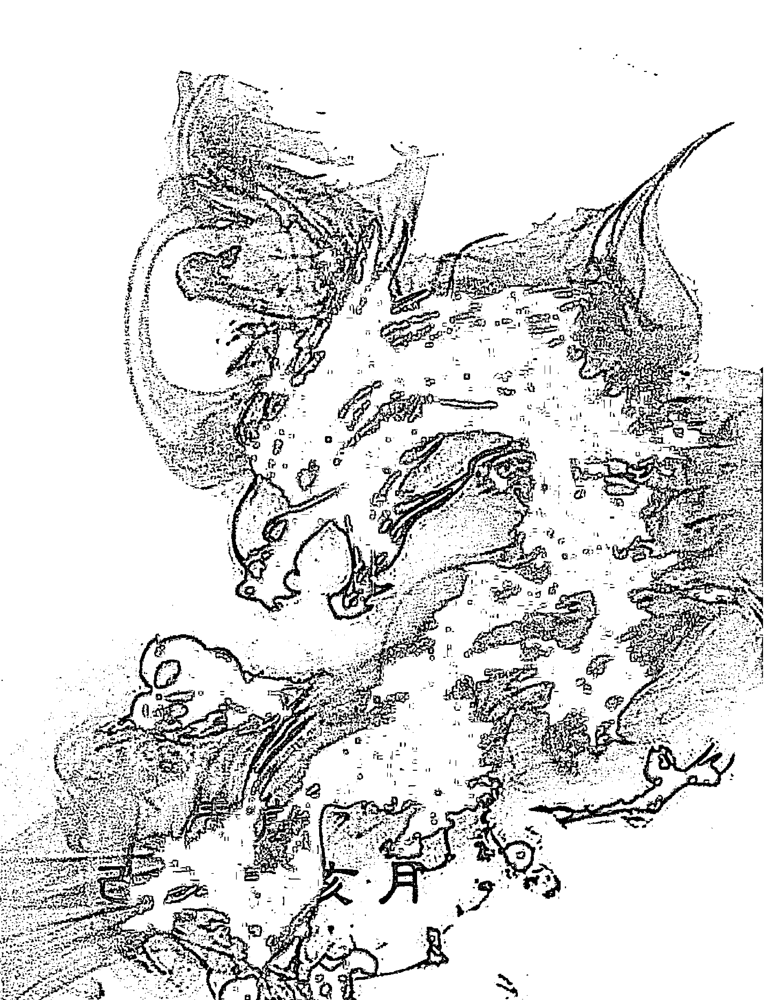

## 青岚易学会系列丛书之一

## 六爻逻辑



## 六爻理论简介

## （修订版）

青风

己亥年四月修订

## 目录

- 序言 …… 1
- 学员感悟 …… 3
- 知微易学会六爻段位表 …… 11
- 第七章 冲 …… 12
  - 第一节 月建冲爻 …… 12
    - 一 月建冲爻的信息提取 …… 13
    - 二 月冲静爻 …… 17
    - 三 月冲动爻 …… 21
    - 四 月冲变爻 …… 25
    - 五 月冲飞伏神 …… 30
      - 飞破伏出 …… 30
      - 冲破根源 …… 31
      - 月冲伏神 …… 32
  - 第二节 日辰冲爻 …… 34
    - 一 日冲静爻 …… 35
      - 日冲旺相静爻 …… 35
      - 日冲有气静爻 …… 37
      - 日冲动生静爻 …… 39
      - 日冲衰败静爻 …… 42
      - 日冲旬空静爻 …… 44
      - 日冲世爻 …… 47
    - 二 日冲动爻 …… 55
      - 日冲有力动爻 …… 56
      - 日冲衰败动爻 …… 61
      - 日冲旬空动爻 …… 63
      - 日冲入墓动爻 …… 67
      - 日冲伏吟动爻 …… 68
      - 日冲已发生动爻 …… 69
    - 三 日冲变爻 …… 70
      - 四 日冲旺相有气变爻 …… 70
      - 日冲休囚衰败变爻 …… 71
      - 日冲旬空变爻 …… 72
      - 日冲回头生克变爻 …… 76
      - 日冲化进退神变爻 …… 78
      - 日冲飞伏神 …… 79
      - 日冲伏神 …… 79
      - 冲飞露伏 …… 81
      - 冲破元神 …… 83
  - 第三节 日月冲爻 …… 84
    - 日月冲静爻 …… 84
    - 日月冲空爻 …… 87
    - 日月冲动生爻 …… 88
    - 日月冲动爻 …… 92
    - 日月冲变爻 …… 94
  - 第四节 动爻冲爻 …… 96
    - 动爻冲静爻 …… 96
    - 动爻冲空爻 …… 103
    - 动爻冲动爻 …… 107
    - 动爻冲伏神 …… 113
- 第八章 合
  - 第一节 月建合爻
    - 月建生合 …… 119
    - 月建平合 …… 121
    - 月建克合 …… 122
    - 月合取象 …… 125
  - 第二节 日辰合爻
    - 日辰生合 …… 128
    - 日辰平合 …… 129
    - 日辰克合 …… 134
    - 日合取象 …… 135
    - 日合动爻
    - 日合变爻 …… 141
  - 第三节 日月合爻 …… 143
  - 第四节 动爻合爻 …… 149
    - 一 动爻合静爻 …… 149
    - 动爻生合静爻 …… 149
    - 动爻克合静爻 …… 150
    - 动爻平合静爻 …… 152
    - 暗动合爻 …… 154
    - 二 动爻合动爻 …… 156
    - 三 动爻合破爻 …… 163
    - 四 动变相合 …… 169
    - 变爻生合动爻 …… 170
    - 变爻克合动爻 …… 174
    - 变爻平合动爻 …… 175
    - 变出用神相合 …… 177
  - 第五节 月破日合临日 …… 181
    - 月破临日生合 …… 181
    - 月破平合克合 …… 185
    - 月破日合毁象 …… 189
- 第九章 日月的特殊作用 …… 191
  - 第一节 特殊旺相 …… 191
  - 第二节 特殊衰败 …… 198
  - 第三节 过旺反凶 …… 201
  - 第四节 过衰反吉 …… 211
  - 第五节 日月入爻 …… 220
  - 第六节 指定而占 …… 226
- 第十章 应爻的用法 …… 239

## 序言

《六爻基础入门》一书完稿后，总想再写一本关于六爻具体理法的书供易友们参考，虽然卦例早已收集完毕，奈何天性懒惰，迁延日久，一直拖延迟迟不肯动笔。到今天觉得真的不能再拖了，遂摒弃杂念，关上手机，潜心静气，力争用半年的时间完成本书的写作。

说起六爻理法，很多人认为理法并不太重要，象法才是断卦的重点。很多初学的朋友看到很多高手取象技术神乎其神，令人叹为观止，于是总去追求学习象法，而对理法较为忽视，其实这是舍本逐末的做法。理法与象法，是六爻预测不可分割的两个部分。理法是基础，是根基，对于判断吉凶起着不可忽视的作用；象法是升华，是枝叶，依托理法而让卦象更加丰富多彩。理法好比一座楼的地基，没有扎实的理法基础，如何能熟练地掌握象法的精髓呢？就好比学习大学微积分之前，我们必须学好小学的四则混合运算一样，想要从卦中提取出准确的信息，理法是一定不可或缺的。

六爻理法是很复杂的，很多问题让人无所适从，特别是初学的朋友深有感触。就如日辰合爻这一个知识点，可以细分为日合静爻、日合动爻、日合变爻、日合破爻等等，合又可以分为生合、克合、平合三种状态，每种状态都各不相同。还有其他诸如日冲、月合月冲、动合动冲、合局、进退神、日月对爻的影响等方面，都有不同的意义。如果能把上述理法问题研究透彻，对初学者来说，断卦水平必定会上升一个新台阶。同时，理法中也带着很多取象的知识，运用得好一样可以准确断出很多信息来。

在断吉凶成败、生死攸关的这类卦中，理法显得尤为重要，不可不仔细斟酌。很多凶险紧急的问题，卦主所担心的只是吉凶问题，对一些象法上的信息并没有多大兴趣。这时候，我们就不该以象法的知识来解这个卦，而是用理法判断吉凶即可。

对于这些理论的解析与运用，将在本书一一论述。

本书共有四章，分别为冲、合、日月的特殊作用以及应爻的用法，对实战中大部分类型的理法做了分类归纳总结，供易友们参考。书中卦例来源于本人实战以及易友探讨卦例，由于水平有限，很多理论尚在验证摸索中，书中谬误的地方在所难免，不足之处敬请各位易学同仁批评指正！

青岚  
2018年4月3日

## 学员感悟（一）

动笔之前，突然想起了一件事，上学的时候，读到好的诗篇文章，多是出于生活困顿之人。现在想想，知道为什么了，在命运面前，人总有脆弱的时候，除了诗词文章，还有什么能抒怀的呢？

还可以有六爻啊！如中彩票般的欣喜，断对卦时，觉得世界都在自己的脚下，一切都在掌握之中。果然是一卦在手，天下我有。当然也有马失前蹄、瞪眼蒙蔽的时候；不过这些，不足为外人道也。平时断断卦，真快活，比起吟几句陈词酸句、自怨自艾强多了。

有人说，你改变不了结果，那么提前知道答案，又有什么用呢？至少可以让自己有个心理准备，可以考虑更多的选择，可以让自己的心安定，让自己对生活的态度更加洒脱，学会以平常心接受事情应有的结果，难道这不是智慧么？这是东方最古老的智慧，古人果然没让我们失望。

七十年前，美国诞生了一位大师，开创了一门学问，后来传到中国，广为国人所诟病，大师的名字叫戴尔·卡耐基；他的学问叫成功学。但说来讲，追求财富和体面的生活，是无可厚非的。在平凡人的一生中，怎么可能没有“欲渡黄河冰塞川，将登太行雪满山”这样的凄凉与无奈呢？那又为何东方古国，没有类似催人上进的“成功学”呢？这个问题，困扰了我整个大学时代。直到17年遇到了六爻，我才有了答案。

原来古人是务实的，“没有失败，只有暂时停止成功”，这样的口号也就糊弄糊弄涉世未深的小白。一件事情，该不该做，能不能成功，对自己有没有益处，一卦就可以了，哪用得着看视频、喊口号、扇嘴巴子来自我洗脑呢？这种运筹帷幄、决胜千里的力量，恐怕卡耐基再学几辈子也不一定能开创得出来。更不用提，六爻在日常生活中的各种用处——测吉凶，断前程，解心疑，真乃指路之明灯，过河之舟桥，人生之宝鉴，习得六爻，实乃三生有幸。

8月24日晚，担心辞职后财运，占得遁变大过，世持官鬼临腾蛇化子孙，可以不用担心了。  
7月22日，担心孩子被传染手足口，占得雷地豫变小过，孩子身体很健康。  
7月16日，想知道现在赚得多还是以后兼职赚得多，占得乾为天变泽火革，辞职的想法得到了青岚老师的鼓励。

仅举几例，以为实证，其他生活中的琐事就不一一列举了。

平日生活，柴米油盐，叹人生不如意事十常八九。能在乏味之中给予快乐；能在担惊受怕之时给予安定；能在狐疑不决之时给予决断。学习六爻这件事，只恨自己过于愚笨，学得太晚了。

6号学员 随眠  
2018年8月

## 学员感悟（二）

听闻青岚老师第二本书即将完稿，谨以小文，对我迄今为止时间并不长的学易之路做一个感慨。

有人问我信命吗？毫无疑问，我信。但是接触六爻之前，我是对算命毫无兴趣的。但是我又可以把“生死有命富贵在天”挂在嘴边，时常说出“小财靠挣大财靠命”之类的话。但是心里清楚得很，信命也好，不信也罢，该拼搏还是要拼搏。虽说大财靠命，但是毕竟天天在家仰天以盼做白日梦也是不现实的。

我是18年5月底拜师于青岚老师的。虽说时间不长，但是听闻易学时间不短。据家母所述，我们村之前就有一位会“掐算”之人，谁家猫狗鸡鸭丢了，找到他说一下时间，他就能告诉你什么方向去找，或者往那个地方走会遇到穿什么颜色衣服的人，问他就会找到。我小时候家里的大鹅丢了两次，找他算了两次，很灵验。当时就感觉好神奇，每每母亲讲到这个事情的时候，都会浮现一种神秘的表情。对我来讲，小时候那种好奇就一直埋在心里，上学后由于学业所致，一直也没能有时间再次接触。

高中的时候，也是我们当时书友会很流行的时候，每周一本小册子，几十本书，快递选购。我对小说是没什么兴趣的，全班几乎都在迷恋雪漫、明晓溪、六道的时候，我在看的却是陈村的《小说老子》《易经》。那时候我才发现，原来一直奉为座右铭的“天行健君子以自强不息”是出自《周易》。但是由于《周易》实在是枯燥，所以翻了几页就束之高阁了，倒是家父看到了，来来回回翻看了好几遍。

一晃十年。

直到今年五月，无意间再一次接触到了周易。由于工作在境外，下班时间平时都是在玩手机、喝酒，甚感无聊。想着找点东西学一下也是充实自己的一个办法。刚开始学完全是闭门造车，毫无头绪。百度查了下需要看的书，就下载了十几本开始读。读了一阵子，甚感晦涩，接着又去背64卦卦名、爻辞卦辞。看《增删卜易》，看到“月建”这个词的时候，百度搜索了三天仍然是云里雾里。突然意识到这样子学习是不行的，快慢走不走弯路暂且不谈，我怕的是磨掉我学习的信心以及积极性。于是就在群里咨询是否有讲基础知识以及术语的书籍。然后某网友就推荐了青岚的《六爻基础入门电子版》。

下载完一看，如获至宝。基础讲得详细，但不枯燥，案例鲜活。虽然后来陆续读了不少关于六爻的书籍，但是还是感觉这本书是最平易近人，以至于像我这种零基础之人都可以熟读掌握。继而就加入了青岚的微信群、QQ群。看了几天，毅然决然地拜倒于青岚师门之下。也有幸认识了一大批志同道合的朋友。

青岚老师六爻修行甚高，但却没有恃才傲物之感，讲课风趣，条理清楚，亦师亦友。上课时严肃认真，课下在群里跟学生打成一片。易讲缘，也许这就是缘吧。经过学习后，明显感到自己的进步。真希望有朝一日，回国之后能有时间去武汉当面求教，谈古论今，举杯小酌，岂不快哉。

如今社会普遍浮躁，很少能有一本书可以让我这样沉迷于其中。初学之时，舍友普遍嗤之，以为封建迷信、旁门邪术，各种戏谑。诚然，世界上有阴就有阳，有好就有坏，所以也就是一笑了之。学易，不仅修心，更是养性。感谢青岚，为我打开了新世界的一扇大门。易学之路漫漫修远，感谢有你携手同行。

23号学员 月野兔  
2018年8月

## 学员感悟（三）

人类与大自然相伴而生，对大自然知识的渴求与探索从未停止过。天地人之间，人与人之间，人与物之间有着许多的奥秘与玄机，一直叩击着人类的心扉，想去探求个究竟。形而上的唯物主义思维，并不能完全满足人们对世界的求知欲。

于古先贤代代构建起来的六爻预测术，将人的意念带入阴阳变化的指征，通过阴阳变化的规律性，读出特定事物在具体环境中的变化趋势，读出爻辞，悟出卦语，作出对求测人有利的趋吉避凶的判断。这是一门充满知识性、技术性、趣味性的专业术数。

人每一天都在自己的心灵世界中遨游，与自己的灵魂独自交谈。有着那么多的困惑与思虑，然而又不是那么多的言谈与思虑都足以与人言谈道出。这个时候起一卦吧，庄严地维系一个意念。将三个铜板抛洒六次，分别记下字与花的个数，记下年月日时交与卦师，卦师便将此六爻装局成卦，将先贤古意的智慧归结成卦理，将可为或不可为之事告知我们。由此了结了一个心愿，或是断灭了一个妄念。这是一个美妙的过程，在卦师的解读下，我们看到姻缘、财运、失物、行人、天气等让人困惑不已的事情都蕴含了它的意向。六爻之八卦宛如一个军事沙盘，让人看到风云变幻的战争趋势；像一个股票期货的坐标，勾勒出经济规律长短变化的波动轨迹；像卫星云图，让气象师看到气流台风潮汐的流转起落。脑袋里辗转反侧的事情，在六爻小环境的布局中，得到了栩栩如生的再现。翻江倒海的揣测，有时只需一丝丝理性的指引，这指引就是六爻之八卦意念的导入与导出。

卦机本天成，卦师幸读之。成为一个看卦者，需要丰富的知识累积，需要掌握五行生合冲克、天干地支循环、六十四卦卦名卦意，才能领略到所测事物在不同日月下、不同爻位中、在不同六神六亲临置时跌宕起伏的运作。预测术归结为一个字，“易”。易者，变化、消长、轮转。旧时代的卦师给人的印象，要么仙风道骨，要么雅俗共兼，穿一身禅衣，坐一幡下，于街头掐指有词。因无法长期观测其正误率，便无法验证其是真才实学，还是故弄玄虚。可喜的是在科学昌明、互联网全球化的今天，看到青岚老师这样的年轻知识分子成长磨砺而成的新一代卦师。他毕业于高等学府的殿堂，熟练操作电脑等媒体工具，有自己独特的见地和目标，跨越了很多困难，从中学教师——公务员——卦师一路走来。一边在家乡开卦馆，一边在网上与客户交流测卦，真枪实弹检测卦艺，用实战的方法来检验所学理论。我是一名业余六爻爱好者，偶然经过百度六爻吧，看到青岚老师有自己卦例丛书出售，毫不犹豫买了一本。以书会友是最靠谱的交流方式，我们可以在一个人的书中看到一个人的文化修养、专业水平、道德情操等等，继而在他的QQ群中在线学习，成为他的学员。

青岚老师治学严谨，循循善诱，花了很多精力进行教学和答疑。在时间和知识都碎片化的时代，遇到有心将六爻预测作为工作来完成、将六爻预测经验传授普通人的年轻人，表示赞叹与钦佩。

在六爻这片沃土上，深深地耕下，不一定会马上领略它的实质。只有反复耕耘摸索，才能向六爻之海的深处进发。如今青岚老师的足迹继续迈进，第二本六爻丛书又将面世，恭喜赞叹！望广大六爻爱好者共睹为快。预祝青岚老师卦技进一步提高与普及，惠及众多六爻学员。

21号学员 玉树  
2018年8月

## 学员感悟（四）

一支铁笔断生死，三枚铜钱定乾坤。

青岚老师终于出第三本书了，期盼许久，借此机会谈一谈我对学习六爻以来的一些感悟。我是一名理科生，不善言辞和文笔，但是所写都是自己内心的真实感悟。

我第一次接触六爻还是三年前，至今还记得当初暑假找兼职起的卦，那是在网上某个论坛上发的。从那之后我就对六爻产生了兴趣。当初发完卦也没抱着多大的希望，因在以前没接触过就不相信算卦这一套东西，就感觉是忽悠人坑人的东西。现在回想起当初的那个样子自己真可笑。到今天为止我还记得那个易友给的断语：明日出空，见成功。当时不懂六爻也不知道啥意思，就隐约感觉第二天的面试能成功，果不其然第二天应聘成功。从那以后我再也没接触过六爻。

第二次接触的时候是2017年大学毕业前考证书的时候，突然想起六爻来了，又在网上东找西找地找到那个论坛，发了一卦问自己能过吗，得到的回复是：就这个学习态度怎么能过？我一看这不扯淡了，过不了大学拿不到毕业证这不白上了，我还信誓旦旦地说我要努力改变现状！不出三分钟热度我就坚持不住了。到考试那天全班30人过了2个人，这次再次印证了六爻预测的准确性。

再一次接触六爻的时候，我是为了算啥时候找到对象，还是在那个论坛发帖子，结果不准了。发了好几次，当然不是同一天发的，有说农历十月份的，还有说别的月份的，结果到那个时间我也没对象。我还在百度测了八字问啥时候有对象，在淘宝也测过，总之能在网上测的途径我基本都试过，感觉都不准。最后我做了一个决定：为啥不自己学呢？

有了这个想法，我就通过QQ搜索关于六爻的预测群，机缘巧合之下，经群里易友推荐《六爻基础入门》，开始了自学六爻的道路。在用了不到一周的时间看完之后感觉入门了，就开始在群里看卦，结果越看越迷糊。青岚老师这个时候就说看卦不能浮于表面，要有扎实的功底，加细致的分析。在听了青岚老师的提醒后，我就静下心来看这本书，发现真的挺有意思，慢慢地就勉强入门了。

等到了这个勉强入门之后，我发现自学很困难了，缺少一个领路人，需要一位六爻老师来指导我。偏偏瞌睡遇见送枕头的，这个时候青岚老师开了一个内部班，这家伙也不宣传也不发广告，多亏我经常混群才通过字母哥那里得到的消息，就这样加入了内部群。进去以后我发现，怪不得大牛都不在大群说话，原来都在这开小会了。

进入内部群发现青岚老师讲课都是干货，都是有用的知识，再加上群里多人讨论，知识进步也神速。我在群里也是越来越如鱼得水地学知识，在群里待了三个月左右吧，水平提升得很快，到达了十一的水平。如果让我自学一年能到达就不错了。随着听课的次数越来越多，掌握的六爻知识也多了起来。好多知识都是外面的书里没有的，就算有也是一笔带过，核心的知识都隐藏了，如果没有很好的悟性是真思考不出来的。

我看了青岚老师第二本书的目录，发现这不都是内部群知识吗。然后粗略地看了一下大体的内容，发现跟内部群基本没有不同的。唯一不同的就是我所学到的是青岚老师通过讲课方式来学习的，这是以书本的方式呈现的。我不会用什么优美的语言来形容这本书，就用简单的几句话描述一下：这本书说真的都是干货，每一个知识点都是实用的，不是纸上谈兵。因青岚老师是职业预测的，他的书都是以实战的角度来写的。他在内部群说过，他所讲出来的知识都是经过自己实战验证过的，准确率很高才讲出来的。我不知道你们看没看过青岚老师的《六爻基础入门》，里面就没有写测生男宝宝还是女宝宝的知识。他自己都说什么阴包阳、阳包阴准确率低，也就没写在书上。在内部群我也没听过他讲这个，我也自己测过几次这样的卦，发现准确率基本靠猜。青岚老师讲过的知识我也验证了几个，因为碰到了索性验证一下，发现验证出来的结果跟讲的一样，没有差别，都是干货！

最后希望所有看到这本书的易友们，能在这本书上学到真东西，解决以前的疑惑。

9号学员 男玖  
2018年9月

## 知微易学会六爻段位表

| 级别 | 段位 | 层级 | 基本情况 | 下一步方向 |
|---|---|---|---|---|
| 特级 |  | 职业 | 对卦象和细节的解读准确率较高，能够随时把握卦象，从容应对卦主的提问，技术和阅历达到较高水平。 |  |
| 高级 | 三段 | 准职业 | 对细节和象法判断准确率长期保持在8成左右，自身理论体系稳定，并积累了一定的实战经验和社会阅历。 | 从业，积累经验和社会阅历。 |
| 高级 | 二段 | 总结 | 对细节和象法判断的准确率长期保持在7成左右，自身理论体系已基本稳定，实战失误率逐步降低。 | 大量实战，归纳总结，向职业化迈进。 |
| 高级 | 一段 | 实战 | 对细节和象法判断的准确率稳步提升，并开始实战，形成自己的六爻理论体系，逐渐从借鉴他人的理论到自己研究发现理论。 | 逐步退出网络练手，加大实战力度。 |
| 中级 | 三段 | 掌握 | 对六爻基础知识掌握牢固，对细节和象法部分有一定的研究和心得，断卦时多以验证细节为主，并保持一定的准确率。实战较少，仍停留在网络层面。 | 大量探讨卦例，多在网络练手总结，开始实战。 |
| 中级 | 二段 | 练习 | 对六爻基础知识已基本掌握，断卦时会主动研究卦中的细节问题，对于比较基础的卦能有一定的思路，断卦思路逐步形成。 | 大量探讨卦例，多在网络练手。 |
| 中级 | 一段 | 上手 | 认真研究过六爻基础理论，对六爻基础知识有一定掌握，对象法和细节有初步掌握，对一般卦不仅能判断吉凶问题，偶尔也能判断部分细节。 | 加强细节和象法学习，参与卦例探讨，开始在网络练手。 |
| 初级 | 三段 | 入门 | 认真研究过六爻基础理论，对六爻基础知识有一定的掌握，对简单的吉凶卦能做出判断，对卦的细节问题比较欠缺。 | 学习六爻细节和象法知识，参与卦例探讨。 |
| 初级 | 二段 | 过渡 | 阅读过六爻基础书籍，对六爻基础知识掌握较差，对简单的吉凶问题尚不能做出判断，看卦时仍然处于懵懂状态。 | 加强基础知识学习，少量参与卦例探讨。 |
| 初级 | 一段 | 开始 | 接触过六爻预测，略懂一些专业术语，对六爻预测有较强的兴趣，但对基础知识不甚了解，也没有认真阅读过六爻书籍。 | 认真阅读六爻基础书籍。 |

## 第七章 冲

冲是指十二地支之间两两相冲的关系，分别为子午相冲、丑未相冲、寅申相冲、卯酉相冲、辰戌相冲、巳亥相冲，就像两人互为仇敌一样，往往代表不和、敌对、冲突、打架、斗殴、破败、破损、逼迫、压迫等意思。

冲不一定都不吉，在某些特定的卦象中，冲反而是好事。比如测忧患之事、测比较轻的疾病、测要出门去办什么事，都喜冲不喜合。此时世用逢冲，往往代表忧患解除、病情痊愈、尽快出门等意思。

冲分为很多种类，如日月冲爻、动爻冲爻、反吟、六冲卦等等，其使用方法都有所不同。接下来我们对这些知识点进行一一解读。

### 第一节 月建冲爻

月建冲爻是指卦中之爻与起卦当月月建相冲的情况，又叫做月破。月建决定爻之旺衰，是六爻的主宰，凡是与月建相冲的爻，不管处于什么状态都为月破，只是程度有所不同而已。

目前有一种观点认为：当月建与卦中之爻都属土时，其月破程度最轻；月建对爻只冲不克时，月破程度其次；月建对爻既冲且克时，月破程度最重。经过研究验证，我认为这种说法完全没有依据。只要静爻被月建相冲，怎么冲都没有区别，一样为破。在当月内，该爻衰败彻底，一般无法发挥作用，即使卦中有他爻或日辰生扶，月内也生之不起，但是其月破程度会有所减轻。

这让我想起在创业圈流行的一句话：不管是什么创业项目，首先第一条要考虑的就是是否合法律规定，凡是违背政策法规的，注定难以走远。月建冲爻是有时效性的，一般来说，只在本月内发挥作用。

如果所测的事是在当月内完成的，此时遇世爻月破，则大多不吉。如果所测之事为长远之事，此时遇月破，则只能说明当月内难以成功，出月后不一定不吉。这些理论在上一本《六爻基础入门》中已进行了详细论述，在此就不多展开了。

根据月建冲爻的类型，又可以分为月冲静爻、月冲动爻、月冲变爻、月冲飞神、月冲伏神五种。这五种类型在使用时各不相同，有的月破无用，有的却出月有用，需要具体情况具体分析。

#### 一、月建冲爻的信息提取

月建冲爻，其时效虽然只有一个月，即在当月内该爻衰败无用，但实质上还代表了两个十分重要的信息。

一是月建代表过去。一般被月建冲破的爻，必定会应验出过去或者当月出现了某件事情破败的迹象。或者说，一般只要卦中有月破信息，那么基本可以断定这件事已经发生了。

```
求测人：男，手工指定（起卦方式）
起卦时间：2018年3月9日
占问事宜：测感情是该坚持还是该放弃。
干支：戊戌年 乙卯月 庚子日 甲申时
主变卦：坤为地（坤宫）[空亡：辰、巳]
腾蛇  ▢▢  ▢▢  子孙酉金 世
勾陈  ▢▢  ▢▢  妻财亥水
朱雀  ▢▢  ▢▢  兄弟丑土
青龙  ▢▢  ▢▢  官鬼卯木 应
玄武  ▢▢  ▢▢  父母巳火
白虎  ▢▢  ▢▢  兄弟未土
```

男测感情，妻财为用神。本卦中，世爻子孙生妻财亥水，说明卦主确实对女友有真感情。妻财亥水有日辰相扶，本来不算差，看起来卦的格局还是不错的，但是世爻却被月建卯木冲破，无法生妻财，妻财却生官鬼卯木，这是一种落花有意、流水无情之象。而且既然是月破，说明此事已经发生。

冲破世爻的官鬼卯木刚好临应爻，应爻为他人，官鬼为男人，临青龙又临月建，还有日辰子水相生。子水为财，说明此人有权有势有地位有票子，所以断其女友跟一个非常有本事的人跑了。卦主反馈，确实是这样，跟一个非常有权势的人跑了。本卦中的世爻被月建官鬼冲破，就很形象地表示了卦主的女友已经被人抢走的现状。

- 求测人：女，手工指定（起卦方式）
- 公历：2018年3月26日16时28分，星期一。
- 占问事宜：某女测备孕
- 农历：戊戌年 二月 初十日 申时。
- 神煞：驿马-亥　桃花-午　干禄-午　贵人-亥、酉
- 干支：戊戌年 乙卯月 丁巳日 戊申时
- 主变卦：泽地萃（兑宫）之 天地否（乾宫）[空亡：子、丑]

| 六神 | 本卦 | 变卦 |
|---|---|---|
| 青龙 | □□　□□ × 父母未土 | □□□□□□ 父母戌土 应 |
| 玄武 | □□□□□ 兄弟酉金 应 | □□□□□ 兄弟申金 |
| 白虎 | □□□□□ 子孙亥水 | □□□□□ 官鬼午火 |
| 腾蛇 | □□　□□ 妻财卯木 | □□　□□ 妻财卯木 世 |
| 勾陈 | □□　□□ 官鬼巳火 世 | □□　□□ 官鬼巳火 |
| 朱雀 | □□　□□ 父母未土 | □□　□□ 父母未土 |

测备孕，子孙为用神。子孙亥水被日辰冲破，又临白虎。白虎为血神，主流产之事。应爻也可以代表所测的事情，应爻元神兄弟酉金又被月建冲破。月建代表过去，而酉年刚过，所以断其去年流产过。卦主反馈，去年怀了孩子，但是孩子两个月的时候停止生长了，现在身体有所恢复，所以想再测备孕如何。然而这种卦象明显有疾病在身，如何适合备孕呢？只好劝卦主调理好身体之后，再想备孕的事了。

求测人：女，手工指定（起卦方式）  
占问事宜：找男友  
公历：2018年3月19日16时28分，星期一。  
农历：戊戌年二月初三日申时。  
神煞：驿马-申　桃花-卯　干禄-申　贵人-寅、午  
干支：戊戌年 乙卯月 庚戌日 甲申时  
主变卦：巽为风（巽宫）之 山天大畜（艮宫）[空亡：寅、卯]

| 六神 | 本卦 | 变卦 |
|---|---|---|
| 腾蛇 | ▢▢▢▢▢ 兄弟卯木 世 | ▢▢▢▢▢ 兄弟寅木 |
| 勾陈 | ▢▢▢▢○ 子孙巳火 | ▢▢　▢▢ 父母子水 应 |
| 朱雀 | ▢▢　▢▢ 妻财未土 | ▢▢　▢▢ 妻财戌土 |
| 青龙 | ▢▢▢▢▢ 官鬼酉金 应 | ▢▢▢▢▢ 妻财辰土 |
| 玄武 | ▢▢▢▢▢ 父母亥水 | ▢▢▢▢▢ 兄弟寅木 世 |
| 白虎 | ▢▢　▢▢ × 妻财丑土 | ▢▢▢▢▢ 父母子水 |

某女士单身，想看看缘分。女测男，以官鬼为用神。卦中官鬼酉金临应爻青龙，但是被月建冲破。月建为过去，说明卦主过去谈崩了一个男友。而巧合的是，世爻也临月建，相当于是世爻把官鬼冲破了。

这就奇了怪了，卦主找男友，怎么会自己把官爻冲破了呢？世爻临腾蛇，主怪异，说明是卦主性格上的缺陷造成的。显然这是卦主自己不懂得谈恋爱，大好的男友都被卦主自己给折腾坏了。这时候卦主主动交代，确实不会谈恋爱。以前谈了一个很好的男友，十足的暖男型，但是就是不知道为什么，总喜欢从他身上挑毛病，没有毛病也要硬想出来毛病，然后数落对方、讥讽对方。明明很在乎对方，但是就是忍不住要挑毛病和他吵架，最后男方终于受不了和她分手了，现在还是很想念他的。

然后卦主说，将来要找个颜值高、长得高、会赚钱、能包容、不能发脾气，带出去要所有闺蜜都羡慕的白马王子类型的，达不到条件绝不同意。但是自己又长得非常一般，也不会赚钱，能力也一般，只好先单着了。我看应爻也可以代表所求的姻缘，月破，又入初爻妻财丑土之墓，有这条件的男士早就被初爻的妻财丑土抢回去做压寨官人了，哪还轮得到卦主呢。

二是月建代表当月，预示着卦中出现的破败现象发生在当月，或者当月就会发生。而区分到底是以前发生的还是当月发生的，一般需要根据卦象具体所测的信息综合判断。

- 求测人：女，手工指定（起卦方式）
- 占问事宜：继续做原工作还是出去找工作
- 公历：2018年3月21日19时6分，星期三。
- 农历：戊戌年 二月 初五日 戌时。
- 神煞：驿马-寅 桃花-酉 干禄-亥 贵人-卯、巳
- 干支：戊戌年 乙卯月 壬子日 庚戌时
- 主变卦：泽天夬（坤宫）之 乾为天（乾宫）[空亡：寅、卯]

| 六神 | 本卦 | 六亲 | 变卦 |
|---|---|---|---|
| 白虎 | ▢▢　▢▢ × | 兄弟未土 | ▢▢▢▢▢ 兄弟戌土 世 |
| 腾蛇 | ▢•▢▢▢ | 子孙酉金 世 | ▢•▢▢▢ 子孙申金 |
| 勾陈 | ▢▢▢▢▢ | 妻财亥水 | ▢▢▢▢▢ 父母午火 |
| 朱雀 | ▢▢▢▢▢ | 兄弟辰土 | ▢▢▢▢▢ 兄弟辰土 应 |
| 青龙 | 父巳 ▢▢▢▢▢ | 官鬼寅木 应 | ▢▢▢▢▢ 官鬼寅木 |
| 玄武 | ▢▢▢▢▢ | 妻财子水 | ▢▢▢▢▢ 妻财子水 |

我们先来分析卦主的现状。以世爻为卦主，子孙酉金被月建卯木冲破。月建为过去已经发生的，卯木为官鬼，官鬼就是工作，说明卦主现在的工作已经做得很不开心。卦主反馈，确实很不开心，但是不是因为不喜欢工作，而是另有原因。

兄弟未土为世爻元神，发动化进神，元神为卦主的想法，进神为远离的意思，说明卦主已经做好了辞职出去的准备。既然世爻月破，说明当月就会离职。应爻官鬼寅木为出去的工作，虽然旬空，但有月扶日生旺相，还是不错的。

卦主果然当月就离职了。一直到一个月后，通过熟人偶然得知，卦主离职是因为熟人给她介绍了一个本地的男朋友，结果没过几天男友把卦主甩了，而且还因工作原因经常见面。伤心之下，才想到离职的。原来卦中月建的官鬼卯木冲破世爻还有这一层原因，真是意想不到。

求测人：女，手工指定（起卦方式）  
占问事宜：测复合  
公历：2018年3月17日12时36分，星期六。  
神煞：驿马-寅　桃花-酉　干禄-巳　贵人-丑、未  
干支：戊戌年 乙卯月 戊申日 戊午时  
主变卦：泽雷随（震宫-归魂）之 泽水困（兑宫）【空亡：寅、卯】

| 六神 | 本卦 | 六亲/五行 | 变卦 |
|---|---|---|---|
| 朱雀 | ▢▢　▢▢ | 妻财未土 应 | ▢▢　▢▢ 妻财未土 |
| 青龙 | ▢▢▢▢▢ | 官鬼酉金 | ▢▢▢▢▢ 官鬼酉金 |
| 玄武 子午 | ▢▢▢▢▢ | 父母亥水 | ▢▢▢▢▢ 父母亥水 应 |
| 白虎 | ▢▢　▢▢ | 妻财辰土 世 | ▢▢　▢▢ 子孙午火 |
| 腾蛇 | ▢▢　▢▢ | ×兄弟寅木 | ▢▢▢▢▢ 妻财辰土 |
| 勾陈 | ▢▢▢▢▢○ | 父母子水 | ▢▢　▢▢ 兄弟寅木 世 |

女测复合，官爻为用神。五爻官鬼酉金被月建卯木冲破，卯木为兄弟，说明此女的男友就在当月被别人抢了。反馈：不是被抢了，而是他春节认识了个女的，几天前和卦主分手了，现在就是不同意复合。

从以上卦例可以看出，凡卦中月破之爻，必定存在与现状相吻合的信息，这是提取卦象信息非常重要的知识点。

#### 二、月冲静爻

月建冲静爻的情况下，除特殊情况以及所测之事为长远之事以外，多为不吉之象。即使得日辰或动爻相生，也逢生不起，难以言吉。这一点在《六爻基础入门》中已进行过论述。

求测人：女，手工指定（起卦方式）  
占问事宜：胎儿能否保住

- 公历：2014年11月17日16时28分，星期一。
- 农历：甲午年 闰九月廿五日申时。
- 神煞：驿马-寅 桃花-酉 干禄-亥 贵人-卯、巳
- 干支：甲午年 乙亥月 壬辰日 戊申时
- 主变卦：巽为风（巽宫）之 风火家人（巽宫）[空亡：午、未]

| 六神 | 本卦 | 变卦 |
|---|---|---|
| 白虎 | 兄弟卯木 世 | 兄弟卯木 |
| 腾蛇 | 子孙巳火 | 子孙巳火 应 |
| 勾陈 | 妻财未土 | 妻财未土 |
| 朱雀 | 官鬼酉金 应 | 父母亥水 |
| 青龙 | ○父母亥水 | 妻财丑土 世 |
| 玄武 | ×妻财丑土 | 兄弟卯木 |

测胎儿以子孙为用神。卦中子孙巳火临五爻，被月建亥水冲破。月建为过去，说明胎儿已经有问题了。二爻父母亥水临月建发动冲克子孙，卦中也没有其他动爻来生，属于彻底的衰败之爻，大凶之象。结果胎儿于午日流产。而这位卦主以前就流产过一次，没想到这次仍然没有保住，真是时也命也。

- 求测人：男，手工指定（起卦方式）
- 占问事宜：六级考试能不能过
- 公历：2017年12月16日16时28分，星期六。
- 农历：丁酉年 十月廿九日申时。
- 神煞：驿马-亥 桃花-午 干禄-午 贵人-亥、酉
- 干支：丁酉年 壬子月 丁丑日 戊申时
- 主变卦：地山谦（兑宫）之 艮为山（艮宫）[空亡：申、酉]

| 六神 | 本卦 | 变卦 |
|---|---|---|
| 青龙 | ×兄弟酉金 | 妻财寅木 世 |
| 玄武 | 子孙亥水 世 | 子孙子水 |
| 白虎 | 父母丑土 | 父母戌土 |
| 腾蛇 | 兄弟申金 | 兄弟申金 应 |
| 勾陈 | 官鬼午火 应 | 官鬼午火 |
| 朱雀 | 父母辰土 | 父母辰土 |

六级考试虽然一般以父母为用神，但是取用之法，本就该以客观卦象取用，不能固定取用（客观取用法将在《六爻实战技法》一书论述）。本卦应临官爻，显然官鬼才是用神。官鬼午火被月建冲破，上爻兄弟酉金作为世爻的元神又化绝，显然是不吉之象。反馈六级没有考过。

求测人：女，占问事宜：能否顺利进入财政局  
公历：2017年9月18日16时28分，星期一。  
神煞：驿马-寅　桃花-酉　干禄-巳　贵人-丑、未  
干支：丁酉年　己酉月　戊申日　庚申时  
主变卦：坤为地（坤宫）之 山地剥（乾宫）[空亡：寅、卯]

| 六神 | 本卦 | 变卦 |
|---|---|---|
| 朱雀 | 子孙酉金 世 | 官鬼寅木 |
| 青龙 | 妻财亥水 | 妻财子水 世 |
| 玄武 | 兄弟丑土 | 兄弟戌土 |
| 白虎 | 官鬼卯木 应 | 官鬼卯木 |
| 腾蛇 | 父母巳火 | 父母巳火 应 |
| 勾陈 | 兄弟未土 | 兄弟未土 |

问能否进入财政局，以官鬼为用神。应爻官鬼卯木被月建冲破，日辰相克，还旬空，属于彻底衰败之爻。月建与世爻相同，说明自己与应爻的财政局无缘。而世爻发动，又化出了一个官鬼寅木，这属于世动化用，说明将来可以进入另一个单位。后来果然没去财政局，进了文化局。

如果卦中之爻虽然后月破，但是所测为长久之事或出月以后才应验，而且卦中有日辰或动爻来相生合，则当月内虽然不吉，但其程度已大为减轻，出月仍然有望。

求测人：女，手工指定（起卦方式）  
占问事宜：测外婆摔伤住院吉凶  
公历：2017年11月30日16时28分，星期四。  
神煞：驿马-亥　桃花-午　干禄-酉　贵人-寅、午  
干支：丁酉年 辛亥月 辛酉日 丙申时  
主变卦：坤为地（坤宫）之 山地剥（乾宫）【空亡：子、丑】

| 六神 | 本卦 | 变卦 |
|---|---|---|
| 腾蛇 | □□　□□ × 子孙酉金 世 | □□□□□ 官鬼寅木 |
| 勾陈 | □□　□□ 妻财亥水 | □□　□□ 妻财子水 世 |
| 朱雀 | □□　□□ 兄弟丑土 | □□　□□ 兄弟戌土 |
| 青龙 | □□　□□ 官鬼卯木 应 | □□　□□ 官鬼卯木 |
| 玄武 | □□　□□ 父母巳火 | □□　□□ 父母巳火 应 |
| 白虎 | □□　□□ 兄弟未土 | □□　□□ 兄弟未土 |

卦主外婆因为摔伤了住院，这就属于近病。而坤卦为六冲卦，近病逢六冲多为吉利之象。卦中父母巳火月破临二爻，二爻为腿，与外婆摔伤了很符合。应爻官鬼卯木临青龙，被日辰相冲暗动生用神，说明摔得不是太严重，可以治好。用神月破，出了月就可以慢慢好转了。

卦主反馈，确实不严重，12月4日就出院了。出院的时候还没有完全好，但是已经无大碍了。没有完全好是因为用神毕竟月破，即使有暗动相生，仍然不能痊愈。

- 求测人：女，手工指定（起卦方式）
- 占问事宜：测会不会被公司辞退
- 公历：2017年5月21日16时28分，星期日。
- 农历：丁酉年 四月 廿六日 申时。
- 神煞：驿马-寅　桃花-酉　干禄-巳　贵人-丑、未

干支：丁酉年 乙巳月 戊申日 庚申时

主变卦：泽火革（坎宫）之 火雷噬嗑（巽宫）【空亡：寅、卯】

| 六神 | 本卦 | 变卦 |
|---|---|---|
| 朱雀 | □□　□□ × 官鬼未土 | □□□□□ 妻财巳火 |
| 青龙 | □□□□□ ○ 父母酉金 | □□　□□ 官鬼未土 世 |
| 玄武 | □□□□□ 兄弟亥水 世 | □□□□□ 父母酉金 |
| 白虎 | 财午 □□□□□ ○ 兄弟亥水 | □□　□□ 官鬼辰土 |
| 腾蛇 | □□　□□ 官鬼丑土 | □□　□□ 子孙寅木 应 |
| 勾陈 | □□□□□ 子孙卯木 应 | □□□□□ 兄弟子水 |

卦主总担心自己被公司辞退，测一下能不能做得长久。本卦中非常明显的是世爻被月建冲破了。月建在公司是领导，所以直接断领导对卦主印象很不好。好在日辰为世爻长生，又有未土发动生酉金，酉金发动生世爻，形成了连生格局。月破还是月破，当月内也仍然危险重重，但是既然有救援，日辰为长生，说明只要出了当月，长期做下去是没问题的。

而三爻兄弟亥水就不同了，虽然其他条件上和世爻完全一样，但是竟然发动化出了回头克。根据重内轻外的原则，回头克是最强大的力量。兄弟亥水与世爻亥水完全一样，很显然是公司的其他同事。这说明卦主没啥事，她同事要被辞退了。

到了2018年初，又遇到卦主。卦主说，当时真的很害怕被辞退，后来过了半个多月，情况明显好转，不会被辞退了。倒是一个同事受不了自己辞职了。我马上想起动化回头克是自己走人，不是公司辞退，这例是疏忽了。

#### 三、月冲动爻

我们前面讲过，当月建冲静爻时，该爻往往陷入衰败无用的局面。但如果是月建冲爻，该爻却刚好发动，又该如何判定呢？在《六爻基础入门》中我们讲过“重内轻外”这个原理。月破属于外因，而发动则属于该爻自身内部原因，显然发动之力要大于月破之力。月破只是表现出某种破败的现状，而发动才是决定最终成败的关键所在。

所以，一般来说，如果爻发动被月建冲破，只要该爻不变废，仍然有用，多为吉利之象；其应验日期一般也仍然要遵循出月而应或者填实而应的规律。

- 求测人：男，手工指定（起卦方式）
- 占问事宜：公务员考试能否进面试
- 公历：2017年12月28日20时21分，星期四。
- 农历：丁酉年 十一月十一日 戌时。
- 神煞：驿马-亥　桃花-午　干禄-午　贵人-子、申
- 干支：丁酉年　壬子月　己丑日　甲戌时
- 主变卦：雷山小过（兑宫·游魂）之 地山谦（兑宫）[空亡：午、未]

| 六神 | 本卦 | 关系 | 变卦 | 关系 |
|---|---|---|---|---|
| 勾陈 | ▢▢　▢▢ | 父母戌土 | ▢▢　▢▢ | 兄弟酉金 |
| 朱雀 | ▢▢　▢▢ | 兄弟申金 | ▢▢　▢▢ | 子孙亥水（世） |
| 青龙 | 孙亥 ▢▢▢▢○ | 官鬼午火（世） | ▢▢　▢▢ | 父母丑土 |
| 玄武 | ▢▢▢▢▢ | 兄弟申金 | ▢▢▢▢▢ | 兄弟申金 |
| 白虎 | 财卯 ▢▢　▢▢ | 官鬼午火 | ▢▢　▢▢ | 官鬼午火（应） |
| 腾蛇 | ▢▢　▢▢ | 父母辰土（应） | ▢▢　▢▢ | 父母辰土 |

卦中官爻午火持世，故取世爻午火为用神。午火虽然被月建冲破，但逢发动化出丑土，变爻又临日辰，化回头生为化旺，属于吉利之象。结果顺利进入了面试。本卦中即使月建冲破了世爻，但是世爻发动没有变废，仍然有用。

求测人：男，手工指定（起卦方式）  
占问事宜：测妻病吉凶  
公历：2017年11月24日13时40分，星期五。  
农历：丁酉年 十月 初七日 未时。  
神煞：驿马-巳　桃花-子　干禄-卯　贵人-子、申  
干支：丁酉年 辛亥月 乙卯日 癸未时  
主变卦：火地晋（乾宫·游魂）之 火水未济（离宫）[空亡：子、丑]

| 六神 | 本卦 | 关系 | 变卦 | 关系 |
|---|---|---|---|---|
| 玄武 | ▢▢▢▢▢ | 官鬼巳火 | ▢▢▢▢▢ | 官鬼巳火（应） |
| 白虎 | ▢▢　▢▢ | 父母未土 | ▢▢　▢▢ | 父母未土 |
| 腾蛇 | ▢▢▢▢▢ | 兄弟酉金（世） | ▢▢▢▢▢ | 兄弟酉金 |
| 勾陈 | ▢▢　▢▢ | 妻财卯木 | ▢▢　▢▢ | 官鬼午火（世） |
| 朱雀 | ▢▢　▢▢ × | 官鬼巳火 | ▢▢▢▢▢ | 父母辰土 |
| 青龙 | 子孙 ▢▢　▢▢ | 父母未土（应） | ▢▢　▢▢ | 妻财寅木 |

某人妻子产后出血，在医院治疗，占问吉凶。卦中妻财卯木月建相生，又临日辰，生命无妨，大可放心。官鬼巳火在二爻发动，二爻为子宫爻位，在十二长生中，巳火又是卯木病地，……所以这就是病症。官鬼巳火被月建冲破，说明病情并不严重，但是毕竟鬼爻发动，没有变度，说明这个病可不是可以直接治愈的，后续调理不可忽视。后来卦主妻子于当天出院回家，在坐月子期间进行了适当调理，后续调理也一直很重视。

从以上卦例，我们可以很清晰地看出，用神被月建冲破的，只要发动不变度，照样可以发挥作用。但是如果在女测感情的卦中，用神官鬼月破化回头生，那就不一定吉利了，因为官鬼化回头生必定是化妻财，妻财是别的女人，这是男方将要与其他女性有接触的意思。在我国一夫一妻和男女朋友一对一的现实背景下，这显然是一般人无法容忍的。

- 求测人：女，手工指定（起卦方式）
- 占问事宜：测与男友缘分如何
- 公历：2017年11月23日13时40分，星期四。
- 农历：丁酉年 十月 初六日 未时。
- 神煞：驿马-卯　桃花-卯　干禄-寅　贵人-丑、未
- 干支：丁酉年 辛亥月 甲寅日 辛未时
- 主变卦：兑为泽（兑宫）之 天水讼（离宫）[空亡：子、丑]

| 六神 | 本卦 | 变卦 |
|---|---|---|
| 玄武 | □□　□□×父母未土 世 | □□□□□　父母戌土 |
| 白虎 | □□□□□　兄弟酉金 | □□□□□　兄弟申金 |
| 腾蛇 | □□□□□　子孙亥水 | □□□□□　官鬼午火 世 |
| 勾陈 | □□　□□　父母丑土 应 | □□　□□　官鬼午火 |
| 朱雀 | □□□□□　妻财卯木 | □□□□□　父母辰土 |
| 青龙 | □□□□□○官鬼巳火 | □□　□□　妻财寅木 应 |

卦中官鬼巳火被月建冲破，但是发动而生世爻，世爻也化进神，看起来多好的卦象。然而，初爻的官鬼巳火发动，化出妻财回头生，在感情卦中却是不吉利的，这是男方已经或者即将与另外的女性在一起的卦象。应爻也可以代表对方，丑土出现了旬空现象，说明卦主的男友对感情并不诚心，官爻目前月破，将来出月不破后会与其他女性在一起。结果两人于年底丑月分手，随即男方又与其他女性在一起了。

如交遇月破，虽然发动，但是化回头克或者变废，则其结果多为不吉，一般不宜当做有用动爻来看。

- 求测人：女，手工指定（起卦方式）
- 占问事宜：测与某男缘分
- 公历：2018年2月3日14时37分，星期六。
- 农历：丁酉年 十二月十八日 未时。
- 神煞：驿马-申　桃花-卯　干禄-巳　贵人-亥、酉
- 干支：丁酉年 癸丑月 丙寅日 乙未时
- 主变卦：泽山咸（兑宫）之 风火家人（巽宫）[空亡：戌、亥]

| 六神 | 本卦 | 六亲 | 世应 | 变卦 |
|---|---|---|---|---|
| 青龙 | ▢▢ ▢▢ | 父母未土 | 应 | 妻财卯木 |
| 玄武 | ▢▢▢▢▢ | 兄弟酉金 |  | 官鬼巳火 应 |
| 白虎 | ▢▢▢▢▢ | 子孙亥水 |  | 父母未土 |
| 腾蛇 | ▢▢▢▢▢ | 兄弟申金 | 世 | 子孙亥水 |
| 勾陈 | 财卯 ▢▢ ▢▢ | 官鬼午火 |  | 父母丑土 世 |
| 朱雀 | ▢▢ ▢▢ | 父母辰土 |  | 妻财卯木 |

女测男以官鬼为用神，兼看应爻。应爻被月建冲破发动而生世爻，看起来是对方对卦主有意思。实际上，应爻与四爻组成了亥卯未三合妻财局，妻财为女士，而且应爻还化妻财回头克，世爻又不在三合局内，这就说明，对方已经有女友了，也正是因为有妻财卯木这个女友回头克，所以不会与卦主在一起的。再来看官鬼爻，官鬼午火下伏妻财卯木，也可以说明对方有女友，而且卯木与午火既相生，又是沐浴关系，而且在二爻宅爻，宅爻是家的意思，有同居可能。哪轮得到卦主。

反馈：对方有女友，是卦主单相思而已。

#### 四、月冲变爻

月冲变爻又叫动爻化破，在《六爻基础入门》中已经进行了论述。本书中再次将动爻化月破的几种情况进行归纳，方便易友参考。

一般来说，动爻化月破属于化破，该动爻不能发挥作用。如果动爻虽然后化破，但是变爻存在回头生克以及进退神等动爻内部因素时，不一定是无用动爻，仍要以内因为主进行具体分析。

### 1. 当动爻化月破，变爻不回头生克动爻时，为动爻变废。

求测人：女，占问事宜：测与小学同学缘分如何  
公历：2018年3月26日14时1分，星期一。  
神煞：驿马-亥 桃花-午 干禄-午 贵人-亥、酉  
干支：戊戌年 乙卯月 丁巳日 丁未时  
主变卦：坎为水（坎宫）之 水风井（震宫）[空亡：子、丑]

| 六神 | 本卦 | 变卦 |
|---|---|---|
| 青龙 | 兄弟子水 世 | 兄弟子水 |
| 玄武 | 官鬼戌土 | 官鬼戌土 世 |
| 白虎 | 父母申金 | 父母申金 |
| 螣蛇 | 妻财午火 应 | 父母酉金 |
| 勾陈 | 官鬼辰土 | 兄弟亥水 应 |
| 朱雀 | 子孙寅木 | 官鬼丑土 |

女测男，本来以官鬼为用神，而此卦却应爻发动，根据客观取用法，显然要以应爻为主进行判断。应爻临妻财，发动化出父母酉金，酉金又被月建冲破，此为动爻化废，属于无用之爻，显然两人是没有缘分的。细节上来说，应爻财临桃花，这是对方有个漂亮的女友；父母破败，父母为婚姻，表示已有婚约或谈婚论嫁之象。

卦主后来反馈，男方说有女友，那位女友等了他很久，他不能辜负女方，要对女方负责。男方要卦主和他保持三角关系，等以后再说。然而卦主也不傻，明眼人一看就知道不靠谱了，所以世爻才会显示空亡之象，意味着卦主心里有其他想法了。

求测人：女，手工指定（起卦方式）  
占问事宜：测我老公的妹妹管理财务如何  
公历：2018年1月8日14时1分，星期一。  
神煞：驿马-寅 桃花-酉 干禄-申 贵人-寅、午  
干支：丁酉年 癸丑月 庚子日 癸未时（卦身：亥）  
主变卦：兑为泽（兑宫）之 泽地萃（兑宫）[空亡：辰、巳]

| 六神 | 本卦 | 六亲 | 变卦 |
|---|---|---|---|
| 腾蛇 | ▢▢ ▢▢ | 父母未土 世 | ▢▢ ▢▢ 父母未土 |
| 勾陈 | ▢▢▢▢▢ | 兄弟酉金 | ▢▢▢▢▢ 兄弟酉金 应 |
| 朱雀 | ▢▢▢▢▢ | 子孙亥水 | ▢▢▢▢▢ 子孙亥水 |
| 青龙 | ▢▢ ▢▢ | 父母丑土 应 | ▢▢ ▢▢ 妻财卯木 |
| 玄武 | ▢▢▢▢▢○ | 妻财卯木 | ▢▢ ▢▢ 官鬼巳火 世 |
| 白虎 | ▢▢▢▢▢○ | 官鬼巳火 | ▢▢ ▢▢ 父母未土 |

这是同学找我测的一个卦。老公的妹妹，就是小姑子，按道理还是要取兄弟为用神。但是同学关心的并不是老公的妹妹个人，关心的是请对方来管理财务能不能胜任，能不能把财务管理好。这个时候，我们除了要分析卦中兄弟爻以外，还要分析卦中动变的趋势。

首先，兄弟酉金有月建相生旺相，又在五爻，仅凭这两点，说明卦主的小姑子能力并无问题。然而本卦却是一个六冲卦，月建与应爻相同，冲破了世爻。应爻也可以代指对方，月建代表过去，这说明同学和这位小姑子以前的关系肯定不融洽，一定有过很大的争执。

卦中的两个动爻趋势也很有意思：二爻妻财卯木发动生官鬼巳火，官鬼巳火发动生世爻，连续相生多好的组合啊。可惜，官鬼巳火不给力，化出了一个父母未土被月建冲破，那么官鬼巳火就成了废爻，不能形成连续相生。此时只剩下妻财卯木临玄武发动克世，这是十分不吉的现象。对应于现实情况，妻财卯木为财务，官鬼巳火为卦主老公。本来，有卦主老公在中间牵线斡旋，形成连续相生，双方也相安无事，但是由于官鬼化破，卦主老公不管事，中间斡旋的人缺失了，导致双方矛盾爆发，财务管理也是状况频出。

断到这里，同学一副恨铁不成钢的样子，说以前已经爆发了很大的冲突了，老公是个老好人，又不劝架，每次给老公说，他都不当回事，现在两家关系非常紧张。本来是不想请小姑子来管理财务的，但是由于实在没别人可用了，所以想试试。听你这么一说，那还是算了吧。

##### （2）当动爻化月破，而变爻回头生动爻时，此时为假破，仍然有用，或待出月解破而有用。

- 求测人：女，手工指定（起卦方式）
- 占问事宜：还能继续当班主任吗
- 公历：2017年8月14日14时1分，星期一。
- 农历：丁酉年 闰六月 廿三日 未时。
- 神煞：驿马-亥 桃花-午 干禄-子 贵人-卯、巳
- 干支：丁酉年 戊申月 癸酉日 己未时
- 主变卦：雷泽归妹（兑宫-归魂）之 雷水解（震宫）[空亡：戌、亥]

| 六神 | 主卦 | 六亲/爻位 | 变卦 | 六亲/爻位 |
|---|---|---|---|---|
| 白虎 | ⬜⬜ ⬜⬜ | 父母戌土 应 | ⬜⬜ ⬜⬜ | 父母戌土 |
| 腾蛇 | ⬜⬜ ⬜⬜ | 兄弟申金 | ⬜⬜ ⬜⬜ | 兄弟申金 应 |
| 勾陈 | ⬜⬜⬜⬜⬜ | 官鬼午火 | ⬜⬜⬜⬜⬜ | 官鬼午火 |
| 朱雀 | ⬜⬜ ⬜⬜ | 父母丑土 世 | ⬜⬜ ⬜⬜ | 官鬼午火 |
| 青龙 | ⬜⬜⬜⬜⬜ | 妻财卯木 | ⬜⬜⬜⬜⬜ | 父母辰土 世 |
| 玄武 | ⬜⬜⬜⬜⬜○ | 官鬼巳火 | ⬜⬜ ⬜⬜ | 妻财寅木 |

（注：原图中为卦象符号排版，此处以文本近似转写）

这是某网络的联赛卦。当班主任，无非就是官父。本卦中官鬼巳火独发，很显然官鬼巳火即是用神。官爻生世，大吉之象，然而变爻妻财寅木却月破了。不过即使月破，问题也不大，因为妻财寅木回头生官鬼巳火。这种情况下，我们还是要遵循重内轻外的原则，回头生大于月破，所以该动变爻有用。

而我当时又考虑了另一个问题。我本人当过班主任，知道班主任是在升学之前就要确定好的，而升学前还在8月内，没有出月，那寅木不是还不能起作用吗？于是自信满满地断不能当班主任。结果当然是犯了低级错误，肠子都悔青了。人家卦注根本没问应期，只问吉凶，月破回头生已经预示吉利了，偏要画蛇添足，不错才怪了。最终反馈卦主仍然当了班主任。

- 求测人：男，手工指定（起卦方式）
- 占问事宜：测面试能过吗
- 公历：2017年12月7日14时1分，星期四。
- 农历：丁酉年 十月 二十日 未时。
- 神煞：驿马-寅 桃花-酉 干禄-巳 贵人-丑、未
- 干支：丁酉年 壬子月 戊辰日 己未时
- 主变卦：地雷复（坤宫）之 震为雷（震宫）[空亡：戌、亥]

| 六神 | 本卦 | 变卦 |
|---|---|---|
| 朱雀 | 子孙酉金 | 兄弟戌土 世 |
| 青龙 | 妻财亥水 | 子孙申金 |
| 玄武 | 兄弟丑土 应 | 父母午火 |
| 白虎 | 兄弟辰土 | 兄弟辰土 应 |
| 腾蛇 | 官鬼寅木 | 官鬼寅木 |
| 勾陈 | 妻财子水 世 | 妻财子水 |

测面试，父母为用神。本卦中只有一个父母巳火伏藏，而应爻却变出一个父母午火，很显然，午火即是我们要找的用神。应爻化出午火而与世爻克合，世临月建旺相，能够承受应爻相克，这是一个吉利的格局。现在变爻午火虽然被月建冲破，但这个午火同时又回头生应，于是形成午火生丑土，丑土克合世爻的吉利局面。这个卦六合化六冲，应爻合世的同时也克世，虽然吉利，就怕不长久。

反馈：几天后得知面试成功，能否做得长久未知。  
反思这一卦，此卦的应期仍然没有出月，但是并不影响吉凶。这是因为卦主根本没问应期，面试过几天结果自动出来了，不需要问应期。就和上一例一样，何时当班主任卦主心知肚明，不需要问应期之事。而此卦我就吸取了上次的教训，根本不再纠结应期的问题了。

##### （3）当动爻化月破，变爻回头克时，虽然在填实之前短期不受变爻之克，但出月或解破后，动爻终究难逃变爻之克，仍然不吉。

求测人：男，手工指定（起卦方式）  
占问事宜：测与目前交往的女士缘分如何  
公历：2017年1月15日14时1分，星期日。  
农历：丙申年 十二月 十八日 未时。  
神煞：驿马-申 桃花-卯 干禄-亥 贵人-卯、巳  
干支：丙申年 辛丑月 壬寅日 丁未时  
主变卦：地雷复（坤宫）之 坤为地（坤宫）[空亡：辰、巳]

| 六神 | 本卦 | 变卦 |
|---|---|---|
| 白虎 | 子孙酉金 | 子孙酉金 世 |
| 腾蛇 | 妻财亥水 | 妻财亥水 |
| 勾陈 | 兄弟丑土 应 | 兄弟丑土 |
| 朱雀 | 兄弟辰土 | 官鬼卯木 应 |
| 青龙 | 官鬼寅木 | 父母巳火 |
| 玄武 | 妻财子水 世 | 兄弟未土 |

男测女，妻财为用神。妻财子水持世，说明确实正在谈恋爱中。子水发动化出兄弟未土回头克，这是即将分手之象。然而未土变爻被月建冲破了，暂时还能发力，到了出月后必定分手。

反馈：又谈了不到一个月，立春后没过几天就分手了。

求测人：男，手工指定（起卦方式）  
占问事宜：明天求一个战友帮忙办一件事能成吗  
公历：2014年12月21日14时34分，星期日。  
农历：甲午年 十月 三十日 未时。  
神煞：驿马-申　桃花-卯　干禄-巳　贵人-亥、酉  
干支：甲午年 丙子月 丙寅日 乙未时

| 项 | 主卦 | 变卦 |
|---|---|---|
| 主变卦 | 水天需（坤宫·游魂） | 乾为天（乾宫）［空亡：戌、亥］ |
| 青龙 | （卦象符号） 妻财子水 | （卦象符号） 兄弟戌土 世 |
| 玄武 | （卦象符号） 兄弟戌土 | （卦象符号） 子孙申金 |
| 白虎 | （卦象符号） 子孙申金 世 | （卦象符号） 父母午火 |
| 腾蛇 | （卦象符号） 兄弟辰土 | （卦象符号） 兄弟辰土 应 |
| 勾陈 | （卦象符号） 官鬼寅木 | （卦象符号） 官鬼寅木 |
| 朱雀 | （卦象符号） 妻财子水 应 | （卦象符号） 妻财子水 |

以世爻为自己，应爻为战友。世爻发动生应爻，就是去找战友办事，应爻旺相，说明是可以见到的。但是光应爻旺相也是没用的，世爻申金发动化出父母午火回头克，即使午火月破，仍然要以回头克为主，预示所求之事不吉。由于卦主已经制定了日期，所以不必考虑应期之事，直接断不成功即可。反馈，见到了战友，事没办成。

此外，还有变爻被月建冲破，但是化进退神的情况，也需要根据重内轻外的原则来判断。当爻化进神，而变爻被月建冲破时，仍然为进，解破一样有用；当爻化退神，变爻被月建冲破时，仍然为退，而且往往当月应凶。这个知识点在上一本书中已经重点论述过，在这里就不重复举例说明了。

#### 五、月冲飞伏神

### 1. 当用神伏藏，月冲飞神时，此时伏神得以出伏有用。除飞神为元神以外，一般来说，是一种吉利现象，称之为“飞破伏出”。

求测人：男，手工指定（起卦方式）  
占问事宜：韵达快递的信息是怎么回事  
公历：2017年5月16日16时27分，星期二。  
农历：丁酉年 四月 廿二日 申时。  
神煞：驿马-巳　桃花-子　干禄-子　贵人-卯、巳  
干支：丁酉年　乙巳月　癸卯日　庚申时  
主变卦：风火家人（巽宫）之 泽火革（坎宫）[空亡：辰、巳]

| 六神 | 本卦 | 变卦 |
|---|---|---|
| 白虎 | ○ 兄弟卯木 | 妻财未土 |
| 腾蛇 | 子孙巳火 应 | 官鬼酉金 |
| 勾陈 | × 妻财未土 | 父母亥水 世 |
| 朱雀 | 官鬼酉金 | 父母亥水 |
| 青龙 | 妻财丑土 世 | 妻财丑土 |
| 玄武 | 兄弟卯木 | 兄弟卯木 应 |

某易友收到了韵达快递的信息，但是近期并没有购物，于是测测怎么回事。信息以父母为用神，三爻父母亥水被月建冲破，父母月破说明信息是不真实的。父母亥水下面伏藏着一个官鬼酉金，此时亥水飞神被冲破，鬼爻出伏，说明这个信息背后包藏着祸心，只要与对方联系，必定上当。上卦亥卯未三合兄弟局临白虎克世财，白虎为凶险之象，又克世财，说白了就是为了钱财，不必理睬，否则定有灾非。

易友后来查询了韵达官网，发现电话号码和信息都是对的，但是订单号是假的，于是没有理睬，一直也平安无事。

##### （2）如果月建虽然冲飞神，但是飞神是伏神的元神（飞生伏），此时伏神的根源被冲破，则不一定为吉。这种情况下，飞神为伏神的力量来源，不宜被冲破。

求测人：男，手工指定（起卦方式）  
占问事宜：测父亲病  
公历：9月1日9时20分  
神煞：驿马-寅　桃花-酉　干禄-巳　贵人-丑、未  
干支：甲申月 戊子日 丁巳时（卦身：子）  
主变卦：地雷复（坤宫）[空亡：午、未]

| 六神 | 卦象 | 六亲/世应 |
|---|---|---|
| 朱雀 | ▢▢ ▢▢ | 子孙酉金 |
| 青龙 | ▢▢ ▢▢ | 妻财亥水 |
| 玄武 | ▢▢ ▢▢ | 兄弟丑土 应 |
| 白虎 | ▢▢ ▢▢ | 兄弟辰土 |
| 腾蛇 | 父巳 ▢▢ ▢▢ | 官鬼寅木 |
| 勾陈 | ▢▢▢▢▢ | 妻财子水 世 |

用神父母巳火伏藏衰败，这是住院或卧床之象，飞神寅木为元神，被月建申金冲破，此为根源被冲破，大凶之象。元神月破理论上可以应当月，也可以应逢合的亥月，亥月也同时冲用神巳火。而且地雷复是个六合卦，还可以拖一阵，所以不会当月应凶，最终在亥月去世。

##### （3）如果用神伏藏，月建直接冲破伏神，则显然直接应凶，伏藏月破之爻多为一种不吉之象。

- 求测人：男，手工指定（起卦方式）
- 占问事宜：儿子该去哪所学校上学
- 公历：2018年2月26日14时34分，星期一。
- 农历：戊戌年 正月十一日 未时。
- 神煞：驿马-亥 桃花-午 干禄-午 贵人-子、申
- 干支：戊戌年 甲寅月 己丑日 辛未时
- 主变卦：山火贲（艮宫）[空亡：午、未]

| 六神 | 卦象 | 六亲/世应 |
|---|---|---|
| 勾陈 | ▢▢▢▢▢ | 官鬼寅木 |
| 朱雀 | ▢▢ ▢▢ | 妻财子水 |
| 青龙 | ▢▢ ▢▢ | 兄弟戌土 应 |
| 玄武 | 孙申 ▢▢▢▢▢ | 妻财亥水 |
| 白虎 | 父午 ▢▢ ▢▢ | 兄弟丑土 |
| 腾蛇 | ▢▢▢▢▢ | 官鬼卯木 世 |

这是三爷爷与我探讨的一个实战卦例。测这种选择性的卦，首先要找准卦象与现实相对应的点，朱辰彬先生称之为“对轨”。卦主问去哪所学校上学，卦中必定会有相关的爻与学校对应。卦中世持官鬼卯木，上爻又有一个官鬼寅木，卯木在初爻，又持世，一定很近；寅木在上爻，比较远。再来看子孙爻，子孙申金伏藏在妻财亥水之下，被月建冲破。而月建与上爻的官鬼寅木相同，说明远处的学校不利于孩子，应该选择近处的官鬼卯木这所学校为好。

另外，子孙伏藏临玄武，被代表学校的官鬼寅木冲破，这个子孙爻在吉凶上基本属于废爻，说明孩子不听话，在学校不愿意好好上学。反馈情况基本无误。

| 项目 | 内容 |
|---|---|
| 求测人 | 男，占问事宜：是否该见女友最后一面 |
| 公历 | 2017年12月9日16时6分，星期六 |
| 神煞 | 驿马-申，桃花-卯，干禄-申，贵人-寅、午 |
| 干支 | 丁酉年 壬子月 庚午日 甲申时 |
| 主变卦 | 水火既济（坎宫）之 水山蹇（兑宫）[空亡：戌、亥] |

| 六神 | 本卦 | 变卦 |
|---|---|---|
| 螣蛇 | ▢▢ ▢▢ 兄弟子水 应 | ▢▢ ▢▢ 兄弟子水 |
| 勾陈 | ▢▢▢▢▢ 官鬼戌土 | ▢▢▢▢▢ 官鬼戌土 |
| 朱雀 | ▢▢ ▢▢ 父母申金 | ▢▢ ▢▢ 父母申金 世 |
| 青龙 | 财午 ▢▢▢▢▢ 兄弟亥水 世 | ▢▢▢▢▢ 父母申金 |
| 玄武 | ▢▢ ▢▢ 官鬼丑土 | ▢▢ ▢▢ 妻财午火 |
| 白虎 | ▢▢▢▢▢○子孙卯木 | ▢▢ ▢▢ 官鬼辰土 应 |

某男的女友要和他分手，想去见最后一面挽留一下。卦中妻财午火伏藏世爻之下，被月建直接冲破了。月建与应爻的兄弟子水相同，兄弟为竞争者，这就是很强势的竞争者把女友“破身”了。换个思路，把应爻当做所测的人，应爻就是女友；应爻子水被日冲暗动去合二爻官鬼丑土，也说明女方有人了。世爻亥水空亡，卦主也在犹豫中，所以劝卦主还是算了。最后卦主想通了，觉得没有意义了。

求测人：女，手工指定（起卦方式）  
占问事宜：测与某男缘分如何  
公历：2018年6月3日14时50分，星期日。  
农历：戊戌年四月二十日未时。  
神煞：驿马-申　桃花-卯　干禄-巳　贵人-亥、酉  
干支：戊戌年　丁巳月　丙寅日　乙未时  
主变卦：火水未济（离宫）之 火地晋（乾宫）[空亡：戌、亥]

| 六神 | 本卦 | 六亲 | 变卦 | 六亲 |
|---|---|---|---|---|
| 青龙 | ▢▢▢▢▢ | 兄弟巳火 应 | ▢▢▢▢▢ | 兄弟巳火 |
| 玄武 | ▢▢  ▢▢ | 子孙未土 | ▢▢  ▢▢ | 子孙未土 |
| 白虎 | ▢▢▢▢▢ | 妻财酉金 | ▢▢▢▢▢ | 妻财酉金 世 |
| 腾蛇 | 官亥 ▢▢  ▢▢ | 兄弟午火 世 | ▢▢  ▢▢ | 父母卯木 |
| 勾陈 | ▢▢▢▢▢○ | 子孙辰土 | ▢▢  ▢▢ | 兄弟巳火 |
| 朱雀 | ▢▢  ▢▢ | 父母寅木 | ▢▢  ▢▢ | 子孙未土 应 |

以官鬼为用神。官鬼亥水伏藏在世爻之下，三爻为床，官伏在床边，两人已发生关系。然而官鬼伏藏不现，说明两人关系并未公开。官爻亥水被月建冲破，又与日辰父母相合，月建入爻为应爻兄弟，兄弟为竞争者，就是其他女性，父母代表婚姻，说明这个男的是已婚的。只是由于这个男的老婆（月建巳火）很厉害，两人婚姻不顺，所以才和卦主产生婚外情。官鬼伏藏旬空，旬空为不诚心，三爻子孙墓库独发化出兄弟巳火，子孙为孩子，墓库为想念，此男对卦主根本不诚心，心里还想着家中的妻儿，何来缘分可言？以上判断都一一验证，结果没有反馈。

## 第二节　日辰冲爻

上一节我们提到，凡是被月建相冲的爻，都为月破。而被日辰相冲的爻则不一定都为日破。在古籍《增删卜易》里明确记载了日辰冲静爻，爻旺者为暗动，爻衰者为日破，日冲动爻不为散等观点，这说明日辰冲爻和月建冲爻之间，是存在很大的区别的。在实际运用中，日冲静爻、动爻、变爻、飞伏神、墓爻等等，都有很多细致的方法和规律。

#### 一、日冲静爻

日冲静爻，是指日辰冲卦中安静不动的爻，其结局走势决定权在于该爻本身的旺衰状态，与日辰的状态关系并不大。也就是说，日辰冲该爻也好，冲中带克该爻也好，其实没有多大区别，真正有区别的在于该爻到底是一个什么状态，这与我们一贯提倡的重内轻外原则是相一致的。日辰相冲只是外因，爻的状态才是内因，内因才是整个事件的主导。根据爻的状态，我们可以把日辰冲静爻分为六种情况。

- 1. **日辰冲旺相的静爻为暗动。** 当一个静爻在月建上处于旺相的状态时，日辰冲之为暗动而有用。如上一节测是否该见女友最后一面，应爻可以代表女友。应爻子水临月建旺相，被日辰相冲即为暗动。

- 求测人：男，手工指定（起卦方式）  
- 占问事宜：老婆何日出院  
- 公历：2018年1月23日16时16分，星期二。  
- 农历：丁酉年 十二月 初七日 申时。  
- 神煞：驿马-巳  桃花-子  干禄-卯  贵人-子、申  
- 干支：丁酉年 癸丑月 乙卯日 甲申时  
- 主变卦：火风鼎（离宫）[空亡：子、丑]

| 六神 | 爻象 | 六亲 |
|---|---|---|
| 玄武 | □□□□□ | 兄弟巳火 |
| 白虎 | □□  □□ | 子孙未土 应 |
| 腾蛇 | □□□□□ | 妻财酉金 |
| 勾陈 | □□□□□ | 妻财酉金 |
| 朱雀 | □□□□□ | 官鬼亥水 世 |
| 青龙 | 父卯□□  □□ | 子孙丑土 |

以妻财为用神。卦中妻财两现，月建相生为旺相，说明卦主老婆的病不是很严重，属于近病轻病。此时，日辰卯木冲用神为暗动，近病逢冲则愈，所以酉金暗动之日很大可能是应验日期，后果于酉日出院。

- 求测人：男，手工指定（起卦方式）  
- 占问事宜：下午不去上班会不会有什么事  
- 公历：2017年12月11日12时18分，星期一。  
- 农历：丁酉年 十月 廿四日 午时。  
- 神煞：驿马-寅  桃花-酉  干禄-亥  贵人-卯、巳  
- 干支：丁酉年 壬子月 壬申日 丙午时  
- 主变卦：山火贲（艮宫）[空亡：戌、亥]

| 六神 | 卦象 | 六亲 |
|---|---|---|
| 白虎 | □□□□□ | 官鬼寅木 |
| 腾蛇 | □□  □□ | 妻财子水 |
| 勾陈 | □□  □□ | 兄弟戌土 应 |
| 朱雀 勾申 | □□□□□ | 妻财亥水 |
| 青龙 父午 | □□  □□ | 兄弟丑土 |
| 玄武 | □□□□□ | 官鬼卯木 世 |

一位易友自测的卦，卦主工作属于有事就去，没事不用去的类型。这类卦没有固定用神，主要分析卦象。卦中没有动爻，只有上爻官鬼寅木月建相生，被日冲为暗动。官鬼暗动，必定有事；另外，静卦官鬼卯木持世，也说明有事。结果，未时接到了电话。

- 求测人：男，手工指定（起卦方式）  
- 占问事宜：客户能否签单，能否有财进  
- 公历：2018年1月10日14时59分，星期三。  
- 农历：丁酉年 十一月 廿四日 申时。  
- 神煞：驿马-申  桃花-卯  干禄-亥  贵人-卯、巳  
- 干支：丁酉年 癸丑月 壬寅日 丁未时  
- 主变卦：天火同人（离宫-归魂）之 泽火革（坎宫）[空亡：辰、巳]

| 六神 | 本卦 | 六亲/地支 | 应世 | 变卦六亲/地支 |
|---|---|---|---|---|
| 白虎 | □□□□□○ | 子孙戌土 | 应□□ | 子孙未土 |
| 腾蛇 | □□□□□ | 妻财申金 | □□□□□ | 妻财酉金 |
| 勾陈 | □□□□□ | 兄弟午火 | □□□□□ | 官鬼亥水 世 |
| 朱雀 | □□□□□ | 官鬼亥水 世 | □□□□□ | 官鬼亥水 |
| 青龙 | □□  □□ | 子孙丑土 | □□  □□ | 子孙丑土 |
| 玄武 | □□□□□ | 父母卯木 | □□□□□ | 父母卯木 应 |

以应爻为客户，以妻财为钱财。应爻子孙戌土发动克世爻，又化退神，而且变爻还被月建冲破了，化退又化破为不吉之象，说明客户不想签单，有反悔之意。但是五爻妻财申金月建相生，日辰相冲为暗动而生世爻，妻财生世为得财之象。既然对方反悔，那为什么会得财呢？因为这个暗动不仅是代表卦主可以得财，而且申金刚好通关，形成了戌土生申金，申金生世爻的连生格局。可以说，如果没有五爻申金的帮忙，这笔生意肯定是要黄了。

结果卦主与客户谈了半天没啥进展，有个朋友在旁边一直帮忙说话，最终签约成功。卦中的申金就是指这个朋友。

- （2）日辰冲有气的静爻为暗动。气有两种，一种是月气。如辰月，寅卯木有气；未月，巳午火有气。第二种是月建平合有气。如子月丑土有气，寅月亥水有气，未月午火有气，申月巳火有气，酉月辰土有气，戌月卯木有气。以上几种情况，日辰冲爻为暗动有用。

求测人：女，手工指定（起卦方式）  
占问事宜：父母安全问题  
公历：2018年5月4日15时53分，星期五。  
农历：戊戌年 三月十九日 申时。  
神煞：驿马-寅 桃花-酉 干禄-巳 贵人-亥、酉  
干支：戊戌年 丙辰月 丙申日 丙申时  
主变卦：乾为天（乾宫）之 天泽履（艮宫）[空亡：辰、巳]

| 六神 | 本卦 | 六亲 | 之卦 | 六亲 |
|---|---|---|---|---|
| 青龙 | ▢▢▢▢▢ | 父母戌土 | ▢▢▢▢▢ | 父母戌土 |
| 玄武 | ▢▢▢▢▢ | 兄弟申金 | ▢▢▢▢▢ | 兄弟申金 世 |
| 白虎 | ▢▢▢▢▢ | 官鬼午火 | ▢▢▢▢▢ | 官鬼午火 |
| 腾蛇 | ▢▢▢▢▢○ | 父母辰土 应 | ▢▢  ▢▢ | 父母丑土 |
| 勾陈 | ▢▢▢▢▢ | 妻财寅木 | ▢▢▢▢▢ | 妻财卯木 应 |
| 朱雀 | ▢▢▢▢▢ | 子孙子水 | ▢▢▢▢▢ | 官鬼巳火 |

以父母为用神，卦中用神两现，世爻父母月破，应爻父母发动旬空化退神，说明父母双亲都不吉利。日辰冲二爻妻财寅木，寅木在辰月有余气，所以为暗动。此时，寅木暗动克父母，不吉之象，暗动主近，就在近期。父母戌土在上爻，防伤头部；辰土在三爻化退，防伤腰部。另外，土爻指人的消化系统，肠胃问题不可忽视。

反馈：母亲最近在楼梯上摔倒了，伤了头部，肠胃长期不好。父亲的腰部也不好，以前受过伤，过了大半年左右，父亲又出了个小车祸，赔了不少钱。

- 求测人：女，手工指定（起卦方式）  
- 占问事宜：测与某位男士缘分  
- 公历：2017年10月25日16时23分，星期三。  
- 农历：丁酉年 九月 初六日 申时。  
- 神煞：驿马-亥　桃花-午　干禄-卯　贵人-子、申  
- 干支：丁酉年 庚戌月 乙酉日 甲申时  
- 主变卦：天泽履（艮宫）之 水泽节（坎宫）[空亡：午、未]

| 六神 | 本卦 | 六亲 | 之卦 | 六亲 |
|---|---|---|---|---|
| 玄武 | ▢▢▢▢▢○ | 兄弟戌土 | ▢▢  ▢▢ | 妻财子水 |
| 白虎 | 妻财 ▢▢▢▢▢ | 子孙申金 世 | ▢▢▢▢▢ | 兄弟戌土 |
| 腾蛇 | ▢▢▢▢▢○ | 父母午火 | ▢▢  ▢▢ | 子孙申金 应 |
| 勾陈 | ▢▢  ▢▢ | 兄弟丑土 | ▢▢  ▢▢ | 兄弟丑土 |
| 朱雀 | ▢▢▢▢▢ | 官鬼卯木 应 | ▢▢▢▢▢ | 官鬼卯木 |
| 青龙 | ▢▢▢▢▢ | 父母巳火 | ▢▢▢▢▢ | 父母巳火 世 |

女测男，官鬼为用神。卦中官鬼卯木临应爻，月建平合有气，日辰相冲为暗动。此时，卯木暗动生父母午火，父母午火生兄弟戌土，兄弟戌土生世爻申金，这是一个典型的连续相生的吉利格局。而且，午火与戌土在中间起到了搭桥的作用，很显然，这段感情是别人牵线搭桥介绍的，而且双方都看得上对方。卦化六合，合主久，谈个朋友那是一点问题都没有。但是世爻为官鬼忌神，官鬼卯木既合月建戌土，又合上爻玄武兄弟戌土，恐怕以后会有其他人插足截胡。

两人果然一拍即合，感情非常好，时不时秀个恩爱，一度传闻2017年的圣诞节结婚，但是却没有结婚，大约在戌年初分手。

- （3）日辰冲有动爻相生的静爻为暗动。此静爻即使在月建上衰败，只要得到有力的动爻来相生，此时日冲为暗动；但如果虽然得到动爻相生，但是此动爻衰败，发动完全变废不能发挥作用，则仍然于事无补。

- 求测人：男，手工指定（起卦方式）  
- 占问事宜：测儿子车祸昏迷吉凶  
- 公历：2017年9月26日16时30分，星期二。  
- 农历：丁酉年 八月 初七日 申时。  
- 神煞：驿马-寅　桃花-酉　干禄-巳　贵人-亥、酉  
- 干支：丁酉年　己酉月　丙辰日　丙申时  
- 主变卦：天泽履（艮宫）之 天水讼（离宫）[空亡：子、丑]

| 六神 | 本卦 | 六亲 | 变卦 |
|---|---|---|---|
| 青龙 | □□□□□ | 兄弟戌土 | □□□□□ 兄弟戌土 |
| 玄武 | □□□□□ | 子孙申金 世 | □□□□□ 子孙申金 |
| 白虎 | □□□□□ | 父母午火 | □□□□□ 父母午火 世 |
| 腾蛇 | □□  □□ | 兄弟丑土 | □□  □□ 父母午火 |
| 勾陈 | □□□□•□ | 官鬼卯木 应 | □□□□□ 兄弟辰土 |
| 朱雀 | □□□□□○ | 父母巳火 | □□  □□ 官鬼寅木 应 |

以子孙申金为用神。初爻父母独发化回头生，来克伤子孙；父母为车，初爻为地，五爻为路，这是非常典型的车祸之象。子孙虽然在日月旺相，但是动爻独发回头生的力量强大，说明车祸还是很严重的。好在日辰辰土与上爻戌土相冲，戌土虽然在月建休囚，但是有初爻父母巳火发动生戌土，此时戌土有力，被日冲为暗动，形成了巳火生戌土，戌土生申金的吉利格局。戌土暗动生用神，所以断戌月必定有救。后来反馈，10月12日开始恢复知觉，可以认人了，时间正是戌月。

求测人：男，手工指定（起卦方式）  
占问事宜：占竞争副职  
公历：2016年10月20日10时35分，星期四。  
农历：丙申年 九月 二十日 巳时。  
神煞：驿马-巳　桃花-子　干禄-卯　贵人-子、申  
干支：丙申年　戊戌月　乙亥日　辛巳时  
主变卦：山地剥（乾宫）之 坤为地（坤宫）[空亡：申、酉]

| 六神 | 本卦 | 变卦 |
|---|---|---|
| 玄武 | 妻财寅木 | 兄弟酉金 世 |
| 白虎 | 兄弟申金 | 子孙亥水 |
| 腾蛇 | 父母戌土 | 父母丑土 |
| 勾陈 | 妻财卯木 | 妻财卯木 应 |
| 朱雀 | 官鬼巳火 应 | 官鬼巳火 |
| 青龙 | 父母未土 | 父母未土 |

竞争职位以官鬼为用神。应爻官鬼巳火在月建休囚，日冲本来为日破，但此时上爻寅木发动来生官鬼，官鬼得生，被日冲即为暗动而有用。财来生官，又临玄武，很显然是走后门了。反馈确实走了后门，成功得到了职位。本卦中，妻财寅木虽然化酉金回头克，一是酉金旬空，暂时不会克寅木；二是寅木有日辰生合，旺相有力，即使受克，也有部分力量去生官，所以可以通过走后门得到职位。

求测人：女，手工指定（起卦方式）  
占问事宜：某女士测疾病  
公历：2018年1月13日16时36分，星期六。  
农历：丁酉年 十一月 廿七日 申时。  
神煞：驿马-亥  桃花-午  干禄-卯  贵人-子、申  
干支：丁酉年 癸丑月 乙巳日 甲申时  
主变卦：天风姤（乾宫）之 天水讼（离宫）[空亡：寅、卯]

| 六神 | 本卦 | 六亲 | 变卦 |
|---|---|---|---|
| 玄武 | □□□□□ | 父母戌土 | □□□□□ 父母戌土 |
| 白虎 | □□□□□ | 兄弟申金 | □□□□□ 兄弟申金 |
| 腾蛇 | □□□□□ | 官鬼午火 应 | □□□□□ 官鬼午火 世 |
| 勾陈 | □□□□□○ | 兄弟酉金 | □□  □□ 官鬼午火 |
| 朱雀 | 财寅 □□□□□ | 子孙亥水 | □□□□□ 父母辰土 |
| 青龙 | □□  □□ | 父母丑土 世 | □□  □□ 妻财寅木 应 |

测疾病，主要是寻找卦中的病处，没有固定用神。二爻子孙亥水在月建衰败，被日辰相冲为破，十分不吉。三爻兄弟酉金发动生亥水，但是酉金发动化回头克，酉金与变爻午火相比，无力生亥水，亥水无救则仍然为破。二爻为胎位，又是子孙爻临朱雀，朱雀主炎症，三爻临勾陈，勾陈为肿胀，所以断其疾病必定跟妇科子宫有关。反馈，有妇科炎症和子宫肌瘤，也正是为此事而测。

求测人：女，手工摇定（起卦方式）  
占问事宜：母占子重病何日脱灾  
公历：2018年4月10日16时36分，星期二。  
农历：戊戌年 二月 廿五日 申时。  
神煞：驿马-寅  桃花-酉  干禄-亥  贵人-卯、巳  
干支：戊戌年 丙辰月 壬申日 戊申时  
主变卦：地水师（坎宫·归魂）之 坎为水（坎宫）[空亡：戌、亥]

| 六神 | 本卦 | 变卦 |
|---|---|---|
| 白虎 | □□  □□  父母酉金 应 | □□  □□ 兄弟子水 世 |
| 腾蛇 | □□  □□× 兄弟亥水 | □□□□□ 官鬼戌土 |
| 勾陈 | □□  □□  官鬼丑土 | □□  □□ 父母申金 |
| 朱雀 | □□  □□  妻财午火 世 | □□  □□ 妻财午火 应 |
| 青龙 | □□□□□  官鬼辰土 | □□□□□ 官鬼辰土 |
| 玄武 | □□  □□  子孙寅木 | □□  □□ 子孙寅木 |

母占子重病，以子孙为用神。子孙寅木在月建有余气，日辰相冲，本来应该是冲起而暗动，但是在重病久病卦中，逢冲大凶，不必去论冲起暗动，一律为破，有余气只是拖拖时间而已。子孙的元神兄弟亥水发动想来生用神，但是化回头克，又化月破，自身难保，根本无力生用神。结果，当日孩子就去世了，病因是肺癌。每每看到这样的卦，心情都非常沉重。孩子已经回天乏术，而做母亲的，还在祈求孩子能治愈脱灾，又怎能不令人叹息。

- （4）日辰冲休囚衰败的静爻为日破。当静爻在月建休囚衰败，没有动爻相生时，日辰相冲为日破。

求测人：女，占问事宜：测工作能否调动  
公历：2016年12月11日8时37分，星期日。  
神煞：驿马-巳  桃花-子  干禄-午  贵人-亥、酉  
干支：丙申年 庚子月 丁卯日 甲辰时  
主变卦：泽风大过（震宫·游魂）[空亡：戌、亥]

| 六神 | 卦象/六亲 |
|---|---|
| 青龙 | □□  □□  妻财未土 |
| 玄武 | □□□□□  官鬼酉金 |
| 白虎 | 孙午 □□□□□  父母亥水 世 |
| 腾蛇 | □□□□□  官鬼酉金 |
| 勾陈 | 兄寅 □□□□□  父母亥水 |
| 朱雀 | □□  □□  妻财丑土 应 |

测工作调动，官鬼为用神。卦中官鬼两现，在月建休囚，被日冲为破。世爻父母又旬空，官鬼临玄武两现日破，这是多次暗中操作不成功之象。反馈，确实操作多次，送礼都不少了，仍然没有成功。

求测人：男，手工指定（起卦方式）  
占问事宜：公务员考试能否通过  
公历：2010年4月25日16时36分，星期日。  
农历：庚寅年三月十二日申时。  
神煞：驿马-亥 桃花-午 干禄-卯 贵人-子、申  
干支：庚寅年 庚辰月 乙巳日 甲申时  
主变卦：水风井（震宫）之 水天需（坤宫）[空亡：寅、卯]

| 六神 | 本卦 | 关系 | 变卦 | 关系 |
|---|---|---|---|---|
| 玄武 | ▢▢  ▢▢ | 父母子水 | ▢▢  ▢▢ | 父母子水 |
| 白虎 | ▢▢▢▢▢ | 妻财戌土 世 | ▢▢▢▢▢ | 妻财戌土 |
| 腾蛇 | 孙午 ▢▢  ▢▢ | 官鬼申金 | ▢▢  ▢▢ | 官鬼申金 世 |
| 勾陈 | ▢▢▢▢▢ | 官鬼酉金 | ▢▢▢▢▢ | 妻财辰土 |
| 朱雀 | 兄寅 ▢▢▢•▢ | 父母亥水 应 | ▢▢▢▢▢ | 兄弟寅木 |
| 青龙 | ▢▢  ▢▢ × | 妻财丑土 | ▢▢▢▢▢ | 父母子水 应 |

这是一个网络卦例。测公务员笔试，仍然以父母为用神。应爻父母亥水月建相克，日辰相冲为破，初爻妻财丑土又发动来克，必定不过。反馈，没有过。不过初爻又化出了一个父母子水，属于动爻化用，下次再考还是有希望的。

求测人：男，手工指定（起卦方式）  
占问事宜：测工作方向  
公历：2018年4月3日16时36分，星期二。  
农历：戊戌年二月十八日申时。  
神煞：驿马-亥 桃花-午 干禄-卯 贵人-子、申

| 项目 | 内容 |
|---|---|
| 干支 | 戊戌年 乙卯月 乙丑日 甲申时 |
| 主变卦 | 泽山咸（兑宫）[空亡：戌、亥] |
| 玄武 | □□  □□  父母未土 应 |
| 白虎 | □□□□□  兄弟酉金 |
| 腾蛇 | □□□□□  子孙亥水 |
| 勾陈 | □□□□□  兄弟申金 世 |
| 朱雀 | □□  □□  官鬼午火 |
| 青龙 | □□  □□  父母辰土 |

工作方向，以父母未土为用神。应爻是卦主想去的地方，应爻父母在上爻临玄武，上爻为远方，未土为西南，玄武为不正当的，这说明卦主想去西南方做不靠谱的事情。未土被月建相克，日辰相冲为破，说明他这想法是难以成功的。再看世爻，兄弟申金在月建休囚，入日墓，又临勾陈，勾陈为懒惰，入墓为痴迷，元神也临玄武日破，这就是一个好吃懒做、高不成低不就的卦象。

卦主反馈，确实想去南边挣大钱，所做的事有一点不正当。

##### （5）日辰冲旬空的静爻为暗动

当日辰冲静爻时，只要该爻旬空，不管它在月建上是什么状态，都为冲空暗动。

求测人：男，手工指定（起卦方式）  
占问事宜：测下午不去上班会不会有什么事  
公历：2017年12月7日12时36分，星期四。  
农历：丁酉年 十月二十日 午时。  
神煞：驿马-寅  桃花-酉  干禄-巳  贵人-丑、未

干支：丁酉年 壬子月 戊辰日 戊午时  
主变卦：雷火丰（坎宫）[空亡：戌、亥]

| 六神 | 卦象 | 对应 |
|---|---|---|
| 朱雀 | □□　□□ | 官鬼戌土 |
| 青龙 | □□　□□ | 父母申金 世 |
| 玄武 | □□□□□ | 妻财午火 |
| 白虎 | □□□□□ | 兄弟亥水 |
| 腾蛇 | □□　□□ | 官鬼丑土 应 |
| 勾陈 | □□□□□ | 子孙卯木 |

还是易友自测卦。测不去上班有没有什么事，而卦中上爻官鬼戌土旬空，被日辰相冲为暗动，官临朱雀暗动生世，朱雀为说话、声音，所以断有电话会来。结果刚躺下，领导来电话说要易友帮忙去修电脑。

本卦中，戌土在月建休囚，根本不旺。然而戌土旬空，不管在月建上处于什么状态，只要旬空，被日辰相冲即为暗动。

- 求测人：男，手工指定（起卦方式）
- 占问事宜：测年前财运
- 公历：2017年10月28日12时36分，星期六。
- 农历：丁酉年 九月 初九日午时。
- 神煞：驿马-寅　桃花-酉　干禄-巳　贵人-丑、未
- 干支：丁酉年 庚戌月 戊子日 戊午时
- 主变卦：震为雷（震宫）[空亡：午、未]

| 六神 | 卦象 | 对应 |
|---|---|---|
| 朱雀 | □□　□□ | 妻财戌土 世 |
| 青龙 | □□　□□ | 官鬼申金 |
| 玄武 | □□□□□ | 子孙午火 |
| 白虎 | □□　□□ | 妻财辰土 应 |
| 腾蛇 | □□　□□ | 兄弟寅木 |
| 勾陈 | □□□□□ | 父母子水 |

测财运，以妻财为用神。妻财戌土持世临月建旺相，卦中子孙午火在月建休囚，被日辰相冲本来为日破，但是午火旬空，被日冲为暗动而生世爻，这是得财之兆。结果前后两个月内得到了两笔钱。

- 求测人：男，手工指定（起卦方式）
- 占问事宜：儿子的饼干放哪里了
- 公历：2017年11月28日12时36分，星期二。
- 农历：丁酉年 十月十一日午时。
- 神煞：驿马-巳　桃花-子　干禄-午　贵人-子、申
- 干支：丁酉年 辛亥月 己未日 庚午时
- 主变卦：天火同人（离宫-归魂）之 天山遁（乾宫）[空亡：子、丑]

| 六神 | 本卦 | 变卦 |
|---|---|---|
| 勾陈 | □□□□□ 子孙戌土 应 | □□□□□ 子孙戌土 |
| 朱雀 | □□□□□ 妻财申金 | □□□□□ 妻财申金 应 |
| 青龙 | □□□□□ 兄弟午火 | □□□□□ 兄弟午火 |
| 玄武 | □□□□□ 官鬼亥水 世 | □□□□□ 妻财申金 |
| 白虎 | □□　□□ 子孙丑土 | □□　□□ 兄弟午火 世 |
| 腾蛇 | □□□□□○ 父母卯木 | □□　□□ 子孙辰土 |

饼干虽然是吃的，但是当时儿子又哭又闹，找到饼干儿子就不哭了，卦中又父动化子孙，所以按照客观取用法，以子孙为用神比较合理。

初爻父母卯木发动化出子孙辰土，内卦离变艮，显示在东北方。二爻子孙丑土旬空，日辰相冲暗动，丑也为东北。综合起来看，东北方概率最大。东北方为母亲卧室，子孙在初二爻，离地不远。子孙又是父母化出的，父母除了代表母亲以外，还可以代表衣服、衣柜之类的地方，所以让母亲去她房间找，果然在柜子里找到了饼干。

值得一提的是，日辰冲空不管该爻旺衰如何，即使这个爻月破，只要旬空被日辰相冲，都为暗动。月破暗动的情况可以在一个爻上同时存在，这个知识点我们在月冲文章中进行论述。

##### （6）日冲世爻

由于世爻是卦主，日辰冲世爻不同于冲一般爻，有三个非常明显的特征。

一是当自占静卦用神持世时，日冲世爻多为不吉之象。这是因为持世为拥有之意，此时日辰相冲，多为将用神从世爻位置上冲开，就像是自己的东西被别人抢走了一样。在测长期之事时，即使世爻旺相，世爻旬空，被日辰相冲也难以言吉。

- 求测人：男，手工指定（起卦方式）
- 占问事宜：公务员面试能否逆袭
- 公历：2018年1月25日13时53分，星期四。
- 农历：丁酉年 十二月 初九日 未时。
- 神煞：驿马-亥　桃花-午　干禄-午　贵人-亥、酉
- 干支：丁酉年 癸丑月 丁巳日 丁未时
- 主变卦：天火同人（离宫-归魂）[空亡：子、丑]

| 六神 | 卦象 | 六亲 |
|---|---|---|
| 青龙 | □□□□□ | 子孙戌土 应 |
| 玄武 | □□□□□ | 妻财申金 |
| 白虎 | □□□□□ | 兄弟午火 |
| 腾蛇 | □▣□□□ | 官鬼亥水 世 |
| 勾陈 | □□　□□ | 子孙丑土 |
| 朱雀 | □□□□□ | 父母卯木 |

测公务员面试，官鬼持世，显然以世爻官鬼为用神。日辰巳火冲世爻亥水，不管这个亥水是旺是衰，都为日辰冲走了持世的官爻。日辰入卦为兄弟，兄弟为竞争者，就是其他面试者，显然是其他人抢走了官职，寓意卦主面试失败。

反馈：面试失败。

- 求测人：男，手工指定（起卦方式）
- 占问事宜：劳动仲裁的钱能拿到吗
- 公历：2017年11月28日13时57分，星期二。
- 农历：丁酉年 十月十一日未时。
- 神煞：驿马-巳　桃花-子　干禄-午　贵人-子、申
- 干支：丁酉年 辛亥月 己未日 辛未时
- 主变卦：风火家人（巽宫）[空亡：子、丑]

| 六神 | 卦象 | 六亲 |
|---|---|---|
| 勾陈 | □□□□□ | 兄弟卯木 |
| 朱雀 | □□□□□ | 子孙巳火 应 |
| 青龙 | □□　□□ | 妻财未土 |
| 玄武 | 官酉 □□□□□ | 父母亥水 |
| 白虎 | □□　□□ | 妻财丑土 世 |
| 腾蛇 | □□□□□ | 兄弟卯木 |

卦主公司未给其上保险，于是卦主申请劳动仲裁，想要公司补齐保险，然后赔钱。本卦妻财丑土持世旬空，被日辰相冲原则上应论暗动有用。然而持世之财被日冲为冲散，原本属于自己的钱飞走了，应爻又破，必定拿不到钱。反馈：与公司协商未果，公司愤怒之下只补齐了保险，一分钱都没有赔给卦主。

- 求测人：女，手工指定（起卦方式）
- 占问事宜：测与男友缘分
- 公历：2018年3月6日11时4分，星期二。
- 农历：戊戌年 正月十九日午时。
- 神煞：驿马-亥　桃花-午　干禄-午　贵人-亥、酉
- 干支：戊戌年 乙卯月 丁酉日 丙午时
- 主变卦：水地比（坤宫-归魂）[空亡：辰、巳]

| 六神 | 卦象 | 六亲 |
|---|---|---|
| 青龙 | □□　□□ | 妻财子水 应 |
| 玄武 | □□□□□ | 兄弟戌土 |
| 白虎 | □□　□□ | 子孙申金 |
| 腾蛇 | □□　□□ | 官鬼卯木 世 |
| 勾陈 | □□　□□ | 父母巳火 |
| 朱雀 | □□　□□ | 兄弟未土 |

女测与男友缘分，以官鬼为用神。官鬼卯木持世临月建旺相，日辰相冲，本为暗动。但是此官鬼为持世的官鬼，测感情又是长久之事，那么此时日冲就是将男友从自己身边冲走的意思，这样的格局最终不吉。目前卯木旺相，到秋季金旺木衰时必危。

卦主反馈：心里对这个结果其实心知肚明，两人已经知道不可能走到一起，只是不舍得，走一天算一天了。

- 求测人：男，手工指定（起卦方式）
- 占问事宜：测与女友缘分
- 公历：2018年5月26日14时50分，星期六。
- 农历：戊戌年 四月十二日 未时。
- 神煞：驿马-申　桃花-卯　干禄-巳　贵人-丑、未
- 干支：戊戌年 丁巳月 戊午日 己未时
- 主变卦：地雷复（坤宫）[空亡：子、丑]

| 六神 | 本卦 | 变卦 | 六亲/地支 |
|---|---|---|---|
| 朱雀 | ▢▢ | ▢▢ | 子孙酉金 |
| 青龙 | ▢▢ | ▢▢ | 妻财亥水 |
| 玄武 | ▢▢ | ▢▢ | 兄弟丑土 应 |
| 白虎 | ▢▢ | ▢▢ | 兄弟辰土 |
| 腾蛇 | 父巳 ▢▢ | ▢▢ | 官鬼寅木 |
| 勾陈 | ▢▢▢▢▢ |  | 妻财子水 世 |

以妻财为用神。用神持世，说明正在谈朋友。然而世应都空，都不诚心。世爻妻财子水旬空被日辰相冲，本为暗动，但是静卦持世的日冲则是将女友冲走的意思，只要子水出空，分手恐怕不可避免。

卦主反馈：确实不太诚心，谈得很没意思，对方根本没有把心思放在谈朋友上。两人于几天后分手，可惜没有获知具体日期。

在非静卦中，当用神持世被日辰相冲，虽然也有用神被冲走之意，大部分也不吉利，但是只要满足条件，却也有应吉之时。这是因为在静卦中，以持世之爻为重点；但是在动卦中，则以动爻为重点。如世爻得有力的动爻来相生合等情况时，则要以动爻的趋势作为判断重点。这种情况与静卦用神持世有本质区别，预测时要加以区分。

- 求测人：男，手工指定（起卦方式）
- 占问事宜：测考研究生
- 公历：2017年10月9日11时25分，星期一。
- 农历：丁酉年 八月二十日 午时。
- 神煞：驿马-亥　桃花-午　干禄-午　贵人-子、申
- 干支：丁酉年 庚戌月 己丑日 庚午时
- 主变卦：火风鼎（离宫）之 山风蛊（巽宫）[空亡：戌、亥]

| 六神 | 本卦 | 六亲 | 变卦 |
|---|---|---|---|
| 勾陈 | ▢▢▢▢▢ | 兄弟巳火 | ▢▢▢▢▢ 父母寅木应 |
| 朱雀 | ▢▢　▢▢ | 子孙未土应 | ▢▢　▢▢ 官鬼子水 |
| 青龙 | ▢▢▢▢▢○ | 妻财酉金 | ▢▢　▢▢ 子孙戌土 |
| 玄武 | ▢▢▢▢▢ | 妻财酉金 | ▢▢▢▢▢ 妻财酉金世 |
| 白虎 | ▢▢▢▢▢ | 官鬼亥水 世 | ▢▢▢▢▢ 官鬼亥水 |
| 腾蛇 | 父卯 ▢▢　▢▢ | 子孙丑土 | ▢▢　▢▢ 子孙丑土 |

测考试，以父官为用。本卦官鬼亥水持世，即以世爻官鬼亥水为用神。亥水持世旬空，被日辰相冲，本来是冲走之意，但是卦中动爻妻财酉金发动生世，古书有云“财动生官，侥幸得名”，这是一种吉利之象。此时不能以日辰冲世爻作为整个卦的关键因素，神兆机于动，应该以动爻为关键因素。卦主最终被香港一所学校录取。

二是当用神不持世，只要用神旺相有用，不论世爻旺衰，日冲世爻即为暗动有用。当世爻想去做什么事情无法抉择，卦中用神旺相，日冲世爻时，无论世爻旺衰，只要实际行动即可成功，简称“用旺世逢冲”。如果用神衰败失陷，即使日冲世爻也无济于事；或者虽然用神旺相、日冲世爻，但测卦人不行动，也不会成功。

- 求测人：男，手工指定（起卦方式）
- 占问事宜：今天去提取公积金顺利吗
- 公历：2018年5月10日8时50分，星期四。
- 神煞：驿马-申　桃花-卯　干禄-亥　贵人-卯、巳
- 干支：戊戌年 丁巳月 壬寅日 甲辰时
- 主变卦：雷火丰（坎宫）[空亡：辰、巳]

| 六神 | 卦象 | 六亲 |
|---|---|---|
| 白虎 | □□　□□ | 官鬼戌土 |
| 腾蛇 | □□　□□ | 父母申金 世 |
| 勾陈 | □□□□□ | 妻财午火 |
| 朱雀 | □□□□□ | 兄弟亥水 |
| 青龙 | □□　□□ | 官鬼丑土 应 |
| 玄武 | □□□□□ | 子孙卯木 |

这是我自测卦。自从离职后，总想去把公积金取出来，听说取公积金很麻烦，于是测一卦看是否顺利。公积金以财为用神，卦中妻财午火月建相扶，日辰相生，非常旺。世爻月建克合，日辰相冲，按道理说应该是冲破。但是日冲世爻不同于冲一般爻，只要用神旺相，日辰冲世不管世爻旺衰，皆为暗动，只要行动即可成功。于是赶紧出发去取，最后于当日巳时顺利取出。

- 求测人：男，手工指定（起卦方式）
- 占问事宜：测与女友缘分
- 公历：2018年5月1日14时4分，星期二。
- 农历：戊戌年 三月十六日 未时。
- 神煞：驿马-亥　桃花-午　干禄-子　贵人-卯、巳。

| 项 | 内容 |
|---|---|
| 干支 | 戊戌年 丙辰月 癸巳日 己未时（卦身：未） |
| 主变卦 | 火风鼎（离宫）之 火天大有（乾宫）[空亡：午、未] |
| 六神/六亲 | 白虎、腾蛇、勾陈、朱雀、青龙、玄武（含世应、兄弟/子孙/妻财/官鬼等） |

（原文中含多处“□□”及排盘符号）

男测缘分，妻财为用神。妻财酉金与月建生合，其元神丑土发动又化出官鬼子水相合，应爻又旬空，直断女友水性杨花，对感情不诚心，与多人保持暧昧关系。卦主反馈，正是为了该不该分手而测。既然卦象与实际相符合，问能不能分手成功？卦中世爻官鬼亥水月建相克，子孙丑土又发动相克为衰败，这是卦主下不了决心之象。然而日辰冲世，不论世爻旺衰，只要卦主去行动，必定可以分手成功，且辰巳火为兄弟，是有人会给卦主信心分手。过几天后卦主再次反馈：没别的人给我信心，就是师傅你给的信心，已经分手了。

另外，世爻官鬼临青龙被日辰兄弟相冲，兄弟为朋友，官鬼+青龙有事业之象，火风鼎为合伙之象。我问其是不是有朋友邀约他一起去做事业，现在正为这事思考中？卦主反馈确实是的，大学同学邀请一起去投资创业，正在犹豫中。我看应爻子孙财源虽然旺，但是空亡，初爻子孙化出另一处官爻，这是另有事业之象，劝其不要随意答应，先做稳妥的事和累经验为主，待子丑年机会来临再做选择。最终结局如何，没有反馈。

- 求测人：男，手工指定（起卦方式）
- 占问事宜：占求财（增删卜易）
- 神煞：驿马-申，桃花-卯，干禄-巳，贵人-寅、午
- 干支：寅月 庚戌日 癸未时
- 主变卦：火天大有（乾宫-归魂）[空亡：寅、卯]

| 六神 | 卦象 | 六亲 |
|---|---|---|
| 腾蛇 | □□□□□ | 官鬼巳火 应 |
| 勾陈 | □□　□□ | 父母未土 |
| 朱雀 | □□□□□ | 兄弟酉金 |
| 青龙 | □□□□□ | 父母辰土 世 |
| 玄武 | □□□□□ | 妻财寅木 |
| 白虎 | □□□□□ | 子孙子水 |

占求财，妻财为用神，妻财寅木临月建旺相。世爻父母辰土被月建相克，日辰相冲本来为月破，但是在用神旺相的情况下，世爻逢冲不用管旺衰，只需要努力去求财即可。妻财寅木旬空，后于寅日填实之日得财。

- 求测人：男，手工指定（起卦方式）
- 占问事宜：二叔测应聘武汉某学校校长
- 公历：2018年2月8日14时4分，星期四。
- 干支：戊戌年 甲寅月 辛未日 乙未时
- 主变卦：风火家人（巽宫）之 风山渐（艮宫）[空亡：戌、亥]

| 六神 | 本卦 | 六亲 | 变卦 | 六亲 |
|---|---|---|---|---|
| 腾蛇 | □□□□□ | 兄弟卯木 | □□□□□ | 兄弟卯木 应 |
| 勾陈 | □□□□□ | 子孙巳火 应 | □□□□□ | 子孙巳火 |
| 朱雀 | □□　□□ | 妻财未土 | □□　□□ | 妻财未土 |
| 青龙 | 官酉 □□□□□ | 父母亥水 | □□□□□ | 官鬼申金 世 |
| 玄武 | □□　□□ | 妻财丑土 世 | □□　□□ | 子孙午火 |
| 白虎 | □□□□□○ | 兄弟卯木 | □□　□□ | 妻财辰土 |

应聘以父母为用神。父母亥水月建平合，日辰相克为衰，而且旬空，属于真空。在用神衰败的情况下，此时日辰即使冲世爻，也于事无补，必定不能应聘成功。初爻兄弟卯木临白虎克世，说明别的竞争者已经抢了校长职位。最后果然没有应聘成功，面试成绩还不错，但是用人单位就是不录取。

三是当用神不持世，世爻旬空，日冲世爻时，多为被迫或不情愿去做某种事情，或者最终的结果并不是自己想要的。成败与否要按具体卦象进行分析。

| 项目 | 内容 |
|---|---|
| 求测人 | 女，手工指定（起卦方式） |
| 占问事宜 | 测婚姻 |
| 公历 | 2018年2月26日14时4分，星期一 |
| 神煞 | 驿马-亥，桃花-午，干禄-午，贵人-子、申 |
| 干支 | 戊戌年 甲寅月 己丑日 辛未时 |
| 主变卦 | 火雷噬嗑（巽宫）[空亡：午、未] |
| 勾陈 | 子孙巳火 |
| 朱雀 | 妻财未土 世 |
| 青龙 | 官鬼酉金 |
| 玄武 | 妻财辰土 |
| 白虎 | 兄弟寅木 应 |
| 螣蛇 | 父母子水 |

女测婚姻，以官鬼为丈夫。官鬼酉金月建不生，日辰相生为旺，所以婚姻短期不会破裂。但是世爻旬空，世应相克，虎雀对立，官爻上下都是妻财，还与三爻妻财相合又临玄武，这就是夫妻双方三观不合，经常吵架，很有可能会致使丈夫出轨之象。卦主反馈说，确实是这样，两人脾气都很倔，谁也不服谁，经常为一些小事吵得很凶，也预感到这样下去婚姻一定保不住了。

我看日辰丑土冲动世爻未土生官，世又临朱雀，所以劝卦主先从自身做起，尽量克制自己急躁的倔脾气，对丈夫好一点，以此来改善夫妻关系。卦主回去后照做了一段时间，给我反馈说真是憋疯了，经常想发火都忍住了，但是考虑到发火对婚姻不利，只好听劝忍住了。

- 求测人：男，手工指定（起卦方式）
- 占问事宜：测脚疾会不会复发
- 公历：2018年3月27日14时4分，星期二。
- 农历：戊戌年二月十一日未时。
- 神煞：驿马-申　桃花-卯　干禄-巳　贵人-丑、未
- 干支：戊戌年　乙卯月　戊午日　己未时
- 主变卦：山地剥（乾宫）[空亡：子、丑]

| 六神 | 卦象 | 六亲 |
|---|---|---|
| 朱雀 | ▭▭▭▭▭ | 妻财寅木 |
| 青龙 | ▭▭　▭▭ | 子孙子水 世 |
| 玄武 | ▭▭　▭▭ | 父母戌土 |
| 白虎 | ▭▭　▭▭ | 妻财卯木 |
| 腾蛇 | ▭▭　▭▭ | 官鬼巳火 应 |
| 勾陈 | ▭▭　▭▭ | 父母未土 |

测疾病，以官鬼为病，子孙为医药。本卦子孙持世静卦，日辰冲世去克应爻官鬼，这是去医院治疗之象。世爻旬空，是在极不情愿的情况下去的，而且官鬼如此旺相，世爻子孙虽然暗动克官，但力量不足，山地剥卦上下相冲反吟，必定会复发。

原来卦主脚底长疣，本来不想治疗，但是不去不行。不得已去医院用激光切除了，但是一般激光不能完全杀死病毒，复发率极高。

#### 二、日冲动爻

日冲动爻是一个非常复杂的知识点，《增删卜易》曾经专门进行过论述，认为“日辰冲动爻并不冲散，冲散乃百中之一二也”。也就是说，日辰冲动爻时，一般不会把动爻冲散，动爻还是动爻，仍然会应验。《增删卜易》所描述的这一观点属于在占长期卦中日辰冲动爻的情况。那么到底什么时候为冲散，什么时候不为散呢？如果不冲散，到底会发生什么细节上的变化呢？

为了搞清楚这个问题，我翻阅了大量书籍，也没有找到答案。不得已，只好通过自己慢慢总结，摸索出了一些短期占卦中日冲动爻的规律，提供给各位易友参考。长期占中，日冲动爻又完全不同，留在进阶班进行论述。

### 1. 日冲有力的动爻不散

日辰冲动爻关键点在动爻自身。当动爻有力时，日冲动爻仍然有用，此时日辰冲动爻多为应期和细节上的提示，多表示事情应验得快，或者直接当天应验等。究其原因，日冲动爻仍然遵循重内轻外的法则：动爻是内因，日冲是外因，内因的重要性永远大于外因的重要性。只要动爻有力，日冲动爻则不为散。

- 求测人：男，手工指定（起卦方式）
- 占问事宜：这次转让店铺成功吗
- 公历：2017年12月9日14时37分，星期六。
- 农历：丁酉年 十月廿二日 未时。
- 神煞：驿马-申　桃花-卯　干禄-申　贵人-寅、午
- 干支：丁酉年 壬子月 庚午日 癸未时
- 主变卦：风雷益（巽宫）之 风地观（乾宫）[空亡：戌、亥]

| 六神 | 本卦 | 六亲 | 变卦 | 六亲 |
|---|---|---|---|---|
| 腾蛇 | ▢▢▢▢▢ | 兄弟卯木应 | ▢▢▢▢▢ | 兄弟卯木 |
| 勾陈 | ▢▢▢▢▢ | 子孙巳火 | ▢▢▢▢▢ | 子孙巳火 |
| 朱雀 | ▢▢　▢▢ | 妻财未土 | ▢▢　▢▢ | 妻财未土世 |
| 青龙 | ▢▢　▢▢ | 妻财辰土世 | ▢▢　▢▢ | 兄弟卯木 |
| 玄武 | ▢▢　▢▢ | 兄弟寅木 | ▢▢　▢▢ | 子孙巳火 |
| 白虎 | ▢▢▢▢▢○ | 父母子水 | ▢▢　▢▢ | 妻财未土应 |

此卦中，以父母为店铺，以财爻为资金。妻财辰土持世，有日辰相生旺相为吉。卦中明显父母子水发动化出妻财未土，这就是对方花钱转让店铺之象。父母子水临月建属于高级旺相，即使妻财未土回头克，在子月内仍然有力。此时日辰午火冲动爻子水并不为冲散，动爻仍然有用。财旺、父动，一定可以成交，只不过父母毕竟化妻财回头克，价格恐怕不低。

会太高。  
反馈：最终以3万元成交。

###### 年前是否有人主动还钱
- 求测人：男，手工指定（起卦方式）
- 占问事宜：年前是否有人主动还钱
- 公历：2018年2月7日21时14分，星期三。
- 农历：戊戌年十二月廿二日亥时。
- 神煞：驿马-申，桃花-卯，干禄-申，贵人-寅、午
- 干支：戊戌年 甲寅月 庚午日 丁亥时
- 主变卦：水地比（坤宫-归魂）之 风山渐（艮宫）[空亡：戌、亥]

| 六神 | 主卦 | 关系 | 变卦 |
|---|---|---|---|
| 腾蛇 | □□ □□ | ×妻财子水 应□□□□□ | 官鬼卯木 应 |
| 勾陈 | □□□□□ | 兄弟戌土 □□□□□ | 父母巳火 |
| 朱雀 | □□ □□ | 子孙申金 □□ □□ | 兄弟未土 |
| 青龙 | □□ □□ | ×官鬼卯木 世□□□□□ | 子孙申金 世 |
| 玄武 | □□ □□ | 父母巳火 □□ □□ | 父母午火 |
| 白虎 | □□ □□ | 兄弟未土 □□ □□ | 兄弟辰土 |

测还钱，财为用神。卦中应爻妻财子水发动生世，这就是还钱的信息。虽然妻财休囚，但是仍然有力，此时日辰午火冲用神妻财，并不为散，这其实是应期的提示。日辰冲爻，可以应在当日或者临值之期，结果当日申时来人还钱一万元。

###### 某女测离婚
- 求测人：女，手工指定（起卦方式）
- 占问事宜：某女测离婚
- 公历：2017年11月26日21时19分，星期日。
- 农历：丁酉年十月初九日亥时。
- 神煞：驿马-亥，桃花-午，干禄-午，贵人-亥、酉
- 干支：丁酉年 辛亥月 丁巳日 辛亥时
- 主变卦：泽水困（兑宫）之 坎为水（坎宫）[空亡：子、丑]

| 六神 | 本卦 | 变卦 |
|---|---|---|
| 青龙 | ▢▢ ▢▢ 父母未土 | ▢▢ ▢▢ 子孙子水 世 |
| 玄武 | ▢▢▢▢▢ 兄弟酉金 | ▢▢▢▢▢ 父母戌土 |
| 白虎 | ▢▢▢▢▢○ 子孙亥水 应 | ▢▢ ▢▢ 兄弟申金 |
| 腾蛇 | ▢▢ ▢▢ 官鬼午火 | ▢▢ ▢▢ 官鬼午火 应 |
| 勾陈 | ▢▢▢▢▢ 父母辰土 | ▢▢▢▢▢ 父母辰土 |
| 朱雀 | ▢▢ ▢▢ 妻财寅木 世 | ▢▢ ▢▢ 妻财寅木 |

女测离婚，以官爻为用神。官鬼午火月克日扶为平相，应爻子孙亥水临月建，发动化回头生而克官爻，官爻被克，十分不吉。此时日辰巳火冲动亥水，亥水临月建回头生，旺相非常，自然是不会冲散，仍然能克用神午火。其又是六合化六冲，先合后散之象，看来离婚是注定的了。结果在三天后的亥月申日就离婚了。

###### 测辞职创业
- 求测人：男，手工指定（起卦方式）
- 占问事宜：测辞职创业
- 公历：2017年11月1日21时19分，星期三。
- 农历：丁酉年九月十三日亥时。
- 神煞：驿马-寅，桃花-酉，干禄-亥，贵人-卯、巳
- 干支：丁酉年 庚戌月 壬辰日 辛亥时
- 主变卦：雷山小过（兑宫-游魂）之 离为火（离宫）[空亡：午、未]

| 六神 | 本卦 | 变卦 |
|---|---|---|
| 白虎 | ▢▢ ▢▢× 父母戌土 | ▢▢▢▢▢ 官鬼巳火 世 |
| 腾蛇 | ▢▢ ▢▢ 兄弟申金 | ▢▢ ▢▢ 父母未土 |
| 勾陈 | 子爻 ▢▢▢▢▢ 官鬼午火 世 | ▢▢▢▢▢ 兄弟酉金 |
| 朱雀 | ▢▢▢▢▢ 兄弟申金 | ▢▢▢▢▢ 子孙亥水 应 |
| 青龙 | 财爻 ▢▢ ▢▢ 官鬼午火 | ▢▢ ▢▢ 父母丑土 |
| 玄武 | ▢▢ ▢▢× 父母辰土 应 | ▢▢▢▢▢ 妻财卯木 |

这是一个很有意思的卦，既然想创业，原卦中应爻是父母辰土临日辰，代表当前想创业的行业；上爻父母戌土临月建，月建为过去，代表一直从事的工作。父母戌土为世爻墓库，墓库为拘束之意，说明这个工作卦主觉得很不自在，戌土在上爻，上爻为退位，想辞职。世爻旬空，卦主现在心思根本不在工作上，想要去追寻应爻辰土创业，冲破墓库逃离。但是很可惜，应爻被戌月冲破不说，又化回头克，月建戌土与目前从事的工作上爻戌土相同，说明由于受目前情况限制，创业是不现实的。再来看看现在的工作如何，上爻戌土发动，被日辰辰土相冲，日辰辰土与想去创业的应爻辰土相同，这就是典型的想去创业而辞掉工作之象。但是戌土发动化回头生，如此有力的戌土不是镜花水月一样的辰土能冲散的，所以由此判断卦主不会辞去工作出去创业。结果，大半年了，也没见卦主真要辞职，仍然做着原来的工作。

这种现在的工作与想要去的工作互临日月相冲的卦象十分罕见，各位易友可以仔细参研。

###### 今天应聘能通过吗
- 求测人：女，手工指定（起卦方式）
- 占问事宜：今天应聘能通过吗
- 公历：2017年7月26日15时21分，星期三。
- 农历：丁酉年闰六月初四日申时。
- 神煞：驿马-申，桃花-卯，干禄-寅，贵人-丑、未
- 干支：丁酉年 丁未月 甲寅日 壬申时
- 主变卦：雷水解（震宫）之 兑为泽（兑宫）[空亡：子、丑]

| 项 | 本卦 | 变卦 |
|---|---|---|
| 玄武 | □□ □□ 妻财戌土 | □□ □□ 妻财未土 |
| 白虎 | □□ □□× 官鬼申金 | 应□□□□□ 官鬼酉金 |
| 腾蛇 | □□□□□ 子孙午火 | □□□□□ 父母亥水 |
| 勾陈 | □□ □□ 子孙午火 | □□ □□ 妻财丑土 |
| 朱雀 | □□□□□ 妻财辰土 世 | □□□□□ 兄弟卯木 |
| 青龙 | 父子 □□ □□× 兄弟寅木 | □□□□□ 子孙巳火 |

应聘本来应该以父母为用神，但是本卦根据客观取用法，很显然应该取应爻官鬼为用神。应爻官鬼申金发动化进神，被日辰寅木和冲，又被初爻兄弟寅木和冲，冲为对抗之意，兄弟是竞争者，这就是应聘时竞争非常激烈之象，都想抢这个职位。兄弟发动克世爻，也说明别的应聘者想尽办法要把卦主排挤掉，但是官鬼发动化进神冲寅木，十分强势，任你日辰来冲也好，动爻临日来冲也好，都不能冲散官爻，这是应聘方强势拒绝了其他竞争者，也预示着卦主最终能够应聘成功。反馈：应聘成功。

###### 测这个人明天来不来赴约吃饭
- 求测人：女，手工指定（起卦方式）
- 占问事宜：测这个人明天来不来赴约吃饭
- 公历：2018年5月3日22时13分，星期四。
- 农历：戊戌年三月十八日亥时。
- 神煞：驿马-巳，桃花-子，干禄-卯，贵人-子、申
- 干支：戊戌年 丙辰月 乙未日 丁亥时
- 主变卦：火泽睽（艮宫）之 火水未济（乾宫）[空亡：辰、巳]

| 六神 | 本卦 | 六亲/世应 | 变卦 |
|---|---|---|---|
| 白虎 | （▢▢） | 兄弟未土 | 兄弟未土 |
| 腾蛇 | （▢▢▢▢▢） | 子孙酉金 世 | 子孙酉金 |
| 勾陈 | （▢▢）× | 兄弟丑土 | 兄弟辰土 世 |
| 朱雀 | （▢▢▢▢▢） | 官鬼卯木 | 官鬼寅木 |
| 青龙 | （▢▢▢▢▢） | 父母巳火 应 | 妻财子水 |

卦主买好了票准备出去玩，现在对方在外出差，测他明天会不会来赴约吃饭，如果来吃饭，卦主就要退掉车票，玩不成了；如果不来，卦主就放心出去玩。

以世爻为卦主，应爻为对方。子孙酉金持世，本来就是福神持世放心之兆，说明可以放心出去玩。应爻父母巳火旬空，兄弟丑土横在世应中间为阻隔，说明对方一定是有什么事耽误了。日辰未土虽然冲动丑土，但是丑土化进神，不能冲散，阻隔依然存在，所以对方明天一定不会赴约吃饭。于是卦主高高兴兴地坐上火车去迪士尼玩去了，对方也因为事情耽搁而没有赴约。

##### （2）日冲衰败变废的动爻为散
虽然说按照重内轻外的原则，应该以动爻为主，但是当动爻十分衰败无力，或者动爻发动化回头克、化退神时，动爻本身力量衰微，趋势不吉，所以此时日辰冲之多为冲散。

###### 结婚八年没有孩子
- 求测人：女，手工指定（起卦方式）
- 占问事宜：结婚八年没有孩子
- 公历：2017年4月25日20时21分，星期二。
- 农历：丁酉年三月廿九日戌时。
- 神煞：驿马-申，桃花-卯，干禄-亥，贵人-卯、巳
- 干支：丁酉年 甲辰月 壬午日 庚戌时
- 主变卦：乾为天（乾宫）之 巽为风（巽宫）[空亡：申、酉]

| 六神 | 本卦 | 变卦 |
|---|---|---|
| 白虎 | 父母戌土 世 | 妻财卯木 世 |
| 腾蛇 | 兄弟申金 | 官鬼巳火 |
| 勾陈 | 官鬼午火 | 父母未土 |
| 朱雀 | 父母辰土 应 | 兄弟酉金 应 |
| 青龙 | 妻财寅木 | 子孙亥水 |
| 玄武 | 子孙子水 | 父母丑土 |

测孩子：子孙为用神。初爻子孙子水衰败，发动化回头克，又被日辰午火相冲，此为冲散。日辰午火与官鬼午火相同，日辰冲散子孙即是官鬼冲散子孙，说明是其丈夫不想要孩子，这么看来，8年没有孩子一点都不奇怪。

###### 测与女友能否复合
- 求测人：男，手工指定（起卦方式）
- 占问事宜：测与女友能否复合
- 公历：2018年1月25日20时21分，星期四。
- 农历：丁酉年十二月初九日戌时。
- 神煞：驿马-亥，桃花-午，干禄-午，贵人-亥、酉
- 干支：丁酉年 癸丑月 丁巳日 庚戌时
- 主变卦：雷火丰（坎宫）之 地雷复（坤宫）[空亡：子、丑]

| 六神 | 本卦 | 六亲 | 变卦 |
|---|---|---|---|
| 青龙 | （爻象） | 官鬼戌土 | 父母酉金 |
| 玄武 | （爻象） | 父母申金 世 | 兄弟亥水 |
| 白虎 | （爻象）○ | 妻财午火 | 官鬼丑土 应 |
| 腾蛇 | （爻象）○ | 兄弟亥水 | 官鬼辰土 |
| 勾陈 | （爻象） | 官鬼丑土 应 | 子孙寅木 |
| 朱雀 | （爻象） | 子孙卯木 | 兄弟子水 世 |

男测复合，以妻财为用神，财旺可复合，财衰则难复合。

卦中妻财午火有日辰相扶为旺，临白虎发动克世爻，白虎为暴躁，说明女友非常生气。世爻又临玄武，很显然是卦主做错了什么事情让女友暴怒了。三爻兄弟亥水发动克妻财午火，这个趋势非常不吉，好在亥水发动化回头克，又被日辰相冲，此时则为冲散，说明两人之间的矛盾将会消散，那当然就可以复合了。

反馈：确实是做错了事惹女友生气了，后来果然成功复合。但是本卦虽然可以复合，由于财动化官，在姻缘卦中十分不吉，将来缘分堪忧。

###### 创业前景如何
- 求测人：男，手工指定（起卦方式）
- 占问事宜：创业前景如何
- 公历：2018年3月4日20时21分，星期日。
- 农历：戊戌年正月十七日戌时。
- 神煞：驿马-巳，桃花-子，干禄-卯，贵人-子、申
- 干支：戊戌年 甲寅月 乙未日 丙戌时
- 主变卦：风火家人（巽宫）之 风泽中孚（艮宫）[空亡：辰、巳]

| 六神 | 本卦 | 六亲 | 变卦 |
|---|---|---|---|
| 玄武 | （爻象） | 兄弟卯木 | 兄弟卯木 |
| 白虎 | （爻象） | 子孙巳火 应 | 子孙巳火 |
| 腾蛇 | （爻象） | 妻财未土 | 妻财未土 世 |
| 勾陈 | 官酉（爻象）○ | 父母亥水 | 妻财丑土 |
| 朱雀 | （爻象）× | 妻财丑土 世 | 兄弟卯木 |
| 青龙 | （爻象） | 兄弟卯木 | 子孙巳火 应 |

创业是为了求财，以妻财为用神。妻财丑土持世，发动化回头克，说明卦主创业前景堪忧。世爻又被日辰未土相冲，此时为冲散，由此看来，卦主想去创业的愿景是难以实现的，最后只能是放弃收场。

后来果然没有去创业，仍然在上班。

###### 测血压偏高何时好
- 求测人：男，手工指定（起卦方式）
- 占问事宜：测血压偏高何时好
- 公历：2018年3月30日20时21分，星期五。
- 农历：戊戌年二月十四日戌时。
- 神煞：驿马-亥，桃花-午，干禄-酉，贵人-寅、午
- 干支：戊戌年 乙卯月 辛酉日 戊戌时
- 主变卦：水泽节（坎宫）之 风雷益（巽宫）[空亡：子、丑]

| 六神 | 本卦 | 变卦 |
|---|---|---|
| 腾蛇 | □□ □□× 兄弟子水 | □□□□□ 子孙卯木 应 |
| 勾陈 | □□□□□ 官鬼戌土 | □□□□□ 妻财巳火 |
| 朱雀 | □□ □□ 父母申金 应 | □□ □□ 官鬼未土 |
| 青龙 | □□ □□ 官鬼丑土 | □□ □□ 官鬼辰土 世 |
| 玄武 | □□□□□○ 子孙卯木 | □□ □□ 子孙寅木 |
| 白虎 | □□□□□ 妻财巳火 世 | □□□□□ 兄弟子水 |

以世爻为用神。卦中上爻兄弟子水明动克世，上爻为头部，世爻巳火临白虎，这就是高血压。然而卦中明明有子孙卯木发动通关，应该没事才对啊，怎么会发病呢？原来子孙卯木发动化寅木为化退，且酉金又冲卯木，于是到卯木旺相时，可以通关；到酉金旺相时又被冲散，造成了高血压反复发作，时好时坏，很是苦恼。

卦主反馈：确实是这样。我根据卦象进行了一些建议，结果如何还没有反馈。

## 3. 日冲旬空的动爻为冲实
只要动爻旬空，日辰冲之则为冲实有用，一般寓意事情会立刻发生。但是如果日辰虽然冲实了动爻，而动爻仍然变废，最终也不吉。

###### 测复合
- 求测人：女，手工指定（起卦方式）
- 占问事宜：测复合
- 公历：2018年3月17日21时11分，星期六。
- 农历：戊戌年二月初一日亥时。
- 神煞：驿马-寅，桃花-酉，干禄-巳，贵人-丑、未
- 干支：戊戌年 乙卯月 戊申日 癸亥时
- 主变卦：泽雷随（震宫-归魂）之 泽水困（兑宫）[空亡：寅、卯]

| 六神 | 主卦 | 六亲 | 变卦 |
|---|---|---|---|
| 朱雀 | ▢▢ ▢▢ | 妻财未土 应 | ▢▢ 妻财未土 |
| 青龙 | ▢▢▢▢▢ | 官鬼酉金 | ▢▢▢▢▢ 官鬼酉金 |
| 玄武 | ▢▢▢▢▢ | 父母亥水 | ▢▢▢▢▢ 父母亥水 应 |
| 白虎 | ▢▢ ▢▢ | 妻财辰土 世 | ▢▢ 子孙午火 |
| 腾蛇 | ▢▢ ▢▢ × | 兄弟寅木 | ▢▢▢▢▢ 妻财辰土 |
| 勾陈 | ▢▢▢▢▢ ○ | 父母子水 | ▢▢ ▢▢ 兄弟寅木 世 |

女测复合，以官鬼为用神。世爻与官相合，说明女方确实想和好，但是官爻被月建冲破，男方却不想和好，而且官鬼月破，分手就在当月。究其原因，冲破官爻的月建卯木在卦中是兄弟爻，兄弟是竞争者。二爻兄弟寅木发动克世爻又化出妻财，也说明有人竞争对世爻不利。寅木虽然旬空，日辰刚好冲实而有用。测卦时是卯月，寅木则可以代表上个月，说明她男友在寅月认识了其他姑娘了，然后卯月才和卦主分手，所以才不愿意和卦主和好。

卦主反馈确实是这样，至今也没有和好。

###### 测儿子感冒何时好
- 求测人：男，手工指定（起卦方式）
- 占问事宜：测儿子感冒何时好
- 公历：2018年4月16日21时11分，星期一。
- 农历：戊戌年三月初一日亥时。
- 神煞：驿马-申，桃花-卯，干禄-巳，贵人-丑、未
- 干支：戊戌年 丙辰月 戊寅日 癸亥时
- 主变卦：艮为山（艮宫）之 山地剥（乾宫）[空亡：申、酉]

| 六神 | 本卦 | 世应/六亲 | 变卦 |
|---|---|---|---|
| 朱雀 | □□□□□ | 官鬼寅木 世 | □□□□□ 官鬼寅木 |
| 青龙 | □□ □□ | 妻财子水 | □□ □□ 妻财子水 世 |
| 玄武 | □□ □□ | 兄弟戌土 | □□ □□ 兄弟戌土 |
| 白虎 | □□□□□ ○ | 子孙申金 应 | □□ □□ 官鬼卯木 |
| 腾蛇 | □□ □□ | 父母午火 | □□ □□ 父母巳火 应 |
| 勾陈 | □□ □□ | 兄弟辰土 | □□ □□ 兄弟未土 |

测儿子感冒，以子孙为用神。子孙申金临白虎就是感冒，好在子孙旬空，卦又六冲，感冒是小病、轻病，逢冲逢空则愈。日辰寅木又冲旬空的申金，此为冲实，吉利之象。但是毕竟子孙化官鬼，官鬼又指疾病，所以感冒虽然可以好，一定不会完全好彻底。后来儿子的感冒于申日基本好转，但持续一周都还有轻微咳嗽。

在《增删卜易》中，不止一次问题提到了“子孙变鬼”这句话，很多易友将这句话奉为经典使用，然而经过我多次反复验证，发现并不完全是这么回事。由于野鹤所处的时代和现在有着翻天覆地的差别，必须要根据具体情况来判断。对于生死大事，子孙变鬼自然不吉；但是对于小病小灾，子孙变鬼则多应验在病灾会持续，并不代表生死问题，其具体使用方法留到以后再论述。

###### 测明天去应聘能否成功
- 求测人：女，手工指定（起卦方式）
- 占问事宜：测明天去应聘能否成功
- 公历：2017年12月7日21时11分，星期四。
- 神煞：驿马-寅，桃花-酉，干禄-巳，贵人-丑、未
- 干支：丁酉年 壬子月 戊辰日 癸亥时
- 主变卦：天风姤（乾宫）之 泽风大过（震宫）[空亡：戌、亥]

| 六神 | 本卦 | 六亲 | 变卦 |
|---|---|---|---|
| 朱雀 | □□□□□○ | 父母戌土 | □□ □□ 父母未土 |
| 青龙 | □□□□□ | 兄弟申金 | □□□□□ 兄弟酉金 |
| 玄武 | □□□□□ | 官鬼午火 应 | □□□□□ 子孙亥水 世 |
| 白虎 | □□□□□ | 兄弟酉金 | □□□□□ 兄弟酉金 |
| 腾蛇 | □□□□□ | 子孙亥水 | □□□□□ 子孙亥水 |
| 勾陈 | □□ □□ | 父母丑土 世 | □□ □□ 父母丑土 应 |

应聘以父母为用神，上爻父母戌土发动旬空，日辰辰土相冲为冲实有用，但是戌土化未土为化退神，属于变废，即使日辰冲实动爻也于事无补，变爻才是最终趋势与结局。最终应聘没有成功。

###### 测应聘结果如何
- 求测人：男，手工指定（起卦方式）
- 占问事宜：测应聘结果如何
- 公历：2017年12月28日21时11分，星期四。
- 农历：丁酉年十一月十二日亥时。
- 神煞：驿马-亥，桃花-午，干禄-午，贵人-子、申
- 干支：丁酉年 壬子月 己丑日 乙亥时
- 主变卦：风地观（乾宫）之 天地否（乾宫）[空亡：午、未]

| 六神 | 本卦 | 六亲 | 变卦 |
|---|---|---|---|
| 勾陈 | □□□□□ | 妻财卯木 | □□□□□ 父母戌土 应 |
| 朱雀 | 兄申 □□□□□ | 官鬼巳火 | □□□□□ 兄弟申金 |
| 青龙 | □□ □□ | 父母未土 世 | □□□□□ 官鬼午火 |
| 玄武 | □□ □□ | 妻财卯木 | □□ □□ 妻财卯木 世 |
| 白虎 | □□ □□ | 官鬼巳火 | □□ □□ 官鬼巳火 |
| 腾蛇 | 孙子 □□ □□ | 父母未土 应 | □□ □□ 父母未土 |

测应聘，父母为用神。此卦刚好父母持世发动化回头生合，按理说是大吉之象，其实暗藏玄机。世爻未土与变出的午火都旬空，此时日辰丑土冲旬空的未土为冲实有用，然而变爻午火却被月建冲破了。虽然变爻是回头生，但即使是回头生，也必须等到出月以后才能发挥作用，在当月内是破败无用的。而且，用神持世再被日冲，有从世爻冲走之意。结果，去应聘后没有消息，后来发现职位取消了。

##### （4）日冲发动入墓的动爻为冲墓
如果爻发动入变爻墓，此时日辰冲动爻为冲出墓库，动爻则不入墓而有用。

###### 测付某能力如何
- 求测人：女，手工指定（起卦方式）
- 占问事宜：测付某能力如何
- 公历：2018年2月24日21时11分，星期六。
- 农历：戊戌年正月初九日亥时。
- 神煞：驿马-巳，桃花-子，干禄-午，贵人-亥、酉
- 干支：戊戌年 甲寅月 丁亥日 辛亥时
- 主变卦：火风鼎（离宫）之 雷风恒（震宫）[空亡：午、未]

| 六神 | 本卦 | 关系 | 变卦 |
|---|---|---|---|
| 青龙 | □□□□□○ | 兄弟巳火 | □□ □□ 子孙戌土 应 |
| 玄武 | □□ □□ | 子孙未土 应 | □□ □□ 妻财申金 |
| 白虎 | □□□□□ | 妻财酉金 | □□□□□ 兄弟午火 |
| 腾蛇 | □□□□□ | 妻财酉金 | □□□□□ 妻财酉金 世 |
| 勾陈 | □□□□□ | 官鬼亥水 世 | □□□□□ 官鬼亥水 |
| 朱雀 | 父卯 □□ □□ | 子孙丑土 | □□ □□ 子孙丑土 |

> 注：原图中含大量卦爻方框符号，以上按版式近似转写。

以应爻为付某，应爻子孙未土月建相克又旬空，说明能力一般。上爻兄弟巳火为应爻元神，元神指人的思维和想法，现在元神巳火发动入墓，入墓是躲避的意思，说明这个人不仅能力差，还不想干事，遇到事就躲躲闪闪的。日辰亥水冲动爻巳火，就是要把巳火从墓库中冲出来。日辰与世爻相同，所以断卦主多次找这个人谈心，让他努力工作，敢于面对困难、解决困难，为公司多做事。虽然元神被冲出了墓库，然而用神衰败旬空，不受元神相生，此人思想上虽然想努力了，但是行动上却跟不上，说得再多，效果也一般，必须等到未土出空时才会有起色。卦主反馈，完全正确，就是因为说了几次仍然没成效，所以才来测的。

##### （5）日冲久病重病中发动的用神元神为凶

在预测久病重病类卦中，一般不需要考虑动爻是否有力，用神元神逢冲多为凶象。

求测人：男，占问事宜：测父亲重病  
公历：2016年5月9日21时11分，星期一。  
干支：丙申年 癸巳月 辛卯日 己亥时  
主变卦：火雷噬嗑（巽宫）之 地雷复（坤宫）[空亡：午、未]

| 六神 | 本卦 | 变卦 |
|---|---|---|
| 腾蛇 | 子孙巳火 | 官鬼酉金 |
| 勾陈 | 妻财未土 世 | 父母亥水 |
| 朱雀 | 官鬼酉金 | 妻财丑土 应 |
| 青龙 | 妻财辰土 | 妻财辰土 |
| 玄武 | 兄弟寅木 应 | 兄弟寅木 |
| 白虎 | 父母子水 | 父母子水 世 |

测父亲病，以父母为用神。父母子水休囚临白虎，白虎就是病，说明确实病得很严重。卦中巳酉丑三合元神局生用神，本来是大吉之象，奈何日辰卯木冲元神酉金，重病用神元神逢冲为大凶，即使酉金三合局，即使酉金化丑土回头生，一样应凶。变卦地雷复为六合卦，说明应凶时间比较长，不会应在近期。应该以月来断，于是直断酉月危。反馈：酉月去世。

##### （6）日冲伏吟之爻为冲开

伏吟之爻动如不动，需要冲开才能发挥作用。当日辰冲伏吟之爻时，可以将伏吟冲开而起作用。

求测人：女，占问事宜：某姓家长明天会来吗  
公历：2018年4月16日16时4分，星期一。  
神煞：驿马-申 桃花-卯 干禄-巳 贵人-丑、未  
干支：戊戌年 丙辰月 戊寅日 庚申时  
主变卦：天山遁（乾宫）之 雷山小过（兑宫）[空亡：申、酉]

| 六神 | 本卦 | 变卦 |
|---|---|---|
| 朱雀 | □□□□□○父母戌土 | □□  □□父母戌土 |
| 青龙 | □□□□□○兄弟申金 应 | □□兄弟申金 |
| 玄武 | □□□□□ 官鬼午火 | □□□□□官鬼午火 世 |
| 白虎 | □□□□□ 兄弟申金 | □□□□□兄弟申金 |
| 腾蛇 财寅 | □□  □□ 官鬼午火 世 | □□官鬼午火 |
| 勾陈 子子 | □□  □□ 父母辰土 | □□父母辰土 应 |

卦主开了一个培训班，问这位家长会不会来报名。以应爻为家长。应爻申金发动化伏吟，动如不动，伏吟之象说明这位家长内心一直在纠结思考到底要不要到卦主这里来报名。日辰寅木冲应爻申金，这种日辰冲伏吟的格局为冲开有用，这位家长必来。

反馈：第二天果然来了。

##### （7）日冲已经发生了的动爻为散

这是预测中的一个重难点，测已经发生了的事再被日辰相冲，特别是担忧之事时，多为冲散。

求测人：女，占问事宜：应聘的这个职位能否成功  
公历：2018年12月13日17时44分，星期四。  
农历：戊戌年 十一月初七日 酉时。  
神煞：驿马-巳 桃花-子 干禄-午 贵人-子、申  
干支：戊戌年 甲子月 己卯日 癸酉时  
主变卦：地山谦（兑宫）之 火山旅（离宫）[空亡：申、酉]

| 六神 | 本卦 | 变卦 |
|---|---|---|
| 勾陈 | □□  □□×兄弟酉金 | □□□□□官鬼巳火 |
| 朱雀 | □□  □□ 子孙亥水 世 | □□父母未土 |
| 青龙 | □□  □□×父母丑土 | □□□□□兄弟酉金 应 |
| 玄武 | □□□□□ 兄弟申金 | □□□□□兄弟申金 |
| 白虎 财卯 | □□  □□ 官鬼午火 应 | □□官鬼午火 |
| 腾蛇 | □□  □□ 父母辰土 | □□父母辰土 世 |

背景：卦主去这个公司应聘，与公司总经理相谈甚欢，只需要再面见董事长即可。卦中巳酉丑三合局生世爻，大吉之兆，刚好印证与总经理谈得很愉快。在已经谈得很愉快的基础上，日辰卯木再冲冲神兄弟酉金，则为将三合局冲散。另外，应爻官鬼被月建冲破，也说明职位难得。  
反馈：董事长将职位取消了，不招人了。

## 三、日冲变交

日冲变交与日冲动交有很多相似之处，也有很大区别。由于变交只受日月作用，并不受其他动交影响，其变化趋势相比于日冲动交略为简单一些。根据实际验证情况，我将日冲变交归纳为六种类型。

### 1. 日冲旺相有气的变交仍然有用

只要变交旺相或者有气，日辰冲变交时，一般不论冲破，仍然为细节和应期的提示。

求测人：男，手工指定（起卦方式），占问事宜：面试能成功吗  
公历：2018年2月24日9时29分，星期六。  
农历：戊戌年 正月 初九日 巳时。  
神煞：驿马-巳 桃花-子 干禄-午 贵人-亥、酉  
干支：戊戌年 甲寅月 丁亥日 乙巳时  
主变卦：山水蒙（离宫）之 山泽损（艮宫）[空亡：午、未]

| 六神 | 本卦 | 关系（本） | 变卦 | 关系（变） |
|---|---|---|---|---|
| 青龙 | ▢▢▢▢▢ | 父母寅木 | ▢▢▢▢▢ | 父母寅木 应 |
| 玄武 | ▢▢ ▢▢ | 官鬼子水 | ▢▢ ▢▢ | 官鬼子水 |
| 白虎 | ▢▢ ▢▢ | 子孙戌土 世 | ▢▢ ▢▢ | 子孙戌土 |
| 腾蛇 | ▢▢ ▢▢ | 兄弟午火 | ▢▢ ▢▢ | 子孙丑土 世 |
| 勾陈 | ▢▢▢▢▢ | 子孙辰土 | ▢▢▢▢▢ | 父母卯木 |
| 朱雀 | ▢▢ ▢▢ × | 父母寅木 应 | ▢▢▢▢▢ | 兄弟巳火 |

（注：原图中该部分为排盘符号表，以上以文本近似表示）

面试以父母为用神。应爻父母寅木独发克世爻，世爻戌土被月建相克衰败，寅木的变爻巳火月建相生，被日辰相冲仍然有用，这种用神克世、世爻衰败的格局是不吉利的，说明面试难以成功。卦主看到卦不吉利，没有去面试。

### 2. 日冲衰弱休囚的变爻为冲破

变爻一旦被日辰冲破，相当于动爻变废，则此变爻无用。

求测人：男，手工指定（起卦方式），占问事宜：考试能通过吗  
公历：2018年2月11日16时4分，星期日。  
农历：丁酉年 十二月 廿六日 申时。  
神煞：驿马-巳 桃花-卯 干禄-寅 贵人-丑、未  
干支：戊戌年 甲寅月 甲戌日 壬申时  
主变卦：天地否（乾宫）之 天水讼（离宫）[空亡：申、酉]

| 六神 | 本卦 | 关系 | 之卦 | 关系 |
|---|---|---|---|---|
| 玄武 | ▢▢▢▢▢ | 父母戌土 应 | ▢▢▢▢▢ | 父母戌土 |
| 白虎 | ▢▢▢▢▢ | 兄弟申金 | ▢▢▢▢▢ | 兄弟申金 |
| 腾蛇 | ▢▢▢▢▢ | 官鬼午火 | ▢▢▢▢▢ | 官鬼午火 世 |
| 勾陈 | ▢▢  ▢▢ | 妻财卯木 世 | ▢▢  ▢▢ | 官鬼午火 |
| 朱雀 | ▢▢  ▢▢ × | 官鬼巳火 | ▢▢▢▢▢ | 父母辰土 |
| 青龙 | 子孙▢▢  ▢▢ | 父母未土 | ▢▢  ▢▢ | 妻财寅木 应 |

测考试，以父母为用神，应爻父母戌土临日辰，虽然月建相克，仍然为旺。元神官鬼发动生应，但是官鬼化出辰土，辰土被月建相克为衰，被日辰戌土冲破不吉。最终卦主根本没有去考试。本卦中如果元神官鬼爻不发动，则不需要看元神；既然发动，必有原因，不可忽视。

求测人：男，手工指定（起卦方式）  
占问事宜：爷爷病危  
公历：2018年2月17日9时29分，星期六。  
农历：戊戌年 正月 初二日 巳时。  
神煞：驿马-寅 桃花-酉 干禄-申 贵人-寅、午  
干支：戊戌年 甲寅月 庚辰日 辛巳时（卦身：酉）  
主变卦：火地晋（乾宫-游魂）之 雷山小过（兑宫）[空亡：申、酉]

| 六神 | 本卦 | 变卦 |
|---|---|---|
| 腾蛇 | 官鬼巳火 | 父母戌土 |
| 勾陈 | 父母未土 | 兄弟申金 |
| 朱雀 | 兄弟酉金 世 | 官鬼午火 世 |
| 青龙 | 妻财卯木 | 兄弟申金 |
| 玄武 | 官鬼巳火 | 官鬼午火 |
| 白虎 子孙 | 父母未土 应 | 父母辰土 应 |

测爷爷病，父母为用神。本卦应爻虽然有用神，上爻却更明显。上爻官鬼巳火发动化出父母戌土，鬼化父，大凶之象；戌土月建相克，日辰相冲为破，重病逢冲大凶。日冲为近期，说明确实命不久矣。巳鬼化父，断已病危。

结果，午日去世。这种应期上前后错一天的现象也是经常存在的，需要引起注意。

##### （3）日冲旬空的变爻为冲实有用

当变爻旬空时，原本动爻短期无法发挥作用，如果此时日辰冲旬空的变爻，则为冲实，动爻就可以发挥作用了。

求测人：女，占问事宜：测前男友会不会还钱  
公历：2017年5月1日16时4分，星期一。  
农历：丁酉年 四月 初六日 申时。  
神煞：驿马-寅 桃花-酉 干禄-巳 贵人-丑、未  
干支：丁酉年 甲辰月 戊子日 庚申时  
主变卦：山天大畜（艮宫）之 山水蒙（离宫）[空亡：午、未]

| 六神 | 本卦 | 变卦 |
|---|---|---|
| 朱雀 | 官鬼寅木 | 官鬼寅木 |
| 青龙 | 妻财子水 应 | 妻财子水 |
| 玄武 | 兄弟戌土 | 兄弟戌土 世 |
| 白虎 子孙申 | 兄弟辰土 | 父母午火 |
| 腾蛇 父午 | 官鬼寅木 世 | 兄弟辰土 |
| 勾陈 | 妻财子水 | 官鬼寅木 应 |

测还钱，妻财为用神。卦中初爻妻财子水临日辰旺相，发动化出官父生世，官鬼为男友，这就是前男友还钱之象，钱一定会还。但是三爻兄弟辰土临月建发动克妻财子水，辰土发动化出午火回头生旬空，日辰子水冲午火为冲实有用，那么辰土仍然可以克制妻财子水，这是目前不会还钱的意思。从辰月开始，一直到未月，辰土都旺相有力，妻财子水则衰败无力，必须到辰土衰弱、子水得生的秋季之时还钱。而且既然兄弟辰土旺相发动克妻财，必定不会原数还完，能还一部分都不错了。

结果，前男友四月与卦主复合了，然后开始还钱，一直到戌月还了一小部分钱，然后又和卦主分手了。

- 求测人：男，手工指定（起卦方式）
- 占问事宜：作品能够被选中吗
- 公历：2017年4月21日9时29分，星期五。
- 农历：丁酉年 三月廿五日 巳时。
- 神煞：驿马-巳 桃花-卯 干禄-巳 贵人-丑、未
- 干支：丁酉年 甲辰月 戊寅日 丁巳时
- 主变卦：火风鼎（离宫）之 天风姤（乾宫）[空亡：申、酉]

| 六神 | 本卦 | 六亲 | 变卦 |
|---|---|---|---|
| 朱雀 | □□□□□ | 兄弟巳火 | □□□□□ 子孙戌土 |
| 青龙 | □□  □□ | 父母子孙未土 应 | □□□□□ 妻财申金 |
| 玄武 | □□□□□ | 妻财酉金 | □□□□□ 兄弟午火 应 |
| 白虎 | □□□□□ | 妻财酉金 | □□□□□ 妻财酉金 |
| 腾蛇 | □□□□□ | 官鬼亥水 世 | □□□□□ 官鬼亥水 |
| 勾陈 | 父卯 □□  □□ | 子孙丑土 | □□  □□ 子孙丑土 世 |

测作品能否被选中，本来应该以代表作品的父母为用神，但是此卦却是官鬼持世临腾蛇，应爻子孙发动克世爻官鬼，说明是一个忧患卦。世爻官鬼为担心，应爻子孙福神克世爻官鬼则是吉利之象。子孙未土发动化出妻财申金旬空，日辰寅木冲申金为冲实有用，仍然可以克制官鬼，说明忧患解除，作品可以选上。  
反馈：作品成功被选上。

求测人：女，手工指定（起卦方式）  
占问事宜：测家庭财运  
公历：2018年3月28日16时4分，星期三。  
农历：戊戌年二月十二日申时。  
神煞：驿马-巳 桃花-子 干禄-午 贵人-子、申  
干支：戊戌年 乙卯月 己未日 壬申时  
主变卦：地天泰（坤宫）之 地火明夷（坎宫）[空亡：子、丑]

| 六神 | 本卦 | 变卦 |
|---|---|---|
| 勾陈 | ▢▢ ▢▢ 子孙酉金 应 | ▢▢ 子孙酉金 |
| 朱雀 | ▢▢ ▢▢ 妻财亥水 | ▢▢ 妻财亥水 |
| 青龙 | ▢▢ ▢▢ 兄弟丑土 | ▢▢ 兄弟丑土 世 |
| 玄武 | ▢▢▢▢▢ 兄弟辰土 世 | ▢▢▢▢▢ 妻财亥水 |
| 白虎 | 父母巳 ▢▢▢▢▢ 官鬼寅木 | ▢▢ 兄弟丑土 |
| 螣蛇 | ▢▢▢▢▢ 妻财子水 | ▢▢▢▢▢ 官鬼卯 应 |

以妻财为用神，妻财两现，以旬空的妻财子水为用神。妻财子水衰败旬空，此为真空，显然家庭财运很不好，卡里的钱已经见底了。兄弟辰土持世，辰土为耗财之神，说明家庭开销非常大。其中官鬼寅木发动想去合五爻亥水，五爻为路，为远方，说明其丈夫想出去打工挣钱补贴家用。寅木化出丑土被日辰相冲，丑土旬空，日辰相冲为冲实有用，所以我劝其让她丈夫出去打工挣钱，虽然妻财亥水也比较衰，好歹也能改善家庭经济环境，总比坐吃山空强得多。  
卦主反馈，确实已经没钱了，家里开支又大，又没有方向，回去后就和丈夫商量一下打工的事。

求测人：男，手工指定（起卦方式）  
占问事宜：与学生家长纠纷中是否有人怂恿捣乱  
公历：2017年12月18日9时29分，星期一。  
农历：丁酉年 十一月初一日 巳时。  
神煞：驿马-巳 桃花-子 干禄-午 贵人-子、申  
干支：丁酉年 壬子月 己卯日 己巳时  
主变卦：泽水困（兑宫）之 水风井（震宫）[空亡：申、酉]

| 六神 | 本卦 | 关系 | 变卦 | 六亲 |
|---|---|---|---|---|
| 勾陈 | □□ □□ | 父母未土 | □□ □□ | 子孙子水 |
| 朱雀 | □□□□□ | 兄弟酉金 | □□□□□ | 父母戌土 世 |
| 青龙 | □□□□□○ | 子孙亥水 应 | □□ □□ | 兄弟申金 |
| 玄武 | □□ □□× | 官鬼午火 | □□□□□ | 兄弟酉金 |
| 白虎 | □□□□□ | 父母辰土 | □□□□□ | 子孙亥水 应 |
| 腾蛇 | □□ □□ | 妻财寅木 世 | □□ □□ | 父母丑土 |

以世爻为卦主，应爻子孙为学生。本来应爻亥水发动生合世爻，应爻虽然化空，但是化回头生，只需要兄弟申金出空则可解决纠纷，兄弟申金是克财的，赔钱就行了。然而卦中官鬼午火在间爻发动，阻挡了世应之间的联系，午火发动化出酉金旬空，日辰卯木冲酉金为冲实有力，明显有人怂恿坏事。兄弟酉金是兄弟申金的进神，说明这个怂恿的人在教唆学生一方狮子大开口，多要赔偿的钱。然而官鬼午火虽然发动，毕竟月破，其力量有限；应爻本来也发动生合世爻，并不想惹事，所以这个从中怂恿的人是不会有太大的影响的。只要这件事在冲破官爻午火的子月内达成共识，影响就非常小；如果久拖，出了子月，官鬼午火不破，形成了实质性的阻隔，那时候这个人把学生那一方说动心了，那麻烦就大了。

结果，原来是这位教师把学生的头打了一巴掌，学生家长闹到学校，要给说法。原本都说好了赔钱，结果不知道怎么回事，学生家长突然不同意赔钱，要求学校带孩子去医院检查。经检查，没有任何问题，然而学生家长仍然要求学校和老师赔款3万元。预测后，卦主赶紧找到学生的一位亲属作为中间人进行协调，后来在子月内赔款五六百元了事。而经这位中间人后来透露，正是因为有亲属在中间鼓动，说不能就这么便宜了学校，家长才反悔要赔款3万元。

##### （4）日冲回头生克的变爻仍然有用，多为细节和应期的提示

根据重内轻外的原则，若动爻发动，化出回头生与回头克之爻，此时日辰冲变爻，仍然不影响回头生与回头克的吉凶走势，只不过是应期或细节上的提示。判断吉凶时，仍然要以回头生和回头克为主。

求测人：男，手工指定（起卦方式）  
占问事宜：应聘经理能成吗  
公历：2017年12月3日9时29分，星期日。  
农历：丁酉年十月十六日巳时。  
神煞：驿马-寅 桃花-酉 干禄-寅 贵人-丑、未。  
干支：丁酉年 辛亥月 甲子日 己巳时  
主变卦：地火明夷（坎宫-游魂）之 雷火丰（坎宫）[空亡：戌、亥]

| 六神 | 本卦 | 六亲/爻位 | 变卦 |
|---|---|---|---|
| 玄武 | ▢▢ ▢▢ | 父母酉金 | ▢▢ ▢▢ 官鬼戌土 |
| 白虎 | ▢▢ ▢▢ | 兄弟亥水 | ▢▢ ▢▢ 父母申金 世 |
| 腾蛇 | ▢▢ ▢▢ | × 官鬼丑土 世 | ▢▢▢▢ 妻财午火 |
| 勾陈 | ▢▢▢▢▢ | 兄弟亥水 | ▢▢▢▢▢ 兄弟亥水 |
| 朱雀 | ▢▢ ▢▢ | 官鬼丑土 | ▢▢ ▢▢ 官鬼丑土 应 |
| 青龙 | ▢▢▢▢▢ | 子孙卯木 应 | ▢▢▢▢▢ 子孙卯木 |

应聘虽然一般以父母为用神，然而此卦官鬼持世发动，就要灵活地选择官鬼丑土为用神。丑土发动化妻财午火回头生，大吉之象。变爻午火月建相克，日辰相冲，此时虽然为破，但是根据重内轻外法则，判断吉凶以回头生为主，日辰冲破午火只不过是应期和细节的提示，说明这个职位工资一般，最终一定可以应聘成功。反馈：应聘成功，工资一般。

求测人：男，手工指定（起卦方式）  
占问事宜：测与女友缘分  
公历：2017年11月23日16时4分，星期四。  
农历：丁酉年 十月初六日 申时。  
神煞：驿马-申 桃花-卯 干禄-寅 贵人-丑、未  
干支：丁酉年 辛亥月 甲寅日 壬申时  
主变卦：水地比（坤宫·归魂）之 泽山咸（兑宫）[空亡：子、丑]

| 六神 | 本卦 | 六亲/世应 | 变卦 |
|---|---|---|---|
| 玄武 | ▢▢ ▢▢ | 妻财子水 应 | ▢▢ ▢▢ 兄弟未土 应 |
| 白虎 | ▢▢▢▢▢ | 兄弟戌土 | ▢▢▢▢▢ 子孙酉金 |
| 腾蛇 | ▢▢ ▢▢ × | 子孙申金 | ▢▢▢▢▢ 妻财亥水 |
| 勾陈 | ▢▢ ▢▢ × | 官鬼卯木 世 | ▢▢▢▢▢ 子孙申金 世 |
| 朱雀 | ▢▢ ▢▢ | 父母巳火 | ▢▢ ▢▢ 父母午火 |
| 青龙 | ▢▢ ▢▢ | 兄弟未土 | ▢▢ ▢▢ 兄弟辰土 |

男测与女友缘分，以应爻妻财为用神。妻财子水月扶为旺，但是不该旬空，旬空说明女友不诚心。世爻化子孙申金回头克，这是卦主自己即将放弃之象；四爻子孙申金又化出一个妻财亥水，这是将来另有感情之象。虽然世爻化回头克，然而日辰寅木将变爻申金冲破了，短期还不会分手，待申金临值发力、妻财子水实空之时必定分手。后来在子月分手了，具体日期未知。

求测人：男，占问事宜：测是否该借钱给对方  
公历：2017年11月9日9时29分，星期四。  
农历：丁酉年 九月廿一日 巳时。  
神煞：驿马-寅 桃花-酉 干禄-申 贵人-寅、午  
干支：丁酉年 辛亥月 庚子日 辛巳时  
主变卦：雷风恒（震宫）之 雷水解（震宫）[空亡：辰、巳]

| 六神 | 本卦 | 六亲/世应 | 变卦 |
|---|---|---|---|
| 腾蛇 | ▢▢ ▢▢ | 妻财戌土 应 | ▢▢ ▢▢ 妻财戌土 |
| 勾陈 | ▢▢ ▢▢ | 官鬼申金 | ▢▢ ▢▢ 官鬼申金 应 |
| 朱雀 | ▢▢▢▢▢ | 子孙午火 | ▢▢▢▢▢ 子孙午火 |
| 青龙 | ▢▢▢▢▢ ○ | 官鬼酉金 世 | ▢▢ 子孙午火 |
| 玄武 | ▢▢▢▢▢ | 父母亥水 | ▢▢▢▢▢ 妻财辰土 世 |
| 白虎 | ▢▢ ▢▢ | 妻财丑土 | ▢▢ ▢▢ 兄弟寅木 |

借钱的人与卦主家比较熟，急需要用钱，催卦主催得很急，卦主也催我催得很急。我看虽然是借钱卦，但是却是官鬼持世化出子孙回头克，典型的担忧之卦。鬼化子，吉利之象；应爻临财生世爻，对方会还钱，完全可以借。然而，日辰子水冲破了变爻午火，说明当时是不会借的，必须到午火实破之时才会借。紧急之时，以时辰为主，所以建议其到了中午再借给对方。

结果卦主还是很担心对方不还钱，决定不借了。对方没办法，又打电话给卦主老婆，向其老婆求情，最后拗不开面子，于午时借款10万元，后来果然如约归还。

##### （5）日冲进神的变爻为应期的提示，日冲退神的变爻为冲破

根据重内轻外法则，动爻化进神，即使变爻被冲，也仍然为进；如果动爻化退神，变爻被冲，多为冲破，即使此时变爻旺相，也只是短期不破，长期必破。

- 求测人：女，手工指定（起卦方式）
- 占问事宜：测姥姥病会不会好
- 公历：2017年11月11日21时20分，星期六。
- 农历：丁酉年 九月 廿三日 亥时。
- 神煞：驿马-申 桃花-卯 干禄-亥 贵人-卯、巳
- 干支：丁酉年 辛亥月 壬寅日 辛亥时

| 主卦 | 变卦 |
|---|---|
| 泽雷随（震宫·归魂） | 雷山小过（兑宫）[空亡：辰、巳] |
| 白虎 … 妻财未土 应 … 妻财戌土 |
| 腾蛇 … 官鬼酉金 … 官鬼申金 |
| 勾陈 子孙 … 父母亥水 … 子孙午火 世 |
| 朱雀 … 妻财辰土 世 … 官鬼申金 |
| 青龙 … 兄弟寅木 … 子孙午火 |
| 玄武 … 父母子水 … 妻财辰土 应 |

测姥姥病，以父母为用神。本卦虽然有三合父母子水局，但是父母子水在局内毕竟是回头克，不吉之象。另外，父母……元神官鬼酉金发动，化申金为化退神，日辰寅木冲酉金，此为冲破，用神回头克，元神被冲破，大凶之象，性命堪忧。几天后，卦主反馈姥姥没啥事，出院了；然而12月4日又突然反馈，姥姥去世了。

#### 四、日冲飞伏神

当用神伏藏时，有时候需要分析飞神与伏神的情况来判断吉凶趋势。一般来说，日冲伏神主要是按照伏神的旺衰以及所测事情的具体情况而判定；日冲飞神则按照飞神与伏神的相互关系来判定。

### 1. 日冲伏神

日冲伏神以伏神的旺衰为主进行综合判断：衰者为破，旺者不破，同时要结合所测的具体事情来综合判断。在测胎孕、重病久病以及长远之事时，无论伏神旺衰如何，一律论破不吉。

- 求测人：男，手工指定（起卦方式）
- 占问事宜：自测儿子健康
- 公历：2017年5月12日16时2分，星期五。
- 农历：丁酉年 四月 十七日 申时。
- 神煞：驿马-巳 桃花-子 干禄-午 贵人-子、申
- 干支：丁酉年 乙巳月 己亥日 壬申时
- 主变卦：山雷颐（巽宫-游魂）之 风雷益（巽宫）

| 六神 | 本卦 | 关系 | 变卦 | 关系 |
|---|---|---|---|---|
| 勾陈 | ▢▢▢▢▢ | 兄弟寅木 | ▢▢▢▢▢ | 兄弟卯木 |
| 朱雀 | 孙巳 ▢▢ / ▢▢ | 父母子水 | ▢▢▢▢▢ | 子孙巳火 |
| 青龙 | ▢▢ / ▢▢ | 妻财戌土世 | ▢▢ / ▢▢ | 妻财未土 |
| 玄武 | 官酉 ▢▢ / ▢▢ | 妻财辰土 | ▢▢ / ▢▢ | 妻财辰土 |
| 白虎 | ▢▢ / ▢▢ | 兄弟寅木 | ▢▢ / ▢▢ | 兄弟寅木 |
| 腾蛇 | ▢▢▢▢▢ | 父母子水应 | ▢▢▢▢▢ | 父母子水 |

儿子几个月大，常常发出怪声，担心有什么疾病而占。

按道理说，五爻父母子水化出子孙巳火有空，日辰亥水冲实，近病逢冲则愈，已经可以判断没有问题了。现在我们不看变出的子孙爻，主要分析伏神子孙巳火。子孙巳火伏藏在五爻之下，临朱雀。五爻为脖子的爻位，就是喉咙；朱雀指声音。子孙旬空，空则有声，这就是孩子喉咙发出怪声之象。子孙临月旺相旬空，且冲而实，根本没什么问题。

后来去问医生，医生说几个月的孩子对声音充满好奇，他这是在玩呢，是正常现象，一个月没到就不发出怪声了。

- 求测人：女，手工指定（起卦方式）
- 占问事宜：测胎儿健康
- 公历：2017年4月13日9时20分，星期四。
- 农历：丁酉年 三月 十七日 巳时。
- 神煞：驿马-申 桃花-卯 干禄-申 贵人-寅、午
- 干支：丁酉年 甲辰月 庚午日 辛巳时
- 主变卦：火地晋（乾宫·游魂）之 山地剥（乾宫）【空亡：戌、亥】

| 六神 | 本卦 | 六亲 | 变卦 |
|---|---|---|---|
| 腾蛇 | ▢▢▢▢▢ | 官鬼巳火 | ▢▢▢▢▢ 妻财寅木 |
| 勾陈 | ▢▢ ▢▢ | 父母未土 | ▢▢ ▢▢ 子孙子水 |
| 朱雀 | ▢▢▢▢▢○ | 兄弟酉金 世 | ▢▢ ▢▢ 父母戌土 |
| 青龙 | ▢▢ ▢▢ | 妻财卯木 | ▢▢ ▢▢ 妻财卯木 |
| 玄武 | ▢▢ ▢▢ | 官鬼巳火 | ▢▢ ▢▢ 官鬼巳火 |
| 白虎 | 孙子 ▢▢ ▢▢ | 父母未土 应 | ▢▢ ▢▢ 父母未土 |

以子孙为用神。子孙子水伏藏在初爻之下，月建相克，日辰相冲为破，飞神未土克制伏神，又临白虎，白虎为病。

世爻为子孙元神发动想去生子孙，虽然化成土回头生，但是变爻又空又破，目前无力生用神。元神化空破，是指神经上有疾病、有风险的意思。世爻与子孙元神一体，说明这个风险是卦主造成的，卦象十分不吉，建议其以医生说的为准。

卦主反馈，确实是自己造成的。与老公意外怀孕，但是由于怀孕期间生病，服用了大量感冒药，医生说风险太大，建议引产，后于未日流产。

或许有易友会问：元神虽然化空破，但是毕竟是回头生啊，难道不能等元神实空实破时应吉？周易来源于生活，来源于实际，不能只看生克制化，不注重现实情况。子孙临白虎伏藏，元神化空破，明显胎儿存在重大疾病隐患，这种情况下，医生都不敢建议其保胎，作为卦师能建议卦主保胎？十月怀胎后，如生下有缺陷的胎儿，那这个卦师就造了大孽了。此卦子孙衰败被日辰相冲为破不吉。其实，即使子孙旺相被日辰相冲，在测胎孕事时也仍然不吉，必定也要流产。这是因为怀孕初期的胎孕卦不同于其他占验，逢冲即破，一律论凶。

### 2. 日冲飞神

一般情况下，日冲飞神为冲开，伏神得出，是一种吉利现象。只要伏神旺相，则事可成，古书将其称之为“冲飞露伏”。

求测人：女，手工指定（起卦方式）  
占问事宜：丈夫发烧什么时候好  
公历：2017年3月26日9时20分，星期日。  
农历：丁酉年 二月 廿九日 巳时。  
神煞：驿马-亥 桃花-酉 干禄-亥 贵人-卯、巳  
干支：丁酉年 癸卯月 壬子日 乙巳时  
主变卦：风水涣（离宫）之 天水讼（离宫）[空亡：寅、卯]

| 六神 | 本卦 | 关系 | 世应 | 之卦 |
|---|---|---|---|---|
| 白虎 | □□□□□ | 父母卯木 |  | □□□□□ 子孙戌土 |
| 腾蛇 | □□□□□ | 兄弟巳火 | 世 | □□□□□ 妻财申金 |
| 勾陈 | 财酉 □□ | 子孙未土 |  | □□□□□ 兄弟午火 |
| 朱雀 | 官亥 □□ | 兄弟午火 |  | □□ 兄弟午火 |
| 青龙 | □□□□□ | 子孙辰土 | 应 | □□□□□ 子孙辰土 |
| 玄武 | □□ | 父母寅木 |  | □□ 父母寅木 |

以官鬼为丈夫。官鬼亥水伏藏，有日辰相扶为旺，伏藏是卧床或住院之意，三爻为床，说明在家里躺着。日辰冲三爻兄弟午火，兄弟午火也是飞神，此为冲开飞神，伏神得出，吉利之象。所以只需要官鬼得生或者临值，即可好转。根据感冒发烧周期，断其中日临长生之日病愈。

反馈：丈夫在家躺着，后来寅日退烧，大概申酉日病愈。

- 求测人：女，手工指定（起卦方式）
- 占问事宜：周一学生会来报名上课吗
- 公历：2018年3月3日15时8分，星期六。
- 农历：戊戌年 正月 十六日 申时。
- 神煞：驿马-申 桃花-卯 干禄-寅 贵人-丑、未
- 干支：戊戌年 甲寅月 甲午日 壬申时
- 主变卦：山雷颐（巽宫-游魂）之 地天泰（坤宫）[空亡：辰、巳]

| 六神 | 本卦 | 变卦 |
|---|---|---|
| 玄武 | 兄弟寅木 | 官鬼酉金应 |
| 白虎 | 父母子水 | 父母亥水 |
| 腾蛇 | 妻财戌土 世 | 妻财丑土 |
| 勾陈 | 官鬼酉金 | 妻财辰土 世 |
| 朱雀 | 兄弟寅木 | 兄弟寅木 |
| 青龙 | 父母子水 应 | 父母子水 |

学生以子孙为用神。子孙巳火伏藏于五爻父母子水之下，虽然旬空，但月生日扶为旺，巳火生世爻，说明学生想来上课。子孙巳火被飞神子水压制不得出，这是学生父母不让孩子来上课。三爻妻财辰土为父母爻墓库，家长是因为价格原因不想让孩子来上课。日辰午火冲父母子水，日辰午火又是子孙，上卦艮坤反吟，这是学生坚持要来上课、反复与父母沟通争执之象。飞神子水被冲开，巳火得出，吉利之象，学生一定会按时来上课。

反馈：周一学生交钱上课了。后来问学生，果然是父母不同意，说价格贵了，在学生的坚持下又来了。

求测人：男，占问事宜：测与某相关女缘分如何  
公历：2018年1月30日15时8分，星期二。  
农历：丁酉年 十二月十四日 申时。  
神煞：驿马-申 桃花-卯 干禄-亥 贵人-卯、巳  
干支：丁酉年 癸丑月 壬戌日 戊申时

| 项 | 主卦/变卦信息 |
|---|---|
| 主变卦 | 水雷屯（坎宫）之 水泽节（坎宫）[空亡：子、丑] |
| 白虎 | 兄弟子水 … 兄弟子水 |
| 腾蛇 | 官鬼戌土 应 … 官鬼戌土 |
| 勾陈 | 父母申金 … 父母申金应 |
| 朱雀 | 官鬼辰土 … 官鬼丑土 |
| 青龙 | 子孙寅木 世 … 子孙卯木 |
| 玄武 | 兄弟子水 … 妻财巳火世 |

以妻财为用神。本卦中妻财午火伏藏不现，伏藏在三爻官鬼辰土之下，财伏在官下，说明对方有男友。日辰戌土冲官鬼辰土为冲开，说明两人分手了。此时飞神被冲开，妻财午火则出伏有用。然而，午火伏而入日墓，世动化进神，下卦反吟，这些对于测姻缘来说都是不吉之象。入墓为躲避、躲闪之意，世化进，在感情中是离开之意，下卦反吟，反复之意。这说明，虽然午火出伏，两人可以接触一段时间，但是反反复复，长期不吉利。世爻寅化卯，卯月分手可能性大。

反馈：与相亲女接触后，感觉还不错，还去互相见了家长。但是之后两人感情毫无进展，聊不到一起去，多次分合后，于卯月彻底结束。

### 3. 当飞神为伏神的元神时

当飞神为伏神的元神时，飞神为伏神的力量来源。此时日冲飞神，意思是将伏神的来源冲破或冲走，为不吉之象。这种情况下，一般不需要分析飞神是暗动还是日破，一律论冲走不吉即可。

求测人：女，手工指定（起卦方式）  
占问事宜：外婆重病何时好  
公历：2018年5月16日15时8分，星期三。  
农历：戊戌年 四月初二日 申时。  
神煞：驿马-寅 桃花-酉 干禄-巳 贵人-丑、未。  
干支：戊戌年 丁巳月 戊申日 庚申时  
主变卦：地雷复（坤宫）[空亡：寅、卯]

| 六神 | 卦象 | 六亲 |
|---|---|---|
| 朱雀 | ▢▢ ▢▢ | 子孙酉金 |
| 青龙 | ▢▢ ▢▢ | 妻财亥水 |
| 玄武 | ▢▢ ▢▢ | 兄弟丑土 应 |
| 白虎 | ▢▢ ▢▢ | 兄弟辰土 |
| 腾蛇（父巳） | ▢▢ ▢▢ | 官鬼寅木 |
| 勾陈 | ▢▢▢▢▢ | 妻财子水 世 |

测外婆病，以父母为用神。父母巳火伏藏于二爻官鬼寅木之下，临月建旺相，但是不该日辰冲官鬼寅木。由于寅木是父母巳火的元神，即使寅木旬空，日辰冲之也不为暗动冲开，而是直接冲破。况且重病逢冲，大凶之象，寅日实破必危。后卦主外婆果于实破的寅日去世。

## 第三节 日月冲交

日月冲交是指日辰和月建同时冲一个爻的情况。或许有人觉得月建冲交都已经是月破失陷衰败了，日月同时冲交那不是衰上加衰？然而实际上还真不是这样。经过验证整理，发现日月冲交存在以下几种情况：

### 1. 日月冲静爻为日破月破

只要该爻不存在其他特殊情况，只是一个很普通的静爻，那么日月同时冲这个静爻为日月双破。

求测人：女，手工指定（起卦方式）  
占问事宜：测与男友缘分  
公历：2018年2月2日13时53分，星期五。  
农历：丁酉年 十二月 十七日 未时。  
神煞：驿马-亥 桃花-午 干禄-卯 贵人-子、申  
干支：丁酉年 癸丑月 乙丑日 癸未时  
主变卦：风地观（乾宫）[空亡：戌、亥]

| 六神 | 本卦 | 变卦 |
|---|---|---|
| 玄武 | □□□□□ | 妻财卯木 |
| 白虎（兄弟） | □□□□□ | 官鬼巳火 |
| 腾蛇 | □□ □□ | 父母未土 世 |
| 勾陈 | □□ □□ | 妻财卯木 |
| 朱雀 | □□ □□ | 官鬼巳火 |
| 青龙（子孙） | □□ □□ | 父母未土 应 |

女测与男友缘分，以官爻为用神，卦中官爻两现，均休囚不旺。官下伏藏兄弟申金，为男友另有他人之象。世应都是未土，感情平淡，而且世应都被日月同时相冲，此为日破月破，十分不吉。结果刚进卯月，两人分手了，男方明确告知不喜欢卦主，另有缘分。

求测人：男，手工指定（起卦方式）  
占问事宜：一个大客户会不会签约  
公历：2017年8月13日15时53分，星期日。  
农历：丁酉年 闰六月 廿二日 申时。  
神煞：驿马-寅 桃花-酉 干禄-亥 贵人-卯、巳  
干支：丁酉年 戊申月 壬申日 戊申时  
主变卦：乾为天（乾宫）之 天泽履（艮宫）[空亡：戌、亥]

| 六神 | 本卦 | 变卦 |
|---|---|---|
| 白虎 | □□□□□ 父母戌土 世 | □□□□□ 父母戌土 |
| 腾蛇 | □□□□□ 兄弟申金 | □□□□□ 兄弟申金 世 |
| 勾陈 | □□□□□ 官鬼午火 | □□□□□ 官鬼午火 |
| 朱雀 | □□□□□○ 父母辰土 应 | □□ □□ 父母丑土 |
| 青龙 | □□□□□ 妻财寅木 | □□□□□ 妻财卯木 应 |
| 玄武 | □□□□□ 子孙子水 | □□□□□ 官鬼巳火 |

测签约，以父母为合同。应爻父母辰土发动冲世爻，这是双方谈判签约之象。然而父母辰土化丑土为化退神，对方必定会反悔，签约不成功。而且卦中妻财寅木被日月双冲为日破月破，财爻被冲破，说明没有经济往来，如何合作？结果对方虽然签约了，但是一直没有转账，合作不成。

- 求测人：男，手工指定（起卦方式）
- 占问事宜：测能不能当上化州店店长
- 公历：2017年12月2日15时53分，星期六。
- 农历：丁酉年 十月十五日 申时。
- 神煞：驿马-巳 桃花-子 干禄-子 贵人-卯、巳
- 干支：丁酉年 辛亥月 癸亥日 庚申时
- 主变卦：水泽节（坎宫）[空亡：子、丑]

| 六神 | 卦象 | 六亲 |
|---|---|---|
| 白虎 | □□ □□ | 兄弟子水 |
| 腾蛇 | □□□□□ | 官鬼戌土 |
| 勾陈 | □□ □□ | 父母申金 应 |
| 朱雀 | □□ □□ | 官鬼丑土 |
| 青龙 | □□□□□ | 子孙卯木 |
| 玄武 | □□□□□ | 妻财巳火 世 |

当店长，以官爻为用神。官爻两现，都休囚不旺；世爻妻财巳火被日月相冲，此为月破日破失陷之象，所以直接断不能当店长。

反馈：最终没有成功。

- 求测人：男，手工指定（起卦方式）
- 占问事宜：去试工作能成功吗
- 公历：2019年1月16日17时44分，星期三。
- 农历：戊戌年 十二月十一日 酉时。
- 神煞：驿马-亥 桃花-午 干禄-子 贵人-卯、巳
- 干支：戊戌年 乙丑月 癸丑日 辛酉时
- 主变卦：兑为泽（兑宫）[空亡：寅、卯]

| 六兽 | 卦象 | 六亲 |
|---|---|---|
| 白虎 | □□ □□ | 父母未土 世 |
| 腾蛇 | □□□□□ | 兄弟酉金 |
| 勾陈 | □□□□□ | 子孙亥水 |
| 朱雀 | □□ □□ | 父母丑土 应 |
| 青龙 | □□□□□ | 妻财卯木 |
| 玄武 | □□□□□ | 官鬼巳火 |

以应爻父母丑土为工作。应爻临日月双冲世爻，世爻没有特殊情况，为月破日破。世应虎雀对立，双方理念并不一致，说明这个工作并不适合卦主。

反馈：卦主自己也不想去，根本没行动。

### 2. 日月冲旬空的静爻为月破暗动

可能有易友觉得月破、暗动这两种截然相反的状态怎么可能同时出现在一个爻身上，莫不是搞错了？其实这是客观存在的。我们知道，凡被月冲都为月破；但是被日冲，却存在日破与暗动的区别。当一个爻只要满足一定条件，比如旬空，或有其他动爻相生，都可以形成暗动的格局。月破只不过说明以前或者当前存在着破败的现状，而暗动则说明这种破败的现状在今后一段时间可以改变或解决。月破就好比某人生意失败了，而暗动则为今后东山再起之象；或是某人生病了，又治好了。月破暗动之爻为有用的状态，一般只要出月或者填实，仍然应吉。

求测人：男，手工指定（起卦方式）  
占问事宜：测目前做的工作前景如何  
公历：2017年9月19日12时47分，星期二。  
农历：丁酉年 七月廿九日 午时。  
神煞：驿马-亥 桃花-午 干禄-午 贵人-子、申  
干支：丁酉年 己酉月 己酉日 庚午时  
主变卦：风天小畜（巽宫）之 山天大畜（艮宫）[空亡：寅、卯]

| 六神 | 本卦 | 六亲 | 变卦 |
|---|---|---|---|
| 勾陈 | □□□□□ | 兄弟卯木 | □□□□□ 兄弟寅木 |
| 朱雀 | □□□□□○ | 子孙巳火 | □□ □□ 父母子水应 |
| 青龙 | □□ □□ | 妻财未土 应 | □□ 妻财戌土 |
| 玄武（官鬼） | □□□□□ | 妻财辰土 | □□□□□ 妻财辰土 |
| 白虎 | □□□□□ | 兄弟寅木 | □□□□□ 兄弟寅木世 |
| 腾蛇 | □□□□□ | 父母子水 世 | □□□□□ 父母子水 |

对于一般人来说，测工作前景，其实无非是求财。卦主真正关心的，并不是要把工作当成一生的理想和事业，仅仅是为了挣钱谋生而已。卦中财爻两现，以应爻妻财未土为用神。妻财未土休囚，上交兄弟卯木被日月双冲，卯木旬空，则为月破加暗动而有用。子孙巳火发动生财，形成卯木生巳火、巳火生财爻的格局。可惜子孙化回头克，属于化废，不能通关，此为财源断绝之象，则兄弟卯木直接克财爻不吉。看来这位卦主工资较低，兄弟又是同事，勾心斗角，竞争也激烈。世爻为父母子水临腾蛇，父母主辛劳，腾蛇为焦虑；而五爻子孙化出另外的父母，说明卦主在公司混得不太好，已经心生他念，想跳槽了。果如所断。

### 3. 日月冲有动爻相生的静爻为月破暗动

这种情况要满足此动爻有力，不化废，且不适应于重病久病之占。

- 求测人：女，手工指定（起卦方式）
- 占问事宜：测备孕
- 公历：2018年2月27日15时53分，星期二。
- 农历：戊戌年 正月 十二日 申时。
- 神煞：驿马-申 桃花-卯 干禄-申 贵人-寅、午
- 干支：戊戌年 甲寅月 庚寅日 甲申时
- 主变卦：风山渐（艮宫-归魂）之 天山遁（乾宫）[空亡：午、未]

| 六神 | 本卦/伏神 | 变卦 |
|---|---|---|
| 腾蛇 | □□□□□ 官鬼卯木 应 | □□□□□ 兄弟戌土 |
| 勾陈 | 妻财子 □□□□□ 父母巳火 | □□□□□ 子孙申金应 |
| 朱雀 | □□ □□× 兄弟未土 | □□□□□ 父母午火 |
| 青龙 | □□□□□ 子孙申金 世 | □□□□□ 子孙申金 |
| 玄武 | □□ □□ 父母午火 | □□ □□ 父母午世 |
| 白虎 | □□ □□ 兄弟辰土 | □□ □□ 兄弟辰土 |

测备孕，以子孙为用神。卦中子孙申金持世，被日月同时相冲，此为不吉之象。月建冲子孙为月破，说明以前卦主曾经流产过；日辰冲子孙申金为日冲，好在有兄弟未土发动来相生，子孙得生，且冲则为暗动有用，形成了月破暗动的局面，所以卦主将来一定可以怀孕。目前未土旬空，申金月破，所以建议卦主到了申月再备孕。另外世爻破败，二爻胎位旬空临玄武，卦主身体还不具备怀孕条件，也需要调理。

卦主反馈：确实是因为以前怀孕过流产了，所以害怕再次怀孕流产，身体确实有问题，已经找中医调理了。最后怀孕与否不得而知。

- 求测人：男，手工指定（起卦方式）
- 占问事宜：话费充到别人手机上了，对方会还给我吗
- 公历：2017年12月2日15时53分，星期六。
- 农历：丁酉年 十月 十五日 申时。
- 神煞：驿马-巳 桃花-子 干禄-子 贵人-卯、巳
- 干支：丁酉年 辛亥月 癸亥日 庚申时
- 主变卦：离为火（离宫）之 火山旅（离宫）[空亡：子、丑]

| 六神 | 主卦 | 变卦 |
|---|---|---|
| 白虎 | □□□□□ 兄弟巳火 世 | □□□□□ 兄弟巳火 |
| 腾蛇 | □□ □□ 子孙未土 | □□ □□ 子孙未土 |
| 勾陈 | □□□□□ 妻财酉金 | □□□□□ 妻财酉金 应 |
| 朱雀 | □□□□□ 官鬼亥水 应 | □□□□□ 妻财申金 |
| 青龙 | □□ □□ 子孙丑土 | □□ □□ 兄弟午火 |
| 玄武 | □□□□□○ 父母卯木 | □□ □□ 子孙辰土 世 |

这一类卦，主要看对方的态度，以应爻为用神，兼看财爻。世爻兄弟巳火月破，世临白虎，白虎为马虎，说明卦主确实是不小心充错了话费。应爻官鬼亥水临日月，日月同时冲世爻，相当于应爻临日月冲世爻，冲为沟通交流之象，冲不可怕，怕的是世爻失陷，经不起应爻相冲，那就不好办了。好在初爻父母卯木发动生世爻，世爻得有用动爻来生，此时遇到日月双冲则为月破暗动，月破对应于充错了话费，暗动则对应于卦主与对方沟通要回。其他方面，父母卯木独发也是去冲妻财酉金，卯木化辰土，与酉金属于先冲后合的关系，卦也是六冲化六合，这些都能说明，虽然话费充错了，最终完全可以要回。

反馈，半小时后要回了话费。

- 求测人：女，手工指定（起卦方式）
- 占问事宜：这个兼职可以做吗
- 公历：2017年4月23日15时53分，星期日。
- 农历：丁酉年三月廿七日申时。
- 神煞：驿马-寅　桃花-酉　干禄-申　贵人-寅、午
- 干支：丁酉年　甲辰月　庚辰日　甲申时
- 主变卦：天地否（乾宫）之 天水讼（离宫）[空亡:申、酉]

| 六神 | 本卦 | 变卦 |
|---|---|---|
| 腾蛇 | （爻象）父母戌土 应 | （爻象）父母戌土 |
| 勾陈 | （爻象）兄弟申金 | （爻象）兄弟申金 |
| 朱雀 | （爻象）官鬼午火 | （爻象）官鬼午火 世 |
| 青龙 | （爻象）妻财卯木 世 | （爻象）官鬼午火 |
| 玄武 | （爻象）官鬼巳火 | （爻象）父母辰土 |
| 白虎 | （爻象）父母未土 | （爻象）妻财寅木 应 |

以应爻父母戌土为所要做的兼职。应爻戌土被日月相冲，好在官鬼巳火发动来相生，所以这种情况下，应爻为月破暗动有用的格局，世应相合，卦主肯定会去。然而，世应虽合，毕竟相克，二爻官鬼又化出了另外的父母，妻财卯木仅仅有余气，这个兼职收入有限，肯定干不长久。反馈，去做了此兼职，一直断断续续的，到酉月因家里有事，没去了，赚了点零花钱。

在测重病久病这一类卦中，由于重病久病逢冲大凶，在日月双冲的情况下即使有动爻相生，也不可论吉，而应该灵活地将动爻相生当做应期的提示，只要冲掉此动爻或克制动爻，即为凶。

- 求测人：男，手工指定（起卦方式）
- 占问事宜：爷爷病危
- 公历：2013年3月1日15时53分，星期五。
- 农历：癸巳年 正月 二十日 申时。
- 神煞：驿马-申　桃花-卯　干禄-巳　贵人-亥、酉
- 干支：癸巳年 甲寅月 丙寅日 丙申时
- 主变卦：水火既济（坎宫）之 水天需（坤宫）[空亡:戌、亥]

| 六神 | 本卦 | 变卦 |
|---|---|---|
| 青龙 | □□  □□ 兄弟子水应 | □□ 兄弟子水 |
| 玄武 | □□□□□ 官鬼戌土 | □□□□□ 官鬼戌土 |
| 白虎 | □□  □□ 父母申金 | □□  □□ 父母申金世 |
| 腾蛇 财午 | □□□□□ 兄弟亥水世 | □□□□□ 官鬼辰土 |
| 勾陈 | □□  □□×官鬼丑土 | □□□□□ 子孙寅木 |
| 朱雀 | □□□□□ 子孙卯木 | □□□□□ 兄弟子水应 |

以父母为用神。父母申金被日月同时相冲，病危之人，遇到这种日月同冲的格局，大凶之象。卦中官鬼丑土元神发动来生用神，然而丑土发动化出日辰回头克，动爻直接被克制，无法发力生用神，化日辰回头克为当日，结果于当日去世。

上卦中，元神丑土发动化出日辰回头克，所以应当日去世。在重病久病卦中，逢日月冲本来就是大凶之象，即使丑土不化回头克，也无法生起用神，不过是拖日子了，到末日冲开丑土，或者寅卯日克制丑土，一样应凶。

##### （4）日月冲发动不变的动爻为月破暗动

按照重内轻外的原则，动爻是事件的根本，日月只不过是外部因素，只要动爻发动不变，即使日月同时冲爻，也不过是暂时不利，结局一定是吉利的。

- 求测人：男，手工指定（起卦方式）
- 占问事宜：测能否当上化州店店长
- 公历：2017年12月2日18时53分，星期六。
- 农历：丁酉年 十月十五日 申时。
- 神煞：驿马-巳　桃花-子　干禄-子　贵人-卯、巳
- 干支：丁酉年 辛亥月 癸亥日 庚申时
- 主变卦：雷泽归妹（兑宫·归魂）之 地为地（坤宫）

| 六神 | 本卦 | 变卦 |
|---|---|---|
| 白虎 | 父母戌土 应 | 兄弟酉金 世 |
| 腾蛇 | 兄弟申金 | 子孙亥水 |
| 勾陈 | 官鬼午火 | 父母丑土 |
| 朱雀 | 父母丑土 世 | 妻财卯木 应 |
| 青龙 | 妻财卯木 | 官鬼巳火 |
| 玄武 | 官鬼巳火 | 父母未土 |

以应爻父母戌土为化州店店长，应爻休囚，虽然有两处官爻相生，然而世爻又旬空，卦化六冲，看来自妙。卦中官鬼午火化出父母丑土空亡，初爻官鬼巳火也发动化出父母未土，都属于动爻化用，说明卦主除了化州店店长职位外，还有另外的职位可以考虑。官鬼巳火虽然被日月同时相冲，然而巳火发动化未土，属于有用动爻，此时被日月双冲也无妨。根据动爻化用终究为吉可以判断，即使化州店的店长当不成，卦主也一定有其他相当的职位可以上任。后来果然没有去化州当店长，去了另外差不多的职位。

- 求测人：男，手工指定（起卦方式）
- 占问事宜：牙疼什么时候好
- 公历：2018年2月27日15时53分，星期二。
- 神煞：驿马-申　桃花-卯　干禄-申　贵人-寅、午
- 干支：戊戌年 甲寅月 庚寅日 甲申时
- 主变卦：水天需（坤宫-游魂）之 兑为泽（兑宫）[空亡:午、未]

| 六神 | 本卦 | 六亲 | 变卦 |
|---|---|---|---|
| 腾蛇 | ▢▢ ▢▢ | 妻财子水 | ▢▢ ▢▢ 兄弟未土 世 |
| 勾陈 | ▢▢▢▢▢ | 兄弟戌土 | ▢▢▢▢▢ 子孙酉金 |
| 朱雀 | ▢▢ ▢▢ × | 子孙申金 世 | ▢▢▢▢▢ 妻财亥水 |
| 青龙 | ▢▢▢▢▢ ○ | 兄弟辰土 | ▢▢ ▢▢ 兄弟丑土 应 |
| 玄武 | ▢▢▢▢▢ | 官鬼寅木 | ▢▢▢▢▢ 官鬼卯木 |
| 白虎 | ▢▢▢▢▢ | 妻财子水 应 | ▢▢▢▢▢ 父母巳火 |

测牙疼何时好，首先要找到卦中代表牙疼的地方。世爻子孙申金被月建冲破，金为牙齿，就是牙疼，临朱雀，朱雀代表炎症，说明是发炎了。申金发动，又有元神辰土发动相生，此时日月同冲则为月破暗动，说明牙疼问题不大。日冲世爻暗动，当天就可以好。  
反馈，疼的不是很厉害，当天就好了。

- 求测人：男，手工指定（起卦方式）
- 占问事宜：一老人走失吉凶如何
- 公历：2017年3月29日15时53分，星期三。
- 农历：丁酉年 三月 初二日 申时。
- 神煞：驿马-巳　桃花-子　干禄-卯　贵人-子、申
- 干支：丁酉年 癸卯月 乙卯日 甲申时
- 主变卦：泽地萃（兑宫）之 雷地豫（震宫）[空亡:子、丑]

| 六神 | 本卦 | 六亲 | 变卦 |
|---|---|---|---|
| 玄武 | ▢▢ ▢▢ | 父母未土 | ▢▢ ▢▢ 父母戌土 |
| 白虎 | ▢▢▢▢▢ ○ | 兄弟酉金 应 | ▢▢▢▢▢ 兄弟申金 |
| 腾蛇 | ▢▢▢▢▢ | 子孙亥水 | ▢▢▢▢▢ 官鬼午火 应 |
| 勾陈 | ▢▢ ▢▢ | 妻财卯木 | ▢▢ ▢▢ 妻财卯木 |
| 朱雀 | ▢▢ ▢▢ | 官鬼巳火 世 | ▢▢ ▢▢ 官鬼巳火 |
| 青龙 | ▢▢ ▢▢ | 父母未土 | ▢▢ ▢▢ 父母未土 世 |

此卦是某易友见网上一老人走失，自己测其吉凶。这种测不相干的人，一般取应爻为用神。应爻兄弟酉金临白虎，被日月相冲，此为不吉之象。白虎主病，日月为木，木主神经，用神被卯木冲破，看来精神上有点问题。吉凶上，虽然日月同时冲爻，好在酉金发动，化出申金，在走失卦中，用神化退为回家之象，所以此人必定可以找到。酉化申金，断申日找到。

反馈，经警方公布消息，此人喝酒后，出现了幻觉，误以为家人邀请其上山，而实际上是其独自带着食物上山，在山里生活了五天，被发现时昏迷不醒，后经抢救捡回了一条命。

如果一个爻旬空发动，被日月同时相冲，旬空之爻被日辰相冲为冲实，更加属于月破暗动的范畴，在这里不过多论述了。

##### （5）日月冲变爻为月破日破

当变爻被日月相冲时，一般情况下，为日破月破无用之爻；但当变爻满足旬空、回头生克动爻、化进神等情况时，则仍然有用。多数情况下，为应期与细节的提示。

- 求测人：女
- 占问事宜：昨天的工作面试能成吗
- 公历：2016年8月18日15时53分，星期四。
- 神煞：驿马-寅　桃花-酉　干禄-亥　贵人-卯、巳
- 干支：丙申年　丙申月　壬申日　戊申时

| 六神 | 本卦 | 六亲（本） | 变卦 | 六亲（变） |
|---|---|---|---|---|
| 白虎 | ▢▢ / ▢▢ | 父母酉金 | ▢▢▢▢▢ | 子孙寅木 |
| 腾蛇 | ▢▢ / ▢▢ | 兄弟亥水 | ▢▢ / ▢▢ | 兄弟子水 |
| 勾陈 | ▢▢ / ▢▢ | 官鬼丑土 世 | ▢▢ / ▢▢ | 官鬼戌土 世 |
| 朱雀 | ▢▢▢▢▢ ○ | 兄弟亥水 | ▢▢ / ▢▢ | 官鬼辰土 |
| 青龙 | ▢▢ / ▢▢ | 官鬼丑土 | ▢▢ / ▢▢ | 子孙寅木 |
| 玄武 | ▢▢▢▢▢ | 子孙卯木 应 | ▢▢▢▢▢ | 兄弟子水 应 |

面试以父母为用神。上爻父母酉金日月相扶旺相，发动化子孙寅木为化绝，虽变爻寅木被日月相冲为月破日破，此为动爻化破，此工作难得到。反馈，没有得到。

- 求测人：男，手工指定（起卦方式）
- 占问事宜：找领导谈加工资能成吗
- 公历：2017年11月8日15时53分，星期三。
- 干支：丁酉年 辛亥月 己亥日 壬申时
- 主变卦：雷水解（震宫）之 火地晋（乾宫）[空亡:辰、巳]

| 六神 | 本卦 | 关系 | 变卦 | 关系 |
|---|---|---|---|---|
| 勾陈 | □□ □□ | 妻财戌土 | □□□□□ | 子孙巳火 |
| 朱雀 | □□ □□ | 官鬼申金 应 | □□ □□ | 妻财未土 |
| 青龙 | □□□□□ | 子孙午火 | □□□□□ | 官鬼酉金 世 |
| 玄武 | □□ □□ | 子孙午火 | □□ □□ | 兄弟卯木 |
| 白虎 | □□□□□ ○ | 妻财辰土 世 | □□ □□ | 子孙巳火 |
| 腾蛇 | 父母 □□ □□ | 兄弟寅木 | □□ □□ | 妻财未土 应 |

加工资无非是为了持续增加收入，一般以子孙为用神，兼看财爻。妻财辰土持世，发动化子孙巳火回头生，大吉之兆，然而变爻子孙被日月同时相冲，形成了日破月破的格局。日月即为领导，看来事情不妙。但是根据重内轻外的原则，在吉凶层面上，以内因为主，外因为辅，回头生的内因大于日月相冲的外因。只要回头生，即使日月同时冲变爻，也改变不了吉利的走势，不过是应期和细节的提示罢了，变爻目前月破，到了下个月不破的时候，就可以加工资了。

反馈，丑日找领导谈了，同意从下个月开始每月加工资300元。

### 第四节 动爻冲爻

动爻发动，可以冲其他爻，其运用方法与日辰冲爻大同小异。冲为冲突、冲散、压迫之意，凡受动爻相冲，必定有某种不利的信息与之相对应。在分析动爻冲爻时，以冲力为主，其相克的力量被弱化。也就是说在一般情况下，动爻冲爻时，只考虑冲的力量，忽略克的力量，其结果只取决于被冲之爻的状态，具体有以下五种情况。

##### （1）动爻冲静爻

动爻冲静爻时，要考虑该静爻的旺衰情况，静爻旺相者，逢冲而动；休囚衰弱者，逢冲而破败。

- 求测人：男，手工指定（起卦方式）
- 占问事宜：测与学生的纠纷能否解决
- 公历：2017年12月18日14时44分，星期一。
- 神煞：驿马-巳 桃花-子 干禄-午 贵人-子、申
- 干支：丁酉年 壬子月 己卯日 辛未时
- 主变卦：水雷屯（坎宫）之 泽地萃（兑宫）[空亡:申、酉]

| 六神 | 主卦 | 六亲/地支 | 变卦 | 六亲/地支 |
|---|---|---|---|---|
| 勾陈 | ▢▢ ▢▢ | 兄弟子水 | ▢▢ ▢▢ | 官鬼未土 |
| 朱雀 | ▢▢▢▢▢ | 官鬼戌土应 | ▢▢▢▢▢ | 父母酉金应 |
| 青龙 | ▢▢ ▢▢× | 父母申金 | ▢▢▢▢▢ | 兄弟亥水 |
| 玄武 | ▢▢ ▢▢ | 官鬼辰土 | ▢▢ ▢▢ | 子孙卯木 |
| 白虎 | ▢▢ ▢▢ | 子孙寅木世 | ▢▢ ▢▢ | 妻财巳火世 |
| 腾蛇 | ▢▢▢▢▢○ | 兄弟子水 | ▢▢ ▢▢ | 官鬼未土 |

卦主是一名老师，某学生不听话，卦主把学生的头打了一巴掌，这一巴掌打下去，就惹了麻烦了，学生家长带人来学校找茬，要学校和老师赔3万元。

卦中父母申金发动化兄弟冲世爻子孙寅木，父母指学生家长，化兄弟是其他帮手，冲世就是找卦主麻烦，这就是学生家长带人来找卦主麻烦的信息。好在世爻月建相生，日辰相扶，旺相非常，说明老师有理有据，不怕家长来闹。初爻兄弟子水发动通关，虽然化回头克，但是子水临月建，当月内还是有力的。兄弟为朋友同事，所以我建议卦主赶紧找中间人说合，在子月内解决此事。另外，既然兄弟发动，必定克财，少量赔钱即可。

后卦主果然找了个中间人成功说合，最终在子月内赔偿500多元，圆满解决了此事。

- 求测人：女，手工指定（起卦方式）
- 占问事宜：测感情（测出身体疾病）
- 公历：2018年5月4日15时31分，星期五。
- 农历：戊戌年 三月十九日 申时。
- 神煞：驿马-寅　桃花-酉　干禄-巳　贵人-亥、酉
- 干支：戊戌年 丙辰月 丙申日 丙申时
- 主变卦：兑为泽（兑宫）之 雷水解（震宫）[空亡:辰、巳]

| 六神 | 本卦 | 变卦 |
|---|---|---|
| 青龙 | 父母未土 世 | 父母戌土 |
| 玄武 | 兄弟酉金 | 兄弟申金 应 |
| 白虎 | 子孙亥水 | 官鬼午火 |
| 腾蛇 | 父母丑土 应 | 官鬼午火 |
| 勾陈 | 妻财卯木 | 父母辰土 世 |
| 朱雀 | 官鬼巳火 | 妻财寅木 |

某女士测感情，卦中官爻巳火发动化财，又与日辰兄弟相合，这是男友劈腿之象。本卦研究的重点不在感情上。

五爻兄弟酉金发动，冲二爻妻财卯木，卯木在日月衰败，则酉冲卯为冲破。世爻在上爻，元神官鬼巳火旬空，发动化寅木又被日辰冲破，元神主思想，木主神经，上爻主头部，结合起来，就是典型的卦主有精神疾病之象。

反馈：有中度抑郁症，重度焦虑症，正是因为男友劈腿了，所以更加焦虑了。

- 求测人：男，手工指定（起卦方式）

###### 占问事宜：应聘总经理能否成功

- 公历：2014年7月16日15时31分，星期三。
- 农历：甲午年 六月二十日 申时。
- 神煞：驿马-寅 桃花-酉 干禄-巳 贵人-丑、未
- 干支：甲午年 辛未月 戊子日 庚申时
- 主变卦：泽地萃（兑宫）之 水雷屯（坎宫）[空亡:午、未]

| 六神 | 本卦 | 变卦 |
|---|---|---|
| 朱雀 | □□  □□ 父母未土 | □□  □□ 子孙子水 |
| 青龙 | □□□□□ 兄弟酉金 应 | □□□□□ 父母戌土 应 |
| 玄武 | □□□□□○ 子孙亥水 | □□  □□ 兄弟申金 |
| 白虎 | □□  □□ 妻财卯木 | □□  □□ 父母辰土 |
| 腾蛇 | □□  □□ 官鬼巳火 世 | □□  □□ 妻财寅木 世 |
| 勾陈 | □□  □□× 父母未土 | □□□□□ 子孙子水 |

应聘总经理，本卦以官鬼为用神，兼看父爻。官鬼巳火持世，在日月衰败，子孙亥水发动冲世爻，此为冲破不吉。初爻父母未土旬空，发动生应爻兄弟，也预示职位被他人所得。最终应聘失败。

###### 占问事宜：代测某男性朋友的感情

- 求测人：男，手工指定（起卦方式）
- 公历：2018年4月25日16时24分，星期三。
- 农历：戊戌年 三月初十日 申时。
- 神煞：驿马-巳 桃花-子 干禄-午 贵人-亥、酉
- 干支：戊戌年 丙辰月 丁亥日 戊申时
- 主变卦：艮为山（艮宫）之 地风升（震宫）[空亡:午、未]

| 六神 | 本卦 | 变卦 |
|---|---|---|
| 青龙 | □□□□□○ 官鬼寅木 世 | □□  □□ 子孙酉金 |
| 玄武 | □□  □□ 妻财子水 | □□  □□ 妻财亥水 |
| 白虎 | □□  □□ 兄弟戌土 | □□  □□ 兄弟丑土 世 |
| 腾蛇 | □□□□□ 子孙申金 应 | □□□□□ 子孙酉金 |
| 勾陈 | □□  □□× 父母午火 | □□□□□ 妻财亥水 |
| 朱雀 | □□  □□ 兄弟辰土 | □□  □□ 兄弟丑土 应 |

此类代测卦，因为摇卦人无关，所以仍然要以妻财为女方，以世爻为男方。卦中妻财子水在日月平相生世，说明女方对男方是有感情的，二爻父母午火发动冲妻财子水，父母为长辈，世爻为午火长生之地，所以这个父母午火是男方的家长，说明男方家长不喜欢这个女友。子水仅仅平相，并不旺，被午火相冲为冲破；父母午火旬空发动化亥水回头克，对于子水的冲力不算强，目前还停留在不满意阶段，到了午月，午火临值发力时，恐怕意见更大。午火化出另外的妻财亥水，亥水与世爻寅木遥遥相合，说明男方家长看上了另外的姑娘，认为亥水妻财与自己的儿子更配。而世爻也发动化回头克，又与日辰亥水相合，说明男方也终将会听父母的话，选择另外的妻财亥水。

反馈，确实是男方父母不同意他们两个，又想介绍其他姑娘。最后结果如何，没有反馈。

- 求测人：男，手工指定（起卦方式）
- 占问事宜：面试能过吗
- 公历：2017年9月13日16时24分，星期三。
- 农历：丁酉年 七月 廿三日 申时。
- 神煞：驿马-巳　桃花-子　干禄-子　贵人-卯、巳
- 干支：丁酉年 己酉月 癸卯日 庚申时
- 主变卦：天水讼（离宫-游魂）之 火水未济（离宫）[空亡:辰、巳]

| 六神 | 本卦 | 六亲 | 变卦 |
|---|---|---|---|
| 白虎 | ▢▢▢▢▢ | 子孙戌土 | ▢▢▢▢▢ 兄弟巳火应 |
| 腾蛇 | ▢▢▢▢▢○ | 妻财申金 | ▢▢ ▢▢ 子孙未土 |
| 勾陈 | ▢▢▢▢▢ | 兄弟午火世 | ▢▢▢▢▢ 妻财酉金 |
| 朱雀 | 官爻 ▢▢ ▢▢ | 兄弟午火 | ▢▢ ▢▢ 兄弟午火世 |
| 青龙 | ▢▢▢▢▢ | 子孙辰土 | ▢▢▢▢▢ 子孙辰土 |
| 玄武 | ▢▢ ▢▢ | 父母寅木应 | ▢▢ ▢▢ 父母寅木 |

测面试，以应爻父母寅木为用神，寅木被月建相克，日辰相扶为平相，卦中五爻妻财申金发动冲应爻父母寅木，寅木平相则为冲破，寅木为世爻元神，元神被冲破，思想上已经破败不吉，应聘必不理想。  
结果，应聘通过了，自己嫌待遇不好，没有去。

- 求测人：女，手工指定（起卦方式）
- 占问事宜：测与男友感情趋势
- 公历：2018年4月22日16时24分，星期日。
- 农历：戊戌年 三月 初七日 申时。
- 神煞：驿马-寅　桃花-酉　干禄-寅　贵人-丑、未
- 干支：戊戌年 丙辰月 甲申日 壬申时
- 主变卦：泽地萃（兑宫）之 水地比（坤宫）[空亡:午、未]

| 六神 | 本卦 | 变卦 |
|---|---|---|
| 玄武 | ▢▢ ▢▢ 父母未土 | ▢▢ ▢▢ 子孙子水 应 |
| 白虎 | ▢▢▢▢▢ 兄弟酉金 应 | ▢▢▢▢▢ 父母戌土 |
| 腾蛇 | ▢▢▢▢▢○ 子孙亥水 | ▢▢ ▢▢ 兄弟申金 |
| 勾陈 | ▢▢ ▢▢ 妻财卯木 | ▢▢ ▢▢ 妻财卯木 世 |
| 朱雀 | ▢▢ ▢▢ 官鬼巳火 世 | ▢▢ ▢▢ 官鬼巳火 |
| 青龙 | ▢▢ ▢▢ 父母未土 | ▢▢ ▢▢ 父母未土 |

以官爻为男友。官鬼巳火休囚持世，这是测人在谈恋爱之象，卦中子孙亥水独发冲世爻官鬼，这是有人要将男友从身边抢走；官爻衰败，必被冲破，结局不利。官鬼与日辰兄弟相合，也说明男方在外有其他人了。

反馈：确实是这样，多年的感情，突然说要分开，都不知道是为什么。卦主随后再次反馈，已经分手了，对方有人了。

- 求测人：女，手工指定（起卦方式）
- 占问事宜：测与男友是否适合结婚
- 公历：2018年2月26日16时24分，星期一。
- 农历：戊戌年 正月 十一日 申时。
- 神煞：驿马-亥　桃花-午　干禄-午　贵人-子、申

干支：戊戌年 甲寅月 己丑日 壬申时  
主变卦：火风鼎（离宫）之 雷天大壮（坤宫）[空亡：午、未]

| 六神 | 本卦 | 变卦 |
|---|---|---|
| 勾陈 | □□□□□○兄弟巳火 | □□　□□子孙戌土 |
| 朱雀 | □□　□□子孙未土 应□□ | □□妻财申金 |
| 青龙 | □□□□□妻财酉金 | □□□□□兄弟午火 世 |
| 玄武 | □□□□□妻财酉金 | □□□□□子孙辰土 |
| 白虎 | □□□□□官鬼亥水 世 | □□□□□父母寅木 |
| 腾蛇 | 父母卯木 □□　□□×子孙丑土 | □□□□□官鬼子水 应 |

测男友，以世爻官鬼为用神。官爻在日月衰败，上爻兄弟巳火发动冲世爻官鬼，兄弟为竞争者，兄弟冲世，说明有人抢男友，而官爻衰败，被动交相冲为破。世应又虎雀对立，两人感情很差，应爻旬空，临朱雀暗动克世，经常吵架，看来不仅不适合结婚，缘分恐怕也到头了。

反馈：三观不合，天天吵架，男友还和别的女人搞暧昧，后不久就分手了。

在心态卦中，如果世爻为子孙或官鬼，此时有动爻发动来冲世时，不论世爻是旺是衰，都为将世爻冲开。世为子孙的，被冲开不吉；世为官鬼的，被冲开反而吉利。

- 求测人：男，手工指定（起卦方式）
- 占问事宜：凭证去哪了，会不会犯什么事
- 公历：2018年5月24日14时40分，星期四
- 农历：戊戌年 四月 初十日 未时
- 神煞：驿马-寅　桃花-酉　干禄-巳　贵人-亥、酉

| 项目 | 内容 |
|---|---|
| 干支 | 戊戌年 丁巳月 丙辰日 乙未时 |
| 主变卦 | 泽地萃（兑宫）之 水雷屯（坎宫）[空亡：子、丑] |

| 六神 | 本卦 | 变卦 |
|---|---|---|
| 青龙 | （符号）父母未土（符号） | 子孙子水 |
| 玄武 | （符号）兄弟酉金 应（符号） | 父母戌土 应 |
| 白虎 | （符号）子孙亥水（符号） | 兄弟申金 |
| 腾蛇 | （符号）妻财卯木（符号） | 父母辰土 |
| 勾陈 | （符号）官鬼巳火 世（符号） | 妻财寅木 世 |
| 朱雀 | （符号）父母未土（符号） | 子孙子水 |

卦主在银行工作，有件作废的凭证不见了，担心被客户拿走做坏事，也担心会被领导责罚，起了一卦。父母为凭证，卦中父母未土发动化出了子孙福神，未土既然动，肯定被拿走了，但是化子孙，没有拿去做坏事。世爻官鬼巳火是卦主担心之象，四爻子孙亥水发动冲世爻巳火，此时就不必再去讨论世爻旺衰，直接判定为子孙将官鬼从世爻位置上冲走即可。

反馈：被清洁工收走当垃圾卖掉了，本来也是要作废的凭证，只要不被客户拿走，没啥问题，也没有受到处罚。

如果动爻冲静爻时，该静爻入墓，则动爻优先将静爻冲出墓库，而非冲破，一般为吉利之象。

求测人：男，卦问事宜：能否考上理想的大学。  
公历：2017年11月1日14时40分，星期三。  
神煞：驿马-寅　桃花-酉　干禄-亥　贵人-卯、巳。  
干支：丁酉年 庚戌月 壬辰日 丁未时。  
主变卦：震为雷（震宫）之 地雷复（坤宫）[空亡：午、未]

| 六神 | 本卦 | 变卦 |
|---|---|---|
| 白虎 | （符号）妻财戌土 世（符号） | 官鬼酉金 |
| 腾蛇 | （符号）官鬼申金（符号） | 父母亥水 |
| 勾陈 | （符号）子孙午火（符号） | 妻财丑土 应 |
| 朱雀 | （符号）妻财辰土 应（符号） | 妻财辰土 |
| 青龙 | （符号）兄弟寅木（符号） | 兄弟寅木 |
| 玄武 | （符号）父母子水（符号） | 父母子水 世 |

考学以父母为用神，父母子水日月相克衰败，子孙午火独发冲父母子水，故在平时，这个子水一定被午火给冲破了。然而子水被日辰相克的同时，也入了日辰之墓，此时午火冲子水则首先为冲开墓库，子水得出而起死回生。何况，子孙午火还有一个作用力是去生世爻，子孙生世，大吉之象。卦六冲化六合，也是先败后成之象，考学没问题。

反馈：考上了。

可惜，这一卦是网络卦例，没有更多的细节反馈，如果能印证卦主本身认为希望不大，最终却考上了，那就更好了。

如果动爻冲静爻，如果静爻被合，则优先考虑冲开合爻。

- 求测人：男，手工指定（起卦方式）
- 占问事宜：能否出行
- 公历：2017年12月25日22时7分，星期一
- 农历：丁酉年 十一月 初八日 亥时
- 神煞：驿马-申　桃花-卯　干禄-巳　贵人-亥、酉
- 干支：丁酉年 壬子月 丙戌日 己亥时
- 主变卦：地泽临（坤宫）之 山天大畜（艮宫）[空亡：午、未]

| 六神 | 本卦 | 变卦 |
|---|---|---|
| 青龙 | 子孙酉金 / 官鬼寅木 | 官鬼寅木 |
| 玄武 | 妻财亥水 应 | 妻财子水 应 |
| 白虎 | 兄弟丑土 | 兄弟戌土 |
| 腾蛇 | 兄弟丑土（动） | 兄弟辰土 |
| 勾陈 | 官鬼卯木 世 | 官鬼寅木 世 |
| 朱雀 | 父母巳火 | 妻财子水 |

以世爻为用神。世爻官鬼卯木旺相，被日辰相合，这叫合绊，意思是有事牵绊不能出行。上爻子孙酉金发动冲世爻，冲开了卯戌合，又可以出发了。

反馈：多次反复后，最终还是在第二天出行了。

## （2）动爻冲静空爻

动爻冲静旬空之爻时，除特殊情况外，不论是冲还是冲中带克，由于被冲之爻旬空，都为冲起。

## 暗动

求测人：男，手工指定（起卦方式）  
占问事宜：岳父想不开喝农药吉凶  
公历：2017年5月17日17时6分，星期三。  
农历：丁酉年 四月 廿二日 酉时。  
神煞：驿马-寅 桃花-酉 干禄-寅 贵人-丑、未  
干支：丁酉年 乙巳月 甲辰日 癸酉时  
主变卦：天水讼（离宫-游魂）之 火水未济（离宫）[空亡：寅、卯]

| 六神 | 本卦 | 变卦 |
|---|---|---|
| 玄武 | 子孙戌土 | 兄弟巳火 应 |
| 白虎 | 妻财申金 | 子孙未土 |
| 腾蛇 | 兄弟午火 世 | 妻财酉金 |
| 勾陈 | 官鬼…兄弟午火 | 兄弟午火 世 |
| 朱雀 | 子孙辰土 | 子孙辰土 |
| 青龙 | 父母寅木 应 | 父母寅木 |

此例为研讨经典卦例，测岳父喝农药吉凶，以父母为用神。应爻父母寅木在日月休囚，五爻妻财申金临白虎发动化回头生，冲克用神，申金力量强大，白虎为死伤，大凶之象，很多易友都认为卦主岳父无力回天了。然而，用神寅木旬空，此时被申金来冲，根本不会冲破，而是冲起而暗动，断其岳父中日必定脱险。

反馈：经抢救，约中日左右转入普通病房，几天后出院。

求测人：男，手工指定（起卦方式）  
占问事宜：明天科目二能通过吗  
公历：2017年9月4日16时24分，星期一。  
农历：丁酉年 七月 十四日 申时。  
神煞：驿马-申 桃花-卯 干禄-寅 贵人-丑、未

| 项目 | 内容 |
|---|---|
| 干支 | 丁酉年 戊申月 甲午日 壬申时 |
| 主变卦 | 坤为地（坤宫）之 水地比（坤宫）[空亡：辰、巳] |

| 六神 | 本卦 | 变卦 |
|---|---|---|
| 玄武 | 子孙酉金 世 | 妻财子水 应 |
| 白虎 | 妻财亥水 | 兄弟戌土 |
| 腾蛇 | 兄弟丑土 | 子孙申金 |
| 勾陈 | 官鬼卯木 应 | 官鬼卯木 世 |
| 朱雀 | 父母巳火 | 父母巳火 |
| 青龙 | 兄弟未土 | 兄弟未土 |

考科目二：以父母为用神。卦中父母巳火月建冲合，日辰相扶旺相，虽旬空，好在有五爻亥水发动冲起父母巳火，当然可以通过。

反馈：一次性通过。

此卦不少易友认为，妻财亥水虽然发动冲用神，但是化回头克，属于化废，无法冲用神形成暗动，实则不然。亥水有月建相生旺相，虽然化戌土回头克，仍然有一定的力量，足以冲起用神而应吉。此卦也可以取应爻官鬼为用神，妻财发动生官，也可以判断通过。

- 求测人：男，手工指定（起卦方式）
- 占问事宜：职称评定能否成功
- 公历：2017年9月3日16时24分，星期日
- 农历：丁酉年 七月十三日 申时
- 神煞：驿马-亥　桃花-午　干禄-子　贵人-卯、巳
- 干支：丁酉年 戊申月 癸巳日 庚申时

| 项目 | 内容 |
|---|---|
| 主变卦 | 乾为天（乾宫）之 天风姤（乾宫）[空亡：午、未] |

| 六神 | 本卦 | 变卦 |
|---|---|---|
| 白虎 | 父母戌土 世 | 父母戌土 |
| 腾蛇 | 兄弟申金 | 兄弟申金 |
| 勾陈 | 官鬼午火 | 官鬼午火 应 |
| 朱雀 | 父母辰土 应 | 兄弟酉金 |
| 青龙 | 妻财寅木 | 子孙亥水 |
| 玄武 | 子孙子水 | 父母丑土 世 |

评定职称，以世爻父母为用神。父母戌土日辰相生旺相，初爻子孙子水发动冲官鬼午火，午火日扶旺相，又旬空，所以为冲起暗动而生世爻，职称评定可以通过。子水独发冲午火元神，子月可以通过。

反馈：大约在子月的时候通过了。本卦中，初爻子水虽然发动化回头克合，一样可以发挥作用。

然而在某些特殊情况下，动爻发动冲旬空之爻，也存在着动爻衰败无法发挥作用，以及其他动爻发动影响了卦的格局走向的情况。在此仅举一例进行提醒说明。

- 求测人：男，手工指定（起卦方式）
- 占问事宜：继续聊下去能合作吗
- 公历：2016年8月22日16时24分，星期一
- 农历：丙申年 七月 二十日 申时
- 神煞：驿马-寅　桃花-酉　干禄-巳　贵人-亥、酉
- 干支：丙申年 丙申月 丙子日 丙申时
- 主变卦：雷水解（震宫）之 雷泽归妹（兑宫）[空亡：寅、卯]

| 六神 | 本卦 | 变卦 |
|---|---|---|
| 青龙 | 妻财戌土 | 妻财戌土 应 |
| 玄武 | 官鬼申金 应 | 官鬼申金 |
| 白虎 | 子孙午火 | 子孙午火 |
| 腾蛇 | 子孙午火 | 妻财丑土 世 |
| 勾陈 | 妻财辰土 世 | 兄弟卯木 |
| 朱雀 | 兄弟寅木 | 子孙巳火 |

合作以应爻为对方。应爻官鬼申金临月建旺相，但是旬空，在合作中，应爻旬空为他人无诚意合作之象。初爻兄弟寅木发动冲应爻，想将应爻冲起，形成暗动有用。然而，日辰子水冲动爻午火，午火有寅木相生暗动，此时形成了兄弟寅木生午火、午火克应爻的格局。好好的寅木冲申金暗动有用的格局，被午火暗动给搅黄了。

反馈：费了很多精力，本来都有希望了，最后还是没成。

本卦也可以用应爻空直接判断对方无心合作，留与易友研究。

此外，还有在测重病久病时，动爻即使冲旬空的用神，也难以言吉，这是由久病占验的特殊规律所决定的，前面已经多次论述过，在此不再重复。

##### （3）动爻冲动爻

动爻与动爻相冲是指卦中两个爻都发动而相冲，代表冲突、意见不合、事情反复之象。主要有三种情况：

- 1. 动爻与动爻相冲时，谁的力量大谁胜。我在给培训班学员讲解动爻与动爻的吉凶判断方法时，引用了《亮剑》中李云龙的一句话来形容，那就是“狭路相逢勇者胜”。

占问事宜：测长子病（增删卜易）  
干支：寅月，癸酉日  
主变卦：震为雷（震宫）之 兑为泽（兑宫）[空亡：戌、亥]

| 六神 | 主卦 | 六亲/世应 | 变卦 | 六亲/世应 |
|---|---|---|---|---|
| 白虎 |  | 妻财戌土 世 |  | 妻财未土 世 |
| 腾蛇 |  | 官鬼申金 |  | 官鬼酉金 |
| 勾陈 |  | 子孙午火 |  | 父母亥水 |
| 朱雀 |  | 妻财辰土 应 |  | 妻财丑土 应 |
| 青龙 |  | 兄弟寅木 |  | 兄弟卯木 |
| 玄武 |  | 父母子水 |  | 子孙巳火 |

以子孙为用神，子孙午火旺相为吉，元神兄弟寅木临月建，发动化进神而生用神，这是吉利之象。然而五爻官鬼申金也发动化进神，寅申相冲，这时候就要比较谁的力量更加强大了。寅木临月建，申金却月破，所以寅木力量更大，病情暂时无妨。然而官鬼化进神，说明这个病是长期持久之病，目前官鬼月破，比不上元神寅木旺相之力，到了申酉月金旺木衰之时，必死无疑，后于秋季去世。

> “斩草不除根，春风吹又生”

金化进神，始终无法根除。目前虽然身体无事，只要申金发力，必定回天乏力。

求测人：女，手工指定（起卦方式）  
占问事宜：测工作调动  
公历：2019年6月22日20时57分，星期六。  
农历：己亥年 五月 二十日 戌时。  
神煞：驿马-申 桃花-卯 干禄-申 贵人-寅、午  
干支：己亥年 庚午月 庚寅日 丙戌时  
主变卦：雷天大壮（坤宫）之 泽火革（坎宫）[空亡：午、未]

| 六神 | 本卦 | 变卦 |
|---|---|---|
| 腾蛇 | ▢▢ ▢▢ | 兄弟戌土 ▢▢ ▢▢兄弟未土 |
| 勾陈 | ▢▢ ▢▢×子孙申金 | ▢▢▢▢▢子孙酉金 |
| 朱雀 | ▢▢▢▢▢父母午火 世 | ▢▢▢▢▢妻财亥水 世 |
| 青龙 | ▢▢▢▢▢兄弟辰土 | ▢▢▢▢▢妻财亥水 |
| 玄武 | ▢▢▢▢▢○官鬼寅木 | ▢▢ ▢▢兄弟丑土 |
| 白虎 | ▢▢▢▢▢妻财子水 应 | ▢▢▢▢▢官鬼卯木 应 |

卦主为某机关干部，想着辞职从事其他工作。以官鬼寅木为用神。寅木临日辰发动生世爻，日为当前，说明卦主当前有一个很好的调动机会。然而五爻子孙申金发动化进神冲寅木，阻止寅木生世爻。五爻为君位，子孙是克官的，此人必定是单位一把手，不同意卦主离职。卦主说，确实是这样，由于涉及机密，领导不同意离职，目前不知道如何是好。

此卦虽然有五爻子孙冲寅木，然而寅木临日辰旺相无比，申金虽化进神，目前却衰败。只要卦主在申月子孙临值之前果断离职，就一定可以办成功。一旦到了申月，恐怕不仅离职难度更大，目前的机会也将不保。（这是一种实用性很强的化解法，根据卦象信息找出合理方法，留到《六爻实战技法》中论述）

反馈：卦主听从建议，不再犹豫，果断多次找领导离职，态度十分坚决，后于未月离职，随即成功进入另一家单位。

求测人：男，手工指定（起卦方式）

###### 占问事宜：测出国求财如何

公历：2018年3月16日12时47分，星期五。  
农历：戊戌年 正月廿九日 午时。  
神煞：驿马-巳　桃花-子　干禄-午　贵人-亥、酉  
干支：戊戌年 乙卯月 丁未日 丙午时（卦身：巳）  
主变卦：震为雷（震宫）之 兑为泽（兑宫）[空亡：寅、卯]

| 六神 | 本卦 | 变卦 |
|---|---|---|
| 青龙 | 妻财戌土 世 | 妻财未土 世 |
| 玄武 | 官鬼申金 | 官鬼酉金 |
| 白虎 | 子孙午火 | 父母亥水 |
| 腾蛇 | 妻财辰土 应 | 妻财丑土 应 |
| 勾陈 | 兄弟寅木 | 兄弟卯木 |
| 朱雀 | 父母子水 | 子孙巳火 |

测出国求财，以妻财为用神，世爻妻财在最上爻，就是出国求财。然而本卦的焦点其实不在妻财，而是两个动爻。二爻兄弟寅木发动化进神克世，此为大凶之象；二爻临勾陈在内卦，卯木临月建，勾陈为勾连牢狱之事，月建主过去，兄弟为克财的，连起来就是卦主在国内因为某种不正当的原因，经济上出了问题，欠了一屁股债。五爻官鬼申金在外卦也化进神，与兄弟爻相冲，世在六爻主国外，五爻也主远处，官鬼临玄武，指不正当或违法之事，世爻临青龙为淫乱享乐之事。由此可见，卦主所说的出国求财，一定是为了解决或者躲避二爻的这些债务，去做投机冒险违法之事，而且安全堪忧。躲在国外（上爻），有官鬼发力，国内的寅卯木们当然拿卦主没办法，但是只要回国，就是寅卯木的地盘，终究是逃不掉的。

将这些信息给卦主说明后，卦主一点都不惊讶，委婉承认后，只追问有没有财。卦中妻财持世在日月有根，钱当然是有的赚，不过也是饮鸩止渴罢了。

求测人：男，占问事宜：应聘能否成功

公历：2017年12月6日10时54分，星期三。  
神煞：驿马-巳　桃花-子　干禄-午　贵人-亥、酉  
干支：丁酉年 辛亥月 丁卯日 乙巳时  
主变卦：乾为天（乾宫）之 离为火（离宫）[空亡：戌、亥]

| 六神 | 本卦 | 六亲 | 变卦 |
|---|---|---|---|
| 青龙 | □□□□□ | 父母戌土 世 | 官鬼巳火 世 |
| 玄武 | □□□□□○ | 兄弟申金 | 父母未土 |
| 白虎 | □□□□□ | 官鬼午火 | 兄弟酉金 |
| 腾蛇 | □□□□□ | 父母辰土 应 | 子孙亥水 应 |
| 勾陈 | □□□□□○ | 妻财寅木 | 父母丑土 |
| 朱雀 | □□□□□ | 子孙子水 | 妻财卯木 |

测应聘，以世爻父母戌土为用神。戌土在日月衰败，卦中二爻妻财寅木发动来克世爻，又有兄弟申金发动来冲寅木，这种两爻相冲在吉凶上来说就要比较谁的力量大一些。申金虽然化回头生，但是寅木得月建生中带合，又有日辰帮扶，力量明显强大多了，所以申金挡不住寅木的力量，寅木仍然可以发动克世爻戌土，应聘不能成功。

反馈：应聘没有成功。

求测人：女，占问事宜：测丈夫出军四天未归  
公历：2017年4月12日12时47分，星期三。  
农历：丁酉年 三月 十六日 午时。  
神煞：驿马-亥　桃花-午　干禄-午　贵人-子、申  
干支：丁酉年 甲辰月 己巳日 庚午时  
主变卦：水雷屯（坎宫）之 雷泽归妹（兑宫）[空亡：戌、亥]

| 六神 | 本卦 | 六亲 | 变卦 |
|---|---|---|---|
| 勾陈 | □□ □□ | 兄弟子水 | 官鬼戌土 应 |
| 朱雀 | □□□□□○ | 官鬼戌土 应 | 父母申金 |
| 青龙 | □□ □□× | 父母申金 | 妻财午火 |
| 玄武 | □□ □□ | 官鬼辰土 | 官鬼丑土 世 |
| 白虎 | □□ □□× | 子孙寅木 世 | 子孙卯木 |
| 腾蛇 | □□□□□ | 兄弟子水 | 妻财巳火 |

测丈夫安危，以应爻官鬼为用神。官鬼戌土在五爻月破旬空，五爻为道路，二爻子孙寅木临白虎化进神克官，白虎为凶神死神，大凶之象。四爻父母申金也发动，本意是要与寅木相冲相抗衡，无奈申金发动化妻财午火回头克，已经化废，其力量远不能与寅木相比，则寅木直克应爻官鬼。起卦时为巳日，前一天辰日冲实戌土，恐怕已经凶多吉少了。

反馈：路遇劫匪而亡。

我们来试着还原当时的情形。在冲实应爻的辰日这一天，官鬼戌土在五爻道路上，被二爻子孙寅木化进神相克，遇到劫匪了。进神为多人，肯定不是一人抢劫，是团伙作案。劫匪的目的其实首先也不是官鬼爻，而是车，因为子孙首先冲父母申金，父母为车辆，临青龙，车比较新。然而官鬼戌土发动化父母又生四爻父母，男人肯定不会认怂。虽然戌土旬空心里很害怕，但是父母申金化出了妻财，买辆车不容易，跑车的收入是家里经济支柱的来源。也正是因为父母化妻财回头克，不能与寅木相冲，一个有责任心的男人，面对团伙抢劫，也舍不得弃车保命，最后被劫匪残忍地杀害。

###### ②当两个动爻中有一个旬空时，动爻相冲可将旬空之爻冲实而直接发挥作用

- 求测人：男，手工指定（起卦方式）
- 占问事宜：房子能不能买成
- 公历：2018年3月25日14时40分，星期日
- 农历：戊戌年二月初九日未时
- 神煞：驿马-寅　桃花-酉　干禄-巳　贵人-亥、酉

干支：戊戌年 乙卯月 丙辰日 乙未时  
主变卦：震为雷（震宫）之 坤为地（坤宫）[空亡：子、丑]

青龙  □□  □□  妻财戌土 世  □□  □□  官鬼酉金 世  
玄武  □□  □□  官鬼申金  □□  □□  父母亥水  
白虎  □□□□□○子孙午火  □□  □□  妻财丑土  
腾蛇  □□  □□  妻财辰土 应  □□  □□  兄弟卯木 应  
勾陈  □□  □□  兄弟寅木  □□  □□  子孙巳火  
朱雀  □□□□□○父母子水  □□  □□  妻财未土

测买房子，以父母为用神。初爻父母子水旬空，发动化出妻财未土回头克，四爻子孙午火发动与父母子水相冲，将子水冲实，妻财未土直克子水。妻财为价格因素，卦又为世应相冲，都为妻财，肯定因为价格原因谈不拢。

反馈：没谈成，要价太高了。

- 3. 当两个动爻中，有一个爻入墓时，动爻相冲可将入墓之爻冲出而有用。  
- 求测人：男，手工指定（起卦方式）  
- 占问事宜：测16岁孩子前程方向  
- 公历：2018年7月16日14时40分，星期一。  
- 农历：戊戌年 六月 初四日 未时。  
- 神煞：驿马-亥  桃花-午  干禄-午  贵人-子、申

干支：戊戌年 己未月 己酉日 辛未时  
主变卦：火风鼎（离宫）之 雷地豫（震宫）[空亡：寅、卯]

勾陈  □□□□□○兄弟巳火  □□  □□ 子孙戌土  
朱雀  □□  □□  子孙未土 应  □□  □□ 妻财申金  
青龙  □□□□□  妻财酉金  □□□□□ 兄弟午火 应  
玄武  □□□□□○妻财酉金  □□  □□ 父母卯木  
白虎  □□□□□○官鬼亥水 世  □□  □□ 兄弟巳火  
腾蛇 父卯  □□  □□  子孙丑土  □□  □□ 子孙未土 世

测16岁孩子的前程，以子孙为用神。应爻子孙未土临月建，在五爻君位，可以说前程似锦，然而子孙元神兄弟巳火发动而入墓；元神入墓，说明心智还未成熟，目前还处在迷茫期。世爻亥水发动化反吟，冲上爻巳火，此时的作用是将巳火从戌土墓库中冲出来，世为卦主，反吟为反复之象，说明卦主为了教育孩子成才，让孩子摆脱迷茫期，找到人生的目标和理想，反复地给孩子进行指引。卦化雷地豫六合，效果还不错。

反馈：确实是这样，孩子目前找不到方向，我们一直在给他打气，目前效果还不错。

##### （4）动爻冲伏神

动爻冲伏神是指当用神伏藏，卦中有动爻发动冲伏神的情况，这种情况多不吉利，往往应凶，只有当动爻化废，无力冲伏神时应吉。真正来说，伏神为伏藏躲避之象，卦中的动爻一般是无法冲到伏神的，这其实是一种象断方法，而不是理法范畴，在判断吉凶时只需要分析动爻的趋势即可。

- 求测人：男，手工指定（起卦方式）  
- 占问事宜：儿测母亲走失  
- 公历：2017年6月27日16时48分，星期二。  
- 干支：丁酉年 丙午月 乙酉日 甲申时

| 项目 | 内容 |
|---|---|
| 主变卦 | 雷水解（震宫）之 地水师（坎宫）[空亡：午、未] |
| 玄武 | （卦爻信息） |
| 白虎 | （卦爻信息） |
| 腾蛇 | （卦爻信息） |
| 勾陈 | （卦爻信息） |
| 朱雀 | （卦爻信息） |
| 青龙 | （卦爻信息） |

测母亲走失，以父母为用神。父母子水伏藏在初爻之下，被月建冲破，卦中子孙午火独发冲伏神，午火没有变废，此为不吉之象，午月临月建，月建主过去，恐怕已经凶多吉少了。  
反馈：当天接到派出所通知，在水中捞起尸体。

- 求测人：男，手工指定（起卦方式）  
- 占问事宜：面试能否被录用  
- 公历：2017年6月23日16时48分，星期五。  
- 农历：丁酉年 五月 廿九日 申时。  
- 神煞：驿马-亥  桃花-午  干禄-酉  贵人-寅、午  
- 干支：丁酉年 丙午月 辛巳日 丙申时  
- 主变卦：火风鼎（离宫）之 山风蛊（巽宫）[空亡：申、酉]

| 六神 | 本卦 | 变卦 |
|---|---|---|
| 腾蛇 | □□□□□ 兄弟巳火 | □□□□□ 父母寅木 应 |
| 勾陈 | □□  □□ 子孙未土 应 | □□  □□ 官鬼子水 |
| 朱雀 | □□□□□○ 妻财酉金 | □□  □□ 子孙戌土 |
| 青龙 | □□□□□ 妻财酉金 | □□□□□ 妻财酉金 世 |
| 玄武 | □□□□□ 官鬼亥水 世 | □□□□□ 官鬼亥水 |
| 白虎 | 父卯 □□  □□ 子孙丑土 | □□  □□ 子孙丑土 |

面试以父母为用神，父母卯木伏藏于初爻下，妻财酉金独发化戌土有用来冲父母卯木，此为不吉之象，酉金目前旬空，冲酉日一定有消息，不会被录用。

反馈：中日面试，没有成功。

- 求测人：女，手工指定（起卦方式）  
- 占问事宜：与某男缘分如何  
- 公历：2018年4月23日20时32分，星期一。  
- 农历：戊戌年 三月 初八日 戌时。  
- 神煞：驿马-亥  桃花-午  干禄-卯  贵人-子、申

干支：戊戌年 丙辰月 乙酉日 丙戌时  
主变卦：风火家人（巽宫）之 风山渐（艮宫）[空亡：午、未]

| 六神 | 本卦 | 六亲/干支 | 变卦 | 六亲/干支 |
|---|---|---|---|---|
| 玄武 | ▢▢▢▢▢ | 兄弟卯木 | ▢▢▢▢▢ | 兄弟卯木 应 |
| 白虎 | ▢▢▢▢▢ | 子孙巳火 应 | ▢▢▢▢▢ | 子孙巳火 |
| 腾蛇 | ▢▢  ▢▢ | 妻财未土 | ▢▢  ▢▢ | 妻财未土 |
| 勾陈 | 官酉 ▢▢▢▢▢ | 父母亥水 | ▢▢▢▢▢ | 官鬼申金 世 |
| 朱雀 | ▢▢  ▢▢ | 妻财丑土 世 | ▢▢  ▢▢ | 子孙午火 |
| 青龙 | ▢▢▢▢▢ ○ | 兄弟卯木 | ▢▢  ▢▢ | 妻财辰土 |

测与某男缘分，以官鬼为用神。官鬼酉金临勾陈伏藏于三爻父母亥水之下，父母为婚姻，伏父母亥水下说明已有婚姻，且官鬼伏藏，说明与男方不在一起。世爻为官鬼墓库，墓库为迷恋，说明卦主非常迷恋此男，虽然对方有婚姻，仍然想把对方挖过来和自己在一起。酉金月建生合，临日辰，旺相非常，然而初爻兄弟卯木发动化辰土，没有化绝，直冲用神酉金，即使酉金旺相如此，也非吉利之象，到卯木得力时，必定分手。

卦主当场反馈：确实对方已有姻缘，在外地，很喜欢对方，想看对方何时和自己在一起，明知道不可能，但是就是不愿意放弃。7月底卦主再次反馈，已经快要失去耐心了，估计扛不了多久就要放弃了。

- 求测人：女，手工指定（起卦方式）  
- 占问事宜：与某男缘分如何  
- 公历：2018年7月8日20时32分，星期日。  
- 农历：戊戌年 五月 廿五日 戌时。  
- 神煞：驿马-亥  桃花-午  干禄-酉  贵人-寅、午

干支：戊戌年 己未月 辛丑日 戊戌时  
主变卦：风天小畜（巽宫）之 水天需（坤宫）[空亡：辰、巳]

| 项 | 主卦 | 六亲/五行 | 变卦 |
|---|---|---|---|
| 腾蛇 | □□□□□○ | 兄弟卯木 | □□ □□ 父母子水 |
| 勾陈 | □▣□□□ | 子孙巳火 | □□□□□ 妻财戌土 |
| 朱雀 | □□ □□ | 妻财未土 应 | □□ 官鬼申金 世 |
| 青龙 官酉 | □▣□□□ | 妻财辰土 | □□□□□ 妻财辰土 |
| 玄武 | □□□□□ | 兄弟寅木 | □▣▣□□ 兄弟寅木 |
| 白虎 | □□□□□ | 父母子水 世 | □□□□□ 父母子水 应 |

以官鬼为用神。官鬼酉金日月生旺，伏藏于三爻妻财辰土之下，说明这个人有女友，应爻暗动，官爻还入日辰墓库，卦中兄弟独发，兄弟为竞争者，这些说明这位男士在外异性缘很多，同时和几位女性交往。兄弟独发冲官鬼酉金，没有变爻，此象不吉。酉金为世爻沐浴之地，临青龙，说白了，卦主只是这个男人众多女友中的一个，玩玩而已。

卦主反馈：这人确实在外有很多女人，非常有吸引力，很多女人明知道他在外鬼混，也心甘情愿跟着他，甚至给钱包养也行，包括卦主也是这么想的，只要他不嫌弃，都愿意跟着他，可惜他已经明确给卦主说两人没缘分了。

如果卦中虽然有动爻发动冲伏神，然而动爻却化破，则是一种吉利现象，相当于忌神变废，无法影响伏神而应吉。

- 求测人：男，手工指定（起卦方式）  
- 占问事宜：文章能否发表  
- 公历：2017年8月21日20时51分，星期一。  
- 农历：丁酉年 闰六月三十日 戌时。  
- 神煞：驿马-亥  桃花-酉  干禄-申  贵人-寅、午

干支：丁酉年 戊申月 庚辰日 丙戌时  
主变卦：地天泰（坤宫）之 水天需（坤宫）[空亡：申、酉]

| 六神 | 本卦 | 变卦 |
|---|---|---|
| 腾蛇 | □□  □□ 子孙酉金 应 | □□ □□ 妻财子水 |
| 勾陈 | □□  □□× 妻财亥水 | □□□□□ 兄弟戌土 |
| 朱雀 | □□  □□ 兄弟丑土 | □□  □□ 子孙申金 世 |
| 青龙 | □□□□□ 兄弟辰土 世 | □□□□□ 兄弟辰土 |
| 玄武 父巳 | □□□□□ 官鬼寅木 | □□□□□ 官鬼寅木 |
| 白虎 | □□□□□ 妻财子水 | □□□□□ 妻财子水 应 |

发表文章，以父母为用神。父母巳火伏藏于二爻官鬼寅木之下，五爻妻财亥水独发来冲伏神巳火，但是亥水发动化成土回头克，无力冲巳火，则此卦应吉。独发可以应在逢值，戌亥月定有好消息。  
反馈：亥月得到消息，发表了。

此卦中，并未去分析变爻戌土被日辰冲破，也没有分析飞神寅木月破，是因为在动爻冲伏神中，只需要看动爻的走势即可，其他因素一般可以忽略不计。当然了，此卦还有多种解法思路，在此就不一一论述了。

- 求测人：男，手工指定（起卦方式）  
- 占问事宜：手机丢了  
- 公历：2018年9月29日20时57分，星期六。  
- 农历：戊戌年 八月二十日 戌时。  
- 神煞：驿马-寅  桃花-酉  干禄-寅  贵人-丑、未  
- 干支：戊戌年 辛酉月 甲子日 甲戌时  
- 主变卦：火风鼎（离宫）之 火水未济（离宫）[空亡：戌、亥]

| 六神 | 本卦 | 变卦 |
|---|---|---|
| 玄武 | □□□□□ 兄弟巳火 | □□□□□ 兄弟巳火 应 |
| 白虎 | □□  □□ 子孙未土 应 | □□  □□ 子孙未土 |
| 腾蛇 | □□□□□ 妻财酉金 | □□□□□ 妻财酉金 |
| 勾陈 | □□□□□○ 妻财酉金 | □□  □□ 兄弟午火 世 |
| 朱雀 | □□□□□ 官鬼亥水 世 | □□□□□ 子孙辰土 |
| 青龙 父卯 | □□  □□ 子孙丑土 | □□  □□ 父母寅木 |

这是学员所测卦。手机可以取妻财或者父母为用神，但是我这位学员条件比较好，是不会把手机当贵重财产的，所以取父母为用神。父母卯木伏藏，被月建冲破不吉，看来确实是不见了。卦中妻财酉金发动冲伏神，好在化午火回头克，动爻变废，无法冲伏神，手机一定可以找到。  
反馈：当日在西边窗台边包包里找到了。

## 第八章 合

合是指十二地支两两相合的状态，分别是子与丑合，寅与亥合，卯与戌合，辰与酉合，巳与申合，午与未合。合具有合好、合作、喜欢、喜爱、亲密、牵绊、淫乱、出轨、遮盖等含义。

地支相合按照其互动性，分为生合、平合、克合。生合指既相生又相合，分别为亥合寅、辰合酉、午合未三种，生合有情投意合、亲密无间、互相信任、天长地久之象；平合指相合不相生，分别为子合丑、寅合亥、戌合卯、酉合辰、申合巳、未合午六种，平合有萍水相逢、浮于表面、关系一般、普通朋友、感情一般等象；克合为既相合又相克，分别为丑合子、卯合戌、巳合申三种，克合有相爱相杀、饮鸩止渴、迫于形势、讨厌却又离不开、反感而又被逼无奈的象。在预测时，生合、平合、克合对卦爻的影响也全然不同，效果迥异。在判断吉凶时，生合一般以生为主，克合一般以克为主，平合才是以合为主。而生合与克合的“合”的作用，则移到象法领域去了，仅仅表示合好合作等意思。接下来，我将各种合的情况在本章一一论述，供易友参考。

### 第一节 月建合交

在《增删卜易》等古籍中，几乎都一致认为，月建合交可以将交合旺，增加该交的力量。经大量实际预测占验，发现确实是这样，无论月建合静爻、动爻、变爻，都会对该爻在当前状态下增加一定的力量。但是月建合交并不是直接论旺，在生合、克合、平合三种情况下对爻的影响力有很大区别，需要根据具体情况分析。

- 1. 当月建生合卦爻时，该爻得月建相生且相合，旺相无比，在月内逢衰能抵，若动而克他爻，更是力量强劲，影响巨大。

求测人：男，手工指定（起卦方式）  
占问事宜：狗不见了  
公历：2017年11月28日10时18分，星期二。  
农历：丁酉年 十月 十一日 巳时。  
神煞：驿马-巳  桃花-子  干禄-午  贵人-子、申  
干支：丁酉年 辛亥月 己未日 己巳时  
主变卦：坎为水（坎宫）之 水地比（坤宫）[空亡：子、丑]

| 六神 | 本卦 | 变卦 |
|---|---|---|
| 勾陈 | 兄弟子水 世 | 兄弟子水 应 |
| 朱雀 | 官鬼戌土 | 官鬼戌土 |
| 青龙 | 父母申金 | 父母申金 |
| 玄武 | 妻财午火 应 | 子孙卯木 世 |
| 白虎 | 官鬼辰土 | 妻财巳火 |
| 腾蛇 | 子孙寅木 | 官鬼未土 |

以子孙为用神。子孙寅木受月建生中带合旺相，仅此一条，足以断狗可以找到。卦中官鬼辰土临白虎独发，这就是偷狗人，白虎主速，转眼间就把狗偷走了。子孙寅木入墓于日辰，日辰也为官鬼，墓库为关押，说明是转移到了笼子里了，冲日冲出寅木可以找回。  
反馈：没有应在申日，应在了戌日冲独发的辰土找回来。原来狗被一个专业的团伙偷了，关在一个宠物店里，准备找狗主人要报酬，结果卦主通过朋友知道消息后，直接去要回来了。

求测人：女，手工指定（起卦方式）  
占问事宜：测胎儿吉凶  
公历：2016年6月18日12时25分，星期六。  
农历：丙申年 五月 十四日 午时。  
神煞：驿马-巳  桃花-子  干禄-酉  贵人-寅、午  
干支：丙申年 甲午月 己未日 甲午时  
主变卦：雷地豫（震宫）之 火风鼎（离宫）[空亡：戌、亥]

| 六神 | 本卦 | 变卦 |
|---|---|---|
| 腾蛇 | □□  □□× 妻财戌土 | □□□□□ 子孙巳火 |
| 勾陈 | □□  □□ 官鬼申金 | □□  □□ 妻财未土 应 |
| 朱雀 | □□□□□ 子孙午火 | 应 □□□□□ 官鬼酉金 |
| 青龙 | □□  □□× 兄弟卯木 | □□□□□ 官鬼酉金 |
| 玄武 | □□  □□× 子孙巳火 | □□□□□ 父母亥水 世 |
| 白虎 | 父子 □□  □□ 妻财未土 世 | □□  □□ 妻财丑土 |

背景：卦主怀孕34周出现状况，是继续观察，还是立即剖腹产，医生意见不一，由卦主自己定夺。

本卦重点看孩子和卦主安危，以子孙为用神，兼看世爻。子孙巳火月扶旺相，但是不该化反吟，冲中带克，十分不吉，好在变爻亥水旬空，目前还没有发挥作用。建议赶紧剖腹产。

兄弟卯木虽然发动生子孙巳火，巳火发动再生世爻，由于巳火反吟化空无法通关，卯木可以直接克世爻。然而，卯木休囚旬空，力量不足，世爻又有月建午火相生相合，旺相无比，不怕卯木之克。午火是子孙爻，子孙除了代表胎儿，也是放心之象，只要措施得当，不会有危险。

反馈：胎儿脐带绕颈，心脏功能很弱，不宜留在体内，于当日剖腹产，母女平安。

##### （2）当月建平合卦爻时

当月建平合卦爻时，该爻虽然不得月建相生，但是有月建相合，月建对该爻也有一定的帮扶作用，从而使该爻有气，属于有用之爻。

求测人：女，手工指定（起卦方式）  
占问事宜：与某位男士缘分  
公历：2017年10月25日14时54分，星期三。  
农历：丁酉年 九月 初六日 未时。  
神煞：驿马-亥  桃花-午  干禄-卯  贵人-子、申

干支：丁酉年 庚戌月 乙酉日 癸未时  
主变卦：天泽履（艮宫）之 水泽节（坎宫）[空亡：午、未]

| 六神 | 本卦 |  | 变卦 |
|---|---|---|---|
| 玄武 | □□□□□○兄弟戌土 |  | □□  □□□ 妻财子水 |
| 白虎 | 财子 □□□□□ | 子孙申金 世 □□□□□ 兄弟戌土 |  |
| 腾蛇 | □□□□□○父母午火 |  | □□  □□□ 子孙申金 应 |
| 勾陈 | □□  □□ | 兄弟丑土 | □□  □□ 兄弟丑土 |
| 朱雀 | □□□□□ | 官鬼卯木 应 □□□□□ 官鬼卯木 |  |
| 青龙 | □□□□□ | 父母巳火 | □□  □□□ 父母巳火 世 |

女测男以官鬼为用神。官鬼卯木临应爻，说明卦主还是很喜欢对方的，月建戌土平合卯木有月气，被日辰相冲为暗动。卯木生午火，午火生戌土，戌土生世爻，这是一个连续相生的吉利格局，中间的父母午火和兄弟戌土就是介绍人和中间人。然而，虽然月建合卯木有气，但是月建入爻为兄弟爻，兄弟指竞争者，又在最上爻，上爻为退出的爻位，说明此男还有缘分没断完，而且在测感情类卦中，日辰冲卯木短期虽然暗动，长期为破，目前谈朋友那当然是情投意合，就怕将来缘分堪忧。

反馈：确实很喜欢对方，也知道对方有感情没断完，也就要断完了。后来两人谈朋友，感情非常好，经常秀恩爱，至于最终结果如何，还没有反馈。

##### （3）当月建克合卦爻时

当月建克合卦爻时，虽然在吉凶上属于月建克爻，但是仍然有相合之力。虽然该爻衰败，但相比于月建直接克爻要轻得多，遇日辰或动爻相生扶时，仍然有用；如果没有日辰或动爻生扶，则为衰。

- 求测人：女，手工指定（起卦方式）  
- 占问事宜：测父母是否会给钱买房买车  
- 公历：2018年1月10日13时13分，星期三。  
- 农历：丁酉年 十一月 廿四日 未时。  
- 神煞：驿马-申  桃花-卯  干禄-亥  贵人-卯、巳

干支：丁酉年 癸丑月 壬寅日 丁未时  
主变卦：水地比（坤宫-归魂）之 艮为山（艮宫）[空亡：辰、巳]

| 六神 | 本卦 | 六亲/世应 | 变卦 |
|---|---|---|---|
| 白虎 | ▢▢  ▢▢× | 妻财子水 应 | 官鬼寅木 世 |
| 腾蛇 | ▢▢▢▢▢○ | 兄弟戌土 | 妻财子水 |
| 勾陈 | ▢▢  ▢▢ | 子孙申金 | 兄弟戌土 |
| 朱雀 | ▢▢  ▢▢× | 官鬼卯木 世 | 子孙申金 应 |
| 青龙 | ▢▢  ▢▢ | 父母巳火 | 父母午火 |
| 玄武 | ▢▢  ▢▢ | 兄弟未土 | 兄弟辰土 |

某女孩是富二代，在国外留学，想找父母要钱买房买车，数额约300万。本卦以应爻妻财子水为父母的钱财，应爻妻财子水发动生世爻，这是吉利之象。然而，妻财子水被月建丑土克合，日辰不生，属于衰败之象。月建克合妻财，月为过去，说明父母经济情况已经不太好，资金出了问题。五爻兄弟戌土发动克财，又化出妻财，除了说明父母财务状况不好以外，也说明不能按照自己的想法要到那么多钱。然而既然应财生世，兄弟又化出妻财来合世，只要开口去要，即使不能要到300万，买车的钱应该还是没问题。世动化回头克，自己也有点不好意思要，有放弃之象。

卦主听我这么说，也承认父亲最近生意资金套牢很严重，确实没多少钱了，于是决定不要了。到了2018年辰月，卦主还是找父母要钱买了辆越野车。

- 求测人：女，手工指定（起卦方式）  
- 占问事宜：测何时怀宝宝  
- 公历：2018年5月29日13时13分，星期二。  
- 农历：戊戌年 四月十五日 未时。  
- 神煞：驿马-亥  桃花-午  干禄-酉  贵人-寅、午

干支：戊戌年 丁巳月 辛酉日 乙未时  
主变卦：水山蹇（兑宫）之 水火既济（坎宫）[空亡：子、丑]

腾蛇　□□　□□　子孙子水　□□　□□　子孙子水应  
勾陈　□□□□□　父母戌土　□□□□□　父母戌土  
朱雀　□□　□□　兄弟申金 世　□□　□□　兄弟申金  
青龙　□□□□□　兄弟申金　□□□□□　子孙亥水世  
玄武　妻财卯　□□　□□　官鬼午火　□□　□□　父母丑土  
白虎　□□　□□×父母辰土 应　□□□□□　妻财卯木

测怀宝宝以子孙为用神，卦中子孙旺相旬空，初爻父母辰土独发克子孙，说明目前卦主怀孕时机不成熟。那么不成熟的原因在哪里呢？一是子孙空亡临腾蛇，腾蛇为害怕，这是卦主有些害怕；二是应爻父母辰土发动克子孙，父母又是子孙墓库，所以引申为生殖系统，辰土发动化回头克临白虎，说明卦主子宫和生殖系统有疾病，暂时不宜怀孩子；三是世爻朱雀兄弟申金被月建巳火合中带克，巳火在卦中属于官鬼爻，官鬼指病，鬼爻合世为疾病在身的意思，朱雀为火气、炎症，巳火也主火气，判断其体内火气太旺，不利怀孕。好在世爻虽然被月建克合，还有日辰酉金相扶，两相综合，世爻有气，所以，虽然卦主身体有这样那样的疾病，总体上问题不算太大，建议其暂时不要怀孕，先调理身体，到子年再怀孕为宜。

卦主反馈：以上三条全中。因为子宫上有点小问题，再加上自己身体火气非常厉害，咨询了好几位当医生的朋友，都不建议怀孩子，可是自己结婚有点迟，加上一些现实因素，怕婆家等不及，想狠狠心直接怀了，又害怕孩子有什么缺陷，所以来问问卦。目前已经找老中医进行调理了，略有效果，看来还需要坚持调理。后约在亥年初再次反馈，已怀孕流产。

求测人：女，手工指定（起卦方式）  
占问事宜：我暗恋的人对我有意思吗  
公历：2018年3月26日13时13分，星期一。  
农历：戊戌年 二月 初十日 未时。  
神煞：驿马-亥 桃花-午 干禄-午 贵人-亥、酉  
干支：戊戌年 乙卯月 丁巳日 丁未时  
主变卦：水天需（坤宫-游魂）之 风天小畜（巽宫）[空亡：子、丑]

| 六神 | 本卦 | 六亲 | 变卦 |
|---|---|---|---|
| 青龙 | □□　□□× | 妻财子水 | □□□□□ 官鬼卯木 |
| 玄武 | □□□□□ | 兄弟戌土 | □□□□□ 父母巳火 |
| 白虎 | □□　□□ | 子孙申金 世 | □□　□□ 兄弟未土应 |
| 腾蛇 | □□□□□ | 兄弟辰土 | □□□□□ 兄弟辰土 |
| 勾陈 | 父巳 □□□□□ | 官鬼寅木 | □□□□□ 官鬼寅木 |
| 朱雀 | □□□□□ | 妻财子水 应 | □□□□□ 妻财子水世 |

测对方是不是对卦主有意思，以官鬼为用神，兼看应爻。  
官鬼寅木旺相，但与世爻相冲，看来对方对卦主没啥意思。应爻妻财子水休囚，旬空，此为真空，在感情卦中，旬空为不诚心，也说明对方对卦主没有意思。世爻生应，这是卦主对人家有意思。此外，世爻临白虎，白虎主病，元神戌土被月建卯木克中带合，元神为思想、头部等意思，月建为官鬼，官鬼也指病，卯木主神经，说明这个卦主神经思维有点问题，再加上上爻妻财子水化官鬼卯木相刑，上爻为头部，卯木为神经，也说明头部神经不大正常，可能有幻想症一类的疾病。

后来得知，此人测的对象是她小叔子，她想知道小叔子是不是对她有意思。另外，卦主曾多次在各大群内测不同的人对她是不是有意思，是不是暗恋她，言行上确实看起来不正常。

### 4. 在月建合爻中，往往有时候重点取其相合的寓意

由于月建代表过去之事，月建合爻多指以前就有某种迹象显示，这种用法在婚姻姻缘类卦中更加明显。

求测人：男，手工指定（起卦方式）  
占问事宜：某中年男子测婚姻  
公历：2018年3月27日13时13分，星期二。  
农历：戊戌年二月十一日未时。  
神煞：驿马-申 桃花-卯 干禄-巳 贵人-丑、未  
干支：戊戌年 乙卯月 戊午日 己未时  
主变卦：震为雷（震宫）[空亡：子、丑]

| 六神 | 卦象1 | 卦象2 | 六亲/五行 | 世应 |
|---|---|---|---|---|
| 朱雀 | ▢▢ | ▢▢ | 妻财戌土 | 世 |
| 青龙 | ▢▢ | ▢▢ | 官鬼申金 |  |
| 玄武 | ▢▢▢▢▢ |  | 子孙午火 |  |
| 白虎 | ▢▢ | ▢▢ | 妻财辰土 | 应 |
| 腾蛇 | ▢▢ | ▢▢ | 兄弟寅木 |  |
| 勾陈 | ▢▢▢▢▢ |  | 父母子水 |  |

男测婚姻，以妻财为用神，世应都有妻财，以应爻妻财为妻子。应爻妻财临白虎冲世，说明妻子脾气暴躁，河东狮吼，世临朱雀，吵架之象。卦为震卦，震为雷，为响动，吵架天翻地覆。日辰午火冲初爻父母，父母子水旬空，短期暗动，长期不吉，这是闹离婚但是短期还离不了之家，到子年填实怕是婚姻有变。月建卯木克合世爻，月建为兄弟，也主过去，兄弟合世为已经另有女人之象，而且既然月建卯木与世爻合中带克，合的同时，也克世爻之财，所以这个婚外情相处的也不愉快，原因是对方花了卦主不少钱。

> 反馈：确实是这样。卦主是个工地的项目负责人，很有钱，老婆脾气暴躁，两口子天天吵架，要离婚，但是就是离不成。外面的情人虽然处得来，但是一天到晚要钱，到处吃喝玩乐，也是让人很头疼。

求测人：男，手工指定（起卦方式）  
占问事宜：与某女今后缘分  
公历：2018年3月25日13时13分，星期日。  
农历：戊戌年二月初九日未时。  
神煞：驿马-寅 桃花-酉 干禄-巳 贵人-亥、酉  
干支：戊戌年 乙卯月 丙辰日 乙未时  
主变卦：天地否（乾宫）之 天水讼（离宫）[空亡：子、丑]

| 项 | 内容 |
|---|---|
| 青龙 | □□□□□ 父母戌土 应　□□□□□ 父母戌土 |
| 玄武 | □□□□□ 兄弟申金　□□□□□ 兄弟申金 |
| 白虎 | □□□□□ 官鬼午火　□□□□□ 官鬼午火 世 |
| 腾蛇 | □□　□□ 妻财卯木 世　□□　□□ 官鬼午火 |
| 勾陈 | □□　□□× 官鬼巳火　□□□□□ 父母辰土 |
| 朱雀 | 子孙子 □□　□□ 父母未土　□□　□□ 妻财寅木 应 |

男测女本来以妻财为用神，然而这个卦应爻又更加明显，所以应爻不可忽视。应爻为父母爻，父母爻指婚姻，月建卯木与应爻相合，月建虽然是妻财，然而世爻也是妻财，根据六亲转换原理（将在《六爻实战技法》中论述），这个月建妻财是另一位男士，二爻的官鬼巳火发动化出父母辰土来生应爻，官鬼为男人，父母为婚姻，也可以说明对方是有家室的。只不过，月建的卯木克合应爻，日辰与二爻官鬼化出的父母辰土相同，也来冲应爻，这说明对方的婚姻不顺，两口子感情很差。

再来看卦主的情况，世持妻财，这个妻财就不是所测的女士了，所测的女士在应爻，那么世爻妻财很显然是卦主自己的妻子，临腾蛇为正妻。根据这些，可以大胆地判断，卦主和对方都有家室，对方两口子感情很差，应爻暗动来合世爻，两人一拍即合，发生了婚外情。然而，世应本来只是克合，应临青龙合世，青龙为美貌，为淫乱，只是寻求慰藉，世爻对应爻合中带克临腾蛇，卦主贪图对方美貌的同时，内心也是忐忑不安，两人不过是浮于表面，相互利用罢了。卦六合化天水讼卦，看来已经过了蜜月期，开始争吵了。到亥年冲掉巳火，应爻被日冲破败时，恐怕缘分堪忧。

卦主不太高兴，只反馈确实是婚外情，目前很焦虑，不知道怎么处理这段感情，其他的不愿意多说。

### 第二节 日辰合爻

我们在上一节讲到，月建合爻大体为合旺，对爻产生一定的增力，那么日辰合爻又有什么作用和效果呢？是不是像古书所说“日月同功同权”一样，也是合旺呢？答案当然是否定的。日辰合爻，多为合绊，是将爻暂时不让其发挥作用。如测出行，世爻被日合则难以行动；测近病，用神被日合则短期难愈，等等。

### 1. 日辰生合卦爻时

日辰生合卦爻时，对爻既相生且相合。此时的日辰生合，在吉凶上能起到大幅提升该爻力量的作用，与月建生合卦爻相当，影响长远，同时在提取信息上也可以取合绊之意。

- 求测人：男，手工指定（起卦方式）
- 占问事宜：200多块钱的发票能找到吗
- 公历：2017年10月22日13时17分，星期日。
- 农历：丁酉年 九月 初三日 未时。
- 神煞：驿马-申 桃花-卯 干禄-亥 贵人-卯、巳
- 干支：丁酉年 庚戌月 壬午日 丁未时
- 主变卦：风泽中孚（艮宫-游魂）之 坎为水（坎宫）[空亡：申、酉]

| 六神 | 本卦 | 关系 | 变卦 |
|---|---|---|---|
| 白虎 | ○ 官鬼卯木 |  | 妻财子水世 |
| 腾蛇 | 妻财… | 父母巳火 | 兄弟戌土 |
| 勾陈 |  | 兄弟未土 世 | 子孙申金 |
| 朱雀 | 子孙… | 兄弟丑土 | 父母午火应 |
| 青龙 |  | 官鬼卯木 | 兄弟辰土 |
| 玄武 | ○ 父母巳火 应 |  | 官鬼寅木 |

发票是报销的凭证，以父母为用神。父母巳火临应爻，日扶旺相，又发动化回头生，上爻官鬼卯木又发动相生，可以说，发票绝对没有丢失。父母在初爻临玄武，是掉到地上阴暗之处了。世爻兄弟未土旺相，日辰生中带合，此为合绊之意，说明卦主也不会太在意而一个劲地找。

反馈：没找到，补了一张。

求测人：女，手工指定（起卦方式）  
占问事宜：总是失眠心烦意乱主何吉凶  
公历：2018年1月7日14时37分，星期日。  
农历：丁酉年 十一月 廿二日 未时。  
神煞：驿马-巳 桃花-子 干禄-午 贵人-子、申  
干支：丁酉年 癸丑月 己亥日 辛未时  
主变卦：地天泰（坤宫）之 地火明夷（坎宫）[空亡：辰、巳]

| 六神 | 主卦 | 变卦 |
|---|---|---|
| 勾陈 | □□ □□ 子孙酉金应 | □□ □□ 子孙酉金 |
| 朱雀 | □□ □□ 妻财亥水 | □□ □□ 妻财亥水 |
| 青龙 | □□ □□ 兄弟丑土 | □□ □□ 兄弟丑土世 |
| 玄武 | □□□□□ 兄弟辰土世 | □□□□□ 妻财亥水 |
| 白虎 | 父巳 □□□□□ ○官鬼寅木 | □□ □□ 兄弟丑土 |
| 腾蛇 | □□□□□ 妻财子水 | □□□□□ 官鬼卯木应 |

以世爻为用神。世爻辰土月扶旺相，卦中官鬼寅木临白虎独发克世爻，官鬼化兄弟，官兄互化临白虎主伤手脚。寅木忌神虽然不得月建相生，但是有日辰生合，力量很强，到寅月临值时一定注意。

反馈：2月11号，寅月戊日，不小心把手弄伤了，血流不止。

##### （2）日辰平合卦爻时

对爻只有合力，一般没有增力，直接取合绊、合好之意。

求测人：女，手工指定（起卦方式）  
占问事宜：和男友结局如何  
公历：2018年5月15日20时42分，星期二。  
农历：戊戌年 四月 初一日 戌时。  
神煞：驿马-巳 桃花-子 干禄-午 贵人-亥、酉  
干支：戊戌年 丁巳月 丁未日 庚戌时  
主变卦：地山谦（兑宫）之 艮为山（艮宫）[空亡：寅、卯]

| 六神 | 本卦 |  |  | 变卦 |
|---|---|---|---|---|
| 青龙 | ▅▅ ▅▅　▅▅ ▅▅ | × | 兄弟酉金 | ▅▅▅▅▅ 妻财寅木世 |
| 玄武 | ▅▅ ▅▅　▅▅ ▅▅ |  | 子孙亥水 世 | ▅▅ ▅▅ 子孙子水 |
| 白虎 | ▅▅ ▅▅　▅▅ ▅▅ |  | 父母丑土 | ▅▅ ▅▅ 父母戌土 |
| 腾蛇 | ▅▅▅▅▅ |  | 兄弟申金 | ▅▅▅▅▅ 兄弟申金应 |
| 勾陈 | ▅▅ ▅▅　▅▅ ▅▅ |  | 官鬼午火 应 | ▅▅ ▅▅ 官鬼午火 |
| 朱雀 | ▅▅ ▅▅　▅▅ ▅▅ |  | 父母辰土 | ▅▅ ▅▅ 父母辰土 |

女测男，以官鬼为用神。官鬼午火临应爻，下伏妻财。同时，日辰未土与午火相合，日辰为父母，父母为婚姻，直接判断此男已婚，卦主其实是小三。世应相克，世为应爻绝地，二爻独发也化绝化空，卦化六冲，都说明这两人不过是孽缘。到亥子年克制官爻之时，必定分手。

卦主反馈，对方确实有家庭，但是明知道对方有家庭，还是希望对方能放弃家庭和自己在一起。我看日辰父母为婚姻，合住官鬼午火，就像婚姻牢牢拴住这个男人一样，他是不会离婚跟卦主过的。卦主也明知道对方不会放弃家庭，一番劝诫后，仍然表示要纠缠到底。

既然如此，那我就不奉陪了，果断结束预测，不再多聊了。易为君子谋，我在断卦时也从来不过问卦主感情私事，也不会站在哪一边。即使是我的学员，我也很少去管感情上的私事。作为一个卦师，一定要站在卦的角度分析研究，给出合理的建议，不能带有私心。给了建议，听不听由卦主自己抉择，我等无权干涉，更不要有意无意地强迫卦主听从自己的想法，此乃从易的原则和底线，必须遵守。

求测人：女，手工指定（起卦方式）  
占问事宜：测两人会如何发展  
公历：2018年3月21日10时11分，星期三。  
农历：戊戌年 二月 初五日 巳时。  
神煞：驿马-寅 桃花-酉 干禄-亥 贵人-卯、巳  
干支：戊戌年 乙卯月 壬子日 乙巳时  
主变卦：地雷复（坤宫）[空亡：寅、卯]

| 六神 | 本卦 | 变卦 | 六亲 |
|---|---|---|---|
| 白虎 | ▢▢　▢▢ |  | 子孙酉金 |
| 腾蛇 | ▢▢　▢▢ |  | 妻财亥水 |
| 勾陈 | ▢▢　▢▢ |  | 兄弟丑土 应 |
| 朱雀 | ▢▢　▢▢ |  | 兄弟辰土 |
| 青龙 父巳 | ▢▢　▢▢ |  | 官鬼寅木 |
| 玄武 | ▢▢▢▢▢ |  | 妻财子水 世 |

以官鬼为用神。官鬼寅木旺相，但是旬空。在姻缘卦中，凡用神旬空，不管旺衰如何，都代表不诚心。官爻寅木下伏父母巳火，父母为结婚证，说明已经结婚，但是父母爻伏藏，有隐婚之象。应爻也可以代表对方，应爻丑土与日辰相合，日辰为妻财，也说明对方有老婆了。

卦主不信，因为男方是卦主前男友，已经分开了一年，现在联系上了，还发生了关系。以前男友人很好，什么都不会瞒着她，如果结了婚，肯定会告诉她的。

又过了几天，卦主反馈：因为不放心，托朋友到民政局查了一下，显示男方没有结婚，然而卦主却看到了男方微信里有结婚证的照片，怀疑是男的假结婚欺骗了别的姑娘，这让卦主感到十分害怕，细思极恐，果断不联系了。

求测人：男，手工指定（起卦方式）  
占问事宜：去找女友复合能否成功  
公历：2018年1月17日20时42分，星期三。  
农历：丁酉年 十二月 初一日 戌时。  
神煞：驿马-亥 桃花-午 干禄-午 贵人-子、申  
干支：丁酉年 癸丑月 己酉日 甲戌时  
主变卦：火天大有（乾宫-归魂）[空亡：寅、卯]

勾陈　▢▢▢▢▢　官鬼巳火 应  
朱雀　▢▢　▢▢　父母未土  
青龙　▢▢▢▢▢　兄弟酉金  
玄武　▢▢▢▢▢　父母辰土 世  
白虎　▢▢▢▢▢　妻财寅木  
腾蛇　▢▢▢▢▢　子孙子水

男测复合，以妻财为用神。卦中妻财寅木衰败旬空，此为真空，说明女友去意已决，不会同意复合。世爻父母辰土被日辰酉金相合，此为合绊，说明卦主不会去找女友复合。酉金为兄弟，应该是有朋友也劝卦主放弃。

反馈：没有去找她，由她去吧。

求测人：女，手工指定（起卦方式）  
占问事宜：女问姻缘  
公历：2018年4月12日10时11分，星期四。  
农历：戊戌年 二月廿七日巳时。  
神煞：驿马-申 桃花-卯 干禄-寅 贵人-丑、未  
干支：戊戌年 丙辰月 甲戌日 己巳时  
主变卦：地泽临（坤宫）之 兑为泽（兑宫）[空亡：申、酉]

玄武　▢▢　▢▢　子孙酉金　▢▢　▢▢　兄弟未土 世  
白虎　▢▢　▢▢×妻财亥水 应　▢▢▢▢▢　子孙酉金  
腾蛇　▢▢　▢▢×兄弟丑土　▢▢▢▢▢　妻财亥水  
勾陈　▢▢　▢▢　兄弟丑土　▢▢　▢▢　兄弟丑土 应  
朱雀　▢▢▢▢▢　官鬼卯木 世　▢▢▢▢▢　官鬼卯木  
青龙　▢▢▢▢▢　父母巳火　▢▢▢▢▢　父母巳火

以官鬼为用神。官鬼卯木持世，在月建有气，与日辰相合，日辰为兄弟，至少可以看出，目前和卦主在一起的男士有女友或者家室。应爻妻财亥水发动化子孙生世爻官鬼，妻财为女人，子孙为孩子，这是妻小与男士团聚之象，显然这位男士不仅仅是有女友，而是有家庭了。初爻父母巳火入日墓，父母入墓是将结婚证收起来之象，说明卦主也隐瞒了自己的婚姻。本卦世应财官颠倒，应爻的元神酉金旬空临玄武，说明对方根本不诚心，卦化六冲，缘分不久。

反馈：双方都有家庭，也没想过一定要结婚在一起。

- 求测人：男，手工指定（起卦方式）
- 占问事宜：测前程去路
- 公历：2018年4月16日10时11分，星期一。
- 农历：戊戌年 三月 初一日 巳时。
- 神煞：驿马-申 桃花-卯 干禄-巳 贵人-丑、未
- 干支：戊戌年 丙辰月 戊寅日 丁巳时

| 项目 | 主卦 | 变卦 |
|---|---|---|
| 主变卦 | 火风鼎（离宫） | 天风姤（乾宫）[空亡：申、酉] |
| 朱雀 | （爻象）兄弟巳火 | （爻象）子孙戌土 |
| 青龙 | （爻象）子孙未土 应 | （爻象）妻财申金 |
| 玄武 | （爻象）妻财酉金 | （爻象）兄弟午火 应 |
| 白虎 | （爻象）妻财酉金 | （爻象）妻财酉金 |
| 腾蛇 | （爻象）官鬼亥水 世 | （爻象）官鬼亥水 |
| 勾陈 | 父卯（爻象）子孙丑土 | （爻象）子孙丑土 世 |

这类卦不必取用神，整体分析卦象即可。官鬼亥水持世临腾蛇，官鬼为烦恼，腾蛇也主烦恼，说明正是为了前程之事烦心。元神酉金为财爻，财爻虽旺，但是空亡，说明也没多少钱。应爻为卦主心中所想，应爻子孙未土临青龙，在五爻，青龙指高大上的、远大的理想，五爻又在尊位，子孙未土发动，克世爻官鬼，这就是说，只有五爻这个远大的理想才能解除心中的烦恼。然而五爻子孙发动化空，变爻又被日辰寅木相冲，在测长期之事中，日冲为破，说明卦主的理想还停留在空想阶段，暂时无法实现。日辰寅木合世爻官鬼，此为合绊之意，日辰为父母爻，父母指家庭、现状等一系列事项，说明卦主因为现实原因，长期处于这种烦恼忧愁的状态，虽有理想，难以实现，心中忧郁可想而知。然而，子孙既动，必定应验，机会还是有的。如果卦主能顺从心中理想，摆脱日辰父母卯木的牵制，奋发图强，谁又能说没有翻身的希望呢？

反馈：内心非常迷茫，很烦，工资低，也没有存款；有想法想闯一闯，又不敢，不知道该如何抉择。

##### （3）日辰克合卦爻时

对爻既相克也相合，具有持续合绊、减弱或牵绊卦爻力量的作用。日辰为财克合世爻除外，财克合世爻且世爻旺相时为得财的吉兆。

- 求测人：女，手工指定（起卦方式）
- 占问事宜：6级考试能过吗
- 公历：2018年2月26日20时42分，星期一。
- 农历：戊戌年 正月十一日 戌时。
- 神煞：驿马-亥 桃花-午 干禄-午 贵人-子、申
- 干支：戊戌年 甲寅月 己丑日 甲戌时
- 主变卦：山天大畜（艮宫）[空亡：午、未]

| 六神 | 卦象 | 六亲 |
|---|---|---|
| 勾陈 | ▢▢▢▢▢ | 官鬼寅木 |
| 朱雀 | ▢▢　▢▢ | 妻财子水 应 |
| 青龙 | ▢▢　▢▢ | 兄弟戌土 |
| 玄武 | 子孙申 ▢▢▢▢▢ | 兄弟辰土 |
| 白虎 | 父午 ▢▢▢▢▢ | 官鬼寅木 世 |
| 腾蛇 | ▢▢▢▢▢ | 妻财子水 |

测考试，根据客观取用法，本卦应该以世爻官鬼寅木为用神。静卦用神持世，已经是吉兆。然而，应爻元神被日辰丑土克合，这种格局在静卦中属于不吉之象，6级一定不能通过。

反馈：没有通过。

求测人：男，手工指定（起卦方式）  
占问事宜：奖金能否得到  
公历：2017年8月22日20时42分，星期二。  
农历：丁酉年七月初一日戌时。  
神煞：驿马-亥 桃花-午 干禄-酉 贵人-寅、午  
干支：丁酉年 戊申月 辛巳日 戊戌时  
主变卦：雷火丰（坎宫）之 雷地豫（震宫）[空亡：申、酉]

| 六神 | 本卦 | 六亲 | 变卦 | 六亲 |
|---|---|---|---|---|
| 腾蛇 | ▢▢ ▢▢ | 官鬼戌土 | ▢▢ ▢▢ | 官鬼戌土 |
| 勾陈 | ▢▢ ▢▢ | 父母申金 世 | ▢▢ ▢▢ | 父母申金 |
| 朱雀 | ▢▢▢▢▢ | 妻财午火 | ▢▢▢▢▢ | 妻财午火 应 |
| 青龙 | ▢▢▢▢▢○ | 兄弟亥水 | ▢▢ ▢▢ | 子孙卯木 |
| 玄武 | ▢▢ ▢▢ | 官鬼丑土 应 | ▢▢ ▢▢ | 妻财巳火 |
| 白虎 | ▢▢▢▢▢○ | 子孙卯木 | ▢▢ ▢▢ | 官鬼未土 世 |

这是我自测卦例。从单位辞职后，单位补发了2016年的奖金，其他同事都有，唯独我没有，于是测这个奖金能否得到。

测奖金，当然是为了钱，以妻财为用神。卦中三合子孙局生财，子孙为福神，是财源，当然是没问题。日辰妻财巳火与世爻克中带合，财克合世爻为得财之象，且世爻临月建旺相，大吉之卦。只需要世爻出空，即可得财。

于是我赶紧给以前的领导打电话，求他帮忙过问一下是怎么回事。领导询问后，亲口回复我说，单位搞漏了，下次补发。后来一直到子月，奖金才补发到手，这应该是卦化六合，时间应久远的原因了。

##### （4）日辰合世爻时，往往代表合绊、合好、亲密之意

如果日辰刚好是用神，还可以代表获得、得到之意。

###### 求测人：男，手工指定（起卦方式）
占问事宜：已换新岗位适合自己吗  
公历：2017年11月5日20时42分，星期日。  
农历：丁酉年九月十七日戌时。  
神煞：驿马-寅 桃花-酉 干禄-巳 贵人-亥、酉  
干支：丁酉年 庚戌月 丙申日 戊戌时  
主变卦：离为火（离宫）之 风火家人（巽宫）[空亡：辰、巳]

| 六神 | 本卦 | 六亲 | 世应 | 变卦 |
|---|---|---|---|---|
| 青龙 | ▭▭▭▭▭ | 兄弟巳火 | 世 | 父母卯木 |
| 玄武 | ▭▭ ▭▭ × | 子孙未土 |  | 兄弟巳火 应 |
| 白虎 | ▭▭▭▭▭ ○ | 妻财酉金 |  | 子孙未土 |
| 腾蛇 | ▭▭▭▭▭ | 官鬼亥水 应 |  | 官鬼亥水 |
| 勾陈 | ▭▭ ▭▭ | 子孙丑土 |  | 子孙丑土 世 |
| 朱雀 | ▭▭▭▭▭ | 父母卯木 |  | 父母卯木 |

以应爻官鬼亥水为新岗位，世应相冲，世爻旬空，说明刚开始去肯定不适应工作，而且自己心里也害怕。卦中官鬼亥水有日辰相生，又有子孙未土发动生妻财，妻财发动生应爻官鬼，说明这个工作很不错。日辰申金合世爻，日辰为领导，说明在新岗位多得领导照顾，和领导关系处理得很好。

反馈：刚开始去的时候很不适应，后来工作了一段时间逐渐适应了，和领导同事关系处理得蛮好。

###### 求测人：女，手工指定（起卦方式）
占问事宜：该不该换工作  
公历：2017年4月28日20时42分，星期五。  
农历：丁酉年四月初三日戌时。  
神煞：驿马-亥 桃花-午 干禄-卯 贵人-子、申  
干支：丁酉年 甲辰月 乙酉日 丙戌时  
主变卦：风雷益（巽宫）[空亡：午、未]

| 六神 | 卦象 | 六亲 |
|---|---|---|
| 玄武 | ▭▭▭▭▭ | 兄弟卯木 应 |
| 白虎 | ▭▭▭▭▭ | 子孙巳火 |
| 腾蛇 | ▭▭ ▭▭ | 妻财未土 |
| 勾陈 | ▭▭ ▭▭ | 妻财辰土 世 |
| 朱雀 | ▭▭ ▭▭ | 兄弟寅木 |
| 青龙 | ▭▭▭▭▭ | 父母子水 |

测该不该换工作：我们首先分析卦主为什么要换工作。世爻妻财辰土临月建旺相，上爻兄弟卯木在辰月有余气，被日辰酉金相冲暗动克世爻。兄弟为同事，临玄武指暗地里，所以卦主要换工作，就是因为与同事不合，有人暗地里搞鬼挤兑她。然而我看此卦，认为没必要换工作。世临月建旺相，自身能力强，又与日辰官鬼相合，能得领导认可。应爻兄弟卯木虽然暗动克世，但是暗动并不持久，过了辰月，情况一定会好转。世爻被日辰相合，想走也不一定走得了。卦主果然是因为与同事不合，被人挤兑想离职，听我这么劝，也就打消了离职的念头，后来情况好转，也没有换工作。

###### 求测人：男，手工指定（起卦方式）
- 占问事宜：租这个店铺好吗  
- 公历：2018年1月22日20时42分，星期一。  
- 农历：丁酉年十二月初六日戌时。  
- 神煞：驿马-申 桃花-卯 干禄-寅 贵人-丑、未  
- 干支：丁酉年 癸丑月 甲寅日 甲戌时  
- 主变卦：火风鼎（离宫）之 火天大有（乾宫）[空亡：子、丑]

| 六神 | 本卦 | 关系 | 变卦 |
|---|---|---|---|
| 玄武 | ▢▢▢▢▢ | 兄弟巳火 | ▢▢▢▢▢ 兄弟巳火 应 |
| 白虎 | ▢▢ ▢▢ | 子孙未土 应 | ▢▢ ▢▢ 子孙未土 |
| 腾蛇 | ▢▢▢▢▢ | 妻财酉金 | ▢▢▢▢▢ 妻财酉金 |
| 勾陈 | ▢▢▢▢▢ | 妻财酉金 | ▢▢▢▢▢ 子孙辰土 世 |
| 朱雀 | ▢▢▢▢▢ | 官鬼亥水 世 | ▢▢▢▢▢ 父母寅木 |
| 青龙 | 父母卯木 ▢▢ ▢▢ × 子孙丑土 |  | ▢▢▢▢▢ 官鬼子水 |

指定租店铺好坏，以父母为店铺，兼看应爻。本卦中世临鬼爻，临朱雀不吉，父母卯木伏藏不现，应爻子孙未土月破日克，十分衰败。子孙为财源，说明挣不到什么钱。好在日辰寅木与世爻亥合，寅木为父母，代表另外的店铺，说明卦主已经看好了另一家店铺。

卦主反馈：觉得这家店铺不太好，另租了一家，已经开业了，做的是食品档口生意。

##### （5）日合动爻与日合静爻的用法大同小异

一般也取合绊之意，不同的是，日合静爻多为事情并未开始就被绊住无法行动；而日合动爻则有事情已经开始再被绊住的意思。

###### 求测人：男，手工指定（起卦方式）
占问事宜：官司能赢吗  
公历：2017年11月16日10时11分，星期四。  
农历：丁酉年九月廿八日巳时。  
神煞：驿马-巳 桃花-子 干禄-午 贵人-亥、酉  
干支：丁酉年 辛亥月 丁未日 乙巳时  
主变卦：地水师（坎宫-归魂）之 泽风大过（震宫）[空亡：寅、卯]

| 六神 | 本卦 | 变卦 |
|---|---|---|
| 青龙 | 父母酉金 应 | 官鬼未土 |
| 玄武 | 兄弟亥水 | 父母酉金 |
| 白虎 | 官鬼丑土 | 兄弟亥水 世 |
| 腾蛇 | 妻财午火 世 | 父母酉金 |
| 勾陈 | 官鬼辰土 | 兄弟亥水 |
| 朱雀 | 子孙寅木 | 官鬼丑土 应 |

测打官司，以世爻为自己，应爻为对方。世爻妻财午火发动克应，说明卦主是因为钱的事情主动告对方，而且已经告了。卦为地水师卦，兴师动众之意。然而，日辰合绊世爻，又生应爻，日辰为官鬼爻，官鬼为官方、法院，说明法院会从中说和，劝卦主撤诉，维护对方。两间爻发动为阻隔，案件也非常艰难，不如撤诉，讲和为上策。

反馈：确实是因为钱的事情告对方，后来卦主说觉得打官司太麻烦了，不想打官司，撤诉了。

###### 求测人：男，手工指定（起卦方式）
占问事宜：去这所学校上学对自己成绩有帮助吗  
公历：2018年11月11日16时3分，星期日。  
农历：戊戌年十月初四日申时。  
神煞：驿马-巳 桃花-子 干禄-午 贵人-亥、酉  
干支：戊戌年 癸亥月 丁未日 戊申时  
主变卦：地水师（坎宫-归魂）之 地风升（震宫）[空亡：寅、卯]

| 六神 | 本卦 | 变卦 |
|---|---|---|
| 青龙 | □□ □□ 父母酉金 应 | □□ 父母酉金 |
| 玄武 | □□ □□ 兄弟亥水 | □□ 兄弟亥水 |
| 白虎 | □□ □□ 官鬼丑土 | □□ 官鬼丑土 世 |
| 腾蛇 | □□ □□ × 妻财午火 世 | □□□□ 父母酉金 |
| 勾陈 | □□□□□ 官鬼辰土 | □□□□□ 兄弟亥水 |
| 朱雀 | □□ □□ 子孙寅木 | □□ 官鬼丑土 应 |

以应爻为这所学校。应爻父母酉金日生为旺，又临青龙生世爻，这所学校名气不错，对自己学习有利。然而，世爻发动克应爻，说明卦主不太看好这所学校，并且世爻被日辰合绊，最终也不会去。

反馈：学校确实不错，后来去试听了一节课，最终也没去成。

###### 求测人：男
占问事宜：本次面试能否成功  
公历：2017年11月11日15时24分，星期六。  
农历：丁酉年九月廿三日申时。  
神煞：驿马-申 桃花-卯 干禄-亥 贵人-卯、巳  
干支：丁酉年 辛亥月 壬寅日 戊申时  
主变卦：兑为泽（兑宫）之 水泽节（坎宫）[空亡：辰、巳]

| 六神 | 本卦 | 变卦 |
|---|---|---|
| 白虎 | □□ □□ 父母未土 世 | □□ 子孙子水 |
| 腾蛇 | □□□□□ 兄弟酉金 | □□□□□ 父母戌土 |
| 勾陈 | □□□□□○ 子孙亥水 | □□ 兄弟申金 应 |
| 朱雀 | □□ □□ 父母丑土 应 | □□ 父母丑土 |
| 青龙 | □□□□□ 妻财卯木 | □□□□□ 妻财卯木 |
| 玄武 | □□□□□ 官鬼巳火 | □□□□□ 官鬼巳火 世 |

面试本来以父母为用神，本卦中父母未土持世衰败。然而，重点却不在未土，而在子孙亥水发动，想要冲起初爻旬空的官鬼巳火来生旺用神。可惜亥水被日辰合绊，又发动化日破，是无力去冲起巳火的，单测本次面试看来是不能通过了。另外，同爻子孙亥水独发也可以直接当成阻隔之象，也预示着不能成功。

反馈：没有成功。

###### 求测人：男，手工指定（起卦方式）
- 占问事宜：孩子是不是病了  
- 公历：2018年1月30日15时24分，星期二。  
- 农历：丁酉年十二月十四日申时。  
- 神煞：驿马-申 桃花-卯 干禄-亥 贵人-卯、巳  
- 干支：丁酉年 癸丑月 壬戌日 戊申时  
- 主变卦：雷地豫（震宫）之 雷山小过（兑宫）[空亡：子、丑]

| 六神 | 本卦 | 变卦 |
|---|---|---|
| 白虎 | 妻财戌土 | 妻财戌土 |
| 腾蛇 | 官鬼申金 | 官鬼申金 |
| 勾陈 | 子孙午火（应） | 子孙午火（世） |
| 朱雀 | 兄弟卯木 | 官鬼申金 |
| 青龙 | 子孙巳火 | 子孙午火 |
| 玄武 | 父母未土（世） | 妻财辰土（应） |

以子孙为用神。子孙午火在应爻，元神卯木发动生子孙，但是卯木被日辰合绊，不能生子孙，且化回头克。元神在婴儿指睡眠，这就是睡眠不好。兄弟卯木临朱雀独发，朱雀为吵闹。子孙午火入日墓，元神又被日辰合绊。日辰为妻财，妻财主饮食，三爻又是肠胃的爻位，所以肠胃不太好。卦化小过，小毛病而已，不必惊讶。

反馈：睡眠不好，肠胃不好，老是哭闹。后来也确实没什么大问题。

###### 求测人：男，手工指定（起卦方式）
占问事宜：与前女友缘分  
公历：2017年12月8日15时24分，星期五。  
农历：丁酉年十月廿一日申时。  
神煞：驿马-亥 桃花-午 干禄-午 贵人-子、申  
干支：丁酉年 壬子月 己巳日 壬申时  
主变卦：天山遁（乾宫）之 雷山小过（兑宫）[空亡：戌、亥]

| 六神 | 本卦 | 变卦 |
|---|---|---|
| 勾陈 | （符号略）父母戌土 | （符号略）父母戌土 |
| 朱雀 | （符号略）兄弟申金 应 | （符号略）兄弟申金 |
| 青龙 | （符号略）官鬼午火 | （符号略）官鬼午火 世 |
| 玄武 | （符号略）兄弟申金 | （符号略）兄弟申金 |
| 白虎 | 妻财（符号略）官鬼午火 世 | （符号略）官鬼午火 |
| 腾蛇 | 子孙（符号略）父母辰土 | （符号略）父母辰土 应 |

本卦中妻财不上卦，应爻发动，所以主看应爻。应爻与日辰相合，日辰为官鬼，这里就要取和男人很亲密的意思，说明已经有了男友。元神父母戌土旬空，空为不诚心，应爻又伏吟中合日辰官鬼，这不仅仅是发动与官相合，而且是前女友沉浸于与其他人的交往中，心里早已没有卦主了。

反馈：女方相亲认识了一个男的，他们已经开始交往了，对卦主已经非常冷淡了。

##### （6）日合变爻一般也按照生合、平合、克合分别取合绊、合好之意，多为细节和应期的提示。

###### 求测人：男，手工指定（起卦方式）
占问事宜：测投资风险  
公历：2017年11月14日14时37分，星期二。  
农历：丁酉年九月廿六日未时。  
神煞：驿马-亥 桃花-午 干禄-卯 贵人-子、申  
干支：丁酉年 辛亥月 乙巳日 癸未时  
主变卦：巽为风（巽宫）之 雷风恒（震宫）[空亡：寅、卯]

| 六神 | 本卦 | 关系 | 变卦 | 关系 |
|---|---|---|---|---|
| 玄武 | ▭▭▭▭▭ | 兄弟卯木 世 | ▭▭ ▭▭ | 妻财戌土 应 |
| 白虎 | ▭▭▭▭▭ | 子孙巳火 | ▭▭ ▭▭ | 官鬼申金 |
| 腾蛇 | ▭▭ ▭▭ | 妻财未土 | ▭▭▭▭▭ | 子孙午火 |
| 勾陈 | ▭▭▭▭▭ | 官鬼酉金 应 | ▭▭▭▭▭ | 官鬼酉金 世 |
| 朱雀 | ▭▭▭▭▭ | 父母亥水 | ▭▭▭▭▭ | 父母亥水 |
| 青龙 | ▭▭ ▭▭ | 妻财丑土 | ▭▭ ▭▭ | 妻财丑土 |

投资求财以子孙为重，以财为利润。子孙巳火月破，临日辰倒也不破；临白虎，白虎为快财，发动化官鬼申金合绊，官鬼为庄家，财源都被庄家合走了。日辰巳火又克合变爻中金，又有相刑之意，那么这个日辰巳火就是专门刑克鬼爻的公安机关。世爻兄弟卯木化财临玄武，玄武指不正当的投资，应爻官鬼为庄家，很显然这是一个投机行业，也难怪卦主要测投资风险了。

卦中呈现出一种自上而下连续生应爻的格局：世爻发动生子孙巳火，子孙巳火发动生妻财未土，妻财未土发动生应爻官鬼。这就像是把钱一层一层地往对方那里送，想赚钱谈何容易。好在目前世爻旬空，钱还没有投出去，及时回头，为时不晚。

反馈：确实是投机行业，不靠谱，不投了。

###### 求测人：女，手工指定（起卦方式）
- 占问事宜：找公司要补偿能否要到  
- 公历：2017年9月16日15时5分，星期六。  
- 农历：丁酉年七月廿六日申时。  
- 神煞：驿马-申 桃花-卯 干禄-巳 贵人-亥、酉  
- 干支：丁酉年 己酉月 丙午日 丙申时  
- 主变卦：天泽履（艮宫）之 火雷噬嗑（巽宫）[空亡：寅、卯]

| 六神 | 本卦 | 六亲/地支 | 变卦 | 六亲/地支 |
|---|---|---|---|---|
| 青龙 | ▢▢▢▢▢ | 兄弟戌土 | ▢▢▢▢▢ | 父母巳火 |
| 玄武 | ▢▢▢▢▢○ | 子孙申金 世 | ▢▢ | 兄弟未土 世 |
| 白虎 | ▢▢▢▢▢ | 父母午火 | ▢▢▢▢▢ | 子孙酉金 |
| 腾蛇 | ▢▢ ▢▢ | 兄弟丑土 | ▢▢ ▢▢ | 兄弟辰土 |
| 勾陈 | ▢▢▢▢▢○ | 官鬼卯木 应 | ▢▢ | 官鬼寅木 应 |
| 朱雀 | ▢▢▢▢▢ | 父母巳火 | ▢▢▢▢▢ | 妻财子水 |

以世爻为自己，应爻为公司。世爻子孙申金发动化兄弟回头生；兄弟为同事，说明不是自己一个人面对这件事。兄弟未土在变爻，变爻为幕后，日辰午火与变爻生合，午火入爻为父母，父母代表信息、消息、资料等。综合起来说，就是卦主背后有同事帮忙出谋划策。再看应爻，月破化退旬空，根本就是理亏，也不是世爻对手，要钱岂有不给之理？

反馈：在同事的暗中帮助下，找公司要了5万元补偿。

## 第二节 日月合交

日月合交是指日月同时对某个卦爻相合的情况，其用法大体上相当于月建合交与日辰合交的综合体，只是在寓意上有所区别。日月合交多指日常生活中长期所做的事情，或者某件事需要常年累月地去完成，或者某件事时间很长了。比如有人约好一起打麻将，但是其中有人因为日常生意来了不能参加，这就符合日月合交的情况。

###### 求测人：男，手工指定（起卦方式）
- 占问事宜：今天找领导办事能成吗  
- 公历：2018年2月27日10时11分，星期二。  
- 农历：戊戌年正月十二日巳时。  
- 神煞：驿马-申 桃花-卯 干禄-申 贵人-寅、午  
- 干支：戊戌年 甲寅月 庚寅日 辛巳时  
- 主变卦：水风井（震宫）[空亡：午、未]

| 六神 | 本卦 | 变卦 |
|---|---|---|
| 腾蛇 | ▢▢ ▢▢ | 父母子水 |
| 勾陈 | ▢▢▢▢▢ | 妻财戌土 世 |
| 朱雀 | 子孙午火 ▢▢ ▢▢ | 官鬼申金 |
| 青龙 | ▢▢▢▢▢ | 官鬼酉金 |
| 玄武 | 兄弟寅木 ▢▢▢▢▢ | 父母亥水 应 |
| 白虎 | ▢▢ ▢▢ | 妻财丑土 |

找某领导办事，取应爻父母为领导。应爻父母亥水被日月相合，日月为长期做的事；日辰为兄弟爻，又临玄武。我们大体可以推算出领导和他的朋友们出门娱乐消遣去了，今天去恐怕见不到人。

反馈：去找领导，没见到人。

###### 求测人：女，手工指定（起卦方式）
占问事宜：测多年前的男友何时出狱，能否减刑  
公历：2017年3月4日8时33分，星期六。  
农历：丁酉年二月初七日辰时。  
神煞：驿马-申 桃花-卯 干禄-申 贵人-寅、午  
干支：丁酉年 壬寅月 庚寅日 庚辰时  
主变卦：离为火（离宫）之 乾为天（乾宫）[空亡：午、未]

| 六神 | 本卦 | 变卦 |
|---|---|---|
| 腾蛇 | ▢▢▢▢▢ 兄弟巳火 世 | ▢▢▢▢▢ 子孙戌土 世 |
| 勾陈 | ▢▢ ▢▢ × 子孙未土 | ▢▢▢▢▢ 妻财申金 |
| 朱雀 | ▢▢▢▢▢ 妻财酉金 | ▢▢▢▢▢ 兄弟午火 |
| 青龙 | ▢▢▢▢▢ 官鬼亥水 应 | ▢▢▢▢▢ 子孙辰土 应 |
| 玄武 | ▢▢ ▢▢ × 子孙丑土 | ▢▢▢▢▢ 父母寅木 |
| 白虎 | ▢▢▢▢▢ 父母卯木 | ▢▢▢▢▢ 官鬼子水 |

以应爻官鬼为前男友。应爻官鬼亥水被日月相合，日月为父母，象征牢房，说明男友确实被关进牢房了，而且日月合爻，这个刑期一定很长很长。卦中两处子孙发动克官爻，可以用来判断原因。二爻子孙临玄武，说明是偷偷摸摸做的不正当的事情；五爻子孙化财，财为饮食，官鬼亥水临青龙也为饮食，未土有毒药之象，那肯定是贩毒了。两处子孙，一处化回头克，一处化破，应该会获得两次减刑。官爻被日月合，必须到冲开方能出狱，断其在2025年左右出狱。

卦主反馈：确实是因为贩毒，大约在2012到2013年被抓，判刑15年，按照惯例，减刑2-3年也比较符合实际情况。结果如何无法反馈了。

###### 求测人：男，手工指定（起卦方式）
占问事宜：你能断出我得了什么病我就服你  
公历：2010年10月15日15时24分，星期五。  
农历：庚寅年九月初八日申时。  
神煞：驿马-申 桃花-卯 干禄-巳 贵人-丑、未  
干支：庚寅年 丙戌月 戊戌日 庚申时  
主变卦：水地比（坤宫-归魂）之 坤为地（坤宫）[空亡：辰、巳]

| 六神 | 本卦 | 变卦 |
|---|---|---|
| 朱雀 | 妻财子水 应 | 子孙酉金 世 |
| 青龙 | 兄弟戌土 | 妻财亥水 |
| 玄武 | 子孙申金 | 兄弟丑土 |
| 白虎 | 官鬼卯木 世 | 官鬼卯木 应 |
| 腾蛇 | 父母巳火 | 父母巳火 |
| 勾陈 | 兄弟未土 | 兄弟未土 |

这是一位易友分享的网络卦例。测病，世爻官鬼卯木持世临白虎，官鬼为病，白虎也主病，这就是疾病所在。官鬼被日月、动爻三处来合，说明这个病是很久以前就有的，而且不能断根的慢性疾病。戌为火库，火爻为父母，父母临腾蛇，指虚病，卯木为神经，显然是精神疾病了。

反馈：确实是精神病。

求测人：男，手工指定（起卦方式）

###### 占问事宜：分配的岗位如何

- 公历：2017年9月19日19时2分，星期二。  
- 农历：丁酉年 七月 廿九日 戌时。  
- 神煞：驿马-亥 桃花-午 干禄-午 贵人-子、申  
- 干支：丁酉年 己酉月 己巳日 甲戌时  
- 主变卦：水山蹇（兑宫）之 泽山咸（兑宫）[空亡：寅、卯]

| 六神 | 本卦 | 关系 | 变卦 |
|---|---|---|---|
| 勾陈 | □□ □□ | 子孙子水 | □□ □□ 父母未土应 |
| 朱雀 | □□□□□ | 父母戌土 | □□□□□ 兄弟酉金 |
| 青龙 | □□ □□× | 兄弟申金 世 | □□□□□ 子孙亥水 |
| 玄武 | □□□□□ | 兄弟申金 | □□□□□ 兄弟申金世 |
| 白虎 | 财卯 □□ □□ | 官鬼午火 | □□ □□ 官鬼午火 |
| 腾蛇 | □□ □□ | 父母辰土应 | □□ □□ 父母辰土 |

以应爻为分配的岗位。应爻父母辰土生世爻，说明对自己有利，与日月相合。世爻也有日月相扶，在单位中，日月可以代表领导、老板，说明卦主一直都有老板照顾，平时工作顺风顺水。应临腾蛇，腾蛇主技术；世爻兄弟发动又化出了子孙，子孙也为技术，说明是技术岗位。

反馈：找关系分配的岗位，技术活，领导确实非常照顾，对卦主很好。

- 求测人：女，手工指定（起卦方式）  
- 占问事宜：同时有两段感情如何抉择  
- 公历：2018年3月24日19时17分，星期六。  
- 农历：戊戌年 二月 初八日 戌时。  
- 神煞：驿马-巳 桃花-子 干禄-卯 贵人-子、申  
- 干支：戊戌年 乙卯月 乙卯日 丙戌时  
- 主变卦：天火同人（离宫-归魂）之 泽山咸（兑宫）[空亡：子、丑]

| 六神 | 本卦 | 六亲/地支 | 变卦 | 六亲/地支 |
|---|---|---|---|---|
| 玄武 | □□□□□○ | 子孙戌土 应 | □□ □□ | 子孙未土 应 |
| 白虎 | □□□□□ | 妻财申金 | □□□□□ | 妻财酉金 |
| 腾蛇 | □□□□□ | 兄弟午火 | □□□□□ | 官鬼亥水 |
| 勾陈 | □□□□□ | 官鬼亥水 世 | □□□□□ | 妻财申金 世 |
| 朱雀 | □□ □□ | 子孙丑土 | □□ □□ | 兄弟午火 |
| 青龙 | □□□□□○ | 父母卯木 | □□ □□ | 子孙辰土 |

以世爻官鬼亥水为其中一段感情，以应爻子孙戌土为另一段感情。官鬼亥水持世休囚，持世指拥有、正在谈的意思，临勾陈，勾陈指老实本分，休囚指不是特别满意。这一段感情虽然不是特别动心的感情，好歹为人本分，对卦主还行，也还凑合。应爻子孙戌土在上爻，上爻为远方，这个看来是个异地恋。戌土发动化退神，临玄武，被日月、初爻三处克合。日月为父母，父母指长辈、个性、家庭等因素；退神加玄武，是一种没有担当的组合，说明这个异地的男友一直不给卦主承诺，从认识起就长期躲躲闪闪的，没有一个男人应该有的担当。两相比较，建议卦主还是选择身边这位稳妥的男士为好。

卦主说，他们两人真的是你断的这样，感觉就像你认识他们一样。随后第二天辰日，卦主与异地恋和平分手。

- 求测人：女，手工指定（起卦方式）  
- 占问事宜：能否得到奖学金  
- 公历：2017年9月19日19时17分，星期二。  
- 神煞：驿马-亥 桃花-午 干禄-午 贵人-子、申  
- 干支：丁酉年 己酉月 己酉日 甲戌时  
- 主变卦：雷水解（震宫）之 地山谦（兑宫）[空亡：寅、卯]

| 六神 | 本卦 | 关系 | 变卦 | 关系 |
|---|---|---|---|---|
| 勾陈 | □□ □□ | 妻财戌土 | □□ □□ | 官鬼酉金 |
| 朱雀 | □□ □□ | 官鬼申金 应 | □□ □□ | 父母亥水 世 |
| 青龙 | □□□□□○ | 子孙午火 | □□ □□ | 妻财丑土 |
| 玄武 | □□ □□× | 子孙午火 | □□□□□ | 官鬼申金 |
| 白虎 | □□□□□○ | 妻财辰土 世 | □□ □□ | 子孙午火 应 |
| 腾蛇 | □□ □□ | 兄弟寅木 | □□ □□ | 妻财辰土 |

以妻财为奖学金。妻财辰土持世，卦中三处子孙午火相生，大吉之兆，一定可以得到奖学金。日月双合世爻，日月为官鬼，官鬼为官方，也就是学校，说明学校领导和老师一直以来都非常器重卦主，也说明卦主确实是一位品学兼优的好学生。

反馈：我得了一等奖学金。本卦还有一个有趣的现象，就是卦中子孙过多，反倒不吉，预示着将来这位卦主会因自身原因造成大错，有兴趣的易友可以自行研究。

- 求测人：女，手工指定（起卦方式）  
- 占问事宜：测与相亲对象结婚好不好  
- 公历：2018年3月24日19时33分，星期六。  
- 农历：戊戌年 二月 初八日 戌时。  
- 神煞：驿马-巳 桃花-子 干禄-卯 贵人-子、申  
- 干支：戊戌年 乙卯月 乙卯日 丙戌时  
- 主变卦：天地否（乾宫）之 泽山咸（兑宫）[空亡：子、丑]

| 六神 | 本卦 | 关系 | 变卦 | 关系 |
|---|---|---|---|---|
| 玄武 | □□□□□○ | 父母戌土 应 | □□ □□ | 父母未土应 |
| 白虎 | □□□□□ | 兄弟申金 | □□□□□ | 兄弟酉金 |
| 腾蛇 | □□□□□ | 官鬼午火 | □□□□□ | 子孙亥水 |
| 勾陈 | □□ □□× | 妻财卯木 世 | □□□□□ | 兄弟申金世 |
| 朱雀 | □□ □□ | 官鬼巳火 | □□ □□ | 官鬼午火 |
| 青龙 | □□ □□ | 父母未土 | □□ □□ | 父母辰土 |

根据客观取用法，本卦重点以应爻代表相亲对象。应爻发动与世爻相合，这是两人相亲的意思，但是应爻发动化退神，对方有反悔之意。日月克合应爻，日月为财，财克合应爻，又临玄武，这就是一个人一直以来都非常小气、守着钱不愿意松手之象。世爻发动克合应爻，卦主本来就对男方只是凑合着相处，又发动化回头克，一定会退出。而且世持妻财回头克，恐怕要破财。

反馈：几天以后双方都不愿意谈下去了，男方要求女方返还相亲期间的一些花销，女方主动退了2000元，然而男方嫌少，指使媒人一直闹，要求还5000元，女方自认倒霉，当是花钱买教训了。

### 第四节 动爻合爻

动爻合爻是指动爻发动，与卦中其他爻相合的情况，分为动爻合静爻、动爻合动爻、动变相合和动爻合破爻四种，具体情况如下。

#### 一、动爻合静爻

当动爻发动，去合卦中其他静爻，特别是合用神或者世爻时，需要按照生合、平合、克合加以区分。一般情况下，在判断吉凶时，动爻生合静爻直接论生，克合静爻直接论克，平合静爻论合。

- 1. 动爻生合静爻在吉凶判断上直接论相生，这种相生力度最大，也最吉利。  

- 求测人：男，手工指定（起卦方式）  
- 占问事宜：测老爹脑出血吉凶  
- 公历：2018年8月3日11时25分，星期五。  
- 农历：戊戌年 六月 十二日 午时。  
- 神煞：驿马-巳 桃花-子 干禄-午 贵人-亥、酉  
- 干支：戊戌年 己未月 丁卯日 丙午时（卦身：寅）  
- 主变卦：泽山咸（兑宫）之 泽天夬（坤宫）[空亡：戌、亥]

| 六神 | 主卦 | 变卦 |
|---|---|---|
| 青龙 | □□ □□ | 父母未土 应 → □□ □□ 父母未土 |
| 玄武 | □□□□□ | 兄弟酉金 → □□□□□ 兄弟酉金世 |
| 白虎 | □□□□□ | 子孙亥水 → □□□□□ 子孙亥水 |
| 腾蛇 | □□□□□ | 兄弟申金世 → □□□□□ 父母辰土 |
| 勾陈 | □□ □□ × 官鬼午火 | □□□□□ 妻财寅木应 |
| 朱雀 | □□ □□ × 父母辰土 | □□□□□ 子孙子水 |

卦主老爹98岁了，突发脑溢血，医院已经不给做手术了，只能在家里保守治疗。好在卦主兄弟们很讲孝心，一直轮番细心照顾。

然而此卦，短期却看不出哪里凶险。应爻父母未土临月建旺相，在上爻指头部，官鬼午火发动生合未土，不仅吉利，而且长远。卦中不见财，财爻伏藏，说明饮食已大受影响，但是不吃东西不代表会去世，不像是短期见凶的样子。初爻父母辰土化子孙子水，这里应该是应期的提示，到戌月逢冲前难以断凶。

卦主不太相信，别说一个98岁的老人了，就是年轻人得脑溢血也是命在一线间，怎么可能拖两个月之久。然而一个月了，老爹仍然是时好时坏，头一天看着十分危险，第二天精神又好点了，过两天又危险了，一直拖到了戌月左右才去世。

- 2. 动爻克合静爻在吉凶判断上直接论相克，在寓意上表示长期的影响。  

占问事宜：妹占兄官事（《增删卜易》）  
干支：卯月，戊辰日

| 主变卦 | 天地否（乾宫）之 天水讼（离宫）[空亡：戌、亥] |
|---|---|
| 朱雀 | （卦象与六亲信息） |
| 青龙 | （卦象与六亲信息） |
| 玄武 | （卦象与六亲信息） |
| 白虎 | （卦象与六亲信息） |
| 腾蛇 | （卦象与六亲信息） |
| 勾陈 | （卦象与六亲信息） |

以兄弟为用神。兄弟申金得日辰相生本来旺相，但是卦中二爻官鬼巳火动发克合兄弟申金又相刑，在这里吉凶上直按论克。被官鬼临腾蛇相克为大凶之象，官鬼为官方，腾蛇为捆绑，合与刑则为牢狱、羁押之意，说明其兄已被关入大牢。应爻父母戌土旬空，被日辰相冲为暗动，可以通关，形成巳火发动生戌土、戌土暗动生兄弟连续相生的吉利格局，最终因父母年过八十而蒙恩免死。

- 求测人：男，手工指定（起卦方式）  
- 占问事宜：测考事业单位  
- 公历：2017年12月6日14时56分，星期三。  
- 农历：丁酉年 十月十九日 未时。  
- 神煞：驿马-巳 桃花-子 干禄-午 贵人-亥、酉  
- 干支：丁酉年 辛亥月 丁卯日 丁未时  
- 主变卦：水火既济（坎宫）之 水山蹇（兑宫）[空亡：戌、亥]

| 主变卦 | 水火既济（坎宫）之 水山蹇（兑宫）[空亡：戌、亥] |
|---|---|
| 青龙 | （卦象与六亲信息） |
| 玄武 | （卦象与六亲信息） |
| 白虎 | （卦象与六亲信息） |
| 腾蛇 | （卦象与六亲信息） |
| 勾陈 | （卦象与六亲信息） |
| 朱雀 | （卦象与六亲信息） |

以五爻官鬼戌土为用神。戌土衰败旬空，此为真空。初爻子孙卯木发动克合五爻官鬼，在判断吉凶时，直接按卯木克戌土来看，说明此次事业单位肯定考不上。子孙化出官鬼辰土，以后再考有希望。

反馈：没考上。

- 求测人：男，手工指定（起卦方式）  
- 占问事宜：这个公司前景如何  
- 公历：2018年8月11日20时51分，星期六。  
- 农历：戊戌年 七月 初二日 戌时。  
- 神煞：驿马-巳 桃花-子 日禄-卯 贵人-子、申  
- 干支：戊戌年 庚申月 乙亥日 丙戌时  
- 主变卦：天火同人（离宫-归魂）之 天山遁（乾宫）[空亡：申、酉]

| 六神 | 本卦 | 关系 | 变卦 | 关系 |
|---|---|---|---|---|
| 玄武 | □□□□□ | 子孙戌土 应 | □□□□□ | 子孙戌土 |
| 白虎 | □□□□□ | 妻财申金 | □□□□□ | 妻财申金 应 |
| 腾蛇 | □□□□□ | 兄弟午火 | □□□□□ | 兄弟午火 |
| 勾陈 | □□□□□ | 官鬼亥水 世 | □□□□□ | 妻财申金 |
| 朱雀 | □□ □□ | 子孙丑土 | □□ □□ | 兄弟午火 世 |
| 青龙 | □□□□□○ | 父母卯木 | □□ □□ | 子孙辰土 |

正在埋头写书，一熟人老板找我预测一下他名下的一个公司前景如何。以应爻子孙戌土为公司前景。应爻子孙戌土休囚，日月不生也不克，子孙为财源，说明效益一般。初爻父母卯木独发克合应爻，父母为公司的管理、日常支出等，克合属于长期损耗，哪里有前景可言？妻财申金在五爻，临月旺相，但是空亡，说明本来有钱，但是现在财务是空的。父母卯木化出子孙辰土，利用六亲转换原理，辰土为另一家公司。天山遁也有逃避、逃离之象，建议其能抽身则抽身，实在不能抽身，最好重组，另组公司。

卦主当场反馈，确实是半死不活的公司，也不知道是管理不善还是经营不善，总是不能盈利，别人欠的钱也收不回来，早就想撤资不干了。

##### （3）动爻平合静爻则直接论合

多取相合之意。动爻平合世爻或用神时，要看世用的旺衰情况，用神旺相为吉，用神衰败则不一定应吉。

- 求测人：女，手工指定（起卦方式）  
- 占问事宜：想做整形手术，医生会同意吗  
- 公历：2018年3月5日14时56分，星期一。  
- 农历：戊戌年 正月十八日 未时。  
- 神煞：驿马-寅 桃花-酉 干禄-巳 贵人-亥、酉  
- 干支：戊戌年 甲寅月 丙申日 乙未时  
- 主变卦：水地比（坤宫-归魂）之 地水师（坎宫）[空亡：辰、巳]

| 六神 | 本卦 | 变卦 |
|---|---|---|
| 青龙 | 妻财子水 应 | 子孙酉金 应 |
| 玄武 | 兄弟戌土 | 妻财亥水 |
| 白虎 | 子孙申金 | 兄弟丑土 |
| 腾蛇 | 官鬼卯木 世 | 父母午火 世 |
| 勾陈 | 父母巳火 | 兄弟辰土 |
| 朱雀 | 兄弟未土 | 官鬼寅木 |

官鬼卯木持世临腾蛇，为卦主身上有疾病（缺陷）。五爻兄弟戌土发动合世爻，五爻为五官，合为长久，卦主很早就想在脸部做个整形手术了。然而，卦中并没有显示有哪一爻冲开卯戌合，代表医生手术的子孙申金也安静不动，被月建冲破又临日辰。二爻的父母巳火发动去克合子孙申金，申金更加衰败，所以子孙申金难以发挥作用，手术不一定做得成。

反馈：卦主总觉得脸上五官不正、不够漂亮，想整形。但是医生不同意，认为没有必要整形。

- 求测人：女，手工指定（起卦方式）  
- 占问事宜：测与男友缘分如何  
- 公历：2018年3月25日14时56分，星期日。  
- 农历：戊戌年 二月初九日 未时。  
- 神煞：驿马-寅 桃花-酉 干禄-巳 贵人-亥、酉  
- 干支：戊戌年 乙卯月 丙辰日 乙未时  
- 主变卦：天泽履（艮宫）之 兑为泽（兑宫）[空亡：子、丑]

| 六神 | 本卦 | 变卦 |
|---|---|---|
| 青龙 | ▢▢▢▢▢○ 兄弟戌土 | ▢▢ ▢▢ 兄弟未土 世 |
| 玄武 | ▢▢▢▢▢ 子孙申金 世 | ▢▢▢▢▢ 子孙酉金 |
| 白虎 | ▢▢▢▢▢ 父母午火 | ▢▢▢▢▢ 妻财亥水 |
| 腾蛇 | ▢▢ ▢▢ 兄弟丑土 | ▢▢ ▢▢ 兄弟丑土 应 |
| 勾陈 | ▢▢▢▢▢ 官鬼卯木 应 | ▢▢▢▢▢ 官鬼卯木 |
| 朱雀 | ▢▢▢▢▢ 父母巳火 | ▢▢▢▢▢ 父母巳火 |

以官鬼为用神。官鬼卯木临月建旺相，上爻兄弟戌土发动合官鬼，兄弟为竞争者，这是有人抢男友之象。好在戌土在上爻，又化退神，官爻又旺，不会被合走，说明此人插足不成，已经逐渐退出了。不过世应相克，卦化六冲，父母入上爻墓，恐怕即使别人不插足，这段缘分也坚持不了多久。

反馈：确实是这样，应该是他的前女友，现在已经基本退出了，但是两人的关系仍然不太好，也不知道能谈多久。

##### （4）暗动之爻也可以合静爻，使用方法与动爻类似

寓意上多指近期发生之事。

求测人：男，手工指定  
占问事宜：儿子的帽子放哪了  
公历：2018年3月17日10时56分，星期六。  
农历：戊戌年 三月初一日 巳时。  
神煞：驿马-寅 桃花-酉 干禄-巳 贵人-丑、未  
干支：戊戌年 乙卯月 戊申日 丁巳时  
主变卦：泽雷随（震宫-归魂）[空亡：寅、卯]

| 六神 | 卦象 | 六亲 |
|---|---|---|
| 朱雀 | ▢▢ ▢▢ | 妻财未土 应 |
| 青龙 | ▢▢▢▢▢ | 官鬼酉金 |
| 玄武 | ▢▢▢▢▢ | 父母亥水 |
| 白虎 | ▢▢ ▢▢ | 妻财辰土 世 |
| 腾蛇 | ▢▢ ▢▢ | 兄弟寅木 |
| 勾陈 | ▢▢▢▢▢ | 父母子水 |

找帽子以父母为用神。父母亥水日生旺相，没有丢失。二爻兄弟寅木旬空，被日辰申金相冲暗动，寅木暗动的主要方向是去合住用神亥水。在失物卦中，合代表遮盖、遮挡的意思，就是说帽子是被什么东西挡住或者盖住了。寅木为东北方，震卦为东方，二爻是离地面不高的地方，就在家里这两个方位寻找。暗动一定不持久，亥日临值之前可以找到。

反馈：酉日巳时找到了，在家里东方的洗衣机盖子下面。原来是起卦的前一天顺手把帽子放在了洗衣机盖子那里，自己搞忘记了。

- 求测人：男，手工指定（起卦方式）  
- 占问事宜：外公病重  
- 公历：2017年10月13日10时56分，星期五。  
- 农历：丁酉年 八月 廿四日 巳时。  
- 神煞：驿马-亥 桃花-午 干禄-子 贵人-卯、巳  
- 干支：丁酉年 庚戌月 癸酉日 丁巳时  
- 主变卦：雷泽归妹（兑宫-归魂）[空亡：戌、亥]

| 六神 | 卦象 | 六亲 |
|---|---|---|
| 白虎 | ☱☱ / ☱☱ | 父母戌土 应 |
| 腾蛇 | ☱☱ / ☱☱ | 兄弟申金 |
| 勾陈 | （一阴变） | 官鬼午火 |
| 朱雀 | ☱☱ / ☱☱ | 父母丑土 世 |
| 青龙 | （两阴） | 妻财卯木 |
| 玄武 | （两阴） | 官鬼巳火 |

以应爻父母戌土为用神。戌土临月建旺相临白虎，白虎主病，说明虽然重病，但是本月内无事。戌土旬空，久病逢空不吉。二爻妻财卯木月平合有气，日冲暗动来克合戌土，克合在吉凶层面上直接论克，大凶之象。克中带合，会拖一段日子。戌土临月建，断过了戌月，到两个元神逢冲的亥子月应凶。

反馈：子月卯日去世（12月18日）

#### 三、动爻合动爻

动爻合动爻是指卦中两个动爻发动相合的情况，这种情况称之为合绊。在判断吉凶时，与动爻合静爻有着很大的区别。不管生合、平合与克合，多寓意两两相合而互相牵制，或者两两相合而情投意合。当然，相合的程度上还是有所不同，在应期上多应逢冲或临值之时。

- 求测人：女，手工指定（起卦方式）  
- 占问事宜：今年能否有男友  
- 公历：2017年6月23日10时56分，星期五。  
- 农历：丁酉年 五月廿九日 巳时。  
- 神煞：驿马-亥 桃花-午 干禄-酉 贵人-寅、午  
- 干支：丁酉年 丙午月 辛巳日 癸巳时  
- 主变卦：泽雷随（震宫-归魂）之 地火明夷（坎宫）[空亡：申、酉]

| 六神 | 本卦 | 变卦 |
|---|---|---|
| 腾蛇 | 妻财未土 应 | 官鬼酉金 |
| 勾陈 | 官鬼酉金 | 父母亥水 |
| 朱雀 | 父母亥水 | 妻财丑土 世 |
| 青龙 | 妻财辰土 世 | 父母亥水 |
| 玄武 | 兄弟寅木 | 妻财丑土 |
| 白虎 | 父母子水 | 兄弟卯木 应 |

以官鬼为用神。五爻官鬼酉金发动，世爻也发动，辰酉相合。酉金临太岁，肯定是当年，到酉月一定会遇到一个男士，有谈朋友的希望。酉金在五爻临勾陈，勾陈主田，就是朋友或者熟人，说明这个人是朋友或者熟人中的。然而，官鬼与世爻的变爻亥水都被日辰冲破，用神与世爻都化破，官爻还旬空，说明这段感情也就是玩个暧昧，意思意思就没了，不会有什么交集。

反馈：后来真的有个暧昧的机会，确实是朋友中的，但是刚开始两人就觉得不靠谱，最后还是没什么联系了。

###### 求测人：男，手工指定（起卦方式）
- 占问事宜：与女友缘分  
- 公历：2017年12月24日10时56分，星期日。  
- 神煞：驿马-亥　桃花-午　干禄-卯　贵人-子、申  
- 干支：丁酉年 壬子月 乙酉日 辛巳时  
- 主变卦：地天泰（坤宫）之 水火既济（坎宫）[空亡：午、未]

| 六神 | 本卦 | 变卦 |
|---|---|---|
| 玄武 | □□　□□　子孙酉金应 | □□　□□　妻财子水应 |
| 白虎 | □□　□□×妻财亥水 | □□□□□　兄弟戌土 |
| 腾蛇 | □□　□□　兄弟丑土 | □□　□□　子孙申金 |
| 勾陈 | □□□□□　兄弟辰土世 | □□□□□　妻财亥水世 |
| 朱雀 | 父巳□□□□○官鬼寅木 | □□　□□　兄弟丑土 |
| 青龙 | □□□□□　妻财子水 | □□□□□　官鬼卯木 |

以妻财为用神。妻财亥水旺相发动，二爻官鬼寅木也发动，亥水与寅木相合，而且还是相生相合，官鬼寅木是另外的男人，这说明女友劈腿了，与这个寅木官鬼长时间保持关系。妻财亥水化兄弟戌土回头克，卦主与女友终究会缘尽分手。

卦主正是为此事而来，已经抓到了女友和别人在一起的证据，已经有分手的打算。既然卦象如此，不再犹豫，于第二天戌日与女友分手。

###### 求测人：女，手工指定（起卦方式）
- 占问事宜：女测姻缘  
- 公历：2018年2月27日18时56分，星期二。  
- 农历：戊戌年 正月十二日 酉时。  
- 神煞：驿马-申　桃花-卯　干禄-申　贵人-寅、午  
- 干支：戊戌年 甲寅月 庚寅日 乙酉时  
- 主变卦：地天泰（坤宫）之 泽火革（坎宫）[空亡：午、未]

| 六神 | 主卦 | 变卦 |
|---|---|---|
| 腾蛇 | ▭▭ ▭▭ 子孙酉金应 | ▭▭ ▭▭ 兄弟未土 |
| 勾陈 | ▭▭ ▭▭ 妻财亥水 | ▭▭▭▭▭ 子孙酉金 |
| 朱雀 | ▭▭ ▭▭ 兄弟丑土 | ▭▭▭▭▭ 妻财亥水世 |
| 青龙 | ▭▭▭▭▭ 兄弟辰土世 | ▭▭▭▭▭ 妻财亥水 |
| 玄武 | 父母巳火 官鬼寅木 | ▭▭ ▭▭ 兄弟丑土 |
| 白虎 | ▭▭▭▭▭ 妻财子水 | ▭▭▭▭▭ 官鬼卯木应 |

以官鬼为用神。官鬼寅木临日月，旺相非常，发动化兄弟爻。官化兄弟有出轨之象，又临玄武，玄武指偷偷摸摸的。而五爻妻财亥水也发动，与日月、官鬼寅木同时相合，这就是男方明显在与亥水在一起了。亥水临勾陈，一是说明女的主动把男友勾搭走了，二是说明他们以前就认识。寅木下伏藏父母巳火，父母为婚姻，说明男方本来与卦主都谈婚论嫁了，结果却与别人结婚了。根据父母巳火伏藏官爻下，以及亥水寅木相合且临日月来推断，此事应该很久了，应在逢冲之巳年的可能性比较大。世临青龙，官临日月克世，卦主个性高傲，性格强势，恐怕一时难有良缘。

断到这里，卦主比较激动，气冲冲地说，就是那个渣男，被狐狸精勾走了，不就是看别人长得好看又有钱么，害得自己这么多年一直单身，我就是不服气，一定要找一个比他更强的，找不到就一个人过。

###### 求测人：女，手工指定（起卦方式）
- 占问事宜：该继续上班还是创业  
- 公历：2018年4月13日18时56分，星期五。  
- 农历：戊戌年 二月 廿八日 酉时。  
- 神煞：驿马-巳　桃花-子　干禄-卯　贵人-子、申  
- 干支：戊戌年 丙辰月 乙亥日 乙酉时  
- 主变卦：雷泽归妹（兑宫-归魂）之 坎为水（坎宫）[空亡：申、酉]

| 六神 | 本卦 | 关系 | 变卦 | 关系 |
|---|---|---|---|---|
| 玄武 | □□ □□ | 父母戌土应 | □□ □□ | 子孙子水世 |
| 白虎 | □□ □□ | 兄弟申金 | □□□□□ | 父母戌土 |
| 腾蛇 | 子孙亥水 □□□□□ | 官鬼午火 | □□ □□ | 兄弟申金 |
| 勾陈 | □□ □□ | 父母丑土世 | □□ □□ | 官鬼午火应 |
| 朱雀 | □□□□□ | 妻财卯木 | □□□□□ | 父母辰土 |
| 青龙 | □□□□□ | 官鬼巳火 | □□ □□ | 妻财寅木 |

以世爻父母为目前工作；以应爻父母戌土为创业。世爻临勾陈，四爻元神午火临腾蛇化申金旬空，勾陈指懒散，上班不在状态，元神临腾蛇旬空说明思想开小差。应爻为创业，月破，目前不具备条件。初爻为世爻元神与五爻相合，五爻为兄弟化出父母戌土，这是想和朋友一起创业。然而，兄弟申金也旬空，临白虎，旬空指态度不坚决，白虎指暴躁、烦恼，说明卦主的朋友也和卦主一样的状态。变出的父母戌土也是破的，想创业，谈何容易啊。既然时机不成熟，不如继续上班，静待机会了。

反馈：纠结许久不能决断，与朋友在一起谋划很久，也没有进展。或许只是因为不想上班吧。

###### 求测人：男
- 占问事宜：过敏性鼻炎何时好  
- 公历：2018年4月1日18时56分，星期日。  
- 神煞：驿马-巳 桃花-子 干禄-子 贵人-卯、巳  
- 干支：戊戌年 乙卯月 癸亥日 辛酉时  
- 主变卦：天泽履（艮宫）之 泽雷随（震宫）[空亡：子、丑]

| 六神 | 本卦 | 关系 | 变卦 | 关系 |
|---|---|---|---|---|
| 白虎 | □□□□□ | 兄弟戌土 | □□ □□ | 兄弟未土应 |
| 腾蛇 | 妻财子水 □□□□□ | 子孙申金世 | □□□□□ | 子孙酉金 |
| 勾陈 | □□□□□ | 父母午火 | □□□□□ | 妻财亥水 |
| 朱雀 | □□ □□ | 兄弟丑土 | □□ □□ | 兄弟辰土世 |
| 青龙 | □□□□□ | 官鬼卯木应 | □□ □□ | 官鬼寅木 |
| 玄武 | □□□□□ | 父母巳火 | □□□□□ | 妻财子水 |

以应爻官鬼卯木为病。世持子孙，官鬼发动化退，说明不是什么大事。然而，卯木临月建，变爻寅木日辰生合。我们知道，日合有绊住的意思，所以目前不退，病情还有点严重。上爻兄弟戌土临白虎，也主病，发动又去合住官鬼卯木，也是合绊不退。好在兄弟戌土也化退神，终究是要好的，只是过程十分缓慢。按官鬼卯木临月建旺相来看，只有过了春季，到夏季木衰时才能完全好。此外，内卦兑变震，此病会反复发作。

反馈：是因为春季花粉过敏，一到春天就复发。由于自己略懂一点中医，自己一直用艾灸在治疗，效果一般。后来一直过了一个多月才逐渐好转。

###### 求测人：男，手工指定（起卦方式）
- 占问事宜：大姨患抑郁症出走，何时回，吉凶如何  
- 公历：2017年1月13日18时33分，星期五。  
- 农历：丙申年 十二月 十六日 酉时。  
- 神煞：驿马-寅　桃花-酉　干禄-申　贵人-寅、午  
- 干支：丙申年 辛丑月 庚子日 乙酉时  
- 主变卦：泽雷随（震宫-归魂）之 地泽临（坤宫）[空亡：辰、巳]

| 六神 | 本卦 | 变卦 |
|---|---|---|
| 腾蛇 | ▢▢ ▢▢ 妻财未土 应 | ▢▢ ▢▢ 官鬼酉金 |
| 勾陈 | ▢▢▢▢▢○ 官鬼酉金 | ▢▢ ▢▢ 父母亥水 |
| 朱雀 | 子孙午火 ▢▢▢▢▢○ 父母亥水 | ▢▢ ▢▢ 妻财丑土 |
| 青龙 | ▢▢ ▢▢ 妻财辰土 世 | ▢▢ ▢▢ 妻财丑土 |
| 玄武 | ▢▢ ▢▢× 兄弟寅木 | ▢▢▢▢▢ 兄弟卯木 |
| 白虎 | ▢▢▢▢▢ 父母子水 | ▢▢▢▢▢ 子孙巳火 |

以父母为用神。父母亥水月克日扶平相，发动化妻财丑土回头克，大凶之象。好在变爻丑土被日辰子水相合为合绊，短期不会有事。二爻兄弟寅木发动与父母亥水相合，寅亥都发动相合为合绊，在一起之意，所以大姨出走是去找与卦主同辈之人去了。世爻旬空，戌时则可冲空，行人必归，不会应凶。

反馈：随后卦主得知，原来是跟卦主表姐出门去了。

对于一爻发动、另一爻暗动，而两爻相合的爻，其使用方法与动爻合动爻基本相同，然而细微之处区别也不少。一是由于暗动且近，说明这种相合为近期发生之事；二是这种日冲暗动与动爻相合，必须严格遵守该爻旺相或者旬空的条件。如果是该爻衰败，被日辰冲破，但是有动爻发动相生而使之变为暗动的，不在此类范畴。

###### 求测人：男，手工指定（起卦方式）
- 占问事宜：测母亲重病昏迷不醒，主何吉凶  
- 公历：2017年12月10日19时42分，星期日。  
- 农历：丁酉年 十月 廿三日 戌时。  
- 神煞：驿马-巳　桃花-子　干禄-酉　贵人-寅、午  
- 干支：丁酉年 壬子月 辛未日 戊戌时  
- 主变卦：水泽节（坎宫）之 风泽中孚（艮宫）[空亡：戌、亥]

| 六神 | 本卦 | 六亲 | 变卦 | 六亲 |
|---|---|---|---|---|
| 腾蛇 | ▅▅ ▅▅ × | 兄弟子水 | ▅▅▅▅▅ | 子孙卯木 |
| 勾陈 | ▅▅▅▅▅ | 官鬼戌土 | ▅▅▅▅▅ | 妻财巳火 |
| 朱雀 | ▅▅ ▅▅ | 父母申金 应 | ▅▅ ▅▅ | 官鬼未土 世 |
| 青龙 | ▅▅ ▅▅ | 官鬼丑土 | ▅▅ ▅▅ | 官鬼丑土 |
| 玄武 | ▅▅▅▅▅ | 子孙卯木 | ▅▅▅▅▅ | 子孙卯木 |
| 白虎 | ▅▅▅▅▅ | 妻财巳火 世 | ▅▅▅▅▅ | 妻财巳火 应 |

以父母为用神。应爻父母申金有日辰相生，倒也无妨，然而元神戌土旬空，重病逢空大凶之象。另一元神官鬼丑土月建平合有气，日冲未来暗动。然而，一是在重病卦中，不管元神用神旺衰如何，逢冲都不吉；二是暗动的丑土元神被上爻兄弟子水发动合绊，绊住则不能生用神。元神旬空，被绊住不生用神是神维已经散乱之象，说明已经回天乏术了。

反馈：申日辰时去世了。

###### 求测人：女，手工指定（起卦方式）
- 占问事宜：老婆测耳朵疼何时好  
- 公历：2017年12月12日19时42分，星期二。  
- 农历：丁酉年 十月 廿五日 戌时。  
- 神煞：驿马-亥 桃花-午 干禄-子 贵人-卯、巳  
- 干支：丁酉年 壬子月 癸酉日 壬戌时  
- 主变卦：天地否（乾宫）之 泽地萃（兑宫）[空亡：戌、亥]

| 六神 | 本卦 | 六亲/五行 | 世应 | 变卦 |
|---|---|---|---|---|
| 白虎 | □□□□□○ | 父母戌土 应 |  | □□ 父母未土 |
| 腾蛇 | □□□□□ | 兄弟申金 |  | □□□□□ 兄弟酉金应 |
| 勾陈 | □□□□□ | 官鬼午火 |  | □□□□□ 子孙亥水 |
| 朱雀 | □□ □□ | 妻财卯木 世 |  | □□ 妻财卯木 |
| 青龙 | □□ □□ | 官鬼巳火 |  | □□ 官鬼巳火世 |
| 玄武 | □□ □□ | 父母未土 |  | □□ 父母未土 |

以应爻父母戌土为耳朵，临白虎主病，就是耳朵疼。应爻旬空，发动化退神，说明是小事，可以慢慢好。世爻妻财卯木月生为旺，日冲为暗动，世应相合，合住不退。世爻为起卦人，临朱雀，朱雀主炎症、上火等，说明这个病是因为世爻自己造成的。近病逢冲则愈，到丑日冲变爻未土，基本就好了。

反馈：丑日左右基本好转。原来是上火了，而且早有预兆，然而卦主仍然连续几天吃宵夜、撸串，结果耳朵疼起来了。回头想一想，卦还真是不欺人，妻财暗动合应，不正是说吃多了上火了么。

###### 求测人：男，手工指定（起卦方式）
- 占问事宜：这个人能借调到我们办公室上班吗  
- 公历：2017年10月6日20时51分，星期五。  
- 农历：丁酉年 八月 十七日 戌时。  
- 神煞：驿马-申 桃花-卯 干禄-巳 贵人-亥、酉  
- 干支：丁酉年 己酉月 丙寅日 戊戌时（卦身：申）  
- 主变卦：雷泽归妹（兑宫·归魂）之 雷水解（震宫）[空亡：戌、亥]

| 六神 | 本卦 | 六亲 | 变卦 |
|---|---|---|---|
| 青龙 | □□ □□ | 父母戌土 应 | □□ □□ 父母戌土 |
| 玄武 | □□ □□ | 兄弟申金 | □□ □□ 兄弟申金应 |
| 白虎 | 子孙亥水 □□□□□ | 官鬼午火 | □□□□□ 官鬼午火 |
| 腾蛇 | □□ □□ | 父母丑土 世 | □□ 官鬼午火 |
| 勾陈 | □□□□□ | 妻财卯木 | □□□□□ 父母辰土世 |
| 朱雀 | □□□□□○ | 官鬼巳火 | □□ □□ 妻财寅木 |

测不相干的人以应爻为用神。应爻父母戌土休囚旬空，此为真空。初爻官鬼巳火发动生应爻，官鬼为世爻元神，又是官爻，临朱雀。朱雀指说话、交谈，所以既代表卦主的想法，又代表领导在与对方沟通。然而，在测他人之事时，真空之爻不受生，对方恐怕不会同意。

五爻兄弟申金被日冲暗动，与初爻官鬼相合。五爻兄弟为另一个人，说明虽然所测的人不能来，必有其他人来。

反馈：所测的人没来，另外借调了一个人来了。

## 三、动爻合破交

动爻合破交是指卦中之爻被日月冲破，此时又有动爻发动来与之相合的情况，这种情况称之为解破。一般应验在某人或者某事已经出现破败迹象，后期再解破或者修复，修复的程度如何，主要取决于是生合、克合还是平合，以及动爻是否变废。一般来说，生合解破比较彻底，平合次之，克合最次，效果最差。这就像一个水管坏了找人去修：生合可以修复如初，平合算是修好了，克合虽然修了，但是效果不好或者有隐患；动爻变废则是由于技术水平等原因完全没修好，或者修的人根本没来。

###### 求测人：男，手工指定（起卦方式）
- 占问事宜：提成什么时候到手  
- 公历：2018年1月25日16时57分，星期四。  
- 农历：丁酉年 十二月 初九日 申时。  
- 神煞：驿马-亥　桃花-午　干禄-午　贵人-亥、酉  
- 干支：丁酉年 癸丑月 丁巳日 戊申时  
- 主变卦：雷地豫（震宫）之 山地剥（乾宫）[空亡：子、丑]

| 六神 | 本卦 | 关系 | 变卦 |
|---|---|---|---|
| 青龙 | （爻象） | 妻财戌土 | 兄弟寅木 |
| 玄武 | （爻象） | 官鬼申金 | 父母子水（世） |
| 白虎 | （爻象） | 子孙午火（应） | 妻财戌土 |
| 腾蛇 | （爻象） | 兄弟卯木 | 兄弟卯木 |
| 勾陈 | （爻象） | 子孙巳火 | 子孙巳火（应） |
| 朱雀 | （爻象） | 妻财未土（世） | 妻财未土 |

以财爻为用神。妻财未土持世月破日生，持世的妻财月破，提成当然不能到手。卦中寅午戌三合午火局来生合世爻，生旺的同时，也解了世爻破，必定在午未两日内到手。

反馈：午日提成到手。

###### 求测人：女，手工指定（起卦方式）
- 占问事宜：占侄子病  
- 公历：2015年9月14日16时27分，星期一。  
- 农历：乙未年 八月 初二日 申时。  
- 神煞：驿马-亥　桃花-午　干禄-子　贵人-卯、巳  
- 干支：乙未年 乙酉月 癸巳日 庚申时  
- 主变卦：水火既济（坎宫）之 地火明夷（坎宫）[空亡：午、未]

| 六神 | 本卦 | 关系 | 变卦 |
|---|---|---|---|
| 白虎 | （爻象） | 兄弟子水（应） | 父母酉金 |
| 腾蛇 | （爻象） | 官鬼戌土 | 兄弟亥水 |
| 勾陈 | （爻象） | 父母申金 | 官鬼丑土 |
| 朱雀 | （爻象） | 兄弟亥水（世） | 兄弟亥水 |
| 青龙 | （爻象） | 官鬼丑土 | 官鬼丑土 |
| 玄武 | （爻象） | 子孙卯木 | 子孙卯木 |

以子孙为用神。子孙卯木月破，这就是病。五爻官鬼戌土发动临腾蛇合子孙，此为合破。然而，合破的末尾官鬼爻交，又是平合，官鬼本身就是病，平合效果一般，说明病虽然治疗了，但是又有其他病缠身了。我们稍加思索就能明白，这是治疗之后的后遗症。世爻兄弟旺相，被日冲旺相生子孙。兄弟是指卦主的姐妹，也就是孩子的妈妈，说明孩子的妈妈一直对孩子照顾得很好。兄弟又是耗财的，说明这个病花了不少钱。

反馈：侄子得的是血小板缺失症（具体名字忘记了，就是受伤流血后止不住），到各大医院治疗多年不见好转，最后通过骨髓移植总算稳定了下来。然而，由于长期使用激素，后遗症很厉害，非常容易感染，不能去人多的地方，恢复期又十分漫长，已经五岁了，还不能上幼儿园。

再来看一个网络卦例。申月癸巳日（午未空），测孩子能否考上重点高中：

| 主变卦 | 六神 | 本卦 | 变卦 |
|---|---|---|---|
| 地水师（坎宫-归魂）之 山水蒙（离宫） | 白虎 | □□ □□ | 子孙寅木 |
|  | 腾蛇 | □□ □□ | 兄弟子水 |
|  | 勾陈 | □□ □□ | 官鬼戌土 世 |
|  | 朱雀 | □□ □□ | 妻财午火 |
|  | 青龙 | □□□□□ | 官鬼辰土 |
|  | 玄武 | □□ □□ | 子孙寅木 应 |

以子孙为孩子，以父母为成绩。应爻父母酉金平相，发动化子孙寅木，但是月破又化绝，父母临白虎，白虎为马虎，化破化绝为考试发挥失常之象。初爻子孙寅木月破临玄武，也说明发挥不好。

日辰巳火冲五爻兄弟亥水暗动来生合寅木，不仅相生，还相合解了子孙寅木之破，形成了父母酉金生亥水、亥水生合子孙连续相生的吉利格局。所以在整个事件当中，日辰无疑是起到了关键的作用，要不是日辰冲动亥水，恐怕就没戏了。我们再来看看日辰到底是什么，日辰为巳火。卦中火为妻财，这就很明显了，正是因为有钱能使鬼推磨，所以在子孙月破发挥失常的情况下，仍然可以进入重点高中。

反馈：上了重点高中（没有说“考上了重点高中”）。

###### 求测人：男，手工指定（起卦方式）
- 占问事宜：这次能否调薪  
- 公历：2017年3月3日16时57分，星期五。  
- 农历：丁酉年 二月 初六日 申时。  
- 神煞：驿马-亥　桃花-午　干禄-午　贵人-子、申  
- 干支：丁酉年 壬寅月 己丑日 壬申时  
- 主变卦：水地比（坤宫-归魂）之 坎为水（坎宫）

| 六神 | 本卦 | 变卦 | 伏神/六亲 |
|---|---|---|---|
| 勾陈 | □□ / □□ | □□ / □□ | 妻财子水（世） |
| 朱雀 | □□□□□ | □□□□□ | 兄弟戌土 |
| 青龙 | □□ / □□ | □□ / □□ | 子孙申金 |
| 玄武 | □□ / □□ | □□ / □□ | 官鬼卯木（应） |
| 白虎 | □□ / □□ | □□□□□ | 父母巳火（×） |
| 腾蛇 | □□ / □□ | □□ / □□ | 兄弟未土 |

（右侧对应：妻财子水、兄弟戌土、子孙申金、父母午火、兄弟辰土、官鬼寅木）

调薪虽然是为了钱，但却不一定以妻财为用神，很多时候以子孙为用神，大体是因为子孙是财源，调薪是增加每个月的工资数量的缘故，相当于从源头上增加钱的数量。卦中子孙申金月破日墓，十分衰败，看来调薪无望。然而二爻父母巳火独发，其唯一的作用方向就是去合破申金，使之不破。虽然是贪合，好歹解决了申金破败的问题。对于卦主来说，加多加少那又是一回事了。

反馈：于巳月加薪1500元，果然应了巳火合破子孙。

###### 求测人：女，手工指定（起卦方式）
- 占问事宜：别人介绍的这个男士如何  
- 公历：2018年4月13日21时38分，星期五。  
- 农历：戊戌年 二月 廿八日 亥时。  
- 神煞：驿马-巳 桃花-子 干禄-卯 贵人-子、申  
- 干支：戊戌年 丙辰月 乙亥日 丁亥时  
- 主变卦：雷泽归妹（兑宫-归魂）之 兑为泽（兑宫）[空亡：申、酉]

| 六神 | 本卦 | 变卦 |
|---|---|---|
| 玄武 | （符号略）父母戌土 应 | （符号略）父母未土 世 |
| 白虎 | （符号略）兄弟申金 | （符号略）兄弟酉金 |
| 腾蛇 | （符号略）官鬼午火 | （符号略）子孙亥水 |
| 勾陈 | （符号略）父母丑土 世 | （符号略）父母丑土 应 |
| 朱雀 | （符号略）妻财卯木 | （符号略）妻财卯木 |
| 青龙 | （符号略）官鬼巳火 | （符号略）官鬼巳火 |

以官鬼为男士，兼看应爻。这个卦很显然，不管是官爻还是应爻，都是破的，卦化六冲，缘分根本不用看了。有意思的是，卦中五爻兄弟发动化进神合初爻官鬼，兄弟为竞争者，所以虽然卦主看不上人家，人家也不是没人要，很快就有缘分，只剩下卦主仍然单着。

> 反馈：看到照片太丑了，见面都不愿意见了。

###### 求测人：女，手工指定（起卦方式）
- 占问事宜：是否适合开店  
- 公历：2018年2月27日21时38分，星期二。  
- 农历：戊戌年 正月 十二日 亥时。  
- 神煞：驿马-申 桃花-卯 干禄-申 贵人-寅、午  
- 干支：戊戌年 甲寅月 庚寅日 丁亥时  
- 主变卦：火山旅（离宫）之 雷山小过（兑宫）[空亡：午、未]

| 六神 | 本卦 | 变卦 |
|---|---|---|
| 腾蛇 | （符号略）兄弟巳火 | （符号略）子孙戌土 |
| 勾陈 | （符号略）子孙未土 | （符号略）妻财申金 |
| 朱雀 | （符号略）妻财酉金 应 | （符号略）兄弟午火 世 |
| 青龙 | 官爻（符号略）妻财申金 | （符号略）妻财申金 |
| 玄武 | （符号略）兄弟午火 | （符号略）兄弟午火 |
| 白虎 | 父母卯木（符号略）子孙辰土 世 | （符号略）子孙辰土 应 |

看是否适合开店，应该以子孙财源为用神。世持子孙辰土，被日月双克衰败，不适合开店。其中三爻妻财申金被日月相冲破败，这是曾经破大财之象，说明以前做过生意，但是亏本了。上爻兄弟巳火发动生世爻，同时克合破败的妻财申金，这是有伙伴想和卦主一起做生意，并且可以解妻财破而赚钱。然而，兄弟在上爻，本来就是退出的爻位，还发动入墓，对妻财又是克合，此人态度一定不坚决，有退出之意，并且也无法盈利。

反馈：何止是破过大财，是一直都在破大财。这次约好了伙伴，想搞个项目东山再起，但是自己心里没底，对方也搞怕了，迟迟不给回复，看来是没戏了。最终也没有开店。

- 求测人：女，手工指定（起卦方式）
- 占问事宜：测与某男缘分如何
- 公历：2018年3月26日21时38分，星期一。
- 农历：戊戌年二月初十日亥时。
- 神煞：驿马-亥　桃花-午　干禄-午　贵人-亥、酉
- 干支：戊戌年 乙卯月 丁巳日 辛亥时
- 主变卦：山火贲（艮宫）之 地火明夷（坎宫）[空亡：子、丑]

| 六神 | 本卦 | 关系 | 变卦 |
|---|---|---|---|
| 青龙 | □□□□□○ | 官鬼丙寅木 | □□  □□ 子孙酉金 |
| 玄武 | □□  □□ | 妻财丙子水 | □□  □□ 妻财亥水 |
| 白虎 | □□  □□ | 兄弟戊土 应 | □□  □□ 兄弟丑土 世 |
| 腾蛇 | □□□□□ | 妻财己亥水 | □□□□□ 妻财亥水 |
| 勾陈 | □□  □□ | 兄弟己丑土 | □□  □□ 兄弟丑土 |
| 朱雀 | □□□□□ | 官鬼卯木 世 | □□□□□ 官鬼卯木 应 |

以官爻为用神。官鬼寅木月扶旺相，但是不该发动化回头克，又在上爻，上爻是退出的爻位，此缘分不妥。究其原因，官鬼寅木发动，其作用方向是去合三爻妻财亥水，就是另外一位女士，而妻财亥水被日辰冲破，说明两人已经分手了，那么寅木就是去解决这个破去的，说明男方想和另一位女士复合。

卦主不信，认为男方没有女友，是单身，为此还另去测了一卦。结果不到一周，卦主反馈说，查清楚了，男方确实是有感情没断完，和卦主也没什么可能了。

- 求测人：女，手工指定（起卦方式）
- 占问事宜：牙齿矫正效果如何
- 公历：2018年3月17日21时38分，星期六。
- 农历：戊戌年二月初一日亥时。
- 神煞：驿马-寅　桃花-酉　干禄-巳　贵人-丑、未
- 干支：戊戌年 乙卯月 戊申日 癸亥时
- 主变卦：火山旅（离宫）之 雷火丰（坎宫）[空亡：寅、卯]

| 六神 | 本卦 | 变卦 |
|---|---|---|
| 朱雀 | □□□□□○ 兄弟巳火 | □□  □□ 子孙戌土 |
| 青龙 | □□  □□ 子孙未土 | □□  □□ 妻财申金世 |
| 玄武 | □□□□□ 妻财酉金 应 | □□□□□ 兄弟午火 |
| 白虎 官亥 | □□□□□ 妻财申金 | □□□□□ 官鬼亥水 |
| 腾蛇 | □□  □□ 兄弟午火 | □□  □□ 子孙丑土应 |
| 勾陈 父卯 | □□  □□×子孙辰土 世 | □□□□□ 父母卯木 |

既然是牙齿矫正，说明牙齿有问题。很显然，应爻临玄武的妻财酉金就是不好看的牙齿。世爻为子孙辰土，子孙为治疗，发动去合应爻，想要合破酉金，然而辰土发动化回头克，效果必不理想，建议不做或者暂缓。

反馈：多方选择之下，几个大医院的教授明确给卦主说，卦主的牙齿矫正了效果也有限。然而卦主爱美心切，找了一个诊所，对方说可以矫正，花了一万多。效果如何，只有过几年再看了。

#### 四、动变相合

动变相合是指动爻发动，与化出的变爻相合的情况。由于动爻不能作用变爻，而变爻可以作用本位动爻，所以动变相合只需要考虑变爻对动爻的影响即可，分为四种情况。

##### （1）当变爻生合动爻时

吉凶上相当于动爻发动化回头生，此为生中带合，长久生扶之象。如动爻月破，变爻生合也可以解破。取象时，也可以取合绊、缠绵之意，短期无法应吉，往往应在冲开变爻之时。

- 求测人：男，手工指定（起卦方式）
- 占问事宜：合伙开公司可成否
- 公历：2017年9月20日15时44分，星期三。
- 农历：丁酉年八月初一日申时。
- 神煞：驿马-申　桃花-卯　干禄-申　贵人-寅、午
- 干支：丁酉年 己酉月 戊戌日 甲申时
- 主变卦：风天小畜（巽宫）之 天火同人（离宫）[空亡：寅、卯]

| 六神 | 本卦 | 关系 | 变卦 |
|---|---|---|---|
| 腾蛇 | ▢▢▢▢▢ | 兄弟卯木 | ▢▢▢▢▢ 妻财戌土应 |
| 勾陈 | ▢▢▢▢▢ | 子孙巳火 | ▢▢▢▢▢ 官鬼申金 |
| 朱雀 | ▢▢  ▢▢ × | 妻财未土应 | ▢▢▢▢▢ 子孙午火 |
| 青龙 官酉 | ▢▢▢▢▢ | 妻财辰土 | ▢▢▢▢▢ 父母亥水世 |
| 玄武 | ▢▢▢▢▢ ○ | 兄弟寅木 | ▢▢  ▢▢ 妻财丑土 |
| 白虎 | ▢▢▢▢▢ | 父母子水世 | ▢▢▢▢▢ 兄弟卯木 |

以父母为公司。父母子水持世，月生日克平相，卦中应爻妻财未土发动克世，财动克世，世爻不衰是得财之象。卦中兄弟寅木发动克制应爻，又化出妻财，是先投资，后赚钱之象。寅木暂时旬空，到寅木出空可以开成。妻财未土日扶旺相，发动化子孙午火回头生合，利润可观。

反馈：于戌年卯月开成了，目前公司运转正常。

- 求测人：男，手工指定（起卦方式）
- 占问事宜：测朋友推荐的股票如何
- 公历：2018年5月4日16时57分，星期五。
- 农历：戊戌年三月十九日申时。
- 神煞：驿马-寅　桃花-酉　干禄-巳　贵人-亥、酉
- 干支：戊戌年 丙辰月 丙申日 丙申时
- 主变卦：风天小畜（巽宫）之 天雷无妄（巽宫）[空亡：辰、巳]

| 六神 | 本卦 | 六亲 | 变卦 |
|---|---|---|---|
| 青龙 | ▭▭  ▭▭▭ | 兄弟卯木 | ▭▭▭▭ 妻财戌土 |
| 玄武 | ▭▭  ▭▭▭ | 子孙巳火 | ▭▭▭▭ 官鬼申金 |
| 白虎 | ▭▭  ▭▭ × | 妻财未土 应 | ▭▭▭▭ 子孙午火 世 |
| 腾蛇 官酉 | ▭▭▭▭ ○ | 妻财辰土 | ▭▭  ▭▭ 妻财辰土 |
| 勾陈 | ▭▭▭▭ ○ | 兄弟寅木 | ▭▭  ▭▭ 兄弟寅木 |
| 朱雀 | ▭▭▭▭ | 父母子水 世 | ▭▭▭▭ 父母子水 应 |

这个卦虽说是测股票，但是一看内卦伏吟，就知道卦主其实是担心朋友骗他。而应爻代表朋友，应爻为妻财，发动化出代表福神的子孙午火回头生合，他的朋友没有骗他。卦化六冲，也是可以放心之象。财动克世，世有日辰相生，是得财的吉兆。可惜世爻只是平相，兄弟伏吟而动，冲开财必破财，能赚点小钱就赶紧撤。

反馈：确实是担心被骗，后来还是投了10万元小钱玩一玩，目前略赚一点点，整体平稳。朋友并没有欺骗的意思，也投了钱一起玩，至于亏本那都无所谓了，10万块亏了也没事。

- 求测人：女，手工指定（起卦方式）
- 占问事宜：能否合作成功
- 公历：2018年1月6日15时44分，星期六。
- 农历：丁酉年十一月二十日申时。
- 神煞：驿马-申　桃花-卯　干禄-巳　贵人-丑、未
- 干支：丁酉年 庚戌月 戊戌日 庚申时
- 主变卦：巽为风（巽宫）之 天风姤（乾宫）[空亡：辰、巳]

| 六神 | 本卦 | 变卦 |
|---|---|---|
| 朱雀 | □□□□□ 兄弟卯木 世 | □□□□□ 妻财戌土 |
| 青龙 | □□□□□ 子孙巳火 | □□□□□ 官鬼申金 |
| 玄武 | □□  □□ ×妻财未土 | □□□□□ 子孙午火 应 |
| 白虎 | □□□□□ 官鬼酉金 应 | □□□□□ 官鬼酉金 |
| 腾蛇 | □□□□□ 父母亥水 | □□□□□ 父母亥水 |
| 勾陈 | □□  □□ 妻财丑土 | □□  □□ 妻财丑土 世 |

合作主要看应爻和财爻。应爻官鬼酉金日月相生旺相，说明对方有诚意合作。卦中妻财未土月破，发动化子孙午火回头生合可以解破，吉利之象。唯嫌此卦六冲，怕谈不拢，断其不能合作。

反馈：谈成了，合作成功。

反思：六冲卦中，当世应存在旬空、被合绊等特殊现象时，多为克制、容忍、退让而不冲，相当于求同存异。但是测合作、测感情等涉及到对方之事时，不宜应爻旬空，应爻旬空则对方不诚心，并非吉兆。本卦应旺、财旺，本就是吉兆，却又扯什么六冲卦谈不拢，犯了经验主义错误。

- 求测人：男
- 占问事宜：自行车还能找到吗
- 公历：2017年10月12日20时21分，星期四。
- 农历：丁酉年八月廿三日戌时。
- 神煞：驿马-寅　桃花-酉　干禄-亥　贵人-卯、巳
- 干支：丁酉年 庚戌月 壬申日 庚戌时
- 主变卦：风水涣（离宫）之 天风姤（乾宫）[空亡：戌、亥]

| 六神 | 本卦 | 变卦 |
|---|---|---|
| 白虎 | □□□□□ 父母卯木 | □□□□□ 子孙戌土 |
| 腾蛇 | □□□□□ 兄弟巳火 世 | □□□□□ 妻财申金 |
| 勾陈 财酉 | □□  □□ ×子孙未土 | □□□□□ 兄弟午火 应 |
| 朱雀 官亥 | □□  □□ ×兄弟午火 | □□□□□ 妻财酉金 |
| 青龙 | □□□□□ 子孙辰土 应 | □□□□□ 官鬼亥水 |
| 玄武 | □□  □□ 父母寅木 | □□  □□ 子孙丑土 世 |

这是某易友的卦例，以父母为自行车。父母寅木在初爻，被日辰申金冲破，又临玄武，说明是被人偷走了；申金为财，是被女性偷走的，找不回来了。子孙为娱乐，子孙下伏藏着妻财酉金，财爻为饮食，就是吃喝。子孙未土又为父母墓库，这是吃喝的时候还惦记着自行车；卦中兄弟午火发动与子孙未土相合，此为合绊，兄弟是朋友。子孙未土发动化兄弟午火回头生合，变爻生合也有合绊的意思，说明和朋友几杯酒下肚，贪酒忘事，早忘了自行车了。

反馈：兄弟两个骑车出去喝酒，结果忘了骑回来，后来找不到了。

- 求测人：女，手工指定（起卦方式）
- 占问事宜：姨父车祸吉凶
- 公历：2012年4月9日11时25分，星期一。
- 农历：壬辰年三月十九日午时。
- 神煞：驿马-寅　桃花-酉　干禄-申　贵人-寅、午
- 干支：壬辰年 甲辰月 庚子日 壬午时
- 主变卦：风火家人（巽宫）之 天火同人（离宫）[空亡：辰、巳]

| 六神 | 主卦 | 变卦 |
|---|---|---|
| 腾蛇 | 兄弟卯木 | 妻财戌土应 |
| 勾陈 | 子孙巳火应 | 官鬼申金 |
| 朱雀 | 妻财未土（动） | 子孙午火 |
| 青龙 | 父母亥水 | 父母亥水世 |
| 玄武 | 妻财丑土世 | 妻财丑土 |
| 白虎 | 兄弟卯木 | 兄弟卯木 |

姨父是长辈，以父母为用神。父母亥水月克日扶平相，卦中妻财未土月建相扶，发动来克父母亥水，未土发动化出午火相生相合，十分旺相。但是要未土发力应凶，却要到冲开变爻午火合绊的时候，刚好起卦当天的日辰为子水，可以冲开变爻午火，看来当日即危。

反馈：当日去世。

##### （2）当变爻克合动爻时

相当于动爻发动化回头克。此为克中带合，持续克制之象，十分不吉。

- 求测人：男，手工指定（起卦方式）
- 占问事宜：经营洗车行业如何
- 公历：2016年11月2日15时20分，星期三。
- 农历：丙申年十月初三日申时。
- 神煞：驿马-寅　桃花-酉　干禄-巳　贵人-丑、未
- 干支：丙申年 戊戌月 戊子日 庚申时
- 主变卦：山天大畜（艮宫）之 山风蛊（巽宫）[空亡：午、未]

| 六神 | 本卦 | 六亲 | 变卦 | 六亲 |
|---|---|---|---|---|
| 朱雀 | ▢▢▢▢▢ | 官鬼寅木 | ▢▢▢▢▢ | 官鬼寅木应 |
| 青龙 | ▢▢  ▢▢ | 妻财子水应 | ▢▢  ▢▢ | 妻财子水 |
| 玄武 | ▢▢  ▢▢ | 兄弟戌土 | ▢▢  ▢▢ | 兄弟戌土 |
| 白虎 孙申 | ▢▢▢▢▢ | 兄弟辰土 | ▢▢▢▢▢ | 子孙酉金世 |
| 腾蛇 父午 | ▢▢▢▢▢ | 官鬼寅木世 | ▢▢▢▢▢ | 妻财亥水 |
| 勾陈 | ▢▢▢▢▢○ | 妻财子水 | ▢▢  ▢▢ | 兄弟丑土 |

以妻财和子孙为用神。本卦子孙伏藏不现，妻财子水临日辰发动化兄弟丑土，克中带合。我们知道，财化回头克为破财之象，化回头克合则是持续破财之象。经营洗车行业一定不能赚钱。

反馈：后来卦主没有经营洗车行业，改为出售车库，仍然卖不出去。

- 求测人：女，手工指定（起卦方式）
- 占问事宜：对方会不会转我的店
- 公历：2017年12月11日15时50分，星期一。
- 农历：丁酉年十月廿四日申时。
- 神煞：驿马-寅　桃花-酉　干禄-亥　贵人-卯、巳
- 干支：丁酉年 壬子月 壬申日 戊申时
- 主变卦：泽天夬（坤宫）之 天风姤（乾宫）[空亡：戌、亥]

| 六神 | 本卦 | 变卦 |
|---|---|---|
| 白虎 | □□  □□ ×兄弟未土 | □□□□□ 兄弟戌土 |
| 腾蛇 | □□□□□ 子孙酉金 世 | □□□□□ 子孙申金 |
| 勾陈 | □□□□□ 妻财亥水 | □□□□□ 父母午火应 |
| 朱雀 | □□□□□ 兄弟辰土 | □□□□□ 子孙酉金 |
| 青龙 父巳 | □□□□□ 官鬼寅木 应 | □□□□□ 妻财亥水 |
| 玄武 | □□□□□○ 妻财子水 | □□  □□ 兄弟丑土世 |

以应爻为对方。世临腾蛇，元神临白虎在上爻发动化进神，腾蛇为烦恼，白虎指急躁，说明卦主想尽快把店铺转出去。应爻官鬼寅木月建相生，日辰相冲为暗动，说明对方心里确实有转店的想法。初爻妻财子水为应爻元神，发动化丑土回头克合临玄武，回头克为放弃之象，看来只是有点想法，最终不会转店；妻财回头克，因为价格问题没转成。

反馈：没成。

##### （3）当变爻平合动爻时

多为变爻将动爻合绊，使其短期不能发挥作用，需要到冲开变爻的日期才能发挥作用。

我们先来看《增删卜易》的相关记载。

干支：辰月戊申日（寅卯空），占父近病，得“乾之小畜”。  
主变卦：乾为天（乾宫）之 风天小畜（巽宫）

| 六神 | 本卦 | 变卦 |
|---|---|---|
| 朱雀 | □□□□□ 父母戌土 世 | □□□□□ 妻财卯木 |
| 青龙 | □□□□□ 兄弟申金 | □□□□□ 官鬼巳火 |
| 玄武 | □□□□□○ 官鬼午火 | □□  □□ 父母未土 应 |
| 白虎 | □□□□□ 父母辰土 应 | □□□□□ 父母辰土 |
| 腾蛇 | □□□□□ 妻财寅木 | □□□□□ 妻财寅木 |
| 勾陈 | □□□□□ 子孙子水 | □□□□□ 子孙子水 世 |

占父亲近病，以应爻父母辰土为用神。父母辰土临白虎为病，但是临月建旺相，元神发动来生，卦又六冲，近病逢冲则愈，所以是小病无妨。然而，元神官鬼午火发动化出父母未土，此为动变相合，动爻官鬼午火被变爻父母未土绊住，不能生用神，所以到冲开变爻、放开官鬼午火的时候病愈。

反馈：丑日痊愈。

- 求测人：女，手工指定（起卦方式）
- 占问事宜：与某男缘分如何
- 公历：2017年10月24日15时20分，星期二。
- 农历：丁酉年九月初五日申时。
- 神煞：驿马-寅　桃花-酉　干禄-寅　贵人-丑、未
- 干支：丁酉年 庚戌月 甲申日 壬申时
- 主变卦：天风姤（乾宫）之 巽为风（巽宫）[空亡：午、未]

| 六神 | 本卦 | 六亲（本） | 变卦 | 六亲（变） |
|---|---|---|---|---|
| 玄武 | ▢▢▢▢▢ | 父母戌土 | ▢▢▢▢▢ | 妻财卯木世 |
| 白虎 | ▢▢▢▢▢ | 兄弟申金 | ▢▢▢▢▢ | 官鬼巳火 |
| 腾蛇 | ▢▢▢▢▢○ | 官鬼午火应 | ▢▢  ▢▢ | 父母未土 |
| 勾陈 | ▢▢▢▢▢ | 兄弟酉金 | ▢▢▢▢▢ | 兄弟酉金应 |
| 朱雀 财寅 | ▢▢▢▢▢ | 子孙亥水 | ▢▢▢▢▢ | 子孙亥水 |
| 青龙 | ▢▢  ▢▢ | 父母丑土世 | ▢▢  ▢▢ | 父母丑土 |

以官鬼为用神。官鬼午火休囚，发动生世爻，本来为吉利之象。然而官爻却是旬空的，旬空在姻缘中很不吉利，代表不诚心。午火发动又化出父母未土相合，此为贪绊，不生世爻。父母指长辈、家庭，说明对方家庭反对，男方也不是太诚心。卦化六冲，缘分渺茫了。

反馈：对方家里不同意，男友也不给个明确答复，也不敢跟家里人争，感觉是无望了。

- 求测人：女，手工指定（起卦方式）
- 占问事宜：后天的面试能成吗
- 公历：2017年12月19日15时20分，星期二。
- 农历：丁酉年十一月初二日申时。
- 神煞：驿马-寅　桃花-酉　干禄-申　贵人-寅、午
- 干支：丁酉年 壬子月 庚辰日 甲申时
- 主变卦：天地否（乾宫）之 风地观（乾宫）[空亡：申、酉]

| 六神 | 本卦 | 六亲/用神 | 变卦 |
|---|---|---|---|
| 腾蛇 | □□□□□ | 父母戌土 应 | □□□□□ 妻财卯木 |
| 勾陈 | □□□□□ | 兄弟申金 | □□□□□ 官鬼巳火 |
| 朱雀 | □□□□□ ○官鬼午火 |  | □□  □□ 父母未土世 |
| 青龙 | □□  □□ | 妻财卯木 世 | □□  □□ 妻财卯木 |
| 玄武 | □□  □□ | 官鬼巳火 | □□  □□ 官鬼巳火 |
| 白虎 孙子 | □□  □□ | 父母未土 | □□  □□ 父母未土应 |

面试以应爻父母戌土为用神。这种指定日期的面试，只需要判断吉凶即可，不必断应期，因为日期已经指定了。应爻父母戌土在月建休囚，日辰相冲为日破。现在卦中官鬼午火发动，就是去生旺戌土，使戌土受日冲暗动，但是午火发动化出未土，此为合绊，绊住则不生戌土，所以戌土仍然日破不吉。

反馈：没有成功。

##### （4）当世爻或动爻发动化出用神相合时

多为吉兆，寓意所求之事成功。心态卦中世爻化子孙与世爻相合为吉，化官鬼相合为凶。

- 求测人：女
- 占问事宜：对方会是我的合作对象吗
- 公历：2018年4月11日15时0分，星期三。
- 农历：戊戌年二月廿六日申时。
- 神煞：驿马-亥　桃花-午　干禄-子　贵人-卯、巳
- 干支：戊戌年 丙辰月 癸酉日 庚申时
- 主变卦：风泽中孚（艮宫-游魂）之 天雷无妄（巽宫）[空亡：戌、亥]

| 六神 | 本卦 | 六亲/用神 | 变卦 |
|---|---|---|---|
| 白虎 | □□□□□ | 官鬼卯木 | □□□□□ 兄弟戌土 |
| 腾蛇 财子 | □□□□□ | 父母巳火 | □□□□□ 子孙申金 |
| 勾陈 | □□  □□ ×兄弟未土 世 | □□□□□ 父母午火世 |
| 朱雀 孙申 | □□  □□ | 兄弟丑土 | □□  □□ 兄弟辰土 |
| 青龙 | □□□□□ ○官鬼卯木 |  | □□  □□ 官鬼寅木 |
| 玄武 | □□□□□ | 父母巳火 应 | □□□□□ 妻财子水应 |

以应爻为对方。应爻父母巳火休囚衰败，元神官鬼卯木发动生应爻，然而卯木发动化退神不说，还被日辰冲散了。这说明，对方思想上本来就打退堂鼓，现在被日辰一冲，彻底放弃了。世爻发动，化出了另一个父母午火回头生合，午未月必有另一人选，而且生中带合，会合作得很好，很顺利。

反馈：对方果然不愿意合作，话没说完就感觉不耐烦了。  
补充反馈：卦主约于午月开店，后来进展顺利，有人合伙，但其没有反馈相关细节。

- 求测人：男，手工指定（起卦方式）
- 占问事宜：钱包掉哪里了
- 公历：2017年11月5日15时20分，星期日。
- 农历：丁酉年 九月 十七日 申时。
- 神煞：驿马-寅 桃花-酉 干禄-巳 贵人-亥、酉
- 干支：丁酉年 庚戌月 丙申日 丙申时
- 主变卦：天山遁（乾宫）之 风山渐（艮宫）[空亡：辰、巳]

| 六神 | 本卦 | 六亲 | 变卦 |
|---|---|---|---|
| 青龙 | （爻象） | 父母戌土 | 妻财卯木应 |
| 玄武 | （爻象） | 兄弟申金应 | 官鬼巳火 |
| 白虎 | （爻象） | 官鬼午火 | 父母未土 |
| 腾蛇 | （爻象） | 兄弟申金 | 兄弟申金世 |
| 勾陈 | （爻象） | 官鬼午火世 | 官鬼午火 |
| 朱雀 | （爻象） | 父母辰土 | 父母辰土 |

以父母未土为钱包，因为未土为妻财墓库，就是装钱的，很形象地代表了钱包。世爻为官鬼午火，四爻又一个官鬼午火发动变出了父母未土相合，这属于动爻化用，吉利之象。说明钱包就在四爻官鬼午火这个人手里，要找到钱包，必须找到这个人才行。午火为南，此人在南边。

反馈：原来是掉到南边的理发店了，第二天去要回。

- 求测人：男，手工指定（起卦方式）
- 占问事宜：租这个店铺会不会有什么隐患
- 公历：2017年8月12日14时51分，星期六。
- 农历：丁酉年 闰六月 廿一日 未时。
- 神煞：驿马-巳，桃花-子，干禄-酉，贵人-寅、午
- 干支：丁酉年 戊申月 辛未日 乙未时（卦身：卯）
- 主变卦：天水讼（离宫-游魂）之 巽为风（巽宫）[空亡：戌、亥]

| 六神 | 本卦 | 六亲 | 变卦 |
|---|---|---|---|
| 腾蛇 | ▢▢▢▢▢ | 子孙戌土 | ▢▢▢▢▢ 父母卯木世 |
| 勾陈 | ▢▢▢▢▢ | 妻财申金 | ▢▢▢▢▢ 兄弟巳火 |
| 朱雀 | ▢▢▢▢▢○ | 兄弟午火世 | ▢▢ 子孙未土 |
| 青龙 | 官亥 ▢▢ ▢▢× | 兄弟午火 | ▢▢▢▢▢ 妻财酉金应 |
| 玄武 | ▢▢▢▢▢ | 子孙辰土 | ▢▢▢▢▢ 官鬼亥水 |
| 白虎 | ▢▢ ▢▢ | 父母寅木应 | ▢▢ 子孙丑土 |

这是一个典型的担忧之卦，卦主担心租这个店铺会有麻烦而测。卦中世爻兄弟午火发动，化出代表精神的子孙爻与世爻相合，代表忧患。担心的官鬼爻直接不上卦，卦又化六冲，所以完全不用担心租这个门面会出什么事。

反馈：租了一年了，啥事都没有，租期到了，房东老板都懒得催租金，还是卦主自己提醒老板该交租了。

- 求测人：女
- 占问事宜：测老公有无意外
- 公历：2018年4月27日15时56分，星期五。
- 神煞：驿马-亥，桃花-午，干禄-午，贵人-子、申
- 干支：戊戌年 丙辰月 己丑日 壬申时
- 主变卦：天水讼（离宫-游魂）之 风泽中孚（艮宫）[空亡：午、未]

| 六神 | 本卦 | 六亲 | 变卦 |
|---|---|---|---|
| 勾陈 | ▢▢▢▢▢ | 子孙戌土 | ▢▢▢▢▢ 父母卯木 |
| 朱雀 | ▢▢▢▢▢ | 妻财申金 | ▢▢▢▢▢ 兄弟巳火 |
| 青龙 | ▢▢▢▢▢○ | 兄弟午火世 | ▢▢ 子孙未土世 |
| 玄武 | 官亥 ▢▢ ▢▢ | 兄弟午火 | ▢▢ ▢▢ 子孙丑土 |
| 白虎 | ▢▢▢▢▢ | 子孙辰土 | ▢▢▢▢▢ 父母卯木 |
| 腾蛇 | ▢▢ ▢▢× | 父母寅木应 | ▢▢▢▢▢ 兄弟巳火应 |

卦主已经明确告知担忧老公有意外，所以是典型的忧患卦。我们从官鬼亥水不上卦，伏藏衰败临玄武来看，卦主老公应该在外地工作，从事的还是不靠谱的或者危险的工作。世爻兄弟午火发动化出子孙福神相合，未土旬空，被日辰冲实，大可放心，没有意外。最终也没见有什么意外。

- 求测人：男，手工指定（起卦方式）
- 占问事宜：与女友缘分如何
- 公历：2018年3月24日15时0分，星期六。
- 农历：戊戌年 二月 初八日 申时。
- 神煞：驿马-巳 桃花-子 干禄-卯 贵人-子、申
- 干支：戊戌年 乙卯月 乙卯日 甲申时
- 主变卦：风地观（乾宫）之 天地否（乾宫）[空亡：子、丑]

| 六神 | 主卦 |  | 变卦 |
|---|---|---|---|
| 玄武 | ▢▢▢▢▢ 妻财卯木 |  | ▢▢▢▢▢ 父母戌土应 |
| 白虎 | 兄申 ▢▢▢▢▢ 官鬼巳火 |  | ▢▢▢▢▢ 兄弟申金 |
| 腾蛇 | ▢▢ ▢▢× 父母未土世 |  | 世▢▢▢▢▢ 官鬼午火 |
| 勾陈 | ▢▢ ▢▢ 妻财卯木 |  | ▢▢ ▢▢ 妻财卯木世 |
| 朱雀 | ▢▢ ▢▢ 官鬼巳火 |  | ▢▢ ▢▢ 官鬼巳火 |
| 青龙 | 子孙 ▢▢ ▢▢ 父母未土应 |  | ▢▢ ▢▢ 父母未土 |

以妻财为用神，妻财卯木临日月旺相克世爻，世应又比合，感情必不融洽，女友想分手。上爻卯木为退位，又临玄武，说明女友偷偷想退出，卯木临日月，当月就不吉。世爻父母未土独发，未土是妻财墓库，想抓住妻财卯木不让她走。然而，卯木如此之旺，总是一个衰败的世爻能够掌控的。世爻发动临腾蛇化出代表忧虑烦恼的官鬼爻相合，说明卦主此时正为此事烦恼不已。

反馈：女友几天前刚刚和卦主分手了，卦主很苦恼，心都碎了，想了很多办法挽回，都不太理想。

### 第五节 月破日合（月破临日）

月破日合与月破临日是解破的两种情况，使用起来有一定的难度。月破对应于破败、损耗、损失、失败、病灾等信息，而日合或临日，多为后期解决这些信息。如生病了，又痊愈了，道路坏了，又修好了等等。

- 1. 交遇月破临日和月破日生合在旺衰上为平相，逢其他克害受伤，逢其他生助有力。如测当天之事，多为吉兆；测除当天以外的月内之事，仍然为破；测出月长久之事多应吉。

求测人：女，占问事宜：测当日考应急救护实际操作能过吗  
公历：2018年3月30日12时32分，星期五。  
神煞：驿马-亥 桃花-午 干禄-酉 贵人-寅、午  
干支：戊戌年 乙卯月 辛酉日 甲午时  
主变卦：火山旅（离宫）[空亡：子、丑]

| 六神 | 本卦 | 变卦 |
|---|---|---|
| 腾蛇 | ▭▭▭▭▭ | 兄弟巳火 |
| 勾陈 | ▭▭ ▭▭ | 子孙未土 |
| 朱雀 | ▭▭▭▭▭ | 妻财酉金 应 |
| 青龙 官亥 | ▭▭▭▭▭ | 妻财申金 |
| 玄武 | ▭▭ ▭▭ | 兄弟午火 |
| 白虎 父卯 | ▭▭ ▭▭ | 子孙辰土 世 |

测考试，父与官爻都伏藏不现，应爻却月破临日辰，直按以应爻为用神，测的又是当天之事，一定可以通过。先破后临值，所以第一次可能考不过，第二次过关。

> 反馈：第一次没考过，第二次老师放了点水过了。

求测人：女，手工指定（起卦方式）  
占问事宜：近期对方会和我合作吗  
公历：2018年4月12日12时32分，星期四。  
农历：戊戌年 二月 廿七日 午时。  
神煞：驿马-申 桃花-卯 干禄-寅 贵人-丑、未  
干支：戊戌年 丙辰月 甲戌日 庚午时  
主变卦：雷风恒（震宫）之 地为地（坤宫）[空亡：申、酉]

| 六神 | 本卦 | 变卦 |
|---|---|---|
| 玄武 | □□ □□ 妻财戌土 应 | □□ □□ 官鬼酉金 世 |
| 白虎 | □□ □□ 官鬼申金 | □□ □□ 父母亥水 |
| 腾蛇 | □□□□□○ 子孙午火 | □□ □□ 妻财丑土 |
| 勾陈 | □□□□□○ 官鬼酉金 世 | □□ □□ 兄弟卯木 应 |
| 朱雀 | 兄弟□□□○ 父母亥水 | □□ □□ 子孙巳火 |
| 青龙 | □□ □□ 妻财丑土 | □□ □□ 妻财未土 |

以应爻为对方。应爻妻财戌土月破临日辰半相，所测之事又是近期之事，在月内仍然为破，不会合作。内卦反吟，说明事情有反复，即使多次邀请也难以成功。卦化六冲，建议放弃。

> 反馈：本来对方有意向了，又反悔了，挽留了几次，自己也没耐性了，放弃了。

求测人：女，手工指定（起卦方式）  
占问事宜：测何时怀孕  
公历：2018年1月2日14时33分，星期二。  
农历：丁酉年 十一月 十六日 未时。  
神煞：驿马-申 桃花-卯 干禄-寅 贵人-丑、未  
干支：丁酉年 壬子月 甲午日 辛未时  
主变卦：震为雷（震宫）之 雷地豫（震宫）[空亡：辰、巳]

| 六神 | 本卦 | 变卦 |
|---|---|---|
| 玄武 | □□ □□ 妻财戌土 世 | □□ □□ 妻财戌土 |
| 白虎 | □□ □□ 官鬼申金 | □□ □□ 官鬼申金 |
| 腾蛇 | □□□□□ 子孙午火 | □□□□□ 子孙午火 应 |
| 勾陈 | □□ □□ 妻财辰土 应 | □□ □□ 兄弟卯木 |
| 朱雀 | □□ □□ 兄弟寅木 | □□ □□ 子孙巳火 |
| 青龙 | □□□□□○ 父母子水 | □□ □□ 妻财未土 世 |

以子孙为用神。子孙午火月破，以前一定流产过，断其实破的午月流产。日辰实破，测的又是久远之事，说明将来还是可以怀孕的。世爻为子孙墓库，子孙午火又刚好是世爻元神临腾蛇，说明卦主为了孩子的事，操了不少的心。初爻父母子水独发冲子孙，好在化妻财未土回头克，父母子水的力量不强，于是建议其暂时不要怀孩子，多积福报，广施善心，过了子年再要孩子。

反馈：真的是17年6月多的时候流产了，现在一心想要孩子，都快崩溃了。

- 求测人：男，手工指定（起卦方式）
- 占问事宜：研究生考试能否通过
- 公历：2018年3月5日14时33分，星期一。
- 农历：戊戌年 正月十八日 未时。
- 神煞：驿马-寅 桃花-酉 干禄-巳 贵人-亥、酉
- 干支：戊戌年 甲寅月 丙申日 乙未时
- 主变卦：火地晋（乾宫-游魂）之 天地否（乾宫）[空亡：辰、巳]

| 六神 | 主卦 | 六亲/五行 | 变卦 | 六亲/五行 |
|---|---|---|---|---|
| 青龙 | ▢▢▢▢▢ | 官鬼巳火 | ▢▢▢▢▢ | 父母戌土应 |
| 玄武 | ▢▢ ▢▢× | 父母未土 | ▢▢▢▢▢ | 兄弟申金 |
| 白虎 | ▢▢▢▢▢ | 兄弟酉金世 | ▢▢▢▢▢ | 官鬼午火 |
| 腾蛇 | ▢▢ ▢▢ | 妻财卯木 | ▢▢ ▢▢ | 妻财卯木世 |
| 勾陈 | ▢▢ ▢▢ | 官鬼巳火 | ▢▢ ▢▢ | 官鬼巳火 |
| 朱雀 子孙 | ▢▢ ▢▢ | 父母未土应 | ▢▢ ▢▢ | 父母未土 |

以父母为用神。五爻父母未土独发生世爻，世爻旺相，大吉之兆。然而，父母未土的变爻兄弟申金被月建冲破，又临日辰，这可如何是好？我们说月破临日辰之爻为平相，测当月之事不吉，测出月之事吉利。测卦当天已经是寅月的最后一天，第二天就出月，而研究生考试成绩肯定不是当天出成绩，一定会顺利通过。

反馈：果然考上了。

求测人：女，手工指定（起卦方式）  
占问事宜：近期老公能否得到长安信托的工作  
公历：2019年3月25日20时11分，星期一。  
农历：己亥年二月十九日戌时。  
神煞：驿马-亥 桃花-午 干禄-酉 贵人-寅、午  
干支：己亥年 丁卯月 辛酉日 戊戌时  
主变卦：雷风恒（震宫）之 火风鼎（离宫）[空亡：子、丑]

| 六神 | 本卦 | 变卦 |
|---|---|---|
| 腾蛇 | □□ □□× 妻财戌土应 | □□□□□□ 子孙巳火 |
| 勾陈 | □□ □□ 官鬼申金 | □□ □□ 妻财未土应 |
| 朱雀 | □□□□□ 子孙午火 | □□□□□ 官鬼酉金 |
| 青龙 | □□□□□ 官鬼酉金世 | □□□□□ 官鬼酉金 |
| 玄武 | □□□□□ 父母亥水 | □□□□□ 父母亥水世 |
| 白虎 | □□ □□ 妻财丑土 | □□ □□ 妻财丑土 |

以世爻官鬼酉金为用神。酉金被月建冲破，临日辰平和，虽然有应爻妻财戌土发动相生，但是在月内仍然逢生不起，不会得到这个工作。另外，应爻也可以代表所测之事，一爻独发，往往重象，此为化绝，也说明不会得到这个职位。关于土爻发动化巳火到底是回头生还是化绝的用法，将会在进阶班中详细讲解。

反馈：没有得到该工作。

求测人：男，手工指定（起卦方式）  
占问事宜：与这位姑娘能不能在一起  
公历：2017年10月7日14时33分，星期六。  
农历：丁酉年 八月十八日 未时。  
神煞：驿马-巳 桃花-子 干禄-午 贵人-亥、酉  
干支：丁酉年 己酉月 丁卯日 丁未时  
主变卦：风山渐（艮宫-归魂）之 天山遁（乾宫）[空亡：戌、亥]

| 项 | 内容 |
|---|---|
| 青龙 | □□□□□ 官鬼卯木应 → □□□□□ 兄弟戌土 |
| 玄武 财子 | □□□□□ 父母巳火 → □□□□□ 子孙申金应 |
| 白虎 | □□ □□× 兄弟未土 → □□□□□ 父母午火 |
| 腾蛇 | □□□□□ 子孙申金世 → □□□□□ 子孙申金 |
| 勾陈 | □□ □□ 父母午火 → □□ □□ 父母午火世 |
| 朱雀 | □□ □□ 兄弟辰土 → □□ □□ 兄弟辰土 |

本卦妻财伏藏不现，应爻在上爻临青龙，说明这位姑娘确实长得好看。应爻卯木被月建冲破，又临日辰，本来也是平相，然而四爻兄弟未土独发，应爻卯木入墓了。兄弟为竞争者，入墓为拥有之象，说明对方已经有朋友了，是别人的人了；世应又相克，世爻临腾蛇，对方不会和卦主有什么瓜葛的，是卦主想多了。

反馈：暧昧了一下，没有结果，可能是想多了。

- 2）爻遇月破且平合和日克合为衰，卦中无动爻相生时，多指后天努力不足，力度不够而显衰败。

求测人：男，手工指定  
占问事宜：测老婆出国考试  
公历：2018年4月17日20时44分，星期二。  
农历：戊戌年 三月 初二日 戌时。  
神煞：驿马-巳 桃花-子 干禄-午 贵人-子、申  
干支：戊戌年 丙辰月 己卯日 甲戌时  
主变卦：水雷屯（坎宫）之 水地比（坤宫）[空亡：申、酉]

| 项 | 内容 |
|---|---|
| 勾陈 | □□ □□ 兄弟子水 → □□ □□ 兄弟子水应 |
| 朱雀 | □□□□□ 官鬼戌土应 → □□□□□ 官鬼戌土 |
| 青龙 | □□ □□ 父母申金 → □□ □□ 父母申金 |
| 玄武 财午 | □□ □□ 官鬼辰土 → □□ □□ 子孙卯木世 |
| 白虎 | □□ □□ 子孙寅木世 → □□ □□ 妻财巳火 |
| 腾蛇 | □□□□□○ 兄弟子水 → □□ □□ 官鬼未土 |

根据客观取用法，取应爻官鬼戌土为出国考试。官鬼戌土月破，日辰克合为衰，月破对应于考试失败过，日辰克合虽然解破，然而仍然衰败。加上妻财午火伏藏临玄武，说明卦主老婆没用功，此次参与考试，也难以考过。

卦主反馈：前不久考过一次，没考过，但是老婆又不复习，整天不知道在干什么，马上就要再次参加考试，也不做准备。考试的时间可以自己选择，一周后有一次机会，已经报名了，还有下个月有一次机会，不知道该选哪一次。

于是果断建议卦主选择下个月的那一次，而且告诫卦主，这次只要努力，等官爻出月不破后考试，必定通过。卦主马上去取消了老婆一周后的考试，改到了下个月，在家天天督促老婆复习，后于午月得到消息，考试通过了。

- 求测人：男，手工指定（起卦方式）
- 占问事宜：感冒了，测药物有没有效果
- 公历：2017年12月10日12时32分，星期日。
- 农历：丁酉年 十月 廿三日 午时。
- 神煞：驿马-巳 桃花-子 干禄-酉 贵人-寅、午
- 干支：丁酉年 壬子月 辛未日 甲午时
- 主变卦：雷水解（震宫）之 火水未济（离宫）[空亡：戌、亥]

| 六神 | 本卦 | 变卦 |
|---|---|---|
| 腾蛇 | 妻财戌土 | 子孙巳火应 |
| 勾陈 | 官鬼申金应 | 妻财未土 |
| 朱雀 | 子孙午火 | 官鬼酉金 |
| 青龙 | 子孙午火 | 子孙午火世 |
| 玄武 | 妻财辰土世 | 妻财辰土 |
| 白虎 | 兄弟寅木 | 兄弟寅木 |

测药物以子孙为用神。子孙午火月破，日辰平合为衰，上爻妻财戌土墓库独发，使子孙午火入墓，衰败入墓的药物很显然效果一般，但是子孙毕竟生世，也是有那么一丁点效果的。上爻化出另外的子孙巳火，最好换药为宜。

反馈：吃了药不见好转，又另外买了一种药，次日退烧。

求测人：女，手工指定（起卦方式）  
占问事宜：房子拆迁找对方会帮忙吗  
公历：2018年5月10日20时11分，星期四。  
农历：戊戌年 三月 廿五日 戌时。  
神煞：驿马-申 桃花-卯 干禄-亥 贵人-卯、巳  
干支：戊戌年 丁巳月 壬寅日 庚戌时  
主变卦：地泽临（坤宫）之 火雷噬嗑（巽宫）[空亡：辰、巳]

| 六神 | 主卦 | 变卦 |
|---|---|---|
| 白虎 | □□ □□× 子孙酉金 | □□□□□ 父母巳火 |
| 腾蛇 | □□ □□ 妻财亥水应 | □□ 兄弟未土世 |
| 勾陈 | □□ □□× 兄弟丑土 | □□▣□□ 子孙酉金 |
| 朱雀 | □□ □□ 兄弟丑土 | □□ □□ 兄弟辰土 |
| 青龙 | □□□□□○ 官鬼卯木世 | □□ 官鬼寅木应 |
| 玄武 | □□□□□ 父母巳火 | □□□□□ 妻财子水 |

以应爻为用神。应爻妻财亥水生世，但是被月建冲破，日辰平合，虽然解破，仍然为衰。好在卦中三合子孙局生应爻，房子拆迁也不是一天两天的事，只要出月应爻不破，对方一定会帮忙。由于是三合局生应爻才使应爻有力，最好能多找几个中间人去给对方说情。

反馈：找了好几拨人说情，刚开始对方不同意，后来在年月同意了，只是所得的好处没有达到预期，也算是不错了。达不到预期的原因，就与日辰只是平合应爻有关。

求测人：女，手工指定（起卦方式）  
占问事宜：一小孩走失测吉凶  
公历：2016年5月20日14时7分，星期五。  
农历：丙申年 四月 十四日 未时。  
神煞：驿马-巳 桃花-卯 干禄-亥 贵人-卯、巳  
干支：丙午年 癸酉月 壬寅日 丁未时（卦身：寅）  
主变卦：泽山咸（兑宫）[空亡：辰、巳]

| 六神 | 本卦 | 变卦 |
|---|---|---|
| 白虎 | ▢▢ ▢▢ | 父母未土应 |
| 腾蛇 | ▢▢▢▢▢ | 兄弟酉金 |
| 勾陈 | ▢▢▢▢▢ | 子孙亥水 |
| 朱雀 | ▢▢▢▢▢ | 兄弟申金世 |
| 青龙 财卯 | ▢▢ ▢▢ | 官鬼午火 |
| 玄武 | ▢▢ ▢▢ | 父母辰土 |

以子孙为用神。子孙亥水月破，日辰半合不破，但是仍然为衰，日辰合破只不过说明可以找到孩子，至于生死则难以言吉。子孙临勾陈，勾陈为土坑之类的地方，恐怕凶多吉少。

反馈：午日在一个粪坑里找到了孩子的尸体。

求测人：男，手工指定（起卦方式）  
占问事宜：本地一8岁小女孩走失  
公历：2014年10月6日14时7分，星期一。  
农历：甲午年 九月十三日 未时。  
神煞：驿马-申 桃花-卯 干禄-申 贵人-寅、午  
干支：甲午年 癸酉月 戊戌日 癸未时  
主变卦：水泽节（坎宫）之 山泽损（艮宫）[空亡：寅、卯]

| 六神 | 本卦 | 变卦 |
|---|---|---|
| 腾蛇 | ▢▢ ▢▢× 兄弟子水 | ▢▢▢▢▢ 子孙寅木应 |
| 勾陈 | ▢▢▢▢▢○ 官鬼戌土 | ▢▢ ▢▢ 兄弟子水 |
| 朱雀 | ▢▢ ▢▢ 父母申金应 | ▢▢ ▢▢ 官鬼戌土 |
| 青龙 | ▢▢ ▢▢ 官鬼丑土 | ▢▢ ▢▢ 官鬼丑土世 |
| 玄武 | ▢▢▢▢▢ 子孙卯木 | ▢▢▢▢▢ 子孙卯木 |
| 白虎 | ▢▢▢▢▢ 妻财巳火世 | ▢▢▢▢▢ 妻财巳火 |

以子孙为用神。子孙卯木在三爻临玄武，被月建冲破，日辰平合，大凶之象。五爻官鬼临勾陈来合子孙卯木，五爻为路，这个官鬼爻即是有人把小女孩拐走了，三爻加玄武有……淫乱之象，看起来让人头皮发麻。  
反馈：新闻出来了，小女孩当天就被性侵杀害了，嫌犯已经抓获。

##### （3）月破日合和月破临日是提取卦中信息的重要参考，在实战取象时十分重要。

- 求测人：女，手工指定（起卦方式）
- 占问事宜：测与男友的感情
- 公历：2018年3月6日22时17分，星期二。
- 农历：戊戌年 正月十九日 亥时。
- 神煞：驿马-亥 桃花-午 干禄-午 贵人-亥、酉
- 干支：戊戌年 乙卯月 丁酉日 辛亥时
- 主变卦：巽为风（巽宫）之 风水涣（离宫）[空亡：辰、巳]

| 六神 | 本卦 | 变卦 |
|---|---|---|
| 青龙 | 兄弟卯木 世 | 兄弟卯木 |
| 玄武 | 子孙巳火 | 子孙巳火 世 |
| 白虎 | 妻财未土 | 妻财未土 |
| 腾蛇 | 官鬼酉金 应 | 子孙午火 |
| 勾陈 | 父母亥水 | 妻财辰土 应 |
| 朱雀 | 妻财丑土 | 兄弟寅木 |

以官鬼为用神，官鬼酉金临应爻，月破临日辰，这个月破临日辰就是提取卦爻信息的关键所在。官鬼被月冲破，月建入卦刚好是世爻，这就相当于官爻被世爻冲破，这是两人分手之象，说明曾经分手过。至于分手的原因，世临青龙在上爻，高高在上，又高傲，瞧不起这个破败的官鬼男友。

而官鬼临日辰，解了月破，说明后来又和好了，和好的原因是因为官鬼临值，不仅填实了月破，而且冲动了世爻卯木，这就是后来男友求情，打动了卦主。然而，毕竟是世应相冲，三观不符，应爻化回头克，终究是没有缘分的。官化午火回头克，午月必定分手。

反馈：等不到午月了，第二天午时分手。

- 求测人：女，手工指定（起卦方式）
- 占问事宜：女测与男友缘分。
- 公历：2018年2月6日14时7分，星期二。
- 农历：戊戌年十二月廿一日未时。
- 神煞：驿马-亥 桃花-午 干禄-午 贵人-子、申
- 干支：戊戌年 甲寅月 己巳日 辛未时
- 主变卦：水山蹇（兑宫）之 水风井（震宫）[空亡：戌、亥]

| 六神 | 本卦 | 变卦 |
|---|---|---|
| 勾陈 | 子孙子水 | 子孙子水 |
| 朱雀 | 父母戌土 | 父母戌土 世 |
| 青龙 | 兄弟申金 世 | 兄弟申金 |
| 玄武 | 兄弟申金 | 兄弟酉金 |
| 白虎 | 妻财卯木 × 官鬼午火 | 子孙亥水 应 |
| 腾蛇 | 父母辰土 应 | 父母丑土 |

以官鬼为用神。官鬼午火旺相发动克世爻，官下伏妻财卯木，妻财卯木为女人，且官鬼午火与妻财卯木为沐浴关系，应爻为父母辰土，父母为婚姻，结合卦主是中年女性，说明男方已婚，卦主与男方为婚外情。官爻化子孙亥水回头克，到亥年月两人必定分手。

世爻兄弟申金持世，被月建冲破且辰戌冲合，月建为妻财，妻财女性，冲破为冲突，说明卦主与对方的婚外恋被别人发现了，还发生过冲突。日辰为官鬼爻，合破世爻，说明这个日辰巳火在这件事中帮了大忙。日辰官鬼与世爻相合，两人也有暧昧关系，然而毕竟是克合，卦主对日辰这位男士也不是太喜欢。

阶段反馈：对方老婆知道他们的关系，确实发生过争吵，卦主明知道对方不会放弃家室，然而身边的人也都不是很满意，先这么过着再说吧。

## 第九章 日月的特殊作用

在上一本书中着重提到了当日月与动变产生矛盾时，应以动变为主，日月为辅，我们称之为“重内轻外”。然而实际预测中，在特殊情况下，日月可以直接决定卦爻的吉凶走势，会出现即使动爻得多处相生而应凶，动爻化回头克也应吉的情况，不可不仔细参详。

### 第一节 特殊旺相

特殊旺相是指该爻超过了一般的旺相程度，金刚护体，在短期内可以无视其他动爻的冲克。特殊旺相的模式有八种：

- 一是爻临日月，如寅月寅日，寅木爻；
- 二是爻得日月生合，如亥月亥日，寅木爻；
- 三是爻临月建，日辰生合，如未月午日，未土爻；
- 四是爻得月建生合，临日辰，如午月未日，未土爻；
- 五是爻临月建，日辰生扶，如寅月卯日，寅木爻；
- 六是爻得月建生扶，临日辰，如亥月卯日，卯木爻；
- 七是爻得月建生合，日辰生扶，如亥月卯日，寅木爻；
- 八是爻得月建生扶，日辰生合，如子月亥日，寅木爻。

其共同点是：爻在日月上获得的力量比日月相生扶还要高一到两个层次（仅限日月，动爻不算），组成特殊旺相，仅有日月相生扶不属于特殊旺相。

如寅月卯日，寅木爻，寅木临月建，本来在吉凶模式上就是高级旺相，此时再加上日辰生扶，就形成了特殊旺相；辰月酉日，酉金爻，辰月对酉金本来就是生中带合高级旺相，日辰临值，又是高级旺相，两个高级旺相加在一起，就形成了特殊旺相。金刚不坏之身，此时，即使卦中有动爻发动来克，或者该爻发动化回头克，在当月内，也不应凶，仅仅是应期和细节层面的提示而已。如测长期久远之事，也要到忌神临值的年月才应凶。

- 求测人：男，手工指定（起卦方式）
- 占问事宜：出门谈生意能成吗（网络卦例）
- 神煞：驿马-巳 桃花-子 干禄-午 贵人-子、申
- 干支：庚子月 己亥日
- 主变卦：山火贲（艮宫）之 山雷颐（巽宫）[空亡：辰、巳]

| 六神 | 本卦 | 六亲 | 变卦 |
|---|---|---|---|
| 勾陈 | □□□□□ | 官鬼寅木 | □□□□□ 官鬼寅木 |
| 朱雀 | □□ □□ | 妻财子水 | □□ □□ 妻财子水 |
| 青龙 | □□ □□ | 兄弟戌土 应 | □□ □□ 兄弟戌土 世 |
| 玄武 | 子孙申 □□□□□ ○ | 妻财亥水 | □□ □□ 兄弟辰土 |
| 白虎 | 父午 □□ □□ | 兄弟丑土 | □□ □□ 官鬼寅木 |
| 腾蛇 | □□□□□ | 官鬼卯木 世 | □□□□□ 妻财子水 应 |

以财为用神，兼看应爻。世应克合，世克应爻，说明双方谈判虽然不是特别顺利，但是世爻还是能够掌握主动权的。妻财亥水独发，化回头克，看来十分不吉。然而，亥水月扶，临日辰，属于特殊旺相，即使化兄弟辰土回头克，短期也不应凶，这个回头克不过是说谈成的价格略低于预期而已。

反馈：生意谈成了。

- 求测人：男，手工指定（起卦方式）
- 占问事宜：评职称结果（网络卦例）
- 神煞：驿马-亥 桃花-午 干禄-卯 贵人-子、申
- 干支：己亥月 乙酉日

| 项目 | 内容 |
|---|---|
| 主变卦 | 地雷复（坤宫）之 水雷屯（坎宫）【空亡：午、未】 |
| 玄武 | □□ □□ 子孙酉金 □□ □□ 妻财子水 |
| 白虎 | □□ □□ × 妻财亥水 □□□□□ 兄弟戌土 应 |
| 螣蛇 | □□ □□ 兄弟丑土 应 □□ □□ 子孙申金 |
| 勾陈 | □□ □□ 兄弟辰土 □□ □□ 兄弟辰土 |
| 朱雀 | 父巳 □□ □□ 官鬼寅木 □□ □□ 官鬼寅木 世 |
| 青龙 | □□□□□ 妻财子水 世 □□□□□ 妻财子水 |

以官鬼为用神。官鬼寅木月生日克平相，妻财亥水发动相生为吉，但是亥水发动化兄弟戌土回头克，相当于元神变废，如何是好？然而仔细观察之下，妻财亥水临月建，日辰相生，属于特殊旺相，短期不怕回头克，完全能发动去生起官鬼寅木，评职称当然没问题。至于财动生官，是不是走后门了，由于是网络卦，那就不得而知了。

反馈：通过。

- 求测人：男，手工指定（起卦方式）
- 占问事宜：测外出看风水是否顺利
- 公历：2018年1月12日19时53分，星期五。
- 农历：丁酉年 十一月 廿六日 戌时。
- 神煞：驿马-寅 桃花-酉 干禄-寅 贵人-丑、未
- 干支：丁酉年 癸丑月 甲辰日 甲戌时

| 项目 | 内容 |
|---|---|
| 主变卦 | 风火家人（巽宫）之 风天小畜（巽宫）【空亡：寅、卯】 |
| 玄武 | □□□□□ 兄弟卯木 □□□□□ 兄弟卯木 |
| 白虎 | □□□□□ 子孙巳火 应 □□□□□ 子孙巳火 |
| 螣蛇 | □□ □□ 妻财未土 □□ □□ 妻财未土 应 |
| 勾陈 | 官酉 □□□□□ 父母亥水 □□□□□ 妻财辰土 |
| 朱雀 | □□ □□ × 妻财丑土 世 □□□□□ 兄弟寅木 |
| 青龙 | □□□□□ 兄弟卯木 □□□□□ 父母子水 世 |

这是我应武汉朋友邀请，去给厂房看风水，自测一卦。妻财丑土持世，说明有钱进账，然而却发动化回头克，着实吓了一跳。仔细看之下，世爻妻财丑土临月建，日辰相扶，属于特殊旺相，不怕变爻回头克，那么回头克的变爻一定是一些小插曲。当时想，世爻临朱雀回头克，朱雀指说话、交流，莫不是有口舌之患？看来当天看风水时得尽量谨言慎行了，可不能出了岔子。

结果，当天看风水一切顺利，客户非常满意，也没有不妥的地方。只是由于前一天晚上吃了宵夜，肚子一直不舒服，那时候才醒悟原来三爻为肠，临朱雀为炎症，好在世爻特殊旺相，不碍事，到下午申时快结束时基本好了。

- 求测人：男，手工指定（起卦方式）
- 占问事宜：测生意求财
- 公历：2018年4月11日13时51分，星期三。
- 农历：戊戌年二月廿六日未时。
- 神煞：驿马-亥 桃花-午 干禄-子 贵人-卯、巳
- 干支：戊戌年 丙辰月 癸酉日 己未时

| 项目 | 内容 |
|---|---|
| 主变卦 | 泽天夬（坤宫）之 泽火革（坎宫）[空亡：戌、亥] |
| 白虎 | 兄弟未土 … 兄弟未土 |
| 腾蛇 | 子孙酉金 世 … 子孙酉金 |
| 勾陈 | 妻财亥水 … 妻财亥水 世 |
| 朱雀 | 兄弟辰土 … 妻财亥水 |
| 青龙 | 父巳 … 官鬼寅木 应 … 兄弟丑土 |
| 玄武 | 妻财子水 … 官鬼卯木 应 |

测生意求财，妻财代表钱财，子孙代表财源。一般来说，长久生意之财，子孙更显得重要。世爻五爻，五爻为君位、领导爻位，卦主一定是个老总或者老板。本卦世爻子孙酉金月建生合，临日辰，属于特殊旺相。子孙为财源，为产品，又主技术、技艺，又特殊旺相属金，说明卦主工厂技术过硬，生产的产品属于金属类产品，而且产品质量可靠，赚了不少钱。即使目前卦中两处财爻平相，利润减少，那也是因为月建克妻财爻，大气候不好造成的，相比于其他工厂，已经是很难得了。

反馈：是个小老板，开的是金属加工类工厂。近年来，由于国内钢铁行业产能过剩，整体情况很差，工厂利润大受影响，不过确实由于产品过硬，赢得了不少回头客，目前还能保持一点盈利，已经很满足了。

- 求测人：女，手工指定（起卦方式）
- 占问事宜：何时能借到钱解决燃眉之急
- 公历：2018年11月7日20时31分，星期三。
- 农历：戊戌年 九月三十日 戌时。
- 神煞：驿马-巳 桃花-子 干禄-子 贵人-卯、巳
- 干支：戊戌年 癸亥月 癸卯日 壬戌时
- 主变卦：天泽履（艮宫）之 火泽睽（艮宫）[空亡：辰、巳]

| 六神 | 本卦 | 六亲 | 变卦 |
|---|---|---|---|
| 白虎 | □□…□□ | 兄弟戌土 | □□…□□ 父母巳火 |
| 腾蛇 | 财子 □□…○ | 子孙申金 世 | □□…□□ 兄弟未土 |
| 勾陈 | □□…□□ | 父母午火 | □□…□□ 子孙酉金 世 |
| 朱雀 | □•□ □□ | 兄弟丑土 | □□ □□ 兄弟丑土 |
| 青龙 | □□…□□ | 官鬼卯木 应 | □□…□□ 官鬼卯木 |
| 玄武 | □□…□□ | 父母巳火 | □□…□□ 父母巳火 应 |

以妻财为用神。妻财子水伏藏在世爻之下，月扶为旺，起卦时已经是亥月，所以下个月子月临值可以借到钱。应爻官鬼卯木为卦主的烦恼，也就是卦主所说的燃眉之急，月建相生临日辰特殊旺相，世爻子孙独发克应爻，根本克不动，所以虽然子月可以借到钱，也只是治标不治本，解决不了根本问题。

反馈：是的，欠了几百万，根本还不完。后于子月借到了钱。

- 求测人：男，手工指定（起卦方式）
- 占问事宜：测媳妇丢了4300元
- 公历：2018年7月23日20时31分，星期一。
- 农历：戊戌年 六月 十二日 戌时。
- 神煞：驿马-寅 桃花-酉 干禄-巳 贵人-亥、酉
- 干支：戊戌年 己未月 丙辰日 戊戌时
- 主变卦：兑为泽（兑宫）之 风天小畜（巽宫）[空亡：子、丑]

| 六神 | 本卦 | 变卦 |
|---|---|---|
| 青龙 | □□ □□ × 父母未土 世 | □□□□□□ 妻财卯木 |
| 玄武 | □□□□□ 兄弟酉金 | □□□□□ 官鬼巳火 |
| 白虎 | □□□□□ ○ 子孙亥水 | □□ □□ 父母未土 应 |
| 腾蛇 | □□ □□ × 父母丑土 应 | □□□□□ 父母辰土 |
| 勾陈 | □□□□□ 妻财卯木 | □□□□□ 妻财寅木 |
| 朱雀 | □□□□□ 官鬼巳火 | □□□□□ 子孙子水 世 |

卦主媳妇是一名会计，当日清点账目的时候发现少了4300元。以妻财为用神，世爻发动化出妻财卯木回头克，此时，世爻临月建，日辰相扶特殊旺相，根本克不动，这是得财之象，不可能丢钱。世爻为父母爻，父母为账目，肯定是卦主媳妇把账算错了。

反馈：果然是把账算错了，根本没丢钱。

对于特殊旺相之爻，也不是真的就无法克动了。朱辰彬先生经实战总结，发现有两种情况可以破了特殊旺相之爻的金刚不坏之身：一是卦中有三合局来克，二是该爻发动，化出回头冲中带克的反吟。这两种情况都十分罕见，不容易遇到，我本人也只遇得极个别卦例，供易友参考。

- 求测人：男，手工指定（起卦方式）
- 占问事宜：最终能否得到这份工作
- 公历：2017年6月4日10时35分，星期日。
- 农历：丁酉年 五月 初十日 巳时。
- 神煞：驿马-申 桃花-卯 干禄-亥 贵人-卯、巳
- 干支：丁酉年 乙巳月 壬戌日 乙巳时
- 主变卦：天地否（乾宫）之 天火同人（离宫）[空亡：子、丑]

| 六爻 | 本卦 | 变卦 |
|---|---|---|
| 白虎 | □□□□□ 父母戌土 应 | □□□□□ 父母戌土 |
| 腾蛇 | □□□□□ 兄弟申金 | □□□□□ 兄弟申金 |
| 勾陈 | □□□□□ 官鬼午火 | □□□□□ 官鬼午火 |
| 朱雀 | □□ □□ × 妻财卯木 世 | □□□□□ 子孙亥水 |
| 青龙 | □□ □□ 官鬼巳火 | □□ □□ 父母丑土 |
| 玄武 | 子孙子 □□ □□ × 父母未土 | □□□□□ 妻财卯木 |

以应爻父母戌土为所测的工作，戌土月建相生，临日辰，属于特殊旺相；世爻卯木、变爻亥水、初爻未土形成了亥卯未三合卯木局克应爻，这就是三合局克破特殊旺相的情况。世爻与初爻父母未土成局，也说明卦主会找到其他工作。

反馈：没有得到这个工作。本人学易数年，仅遇此一例，如获至宝，珍藏至今。

还有第三种情况是我在占验中偶然发现的，一并提出，供学者们研究。

- 求测人：男，手工指定（起卦方式）
- 占问事宜：一女孩放学路上出车祸吉凶
- 公历：2017年2月23日11时35分，星期四。
- 农历：丁酉年 正月廿七日 午时。
- 神煞：驿马-亥 桃花-午 干禄-酉 贵人-寅、午
- 干支：丁酉年 壬寅月 辛巳日 甲午时
- 主变卦：风火家人（巽宫）之 山火贲（艮宫）[空亡：申、酉]

| 六神 | 本卦 | 变卦 |
|---|---|---|
| 腾蛇 | □□□□□ 兄弟卯木 | □□□□□ 兄弟寅木 |
| 勾陈 | □□□□□ ○ 子孙巳火 应 | □□□ □□ 父母子水 |
| 朱雀 | □□ □□ 妻财未土 | □□ □□ 妻财戌土 应 |
| 青龙 | 官酉 □□□□□ 父母亥水 | □□□□□ 父母亥水 |
| 玄武 | □□ □□ 妻财丑土 世 | □□ □□ 妻财丑土 |
| 白虎 | □□□□□ 兄弟卯木 | □□□□□ 兄弟卯木 世 |

测小孩车祸，以应爻子孙巳火为用神。巳火月建相生，临日辰，属于特殊旺相，化父母子水回头克，父母为车，互卦为路，非常符合车祸之象。巳火特殊旺相，即使回头克，也不会应凶，最多受伤，不至于死亡。然而卦中三爻父母亥水月合有气，日冲为暗动，亥水暗动的作用方向是去冲克用神巳火。巳火虽然金刚之身，不怕回头克，但是也架不住回头克再加动爻冲克，必死无疑。

暗动的亥水是因为日辰相冲才动的，日辰与用神相同，相当于用神自己冲动忌神再冲自己，多为因自身原因导致的结果。这一点，将在第五本《六爻实战技法》一书中进行论述。我们大致可以判断出，是因为小女孩自己在五爻路上不遵守交通规则，父母亥水又没有注意（暗动），被撞到了，此时小女孩伤势不重，然而另一辆车父母子水避让不及，也撞到了小女孩，导致了小女孩重伤死亡。

反馈：小女孩于当日死亡，听说是不止一辆车撞的。

### 第二节 特殊衰败

特殊衰败与特殊旺相则刚好相反，是指爻在日月衰败彻底、无根失陷的情况。这种情况下，即使有动爻相生，也生之不起，就像树烂了根一样，怎么浇水也是无济于事了。

特殊衰败的情况主要有三种：

- 一是月破日克之爻，如巳月未日，亥水爻；
- 二是月破日绝之爻，如卯月酉日，酉金爻。但是这一种模式需要将日月同时冲爻区分开来，如申月申日，寅木爻不一定是特殊衰败，该爻如果受其他动爻相生，日冲为暗动有用，不为衰败；
- 三是月破日墓之爻，如申月未日，寅木爻。但是这一种模式需要将月破、日辰为墓库又相生区分开来，如寅月丑日，申金爻虽然月破，日辰为墓库，然而丑申同时也生申金，不构成特殊衰败。

以上三种情况，共同点是该爻必须月破，日辰再克、墓、绝，才属于特殊衰败。以下两种不属于特殊衰败：一是日月同时冲爻不属于特殊衰败范畴，日月同时冲爻，该爻安静不动、没有其他条件的情况下为日月双破，但是只要该爻旬空或有动爻来生，则为月破暗动，前面已经讲过，不再赘述；二是只要该爻发动化回头生的，不属于特殊衰败范畴，但凡回头生的，其内因大于外因，最终以吉断。

- 干支：巳月乙未日（辰巳旬空）
- 测事：自占病（增删卦例）
- 主变卦：泽风大过（震宫-游魂）之 火风鼎（离宫）

| 项 | 本卦 | 变卦 |
|---|---|---|
| 玄武 | （爻象）妻财未土 | （爻象）子孙巳火 |
| 白虎 | （爻象）官鬼酉金 | （爻象）妻财未土（应） |
| 腾蛇 | （爻象）父母亥水（世） | （爻象）官鬼酉金 |
| 勾陈 | （爻象）官鬼酉金 | （爻象）官鬼酉金 |
| 朱雀 | （爻象）父母亥水 | （爻象）父母亥水（世） |
| 青龙 | （爻象）妻财丑土（应） | （爻象）妻财丑土 |

自占病，以世爻为用神，其中妻财未土生官鬼酉金，官鬼酉金生世爻亥水，按说这是一个非常吉利的连续相生组合。然而，世爻亥水月建相冲为破，日辰相克，属于特殊衰败。这种特殊衰败之爻，相当于树根已烂，即使是连续相生，也于事无补，不过是拖日子罢了，等到冲掉生用神的元神时，必死无疑。

反馈：卒于癸卯日。

- 求测人：男，手工指定（起卦方式）
- 占问事宜：信用卡申请能否通过
- 公历：2017年10月18日19时53分，星期三。
- 农历：丁酉年 八月廿九日 戌时。

神煞：驿马-申　桃花-卯　干禄-巳　贵人-丑、未  
干支：丁酉年 庚戌月 戊寅日 壬戌时  
主变卦：雷山小过（兑宫-游魂）之 地天泰（坤宫）[空亡：申、酉]

| 六神 | 本卦 | 六亲 | 变卦 |
|---|---|---|---|
| 朱雀 | □□ □□ | 父母戌土 | □□ □□ 兄弟酉金应 |
| 青龙 | □□ □□ | 兄弟申金 | □□ □□ 子孙亥水 |
| 玄武 孙亥 | □□□□□○ | 官鬼午火 世 | □□ □□ 父母丑土 |
| 白虎 | □□□□□ | 兄弟申金 | □□□□□ 父母辰土世 |
| 腾蛇 财卯 | □□ □□× | 官鬼午火 | □□ □□ 妻财寅木 |
| 勾陈 | □□ □□× | 父母辰土 应 | □□□□□ 子孙子水 |

信用卡以应爻父母辰土为用神，辰土月破，日辰相克，衰败彻底，虽然发动，但是发动化子孙子水，还是属于特殊衰败，变爻与世爻相冲，对方不同意。这种格局之下，即使卦中两处午火相生，也无济于事，某申请必定不能通过。世爻化出另外的父母丑土，卦主一定还会去申请其他银行的信用卡。

反馈：没有通过，肯定还会申请其他信用卡。

- 求测人：男，于工指定（起卦方式）
- 占问事宜：研究生考试能不能通过
- 公历：2018年3月15日21时49分，星期四。
- 农历：戊戌年 正月 廿八日 亥时。
- 神煞：驿马-申　桃花-卯　干禄-巳　贵人-亥、酉
- 干支：戊戌年 乙卯月 丙午日 己亥时
- 主变卦：泽天夬（坤宫）之 泽火革（坎宫）[空亡：寅、卯]

| 六神 | 本卦 | 六亲 | 变卦 |
|---|---|---|---|
| 青龙 | □□ □□ | 兄弟未土 | □□ □□ 兄弟未土 |
| 玄武 | □□□□□ | 子孙酉金 世 | □□□□□ 子孙酉金 |
| 白虎 | □□□□□ | 妻财亥水 | □□□□□ 妻财亥水世 |
| 腾蛇 | □□□□□ | 兄弟辰土 | □□□□□ 妻财亥水 |
| 勾陈 父巳 | □□□□□○ | 官鬼寅木 应 | □□ □□ 兄弟丑土 |
| 朱雀 | □□□□□ | 妻财子水 | □□ □□ 官鬼卯木应 |

以应爻官鬼寅木为考试，寅木月扶旺相，但是世爻子孙酉金月破，日辰相克，特殊衰败，世爻失陷的情况下，用神再旺也无济于事了。

反馈：没有通过。

- 求测人：某人，男，手工指定（起卦方式）
- 公历：2018年3月11日16时28分，星期日。
- 占问事宜：测舅舅脑溢血吉凶
- 农历：戊戌年 正月 廿四日 申时。
- 神煞：驿马-申 桃花-卯 干禄-亥 贵人-卯、巳
- 干支：戊戌年 乙卯月 壬寅日 戊申时
- 主变卦：地水师（坎宫-归魂）之 雷风恒（震宫）[空亡：辰、巳]

| 六神 | 本卦 | 关系 | 变卦 |
|---|---|---|---|
| 白虎 | □□ □□ | 父母酉金 应 | 官鬼戌土 应 |
| 腾蛇 | □□ □□ | 兄弟亥水 | 父母申金 |
| 勾陈 | □□ □□ | 官鬼丑土 | 妻财午火 |
| 朱雀 | □□ □□ | 妻财午火 世 | 父母酉金 世 |
| 青龙 | □□□□□ | 官鬼辰土 | 兄弟亥水 |
| 玄武 | □□ □□ | 子孙寅木 | 官鬼丑土 |

测舅舅病，以父母为用神。父母酉金临应爻，又在最上爻，上爻为头，白虎为病为血，用神父母被月建冲破，这与头部血管破裂脑溢血的症状是十分吻合的。现在卦中有元神官鬼丑土发动来生用神，说明进行了救治，然而特殊衰败之爻，逢生不起，救治无功，结果在午日凌晨去世了。

当卦爻虽然特殊衰败，但是发动化回头生时，并且所测之事不在当月应验的，不属于特殊衰败范畴，到解破、变爻发力之时仍然可以应吉。

## 第二节 过旺反衰

过旺是指该爻在特殊旺相的基础上，再受卦中动爻相生，旺过头了，所谓器满则倾，月盈则亏。但凡过旺之爻，反而衰败，称之为过旺反衰。在预测中，只有用神、元神和世爻需要考虑过旺的因素，其他爻一般不考虑。

过旺的情况一般有三大类：

一是世爻、元神在特殊旺相的基础上，卦中再有动爻发动相生，或者该爻自己发动化回头生。

求测人：女，手工指定（起卦方式）  
占问事宜：想去进修康复科对自己有利吗  
公历：2018年3月3日11时7分，星期六。  
神煞：驿马-申　桃花-卯　干禄-寅　贵人-丑、未  
干支：戊戌年 甲寅月 甲午日 庚午时  
主变卦：天水讼（离宫-游魂）之 天泽履（艮宫）[空亡：辰、巳]

| 六神 | 本卦 | 六亲/地支 | 变卦 | 六亲/地支 |
|---|---|---|---|---|
| 玄武 | ▢▢▢▢▢ | 子孙戌土 | ▢▢▢▢▢ | 子孙戌土 |
| 白虎 | ▢▢▢▢▢ | 妻财申金 | ▢▢▢▢▢ | 妻财申金世 |
| 腾蛇 | ▢▢▢▢▢ | 兄弟午火 世 | ▢▢▢▢▢ | 兄弟午火 |
| 勾陈 | 官爻 ▢▢ ▢▢ | 兄弟午火 | ▢▢ ▢▢ | 子孙丑土 |
| 朱雀 | ▢▢▢▢▢ | 子孙辰土 | ▢▢▢▢▢ | 父母卯木应 |
| 青龙 | ▢▢ ▢▢ | 父母寅木 应 | ▢▢▢▢▢ | 兄弟巳火 |

以应爻父母寅木为进修，以世爻为卦主。世爻兄弟午火月建相生，临日辰为特殊旺相。应爻父母寅木发动生世爻，这就过旺了，物极必反，过旺则衰，不去为宜。

反馈：康复科与卦主没有任何关系，院长不同意。

求测人：女，手工指定（起卦方式）  
占问事宜：测会不会选上班主任老师  
公历：2017年2月23日8时37分，星期四。  
农历：丁酉年 正月 廿七日 辰时。  
神煞：驿马-亥　桃花-午　干禄-酉　贵人-寅、午

| 项 | 内容 |
|---|---|
| 干支 | 丁酉年 壬寅月 辛巳日 壬辰时（卦身：申） |
| 主变卦 | 天地否（乾宫）之 天泽履（艮宫）【空亡：申、酉】 |
| 六神/六爻 | 腾蛇、勾陈、朱雀、青龙、玄武、白虎（孙子）及对应爻象、六亲信息（含应、世、×标记） |

以官鬼为用神。官鬼巳火月建相生，临日辰为特殊旺相，发动化回头生，这就过旺了。而且官鬼发动，生应不生世，这就说明班主任职位被他人得到了。

反馈：嫌班主任任务重，工资低，不想干了，放弃了。（然而在我看来，世爻妻财临青龙旺相，卦主个性高傲，要面子，这么说不过是挽回一点面子了）

求测人：女，手工指定（起卦方式）  
占问事宜：测老公财运  
公历：2018年5月3日18时30分，星期四。  
农历：戊戌年 三月十八日 酉时。  
神煞：驿马-巳　桃花-子　干禄-卯　贵人-子、申  
干支：戊戌年 丙辰月 乙未日 乙酉时  
主变卦：泽雷随（震宫-归魂）之 泽火革（坎宫）【空亡：辰、巳】

| 六神/六爻 | 信息 |
|---|---|
| 玄武 | 妻财未土 应 … 妻财未土 |
| 白虎 | 官鬼酉金 … 官鬼酉金 |
| 腾蛇（孙午） | 父母亥水 … 父母亥水 世 |
| 勾陈 | 妻财辰土 世（×）… 父母亥水 |
| 朱雀 | 兄弟寅木 … 妻财丑土 |
| 青龙 | 父母子水 … 兄弟卯木 应 |

以妻财为财运，以官鬼为老公。官鬼酉金月建生合，日辰相生属于特殊旺相，世爻发动回生，那就过旺反衰了。旺之人，多为高不成低不就，大钱赚不到，小钱又看不上。官爻临白虎在五爻，白虎主凶狠，五爻为掌权的；应爻妻财在上爻临玄武，玄武指偏财，又在上爻主远方，这像是混社会的带头大哥，赚的钱都不是正经钱。卦为随卦化出革卦，世爻又化出代表公司一类的父母爻，说明卦主一家想改变这种现状，想走正规道路。

反馈：卦主老公是放高利贷的，以前确实赚了一些钱，但是现在行情一年不如一年，钱越来越难收回了，加上年纪大了，想安稳了，不想继续干了。做生意吧，嫌来钱慢了，又没有方向，最近听朋友说在云南那边有个公司，请他过去当副总，一问，名义上是个投资公司，实际上也就是催债的。

- 求测人：男，手工指定（起卦方式）
- 占问事宜：考试能否考上
- 公历：2019年1月9日15时59分，星期三。
- 农历：戊戌年十二月初四日申时。
- 神煞：驿马-申 桃花-卯 干禄-巳 贵人-亥、酉
- 干支：戊戌年 乙丑月 丙午日 丙申时

| 项目 | 主卦/变卦信息 |
|---|---|
| 主变卦 | 天风姤（乾宫）之 巽为风（巽宫）[空亡：寅、卯] |
| 青龙 | 父母戌土 —— 妻财卯木世 |
| 玄武 | 兄弟申金 —— 官鬼巳火 |
| 白虎 | 官鬼午火应 —— 父母未土 |
| 腾蛇 | 兄弟酉金 —— 兄弟酉金应 |
| 勾陈 | 子孙亥水 —— 子孙亥水 |
| 朱雀 | 父母丑土世 —— 父母丑土 |

以世爻父母丑土为用神。丑土临月建，日辰相生，已经特殊旺相，应爻官鬼午火发动再来生世爻，则为过旺反衰，考试一定不能通过。

反馈：没考上。

求测人：男，手工指定（起卦方式）  
占问事宜：目前在职问工作前景  
公历：2019年6月3日15时59分，星期一。  
农历：己亥年 五月 初一日 申时。  
神煞：驿马-巳  桃花-子  干禄-酉  贵人-寅、午  
干支：己亥年 己巳月 辛未日 丙申时  
主变卦：雷地豫（震宫）之 地山谦（兑宫）[空亡：戌、亥]

| 六神 | 主卦 | 变卦 |
|---|---|---|
| 腾蛇 | □□ □□ 妻财戌土 | □□ □□ 官鬼酉金 |
| 勾陈 | □□ □□ 官鬼申金 | □□ □□ 父母亥水世 |
| 朱雀 | □□□□□○ 子孙午火应 | □□ □□ 妻财丑土 |
| 青龙 | □□ □□× 兄弟卯木 | □□□□□ 官鬼申金 |
| 玄武 | □□ □□ 子孙巳火 | □□ □□ 子孙午火应 |
| 白虎 父子 | □□ □□ 妻财未土世 | □□ □□ 妻财辰土 |

工作无非是为了挣钱，以妻财为用神。世爻妻财未土月建相生临日辰特殊旺相，按道理卦主工资应该挺不错，然而应爻子孙午火发动再来生世，就形成了过旺反衰，说明卦主工资一般。应爻为公司，变爻妻财丑土被辰戌相冲，短期无事，长期必破，公司必定不能长久坚持，应该另寻出路才是上策。

反馈：目前工资一般，公司前景很不好，随时可能倒闭。

求测人：男，手工指定（起卦方式）  
占问事宜：自占病  
公历：2018年6月2日18时30分，星期六。  
农历：戊戌年 四月 十九日 酉时。  
神煞：驿马-亥  桃花-午  干禄-卯  贵人-子、申  
干支：戊戌年 丁巳月 乙丑日 乙酉时  
主变卦：地火明夷（坎宫-游魂）之 雷火丰（坎宫）[空亡：戌、亥]

- 玄武 … 父母酉金 … 官鬼戌土  
- 白虎 … 兄弟亥水 … 父母申金世  
- 腾蛇 … 官鬼丑土 世 … 妻财午火  
- 勾陈 财午 … 兄弟亥水 … 兄弟亥水  
- 朱雀 … 官鬼丑土 … 官鬼丑土应  
- 青龙 … 子孙卯木 应 … 子孙卯木

自占病，世爻官鬼丑土持世，看起来不吉。丑土月建相生，临日辰，此为特殊旺相，发动化出妻财午火回头生，这就过旺了。既然是自占病，为什么要显示一个世爻过旺呢？再仔细看世临腾蛇，腾蛇指担心、忧虑之象，原来这是卦主本来没什么病，官鬼持世只是卦主十分担心自己身体不好。既然过旺，那就是担心过头了，说明卦主瞎操心了。

反馈：确实是担心自己身体有不治之症，然而检查又没啥事。

- 求测人：女，手工指定（起卦方式）
- 占问事宜：测买房
- 公历：2018年5月27日19时1分，星期日。
- 农历：戊戌年 四月十三日 戌时。
- 神煞：驿马-巳 桃花-子 干禄-午 贵人-子、申
- 干支：戊戌年 丁巳月 己未日 甲戌时

主变卦：风泽中孚（艮宫-游魂）之 天地否（乾宫）[空亡：子、丑]  
勾陈 … 官鬼卯木 … 兄弟戌土应  
朱雀 财子 … 父母巳火 … 子孙申金  
青龙 … 兄弟未土 世 … 父母午火  
玄武 孙申 … 兄弟丑土 … 官鬼卯木世  
白虎 … 官鬼卯木 … 父母巳火  
腾蛇 … 父母巳火 应 … 兄弟未土

以应爻父母巳火为要买的房子。应爻巳火临月建旺相，发动生世爻，吉利之象。然而，世爻未土月建相生，临日辰特殊旺相，再发动化午火回头生，受应爻发动相生，则显旺过头了，过旺则衰，一定不会买这套房子。买不成的原因，无非是卦主看的房子过多，要求甚高，挑花眼了。

反馈：没有买成。

- 求测人：女，手工指定（起卦方式）
- 占问事宜：试用期已满领导不给转正结果如何
- 公历：2013年11月3日13时6分，星期日。
- 农历：癸巳年 十月 初一日 未时。
- 神煞：驿马-亥　桃花-午　干禄-子　贵人-卯、巳
- 干支：癸巳年 壬戌月 癸酉日 己未时
- 主变卦：雷风恒（震宫）之 震为雷（震宫）[空亡：戌、亥]

| 六神 | 本卦 | 变卦 |
|---|---|---|
| 白虎 | 妻财戌土 应 | 妻财戌土 世 |
| 腾蛇 | 官鬼申金 | 官鬼申金 |
| 勾陈 | 子孙午火 | 子孙午火 |
| 朱雀 | 官鬼酉金 世 | 妻财辰土 应 |
| 青龙 | 父母亥水 | 兄弟寅木 |
| 玄武 | 妻财丑土 | 父母子水 |

以世爻官鬼为目前的工作。官鬼酉金月建相生，临日辰，此为特殊旺相，发动化辰土回头生那就过旺了，过旺则衰，工作怕是保不住了。目前辰土月破，还不要紧，出了戌月，辰土不破，必生世爻，那就是离开的时候了。

反馈：亥月走人。

- 求测人：女，手工指定（起卦方式）
- 占问事宜：其夫从上午十点失去联系
- 公历：2018年8月31日22时28分，星期五。
- 农历：戊戌年 七月 廿一日 午时。
- 神煞：驿马-巳　桃花-子　干禄-卯　贵人-子、申
- 干支：戊戌年 庚申月 乙未日 丁亥时
- 主变卦：乾为天（乾宫）之 火风鼎（离宫）[空亡：辰、巳]

| 六神 | 本卦 | 关系 | 变卦 | 关系 |
|---|---|---|---|---|
| 玄武 | □□□□□ | 父母戌土 世 | □□□□□ | 官鬼巳火 |
| 白虎 | □□□□□○ | 兄弟申金 | □□ □□ | 父母未土 应 |
| 腾蛇 | □□□□□ | 官鬼午火 | □□□□□ | 兄弟酉金 |
| 勾陈 | □□□□□ | 父母辰土 应 | □□□□□ | 兄弟酉金 |
| 朱雀 | □□□□□ | 妻财寅木 | □□□□□ | 子孙亥水 世 |
| 青龙 | □□□□□○ | 子孙子水 | □□ □□ | 父母丑土 |

以五爻兄弟申金为用神。兄弟申金临月建，日辰相生，发动化回头生，属于过旺，而且临白虎，一定是闯了什么事了。初爻子孙子水发动，子孙为福神，临青龙为喜悦，起卦时已经是亥时末，到子时必有消息。

反馈：交子时交界的时候，其夫回来了，一同回来的还有警察。原来是其夫用电脑翻墙浏览传播了境外网站，被网警给抓了。

此卦也可以取官鬼为其夫，一样可以得出被抓的结论。留给读者思考。

二是世用、元神受日月相生的同时，卦中有两处动爻相生，或者一处动爻相生加化回头生。

- 求测人：男，手工指定（起卦方式）
- 占问事宜：测财运
- 公历：2017年9月6日18时30分，星期三。
- 农历：丁酉年 七月十六日 酉时。
- 神煞：驿马-寅　桃花-酉　干禄-巳　贵人-亥、酉
- 干支：丁酉年 戊申月 丙申日 丁亥时
- 主变卦：坤为地（坤宫）之 天山遁（乾宫）[空亡：辰、巳]

| 六神 | 本卦 | 变卦 |
|---|---|---|
| 青龙 | □□ □□× 子孙酉金 世 | □□□□□ 兄弟戌土 |
| 玄武 | □□ □□× 妻财亥水 | □□□□□ 子孙申金 应 |
| 白虎 | □□ □□× 兄弟丑土 | □□□□□ 父母午火 |
| 腾蛇 | □□ □□× 官鬼卯木 应 | □□□□□ 子孙申金 |
| 勾陈 | □□ □□ 父母巳火 | □□ □□ 父母午火 世 |
| 朱雀 | □□ □□ 兄弟未土 | □□ □□ 兄弟辰土 |

以妻财为用神。妻财亥水在五爻，日月同时相生，又发动化回头生，看起来财运亨通，要赚大钱。然而，由于财爻受日月相生，发动回头生已经非常旺了，世爻再发动相生属于过旺，过旺则衰，说明卦主不仅没钱，反而很穷，过旺的财不过是卦主理想的状态罢了。

反馈：确实如此。上班族一枚，过日子都难。

干支：酉月丁丑日（申酉空）  
测事：某女测单位关系一般的同事病情如何（群内探讨卦例）  
主变卦：地天泰（坤宫）之 雷泽归妹（兑宫）

| 六神 | 本卦 | 变卦 |
|---|---|---|
| 青龙 | □□ □□ 子孙酉金 应 | □□ □□ 兄弟戌土 应 |
| 玄武 | □□ □□ 妻财亥水 | □□ □□ 子孙申金 |
| 白虎 | □□ □□× 兄弟丑土 | □□□□□ 父母午火 |
| 腾蛇 | □□□□□○ 兄弟辰土 世 | □□□□ 兄弟丑土 世 |
| 勾陈 | 父巳 □□□□□ 官鬼寅木 | □□□□□ 官鬼卯木 |
| 朱雀 | □□□□□ 妻财子水 | □□□□□ 父母巳火 |

由于只是普通同事，以应爻为用神。应爻子孙酉金临月建，日辰相生，卦中再有两处兄弟爻发动生应爻，这就属于过旺了，过旺反衰，不吉之兆。酉金目前旬空，出空必应凶。

反馈：短期胃病好了，到卯月因肝病去世了，正好应了冲空之时。

三是在测凶危之事中，世用、元神的旺相程度明显与现实情况不符，也属于过旺。

求测人：女，手工指定（起卦方式）  
占问事宜：儿子车祸能醒过来吗  
公历：2015年12月25日19时12分，星期五。  
农历：乙未年 十一月十五日 戌时。  
神煞：驿马-巳 桃花-子 干禄-卯 贵人-子、申  
干支：乙未年 戊子月 乙亥日 丙戌时  
主变卦：泽火革（坎宫）之 震为雷（震宫）[空亡：申、酉]

| 六神 | 本卦 | 关系 | 变卦 | 关系 |
|---|---|---|---|---|
| 玄武 | （卦象符号） | 官鬼未土 | （卦象符号） | 官鬼戌土 世 |
| 白虎 | （卦象符号） | 父母酉金 | （卦象符号） | 父母申金 |
| 腾蛇 | （卦象符号） | 兄弟亥水 世 | （卦象符号） | 妻财午火 |
| 勾陈 | 财午（卦象符号） | 兄弟亥水 | （卦象符号） | 官鬼辰土 应 |
| 朱雀 | （卦象符号） | 官鬼丑土 | （卦象符号） | 子孙寅木 |
| 青龙 | （卦象符号） | 子孙卯木 应 | （卦象符号） | 兄弟子水 |

以子孙为用神。子孙卯木日月相生旺相，卦中父母酉金生兄弟亥水，兄弟亥水虽然回头克，但是亥水月扶临日特殊旺相，不惧回头克，所以能形成通关，连续生子孙卯木。子孙卯木得日月动爻相生，这与孩子车祸昏迷不醒完全不吻合，此为过旺，孩子必定保不住了。

五爻父母酉金就像路上的车，发动冲子孙，就是撞到孩子了。由于子孙过旺，三爻兄弟亥水发动化回头克，就是通过治疗减缓过旺，希望能救活孩子。然而，亥水特殊旺相，即使回头克，即使治疗，也无力回天了。

反馈：抢救无效死亡。

求测人：男，手工指定（起卦方式）  
占问事宜：伯父病危占发展趋势  
公历：2017年2月8日9时20分，星期三。  
农历：丁酉年 正月 十二日 巳时。

神煞：驿马-申　桃花-卯　干禄-巳　贵人-亥、酉  
干支：丁酉年　壬寅月　丙寅日　癸巳时  
主变卦：山天大畜（艮宫）之 离为火（离宫）[空亡：戌、亥]

| 六神 | 本卦 | 变卦 |
|---|---|---|
| 青龙 | ▢▢▢▢▢ 官鬼寅木 | ▢▢▢▢▢ 父母巳火 |
| 玄武 | ▢▢　▢▢ 妻财子水 应 | ▢▢　▢▢ 兄弟未土 |
| 白虎 | ▢▢　▢▢ ×兄弟戌土 | ▢▢▢▢▢ 子孙酉金 |
| 腾蛇 | 孙申　▢▢▢▢▢ 兄弟辰土 | ▢▢▢▢▢ 妻财亥水 |
| 勾陈 | 父午　▢▢▢▢▢ ○官鬼寅木 世 | ▢▢　▢▢ 兄弟丑土 |
| 朱雀 | ▢▢▢▢▢ 妻财子水 | ▢▢▢▢▢ 官鬼卯木 |

以父母为用神。父母午火伏藏，说明卧床不起了。午火日月相生，飞神官鬼寅木发动相生，这与一个病危的人完全不符合，此为过旺格局，大凶之象。四爻戌土墓库发动，病危入墓，入土之象，目前戌土旬空，出空填实恐怕就要驾鹤西去了。  

反馈：食道癌，2月16日（寅月戊戌）去世。

## 第四节　过衰反吉

过衰与过旺刚好相反，过旺之爻是因为旺得太过而衰，而过衰之爻则是衰得彻底而反吉，有否极泰来之意。过衰的模式与过旺类似，主要有两种情况。

- 一是世爻、用神或元神在特殊衰败的基础上，再受动爻克制或发动化回头克。

- 求测人：男，手工指定（起卦方式）  
- 占问事宜：测一位女性朋友今天来不来  
- 公历：2017年6月1日19时25分，星期四。  
- 农历：丁酉年 五月 初七日 戌时。  
- 神煞：驿马-巳　桃花-子　干禄-午　贵人-子、申  
- 干支：丁酉年　乙巳月　己未日　甲戌时  
- 主变卦：地泽临（坤宫）之 地天泰（坤宫）[空亡：子、丑]

| 六神 | 本卦 | 变卦 |
|---|---|---|
| 勾陈 | □□ □□ 子孙酉金 | □□ □□ 子孙酉金 应 |
| 朱雀 | □□ □□ 妻财亥水 应 | □□ □□ 妻财亥水 |
| 青龙 | □□ □□ 兄弟丑土 | □□ □□ 兄弟丑土 |
| 玄武 | □□ □□ ×兄弟丑土 | □□□□□ 兄弟辰土 世 |
| 白虎 | □□□□□ 官鬼卯木 世 | □□□□□ 官鬼寅木 |
| 腾蛇 | □□□□□ 父母巳火 | □□□□□ 妻财子水 |

以应爻为用神。应爻妻财亥水月破，日辰相克，此为特殊衰败，卦中间爻兄弟丑土发动化进神克应爻，这就形成了过衰反吉格局，说明这位女性朋友一定来。测短期之事，时辰十分重要，起卦时已是戌时，正好冲变爻辰土，可以断定戌时内必到。  

反馈：20点35分到了。本来约好了逛街的，由于半路公司有事，回去处理了一下。

求测人：男，手工指定（起卦方式）  
占问事宜：政审能否通过  
公历：2017年7月4日15时39分，星期二。  
农历：丁酉年 六月 十一日 申时。  
神煞：驿马-寅 桃花-酉 干禄-亥 贵人-卯、巳  
干支：丁酉年 丙午月 壬辰日 戊申时  
主变卦：火雷噬嗑（巽宫）之 离为火（离宫）[空亡：午、未]

| 六神 | 本卦 | 变卦 |
|---|---|---|
| 白虎 | □□□□□ 子孙巳火 | □□□□□ 子孙巳火 世 |
| 腾蛇 | □□ □□ 妻财未土 世 | □□ □□ 妻财未土 |
| 勾陈 | □□□□□ 官鬼酉金 | □□□□□ 官鬼酉金 |
| 朱雀 | □□ □□ ×妻财辰土 | □□□□□ 父母亥水 应 |
| 青龙 | □□ □□ 兄弟寅木 应 | □□ □□ 妻财丑土 |
| 玄武 | □□□□□ 父母子水 | □□□□□ 兄弟卯木 |

政审是公职人员录用前进行的政治审查，主要以座谈、问话、查询档案等形式进行，最终形成材料向组织部门汇报，以父母爻为用神。父母子水在初爻被月建冲破临玄武，又被日辰相克，说明档案还是有些问题。好在父母不仅月破日克，卦中妻财辰土发动又来克父母子水，形成了过衰反吉，说明档案问题不是太大的问题，而且辰土发动化出父母亥水，补全资料就可以过。  

反馈：档案确实有点问题，后来补齐后通过。

- 求测人：女，手工指定（起卦方式）  
- 占问事宜：儿子离家出走吉凶  
- 公历：2018年5月21日13时6分，星期一。  
- 农历：戊戌年 四月 初七日 未时。  
- 神煞：驿马-亥　桃花-午　干禄-子　贵人-卯、巳  
- 干支：戊戌年 丁巳月 癸丑日 己未时（卦身：戌）  
- 主变卦：地山谦（兑宫）之 水风井（震宫）[空亡：寅、卯]

| 六神 | 主卦 | 变卦 |
|---|---|---|
| 白虎 | 兄弟酉金 | 子孙子水 |
| 腾蛇 | 子孙亥水（世） | 父母戌土（世） |
| 勾陈 | 父母丑土 | 兄弟申金 |
| 朱雀 | 兄弟申金 | 兄弟酉金 |
| 青龙 | 妻财卯木 | 子孙亥水（应） |
| 玄武 | 父母辰土 | 父母丑土 |

以子孙为用神。子孙亥水持世，月破日克特殊衰败，好在子孙发动化父母戌土回头克，这就形成了过衰反吉，孩子一定没事。子孙持世，孩子并未走远。  

反馈：即日找到，在附近同学家。

- 求测人：男，手工指定（起卦方式）  
- 占问事宜：这位朋友下午会来我处吗  
- 公历：2017年5月23日11时6分，星期二。  
- 农历：丁酉年 四月 廿八日 巳时。  
- 神煞：驿马-申　桃花-卯　干禄-申　贵人-寅、午  
- 干支：丁酉年 乙巳月 庚戌日 午时  
- 主变卦：坤为地（坤宫）之 水雷屯（坎宫）[空亡：寅、卯]

| 六神 | 本卦 | 变卦 |
|---|---|---|
| 腾蛇 | □□ □□ 子孙酉金 | 世□□ □□ 妻财子水 |
| 勾陈 | □□ □□ ×妻财亥水 | □□□□□ 兄弟戌土 应 |
| 朱雀 | □□ □□ 兄弟丑土 | □□ □□ 子孙申金 |
| 青龙 | □□ □□ 官鬼卯木 | 应□□ □□ 兄弟辰土 |
| 玄武 | □□ □□ 父母巳火 | □□ □□ 官鬼寅木 世 |
| 白虎 | □□ □□ ×兄弟未土 | □□□□□ 妻财子水 |

卦主的一位关系很好的朋友与单位同事到卦主不远的地方办事，卦主想请他吃饭，测会不会来。以兄弟未土为用神，兼看应爻。兄弟未土发动生世爻，说明朋友会来。然而五爻妻财亥水在间爻形成了阻隔，亥水月破、日克，特殊衰败，再发动化回头克，又被未土克制，属于过衰反吉，说明阻隔有力，朋友一定因为什么事情不便来。应爻也可以代表朋友，官鬼卯木被日辰戌土合绊，且辰为兄弟，会因为另外的同事牵扯来不了。  

反馈：朋友答应来吃饭，但是后来又打电话说有同事在，不太方便，改日再约。

求测人：男，手工指定  
占问事宜：手机丢失能否找回  
公历：2018年2月7日7时21分，星期三。  
农历：戊戌年 十二月 廿二日 辰时。  
神煞：驿马-申　桃花-卯　干禄-申　贵人-寅、午  
干支：戊戌年 甲寅月 庚午日 庚辰时  
主变卦：地山谦（兑宫）之 地水师（坎宫）[空亡：戌、亥]

| 六神 | 本卦 | 变卦 |
|---|---|---|
| 腾蛇 | □□ □□ 兄弟酉金 | □□ □□ 兄弟酉金 应 |
| 勾陈 | □□ □□ 子孙亥水 世 | □□ □□ 子孙亥水 |
| 朱雀 | □□ □□ 父母丑土 | □□ □□ 父母丑土 |
| 青龙 | □□□□□ ○兄弟申金 | □□ □□ 官鬼午火 世 |
| 玄武 | 妻财卯木 □□ □□ ×官鬼午火 应 | □□□□□ 父母辰土 |
| 白虎 | □□ □□ 父母辰土 | □□ □□ 妻财寅木 |

以父母爻或者财爻代表手机。应爻发动临玄武，下伏妻财，化出父母，玄武指偷盗，都可以代表手机被偷了。子孙持世，子孙为克鬼之神，也就是警察，本为吉兆，但是子孙旬空，说明报警用处不大，警察肯定不会出力。卦中有元神兄弟申金发动生世爻，兄弟为朋友，说明找朋友帮忙可行。有人可能会说，兄弟申金发动化回头克，又被应爻午火克制，属于破爻，根本无法生世，如何帮得上忙？巧就巧在，申金被月建冲破，日辰相克，此时再受动爻和变爻相克为过衰反吉，一定能帮上大忙。  

反馈：果然于卯月通过朋友帮忙，与苹果官方联系，然后有人拿着手机去苹果售后刷机被扣了。

- 求测人：男，手工指定（起卦方式）  
- 占问事宜：占盖房子有政府部门的人来干涉吗  
- 公历：2018年6月2日13时45分，星期六。  
- 农历：戊戌年 四月十九日 未时。  
- 神煞：驿马-亥 桃花-午 干禄-卯 贵人-子、申  
- 干支：戊戌年 丁巳月 乙丑日 癸未时  
- 主变卦：风火家人（巽宫）之 风雷益（巽宫）[空亡：戌、亥]

| 本卦六神/爻位 | 本卦 | 六亲 | 变卦 | 六亲 |
|---|---|---|---|---|
| 玄武 | ▢▢▢▢▢ | 兄弟卯木 | ▢▢▢▢▢ | 兄弟卯木应 |
| 白虎 | ▢▢▢▢▢ | 子孙巳火应 | ▢▢▢▢▢ | 子孙巳火 |
| 腾蛇 | ▢▢ ▢▢ | 妻财未土 | ▢▢ ▢▢ | 妻财未土 |
| 勾陈（官鬼） | ▢▢▢▢▢ ○ | 父母亥水 | ▢▢ ▢▢ | 妻财辰土世 |
| 朱雀 | ▢▢ ▢▢ | 妻财丑土世 | ▢▢ ▢▢ | 兄弟寅木 |
| 青龙 | ▢▢▢▢▢ | 兄弟卯木 | ▢▢▢▢▢ | 父母子水 |

以父母为用神。父母亥水临勾陈为盖房子，月破日克，属于衰败，再发动化辰土回头克，属于过衰反吉，啥事都没有。  

反馈：啥事都没有。

一是世爻、用神或元神受日月、动爻、变爻四处以上克制。只要满是日月、动爻、变爻四处克制，没有其他地方相生，都可以判断为过衰反吉。

求测人：女，手工指定（起卦方式）  
占问事宜：论文送审能否一次性通过  
公历：2018年3月23日7时21分，星期五。  
农历：戊戌年 二月 初七日 辰时。  
神煞：驿马-申　桃花-卯　干禄-寅　贵人-丑、未  
干支：戊戌年 乙卯月 甲寅日 戊辰时  
主变卦：雷水解（震宫）之 震为雷（震宫）[空亡：子、丑]

| 六神 | 本卦 | 变卦 |
|---|---|---|
| 玄武 | 妻财戌土 | 妻财戌土 世 |
| 白虎 | 官鬼申金 应 | 官鬼申金 |
| 腾蛇 | 子孙午火 | 子孙午火 |
| 勾陈 | 子孙午火 | 妻财辰土 应 |
| 朱雀 | 妻财辰土 世 | 兄弟寅木 |
| 青龙 | 兄弟寅木 | 父母子水 |

论文送审以父母为用神。卦中父母子水伏藏在初爻之下旬空，而初爻发动又化出父母子水，属于动爻化用。世爻妻财辰土被日月双克，发动化寅木回头克，初爻又发动化用神克世爻，世爻受日月动变四处克制，此为过衰反吉之象，一定可以通过。  

反馈：一次性高分通过。

求测人：男，手工指定（起卦方式）  
占问事宜：今年司法考试能否通过  
公历：2017年7月31日7时21分，星期一。  
农历：丁酉年 闰六月 初九日 辰时。  
神煞：驿马-巳　桃花-子　干禄-午　贵人-子、申  
干支：丁酉年 丁未月 己未日 戊辰时  
主变卦：水风井（震宫）之 水火既济（坎宫）[空亡：子、丑]

| 六神 | 本卦 | 变卦 |
|---|---|---|
| 勾陈 | □□ □□ 父母子水 | □□ □□ 父母子水应 |
| 朱雀 | □□□□□ 妻财戌土世 | □□□□□ 妻财戌土 |
| 青龙 | 孙午 □□ □□ 官鬼申金 | □□ □□ 官鬼申金 |
| 玄武 | □□□□□ 官鬼酉金 | □□□□□ 父母亥水世 |
| 白虎 | 兄寅 □□□□□ ○父母亥水应 | □□ □□ 妻财丑土 |
| 腾蛇 | □□ □□ ×妻财丑土 | □□□□□ 兄弟卯木 |

以应爻父母亥水为用神。父母亥水日月双克，发动化妻财丑土回头克，初爻妻财丑土又发动来克。丑土虽然月破，但是旬空，在旬空状态下被日辰相冲为暗动有力，此为过衰反吉，只要出了未月必有消息，一定可以考上。  

反馈：考上了。

#### 此外，还有两种极小概率情况下也属于过衰反吉。

- 求测人：男，手工指定（起卦方式）  
- 占问事宜：妻病吉凶  
- 公历：2008年9月30日17时6分，星期二。  
- 农历：戊子年 九月 初二日 酉时。  
- 神煞：驿马-亥 桃花-午 干禄-子 贵人-卯、巳  
- 干支：戊子年 辛酉月 癸酉日 辛酉时  
- 主变卦：天地否（乾宫）之 火地晋（乾宫）[空亡：戌、亥]

| 六神 | 本卦 | 变卦 |
|---|---|---|
| 白虎 | □□□□□ 父母戌土 应 | □□□□□ 官鬼巳火 |
| 腾蛇 | □□□□□ ○兄弟申金 | □□ □□ 父母未土 |
| 勾陈 | □□□□□ 官鬼午火 | □□□□□ 兄弟酉金 |
| 朱雀 | □□ □□ 妻财卯木 世 | □□ □□ 妻财卯木 |
| 青龙 | □□ □□ 官鬼巳火 | □□ □□ 官鬼巳火 |
| 玄武 | 孙子 □□ □□ 父母未土 | □□ □□ 父母未土 |

以妻财为用神。妻财卯木持世，日月双冲为日破月破；此时，五爻兄弟申金独发来克世爻，世爻已经被日月冲破，申金独发克财显得多此一举，此即为过衰反吉。这种模式必须符合世爻或用神被日月同时相冲，卦中再有忌神发动来克，而且必须满足该爻不旬空、不发动、没有其他动爻相生等诸多条件的限制，违背其中任何一条都不能构成过衰反吉。  

反馈：妻子食物中毒，经治疗于戊日出院。

求测人：男，手工指定（起卦方式）  
占问事宜：测今年教师能否考上  
公历：2015年6月16日16时27分，星期二。  
农历：乙未年 五月 初二日 申时。  
神煞：驿马-巳 桃花-子 干禄-子 贵人-卯、巳  
干支：乙未年 壬午月 癸亥日 庚申时  
主变卦：雷风恒（震宫）之 地水师（坎宫）[空亡：子、丑]

| 六神 | 主卦 | 变卦 |
|---|---|---|
| 白虎 | 妻财戌土 应 | 官鬼酉金 |
| 腾蛇 | 官鬼申金 | 父母亥水 |
| 勾陈 | 子孙午火 | 妻财丑土 |
| 朱雀 | 官鬼酉金 世 | 子孙午火 |
| 青龙 | 父母亥水 | 妻财辰土 |
| 玄武 | 妻财丑土 | 兄弟寅木 |

以世爻官鬼酉金为用神。官鬼酉金被月建午火相克，发动化子孙午火回头克，已经衰败彻底，四爻子孙午火又发动克官，此即为过衰反吉。  

反馈：顺利考上了。

这种模式下，必须满足日月之一克世爻或用神，另一日月不能生世用，世用发动化出临日月之爻回头克，卦中再有动爻临日月发动克用神，动爻不变废，以上条件缺一不可。

求测人：女，手工指定（起卦方式）  
占问事宜：淘宝店铺被封，申诉能恢复营业吗  
公历：2018年1月11日13时45分，星期四。  
农历：丁酉年 十一月 廿五日 未时。  
神煞：驿马-巳　桃花-子　干禄-子　贵人-卯、巳  
干支：丁酉年　癸丑月　癸卯日　己未时  
主变卦：天火同人（离宫-归魂）之 天泽履（艮宫）[空亡：辰、巳]

| 六神 | 本卦 | 变卦 |
|---|---|---|
| 白虎 | 子孙戌土 应 | 子孙戌土 |
| 腾蛇 | 妻财申金 | 妻财申金 世 |
| 勾陈 | 兄弟午火 | 兄弟午火 |
| 朱雀 | 官鬼亥水 世 | 子孙丑土 |
| 青龙 | 子孙丑土 | 父母卯木 应 |
| 玄武 | 父母卯木 | 兄弟巳火 |

以世爻为淘宝店铺。世爻官鬼亥水被月建丑土相克，日辰不相生，发动化丑土回头克，二爻丑土又发动克世爻，这看起来符合过衰反吉的套路。然而，二爻子孙丑土发动，化出的父母卯木临日辰回头克，日月相抵，丑土的力量被压制，无法形成过衰格局，此淘宝店铺一定不能恢复营业。变爻父母卯木临日辰，又临青龙，日辰为领导，青龙指官方，看来官方是不会同意的。  

反馈：申诉无效，官方没有同意。

求测人：男，手工指定（起卦方式）  
占问事宜：感冒了何时好  
公历：2018年3月22日13时45分，星期四。  
农历：戊戌年 二月 初六日 未时。  
神煞：驿马-亥　桃花-午　干禄-子　贵人-卯、巳  
干支：戊戌年　乙卯月　癸丑日　己未时  
主变卦：天火同人（离宫-归魂）之 天泽履（艮宫）[空亡：寅、卯]

| 六神 | 本卦 | 变卦 |
|---|---|---|
| 白虎 | 子孙戌土 应 | 子孙戌土 |
| 腾蛇 | 妻财申金 | 妻财申金 世 |
| 勾陈 | 兄弟午火 | 兄弟午火 |
| 朱雀 | 官鬼亥水 世 | 子孙丑土 |
| 青龙 | 子孙丑土 | 父母卯木 应 |
| 玄武 | 父母卯木 | 兄弟巳火 |

本卦与上一卦除了日月互换，其他基本相同。测病，以持世的官鬼亥水为病。古籍有云，身上鬼不去不安，持世的官鬼必须解决，病才能好。官鬼亥水月建不生，日辰丑土相克，发动化子孙丑土回头克，二爻子孙丑土发动又来克官鬼，这个官鬼就有过衰反吉反凶的特征。身上的鬼这么旺，那可就不容易好了。不过二爻丑土发动化出父母卯木临月建回头克，日月相抵，这个二爻丑土就无法发挥作用，世爻的官鬼也就不能形成过衰反旺，也就容易治愈了。全卦的关键点就在这个变爻卯木上。  

反馈：感冒咳嗽，卯日基本好转。

## 第五节　日月入爻

日月入爻是指日辰和月建与卦中之爻地支相同的情况，即爻临日月。日月入爻往往有一些特殊的寓意，在预测时，可以根据日月入爻提取很多具体的信息。

- 1. 日月入爻可以增强卦爻的力量，爻临日辰或者月建时，可以承受或者抵消克制之力。

求测人：女，手工指定  
占问事宜：测每晚凌晨胸口疼  
公历：2018年3月1日15时28分，星期四。  
农历：戊戌年 正月十四日 申时。  
神煞：驿马-寅　桃花-酉　干禄-亥　贵人-卯、巳  
干支：戊戌年 甲寅月 壬辰日 戊申时  
主变卦：山泽损（艮宫）之 地泽临（坤宫）[空亡：午、未]

| 六神 | 主卦 | 六亲 | 变卦 |
|---|---|---|---|
| 白虎 | ▭▭ ▭▭ ▭▭ ○ | 官鬼寅木 应 | ▭▭ 子孙酉金 |
| 腾蛇 | ▭▭ ▭▭ | 妻财子水 | ▭▭ 妻财亥水 应 |
| 勾陈 | ▭▭ ▭▭ | 兄弟戌土 | ▭▭ 兄弟丑土 |
| 朱雀 | 孙申 ▭▭ ▭▭ | 兄弟丑土 世 | ▭▭ 兄弟丑土 |
| 青龙 | ▭▭▭▭▭ | 官鬼卯木 | ▭▭▭▭▭ 官鬼卯木 世 |
| 玄武 | ▭▭▭▭▭ | 父母巳火 | ▭▭▭▭▭ 父母巳火 |

应爻官鬼寅木独发克世，寅木代表寅时，白虎为疼痛，正应夜晚胸口疼。官鬼寅木发动化子孙酉金回头克，属于动爻化废，照说没啥问题，然而寅木临月建，属于月建入爻，即使化酉金回头克，当月内也不变废，需要到变爻酉金临值之时才能好转。不过既然寅木临月建，出月之后，还是会轻一些。  

反馈：出了寅月后，有两三天没有疼，后来又疼了，缓解了一些。到了酉月时，再次反馈，找到了原因所在，决定近期去医院检查治疗，酉月解决应该是不成问题了。

求测人：女，手工指定（起卦方式）  
占问事宜：测母亲身体健康  
公历：2018年4月22日15时28分，星期日。  
农历：戊戌年 三月 初七日 申时。  
神煞：驿马-寅　桃花-酉　干禄-寅　贵人-丑、未  
干支：戊戌年 丙辰月 甲申日 壬申时（卦身：卯）  
主变卦：水山蹇（兑宫）之 水火既济（坎宫）[空亡：午、未]

| 六神 | 本卦 | 关系 | 变卦 | 关系 |
|---|---|---|---|---|
| 玄武 | ▢▢ · ▢▢ | 子孙子水 | ▢▢ · ▢▢ | 子孙子水应 |
| 白虎 | ▢▢▢▢▢ | 父母戌土 | ▢▢▢▢▢ | 父母戌土 |
| 腾蛇 | ▢▢ · ▢▢ | 兄弟申金世 | ▢▢ · ▢▢ | 兄弟申金 |
| 勾陈 | ▢▢▢▢▢ | 兄弟申金 | ▢▢▢▢▢ | 子孙亥水世 |
| 朱雀 | 妻财卯 ▢▢ · ▢▢ | 官鬼午火 | ▢▢ · ▢▢ | 父母丑土 |
| 青龙 | ▢▢ · ▢▢ × | 父母辰土应 | ▢▢▢▢▢ | 妻财卯木 |

应爻父母辰土代表母亲。辰土临青龙，发动化回头克，看起来大凶；然而，辰土临月建旺相，妻财卯木衰败，肯定不严重。辰为胃，妻财为饮食，而主卦中妻财卯木不上卦，这是胃口不好。父母辰土化出卯木，卯木为广义的驿马，又在初爻，初爻为脚，临青龙也指游玩、喜庆一类的事情，防止外出游玩脚滑摔伤。从长期看，辰土既然化回头克，这个趋势并不好，还是要从现在就开始注意身体，不可马虎大意。

反馈：确实是胃口不好，食欲不振。至于摔伤，已经应验了，不是出去游玩摔伤的，是喝喜酒不小心摔倒了，还在床上躺了几天。

### （2）日月入交可以代表应期和时限

日辰入交代表当天，月建入交代表当月。

- 求测人：女，手工指定（起卦方式）
- 占问事宜：喉咙疼何时好
- 公历：2018年3月29日13时45分，星期四。
- 农历：戊戌年二月十三日未时。
- 神煞：驿马-寅　桃花-酉　干禄-申　贵人-寅、午
- 干支：戊戌年　乙卯月　庚申日　癸未时
- 主变卦：水山蹇（兑宫）之 泽火革（坎宫）[空亡：子、丑]

| 六神 | 本卦 | 关系 | 变卦 | 关系 |
|---|---|---|---|---|
| 腾蛇 | ▢▢ ▢▢ | 子孙子水 | ▢▢ ▢▢ | 父母未土 |
| 勾陈 | ▢▢▢▢▢ | 父母戌土 | ▢▢▢▢▢ | 兄弟酉金 |
| 朱雀 | ▢▢ ▢▢ × | 兄弟申金 世 | ▢▢▢▢▢ | 子孙亥水 世 |
| 青龙 | ▢▢▢▢▢ | 兄弟申金 | ▢▢▢▢▢ | 子孙亥水 |
| 玄武 | ▢▢ ▢▢ | 官鬼午火 | ▢▢ ▢▢ | 父母丑土 |
| 白虎 | ▢▢ ▢▢ × | 父母辰土 应 | ▢▢▢▢▢ | 妻财卯木 应 |

以应爻父代表喉咙疼。应爻父母辰土临白虎，白虎主病，发动化回头克，就是喉咙疼。也可以以五爻戌土为喉咙，因为五爻为五官咽喉的交位，被月建克合就是喉咙疼。世爻化出子孙，子孙为福神，说明是小事一桩。起卦当天已经是申日，第二天就是酉日，冲变爻卯木，又可以冲开月建卯木与戌土的克合，就不疼了。

反馈：第二天酉日确实好了一些，但是仍然很疼。再次看卦，恍然大悟，变爻卯木临月建，这就是月建入交，当月内卯木力量强烈，所以当月是好不了的，只有出月以后才能痊愈。

再次反馈：过了一个多星期后的辰日完全好了，正应了。

## 出刀。

- 求测人：男，手工指定（起卦方式）
- 占问事宜：钥匙能否找到
- 公历：2017年11月23日21时4分，星期四。
- 农历：丁酉年十月初六日亥时。
- 神煞：驿马-巳　桃花-卯　干禄-寅　贵人-丑、未
- 干支：丁酉年　辛亥月　甲寅日　乙亥时
- 主变卦：天火同人（离宫-归魂）之 泽水困（兑宫）[空亡：子、丑]

| 六神 | 本卦 | 变卦 |
|---|---|---|
| 玄武 | □□□□□○ 子孙戌土 应 / □□ □□ | 子孙未土 |
| 白虎 | □□□□□ 妻财申金 / □□□□□ | 妻财酉金 |
| 腾蛇 | □□□□□ 兄弟午火 / □□□□□ | 官鬼亥水 应 |
| 勾陈 | □□□□□○ 官鬼亥水 世 / □□□ □□ | 兄弟午火 |
| 朱雀 | □□ □□× 子孙丑土 / □□□□□ | 子孙辰土 |
| 青龙 | □□□□□○ 父母卯木 / □□ □□ | 父母寅木 世 |

钥匙为工具，以父母为钥匙。父母卯木发动化退神，丢失东西化退，是可以找回的意思。也可以以应爻来看，应爻化退神，同样可以找到。初爻化出的变爻临日辰，日为当天，所以当天可以找回。初爻临青龙，应爻临玄武，看是不是落在水池边或者地上比较阴暗潮湿的地方了。

反馈：卦主当时就想起来了，洗澡把钥匙掉澡堂了。

##### （3）日月入爻可以采用转移法和类比法提取信息

把日辰或月建的作用转移到卦爻上，也可以把日月与卦爻做类比，把卦爻当做一个人或事物，日月类比为与之同类的人或事物。这两种方法在实战预测中提取信息用处较大，在这里只做简单介绍，今后在《六爻实战技法》一书中详细论述。

- 求测人：女，手工指定（起卦方式）
- 占问事宜：测与某人缘分如何
- 公历：2018年8月18日15时28分，星期六。
- 农历：戊戌年七月初八日申时。
- 神煞：驿马-申　桃花-卯　干禄-亥　贵人-卯、巳
- 干支：戊戌年　庚申月　壬午日　戊申时
- 主变卦：雷天大壮（坤宫）之 雷泽归妹（兑宫）[空亡：申、酉]

| 六兽 | 本卦 | 六亲 | 变卦 | 六亲 |
|---|---|---|---|---|
| 白虎 | ▅▅ ▅▅ | 兄弟戌土 | ▅▅ ▅▅ | 兄弟戌土 应 |
| 腾蛇 | ▅▅ ▅▅ | 子孙申金 | ▅▅ ▅▅ | 子孙申金 |
| 勾陈 | ▅▅▅▅▅ | 父母午火 世 | ▅▅▅▅▅ | 父母午火 |
| 朱雀 | ▅▅▅▅▅ ○ | 兄弟辰土 | ▅▅ ▅▅ | 兄弟丑土 世 |
| 青龙 | ▅▅▅▅▅ | 官鬼寅木 | ▅▅▅▅▅ | 官鬼卯木 |
| 玄武 | ▅▅▅▅▅ | 妻财子水 应 | ▅▅▅▅▅ | 父母巳火 |

以官爻为男方，兼看应爻。官鬼寅木月破，应爻妻财子水在初爻暗动生官爻，又临玄武，初爻被日辰午火相冲才形成暗动，午火为父母爻，父母为婚姻，所以应爻妻财子水是男方前妻。说明男方在和卦主交往的同时，也和前妻在私下里藕断丝连。

同时，应爻代指所测的人或事物，我们把应爻当做所测男士；日辰午火冲动应爻暗动，日辰午火与世爻午火相同，根据转移法，可以将日辰与世爻当做是一个爻，相当于是世爻把应爻冲动了，暗动的应爻又来冲世爻，世冲应，应又冲世，两个冤家你冲我、我冲你，分分合合，互不相让。这种提取卦爻信息的方法叫做转移法。

反馈：对方确实和前妻暧昧，卦主和男方分分合合很多次，既不能好好相处，又离不开对方，简直就是一对欢喜冤家。

- 求测人：女，手工指定（起卦方式）
- 占问事宜：跟物业公司纠纷什么时候结束
- 公历：2018年6月16日15时5分，星期六。
- 农历：戊戌年五月初三日申时。
- 神煞：驿马-巳　桃花-子　干禄-午　贵人-子、申
- 干支：戊戌年　戊午月　己卯日　壬申时
- 主变卦：巽为风（巽宫）之 山风蛊（巽宫）[空亡：申、酉]

| 六神 | 本卦 | 变卦 |
|---|---|---|
| 勾陈 | □□□□□ 兄弟卯木 世 | □□□□□ 兄弟寅木 应 |
| 朱雀 | □□□□□ ○ 子孙巳火 | □□ □□ 父母子水 |
| 青龙 | □□ □□ 妻财未土 | □□ □□ 妻财戌土 |
| 玄武 | □□□□□ 官鬼酉金 应 | □□□□□ 官鬼酉金 世 |
| 白虎 | □□□□□ 父母亥水 | □□□□□ 父母亥水 |
| 腾蛇 | □□ □□ 妻财丑土 | □□ □□ 妻财丑土 |

以世爻为自己，应爻为物业公司。应爻官鬼酉金旬空，日辰卯木冲应爻暗动又来冲世爻，世爻也为卯木，根据转移法，把日辰与世爻当做同一个人，那么很显然，是因为卦主这边的原因，导致对方找卦主麻烦。卦中子孙巳火独发克应爻，卦主是一位培训老师，这里子孙就是学生，临朱雀就是争吵，说明是因为卦主的学生做了什么事引起了争吵。应爻临玄武空亡，虽然是卦主这边的原因引起的，但是对方所说夸大其词并不占理。

应爻为官鬼爻，元神为妻财，不过是想要点补偿，子孙独发克制应爻，对方的要求不会得逞。虽然子孙化回头克，然而变爻父母子水月破，月内不克子孙，所以只要在当月内解决此事即可，相互协商一下，酌情给他点钱就是了，如果久拖不决，拖到出月以后，巳火被克制，不能制住应爻，那麻烦就大了。

反馈：因为学生弄坏了花坛，对方开口要赔偿2000元，而且态度嚣张恶劣，自己气不过，与物业发生了争吵。卦主听了我的建议，与物业多次沟通，几天后赔偿600元解决了此事。

- 求测人：男，手工指定（起卦方式）
- 占问事宜：测与某女缘分
- 公历：2018年3月22日21时40分，星期四。
- 农历：戊戌年二月初六日亥时。
- 神煞：驿马-亥　桃花-午　干禄-子　贵人-卯、巳
- 干支：戊戌年　乙卯月　癸丑日　癸亥时
- 主变卦：山泽损（艮宫）之 地泽临（坤宫）[空亡：寅、卯]

| 六神 | 本卦 | 六亲 | 变卦 |
|---|---|---|---|
| 白虎 | □□□□□○ | 官鬼寅木 应 | □□ 子孙酉金 |
| 腾蛇 | □□ □□ | 妻财子水 | □□ 妻财亥水 应 |
| 勾陈 | □□ □□ | 兄弟戌土 | □□ 兄弟丑土 |
| 朱雀 | □□ □□ | 兄弟丑土 世 | □□ 兄弟丑土 |
| 青龙 | □□□□□ | 官鬼卯木 | □□□□□ 官鬼卯木 世 |
| 玄武 | □□□□□ | 父母巳火 | □□□□□ 父母巳火 |

以妻财为用神，兼看应爻。妻财子水衰败，与日辰丑土克合，日辰为丑土，世爻也为丑土，世爻为卦主，是个男的，那么日辰同样也是一个男的，说明女方最少已经和别人好上了，那个人不是卦主。这种世爻与日月地支相同，将世爻与日月看成同类型又不相同的人或事物的方法叫类比法。应爻也可以代表女方，旬空化回头克，也说明两人无缘。

反馈：两人是单位同事，由于单位其他同事起哄让他们在一起，所以起卦测一下，卦主也知道没戏。

## 第六节　指定而占

指定而占，是指在预测时，卦主明确指定某天、某个时间段、某月、某年而占，如占某天某件事吉凶如何，或者占某个时间范围内某事吉凶如何，或占某年运势如何等等，统称为指定而占。

指定某天而占时，日辰在卦中起到决定全局的作用，凡被起卦时的日辰相生则吉，相冲克则凶，不必考虑日冲暗动或日冲破败的问题，也不必去考虑“某天”的日辰影响，……律以起卦当天的日辰为准，有时候即使该爻月破，有日辰相生也为吉；

指定某月而占时，则月建起到决定全局的作用，月冲克则衰，月生合则吉；指定某年某时辰而占，则分别以太岁、时辰为主，以此类推，不一一赘述。

- 求测人：男，手工指定（起卦方式）
- 占问事宜：明天早上出去卖货能卖出去吗
- 公历：2017年11月27日21时58分，星期一。
- 农历：丁酉年十月初十日亥时。
- 神煞：驿马-申　桃花-卯　干禄-巳　贵人-丑、未
- 干支：丁酉年　辛亥月　戊午日　癸亥时
- 主变卦：地火明夷（坎宫-游魂）之 雷火丰（坎宫）[空亡：子、丑]

| 六神 | 本卦 | 变卦 |
|---|---|---|
| 朱雀 | （爻象）父母酉金 | （爻象）官鬼戌土 |
| 青龙 | （爻象）兄弟亥水 | （爻象）父母申金 世 |
| 玄武 | （爻象）官鬼丑土 世 | （爻象）妻财午火 |
| 白虎 | 妻财午火（爻象）兄弟亥水 | （爻象）兄弟亥水 |
| 腾蛇 | （爻象）官鬼丑土 | （爻象）官鬼丑土 应 |
| 勾陈 | 子孙卯木 应（爻象） | （爻象）子孙卯木 |

卦主明确指定占明天早上卖货，则属于指日而占。世爻官鬼丑土发动化妻财午火回头生，午火临日辰，指日而占以日辰为主，仅凭此一条，即可断卦主明天早上卖货一定能卖出去；可以赚钱。

反馈：卖出去了，赢利200元。

注意：本卦中，并没有用第二天早上的时间来参与断卦，而是直接以起卦时的日辰判定吉凶。

- 求测人：女，手工指定（起卦方式）
- 占问事宜：测明天科目一能不能过
- 公历：2017年5月25日11时59分，星期四。
- 农历：丁酉年四月三十日午时。
- 神煞：驿马-寅　桃花-酉　干禄-亥　贵人-卯、巳
- 干支：丁酉年　乙巳月　壬子日　丙午时
- 主变卦：风泽中孚（艮宫-游魂）之 天泽履（艮宫）[空亡：寅、卯]

| 六神 | 本卦 | 六亲 | 变卦 |
|---|---|---|---|
| 白虎 | （卦象符号） | 官鬼卯木 | （卦象符号）兄弟戌土 |
| 腾蛇 妻财子 | （卦象符号） | 父母巳火 | （卦象符号）子孙申金 |
| 勾陈 | （卦象符号）× | 兄弟未土 世 | （卦象符号）父母午火 |
| 朱雀 子孙申 | （卦象符号） | 兄弟丑土 | （卦象符号）兄弟丑土 |
| 青龙 | （卦象符号） | 官鬼卯木 | （卦象符号）官鬼卯木 |
| 玄武 | （卦象符号） | 父母巳火 应 | （卦象符号）父母巳火 |

以父母为成绩。世爻兄弟未土发动，化出代表成绩的父母午火回头生，大吉之兆，这不过都按天理了。实际情况是，两次考试都没有通过。究其原因，测明天考试，属于指日而占，日辰子水冲变爻午火，无论午火旺衰情况如何，在指日而占卦里，被日冲一律为月破，日辰在这里是土皇帝，没有冲暗动一说，顺我者昌，逆我者亡。

- 求测人：男，手工指定（起卦方式）
- 占问事宜：明天午时能取回来吗
- 公历：2019年11月14日14时58分，星期四。
- 农历：己亥年十月十八日未时。
- 神煞：驿马-巳　桃花-子　干禄-卯　贵人-子、申
- 干支：己亥年　乙亥月　乙卯日　癸未时
- 主变卦：火泽睽（艮宫）之 雷泽归妹（兑宫）[空亡：子、丑]

| 六神 | 本卦 | 六亲 | 变卦 |
|---|---|---|---|
| 玄武 | （卦象符号）○ | 父母巳火 | （卦象符号）兄弟戌土 应 |
| 白虎 妻财子 | （卦象符号） | 兄弟未土 | （卦象符号）子孙申金 |
| 腾蛇 | （卦象符号） | 子孙酉金 世 | （卦象符号）父母午火 |
| 勾陈 | （卦象符号） | 兄弟丑土 | （卦象符号）兄弟丑土 世 |
| 朱雀 | （卦象符号） | 官鬼卯木 | （卦象符号）官鬼卯木 |
| 青龙 | （卦象符号） | 父母巳火 应 | （卦象符号）父母巳火 |

这是学员所测卦。卦主陪老婆练车，被扣留了，问明天车能不能取回来。以父母巳火为车，应爻父母巳火月破，上爻父母巳火月破入墓，看起来都十分不吉。然而，在指定而占卦中，只要日辰生用神，即使用神月破也能成事。世爻被日辰相冲，只要卦主行动即可取回。

反馈：第二天上午去了，取不回来，下午找中间人取回来了。

- 求测人：女，手工指定（起卦方式）
- 占问事宜：下午去离婚
- 公历：2018年4月2日9时22分，星期一。
- 农历：戊戌年二月十七日巳时。
- 神煞：驿马-寅　桃花-酉　干禄-寅　贵人-丑、未
- 干支：戊戌年　乙卯月　甲子日　己巳时
- 主变卦：水天需（坎宫-游魂）[空亡：戌、亥]

| 六神 | 爻象 | 六亲 |
|---|---|---|
| 玄武 | □□ □□ | 妻财子水 |
| 白虎 | □□□□□ | 兄弟戌土 |
| 腾蛇 | □□ □□ | 子孙申金 世 |
| 勾陈 | □□□□□ | 兄弟辰土 |
| 朱雀 父巳 | □□□□□ | 官鬼寅木 |
| 青龙 | □□□□□ | 妻财子水 应 |

以官鬼为用神。静卦忌神子孙持世，确实有离婚象，然而要离婚，必须官鬼衰败，此卦指定下午去离婚，日辰子水生官爻，不可能离婚。世爻元神戌土旬空临白虎，白虎为急躁，官鬼临朱雀与世冲，朱雀为吵架，两口子也只是气头上，不会去离婚的。

反馈：不去了。

如在指日而占中遇到世爻或用神旬空，则需要推算指定当天是否出空，只要在旬空内没有出空，无论旺衰，皆不吉利。

- 求测人：男，手工指定（起卦方式）
- 占问事宜：这两天内商店是否会进水
- 公历：2017年6月12日11时59分，星期一。
- 农历：丁酉年五月十八日午时。
- 神煞：驿马-申　桃花-卯　干禄-申　贵人-寅、午
- 干支：丁酉年　丙午月　庚午日　壬午时
- 主变卦：水泽节（坎宫）之 地泽临（坤宫）[空亡：戌、亥]

| 六神 | 本卦 | 关系（中） | 之卦 | 关系（右） |
|---|---|---|---|---|
| 腾蛇 | ☱☱ / ☱☱ | 兄弟子水 | ☱☱ / ☱☱ | 父母酉金 |
| 勾陈 | ☱☱☱☱☱ ○ | 官鬼戌土 | ☱☱ / ☱☱ | 兄弟亥水 应 |
| 朱雀 | ☱☱ / ☱☱ | 父母申金 应 | ☱☱ / ☱☱ | 官鬼丑土 |
| 青龙 | ☱☱ / ☱☱ | 官鬼丑土 | ☱☱ / ☱☱ | 官鬼丑土 |
| 玄武 | ☱☱☱☱☱ | 子孙卯木 | ☱☱☱☱☱ | 子孙卯木 世 |
| 白虎 | ☱☱☱☱☱ | 妻财巳火 世 | ☱☱☱☱☱ | 妻财巳火 |

由于台风影响，天气预报预计6月13日到14日台风过境，卦主担心这两天商店会进水。

原断：官鬼戌土即是台风，发动墓世爻，必有影响。官父带着亥水，商店会进水。

反馈：没有进水，因为台风偏离了，根本没过境。

反思：当时根本不懂得指日而占遇旬空的方法，官鬼虽动，然而旬空发动化空，13号与14号都在旬空内，根本不会进水。

- 求测人：男，手工指定（起卦方式）
- 占问事宜：自测现在去工商局交资料能否通过
- 公历：2018年12月14日16时44分，星期五。
- 农历：戊戌年十一月初八日申时。
- 神煞：驿马-寅　桃花-酉　干禄-申　贵人-寅、午
- 干支：戊戌年　甲子月　庚辰日　甲申时
- 主变卦：火地晋（乾宫-游魂）之 天地否（乾宫）[空亡：申、酉]

| 六神 | 本卦 | 变卦 |
|---|---|---|
| 螣蛇 | □□□□□ 官鬼巳火 | □□□□□ 父母戌土 应 |
| 勾陈 | □□ □□ × 父母未土 | □□□□□ 兄弟申金 |
| 朱雀 | □□□□□ 兄弟酉金 世 | □□□□□ 官鬼午火 |
| 青龙 | □□ □□ 妻财卯木 | □□ □□ 妻财卯木 世 |
| 玄武 | □□ □□ 官鬼巳火 | □□ □□ 官鬼巳火 |
| 白虎 子孙子 | □□ □□ 父母未土 应 | □□ □□ 父母未土 |

注册公司需要上交资料，当天已经是星期五下午接近5点了，马上就要双休，所以紧急去工商局处理。

以父母为资料。卦中五爻父母未土发动生世爻，看起来大吉之象，然而未土发动化申金旬空，世爻也旬空不受生，在指日而占中，旬空不吉，下午一定不能通过。

反馈：资料交上去之后，发现有很多问题需要修改后重新上交，一个星期后才通过朋友办妥。

- 求测人：男，手工指定（起卦方式）
- 占问事宜：测明天能否成交
- 公历：2018年1月22日22时8分，星期一。
- 农历：丁酉年十二月初六日亥时。
- 神煞：驿马-申　桃花-卯　干禄-寅　贵人-丑、未
- 干支：丁酉年　癸丑月　甲寅日　乙亥时
- 主变卦：雷天大壮（坤宫）之 雷水解（震宫）[空亡：子、丑]

| 六神 | 本卦 | 变卦 |
|---|---|---|
| 玄武 | □□ □□ 兄弟戌土 | □□ □□ 兄弟戌土 |
| 白虎 | □□ □□ 子孙申金 | □□ □□ 子孙申金 应 |
| 螣蛇 | □□□□□ 父母午火 世 | □□□□□ 父母午火 |
| 勾陈 | □□□□□○ 兄弟辰土 | □□ □□ 父母午火 |
| 朱雀 | □□□□□ 官鬼寅木 | □□□□□ 兄弟辰土 世 |
| 青龙 | □□□□□○ 妻财子水 应 | □□ □□ 官鬼寅木 |

以应爻为用神。测明天能否成交属于指日而占，应爻妻财子水旬空，第二天是乙卯日，子水没有出空，直接判断不能成交。此卦中有申子辰三合全动，形成三合水局克世，财来克世是得财之象，需要到子水解空之日才能成交。

反馈：第二天没有谈成，到午日谈成了。

- 求测人：男，手工指定（起卦方式）
- 占问事宜：测今日财运
- 公历：2017年12月13日9时17分，星期三。
- 农历：丁酉年十月廿六日巳时。
- 神煞：驿马-申　桃花-卯　干禄-寅　贵人-丑、未
- 干支：丁酉年　壬子月　甲戌日　己巳时
- 主变卦：天地否（乾宫）之 天山遁（乾宫）[空亡：申、酉]

| 六神 | 本卦 | 六亲/爻位 | 变卦 |
|---|---|---|---|
| 玄武 | ▅▅▅▅▅ | 父母戌土 应 | ▅▅▅▅▅ 父母戌土 |
| 白虎 | ▅▅▅▅▅ | 兄弟申金 | ▅▅▅▅▅ 兄弟申金 应 |
| 腾蛇 | ▅▅▅▅▅ | 官鬼午火 | ▅▅▅▅▅ 官鬼午火 |
| 勾陈 | ▅▅ ▅▅ × | 妻财卯木 世 | ▅▅▅▅▅ 兄弟申金 |
| 朱雀 | ▅▅ ▅▅ | 官鬼巳火 | ▅▅ ▅▅ 官鬼午火 世 |
| 青龙 | ▅▅ ▅▅ | 父母未土 | ▅▅ ▅▅ 父母辰土 |

测今日财运，以世爻妻财为用神。妻财卯木月建相生旺相，发动化兄弟申金回头克看似不吉，然而所测之事为指定今日的财运，目前申金旬空，不能发挥作用，旺相财爻持世为得财之兆。至于变爻出空后是否破财，那不关本卦的事了。

反馈：得财90元。

- 求测人：男，手工指定（起卦方式）
- 占问事宜：明后两天的第二次模拟考试能考490分么
- 公历：2017年5月10日23时42分，星期四。
- 农历：丁酉年四月十六日巳时。
- 神煞：驿马-申　桃花-卯　干禄-巳　贵人-丑、未

干支：丁酉年 乙巳月 戊戌日 壬子时  
主变卦：雷水解（震宫）之 雷地豫（震宫）[空亡：辰、巳]

朱雀　▢▢　▢▢　妻财戌土　▢▢　▢▢　妻财戌土  
青龙　▢▢　▢▢　官鬼申金应　▢▢　▢▢　官鬼申金  
玄武　▢▢▢▢▢　子孙午火　▢▢▢▢▢　子孙午火应  
白虎　▢▢　▢▢　子孙午火　▢▢　▢▢　兄弟卯木  
腾蛇　▢▢▢▢▢○　妻财辰土世　▢▢　▢▢　子孙巳火  
勾陈　▢▢　▢▢　兄弟寅木　▢▢　▢▢　妻财未土世

考试以父母为用神。本卦中父母子水伏藏，而世爻临腾蛇发动化子孙爻，变爻又是官鬼爻，符合典型的忧患卦特征。世爻化出代表福神的子孙爻回头生，按理说是大吉之兆。然而，这个卦偏偏是指日而占，在指日而占中，变爻子孙巳火不仅入日墓，而且所指的明后两天还没有出空，恐怕不能考490分。

反馈：考了465.5分。

求测人：女，手工指定（起卦方式）  
占问事宜：测明后两天司法考试能否通过  
公历：2016年9月23日12时25分，星期五。  
农历：丙申年 八月 廿三日 午时。  
神煞：驿马-寅 桃花-酉 干禄-巳 贵人-丑、未  
干支：丙申年 丁酉月 戊申日 戊午时

主变卦：火泽睽（艮宫）之 火水未济（离宫）[空亡：寅、卯]

朱雀　▢▢▢▢▢　父母巳火　▢▢▢▢▢　父母巳火  
青龙　▢▢　▢▢　兄弟未土　▢▢　▢▢　兄弟未土  
玄武　▢▢▢▢▢　子孙酉金世　▢▢▢▢▢　子孙酉金  
白虎　▢▢　▢▢　兄弟丑土　▢▢　▢▢　父母午火  
腾蛇　▢▢▢▢▢　官鬼卯木　▢▢▢▢▢　兄弟辰土  
勾陈　▢▢▢▢▢○　父母巳火应　▢▢　▢▢　官鬼寅木

以父母为成绩。应爻父母巳火发动化回头生大吉，发动克世爻，世爻子孙酉金临月建，日辰相扶，为特殊旺相。用神克世时，世爻旺相为可以成功的吉利之象。然而，这个卦偏偏是指定明后两天考试，属于指日而占，变爻寅木仇空，两天内并没有出空，且在指日而占中日辰冲变爻一律为破，不以吉断，考试必定不理想。

反馈：没有通过。

- 求测人：男，手工指定（起卦方式）
- 占问事宜：测今天下午能否抢到专家号
- 公历：2019年3月21日12时18分，星期四。
- 农历：己亥年 二月十五日 午时。
- 神煞：驿马-亥 桃花-午 干禄-午 贵人-亥、酉
- 干支：己亥年 丁卯月 丁巳日 丙午时
- 主变卦：坎为水（坎宫）之 山泽损（艮宫）[空亡：子、丑]

| 六神 | 本卦 |  |  | 变卦 |
|---|---|---|---|---|
| 青龙 | ▢▢ ▢▢× | 兄弟子水 世 | ▢▢▢▢▢ | 子孙寅木 应 |
| 玄武 | ▢▢▢▢▢○ | 官鬼戌土 | ▢▢ ▢▢ | 兄弟子水 |
| 白虎 | ▢▢ ▢▢ | 父母申金 | ▢▢ ▢▢ | 官鬼戌土 |
| 腾蛇 | ▢▢ ▢▢ | 妻财午火 应 | ▢▢ ▢▢ | 官鬼丑土 世 |
| 勾陈 | ▢▢▢▢▢ | 官鬼辰土 | ▢▢▢▢▢ | 子孙卯木 |
| 朱雀 | ▢▢ ▢▢× | 子孙寅木 | ▢▢▢▢▢ | 妻财巳火 |

排号是求得一种凭证，取父母为专家号。指定今天下午，直接看日辰与世爻的关系。本卦中，父母申金被日辰相克不吉，世爻还旬空，肯定不能抢到专家号。

反馈：果然没抢到。

- 求测人：男，手工指定（起卦方式）
- 占问事宜：5月11号和5月14两天的考试能过吗
- 公历：2019年5月15日15时31分，星期三。
- 农历：己亥年 四月十一日 申时。
- 神煞：驿马-寅 桃花-酉 干禄-亥 贵人-卯、巳
- 干支：己亥年 己巳月 壬子日 戊申时

主变卦：天地否（乾宫）[空亡：寅、卯]

白虎　□□□□□　父母戌土 应  
腾蛇　□□□□□　兄弟申金  
勾陈　□□□□□　官鬼午火  
朱雀　□□　□□　妻财卯木 世  
青龙　□□　□□　官鬼巳火  
玄武　□□　□□　父母未土

测考试，以父母为用神。应爻父母旺相。然而，静卦忌神妻财卯木持世，十分不吉。好在本卦是指日而占，世爻忌神卯木旬空，无法克用神，反倒说明考试可以通过。

反馈：都过了。

指定某月而占或指定某年而占时，直接以起卦当月当年的地支为主；如果卦中有指定的年月地支对世用形成特殊影响时，则要重点分析，不能忽视。

求测人：女，手工指定（起卦方式）  
占问事宜：测老公今年运势  
公历：2018年5月5日22时8分，星期六。  
农历：戊戌年 三月二十日 亥时。  
神煞：驿马-亥 桃花-午 干禄-午 贵人-亥、酉  
干支：戊戌年 丁巳月 丁酉日 辛亥时

主变卦：坎为水（坎宫）之 水地比（坤宫）[空亡：辰、巳]

青龙　□□　□□　兄弟子水 世　□□　□□　兄弟子水 应  
玄武　□□□□□　官鬼戌土　□□□□□　官鬼戌土  
白虎　□□　□□　父母申金　□□　□□　父母申金  
腾蛇　□□　□□　妻财午火 应　□□　□□　子孙卯木 世  
勾陈　□□□□□○　官鬼辰土　□□　□□　妻财巳火  
朱雀　□□　□□　子孙寅木　□□　□□　官鬼未土

以官鬼为用神。官鬼辰土月生旺相，发动化妻财回头生，不可谓不旺，这样的卦象，应该是事业钱财双丰收。然而卦主老公却待业在家，按活儿替别人编写程序勉强谋生，一身本事无从施展。究其原因，在测当年运势时，平时尊而不亲的太岁就起了关键作用了。官鬼辰土被太岁相冲，此为岁破，预示着当年一整年运势较差，这也难怪卦主老公空有一身技能，仍然穷困潦倒了。

- 求测人：女，手工指定（起卦方式）
- 占问事宜：测2018年年运
- 公历：2018年2月7日22时8分，星期三。
- 农历：戊戌年 十二月廿二日 亥时。
- 神煞：驿马-申 桃花-卯 干禄-亥 贵人-寅、午
- 干支：戊戌年 甲寅月 庚午日 丁亥时
- 主变卦：乾为天（乾宫）之 天山遁（乾宫）[空亡：戌、亥]

| 六神 | 主卦 |  | 变卦 |
|---|---|---|---|
| 腾蛇 | ▢▢▢▢▢ | 父母戌土 世 | ▢▢▢▢▢ 父母戌土 |
| 勾陈 | ▢▢▢▢▢ | 兄弟申金 | ▢▢▢▢▢ 兄弟申金 应 |
| 朱雀 | ▢▢▢▢▢ | 官鬼午火 | ▢▢▢▢▢ 官鬼午火 |
| 青龙 | ▢▢▢▢▢ | 父母辰土 应 | ▢▢▢▢▢ 兄弟申金 |
| 玄武 | ▢▢▢▢▢○ | 妻财寅木 | ▢▢ ▢▢ 官鬼午火 世 |
| 白虎 | ▢▢▢▢▢○ | 子孙子水 | ▢▢ ▢▢ 父母辰土 |

测年运卦中，太岁尤其重要。应爻父母辰土被太岁冲破，又有二爻妻财寅木临玄武发动相克，二爻为腿，太岁入爻在上爻，上爻指头部，乾卦也主头，提醒其父母注意防脚下打滑摔伤腿和头部。（本卦仅解析本节内容，其他部分省略）

> 反馈：辰月下楼梯时不小心摔倒了，摔伤了头，腿有轻微伤。

- 求测人：女，手工指定（起卦方式）
- 占问事宜：测女儿留在上海明年能找到好工作吗
- 公历：2019年11月11日16时12分，星期一。
- 农历：己亥年 十月十五日 申时。
- 神煞：驿马-寅 桃花-酉 干禄-亥 贵人-卯、巳
- 干支：己亥年 乙亥月 壬子日 戊申时

主变卦：地火明夷（坎宫·游魂）之 雷水解（震宫）[空亡：寅、卯]

| 六神 | 本卦 | 变卦 |
|---|---|---|
| 白虎 | ▢▢ ▢▢ 父母酉金 | ▢▢ ▢▢ 官鬼戌土 |
| 腾蛇 | ▢▢ ▢▢ 兄弟亥水 | ▢▢ ▢▢ 父母申金应 |
| 勾陈 | ▢▢ ▢▢×官鬼丑土 世 | ▢▢▢▢▢ 妻财午火 |
| 朱雀 | ▢▢▢▢▢○兄弟亥水 | ▢▢ ▢▢ 妻财午火 |
| 青龙 | ▢▢ ▢▢×官鬼丑土 | ▢▢▢▢▢ 官鬼辰土世 |
| 玄武 | ▢▢▢▢▢○子孙卯木 应 | ▢▢ ▢▢ 子孙寅木 |

以官鬼为工作。官鬼丑土持世，发动化妻财午火回头生，不可谓不吉利。然而本卦是指年而占，指定明年，也就是子年，日辰子水刚好为指定年份的地支冲变爻午火，预示着子年无法找到好工作。这一类卦中如果没有日辰或者动爻刚好是指定年份的地支，则直接按起卦当年地支分析即可。

还有一种隐形的指定而占在实战中经常出现，如下卦：

求测人：男，手工摇定  
占问事宜：能否当上小学校长

公历：2018年8月25日16时12分，星期六。  
农历：戊戌年 七月十五日 申时。  
神煞：驿马-亥 桃花-午 干禄-午 贵人-子、申  
干支：戊戌年 庚申月 己丑日 壬申时

主变卦：地泽临（坤宫）[空亡：午、未]

| 六神 | 卦象 | 六亲 |
|---|---|---|
| 勾陈 | ▢▢ ▢▢ | 子孙酉金 |
| 朱雀 | ▢▢ ▢▢ | 妻财亥水 应 |
| 青龙 | ▢▢ ▢▢ | 兄弟丑土 |
| 玄武 | ▢▢ ▢▢ | 兄弟丑土 |
| 白虎 | ▢▢▢▢▢ | 官鬼卯木 世 |
| 腾蛇 | ▢▢▢▢▢ | 父母巳火 |

卦主所在学校校长即将调动，本校校长空缺，于是测卦问自己能不能当上校长。以官鬼为用神。静卦官鬼卯木持世，元神亥水临应爻，看起来十分吉利。然而，当过老师的都知道，一个学校一般最迟是在暑假期间就必须确定好校长人选，开展一系列工作，不会拖到开学。本卦中，开学之前都是申月范围，月建申金克世，直接预示不可能当校长。这种隐形的指定而占往往难以琢磨，要有较强的社会阅历和情商，望各位易友引起高度重视。

反馈：卦主连应聘都懒得应聘，因为自己也觉得不可能。

## 第十章 应爻的用法

我们初学六爻的时候，总说应爻代表所测的人或事物，但是在预测时，不管测什么事，都取与之相对应的用神来分析判断，好像没应爻什么事，这么一来，就显得应爻比较鸡肋，可有可无的感觉。对于初学六爻的朋友们来说，有这种感觉也属正常，但是随着研究的不断深入，随着技术水平的不断提高，应爻的用法就显得尤为重要了。应爻的取法属于客观取用法之一，实战中十分重要，我将其归纳总结为七个类型。

### 1. 测不相干的人的事情，一般情况下直接取应爻为用神，有时也会出现测老人取父母，测小孩取子孙的情况。

求测人：男，手工指定（起卦方式）  
占问事宜：杀害空姐的刘振华何时能抓住  
公历：2018年5月11日8时33分，星期五。  
农历：戊戌年 三月廿六日 辰时。  
神煞：驿马-巳 桃花-子 干禄-子 贵人-卯、巳  
干支：戊戌年 丁巳月 癸卯日 丙辰时  
主变卦：山泽损（艮宫）之 地泽临（坤宫）[空亡：辰、巳]

| 六神 | 主卦 | 变卦 |
|---|---|---|
| 白虎 | 官鬼寅木应 | 子孙酉金 |
| 腾蛇 | 妻财子水 | 妻财亥水应 |
| 勾陈 | 兄弟戌土 | 兄弟丑土 |
| 朱雀 | 兄弟丑土世 | 兄弟丑土 |
| 青龙 | 官鬼卯木 | 官鬼卯木世 |
| 玄武 | 父母巳火 | 父母巳火 |

以应爻为用神。应爻官鬼寅木临白虎，这就是凶狠的罪犯，发动化子孙酉金回头克，子孙为办案机关，肯定能找到凶手。变爻酉金被日辰冲破，需要到解破之时才能找到凶手。卦为山泽损变地泽临，临卦说明事情一定不会拖太久，当天酉时可以实破，第二天辰日可以合破，不出这两个时间一定可以抓到。

反馈：据新闻消息，于5月12日凌晨找到了凶手的尸体，凶手自杀了。

求测人：女，手工指定（起卦方式）  
占问事宜：测某人能力如何，能不能聘用此人  
公历：2018年2月24日8时33分，星期六。  
农历：戊戌年 正月初九日 辰时。  
神煞：驿马-巳 桃花-子 干禄-午 贵人-亥、酉  
干支：戊戌年 甲寅月 丁亥日 甲辰时  
主变卦：泽火革（坎宫）之 地火明夷（坎宫）[空亡：午、未]

| 六神 | 本卦 | 关系 | 变卦 | 关系 |
|---|---|---|---|---|
| 青龙 | □□ □□ | 官鬼未土 | □□ □□ | 父母酉金 |
| 玄武 | □□□□□○ | 父母酉金 | □□ □□ | 兄弟亥水 |
| 白虎 | □□□□□○ | 兄弟亥水 世 | □□ □□ | 官鬼丑土世 |
| 腾蛇 | □□□□□ | 兄弟亥水 | □□□□□ | 兄弟亥水 |
| 勾陈 | □□ □□ | 官鬼丑土 | □□ □□ | 官鬼丑土 |
| 朱雀 | □□□□□ | 子孙卯木 应 | □□□□□ | 子孙卯木应 |

以应爻为此人。应爻子孙卯木月建相扶，日辰相生旺相，子孙又指技术、技艺，说明此人很有能力，水平很高。世爻发动生应爻，卦主也对对方十分看好；但是世爻发动化官鬼回头克，官鬼应该起卦主老公，看来两口子意见不统一，最终不会聘请对方。

反馈：正是因为看好对方的能力，才想高薪聘请他来公司上班，但两口子经过商量后，认为对方不可能安心在自己的小公司上班，放弃了。

### 2. 当应爻没有特殊现象时，又不是用神时，一般以用神为主分析吉凶，应爻此时可以不用考虑。（略）

### 3. 当用神临应爻时，即使卦中另有其他用神，也取应爻为用。当世应都是用神时，测自己之事取世爻为用神，测他人之事取应爻为用神。

求测人：男，手工指定（起卦方式）  
占问事宜：测驾驶证能否找回  
公历：2016年12月11日8时37分，星期日。  
农历：丙申年十一月十三日辰时。  
神煞：驿马-巳 桃花-子 干禄-午 贵人-亥、酉  
干支：丙申年 庚子月 丁卯日 甲辰时  
主变卦：天地否（乾宫）之 泽地萃（兑宫）[空亡：戌、亥]

| 六神 | 本卦 | 六亲 | 变卦 |
|---|---|---|---|
| 青龙 | □□□□□○ | 父母戌土（应） | □□ □□ 父母未土 |
| 玄武 | □□□□□ | 兄弟申金 | □□□□□ 兄弟酉金 |
| 白虎 | □□□□□ | 官鬼午火 | □□□□□ 子孙亥水 |
| 腾蛇 | □□ □□ | 妻财卯木（世） | □□ □□ 妻财卯木 |
| 勾陈 | □□ □□ | 官鬼巳火 | □□ □□ 官鬼巳火 |
| 朱雀 | □□ □□ | 父母未土 | □□ □□ 父母未土 |

驾驶证以父母为用神。卦中父母戌土刚好临应爻，毫无疑问取为用神。至于初爻的父母未土，在吉凶上可以直接弃之不用，象法上可以做参考。父母戌土发动化未土，为化退神，失物卦中用神化退是可以找到的象；戌土与日辰相合，又旬空，说明当天就可以找到。

反馈：当晚戌时在KTV找工作人员要回。

求测人：男，手工指定（起卦方式）  
占问事宜：哥哥脑梗塞住院抢救吉凶  
公历：2016年12月19日9时20分，星期一。  
农历：丙申年十一月廿一日巳时。  
神煞：驿马-巳 桃花-子 干禄-卯 贵人-子、申

| 项 | 内容 |
|---|---|
| 干支 | 丙申年 庚子月 乙亥日 辛巳时（卦身：寅） |
| 主变卦 | 火水未济（离宫）之 火泽睽（艮宫）【空亡：申、酉】 |
| 六爻 | 玄武、白虎、腾蛇、勾陈（官爻）、朱雀、青龙（含世应与六亲信息） |

哥哥以兄弟爻为用神。本卦世应都是用神，因为测他人之事，取应爻为用神。应爻兄弟巳火月克衰败，日冲本来为日破，又在上爻，这就与脑梗塞十分吻合。卦中初爻父母寅木临青龙动发生应爻，应爻得到动爻相生，日冲则为暗动有用，这是经过医院全力救治有用之象。初爻寅木发动又化出兄弟巳火，动爻化用也是吉兆，可惜变爻兄弟巳火被日辰冲破，看来虽然救治有用，后遗症是免不了的了。

反馈：当时反馈，人没死，但是成了植物人，目前情况如何无法反馈了。此卦如果以世爻为用神，那就毫无希望了。

求测人：男，占问事宜：测电动车的电能否骑回家  
公历：2017年5月12日16时2分，星期五。  
农历：丁酉年 四月十七日 申时。  
神煞：驿马-巳 桃花-子 干禄-午 贵人-子、申

| 项 | 内容 |
|---|---|
| 干支 | 丁酉年 乙巳月 己亥日 壬申时 |
| 主变卦 | 泽山咸（兑宫）之 火风鼎（离宫）【空亡：辰、巳】 |
| 六爻 | 勾陈、朱雀、青龙、玄武、白虎（财爻）、腾蛇（含世应与六亲信息） |

这是某易友卦例。本以父母为用神，卦中父母两现，应爻发动，直接以应爻父母未土为车，以化出的官鬼巳火为电量。未土发动生世，可以骑回家。细节层面，巳火旬空，确实是电量不足，日辰亥水冲旬空的变爻为冲实有用，无须担心。二爻官鬼午火临白虎发动合绊未土，好在化出子孙，可以解释为忧患解除之象，也说明可以骑回家。

反馈：电动车电量确实不足，慢慢骑，子时到家了。

### 4. 应爻独发时，以应爻为所测之事判断吉凶，一般可以无需再去分析用神。

- 求测人：男，手工指定（起卦方式）
- 占问事宜：测前程去路从事什么行业为好
- 公历：2018年4月16日17时47分，星期一。
- 农历：戊戌年 三月初一日 酉时。
- 神煞：驿马-巳 桃花-卯 干禄-巳 贵人-丑、未
- 干支：戊戌年 丙辰月 戊寅日 辛酉时
- 主变卦：火风鼎（离宫）之 天风姤（乾宫）[空亡：申、酉]

| 六神 | 本卦 | 关系 | 变卦 |
|---|---|---|---|
| 朱雀 | ▢▢▢▢▢ | 兄弟巳火 | ▢▢▢▢▢ 子孙戌土 |
| 青龙 | ▢▢ ▢▢× | 子孙未土 应 | ▢▢▢▢▢ 妻财申金 |
| 玄武 | ▢▢▢▢▢ | 妻财酉金 | ▢▢▢▢▢ 兄弟午火 应 |
| 白虎 | ▢▢▢▢▢ | 妻财酉金 | ▢▢▢▢▢ 妻财酉金 |
| 腾蛇 | ▢▢▢▢▢ | 官鬼亥水 世 | ▢▢▢▢▢ 官鬼亥水 |
| 勾陈 | ▢▢ ▢▢ | 子孙丑土 | ▢▢ ▢▢ 子孙丑土 世 |

测工作行业，一般取官鬼为工作。而此卦只有应爻一爻独发，所以舍弃官鬼爻，直接取应爻为用神。应爻子孙未土临青龙，青龙为体面的、高大上的，子孙为娱乐、玩乐；互爻为路，子孙未土又化出妻财申金，申金临驿马，说明是在路上跑的。在路上到处跑的，属于娱乐玩乐行业，又比较体面的，第一直觉就是旅游行业了。

反馈：不到一个月就去做了旅游行业，非常喜欢，发展很不错。

求测人：男，手工指定（起卦方式）  
占问事宜：测表哥有无牢狱之灾  
公历：2016年3月10日13时44分，星期四。  
农历：丙申年二月初二日未时。  
神煞：驿马-巳 桃花-子 干禄-酉 贵人-寅、午  
干支：丙申年 辛卯月 辛卯日 乙未时  
主变卦：巽为风（巽宫）之 风水涣（离宫）[空亡：午、未]

| 六神 | 主卦 | 六亲/世应 | 变卦 | 六亲/世应 |
|---|---|---|---|---|
| 腾蛇 | □□□□□ | 兄弟卯木 世 | □□□□□ | 兄弟卯木 |
| 勾陈 | □□□□□ | 子孙巳火 | □□□□□ | 子孙巳火 世 |
| 朱雀 | □□ □□ | 妻财未土 | □□ □□ | 妻财未土 |
| 青龙 | □□□□□○ | 官鬼酉金 应 | □□ □□ | 子孙午火 |
| 玄武 | □□□□□ | 父母亥水 | □□□□□ | 妻财辰土 应 |
| 白虎 | □□ □□ | 妻财丑土 | □□ □□ | 兄弟寅木 |

（表中方框与圈符号为原文卦象记号）

测表哥吉凶，有的认为应该取兄弟爻，有的认为应该取应爻，争论不休。此卦虽说是兄弟持世，然而应爻独发，直接以应爻为用神即可，无需再去寻找用神。应爻为官鬼酉金临青龙，说明表哥是个官员；酉金被日月双冲，发动化子孙午火回头克，又临青龙，子孙加青龙有纪检、检察、法院等象，这就预示着表哥有牢狱之灾。

反馈：贪污，判了三年。

### 5. 当用神与应爻都有特殊现象，必须同时兼看用神和应爻进行综合判断。

求测人：男，手工指定（起卦方式）  
占问事宜：测舅舅病  
公历：2017年1月30日17时39分，星期一。  
农历：丙申年 正月初三日 酉时。  
神煞：驿马-亥 桃花-午 干禄-午 贵人-亥、酉

| 项 | 内容 |
|---|---|
| 干支 | 丙申年 辛丑月 丁巳日 己酉时 |
| 主变卦 | 泽水困（兑宫）之 泽火革（坎宫）【空亡：子、丑】 |
| 六神与爻位 | 青龙/玄武/白虎/腾蛇/勾陈/朱雀（含□□爻象、世应、六亲信息） |

以父母为用神。父母辰土月扶日生旺相，发动化退神不吉，说明身体逐渐消退。世爻寅木化进神发动，本来是生三爻午火，午火再发动生用神，然而午火化回头克，不能通关，致使寅木直接克用神辰土而应凶。目前还不凶的原因是午火的变爻被日辰冲破，目前还无法回头克午火，暂时无妨。另外，应爻也可以代表所测之人，应爻子孙亥水被日辰冲破临白虎，久病逢冲大凶之象，也是无力回天。

反馈：巳月去世。

- 求测人：女，手工指定（起卦方式）
- 占问事宜：测父亲身体健康
- 公历：2017年7月7日10时35分，星期五。
- 农历：丁酉年 六月 十四日 巳时。
- 神煞：驿马-巳 桃花-子 干禄-卯 贵人-子、申
- 干支：丁酉年 丁未月 乙未日 辛巳时
- 主变卦：水雷屯（坎宫）之 震为雷（震宫）【空亡：辰、巳】

| 项 | 内容 |
|---|---|
| 六神与爻位 | 玄武、白虎、腾蛇、勾陈、朱雀、青龙（含□□爻象、世应、六亲信息） |
| 卦象 | 水雷屯（坎宫）之 震为雷（震宫） |

## 卦主带孩子去外公家里玩，孩子一看到外公就大哭不止，是不是什么指示？

以父母为用神。父母申金日月生旺，说明身体硬朗，发动化妻财午火回头克，不吉之兆。应爻鬼戌土也发动，化出父母申金，鬼化父临白虎也是生病之象，成年定有重病，部位在胸部上下。用神申金得日月相生，没有生命危险。

反馈：成年正月，背后长了个大脓包，不得安宁，坚持了半个月，眼见越来越严重，去医院做手术才好。

- 求测人：男，手工指定（起卦方式）
- 占问事宜：岳父病重占吉凶
- 公历：2017年4月24日9时20分，星期一。
- 农历：丁酉年 三月 廿八日 巳时。
- 神煞：驿马-亥 桃花-午 干禄-酉 贵人-寅、午
- 干支：丁酉年 甲辰月 辛巳日 癸巳时
- 主变卦：雷风恒（震宫）之 雷水解（震宫）【空亡：申、酉】

| 六神 | 本卦 | 变卦 |
|---|---|---|
| 腾蛇 | 妻财戌土 | 妻财戌土 |
| 勾陈 | 官鬼申金 | 官鬼申金 |
| 朱雀 | 子孙午火 | 子孙午火 |
| 青龙 | 官鬼酉金（世） | 子孙午火 |
| 玄武 | 父母亥水（兄寅） | 妻财辰土 |
| 白虎 | 妻财丑土 | 兄弟寅木 |

以父母为用神。父母亥水月克日冲为破，月建相克，爻上还为墓，说明是久病。久病逢冲大凶。世爻官鬼酉金为父母元神，酉金旬空，久病逢空又不吉，发动化回头克也不吉。元神指思想思维，说明卦主岳父已经是意识模糊，油尽灯枯了。应爻也可以代表岳父，应爻月破，当月内必见凶危。

反馈：未日卯时去世，肝癌。

## （6）当用神与应爻相冲突时，要注意可能存在吉中藏凶、凶中带吉的现象

一般情况下，需要根据卦象的具体情况具体分析。

- 求测人：男，手工指定（起卦方式）
- 占问事宜：问同事的母亲久病发展趋势
- 公历：2017年5月25日17时6分，星期四。
- 农历：丁酉年 四月 三十日 酉时。
- 神煞：驿马-寅 桃花-酉 干禄-亥 贵人-卯、巳
- 干支：丁酉年 乙巳月 壬子日 己酉时
- 主变卦：水地比（坤宫-归魂）之 风泽中孚（艮宫）【空亡：寅、卯】

| 六神 | 本卦 | 六亲 | 变卦 | 六亲 |
|---|---|---|---|---|
| 白虎 | □□ □□× | 妻财子水 应 | □□□□□□ | 官鬼卯木 |
| 腾蛇 | □□□□□□ | 兄弟戌土 | □□□□□□ | 父母巳火 |
| 勾陈 | □□ □□ | 子孙申金 | □□ □□ | 兄弟未土 世 |
| 朱雀 | □□ □□ | 官鬼卯木 世 | □□ □□ | 兄弟丑土 |
| 青龙 | □□ □□× | 父母巳火 | □□□□□□ | 官鬼卯木 |
| 玄武 | □□ □□× | 兄弟未土 | □□□□□□ | 父母巳火 应 |

问同事的母亲，可以取父母为用，也可以取应爻为用，这种情况取决于卦主与同事的关系程度，以及卦象的实际情况。本卦中，父母爻发动，应爻也发动，所以兼看即可。

先看父母爻，父母巳火临月建旺相，发动化官鬼卯木回头生，但是官鬼卯木旬空，这里就存在一个知识点冲突的现象。我们知道，回头生大吉之象，而久病化空又是大凶之象，这可如何分辨？我们再看应爻，应爻妻财子水临日辰旺相，又临白虎主病，发动又化官鬼卯木旬空，但是这里的官鬼卯木与二爻那就是天差地别了。上爻的官鬼卯木并不回头生，而且旬空，那就是应爻化鬼化空大凶之兆了。再结合二爻化空，基本明白了原来卦象显示的父母巳火不是回头生，而是化空化鬼，只要出空或填实，恐怕劫数难逃了。

反馈：于巳日卯时去世，应了出空后父母临值之日。

本卦也验证了一个重要的理论，在久病卦中，只要逢冲逢空，都不吉利，即使回头生，也不吉利。

- 求测人：女，手工指定（起卦方式）
- 占问事宜：借调能否成功
- 公历：2016年7月23日13时44分，星期六。
- 神煞：驿马-申 桃花-卯 干禄-巳 贵人-亥、酉
- 干支：丙申年 乙未月 丙午日 乙未时（卦身：戌）
- 主变卦：火雷噬嗑（巽宫）之 天雷无妄（巽宫）【空亡：寅、卯】

| 六神 | 本卦 | 关系 | 变卦 | 关系 |
|---|---|---|---|---|
| 青龙 | □□□□□ | 子孙巳火 | □□□□□ | 妻财戌土 |
| 玄武 | □□ □□× | 妻财未土（世） | □□□□□ | 官鬼申金 |
| 白虎 | □□□□□ | 官鬼酉金 | □□□□□ | 子孙午火（世） |
| 腾蛇 | □□ □□ | 妻财辰土 | □□ □□ | 妻财辰土 |
| 勾陈 | □□ □□ | 兄弟寅木（应） | □□ □□ | 兄弟寅木 |
| 朱雀 | □□□□□ | 父母子水 | □□□□□ | 父母子水（应） |

以官鬼为用神。官鬼酉金月生日克平相，世爻妻财玄武发动生官，财动生官临玄武，这走关系的意思。世爻又化出官爻，世动化用属于吉利之象，说明卦主通过走关系有机会借调成功。然而应爻也有特殊情况，应爻休囚旬空，属于真空，又预示着这次借调不能成功。应爻与用神所示内容发生了冲突，如何是好？再仔细分析卦象，发现世动化用有最终或将来应吉的意思，并不一定是指这一次，于是大胆判断卦主本次借调不成功，将来可以成功。

反馈：果然没有成功，但是第二年自己考进去了。

##### （7）测涉及他人之事，如合作、合伙、打官司、姻缘，测与对方关系、对方是否可信等，凡应爻旬空，都为他人不实；应爻冲世克世，都为不吉之象，应引起高度重视。

- 求测人：男，手工指定（起卦方式）
- 占问事宜：同事许诺的这个工作该不该去
- 公历：2017年2月16日8时37分，星期四。
- 农历：丁酉年 正月 二十日 辰时。
- 神煞：驿马-申 桃花-卯 干禄-寅 贵人-丑、未
- 干支：丁酉年 壬寅月 甲戌日 戊辰时
- 主变卦：火山旅（离宫）之 山风蛊（巽宫）【空亡：申、酉】

| 六神 | 本卦 | 变卦 |
|---|---|---|
| 玄武 | □□□□□ 兄弟巳火 | □□□□□ 父母寅木 |
| 白虎 | □□ □□ 子孙未土 | □□ □□ 官鬼子水 |
| 腾蛇 | □□□□□○ 妻财酉金（应） | □□ □□ 子孙戌土 |
| 勾陈 | 官亥 □□□□□ 妻财申金 | □□□□□ 妻财酉金 |
| 朱雀 | □□ □□× 兄弟午火 | □□□□□ 官鬼亥水 |
| 青龙 | 父卯 □□ □□ 子孙辰土（世） | □□ □□ 子孙丑土 |

卦主的前同事创业开了一家公司，想把卦主拉过去，许诺给了丰厚的报酬。

应爻妻财发动合世爻，确实是对方找卦主，然而应爻旬空，即使是应爻日生旺相又化回头生也不行。只要应爻旬空，那么对方所描述的一定与实际不符。二爻兄弟发动又克应爻妻财，实际薪资待遇会打折扣，这类卦只能建议卦主不要去。

反馈：对方果然不实，很多事情都遮遮掩掩，薪水问题也不清不楚，最后决定不去了。

- 求测人：男，手工指定
- 占问事宜：店铺转让交易是否可成
- 公历：2017年2月19日12时25分，星期日。
- 农历：丁酉年 正月 廿三日 午时。
- 神煞：驿马-亥 桃花-午 干禄-午 贵人-亥、酉
- 干支：丁酉年 壬寅月 丁丑日 丙午时
- 主变卦：泽地萃（兑宫）之 水地比（坤宫）【空亡：申、酉】

| 六神 | 本卦 | 变卦 |
|---|---|---|
| 青龙 | □□ □□ 父母未土 | □□ □□ 子孙子水（应） |
| 玄武 | □□□□□ 兄弟酉金（应） | □□□□□ 父母戌土 |
| 白虎 | □□□□□○ 子孙亥水 | □□ □□ 兄弟申金 |
| 腾蛇 | □□ □□ 妻财卯木 | □□ □□ 妻财卯木（世） |
| 勾陈 | □□ □□ 官鬼巳火（世） | □□ □□ 官鬼巳火 |
| 朱雀 | □□ □□ 父母未土 | □□ □□ 父母未土 |

店铺交易一般以财为用神，但是这个卦却是官鬼持世，子孙独发冲世爻，这是一种担忧之象的体现。子孙独发冲世，说明担忧解除，大吉之象。然而子孙亥水的变爻兄弟申金被月建冲破又旬空，当月内无法发挥作用。应爻是交易的对方，应爻兄弟酉金临玄武旬空，入日辰之墓，这说明交易的对方不诚心，本次交易一定不能成功，但是出了寅月可成。

反馈：这次交易没成功。后补充反馈，出月以后成了。

- 求测人：男，手工指定（起卦方式）
- 占问事宜：客户会不会来买桃子
- 公历：2017年7月4日10时35分，星期二。
- 农历：丁酉年 六月 十一日 巳时。
- 神煞：驿马-寅 桃花-酉 干禄-亥 贵人-卯、巳
- 干支：丁酉年 丙午月 壬辰日 乙巳时
- 主变卦：天风姤（乾宫）【空亡：午、未】

| 六神 | 卦象 | 六亲/世应 |
|---|---|---|
| 白虎 | ▭▭ ▭▭ ▭▭ | 父母戌土 |
| 腾蛇 | ▭▭ ▭▭ ▭▭ | 兄弟申金 |
| 勾陈 | ▭▭ ▭▭ ▭▭ | 官鬼午火（应） |
| 朱雀 | ▭▭ ▭▭ ▭▭ | 兄弟酉金 |
| 青龙（妻财） | ▭▭ ▭▭ ▭▭ | 子孙亥水 |
| 玄武 | ▭▭ ▭▭ ▭▭ | 父母丑土（世） |

以应爻为客户。应爻官鬼午火临月建旺相，又生世爻，看起来对方会来买桃子，然而应爻旬空，即使旺相也没用，说明对方根本不想来买桃子。

反馈：说好了派人来谈，结果却没来。

- 求测人：男，手工指定（起卦方式）
- 占问事宜：公司协议退钱能得到吗
- 公历：2015年8月5日16时48分，星期三。
- 农历：乙未年 六月 廿一日 申时。
- 神煞：驿马-亥 桃花-午 干禄-子 贵人-卯、巳
- 干支：乙未年 癸未月 癸丑日 庚申时
- 主变卦：天雷无妄（巽宫）之 天水讼（离宫）【空亡：寅、卯】

| 六神 | 本卦 | 变卦 |
|---|---|---|
| 白虎 | □□□□□ 妻财戌土 | □□□□□ 妻财戌土 |
| 腾蛇 | □□□□□ 官鬼申金 | □□□□□ 官鬼申金 |
| 勾陈 | □□□□□ 子孙午火（世） | □□□□□ 子孙午火（世） |
| 朱雀 | □□ □□ 妻财辰土 | □□ □□ 子孙午火 |
| 青龙 | □□ □□× 兄弟寅木 | □□□□□ 妻财辰土 |
| 玄武 | □□□□□○ 父母子水（应） | □□ □□ 兄弟寅木（应） |

以应爻父母子水为公司。父母子水发动生兄弟寅木，兄弟寅木发动带财生世爻午火，这就是公司表面上会退款；然而应爻化寅木旬空，说明实质上是不想也不会退款的，即使卦中妻财日月相扶旺相，也无济于事。

反馈：两年后反馈，没有退款。

- 求测人：女，手工指定（起卦方式）
- 占问事宜：合作的对象是她吗
- 公历：2018年4月15日14时8分，星期日。
- 农历：戊戌年 二月 三十日 未时。
- 神煞：驿马-亥 桃花-午 干禄-午 贵人-亥、酉
- 干支：戊戌年 丙辰月 丁丑日 丁未时
- 主变卦：巽为风（巽宫）之 风山渐（艮宫）【空亡：申、酉】

| 六神 | 本卦 | 变卦 |
|---|---|---|
| 青龙 | □□□□□ 兄弟卯木（世） | □□□□□ 兄弟卯木（应） |
| 玄武 | □□□□□ 子孙巳火 | □□□□□ 子孙巳火 |
| 白虎 | □□ □□ 妻财未土 | □□ □□ 妻财未土 |
| 腾蛇 | □□□□□ 官鬼酉金（应） | □□□□□ 官鬼申金（世） |
| 勾陈 | □□□□□○ 父母亥水 | □□ □□ 子孙午火 |
| 朱雀 | □□ □□ 妻财丑土 | □□ □□ 妻财辰土 |

以应爻为合作对象。应爻官鬼酉金月建生合，日辰相生为特殊旺相，然而应爻旬空，凡旬空皆不实。应爻虽然旺，只不过是说对方能力强而已，况且世应相冲，也说明对方瞧不起卦主，不会合作。

反馈：果然如此，没有合作。

- 求测人：女，手工指定（起卦方式）
- 占问事宜：官司二审会赢吗
- 公历：2017年3月13日16时27分，星期一。
- 农历：丁酉年 二月 十六日 申时。
- 神煞：驿马-巳 桃花-子 干禄-午 贵人-子、申
- 干支：丁酉年 癸卯月 己亥日 壬申时
- 主变卦：离为火（离宫）【空亡：辰、巳】

| 六神 | 爻象 | 六亲/世应 |
|---|---|---|
| 勾陈 | ▅▅▅▅▅ | 兄弟巳火（世） |
| 朱雀 | ▅▅ ▅▅ | 子孙未土 |
| 青龙 | ▅▅▅▅▅ | 妻财酉金 |
| 玄武 | ▅▅▅▅▅ | 官鬼亥水（应） |
| 白虎 | ▅▅ ▅▅ | 子孙丑土 |
| 腾蛇 | ▅▅▅▅▅ | 父母卯木 |

以世爻为己方，以应爻为对方。应爻官鬼亥水临日辰旺相，世爻兄弟巳火月建相生，旬空，被日辰亥水相冲暗动来冲应爻。根据转移法，日辰与应爻相同，日辰冲世爻暗动相当于应爻冲世爻暗动，说明是因为对方的原因，导致了卦主这一方去告对方。应临玄武，世临勾陈，这是对方在土地房屋上动了手脚。然而应爻为官鬼爻，官鬼为官方，说明对方有官方撑腰，又临日辰旺相无比。在官司卦中，官鬼爻代表着法院的观点，官鬼临应，说明法院向着对方。即使世爻暗动冲应爻，也不能对应爻构成威胁，卦主一方必定败诉。

反馈：因建房费用被村委会多收，二审败诉；我方对一审不服，再次告对方，结果又败诉。