# 六爻神卦实证集录

占卜者，所以決疑也。疑者，心之所向也。心有所向，則吉凶悔吝生焉。故占卜之道，非徒以求吉，亦以避凶也。古人云：『不疑何卜？』蓋謂此也。然世事無常，吉凶難料，故君子居則觀其象而玩其辭，動則觀其變而玩其占。是以自天祐之，吉無不利。

# 第壹章 易經六爻神卦基本概論

## 一、講在前面（序）

「千古易理真知，世代占卜運命」。古代先民與天地物親，受天地律動，體萬物通達，遂以八卦納萬物，以卜筮之道教化百姓，察觀萬物兆象、凶險、災禍而保身。

「易」的發生，始於占卜與神交通，占問吉凶，為古代宗教的產物——通靈。到了「文王」、「周公」、「孔子」時代，由神意的顯示而轉入人生義理的探討，成為解釋人事變化的原理及人生行為的規範而成為「哲學」。

「易經」先有卦象而後有文字相傳上古帝王太昊伏羲氏「仰則觀象於天、俯則觀法於地、觀鳥獸之文與地之宜，近取諸身、遠取諸物、始作八卦，以通神明之德，以類萬物之情」。是為先八卦；乾☰、坤☷、震☳、艮☶、離☲、坎☵、兌☱、巽☴，正代表著宇宙間八種自然物象——天、地、雷、山、火、水、澤、風。一切萬物象變化皆由此而生。

迨至商末文王居商朝西伯、施行仁政、化行俗美，為商紂王妒忌，囚於羑里，於獄中推演易理作後天八卦，並成周易六十四卦、三百八十四爻，分別予以文字記述，即成易經之「卦」。

遂後，「文王」之子「周公」認為僅有「卦辭」，尚不足以盡變化之妙義，遂將每爻加註，成為易經之「爻辭」，使吉凶悔吝，一望而知，開物成務，遵循有自。傳自「孔子」更鑒於易理之精微，讀易之妙理研會既通，寫「十翼」，完成易學體系，而使易象益明。

「易經」，體大精深，「窮天地之理」、「釋萬物之生化」，與人生活息息相關。繫天地萬物之生化，始於運動，動、靜之間，陰陽而生，再由陰陽感應乃產生金、水、木、火土五種質能（即五行），將其分布於四方運於四時人處其中本於此陰陽五行感應質能互變（相生相剋），當受此時，空因素的支配。

「五行生剋」與「四時六位」（四時為春夏秋冬；六位為初二三四五上爻）時空因素如何支配人類的生活？宇宙萬物人類存在於不外乎「縱向」、「橫向」、「高度」的三度空間如與「時間」的流動中結合將生活融合載為四度的空間；人類在此空間中，就會產生一種侷限於物理性的思考，何謂物理性的思考？

譬如：我們現在正思考一個少女的成長，從黃毛丫頭變成美少女，她所處的「空間」，在「時間」的推進中，由美少女逐漸邁向老阿媽的模樣中。這種「思考」的產生給我們人類在生活中，洞悉到人生所變、必變的原理。

事實上，「易經」是一種探索宇宙人生「變化」的道理，從其六十四卦、三百八十四爻的現象，我們可以領悟到易變的軌跡，洞觸機先，從「知變」而得以「應變」而「適變」。

因此，研易不單只注意「占卜」之事，而從變的啟示中，去領悟一些人生奮鬥的方向及「贏的策略」，所謂「趨吉避凶」是也。

「易」象之變化係取之於伏羲氏先天八卦而生，乃代表天地諸現相的符號，有了這些才能衍生人生旅程的六十四卦、而每一遭遇，必有其「五行生剋」、「四時六位」多方面的交錯和變動的因素與現象。而凡任何事物或境遇，其因素現象固然多端，但亦不超越「五行生剋」、「四時六位」的範圍，如乾卦，象曰：「大哉乾元……大明始終，六位時成……。」

此意言人生如能徹底明白真理，物有本末，事有終始，知所先後則近道矣。每個人能動觸機先察觀事務的終始本末的變化（變易），且能遵守做人做事的原則（不易）；則處於任何環境，任何時機均能有成（適變），且得亨通，無往不利。※本論述部份引用鐘進添靈禪易占。

> 占卜之修為

「易占」以「卦象」為「觸機」，所謂「明生死之理，察動靜之機，事事相關，物物相應。」

「六爻神卦」的精準藉用神精微及卦爻五行生剋之論斷，同時能致力於心法修持。亦為求占者之「心性」，在「誠」字上用功，誠者何也？「精誠所至，金石為開」。易之占卜之道為「誠」一字而已，「至誠」則感通，故施數者，必須「至誠」，「至誠」可以前知；求卜者必須「心誠」，「心誠則靈」。

- ※占卜之忌：
- 一、不動不占。
- 二、不因事、事不明不占。
- 三、一是不二占。
- 四、投機賭博不占。
- 五、心不誠、為戲者、試探者、占亦不驗。
- 六、奸盜邪淫，心術不正、破壞倫常、天理不容者、不占。
- 七、飲酒、瘋癲、不正經事、不占。
- 八、起卦卦象陰現，變數較大，斷之失驗。
- 九、卦師牽扯立場難明，起卦不宜斷卦。
- 十、四周環境吵雜，卦師及求卦者精神不濟，身陷恍惚不宜占卦以免誤判。

綜合上述，占卜之修為卦師斷卦須謹言慎行寧為不準，不可輕易亂言亂唬，以免自損陰德，求占者心存「至誠」，至誠則感通。

## 易占與人生之關係

天有不測之風雲，人有日夕禍福，人生在世不過數十寒暑，行至人生旅途，不如意者，十之八九。面臨重大疑慮、抉擇之時，且徬徨無助之際，均予以冀求一種力量要幫助自己解決，或指點迷津，或指引解決難題，疑慮的方法。

然雖處於現今科學昌明之際，全憑科學推測預料，亦不盡其然，故「易占」仍有其極高之重要性，可藉由解卦人的智慧及領悟其中的「天機」，提供一些資訊與方向的指引。

舉凡人類都有冀求人生未來美滿、幸福、安全的願望，不論為了此一願望予以達成實現，不得不勤奮不懈的努力，但是未來如何？成就與否又如何？吉凶如何等均不可預知，故而增添了人類煩悶與不安，為了了卻此一不安，乃有預知未來解惑及指點的需求。

「易占」可知當下如何？過程如何？結果又如何？很容易借由「易占」之「卦象」為「觸機」，「明辨之理，察動靜之機，事事相關，物物相應。「順勢而「趨吉」、逆勢而「避凶」，扭轉厄運。

乾坤國寶八龍門法
第六十七世傳人
劉臺卿

# 第貳章 易學諸象基本觀念

## 一、十天干

- 1. 陽干：甲、丙、戊、庚、壬。
- 2. 陰干：乙、丁、己、辛、癸。

## 二、十二地支

- 1. 陽支：子、寅、辰、午、申、戌。
- 2. 陰支：丑、卯、巳、未、酉、亥。

## 三、天干五行方位

- 1. 甲乙東方木
- 2. 丙丁南方火
- 3. 戊己中央土
- 4. 庚辛西方金
- 5. 壬癸北方水

## 四、地支五行方位

- 1. 寅卯東方木
- 2. 巳午南方火
- 3. 申酉西方金
- 4. 亥子北方水
- 5. 辰戌丑未土

## 五、天干四季

甲乙春、丙丁夏、戊己四季、庚辛秋、壬癸冬。

## 六、地支四季

寅卯辰春、巳午未夏、申酉戌秋、亥子丑冬。

## 七、十二生肖五行

子寒水鼠，丑冰土牛。寅陽木虎，卯純木兔。辰濕土龍，巳暖火蛇。午烈火馬，未乾土羊。申雜金猴，酉純金雞。戌燥土狗，亥露水豬。

## 八、十二時辰

子時一鼠，丑時二牛。寅時三虎，卯時四兔。辰時五龍，巳時六蛇。午時七馬，未時八羊。申時九猴，酉時十雞。戌時十一狗，亥時十二豬。

## 九、十二月令

寅卯辰月一、二、三，巳午未月四、五、六。申酉戌月七、八、九，亥子丑月十、十一、十二。

## 十、五行與顏色屬性

木：青、綠。
火：紅（赤）紫。
土：黃、咖啡色（茶色）。
金：白、銀色。
水：黑。

## 十一、周易卦數

乾一、兌二、離三、震四、巽五、坎六、艮七、坤八。

## 十二、五行生剋

相生：金生水、水生木、木生火、火生土、土勝金。

相剋：金剋木、木剋土、土剋水、水剋火、火剋金。

## 十三、八宮五行

乾兌金、坤艮土、震巽木、坎水、離火。

## 十四、卦氣旺、衰

旺：震巽木旺於春，離火旺於夏，乾兌金旺於秋，坎水旺於冬，坤艮土旺於辰戌丑未月。

衰：春木坤、艮土衰，夏火乾、兌金衰，秋金震、巽木衰，冬水離火衰，辰、戌、丑、未土坎水衰。

## 十五、八卦象例

乾三連☰，坤六斷☷，震仰盂☳，艮覆碗☶。離中虛☲，坎中滿☵；兌上缺☱，巽下斷☴。

## 十六、八卦方位

乾西北方；兌西方。離南方；震東方。巽東南方；坎北方。艮東北方；坤西南方。

## 十七、地支六合

子丑合土。寅亥合木。卯戌合火。辰酉合金。巳申合水。午未合火。

## 十八、地支相沖

子午相沖。丑戌相沖。寅申相沖。卯酉相沖。辰戌相沖。巳亥相沖。

## 十九、地支三合

亥卯未三合木局。

寅午戌三合火局。

巳酉丑三合金局。

申子辰三合水局。

## 二十、地支三會

寅卯辰三會東方木。巳午未三會南方火。申酉戌三會西方金。亥子丑三會北方水。

## 二十一、地支六害（穿）

子未相害。丑午相害。寅巳相害。卯辰相害。申亥相害。酉戌相害。

## 二十二、地支三刑

恃勢之刑：寅刑巳、巳刑申、申刑寅。

無恩之刑：未刑丑、丑刑戌、戌刑未。

無禮之刑：子刑卯、卯刑子。

自刑：辰刑辰、午刑午、酉刑酉、亥刑亥。

## 二十三、生旺死墓絕（以日辰來論）

金長生於巳，旺於酉，墓於丑。絕在寅。木長生於亥，旺於卯，墓於未。絕在申。水長生於申，旺於子，墓於辰。絕在巳。土長生於申，旺於子，墓於辰。絕在巳。

## 二十四、十二長生

| 五行\十二長生 | 長生 | 沐浴 | 冠帶 | 臨官 | 帝旺 | 衰 | 病 | 死 | 墓 | 絕 | 胎 | 養 |
|---|---|---|---|---|---|---|---|---|---|---|---|---|
| 水土局 | 申 | 酉 | 戌 | 亥 | 子 | 丑 | 寅 | 卯 | 辰 | 巳 | 午 | 未 |
| 金局 | 巳 | 午 | 未 | 申 | 酉 | 戌 | 亥 | 子 | 丑 | 寅 | 卯 | 辰 |
| 火局 | 寅 | 卯 | 辰 | 巳 | 午 | 未 | 申 | 酉 | 戌 | 亥 | 子 | 丑 |
| 木局 | 亥 | 子 | 丑 | 寅 | 卯 | 辰 | 巳 | 午 | 未 | 申 | 酉 | 戌 |

## 二十五、十二月建二十四節氣

寅月：始於立春，經雨水，終於驚蟄。
卯月：始於驚蟄，經春分，終於清明。
辰月：始於清明，經穀雨，終於立夏。
巳月：始於立夏，經小滿，終於芒種。
午月：始於芒種，經夏至，終於小暑。
未月：始於小暑，經大暑，終於立秋。
申月：始於立秋，經處暑，終於白露。
酉月：始於白露，經秋分，終於寒露。
戌月：始於寒露，經霜降，終於立冬。
亥月：始於立冬，經小雪，終於大雪。
子月：始於大雪，經冬至，終於小寒。
丑月：始於小寒，經大寒，終於立春。

## 二十六、五行喜忌真訣

金：金賴土生，土重金埋。金能生水，水多金沉。金能剋木，木多金缺。金弱遇火，必見銷鎔。強金得水，方挫其鋒。金旺得火，方成器皿。

木：木賴水生，水多木漂。木能生火，火多木焚。木能剋土，土多木折。木若逢金，必為砍折。強木得火，方化其頑。木王得金，方成棟樑。

水：水賴金生，金多水濁。水能生木，木多水縮。水能剋火，火多水熱。水弱逢土，必為淤塞。強水得木，方泄其勢。水旺得土，方成池沼。

火：火賴木生，木多火熾。火能生土，土多火晦。火能剋金，金多火熄。火弱逢水，必為熄滅。強火得土，方止其焰。火旺得水，方成祥濟。

土：土賴火生，火多土焦。土能生金，金多土變。土能剋水，水多土流。土弱逢木，必遭傾陷。強土得金，方制其壅。土旺得木，方能疏通。

## 二十七、五行生剋制化

生而受制不生

木生火，金能剋木，使木不能生火。
火生土，水能剋火，使火不能生土。
土生金，木能剋土，使土不能生金。
金生水，火能剋金，使金不能生水。
水生木，土能剋水，使水不能生木。

木剋土，金能剋木，使木不能剋土。
火剋金，水能剋火，使火不能剋金。
土剋水，木能剋土，使土不能剋水。
金剋木，火能剋金，使金不能剋木。
水剋火，土能剋水，使水不能剋火。

木動剋土，火動可解，使木生火再生土，而不會剋土。
火動剋金，土動可解，使火生土再生金，而不會剋金。
土動剋水，金動可解，使土生金再生水，而不會剋土。
金動剋木，水動可解，使金生水再生木，而不會剋木。
水動剋火，木動可解，使水生木再生火，而不會剋火。

## 二十八、八卦之取象

| 卦名 | 乾 | 兌 | 離 | 震 | 巽 | 坎 | 艮 | 坤 |
|---|---|---|---|---|---|---|---|---|
| 本象 | 天 | 澤 | 火 | 雷 | 風 | 水 | 山 | 地 |
| 性情 | 健 | 說 | 麗 | 動 | 入 | 陷 | 止 | 順 |
| 代動物 | 馬 | 羊 | 雉 | 龍 | 雞 | 豬 | 狗 | 牛 |
| 代表器官 | 頭 | 口 | 目 | 足 | 股 | 耳 | 手 | 腹 |
| 六親 | 父 | 少女 | 中女 | 長男 | 長女 | 中男 | 少男 | 母 |
| 宏觀取象 | 軍警、收藏、名勝、信仰、股東繁忙 | 毀折、跛腳、廚房、歌星、有常識 | 明麗、爐灶、手術、美容、名譽印鑑 | 園陵、善交際、廣告、樂器、變動 | 文人、機場、婢妾、友情、繩索 | 酒徒、盜淫、陷地、私奔、吸毒 | 君子、山岩、阻隔、旅館、牛肉 | 女人、小人、柔順、農村、布帛 |

## 二十九、周易六十四卦卦名

| 上卦\下卦 | ☰ 乾 | ☱ 兑 | ☲ 离 | ☳ 震 | ☴ 巽 | ☵ 坎 | ☶ 艮 | ☷ 坤 |
|---|---|---|---|---|---|---|---|---|
| ☰ 乾 | ☰☰ 乾為天 | ☱☰ 泽天夬 | ☲☰ 火天大有 | ☳☰ 雷天大壮 | ☴☰ 风天小畜 | ☵☰ 水天需 | ☶☰ 山天大畜 | ☷☰ 地天泰 |
| ☱ 兑 | ☰☱ 天泽履 | ☱☱ 兑为泽 | ☲☱ 火泽睽 | ☳☱ 雷泽归妹 | ☴☱ 风泽中孚 | ☵☱ 水泽节 | ☶☱ 山泽损 | ☷☱ 地泽临 |
| ☲ 离 | ☰☲ 天火同人 | ☱☲ 泽火革 | ☲☲ 离为火 | ☳☲ 雷火丰 | ☴☲ 风火家人 | ☵☲ 水火既济 | ☶☲ 山火贲 | ☷☲ 地火明夷 |
| ☳ 震 | ☰☳ 天雷无妄 | ☱☳ 泽雷随 | ☲☳ 火雷噬嗑 | ☳☳ 震为雷 | ☴☳ 风雷益 | ☵☳ 水雷屯 | ☶☳ 山雷颐 | ☷☳ 地雷复 |
| ☴ 巽 | ☰☴ 天风姤 | ☱☴ 泽风大过 | ☲☴ 火风鼎 | ☳☴ 雷风恒 | ☴☴ 巽为风 | ☵☴ 水风井 | ☶☴ 山风蛊 | ☷☴ 地风升 |
| ☵ 坎 | ☰☵ 天水讼 | ☱☵ 泽水困 | ☲☵ 火水未济 | ☳☵ 雷水解 | ☴☵ 风水涣 | ☵☵ 坎为水 | ☶☵ 山水蒙 | ☷☵ 地水师 |
| ☶ 艮 | ☰☶ 天山遁 | ☱☶ 泽山咸 | ☲☶ 火山旅 | ☳☶ 雷山小过 | ☴☶ 风山渐 | ☵☶ 水山蹇 | ☶☶ 艮为山 | ☷☶ 地山谦 |
| ☷ 坤 | ☰☷ 天地否 | ☱☷ 泽地萃 | ☲☷ 火地晋 | ☳☷ 雷地豫 | ☴☷ 风地观 | ☵☷ 水地比 | ☶☷ 山地剥 | ☷☷ 坤為土 |

※ 說明：前圖六十四卦象之組合由上下重疊兩個基本卦而成，如上卦乾☰和下卦乾☰，兩者重疊☰☰為乾為天卦。

### 三十、六爻神卦起卦法

### 請神

1．本宗請神文：
拜請八卦祖師、伏羲、文王、周公、孔子四大聖賢、雲夢山鬼谷仙師、排卦童子、成卦郎、以及一切空中過往神祇。今有弟子○○人，家住○○地址，有事相求，誠心誠意，焚香拜請神明，賜卦指示；一請賜初爻；初爻既成。請賜二爻；二爻既成。請賜三爻；三爻既成。請賜四爻；四爻既成。請賜五爻；五爻既成。請賜上爻；上爻既成。奉請眾神復歸本位。（如占卜過程中有一爻未成，假設錢幣掉落，例請三爻時錢幣掉落，則唸『三爻不成，請再賜三爻』即可）。

2．通天密咒：
天何言哉，叩之即應，神之靈矣，感而遂通；今有某姓，有事關心。不知休咎，罔釋厥疑，惟神惟靈，若可若否，望垂昭報。（搖三次形成內象）某宮三象，吉凶未判，再求外象。三爻以成一卦，以決憂疑。

### （一）以古金錢起卦

古金錢起法，首先將三枚古錢裝入龜殼內或竹筒內或其他工具，一邊唸請神文一邊搖動龜殼等，然後搖出，連卜六次，故稱「六爻神卦」。第一次為初爻；第二次為二爻；以此類推。三枚古錢會呈現出四種狀態：

- 1. 兩陽一陰：取少為用，則為陰爻，是少陰，謂之「拆」，劃「--」或「、、」皆可。
- 2. 兩陰一陽：取少為用，則為陽爻，是少陽，謂之「單」，劃「—」或「、」皆可。
- 3. 三面皆陰：是極陰，為變（動）爻，為老陰，謂之「交」，劃「--」或「X」皆可。
- 4. 三面皆陽：是極陽，為變（動）爻，為老陽，謂之「重」，劃「—」或「O」皆可。

陰動，記成×，又稱老陰。

陽動，記成○，又稱老陽。

陰，記成、、或--，又稱少陰。

陽，記成、或—，又稱少陽。

### 文字起卦法

文字起卦乃以占卜者，任意提供之文字，將該字拆開取其筆劃數，而形成卦象。

1. 一字起卦：「明」字。

上卦：「日」四劃為上卦：震卦☳。卦為八個，如筆劃數超過8數，則除8，餘數則為卦數。如整除，卦為坤卦。

下卦：「月」四劃為下卦：震卦☳。卦為八個，如筆劃數超過8數，則除8，餘數則為卦數。如整除，卦為坤卦。

變卦：「上卦」「下卦」之合為變卦。卦爻為六個，「上、下卦」筆劃數之總合，除6所得之餘數，即為變爻之數。如整除則為六爻變。

2. 二字起卦：「明天」。

上卦：「明」之筆劃數為上卦。「明」8數整除，則為坤卦☷。為上卦。

下卦：「天」之筆劃數為下卦。「天」4數未超過8，直接以該數相應之卦震卦☳。為下卦。

變卦：「明」「天」筆劃數之總合12劃，超過6劃除6，為整除，故為6爻變。

3．三字、四字等，以此類推。

數字起卦乃以占卜者，任意提供三組之數字，第一組數字為上卦，第二組數字為下卦，第三組數字為變卦。

例：第一組：38；第二組：45；第三組：40。

上卦：38數超過8，除8餘6，6之相應卦為坎卦☵。

下卦：45數超過8，除8餘5，5之相應卦為巽卦☴。

變卦：40數超過6，除6餘4，4之相應爻為4爻變。

> 以米起卦、竹籤或其他等方式均不出上述方法起卦

# 第參章

## 六爻神卦世應、六親、六神配置及起用神

### 一、安世應

（一）
八卦之首世六當。（八宮第一卦，「世」安在第六爻。）
以下初爻輪上颺。（第二卦之後，「世」安在初爻，以此往上安。）
遊魂八宮四爻立。（第七卦為遊魂卦，「世」安在第四爻。）
歸魂八卦三爻詳。（第八卦為歸魂卦，「世」安在第三爻。）
間隔兩爻為應爻。（「世」安在初爻，「應」安在第四爻，以此類推安。）

（二）
- 1．全同八純卦，世六當。
- 2．下異一世卦。
- 3．上同二世卦。
- 4．全異三世卦。
- 5．下同四世卦。
- 6．上異五世卦。
- 7．中同遊魂卦。（四世）
- 8．中異歸魂卦。（三世）

例一：天風姤卦
乾宮
▅▅▅▅▅
▅▅▅▅▅
▅▅▅▅▅
▅▅▅▅▅
▅▅▅▅▅
▅▅▅▅▅
應
世
（天風姤為乾宮第二卦，初爻變故世爻在初爻。應爻隔兩宮在四爻。）

例二：風水渙卦
離宮
▅▅▅▅▅
▅▅▅▅▅
▅▅▅▅▅
▅▅▅▅▅
▅▅▅▅▅
▅▅▅▅▅
世
應
（風水渙為離宮第六卦，五爻變，故世爻在五爻。應爻隔兩宮在二爻。）

例三：雷風恆卦
震宮
▅▅▅▅▅
▅▅▅▅▅
▅▅▅▅▅
▅▅▅▅▅
▅▅▅▅▅
▅▅▅▅▅
應
世
（雷風恆為震宮第四卦，三爻變，故世爻在三爻。應爻隔兩宮在上爻。）

例四：雷山小過卦
兌宮
▅▅▅▅▅
▅▅▅▅▅
▅▅▅▅▅
▅▅▅▅▅
▅▅▅▅▅
▅▅▅▅▅
世
（雷山小過為兌宮第七卦，復還四爻變，乃為遊魂卦，「世」安在第四爻。應爻隔兩宮在初爻。）

### 二、分八宮卦

1．查看重點在於上下卦之一四、二五、三六爻之對應，陰陽同與不同，即知何宮卦。

2．歌訣：

首卦全同、四不同。（一四、二五、三六全同在第一卦本宮卦；一四、二五、三六全不同在第四卦。）

二卦初異、三連中。（一四不同，在第二卦；一四、二五不同在第三卦。）

五卦中尾、六只上。（二五、三六不同在第五卦；三六不同在第六卦。）

七卦頭尾、八卦中。（一四、三六不同在第七卦；二五不同在第八卦。）

### 例 五：水地比卦

坤宮

□□
·應——
□□
□□
世
□□
□□

（水地比為坤宮第八卦，下卦復變為本卦，乃為歸魂卦，「世」安在第三爻。應爻隔兩宮在上爻。）

### 三、何宮何卦

本宗分「八宮卦」要訣：

- 1. 全同八純卦，世六當。
- 2. 下異一世卦。
- 3. 上同二世卦。
- 4. 全異三世卦。
- 5. 下同四世卦。
- 6. 上異五世卦。
- 7. 中同遊魂卦。（四世）
- 8. 中異歸魂卦。（三世）

一般分「何宮、卦」要訣：

若問該卦屬何宮？
一二三四卦看上。

五六七卦看下反。
八卦下卦即本宮。

> 本宗分「何宮、卦」要訣

- 1．一、二、三世看上卦。
- 2．四、五遊魂下卦變。
- 3．八純歸魂在下卦（本卦宮）。

### 四、納甲裝卦歌訣

> 一般「納甲裝卦訣」要訣（從下卦裝起）

- 乾金甲子，外壬午。
- 坤土乙未，外癸丑。
- 震木庚子，外庚午。
- 巽木辛丑，外辛未。
- 坎水戊寅，外戊申。
- 離火己卯，外己酉。
- 艮土丙辰，外丙戌。
- 兌金丁巳，外丁亥。
- ※乾震坎艮四陽卦，陽支順行。坤巽離兌四陰卦，陰支逆行。

「乾卦」在內卦裝「甲子」，子寅辰；在外卦裝「壬午」，午申戌。（乾為四陽卦，裝支順行。）
「坤卦」在內卦裝「乙未」，未巳卯；在外卦裝「癸丑」，丑亥酉。（坤為四陰卦，裝支逆行。）
「震卦」在內卦裝「庚子」，子寅辰；在外卦裝「庚午」，午申戌。（震為四陽卦，裝支順行。）
「巽卦」在內卦裝「辛丑」，丑亥酉；在外卦裝「辛未」，未巳卯。（巽為四陰卦，裝支逆行。）
「坎卦」在內卦裝「戊寅」，寅辰午；在外卦裝「戊申」，申戌子。（坎為四陽卦，裝支順行。）
「離卦」在內卦裝「己卯」，卯丑亥；在外卦裝「己酉」，酉未巳。（離為四陰卦，裝支逆行。）
「艮卦」在內卦裝「丙辰」，辰午申；在外卦裝「丙戌」，戌子寅。（艮為四陽卦，裝支順行。）
「兌卦」在內卦裝「丁巳」，巳卯丑；在外卦裝「丁亥」，亥酉未。（兌為四陰卦，裝支逆行。）

### 例一：

乾卦

坤卦

### 例二：

风地观卦

戌 ← 壬

酉 ← 癸

卯 ← 辛

申 ← 壬

亥 ← 癸

巳 ← 辛

午 ← 壬

丑 ← 癸

未 ← 辛

辰 ← 甲

卯 ← 乙

卯 ← 乙

寅 ← 甲

巳 ← 乙

巳 ← 乙

子 ← 甲

未 ← 乙

未 ← 乙

（乾金甲子，外壬午）

（坤土乙未，外癸丑）

（坤在内卦装乙未，未巳卯）

（巽在外卦装辛未，未巳卯）

### 例三：山泽损卦

（兑在内卦装丁巳、巳卯丑）
（艮在外卦装丙戌、戌子寅）

### 本宗「纳甲装卦」歌诀

乾、震甲子，兑蛇头（巳）。
离卯、巽牛（丑），艮为龙（辰）。
坤土纳羊（未）、坎装虎（艮）。
纳甲装卦下卦起，上卦熟谙下卦冲。
乾震坎艮阳顺行，坤兑离巽逆行流。
一爻一干莫误取，吉凶悔吝在其中。

※纳甲装卦掌中诀

### 例一：天澤履

戌 ← 壬
申 ←
午 ←
丑 ← 丁
卯 ←
巳 ←

（乾卦甲子；下卦起。上卦熟諳下卦沖，午申戌。）
（兌卦蛇頭（巳）；下卦起。巳卯丑。）

### 五、起六親及六親生剋（六親變化及六親動化訣）

例二：地天泰

酉 ← 癸
亥
丑 ←
辰 ← 甲
寅
子 ←
（坤土納羊（未）；下卦起。上卦熟諧下卦沖，丑亥酉。）
（乾金甲子；下卦起。子寅辰）

起六親：以每爻之「支五行」與「卦屬何宮五行」為我「觀生剋定「六親」。

生我者為父母。我生者為子孫。
剋我者為官鬼。我剋者為妻財。
同我為兄弟。

### 例一：天澤履（三六異同六只上；四五遊魂下卦變。艮宮五世卦屬土為我。）

兄弟 戌土
子孫 申金
父母 午火
兄弟 丑土
官鬼 卯木
父母 巳火

### 例二：山風蠱（二五異同，八卦中。故為第八卦。八卦下卦為本宮卦。即為巽卦屬木為我。）

兄弟 寅木
父母 子水
妻財 戌土
官鬼 酉金
父母 亥水
妻財 丑土

### 六親生剋

- 1．生：父母生兄弟，兄弟生子孫，子孫生妻財，妻財生官鬼，官鬼生父母。
- 2．剋：父母剋子孫，子孫剋官鬼，官鬼剋兄弟，兄弟剋妻財，妻財剋父母。

### 六親推論

- 1. 乾兌金兄土父傳，木財火鬼水子源。
- 2. 坎宮木子兄屬水，金父火財土為鬼。
- 3. 坤艮土兄火為父，木鬼水財金子路。
- 4. 離宮木父土子孫，水鬼金財火弟兄。
- 5. 震巽木兄水父母，金鬼火子財是土。

### 六親變化談

- 1. 「六親變化」在於「動爻」針對「本爻」產生生剋之運用。
- 2. 「動爻變化」之法：(1)化進、退神(2)化回頭生(3)化回頭剋。
- 3. 六親變化之運用：
    (1) 用神以父母為主，遇動爻而化：
    ◇ 父母化父母 (a) 呈現出化進神或化退神；則文章、文書、考試好與壞及田產、屋舍或長輩助力與否等？
    ◇ 父母化官鬼 (b) 呈現出化回頭生；有助於求名、升遷、選舉等。
    ◇ 父母化妻財 (c) 呈現出化回頭剋，文章、文書、考試好與壞及田產、屋舍受傷害或有憂慮。

### 六親動化談

(2)用神以官鬼為主，遇動爻而化：
◇官鬼化官鬼 (a) 呈現出化進神或化退神；有助於求名、升遷、選舉與否等？。
◇官鬼化妻財 (b) 呈現出化回頭生；占疾病、官司則凶。
◇官鬼化子孫 (c) 呈現出化回頭剋，化子孫必傷官。
(3)其餘做此。

- 1．父動當頭剋子孫，病人無藥主昏迷。姻親子息應難得。買賣勞心利不生。占問行人書信動。官司下狀理先分。士人科舉登金榜。失物逃亡要訴論。
- 2．兄弟交重剋了財；病人雖癒未離災。應與奪標為忌客。官非陰賊耗錢財。若帶吉神為有助。出路行人便未來。貨物經商消折本。買婢求妻事不諧。
- 3．子孫發動傷官鬼；占病求醫身便癒。行人買賣身康泰。婚姻美滿是前緣。產婦當生子易養。詞訟私和不到官。謁貴求名休進用。勸君守分聽平天。
- 4．財爻發動剋文書；應舉求名總是虛。將本經營為大吉。姻親如意樂無虞。行人在外身將動。產父臨盆快易生。失物猶存家未出。病人傷胃又傷脾。
- 5．官鬼從來剋兄弟；婚姻未就生疑滯。病困家中禍重崇來耕種蠶桑皆不利。出外逃亡定官災。詞訟官司遭囚繫。買賣財經賭博輸。失物難尋多暗昧。

### 六、配六神

六神係指六獸

1. 甲乙東方青龍木。
2. 丙丁南方朱雀火。
3. 戊中央勾陳土。
4. 己中央呈蛇土。
5. 庚辛西方白虎金。
6. 壬癸北方玄武水。

六神起法：以占卜當日之日干起六神，從下向上依序裝起。

1. 甲乙日起青龍。
2. 丙丁日起朱雀。
3. 戊日起勾陳。
4. 己日起呈蛇。
5. 庚辛日起白虎。
6. 壬癸日起玄武。

例一：辰月甲子日某先生求占財運，得天地否卦。

示意：一、甲乙日求占，則初爻起青龍。依爻次二、三、四、五、上爻配列青龍、朱雀、勾陳、呈蛇、白虎、玄武。

二、丙丁日占則初爻配朱雀。戊日初爻起勾陳。己日初爻起呈蛇。庚辛日初爻起白虎。壬癸日初爻起玄武。

例二：辰月庚子日某先生求占財運，得地天泰卦。

| 六神 | 六親 | 卦爻 | 地支 | 五行 |
| :--- | :--- | :--- | :--- | :--- |
| 玄武 | 父母 | —— | 戌 | 土 |
| 白虎 | 兄弟 | —— | 申 | 金 |
| 呈蛇 | 官鬼 | —— | 午 | 火 |
| 勾陳 | 妻財 | □□ | 卯 | 木 |
| 朱雀 | 官鬼 | □□ | 巳 | 火 |
| 青龍 | 父母 | □□ | 未 | 土 |

| 六神 | 六親 | 卦爻 | 地支 | 五行 |
| :--- | :--- | :--- | :--- | :--- |
| 呈蛇 | 子孫 | □□ | 酉 | 金 |
| 勾陳 | 妻財 | □□ | 亥 | 水 |
| 朱雀 | 兄弟 | □□ | 丑 | 土 |
| 青龍 | 兄弟 | —— | 辰 | 土 |
| 玄武 | 官鬼 | —— | 寅 | 木 |
| 白虎 | 妻財 | —— | 子 | 水 |

### 七、安身之法：六爻卦安身法，區分為二：

> 安世身：即由「世」而立。其訣：「子午持世身居初，丑未遯世身居二，寅申持世身居三，卯酉持世身居四，辰戌持世身居五，巳亥持世身居六。」

例一：
※辰戌持世身居五；世爻在辰，故身在第五爻。

### 安卦身

至世爻為何月即為月卦身。其訣：「陽世還從子月起，陰世則從午月生。」

### 例一：

※陰世則從午月生。數至世爻為何月，即為月卦身。本卦申爻為卦申，卦內無，故卦身「申」為伏藏。

巳 應 未 酉 午 世 辰 寅

### 例二：

※陰世則從午月生。數至世爻為「申」，申爻即為卦身。

戌 應 申 午 卯 世 巳 未

### 例三：

※陽世初爻從子起，數至世為「丑」，「丑」為卦身，本卦為雙卦身。

酉 亥 應 丑 身 丑 身 卯 世 巳

### 八、起用神

用神為求占用事之神；亦是作用之神，占卜之主。凡占問人事物的主要核心就是用神。六爻神卦在於五行、世應、六親之顯示，其中以生伏剋耗論斷吉凶悔吝，及其事之應期。故在論用神時與六親、世應相對待等有密切之關係，必須要明確徹底的了解，才不會弄錯「用神」，而論錯卦。

### （一）何用神

### （二）周神論釋

- 1. 「占卜」稱「用神」與「命理」之「用神」，意義不同；「占卜」用神為求占用事之神。如男占夫妻關係以「妻財爻」為用神；女占先生則以「官鬼爻」為用神或占問財運則以「妻財爻」為用神：占問考試則以「官鬼爻」為用神；而「命理」之「用神」，在於日主之喜忌。身弱喜忌「用神」在於生、扶；身強喜忌「用神」在於剋、耗、洩。故而不可混淆。
- 2. 凡不論占卜何事，必須找出何爻為用神，且要與世爻相對待。再看生旺或剋害、休囚。
- 3．用神雖為用事之神，但有時會顯示在世爻為用神或落在應爻等，故不得不細心查看之。皆不能被日月令或對用神有剋制的爻之發動，所謀皆不成。
- 4．用神衰弱，被月建日辰剋制，縱然爻中有動爻鄉相生也沒有太多用處，有如枯木美天灌溉，亦無用不會生根發芽。
- 5．用神爻被月建日辰傷剋，如逢旬空或伏神，依然無法避開月建日辰之傷剋；如無月日傷剋，僅遇卦爻中忌神發動來傷剋，若用神爻逢旬空、伏藏，則不受其忌神發動傷剋謂之避剋，待沖剋忌神之日，則凶象自可散矣。
- 6．用神爻化進神為有用之用神，化退神為無用之用神。空爻安靜則不能化空，動爻化空或空爻發動變空，都不算空，待出旬（空）有用。用神旬空、月破，判為有用時（日建生扶），必待用神出旬出破，所求必遂。
- 7．用神自化忌神，遇之不吉，用神爻動出生合，是有情於我謀事易成也。用神爻發動不生世爻，則占之所求不易成也。有損己利人之象。
- 8．用神或世爻遭日月令剋制或三刑、自刑、死（月剋爻支為死地）絕日令，入墓，所問之事皆難順遂。
- 9．用神喜日月生扶，臨世一切皆順；最忌日月剋制宜保守安份，蓄時待發。
- 10．用神休囚不動或動而變墓、變絕、變剋、變破、變退、是用神根蒂被傷，不惟無益，反有損傷。
- 11．用神若出現於卦中，且旺相生扶拱合長生帝旺，則所謀之事必能順遂，並能維持久遠。若用神不出現卦中，即為伏藏，如伏藏旺相，也只是目前有利而已，其做用是短暫的，如曇花一現。如伏藏休囚死，則無用。

### 1．世應論用神

(1) 中世應二爻，「世」為自己，「應」為他人，世應相生相合，是為賓主和諧；世應相沖相剋，可謂敵意相對。

(2) 占自己疾病、壽元、事業、財利、功名、考試、出行吉凶、有關自己切身的吉凶禍福、成敗得失，諸凡有關自身損益之事，皆以「世爻」為用神。

(3) 凡占無尊卑之稱呼、未曾深交之朋友、他人之事、受他人委託代占、九流術士、仇人敵國、或指某處某地頭、或指此山此水此寺此塔等，凡與自己本身的利害得失無關，而是與他人有關的人事物等皆以「應爻」為用神。

(4) 如占自己有一地可與建陽宅否？則以「世」為此地，「應」為案山。如欲買他人之地來興建陽宅，而問此地建造，利益我家否？則以「應」作此地，「世」為我家。

### (5) 綜合論述：

- ① 自占身體狀況或問壽元時，皆以「世爻」為自己，「應爻」即是身體上之反應。
    A 世應相生相合，表示身體狀況不錯或病情輕微，代表身體佳或壽元長。
    B 世應相沖剋，身體狀況不佳，身體差，壽元折；
    C 世剋應，則身體弱、勞累。
    D 應沖剋世，身體受病魔所困，壽元難維持。

- ② 自占外出或旅行時，「世爻」為自己，「應爻」為目的地。
    A 世應相生相合，表示當地與我有情有義。
    B 世應相沖剋，表示與當地之人事物不和，人難處、事難理、物難取、財難得。
    C 應沖剋世，難上加難，再逢凶爻剋或化回頭剋，此趟去必然逢凶厄。（世爻回頭剋表示有災變）。

- ③ 占問未曾深交之友、仇人、敵國、生意上或感情上之對手、競爭者、此山、此地、此隊、概以「應爻」看待。
    A 應爻旺相，對手強識。
    B 應爻休囚，對手衰弱。

### 2．六親用神分類：

#### (1) 父母為用神：

①人際：凡占長輩、祖父母、伯叔、姑姨父母、岳父母、師長、乳母、拜師、老人、領袖上司長官、會長、主婚人、拜認之父母（義父母）、凡在我父母之上、或與我父母同輩之親、僕占主人等、供應商、上游供應商。主上班族不宜經商。

②情事：學校教育、師長指導、宗教信仰、思考、思想、規劃流程、書本、文章、文書、打字、考試成績、畢業證書、考卷、獎狀、推薦函、契約合約、權狀、印章（鑑）、宣傳廣告、人事令、離職書、退伍令、證件、呈情書、公文、工廠生產線之供應來源、補習班、辦公室、風水、存款簿、身分證、護照、通行證、信用卡、新聞消息、印刷技術、不喜歡吃藥。對天時日月星斗，能作福降祥於人事者。考試成績好壞、主辛勞、勞多獲少。

③物類：房子、神像、金尊、陰陽宅、祖先之墓、城池、牆垣、宅舍、住屋、屋宇、場所、館室、店面、辦公大樓、工廠、修造、道場廟宇、殯儀館、火葬場、靈骨塔、校舍教室、博物館、酒家店、戲院、土地、田地、窪地、沼澤、平地、丘陵、高山、地球、衣服、雨具、綢緞、布疋、細布、氈貨、舟車、飛機、公車、火車、輪船、腳踏車、機車、交通工具、紙類、住屋平安。車子代步。

#### (2) 兄弟為用神：

① 人際：兄弟姊妹、姊夫、妹婿、妻之兄弟朋友、結拜兄弟姊妹、堂兄弟姊妹、兄弟姊妹、朋友、同輩、同學、作業員、同事、同業、同行、隊友、競爭者、黑道人物、妯娌、助手、人際關係、證人觀眾。

② 情事：人事成本、投資成本、支出費用、合作夥伴、耗資成本、同業競爭、花錢、薪資、賭博、說謊、炫耀、好強、好面子、好勝、開支多、虛偽、詐財、第三者介入、傷妻。

③ 物類：劫財虧損、剋損財物、劫財傷妻、阻礙之神、破壞姻緣、義肢、假牙。

④ 天候：風、雲、非晴非雨。

#### (3) 子孫為用神：

① 人際：晚輩、學生、後代子孫、兒女、義子女、女婿、媳婦、姪甥、門徒、員工、部屬、忠臣良將、會員組員、媒人、和事佬、醫生、心理醫師、辯論評論家、修道、僧道、尼姑、法師、歌星、影星、兵卒、生意人、客戶、外務員、經營者、仲介者、受恩者。

② 情事：懷孕生產、著作、貨源、原料、計畫、訂單、帳簿、有價證券、未到期支票、企劃、信息、經營理念、接洽生意、旅遊、福運、福神、解憂、避禍、擒賊、剋鬼煞、順風、治病、靠口吃飯、開刀。

③ 物類：廣告、招牌、藥品、藥效、藥材、家畜、家禽、鳥、牛馬、畜牧業、教室、古董物、大哥大、電話、音響、汽油、排泄物、貨品、產品。如飼養為玩品之珍禽異獸。

④ 天候：晴空萬里、好天氣。

#### (4) 妻財為用神：

① 人際：妻妾、嫂與弟媳、友人之妻妾、婢僕、外傭、情人、婚情、助理、幫傭。

② 情事：肉體性慾、物價、錢財、學費補習費、利益得失、薪資現金鈔票、短期支票、帳（單）簿、股票有價證券、活期存款、錢糧、汽車業務銷售及買賣、操作、掌握、控制、支配、利用之事、財運、求財、專櫃。以賺錢為目的者。房子買賣投資。

③ 物類：金銀珠寶、器皿、倉庫、雜物、傢俱、電腦、電器用品、貨物、寵物、皮包、錢包、鑰匙、證件、護照、菜餚、祭拜物、喪食、符水、喜宴。若是高貴之六畜、禽鳥、作貨財者。

④ 天候：晴明、白雲片片的晴天。

#### (5) 官鬼為用神：

① 人際：女占男、丈夫、夫之兄弟同輩、夫之相與朋友、上司、官員、公立學校、公家機關、公務員、海關人員、調查人員、法官、警察、治安人員、會長、訓導人員、工廠管理員、亂臣、盜賊、小偷、鬼神、仇人、住持。

② 情事：升學考試、路考、升遷（官）、謀事、權力、地位、功夫本事、領導統御、選舉、當選、表揚、得獎、名揚世海、後選人招牌、法律、戒條、官司、校規、法則、管理辦法、陷阱、運途、外遇、生病、病症、受拘束、理性、威嚴、憂鬱、煩惱、糾正我、壓力、天災、疑惑、怪異、陰宅亡者、鬼怪煞氣、雷電、邪祟、羈絆陷害或不利於我之人、刑獄、訴訟、業障、病情輕重、是非壓力、阻礙挫折、災險風波、爭鬥、打戰、牢獄之災。事業工作、工作上任務。事業工作好不好。

③ 物類：紅綠燈、停止線、選舉招牌、刀槍棍棒、損己之器具、傷害我之物品、屍首。

④天候：天災、逆風、颱風、龍捲風、雷電、烏雲密佈。

### 【世爻歌訣】

世爻旺相最為強，作事亨通大吉昌。
生扶拱合妙難量，謀望諸般皆順暢。
月破旬空逢不吉，遇剋刑害沖難當。

### 【世爻解析】

宇宙之間大地萬物，舉凡世間之事務，都脫不了與人有關，而人的立場多半出自於「自我」為起點，因而所衍生出來事物的變化，無以涵蓋整個視野：故必須融入「自我」以外之「他」及周遭自然環境，如此萬物體係當中方能得以定其位、而正其名。準此，宇宙之山川大澤、萬物之飛禽走獸，乾坤之四時六位等自然現象得以與「自己」遵循一種自然法則而運行。此法則即所謂「易之八卦」也。

「八卦」原本先民流傳的一種卜筮之法，復經先聖先賢，據此簡易的自然天地諸象符號，融入「六位」（六爻）之變化，而演出六十四卦，三百八十四爻；從其之象，而闡明宇宙人生變化的道理。而這種變化的軌跡，由「知變」而「適變」且能達成「應變」的能力。

因此，「占卜」不僅是古代很單純應用在與神溝通，占問吉凶禍福的卜筮方法，更要宏觀面的去領悟人生無常的變化，而由變化中歸納出「不變」而正確之道，洞觸先機，則在任何時機均能「元亨利通」，無往不利。

卜筮的發生，由於人都有冀求在日常生活中過的美滿幸福的願望，但面對這些事務的未來如何？成敗如何？吉凶又如何？都不可預知，故而疑慮、無助，因此，總希望能借助一些外力指點迷津，或告訴如何處理的原則與方法，以達解憂除慮。

「六爻神卦」占卜，以「卦象」為觸機，卦義之推演以「五行生剋」、「用神選用」及「卦爻生旺」、「六親變化」等等，作為判斷占問事務的吉凶。然而致力於「六爻神卦」學占者，必得依一定程序，循序漸進，方能紮實基本功。

何謂一定的程序？「六爻神卦」判卦基礎，無論占問何事，必先會裝卦、安世應、起六親、配六神、知五行、熟生剋、懂旺相、學爻變、貫通旬空、月破、生旺死墓絕。則「六爻神卦」學占者，周易之堂，自臻其奧矣。

「六爻神卦」判卦準與不準，除個人修為外，在卦之理解上對於占卦之「用事」要特別慎重而明確。「用事」乃起「用神」的關鍵，「用事」不清，則「用神」不明，判卦就會失準，學卦者切記。那麼「用事」是何物？

各位都知道，求占者一般占問不外乎「妻財子祿」，而占問「妻財子祿」及任何事務都是「用事」，然「用事」之神就是「用神」；「用神」與「六親」爻之變化有著密切關係，因為「用神」是依附在問事「六親」之內；「六親」係指父母、兄弟、子孫、妻財、官鬼、及第六親「世爻」。

第六親「世爻」在占卦中居很重要之角色，「世爻」在占卜運用中代表問占者「自己」，為占卦之中心，亦為主事之爻，與「六親」、「六神」互動將衍生出不同的變化及其意義。簡述如：

- 「父母持世」其意義，主身勞；求嗣妾眾也難招。
- 「兄弟持世」其意義，莫求財；官興須慮禍將來。
- 「子孫持世」其意義，事無憂；求名切忌作當頭。
- 「官鬼持世」其意義，事難安；占身不病也招官。
- 「妻財持世」其意義，益財榮；兄若爻重不可逢。

準此，「世爻」角色除「六親」外與「六神」亦有密切互動的關係。至於「世爻」與「用神」的氛圍與「六親」本就互為表裡，問占者，以「用事」取「用神」，然「用神」取用之屬類，本就「六親」之屬類密不可分。用卦者，在卦爻變化中，當熟知「六親」所具有的屬性及其代表的意義，便能取擇用事之神而无咎矣。

然卦之運用，重點在於點的切入而作整體面的延伸。「用神」與「世爻」相對待有著密不可分及其互為影響論事判斷吉與否的關係。一個善於用卦者，能以「世爻」為占卦之中
心，並可從「用神」所依附之問事六親、六神，相互呼、對應而產生出來的互動與變化，而能去理解斷卦的奧妙。

再者，因用事而類化出「六親」為用事之神，並持「世爻」其意義前已論述不再贅言。重要的是與各位論述所謂「世爻之用」及其喜忌，並就千金賦內相關「世、應爻」為用事之神的論述。

### 一、「世爻之用」：

前論述過「世爻」為自己，為主事爻。也是論卦的基準點。而「應爻」為他、為環境。兩者是為賓主，宜相生相合，謂之賓主相投，賓主盡歡；否則兩者不睦，則有賓欺主之憾也。占卜時因用事之不同，會有用事之神呈顯在「世爻」、「應爻」或「旁爻」。「世爻」在裝卦時就已定位，不會變動。「世爻之用」實乃自占吉凶。

因此，「世爻」的作用有用與否？有賴與主事神是否和睦？次觀與日月令是否得令、旺相及動爻生剋等關係，則吉凶悔吝自當明矣。

### 二、「世用」之喜忌：

「世爻之用」主象是自己，問事之吉凶及喜忌與其他用事之神不無繫同。引述靈空「世用」喜忌訣參考：

世臨子孫無傷剋，解憂喜悅事成歡。
當值悔吝終須吉，緊急還來漸漸寬。
用事持世臨青龍，應事吉慶急速至。
日月當令動爻扶，求事謀事事亨通。
世用切莫逢旬空，事不明朗無主張。
刑沖剋破死墓絕，保守安分莫強求。

### 三、相關「世用之爻」吉凶論述：

1．世爻用神得令生扶最吉昌。世爻為體，用神為用，得日月德君併臨生扶，何愁事謀不成；如逢刑沖剋破死絕入墓，萬事難能順遂。

2．世為主應為賓相悅大宜契合。凡謀用事，世應相對待關係，須生扶拱合，不宜日月令剋沖破死絕或動爻剋害刑沖，則事必不成。

3．應位遭傷，不利他人之事；世爻受制，豈宜自己之謀。世應具空，人無准實。

4．世或爻重，兩目顧瞻於馬首；應如發動，一心似托於猿攀。

5．忌動臨用世多阻無成；主象休囚，怕見刑沖剋害。

6．用爻變動，忌逢死絕墓剋空。

7．用化用，有用無用；空化空，雖空不空。

8．用爻重疊，喜墓庫之收藏。事阻隔兮間發，心退悔兮世空。

9．用剋世勿作凶斷。刑害不宜臨用；死絕豈可持世持用。忌動逢死絕，而用無傷。

10．用神重疊，須知事體兩交關。

11．速則動而剋世，緩則靜而生身。

「六爻神卦」即「文王聖卦」，古代先民與天地物親，受天地律動，體萬物通達，遂以八卦納萬物，以下筮之道教化百姓，察觀萬物兆象、凶險、災禍而保身。「易經」是一種探索宇宙人生「變化」的道理，從其六十四卦、三百八十四爻的現象，我們可以領悟到易變的軌跡，洞觸機先，從「知變」、「適變」而得以「應變」。

舉凡人類都有冀求人生未來美滿、幸福的期望，為達期望不得不勤奮努力，但未來如何？難知定數。

「六爻卦」乃藉由「卦象」為「觸機」，以六爻之變化、五行之生剋，用神之選用及卦爻生旺、六親之變化等等，作為判斷占問事務的吉凶。因此，習占研易者，不單專注「占卜」之事，更能觀察領悟卦中事物變化的本末終始。如此才能「明辨之理，察動靜之機，事事相關，物物相應。「順勢而「趨吉」、逆勢而「避凶」，扭轉厄運。

### 用神兩現如何選用

如當吾人占問財運時，卦中恰有兩個妻財爻（同五行）時，稱此卦用神兩現。

用神兩現時，依照下列方式從卦中獨取乙爻做為用神：

1. 捨棄不破而改取月破。
2. 捨不空而改取旬空。
3. 取動爻而捨靜爻。
4. 捨無病之爻而看有病之爻（有病之爻：入墓、絕、空、月破）。
5. 持世應爻者。
6. 捨休囚而用旺相。
7. 捨棄被傷而用不傷。

### 例一

丁未月壬寅日旬空為辰巳，財為用神，得風天小畜卦。

解：財爻兩現，取辰土旬空有病之爻為用神。

### 例二

甲子月己酉日旬空為戌亥，父母為用神，得風山漸卦變巽為風卦。

官 卯
應
父 巳
兄 未
孫 申
世
父 午
兄 辰

財 亥

解：用神父母爻兩現，一靜（巳火）一動（午火），則選動爻午火父母爻為用神，謂之取動爻而捨靜之爻。

### 一、空亡求法

以占卜當日，日干支為主，由其干起寅位順數到癸支止。後兩宮為空亡。

例：占卜日為戊寅日請問空亡為何？

由戊干起寅順數至癸止，申、酉為空亡。

甲子旬中戊亥空。

| 巳 | 庚 | 辛 | 壬 |
|---|---|---|---|
| 巳 辛 | 午 壬 | 未 癸 | 申 |
| 戊 | | | 癸 |
| 辰 庚 | 由其干起寅位 | 酉 |
| 丁 | 順數到癸支止。 | 甲 |
| 卯 己 | 後兩宮為空亡。 | 戌 |
| 丙 | 乙 | 甲 | 乙 |
| 寅 戊 | 丑 | 子 | 亥 |

### 二、旬空解說

暫時消失或不實在之意。

1. 旺相不為空。須日月令生扶（所言假空，但還是要等出空之日才可用）。
2. 動爻生扶者不為空。須日月令生扶。
3. 月破為空，休囚衰弱，遭日令剋是真空。（所言無日月來生為真空，出空也無用，為到底空）。
4. 逢沖不為空。有日建動爻生扶者不為空。
5. 一旬為十天，等待十天以後為出空有用。
6. 春季（寅卯辰月）占卦，旬空為土稱做真空。（旬空爻為月破，也就是旬空爻，被月令沖，稱做真空）。（待春季後，爻四月時才出空有用。）
7. 旬空又值真空象（旬空爻，被月令沖），再遇爻傷到底空。（爻傷乃動爻、日辰等沖剋）。

甲戌旬中申酉空。
甲申旬中午未空。
甲午旬中辰巳空。
甲辰旬中寅卯空。
甲寅旬中子丑空。

8．到底空，算是永不出空而無用的用神。

9．發動、逢沖不謂空；靜空遇剋却為空。

10．忌神最喜逢空吉；用神元神不可空。

11．用神旬空又值真空象，再遇爻傷到底空。到底空為永不出空，而為無用之用神。

12．用神旺相不為空，有日建動爻生扶者不為空。一旬為十天，等待十天以後為出空有用。

13．用神月破為空，用神為伏神被剋亦為空。

14．世爻為空亡，則自己不實在，說說而已；應爻為空亡，則對方不實在。

### 例一

旺相不為空；發動不為空；須日月令生扶。

癸亥月壬子日占卦，寅卯爻支空亡。

癸亥月 壬子日

X 寅 財

解：占財，以財爻寅木為用神，亥月子日財爻為日月令生扶，當令旺相，且財爻又發動，雖財爻寅木臨空；但受日月令生扶，旺相、發動不為空。俟10天出空後才有用。

### 例二

月破為空，休囚衰弱，遭日令剋是真空。

寅木空亡

申月 → 月破 → 辰月

寅

酉日 → 寅

解：寅木空亡，申月寅木受剋於死地，且又逢寅申沖故為月破；辰月酉日寅木休囚且遭日辰剋是為真空。出空亦不能用。

### 例三

真空者春土、夏金、秋木、冬天逢火是真空。

1．春季寅木、卯木當令，木必剋土。如寅月、卯月，若辰、丑、戌、未土爻支空亡，因木剋土，故以真空論。

2．夏季巳火、午火當令，火必剋金。如巳月、午月，若申金、酉金爻支空亡，因火剋金，故以真空論。

3．秋季申金、酉金當令，金必剋木。如申月、酉月，若寅木、卯木爻支空亡，因金剋木，故以真空論。

4．冬季亥水、子水當令，水必剋火。如亥月、子月，若巳火、午火爻支空亡，因水剋火，故以真空論。

丙寅月甲寅日占求財得風火家人卦。

丙寅月
甲寅日
空亡：子丑

兄 卯 ——
孫 巳 —— 應
財 未 □□
父 亥 ——
財 丑 □□ 世
兄 卯 ——

解：丑土財爻持世旬空，春季剋土。月令寅木、日令寅木雙木剋丑土財爻，逢剋遇空是真空（到底破），空也又受傷，當主難求，財利必不順遂。

1．用神臨月，日做長生，最強旺，如遇休囚忌神發動，也不能夠成太多的威脅。

2．用神動化回頭生以強論。

3．元神發動生用神次強。

4．用神化回頭合中吉，沖開用神依然有用。

5．用神化進神增加用神力量。為有用的用神。

6．用神動化回頭剋普通。

7．用神化退神，削減用神的力量。為無用的用神。

8．用神墓絕，動化空，以弱論。

9．用神衰弱，被月建日辰剋制，爻中縱有動爻相生也沒有太多用處，如枯木每天灌溉，也不會再生根發芽。

10．用神爻被月建日辰傷剋，不論旬空伏神始終受制無處可避，如無月日傷剋，獨遇卦爻中忌神發動來傷，若用神爻尋空伏藏不受其剋謂之避剋，待沖剋忌神之日其凶自可散矣。如用神爻出現爻中，難免受其傷剋，故日避之則吉。

11．用神或世爻不能與日辰相刑，必主不利，還須看衰旺生剋分其輕重。

12．用神無根：乃用神受月沖日剋，遭剋遭制，好像一棵無根的樹，雖有生扶之情，奈何生而不生。換言之：用神無根，元神縱然有力亦難以維持生的道理。

> 歌訣：正卦不現變又無，將就首卦六親找。動爻生用終須吉，若遇爻重剋用凶。

卦無用神，即以日月建為用神，須生扶世爻為基礎，須伏神爻支與日月令同方能算，就不必尋伏神，日月令入卦，動而作元神者，為福更大，動而作忌神者，為禍更深。

例：卯月寅日占財得「天山遁卦」。

卯月
寅日

父 戌 ——
兄 申 —— 應
官 午 ——
（伏神）兄 申 ——
財 寅 官 午 □□ 世
父 辰 □□

解：占問財，因以財爻為用神，用神財爻不上卦，日月令推算因寅卯為財爻，伏神併日月令，則以日月令為用神，倘非寅卯月須在本宮首卦乾卦內尋之。

### 九、用神、元神、忌神、仇神之衰旺分析：

用神者：用事之神，占卜之主。
元神者：帮助「用神」，生扶「用神」之爻。
忌神者：剋用神之爻。
仇神者：生忌神剋元神者。
閒神者：不發生作用者。

> 用神：是「用事之神」，是主角，宜生扶，不宜傷剋。

1．占卜之主，用神包括兩種形式，一種是我自己占卜，當以世爻為我，所問事為用。如占問自己的財務狀況，此時的用神包括世爻與妻財爻；一種是代占，用神就用事為主，例占問父母之事則以父母爻為用神；占問子孫之事則以子孫爻為用神。

2．用神發動在爻中，縱值休囚亦不凶，更得生扶兼旺相，管教作事永亨通。

> 元神：是幫助「用神」，即生扶「用神」之爻是配角。但也不宜傷剋。故元神盛衰影響用神。

1．元神之盛（元神之有氣）：用神雖有賴元神之生扶，但亦要元神有氣方能來生扶用神。

- (1) 元神旺相。
- (2) 元神臨日月。
- (3) 元神得日月或動爻來生扶。
- (4) 元神動或化進神、化回頭生。
- (5) 元神長生或帝旺於日辰。
- (6) 元神與忌神同時動。
- (7) 元神雖臨空亡或化空，但逢動又旺。

2．元神之衰（元神之無氣）：

- (1) 元神休囚不動。
- (2) 元神雖動，但休囚又被剋制或被合住。
- (3) 元神休囚又逢空亡、月破。
- (4) 元神休囚，唯動但化退神。
- (5) 元神入三墓地。
- (6) 元神休囚，唯動但化絕、化回頭剋。

### 忌神：是剋用神之爻。忌神動而剋害用神為凶。若休囚無力，則化凶為吉。

- 1．忌神之盛（有力之忌神）：
  (1) 忌神旺相或遇日月動爻生扶或臨日月。
  (2) 忌神動化回頭生化進神。
  (3) 忌神旺動，臨空、化空。
  (4) 忌神長生帝旺于日辰。
  (5) 忌神與仇神同動。

- 2．忌神（衰）動不剋用神（忌神之無氣）：
  (1) 忌神休囚不動，動而休囚，被日月動爻剋。
  (2) 忌神靜，臨空破。
  (3) 忌神衰，動化退神。
  (4) 忌神動化絕、化回頭剋、化破、化散。
  (5) 忌神入三墓地。
  (6) 忌神與元神同動。
  (7) 忌神衰又絕。

仇神：是生扶忌神之爻。能剋制元神不能生用神。反生忌神而剋害用神。

元神歌诀：

元神發動志揚揚，生扶用神妙難量。日月旺相兼臨身，旬空月破莫來臨。最嫌化剋及刑傷。

忌神歌诀：

看卦須先看忌神，忌神宜靜不宜動。忌神若動要有制，忌神得生必傷用。

### 十、八宮卦世應裝卦六親一覽表：

例：申月午日，占財，得雷水解卦變雷天大壯卦。

申月
午日

財 戌 □□
官 申 □□ 應
財 辰 孫 午 ——
孫 午 □□ ○ 元神
財 辰 —— 世 用神
（回頭生）
父 子 兄 寅 □□ ○ 忌神

仇神

解：世持辰土財爻為用神，得日令午火生扶。又得卦中三爻元神午火子孫爻，發動來生扶世爻。元神午火得日辰午火比助，其氣勢強而有力。雖忌神寅木兄弟，發動化仇神子水父母生扶忌神，忌神仇神同動共同剋制世爻用神，其力仍強，但被申月午日沖破沖散，故忌、仇神無力傷剋辰土用神財爻。申月午日占財用神氣勢如如宏，本日即可得財。

### 乾宮八卦屬金

| 風地觀 | 乾為天 |
| --- | --- |
| 妻財卯木 ▭ | 父母戌土 ▭ 世 |
| 官鬼巳火 ▭ ←伏兄弟申金 | 兄弟申金 ▭ |
| 父母未土 □□ 世 | 官鬼午火 ▭ |
| 妻財卯木 □□ | 父母辰土 ▭ 應 |
| 官鬼巳火 □□ | 妻財寅木 ▭ |
| 父母未土 □□ 應 ←伏子孫子水 | 子孫子水 ▭ |

| 山地剝 | 天凡姤 |
| --- | --- |
| 妻財寅木 ▭ | 父母戌土 ▭ |
| 子孫子水 □□ 世 ←伏兄弟申金 | 兄弟申金 ▭ |
| 父母戌土 □□ | 官鬼午火 ▭ 應 |
| 妻財卯木 □□ | 兄弟酉金 ▭ |
| 官鬼巳火 □□ 應 | 子孫亥水 ▭ ←伏妻財寅木 |
| 父母未土 □□ | 父母丑土 □□ 世 |

| 火地晉 | 天山遯 |
| --- | --- |
| 官鬼巳火 ▭ | 父母戌土 ▭ |
| 父母未土 □□ | 兄弟申金 ▭ 應 |
| 兄弟酉金 ▭ 世 | 官鬼午火 ▭ |
| 妻財卯木 □□ | 兄弟申金 ▭ |
| 官鬼巳火 □□ | 官鬼午火 □□ 世 ←伏妻財寅木 |
| 父母未土 □□ 應 ←伏子孫子水 | 父母辰土 □□ ←伏子孫子水 |

| 火天大有 | 天地否 |
| --- | --- |
| 官鬼巳火 ▭ 應 | 父母戌土 ▭ 應 |
| 父母未土 □□ | 兄弟申金 ▭ |
| 兄弟酉金 ▭ | 官鬼午火 ▭ |
| 父母辰土 ▭ 世 | 妻財卯木 □□ 世 |
| 妻財寅木 ▭ | 官鬼巳火 □□ |
| 子孫子水 ▭ ←伏子孫子水 | 父母未土 □□ |

### 兑宫八卦属金

| 水山蹇 | 兑为泽 |
|---|---|
| 子孙子水 □□ | 父母未土 □■ 世 |
| 父母戌土 ▬ | 兄弟酉金 ▬ |
| 兄弟申金 □□ 世 | 子孙亥水 ▬ |
| 兄弟申金 ▬ | 父母丑土 □■ 應 |
| 官鬼午火 □□ ←伏妻財卯木 | 妻財卯木 ▬ |
| 公母辰土 □□ 應 | 官鬼巳火 ▬ |

| 地山謙 | 澤水困 |
|---|---|
| 兄弟西金 □□ | 父母未土 □□ |
| 子孫亥水 □□ 世 | 兄弟西金 ▬ |
| 父母丑土 □□ | 子孫亥水 ▬ 應 |
| 兄弟申金 ▬ | 官鬼午火 □□ |
| 官鬼午火 □□ 應 ←伏妻財卯木 | 父母辰土 ▬ |
| 父母辰土 □□ | 妻財寅木 □□ 世 |

| 電山小過 | 澤地萃 |
|---|---|
| 父母戌土 □□ | 父母未土 □□ |
| 兄弟申金 □□ | 兄弟酉金 ▬ 應 |
| 官鬼午火 □□ 世 ←伏子孫亥水 | 子孫亥水 ▬ |
| 兄弟申金 ▬ | 妻財卯木 □□ |
| 官鬼午火 ▬ ←伏妻財卯木 | 官鬼巳火 □□ 世 |
| 父母辰土 □□ 應 | 父母未土 □□ |

| 雷澤歸妹 | 澤山咸 |
|---|---|
| 父母戌土 □□ 應 | 父母未土 □□ 應 |
| 兄弟申金 □□ | 兄弟酉金 ▬ |
| 官鬼午火 ▬ ←伏子孫亥水 | 子孫亥水 ▬ |
| 父母丑土 □□ 世 | 兄弟申金 ▬ 世 |
| 妻財卯木 ▬ | 官鬼午火 □□ ←伏妻財卯木 |
| 官鬼巳火 ▬ | 父母辰土 □□ |

### 離宮八卦屬火

| 山水蒙 | 離為火 |
|---|---|
| 父母寅木 ▭ | 兄弟巳火 ▭ 世 |
| 官鬼子水 ▭▭ | 子孫未土 ▭▭ |
| 子孫戌土 ▭▭ 世 ←伏妻財酉金 | 妻財酉金 ▭ |
| 兄弟午火 ▭▭ | 官鬼亥水 ▭ 應 |
| 子孫辰土 ▭ | 子孫丑土 ▭▭ |
| 父母寅木 ▭▭ 應 | 父母卯木 ▭ |

| 風水渙 | 火山旅 |
|---|---|
| 父母卯木 ▭ | 兄弟巳火 ▭ |
| 兄弟巳火 ▭ 世 ←伏妻財酉金 | 子孫未土 ▭▭ |
| 子孫未土 ▭▭ | 妻財酉金 ▭ 應 |
| 子孫辰土 ▭ 應 | 妻財申金 ▭ ←伏官鬼亥水 |
| 父母寅木 ▭▭ | 兄弟午火 ▭▭ ←伏父母卯木 |
| | 子孫辰土 ▭▭ 世 |

| 天水訟 | 火風鼎 |
|---|---|
| 子孫戌土 ▭ | 兄弟火巳 ▭ |
| 妻財申金 ▭ | 子孫未土 ▭▭ 應 |
| 兄弟午火 ▭ 世 | 妻財酉金 ▭ |
| 兄弟午火 ▭▭ ←伏官鬼亥水 | 妻財酉金 ▭ |
| 子孫辰土 ▭▭ | 官鬼亥水 ▭ 世 |
| 父母寅木 ▭▭ 應 | 子孫丑土 ▭▭ ←伏父母卯木 |

| 天火同人 | 火水未濟 |
|---|---|
| 子孫戌土 ▭ 應 | 兄弟巳火 ▭ 應 |
| 妻財申金 ▭ | 子孫未土 ▭▭ |
| 兄弟午火 ▭ | 妻財酉金 ▭ |
| 官鬼亥水 ▭ 世 | 兄弟午火 ▭▭ 世 ←伏官鬼亥水 |
| 子孫丑普 ▭▭ | 子孫辰土 ▭ |
| 父母卯木 ▭ | 父母寅木 ▭▭ |

### 震宮八卦屬木

| 地風升 | 震為雷 |
|---|---|
| 官鬼酉金 □□ | 妻財戌土 □□ 世 |
| 父母亥水 □□ | 官鬼申金 □□ |
| 妻財丑土 □□ 世 ←伏子孫午火 | 子孫午火 ▬▬ |
| 官鬼酉金 ▬▬ | 妻財辰土 □□ 應 |
| 父母亥水 ▬▬ ←伏兄弟寅木 | 兄弟寅木 □□ |
| 妻財亥水 □□ 應 | 父母子水 ▬▬ |

| 水風井 | 雷地豫 |
|---|---|
| 夫母子水 □□ | 妻財戌土 □□ |
| 妻財戌土 ▬▬ 世 | 官鬼申金 □□ |
| 官鬼申金 □□ ←伏子孫午火 | 子孫午火 ▬▬ 應 |
| 官鬼酉金 ▬▬ | 兄弟卯木 □□ |
| 父母亥水 ▬▬ ←伏兄弟寅木 | 子孫巳火 □□ |
| 妻財丑土 □□ 應 | 妻財未土 □□ 世 ←伏父母子水 |

| 澤風大過 | 雷水解 |
|---|---|
| 妻財未土 □□ 應 | 妻財戌土 □□ |
| 官鬼酉金 ▬▬ | 官鬼申金 □□ 應 |
| 父母亥水 ▬▬ 世 ←伏子孫午火 | 子孫午火 ▬▬ |
| 官鬼酉金 ▬▬ | 子孫午火 ▬▬ |
| 兄弟寅木 ▬▬ ←伏兄弟寅木 | 妻財辰土 □□ 世 |
| 父母子水 □□ | 兄弟寅木 ▬▬ ←伏父母子水 |

| 澤雷隨 | 雷風恆 |
|---|---|
| 妻財未土 □□ 應 | 妻財戌土 □□ 應 |
| 官鬼酉金 ▬▬ | 官鬼申金 □□ |
| 父母亥水 ▬▬ ←伏子孫午火 | 子孫午火 ▬▬ |
| 妻財辰土 □□ 世 | 官鬼酉金 ▬▬ 世 |
| 兄弟寅木 □□ | 父母亥水 ▬▬ ←伏兄弟寅木 |
| 父母子水 ▬▬ | 妻財丑土 □□ |

### 巽宮八卦屬木

| 天雷無妄 | 巽為風 |
| --- | --- |
| 妻財戌土 — | 兄弟卯木 — 世 |
| 官鬼申金 — | 子孫巳火 — |
| 子孫午火 — 世 | 妻財未土 □□ |
| 妻財辰土 □□ | 官鬼酉金 — |
| 兄弟寅木 □□ | 父母亥水 — 應 |
| 父母子水 — 應 | 妻財丑土 □□ |

| 風水渙 | 風天小畜 |
| --- | --- |
| 子孫巳火 — | 兄弟卯木 — |
| 妻財未土 □□ 世 | 子孫巳火 □□ |
| 官鬼酉金 — | 妻財未土 □□ 應 |
| 兄弟寅木 □□ 應 | 妻財辰土 — ←伏官鬼酉金 |
| 父母子水 — | 兄弟寅木 — |
| | 父母子水 — 世 |

| 山雷頤 | 風火家人 |
| --- | --- |
| 兄弟寅木 — | 兄弟卯木 — |
| 父母子水 □□ ←伏子孫巳火 | 子孫巳火 — 應 |
| 妻財戌土 □□ 世 | 妻財未土 □□ |
| 妻財辰土 □□ ←伏官鬼酉金 | 父母亥水 — ←伏官鬼酉金 |
| 兄弟寅木 □□ | 妻財丑土 □□ 世 |
| 父母子水 — 應 | 兄弟卯木 — |

| 山風蠱 | 風雷益 |
| --- | --- |
| 兄弟寅木 — 應 | 兄弟卯木 — 應 |
| 父母子水 □□ ←伏子孫巳火 | 子孫巳火 — |
| 妻財戌土 □□ | 妻財未土 □□ |
| 官鬼酉金 — 世 | 妻財辰土 □□ |
| 父母亥水 — | 兄弟寅木 □□ 世 ←伏官鬼酉金 |
| 妻財丑土 □□ | 父母子水 — |

### 坎宫八卦属水

| 澤火革 | 坎為水 |
|---|---|
| 官鬼木土 □□ | 兄弟子水 □□ 世 |
| 父母酉金 ▬▬ | 官鬼戌土 ▬▬ |
| 兄弟亥水 ▬▬ 世 | 父母申金 □□ |
| 兄弟亥水 ▬▬ ←伏妻財午火 | 妻財午火 □□ 應 |
| 官鬼丑土 □□ | 官鬼辰土 ▬▬ |
| 子孫卯木 ▬▬ 應 | 子孫寅木 □□ |

| 雷火豐 | 水澤節 |
|---|---|
| 官鬼戌土 □□ | 兄弟子水 □□ |
| 父母申金 □□ 世 | 官鬼戌土 ▬▬ |
| 妻財午火 ▬▬ | 父母申金 □□ 應 |
| 兄弟亥水 ▬▬ | 官鬼丑土 □□ |
| 官鬼丑土 □□ 應 | 子孫卯木 ▬▬ |
| 子孫卯木 ▬▬ | 妻財巳火 ▬▬ 世 |

| 地火明夷 | 水雷屯 |
|---|---|
| 父母酉金 □□ | 兄弟子水 □□ |
| 兄弟亥水 □□ | 官鬼戌土 ▬▬ 應 |
| 官鬼丑土 □□ 世 | 父母申金 □□ |
| 兄弟亥水 ▬▬ ←伏妻財午火 | 官鬼辰土 □□ ←伏妻財午火 |
| 官鬼丑土 □□ | 子孫寅木 □□ 世 |
| 子孫卯木 ▬▬ 應 | 兄弟子水 ▬▬ |

| 地水師 | 水火既濟 |
|---|---|
| 父母酉金 □□ 應 | 兄弟子水 □□ 應 |
| 兄弟亥水 □□ | 官鬼戌土 ▬▬ |
| 官鬼丑土 □□ | 父母申金 □□ |
| 妻財午火 □□ 世 | 兄弟亥水 ▬▬ 世 ←伏妻財午火 |
| 官鬼辰土 ▬▬ | 官鬼丑土 □□ |
| 子孫寅木 □□ | 子孫卯木 ▬▬ |

### 參、六爻神卦世應、六親、六神配置及起用神

| 火澤睽 | 艮為山 |
|---|---|
| 父母巳火 —— | 官鬼寅木 —— 世 |
| 兄弟未土 □□ | 妻財子水 □□ |
| 子孫酉金 —— 世 ←伏妻財子水 | 兄弟戌土 □□ |
| 兄弟丑土 □□ | 子孫申金 —— 應 |
| 官鬼卯木 —— | 父母午火 □□ |
| 父母巳火 —— 應 | 兄弟辰土 □□ |

| 天澤履 | 山火賁 |
|---|---|
| 兄弟戌土 —— | 官鬼寅木 —— |
| 子孫申金 —— 世 ←伏妻財子水 | 妻財子水 □□ |
| 父母午火 —— | 兄弟戌土 □□ 應 |
| 兄弟丑土 □□ | 妻財亥水 —— ←伏子孫申金 |
| 官鬼卯木 —— 應 | 兄弟丑土 □□ ←伏父母午火 |
| 父母巳火 —— | 官鬼卯木 —— 世 |

| 風澤中孚 | 山天大畜 |
|---|---|
| 官鬼卯木 —— | 官鬼寅木 —— |
| 父母巳火 —— ←伏妻財子水 | 妻財子水 □□ 應 |
| 兄弟未土 □□ 世 | 兄弟戌土 □□ |
| 兄弟丑土 □□ ←伏子孫申金 | 兄弟辰土 —— ←伏子孫申金 |
| 官鬼卯木 —— | 官鬼寅木 —— 世 ←伏父母午火 |
| 父母巳火 —— 應 | 妻財子水 —— |

| 風山漸 | 山澤損 |
|---|---|
| 官鬼卯木 —— 應 | 官鬼寅木 —— 應 |
| 父母巳火 —— ←伏妻財子水 | 妻財子水 □□ |
| 兄弟未土 □□ | 兄弟戌土 □□ |
| 子孫申金 —— 世 | 兄弟丑土 □□ 世 ←伏子孫申金 |
| 父母午火 □□ | 官鬼卯木 —— |
| 兄弟辰土 □□ | 父母巳火 —— |

### 艮宮八卦屬土

| 雷天大壮 | 坤為地 |
| --- | --- |
| 兄弟戌土 □□ | 官鬼寅木 □□ 世 |
| 子孫申金 □□ | 妻財子水 □□ |
| 父母午火 —— 世 | 兄弟戌土 □□ |
| 兄弟辰土 —— | 子孫申金 □■ 應 |
| 官鬼寅木 —— | 父母午火 □□ |
| 妻財子水 —— 應 | 兄弟辰土 □□ |

| 澤天夬 | 地雷復 |
| --- | --- |
| 兄弟未土 □□ | 子孫酉金 □□ |
| 子孫酉金 —— 世 | 妻財亥水 □■ |
| 妻財亥水 —— | 兄弟丑土 □■ 應 |
| 兄弟辰土 —— | 兄弟辰土 □□ |
| 官鬼寅木 —— 應 ←伏父母巳火 | 官鬼寅木 □□ ←伏父母巳火 |
| 妻財子水 —— | 妻財子水 —— 世 |

| 水天需 | 地澤臨 |
| --- | --- |
| 妻財子水 □□ | 子孫酉金 □■ |
| 兄弟戌土 —— | 妻財亥水 □■ 應 |
| 子孫申金 □□ 世 | 兄弟丑土 □■ |
| 兄弟辰土 —— | 兄弟丑土 □□ |
| 官鬼寅木 —— ←伏父母巳火 | 官鬼卯木 —— 世 |
| 妻財子水 —— 應 | 父母巳火 —— |

| 水地比 | 地天泰 |
| --- | --- |
| 妻財子水 □□ 應 | 子孫酉金 □■ 應 |
| 兄弟戌土 —— | 妻財亥水 □□ |
| 子孫申金 □□ | 兄弟丑土 □□ |
| 官鬼卯木 □□ 世 | 兄弟辰土 —— 世 |
| 父母巳火 □□ | 官鬼寅木 —— ←伏父母巳火 |
| 兄弟木土 □□ | 妻財子水 —— |

# 第肆章 各類卦理論釋

## 一、月將論釋

（一）月將（建）之論

- 1．月將即是月建，亦是月令，掌一月之權，操持萬卜之提綱，巡察六爻之善惡，能助卦爻之衰弱，能挫爻象之旺強，制服動變之爻，扶起飛伏之用。
- 2．月將逢爻之衰弱者，能生之、合之、比之、拱之、扶之，故因生扶而由衰而旺。逢爻之強旺者，能沖之、剋之、刑之、破之，故旺爻逢沖逢剋雖旺亦衰。
- 3．卦有變爻剋制動爻者，月建能制服變爻；卦有動爻剋制靜爻者，月建能制服動爻。
- 4．用神伏藏，被飛神壓住者，月建能沖剋飛神，生助伏神，以之為用。
- 5．爻逢月合而有用，爻逢月破以無功；月建合爻，則為月合，乃有用之爻也。月沖之爻，即為月破，乃無用之爻也。
- 6．月建不入爻，亦為有用，月建一入卦，愈見剛強。
- 7．卦無用神，即以月建為用神，不必尋取伏神。
- 8．月建入卦，動而作元神者，為福更大，動而作忌神者，為禍尤深。
- 9．爻值月建生扶拱合，日辰無傷剋，當謂逢空不空、逢傷無傷。
- 10．卦象變化甚多，但同一個卦象在不同的月令下所斷之結果截然不同。乃因受月令影響。受月令生扶之爻謂之旺相，另不受月令生扶之爻謂之休囚。
- 11．旺相之爻不怕他爻沖剋，損傷亦無礙。如旺相之用神動而沖剋它爻，定可剋制它爻，然事逢必成。如又受到它爻來生扶，必然水到渠成，無事不達。
- 12．休囚之爻最怕旺相之爻來沖剋，沖則破剋則盡。是謂爻逢月令所沖謂之月破；破則敗，破則缺。
- 13．月破乃為月建所沖之爻謂之月破。正月遇申；二月遇酉；三月遇戌。四月遇亥；五月遇子；六月遇丑。七月遇寅；八月遇卯；九月遇辰。十月遇巳；十一月遇午；十二月遇未。月破之爻有動爻相生，出月後，依然為有用。月破之爻遭動爻或日辰剋害，謂之真破。（謂到底破無用。）

- 1．春季（寅卯月）：木旺、火相、土死、金囚、水休。
- 2．夏季（巳午月）：火旺、土相、金死、水囚、木休。
- 3．秋季（申酉月）：金旺、水相、木死、火囚、土休。
- 4．冬季（亥子月）：水旺、木相、火死、土囚、金休。
- 5．四季（辰戌丑未月）：土旺、金相、水死、木囚、火休。
- 6．旺相死囚休是針對月令而言，非觀日辰。卦中爻支強弱及斷事之吉凶，在於月令之旺相休囚。
- 7．凡卦中旺相之爻，若被日辰及動爻剋制，因時下旺相，不怕其剋害，此旺相為暫時之用也。
- 8．凡卦中休囚之爻，若得日辰及動爻生扶，時下雖不能逞，到旺相時仍然得意，此休囚者待時之用也。

### （二）月將（建）之取用

月建之取用，在占卦上具有非常重要的地位，因為月建操持萬卜之提綱，巡察六爻之善惡，能助卦爻之衰弱，能挫爻象之旺強等等。月建一般取用，均依照通書（農民曆）記載之十二月建及十二節的順序作為占卦月令運用之標準，十二節所建的月份如下：

建寅正月：始於立春；終於驚蟄。建卯二月：始於驚蟄；終於清明。

建辰三月：始於清明；終於立夏。建巳四月：始於立夏；終於芒種。

建午五月：始於芒種；終於小暑。建未六月：始於小暑；終於立秋。

建申七月：始於立秋；終於白露。建酉八月：始於白露；終於寒露。

建戌九月：始於寒露；終於立冬。建亥十月：始於立冬；終於大雪。

建子十一月：始於大雪；終於小寒。建丑十二月：始於小寒；終於立春。

### 月將（建）與卦爻之關係

- 1．月建，可以生剋制化卦中任何一爻及變爻。
- 2．卦中任何一爻及變爻不能生剋制化月建。
- 3．卦中有變動之爻，其力增大，可生剋靜爻。
- 4．靜爻因靜而不動，其力未顯，故不能生剋卦中有動之爻。
- 5．卦中所變出之爻，可以回頭來生剋變出自己之動爻，使其力量增強或降低。
- 6．卦中之變爻，不能對卦中其他動爻或靜爻產生生剋制化關係。
- 7．卦中若無動變，則旺相之爻能生剋制化休囚衰弱之爻，反之休囚衰弱之爻則不能生剋制化旺相之爻。

## 二、日辰（建）論釋

1. 日建又稱「日辰」，在占卦中與月令同樣重要。「月令」如大樹葉幹，旺相則茂盛，休囚則衰竭；而「日辰」乃為樹之根莖，旺相則根深柢固，休囚則衰竭欲墜。

2. 日辰為六爻之主宰，司四時之旺相。春夏秋冬，各令其時，與月建同功。月令主短暫，日令主長久。

3. 沖旺相之靜爻，即為「暗動」；沖衰弱之靜爻，則為「日破」。

4. 沖空即起（需爻支旺相），沖合即開。爻之衰弱，能生扶拱合；爻之強旺，能剋害刑沖。

5. 爻遇合住，逢日沖，謂之合處逢沖。凶神與世爻合，喜逢沖；吉神合住，不宜逢沖。

6. 爻支衰弱，日辰能生之、合之、旺之、比之、扶之；爻之衰而動，沖之則散。

7. 爻支強旺，日辰能刑之、沖之、剋之、絕之、墓之；爻之旺而動，沖之則動。

8. 日辰逢月破而不破（填實之日），遇沖剋以無傷。生多剋少，錦上添花；生少剋多，寡不敵眾。月令日令不相沖相剋，各自獨立行事。

9. 爻臨日建，月沖雖破但過月則不破；爻臨日建，月剋有傷，過月則不傷。

10. 爻臨日建，卦中又有爻生扶，如虎添翼。爻逢日生，而月建與動爻來剋，以寡不敵眾必受其害。

11. 占卦雖以月令為主，但只有日辰能扶起卦爻有所作用。爻雖不得月扶但得日助，亦可有力、有氣、有根、有所作用。

12. 休囚之爻得日助則可興。旺相之爻受日沖則暗動，而動則有力，動則卦顯明。如空亡旺相之爻，受日沖則動而不空，動而有應。如爻休囚又空亡，逢日來填實則應、合則起。如是用神受合住時，逢日沖則開，開則應。再如逢月破之爻，亦能有所作為。

13. 旺相之爻受日沖則暗動，但休囚之爻受日沖則散，則無作用。

14. 日辰在卦中之份量非同小可，爻旺逢之更旺，爻休囚之有用，而日辰不分四季隨時所司。

15. 卦爻之生旺墓絕，起至於十二長生訣，所產生旺衰狀況，即是長生、沐浴、冠帶、臨官、帝旺、衰、病、死、墓、絕、胎、養。其中以「生旺墓絕」對爻支產生影響。

### （二）日辰與卦爻之關係

1. 日建，可以生剋制化卦中任何一爻及變爻。
2. 卦中任何一爻及變爻不能生剋制化日建。
3. 卦中有變動之爻，其力增大，可生剋靜爻。
4. 卦爻之生旺墓絕，通常以日辰來論斷，有時也考慮到動爻、變爻或月。
5. 卦爻中「生旺墓絕」一致為重要，專作為爻支與日辰間對待關係。
6. 卦爻有用無用，查看爻支是否有氣，生旺為有氣。絕為無氣、無力量，諸事不宜；墓，為關閉，藏起來、躲起來。占病查不出原因；選舉選不上；考試考不取等。
7. 生旺墓絕取法：
    金長生在巳；旺在酉；墓在丑；絕在寅。
    木長生在亥；旺在卯；墓在未；絕在申。
    水長生在申；旺在子；墓在辰；絕在巳。
    火長生在寅；旺在午；墓在戌；絕在亥。
    土長生在申；旺在子；墓在辰；絕在巳。

## 三、六合論釋

1. 靜爻因靜而不動，其力未顯，故不能生剋卦中有動之爻。
2. 卦中所變出之爻，可以回頭來生剋變出自己之動爻，使其力量增強或降低。
3. 卦中之變爻，不能對卦中其他動爻或靜爻產生生剋制化關係。
4. 卦中若無動變，則旺相之爻能生剋制化休囚衰弱之爻，反之休囚衰弱之爻則不能生剋制化旺相之爻。

> 何為六合？六合之含意

六合：
1. 子與丑合為剋合；寅與亥合為有情之合。
2. 卯與戌合為剋合；辰與酉合為有情之合。
3. 巳與申合為剋合；午與未合為有情之合。

含意：
1. 六合乃為兩合爻支相互關係，為有關係存在、有曖昧、絆住、脫不了困、下不了決心、捨不得的心態。
2. 卦爻之合者，靜而逢合謂合起；動而逢合謂合絆。爻與爻合謂合好；爻動化回頭相合謂化扶。

### 相合之法論釋

1. 所有的合一般都屬吉祥。如世爻得用神來合，則以吉論；占名名成，占利利就，占婚必結，占身發跡，占宅宅旺，占謀事稱心如意。但是仍須查看用神有氣或無氣，用神有氣合方得用，用神無氣則無濟於事。故吉事逢之必就，凶事逢之歸結不易（六合不能完全論吉）。
2. 六合卦則以世、應爻而論合。

六合相合之法有六：

1. 日月合爻者
    例：午月占得「兌為澤」卦，世爻未土與月令相合。

2. 爻與爻合者（動爻與動爻合）
    例：占得「澤水困」卦，世、應爻俱動，寅與亥相合。（如爻中有一不動，亦不為合）。

3. 爻動化合者（動爻與化之爻合）
    例：占得「天風姤」卦，世爻丑土動，化出子水相合。

4. 卦逢六合者（六十四卦中，六合卦有十組）
    例：占得「天地否」卦，內外六爻相互和合，不動亦是。（所謂六合卦）。

5. 六沖卦變六合者
    例：占得「兌為澤」卦，乃八純六沖卦。若內卦之初爻俱動，變為「澤水困」卦，謂之六沖變六合。

6. 六合卦變六合者
    例：占得「天地否」卦，乃六合卦。若卦中之二、上爻俱動，變為「澤水困」卦，謂之六合變六合。

### 相合之合生、合剋、合沖

> ※卜書云：「萬事欣喜三六合，諸事久遠，有始有終。」然吉事逢之必就，凶事逢之歸結不易。因此，求事更喜卦得六合或化六合。

1. 合中逢生
    十二地支中，兩兩相合，計六種合的狀況，其中寅亥合、辰酉合、午未合均為合中帶生。最為吉祥。

2. 合處逢沖，沖中逢合
    合為聚，沖為散。合中逢沖，先成終究會散。沖中逢合，先失後得，先難後易，還是會成。

3. 合中帶剋
    十二地支中，兩兩相合，計六種合的狀況，其中子丑合、卯戌合、巳申合均為合中帶剋。堪稱吉凶參半。
    合中帶剋，合三剋七或合七剋三：
    合處逢沖有三：六合變六沖卦。日月建沖開合爻變六沖。動爻變六沖。
    沖中逢合有三：六沖變六合卦。日月建合住六沖之爻。動爻變六合。

## 四、三合論釋

如係為旺相得日月生扶拱，或卦中動爻生，則以合論。
如係為休囚失令，被日月剋之，或卦中動化剋之，則以剋論。
卦中申金化巳火（巳申合），無日月或動爻生扶，不作剋論。倘寅月日占乃形成為寅巳申三刑會聚，申被寅沖破，則不以合論是為不吉。

> 何為三合？三合之含意。

三合：
1. 申子辰三合水局。
2. 巳酉丑三合金局。
3. 寅午戌三合火局。
4. 亥卯未三合木局。

含意：
1. 「三合」乃寅申巳亥（金木水火）四個長生，分居於子午卯酉四正之方，生扶之後藏納於辰戌丑未四庫之地，各自逕由三種關係相互牽動下，而產生的結果形成：申子辰合水。巳酉丑合金。寅午戌合火。亥卯未合木。
2. 六爻神卦，主在於六爻的變化；「三合」之卦因爻支之關係，力量加大，凶者更凶，吉者添喜，卦中有吉有凶，必須仔細端倪。
    (1) 如占問功名：喜三合官局或財局，必然功名臨身。反之，如成子孫局，則功名遠離；如成兄局，則功名有礙。
    (2) 如占問求財：喜成財局或子孫局，則財成用神或財源豐進。如成兄局，則大耗財或破財、財被劫。成父局，則斬財源、或賺錢辛苦、勞多獲少。
    (3) 如占喜慶之事：宜用神與世爻成三合局，永成定局不破散（不剋不沖）。
    (4) 如占官非訴訟：則忌官鬼與世爻合成三合局，主官司纏身難脫離（官司喜沖散不喜三合局）。
    (5) 占婚姻與夫婦之關係，最好財官坐旺並且合成財官局。
3. 三合局中，用神旺，則無不為吉；尤要世爻在局為美，若世不在局，亦須局生世爻，始以吉斷。倘局剋世爻，則以凶論。如果局中日月建有入局，則局更旺。
4. 如內外兩卦皆有三合局時，內卦為我為內，外卦為彼為外。宜外卦來生內卦，不宜外卦來剋內卦。
5. 卦中三爻若只有兩個爻動，暫不為三合局，此時須待月令與日支補充湊齊，合成其局。謂之「虛一待用」（空著其中一字等待月或日支補足）。此外卦爻一爻明動，一爻暗動，亦作二爻動。
6. 三合局中，有一爻值空破者（空亡、月日破），待填實之月日才能有作用。
7. 若有一爻入墓者，待沖開之日，方能有所作用。
8. 三合局中，世應兩爻相互作用。
    (1) 占功名：三合官鬼局過來生世者，有利於我；生應者，有利於別人。
    (2) 占財物：妻財過來生世者，有利於我；生應者，有利於別人。
    (3) 占問出行：用神在三合局之內，將被別人留住；占問某人行蹤，用神在三合局之內，被別人留住，暫時回不來。

### 三合之法論釋

三合的卦象很多，其相合之法有四：（三合者卦中必須爻中見兩爻方能合）

1. 一卦之內，有一爻動，而成三合局者。（卦內一爻動與日辰月令合而成三合局）
    例：甲戌月壬午日占得水雷屯卦變水澤節卦
    解：二爻寅木動與日月令午戌形成寅午戌三合局。

2. 卦之內，有兩爻動，一爻不動，而成三合局者。
    例：占得坎為水卦。
    解：二爻辰土及四爻申金動與上爻子水不動，形成申子辰三合局。

3. 有內卦初爻，三爻動，與變出之爻，而成三合局者。
    例：占得澤火革卦變澤地萃卦。
    解：初爻卯木及變爻未土與三爻亥形成亥卯未三合局。（三爻亥及變爻卯，與初爻變爻未不能成三合局）。

4. 有外卦四爻，六爻動，與變出之爻，而成三合局者。
    例：占得地澤臨卦變火澤睽卦。
    解：六爻酉金及變爻巳火與四爻丑形成巳酉丑三合局。（四爻丑及變爻酉與六爻變爻巳不能成三合局）。

> ※卜書云：「萬事欣喜三六合，諸事久遠，有始有終。」然吉事逢之必就，凶事逢之歸結不易。

### 真假三合

三合的卦象很多，除上述四法。

1. 真三合：(1)三爻全動。(2)二爻動拖一靜爻。(3)兩個本爻動化，合一個動化出來的爻。
2. 假三合：(1) 一爻動拖二靜爻，不為三合。(2) 三爻全部靜，不為三合。(3) 三合不可全以本爻變出來的爻為三合。

## 五、六沖論釋

> 何為六沖？六沖之含意

六沖卦，卦中上卦與下卦之爻互為六沖，則謂之「六沖」。

六沖卦：
1. 子午沖。
2. 丑未沖。
3. 寅申沖。
4. 卯酉沖。
5. 辰戌沖。
6. 巳亥沖。

含意：
1. 沖者，散也，為沒有。凡占卜凶事宜沖散，凶惡不臨身。吉事則不宜沖。但亦須看用神，用神旺相，雖沖無礙；用神失陷（剋害休囚）逢沖，則凶上加凶。
2. 月令沖剋卦中爻支，日辰又再沖剋該爻，則為月破日破，該爻無作用矣。
3. 月令旺相之爻，若得日辰沖剋，則可視為「暗動」，表示該爻暗動潛伏進行其作用。
4. 卦中動爻，若逢月令、日辰沖則為破為散。則該爻為到底破，發揮不了作用。
5. 卦中兩爻發動，且成六沖之象，則互相抵製破壞矣。
6. 動爻可與化出自己的變爻產生六沖，其力阻礙減損。
7. 六合卦變六沖卦者，用神若旺，始吉終凶。謀事難成，有始而無終。
8. 六沖卦變六合卦者，用神若旺，始凶終吉。謀事可成，先衰後盛。
9. 占問病情，輕病或近病可逢沖，可沖掉、沖好。沖為吉。但重病或久病，不可逢沖，沖者更為嚴重，不會好。
10. 占賣或租房子，逢六沖卦，房子很快賣出或租出去。占問小孩會不會回來，逢沖不會回來。
11. 六沖，有年沖為歲破代表一整年；月沖為月破代表一個月；日沖為日破代表一世。
12. 被六合合住要六沖卦沖開。沖之日為應期；例：辰土爻支，為戌沖開，故戌日乃為應期。
13. 月沖爻支為月破，如被旺之爻為日辰來生（值日）表示過月就會變好。

### 六沖之法論釋

六沖卦，其相沖之法有六：（三合卦中必須爻中見兩爻方能合）

1. 日、月沖爻者。（月沖為月破；日沖之爻逢月令旺相生扶謂之暗動，如逢月令休囚則謂日破。）
    例一：辛酉日占問官運？得地澤臨卦。
    解：占問官運，官鬼爻為用神，辛酉日占，形成卯酉沖，沖者散或沒有，故當下升官無望。

    例二：甲申月壬午日占小孩出遊會不會在外逗留。得水雷屯卦。
    解：占問小孩出遊會不會逗留，子孫爻為用神，甲申月占，形成寅申沖，沖者散或沒有，故當下回來無望會在外逗留。

2. 卦逢六沖卦者。（六十四卦中六沖卦有十組，除八純卦八組，另有天雷无妄卦及雷天大壯卦。）
    例一：占得坤為地卦。
    解：坤卦為八純卦。八純卦屬六沖卦，卦爻之間一四、二五、三六爻相互為沖。故為六沖卦。

    例二：占得天雷无妄卦。
    解：天雷无妄卦虽非八纯卦，但卦爻之间一四、二五、三六爻相互为冲。故为六冲卦。

3. 六合变六冲者。（看用神若旺，始吉终凶。谋事难成，有始而无终。）
    例：占得雷地豫卦，四爻动，变坤为地卦。
    解：雷地豫卦，于六十四卦中，卦爻之间一四、二五、三六爻互为相合，形成六合卦。后因卦中四爻动，变坤为地卦，为八纯卦。八纯卦属六冲卦，卦爻之间一四、二五、三六爻相互为冲。故为六合卦变六冲卦。

4. 六沖變六沖者。（凡得六沖變六沖，乃內外變動，交相沖擊，必主上下不和，至親反目，彼此懷奸，始終不就。若用神再受剋制，大凶之兆，縱用神旺相，亦不長久。）
    例：占得坤為地卦。初、四爻動，變震為雷卦。
    解：坤卦為八純卦。八純卦屬六沖卦，卦爻之初、四爻動，變成震為雷卦，亦是六沖卦。故六沖變六沖。

5. 動爻變六沖者。（即動化回頭沖，如逢仇敵。也就是動爻與化出自己的變爻產生六沖，其力阻礙減損。）
    例：占得地雷復卦。五、六爻動，變風雷益卦。
    解：地雷復卦為六合卦。卦爻之五、六爻動，變成風雷益卦，形成五爻亥水動化巳火相沖，六爻酉金動化卯木相沖。故為動爻變六沖。

6. 爻與爻相沖者。（謂之相擊。爻與爻相沖，指變出之爻與其他諸爻形成六沖。事實上，變爻與變爻之間，僅論生剋而無沖合。故僅供參考。）

※卦爻之間的沖僅下列現象：
(1) 爻遇月沖，謂月破。
(2) 旺相之爻遇日沖，謂暗動。
(3) 休囚之爻遇日沖，謂日破。
(4) 動化回頭生、剋或合。

## 六、三刑論釋

「三刑」論述，八字中論述與六爻卦論述各自不同。

①八字中論述謂：
(1) 恃勢之刑：寅刑巳、巳刑申、申刑寅。
(2) 無恩之刑：未刑丑、丑刑戌、戌刑未。
(3) 無禮之刑：子刑卯、卯刑子。
(4) 自刑：辰刑辰、午刑午、酉刑酉、亥刑亥。

②六爻卦論述謂：
(1) 三刑：寅巳申三刑。丑戌未三刑。謂之真三刑。
(2) 相刑：子刑卯。卯刑子。為無禮之刑。
(3) 自刑：辰刑辰、午刑午、酉刑酉、亥刑亥。

### 三刑之含意

①八字中論述謂：
(1) 恃勢之刑：仗勢欺人、憑自己身體力壯欺凌卑下之人。
(2) 無恩之刑：無恩就是我幫助過他，他忘恩負義不知感恩。
(3) 無禮之刑：不知禮節，沒有禮貌、不謙虛、自大、不拘小節、灑脫、引起別人對你不滿、惹是非、官非等。
(4) 自刑：自悲感、憂鬱症、燥鬱症、擔心害怕之現象、傷害自己、鑽牛角尖。

②六爻卦論述謂：
(1) 三刑：寅巳申三刑。丑戌未三刑。卦中三刑臨身，必須小心謹慎，刑必有傷。寅巳申三刑，對是非、口舌、耗財之事驗之較重；丑戌未三刑。對陽宅、風水、驗之較重。
(2) 相刑：子刑卯。卯刑子。為無禮之刑。卦中相刑臨身，有折磨之象。有疑似、多驗於災難或疾病較重。
(3) 自刑：辰刑辰、午刑午、酉刑酉、亥刑亥。卦中自刑臨身，多驗於自己心態矛盾、傷腦筋、阻礙自己較重、不甘願、疑心、有殘缺，談事談不成、自責心重。

### 三刑之法論釋

1. 三刑：寅巳申三刑。丑戌未三刑。謂之真三刑。凡三刑者須三爻俱見，見二爻者不以刑論。
2. 相刑：子刑卯。卯刑子。與自刑：辰刑辰、午刑午、酉刑酉、亥刑亥。必須：
    (1) 日月與世、應、用互為關係。
    (2) 動爻化出與世、應、用互為關係或卦內須動二爻與日月令其一，可論刑或三刑。
    (3) 動爻化回頭生形成相刑或卦之爻支動化出之爻支與日月令其一，可論刑或三刑。
    (4) 自刑須臨世爻或用神，才會產生自刑靈動力，餘不論。換言之，辰午酉亥四組爻支，與日辰對照卦中之爻。若用神或世爻對到便形成自刑。

例一：未月戊日，占得地雷復卦。四爻動，變震為雷卦。
解：地雷復卦為六合卦。四爻丑土動化成六沖卦，且丑土與未月戊日形成丑戌未，三爻見之謂三刑。此乃真三刑也。如卦中之爻，動化為六沖者，以刑論而不以沖論。

例二：申日，占得坎為水卦。初爻動，變水澤節卦。
解：日辰申金。初爻寅木動化巳火，形成寅巳申三刑。此謂真三刑。

例三：卯日，占得坎為水卦。
解：日辰卯木，占得坎為水卦。卦中世持子水與日辰卯木，形成子卯相刑。

例四：酉日，占得地雷復卦。
解：酉日，占得地雷復卦。卦中世持酉金與日辰酉金，形成酉酉自刑。

## 七、月破論釋

> 何為月破？

「月破」：月建所沖之爻為「月破」。亦為爻受月令之沖謂之「月破」。用神逢「月破」有如枯根朽木，逢生生不起，逢傷傷者更重。

「月破」：正月寅破申。二月卯破酉。三月辰破戌。四月巳破亥。五月午破子。六月未破丑。七月申破寅。八月酉破卯。九月戌破辰。十月亥破巳。十一月子破午。十二月丑破未。

### 月破之含意

1. 月破之爻有動爻相生，出月後，依然為有用。
2. 月破之爻遭動爻或日辰剋害，謂真破。
3. 動併月建則能傷爻，非月破也。（卦中爻支與月令同，動者僅能影響其餘爻支生剋關係，非謂沖破。）
4. 當下雖屬月破，如見日辰來生扶，則出月則不破。此謂非真破也。
5. 卦中爻支逢月破，雖逢合則不能合矣。
6. 月破之爻分真破與假破及到底破。
   (1) 真破者，春土、夏金、秋木、冬火。日無生，動無助，謂之真破。
   (2) 假破者，月令沖，見日辰來生扶有救，謂之假破。出月則不破。
   (3) 到底破，卦中爻支休囚衰弱靜而不動，又無日辰，應爻生助，謂之到底破。
7. 世、用神遭月破，無論占問何事以凶論。月令為天時，數一段長的時間，日支當地利，屬於一個地域。若參與龐大且長遠性經營，世爻不受日支生助也許不要緊，但不能獲得天時的協助，想永續經營，則困難重重。永續經營最好月令生世爻。中途垮台是月令剋世爻。

### 例一

申月，占得坎為水卦。四爻動，變水澤節卦。（動併月建則能傷爻，非月破也。）

兄 子 □□ 世
官 戌 □□
父 申 ○
財 午 □□ 應
官 辰 □□
孫 寅 □□

解：四爻申金動併月令申金則能傷爻。非月破也。故申金發動僅能傷剋寅木子孫。

### 例二

未月午日，占得天風姤卦。（當下雖屬月破，如見日辰來生扶，則出月則不破。此謂非真破也。）

未月
午日

父 戌 □□
兄 申 □□
官 午 □□ 應
兄 酉 □□
孫 亥 □□
父 丑 □□ 世

解：未月午日，占得地天姤卦。卦中世持丑土謂之月破，但是日令午火來生來救，故此象出月則不破也。

## 八、反吟、伏吟卦論釋及綜合論釋

> 何為反吟、伏吟卦？

1. 反吟：乃為卦或爻因變，動化成六沖卦者謂反吟。反吟有兩種：一為卦變反吟。一為爻變反吟。

子變午；午變子。丑變未；未變丑。寅變申；申變寅。卯變酉；酉變卯。

### 例三：未月子日，占得天風姤卦。（當下爻支，雖屬月破，則不能合。）

未月 子日

| 父 戌 | —— |
| 兄 申 | —— |
| 官 午 | —— 應 |
| 兄 酉 | —— |
| 孫 亥 | —— |
| 父 丑 | □□ 世 |

解：未月子日，占得天風姤卦。卦中世持丑土謂之月破，但是日令子水雖與世爻相合，故此象不能合也。

### 「反吟」、「伏吟」之含意

1. 反吟：反吟有意為痛苦呻吟。內卦有爻變反吟，內卦的人或事痛苦不堪。如在外卦有爻變反吟，外卦的人或事憂鬱呻吟。內外反吟，則內外均為不安之象。如此現象主先成後敗，或先敗後成。有變無、無變有。得而復失，失而復得。來而去，去而來。散而聚，聚而散。動而思靜，靜而思動，不一而足。（內外卦反吟之不安，視世爻居於卦之內外而論。）

占功名：用神旺相，遷而又遷，陞往他處，仍復陞來。用神失陷，或降或陞，或得或失。

占財物：財物聚集分散，沒有一定的常軌，買賣及經營，時好時壞。

占屋宅：想要遷移又不想遷，或者遷移後又再遷，甚至於當下就有移居之情事。

占天候：時晴時雨，晴而有雨，雨後天晴。

占婚姻：反覆難成。三心兩意。有所顧慮。

占疾病：癒而又病。時好時壞，治癒不易。

占盜賊、官司：盜賊不去，去而復返。官司訟止又訟。

占出行：中途亦返，若到否地則事難成。如手續不全或證件遺漏等。

占行人：上卦反吟，用神旺相，必歸或行至他方；用神休囚，他有災矣。

占人事：當下已變跡象難尋。

占考試：臨場怯場、失常多變。

2. 伏吟：伏吟者，有內外伏吟。卦中形成伏吟卦為反反覆覆、屬心理狀態，不安、猶豫、舉棋不定。苦惱、憂心忡忡、進退兩難決定不了。內卦動變伏吟為內伏吟，則內部呻吟不安。外卦動變伏吟為外伏吟，則外面擾攘不安。

占功名：久困宦途，滯留仕路，辭去又無後路可行，進退兩難。

占財物：財源耗盡。財力耗竭。本利消乏殆盡。

占婚姻：憂而不樂，寡寡鬱歡。

占天候：陰晴濕濛。晴時多雲偶陣雨。

占屋宅：欲遷不能，手之不利。

占疾病：久病呻吟。

占盜賊、官司：盜賊不去，官訟難結。

占出行：舉步維艱。動靜兩難。不出不行，要出又難。

占行人：上卦伏吟在外憂愁，事不如意，渠等有災。

占人事：當下難明，泥濘難斷。

占考試：進退兩難。

3. 用神旺相，不變沖剋者，雖呈反伏吟，事亦必成。最忌用神化回頭沖剋者，如此卦變大凶之兆。
4. 內、外卦反吟不安，則須以世爻及用神爻所臨之處而論。
5. 伏吟，內、外卦，仍以世爻及用神爻所臨之處而論吉凶。
6. 反吟有沖有剋，一日用神受剋，肇禍不輕；伏吟用神旺相，沖開之年月，其志則伸；用神休囚，沖開之年月反而令人憂慮。

### 反、伏吟之法論釋

1. 內卦反吟，內則不安。卦爻上三爻謂之上卦（外卦），下三爻謂之下卦（內卦）。

例一：占得天風姤卦。二、三爻動，變天地否卦。

父 戌 ——
兄 申 ——
官 午 —— 應
卯 兄 酉 —— ○
巳 孫 亥 —— ○
父 丑 □□ 世

2. 外卦動變伏吟，外則不寧。卦爻上三爻謂之上卦（外卦），下三爻謂之下卦（內卦）。

解：二、三爻酉金、亥水動變卯木、巳火，形成內卦反吟卦。故內則不安。

例一：占得天風姤卦。五、上爻動，變雷風恆卦。

戌 父 戌 —— ○
申 兄 申 —— ○
官 午 ——
兄 酉 —— 應
孫 亥 ——
父 丑 □□ 世

解：五、上爻戌土、申金動變成戌土、申金，形成外卦伏吟。故外則不寧。

### 3. 引述野鶴老人案例：

例：申月癸巳日占父外任平安否？占得「天風姤變雷風恆卦」。

甲申月
癸巳日

| 六神 | 六親 | 卦爻 | 變爻 | 世應 |
| :--- | :--- | :--- | :--- | :--- |
| | 父 | 戌 | ○ | |
| | 兄 | 申 | ○ | |
| | 官 | 午 | | 應 |
| | 兄 | 酉 | | |
| | 孫 | 亥 | | |
| | 父 | 丑 | □ | 世 |

解：甲申月癸巳日，占父外任平安否。得地天風姤變雷風恆卦。卦中父爻兩現，取動爻戌土為用神。雖申月用神休囚，但日辰巳火來生父母，尚主在任平安；惟外卦伏吟，顯示心理有些不寧之象，且在任內必有一些不得意事讓他呻吟不已。到不至於波及性命，凡事大可無虞。

## 九、進、退神論釋

何謂進、退神？

1. 進神者：係爻之動而化同五行，化出而前進者（十二地支順行前進者）。靜爻者，無法化進神。如：寅化卯；巳化午。酉化申；亥化子。未化戌；戌化丑。丑化辰；辰化未。
2. 退神者：係爻之動而化同五行，化出而退者（十二地支逆行後退者）。靜爻者，無法做用。如：卯化寅；午化巳。酉化申；子化亥。辰化丑；未化辰。戌化未；丑化戌。

進、退神其含意

1. 進神者，有如春木之榮，有源之水，久久遠長之象。（增強力量）。
2. 退神者，有如秋時之草，瞬息凋零。（力量減弱）。
3. 進神爻動生忌神；剋世或用神大凶。生世或用神；剋忌神大吉。
4. 退神爻動生忌神凶漸減；剋世或用神轉好。生世或用神漸失；剋忌神他日凶。
5. 世或用神化進神，福至漸重，化退神福漸消。忌神化進神，禍至漸深。化退神禍漸消。

### 進、退神之法論釋

1. 進神之法：
   (1) 動旺相而化旺相，乘勢而進。
   (2) 動休囚而化休囚，待時而進。
   (3) 動爻變爻有一而值休囚，亦待旺相之日而進。
   (4) 動爻變爻有一而值空破，待出空填實之日而進。
   (5) 動而化進，逢月破、日沖，雖化進神，但謂化沖也。

2. 退神之法：
   (1) 動爻旺相，而化出亦旺相，或有日月動爻來生扶，占問近事，得時則不退。（過時亦為退）。
   (2) 動爻變爻有一而逢空破，待出空填實之日而退。
   (3) 動爻休囚動化退神，即為化退（及時而退）。

> 例一：辰月未日占得雷澤歸妹卦。五爻動，變兌為澤卦。（動旺相而化旺相，乘勢而進。）

解：辰月未日占得雷泽归妹卦，五爻申金动化进神酉金。并得日月令旺相生扶，故为旺相乘势而进。

例二：亥月子日占得雷泽归妹卦。五爻动，变兑为泽卦。（动休囚而化休囚，待时而进。）

解：亥月子日占得雷泽归妹卦。虽五爻申金动化酉金进神。但申金休囚且动化出酉金亦为休囚，故待土月辰戌丑未或申、酉月（或值日），谓旺时而进。

| 父 戌 □□ 應 |
| 酉 兄 申 □□ ○ |
| 官 午 —— |
| 父 丑 □□ 世 |
| 財 卯 —— |
| 官 巳 —— |

| 父 戌 □□ 應 |
| 兄 酉 兄 申 □□ ○ |
| 官 午 —— |
| 父 丑 □□ 世 |
| 財 卯 —— |
| 官 巳 —— |

### 例三

寅月卯日占得雷泽归妹卦。五爻动，变兑为泽卦。（动而化进，逢月破、日冲，虽化进神，但谓化冲也。）

父 戌 □□ 应
兄 申 □□ ○
官 午 □
父 丑 □□ 世
财 卯 □
官 巳 □

兄 酉

### 解

寅月卯日求占。五爻申金动逢月破，且化出酉金虽为进神。但酉金又值日冲，进退两难，故虽化进神，但化为冲，则谓冲散。

### 例四

亥月子日占得雷泽归妹卦。二爻动，变震为雷卦。（旺相动化退神，纵使日月令生扶，则过时亦为退也。）

父 戌 □□ 应
兄 申 □□
官 午 □
父 丑 □□ 世
财 卯 □ ○
官 巳 □

解：亥月卯子求占。虽二爻卯木得日月令生扶旺相，但动化寅木为退神。故当下不为退，过时亦为退。（慢慢凋零）。

例五：戌月丑日占得雷泽归妹卦。二爻动，变震为雷卦。（休囚化退神，即为化退。）

父 戌 □□ 应
兄 申 □□
官 午 ——
父 丑 □□ 世
财 卯 —— ○
官 巳 ——

财 寅

财 寅

解：戌月丑子求占。二爻卯木休囚，且动化寅木为退神。故即为退也。

### 例六：戊辰月己未日求占推一企劃案吉否？得雷火豐卦。五爻動，變澤雷隨卦。

官戌 □□
父酉 父申 □□ ○世
財午 ——
兄亥 □□
官丑 —— 應
孫卯 ——

解：占問所推企劃案能否推動。企劃文書以父母爻為用神。辰月未日求占用神得日月生扶旺相。且世爻申金持父母動化酉金父母為進神，前進也。有如春木之榮，有源之水，久久遠長之象。故此企劃推案無虞。

### 例七：甲戌月乙丑日占問事業前途吉凶？得天澤履卦。二爻動，變天雷无妄卦。

兄戌 ——
孫申 —— 世
父午 ——
兄丑 □□
官寅 官卯 —— ○應
父巳 ——

## 十、飛、伏之神論釋

解：1. 占問事業前途，以官鬼爻為用神。戌月丑日用神休囚無力，且動化寅木為退神，因此所經營的事業有逐漸凋零萎縮之象。公司亦不賺錢。
2. 世爻申金子孫旺相剋用神，表示這家公司對你來講，不是能提供你展現才能的地方。亦代表這家公司經營管理事業上，也非常辛苦獲利少。俟寅卯年或月化退時必結束營業。

凡卦，用神不現者，即以日月為用神，倘日月非用神，須于本宮首卦尋之，蓋本宮之首卦六親俱備故也。

凡占卦，用神不上卦或不現時，可由首卦（八純卦）尋找欠缺之六親。

1. 「伏神」：所謂「伏」，即藏也，躲也；也就是說未出現於卦中的用神。亦謂「八純卦」所須之用神為「伏神」。
2. 「飛神」：「伏神」所相應爻之地支為「飛神」。

> 例：占問財運。得天風姤卦。

### 【伏神】與「飛神」之關係？

解：求財運以妻財爻為用神。卦中六爻不見財爻，故以該卦之首卦取用神。天風姤屬乾卦，乾卦之財爻在二爻寅木（妻財），準此，寅木妻財乃為「伏神」，其相應爻之地支亥水子孫即為「飛神」。

1. 飛來生伏，得長生（吉）。
2. 伏去生飛，為洩氣，損耗之意（不吉）。
3. 飛來剋伏，反傷身，伏神無用（凶）。
4. 伏去剋飛謂出暴，占卦常用凶兆推之（不吉）。
5. 黃金策曰：「空下伏神，易於引撥」。其意，在空亡的狀況下，伏神容易引撥出來，但是飛神空亡之後仍不見得能讓伏神跳出，只有當飛神臨於破、絕、休囚、入墓時，伏神才容易出現。

| 爻位 | 六親 | 地支 | 世應 |
| :--- | :--- | :--- | :--- |
| 上爻 | 父 | 戌 | |
| 五爻 | 兄 | 申 | |
| 四爻 | 官 | 午 | 應 |
| 三爻 | 兄 | 酉 | |
| 二爻 | 孫 | 亥 | 飛神 |
| 初爻 | 父 | 丑 | 世 |

伏神：財 寅

6. 黃金策曰：「伏神居於空亡之地，事與願違」。非也，凡用神旺相，而遇旬空，出空之日就能作用。
7. 用神若出現於卦中，且旺相生扶拱合長生帝旺，則所謀之事必能順遂，並能維持久遠。若用神不出現卦中，即為伏藏，如伏藏旺相，也只是目前有利而已，其做用是短暫的，如曇花一現。如伏藏休囚死，則無用矣。

### 「伏神」有用者六

1. 伏神爻得日月生伏者。
2. 伏神旺相者。（旺相乃旺於月令或月建生）。
3. 伏神得飛神生扶引拔者。
4. 伏神得動爻生者。（飛神發動之爻）。
5. 飛神剋沖伏神時，日月有制，沖剋飛神不傷伏神。
6. 飛神旬空、月破、入墓、逢絕者，無力傷伏神。

### 「伏神」終不得出者五

1. 伏神休囚衰弱無力無氣者。
2. 伏神被月沖、日剋者。
3. 伏神被旺相之飛神剋害者。
4. 伏神墓絕于日月飛爻（飛神）者。
5. 伏神休囚值旬空、月破、入墓、逢絕者。

### 「伏神」「飛神」歌訣

伏剋飛神為出暴；飛來剋伏反傷身。伏去生飛名洩氣，飛來生伏得長生。
爻逢伏剋飛無事；用見飛傷用不寧。飛伏不和難為助，伏藏出現審來因。

### 例一：占出遊平安。得火地晉卦。（乾宮）

| 官 | 巳 | —— |
| 父 | 未 | —— —— |
| 兄 | 酉 | —— 世 |
| 妻 | 卯 | —— —— |
| 子 | 巳 | —— —— |
| 父 | 未 | —— —— 應 |

孫 子（伏神）
官 巳
父 未（飛神）

解：一、求占出遊以子孫爻為用神。用神不現，伏藏於未土父母爻忌神之下，且為飛神剋伏神，反傷身，伏神無用。故在旅遊上會產生一些問題。

二、世爻酉金，兄弟持世，兄弟酉金乃為用神子孫爻之元神，生扶伏神子孫水，故此旅遊平安。但因飛神父母爻剋伏神子孫爻，雖然平安，但會有一些旅遊上的壓力，如：尤其注意行李、背包、證件、另外是交通工具問題、車子非新的擁擠、行程比較趕、旅途上比較勞頓等等。

三、總而言之；這次的旅遊同行者很多，平安無恙。但確實會有一些壓力，而且這次旅遊費用花的不少。

四、子日或丑日旅程上比較輕鬆，不會有那麼多的壓力。

### 例二：占證件遺失是否能找得到？得雷地豫卦。（震宮）

| 財 | 戌 | □□ |
| 官 | 申 | □□ |
| 孫 | 午 | ▬▬ | 應 |
| 兄 | 卯 | □□ |
| 孫 | 巳 | □□ |
| 財 | 未 | □□ | 世 |
| 孫 | 子（伏神） | 財 | 未（飛神） |

解：一、求占證件遺失找的到找不到？以父母爻為用神。用神不現，伏藏於未土妻財爻之下，且為飛神所剋，反傷身，伏神無用。

二、以卦象來看，世爻持妻財，父母為用神伏藏於世爻妻財之下且受制，故證件難尋獲。

三、本卦為初爻一世卦係屬內卦，因此，證件不是遺失，而是放在家中什麼地方，一時（暫時）找不到而已，不用急去找，待子日子時自然出現。

四、根據卦象，證件可能夾在存摺裏、或跟錢夾在一起、或則放在保險櫃裏及廚房抽屜。

## 十一、卦爻動靜變生剋沖合墓絕論釋

1. 卦有動爻，動則必變；所變出之爻，能生剋沖合本位之動爻（回頭生剋），不能生剋他爻。而他爻與本位之動爻，亦不能生剋變爻。

> 例：子月卯日，占得坤為地卦。四、六爻動

解：一、世爻酉金動化變巳火。變爻巳火，能回頭剋本位之酉金；但不能生剋他爻。
二、四爻丑土，動能生世爻之酉金，不能生或剋本位變出之酉金。而變出之酉金，亦不能生剋他爻。
三、卦中除此，僅日月能生、剋、沖、合。且能生剋動爻、靜爻、飛爻、伏爻、變爻。而諸爻皆不傷日月。

2. 六爻安靜，得旺相之爻能得權，可以生得休囚之爻，亦可剋得休囚之爻。

例：春木寅卯月，占得坤為地卦。

| 父 巳 | 孫 酉 | 財 亥 | 兄 丑 | 官 卯 | 父 巳 | 兄 未 |
| :---: | :---: | :---: | :---: | :---: | :---: | :---: |
| | | | | | | |
| | | | | | | |
| | | | | | | |
| | | | | | | |
| | | | | | | |
| | | | | | | |

解：一．卦中顯示六爻皆靜。如占問父母健康；應爻卯木得令旺相，能生巳火父母，故父母得當令旺相春木相生健康無虞。

二．父母得春木生旺相，亦能剋酉金子孫，子孫衰矣。春木當令也能剋丑土、未土兄弟，故兄弟休囚無氣。

3. 卦有動爻，則以動爻為重。休囚之動爻亦能剋旺相之靜爻。但旺相之靜爻，亦不能剋休囚之動爻。

例一：卯月佔得天火同人卦。（離宮）三爻世歸魂卦。

### 卦爻動靜變生、剋、沖、合、墓、絕釋義？

1. 卦中動爻，動者必變。動爻變出之化爻，只能與本爻論生剋，不能與他爻論生剋。但日月卻能來生剋化爻，而化爻不能去生剋日月。

例一：卯月卯日占得天火同人卦。（離宮）三爻世歸魂卦。

解：五爻申金發動，變出化爻為未土子孫。未土為變爻，故只能生本爻之申金。謂回頭生。

解：一、五爻申金發動，雖為休囚，動能剋旺相之卯木父爻。
二、初爻卯木當令旺相，能（生）剋靜爻休囚丑土、戌土。惟因旺相靜之卯木被卦中申金發動所傷，故亦難剋丑土及戌土。實乃靜者如坐臥，動者如行走人也。
三、若動爻被日月令剋制者，則不能去傷他爻。

2. 變爻能生剋本爻（回頭生、剋），本爻不能生剋變爻。

例：本卦 酉
變卦，戌（變爻生本爻）

3. 變爻能回頭化沖、化合本爻。

例：本卦 申
變卦 寅（變爻化沖本爻）

本卦 申
變卦 巳（變爻化合本爻）

4. 卦中動爻，動化出之變爻辰土，形成入墓，謂之入化墓。入墓者，凡事不順遂，占問之事無法伸張。「墓者」躲起來，藏起來、主阻滯束縛不前之意，須待破墓之時才能成其事，關閉等意。

例：占得山火賁卦。三爻動變山雷益卦。（艮宮）

### 解：三爻亥水發動，動化出辰爻，形成水墓在辰。此謂動化入墓。

5．卦中動爻，動化出之變爻，形成於死絕，謂之化絕地。化絕者，謀事難成、無氣，無力量、又如樹無根（根被拔起），逐漸凋零，當時旺過時衰。如用神世爻所占之事體死絕於日辰，即是迷茫無功而不吉。宜保守或取消進行。

例：占得山地剝卦。三爻動變艮為山卦。（乾宮）

| 六神 | 世應 | 六親 | 變爻 |
| :--- | :--- | :--- | :--- |
| | | 財 寅 —— | |
| | | 孫 子 □ □ | |
| | 應 | 父 戌 □ □ | |
| | | 兄 申（變爻） | |
| | | 財 卯 □ □ ○ | |
| | | 官 巳 □ □ | |
| | 世 | 父 未 □ □ | |

解：三爻卯水發動，動化出變爻申金，形成於木絕申。謂之自化死絕。

1．卦中有動靜之爻，靜則不變；動則必變。陽動變陰，陰動變陽。變出之爻，僅與本位之動爻產生關係。但卦中動爻，能剋靜爻，即使靜爻旺相亦不能剋動爻。蓋靜者，如坐如臥；動者如行走之人。同時，動爻亦能對其它諸爻帶來生剋沖合的作用。

2．動為始，變為終。占卦論斷一切都在於爻卦之變動，卦中爻支陰陽互變，陽動變陰，陰動變陽。變出之爻再配合五行刑、沖、生、剋，吉凶悔吝自當明矣。六爻卦動為一切事務的開始，動出來的能生扶拱合，如時雨滋苗。凡事順遂；但事有終始。天地之間自有定位；而人心始終不定，變化尋常。變為終，變出來的爻支為剋害刑沖，有如秋霜殺草。凡事不能稱心如意。故動為始，變為終，最怕爻爭。

3．內外競發，事必翻騰。爻支發動必有玄機，若卦中一、二爻支發動係屬正常，過多爻支發動將形成紛紛亂動、亂沖亂擊，是謂人情非常，必然事多反覆不定、駁雜變動。

4．卦爻發動審其吉凶在於變動。「世或爻重，兩目顧瞻於馬首；應如發動，一心似託於猿攀。」；世應不動皆為靜，世應發動審其吉凶，動為始，變為終。

(1)世爻若發動主自己不是有主張，就是拿不定主意。但須看其變爻是來生扶或剋制，是退神或是進神，或回頭沖或化死絕墓等。如此，吉凶悔吝，无咎於瞻前顧後，三心兩意，對於目標方向，拿不定主意，而舉棋不定。

(2) 應爻若發動主他人有主張或動盪不安。吉凶悔吝，須看其變爻是生扶、剋制、退神、進神，回頭沖或化死絕墓等。如此，无咎於心猿意馬，動盪不安也。

#### 5．動爻作用要訣：能生剋沖合卦中諸爻，惟對化爻不能作用。

例如動爻為辰土：
動爻為辰土，能剋卦中亥子水爻。
動爻為辰土，能沖卦中戌土爻。
動爻為辰土，能生卦中申酉金爻。
動爻為辰土，能合卦中酉金爻。

#### 6．變爻作用要訣：能回頭生剋沖合卦中本爻，除日月令外，本爻及其它之爻不為作用。

例如動爻為辰土：
動爻為辰土，動化出寅卯木爻，木剋土，謂之回頭剋。
動爻為辰土，動化出巳午火爻，火生土，謂之回頭生。
動爻為辰土，動化出戌土爻，辰戌沖，謂之回頭沖。
動爻為辰土，動化出酉金爻，辰酉合，謂之回頭合。

#### 7．靜爻歌訣：

### 六爻亂動釋義

卦遇六爻皆安靜，且視日月世用神。
旺相生扶刑合剋，謀望諸般須端詳。
世用喜馨元神至，切記忌神莫臨身。
世用死絕逢墓破，迷茫阻滯終不吉。
用神世應臨吉會，事謀亨通大吉昌。

- 1. 卦中有六爻，爻有動靜，當占卜之卦六爻均動時，亂擊亂發，謂之六爻亂動。
- 2. 爻中動變聚集，用神為何應仔細端詳。再審視日月令及變爻與用神之對帶關係；大凡占卦，用神得日月令或動爻旺相生扶，凡事皆成。用神若遭日月令剋害刑沖死絕，謂之被傷。凡謀枉費心機，且阻礙重重。
- 3. 六爻亂動歌訣：六爻亂動事難明；須向宮中看用神。用若休囚遭剋害；須知此事費思量。
- 4. 占卦日辰若沖動爻謂之沖散。動爻沖他爻亦能沖散；須併日辰。（動爻併日辰就是動爻與日辰爻支旺相）。
- 5. 旺相者沖之不散。有氣者沖之不散。均須得日月生扶。

例：王先生於乙未月甲午日，占問婚姻成否？得水地比卦動二、六爻變風水渙卦。

乙未月
甲午日

| 六神 | 世應 | 六親 | 變爻 |
| :--- | :--- | :--- | :--- |
| | 應 | 孫 酉 財 子 □□ ○ | |
| | | 兄 戌 □□ | |
| | | 兄 申 □□ | |
| | 世 | 官 卯 □□ | |
| | | 兄 辰 父 巳 □□ ○ | |
| | | 兄 未 □□ | |

解：一、王先生自占，世爻為自己，應爻為他。世持卯木臨官鬼，得應方子水動來生扶。因此，男女雙方感情本屬融洽相互和睦。
二、唯應爻妻財子水，雖動化酉金子孫回頭生；無耐應方子水發動遭日辰午火沖散，故應方變心散去。此婚姻難成。
三、另世爻卯木於未月午日，係屬休囚無力，無可奈何。且又子卯相刑，雙方結婚後會有刑傷，內心不舒服。其次卦中父母爻動，並化出兄弟，無助於自己還會有意見。

## 十二、暗動論釋

何謂「暗動」？

1．卦中靜爻旺相，日辰沖之，為「暗動」。

例：
未月
寅日

| 六神 | 世應 | 六親 |
| :--- | :--- | :--- |
| | 應 | 財 子 □□ |
| | | 兄 戌 —— |
| | | 孫 申 □□ |
| | 世 | 官 卯 □□ |
| | | 父 巳 □□ |
| | | 兄 未 □□ |

解：申金旺相，逢日辰寅木沖，為「暗動」。

2．靜爻休囚，日辰沖之，為「日破」。

例：
申月
酉日

| 六神 | 世應 | 六親 |
| :--- | :--- | :--- |
| | 應 | 財 子 □□ |
| | | 兄 戌 —— |
| | | 孫 申 □□ |
| | 世 | 官 卯 □□ |
| | | 父 巳 □□ |
| | | 兄 未 □□ |

解：卯木休囚衰弱，逢日辰酉金沖，為「日破」。

### 「暗動」喜忌分辨

1．用神休囚衰弱得元神暗動（暗動之爻須旺相）以相生之。

例：申月 占陞官否？

午日

| 六神 | 世應 | 六親 |
| :--- | :--- | :--- |
| | 應 | 財 子 □□ |
| | | 兄 戌 —— |
| | | 孫 申 □□ |
| | 世 | 官 卯 □□ （用神） |
| | | 父 巳 □□ |
| | | 兄 未 □□ |

解：申月午日，占問是否陞官，以官鬼爻為用神。卦中官鬼持世，求功名世當權，雖世爻休囚衰弱，但得元神子水暗動，來生世爻卯木，故陞官無虞。

2．忌神動於卦中，若元神暗動，則忌神生元神，元神生用神，謂之一氣相生也。（貪生忘剋）

例：酉月 占財運。

寅日

| 六神 | 世應 | 六親 |
| :--- | :--- | :--- |
| | 應 | 財 子 □□ （用神） |
| | | 兄 戌 —— |
| | | 孫 申 □□ （暗動） |
| | 世 | 官 卯 □□ |
| | | 父 巳 □□ |
| | | 兄 未 □□ ○ （忌神） |

（元神）

解：一、酉月寅日，占財運，以財爻子水為用神。酉月財爻旺相，財運不差。

二、卦中初爻未土忌神發動，剋用神子水財爻。理因財運受損，但四爻申金孫爻為元神，且因申金旺相，被日辰寅木沖為「暗動」。準此，致使未土不剋用神子水，反生暗動申金，申金再生用神子水，謂之一氣相生也。（貪生忘剋）。

三、綜合而論，本卦會賺大錢，而錢會細水長流。

3．用神休囚無助，若遇忌神暗動，剋害用神者，則謂之忌。

例：辰月寅日

| 六神 | 世應 | 六親 |
| :--- | :--- | :--- |
| | | 財 子 □□ |
| | 應 | 兄 戌 —— |
| | | 孫 申 □□ |
| | | 兄 辰 —— （忌神） |
| | | 官 寅 —— （用神） |
| | 世 | 財 子 —— |

解：辰月寅日，用神寅木官鬼持世休囚無力，卦中忌神申金「暗動」，剋害用神寅木。故謂之忌也。

## 十三、動散之論釋

「動散」者二也：一、日辰沖動爻，謂之「動散」。二、爻支動而爻支，亦為「動散」。

#### 1. 日辰沖動爻

例：寅日

| 世應 | 六親 |
| :--- | :--- |
| 應 | 財 子 □□ |
| | 兄 戌 —— |
| | 孫 申 □□ ○ |
| 世 | 官 卯 □□ |
| | 父 巳 □□ |
| | 兄 未 □□ |

解：寅日，占得水地比卦。三爻申金動被日辰寅木沖剋。謂之「動散」。凡占凶事，宜得沖散，凶惡不臨身。凡占吉事，則不宜沖散，吉事被破壞。亦必兼用神而言；用神旺，雖沖不礙。用神失陷，凶而又凶。

#### 2. 爻支動而沖爻支

例：寅日

## 十四、合處逢沖、沖中逢合、絕處逢生論釋

> 死絕亦有絕處逢生處，須日辰沖散。

> 動逢沖則事散。

> 何謂合處逢沖？

解：寅日，占得坤為地卦。二爻與無爻發動巳亥相沖。謂之「動散」。亦成相擊。（爻與爻之間只有生剋而無沖合）。

合處逢沖，有三種情形：1。六合卦變六沖卦。2。六合卦且日月令沖用神爻。3。六合卦且變爻回頭沖剋動爻，且此動爻就是用神爻。

> 何謂沖中逢合？

沖中逢合，亦有三種情況：1。六沖卦變六合卦。2。六沖卦且日月合用神爻。3。六沖卦且變爻回頭和動爻，且此動爻就是用神爻。

> 例：占財運？得雷天大壯卦（六沖卦）。四爻動變地天泰卦。（六合卦）

解：子日，占旅遊，以子孫爻為用神。以卦象來看，應爻為要去的地方與世爻形成六合，表示這個地方剛開始對你來說還不錯，但是原本六合，受日辰子水沖害用神。因此，那個地方對你來說還不錯只是假象。主要是想來騙你錢的。故合處逢沖是先吉後凶。

> 例：子日，占旅遊平安否？得雷地豫卦。（六合卦）

| 六神 | 世應 | 六親 |
| :--- | :--- | :--- |
| | | 財 戌 □□ |
| | | 官 申 □□ |
| | 應 | 孫 午 —— |
| | | 兄 卯 □□ |
| | | 孫 巳 □□ |
| | 世 | 財 未 □□ |

解：占財以妻財爻為用神。以卦象來看，先占得雷天大壯卦為六沖卦，表示剛開始求財不利。其後，四爻動化出丑土為地天泰卦，則成六合卦。表示沖中逢合，先衰後盛，先散後聚。

> 何謂絕處逢生？

- 1. 所謂絕：乃金絕於寅，木絕於申。水（土）絕於巳；火絕於亥。有如人氣之將盡，樹將枯萎也。
- 2. 所為逢生：如慶幸得貴人相助，來提拔，使之再展生機也。

> 例：占財運？辰月癸巳日得澤天夬卦。四爻動變水天需卦。

辰月 月破：戌
癸巳日 空亡：午未

> 何謂剋處逢生？

解：占財運以財爻亥水為用神。巳日求占，用神亥水絕於巳。故求財不易。但卦中用神亥水，動化申金回頭生財有救，謂「絕處逢生」。使之又展現生機。

- 1. 所謂剋：有如小人從中作梗、阻礙、破壞、傷害、使之產生不利我或用神之事因者。
- 2. 剋處逢生：例如午日占卦，卦中金爻受其所剋，而卦中有土爻動來生金，此謂「剋處逢生」。
- 3. 不論「絕處逢生」或「剋處逢生」。均有如枯木又逢春，先敗而後成，先危而後安，先頑而後盛。

## 十五、獨發獨靜之論釋

> 何謂獨發、獨靜？

- 1. 五爻皆動一爻不動是謂「獨靜」。
- 2. 五爻皆靜一爻發動是謂「獨發」。
- 3. 卦中獨靜卦不多；而獨發卦常見。以金錢卦占卜起卦，會有「獨靜」之象。除以金錢卦起卦外，用米或報數字或用竹籤等起卦方式均為「獨發」之象。

### 獨發、獨靜之作用

「獨靜」、「獨發」事之成敗，由乎用神；遲速應期，亦由乎用神。故獨發獨靜，皆在世應之後使會神機。非初遂敢執以斷禍福與應期也。如捨棄用神，執意於「獨靜」「獨發」決斷吉凶，則出線乎。

> 例：占財運？得雷天大壯卦（六沖卦）。四爻動變地天泰卦。（六合卦）

解：占財以財爻為用神。世爻父母持世多勞累，求財不易。因世爻「獨發」動化丑土與財爻子水，形成六合能得到父母幫助。

## 十六、貪生忘剋之論釋

> 何謂貪生忘剋？

- 1. 「貪生忘剋」乃指用神而言。占卦時，卦中用神遭忌神發動來剋，然卦中元神發動生扶用身。致使忌神生扶元神而不剋用神。此謂「貪生忘剋」。
- 2. 「貪生忘剋」乃在卦中之元神及忌神同時發動，才會有「貪生忘剋」之象。
- 3. 「貪生忘剋」與「一氣相生」同功之妙，皆為吉象。

### 貪生忘剋。元神逢沖破墓絕死凶兆

1. 「貪生忘剋」係指用神而言。卦中間爻的元神爻不能遭月破、日破或墓死絕，否則用神遭忌神剋制更凶。元神無法通關，受損無救。

2. 「貪生忘剋」的關鍵在於「元神」，如卯木本剋辰土，但得元神午火動，忌神卯木貪生，木剋土得火通關，元神就發揮作用。

3. 若如元神午火逢沖、破，死墓絕，則元神受制無法相生通關，或元神動化自合，合而為絆住。元神就無力生扶用神辰土，因此忌神卯木必剋制用神。

### 例：占求財

| 六神 | 世應 | 六親 | 變爻 |
| :--- | :--- | :--- | :--- |
| | | 孫 卯 兄 子 □ □ ○ | |
| | | 官 戌 □ | |
| | 應 | 父 申 □ □ | |
| | | 官 丑 □ □ | |
| | | 孫 寅 孫 卯 □ □ ○ | |
| | 世 | 兄 未 □ | |

解：占求財，以財爻巳火為用神。卦中忌神子水發動，剋制用神巳火；同時，卦中亦有卯木元神發動通關。故忌神子水去生元神卯木，而無暇剋用神，致使元神卯木去生用神巳火。故忌神子水生元神卯木，元神卯木再生用神巳火，謂之「一氣相生」。

亦為「貪生忘剋」之象。

## 十七、隨鬼入墓之論釋

> 何謂隨鬼入墓？

- 1. 「隨鬼入墓」者，古有「世爻隨鬼入墓」、「本命隨鬼入墓」、「卦身隨鬼入墓」、「世身隨鬼入墓」等。
- 2. 「墓」者，有入日墓、入化墓、入動墓。謂之「三墓」。
- 3. 「墓」又稱庫，或稱墓庫。概由辰戌丑未所出。墓庫含有收藏之意，因此占卦遇到墓庫，所占問之事無法伸張，必待沖庫，才有作用。
- 4. 「隨鬼入墓」是指有災難、疾病、官司等。當世持官鬼入日墓，入動墓或自化入墓。用神若值休囚衰弱無力，月令並無生扶旺相，必定有凶厄之事。
- 5. 古占卜時，若世爻持官鬼入三墓，皆有危難之劫數。現今除非重大疾病，占卜出世持官鬼入日墓、動墓、自化墓。且受月令剋制，必主昏沈或死亡。

### 隨鬼入墓之作用

1．所占問之事，如入日墓、自化墓，主阻滯束縛不前，須待破墓時，才能成其事。因此用神爻不宜入三墓。最喜忌神入墓，無法剋制用神反為吉。

2．「入墓難剋」。入墓難剋分為動爻入墓及用神入墓兩種情形。入墓亦有入日墓與自化入墓之分。

(1) 動爻入墓不能剋他爻。如卦中酉金爻發動必剋制寅木，倘遇丑日占卦，酉金爻入墓於丑日，或酉金發動化丑土爻入自化墓。酉金則不能去剋寅木爻。

(2) 用神迴避禍。當忌神發動來剋用神爻時，用神急快入日墓，則忌神難剋用爻。如用神巳火爻，卦中子水忌神發動，子水爻動必剋用神巳火爻，倘遇戊日占卦，用神巳火爻入日墓或用神巳火爻發動化戌土爻自入墓，則忌神子水爻就無法剋制用神爻矣。

3．墓中之人，不沖不發。用神與世爻入墓，一者入日墓。二者動化自入墓。三者世爻入墓。

(1) 用神、世爻入墓者，凡事皆費力無成且多阻滯，須待日辰或動爻沖其墓爻，方能有用。例如：用神申金爻，在丑日占卦為入日墓，或動化丑土自化入墓。須待未日或動爻未土，沖其丑墓則開。

(2) 用神世爻入三墓者，須沖開為吉。如忌神發動剋制用神世爻時，忌神最好是入墓不致剋用神世爻。例：用神世爻是申金，忌神午火動化來剋，最好是碰到戊日或發動化戌土，為入日墓或自化入墓。

(3) 總之，用神世爻入墓時，喜沖墓、破墓開也。忌神動來剋時，喜入三墓，牢牢關住而不傷用神及世爻。

4．養主狐疑，墓多暗昧，化病會傷損，化胎會勾連。

(1) 六爻神卦中，十二長生訣中，唯長生、帝旺、墓、絕有用外，其餘均不用。因五行生剋的變化已顯現，不須執於養主狐疑。

(2) 墓多暗昧，是指用神及世爻入墓，主滯滯之意。

(3) 化病傷損，只用神世爻受剋害而言。

(4) 占卦在論身孕時，子孫爻陽爻為男胎，陰爻為女胎，再參考卦頭父系或母系。

5．用爻重疊，喜墓庫之收藏。

此乃獨只財爻而論。占卦中用神數現，為太過，最喜用神之墓臨世爻。謂之歸我收藏。如占問財，卦中用神申金財爻動化多現，此時喜本身世爻持財爻動化丑土爻墓庫，歸我收藏也。疾病、官非，用神官鬼爻，不宜入墓，否則疾病或官司纏身矣。

## 十八、 歸魂與遊魂卦之論釋（參照野鶴老人論述）

### 何謂遊魂及歸魂卦？

1. 「遊魂卦」顧名思義，飄忽不定、心無定向。古以遊魂千里，我行此事而欲久者。遊魂而不能久，遷改不常。東奔西跑不固定、三心二意、狀況不明會變動，上下搖擺不定、可變性、事不明朗。

2. 「歸魂卦」顧名思義，回歸、歸來之意、回到原點。古以歸魂不出疆，諸事拘泥，執著死守。決意固定不變、屬意識行為、未定案者想定案、已定案照約行之，屬守舊性。

### 遊魂及歸魂卦之作用

1. 「遊魂卦」：

- (1) 占身命：一生無法安居樂業，居無定所。
- (2) 占行人：離鄉背井，遊遍他鄉，人無歸意、出行外地難見、逢四馬地，出國去、逢空亡，到處流浪，如帶煞（白虎）客死異鄉。
- (3)占出行：雲遊四海，行止無定、不受阻、易出行、若帶煞剋世爻，或世動化絕化墓，外出有凶禍宜止。
- (4)占家宅：心無定向，居遷不定。
- (5)占墳塋：亡魂不能安。
- (6)占失物：恐是自己忘記。
- (7)占人事：尚未決定，猶豫不決考慮中。
- (8)占疾病：有病，但查不出原因。

2．「歸魂卦」：論斷與「遊魂卦」之論述相反。

- (1)占行人：以出外者，歸意甚切，很想趕快返回。
- (2)占出行：欲外出，不想出外地。
- (3)占身體：身體好壞早已知道，但他日會有變化或突發性的轉變。

3．無論「遊魂卦」、「歸魂卦」在論斷卦時，必須要以用神為主。

# 第伍章

## 斷卦過程
行事要訣及應期

### 一、起卦

起卦方式，採金錢卦、竹筮、米卦、或報數字等均可，依個人習慣。但必須從一而終，不可當中認意更換方式。並書明占卦者之行曆、尊稱、居住寶地及問事內容。行曆包含年、月、日，以通書農曆為主、書明天干、地支。

### 二、判卦行事要訣

- 1．判卦行事，安世應、裝六親、配六神、取用神。觀旺相休囚月破、察刑沖剋絕墓空、明動靜變合反伏、知用神元神忌神、熟進神退神飛伏神、諳類化策賦暗動等，做為判卦的依據。
- 2．安世應至取用神，前述章節有所論述。唯取用神，特別要注意，占卦者，問事必須要明確單一，必免模稜兩可，否則用神不明或錯誤，將影響判卦。
- 3．觀卦之旺相休囚。月令，乃占卜中，掌一月之乘權。月建持萬卜之提綱，能助卦爻之衰弱，生扶拱合，亦能挫爻象之旺強，沖剋刑破。能制服動變之爻。亦能生扶飛伏神，也能剋制飛伏之用。
- 4．察刑沖剋墓絕空。日辰，乃占卜中，為六爻之主宰。日辰獨司四時俱旺，能生剋拱合、冲起冲实冲散、亦能暗动扶助有救。六十甲子十日旬；十日旬中二日空。空亡之神是旬空。大凡世用莫临空。

用神如逢旬空至，事不明朗难成局；世爻若逢空亡临，主三心二意，内心无主张。

旬空区分真假空。日月生扶旺相不为空；动爻生扶不为空。春土夏金秋是木，冬水逢火是真空，旬空正值真空象，再逢爻伤到底空。旬空不空出空有用；旬空真空出空无用。

- 5．明动静变合反伏

装好卦之后，六爻忌爻变动太多，主事情烦扰不顺，卦中用神休囚遭剋，事情更加费神。卦遇六爻安静，且看用神、日辰有无生合剋冲，再看世应生剋，切莫忌神加临，喜庆元神来扶，做事断然吉昌。爻动化出变爻仅能生剋冲合本爻，切记乱点鸳鸯。断卦宜先查明卦中有无特殊卦象。六合化六冲、六冲化六合、动化六冲、合处逢冲主做事多难如愿；反吟伏吟，随鬼入墓；动化回头剋。皆以凶论。

- 6．知用神元神忌神

用神为求占用事之神；亦是作用之神；占卜之主。凡占问人事物的主要核心就是用神。凡占卦先要找出用神为何？，再与世爻相对待的关系，是生是剋。生扶谋事顺心。剋制诸事难成。用神休囚不动，或动而变墓变绝、变剋变破、变退，乃谓用神根蒂被伤。用神有时呈现于世爻，或座落在应爻及旁爻，皆不能被日月令或有發動的爻支來剋制。
另要知元神，元神乃生用神之爻，如用神旬空、月破、衰弱、或伏藏不現，得元神動來生之，或日辰月建當元神生之，必待用神出旬出破，得令值日，所求必應。如用神旺相，元神休囚不動，或如前，動而變墓變絕、變剋變破、變退，或被日辰月建剋制皆不能生用神，是謂用神無根。不惟無益，反而有損。
再者，忌神，剋用神之爻為忌神。忌神分為日月令持忌神及動爻持忌神。兩者持忌神均能剋制用神，必影響所問之事，造成事與願違。忌神宜靜不宜動，忌神若動要有制，忌神得生必傷用。因此判卦須特別注意。

- 7．熟進神退神飛伏神。

進神者，須爻支發動，化出而順時針前進者。退神者，爻支發動，化出而逆時針而行者。動旺相化旺相，乘勢而進。動休囚化休囚，待生旺時而進。動化進，遭月破、日沖進退兩難，謂之沖破。旺相動化退神，縱使有日月令生扶，過時亦為退。休囚動化退神即為化退。動變爻逢空破，亦謂退。故而進退神，以吉神要化進神，忌神宜化退神。才能判斷是吉是凶。

飛伏神，凡用神不現，即以日月為用神，如日月飛用神，則須本宮首卦尋之。伏神有用必須日月令生扶及飛神生扶引拔。除此外其餘均無用。

### 8．語類化策賦暗動。

六爻神卦，各類化要訣不能不知。如六親使用類化。六親類化是依據卦首五行生剋，而產生六親。而六親都具有其屬性及其獨特的代表意義。依其屬性及其代表之意義，而作為擇取用神運用的依據。

準此，六親諸爻持世及六神諸爻臨世等類化作為，對一個善卜者，可以從世爻所持六親、六神當中，啟開或帶給一些的思維邏輯及頓悟；另外也從世爻與六親、六神相互關係之中，呈現所占問之事的跡象。而作為斷卦吉凶休咎。再者，要細讀黃金策千金賦；黃金策千金賦，相傳係由劉伯溫所傳，策賦中口訣靈驗無比，對陰陽五行之剖析，致為精闢獨到，且能由淺至深，對卦中諸爻類化出人事物等之斷卦口訣，據此而悟出口訣中的含意及生化作用。並於用事之重點作以類化及分析。如此，對用卦者而言，乃一理通則萬理皆徹矣。

前述，「月建」，掌一月之乘權；持萬卜之提綱。「日辰」，為六爻之主宰；獨司四時俱旺。日辰逢月破而不破，何也？月令日令不相沖剋，各自獨立作業。因此，卦中之爻臨日建，月沖雖破但過月則不破。爻支衰弱得日辰生扶拱合，如時雨以滋苗。「暗動」，乃卦中之靜爻旺相，為日辰沖之也。「暗動」為暗中發動生剋他爻，若用神休囚，元神「暗動」相生，雖忌神明動於卦中剋用神，但元神暗動會生用神，故為吉兆。如卦中用神月破且又受日辰來沖，則為月破日破，謂之到底破，無救。因此，在判卦運用上「暗動」有其重要的意義。

### 三、判卦之應期

斷卦者對於用事最終的結論，就是應期（應驗日期）。一般除占卦者，有明示一定的時間，其應期就所謂明示的時間；否則：

1. 易成之事多在生用神開始應驗，交易事成獲益時，在行運以五行之月日時。
2. 不易成之事，多在生忌神開始應驗，應凶期在忌神行運五行月日時。
3. 遠斷年月，近斷日時。應期有一定的斷法：
    ①用神旺相不動，等待日辰沖動時為應期。
    ②日辰臨者，或日辰臨者動來生合世身，即以日斷應期。
    ③用神動化旬空被合，即以出旬沖之日斷應期。
    ④用神受刑，則以制煞日月斷應期。
    ⑤用神入墓，當以沖墓沖開用神月日斷應期。
    ⑥用神旬空發動逢沖，謂之沖實，即以本日斷應期。
    ⑦用神無氣發動而遇生扶，即以生扶日月斷應期。
    ⑧用神旬空發動，即以出旬之日斷應期。
    ⑨用神旬空安靜，即以出旬逢沖之日斷應期。
    ⑩用神得時旺動而又遇生扶者，此為太旺當以墓庫月日斷應期。
    ⑪若用神合住因以沖之日期斷應期。或用爻休囚必生旺之期能成其事，故生旺之期為應期。
    ⑫用神旬空，安靜被沖，即以旬合之日斷應期。

※斷日期之法，宜融通活用，不可執著而一。

# 第陸章

## 六爻神卦六親六神各類要訣

## 一、論諸爻持世訣——六親持世訣

世爻旺相最為強，作事亨通大吉昌，謀望諸般皆遂意，用神生合妙難量。旬空月破逢非吉，剋害刑沖遇不良。

1. 父母持世主身勞。求嗣妾眾也難招，官動財旺宜赴試，財爻謀利莫心焦，占身財動無賢婦，又恐區區壽不高。
2. 子孫持世事無憂。求名切忌坐當頭，避亂使安失可得，官事從今了便休，有生無剋諸般吉，有剋無生反見愁。
3. 官鬼持世事難安。占身不病也遭官，財物時時憂失脫，功名最喜世當權，入墓愁疑無散日，逢沖轉禍變成歡。
4. 妻財持世益財榮。兄在動爻不可逢，更遇子孫明暗動，利身剋父喪文風，求官問頌宜財托，動變兄官萬事凶。
5. 兄弟持世莫求財。官興須慮禍將來，朱雀并臨防口舌，如搖必定損妻財，父母相生身有壽，化官化鬼有奇災。

## 二、論諸爻持世訣——六神持世訣

1. 青龍持世喜事來，求婚得遂有橫財，君子營謀須大利，添丁進產沒非災。世應見青龍，喜事兩三重。萬事皆遂意，有病不為凶。
2. 朱雀持世主官非，財來財去事不濟，病者憂惶沖土地，婚姻交易聰難期。世應見朱雀，公事兩頭著。南方婦女來，惹起他人譴。
3. 勾陳持世主勾連，官災疾病卻相纏，若發此爻臨世上，田土山林事不然。世應見勾陳，田地上憂心。惹動官事發，作福免災刑。
4. 騰蛇持世夢魂驚，四時怪異到家庭，作事遠行難稱意，只宜守舊且安寧。世應見騰蛇，驚恐有些些。行人望暮至，日辰係居家。
5. 白虎持世主刑傷，婦女兒孫見血光，宅舍不寧重孝服，犧牲供養不為良。世應見白虎，疾病須憂害。官事有憂煎，孝服淚流珠。
6. 玄武持世主失財，諸般災禍入門來，若卦動爻人偷至，不然人口暗傷害。世應見玄武，盜賊須防護。偷物又偷雞，報知早著頭。

## 三、六神（獸）之特（屬）性

### 青龍

五行屬木。為良善清高，喜氣利名之兆，故為喜悅之神。代表光明磊落，公正不阿，公職者較多，人形旺相主正直，休囚主固執。

1. 青龍若持子孫或持世，旺相有氣，主有喜事官祿財帛或添人口。
2. 如逢妻財爻動化子孫（回頭生），則表示有喜（身孕）；但如遇忌神發動（回頭剋），則表示恐有酒色之災。
3. 如屬內卦發動，主家中婚姻喜慶之事。外卦發動主有外喜或陞官受職等喜事。
4. 若逢金（傷剋）受剋不利陰人、犯小人、是（官）非之事。
5. 逢木（旺氣），則大獲財利。
6. 逢水（生氣），主財喜添人生產更吉。
7. 逢火（洩），主子孫受災驚。
8. 逢土（剋耗），則進財。諸事皆吉謀事營商也順遂。

### 朱雀

五行屬火。宜音信文書，代表文印、口舌。須用講話來表達的職業，老師、推銷員、美容師、技藝方面等。人形活潑，善言詞。

1. 朱雀持官鬼口舌之兆，故防祝融詞訟，遇之須防口舌之災。最忌朱雀持官鬼化進神，恐有火災之患。
2. 如逢生用神則吉；亦可以文書或電話來推理。但如動來剋世身應爻主女人疾病盜賊事。
3. 如屬內卦發動朱雀火，如遇水爻持之則表示文書無氣亦無口舌之患；慎防持火爻發動，外卦發動主有外來口舌。但逢吉主有文章之喜。
4. 若逢金（剋耗）雖有口舌惟仍有薄財但宜靜。動則官司起。
5. 逢木（生氣），則助勢防不利之事。
6. 逢水（傷剋），受制禍變福。

### 勾陳

五行屬陽土。是田土公差或有墳塋遲滯之兆。老舊、僕實、死板、愚直、詐神、勤勞、辛勞、忙碌、土地、厝宅、心結、莊稼、滯留。工作屬於專業技術。人形約束力強，不夠圓滑。

1. 勾陳持世遇事主勾留。如動剋世身則主煩事教多，更需防病體浮腫或因田土房宅山林之事而涉訟。
2. 若刑世恐因墳墓之問題。
3. 古占勾陳於內卦發動最忌火殺併臨，主宅中有喪亡。
4. 如在外卦發動，主因事而在外逗留。
5. 逢金（化洩）占病主延遲，服藥效果不佳。
6. 逢木（傷剋）受制則不為害。
7. 逢水（剋耗）相剋，瘡癩之疾或塘水河決之事及墳塋進水，如逢吉有氣則進產業。
8. 逢火（生氣）未遇殺山田宅舍事。
9. 逢土（旺氣）官家文書或爭產之事。

### 騰蛇

五行屬陰土。主虛浮、驚恐或憂疑（愁）、因果、古怪、怪夢相干之兆。內心多猜疑，煩躁不安。工作形態如外交、接待人員等。人形八面玲瓏，手腕高明。

1. 騰蛇持世夢魂驚。若剋世身或用神，主憂疑虛驚、怪異；家宅逢之盡不寧；為官謀事宜慎取；占病則會常驚駭；中風則恐會癱瘓。
2. 騰蛇於內卦發動慎防家中有怪異之事。
3. 若在外卦發動逢喜則諸事皆吉，否則凶且作事多主有喧爭。
4. 逢金恐有猝暴或飲食中得災。
5. 逢木受制不為其害。
6. 逢水則不靜，對孕婦不利。逢陽水需防災。
7. 逢火則主小口災，更需防陽火之厄。
8. 逢土蛇入土則不為其害；仍主家產平富之象。

### 白虎

五行屬金。只利武官或胎產，否則恐有血光之兆。主血光、孝喪、疾病、死亡、災禍、汽車、開刀、悲哀、傷心、官訟。職業有關醫生、律師、屠夫等。人形城府深沉，善攻心計。魄力、正氣、正義、剛直、暴力、病傷、暴躁。

1. 最忌白虎持官鬼與財爻同臨有氣，恐有孝服，惟虎潛則喪孝無。出門凡事皆不和諧。
2. 白虎於內卦發動宜防家中凶殺，事但如受制無氣則主家中修緒事。
3. 如為外卦發動主有遠行。
4. 如遇臨官鬼剋世則不宜。
5. 逢金（旺氣）更加兇猛，必致招禍，尤須注意刀斧之災。
6. 逢木（剋耗）必生橫禍，喪服血光或車禍。
7. 逢水（化洩）則主不利小口。
8. 逢火（傷剋）遇之則無氣，不能為禍。
9. 逢土（生氣）則防疾病遲滯。
10. 逢白虎如無血光之慮亦有動武之架構。

### 玄武

五行屬水。乃陰人盜賊或水利奸邪之兆。主多愛昧、投機、偷盜、情愛、桃花、酒色、遺失、陰邪、不明。工作屬於風月場所，投機行業等。人形語言浮華不實，風流無節制。

1. 玄武持世主桃花，酒色盜賊會相侵。惟須分辨，如逢花發動為淫之象徵；其他則暗。
2. 玄武於內卦發動有主陰私走失之慮。
3. 如風外卦發動主有盜賊損失之事，或因色惹禍端；所以是盜是色宜慎辨之。
4. 逢金（生氣）則外財較旺。
5. 逢水（旺氣）產婦災，尤忌樹木田園有水厄。
6. 逢火（剋耗）為禍主損財。
7. 逢土（傷剋）則疾病遲滯，忌盜賊侵損。
8. 玄武遇之不論五行所屬；如逢子午卯酉宜須注意與色情淫慾有關。發動則更明顯，更須慎防因色而致命。

## 四、六親發動訣

（一）父母爻動剋子孫，良藥苦口疾癒遲。姻緣子嗣不易得，買賣營生勞獲少。尋人問占視迅通，官非訴訟理當先。科舉及第榮金榜，開基立業已莫為。

（二）兄弟發動剋妻財，病榻痊癒災未離。求官求名災必至，官非臨身耗錢財。營生求利皆遭損，論及姻緣莫強求。若問壽元無他利，吉神回宮照吉祥。

（三）子孫發動傷官鬼，求醫問藥貴人至。仕途官宦莫過問，化官訟事宜私解。妻財子祿皆如意，營生謀利遠長流。運行子孫諸般利，賦居清閒事無憂。

（四）妻財爻動父母憂，翰林院中總是空。紅鸞星動樂無虞，香火傳承子嗣興。

（五）官鬼爻動兄弟傷，是非災難經常至，營生買賣似博奕，官司纏訟有災獄。買賣營生盈利多；經營投資是大利。訴狀文書事難諧；若能稱心宜財托。運行官鬼防竊賊；失物難尋多暗昧。若問功名何處有；非官庶民莫強求。

## 五、六神歌

（一）青龍發動急速至，進財近祿福無窮，臨剋遇破都無益，酒色成災在此中。

（二）朱雀發動文書旺，日月忌神來剋害，是非口舌皆臨身，若得生扶口筆強。

（三）勾陳發動憂田土，忌神剋害莫臨世，生用有情方是吉，若然安靜不迷濛。

（四）螣蛇發動憂愁至，怪夢陰魔暗裏攻，這是因果來相應，悔改向善疾難退。

（五）白虎發動乃惡事，官司血光必成災，若遇生扶便無凶，遭受剋害災難臨。

（六）玄武發動主暗昧，若臨官鬼盜賊至，有情生世邪無犯，臨剋遇破酒色災。

※六親發動之訣，俟發動後所變出五行六親，日月令旺相休囚生剋，及發動對用神世爻生剋制化如何，方能判斷其吉凶。

## 六、六神賦論

（一）青龍乃喜悅而多仁，附忌神凡謀不利。
（二）白虎最凶勇而好殺，生用神旺相亦吉。
（三）朱雀剋身，口舌是非常有，如來生用，文書文印旺。
（四）勾陳空則田園欠熟，剛強剋世，心結是非遲留勾連。
（五）騰蛇怪異虛驚，苦悶憂慮長有。
（六）玄武私情盜賊，酒賭桃花至。

※六神取用，遇吉神則吉；遇凶宿則凶。

## 七、六神之應

青龍百事盡和諧。朱雀文書口舌來。勾陳田地與遲留。騰蛇憂慮因果來。白虎多主有血光。玄武酒色失其財。

## 八、六神空亡

青龍空亡為家虛。朱雀空亡無口舌。勾陳空亡無勾連。騰蛇空亡不惹殃。白虎空亡無血光。玄武空亡無酒色。

# 第柒章

## 六爻神卦綜類分占總訣

## 一、婚姻與戀愛之占

（一）婚姻、戀愛之占與一般不同之處

1. 父母：代表主婚者、父母親、長輩、師長、家庭、結婚證書、戶口名簿、屋宅房間、公媽祖先等。
2. 兄弟：代表親朋好友、手足、費用、虛偽、詐財、地三者介入、傷妻、剋妻耗財、奪情敗情、詭詐多端等。
3. 子孫：代表子女、小孩、性行為、戀愛氣份與羅曼蒂克、不利丈夫、部屬等。
4. 妻財：代表婦人、妻妾、女人內體、錢財現金、不利長輩（動傷翁姑）、婆媳之間有代溝有衝突等。
5. 官鬼：代表丈夫、先生朋友、男人、地位與專制、不利親友手足等。

（二）問事用神分類詳表

1. 占婚姻男占女以財爻為用神；女占男以官鬼爻為用神。但是占男女談戀情，則以世應為主。不以妻財及官鬼爻為用神。
2. 占婚姻世爻與應爻論交往的親密關係。如論戀情（愛），世應相合，交往最融洽。如相剋或回頭剋交往不融洽及不長久。
3. 占婚姻最佳的卦象是男占官鬼陽爻持世，應方是財爻而旺相，婚後各得其位，恩愛和諧。
4. 卦中應爻動生合世爻，顯示對方非常滿意這樁婚姻，願意很快談婚嫁，若動化回剋表示有後悔之意。
5. 卦象如為六沖卦動化為六合卦，婚姻先凶後吉，遲早會成。反之，六合卦動化為六沖卦，則婚姻會離散。
6. 妻財爻、官鬼爻、世者與應方忌占空亡，或卦中亦忌化出反吟或伏吟，終有不能白頭偕老之象。若占戀情，應爻占空亡，則虛情假意，沒有真愛。若應方占得空亡但為旺相之爻，可斷應方不在本縣市，並非無情意乃無時間長相聚。
7. 卦中女占婚姻，切記官爻多現，男占婚姻切忌財爻多現，多主婚後與異性交往頻繁或有再嫁子再取現象。
8. 男占婚姻，切莫兄弟爻持世，表示自身經濟能力差，與妻不合多排斥挑剔，凌妻之勢。
9. 占戀愛世應爻占得兄弟爻或子孫爻，表示都很談得來；忌占得父母爻，為人不夠活。
10. 女占婚姻，子孫爻持世，表示不能做好家庭主婦，喜上班或做自己喜愛的工作。對丈夫要求過高，看不起丈夫。
11. 占婚姻世應為靜爻，間爻旺相動，表示有人介紹，以六親察看，可知為何人介紹。
12. 占戀愛若卦中有動爻剋世應，以六親看屬何人；看為內、外卦，則阻礙者是我家人還是對方家人。
13. 占男女戀愛，卦中應爻入墓或與日辰合，主對方另有新抉擇。若應爻占得玄武官或玄武財來剋世爻，只有佔有欲，而非真心誠意相待。
14. 占男女戀愛，應爻生世爻表示對方對我好，若是應爻動合財爻，他可能已有妻室或另有要好的女朋友，要慎重。
15. 占戀愛切忌占來沐浴煞，如酉化午，卯化子，午化卯，都因色壞名，剋者因奸喪生，有救者險裏逃生。

## 二、求財與財運之占

> 求財、財運之占與六親之關係

1. 父母：代表阻礙財源、壓力、客戶短缺損失、辛勞、煩心、傳真資訊、契約合同、管理規章、任勞任怨、傳統式老古板等。
2. 兄弟：代表劫財爭奪之惡客、親朋好友、同學、同行、損財、欺詐、仲介者、消耗、耗財奪財星等。
3. 子孫：代表福運、財源、客戶、業務、顧客、廣告、招牌、下游廠商、部屬員工、長期支票、律師、屬長期性利潤或生產製作或貨源類等。
4. 妻財：代表錢財、財利、財氣，現金、利潤、進出帳、短期支票等、講實際、喜屋要現金、不喜幹部或規章或辛勞之事業，怕兄弟與無賴、薪水等、生合剋世者吉、空亡則不利、主珍貴。
5. 官鬼：代表洩氣、不順、憂慮、上司、權力、管理、壓力、責任、阻礙等。

### 問事用神分類釋義

1. 求財之占、以財爻為用神，子孫爻為元神，兄弟爻為忌神。
2. 財福兩旺不可傷，福財生財財不斷，福神得另實為妙，福神青龍爻重吉。
3. 財爻持世益財榮，若遇兄弟爻旺動，即比劫發動，必破財。若子孫元神發動則財源久遠豐盛。
4. 卦中財爻多現表示財分散多處或財路多元，求財費精神，須待財歸庫時方得財。
5. 財爻旬空、月破或動化官鬼及財動生合應爻，皆屬無財利。
6. 子孫爻持世，若財爻得日辰生扶，謂之財在日上，表示日日有進財。如兄弟爻動化財爻，也主靠朋友而得財。
7. 兄弟持世或發動，莫問財或多半顯示無財可得。但也有兄弟持世有獲利者，如兄弟卯、辰、巳、丑持世而旺相者均會有財可賺。
8. 父母旺相財爻休囚衰弱，須賢付出努力，而後有財，謂辛苦之財。反之，父母爻休囚，財爻動而旺相，有財而不勞碌。另外父母爻過旺，生產製作不順，財源斷斷續續。父母爻動，買賣所賺之錢利潤不豐。（反剋）。
9. 合夥做生意宜應爻來生合世爻，不宜應爻沖剋世爻，表示合夥者意見太多，易起爭。
10. 與人接洽生意或買賣，應爻來生扶世爻而旺相，表示生意買賣交易順利易成。如間爻發動，有人從中拉攏、撮合，若被日辰剋害或動化回頭剋，表示中間人無能為利。
11. 若借貸求財，卦中父母爻化財，表示用支票做抵押；父母爻化父母爻，表示有字據或房契做抵押；另外，妻財爻空破絕，表示契約在手但對方無錢財歸還，契約無用。
12. 借錢給別人，以妻財爻為用神。應爻生扶世爻錢能討回或有處可討，須配合六親可知為何人所借，若朋友所借，兄弟爻空亡休囚，對方無錢或無誠意還錢。
13. 若求取近利，宜日辰生扶財爻旺相臨世，可如願。
14. 應爻臨父母旺相生合世爻，表示非常負責任，又有經驗，且真心願意幫助世者。但忌動化回頭剋，相助不能長久。

## 三、工作與職業之占

工作、職業之占與六親之關係

1. 父母：代表事業、公司、公司環境、店面、部門、營業處所、案件合約、文書契約、印鑑、專業技能、業績、績效數字、報表、帳務文件、勞多獲少、操勞辛苦付出、上游廠商、供貨廠商、人事命令等。
2. 兄弟：代表人事、人事成本、投資成本、支出費用、人際關係、合作夥伴、同事朋友、同行競爭、同行、花錢、劫財、虧損、耗費成本劫財爭奪之惡客等。
3. 子孫：代表業務推銷、職務、才幹、口才佳、談判、溝通協調、員工、企化設計、策劃規劃、解決方案、構想計劃、產品行銷、產品存貨、消費顧客、和解星、部屬、廣告行銷、才能、能力、下游協力廠商等。
4. 妻財：代表營業收入、資本額、營利狀況、財源利潤、薪資待遇、獎金紅利、可用資源、資金狀況、資源分配、資源預算、收購價格、公司財力等。
5. 官鬼：主管、上司、官階職位、管理能力、管理壓力、管理問題、籌備醞釀、陷阱騙局、是非阻礙、困難障礙、憂慮擔心、官司訴訟、法律、規定等、公家機關、公務員、法院法官、官吏官府。

### 問事用神分類釋義

1. 占工作職業要以世應爻作參考，如有設定這家公司則以應爻做參考，用神則以父母及官鬼做比較。
2. 應徵工作以官鬼爻為主為用神，應爻為應徵之公司，官鬼爻旺相很快找到工作。世爻休囚工作做的不久及做的不好。官鬼爻及世爻休囚找不到工作。
3. 占問事業以妻財爻為用神。喜應生世、官鬼如在應爻為別人錄用。
4. 占應徵公司上班，以父母爻為用神。世爻為自己，應爻為公司。世爻持財旬空逢破，表示薪資不高，尤其世者又無意願。應爻逢空破，薪水或公司的財力亦不多。同時應空也表示這家公司沒人去應徵。
5. 應徵到這家公司上班，已經錄取確定要去這家公司，則以父母為用神。並參看世應爻及動爻；還未應徵者而去應徵工作則以官鬼爻為用神。
6. 卦中若官鬼爻兩現，外卦代表工作，內卦為身體狀況。若官鬼爻逢空逢害，表示在工作上不如意、不順、有壓力。在身體方面，因工作上的壓力影響身體狀況。
7. 占問公司會不會裁員，卦中官鬼爻休囚，逢子孫爻動有裁員之虞。若父母爻逢月。

## 四、考試與升遷之占

8．父親持世休囚，在工作上表示比較屬於勞碌、壓力大。旺相屬文筆好，屬於善良耐操型，從事帳務方面的工作，具有優秀專業知識及技能，得到主管賞識與肯定。

9．找工作世爻旺相很快找到，世爻及官鬼爻均休囚，謂找不到工作。做的久與不久則以月令為主。

10．占應徵公司上班，若占得伏吟卦，主不穩定、不安之象，得而失失而得，來即去，去即來。

11．占應徵公司上班，若世爻值妻財，表示世者看不起這家公司；世爻值官鬼，則認同這家公司。

> 「考試、升遷之占與六親之關係」

1．父母：代表文書、文筆、文職、考績、成績、學問、上司、程度、師長、學校考卷、學生證、畢業證書、資格證明、教材、參考書、場地隔間、傳真資訊、契約、文宣海報、廣告板、競選總部等。

### 問事用神分類釋義

1．升學考試、筆試、資格考試、學校考試皆以父母爻為用神。公務員考試、技術人員考試以官鬼爻為用神。
2．世爻代表自己；應爻代表考試場所或環境。
3．父母爻用神為考試成績考核宜旺不宜刑沖剋破，世持父母旺相或動回頭生者，代表考試成績佳、程度好。父母持世得日月動爻生扶，最為吉且順心如意。
4．兄弟爻洩用神，如持兄弟或動者，代表競爭對手很多。兄弟爻旺相發動皆不以吉論。

2．兄弟：代表競爭者與對手、親朋好友與手足，同事、同學、平輩、傷耗錢財、排斥、妒嫉、疏忽、鬆懈、同事競爭等。
3．子孫：代表剋削官職、降官、好逸惡勞、放縱、頂撞上司、代人職務、大意、名落孫山、玩樂抗功名星、學生徒弟、拒絕聯考、上學、拒絕功名等。
4．妻財：代表不專心、好玩樂、俸祿、薪水、貪污、奉承長官、太急、錢財與經費、補習星、學雜費、費用、資源等。
5．官鬼：代表考試順利、靈感暢通、官位、官職、權位、功名、公立學校、上榜用功星、是非阻力、公家機關、考試星等。

5．兄弟爻為同事、卦中遇官鬼爻旺且動化出兄弟來沖剋世爻，主與同事之間不合或兄弟爻動來沖剋世爻亦主與同事不合。
6．官鬼爻用神宜旺，不宜刑沖剋破，為入榜揚名之神，代表公立學校、功名、官星、世持官鬼爻旺相或動化回頭生，官星旺上榜公立學校機會大。但要配合父母爻，如父母旺相無問題，休囚成績不好。
7．父母爻與官鬼爻雖出現爻中，如不生合世爻或世爻空破均主不能如願。世爻合成父母官局，不遇日月沖破者，定主高中。
8．官鬼爻旺相生世或持世，而父母爻不旺者，表示文不齊而福至，反能遂其志。
9．卦中官爻父爻雖旺，而世爻休囚空破墓絕及動而變凶，或日月沖剋世者，升遷無望有問題。
10．父母爻旺相，且官鬼爻逢空破墓絕，或動而變凶、變剋者，雖滿腹經綸，亦難及第。
11．卦中官鬼爻動來生合世爻，而使世爻旺相，乃為吉象。若官鬼爻動來沖剋世爻，而使世者衰弱是為凶象。故官鬼爻生合世爻，必有喜慶之兆。反之則凶矣。
12．妻財爻為忌神，世持財爻或動者剋父母爻，考試成績不理想。若財爻動，官鬼爻也動，則貪生忘剋，生父母為有利。另財爻動生官鬼則為用錢買官。
13．子孫爻剋用神，世持子孫爻或動者，主剋官星，考公立學校不利。升官子孫爻不可動，否則剋官鬼升官不成。
14．用神父母、官鬼爻無月破、日破。且在月為旺相，在日受生扶，考第一志願無問題。
15．卦中官鬼爻旺相，父母爻休囚死絕，成績會受影響，要考上第一志願可能無法如願，但上公立學校絕無問題。

## 五、官司與訴訟之占

1．父母：代表案件、訴狀、證物、證據、鑑定報告、狀詞、告狀內容、屋地、資訊、契約合同、自白書、判決書、存證信函、長輩等。
2．兄弟：代表對手、親朋好友、手足、同事、同輩、耗財、觀眾、證人、旁聽觀眾、虛名假譽、兄弟、平輩、無理耍賴等。
3．子孫：代表和解、學生徒弟、合夥、律師、解頌星、勸和之人、調解人、仲介人、
4．妻財：代表錢財與經費、資源、理由證據、通財賄賂、案件積壓、拖延、文書不見尾、金錢等。
5．官鬼：代表官司星、是非阻力、公家機關、法官星、牢獄星、刑事組、法官、法庭、審判、官符輕重、上訴等。

1．占官司訴訟官鬼爻為用神。世爻為我不論被告或原告，應爻為對方。
2．世旺應衰定強弱。世應相剋定輸贏。世來剋應我方勝。應來剋世對方贏。
3．世應相刑必受欺，世應相爭怕逢墓。貴人生扶定得勝，日月動爻助生合。
4．占官司訴訟，父母爻空亡沖破剋害，表示證據不足或證據不被採信及提出的證據不被檢察官採信。
5．占訴訟兄弟爻持世，必定是金錢上所惹的糾紛；若卦中官鬼爻兩現，表示兩官相見各推辭。意識二個法庭、二個警局相互推卸接案。
6．占官司訴訟，世爻旺相表示我理由充足，應爻臨日辰表示對方也不弱，但能從證詞、法理或理虧中扳回對己有力之勢。
7．卦中官鬼爻旺相，表示這個官訟一定要打。若子孫爻發動表示私下和解，比助卦也為和解之意。
8．占卦中官鬼為公證人、法官，生世對我有利，剋他對他不利。另世持官鬼旺相，如動化墓庫、入墓皆主官頌已定，有牢獄之災。
9．卦中官鬼爻、父母爻多現，或動化出官鬼、父母爻，表示主事多變化，官司多半纏訟難了結。
10．占官司訴訟，卦中有妻財爻動，必有用錢賄賂之虞。若世應爻皆旬空或旺相，論斷其勝訴，則以日辰生合沖剋世應爻作決斷。
11．占官司訴訟，若占得六沖卦、六合化六沖卦、反吟伏吟卦，世應爻相互沖剋者，日辰月建生助官鬼者，財爻旺相動生動官者，或官動化回頭生者，此卦謂官司難平息。
12．卦中官鬼爻動，沖剋世爻或應爻，即使雙方要想和解，但庭上不允許和解。若間爻旺動，則官頌中必牽連到許多人。
13．官司訴訟結案之期，以子孫爻旺相剋弱官之日，或官爻入墓之日及官爻逢月破之月。
14．占官司勝訴，占得六沖卦且俱靜（六爻無動爻），訟大事小之卦象。卦中若世爻持官鬼爻持世且動，其官司訴訟的時間必長，若動化出子孫回頭剋官鬼爻，表示庭上和我方皆有和解之意願。
15．占官司勝訴，占得六合卦且俱靜（六爻無動爻），雙方皆有息訟和解之意，若卦中間爻兄弟爻動化回頭生又來剋世，有司法黃牛向我貪索錢財，而來興風作浪。

## 六、胎孕與生產之占

1．父母：代表剋子、難產、傷害、鬼殺、壓力等。
2．兄弟：代表產婦有難、產父命危、不順暢、拖延時間等。
3．子孫：代表子女，陽爻旺相代表男孩、陰爻旺相代表女孩、若落空亡則不能養子、有子難養、照顧不順等。
4．妻財：代表產婦、旺相無剋則臨產平安等。
5．官鬼：代表鬼殺、在二爻則胎不安、空亡且動則流產墮胎、病症、黃疸、阻礙不安、疾病等。

### 問事用神分類釋義

1．求子嗣以子孫爻為用神。若夫占妻生產平安，則以妻財為用，同時要參考看子孫爻。如產婦自占生男生女以世爻為產婦。
2．占生男生女判定方式：
①以卦爻來看，六爻皆靜則有陽爻包陰爻生男，陰爻包陽爻生女。如離為火卦、中孚卦、頤卦等。為陽爻包陰爻生男。另外坎為水卦、大過卦、咸卦等。
②以動爻子孫爻為用神，陽爻動化出陰爻生女；陰爻動化出陽爻生男。卦中單爻動，則看化爻；雙爻動則看用神子孫爻，如無子孫爻，則看上爻為主；三個爻動無子孫爻，則看中爻；四個爻動，則看用神是否得出或三合局否，否則應擇日再卜。
3．子孫爻旺相動化出官鬼休囚受子孫來剋，表示出生有一些黃疸或小毛病或者可能會早產住院等。
4．占產婦生產平安與否，如占得伏吟卦則有不安之象。若子孫爻化空、絕、破、回頭剋，主胎中子女存活率比較小。
5．卦中子孫爻動而化出陰爻則生女，若用神子孫旺相得日月生扶，表示女嬰體重較肥大。
6．求子，最喜用神子孫爻旺相臨青龍。子孫爻旺相，遇日月生扶或動爻化吉必生賢子女。
7．卦爻中二爻為胎爻，胎爻生世爻，生產順利。忌胎爻臨白虎，或子孫爻臨白虎。子孫爻發動，日辰沖胎爻，生產急速。
8．子孫爻入墓、絕、日月動爻化回頭剋、害刑沖則為不吉。
9．子孫爻休囚衰弱，必生愚笨呆癡之子。若休囚無氣、被剋害、逢墓絕空破、或日月及動爻化沖剋，或父動化子、子動化父，或父母持世、官鬼爻變子孫等，主子女生而不存。
10．求子，卦中子孫爻，切莫父母爻旺相發動，及兄弟爻休囚或墓絕，求子希望將成泡影。
11．子孫爻持世旺相，事無憂，不會無子。但子孫爻動化絕，或日辰沖散，子孫之元神兄弟爻休囚臨空且受日辰來剋，得子不益（難得子女）。
12．卦中子孫爻兩現，內、外卦個一，若內卦空而被剋，無子也；若外卦旺相而動化進神，定有義子。

## 七、疾病之占

### 疾病之占與六親之關係

1．父母：代表操勞、煩憂、雨淋、醫藥失效、祖靈、壓力、長輩、老人、抗藥星等。
2．兄弟：代表不思飲食、嘔吐反胃、食慾不振、醫藥費、同輩、花錢、兄弟靈、外卦為外靈等。
3．子孫：代表醫藥、縱慾、玩樂、醫生、藥品、藥星、救命仙丹、福神、解憂神、法師、嬰靈等。
4．妻財：代表飲食、營養、傷脾胃、淫亂、營養不良、飲食不良食物星、病之源有妻、情人、妻妾、兄嫂弟媳、女人、病之源、婦靈等。
5．官鬼：代表疾病、病因、陰怪鬼殺、病星、丈夫、手足、朋友、鬼星等。

### 問事用神分類釋義

1．疾病之占，自占病以世爻為主為用神；問什麼病則以官鬼為用；子孫爻為藥、父母爻為醫生，但父母持世，妙藥難醫，妻財爻為食祿、兄弟爻為醫藥費。
2．世爻旺相衰敗是看身體健康程度。新病卦中遇沖則癒，舊病宜合不宜沖。
3．若占問疾病用藥，這個藥吃了有沒有效？則以世、應爻互為關係。
4．斷病之因以八宮諸身爻支及爻之五行來論及病因何處。
(1)、爻支論斷：
①初爻：腳掌、趾等。
②二爻：膝蓋、腿骨等。
③三爻：腹部、內臟物等。
④四爻：胸腔部、心肺等。
⑤五爻：頸部、喉嚨、氣管等。
⑥六爻：頭部總稱。
(2)、五行論斷：
①金：皮膚色澤呼吸系統。
②木：神經筋脈免疫系統。
③水：生殖泌尿排泄系統。
④火：血液淋巴循環系統。
⑤土：營養吸收消化系統。
5．卦中主事爻官鬼若不現或入墓，占病為醫生查不出病因。若伏藏於世爻之下，則為舊病復發，難脫病疾。
6．自占病，忌神旺相動化回頭生使得忌神更為有力，若世爻逢破且元神又為日辰沖剋，即為連根拔起，此乃性命汲汲可危。
7．自占病，以世爻為自己，官鬼爻為病，子孫爻為藥，若卦中官鬼持世則病纏身，如世爻動化回頭剋或絕，再逢日月沖剋則無根，命難保。
8．夫占妻病，以妻財爻為用神。若妻財持世休囚，又逢月沖或日剋及兄弟爻動來剋，且元神子孫爻又不上卦，則身之元氣難復，此病症難醫。
9．占妻病，妻財爻宜靜，喜子孫爻動來生扶，若官鬼爻動病情會加重，忌父母爻及兄弟爻動來剋耗。
10．占病若卦中官鬼持世則病纏身不好治，如官鬼爻化進神或化長生，則病情一天比一天嚴重。
11．占病，世爻入墓，病必昏沈難以言語，若元神空亡及動化回頭剋，則為病臨絕望。入墓者，卦中有沖墓之爻，乃為破墓而不患。
12．占夫病，官鬼爻宜靜不宜動，若妻財爻動則生官鬼增長病情，父母爻動醫藥失效病難脫身、或主服藥較遲癒。喜子孫爻來剋制病情，而使得病情得以控制。
13．占病，世爻持官鬼臨旺相病不會好，只有慢慢治療。若世爻自刑又逢休囚，有自殺現象。
14．占病，用神官鬼爻持世，若值休囚衰弱無力，且世爻官鬼用神又隨鬼入日墓，此乃貴人全無，行至大限必倒。
15．占病，若世持官鬼入三墓，卦中用神無氣必死無疑，如有一爻相生則不死。
16．占子病，以子孫爻為用神，喜兄弟爻旺相，妻財爻發動身體會更虛，病情會加重，最忌父母及官鬼爻發動來剋子孫。
17．占父病，以父母爻為用神，父母爻宜靜不宜動，喜元神旺來生，兄弟爻動病不易很快痊癒，忌忌神旺相剋害。

## 八、失物及尋找之占

> 失物及尋找之占與六親之關係

1．父母：代表遺失文書、證件、衣物、雨具、舟車、氈貨、行李、存款簿、印鑑、信用卡、通行證、契約書、權狀、公文、身分證等。
2．兄弟：代表兄弟姐妹、妻之兄弟、結盟兄弟、黑道人物、說謊、炫耀、好強、愛
3．子孫：代表遺失寵物、福神、大哥大、信息、呼叫器、傳真機、警察、抓賊星、僧道、擒賊等。
4．妻財：代表遺失鑽石、金子、手飾、錢包、現金、帳簿、鑰匙、存摺、可變現等。
5．官鬼：代表盜賊、小偷、災星、法律、官司、壓力、戒條、陷阱、工廠管理員、攻擊、憂鬱、受拘束、生病、牽制我、傷害我之物等。

### 問事用神分類釋義

1．占失物及尋找，世爻為自己，應爻為失物場所及環境。
2．尋找財物以妻財爻為用神，卦中官鬼爻動，則財物為盜賊拿走。若卦中官鬼爻不現或臨空亡，則非被竊賊偷走，乃為自己遺失。
3．占失物及尋找，卦中官鬼爻不現，若官鬼爻在月為旺相，在日為長生，表示賊星氣強，伏藏能力亦強，使得警方不易抓到。
4．占尋找財物，財爻旺相表示財物未遺失還存在，若日辰臨帝旺表示此物可尋。反之，財爻休囚，則物不存在，若日辰逢破空亡，則財物難尋。
5．占失脫財物，妻財爻為用神，財爻宜靜不宜動，靜者易尋獲，動者勿必變更位置，若屬暗動，此物被人移動非被竊賊偷走。
6．卦中逢世爻持妻財爻或妻財爻生世爻，表示物未失落易尋獲，若妻財旺相不入空亡尤佳。另妻財居應爻，物未遺失，乃為人借走；陽爻男性借走，陰爻女性借走。
7．占尋找財物，宜子孫爻動來生財爻，忌兄弟爻動，尋物無望。若妻財爻被日辰所合必有物體遮掩起來；財爻在內卦物在內易尋，在間爻鄰人家可尋獲，若在外卦則物較難尋找。
8．起贓物失物，找妻財爻之墓支位，即為贓物所藏之處；妻財旺相若入墓、化墓、伏墓皆藏於器物之中，俟破墓之日即出。
9．占尋物，子孫爻屬性為抓賊星、警察。卦中子孫爻休囚，且動化回頭剋，表示警方對此失竊案件並不以為意，因為尚有其餘一堆文案要處理，故此案不了了之。
10．占失物及尋找，官鬼爻為盜賊，卦中官鬼爻陽爻動，則為男盜賊；陰爻動，則為女盜賊。偷賊年齡以十二長生論及。
11．官鬼爻為盜賊，官逢合必有人窩藏，待日辰沖開必見盜賊；若卦中官鬼爻兩現，表示偷盜有兩人，如兩官爻動則內外勾結，裏應外合，若內動外靜，則內賊偷給外人；若內靜外動，則家中有人知情。
12．盜賊出自何方？以八卦論方向。卦中若世爻持官鬼因財露白，自招盜賊。應爻持官鬼盜賊橫行，若值年防盜賊年。官鬼逢日辰生扶，慣竊食髓知味。逢日辰刑剋，盜心驚疑，必備捕獲。逢值月令，非賊是盜。逢值歲君，積賊謀後而動。

## 九、出遊與天候之占

### ①出遊：

1．父母：代表長輩、舟車、屋宅、訊息、行李、文書、飯店、旅館、證件、護照、雨具、契約、合約書、露水、策劃、衣物等。
2．兄弟：代表劫財、花錢、耗財、黑道、親友、朋友、同事、兄弟姐妹、無理耍賴、說謊、賭博等。
3．子孫：代表福星平安、晚輩、快樂、享受、生意人、計劃、信息、伴侶，支票好、玩、好奇、產品、藝術、珍禽異獸等。
4．妻財：代表旅費、現金、妻妾、小費、購買、玩樂、路費、食物、女人、珠寶、金銀、器皿、肉體、寵物等。
5．官鬼：代表壓力、煩惱、憂疑、病症、阻礙難行、約束、災劫、盜賊、官方、波折、是非、牢獄、公家機關等。

### ②天候：

1．父母：雨水、雨具、冰雹、雪霜、露水、父母休囚小雨、旺相大雨、值月陰雨、父母旬空雲密無雨，沖空或出空會下雨，三合父局雨水豐沛。父母爻動化進神，財爻弱淹水成災。化退神雨越下越小。濃雲厚霧。
2．兄弟：風雲，落山風、海風、焚風、和風、兄弟休囚小風、旺相大風、值月風雲、兄弟旬空烏雲密怖，沖空或出空則風起雲湧，三合兄局風大雲厚。兄弟爻動化進神風雲密佈，化退神風雲漸微、非晴非雨之天。
3．子孫：日月星斗、晴天、子爻發動萬里無雲、子孫休囚微晴、旺相晴朗、值月天氣皎潔、子孫旬空浮雲薄霧，沖空或出空則晴光四溢，三合子孫風高氣爽。子孫爻動化進神萬里晴空，化退神風起雲聚、天色漸微。
4．妻財：代表太陽、晴明等。妻財休囚浮雲掩日、旺相紅日無雲、值月天氣豔陽、妻財旬空不免浮雲，沖空或出空則豔陽四溢，三合妻財豔陽高照。彩霞無雨。妻財爻動化進神天乾地燥，化退神漸趨涼爽。
5．官鬼：代表逆風、颱風、雷電等。官鬼休囚狀況異常、旺相災阻難行、值月雷暴異狀、官鬼旬空不免變天，沖空或出空則風雲變色，三合官鬼天氣詭譎異態。官鬼爻動化進神風雨交加，化退神風雨漸歇。動化進神天候越來越劣，雷霆霧電，化退神天漸趨平。

### 問事用神分類釋義

### ①出遊：

1．占出遊世爻為自己，為出遊人；應爻為目的地。子孫爻為用神。
2．世應相生出遊順暢平和，世剋應一定去的成。反之，對目的地不滿意。六合表示肯定會去。
3．世爻旺相宜行，應爻若空則止。世爻為出遊人，生旺有氣則吉。動而化吉，若動化子孫者更吉。
4．占出遊，子孫爻如休囚空破，動而化凶，則不宜出遊。應爻為目的地，亦為地頭可依仗之人，若臨空破墓絕，或動化回頭剋及動變鬼，此出遊不益。
5．占出遊，占得八純卦或動而變六沖卦，而世爻休囚被剋者，終不能去，有始無終。去則諸般不宜。
6．占出遊，世爻暗動，出遊必成。若臨旺相逢沖亦出；如世動化合，或為日月及動爻合者，表示被事所拌，阻滯無法出行。
7．出遊占得六合卦，且世爻持妻財，月旺日合。表示此次出遊花錢絕不手軟。出遊購物，錢不花光不罷休。
8．六合卦中，應爻持父母與日辰同氣，此次行程安排的很好，有計劃。如世持子孫則出遊目的在吃喝玩樂。若卦中子孫爻不現，則玩的不盡興。
9．出遊，得遇子孫爻發動，子孫爻持世，世化子孫，則出遊順暢無慮。可謂：福神發動患殃消。
10．卦中，休囚之父母爻持世而動，或被父母爻動沖剋世爻，則出遊有舟車、行李上的拖累及風雨之愁。

### ②天候：

1．天道旱澇不時，卦理陰晴可測。天時之占，子孫爻係為日月星斗，動則晴光萬里。父母爻係為雨雹雪霜，動則濃雲重霧。妻財爻係為豔陽四溢，紅日無雲。官鬼爻係為雷霆霧電，動則雷雨驚天。兄弟爻係為風雲，動則風生雲起，非晴非雨。
2．天候之占，占晴天以妻財爻為用神，占雨以父母爻為用神。古以世爻為萬物之主，應爻為萬物之體，但占天候，依古法世爻受剋必有天變，其實偶湊一兩卦耳。不足為法也。準此，天候之占與世應何與？端看用神旺破休囚，再查動空沖剋墓絕。故天候之巧應，而獲玄奧之旨趣。
3．子孫係為日月星斗，動則晴光四溢。靜逢空破休囚，難遇豔陽高照，常現浮雲薄霧。
4．父爻為雨，財爻為晴。財父二動，時晴時雨；財旺晴多，父旺雨多。若為日辰所合，雖動為靜，俟日辰沖爻之日乃可見雨，沖財之日可見晴光。
5．占出遊天候，父爻為雨，濃雲厚霧；子爻為晴，日月星斗。父動傷子，掩其日月，故而出遊天候雲霧迷濛，掩日藏月，陰雨連綿。
6．風起雲湧，兄弟是賴。兄弟發動，主掌風雲。兄弟持世，動則剋財，財爻旺相亦非豔陽天候。子孫持世動則剋官，官爻若動，有雨無雷。
7．占天候，父化兄，風雨靡常。母化子，雨後晴明。弟化孫，雲開日出。父持月建，必然陰雨連旬。
8．占晴，若子孫妻財不動，而父母暗動，依然有雨。占雨，倘父爻不動，而妻財暗動，還主晴明。
9．占天候，子伏財飛，淡雲薄霧。父衰鬼旺，少雨濃雲。卦值暗沖，雖空有望。福星被剋，沖則成功。
10．占天候，父動官動，父官二動，雷雨交加；官旺雷大，父旺雨大。倘父官不動，又見財與子爻二動，必待財子二爻入墓之日及臨絕之日方得有雨。若問晴，須財子二動；倘父母亦動，須待父爻臨墓絕之日，方能撥雲見日。

## 十、行人之占

11．占天候，久旱問雨，以父母為用神。喜官鬼旺動，或兄動剋財或財入墓絕之日自然有雨。另天雨問晴，以妻財為用神。慶子旺動來生，若遇父爻則陰雨連綿；官鬼逢之連連不停。須於入墓絕之日方可雨過天晴。

12．天候之占，父兄二爻動，風雨交加；父化兄或兄化父同也。另子鬼雙動雨無雷。子弱鬼旺，晴天霹靂，濃煙惡霧。次者，父爻旬空無雨，子財旬空天不晴。父而休囚不動，實難有雨，若值旬空，待沖空或填實之日方能應驗。

- 1．父母：代表書信、信函、電話報佳音、音信絕、身份證、身體、打工、舟車、訊息、結婚證書，地點、公園等。
- 2．兄弟：代表兄弟姐妹、他鄉客、結盟兄弟、黑道人物、說謊、炫耀、阻隔、催討、愛鬥、同行、同業、劫財、伴侶、叛逆等。
- 3．子孫：代表福神、大哥大、信息、悠閒、傳真機、警察、玩樂、貪玩、吉兆等。
- 4．妻財：代表財利、福利、一路平安、鑽石、錢包、現金、滿載而歸等。

### 問事用神分類釋義

- 5．官鬼：代表盜賊、災星、官司、壓力、陷阱、防失蹤、生病、病症、外遇、是非等。

- 1．占問行人，占卜之人為世爻，為自己。友人為應爻，因有對待關係，用神可設世應二爻；另一種問行人歸期，直接用行人名字占卜，世爻為行人，應爻為被占之人、家、場所、地方、環境。間爻為路程的吉凶。
- 2．出外人的行蹤是否順利，熟識之人，須以用事配合六親來取用神，非曾相之人，疏者，以應爻為用神。世剋用神人未動，用剋世爻終必歸。
- 3．若問行人何時歸，行人之歸期，有遠有近。近者應日，遠者應月。世剋應速歸，世生應遲歸。
- 4．占友人造訪，應爻為友人，生扶世爻表示遲來，獨發兄弟動化退神亦代表遲來或無法前來。兄弟為劫財阻礙不順之神，兄弟動表示缺錢須調頭寸，化退神，表示無法前來之意。
- 5．占問行人歸期，用神臨墓絕空破，歸鄉杳無音訊；若逢明搖暗動，則歸心似箭。若伏藏不現，必待值日值時可到。
- 6．卦中父爻動剋世爻，音信必至；若臨空亡音訊空絕。若財爻旺相一路平安。子爻發動剋害世爻，則歸期已近。
- 7．占問行人，兄爻旺相同行人眾多，如遇休囚同行人少。故忌動，動則耗財歸期遲滯。
- 8．行人在外，用神無病可斷歸期；用神墓絕空破，在外不安。若占得遊魂卦，用神發動行人居無定所；遊魂變歸魂，終必歸來。
- 9．卦中，用神伏藏受剋行人在外不歸，若六合卦變六沖卦，亦然不來。故占問行人在外平安與否？須看用爻有病無病。若問歸期，僅看卦象斷來與不來。
- 10．行人在外，用神發動本為歸期，但動化進神則不返，化退神必歸。動逢六合卦或三合卦，則為事絆住、受阻歸不得，待沖開之日月而至。若動化變鬼，在外有危有災。如卦變為反伏吟卦，則心亂如麻，反反覆覆。來即去，去即來。

# 第捌章
六爻神卦實證解析

## 實例一：賴先生於丙子年庚午月甲寅日，占問職務升遷如何？

占得：（兌宮）澤地萃卦。動爻：3爻。為雷地豫卦。

| 六神 | 卦首六親 | 世、應爻 | 本卦爻支 | 變卦爻支 | 六親 | 伏神 |
|---|---|---|---|---|---|---|
| 玄武 | 父母 | | 未 | | | |
| 白虎 | 兄弟 | 應 | 酉 | 申 | 兄弟 | |
| 螣蛇 | 子孫 | | 亥 | | | |
| 勾陳 | 妻財 | | 卯 | | | |
| 朱雀 | 官鬼 | 世 | 巳 | | | |
| 青龍 | 父母 | | 未 | | | |

| 月令 | 旺 | 相 | 死 | 囚 | 休 |
|---|---|---|---|---|---|
| 午月 | 火 | 土 | 金 | 水 | 木 |
| 六親 | 官鬼 | 父母 | 兄弟 | 子孫 | 妻財 |
| 世應 | 世 | 應 | | | |
| 日辰 | 長生 | 病 | 絕 | 病 | 臨官 |
| 變爻 | | | 臨官 | | |

| 卦身：未 | 羊刃：卯 | 驛馬：申 | 貴人：丑、未 | 空亡：子、丑 | 月破：子 |

### 一、周易六十四卦卦象釋意：

「占卦」：澤地萃（潤澤之象）45
「萃」：草叢茂盛貌，有群集，聚集之意，卦象，上兌澤、下坤地，地上水聚成澤，可滋潤萬物，所以有愉悅之象，又下坤為順，上兌悅，和順而歡悅，乃象徵安居樂業，群賢聚集，但物聚則難免亂，人聚則難免紛爭，必須要惕勵，足以保證永久團結。

「變卦」：雷地豫卦（喜悅之卦）16
「豫」：可解作「順時而動」、「安樂喜悅」、「豫先準備」之意。
卦象：「雷」出之「地」上，有順時而動之象，即順應時機而行動。「豫」卦，惟「九四」為陽爻，其五爻均為陰爻都服從他，因而得志，心中喜悅。下「坤」順，上「震」動，有樂於追隨行動之象。「豫」亦有準備之義，所以「凡事豫則立，不豫則廢」。

「雷地豫」卦，以震動出於九地，演繹振奮悅樂之理。奮發的情緒，固足以增進事功，但過度的興奮，恣情的逸樂，則又為敗事的因素，故本卦雖以悅樂為主，但仍有取於備豫警惕之意。

#### 二、六爻卦譯：

1. 喜用生剋：

2. 占問職務上能不能升遷，以官鬼爻為用神。

3. 午月，用神巳火持世，得日月生，旺相有力，表示職務升遷有希望。

4. 卦中雖有子孫亥水忌神，但靜而休囚，無力剋害用神。惟因卦中酉金兄弟為仇神而動，故有兄弟、朋友、同行者阻礙你，將與你競爭、爭奪、較勁。

5. 不過，渠等動化退神無力與你競爭，會自行打退堂鼓。

6. 綜合而論：將於癸亥日升遷。

## 實例二：許太太於戊子年戊午月甲申日，占問目前所住的房子對住在裏面的人是否平安吉凶如何？

占得：（兌宮）澤火革卦。動爻：2爻。為澤天夬卦。

| 六神 | 卦首六親 | 世、應爻 | 本卦坎卦爻支 | 變卦坤卦爻支 | 六親 | 伏神 |
|---|---|---|---|---|---|---|
| 玄武 | 官鬼 | | 未 | | | |
| 白虎 | 父母 | | 酉 | | | |
| 螣蛇 | 兄弟 | 世 | 亥 | | | |
| 勾陳 | 兄弟 | | 亥 | | | |
| 朱雀 | 官鬼 | | 丑 | 寅 | 子孫 | |
| 青龍 | 子孫 | 應 | 卯 | | | |

| 月令 | 旺 | 相 | 死 | 囚 | 休 |
|---|---|---|---|---|---|
| 午月 | 火 | 土 | 金 | 水 | 木 |
| 六親 | 妻財 | 官鬼 | 父母 | 兄弟 | 子孫 |
| 世應 | | | | 世 | 應 |
| 日辰 | 病 | 長生 | 臨官 | 長生 | 絕 |
| 變爻 | | 病 | | | |

| 卦身：卯 | 羊刃：卯 | 驛馬：寅 | 貴人：丑、未 | 空亡：午、未 | 月破：子 |

### 一、周易六十四卦卦象釋意：

「占卦」：澤火革卦（革新之象）49
「革」：改革、變革、斷然革新之意。下離為火、上兌為澤為金。火能熔金而變形之意，亦有「窮則變、變則通」之意，必須要有魄力與明智決斷，以求革新。
易曰：「革，己日乃孚，元亨利貞，悔亡」。改革是非常的行動需要極端慎重、不可急功好利，必須得時機已成熟之日，然後行之，可信孚於人，沒有阻力，達到「元亨利貞」之象，否則稍涉偏私，不能誠信正當，將難免於後悔。或產生後遺症。

「變卦」：澤天夬（決斷之象）43
「夬」：有決裂、切斷、排除之意思。君子之勢雖大，但因小人當道，高高在上，一意孤行，反而得不到支持，因施澤及於下民，不可居功，亦不可志得意滿，一意孤行。

「夬」，神劍斬蛟之卦，先損後益之象。決裂、切斷，宜提高警覺，虧中有盈。

#### 二、六爻卦譯：

1. 喜用生剋：

子孫回頭剋，又官鬼剋世爻，表示宅主常常吃藥，老婆與老公常常起口角（理念不同），同時家中子女對父親而言有代溝，親子感情不好。

### 6. 綜合論之：

- (1) 本宅舍居住於內夫妻之間容易起口角、意見相左，宅母自己會胡思亂想、自相矛盾。

- 2. 占問自己住屋平安吉凶與否以父母爻為用神，且看二爻、五爻生剋吉凶。
- 3. 午月，用神父母酉金逢月破，惟得日辰比助尚有一些氣，但白虎相臨，故住裡面的人個性強、脾氣爆燥。尤其生肖屬雞。
- 4. 占卦者為此宅女主人，世爻為自己，故代表女主人。世爻亥水，為兄弟持世臨螣蛇又自刑，因而宅內女主人常胡思亂想，自相矛盾，錢財守不住、耗財。
- 5. 自宅二爻丑土生五爻酉金人口為吉象，但家宅丑土持官鬼臨朱雀，且動化寅木。

(2)父親與子女親情相處不融洽，有代溝。同時常常吃藥。

(3)此宅丑土當令，旺相有氣，表示此宅會賺錢，但是兄弟持世，雖然世爻受日辰生有點氣，還是會劫財、耗財、錢財手不住。

(4)如何處理建議賣掉，搬家。

## 實例二：劉先生於庚寅年乙酉月戊辰日，占問本人新竹市光復路一段42巷10號之住宅農曆八月份前可否租出去？（99.9.15）

占得：（巽宮）火雷噬嗑卦。動爻：3爻。為離為火卦。

| 六神 | 卦首巽卦六親 | 世、應爻 | 本卦巽卦爻支 | 變卦離卦爻支 | 六親 | 伏神 |
|---|---|---|---|---|---|---|
| 朱雀 | 子孫 | | 巳 | | | |
| 青龍 | 妻財 | 世 | 未 | | | |
| 玄武 | 官鬼 | | 酉 | | | |
| 白虎 | 妻財 | | 辰 | 亥 | 父母 | |
| 呈蛇 | 兄弟 | 應 | 寅 | | | |
| 勾陳 | 父母 | | 子 | | | |

| 休 | 囚 | 死 | 相 | 旺 | 月令 |
|---|---|---|---|---|---|
| 土 | 火 | 木 | 水 | 金 | 酉月 |
| 妻財 | 子孫 | 兄弟 | 父母 | 官鬼 | 六親 |
| 世 | | 應 | | | 世應 |
| 墓 | 冠帶 | 衰 | 墓 | 養 | 日辰 |
| 臨官 | | | | | 變爻 |
| 卦身：戌 | 羊刃：午 | 驛馬：寅 | 貴人：丑、未 | 空亡：戌、亥 | 月破：卯 |

### 一、周易六十四卦卦象釋意：

「占卦」：火雷噬嗑卦（金剛之象）

「噬嗑」：噬，以齒斷物，嗑，合也，「噬嗑」，上下顎咬合，即用牙咬物之意，以卦象看噬嗑卦與山雷頤卦相似是張大口，上下顎相對，噬嗑卦，上下顎中多一陽爻成為咀嚼食物之象。

「噬嗑」，日中為市之卦，頤中有物之象，口中有物，必須努力咬斷，才能合攏，象徵諸不順，務必辛苦克服，財有成功的機會。

「變卦」：離為火卦（光明之象）

「火」：麗也，有附著、光明、華麗之意，兩離相重，為上下通明之象，此卦光彩炫麗，又文明華麗，因離中虛，易流於表面華麗而內空虛，有如虛浮的明星生涯，故須務雙管齊下，才得以成功。要防火災及被華麗外表所迷惑。占得此卦，心境要光明，要以光明磊落的態度，照耀四方。

「火卦」：亦為飛禽遇網之卦，大明當田之象，光明華麗，不利出師，易起官非，但有點不實在不確實。

#### 二、六爻卦譯：

1. 喜用生剋：

出去。

5. 卦中子孫巳火休囚無力，雖有仲介及客戶詢問或看屋，並不理想。但是這個房舍會租

2. 占問自己住屋能否租出去，以妻財爻為用神。且看子孫爻生剋吉凶。

3. 酉月，用神未土休囚無力，惟得日辰比助有氣，用神財爻持世青龍相臨。表示自己所提出的房租價格是合理的。但卦中另一財爻辰土持白虎，動化亥水為父母，表示租屋會委託仲介；所提出的房租價格，會有所變動，此出自於自己（自刑）。

4. 應爻代表住宅環境，兄弟寅木持呈蛇，在月休囚，在日為墓，主憂疑虛浮，陰暗幽靜。環境有被嫌棄之意。

### 6. 綜合論之：

(1) 本卦火雷噬嗑卦變離為火卦，為六沖卦，因此房子很快就能租出去。

(2) 屋主於農曆八月五日上網出租，第二天，仲介主動電話幫忙租賃。故屋主於農曆八月八日戊辰日，占卦問農曆八月底可否租出去；期間雖有客戶看屋，但不理想。

(3) 卦中用神兩現，取世爻為用神。用神財爻在月雖休囚無氣，但得日辰比助有氣，故而，房屋不用擔心一定租的出去，價格所訂的並不高很合理，但是承租後價格會有所變動。

(4) 該屋於八月十四日甲戌日看屋，八月二十一日辛巳搬入。租金屋主見租屋者，自裝網路，故每月減一千元租金。

## 實例四：賴先生於庚寅年戊寅月丙午日，占問財運如何？

占得：（艮宮）山火賁。動爻：3爻。為山雷頤卦

| 六神 | 卦首艮卦六親 | 世、應爻 | 本卦艮卦爻支 | 變卦巽卦爻支 | 六親 | 伏神 |
|---|---|---|---|---|---|---|
| 螣蛇 | 官鬼 | | 寅 | | | |
| 勾陳 | 妻財 | | 子 | | | |
| 朱雀 | 兄弟 | 應 | 戌 | | | |
| 青龍 | 妻財 | | 亥 | 辰 | 兄弟 | 申金 |
| 玄武 | 兄弟 | | 丑 | | | |
| 白虎 | 官鬼 | 世 | 卯 | | | |

| 休 | 囚 | 死 | 相 | 旺 | 月令 |
|---|---|---|---|---|---|
| 水 | 金 | 土 | 火 | 木 | 寅月 |
| 妻財 | 子孫 | 兄弟 | 父母 | 官鬼 | 六親 |
| | | 應 | | 世 | 世應 |
| 胎 | 沐浴 | 胎 | 帝旺 | 死 | 日辰 |
| 墓 | | | | | 變爻 |
| 卦身：子 | 羊刃：午 | 驛馬：亥 | 貴人：亥、酉 | 空亡：寅、卯 | 月破：申 |

### 一、周易六十四卦卦意釋意：

「占卦」：山火賁卦（裝飾之象）22
「賁」：盛飾、光明、文飾、裝飾之意。卦體下為離卦，離為雉，雉羽彩色美麗，可作裝飾品，又離火燃於艮山之下，光餞上照，岩壑通明，其象光華。山火賁卦，以山下有火之象，演繹煊染文飾之理。無論人文禮制，衣冠錦繡，以至器物的雕繪，染色都不外把事物修飾得更完善美觀，但必先有實質而後可加以修飾，惟善與美修飾的不可失真，亦就是如果文飾過盛，把真相完全掩飾，則其善不善，其真不真矣。事物本質固可加以修飾而益顯其美好，卻亦不宜徒尚浮華，倒不如實實在在，避免誇大其詞不切實際。卦辭：「賁亨，小利，有攸往。」賁卦卦象，離火普照上下，非日月之明，其用在下，非普天之照，故惟小用不可大用。故此乃警惕要守分際行事，不可好高驚遠。

「變卦」：山雷頤卦（養身之象）27
「頤」：含有養生、養育、養氣、養神、養德、養民、修養、頤養之意。頤卦象，艮山止于上，震雷動于下，兩者相合而成，艮為山，萬物多生於山，為養育萬物的地方，又為生長萬物的根源。
「震」為動，萬物多自地下而生，發芽生長，都從下而變動，此為頤卦自然之象，另就卦爻頤卦上下艮兩陽爻包含四陰爻，為內虛外實，象形口中牙齒能進食食物象。進食便能養生，維持生活，凡是養育萬物，從切身養生養德推至養天下之賢以及萬民，均為本卦所演繹的理象，以人生養育之道為主，養育之道，不僅祇是為「養」而應兼顧到「育」。故天地之化育萬物，皆能安其生，各適其宜，謹言慎行，不踰矩，不悖于性，終始以道，不失其正。虛實得宜，其為頤卦理象的具體作為。

#### 二、六爻卦譯：

1. 喜用生剋：

2. 占問財運，以妻財爻為用神。卦中用神兩現，取亥水為用神。

3. 寅月，用神亥水休囚無力；午日，用神逢絕，且動化辰土回頭剋，絕地難逢生，故財運難求。

4. 官鬼值世事難安；世爻持官鬼，表示事情不順利，不平安。占財運破財機會多。

5. 本卦雖為六合卦，但爻之合者，靜而逢合，曰合起。動而逢合，曰合絆。絆住，反而不能動。

6. 綜合而論：求財無財，壓力大，無貴人，財為兄弟所劫。

## 實例五：王先生於庚寅年己卯月庚申日，占求財運如何？

占得：（巽宮）風火家人。動爻：3爻。為風雷益卦。

| 六神 | 卦首六親 | 世、應爻 | 本卦艮卦爻支 | 變卦巽卦爻支 | 六親 | 伏神 |
| :--- | :--- | :--- | :--- | :--- | :--- | :--- |
| 螣蛇 | 兄弟 | | 卯 | | | |
| 勾陳 | 子孫 | 應 | 巳 | | | |
| 朱雀 | 妻財 | | 未 | | | |
| 青龍 | 父母 | | 亥 | 辰 | 妻財 | 酉金 |
| 玄武 | 妻財 | 世 | 丑 | | | |
| 白虎 | 兄弟 | | 卯 | | | |

| 休 | 囚 | 死 | 相 | 旺 | 月令 |
| :--- | :--- | :--- | :--- | :--- | :--- |
| 水 | 金 | 土 | 火 | 木 | 卯月 |
| 父母 | 官鬼 | 妻財 | 子孫 | 兄弟 | 六親 |
| | | 世 | 應 | | 世應 |
| 長生 | 臨官 | 長生 | 病 | 絕 | 日辰 |
| 墓 | | | | | 變爻 |
| 卦身：未 | 羊刃：酉 | 驛馬：寅 | 貴人：寅、午 | 空亡：子、丑 | 月破：酉 |

### 一、周易六十四卦卦意釋意：

「占卦」：風火家人卦（齊家之象）37
「家人」：一家人之意，本卦上卦爻九五象徵男人主外，下卦爻六二象徵女人主內，各居其位，並得其正，家齊而後天下平。此乃家庭倫理、安居之卦，卦象如其人屬陽卦者，則正其位。象曰：「風自火出、家人。君子以言有物而行有恆」。教化的根本，出自家庭個人。所言必有實物，所行必有恆軌，處處要以身作則，不可有絲毫苟且。

「變卦」：風雷益（木道之象）42
「益」：言天施地生，滿也，為增加、受益、盈滿之意。卦象，下震為雷，震雷則萬物萌動，上巽為風，風巽則萬物生長。故鼓動萬物之生所者，沒有比雷更有力的，摧折枯朽，舒散鬱結者，沒有比風更有力的。兩卦相合，為風烈則雷迅，雷激則風怒，雷風二物乃相資而相益。蓋雷風以相激之勢為相輔之用是不鄉悖逆的，然雷震而動即陽動，風順而動即陰動，兩者勢雖相薄但各動其所當動，各有不厭其動之明，故一聲春雷動，萬物蟄藏驚春風和煦，草木葉茂，是雷風之動，亦皆有助生長開創之道。

益義為增加，為受益，得天地二氣之交，益綜而損，故益與損相生相成之

#### 二、六爻卦譯：

##### 1. 喜用生剋：

卦，盛衰損益，如循環然，損極必益，理之自然，是益因損成，損者終益，天道往復。蓋本卦進益之道，貴乎務實，必須實事求是，方能精益求精，卦辭中所謂「利有攸往，利涉大川」，利於前往有所作為的地方去而有所作為，縱有大川的阻礙，亦能順利涉過，而獲得實際的利。

2. 占問財運，以妻財爻為用神。卦中用神兩現，取丑土為用神。

3. 卯月求財，用神丑土受剋位於死地，雖有元神相助，但元神已亥沖無法生財。且又兄弟當旺，財被劫，故投資不宜。

4. 以卦象來看：

- (1) 卦中世爻持財占卦者是愛財有嘉，玄武持世乃為暗財，屬罷大行業之財，酒色之財，然又持空亡，故而本卦求財乃無財，心中拿捏不定，投資之意僅說說而已。
- (2) 應爻子孫生財乃為元神，投資環境、計畫、地方產品均不錯，且有誠意，但世爻持空亡自身沒誠意。
- (3) 由卦之過程當中，父母爻動化辰土（財星）回頭剋，主勞多獲少。

#### 5. 如以合夥做生意如何？

- (1) 應爻巳火世爻丑土，代表應有誠意要與世合夥，世得好處，應為命是從。因世居空亡，代表世不實在或為準備好，世無誠意，沒心，隨便講講。
- (2) 父母動化辰財回頭剋，又生用神之元神巳、亥沖，故注意文書、合約簽名。
- (3) 應爻持子孫很高興要與世合夥，勾陳會有一點糾纏。

## 實例六：王先生於丙子年辛丑月辛未日，占問財運如何？

占得：（兌宮）澤山咸。動爻：3爻。為澤地萃卦。

| 六神 | 卦首六親 | 世、應爻 | 本卦爻支 | 變卦爻支 | 六親 | 伏神 |
|---|---|---|---|---|---|---|
| 螣蛇 | 父母 | 應 | 未 | | | |
| 勾陳 | 兄弟 | | 酉 | | | |
| 朱雀 | 子孫 | | 亥 | | | |
| 青龍 | 兄弟 | 世 | 申 | 卯 | 妻財 | |
| 玄武 | 官鬼 | | 午 | | | |
| 白虎 | 父母 | | 辰 | | | |

| 月令 | 旺 | 相 | 死 | 囚 | 休 |
|---|---|---|---|---|---|
| 丑月 | 土 | 金 | 水 | 木 | 火 |
| 六親 | 父母 | 兄弟 | 子孫 | 妻財 | 官鬼 |
| 世應 | 應 | 世 | | | |
| 日辰 | 養 | 冠帶 | 養 | 墓 | 衰 |
| 變爻 | | 胎 | | | |

| 卦身：寅 | 羊刃：申 | 驛馬：巳 | 貴人：午、寅 | 空亡：戌、亥 | 月破：未 |

### 一、周易六十四卦卦意釋意：

「占卦」：澤山咸卦（共鳴之象）（象徵夫妻）31

「咸」：普遍、相互交感、虛心積中、寂然不動，感而遂通之意。為感、為皆、為默契、並合一切萬物之交感。「感」去心即「咸」，以象徵無心之感應，咸又有一「皆」的意思，因萬物皆有感應。卦體，上兌為澤，而澤性本潤下，下艮為山，山之氣本高升，兩者相合，為山上有澤之象。因兌澤在艮山之上，山受澤的浸潤，澤為山所容受，山澤交感而調節氣候，涵毓生機，故有「山澤通氣」之意。此亦為「咸卦」之理象。

周易區分上、下經兩部分，上經始於乾坤，言天地造化之理；下經肇乎咸恆二卦，則以人倫發端的男女關係說教，故只言三德「亨利貞」而獨缺「元」德，因咸以艮兌合，為山澤通氣，山澤皆屬於地。且兌為少女，艮為少男，合成夫婦，立人道之本，開人倫之基，是全卦主地與人，而重後天交合之用，故四德少「元」，明其別于先天之乾坤，但咸恆二卦之象已落為三陰三陽，蘊含著天地之氣，況卦象「天」已處地中，準此，雖咸卦不見元，但元自在其中，蓋下經則言人道，然其中自存有天道之理。「咸」卦以男女交配之象，演繹兩相交感之理，推而至於天地萬物，無不交感、交流、相生相成。然相感之道利於正固，若不以正則必入於惡。故人心之交感，必須純正無邪，不著一點成見，如天空之澄明，山谷之清虛，要能虛懷若谷，去接納他人，這便是「君子以虛受人」的道理。

### 「變卦」：澤地萃（潤澤之象）45

「萃」：草叢茂盛貌，有群集，聚集之意，卦象，上兌澤、下坤地，地上水聚成澤，可潤萬物，所以有愉悅之象，又下坤為順，上兌悅，和順而歡悅，乃象徵安居樂業，群賢聚集，但物聚則難免錯亂，人聚則難免紛爭，必須要惕勵，足以保證永久團結。

「萃」，魚龍會聚之卦，如水就下之象。聚集精華，滋養草木，生長茂盛，群英薈萃。

#### 二、六爻卦譯：

##### 1. 喜用生剋：

2. 占問財運如何，以妻財為用神。卦中財爻不現，顯示財運不佳。

3. 申金世爻持兄弟為忌神。雖於丑月入墓，但日月之為旺相，不論入墓，但世爻申金動化出用神卯木財爻休囚無力，且受旺金壓制，故為不吉之兆。因而當下有損財或財緊之象。損財之因青龍居世，主旅遊、享樂、或揮霍金錢而損財。

4. 卦中四爻雖有子孫亥水為用神之元神，但因置於死地，且為日月所剋，毫無生機，須防因錢財之事而發生口舌是非。

## 實例七：成先生於庚寅年己卯月甲戌日，求財如何？

占得：（離宮）火風鼎。動爻：6爻。為雷風恆卦。

| 六神 | 卦首六親 | 世、應爻 | 本卦離卦爻支 | 變卦震卦爻支 | 六親 | 伏神 |
|---|---|---|---|---|---|---|
| 玄武 | 兄弟 | | 巳 | 戌 | 子孫 | |
| 白虎 | 子孫 | 應 | 未 | | | |
| 螣蛇 | 妻財 | | 酉 | | | |
| 勾陳 | 妻財 | | 酉 | | | |
| 朱雀 | 官鬼 | 世 | 亥 | | | |
| 青龍 | 子孫 | | 丑 | | | |

| 休 | 囚 | 死 | 相 | 旺 | 月令 |
|---|---|---|---|---|---|
| 水 | 金 | 土 | 火 | 木 | 卯月 |
| 官鬼 | 妻財 | 子孫 | 兄弟 | 父母 | 六親 |
| 世 | | 應 | | | 世應 |
| 冠帶 | 衰 | 冠帶 | 墓 | 養 | 日辰 |
| | | 墓 | | | 變爻 |

| 卦身：丑 | 羊刃：卯 | 驛馬：申 | 貴人：丑、未 | 空亡：申、酉 | 月破：辰 |

### 一、周易六十四卦卦意釋意：

「占卦」：火風鼎卦（擬命之象）50

「鼎」：為食器、取新之意，並為國之重器，久煉成剛之義。卦象：上卦為離、為日、為火、為熱也。下卦為巽，為風、為木；用木燒火，火焰在上，生熱；而木在其下，生火，變成灰炭，同時鼎中食物也在變化。所以上下之物，均在變，故鼎一則本「鑽木取火」，供民熟食之義，一則明「以薪資火」，為鼎烹飪之象。

「鼎」為古時烹飪器具，重在其用，有如井卦取養民之用為義。鼎之用亦為生養之需。故鼎亦為民生不可離者。再者，上離為麗為明，主光明智慧明察之義；下巽為伏入、為巽順，主和順、流動，有進入之象。兩者相合，即採用內進，外明智慧的含義，以說明社會、人世現象的變化。例如採用和順進入的方法去做事；以智慧明察的方法去做人，準此，才能成功力業以成就化育萬物，提昇心靈的境界，而達與天地同德。

鼎亦有革物之用，變腥而為熟，易堅而為柔，水火不可同處也。能使相合為用，而不相害，是賴以革物。鼎是革命完成之象，革已將所有敝端不好之事物去除了，但舊的去了，如果未有新的來填補則為空白，空是亂源且為大忌。鼎除能革物亦能取新。象曰：「鼎，君子以正位凝命。」

### 「變卦」：雷風恆（安足之象）32

「恆」：字義為「經常」、「長久」無論天道、人道萬物皆明示以保存永遠不退之生機。從其卦象，上震為雷，下巽為風，兩者合為雷鳴風發，互助聲勢乃勢態之常。故恆卦以雷風聲勢相長之象，演正確而自然的恆常之理。

日月之能「久照」，四時之能「久成」，聖人之能「久於其道」無不正確自然。不正確則有偏差，使不能「不易其方」；蓋一切事物必須順其自然，不自然則有窒礙，便不能終始循環，準此，正常則存，反常則毀。即是，要恰好適當，過與不及均屬不正常，不正常則不能恆大，此乃不變的規律。

辭：「恆，亨，无咎，利貞，利有攸往。」凡事君子以立不易方只要有恆心，就能亨通，凡事利於正常沒差錯，動機純正就能無往不利。

#### 二、六爻卦譯：

##### 1. 喜用生剋：

動化出子孫戊土入墓，另又甲戌日，而入日墓，故而兄弟劫財暫時不易，俟辰日開墓門，兄弟即出劫財，注意辰日不要借錢給別人，否則肉包子打狗有去無回。

5. 再者，兄弟巳爻動而與亥水世爻相沖，會因口舌與兄弟產生口舌、劫財官司。

2. 求財如何，以妻財酉金為用神。卦中財爻兩現，表示求財較易。但卯月求占，財爻用神酉金休囚無力。且逢月破，故本月求財，徒勞無功。所幸日支相生，應日進小財，惟因財星落空亡，俟10日之後出空進財。

3. 卦中，因用神酉金靜爻受月建卯木沖動生助世爻。世爻亥水持官鬼臨朱雀，求官較好，求財官鬼有壓力、犯小人、災難、受阻礙，朱雀有口舌是非，故須防口舌是非。

4. 上爻巳火兄弟動剋妻財用神，但因爻

6. 綜合而論：今年二月求財徒勞無功，不如預期有阻礙；三月墓門開，兄弟、朋友將借貸關係錢財將有損，同期要防口舌、小人、及注意劫財官司。六、七、八月會有改善。

## 實例八：王先生於庚寅年壬申月庚寅日，占終身財運如何？

占得：（離宮）澤火革。動爻：3爻。為澤雷隨卦。

| 六神 | 卦首六親 | 世、應爻 | 本卦爻支 | 變卦爻支 | 六親 | 伏神 |
|---|---|---|---|---|---|---|
| 螣蛇 | 官鬼 | | 未 | 戌 | 子孫 | |
| 勾陳 | 父母 | | 酉 | | | |
| 朱雀 | 兄弟 | 世 | 亥 | | | |
| 青龍 | 兄弟 | | 亥 | 辰 | 官鬼 | 午火 |
| 玄武 | 官鬼 | | 丑 | | | |
| 白虎 | 子孫 | 應 | 卯 | | | |

| 休 | 囚 | 死 | 相 | 旺 | 月令 |
|---|---|---|---|---|---|
| 土 | 火 | 木 | 水 | 金 | 申月 |
| 官鬼 | 妻財 | 子孫 | 兄弟 | 父母 | 六親 |
| | | 應 | 世 | | 世應 |
| 冠帶 | 長生 | 臨官 | 病 | 絕 | 日辰 |
| | | | 墓 | | 變爻 |

| 卦身：卯 | 羊刃：酉 | 驛馬：申 | 貴人：午、寅 | 空亡：午、未 | 月破：申 |

### 一、周易六十四卦卦意釋意：

「占卦」：澤火革卦（革新之象）49

「革」：改革、變革、斷然革新之意。下離為火、上兌為澤為金。火能熔金而變形之意，亦有「窮則變、變則通」之意，必須要有魄力與明智決斷，以求革新。

易曰：「革，己日乃孚，元亨利貞，悔亡」。改革是非常的行動需要極端慎重、不可急功好利，必須得時機已成熟之日，然後行之，可信孚於人，沒有阻力，達到「元亨利貞」之象，否則稍涉偏私，不能誠信正當，將難免於後悔。或產生後遺症。

「變卦」：澤雷隨卦（順正之卦）17

「隨」：隨緣、隨和、隨時之意。

下震上兌，為以剛下柔此動而彼悅，乃有屈己隨人之象，卦辭：「隨，元亨、利貞、无咎」隨順和同，為元善大亨之象。但隨順並非隨便的阿附順從，乃利於貞固自持，才能無咎，要隨著時序轉換，借重他人的力量，即可成大事，不可過份，過份便流於虛偽與卑諂了。

#### 二、六爻卦譯：

##### 1. 喜用生剋：

2. 男占終身財運如何？以妻財為用神。本卦妻財不現伏藏于兄弟爻之下且為飛神所剋是為不吉。

3. 占終身（一生）財運，先看世爻，世爻可看出一個人的個性。本卦世爻持兄弟旺相表示重視朋友，朋友甚過一切，重視朋友比配偶還多。也是大男人主義，因為世爻為亥水持世，在四馬之地，喜歡遊走，自由自在不受拘束。但一生財運難以聚財。兄弟旺相建議從事直銷行業或從事人員培訓方面的事業較佳。

4. 卦中財爻不現，一生財運難聚，同時早婚姻緣不理想。其主要原因：

- (1) 財爻伏藏兄弟爻下且又休囚無氣，如要聚財則從事直銷行業或靠朋友生財之工作及從事人才培訓工作。
- (2) 財爻又代表配偶伏藏又休囚，僅得到日辰來生而已，表示配偶個性、長相與自己緣份較薄，而如此結婚並不佳，建議晚婚比較好，尤其在巳年、午年或子年沖動才有結婚運。
- (3) 其次兄弟爻持世卦中兄弟兩現，朋友雖多但多半為狐群狗黨之輩。因為，亥亥自刑表示你為朋友犧牲再多朋友也不會感激，他們認為是應該的或是你欠他的。
- (4) 卦中三爻兄弟亥水動化辰土官鬼回頭剋且入墓化絕，很明顯的告訴世爻所交的朋友都是一些損友，且帶給你官非及工作上不順利等現象。尤其兄弟入墓被收藏起來，根本對你無助力。

5. 財爻伏藏一般謂一生不能聚財；另卦中官鬼爻兩現，表示在判斷時一為身體健康，一為工作事業。本卦就事業上，因官鬼休囚臨空，工作事業為不安定、不穩定及不順利。尤其卦中兄弟持世，較重視朋友甚過自己的事業，因此影響自己的工作及運勢。

建議：對朋友要多加小心。

6. 兄弟動有下列三個現象：

- (1) 生：兄弟動生子孫，但子孫爻未動所以沒辦法生。
- (2) 洩：兄弟動洩父母，但父母爻未動所以沒辦法洩。
- (3) 剋：兄弟動剋妻財，卦中妻財伏藏于卦中沒現，如果現的話財將被兄弟劫走，故以現。

7. 卦中子孫爻未動，如子孫爻動則子孫有助於在人脈關係上、才華技藝上得以發揮展現。

此卦而論，除錢財外，不宜早婚，晚婚能白頭偕老，否則，容易離婚。

#### 8. 綜合而論：

- (1) 占終身財運，本卦財爻不現，伏藏且又休囚，表示一生不易聚財。
- (2) 朋友雖多但多半為狐群狗黨之輩。根本對你無助力。對朋友要多加小心。
- (3) 兄弟旺相，建議從事直銷行業或從事人員培訓方面的事業較佳。宜往南方發展較會成功。貴人在東北方。
- (4) 不宜早婚，晚婚能白頭偕老，否則，容易離婚。

## 實例九：王小姐於庚寅年丙辰月己丑日，占問與現在男有之緣份如何？

占得：（坤宮）澤天夬卦。動爻：無爻。

| 六神 | 卦首坤卦六親 | 世、應爻 | 本卦坤卦爻支 | 變卦震卦爻支 | 六親 | 伏神 |
|---|---|---|---|---|---|---|
| 勾陳 | 兄弟 | | 未 | 戌 | 子孫 | |
| 朱雀 | 子孫 | 世 | 酉 | | | |
| 青龍 | 妻財 | | 亥 | | | |
| 玄武 | 兄弟 | | 辰 | | | |
| 白虎 | 官鬼 | 應 | 寅 | | | |
| 螣蛇 | 子孫 | | 子 | | | |

| 休 | 囚 | 死 | 相 | 旺 | 月令 |
|---|---|---|---|---|---|
| 火 | 木 | 水 | 金 | 土 | 辰月 |
| 父母 | 官鬼 | 妻財 | 子孫 | 兄弟 | 六親 |
| | 應 | | 世 | | 世應 |
| 養 | 冠帶 | 衰 | 墓 | 衰 | 日辰 |
| | | | | | 變爻 |

| 卦身：辰 | 羊刃：未 | 驛馬：寅 | 貴人：子、申 | 空亡：午、未 | 月破：戌 |

### 一、周易六十四卦卦意釋意：

「占卦」：澤天夬（決斷之象）43

「夬」：有決裂、切斷、排除之意思。君子之勢雖大，但因小人當道，高高在上，一意孤行，反而得不到支持，因施澤及於下民，不可居功，亦不可志得意滿，一意孤行。

「夬卦」：有如神劍斬蛟之卦，先損後益之象，決裂、切斷，宜提高警覺，虧中有盈。

「變卦」：無動爻。

#### 二、六爻卦譯：

##### 1. 喜用生剋：

2. 女占與現在男有之緣份如何？係以官鬼為用神。

3. 辰月土旺，用神寅木休囚無力。世爻得月令生扶而具強勢。

4. 世爻為占卜者（女生）；應爻為對方（男生）。兩者關係，世爻持子孫居於相剋，代表占卜者這個女生，對應爻這個男生，具有強烈的占有力，喜歡掌控這個男生，有大女人主義的強勢作為，故就婚姻觀點來看，女命子孫爻持世，為婚姻不順，或感情不睦之象，無法白頭偕老。

5. 從外表長相來看，占卜者這個女生，外表豔麗、冷漠、嚴肅、高傲、冷若冰霜。臉型為瓜子臉，愛乾淨等長相不錯，感情上犯桃花，另外，對方男生長相，臉型圓型臉，身材高大、壯碩、人際關係圓融和諧。

6. 世、應爻兩者卦中均為靜爻位動，但其中未土兄弟爻暗動。暗動與明動兩者差別：暗動為不表現於台面上的，它是在私底下動作，或私底下出現的。以此卦而論，兄弟爻為朋友、同事等。故暗動且又生扶世爻這個女生，這表示公司內有一為同事在暗戀或心怡着她很久，但不敢說或表現出來。因而顯示着有這個第三者的介入。故而這段姻緣能終極到老，以卦中子孫爻持世來看是不可能的。同時，雖然與公司所謂這個第三者沒有正式的交往，但是相互之間有一種好的印象。

7. 綜合而論：

- (1) 世爻為女生，應爻為男生。世持子孫酉金旺相，應輻寅木官鬼為用神休囚且為世來剋應，建議世爻能柔順一點才能得到好的結果。
- (2) 卦中上爻兄弟暗動來生世，定有異性來追求。本卦適合晚婚。

## 實例十：古先生於庚寅年癸未月辛酉日，占財運如何？

占得：（艮宮）山火賁卦。動爻：3爻。為山雷頤卦。

| 六神 | 卦首六親 | 世、應爻 | 本卦爻支 | 變卦爻支 | 六親 | 伏神 |
|---|---|---|---|---|---|---|
| 螣蛇 | 官鬼 | | 寅 | | | |
| 勾陳 | 妻財 | | 子 | | | |
| 朱雀 | 兄弟 | 應 | 戌 | | | |
| 青龍 | 妻財 | | 亥 | 辰 | 兄弟 | 申孫 |
| 玄武 | 兄弟 | 世 | 丑 | | 午父 |
| 白虎 | 官鬼 | | 卯 | | | |

| 休 | 囚 | 死 | 相 | 旺 | 月令 |
|---|---|---|---|---|---|
| 火 | 木 | 水 | 金 | 土 | 未月 |
| 父母 | 官鬼 | 妻財 | 子孫 | 兄弟 | 六親 |
| | 世 | | | 應 | 世應 |
| 死 | 胎 | 沐 | 旺 | 沐 | 日辰 |
| | | 墓 | | | 變爻 |

| 卦身：子 | 羊刃：戌 | 驛馬：亥 | 貴人：寅、午 | 空亡：子、丑 | 月破：丑 |

### 一、周易六十四卦卦意釋意：

「占卦」：山火賁卦（裝飾之象）22
「賁」：盛飾、光明、文飾、裝飾之意。卦體下為離卦，離為雉，雉羽彩色美麗，可作裝飾品，又離火燃於艮山之下，光餞上照，岩壑通明，其象光華。山火賁卦，以山下有火之象，演繹煊染文飾之理。無論人文禮制，衣冠錦繡，以至器物的雕繪，染色都不外把事物修飾得更完善美觀，但必先有實質而後可加以修飾，惟善與美修飾的不可失真，亦就是如果文飾過盛，把真相完全掩飾，則其善不善，其真不真矣。事物本質固可加以修飾而益顯其美好，卻亦不宜徒尚浮華，倒不如實實在在，避免誇大其詞不切實際。
卦辭：賁亨，小利，有攸往。」賁卦卦象，離火普照上下，非日月之明，其用在下，非普天之照，故惟小用不可大用。故此乃警惕要守分際行事，不可好高鶩遠。

「變卦」：山雷頤卦（養身之象）27
「頤」：含有養生、養育、養氣、養神、養德、養民、修養、頤養之意。頤卦象，艮山止于上，震雷動于下，兩者相合而成，艮為山，萬物多生於山，為養育萬物的地方，又為生長萬物的根源。
「震」為動，萬物多自地下而生，發芽生長，都從下而變動，此為頤卦自然之象，另就卦爻頤卦上下艮兩陽爻包含四陰爻，為內虛外實，象形口中牙齒能進食食物之象。進食便能養生，維持生活，凡是養育萬物，從切身養生養德推至養天下之賢以及萬民，均為本卦所演繹的理象，以人生養育之道為主，養育之道，不僅祇是為「養」而應兼顧到「育」。故天地之化育萬物，皆能安其生，各適其宜，謹言慎行，不踰矩，不悖于性，終始以道，不失其正。虛實得宜，其為頤卦理象的具體作為。

#### 二、六爻卦譯：

1. 喜用生剋：

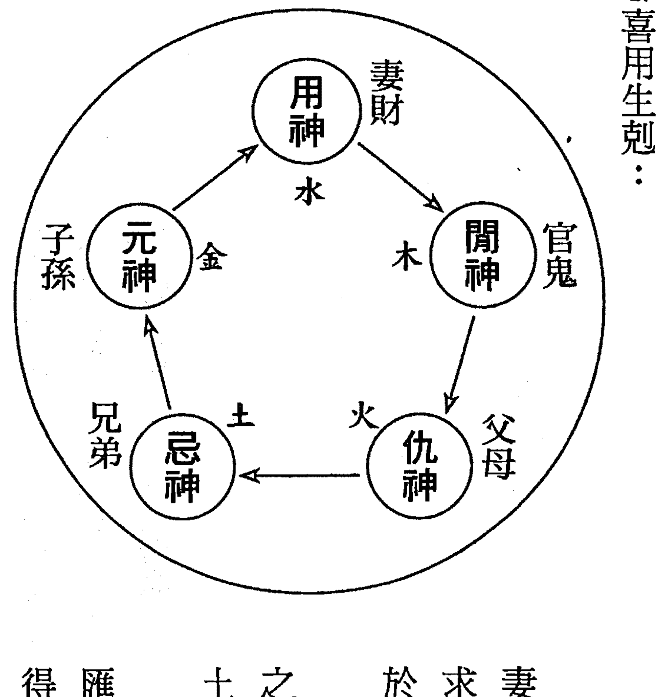

2. 占問財運如何？以妻財為用神。卦中妻財兩現，取亥水為用神。（用神兩現表示求財過程當中有兩種財路，而當中你將取決於流動、奔波之財）。

3. 未月，求財亥水受剋，位於死地，謂之大凶，故財運受阻而不順；且又動化出辰土兄弟回頭剋，故錢財被兄弟所劫。

4. 卦中幸得日辰生扶，求財雖不見大財匯聚，但財之根源細而不斷。可是當下你確得不到，因為財星入墓。要待巳日沖開之日，但是墓開之日，兄弟、朋友等著劫你的財，這種現象是如影隨行，擺脫不了。如此看來連得小財也很難，不容易。

5. 世爻卯木，在月為休囚，又逢日破（到底破）。就卦象來看，你生性剛強，有小聰明，對追求金錢的慾望大，但錢財守不住。卦中又官鬼持世事難安，財物事事憂失脫。另白虎相臨，講求快速，且壓力大、弄得一身傷。這表示：事情不順利、不平安、有憂慮、破財的機會大。

##### 6. 綜合而論：

- (1) 世爻休囚，又逢日破無力破到底。且持官鬼及白虎相臨，求財壓力大且傷，六月份求財不易。
- (2) 卦中顯示雖財爻兩現，求財之路有兩條，又受日辰生扶，但是財爻位於死地，用神之財動化回頭剋，又入墓，故求財難也。
- (3) 其次，卦中兄弟爻旺，在求財的過程中，財被劫的非常凶，注意口舌是非。
- (4) 再者，山火賁為六合卦，動變遊魂卦，表示飄浮不定、心無定向，求財取決於流動、奔波之財。
- (5) 上述求財未月難求，俟巳日、戌日沖開亥水財爻入墓（辰），就有小財。由卦象來看剛開始有錢，愈來愈無財，因兄弟使然。

## 實例十一：鍾先生於庚寅年癸未月甲子日，占財運如何？

占得：（巽宮）山風蠱卦。動爻：初爻。為山天大畜卦。

| 六神 | 卦首六親 | 世、應爻 | 本卦爻支 | 變卦爻支 | 六親 | 伏神 |
|---|---|---|---|---|---|---|
| 玄武 | 兄弟 | 應 | 寅 | | | |
| 白虎 | 父母 | | 子 | | 巳 | 孫 |
| 螣蛇 | 妻財 | | 戌 | | | |
| 勾陳 | 官鬼 | 世 | 酉 | | 申 | 孫 |
| 朱雀 | 父母 | | 亥 | | 午 | 父 |
| 青龍 | 妻財 | | 丑 | 子 | 父母 | |

| 休 | 囚 | 死 | 相 | 旺 | 月令 |
|---|---|---|---|---|---|
| 火 | 木 | 水 | 金 | 土 | 未月 |
| 子孫 | 兄弟 | 父母 | 官鬼 | 妻財 | 六親 |
| | 應 | | 世 | | 世應 |
| 胎 | 沐浴 | 旺 | 死 | 旺 | 日辰 |
| | | | | 旺 | 變爻 |
| 卦身：寅 | 羊刃：卯 | 驛馬：寅 | 貴人：丑、未 | 空亡：戌、亥 | 月破：丑 |

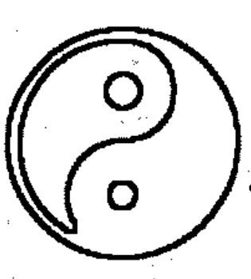

### 一、周易六十四卦卦意釋意：

「占卦」：山風蠱卦（蠱惑之卦）18

「蠱」：乃「皿」中食物腐敗生蟲引伸為蠱毒，蠱惑，腐化之意。卦體上為艮為少男為陽剛，下為巽為長女，為陰柔。上下卦之卦爻皆以剛爻橫阻於上，柔爻被遏於下，動彈不得，有如器皿之棄置不用，則不免久而敗壞了。又艮為山，巽為風「上下有風」，則草木撓亂，亦為敗壞之象。

「蠱卦」乃「隨卦」的倒轉。意謂「隨和」容易同流合污，以致腐敗，產生事端，就必須壯士斷腕，將腐敗切除，才能治，才能治癒。

「蠱」廢弛之象，演繹救敝起衰頹，艱辛改造之象。象徵耽於安樂而發生事端，陷入混亂，故必須運用智慧設法解決，自然可以創造出新的局面來。

「變卦」：山天大蓄（勤勉之象）26

「大蓄」：有蘊蓄、蓄養、蓄止之意。「大蓄」卦體，乾天在下，艮山在上，兩體卦象相合，則為天在山中之象，即所蘊蓄至大之道。然大氣無外，天何以藏諸于山中？此意乃是山得其天氣，能與雲作雨，涵有天地造化的機能。象曰：

「天在山中，大蓄，君子以多識前言往行，以蓄其德。」天德藏于內，天氣優于山中，又天主一切生成，無物不麗，無處不入，而山為地之高出，高必有窪，實必有虛，空穴來風，山崖出暈雲。風雲天氣所化，天德所行。故天在山中，非山高於天，乃山得天之氣而藏之，合天之德而優之。優藏方能成其大用。故有作為的人應體會此一理象。擴大自己的知識領域，充實自己累積知識，多體認前輩的言行經驗涵蓄自我德性。

#### 二、六爻卦譯：

##### 1. 喜用生剋：

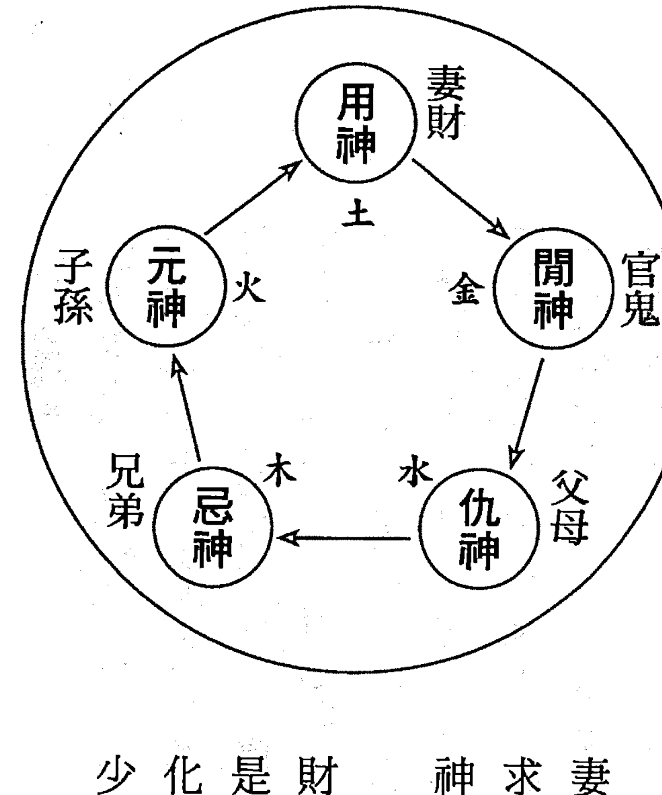

2. 占問財運如何？以妻財為用神。卦中妻財兩現，取丑土為用神。（用神兩現表示求財過程當中財路分散多處，求財多費精神）。

3. 卦中財爻旺相，又見官鬼旺相持世；財動來生之，則可謂以名聲地位而見財利。是謂名利雙收，但是財爻是逢月破，且動化父母，故原本之財利不如預期，且勞多獲少。

4. 卦中元神伏藏於父母之下，且受到剋制，無助於用神。未月求財用神旺相，故求財之途不需假借外力，係屬自食其力，白手生財；由此卦象，從事超市最好或土地代書業、土地仲介業，較有利。

5. 世者，做事自有主張，固執剛正、不屈服、不怕他人話短長。

6. 綜合而論：

- (1) 求財之途不假外力，自食其力，白手生財，注意貨源、客源之開發，必勉為其難。
- (2) 卦中有刑，將刑傷到財而有所損失，致使世者心裏不舒服。

## 實例十二：周先生於己丑年丁丑月己酉日，占財運如何？

占得：（震宮）地風升卦。動爻：3爻。為地水師卦。

| 六神 | 卦首六親 | 世、應爻 | 本卦震卦爻支 | 變卦坎卦爻支 | 六親 | 伏神 |
|---|---|---|---|---|---|---|
| 勾陳 | 官鬼 | | 酉 | | | |
| 朱雀 | 父母 | | 亥 | | | |
| 青龍 | 妻財 | 世 | 丑 | | | |
| 玄武 | 官鬼 | | 酉 | 午 | 子孫 | |
| 白虎 | 父母 | | 亥 | | | |
| 螣蛇 | 妻財 | 應 | 丑 | | | |

| 休 | 囚 | 死 | 相 | 旺 | 月令 |
|---|---|---|---|---|---|
| 火 | 木 | 水 | 金 | 土 | 丑月 |
| 子孫 | 兄弟 | 父母 | 官鬼 | 妻財 | 六親 |
| | | | | 世應 | 世應 |
| 死 | 胎 | 沐浴 | 帝旺 | 沐浴 | 日辰 |
| | | | 沐浴 | | 變爻 |
| 卦身：酉 | 羊刃：未 | 驛馬：亥 | 貴人：亥、酉 | 空亡：寅、卯 | 月破：未 |

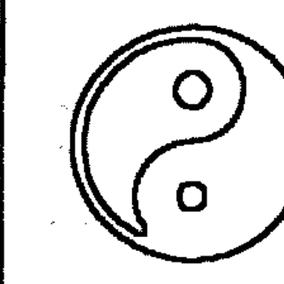

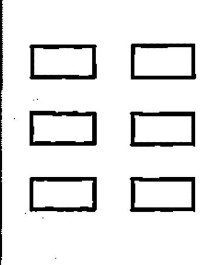

#### 一、周易六十四卦卦意釋意

「占卦」：地風升（向上之相）46

「升」：為上進、增進、登高、向上發展的意思。升卦，上卦為坤土，下巽木，兩者合而言之，為地中生木之象。故樹木由土中生長，從發芽到成為棟樑，都是在不知不覺中潛滋暗長，隨歲月而漸高大，並非一日之功，故推而論之，人類性求升進，亦如樹木之順其自然循序而進，不可揠苗助長。又「升」義為高升，進道亨通不息之理。上坤有柔順，柔順則與人無爭；下巽為伏入、巽順，伏者不求自表；故從其卦德，內巽外順，必不躁妄，行不悖理，所以能升，而得大亨之象。

「升」卦之前身萃卦，萃有相遇、相聚之意，故其含意是因萃卦求遇的目的無非在下無位者求有位，有位者求高升，推而論之，創業者，以無業而有業，有業而思大其業與長保其業，都是求事業的上進。升卦以地中生木之象，演由漸進升之理。因此，吾人名譽和地位的增高，不是偶然的，更不是可投機倖通，必須修養有素，應世有方，確具真才實學，不投機，不取巧，腳踏實地，行遠自邇，登高自卑，積微小以致高大，才是進升的正常途徑，方能在事業上真有成就。

### 「變卦」：地水師（爭戰之象）7

「師」：軍隊、兵眾、交戰、份爭、損傷之義。本卦體，坎下坤上，坎為水，為險象，坤為地，至順，有解眾之象。水在地下，內險而外順，象徵寓民於兵，兼有逆制順行，以戰止戰的意思。

卦辭：「師，貞，丈人吉，无咎。」一爭戰用事，必行名正言順。丈人，其方謀與德業必須為眾人所尊信畏服，如此與師動眾，吉而無悔咎矣。

卦象看，上坤下坎五陰一陽，小人得勢，務事多變，拖延危機。陽爻居內卦正位，當位而不當權，必須嚴守正道，待機而行，自可排除萬難，事事順隨矣。

### 二、六爻卦釋：

1. 喜用生剋：

2. 占問財運如何？以妻財為用神。卦中妻財兩現，取世爻丑土為用神。

3. 丑年丑月求占，用神丑土旺相，代表今財運佳，投資會賺錢，投資的環境也有利於你，會給你帶來財運。

4. 卦中官鬼爻動化有力，會影響你投資，在經營過程當中犯小人、有阻礙、詐欺、官非等要小心，尤其是自家人為了錢有意見。

5. 雖因官鬼作祟，但官鬼動化午火子孫回頭剋，能削減其力；而子孫爻為用神之元神、福神，故可化解整個過程當中的一切現象，但是要注意。

6. 以卦象來看，世者貴人屬馬，姓氏中有火字或家住在南部或南方。

## 實例十三：劉先生於己丑年丁丑月己酉日，占求財如何？

占得：（離宮）天水訟卦。動爻：2爻。為天地否卦。

| 六神 | 卦首六親 | 世、應爻 | 本卦離卦爻支 | 變卦乾卦爻支 | 六親 | 伏神 |
|---|---|---|---|---|---|---|
| 勾陳 | 子孫 | | 戌 | | | |
| 朱雀 | 妻財 | | 申 | | | |
| 青龍 | 兄弟 | 世 | 午 | | | |
| 玄武 | 兄弟 | | 午 | | | |
| 白虎 | 子孫 | | 辰 | 巳 | 兄弟 | |
| 螣蛇 | 父母 | 應 | 寅 | | | |

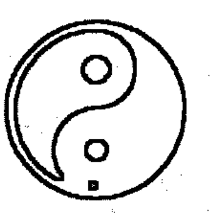

| 休 | 囚 | 死 | 相 | 旺 | 月令 |
|---|---|---|---|---|---|
| 火 | 木 | 水 | 金 | 土 | 丑月 |
| 兄弟 | 父母 | 官鬼 | 妻財 | 子孫 | 六親 |
| 世 | 應 | | | | 世應 |
| 死 | 胎 | 沐浴 | 帝旺 | 沐浴 | 日辰 |
| | | | | 絕 | 變爻 |

| 卦身：酉 | 羊刃：未 | 驛馬：亥 | 貴人：亥、酉 | 空亡：寅、卯 | 月破：未 |

#### 一、周易六十四卦卦意釋意

「占卦」：天水訟卦（反省之象）6
「訟」：相爭訴訟之意。要慎之於始，防微杜漸，以免訟端、爭訟，結果總是凶悖的，故不宜。諸事閉塞，不如意宜退守謹慎小心。唯有明辨利害，知所警惕，凡事適可而止，庶幾可以消弭爭端，化除訟累。
「訟」，雄鷹逐兔之卦，天水相違之象；兩敗俱傷，久爭無益，官司牢獄，婚姻障礙。

「變卦」：天地否卦（否塞之卦）12
「否」：作閉塞不通、隔絕、黑暗、時運不通之意，體卦坤下乾卦上，內陰外陽，坤為地、乾為天。地重在下，天輕在上各自據其位，互不交流，陰陽不交，則萬物的生機不能暢達，上下的情愫不相交融，則隔閡乖離天下混亂。天地不相交流，是為閉塞之象，且內陰而外陽，則內小而外君子，乃象徵小人當位於內，君子被摒棄於外，小人之道方長，則君子之道消退。
「泰」卦倒轉即成「否」卦，彼此是「綜卦」，故「泰」極而「否」，「否」極「泰」來，互為因果，故占此卦者，宜勿操急，耐心待機，退守避之則吉。

#### 二、六爻卦譯：

1. 喜用生剋：

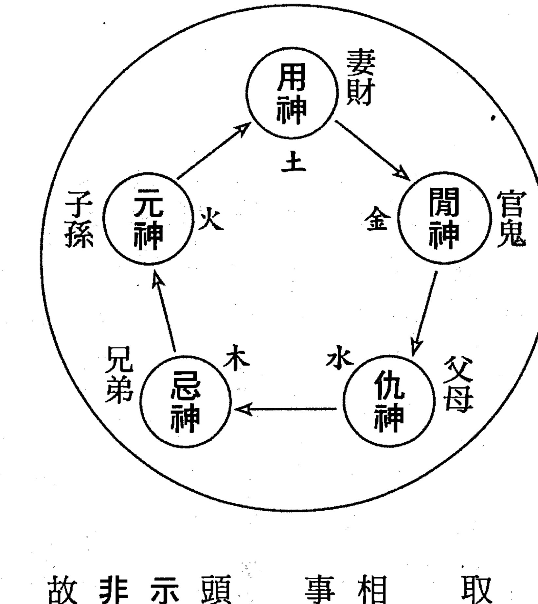

2. 占問求財如何？以妻財為用神。卦中取申金為用神。

3. 丑年丑月酉日求占，用神值歲當令旺相，得日月生扶旺極。故求財慾望強烈，謀事諸般皆順利。

4. 卦中元神辰土子孫爻動化巳火兄弟回頭生；且元神在月為旺相，故生助用神。表示生產計劃、產品、貨源，客源，支票等均非常充裕及具規模。但是由於化出兄弟爻，故有被兄弟朋友劫持瓜分之意。

5. 應爻寅木為父母，謀事及工作環境，辛勞或為長輩拖累之象。

6. 綜合而論：

> 賦曰：「兄弟持世莫問財」，此乃為無財之論，因兄弟劫財。本卦因卦氣極旺，賺錢賺的多，且辛苦勞累，注意兄弟朋友（含道上兄弟）劫財。

## 實例十四：崔先生於己丑年庚辰月戊申日，占問父病如何？

占得：（乾宮）乾為天卦。動爻：4爻。為風天小畜卦。

| 六神 | 卦首乾卦六親 | 世、應爻 | 本卦乾卦爻支 | 變卦巽卦爻支 | 六親 | 伏神 |
|---|---|---|---|---|---|---|
| 勾陳 | 父母 | 世 | 戌 | | | |
| 朱雀 | 兄弟 | | 申 | | | |
| 青龍 | 官鬼 | | 午 | 未 | 父母 | |
| 玄武 | 父母 | 應 | 辰 | | | |
| 白虎 | 妻財 | | 寅 | | | |
| 螣蛇 | 子孫 | | 子 | | | |

| 休 | 囚 | 死 | 相 | 旺 | 月令 |
|---|---|---|---|---|---|
| 火 | 木 | 水 | 金 | 土 | 辰月 |
| 官鬼 | 妻財 | 子孫 | 兄弟 | 父母 | 六親 |
| | | | | 世應 | 世應 |
| 冠帶 | 衰 | 墓 | 養 | 墓 | 日辰 |
| | | | | 衰 | 變爻 |
| 卦身：伏身 | 羊刃：午 | 驛馬：寅 | 貴人：丑、未 | 空亡：寅、卯 | 月破：未 |

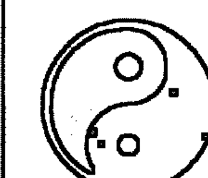

#### 一、周易六十四卦卦意釋意

「占卦」：乾為天（純陽至剛至健之象）1
「乾」：象徵至剛至健為「天體」的總稱，又解作「健」。「乾」卦，取象於天，但不稱「天卦」而稱「乾卦」因為天字為大氣本體的指稱，亦是自然法則。
「乾」字則指天體運行的作用，天體運行，晝夜寒暑，循環不息永無間歇，為至健之象。「健」，不是一時的衝動，而是恆久不息無止境的運行，故演繹「天行健，君子以自強不息」之理象。
乾為天卦，純陽爻，表示剛健旺盛積極主動，前進及龍馬精神，故須自我不斷充實，必須珍惜光陰，勤勉奮進，不可強出頭謙虛為懷，聽取諫言，戒得自滿，謂「亢龍有悔，盈不可久也」。

「變卦」：風天小蓄（待機之象）9
「小蓄」：蓄聚、蓄養、蓄止三種意義。小蓄卦，下乾上巽，六四為陰爻，其餘五爻均為陽爻，陽過盛而陰不足，以一陰而蓄養五陽，力量有限，有不得不稍為停頓的限象。
卦辭：「小蓄，亨，密雲不雨日我西郊。」演繹蘊積致通之理。因為必先有所積聚，然後可以施與，積聚是「蓄」，施與即是「通」，蓋聚沙成塔，集液成裘，積小致大，是為「小蓄」之理象。蓄卦，又以弱小得陰，阻擋剛強的陽，雖成事不足但敗事有餘，故占得此卦，須戒急用忍，戒慎隱忍，所謂「小不忍則亂大謀」，只要雲層開，即是天晴，故須等待。

#### 二、六爻卦譯：

1. 喜用生剋：

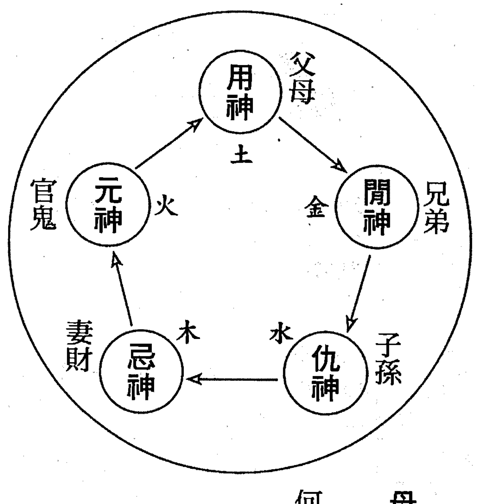

2. 占問父病如何？以父母爻為用神。卦中父母爻兩現，取戌土父母爻為用神。

3. 本卦占問父病況如何？顯然其父乃病重。何言病重？

- (1) 辰月申日求占，用神雖旺相，但辰戌沖為月破。
- (2) 日辰申金沖卦中妻財寅木為暗動，木動則剋戌土用神。
- (3) 卦中元神午火官鬼爻雖動可生成土用神，但動化出未土與午火形成六合，故被絆住無法去生用神。準此，當下病重之因。
- (4) 須待丑日沖開，使午火無合可貪。且可生用神，其災自退。
- (5) 果於丑日起床。

## 實例十五：朱先生於己丑年辛卯月戊辰日，占問父官司如何？

占得：（兌宮）澤地萃卦。動爻：初、3、上爻。為天火同人卦。

| 六神 | 卦首六親 | 世、應爻 | 本卦爻支 | 變卦爻支 | 六親 | 伏神 |
|---|---|---|---|---|---|---|
| 勾陳 | 父母 | | 未 | 戌 | 父母 | |
| 朱雀 | 兄弟 | 應 | 酉 | | | |
| 青龍 | 子孫 | | 亥 | | | |
| 玄武 | 妻財 | | 卯 | 亥 | 子孫 | |
| 白虎 | 官鬼 | 世 | 巳 | | | |
| 螣蛇 | 父母 | | 未 | 卯 | 妻財 | |

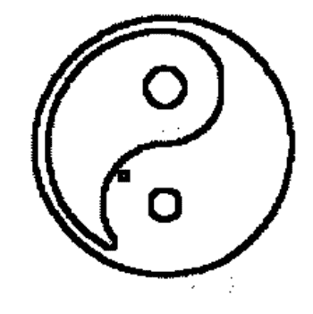

| 休 | 囚 | 死 | 相 | 旺 | 月令 |
|---|---|---|---|---|---|
| 水 | 金 | 土 | 火 | 木 | 卯月 |
| 子孫 | 兄弟 | 父母 | 官鬼 | 妻財 | 六親 |
| | 應 | | 世 | | 世應 |
| 死 | 胎 | 死 | 沐浴 | 帝旺 | 日辰 |
| | | | | | 變爻 |
| 卦身：未 | 羊刃：午 | 驛馬：寅 | 貴人：丑、未 | 空亡：戌、亥 | 月破：酉 |

#### 一、周易六十四卦卦意釋意

「占卦」：澤地萃卦（潤澤之象）45
「萃」：草叢茂盛貌，有群集，聚集之意，卦象，上兌澤、下坤地，地上水聚成澤，可滋潤萬物，所以有愉悅之象，又下坤為順，上兌為悅，和順而歡悅，乃象徵安居樂業，群賢聚集，但物聚則難免錯亂，人聚則難免紛爭，必須要惕勵，足以保證永久團結。

「變卦」：天火同人卦（光明之卦）13
「同人」：象徵光明向上升，與天相同。有親近，志同道合，盛大富有之意。本卦是以離下，乾上，離正象為火，乾正象為天，天在上，火勢向上，故人心總是愛好向上的。易曰：「同人于野，亨，利涉大川，利君子貞。」，光明向上升表示與人交往光明正大、公開、無私、與人合作才會達成願望。只要正當的事情與志同道合的人去進行，才會有成。所謂得道多助，君子以正心誠意，方能感召天下之人而融通億萬之心志所向。

#### 二、六爻卦譯：

##### 1. 喜用生剋：

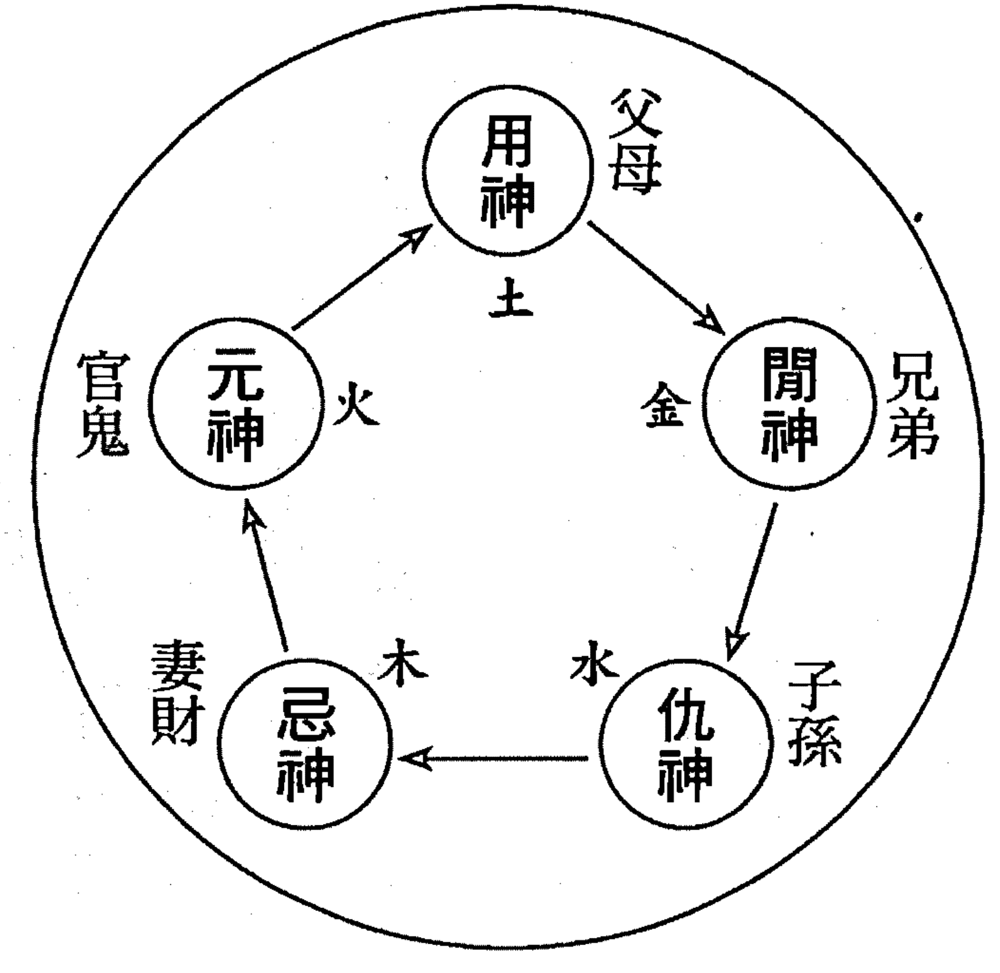

2. 占問父官司如何？以未土父母爻為用神。

3. 卯月求占，用神休囚無力，又逢月建剋之。且又動化卯木回頭剋未土用神。

4. 卦中卯木忌神動化有力，且化出亥水，形成三合木再剋用神。

5. 雖見卯木生元神巳火旺相有力可生扶用神，但卦中剋多生少，生機欠明，故有勞獄之災。

6. 結果判重刑。

## 實例十六：張先生於庚寅年甲申月丙午日，自占與女友求婚成功與否？

占得：（震宮）雷風恆卦。動爻：上爻。為火風鼎卦。

| 六神 | 卦首六親 | 世、應爻 | 本卦爻支 | 變卦爻支 | 六親 | 伏神 |
|---|---|---|---|---|---|---|
| 青龍 | 妻財 | 應 | 戌 | 巳 | 子孫 | |
| 玄武 | 官鬼 | | 申 | | | |
| 白虎 | 子孫 | | 午 | | | |
| 呈蛇 | 官鬼 | 世 | 酉 | | 寅 | 兄 |
| 勾陳 | 父母 | | 亥 | | | |
| 朱雀 | 妻財 | | 丑 | | | |

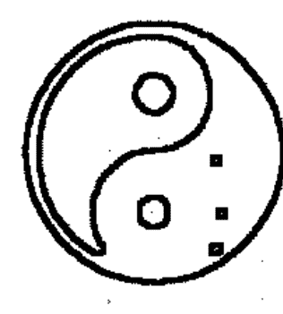

| 休 | 囚 | 死 | 相 | 旺 | 月令 |
|---|---|---|---|---|---|
| 土 | 火 | 木 | 水 | 金 | 申月 |
| 妻財 | 子孫 | 兄弟 | 父母 | 官鬼 | 六親 |
| 應 | | | | 世 | 世應 |
| 胎 | 帝旺 | 死 | 胎 | 沐浴 | 日辰 |
| | | | | 絕 | 變爻 |

| 卦身：亥 | 羊刃：卯 | 驛馬：申 | 貴人：丑、未 | 空亡：寅、卯 | 月破：寅 |

#### 一、周易六十四卦卦意釋意

「占卦」：雷風恆（安足之象）32
「恆」：字義為「經常」、「長久」無論天道、人道萬物皆明示以保存永遠不退之生機。從其卦象，上震為雷，下巽為風，兩者合為雷鳴風發，互助聲勢乃勢態之常。故恆卦以雷風聲勢相長之象，演正確而自然的恆常之理。日月之能「久照」，四時之能「久成」，聖人之能「久於其道」無不正確自然。不正確則有偏差，使不能「不易其方」；蓋一切事物必須順其自然，不自然則有窒礙，便不能始終循環，準此，正常則存，反常則毀。即是，要恰好適當，過與不及均屬不正常，不正常則不能恆大，此乃不變的規律。
卦辭：「恆，亨，无咎，利貞，利有攸往。」凡事君子以立不易方只要有恆心，就能亨通，凡事利於正常沒差錯，動機純正就能無往不利。

「變卦」：火風鼎卦（凝命之象）50
「鼎」：為食器、取新之意，並為國之重器，久煉成剛之義。卦象：上卦為離、為日、為火、為熱也。下卦為巽，為風、為木；用木燒火，火焰在上，生熱；而木在其下，生火，變成灰炭，同時鼎中食物也在變化。所以上下之物，均在變，故鼎一則本「鑽木取火」，供民熟食之義，一則明「以薪資火」，為鼎烹飪之象。

「鼎」為古時烹飪器具，重在其用，有如井卦取養民之用為義。鼎之用亦為生養之需。故鼎亦為民生不可離者。再者，上離為麗為明，主光明智慧明察之義；下巽為伏入、為巽順，主和順、流動，有進入之象。兩者相合，即採用內進，外明智慧的含義，以說明社會、人世現象的變化。例如採用和順進入的方法去做事；以智慧明察的方法去做人，準此，才能成功力業以成就化育萬物，提昇心靈的境界，而達與天地同德。

鼎亦有革物之用，變腥而為熟，易堅而為柔，水火不可同處也。能使相合為用，而不相害，是賴以革物。鼎是革命完成之象，革已將所有敝端不好之事物去除了，但舊的去了，如果未有新的來填補則為空白，空是亂源且為大忌。鼎除能革物亦能取新。象曰：「鼎，君子以正位凝命。」

#### 二、六爻卦譯：

##### 1. 喜用生剋：

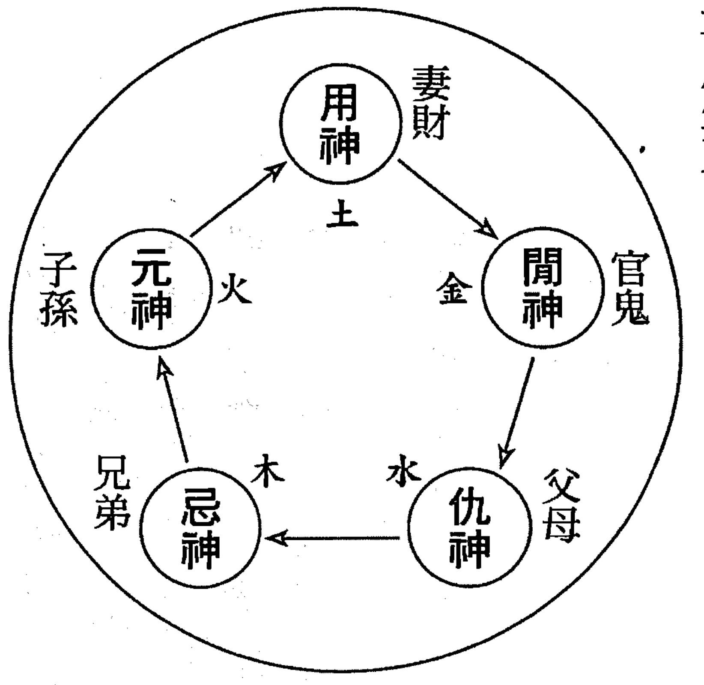

2. 占問與女友求婚能否成功？以妻財為用神。卦中妻財兩現，取戌土妻財為用神。

3. 申月求占，用神休囚，惟得日辰生扶。且又青龍相臨，動化巳火子孫回頭生。表示這個女友很善良、清高，且懷著喜悅的心情。

4. 世爻代表自己，世持酉金官鬼呈蛇相臨，在月為旺相，在日為沐浴。世心具信心，有強烈作為丈夫的角色。

5. 應爻代表女友及女方家庭。應持戌土妻財青龍相臨，在月為休囚，在日受生扶，並化子孫回頭生，且生世爻，表示女方家長及其家庭都喜歡將女兒嫁給世。

6. 以卦象來看，女友乃是奉子成婚。且世應陰陽得位，適得其所，一定白頭偕老。

## 實例十七：黃小姐癸未月丁卯日，占問預租竹北一間店面做餐飲生意財運如何？

占得：（兌宮）水山蹇卦。動爻：3爻。為水地比卦。

| 六神 | 卦首兌卦六親 | 世、應爻 | 本卦兌卦爻支 | 變卦坤卦爻支 | 六親 | 伏神 |
|---|---|---|---|---|---|---|
| 青龍 | 子孫 | | 子 | | | |
| 玄武 | 父母 | | 戌 | | | |
| 白虎 | 兄弟 | 世 | 申 | | | |
| 呈蛇 | 兄弟 | | 申 | 卯 | 妻財 | |
| 勾陳 | 官鬼 | | 午 | | | |
| 朱雀 | 父母 | 應 | 辰 | | | |

| 休 | 囚 | 死 | 相 | 旺 | 月令 |
|---|---|---|---|---|---|
| 火 | 木 | 水 | 金 | 土 | 未月 |
| 官鬼 | 妻財 | 子孫 | 兄弟 | 父母 | 六親 |
| | | | 世 | 應 | 世應 |
| 沐浴 | 帝旺 | 死 | 胎 | 死 | 日辰 |
| | | | 胎 | | 變爻 |

| 卦身：酉 | 羊刃：未 | 驛馬：巳 | 貴人：丑、未 | 空亡：戌、亥 | 月破：丑 |

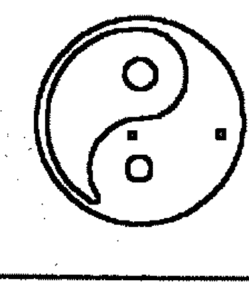

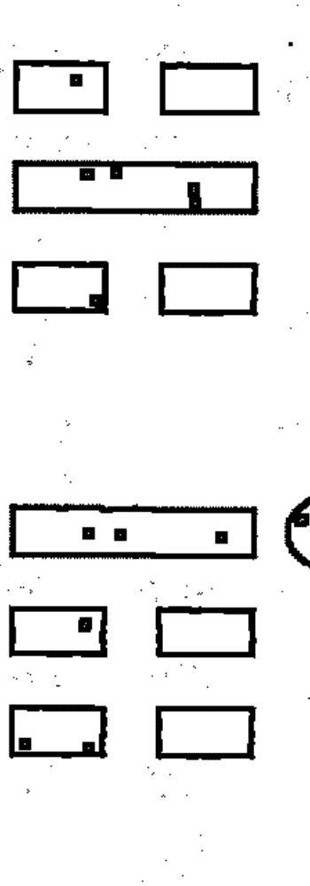

#### 一、周易六十四卦卦意釋意

「占卦」：水山蹇（退守之卦）39
「蹇」：跛足，引伸為進退維谷，艱難之意。卦體艮下坎上，坎陷當前，止而不進，有如跛者之艱於步履。
象曰：山上有水，蹇。君子以反身修德。山上有水，障礙重重，人生不能沒有險阻，世間亦不能沒有災難，過險阻不宜輕於犯險前進，最好停下來反躬自省，進修進德，以求其行得通，祗好實幹，苦幹、硬幹、而不能蠻幹。亦不可聽其自然，委諸命運。

「變卦」：水地比卦（親和之象）8
「比」：作親密、親近、比鄰、親愛精誠、同心協力之意，坎水在坤地上，構成河流溪海，相比相親，最為親切之象。此卦，九五陽爻尊位，與下卦六二陰陽相應，為上下親比的吉象。但是要不時的自我檢討，開誠相見，無不可以親善而互助唉。占得此卦，表示和他人合作吉，親近大德之人為吉，與人創辦共同事業吉。

#### 二、六爻卦譯：

##### 1. 喜用生剋：

2. 占問租店經營餐飲生意財運如何？以妻財為用神。卦中妻財不現，居於變爻卯木妻財，故取之為用神。

3. 未月卯日求占，用神休囚，雖得日辰比助。但因申金呈蛇兄弟爻動化出卯木妻財。故會常常先破財再得小財。

4. 世爻代表自己。世爻申金持兄弟，白虎相臨。在月旺相有力，表示很自信且具眼光。但是，賦云：「兄弟持世莫問財」。因此，慎防會亂花錢之象；投資須保守免失利。

5. 應爻代表工作環境、店面。應爻辰土持父母朱雀相臨。在月為旺相，在日為死地：應爻辰土生世爻，表示店面及其周遭環境，對世來說都認為不錯，而感到滿意，但父母爻主辛勞、勞多獲少，求財不益，另外要注意口舌是非。

6. 卦中子孫爻為福神，但休囚無力，且與用神相刑，顯示此店客源不多。

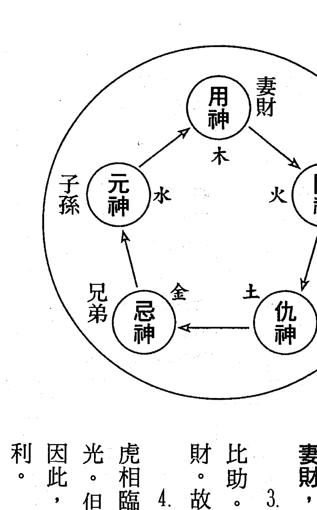

## 實例十八：李母丁巳月庚申日，占問女兒98年度高中聯考是否能考上第一志願？

占得：（坎宮）雷火豐卦。動爻：初爻。為雷山小過卦。

| 六神 | 卦首坎卦六親 | 世、應爻 | 本卦坎卦爻支 | 變卦艮卦爻支 | 六親 | 伏神 |
|---|---|---|---|---|---|---|
| 呈蛇 | 官鬼 | 世 | 戌 | | | |
| 勾陳 | 父母 | | 申 | | | |
| 朱雀 | 妻財 | | 午 | | | |
| 青龍 | 兄弟 | | 亥 | | | |
| 玄武 | 官鬼 | 應 | 丑 | | | |
| 白虎 | 子孫 | | 卯 | 辰 | 官鬼 | |

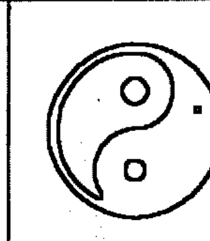

| 休 | 囚 | 死 | 相 | 旺 | 月令 |
|---|---|---|---|---|---|
| 木 | 水 | 金 | 土 | 火 | 巳月 |
| 子孫 | 兄弟 | 父母 | 官鬼 | 妻財 | 六親 |
| | | 世 | 應 | | 世應 |
| 絕 | 長生 | 臨官 | 長生 | 病 | 日辰 |
| | | | 衰 | | 變爻 |

| 卦身：亥 | 羊刃：酉 | 驛馬：寅 | 貴人：午、寅 | 空亡：子、丑 | 月破：亥 |

#### 一、周易六十四卦卦意釋意

「占卦」：雷火豐卦（盈虛之象）55
「豐」：盛大、豐隆、光明正大、豐富、收穫、欣欣向榮之意。
卦體離下震上，「離為電、震為雷」雷電交作，聲勢壯大，但盛極則無可更盛，而將憂其漸衰。卦辭曰：「日中則昃、月盈則食，天地盈虛，與時消息。」占得此卦，卦中隱伏著危機，切忌勿得意忘形，以免陷入盛極則衰的自然循環。豐隆之時應有所惕。

「變卦」：雷山小過卦（飛鳥之象）62
「小過」：稍為過度，過份之意，本卦陰盛陽衰，陰柔用事，雖不如陽剛之有力量，但有時因事制宜，必須採用陰柔的手段，方能解決問題而得以通亨。也是有的。

「雷山小過」卦以雷聲受山嶺阻礙而減小的過差之象。演繹「過」與「不及」之間的權衡取捨之理。凡事如果不水準，不過成效較差，至多徒勞無功罷了，若超過限制，便有發生危險的可能。不要好高驚遠。

### 二、六爻卦釋：

##### 1. 喜用生剋：

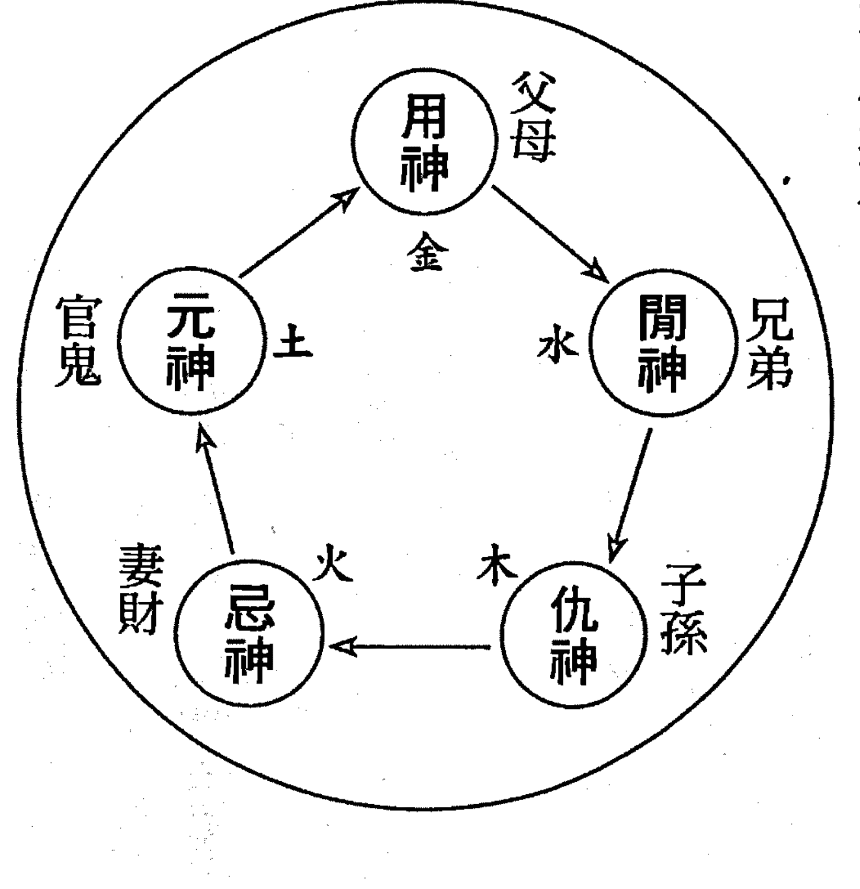

2. 占問考試如何？以父母爻為用神。官鬼爻同參。

3. 巳月申日求占，用神申金世持父母位於死地，在日為臨官，並得日辰比助。表示過去的平常考試成績還不錯，根基很好。但是當下考試成績將會受到影響。

4. 應爻丑土為官鬼，代表考試場所及周邊環境。應爻月居旺相，日臨長生，因此，考場對世來說是有利的。雖坐空侯出空即可用。（占卜之日為空亡考試之日並非空亡）。

5. 卦中子孫爻卯木原本剋官鬼爻，但子孫爻休囚並處於絕地無力剋之，故而卯木子孫動化丑土生世爻申金，使父母爻得元神生扶而旺。增強考試氣勢而有好成績。

6. 就卦象而論，此次聯考因用神無力，故成績受影響，第一志願無緣，但可上公立學校。

#### 7. 綜合而論：

(1) 父母爻為考試成績；官鬼爻為功名、官星、公立學校。
(2) 父母、官鬼爻宜旺相，日辰要生，要考上第一志願才沒問題。
(3) 卦中子孫爻剋官鬼，因子孫爻休囚並處於絕地無力剋之，故而卯木子孫動化丑土生世爻申金，使父母爻得元神生扶而旺。增強考試氣勢而有好成績。但巳月，父母爻位於死地，成績受影響無法考上第一志願，但是其他公立學校沒問題，因官鬼爻旺相。

## 實例十九：李小姐於庚寅年癸未月庚申日，占問7月31日等，參加國家藥劑師考試能否考上？

占得：（艮宮）山澤損卦。動爻：初爻。為山水蒙卦。

| 六神 | 卦首艮卦六親 | 世、應爻 | 本卦艮卦爻支 | 變卦離卦爻支 | 六親 | 伏神 |
|---|---|---|---|---|---|---|
| 呈蛇 | 官鬼 | 應 | 寅 | | | |
| 勾陳 | 妻財 | | 子 | | | |
| 朱雀 | 兄弟 | | 戌 | | | |
| 青龍 | 兄弟 | 世 | 丑 | | 申 | 孫 |
| 玄武 | 官鬼 | | 卯 | | | |
| 白虎 | 父母 | | 巳 | 寅 | 官鬼 | |

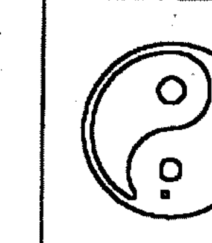

| 休 | 囚 | 死 | 相 | 旺 | 月令 |
|---|---|---|---|---|---|
| 火 | 木 | 水 | 金 | 土 | 未月 |
| 父母 | 官鬼 | 妻財 | 子孫 | 兄弟 | 六親 |
| | 應 | | | 世 | 世應 |
| 病 | 絕 | 長生 | 臨官 | 長生 | 日辰 |
| | | 長生 | | | 變爻 |

| 卦身：子 | 羊刃：酉 | 驛馬：寅 | 貴人：午、寅 | 空亡：子、丑 | 月破：丑 |

#### 一、周易六十四卦卦意釋意

「占卦」：山澤損（謹言慎行之象）41

「損」：減損、節約、約束、減削，又引義為修己、兌興、為道日損之義。卦體乃兌澤在艮山下，山宜高、水宜深，損沼澤之土，可以益山陵之高，而沼澤因之益深，故損所當損、益所當益，乃是本卦所演的理象。盈則當損、虛則當益、損盈益虛、相調節，然一切能均衡適當矣。

「損」卦來自泰卦。☷☰，下卦損一陽爻為兌，增至上卦為艮：即成損卦☷☶。亦即下損上益，損剛益柔、相濟為用。損卦亦有損己利人之象。此象，非因果之異，乃變化之機。正如一年四季、自成其序、不得不然，人以天為準則，知損之當損，不可妄希其益。益之當益，不可辜圖其損，人事之得失本乎其義。書云：「滿招損，謙受益。」以滿者必損，虛者能益，損其滿而益其虛。截其長補其短，以致于平，以化于同。雖即損亦有得矣。

「變卦」：山水蒙卦（探真之卦）4

「蒙」：智慧未開，蒙昧不明，童蒙之意，即孩童幼稚蒙昧的心靈。卦體坎下艮上，坎水在艮山之下，水在山下為泉，泉為水源，澄清無滓象徵童蒙為人性之初，純潔不雜。

#### 二、六爻卦譯：

山水蒙卦是演繹教學的理象，蓋以人生蒙昧之初善性為其所具，至於善性的發展與辨別善惡的識力，則必須是有待啟發而後才可以亨通。蒙卦，下為「坎」水，蒸發成霧，把「艮」山掩蓋成朦朧而不看清的狀態。故要有警惕心，對事情要明辨是非，看輕利害關係，才不會吃虧上當，要多聽取長輩的經驗談，虛心接受指導，才能夠脫出困境。

##### 1. 喜用生剋：

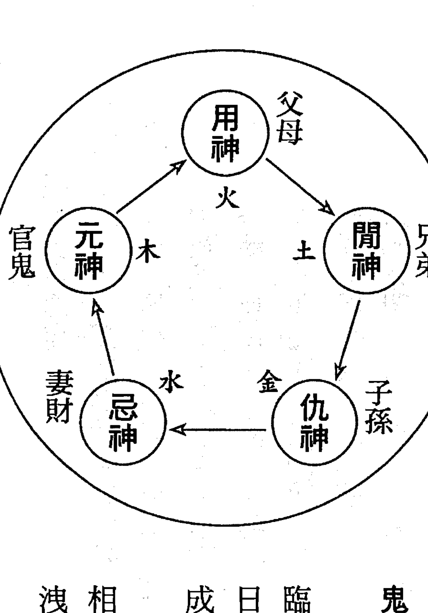

2. 占問考試如何？以父母爻為用神。官鬼爻同參。

3. 未月申日求占，用神巳火父母白虎相臨休囚無力，雖動化寅木官鬼回頭生，但為日辰沖破，且又形成寅巳申三刑。影響考試成績。

4. 丑土兄弟持世青龍相臨，雖月為旺相，日為長生，但實為月破又為坐空，且又洩耗用神，致使考試成績欠佳。

5. 應爻寅木官鬼爻呈蛇相臨，月逢休囚，日破坐絕，雖為父母之元神，但無濟於科名。

6. 綜合而論：世者本無參試意願，經朋友激勵勉強應試，對手又多，成績不佳沒錄取。

#### 7. 綜合而論：

(1) 父母爻為考試成績；官鬼爻為功名、官星、公立機關。

(2) 兄弟持世青龍相臨，雖月為旺相，日為長生，但實為月破又為坐空，且又洩耗用神，致使考試成績欠佳。實質上，世者本身無參試意願，經朋友激勵才勉強應試，而且競爭者又多，妨害錄取名額。

(3) 寅木官鬼爻呈蛇相臨，月逢休囚，日破坐絕，雖為父母之元神，但無濟於科名。且應剋世，考場亦對世不利。

(4) 用神巳火父母白虎相臨休囚無力，雖動化寅木官鬼回頭生，但為日辰沖破，且又形成寅巳申三刑。影響考試成績。

(5) 另子孫爻伏藏於世爻之下得飛神所生，而引發出來愛玩無充分準備，故而成績不佳，科名不顯。結果沒考取。

## 實例二十：古小姐於庚寅年甲申月甲午日，占問經營某公司直銷健康產品是否會賺錢？

占得：（離宮）火山旅卦。動爻：3爻。為火地晉卦。

| 六神 | 卦首離卦六親 | 世、應爻 | 本卦離卦爻支 | 變卦乾卦爻支 | 六親 | 伏神 |
|---|---|---|---|---|---|---|
| 玄武 | 兄弟 | | 巳 | | | |
| 白虎 | 子孫 | | 未 | | | |
| 呈蛇 | 妻財 | 應 | 酉 | | | |
| 勾陳 | 妻財 | | 申 | 卯 | 父母 | 亥 官 |
| 朱雀 | 兄弟 | | 午 | | | |
| 青龍 | 子孫 | 世 | 辰 | | | |

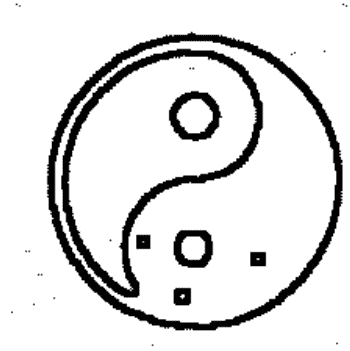

| 休 | 囚 | 死 | 相 | 旺 | 月令 |
|---|---|---|---|---|---|
| 土 | 火 | 木 | 水 | 金 | 申月 |
| 子孫 | 兄弟 | 父母 | 官鬼 | 妻財 | 六親 |
| 世 | | | | 應 | 世應 |
| 胎 | 帝旺 | 死 | 胎 | 沐浴 | 日辰 |
| | | | | 胎 | 變爻 |

| 卦身：午 | 羊刃：卯 | 驛馬：申 | 貴人：丑、未 | 空亡：辰、巳 | 月破：子 |

#### 一、周易六十四卦卦意釋意

「占卦」：火山旅卦（流浪之象）56

「旅」：旅行過往，暫寄、移動、遷移、出動、盛衰消長、禍福倚伏，生死輪迴，不安定之意。

「旅，小亨，旅貞吉」。辭意為：旅居在外，人地生疏，凡事不可大意，處處謹慎，要能守分守己，方能小得通亨，于德為貞，貞固有持，始成其德，雖旅居在外，亦可以獲吉也，再者從卦象看，艮止而離明，原有守有為之象，但重剛失中，內外正位皆柔，不得相應，柔乃順乎剛，以失其主位。故旅卦是以小亨，无能大亨，為旅貞吉也。

另以象辭而論：下艮上離，山上燒火，火勢蔓延燃燒之象，演繹人、事播遷之理。其涵意：無限於旅，實括一切事務演變，均有其時空的過程，不能無變，因時因地，應其變而制其宜。是以不變應萬變之理。

「變卦」：火地晉卦 35

「晉」：前進、晉升、提昇及光明之意，而其行必光大正行，不可妄進，「晉」以日出地面，光明普照取象。故要以自我進修而昭顯自身的光明德性。不宜驕橫孤行，以得民心為重。

### 二、六爻卦釋：

「晉」，龍劍出鞘之卦，以臣遇君之象。家官晉祿，日出地平面，照臨大地，光明上進，更上層樓，考試上榜。

##### 1. 喜用生剋：

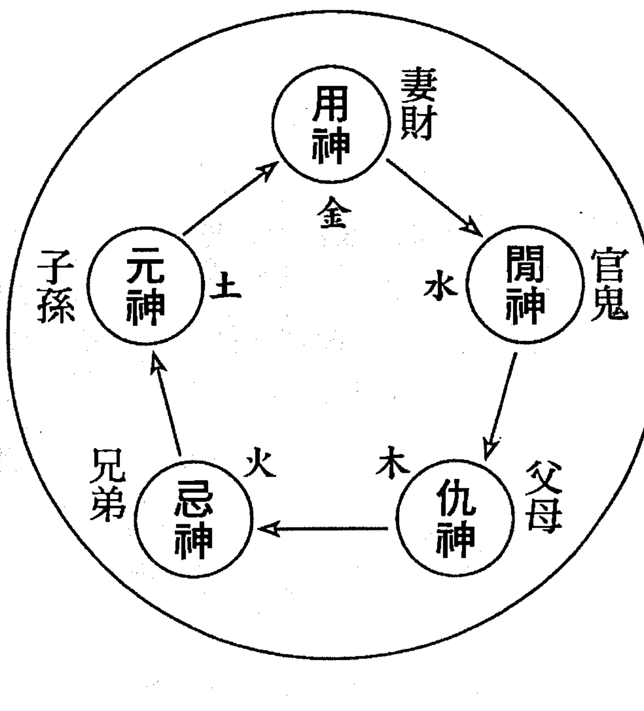

2. 占問經營產品賺錢與否？以妻財為用神。卦中妻財兩現，以申金妻財勾陳相臨為用神。

3. 申月午日求占，用神申金妻財，謂之併起旺相，本屬能進大財，但逢用神動化卯木父母，引發而成三刑，折損財爻力量；同時亦引發朋友、姐妹口舌、是非、暗嘲熱諷，批評不會賺錢。財爻化父母為賺錢辛勞，且勞多獲少。

4. 辰土世爻持子孫，青龍相臨。月為休囚，日為胎。賦云：「子孫持世事無憂」。子孫為福神、喜悅、解憂之神。卦中世爻丑土生合應爻，表示世者熱愛這份工作，且愉悅其中，對公司付出甚多。但因世爻休囚無力又值空亡及自刑，造成世者內心處於矛盾心神不定、三心二意、疑心的現象，想阻礙自己又捨不得，內心憂慮不堪。因此必須開發新的技能開拓新客源。

5. 應爻酉金持妻財，呈蛇相臨，旺相有氣。表示該公司體質很好且資金雄厚。

6. 綜合而論：本卦為火山旅六合卦，變火地晉為遊魂卦。先吉後凶，剛開始有旺盛企圖心，與公司配合度高，由於勞多獲少、客源不濟、朋友、姐妹暗嘲熱諷等批評，導致世者，心處於矛盾、三心二意、疑心憂慮，喪失企圖心，如同遊魂一樣飄浮不定。

7. 建議：改變運用新的技能開闢客源。把握申、酉、戌這三個有利的月份。

## 實例二十一：程小姐於庚寅年甲申月丙午日，占問於竹南火車站某店面經營便當，財運如何？

占得：（坎宮）地火明夷卦。動爻：5爻。為水火既濟卦。

| 六神 | 卦首坎卦六親 | 世、應爻 | 本卦坎卦爻支 | 變卦坎卦爻支 | 六親 | 伏神 |
|---|---|---|---|---|---|---|
| 青龍 | 父母 | | 酉 | | | |
| 玄武 | 兄弟 | | 亥 | 戌 | 官鬼 | |
| 白虎 | 官鬼 | 世 | 丑 | | | |
| 呈蛇 | 兄弟 | | 亥 | | 午 | 財 |
| 勾陳 | 官鬼 | | 丑 | | | |
| 朱雀 | 子孫 | 應 | 卯 | | | |
| 休 | 囚 | 死 | 相 | 旺 | 月令 |
| 土 | 火 | 木 | 水 | 金 | 申月 |
| 官鬼 | 妻財 | 子孫 | 兄弟 | 父母 | 六親 |
| 世 | | 應 | | | 世應 |
| 胎 | 帝旺 | 死 | 胎 | 沐浴 | 日辰 |
| | | | | 冠帶 | 變爻 |
| 卦身：酉 | 羊刃：午 | 驛馬：申 | 貴人：亥、酉 | 空亡：辰、巳 | 月破：子 |

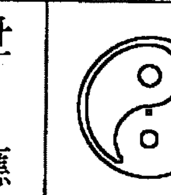

#### 一、周易六十四卦卦意釋意

「占卦」：地火明夷（落陽之象）36

「明夷」：作傷害與誅滅的意思。其卦象，坤地、柔順于上，離日、麗明于下，二者合而言內文明，外柔順；又離日入於地中，天下一片黑暗，無光可見一樣。是謂明之傷，即光被遮掩，而不得見其離日之光明。另以卦爻論，離二陽一陰，坤三陰，全卦爻，四陰二陽爻，陽在下為陰蔽，陽間於陰欲進不得欲升不可，此為退亡之象，故明夷之理，演繹人生處於昏闇不明、小人當權、社會公義、是非不分之時，全然指出人生處憂患之道。是以消極為積極，從絕望中生希望，在黑暗中放光芒。

卦辭曰：「明夷，利艱貞」。說明人生在世，倘若不幸，遇此明夷，暗昧之境時，吾心即當終守光明之道，不可易其節操。故占得此卦，喻賢明人士在黑暗之時，利在堅苦奮鬥而不失其忠誠明達的做事態度，最後才能免於危難、禍害。

「變卦」：水火既濟（固成之象）63

「既濟」：為寬猛相濟，其功則相需相成。卦象上坎為水，下離為火，兩卦相合即為既濟之象。是賴以坎水在離火之上，以小潤下，而火勢向上，水火相交則可成烹飪之功是謂既濟。水火相交，各得其用，共致其成，互相協調以達功德圓滿即為既濟之象。「濟」字有過渡的意思，又為事物兩兩相成的意見，卦辭曰：「既濟，亨小，利貞，其初吉終亂。」說明水火相交，各得其用，六爻之象各得其正，是天下已治已安，不但大事亨，小事亦亨，其為通亨之象。天下即為既濟但既濟之時不能小未亨也（既濟之中仍有未濟之象）。

既然有小未亨或以亨之小則當更求精進，更求完善並利在貞固，以守其成果，不要使初時得吉象，由於驕慎、鬆弛而終致紛紜錯亂，則相濟之道，將終極而窮盡矣。

綜而言之：水火既濟卦，以水火的相生相剋之象，演繹創業與守成之理，任何事物，既可以導致成功，由成功而生的驕惰，也能招致失敗，成與敗往往是相為因果的故時時提醒自己不可忘本只有安分守己趨向保守，應知盛極而後漸衰之理才是持盈保泰。而為既濟也。

#### 二、六爻卦譯：

##### 1. 喜用生剋：

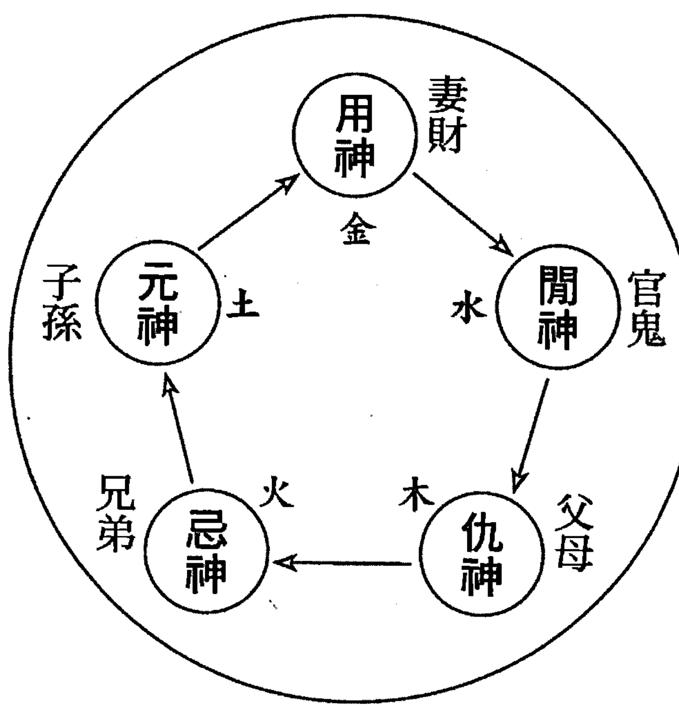

2. 占問經營便當店財運如何？以妻財為用神。卦中妻財不上卦，將就首卦六親找。

3. 本卦用神妻財爻不現，伏藏於亥水兄弟爻之下，而被飛神所剋，皆有耗財之力。

4. 世爻丑土持官鬼白虎相臨，在月為休囚，得日辰生扶，表示對做便當生意是有經驗的，但是將過去的餐廳模式改變經營便當，世者還是擔憂是否有生意，心中極具壓力及焦慮急躁不安。

5. 應爻卯木持子孫，朱雀相臨。日月逢死又坐空。元神氣竭影響客源及貨源品質，因而引發顧客嫌棄及是非口角。（應爻朱雀相臨剋世爻）。

6. 忌神亥水兄弟持玄武，月屬旺相日為胎；神兆機于動，動必有意。動為始變為終。兄動剋財，經營便當店會虧錢。兄旺表示同業相互競爭，忌神兄弟動化成土官鬼回頭剋，表示生意難做，將會帶來壓力、犯小人、是非等，乃憂疑阻滯之宿。

7. 綜合而論：就卦象而言，此店從事便當生意，用神財爻雖為日旺，但為小財，惟因元神休囚位於死地，客源、貨源均會有問題，故該店不適合從事便當生意。

## 實例二十二：陳先生於庚寅年甲申月甲辰日，占問於新竹市某店面經營簡餐生意，財運如何？

占得：（乾宮）火地晉卦。動爻：上爻。為雷地豫卦。

| 六神 | 卦首乾卦六親 | 世、應爻 | 本卦乾卦爻支 | 變卦震卦爻支 | 六親 | 伏神 |
|---|---|---|---|---|---|---|
| 玄武 | 官鬼 | | 巳 | 戌 | 父母 | |
| 白虎 | 父母 | | 未 | | | |
| 呈蛇 | 兄弟 | 世 | 酉 | | | |
| 勾陳 | 妻財 | | 卯 | | | |
| 朱雀 | 官鬼 | | 巳 | | | |
| 青龍 | 父母 | 應 | 未 | | 子孫 | |
| 休 | 囚 | 死 | 相 | 旺 | 月令 |
| 土 | 火 | 木 | 水 | 金 | 申月 |
| 父母 | 官鬼 | 妻財 | 子孫 | 兄弟 | 六親 |
| 應 | | | | 世 | 世應 |
| 墓 | 冠帶 | 衰 | 墓 | 養 | 日辰 |
| | 墓 | | | | 變爻 |
| 卦身：卯 | 羊刃：卯 | 驛馬：寅 | 貴人：丑、未 | 空亡：寅、卯 | 月破：寅 |

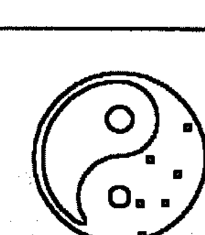

#### 一、周易六十四卦卦意釋意

「占卦」：火地晉卦 35

「晉」：前進、晉升、提昇及光明之意，而其行必光大正行，不可妄進，「晉」以日出地面，光明普照取象。故要以自我進修而昭顯自身的光明德性。不宜驕橫孤行，以得民心為重。

「變卦」：雷地豫卦（喜悅之卦）16

「豫」：可解作「順時而動」、「安樂喜悅」、「豫先準備」之意。

卦象：「雷」出之「地」上，有順時而動之象，即順應時機而行動。「豫」卦，惟「九四」為陽爻，其五爻均為陰爻都服從他，因而得志，心中喜悅。下「坤」順，上「震」動，有樂於追隨行動之象。「豫」亦有準備之義，所謂「凡事豫則立，不豫則廢」。

「雷地豫」卦，以震動出於九地，演繹振奮悅樂之理。奮發的情緒，固足以增進事功，但過度的興奮，恣情的逸樂，則又為敗事的因素，故本卦雖以悅樂為主，但仍仍有取於備豫警惕之意。

#### 二、六爻卦譯：

##### 1. 喜用生剋：

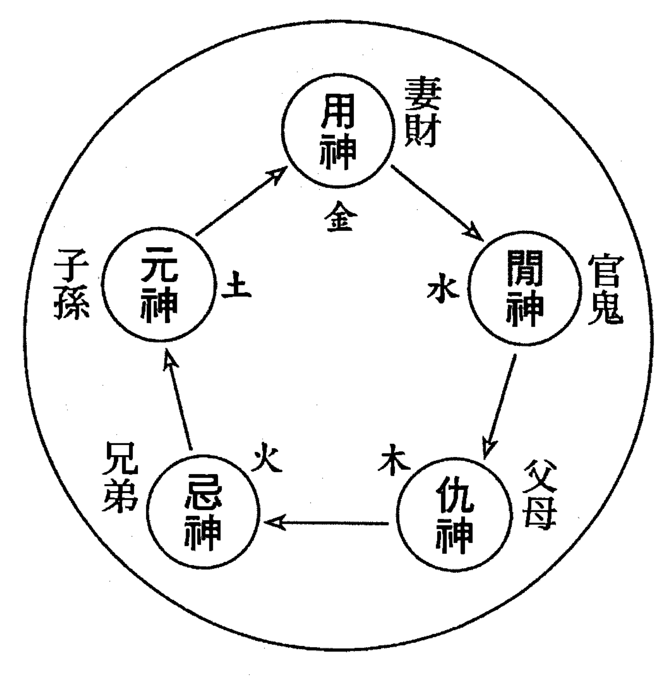

2. 占問經營簡餐生意財運如何？以妻財為用神。

3. 申月辰日求占，用神卯木妻財，勾陳相臨。月死日衰，又逢空亡、羊刃，表示要從事餐飲生意在資金上能力不足，備感力不從心之憾。

4. 酉金兄弟持世，呈蛇相臨。日月併臨生扶，世者氣勢如宏，對開簡餐店具有經驗，且胸有成竹。惟因資金問題無法如願，心中感到懊惱。賦云：「兄弟持世莫問財」。

5. 應爻未土持父母，青龍相臨。月逢休囚，日為墓。表示簡餐店周遭的環境並不是很耀眼明顯，雖然喜歡世者來此經營，但是人氣不旺缺乏客源，生意會不好。

6. 賦云：「動為始變為終」。巳火官鬼持玄武休囚無力，動化戌土為父母；神兆機于動，動必有意。官動洩財，化戌土為父母，主辛苦、勞多獲少。且卦中又呈現三刑，故必須小心謹慎，如在資金上能力不足，貿然開店會造成沉重的壓力，引起口舌是非，甚至於官非等情事。

#### 7. 綜合而論：

- (1) 賦云：「兄弟持世莫論財」；「父母持世主辛勞」。建議再行擇地為之。
- (2) 元神福神伏藏於父母爻之下，受到剋制，雖旺相且入墓庫，客、貨源不如預期，影響生意。
- (3) 火地晉遊魂卦變雷地豫六合卦，原想從事簡餐店心性不定、猶豫不決、三心兩意。後因經驗豐富及自己的喜歡，從事這一行有強烈企圖心，無耐因兄弟持世不得不放棄。

## 實例二十三：徐小姐於丙子年壬辰月甲戌日，占問新工作是否有利財運？

占得：（乾宮）風雷益卦。動爻：5爻。為山雷頤卦。

| 六神 | 卦首巽卦六親 | 世、應爻 | 本卦巽卦爻支 | 變卦巽卦爻支 | 六親 | 伏神 |
|---|---|---|---|---|---|---|
| 玄武 | 兄弟 | 應 | 卯 | | | |
| 白虎 | 子孫 | | 巳 | 子 | 父母 | |
| 呈蛇 | 妻財 | | 未 | | | |
| 勾陳 | 妻財 | 世 | 辰 | | | |
| 朱雀 | 兄弟 | | 寅 | | | |
| 青龍 | 父母 | | 子 | | | |

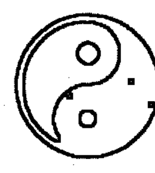

| 休 | 囚 | 死 | 相 | 旺 | 月令 |
|---|---|---|---|---|---|
| 火 | 木 | 水 | 金 | 土 | 辰月 |
| 子孫 | 兄弟 | 父母 | 官鬼 | 妻財 | 六親 |
| | 應 | | | 世 | 世應 |
| 墓 | 養 | 冠帶 | 衰 | 冠帶 | 日辰 |
| 死 | | | | | 變爻 |
| 卦身：伏身 | 羊刃：卯 | 驛馬：申 | 貴人：丑、未 | 空亡：申、酉 | 月破：戌 |

#### 一、周易六十四卦卦意釋意

「占卦」：風雷益（木道之象）42

「益」：言天施地生，滿也，為增加、受益、盈滿之意。卦象，下震為雷，震雷則萬物萌動，上巽為風，風巽則萬物生長。故鼓動萬物之生所者，沒有比雷更有力的，摧折枯朽，舒散鬱結者，沒有比風更有力的。兩卦相合，為風烈則雷迅，雷激則風怒，雷風二物乃相資而相益。蓋雷風以相激之勢為相輔之用是不相悖逆的，然雷震而動即陽動，風順而動即陰動，兩者勢雖相薄但各動其所當動，各有不厭其動之明，故一聲春雷動，萬物蟄藏驚春風和煦，草木葉茂，是雷風之動，亦皆有助生長開創之道。

益義為增加，為受益，得天地二氣之交，益綜而損，故益與損相生相成之卦，盛衰損益，如循環然，損極必益，理之自然，是益因損成，損者終益，天道往復。蓋本卦進益之道，貴乎務實，必須實事求是，方能精益求精，卦辭中所謂「利有攸往，利涉大川」，利於前往有所作為的地方去而有所作為，縱有大川的阻礙，亦能順利涉過，而獲得實際的利。

「變卦」：山雷頤卦（養身之象）27

「頤」：含有養生、養育、養氣、養神、養德、養民、修養、頤養之意。頤卦象，艮山止于上，震雷動于下，兩者相合而成，艮為山，萬物多生於山，為養育萬物的地方，又為生長萬物的根源。「震」為動，萬物多自地下而生，發芽生長，都從下而變動，此為頤卦自然之象，另就卦爻頤卦上下艮兩陽爻包含四陰爻，為內虛外實，象形口中牙齒能進食食物之象。進食便能養生，維持生活，凡是養育萬物，從切身養生養德推至養天下之賢以及萬民，均為本卦所演繹的理象，以人生養育之道為主，養育之道，不僅祇是為「養」而應兼顧到「育」。故天地之化育萬物，皆能安其生，各適其宜，謹言慎行，不踰矩，不悖于性，終始以道，不失其正。虛實得宜，其為頤卦理象的具體作為。

#### 二、六爻卦譯：

##### 1. 喜用生剋：

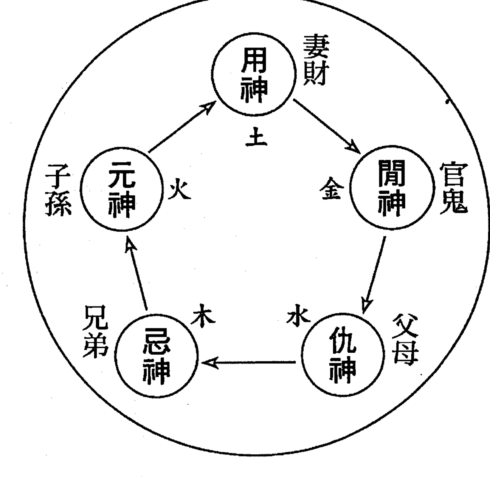

2. 占問新工作財運如何？以妻財為用神。卦中妻財兩現，取辰土妻財為用神。

3. 辰月戌日求占，用神辰土妻財持世，勾陳相臨。在月為旺相逢自刑，在日逢沖為暗動旺相。賦云：「妻財持世益財榮」。表示世者極為愛財，當下財運不錯，新的工作亦有財利，但是自己心中自相矛盾、疑心新工作的財利不好。

4. 賦云：「動為始變為終」。元神巳火子孫持白虎休囚無力，動化子水為父母回頭剋；神兆機于動，動必有意。表示雖當下財運不錯，但至秋、冬之季，恐怕在工作上感到壓力、辛勞及勞多獲少，工作財運上將有不順之情。要注意。

5. 應爻卯木持兄弟，玄武相臨。月逢休囚，日為養，羊刃逢之主刑傷。以卦象來看，乃代表工作環境及公司運作並非世者所期待。另在財利方面及公司企劃會有問題，建議有所防範。

6. 綜合而論：徐小姐新工作，當下運勢還不錯，薪資也稱滿意，但以後不代表公司能順利運作，因此恐有一番艱辛，會影響到工作及財運上的不順現象，宜注意防範。

## 實例二十四：呂先生於乙亥年乙酉月庚申日，占問最近運程如何？

占得：（兌宮）澤地萃卦。動爻：4爻。為水地比卦。

| 六神 | 卦首兌卦六親 | 世、應爻 | 本卦兌卦爻支 | 變卦坤卦爻支 | 六親 | 伏神 |
|---|---|---|---|---|---|---|
| 呈蛇 | 父母 | | 未 | | | |
| 勾陳 | 兄弟 | 應 | 酉 | | | |
| 朱雀 | 子孫 | | 亥 | 申 | 兄弟 | |
| 青龍 | 妻財 | | 卯 | | | |
| 玄武 | 官鬼 | 世 | 巳 | | | |
| 白虎 | 父母 | | 未 | | | |

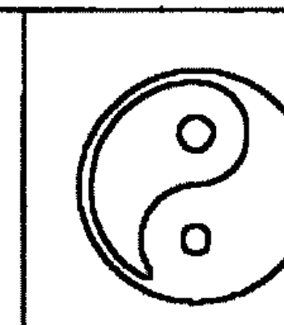

| 休 | 囚 | 死 | 相 | 旺 | 月令 |
|---|---|---|---|---|---|
| 土 | 火 | 木 | 水 | 金 | 酉月 |
| 父母 | 官鬼 | 妻財 | 子孫 | 兄弟 | 六親 |
| | 世 | | | 應 | 世應 |
| 長生 | 病 | 絕 | 長生 | 臨官 | 日辰 |
| 死 | | | | | 變爻 |
| 卦身：未 | 羊刃：酉 | 驛馬：寅 | 貴人：寅、午 | 空亡：子、丑 | 月破：卯 |

#### 一、周易六十四卦卦意釋意

「占卦」：澤地萃卦（潤澤之象）45

「萃」：草叢茂盛貌，有群集，聚集之意，卦象，上兌澤、下坤地，地上水聚成澤，可滋潤萬物，所以有愉悅之象，又下坤為順，上兌為悅，和順而歡悅，乃象徵安居樂業，群賢聚集，但物聚則難免錯亂，人聚則難免紛爭，必須要惕勵，足以保證永久團結。

「變卦」：水地比卦（親和之象）8

「比」：作親密、親近、比鄰、親愛精誠、同心協力之意，坎水在坤地上，構成河流溪海，相比相親，最為親切之象。此卦，九五陽爻尊位，與下卦六二陰陽相應，為上下親比的吉象。但是要不時的自我檢討，開誠相見，無不可以親善而互助唉。占得此卦，表示和他人合作吉，親近大德之人為吉，與人創辦共同事業吉。

#### 二、六爻卦譯：

##### 1. 喜用生剋：

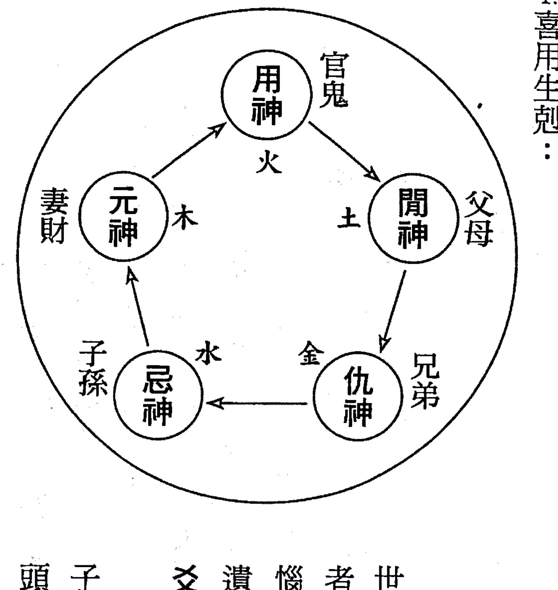

2. 占問運勢如何？以世爻為用神。

3. 酉月申日求占，用神巳火官鬼爻持世，玄武相臨。月為休囚，日為病。表示世者，當下運勢確實不好，事業上有壓力煩惱、憂疑不順，家中有遭小偷或有貴重東西遺失之虞。如投資則損耗錢財。（世持官鬼爻逢玄武：必遭小偷或丟東西）

4. 賦云：「動為始變為終」。忌神亥水子孫持朱雀得日月生扶，動化申金為兄弟回頭生，忌神旺至極致。致使用神受制無力，故煩心瑣事不悅於心。且引拔與朋友間口舌之爭。

5. 卦中元神卯木妻財持青龍，月破休囚，日逢絕地無氣。故青龍之吉喜慶未至，然青龍之惡，「貪歡戀酒」成災。此乃心煩之源。

##### 6. 綜合而論：

- (1) 當下適逢官鬼持世臨玄武，運勢確實不好，故有不愉悅之事煩心；當日亦有與朋友口舌之爭，為此貪歡戀酒人更愁。
- (2) 以卦象來看，自酉月以來，時運不佳，事事感到不順，此等要到明年初（丙子年）後才會有轉變。
- (3) 問運勢時，喜子孫福神持世，又無忌神剋制最佳。

## 實例二十五：林小姐於丙子年壬辰月甲戌日，占問欲購置的新屋吉凶如何？

占得：（艮宮）風山漸卦。動爻：上爻。為水山蹇卦。

| 六神 | 卦首六親 | 世、應爻 | 本卦艮卦爻支 | 變卦兌卦爻支 | 六親 | 伏神 |
|---|---|---|---|---|---|---|
| 玄武 | 官鬼 | 應 | 卯 | 子 | 妻財 | |
| 白虎 | 父母 | | 巳 | | | |
| 呈蛇 | 兄弟 | | 未 | | | |
| 勾陳 | 子孫 | 世 | 申 | | | |
| 朱雀 | 父母 | | 午 | | | |
| 青龍 | 兄弟 | | 辰 | | | |

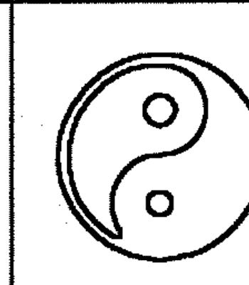

| 休 | 囚 | 死 | 相 | 旺 | 月令 |
|---|---|---|---|---|---|
| 火 | 木 | 水 | 金 | 土 | 辰月 |
| 父母 | 官鬼 | 妻財 | 子孫 | 兄弟 | 六親 |
| | 應 | | 世 | | 世應 |
| 墓 | 養 | 冠帶 | 衰 | 冠帶 | 日辰 |
| | 沐浴 | | | | 變爻 |
| 卦身：巳 | 羊刃：卯 | 驛馬：申 | 貴人：丑、未 | 空亡：申、酉 | 月破：戌 |

#### 一、周易六十四卦卦意釋意

「占卦」：風山漸卦（進展之卦）53
「漸」：循序而進的意思，凡事不可踰越等級，勿圖僥倖要像女子出嫁那樣地由漸進而至成熟方為告象。欲速則不達，利於光明正大。
「漸」，高山植木之卦，積小成大之象。逐漸成長，比喻量力循序漸進，不可勉強，則能漸入佳境。

「占卦」：水山蹇（退守之卦）39
「蹇」：跛足，引伸為進退維谷，艱難之意。卦體艮下坎上，坎陷當前，止而不進，有如跛者之艱於步履。

象曰：山上有水，蹇。君子以反身修德。山上有水，障礙重重，人生不能沒有險阻，世間亦不能沒有災難，過險阻不宜輕於犯險前進，最好停下來反躬自省，進修進德，以求其行得通，祗好實幹，苦幹、硬幹、而不能蠻幹。亦不可聽其自然，委諸命運。

#### 二、六爻卦譯：

##### 1. 喜用生剋：

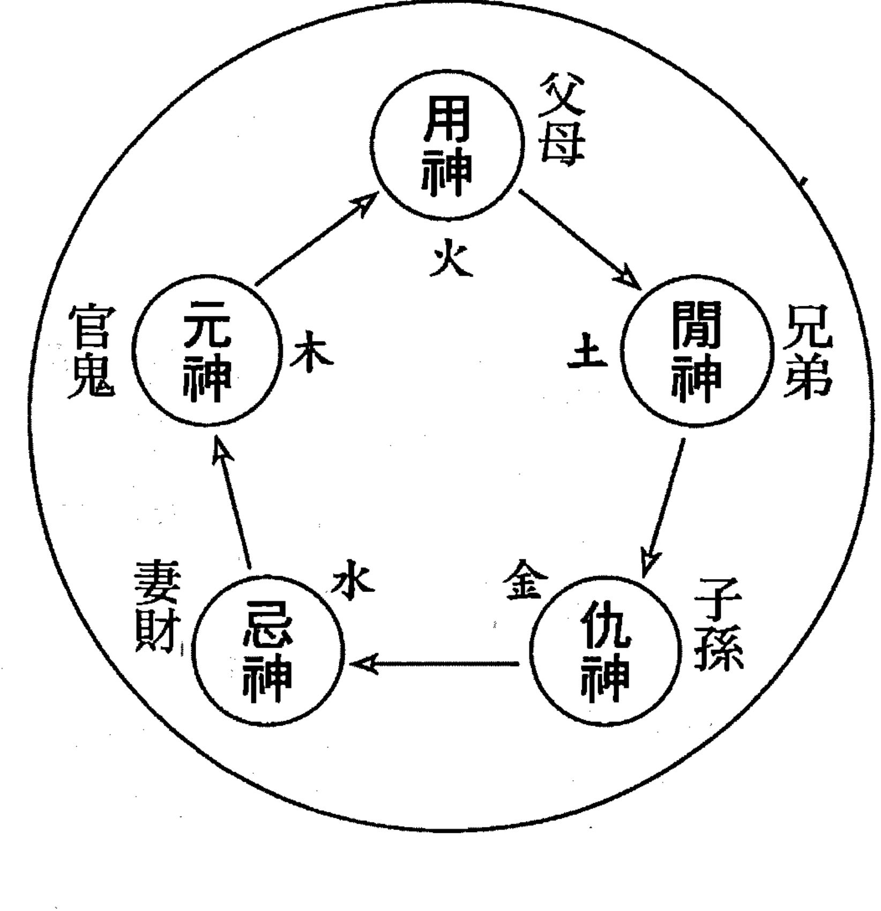

2. 占問欲購置的新屋吉凶如何？以父母爻為用神。卦中用神兩現，以二爻午火父母為用神。

3. 辰月戊日求占，用神午火父母持朱雀。月為休囚，日逢入墓。表示預購新屋家中長輩有意見。

4. 世爻代表自己，申金子孫持世，逢日月生扶，旺相有氣，雖坐空亡但為假空，對世者內心稍有猶豫不決，影響購買之念頭。

5. 卦中元神卯木官鬼持玄武，在月為休囚，在日為養，雖然無氣。但卯木動合日辰又化子水回頭生，故元神有力而生助用神。表示這房舍尚屬吉象。

##### 6. 綜合而論：

(1) 以卦象來看，世者，對欲購的新屋興致勃勃，具有強烈意願，惟因家中長輩意見，致使世者內心稍有動搖而猶豫。

(2) 建議：此屋稍有氣屬小吉之兆，住進僅平安矣，可否再找更好的房子，比較有利。

## 實例二十六：洪先生於甲戌年庚午月甲戌日，占問與妻婚姻狀況吉凶？

占得：（離宮）離為火卦。動爻：初、2爻。為火風鼎卦。

| 六神 | 卦首離卦六親 | 世、應爻 | 本卦離卦爻支 | 變卦兌卦爻支 | 六親 | 伏神 |
|---|---|---|---|---|---|---|
| 玄武 | 兄弟 | 世 | 巳 | | | |
| 白虎 | 子孫 | | 未 | | | |
| 呈蛇 | 妻財 | | 酉 | | | |
| 勾陳 | 官鬼 | 應 | 亥 | | | |
| 朱雀 | 子孫 | | 丑 | 亥 | 官鬼 | |
| 青龍 | 父母 | | 卯 | 丑 | 子孫 | |

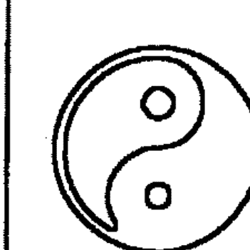

| 休 | 囚 | 死 | 相 | 旺 | 月令 |
|---|---|---|---|---|---|
| 木 | 水 | 金 | 土 | 火 | 午月 |
| 父母 | 官鬼 | 妻財 | 子孫 | 兄弟 | 六親 |
| | 應 | | 世 | | 世應 |
| 養 | 冠帶 | 衰 | 冠帶 | 墓 | 日辰 |
| 冠帶 | | | 臨官 | | 變爻 |
| 卦身：巳 | 羊刃：卯 | 驛馬：申 | 貴人：丑、未 | 空亡：申、酉 | 月破：子 |

#### 一、周易六十四卦卦意釋意

「占卦」：離為火卦（光明之象）30
「火」：麗也，有附著、光明、華麗之意，兩離相重，為上下通明之象，此卦光彩炫麗，又有文明華麗，因離中虛，易流於表面華麗而內空虛，有如虛浮的明星生涯，故須務實，雙管齊下，才得以成功。要防火災及被華麗外表所迷惑。占得此卦，心境要光明，要以光明磊落的態度，照耀四方。

「變卦」：火風鼎卦（凝命之象）50
「鼎」：為食器、取新之意，並為國之重器，久煉成剛之義。卦象：上卦為離、為日、為火、為熱也。下卦為巽，為風、為木；用木燒火，火焰在上，生熱；而木在其下，生火，變成灰炭，同時鼎中食物也在變化。所以上下之物，均在變，故鼎一則本「鑽木取火」，供民熟食之義，一則明「以薪資火」，為鼎烹飪之象。

「鼎」為古時烹飪器具，重在其用，有如井卦取養民之用為義。鼎之用亦為生養之需。故鼎亦為民生不可離者。再者，上離為麗為明，主光明智慧明察之義；下巽為伏入、為巽順，主和順、流動，有進入之象。兩者相合，即採用內進，外明智慧的含義，以說明社會、人世現象的變化。例如採用和順進入的方法去做事；以智慧明察的方法去做人，準此，才能成功力業以成就化育萬物，提昇心靈的境界，而達與天地同德。

鼎亦有革物之用，變腥而為熟，易堅而為柔，水火不可同處也。能使相合為用，而不相害，是賴以革物。鼎是革命完成之象，革已將所有敝端不好之事物去除了，但舊的去了，如果未有新的來填補則為空白，空是亂源且為大忌。鼎除能革物亦能取新。象曰：「鼎，君子以正位凝命。」

### 二、六爻卦釋：

##### 1. 喜用生剋：

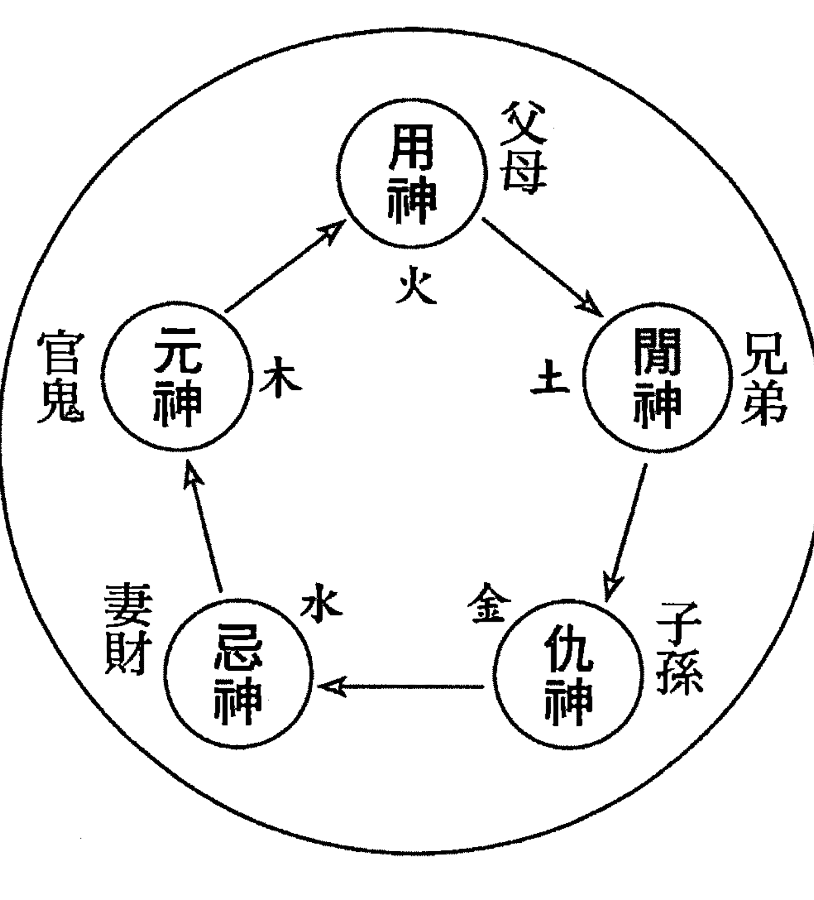

剋沖），甚至於有提告之虞。另卦中元神得日月生扶旺相有氣，助長用神，使用神完全無後盾支援，（因初爻父剋元神）婚姻狀況的惶恐及危機的顯現不言而喻了。

2. 洪先生問與妻婚姻狀況吉凶，以妻財為用神。（婚姻論述，先論吉凶，再看世、應爻之間關係）。

3. 用神酉金妻財坐死逢空臨螣蛇，在日冠帶逢生助。表示似有情卻無意。

4. 兄弟持世臨玄武，得日月生扶旺相有力，剋害用神。原本雙方在感情上就似有情確無意狀況下，世者的強勢，更使雙方的感情成現無法理解的情事。卦中顯示世者在外有搞婚外情或不可告人之事。

5. 再者，女方家對世者亦不諒解（世應剋沖），甚至於有提告之虞。另卦中元神得日月生扶旺相有氣，助長用神，使用神完全無後盾支援，（因初爻父剋元神）婚姻狀況的惶恐及危機的顯現不言而喻了。

6. 綜合而論：洪先生的婚姻，卦中顯示確實存在危機而難以解決，最後吵鬧離異收場。事實上，此段婚姻洪先生因負大部分責任。

## 實例二十七：顧小姐於丙子年戊戌月癸未日，因兄重病住院占問其健康如何？

占得：（巽宮）天雷無妄卦。動爻：3爻。為天火同人卦。

| 六神 | 卦首六親 | 世、應爻 | 本卦巽卦爻支 | 變卦離卦爻支 | 六親 | 伏神 |
|---|---|---|---|---|---|---|
| 玄武 | 妻財 | | 戌 | | | |
| 白虎 | 官鬼 | | 申 | | | |
| 呈蛇 | 子孫 | 世 | 午 | | | |
| 勾陳 | 妻財 | | 辰 | 亥 | 父母 | |
| 朱雀 | 兄弟 | | 寅 | | | |
| 青龍 | 父母 | 應 | 子 | | | |

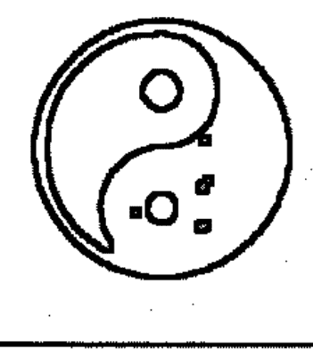

| 休 | 囚 | 死 | 相 | 旺 | 月令 |
|---|---|---|---|---|---|
| 火 | 木 | 水 | 金 | 土 | 戌月 |
| 子孫 | 兄弟 | 父母 | 官鬼 | 妻財 | 六親 |
| 世 | | 應 | | | 世應 |
| 衰 | 墓 | 養 | 冠帶 | 養 | 日辰 |
| | | | | 臨官 | 變爻 |
| 卦身：伏身 | 羊刃：丑 | 驛馬：巳 | 貴人：卯、巳 | 空亡：申、酉 | 月破：辰 |

#### 一、周易六十四卦卦意釋意

「占卦」：天雷无妄（他力之象）25
「无妄」：無詐偽虛妄，無妄念，妄作為，也就是實實在在，剛健篤實之意。
卦體震下乾上，又乾為天，震雷動於天下，是以陽氣發舒，萬物必並育，各適其性，各遂其生，自然而然，為真實而無虛妄之象，意即以至誠的心態，不妄想，不妄求，順天應人，所以凡事盡其在我，而吉凶禍福，皆委之自然的意思。急進妄動則凶，順其自然，退守則吉，真誠以赴。天雷无妄卦以天地生物之象，演繹自然無妄的真實道理。

「變卦」：天火同人卦（光明之象）13
「同人」：象徵光明向上升，與天相同。有親近，志同道合，盛大富有之意。本卦是以離下，乾上，離正象為火，乾正象為天，天在上，火勢向上，故人心總是愛好向上的。易曰：「同人于野，亨，利涉大川，利君子貞。」，光明向上升表示與人交往光明正大、公開、無私、與人合作才會達成願望。只要正當的事情與志同道合的人去進行，才會有成。所謂得道多助，君子以正心誠意，方能感召天下之人而融通億萬之心志所向。

#### 二、六爻卦譯：

##### 1. 喜用生剋：

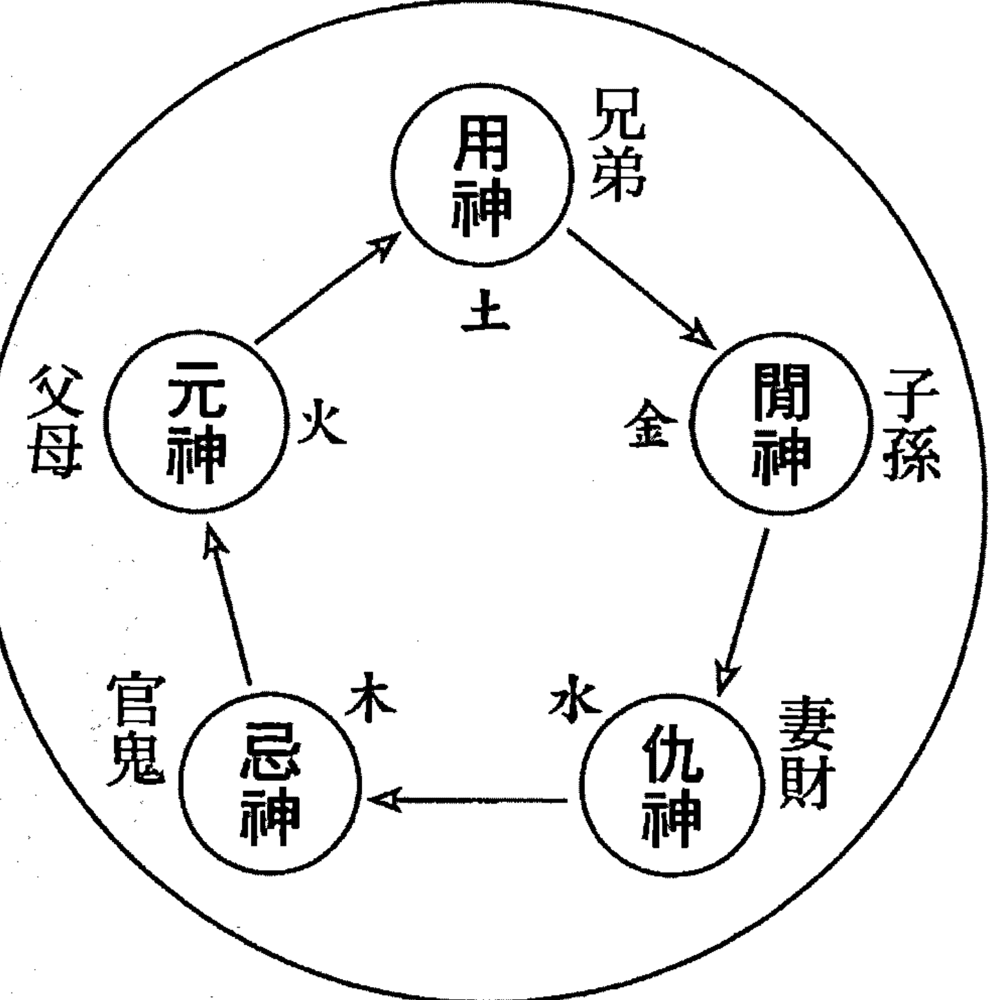

2. 顧小姐因兄重病住院，占問健康狀況如何？以兄弟爻為用神。

3. 戌月未日，用神寅木兄弟持青龍，月臨休囚無氣，日逢入墓。且又為六沖卦（重病久病忌沖），故為大凶之兆。

4. 神兆機於動，動必有因；辰土妻財持朱雀，似看旺相但為月破。無助於用神，故而引拔為錢財與人爭執，導致病重而住院。

5. 卦中元神子水父母爻靜而不動且處於死地，無力生助用神，此乃貴人全無，大限相臨必倒，俟丑日沖開未土墓庫，或逢申日沖剋寅木用神之時日，將亡矣。果驗於同月乙未日不幸身亡。（因再度逢未土墓庫即亡矣）。

6. 綜合而論：

(1) 六沖卦，近病逢沖即癒，重病、久病忌沖，沖者大凶之兆。顧小姐之兄因重病住院，逢六沖卦故不言而喻了。

(2) 用神值休囚衰弱無力，且又入墓。古云：墓為沉滯昏迷之象。如得元神或日月旺相生扶，入墓不凶，能解矣。但卦中用神休囚衰弱無力，且又入墓，元神靜而不動，且處於死地，如又被沖，則亡故為快。

(3) 準此，走到申日，則駕鶴西歸。（六沖卦變歸魂卦）。

## 實例二十八：伍小姐於丙子年辛丑月乙卯日，占問托福考試成績如何？

占得：（離宮）離為火卦。動爻：上爻。為雷火豐卦。

| 六神 | 卦首離卦六親 | 世、應爻 | 本卦離卦爻支 | 變卦離卦爻支 | 六親 | 伏神 |
|---|---|---|---|---|---|---|
| 玄武 | 兄弟 | 世 | 巳 | 戌 | 子孫 | |
| 白虎 | 子孫 | | 未 | | | |
| 呈蛇 | 妻財 | | 酉 | | | |
| 勾陳 | 官鬼 | 應 | 亥 | | | |
| 朱雀 | 子孫 | | 丑 | | | |
| 青龍 | 父母 | | 卯 | | | |

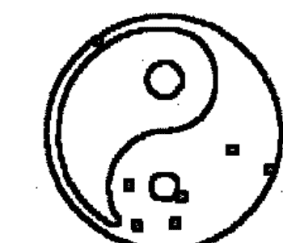

| 休 | 囚 | 死 | 相 | 旺 | 月令 |
|---|---|---|---|---|---|
| 火 | 木 | 水 | 金 | 土 | 丑月 |
| 兄弟 | 父母 | 官鬼 | 妻財 | 子孫 | 六親 |
| 世 | | 應 | | | 世應 |
| 沐浴 | 帝旺 | 死 | 胎 | 死 | 日辰 |
| 墓 | | | | | 變爻 |
| 卦身：巳 | 羊刃：辰 | 驛馬：巳 | 貴人：子、申 | 空亡：子、丑 | 月破：未 |

#### 一、周易六十四卦卦意釋意

「占卦」：離為火卦（光明之象）30
「火」：麗也，有附著、光明、華麗之意，兩離相重，為上下通明之象，此卦光彩炫麗，又有文明華麗，因離中虛，易流於表面華麗而內空虛，有如虛浮的明星生涯，故須務實，雙管齊下，才得以成功。要防火災及被華麗外表所迷惑。占得此卦，心境要光明，要以光明磊落的態度，照耀四方。

「變卦」：雷火豐卦（盈虛之象）55
「豐」：盛大、豐隆、光明正大、豐富、收穫、欣欣向榮之意。
卦體離下震上，「離為電、震為雷」雷電交作，聲勢壯大，但盛極則無可更盛，而將憂其漸衰。卦辭曰：「日中則昃、月盈則食，天地盈虛，與時消息。」占得此卦，卦中隱伏著危機，切忌勿得意忘形，以免陷入盛極則衰的自然循環。豐隆之時應有所惕。

#### 二、六爻卦譯：

##### 1. 喜用生剋：

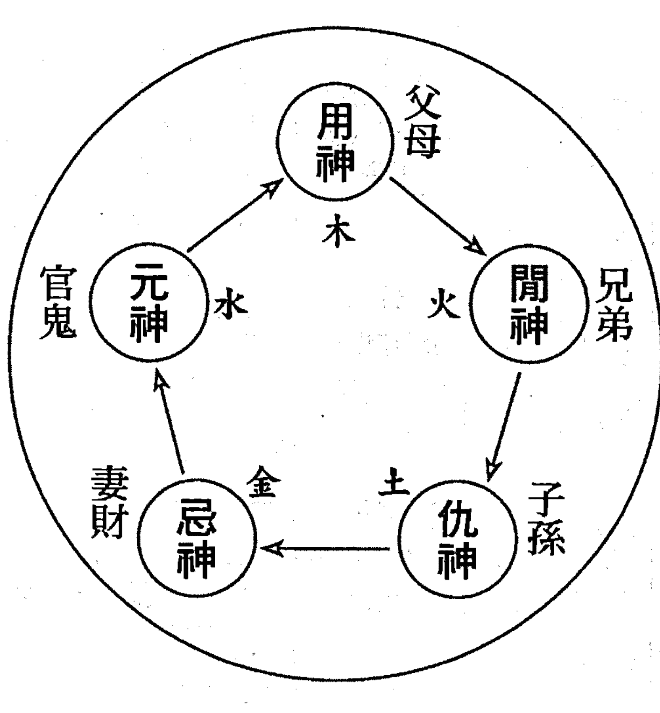

2. 伍小姐占問托福考試成績如何？以父母爻為用神。

3. 丑月卯日，用神卯木父母持青龍，月臨休囚無氣，日逢帝旺。表示伍小姐過去功課成績還不錯，用功唸書根基打的很好。

4. 神兆機於動，動爻巳火兄弟持世臨玄武，這次應考競爭對手很多，且暗中較勁的很厲害。

5. 卦中忌神酉金日沖暗動，併與月建丑土及上爻巳火形成三合金局，剋害用神；元神雖旺相，但靜而未動，無法生助用神，故

6. 綜合而論：忌神旺相有力，元神靜而無法引拔生助用神，落榜不言而喻。

此次托福考試與金榜絕緣，恐難入榜。

## 實例二十九：秦先生於丙子年辛丑月庚午日，占問考運吉凶？

占得：（巽宮）風火家人卦。動爻：2爻。為風天小畜卦。

| 六神 | 卦首巽卦六親 | 世、應爻 | 本卦巽卦爻支 | 變卦離卦爻支 | 六親 | 伏神 |
|---|---|---|---|---|---|---|
| 呈蛇 | 兄弟 | | 卯 | | | |
| 勾陳 | 子孫 | 應 | 巳 | | | |
| 朱雀 | 妻財 | | 未 | | | |
| 青龍 | 父母 | | 亥 | | | |
| 玄武 | 妻財 | 世 | 丑 | 寅 | 兄弟 | |
| 白虎 | 兄弟 | | 卯 | | | |

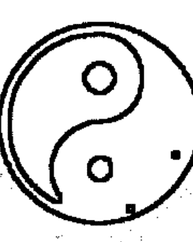

| 休 | 囚 | 死 | 相 | 旺 | 月令 |
|---|---|---|---|---|---|
| 火 | 木 | 水 | 金 | 土 | 丑月 |
| 子孫 | 兄弟 | 父母 | 官鬼 | 妻財 | 六親 |
| 應 | | | | 世 | 世應 |
| 帝旺 | 死 | 胎 | 沐浴 | 胎 | 日辰 |
| 墓 | | | | | 變爻 |
| 卦身：未 | 羊刃：酉 | 驛馬：申 | 貴人：午、寅 | 空亡：戌、亥 | 月破：未 |

#### 一、周易六十四卦卦意釋意

「占卦」：風火家人卦（齊家之象）37
「家人」：一家人之意，本卦上卦爻九五象徵男人主外，下卦爻六二象徵女人主內，各居其位，並得其正，家齊而後天下平。此乃家庭倫理、安居之卦，卦象如其人屬陽卦者，則正其位。象曰：「風自火出、家人。君子以言有物而行有恆」。教化的根本，出自家庭個人。所言必有實物，所行必有恆軌，處處要以身作則，不可有絲毫苟且。

「變卦」：風天小蓄（待機之象）9
「小蓄」：蓄聚、蓄養、蓄止三種意義。小蓄卦，下乾上巽，六四為陰爻，其餘五爻均為陽爻，陽過盛而陰不足，以一陰而蓄養五陽，力量有限，有不得不稍為停頓的限象。

卦辭：「小蓄，亨，密雲不雨日我西郊。」演繹蘊積致通之理。因為必先有所積聚，然後可以施與，積聚是「蓄」，施與即是「通」，蓋聚沙成塔，集液成裘，積小致大，是為「小蓄」之理象。蓄卦，又以弱小得陰，阻擋剛強的陽，雖成事不足但敗事有餘，故占得此卦，須戒急用忍，戒慎隱忍，所謂「小不忍則亂大謀」，只要雲層開，即是天晴，故須等待。

#### 二、六爻卦譯：

##### 1. 喜用生剋：

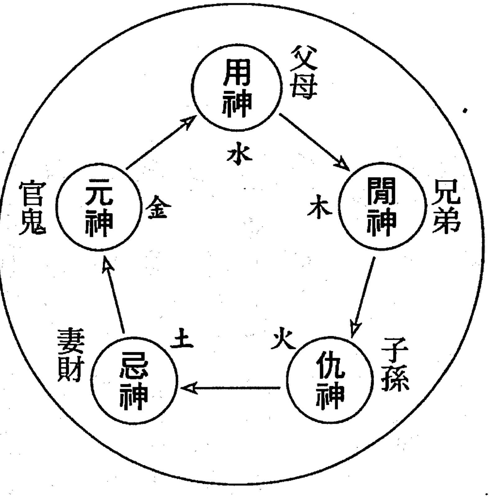

2. 秦先生占問考運吉凶？以父母爻為用神。

3. 丑月午日，用神亥水父母持青龍，月臨死地，日逢胎，坐空無力。表示自己還未準備備好，就急燥於應試，成績不理想，不言而喻。

4. 卦中忌神丑土妻財持世，旺相極致，神兆機於動，動剋用神，不吉之兆。況且玄武持世，世者須注意男女感情之事或錢財失竊，其次，試場及周遭環境亦不利於世，以致分心，影響考試。故此次考運不佳，難上金榜。

## 實例三十：劉先生於庚寅年戊子月己酉日，占問應徵亞曼尼保全能不能上？

占得：（震宮）地風升卦。動爻：上爻。為山風蠱卦。

| 六神 | 卦首六親 | 世、應爻 | 本卦（震卦）爻支 | 變卦（巽卦）爻支 | 六親 | 伏神 |
|---|---|---|---|---|---|---|
| 勾陳 | 官鬼 | | 酉 | 寅 | 兄弟 | |
| 朱雀 | 父母 | | 亥 | | | |
| 青龍 | 妻財 | 世 | 丑 | | | |
| 玄武 | 官鬼 | | 酉 | | 午 | 孫 |
| 白虎 | 父母 | | 亥 | | | |
| 呈蛇 | 妻財 | 應 | 丑 | | | |

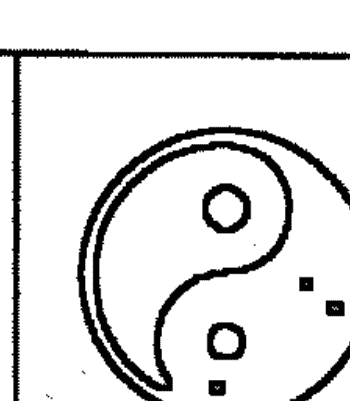

| 休 | 囚 | 死 | 相 | 旺 | 月令 |
|---|---|---|---|---|---|
| 金 | 土 | 火 | 木 | 水 | 子月 |
| 官鬼 | 妻財 | 子孫 | 兄弟 | 父母 | 六親 |
| | 世、應 | | | | 世應 |
| 帝旺 | 沐浴 | 死 | 胎 | 沐浴 | 日辰 |
| 絕 | | | | | 變爻 |
| 卦身：酉 | 羊刃：未 | 驛馬：亥 | 貴人：子、申 | 空亡：寅、卯 | 月破：午 |

#### 一、周易六十四卦卦意釋意

「占卦」：地風升（向上之相）46

「升」：為上進、增進、登高、向上發展的意思。升卦，上卦為坤土，下巽木，兩者合而言之，為地中生木之象。故樹木由土中生長，從發芽到成為棟樑，都是在不知不覺中潛滋暗長，隨歲月而漸高大，並非一日之功，故推而論之，人類性求升進，亦如樹木之順其自然循序而進，不可揠苗助長。又「升」義為高升，進道亨通不息之理。上坤有柔順，柔順則與人無爭；下巽為伏入、巽順，伏者不求自表；故從其卦德，內巽外順，必不躁妄，行不悖理，所以能升，而得大亨之象。

「升」卦之前身萃卦，萃有相遇、相聚之意，故其含意是因萃卦求遇的目的無非在下無位者求有位，有位者求高升，推而論之，創業者，以無業而有業，有業而思大其業與長保其業，都是求事業的上進。升卦以地中生求之象，演由漸進升之理。因此，吾人名譽和地位的增高，不是偶然的，更不是可投機倖通，必須修養有素，應世有方，確具真才實學，不投機，不取巧，腳踏實地，行遠自邇，登高自卑，積微小以致高大，才是進升的正常途徑，方能在事業上真有成就。

## 「占卦」：山風蠱卦（蠱惑之卦）18

「蠱」：乃「皿」中食物腐敗生蟲引伸為蠱毒，蠱惑，腐化之意。卦體上為艮為少男為陽剛，下為巽為長女，為陰柔。上下卦之卦爻皆以剛爻橫阻於上，柔爻被過於下，動彈不得，有如器皿之棄置不用，則不免久而敗壞了。又艮為山，巽為風，「上下有風」，則草木撓亂，亦為敗壞之象。

「蠱卦」乃「隨卦」的倒轉。意謂「隨和」容易同流合污，以致腐敗，產生事端，就必須壯士斷腕，將腐敗切除，才能治癒。

「蠱」廢弛之象，演繹救敗起衰頹，艱辛改造之象。象徵耽於安樂而發生事端，陷入混亂，故必須運用智慧設法解決，自然可以創造出新的局面來。

#### 二、六爻卦譯：

##### 1. 喜用生剋：

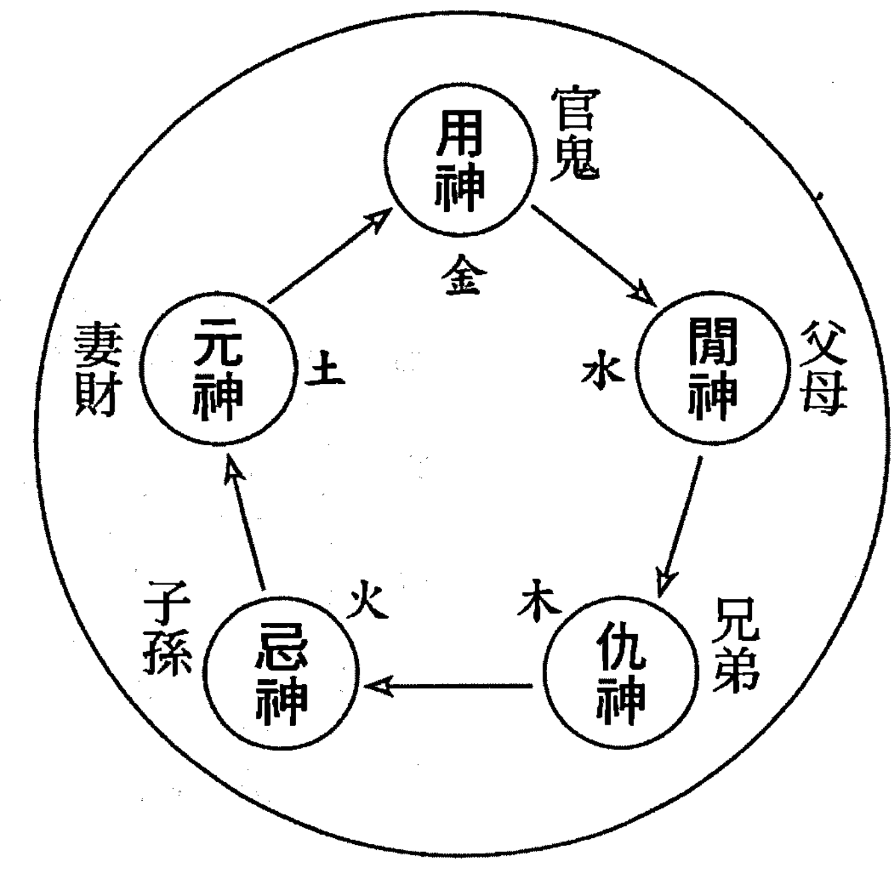

2. 劉先生占問應徵工作成與不成？以官鬼爻為用神。卦中用神兩現，取上爻酉金官鬼爻為用神。

3. 子月酉日，用神酉金官鬼持青龍，在月逢休囚，在日為帝旺，動化兄弟寅木旺相。表示這個工作對世而言，不是單純一個人來應徵就了事的，而有一些應徵對手在糾纏着。

4. 卦中丑土妻財持世，青龍相臨。表示這個應徵的工作對世來說很喜歡，在薪資方面也能接受，但是世爻休囚無力，而元神子孫爻伏藏，且受制於官鬼爻，因而用神無法開脫生助世者，故當下這個工作還要看看，不是那麼順利。

#### 5. 綜合而論：

## 實例三十一：朱先生於丁亥年甲辰月辛巳日，占問應徵某公司能不能上？

占得：（坤宮）澤天夬卦。動爻：無。

(1) 本卦全盤伏吟，主成而敗，敗而成，有而即到，無而即有之象。

(2) 世應併臨丑土妻財，世者除工作、薪資都滿意外，工作環境對世者而言也滿適合，但是這份工作他方有點擔心世者會做的不久，要看另外應徵者的結果。（因為應徵者氣強於世）。

(3) 卦中世者雖為休囚，但當下與月形成剋合，因此還有一點希望。

| 六神 | 卦首六親 | 世、應爻 | 本卦坤卦爻支 | 變卦無卦爻支 | 六親 | 伏神 |
| :--- | :--- | :--- | :--- | :--- | :--- | :--- |
| 呈蛇 | 兄弟 | | 未 | | | |
| 勾陳 | 子孫 | 世 | 酉 | | | |
| 朱雀 | 妻財 | | 亥 | | | |
| 青龍 | 兄弟 | | 辰 | | | |
| 玄武 | 官鬼 | 應 | 寅 | | 巳 | 父 |
| 白虎 | 妻財 | | 子 | | | |

| 休 | 囚 | 死 | 相 | 旺 | 月令 |
| :--- | :--- | :--- | :--- | :--- | :--- |
| 火 | 木 | 水 | 金 | 土 | 辰月 |
| 父母 | 官鬼 | 妻財 | 子孫 | 兄弟 | 六親 |
| | 應 | | 世 | | 世應 |
| 冠帶 | 衰 | 墓 | 養 | 墓 | 日辰 |
| | | | | | 變爻 |
| 卦身：辰 | 羊刃：卯 | 驛馬：亥 | 貴人：午、寅 | 空亡：申、酉 | 月破：戌 |

#### 一、周易六十四卦卦意釋意

「占卦」：澤天夬（決斷之象）43

「夬」：有決裂、切斷、排除之意思。君子之勢雖大，但因小人當道，高高在上，一意孤行，反而得不到支持，因施澤及於下民，不可居功，亦不可志得意滿，一意孤行。

「夬卦」：有如神劍斬蛟之卦，先損後益之象，決裂、切斷，宜提高警覺，虧中有盈。

「變卦」：無動爻。

#### 二、六爻卦譯：

1. 喜用生剋：

2. 朱先生占問應徵工作成與不成？以官鬼爻為用神。應爻為應徵公司。

3. 辰月巳日，用神寅木官鬼持玄武，月為休囚，日逢衰，併臨應爻。表示這個工作對世而言，有阻礙、且為別人錄用。

4. 卦中酉金子孫持世，在月為旺相，在日為帝旺，但坐空。表示世者才華洋溢，才能不錯，由於個人認為這家公司不適合我，無法讓我發揮我的才能，故而對這家公司無沒什麼意願。

5. 其實以卦象來看，這家公司雖然不大，但是這家公司還具有條理、制度及小具規模。因此這家公司還可以不是那麼差，只是不是世者所要找的，世要找的是一個大公司。另外，這家公司的薪資待遇並不是很好，因此世者後來應徵不成，工作無著落。

6. 綜合而論：應徵工作以官鬼爻為用神，喜應生世。官鬼爻在應爻，為別人錄用。己方世爻子孫空亡，自己無意願。另妻財亥水月剋日沖，薪水甚少，故而應徵不成，工作無著落。

## 實例三十二：魏小姐於己丑年己巳月辛亥日，占問男朋友在外是否有偷吃劈腿？

占得：（坎宮）雷火豐卦。動爻：五爻。為澤火革卦。

| 六神 | 卦首坎卦六親 | 世、應爻 | 本卦坎卦爻支 | 變卦坎卦爻支 | 六親 | 伏神 |
|---|---|---|---|---|---|---|
| 呈蛇 | 官鬼 | | 戌 | | | |
| 勾陳 | 父母 | 世 | 申 | 酉 | 父母 | |
| 朱雀 | 妻財 | | 午 | | | |
| 青龍 | 兄弟 | | 亥 | | | |
| 玄武 | 官鬼 | 應 | 丑 | | | |
| 白虎 | 子孫 | | 卯 | | | |

| 休 | 囚 | 死 | 相 | 旺 | 月令 |
|---|---|---|---|---|---|
| 木 | 水 | 金 | 土 | 火 | 巳月 |
| 子孫 | 兄弟 | 父母 | 官鬼 | 妻財 | 六親 |
| | | 世 | 應 | | 世應 |
| 長生 | 臨官 | 病 | 臨官 | 墓 | 日辰 |
| | | 病 | | | 變爻 |
| 卦身：戌 | 羊刃：卯 | 驛馬：巳 | 貴人：午、寅 | 空亡：寅、卯 | 月破：亥 |

#### 一、周易六十四卦卦意釋意

「占卦」：雷火豐卦（盈虛之象）55
「豐」：盛大、豐隆、光明正大、豐富、收穫、欣欣向榮之意。
卦體離下震上，「離為電、震為雷」雷電交作，聲勢壯大，但盛極則無可更盛，而將憂其漸衰。卦辭曰：「日中則昃、月盈則食，天地盈虛，與時消息。」占得此卦，卦中隱伏著危機，切忌勿得意忘形，以免陷入盛極則衰的自然循環。豐隆之時應有所惕。

「變卦」：澤火革卦（革新之象）49
「革」：改革、變革、斷然革新之意。下離為火、上兌為澤為金。火能熔金而變形之意，亦有「窮則變、變則通」之意，必須要有魄力與明智決斷，以求革新。
易曰：「革，己日乃孚，元亨利貞，悔亡」。改革是非常的行動需要極端慎重、不可急功好利，必須得時機已成熟之日，然後行之，可信孚於人，沒有阻力，達到「元亨利貞」之象，否則稍涉偏私，不能誠信正當，將難免於後悔。或產生後遺症。

#### 二、六爻卦譯：

1. 喜用生剋：

2. 魏小姐占問男朋友在外是否有偷吃劈腿？以官鬼爻為用神。卦中用神兩現以丑土臨應爻為用神。

3. 巳月亥日，用神丑土官鬼持玄武，月為旺相，日逢臨官，得令而有力生助世爻。表示男有非常喜歡她且有愛昧行為。

4. 卦中申金父母持世勾陳相臨，動化父母為進神。表示世者非常積極、努力、文筆不錯，也受長輩及上司的喜歡，同時世很孝順父母；在個性上很獨立，倔強、鐵齒、不信邪、急性子、想的多（疑慮）。

5. 就卦象整體來看，男的非常喜歡女的，看不出有劈腿的跡象。雙方在婚姻上，父母親均表同意，但是結婚的時間會拖。

6. 綜合而論：卦中男生不可能劈腿（因為兄弟爻破），沒有人從中介紹，所以在這個卦象來看是沒有問題的，只是自己疑慮太多了。

## 實例三十三：趙先生於己丑年辛未月辛酉日，占問到A公司上班能不能順利？

占得：（震宮）地風升卦。動爻：四爻。為雷風恆卦。

| 六神 | 卦首震卦六親 | 世、應爻 | 本卦震卦爻支 | 變卦坎卦爻支 | 六親 | 伏神 |
|---|---|---|---|---|---|---|
| 呈蛇 | 官鬼 | | 酉 | | | |
| 勾陳 | 父母 | | 亥 | | | |
| 朱雀 | 妻財 | 世 | 丑 | 午 | 子孫 | |
| 青龍 | 官鬼 | | 酉 | | | |
| 玄武 | 父母 | | 亥 | | 寅 | 兄 |
| 白虎 | 妻財 | 應 | 丑 | | | |

| 休 | 囚 | 死 | 相 | 旺 | 月令 |
|---|---|---|---|---|---|
| 火 | 木 | 水 | 金 | 土 | 未月 |
| 子孫 | 兄弟 | 父母 | 官鬼 | 妻財 | 六親 |
| | | | | 世、應 | 世應 |
| 死 | 胎 | 沐浴 | 帝旺 | 沐浴 | 日辰 |
| | | | | 胎 | 變爻 |
| 卦身：酉 | 羊刃：戌 | 驛馬：亥 | 貴人：午、寅 | 空亡：子、丑 | 月破：丑 |

#### 一、周易六十四卦卦意釋意

「占卦」：地風升（向上之相）46
「升」：為上進、增進、登高、向上發展的意思。升卦，上卦為坤土，下卦巽木，兩者合而言之，為地中生木之象。故樹木由土中生長，從發芽到成為棟樑，都是在不知不覺中潛滋暗長，隨歲月而漸高大，並非一日之功，故推而論之，人類性求升進，亦如樹木之順其自然循序而進，不可揠苗助長。又「升」義為高升，進道亨通不息之理。上坤有柔順，柔順則與人無爭；下巽為伏入、巽順，伏者不求自表；故從其卦德，內巽外順，必不躁妄，行不悖理，所以能升，而得大亨之象。

「升」卦之前身萃卦，萃有相遇、相聚之意，故其含意是因萃卦求遇的目的無非在下無位者求有位，有位者求高升，推而論之，創業者，以無業而有業，有業而思大其業與長保其業，都是求事業的上進。升卦以地中生木之象，演由漸進升之理。因此，吾人名譽和地位的增高，不是偶然的，更不是可投機倖通，必須修養有素，應世有方，確具真才實學，不投機，不取巧，腳踏實地，行遠自邇，登高自卑，積微小以致高大，才是進升的正常途徑，方能在事業上真有成就。

「變卦」：雷風恆（安足之象）32

「恆」：字義為「經常」、「長久」無論天道、人道萬物皆明示以保存永遠不退之生機。從其卦象，上震為雷，下巽為風，兩者合為雷鳴風發，互助聲勢乃形態之常。故恆卦以雷風聲勢相長之象，演正確而自然的恆常之理。日月之能「久照」，四時之能「久成」，聖人之能「久於其道」無不正確自然。不正確則有偏差，使不能「不易其方」；蓋一切事物必須順其自然，不自然則有窒礙，便不能始終循環，準此，正常則存，反常則毀。即是，要恰好適當，過與不及均屬不正常，不正常則不能恆大，此乃不變的規律。

卦辭：「恆，亨，无咎，利貞，利有攸往。」一凡事君子以立不易方只要有恆心，就能亨通，凡事利於正常沒差錯，動機純正就能無往不利。

#### 二、六爻卦譯：

1. 喜用生剋：

2. 趙先生占問到A公司上班能不能順利（吉凶）？則以父母爻為用神。

3. 未月酉日，用神亥水父母持玄武，在月為休囚。表示這家公司對世來說並非很理想，而且會辛苦付出，勞多獲少。

4. 丑土妻財持世，朱雀相臨。在月逢月破，且坐空亡，表示世者做事遲緩，不夠積極，心不在焉，無法集中精神；在身體方面疾病多，身體比較弱。

5. 就到公司上班這件事情而言：

(1) 世者對這家公司意願不高，且又形成伏吟，代表僅想想而已，世不會真的去上班；去與不去是反反覆覆不定，雖然世者元神回頭生，但是因世者逢空破，因而肯定不會去A公司上班。

(2) 公司本身，當下有些職缺沒有人去應徵，原因是勞多獲少。對世而言雖然世者有能力、有才華，但是世者他不認為這家公司能容的下他，同時這家公司的財力及薪資也不多，因此，世並不喜歡它，而認為這家公司不適合他。故世不會去上班。

6. 綜合而論：

(1) 世為自己，應為公司，父母為用神。
(2) 世空逢破並持財，薪資不高。尤其世者又無意願，公司亦逢空破，薪資及公司財力亦不多（伏吟），亦主不穩定，因此還是沒去上班。

## 實例三十四：孫先生於丁亥年甲辰月乙亥日，占問公司成立新部門，新工作前景如何？

占得：（巽宮）風天小畜卦。動爻：初爻。為巽為風卦。

| 六神 | 卦首六親 | 世、應爻 | 本卦巽卦爻支 | 變卦坎卦爻支 | 六親 | 伏神 |
|---|---|---|---|---|---|---|
| 玄武 | 兄弟 | | 卯 | | | |
| 白虎 | 子孫 | | 巳 | | | |
| 呈蛇 | 妻財 | 應 | 未 | | | |
| 勾陳 | 妻財 | | 辰 | | 酉 | 官 |
| 朱雀 | 兄弟 | | 寅 | | | |
| 青龍 | 父母 | 世 | 子 | 丑 | 妻財 | |
| 休 | 囚 | 死 | 相 | 旺 | 月令 |
| 火 | 木 | 水 | 金 | 土 | 未月 |
| 子孫 | 兄弟 | 父母 | 官鬼 | 妻財 | 六親 |
| | | 世 | | 應 | 世應 |
| 絕 | 長生 | 臨官 | 病 | 臨官 | 日辰 |
| | | 衰 | | | 變爻 |
| 卦身：子 | 羊刃：辰 | 驛馬：巳 | 貴人：子、申 | 空亡：申、酉 | 月破：戌 |

#### 一、周易六十四卦卦意釋意

「占卦」：風天小畜（待機之象）9

「小畜」：蓄聚、蓄養、蓄止三種意義。小畜卦，下乾上巽，六四為陰爻，其餘五爻均為陽爻，陽過盛而陰不足，以一陰而蓄養五陽，力量有限，有不得不稍為停頓的限象。

卦辭：「小畜，亨，密雲不雨自我西郊。」演繹蘊積致通之理。因為必先有所積聚，然後可以施與，積聚是「蓄」，施與即是「通」，蓋聚沙成塔，集腋成裘，積小致大，是為「小畜」之理象。蓄卦，又以弱小得陰，阻擋剛強的陽，雖成事不足但敗事有餘，故占得此卦，須戒急用忍，戒慎隱忍，所謂「小不忍則亂大謀」，只要雲層開，即是天晴，故須等待。

「占卦」：巽為風（隱忍之象）57

「風」：巽順、謙卑、遜讓、伏入、進退之意。卦象，一陰柔順地潛伏於二陽之下象徵著，伏處待時，謙卑以下不復倔強，柔順相從，不求高遠。從其卦體。上下皆巽，巽為風，兩兩相隨，繼續不斷持續的風力，方能起鼓動作用，而深入人心。又自然現象風是流動的，而風是無孔不入，能進入、滲入、滲透等，同時和風有和順、溫和的性質，故春日和風可親如同君子之風風行草偃。

卦辭曰：巽小亨利有攸往，利見大人。言明先巽順，謙卑而後方能達亨通之大。先止而後方能行，先退而後方能進，先降而後方能升，先近而後方能遠，先人道而後方能達天道。然巽卦之象象徵伏處待時；巽義之待時，並不是坐待僥倖的成功，仍利於有所準備，以待隨時往赴事機。並以利於往見志同道合之士，以共圖發展事業，巽亦為順從亦是配合環境，相互尊重，而得成功，但是是在於彼此相互尊重時，無法集思廣益凝聚強大的智慧，因為大的成功計劃，必須要多方面的思考，而非一味彼此的謙恭、渙遜及尊重，如此對事物的考量是不夠深化的。雖然可積小成為大成，但要注意不可優柔寡斷或衝動行事，而要與巽風之圓融及果決。

#### 二、六爻卦譯：

1. 喜用生剋：

2. 占問公司成立新部門，新工作前景如何？要從幾個角度來看。
(1) 取用神如何？
(2) 參考世、應爻的關係？
(3) 公司成立新部門的前景如何？
(4) 新工作前景如何？

3. 本卦占問公司成立新部門前景如何？以父母爻為用神。卦中用神子水父母持世，青龍相臨。在月休囚無力，父母持世，主辛勞，在工作上壓力大。因而新部門的工作壓力大是可以預期的。

4. 賦云：「動為始，變為終」。神機在於動，世爻子水父母動化丑土妻財回頭剋，這表示世者為了感情的問題有壓力，另外在薪資方面也具有壓力。

5. 至於到新的部門工作遠景如何？應爻為新的部門及周遭環境。卦中應爻未土妻財旺相，但剋害世爻子水父母，且又化出丑土妻財形成六沖卦，表示除新的部門工作壓力大之外，世者對新的工作環境具有畏懼感，同時害怕不能勝任；又因形成六沖，故世者對新的部門不會去，因為擔心薪資問題。其實雖然父母化出妻財形成六沖卦，但兩者合化妻財旺相，因此壓力大是大，但是財氣還是不錯的。

6. 另外，在看世者新工作前景如何？卦中官鬼不現伏藏於辰土妻財之下，而飛神旺相生扶伏神，且又形成六合，表示新的工作能獲得上司或主管的賞識與肯定。但就卦象來看，壓力大、辛苦、忙碌等，因而形成世者的畏懼而不會去上班。

## 實例三十五：呂小姐於甲子年丙子月己丑日，占問與她同居的男子是否會娶她？

占得：（巽宮）地山謙卦。動爻：五爻。為水山蹇卦。

| 六神 | 卦首兌卦六親 | 世、應爻 | 本卦兌卦爻支 | 變卦兌卦爻支 | 六親 | 伏神 |
|---|---|---|---|---|---|---|
| 勾陳 | 兄弟 | | 酉 | | | |
| 朱雀 | 子孫 | 世 | 亥 | 戌 | 父母 | |
| 青龍 | 父母 | | 丑 | | | |
| 玄武 | 兄弟 | | 申 | | | |
| 白虎 | 官鬼 | 應 | 午 | | 卯 | 財 |
| 呈蛇 | 父母 | | 辰 | | | |

| 休 | 囚 | 死 | 相 | 旺 | 月令 |
|---|---|---|---|---|---|
| 金 | 土 | 火 | 木 | 水 | 子月 |
| 兄弟 | 父母 | 官鬼 | 妻財 | 子孫 | 六親 |
| | | 應 | | 世 | 世應 |
| 絕 | 衰 | 養 | 冠帶 | 衰 | 日辰 |
| | | | | 冠帶 | 變爻 |
| 卦身：戌 | 羊刃：未 | 驛馬：亥 | 貴人：子、申 | 空亡：午、未 | 月破：午 |

#### 一、周易六十四卦卦意釋意

「占卦」：地山：地山謙卦（謙虛之象）15
「謙」：謙虛、謙退、謙讓、自抑之意，戒滿、戒傲之卦。卦體艮下坤上，艮為山，坤為地，山為高峻的象徵，應當聳出地面之上，艮在坤下，有謙虛自抑之象。蓋謙則和而不爭，忍讓謙恭，則願達事成。
謙卦以「地中有山」之象，演繹「謙尊而光，卑而不可踰」之理。山至高而地卑，抑至高以下於至卑，方見謙抑之極。如能此這般地謙卑，則身居尊位，其道德十事業，得以光明昭著。然居卑位者，其人格之規範，還是不可踰越，如此，為卑而愈尊的謙德，方可使人尊重。有云：「謙受益，滿招損。」若能謹記謙虛美德，戒滿、戒傲，則事事必能順利。

「變卦」：水山蹇（退守之卦）39

「蹇」：跛足，引伸為進退維谷，艱難之意。卦體艮下坎上，坎陷當前，止而不進，有如跛者之艱於步履。
象曰：山上有水，蹇。君子以反身修德。山上有水，障礙重重，人生不能沒有險阻，世間亦不能沒有災難，過險阻不宜輕於犯險前進，最好停下來反躬自省，進修進德，以求其行得通，祇好實幹，苦幹、硬幹、而不能蠻幹。亦不可聽其自然，委諸命運。

#### 二、六爻卦譯：

1. 喜用生剋：

2. 占問同居者是否會娶她？以官鬼爻為用神。同參世應爻之關係。

3. 子月丑日，用神午火官鬼位於死地，並坐空亡。表示不可能娶她。卦中財爻伏藏於官鬼之下，此乃家中已有妻室。

4. 卦中亥水子孫持世，朱雀相臨。按理講子孫持世事無憂，但是子孫動化回頭剋，因其子係屬與渠在外所生，為了不能入戶籍，則經常爭執，且怨聲載道。

5. 綜合而論：以卦象看，當下同居男不可能娶她，所生子也不可能入戶籍。建議：只有從母姓為宜也。

## 實例三十六：顧先生於庚寅年癸未月辛未日，占問開銀樓是否能鴻圖大展？

占得：（巽宮）火雷噬嗑卦。動爻：四、五、六爻。為水雷屯卦。

| 六神 | 卦首巽卦六親 | 世、應爻 | 本卦巽卦爻支 | 變卦坎卦爻支 | 六親 | 伏神 |
|---|---|---|---|---|---|---|
| 勾陳 | 子孫 | | 巳 | 子 | 父母 | |
| 朱雀 | 妻財 | 世 | 未 | 戌 | 妻財 | |
| 青龍 | 官鬼 | | 酉 | 申 | 官鬼 | |
| 玄武 | 妻財 | | 辰 | | | |
| 白虎 | 兄弟 | 應 | 寅 | | | |
| 呈蛇 | 父母 | | 子 | | | |

| 休 | 囚 | 死 | 相 | 旺 | 月令 |
|---|---|---|---|---|---|
| 火 | 木 | 水 | 金 | 土 | 未月 |
| 子孫 | 兄弟 | 父母 | 官鬼 | 妻財 | 六親 |
| | 應 | | | 世 | 世應 |
| 衰 | 墓 | 養 | 冠帶 | 養 | 日辰 |
| 胎 | | | 臨官 | 冠帶 | 變爻 |
| 卦身：伏身 | 羊刃：戌 | 驛馬：巳 | 貴人：午、寅 | 空亡：戌、亥 | 月破：丑 |

#### 一、周易六十四卦卦意釋意

「占卦」：火雷噬嗑卦（金剛之象）21

「噬嗑」：噬，以齒斷物，嗑，合也，「噬嗑」，上下顎咬合，即用牙咬物之意，以卦象看噬嗑卦與山雷頤卦相似是張大口，上下顎相對，噬嗑卦，上下顎中多一陽爻成為咀嚼食物之象。

「噬嗑」：日中為市之卦，頤中有物之象，口中有物，必須努力咬斷，才能合攏，象徵諸事不順，務必辛苦克服，才有成功的機會。

「變卦」：水雷屯卦（險難之卦）3

「屯」：開墾，困難、患難、阻難之意。「屯」卦坎上震下，下體震一陽動於二陰之下，有如乾一陽投入坤卦內，開始往上升，象徵雷霆征地下震發而起。上體坎卦，一陽陷於二陰之間，有如坎陷當前，雷霆震發之勢遽遭阻難。以象觀之，猶若筆路藍縷，開始創業，萬事起頭難，要克難才能有成。亦表示事情進行不順利，有煩惱之象，必須要忍耐，不宜輕率用事，經得起考驗的信心，終有出頭的日子。

「屯」：龍居淺水之卦，萬物始生之象，身處困境，艱辛的步步為營，欲進卻不得進。

#### 二、六爻卦譯：

##### 1. 喜用生剋：

2. 占問開銀樓能否鴻圖大展？以妻財爻為用神。

3. 未月未日，用神未土妻財持世，受日月相助，氣勢旺到極致，且又元神化出進神，可謂：財源廣進，久遠豐盛。

4. 雖卦中財爻化空及周遭環境少許影響，但必盡世者財氣旺影響不大，另外卦中官鬼亦旺，故而名利雙收。

5. 綜合而論：用神未土妻財持世，雖勾陳相臨有點糾葛及動化進神坐空，因旺相動空故而不空，只要世者儘管開市經營，定能名利雙收而鴻圖大展。

## 實例二十七：范小姐於己丑年癸酉月庚戌日，占問何時能得子？

占得：（坎宮）水雷屯卦。動爻：2爻。為水澤節卦。

| 六神 | 卦首坎卦六親 | 世、應爻 | 本卦坎卦爻支 | 變卦坎卦爻支 | 六親 | 伏神 |
|---|---|---|---|---|---|---|
| 呈蛇 | 兄弟 | | 子 | | | |
| 勾陳 | 官鬼 | 應 | 戌 | | | |
| 朱雀 | 父母 | | 申 | | | |
| 青龍 | 官鬼 | | 辰 | | | |
| 玄武 | 子孫 | 世 | 寅 | 卯 | 子孫 | |
| 白虎 | 兄弟 | | 子 | | | |
| 休 | 囚 | 死 | 相 | 旺 | 月令 | |
| 土 | 火 | 木 | 水 | 金 | 酉月 | |
| 官鬼 | 妻財 | 子孫 | 兄弟 | 父母 | 六親 | |
| 應 | | 世 | | | 世應 | |
| 冠帶 | 墓 | 養 | 冠帶 | 衰 | 日辰 | |
| | | 帝旺 | | | 變爻 | |
| 卦身：伏身 | 羊刃：酉 | 驛馬：申 | 貴人：午、寅 | 空亡：卯、寅 | 月破：卯 | |

#### 一、周易六十四卦卦意釋意

「變卦」：水雷屯卦（險難之卦）3

「屯」：開墾，困難、患難、阻難之意。「屯」卦坎上震下，下體震一陽動於二陰之下，有如乾一陽投入坤卦內，開始往上升，象徵雷霆征地下震發而起。上體坎卦，一陽陷於二陰之間，有如坎陷當前，雷霆震發之勢遽遭阻難。以象觀之，猶若簞路藍縷，開始創業，萬事起頭難，要克難才能有成。亦表示事情進行不順利，有煩惱之象，必須要忍耐，不宜輕率用事，經得起考驗的信心，終有出頭的日子。

「屯」：龍居淺水之卦，萬物始生之象，身處困境，艱辛的步步為營，欲進卻不得進。

「變卦」：水澤節卦（節操之象）60

「節」：節約、節制、限制、節儉、忘節之意。卦辭：「節，亨，苦節不可貞」。節卦貴在適中，約之使不為過。對任何事物之調節必須得宜，則不致偏枯、窒礙，如此就能亨通。過於節，則人情苦之，節至於苦，豈是常道，所以不可貞固守以為常。

另象辭曰：「苦節不可貞，其道窮也」，名示不依法行道的人，終究不但不能見性，並會淪落於苦業之界。

#### 二、六爻卦譯：

##### 1. 喜用生剋：

2. 占問何時有子？以子孫爻為用神。

3. 卦中用神寅木子孫持世，酉月戌日，用神坐空休囚無力。雖動化子孫為進神，亦坐空且逢月破，則官鬼爻又逢沖，表示當下得子不易有困難、有子難養。必須要調養身體，因為不能受孕。（因為世爻逢空；官鬼爻在內卦為先生身體）

4. 以這個卦象來看，用神子孫逢空受孕有困難，但動不為空還是會有子，可是子孫爻非旺相，故受孕表子女身體會不好或殘缺，必須調養好身體為宜。現階段不宜受孕。

5. 另外，寅木子孫用神動化卯木為進神，亦然逢空且還破，還好非本爻破，因此必須到卯年、月填實之年月才能得子。

6. 綜合而論：占問何時得子，以子孫爻為用神。卦中用神持世化進神，但當下逢空且進神逢破，必須待寅年可得子。果於寅年卯月得子。

## 實例三十八：蔡小姐於己丑年丙子月乙亥日，占問生產平安否？

占得：（坎宮）雷火豐卦。動爻：初爻。為雷山小過卦。

| 六神 | 卦首坎卦六親 | 世、應爻 | 本卦坎卦爻支 | 變卦兌卦爻支 | 六親 | 伏神 |
|---|---|---|---|---|---|---|
| 玄武 | 官鬼 | | 戌 | | | |
| 白虎 | 父母 | 應 | 申 | | | |
| 呈蛇 | 妻財 | | 午 | | | |
| 勾陳 | 兄弟 | | 亥 | | | |
| 朱雀 | 官鬼 | 世 | 丑 | | | |
| 青龍 | 子孫 | | 卯 | 辰 | 官鬼 | |
| 休 | 囚 | 死 | 相 | 旺 | 月令 | |
| 金 | 土 | 火 | 木 | 水 | 子月 | |
| 父母 | 官鬼 | 妻財 | 子孫 | 兄弟 | 六親 | |
| 應 | 世 | | | | 世應 | |
| 病 | 臨官 | 絕 | 長生 | 臨官 | 日辰 | |
| | | | 衰 | | 變爻 | |
| 卦身：伏身 | 羊刃：辰 | 驛馬：巳 | 貴人：子、申 | 空亡：申、酉 | 月破：午 | |

#### 一、周易六十四卦卦意釋意

「占卦」：雷火豐卦（盈虛之象）55

「豐」：盛大、豐隆、光明正大、豐富、收穫、欣欣向榮之意。
卦體離下震上，「離為電、震為雷」雷電交作，聲勢壯大，但盛極則無可更盛，而將憂其漸衰。卦辭曰：「日中則昃、月盈則食，天地盈虛，與時消息。」占得此卦，卦中隱伏著危機，切忌勿得意忘形，以免陷入盛極則衰的自然循環。豐隆之時應有所惕。

「變卦」：雷山小過卦（飛鳥之象）62

「小過」：稍為過度，過份之意，本卦陰盛陽衰，陰柔用事，雖不如陽剛之有力量，但有時因事制宜，必須採用陰柔的手段，方能解決問題而得以通亨。也是有的。

「雷山小過」卦以雷聲受山嶺阻礙而減小的過差之象。演繹「過」與「不及」之間的權衡取捨之理。凡事如果不及水準，不過成效較差，至多徒勞無功罷了，若超過限制，便有發生危險的可能。不要好高驚遠。

#### 二、六爻卦譯：

##### 1. 喜用生剋：

2. 占問生產平安否？以子孫爻為用神。

3. 子月亥日，用神卯木子孫旺相，青龍相臨。基本上旺相是好的現象，但動化辰土為鬼。子孫爻最怕動化空、破、絕、回頭剋、化官鬼。

4. 世爻申金持父母坐空，剋子孫為忌神。忌神臨世生產會有些擔憂，雖然卦中子孫旺相但在生產過程當中會不順。父母持空亡表示精神不夠集中或不能專注，在生產過程當中空亡，產婦會對懷孕胎中嬰兒，比較沒有信心，因為她怕這個嬰兒留不住。（因為忌神父母持世）。

5. 賦云：「動為始，變為終」。神機在於動，用神卯木子孫爻動雖旺相，但化鬼，對嬰兒不利。會有一些身體上的病症。如：心臟、眼睛、黃膽等一些屬於嬰兒方面之疾病。

6. 綜合而論：卦中財爻逢破，子孫雖得日月生扶，卻動化官鬼為不吉之象。再者，忌神父母持世剋子，未見元神相助，故有難產及剖腹生產之虞。

## 實例三十九：以本卦延續蔡小姐於己丑年丙子月乙亥日，由夫占問妻生產平安否？

占得：（坎宮）雷火豐卦。動爻：初爻。為雷山小過卦。

| 六神 | 卦首六親 | 世、應爻 | 本卦坎卦爻支 | 變卦兌卦爻支 | 六親 | 伏神 |
|---|---|---|---|---|---|---|
| 玄武 | 官鬼 | | 戌 | | | |
| 白虎 | 父母 | 應 | 申 | | | |
| 呈蛇 | 妻財 | | 午 | | | |
| 勾陳 | 兄弟 | | 亥 | | | |
| 朱雀 | 官鬼 | 世 | 丑 | | | |
| 青龍 | 子孫 | | 卯 | 辰 | 官鬼 | |

| 休 | 囚 | 死 | 相 | 旺 | 月令 |
|---|---|---|---|---|---|
| 金 | 土 | 火 | 木 | 水 | 子月 |
| 父母 | 官鬼 | 妻財 | 子孫 | 兄弟 | 六親 |
| 應 | 世 | | | | 世應 |
| 病 | 臨官 | 絕 | 長生 | 臨官 | 日辰 |
| | | | 衰 | | 變爻 |
| 卦身：伏身 | 羊刃：辰 | 驛馬：巳 | 貴人：子、申 | 空亡：申、酉 | 月破：午 |

#### 一、周易六十四卦卦意釋意

「占卦」：雷火豐卦（盈虛之象）55

「豐」：盛大、豐隆、光明正大、豐富、收穫、欣欣向榮之意。
卦體離下震上，「離為電、震為雷」雷電交作，聲勢壯大，但盛極則無可更盛，而將憂其漸衰。卦辭曰：「日中則昃、月盈則食，天地盈虛，與時消息。」占得此卦，卦中隱伏著危機，切忌勿得意忘形，以免陷入盛極則衰的自然循環。豐隆之時應有所惕。

「變卦」：雷山小過卦（飛鳥之象）62

「小過」：稍為過度，過份之意，本卦陰盛陽衰，陰柔用事，雖不如陽剛之有力量，但有時因事制宜，必須採用陰柔的手段，方能解決問題而得以通亨。也是有的。

「雷山小過」卦以雷聲受山嶺阻礙而減小的過差之象。演繹「過」與「不及」之間的權衡取捨之理。凡事如果不水準，不過成效較差，至多徒勞無功罷了，若超過限制，便有發生危險的可能。不要好高驚遠。

#### 二、六爻卦譯：

##### 1. 喜用生剋：

2. 夫占問妻生產平安否？以妻財爻為用神。生產與子孫有關。

3. 子月亥日，用神午火妻財逢破，呈蛇相臨。表示產婦生產不順有危險。

4. 申金父母持世為忌神，剋害子孫。子孫為用神妻財之元神，雖旺相但因動化辰土變鬼，無力生扶用神，故產婦有難。子孫化鬼，除旺相或有元神相助外，不然不是出生死亡，就是有疾病。

5. 以本卦象來看，產婦及胎兒均有很大的危機，有母子具亡之虞。

## 實例四十：江小姐於己丑年戊辰月甲子日，占問生產平安否？

占得：（乾宮）山地剝卦。動爻：5爻。為風地觀卦。

| 六神 | 卦首六親 | 世、應爻 | 本卦爻支 | 變卦爻支 | 六親 | 伏神 |
|---|---|---|---|---|---|---|
| 玄武 | 妻財 | | 寅 | | | |
| 白虎 | 子孫 | 世 | 子 | 巳 | 官鬼 | 申 兄 |
| 呈蛇 | 父母 | | 戌 | | | |
| 勾陳 | 妻財 | | 卯 | | | |
| 朱雀 | 官鬼 | 應 | 巳 | | | |
| 青龍 | 父母 | | 未 | | | |

| 休 | 囚 | 死 | 相 | 旺 | 月令 |
|---|---|---|---|---|---|
| 火 | 木 | 水 | 金 | 土 | 辰月 |
| 官鬼 | 妻財 | 子孫 | 兄弟 | 父母 | 六親 |
| 應 | | 世 | | | 世應 |
| 胎 | 沐浴 | 帝旺 | 死 | 帝旺 | 日辰 |
| | | | 衰 | | 變爻 |
| 卦身：伏身 | 羊刃：卯 | 驛馬：寅 | 貴人：丑、未 | 空亡：戌、亥 | 月破：戌 |

#### 一、周易六十四卦卦意釋意

「占卦」：山地剝卦（脫節之相）23

「剝」：剝削、耗蝕、剝落、剝奪、破裂之意。卦象，上艮為山，下坤為地。高下不相接，而有巍峨欲墜之形。故「剝象」為至高之山，傾塌下陷附著於地之故。又因山下的基石泥土被剝削，根基空虛的緣故。山地剝卦以山附於地之象，演繹陰陽消長之理。

剝卦卦體五陰一陽，五陰在下，上只一陽，群陰盛長，一陽孤立，象徵著眾小人剝喪一君子，是為小人得勢之時，故君子即當避之，以保其道；其大勢所趨也只好順從忍耐，若採取積極行動則不利，故君子應知順時而為，順時而止之道。

「變卦」：風地觀卦（誠敬之卦）20

「觀」：觀瞻、觀察、示範、思索、反省之意。巽風行於坤地之上，有周遊歷覽之象。演繹周瞻遍矚之理，觀，有主客兩面，可由自身觀察身外的事物，亦可將己視為被觀察的對象或中心，更可由外而內詳觀諸己。以此立身示範，內存真誠，外則高瞻遠矚，周遍無遺，方足以洞明事理，表率群倫，占得此卦，要多吸收知識充實智慧，才能正確觀察做正確判斷。

#### 二、六爻卦譯：

##### 1. 喜用生剋：

2. 江小姐占問生產平安否？以子孫爻為用神。

3. 用神子孫水持世。子孫持世，事無憂，乃喜氣之象。辰月子日，用神得日辰生扶旺相。表示世者才華洋溢，主管意識強，具領導力，身材瘦高；在外受人逢迎得寵。

4. 復因子孫爻動化為絕地，且剋官鬼。表示世者在處理事情比較審慎，在工作上也比較會有選擇。喜歡掌控先生。

5. 由於用神子孫化絕，故腹中胎兒存活機率堪慮，存活率機會不大。

6. 綜合而論：論生產子孫忌化空、化破、化絕、尤其化回頭剋，在這種胎中的嬰兒要存活的機率會比較小比較渺茫。本卦變為伏吟卦，伏吟本就為不安之象。故占生產平安否？此卦有難產或流產之虞。

## 實例四十一：伍小姐於丙戌年己亥月乙卯日，自占問此次生產是男是女？

占得：（坎宮）水火既濟卦。動爻：上爻。為風地觀卦。

| 六神 | 卦首六親 | 世、應爻 | 本卦爻支 | 變卦爻支 | 六親 | 伏神 |
|---|---|---|---|---|---|---|
| 玄武 | 兄弟 | 應 | 子 | 卯 | 子孫 | |
| 白虎 | 官鬼 | | 戌 | | | |
| 呈蛇 | 父母 | | 申 | | | |
| 勾陳 | 兄弟 | 世 | 亥 | | 午 | 財 |
| 朱雀 | 官鬼 | | 丑 | | | |
| 青龍 | 子孫 | | 卯 | | | |

| 休 | 囚 | 死 | 相 | 旺 | 月令 |
|---|---|---|---|---|---|
| 金 | 土 | 火 | 木 | 水 | 亥月 |
| 父母 | 官鬼 | 妻財 | 子孫 | 兄弟 | 六親 |
| 應 | | 世 | | | 世應 |
| 胎 | 死 | 沐浴 | 帝旺 | 死 | 日辰 |
| | | | | 死 | 變爻 |
| 卦身：伏身 | 羊刃：辰 | 驛馬：巳 | 貴人：子、申 | 空亡：子、丑 | 月破：巳 |

#### 一、周易六十四卦卦意釋意

「占卦」：水火既濟（固成之象）63

「既濟」：為寬猛相濟，其功則相需相成。卦象上坎為水，下離為火，兩卦相合即為既濟之象。是賴以坎水在離火之上，以小潤下，而火勢向上，水火相交則可成烹飪之功是謂既濟。水火相交，各得其用，共致其成，互相協調以達功德圓滿即為既濟之象。「濟」字有過渡的意思，又為事物兩兩相成的意見，卦辭曰：「既濟，亨小，利貞，其初吉終亂。」說明水火相交，各得其用，六爻之象各得其正，是天下已治已安，不但大事亨，小事亦亨，其為通亨之象。天下即為既濟但既濟之時不能小未亨也（既濟之中仍有未濟之象）。既然有小未亨或以亨之小則當更求精進，更求完善並利在貞固，以守其成果，不要使初時得吉象，由於驕慎、鬆弛而終致紛紜錯亂，則相濟之道，將終極而窮盡矣。

綜而言之：水火既濟卦，以水火的相生相剋之象，演繹創業與守成之理，任何事物，既可以導致成功，由成功而生的驕惰，也能招致失敗，成與敗往往是相為因果的故時時提醒自己不可忘本只有安分守己趨向保守，應知盛極而後漸衰之理才是持盈保泰。而為既濟也。

「變卦」：風地觀卦（誠敬之卦）20

「觀」：觀瞻、觀察、示範、思索、反省之意。巽風行於坤地之上，有周遊歷覽之象。演繹周瞻遍矚之理，觀，有主客兩面，可由自身觀察身外的事物，亦可將己視為被觀察的對象或中心，更可由外而內詳觀諸己。以此立身示範，內存真誠，外則高瞻遠矚，周遍無遺，方足以洞明事理，表率群倫，占得此卦，要多吸收知識充實智慧，才能正確觀察做正確判斷。

#### 二、六爻卦譯：

##### 1. 喜用生剋：

2. 伍小姐自占問此次生產是男是女？以世爻為自己、為產婦；子孫爻為用神。

3. 世爻（產婦）亥水兄弟持世，得月令而旺相。表示她比較重視兄弟姊妹的感情。

4. 另外世爻亥水對女生而言個性開朗，不會與人計較，臉型屬於瘦長型，額頭較高。

5. 亥月卯日，用神子孫卯木得日月生扶而旺相。本卦占問生男生女，則以卦中動爻為主，動爻係以子孫爻為要。動爻化出陰爻，則生女。動爻化出陽爻，則生男。卦中用神子孫卯木，動化為陰爻，故就卦象而論胎兒為女胎，胎兒體重肥而壯。

## 實例四十二：以本卦延續伍小姐之夫王先生於丙戌年己亥月乙卯日，占問妻生產平安與否？

占得：（坎宮）水火既濟卦。動爻：上爻。為風地觀卦。

| 六神 | 卦首六親 | 世、應爻 | 本卦坎卦爻支 | 變卦乾卦爻支 | 六親 | 伏神 |
|---|---|---|---|---|---|---|
| 玄武 | 兄弟 | 應 | 子 | 卯 | 子孫 | |
| 白虎 | 官鬼 | | 戌 | | | |
| 呈蛇 | 父母 | | 申 | | | |
| 勾陳 | 兄弟 | 世 | 亥 | | 午 | 財 |
| 朱雀 | 官鬼 | | 丑 | | | |
| 青龍 | 子孫 | | 卯 | | | |

| 休 | 囚 | 死 | 相 | 旺 | 月令 |
|---|---|---|---|---|---|
| 金 | 土 | 火 | 木 | 水 | 亥月 |
| 父母 | 官鬼 | 妻財 | 子孫 | 兄弟 | 六親 |
| 應 | | 世 | | | 世應 |
| 胎 | 死 | 沐浴 | 帝旺 | 死 | 日辰 |
| | | | | 死 | 變爻 |
| 卦身：伏身 | 羊刃：辰 | 驛馬：巳 | 貴人：子、申 | 空亡：子、丑 | 月破：巳 |

#### 一、周易六十四卦卦意釋意

「占卦」：水火既濟（固成之象）63

「既濟」：為寬猛相濟，其功則相需相成。卦象上坎為水，下離為火，兩卦相合即為既濟之象。是賴以坎水在離火之上，以小潤下，而火勢向上，水火相交則可成烹飪之功是謂既濟。水火相交，各得其用，共致其成，互相協調以達功德圓滿即為既濟之象。「濟」字有過渡的意思，又為事物兩兩相成的意見，卦辭曰：「既濟，亨小，利貞，其初吉終亂。」說明水火相交，各得其用，六爻之象各得其正，是天下已治已安，不但大事亨，小事亦亨，其為通亨之象。天下即為既濟但既濟之時不能小未亨也（既濟之中仍有未濟之象）。既然有小未亨或以亨之小則當更求精進，更求完善並利在貞固，以守其成果，不要使初時得吉象，由於驕慎、鬆弛而終致紛紜錯亂，則相濟之道，將終極而窮盡矣。

綜而言之：水火既濟卦，以水火的相生相剋之象，演繹創業與守成之理，任何事物，既可以導致成功，由成功而生的驕惰，也能招致失敗，成與敗往往是相為因果的故時時提醒自己不可忘本只有安分守己趨向保守，應知盛極而後漸衰之理才是持盈保泰。而為既濟也。

### 「變卦」：風地觀卦（誠敬之卦）20

「觀」：觀瞻、觀察、示範、思索、反省之意。巽風行於坤地之上，有周遊歷覽之象。演繹周瞻遍矚之理，觀，有主客兩面，可由自身觀察身外的事物，亦可將己視為被觀察的對象或中心，更可由外而內詳觀諸己。以此立身示範，內存真誠，外則高瞻遠矚，周遍無遺，方足以洞明事理，表率群倫，占得此卦，要多吸收知識充實智慧，才能正確觀察做正確判斷。

#### 二、六爻卦譯：

1. 喜用生剋：

2. 王先生占問妻生產是否平安？則以妻財爻為用神。

3. 卦中妻財不現，妻財為產婦，妻財午火伏藏於世爻亥水兄弟爻之下。亥月卯日，用神妻財午火不得令，只得日辰生扶，而亥水兄弟持世旺相，乃為用神妻財之忌神，然伏藏於忌神之下嚴重受到剋制，故產婦安全堪慮。

4. 另外卯木子孫動化辰土官鬼，因旺相且得世爻元神生扶，故不為鬼，要注意嬰兒黃疸及一些小毛病，或有早產之虞。

## 實例四十三：錢同學於庚寅年壬午月庚午日，占問今年考大學順利否？

占得：（坎宮）雷火豐卦。動爻：初、2爻。為雷風恆卦。

| 六神 | 卦首六親 | 世、應爻 | 本卦坎卦爻支 | 變卦震卦爻支 | 六親 | 伏神 |
|---|---|---|---|---|---|---|
| 呈蛇 | 官鬼 | | 戌 | | | |
| 勾陳 | 父母 | 世 | 申 | | | |
| 朱雀 | 妻財 | | 午 | | | |
| 青龍 | 兄弟 | | 亥 | | | |
| 玄武 | 官鬼 | 應 | 丑 | 亥 | 兄弟 | |
| 白虎 | 子孫 | | 卯 | 丑 | 官鬼 | |

| 休 | 囚 | 死 | 相 | 旺 | 月令 |
|---|---|---|---|---|---|
| 木 | 水 | 金 | 土 | 火 | 午月 |
| 子孫 | 兄弟 | 父母 | 官鬼 | 妻財 | 六親 |
| | | 世 | 應 | | 世應 |
| 死 | 胎 | 沐浴 | 胎 | 帝旺 | 日辰 |
| 冠帶 | | | 臨官 | | 變爻 |
| 卦身：戌 | 羊刃：辛 | 驛馬：申 | 貴人：午、寅 | 空亡：戌、亥 | 月破：子 |

#### 一、周易六十四卦卦意釋意

「占卦」：雷火豐卦（盈虛之象）55
「豐」：盛大、豐隆、光明正大、豐富、收穫、欣欣向榮之意。
卦體離下震上，「離為電、震為雷」雷電交作，聲勢壯大，但盛極則無可更盛，而將憂其漸衰。卦辭曰：「日中則昃、月盈則食，天地盈虛，與時消息。」占得此卦，卦中隱伏著危機，切忌勿得意忘形，以免陷入盛極則衰的自然循環。豐隆之時應有所惕。

「變卦」：雷風恆（安足之象）32
「恆」：字義為「經常」、「長久」無論天道、人道萬物皆明示以保存永遠不退之生機。從其卦象，上震為雷，下巽為風，兩者合為雷鳴風發，互助聲勢乃勢態之常。故恆卦以雷風聲勢相長之象，演正確而自然的恆常之理。日月之能「久照」，四時之能「久成」，聖人之能「久於其道」無不正確自然。不正確則有偏差，使不能「不易其方」；蓋一切事物必須順其自然，不自然則有窒礙，便不能終始循環，準此，正常則存，反常則毀。即是，要恰好適當，過與不及均屬不正常，不正常則不能恆大，此乃不變的規律。
卦辭：「恆，亨，无咎，利貞，利有攸往。」凡事君子以立不易方只要有恆

#### 二、六爻卦譯：

心，就能亨通，凡事利於正常沒差錯，動機純正就能無往不利。

##### 1. 喜用生剋：

2. 錢同學占問今年考大學順利否？考大學則以父母爻為用神。

3. 用神父母申金持世，午月午日，世爻為死令無力。世爻持父母照理講是有機會考上。父母代表文筆、考績、成績。卦中元神兩現且旺相，有助於錢同學考試。但是戌元神官鬼坐空不動；另外元神丑土官鬼旺相，雖動但化剋亥水兄弟亦空，故官鬼受到牽制無助於世者。

4. 另外，卦中仇神子孫爻卯木亦動，動化剋官鬼，雖然沒有辦法剋盡但是會阻礙。

#### 5. 綜合而論：

用神父母申金位於死地受日月所剋，雖元神丑土旺相，但動化空無力來生用神，尤其子孫爻又動，元神官鬼爻受剋制阻礙，結果因疏忽大意努力不夠，所以未能進入錄取名額內。

## 實例四十四：朱先生於庚寅年甲申月乙巳日，占問今年考運如何？

占得：（震宮）澤風大過卦。動爻：5、上爻。為火風鼎卦。

| 六神 | 卦首六親 | 世、應爻 | 本卦震卦爻支 | 變卦離卦爻支 | 六親 | 伏神 |
|---|---|---|---|---|---|---|
| 玄武 | 妻財 | | 未 | 巳 | 子孫 | |
| 白虎 | 官鬼 | | 酉 | 未 | 妻財 | |
| 呈蛇 | 父母 | 世 | 亥 | | | |
| 勾陳 | 官鬼 | | 酉 | | | |
| 朱雀 | 父母 | | 亥 | | | |
| 青龍 | 妻財 | 應 | 丑 | | | |

| 休 | 囚 | 死 | 相 | 旺 | 月令 |
|---|---|---|---|---|---|
| 土 | 火 | 木 | 水 | 金 | 申月 |
| 妻財 | 子孫 | 兄弟 | 父母 | 官鬼 | 六親 |
| 應 | | | 世 | | 世應 |
| 絕 | 臨官 | 病 | 絕 | 長生 | 日辰 |
| | | | | 冠帶 | 變爻 |
| 卦身：伏身 | 羊刃：辰 | 驛馬：亥 | 貴人：子、申 | 空亡：寅、卯 | 月破：寅 |

#### 一、周易六十四卦卦意釋意

「占卦」：澤風大過（啄碎之象）28

「大過」：乃過度、顛覆、顛倒之意。大過四陽二陰；以陽之過，為其多而无本、集而无用，本用皆與理數相迕，故謂顛。顛者，顛覆、顛倒之義。從其卦體、上兌為澤、下巽為風，二者以自然理象論本風該處於澤之上（為中孚），但今巽風在下，澤處於上，過于常道，違乎自然是為大過，又以兌澤有決口，而洩于外。風多飛揚，而處于內。此種卦象就屬性及五行而言，兌為水澤，巽為風木，水當潤木，宜於下。今反居其上，乃成浸沒之象。實皆悖乎常理，失其正守，故澤風相失而成「過」。「過」乃有大小之別，小過陰居外，而陽在中爻，以陽少而貴，且陽以少而避居內，其理尚順，其過尚小，但仍有過猶不及，則為陽不及陰，而難與抗，為勢所迫。但「大過」則不然，因陽在中，陽原得時，其類已聚，其力方強，且于外侮，受陰之束縛，實為過猶太過。過猶太過難制，過剛則易折，演繹小大相為制衡，剛柔相為調和。故無論事情大小不宜輕舉妄動祇要小心處理，戒慎戒懼，自然避免弊病，補偏救弊，全在於制衡調劑得宜。

「變卦」：火風鼎卦（凝命之象）50

### 「鼎」

：為食器、取新之意，並為國之重器，久煉成剛之義。卦象：上卦為離、為日、為火、為熱也。下卦為巽，為風、為木；用木燒火，火焰在上，生熱；而木在其下，生火，變成灰炭，同時鼎中食物也在變化。所以上下之物，均在變，故鼎一則本「鑽木取火」，供民熟食之義，一則明「以薪資火」，為鼎烹飪之象。

「鼎」為古時烹飪器具，重在其用，有如井卦取養民之用為義。鼎之用亦為生養之需。故鼎亦為民生不可離者。再者，上離為麗為明，主光明智慧明察之義；下巽為伏入、為巽順，主和順、流動，有進入之象。兩者相合，即採用內進，外明智慧的含義，以說明社會、人世現象的變化。例如採用和順進入的方法去做事；以智慧明察的方法去做人，準此，才能成功力業以成就化育萬物，提昇心靈的境界，而達與天地同德。

鼎亦有革物之用，變腥而為熟，易堅而為柔，水火不可同處也。能使相合為用，而不相害，是賴以革物。鼎是革命完成之象，革已將所有敝端不好之事物去除了，但舊的去了，如果未有新的來填補則為空白，空是亂源且為大忌。鼎除能革物亦能取新。象曰：「鼎，君子以正位凝命。」

#### 二、六爻卦譯：

##### 1. 喜用生剋：

2. 占問考運如何？不外乎兩個面向，一則為成績方面；另一則為考得上考不上。成績好壞以父母爻為用神；考得上與否或公職考試以官鬼爻為用神。故占考運兩者均要注意。

3. 朱先生占問今年考運如何？以父母爻亥水為用神。申月巳日，父母亥水為暗動。父母代表成績，在申月為旺相之爻，且父母持世，故世者機會要比別人來的多。

4. 「動為始，變為終」，神機在於動。卦中元神官鬼爻動化未土妻財回頭生而旺相。

5. 另上爻忌神未土妻財亦動，化巳火子孫回頭生，雖然在月為休囚，但受日辰生扶而旺相，故而來剋制用神。復因元神官鬼同動，形成貪生忘剋，而為財生官，官生父之通關，由

### 凶轉吉之象。

6. 妻財有不專心、貪玩、疏忽大意及未能做試後檢測工作（檢查）。因而忌神動將會影響成績，所幸元神也動，致使忌神無法想到去剋用神。表示說世者，由於他的大意之後，而還會去重新的校對（檢查），使忌神無從發揮剋制的功能，準此，也使得世者由疏忽大意而轉為謹慎小心，對於考試成績有提昇之作用。

7. 綜合而論：用神暗動而旺相，元神、忌神同動形成貪生旺剋，為妻生官，官生父之通關作用，而由凶轉吉之象，故今年是不錯的。

## 實例四十五：曾先生於丁亥年壬子月己未日，占問考試能否順利錄取？

占得：（艮宮）山天大畜卦。動爻：5爻。為風天小畜卦。

| 六神 | 卦首六親 | 世、應爻 | 本卦爻支 | 變卦爻支 | 六親 | 伏神 |
|---|---|---|---|---|---|---|
| 勾陳 | 官鬼 | | 寅 | | | |
| 朱雀 | 妻財 | 應 | 子 | 巳 | 父母 | |
| 青龍 | 兄弟 | | 戌 | | | |
| 玄武 | 兄弟 | | 辰 | | | |
| 白虎 | 官鬼 | 世 | 寅 | | | |
| 呈蛇 | 妻財 | | 子 | | | |

| 休 | 囚 | 死 | 相 | 旺 | 月令 |
|---|---|---|---|---|---|
| 金 | 土 | 火 | 木 | 水 | 子月 |
| 子孫 | 兄弟 | 父母 | 官鬼 | 妻財 | 六親 |
| | | | 世 | 應 | 世應 |
| 臨官 | 養 | 衰 | 墓 | 養 | 日辰 |
| | | | | 絕 | 變爻 |
| 卦身：伏身 | 羊刃：未 | 驛馬：巳 | 貴人：子、申 | 空亡：子、丑 | 月破：午 |

#### 一、周易六十四卦卦意釋意

「占卦」：山天大蓄（勤勉之象）26

「大蓄」：有蘊蓄、蓄養、蓄止之意。「大蓄」卦體，乾天在下，艮山在上，兩體卦象相合，則為天在山中之象，即所蘊蓄至大之道。然大氣無外，天何以藏諸于山中？此意乃是山得其天氣，能與雲作雨，涵有天地造化的機能。象曰：

「天在山中，大蓄，君子以多識前言往行，以蓄其德。」天德藏于內，天氣優于山中，又天主一切生成，无物不麗，无處不入，而山為地之高出，高必有窪，實必有虛，空穴來風，山崖出暈雲。風雲天氣所化，天德所行。故天在山中，非山高于天，乃山得天之氣而藏之，合天之德而優之。優藏方能成其大用。故有作為的人應體會此一理象。擴大自己的知識領域，充實自己累積知識，多體認前輩的言行經驗涵蓄自我德性。

「變卦」：風天小蓄（待機之象）9

「小蓄」：蓄聚、蓄養、蓄止三種意義。小蓄卦，下乾上巽，六四為陰爻，其餘五爻均為陽爻，陽過盛而陰不足，以一陰而蓄養五陽，力量有限，有不得不稍為停頓的限象。

卦辭：「小蓄，亨，密雲不雨日我西郊。」演繹蘊積致通之理。因為必先有

#### 二、六爻卦譯：

##### 1. 喜用生剋：

所積聚，然後可以施與，積聚是「蓄」，施與即是「通」，蓋聚沙成塔，集液成裘，積小致大，是為「小蓄」之理象。蓄卦，又以弱小得陰，阻擋剛強的陽，雖成事不足但敗事有餘，故占得此卦，須戒急用忍，戒慎隱忍，所謂「小不忍則亂大謀」，只要雲層開，即是天晴，故須等待。

2. 占問考試是否能順利錄取？則以官鬼爻為用神。卦中官鬼兩現，則取官鬼持世為用神。

3. 子月未日，用神旺相有氣，同時用神持世，所求及所持必定能夠如願。

4. 賦云：「動為始，變為終」。神兆機於動，應爻子水妻財爻動，妻財為元神，得月建相助而旺相，雖坐空，但旺相動不逢空。

5. 其次子水妻財動化剋巳火父母，且臨

### 絕地。

「絕地」有如曇花一現，表示可能因筆試上受到阻礙或因工作上忙碌，而沒有充足的時間讀書。由卦象來看渠因工作關係，以致於讀書時間不夠，但是世者會利用工作空間時間繼續讀書。因此可順利的錄取。

6. 綜合而論：卦中世持官鬼用神相臨，且得月令之助而旺相；元神子水妻財雖動化剋絕父母，但得月建，因而氣強有力繩助用神，故此次可順利錄取。

## 實例四十六：何先生於庚寅年壬午月甲寅日，占問專利官司能否勝訴？

占得：（兌宮）澤水困卦。動爻：4爻。為坎為水卦。

| 六神 | 卦首六親 | 世、應爻 | 本卦爻支 | 變卦爻支 | 六親 | 伏神 |
|---|---|---|---|---|---|---|
| 玄武 | 父母 | | 未 | | | |
| 白虎 | 兄弟 | | 酉 | | | |
| 呈蛇 | 子孫 | 應 | 亥 | 申 | 兄弟 | |
| 勾陳 | 官鬼 | | 午 | | | |
| 朱雀 | 父母 | | 辰 | | | |
| 青龍 | 妻財 | 世 | 寅 | | | |

| 月令 | 旺 | 相 | 死 | 囚 | 休 |
|---|---|---|---|---|---|
| 午月 | 火 | 土 | 金 | 水 | 木 |
| 六親 | 官鬼 | 父母 | 兄弟 | 子孫 | 妻財 |
| 世應 | | | | 應 | 世 |
| 日辰 | 長生 | 病 | 絕 | 病 | 臨官 |
| 變爻 | 絕 | | | | |
| 月破：子 | 空亡：子、丑 | 貴人：丑、未 | 驛馬：申 | 羊刃：卯 | 卦身：午 |

#### 一、周易六十四卦卦意釋意

「占卦」：澤水困（忍苦之象）47

「困」：為窮困、困難、打擊、困苦、難行、波折、阻礙、受人包圍及破壞的意思。

卦象，上兌為澤、為湖、池、沼；下為坎為水、即泉水、活水。兩者，依自然現象，水本在澤之上以成其用，然坎水在湖、澤、沼池之下，逐漸乾涸，受各方包圍，困於湖澤中，無法展其功用。蓋澤之用本乎水，今水於澤之下，澤而漏水，是失澤之義，澤之用，于水為溉潤之功，于物有運轉之便，于中有小草魚植蓄之利，今水與澤乖離，將何以成其用，此乃困之故。

困卦之象為三陰三陽，應為平均和諧，但因九二中道一陽為初六、六三兩陰所包，且又九四、九五兩陽受六三、上六兩陰所困，故被困之象，顯示易明。「易」以陽為重，明君子之道也。陽困即君子之窮，為其被群小所窘，而不克展其才智。是故君子當受窮困之時，何以達通亨之道，必先究格物之理，而後能收修齊之功。實乃為終生不變志節堅守原則，樂天知命保持心情愉悅，任重道遠，冷靜對待困窮，順天休命，靜待時機，自然吉人天相，自有亨通。

### 「變卦」：坎為水（陷沒之象）29

「水」：陷井，險地之意。坎為水卦，以重要險陷之象，演繹有備無患之理。人生難免遭遇危險，當其遇險之時，總得想法解除，不會坐以待斃，危險之道，貴乎不慌不忙，有見解、有辦法，腳踏實地，步步為營，先防陷險益深，再謀脫出險境，不但要能應險，並且要能用險，易就是履險如夷，且能變害為利，故非時時提高警惕，事事要深入研究不可。

占得此卦，表示目前運勢不佳，但不可懷憂喪志，要有信心，並學習從逆境中不斷進修學習，待機而動，化「危機」為「轉機」，以增加處理危機的能力。

#### 二、六爻卦譯：

##### 1. 喜用生剋：

2. 占問官司是否能勝訴？則以官鬼爻為用神。世爻代表自己，應爻為對方，父母爻代表訴狀。

3. 以卦象來看澤水困卦為六合卦，六合卦在官司當中為糾纏不清，互不相讓之象。變六沖卦就有目的的談和解。

4. 午月寅日，世爻寅木雖在月休囚，但得日辰寅木幫忙氣強，應爻為對方亥水子孫，午月的亥水為休囚無力的囚令，雖子孫動化兄弟回頭生，其氣強而有力，但是子孫亥水動化出申金，在此被日辰沖，是謂子孫變成動化沖，則形成對方的累贅，因此兄弟無法化回頭生這個子孫。

5. 另外從應爻與世爻之關係來看，應爻為對方亥水子孫，世爻為我寅木妻財，卦中動來生世且又為六合，表示應方有主動來跟我談，而這個談是世者提起訴之後，應才主動欲來

## 實例四十七：孟小姐於戊子年甲子月乙亥日，占問官司能否勝訴？

占得：（坤宮）雷天大壯卦。動爻：無爻。

| 六神 | 卦首坤卦六親 | 世、應爻 | 本卦坤卦爻支 | 變卦○卦爻支 | 六親 | 伏神 |
|---|---|---|---|---|---|---|
| 玄武 | 兄弟 | | 戌 | | | |
| 白虎 | 子孫 | | 申 | | | |
| 呈蛇 | 父母 | 世 | 午 | | | |
| 勾陳 | 兄弟 | | 辰 | | | |
| 朱雀 | 官鬼 | | 寅 | | | |
| 青龍 | 妻財 | 應 | 子 | | | |

| 休 | 囚 | 死 | 相 | 旺 | 月令 |
|---|---|---|---|---|---|
| 金 | 土 | 火 | 木 | 水 | 午月 |
| 子孫 | 兄弟 | 父母 | 官鬼 | 妻財 | 六親 |
| | | 世 | | 應 | 世應 |
| 病 | 臨官 | 絕 | 長生 | 臨官 | 日辰 |
| | | | | | 變爻 |
| 卦身：伏身 | 羊刃：辰 | 驛馬：巳 | 貴人：申、酉 | 空亡：子、丑 | 月破：午 |

#### 一、周易六十四卦卦意釋意

「占卦」：雷天大壯（崛起之象）34

「大壯」：言盛大、強大、肥碩偉大之意及兼有莊嚴廣穆之象。卦象，上震為雷，下乾為天，合而言之，為震雷自地下奮起，雷聲騰播於天上，為雷鳴成聲，雷行成光，皆在空中，其聲必遠，聲勢之壯，當莫之能抵，蓋著雷一動，乃成其生化之用，則以雷鳴之後，雷澤繼之，潤物之功，雷雨共之。故宇宙自然理象，即雷動之時，天下同春，萬物同生，萬物同榮，光明無比，故名「大壯」。「大壯」卦象以四陽在下並進，象徵君子道長，君子得勢，君子得位的意思。而二陰在上，已至盡頭無存身之地，象徵小人道消，小人失勢，故而引義為人生在世必要心壯、身壯、志壯、學壯、德壯、道壯等。演正大而壯盛的理勢。準此，必先力戒明教以言利貞。以培養那浩然正氣，而不致於淪落於過壯，難終、易折、難諧、衰老、非禮的狀況。占得此卦，明示人生在世，必須知天道盈虛消長之道，履正光明之理，以得生生不息物物恆春，永致中和之道。

「變卦」：無。

#### 二、六爻卦譯：

##### 1. 喜用生剋：

2. 占問官司是否能勝訴？則以官鬼爻為用神。占得雷天大壯六沖卦且俱靜，此卦已很明確的看出訟大事小，有調和的之象。

3. 世爻代表自己，應爻為對方，父母爻代表訴狀、證據、證物、鑑定報告等。

4. 世爻午火持父母在月逢破，在日而位於絕地，毫無生氣。表示證據、證物、文書等方面均為不足，難以舉證。

5. 應爻子水妻財，卻得日月併臨而旺助，且沖剋，而氣勢強過於世，故而在證物、證據、文書等方面均較世者充裕，且財大氣粗，直接傷及於世。

6. 子月亥日，用神官鬼爻寅木，得月令生助而旺相有力，但被日辰生合，雖有貴人亦為世者元神，但無助於世者官司的勝訴，而官司糾纏不清。

7. 再者，申金子孫爻休囚而坐空，表示律師、調解人等，對你的案件提不起勁，有壓力，只是在虛耗時間，因為這個官司對世者而言是必輸。

8. 綜合而論：占得六沖卦且俱靜，表示訟大事小之象。雷天大壯卦，乃是雷聲大雨勢小，因而此卦不足為慮，最後會求得和解。因為世持父母入日絕，無氣而且安靜不動，又不得日辰或動爻生扶，卻遭月令及旺相之應爻（對方）沖剋，應者證據、證物、文書等方面均較世者充裕，且財大氣粗，若世者不退讓一步以求和解，而與對方強抗，則此官司必敗無疑。

## 實例四十八：郭先生於戊子年癸亥月己亥日，占問官司能否勝訴？

占得：（離宮）天火同人卦。動爻：3、4爻。為風雷益卦。

| 六神 | 卦首離卦六親 | 世、應爻 | 本卦離卦爻支 | 變卦巽卦爻支 | 六親 | 伏神 |
|---|---|---|---|---|---|---|
| 勾陳 | 子孫 | 應 | 戌 | | | |
| 朱雀 | 妻財 | | 申 | | | |
| 青龍 | 兄弟 | | 午 | 未 | 子孫 | |
| 玄武 | 官鬼 | 世 | 亥 | 辰 | 子孫 | |
| 白虎 | 子孫 | | 丑 | | | |
| 呈蛇 | 父母 | | 卯 | | | |

| 休 | 囚 | 死 | 相 | 旺 | 月令 |
|---|---|---|---|---|---|
| 金 | 土 | 火 | 木 | 水 | 亥月 |
| 妻財 | 子孫 | 兄弟 | 父母 | 官鬼 | 六親 |
| | 應 | | | 世 | 世應 |
| 病 | 臨官 | 絕 | 長生 | 臨官 | 日辰 |
| | | 衰 | | 墓 | 變爻 |

卦身：伏身
羊刃：未
驛馬：巳
貴人：子、申
空亡：辰、巳
月破：巳

#### 一、周易六十四卦卦意釋意

「占卦」：天火同人卦（光明之卦）13
「同人」：象徵光明向上升，與天相同。有親近，志同道合，盛大富有之意。本卦是以離下，乾上，離正象為火，乾正象為天，天在上，火勢向上，故人心總是愛好向上的。易曰：「同人于野，亨，利涉大川，利君子貞。」，光明向上升表示與人交往光明正大、公開、無私、與人合作才會達成願望。只要正當的事情與志同道合的人去進行，才會有成。所謂得道多助，君子以正心誠意，方能感召天下之人而融通億萬之心志所向。

「變卦」：風雷益（木道之象）42
「益」：言天施地生，滿也，為增加、受益、盈滿之意。卦象，下震為雷，震雷則萬物萌動，上巽為風，風巽則萬物生長。故鼓動萬物之生所者，沒有比雷更有力的，摧折枯朽，舒散鬱結者，沒有比風更有力的。兩卦相合，為風烈則雷迅，雷激則風怒，雷風二物乃相資而相益。蓋雷風以相激之勢為相輔之用是不相悖逆的，然雷震而動即陽動，風順而動即陰動，兩者勢雖相薄但各動其所當動，各有不厭其動之明，故一聲春雷動，萬物蟄藏驚春風和煦，草木葉茂，是雷風之動，亦皆有助生長開創之道。

益義為增加，為受益，得天地二氣之交，益綜而損，故益與損相生相成之卦，盛衰損益，如循環然，損極必益，理之自然，是益因損成，損者終益，天道往復。蓋本卦進益之道，貴乎務實，必須實事求是，方能精益求精，卦辭中所謂「利有攸往，利涉大川」，利於前往有所作為的地方去而有所作為，縱有大川的阻礙，亦能順利涉過，而獲得實際的利。

#### 二、六爻卦譯：

##### 1. 喜用生剋：

2. 占問官司是否能勝訴？則以官鬼爻為用神。世爻為我，應爻為對方。

3. 亥月亥日，用神官鬼亥水持世，得月令生扶強而有力，又為動爻，故官司之訴對世來說勝訴在握。由於官鬼亥水對世產生自刑，且又化出子孫回頭剋世，雖然化出子孫為空、為墓，在世者的當旺之下，旺而不空不墓，但待填實之日，世者依然受制，致使帶給世者壓力、阻礙及心態上自相矛盾，準此，整個頌案將會耗時拖延，故而庭上與世均有和解之意。

4. 應爻子孫戌土亥月休囚無力，然間爻兄弟午火，動而生助應爻子孫戌土來傷剋世爻，因而對方事必干眾，介紹有利應的朋友或中間人，找一些證據、證人等在在官司的訴訟當中來幫助應，也因此這個官司必定耗財損精神，如此，也會造成世者精神壓力，但這對世是有利的，因為世者身強而旺相，應方得仇神相助干預訴訟，僅會耗時耗財，面對官訟仍然不具勝訟。

5. 此官訟世者得日月併臨旺相，及貴人多助，雖官訟纏訟費時，應方再如何努力，官訟的勝訴仍然屬世者。

6. 綜合而論：

- (1) 用神官鬼亥水持世，動化未土子孫回頭剋官鬼世爻，表示庭上和世均有和解之意。
- (2) 另應爻子孫戌土亥月休囚無力，然間爻兄弟午火，動而生助應爻子孫戌土來傷剋世爻，因而應方事必干眾，造成訴訟，僅會耗時耗財損精神，無助於應方勝訟。
- (3) 世者得日月併臨旺相及貴人多助，雖官訟纏訟費時，官訟的勝訴仍然屬世者。

## 實例四十九：吳先生於庚寅年己酉月乙卯日，占問賣土地能否賣出？財利如何？

占得：（震宮）地風升卦。動爻：2、3爻。為坤為地卦。

| 六神 | 卦首六親 | 世、應爻 | 本卦爻支 | 變卦爻支 | 六親 | 伏神 |
|---|---|---|---|---|---|---|
| 玄武 | 官鬼 | | 酉 | | | |
| 白虎 | 父母 | | 亥 | | | |
| 勾陳 | 妻財 | 世 | 丑 | | | |
| 呈蛇 | 官鬼 | | 酉 | 卯 | 兄弟 | |
| 朱雀 | 父母 | | 亥 | 巳 | 子孫 | |
| 青龍 | 妻財 | 應 | 丑 | | | |

| 休 | 囚 | 死 | 相 | 旺 | 月令 |
|---|---|---|---|---|---|
| 土 | 火 | 木 | 水 | 金 | 酉月 |
| 妻財 | 子孫 | 兄弟 | 父母 | 官鬼 | 六親 |
| 世、應 | | | | | 世應 |
| 死 | 沐浴 | 帝旺 | 死 | 胎 | 日辰 |
| | | | 絕 | 胎 | 變爻 |

卦身：酉
羊刃：辰
驛馬：巳
貴人：子、申
空亡：子、丑
月破：卯

#### 一、周易六十四卦卦意釋意

「占卦」：地風升（向上之相）46

「升」：為上進、增進、登高、向上發展的意思。升卦，上卦為坤土，下巽木，兩者合而言之，為地中生木之象。故樹木由土中生長，從發芽到成為棟樑，都是在不知不覺中潛滋暗長，隨歲月而漸高大，並非一日之功，故推而論之，人類性求升進，亦如樹木之順其自然循序而進，不可揠苗助長。又「升」義為高升，進道亨通不息之理。上坤有柔順，柔順則與人無爭；下巽為伏入、巽順，伏者不求自表；故從其卦德，內巽外順，必不躁妄，行不悖理，所以能升，而得大亨之象。

「升」卦之前身萃卦，萃有相遇、相聚之意，故其含意是因萃卦求遇的目的無非在下無位者求有位，有位者求高升，推而論之，創業者，以無業而有業，有業而思大其業與長保其業，都是求事業的上進。升卦以地中生求之象，演由漸進升之理。因此，吾人名譽和地位的增高，不是偶然的，更不是可投機倖通，必須修養有素，應世有方，確具真才實學，不投機，不取巧，腳踏實地，行遠自邇，登高自卑，積微小以致高大，才是進升的正常途徑，方能在事業上真有成就。

「變卦」：坤為地卦（純陰厚重之象）2
「地」：卦體上下皆坤，六爻純陰，象徵至柔至剛至順。代表消極，被動、後防守、平靜、黑暗、多小人。「坤卦」取象於地，乃是因大地具有寬宏，涵養、普載眾生之性質最為柔和容受，其配合天時以成育萬物，則為隨順之象。

「坤卦」與「乾卦」相似具有「元、亨、利、貞」四種理象，但其中惟獨「利」與「貞」兩種理象不同。乾卦的利，「貞」是於萬物無所不利，無所不貞，乾是予以萬物生氣。而坤卦利與貞，有如利牝馬之貞。同時又像大地一樣，順著天道的法則奔騰前進，代表地道是資生造化萬物的行象，具有生育萬物的作用，運行不息，前進無疆，因此，凡事要安分守法、守正不阿，以守為貴，不萬急切妄動，重要的是紮根功夫先從己身打好基礎，培養實力。

#### 二、六爻卦譯：

##### 1. 喜用生剋：

2. 占賣土地是否能賣出？財利如何？以妻財爻為用神。卦中妻財兩現，取初爻妻財丑土為用神。

3. 本卦占得地風升為伏吟卦，動化為六沖卦，此卦很清楚說明，賣地這一件事情，因反反覆覆，覆，舉棋不定、猶豫捨不得乏人問津，因此單看這個卦象就無法賣出。

4. 酉月卯日，世爻妻財丑土休囚無力，且臨坐空亡，表示世者，財力不多，想賣這塊地，但因坐空因而影響賣地的意願。

5. 另外，應爻妻財逢空，因為價格高所以落空乏人問津，賣不出去。

6. 賦云：「動為始，變為終」，神兆機於動，動必有意。卦中，父母爻及官鬼爻動，父母爻動代表勞碌、壓力、勞多獲少、阻礙財之來源，損及客源。官鬼爻動代表憂慮、財力減弱，同時也助長阻礙財之來源，故由此可以知道，世者想賣這一塊地，是有壓力，沒有客源問津，價高落空。

7. 妻財為用神，用神的財，世者所持，按理有機會可賣出得財，但世者臨空，且又因官鬼動而耗洩，減少世者的財力，更因而助長阻斷世者客源，致使影響土地出售，同時又因占得伏吟卦且動化為六沖反吟，因此世者內心想賣又不想賣，因為價錢開的高只是問問行情。

8. 另者，卦中子孫爻及兄弟爻不現，表示財、客源缺乏，且又乏人問津，卦中官鬼動化兄弟逢破，所以這塊地乏人問津，因為這塊土地的價格開的比較高，只是問問行情及諮詢市場價格而已。

9. 綜合而論：此卦占得地風升伏吟卦，動化成為六沖。單就卦象，這塊土地不易賣出。價格是有行而無市，故以卦象論喻：

世應俱空空等待；緣木求魚終無望。
伏吟卦上無難成；變得六沖反吟自相憐。

## 實例五十：崔先生為上班族於己丑年丙子月庚戌日，占問99年（庚寅年）運勢如何？

占得：（巽宮）風雷益卦。動爻：上爻。為水雷屯卦。

| 六神 | 卦首巽卦六親 | 世、應爻 | 本卦巽卦爻支 | 變卦坎卦爻支 | 六親 | 伏神 |
|---|---|---|---|---|---|---|
| 勾陳 | 兄弟 | 應 | 卯 | 子 | 父母 | |
| 呈蛇 | 子孫 | | 巳 | | | |
| 朱雀 | 妻財 | | 未 | | | |
| 青龍 | 妻財 | 世 | 辰 | | 酉 | 官 |
| 玄武 | 兄弟 | | 寅 | | | |
| 白虎 | 父母 | | 子 | | | |

| 休 | 囚 | 死 | 相 | 旺 | 月令 |
|---|---|---|---|---|---|
| 金 | 土 | 火 | 木 | 水 | 子月 |
| 官鬼 | 妻財 | 子孫 | 兄弟 | 父母 | 六親 |
| | 世 | | 應 | | 世應 |
| 衰 | 冠帶 | 墓 | 養 | 冠帶 | 日辰 |
| | | | 沐浴 | | 變爻 |
| 卦身：伏身 | 羊刃：酉 | 驛馬：申 | 貴人：午、寅 | 空亡：寅、卯 | 月破：午 |

#### 一、周易六十四卦卦意釋意

「占卦」：風雷益（木道之象）42
「益」：言天施地生，滿也，為增加、受益、盈滿之意。卦象，下震為雷，震雷則萬物萌動，上巽為風，風巽則萬物生長。故鼓動萬物之生所者，沒有比雷更有力的，摧折枯朽，舒散鬱結者，沒有比風更有力的。兩卦相合，為風烈則雷迅，雷激則風怒，雷風二物乃相資而相益。蓋雷風以相激之勢為相輔之用是不相悖逆的，然雷震而動即陽動，風順而動即陰動，兩者勢雖相薄但各動其所當動，各有不厭其動之明，故一聲春雷動，萬物蟄藏驚春風和煦，草木葉茂，是雷風之動，亦皆有助生長開創之道。

益義為增加，為受益，得天地二氣之交，益綜而損，故益與損相生相成之卦，盛衰損益，如循環然，損極必益，理之自然，是益因損成，損者終益，天道往復。蓋本卦進益之道，貴乎務實，必須實事求是，方能精益求精，卦辭中所謂「利有攸往，利涉大川」，利於前往有所作為的地方去而有所作為，縱有大川的阻礙，亦能順利涉過，而獲得實際的利。

「變卦」：水雷屯卦（險難之卦）3
「屯」：開墾，困難、患難、阻難之意。「屯」卦坎上震下，下體震一陽動於二陰之下，有如乾一陽投入坤卦內，開始往上升，象徵雷霆征地下震發而起。上體坎卦，一陽陷於二陰之間，有如坎陷當前，雷霆震發之勢遽遭阻難。以象觀之，猶若筆路藍縷，開始創業，萬事起頭難，要克難才能有成。亦表示事情進行不順利，有煩惱之象，必須要忍耐，不宜輕率用事，經得起考驗的信心，終有出頭的日子。

#### 二、六爻卦譯：

##### 1. 喜用生剋：

妻財，財勢很不錯，但休囚無力，受流年剋制，且又遭兄弟動來劫財，因此，庚寅年對世者的財利不佳，還好兄弟爻臨空，暫時空，同時卦中財爻兩現並未對沖，表示尚有小財可得。（上班族得小財可能是加薪或是領到獎金）。

2. 占流年運勢如何？除月令、日辰外，年支亦為重要。在斷流年卦之吉凶，則以世爻為其用神，為主。

3. 卦中妻財辰土持世青龍相臨，表示財運還不錯，但子月戌日，世者在月休囚無力，在日逢沖，故在財利上不多，財利有難聚之象。

4. 賦云：「動為始，變為終」，神兆之機在於動，動必有意。卦中兄弟爻卯木旺相，且動化子水父母爻回頭生，故兄弟爻氣勢極旺，傷剋世爻妻財。原本庚寅年世者持妻財，財勢很不錯，但休囚無力，受流年剋制，且又遭兄弟動來劫財，因此，庚寅年對世者的財利不佳，還好兄弟爻臨空，暫時空，同時卦中財爻兩現並未對沖，表示尚有小財可得。（上班族得小財可能是加薪或是領到獎金）。

5. 另外卦中官鬼爻不現，伏藏於世爻之下，官鬼有金在庚寅年又是休囚，雖受飛神生扶引拔而出，但與日辰形成六害，故世者在工作上亦不利。所以庚寅年在財官、健康方面均因注意。

##### 6. 綜合而論：

占問庚寅流年運。世持財爻值青龍。理當喜慶益財榮。惜因兄弟動剋世。化出父母回頭生。官鬼不現變又無。雖受飛神來引拔。但與日辰形六穿。事業健康憂失脫。庚寅流年須謹慎。財爻兩現力不顯。事業投資亦保守。二、九、十二莫強求。得財之日三、六月。
